# 若道 202111-202207 PT1

# 若道 202111-202207

来源：[`mp.weixin.qq.com`](http://mp.weixin.qq.com)

# 金星进巨蟹座丨未来一个月，给自己建立一个安全舒适的堡垒吧！

> 原文：[`mp.weixin.qq.com/s?__biz=MzA5NjA0NTAxNg==&mid=2651480958&idx=1&sn=66223f3b2a0abc53d1946e8dbc3794be&chksm=8b48d1c9bc3f58dfe8f4ca0d6aee18a345455b6c72fe85e9f7876e7bc34458ff6d5e4359c8d3&scene=126&sessionid=1692737781#rd`](http://mp.weixin.qq.com/s?__biz=MzA5NjA0NTAxNg==&mid=2651480958&idx=1&sn=66223f3b2a0abc53d1946e8dbc3794be&chksm=8b48d1c9bc3f58dfe8f4ca0d6aee18a345455b6c72fe85e9f7876e7bc34458ff6d5e4359c8d3&scene=126&sessionid=1692737781#rd)

**********************☆ ****************************后台****************************回复“今日”，给你一句生命态度**********************

作者/MaryChan 玛丽

编辑/翀子 封面/书君 图片/网络

7 月 18 日 9:32，金星进入巨蟹座。象征爱与美的金星来到这个情感之家时，会有哪些表现？在这段日子里，又有哪些重要的宇宙天气可以助力金星的能量发挥呢？让我们一起来看文章吧~
**金星进入巨蟹座**

**7 月 18 日 09:32 金星由双子座进入巨蟹座，直到 8 月 12 日 02:29 离开巨蟹座进入狮子座。**

**由风元素到水元素的转换**，离开自由、明媚、流动、敞亮的空间，来到曲折、迂回、状况多变的水域。这里有清澈恬静的甘甜小溪，舒适滋养的美丽温泉，也有泥沙俱下的浑浊河流。

清泉涤荡我们的不安与疲惫，温泉给我们净化与包容，同时在幽深的河底我们与不确定、情绪化、原始的恐惧、占有欲相遇。

这一切都笼罩在湿漉漉的水雾之中，时而真切，时而模糊。**在这个过程中，我们获得珍贵和复杂的情感体验，并最终找到一份至深的归属感。**

金星象征着爱与美，以及一种连接、结合、给与、分享的阴性势能。除开逆行的影响，一般它在每个星座待三周半左右，再进入下一个星座。

金星与阴性面向有关，是除了月亮（代表滋养、照料、养育）之外的另一种阴性展现。其可视形状的变化，也仿佛月亮的阴晴圆缺，随着相对位置的不同而改变。当金星离地球很近的时候形似月牙，离地球很远的时候形似银盘。而阴性面向正与变化有关。

在金星的每月律动中，与之持续地连接，寻求理解，邀请金星所象征的品质与我们同在，有助于个体连接生命中的愉悦感，开发提升个人魅力、品味，带来自然而然的吸引力，创造良性的人际互动，开启或维护有品质的感情，创造价值、财富与丰盛。

金星属于内行星，是“自我”的具体面向，象征着客观性、连接、交换、存在于关系之中的彼此。有别于外行星所象征的超然面向，金星非常具有“烟火气”，与触手可及的人事物有关。其守护星座天秤座——带来平衡、和谐与优雅；金牛座——带来自然、价值与感官享受。

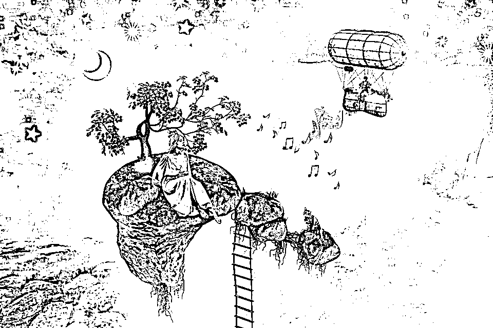

**巨蟹座的法则**

巨蟹座，是阴性的水元素星座，象征动物是螃蟹。螃蟹拥有坚硬的外壳，和柔软潮湿的内里。**巨蟹座的符号，就像螃蟹的两支钳子相互交握，也像母亲环抱婴儿的一对手臂。这些象征透露着保护、滋养的意涵。**

在前一个星座双子座，我们发展了理性认知；在巨蟹座，我们开始接触并纳入复杂的情感因素。这两个星座形成一对阴阳组合，彼此平衡互补。

**巨蟹座代表个体情感能力的发展。**在此个体发展对情绪的敏感度，以及一种以情感为基础的生命深度。巨蟹座善解人意，能够意识到自己和他人情绪的变化，并与人建立情感纽带。

**巨蟹座的守护星是月亮。**月亮与我们的情感、情绪关系密切，它代表着我们的潜意识、最深的安全感以及习惯的情绪反应模式。

现实中的月亮，也总容易勾起个人的情愫。“露从今夜白，月是故乡明”，无数与月亮有关的诗句，都饱含着情感，以及对亲人、友人、故乡的思念和追忆。

月亮的符号是一个弯弧形，转动 90 度，就得到一个碗状的容器。“容器”代表着阴性法则，在这里有一个环抱的周边，一个容纳和承载的环境。月亮有阴晴圆缺的变化，这也象征着阴性法则的变动不居，就像流水没有固定的形状，随着承载物的改变而改变。

**巨蟹座与子宫、母体、容器有关，带来呵护与关爱。**当个体处于被孕育、初生的阶段，需要被母体容纳、保护、滋养而成长。巨蟹座代表了母亲对自己孩子呵护备至的爱，并由此延伸出个体被容纳、包容的心理需求，希望感觉周围环境对自己存在的支持，感觉被周围的人所滋养。

**如果这些方面正常运作，就奠定了一个人去感受的基础，以及对情感认知的基础。**个体会在成长中，将这些爱的感觉内化为自爱的能力，并且去支持和滋养他人，将自己得到的温暖体验推及他人。

**巨蟹座所代表的照顾、滋养、保护的力量，与个人的生存需求息息相关。**

因此当这种需求被压抑、被扭曲、被摧残的时候，个体就像是失去“口粮”的婴儿，仿佛面临着**“生存危机”**。个体不能与“母体”连接的恐惧将直接由本能中心爆发，由此引发生气、失落、悲伤、痛苦等各种负面情绪。

巨蟹座也会因为太在乎一个人，而表现出情感上的贪婪和占有欲。**此时一个人要的或给予的爱可能令人窒息。**紧紧抓住的状态，就像螃蟹紧握的钳子，反而让关系陷入相互折磨的僵局，关系中的双方保持幼稚、无法成长而受困。建议纳入一些对宫摩羯座成熟的界限感来做平衡。

**巨蟹座与依赖有关，对被拒绝非常脆弱，情感容易受伤**。但实际上这个非常基本的需求并不容易满足，在现实中受到挫败后，以各种变形的形式来展现。

比如，将物质的积累和满足作为情感安全的替代品。个人可能把自己置于物质的包围中，其实是为了获得他真正需要的情感支持。而且对于这一点，个人往往没有意识到。

巨蟹座**需要情感上的安全感**，并且对此非常敏感。双子座搜集各种外在的资讯，而巨蟹座吸收各种各样的情感信息。

巨蟹座拥有一份对看不见摸不着的情感世界的强大直觉，可以直接读取当下环境，例如陈设、布置、颜色、灯光、质感等所包含的情感意义，也可以去感知人的表情、声音、肢体动作背后未被说出的情绪。

如果感觉到包容、温暖、舒适、自在、平静，他们就会安下心来，并敞开心胸。如果感觉受到威胁，他们就会像螃蟹一样缩回壳中，筑起厚厚的防御墙，表现得害羞、谨慎、孤僻、疏远，以避免受到伤害。

**巨蟹座与归属感有关，**感觉自己来自某个地方、是某事物的一部分。这让个体回到与自身的出身起源、基础和根基的接触中。

**巨蟹座尤其与来自于过去的影响有关，**童年、家庭（尤其是母亲）、成长环境、故土、历史。所以巨蟹座与“回忆”以及各种相关之物联系起来，喜欢收集、保存各种象征过去的物件，比如照片、纪念品、旧物古董。

一份值得回忆的过去，激起了爱、接纳、包容和保护的各种记忆，与情感的源泉相连，让人的心锚有了归属。所以说，巨蟹座具有一股来自底层的粘结力量，**能够把拥有相同归属感的人像“家人”一样地凝聚起来。**

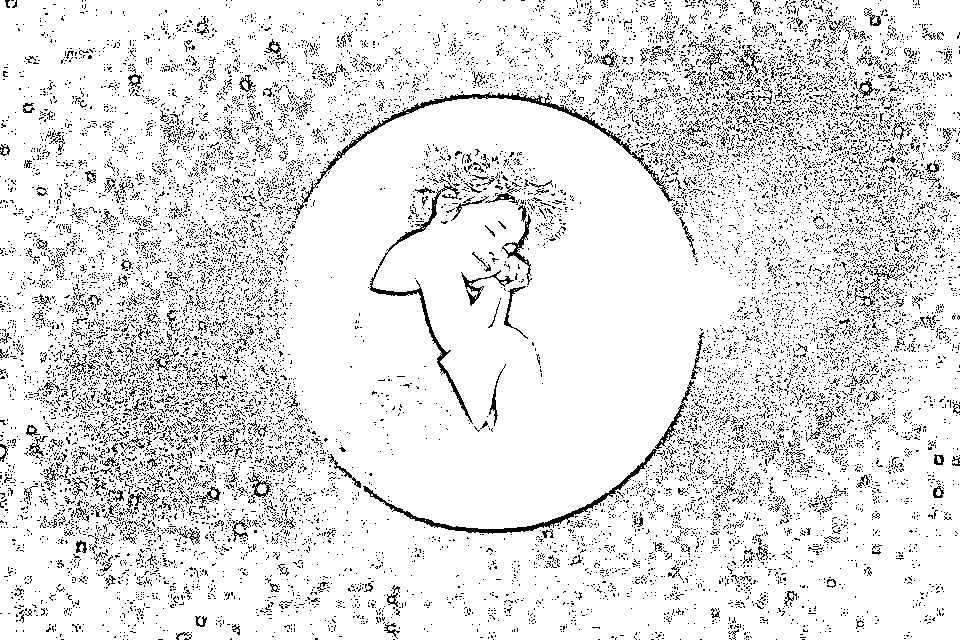

**金星在巨蟹座**

金星在巨蟹座，我们的筑巢本能被激发，希望拥有一个安全舒适的堡垒，去承载我们的私密时光。

此时可进行居家活动，例如去布置、整理、打扫居家环境，添置小家电、小摆设，使家变得更加温馨、舒服。也可以种植养护绿植，和家人一起进行园艺劳作，让家变得更加生机勃勃、绿意盎然。让疲惫的人渴望回家，全然地放松下来，享受一份安然自在。

金星在巨蟹座，美食可以安抚人的胃，也安慰人的心。**情绪与胃部反应息息相关，**当我们有情绪的时候，胃往往是紧张的。当人享受美食的时候，身体容易放松下来。

另外，烹饪过程本身，也可以有治愈的作用。在制作美食的烟火气中，放下头脑中纷乱的思绪；在创造性的动手活动中，让焦虑或过于执着的情绪，得以纾解和平静。

**金星在巨蟹座，适合在惬意安适的环境中，与家人或如家人一般的朋友，聚会畅聊。让人感觉到一种归属感带来的安全感与拥有感。**

这里有倾诉者，也有倾听者，重要的不仅仅是字面传达的意思，而是语句中蕴含的无形情绪和情感，在这画面的背景中编织流淌，把人与人连接起来。

金星在巨蟹座，我们欣赏的艺术、音乐有点**怀旧**，或饱含深情，勾起我们往日的回忆。当我们与创作者一起涉入同一起源的河流中，会感到被懂得和情感的共鸣。

就像卡本特乐队的《yesterday once more（昨日重现）》中唱到：**随着岁月的流逝，那些旧旋律对我来说仍然如此动听；那些美好的记忆清晰地涌向我，就像以前一样，依然让我为之动容。**

他们的歌滋养了全世界，可惜妹妹 Karen 因为神经性厌食症而英年早逝（一种对自我滋养的强行切割）。她的金星在水瓶座，守护星天王星位于巨蟹座 0°，并处于即将顺行的停滞期。

| 卡朋特兄妹

金星在巨蟹座，个人可能以各种形式**重启、强化与家/家人的议题**。我们也许睹物思人，或与旧人旧事相遇，回忆往事，故地重游，开启一段寻根之旅。

这个过程可能兼具甜蜜与苦涩，滋养与伤痛。我们渴望被滋养的快乐，也需要体会如何滋养他人。如果我们与原生家庭缺乏这样的经验，那么就会在亲密关系中投射这些未发展成熟的需求，这会侵蚀和拖累一段关系。

金星在巨蟹座，**与孩子有关的生育、抚养、照料、教育等议题**被放大。

金星在巨蟹座的影星安吉丽娜·朱莉，有六个孩子，因为担心与其父不和谐的关系会严重影响她的情绪，进而影响她年幼的养子，因此向法院申请，去除了父亲的姓氏。她与皮特的婚姻破裂，孩子的问题也成为导火线。这里显示着她自己原生家庭的议题，以及她对孩子强烈的保护欲。

影星梅丽尔·斯特里普，太阳、金星都在巨蟹座，据说她不喜欢四处做宣传活动，觉得不能呆在家里是件苦差事。她爱家且非常具有母性，不希望与家人分离太久。

影迷对她的评价是：带着微微慈祥的笑容，自然亲切，好像就生活在我们身边。她主演的《克莱默夫妇》、《苏菲的选择》、《亲情无价》、《虐童疑云》等都与孩子、家庭议题相连。

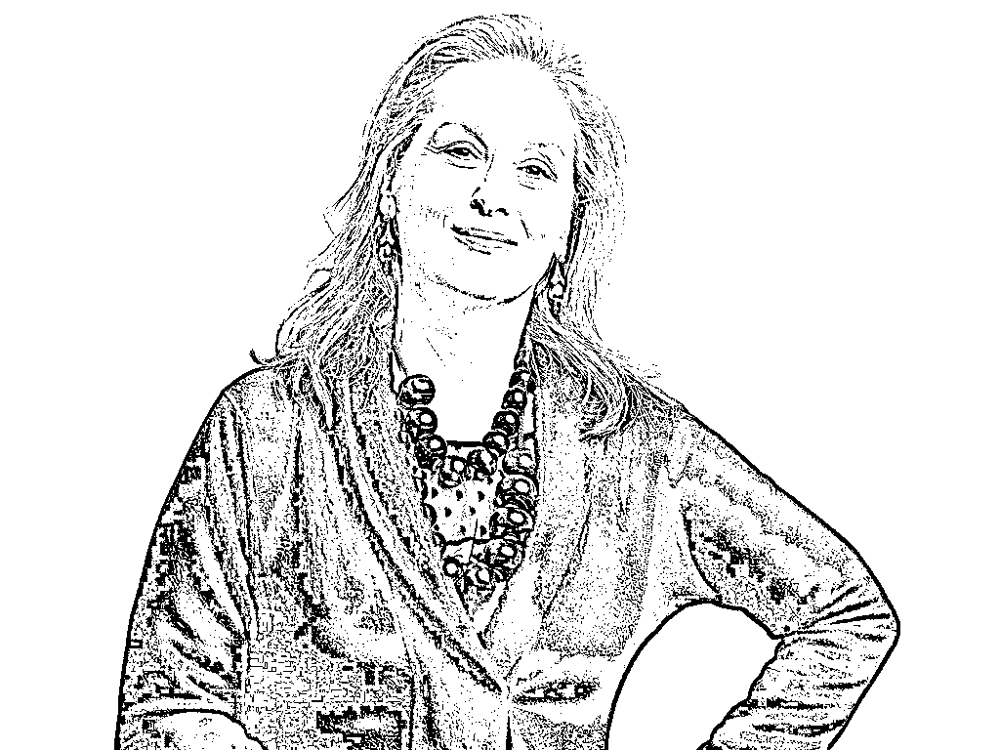

| 梅丽尔·斯特里普

金星在巨蟹座，我们也许遇到特别持家、善于养育孩子的人，也可能遇到因为悉心照顾家庭而被搞得精疲力竭的人。在这些领域，他们承担的责任往往让他们缺乏轻松愉快的心境。

在爱中，求同存异是一门艺术，看到自己情感和体能的边界，并且也看到他人的边界，是否就能在到达临界点之前停下来？**无论何时都不要忘记好好滋养自己、照料自己，保有自己的一部分自由和独立。**

金星在巨蟹座，有利于在人际关系中，提升情绪敏感度，对他人更加**细腻、体贴、关怀**，并自然回应他人的感受，这会增加一个人的社交魅力，并把团体凝聚起来。

巨蟹座能量的正常发挥，让人与人之间流动着柔软、体恤与谅解。在每一个群体中，都需要有人支持他人，滋养他人，照顾有需要的人，以及安抚不安的人。如果没有巨蟹座的显现，一切都将是没有温度的，纯粹的功能性和冷漠的理性。

**金星在巨蟹座，让人更重视情感的满足，**从而无法忽视一些由来已久的事实。个人可能突然感觉沮丧、空虚、索然无味，即使身处家人、朋友中间。

如果你感觉自己长期受苦，还坚持活在一个难以忍受的状况中，是时候回想一下你给了周遭的人什么，他们给了你什么，看看能否弥合这份失去连接的感觉，或者需要寻找新的满足感。

金星在巨蟹座，人们可能感受到**情绪波动**，其强度视个人自身所具有的安全感的多寡而变化。一件小事可能牵扯起不安的回忆，个人可能看到自己顽固、执着、掌控性和占有欲的一面。

平时强硬的人，可以试着柔软下来，看到自己的情感需求，去滋养自己，并对他人更有同情心；平时本就纤细易感的人，可能会更加多愁善感、起伏不定，因为此时情绪渗透一切。

**情绪本身并不是问题**，它就像我们的一面镜子，反映着内在的震撼力量。外在表现连接着内在失衡，而这一切又与过去的某个经验相连。

当我们经历某种情绪时，我们感应到内在某种扰动/振动；然后感受到情绪，以及随之而来的任何想法或身体上的感觉；最后我们选择让情绪穿越自己，然后继续前行。

一旦我们完整地经验了情绪，便可以从该体验中走出来，不会带来任何问题。但如果情绪体验被中断，变得不完整，升起的情绪能量没有被认识、接纳、释放和平衡，那么被卡住的情绪才会成为问题。

被卡住的情绪让一个人对某些话语反应过度，误解某人的行为，做出片面的判断，容易在无形中破坏一段关系。

如果你是一个情绪敏感者，那么此时你更容易受周围人事的影响。可以留意自己在不同环境下的感受，以及和不同的人或群体在一起时的感受，识别出那些经常让自己感到沮丧、压抑、愤怒、耗竭的人或群体，尽可能和其保持距离。

孩子、父母、伴侣、挚友这些建立在深层情感联结之上的人，我们不能完全从中抽离，那么确保自己的生活有“中场休息时间”，去做一些能让自己放松、愉悦的事，或者一些纯体力的事，以便让自己稳定下来、恢复能量。

金星在巨蟹座，人与人的交往中，在表达方式上往往迂回、朦胧，像是在绕圈子似的释放隐约的信息，希望对方接收到这些暗示后，有所回应或行动。

金星在巨蟹座，在感情方面**敏感而羞涩**，害怕被拒绝。所以此时人们喜欢更为私密的交流，一对一的，或小范围的，在一个能够表达关爱的场合，这样更能自在地谈论内心的感觉。

如果某些人让你感到沮丧、紧张或愤怒，不妨找他们聊一聊。有时候，仅仅需要冷静、清晰地用简单几句话，描述客观事实，你的感受，以及你的需求，或许就可以看到不同的可能性。

金星在巨蟹座，可以通过各种与**滋养、养育、照料、情感、家、家园、历史有关的领域**获得收入，例如成为：

幼儿园老师、护士、心理咨询师、心灵关怀者、社工、育儿师、营养师、室内设计师、看护者、厨师、甜点师、摄影师、园艺师、艺术工作者、写作者等。

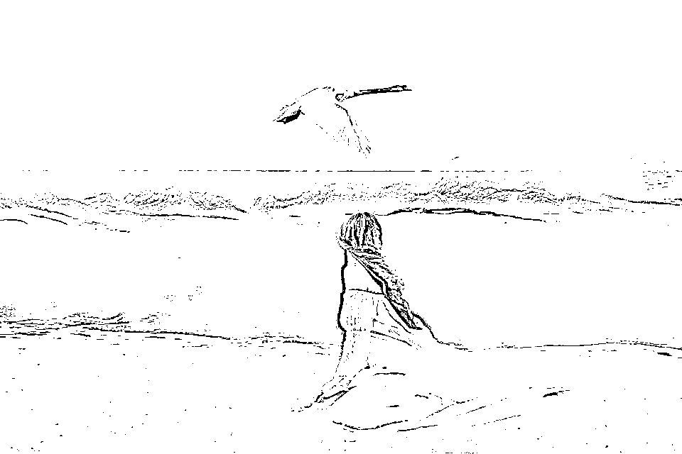

**金星在巨蟹座的爱情**

**金星在巨蟹座，带来滋养、体贴、包容的爱。**建立关系的方式并非直来直去，而是带着**迂回委婉**，通过巧妙的试探和操作，创造某种氛围，传递非语言的信息，最终得到他人的回应和确认。

恋爱可能是老派而温馨的，不需要太多外在的浮华，一起窝在家里看看怀旧文艺电影，做做治愈系的餐食，让温情慢慢发酵。

双方需要时间，去获得进一步的温暖感、保障感与安全感。一旦确认对方是自己喜欢的人，便会极力保护。重视彼此的家、家庭，将对象带给家人认识，意味着认同，也希望家人能接纳。

对你好的方式是默默留心你的喜好和愿望，为你奉献心力，支持你去完成。在礼物中倾注感情和想象力，以及令人动情的寓意。

喜欢孩子，向往一家人其乐融融的温馨画面。也在私下透露出孩子气的一面，希望获得对方无条件的爱与包容，这对他们来说相当减压和安慰。

关系的双方既仿佛是对方的父母，又仿佛是对方的孩子。**在关系中，希望被呵护，被照料，有粘人的倾向。**好厨艺是非常加分的。

Ta 也许是贤惠持家的女子或情商在线的居家暖男，**会把家布置得很温馨舒适**。重视情感交流和家庭活动，可通过诸如园艺、露营、家庭聚会等活动，增进感情和凝聚力。

**金星在巨蟹座的开运色：自然的浅色，例如白色、银色、珍珠色、青草绿。**

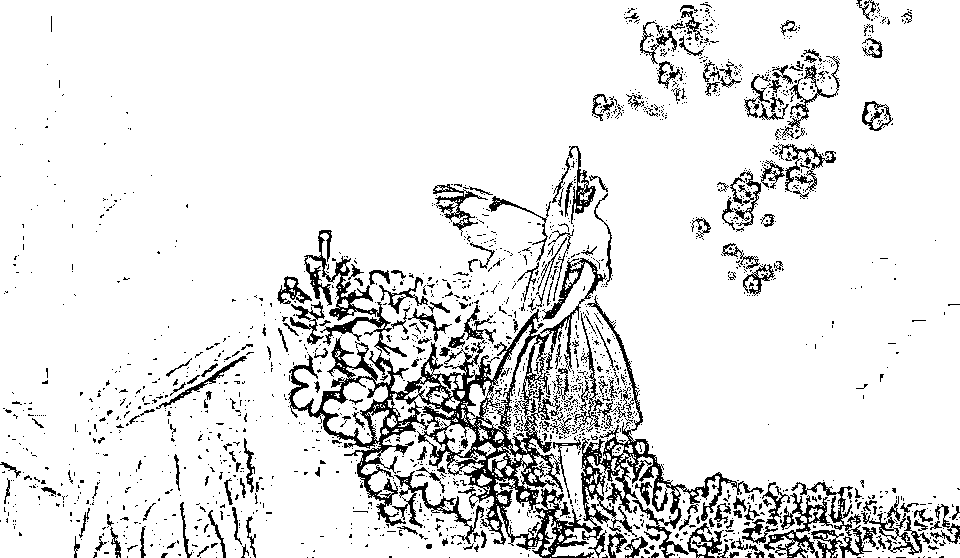

**金星在巨蟹座的阴影**

**当被情绪淹没的时候，变得忧郁、自怜、情绪化、过度敏感、不切实际。**

当不愉快的往事或痛苦的记忆被勾起，如果我们能够不去评判，也不去逃避情绪，而是在完整经历这一过程后，看到自己内在恐惧和愤怒的源头，这样我们就可以更加客观和变得成熟，而非仅仅是感情用事。

如果个人存在对家人、爱人的长期奉献付出，可能导致身心疲惫，而容易情绪不稳，失去生活的热忱和活力，甚至成为悲苦抱怨的受害者角色，好像生活就是日复一日的例行公事和无尽的责任。

需要看到自己强大的保护欲望以及坚持的背后，是否还有恐惧和占有欲，适时把关注点收回来一点，**去看到他人的界限**，相信他人的能力，**也看到自己未被满足的需求**，重新整顿生活，找回失落的信心。

有时候会因为难以放下过去，怀抱伤痛，而错过新的机会。在关系中，**过度自我保护**，也会阻碍亲密关系的发展。

内在有一个情绪迷宫，有时候显得**优柔寡断**，且**状态多变**，常常出现新想法，却很少付诸实行，情绪容易摆荡在愉快与沮丧之间。运动和阳光会促进内啡肽的释放，提升情绪，让我们保持敏感细腻的同时，有充足的能量去维持稳定。

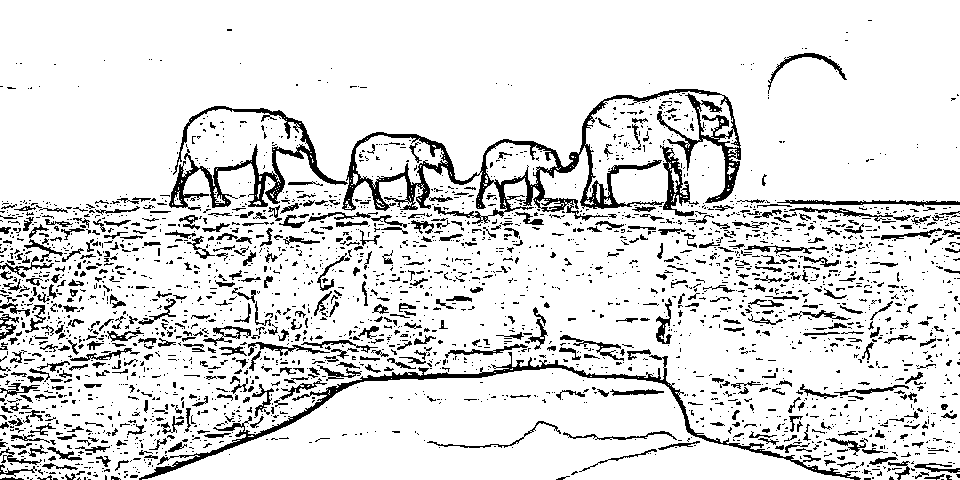

**金星在巨蟹座的重要相位**

**金星在巨蟹座期间与其他天象的结合以及相位（容许度 1°）：**

**★ **7 月 24-25 日  金星四分木星****

**重点影响人群：有重要行星/四轴/月亮交点落在巨蟹座、白羊座、摩羯座、天秤座 1°-15°。**

这天象放大关照的能量，带来温暖、大方、热情、慷慨的关怀与招待。适时为家人、朋友送上欢乐、感恩、祝福，以及小礼物。可以犒劳自己，但谨防沉溺于享乐当中，过度消费。

渴望多金又有品位的爱情。“喜欢是放肆，而爱是克制。”过度急迫的关心和大量快速的满足，可能带来浪费和不珍惜，反而让双方陷于疲惫的消耗中，而远离爱的初衷。

个人可能情绪不稳，需要看到自己的情感需求，并用健康的方式，宣泄自己的情绪压力。

**★ **7 月 31-8 月 1 日 金星四分凯龙星****

**重点影响人群：有重要行星/四轴/月亮交点落在巨蟹座、白羊座、摩羯座、天秤座 9°-23°。**

这天象挑动个体关于滋养的伤痛与遗憾。这时候个人可能比较容易有情绪，也许一件小事让人感觉被打击，挫败、受伤，带出自我存在感、自信心、自我安全感的议题。伤痛引领个人去提问和追寻。

在自己的生活中找到一份归属感，无论那是一个实体的家，还是某一个人，或一座城市，或一段回忆。这是一份深厚的感觉，虽然仿佛看不见摸不着，但又极具感染力，连接到这份存在的根基，我们就可以从眼前的创伤中解脱出来。

★ **8 月 2 日 金星六分天王星；8 月 1-4 日，金星六分火星；8 月 1-3 日，火星合相天王星**

**重点影响人群：有重要行星/四轴/月亮交点落在巨蟹座、金牛座、摩羯座、天蝎座 13°-23°；处女座、双鱼座 15°-21°。**

这是一组三个行星的联合天象。天王星为金星和火星，都带来加速、更新与自由的色彩。

这带来关系中信息交流的活络，人与人之间更愿意相互理解，打破原有壁垒，接触新的领域，让新的规划形成具体的提案，促进新计划的实施，并带有滋养、照料、呵护的特质。

在感情关系中强调个体的自由、独立、平等，用明快、冷静而有智慧的方式去做不一样的表达，鼓励双方坦露真实的自我，让关系得到更新、改善和突破。

这也有利于生活中创造力的发挥，例如制作一道新菜式，引入一件新家具/陈设。

★ **8 月 7-8 日 金星三分海王星**

**重点影响人群：有重要行星/四轴/月亮交点落在巨蟹座、双鱼座、天蝎座 20°-29°；摩羯座、处女座、金牛座 22°-28°。**

这是一对非常敏感的星座行星组合，为人们带来更多想象力、同理心、直觉、慈善。这是一个缓和关系，带来更多理解的机会，也是去治愈自己内在情感缺失的机会，去学习包容和谅解，看到更大的画面，从而让内在的力量重新生长。

在居家生活或创造性的工作中，带来浪漫、创意和灵感，为生活、工作增加一抹美丽的色彩，利于提高自我认同，并欣赏自己的独特特质，扩展爱的力量。

此时，个人与自己的潜意识有着强力的连结，感觉纤细，梦境可能变得丰富，或给现实问题以提示。

★ **8 月 8-9 日 金星对分冥王星**

**重点影响人群：有重要行星/四轴/月亮交点落在巨蟹座、摩羯座、天秤座、白羊座 20°-29°；金牛座、双鱼座、天蝎座、处女座 24°-29°。**

这个天象带来一份焦灼和强烈的张力，让人的情绪产生波动。可能遇到不易相处的人。也可能在关系中产生质疑、嫉妒、不满，并且浮现深层的恐惧和不安。

这令人执着于安全感和掌控感，想要去深挖和确认。可能反而让关系更加紧绷，也可能发现更深层次的真相。这是一次试炼的机会，让人看到自己的疑惑，直面自己的恐惧。如果能让旧有的惯性模式松脱，则可在很大程度上获得自我的净化，穿越幽暗，重回光明之中。

在这过程中，适时地抽身，让思绪跳脱一下，分化焦点，能让自己有机会修整，并看到解答的契机。

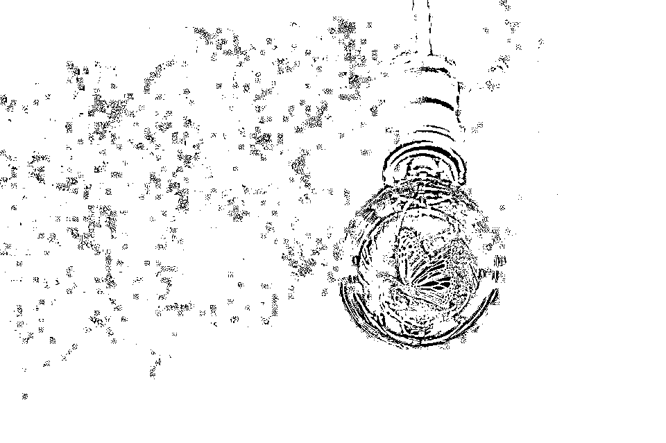

**结语**

我们的生命中有一条源远流长的大河，而生活的现实一次次地将我们带离、遗忘。但无论人生风风雨雨、跌宕起伏，甚至感觉彷徨无依，我们始终拥有这条河。

当我们迷失，当生活变得呆板无趣，孤寂像透明的水一般蔓延开来，直到没过头顶，我们才意识到一些事实无法逃避，这河流永远贯穿着我们的生命。

在水中，我们得以从感性的角度去触摸每一个瞬间，生命中的热爱、悲伤、遗憾与怀念在记忆中定格为一幅幅照片，承载着我们的私密，我们的脆弱，我们的柔软。那些经验被赋予情感的色彩，私人的烙印，有时候，失落、孤寂、伤感也有一种值得品味的美。

情感的连接带给我们滋养、力量、喜悦，也带给我们困惑、倦怠、悲伤。一旦将情感因素纳入，生命便不再只是平铺直述，变得生动鲜活，让人牵挂，变得有味道，有故事。

就像赵英俊创作的歌曲《守候》，满含着诚挚的深情，令人动容：

**“还要我等多久，见到你的笑容；你在哪里追求，是否已经拥有。**

**你离开的出口，变成我的缺口；只有你的迁就，能解我的忧愁。**

**总有人要远走，总来不及挽留；在分岔的路口，在下雨的时候。**

**总有人要厮守，还剪不断离愁；别和往事战斗，我们不是对手。”**

人生总要继续前行，那些舍得舍不得的人和事总会一一远去，以至再也无法遇见。时光不会倒流，但我们还有回忆，静静地躺在心底，等待某一刻的触动，将它们打捞。

**版权声明：**原创文章由作者授权首发于若道平台，欢迎转发，反对抄袭。友号转载请申请白名单。

**END**

**MaryChan 玛丽**

人本主义占星师、花精咨询师

于成都创办工作室，从事咨询、组织相关活动 8 年

咨询预约号：MaryChen336

微信公众号：ZhanXing336

长按打赏

**这里有一个直播等你来看哦**

<mpvideosnap class="js_uneditable custom_select_card channels_live_iframe" data-pluginname="videosnap" data-headimgurl="https://wx.qlogo.cn/finderhead/PiajxSqBRaEJYnVsqWfEX9qA0sI6hNVKsDfyzfPZ92WZMZyBpZWU5NA/0" data-username="v2_060000231003b20faec8c4e68a1ec2d4ca07e434b07755bbf47e7053a3059defd2c9d6c68a20@finder" data-nickname="若道" data-desc="将在 07 月 19 日 20:00 直播" data-intro="大卫.瑞雷占星沙龙-好莱坞明星的“御用占星师”是啥样的？" data-noticeid="finderlivenotice-v2_060000231003b20faec8c4e68a1ec2d4ca07e434b07755bbf47e7053a3059defd2c9d6c68a20@finder-1657805638914521-1066693954" data-type="live"></mpvideosnap>

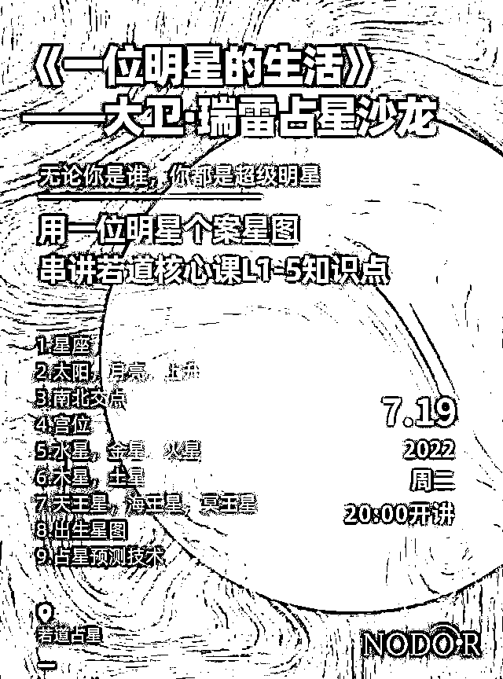

**20 位来自世界各地的占星师****带来 19 场沙龙——新世界的觉醒****详情可点击下图**

**学习占星学****点击下图了解课程详情**

**微信又双叒叕改版啦，不想错过若道君的推送？**

**就把若道设为星标吧！**

**▼**

**喜欢就点一下“在看”吧！**

********报名直达入口********

# 若道周运 7.18-7.24 丨狮子月即将开启，我们要闯哪些关？（内含 12 星座运势）

> 原文：[`mp.weixin.qq.com/s?__biz=MzA5NjA0NTAxNg==&mid=2651480752&idx=1&sn=1cde92c519a22d92872ad2a1479d9199&chksm=8b48d007bc3f5911a8e9518a3bfedf25cd27724ff2f488d0dc6f6465bdcdba4559133d1e2b97&scene=126&sessionid=1692737786#rd`](http://mp.weixin.qq.com/s?__biz=MzA5NjA0NTAxNg==&mid=2651480752&idx=1&sn=1cde92c519a22d92872ad2a1479d9199&chksm=8b48d007bc3f5911a8e9518a3bfedf25cd27724ff2f488d0dc6f6465bdcdba4559133d1e2b97&scene=126&sessionid=1692737786#rd)

******☆ ****后台回复“今日”，给你一句生命态度******

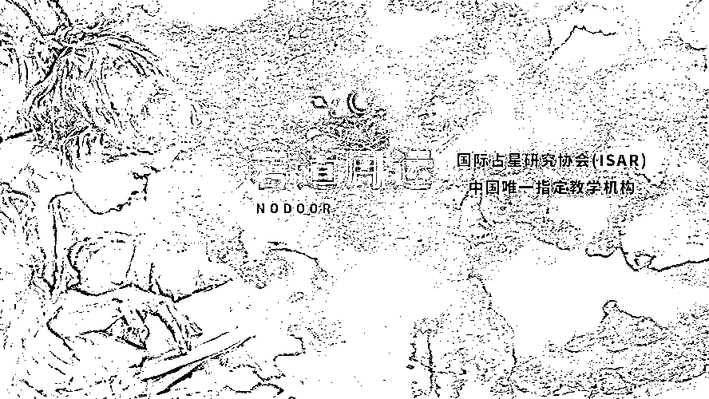

作者/朵三三三 ISAR 认证占星师
编辑/翀子 封面/书君 图片/网络本周是巨蟹月和狮子月衔接的一周，太阳、水星、金星全部换座，天空中的能量发生显著变化，冥王星也带来不小的挑战。12 星座如何度过本周？让我们来看文章吧！（如果着急看 12 星座运势，不妨先拉到最后哦）**整体氛围**

**本周是巨蟹月的尾巴，狮子月的开端。**在这样一个承前启后的过渡期，**太阳、水星、金星三颗重要的行星全部换座**，很多事情的节奏和运作模式正在悄然发生变化。

本周天象还是有诸多挑战之处的，最难的就是前面几天，冥王星接连发力。我们沉入沼泽，奋力挣扎，想要杀出一条血路。此时，唯有懂得放下的人能够全身而退，放弃对牢笼的执着，才能拥有整个天空。

本周重要天象

*   **金星进入巨蟹座**

*   **水星对分冥王星**

*   **水星进入狮子座**

*   **太阳对分冥王星**

*   **太阳进入狮子座**

**第一关：冥王星的试炼**

**首先，我们要经历两次雷电天气：周一的水冥对分相和周三的日冥对分相。**而**能量达到高峰的时间点是周四前后**，行进月亮加入日冥格局，形成日月冥的 T 三角。

它可能会引发一些实质性的事件，发生在启动星座的 T 三角也意味着我们会采取行动来改变局面。**我们可能会有较为快速、激烈的反应，因为缺乏耐性而做出一些决定，或用迅速切断、离开的方式来表明立场，或彰显自我意志。**

我们的愤怒不会太快消失，带给我们的记忆和影响也不会轻易改变。因为冥王星总是具有强烈渗透力的，伤口不大，但很深。

与冥王星有关的一切总是困难的，带着一些我们千方百计想要逃离的恐惧和阴影。但冥王星的行进又是那么缓慢，所以它给我们制造的困境也如同老生常谈，非常熟悉。即便是戴了新面具出现，本质上也依然换汤不换药。

这两次冥王星相位的位置太接近了，所以它们很可能是同一件事情的两种表现。

对分相往往是人际关系的对立，**我们可能在这段时间经历自我意志的被挑衅，以及话语上的针锋相对。**我们或许觉得委屈，在语言表达中释放这些情绪和怨念，成为攻击他人的武器，也因此受到伤害。

我们更可能成为对分相中的太阳和水星，因为我们总是很容易将自己代入到弱势角色中，而把困难的冥王星能量投射给他人。此时任何人都可能来扮演这颗冥王星，成为我们眼中的暗黑之神。

而此时的关系中，也很容易被触发操纵和权力的争夺，以及信任的议题。**关系本身也会带着攻击性和破坏力，造成一些旧有模式的毁灭和结束。如此，才能有重生和革新。**

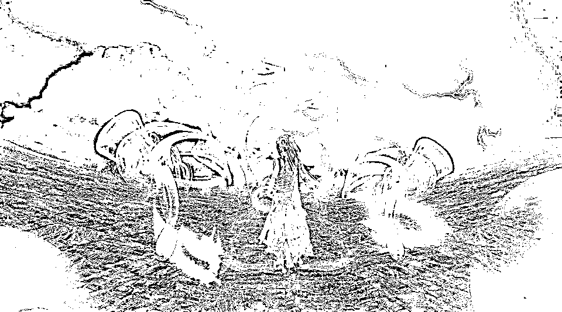

跷跷板永远不会只有一端。它既是带着浓厚的人性情感，向强权和秩序发起的挑战，也是我们能够完全感受并看见这股强大力量的时刻：

**人类是如何拥有影响和操纵他人可能的？我们手中是否握着他人的软肋，并因此让他人感到恐惧，甚至被威胁？我们是否过度的使用了手中的权力，摆布他人于股掌之中？而我们是否让渡了太多自己的权力，手捧利刃献予他人？**

“是我赋予了你伤害我的权力”，一切事物的本质皆是如此。黑暗与光明相伴相生，如今我们在经历的所有困苦，由眼前深渊所生的种种磨难，与我们实乃同根相生的一体。

这是我们要走的长路，是我们要熬过的长夜，是我们要渡的劫。对面的黑色，映在我们眼中成为黑夜，它是我们的一部分。

黑暗隐藏在我们每个人意识的阴影面中，**学会与自身的黑暗能量相处，就是学会与外部的黑暗事件相处。与人性中与生俱来的贪婪、罪恶、伤害与暴力相处，亦是人类生生不息轮回中的重要课题。**

我们或许从未反思成功过，而认识它们，真正的看见它们，会让你更加强大。

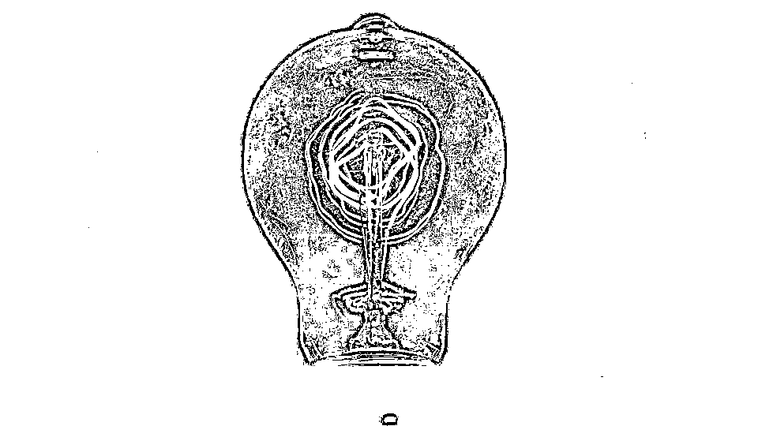

**第二关：固定星座的战役**

**周二和周六，水星与太阳相继进入狮子座。**

火星在 7 月初换座金牛座之后，激发了始终在固定星座后台运作的土天四分相（水瓶座土星与金牛座天王星），以及本就在金牛座/天蝎座的南北交点。

而本周，**太阳、水星进入狮子座**，又为固定星座增添了两员猛将。

**至此，天空中固定星座的力量占据二分之一，**固定星座太多的时候，意味着大家都容易固执，坚持自我，互不退让。而这些配置组合起来，**也指向较为激烈、动荡，难以预料的状态，**所以接下来的狮子月中，纷争、冲突肯定是少不了的。

**而主要的冲突地带，就集中在狮子座的太阳、水星与金牛座的火星、天王星之间，**一个要彰显个人决断力，霸道的说什么是什么，另一个冥顽不化，不撞南墙不回头。

一方为了尊严和面子，一方为了利益和自保，加上固定星座就是持续不断的力量，谁都不会轻易松口，就像一头雄狮和一头公牛的对抗，这种角力的伤害可想而知。谁胜谁负难以预料，最有可能的是两败俱伤。

所以从本周开始，我们可以有意识的去觉察，这样的较劲和争夺是否发生在我们与他人之间，或是我们内心。**若我们能够保持一定的弹性，放过自己也放过他人，就能减少客观现实的伤害和心理上的煎熬。**说白了就是不要死磕，始终留有余地，对彼此都好。

但从正面作用来说，太阳在狮子座是进入到自己最有力的位置。即便它的代价是未来一个月的雷暴天气，但对于太阳这颗行星来说，这个地带依然是积极正向的。

太阳是我们的自我认同和价值感，也是方向和目标。**所以在周末太阳换座之后，我们对待生活的态度也会更加热情自信，更有精力享受生活。**

实际上，经历了前几天冥王星系列的试炼，我们的斗志已经燃起。即便你之前一直躺平，周末之后，也一定开始摩拳擦掌，跃跃欲试了。或者过去你觉得迷茫困惑，那么这个天象能帮助你越来越清晰的看见，未来要去的地方。

**有时，即便遇见暴风雨，我们也会依然决定启航。**

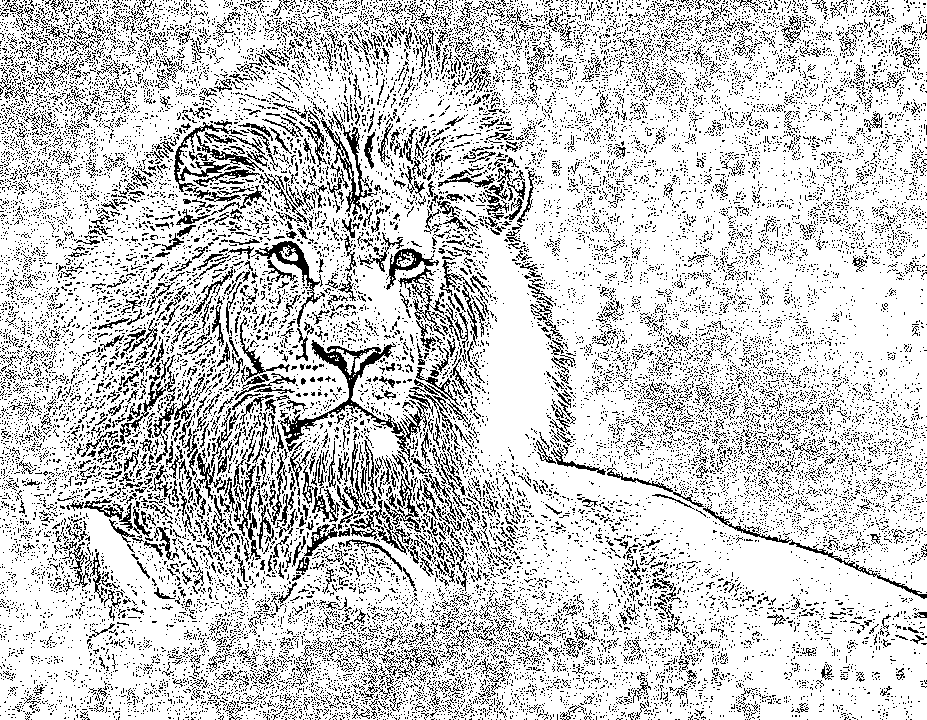

**彩蛋：巨蟹座金星的温柔**

本周十分利好的星象就是，金星在周一进入了巨蟹座，并且开始靠近与木星的四分相位置。

它就像始终温柔的一抹底色，无论我们经历怎样的腥风血雨，一回到家里，就能够获得无条件的宠爱。我们的内心深处对归属感和安全感的需求增加，也会更加重视家庭为我们带来的情绪价值。

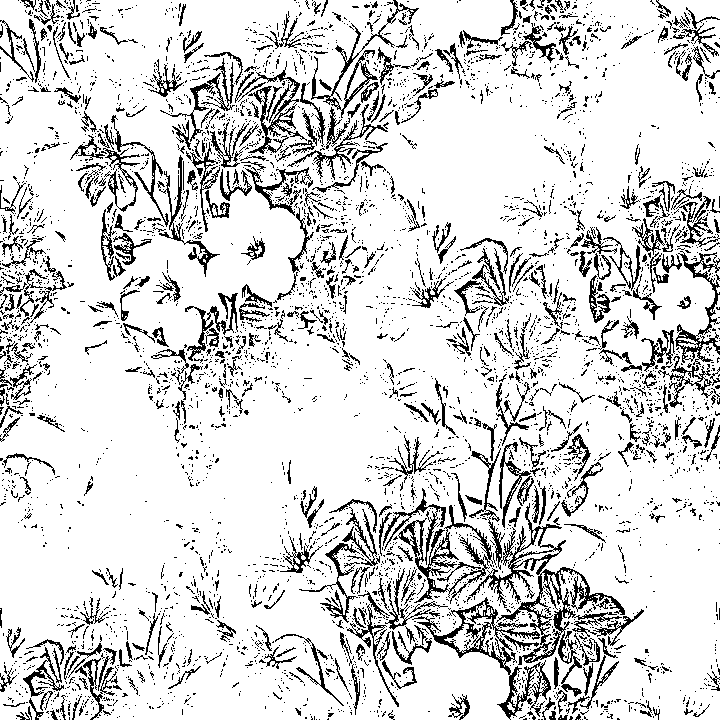

**12 星座一周运势**

**（重点参考上升星座，其次参考太阳星座）**

***白羊座***

**本周大部分时间你都处在情绪较为紧绷的状态，需要注意人际关系的问题，**尤其是与权威人士、长辈、上级之间。

周四前后，或许会有一些旧的恩怨突然爆发。在职场中容易感到压抑、限制的氛围，在家庭中情感需求增加，但不一定能说出口，或许有失落或不平衡的感受。

周末前后，低气压逐渐散去，想要玩乐、呼朋唤友的心情增加，单身的白羊座此时会散发出想要恋爱的信号，而有伴侣的白羊座，恋情也会升温。

***金牛座***

周一到周五，需要注意言语上的冲突矛盾，以及头脑心智的紧张焦虑。**此时容易有较为极端的言辞，或对某些事抱有偏激的认知。**

你可能遇见跟你三观差异很大，又很强势的人，发生对抗，也或许你在跟自己的某个念头较劲，过往纠缠着你的心魔卷土重来。周四前后，可能出现失眠或休息不好的情况。

周末前后，能够跟亲近的朋友、家人之间互动愉快。

***双子座***

对于**金钱、财务**方面的焦虑升级，这不是最近才发生的情况，只是在本周天象的引动下，它又重新凸显出来。

目前的消费情况，理财、投资以及与他人共同财产的分配方式，可能让你感到不满意、不公平，或者很无奈。周四前后，你有可能考虑新的财务规划，或与他人新的合作方式。

周末前后，你对于金钱方面的担忧有所缓解，但也要注意不要因为过度乐观而超前消费。

***巨蟹座***

你是受到本周冥王星系列相位影响最大的人群之一，**伴侣关系、合作关系及情感方面，**过往若存在着屡屡困扰你的疑难杂症，很可能在本周再次发作。

这些深层次的困难和阴影一直影响着你生活的方方面面，本周对于你来说，是一个很好的洞察并着手解决它们的机会，尽管在这个过程中，你可能非常情绪化。

周末前后，会有一些事业上的有利进展或好消息传来。

***狮子座***

本周你很容易因为**工作或生活上的琐事**不顺心，感觉到无名之火。不一定有具体的事件发生，外界看你觉得依然如常，但你心里时常掀起惊涛骇浪，或者在潜意识中消极抵抗日常的一切。

这背后其实是多年以来的自我压抑，周四前后，你可能突然明白自己内心的负面情绪从何而来。也有部分狮子座会经历身体上的病痛，本周容易疲惫，注意身体健康。

最近你很享受独处的时光，尤其是本周末，**多给自己一些休息，**或冥想静心、或读书的时间。

***处女座***

本周你需要关注的领域也是**人际关系**，但更多的是与你所在团体、环境或人际圈相关的，一对多的关系。

你可能会觉得自己过度付出、照顾他人，而压抑限制了本性，无法自在做自己，也可能感觉到自己的友善并没有获得同等的回报，尤其在金钱利益方面。你或许有很强烈的念头，要为自己多考虑一些，也会付诸行动做出改变。

周末前后，或许会发生跟朋友之间的金钱往来，建议理智做决定，不要过度慷慨。

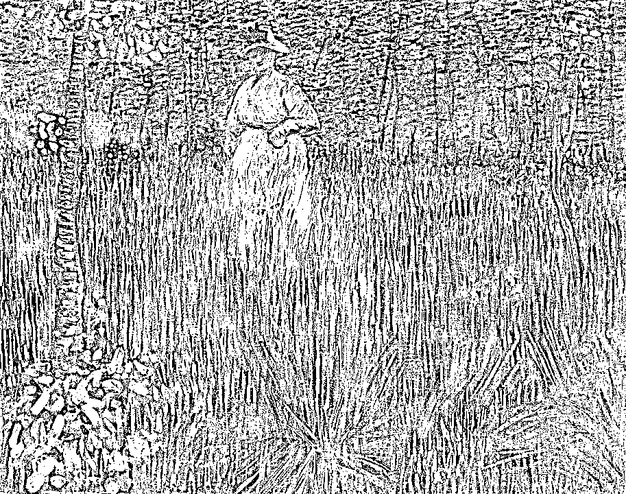

***天秤座***

周一到周五，你事业、人际、家庭方面可能经历**短暂的失衡感**，需要你努力**找回重心**。

或许是在职场上受到不公平的对待，也可能是由于亲情方面的责任和需求，跟工作发生了冲突，也或许是重要的人际关系中出现了控制与反控制的课题。

周末前后，人际关系和情感方面再度回暖，事业上有可能通过人脉获得不错的机遇，正在求职、打算跳槽、换工作的天秤座也有望如愿。

***天蝎座***

你或许要在本周面对一些“思维陷阱”，例如有些人似乎刻意要给你洗脑，或者故意发表一些言论，引起你的怒火。**你对于语言、讯息会变得格外敏锐，**不想要被他人影响，但又渴望拥有对他人的影响力或控制权。

跳脱这一切的方式或许很简单，就是回归日常生活的秩序，**把一切复杂变简单，**离开脑中世界，到现实里来。

当你被头脑中的辩论场搅的不得安宁时，可以对自己这么说：管它呢！不需要太久，临近周末时，你就又能恢复平和心境，重新享受思考的乐趣了。

***射手座***

**本周天象给你带来的影响是财务收入方面的。**周一到周五，你可能都会沉浸在金钱、资源相关的危机感中，在物质现实和享受生活的需求之间很难平衡。有子女的射手座，或许还会把对子女的养育问题一并考虑进来。

在这个行运的激发下，你可能会做出一些冲动的投机行为，**需谨慎做决定。**

接下来这段时间，射手座们的偏财运不错，建议选取温和的长线投资方式来获利。

***摩羯座***

自从上周的摩羯座满月之后，你就一直置身风浪之中，很难有真正的安宁感。这是因为**你在经历一个集中的关系调整期，**在这个过程中，你可能会被他人认为冷漠、过于现实，或者太有控制欲、咄咄逼人等，也因此告别或失去了一些关系。

但失去只是一种说法，你也可以认为，你们只是换了一种相处方式而已。

在这个过程中，家庭会成为你不可替代的避风港。**建议在情绪满溢时，多跟家人相处，或呆在家中，随心所欲做自己喜欢的事。**

***水瓶座***

过去很长一段时间里，你承受了很多内在的压力，或许你始终在寻找出路，来对抗宽解着内心的一些执念和恐惧，甚至是绝望。

**本周你的潜意识格外活跃，**这些负面感受也都会一一冒泡，你可能会发现，已经无法再用温良静好的生活来化解这些积压已久的热望。那就试着说出它们吧：无所顾忌的倾诉，或者书写。通过交谈与记录，你都可以尽情释放内心的野马或恶魔。

***双鱼座***

最近这几年你都容易遇见很难对付的人，对方可能更加年长、有资源、有权势，非要硬刚的话，简直就是鸡蛋碰石头。你或许妥协过很多次，但本周你不会再选择这样做，尤其是涉及到跟对方金钱、利害关系交涉的时候，**你会果断维护自己的权益。**

因为你应该已经发现，自己的换位思考并不能得到对方同等的回报。

周末前后，或许有一笔款项入账。

**版权声明**：原创文章由作者授权首发于若道平台发布，欢迎转发，反对抄袭。友号转载请申请白名单。

**END**

****朵三三三****

ISAR 认证占星师

全职占星师/塔罗师/国家三级心理咨询师 

人大文学学士/德国慕尼黑大学文学硕士

**微博/微信公众号**：朵三三三

长按打赏

**20 位来自世界各地的占星师****带来 19 场沙龙——新世界的觉醒****详情可点击下图**

**学习占星学****点击下图了解课程详情**

**微信又双叒叕改版啦，不想错过若道君的推送？**

**就把若道设为星标吧！**

**▼**

**喜欢就点一下“在看”吧！**

********报名直达入口********

# 雷蒙德·梅里曼金融占星周运 | 即将进入今年最不确定的阶段

> 原文：[`mp.weixin.qq.com/s?__biz=MzA5NjA0NTAxNg==&mid=2651480752&idx=2&sn=4f4ec215e60e1dbec1c2923481163eb5&chksm=8b48d007bc3f59113402092f415b1ea9cb4466d05baa71b9d8b23969896ca596773c3ca37f7b&scene=126&sessionid=1692737786#rd`](http://mp.weixin.qq.com/s?__biz=MzA5NjA0NTAxNg==&mid=2651480752&idx=2&sn=4f4ec215e60e1dbec1c2923481163eb5&chksm=8b48d007bc3f59113402092f415b1ea9cb4466d05baa71b9d8b23969896ca596773c3ca37f7b&scene=126&sessionid=1692737786#rd)

作者/雷蒙德·梅里曼 译者/Luke
编辑/玫瑰 图片/pexels

雷蒙德·梅里曼是在金融占星学界稳坐第一把交椅的占星师，同时他也是若道签约的金融占星课老师，我们引进了雷蒙德·梅里曼老师的《[上证指数月度报告](http://mp.weixin.qq.com/s?__biz=MzA5NjA0NTAxNg==&mid=2651477281&idx=3&sn=65ddd3e71ea11fbb78a1f51685d17483&chksm=8b48e796bc3f6e8034c6cfc8e0ac35cf8bda531ab58cb216c2003cd11cc20197333775a5d0ec&scene=21#wechat_redirect)》及《[黄金报告](http://mp.weixin.qq.com/s?__biz=MzA5NjA0NTAxNg==&mid=2651480743&idx=2&sn=752fd81d8f47124f5a7e8dad71f2c8d9&chksm=8b48d010bc3f5906173548bf5774473ddb29f5aa29b6f308fd8fc4e08ef5ea32dbf0460f6c67&scene=21#wechat_redirect)》。我们经老师的授权，将每周刊登梅里曼老师的周运，供大家参考和学习。于是，这是本周的周运（7.18-7.22）。

**说明：以下时间采用纽约证券交易所所在地美国东部标准时间。**

**展望与回顾**

****

**投资者正试图评估政府官员如何平衡抑制通胀的需求与潜在衰退的担忧。美国消费者通货膨胀率 6 月加速至 9.1%，是 40 多年来从没见过的速率，这加强了交易员的期待，相信美联储会更激进地加息以抑制通胀。****与此同时，更为紧缩的经济环境可能会给增长带来压力。****——凯特琳·奥斯特洛夫与贾斯汀·贝尔****《零售支出数据发布，道琼斯指数上涨近 600 点》****www.wsj.com/****2022 年 7 月 15 日**掌控全球股票指数趋势的多空交战依然在继续。周四时，看起来牛市的心跳声几乎听不到了。但到了周五，它又显示出生命的迹象。许多地区都没有跌破 6 月 16-20 日的低点，这支持大幅上涨的看多可能性。然而图表形态继续显示每个周期的高点和低点连续走低，唯有美国市场上 2-4 周交易周期是例外。如果多头想要掌握控制权，这种现状必须改变。在亚洲和环太平洋地区，随着上周结束，澳大利亚、中国上证和香港的股票市场下跌。但是日本和印度股市看起来还好，因为当周的低点高于近期低点。对于日本的日经指数，在 27062 处形成持续数周的双顶。突破那儿将看涨。在欧洲，和美国市场一样，所有主要指数于 7 月 14 日结束回调。那个低点高于前一个交易周期的低点。伴随着价格上周五强势上涨，市场有望继续上涨。但是这些涨幅还不足以形成新交易周期的高点。

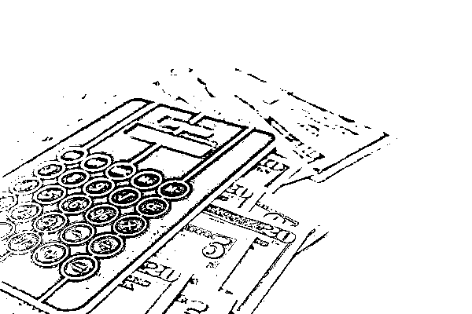

在美国，道琼斯工业平均指数和标准普尔指数跌破了 7 月初的低点，但纳斯达克指数没有。除了纳斯达克指数以外，近期的上涨也没有创下新交易周期的高点。因此以科技股为主的指数已经显示出牛市的迹象。在全球股票指数多空趋势陷入混战的时期，其他市场上的图景更为清晰。比如说，货币兑美元，下跌至 2002 年以来的最低位，同时美元上涨至 2002 年 12 月以来的最高价位。欧元自 2002 年来首次短暂下跌低于平价（1.0000）。日元兑美元下跌至自 1998 年 9 月来的最低。随着美元的飙升和其他货币的下跌，黄金和白银也剧烈下跌。黄金自 8 月 9 日以来首次下跌至 1700 以下，完全符合我们上周梅里曼市场时机学院周期报告的黄金长周期特别更新。白银于 7 月 14 日下跌至 18.01，为 2020 年 6 月来的最低价。

其他市场，原油于 7 月 14 日下跌至 90.56，为 2 月 25 日以来的最低价。但是比特币和以太坊温和上涨至周五，显示出了一些生机。

尽管通胀在上升，期货市场不喜欢高利率的前景，因为那会增加美元的坚挺度，而美元是大多数情况下的支付货币。另一方面，利率上升时，股票市场并不总是下跌，尽管今年股市大多下跌，但更可能是由于通货膨胀依然太高的缘故。另一方面，储蓄者现在可以开始收到更多利息，带来了未来更多的购买力。然而，购买力——需求并不像白宫认为的那样是个问题。问题是供应链中断，这意味着没有足够的供应。经济需要更多的供应，因此需要加强供应方面的经济，以打破通货膨胀的势头，而不是更多的需求，那只会加剧通货膨胀，直到供应链的问题得到解决。由于天王星今年秋天会再次与土星形成渐亏四分相，供应链破裂的问题在短期内看来无法解决。与此同时，拜登政府需要摆脱继续刺激经济的想法。这并不能解决通货膨胀问题，只会让情况变得更糟。解决供应链问题，让能源变得可用，才是渡过这次危机的方法。替代能源可能还没有准备好占据主导地位，直到这个十年的后半段，届时处于风象星座的天王星将三分冥王星。

**短期占星趋势和长期考量**

****

**好吧，我说，过来宝贝，我们在谷仓里有鸡。**

**过来宝贝，我抓住了公牛的角。****这不是说笑的，有很多的震荡在发生。****——杰瑞·李·刘易斯****《很多震荡在发生》****1968 年**是的，这些天全球金融市场有很多震荡在发生，未来甚至会发生更多震荡。**我们即将进入今年最不稳定，也是最令人兴奋和戏剧化的地球宇宙学时间段。**它始于这一周，**木星、土星会形成三次八分相的第一次**。**渐盈的八分相是重要的 20 年行星周期的第一个 1/8 阶段，我将周期的这一阶段称为“放弃”点。**也就是说，在合相时开始的努力，通常在行星周期的 1/8 阶段接受第一次真正的考验。那也是一个人必须决定是否继续合相时开启的方案，还是放弃回到旧方式。在当前的案例中，木星和土星的合相始于 2020 年 12 月 21 日。那发生在上次美国大选的后一个月，也是拜登政府就职前发生美国国会山骚乱事件的前一个月。所有的那一切现在都要经过审查、决定和审判。正是时候。木星-土星周期的第一个 1/8 阶段，被称为渐盈八分相，以连续三次精准成相的形式展开：**第一次在 7 月 21 日，随后两次在 9 月 21 日和 2023 年 3 月 21 日。**在那一时间，美国将审查和决定，是继续还是放弃 2020 年 11 月-2021 年 1 月期间开启的方案。木星-土星与法律和审判相关。八分相与继续或停止当时开始的方案有关。当时美国的启动的方案，与唐纳德·特朗普和乔·拜登的行动与政策有关。目前正对两者进行批判性的评估。有可能两人都会受到法院和公众意见的谴责。**然而，木星和土星的八分相本身，不会导致金融市场过度的震荡。大量的震荡需要天王星的存在，以及火星作为导火索。**天王星掌管地震、龙卷风、飓风、强风和停电并非偶然。所以，天王星在当前的宇宙图景中处于何方？它正在逐渐接近与土星的渐亏四分相，同一个相位曾在**2021 年 2 月 17 日-12 月 24 日**连续三次精准成相期间，**推动全球股票市场到达历史新高或多年高点。**所以，我们来试着理解接下来 3 个月天上这幅逐渐凝聚的图景。**在 2022 年 9 月 21 日-28 日，土星正在回到与天王星 1°容许度内的渐亏四分相。**喜欢宏大的木星，正处在这两个破坏神（比如供应链的破裂）的中点位置。事实上，不仅如上所述，**木星将与土星形成三次八分相，它也会与天王星在 2022 年 9 月 29 日、12 月 23 日，以及 2023 年 6 月 19 日形成八分相**。所以，这三颗行星将会引发许多（木星）动荡（天王星），**一切始于本周的 7 月 21 日，会持续到年底，影响力特别强有力的时段是 2022 年 9 月 21 日-28 日+/-7 周。**日子近了，我们最好做好准备……为某些特别极端的事。

但这还不是全部。**火星，作为全球市场、地缘政治或自然领域戏剧性事件的导火索，将在 8 月 1 日合相在金牛座的天王星，8 月 7 日四分在水瓶座的土星**（天王星守护水瓶座，因此使土星也变得重要）。

火星也会与在金牛座（与银行和农业有关）的月亮北交点形成星群。那可能是某种特别严重的事件在地球上发生的导火索，可能会**引起金融市场的剧烈震荡。**

有趣的是，许多政治家（和投票者）已经担心夏天会出现断电事件，考虑到天象情况，这种担心是有理由的。

所以，金融市场上许多的震荡到底意味着什么？全球股票市场，自 6 月 16 日-20 日的低点以来相对平静。它们还能有多少波动？让我提示一下。2021 年 8 月 20 日，火星、木星、土星和天王星都会凸显出来（最引人注目的是天王星停滞，以及太阳-木星对分相）。日经指数在那天创下 16.5 个月周期低点。3 周之后的 9 月 14 日，它上涨至 30795，为近 30 年来的最高价位。仅仅 3 周，它飙升了近 4000 点，增幅超过 14%。**我们可能在今年 8 月-9 月看到类似的波动，只是还不清楚届时是上涨，还是下跌。****·** 如果遵循**2021 年**土星-天王星渐亏四分相时的走势，**市场将剧烈上涨，就像日经指数去年夏天的表现一样。**

**· **如果市场追随的是**90 年**的交替土星-天王星渐亏四分相周期的走势，那可能更多地代表着**恐慌**。

因此，你可以看出多空的交战即将结束。一方将会投降，另一方会得胜，可能伴随着戏剧性的高潮。在**7 月 25 日-8 月 7 日**期间，我们应该对此有所感受，因此届时**木星会逆行，与太阳形成三分相，四分金星，之后火星、天王星和月亮北交点合相，全都四分土星。**确保发电机正常工作，**不要把你的生活方式押注在任何交易或危险活动上。**否则，可能会有更多的震荡。此外，离开时请关灯。**长按下图了解更多详情**

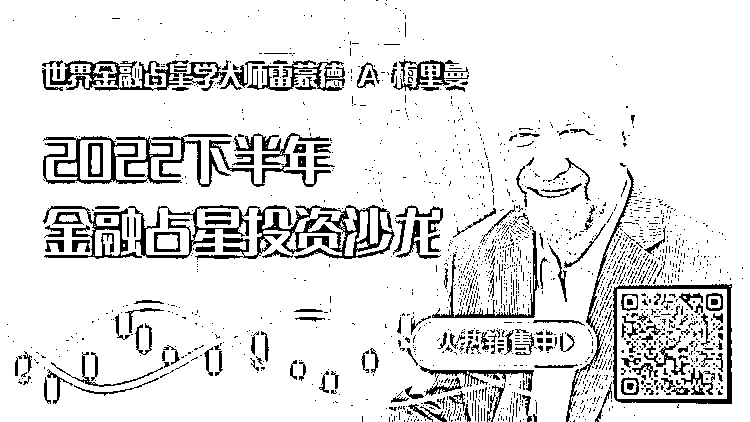

这是特别及时的讲座，因为为期 12 年的木星轨道周期会在 5 月 10 日进入白羊座，并且 6 月-11 月是一年中最有力的地球宇宙征象接连登场的重要时间段，因为土星逆行与天王星形成几乎精准的渐亏四分相。

**说明：以上日期基于纽约证券交易所所在的美国东部标准时间，由于存在时差，中国地区可能需要加一天。**

**版权声明：**本文由若道翻译发布，欢迎转发，反对抄袭。友号转载请申请白名单。

**雷蒙德·梅里曼（Raymond Merriman）**

若道签约老师。著名金融占星师，ISAR（国际占星研究协会）前主席，梅里曼市场分析公司的总裁。他由于“提升了占星学的职业形象”，在 1995 年国际占星大会上被授予轩辕十四奖；在 2012 年国际占星大会上，被授予轩辕十四终身成就奖。

1“中国上证指数月度报告”发售**若道推出了****中文版****的雷蒙德·梅里曼中国上证指数月度报告，并持续发行该报告！**当把金融市场的周期和占星学的周期相结合时，雷蒙德·梅里曼老师的金融占星学研究**为投资者应对金融市场的周期波动，并随之调整投资策略提供了极大的价值参考**。
**7 月中英文报告已上线！**2“黄金价格周期月度报告”发售**若道推出****中文版****的雷蒙德·梅里曼黄金价格周期月度报告！**不仅仅为广大读者在中国股市的投资出谋划策，更将视角放眼黄金市场。**每当世界经济形式不明朗的时候，有一个地方是保值的港湾，那就是****黄金**。自 1982 年雷蒙德·梅里曼出版第一本研究《地球宇宙学征象与黄金价格的关联》的著作以来，**他一直作为最重要的黄金市场时机预测者之一享誉国际**。2022 年 8 月黄金报告已上线，梅里曼老师将会告诉你他对这个关键时期如何操作的想法。也可以按照季度和一年期订阅，有更多优惠。季度和年度的好处是，你可以持续了解梅里曼老师对于不断在变化的市场的看法。即便他某一次看法和市场不一致，你也看到在下一期他如何调整自己的看法，并看到金融占星在一个长期时间段内对你把控风险的帮助。而能够长期控制风险、尽量找到安全的投资时机才是投资的长久之计。**8 月中英文报告已上线！****购买套餐**，买得越多越优惠中国上证指数月度报告套餐价

*   **单月报告**：280 元
*   **3 个月套餐**：780 元（260 元/月）
*   **12 个月套餐价**：2400 元（200 元/月）

**长按下图识别二维码****购买金融报告****套餐****▼**

黄金周期月度报告优惠

*   **双报告年度套餐更优惠（直降 900 元）**

*   **12 个月黄金报告+12 个月上证指数报告：仅需 3900 元**

**长按下图识别二维码购买黄金报告套餐**▼

3《2022 年金融预报和沙龙》1976 年以来，由雷蒙德·A·梅里曼撰写的梅里曼市场时机学院每年一次的年度预报沙龙和每年一本的《年度预报》一直在应用占星学原理为投资者们服务，提供卓越洞见，从未间断。 **雷蒙德·梅里曼《2022 年金融预报和沙龙》发售中（报告已发布）。****长按下图识别二维码了解详情**
▼

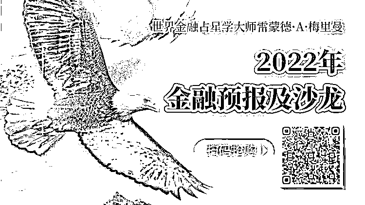

4《2022 下半年金融占星投资沙龙》这是特别及时的讲座，因为为期 12 年的木星轨道周期会在 5 月 10 日进入白羊座，并且 6 月-11 月是一年中最有力的地球宇宙征象接连登场的重要时间段，因为土星逆行与天王星形成几乎精准的渐亏四分相。

**长按下图识别二维码了解详情**

▼

**点击阅读原文购买金融报告**

# ISAR 认证职业占星师文凭课程 | 开启“爱好变职业”的创收自由之路

> 原文：[`mp.weixin.qq.com/s?__biz=MzA5NjA0NTAxNg==&mid=2651480752&idx=3&sn=b686a9c408d2822d113dfd5a0fb9ce0c&chksm=8b48d007bc3f5911dbc008f07d3e26b4b2a4d56ab80c1b06628c482391e5def46d9c59f35d69&scene=126&sessionid=1692737786#rd`](http://mp.weixin.qq.com/s?__biz=MzA5NjA0NTAxNg==&mid=2651480752&idx=3&sn=b686a9c408d2822d113dfd5a0fb9ce0c&chksm=8b48d007bc3f5911dbc008f07d3e26b4b2a4d56ab80c1b06628c482391e5def46d9c59f35d69&scene=126&sessionid=1692737786#rd)

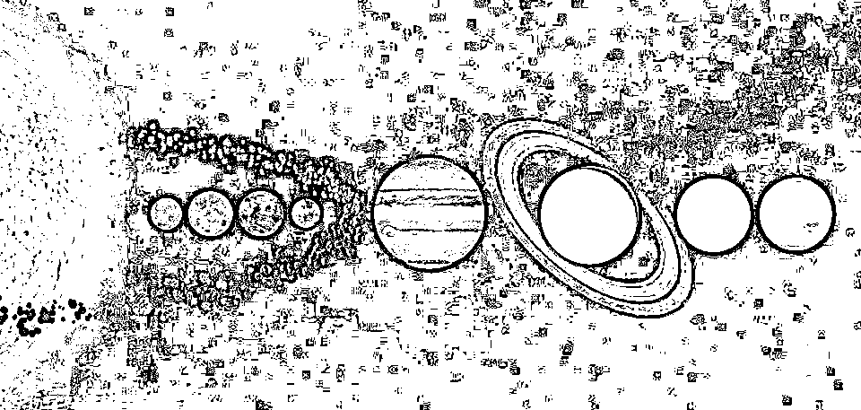

**2022 年，是世界和中国 40 年未有之大变局的开始。**

俄乌战争打破了欧洲大陆乃至全世界的和平局面，而新冠疫情也给中国经济带来前所未有之挑战。

如果你关心经济形势和世界局势，你会有这种的感觉，我们将面临一场深刻的危机，而这不是短期内可以结束的。

**占星学的看法也是如此。**

4 月青年失业率（16 岁到 24 岁）中国达 18.2%，一些背着房贷、教育、医疗负担的中年人突然失业更是整个家庭整个难以承受之重。为了更好准备面对这样的时代变化，连《北京日报》这样的官方媒体也在呼吁：**“开拓副业，让自己有多元化发展的生存能力”。**

**而这门课程，就是为了这样一个目标准备的。**

**占星学是非常好的“开展副业”的选择**

这个**为期 16 个月**的课程通过并不算长的时间和并不算高的投资，不仅可以帮助你学到一个终身可用的技艺，而且也可以选择成为自助助人的占星师，**开启受益终生的第二事业。**未来是个体崛起的时代，大量个体被鼓励独立发展，比如网红、自由职业、自媒体、咨询师等，他们都不需要传统的办公室。社会越发达，人的独立性就越强，未来有能力的人都可以变成独立的经济体。

**占星学也是越老越好的职业**

和一些技术变化非常快的职业不同，**占星学的技术层面非常稳定，不会快速迭代变化，**同时，掌握好占星学、能够做一场好的咨询又需要个人自身大量实践和对生命的深刻理解，而这些都是时间和岁月带来的。

**占星学是现代社会需要的助人职业**

社会快速发展和变化人们似乎越来越无法掌控自己的生活，这给很多人带来巨大的焦虑，**抚慰心灵的咨询市场需求巨大。**而占星学可以让人从前所未有的角度了解自己，了解目前和未来所处的周期，挑战的意义，不论对于深入的个人成长探寻，还是预测未来的周期，都又其独一无二的价值。

**ISAR 认证职业占星师的独有培训**

目前占星学的培训市场鱼龙混杂。而 ISAR（国际占星研究协会）是一个包含了 47 个国家在内的国际占星组织，多年来致力于占星的教育和研究，提升占星教育的品质和职业占星师的能力，在国际占星领域备受尊重。今年，ISAR 对于成为 ISAR 认证职业占星师提出了更高的要求，**所有想要获得 ISAR 职业占星认证的申请者均需要在 ISAR 的附属学校通过 500 个小时的研习（包含****主课****、选修课、沙龙、作业、讲座、工作坊等等）。**

**而这门核心占星学课程就是为此而准备的。**

**2022 年，鉴于对若道在占星教学领域所做的持续努力和高品质的课程服务，ISAR 特别授予若道核心课程为 ISAR 文凭课程，所有在若道学习，并通过若道毕业考试的同学将获得 ISAR 颁发的学历文凭（Diploma）。**

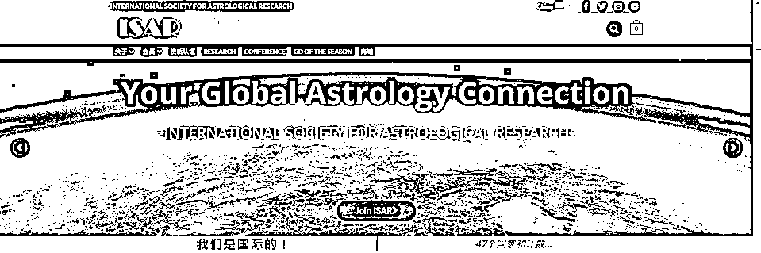

**你的占星核心课老师是谁？**

**拥有****51 年****占星实践经验的****若道创始人****前 ISAR 全球副主席****前 ISAR 全球职业占星师资质认证主席****大卫·瑞雷**

**和**

**2019 年第二届、2021 年第三届核心课中**

**与苏·汤普金斯老师****联合授课****的**

**ISAR 认证职业占星师**

**咔咔（Caroline）**

**二人合力打造**

**2022 年 ****若道全新核心占星课程**

**咔咔老师给同学的寄语：**

（向上滑动查看内容）

**亲爱的同学们：**

我为什么学占星学？

2000 年的时候我还是一个在网上搜索天蝎座和水瓶座配不配的普通白领。我搜索的内容还包括了水瓶座为什么总是这么若即若离？

体贴的搜索引擎给我推送了占星学、行星、星座、宫位、相位等资料，还让我了解到莉莉丝、月亮交点、截夺宫位等占星学概念。

2000 年 10 月我了解到，一个从业 30 多年的美国职业占星师大卫·瑞雷来到了中国，和他的中国合伙人将开办一个专业教授占星学知识的课程。过去 10 个月在网上东拼西凑的占星学知识唤起了我对占星学的兴趣，但是已经不能满足我对星图深度分析的需求了。

2013 年，我通过了若道核心课程的毕业考试和国际占星师研究协会的认证考试。2015 年我离开职场成为一名全职占星师。

到底学习占星带给了我什么呢？

1、它是自我觉知的工具，我现在已经不去纠结哪些星座是否匹配，我相信外在的事件是内在心理矛盾的显化。也就是说，想找到令人满足的亲密关系，要先去了解自己的情感模式和需求，而不是无意识地一次次地试错和撞墙。我开始学习自我关怀和接纳自己。

2、它带来看待世界的全新和全景的角度，天上如是，地下亦然。人类社会和个人生命的进化都有其周期和相似性，作为个体，占星学帮助我思考如何更积极和有建设性地与宇宙的能量合作，认识自己，发挥自己的潜力，度过有意义且自我满足的人生。

3、它带来了全新的职业：占星师和占星老师。除了收入，还有助人育人的满足感和意义感。

4、它带来一群志同道合的伙伴，我们彼此联结又相互独立。

作为中国占星界的“黄埔军校”若道占星的学生、助教和老师，我与很多学员在人生的不同阶段带着各异的需求走进了这所学校，2022-2023 年一年半的若道核心课程设计既蕴含了大卫·瑞雷老师的教学精华，也带入了我在跟随不同国外占星老师学习、助教和教学积累的心得。

有一些学员毕业后从事了占星咨询工作，有的在各大平台成为专业占星学知识的输出者和传播者，有的运用占星学提升他们的工作，也有的在占星学与投资，占星学与名人/八卦、占星学与原生家庭、亲密关系、亲子关系等领域收获了有用的或者有趣的体验。

对我来说，生命是一场自我完整的体验之旅。从 2011 年的那个春节在若道入学之后，我的生命旅程更加充实、有意义、有目标，也更有满足感。

希望在 2022-2023 年的若道核心课程里见到你。希望你此后的生命旅程里，有若道，有占星学。

占星师咔咔

2022 年 5 月 24 日

**大卫老师给同学的寄语：**

（向上滑动查看内容）

亲爱的学员们：

感谢你对我们从 8 月 30 日开始的若道 L1-5 级核心课程的兴趣。我和合作老师咔咔以及我们的核心课程团队期待着为你提供这个机会，来教授各种高品质的地道占星学知识和技巧。

对于那些希望获得 ISAR 职业占星师认证的学生，这是一门适合你的课程！

作为 ISAR 咨询技能培训的一部分，我曾与咔咔合作过，我们期待着再次合作。咔咔和我曾在 ISAR 职业占星师认证委员会（CAP ISAR）一起工作，我们非常熟悉获得 ISAR 职业认证的流程。作为你的老师，我们将陪伴你整个占星学发现之旅，帮助你逐渐认识到占星学有多么的神奇。此外，你还将受益于我们若道的助教和课程顾问，他们是若道核心课程计划的重要组成部分，提供在线沙龙、组织学习小组、指导家庭作业。我们的教育团队是“服务于你的团队”，所以也会根据你的需求进行相应的调整。你专用的核心课程微信群也促进了你的学习过程，使你能够每天与你的同学们一起学习、探讨、成长。

52 年前，当我开始学习占星学时，没有一所像若道这样的学校。如果有这样一所学校，我会尽一切可能在那里成为一名学生。事实上，我很幸运，我的老师都是经验丰富的专业占星师。然而，我花了 6 年的学习时间才通过 1976 年在美国乔治亚州亚特兰大举行的专业占星师考试，又花了 2 年的专业实践时间才通过占星学谋生。我永远不会忘记从 1970 年到 1978 年的 8 年，那些日子的反复试验教会了我如何苦练占星学。作为老师，我一直在努力传授我早年所学的知识，让你的旅程更加顺利，更加全面。

自 1978 年以来，44 年的全职实践教会了我很多，我很高兴有机会与大家分享我所学到的东西。我和咔咔都是现代占星师，虽然我们尊重西方占星学的历史和传统，但我们实践和教授的占星学植根于现代人本主义哲学，这种哲学旨在提高你对自身潜力的认识，并鼓励个人成长。还有什么比了解自己更实际的呢？还有什么比个人成长和发展潜力更有利的呢？这是你将要学习的占星学，一种可以应用于你自己生活的占星学，一种可以为你提供一个充实职业的占星学。

教书是我回馈占星学行业的方式，这个行业拓展了我的视野，远远超出了我曾经想象的可能。谢谢你给我这个机会做你的老师。

大卫·瑞雷

2022 年 5 月 24 日

**连报 L1-5 全阶网络直播课程，你可以享受**

❶ 64 次线上直播互动网络课程+2 场工作坊，全面而详细地讲解占星学知识、技能、案例和重要领域实践运用。

❷ 知识点+学员星图解读有机结合：咔咔老师以讲解知识点和中外名人案例为主，大卫·瑞雷老师以参课学员案例演示及客户案例为主，每个知识点覆盖班级内学员的亲身案例，参与感更强，多位学员都有机会听到自己的星图分析。

❸ 微信群学员互动分享，从真实案例学习生命成长故事。

❹ APP 答疑论坛提问：论坛上每个学员的问题都将得到及时回复。

❺ 若道独有的职业占星师养成计划，为你毕业后独立咨询做准备。

**❻ **提供**咨询平台**，只要努力，优秀毕业生有机会入驻**若道咨询平台**，拓展咨询客户群。

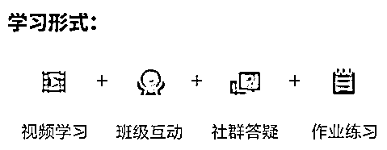

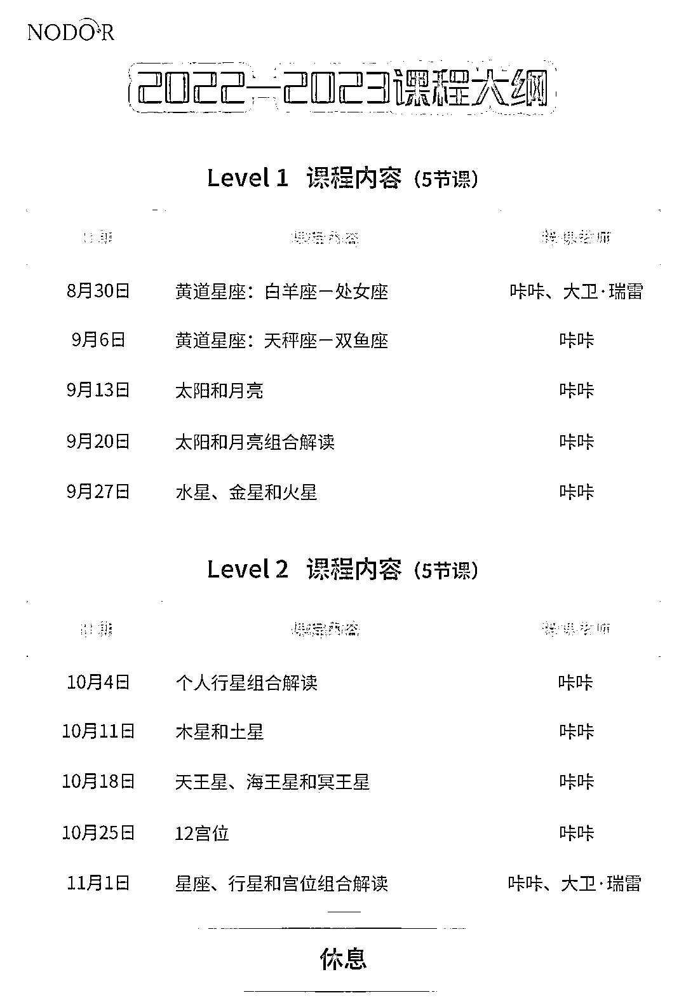

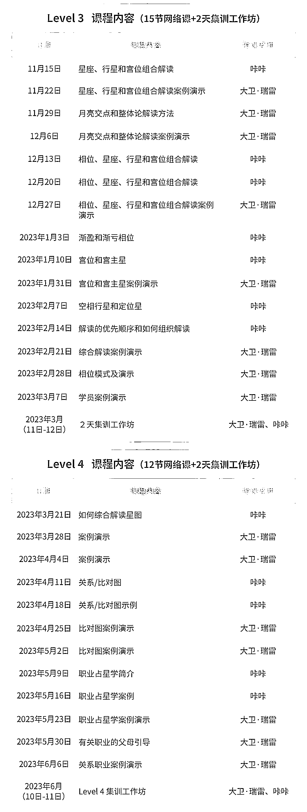

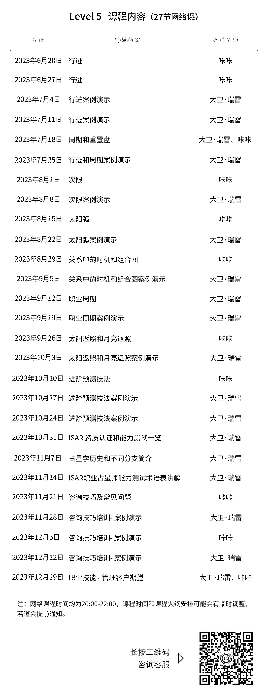

**更多了解老师和助教？**

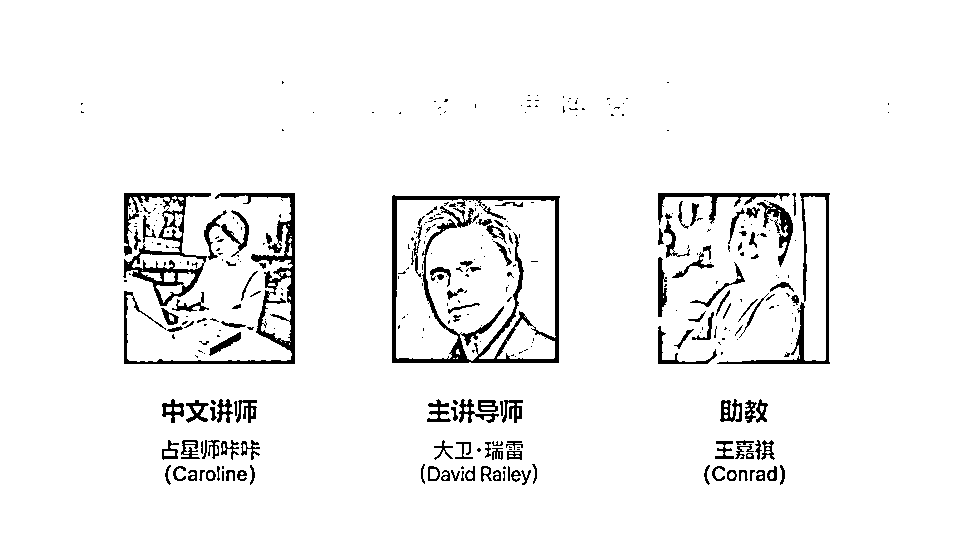

**大卫·瑞雷（David Railey）**

*   **I****SAR 董事会成员，ISAR 全球副主席，ISAR 全球职业占星师资质认证主席，若道占星创始人**。

*   2016-2019 年，被选为国际占星协会（ISAR）考试委员会成员，国际占星协会（ISAR）是世界最大的国际占星机构，会员遍布 47 个国家。

*   2017-2020 年，被选为国际占星联盟（ISAR）考试委员会主席，理事会成员。

**占星师咔咔（Caroline）**

2010 年师从美国占星师大卫·瑞雷学习，并得到世界名师斯蒂芬·弗里斯特、罗伯特·汉德、苏·汤普金斯传授各种占星学技法。若道首届学员，国内最早获得 ISAR 职业占星师资质的职业占星师，多次担任若道核心课程助教，并于 2019 年第二届、2021 年第三届核心课中和苏·汤普金斯老师一起教授若道核心占星课程。

在国际知名广告公司和市场研究公司从事的市场研究和推广工作十余年，曾任职于阳狮集团、尼尔森市场研究有限公司、MTV 和《Madame Figaro》杂志。

**助教王嘉祺 （Conrad）**

ISAR 认证占星师、若道认证生时校正资质，从 2010 年起自学占星学，2015 年开始在若道系统学习，并开始个案咨询。2018 年担任若道核心课程助教，以及卜卦占星学和太阳返照选修课助教，并带领学员进行经世占星和太阳返照方面的研究。2019 年 11 月作为演讲人之一参加了国际占星协会（ISAR）北京大会，也是 ISAR 星空俱乐部中国区第 16 期的主讲人。

**什么人适合这门课？**

*   对占星学有浓厚兴趣，想要系统学习占星学。
*   对占星学有一定基础，但不知道该如何整合星图复杂的碎片。
*   希望成为优秀的占星师，想要借鉴国际大师解读思路并融入自己的体系。
*   想学习占星学，但不擅长英文，希望有中文老师授课。
*   想结合占星学理论与咨询实践。
*   走在自我探索和个人成长道路上的人。

**课程费用**

**★ 1-5 阶 连报**

**早鸟价：33000 元（2022 年８月 1 日之前）**

**课程费用：46500 元** **★ 1-2 阶 （8 月 30 日开课）**

**早鸟价：2800 元（2022 年８月１日之前）**

**课程费用：3500 元 ****★ 1-3 阶　连报**

**早鸟价：10500 元（2020 年８月１日之前）**

**课程费用：11500 元 **

**咨询课程请联系顾问**：**王老师（微信/手机：18510107057，请备注“大卫核心课”）**

**退转课程**

**退款原则请详看《教学协议》，如有疑问请咨询课程顾问。**

****2022 L1-5 认证职业占星师必修课程****

**授课老师：大卫·瑞雷、咔咔**

**直播课开课时间：2022 年 8 月 30 日（周二）**

**授课方式：******网络授课，英文/中文授课，中文翻译****

**费用：****1-5 阶连报**：46500 元**（早鸟价 33000 元,8 月 1 日前）；**1-2 阶**：**3500 元**（早鸟价 2800 元,8 月 1 日前）**；****1-3 阶**：**11500 元**（早鸟价 10500 元,8 月 1 日前）**

**课程负责人：王老师**（微信/手机：18510107057，请备注“大卫核心课”）

长按二维码添加课程负责人咨询~

****报名直达入口****

# 你对最近的“激烈天象”，都有哪些体会？来聊聊吧~

> 原文：[`mp.weixin.qq.com/s?__biz=MzA5NjA0NTAxNg==&mid=2651480747&idx=1&sn=1fe334ffea1861b09238497b51c5e5eb&chksm=8b48d01cbc3f590ac9aaa812c997ff53cf6e18f04beaad61a4199d28ee3166b517b7a3c2f14c&scene=126&sessionid=1692737786#rd`](http://mp.weixin.qq.com/s?__biz=MzA5NjA0NTAxNg==&mid=2651480747&idx=1&sn=1fe334ffea1861b09238497b51c5e5eb&chksm=8b48d01cbc3f590ac9aaa812c997ff53cf6e18f04beaad61a4199d28ee3166b517b7a3c2f14c&scene=126&sessionid=1692737786#rd)

**2022 年 7 月 17 日天象：**

*   **月亮在双鱼座**
*   ******太阳合相水星、三分海王星、梅花土星******
*   ******水星对分冥王星、三分海王星******
*   ******天王星合相北交点******

今天月亮在双鱼座，太阳和水星都与海王星形成三分相。让自己放松和放空吧，随性一些，顺着感觉走，会有美好的体验。人们的情绪也丰富又敏感，参与艺术活动、看看心灵书籍，让人收获颇丰。这时候，话语也容易成为情感的载体，表达与聆听他人吧，拉近彼此心灵的距离。你可能一下子看到事情背后的本质，不过小心语言伤人，多理解他人。

刚过去的[【摩羯座满月】](http://mp.weixin.qq.com/s?__biz=MzA5NjA0NTAxNg==&mid=2651480584&idx=1&sn=11f2d9a9b786e892437dfa0d654490c6&chksm=8b48d0bfbc3f59a9e97062dacccded727017c0bb88e13f69679f858b4d534f3bcc68cb8313ea&scene=21#wechat_redirect)（点击查看文章）强调了现实的生存议题，它是感性与理性的拉扯，提示我们看看在自我成长方面，有没有收获。另外，从本周直到 8 月，天王星与北交点都在金牛座 18-19 度的合相范围内，再次强化了我们人生中物质安全的议题。

你对最近的天象有哪些感受？欢迎跟我们分享呀~ 

周日快乐！我们明天见！**了解每日天象，可****下载“若道”APP 查看****还有更多精彩等着你哦**

# 5 宫的陷阱丨在“命中注定我爱你”里，探索爱的关系

> 原文：[`mp.weixin.qq.com/s?__biz=MzA5NjA0NTAxNg==&mid=2651480743&idx=1&sn=94cc104236e51c699c84d08f396884db&chksm=8b48d010bc3f5906596753b8ac01ad96c7a9480dc898428bf76b59e958d703afe6c8e349bc51&scene=126&sessionid=1692737786#rd`](http://mp.weixin.qq.com/s?__biz=MzA5NjA0NTAxNg==&mid=2651480743&idx=1&sn=94cc104236e51c699c84d08f396884db&chksm=8b48d010bc3f5906596753b8ac01ad96c7a9480dc898428bf76b59e958d703afe6c8e349bc51&scene=126&sessionid=1692737786#rd)

******************☆ 后******************台******************回复“今日”，给你一句生命态度******************

作者/斯蒂芬·弗里斯特

译者/逸月

编辑/翀子 封面/书君 图片/网络

有些人的恋爱总是又甜又虐，且很难走出情伤。这到底是是怎么一回事呢？来看看斯蒂芬老师的解读吧。另外，斯蒂芬老师的【[三日线上工作坊](http://mp.weixin.qq.com/s?__biz=MjM5MjQwNjAyMQ==&mid=2649440014&idx=3&sn=95e88d21ca43c0524c58e569f6fbcb36&chksm=beb9506489ced972ebbcf5fcbb9ed5412e2d8ba43ba2c1d9a450ce168d17810584089219a2e8&scene=21#wechat_redirect)】正在报名中，有兴趣的小伙伴点击链接了解一下吧。

**五宫的爱情陷阱**

**在占星学中，五宫是关于追逐爱情和陷入爱河的宫位**。陷入爱河是多么美妙而神秘的过程啊！这里有太阳的印记，陷入爱河是人类自我的天堂。在这里，你感受到的一切都那么完美，你会爱上那种感觉。

人类的自我认知是完全不可抗拒的。基本的概念就是：我们陷入爱河，然后建立基本的亲密关系，之后就是承诺的关系，而承诺的关系则更为困难。所以很多人更倾向于不停地陷入爱河。

**不断重复陷入爱河，是五宫的陷阱：**

**这些人的模式是：当关系变得真实的时候，他们就开始寻找他人，再次寻求坠入天堂的感觉。而这就是五宫的陷阱。**

我不想让五宫听上去可怕。**五宫包含了几乎所有超人类的直觉，这是一个选择伴侣的宫位。如果这个宫位健康运作，我们在选择伴侣的事情上就拥有灵媒式的信息整合能力**，这对于自我来说是天堂，这也是一个完全魔法的宫位。

但有时候我们与一个人陷入爱河，也会是一个大错误，这段关系使我们心碎了。这种选择伴侣的功能并不是完美的，就好像有时候一些东西使之变得更复杂。在这里，我们进入一些非常深的领域。

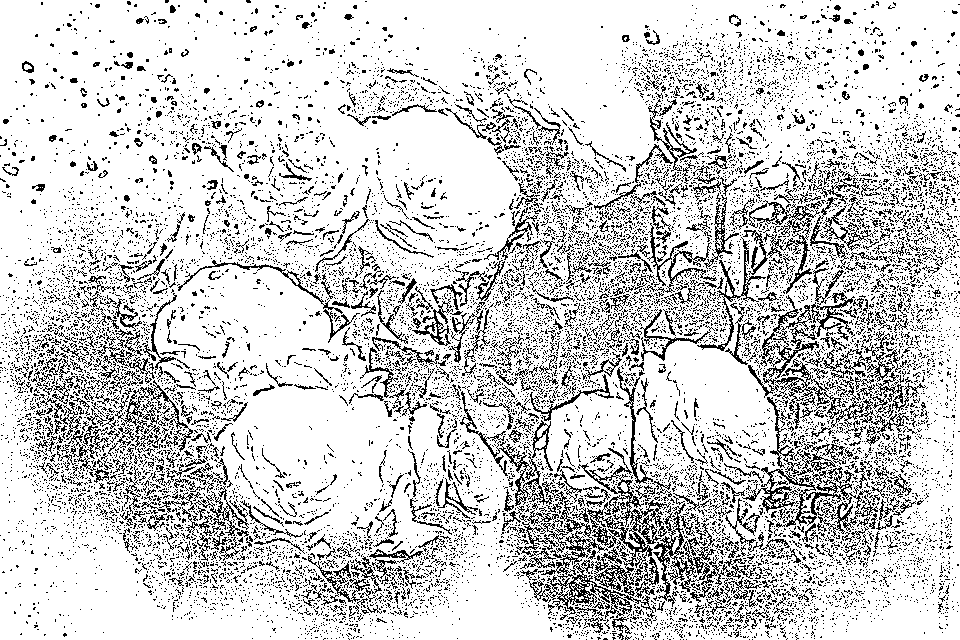

**我们彼此似曾相识**

我们用另一个层面来解释：**两个独立的自由身，他们陷入爱河并发生性关系，他们是否会进入婚姻还不清晰，但他们在探索他们的关系，这也是一个爱的关系。**

我想要给大家一个非常精准的关于五宫爱的关系的描述，要达成五宫爱的关系，需要符合以下三个标准：

**1、两个人相遇，他们很快认出对方，“我感觉过去认识你”。**

如果我们相信转世轮回，这就是我们通常用到的语言：“我相信在过去某一世认识你”。有些人并不相信转世，但他们仍然可以有五宫的爱的能量展现，也许他们这样说：“好奇怪，我们刚刚相遇，你给我的感觉却这么熟悉！”

**所以五宫的第一个维度就是**迅速的熟悉感。****

**2、在这样的关系中有一种紧迫感。**

**这就好像说我们能够相遇是非常重要的一件事情，在我们的关系中有一种不可抗拒的力量。我们的相遇好像是有某种目的，我不知道那是什么，但是我能感觉到它的存在。**

这是一个非常重要的注解，当我们完全理解五宫的意义，我们会了解到五宫的关系中也许不会发生任何性关系。

**但是当五宫出现了性关系，这种性的能量会很有紧迫感，此刻，爱的关系会倾向于非常迅速地向性关系前进。五宫的第二个维度就是那种紧迫感**，它可以是性的能量，也可以不是性的能量。

**3、并不会持续很长时间。**

**我们可能会很快速地去经验我们需要经历的这些东西，然后我们会感觉到关系的完结。**

所以，**熟悉感、紧迫感、短暂性，这三点是五宫基本的逻辑**，至少是某一个维度上的逻辑。在这三条中的第一条为我们带来最深的洞见，那种奇怪的、熟悉的感觉：“我对你似曾相识，你也对我似曾相识。”

关于灵魂转世的比喻，可能听上去会比较抽象，但是我们会看到所有基本的象征，在我们此生此世中都会进行演化。我会去做关于你人生的一些假设，这样的假设并不一定对所有人都是真实、管用的，但是对大多数人都管用。

**该放手就放手**

这一生中，你有些关系结束得非常糟糕，你和一些人产生关联，但是事情进展太快了，有些人撒谎了或者对你不忠，那个人在你决定结束关系之前就离开了你，这会让你感觉受到伤害。这是人类一种非常常见的现象。

**让我们想象，你就在那一个非常戏剧化的故事当中。**

你们的关系正在坍塌，你感受到痛苦，当然你也会有怒。也许你有一些朋友对神秘学很感兴趣，他们给你一些建议：你与这个人的故事需要有个了结，不然你在将来的一世还会遇到同样的人。

在这样一个建议中，确实有一些正确性——当我们对一个人有这样的感受与情绪的话，如果我们在这一世并没有把它处理好，我们当然会与那个人在未来世再遇见，然后在那一世再做同样的功课。

这是业力运作的原则，在这个宇宙中没有未被解决的议题，所有的行为都有它的后果，没有人可以逃离任何的后果。

但是你朋友的建议也有一个缺陷，他鼓励你解决与那个人的议题，但是他没有看到这样一个事实：

**你已经尽自己全部的力量，最好地去化解这个事情，那个人也尽了全力去做，但是不论你们如何努力，你们似乎永远无法理解对方。**

如果无论你们如何努力，都只能伤害对方的话，试试放手吧。

在这样一个时刻，你们似乎都无法继续下去了，你们越是努力为这段关系做工作，就越是伤害对方。这就是人类的现实，你在尽全力做，而你所做的只是产生更多的业力和痛苦。**所以有时候我们能做的最有智慧的行为就是：与对方说再见。我们让它成为业力。**

我们拿出宇宙钱包，对上帝说，把我这个业力放在我的信用卡上。有时候这是个好主意，虽然你知道信用卡会带来的麻烦，迟早你都会收到账单。

我不想让业力听起来像一个惩罚，这并不是惩罚，但是迟早你还是会遇到那个人，希望在那个时候你们双方都会是更进化的人类，**也许在那个时候你们都可以更安静下来，然后更好地去面对这个业力。**也许这一次会做得更好，也许会放过彼此。

**过去世的你并没有这么智慧，没关系** 

你知道**在此生中这种业力所带来的复杂性，当然代表在过去世中也有同样的问题存在。**我会在链条中再加一个环节：在过去世中你会比现在世更加愚蠢。

这听起来不太美妙，换一个表达就是演化与进步。如果我说现在的你是在意识发展过程中更聪明、更有智慧的进化，这听上去不错，对吗？我相信这也是真实的。

所以逻辑上的推导就是：在过去世中你的灵魂不是这么进步与智慧的。想象一下，在这一世中你曾经制造的麻烦与困难，再想像你曾经在过去世中犯下的错误、制造的麻烦。如果我们想这些的话，它们都会有一些逻辑存在。

**解脱和释放也是五宫的一个面向**

有些灵魂来到这一世的目的，就是支付业力的账单。他们的目的是遇到那些还未解决议题的灵魂。这种现象带来的占星学象征是被激发的五宫。**在大多数情况下，这样的碰面是要去结束这种关系。**

我说的结束这种关系，并不是要讲关系切断，而是真实地去释放、去解脱那个人，去祝福对方，不再去要求他们给予他们无法付出的东西，不再假装他们是那些他们不是的人。这是我们对另外一个灵魂所能做到的最真实的友善与慈悲。

**当我们释放了、解脱了一个人，也就解脱了自己内在的那种冲突能量，这是五宫非常重要的一个方面。**

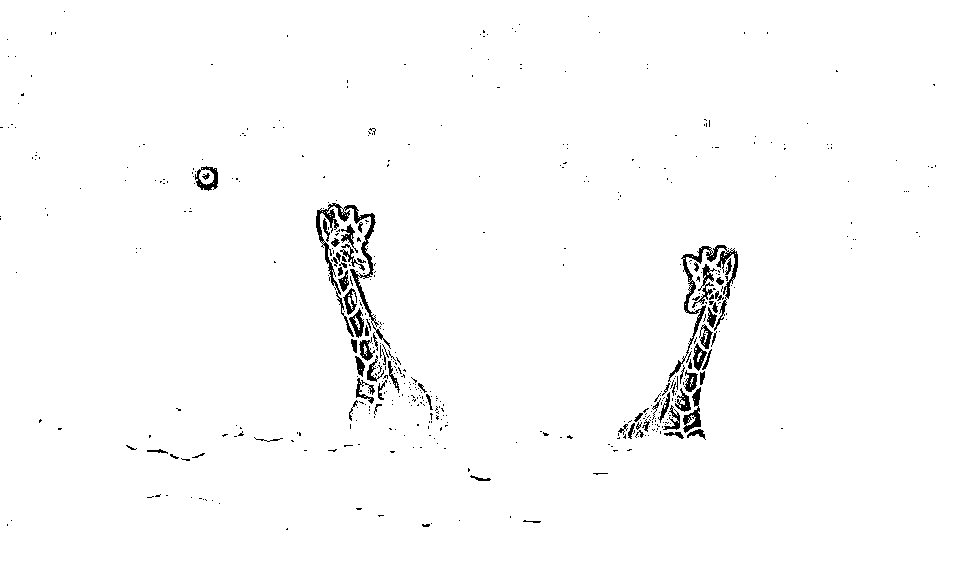

**你需要多久才能跨越痛苦的关系？**

**我们在五宫的领域讨论我们选择伴侣的能力，以及认出伴侣的能力。有行星的地方，也是有问题的地方。**更深入学习的最好方法也许是在五宫放入一颗行星，比如说海王星。那么你跟哪些带有海王星特质的人有未曾解决的议题与事务？

现在你的海王星在五宫，它会如何发挥能量呢？

在过去世中，你与他有过失败的、或者未曾完成的恋爱故事，那些业力的法则代表你们这一世还会遇见。我们想想海王星，那种神秘的联结，在关系中会产生的深刻的、内在的、精神性的、灵性的联结。

**海王星的能量是很有吸引力的，这种关系是具有灵性基础的。**每个人都是一个灵魂，每个人都是一个意识，一个深刻的人与人之间的关系，确实需要基于这种灵性。

**想要进入一段关系，光有灵性的联结是不够的。**

我们还要在其他的维度做工作，**我们需要喜欢对方，需要有信任基础，我们需要对关系有一些实际的、可以维持下去的面向。**但是那种在灵性层面上的联结是多么具有诱惑力，这是一个可能的海王星的过去世故事。

在我们找到一个合适的伴侣之前，我们需要去经历一些事情。所以你坐在桌子边，桌上有一壶茶，然后你问自己以下的问题：

*   如果我顺从心中的欲望跟这个人进入关系，我会经历什么样的困难呢？

*   所以你会让直觉去推导一个可能发生的困难；

*   在我们之间有很深的灵性联结，但是是否有一个现实的联结，即我们是否真的可以信任对方？

*   这个人是不是在物质世界中真实存在的、属于我的人呢？

*   在我经历生命低潮时，他是否能为我抗争呢？

*   在我遇到困难时，可以向他寻求帮助吗？

*   或者此人会不会在我面前突然消失呢？

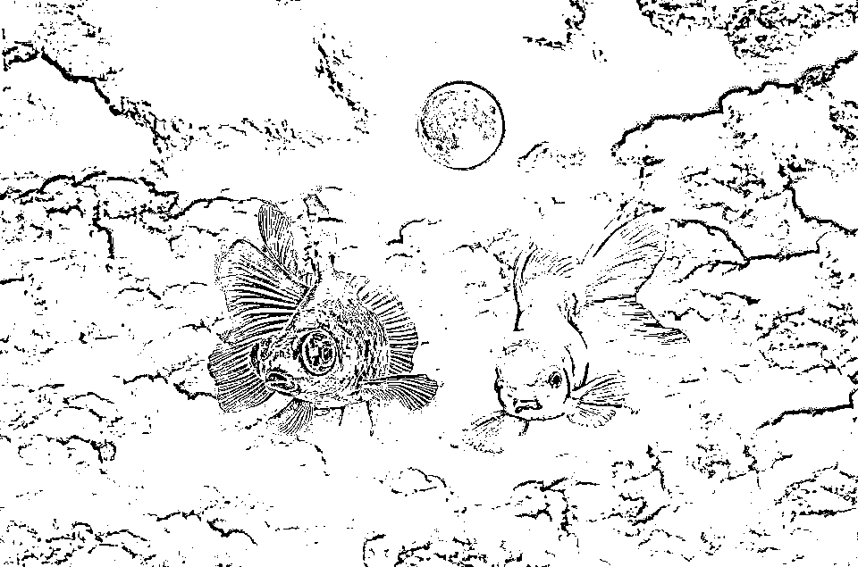

**这些问题之后，可能会有两种情况。**

**第一种**可能的发展**：**

如果你的直觉告诉你：不，我和这个人在一起，会经历灾难。那么在此刻就发生了一件非常有趣的事：

你好像是看到了未来，你也好像看到了过去，你好像想起了过去世发生的事情，并不是你想起了过去世那人的名字或者你经历的场景，而是让你想起了过去世的核心。

**因为业力的运作是重复的，想起了过去，会帮助你看到可能的未来是怎样的。一旦你意识到了这一点，你对那个人的渴望在那一刻就倒下了，你不再渴望拥有那个人。**

这时，非常美妙的事发生了，你好像**打破了业力的模式，此刻你产生了过去世不曾产生的意识，这个业力已经结束了。**也许你看了看表，你意识到我们 47 分钟前开始喝茶，而我在 47 分钟之内就解决了我的业力。

这些事情可以非常快地发生，**意识会帮助我们去打破业力的模式。**

**第二种可能的发展：**

但是这个故事还有另一个版本，你并没有自发地产生这种意识，你还是顺从了诱惑的驱使。

在一段时间之内你们成为了爱人，并发生了性关系，也许 18 周以后他因为别人而离开了你，或者他第 17 次醉倒在你面前，或许他又忘记了一个很重要的承诺。然后你两年后觉得受够了，也许你通过那样的方式去终结了业力。

也许你更爱那个两年的解决方案，超过那个 47 分钟的解决方案。

也许你是在愤怒的状态中与对方分手，你还是重复了那个业力，在将来的一世中，在你的五宫会有一颗海王星，然后你还是会尝试同样一个业力故事。

在这个层面来说，**宇宙是非常有耐心的。**所以我还是建议大家尝试那个 47 分钟的解决方案。

**版权声明：**本文由若道翻译发布，欢迎转发，反对抄袭。友号转载请申请白名单。

**END**

**斯蒂芬·弗里斯特**

若道签约老师。进化占星学的创始人之一，当今世界最有影响力的占星大师之一；1985 年，他凭借《内在的天空》一书获得职业占星师协会奖（Professional Astrologers Incorporated Award）。他四次获得占星界最高的占星学联合协会奖（United Astrology Congress Regulus Award）提名，2018 年获得轩辕十四教育奖。

****探索组合图永恒的三角——斯蒂芬工作坊报名中****

斯蒂芬说，我们的组合图表明无论什么状况我们都能熬过去。

**组合图也像出生星图一样有行进。**在工作坊中， 我们将**探讨一些特殊的技法和考量，来帮助伴侣们应对生活中的挑战和机遇。**组合图的推进会出现一些看似难以解决的复杂问题，斯蒂芬老师创造了一种解决这些问题的技法。他将在工作坊中阐述相关细节，基本的问题是：如你所知，要了解一个人 30 岁生日的推进，我们要看这个人出生后 30 天的行星位置。问题是，组合图与我们在占星学实践中使用的其他星图不同，组合图并不代表某一天的天空。记住，它是基于中点的。**那么我们如何从一个不存在的日期开始 "向下数 30 天"呢？斯蒂芬老师将为我们提供一个行之有效的答案。****点击下图了解更多详情******今晚视频号直播，** **欢迎你来~~**

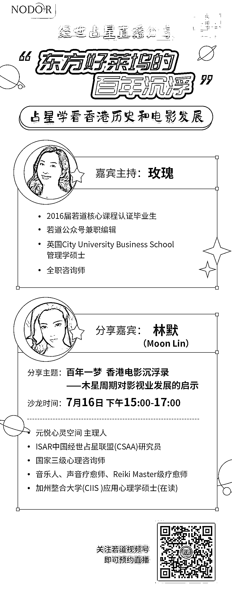

**20 位来自世界各地的占星师****带来 19 场沙龙——新世界的觉醒****详情可点击下图**

**学习占星学****点击下图了解课程详情**

**微信又双叒叕改版啦，不想错过若道君的推送？**

**就把若道设为星标吧！**

**▼**

**喜欢就点一下“在看”吧！**

********报名直达入口********

# 黄金跌幅已经达 15%，会出现反弹吗？| 梅里曼 8 月黄金周期上线

> 原文：[`mp.weixin.qq.com/s?__biz=MzA5NjA0NTAxNg==&mid=2651480743&idx=2&sn=752fd81d8f47124f5a7e8dad71f2c8d9&chksm=8b48d010bc3f5906173548bf5774473ddb29f5aa29b6f308fd8fc4e08ef5ea32dbf0460f6c67&scene=126&sessionid=1692737786#rd`](http://mp.weixin.qq.com/s?__biz=MzA5NjA0NTAxNg==&mid=2651480743&idx=2&sn=752fd81d8f47124f5a7e8dad71f2c8d9&chksm=8b48d010bc3f5906173548bf5774473ddb29f5aa29b6f308fd8fc4e08ef5ea32dbf0460f6c67&scene=126&sessionid=1692737786#rd)

“**黄金是金钱。其他的只是信贷。**

**——约翰·皮尔庞特·摩根**

”7 月 14 日，美国发布 6 月 CPI 数据，同比增长 9.1%，高于预期的 8.8%及 5 月的 8.6%，增幅创 1981 年以来最高；美国 6 月核心 CPI 同比增长 5.9%，同样高于预期的 5.7%。市场预期美联储 7 月加息 100 个几点的几率升至 75%。而其他国家也在经历迅速增长的通货膨胀，甚至比美国还严重。对于很多国家，这样的通货膨胀是 80 年代以来的最高水平。令人担忧的是，公众预警预期通胀将持续居高不下。毕竟，通胀有自我实现的预言。美元也继续相对于其他货币走强。今年上半年见证了日元、英镑、欧元相对于美元的大幅下跌。

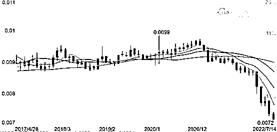

| 日元/美元汇率

| 英镑/美元汇率

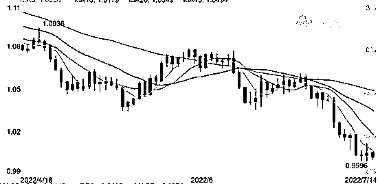

| 欧元/美元汇率

**而黄金也一样。如梅里曼老师一直以来的预测，在 4 月 13 日到达 2003 美元的高点后，一路下跌，与 4 月高点相比，已经跌幅达 15%。**

| 黄金日 K 线图

货币的剧烈变动给金融市场带来很多不确定性。然而正如梅里曼老师在[2022 下半年金融占星投资沙龙](http://mp.weixin.qq.com/s?__biz=MzA5NjA0NTAxNg==&mid=2651477281&idx=4&sn=610f22d20ab9ebab93125b9915bb84f6&chksm=8b48e796bc3f6e80a17217569d20456cafa22ee17f5cf6196bf4ee03d6d1bc7c51da3bce46ba&scene=21#wechat_redirect)（点击链接了解更多详情）中的预测，**更强有力的宇宙天象会在下半年到来。****7 月-8 月，有这样一些可能影响市场的天象：**

**· 7 月 21 日 木星半四分相土星**

**· 8 月 4 日 火星、天王星合相月亮北交点**

**· 8 月 12 日-15 日 日土对分**

**· 8 月 26 日 天王星停滞**

**在下跌 15%后，黄金会出现一次有 5%以上盈利的反弹的吗？还有，如上次我们提到，从中期而言，你考虑从做空黄金中赚钱的策略了吗？**8 月份黄金报告已经上线，上证报告也将在下周上线。欢迎了解。也可以按照季度和 1 年期订阅，有更多优惠。季度和年度的好处是，你可以持续了解梅里曼老师对于不断在变化的市场的看法。
即便他某一次看法和市场不一致，你也看到在下一期他如何调整自己的看法，并看到金融占星在一个长期时间段内对你把控风险的帮助。而能够长期控制风险、尽量找到安全的投资时机才是投资的长久之计。点击文末阅读原文，雷蒙德·梅里曼黄金周期 2022 年 8 月报告带来有 40 年黄金市场研究经验的世界著名金融占星大师雷蒙德·梅里曼对当前黄金市场的研究。

**8 月黄金报告上线**

**黄金月度报告价格****单月报告**：280 元/月 **季度套餐价格**：780 元（260 元/月）**年度套餐价格**：2400 元（200 元/月）**双报告年度套餐更优惠（直降 900 元）****12 个月黄金报告+12 个月上证指数报告：仅需 3900 元****长按下图识别二维码购买黄金报告**
▼

**购买者需知**

**① **梅里曼市场时机学院《中国上证指数月度研究报告》是梅里曼市场时机学院（以下简称 MMA）的研究“预报”，而不是市场“预测”，是梅里曼老师及 MMA 金融占星分析师对人类活动周期历史与行星周期之间相关性的研究，二者在大部分情况下具有 80%或更高的相关性，而不是因果关系。报告中的研究完全存在错误的可能性。即便是非常认真的研究和几十年的研究经验，金融占星师无法总是正确地解读出各种征象在实际层面上会如何相互作用，并显化为事件结果。

所以请将报告看作一个研究参考，务必结合其他市场研究和你个人对市场的理解，根据你的自由意志做决策。

**②** 此报告一旦售出，**即不接受退款。**

**③** 上证、黄金月度报告每月固定 1 期，**并非都是在每月相同日期发布。**

**④** **我们收到英文报告的当天，即发布该英文报告。3 天后，上线报告中文版。此报告仅支持手机网页阅读，不支持电脑阅读和下载。****以上须知，请仔细阅读。一旦付款，即视为已了解并接受所有须知内容。**在过去的 40 年中，唯有梅里曼逐渐完善，并在梅里曼市场时机学院月度周期报告中阐释了将地球宇宙学与周期相结合的研究方法，以惊人的精确性预报了黄金价格发生重大变化的时间。**黄金购买 Tip**

各大银行均可购买黄金或黄金 EFT 基金，也可以在诸如天天基金或者支付宝购买黄金及黄金相关产品。不明白的可以百度搜索。

**购买后如何查看报告？**

**购买后有疑问怎么办？**请联系技术客服
**微信：nodoor201705**

**购买黄金报告直达入口**

# 斯蒂芬·弗里斯特工作坊丨探索组合图永恒的三角

> 原文：[`mp.weixin.qq.com/s?__biz=MzA5NjA0NTAxNg==&mid=2651480743&idx=3&sn=a24b3656e04f84f46033da5e808063fb&chksm=8b48d010bc3f5906fd202a475e9ead7ed790b91f0d20db20162f69357c63f10f8a8f367a4fea&scene=126&sessionid=1692737786#rd`](http://mp.weixin.qq.com/s?__biz=MzA5NjA0NTAxNg==&mid=2651480743&idx=3&sn=a24b3656e04f84f46033da5e808063fb&chksm=8b48d010bc3f5906fd202a475e9ead7ed790b91f0d20db20162f69357c63f10f8a8f367a4fea&scene=126&sessionid=1692737786#rd)

**1**

********斯蒂芬·弗里斯特老师若道独家三日线上工作坊********

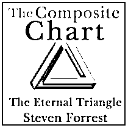

斯蒂芬说，我们的组合图表明无论什么状况我们都能熬过去。

**2**

********此次授课内容********

**组合图描述了如何才能使两个人的关系一直充满活力。**这句话中隐含的意思是假设一段关系有一种区别于这两个个体的独立的生命。有时我们喜欢和一对伴侣共度时光，却从没想过单独见他们其中一人。我们从这对伴侣身上感觉到的 "频率"是对他们组合图能量的直接体验。在某种程度上，可以简单地理解为：**正如每个人都有自己的星图一样，每对伴侣也有他们的星图。**

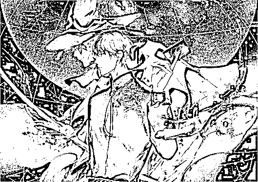

从简单的描述层面上讲，这就是组合图的意涵。记住，我们可以将这一技法用于任何一种关系：**父母和子女、商业伙伴、朋友。**作为进化占星师，我们的目标要比单纯描述走得更深。解读组合图时，可以着眼于帮助人们，而不仅仅是使他们感到惊奇。对于个体来说，出生星图代表了一条正确的人生道路，一条承诺意义、活力、灵性目标的道路。组合图亦然，只不过它将一段关系看成一个独立的个体，而不是两个人。关系也有进化的路径：人们走到一起是为了学习和成长。个体如果没有领会自己出生星图的要点，会变得疲惫而沮丧。两个人也是如此，**如果没有抓住组合图的要点，我们就会对对方感到厌烦。这段关系似乎也会失去动力。**

伴侣常常意见不一，陷入困境，看不到前进的方向。三是一个更有动力的数字。三个人投票，二个人以多数票击败一个人，推动事情继续发展。**这实际上解释了这次工作坊的主题：永恒的三角。**

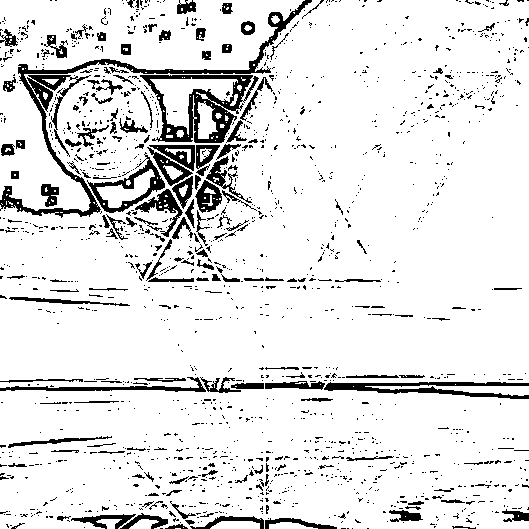

**每对伴侣其实都是一个三人组：你、我以及我们。**组合图所代表的那个看不见的 "第三人"经常会"投出打破僵局的一票"，使关系得以发展。**·** 但是如果组合图总是同意一个人的意见，而不同意另一个人的意见，怎么办呢？（这被称为"封建制度"）**·** 如果两个人都安静而保守，但他们的组合图却要求狂野的冒险呢？（这是 "文化冲击"）**·** 如果它同时均衡地反映了两个人的情况呢？我们可以称之为 "民主"，但我们仍可以区分出一个人天然的智慧比另一个人更强的领域，让擅长的人负责擅长的事，这会促进关系蓬勃发展。换句话说，我们开始看到这个技法的咨询维度了。我们将在这个工作坊中探讨这些内容。两个人究竟为什么会走到一起？**在严肃、复杂的关系中，我们可以假设两个人之间有一些未解决的业力。**如果他们在今生是恋人，但在前世中，一个是父母，一个是孩子呢？也许那些直觉和假设仍可以感受得到，极为错综复杂地使得他们在今生想要成为情侣。**这些疑问将我们引向组合图的月亮交点，在那里我们往往能发现当今人类任何伙伴关系问题的真正核心。**

**从理论上讲，组合图是基于中点的。**如果我的出生星图里太阳在摩羯座中段，而你的太阳在双鱼座中段，我们组合图的太阳就在水瓶座中段。换句话说，**在你和我的太阳的中间位置。****其他行星、月亮交点和中天也是如此。**其他宫头的位置，包括上升点则存在一些争议。通常的做法是仍然使用中点，但斯蒂芬老师将会解释他认为这样做存在的技术方面的问题。他更倾向于**使用关系最初开始的地点绘制星图，就像我们使用出生地来绘制出生星图一样。**

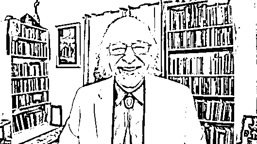

**组合图也像出生星图一样有行进。**在工作坊中， 我们将**探讨一些特殊的技法和考量，来帮助伴侣们应对生活中的挑战和机遇。**组合图的推进会出现一些看似难以解决的复杂问题，斯蒂芬老师创造了一种解决这些问题的技法。他将在工作坊中阐述相关细节，基本的问题是：如你所知，要了解一个人 30 岁生日的推进，我们要看这个人出生后 30 天的行星位置。问题是，组合图与我们在占星学实践中使用的其他星图不同，组合图并不代表某一天的天空。记住，它是基于中点的。**那么我们如何从一个不存在的日期开始 "向下数 30 天"呢？斯蒂芬老师将为我们提供一个行之有效的答案。**

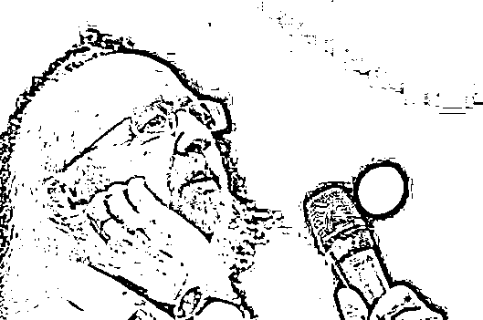

并非所有的人都处于伴侣关系中，但**作为人类，就需要与其他的灵魂共舞。占星学能够极大地帮助人们驾驭复杂的关系。**了解我的星图如何与你的星图通过相位和宫位的交互而产生互动，是非常有帮助的。组合图包含了这些技法，提醒我们，整体总是大于各个部分之和，而又与之不同。

**3**

********斯蒂芬的占星著作********

**·** 1984 年-1988 年间，斯蒂芬写作出版了《内在的天空》（已有中文版）、《变化的天空》和《天空的伴侣》三本占星经典著作，奠定了早期在占星学界的地位。**·** 2002 年-2005 年间，他与朱迪·弗里斯特共同创作了两本经典的关系占星学著作《天空的伴侣 I：爱、性、和进化占星学》《天空的伴侣 II：组合图》。**·** 2008 年，斯蒂芬出版了一本非常重要的著作《昨日的天空》，此书是至今为止关于轮回转世跟星图的清晰对应最详尽的著作之一。 斯蒂芬前后一共出版了 12 部占星著作，在世界占星学界拥有很高的声誉。

**4**

********斯蒂芬获得的荣誉********

1985 年，他凭借《内在的天空》一书获得职业占星师协会奖（*Professional Astrologers Incorporated Award*）。1992 年、1995 年、2008 年、2018 年，他四次获得占星界最高的占星学联合协会奖（*UnitedAstrology Congress Regulus Award*）提名，2018 年获得轩辕十四教育奖。

**5**

********斯蒂芬的占星哲学观********

斯蒂芬的占星风格以**自由和选择**为中心，他的解读不是以下定论的方式来“预测”未来，他**强调如何改善生命，而不是宿命式的论断**。他以心理占星学的语言来解读星图上的人格部分，但是**通过南北交点及其相位和守护星来探索星图所揭示的前世业力与今生方向，在灵魂进化的背景里来整体解读星图。**他认为进化占星学的目的在于**鼓励人们做出更符合进化方向的智慧选择，我们学习去了解前世的时侯，关注点应该集中在如何通过意识来疗愈自己。**

**6**

**这些名人怎么说**

斯蒂芬让我们停止了玩责备命运的游戏，而开始看到自己是一个走在进化路途上的勇士。——奥普拉杂志“*O: THE OPRAH MAGAZINE*”

斯蒂芬和杰夫这两位著名占星师创造性地相互应和，展现出他们出色的教师才华，发展并弘扬了占星这门艺术。（对《测量天空：进化占星学和灵魂的钥匙》的书评）——著名心理占星师 现代占星之父 诺·泰尔（*Noel Tyl*）

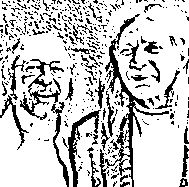

请享用斯蒂芬和朱迪这两个博大的灵魂在此书中所提供的洞见大餐吧。（对《天空的伴侣》的书评）——进化占星学的创始人之一 杰夫·格林（*Jeff Green*）

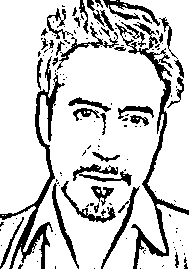

我为斯蒂芬解读的精准感到惊叹，他强调没有一件事是坏得无法挽回的，也没有一件事是如此之好以至于它不会因为现在的错误判断而消失的。我怎样推荐他都不为过！——好莱坞著名影星“钢铁侠”男主角 小罗伯特·唐尼（*Robert Downey Jr*）

**7**

**上过课的占星师怎么说**

他关于我星图的解读，让几乎所有在场的人掉泪，我也从此开启了一段灵魂追寻的旅程。我很惊讶他透过星图可以如此深入一个人的灵魂。很多东西你自己都不知道，但是他讲出来你会发现，啊，这是真的，这是占星学的神奇。——《心探索》创始人孟想

每个来参加老师课程的同学，都会被老师深深的慈悲心感动。这种慈悲心，并不是表面上说的一些什么话，而是一种从意识层次上发出的能量。每个来上课的人，都能感受到老师的爱。这种爱，并不是盲目的爱，而是深刻地洞悉真相后的慈悲。

——斯蒂芬老师工作坊翻译逸月

斯蒂芬老师的一对一咨询已经排期到两年之后，我特别幸运，曾在课堂上被老师抽中分析过我的星图，老师充满爱与智慧的指引让我更加清晰的认识了自我。内在的潜能、需求和矛盾被老师娓娓道来。——禄丽荣斯蒂芬老师是位非常非常值得推荐的大师，很粉他，这位进化占星学的创始人，对人的理解是那么的全面完整、深刻洞见、慈悲和温暖，就这方面而言足可以媲美我无比崇敬的荣格和史坦纳（这两位去天堂里玩了）。如果你对西洋占星感兴趣，或者对人的所有角度、各个层次的真相和可能性感兴趣，推荐斯蒂芬老师的书和课程，特别是他的课程，数倍的功力大增的好机会，错过真是占星粉丝的莫大损失。——仁华

**8**

**2019 年工作坊学员感悟**

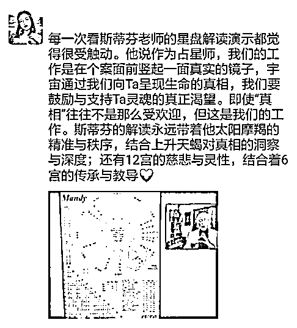

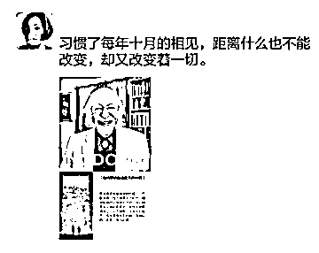

**9**

**什么人适合这门课程**

✦ 占星师或渴望成为占星师的人群。   ✦ 本课程并非针对初学者，需具备若道核心课程 level4 及以上水平，即了解星座、行星、宫位、相位、综合解读等知识。✦ 课程会涉及组合盘解读高阶内容，不了解相关知识的同学，请提前学习相关内容。

**10**

********授课老师********

**斯蒂芬·弗里斯特（Steven Forrest）**

**·** 进化占星学的创始人之一，当今世界最有影响力的占星大师之一；**· **毕业于美国北卡罗莱纳大学宗教学专业；**· **1984 年-1988 年间，写作出版了《内在的天空》、《变幻的天空》和《天空的伴侣》三本占星经典著作，奠定了早期在占星学界的地位。前后一共出版了 12 部占星著作，在世界占星学界拥有很高的声誉。**· **1985 年，他凭借《内在的天空》一书获得职业占星师协会奖（*Professional Astrologers Incorporated Award*）。1992 年、1995 年、2008 年、2018 年，他四次获得占星界最高的占星学联合协会奖（*United Astrology Congress Regulus Award*）提名，2018 年获得轩辕十四教育奖。**· **斯蒂芬将自己的绝大部分时间都花在教学以及个人咨询上，他于 1998 年创立了占星学徒计划（*Astrological Appretice Program*），这个计划致力于培养职业占星师；**· **至今为止已经有 600 余位学员完成了培训，其中很多都成为了优秀的职业占星师；**· **他是一位脚踏实地的导师，充满快乐和活力，亲和幽默同时又充满了智慧；**· **他的课程不仅仅是一次占星知识和经验的学习，也是一次与智者的相遇。

**11**

********课程费用********

**正价：6800 元****早鸟价：5800 元****早鸟价截止日期：2022 年 9 月 15 日**

**12**

********授课时间、方式、退转********

**授课时间：2022 年 10 月 14 日-16 日（周五、周六、周日）7:00-13:00****具体时间安排：****7:00-8:45****（15 分钟休息）****9:00-11:00****（30 分钟休息）****11:30-13:00**

****授课方式：******线上直播课，英文授课，中文翻译**

**课程退转：退款原则请详看《教学协议》，如有疑问请咨询课程顾问。**

****斯蒂芬工作坊 | 探索组合图永恒的三角****

**授课老师：斯蒂芬·弗里斯特**

**授课时间：2022 年 10 月 14 日-16 日（周五、周六、周日）**

**授课方式：******网络授课，英文授课，中文翻译****

**费用：**6800 元**（早鸟价：5800 元，截止日期：2022 年 9 月 15 日）**

**课程负责人：王老师**（微信/手机：18510107057，请备注“斯蒂芬工作坊”）

长按二维码添加课程负责人咨询

****报名直达入口****

# 《古惑仔》《追龙》《怒火·重案》……在冥王星类电影中重温香港回家的路

> 原文：[`mp.weixin.qq.com/s?__biz=MzA5NjA0NTAxNg==&mid=2651480717&idx=1&sn=907b5cfce43cfc14339b98b6083c666c&chksm=8b48d03abc3f592cc6a454863092d737f1ae028214afadd716db0aabfe26cf0bce82450eb12b&scene=126&sessionid=1692737786#rd`](http://mp.weixin.qq.com/s?__biz=MzA5NjA0NTAxNg==&mid=2651480717&idx=1&sn=907b5cfce43cfc14339b98b6083c666c&chksm=8b48d03abc3f592cc6a454863092d737f1ae028214afadd716db0aabfe26cf0bce82450eb12b&scene=126&sessionid=1692737786#rd)

** 后台回复“今日”，给你一句生命态度 **

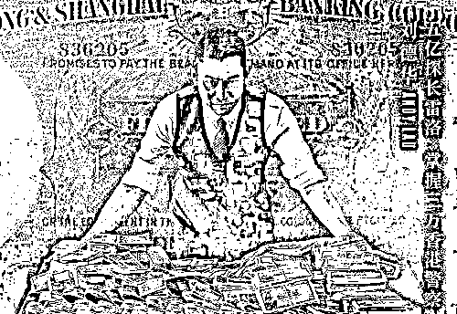

**作者/编辑/玫瑰****图片/网络**相信很多小伙伴都曾是忠实的香港电影迷，香港电影种类繁多，特色鲜明，不仅有帅哥美女，还有各种无厘头和热血沸腾的桥段，一度让我们痴迷不已。而你了解香港电影背后这片土地的苦辣酸甜吗？CSAA（经世占星联盟）香港电影小组经过数个月研究，为大家奉上香港电影、历史、文化的全面回顾和占星学解构，你一定不能错过哦。先来看看这篇文章，本周六、周日还有精彩的直播，欢迎预约哦。<mpvideosnap class="js_uneditable custom_select_card channels_live_iframe" data-pluginname="videosnap" data-headimgurl="https://wx.qlogo.cn/finderhead/PiajxSqBRaEJYnVsqWfEX9qA0sI6hNVKsDfyzfPZ92WZMZyBpZWU5NA/0" data-username="v2_060000231003b20faec8c4e68a1ec2d4ca07e434b07755bbf47e7053a3059defd2c9d6c68a20@finder" data-nickname="若道" data-desc="将在 07 月 16 日 15:00 直播" data-intro="若道经世占星主题分享： 次限 30 年月相周期 --看香港文化发声方式的演变" data-noticeid="finderlivenotice-v2_060000231003b20faec8c4e68a1ec2d4ca07e434b07755bbf47e7053a3059defd2c9d6c68a20@finder-1657602602290461-2059896001" data-type="live"></mpvideosnap>**香港历史文化综述**

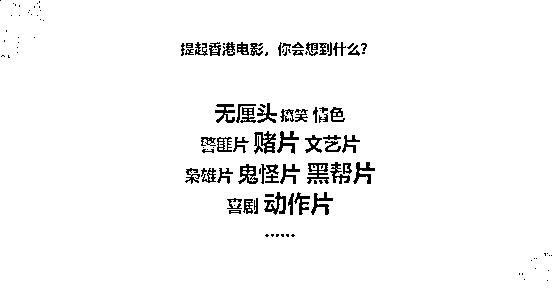

| 文中所有 ppt 页面截图均为作者由经世研究小组汇报内容整理而成
香港电影在全世界来说都是很独特，很有辨识度的，这就涉及到香港历史的独特性。众所周知，香港曾被清政府割让，香港的割让历史追溯起来有两个重要时间节点：**· 1842 年 8 月 29 日**，清政府与英国签订不平等的《南京条约》（原名称《江宁条约》），割让香港岛给英国；**· 1898 年 6 月 9 日**，英国强迫清政府签订《展拓香港界址专条》，强行租借九龙半岛界限街以北、深圳河以南的地区，以及 200 多个大小岛屿，租期 99 年 。

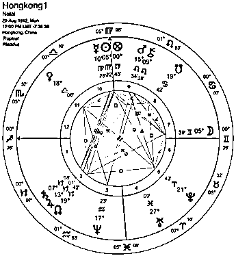

| 1842 年香港星图

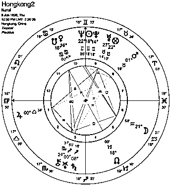

| 1898 年香港星图

由此，香港可以生成两张星图（如上）。其中，1898 年的星图带有非常强烈的英国宗主国统治策略，而电影本身就是一个地区集体潜意识的映射，从这个角度就能理解为什么香港电影如此多元化糅杂在一起。**香港回归前，英国（宗主国）统治控制策略（日冥合相、月冥三分）**

***1.*** **扭曲历史**

将历史扭曲成：“西方人并非入侵者，而是文明的传播者。”可以看到太阳双子座狡辩及分裂的负面特质。

***2.*** **“带毒文化”**

文化跟木星相关，带毒跟冥王星相关；这其中包括：
**· 宗教麻醉**，鼓吹“接受现实生活，相信轮回报应，不管前世今生，一切都是神的安排。”香港电影中呈现出非常多无厘头（双子座）元素，市井小民穷困潦倒又不思进取，得过且过，看似乐观，实则逃避现实；**· 黄赌毒（日-海-冥合相）蔓延**，防止民众清醒，声色犬马又可带来巨大的经济利益；**· 心灵鸡汤**：木星和海王星，主要针对精英人士，比如大学教授及高阶层人士，对这些有一定思想文化意识的阶层采用自由民主的鸡汤来洗脑，同时为其提供体面的工作和生活；**· 对黑帮的纵容**（冥王星）这样一种独特的文化特色，在历史事件中有相应呈现，反映到电影中又会产生非常独特的电影形式。

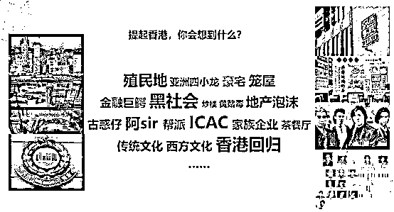

**这些元素在香港星图中的对应**

**· 金星：**钱，合作关系，金融**· 巨蟹座：**家族兄弟，人情，房子，美食**· 木星：**正义法制精神，过度膨胀**· 冥王星：**贪腐、卧底、黑社会、不断摧毁重建**· 摩羯座：**组织架构、现代法制**· 南北交：**进化

**2 张香港星图之间的关联**

**· **1842 香港星图中，金冥对分-火海对分，彼此成信封格局。说明在 1842 年，列强侵略，鸦片横行（火海），清政府试图想通过割让香港，妥协一部分利益获得平衡；

**· **1898 年香港星图中，提到香港，就想到**毒品、黑帮——海王星成瘾和冥王星暗黑**。同时**日海冥双子座也代表商业和贸易**（希腊神话中水星赫尔墨斯代表商贸），双子座对应**“2”**，**香港有 2 张星图，前后有 2 个统治者，回归之后实行一国两制，港人的思想中可能也有两种意识形态。**

**·**** 2 张星图中的南北交点是高度重合的，南交点巨蟹座-北交点摩羯座，仅 1°之差。说明香港的进化议题始终没有改变。**

**·** 1842 年星图中，四分北交的金星对于香港进化发展起到阻碍作用；**·** 1898 年星图中，金星紧密合相南交，合相南交点的行星代表其发展可能是轻而易举的。诚然，被抢占的过程中，香港获得财富资源的能力的确被加强了，其方式更多是**巨蟹座家族式的帮派、家族式企业、房地产、家族联姻**等实现共荣。**但南交点同时是破坏性的发挥，靠拉帮结派、巨蟹座这种方式得来的，从长远进化的角度也滋生大量腐败，这个也跟金星相关。最终香港社会是要发展北交摩羯座——理性架构的法制社会。****香港殖民地时期的特殊组织：黑社会**

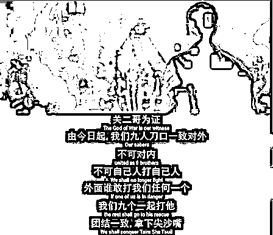

| 港片《黑社会》剧照香港最早的黑社会可以追溯到反清秘密组织洪门，后来发展成了三合会。19 世纪末，会员人数大概占香港华人成年男性的 1/3，最早的收入来源是黄赌毒和保护费。

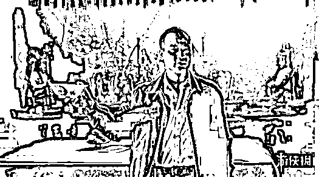

| 港片《黑社会》剧照

****

**爱兄弟，还是爱黄金？**

**——《黑社会》**

香港黑社会跟香港星图中南北交点有紧密的关联。港片《黑社会》中，入洪门时的一个问题便是**“爱兄弟，还是爱黄金？”**所有人都会说“爱兄弟”。现实中也的确如此。这个问题体现出非常强的南交巨蟹座特质，早在 1842 年的香港星图中，金星四分南北交点，有非常强的矛盾特质。就像一个十字路口，你是选择南交巨蟹座（兄弟）还是金星（黄金）？

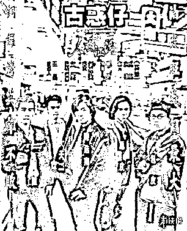

| 19 世纪 90 年代风靡的影视剧系列《古惑仔》

****

**我是不是洪兴人不要紧，陈浩南永远是我的大哥。**

**——山鸡《古惑仔》**

**这句台词仍旧体现出浓厚的巨蟹座兄弟情义。**

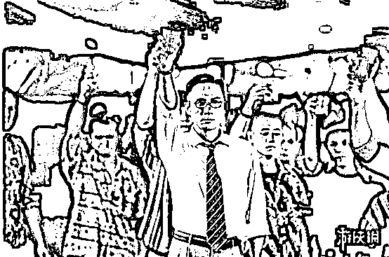

| 《无间道》剧照**香港黑社会认同因果法则，代代传承被作为座右铭。**

****

**出来混，迟早要还的。**

**——《无间道》倪永孝**

这是倪永孝的爸爸倪坤说的话，倪永孝定为人生的座右铭，他的行为处事都以这句话为标准，有仇必报。但是不管倪永孝的手段有多么毒辣，他自己的命运也会对应这句话，要还的。

**香港黑社会的底层逻辑**
香港最早的时候是一个避难所，挤满了各处逃难的人。这么一块小岛，大家为了生存资源必须要抱团起来，黑帮这种民间组织也就应运而生。

**黑帮的义，更多的是一种江湖义气、侠义，不是木星的正义**。这种义更多是为了利，体现的是 1842 年香港星图中的火星狮子座三分冥王星白羊座，“我立山头当大哥，你们跟着我一起去搞事情。”

**最早的香港黑社会是一群边缘人，为了反政府建立的草莽庙堂，他们依靠武力，但也有严格的组织，由兄弟和家族集结在一起，开始为了行侠仗义。最后就发展成市井霸权。互相残杀，唯利是图。**我们可以看到，1842、1898 香港星图中，木星的发展的是截然不同的。**· 1842 星图中，木星在摩羯座合相北交点，跟金星-冥王星成 T 三角格局，木冥蕴含着巨大的财富，但富含冥王星负面色彩，想赚到钱要违背木星的正义感；****·** **1898 年星图中，木星在天秤座白羊点，具有非常强的开创精神。提示着香港需要建立一个更加公平公正的，真正的法治社会。****· 1842 年香港星图中，冥王星在白羊座四分南北交同时四分木星，可见，如何通过现代法制约束和制裁疯狂的黑暗暴力控制，是香港社会一直都存在的议题。**

**1842 年星图中“大十字格局”作用机理**

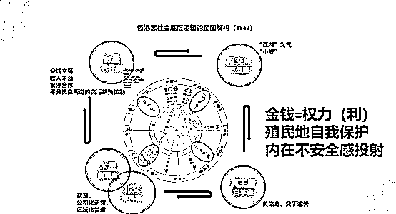

从中可以看到，黑帮所谓的“保护”是“你有钱我就保护你”，杀人越货都没关系。只要给够钱，就能帮你脱罪，权力和权利都是通过金钱来交换。当时的香港社会是一个弃儿，跟英国人也是离心的，**极度缺乏安全感的时候，钱就成了一种自我的保护，永远都觉得钱不够，因为内在的安全感永远是缺失的。这很符合南交巨蟹座破坏性的发挥。**

**1898 年星图主要行星作用机理**

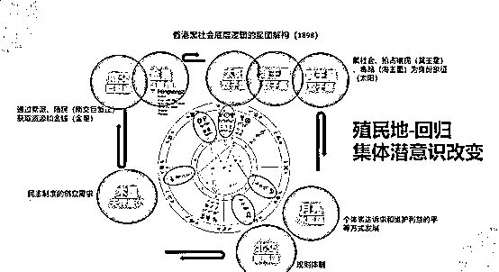

**香港的冥王星电影类型**

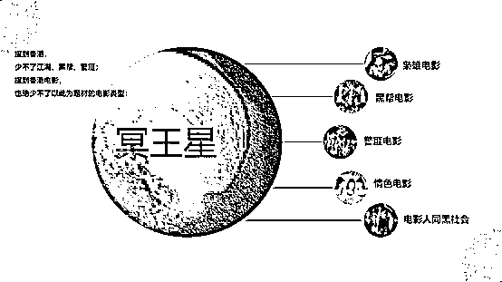

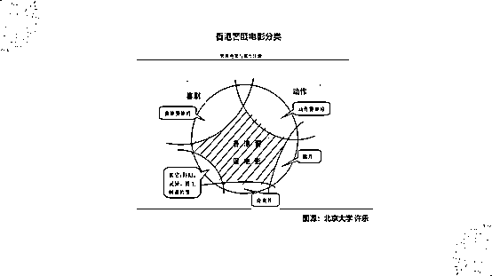

**20 世纪 60 年代警匪、黑帮电影中的贪腐乱象**

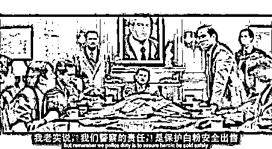

| 图 1

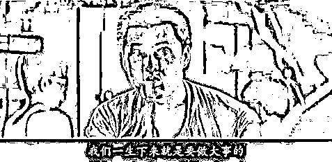

| 图 2

图 1、2 为 1992 年香港金像奖电影《跛豪》剧照，《跛豪》是香港黑帮电影开山之作，跛豪原型为香港黑帮老大吴锡豪。

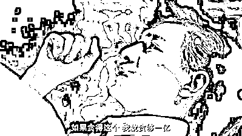

上图为《五亿探长雷老虎》剧照，主角雷洛（刘德华饰演）原型为香港总华探长吕乐。吴锡豪同吕乐一直勾结，从台词中可以看出他们木星的膨胀及冥王星的贪腐。

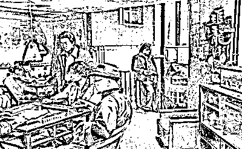

上图为《追龙》中的九龙城寨，九龙城寨是香港“三不管”地带，滋生了非常多的黑帮。

**香港黑社会真人改编系列电影之——《五亿探长雷老虎》**

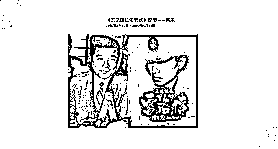

吕乐（1920 年 5 月 16 日-2010 年 5 月 13 日），又称雷洛。生于广东，全家人偷渡去香港。又名吕务乐，人称乐哥、阿叔，有"五亿探长"的称号。**香港警察队刑事侦缉处前总探长，在任时期建立了一套与黑社会制度相关的贪污机制，后沦为香港通缉犯。**

1990 年代后的香港电影，把 4 位通缉犯，吕乐、蓝刚、韩森和颜雄并称"四大探长"。2010 年 5 月 13 日，吕乐于加拿大病亡。

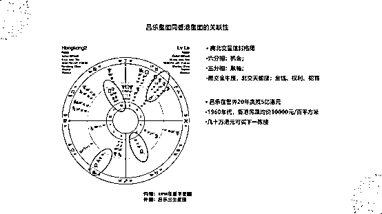

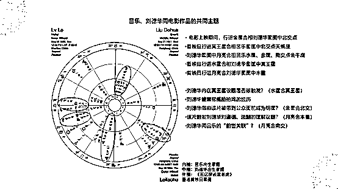

**香港枭雄片代表作——《跛豪》**

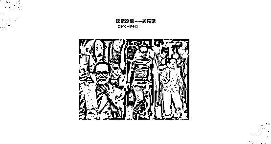

枭雄片被称作为恶人做传。《跛豪》为其代表电影。跛豪原型吴锡豪，广东汕头人，6、70 年代贩毒集团的首脑，活跃在香港泰国以及台湾，他的故事被拍成了很多电影《跛豪》《追龙》《追虎擒龙》等。

60 年代-70 年代，吴锡豪贩毒超过 30 吨，价值 3 亿港元以上，被列为香港毒贩“四大家族”，他跟香港警队高层勾结，还涉及了很多杀人事情。当时香港四大派系的黑帮有 14K、和胜和、四大、潮州帮，潮州帮里面有新义安、福义安、义群等，吴锡豪是义群的领导人，其势力可见一斑。拍《跛豪》的时候，吴锡豪已经在狱中，但是势力还在，导演麦当雄不敢不经他本人同意就拍他的事儿，就去找吴锡豪，被拒，又去找陈慎芝（金盆洗手的黑帮领袖人物，跟吴锡豪有旧交情）。通过陈从中斡旋，吴锡豪同意。但提出了 3 个条件：**· 不能用原名****· 不能拍腿跛的真实原因****· 给老人院捐款 50 万元**

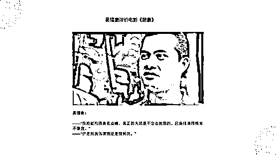

**香港电影翻拍系列——《追龙》**

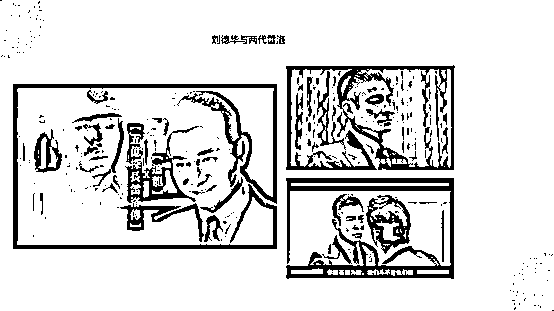

刘德华在两部电影中都演了雷洛，拍摄《五亿探长雷老虎》那时候，他很年轻，《追龙》中明显感觉到形象个性变得非常摩羯座。《五亿探长雷老虎》中的雷洛巨蟹座特质明显，对旧情人念念不忘。他那时意气风发，是个思想很直白的警察，被不公正对待之后感到没有人真正善待自己，也没有什么正义可言，就去贪，人物没有呈现出太多纠结。1991 年和 2017 年中间隔了一个香港回归，2017 年上映的《追龙》中，刘德华饰演的雷洛变得心事重重，非常复杂，同黑帮老大合作中也有很多互相的构陷和不信任。剧中人物开始呈现出权谋、思虑、矛盾的心理，他能够意识到自己在做坏事，而同时又面对着跟香港政府之间的对抗，家国情怀以及正邪的较量。

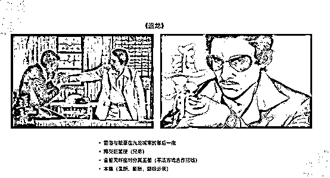

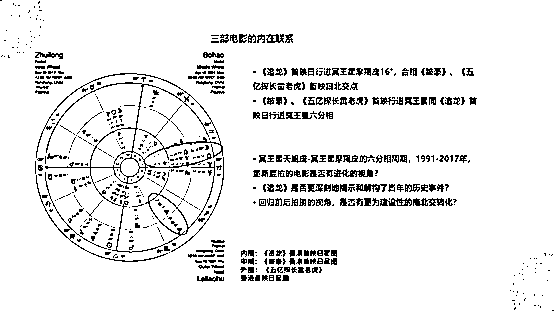

1991 年-2017 年，香港黑社会的冥王星议题在这三部电影中被重新解构，重新翻拍。我们会发现，1991 年时，人物表现出志得意满、膨胀，尽管一个坐牢一个逃亡，但是电影中没有反映出对于罪恶，对自己内在转化的反思。

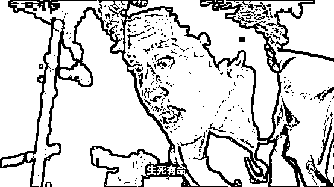

| 《追龙》剧照《追龙》中，华人探长雷洛设置的硬线：不能杀英国警察（摩羯座）。而黑帮首领跛豪对英国警司怒喊：“香港是你们的吗？是我们的！”（巨蟹座）

**《追龙》中体现了爱国情怀的回归，**作为黑帮人物头领，只要我的族人、民族精神受到了侵害，我可以破掉华人警察设置的不能杀英国警察的硬线。

黑帮人物同华人警察之间所代表的“南交巨蟹座”-“北交摩羯座”的纷争和分歧奠定了后期真正法制社会进步的序言。

****

**《追龙》以详实的历史细节，承载虚无的历史记忆，将 1960 年代的香港华人社会描绘成一个封闭的世界。两位枭雄人物伍世豪和雷洛在这个封闭“天下”中，建构了不同于现代法制的乡土秩序（南交巨蟹座-北交摩羯座）。**

**他们由此成为对抗英国统治者及其不公正秩序（木星摩羯座）的代表，体现出浓厚的民族主义色彩。**

**——张隽隽 浙江传媒学院**

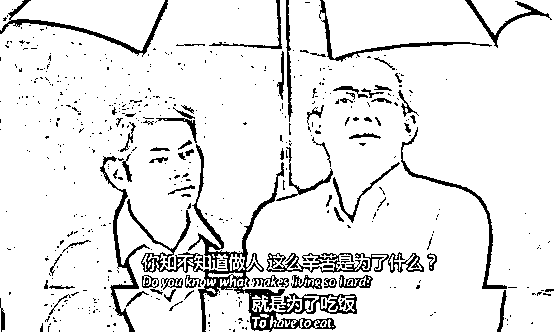

| 《五亿探长雷老虎》剧照

**雷洛：“你知不知道做人这么辛苦是为了什么？就是为了吃饭。“——南交巨蟹座**

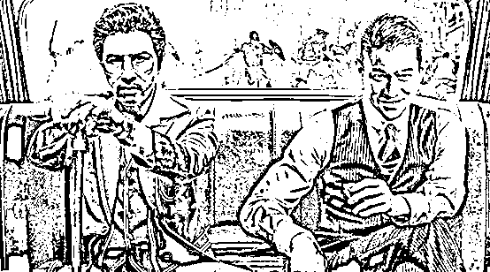

| 《追龙》剧照

**伍世豪：“生我不能掌握，死我也不能掌握，但生与死之间的路，我可以自己选择。”——北交摩羯座**

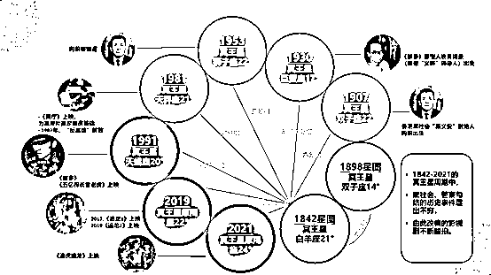

|香港黑社会及其类型片电影的冥王星演化进程

**香港木星发展 I 阶段：道德沦丧期**

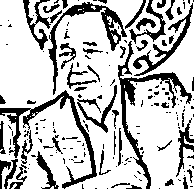

| 前 14K（黑帮）舵主陈慧敏

****

**香港有两套法律，晚上 12 点之前是警察的法律，12 点之后那就是黑社会的天下了。**

**——前 14K 舵主陈慧敏**

**在这个时期，黑社会大行其道，很多人同时拥有警察和黑帮两种身份。这种分裂的社会状态符合 1898 年香港星图中群星双子座的负面表达。**

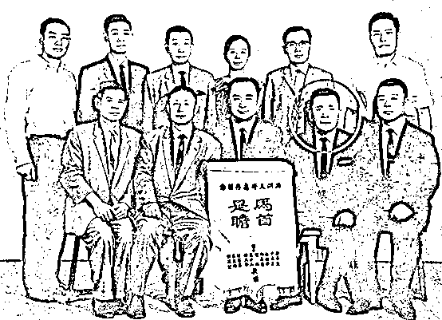

| 香港黑帮新义安——红圈中为新义安创始人向前

向前（1907-1975），广东省汕尾市人，中华民国国民政府军统少将，戴笠的得意门生。抗战胜利后，潜赴香港进行特务活动，在香港创立义安工商总会等，通过包赌及收保护费牟取暴利，被视为黑社会组织新义安创始人。

1953 年被港英政府指控以涉嫌组织黑社会及从事非法政治活动、特务活动为由驱逐出境，迁居台湾。1975 年在台湾病逝。向前（向华强的父亲）跟香港最早潮州帮黑帮关系非常密切。

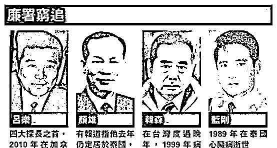

| 四大华人探长

**当时的香港采用以华制华的政治代理人制度，发展出 4 个最有名的华人探长，上图最左为吕乐——总华探长。**他们都参与了黑帮的勾结，当时香港的警察基本上没有人不腐败。

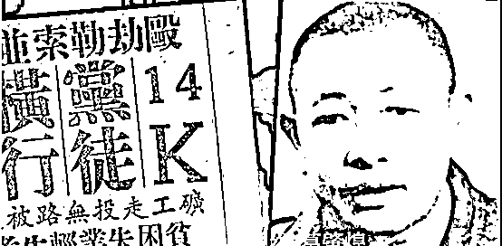

| 香港黑帮组织 14K（Karat/KuoMinTang）,意为比黄金更坚硬的强大组织（金星、摩羯座） 

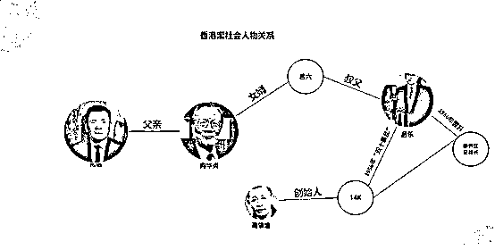

**香港木星发展 II 阶段：道德回归期**
**这个时期被称作“后殖民时代”，大致可归为 1974 年廉政公署之后-1997 年香港回归之前。**

**香港后殖民地时代群体潜意识变迁**

首先，**道德沦丧渐渐在转化**，从影片《追龙》中我们可以看到， 2017 年的人重新结构 1960 年的事情有了不同的视角。南交巨蟹座-北交摩羯座结合着木星，家国精神和民族大义出来了；香港与宗主国英国的对立出来了；从慕强，为恶人做转，崇尚弱肉强食，重回家族、家人、民族传统价值。**香港木星发展 III 阶段：法治建立期**

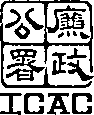

香港廉政公署（*Independent Commission Against Corruption*，缩写 ICAC），1974 年 2 月 14 日组建，是一个与所有的政府机关相脱离的独立的反贪机构。现更名为“中华人民共和国香港特别行政区廉政公署”，由专员、副专员及其他委任人员组成。廉政公署成立以来，一直以执法、预防及教育等三管齐下的方法打击贪污，致力维护香港公平正义、安定繁荣，并获得香港政府及广大市民的广泛支持，也致令香港成为全球最廉洁的地方之一。

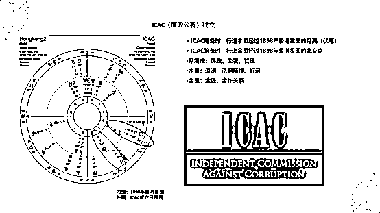

从上图可以看出，**摩羯座代表廉政公署、管理；木星代表道德法制精神，尤其是巨大的好运，木星经过月亮，内在安全感得到巨大提升，月亮水瓶座得以追求真正的人权。**

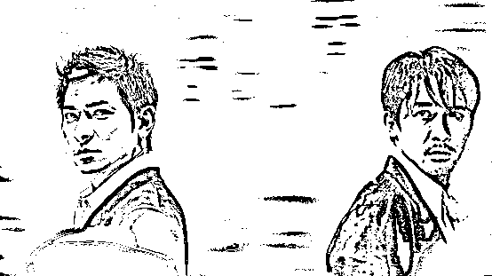

| 《无间道》剧照《无间道》反应的就是真实历史事件。故事发生的时候，香港廉政公署一下子清算了太多警察，警察罢工抗议，香港社会一片混乱，廉政公署不得不妥协，赦免很多警察才慢慢让事情平息下来。香港的警力空虚，需要招收很多警员，黑帮就把他们的人都送到警校里面，互相输送。**香港木星发展 IV 阶段：法治完善期**

这个时期为 1997 年香港回归之后，真正的法制得以建立。香港终于回家了。

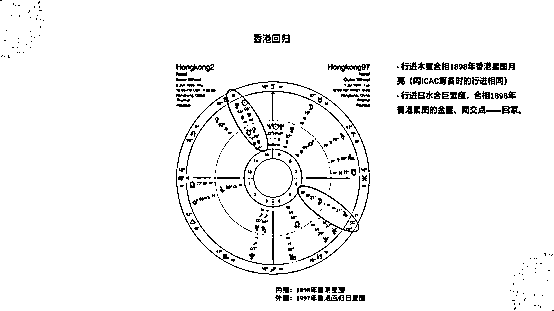

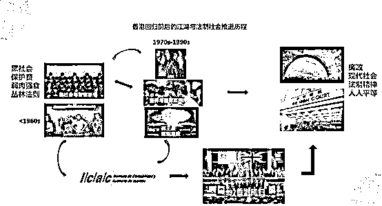

在英国殖民统治时候，香港社会中的个体没有办法抗衡英政府，没有办法真正做到保护自己，只能依赖黑社会去博弈。当香港回归后，真正走到了民主制度，每个人都有被合法保护的人权的时候，黑社会也都有了正经的营生，退出了黑暗的勾当，这就是 1842 年和 1898 年两张星图中木星的变革，打破了规则，实现真正的人文关怀。

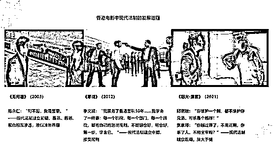

**2021 年，木星回归年的香港电影**

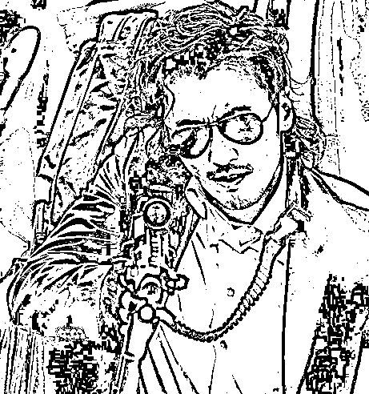

| 2021 年上映《怒火·重案》剧照

**2021 年是香港的木星回归年，每一次木星回归的时候，香港电影都会产生濒死后的蓬勃重生迹象（对于这个历史规律有兴趣的小伙伴，可以拉到文末，预约香港电影经世小组的直播）**。这一次也不例外，2021 年，沉寂多时的香港电影又开始燃爆，《怒火·重案》的票房更是超过 11 亿，问鼎港片前五。这部电影上映后不久，导演陈木胜便离世了，也带给我们深深的巨蟹座的怀念之情。票房高热之时，也是进化考验之时。香港电影一度被称为炒旧饭，不断翻拍、反刍曾经的主题，似乎并无新意。那么，**2021 年的香港警匪电影里有没有真正呈现出属于现代法制社会的公正裁决呢？****让我们从《怒火·重案》中一探究竟。**

《怒火·重案》讲述的是，重案组布网围剿国际毒枭，突然杀出一组蒙面悍匪“黑吃黑”，更冷血屠杀众警察。

重案组督察张崇邦（甄子丹饰）亲睹战友被杀，深入追查发现，悍匪首领竟是昔日战友邱刚敖（谢霆锋饰）。原来敖也曾是警队“明日之星”，而将敖推向罪恶深渊的人，却正是邦。

这部剧的最后，匪徒邱刚敖（谢霆锋饰）同警员张崇邦（甄子丹）有一个对决，最终邱刚敖身亡。打斗过程中，邱刚敖一直在哭，但不是因为痛，也不是因为害怕，他是委屈，他一直在跟张崇邦讲：**“如果没有你，我不会当警察，你为什么不保护我，你要去保护一个贼？”**这是属于巨蟹座的委屈。

张崇邦在追捕邱刚敖的过程中也违背了警局的规则，因为他怀孕的妻子被邱刚敖绑架了。每个人都经历了这样的考验：**为了保护我爱的人（巨蟹座）要以身试法（摩羯座），那么法律到底有没有情，是不是基于情感基础上的一种法制？**

****

**游戏规则我们很清楚，但是曾几何时，我们可以很坚持也是因为信念。这个世界，真的不是只有黑和白，也存在着灰色地带。阿敖会黑化，大概就是因为在被放弃的瞬间，坚持的信仰崩塌了。****常在河边走，哪有不湿鞋的，我们不可能永远不踩过界。所以不要站在自己的角度去评价别人，因为我们不知道他们曾经经历了什么。******——张崇邦（甄子丹饰演）********《怒火·重案》****

反观香港电影史会发现，**很多警匪片、黑帮片都反映出情与法之间两难的道德悖论**，也因为这种情（巨蟹座）与法（摩羯座）的拉扯，为了兄弟是非不分，而生出非常多黑色地带和冤案。

香港电影中总会体现出真实的人性纠结。如电影借由张崇邦这个角色所流露出的，曾经被放弃过的香港，信仰是不是崩塌了？一个弃儿还要去仰仗抢占自己的人，我们也无从知晓这片土地上的人内心曾经历了什么。

1997 年香港回到了祖国的怀抱。黑社会开始有很多机会，不会再做以前的事。**现代法制的进程也令南交巨蟹座和北交摩羯座之间有了更好的平衡点，也会引发更多港人产生超越于曾经黑暗社会意识的深层思想进步。**

然而，孩子又回到了母亲怀抱的时候，香港要怎么样再站起来？港片如何再创辉煌？也许港人不断地通过电影展现出的挣扎，这就是冥王星南北交撕心裂肺的转化。香港有着一群非常敬业、努力的电影人，在向他们致敬的同时，我们期待未来的香港警匪电影能够呈现出更多建设性的内涵。转化不易，但总有希望，祝福香港。

**版权声明：**原创文章由作者授权首发于若道平台，欢迎转发，反对抄袭。友号转载请申请白名单。

**END**

**玫瑰**

英国 City University Busiess School 管理学硕士

2015 届若道核心课程认证毕业生，若道微信公众号兼职编辑

占星师，咨询时长超过 1200 小时

**个人微信号：**stillrosy

**公众号**：一个娘娘 

长按二维码，给作者打赏

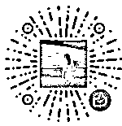

**想要了解更多香港电影和历史文化？****来听直播吧！**

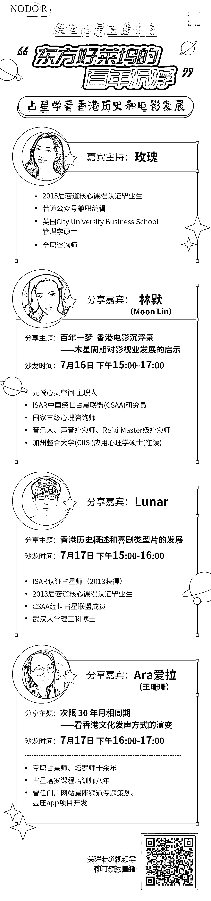

**20 位来自世界各地的占星师****带来 19 场沙龙——新世界的觉醒****详情可点击下图**

**学习占星学****点击下图了解课程详情**

**微信又双叒叕改版啦，不想错过若道君的推送？**

**就把若道设为星标吧！**

**▼**

**喜欢就点一下“在看”吧！**

********报名直达入口********

# 大师沙龙下周二开讲！好莱坞明星的“御用占星师”是啥样的？

> 原文：[`mp.weixin.qq.com/s?__biz=MzA5NjA0NTAxNg==&mid=2651480717&idx=2&sn=dea1e9458f8d960730ad05baa3d43905&chksm=8b48d03abc3f592c2e4276c810452eff9fa6bcfea87c3ba9ac0fe00b193723cee82b06549908&scene=126&sessionid=1692737786#rd`](http://mp.weixin.qq.com/s?__biz=MzA5NjA0NTAxNg==&mid=2651480717&idx=2&sn=dea1e9458f8d960730ad05baa3d43905&chksm=8b48d03abc3f592c2e4276c810452eff9fa6bcfea87c3ba9ac0fe00b193723cee82b06549908&scene=126&sessionid=1692737786#rd)

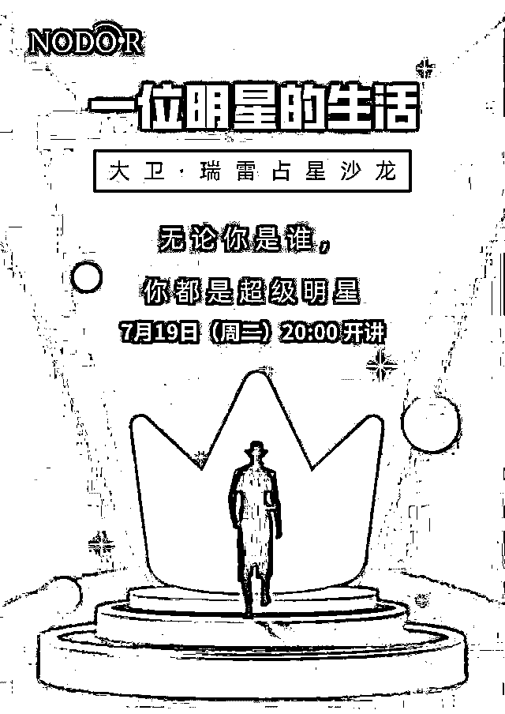

**拥有****51 年****占星实践经验的****若道创始人****前 ISAR 全球副主席****前 ISAR 全球职业占星师资质认证主席****大卫·瑞雷**将分享他职业生涯中的**一个精彩名人案例**用此人的星图为我们展示**L1-5 阶**核心课的**知识点**
本沙龙特别适合**零基础的占星爱好者**&**计划系统学习占星的学子**

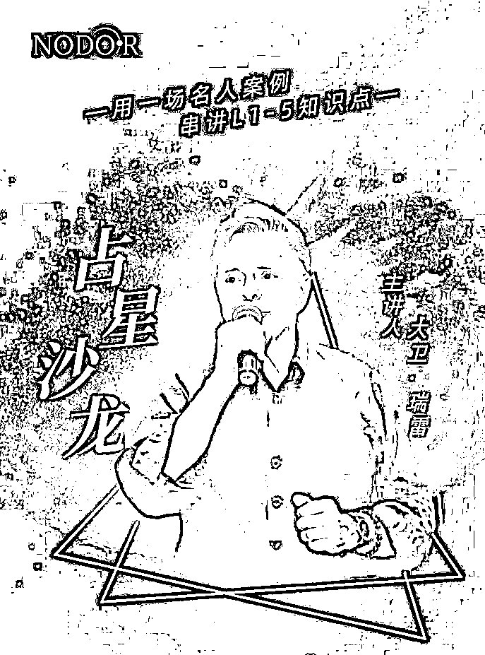

大卫老师非常擅长
透过案例分析教授占星学生动的故事与占星知识完美结合给大家留下了深刻的印象这场沙龙大卫老师将分享**他在好莱坞作为职业占星师的人生经历**
与某位明星相识相知的故事一路见证 TA 的发展轨迹好莱坞明星的生活似乎离你很远 他们获奖，走在红地毯上 从大屏幕看上去他们的形象比现实更高大 他们好像和我们生活在不同的世界 然而，在现实生活中**他们也面临着和其他人一样的问题和挑战** 生活往往因为他们的名声和恶名而变得更复杂 与世界各地的人一样**好莱坞明星也会寻求专业占星师的建议** 以帮助他们更好地理解自己的生活 而其中的那个“TA”究竟是如何一步一步走到镁光灯下的这一切，由著名的占星师大卫·瑞雷从占星视角为我们一一揭开**TA 的身份将在沙龙中揭晓** **沙龙内容大纲**

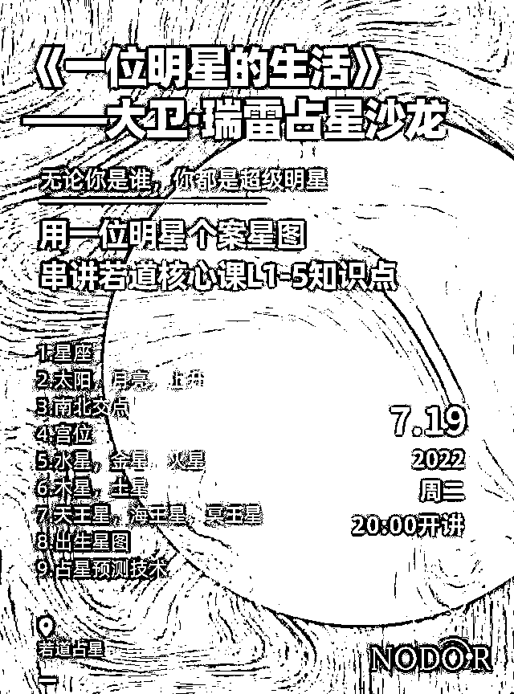

**沙龙详情**

**沙龙时间**：**2022 年 7 月 19 日 星期二  20:00-22:00**

**主讲人**：大卫·瑞雷

**参与方式**：网络直播（进入若道公众号页面，点击“全部直播预告”后进入页面，预约大卫老师的沙龙）

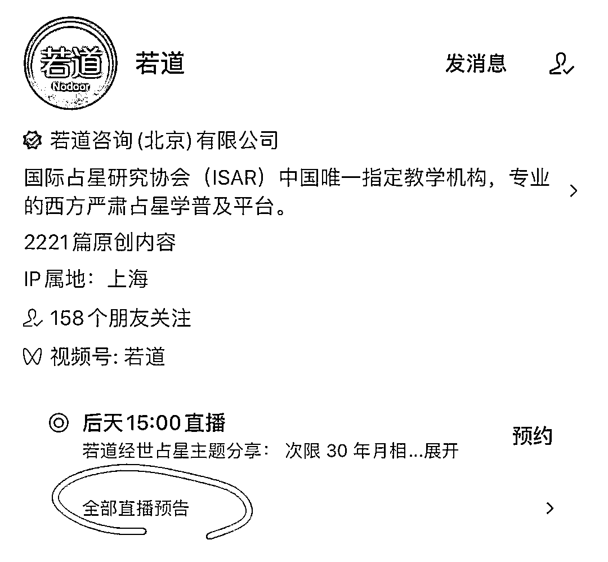

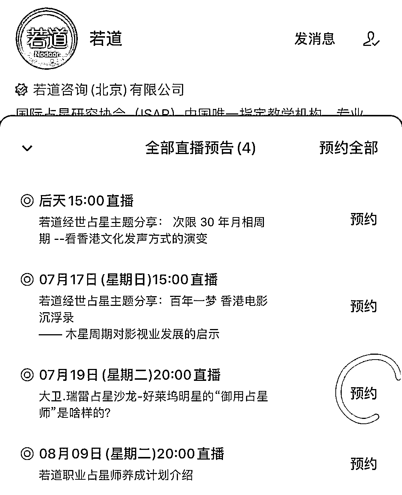

**主讲简介**

**大卫·瑞雷（David Railey）**

*   **I****SAR 董事会成员，ISAR 全球副主席，ISAR 全球职业占星师资质认证主席，若道占星创始人**。

*   2016-2019 年，被选为国际占星协会（ISAR）考试委员会成员，国际占星协会（ISAR）是世界最大的国际占星机构，会员遍布 47 个国家。

*   2017-2020 年，被选为国际占星联盟（ISAR）考试委员会主席，理事会成员。

**「**

**直播回放**

**」**

**想听直播回放？**

**98****元可购买**

**长按二维码添加客服**

▼

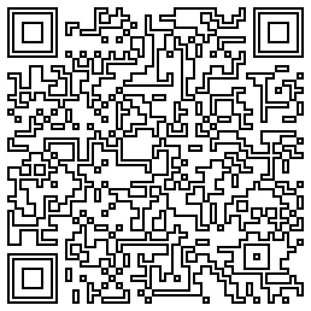

# ISAR 认证职业占星师必修课 | 这个世界上，没有后悔与占星学相遇的人

> 原文：[`mp.weixin.qq.com/s?__biz=MzA5NjA0NTAxNg==&mid=2651480717&idx=3&sn=0377ad507dca3ae1b3b8c7148aa6d0f5&chksm=8b48d03abc3f592c086e9c7f13b35a1840e788fe50833ea3dde7f60e2db6eb50c03b429d94c6&scene=126&sessionid=1692737786#rd`](http://mp.weixin.qq.com/s?__biz=MzA5NjA0NTAxNg==&mid=2651480717&idx=3&sn=0377ad507dca3ae1b3b8c7148aa6d0f5&chksm=8b48d03abc3f592c086e9c7f13b35a1840e788fe50833ea3dde7f60e2db6eb50c03b429d94c6&scene=126&sessionid=1692737786#rd)

5 月，一个若道的老朋友突然发来一段微信，是对木星进入白羊座的感慨。这位朋友创建了自己的公司，他并不在占星行业，但仍经常记录占星日记，因为他总是体会到星体移动和个人生命变化的契合。

过了几天，又一位若道的老朋友发了一张当天新闻的图片，里面有医疗板块产业趋势、有啤酒股的泡沫问题、有千年老二的饮用水公司也要上市。她说，看，举目全是海王星。她也不是占星师。

然而，他们都与占星相遇，占星已经融入了他们的生活。

第一位朋友说：“在若道学习占星，对我来说建立了一个整体的世界观以及对自我内在的解释论。”

第二位朋友说：“学了占星就会知道，事情来时我们不必过度反应，知道一切会过去”。

占星学会改变你，不论你跟随它走多远，不论你是否选择成为占星师。

这个世界在飞快地变化着，占星学可以像定海神针，帮你测度这个世界的变化，也帮助你校正心中的自己和世界的样子。

**这个世界上，应该还没有后悔与占星学相遇的人。**

**8 月 30 日，新的若道占星核心课程要开始了。**

如果你还没有下定决心是不是好好学占星，那么 L1-2 可谓一个轻松的前菜，等着你品尝。

**把这个仅需投资 2800 元的课程作为礼物，送给自己或者自己所爱的人。**

**课程试听：不分组转发本文，找王老师领取。**

长按二维码添加王老师微信

**谁是你的老师？**

**占星师咔咔（Caroline）**

2010 年师从美国占星师大卫·瑞雷学习，并得到世界名师斯蒂芬·弗里斯特、罗伯特·汉德、苏·汤普金斯传授各种占星学技法。若道首届学员，国内最早获得 ISAR 职业占星师资质的职业占星师，2019 年第二届、2021 年第三届核心课中和苏·汤普金斯老师一起教授若道核心占星课程。

在国际知名广告公司和市场研究公司从事的市场研究和推广工作十余年，曾任职于阳狮集团、尼尔森市场研究有限公司、MTV 和《Madame Figaro》杂志。

**大卫·瑞雷（David Railey）**

*   **I****SAR 董事会成员，ISAR 全球副主席，ISAR 全球职业占星师资质认证主席，若道占星创始人**。

*   2016-2019 年，被选为国际占星协会（ISAR）考试委员会成员，国际占星协会（ISAR）是世界最大的国际占星机构，会员遍布 47 个国家。

*   2017-2020 年，被选为国际占星联盟（ISAR）考试委员会主席，理事会成员。

**助教王嘉祺 （Conrad）**

ISAR 认证占星师、若道认证生时校正资质，从 2010 年起自学占星学，2015 年开始在若道系统学习，并开始个案咨询。2018 年担任若道核心课程助教，以及卜卦占星学和太阳返照选修课助教，并带领学员进行经世占星和太阳返照方面的研究。2019 年 11 月作为演讲人之一参加了国际占星协会（ISAR）北京大会，也是 ISAR 星空俱乐部中国区第 16 期的主讲人。

**内容是什么？**

**开课时间和课程费用**

**８月３０日开课，每周一次，20：00-22：00，10 节课。**

**★ 1-2 阶 **

**早鸟价：2800 元（2022 年８月１日之前）**

**课程费用：3500 元 **

**你也可能想学更高阶：**

**★ 1-3 阶　连报**

**早鸟价：10500 元（2020 年８月１日之前）**

**课程费用：11500 元 ****★ 1-5 阶　连报**

早鸟价：33000 元（2020 年８月１日之前）

**课程费用：46500 元 **

德国哲学家雅思贝尔斯说：

教育是一棵树摇动另一棵树，

一朵云推动另一朵云，

一个灵魂唤醒另一个灵魂。

你准备好被摇动了吗？

**退转课程**

**退款原则请详看《教学协议》，如有疑问请咨询课程顾问。**

**课程试听**

**不分组转发本文，加王老师获取。**（微信/手机：18510107057，请备注“大卫核心课”）

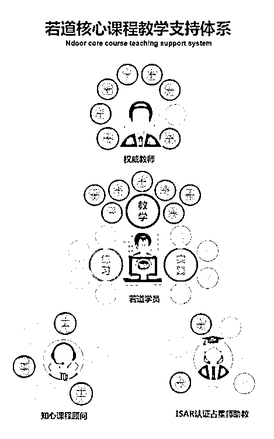

****2022 L1-2 认证职业占星师必修课程****

**授课老师：大卫·瑞雷、咔咔**

**直播课开课时间：2022 年 8 月 30 日（周二）**

**授课方式：******网络授课，英文/中文授课，中文翻译****

**费用：**3500 元**（早鸟价 2800 元,8 月 1 日前）**

**课程负责人：王老师**（微信/手机：18510107057，请备注“大卫核心课”）

长按二维码添加课程负责人咨询~

****报名直达入口****

# ISAR 星空俱乐部沙龙明晚等你！丨美国奴隶制的遗留问题和种族主义

> 原文：[`mp.weixin.qq.com/s?__biz=MzA5NjA0NTAxNg==&mid=2651480584&idx=4&sn=fea7347c9f145abf062839d204bc8383&chksm=8b48d0bfbc3f59a9959fbb167fe26c3018b125bce4f1f43dce7a1b2a132449d1d83cfbcd2a23&scene=126&sessionid=1692737786#rd`](http://mp.weixin.qq.com/s?__biz=MzA5NjA0NTAxNg==&mid=2651480584&idx=4&sn=fea7347c9f145abf062839d204bc8383&chksm=8b48d0bfbc3f59a9959fbb167fe26c3018b125bce4f1f43dce7a1b2a132449d1d83cfbcd2a23&scene=126&sessionid=1692737786#rd)

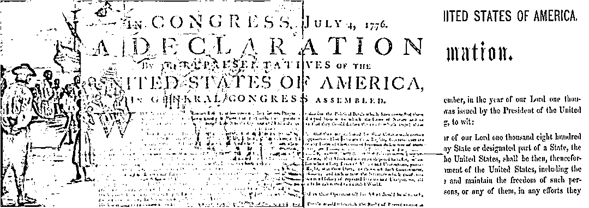

**沙龙来啦！****7 月 15 日，星期五晚上 8 点，**国际占星研究协会（ISAR）中国星空俱乐部沙龙由**大家熟知的大卫·瑞雷老师**来一场讲座！ **沙龙主题****沙龙主题：**关于美国国家星图中火星-海王星四分相的经世占星学调查报告——特别是关于美国奴隶制的遗留问题和种族主义******主讲人：**大卫·瑞雷****

**沙龙时间：7 月 15 日，星期五**

**                北京时间 20:00-21:30（有英文翻译）**

**沙龙方式：线上沙龙**在这份报告中，我将把占星学依据与历史事实和时事联系起来。就像一个正在展开的犯罪故事，里面有无辜的受害者、幸存者、暴民暴力、英雄和恶棍，我们将看一些他们的星图。在大多数犯罪活动中，有罪的人往往最有可能歪曲事实，说出与事实相矛盾的话。有罪的人可能会戏剧性地、令人信服地表达自己，做出浮夸的陈述来鼓动他人，并把我们的注意力从更敏感的地方转移。1776 年 7 月 4 日的情况就是这样，有罪的一方是奴隶主托马斯·杰斐逊（Thomas Jefferson），他在《独立宣言》中写下了著名的一段话：**“我们认为这些真理是不言而喻的，人人生而平等，造物主赋予他们若干不可剥夺的权利，其中包括生命权、自由权和追求幸福的权利。”**“人人生而平等”的说法与美国奴隶制的现实（包括托马斯·杰斐逊本人拥有奴隶）之间的矛盾，甚至在《独立宣言》首次发表时就被指出。

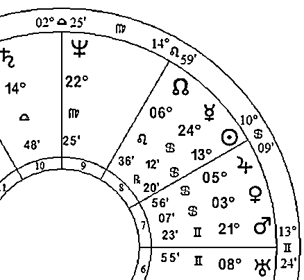

很多占星师，包括我自己，长期以来都认为**美国国家星图中位于双子座 21°的火星与位于处女座 22°的海王星的四分相，其中一个征象是代表了美国奴隶制和种族主义的悠久历史。**尽管如此，我从未测试过这个假设。2020 年 5 月，乔治·弗洛伊德（George Floyd）在明尼阿波利斯市被警察谋杀后，我开始挖掘历史记录。2020 年 6 月，我在微博上写下了一些我的初步发现，以及关于 2020 年 6 月 12 日亚特兰大警方谋杀雷沙德·布鲁克斯（Rayshard Brooks）的评论和占星趋势。尽管在 2020 年 6 月之后，我没有在微博上重温这个主题，但在过去的两年里，我继续对火星-海王星四分相进行研究，并发现了一系列惊人的巧合。在 4°的容许度内，追踪这个火星-海王星的变动度数，一个可以将 400 年间的人物和事件联系到一起的模式出现了。其结果远不止是一个将点点滴滴串联起来的犯罪故事调查，它让我们得以一窥美国黑人克服重重困难，寻求自己的生活、自由和幸福的传奇故事。**主讲嘉宾**

**大卫·瑞雷**

我不需要在这做个人简介了。在中国，大部分国际占星研究协会（ISAR）成员都认识我或者已经知道我了。你们很多人可能想知道，“为什么大卫要讲与美国奴隶制和种族主义相关的占星学？”嗯，你看这张 1978 年的照片里，那个留着胡子、头发蓬乱的家伙正在和亚特兰大市长梅纳德·杰克逊握手——那就是我!在 20 世纪 70 年代，我曾支持梅纳德·杰克逊（Maynard Jackson）成为亚特兰大第一位黑人市长，他最终成为了我的客户。在这张照片中，他任命我为亚特兰大市占星审查委员会（*City of Atlanta Board of Astrology Examiners*）的委员。我之所以在这里提到这一点，是因为我的根在亚特兰大，这里是马丁·路德·金（Martin Luther King Jr.）的诞生地，也是上世纪五六十年代民权运动的中心。在我成长的过程中，民权运动给我留下了深刻的印象，当时的亚特兰大正经历着从一个以当地白人权力结构为主导的种族隔离城市，向一个在商业和地方政府中为黑人提供机会的种族融合城市的转变。所以，这就是我做研究并参加中国星空俱乐部讲座的动机。那么，你为什么要参加这个讲座呢? 因为我将**使用适用于任何经世占星学实践的技法。**任何你感兴趣的世界事件、全球变化、国家星图、世界历史等，都可以使用经世占星学来研究。对了，顺便说一下，这是一个引人注目的人类故事，一个与我们息息相关的故事——我们都可以从中学习很多。是的，占星学很迷人，你会发现这点……**如何参加沙龙？**本讲座也是本月的国际占星研究协会（ISAR）星空俱乐部讲座。**ISAR 会员可以免费收看。**请注意邮件通知，具体参与方式见邮件。❶ 如果你**已经是 ISAR 会员**，请注意邮件通知，告知如何参加。❷ 如果你**不是 ISAR 会员**，非 ISAR 会员价格：98 元。如有任何问题请咨询工作人员童老师（微信：nodoorDaivd）

**非 ISAR 会员报名请长按下图**

**▼**

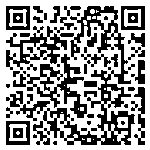

**ISAR 明星俱乐部**

2018 年，ISAR 在主席亚历山大·因舍阿吉克的带领下，成立了 ISAR 明星俱乐部，每月为全球 ISAR 会员提供在线直播讲座，邀请全球著名占星师开讲，学习和分享新的理念。讲座时长一小时，涉及占星学的不同领域、不同观点，每个会员都可以参与其中，每次讲座之后还有 20-30 分钟问答时间向老师们提问。每一场在线讲座都会记录下来，ISAR 除了提供视频，还会提供相关的讲座资料，以及单独的问答录音，自动发送到专门的 ISAR 明星俱乐部页面存档，每位 ISAR 会员可以在 ISAR 网站上自己的会员主页俱乐部页面找到。在 2018 年最初几个月，ISAR 明星俱乐部会每月举办一场在线演讲。之后，两周举办一场演讲，最终每周举办一场演讲。
但是，过去明星俱乐部讲座只有英文沙龙，因此，中国会员只有懂英文才能受益。为了使得更多不懂英文的中国会员能够受益，我们特别和 ISAR 总部协商，今后会安排有中文翻译的明星俱乐部占星沙龙，作为给中国 ISAR 会员的福利！**如何成为 ISAR 会员？**

**如果你也想成为 ISAR 会员，请复制链接在浏览器打开**

http://www.nodoor.com/isarcert.do?contentId=3588（仅支持网站支付）

**或直接长按下方二维码，微信购买会员：**

**ISAR 会员有什么福利？**一年期会员仅需支付**人民币 510 元**，即可享受：**☆ 星空俱乐部免费沙龙****☆每年出版 3 次的《国际占星师》（目前只有英文）；****☆每周电子邮件交流汇总杂志（目前只有英文）；****☆专项研究基金和奖学金资格；****☆ISAR 主办的会议和论坛的会员折扣，包括国际占星大会（UAC）、ISAR 的会议和研讨会等会员权益。****有疑问怎么办？**关于 ISAR 星空会员俱乐部以及我们的讲座，如果你还有任何疑问，**请联系工作人员**：

**yiyi**

**微信：YY18513802156**

**若道 Conrad**

**微信：nodoor2016**

****非 ISAR 会员报名请点击“阅读原文”****

# 2022 年若道 ISAR 选修课 | 《医疗占星手册》作者亲授

> 原文：[`mp.weixin.qq.com/s?__biz=MzA5NjA0NTAxNg==&mid=2651480584&idx=3&sn=bcfe9c0b25282cd03bd6ffbf2c6b6d22&chksm=8b48d0bfbc3f59a9d174a28fd7759c3a9ccb9d65096cc05de07a8a965efb05cec18402ef82d2&scene=126&sessionid=1692737786#rd`](http://mp.weixin.qq.com/s?__biz=MzA5NjA0NTAxNg==&mid=2651480584&idx=3&sn=bcfe9c0b25282cd03bd6ffbf2c6b6d22&chksm=8b48d0bfbc3f59a9d174a28fd7759c3a9ccb9d65096cc05de07a8a965efb05cec18402ef82d2&scene=126&sessionid=1692737786#rd)

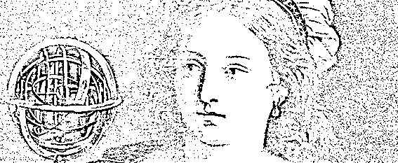

**有四个主要因素影响着我们的生活和健康：基因构成、物质环境、情绪环境，以及我们的占星配置。我们在星图中都存在患病的可能性，而预防的方法在于尽可能充分、真实和健康地生活。****——简·里德·帕特里克****（Jane Ridder-Patrick）博士**

占星学就像心灵的 X 光片。它可以描述个人对世界的看法和反应。我们越不了解自己的天性，面对生活中的挑战，我们就会有越少的选择。

**“占星学可以精准定位需要解决的潜在问题。”**

**医疗占星学是一个强大的工具，同时洞察的身体和心理过程，通过更多的自我认知照顾和关爱自我和身边的人。**

**本课程既适合医疗占星学的初学者，也适合已经有一些相关经验的人****。**简·里德·帕特里克老师将运用现实生活中的例子，揭示一个人的性格、症状及其星图是如何相互映照的。课程也会探讨疾病的意义以及可能的治疗方法。

**本课程旨在为学员提供一个运用医疗占星学的框架和方法，**学员将会学到一些有价值的实用工具，在课程结束后，自己使用这些工具研究其中的关联性。

**此课程可作为 ISAR 选修课。**

1

**课程安排**

**课程时间：2022 年 9 月 20 日-11 月 8 日  每周二 20:00-22:00**

**第*****1*****讲  9 月 20 日 与占星学、心理学、病症一起工作**

*   医疗占星学的组成部分以及如何使用它们

*   行星的作用与相互作用

*   黄道星座人

*   宫位的重要性

*   疾病和健康是如何产生的

**★ 第二、三、四讲的课程内容基于星座以及它们之间的相互作用。**

**第*****2*****讲  9 月 27 日 基本星座**

学习基本大十字星座——**白羊座、巨蟹座、天秤座和摩羯座**——及其功能和相关的健康问题。**这些星座与防御、养育、结构、体内平衡和荷尔蒙控制有关。**

****第*****3*****讲  10 月 4 日 固定星座****

学习固定大十字星座——**金牛座、狮子座、天蝎座和水瓶座**——及其功能和相关的健康问题。**这些星座与习惯和反射、心脏调节、生存、循环和协调有关。**

“固定星座（金牛座、狮子座、天蝎座和水瓶座）在情感和生理上都倾向于**‘难以放手’**，这可能为恶性肿瘤的生长创造环境。所以说，他们可能倾向于沉浸在过去的伤害中，难以自拔。另一方面，这些星座也擅长在艰难的时期坚持不懈并一直**持之以恒**。”——简·里德·帕特里克（Jane Ridder-Patrick）博士

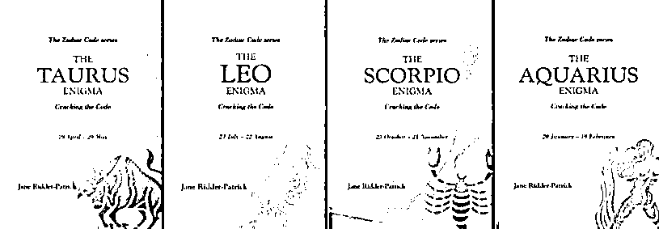

**第*****4*****讲  10 月 11 日 变动星座**

学习变动大十字星座——**双子座、处女座、射手座和双鱼座**及其功能和相关健康问题。**这些星座与呼吸、神经系统、肠道、睡眠以及信息、情感和行动的整合有关。**

**★ 第五、六、七、八讲重点学习行星，它们在身体层面的表达、它们的相位与行进。**

**第*****5*****讲  10 月 18 日 太阳与月亮**

**太阳**掌管视觉、活力、心脏和意识，与心脏、脊柱和视觉问题相关。**月亮**掌管人体的周期，特别是月经周期、饮食模式和体液，与情绪引起的疾病、饮食失调和胃病相关。

**第*****6*****讲  10 月 25 日 土星与天王星**

**土星**掌管着皮肤、骨骼、牙齿和衰老过程。它对应的疾病包括慢性疾病、耳聋、帕金森病、关节僵硬和牙齿问题。**天王星**代表身体活动的协调，有节奏的脉动和身体的“电”。与天王星相关的疾病包括癫痫、痉挛、心律失常，以及阿斯伯格综合症和自闭症样综合症。

**第*****7*****讲  11 月 1 日 海王星与冥王星**

**海王星**掌管松果体、细胞膜渗透和右脑功能，与过敏、上瘾的病症、慢性疲劳综合症和睡眠障碍相关。**冥王星**掌管消除和转化，其病理包括毒性、脓肿、癌症和强迫症。

**第*****8*****讲  11 月 8 日 火星**

**火星是与能量和防御相关的行星**，掌管免疫系统、肾上腺功能、肌肉活动和炎症反应。**它是许多身体和情绪障碍的核心**，如自动免疫障碍、抑郁和发烧，以及由手术或需要手术引发的问题。

2

**此次课程适合哪些人？**

*   有一定占星学基础，若道核心课 L3 以上水平；

*   希望成为优秀的占星师，想要借鉴国际大师医疗占星解读思路并融入自己的体系的人；

*   热爱占星学、健康、养生的研究型占星学者；

*   计划考取 ISAR 认证占星师，寻觅中意选修课的学员；

*   走在自我探索和个人成长道路上的人。

**快来和简·里德·帕特里克老师学习升级版的占星学身体地图吧！**

3

**授课老师**

**简·里德·帕特里克 **博士****

（Jane Ridder-Patrick）

简接受过药剂师、理疗师、草药师、心理治疗师和历史学的专业学习，从事写作、咨询和讲学工作，在英国和全球教授占星学及其历史、当今的心理学和医学应用。她在爱丁堡执业，在爱丁堡大学获得博士学位，研究方向是 17 世纪苏格兰占星学历史。

**她最著名的出版物是《医疗占星手册》。2018 年，她因对医疗占星学的贡献而获得了著名的查尔斯·哈维占星学杰出服务奖。**

《医学占星术手册》（第二版，修订版和扩充版）

(爱丁堡，克拉布出版社，2006 年)

4

**课程信息**

*   **课程时间：**2022 年 9 月 20 日开始，每周二晚上 8 点，每周一次，共 8 次课。

*   **授课方式：**线上直播，英文授课，中文翻译

*   **课程价格：****6800 元**

*   **早鸟价：5800 元（截止日期：2022 年 8 月 23 日）**

*   **课程咨询：**王老师（微信：18510107057，请备注“医疗占星”）

长按二维码添加王老师

5

**退转课程**

*   **退款原则请详看《教学协议》，如有疑问请咨询课程顾问。**

****医疗占星****

**授课老师：**简·里德·帕特里克

**授课时间：**2022 年 9 月 20 日起

**授课方式：**网络课程**，**英文授课，中文翻译

**费用：****6800 元****（早鸟价：5800 元，2022 年 8 月 23 日截止）**

**课程负责人：****王老师**（微信：18510107057，请备注“医疗占星”）

长按二维码添加课程负责人咨询~

****报名请点击“阅读原文”****

# 年度最大摩羯座超级满月 | 理性与感性拉扯最厉害的时刻到了！

> 原文：[`mp.weixin.qq.com/s?__biz=MzA5NjA0NTAxNg==&mid=2651480584&idx=1&sn=11f2d9a9b786e892437dfa0d654490c6&chksm=8b48d0bfbc3f59a9e97062dacccded727017c0bb88e13f69679f858b4d534f3bcc68cb8313ea&scene=126&sessionid=1692737786#rd`](http://mp.weixin.qq.com/s?__biz=MzA5NjA0NTAxNg==&mid=2651480584&idx=1&sn=11f2d9a9b786e892437dfa0d654490c6&chksm=8b48d0bfbc3f59a9e97062dacccded727017c0bb88e13f69679f858b4d534f3bcc68cb8313ea&scene=126&sessionid=1692737786#rd)

**☆ 后台回复“今日”，给你一句生命态度**

作者/王芝桦 编辑/玫瑰 图片/pexels

**摩羯座满月****北京时间 2022 年 7 月 14 日 2:37 迎来摩羯座满月，巨蟹座太阳与摩羯座月亮于 21°21′精准对分。****此次摩羯座满月是 2022 年度最大的“超级满月”。**“注重理性，重视结果”的摩羯座知道自己的职责是尽力打开又大又圆的月亮光束，促发事物的高潮，照亮现实的结果，故而，即使在记录“情绪图谱”的月亮能量管道里，即使在“情绪图谱”最为激荡的满月时刻，摩羯座依然尽力保持着沉稳的状态和理智的情绪。摩羯座满月发生在倾向“情感关爱和心灵滋养”的巨蟹月（6 月 21 日-7 月 22 日），而月亮正是巨蟹座的守护行星。故而，即使摩羯座月亮再沉稳或再理智，也依然会不时地听到情绪“砰砰砰”的敲门声。故而，摩羯座满月也是**最容易在“理性与感性”之间撕扯的月相**，而摩羯座满月的“巨蟹座太阳-摩羯座月亮”对分轴线，亦提示我们**在“内心初衷和现实结果”之间做出全新的整合。**

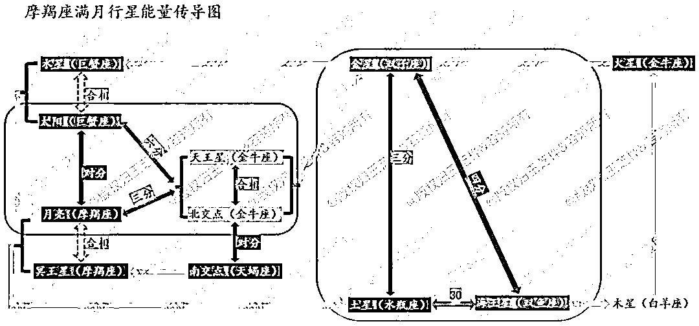

**摩羯座满月重点影响人群**

参考满月峰值影响期间各个行星的行进度数，以及逆行行星的轨迹影响；常规容许度，个人行星入相位 3°，出相位 1°；非个人行星入相位和出相位均为 3°。

**·** 出生星图中，有**行星、四轴、南北交点落入****基本星座（白羊座、巨蟹座、天秤座、摩羯座）****14°-30°**的人群； **· **出生星图中，有**行星、四轴、南北交点落入******固定星座（金牛座、狮子座、天蝎座、水瓶座）15******°-28°**的人群；**·** 出生星图中，有**行星、四轴、南北交点落入****变动星座（双子座、射手座、处女座、双鱼座）****19°-30°**的人群。

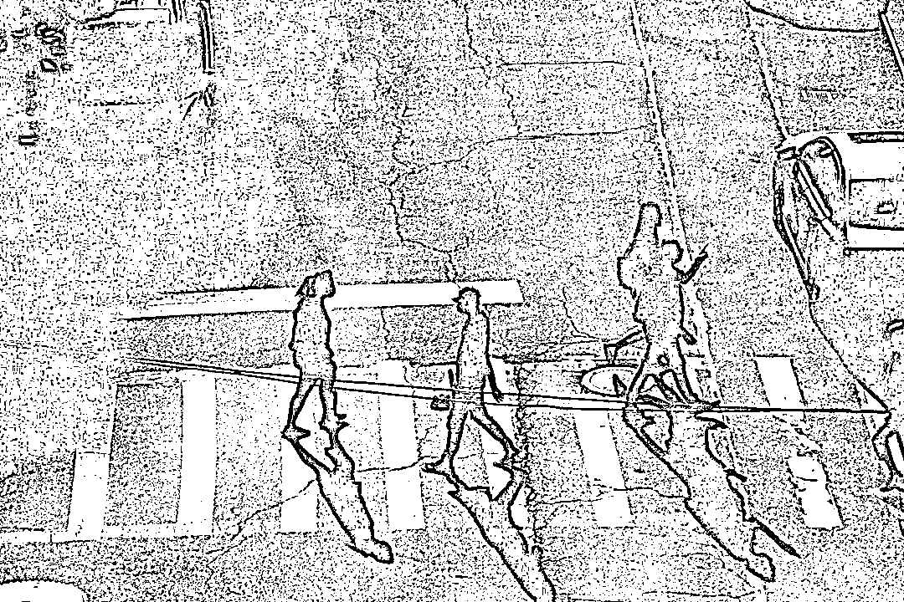

**交割成绩，回归初心**

> ****天象：****
> 
> **· 月冥合相：宽泛容许度下，月亮与冥王星合相于摩羯座。**
> 
> **· ****日水合相：宽泛容许度下，太阳与水星合相于巨蟹座。**

**黄道 12 星座中，摩羯座象征着“社会身份和公众形象”，意在成就生命在社会层面和公众视野中的“最高自我”。**在这里特别强调的是，摩羯座刻画的“公众身份和最高自我”是一个发展的过程，亦是我们一生的目标，而绝不是某一时刻的结果。

满月的“完结能量”总是将事物推向高潮并呈现结果，故而，摩羯座满月就更需要**小心“执着结果，忽略发展”的风险。**特别是此次摩羯座满月，宽泛容许度下，摩羯座月亮合相了揭示“业力议题”的摩羯座冥王星，提示我们**小心觉察那些“只能更好，不能后退”的执念。**

**当下一轮冥王星行进摩羯座周期是 2008 年-2024 年。**

随着 2021 年底，同样与业力相关的南北交点换座进入“天蝎座南交点-金牛座北交点”轴线，更是令描述“业力线索”的天蝎座南交点与揭示“业力议题”的摩羯座冥王星一体共振（冥王星守护天蝎座），打出一套歇斯底里的“业力组合拳”。

2022 年，这个世界太过震撼：俄乌打打打，北约扩扩扩，欧盟乱乱乱，疫情变变变，国际晃晃晃，首脑走走走……这个世界怎么了？不知道宇宙中其他星球看着地球是个什么感觉，而地球上的占星师只能说**“165 年一次的‘木海合相双鱼座’魔法格局，看不见时皆在酝酿，看得见时已成轨道”。**当下正处于“新老周期”的转化进程中。从 2020 年开始，我们就已进入这一轮摩羯座冥王星周期的“交割期”——拿到过去十几年积累下来的“成绩单”。但是，摩羯座冥王星周期是野心过盛、执着结果的十几年：“只能更好，不能后退”的执念成为了一种无意识的道德要求，遇到考验便恐惧失控，遇到挫折便批判失责，故而，飞速发展的时代也呈现出心理性的脆弱，人们拒绝“成绩不佳”的结果。问题是，**那些只能更好的执着，那些不能后退的恐惧，那些未达预期的失控，那些成绩不佳的失责，已经成为绊住脚步且身心俱疲的沉重负担。**最近一段时间，一些朋友可能感觉过去的某些议题、曾经的某些考验似乎又回来了。

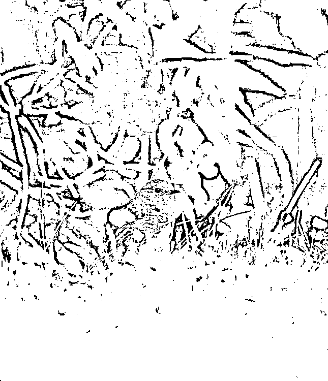

其实，我们终其一生都是成长的过程，不存在过不去的困境，亦不存在全做完的功课；而最重要的是，**面临同样议题或类似考验的我们，是否已与过去的自己不同，是否已经学会成熟并积聚力量！**而这，才是摩羯座成就“公众身份和最高自我”的真正意义。此次摩羯座满月的前后一周，一些过去的记忆或尘封的往事再次浮现心头，提示我们**觉察那些裹着硬壳的内在伤痛和带来限制的内在模式，引领我们与那些毫无生气且毫无营养的事物一一告别。**在此次摩羯座满月的月光下，我们与冥王星相遇，如果勇敢凝视冥王星的眼睛，那么它会告诉我们：比起现实的结果或答案，更重要的是我们看待现实的视角和对待现实的心态，不要做现实的被动反应者，要做生命的主动选择者——**放下那些带来束缚的执念，放下那些理想化的预设，回归生命本然的天性，重遇生命内在的初衷。****酝酿之中，摸索前行**

> ****天象：****
> 
> **· 天王星介入南北交点轴线****：金牛座天王星合相金牛座北交点，对分天蝎座南交点。**
> 
> **· ****天王星介入日月对分轴线：金牛座天王星六分巨蟹座太阳，三分摩羯座月亮。****· ****金土三分：双子座金星三分水瓶座土星。****· ****金海四分：双子座金星四分双鱼座海王星。**

首先，我们先来回顾一下近期发生的**“土海 30°”**这个天象背景。虽然“土海 30°”结构的重点影响期是**5 月 17 日-6 月 23 日**，但因为土星和海王星两颗行星的逆行原因（土星逆行 6 月 5 日-10 月 23 日，海王星逆行 6 月 28 日-12 月 4 日），“土海 30°”结构将会在**2023 年 1 月 6 日**再次形成。也就是说，**2022 年下半年一直笼罩在“土海 30°”结构的能量影响之下。****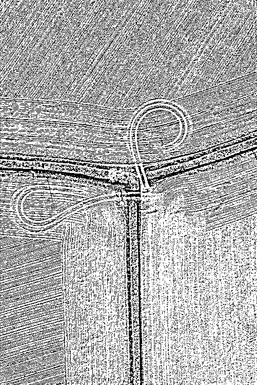**土星和海王星的能量几乎是“相反”的：**·** 土星落地于现实，海王星超越现实；**·** 土星代表现实的规则与边界，海王星代表联结“现实和无垠”的能量通道；**·** 土星就是在现实红尘中工作，但海王星就得“现实红尘和灵性世界”两边跑，需要“上得去”，也需要“下得来”，否则就坠入“打着灵性旗号，实则逃避现实”的风险。土星和海王星，联名讲述了一件事：**灵性在宇宙，修行在红尘。**

“土海 30°”这组结构的好处是：**土星拽着海王星不着地的脚，敲碎虚假，撇去泡沫，尽量将那些看不清和摸不着的事物落地规整；海王星帮助写满“现实规则”的土星，升起无限的意识，超越有限的狭隘。**

但是，“土海 30°”这组结构的风险是：**没那么快！需要整合！**就像“灵性落地”这件事，干过的人都知道，哪有那么容易。至少，2022 年下半年，无论是集体层面，还是个人层面，我们依然会有**前途未卜**的感觉。那怎么办？难道还停下来不成？此次摩羯座满月的能量，由“土海 30°”结构中的水瓶座土星（土星守护摩羯座）接纳，提示我们现在要做的就是——**向前走，去摸索，去行动！别想太多，莫问结果，一切皆在酝酿之中！只有在前行之中，才能接轨全新的旅途。**此次摩羯座满月，金牛座天王星合相金牛座北交点，与“巨蟹座太阳-摩羯座月亮”的对分轴线形成和谐结构、与巨蟹座水星形成六分结构；而接纳金牛座天王星和金牛座北交点能量的双子座金星则介入“土海 30°”结构，三分水瓶座土星，四分双鱼座海王星。**这几组结构将会带来意外的消息和出奇的变化，但当下依然是“一切皆在酝酿之中”。**

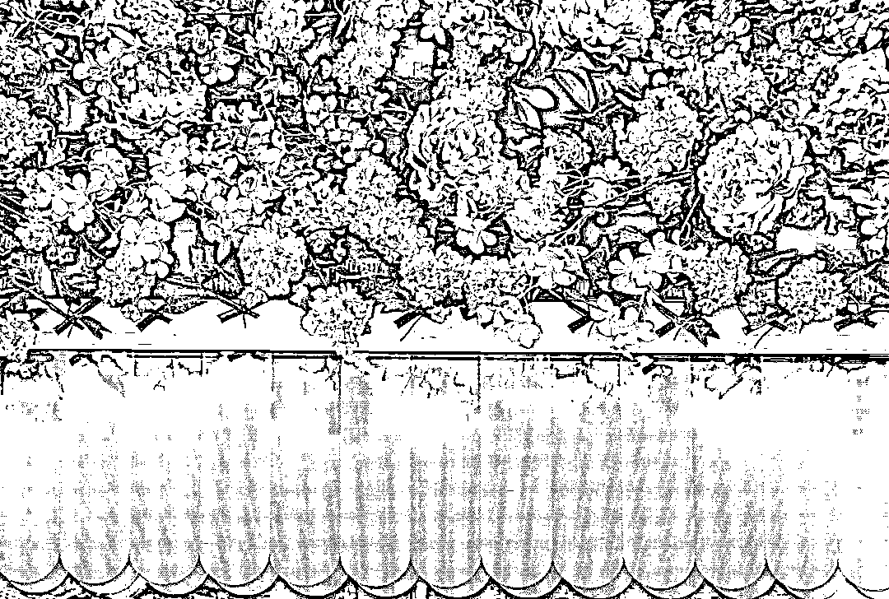

**你可能经历的**

**职场：****·**一些企业和机构将会出现**战略调整或架构重组**的情况，新的任命和新的流程也要求这些组织内的员工做出快速反应并积极适应；**· **一些朋友开始**制定长远的事业规划，重新确立自我的职业定位**，并对现有工作和其他岗位进行全面衡量，哪一个更适合自我特质，哪一个更符合内在志向，哪一个更利于实现价值；**· **满月周期，**建议主动争取更有发展空间的工作岗位**，如果你有跳槽转岗或自主创业的计划，就要积极行动起来。**关系****· **一些朋友将会邂逅浪漫的机缘，一些朋友将会推进恋情的发展，一些朋友将会重修情感的温度，一些朋友将会重建家庭的凝聚力；

而那些画大饼的人、欺瞒性的关系，也将会被戳破真相，关键是我们自己愿不愿直面真相，敢不敢勇敢面对，而及时止损是必要的。

**集体****金融领域和地产行业可能出现突发性的新闻，随后相关的政策和制度也将陆续颁布。**但这仍然只是一个**皆在酝酿、不断完善**的过程，需要推动，但亦需要时间。此次摩羯座满月，尽管我们的情绪容易在“理性与感性”之间徘徊，但满月的能量正在提示我们**透过现实事件，望向内心初衷**——那些挫败感受和失落情绪的背后，是否隐藏着“只能更好”的预设？那些重遇旧日议题而触发的恐惧心理和对抗本能，是否隐藏着“不能后退”的执着？我们是否还保持着最初的发心，是否已偏离了最初的目标？

**“金牛座天王星合相金牛座北交点”这组结构，从 6 月底开始发酵，并将于 7 月 27 日达到精准。**如果说这组结构在向我们传递“一切变革只为返璞归真”，那么此次摩羯座满月就正在向我们提示**“放下执念，回归初心”。**

其实，从 2020 年开始的这一场“新老周期”的转换进程，让我们看到——**简单做自己，是最快乐的，但也是最难的。**

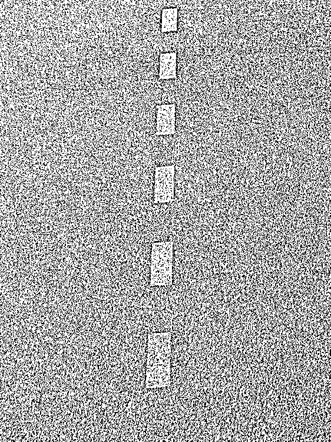

**寄语**写这篇满月文的过程中，我觉察到自己缺乏“感性”，这段寄语更是憋了一个小时。这可是我以前写得最酣畅淋漓的一个部分啊。或许这就是摩羯座满月“沉稳且理智”的能量吧，但作为作者，我希望自己的文字有些温暖和力量。于是，我赶紧将自己的感知调到“温暖和滋养”的巨蟹座频道，然而，我听到自己的心在说：“有了再写，没有为难自己干什么？”好吧，是我执着了。此文，是一个真实的过程，到此结束。祝愿朋友们：灵魂要安好，身体要健康。

**版权声明**：原创文章由作者授权首发于若道平台，欢迎转发，反对抄袭。友号转载请申请白名单。

****

****想阅读更多作者的文章，********请在后台回复******王芝桦****** 即可。****

****王芝桦****

心理占星师，统合疗愈师，占星专栏作者

若道占星“新月和满月”专栏作者，腾讯视频特约占星师

全职于个案咨询与占星教学工作 18 年

**个案预约咨询微信号**：zhihua0621 

**微信公众号**：daoxi-life

**长按打赏**

********

**20 位来自世界各地的占星师****带来 19 场沙龙——新世界的觉醒****详情可点击下图**

**学习占星学****点击下图了解课程详情**

**微信又双叒叕改版啦，不想错过若道君的推送？**

**就把若道设为星标吧！**

**▼**

**喜欢就点一下“在看”吧！**

********报名直达入口********

# 从医疗占星学看待疾病，我们有哪些惊人发现？

> 原文：[`mp.weixin.qq.com/s?__biz=MzA5NjA0NTAxNg==&mid=2651480584&idx=2&sn=f6afdfbd366372fc996cced8e07ecccd&chksm=8b48d0bfbc3f59a9254d9bacdacc12be7a52e7ad42d93010257fdb1487c5eea0c375efbdf44f&scene=126&sessionid=1692737786#rd`](http://mp.weixin.qq.com/s?__biz=MzA5NjA0NTAxNg==&mid=2651480584&idx=2&sn=f6afdfbd366372fc996cced8e07ecccd&chksm=8b48d0bfbc3f59a9254d9bacdacc12be7a52e7ad42d93010257fdb1487c5eea0c375efbdf44f&scene=126&sessionid=1692737786#rd)

作者/劳拉·邦德

翻译/leisha 校对/王宏

编辑/翀子 图片/网络

话说，大家知道吗？占星学里有个学派叫做医疗占星学。它是对于现代医学也有一定的助力，人们可以从星图上看出你潜在的疾病类型，从而进行预防和治疗。另外，若道开设的 ISAR 选修课《[医疗占星](http://mp.weixin.qq.com/s?__biz=MjM5MjQwNjAyMQ==&mid=2649440007&idx=5&sn=0c3b75900bbdc76a353af986181f2d45&chksm=beb9506d89ced97bdddaa8a0d79dcf04dec09c8c7e834f89486b7375c330a21550c605b3941a&scene=21#wechat_redirect)》课程也在报名中，由《医疗占星手册》的作者简·帕特里克讲授，欢迎点击链接了解详情哦。

**占星与疾病之间存在联系**

**没有占星学知识的医生不能自称为医生。**

**——现代医学之父希波克拉底**

你只需看看成千上万份刊载占星专栏的杂志和报纸，就会知道我们中很多人都深受占星学的影响。最近的一项调查发现，30-40%的美国人“相信占星学，并认为他们的人生由星体主宰。”

虽然有些人可能会把这门古老的学科贬斥为“迷信的无稽之谈”，但有证据表明占星学正在东山再起：它再次成为大学的教学科目——在英国、法国、俄罗斯、德国、美国——这是自文艺复兴以来的第一次。

但是占星学与疾病有什么联系呢？**世界著名的医疗占星师简·帕特里克**说：“**占星学可以精准定位需要解决的潜在问题**。”尽管有人想当然地认为占星学是令人沮丧的宿命论，但事实并非如此：

**有四个主要因素影响着我们的生活和健康：**基因构成、物质环境、情绪环境，以及我们的占星配置**。我们在星图中都存在患病的可能性，而预防的方法在于尽可能充分、真实和健康地生活。**

**——**简·帕特里克****

根据简·帕特里克的说法，**每个星座都有广泛的可能性**。例如，那些双鱼座的人有潜力去扮演殉道者（以他人为先）的角色，但是他们也有能力成为伟大的治疗师。

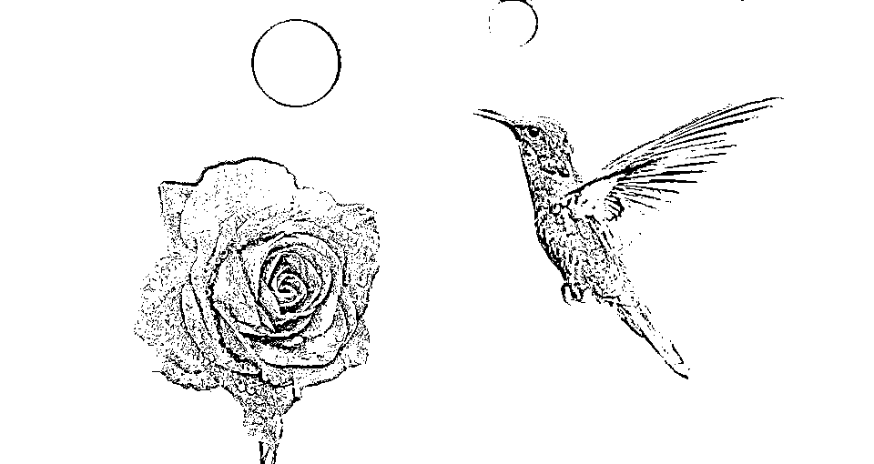

**医疗占星包含哪些内容？**

那么医疗占星咨询涉及哪些内容呢？简·帕特里克有这样的步骤：

*   **首先，会请客户提供详细的病历，以及他们出生的日期、时间和地点。**

*   **然后，绘制他们的星图，观察在他们的病情确诊之前，在占星层面和情感层面上发生过什么。**

根据简·帕特里克的说法，癌症的主要病因之一，除了有害的生活方式之外，就是未解决的情绪冲突：她通常会在症状出现前的 18 个月至 2 年间寻找触发因素。

她曾这样说：“当我为癌症患者服务时，我的任务之一就是识别出他们生活中的‘恶性肿瘤’，并帮助患者将其消除。”

**医疗占星师还可能帮助你确定做手术的最佳时间，或是指出你每个行星位置的优缺点**：比如，阵容强大的星群落入双鱼座可能与过敏有关，而巨蟹座人则可能发觉自己泡完热水澡后会疲惫不堪。

**固定星座（金牛座、狮子座、天蝎座和水瓶座）在情感和生理上都倾向于‘难以放手’，这可能为恶性肿瘤的生长创造环境。所以说，他们可能倾向于沉浸在过去的伤害中，难以自拔。另一方面，这些星座也擅长在艰难的时期坚持不懈并一直持之以恒。**

**——**简·帕特里克****

“癌症人格”中比较突出的一点通常是**难以表达情绪**，而且你可以从星图中看出这一点。“客户星图中突显的土星可能表明害怕表达自己的需求，或者害怕展现真实的自己。”（来自简·帕特里克）

发现癌症的身体部位也可能给出有关根本病因的线索。简·帕特里克曾表示：“例如，卵巢与孩童、创造力、家庭有关。所以说，如果某人患有卵巢癌，那么问题可能在于此人无法表达自己的创造力，或是无法做到滋养和关怀。”

有趣的是，母亲的癌症恰好发生在自己的孩子开始离开巢穴时。

医疗占星师可能也会查看金星在客户星图中的位置。

**金星代表使我们快乐的东西，因此如果金星得不到满足，我们就不会快乐——而不满是滋生疾病的温床。**

**——**简·帕特里克****

如果金星落入双子座（前文中母亲的案例），这表明你渴望趣味、变化、沟通、心智刺激和灵性工作。在患癌之前，这位母亲就觉得自己的生活缺乏快乐和意义。

**理解她的灵魂渴求转变——更多的旅行、更多的学习、更多的乐趣，这可以帮助和支持到这位母亲。**

她说：**“星图中的每个因素都为我们提供了广泛的可能性。所以说，重要的不是我们的遭遇，而是我们如何回应这些遭遇。”** 

**版权声明：**原创文章由若道翻译发布于若道平台，欢迎转发，反对抄袭。友号转载请申请白名单。

**END**

**ISAR 选修课【医疗占星学】上线**

**医疗占星学是一个强大的工具，同时洞察的身体和心理过程，通过更多的自我认知照顾和关爱自我和身边的人。**

**本课程既适合医疗占星学的初学者，也适合已经有一些相关经验的人****。**简·里德·帕特里克老师将运用现实生活中的例子，揭示一个人的性格、症状及其星图是如何相互映照的。课程也会探讨疾病的意义以及可能的治疗方法。

**本课程旨在为学员提供一个运用医疗占星学的框架和方法，**学员将会学到一些有价值的实用工具，在课程结束后，自己使用这些工具研究其中的关联性。

**此课程可作为 ISAR 选修课。**

**授课老师**

****简·里德·帕特里克 **博士******

**（Jane Ridder-Patrick）**

简接受过药剂师、理疗师、草药师、心理治疗师和历史学的专业学习，从事写作、咨询和讲学工作，在英国和全球教授占星学及其历史、当今的心理学和医学应用。她在爱丁堡执业，在爱丁堡大学获得博士学位，研究方向是 17 世纪苏格兰占星学历史。

**她最著名的出版物是《医疗占星手册》。2018 年，她因对医疗占星学的贡献而获得了著名的查尔斯·哈维占星学杰出服务奖。**

**对医疗占星学有兴趣？**

**点击下图了解更多详情吧**

**

**微信又双叒叕改版啦，不想错过若道君的推送？**
**就把若道设为星标吧！****▼**

**喜欢就点一下“在看”吧！**

********报名直达入口********

# 这个“搞笑”的星座是有点智慧在身上的

> 原文：[`mp.weixin.qq.com/s?__biz=MzA5NjA0NTAxNg==&mid=2651480387&idx=1&sn=62e666cacb96130936228a00b6619063&chksm=8b48d3f4bc3f5ae2f554a9d68ca27f74132aeda3abf9e284ba764d0f444d115f83daf1442d7d&scene=126&sessionid=1692737786#rd`](http://mp.weixin.qq.com/s?__biz=MzA5NjA0NTAxNg==&mid=2651480387&idx=1&sn=62e666cacb96130936228a00b6619063&chksm=8b48d3f4bc3f5ae2f554a9d68ca27f74132aeda3abf9e284ba764d0f444d115f83daf1442d7d&scene=126&sessionid=1692737786#rd)

******☆ ****后台回复“今日”，给你一句生命态度******

作者/大卫·瑞雷  若道占星创始人译者/轩轩 校对/esme 编辑/玫瑰 封面/书君 图片/pexels

射手座对意义的探索乐此不疲，但他们在通往智慧的路途，“无所不知”的阴影围绕着他们。而当承认自己也会犯错，射手座便更理解世界，世界也更理解射手座。l 来看看大卫老师怎么说。另外，大卫老师参与授课的【[ISAR 认证职业占星师文凭课程](http://mp.weixin.qq.com/s?__biz=MjM5MjQwNjAyMQ==&mid=2649440007&idx=8&sn=b8a76adb34a07d1520c4a908d3b2947a&chksm=beb9506d89ced97bc1e382890f40058926812470769d027a0aad621f4b6c68762db921720e75&scene=21#wechat_redirect)】报名中，点击链接了解更多详情！

**我的死亡报告被大大夸大了。**

**是的，先找到你的事实，然后你就能随意扭曲它们了！**

**——马克·吐温**

**探索意义的射手座**为什么大家都用**“热情”**来形容太阳、月亮或上升点落在射手座的人呢？你可以简单地回答说热情是射手座的天性，也确实是这样。但是，如果我们把十二个黄道星座看作是始于白羊座止于双鱼座的生命阶段，**射手座是位于天蝎座之后的星座，这一点可以带来很多启示。**
就好像是射手座人兴奋地感叹：“哦！天啊！我死了，但是我仍然在这儿！”然后他又说：“怎么会这样呢？”就好像是在经历了天蝎座的转变危机之后，射手座的行为被濒死体验所影响。这样的人通常都会在余生**试着去处理这种深刻的体验，**寻找可能的解释来加深他对这种体验的理解。他们会去读书上课，会去旅行，会回到大学读书，甚至会去写书、授课。这些行为都非常具有射手座的特点！**这种对意义的探索就是射手座乐此不疲的追求，即使这种探索是无意识的。****将射手座人描绘成热爱自由的人是非常准确的。**射手座是十二星座中最**狂热**而**无节制**的，就像正在度假的游客一样。射手座的人看起来傻傻的，也经常笑，而且他从不会想要去伤害别人。这就是射手座的“无意识”，仅仅是活着就让他们感觉到无比幸福，但是自己却不知道为什么。如同射手座短暂失去了在天蝎座旅行时的记忆，像相信自己能从一切困难中存活下来一样地活着。在长城边缘跳舞时俯视那个深深的山谷，并不会让射手座人感到紧张。我的老师以前常说：**“射手座人的幸运，是因为他们需要幸运，否则他们无法生存！”**这并不是说，射手座人能躲避不负责任造成的一切后果，也能躲开生活中遇到的所有挑战。

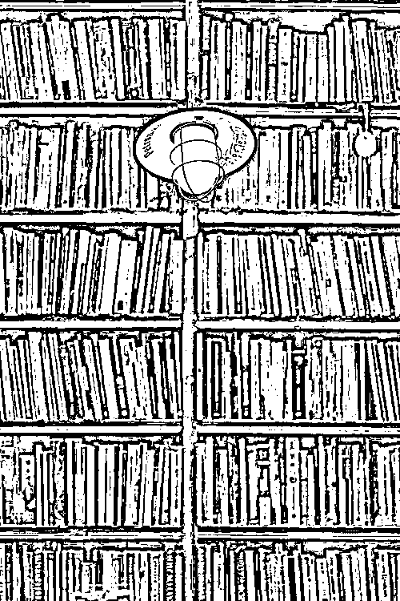

射手座人在经历了意外损失之后，虽然依旧奔放，却开始忧伤，过去无忧无虑的射手座人可能会被深刻的绝望所笼罩，他们一边探索答案，**一边反复问自己“为什么，为什么？”**

在经历了悲剧之后，“无意识”的射手座人可能会开始觉醒。失去的记忆也开始苏醒。然后，愚钝也开始变成智慧。射手座人就这样变成了**“智慧的愚者”**，他可能比其他任何一个星座都更了解生存的**“意义”**。

然而，**在通往智慧的路上，射手座人可能会做出很多鲁莽的事，**就像是在用一种显化的方式测试现实。有趣的是，根据统计，因为偷车兜风（短暂地偷取他人的机动车用于兜风）被捕的人当中，射手座人的比例最高。想要兜风的欲望，也就是**想要自由的欲望**，以及像度假的游客一样，以为法律管不到他们的感觉，经常让他们被警察抓个现行。还没有相关数据显示有多少触犯偷车兜风罪的射手座人是惯犯，但是，因为这些射手座人中大部分都是年轻男性，所以我们可以假设他们吸取了教训，从这样的经验中学到了一些意义。**对于意义的耿耿于怀**并不会减少射手座人著名的幽默感，反而会让他们的笑容变得更深沉，**让他们说的话更有道理。**比如说，作家马克·吐温（原名塞姆·克列门斯）就是他所在时代的智者。同为射手座人的还有丘吉尔和喜剧演员电影制作人伍迪·艾伦。伍迪·艾伦从高中就开始编写喜剧了。他的人生旅程从喜剧写作开始，之后成为单口喜剧演员，再开始拍摄史剧。这场旅行是与蛮横的人类本性和讽刺的人生搏斗的心灵之旅。早年，艾伦可能会这样讽刺他自己的射手座旅程：“值得去了解的事物都不能被心灵理解。”可是，这种对于知识的探索是一生的冒险。我的射手座祖父以前常常开玩笑说“真相会给你自由，但是诚实却会给你和妻子的关系带来麻烦”。当然，他在面对他平凡的金牛座妻子时，总是“太过诚实”，他也会尽可能地取笑她。**我就是来自这样一个射手座家族。**不仅我的祖父、母亲、舅舅都是太阳射手座。我的父亲、我最大的表兄、我的姐夫，以及我的两个继子的上升点都在射手座。我姐姐的女儿，也就是我的侄女的太阳、月亮和上升点都在射手座。我自己是月亮与上升点落在射手座。以前，在家庭聚会上，**我们的笑声响彻天际，**连太空中的宇航员都能听到。

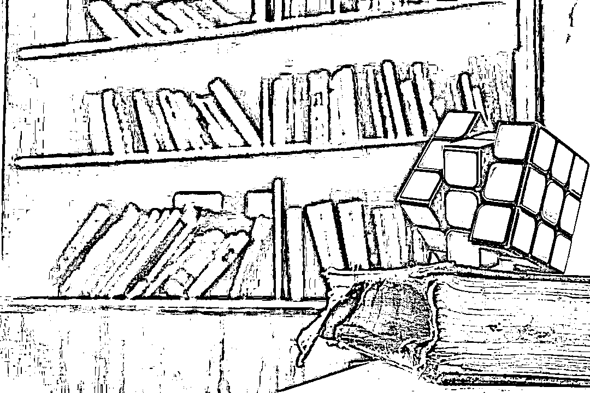

是的，**幽默和夸张是射手座的显著特征。**有学生曾经问我：“如果射手座人追求的是真理的话，那为什么他会夸大事实呢？”这样的一个问题很显然是将“真理”和“事实”等同了。根据我们上学时学过的科学思考过程，这样的想法是再自然不过的了。所谓事实，就是 2013 年 11 月 22 日，太阳升起的时间是北京时间 7：10，但是这个**事实并不能决定这一天的“意义”。**虽然经历的意义对于每个人来说都是不一样，但是有的意义是大家都赞同的，**这种达成一致的意义和观点会让那些太阳、月亮或上升点在射手座的人非常兴奋。**这种热情就会造成射手座的夸张和幽默。我们嘲笑夸张的人因为他将“如此真实”的事情表达出来了。

**当射手座人看到真相在日常生活中运作的话，他们的脸上就会浮现出会心一笑。**在拥挤的北京地铁上，你会看到茫然的，甚至忧伤的表情，但在这些人当中，你偶尔也会看到有些人“会心一笑”，也许这些人的太阳、月亮或者上升点就落在射手座。

**射手座人对意义的探寻其实也是对真理的追求，**不管是在旅行还是在冒险中追寻，还是在高等教育中，尤其是在哲学、历史、法律和宗教领域中**寻求真相**。

**“无所不知”的阴影**所以射手座人可能会自以为“无所不知”，甚至成为教条的狂热分子，**相信他们的真理就是唯一的真理。**从宗教角度来看的话，就是上帝制定的唯一真理。**这些自我膨胀的自以为是的态度通常来源于射手座的不安全感——害怕自己是错的！**如果射手座人发现自己深深相信的信仰是错的，那么他就会遭遇非常严重的身份危机。跟其他星座相比，**射手座人的自我认知更多地来自于他们自己的信仰。****从个人发展的角度来看，射手座人就是典型的奔放甚至鲁莽的年轻人，无所不知，无忧无虑。**在他们的人生历程中，他们从错误中吸取教训，然后在快退休的时候成为最智慧的人。在成为智慧老人的路上，射手座人通常会被驱使着去给别人提供意见，他们可能是老师、教练、律师，或者其他形式的咨询师。也许跟其他星座相比，**“意见提供者”**的职业定义更适合射手座人，但是我们不能把这个职业和治疗师或心理学家相混淆，**因为一对一的咨询更适合天秤座而不是射手座。**跟射手座人相比，天秤座人更愿意倾听，但是却不怎么想要去灌输他们的理论或观点。当然，不管威名远扬还是臭名昭著，射手座人的旅程都是充满不幸遭遇的，而这些不寻常的故事，他们会在老了的时候，尝试给别人说明意义的时候说出来。射手座人在这条曲折的道路上害怕的三件事就是：**害怕出错，害怕被误解，害怕被困住。**

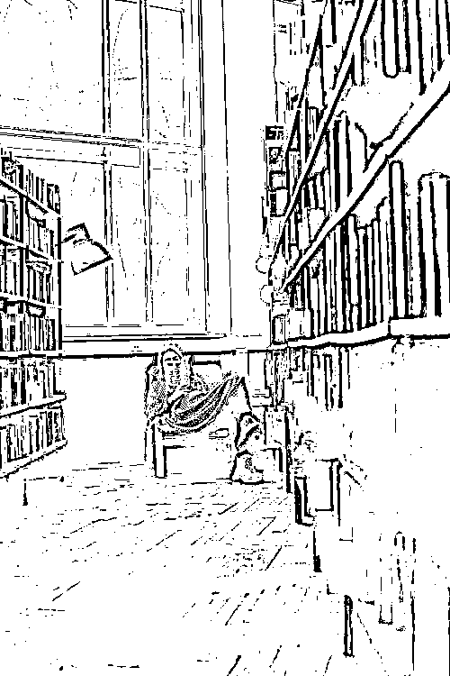

**一个案例**我的一名**射手座客户**曾经说过：**“我的父母从来都不理解我。**对他们来说，我就是一个怪咖，就像在葡萄园的葡萄藤上，从形状普通的葡萄中挑拣出来一串又大又饱满的葡萄。”
他的父母是农民，并不知道要怎么对待自己的儿子，因为这个儿子比别的孩子更早地学会了阅读，而且四岁的时候就在教堂弹钢琴了。到了六岁的时候，在教堂音乐指挥的教导之下，他已经能够弹奏莫扎特的曲子了，他还在学校的图书馆里看莎士比亚的作品，在教堂里教主日学（**注：**基督教教会于星期日早上在教堂或其他场所进行的宗教教育，一般在主日崇拜之前或之后举行） ，和比自己大几岁但是跟他一样高一样壮的孩子们做运动。我记得他非常淡然地说着：“到了十岁的时候，我知道的比父母还多，他们也知道我懂的比他们多。吃饭的时候，为了打破沉默，我会编一些好玩的故事，说说学校里的孩子们，还会用幽默的语言描述平常的事物，让我们都大笑起来。只有当我们都在笑的时候，我们才观点一致，即使只是一小会儿地没有分歧。”这名客户在 15 岁的时候上了大学，成为了一名令人敬佩的神经外科医生——大城市医院里的神经外科主治医生。此外，他还在大学里，在一些会议上公开演讲，拥有众多的追捧者。**这名客户极为戏剧性地表现出射手座的特质。**当然，大部分射手座人并不是神童，即使他们自认为是。可是，**这名客户的父母似乎完全不理解他，**他们也知道或者相信自己的孩子懂得比他们多。这名客户因为自己懂的比身边的人多，尤其是比父母懂得多，而一直**觉得自己“与众不同”**。这种与众不同的感觉伴随着他的成长，让他在成人之后依旧觉得人际关系是痛苦的。

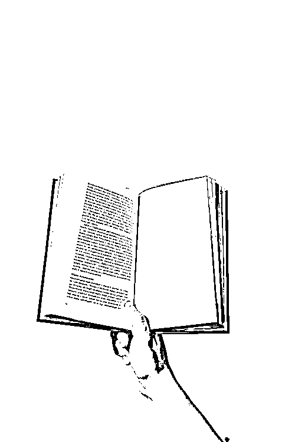

“我在同人交往的时候，并不是一个好相处的人，”他在早期的咨询中这样说道，“我的妻子说**我总是希望所有人都听从我的建议**，如果别人不听我的，我就会狠狠地批判他们。”我问他：“你为什么觉得自己是这样的呢？”“我看得出来，你跟我的妻子观点一致，”他开玩笑地说，然后他又想了一会儿，说“好吧，事实上人们会让我生气。”我又问他：“为什么？”他说：“因为他们不听我的意见！”然后他叹了口气，好像意识到自己陷入了某种谜团中。我问他：“为什么你需要别人听从你的意见呢？”他回答说：“我也不知道……”他似乎有点恼怒了。所以我决定继续惹怒他。“如果他们听从你的建议，那这对你来说有什么意义呢？”他稍微振作了一下，然后说：**“这意味着他们真的明白了我跟他们说的是什么。”**“所以你就能被理解了？”“是！”“那这又意味着……”**“意味着我被理解了。”**“也就是你一直期望你父母做到的事？”“是，是的，完全正确……”

就在这个时候，这个高大睿智的男人开始抽泣，然后低声说道“就是这么简单，对不对？”

然后他向我讲述，很多年前，在他的父亲去世 8 个月后，他的母亲也去世了。当时，在家人和朋友们到达之前，他一个人靠在棺材旁痛哭了几个小时。“那天让我从悲恸中走出来的唯一一件事是一个想法，我想，也许，只是也许，现在，现在我的父母在另一边能够更理解我了。**也许，他们真的能够看见我，能更好地理解我，甚至比我自己还理解我。**”他深深地叹了口气，“我更愿意这样去相信。”在后来的咨询中，我们处理的是他的婚姻问题。那是他的第二任妻子，他很震惊地发现，有段时间，他的妻子居然瞒着他自己对处方药上瘾的事。“我怎么会这么傻呢？”他会不停地这样感叹，“我怎么之前没有发现这件事呢？”**意识到自己错了**，意识到自己对妻子经历的事毫不知情，**这让他感到很痛苦，**比帮助妻子摆脱药瘾还要痛苦。这名射手座客户后来还意识到妻子瞒着他的原因，意识到他的妻子这样做是为了能努力赶上他。虽然他比她大 15 岁，但是他的能量就像年轻人一样，他的热情和天才的智力让她想要尝试着去配得上他，做一个能够更他满意让他觉得自己**“被理解”**的伴侣。这名客户在和妻子讨论商议的时候，**他觉得自己非常害怕被误解，**非常害怕因为自己的知识被孤立。这给他的妻子造成了压力，也给其他家庭成员，包括他第一次婚姻中的孩子们造成了压力。

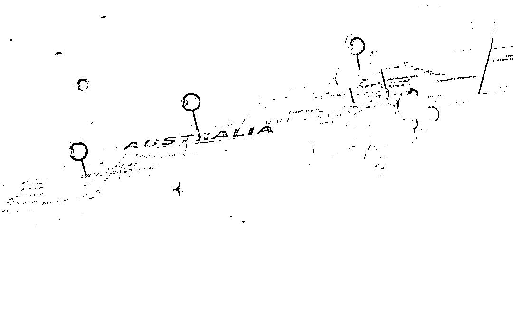

我的客户在充分了解并且接受了**自己对理解的需求**时，他发现自己和妻子的关系越来越好。**他对误解的恐惧，以及坚信自己“会一直被误解”的可笑想法，不再给他造成痛苦，**而这些恐惧曾经给他的生活带来过多次伤害。他所有的人际关系都变得更好了。有段时间，他甚至会休假，暂时离开作为神经外科医生的压力。神经外科医生“必须一直是对的”，因为人们的生命掌握在他们手上。在以前的咨询中，他曾经向我描述过“别人的脑子掌握在自己手中”是什么感觉，也曾告诉过我，那些可怕的决定是在日常生活中的一部分。但是，他最终还是愿意回到他的工作中来，他和妻子的生活也越来越幸福。**他学会了去承认自己也有可能犯错，但是在承认犯错的同时，自我也没有崩塌。**他接受了他的妻子和其他人也有可能真的“理解”他，而且也发现了他们真的能理解他！一段时间里，他在巡回演讲中还是大受欢迎，但是他的语调已经缓和了。他现在退休了，偶尔会在医学院开设讲座，去世界上的其他地方走走，在医学研讨会上分享他的经历。他和家人的关系也给他带来了“快乐”，而这种快乐不再伴随着孤独感和被爱的人误解的感觉。**接受局限，去冒险****每张星图中星座、行星、宫位和相位的任何一个组合都能帮助我们意识并且体验个人成长。**不管是什么星座，这种**“成长”都意味着成为“更像你的人”**！也就是说，意识到你自己的更大潜力。**对于射手座人来说，个人发展包括承认自己对某事的观点不是完全正确的，**也就是在真理的证据面前承认自己错了，就如同承认一个能够带来射手座主显节（**注：**主显节是基督教最古老的三大节日之一，在 12 月 25 圣诞节后的第 12 天，所以又叫“第十二部分日”，也叫“小圣诞”，它标志着圣诞节的结束）的真理或者原理一样。我们都在向射手座人学习，没有哪个星座的人比射手座更能给大家带来笑容了。我们笑，是因为射手座人说的话都是“如此真实”！当然，没有人能垄断所有真理，没有任何一个星座可以。而且，**每个人在某个领域都会有一些射手座的特质，**即使他们没有行星落在射手座。让我们来看看你的出生图上射手座在哪个宫位吧，这个宫位代表的领域正等着你去发现，去学习冒险。　　

**版权声明：**原创文章由作者授权发布于若道平台，欢迎转发，反对抄袭。友号转载请申请白名单。

**END**

****想阅读更多作者的文章，请在后台回复******大卫****** 即可。****

**大卫·瑞雷**

美国占星师，若道联合创始人，致力于在中国教授和推广西方占星学；2010-2014 年，任全美占星师联盟监督委员会委员；2017 年，被选为 ISAR 委员会成员。ISAR 是世界最大的国际占星机构，会员遍布 45 个国家，2017-2020 年曾任 ISAR 全球副主席、CAPISAR（ISAR 职业占星师资质认证机构）主席。

**拥有****51 年****占星实践经验的****若道创始人****前 ISAR 全球副主席****前 ISAR 全球职业占星师资质认证主席****大卫·瑞雷**

**和**

**2019 年第二届、2021 年第三届核心课中**

**与苏·汤普金斯老师****联合授课****的**

**ISAR 认证职业占星师**

**咔咔（Caroline）**

**二人合力打造**

**2022 年 ****若道全新核心占星课程**

**点击下图了解更多课程详情** 

**

**20 位来自世界各地的占星师****带来 19 场沙龙——新世界的觉醒****详情可点击下图**

**学习占星学****点击下图了解课程详情**

**微信又双叒叕改版啦，不想错过若道君的推送？**

**就把若道设为星标吧！**

**▼**

**喜欢就点一下“在看”吧！**

********报名直达入口********

# 经世占星丨历史洪流中，德国之“墙”的建立、倒塌与未来

> 原文：[`mp.weixin.qq.com/s?__biz=MzA5NjA0NTAxNg==&mid=2651480387&idx=2&sn=715788bb405e46d07e7e048a5caf49ea&chksm=8b48d3f4bc3f5ae257636ddc682466149215f97f667beb50a1247ff3e96d1228cd7ab33d8bd4&scene=126&sessionid=1692737786#rd`](http://mp.weixin.qq.com/s?__biz=MzA5NjA0NTAxNg==&mid=2651480387&idx=2&sn=715788bb405e46d07e7e048a5caf49ea&chksm=8b48d3f4bc3f5ae257636ddc682466149215f97f667beb50a1247ff3e96d1228cd7ab33d8bd4&scene=126&sessionid=1692737786#rd)

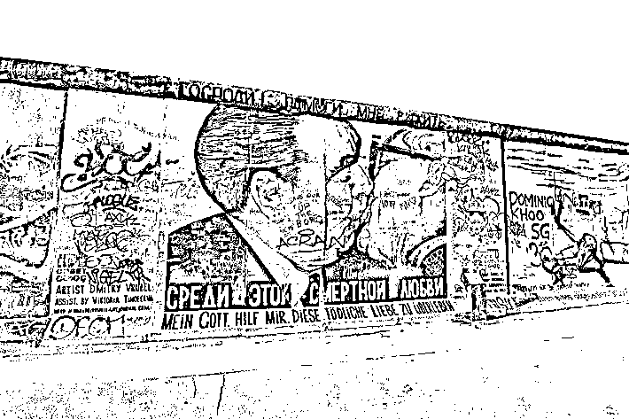

作者/艾德里安·邓肯译者/亚麻林恩 校对/江艺编辑/翀子 封面/书君 图片/网络

从占星学看世界局势是什么体验？艾德里安·邓肯老师，将带领同学们进入经世占星学的世界。这篇文章写于 2019 年 9 月，是老师针对德国所写。现在回看这篇文章，你有哪些体会？另外，邓肯老师教授的[【ISAR 选修课：经世占星学 3 天线上工作坊】](http://mp.weixin.qq.com/s?__biz=MjM5MjQwNjAyMQ==&mid=2649440007&idx=4&sn=1a57693140a6f901f9e61cc64c726591&chksm=beb9506d89ced97b2f19595f572b00c45a0bae3da7584da68993ca866544f287547cfb0ac963&scene=21#wechat_redirect)已上线，感兴趣的话可以点击链接查看详情哦~

**前言**

在 30 年前，上千把锤子拆掉了 20 世纪最令人沮丧的建筑——柏林墙。柏林承载的太多了！

第一次世界大战之后，德国所剩无几的（男性）人口挣扎于通货膨胀、以及想要复刻苏俄“成功”的共产党人和受希特勒鲜明而残酷的思想鼓舞的法西斯之间的斗争之中。

最后，俄国军队占领东德，打败了纳粹德国，迫不及待地对他们在德国侵略者手中曾遭受过的暴行进行精准报复。

**柏林墙的建立**

大多数的德国人民都期望向盟军而不是苏联投降，但柏林人民别无选择，因为他们已成废墟的城市被英国、美国、俄罗斯和法国分区占领。

随着时间的推移，共产主义支持者和机会主义的官僚们在前苏联的掌控下，创建了一个新型残暴国家——东德，这促使许多人跑往西德寻求庇护。

**解决方案：一堵墙。**

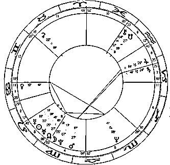

| 柏林墙的修建：1961 年 8 月 13 日 kl 1.11 柏林。上升点：巨蟹座 10°

这堵墙是根据华沙条约的指示决定的，随后立即修建——**它于 1961 年 8 月 13 日一夜之间出现。**

这堵墙绝不只是一堵横穿柏林的墙；它象征了共产主义和资本主义世界之间的铁幕和两极。它出现时的星图显示**木星和土星在摩羯座的合相**，**如同两个政治体系的联合。**

好巧不巧**月亮和冥王星合相落在了第四宫**——这反映了愈来愈高的屏障，后来以“铁丝网松塔格”或“带刺铁丝网星期天”闻名于世。当然，这一切都以为了保护东德公民免受西方的有害影响为名。

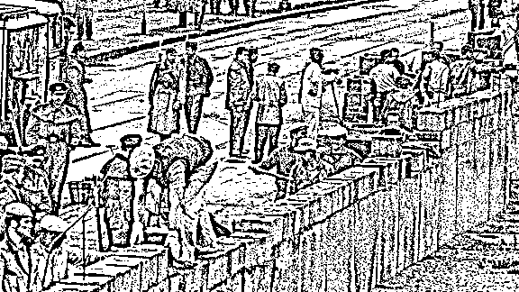

| 柏林墙的修建

**柏林墙的倒塌**

**大约一个土星周期之后，**在全世界的惊愕中，铁幕落下，边防军撤离，人们从东部鱼贯涌入西部。

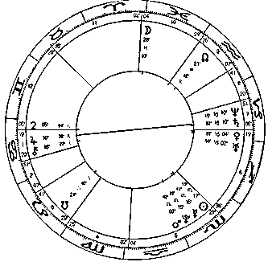

| 柏林墙倒塌：1989 年 11 月 9 日 18:57，柏林。上升点：巨蟹座 6°

**柏林墙的倒塌恰好发生在象征筑墙的土星和消融墙的海王星合相时。这个合相每 36 年发生一次，且历史上的每次合相都成为社会主义的一个转折点：**

从 1848 年《共产党宣言》的发表（就在 1846 年发现海王星后不久），到 1917 年的俄国革命，1953 年斯大林的去世，到 1989 年东欧共产主义的解体，以及（即将到来的）2024-2025 年普京的消失。

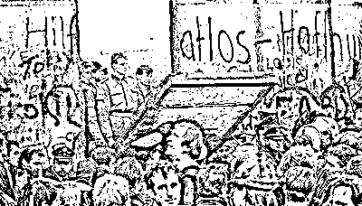

| 柏林墙的倒塌

**共产主义的命运**

值得注意的是，**在柏林墙倒塌之时，行进冥王星（与水星合相）位于天蝎座 15 度，**这也正好是俄国革命的星图上水星/太阳合相的度数。

**土星-海王星的合相**落在了前苏联星图的上中天-下中天轴线上（1922 年 12 月 30 日，11:59，莫斯科），冥王星正经过俄国星图上的太阳，正是这两点让占星师迈克尔·拜金特在 1982 年做出的如下预测一语成谶：

**“1989 年 1 月至 1991 年 11 月，苏联将经历……国家的一些基础重组……关于领导者和统治风格。这一时期将宣布一些新的改革……严格的指挥结构会失败，国家将崩溃，重新回到过去的众多自治州。”**

**从占星学的角度来看，**这堵墙的倒塌之所以令人欣喜，是因为土星和海王星对分了落巨蟹座的木星——这三颗行星正好都位于 10 度。

读者会注意到，这一对分相位在筑墙时的星图上正好落在上升-下降轴线及金星上，更重要的是，它落在德意志帝国标志性星图的太阳-北交点的合相上（1871 年 1 月 1 日）。

| 苏联解体时的场景

**土星和屏障**

这是一个经典的占星学真理，**各类建造都与土星的时间周期有关，它们的重大结构变化易与土星 29-30 年周期一致。**

例如，**世贸中心落成典礼**（1973 年 4 月 4 日）时，土星位于双子座 15 度，**当它倒塌时**，土星又回来了，现在位于双子座 14 度。

这个破坏可以从土星与落射手座 12 度的冥王星的对分看出来，而这一发生在美国的事实也体现在美国（Sibley）星图的上升-下降轴线上。

以色列在建造一座 700 公里长的混凝土墙，将其与西岸分隔开来的时侯，遭遇了巨大的困难。建造始于第二次巴勒斯坦大起义期间，**从 2000 年 9 月开始，土星正好进入双子座**（两国人民之间的屏障），我们可以预计在 2030 年土星回归时将有重大发展。

这个时候推进**新月与以色列的冥王星合相**，因此以色列国家层面的转变可能会在这个时候发生，特别是随着金星的推进，会在这一时期结束在双子座的逆行（两国解决方案），最终回到巨蟹座，这意味着一个单一的国家。

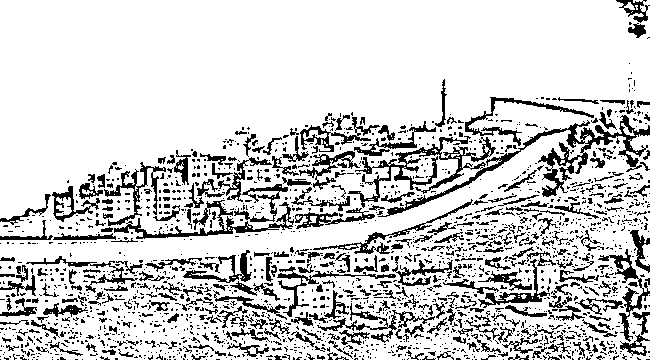

| 以色列隔离墙

**安吉拉·默克尔的兴衰**

**1989 年 11 月至 1991 年 12 月期间**，柏林墙的倒塌以及随后的苏联解体，也都被映射在了德国的剧变之中，导致了东西部的统一。

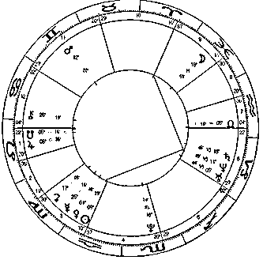

| 1990 年 10 月 3 日，德国统一。0.00 柏林上升点：狮子座 4.22°

**一个新的德国形成了，其特点是天秤座的太阳四分天王星-海王星-土星的合相**。德国人民的自豪感得以修复，这极好的反映在落狮子座木星合上升点，且与强势尊贵的金星及一个无力落陷的天秤座太阳成和谐相位。

这是一个新的、更爱好和平的巨人。

自 2005 年起担任德国总理的安格拉·默克尔，已经成为了德国坚忍形象的象征，但现在她正在逐渐淡出，而右翼势力正方兴未艾。

默克尔出生时，太阳-天王星合相落巨蟹座，精准四分中天的海王星（镜像了德国出生星图中的太阳四分天王星-海王星），**这显示在一个保护和谦逊的外壳下，是一位激进和理想化的政治家。**

**火星落上升点射手座，与冥王星三分**（和普京一样），她是一个**有韧性的斗士**，而上升的守护星木星落七宫，与同在巨蟹座的水星合相，**她是一个才华横溢、富有同情心的倾听者，完全能与人和谐相处。**

**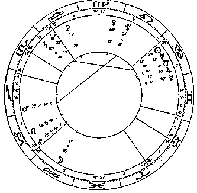**

| 出生星图：安吉拉·默克尔。1954 年 7 月 17 日。18：00 汉堡。上升点：射手座 16.30°

当然，**太阳四分海王星显示出一个弱点**，这一弱点与统一后的德国星图上落九宫双鱼座的月亮共振。

**这表明边界存在漏洞**，或者，如果你愿意的话，对难民和移民采取同情的态度，再加上一种**务实的观点**，在人口下降也威胁到欧洲的时候，他们将提供劳动力。这可以体现在落双鱼座的月亮与第六宫土星-海王星-天王星的星群呈六分相。

**2015 年秋，双鱼座的满月激活了落处女座的木星与落双鱼座的海王星的对分相，**难民涌入欧洲，试图逃离叙利亚和中东其他地区的灾难性局势。

默克尔接纳了近 100 万难民进入德国，表示德国能够应对，并敦促其他欧洲国家相继效仿。但他们没有，瑞典可能是个例外。

默克尔并没有因此而获得诺贝尔和平奖——事实上，她在德国的受欢迎程度首次下降，人们普遍认为，是难民的涌入促成了极右翼德国另类选择党（AfD）的复苏。

| 默克尔

默克尔宣布，她不会寻求连任，但下一次联邦选举可能延至 2021 年 10 月，因此她理论上可能还会在任一段时间。

她能否会坚持到这么久是另一回事。

首先，**海王星将会合相德国星图上落双鱼座 18 度 53 分的月亮直至 2021 年**，这可能意味着陷入混乱，对移民的不满加剧，以及人民对行政权力的削弱。

这也可能会——也必将会——展示一个全新的更加绿色的德国，站在电动汽车革命和气候倡议的最前沿。但民众的不满情绪可能会上升，而当这种不满情绪上升时，AfD 可能会获得更多的权力。

对默克尔来说，更为严重的是即将到来的**木星、土星和冥王星的大合相会对分她的太阳**，这将在 2020 年 1 月达到顶峰，**而冥王星将于 2021 年 11 月与默克尔的太阳形成最后一次对分相**——就在选举之后。

**这表明，对默克尔而言这一切都将是危机管理，**但她很可能能坚持到任期结束。由于她是目前执政的少数几个表现出同情心和人道主义的政治家之一，她在那里与特朗普和普京等人抗衡的时间越长越好。

**版权声明：**本文由若道翻译、整理发布，欢迎转发，反对抄袭。友号转载请申请白名单。

**END**

**艾德里安·罗斯·邓肯**

若道签约老师，哥本哈根占星学院院长 1985 年开始成为全职占星师，是人本主义占星、卜卦占星和经世占星学领域的知名占星师。开发了占星软件 AstroClock 和多款占星报告。

**大国命运：经世占星学 3 天线上工作坊**

**一个好的占星师必须要懂得时代的声音，必须要洞悉全球的趋势，必须要懂得国家的故事。**

在这个工作坊中，我们将学习**如何专注于能够理解世界大事并对它们做出准确的预测。**这将带领我们踏上**一段重要的行星周期之旅，并延伸到重要国家和世界领导人的星图。**现在正是学习的好时机！

2020 年 12 月，木星与土星合相，这是 800 年来这两颗行星首次在水瓶座合相，预示着地球以及政治和社会趋势将发生巨大变化。我们正在进入一个令人兴奋的奇境，非常适合探索经世占星学。

**点击下图了解更多详情**

**微信又双叒叕改版啦，不想错过若道君的推送？**
**就把若道设为星标吧！****▼**

**喜欢就点一下“在看”吧！**

********报名直达入口********

# ISAR 选修课 | 大国命运：经世占星学 3 天线上工作坊

> 原文：[`mp.weixin.qq.com/s?__biz=MzA5NjA0NTAxNg==&mid=2651480387&idx=3&sn=fcececbda6980b6477ba3e22bf67c123&chksm=8b48d3f4bc3f5ae20116defd7913c41212e155db89e3fa69f6aa03c63dd2241070b301e70a34&scene=126&sessionid=1692737786#rd`](http://mp.weixin.qq.com/s?__biz=MzA5NjA0NTAxNg==&mid=2651480387&idx=3&sn=fcececbda6980b6477ba3e22bf67c123&chksm=8b48d3f4bc3f5ae20116defd7913c41212e155db89e3fa69f6aa03c63dd2241070b301e70a34&scene=126&sessionid=1692737786#rd)

<mpvideosnap class="js_uneditable custom_select_card channels_iframe videosnap_video_iframe" data-pluginname="videosnap" data-id="export/UzFfAgtgekIEAQAAAAAAfGQB6vQCmQAAAAstQy6ubaLX4KHWvLEZgBPEioJES3BsLK2DzNPgMIsb3nmx3ZXbJKLT1wm45TIu" data-url="https://findermp.video.qq.com/251/20304/stodownload?encfilekey=S7s6ianIic0ia4PicKJSfB8EjyjpQibPUAXolorph7kXX0G2V8DGSvfR9PkwwbPmosvYicRybibaBiaVv5A38Bc5Re8nsYStXZD7nqrhjvCib7Z8iaC9vlXIpibAjFAuw&amp;adaptivelytrans=0&amp;bizid=1023&amp;dotrans=0&amp;hy=SH&amp;idx=1&amp;m=&amp;scene=0&amp;token=AxricY7RBHdWxX5EuW79OcFLEojiajUVbfrb10projcwzwun3SBUDgOHcwIaMibQEFyWZc9dNWComE" data-headimgurl="http://wx.qlogo.cn/finderhead/PiajxSqBRaEJYnVsqWfEX9qA0sI6hNVKsDfyzfPZ92WZMZyBpZWU5NA/0" data-username="v2_060000231003b20faec8c4e68a1ec2d4ca07e434b07755bbf47e7053a3059defd2c9d6c68a20@finder" data-nickname="若道" data-desc="#ISAR 选修课 经世占星学是什么？会教授哪些知识内容？8 月经世占星工作坊，来提前了解一下" data-nonceid="3653579416430381618" data-type="video" data-width="640" data-height="368"></mpvideosnap>

有一些岁月经历的人，会非常清晰地看到，我们每个人的命运都和国家的命运紧密联系在一起。

以俄国人为例，不论每个俄国人有什么样不同的个人星图，31 年前的苏联解体，今年发生的乌俄战争这样重大的事件，毫无疑问影响了俄国 2 代人的命运。而在一些关键时间点个人的选择，毫无疑问，又影响了个人的生命历程。

而只要你关注世界局势，你也会看到，这样的一个国家发生的重大事件又会对其他国家的各个方面发生重要影响。

我们的命运、我们所获得的事业的发展机会、我们的财富机会都是和整个时代和国家息息相关。

**因此，一个好的占星师必须要懂得时代的声音，必须要洞悉全球的趋势，必须要懂得国家的故事。**

在这个工作坊中，我们将学习**如何专注于能够理解世界大事并对它们做出准确的预测。**这将带领我们踏上**一段重要的行星周期之旅，并延伸到重要国家和世界领导人的星图。**现在正是学习的好时机！

2020 年 12 月，木星与土星合相，这是 800 年来这两颗行星首次在水瓶座合相，预示着地球以及政治和社会趋势将发生巨大变化。我们正在进入一个令人兴奋的奇境，非常适合探索经世占星学。

邓肯老师说：

****

**学习经世占星学，我们可以依靠占星师们过去使用一些技法所做的预测，我们将在这个工作坊中进行探索。**

**比如：占星师迈克尔·贝金特在 1982 年，苏联解体事件发生 7 年前，就对苏联做出如下预测：**

**“从 1989 年 1 月到 1991 年 11 月……在领导和统治风格方面……国家将进行一些基本的重组。这一时期将预示着一些新的革命……严密的控制结构将失败，国家将崩溃，重新回到过去的众多自治国家。”**

**而占星师罗伯特·佐勒在世贸中心遭到袭击前一年的 2000 年写道：**

****“从 9 月份开始，我们西方正进入一个危险加剧的时期……尤其是在东海岸……这将招致乌萨马·本·拉登等冒险家的劫掠……这是一个警钟……2001 年 9 月第一次大危机袭击美国之后，我们将再也回不到从前了。”****

**在 2020 年美国大选前 6 个月，我也写了一篇文章：**

****“他（唐纳德·特朗普）将战斗到底，美国的街道将成为战场，他不会优雅地离去，但在 2021 年，一个新时代开始了，大海将覆盖特朗普总统任期的废墟。”****

出生星图和经世星图都使用相同的基本占星技法，对每一个主题的研究都同时丰富了这两个分支。你从观察世界大事中学到的东西，可以应用到个人客户身上，反之亦然。

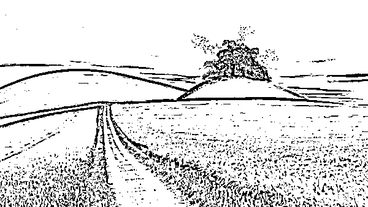

**工作坊内容和时间安排**

**8 月 26 日 周五 **

**14:30-15:30**

**1. 基础知识介绍**

-外行星及其在各个星座运行

-外行星周期

-国家星图

-政治领导人星图

-选举星图

-将以上各项按优先级排序

**休息 30 分钟**

**16:00-17:30**

**2. 外行星及其在各个星座运行**

-天王星入座：革命性的变化

-海王星入座：意识的转变

-冥王星入座：危机与重生

**休息 90 分钟**

**19:00-20:30**

**3. 木星-土星的合相周期**

-文明的发展

-水瓶座新电子化时代

**休息 30 分钟**

**21:00-22:00**

**4. 木星与外行星的互动**

-木星-天王星：科技进步

-木星-海王星：媒体的力量；消融，受苦和慈悲

-木星-冥王星：意识形态极端主义

**8 月 27 日周六**

**14:30-15:30**

**5. 了解社会趋势**

-土星-天王星：新的如何取代旧的；科技重组

-土星-海王星：乌托邦梦想破灭；结构消融

-土星-冥王星：独裁与权力瓦解

**休息 30 分钟**

**16:00-17:30**

**6. 长期文明变革**

-天王星-海王星：新世界秩序的梦想

-天王星-冥王星：机械的变革力量；剧变

-海王星-冥王星：意识变化的 492 年周期

**休息 90 分钟**

**19:00-20:30**

**7. 20 世纪地缘政治力量的影响**

-俄罗斯、苏联时代及其衰落

-美国的故事

**休息 30 分钟**

**21:00-22:00**

**8. 中国**

-中国作为全球玩家出现

-科技、领导力和一带一路

**8 月 28 日周日**

**14:30-15:30**

**9. 行星推进的重要性**

-预测选举的结果；特朗普 - 拜登

-预测国家的发展：以色列

-美国：扩张与收缩

**休息 30 分钟**

**16:00-17:30**

**10. 有多张星图的国家**

-英国

-法国

-沙特阿拉伯

**休息 30 分钟**

**19:00-20:30**

**11. 统治者的出生星图**

-普京：克格勃军人，2020 年代的发展

-特朗普：虚假信息之王，获胜者与失败者

**休息 30 分钟**

**21:00-22:00**

**12. 21 世纪的世界发展**

-新时代的人口和气候变化

-独立与全球化

-宗教与科学

-人际关系与游戏

**授课老师**

**艾德里安·罗斯·邓肯（Adrian Ross Duncan）**

**·** 邓肯老师 1971 年在印度游学时开始学习占星学，1985 年开始成为全职占星师，迄今执业已超过 33 年，是人本主义占星学、卜卦占星学和经世占星学领域的知名占星师。

**·** 开发了占星软件 AstroClock 和多款占星报告。

**·** 从 1971 年开始研习佛学，受佛学影响很深，他相信占星学和佛学观点统一、转化的一个基础是在于对现实感知的改变。

**授课方式**

**授课方式：**

**线上网络直播课，英文授课，中文翻译**

**课程价格**

**课程价格：**

**正价：6800 元**

**早鸟价：5800 元**

**早鸟价截止日期：2022 年 8 月 1 日**

负责人：若道-童童

（微信：nodoorDaivd）

**退转课程**

**退款原则请详看《教学协议》，如有疑问请咨询课程顾问。**

****ISAR 选修课 | 大国命运：经世占星学 3 天线上工作坊****

**授课老师：******艾德里安·罗斯·邓肯****

**工作坊时间：2022 年 8 月 26 日-28 日（**周五-**周日）**

**授课方式：******网络授课，英文授课，中文翻译****

**费用：****正价：6800 元****（早鸟价 5800 元，8 月 1 日前）**

**课程负责人：童老师**（微信：nodoorDaivd，请备注“经世工作坊”）

长按二维码添加课程负责人咨询~

****报名直达入口****

# 这个北交点今生需要超脱情爱，投身于更大的事业

> 原文：[`mp.weixin.qq.com/s?__biz=MzA5NjA0NTAxNg==&mid=2651480284&idx=1&sn=7e945367d1505c9fafb3e9763a3b08ef&chksm=8b48d26bbc3f5b7dbb48fa90c46758cdc48b8f1e6bbfbeca8ef9204a17ab1d06fe5b26cff68e&scene=126&sessionid=1692737786#rd`](http://mp.weixin.qq.com/s?__biz=MzA5NjA0NTAxNg==&mid=2651480284&idx=1&sn=7e945367d1505c9fafb3e9763a3b08ef&chksm=8b48d26bbc3f5b7dbb48fa90c46758cdc48b8f1e6bbfbeca8ef9204a17ab1d06fe5b26cff68e&scene=126&sessionid=1692737786#rd)

☆****后台回复“今日”，给你一句生命态度****

作者/简·斯皮勒 译者/李含 校对/江艺编辑/玫瑰 封面/书君 图片/pexels

如果说有一个南交点前世是“皇室”成员，大家应该猜得出，这就是南交点狮子座！而今生，他们需要学习的是为更多的人谋福利，这对他们来说至关重要，一起看看吧！

**北交点水瓶座/第十一宫综述**

**发展的特质**

在这些领域努力有助于挖掘隐藏的天赋和才能： 

**· **客观性（看到“全局”）**· **对友谊的渴望**· **出于团队的最大利益做决定**· **愿意分享不落俗套的想法**· **愿意支持人道主义事业**· **积极参与团队活动**· **平等意识**· **建立与他人个体的关系，而不是他们的特定角色（园丁、医生、情人等）**· **创造双赢局面**·** 认识到别人是多么特别

**要放下的倾向**

努力减少这些倾向的影响有助于让生活更轻松、更愉快 **· **一意孤行**· **仅仅为了行使权力而做出改变**· **喜欢冒险（爱情或赌博）**· **任性和固执**· **依附于对认可的需求**· **夸张戏剧性的倾向**· **做自己被期待去做的事，而不是听从内心的指引**· **肆无忌惮的激情——走向极端**· **没有意识到他人的重要性**· **基于恐惧的自傲反应

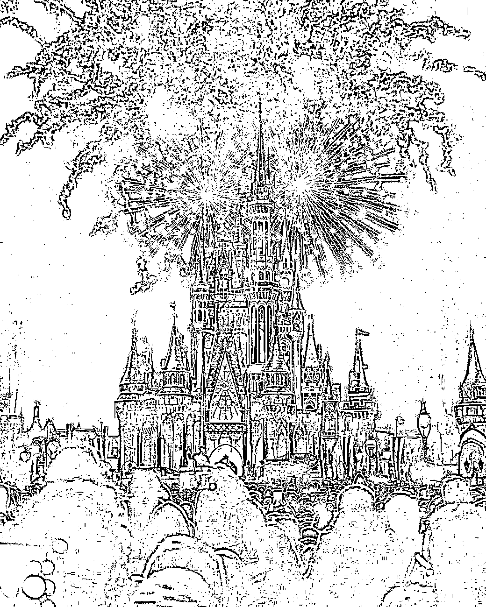

**阿喀琉斯之踵/避免的陷阱/底线**

北交点水瓶座人需要意识到的致命弱点是**他们需要别人的认可（“我的生存取决于别人给予我认可”），并认为如果他们得到别人的认可，他们的人生就会走上正确的轨道。**但这是一个无底洞：水瓶座北交点的人**永远无法获得足够的认可来感到满足或自由地做自己。**实际上，对他们来说，别人的认可是一个虚假的晴雨表。他们必须**冒着不被认可的风险，忠于自己非正统的想法，以培养更深刻、更令人满意的自我认可感。**

水瓶座北交点人陷入的陷阱是**对冒险的无止境追求，尤其是在浪漫爱情中**（“如果我能拥有一个幸福的爱情生活，那么我就会感到完整，并开始为这个星球做出我的贡献”）。

然而，如果他们**不能平衡这种浪漫的能量和日常对某种人道主义事业的承诺**，这种关系就会**变得过于紧张，他们不经意间就破坏了他们非常想要的关系。**

重要的是，**除非他们能够忘记自己的个人愿望，否则永远不会自由地致力于人道主义事业。**当他们将自己无与伦比的才华投身于推动普世性事业取得成功的过程之中时，他们的努力对所有相关的人来说都是鼓舞和回馈。

具有讽刺意味的是，当水瓶座北交点的人**献身于更大的事业时，他们发现宇宙也会在个人层面上满足他们。**他们只需要记住一句古老的谚语：“认真对待你所期望的，因为它可能会实现！”

**这些人真正的诉求**

**这些人真正想要的是坠入爱河：被崇拜，与回报他们热情的人分享“中心舞台”。**为了实现这个目标，他们必须**学会顺其自然——告诉宇宙他们想要什么，让生活（在完美的时机）带来认可和崇拜他们的人**。他们需要**学会自然地接受爱——敏锐地注意机会的到来，回应那些带着爱走进他们生活中的人。**花时间**和志同道合的人在一起，公开地表达他们对未来的非正统观念和愿景，吸引了同样可以成为朋友的恋人，并给予他们所需要的支持。**当他们专注于**实现自己的利他主义梦想**时，生活会**送给他们特殊的人，让他们的梦想充满浪漫的能量。**

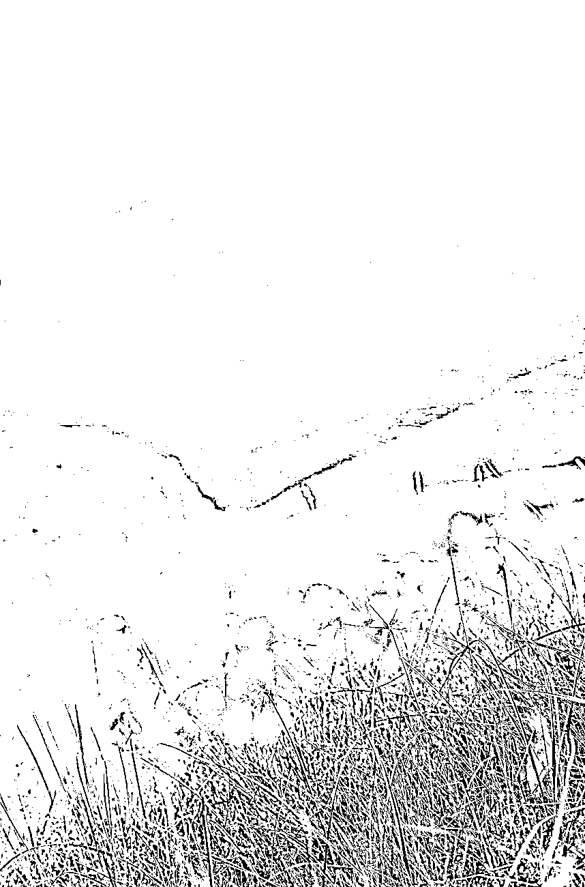

**天赋/职业**

**这些人能够高效地进行团队工作，因为他们可以看到如何促进开放、和谐的合作。**他们的兴趣超乎党派，所以有能力**做对整个团体最有利的事情**。他们**成功地促进了自己所相信的理想主义事业或人道主义目标。**水瓶座北交点的人擅长**需要客观性**的职位；他们成为了**成功的科学家、占星师、电气工程师、技术人员、计算机专家，或者在任何需要有能力预见未来并将其带入现实**的职业中取得成功。**他们在为公众带来创新理念的工作中取得成功、获得快乐。**北交点水瓶座人通过**恰如其分地应用自己的创造力产生积极的成功，他们能够看到事情完成。无线电广播或电视传媒**工作是他们天赋异禀的另一个领域。此外，水瓶座北交点的人**极富创造力，随时准备带着热情、激情和原始能量来完成任何工作。**当他们**用自己的意志力度过难关，以某种方式赋予团队力量或推动一个更高的事业目标，他们会激励到其他人。**但是，如果他们**任性地进入只关注自己而不是更高原则的职业**（例如，**电影明星、企业负责人、军队或政治人物**），就会使他们**变得僵化，无法平等地与他人交往**。他们**在可以利用自己的技能推动重要的普世事业领域中做得更好。**

**水瓶座北交点特定的疗愈誓言**

**·** “当我不再任性，我就赢了。”**·** “我不知道‘应该’是什么。”**·** “当我为所有参与者做最好的选择时，我就赢了。”**·** “一旦我决定了自己想要什么，宇宙就会把它带给我。”**·** “我不需要支配他人来感觉良好。”

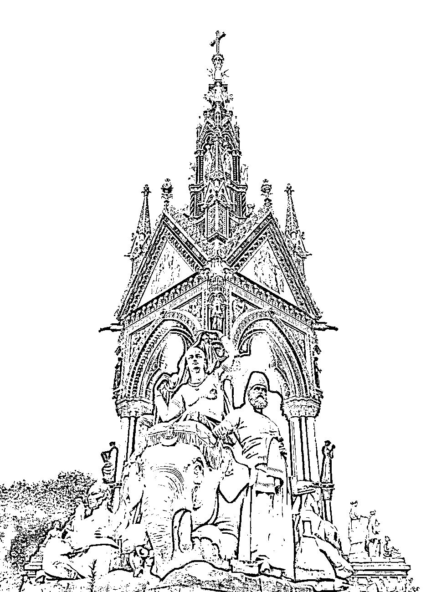

**北交点水瓶座/第十一宫的个性**

**前世**

水瓶座北交点的人们在前世是**国王和王后**，或者说是**演艺人员——他们习惯成为“特殊的人”。**接受了所有的掌声和赞美，形成了一种自我包裹，现在使他们**感觉不到与他人平等——他们来到这一世仍然感觉“特别”。**为了重新获得平等和归属感，这些人需要**与他人分享他们自己曾获得的所有过剩的名望能量**，为了做到这一点，他们可以通过**使用他们的巨大力量来推进人道主义事业。**他们来这里是为了**推动新纪元大门的打开**。他们的命运就是**从孤立的王座上下来，重新成为集体的一部分。**当不幸的事情发生时，他们往往会回应：“是我么？发生在我身上？”他们不相信自己该遭受厄运。他们要学习的课程是**“生活”发生在每个人身上**。但**从特权的前世来看，当像对待其他人一样对待他们时，他们会感到愤怒——他们天真且被宠坏了。**在他们前世的统治地位中——作为**酋长、国王、独裁者或者一家之主，**他们都是**非常重要的人物（VIP），习惯于为所欲为。**因此，**当别人不听从他们的意愿时，他们往往严厉苛刻，并认为这是一种冒犯，尽管他们确实心地善良**。**他们拥有太丰沛的情感能量，以至于经常在没有意识到的情况下吓到别人。**他们**非常善于推动本我能量以获得他们想要的结果，在这一世中，他们在这里与他人分享他们意志的力量。**他们需要**有意识地关注与他们互动的人，鼓励他们感受自己的需求，实现自己的梦想！**

**信心和意志力**

因为水瓶座北交点的人在前世的生活中**过度发展了他们的意志**，在这一世中，它有时会**失去控制——试图改变事情，甚至违背他们的最大利益，只是为了改变。**他们可能**在最愉快的环境中度过了一段美好时光，突然他们的意志爆发并要求按照自己的方式行事。**这可能非常令人不安。发生这种情况时，水瓶座北交点人重建平等的最佳选择是**承认正在发生的事情**：“对不起——那是我的意志再次失控。你说说你的想法是什么？”这些人在前世也可能是**著名的艺术家和其他极具创造力的人**。这导致他们产生了一种**对骄傲的依恋，傲慢地将自己的愿景凌驾于所有其他人之上。**当他们将强大的意志应用于实现目标时，他们的强大意志对他们有利，因为它赋予他们力量和决心去完成困难的项目；但当它**无差别地蔓延到他们生活的其他领域时，这是一种负面影响。****他们花了太多的人生来建立自我、决心和个人意志，以至于失去了集体意识。**因此，在这一世中，他们需要**有意识地扩展自己的思维，将他人的个人需求也囊括其中。**他们的意志必须集中于**促进普遍利益，以便得到他人的支持。**当水瓶座北交点人试图控制他们梦想实现过程的每一步时，问题就会出现。如果他们**试图控制这个过程，就会产生挫败感。**

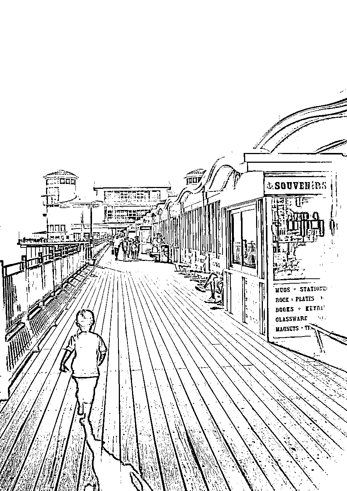

他们的诉求是正当的；但是对于如何获得它，他们要学习**放下依恋**。宇宙想要满足他们的需求，**当他们学会忽视自我时，他们所需要的一切都会来到他们身边。**水瓶座北交点的人确实有一种**与生俱来的自信，相信自己有能力克服人生的重重阻碍。**也许这就是为什么他们**有如此巨大的恢复能力，能够带着一颗快乐的心和一种愿意继续下一次冒险的精神从灾难中恢复过来。**他们**准确地评估自己的才能和需求，然后着手创造积极的解决方案。他们不会通过传统的方式寻求安全，他们依靠自己的智慧来掌握自己的命运。**在前世，这些人**做任何事都是靠自己，这也是他们如此固执倔强的原因之一**。他们一直在努力，直到实现想要的目标，或者直到阻力太大使他们不得不放弃。**当最终放弃了一些无效的事情时，他们会看到一个更高的答案，解释为什么情况没有按照他们想要的那样发展。**他们有很多援手：**天使和自己的直觉将向他们展示更宏大的蓝图，他们可以期待志同道合者的帮助。**对于水瓶座北交点的人来说，这不是“自己动手”的一生；**当他们允许他人帮助他们实现目标时，就会产生很多积极的、互惠的能量。****北交点水瓶座/第十一宫的需求**

**平衡自我意识**

**在水瓶座北交点的人获得成功追求目标所需的自信之前，必须摒弃过度个人自我的阻碍。**自我已经建立到过度，以至于**在这一世中，他们实际上不得不弱化它以恢复内在的平衡。****他们对声望的渴望可能是一个无底洞，导致他们入不敷出，摆出高傲的态度，总是想要“更多、更多、更多”。**其他人被允许增强和扩展自我，但不允许水瓶座北交点这样做。**他们对赞誉的渴望很容易成为一种傲慢自大的自我表现，这会招致灾难。**因此，宇宙通常会**阻止他们取得成功，直到他们学会以平衡和优雅的方式做出回应。**生活给了他们很多机会。因为他们**天生自信，精力充沛，愿意冒险，他们的进取精神理所当然地使他们处于胜利的位置。**然后生活观察他们如何处理每一次成功：**如果他们变得浮夸，生活就会抹去一些战利品。**然而，如果他们**优雅地处理小胜利，生活就会带来他们所寻求的富足——只要他们避免骄傲和傲慢，并继续怀着感恩、谦卑的心去接受。**水瓶座北交点的人有一种心理机制，它会反映为**自负和夸大自我**——然后**他们在生活中就会失去力量，会招至失败。**每当他们注意到该机制启动时，他们最好的选择**立即解除它。**

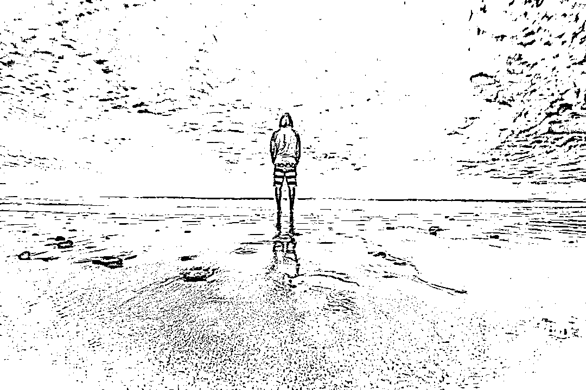

他们必须停止思考自己有多荣耀，有意识地提醒自己：“好吧，我不知道我会输还是会赢，但我想也许我可以帮助别人获得积极的体验。”这将使他们重新建立一个平衡的视角。另一种避免过度发展自我意识的方法是，**有计划地利用自我意识去帮助其他人或服务于人道主义事业。这些人在前世都是皇室成员，现在，通过关注“人民”，而不是强化自己的倒影，那么他们一定会赢。**

**宏大的妄想**

**水瓶座北交点的人拥有生动的想象力，经常用宏伟的幻想自娱自乐。**例如，如果他们对职业生活感到厌烦，他们可能会想象自己要写一本畅销书并出现在所有脱口秀节目中。幻想是否不现实并不重要；它是令人愉快的，并且本身就变得令人满意。不幸的是，**这样的幻想产生了一种钝化效应，给了水瓶座北交点一定程度的满足感，从而阻碍了创造性的行动。**具有讽刺意味的是，这些人**拥有使他们的幻想成真所需的所有创造力——但他们的动机决定了结果。**在这个例子中，**如果写这本书的动机是名誉和荣耀，那么他们就会远离成功，因为这一世的设定是在他们试图满足自我的时候，他们就会被击败。**但是，如果动机是帮助别人，他们可以达到的高度是没有限制的！**必须发展自己天性中****的人道主义方面。****幻想的另一个问题是它将现实转移到未来，这使得水瓶座北交点的人处理当下的效率大大降低。**例如，如果他们专注于幻想作为畅销书作者的名声，他们可能会错过为当地杂志撰写文章的机会。他们错过了实现梦想的垫脚石。**同样的倾向也会破坏他们的关系。****如果他们倾心于某人，他们就会开始幻想，并让这个人成为他们幻想中理想的未来伴侣**。

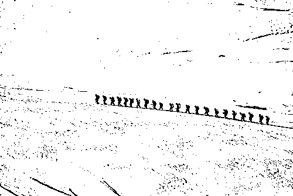

他们开始把未来生活过得如火如荼，把自己的伴侣视为天命之选，因而错过了现在的步骤，随着时间的推移，这些步骤可能会带来他们想要的东西。因此，他们面临的挑战是**停止幻想，而是对此时此刻出现的机遇做出回应。****只要剥去对当前境遇的幻想，他们总是知道如何才能成功。**幸运的是，水瓶座北交点的人**有足够的意志力和精神自律，因为他们需要充分运用二者来防止自己的思想游离于幻想和自大妄想这两个维度，从而阻碍此时此地的行动。****为了确保成功，这些人必须时刻意识到自己的意图。**当他们**让自我膨胀的动机占上风时，它会立即耗尽他们成功所需的能量。**例如，如果他们想通过组织一个冥想小组来帮助人们，他们需要专注于自己的利他动机。通过这种方式，他们将拥有展现想法所需的能量、清晰和快乐。在他们前进的过程中，他们会想到实现梦想的方法，大门会神奇地打开，让路途变得更容易。然而，有时他们允许自己考虑个人的得失：“天哪，也许我会成为大师，人们会开始跟随我”，或者“我想知道我的专业同行如果发现我在冥想，他们会怎么想。”无论哪种方式，**一旦他们允许自己考虑个人得失，所有成功的能量就开始消散，最终他们会一事无成。**同时，自我意识的介入会干扰他们的视界，以至于他们可能会**忽视人们真正需要他们做什么。这限制了他们的成功。**但是，**当他们的有意识动机是百分百利他主义时，他们就会在某种情况下，在某个时间接收到这个星球上所需要的某种帮助。**一旦他们真正看到一个存在的需求，并从非自我的角度对其作出回应，他们就会获得成功和名声。

**版权声明：**本文由若道翻译发布，欢迎转发，反对抄袭。友号转载请申请白名单。

**END**

**简·斯皮勒**

全球占星界的一位领军人物，是美国占星师联盟（AFAN）的教员。她定期在新时代和占星回忆上授课，是畅销书《新月占星学》、《灵魂占星》、《灵性占星学》和《宇宙之爱》的作者。

**20 位来自世界各地的占星师****带来 19 场沙龙——新世界的觉醒****详情可点击下图**

**学习占星学****点击下图了解课程详情**

**微信又双叒叕改版啦，不想错过若道君的推送？**

**就把若道设为星标吧！**

**▼**

**喜欢就点一下“在看”吧！**

********报名直达入口********

# 今日牌阵推荐 | “爱之缘”：适合单身人士的牌阵，以及神话塔罗 H5 惊喜上线！

> 原文：[`mp.weixin.qq.com/s?__biz=MzA5NjA0NTAxNg==&mid=2651480284&idx=2&sn=d6bec8651358d87e79787cdc334fd414&chksm=8b48d26bbc3f5b7d0fac04dd6da18364bc6466b183a75b0ed8df2c7c7da0d5d3a7fb31fa6db7&scene=126&sessionid=1692737786#rd`](http://mp.weixin.qq.com/s?__biz=MzA5NjA0NTAxNg==&mid=2651480284&idx=2&sn=d6bec8651358d87e79787cdc334fd414&chksm=8b48d26bbc3f5b7d0fac04dd6da18364bc6466b183a75b0ed8df2c7c7da0d5d3a7fb31fa6db7&scene=126&sessionid=1692737786#rd)

**若道神话塔罗 H5 惊喜上线****文末有扫码通道哦**

**旧日恋情已成往事，而生活仍要继续。**这个牌阵也许能够帮助你走出失恋阴霾，找回爱笑的自己，就让**爱之缘牌阵**和你一起回忆和整理，该结束的结束了，该开始的就会开始，让爱情的未来更加美好。

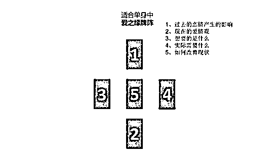

爱之缘牌阵咨询案例解读

案主是一位刚结束了感情的女生，想尽快走出阴霾，期待新的恋爱关系，并且想在进入关系之前了解自己，寻求建议。

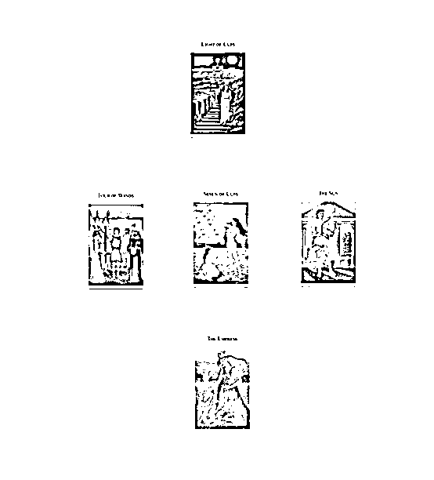

**1****过去的恋情产生的影响：圣杯 8****圣杯 8 呈现的是普绪克在关系之旅中最艰难的一个阶段，意即自愿放弃对将来的希望。**过去的感情中的某些阶段，或者结束关系后，案主可能感受到了很深的孤独感，有孤立无援，无计可施的感受，身后排列的整整齐齐的圣杯，其实就是需要整理的感情过往，当下的孤独和无助不一定是未来的常态，**圣杯 8 预示着放弃某种东西或执念的必要性和必然性，要放下身后的这些感情过往才有机会挣脱过往感情带给你的孤独感。****2****现在的爱情观：皇后****大地之母：德墨忒尔掌管着自然界规律性的循环和万物的生长，还主宰着生命的孕育和新生，以及福佑着婚姻——这个承载着自然界循环往复、生生不息的力量的容器。**能感受到案主对于婚姻和做母亲的期待和向往，想要好好的滋养一段成熟稳定的感情，就像养育孩子或者创造作品一样。**案主现在的感情观是具有耐心、包容、滋养力量的，比较成熟的状态，**但是遇到怎样的伴侣就更为关键，因为这种全情的付出需要更多的观察，走的慢一些，确定了解清楚彼此有相近的爱情观和情感需求再展现这样的特质会比较好，避免吸引了不够成熟的潜在对象。**3****想要的是什么：权杖 4****权杖 4 预示着付出的努力获得奖赏的阶段到了。**但是案主刚结束感情不久，她目前想要比较快的开始新的关系会有不那么现实的层面，**这种开花结果的状态是需要一个过程的。**就像第一张圣杯 8 要先彻底整理放下一些东西，第二张皇后牌要思考清楚自己想要创造和滋养的感情是怎样的。在这些过程之后，实现这样的状态是没有问题的。而且，这张牌里杰森知道他自己无法完成这么危险的航程，于是找来一群好朋友，帮助他完成目标。**所以想要实现目标，让周围的亲朋好友提供信息和帮助也很重要。****4****实际需要什么：太阳****案主实际需要的是一位非常阳光、乐观的伴侣，**对方可能热爱音乐或其他艺术，你们之间可能拥有相似的爱好，能够一起享受这些乐趣。**太阳牌**描绘的是一个英俊潇洒、身材匀称的经典美男子形象，智识上也是具有远见的，能看到很多事情背后的原因和目的，有驱散黑暗带来光明的能量，温暖人心。**案主实际需要的是一位能够给你提供积极能量和情绪价值的伴侣。****5****如何改善现状：圣杯 7****圣杯 7 描绘的是女神阿弗洛狄忒现身于普绪克面前，告诉她如果要赢回厄洛斯的爱，就必须完成一些任务。**阿弗洛狄忒从海中升起，指着面前漂浮在云端的七个圣杯。普绪克跪在岩石上，看着眼前的阿弗洛狄忒 ，接受爱之女神给予她关于爱的神圣教诲。**这张牌隐喻着“空中楼阁”**，案主内心的直觉会意识到将来有很多可能性，但是这些可能如果落实，就需要付出许多艰苦的努力。也代表着要清晰的梳理出自己期待的伴侣和感情具有哪些特质，在自己内心绘制出一张“灵魂伴侣寻宝图”。这张寻宝图也是一张自我精进的计划书，**期许越清晰，努力越精准，吸引来的伴侣才有可能越匹配当下的情感需求。****祝好运！**

**如何预约塔罗师咨询？****扫码进入全新神话塔罗 H5**

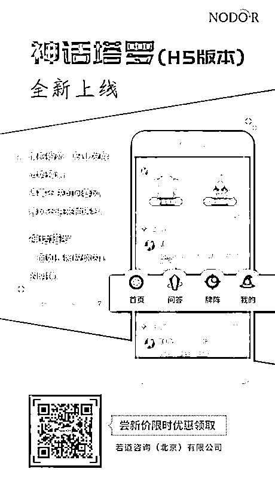

每天有事没事都可以去**神话塔罗 H5**里转转抽取专属于你的今日塔罗

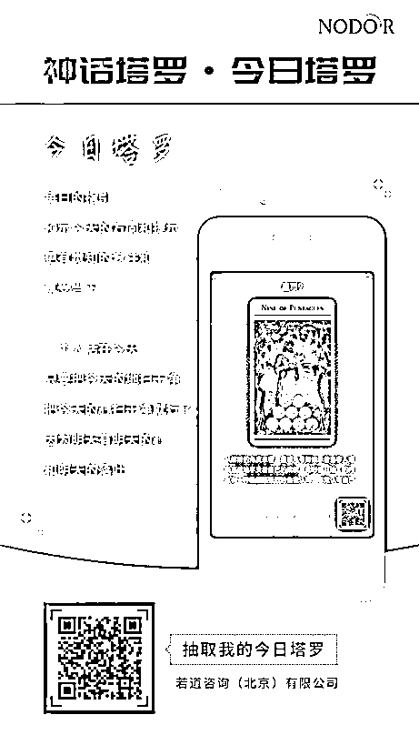

**神话塔罗 H5 问答平台全新上线**

三张牌牌阵，专业塔罗咨询师语音条解读

如果你碰巧有困惑，刚好有**限时优惠价**

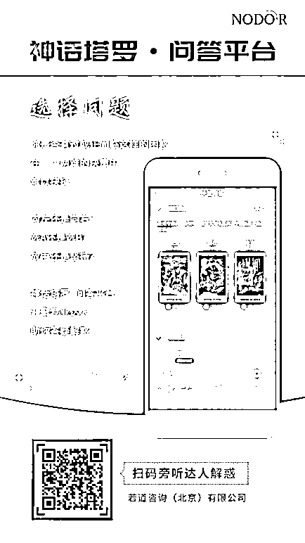

如果感到快乐你就用用**神话塔罗 H5****，**如果你感到不快乐，更要使用由专业人本主义塔罗师团队全程陪伴的**神话塔罗 H5 哦！**

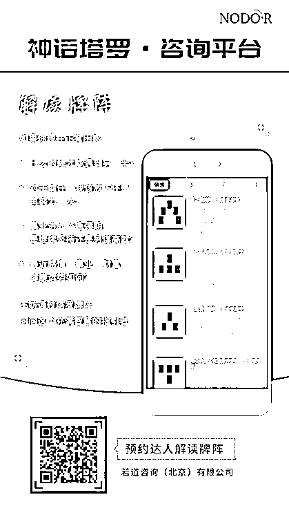

**想入驻若道塔罗平台成为职业神话塔罗师？****2022 年最新《神话塔罗认证课程》报名中****点击下图了解课程详情哦~**

# 神话塔罗丨一种古老的疗愈工具，也帮助我们与潜意识进行链接

> 原文：[`mp.weixin.qq.com/s?__biz=MzA5NjA0NTAxNg==&mid=2651480284&idx=3&sn=bb8bc0ac8d851f4af15884c95955adda&chksm=8b48d26bbc3f5b7d87a72a608859d9d3cad3d16109fccc66f85c7beb38306c169e8feae6cb23&scene=126&sessionid=1692737786#rd`](http://mp.weixin.qq.com/s?__biz=MzA5NjA0NTAxNg==&mid=2651480284&idx=3&sn=bb8bc0ac8d851f4af15884c95955adda&chksm=8b48d26bbc3f5b7d87a72a608859d9d3cad3d16109fccc66f85c7beb38306c169e8feae6cb23&scene=126&sessionid=1692737786#rd)

1

**塔罗牌是什么？**

**它是用来干嘛的？**

塔罗牌是一种**古老的疗愈工具**，同时也是**直观的解惑工具****；**

塔罗牌绕过逻辑思维，**和潜意识联结**，通过图像的方式生动地将隐藏在人类潜意识中的画面浮出水面，**揭示心灵的状况和运作****；**

塔罗牌**帮助我们和潜意识对话**，可以和现代的心理治疗联系在一起，帮助我们**看清心灵的冲突来源、本质和可以选择的道路；**

塔罗使用的过程并不繁琐，通过**“提问、洗牌、抽牌、解牌”**的方式来显现你的潜意识，给予问题明确的分析和建议。

2

**塔罗原理是什么？**

**它为什么这么准？**

塔罗是通往意识的工具，通过图画**帮助我们和潜意识对话**，可以和现代的心理治疗联系在一起，帮助我们**看清心灵的冲突来源、本质和可以选择的道路**。塔罗的心理投射也对应荣格的**“共时性原理”**：看似偶然的事物之间有着必然的联系。塔罗牌又和更广阔的**宇宙生命原型**联结，彰显**个人生命发展的阶段**，将个人**生命挣扎、内在冲突**放在生命进化的道途上，让更广大的生命智慧为个人成长照亮道路。

3

**塔罗预测是什么？**

**它如何帮助我？**

塔罗牌预测的运作就像是**照向心灵的一面镜子**。在塔罗牌解读时，图像的原型性质穿透隐藏的潜意识脉络，反应出与个人境遇相关但又未被了知的知识与洞见，因此**揭示出按照任何理性方式都无法发现的事情**。塔罗可以在你人生各个阶段，基于不同状态，针对具体困惑给予指引的神奇工具，运用古老的智慧工具**解码人生卡点，多维度去看待问题和生命的全貌性，推敲心理动线，更好地梳理生活。**如果你对生命好奇，塔罗学习会帮你**打开一扇通往未来的门**，让你了解**心灵运作和显化的秘密**，同时赋予你更多关于生命成长的支持和指引的能力！

4

**什么是神话塔罗？**

**它和其它塔罗有什么区别？**

神话通过**图像和故事**描绘人类生活的**原型模式**。通过瑰丽的想象、诗意的语言、栩栩如生的人物和故事描绘出我们内心的世界，表达出我们经历的那些实现人性的过程，帮助我们将**个体的生活与人类古老且永恒的故事**建立联结。从而在更深处**理解生命**，并学习**古老而长青的生命智慧**。跟其他塔罗相比，神话塔罗在**塔罗体系**基础上融合了**神话原型、占星原型、心理学原型。**学习、解读、内在成长的**维度更丰富立体。****神话塔罗**取材于**希腊神话**的无尽沃土，通过故事提供一种**记忆辅助**，在心理和预见层面提升解读的**丰富度**。因为这样更符合塔罗牌的性质，符合人类的想象。**按照故事思考，而不是简单的记忆关键词和固定的意义**。

5

**神话塔罗难学么？**

**能不能快速上手？**

神话塔罗认证课程，**不需要任何塔罗、占星、心理、神话基础**，这些知识朱丽叶老师都会在课程中教授，“兴趣是最好的老师，坚持是最大的成功。”塔罗咨询这项门栏不高，却能带来多重回报的“冷门技能”已经被越来越多人发觉，如果你为之心动，不如赶紧行动，初学者在经验丰富的导师教导下学习成果事半功倍，是小白亦能够掌握的课程，只要配合学习进度，不存在学不会的情况**，录播课有专业助教答疑，直播课老师亲自答疑，案例督导，****让你更自信的开展咨询工作，学以致用。**

6

**哪些人适合学神话塔罗？**

**为什么学神话塔罗？**

**1、对塔罗感兴趣的学员**，与其自习研究弯路多多，不如一步到位系统学习；**2、占星咨询师，**可以丰富咨询维度，通过图像更深入的和个案沟通交流；**3、心理工作者**，塔罗牌的原理本身也是心理投射，用于心理辅导是很棒的互动工具；**4、看重授课老师专业水平和能量层级的学员，**神话塔罗创始人亲授，金牌背书；**5、希望更加了解自己和他人内心世界**，想掌握这个疗愈工具自我探索和成长，帮助有困惑的人；**6、成为专业的塔罗师**，想从事这份事业，不论是兼职或全职，增加收入，打造长久稳定抗风险的现金流。

7

**神话塔罗咨询前景？**

**为什么看好它？**

塔罗行业现状鱼龙混杂，有的塔罗爱好者未经过系统学习，无占卜实力，占卜依赖“说明书”一知半解靠运气解读，无法积累实占经验和个人信誉。神话塔罗进入中国市场不久，由创始人亲自教授，**知识体系扎实靠谱，咨询技术纯正丰富，市场认可度高**，让您**无忧起步**，自信的在自我成长过程中成为他人的**塔罗照路人**。有些朋友经过系统的塔罗课程学习后成为**杠杆青年**，将塔罗咨询作为**副业**，无需店面，工作之余在家里就可以进行咨询，多一分收入欣喜满足。也有些学员完成课程后将塔罗咨询发展成**全职事业**，拥有自己的工作室，整合微信、微博、小红书、短视频等自媒体运营，线上线下年收益百万。**疫情环境下，副业刚需**，对于我们未来的事业需要有所规划，而塔罗咨询符合理想职业的所有条件，上手快、无需固定办公地点，是随时随地可接单的自由职业，经营打造属于自己长久稳定可发展的现金流。

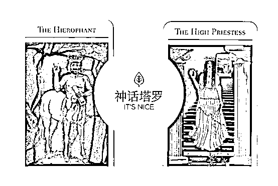

8

**神话塔罗认证是什么？**

**如何获得高含金量认证？**

2022 年超高含金量的神话塔罗认证课程强势回归课程内容体系让你**直观精准**的感受**神话塔罗的魅力**扎实的建构**神话塔罗思维****系统**学习**最地道的塔罗知识****联报全阶课程，学成可获得有神话塔罗创始人颁发的****英国神话塔罗认证证书****，也是****若道塔罗毕业证书。****行业内超高含金量双背书。****若道还为塔罗学员开发了****“神话塔罗”APP****，是随身的工具，更是接咨询的平台，****录播课程****学成入驻平台****即可链接更多塔罗个案，发展壮大你的塔罗咨询事业。**

**如果你想学习塔罗，什么样的老师会让你怦然心动呢？她是三副塔罗牌的设计者，写了 6 本塔罗书籍。她研习塔罗四十余年，教授塔罗三十余年，是丽兹·格林的密友。还有****谁会比塔罗牌设计者更了解塔罗的历史、灵魂与精髓？****所以，这将是你开启塔罗之旅最坚实的一步。**

9

**你将跟随哪位大师学习神话塔罗？**

**我的老师是谁？**

****

**朱丽叶·沙曼-伯克** 

*   她是**3 副塔罗牌**的**设计者****——**神话塔罗牌、沙曼–卡塞利塔罗牌、“自己着色”塔罗牌；

*   她出版了**6 本塔罗书****——**《塔罗全书》、《新塔罗全书》、《众星的传说》、《理解塔罗牌》、《精通塔罗牌》、《塔罗初学者指南》；

*   她研习塔罗**四十余年；**

*   她教授塔罗**三十余年**；****

*   她是**丽兹·格林**的密友，两人合著了**《神话之旅》**，共同设计了**神话塔罗牌**。

*   她是认证的**心理治疗医师；**

*   她深谙**塔罗、占星学、心理学和神话学。**

**如果你想成为拥有英国神话塔罗认证的塔罗师**

那么她，就是你**最好的老师人选**

10

**神话塔罗认证课程的课程结构？**

**怎么上课？**

课程中老师传授**将神话、占星、心理学完美融合进塔罗**的人本主义咨询体系，并进行**学员案例督导**，让你更自信的开展咨询工作，学以致用。

本期认证课程采取**即报即学的录播课+案例督导直播课**的形式，

*   **18 节录播课：**精编剪辑，随来随学，助教答疑，学练结合。

*   **8 节直播课：**融会贯通，神话心理，塔罗占星，咨询技巧。

为了适配大家的各种学习场景，提高学习&复习效率，我们还将**录播课**剪辑了**中文字幕版**和**翻译音频版**：

*   **中文字幕版：**朱丽叶老师英文原声配中文字幕，适合在手机或电脑前专心致志的学习。

*   **翻译音频版：**翻译老师幼婷的中文原声纯享，适合运动、通勤路上耳机里陪伴式学习。

11

**神话塔罗认证课程报名流程**

**怎么报名？**

**报名流程如下：****1、报名****添加课程顾问，报名，交学费，进入学员群，邮寄学习工具。****2、开始学习****成功报名，18 节录播课程立即开通，学习过程有困惑可在 APP 内提问，有专业助教答疑，8 节直播课 8 月 10 日开课，录播课和直播课都是朱丽叶·沙曼-伯克老师亲授。****3、入驻平台****学习完录播课程，即可提交咨询案例申请入驻咨询平台。****4、结业证书**学习完直播+录播课程，提交毕业咨询案例，朱丽叶老师批阅通过，即可获得**神话塔罗认证证书。**

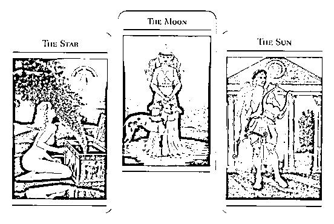

12

**具体在神话塔罗认证课程中学习什么？**

**课程大纲**

**录播课（即报即学）**

**☆****初阶：神话塔罗详解**

**神话故事和预测意涵**

**第 1 讲 塔罗牌介绍 ，讲述它的历史 （中文字幕版）**

**第 1 讲 塔罗牌介绍，讲述它的历史（翻译音频版）**

**第 2 讲 星座形态、元素和宫廷牌&基本星座与基本国王 （中文字幕版）**

**第 2 讲 星座形态、元素和宫廷牌&基本星座与基本国王（翻译音频版）**

**第 3 讲 固定星座与固定王后（中文字幕版）**

**第 3 讲 固定星座与固定王后（翻译音频版）**

**第 4 讲 变动星座与变动骑士（中文字幕版）**

**第 4 讲 变动星座与变动骑士（翻译音频版）**

**第 5 讲 小阿尔卡那牌权杖（中文字幕版）**

**第 5 讲 小阿尔卡那牌权杖（翻译音频版）**

**第 6 讲 小阿尔卡那牌圣杯（中文字幕版）**

**第 6 讲 小阿尔卡那牌圣杯（翻译音频版）**

**第 7 讲 小阿尔卡那牌宝剑（中文字幕版）**

**第 7 讲 小阿尔卡那牌宝剑（翻译音频版）**

**第 8 讲 小阿尔卡那牌星币（中文字幕版）**

**第 8 讲 小阿尔卡那牌星币（翻译音频版）**

**第 9 讲 经典牌阵教学讲解（中文字幕版）**

**第 9 讲 经典牌阵教学讲解（翻译音频版）**

**第 10 讲 牌阵解读案例演示（中文字幕版）**

**第 10 讲 牌阵解读案例演示（翻译音频版）**

**☆****中阶：神话塔罗牌阵应用**

**神话****解读和咨询技巧**

**开启神话塔罗愚人之旅**

****

**第 1 讲 愚人、魔术师、女皇、皇帝（中文字幕版）**

**第 1 讲 愚人、魔术师、女皇、皇帝（翻译音频版）**

**愚人**：永恒的少年（儿童的原型）

**魔术师**：恶作剧者、老师、向导、沟通者的原型；行星：水星。

**女王**：母亲、养育者、丰产的原型；行星：金星在金牛座；小行星：谷神星。

**皇帝**：父亲、供养者、计划者的原型；行星：木星。

**第 2 讲 女祭司、教皇、恋人、战车、正义、节制（中文字幕版）**

**第 2 讲 女祭司、教皇、恋人、战车、正义、节制（翻译音频版）**

**女祭司**：处女——等待被实现的潜力原型；行星：新月。

**教皇**：疗愈者、受伤的疗愈者、牧师的原型，牧师是神与人之间的灵性桥梁；行星：凯龙星。

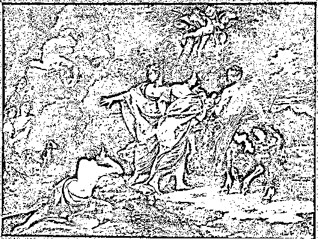

**恋人**：爱、爱人、所爱之人的原型；行星：金星在天秤座。

**战车**：战争、冲突、战士、斗士的原型；行星：火星。

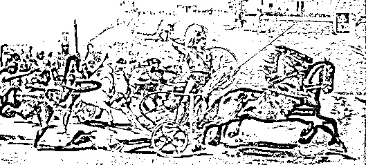

**正义**：智慧、兵不血刃的胜利的原型；星座：处女座；小行星：智神星。

**节制**：关系、合作的原型；星座：巨蟹座、双鱼座。

**第 3 讲 力量、隐士、命运之轮、倒吊人、死神（中文字幕版）**

**第 3 讲 力量、隐士、命运之轮、倒吊人、死神（翻译音频版）**

**力量**：力量的原型；星座：太阳在狮子座。

**隐士**：晚年、耐心的原型；行星：土星。

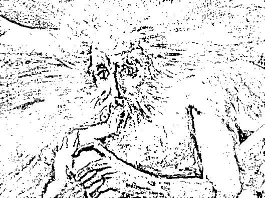

**命运之轮**：命运女神与命运的原型。

**倒吊人**：牺牲与有意识的牺牲的原型；行星：海王星。

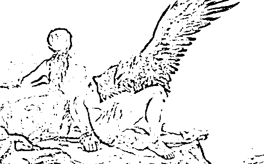

**死神**：死亡、终点和起点的原型；行星：冥王星。

**第 4 讲 恶魔、高塔、星星、月亮、太阳（中文字幕版）**

**第 4 讲 恶魔、高塔、星星、月亮、太阳（翻译音频版）**

**恶魔**：阴影、人类不文明的面向、本能、欲望天性；行星：火星在天蝎座。

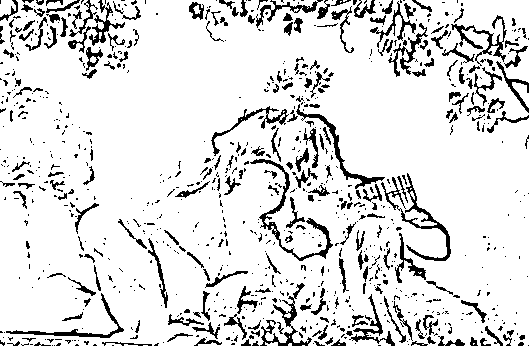

**高塔**：改变、分裂瓦解的原型；行星：天王星。

**星星**：希望的原型。

**月亮**：无意识的原型；行星：暗月。

**太阳**：意识、创造力和文明的原型；行星：太阳。

**第 5 讲 审判、世界（中文字幕版）**

**第 5 讲 审判、世界（翻译音频版）**

**审判**：复活、新生的原型；行星：水星作为灵魂向导普绪科蓬波斯。

**答疑与讨论，学员们分享对自己或客户的塔罗解读，对神话塔罗牌进行更多探讨。**

**世界**：整体、完成和个性化的原型。

**第 6 讲 经典牌阵教学讲解（中文字幕版）**

**第 6 讲 经典牌阵教学讲解（翻译音频版）**

**第 7 讲 咨询案例演示：为一位年轻女性所做的四次解读（中文字幕版）**

**第 7 讲 咨询案例演示：为一位年轻女性所做的四次解读（翻译音频版）**

**第 8 讲** **引导式冥想、荣格的四种意识功能（中文字幕版）**

**第 8 讲 引导式冥想、荣格的四种意识功能（翻译音频版）**

**☆****高阶：神话塔罗直播督导课**

**第 1 讲 塔罗牌中的荣格原型**

**2022 年 8 月 10 日（周三）**

我们将学习荣格是如何理解原型，以及荣格原型如何反映在塔罗牌中。对塔罗牌解读而言，理解原型的普遍性非常有帮助，因为这有助于塔罗咨询师碰触客户的内心世界。

**第 2 讲 塔罗牌是如何与行星原型和其原型体验联系在一起**

**2022 年 8 月 24 日（周三）**

大阿卡纳牌反映了行星神祗的原型，在某些情况下，原型经验意味着它们反映了所有人类的经验。我们将通过这个角度看这些大阿卡纳牌。我们将看到理解原型对解读有何帮助。

**第 3 讲 荣格意识的四种功能与小阿卡纳牌的四种元素及与权杖、星币、宝剑、圣杯四套牌之间的联系**

**2022 年 9 月 7 日（周三）  **

我们将看看小阿卡纳从 1 到 10 如何反映荣格意识功能的各个方面，以及它们如何反映在四套牌四个元素和其心理方面。我们还将对 1-10 的数字学进行修正，看它们在元素中的表现方式。

**第 4 讲 占星学中的 12 星座和宫廷牌之间的联系**

**2022 年 9 月 21 日（周三）**

我们将讨论形态和星座，以及它们如何反映在宫廷牌上。

**第 5 讲 马蹄牌阵学员案例督导**

**2022 年 10 月 19 日（周三） **

**第 6 讲 六芒星牌阵学员案例督导**

**2022 年 11 月 2 日（周三） **

**第 7 讲 凯尔特十字学员案例督导**

**2022 年 11 月 16 日（周三） **

****

**第 8 讲 三个牌阵学员完整案例督导**

**2022 年 11 月 30 日（周三）**

**认证阶段：考试论文**

录播课学习完毕，即可入驻若道神话塔罗 APP，以实习塔罗师获得推广流量，对接塔罗咨询个案。

直播课+录播课学习完毕，提交考试论文通过即可获得获得英国神话塔罗认证证书，升级为认证咨询师。

**入驻塔罗平台**

13

**适合人群**

*   塔罗初学者，完全没有塔罗基础；

*   塔罗自学者，也曾上过塔罗工作坊，但仍不懂如何使用塔罗牌；

*   塔罗进阶学习者，有塔罗基础，了解 78 张塔罗牌含义；

*   不知如何解决遇到的情感困惑、职业选择、人际问题，对人生感到迷茫；

*   想要学习深入解读塔罗牌、牌阵的使用、咨询技巧等将塔罗运用于咨询实践；

*   想要深入了解和学习塔罗，希望成为专业的塔罗师；

*   想要借助塔罗进行心灵、灵性成长。

14

**导师简介**

**朱丽叶·沙曼-伯克**

**朱丽叶·沙曼-伯克**从 20 世纪 70 年代早期开始，就对塔罗牌产生了兴趣，并踏入了塔罗的世界。后来，在丽兹·格林的鼓励下，开始研习心理占星学和塔罗。

1984 年，第一本书《**塔罗全书**》（*The Complete Book ofTarot*）出版。之后，与丽兹·格林合作设计并撰写了《**神话塔罗**》（*The Mythic Tarot*），在这本书中，她们将古希腊神话与传统塔罗解读结合起来。朱丽叶写了**十本塔罗和占星学书**，包括一本名为《众星的传说》（*Stories from the Stars*）的儿童读物，以及与丽兹·格林合著的《神话之旅》（*The Mythic Journey*），这是一本详细讲述如何运用神话来指导生活的书。

15

**课程价格**

**认证课程总价：****22000 元**

**联报优惠价：****19000 元**

**限时转发优惠价：18000 元（联系 Echo 老师，获取限时转发优惠价）**

长按二维码添加客服 Echo 老师

9

**退转课程**

*   **退款原则请详看《教学协议》，如有疑问请咨询课程顾问。**

**神话塔罗认证课程**

**授课老师：朱丽叶·沙曼-伯克**

**授课时间：录播课即报即学，直播课 2022 年 8 月 10 日起**

**授课方式：**网络课程**，**英文授课，中文翻译

**费用：****认证课程总价：****22000 元；****联报优惠价：****19000 元；****限时转发优惠价：18000 元**（联系 Echo 老师，获取限时转发优惠价）

**课程负责人：Echo 老师**（微信/手机：nodoor18518412824，请备注“神话塔罗”）

长按二维码添加课程负责人咨询~

****报名请点击“阅读原文”****

# 神话塔罗之大阿卡纳牌｜力量

> 原文：[`mp.weixin.qq.com/s?__biz=MzA5NjA0NTAxNg==&mid=2651480284&idx=4&sn=c01427ca308cd2c8aa99a8fc4f0649a0&chksm=8b48d26bbc3f5b7d6ada395004a441dfddd9f37f4685487e30dcb7561c60e5fdb20e34b53874&scene=126&sessionid=1692737786#rd`](http://mp.weixin.qq.com/s?__biz=MzA5NjA0NTAxNg==&mid=2651480284&idx=4&sn=c01427ca308cd2c8aa99a8fc4f0649a0&chksm=8b48d26bbc3f5b7d6ada395004a441dfddd9f37f4685487e30dcb7561c60e5fdb20e34b53874&scene=126&sessionid=1692737786#rd)

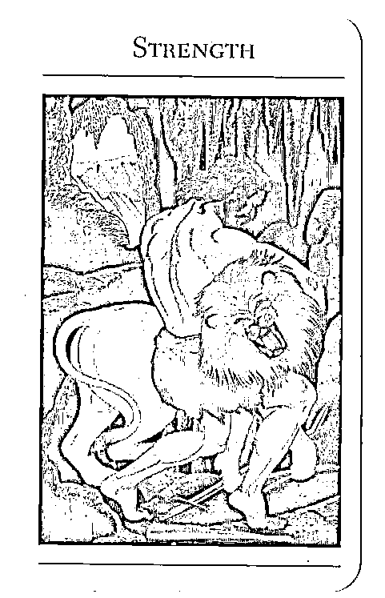

作者/朱丽叶·沙曼-伯克 丽兹·格林

译者/闫东升 编辑/玫瑰 图片/神话塔罗 网络

本文节选自《神话塔罗》

神话塔罗牌根据文艺复兴时期艺术家和作家们喜爱的希腊诸神，通过重新设计牌面，让塔罗牌恢复其原始的质朴性和普及性。力量牌的设计就源自于大力士赫拉克勒斯征服猛狮的希腊神话。今天就来解读大阿卡纳牌——力量。

[🔈 神话塔罗·力量](https://res.wx.qq.com/voice/getvoice?mediaid=MzA5NjA0NTAxNl8yNjUxNDgwMjgy)

**｜**朗读者小巫

**书名：**

神话塔罗 

**作者：**

朱丽叶·沙曼-伯克   丽兹·格林 

**出版日期：**

2011-08-02

力量对应的希腊神祗**赫拉克勒斯·大力士****所向披靡的大力士**

力量牌描绘的是一个强壮有力的男人，长着一头栗色卷发，身上只围了一条红色的腰布。

他正在和一头雄狮搏斗，用他强壮的手臂紧紧夹住它的喉咙，画面显示出这个男人此时正处于赢得角逐的关键时刻。搏斗现场的四周是一个布满岩石的黑暗山洞，从远处的洞口望去，外面是棕色的山峦，贫瘠而荒凉。

> **赫拉克勒斯（*Heracles*）赤手空拳和雄狮搏斗**：没有使用任何工具，也没有任何辅助，只有他自身的资源。 
> 
> **赫拉克勒斯身穿的腰布是血红色的**：血红色属于战神阿瑞斯，我们在战车牌中遇见过他，这说明愚人已经学会了运用侵略性，因此可以有创造性地利用它了。 
> 
> **阴暗的山洞**：象征着潜意识的黑暗，其中隐含着原始的本能，日常的意识无法看到它。

**征服刀枪不入的尼米亚巨狮**

力量牌中的勇士是赫拉克勒斯，罗马人称他为海格力斯（*Hercules*），是神话中所向披靡的英雄人物。他是众神之王宙斯（*Zeus*）和人类女性阿尔克墨涅（*Alcmene*）的儿子。

和往常一样，宙斯的妻子赫拉（*Hera*）对于丈夫和阿尔克墨涅通奸并生出儿子的事情妒火中烧，决定给予这个孩子非常严重的惩罚。 

她用手段逼疯了赫拉克勒斯，疯狂的赫拉克勒斯又在无意间杀死了自己的妻子和孩子。他清醒以后极度悔恨，祈求神灵给予他赎罪的机会，来自特尔斐的神谕命令他去给邪恶的国王欧律斯透斯（*Eurystheus*）完成十二个艰苦的任务，这也是赫拉最想看到的结果。

就这样，所向无敌的英雄心甘情愿地成为了女神的仆人，而这个女神却是他所犯罪行的始作俑者。国王欧律斯透斯要求赫拉克勒斯去完成的第一个（也是最著名的）任务是征服尼米亚猛狮（*Nemean Lion*），这头巨狮身上的皮毛是刀枪不入的，它几乎吃光了附近的人们，所以赫拉克勒斯找不到人询问它的老巢在哪里。经过很长时间的寻觅，他终于找到了身上还沾满猎物血迹的狮子。赫拉克勒斯先是对着它射出一箭，却没有对巨狮造成分毫的伤害。他又尝试用刀剑和棍棒攻击，结果自然也是铩羽而归。巨狮躲进了一个有两个出口的山洞里，赫拉克勒斯用网堵住了其中一个洞口，自己则从另一个洞口钻了进去，搏斗中巨狮咬掉了他的一个手指头，而他则成功地用双手牢牢地掐住巨狮的喉咙，直到它死去。赫拉克勒斯利用狮子锋利的爪子剥掉了它的皮，制作了一套盔甲穿戴在身上，于是他获得了巨狮刀枪不入的能力。

**与原始的动物性同行**

**从内在的层面来看，赫拉克勒斯和尼米亚巨狮搏斗的意象，反映出每个人内在强大和原始的动物性一面带来的问题，但是我们不能消灭它，因为它也是我们的创造力和生命力。**

狮子是一种特别的动物，它象征的心理面相和战车牌中顽固的战马并不相同。狮子在神话中一直和皇权有关，即使在它最有破坏性的时候，也反映着人们独特个体性中幼稚的、原始的自我中心特质。

尼米亚巨狮并不完全是邪恶的，它刀枪不入的皮毛能够让人们战无不胜，这种特质反映出人们内在的某种恒久性，它来自于一个稳固的“我（*me*）”的感觉。

当我们披上被我们征服的巨狮的皮毛时，外界的一切都会变得渺小，因为我们内在拥有了坚不可摧的自我身份认同。 

当巨狮的力量还处于原始和邪恶的动物性状态时，它的正面力量就还是潜在的，没有被发挥出来。“唯我独尊”的这一面驱动着人们毫不留情地摧毁着欲望之路上的所有事物，从而获得自我的满足。

暴怒是它的一种表现形式，在很多人生境遇中，怒火都带来负面的结果，它不管是非对错，只是不顾一切地摧毁满足欲望的任何阻碍。

自大也是它的一种表现形式，自大和自尊不同，它夸大和膨胀了自我的重要性，使我们失去该有的明智，幼稚和冷酷地对待那些我们必须依赖的事物。巨狮的意象在很多层面上都像我们内在那个愤怒的婴儿，要求世界围着我们打转，只要碰到任何反对和阻抗就盲目地攻击和破坏。如果我们征服了这头巨狮，就会获得它神奇的皮毛，用心理学的术语说，**就是把动物性的生命力整合到意识中，让它为有意识和负责任的自我服务。****因此，赫拉克勒斯和巨狮搏斗的目的是征服，而不是杀戮，这是一个转化的过程，使动物性的力量和欲望以人类的方式表达出来**。这就是力量牌所象征的矛盾性，赫拉克勒斯不能杀死巨狮，因为杀戮并不会带来任何好处。我们每个人内在都有赫拉克勒斯的黑暗面，意即一味压抑动物性的本能，而不是去转化它，这样做的后果就是在我们心灵的外面形成了一个坚硬的壳子，没有了愤怒，没有了热情，也没有了真正的自我身份。**力量，内在的勇士**

**从解牌的角度来看，力量牌出现的时候，暗示着当事人需要和内在的狮子正面交锋，他（她）要用创造性的方式面对自己内在的愤怒和自大**。勇气、力量和自律在这时都是非要必要的。

通过此时的人生境遇，当事人可以和自己内在的动物性相遇，同时也能看到内心的赫拉克勒斯，他是每个人都拥有的内在勇士，认同他就可以征服巨狮。

愚人在发展出理智和情感的能力后，现在要学习面对自己凶猛的自我主义了，如果赢得了这场搏斗，他就能够用信任和正直去面对自己和他人。

**版权声明：**本文由《自在园》授权发布，欢迎转发，反对抄袭。友号转载请申请白名单。

**朱丽叶·沙曼·伯克**从 20 世纪 70 年代早期开始，就对塔罗牌产生了兴趣，并踏入了塔罗的世界。后来，在丽兹·格林的鼓励下，开始研习心理占星学和塔罗。1984 年，第一本书《塔罗全书》（The Complete Book ofTarot）出版。之后，与丽兹·格林合作设计并撰写了《神话塔罗》（The Mythic Tarot）。朱丽叶写了十本塔罗和占星学书，包括一本名为《众星的传说》（Stories from the Stars）的儿童读物，以及与丽兹·格林合著的《神话之旅》（The Mythic Journey），这是一本详细讲述如何运用神话来指导生活的书。

**点击下图了解课程详情** 

**微信又双叒叕改版啦，不想错过若道君的推送？****就把若道设为星标吧！****▼**

**喜欢记得点一下在看哦☟**

************报名直达入口************

# 神话塔罗之大阿卡纳牌｜节制

> 原文：[`mp.weixin.qq.com/s?__biz=MzA5NjA0NTAxNg==&mid=2651480284&idx=5&sn=7f5813ae833a97bbcb89e3b5b1d77944&chksm=8b48d26bbc3f5b7d6cd47162b8e3005e62b764de5de4dfb8f13c7bf627fc016bbd6738726c7e&scene=126&sessionid=1692737786#rd`](http://mp.weixin.qq.com/s?__biz=MzA5NjA0NTAxNg==&mid=2651480284&idx=5&sn=7f5813ae833a97bbcb89e3b5b1d77944&chksm=8b48d26bbc3f5b7d6cd47162b8e3005e62b764de5de4dfb8f13c7bf627fc016bbd6738726c7e&scene=126&sessionid=1692737786#rd)

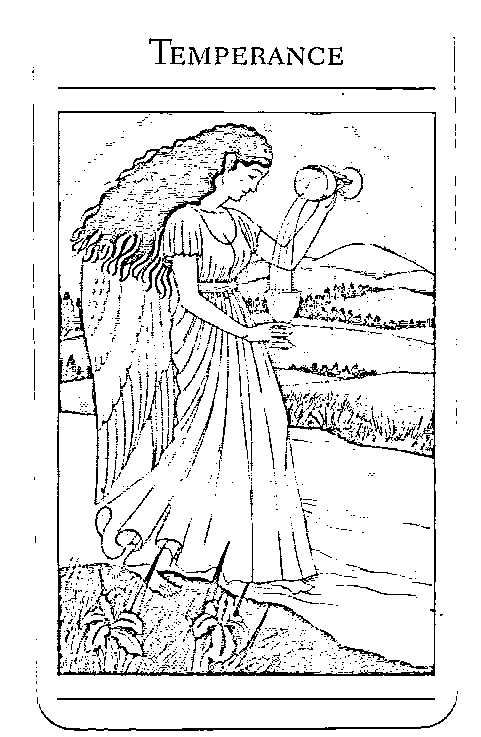

作者/朱丽叶·沙曼-伯克 丽兹·格林

译者/闫东升 编辑/玫瑰 图片/神话塔罗 网络

本文节选自《神话塔罗》

十九世纪中叶，法国神秘主义者艾利冯斯·里维借鉴了三世纪犹太人的魔法测试——Sefer Yetsirah（形成之书），发展出一套塔罗解牌体系，通过不同牌面的组合反应出的意义变化来解读。这一创造性的发明，预示着现代塔罗牌的诞生。走过了正义女神雅典娜，迎接我们的伊瑞斯会是一个怎样的女神呢？今天就来解读大阿卡纳牌——节制。

、

[🔈 神话塔罗·节制](https://res.wx.qq.com/voice/getvoice?mediaid=MzA5NjA0NTAxNl8yNjUxNDgwMjgz)

**｜**朗读者小巫

**书名：**

神话塔罗 

**作者：**

朱丽叶·沙曼-伯克   丽兹·格林 

**出版日期：**

2011-08-02

节制对应的希腊神祗
**伊瑞斯·彩虹女神****彩虹女神**

这张牌的牌面描绘的是一位拥有一头黑色长发的美丽年轻女子，穿着彩虹般七彩的长袍，背上的一对翅膀也是七彩的。她站在一条清澈的河流旁，一只脚站在岸上，一只脚踏在河流中，身边的河床上紫色的鸢尾花正在盛放。

有一条美丽的彩虹在她身后伸展开去。她的双手握着两个杯子，一个是金色的，一个是银色的，她正在把一个杯子的水倾倒入另一个杯子中。

> **雨过天晴后阳光下的彩虹**：象征着关系中的承诺和重生。彩虹也是尘世和天堂之间的桥梁，因此也反映着它们的关系。 **水和土的不同特质以及盛开的鸢尾花**：反映出她有能力在个体的内在整合这两者。 **金色和银色的杯子**：象征着太阳和月亮、阴性和阳性、意识和潜意识，它们被流动的情感结合在了一起。

**天堂与尘世的桥梁**

在这里我们遇到了彩虹女神伊瑞斯（*Iris*），她也是神界皇后赫拉（*Hera*）的信使。神话中和伊瑞斯相对应的是宙斯的使者赫尔墨斯（*Hermes*），众神和人类都因为伊瑞斯的友好和爱心而喜欢她。

如果赫拉或宙斯希望人类知道他们的某些想法，伊瑞斯就会飘然飞入尘世，化作人形或以她原本的女神面貌现身，她的原貌是长着一对翅膀的美丽女神。

有时候她就像其配偶——西风之神塞菲勒斯（*Zephyrus*）一样，转瞬消失在空气中；有时候她又沿着彩虹翩然而下，在天空和大地之间架起一道桥梁。即使在水中，伊瑞斯也和在空气中一样穿行无碍。当宙斯要求她传递讯息的时候，地狱的大门也会为她打开，她用冥河之水盛满金色的圣杯，意即把冥河之水象征的被恐怖的诅咒缠绕的不朽神性纳入其中。当众神从旅程中返回到奥林匹斯山的时候，伊瑞斯会帮他们从战车上解下战马，并奉上芬芳的甘露和甜美的食物。伊瑞斯不仅是赫拉的信使，还经常帮助赫拉实施复仇的计划（虽然她在大部分时候给予的都是帮助和关怀）。她在赫拉身边无微不至地照顾她的衣食住行，没事的时候就夜以继日地在她的宝座旁悄然而立。有一些版本的神话中认为伊瑞斯孕育了爱神埃洛斯（*Eros*），而不是阿弗洛狄忒（*Aphrodite*）。**两极间不断变动的情感**

**从内在的层面来看，彩虹女神伊瑞斯的意象是愚人要成长为稳定的个体所必须学会的第二种特质或才能：适度和均衡。**

**正义之神雅典娜（*Athene*）代表的是公平和客观，而伊瑞斯呈现出来的是节制，以友好和仁慈的态度面对一切，伊瑞斯的同情心里面没有脆弱、痛苦和多愁善感的部分。**

伊瑞斯的意象和情感（*feeling*）有关，不是人们常说的情绪（*emotion*），情绪是对境遇的本能反映，而情感则意味着一种活跃的、明晰的选择能力。

**情感能够在矛盾的两极之间架起一道不断变化的桥梁，可以敏锐地呈现出某种境遇中想要达成最终的关联与和谐的需求**。神话中伊瑞斯不断地把水在金色和银色的圣杯之间倒来倒去，这意味着情感必须根据每时每刻的需求不断地流动和更新。雅典娜的道德戒律是普世性的，而且要非常稳固，而伊瑞斯均衡和谐的目标则需要情感上不断地变动和调整，有时候是积极的，有时候是消极的。**但是最终伊瑞斯所服务的领域属于阴性而非阳性，无论情感变动的状态如何，即使是愤怒和冲突，其目标都是和谐、合作和更好的联结。**我们通常不认为情感和理性思维一样属于智力范畴。正义牌和节制牌的关系是对立又互补的。雅典娜和伊瑞斯是一对矛盾的意象，雅典娜从父亲的头部出生并为他服务，而伊瑞斯则是属于皇后的阵营；前者高举抽象真理的大旗，为此宁可舍弃个人的情感，而后者则可以为了个人的情感而放弃抽象的真理。

这两位女神在神话中并不是敌人，因为伊瑞斯不是任何人的敌人，但是她们可能在我们的内心对抗着彼此，因为她们常常在一个问题上给予我们对立的解决方案。

我们到底是根据理性的思维做决定，还是根据情感的需要去维护关系？这两个意象在大阿卡纳牌中出现的顺序告诉愚人——也就是我们每个人，必须要整合两者。

我们需要通过雅典娜去学习理性的思考，然后遇到彩虹女神伊瑞斯时，必须学会体味细微的情感变化和它的目的，同时还要记得它并不等同于狂暴的情绪反应和做作的多愁善感。

即使是彩虹女神伊瑞斯，也有其矛盾的两面性。不断在两极间变动的情感，其目的是为了保护关系，但它有时候也可能会造成淤塞，因为完全由强烈的情感主导时，关系中的人们就没有了喘息的机会。

没有不同的观点、没有冲突、不能对等的交谈都会破坏关系，太过想要和谐就失去了成长的空间。

只有和谐的关系中是没有分离的空间的，因为分离需要独立的状态。伊瑞斯作为众神和人类的朋友，忙碌于生活的方方面面，她必须为别人提供服务，所以失去了自己的权利。**因此，节制牌如果没有正义牌的制衡，就会终将变为一潭死水，没有变化和冲突的地方，百无聊赖就会把智力扼杀。****节制，和谐与合作的力量**

**从解牌的角度来看，节制牌的出现暗示着一段关系中需要情感的流动。**彩虹女神伊瑞斯意味着和谐与合作的力量，其结果是良好的关系（包括婚姻）。

我们都需要发展出均衡与和谐的心性，当然通过这个挑战并不意味着完满，愚人不可以和美丽的女神伊瑞斯永远在一起，下一个“美德”的挑战还在等待着他。

**版权声明：**本文由《自在园》授权发布，欢迎转发，反对抄袭。友号转载请申请白名单。

**朱丽叶·沙曼·伯克**从 20 世纪 70 年代早期开始，就对塔罗牌产生了兴趣，并踏入了塔罗的世界。后来，在丽兹·格林的鼓励下，开始研习心理占星学和塔罗。1984 年，第一本书《塔罗全书》（The Complete Book ofTarot）出版。之后，与丽兹·格林合作设计并撰写了《神话塔罗》（The Mythic Tarot）。朱丽叶写了十本塔罗和占星学书，包括一本名为《众星的传说》（Stories from the Stars）的儿童读物，以及与丽兹·格林合著的《神话之旅》（The Mythic Journey），这是一本详细讲述如何运用神话来指导生活的书。

**点击下图了解课程详情** 

**微信又双叒叕改版啦，不想错过若道君的推送？****就把若道设为星标吧！****▼**

**喜欢记得点一下在看哦☟**

************报名直达入口************

# 若道周运 7.11-7.17 丨系好安全带，准备迎接“剧变”时期！（内含 12 星座运势）

> 原文：[`mp.weixin.qq.com/s?__biz=MzA5NjA0NTAxNg==&mid=2651480106&idx=1&sn=b0896aab6018b52ceceb70f4625d3f25&chksm=8b48d29dbc3f5b8b1264c954650879fbfcd457f8dc262dff43d971ff075b5771928c9e02618a&scene=126&sessionid=1692737786#rd`](http://mp.weixin.qq.com/s?__biz=MzA5NjA0NTAxNg==&mid=2651480106&idx=1&sn=b0896aab6018b52ceceb70f4625d3f25&chksm=8b48d29dbc3f5b8b1264c954650879fbfcd457f8dc262dff43d971ff075b5771928c9e02618a&scene=126&sessionid=1692737786#rd)

******☆ ****后台回复“今日”，给你一句生命态度******

作者/芷菱 ISAR 认证占星师
编辑/翀子 封面/书君 图片/网络金牛座的能量是本周重点，此外，我们迎来摩羯座满月。本周开始，天王星与北交点在金牛座的合相将在我们的生活里占据重要位置，这股能量将持续到 8 月。12 星座如何度过本周？让我们来看文章吧！（如果着急看 12 星座运势，不妨先拉到最后哦）**整体氛围**

**本周重要星象**

*   **7 月 13 日 **

    金星三分土星（双子座/水瓶座 24°7′）

*   **7 月 14 日 **

    02:37 摩羯座满月（摩羯座/巨蟹座 21°21′），满月发生后 12 点左右月亮合相冥王星；水星六分天王星 （巨蟹座/金牛座 18°13′）

*   **7 月 16 日 **

    金星梅花冥王星（双子座/摩羯座 27°26′）；水星梅花土星（巨蟹座/水瓶座 23°56′）

*   **7 月 17 日   **

    太阳合相水星（巨蟹座 24°12′）；水星三分海王星（巨蟹座/双鱼座 25°20′）

他耸一耸肩膀，觉得此刻就活得很好。

他向后躺在自己的皮椅上。

他感觉着苹果脆脆的口感。

他看着自己的孩子。

他感觉到自己房子的坚实，感觉到自己身体的健康。

    ——斯蒂芬·弗里斯特《内在的天空》金牛座部分

当我打开本周的天象图时，忍不住对自己说“哈，又是金牛座”。因为有下列这些星象的集中发生：

**天王星与北交点差 1 度合相在金牛座；火星上周刚进入金牛座，而金牛座的定位星金星在这一周里发生诸多相位（金星四分海王星，金星梅花冥王星，金星三分土星）。**

**另外本周最重要的星象——14 日的摩羯座满月，三分金牛座的北交点与天王星，并与金星呈梅花相。而且在满月发生后几个小时，月亮合相了冥王星，也就是南交点天蝎座的定位星。**

**这些星象似乎都指向金牛座北交的大主题：物质与安全。**

在经世占星学的层面，北交点往往代表着当下的社会潮流、人们集中关注的议题。我们知道行进北交点从 2021 年 12 月 23 日进入金牛座，将一直待到 2023 年 7 月 12 日，在金牛座持续一年半的时间。

**让我们重温一下金牛座的关键词：物质、感官、宁静、简单、稳定、可靠、可预测、安全感、维持、自然、音乐……**

就如本文开头引用斯蒂芬描述的典型金牛座，那一种坚实、稳定与宁静的生活感受，那种对物质与当下的安然享受，正是金牛座的资源。然而我们当下体会到的可能更多是天蝎座南交点的部分：

仿佛一场龙卷风卷走了我们身下端坐的椅子，生活变得不再宁静。在疫情带来的生命健康威胁感之外，我身边有朋友、也有咨询者面临着失业与求职。不少行业遇到疫情冲击，整体经济面临转型收缩，许多企业裁员。

对于多数普通人来说，金牛座所代表的“安全、可靠、可预测”的生活似乎被颠覆了，**过去熟悉的道路不再行得通，新的道路却还需要摸索，**明天不知道会怎样。

周四发生的摩羯座满月合相冥王星、三分天王星，也在提示这种对未来的不确定感，以及对可能到来的风险的焦虑。

北交点在金牛座期间，整个社会的关注焦点可能都会放在如何“维持”（金牛座的又一关键词）过去的经济状况、生活水平、如何找到物质安全感、找到内在的平静与安全上面。

**不过天王星合相北交点，却可能带来一些意料之外的震撼与变化，我们可能无法获得生活中稳定的预期。**

最近看到有人说，很多人预期着疫情结束之后，能够回到过去的生活状态。殊不知，很多东西都回不去了。这种希望回归旧日稳定、熟悉生活的心态，正是金牛座北交点的体现。

从世俗占星的角度，**我们正身处一个时代剧变的转折期。**从前两百年的土象时代，到后两百年的风象时代的转折，我们正处在转弯路口。人类还将面临更深层更多元的种种变化，还需要更高维的意识提升。

虽然昔日的稳定暂时不在，**但我们仍然可以让自己去寻求内在的安慰与平静。**亲近大自然、音乐、冥想、阅读，寻求灵性的启发、删除过多的欲望、感受当下日常生活、体会简单之美。

其中，金牛座的耐心是我们可以利用的资源。**在波澜起伏的大时代面前，多一些耐心与笃定，相信云开有时，等待尘埃落定。**

**背景：天王星合相北交点**

**从本周起一直到 8 月，天王星与北交点都在金牛座 18-19 度的合相范围内（精准合相发生在 7 月 27 日）。**

从社会集体层面，我们可能看到在金融、经济、粮食、物质安全领域，有一些意外的变化、震动性的消息、或重要新政策的出现。比如最近防范全球性粮食危机的新闻，就是典型的天王星在金牛座的征象。

**对于个人而言，也会强化我们人生中物质安全的议题。**

我们可能感受到未来的不可测与不稳定，面临着求职、谋生、储蓄、解决债务等生活议题。**尤其是有重要个人星体落在固定星座（金牛座/天蝎座/水瓶座/狮子座）17-20 度之间的同学，会有更明显的感受。**

天王星带来的变动、不稳定，一方面可能让我们感到不安，另一方面也**提示我们作出适当的改变。**

比如改变过去的消费习惯，留出更多的安全储蓄，或是寻找更多更灵活的收入来源。比如今天我就看到一个很有意思的“职业砍价师”介绍，未来的风象时代，这样的新事物、新职业可能会不断涌现出来。

而从更深层的意义上来说，天王星提醒我们去重新思考与规划自己的生活，在适当的时机作出勇敢的改变。**我想成为怎样的我？什么是我真正想要的人生？我们需要学习创造新的稳定与安全。**

当然在金牛座北交点的当下，我们可能不会脱离现状太远，而是**在较安全的前提下去尝试新事物。**

**摩羯座满月**

**7 月 14 日，也就是周四的凌晨 02:37，满月将发生在摩羯座 21 度 21 分。随后月亮逐渐向冥王星靠近，在中午 12 点左右精准合相冥王星。**

这个满月强调了现实的**生存议题**，尤其是因为满月合相冥王星，我们可能感受到**现实的困难与危机感。**

另一方面满月也提示我们，经过一段时间的努力，现在可以看看我们获得了怎样的进展。我们的事业、工作、实际事务或自我成长方面，有没有一些收获。

**如果没有进展，是什么阻碍了我们，我们的目标对吗，是否符合实际？选择的道路是否合理？是否将时间都花在了最重要的事情上？**

满月以一个较宽的度数四分白羊座的凯龙星，我们可能想要突破困局、探索新的道路，有冒险的冲动，但又有所疑虑，因为一切看起来还不太确定。

满月也是重要的关系指针，可能引发伴侣关系的课题，造成情绪冲突。在满月前后一两天是情绪的高发期，需要注意。

**摩羯座的满月强调了关系中的责任与现实议题，**如果在亲密关系/合作关系中双方产生分歧冲突，可能与责任心、承诺、目标成就等议题有关。

凯龙星则提示我们，思考如何在关系中既满足自己的利益与需求，也承担应尽的责任付出，找到双方的平衡。

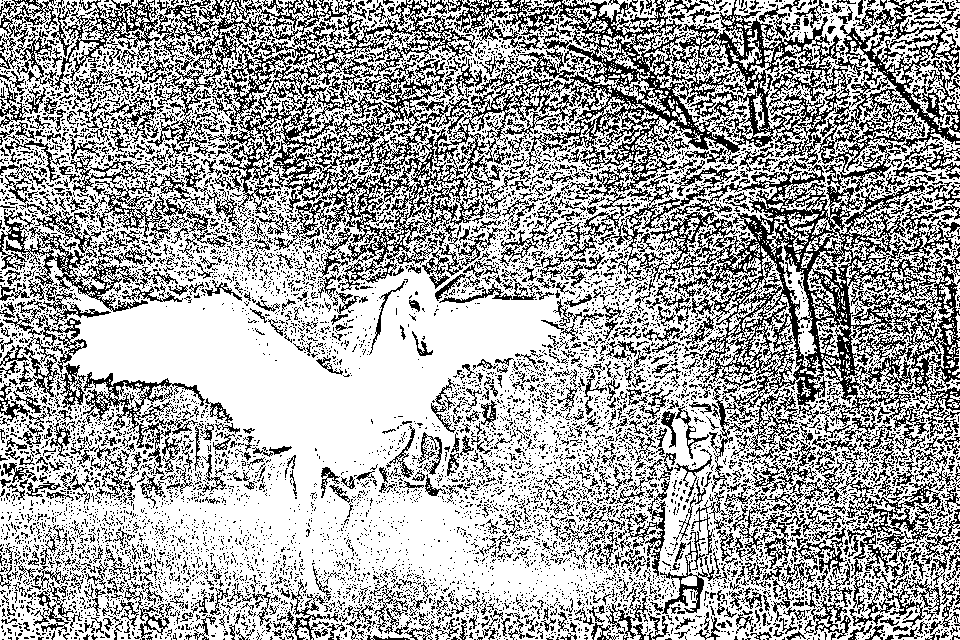

**金海四分相+金冥梅花相**

**作为金牛座北交点的定位星，金星目前是在双子座运行的最后一周。下周一，18 日，金星将换座进入巨蟹座。**

在离开双子座之前，**金星在本周与外行星发生多个相位，从周三的金土三分相、到周四的金海四分相，以及周五的金冥梅花相。**

这一系列星象向我们强调了**物质财富**层面，以及**关系层面**的议题。金星在双子使我们可以去理性地思考、谈论、分析这些议题，不像进入巨蟹座之后那么感性和情绪化。

**金海四分相**发生在双子座/双鱼座 25°22′，从经济层面，这可能是一个敏感而脆弱的时期，泡沫破灭。我们可能意识到社会经济与个人财务面临的困难，以及对未来发展的迷茫感，感到无力与无所适从。

金海四分相也可能带来金钱方面的理想化或随意迷糊，如果有一些看起来很美的投资或发展项目，一定要足够谨慎，小心被别人画大饼。也要避免轻易借钱，或花钱太随意，缺乏计划性。

还好本周还有**金土三分相**，能带来一些较为务实接地气的能量。我们可以坐下来对自己的财务情况进行盘点，规划未来的收入和消费，做到心中有底。

**金星和冥王星在双子座/摩羯座 27°26′呈梅花相**，如果害怕财务生活失控而产生危机感，尽量跟身边的朋友亲人聊一聊，也帮助自己梳理思路，平复内在焦虑。

从关系的层面看金星的相位，本周我们可能会经历一些关系中的失望。海王星的能量也可能带来非常美好梦幻般的关系，但有可能过后发现其中有伪装、美化或谎言的成分。

我们可以借助金土的力量，让自己更清晰地看清关系的实质。如果金冥的能量发生作用，产生了关系中的愤怒、操控与紧抓不放，那么最好也是用土星的实际、冷静来帮助自己回到理性中来。

此外，我们也可以通过欣赏音乐、影视、文学作品，来转化金星的这些能量，使自己在一种“安全的距离”下来体验人生。

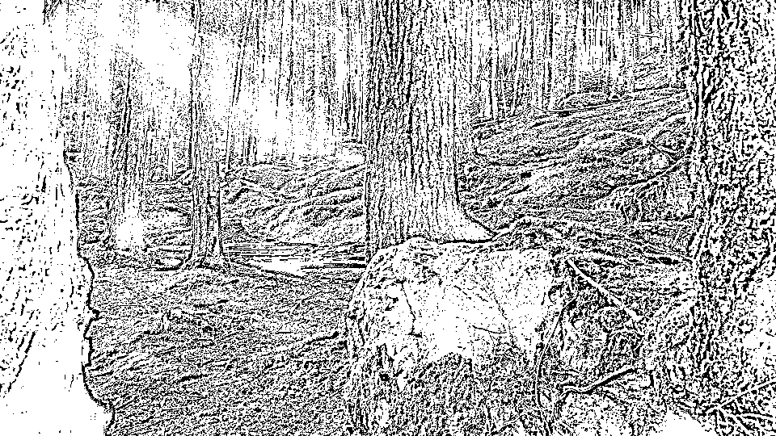

**12 星座的一周运势**

**（重点参考上升星座，其次参考太阳星座）**

***白羊座***

满月发生在 10 宫，如果你和伴侣之间产生矛盾，有可能是因为你太投入于工作和自我发展，忽略了家人。多沟通交流，分享你的感受与想法，会帮助你获得家人理解。适当慢下来，一起享受日常生活，能增进你与家人的感情。

你在事业发展上的努力，现在可能看到一些阶段性的成果。但财务与收入方面的不稳定状态，可能还是让你有些忧虑。你其实擅长冒险和探索新事物，不过寻求突破是需要时间的，多一些耐心，给自己时间去多做尝试。

可以增加对外的社交联络，也许有机会获得重要的信息或资源。

***金牛座***

如果你感到想要更独立自由，讨厌被束缚，那么可能是火星和天王星、北交点在你 1 宫的能量发挥了作用。一贯平静沉默的你，也可能变得有些火爆或叛逆起来。

满月发生在 9 宫，你可能因为观念或想法的不同，跟伴侣或重要的伙伴发生分歧。你有自信，也了解自己的优势，有助于你发展事业。如果朋友或外界还没有充分认识到你的价值，由它去吧，时间会证明一切。

善用你的能量，比如耐心、平静、稳定，在这个风云变幻的时代，它们弥足珍贵。但也不要忘记借助天王星的能量，适当做一些改变和新的探索。

***双子座***

如果事业方面暂时不是那么顺利，注意不要影响你对自己的信心。你可以通过充分的表达沟通，去让领导和同事更了解你，认同你的想法或观念。

满月发生在 8 宫，你的财务宫，注意防范投资方面的风险，也许需要在满月前对自己的财务状况做一些梳理和调整，更稳健保守一些。

在关系方面，你和伴侣之间有没有足够的安全感，身体上能否彼此满足，会是关系和谐的关键因素。

若是感到内在焦躁、多梦，可以通过阅读、音乐、冥想等活动，接触大自然，体验日常生活乐趣，从中找到宁静。

***巨蟹座***

满月发生在你的 7 宫，你的关注焦点可能在关系上，可能与伴侣或重要的伙伴产生一些矛盾分歧。你们之间，是否了解彼此的想法和需求，是否能够相互谅解和满足双方的需要，是解决分歧的关键。

你的 11 宫里比较热闹，在社交和朋友关系方面可能有一些突然的变化，也可能在团队中存在竞争或冲突，或让你感到跟别人格格不入。

可以问问自己究竟想成为怎样的人。放松紧绷的情绪，学习适当的放手、顺其自然，通过阅读、冥想、寻求内在宁静。这有助于你的自我觉醒，也有助于你的关系。

***狮子座***

你的 10 宫比较热闹。事业方面你可能卯足了劲，想要冲一把。但天王星带来了不确定因素，可能领导的想法变化，或者项目还在调研，需要你能适应变化，灵活调整自己的行动。

需要注意，太独立或坚持自我可能处理不好与领导同事的协作，还可能吵架。

满月发生在 6 宫，也是你的工作宫位。与同事的关系如何，工作环境是否支持你的野心，在满月前后可能有所发现。

在与伴侣的关系方面，要注意身体健康的因素，以及日常生活的相处细节。你们的生活习惯是否合拍，能否照顾彼此的需求，都是关系和谐的关键因素。

***处女座***

满月发生在 5 宫，如果有孩子，你可能在关注孩子的表现，操心他的发展。如果没有，那么你的热情和自信心可能是关注的焦点。

你是否为某些事焦虑而失去了自信？跟朋友或团队成员聊一聊，你可能会发现他们对你的信心和信任依旧。

你在事业中的表现，可能被合作者或伴侣拖后腿，或者他们的关心和担忧，给你带来无形的压力。

处理好自己手头的工作，安排规律的生活，按照细致的规划一步步做事，不要让别人的情绪影响到自己。多阅读思考，能帮助你增强处理复杂问题的智慧。

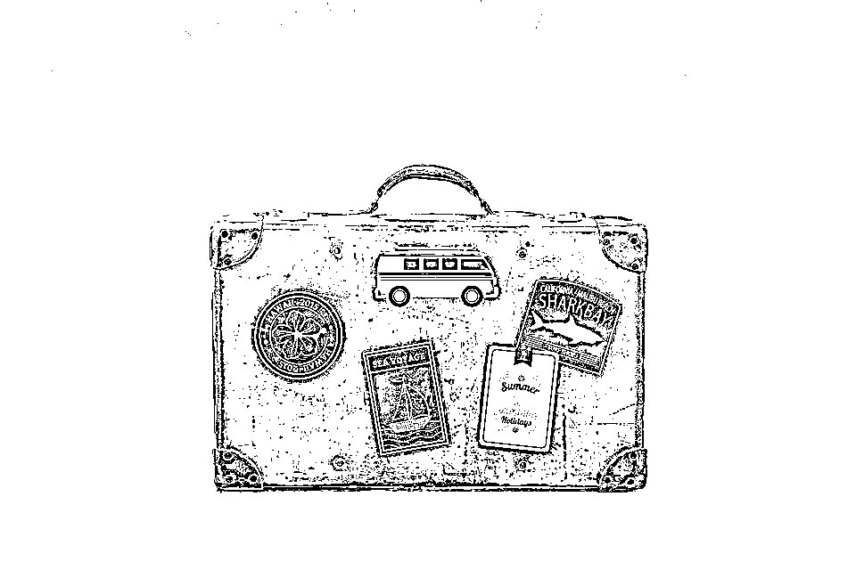

***天秤座***

满月发生在 4 宫，你的家庭宫里。你可能关注焦点在家庭生活，与父母的关系，或者房产家居相关的事宜。满月前后，情绪或家庭事宜可能影响你的工作状态，注意调整心态。

跟伴侣的关系方面，尤其需要注意情绪和情感的归属感，体谅彼此的感受。否则有可能产生不满，引发激烈的情绪。

火星和天王星在你的 8 宫，如果你有参与一些高风险的投资，最近需要注意防范突然的变化。不要过度冒险，或因为冲动而投资。学习专业知识有助于你作出明智的投资决策。

***天蝎座***

火星和天王星在你的 7 宫，伴侣宫，你可能发现自己或者伴侣变得更加独立、坚持己见，甚至有点咄咄逼人，为一个小问题的是非都要争个不可开交。

这可能是人际关系不那么和谐的一段时间。因为你更加渴望坚持独立的自我，懒得过多为他人考虑。但这有时候确实会伤害对方的感受。

满月发生在 3 宫，能否顺畅交流，是否有共同的兴趣和话题，相似的价值观念，对你们的关系至关重要。

金星在 8 宫，四分 5 宫的海王星。这段时间的财务投资需要防范风险，不要因为追求多一点收益而冒险，结果可能得不偿失。

***射手座***

满月发生在 2 宫。你现在的收入状况如何？你担忧自己的价值如何实现吗？金星在你的 7 宫，目前你可能需要寻求他人的肯定和支持，帮助实现你的价值，获得充分的报酬。

通过写作、交谈、演讲等，充分表达、展示自己的专业能力，以及努力做好手头的工作，这是正确的道路。

火星和天王星在你的 6 宫，生活工作都似乎有点繁忙凌乱，处理好你的生活和环境，尽量让它们更有秩序。

也要关注你的健康问题，避免着急上火。在行动之前思考一下，不冲动行事，以及多一些耐心，让自己学会内心平静。

***摩羯座***

满月发生在 1 宫，你对现在的自己满意吗？你有怎样的担忧，或者想做出怎样的改变？

满月会帮你重新认识自己，注意到你和伴侣彼此不同的需求和追求，如果能够尊重彼此，相互成就，那就是最好的关系。

你的 5 宫里有火星和天王星，孩子可能不太听话或到了叛逆期。需要你意识到他是独立的个体，而不是父母可以任意涂写的白纸。理解孩子、平等沟通是解决之道。

如果没有孩子，你可能创造力爆棚，有一些很特别的点子冒出来。参与一些比较刺激的活动，比如攀岩或跑酷，可能让你感觉很好。若有机会也可以把创意变为作品。

***水瓶座***

满月发生在 12 宫，经过一段时间的忙碌，你现在可以停一下，看看自己内在的需求是否得到了满足，心灵是否需要平复和宁静。

在关系中，你和伴侣的生活状态如何，相处是否和谐愉快很关键，需要学会关心彼此内心的需求。

注意你的家庭关系。火星、天王星在 4 宫，你可能容易跟家人意见不合，发生争执。转化的方法是相互尊重，给彼此独立空间。每个人可能都需要有独处的时间来获得平静。

金星在 5 宫，四分 2 宫的海王星。你可能因为钱的问题有些失去信心，但借助 1 宫土星的理性、实际来看待我价值，你能找到自信。

***双鱼座***

满月发生在 11 宫，你的目标实现了多少，你的朋友或团队成员是否认可你？

不用过分看重他人的评价，你更需要找到自己真正有热情的事情，发挥自己的特长。家人会给你支持，可以跟他们聊聊你的想法。

你天然就对艺术、灵性、精神追求相关的事物感兴趣，现在也很适合去接触这些领域，或发展自己的艺术感受力。

火星、天王星都在你的 3 宫，你的学习思考可能比较快速。在表达和与人沟通时，可能较直接，坚持己见，有时让对方不好接受。如果能够事先做好准备，或者以写作的方式表达，沟通会更有效。

**版权声明**：原创文章由作者授权首发于若道平台发布，欢迎转发，反对抄袭。友号转载请申请白名单。

**END**

**芷菱**

ISAR 认证占星师/占星作者/媒体人若道 2019 届核心课程毕业生

于 2019 年通过 ISAR 考试，同年获得若道认证神话塔罗师资质

**微信公众号**：芷菱的理想国

长按打赏

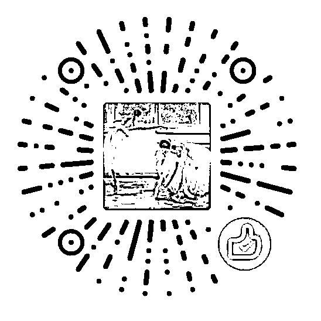

**20 位来自世界各地的占星师****带来 19 场沙龙——新世界的觉醒****详情可点击下图**

**学习占星学****点击下图了解课程详情**

**微信又双叒叕改版啦，不想错过若道君的推送？**

**就把若道设为星标吧！**

**▼**

**喜欢就点一下“在看”吧！**

********报名直达入口********

# 雷蒙德·梅里曼金融占星周运 | 同样的周期，在历史上发生过什么？

> 原文：[`mp.weixin.qq.com/s?__biz=MzA5NjA0NTAxNg==&mid=2651480106&idx=2&sn=9eb7e0e7fcb7ae3b6bef2577bfcfe8bd&chksm=8b48d29dbc3f5b8b084c67a0d00f1677685a242748aabe94851a1413ca01fb340e794437b6d0&scene=126&sessionid=1692737786#rd`](http://mp.weixin.qq.com/s?__biz=MzA5NjA0NTAxNg==&mid=2651480106&idx=2&sn=9eb7e0e7fcb7ae3b6bef2577bfcfe8bd&chksm=8b48d29dbc3f5b8b084c67a0d00f1677685a242748aabe94851a1413ca01fb340e794437b6d0&scene=126&sessionid=1692737786#rd)

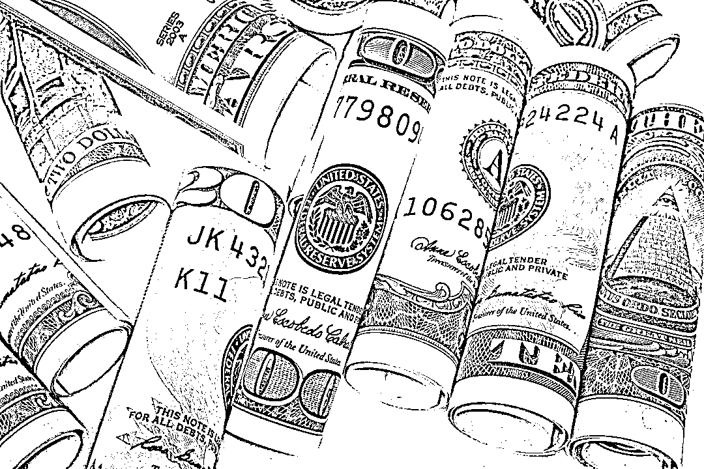

作者/雷蒙德·梅里曼 译者/Luke
编辑/玫瑰 图片/pexels

雷蒙德·梅里曼是在金融占星学界稳坐第一把交椅的占星师，同时他也是若道签约的金融占星课老师，我们引进了雷蒙德·梅里曼老师的《[上证指数月度报告](http://mp.weixin.qq.com/s?__biz=MzA5NjA0NTAxNg==&mid=2651477281&idx=3&sn=65ddd3e71ea11fbb78a1f51685d17483&chksm=8b48e796bc3f6e8034c6cfc8e0ac35cf8bda531ab58cb216c2003cd11cc20197333775a5d0ec&scene=21#wechat_redirect)》及《[黄金报告](http://mp.weixin.qq.com/s?__biz=MzA5NjA0NTAxNg==&mid=2651477281&idx=3&sn=65ddd3e71ea11fbb78a1f51685d17483&chksm=8b48e796bc3f6e8034c6cfc8e0ac35cf8bda531ab58cb216c2003cd11cc20197333775a5d0ec&scene=21#wechat_redirect)》。我们经老师的授权，将每周刊登梅里曼老师的周运，供大家参考和学习。于是，这是本周的周运（7.11-7.15）。

**说明：以下时间采用纽约证券交易所所在地美国东部标准时间。**

**展望与回顾**

****

**6 月的就业增长速度远快于预期，非农就业人数增加了 372000，比道琼斯估计的 25000 要好。失业率为 3.6%，与 5 月持平，与预期相符。6 月的增长数据与 5 月修正的数据 384000 相比略有放缓。****4 月的修正数据被下调到 368000。资本经济的美国经济学家安德鲁·亨特表示，“6 月非农就业人数强势增长 372000，似乎是对经济正走向衰退的说法的嘲弄。”****——杰夫·考克斯****《随着就业市场克服衰退恐惧，6 月非农就业人数增长 372000 人，超过预期》****www.cnbc.com****2022 年 7 月 8 日****尽管通货膨胀率以 1980 年代初以来最快的步伐增长，非农就业数据依然有所增长。美联储布局了一系列加息，旨在放缓经济的同时，不导致衰退。然而，近期的指标显示，经济增长已经大幅度地冷却了……****美国银行的信用卡和借记卡数据显示，截至 6 月 30 日消费同比下降 1%，这对于三分之二的增长依赖于消费者的经济体来说，不是一个好的兆头。****第一季度国内生产总值收缩 1.6%，第二季度将下降 1.9%，符合对于衰退的通常定义。****——杰夫·考克斯****《衰退观察》****www.cnbc.com****2022 年 7 月 8 日**在全球股票市场上，多空之间的争夺变得越来越激烈。许多指数的图表形态依然是看跌的，比如道琼斯工业平均指数和标准普尔指数，自 1 月 5 日的历史高点后，每个交易周期的高点和低点都在不断走低。仅有道琼斯工业平均指数在 4 月 21 日创下一个标志性新高，独立于纳斯达克或标准普尔指数。然而，在 7 月 8 日，纳斯达克指数突破了近期的高点（6 月 28 日），但是其他两个美国股指还没能做到这点。此类市场走势间的背离也在其他地区出现，大多数指数依然守住了在 6 月 17 日金星四分土星时，创下的可能的中周期低点。在亚洲和环太平洋地区，上证指数和印度 Nifty 指数上周表现出色。上证综指 7 月 4 日飙升至 3424，为 3 月 7 日以来的最高价，满足了我们在 6 月 23 日中国专场讲座上给出的最低价格目标。NIFTY 指数 7 月 8 日上涨至 16275，为 6 月 10 日以来的最高价。但是澳大利亚 ASX 指数、恒生指数以及日本日经指数追随了美国市场相同的走势。也就是说，这些指数每个都在 6 月 28 日新月四分木星，海王星转向逆行时（最近的官方地球宇宙学关键反转日期），上涨至近期高点。这些指数随后回撤了 2-4 天，然后继续了上涨走势至 7 月 8 日，但未能超过 6 月 28 日的高点，上证综指、NIFTY 指数、苏黎世 SMI 指数和纳斯达克指数除外。欧洲指数在过去两周的走势表现出很大的差异。比如说，德国 DAX 指数于 7 月 5 日下跌至新的 21 个月低点，随后反弹至周末。伦敦富时指数也没有站稳脚跟，因为首相鲍里斯·约翰逊在巨大的（典型的英式）丑闻中被迫辞职。AEX 指数顺利上涨至 7 月 8 日，但未能超越 6 月 28 日的高点。唯有苏黎世 SMI 指数于周五创下新周期高点。大多数指数的形态符合我们根据月相推断的走势。自 6 月 17 日的低点来，每个指数都经历了两个重要的月亮周期测试。其他的市场比股票市场更令人震惊。美元指数上涨至 2002 年 10 月以来的最高，同时欧元兑美元下跌接近平价，是 2002 年 12 月来的最低。黄金跌破了关键的 1750-1785 区间。白银暴跌至低点 18.70，是两年来从没见过的低位。

**短期占星趋势和长期考量**

****

**在书中，你说有两种领导人：政治家和先知。你能解释区别吗？政治家式的领导人，分析既存情境的现状，想要在其中获得最大的利益，平衡愿景和风险，时刻谨记长久的历史大于当下的激情。**

**先知，在我看来，不被纳入这个范畴内。他们相信他们的价值观必须尽快被执行，所以那些价值观的质量决定了他们政治角色的重量。**

**先知的视角往往是更宏大的视角，也是更有激情的视角，可能导致重大的历史转折，但它没有考虑人类苦难的规模，以及任何一代人适应这种根本性改变的能力。**

**——亨利·基辛格****《互联网不能造就伟大的领袖》****https://time.com****2022 年 7 月 3 日****诺查丹玛斯预言，1999 年的第 7 个月，恐怖大王降临世间。诺查丹玛斯最著名的预言直击人心……1999 年 7 月。“恐怖大王从天而降”。****——埃弗雷特·布莱勒****《诺查丹玛斯》****华盛顿邮报****1999 年 9 月 12 日****自 2020 年 12 月 20 日木星-土星合相后股票市场的走势，非常接近 2000 年上一次这两颗行星合相后的走势。**事实上，在 1999 年末到 2000 年初，木星、土星在金牛座合相，四分在水瓶座的天王星。2020 年末到 2021 年，木星、土星再次合相，这次在水瓶座合相，四分在金牛座的天王星。这次木星-土星与天王星成相的星座是刚好对调了。也就是说，前者是 2000 年初结束的渐盈四分相，后者是 2021 年 12 月结束的渐亏四分相。**但股票市场的走势几乎是相同的。在 2000 年初，随着与天王星最后一次四分相的结束，股票指数创下了历史新高，并开始了为期 2 年的下跌，至 2002 年 10 月。**有趣的是，2002 年 10 月的低点，发生在木星第一次精准八分土星相位（2002 年 10 月 13 日-2003 年 7 月 9 日）的数天之内。这是该周期的第一个 1/8 阶段，我常常指出**这个子周期的主题为“选择继续还是放弃”**，考虑到最近最高法院对堕胎权的裁量，这是很有趣的。

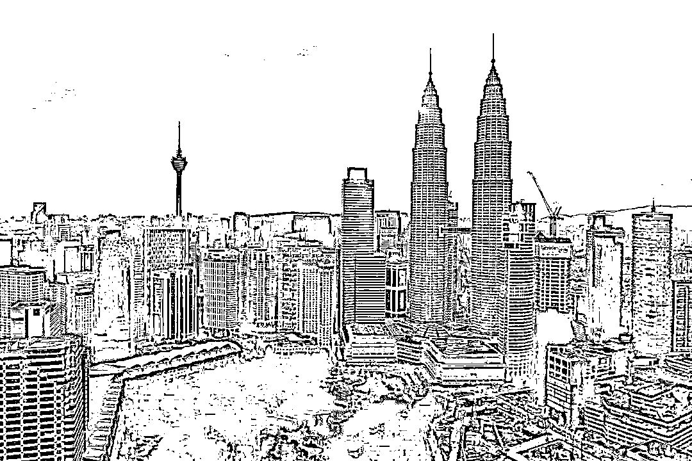

现在，自从木星、土星在 2020 年 12 月合相，以及土星在 2021 年 12 月四分天王星，我们再一次接近了木星-土星的第一个八分相。

在 2022 年初，仅在最后一次土星-天王星四分相结束后的 1 个月，股票市场就开启了剧烈的下跌，与它们 2000 年初类似相位下的走势一致。

唯一的问题是，随着木星开始与土星形成连续三次八分相的第一次，这轮下跌会像 2002 年 10 月那样结束，还是说它仅是更严重的下跌的第一个阶段，整个下跌可能持续 2 年以上，正如 2000 年 1 月高点后发生的那样。

一些非常重大的事情正在发生，可能会改变世界历史的轨迹。它可能始于 1999 年 8 月的日食。我们知道在 2023 年，冥王星将开始为期 20 年穿越革命性的水瓶座的行进。我们知道在木星-土星合相后的 1-2 年，通常会发生一场重大的军事冲突，最终成为一场变革性的历史事件。**·** 在 2000 年木星-土星合相后，我们见证了 2001 年 9 月 11 日恐怖分子对世贸中心的袭击，导致了与伊拉克的战争并改变了世界局势。**·** 在 2022 年，我们见证了俄罗斯对乌克兰的袭击，是二战以来欧洲大陆的第一场战争。**·** 在 1980 年，发生的事件是伊朗挟持美国公民为人质。**·** 在 1960 年早期，是古巴导弹危机。**·** 在 1940-1941 年，是第二次世界大战。我不像许多人那样，相信当今是末世。事实上，我对于人类的未来更加乐观，相信这些危机的时刻是必要的步骤，为的是在这十年期的后半，天王星进入双子座三分水瓶座的冥王星时，出现的下次文艺复兴做准备。我们在向哪里前进，为什么？自由。独立。尊重个体和人权。这都是水瓶座的理想。是的，我们起初会跌跌撞撞。但我们都在这个地球上，我们都是同一个种族——人类的成员。那些价值观是风象星座纪元（木星、土星在风象星座合相）为接下来 140 多年所昭示的，等待人类的理解。正如迪帕克·乔普拉所说的，我做的每个决定不是导致悲伤，就是引发奇迹。**梅里曼市场时机学院与若道于 2022 年 6 月 23 日 19:00 举办金融市场最新信息中国专场讲座。**这个 2-3 小时的在线讲座（有两次 5 分钟的休息时间）讨论了几个金融市场的前景，包括黄金、原油和上证综指。**长按下图了解更多详情**

这是特别及时的讲座，因为为期 12 年的木星轨道周期会在 5 月 10 日进入白羊座，并且 6 月-11 月是一年中最有力的地球宇宙征象接连登场的重要时间段，因为土星逆行与天王星形成几乎精准的渐亏四分相。

**说明：以上日期基于纽约证券交易所所在的美国东部标准时间，由于存在时差，中国地区可能需要加一天。**

**版权声明：**本文由若道翻译发布，欢迎转发，反对抄袭。友号转载请申请白名单。

**雷蒙德·梅里曼（Raymond Merriman）**

若道签约老师。著名金融占星师，ISAR（国际占星研究协会）前主席，梅里曼市场分析公司的总裁。他由于“提升了占星学的职业形象”，在 1995 年国际占星大会上被授予轩辕十四奖；在 2012 年国际占星大会上，被授予轩辕十四终身成就奖。

1“中国上证指数月度报告”发售**若道推出了****中文版****的雷蒙德·梅里曼中国上证指数月度报告，并持续发行该报告！**当把金融市场的周期和占星学的周期相结合时，雷蒙德·梅里曼老师的金融占星学研究**为投资者应对金融市场的周期波动，并随之调整投资策略提供了极大的价值参考**。
**7 月中英文报告已上线！**2“黄金价格周期月度报告”发售**若道推出****中文版****的雷蒙德·梅里曼黄金价格周期月度报告！**不仅仅为广大读者在中国股市的投资出谋划策，更将视角放眼黄金市场。**每当世界经济形式不明朗的时候，有一个地方是保值的港湾，那就是****黄金**。自 1982 年雷蒙德·梅里曼出版第一本研究《地球宇宙学征象与黄金价格的关联》的著作以来，**他一直作为最重要的黄金市场时机预测者之一享誉国际**。2022 年 7 月黄金报告已上线，梅里曼老师将会告诉你他对这个关键时期如何操作的想法。也可以按照季度和一年期订阅，有更多优惠。季度和年度的好处是，你可以持续了解梅里曼老师对于不断在变化的市场的看法。即便他某一次看法和市场不一致，你也看到在下一期他如何调整自己的看法，并看到金融占星在一个长期时间段内对你把控风险的帮助。而能够长期控制风险、尽量找到安全的投资时机才是投资的长久之计。**7 月中英文报告已上线！****购买套餐**，买得越多越优惠中国上证指数月度报告套餐价

*   **单月报告**：280 元
*   **3 个月套餐**：780 元（260 元/月）
*   **12 个月套餐价**：2400 元（200 元/月）

**长按下图识别二维码****购买金融报告****套餐****▼**

黄金周期月度报告优惠

*   **双报告年度套餐更优惠（直降 900 元）**

*   **12 个月黄金报告+12 个月上证指数报告：仅需 3900 元**

**长按下图识别二维码购买黄金报告套餐**▼

3《2022 年金融预报和沙龙》1976 年以来，由雷蒙德·A·梅里曼撰写的梅里曼市场时机学院每年一次的年度预报沙龙和每年一本的《年度预报》一直在应用占星学原理为投资者们服务，提供卓越洞见，从未间断。 **雷蒙德·梅里曼《2022 年金融预报和沙龙》发售中（报告已发布）。****长按下图识别二维码了解详情**
▼

4《2022 下半年金融占星投资沙龙》这是特别及时的讲座，因为为期 12 年的木星轨道周期会在 5 月 10 日进入白羊座，并且 6 月-11 月是一年中最有力的地球宇宙征象接连登场的重要时间段，因为土星逆行与天王星形成几乎精准的渐亏四分相。

**长按下图识别二维码了解详情**

▼

**点击阅读原文购买金融报告**

# ISAR 认证职业占星师文凭课程 | 开启“爱好变职业”的创收自由之路

> 原文：[`mp.weixin.qq.com/s?__biz=MzA5NjA0NTAxNg==&mid=2651480106&idx=3&sn=ab291cc4f0a483fb6c8da26481a13515&chksm=8b48d29dbc3f5b8bd08eb4404c49725902566c7c9bdaee3e80f9b476fed4beecb91c51b2b4cd&scene=126&sessionid=1692737786#rd`](http://mp.weixin.qq.com/s?__biz=MzA5NjA0NTAxNg==&mid=2651480106&idx=3&sn=ab291cc4f0a483fb6c8da26481a13515&chksm=8b48d29dbc3f5b8bd08eb4404c49725902566c7c9bdaee3e80f9b476fed4beecb91c51b2b4cd&scene=126&sessionid=1692737786#rd)

**2022 年，是世界和中国 40 年未有之大变局的开始。**

俄乌战争打破了欧洲大陆乃至全世界的和平局面，而新冠疫情也给中国经济带来前所未有之挑战。

如果你关心经济形势和世界局势，你会有这种的感觉，我们将面临一场深刻的危机，而这不是短期内可以结束的。

**占星学的看法也是如此。**

4 月青年失业率（16 岁到 24 岁）中国达 18.2%，一些背着房贷、教育、医疗负担的中年人突然失业更是整个家庭整个难以承受之重。为了更好准备面对这样的时代变化，连《北京日报》这样的官方媒体也在呼吁：**“开拓副业，让自己有多元化发展的生存能力”。**

**而这门课程，就是为了这样一个目标准备的。**

**占星学是非常好的“开展副业”的选择**

这个**为期 16 个月**的课程通过并不算长的时间和并不算高的投资，不仅可以帮助你学到一个终身可用的技艺，而且也可以选择成为自助助人的占星师，**开启受益终生的第二事业。**未来是个体崛起的时代，大量个体被鼓励独立发展，比如网红、自由职业、自媒体、咨询师等，他们都不需要传统的办公室。社会越发达，人的独立性就越强，未来有能力的人都可以变成独立的经济体。

**占星学也是越老越好的职业**

和一些技术变化非常快的职业不同，**占星学的技术层面非常稳定，不会快速迭代变化，**同时，掌握好占星学、能够做一场好的咨询又需要个人自身大量实践和对生命的深刻理解，而这些都是时间和岁月带来的。

**占星学是现代社会需要的助人职业**

社会快速发展和变化人们似乎越来越无法掌控自己的生活，这给很多人带来巨大的焦虑，**抚慰心灵的咨询市场需求巨大。**而占星学可以让人从前所未有的角度了解自己，了解目前和未来所处的周期，挑战的意义，不论对于深入的个人成长探寻，还是预测未来的周期，都又其独一无二的价值。

**ISAR 认证职业占星师的独有培训**

目前占星学的培训市场鱼龙混杂。而 ISAR（国际占星研究协会）是一个包含了 47 个国家在内的国际占星组织，多年来致力于占星的教育和研究，提升占星教育的品质和职业占星师的能力，在国际占星领域备受尊重。今年，ISAR 对于成为 ISAR 认证职业占星师提出了更高的要求，**所有想要获得 ISAR 职业占星认证的申请者均需要在 ISAR 的附属学校通过 500 个小时的研习（包含****主课****、选修课、沙龙、作业、讲座、工作坊等等）。**

**而这门核心占星学课程就是为此而准备的。**

**2022 年，鉴于对若道在占星教学领域所做的持续努力和高品质的课程服务，ISAR 特别授予若道核心课程为 ISAR 文凭课程，所有在若道学习，并通过若道毕业考试的同学将获得 ISAR 颁发的学历文凭（Diploma）。**

**你的占星核心课老师是谁？**

**拥有****51 年****占星实践经验的****若道创始人****前 ISAR 全球副主席****前 ISAR 全球职业占星师资质认证主席****大卫·瑞雷**

**和**

**2019 年第二届、2021 年第三届核心课中**

**与苏·汤普金斯老师****联合授课****的**

**ISAR 认证职业占星师**

**咔咔（Caroline）**

**二人合力打造**

**2022 年 ****若道全新核心占星课程**

**咔咔老师给同学的寄语：**

（向上滑动查看内容）

**亲爱的同学们：**

我为什么学占星学？

2000 年的时候我还是一个在网上搜索天蝎座和水瓶座配不配的普通白领。我搜索的内容还包括了水瓶座为什么总是这么若即若离？

体贴的搜索引擎给我推送了占星学、行星、星座、宫位、相位等资料，还让我了解到莉莉丝、月亮交点、截夺宫位等占星学概念。

2000 年 10 月我了解到，一个从业 30 多年的美国职业占星师大卫·瑞雷来到了中国，和他的中国合伙人将开办一个专业教授占星学知识的课程。过去 10 个月在网上东拼西凑的占星学知识唤起了我对占星学的兴趣，但是已经不能满足我对星图深度分析的需求了。

2013 年，我通过了若道核心课程的毕业考试和国际占星师研究协会的认证考试。2015 年我离开职场成为一名全职占星师。

到底学习占星带给了我什么呢？

1、它是自我觉知的工具，我现在已经不去纠结哪些星座是否匹配，我相信外在的事件是内在心理矛盾的显化。也就是说，想找到令人满足的亲密关系，要先去了解自己的情感模式和需求，而不是无意识地一次次地试错和撞墙。我开始学习自我关怀和接纳自己。

2、它带来看待世界的全新和全景的角度，天上如是，地下亦然。人类社会和个人生命的进化都有其周期和相似性，作为个体，占星学帮助我思考如何更积极和有建设性地与宇宙的能量合作，认识自己，发挥自己的潜力，度过有意义且自我满足的人生。

3、它带来了全新的职业：占星师和占星老师。除了收入，还有助人育人的满足感和意义感。

4、它带来一群志同道合的伙伴，我们彼此联结又相互独立。

作为中国占星界的“黄埔军校”若道占星的学生、助教和老师，我与很多学员在人生的不同阶段带着各异的需求走进了这所学校，2022-2023 年一年半的若道核心课程设计既蕴含了大卫·瑞雷老师的教学精华，也带入了我在跟随不同国外占星老师学习、助教和教学积累的心得。

有一些学员毕业后从事了占星咨询工作，有的在各大平台成为专业占星学知识的输出者和传播者，有的运用占星学提升他们的工作，也有的在占星学与投资，占星学与名人/八卦、占星学与原生家庭、亲密关系、亲子关系等领域收获了有用的或者有趣的体验。

对我来说，生命是一场自我完整的体验之旅。从 2011 年的那个春节在若道入学之后，我的生命旅程更加充实、有意义、有目标，也更有满足感。

希望在 2022-2023 年的若道核心课程里见到你。希望你此后的生命旅程里，有若道，有占星学。

占星师咔咔

2022 年 5 月 24 日

**大卫老师给同学的寄语：**

（向上滑动查看内容）

亲爱的学员们：

感谢你对我们从 8 月 30 日开始的若道 L1-5 级核心课程的兴趣。我和合作老师咔咔以及我们的核心课程团队期待着为你提供这个机会，来教授各种高品质的地道占星学知识和技巧。

对于那些希望获得 ISAR 职业占星师认证的学生，这是一门适合你的课程！

作为 ISAR 咨询技能培训的一部分，我曾与咔咔合作过，我们期待着再次合作。咔咔和我曾在 ISAR 职业占星师认证委员会（CAP ISAR）一起工作，我们非常熟悉获得 ISAR 职业认证的流程。作为你的老师，我们将陪伴你整个占星学发现之旅，帮助你逐渐认识到占星学有多么的神奇。此外，你还将受益于我们若道的助教和课程顾问，他们是若道核心课程计划的重要组成部分，提供在线沙龙、组织学习小组、指导家庭作业。我们的教育团队是“服务于你的团队”，所以也会根据你的需求进行相应的调整。你专用的核心课程微信群也促进了你的学习过程，使你能够每天与你的同学们一起学习、探讨、成长。

52 年前，当我开始学习占星学时，没有一所像若道这样的学校。如果有这样一所学校，我会尽一切可能在那里成为一名学生。事实上，我很幸运，我的老师都是经验丰富的专业占星师。然而，我花了 6 年的学习时间才通过 1976 年在美国乔治亚州亚特兰大举行的专业占星师考试，又花了 2 年的专业实践时间才通过占星学谋生。我永远不会忘记从 1970 年到 1978 年的 8 年，那些日子的反复试验教会了我如何苦练占星学。作为老师，我一直在努力传授我早年所学的知识，让你的旅程更加顺利，更加全面。

自 1978 年以来，44 年的全职实践教会了我很多，我很高兴有机会与大家分享我所学到的东西。我和咔咔都是现代占星师，虽然我们尊重西方占星学的历史和传统，但我们实践和教授的占星学植根于现代人本主义哲学，这种哲学旨在提高你对自身潜力的认识，并鼓励个人成长。还有什么比了解自己更实际的呢？还有什么比个人成长和发展潜力更有利的呢？这是你将要学习的占星学，一种可以应用于你自己生活的占星学，一种可以为你提供一个充实职业的占星学。

教书是我回馈占星学行业的方式，这个行业拓展了我的视野，远远超出了我曾经想象的可能。谢谢你给我这个机会做你的老师。

大卫·瑞雷

2022 年 5 月 24 日

**连报 L1-5 全阶网络直播课程，你可以享受**

❶ 64 次线上直播互动网络课程+2 场工作坊，全面而详细地讲解占星学知识、技能、案例和重要领域实践运用。

❷ 知识点+学员星图解读有机结合：咔咔老师以讲解知识点和中外名人案例为主，大卫·瑞雷老师以参课学员案例演示及客户案例为主，每个知识点覆盖班级内学员的亲身案例，参与感更强，多位学员都有机会听到自己的星图分析。

❸ 微信群学员互动分享，从真实案例学习生命成长故事。

❹ APP 答疑论坛提问：论坛上每个学员的问题都将得到及时回复。

❺ 若道独有的职业占星师养成计划，为你毕业后独立咨询做准备。

**❻ **提供**咨询平台**，只要努力，优秀毕业生有机会入驻**若道咨询平台**，拓展咨询客户群。

**更多了解老师和助教？**

**大卫·瑞雷（David Railey）**

*   **I****SAR 董事会成员，ISAR 全球副主席，ISAR 全球职业占星师资质认证主席，若道占星创始人**。

*   2016-2019 年，被选为国际占星协会（ISAR）考试委员会成员，国际占星协会（ISAR）是世界最大的国际占星机构，会员遍布 47 个国家。

*   2017-2020 年，被选为国际占星联盟（ISAR）考试委员会主席，理事会成员。

**占星师咔咔（Caroline）**

2010 年师从美国占星师大卫·瑞雷学习，并得到世界名师斯蒂芬·弗里斯特、罗伯特·汉德、苏·汤普金斯传授各种占星学技法。若道首届学员，国内最早获得 ISAR 职业占星师资质的职业占星师，多次担任若道核心课程助教，并于 2019 年第二届、2021 年第三届核心课中和苏·汤普金斯老师一起教授若道核心占星课程。

在国际知名广告公司和市场研究公司从事的市场研究和推广工作十余年，曾任职于阳狮集团、尼尔森市场研究有限公司、MTV 和《Madame Figaro》杂志。

**助教王嘉祺 （Conrad）**

ISAR 认证占星师、若道认证生时校正资质，从 2010 年起自学占星学，2015 年开始在若道系统学习，并开始个案咨询。2018 年担任若道核心课程助教，以及卜卦占星学和太阳返照选修课助教，并带领学员进行经世占星和太阳返照方面的研究。2019 年 11 月作为演讲人之一参加了国际占星协会（ISAR）北京大会，也是 ISAR 星空俱乐部中国区第 16 期的主讲人。

**什么人适合这门课？**

*   对占星学有浓厚兴趣，想要系统学习占星学。
*   对占星学有一定基础，但不知道该如何整合星图复杂的碎片。
*   希望成为优秀的占星师，想要借鉴国际大师解读思路并融入自己的体系。
*   想学习占星学，但不擅长英文，希望有中文老师授课。
*   想结合占星学理论与咨询实践。
*   走在自我探索和个人成长道路上的人。

**课程费用**

**★ 1-5 阶 连报**

**早鸟价：33000 元（2022 年８月 1 日之前）**

**课程费用：46500 元** **★ 1-2 阶 （8 月 30 日开课）**

**早鸟价：2800 元（2022 年８月１日之前）**

**课程费用：3500 元 ****★ 1-3 阶　连报**

**早鸟价：10500 元（2020 年８月１日之前）**

**课程费用：11500 元 **

**咨询课程请联系顾问**：**王老师（微信/手机：18510107057，请备注“大卫核心课”）**

**退转课程**

**退款原则请详看《教学协议》，如有疑问请咨询课程顾问。**

****2022 L1-5 认证职业占星师必修课程****

**授课老师：大卫·瑞雷、咔咔**

**直播课开课时间：2022 年 8 月 30 日（周二）**

**授课方式：******网络授课，英文/中文授课，中文翻译****

**费用：****1-5 阶连报**：46500 元**（早鸟价 33000 元,8 月 1 日前）；**1-2 阶**：**3500 元**（早鸟价 2800 元,8 月 1 日前）**；****1-3 阶**：**11500 元**（早鸟价 10500 元,8 月 1 日前）**

**课程负责人：王老师**（微信/手机：18510107057，请备注“大卫核心课”）

长按二维码添加课程负责人咨询~

****报名直达入口****

# 月亮进射手座，你现在最想做的是什么？

> 原文：[`mp.weixin.qq.com/s?__biz=MzA5NjA0NTAxNg==&mid=2651480102&idx=2&sn=00b10f46ac52657b7bc46c8db7f887a6&chksm=8b48d291bc3f5b87894eb3119e99ff5b43ecd44e90823f769fc372bd7786dadeb7d4104e23c0&scene=126&sessionid=1692737786#rd`](http://mp.weixin.qq.com/s?__biz=MzA5NjA0NTAxNg==&mid=2651480102&idx=2&sn=00b10f46ac52657b7bc46c8db7f887a6&chksm=8b48d291bc3f5b87894eb3119e99ff5b43ecd44e90823f769fc372bd7786dadeb7d4104e23c0&scene=126&sessionid=1692737786#rd)

**2022 年 7 月 10 日天象：**

*   **14:34 月亮进射手座**
*   ******太阳六分天王星、北交点******
*   ******天王星合相北交点******

月亮在下午进入射手座，自由的做些喜欢的事情吧！任何让你觉得舒服的事情都可以去尝试。太阳六分天王星，你很容易迸发出一些小灵感，生活中也可能出现一些令人惊喜的事。本周[【火星进入金牛座】](http://mp.weixin.qq.com/s?__biz=MzA5NjA0NTAxNg==&mid=2651479335&idx=1&sn=3e968eea7f3505de02c1173139e1553e&chksm=8b48ef90bc3f6686eb206ec5400ad509dfcbd6cc268f3aae9e2dfac165bc72767227b9d75d49&scene=21#wechat_redirect)（点击查看文章）、水星进入巨蟹座，到了学习放慢脚步、深思熟虑、观察细节的时候，我们需要辨别机会和危机，毕竟天王星已经进入和北交点的紧密合相期。从现在到 8 月份，我们都处在“震荡变化期”，系好安全带吧！周日快乐！我们明天见！**了解每日天象，可****下载“若道”APP 查看****还有更多精彩等着你哦**

# 女诗人余秀华分手了 | 平凡的人，是否可以实现“婚恋自由”？

> 原文：[`mp.weixin.qq.com/s?__biz=MzA5NjA0NTAxNg==&mid=2651480102&idx=1&sn=8ad8c73809e7afa0f618aecf404dbf1e&chksm=8b48d291bc3f5b87ba9b8d834d93734cbd8926eb363c892a9e3aa31198dbeaf2ff9d4ed91c25&scene=126&sessionid=1692737786#rd`](http://mp.weixin.qq.com/s?__biz=MzA5NjA0NTAxNg==&mid=2651480102&idx=1&sn=8ad8c73809e7afa0f618aecf404dbf1e&chksm=8b48d291bc3f5b87ba9b8d834d93734cbd8926eb363c892a9e3aa31198dbeaf2ff9d4ed91c25&scene=126&sessionid=1692737786#rd)

** 后台回复“今日”，给你一句生命态度 **

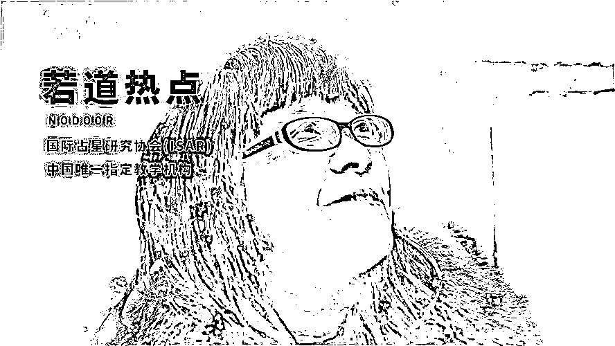

**作者/编辑/玫瑰 ****图片/余秀华微博及网络****封面图源/纪录片《摇摇晃晃的人间》**
**诗人余秀华并不意外地分手了**

7 月 6 日，诗人余秀华在微博上称自己与丈夫杨槠策（男方称未领证）分手了。余秀华还表示杨槠策对她很好，只是脾气比较暴躁，常常会因为争吵而对她动手，曾扇过她上百个耳光，甚至有一次差点把她掐死。

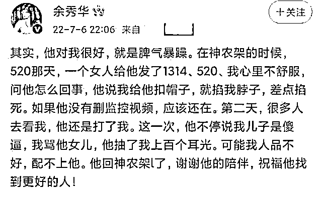

| 余秀华的微博

在之前的直播中，他们一个口无遮拦，一个满嘴脏话，两个人的吵架也暴露在几千粉丝的目光之下。撕破脸的结束，距离他们宣布在一起也不过短短几个月的时间。因脑瘫而残疾的女诗人余秀华一直是个争议体，这一次她又上了热搜。对于这段关系，当初大部分人并不看好。而短时间内就破裂也更加印证了这种不看好。**·** 一些人未卜先知：早就知道不行，一个正常的年轻男人谁会看上她呀。**·** 另一些人恨其不争：一把年纪不清醒，恋爱脑，吃过一次亏还不长记性吗？

**·** 还有人苦口婆心：这个年龄有钱的，单身，自由它不香吗？

也有不少人表示看烦了，余秀华好像疯了，是不是靠恋情炒作营销？

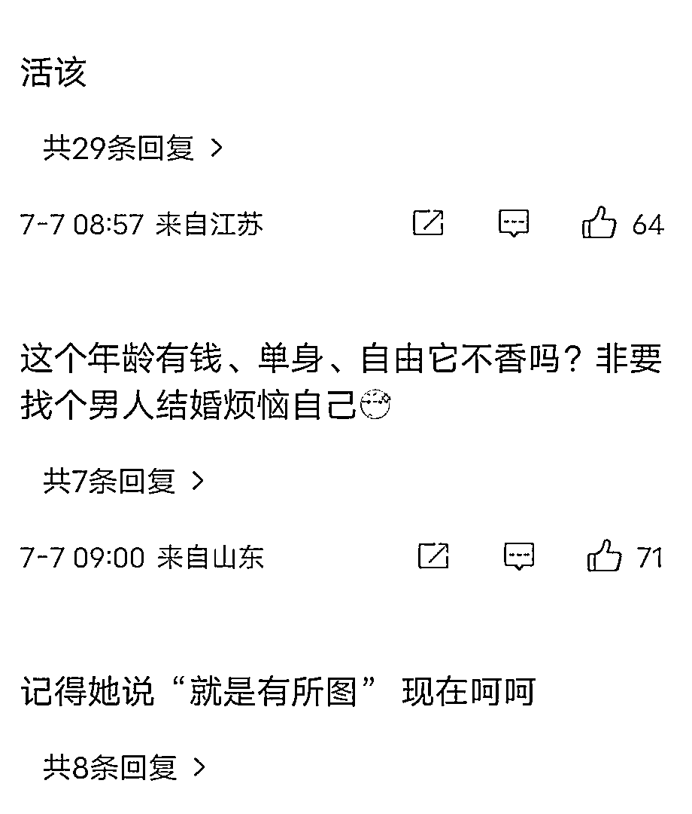

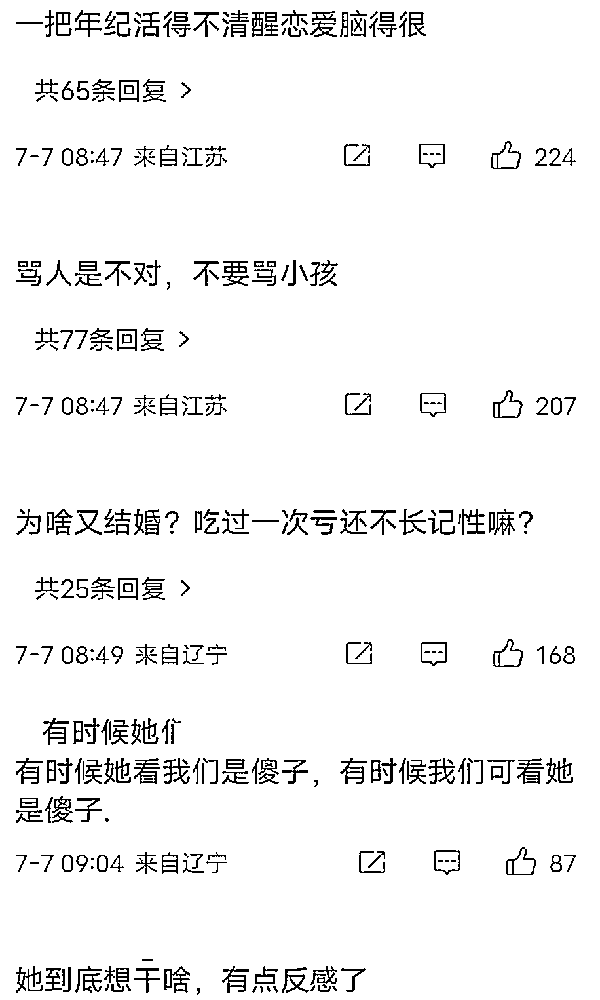

| 部分网友对此事的评论 

这些评论背后，充满了洞穿世事的"慧眼如炬”和遗世独立的“清醒自知”。在他们看来，余秀华最好具备如下独立女性的品质，这样大抵就不会如此“出洋相”了。**· 审慎，**对事物保有怀疑；**· 聪明，**不容易被骗；**· 理性，**不情感为上，独立，不需要男性**· “合群”**，不出格，不闹腾，不情绪化。时常在网上冲浪，看到一些女性离婚诉讼律师教大家如何在婚恋中避雷，她们说：**“二婚女人真的没有嫁得好的”“结婚不需要感情，能不拖后腿过日子就行”**。而一些男性情感博主帮助女孩子识别渣男，他们说：**“说出这种话来的男人一定是有坏心思”“这样表现的男人外面肯定有人了”**。这些话，听多了是不是更加恐恋恐婚了？也有很多找专家做情感咨询的人，他们需要报上的信息是：**性别、年龄、相貌评分（0-10 分）、学历（211 还是 985）、几婚是否带娃、月收入/年收入、家庭条件……**专家会根据这些情况评价她当下的关系，是高攀，还是低就，再来决定她应该如何操作才能保证自己的利益不被损害，情感不受欺骗。如果余秀华要去做情感咨询，代表她的可能就是这样一组数据：女，农民，相貌充其量 5 分，写诗的（没有正经工作），无学历，离异，收入尚可，家庭条件差——或许还要加一条“残疾人”。

想来想去。中老年有退休金的老头恐怕是她的归宿——年龄身份别想要更多了，男的也不能没编制没钱，否则贪图的肯定是她的钱啊。

这么一想，我发现自己终于不再恋爱脑，变得如此聪明了。同时也不由得苦笑：**当人们不断追求财富自由的时候，却越发失去婚恋自由了。**

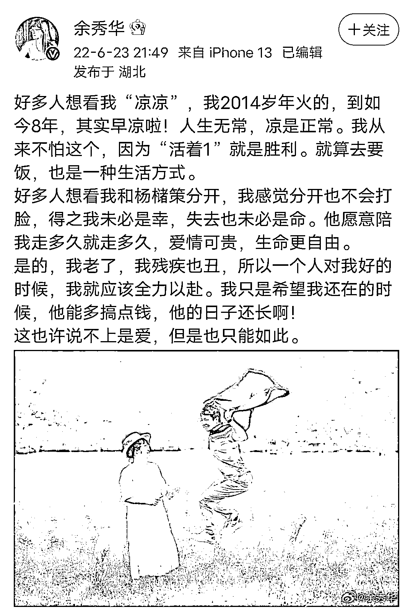

| 余秀华在微博上袒露内心
**冥王星摩羯座带来的婚恋观**
这些年，人们在谈恋爱的时候，越来越不谈“爱”本身了，这东西太玄妙，太“没有用”，就像对于余秀华，人们关心的只是，她下一次能不能不要再打脸，不要再失败了。另一个曾经饱受非议的网络红人凤姐，今年拿到了美国皇后学院的 offer，成为了美国大学生，人们对她刮目相看。成功的凤姐从群嘲变成了大家羡慕和佩服的对象。这时候的她如果再找个年轻的美国帅哥，怕是大家都会觉得有些“门当户对”了。失败的恋爱不仅让人颜面进损，更让人丧失自信，受到舆论的贬斥和打击。恋爱谈不好，一定是恋爱脑，一定是自己不清醒，一定是不够聪明，一定是……成王败寇的思想，已经随着冥王星在摩羯座行进的这十几年而逐渐浸透在群体潜意识的各个方面，**社会所推崇的女性形象，打上了浓重的冥王星摩羯座烙印——洞悉世事，老谋深算，不露声色，趋利避害。****摩羯座最不能接受的便是失败。**是的，我们**输不起**，一场失败的婚姻会给人打上“离异”“二婚”“三婚”的标签，多离一次婚，找到合意对象的几率就越发渺茫；一场失败的婚恋也很有可能让人元气大伤，在痛苦中久久无法恢复。正因为不能失败，才要越发小心，遵循规律和大数据概率去寻找匹配的对象。**这种趋利避害的感情观，追求的是摩羯座式的现实，长久，可持续性。**冥王星在摩羯座行进这些年，看过太多令人痛心的事儿，女性被欺骗，被家暴，甚至被杀害，还有金钱损失和婚姻官司，无一不让人不寒而栗的同时，更加保守和防御。越来越多的女性从一个极端走到另一个极端：完全付出到完全不付出，仰赖男人到完全不需要男人。“人生苦短。谈感情不如搞钱。”越来越多的人放弃了浪漫、坦诚、爱与被爱的渴望，选择了权衡、算计、观望。全方位考验和防范的潜意识里在说：**你可不要坑害我，最好你的家人也不要拖累我**。本应因为爱情而结合的一堆男女，爱情反而成了其中最不重要的东西。**爱情啊，总是要折腾的**

****

**在我们一生中，遇到爱，遇到性都不稀罕，稀罕的是遇到了解。**

**——廖一梅**

站在冥王星摩羯座尾度的当口，回看这些年我们所受到的熏陶，才隐隐发现，**如此防范和冷静，却仍旧很难规避种种雷坑**——以为老实的伴侣只是渣得更加隐形，以为稳了的富二代好像背地里负债累累，高调晒幸福的明星转头掐得你死我活，网红 CP 纷纷分手离婚……以为舍弃对爱的需求能获得安稳，结果反而更扎心。这又是为什么呢？不可否认，在婚恋关系中，现实一些固然是好的，毕竟我们是踏踏实实地生活在地面上的人，既不能上天，也不能入地，我们需要土星带来的架构和踏实感。可是，除了少部分特别理性的人，大多数人类感情的学习方式就是“折腾”，那是人性，人天生渴望爱，渴望浪漫地爱，渴望热烈地爱，渴望无望地爱，渴望疼痛地爱——**失败的爱也是爱的一部分。****折腾的背后，是被了解的渴望。除了我的学历、工作、容貌、条件，你愿意了解更深层次的我么？**我们对余秀华的认识，远谈不上了解。我们不了解她的爱好、她的理想、她在世间行走了如许多年有多少成长，她又有一个怎样热烈而有趣的灵魂。除了吃瓜，我们更不会去试图了解她在这段关系中体验到的情感满足、精神共鸣、人生经历。

| 余秀华与杨槠策的合照

“生命不息，折腾不已”的余秀华，生于 1976 年 4 月，天王星合相北交点在天蝎座（和王力宏一样），日冥对分，金星在双鱼座——天、海、冥能量很整齐。360 百科词条中这样概括余秀华的诗作：**她诗中的女性抒情者是一个深怀自卑感揽镜徘徊的“傻子”、”犯病者”(《与一面镜子遇见了》)，也是极为清高骄傲、爱自己身体里的锈斑胜过爱“你”的自恋者(《我想要的爱情》)；****是在“你”口渴的时候，甘愿以自己青春的鲜血供奉“你”的奉献者(《面对面》)，又是决定将“人间情事一丢”重获“清澈的骨骼”的逃离者(《在田野上打柴火》)；****是让爱情的冰凉火焰照亮深处伤疤后兀自熄灭的孤独者(《战栗》)，又是如果回到过去会“把爱过的人再爱一遍，把疼痛过的再疼一遍”的痴情者(《人到中年》)。**从这些诗句中，我们能看到**极端、激烈、嗜血的冥王星、浪漫、痴情、奉献的海王星，以及叛逆、孤独、特立独行的天王星能量。**这样一个女性，这一生注定要深入地壳中，在熔岩里死过，又飞在云端，从幻梦里醒来，再经历电闪雷鸣的大起大落。在她这段爱情里，也的确能看到属于天王星的身份年龄差，属于冥王星的极端暴力、彼此羞辱，以及属于海王星的“恋爱脑”之后的美梦破碎。她们在一起的初衷，一定是感觉到了被了解的，哪怕很短暂，哪怕只是假象，也在那么一段时间里让她有了更深层次的人生体验。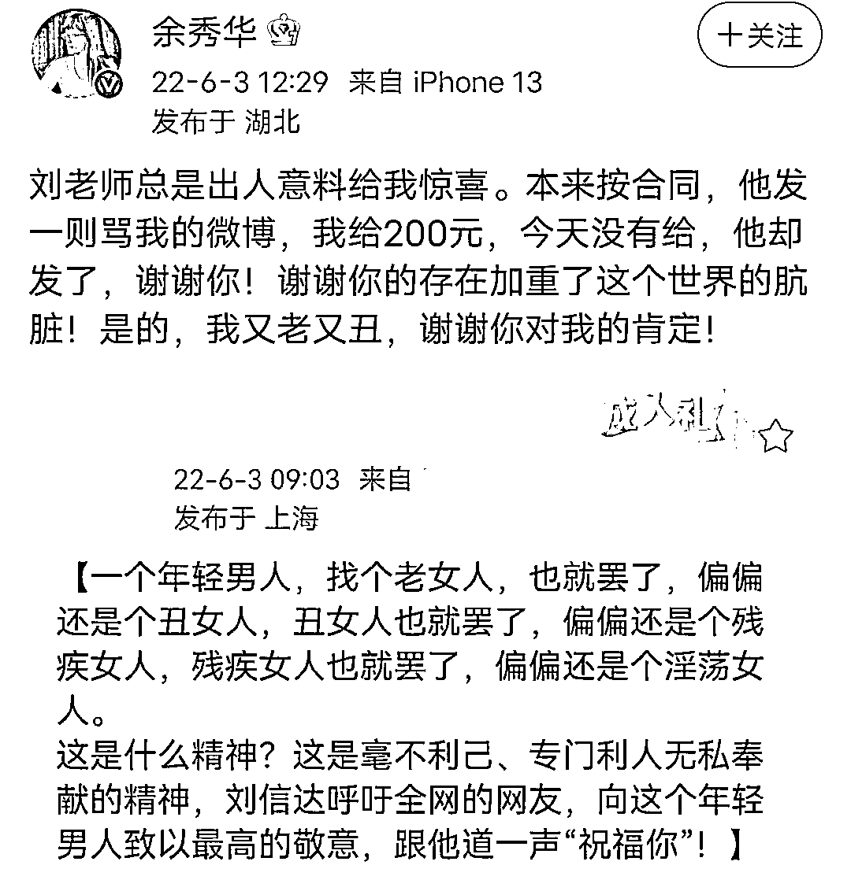| 余秀华转发他人对自己的攻击。自杀的韩国艺人崔雪莉也曾在节目中朗读对自己攻击的粉丝评论。而她们都是北交点天蝎座。
也许所有人都觉得她疯了，傻了，亏了。可如果体验越丰富越赢了，她很显然比循规蹈矩，不敢行差踏错的你、我、他更赚到。而经由此事，我们看到的只是投射在她身上的自己——如果遇到这样的事情，我会怎么样呢？我的咨询客户中，问得最多的就是：这个人可以交往（结婚）吗？我能感受到这个问题背后忐忑不安又无比渴望的心情。也许真的是害怕了，没有把握了，才想要求助于神秘学的帮助。然而，**问出这个问题的时候，就等于把选择权和成长的机会交给了别人，承担自己人生需要担负的责任，这才是摩羯座最高级的能量——我可以为我自己的选择负责。**能达到这一点，就登上了高级巅峰的人生。**冥王星水瓶座的功课**

****

**你以为，因为我穷、低微、不美、矮小，我就没有灵魂没有心吗？你想错了！我的灵魂跟你的一样，我的心也跟你的完全一样！要是上帝赐予我一点美和一点财富，我就要让你感到难以离开我，就像我现在难以离开你一样。**

**——《简·爱》**

2022 年，冥王星在摩羯座尾度挣扎着抓住残局，当我们在反对不平等的时候，却又不自觉地给自己和他人贴上标签，就像余秀华同比自己小 14 岁的健康男性在一起，就会被很多人认为“不自量力”——**我们仍旧停留在世俗的评判中，想要觉察并且进步是非常困难的。**2023 年，我们就将迈入冥王星水瓶座的十几年，最重要的变化，便是**等地、身份等标签识人法是否能被众生平等的思潮取代。**从物质现实的衡量变成灵魂、思想追求的婚恋观转变，不仅是天象和时代推动的必经之路，也会为我们打开属于天王星更加高纬度的世界大门。约翰·罗尔斯(John Rawls)的《正义论》中，有一个重要的理论：“无知之幕(Veil of ignorance)。”我将其意引申到情感中，**想象有一块幕布遮在面前，我们无法看到对方的样貌，更无从知晓它的身份。这时候唯一能够标识自己的只有思想和灵魂。****这正是水瓶座推崇的体验。**或许只有在无知之幕下，人们才能公正、客观地看待余秀华以及她的人生选择——抛开身体的好坏、学历的高低、容貌的美丑，她的才情和灵魂的厚度恐怕会令我们惊讶不已。

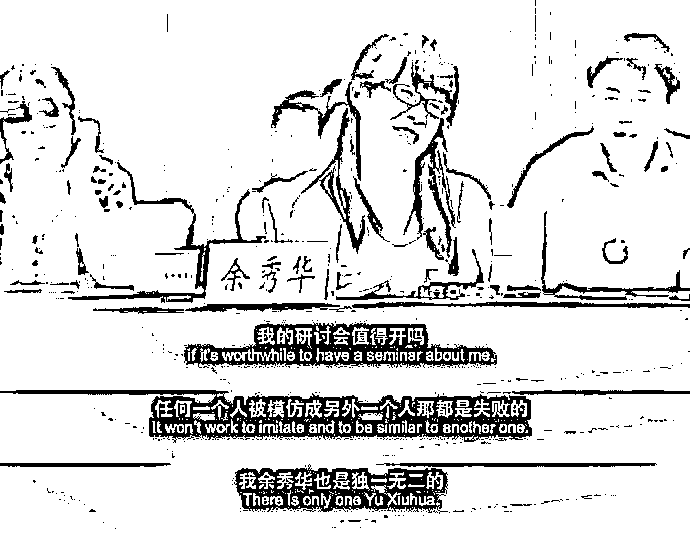

| 余秀华说如同每一个穿着皮囊的我们，这皮囊下的灵魂，是多么渴望被看见，被好好珍爱与收藏。现在，请你思考这样的问题：**如果无知之幕遮在你的面前，你能够展示出的自己，又会是什么样子呢？你所希望的对方又会是什么样子？你又如何打破传统思想，去把握这种看似无依托的关系？**我们总认为被爱是因为我好看，我有钱，我优秀，我努力。这种对爱的信念在极大程度上影响了婚恋。想必大家都听说过著名的理想实验——薛定谔的猫。在这个实验中，盒子里的猫生死是叠加的，观测者只有在打开盒子才能知道里面的结果。在我看来，感情的状态也象薛定谔的实验，**每个观测者在其中投射的是自己的信念：你若相信，就是幸福继续的。你若怀疑，就是痛苦结束的。**我曾看在网络上到一个车祸导致瘫痪的男孩子（涉及隐私隐去其姓名），狮子座的男生，非常帅气开朗阳光和坚强，为了减轻家人负担，每天都直播带货。很多女孩子问他想不想找女朋友，他说：**“怎么会有人看上我这种瘫痪了的人呢？那是不现实的。”**

也许你会认同这种说法，而我又在网络上看到了另外一个因为煤气中毒变成植物人的男人（可以在抖音搜索：彭亚楼），女友不离不弃地照顾了他 5 年，尽管到现在他还没有醒来。

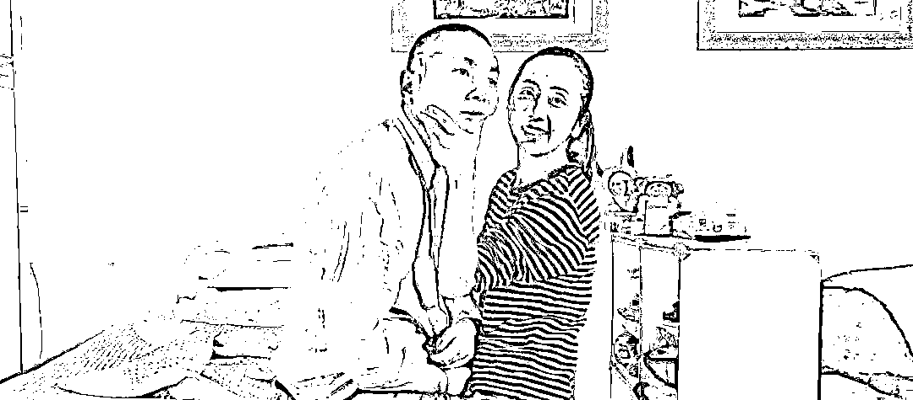

| 彭亚楼与照顾了他 5 年的女友，目前他已经可以坐一小会儿，并且有些许意识恢复

我常常在想，之所以他的女友能够一直陪伴他如此之久，或许郑因为他是个植物人——他无法对这段关系做出任何动作和回应，反而令他们的关系没能面临破裂。

如果他醒了，产生了痛苦、怀疑、愧疚、贪婪的情绪，那么他们的关系走向也会随之发生改变。

观测者对薛定谔猫的心念，造成了猫的生死状态；同理，**关系里两个人彼此的心念也会互相影响着关系的走向。**

前文提到的狮子座男生很难找到一个对他不离不弃的女友，因为他的心念会影响他的感情；但是他所相信的却未必是真实发生的——也许有人就会看上他这样的男孩子，**阻碍他的，不是他瘫痪的事情本身，而是他认为“瘫痪”=“无法被爱”的认知。**

这个认知决定了在他的情感实验中，箱子里的猫很难活过来，而形成这种认知有部分可能是源自于这个男孩子的月亮在摩羯座——不得不说，**摩羯座的短板，也正在于过于“理智现实”，遵循“大多数原则”而令自己丧失了“运气”和由此而来的“奇迹”。**

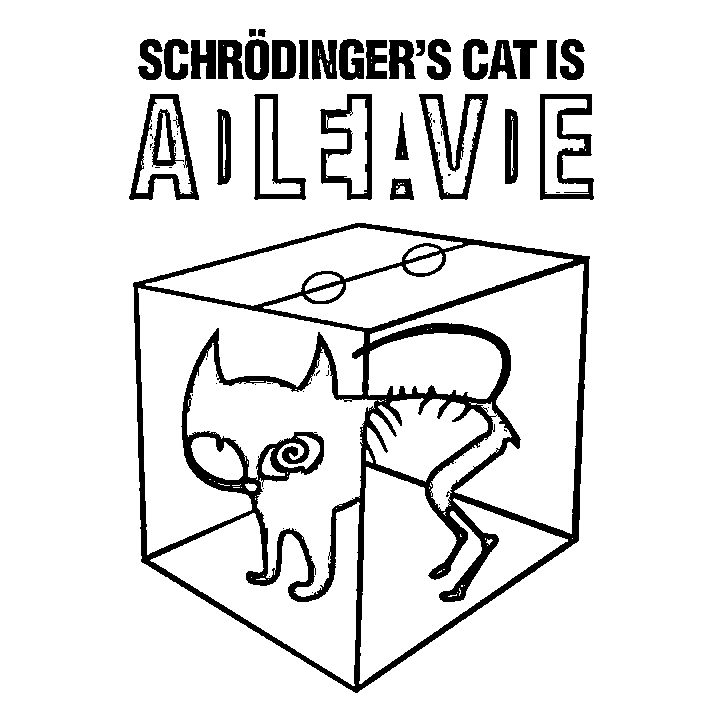

| 薛定谔的猫

相信，才能得到。**你能否全然地相信关系，取决于是否能全然相信自己。**相信自己值得爱与被爱，相信自己，无论成功或者失败，都能够从这段关系中学习到和体验到什么。最重要的，**无论结果如何，相信自己都有恢复的能力，你的人生会因为丰富的经历而变得更加饱满，更加通透。**而这种对自我的把控力是摩羯座时期我们需要发展的，这样才能在水瓶座阶段去追寻更不确定的人生——因为有能力为自己兜底，所以无所畏惧去体验更多更广，更自由。**如何发展？唯有不断试错。**在错误中总结属于自己的经验，找到属于自己的方向。必须要经历在黑暗中的涅槃，在幻梦中的破碎，在孤注一掷中的毁灭，才能够看破那些执念和贪嗔痴，其心念才能不为诱惑所动，也才更能真正明白自己是谁，自己又需要怎样的关系。在理想的水瓶座社会中，每个人可以选择自己想要的婚恋方式，保守的人可以寻找同样保守，追求现实层面门当户对的伴侣，浪漫的人也可以寻找同样渴望“灵魂伴侣”的另一半。**每个人都能在时代中找到属于自己的位置和情感方式，是水瓶座崇尚个性化，认为每个人都独一无二的理念精髓。**

****

**我现在跟你说话，并不是通过习俗、惯例，甚至不是通过凡人的肉体——而是我的精神在同你的精神说话；就像两个都经过了坟墓，我们站在上帝脚跟前，是平等的——因为我们是平等的！**

**——《简·爱》**

**社会的自由度，是冥王星水瓶座的考验之一，也关系到每个人的生存空间是更加宽阔还是不断逼仄。**在见证历史的当下，每个人都负有推进社会发展的责任，**支持他人的自由，说回来也会给自己更多的自由。**最后，让我们一起来欣赏余秀华这首最著名也备受争议的诗吧。

**《穿过大半个中国去睡你》** 

**其实，睡你和被你睡是差不多的，无非是**

**两具肉体碰撞的力，无非是这力催开的花朵**

**无非是这花朵虚拟出的春天让我们误以为生命被重新打开**

**大半个中国，什么都在发生：火山在喷，河流在枯**

**一些不被关心的政治犯和流民**

**一路在枪口的麋鹿和丹顶鹤**

**我是穿过枪林弹雨去睡你**

**我是把无数的黑夜摁进一个黎明去睡你**

**我是无数个我奔跑成一个我去睡你**

**当然我也会被一些蝴蝶带入歧途**

**把一些赞美当成春天**

**把一个和横店类似的村庄当成故乡**

**而它们**

**都是我去睡你必不可少的理由**

余秀华曾说：“我的身份顺序是女人、农民、诗人。但是如果你们在读我诗歌的时候忙忘记我所有的身份，我必将尊重你。”而在她的文字里，我们尝试忘记她所有的身份，或许便能看到一个美好而充满了力量的灵魂。

**版权声明：**原创文章由作者授权首发于若道平台，欢迎转发，反对抄袭。友号转载请申请白名单。

**END**

**玫瑰**

英国 Cass Business School 管理学硕士

若道 2015 届核心课程毕业生，若道微信公众号兼职编辑

占星师，咨询时长超过 800 小时

**个人微信号：**stillrosy

**公众号**：一个娘娘 

长按二维码，给作者打赏

**20 位来自世界各地的占星师****带来 19 场沙龙——新世界的觉醒****详情可点击下图**

**学习占星学****点击下图了解课程详情**

**微信又双叒叕改版啦，不想错过若道君的推送？**

**就把若道设为星标吧！**

**▼**

**喜欢就点一下“在看”吧！**

********报名直达入口********

# 若道占星咨询｜感觉最近很“炸裂”？这里有解药！

> 原文：[`mp.weixin.qq.com/s?__biz=MzA5NjA0NTAxNg==&mid=2651480041&idx=1&sn=6b87d743cc5fcac503c106ee1af68ba0&chksm=8b48ed5ebc3f6448f7178af16b86448c552afa7b54bfea70c4e38ac9356951e69555b878f15a&scene=126&sessionid=1692737786#rd`](http://mp.weixin.qq.com/s?__biz=MzA5NjA0NTAxNg==&mid=2651480041&idx=1&sn=6b87d743cc5fcac503c106ee1af68ba0&chksm=8b48ed5ebc3f6448f7178af16b86448c552afa7b54bfea70c4e38ac9356951e69555b878f15a&scene=126&sessionid=1692737786#rd)

专业的占星师在这里等您

**若道占星咨询平台是以人本主义占星学导向的咨询，期望用博大精深的占星学提供优质信息，并通过和客户的交流，协助客户了解自己和他人、探索潜能、识别破坏性的人生模式、了解生命周期。**

我们期望更多人通过咨询，用占星学帮助自己提高觉察，学习成长，运用自由意志，学习与命运共舞。 

占星学是宇宙送给人类的礼物，我们愿意将这个礼物分享出去，让更多优秀的职业占星师为更多公众服务。

如果你对自己的生命有困惑，不论这个困惑是学业、职业，还是爱情、婚姻、亲子教育、个人成长等，我们都欢迎你来！

**本期我们将为大家推荐以下占星师**

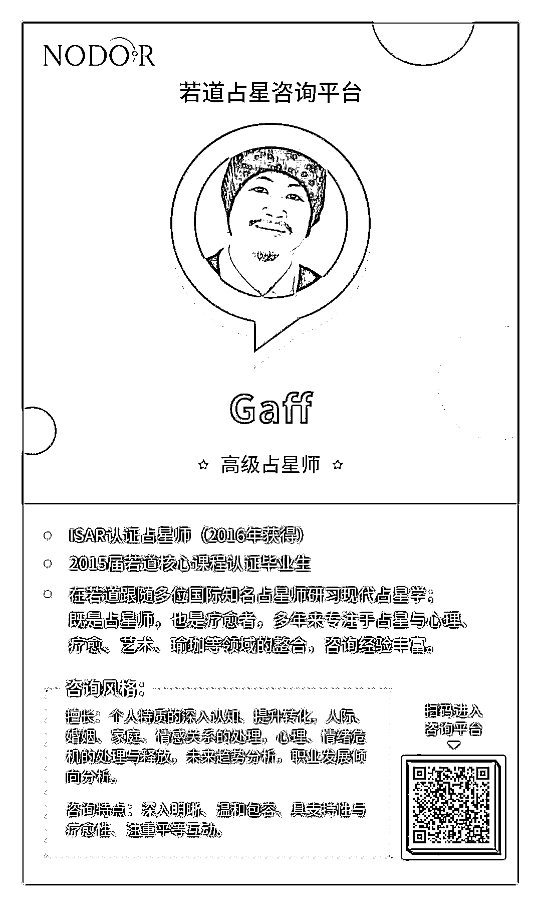

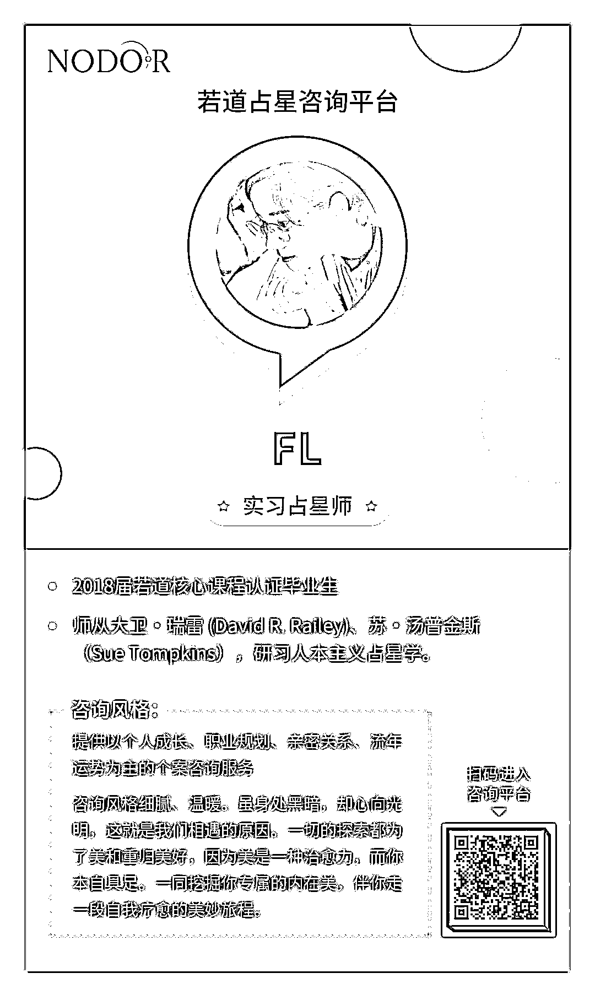

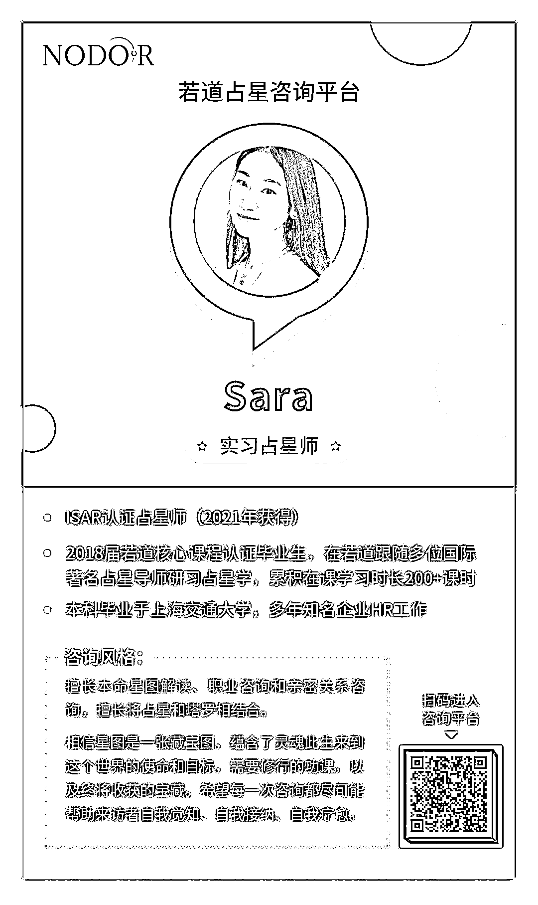

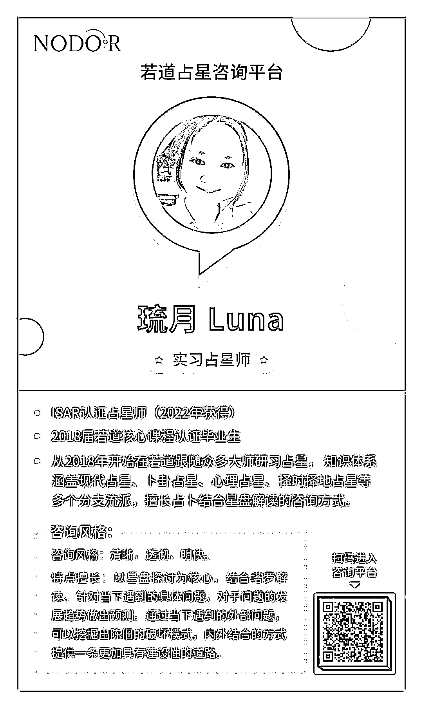

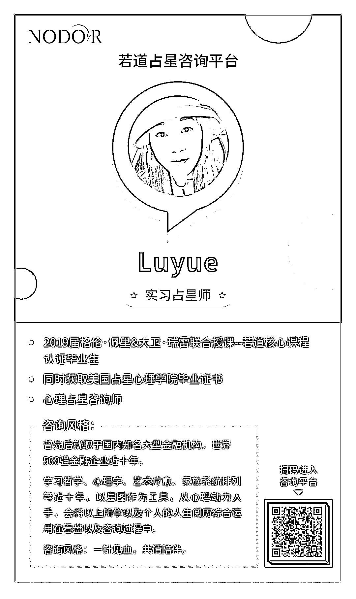

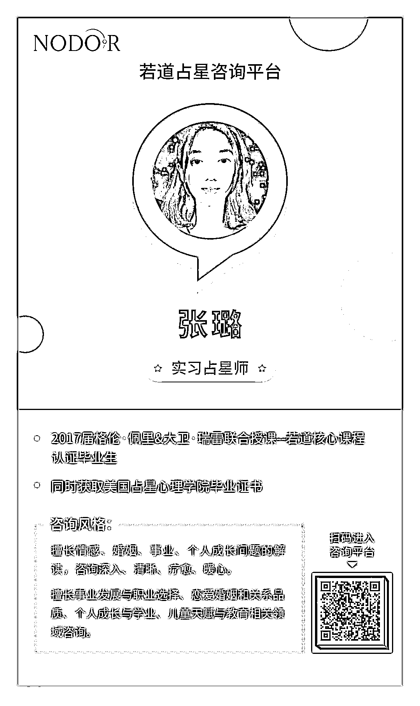

**来看看大家在咨询后的评价~**

如何预约占星咨询？

**方式一：**

**下载若道 APP，进入占星咨询栏目可以进行预约**

****

**方式二：通过若道服务号**

****

# 如何在占星咨询中，处理“边界问题”？

> 原文：[`mp.weixin.qq.com/s?__biz=MzA5NjA0NTAxNg==&mid=2651479800&idx=2&sn=bb223e7cbcfed427b15d9aac6c78adc0&chksm=8b48ec4fbc3f655952c44095a1d14d8f4cada7db7548fbe5ac3ae85d43a27c76bc8d696e87e1&scene=126&sessionid=1692737791#rd`](http://mp.weixin.qq.com/s?__biz=MzA5NjA0NTAxNg==&mid=2651479800&idx=2&sn=bb223e7cbcfed427b15d9aac6c78adc0&chksm=8b48ec4fbc3f655952c44095a1d14d8f4cada7db7548fbe5ac3ae85d43a27c76bc8d696e87e1&scene=126&sessionid=1692737791#rd)

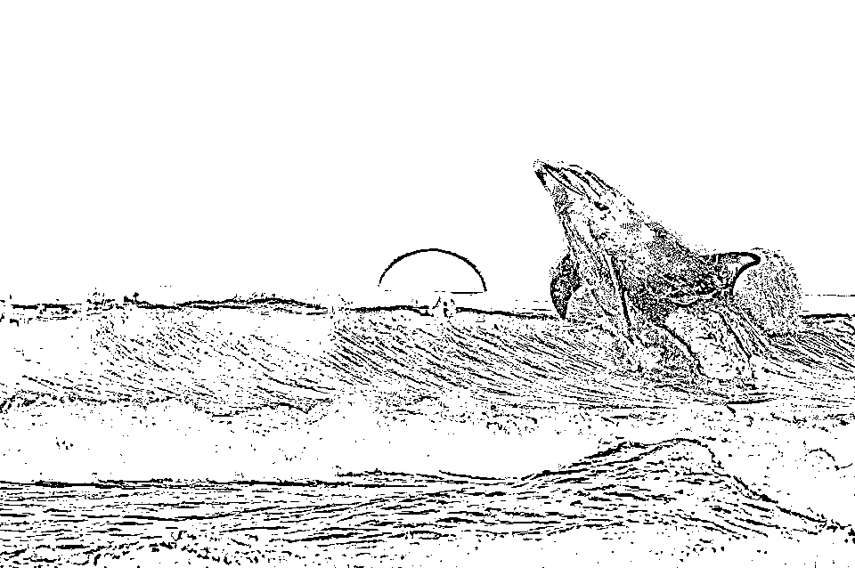

作者/唐娜·坎宁安译者/林之 校对/Leisha 编辑/翀子 图片/网络在占星咨询的实践当中，设立并尊重边界是一件非常重要的事情。你可以通过阅读本文并参与讨论来学习如何建立和保持专业的边界。这些知识能帮你规避那些在占星咨询实践中经常发生的严重违反边界的行为。**占星咨询中，边界很重要**

自我 2010 年开始写博客以来，设立并尊重边界一直是我在博客中谈论的一个主题。我们讨论过如何将边界概念应用于和家人、朋友以及同事的关系之中，也讨论了诸如纵容、欺凌等相关的议题。

**不良边界的占星学指征常涉及海王星、月亮和冥王星的组合，以及与这些行星相关联的星座：双鱼座、巨蟹座和天蝎座。**

目前，海王星正行进在自己守护的双鱼座，识别和保持边界在世界范围内普遍愈发艰难。

直到最近我才意识到，我们从未讨论过对于一位职业占星师而言，在占星咨询中与客户建立并保持清晰、健康的边界何其重要！我们中许多人在自己的家中进行咨询，营造出一种舒适安逸的非正式氛围。

但是，如果我们放松警惕，这样的氛围便会导致边界的过度松懈。因此，重点是要谨记，**不论你是否具有与咨询相关的背景，你在过程中提供的是咨询服务。**

正如所有的咨询活动一样，**客户付费是为了得到你不带自我目的的认真倾听，期望你专注于他们眼下遭遇的问题，从而获得有帮助的洞见。**

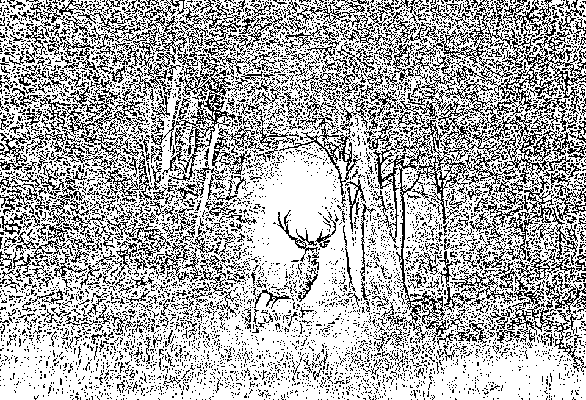

**违反边界的行为**

过去二十多年，我在为杂志《戴尔星座运势》（*Dell Horoscope*）的占星专栏撰稿时收到许多来信，其中有不少令人震惊的故事讲述了边界感不良的占星师对客户造成的伤害。

最糟糕的一个故事是这样的：

一位非常老派的占星师给一位年轻、紧张而且有点儿脆弱的新手妈妈解读其新生儿的出生星图，这张星图的第八宫有一个星群格局，于是这位占星师幸灾乐祸地告诉妈妈：“你的宝贝男孩儿长大后可是个性欲狂呐！”

我听闻的一件事情促使我为这个话题写一篇文章。遵照职业保密原则，这个事件经过改述：

“我去拜访一位占星师，本想让她了解我的关系问题。谁料，她竟然就她自己的婚姻问题发表了一番激烈言辞，还越说越带劲儿。她对我出生星图中的关系模式提供的解读已经很少了，解读还在很大程度上受到了她本人怨恨男性的影响。离开她时，我感觉自己好像是个冤大头，她应该向我付咨询费才对啊！以后再去找占星师之前，我可得三思后行。”

**实质上，破坏边界确实会破坏信任，并且那位边界的“破坏者”很难收手。**

不幸的是，失去信任的不仅仅是违反边界的人，还会有损其所从事领域的可信度……由此一来，一旦有人对你做出此类破坏边界的行为，你就很难再将占星学看作是值得信赖的疗愈方式。

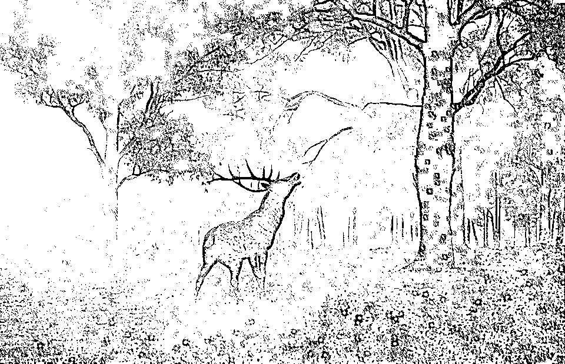

**出现不良边界的原因**

少有论坛或正式课程帮助占星学子顺利过渡成为职业占星师，所以如何在占星咨询实践中建立并保持健康边界的问题，仍然在很大程度上没有得到解决。

因此，占星师们可能在无意识间就越界了，或者在占星咨询过程中允许客户违反他们的边界。通常情况下，**当客户的问题映射出或唤起了占星师自身未解决的议题与未疗愈的伤痛时，就会发生这种情况。**

**重点是自我觉察个人经历的哪些部分仍然可能受到煽动而渗透到占星咨询之中。尽可能多地去疗愈这部分经历非常重要，**唯有如此，我们方能集中处理客户的忧虑。

了解自己出生星图中的哪些部分反映了这个经历也很重要。当你为占星咨询做准备时，请**针对客户提问的领域，找出你和客户的出生星图之间的关联点**。

**如果****困难的行进正在激活这些关联点，你将需要高度留意自己或客户可能说出或做出侵犯边界的言语或行为。**

一位客户出生星图的第三宫有一些压力配置，或者第三宫正在经历行进带来的压力，并且客户与占星师的第三宫在星图上还存在一些关联点。这位占星师自己与兄弟姐妹的任何过去或当前的议题，都可能会被触发，导致占星师以对待兄弟姐妹的方式来回应客户。

占星师可能感觉需要摆出大姐或大哥的姿态来纠正或者“拯救”客户，所以占星师会变得焦虑、过度保护，并感觉自己必须告诉客户如何管理人生。

占星师在工作中缺乏健康边界，通常表现为**允许他们和客户之间的关系演化为互相拖累的模式。**

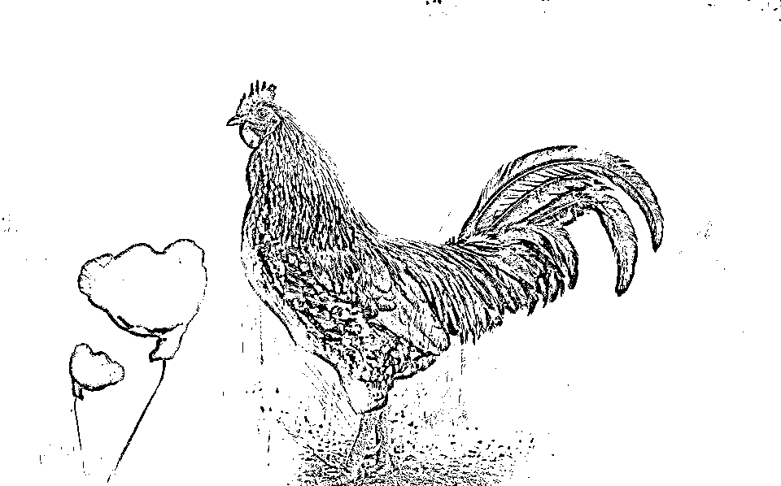

**4 个注意事项**

占星师在咨询中有效地处理边界问题更是至关重要。以下是占星咨询实践中常见的一些与边界相关的情形：

*   许多难搞的客户都有严重的边界问题，和他们进行一场咨询颇有难度。潜在客户初次来电的材料信息会显示出，如何评估为他们提供咨询服务是否明智，以及如何就咨询范围达成共识；

*   还要考虑客户不仅是一位客户的情况，比如你在为朋友、家人或其他生活领域中的熟人解读出生星图时，也需要处理可能出现的挑战；

*   边界和道德问题也会出现在占星咨询涉及到第三方的星图时，比如客户的伴侣、未成年的孩子或者年轻的成年孩子。你自己的童年生活将如何体现在咨询过程中呢？为年轻人提供咨询服务，需要尊重他们的隐私权。

*   在你认识和尊重的群体中建立一个疗愈专业和其他资源的人脉网，这样你就不会感觉必须满足身处危机中的客户的所有需求。

**版权声明：**本文由若道翻译发布，欢迎转发，反对抄袭。友号转载请申请白名单。**END****唐娜·坎宁安**一位在国际上都广受尊敬的占星师，她已有超过 45 年的从业经验。她已撰有数十本占星著作以及上百篇占星学和其他形而上学类的文章。于 2017 年 7 月 5 日离世，享年 75 岁。

**想了解更多占星师工作时需要注意什么吗？**

**拥有****51 年****占星实践经验的****若道创始人****前 ISAR 全球副主席****前 ISAR 全球职业占星师资质认证主席****大卫·瑞雷**

**和**

**2019 年第二届、2021 年第三届核心课中**

**与苏·汤普金斯老师****联合授课****的**

**ISAR 认证职业占星师**

**咔咔（Caroline）**

**二人合力打造**

**2022 年 ****若道全新核心占星课程**

**点击下图了解课程信息****

****报名直达入口****

# 认证职业占星师文凭课程 L1-3 丨想看大卫老师是怎么做课堂演示的吗？

> 原文：[`mp.weixin.qq.com/s?__biz=MzA5NjA0NTAxNg==&mid=2651479800&idx=3&sn=9cfacddaabd154c4d12dc358629e738c&chksm=8b48ec4fbc3f65593f3c4f05d0f2844066042131b9fe3521a45f40e5216bd1d8335cc3a17ea5&scene=126&sessionid=1692737791#rd`](http://mp.weixin.qq.com/s?__biz=MzA5NjA0NTAxNg==&mid=2651479800&idx=3&sn=9cfacddaabd154c4d12dc358629e738c&chksm=8b48ec4fbc3f65593f3c4f05d0f2844066042131b9fe3521a45f40e5216bd1d8335cc3a17ea5&scene=126&sessionid=1692737791#rd)

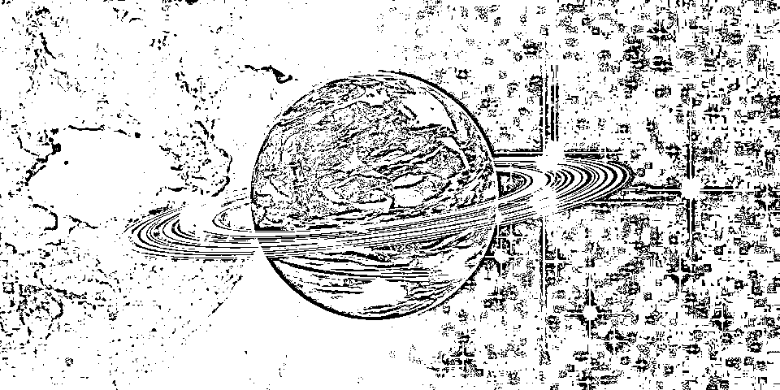

**在若道核心课程的教学里，****以学员为案例****进行课堂的占星咨询演示，是我们课程的特色环节。**

这样的演示不仅让很多同学有亲身体验咨询的机会，而且这么多真实案例的学习，会让大家看到占星咨询到底是怎么样一个过程。毕竟，大部分人的学习都是要从模仿开始。

记得若道君当年学习占星的时候，可没有这样的机会。那时候主要是听课为主，后来，我们在多年的教学实践中，**越来越发现课堂演示的重要性**。因此，就把这个作为一个主要环节加入到课程中。

在新一期的若道核心课程中，咔咔老师和大卫老师这对组合就会把这个教学特色充分发挥出来。**熟悉中国同学思路的咔咔老师会以知识点的讲解为主，而有 50 年占星咨询经验的大卫老师，则以课堂演示为主。**

有时候，这样的课堂演示的功效是出乎意料的。

一位若道的老同学赵震宇这么写到：

2018 年，我正式开始在若道学习 L1-5。其实我一开始的心态更多的是希望得到系统化的学习来补充我的知识漏洞，以及拿到一个证书可以为自己做背书，增加自己将来转型占星师的筹码，而不是真的在期待可以从若道的学习中得到一些本质上的领悟。

事实上在初期的 L1-3 中，很多知识与课上的内容，也是我比较熟悉的领域，相对而言是驾轻就熟的。但在 L3 的工作坊中和大卫老师的接触以及模拟咨询，让我对占星的态度发生了很本质的变化。

大卫老师对我星图的分析不仅非常准确，更重要的是，他开启了我自身个人成长上的变化，从而成为了我本质上进化蜕变的一个契机。

在短短的 6 个月内，我对人生的认知、对自我的认知、对于人生看待的方式都发生了翻天覆地的质的变化。我意识到了原来跳出自己一直以来无意识间重复的模式，是一件可行、并且会给自己带来无限成长提高自己人生幸福度和质量的事情。这也让我深刻体会到了人本主义占星学的魅力，以及自己之前是多么的“无知“。

于是现在，占星学对我来说，不只是兴趣、宗教信仰、或者是可能的职业道路，而是一种激发自己和他人人生成长和蜕变的工具、一种让自己更幸福的看待世界的方式。哪怕我之后并不会以占星为生，它依然是我人生中不可或缺的一部分，就像一副隐形眼镜，影响着我与世界的互动。

而被大卫老师咨询深深影响的同学还有很多。

**这里，我们节选一些短小的试听片段，让你稍微感觉一下在若道核心课程上，大卫老师的咨询演示是怎样的一个样子。**

**片段一**

<mpvideosnap class="js_uneditable custom_select_card channels_iframe videosnap_video_iframe" data-pluginname="videosnap" data-id="export/UzFfAgtgekIEAQAAAAAAMKsWN6BUygAAAAstQy6ubaLX4KHWvLEZgBPEnoIULgMKKb-DzNPgMItC2ZEgiEDMBYjrYHv9wNsO" data-url="https://findermp.video.qq.com/251/20304/stodownload?encfilekey=S7s6ianIic0ia4PicKJSfB8EjyjpQibPUAXolK65qjuvEtF7VE3LuUIfibNBicR6aZMMfP2lV313icg6MQMfqMQqcPFj2m8Hhw10N65gJT2zkNKurNXqiaaAugQpntw&amp;adaptivelytrans=0&amp;bizid=1023&amp;dotrans=0&amp;hy=SH&amp;idx=1&amp;m=&amp;scene=0&amp;token=cztXnd9GyrEzmuleT8ub88RIicgCkUKW4liadDZCTsricEdF98BQMCWkUTxVevglwsb2TzGGW1rUZ4" data-headimgurl="http://wx.qlogo.cn/finderhead/PiajxSqBRaEJYnVsqWfEX9qA0sI6hNVKsDfyzfPZ92WZMZyBpZWU5NA/0" data-username="v2_060000231003b20faec8c4e68a1ec2d4ca07e434b07755bbf47e7053a3059defd2c9d6c68a20@finder" data-nickname="若道" data-desc="#若道核心课 大卫老师用星座、行星、宫位来探索一位同学出生星盘主题的时候，他回顾了解读星盘的优先次序" data-nonceid="7723748345640460016" data-type="video" data-width="544" data-height="344"></mpvideosnap>

**片段二**

<mpvideosnap class="js_uneditable custom_select_card channels_iframe videosnap_video_iframe" data-pluginname="videosnap" data-id="export/UzFfAgtgekIEAQAAAAAANycuUwRANAAAAAstQy6ubaLX4KHWvLEZgBPEhYJ0WjYILr-DzNPgMIvjhT14ogdLw3BWd0Tg37w0" data-url="https://findermp.video.qq.com/251/20304/stodownload?encfilekey=S7s6ianIic0ia4PicKJSfB8EjyjpQibPUAXoleMEBO7YqRBdVicTyRbZLSODWa2goURzKktJBq1dd5DIVYjlj926F5hsicv1cBaJ9Rv2mYicYQsNBTeicdAYHyJ6QPA&amp;adaptivelytrans=0&amp;bizid=1023&amp;dotrans=0&amp;hy=SH&amp;idx=1&amp;m=&amp;scene=0&amp;token=AxricY7RBHdWzD8K4WOaXSvyp6Ryjm97TQtPI3Gia6U1Ab852A11RvPCu31V9R4GVy7w9ZhPIpmIg" data-headimgurl="http://wx.qlogo.cn/finderhead/PiajxSqBRaEJYnVsqWfEX9qA0sI6hNVKsDfyzfPZ92WZMZyBpZWU5NA/0" data-username="v2_060000231003b20faec8c4e68a1ec2d4ca07e434b07755bbf47e7053a3059defd2c9d6c68a20@finder" data-nickname="若道" data-desc="#若道核心课 占星学如何反应职业选择？" data-nonceid="629392412247480278" data-type="video" data-width="544" data-height="344"></mpvideosnap>

**片段三**

<mpvideosnap class="js_uneditable custom_select_card channels_iframe videosnap_video_iframe" data-pluginname="videosnap" data-id="export/UzFfAgtgekIEAQAAAAAAl_sREJMyhwAAAAstQy6ubaLX4KHWvLEZgBPEtIIkIkRmL7-DzNPgMIsA5PpGB3ReSAYx6ZfSNfZ1" data-url="https://findermp.video.qq.com/251/20304/stodownload?encfilekey=S7s6ianIic0ia4PicKJSfB8EjyjpQibPUAXolicGo48MWlib8wvOFMCMmVRq6heVqPaLZWrZVDpKoE2lcibTklu18ibiabwe5r5MKNnk1B8b1WWwnJJbOKHROCicyOU0A&amp;adaptivelytrans=0&amp;bizid=1023&amp;dotrans=0&amp;hy=SH&amp;idx=1&amp;m=&amp;scene=0&amp;token=AxricY7RBHdWzD8K4WOaXSv7euicLue7HLq5QQtktB0MXqKnDuDFfRdGZicknvicEPXKqiatibVM9Qu1w" data-headimgurl="http://wx.qlogo.cn/finderhead/PiajxSqBRaEJYnVsqWfEX9qA0sI6hNVKsDfyzfPZ92WZMZyBpZWU5NA/0" data-username="v2_060000231003b20faec8c4e68a1ec2d4ca07e434b07755bbf47e7053a3059defd2c9d6c68a20@finder" data-nickname="若道" data-desc="#若道核心课 如何从出生星图的基本要素看到案主生命发展的故事和个人成长经验？
" data-nonceid="6689802853667419635" data-type="video" data-width="544" data-height="344"></mpvideosnap>

**若道新一期的核心课程将在****8 月 30 日****正式开始**，如果你有很浓厚的兴趣，不仅仅是因为好奇想浅尝一下占星学，但还没有想清楚是不是要学习整个 L1-5 的课程，**那么 L1-3 可能是一个不错的选择。**

**谁是你的老师？**

**占星师咔咔（Caroline）**

2010 年师从美国占星师大卫·瑞雷学习，并得到世界名师斯蒂芬·弗里斯特、罗伯特·汉德、苏·汤普金斯传授各种占星学技法。若道首届学员，国内最早获得 ISAR 职业占星师资质的职业占星师，多次担任若道核心课程助教，2019 年第二届、2021 年第三届核心课中和苏·汤普金斯老师一起教授若道核心占星课程。

在国际知名广告公司和市场研究公司从事的市场研究和推广工作十余年，曾任职于阳狮集团、尼尔森市场研究有限公司、MTV 和《Madame Figaro》杂志。

**大卫·瑞雷（David Railey）**

*   **I****SAR 董事会成员，ISAR 全球副主席，ISAR 全球职业占星师资质认证主席，若道占星创始人**。

*   2016-2019 年，被选为国际占星协会（ISAR）考试委员会成员，国际占星协会（ISAR）是世界最大的国际占星机构，会员遍布 47 个国家。

*   2017-2020 年，被选为国际占星联盟（ISAR）考试委员会主席，理事会成员。

**助教王嘉祺 （Conrad）**

ISAR 认证占星师、若道认证生时校正资质，从 2010 年起自学占星学，2015 年开始在若道系统学习，并开始个案咨询。2018 年担任若道核心课程助教，以及卜卦占星学和太阳返照选修课助教，并带领学员进行经世占星和太阳返照方面的研究。2019 年 11 月作为演讲人之一参加了国际占星协会（ISAR）北京大会，也是 ISAR 星空俱乐部中国区第 16 期的主讲人。

**内容是什么？**

**ISAR 认证职业占星师的独有培训**

目前占星学的培训市场鱼龙混杂。而 ISAR（国际占星研究协会）是一个包含了 47 个国家在内的国际占星组织，多年来致力于占星的教育和研究，提升占星教育的品质和职业占星师的能力，在国际占星领域备受尊重。

**2022 年，鉴于对若道在占星教学领域所做的持续努力和高品质的课程服务，ISAR 特别授予若道核心课程为 ISAR 文凭课程，所有在若道学习，并通过若道毕业考试的同学将获得 ISAR 颁发的学历文凭（Diploma）。**

如果你想更多了解 ISAR，请点击[【这里】 ](http://mp.weixin.qq.com/s?__biz=MzA5NjA0NTAxNg==&mid=2651475298&idx=1&sn=b91888b54c14e29068f8b4e2a3452f5d&chksm=8b48ffd5bc3f76c32699f20f5c99e978bbb25551e69d80c70fee361acbd930ba5970ae776cdc&scene=21#wechat_redirect)

**开课时间和课程费用**

**８月 30 日开课，每周一次，20:00-22:00，25 节课+2 天工作坊。**

**★ 1-3 阶 连报**

**早鸟价：10500 元（2022 年８月１日之前）**

**课程费用：11500 元 **

**你也可能想学更初阶或者更高阶：**

**★ 1-2 阶　**

**早鸟价：2800 元（2020 年８月１日之前）**

**课程费用：3500 元 ****★ 1-5 阶　连报**

早鸟价：33000 元（2020 年８月１日之前）

**课程费用：46500 元 **

**退转课程**

**退款原则请详看《教学协议》，如有疑问请咨询课程顾问。**

****2022 L1-3 认证职业占星师文凭课程****

**授课老师：大卫·瑞雷、咔咔**

**直播课开课时间：2022 年 8 月 30 日（周二）**

**授课方式：******网络授课，英文/中文授课，中文翻译****

**费用：**11500 元**（早鸟价 10500 元,8 月 1 日前）**

**课程负责人：王老师**（微信/手机：18510107057，请备注“大卫核心课”）

长按二维码添加课程负责人咨询

****报名直达入口****

# 这个星座只要正常发挥，就没有搞不砸的感情

> 原文：[`mp.weixin.qq.com/s?__biz=MzA5NjA0NTAxNg==&mid=2651479800&idx=1&sn=21281e0f911b76c1b94c389f6da17fc6&chksm=8b48ec4fbc3f65592ace794a6708da9191137fb327b39cc57822caaa23bed98311c24be27833&scene=126&sessionid=1692737791#rd`](http://mp.weixin.qq.com/s?__biz=MzA5NjA0NTAxNg==&mid=2651479800&idx=1&sn=21281e0f911b76c1b94c389f6da17fc6&chksm=8b48ec4fbc3f65592ace794a6708da9191137fb327b39cc57822caaa23bed98311c24be27833&scene=126&sessionid=1692737791#rd)

******☆ ****后台回复“今日”，给你一句生命态度******

作者/大卫·瑞雷 若道占星创始人 译者/Cora 编辑/玫瑰 封面/书君 图片/pexels

天蝎座的内心情感汹涌但又不外露，他们常常通过考验他人的底线来测试“可信任度”。和他们谈感情那是相当虐。今天就让大卫老师给大家讲讲这个星座吧。另外，大卫老师参与授课的【[ISAR 认证职业占星师文凭课程](https://mp.weixin.qq.com/s?__biz=MjM5MjQwNjAyMQ==&mid=2649440007&idx=8&sn=b8a76adb34a07d1520c4a908d3b2947a&chksm=beb9506d89ced97bc1e382890f40058926812470769d027a0aad621f4b6c68762db921720e75&scene=21&token=1584005760&lang=zh_CN#wechat_redirect)】报名中，点击链接了解更多详情！

**不露声色的天蝎座**许多年来，只要遇到有太阳、月亮、上升在天蝎座或天蝎座能量强的新客户，我就知道这将是一场无声的咨询。我的经验告诉我，他们在咨询的前 15 到 20 分钟，都会静静坐着，几乎一言不发，只是听我说。即使我问他们一些问题——通常我都会问问题，尤其是面对新客户时——**他们也只是给出非常少量的信息。**我只能耸耸肩，继续分析他们的星图，差不多 15 分钟过后，他们会凑近些，低声说，“你能把录音关了么？”“当然可以，”我回答道，“但这样你就没有咨询记录了。”“没关系，”他们说，“我们可以一会儿再打开。”

关掉录音没多久，他们便露出狡黠的笑容，“你说的都对，你都想不到有多准。”然后，他们会与我分享自己的真实经历，此时的情绪氛围通常都很有强度。我赢得了他们的信任，他们至少愿意与我分享他们的一些秘密了。

**如果你的出生星图中天蝎座被强调，你是不愿让别人知道你的感受的****，**他们只能去猜——而你会像潜艇上的声纳一般，不露声色地探测他们的想法。然而，当你“想要”让别人知道你的感受时，他们 一定会知道！

你给人留下的深刻印象是难以被忘记的。**你的内心不断涌动着强烈的情绪暗流，它们不断积压最终会引发“对抗”。**别的星座内心都不会有如此强烈的激荡。

你们中的一些人或许会抗议，“我不喜欢对抗！”但那些否认自己享受对抗的天蝎座，我要问问你们了，“那你觉得为什么你会吸引对抗呢？”因为深层的真相是，**你的作为和不作为，都在挑唆对抗的发生，**即使你声称自己讨厌这个。

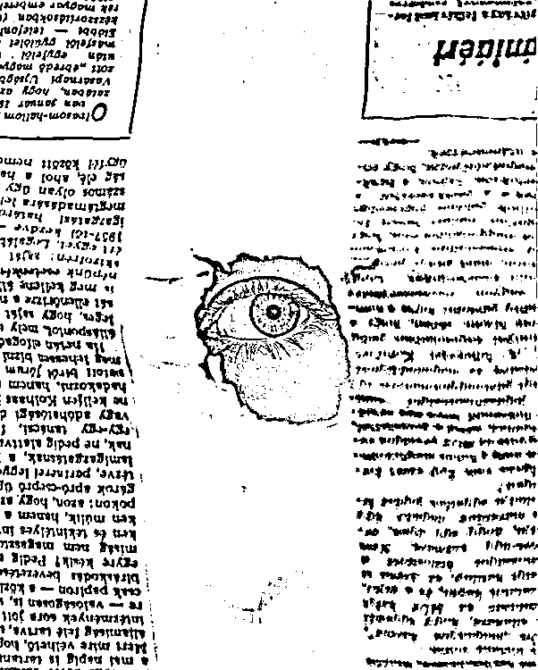

为什么呢？因为内心深处**你渴望知道你可以多大程度地“信任”身边的人。**你会通过设置出某种情境来刺探、**考验别人的极端底线。**

在对抗的危机中，你们中的很多人会变得充满电力，当你催眠般地凝视对方的双眼时，你的每一块肌肉，每一寸皮肤都在散发威力。现在你们知道可以将对方逼到何种境地，也知道“他们有多在乎！”是的！到底有多在乎呢？

当然，有些人会选择离开你，觉得你“太激烈”。如果那是一段你有深刻联结的关系，这份失去会带给你难以磨灭的伤痕。十二星座中，**天蝎座最难将一段充满激情的关系放下。**面对并处理生命中的失去、抛弃和背叛，是你人生中必经的过程。没有哪个星座比你们经历过更多死亡同时又活了下来——或说，是感觉到死亡。不过，你永远是那个幸存者。你们是十二星座中**最有韧性，最善于利用资源的人。****“放手”即转化**

讨论天蝎座时常常用到**“转化”**这个词，它的意思是，在一个很深的层面上发生的变化。这暗示某种根本的模式永远地改变了，新的模式从中诞生出来。

我想着重阐述天蝎座传奇般的“转化”能力，在个人成长的意义上，天蝎座展现出的彻底改变的卓越能力远超过其他星座。

由于你们要面对的变化太过极端，所以常常也会经历更长的混乱期，这也是真的。核心层面的改变需要时间，那或许也是某种净化反应的后续作用。对你们来说，**这种净化总是跟学习如何“放手”有关，**并且需要意识到，**“放手”并不等同于“放弃”。**放弃意味着你“不再在乎”了，你希望自己从来就没有在乎过——希望自己已经死去。

但显然，正在经历死亡和但愿自己已经死去不是一回事！即便是自杀的念头——不同于实际的自杀行为（更多是受冲动控制或抑郁导致）——也是源自内心深处对于彻底改变一切的迫切需要，为的是结束悲伤和痛苦。

我有许多天蝎型的客户都在离婚或失去爱人后经历了一段地狱般的生活，最终他们会跟我说，“我知道我会永远爱他们，永远想念……但我不再期待他们也以爱回应我，不会期待他们对我也有同样的感觉。我知道我也许会永远爱他们，但不可能跟他们生活在同一个屋檐下。我无法改变他们，或是将他们塑造成我想要的样子。”

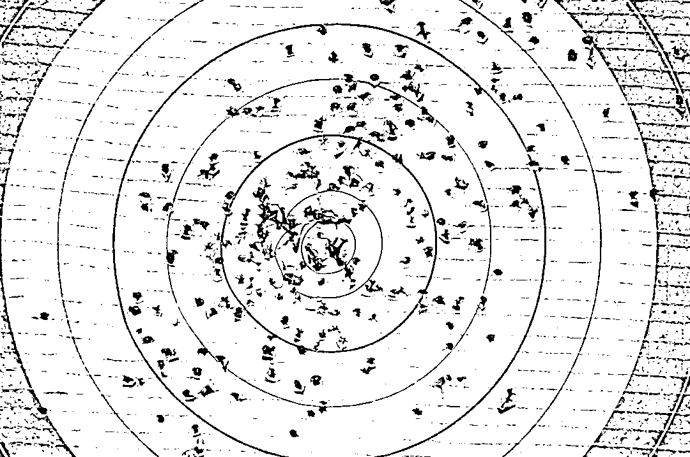

**这就是“放手”的真正含义 —— 放下“期待”，不再执着于控制那些根本不可控的人事物。**

我有一位天蝎座的老客户，照顾身患痴呆症的丈夫多年。**天蝎座长期面对危机的能力让人难以置信。**

然而，在一次咨询中，她看起来精疲力尽，十分痛苦，她说，“我不介意事无巨细地照顾他，照顾他不难，难的是失去他。他年轻时可帅了！特别强壮！我想念那时的他！那个他去了哪呢？我希望他回来。”

她抽泣了一会儿，抬起头看着我。“没可能了，对么？那个他已经不在了。他不会再回来了。我无法让他回来。”

下一次再见到她，已经是一年以后了，她的丈夫已经过世。“他还活着时，我悲伤了好久，到他去世时，我已经跟他告别了很多次了。”那时，这位客户已经 74 岁；她结婚差不多五十年了。从护理身份中解脱之后，她有了更多激情去面对生活和儿孙们。

经营丈夫的财产多年，她拥有出租的物业，供孙辈们念大学，还设立奖学金为有需要的学生提供财务资助。她说，“在我死后，这个基金还会继续运作。”**这呼应了天蝎座更深层的满足感 —— 留下“遗产”。**

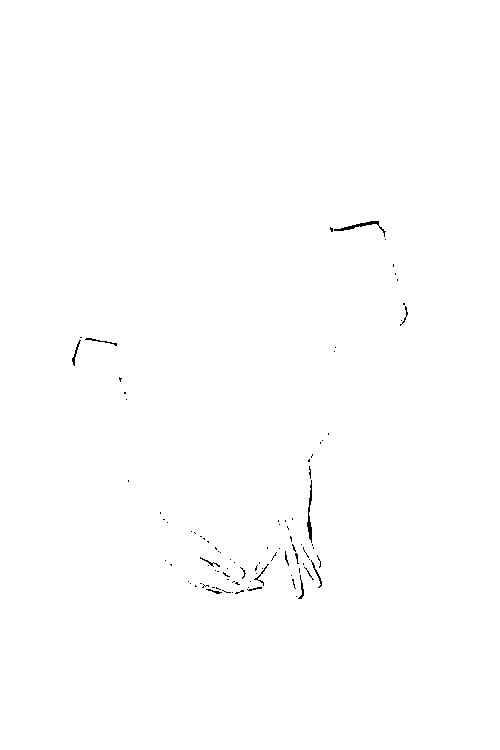

**直面你的恐惧****星图中天蝎座因素被强调的人，可以通过直面基于负面信念的评判或恐惧，更有意识地参与到自身的蜕变成长中，**从而活出更圆满的人生。看看下面的表述有没有符合你的情况的：

**天蝎座的表述**

*   “我太激烈了，别人总是问我为什么这样！”

*   “我每时每刻都着魔似的觉得一切都不对劲。”

*   “我总是对他人心存嫉妒和猜疑。”

*   “我讨厌自己总是想要控制别人。”

*   “如果人们知道了我内心对他们的真实感受，他们一定会离我而去。”

*   “我不需要任何人，好么？没有人是可以相信的！”

*   “要么全有，要么全无，你不是我的人，就是我的敌人！”

**注意，所有这些表述都是“极端”或“绝对”的，带有浓重的天蝎座色彩。**事实上，这些天蝎座人加诸自身的看法在根本上都体现了一种负面的偏见，违背了自身强烈的情感天性。做一个更有激情、情感更强烈的人有什么问题呢？当然没问题。除了为此付出的代价；**“情感更强烈”意味着更强烈的快乐欢愉，也意味着更强烈的痛。**大诗人纪伯伦（北交点落于天蝎座）写道，“悲伤在你身上刻下的沟堑越深，你越能承载更多欢乐。”来看看第一句话，“我太激烈了，别人总是问我为什么这样！” 这句话里明显**潜藏着****对被拒绝的恐惧**。这里面的潜台词是，“我无法接受我的激烈，其他人也不会接受的！”

讽刺的是，**只要自己不接纳自己身上的激烈面向，那么别人就真的也不会接受！**一旦你接纳了自己，别人也会接纳你。

他们会笑着说，“你真是激烈啊，”而不会再皱眉怒视——**那是你自己内在评判的投射。**这里的关键是认识到自己强烈的情感天性，并承认它——然后接纳它。

第二句，“我每时每刻都着魔似的觉得一切都不对劲。”这也反映了某种极端态度。问问你自己，就像如果你是我的客户，我会问你的那样，“你真的是每时每刻都像着了魔吗？”更为真实的回答应该是，“嗯，并不算每时每刻，但常常是！”

“着魔”往往是因为我们执着于自己控制不了的事情。我的许多天蝎座客户都说，“我尝试着想象发生了最糟的状况会怎样？我能够化险为夷么？”**首要关注“生存”问题是天蝎座的常态。**

我有位月亮落在天蝎座第 8 宫的好朋友，他曾告诉我当他做飞机时，他会看着身边的乘客心里想，“这些会不会就是要跟我一起去死的人呢？”**领悟生与死的无常是天蝎座的宿命。**接受了这一点，就不会“着魔”。

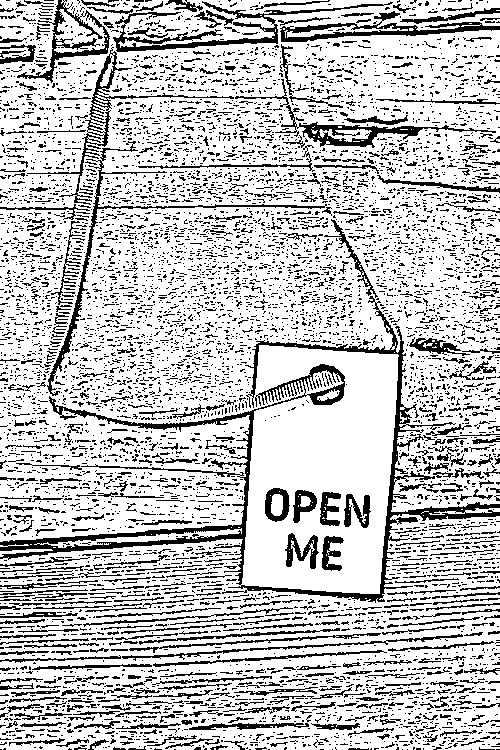

“我总是对他人心存嫉妒和猜疑”与“我讨厌自己总是想要控制别人”都是常见的**天蝎座的自我评判**。**嫉妒源于匮乏感带来的激烈情绪**；当你嫉妒，你是在想象别人拥有一个你没有的东西。**天蝎座拥有最强的欲望和激情，**所以很自然你们会害怕自己拥有的不够多，或害怕自己不够好，这是欲望太强的表现。“如果我不够好，不够性感，不够富有，不够有权力，我就会失去你！”不过，这是真的吗？让你的恐惧告诉你，提醒你，**你之所以害怕只是因为你的欲望太强烈！如果你并不渴望，也就不会感到恐惧**。

所以不要去评判你的恐惧是对是错，看清它们的真相。它们是在提醒你，你的感受如此强烈。

天蝎座的控制欲是“有口皆碑”的，但再一次强调，**控制欲强只说明你真的非常渴望。**所以，一切控制、操控、引诱都令你着迷。然而，你会知道，无论你对他人有多么强的影响力，甚至可以暂时操控他们，最终你都无法控制他们爱你或不爱你的事实。需要有足够的自信才能做到“放手”，特别是面对你如此渴望的东西。然而“放下”会真正让你离你想要的更近。**真正的亲密需要“信任”，**信任始于相信生活，相信自己，相信自己能够在暴风骤雨般的情绪与激情中活下来，也相信自己能够令欲望得到满足。

从根本上说，**天蝎座是最好的朋友，也是最坏的敌人。**要记住，失去天蝎座朋友的信任是一笔巨大的损失。当你身处危机众叛亲离时，他们是能够为你雪中送炭的人，他们会赶走你的敌人，帮你走出低谷。

同样，他们也会迫使你去直面自身的自毁行为，因为他们需要你活下去！

所以，天蝎座的你们要记住，**你们是十二星座中最能帮助别人度过危难的人**——因为你懂得痛苦的滋味，你不想失去那些你真正在乎的人！**接受你天性中深刻的激情，**学着爱这部分的自己，那么其他人也会爱你。

**版权声明：**本文摘自《一生的旅程》，由作者授权发布于若道平台，欢迎转发，反对抄袭。友号转载请申请白名单。

**END**

****想阅读更多作者的文章，请在后台回复******大卫****** 即可。****

**大卫·瑞雷**

美国占星师，若道联合创始人，致力于在中国教授和推广西方占星学；2010-2014 年，任全美占星师联盟监督委员会委员；2017 年，被选为 ISAR 委员会成员。ISAR 是世界最大的国际占星机构，会员遍布 45 个国家，2017-2020 年曾任 ISAR 全球副主席、CAPISAR（ISAR 职业占星师资质认证机构）主席。

**拥有****51 年****占星实践经验的****若道创始人****前 ISAR 全球副主席****前 ISAR 全球职业占星师资质认证主席****大卫·瑞雷**

**和**

**2019 年第二届、2021 年第三届核心课中**

**与苏·汤普金斯老师****联合授课****的**

**ISAR 认证职业占星师**

**咔咔（Caroline）**

**二人合力打造**

**2022 年 ****若道全新核心占星课程**

**点击下图了解更多课程详情** 

**

**20 位来自世界各地的占星师****带来 19 场沙龙——新世界的觉醒****详情可点击下图**

**学习占星学****点击下图了解课程详情**

**微信又双叒叕改版啦，不想错过若道君的推送？**

**就把若道设为星标吧！**

**▼**

**喜欢就点一下“在看”吧！**

********报名直达入口********

# 这个北交点想要成功，通常是在后半辈子

> 原文：[`mp.weixin.qq.com/s?__biz=MzA5NjA0NTAxNg==&mid=2651479710&idx=1&sn=790e3cf806449fba090f918bff258785&chksm=8b48ec29bc3f653ff5105c1b578dec9f9df7e0ac18c6925f8e28806b65fb9f8696357456ccb5&scene=126&sessionid=1692737791#rd`](http://mp.weixin.qq.com/s?__biz=MzA5NjA0NTAxNg==&mid=2651479710&idx=1&sn=790e3cf806449fba090f918bff258785&chksm=8b48ec29bc3f653ff5105c1b578dec9f9df7e0ac18c6925f8e28806b65fb9f8696357456ccb5&scene=126&sessionid=1692737791#rd)

☆****后台回复“今日”，给你一句生命态度****

作者/简·斯皮勒 译者/Shirley 校对/Luke 编辑/玫瑰 封面/书君 图片/pexels

提到摩羯座，就离不开想要成功的野心。北交点摩羯座也不例外。但是这个北交点要想成功，那可能真的要等到中年之后。让我们一起来看看吧！

**北交点摩羯座/第十宫综述**

**发展的特质**

在这些领域的努力有助于解锁隐藏的天赋才华： 

**· **自我控制**· **从成人的角度看待生活**· **自尊**· **保持目标导向**· **用明智的方法解决问题**· **信守承诺**· **放下过去**· **自我照顾**· **接受责任以获得成功

**要放下的倾向**

努力减少这些倾向的影响有助于让生活更轻松、更愉快 

**· **依赖

**· **喜怒无常

**· **不安全感导致无所作为

**· **因为恐惧限制自我**· **沉溺过去回避当下**· **被孤立——在家里花太多时间**· **缺乏自尊**· **避免个人风险**· **通过过度反应情绪来控制他人

**阿喀琉斯之踵/避免的陷阱/底线**

**北交摩羯座的人需要注意的致命弱点是依赖。****被照顾的欲望**（“如果没有人照顾我，我将无法生存”）会把他们带入一个**无休止的寻找安全的陷阱**（“如果我能得到足够强大的基础，我就有足够的能量来掌控我的生活”）。**他们在情感上依赖他人，这迫使其他人成为他们安全的基础。**但这是一个无底洞：**他们永远无法获得足够的安全感，成为有能力的成年人并掌控自己生活。**底线是，**在某个时刻，他们必须愿意承担风险，采取行动，并对后果承担全部责任。**当北交点摩羯座的人**意识到一个对他们来说真正重要的目标并以此为生时，他们会获得所需要的自尊和自信，负责任地生活**。具有讽刺意味的是，**一旦他们行动，他们就会感到安全，并掌控自己的命运。**

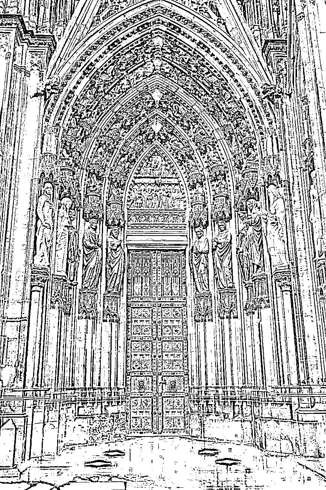

**这些人真正的诉求**

**这些人真正想要的是一个让他们感到安全、受保护、被关心和被宠爱的环境——一个他们觉得自己真正属于的地方。**为了实现这一点，他们必须**愿意放弃一个想法，即一个特殊的人或一群人能提供它，仅仅因为他们认为自己需要。**相反，北交点摩羯座**必须负责为自己创造所需。**通过追求一个让他们充满活力的目标，或者通过找到一个建立自尊的理想或原则，他们能在任何环境中发展归属感。北交点摩羯座的人需要**找到一个关注点，超越自己和其他人令人分心的情感需求。**当他们**与更高的原则或精神信仰保持一致时，会感到受到保护和滋养。**

**天赋/职业**

这些人**擅长做“老板”**，所以**管理、公共演讲、政治和创业**对他们来说都是不错的选择。其他人**愿意与他们的目标合作，因为他们以敏感的态度对待属下。**要在任何领域取得成功，这些人都**需要“负责”自己的一块拼图。**此外，北交点摩羯座的人有着**良好的移情本能。**他们总是**知道他人的感受，当他们在管理情境中使用这种能力时，他们的敏感性鼓励人们以善意和热情帮助他们。**然而，**如果他们从事的职业以抚育为目的，他们往往会陷入无助感，而且无法“掌控”局面。**他们在**以目标为导向**的职业上表现更好，因为他们能够**利用自己的敏感性，以爱心组织他人朝着特定目标努力。**

**摩羯座北交点特定的疗愈誓言**

**· **“我不能控制别人，但我可以控制自己。”

**·** “在放开过去的过程中，我能更有效地应对现在。”**·** “当我负责时，我赢了。”**·** “当我感到自尊时，我就走上了正确的道路。”**·** “我不需要依赖任何人来照顾我。”**·** “在这种情况下，我可以负责。”**·** “我掌控着我内心的存在状态。”

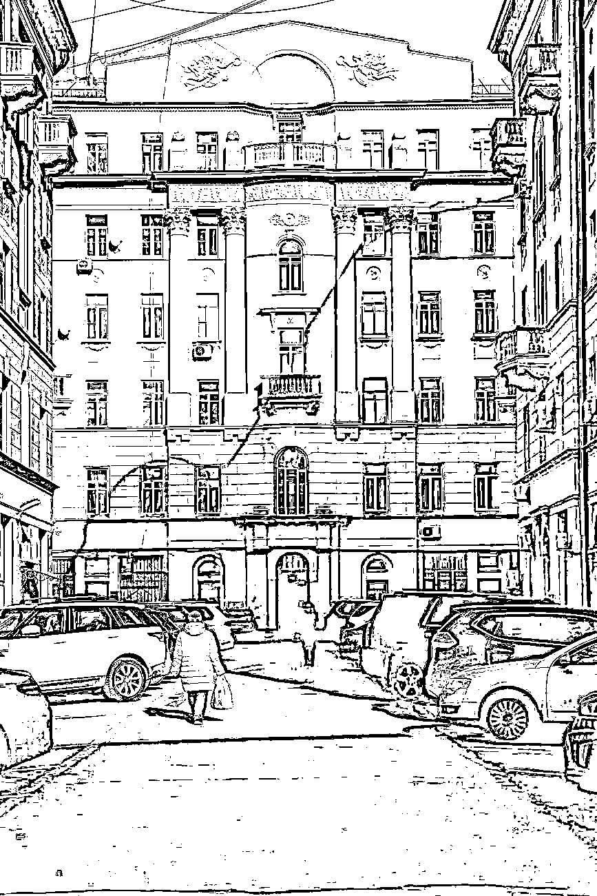

**北交点摩羯座/第十宫的个性**

**前世**

北交点摩羯座的人有许多生世都是**一家之主**：**作为家庭和农场的核心人物，他们与家人或宗族完全认同。**通过这些前身，他们自然地理解了**家庭是如何工作的，以及如何与他人的情感协调，**这是这个月交点群体的特点。**但他们过去没有太多独立的经历。**虽然在这一生中，他们最大的快乐来自于入世，但问题是**如何让他们入世**！**通过放弃世俗经验待在家里，他们牺牲了自己的能力和自尊。**在这次转世中，他们正在**学习掌控自己的命运。****在前世的生活中，家庭是这些人的一切，他们所有的需要都由家庭来照顾：**他们有食物、衣服、住所并且被保护。因此，他们**带着巨大的依赖需求来到这一世，现在指望其他人帮助他们“让生活继续过下去”。**当事情进展不顺利时，他们会**在情感上反应过度，下意识地希望别人看到他们有多沮丧后改变行为。**但其他人**认为这是一种控制手段，不愿意为了安抚这些人而改变自己的行为。**北交点摩羯座的人正在学习，为了让他们的生活能够运转，他们必须从**“负责”**的位置来处理各种情况。他们必须**摒弃通过情绪爆发来操纵他人的所有倾向，而是以一种带着安静自尊的，不受情绪反应影响的方式来接近他人。**这是对自己负责并拥有自己人生目标的副产品。从负责的角度来看，他们可以平等相处，不需要依赖他人来感到安全。

**家庭业力**

**这些人有着艰难的家庭业力。**通常情况下，他们出生在**直系亲属有很多情绪问题**的环境里，北交点摩羯座的人**花费大量时间保持敏感和同理心。**然而，他们**被周围人不断的要求所累，因为他们接受了别人的问题，却觉得自己没有能力帮助他们改变。**从前世来看，北交点摩羯座的人**太习惯于养育家庭成员，以至于他们已经失去了自己的方向感。**因此，在这一生中，**与直系亲属关系过于亲密时，他们往往会遇到困难。**事实上，问题不在于亲密，而在于他们潜意识的意图：“如果我能让这个人走上正轨，那么我最终就能拥有自己的生活，追求自己的目标，做一个有自主权利的人！”由于这种潜意识动机，他们**对家庭成员的“支持”具有令人不快的情绪强度**。他们想“结束这一切”，这样他们就可以过自己的生活。问题有两个方面：**·** 试图让另一个人走上正轨，是推迟致力于照顾好自己生活的一种方式；**· **当别人自己还没有学会如何做时，试图帮助他们成功是不成熟的。**这些人的第一项工作是决定与家人的情感互动保持距离。**一旦放手，他们就可以继续自己的生活。

当他们能够**客观地，从超然的立场理解他人的情感需求**时，与家人保持联系是很好的。当**他们的幸福不再依赖于解决家庭中每个人的问题**时，他们实际上**相当擅长以一种能为所有相关成员带来积极成果的方式管理家庭。**

如果北交点摩羯座的人能够**以经营企业的方式管理他们的家庭，他们的家庭生活将会非常成功。**事实上，他们是**专业的管理者**，因为他们**对人有着天然的理解，能够温和地协调他人，以不伤害任何人感情的方式合作实现目标。**他们需要以同样的方式接近家庭成员：**从权威的角度，而不是从需要的角度。**要做到这一点，他们需要**发现对方的目标是什么，并客观地支持他或她实现目标**。或者，他们需要从**如何管理家庭、承担管理者角色以及帮助家庭成员实现目标以促进每个人最佳利益的这些方面，来制定具体目标。**

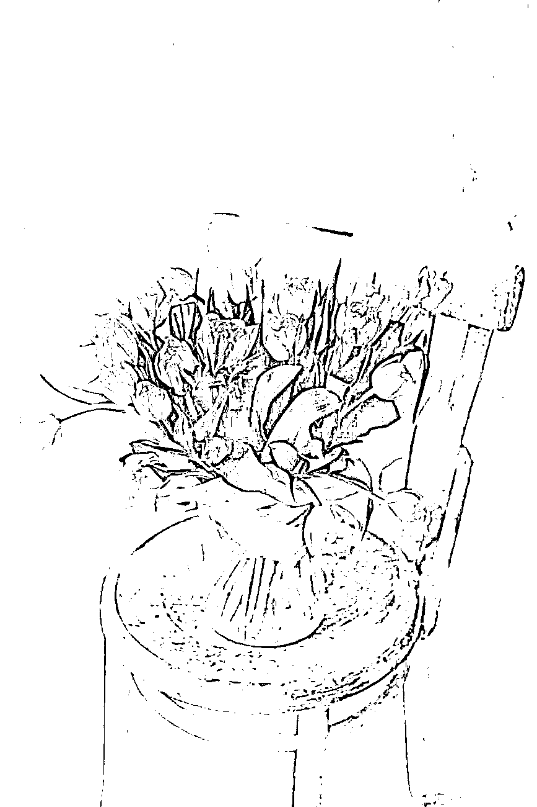

**北交点摩羯座/第十宫的需求**

**安全**

**北交点摩羯座的人有一种永不满足的安全感需求。**在前世的生活中，他们**习惯于被养育和保护**，尽管在这一生中，他们本应是为他人提供帮助的人，但他们仍然满足于在生活中仅仅呼吸就够了——尽可能不费力气就生活下去！他们喜欢**例行事项的安全性：**在特定的时间起床，在特定的时间吃饭、回家、看电视或读书，在特定的时间睡觉。然而，最终，他们将不得不**抛开例行事项，找到自信的更大保障：知道自己可以冒险并取得成功。**

**归属**

**这些人非常需要“归属感”。**在前世的生活中，他们**与家人有着强烈的认同感，作为一个群体的一员，他们感到很舒适。**现在，他们必须**学会区别对待，选择与那些给予他们归属感的人在一起——以负责任的方式满足自己的需求。房屋和财产**在给他们安全感方面也很重要。（然而，除非出生星图中另有其他因素表明，否则这些人**没有很好的“房地产业力”。**）由于对家庭的关注，他们可能会在那里花费太多时间。当他们这样做的时候，**家庭可能妨碍他们扩张和掌控自己的生活。**如果经营自己的生意，一般来说，最好**不要在家里经营，而是租一个地方，哪怕它必须在别人家里。**他们需要**定期走出家门，保持活力。**在家的时间过多会让他们过于舒适，家庭生活可能会成为他们用来避免与外界互动的借口。然后，真正的活力、成长和进步的机会就被放弃了。**北交点摩羯座的人害怕他们没有归属，他们不知道如何表现才能被接受。**因此，他们环顾四周，看看“团队”认可哪些行为，然后模仿这些行为。他们渴望亲密，他们能想到的唯一得到亲密的方法就是**向团队屈服**。然而，当他们不想这样做，却继续附和他人，可能会让他们深感失望。**团队通常不会迁就的方式来回报他们。****当这些人成为“氏族”或“派系”的一部分时，他们也可能遭排斥，因为他们将自己“采纳”的原则应用于其他群体，这让他们感到疏远。**他们不明白为什么！问题在于，**为了满足归属感，试图成为某个团体的一部分，这会排斥其他群体——因为他们认为自己只属于一部分人**。尽管承诺投身于一项比个人生活更伟大的事业，确实带来了归属感，但当他们忘记分辨时，问题就会出现。例如，如果他们在一群共和党人中，对共和党政治充满热情，那群人会让他们觉得自己属于共和党。但同样的热情会让他们在满是民主党人的房间里感到疏远。如果他们想感到被接受，他们应该专注于与他们交谈的人的共同原则。

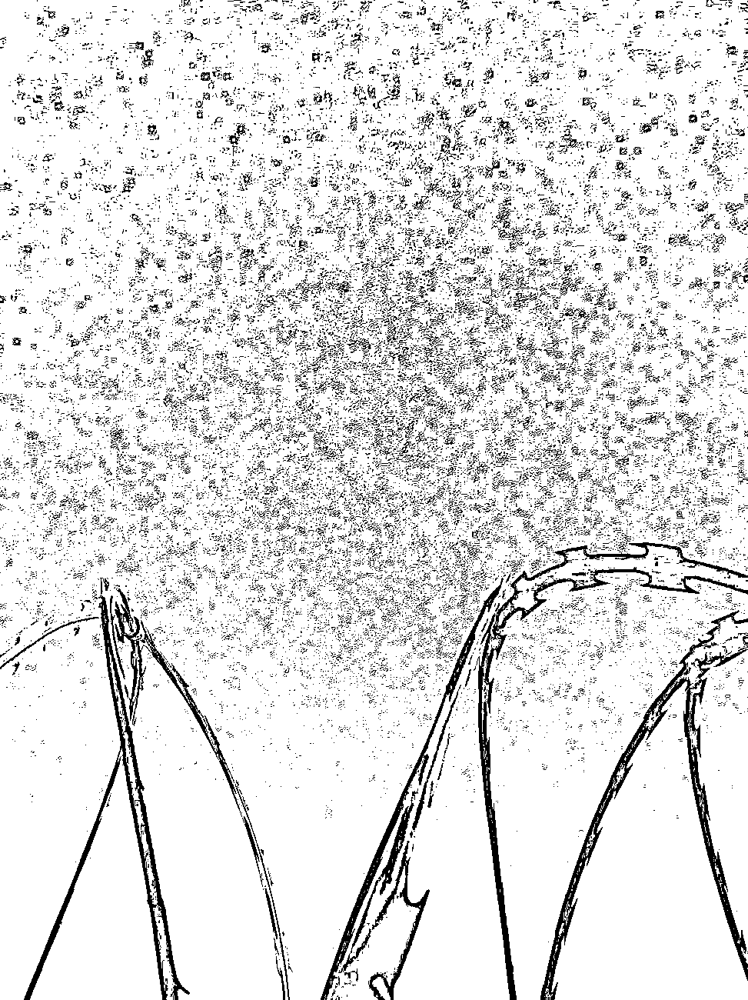

**害怕失败与自尊**

**北交点摩羯座的人对失败有一种过度的恐惧，这会削弱他们的能力，阻止他们做出可能导致成功的改变。**只要担心自己会失败，他们就会**认为自己可以通过依靠他人来继续“逃避“。**他们认为自己**“还没有完全准备好”成为成年人并寻找成功的机会**。然而，他们迟早会意识到，**其他人不会照顾他们，这辈子没有这样的安排。**有时候，这些人**会用任何借口，甚至是他们的年龄——来避免面对他们的恐惧和走向世界。**经过多年的内心挣扎，在终于决心踏入社会前，他们可能会认为自己的年龄影响目标的实现。对这些人来说，**对衰老的恐惧，可能反映了他们不想长大的那一部分。**然而，北交点摩羯座正是应该**拥抱年龄**的人：“谢天谢地，我终于成熟了！” 他们所拥抱的的是一种**开始朝着目标努力**的意愿，这个目标将**使生活有意义，给他们带来满足感，并给他们自尊**。对于这些人来说，认为年龄会在职业上对他们不利是不合逻辑的：**他们寻求的角色通常会随着年龄的增长而增强，因为年龄会赋予他们更多的权力、可信度和权威**。虽然他们也可以在早期实现自己的目标，但通常是**在后半辈子，北交点摩羯座才最终站稳脚跟。**因此，**当他们因年龄因素而感到压力时，实际上是他们的心灵在说：“是时候了！”**这些人认识到，如果他们从未尝试实现自己的目标，会比尝试并失败更不快乐——前提他们付出 100%的努力。那声音一直在说：**“如果你失败了怎么办？”它是前世机制的一部分，不希望他们入世。**它真的在说：“不要长大……不要出去。”这是自欺欺人的。如果听了这个声音，他们将永远无法获得自尊。在前世的生活中，北交点摩羯座的人可能**有一个不允许她外出的丈夫，或者一个过度保护她的父母，她已经把这个声音内化了。**

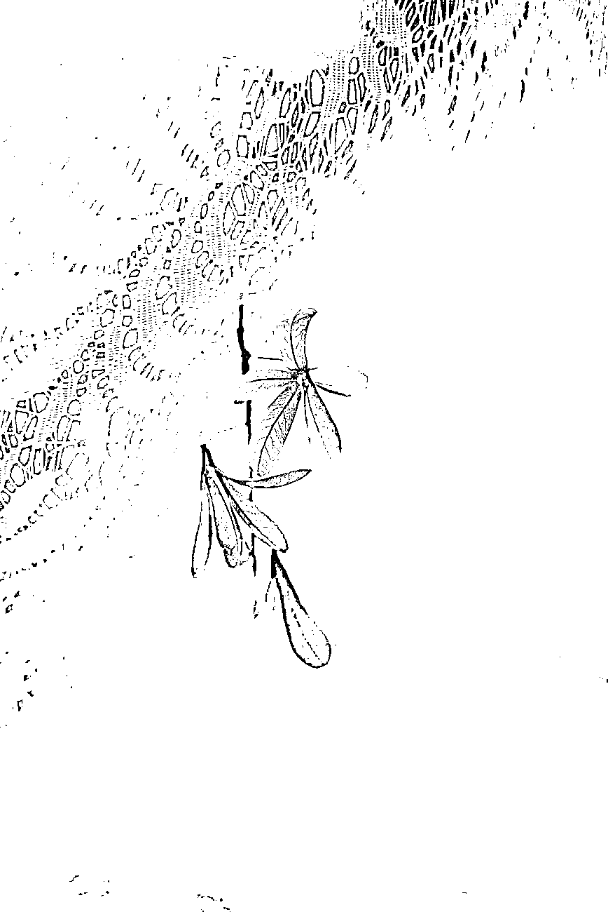

但最终她会说：“好吧，就是这样。”并为她的情况负起责任。在那一刻，她在生活中的地位发生了彻底的转变。**愿意承担全部责任时，他们开始控制自己的生活，获得自尊，这是他们最需要的。**事实上，当北交点摩羯座的人怀疑某个特定的行为是否正确时，他们可以用自尊的晴雨表来判断自己是否“走上了正轨”。例如，如果他们对打电话感到焦虑，他们可以问自己：“不管结果如何，打这个电话会给我一种自尊感吗？”如果答案是肯定的，他们会在打电话这件事上“赢”。如果答案是否定的，他们应该重新考虑自己的立场。北交点摩羯座的人喜欢**在情感的迷雾中漂浮，这会自动将他们置于“失去发球权”的位置。**但是，当他们从**“负责”**的角度看待生活时，一切都会发生变化，他们会感到有力量。然而，这样做有很多恐惧，因为他们不习惯这样做，他们害怕不完美或不称职。但不管推迟多久，他们迟早要站起来负责。越早转变态度，就会越早开始享受生活。例如，我有一个北交点摩羯座的客户，他想成为一名教师。许多教育家在大学毕业后就直接开始教书，但他把教书推迟到获得三个大学学位之后，即便如此，他也觉得自己还没有准备好要“负责”这个职位。

最终，他去做了，这就是这些人所需要的。一旦他们冒险“去做”，他们的成功就证明了他们的能力。**一旦这些人开始负责，他们就能控制自己的情感需求，并确保自己得到照顾。不再任由他人摆布，他们终于感到自给自足和安全。**

**版权声明：**本文由若道翻译发布，欢迎转发，反对抄袭。友号转载请申请白名单。

**简·斯皮勒**

全球占星界的一位领军人物，是美国占星师联盟（AFAN）的教员。她定期在新时代和占星回忆上授课，是畅销书《新月占星学》、《灵魂占星》、《灵性占星学》和《宇宙之爱》的作者。

**20 位来自世界各地的占星师****带来 19 场沙龙——新世界的觉醒****详情可点击下图**

**学习占星学****点击下图了解课程详情**

**微信又双叒叕改版啦，不想错过若道君的推送？**

**就把若道设为星标吧！**

**▼**

**喜欢就点一下“在看”吧！**

********报名直达入口********

# ISAR 选修课 | 大国命运：经世占星学 3 天线上工作坊

> 原文：[`mp.weixin.qq.com/s?__biz=MzA5NjA0NTAxNg==&mid=2651479710&idx=2&sn=60652e58037aab4b54fea725dcc03a81&chksm=8b48ec29bc3f653f80284f9adb66f1b2c35cc0b21852b596f88672e714a54a6bb46171ff5259&scene=126&sessionid=1692737791#rd`](http://mp.weixin.qq.com/s?__biz=MzA5NjA0NTAxNg==&mid=2651479710&idx=2&sn=60652e58037aab4b54fea725dcc03a81&chksm=8b48ec29bc3f653f80284f9adb66f1b2c35cc0b21852b596f88672e714a54a6bb46171ff5259&scene=126&sessionid=1692737791#rd)

<mpvideosnap class="js_uneditable custom_select_card channels_iframe videosnap_video_iframe" data-pluginname="videosnap" data-id="export/UzFfAgtgekIEAQAAAAAAfGQB6vQCmQAAAAstQy6ubaLX4KHWvLEZgBPEioJES3BsLK2DzNPgMIsb3nmx3ZXbJKLT1wm45TIu" data-url="https://findermp.video.qq.com/251/20304/stodownload?encfilekey=S7s6ianIic0ia4PicKJSfB8EjyjpQibPUAXolorph7kXX0G2V8DGSvfR9PkwwbPmosvYicRybibaBiaVv5A38Bc5Re8nsYStXZD7nqrhjvCib7Z8iaC9vlXIpibAjFAuw&amp;adaptivelytrans=0&amp;bizid=1023&amp;dotrans=0&amp;hy=SH&amp;idx=1&amp;m=&amp;scene=0&amp;token=AxricY7RBHdWxX5EuW79OcFLEojiajUVbfrb10projcwzwun3SBUDgOHcwIaMibQEFyWZc9dNWComE" data-headimgurl="http://wx.qlogo.cn/finderhead/PiajxSqBRaEJYnVsqWfEX9qA0sI6hNVKsDfyzfPZ92WZMZyBpZWU5NA/0" data-username="v2_060000231003b20faec8c4e68a1ec2d4ca07e434b07755bbf47e7053a3059defd2c9d6c68a20@finder" data-nickname="若道" data-desc="#ISAR 选修课 经世占星学是什么？会教授哪些知识内容？8 月经世占星工作坊，来提前了解一下" data-nonceid="3653579416430381618" data-type="video" data-width="640" data-height="368"></mpvideosnap>

有一些岁月经历的人，会非常清晰地看到，我们每个人的命运都和国家的命运紧密联系在一起。

以俄国人为例，不论每个俄国人有什么样不同的个人星图，31 年前的苏联解体，今年发生的乌俄战争这样重大的事件，毫无疑问影响了俄国 2 代人的命运。而在一些关键时间点个人的选择，毫无疑问，又影响了个人的生命历程。

而只要你关注世界局势，你也会看到，这样的一个国家发生的重大事件又会对其他国家的各个方面发生重要影响。

我们的命运、我们所获得的事业的发展机会、我们的财富机会都是和整个时代和国家息息相关。

**因此，一个好的占星师必须要懂得时代的声音，必须要洞悉全球的趋势，必须要懂得国家的故事。**

在这个工作坊中，我们将学习**如何专注于能够理解世界大事并对它们做出准确的预测。**这将带领我们踏上**一段重要的行星周期之旅，并延伸到重要国家和世界领导人的星图。**现在正是学习的好时机！

2020 年 12 月，木星与土星合相，这是 800 年来这两颗行星首次在水瓶座合相，预示着地球以及政治和社会趋势将发生巨大变化。我们正在进入一个令人兴奋的奇境，非常适合探索经世占星学。

邓肯老师说：

****

**学习经世占星学，我们可以依靠占星师们过去使用一些技法所做的预测，我们将在这个工作坊中进行探索。**

**比如：占星师迈克尔·贝金特在 1982 年，苏联解体事件发生 7 年前，就对苏联做出如下预测：**

**“从 1989 年 1 月到 1991 年 11 月……在领导和统治风格方面……国家将进行一些基本的重组。这一时期将预示着一些新的革命……严密的控制结构将失败，国家将崩溃，重新回到过去的众多自治国家。”**

**而占星师罗伯特·佐勒在世贸中心遭到袭击前一年的 2000 年写道：**

****“从 9 月份开始，我们西方正进入一个危险加剧的时期……尤其是在东海岸……这将招致乌萨马·本·拉登等冒险家的劫掠……这是一个警钟……2001 年 9 月第一次大危机袭击美国之后，我们将再也回不到从前了。”****

**在 2020 年美国大选前 6 个月，我也写了一篇文章：**

****“他（唐纳德·特朗普）将战斗到底，美国的街道将成为战场，他不会优雅地离去，但在 2021 年，一个新时代开始了，大海将覆盖特朗普总统任期的废墟。”****

出生星图和经世星图都使用相同的基本占星技法，对每一个主题的研究都同时丰富了这两个分支。你从观察世界大事中学到的东西，可以应用到个人客户身上，反之亦然。

**工作坊内容和时间安排**

**8 月 26 日 周五 **

**14:30-15:30**

**1. 基础知识介绍**

-外行星及其在各个星座运行

-外行星周期

-国家星图

-政治领导人星图

-选举星图

-将以上各项按优先级排序

**休息 30 分钟**

**16:00-17:30**

**2. 外行星及其在各个星座运行**

-天王星入座：革命性的变化

-海王星入座：意识的转变

-冥王星入座：危机与重生

**休息 90 分钟**

**19:00-20:30**

**3. 木星-土星的合相周期**

-文明的发展

-水瓶座新电子化时代

**休息 30 分钟**

**21:00-22:00**

**4. 木星与外行星的互动**

-木星-天王星：科技进步

-木星-海王星：媒体的力量；消融，受苦和慈悲

-木星-冥王星：意识形态极端主义

**8 月 27 日周六**

**14:30-15:30**

**5. 了解社会趋势**

-土星-天王星：新的如何取代旧的；科技重组

-土星-海王星：乌托邦梦想破灭；结构消融

-土星-冥王星：独裁与权力瓦解

**休息 30 分钟**

**16:00-17:30**

**6. 长期文明变革**

-天王星-海王星：新世界秩序的梦想

-天王星-冥王星：机械的变革力量；剧变

-海王星-冥王星：意识变化的 492 年周期

**休息 90 分钟**

**19:00-20:30**

**7. 20 世纪地缘政治力量的影响**

-俄罗斯、苏联时代及其衰落

-美国的故事

**休息 30 分钟**

**21:00-22:00**

**8. 中国**

-中国作为全球玩家出现

-科技、领导力和一带一路

**8 月 28 日周日**

**14:30-15:30**

**9. 行星推进的重要性**

-预测选举的结果；特朗普 - 拜登

-预测国家的发展：以色列

-美国：扩张与收缩

**休息 30 分钟**

**16:00-17:30**

**10. 有多张星图的国家**

-英国

-法国

-沙特阿拉伯

**休息 30 分钟**

**19:00-20:30**

**11. 统治者的出生星图**

-普京：克格勃军人，2020 年代的发展

-特朗普：虚假信息之王，获胜者与失败者

**休息 30 分钟**

**21:00-22:00**

**12. 21 世纪的世界发展**

-新时代的人口和气候变化

-独立与全球化

-宗教与科学

-人际关系与游戏

**授课老师**

**艾德里安·罗斯·邓肯（Adrian Ross Duncan）**

**·** 邓肯老师 1971 年在印度游学时开始学习占星学，1985 年开始成为全职占星师，迄今执业已超过 33 年，是人本主义占星学、卜卦占星学和经世占星学领域的知名占星师。

**·** 开发了占星软件 AstroClock 和多款占星报告。

**·** 从 1971 年开始研习佛学，受佛学影响很深，他相信占星学和佛学观点统一、转化的一个基础是在于对现实感知的改变。

**授课方式**

**授课方式：**

**线上网络直播课，英文授课，中文翻译**

**课程价格**

**课程价格：**

**正价：6800 元**

**早鸟价：5800 元**

**早鸟价截止日期：2022 年 8 月 1 日**

负责人：若道-童童

（微信：nodoorDaivd）

**退转课程**

**退款原则请详看《教学协议》，如有疑问请咨询课程顾问。**

****ISAR 选修课 | 大国命运：经世占星学 3 天线上工作坊****

**授课老师：******艾德里安·罗斯·邓肯****

**工作坊时间：2022 年 8 月 26 日-28 日（**周五-**周日）**

**授课方式：******网络授课，英文授课，中文翻译****

**费用：****正价：6800 元****（早鸟价 5800 元，8 月 1 日前）**

**课程负责人：童老师**（微信：nodoorDaivd，请备注“经世工作坊”）

长按二维码添加课程负责人咨询~

****报名直达入口****

# 对话斯蒂芬·弗里斯特丨人生中发生的事件，都是回家旅途中的一部分

> 原文：[`mp.weixin.qq.com/s?__biz=MzA5NjA0NTAxNg==&mid=2651479509&idx=1&sn=94ac7b7a47296e2a2919f9cab3a3afd0&chksm=8b48ef62bc3f66746d0fa4678115193be23777dbcb7c8c7efb4dd2945d2c957d0e6387e40ce0&scene=126&sessionid=1692737791#rd`](http://mp.weixin.qq.com/s?__biz=MzA5NjA0NTAxNg==&mid=2651479509&idx=1&sn=94ac7b7a47296e2a2919f9cab3a3afd0&chksm=8b48ef62bc3f66746d0fa4678115193be23777dbcb7c8c7efb4dd2945d2c957d0e6387e40ce0&scene=126&sessionid=1692737791#rd)

******************☆ 后******************台******************回复“今日”，给你一句生命态度******************

作者/斯蒂芬·弗里斯特
译者/李含  校对/江艺编辑/翀子 封面/书君  图片/网络

2009 年元旦，重回 Matrix 软件公司的创办人迈克尔·厄尔瓦恩（Michael Erlewine）对进化占星学创始人之一斯蒂芬·弗里斯特进行了采访。本文是在这次采访中，斯蒂芬对自己是如何接触并学习占星学的，以及在人生探索过程中占星学起了什么作用等问题做出的回答。斯蒂芬老师的[三日线上工作坊](http://mp.weixin.qq.com/s?__biz=MzA5NjA0NTAxNg==&mid=2651478579&idx=2&sn=8c3bd7dd2be285d22214b320598bf40a&chksm=8b48e884bc3f6192ad1ff1eb08e76749fb306e452748ce5b7453f79f30316236c2565ebe7b82&scene=21#wechat_redirect)正在报名中，有兴趣的小伙伴点击链接了解一下吧。

**天文学与手相学“交汇”**

**迈克尔·厄尔瓦恩：首先，您是否愿意向读者透露您的出生资料呢？** 

**斯蒂芬·弗里斯特：**我是 1949 年 1 月 6 日凌晨 3:22，在纽约州的弗农山（威彻斯特郡）出生的。我的星图的上升点落在天蝎座 22°多一点。

**迈克尔·厄尔瓦恩：您是如何对占星学产生兴趣的？** 

**斯蒂芬•弗里斯特：**这是两条线索相互交融的结果。我记得自己小时候特别想要一个望远镜。到了大约 12 岁左右，我就成为一名活跃的天文爱好者了。

第二条线索是手相学，那是 13 岁时，一位德国女孩儿教给我的。在 17 岁以前，这两个兴趣都是独立发展的，直到我翻开了第一本占星书，两条线索才就此交汇到一起：通过望远镜瞭望的浩瀚星光，遇到了手相学中隐含的古老心理学。

**迈克尔·厄尔瓦恩：您是如何学习占星学的呢，读过哪些占星书籍或是曾在哪所占星学校求过学呢？**

**斯蒂芬•弗里斯特：**我完全是从书本上学习占星学的。直到我在矮脚鸡出版社（Bantam）成功出版了两本占星书籍之后才认识了其他的职业占星师。这就是土星落在中天带来的礼物！

其中对我影响最深的是一群英国神秘学家——特别是查尔斯 E.O.卡特（Charles E.O. Carter）和罗纳德·戴维森（Ronald Davison）。对我影响最大的书籍是罗德尼·科林（Rodney Colin）所著的《天体影响理论》（*The Theory of Celestial Influence*）一书。

**目标不是”预言“，是”治愈“**

**迈克尔•厄尔瓦恩：您是否向哪位占星老师或者导师学习过呢？如果有的话，能否给我们介绍一下他们是谁，对您有什么影响？您的占星知识有什么传承关系吗？**

**斯蒂芬•弗里斯特：**真遗憾，都没有。如果要说到传承，我觉得自已继承了金刚乘佛教（即藏传佛教，又称密宗）和爱德加·凯西的“灵异”传统——并不是说我认为自己是灵媒，而是说我沿袭了他们的观念，以灵魂进化轮回的角度来观察这个世界。

我花了许多时间与这两方面的大师们探讨。二十多岁时，我也有自己的心灵导师，她对我影响颇深——她是一位深具智慧的女士，玛丽安·斯塔恩斯（Marian Starnes）。她是我的精神之母。我将一直尊敬她。

**迈克尔•厄尔瓦恩：您从事哪一个类别的占星学？您使用哪些技巧，您认为哪些技巧行之有效？**

**斯蒂芬•弗里斯特：**我研究的是进化占星学，本质上是古代形而上学与荣格个体心理学的结合。在技巧上，关注于前世未解的动力及其对今生和心理体验的影响。

这里的目标并不是“预言”或是“描述”，而是治愈和释放。实际的技巧可以阅读我所著的《昨日的天空：占星与轮回》（*Yesterday’s Sky: Astrology and Reincarnation*）一书。我用了 300 多页才完全介绍完这些方法。

**迈克尔•厄尔瓦恩：您是否有自创的占星技术呢，能否为我们介绍一下？其他人是否了解或是使用这些技术呢？**

**斯蒂芬•弗里斯特：**我为进化占星学领域增添了许多占星技术和阐释方法——这也在《昨日的天空》一书中有详细介绍。

在一项占星学学徒计划中，我已经教授这些技巧十多年了。约有四百多学生学过了这门课程，所以，绝对有其他的占星师在使用这些技巧并从中获益。一些学生逐步进入职业占星师的领域，这让我很自豪。

这些方法和那些在占星学大会上学到的不同，但它们运用于实际生活中确实非常有效，非常有生命力。当占星师们听说进化占星学与灵魂转世相关时，他们通常都认为这必定是一种神秘学说。

实际上，它是心理占星学的一种强有力的表现形式：热烈而慈悲，并且能在人们的此生生活中立刻得到证实。

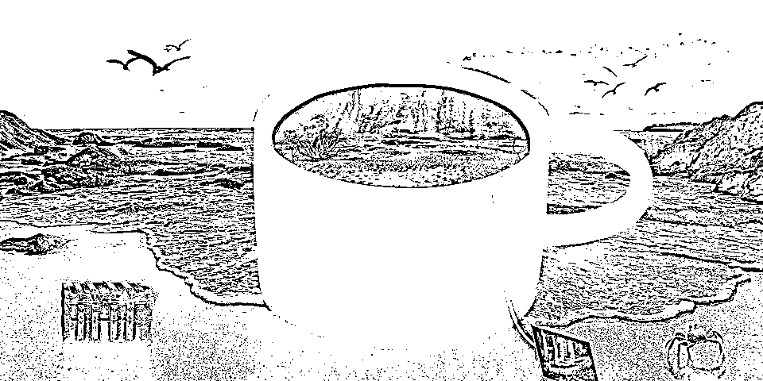

**占星学：照耀归途的明灯**

**迈克尔•厄尔瓦恩：在您自己的生活中，您在什么情况下会使用占星学呢，多久用上一次呢？**

**斯蒂芬•弗里斯特：**我会一直关注自己生活中的重大行进和推进主题，还会注意到自己的反应。有时候，我会去散散步，然后在脑中与自己展开对话，就像在同样的占星情境下和客户交流那样。我总是惊叹于这些词语带给我的震动！这很有力！有时候会让我大吃一惊。

同样，我也非常注意每一天的月亮变化，在有重要行为时会以此参考——比如签订合约、订机票、启动重要的事业变动，等等。不问问月亮，我是绝不会轻举妄动的，要确保月亮没有落入空亡，月亮最近的一次成相是柔和相位。

**迈克尔•厄尔瓦恩：您认为占星学是一项预测工具吗？如果是，是怎样运作的？**

**斯蒂芬•弗里斯特：**占星学非常适用于预测人生难题的本质和时机。预测的“结果”更适合不动脑子的笨蛋，一个人一旦开始探索意识的潜能，就跳脱了令人沮丧的宿命未来，拥有更为多元的可能性。

我没有怎么研究过占星师们技巧的差异，但我相信，**“铁口直断”潜藏着危害，甚至是一件不道德的事。**

话说得比较重，是因为我认为**这样的预测会影响个人追求更高的目标和可能性，这样做就真的很像黑魔法。在进化占星学中，我们是教练，不是先知。**

我的观点只适用于自我成长与发展型的占星学说，顺便说一句，别预测股票市场和棒球比赛的结果。

**迈克尔•厄尔瓦恩：在深刻的个人问题和人生探索领域，占星学帮助您找到答案了吗？**

**斯蒂芬•弗里斯特：**这的确是个很难的问题。感谢你的提问。简单回答是：“对。”展开来说就是，每一个人，不管你多么坚定地支持不可知论，都将他们的个人哲学和理念带到了占星学中。

**完全摒弃价值观、完全客观中立的占星学是不太可能的，因为即使你摒弃价值观、坚持客观和中立，这本身就是一种哲学态度！**

对我而言，占星学已经融入到世界观之中，不可分割。我现在已经正式皈依佛教，尽管差不多在 19 岁时，我就开始信奉佛教。我成长于健康的基督教文化环境之中，现在仍有基督教的情怀，在心灵层面上，它与我的佛教信仰完全不冲突。

我相信，我们都是神秘世界中的神秘存在，经历了数世轮回，回归到难以言喻的一些事情，我们称之为“神”。

我相信，**人生中发生的每一个事件，外在世界遇到的每一件事，内心体验到的每一分痛苦和纠结，都是回归家园漫漫旅途中的一部分。**

我没办法证明这一切，但是我能够真诚、坦率地表明我的立场。这样的理念完全渗透在我的占星风格之中。这就是行星告诉我的信息。

因此“在深刻的个人问题和人生探索领域”，占星学的确向我反馈了重要的答案，就像一盏明灯照耀着我的归途。

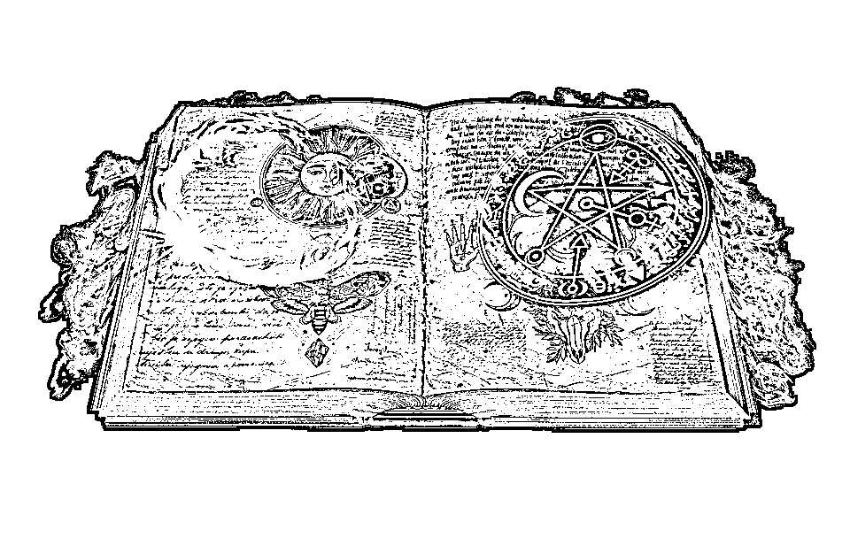

**社交型占星师 vs 一匹孤狼**

**迈克尔•厄尔瓦恩：您是否为他人做咨询？如果是的话，哪些技巧会比较有效，你多久做一次咨询？您现在还欢迎客户咨询吗？**

**斯蒂芬•弗里斯特：**从 1978 年开始，我就是职业咨询占星师了。我的咨询时间比较长，通常会持续 2.5-3 个小时，所以一般我一天只能做两次咨询，上午下午各一次，周一到周五工作。

我不常休假。做了 30 年职业占星师，此前做过 7 年兼职占星师。我的日程表总是满满的。你大概可以估算出我见过多少客户了吧。现在，我仍然继续做咨询工作，并始终欢迎新客户的光临。

**迈克尔•厄尔瓦恩：您自我介绍时会说自己是占星师吗，对方作何反应呢？**

**斯蒂芬•弗里斯特：**现在是的。但在年轻的时候，我对这个身份也会缺乏安全感，因为害怕受到苛责，我也学会避开这个话题。如今，占星师的角色已经让我如鱼得水般自在了。我发现，似乎我的轻松，也影响到了其他人，给予我温和的回应。

一般情况下，其他人都会表示感兴趣，很好奇。我想，很显然，我看起来不是个笨蛋，人们从我的其他占星信念中也可以获得更宽广的延伸！

**迈克尔•厄尔瓦恩：您参加占星学界的聚会或是学术会议这类活动么？您是一位社交型的占星师，还是一匹孤狼呢？**

**斯蒂芬•弗里斯特：**第一个问题的答案显而易见。我在许许多多的占星学术会议中做过演讲。我个人认为，除了交流之外，这并没有特别重要，特别有益的作用。这种短小的座谈，只能关注一种独立、特殊的占星方法，这在实际的咨询中起不了什么重要。

第二个问题，可是个难题。我想说，我是一匹孤狼，但又过着社交型占星师的生活。

**与占星群体建立联系是一种伦理需求，同时也有利于这种实践性的职业导向。**但一次接触一两个人，我觉得是非常快乐的事。老实说，占星会议让我有压迫感。在那样的环境下，我并不觉得自己如鱼得水。

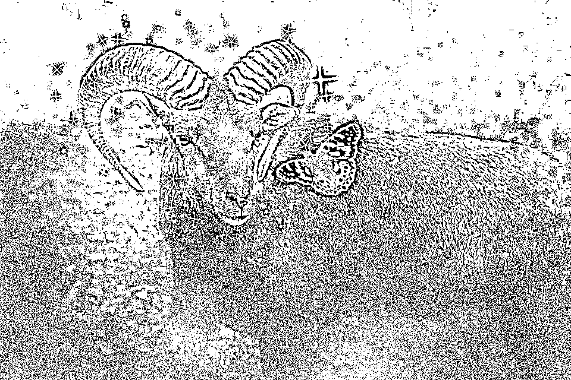

**迈克尔•厄尔瓦恩：您与职业占星师们如何联系呢？您是哪些占星学组织的成员吗？**

**斯蒂芬•弗里斯特：**我是国际占星研究协会（ISAR）和美国地球宇宙协会（NCGR）的成员。我在 ISAR 的道德委员会任职多年了。为此我感到很自豪。我帮助 ISAR 起草了职业道德规范。

我也是 NCGR 董事会的顾问。到现在为止，我已经担任开普勒大学咨询委员会主席多年，虽然这只是一个虚衔。他们没有采纳过我的任何建议！

**迈克尔•厄尔瓦恩：您如何看待现代占星学和占星师？**

**斯蒂芬•弗里斯特：**作为一个社会团体，我们正处以一个混乱的时期，百花齐放，流派众多。

现在有许多活跃的风格和传统——进化占星学、心理占星学、印度吠陀占星学、文艺复兴时期的占星学、希腊风格的占星学、日心学派、宇宙生物学派、汉堡学派占星学、玛雅星相学，侧重点有小行星、中点、海王星外行星（trans-Neptunians，太阳系中运行轨道在海王星之外的行星）、泛音图等。 

一方面来说，这种多样性棒极了！另一方面，也造就了完美的巴别塔现象，占星师们不再说同一种语言。想来一场富于智慧的争辩都不可能了！现在只有两个选择，要么保持和平，要么愚蠢地争吵。后一种似乎比较流行。

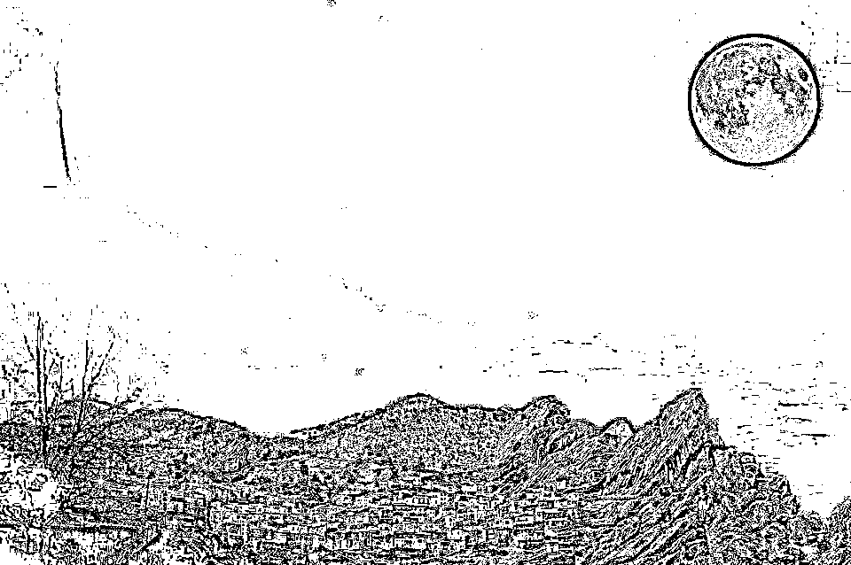

**咨询、教学、写作“三位一体”**

**迈克尔•厄尔瓦恩：您的占星业务发展如何？顺利吗？占星学收入占到您总收入的百分之多少？**

**斯蒂芬•弗里斯特：**1978 年开始，我的收入就全部来自于占星。朱迪和我都没有什么家族遗产，也没有其他的收入。我做得还不错，和一个优秀勤勉的心理医生收入差不多。主要收入直接来自于咨询的客户。

我同时也做些一些教学工作，写写书，同时也从我和朱迪一起创造的报告写作器上获取一些版税。 

我们有个非常漂亮的家，在南加州的沙漠里，在北卡罗来纳州也拥有居所。70 出头我就可以舒舒服服地退休了，不过我想自己会不愿意退休。这份工作带来的回报绝不仅仅是金钱！吹嘘自己的收入实在是件很傻很荒唐的事！

另一方面来看，现代占星师能为占星学做的最有益的一件事，就是向大众宣传一种激进的理念，即占星师确实是正当职业——可以作为谋生的手段。

如果你能够走出占星技巧的孤立狭隘的小天地，用占星学为人们提供重要的帮助和服务，你就可以凭借这一行业过上相当不错的中产阶级生活。如果普通大众普遍意识到这一点，那么占星团体将会发生巨大而有益的改善。

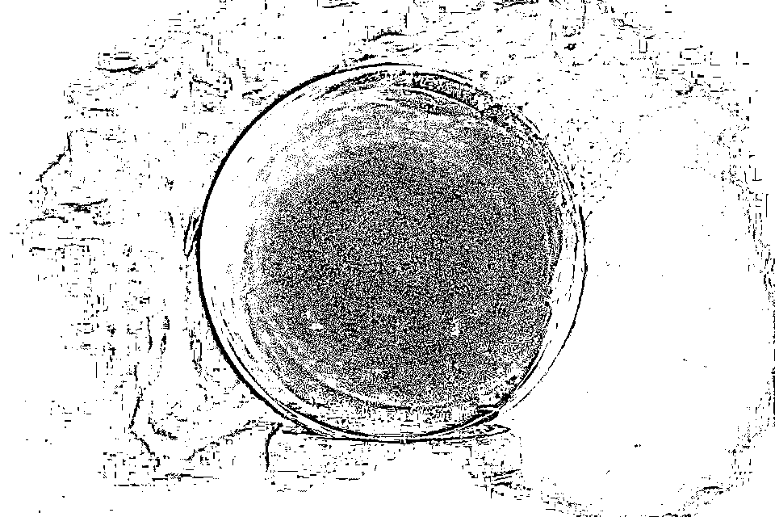

金钱是走出贫民区的主要途径，占星学是一个贫民区，然而它却不应当走那条路。我们必须打破在这一领域内反对说出专业现实真相（即财务状况）的“精神”禁忌。有许多著名的占星师，无法以此谋生，这让我很惊讶。

出了什么问题呢？这里的确事出有因，但潜在的学生们也有权质疑，这样的老师是否“货真价实”。

**如果你所使用的占星学意义深刻，能够行之有效地帮助别人，那你一定可以吸引到足够的客户，以此谋生。**如果你能坚持工作一段时间，你的声名会在这一领域内口耳相传。

**迈克尔•厄尔瓦恩：您能跟我们介绍一下您的占星商务计划么？**

**斯蒂芬•弗里斯特：**这一方面事务的实际运作是由朱迪负责的。她启动了一个七爪出版社（Seven Paws），自助出版一本奇幻小说，她厌倦了向主流出版社推销作品了。这一计划出人意料非常成功，所以我们也开始出版占星书籍了。

这时候才真正是我们自己的书，虽然之前我们已经出过不少书，还与杰夫·格林合作著书，发行了拉斐尔·纳赛尔编纂的“同一天空下（*Under One Sky*）”系列丛书。

顺便说一句，前面这些经验真是感觉棒极了！有 12 位占星师，每一个人都代表了不同的传统流派。拉斐尔给出一位女士的出生信息，还有一些钱，然后说：“拿出你们的看家本领来给我看看吧！”

我们都尽力写出自己的解读，纯粹的占星解读——我们对这位女士一无所知，连名字都不知道。这就是传说中的“要么行动，要么闭嘴”时刻！最后，拉斐尔没有能够找到出版商，所以朱迪将书稿纳入了七爪出版社的计划中。

在这里自吹自擂一下，克里斯·劳伦斯（Chris Lorenz）在《戴尔占星》（*Dell HOROSCOPE*，著名占星专业杂志）上，给予“同一天空下”系列丛书极高的评价，“学海无涯就是我的态度，我想要知道哪一位占星师是最棒的…...这个问题，每一位读者都有自己心目中的第一名，而我总是毫不犹豫的把奖杯颁给斯蒂芬·弗里斯特。”

（译者注：克里斯 • 劳伦斯，荷兰阿姆斯特丹大学哲学和历史方法论教授，曾是澳大利亚和德国的访问学者。出版有论论历史哲学、近代史学编纂和教育政策等有关的著作。）

这段评语让我非常自豪。这也是对进化占星学的肯定。能够与罗伯特·汉德（Rob Hand）、德梅特拉·乔治（Demetra George）、罗伯特·施密特（Robert Schmidt），这些我无比尊敬的占星大师们共同参与这项出版计划，我深感荣幸，能够与他们成为同事，的确与有荣焉。

除了七爪出版社以外，我们还出品了一些软件、讲座的光盘、电脑报告、视频和一些细微的服务，这些在我们的网站上都可以找到。

**迈克尔•厄尔瓦恩：您能跟我们具体分享一些占星事业发展过程中的故事吗，个中曲折，还有您对这一工作的未来展望？**

**斯蒂芬•弗里斯特：**总的来说，前面谈到的那些业务都是我工作的重要部分，单独运营任何一项，收益都不大，但将它们密切配合起来，却能发挥协同增效的作用。

对我来说，金钱来源于客户咨询、教学、专业写作，而占星学的灵魂同样通过这中“三位一体”的形式得以展现。

朱迪也做咨询，但她不像我，这么天生喜欢与客户们交流，所以她在这方面的发展要少一些。因此，她就负责其他所有的事务。

她才华横溢，不知疲倦地努力，让我十分感激。她满足了自己的需要，还给予我有力的支持，让我能够开设讲座、运营网站，给我们提供信用卡支持，最重要的是，她还是我的出版商，我偶尔冒出的多音节词也不会让她感到惊讶和困惑。

**版权声明：**本文由若道翻译发布，欢迎转发，反对抄袭。友号转载请申请白名单。

**END**

**斯蒂芬·弗里斯特**

若道签约老师。进化占星学的创始人之一，当今世界最有影响力的占星大师之一；1985 年，他凭借《内在的天空》一书获得职业占星师协会奖（Professional Astrologers Incorporated Award）。他四次获得占星界最高的占星学联合协会奖（United Astrology Congress Regulus Award）提名，2018 年获得轩辕十四教育奖。

****探索组合图永恒的三角——斯蒂芬工作坊报名中****

斯蒂芬说，我们的组合图表明无论什么状况我们都能熬过去。

**组合图也像出生星图一样有行进。**在工作坊中， 我们将**探讨一些特殊的技法和考量，来帮助伴侣们应对生活中的挑战和机遇。**组合图的推进会出现一些看似难以解决的复杂问题，斯蒂芬老师创造了一种解决这些问题的技法。他将在工作坊中阐述相关细节，基本的问题是：如你所知，要了解一个人 30 岁生日的推进，我们要看这个人出生后 30 天的行星位置。问题是，组合图与我们在占星学实践中使用的其他星图不同，组合图并不代表某一天的天空。记住，它是基于中点的。**那么我们如何从一个不存在的日期开始 "向下数 30 天"呢？斯蒂芬老师将为我们提供一个行之有效的答案。****点击下图了解更多详情********20 位来自世界各地的占星师****带来 19 场沙龙——新世界的觉醒****详情可点击下图**

**学习占星学****点击下图了解课程详情**

**微信又双叒叕改版啦，不想错过若道君的推送？**

**就把若道设为星标吧！**

**▼**

**喜欢就点一下“在看”吧！**

********报名直达入口********

# ISAR 星空俱乐部沙龙丨美国奴隶制的遗留问题和种族主义

> 原文：[`mp.weixin.qq.com/s?__biz=MzA5NjA0NTAxNg==&mid=2651479509&idx=2&sn=00af7afa708dda1b6894349d5a8a0f63&chksm=8b48ef62bc3f667431f7f7c5965d6bece2850551c1ce4dafec3c9447227f3f5d3bdbc7b2a42d&scene=126&sessionid=1692737791#rd`](http://mp.weixin.qq.com/s?__biz=MzA5NjA0NTAxNg==&mid=2651479509&idx=2&sn=00af7afa708dda1b6894349d5a8a0f63&chksm=8b48ef62bc3f667431f7f7c5965d6bece2850551c1ce4dafec3c9447227f3f5d3bdbc7b2a42d&scene=126&sessionid=1692737791#rd)

**沙龙来啦！****7 月 15 日，星期五晚上 8 点，**国际占星研究协会（ISAR）中国星空俱乐部沙龙由**大家熟知的大卫·瑞雷老师**来一场讲座！ **沙龙主题****沙龙主题：**关于美国国家星图中火星-海王星四分相的经世占星学调查报告——特别是关于美国奴隶制的遗留问题和种族主义******主讲人：**大卫·瑞雷****

**沙龙时间：7 月 15 日，星期五**

**                北京时间 20:00-21:30（有英文翻译）**

**沙龙方式：线上沙龙**在这份报告中，我将把占星学依据与历史事实和时事联系起来。就像一个正在展开的犯罪故事，里面有无辜的受害者、幸存者、暴民暴力、英雄和恶棍，我们将看一些他们的星图。在大多数犯罪活动中，有罪的人往往最有可能歪曲事实，说出与事实相矛盾的话。有罪的人可能会戏剧性地、令人信服地表达自己，做出浮夸的陈述来鼓动他人，并把我们的注意力从更敏感的地方转移。1776 年 7 月 4 日的情况就是这样，有罪的一方是奴隶主托马斯·杰斐逊（Thomas Jefferson），他在《独立宣言》中写下了著名的一段话：**“我们认为这些真理是不言而喻的，人人生而平等，造物主赋予他们若干不可剥夺的权利，其中包括生命权、自由权和追求幸福的权利。”**“人人生而平等”的说法与美国奴隶制的现实（包括托马斯·杰斐逊本人拥有奴隶）之间的矛盾，甚至在《独立宣言》首次发表时就被指出。

很多占星师，包括我自己，长期以来都认为**美国国家星图中位于双子座 21°的火星与位于处女座 22°的海王星的四分相，其中一个征象是代表了美国奴隶制和种族主义的悠久历史。**尽管如此，我从未测试过这个假设。2020 年 5 月，乔治·弗洛伊德（George Floyd）在明尼阿波利斯市被警察谋杀后，我开始挖掘历史记录。2020 年 6 月，我在微博上写下了一些我的初步发现，以及关于 2020 年 6 月 12 日亚特兰大警方谋杀雷沙德·布鲁克斯（Rayshard Brooks）的评论和占星趋势。尽管在 2020 年 6 月之后，我没有在微博上重温这个主题，但在过去的两年里，我继续对火星-海王星四分相进行研究，并发现了一系列惊人的巧合。在 4°的容许度内，追踪这个火星-海王星的变动度数，一个可以将 400 年间的人物和事件联系到一起的模式出现了。其结果远不止是一个将点点滴滴串联起来的犯罪故事调查，它让我们得以一窥美国黑人克服重重困难，寻求自己的生活、自由和幸福的传奇故事。**主讲嘉宾**

**大卫·瑞雷**

我不需要在这做个人简介了。在中国，大部分国际占星研究协会（ISAR）成员都认识我或者已经知道我了。你们很多人可能想知道，“为什么大卫要讲与美国奴隶制和种族主义相关的占星学？”嗯，你看这张 1978 年的照片里，那个留着胡子、头发蓬乱的家伙正在和亚特兰大市长梅纳德·杰克逊握手——那就是我!在 20 世纪 70 年代，我曾支持梅纳德·杰克逊（Maynard Jackson）成为亚特兰大第一位黑人市长，他最终成为了我的客户。在这张照片中，他任命我为亚特兰大市占星审查委员会（*City of Atlanta Board of Astrology Examiners*）的委员。我之所以在这里提到这一点，是因为我的根在亚特兰大，这里是马丁·路德·金（Martin Luther King Jr.）的诞生地，也是上世纪五六十年代民权运动的中心。在我成长的过程中，民权运动给我留下了深刻的印象，当时的亚特兰大正经历着从一个以当地白人权力结构为主导的种族隔离城市，向一个在商业和地方政府中为黑人提供机会的种族融合城市的转变。所以，这就是我做研究并参加中国星空俱乐部讲座的动机。那么，你为什么要参加这个讲座呢? 因为我将**使用适用于任何经世占星学实践的技法。**任何你感兴趣的世界事件、全球变化、国家星图、世界历史等，都可以使用经世占星学来研究。对了，顺便说一下，这是一个引人注目的人类故事，一个与我们息息相关的故事——我们都可以从中学习很多。是的，占星学很迷人，你会发现这点……**如何参加沙龙？**本讲座也是本月的国际占星研究协会（ISAR）星空俱乐部讲座。**ISAR 会员可以免费收看。**请注意邮件通知，具体参与方式见邮件。❶ 如果你**已经是 ISAR 会员**，请注意邮件通知，告知如何参加。❷ 如果你**不是 ISAR 会员**，非 ISAR 会员价格：98 元。如有任何问题请咨询工作人员童老师（微信：nodoorDaivd）

**非 ISAR 会员报名请长按下图**

**▼**

**ISAR 明星俱乐部**

2018 年，ISAR 在主席亚历山大·因舍阿吉克的带领下，成立了 ISAR 明星俱乐部，每月为全球 ISAR 会员提供在线直播讲座，邀请全球著名占星师开讲，学习和分享新的理念。讲座时长一小时，涉及占星学的不同领域、不同观点，每个会员都可以参与其中，每次讲座之后还有 20-30 分钟问答时间向老师们提问。每一场在线讲座都会记录下来，ISAR 除了提供视频，还会提供相关的讲座资料，以及单独的问答录音，自动发送到专门的 ISAR 明星俱乐部页面存档，每位 ISAR 会员可以在 ISAR 网站上自己的会员主页俱乐部页面找到。在 2018 年最初几个月，ISAR 明星俱乐部会每月举办一场在线演讲。之后，两周举办一场演讲，最终每周举办一场演讲。
但是，过去明星俱乐部讲座只有英文沙龙，因此，中国会员只有懂英文才能受益。为了使得更多不懂英文的中国会员能够受益，我们特别和 ISAR 总部协商，今后会安排有中文翻译的明星俱乐部占星沙龙，作为给中国 ISAR 会员的福利！**如何成为 ISAR 会员？**

**如果你也想成为 ISAR 会员，请复制链接在浏览器打开**

http://www.nodoor.com/isarcert.do?contentId=3588（仅支持网站支付）

**或直接长按下方二维码，微信购买会员：**

**ISAR 会员有什么福利？**一年期会员仅需支付**人民币 510 元**，即可享受：**☆ 星空俱乐部免费沙龙****☆每年出版 3 次的《国际占星师》（目前只有英文）；****☆每周电子邮件交流汇总杂志（目前只有英文）；****☆专项研究基金和奖学金资格；****☆ISAR 主办的会议和论坛的会员折扣，包括国际占星大会（UAC）、ISAR 的会议和研讨会等会员权益。****有疑问怎么办？**关于 ISAR 星空会员俱乐部以及我们的讲座，如果你还有任何疑问，**请联系工作人员**：

**yiyi**

**微信：YY18513802156**

**若道 Conrad**

**微信：nodoor2016**

****非 ISAR 会员报名请点击“阅读原文”****

# 斯蒂芬·弗里斯特工作坊丨探索组合图永恒的三角

> 原文：[`mp.weixin.qq.com/s?__biz=MzA5NjA0NTAxNg==&mid=2651479509&idx=3&sn=fbe79a57e6753e884202c03b7dbd08c6&chksm=8b48ef62bc3f6674a3c1417a7e107b5439be45ac1ca410f7feba9cff7d9968b3936b33e3c46e&scene=126&sessionid=1692737791#rd`](http://mp.weixin.qq.com/s?__biz=MzA5NjA0NTAxNg==&mid=2651479509&idx=3&sn=fbe79a57e6753e884202c03b7dbd08c6&chksm=8b48ef62bc3f6674a3c1417a7e107b5439be45ac1ca410f7feba9cff7d9968b3936b33e3c46e&scene=126&sessionid=1692737791#rd)

**1**

********斯蒂芬·弗里斯特老师若道独家三日线上工作坊********

斯蒂芬说，我们的组合图表明无论什么状况我们都能熬过去。

**2**

********此次授课内容********

**组合图描述了如何才能使两个人的关系一直充满活力。**这句话中隐含的意思是假设一段关系有一种区别于这两个个体的独立的生命。有时我们喜欢和一对伴侣共度时光，却从没想过单独见他们其中一人。我们从这对伴侣身上感觉到的 "频率"是对他们组合图能量的直接体验。在某种程度上，可以简单地理解为：**正如每个人都有自己的星图一样，每对伴侣也有他们的星图。**

从简单的描述层面上讲，这就是组合图的意涵。记住，我们可以将这一技法用于任何一种关系：**父母和子女、商业伙伴、朋友。**作为进化占星师，我们的目标要比单纯描述走得更深。解读组合图时，可以着眼于帮助人们，而不仅仅是使他们感到惊奇。对于个体来说，出生星图代表了一条正确的人生道路，一条承诺意义、活力、灵性目标的道路。组合图亦然，只不过它将一段关系看成一个独立的个体，而不是两个人。关系也有进化的路径：人们走到一起是为了学习和成长。个体如果没有领会自己出生星图的要点，会变得疲惫而沮丧。两个人也是如此，**如果没有抓住组合图的要点，我们就会对对方感到厌烦。这段关系似乎也会失去动力。**

伴侣常常意见不一，陷入困境，看不到前进的方向。三是一个更有动力的数字。三个人投票，二个人以多数票击败一个人，推动事情继续发展。**这实际上解释了这次工作坊的主题：永恒的三角。**

**每对伴侣其实都是一个三人组：你、我以及我们。**组合图所代表的那个看不见的 "第三人"经常会"投出打破僵局的一票"，使关系得以发展。**·** 但是如果组合图总是同意一个人的意见，而不同意另一个人的意见，怎么办呢？（这被称为"封建制度"）**·** 如果两个人都安静而保守，但他们的组合图却要求狂野的冒险呢？（这是 "文化冲击"）**·** 如果它同时均衡地反映了两个人的情况呢？我们可以称之为 "民主"，但我们仍可以区分出一个人天然的智慧比另一个人更强的领域，让擅长的人负责擅长的事，这会促进关系蓬勃发展。换句话说，我们开始看到这个技法的咨询维度了。我们将在这个工作坊中探讨这些内容。两个人究竟为什么会走到一起？**在严肃、复杂的关系中，我们可以假设两个人之间有一些未解决的业力。**如果他们在今生是恋人，但在前世中，一个是父母，一个是孩子呢？也许那些直觉和假设仍可以感受得到，极为错综复杂地使得他们在今生想要成为情侣。**这些疑问将我们引向组合图的月亮交点，在那里我们往往能发现当今人类任何伙伴关系问题的真正核心。**

**从理论上讲，组合图是基于中点的。**如果我的出生星图里太阳在摩羯座中段，而你的太阳在双鱼座中段，我们组合图的太阳就在水瓶座中段。换句话说，**在你和我的太阳的中间位置。****其他行星、月亮交点和中天也是如此。**其他宫头的位置，包括上升点则存在一些争议。通常的做法是仍然使用中点，但斯蒂芬老师将会解释他认为这样做存在的技术方面的问题。他更倾向于**使用关系最初开始的地点绘制星图，就像我们使用出生地来绘制出生星图一样。**

**组合图也像出生星图一样有行进。**在工作坊中， 我们将**探讨一些特殊的技法和考量，来帮助伴侣们应对生活中的挑战和机遇。**组合图的推进会出现一些看似难以解决的复杂问题，斯蒂芬老师创造了一种解决这些问题的技法。他将在工作坊中阐述相关细节，基本的问题是：如你所知，要了解一个人 30 岁生日的推进，我们要看这个人出生后 30 天的行星位置。问题是，组合图与我们在占星学实践中使用的其他星图不同，组合图并不代表某一天的天空。记住，它是基于中点的。**那么我们如何从一个不存在的日期开始 "向下数 30 天"呢？斯蒂芬老师将为我们提供一个行之有效的答案。**

并非所有的人都处于伴侣关系中，但**作为人类，就需要与其他的灵魂共舞。占星学能够极大地帮助人们驾驭复杂的关系。**了解我的星图如何与你的星图通过相位和宫位的交互而产生互动，是非常有帮助的。组合图包含了这些技法，提醒我们，整体总是大于各个部分之和，而又与之不同。

**3**

********斯蒂芬的占星著作********

**·** 1984 年-1988 年间，斯蒂芬写作出版了《内在的天空》（已有中文版）、《变化的天空》和《天空的伴侣》三本占星经典著作，奠定了早期在占星学界的地位。**·** 2002 年-2005 年间，他与朱迪·弗里斯特共同创作了两本经典的关系占星学著作《天空的伴侣 I：爱、性、和进化占星学》《天空的伴侣 II：组合图》。**·** 2008 年，斯蒂芬出版了一本非常重要的著作《昨日的天空》，此书是至今为止关于轮回转世跟星图的清晰对应最详尽的著作之一。 斯蒂芬前后一共出版了 12 部占星著作，在世界占星学界拥有很高的声誉。

**4**

********斯蒂芬获得的荣誉********

1985 年，他凭借《内在的天空》一书获得职业占星师协会奖（*Professional Astrologers Incorporated Award*）。1992 年、1995 年、2008 年、2018 年，他四次获得占星界最高的占星学联合协会奖（*UnitedAstrology Congress Regulus Award*）提名，2018 年获得轩辕十四教育奖。

**5**

********斯蒂芬的占星哲学观********

斯蒂芬的占星风格以**自由和选择**为中心，他的解读不是以下定论的方式来“预测”未来，他**强调如何改善生命，而不是宿命式的论断**。他以心理占星学的语言来解读星图上的人格部分，但是**通过南北交点及其相位和守护星来探索星图所揭示的前世业力与今生方向，在灵魂进化的背景里来整体解读星图。**他认为进化占星学的目的在于**鼓励人们做出更符合进化方向的智慧选择，我们学习去了解前世的时侯，关注点应该集中在如何通过意识来疗愈自己。**

**6**

**这些名人怎么说**

斯蒂芬让我们停止了玩责备命运的游戏，而开始看到自己是一个走在进化路途上的勇士。——奥普拉杂志“*O: THE OPRAH MAGAZINE*”

斯蒂芬和杰夫这两位著名占星师创造性地相互应和，展现出他们出色的教师才华，发展并弘扬了占星这门艺术。（对《测量天空：进化占星学和灵魂的钥匙》的书评）——著名心理占星师 现代占星之父 诺·泰尔（*Noel Tyl*）

请享用斯蒂芬和朱迪这两个博大的灵魂在此书中所提供的洞见大餐吧。（对《天空的伴侣》的书评）——进化占星学的创始人之一 杰夫·格林（*Jeff Green*）

我为斯蒂芬解读的精准感到惊叹，他强调没有一件事是坏得无法挽回的，也没有一件事是如此之好以至于它不会因为现在的错误判断而消失的。我怎样推荐他都不为过！——好莱坞著名影星“钢铁侠”男主角 小罗伯特·唐尼（*Robert Downey Jr*）

**7**

**上过课的占星师怎么说**

他关于我星图的解读，让几乎所有在场的人掉泪，我也从此开启了一段灵魂追寻的旅程。我很惊讶他透过星图可以如此深入一个人的灵魂。很多东西你自己都不知道，但是他讲出来你会发现，啊，这是真的，这是占星学的神奇。——《心探索》创始人孟想

每个来参加老师课程的同学，都会被老师深深的慈悲心感动。这种慈悲心，并不是表面上说的一些什么话，而是一种从意识层次上发出的能量。每个来上课的人，都能感受到老师的爱。这种爱，并不是盲目的爱，而是深刻地洞悉真相后的慈悲。

——斯蒂芬老师工作坊翻译逸月

斯蒂芬老师的一对一咨询已经排期到两年之后，我特别幸运，曾在课堂上被老师抽中分析过我的星图，老师充满爱与智慧的指引让我更加清晰的认识了自我。内在的潜能、需求和矛盾被老师娓娓道来。——禄丽荣斯蒂芬老师是位非常非常值得推荐的大师，很粉他，这位进化占星学的创始人，对人的理解是那么的全面完整、深刻洞见、慈悲和温暖，就这方面而言足可以媲美我无比崇敬的荣格和史坦纳（这两位去天堂里玩了）。如果你对西洋占星感兴趣，或者对人的所有角度、各个层次的真相和可能性感兴趣，推荐斯蒂芬老师的书和课程，特别是他的课程，数倍的功力大增的好机会，错过真是占星粉丝的莫大损失。——仁华

**8**

**2019 年工作坊学员感悟**

**9**

**什么人适合这门课程**

✦ 占星师或渴望成为占星师的人群。   ✦ 本课程并非针对初学者，需具备若道核心课程 level4 及以上水平，即了解星座、行星、宫位、相位、综合解读等知识。✦ 课程会涉及组合盘解读高阶内容，不了解相关知识的同学，请提前学习相关内容。

**10**

********授课老师********

**斯蒂芬·弗里斯特（Steven Forrest）**

**·** 进化占星学的创始人之一，当今世界最有影响力的占星大师之一；**· **毕业于美国北卡罗莱纳大学宗教学专业；**· **1984 年-1988 年间，写作出版了《内在的天空》、《变幻的天空》和《天空的伴侣》三本占星经典著作，奠定了早期在占星学界的地位。前后一共出版了 12 部占星著作，在世界占星学界拥有很高的声誉。**· **1985 年，他凭借《内在的天空》一书获得职业占星师协会奖（*Professional Astrologers Incorporated Award*）。1992 年、1995 年、2008 年、2018 年，他四次获得占星界最高的占星学联合协会奖（*United Astrology Congress Regulus Award*）提名，2018 年获得轩辕十四教育奖。**· **斯蒂芬将自己的绝大部分时间都花在教学以及个人咨询上，他于 1998 年创立了占星学徒计划（*Astrological Appretice Program*），这个计划致力于培养职业占星师；**· **至今为止已经有 600 余位学员完成了培训，其中很多都成为了优秀的职业占星师；**· **他是一位脚踏实地的导师，充满快乐和活力，亲和幽默同时又充满了智慧；**· **他的课程不仅仅是一次占星知识和经验的学习，也是一次与智者的相遇。

**11**

********课程费用********

**正价：6800 元****早鸟价：5800 元****早鸟价截止日期：2022 年 9 月 15 日**

**12**

********授课时间、方式、退转********

**授课时间：2022 年 10 月 14 日-16 日（周五、周六、周日）7:00-13:00****具体时间安排：****7:00-8:45****（15 分钟休息）****9:00-11:00****（30 分钟休息）****11:30-13:00**

****授课方式：******线上直播课，英文授课，中文翻译**

**课程退转：退款原则请详看《教学协议》，如有疑问请咨询课程顾问。**

****斯蒂芬工作坊 | 探索组合图永恒的三角****

**授课老师：斯蒂芬·弗里斯特**

**授课时间：2022 年 10 月 14 日-16 日（周五、周六、周日）**

**授课方式：******网络授课，英文授课，中文翻译****

**费用：**6800 元**（早鸟价：5800 元，截止日期：2022 年 9 月 15 日）**

**课程负责人：王老师**（微信/手机：18510107057，请备注“斯蒂芬工作坊”）

长按二维码添加课程负责人咨询

****报名直达入口****

# 火星进入金牛座 | 在爱与美好中，体会生命的坚强

> 原文：[`mp.weixin.qq.com/s?__biz=MzA5NjA0NTAxNg==&mid=2651479335&idx=1&sn=3e968eea7f3505de02c1173139e1553e&chksm=8b48ef90bc3f6686eb206ec5400ad509dfcbd6cc268f3aae9e2dfac165bc72767227b9d75d49&scene=126&sessionid=1692737791#rd`](http://mp.weixin.qq.com/s?__biz=MzA5NjA0NTAxNg==&mid=2651479335&idx=1&sn=3e968eea7f3505de02c1173139e1553e&chksm=8b48ef90bc3f6686eb206ec5400ad509dfcbd6cc268f3aae9e2dfac165bc72767227b9d75d49&scene=126&sessionid=1692737791#rd)

********************☆ 后**********************台**********************回复“今日”，给你一句生命态度********************

作者/郑玮玲 ISAR 认证占星师编辑/玫瑰 封面/书君 图片/pexels 北京时间 7 月 5 日 14:05，火星进入金牛座，直至 8 月 20 日离开。当下在金牛座的火星可视为火星引领内在成长的阶段性收尾。因为此后半年时间里它将开启一段漫长的双子座旅程，这段时间你会有怎样的经历？一起来看看吧。**火星进入金牛座****火星作为阳性、斗志、力量的象征，它的行进永远在提醒人类意识到自我边界，并采取行动去化解纷争，避免危险和灾难。**同时让我们**因为善用力量而焕发生机，获得荣誉，激活生命的潜能，塑造并维护坚韧不可摧毁的信心。**任何一颗行星原型都带来了二元性，**火星带来了危险，也就提供了危险的解决方案**。火星要我们**战斗、进攻**，带来了**劈裂、对峙与区隔**，也将**性冲动**纳入了生命的体验——带来了融合，甚至出神般的体验。**没有哪个星座如金牛座一般最能给火星提供性爱欢愉的氛围了。**纵然火星天蝎座让我们感受到更强劲有力的性冲动和激情，但**肉欲和感官满足**乃是金牛座所掌控的。**·** 当火星进入火象星座（白羊座、狮子座、射手座），我们必然需要多谈一谈**领导力、战斗力**；**·** 当火星经过水象星座（巨蟹座、天蝎座、双鱼座）时，我们也自然需要多谈一谈曼妙灵感、能量的涌动；**·** 火星进入风象星座（双子座、天秤座、水瓶座）时，思维的力量被强化；**·** 那么火星在土象星座（金牛座、处女座、摩羯座）时，沉静的感官一定需要被看见、激活。当火星进入金星守护的金牛座，肉体感官的满足与愉悦被强化了。火星在金牛座，传统上就是火星劣势的位置，因为火星在对面的天蝎座是深刻而有力的。火星在金牛座因金牛座的沉静、慢速而显**减弱、减速、平缓，无法经由刺激来加强、加速行动**。**容易满足于已经拥有的物质成就，沉溺、停滞于某种享乐、自足的状态中**。火星因此**缺乏不断迈进、进攻的动力，也可能因为封闭的意识不易超越和成长**。火星在金牛座最大的压力便是**欲望与沉溺感官享乐，执著于虚荣也会令我们耗尽力气。**正视自己的欲望时，我们便能从中获得勇气，珍惜利用已经拥有的一切，便能从欲望的阴影中出离。然而金牛座火星独特的优势是在于**建筑、园林、音乐绘画等艺术领域的持续耕耘**。金牛座是**大地、生机、自然万物**。火星在金牛座意味着我们意识中的冒险精神，以及现实中的果敢行动进入自然万物中，土地、植物、动物带来勇气的慰籍。

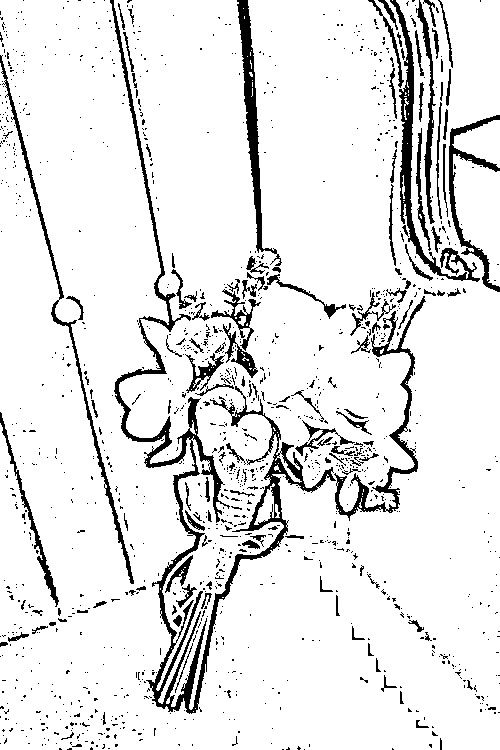

艺术、音乐、绘画，任何一处生活之美都能令我们感受到与力量同在，让我们与纷扰世界划清界限。透过宁静与自省，能得以解除压力。由于金牛座所带来知足常乐，与世无争的状态若是经由深层自我而非自动化模式的展现，那便意味着火星的力量已达成个体与更大存有之间的和解，深入大自然、生灵、万有世界，感尝沉静而持久的生命力量。火星金牛座正是将我们的意识、行动带往茂密的丛林，幽静的山岗，潺潺的溪水和月夜下的蛩鸣，透过与自然共生息的韵律去唤醒内在力量，并开始那些富有美感、质感的创造性行为。我们因此升起一份生态敏感，对物质的追求减低而不是膨胀，懂得善用每一个生活小物，用最质朴天然的样貌去装点生活的空间，也用最忠诚于生命本质的状态去迎接挑战。那便会发展出一切皆为自然的灵性意识。**迈克尔·杰克逊**迈克尔·杰克逊的火星位于金牛座 21°，他正是用艺术捍卫生命的斗士。在火星的维度里，我们可以说：**没有勇气，就没有荣誉**。而火星金牛座的他，音乐就是他的盔甲、勇气和荣誉。**这颗火星守护了他的出生星图，与他的水星、金星、天王星都形成了四分相。**这令他在这个世界发出声音感受到诸多持久、顽固的暴力阻挠，也为他的音乐艺术创造制造了不少的麻烦。

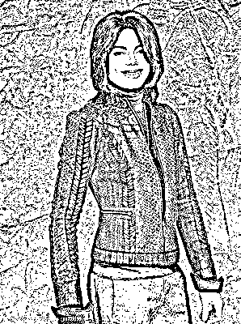

| 迈克尔·杰克逊同时，不可否认的一点，他的歌唱和舞蹈的能力都证明了他是不可多得的天才。从 80 年代到 90 年代，迈克尔·杰克逊的歌曲中最为著名的便是《We are the world》《Heal the world》。这两首歌是真正代表了他的心声，他的爱与艺术，他生命的道路。金牛座的火星守护了他的月亮南交点，从前的他就是战士，无畏、天真、热血是他灵魂的印记，哪怕冒着死亡的风险，也要努力争取和平。身处和平地带的他，从未将关注离开那些在地球上遭受贫困、饥饿、战火摧残的孩子，他一生捐出 3 亿美元，他真心爱着孩子们，爱着他的地球同胞们。正如他的歌中所写：**爱是坚强的****只有分享喜悦的人才拥有着爱****我们不只是活着而是开始真正的生活****爱让我们不断成长**在他生前曾直面的巨大的黑暗势力的威胁，他从不畏惧，他身陷危机与恐吓，但从未放下手中的“武器”——爱与音乐。迈克尔·杰克逊用音乐艺术去呼吁，避免用战争的方式去解决战争。他的途径是爱与艺术，不遗余力地呼唤着人类同胞的集体觉醒。他的音乐具有了穿越时空的力量和勇气，在他的生命结束后仍然在持续供给世界爱与勇气。他一直努力让世人明白我们所处的时代的阴影，我们所受到的生命的威胁与限制，同样地，我们拥有的爱可以战胜一切。在他的音乐里，一切如是地呈现。在他演唱会上那些疯狂拥抱着他不放手的歌迷所呈现的状态，与在灵性疗愈工作坊里的学员所经历高峰体验的状态可能是极其相似的：**在神往的爱中，心灵得到了极大的融合与满足。**

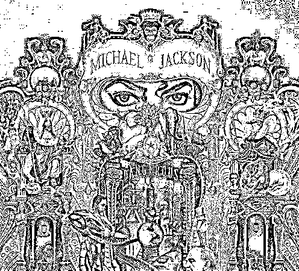

在我年少时就在听他的歌，但可惜那时的我并不太懂这个罹患白癜风的黑人在呼唤着人类的爱，用一己之力在拯救着巨大的患难。多年以后，我在很多工作坊里学习新时代意识，在疗愈中成长时，我才发现，那些我所敬仰的导师们所讲出的话，和当年迈克尔·杰克逊的歌是一样的内容。伟大的灵魂，透过生命之爱，将艺术留给世界，唤醒了灵性的力量。每个醒来的人，听到他的歌都会不自觉地流泪，因为懂得了他的柔软，更懂得了爱。**火星在金牛座的行进**

**火星六分水星**

**周期：7 月 1 日-7 月 9 日**

**重点影响人群：有个人行星、四轴、月亮交点位于白羊座、双子座、巨蟹座、狮子座、处女座、天秤座、射手座、摩羯座、双鱼座 23°-29°；白羊座、金牛座、巨蟹座、狮子****座、处女座、天秤座、天蝎座、摩羯座、水瓶座、双鱼座 0°-8°的人群。**

这个相位是火星在白羊座尾度便开始形成，伴随着水星、火星在 7 月 5 日同时换座仍然持续着。金牛座的火星与巨蟹座的水星和谐交汇的能量，**稳定了意志力、行动力，也柔化了思维和语言输出。**此时的火星着重在欲望的诉求上：**美食、性欲、感官满足会带来极强烈的驱动，促使我们做出具有承诺意义的行动。**比如为了夏天漂亮的衣裙而开始的减肥行动，为了享受美食而带来的一系列学习与调整行为。若拥有更为进化的意识与追寻，则会**关注并投入艺术化的创造中**。美学的鉴赏与习练需要时间的积累和持续的专注，金牛座的火星支持我们投入在书法、绘画、音乐技艺等需要花时间锤炼的进程中去。此时巨蟹座的水星提供了灵感、感受的精微通道，生活中感受、接收到的讯息会展现出丰富、细腻的层次。当我们能识别、聚焦于心灵感受和属于心识的反应时，便能将灵感与创造性冲动进行整合。一些疗愈方法和经典读物能帮助我们去深化细腻的身体感知，带来从现象到理论的学习与印证。**诵读经典诗歌、典籍，聆听古典音乐，欣赏细腻富有质感的画作**，都能让人专注于灵感的启发，并有助于将美的体验带入创造性工作中。

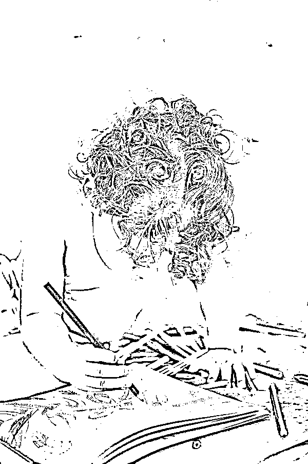

**火星合相天王星、月亮北交点**

**火天合相周期：7 月 20 日-8 月 15 日**

**重点影响人群：有个人行星、四轴、月亮交点位于金牛座、狮子座、处****女座、**天蝎座、摩羯座、水瓶座 10°-26°的人群。****

**火星合相月亮北交点周期：7 月 23 日-8 月 12 日**

**重点影响人群：有个人行星、四轴、交点位于金牛座、狮子座、处女座、天蝎座、摩羯座、水瓶座 12-25°的人群。**

火星在金牛座与天王星、月亮北交点的合相几乎是同时期发生的，我们值得将此看作一个重要的短周期进行探讨。天王星在金牛座历程过半，我们见证了房地产业空前的收缩、下滑，也看到因为疫情导致的全球金融危机正在加剧显化——**天王星在金牛座正是对准了旧有最为稳固、煯煯生辉的领域开启的革命。**金牛座如金子般闪烁、丰盛，供给人类生机与幸福。在人类历史展现的伟大光芒中，阴影也在同时呈现着。原型占星学家理查德·塔纳斯在《宇宙与心灵》中明显指出：**“说我们的全球文明正变得机能失调这一说法太过轻描淡写。灾难已经开始，因为我们的星球正在经历自恐龙灭绝以来最大规模的物种灭绝。”**当下为数不多的文化人、意识先锋、艺术家和真正的教育者已经看到并提醒这种文明的倒退，而不是进步。一直以来，全球性的、以西方文明为核心的集体进步意识在引导着人类朝向更快、更高、更强的目标。然而这个过程中，我们牺牲、丧失了与万有世界的古老联结，与神圣根源的分离。集体意识在长期持续下坠的过程中远离了与自然合一的原始状态。**科学主义、高科技被认定是唯一恒定的追求和更为先进的文明表达，这正是天王星所代表的原型之一。****这种疯狂的集体性的分离创痛在当下正以剧烈的方式显现出来，正因对于科学、对抗性意图和英雄主义的迷信，更多的人身陷痛苦而不自知，身处险境而不能自救。**自 2020 年以来，我们看到与疫情有关、无关的死亡数据剧增，但却少有人会去思索、相信这背后的黑暗。

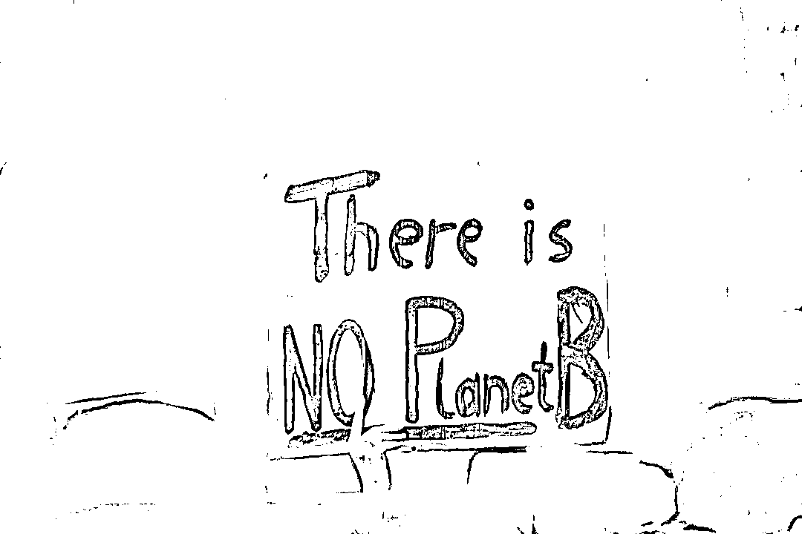

若是一个灿烂辉煌的时代，先进的全球文明怎么可能不尊重并维护生命、自然本身的权益？怎么会让大规模的死亡在眼前发生？是什么样的意识和行为导致、助长了这一系列的灾变性后果？火星属于个人的行星，它的快速、果决地让人意识到个体的重要性，让我们从集体潮流中辨识出自我的边界，经由怒火、冲突与纷争让独立个体拥有勇气和抗争力。这便是火天合相带来的突破性意义，它将触发那些开始独立思考，拥有辨识能力的人们打破旧有模式，开始逆向思维和行动，行使不曾发出过的力量，作出勇敢的声明。**火星与天王星的合相将个性化的力量带入到革新进程中。**天王星、月亮北交点同时被火星触碰，**集体的诉求被触动，集体性的事件、感知都将在这一时期引发大规模的反响**。**作为固定星座的金牛座是以持续显化的方式让我们看到事件和结果的。**由此，我们可以回想，在巨蟹座新月发生时，美国颁布的“禁止堕胎合法化”的法令，由此掀起的巨大波澜不仅代表着男权、保守派长期以来斗争的胜利，也同时代表着处于男权阴影之下的女性主义运动绝对的高潮——相信所有女性主义者都会为此继续抗争。天王星的神话直到阉割才终止。而火星的行进与天王星合相如同一种阉割的征象，这种阉割乃是**对无意识男权阉割，必须经由阉割，才会带来和平**。这个逆人性的法令颁布以后，美国一些大企业：亚马逊、苹果、微软、摩根大通等企业纷纷宣布将负担女员工出国堕胎费。

| 美国堕胎权支持者痛哭**无论是金牛座，还是月亮北交点都向我们提示了阴性能量，强化了生之权力。**任何一种人世间的权力都是指**拥有拒绝的权力，而不是顺从。**拒绝生育的权力本属于生育者，任何破坏自然法则，违背人性的措施都会再次遭受到天王星破坏性法则的摧毁、夷平。月亮北交点是集体的诉求与疗愈，火星天王星的激烈交织在此，点燃灵魂的战火，集体的焦点落在了生之权力上。若是真正为了生命的利益出发，燃烧着你护生的渴望，就无需任何一种控制、强权来限制生命自然的演化。无论任何国家、地区、民族和文化信仰，在这一轮时代性的革新进程中，我们都需要将对生命自然的敬畏放在首位，并且去顺应时代本身的变迁，而不是控制、制造激烈的革新进程。

**火星四分逆行的土星**

**周期：7 月 28 日-8 月 18 日**

**重点影响人群：有个人行星、四轴、交点位于金牛座、双子座、狮子座、处女座、天秤座、天蝎座、摩羯座、水瓶座 15°-28°的人群。**

火土四分，犹如身着紧身铠甲的战士，**由于重力、紧崩而对进攻、发力带来了重重限制，也可能因此迸发出不可限量的巨大能量。**虽然金牛座的火星不是激烈、主动的进攻力，逆行在水瓶座的土星同样不外显，此时的火土四分意味着**一种内在无法排解、调适的压力**。然而金牛座也意味着宝藏和我们已经拥有的，此时任何一种实践与行动必然显得缓慢、迟钝，但在内在压力之下，我们更容易拓展出内在空间，朝向生命的深广度，延展丰厚的心灵向度，从一个层面的痛苦内压走向更为深刻的内在整合。若要生命变得丰沃而富有，此刻的**暗地里用功**便成为了“捷径”。逆行、内化、独立的土星不过是我们对自己的要求甚高，而火星与土星是在渐盈阶段的四分，这更加**强化了个体的力量借助内在重压、阴影生长茁壮之意。**在此阶段，我们都值得**将最具创意的，新生的意识投入到实践中去，为新的生命阶段作出必要的奋斗，去努力完成内在革新的目标。**

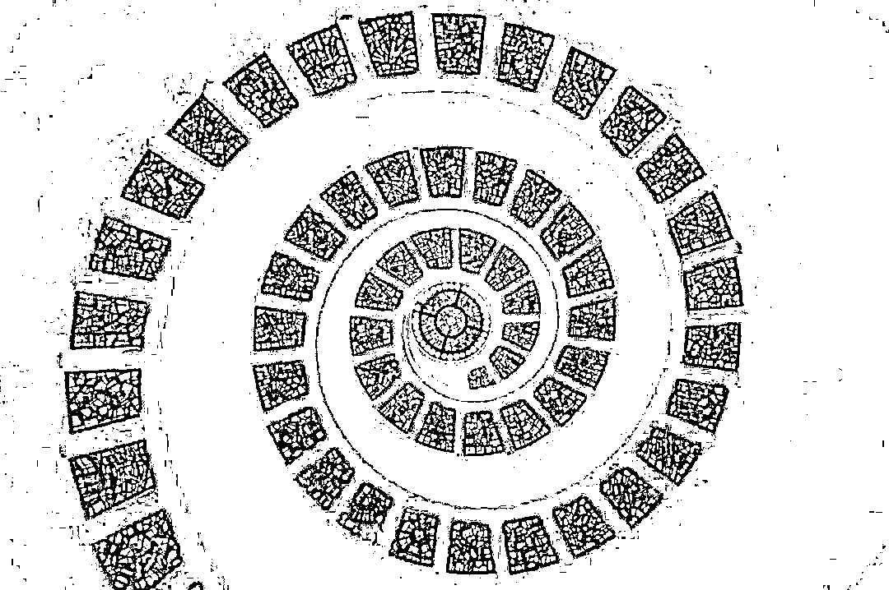

**火星六分海王星**

**周期：8 月 5 日-8 月 20 日**

**重点影响人群：有个人行星、四轴、交点位于金牛座、双子座、巨蟹座、狮子座、处女座、天蝎座、射手座、摩羯座、水瓶座、双鱼座 20°-29°的人群。**

火星与海王星提示着：**灵性战士，力量与灵感的合作，以及艺术的实践。**六分相的活跃为现实提供了更为丰富的向度与机遇。在海王星逆行期间，我们更值得透过梦境、冥想、任何一种灵性修持和经验融入充满神谕的宇宙背景中去，去学习相信你内在的灵视，心灵图景，并透过具有实践效应的灵性方法将之显化出来。比如，你曾梦到的地方，你曾相信的某个预言，或是你心之所往的某种境界，在当下，你值得去用任何一种方式接近它，到达它。不要怀疑奇迹，当你真正相信并践行的时候，说不定就实现了呢？

**火星三分冥王星**

**周期：8 月 3 日-8 月 28 日**

**重点影响人群：有个人行星、四轴、交点位于金牛座、巨蟹座、狮子座、处女座、天蝎座、摩羯座、水瓶座 19°-29°，双子座、处女座、天秤座、射手座、水瓶座、双鱼座、0°-4°的人群。**

**同在逆行中的冥王星正从 27°退回 26°，这个度数对应 2021 年 3 月-6 月以及 2022 年 1 月所发生的未能彻底完成事件的清理和转化。**

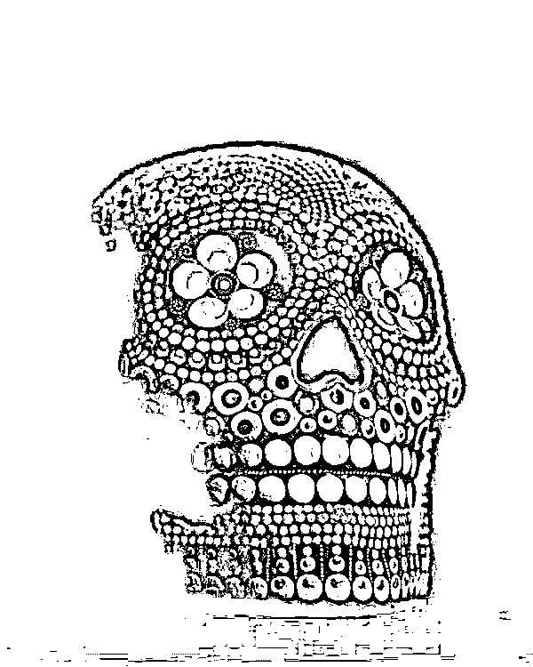

在个人层面，我们值得去**重新回顾、处理未尽事宜，尤其那些与黑暗、阴影相关的层面。**此时我们可以借用火星的勇气，径直向前，中正承接时光的折返，在能量的旋涡中转化出稳定的力量，从而完成内在成长的蜕变与告别。**火星与冥王星相互助力，深向黑暗显得尤为关键。**无论你将面对旧有情势的激烈战火，还是金钱财务有关的挫折性经历，还是情感、欲望层面极其伤痛的清理、告别，只要你相信穿越的过程就是恩典，你便能在火冥的支持下顺利通过这一命运的关卡，重获新生。失去的，告别的都将在未来成你生命中不可多得的财富，而你将得到的是前所未有的和平与宁静。愿我们都在光的指引下协同阴影去完成自我锤炼，在我们所能接受的一切发生面前，我们自己就是生命的宝藏，在我们精进于心灵的道路上，道路本身已演化出生命的光芒。

我们迎面追寻着，也同时拥有着身后的宝藏与力量。

**版权声明：**原创文章由作者授权首发于若道平台，欢迎转发，反对抄袭。友号转载请申请白名单。

**END**

**郑玮玲**

ISAR（国际占星研究协会）认证占星师（2016 年获得）

若道占星专栏作者

将占星咨询、教学与音乐、舞蹈相结合的疗愈者

**微信号**：zhengviolin

**新浪微博**：@郑玮玲

**微信公众号**：Sampriya-Astrology

长按打赏

**20 位来自世界各地的占星师****带来 19 场沙龙——新世界的觉醒****详情可点击下图**

**学习占星学****点击下图了解课程详情**

**微信又双叒叕改版啦，不想错过若道君的推送？**

**就把若道设为星标吧！**

**▼**

**喜欢就点一下“在看”吧！**

********报名直达入口********

# 从占星学角度看待疾病，我们有哪些惊人发现？

> 原文：[`mp.weixin.qq.com/s?__biz=MzA5NjA0NTAxNg==&mid=2651479335&idx=2&sn=d141dd4f3f1d38cee378946e450c39a5&chksm=8b48ef90bc3f6686376582432ddda9bd56c9c94f6c45ee937b82e39ffc7a1d0501946ac017f2&scene=126&sessionid=1692737791#rd`](http://mp.weixin.qq.com/s?__biz=MzA5NjA0NTAxNg==&mid=2651479335&idx=2&sn=d141dd4f3f1d38cee378946e450c39a5&chksm=8b48ef90bc3f6686376582432ddda9bd56c9c94f6c45ee937b82e39ffc7a1d0501946ac017f2&scene=126&sessionid=1692737791#rd)

作者/劳拉·邦德

翻译/leisha 校对/王宏

编辑/翀子 图片/网络

话说，大家知道吗？占星学里有个学派叫做医疗占星学。它是对于现代医学也有一定的助力，人们可以从星图上看出你潜在的疾病类型，从而进行预防和治疗。另外，若道开设的 ISAR 选修课《[医疗占星](http://mp.weixin.qq.com/s?__biz=MjM5MjQwNjAyMQ==&mid=2649440000&idx=5&sn=b033327a6b35034ffc8df604ad57c0f0&chksm=beb9506a89ced97c26292c16df735e7d6ba9dbbdc7f3a667e08cd930ea942437a75cd3da4dcc&scene=21#wechat_redirect)》课程也在报名中，由《医疗占星手册》的作者简·帕特里克讲授，欢迎点击链接了解详情哦。

**占星与疾病之间存在联系**

**没有占星学知识的医生不能自称为医生。**

**——现代医学之父希波克拉底**

你只需看看成千上万份刊载占星专栏的杂志和报纸，就会知道我们中很多人都深受占星学的影响。最近的一项调查发现，30-40%的美国人“相信占星学，并认为他们的人生由星体主宰。”

虽然有些人可能会把这门古老的学科贬斥为“迷信的无稽之谈”，但有证据表明占星学正在东山再起：它再次成为大学的教学科目——在英国、法国、俄罗斯、德国、美国——这是自文艺复兴以来的第一次。

但是占星学与疾病有什么联系呢？**世界著名的医疗占星师简·帕特里克**说：“**占星学可以精准定位需要解决的潜在问题**。”尽管有人想当然地认为占星学是令人沮丧的宿命论，但事实并非如此：

**有四个主要因素影响着我们的生活和健康：**基因构成、物质环境、情绪环境，以及我们的占星配置**。我们在星图中都存在患病的可能性，而预防的方法在于尽可能充分、真实和健康地生活。**

**——**简·帕特里克****

根据简·帕特里克的说法，**每个星座都有广泛的可能性**。例如，那些双鱼座的人有潜力去扮演殉道者（以他人为先）的角色，但是他们也有能力成为伟大的治疗师。

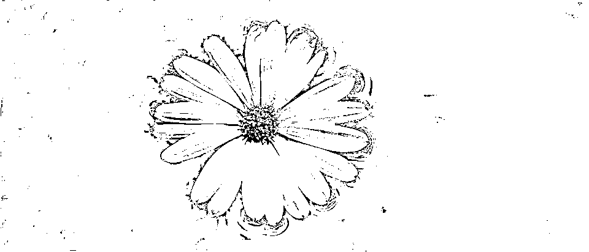

**医疗占星包含哪些内容？**

那么医疗占星咨询涉及哪些内容呢？简·帕特里克有这样的步骤：

*   **首先，会请客户提供详细的病历，以及他们出生的日期、时间和地点。**

*   **然后，绘制他们的星图，观察在他们的病情确诊之前，在占星层面和情感层面上发生过什么。**

根据简·帕特里克的说法，癌症的主要病因之一，除了有害的生活方式之外，就是未解决的情绪冲突：她通常会在症状出现前的 18 个月至 2 年间寻找触发因素。

她曾这样说：“当我为癌症患者服务时，我的任务之一就是识别出他们生活中的‘恶性肿瘤’，并帮助患者将其消除。”

**医疗占星师还可能帮助你确定做手术的最佳时间，或是指出你每个行星位置的优缺点**：比如，阵容强大的星群落入双鱼座可能与过敏有关，而巨蟹座人则可能发觉自己泡完热水澡后会疲惫不堪。

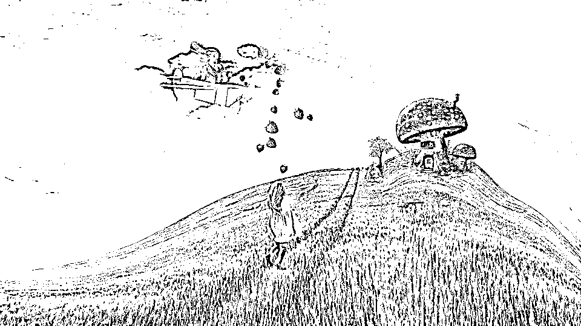

**固定星座（金牛座、狮子座、天蝎座和水瓶座）在情感和生理上都倾向于‘难以放手’，这可能为恶性肿瘤的生长创造环境。所以说，他们可能倾向于沉浸在过去的伤害中，难以自拔。另一方面，这些星座也擅长在艰难的时期坚持不懈并一直持之以恒。**

**——**简·帕特里克****

“癌症人格”中比较突出的一点通常是**难以表达情绪**，而且你可以从星图中看出这一点。“客户星图中突显的土星可能表明害怕表达自己的需求，或者害怕展现真实的自己。”（来自简·帕特里克）

发现癌症的身体部位也可能给出有关根本病因的线索。简·帕特里克曾表示：“例如，卵巢与孩童、创造力、家庭有关。所以说，如果某人患有卵巢癌，那么问题可能在于此人无法表达自己的创造力，或是无法做到滋养和关怀。”

有趣的是，母亲的癌症恰好发生在自己的孩子开始离开巢穴时。

医疗占星师可能也会查看金星在客户星图中的位置。

**金星代表使我们快乐的东西，因此如果金星得不到满足，我们就不会快乐——而不满是滋生疾病的温床。**

**——**简·帕特里克****

如果金星落入双子座（前文中母亲的案例），这表明你渴望趣味、变化、沟通、心智刺激和灵性工作。在患癌之前，这位母亲就觉得自己的生活缺乏快乐和意义。

**理解她的灵魂渴求转变——更多的旅行、更多的学习、更多的乐趣，这可以帮助和支持到这位母亲。**

她说：**“星图中的每个因素都为我们提供了广泛的可能性。所以说，重要的不是我们的遭遇，而是我们如何回应这些遭遇。”** 

**版权声明：**原创文章由若道翻译发布于若道平台，欢迎转发，反对抄袭。友号转载请申请白名单。

**END**

**ISAR 选修课【医疗占星学】上线**

**医疗占星学是一个强大的工具，同时洞察的身体和心理过程，通过更多的自我认知照顾和关爱自我和身边的人。**

**本课程既适合医疗占星学的初学者，也适合已经有一些相关经验的人****。**简·里德·帕特里克老师将运用现实生活中的例子，揭示一个人的性格、症状及其星图是如何相互映照的。课程也会探讨疾病的意义以及可能的治疗方法。

**本课程旨在为学员提供一个运用医疗占星学的框架和方法，**学员将会学到一些有价值的实用工具，在课程结束后，自己使用这些工具研究其中的关联性。

**此课程可作为 ISAR 选修课。**

**授课老师**

****简·里德·帕特里克 **博士******

**（Jane Ridder-Patrick）**

简接受过药剂师、理疗师、草药师、心理治疗师和历史学的专业学习，从事写作、咨询和讲学工作，在英国和全球教授占星学及其历史、当今的心理学和医学应用。她在爱丁堡执业，在爱丁堡大学获得博士学位，研究方向是 17 世纪苏格兰占星学历史。

**她最著名的出版物是《医疗占星手册》。2018 年，她因对医疗占星学的贡献而获得了著名的查尔斯·哈维占星学杰出服务奖。**

**对医疗占星学有兴趣？**

**点击下图了解更多详情吧**

**

**微信又双叒叕改版啦，不想错过若道君的推送？**
**就把若道设为星标吧！****▼**

**喜欢就点一下“在看”吧！**

********报名直达入口********

# 2022 年若道 ISAR 选修课 | 《医疗占星手册》作者亲授

> 原文：[`mp.weixin.qq.com/s?__biz=MzA5NjA0NTAxNg==&mid=2651479335&idx=3&sn=de4dff98e39d6f5b19c5e916457ac476&chksm=8b48ef90bc3f6686760efe104504f54cda09a4aaaf4fbd4177631bbdeb0a5cb6c365cde671c2&scene=126&sessionid=1692737791#rd`](http://mp.weixin.qq.com/s?__biz=MzA5NjA0NTAxNg==&mid=2651479335&idx=3&sn=de4dff98e39d6f5b19c5e916457ac476&chksm=8b48ef90bc3f6686760efe104504f54cda09a4aaaf4fbd4177631bbdeb0a5cb6c365cde671c2&scene=126&sessionid=1692737791#rd)

**有四个主要因素影响着我们的生活和健康：基因构成、物质环境、情绪环境，以及我们的占星配置。我们在星图中都存在患病的可能性，而预防的方法在于尽可能充分、真实和健康地生活。****——简·里德·帕特里克****（Jane Ridder-Patrick）博士**

占星学就像心灵的 X 光片。它可以描述个人对世界的看法和反应。我们越不了解自己的天性，面对生活中的挑战，我们就会有越少的选择。

**“占星学可以精准定位需要解决的潜在问题。”**

**医疗占星学是一个强大的工具，同时洞察的身体和心理过程，通过更多的自我认知照顾和关爱自我和身边的人。**

**本课程既适合医疗占星学的初学者，也适合已经有一些相关经验的人****。**简·里德·帕特里克老师将运用现实生活中的例子，揭示一个人的性格、症状及其星图是如何相互映照的。课程也会探讨疾病的意义以及可能的治疗方法。

**本课程旨在为学员提供一个运用医疗占星学的框架和方法，**学员将会学到一些有价值的实用工具，在课程结束后，自己使用这些工具研究其中的关联性。

**此课程可作为 ISAR 选修课。**

1

**课程安排**

**课程时间：2022 年 9 月 20 日-11 月 8 日  每周二 20:00-22:00**

**第*****1*****讲  9 月 20 日 与占星学、心理学、病症一起工作**

*   医疗占星学的组成部分以及如何使用它们

*   行星的作用与相互作用

*   黄道星座人

*   宫位的重要性

*   疾病和健康是如何产生的

**★ 第二、三、四讲的课程内容基于星座以及它们之间的相互作用。**

**第*****2*****讲  9 月 27 日 基本星座**

学习基本大十字星座——**白羊座、巨蟹座、天秤座和摩羯座**——及其功能和相关的健康问题。**这些星座与防御、养育、结构、体内平衡和荷尔蒙控制有关。**

****第*****3*****讲  10 月 4 日 固定星座****

学习固定大十字星座——**金牛座、狮子座、天蝎座和水瓶座**——及其功能和相关的健康问题。**这些星座与习惯和反射、心脏调节、生存、循环和协调有关。**

“固定星座（金牛座、狮子座、天蝎座和水瓶座）在情感和生理上都倾向于**‘难以放手’**，这可能为恶性肿瘤的生长创造环境。所以说，他们可能倾向于沉浸在过去的伤害中，难以自拔。另一方面，这些星座也擅长在艰难的时期坚持不懈并一直**持之以恒**。”——简·里德·帕特里克（Jane Ridder-Patrick）博士

**第*****4*****讲  10 月 11 日 变动星座**

学习变动大十字星座——**双子座、处女座、射手座和双鱼座**及其功能和相关健康问题。**这些星座与呼吸、神经系统、肠道、睡眠以及信息、情感和行动的整合有关。**

**★ 第五、六、七、八讲重点学习行星，它们在身体层面的表达、它们的相位与行进。**

**第*****5*****讲  10 月 18 日 太阳与月亮**

**太阳**掌管视觉、活力、心脏和意识，与心脏、脊柱和视觉问题相关。**月亮**掌管人体的周期，特别是月经周期、饮食模式和体液，与情绪引起的疾病、饮食失调和胃病相关。

**第*****6*****讲  10 月 25 日 土星与天王星**

**土星**掌管着皮肤、骨骼、牙齿和衰老过程。它对应的疾病包括慢性疾病、耳聋、帕金森病、关节僵硬和牙齿问题。**天王星**代表身体活动的协调，有节奏的脉动和身体的“电”。与天王星相关的疾病包括癫痫、痉挛、心律失常，以及阿斯伯格综合症和自闭症样综合症。

**第*****7*****讲  11 月 1 日 海王星与冥王星**

**海王星**掌管松果体、细胞膜渗透和右脑功能，与过敏、上瘾的病症、慢性疲劳综合症和睡眠障碍相关。**冥王星**掌管消除和转化，其病理包括毒性、脓肿、癌症和强迫症。

**第*****8*****讲  11 月 8 日 火星**

**火星是与能量和防御相关的行星**，掌管免疫系统、肾上腺功能、肌肉活动和炎症反应。**它是许多身体和情绪障碍的核心**，如自动免疫障碍、抑郁和发烧，以及由手术或需要手术引发的问题。

2

**此次课程适合哪些人？**

*   有一定占星学基础，若道核心课 L3 以上水平；

*   希望成为优秀的占星师，想要借鉴国际大师医疗占星解读思路并融入自己的体系的人；

*   热爱占星学、健康、养生的研究型占星学者；

*   计划考取 ISAR 认证占星师，寻觅中意选修课的学员；

*   走在自我探索和个人成长道路上的人。

**快来和简·里德·帕特里克老师学习升级版的占星学身体地图吧！**

3

**授课老师**

**简·里德·帕特里克 **博士****

（Jane Ridder-Patrick）

简接受过药剂师、理疗师、草药师、心理治疗师和历史学的专业学习，从事写作、咨询和讲学工作，在英国和全球教授占星学及其历史、当今的心理学和医学应用。她在爱丁堡执业，在爱丁堡大学获得博士学位，研究方向是 17 世纪苏格兰占星学历史。

**她最著名的出版物是《医疗占星手册》。2018 年，她因对医疗占星学的贡献而获得了著名的查尔斯·哈维占星学杰出服务奖。**

《医学占星术手册》（第二版，修订版和扩充版）

(爱丁堡，克拉布出版社，2006 年)

4

**课程信息**

*   **课程时间：**2022 年 9 月 20 日开始，每周二晚上 8 点，每周一次，共 8 次课。

*   **授课方式：**线上直播，英文授课，中文翻译

*   **课程价格：****6800 元**

*   **早鸟价：5800 元（截止日期：2022 年 8 月 23 日）**

*   **课程咨询：**王老师（微信：18510107057，请备注“医疗占星”）

长按二维码添加王老师

5

**退转课程**

*   **退款原则请详看《教学协议》，如有疑问请咨询课程顾问。**

****医疗占星****

**授课老师：**简·里德·帕特里克

**授课时间：**2022 年 9 月 20 日起

**授课方式：**网络课程**，**英文授课，中文翻译

**费用：****6800 元****（早鸟价：5800 元，2022 年 8 月 23 日截止）**

**课程负责人：****王老师**（微信：18510107057，请备注“医疗占星”）

长按二维码添加课程负责人咨询~

****报名请点击“阅读原文”****

# 神话塔罗之大阿卡纳牌｜正义

> 原文：[`mp.weixin.qq.com/s?__biz=MzA5NjA0NTAxNg==&mid=2651479155&idx=3&sn=e1b1825dc1f38a20af1368802ed92a19&chksm=8b48eec4bc3f67d226a8c50281dc7cf2b86593bc7a5c3ce1bc820dc6a4d86de5aa8d8d1b8d69&scene=126&sessionid=1692737791#rd`](http://mp.weixin.qq.com/s?__biz=MzA5NjA0NTAxNg==&mid=2651479155&idx=3&sn=e1b1825dc1f38a20af1368802ed92a19&chksm=8b48eec4bc3f67d226a8c50281dc7cf2b86593bc7a5c3ce1bc820dc6a4d86de5aa8d8d1b8d69&scene=126&sessionid=1692737791#rd)

作者/朱丽叶·沙曼-伯克 丽兹·格林

译者/闫东升 编辑/玫瑰 图片/神话塔罗 网络

本文节选自《神话塔罗》

在十九世纪中叶，法国神秘主义者艾利冯斯·里维使塔罗牌重新流行了起来。里维认为塔罗是古代宗教的遗迹，从埃及人传到了摩西和所罗门；他将 22 张大阿卡纳牌与 22 个希伯来字母联系起来，为每张牌赋予对应的卡巴拉（犹太教的神秘哲学）意义。今天《神话塔罗》作者将为我们道来正义牌背后的故事。

[🔈 神话塔罗·正义](https://res.wx.qq.com/voice/getvoice?mediaid=MzA5NjA0NTAxNl8yNjUxNDc5MTUz)

**｜**朗读者小巫

**书名：**

神话塔罗 

**作者：**

朱丽叶·沙曼-伯克   丽兹·格林 

**出版日期：**

2011-08-02

正义对应的希腊神祗**雅典娜·正义女神****正义女神**

正义牌呈现的是一位表情严肃、年轻美丽的女人，头戴银色战盔，身着银色铠甲，正义凛然地端坐在王座上。她的右手握着一把指向上方的宝剑，左手拎着一架天平。

她白色的头发和长袍，与两侧白色的石柱和头顶白色的门廊交相辉映。她的脚下是黑白相间的大理石块铺就的地板。一只猫头鹰栖息于她的左肩。

> **陪伴着雅典娜（*Athene*）的猫头鹰**：反映了这位女神拥有清晰的洞见，因为猫头鹰能够在夜间扑食。 
> 
> **黑白相间的地板**：反映出头脑能够把黑白两面紧密且有秩序地整合在一起。 
> 
> **天平**：象征着通过一种事物来衡量另外一种事物，从而达成公平判决的力量。据说神话中的雅典娜为人类创建了第一个陪审团。

**维护和平与文明的战略家**

在这张牌中我们遇到了正义女神雅典娜，她曾经在前面的恋人牌中出现过。

神话中雅典娜的父亲是众神之王宙斯（*Zeus*），乌拉诺斯（*Uranus*）曾经警告过宙斯说， 如果他和第一个妻子——智慧之神墨提斯（*Metis*）生了第一个孩子，那么孩子的能力将会超越他。为了防止这个预言发生，宙斯在墨提斯怀孕的时候把她吞进了肚子。

不久以后，宙斯就开始被剧烈的头痛折磨到无法忍受。为了治疗他的头疼，铁匠之神赫菲斯托斯（*Hephaistos*）用青铜斧劈开了宙斯的头颅，全副武装的雅典娜从裂开的伤口中一跃而出，并发出胜利者的欢呼。

在场的众神都被这种场景震慑，心生敬畏。雅典娜变成了宙斯最喜欢的孩子，他对她的偏爱太过明显，引起了其他众神的嫉妒。从她出生的方式就可以看出雅典娜有好战的倾向。在战争的艺术方面，她与战神阿瑞斯（*Ares*）有很多不同。雅典娜引发的战争都不是基于爱的冲突和杀戮，而是基于宇宙更高的律则，其目的是为了支持和保护真理，都具有冷静、严肃和深思熟虑的特质。她是一个战略家，而不是一个冲动的战士，她平衡了阿瑞斯象征的本能的侵略性，非常善于利用逻辑、策略和技巧。雅典娜是勇士的保护神，所以很多英雄人物都在她的羽翼之下。她为珀尔修斯（*Perseus*）、奥德修斯（*Odysseus*）和其他英雄们提供的武器和帮助，都需要有足够的智力、远见和计划才能够运用。雅典娜的贞洁是奥林匹斯众神中一个明显的例外。她还给人类提供了许多非常有价值的服务，例如她教授人类如何驯服和养育战马，还有编织和刺绣等等。她传授的东西不仅仅只是在应用层面，还是艺术创作，因此她是推动人类文明的女神，尽管必要  的时候她也是一个战神，但她一直培育和保护着人类的和平与文明。

**思考的意义，人之所以为人**

**从内在的层面来看，正义之神雅典娜的意象反映着自然界中人类独有的才能——理性思考和反思判断（*reflective judgement*）。**

对于当时的希腊人来说，这种才能是神圣的，因为它使人类和动物有了区别，因此他们构思让雅典娜从众神之王宙斯的脑袋中出生，没有和任何母性的身体联系在一起，也就是说没有了母亲所蕴含的本能和物质性（意即动物性）。

**雅典娜的正义并不是基于个人的感受，而是根据事物当时的境遇，对所有相关因素进行正义和客观地评估，并以道德准则为基础而做出的选择。**

雅典娜的贞洁可以看做是反思能力的完整性和纯洁性的象征，它不会被个人的欲望所影响。她（象征的）在文明和艺术方面对人类的引导也反映出头脑能够驾驭狂野的自然本能，并通过客观的规划和洞察来转化它。**她的战争是为了某种原则，而不是激情，那是来自头脑反思后的选择，其中的本能力量被牢牢地掌控着。**在传统塔罗的大阿卡纳牌中，有四张牌反映着“四种美德”，其中第一张就是正义牌，另外三张分别是节制、力量和隐士，它们都和人们在生命之路上才能的发展有关。从心理学的角度看，它们有助于小我（*ego*）的形成和完善，而每个人的本我都需要通过小我去体验生命中的价值感，以及利用稳定的个体身份面对生命的挑战。愚人通过了情欲和本能侵略性这两个年轻阶段的巨大挑战之后，就必须要形成和完善他的人格和才能了，只有发展出健康完善的人格和才能［也就是个体（*individual*）的形成过程］，他才能在日后的人生之路上从容应对。

所以当愚人遇到正义之神雅典娜的时候，他必须学会清晰地思考和培养出平衡、冷静的思维能力。

在恋人牌的时候，他还没有举一反三和比较的能力，所以没办法做出公平的判断。如果我们不尊重和遵守公平、平等和服从真理这些道德原则，就无法通过正义之神雅典娜的考验，自然也无法获得他人的尊重和欣赏。

**雅典娜带离我们走出了纯粹的自然本能，以人类独有的思想和精神之躯独立于天地之间。**

**正义，理性的双刃剑**

**从解牌的角度来看，正义牌的出现预示着当事人用冷静和客观的思考做出了公正的决定。**但是就像雅典娜手中的利剑一样，这张牌的意象也是一把双刃剑。

在生活的很多层面上，雅典娜冷静的反思能力可能显得过于冷漠和理想主义，对于个人的关系领域缺乏应有的温情。

她的利剑在某些情境下，可能会因为普世性的真理而伤害到心灵，所以正义牌和其它所有大阿卡纳牌一样，带有明显的矛盾性。愚人必须发展出雅典娜所代表的正义，但是却不能停留在她纯洁的圣殿中，因为还有下一个“美德”等着他去学习。

**版权声明：**本文由《自在园》授权发布，欢迎转发，反对抄袭。友号转载请申请白名单。

**朱丽叶·沙曼·伯克**从 20 世纪 70 年代早期开始，就对塔罗牌产生了兴趣，并踏入了塔罗的世界。后来，在丽兹·格林的鼓励下，开始研习心理占星学和塔罗。1984 年，第一本书《塔罗全书》（The Complete Book ofTarot）出版。之后，与丽兹·格林合作设计并撰写了《神话塔罗》（The Mythic Tarot）。朱丽叶写了十本塔罗和占星学书，包括一本名为《众星的传说》（Stories from the Stars）的儿童读物，以及与丽兹·格林合著的《神话之旅》（The Mythic Journey），这是一本详细讲述如何运用神话来指导生活的书。

**点击下图了解课程详情** 

**微信又双叒叕改版啦，不想错过若道君的推送？****就把若道设为星标吧！****▼**

**喜欢记得点一下在看哦☟**

************报名直达入口************

# 神话塔罗之大阿卡纳牌｜倒吊人

> 原文：[`mp.weixin.qq.com/s?__biz=MzA5NjA0NTAxNg==&mid=2651479155&idx=4&sn=0702ca60ba7fa5e2659fd25f4d25c17d&chksm=8b48eec4bc3f67d2ad87ebd2ea83c87387641040c294f23f2ccd90264c3bd2135f311fb7255c&scene=126&sessionid=1692737791#rd`](http://mp.weixin.qq.com/s?__biz=MzA5NjA0NTAxNg==&mid=2651479155&idx=4&sn=0702ca60ba7fa5e2659fd25f4d25c17d&chksm=8b48eec4bc3f67d2ad87ebd2ea83c87387641040c294f23f2ccd90264c3bd2135f311fb7255c&scene=126&sessionid=1692737791#rd)

作者/朱丽叶·沙曼-伯克 丽兹·格林

译者/闫东升 编辑/玫瑰 图片/神话塔罗 网络

本文节选自《神话塔罗》

神话是文艺复兴时期的思想精髓，窥见了隐藏在塔罗牌神秘意象背后的意义。超越了过去四千年文化和意识变迁的塔罗牌，像旧时的记忆体系一样，让我们与古老且永恒的架构建立起联结感。 为了与自己毫不相干的人类，身为神的普罗米修斯背叛了同族，为何他受到宙斯严酷的惩罚依旧无悔？倒吊人这张牌，会为你解答。今天就来解读大阿卡纳牌——倒吊人。

[🔈 神话塔罗·倒吊人](https://res.wx.qq.com/voice/getvoice?mediaid=MzA5NjA0NTAxNl8yNjUxNDc5MTU0)

**｜**朗读者小巫

**书名：**

神话塔罗 

**作者：**

朱丽叶·沙曼-伯克   丽兹·格林 

**出版日期：**

2011-08-02

倒吊人对应的希腊神祗**普罗米修斯·先见之神****先见之神**倒吊人的牌面描绘的是一个褐色头发和胡须的成熟男人。尽管他被扭曲地束缚着，倒挂于荒芜的悬崖上，全身几乎赤裸，但是表情非常平静。他身后的悬崖上隐约可见都是凹凸不平的岩石，山崖后面落日的血红色光芒照亮了他的身体，因此可以看清他面部的表情。在他的上面，一只老鹰正在飞来。 

> **落日**：象征着意识和意愿的光亮已经在渐渐消逝中。**普罗米修斯（*Prometheus*）的姿势**：暗示着头脑——理性思维已经不再掌控，就像落日的隐喻，这幅图画象征着精神之光已经要降入潜意识的黑暗中。 **神话中被宙斯（*Zeus*）的鹰袭击**：都与希望和精神的内容有关，因此普罗米修斯的痛苦是失去信仰的意象，在神秘学的教诲中被称为“灵魂的暗夜（*dark  night  of  the soul*）”，此时的当事人只能等待，没有自信的愿景，也不知道一切如何结束。

**叛神的普罗米修斯**

在这里我们遇到了普罗米修斯，他是泰坦（*Titan*）巨神的一员，帮助宙斯制定了律法，他还从神那里偷来火种送给人类，而且完全知道他会为此付出的代价。普罗米修斯这个名字意思是“先见之明”，作为一个泰坦巨神，他拥有预言的能力。

在神话中，据说是普罗米修斯用土地和自己的眼泪混合在一起创造了人类的躯体，雅典娜用呼吸赋予了人类生命力。普罗米修斯对人类有着深深的同情，因为是那是他一手创造的。

宙斯认为自己统辖的神之国度才是至高无上的，人类世界不配拥有神圣的火元素，于是他把火从人类手中拿了回来。没有了火就意味着人类没有了光明和发展的可能，只能像动物一样躲在山洞中，吃着生肉。

普罗米修斯用空心茴香秆从赫菲斯托斯（*Hephaistos*）的火炉中偷取了一些圣火，并把它带到了人类世界中。宙斯对这次盗窃行为非常愤怒，决定用洪水毁灭人类，他的愤怒不仅仅因为神的骄傲，还有一些恐惧，因为人类拥有了火，就可以像神一样地存在于天地间。普罗米修斯知道这个消息后，就警告儿子杜卡利恩（*Deucalion*），于是杜卡利恩修建了一艘方舟，和妻子芘拉（Pyrrha）生活在上面。灭世大洪水持续了九天九夜，第十天洪水停止的时候，杜卡利恩给宙斯献上了虔诚的祭祀。众神之王宙斯被他的行为打动，答应了他的请求，让人类可以重新在大地上生活。

宙斯并没有轻易地赦免普罗米修斯，因为他拥有预言的能力，宙斯决定用一根无法被摧毁的锁链，把普罗米修斯倒挂着束缚在高加索山（*Caucasus*）的悬崖上。

每天一只老鹰都会飞去吞食普罗米修斯的肝脏，而每晚他的肝脏又会重生，所以他的痛苦会永无尽头。

三十年以后，在宙斯的允许下，英雄赫拉克勒斯杀死了老鹰并销毁了锁链，救下了普罗米修斯。在人类眼中，他是永生之神，是给人来带来光明和赐福的恩人，所以人们经常举行庆典，用身披锁链的方式来纪念他。

**灵魂暗夜中的无尽等待**

**从内在的层面来看，倒吊人——普罗米修斯是为了更高的利益而牺牲自我的志愿者意象。**牺牲的东西可能是身外之物，也可能是内在的态度，但是它一定出于自愿，而且也会全然接纳牺牲所带来的苦难。

在命运之轮牌中，愚人遭遇了出乎意料的改变，对于整个生命旅程来说，意义非常深远。

我们和愚人一样，对于此类改变的反应千差万别。有些人不能适应改变，一味想紧紧地抓住过往的生活。还有些人变得悲观和痛苦，认为是命运、神灵、社会或者他人给自己带来了噩运。

普罗米修斯象征着每个人内在的远见性，我们必须依靠它去了解什么样的改变能够把我们内在的生命蓝图落实到外在的生活中。因此，这位泰坦巨神（*Titan*）代表着为了命运之轮背后的神秘核心而自愿牺牲奉献的态度。

**倒吊人——普罗米修斯还暗示着全然地接纳黑暗中的等待。**他倒挂在危险的悬崖上，不知道自己牺牲的结局是什么，为此他可能内心充满了焦虑和恐惧，但表情却云淡风轻。他最后终于被解救，倒悬于悬崖的惩罚改变了他与神界的关系，也改变了他自己，最后他还是获得了永生。**从很多层面上来说，普罗米修斯的意象和放弃掌控有关，他放弃掌控的目的是为了一种全新的、更高的生命力量得以显现。**因为普罗米修斯制造了人类，所以可以说他也是人类，是我们内在富有远见的精神性，我们能够通过他去看到更伟大的可能性，因此愿意抛弃（或奉献）所拥有的过去，从而获得更伟大的意识力量。普罗米修斯开始的时候是非常脆弱的，因为我们如果带着信任去牺牲过去，就要完全地对着生命敞开，那么生命也许会伤害我们。但是当我们无法支撑自己，想要去探索究竟是什么在背后支撑我们的时候，放弃防卫、踏上孤独之旅和自我质疑就是非常必要的了。这就是宗教里所谓的真正的信仰，它必须通过生命的冒险才能获得。**倒吊人牌是命运之轮牌的必然结果，因为它暗示着我们必须自愿去相信“  他者（*Other*）”，因为“他者”比自我（*ego*）更有智慧，“他者”也是我们发展的必经之路。****倒吊人，自我牺牲的意义所在**

**从解牌的角度来看，倒吊人——普罗米修斯预示着当事人为了获得某种更大价值的事物，必须要自愿地做出牺牲。**这可能意味着当事人要牺牲或放弃某种之前曾给他（她）带来安全感的外在事物，这样才能留出空间发展出更大的潜力。

或者它也可能意味着当事人要放弃或牺牲一种自己一直持有的态度，例如智力上的优势和优越感；某种无法释怀的憎恨；或者对于某种不切实际幻想的顽固追寻。

就这样，愚人用看不到的潜意识力量和等待来应对命运之轮的挑战，他常常焦虑和恐惧，但却一直抱着生命将会更新鲜和更美好的希望。

**版权声明：**本文由《自在园》授权发布，欢迎转发，反对抄袭。友号转载请申请白名单。

**朱丽叶·沙曼·伯克**从 20 世纪 70 年代早期开始，就对塔罗牌产生了兴趣，并踏入了塔罗的世界。后来，在丽兹·格林的鼓励下，开始研习心理占星学和塔罗。1984 年，第一本书《塔罗全书》（The Complete Book ofTarot）出版。之后，与丽兹·格林合作设计并撰写了《神话塔罗》（The Mythic Tarot）。朱丽叶写了十本塔罗和占星学书，包括一本名为《众星的传说》（Stories from the Stars）的儿童读物，以及与丽兹·格林合著的《神话之旅》（The Mythic Journey），这是一本详细讲述如何运用神话来指导生活的书。

**点击下图了解课程详情** 

**微信又双叒叕改版啦，不想错过若道君的推送？****就把若道设为星标吧！****▼**

**喜欢记得点一下在看哦☟**

************报名直达入口************

# 神话塔罗丨一种古老的疗愈工具，也帮助我们与潜意识进行链接

> 原文：[`mp.weixin.qq.com/s?__biz=MzA5NjA0NTAxNg==&mid=2651479155&idx=2&sn=30b05252ede57fdf0ae04f4cbf603312&chksm=8b48eec4bc3f67d2fde51625760ca3aa342209a7f2f9f0cdba9abf82eebf2d4ca92aa9d9d48f&scene=126&sessionid=1692737791#rd`](http://mp.weixin.qq.com/s?__biz=MzA5NjA0NTAxNg==&mid=2651479155&idx=2&sn=30b05252ede57fdf0ae04f4cbf603312&chksm=8b48eec4bc3f67d2fde51625760ca3aa342209a7f2f9f0cdba9abf82eebf2d4ca92aa9d9d48f&scene=126&sessionid=1692737791#rd)

1

**塔罗牌是什么？**

**它是用来干嘛的？**

塔罗牌是一种**古老的疗愈工具**，同时也是**直观的解惑工具****；**

塔罗牌绕过逻辑思维，**和潜意识联结**，通过图像的方式生动地将隐藏在人类潜意识中的画面浮出水面，**揭示心灵的状况和运作****；**

塔罗牌**帮助我们和潜意识对话**，可以和现代的心理治疗联系在一起，帮助我们**看清心灵的冲突来源、本质和可以选择的道路；**

塔罗使用的过程并不繁琐，通过**“提问、洗牌、抽牌、解牌”**的方式来显现你的潜意识，给予问题明确的分析和建议。

2

**塔罗原理是什么？**

**它为什么这么准？**

塔罗是通往意识的工具，通过图画**帮助我们和潜意识对话**，可以和现代的心理治疗联系在一起，帮助我们**看清心灵的冲突来源、本质和可以选择的道路**。塔罗的心理投射也对应荣格的**“共时性原理”**：看似偶然的事物之间有着必然的联系。塔罗牌又和更广阔的**宇宙生命原型**联结，彰显**个人生命发展的阶段**，将个人**生命挣扎、内在冲突**放在生命进化的道途上，让更广大的生命智慧为个人成长照亮道路。

3

**塔罗预测是什么？**

**它如何帮助我？**

塔罗牌预测的运作就像是**照向心灵的一面镜子**。在塔罗牌解读时，图像的原型性质穿透隐藏的潜意识脉络，反应出与个人境遇相关但又未被了知的知识与洞见，因此**揭示出按照任何理性方式都无法发现的事情**。塔罗可以在你人生各个阶段，基于不同状态，针对具体困惑给予指引的神奇工具，运用古老的智慧工具**解码人生卡点，多维度去看待问题和生命的全貌性，推敲心理动线，更好地梳理生活。**如果你对生命好奇，塔罗学习会帮你**打开一扇通往未来的门**，让你了解**心灵运作和显化的秘密**，同时赋予你更多关于生命成长的支持和指引的能力！

4

**什么是神话塔罗？**

**它和其它塔罗有什么区别？**

神话通过**图像和故事**描绘人类生活的**原型模式**。通过瑰丽的想象、诗意的语言、栩栩如生的人物和故事描绘出我们内心的世界，表达出我们经历的那些实现人性的过程，帮助我们将**个体的生活与人类古老且永恒的故事**建立联结。从而在更深处**理解生命**，并学习**古老而长青的生命智慧**。跟其他塔罗相比，神话塔罗在**塔罗体系**基础上融合了**神话原型、占星原型、心理学原型。**学习、解读、内在成长的**维度更丰富立体。****神话塔罗**取材于**希腊神话**的无尽沃土，通过故事提供一种**记忆辅助**，在心理和预见层面提升解读的**丰富度**。因为这样更符合塔罗牌的性质，符合人类的想象。**按照故事思考，而不是简单的记忆关键词和固定的意义**。

5

**神话塔罗难学么？**

**能不能快速上手？**

神话塔罗认证课程，**不需要任何塔罗、占星、心理、神话基础**，这些知识朱丽叶老师都会在课程中教授，“兴趣是最好的老师，坚持是最大的成功。”塔罗咨询这项门栏不高，却能带来多重回报的“冷门技能”已经被越来越多人发觉，如果你为之心动，不如赶紧行动，初学者在经验丰富的导师教导下学习成果事半功倍，是小白亦能够掌握的课程，只要配合学习进度，不存在学不会的情况**，录播课有专业助教答疑，直播课老师亲自答疑，案例督导，****让你更自信的开展咨询工作，学以致用。**

6

**哪些人适合学神话塔罗？**

**为什么学神话塔罗？**

**1、对塔罗感兴趣的学员**，与其自习研究弯路多多，不如一步到位系统学习；**2、占星咨询师，**可以丰富咨询维度，通过图像更深入的和个案沟通交流；**3、心理工作者**，塔罗牌的原理本身也是心理投射，用于心理辅导是很棒的互动工具；**4、看重授课老师专业水平和能量层级的学员，**神话塔罗创始人亲授，金牌背书；**5、希望更加了解自己和他人内心世界**，想掌握这个疗愈工具自我探索和成长，帮助有困惑的人；**6、成为专业的塔罗师**，想从事这份事业，不论是兼职或全职，增加收入，打造长久稳定抗风险的现金流。

7

**神话塔罗咨询前景？**

**为什么看好它？**

塔罗行业现状鱼龙混杂，有的塔罗爱好者未经过系统学习，无占卜实力，占卜依赖“说明书”一知半解靠运气解读，无法积累实占经验和个人信誉。神话塔罗进入中国市场不久，由创始人亲自教授，**知识体系扎实靠谱，咨询技术纯正丰富，市场认可度高**，让您**无忧起步**，自信的在自我成长过程中成为他人的**塔罗照路人**。有些朋友经过系统的塔罗课程学习后成为**杠杆青年**，将塔罗咨询作为**副业**，无需店面，工作之余在家里就可以进行咨询，多一分收入欣喜满足。也有些学员完成课程后将塔罗咨询发展成**全职事业**，拥有自己的工作室，整合微信、微博、小红书、短视频等自媒体运营，线上线下年收益百万。**疫情环境下，副业刚需**，对于我们未来的事业需要有所规划，而塔罗咨询符合理想职业的所有条件，上手快、无需固定办公地点，是随时随地可接单的自由职业，经营打造属于自己长久稳定可发展的现金流。

8

**神话塔罗认证是什么？**

**如何获得高含金量认证？**

2022 年超高含金量的神话塔罗认证课程强势回归课程内容体系让你**直观精准**的感受**神话塔罗的魅力**扎实的建构**神话塔罗思维****系统**学习**最地道的塔罗知识****联报全阶课程，学成可获得有神话塔罗创始人颁发的****英国神话塔罗认证证书****，也是****若道塔罗毕业证书。****行业内超高含金量双背书。****若道还为塔罗学员开发了****“神话塔罗”APP****，是随身的工具，更是接咨询的平台，****录播课程****学成入驻平台****即可链接更多塔罗个案，发展壮大你的塔罗咨询事业。**

**如果你想学习塔罗，什么样的老师会让你怦然心动呢？她是三副塔罗牌的设计者，写了 6 本塔罗书籍。她研习塔罗四十余年，教授塔罗三十余年，是丽兹·格林的密友。还有****谁会比塔罗牌设计者更了解塔罗的历史、灵魂与精髓？****所以，这将是你开启塔罗之旅最坚实的一步。**

9

**你将跟随哪位大师学习神话塔罗？**

**我的老师是谁？**

****

**朱丽叶·沙曼-伯克** 

*   她是**3 副塔罗牌**的**设计者****——**神话塔罗牌、沙曼–卡塞利塔罗牌、“自己着色”塔罗牌；

*   她出版了**6 本塔罗书****——**《塔罗全书》、《新塔罗全书》、《众星的传说》、《理解塔罗牌》、《精通塔罗牌》、《塔罗初学者指南》；

*   她研习塔罗**四十余年；**

*   她教授塔罗**三十余年**；****

*   她是**丽兹·格林**的密友，两人合著了**《神话之旅》**，共同设计了**神话塔罗牌**。

*   她是认证的**心理治疗医师；**

*   她深谙**塔罗、占星学、心理学和神话学。**

**如果你想成为拥有英国神话塔罗认证的塔罗师**

那么她，就是你**最好的老师人选**

10

**神话塔罗认证课程的课程结构？**

**怎么上课？**

课程中老师传授**将神话、占星、心理学完美融合进塔罗**的人本主义咨询体系，并进行**学员案例督导**，让你更自信的开展咨询工作，学以致用。

本期认证课程采取**即报即学的录播课+案例督导直播课**的形式，

*   **18 节录播课：**精编剪辑，随来随学，助教答疑，学练结合。

*   **8 节直播课：**融会贯通，神话心理，塔罗占星，咨询技巧。

为了适配大家的各种学习场景，提高学习&复习效率，我们还将**录播课**剪辑了**中文字幕版**和**翻译音频版**：

*   **中文字幕版：**朱丽叶老师英文原声配中文字幕，适合在手机或电脑前专心致志的学习。

*   **翻译音频版：**翻译老师幼婷的中文原声纯享，适合运动、通勤路上耳机里陪伴式学习。

11

**神话塔罗认证课程报名流程**

**怎么报名？**

**报名流程如下：****1、报名****添加课程顾问，报名，交学费，进入学员群，邮寄学习工具。****2、开始学习****成功报名，18 节录播课程立即开通，学习过程有困惑可在 APP 内提问，有专业助教答疑，8 节直播课 8 月 10 日开课，录播课和直播课都是朱丽叶·沙曼-伯克老师亲授。****3、入驻平台****学习完录播课程，即可提交咨询案例申请入驻咨询平台。****4、结业证书**学习完直播+录播课程，提交毕业咨询案例，朱丽叶老师批阅通过，即可获得**神话塔罗认证证书。**

12

**具体在神话塔罗认证课程中学习什么？**

**课程大纲**

**录播课（即报即学）**

**☆****初阶：神话塔罗详解**

**神话故事和预测意涵**

**第 1 讲 塔罗牌介绍 ，讲述它的历史 （中文字幕版）**

**第 1 讲 塔罗牌介绍，讲述它的历史（翻译音频版）**

**第 2 讲 星座形态、元素和宫廷牌&基本星座与基本国王 （中文字幕版）**

**第 2 讲 星座形态、元素和宫廷牌&基本星座与基本国王（翻译音频版）**

**第 3 讲 固定星座与固定王后（中文字幕版）**

**第 3 讲 固定星座与固定王后（翻译音频版）**

**第 4 讲 变动星座与变动骑士（中文字幕版）**

**第 4 讲 变动星座与变动骑士（翻译音频版）**

**第 5 讲 小阿尔卡那牌权杖（中文字幕版）**

**第 5 讲 小阿尔卡那牌权杖（翻译音频版）**

**第 6 讲 小阿尔卡那牌圣杯（中文字幕版）**

**第 6 讲 小阿尔卡那牌圣杯（翻译音频版）**

**第 7 讲 小阿尔卡那牌宝剑（中文字幕版）**

**第 7 讲 小阿尔卡那牌宝剑（翻译音频版）**

**第 8 讲 小阿尔卡那牌星币（中文字幕版）**

**第 8 讲 小阿尔卡那牌星币（翻译音频版）**

**第 9 讲 经典牌阵教学讲解（中文字幕版）**

**第 9 讲 经典牌阵教学讲解（翻译音频版）**

**第 10 讲 牌阵解读案例演示（中文字幕版）**

**第 10 讲 牌阵解读案例演示（翻译音频版）**

**☆****中阶：神话塔罗牌阵应用**

**神话****解读和咨询技巧**

**开启神话塔罗愚人之旅**

****

**第 1 讲 愚人、魔术师、女皇、皇帝（中文字幕版）**

**第 1 讲 愚人、魔术师、女皇、皇帝（翻译音频版）**

**愚人**：永恒的少年（儿童的原型）

**魔术师**：恶作剧者、老师、向导、沟通者的原型；行星：水星。

**女王**：母亲、养育者、丰产的原型；行星：金星在金牛座；小行星：谷神星。

**皇帝**：父亲、供养者、计划者的原型；行星：木星。

**第 2 讲 女祭司、教皇、恋人、战车、正义、节制（中文字幕版）**

**第 2 讲 女祭司、教皇、恋人、战车、正义、节制（翻译音频版）**

**女祭司**：处女——等待被实现的潜力原型；行星：新月。

**教皇**：疗愈者、受伤的疗愈者、牧师的原型，牧师是神与人之间的灵性桥梁；行星：凯龙星。

**恋人**：爱、爱人、所爱之人的原型；行星：金星在天秤座。

**战车**：战争、冲突、战士、斗士的原型；行星：火星。

**正义**：智慧、兵不血刃的胜利的原型；星座：处女座；小行星：智神星。

**节制**：关系、合作的原型；星座：巨蟹座、双鱼座。

**第 3 讲 力量、隐士、命运之轮、倒吊人、死神（中文字幕版）**

**第 3 讲 力量、隐士、命运之轮、倒吊人、死神（翻译音频版）**

**力量**：力量的原型；星座：太阳在狮子座。

**隐士**：晚年、耐心的原型；行星：土星。

**命运之轮**：命运女神与命运的原型。

**倒吊人**：牺牲与有意识的牺牲的原型；行星：海王星。

**死神**：死亡、终点和起点的原型；行星：冥王星。

**第 4 讲 恶魔、高塔、星星、月亮、太阳（中文字幕版）**

**第 4 讲 恶魔、高塔、星星、月亮、太阳（翻译音频版）**

**恶魔**：阴影、人类不文明的面向、本能、欲望天性；行星：火星在天蝎座。

**高塔**：改变、分裂瓦解的原型；行星：天王星。

**星星**：希望的原型。

**月亮**：无意识的原型；行星：暗月。

**太阳**：意识、创造力和文明的原型；行星：太阳。

**第 5 讲 审判、世界（中文字幕版）**

**第 5 讲 审判、世界（翻译音频版）**

**审判**：复活、新生的原型；行星：水星作为灵魂向导普绪科蓬波斯。

**答疑与讨论，学员们分享对自己或客户的塔罗解读，对神话塔罗牌进行更多探讨。**

**世界**：整体、完成和个性化的原型。

**第 6 讲 经典牌阵教学讲解（中文字幕版）**

**第 6 讲 经典牌阵教学讲解（翻译音频版）**

**第 7 讲 咨询案例演示：为一位年轻女性所做的四次解读（中文字幕版）**

**第 7 讲 咨询案例演示：为一位年轻女性所做的四次解读（翻译音频版）**

**第 8 讲** **引导式冥想、荣格的四种意识功能（中文字幕版）**

**第 8 讲 引导式冥想、荣格的四种意识功能（翻译音频版）**

**☆****高阶：神话塔罗直播督导课**

**第 1 讲 塔罗牌中的荣格原型**

**2022 年 8 月 10 日（周三）**

我们将学习荣格是如何理解原型，以及荣格原型如何反映在塔罗牌中。对塔罗牌解读而言，理解原型的普遍性非常有帮助，因为这有助于塔罗咨询师碰触客户的内心世界。

**第 2 讲 塔罗牌是如何与行星原型和其原型体验联系在一起**

**2022 年 8 月 24 日（周三）**

大阿卡纳牌反映了行星神祗的原型，在某些情况下，原型经验意味着它们反映了所有人类的经验。我们将通过这个角度看这些大阿卡纳牌。我们将看到理解原型对解读有何帮助。

**第 3 讲 荣格意识的四种功能与小阿卡纳牌的四种元素及与权杖、星币、宝剑、圣杯四套牌之间的联系**

**2022 年 9 月 7 日（周三）  **

我们将看看小阿卡纳从 1 到 10 如何反映荣格意识功能的各个方面，以及它们如何反映在四套牌四个元素和其心理方面。我们还将对 1-10 的数字学进行修正，看它们在元素中的表现方式。

**第 4 讲 占星学中的 12 星座和宫廷牌之间的联系**

**2022 年 9 月 21 日（周三）**

我们将讨论形态和星座，以及它们如何反映在宫廷牌上。

**第 5 讲 马蹄牌阵学员案例督导**

**2022 年 10 月 19 日（周三） **

**第 6 讲 六芒星牌阵学员案例督导**

**2022 年 11 月 2 日（周三） **

**第 7 讲 凯尔特十字学员案例督导**

**2022 年 11 月 16 日（周三） **

****

**第 8 讲 三个牌阵学员完整案例督导**

**2022 年 11 月 30 日（周三）**

**认证阶段：考试论文**

录播课学习完毕，即可入驻若道神话塔罗 APP，以实习塔罗师获得推广流量，对接塔罗咨询个案。

直播课+录播课学习完毕，提交考试论文通过即可获得获得英国神话塔罗认证证书，升级为认证咨询师。

**入驻塔罗平台**

13

**适合人群**

*   塔罗初学者，完全没有塔罗基础；

*   塔罗自学者，也曾上过塔罗工作坊，但仍不懂如何使用塔罗牌；

*   塔罗进阶学习者，有塔罗基础，了解 78 张塔罗牌含义；

*   不知如何解决遇到的情感困惑、职业选择、人际问题，对人生感到迷茫；

*   想要学习深入解读塔罗牌、牌阵的使用、咨询技巧等将塔罗运用于咨询实践；

*   想要深入了解和学习塔罗，希望成为专业的塔罗师；

*   想要借助塔罗进行心灵、灵性成长。

14

**导师简介**

**朱丽叶·沙曼-伯克**

**朱丽叶·沙曼-伯克**从 20 世纪 70 年代早期开始，就对塔罗牌产生了兴趣，并踏入了塔罗的世界。后来，在丽兹·格林的鼓励下，开始研习心理占星学和塔罗。

1984 年，第一本书《**塔罗全书**》（*The Complete Book ofTarot*）出版。之后，与丽兹·格林合作设计并撰写了《**神话塔罗**》（*The Mythic Tarot*），在这本书中，她们将古希腊神话与传统塔罗解读结合起来。朱丽叶写了**十本塔罗和占星学书**，包括一本名为《众星的传说》（*Stories from the Stars*）的儿童读物，以及与丽兹·格林合著的《神话之旅》（*The Mythic Journey*），这是一本详细讲述如何运用神话来指导生活的书。

15

**课程价格**

**认证课程总价：****22000 元**

**联报优惠价：****19000 元**

**限时转发优惠价：18000 元（联系 Echo 老师，获取限时转发优惠价）**

长按二维码添加客服 Echo 老师

9

**退转课程**

*   **退款原则请详看《教学协议》，如有疑问请咨询课程顾问。**

**神话塔罗认证课程**

**授课老师：朱丽叶·沙曼-伯克**

**授课时间：录播课即报即学，直播课 2022 年 8 月 10 日起**

**授课方式：**网络课程**，**英文授课，中文翻译

**费用：****认证课程总价：****22000 元；****联报优惠价：****19000 元；****限时转发优惠价：18000 元**（联系 Echo 老师，获取限时转发优惠价）

**课程负责人：Echo 老师**（微信/手机：nodoor18518412824，请备注“神话塔罗”）

长按二维码添加课程负责人咨询~

****报名请点击“阅读原文”****

# 若道周运 7.4-7.10 丨放慢脚步，试着深思熟虑后再行动吧！（内含 12 星座运势）

> 原文：[`mp.weixin.qq.com/s?__biz=MzA5NjA0NTAxNg==&mid=2651479155&idx=1&sn=de8a35fd7d01827ca7377cdd7c36ff51&chksm=8b48eec4bc3f67d25c89a1b5d1a2d9b5eaa8e341b0726db4f1b01077a8df7a34a3acea918ccb&scene=126&sessionid=1692737791#rd`](http://mp.weixin.qq.com/s?__biz=MzA5NjA0NTAxNg==&mid=2651479155&idx=1&sn=de8a35fd7d01827ca7377cdd7c36ff51&chksm=8b48eec4bc3f67d25c89a1b5d1a2d9b5eaa8e341b0726db4f1b01077a8df7a34a3acea918ccb&scene=126&sessionid=1692737791#rd)

******☆ ****后台回复“今日”，给你一句生命态度******

作者/苏黎 ISAR 认证占星师
编辑/翀子 封面/书君 图片/网络本周，火星进入金牛座、水星进入巨蟹座，我们学习放慢行动脚步，学会深思熟虑，观察生活中的隐藏的各种细节。有的是机会，有的是危机，就看我们如何行动，承担自己的责任。12 星座如何借助“宇宙之力”度过本周？让我们来看文章吧！（如果着急看 12 星座运势，不妨先拉到最后哦）**整体氛围**

随着六月土星、海王星的逆行，七月第一周两颗行星的换座，**预示着生活中某种能量放缓、谨慎和深思熟虑，**而不是带着夏日的匆忙和狂躁。

我们当下的生活和传播的语境，让我们见识到社会的割裂、斗争、激情和各种情绪的展现。我们个体的情绪、行动、对未来的信念也在无意识地陷入一种更新换代和反思自我的过程。

炎炎夏日，白羊座的火星行进，激活了我们内在的欲望、情绪和行动力的能量。土星、海王星的逆行是我们学习的功课。

我们在赫拉克勒斯的征服之旅中，学习到斗争不是用蛮力，也不是仅有行动。**当本周火星进入金牛座、水星进入巨蟹座时，我们需要学习放慢行动脚步，学会深思熟虑，观察生活中的隐藏的各种细节。**有的是契机和机会，有的是危机，就看我们如何行动，承担自己的责任。

前两日，我将新购的睡莲插入瓶中，紫色的睡莲含苞待放，花苞闭合。早上起来练习瑜伽，发现睡莲紧闭花苞开始慢慢绽放，九点多钟，花朵逐渐绽放盛开，那一刻，我听到了开花的声音，睡莲展现柔美的笑容，紫色的花瓣，黄色的花蕊，阳台的风吹过，淡淡的清香让人愉悦。

下午三四点时，我再去观察，发现花朵在逐渐闭合。在这样的夏日，偶尔让自己暂停下来，观察一朵花开的过程，给自己深入内心思考地过程，这就是行星换星座给我们最大的启示。心有猛虎，细嗅蔷薇，**学会倾听，培养内在的直觉。**

**本周重要天象：**

*   **火星进入金牛座**

*   **水星进入巨蟹座**

*   **金星六分凯龙星**

*   **水星四分木星**

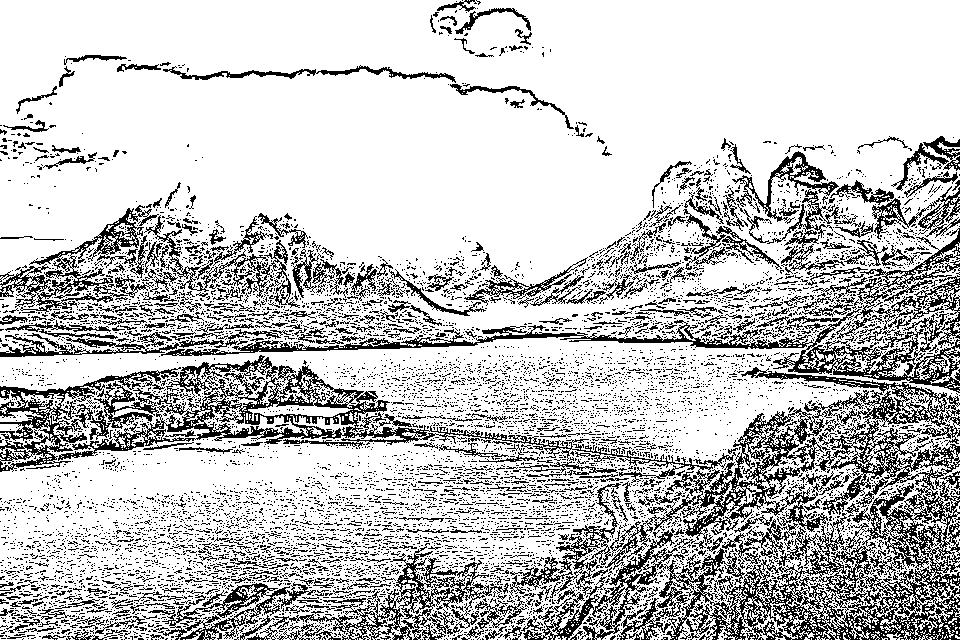

**一周重要天象**

**★****7 月 4 日周一，月亮在处女座，水星（双子座）梅花冥王星（摩羯座）**

随着周日的月亮换座进入处女座，周一工作日以月亮在处女座开启新的一周。当下仍是新月的周期，随着月亮的行进，太阳和月亮形成柔和的六分相。说明这是有成效的，**通过自己的努力工作和付出，**工作中获得领导地认同，达成小目标的日子。

但水星双子座的反应快速、敏捷，会忽略生活中的危机和隐藏的不安定因素。**水星与冥王星梅花相的意义是需要理解“深耕”的内涵。**

双子座水星对“深耕”不感兴趣，冥王星在摩羯座渴望探究的处理事情背后的意义和真相。梅花相意味着调整，在工作和生活中，把活跃的思维和心智表达，与物质层面压力调整好，避免钻牛角尖导致精力耗费，浪费时间和精力。

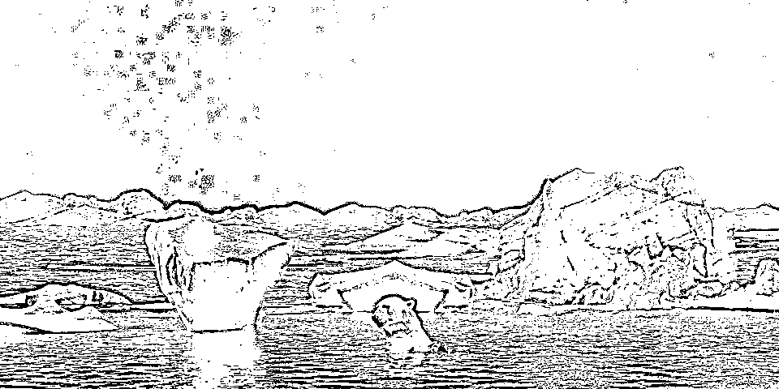

**★****7 月 5 日，周二，火星进入金牛座，水星进入巨蟹座**

**当日的 14:03 分，火星从白羊座进入金牛座，**这是火星战士不太舒服的地方。人们行动力和欲望的关注重点是现实物质世界拥有的多寡，社会环境关注的重点是民生生活、粮食问题。如果我们关注的事情缺乏价值，我们也会不太愿意浪费时间和精力在无价值的事务上。

火星在金牛座，我们也会适当放慢行动的脚步，做事情更务实，更坚韧。在日常忙碌的生活中，学会“偷得浮生半日闲”，适当的放松自己，关注我们物质身体的健康，学会如何欣赏一朵花的盛开，做事情更耐心，给自己营造舒适的生活和工作环境。

火星落入金牛座，需要关注自身情绪和脾气，古典占星将行星落入这个星座定义为落陷，主要是情绪的爆发不太稳定，热情无法自由施展。

日常生活中需要注意和家人、朋友、职场伙伴关系的沟通。对于不如意的事情，即使内心在意，却不懂如何表达的刻意隐藏，一旦某些事件触动会如地震那样，天崩地裂。

因此，我们需要学会真实表达自我，而不是固执己见，根据自己做事情的节奏和规律，而不要被外界的压力影响，导致措手不及，失去节奏后大发脾气。

火星在金牛座行进期间，我们尤其要注意金融市场的爆炸性新闻或个人投资的草率性。

**14:24 分，水星从双子座进入巨蟹座，**人们会渴望情感的沟通、融合，寻求爱与被爱的认同，获得情感的接纳和支持，也会容易陷入怀旧的情绪。

这是让我们有机会处理与家人关系的最佳时机，在世界上也会看到有很多有关传统文化、家族或国家认同感之间的讨论。

水星落入巨蟹座很善于倾听，如果你内心一直有隐藏的伤痛或困惑，这是树洞倾听的最好时刻。但水星落入巨蟹座时，渴望被倾听、理解，表达却倾向婉转，巨蟹座的敏感和细腻会让人们担心沟通中的挫败感，回避问题的真相和本质。

**★****7 月 7 日，周四，金星（双子座）六分凯龙星（白羊座）**

这是敏感的日子，我们会在社交关系中关注情感的话题。**两颗行星的对话，是与“爱的伤痛及疗愈”有关的。**

凯龙星在白羊座，提醒我们正视自己的伤口，不要被伤痛打败，而是找到把伤痛转化为治愈力的可能。这时水星也在巨蟹座行进，过去深埋心灵的痛楚会被某些事情、场景触动，良好的社交互动有益身心。

**★****7 月 9 日，周六，水星（巨蟹座）四分木星（白羊座）**

木星代表贵人、财富、外交或个人的信念法则，这个挑战相位会让我们感受到外交事务、国际对话之间的负面影响和压力。

周六的月亮在天蝎座行进，我们会感受到**情绪的挑战**，在生活中需要注意和权威人士的关系，注意沟通、学习中出现的问题。

水星巨蟹座善于倾听，关注环境的安全、熟悉，一旦涉及到“算旧账”的问题，就会用自以为是的小聪明翻对方的老底，导致沟通偏离主题，缺乏推敲的逻辑，没看清楚方向，容易陷入自己的主观思维中。

**★****7 月 10 日，周日，月亮进射手座，太阳（巨蟹座）六分天王星（金牛座）**

月亮在下午进入射手座，当日太阳六分天王星，这个和谐相位，在休息日会**迸发出某些灵感**，或发生一些惊喜的事情。

月亮在射手座心态会更自由，**自由的做一些喜欢的事情**，任何让你觉得舒服的事情都可以去尝试，比如美食和艺术展览。或通过与家人对话，对家族的历史有更深刻的理解，对自我有更深刻的认同。

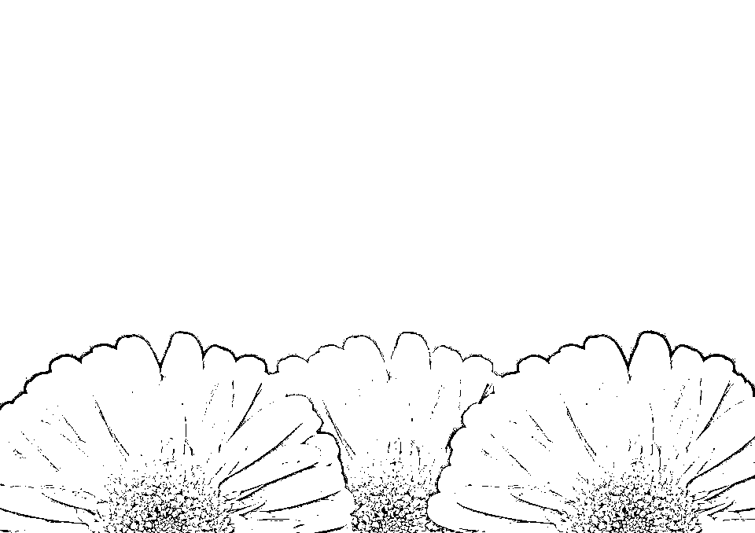

**12 星座的一周运势**

**（重点参考上升星座，其次参考太阳星座）**

***白羊座***

本周火星进入你星图中管理金钱的 2 宫，这是一个增加收入新周期的开始。水星进入巨蟹座，你内在的直觉力很强大，这两种能量有效的使用，会在你未来一周的事业有积极展现。

本周行星刚换座，火星是命主星，学会放慢脚步，规划未来的财务预期。增加收入需要规划，学会积蓄，缺乏投资专业敏感度的话，建议慎重考虑，避免白羊座的冲动。

本周学习的课题就是如何有计划的规划自己的财务，与他人的沟通学会理解和倾听，和家人保持良好的互动关系，有助你更好的行动。

***金牛座***

巨蟹月的节奏很合适你们，你们喜欢不急不慢，按照自己的节奏韵律过好生活的每一天，太多的催促和压力不合适金牛座的宝宝们。

当火星进入你的 1 宫时，这增加了你的动力、自信，这是一个不错的开始！但金牛座喜欢按部就班的做事风格，整体工作运势一般，平稳。

水星进入你的 3 宫，你和好友的互动机会更多，你发表的信息、感受也会容易赢得人心。恋爱运的机遇不错，单身的金牛座们可以关注是否有合适的人。

但金牛座的固执，你会发现自己的某些观点受到他人严重的挑战，你会觉得他人误解你，工作中压力也会让你无形有一种压迫感，需要照顾好自己的身体和情绪，不要让情感成为负担。

***双子座***

善于交际的双子座，在本月初有些不一样，你会发现自己比日常喜欢平静和蛰伏在自己的心灵世界。火星的换座，让你对个人隐私和不被看到的意识世界更关注。

事业上，双子座们一如既往表现沉稳，积极。水星在同一天开始换座，你可以学习记录自己对金钱、财富、物质、生活价值感的感受，通过记录更好的规划财务。你可能对财富，金钱的掌控意识很强，需要避免破财消费太多，凭兴趣，喜好消费导致钱财的浪费。

本周四的金星和凯龙星的相位组合，鼓励你创造与好友沟通的机会，在倾诉中感受到情绪的流动。关系中的疗愈可以提升你的个人魅力指数。

本周重点就是把时间和精力放在你的工作、业务上，学会在和他人的交流中发现有趣或有用的信息。有效的处理重要信息，会对你未来的发展有建设性的作用。

***巨蟹座***

本周是你做长远规划的最佳时期，火星进入你的 11 宫，未来的生活远景画面如何呈现呢？你需要对未来有更大的雄心和动力。太阳在你的 1 宫行进中，有一些新的机会，惊喜的事情在你生活中展现出来，你可以好好把握机会。

水星进入巨蟹座，本来敏感多虑的你，会有更多的想法。学习如何用逻辑、理性的方式处理问题很重要。

本周你会专注自己的目标和任务，在个人或亲密关系中投入更多的时间和感情，请注意周末的水星与木星的四分相，避免因为个人信念、想法的不同导致沟通的误解，学会理性的表达很重要。

***狮子座***

对狮子座而言，7 月的主题是如何平衡事业的野心、内在的恐惧和渴望平和的心境。太阳的行进对狮子座很重要，太阳在巨蟹座的行进、土星的逆行，你需要关注身体的能量平衡。

你渴望创造更多的财富和丰盛，但需要尊重现实情况，学会用更明智的方法解决，不要让自己耗费太多的精力很重要。

火星进入你的 10 宫时，你渴望在事业上有所突破，工作状态非常积极主动，有热情，也有机会，但对某些经验不足、涉事不深的狮子座宝宝而言，需要把控工作范围超出能力的事情。

太阳在 12 宫的行进，提醒狮子座们关注睡眠、压力、情绪的波动。日常生活的健康调整有助狮子座们更有活力和动力。水星也进入你的 12 宫，可以尝试通过冥想让自己内心更平静。本周有展现狮子座们专业、社交或商业的机会，请注意把握。

***处女座***

从 7 月的第一周开始，你就发现在社群中，你是一个明星的状态，你内在的主张，想法和期待被更多的人认同。

火星进入你星图的第 9 宫，你会在旅行上有很多想法和冲突。水星进入你的 11 宫，你可能会和朋友组织一些有趣的计划，参与到朋友圈的新项目中。你也需要关注财务投资的问题，也许会处理和养老金、税务、遗产等相关的问题，关注个人物品、文件的保管。

本周学习运势一般，动力不足，受到心情和天气的影响，心情容易烦躁。根据自己的学习习惯规划好很重要，不要给自己太大压力。本月在团队、集体或社群中人际关系不错，多交流讨论有趣的话题和新闻，这会让你展现明星般的魅力。

***天秤座***

本周的空气充满了激情和变化。7 月 5 日，火星的换座给你的感情生活带来了新的变化。但也要注意关系中的误会，小事情的争执会容易让感情变味，不太稳定。

水星在当日进入你星图的 10 宫，但你需要避免情绪化，有时兴致勃勃投入事业的某个项目，会因为工作中出现新的情况和矛盾，让你产生放弃的念头或想法。

本周你会主动做一些重要的决定，有可能是来自他人的建议，或你在压力下做出的决定。这些决定会对你的家庭或未来产生一些影响。天秤座喜欢评估、犹豫不决，学会正确评估形势，主动做决定很重要。

***天蝎座***

对天蝎座而言，这是一个关系动荡的月份，激情的火星进入 7 宫。天蝎座对伴侣的要求比较高，火星在星图 7 宫行进时，关系的互动很频繁，桃花缘不错，只是是否找到合适的伴侣，需要根据他们的实际情况来定。

你在个人精神成长、知识探索学习中会有新的洞见和进步，哪些知识对你有用、和周围什么样的人交流获得精神成长对你很重要。

你会和熟悉的朋友讨论有关商业合作、副业发展的想法，你足够聪明就可以把握时机和机遇。水木的四分相，需要避免生活中冲动的直觉型沟通。坚持自己的理念是正确的，而忽略对方的声音和想法，会导致纷争和口角。

***射手座***

本周需要关注与同事的相处关系。火星进入星图中第 6 宫，这是职场关系的宫位，如果你的职场关系有些紧张，火星的行进提醒你注意同事之间的相处。如果你的同事关系不错，那需要注意日常的生活作息，如果工作太忙碌忽略日常的锻炼，可以从本周开始制定运动健身计划。

水星进入巨蟹座，会帮助你在商业合作中有更多的思考，但本月你的投资、偏财运势一般，你在投资合作的机会面前有些畏手畏脚，和以往不同，这和你 7 月整体状态有关。

本周你可以将关注重点放到如何有序安排日常生活作息，运动健身恢复良好的精神状态，好的精神状态有助于展现射手座的信心和幸运。

***摩羯座***

本月对摩羯座而言，人际关系会有一些突破，个人魅力指数提升，7 月是你们的幸运月。7 月 5 日，火星进入星图的恋爱，创造力的宫位，给个人关注注入了活力和魔法，你会发现自己创造力提升，人缘更旺，身旁异性增加。

水星进入星图第 7 宫，你和爱人之间沟通会更融洽，彼此可以分享梦想和倾听，如果事业中有合适合作伙伴出现也是很棒的机遇哦！

本周你需要关注的是处理和好友、家人、或亲近的人一些不太愉快的沟通经历，有可能是双方坚持自己的想法和意见，有可能是在文件的处理上，有一些细节忽略了。请学会在沟通中保持自己的立场，中立、清晰的表述你的意见和想法，可避免发生沟通的问题。

***水瓶座***

土星仍在你的 1 宫逆行中，当下不太合适做重大的决定、盲目地去尝试一些新生活或工作，这是一段蛰伏期。

7 月 5 日火星进入你星图的第 4 宫，你在家庭中需要管理好自己的脾气，也许你推动一个新家庭计划的开启，但需要避免急躁。水星换座到巨蟹座，水瓶座宝宝保持既有的稳定、专业和冷静，在职场关系的沟通中，一般不会有太多脾气和情绪，但需要学会倾听下属的需求，不要太强势。

本周的金星和凯龙星的相位，让你在亲密关系、家庭成员的关系处理上，比过去更温馨，人情味更浓，学会情感中的信任，会让你感受到巨蟹月的温柔和敞开。

***双鱼座***

进入 7 月份，你的社交活动比过去增加了。火星的换座，鼓励你与好友、邻居、兄弟姐妹和亲戚之间多走动、多联系，你会从他们身上感受到生活的动力。

水星进入你星图的恋爱，孩子，创作的宫位，你对未来有更多的设想和创意，你会和各种不同类型的人相处，沟通中发现生活的乐趣，激活你的灵感。

本周你需要关注和物质利益相关的冲突，你可以通过和好友倾诉，解决商业合作问题，让你对自己更自信。避免情绪大起大落。双鱼座喜欢梦幻的情感，海王星的逆行，还需要注意烂桃花，避免跌入感情的陷阱。

**版权声明**：原创文章由作者授权首发于若道平台发布，欢迎转发，反对抄袭。友号转载请申请白名单。

**END**

**苏黎（Sulis）**

ISAR 国际认证占星师（2019 年获得）/塔罗咨询师

现代占星融合古典解读

20 多年跨行业领域职场经历

**咨询微信**：liuzq26

**公众号**：Sulis_1975

长按打赏

**20 位来自世界各地的占星师****带来 19 场沙龙——新世界的觉醒****详情可点击下图**

**学习占星学****点击下图了解课程详情**

**微信又双叒叕改版啦，不想错过若道君的推送？**
**就把若道设为星标吧！****▼**

**喜欢就点一下“在看”吧！**

********报名直达入口********

# 海王星逆行加上巨蟹座新月，本周你都有哪些感触？

> 原文：[`mp.weixin.qq.com/s?__biz=MzA5NjA0NTAxNg==&mid=2651479150&idx=1&sn=f7898f7a09c17a0f9523a5dd4dd4a54d&chksm=8b48eed9bc3f67cfdd82fed17d7852ea887dc6afaee7427000dea9f41049ae997527a102a66e&scene=126&sessionid=1692737791#rd`](http://mp.weixin.qq.com/s?__biz=MzA5NjA0NTAxNg==&mid=2651479150&idx=1&sn=f7898f7a09c17a0f9523a5dd4dd4a54d&chksm=8b48eed9bc3f67cfdd82fed17d7852ea887dc6afaee7427000dea9f41049ae997527a102a66e&scene=126&sessionid=1692737791#rd)

**2022 年 7 月 3 日天象：**

*   **20:31 月亮进处女座**
*   ******水星三分土星、四分海王星******
*   ******火星四分冥王星******

本周我们经历了两个重要天象，[【海王星逆行】](http://mp.weixin.qq.com/s?__biz=MzA5NjA0NTAxNg==&mid=2651478579&idx=1&sn=c1c55351ebf0eb5aaae35d665c9a19e2&chksm=8b48e884bc3f6192fce986b04fa7a43991c84cc4901c33ec19ee239ccf7819139fa7b993fe90&scene=21#wechat_redirect)（点击查看文章）和[【巨蟹座新月】](http://mp.weixin.qq.com/s?__biz=MzA5NjA0NTAxNg==&mid=2651478730&idx=1&sn=de78c186c9cb527746bdf982606d800f&chksm=8b48e87dbc3f616b9f1e151678dd5ea9c1fb3b4fbb2b552aa5c79e227e37c0f04cc97911d3ce&scene=21#wechat_redirect)（点击查看文章）。海王星逆行是为期近 6 个月的缓慢长期行进，我们需要深入那些恐惧，给自己和他人更多的耐心和爱；而巨蟹座新月则带着强大的疗愈能量，唤醒我们内心深处对无条件的爱、对安全归属的强烈渴望，引领我们踏上“回家”的旅途。你对这两个“年中”天象，有哪些感触？下半年有哪些计划？欢迎跟我们分享呀~今天水星三分土星，适合“好好学习，天天向上”，沟通有成效，但水星和海王星的四分相却提醒我们，注意有可能出现谎言和词不达意的情况，而我们也可以从事一些艺术性的工作，释放灵感。火星与冥王星的四分相已经持续了好几天，再加上今天月亮大部分时间在狮子座，过于自我中心容易引发冲突，它一边说冲动是魔鬼，一边又说，我们需要有“置死地而后生”的勇气，没有冲突就没有改变。周日快乐！我们明天见！**了解每日天象，可****下载“若道”APP 查看****还有更多精彩等着你哦**

# 《梦华录》 | 在千载难逢的时代，做不可替代的人

> 原文：[`mp.weixin.qq.com/s?__biz=MzA5NjA0NTAxNg==&mid=2651479149&idx=1&sn=98563f009a0fc58c2a0f891ef6414be3&chksm=8b48eedabc3f67cc44db6e98c640944930d7f2246041dd34ea0f05b10ff8325a9d8d9a763e40&scene=126&sessionid=1692737791#rd`](http://mp.weixin.qq.com/s?__biz=MzA5NjA0NTAxNg==&mid=2651479149&idx=1&sn=98563f009a0fc58c2a0f891ef6414be3&chksm=8b48eedabc3f67cc44db6e98c640944930d7f2246041dd34ea0f05b10ff8325a9d8d9a763e40&scene=126&sessionid=1692737791#rd)

** 后台回复“今日”，给你一句生命态度 **

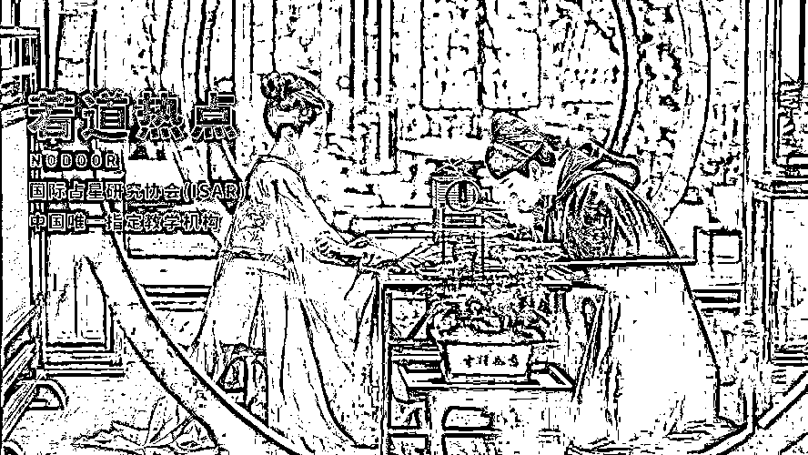

**作者/编辑/玫瑰  图片/腾讯视频及腾讯网**

**（本文含有轻微剧透）**

**《梦华录》，2022 一场华美的梦**
6 月最开心的事儿就是追剧《梦华录》了。这部由刘亦菲、陈晓、柳岩、林允等人出演的古装剧讲述了赵盼儿、孙三娘、宋引章三位江南女子闯荡东京种种因缘际会的故事。如在其上，如在其下。影视剧作品总能折射出当时天象。让我们从占星学角度细品之，你一定会感叹或许在另一个平行时空，真有一群人，正在演绎着这场华美之梦。

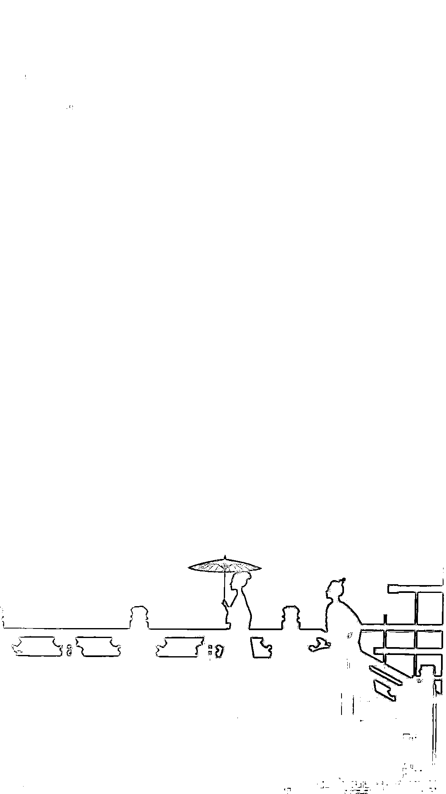

| 《梦华录》剧照**土木合相开启风象时代**
**2020 年 12 月，土星和木星合相于水瓶座 0°，开启了 200 年的“风象时代”。而整个土木周期则长达 800 年。******土星和木星是两颗时代行星，土星代表社会制度和规范及物质层面的基础，木星代表社会道德与法律要义等精神层面的探索，他们共同运作，形成物质-精神双方面的公序良俗和社会框架。水瓶座则代表个体发展个性以及集体追求自由的革新之路。****这是千载难逢的时代，满是崭新的机遇，却也充满了不确定的挑战。《梦华录》于 2021 年 2 月开拍，播出后引起了热议，有人力赞，也有人把编剧“黑”到微博销号——激烈的争辩也正是新旧交替时，属于水瓶座时代的百家争鸣。《梦华录》讲述的故事发生在宋代。历史上，这又是怎样的朝代呢？**·** 宋朝是中国历史上商品经济、文化教育、科学创新高度繁荣的时代。儒学复兴，科技发展迅速，政治开明；**· **历史学家陈寅恪言：“华夏民族之文化，历数千载之演进，造极于赵宋之世。"西方与日本史学界中亦有学者认为宋朝是中国历史上的文艺复兴与经济革命的时期；**·** 宋朝允许女性再婚和提出离婚，还可争取孩子的抚养权和抚养费。《宋史·公主传》中秦国大长公主、范仲淹母亲谢氏、岳飞前妻刘氏等但均有再婚经历；**·** 女性可以经济独立，也有相对独立的财产处置权。律法保护女子的婚前财产，丈夫不可私用夫人的嫁妆。如果哪个丈夫依靠老婆嫁妆维持生计的话是令人嘲笑的；**·** 具有一定独立女性精神。随着经济发展，越来越多的女子开始参与商业发展活动。在掌握大量资金之后，女子对服装的要求、品位和自己的价值有了大大的提升。她们追求美，追求知识，追求自由。甚至会有不少女性开始从事诗歌的创作，李清照、朱淑贞都是代表，后者更是因为丈夫吃喝嫖赌，权钱至上而写下《断肠迷》，满是对于薄情寡义之人沉痛伤心的斥责之意；

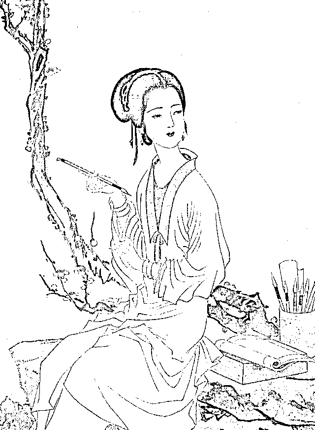

| 宋朝女词人李清照

巧的是，上一次风象时代在公元 1226 年-1425 年，与宋朝的周期 960 年-1279 年有重合之处——冥冥之中似有轮回。可以看到，宋朝的社会形态同当下所倡导的女性独立、自由有着相似之处。那么，故事中的人物又如何演绎当下的天象呢？

**木星*****水瓶座***

**木星代表正义与道德体系，水瓶座对于正义的视角更为抽离，不夹带太多个人情感和恩怨，更像一个众生平等的宇宙审判者。**

剧中，男主皇城司指挥顾千帆深陷各种情义、道义、法义的漩涡。先是遭遇过命兄弟的背叛；又得同抛弃生母且为奸相的父亲决裂；并因为父亲是导致爱人顾盼儿一家惨剧的始作俑者而不敢面对盼儿；还要面对朝中帮派的纷争。从常规的“对错是非”角度去分辨的话，顾千帆怕是会被自己的道德观折磨到精神分裂了。而赵盼儿却能从更为水瓶座的角度替他解读：**·** 当他手刃兄弟的时候，曾问盼儿，如果信任的人背叛了自己该怎么做？盼儿回答，**有恩还恩，有怨还怨，不计过往，只尊当时本心。**

**·** 当他因为父亲对盼儿一家的伤害而背上沉重道德枷锁的时候，盼儿告诉他，作为言官，顾千帆的父亲弹劾自己的生父，是因为他抗旨的时候就需要承担相应的后果，而顾千帆当时还不认识自己，更不知道此事，因此并不应该承担良心上的谴责。

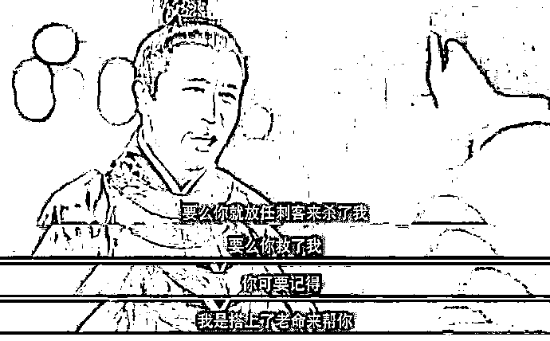

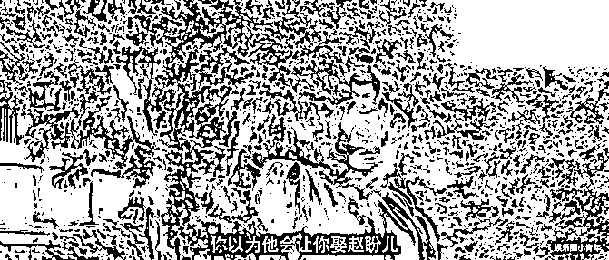

| 《梦华录》剧照：萧钦言同顾千帆之间的父子情仇

这些思想超越了普通意义上“父债子还”“恩将仇报”等思想藩篱，客观、理智地看待事物的发生发展，并得出更为智慧的结论。**尽管水瓶座常常被人诟病“无情”，却能将人从各种捆绑束缚自己的道德体系中解脱出来，给出真正自由和真实的选择。**赵盼儿等三位年轻女子，也在长期鱼龙混杂的环境里保持着木星水瓶座的高洁和不落俗套，宋引章更是因为自身的风骨得到清流朝臣亲笔题字。

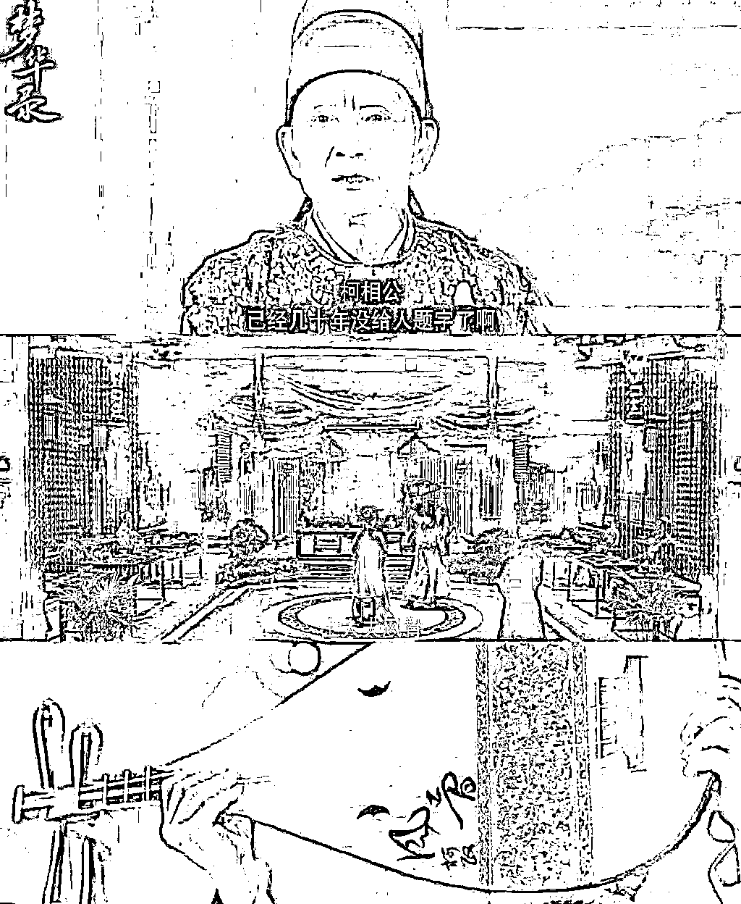

| 《梦华录》剧照：清流朝臣在引章琵琶上题“风骨”二字

更难得的是，**她们并不拘泥于外表“好坏”的界定，而能站在更高的角度看到人和事的复杂性，更为洒脱地调整自己为人处世的方式和原则。**

于是，就会有：**·** 盼儿为了解救姐妹宋引章而假扮青楼女子，诱使恶男得到惩罚；**·** 盼儿直面“情敌”之父高观察，说清事情原由，并救了同样被渣男欺骗的高慧；**·** 盼儿在多金的池衙内面前不卑不亢，更在“结了梁子”的池衙内被官府之人当中羞辱时出来为他仗义解围，最后化干戈为玉帛，一起合作经商；

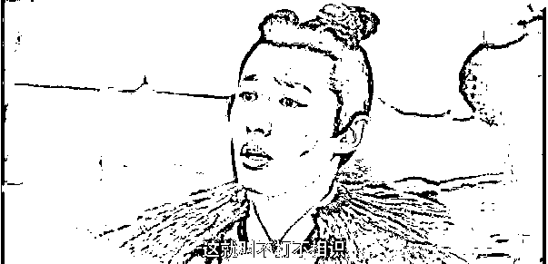

| 《梦华录》剧照：盼儿为池衙内解围，化解矛盾**·** 三个姑娘对于诬陷她们的乞丐女孩招娣不计前嫌，出手相救，并帮助她摆脱了母亲的逼婚；**·** 被家人卖掉的招娣也没有强行同原生家庭和解，而是同父母决裂，做出了自由意志的选择；**·** 在视如亲妹妹的宋引章数次闹脾气叛逆之后，盼儿和三娘仍能虚怀若谷地接纳她，并且反思自己对于引章的管教和处理方式欠妥，且做出改变。📹 [`v.qq.com/iframe/preview.html?width=500&height=375&auto=0&vid=i3341c2k4t9`](https://v.qq.com/iframe/preview.html?width=500&height=375&auto=0&vid=i3341c2k4t9)| 《梦华录》剧照：盼儿为解救宋引章，设计勾引周舍正因为身处污泥之中，看够了表里不一的伪善，才令他们有着**木星的赤诚和水瓶座的客观。而不会对自己和他人做出教条僵化的对错评价。**不被情绪裹挟，不被道德绑架，便能活出更为随心的人生，也能发展出更加宽广的胸襟，正如顾千帆所说：“大丈夫生而为人，行走在世间，不必拘泥。”

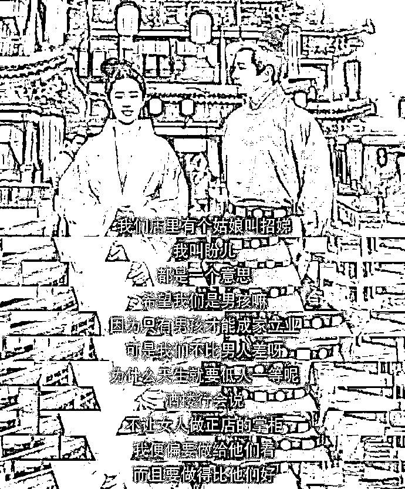

| 《梦华录》剧照：盼儿同皇上的对话而我们在“小女子”身上却也看到了如此气度，谁又能说女子不如男？男女的区别和定义如何阻碍了我们对于世界木星式的探索？过去的恩恩怨怨又如何羁绊着我们，既无法活在当下，又无法忘掉过去，更不能乐观开阔地面对未来（木星）？

**土星*****水瓶座***

另一方面，宋代也有着森严的**土星式等级制度**，没入贱籍的人永无出头之日，经商之人也在“三六九等”中属于不入流之辈而备受欺压，更别提“三从四德”这压在女性头上的大山。

《梦华录》中有很多桥段都展现了**对于土星制度的革新，对于自由平等社会的向往。**

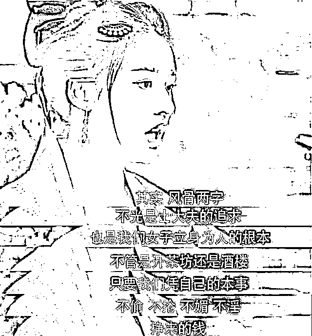

| 《梦华录》剧照：宋引章的独立意识觉醒**· **乐伎宋引章虽在江南算得上琵琶一绝，却一直为自己的乐籍而自卑，而东京花魁行首张好好却告诉她：**“我们靠自个儿的本事吃饭，活得堂堂正正，正大光明。”****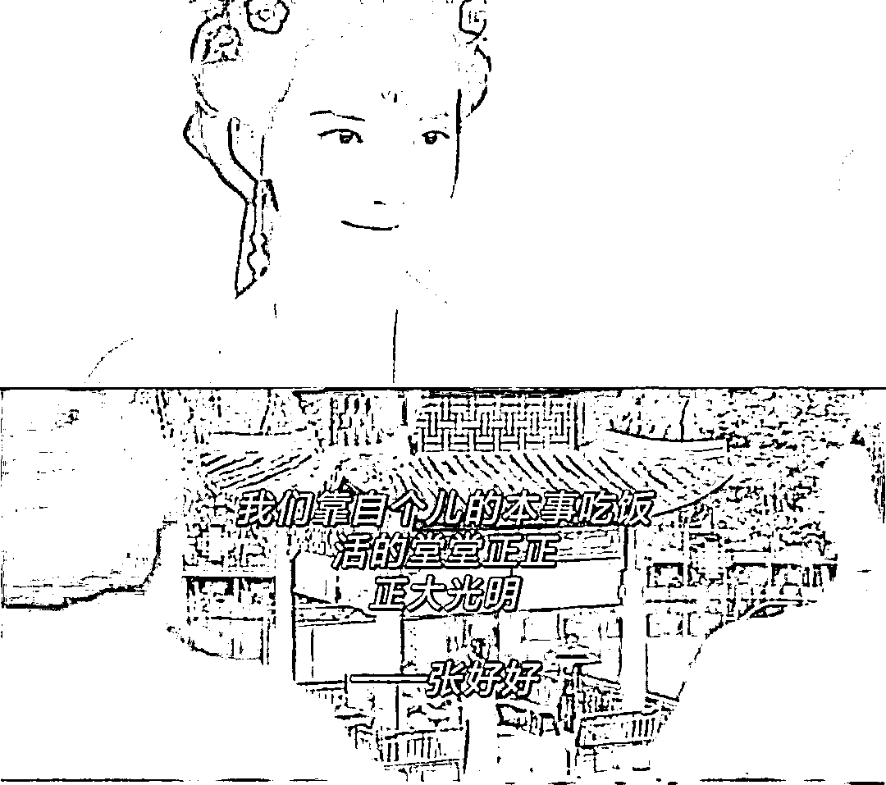****| 《梦华录》剧照：张好好劝慰宋引章****· **茶馆行会来挑战的时候，赵盼儿凭过人的技艺胜出，面对一群土星权威，她一个年轻女子放言“所谓茶道者，只要遵其道，便可八仙过海，各显其能，茶如人，人如茶，如果茶汤香凝幽远，自然能得到赏识之人，又何必在乎贵贱？”**· **赵盼儿对瞧不起商人的官吏直言“您说士农工商最贱的就是商人，那您有本事别喝商人酿的酒，别穿商人贩的衣，也别吃商人运的粮啊……我看，贱的不是人，而是你们这些看不起人的心。”

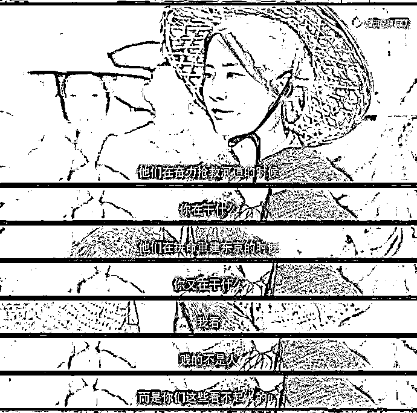

| 《梦华录》剧照：赵盼儿在码头同官吏辩论官吏哑口无言后，又劝其说，只要真心为老百姓着想，就能做一个好官；

**· **赵盼儿的生意经一直围绕着“独一无二”，用不同于其他商铺的方式经营，体现了水瓶座追求的创新和独特性。而这些经营方式在更为开放繁华的东京也的确非常成功且无可复制；

📹 [`v.qq.com/iframe/preview.html?width=500&height=375&auto=0&vid=p3344628icf`](https://v.qq.com/iframe/preview.html?width=500&height=375&auto=0&vid=p3344628icf)| 永安楼 50 贯一场，仅有 12 席的《花月宴》**· **孙三娘被休，且有儿子，自己年纪也不小了，仍对宋引章说：“我为什么不能想着再嫁？”和杜夫子的婚事遭到儿子反对的时候，她也并没有屈从于儿子，而是表示，我的婚姻我做主。

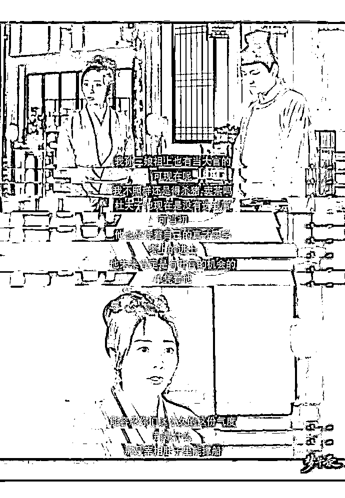

| 《梦华录》剧照：孙三娘替杜夫子仗义执言《梦华录》的最后一集是令人“万万没想到”的。我以为她们会为自己许愿嫁人、脱籍、身份、金钱等赏赐，而这部剧再次帮我开启了新的视角——女人，是可以活得宏大（木星）而有力（土星）的。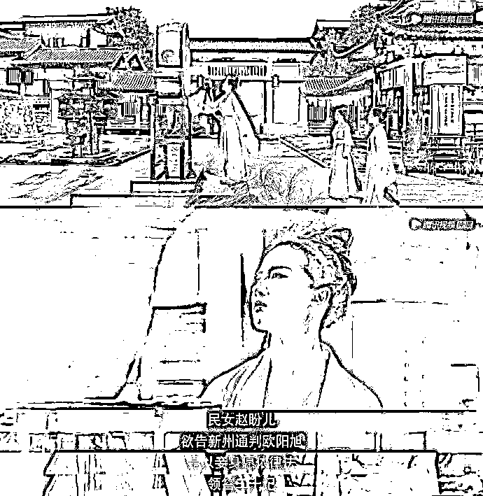|《梦华录》剧照：赵盼儿敲登闻鼓**木海合相双鱼座：你的梦想是什么？**
2022 年另一个重大天象是发生在 4 月的木海合相双鱼座。两颗行星入庙于双鱼座且合相，正是造梦之时。**顾千帆说：“你若相信，便是真的。”正好诠释了这个天象的意涵。**三位女主尽管平凡，也都有梦想。**·** 孙三娘的梦想是凤冠霞帔，杀猪出身的她希望自己能够荣耀加身；**·** 宋引章的梦想是脱籍，苦练琴艺的她不愿在鱼龙混杂的声色之所以色侍人；**·** 赵盼儿的梦想是有个家，出身官宦却家破人亡的她，心底从未放弃那份高傲和倔强，表面强撑背后最是渴望温情和归宿。她们也都曾寄希望于他人而经历过美梦破碎的极致之痛。**·** 孙三娘逼迫儿子读书为自己挣凤冠霞帔，让孩子产生了逆反心理，被丈夫休了，儿子宁可跟着其他女人也不要她；**·** 宋引章两度相信了男人，不是被骗财，就是被骗色，被像狗一样拴着打骂，又差点被送给达官贵人当做礼物；**·** 赵盼儿如此相信自己识人的眼光，苦心帮扶爱人，却被高中的情郎无情抛弃并斩尽杀绝。而现实中，反观这些年女性独立解放运动的潮水，也能看到相似的桥段。

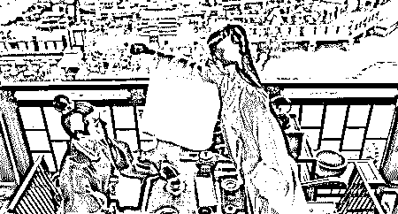

|《梦华录》剧照：赵盼儿远赴东京寻找情郎，却遭背叛**越来越多女性对于男性产生了害怕和排斥的心理，不愿意结婚生孩子，甚至恋爱都不想谈。**仿佛这世界上太多狼心狗肺，凶险算计，付出真心却被欺骗、被暴力、被勒索、被抛弃，甚至被迫害。**女性仍旧处在低自尊、雌竞、社会歧视、暴力威胁的男权社会之中举步维艰。开始她们想要的只是再普通不过的梦想，后来她们连梦想都不敢有了。**而《梦华录》最终的梦想成真似乎为我们指出了一条破圈之路——**梦想没有错，而是实现梦想的法子得改改了。****天王星金牛座：你的价值在哪里？**
改变和创新，从来都和天王星有关。当下所处的时代，**接纳土木水瓶座的能量的天王星落在金牛座。金牛座代表价值。**

**· 你的价值是什么？**

**· 你能否创造更多的价值？**大卫老师曾说过：**“天王星的低阶发挥是鲁莽的叛逆，高阶发挥则是有准备的创新。”**2018 年天王星进入金牛座以来，众多影视剧都做过尝试，到目前为止，《梦华录》对于这句话做出了最为具体生动的诠释。三位女主并不是主动走上这条不能后退的革新之路，她们也曾囿于世俗，但一败涂地，就像天王星，突然将你脚下的毯子撤掉。要么从此摔倒，要么勇敢闯出一条新路。“不甘心”的她们选择了后者。可光是不甘心并不够，还需要**理性分析，丈量同梦想之间的距离——想想自己真正想要的，和当下的自我，这之间有哪些是已经具备的，哪些是还要努力的，并且制定计划，坚定不移地执行。**

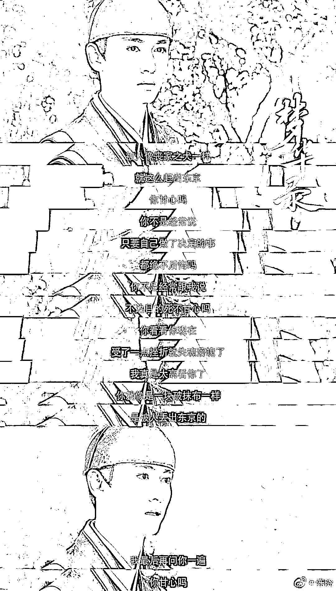

|《梦华录》剧照：赵盼儿被赶出东京时，顾千帆对她“灵魂拷问”这条路并不容易，需要**强大的信念、毅力、努力，以及 12 星座的能量加持。**在东京的立足之路，有着：**·** 白羊座勇往直前的开创精神——“我的背后就是退路”；**·** 金牛座的经商、理财、投资之道；**·** 双子座的多线程处理事务能力；**·** 巨蟹座亲情一般的友爱扶持；**·** 狮子座的领导能力；**·** 处女座的过人技艺和服务精神；**·** 天秤座的斡旋和人际交往能力；**·** 天蝎座的深度信任和资源共享；**·** 射手座的不计前嫌，面对困难保持乐观；**·** 摩羯座长久稳定的框架；**·** 水瓶座的高瞻远瞩，做引领潮流的弄潮儿；**·** 双鱼座对梦想的不忘初心——“为什么要为了一个男人一场风雨，就忘了我们的初心？”

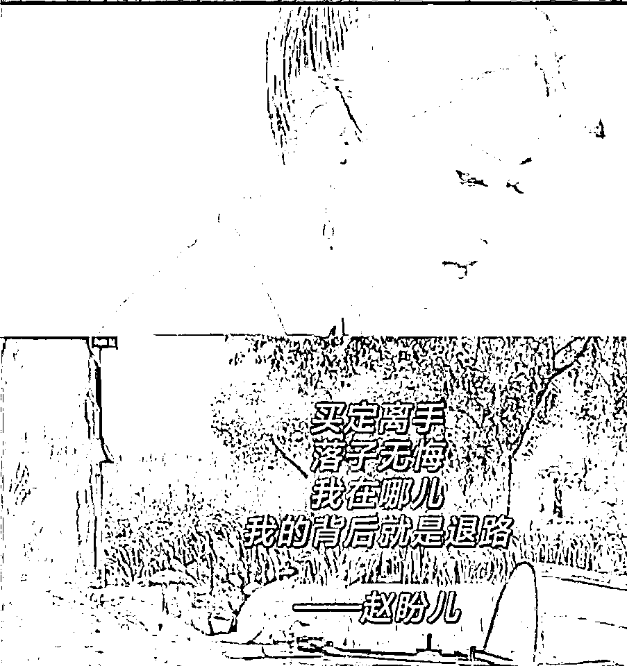

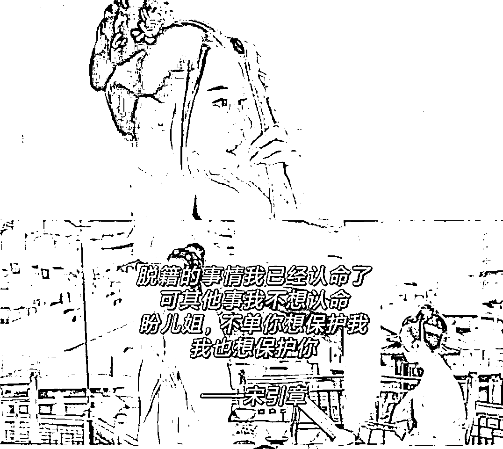

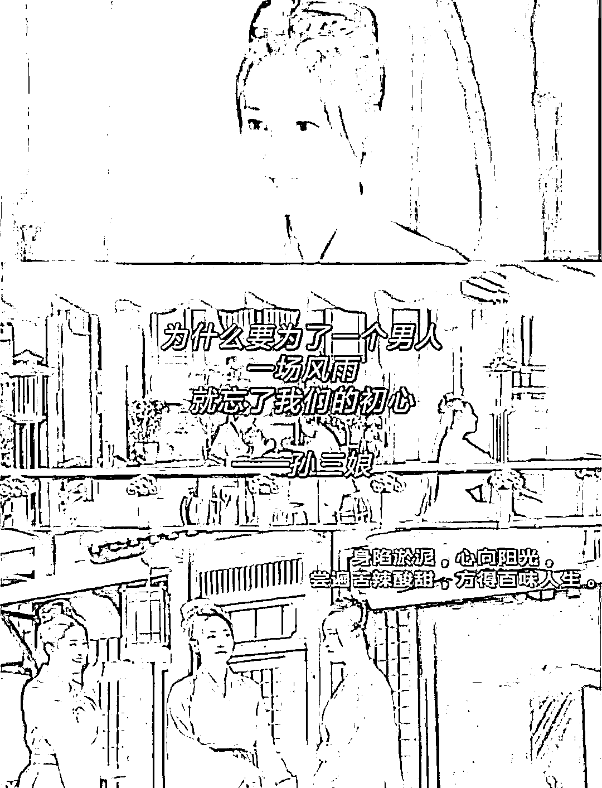

| 《梦华录》剧照**天王星最擅长的是从情绪中抽离，而金牛座更崇尚活在当下。**也是这两种力量，使得她们在任何境况下都互相搀扶，彼此拉扯，再难也要不忘初心，把事情做好。绝不让情绪淹没自己，一轮轮、一次次螺旋式的成长和发展之后，终于能够夯实自己的价值。他们的幸运绝不是偶然得来的，也不是谁恩赐的，是一步一个脚印靠着自己得到的。**做不可替代的人**
**独立不是孤立，靠自己并不是排斥其他人，而是尽可能地团结更多可以团结的力量，这其中包括男性的力量。生活如此，婚恋亦然。若是****遭遇过迫害就视男人为洪水猛兽，那便走向了天王星的破坏性发挥——鲁莽的叛逆。**我们真正需要做的，是冷静地思考几个问题。

**· 我想要怎样的亲密关系？**

**· 为了获得这样的关系，我能给出什么价值？**两性关系中也存在价值交换。这里的价值，并非普通意义上的门当户对，身材长相，而是**你是否具有不可替代性？**以色侍人，色衰爱驰，以利相交，利尽则散。**唯有无可替代（天王星）的价值（金牛座），才能让一段关系持久（金牛座）并永远充满新鲜感（天王星）。**水瓶座时代的情感方式，不再是男主外，女主内，女人依附于男人，作为男人的附庸，但也绝不是男女互相对立，彼此争夺权力。**关系不是两个人互相看对方，而是彼此朝着同一个方向看去。****共同的底色和价值观，精神上的门当户对，肝胆相照的交情，互相欣赏的棋逢对手，最重要的，坚定的信任，这一切是维系一段关系最重要的元素。**

赵盼儿之所以能够逆袭成功，靠的也是这几点的契合。

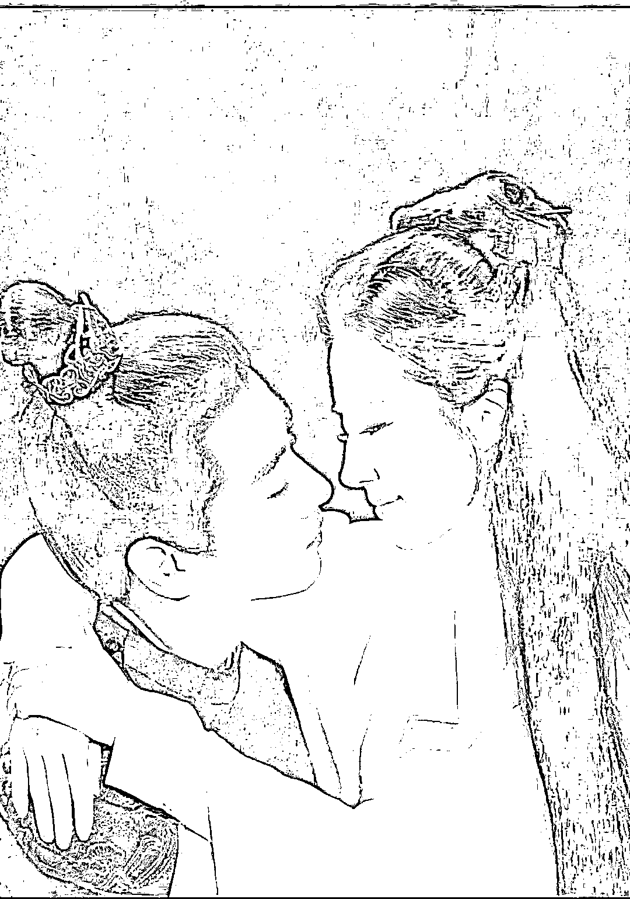

| 《梦华录》剧照：赵盼儿与顾千帆

经历过一次“渣男”欺诈的她并没有放弃自己的信念，没有仇恨男人，而是反思自己识人的能力，再度遇到心仪的顾千帆时，她保持着冷静、独立以及清晰的界限感：**·** 观察彼此的互动模式。她对三娘说，顾千帆好像有些喜欢她，却又没那么喜欢她，虚虚实实，真真假假，并要求三娘时刻提醒自己，不要忘记保持自我；**· **坚持底线，在千帆再次对她表现出超乎友情的举动时，直白地问他到底如何看待彼此的关系，并在他想清楚之前同他划清界限；**· **彼此袒露心迹后，愿意真诚地相信并爱护他，也会将之前受伤的心理阴影彼此坦诚，互相疗愈；**· **重要的时刻，放弃所谓的自尊和骄傲，将他逼到自己的世界，呈现出更大格局的包容度。

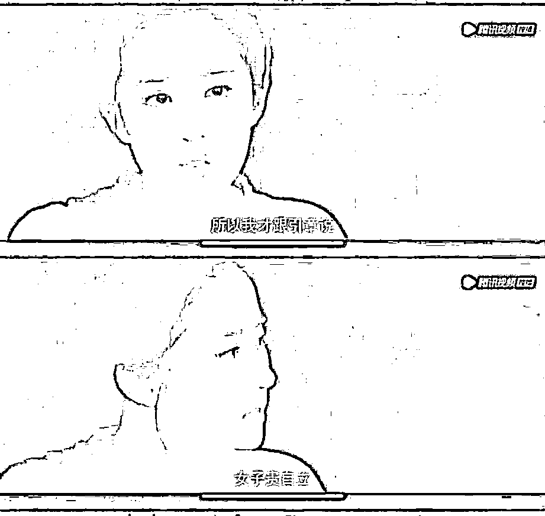

|《梦华录》剧照：赵盼儿同三娘的对话**这段朋友式的关系，也经历了很多开放式的价值探讨。**

顾千帆和赵盼儿，一个官伎，一个酷吏，都是被边缘化的异类，不走寻常路的天王星人，而他们又都有着独特的世界观。

盼儿对于千帆“鹰犬爪牙”的自我评价，解读为国之鹰犬，民之爪牙，巧妙地提升了他的自尊，尊重了他的选择；而千帆最终也全力支持盼儿实现自己开酒楼的想法，并说她想做什么就可以去做。

对彼此异于常人之处的接纳和体恤，使得他们能够将不足为外人道的苦楚彼此坦诚无疑地敞开。顾千帆甚至能够支持赵盼儿去以肉身之殇为自己洗脱清白——**因为爱，所以支持你的信念和坚持，这是超越了男女私情的大爱。这些都造就了无可替代而难以介入的价值闭环。**再看三娘和杜夫子的结合，会发现他们也有着共同的境遇和价值互补，同样是落魄之人，同样游走于世俗边缘，且一个能干泼辣，另一个文弱缺爱，这样的组合同样具有不可替代性。反观池衙内同张好好，则是两个不同世界的人。彼此的维系也仅靠着张好好的恃宠而骄，池衙内的哄着宠着，于是二人的分手也是顺理成章。**而在宋引章身上则呈现出天王星更具破坏性的发挥。**宋引章一直被赵盼儿保护得很好，缺乏世俗经验，她呈现出的如同心理学中的“儿童自我状态”，她将盼儿当做对抗对象，却又事事都在效仿盼儿。也因此产生了嫉妒、愤怒等情绪。并因此两度一言不合就叛逆逃家，也导致了被渣男坑害的悲剧。

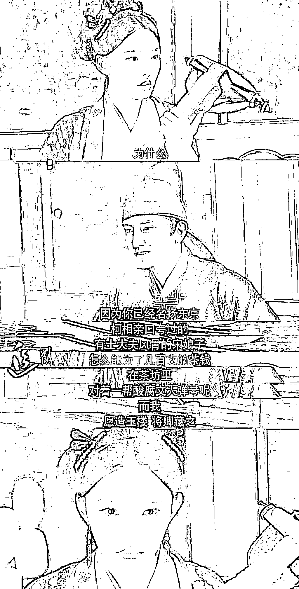

|《梦华录》剧照：沈如琢游说诓骗引章对于亲密关系，她也没有清晰的目标和计划，对方甜言蜜语，山盟海誓，许诺为自己脱籍，就沦陷了。纵然在一次受骗后有过戒备，却未能真正发展出冷静清晰的思路，第二次受骗后更是索性说出“男人没有好东西，玩玩就好”这样赌气的话。引章的成长是肉眼可见的，但在感情方面还有很长的路要走，剧中结尾并未给她强行安排一个伴侣，也是在未来留下空间。**以梦为马，不惜时光**
《梦华录》不单是一部偶像剧、言情剧，更是时代和天象的缩影。赵盼儿敲响了荒草丛生的登闻鼓，就像敲响了几千年来对于社会制度、律法的抗争之鼓，她在替无数被奴役、被欺凌、被压制的人而敲，无论男女、老幼、地位，人民需要得到更平等和友善的对待。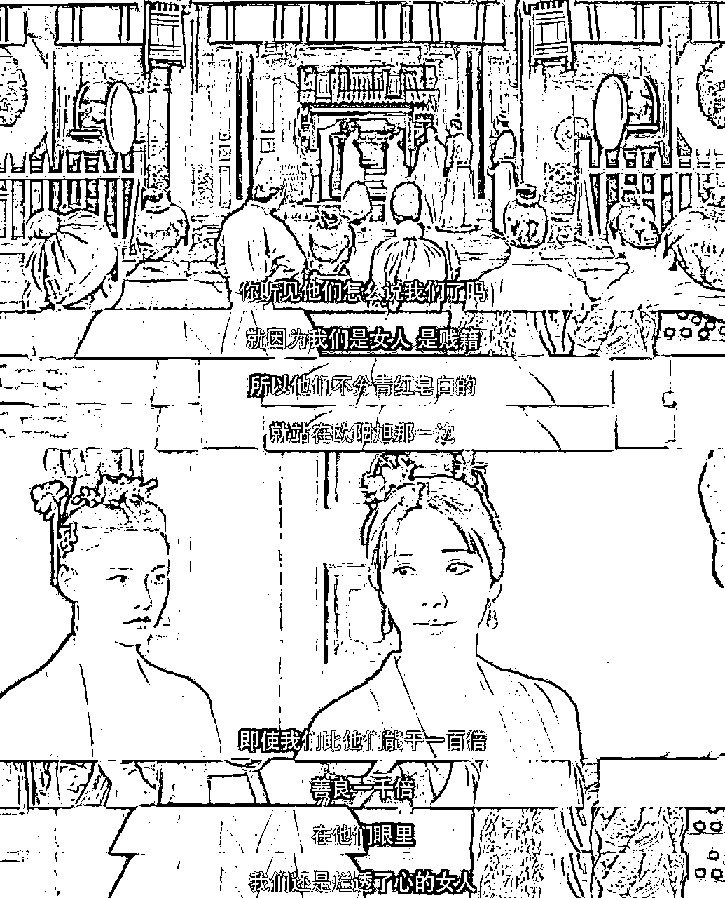|《梦华录》剧照：赵盼儿敲登闻鼓最后的许愿环节，三位看似柔弱的女子，却心怀天下苍生。**· **最没有文化的孙三娘想的是三人小群体的兴盛；**· **终于领悟风骨二字的宋引章想的是蒙冤受屈而不得不九死一生告诉的群体；**· **赵盼儿想的则是“身为女人，身为贱籍”的群体，并发出“贱籍之人就一定贱么？”的提问。****群体、更多人的福祉，这些都是水瓶座的高阶表现。**为了群体利益而放弃自我利益，也是水瓶座推崇的革新。**成功属于盼儿，更离不开支持她的人，他们是她的朋友，她的爱人，是位高权重却无法自主婚姻的人，是身为商贾被人歧视的人，是在场每一位为盼儿捐资的平凡普通的人——每一个觉醒了的人。《梦华录》的结局告诉我们，**无论身份高低，财产多寡，人的灵魂是平等的，在追求自由的道路（水瓶座）上，每个人都能成为改变自己命运的英雄（狮子座）。**

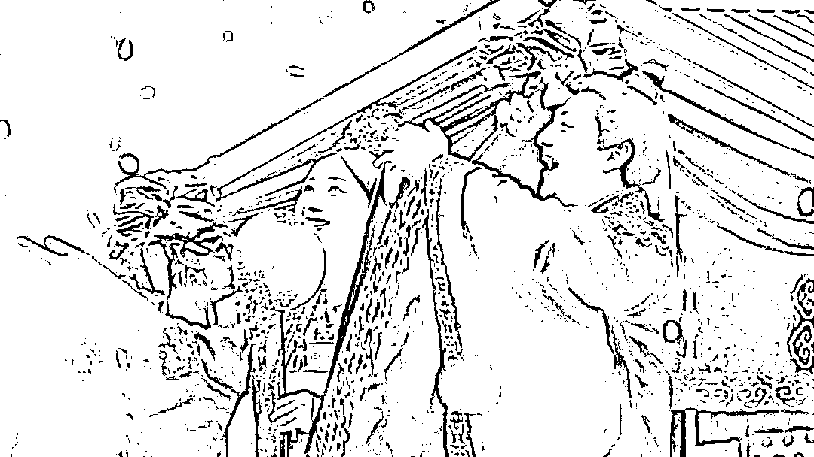

|《梦华录》剧照：三娘为自己争取到凤冠霞帔而敢于直言进谏的社会，一定离不开仁善的君主。我们于是能看到皇上对于皇后的欣赏，对于皇后所作所为的包容，对于渐进式发展律法、制度的开宗明义。

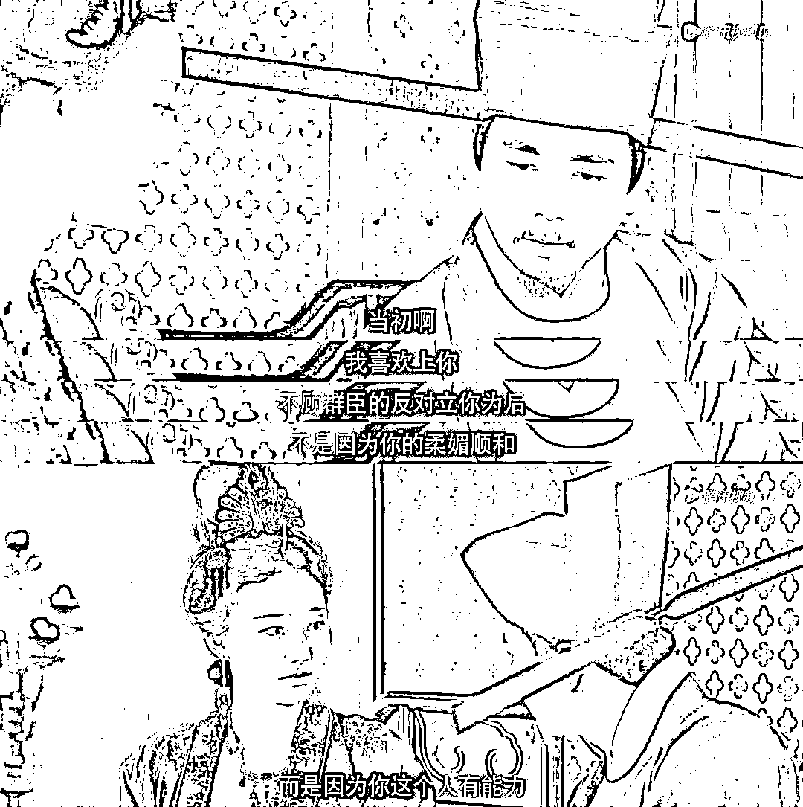

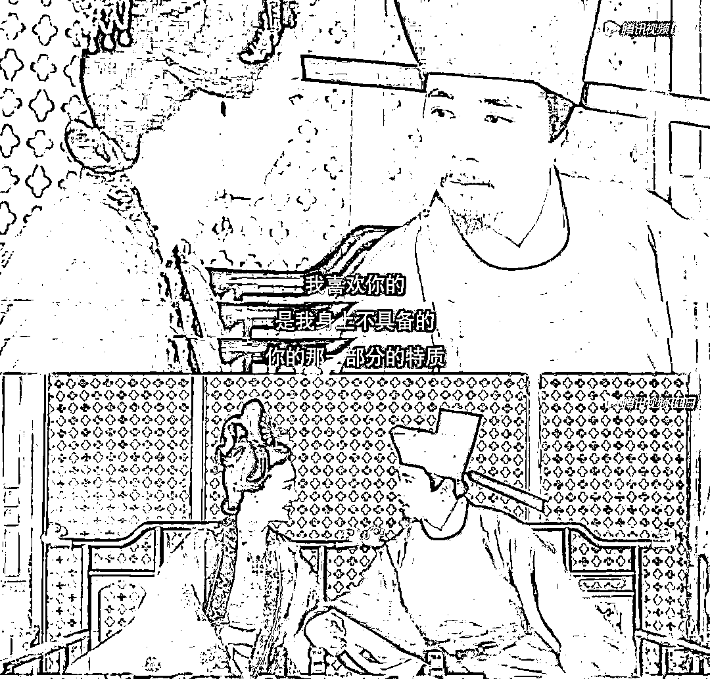

|《梦华录》剧照：帝后对话**网友说：“不管粉、路人、黑子，多年后大家都会记得，在 2022 年被疫情困扰的中国人看了一部甜美剧。”2022 年太难了，有这样一场制作精良，美轮美奂的“梦”，为何不沉浸其中呢？梦幻联动，每个人**多少都能在剧中找到一些自己的影子。追古论今，更会对当下所处的时代寄与更多个人的思考和展望。沮丧痛苦的时候，谁都会怨天尤人，会戒备，甚至用各种计谋方法，不再付出真心；生活失败了就躺平摆烂，这些实际上都是**天王星负面的发挥——对抗**。**对抗容易，但毫无好处。它只能加速分裂和制造动荡。**我们能做的，是**停止制造仇恨和对立，停止恐男、仇女，团结所有力量，探索自我价值实现和社会变革之路，活出更加自由、智慧、先进的人生。**

**版权声明：**原创文章由作者授权首发于若道平台，欢迎转发，反对抄袭。友号转载请申请白名单。

**END**

**玫瑰**

英国 Cass Business School 管理学硕士

若道 2015 届核心课程毕业生，若道微信公众号兼职编辑

占星师，咨询时长超过 800 小时

**个人微信号：**stillrosy

**公众号**：一个娘娘 

长按二维码，给作者打赏

**20 位来自世界各地的占星师****带来 19 场沙龙——新世界的觉醒****详情可点击下图**

**学习占星学****点击下图了解课程详情**

**微信又双叒叕改版啦，不想错过若道君的推送？**
**就把若道设为星标吧！****▼**

**喜欢就点一下“在看”吧！**

********报名直达入口********

# 7 月宇宙天气丨为了下半年更好地冲刺，这个月可以先缓缓！

> 原文：[`mp.weixin.qq.com/s?__biz=MzA5NjA0NTAxNg==&mid=2651479053&idx=1&sn=ecadd0a2d943b3e630674716607d714c&chksm=8b48eebabc3f67ac258f5d9c5593911ba580ecbc57d2249d7eb7b1ce3e5427817fe802059dea&scene=126&sessionid=1692737791#rd`](http://mp.weixin.qq.com/s?__biz=MzA5NjA0NTAxNg==&mid=2651479053&idx=1&sn=ecadd0a2d943b3e630674716607d714c&chksm=8b48eebabc3f67ac258f5d9c5593911ba580ecbc57d2249d7eb7b1ce3e5427817fe802059dea&scene=126&sessionid=1692737791#rd)

******☆ **后台回复“今日”，给你一句生命态度****

作者/Anastasia

编辑/翀子 封面/书君 图片/网络

2022 年的下半年开始了！这个 7 月的氛围继续和缓，但木星的逆行带来明显的影响力，它会为横冲直撞的行为降降温。尤其当我们处在天王星合相北交点的大背景下，试着慢下来，对我们是有益的。

七月重点天象

*   **火星进入金牛座（7 月 5 日）**

*   **水星进入巨蟹座（7 月 5 日）**

*   **摩羯座满月（7 月 14 日）**

*   **金星进入巨蟹座（7 月 18 日）**

*   **水星进入狮子座（7 月 19 日）**

*   **凯龙星逆行（7 月 19 日）**

*   **太阳进入狮子座（7 月 23 日）**

*   **狮子座新月（7 月 29 日）**

*   **木星逆行（7 月 29 日）**

**整体氛围**

**七月的宇宙天气继续和缓。**除了正常的行星换座之外，只有木星逆行的影响力比较大。**木星在白羊座逆行，将会给之前横冲直撞、鲁莽急躁的行为和决定降降温。**

在动荡的大环境下，减速其实是好事，**任何决策都要慎之又慎。**

水星在 6 月 19 日彻底离开水逆的后阴影期，恢复了正常速度。这个月，水星会快速地通过巨蟹座和狮子座，将在 8 月 4 日进入处女座，再次回到自己的入庙位置。

水星在狮子座入陷，功能受损，容易出现各种状况。**所以 7 月 19 到 8 月 4 日这两周时间虽然短，也要小心处理和水星相关的事务，**诸如交流沟通时不要高高在上，咄咄逼人；看问题不要过于主观，时不时提醒自己兼听则明；做事保持低调，跟随主流，不盲目自大等等。

火星换座金牛座之后，也处于入弱位置，能量受到压抑，无法尽情地自由发挥，身体觉得很难受。适当运动，补充水分，关爱身体，可以安抚到这颗压抑躁动的火星。

看起来这个夏天的天象整体平稳，但很疲软。但逆行的土星再次拉响警报。六月初土星在水瓶座 25 度开始逆行，七月土星的逆行区间是水瓶座 24°-23°，天王星的运行区间是金牛座 17°-18°，然后在金牛座 18°停滞直到八月开始逆行。

天王星在 7 月 8 日运行至金牛座 18 度之后，就进入逆行前的停滞期，直到 8 月 24 日开始逆行。那时，土星已经逆行到金牛座 21°，入相位 3°和天王星构成渐盈四分相。土天四分结构的威力将从九月开始峥嵘头角，再次浮出水面。

**从现在开始，土星和天王星就在胶着中，逐渐趋近四分结构的相位点。**

土星逆行的区间是水瓶座 25°-18°，顺逆转换的位置就是水瓶座 18°。从 7 月 8 日开始，停留在金牛座 18°的天王星会眼瞅着逆行的土星缓慢靠近。二者最终在 18°这个相位点相遇，虽然没有精准成相。

当土星恢复顺行后，就会逐渐离开水瓶座 18°，而天王星继续其在金牛座的逆行，二者相背而行，渐行渐远。

从星历表上可以看到，**几乎整个七八月份，天王星都在合相北交点，激活了北交点的能量。**并且从八月中旬到十一月中旬，有将近三个月的时间，我们都处在土天四分的大霹雳笼罩之下。

外行星相位的影响力往往非常深远，越是当局者越迷茫，并不容易看清它们带来的启示。此情可待成追忆，只是当时已惘然。说的就是这种后知后觉的感受。但也不是没有线索，想要从土天四分的雷霆霹雳中汲取电力，就需要留意下面几个关键点：

*   **注意每个月月亮经过固定星座（金牛座、狮子座、天蝎座、水瓶座）的日子。**每个月总有那么几天，月亮是很好的触发器。当月亮经过固定星座，就会激发到北交点和土天四分相这个结构，带来一些小火花。

*   注意水星、金星、火星这三颗个人行星的运行区间，尤其是这三颗个人行星行经金牛座和狮子座的时候。**也就是 7 月 5 日-8 月 19 日的火星，7 月 19 日-8 月 3 日的水星，8 月 12 日-9 月 4 日的金星。**如果这期间有触发个人出生星图上的相位结构，一定要保持重点关注。

*   **注意固定星座 18°在个人出生图上的宫位和相位点，**留意宫位领域象征的人和相关事件。有个人行星或重要虚点落在这个度数附近的人群尤其需要特别关注。

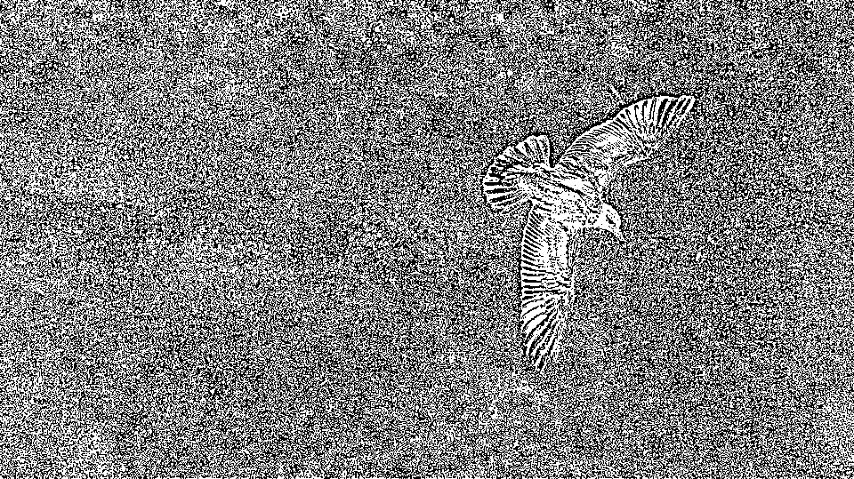

**重点天象****★****木星逆行**

7 月 8 日，木星进入白羊座 8°，7 月 29 日，木星将在这里开始为期四个月的逆行。10 月 28 日，木星逆行回到双鱼座。11 月 24 日，木星在双鱼座 28 度恢复顺行。

**几乎整个七月，木星都停留白羊座 8°，**非常利好生日在 3 月 28-31 日、7 月 30 日-8 月 2 日、11 月 29 日-12 月 2 日的火象星座（白羊座、狮子座、射手座）。他们容易感受到身心愉悦，善于思考，找到人生的意义和方向。

木星与机会、乐观、慷慨、信念和信仰相关，去链接比自己更庞大的事物以及更宏大的秩序。星图中木星落入的位置能够给人们带来信心。木星的热情、勇于冒险、不受约束，需要不断探索很大的空间和高远的理想。

**木星逆行，就会提醒我们去思考：到底什么是对？什么是错？道德和法律的关系如何界定？如何协调个人真理和主流价值观之间的冲突？**

木星在白羊座高歌猛进，速度太快，现在是时候停下来，诚实地面对自己的内心，排除其它因素的干扰，做出真正适合自己的决定，重新校准人生前进的方向。

**木星在白羊座开始逆行的时间，恰逢狮子座新月。**一切线索都指向新的事物、新的开始、新的方向。利用这个机会确认自己目前的状况，重新编辑自己的人生故事：

故事的主题需要调整吗？哪些素材是与剧情无关的？配角人物是必不可少的吗？故事是在往前推进，还是陷入僵局？

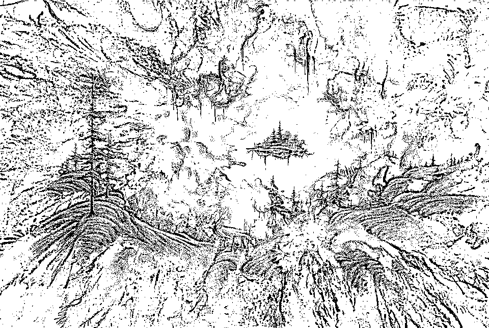

**★****凯龙星逆行**

凯龙星全年运行区间是在白羊座的 8 度到 16 度。**7 月 19 日，凯龙星在白羊座 16 度开始逆行。**12 月 23 日，凯龙星在白羊座 11 度恢复顺行。**逆行时间近五个月。**

凯龙星的轨道在土星轨道和天王星轨道之间，它连接了土星与天王星，也被认为是时间与空间的桥梁。在土天相位日趋紧密的当下，逆行的凯龙星会给我们指出疗愈和整合之路。

凯龙星的治愈能量来自于它洞察了人类的所有苦难、悲伤、失去、自暴自弃等等，因为了解，所以充满力量。

凯龙星逆行的时候，会帮助我们去提升内在感知力，更好地了解自己，找到伤痛的根源。并且意识到这个根源，正是我们可以去帮助和引导他人的地方。

**凯龙星在白羊座逆行，会迫使我们去寻找自我，追问生而为人的本质。**它会试炼我们的力量和勇气，暴露我们的脆弱和阴影，挑战我们的羞耻心和自信心，让我们看见旧伤痛，找到新方向，帮助我们走向疗愈和整合。

逆行的凯龙星会让我们看见自己的伤口，藏在伤口里的往往都是某种形式的悲伤。试着问自己一些问题，**我了解自己吗？我的人生要去追寻什么？我是否真正地在做自己？**

请正视自己的悲伤和愤怒，保持观察和思索，答案将会在年底揭晓。

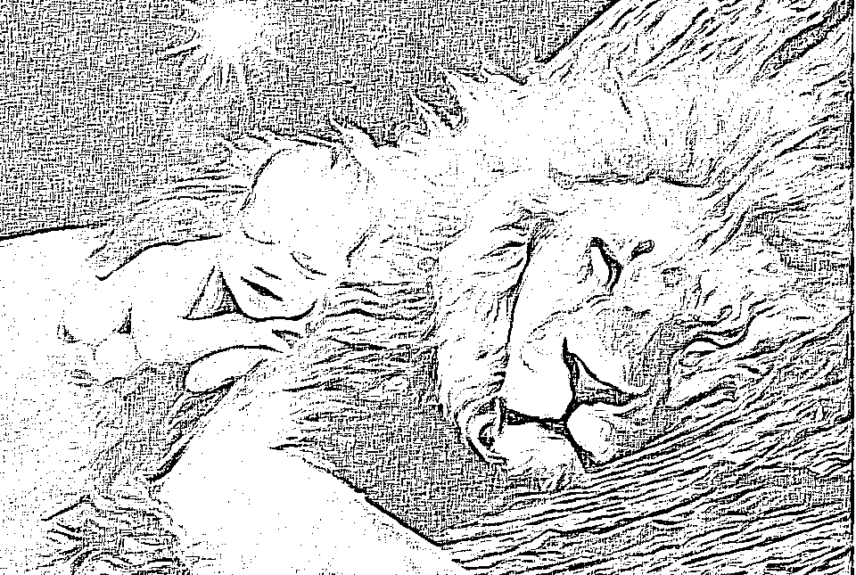

**★****朔望周期**

**七月，我们将经历一次摩羯座的满月，一次狮子座的新月。**

**满月发生在 7 月 14 日的凌晨 2:37 分，摩羯座 21 度。**这个满月充满力量，所有的外行星都参与了进来。满月发生的时候，月亮合相冥王星，对分太阳和水星的合相。水星和冥王星的加入，会促使我们深挖内幕，更加接近真相。

凯龙星在白羊座 16°，和这条轴线构成了一个 T 三角的结构，它提示我们这个过程会充满痛苦和悲伤。很多时候，人们并不乐于了解真相。他们仅仅渴望去证明自己是正确的、智慧的、有预见性的。但真相，总是赤裸裸的。

天王星和海王星会提供帮助。天王星三分月亮、六分太阳；海王星三分太阳，六分月亮。

天王星带来广度，提示人们转换视角，看到更多的解决问题的可能性；海王星带来深度，带给人们更深的同情心和敏感度，它们的能量能够很好地去整合和平衡日月之间的拉扯。

**新月发生在月末，7 月 29 日的凌晨 1:54 分，狮子座 5 度。**这是一个能量强大的新月，火星合相天王星合相北交点,、四分水星和土星，构成了一个 T 三角相位结构。不论是火星和天王星、还是北交点、土星和四分相，全部都是非常有破坏力的、不稳定的能量。

7 月 27 日，水星四分火星；7 月 29 日，水星四分天王星；7 月 31 日，水星对分土星；8 月 2 日，火星合相天王星、北交点；木星、土星、海王星、冥王星和凯龙星都处于逆行状态；**这个月末注定不太平。**

所以，这个狮子座的新月非常适合我们去感受北交点的能量，一个崭新的、陌生的开始，虽然变化发生得很突然，也会带来极大的破坏力，令人震惊、措手不及。

对于新月期间发生的事情，一定要保持警觉，重点关注。**新世界的大门就在那里，那里将会诞生出崭新的东西。**

**新月发生后三个小时，木星开始逆行。**这也提示我们去进行思考，深入探索事物的真相和发展方向。我们最大的问题就是不知道自己有什么问题。为什么我们总是会栽倒在同一个坑里？

现在，现实会给我们提供足够的线索，只要我们睁大眼睛，对周围发生的一切保持敏感，不错过宇宙给予我们的任何信息。

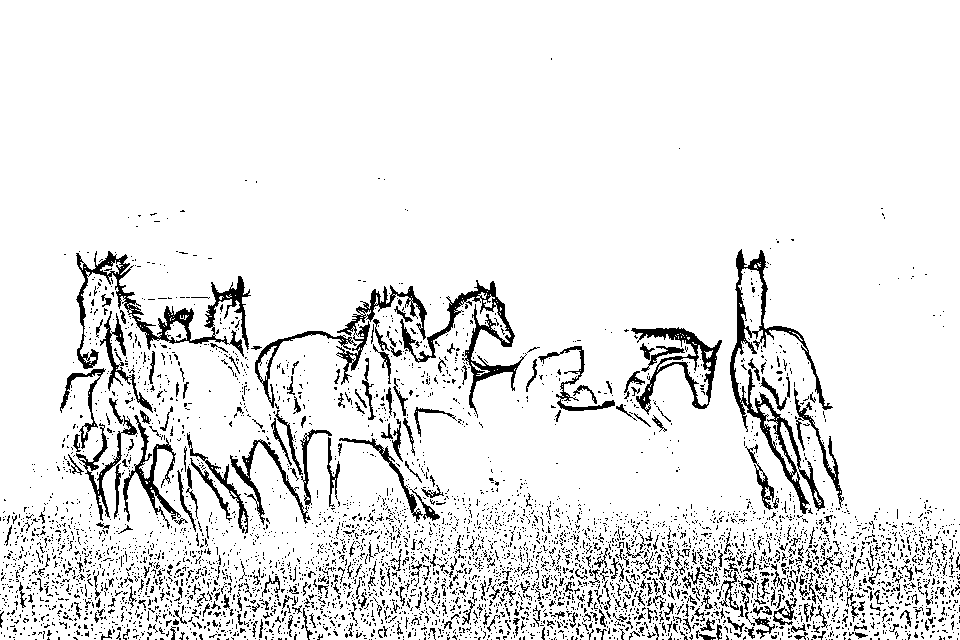

**12 星座七月小贴士**

**（参考太阳星座和上升星座）**

**★ ****白羊座**

*   **适当休息，放慢生活节奏**

*   **稳步推进，认准前进方向**

**★ ****金牛座**

*   **顺其自然，迎接各种变化**

*   **调整心态，尽人力听天命**

**★ ****双子座** 

*   **魅力提升，社交生活活跃**

*   **关爱健康，保持身心平衡**

**★ ****巨蟹座** 

*   **思维敏锐，多听多看多学**

*   **工作繁忙，提高做事效率**

**★ ****狮子座** 

*   **状态良好，保持上升趋势**

*   **排除干扰，专注自身发展**

**★ ****处女座** 

*   **广结善缘，获得有力支撑**

*   **社交活跃，小心良莠不齐**

**★ ****天秤座** 

*   **贵人相助，抓住财富机会**

*   **仔细甄别，以免因小失大**

**★ ****天蝎座**

*   **避免冲突，追求互利互惠**

*   **勤于沟通，倾听分享交流**

**★ ****射手座**

*   **做好计划，放弃无效社交**

*   **提高效率，应对忙碌工作**

**★ ****摩羯座** 

*   **快速行动，顺利推进计划**

*   **吃喝玩乐，享受浪漫时光**

**★ ****水瓶座** 

*   **做好选择，建立长久关系**

*   **勤于沟通，避免家庭矛盾**

**★ ****双鱼座**

*   **坚持自我，争取他人理解**

*   **敞开心扉，开展新的学习**

**版权声明：**原创文章由作者授权首发于若道平台，欢迎转发，反对抄袭。友号转载请申请白名单。

**END**

**Anastasia**

职业占星师/专栏作者/策展人

ISAR 认证占星师（2016 年获得）

若道认证生时校正资质（2015 年获得）

**微信公众号**：KairosMoment

长按打赏

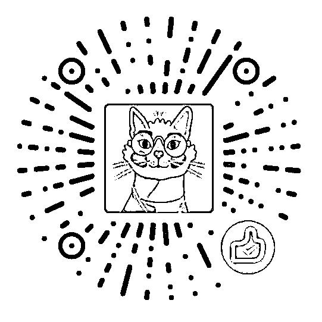

**20 位来自世界各地的占星师****带来 19 场沙龙——新世界的觉醒****详情可点击下图**

**学习占星学****点击下图了解课程详情**

**微信又双叒叕改版啦，不想错过若道君的推送？**
**就把若道设为星标吧！****▼**

**喜欢就点一下“在看”吧！**

********报名直达入口********

# 什么动了美国女性的堕胎权？

> 原文：[`mp.weixin.qq.com/s?__biz=MzA5NjA0NTAxNg==&mid=2651479053&idx=2&sn=62d933db1ca368c833ed29a85ef14947&chksm=8b48eebabc3f67ac393b75e68a1c20553827a398bcc18710add8c7d914e3d03961e70074f9cc&scene=126&sessionid=1692737791#rd`](http://mp.weixin.qq.com/s?__biz=MzA5NjA0NTAxNg==&mid=2651479053&idx=2&sn=62d933db1ca368c833ed29a85ef14947&chksm=8b48eebabc3f67ac393b75e68a1c20553827a398bcc18710add8c7d914e3d03961e70074f9cc&scene=126&sessionid=1692737791#rd)

**华盛顿时间 6 月 24 日早上 10 点，美国最高法院推翻了 49 年前，1973 年通过的罗诉韦德法案，不再认为女性的堕胎权是美国宪法所赋予女性的权利，**而把能否堕胎及其条件这个重大事项交给各州来决定。而在这个裁决后，一些保守州的堕胎触发禁令立刻生效。

作为离美国很远的中国人，作为刚刚经历取消计划生育政策（也即强制堕胎，没有生育选择权的政策），不知道有多少人会认真思考这个事情，毕竟，美国离我们很远，这些事情跟我们的日常生活完全没有关系。但我们至少可以想象一下这样一个情景：

一个怀孕 4 个月的 22 岁女性，她是一个已经有 2 个孩子的母亲，第一个孩子她是 16 岁怀上的，孩子的父亲在她生下孩子后就抛弃了她们，就像她自己的父亲在她 13 岁时抛弃她一样。

她回到母亲家里，但是呆了一段时间被母亲踢出家门，而且母亲骗她签署了放弃孩子抚养权的协议；后来她又怀孕，第二个孩子生下来后，她无力抚养，就让别人收养了她；现在她再次怀孕了。她自己有严重的酗酒和嗑药问题，也没有稳定的工作收入。

她觉得自己没有能力抚养第 3 个孩子，于是就去了堕胎诊所，然而，她怀孕已经 4 个月，她所在的州通过了一个堕胎触发禁令，如果最高法院推翻了原来关于堕胎的法案，这个禁令会立即生效，她要堕胎，就会被判处高达 10 年的刑罚。那时也没有医生敢帮助她，因为帮助她的医生也会面临严厉的刑罚。

几天前，她来找你做咨询，问到这个堕胎手术能否顺利进行，因为她非常担心，她听到消息，最高法院有一份内部文件泄密，是否允许女性有堕胎权这个议题上似乎要发生重大变化。

**你打开星图，发现她正在经历冥王星的行进。在过去几个月，冥王星合相了她的太阳，她有一个太天四分的相位，而天王星合相了她的金星。**

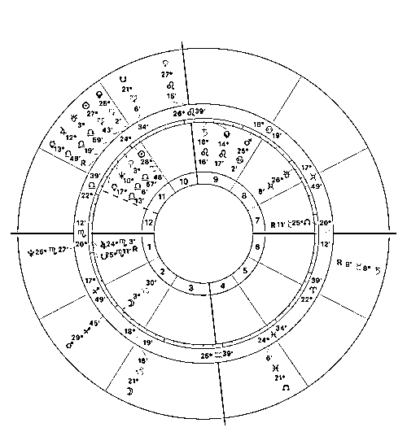

| 来访者的行进图

这是我们都熟悉的星图。

然而除了这张星图外，你还打开了另外一张星图，因为你知道，她所问的那个问题很重要，**最高法院在女性堕胎权的问题上会出现变化吗？**

**你打开的是美国的国家星图和行进图。**

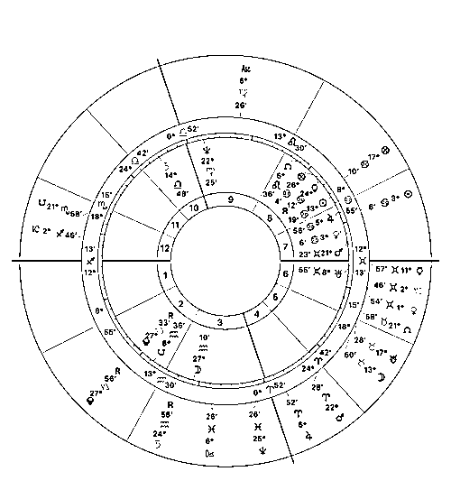

| 美国的行进星图

**你看到了人们一直在说的美国在经历的冥王星回归。**

冥王星，这个和生死、重大危机、权利争斗、阴影及获得力量、彻底的清洗、转化等相关含义的行星，把这些议题带给了出生星图上的冥王星。

**出生星图上的冥王星就像一个黑洞，那里有生死、有最深的创伤、痛苦、腐败、毒药，也有穿越这些的巨大力量。**它一直在黑暗中运作，有时好像冬眠了一样，直到被其他行星唤醒。

而当冥王星回归时，进入黑暗洞穴，唤醒这个大魔头的是大魔头本身。**一场残酷的面对面的生死攸关的斗争开始了。**

这次，在美国的星图上，我们看到了关于女性权利和胎儿生命权的斗争，**有关生命权和选择权的斗争。**在很多人眼中，这确实是一场生死相关的斗争。

**在个人的星图上，是不可能看到冥王星回归的，因为没有人能活到 248 岁，但是在国家星图上可以看到。**

如果你看一个古老国家的历史，**比如中国**，你会发现，除了东周以外，大多数朝代活到冥王星回归时也快到了要灭亡的时候。唐朝 289 年，明朝 276 年，清朝 268 年。即便是寿命最长的东周，前期春秋 317 年，后期战国 197 年。春秋末期，已经乱成一团了。

**中国之外，也可以看看西方的国家。**

**以英格兰为例，它总共已经经历了三次冥王星回归。**

**第一次回归在 1311-1315 年的时间段**，发生严重的“大饥荒”，导致了接下来几年巨大的社会动荡和上百万人的死亡，还导致苏格兰与英格兰的分离。 

**英格兰第二次冥王星回归的大致时间是 1555-1562 年，**是我们熟悉的玛丽女王——伊丽莎白一世时期，大规模的宗教迫害，王室的各种人物死于非命，伊丽莎白和苏格兰玛丽女王之间著名的对峙，这也是是英格兰经历冥王星“重生”的时期，伊丽莎白接管了一个危机重重、宗教斗争血腥、经济基本破产的国家，但是在她的统治下，英国成为海上强国。

**英格兰的第三次冥王星回归发生在 1801 到 1810 年之间。**这段时期是联合王国的正式成立，即英格兰，威尔士和苏格兰和爱尔兰合并，发生工业革命，并参与了各种军事斗争（如拿破仑战争、英俄战争、英美战争）以保持帝国完整，并扩大帝国力量，并在这一期间，废除了奴隶制，算得上是一次冥王星的“重生”。

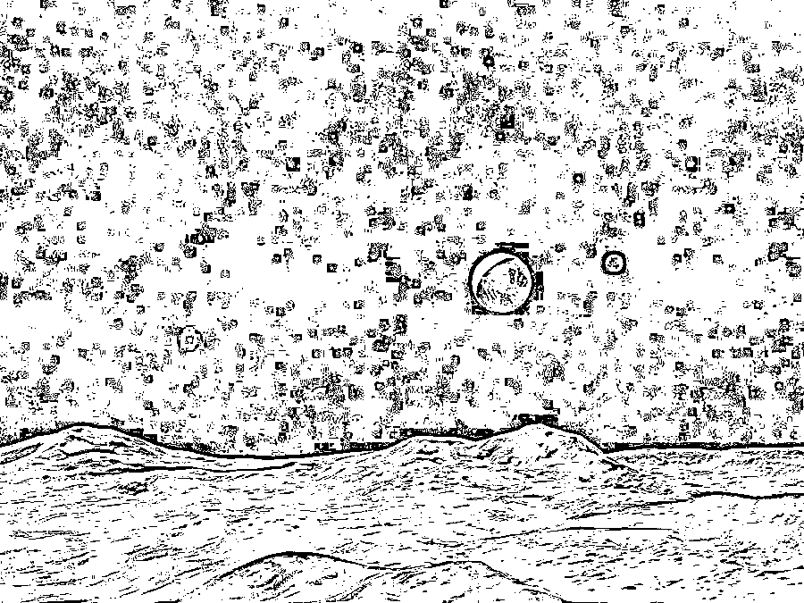

**冥王星行进常常和应对未解决的黑暗有关，也和最深的伤痛相关。**如果能面对和解决这些问题，可以产生转化性的效果，就如英国所经历的那样；如果没有，那么这些未解决的问题可能从内部产生消耗和破坏，撕裂甚至摧毁一个国家。 

**而冥王星回归对美国意味着什么？** 我们已经看到，冥王星回归前后，一个有着西方民主世界中少有独裁者特点的、呼喊着让美国再次强大的特朗普上台，引发前所唯有的撕裂和民众间的激烈对抗；然后是全球经历的新冠疫情，世界强国美国在新冠疫情中超过一百万人；然后是作为西方世界的领导国家卷入俄乌战争之中；现在是反堕胎法案。

**在所有这些事件中，我们都看到了冥王星的所有关键词。**  

所以，当那个女性找到你，向你咨询，你知道你不能仅仅看这位女士的出生星图，**你必须把这位女士的生命河流放在一个更大的背景下，美国冥王星回归的背景下去看。**

**一个好的占星师需要了解时代的背景，感知时代的潮流。**

大部分人是时代潮流中的一小滴水。了解这个时代是什么样的时代，有什么样的趋势，所处的国家又在经历什么样的趋势，对于个人如何自处，如何应对非常重要。

**而掌握这些知识，你可以从 8 月 26-28 日为期 3 天的经世工作坊中开始。**

顺便说一下，也许有些人看着那位女士的行进图，会觉得很迷惑，怎么外圈的冥王星在处女座？这是不是错了。

哈哈，没错，我们讲了一个真实和虚幻结合的故事。

真实的是，那位女士的星图是正确的，她就是 49 年前罗诉韦德案的当事人，匿名为罗德女士。而外圈是当年她怀孕并寻求司法帮助的行进。她的故事也是真实的故事。

不过在后来的文章故事中，我们把她移到了 2022 年 6 月 24 日那个在堕胎诊所等待的时刻。

在这个真实的故事中，还有很多非常让人深思的东西和占星学上非常有趣的知识，我们留待以后再讲吧。

**END****大国命运：经世占星学 3 天线上工作坊来啦！**

在这个工作坊中，我们将学习**如何专注于能够理解世界大事并对它们做出准确的预测。**这将带领我们踏上**一段重要的行星周期之旅，并延伸到重要国家和世界领导人的星图。**现在正是学习的好时机！

2020 年 12 月，木星与土星合相，这是 800 年来这两颗行星首次在水瓶座合相，预示着地球以及政治和社会趋势将发生巨大变化。我们正在进入一个令人兴奋的奇境，非常适合探索经世占星学。

**点击下图了解更多详情** 

****

**微信又双叒叕改版啦，不想错过若道君的推送？**
**就把若道设为星标吧！****▼**

**喜欢就点一下“在看”吧！**

********报名直达入口********

# ISAR 选修课 | 大国命运：经世占星学 3 天线上工作坊

> 原文：[`mp.weixin.qq.com/s?__biz=MzA5NjA0NTAxNg==&mid=2651479053&idx=3&sn=7fb61d41187a0a84e0508c987433ff9d&chksm=8b48eebabc3f67ac784c6ac865f2c31587a34134e4864dffc27e200d327a34d44e54965712da&scene=126&sessionid=1692737791#rd`](http://mp.weixin.qq.com/s?__biz=MzA5NjA0NTAxNg==&mid=2651479053&idx=3&sn=7fb61d41187a0a84e0508c987433ff9d&chksm=8b48eebabc3f67ac784c6ac865f2c31587a34134e4864dffc27e200d327a34d44e54965712da&scene=126&sessionid=1692737791#rd)

<mpvideosnap class="js_uneditable custom_select_card channels_iframe videosnap_video_iframe" data-pluginname="videosnap" data-id="export/UzFfAgtgekIEAQAAAAAAfGQB6vQCmQAAAAstQy6ubaLX4KHWvLEZgBPEioJES3BsLK2DzNPgMIsb3nmx3ZXbJKLT1wm45TIu" data-url="https://findermp.video.qq.com/251/20304/stodownload?encfilekey=S7s6ianIic0ia4PicKJSfB8EjyjpQibPUAXolorph7kXX0G2V8DGSvfR9PkwwbPmosvYicRybibaBiaVv5A38Bc5Re8nsYStXZD7nqrhjvCib7Z8iaC9vlXIpibAjFAuw&amp;adaptivelytrans=0&amp;bizid=1023&amp;dotrans=0&amp;hy=SH&amp;idx=1&amp;m=&amp;scene=0&amp;token=AxricY7RBHdWxX5EuW79OcFLEojiajUVbfrb10projcwzwun3SBUDgOHcwIaMibQEFyWZc9dNWComE" data-headimgurl="http://wx.qlogo.cn/finderhead/PiajxSqBRaEJYnVsqWfEX9qA0sI6hNVKsDfyzfPZ92WZMZyBpZWU5NA/0" data-username="v2_060000231003b20faec8c4e68a1ec2d4ca07e434b07755bbf47e7053a3059defd2c9d6c68a20@finder" data-nickname="若道" data-desc="#ISAR 选修课 经世占星学是什么？会教授哪些知识内容？8 月经世占星工作坊，来提前了解一下" data-nonceid="3653579416430381618" data-type="video" data-width="640" data-height="368"></mpvideosnap>

有一些岁月经历的人，会非常清晰地看到，我们每个人的命运都和国家的命运紧密联系在一起。

以俄国人为例，不论每个俄国人有什么样不同的个人星图，31 年前的苏联解体，今年发生的乌俄战争这样重大的事件，毫无疑问影响了俄国 2 代人的命运。而在一些关键时间点个人的选择，毫无疑问，又影响了个人的生命历程。

而只要你关注世界局势，你也会看到，这样的一个国家发生的重大事件又会对其他国家的各个方面发生重要影响。

我们的命运、我们所获得的事业的发展机会、我们的财富机会都是和整个时代和国家息息相关。

**因此，一个好的占星师必须要懂得时代的声音，必须要洞悉全球的趋势，必须要懂得国家的故事。**

在这个工作坊中，我们将学习**如何专注于能够理解世界大事并对它们做出准确的预测。**这将带领我们踏上**一段重要的行星周期之旅，并延伸到重要国家和世界领导人的星图。**现在正是学习的好时机！

2020 年 12 月，木星与土星合相，这是 800 年来这两颗行星首次在水瓶座合相，预示着地球以及政治和社会趋势将发生巨大变化。我们正在进入一个令人兴奋的奇境，非常适合探索经世占星学。

邓肯老师说：

****

**学习经世占星学，我们可以依靠占星师们过去使用一些技法所做的预测，我们将在这个工作坊中进行探索。**

**比如：占星师迈克尔·贝金特在 1982 年，苏联解体事件发生 7 年前，就对苏联做出如下预测：**

**“从 1989 年 1 月到 1991 年 11 月……在领导和统治风格方面……国家将进行一些基本的重组。这一时期将预示着一些新的革命……严密的控制结构将失败，国家将崩溃，重新回到过去的众多自治国家。”**

**而占星师罗伯特·佐勒在世贸中心遭到袭击前一年的 2000 年写道：**

****“从 9 月份开始，我们西方正进入一个危险加剧的时期……尤其是在东海岸……这将招致乌萨马·本·拉登等冒险家的劫掠……这是一个警钟……2001 年 9 月第一次大危机袭击美国之后，我们将再也回不到从前了。”****

**在 2020 年美国大选前 6 个月，我也写了一篇文章：**

****“他（唐纳德·特朗普）将战斗到底，美国的街道将成为战场，他不会优雅地离去，但在 2021 年，一个新时代开始了，大海将覆盖特朗普总统任期的废墟。”****

出生星图和经世星图都使用相同的基本占星技法，对每一个主题的研究都同时丰富了这两个分支。你从观察世界大事中学到的东西，可以应用到个人客户身上，反之亦然。

**工作坊内容和时间安排**

**8 月 26 日 周五 **

**14:30-15:30**

**1. 基础知识介绍**

-外行星及其在各个星座运行

-外行星周期

-国家星图

-政治领导人星图

-选举星图

-将以上各项按优先级排序

**休息 30 分钟**

**16:00-17:30**

**2. 外行星及其在各个星座运行**

-天王星入座：革命性的变化

-海王星入座：意识的转变

-冥王星入座：危机与重生

**休息 90 分钟**

**19:00-20:30**

**3. 木星-土星的合相周期**

-文明的发展

-水瓶座新电子化时代

**休息 30 分钟**

**21:00-22:00**

**4. 木星与外行星的互动**

-木星-天王星：科技进步

-木星-海王星：媒体的力量；消融，受苦和慈悲

-木星-冥王星：意识形态极端主义

**8 月 27 日周六**

**14:30-15:30**

**5. 了解社会趋势**

-土星-天王星：新的如何取代旧的；科技重组

-土星-海王星：乌托邦梦想破灭；结构消融

-土星-冥王星：独裁与权力瓦解

**休息 30 分钟**

**16:00-17:30**

**6. 长期文明变革**

-天王星-海王星：新世界秩序的梦想

-天王星-冥王星：机械的变革力量；剧变

-海王星-冥王星：意识变化的 492 年周期

**休息 90 分钟**

**19:00-20:30**

**7. 20 世纪地缘政治力量的影响**

-俄罗斯、苏联时代及其衰落

-美国的故事

**休息 30 分钟**

**21:00-22:00**

**8. 中国**

-中国作为全球玩家出现

-科技、领导力和一带一路

**8 月 28 日周日**

**14:30-15:30**

**9. 行星推进的重要性**

-预测选举的结果；特朗普 - 拜登

-预测国家的发展：以色列

-美国：扩张与收缩

**休息 30 分钟**

**16:00-17:30**

**10. 有多张星图的国家**

-英国

-法国

-沙特阿拉伯

**休息 30 分钟**

**19:00-20:30**

**11. 统治者的出生星图**

-普京：克格勃军人，2020 年代的发展

-特朗普：虚假信息之王，获胜者与失败者

**休息 30 分钟**

**21:00-22:00**

**12. 21 世纪的世界发展**

-新时代的人口和气候变化

-独立与全球化

-宗教与科学

-人际关系与游戏

**授课老师**

**艾德里安·罗斯·邓肯（Adrian Ross Duncan）**

**·** 邓肯老师 1971 年在印度游学时开始学习占星学，1985 年开始成为全职占星师，迄今执业已超过 33 年，是人本主义占星学、卜卦占星学和经世占星学领域的知名占星师。

**·** 开发了占星软件 AstroClock 和多款占星报告。

**·** 从 1971 年开始研习佛学，受佛学影响很深，他相信占星学和佛学观点统一、转化的一个基础是在于对现实感知的改变。

**授课方式**

**授课方式：**

**线上网络直播课，英文授课，中文翻译**

**课程价格**

**课程价格：**

**正价：6800 元**

**早鸟价：5800 元**

**早鸟价截止日期：2022 年 8 月 1 日**

负责人：若道-童童

（微信：nodoorDaivd）

**退转课程**

**退款原则请详看《教学协议》，如有疑问请咨询课程顾问。**

****ISAR 选修课 | 大国命运：经世占星学 3 天线上工作坊****

**授课老师：******艾德里安·罗斯·邓肯****

**工作坊时间：2022 年 8 月 26 日-28 日（**周五-**周日）**

**授课方式：******网络授课，英文授课，中文翻译****

**费用：****正价：6800 元****（早鸟价 5800 元，8 月 1 日前）**

**课程负责人：童老师**（微信：nodoorDaivd，请备注“经世工作坊”）

长按二维码添加课程负责人咨询~

****报名直达入口****

# 这个北交点今生需要花更多时间独处，享受户外和接触大自然

> 原文：[`mp.weixin.qq.com/s?__biz=MzA5NjA0NTAxNg==&mid=2651478924&idx=1&sn=1c755e352107584bce7c51b42a80daf9&chksm=8b48e93bbc3f602dd00564b3abe175231708d9fbceafa6ee2f2f827e9b65a658221090885eb9&scene=126&sessionid=1692737791#rd`](http://mp.weixin.qq.com/s?__biz=MzA5NjA0NTAxNg==&mid=2651478924&idx=1&sn=1c755e352107584bce7c51b42a80daf9&chksm=8b48e93bbc3f602dd00564b3abe175231708d9fbceafa6ee2f2f827e9b65a658221090885eb9&scene=126&sessionid=1692737791#rd)

☆****后台回复“今日”，给你一句生命态度****

作者/简·斯皮勒 译者/江艺 校对/Chang 编辑/玫瑰 封面/书君 图片/pexels

南交点双子座-北交点射手座今生的功课是怎样的呢？这个组合很容易神经紧张，和人群待在一起久了就会很需要独处，还有其他需要注意的点？一起来看看！

**北交点射手座/第九宫综述**

**发展的特质**

在这些领域努力有助于挖掘隐藏的天赋和才能： 

**· **依赖直觉、预言能力和无形的指引

**· **言语从更高意识出发**· **自发性——发展自由和冒险意识**· **直接的交流，不受头脑审查**· **信任自己**· **独处和亲近大自然**· **耐心**· **直觉式倾听——听到话语背后的含义

**要放下的倾向**

努力减少这些倾向的影响有助于让生活更轻松、更愉快 

**· **过多猜测别人背后的想法

**· **犹豫不决**· **不断寻求更多信息**· **说别人想听的话**· **用逻辑否决直觉认知**· **八卦**· **不耐烦——想要立即的答案**· **相信别人的看法，而不是自己的——包括别人对自己的看法

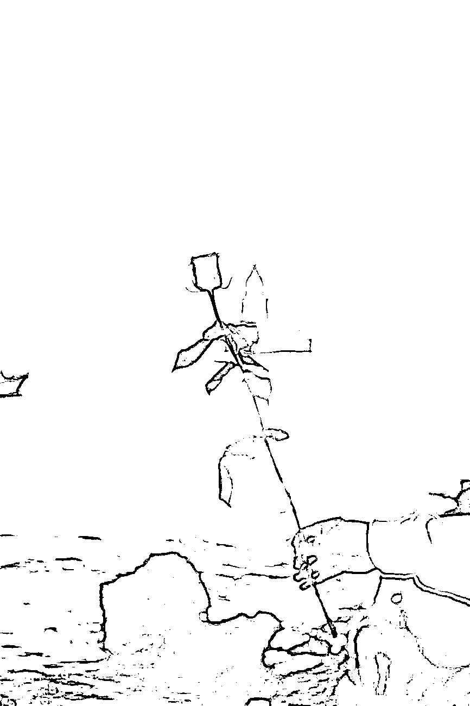

**阿喀琉斯之踵/避免的陷阱/底线**

**北交点射手座的阿喀琉斯之踵，是头脑的安全（“如果我能知道别人在想什么，说正确的话，他们就会同意我的想法，我就会永远安全”）**。这可能会导致他们陷入无休止地搜索信息的陷阱（“如果我能得到足够多的事实，就能找到‘真相’，然后就知道该怎么做了”）。但这是无底洞：**他们永远无法充分读懂别人的思想，从而确保自己会说正确的事。**他们需要**放开控制，听从直觉**。如果相信并根据自身的真实体会行事，他们的正直就会显现，这将吸引合适的人，帮助他们获得他们所寻求的内心的安全和平静。**底线是，他们永远不会有足够的信息来知道“真相”是什么。**到了某个时点，北交射手的人不得不**超越逻辑，抵达直觉，并展示他们的更高真理所告诉他们的**。讽刺的是，**当他们相信自己的精神指引时，便会对周围发生的事情有正确的认识。**

**这些人真正的诉求**

**这些人真正想要的，是自信地做自己的同时感到与他人的联结。**他们希望**周围所有人的同意**——**每个人都理解他们的观点，接受并支持他们，认可他们的积极动机**。为了达成这点，他们**试图操纵人们以他们的方式思考。****北交点射手座的人善于理解别人，他们利用这一天赋，认为只要能说出恰当的话，就能让别人改变主意并同意自己的观点。**但这不奏效；为了达到目标，他们需要**重新把注意力集中在自己的内在真实上面。****当北交点射手座说出他们的直觉感受时，他们的处境就会和谐。**当他们**按照更高自我的指引来生活和说话时，不合适的同伴就会退缩，而能够和谐相处的新人则会出现。**当北交点射手座的人根据他们的更高真理行事，与其志同道合的人会理解他们，而这是最值得信赖的朋友，因为他们有相同的精神价值观。

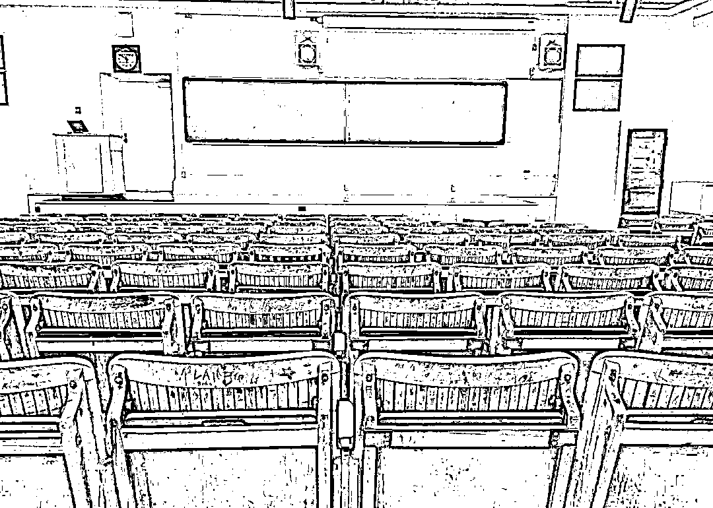

**天赋/职业**

**这些人有很强的直觉，他们在精神领域，比如用直觉通灵和“解读”方面出类拔萃。**他们也可能在涉及与国外互动交流的情况中非常成功。令他们最快乐、最成功的领域，是**让这些人利用自身才华寻找解决方案的领域。**好的选择包括：**律师、宗教或精神领袖、教授、出版商或广告行业从业者**——只要可以让他们在大众层面传播思想，或推动自己信仰的事业。北交点射手座的人，天生就有理解他人思维模式的天赋，所以他们经常**能预见可能的结果——“不祥之兆”**。当他们**用语言表达通过直觉看到的真相时，天生的沟通技巧创造了一个双赢的局面。**然而，如果在他们所从事的职业中，是以理解和报告他人的想法为目标，可能就没有那么好了。**教授世俗的科目，或者关于事实而不是灵感的写作项目，会增加他们对意外伤害的不安和恐惧。**当他们**利用自己天生的写作/口语能力作为沟通和实现更高真理的方式**时，他们会过得更好。

**射手座北交点特定的疗愈誓言**

**· **“当我追随自己对真相的觉知时，我就赢了。”

**·** “当事情发生时，我的直觉会自动告诉我正确的路。”**· **“当我让别人做他们自己时，我也是自由的。”**·** “当我相信自己的直觉，用语言表达我当时的想法时，我就赢了。”

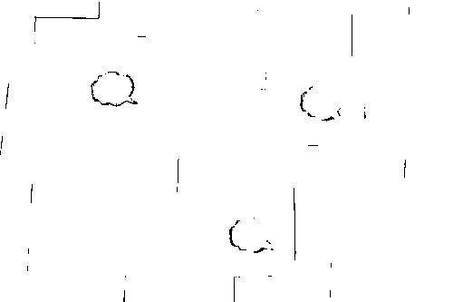

**北交点射手座/第九宫的个性**

**前世**

在北交点射手座的许多前世中，**理解他人想法**对他们的职位来说的非常重要：**教师、作家、演说家和销售人员。**教师只有理解学生的思维过程，并以学生能够接受的方式传授信息，才能取得成功。他们在这一世带来了**看见别人观点**的天赋，但在这个过程中他们已经与自己的真相失去了联系。现在他们需要**与自己的精神联系起来，重新发现自己。**理解的天赋也意味着这些人**可以和任何人谈论任何事情——能说会道**。他们可以洞察对方的思维模式，并持续闲聊几个小时，通过友好的交谈和对人的接纳，让对方感到舒适。但是他们**非常清楚其他人的心理，会常常过度翻译别人的想法。**他们认为他们需要说别人的话才能被理解，很快他们就迷失了，忘记了他们真正想说的是什么。因此，**当他们从自己的直觉中“获得一些东西”时，他们应该直接说出来，而不是试图编辑或“翻译”它。**

**犹豫不决**

**北交点射手座的人很难做决定。**他们**习惯于看到事物的两端，所以即使知道该怎么做，也会看到另一种观点并感到困惑。**例如，如果他们问自己：“我应该去参加派对还是在家休息？”他们本能地“知道”或“感觉”哪个选择会让他们快乐。但随后就质疑自己的认知：“是的，呆在家里会让我很高兴，我也需要休息，但如果不去派对，也许会错过什么……但另一方面，我实在需要休息——我已经连续三个晚上外出……然而，这个聚会上可能会有一些非常有趣的人……”等等。很快他们就做不了决定了。为了避免这个问题，他们一定**不能让自己质疑自己的第一感觉“知道”。**他们的**直觉几乎百分之百准确**。他们在学习认识它、依赖它，并让它来引导自己。此外，他们需要相信，**他们不会“错过”任何注定会发生的事情或注定会遇见的人。**当他们遵循内心自发的认知时，他们将永远“走在正轨”。这些人优柔寡断，因为他们为走向任何方向都想了很多理由。这从来不仅仅关于是和否——而是“是的，因为某某”和“不是，因为其他某某”——直到问题变得如此复杂以至于根本无法决定。

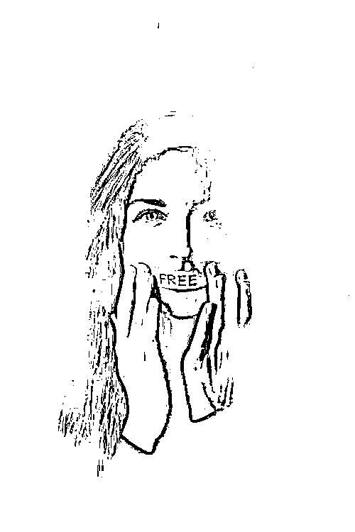

**过度猜测**

**由于缺乏安全感，北交点射手座会经历一个漫长而伤脑筋的猜测自己（和他人）的过程。**他们**不相信自己的直觉。**在过去世中，他们太习惯于成为他人生活和思想的一部分，以至于与自己的身份失去了联系。**所有这些前世对社会的认同教会了他们依赖他人。**但现在他们需要**依靠自己——而不是试图“解释”自己的直觉。**当他们将逻辑应用于直觉时，会变得更加困惑。这个过程对他们来说是非常痛苦的。他们的内心变得如此矛盾，以至于觉得自己没有了稳定的基础。这些人可以看到任何决定的正反两面，当他们彻底考虑了所有可能后果，就感觉处在“没有胜利”的情况。**整个过程都与损失有关：在不同选择中要忍受什么损失？他们专注于消极面向，变得越来越没有安全感。****然而，这些人真正想要的是赢得一些东西。**他们必须**专注于自己的目标，而考虑其他人时，应该看谁能帮助他们得到想要的。**讽刺的是，当他们做出决定的那一刻，宇宙就会支持他们，一切都会顺利而美好地进行!然而，在到达这一点之前，他们几乎把周围的人逼疯，因为他们想要和认识的每个人核对每个决定。他们的好朋友，可以听到这些人在狂热的、“合乎逻辑”的观点背后真正在寻找什么，并亲切地指出他们最初的、直觉的认识。北交点射手座的人需要比他们所意识到的更多的帮助，来实现他们的梦想。他们需要精神上的帮助——直接来自宇宙本身来达到他们的目标，如果他们对此保持开放，今生就可以获得。他们要明白，要想朝着梦想迈进，就必须放弃向下的路。失去总是更大收获的一部分。为了获得独立生活的益处，必须放弃对父母的依赖；为了得到晋升的好处，必须放弃之前的工作。他们需要**专注于收获——当他们朝着目标努力并追随内在的自发激励时，新的成长、新的环境和新的人就在他们周围。****他们需要转变对责任的感知，不再是去唤起他人某种自己想要的反应，而是成为内在指引天赋的正确渠道。**在这一生中，他们不是看守人，而是创始人。如果他们顺其自然，事情如此简单！做决定的那一刻：“我要选择这个”或“我要选择那条路”时，他们就达到了一个新的水平。他们不需要经历怀疑自己的痛苦的中间过程。他们所要做的就是**相信直觉是正确的，决定遵循直觉路径，并使用他们的逻辑来找出实现它的最佳方法。**当他们试图弄清楚别人会如何反应时，他们看到的是自己做出决定前别人会如何反应。但当他们做出决定时，实际上改变了对方的反应。因此，北交点射手座的人无法从逻辑上预测其他人将如何回应。他们所有的决策经验让他们回到同一个观点：**在这一生中，当他们相信自己的直觉并遵循自己的道路时，就会可行。**

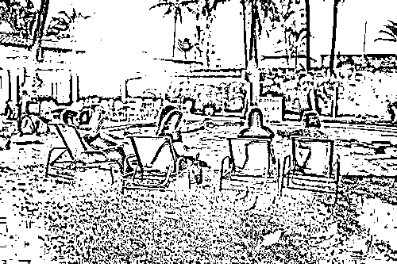

**北交点射手座/第九宫的需求**

**独处，分享 vs 个人整合**

**尽管在前世，这些人习惯周围环绕着人，但在今世，他们有必要花大量时间独处。**当他们远离他人时，会变得清晰，与自己的真实相联系，并建立一种和平和幸福的感觉。有时**他们不交流和分享自己的想法会更好。**他们可能会获得洞见，并且因为在前世是老师，他们的第一反应是慷慨地与其他人分享他们的知识。**但当他们分享的时候，洞察的力量开始消散。**首先，如果人们不同意他们的真理，他们会立即尝试从对方的角度看问题。即使对方没有明显反对，但由于**北交点射手座的人对别人的反应非常敏感，他们可以感觉到任何一点反对；然后变得没有安全感，精力也随之消散**。相反，他们应该**保留一种新的见解或启示，直到他们被它滋养，融合它，并开始在自己的生活中展示它的影响。**例如，如果这些人认为直面恐惧会让恐惧变成大笑，那么他们应该在日常生活中努力将这种洞见转化为行动。这样，他们就成为了这个真理的活生生的证明。

**自然的生活：“大图景”**

对北交点射手座的人来说，**暂离社会**是非常健康的：花时间享受户外，重新接触大自然。这让他们**重新感觉做自己，并增强他们对自己真实力量的信心。**大自然的周期给他们带来心灵的平静，帮助他们记住，**有一个计划正在展开，比操纵人们的思想更宏大。****那些常常困扰他们的细节不再重要。**在乡村呆一段时间可以开阔这些人的视野。如果没有这样的视角，他们可能会短路：**他们的思维如此活跃，以至于当他们花太多时间在人和城市身上时，他们会受到过度刺激。****花时间和动物在一起也能帮助他们放松、清醒。**当环境中有另一个基础、简单而真实的生物，他们可以集中在一个平静的频率。动物的眼睛没有人类复杂，这些人真的**受益于通过简单的眼睛看世界**。他们需要**把自己的感知集中在简单的事情上。**同样，出国旅行对这些人也有好处。**由于陌生的语言和不熟悉的心态，他们被迫以一种简单、基本的方式看待周围的人。**他们意识到同伴的简单和美丽：他们的习俗和礼仪，以及他们的穿着和相互交往方式。北交点射手座可能认为他们享受的是一种更简单的文化，但实际上他们享受的是**自己以更简单的方式看待人和事的能力。****这些人渴望简单。**对他们来说，通往简单的道路包括**从表面看人，相信自己的直觉。**当他们**学会简化并对自己诚实时，就会自然而然地以同样的方式看待别人。**当他们开始按照自己内在的真实行事时，就能够想象其他人也没有欺骗或别有用心。**当他们的头脑以这种方式放松时，生活会变得更加快乐。**在所有层面上，北交点射手座的人必须重新与自然联结。举个例子，我有一个有这种交点落点的客户，他有一只新的小狗。有一天我去看她时，她变得焦躁不安，不停地看表，因为该带小狗去散步了，但是小狗在睡觉！根据她的《如何养狗》一书，该是遛狗的时候了——她看到的只有规则。这个客户不了解实际发生的事情。小狗在睡觉，就让她睡吧！这些人需要**重新联结生命的奇迹——一切的自然、和平展开，并相信人类、关系和事件的自然节奏。**

**版权声明：**本文由若道翻译发布，欢迎转发，反对抄袭。友号转载请申请白名单。

**END**

**简·斯皮勒**

全球占星界的一位领军人物，是美国占星师联盟（AFAN）的教员。她定期在新时代和占星回忆上授课，是畅销书《新月占星学》、《灵魂占星》、《灵性占星学》和《宇宙之爱》的作者。

**20 位来自世界各地的占星师****带来 19 场沙龙——新世界的觉醒****详情可点击下图**

**学习占星学****点击下图了解课程详情**

**微信又双叒叕改版啦，不想错过若道君的推送？**
**就把若道设为星标吧！****▼**

**喜欢就点一下“在看”吧！**

**报名直达入口**

# 职业占星师养成计划：他们的故事，你来听吗？

> 原文：[`mp.weixin.qq.com/s?__biz=MzA5NjA0NTAxNg==&mid=2651478924&idx=2&sn=ef456494cb9497f0f41a9c876d59e8a2&chksm=8b48e93bbc3f602d762b7d259d32db26521a8d6125a9249510c3b2d7a2a51bbfb1e5ba58ee2d&scene=126&sessionid=1692737791#rd`](http://mp.weixin.qq.com/s?__biz=MzA5NjA0NTAxNg==&mid=2651478924&idx=2&sn=ef456494cb9497f0f41a9c876d59e8a2&chksm=8b48e93bbc3f602d762b7d259d32db26521a8d6125a9249510c3b2d7a2a51bbfb1e5ba58ee2d&scene=126&sessionid=1692737791#rd)

在现在的核心课程中，在适合的时候，我们都会开始占星师养成计划。

职业占星师养成计划的目的：

**帮助那些有志于成为职业占星师的同学，在 2 年的核心课程结束后，能够更加有自信的开始对外收费咨询。**

**职业占星师养成计划的原理：**

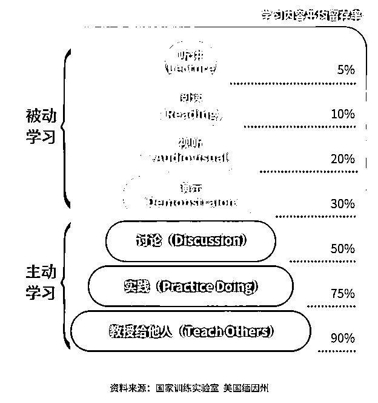

学习金字塔是美国缅因州的国家训练实验室研究成果，它表明主动性的学习方式可以比被动性的学习方式有更高的学习效率。

在若道过去的观察中，那些仅仅只是学习听讲的同学们，在毕业后常常不敢开始咨询实践，而那些后来做的好的占星师也是那些练习最多的人。

**占星学本身是一门实践的学问。所以，我们就特意设计了一套在学习中实践体会的体系，来帮助大家用主动学习的方式把知识变成自己的，从而在 1 年半的时间里，一点一滴建立自信。**

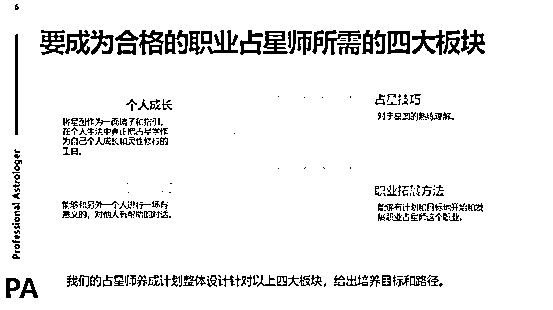

**因此，对于那些想要在 2 年的学习后开始兼职咨询的同学，我们设计的占星师养成计划会非常有帮助。**

而那些仅仅只是把占星作为兴趣爱好、并没有更多的时间和精力投入的同学，也可以不参加这个计划，或者选择只参加计划中自己感兴趣的部分，这是一个非常灵活的自由的选择。

**这个养成计划是 2021 年开始的，目前已经在若道的 2 个核心课程中实践。**

今天，我们采访了一个核心课程的几位助教和同学们关于研究小组。

**助教滴答说**

**问：养成计划的目的是什么？**

**答：**像开辟一个配合教学课堂的“第二空间”，课堂是理论学习的空间，**研究组就是实践空间。让理论和实践并举。**紧扣教学课堂的教学内容和进度，为学生们提供一个可以交流/实践，运用课堂所学的空间，**提升他们对理论的理解和运用能力**，期望他们在毕业时，就可以学以致用。

  **问：作为助教，旁观这些学员的成长，你有什么感受?**

**答：**1.如果我当年学习时也有这样的边学边实践的小组研讨，应该能快速提升运用能力，不会学完后还不知道从哪著手，自己要不断练习和体会很久。

2.若道学子藏龙卧虎，非常优秀，非常有才，参加的学员都很用心，很认真，而且特别真诚的分享，很愿意发展自我觉知，能特别诚恳地做自我认知的解剖。还有志愿者特别无私奉献，无论是组长、副组长，小蜜蜂都耗用很多时间精力和各自的专业能力去组织去准备，还有很多组员也默默奉献他们的专业能力和时间，来帮助研讨的推进和最终成果的展示。

**研究小组组员说**

**问：研究小组对你占星学的学习运用有帮助吗？具体体现在哪里？**

**Cleo：**

先不谈学习运用，我分到天王星组，我完全没想到，我对自己星图里的天王星多一点了解我就多收获一点，我收获了太多了，**我对自己的了解就像剥洋葱一样，**以至于我在提前半个月就开始记录分享会的灵感，分享会前一天晚上还有新的感悟要更新。

**研讨会三位老师的点评太重要了**，滴答老师点拨了我星图里的一个金冥四分相位，我马上明白了这么多年旧有模式的强迫，这部分也借着分享会对自我的挖掘，凿地三尺把它完整地挖出来了，我太高兴了，四阶分享我已经写好了！

我太喜欢分享了，**我希望被听到，我也喜欢与所有分享的同学有共鸣，**虽然这部分非常隐私，但是我愿意和盘托出，希望在四阶能帮助大家对这个相位有更多理解。

我觉得上课，知识是启发的第一步，特别是相位，3 阶我对相位的知识真的大多是讨论出来的，Lynn 老师的课是有门槛的，我一开始消化不了，我需要复习，但是很喜欢 Lynn，感谢天空老师给我们补基础。

我也很开心我因为是组长的原因认识了很多同学，包括其他组的组长们，**与她们私下里的交流也让我受益匪浅，**很多让我自己想，看书，看课不知道什么时候才能想出来的对相位的理解，一聊就有，我们的组员太好了！我们的老师太好了！这让我一个月双鱼 11 宫倍感滋养，我太开心了！

**雪儿：**

很有帮助，能够让我更深刻的理解到自己星图的相位，同时跟组员的讨论过程中可以**看到不同角度的解读，**这个解读又可以促进自己更深刻的思考，也加强了对所学知识的运用和巩固。

在讨论的过程中遇到问题能够**及时得到助教老师的指导，及时解决了学习的难题，**所以很赞同小组研讨。

**Simona：**

很有帮助**。因为大家视角不同，关注点不同，可以更好地理解课堂上学到的技法和知识。**

其次，研讨中彼此分享故事，**彼此产生共鸣和互相寻找解决方案，**是一个非常治愈的过程。同时也让我能够更沉静地听着之前听不太进去的课堂同学案例，明白怎么去更好地学习占星，以及需要跟老师们学习什么。

**小乖：**

很有用。1. 增进学员互动，激发学习热情；2\. 互相体会学员间彼此的相同与不同；3. 助教旁听答疑，也是很好的辅导了我们。

**Angell：**

研究小组在学习占星学的学习运用上非常有帮助。

具体的体现如下：**对于一些原本没有体会的相位有了更清晰的感受，**可以更加深入地体会并最终可以将这部分能量**有意识地整合到自己的内在模式中，**更好地发挥有益的力量。而对于自己没有的相位，可以从其他组员的解读，更加深了对那些相位的了解。

同时，作为组长，为了可以更好地澄现小组的研讨成果，需要去协调，调动，推过，更加有耐心并注意尽量发挥大家的能动性，可以将研讨最终顺利完成，这样帮助我去走向我的北交点水瓶座。

**Rhiannon：**

非常有帮助。重新审视了自己过去比较忽略的行星在星图里的重要性作用及影响，**有了更多的反思，**更深入的去研究和理解并且挖掘。像是两点了一个过去藏在黑暗处的蜡烛，很开心。

**Bobby：**

很有帮助！比如对冥王星有了更深刻的认识也积累了很多实战案例，特别是在相位上，收获了很多。

**启程：**

**在研讨中加深了对基础知识的理解和辩析。**而且慢慢对继续学习产生信心，之前觉得自己跟不上进度，与其他同学差距太大。同时，在了解他人生命故事的同时，也能够尝试与自己和解。

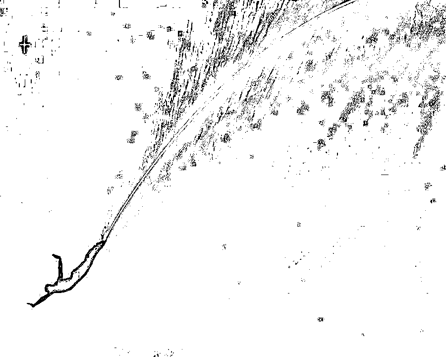

**问：参加研究小组后，你觉得自己最大的改变是什么？**

**Cleo：**

其实如果我不做组长我是不会非常主动地跟人打招呼的，我也不会主动加谁，加了也不会主动聊天，但是去组织这个活动让我强行迈出了第一步，**收获了非常多好的朋友。**

然后就是小组的氛围特别好，大家都是身怀绝技，没有人焦虑，边界感一流，这让我太舒服太放松了，当我们分享会大受好评的时候我真的第一次觉得我成功了，因为第一次我遵循自己的感觉和节奏去做事，它的结果这么好，这对我来说真的是一非常有意义的里程碑。**原来放松也能做好事情。**

平时我的节奏和土星组和冥王星组是一致的，要不然就是严格要求面面俱到，要不然就是垂死病中惊坐起，担心承担失败的后果而百里加急赶工，这次我都没有，就是一切都非常，非常地自然，我有准备，但是我很放松稿子它自然就成了，我有好好准备排练，但是我很放松，效果也很好。

谢谢天王星组的所有同学给了我一次当组织者也可以体验放松的机会，这对我来说真的像一剂及时不能再及时的解药了，**让我看到了更适合我的另一种可能。**

正处在土星回归的我，在过去一年多里的很多时候都不好过，是占星课让我有机会分享自己的对自己的觉察，获得理解和认同。我借老师同学的手转动了我的手电，手**中的光照亮了从未被我看到的黑暗角落，**这一切在被我看到的一瞬间就被疗愈了。

我的变化，收获，太多了，生活上的就讲这些吧，占星上的理解留着以后研讨会慢慢聊~爱你们！三位助教老师比心。

**Simona：**

**让我变得更有勇气和担当，**通过星图的研讨，也更能去理解其他同学。我是个不太容易产生亲密感的人，也不太容易与他人连结。但在研讨中，收获了最不容易又最真实的一些信任和肯定。让我感受到了一点归属感，无论是和我的研讨小组，还是和若道的老师团队。

**Rhiannon：**

让我会去更主动、自主地去研究，与同学建立更紧密的联系，经常在小组群里交流，或交到好朋友私下交流分享探讨！获得了更多的信息面向，很受收获！

**Joy：**

帮助我融入了这个群体 ，不再只是独自听课和学习，而是在人际中学到了其他人的行为模式，接触到不同性格特点的人，这很有意思。

**小乖：**

我的星图缺乏风元素，进组后感受到了自己 11 宫天秤座，以及 11 宫的南交天秤座的能量。以前我都是在 6 宫白羊座，10 宫处女座的领域，意外的发现原來自己可以擅用天秤座的能量。

**以上只是我们计划中研究小组的部分。**

**整个占星师养成计划包含哪些内容，这些内容又可以如何帮助你呢？**

**欢迎你点击视频号，预约 8 月 9 日由 ISAR 认证职业占星师 Conrad 所带来的直播沙龙。**

**‍‍‍‍‍‍‍‍‍‍‍‍‍
‍‍‍‍‍‍‍‍‍‍‍‍‍**

<mpvideosnap class="js_uneditable custom_select_card channels_live_iframe" data-pluginname="videosnap" data-headimgurl="https://wx.qlogo.cn/finderhead/PiajxSqBRaEJYnVsqWfEX9qA0sI6hNVKsDfyzfPZ92WZMZyBpZWU5NA/0" data-username="v2_060000231003b20faec8c4e68a1ec2d4ca07e434b07755bbf47e7053a3059defd2c9d6c68a20@finder" data-nickname="若道" data-desc="将在 08 月 09 日 20:00 直播" data-intro="若道职业占星师养成计划介绍" data-noticeid="finderlivenotice-v2_060000231003b20faec8c4e68a1ec2d4ca07e434b07755bbf47e7053a3059defd2c9d6c68a20@finder-1656484689459229-2081063992" data-type="live"></mpvideosnap>**拥有****51 年****占星实践经验的****若道创始人****前 ISAR 全球副主席****前 ISAR 全球职业占星师资质认证主席****大卫·瑞雷**

**和**

**2019 年第二届、2021 年第三届核心课中**

**与苏·汤普金斯老师****联合授课****的**

**ISAR 认证职业占星师**

**咔咔（Caroline）**

**二人合力打造**

**2022 年 ****若道全新核心占星课程**

**点击下图了解课程信息****

****报名直达入口****

# 认证职业占星师文凭课程 L1-3 丨想看大卫老师是怎么做课堂演示的吗？

> 原文：[`mp.weixin.qq.com/s?__biz=MzA5NjA0NTAxNg==&mid=2651478924&idx=3&sn=8de4b0fb26d0ff48129e57aad31e8e39&chksm=8b48e93bbc3f602d17cd10514d4f151a4e3159b87f6e1b832ed685c7b8d6c259abd656560641&scene=126&sessionid=1692737791#rd`](http://mp.weixin.qq.com/s?__biz=MzA5NjA0NTAxNg==&mid=2651478924&idx=3&sn=8de4b0fb26d0ff48129e57aad31e8e39&chksm=8b48e93bbc3f602d17cd10514d4f151a4e3159b87f6e1b832ed685c7b8d6c259abd656560641&scene=126&sessionid=1692737791#rd)

**在若道核心课程的教学里，****以学员为案例****进行课堂的占星咨询演示，是我们课程的特色环节。**

这样的演示不仅让很多同学有亲身体验咨询的机会，而且这么多真实案例的学习，会让大家看到占星咨询到底是怎么样一个过程。毕竟，大部分人的学习都是要从模仿开始。

记得若道君当年学习占星的时候，可没有这样的机会。那时候主要是听课为主，后来，我们在多年的教学实践中，**越来越发现课堂演示的重要性**。因此，就把这个作为一个主要环节加入到课程中。

在新一期的若道核心课程中，咔咔老师和大卫老师这对组合就会把这个教学特色充分发挥出来。**熟悉中国同学思路的咔咔老师会以知识点的讲解为主，而有 50 年占星咨询经验的大卫老师，则以课堂演示为主。**

有时候，这样的课堂演示的功效是出乎意料的。

一位若道的老同学赵震宇这么写到：

2018 年，我正式开始在若道学习 L1-5。其实我一开始的心态更多的是希望得到系统化的学习来补充我的知识漏洞，以及拿到一个证书可以为自己做背书，增加自己将来转型占星师的筹码，而不是真的在期待可以从若道的学习中得到一些本质上的领悟。

事实上在初期的 L1-3 中，很多知识与课上的内容，也是我比较熟悉的领域，相对而言是驾轻就熟的。但在 L3 的工作坊中和大卫老师的接触以及模拟咨询，让我对占星的态度发生了很本质的变化。

大卫老师对我星图的分析不仅非常准确，更重要的是，他开启了我自身个人成长上的变化，从而成为了我本质上进化蜕变的一个契机。

在短短的 6 个月内，我对人生的认知、对自我的认知、对于人生看待的方式都发生了翻天覆地的质的变化。我意识到了原来跳出自己一直以来无意识间重复的模式，是一件可行、并且会给自己带来无限成长提高自己人生幸福度和质量的事情。这也让我深刻体会到了人本主义占星学的魅力，以及自己之前是多么的“无知“。

于是现在，占星学对我来说，不只是兴趣、宗教信仰、或者是可能的职业道路，而是一种激发自己和他人人生成长和蜕变的工具、一种让自己更幸福的看待世界的方式。哪怕我之后并不会以占星为生，它依然是我人生中不可或缺的一部分，就像一副隐形眼镜，影响着我与世界的互动。

而被大卫老师咨询深深影响的同学还有很多。

**这里，我们节选一些短小的试听片段，让你稍微感觉一下在若道核心课程上，大卫老师的咨询演示是怎样的一个样子。**

**片段一**

<mpvideosnap class="js_uneditable custom_select_card channels_iframe videosnap_video_iframe" data-pluginname="videosnap" data-id="export/UzFfAgtgekIEAQAAAAAAMKsWN6BUygAAAAstQy6ubaLX4KHWvLEZgBPEnoIULgMKKb-DzNPgMItC2ZEgiEDMBYjrYHv9wNsO" data-url="https://findermp.video.qq.com/251/20304/stodownload?encfilekey=S7s6ianIic0ia4PicKJSfB8EjyjpQibPUAXolK65qjuvEtF7VE3LuUIfibNBicR6aZMMfP2lV313icg6MQMfqMQqcPFj2m8Hhw10N65gJT2zkNKurNXqiaaAugQpntw&amp;adaptivelytrans=0&amp;bizid=1023&amp;dotrans=0&amp;hy=SH&amp;idx=1&amp;m=&amp;scene=0&amp;token=cztXnd9GyrEzmuleT8ub88RIicgCkUKW4liadDZCTsricEdF98BQMCWkUTxVevglwsb2TzGGW1rUZ4" data-headimgurl="http://wx.qlogo.cn/finderhead/PiajxSqBRaEJYnVsqWfEX9qA0sI6hNVKsDfyzfPZ92WZMZyBpZWU5NA/0" data-username="v2_060000231003b20faec8c4e68a1ec2d4ca07e434b07755bbf47e7053a3059defd2c9d6c68a20@finder" data-nickname="若道" data-desc="#若道核心课 大卫老师用星座、行星、宫位来探索一位同学出生星盘主题的时候，他回顾了解读星盘的优先次序" data-nonceid="7723748345640460016" data-type="video" data-width="544" data-height="344"></mpvideosnap>

**片段二**

<mpvideosnap class="js_uneditable custom_select_card channels_iframe videosnap_video_iframe" data-pluginname="videosnap" data-id="export/UzFfAgtgekIEAQAAAAAANycuUwRANAAAAAstQy6ubaLX4KHWvLEZgBPEhYJ0WjYILr-DzNPgMIvjhT14ogdLw3BWd0Tg37w0" data-url="https://findermp.video.qq.com/251/20304/stodownload?encfilekey=S7s6ianIic0ia4PicKJSfB8EjyjpQibPUAXoleMEBO7YqRBdVicTyRbZLSODWa2goURzKktJBq1dd5DIVYjlj926F5hsicv1cBaJ9Rv2mYicYQsNBTeicdAYHyJ6QPA&amp;adaptivelytrans=0&amp;bizid=1023&amp;dotrans=0&amp;hy=SH&amp;idx=1&amp;m=&amp;scene=0&amp;token=AxricY7RBHdWzD8K4WOaXSvyp6Ryjm97TQtPI3Gia6U1Ab852A11RvPCu31V9R4GVy7w9ZhPIpmIg" data-headimgurl="http://wx.qlogo.cn/finderhead/PiajxSqBRaEJYnVsqWfEX9qA0sI6hNVKsDfyzfPZ92WZMZyBpZWU5NA/0" data-username="v2_060000231003b20faec8c4e68a1ec2d4ca07e434b07755bbf47e7053a3059defd2c9d6c68a20@finder" data-nickname="若道" data-desc="#若道核心课 占星学如何反应职业选择？" data-nonceid="629392412247480278" data-type="video" data-width="544" data-height="344"></mpvideosnap>

**片段三**

<mpvideosnap class="js_uneditable custom_select_card channels_iframe videosnap_video_iframe" data-pluginname="videosnap" data-id="export/UzFfAgtgekIEAQAAAAAAl_sREJMyhwAAAAstQy6ubaLX4KHWvLEZgBPEtIIkIkRmL7-DzNPgMIsA5PpGB3ReSAYx6ZfSNfZ1" data-url="https://findermp.video.qq.com/251/20304/stodownload?encfilekey=S7s6ianIic0ia4PicKJSfB8EjyjpQibPUAXolicGo48MWlib8wvOFMCMmVRq6heVqPaLZWrZVDpKoE2lcibTklu18ibiabwe5r5MKNnk1B8b1WWwnJJbOKHROCicyOU0A&amp;adaptivelytrans=0&amp;bizid=1023&amp;dotrans=0&amp;hy=SH&amp;idx=1&amp;m=&amp;scene=0&amp;token=AxricY7RBHdWzD8K4WOaXSv7euicLue7HLq5QQtktB0MXqKnDuDFfRdGZicknvicEPXKqiatibVM9Qu1w" data-headimgurl="http://wx.qlogo.cn/finderhead/PiajxSqBRaEJYnVsqWfEX9qA0sI6hNVKsDfyzfPZ92WZMZyBpZWU5NA/0" data-username="v2_060000231003b20faec8c4e68a1ec2d4ca07e434b07755bbf47e7053a3059defd2c9d6c68a20@finder" data-nickname="若道" data-desc="#若道核心课 如何从出生星图的基本要素看到案主生命发展的故事和个人成长经验？
" data-nonceid="6689802853667419635" data-type="video" data-width="544" data-height="344"></mpvideosnap>

**若道新一期的核心课程将在****8 月 30 日****正式开始**，如果你有很浓厚的兴趣，不仅仅是因为好奇想浅尝一下占星学，但还没有想清楚是不是要学习整个 L1-5 的课程，**那么 L1-3 可能是一个不错的选择。**

**谁是你的老师？**

**占星师咔咔（Caroline）**

2010 年师从美国占星师大卫·瑞雷学习，并得到世界名师斯蒂芬·弗里斯特、罗伯特·汉德、苏·汤普金斯传授各种占星学技法。若道首届学员，国内最早获得 ISAR 职业占星师资质的职业占星师，多次担任若道核心课程助教，2019 年第二届、2021 年第三届核心课中和苏·汤普金斯老师一起教授若道核心占星课程。

在国际知名广告公司和市场研究公司从事的市场研究和推广工作十余年，曾任职于阳狮集团、尼尔森市场研究有限公司、MTV 和《Madame Figaro》杂志。

**大卫·瑞雷（David Railey）**

*   **I****SAR 董事会成员，ISAR 全球副主席，ISAR 全球职业占星师资质认证主席，若道占星创始人**。

*   2016-2019 年，被选为国际占星协会（ISAR）考试委员会成员，国际占星协会（ISAR）是世界最大的国际占星机构，会员遍布 47 个国家。

*   2017-2020 年，被选为国际占星联盟（ISAR）考试委员会主席，理事会成员。

**助教王嘉祺 （Conrad）**

ISAR 认证占星师、若道认证生时校正资质，从 2010 年起自学占星学，2015 年开始在若道系统学习，并开始个案咨询。2018 年担任若道核心课程助教，以及卜卦占星学和太阳返照选修课助教，并带领学员进行经世占星和太阳返照方面的研究。2019 年 11 月作为演讲人之一参加了国际占星协会（ISAR）北京大会，也是 ISAR 星空俱乐部中国区第 16 期的主讲人。

**内容是什么？**

**ISAR 认证职业占星师的独有培训**

目前占星学的培训市场鱼龙混杂。而 ISAR（国际占星研究协会）是一个包含了 47 个国家在内的国际占星组织，多年来致力于占星的教育和研究，提升占星教育的品质和职业占星师的能力，在国际占星领域备受尊重。

**2022 年，鉴于对若道在占星教学领域所做的持续努力和高品质的课程服务，ISAR 特别授予若道核心课程为 ISAR 文凭课程，所有在若道学习，并通过若道毕业考试的同学将获得 ISAR 颁发的学历文凭（Diploma）。**

如果你想更多了解 ISAR，请点击[【这里】 ](http://mp.weixin.qq.com/s?__biz=MzA5NjA0NTAxNg==&mid=2651475298&idx=1&sn=b91888b54c14e29068f8b4e2a3452f5d&chksm=8b48ffd5bc3f76c32699f20f5c99e978bbb25551e69d80c70fee361acbd930ba5970ae776cdc&scene=21#wechat_redirect)

**开课时间和课程费用**

**８月 30 日开课，每周一次，20:00-22:00，25 节课+2 天工作坊。**

**★ 1-3 阶 连报**

**早鸟价：10500 元（2022 年８月１日之前）**

**课程费用：11500 元 **

**你也可能想学更初阶或者更高阶：**

**★ 1-2 阶　**

**早鸟价：2800 元（2020 年８月１日之前）**

**课程费用：3500 元 ****★ 1-5 阶　连报**

早鸟价：33000 元（2020 年８月１日之前）

**课程费用：46500 元 **

**退转课程**

**退款原则请详看《教学协议》，如有疑问请咨询课程顾问。**

****2022 L1-3 认证职业占星师文凭课程****

**授课老师：大卫·瑞雷、咔咔**

**直播课开课时间：2022 年 8 月 30 日（周二）**

**授课方式：******网络授课，英文/中文授课，中文翻译****

**费用：**11500 元**（早鸟价 10500 元,8 月 1 日前）**

**课程负责人：王老师**（微信/手机：18510107057，请备注“大卫核心课”）

长按二维码添加课程负责人咨询

****报名直达入口****

# 神话塔罗之大阿卡纳牌｜命运之轮

> 原文：[`mp.weixin.qq.com/s?__biz=MzA5NjA0NTAxNg==&mid=2651478730&idx=5&sn=dc87de441c8c050001b423039e43f9f8&chksm=8b48e87dbc3f616b05a819d8383a7731c9fb19897fab9b6d9618004f06214a2c4d45cd4c4b73&scene=126&sessionid=1692749470#rd`](http://mp.weixin.qq.com/s?__biz=MzA5NjA0NTAxNg==&mid=2651478730&idx=5&sn=dc87de441c8c050001b423039e43f9f8&chksm=8b48e87dbc3f616b05a819d8383a7731c9fb19897fab9b6d9618004f06214a2c4d45cd4c4b73&scene=126&sessionid=1692749470#rd)

作者/朱丽叶·沙曼-伯克 丽兹·格林

译者/闫东升 编辑/玫瑰 图片/神话塔罗 网络

本文节选自《神话塔罗》

神话塔罗取材于希腊诸神，它们是描绘多面多彩的人类心智活动中最基本、最全面的图像。它们象征着原始自然，也象征着我们原始的人类本性，这种本性中蕴藏着身体与精神的矛盾。

命运之轮的轮转，人生的高低起伏，这个人类逃不开的话题，在神话塔罗中和命运三女神有着不可割裂的关系。今天就来解读大阿卡纳牌——命运之轮。

[🔈 神话塔罗·命运之轮](https://res.wx.qq.com/voice/getvoice?mediaid=MzA5NjA0NTAxNl8yNjUxNDc4NzI5)

**｜**朗读者小巫

**书名：**

神话塔罗 

**作者：**

朱丽叶·沙曼-伯克   丽兹·格林 

**出版日期：**

2011-08-02

命运之轮对应的希腊神祗

**摩伊莱·命运三女神**

**命运三女神**命运之轮牌描绘了三个在黑暗的洞穴中坐着的女人。第一个女人很年轻，她正在从一个金色的纺锤中抽线。第二个女人成熟优雅，她在用双手测量线的长度。第三个女人已经年迈，手中举着一个剪刀。她们三个中间是一个金色的轮盘，轮盘的边缘上有四个很小的人体，姿势各不相同。通过她们背后的洞口，可以看到外面是一片翠绿富饶的土地。

> **摩伊莱（*Moirai*，命运三女神的统称）**：抽取、测量和剪切的线比喻着构成身体的元素，洞穴象征着子宫，因此牌面的核心反映着命运和遗传与身体有紧密的关联。
> 
> **摩伊莱三个不同年纪的形象**：呈现出月亮周期的不同阶段，从开始的上弦月到中间的满月，又到最后终将回归黑暗的下弦月，对应着人生的三个阶段。
> 
> **洞穴**：除了象征子宫外，还象征着坟墓，也就是命运的起点和终点。

**无可躲避的生命之线编织者**在这张牌中我们和希腊神话中的摩伊莱——命运三女神相遇了。摩伊莱是黑夜之母（*Mother Night*）的女儿，她们并没有父亲。其中克罗托（*Clotho*）是纺织者，拉克希斯（*Lachesis*）是测量者，阿特洛柏斯（*Atropos*）是剪切者，后者名字的含义是“没有人能够躲开她”。命运三女神在她们隐秘的黑暗洞穴中编织着人类的生命之线，没有任何神可以干涉她们的工作，即使伟大的宙斯（*Zeus*）也不例外。

只要任何人的命运被织好，就是无法挽回的事实了，而且也不能被更改，生命的长度和终点是三位女神一起决定的。如果任何人想挑战命运，就像古往今来很多英雄人物一样，那他（她）通常会受到可怕的惩罚，因为摩伊莱设定的限制是严禁任何人跨越的。

在神话中，据说太阳神阿波罗（*Apollo*）曾经嘲笑过摩伊莱，他不怀好意地灌醉了她们，试图让好友艾德米塔斯（*Admetus*）免于死亡。

据说宙斯非常敬畏命运三女神，因为她们是黑夜之母独自孕育出来的孩子，和任何其它的神都没有关系，而且黑夜之母是宇宙最古老的神秘力量。

**人生没有偶然**

**从内在的层面来看，摩伊莱掌握的命运之轮象征着在每个人身上都运作着的一种非常隐秘和神秘的律则，人们无法看到和了解它，似乎它给人生带来的忽然的改变，一下子就颠覆了已经建立的生命模式。**

命运之轮牌面上轮子边缘的四个人体形象，象征着不同的生命经验，它反映着当灵魂进入生命之轮时，第一反应并不是去探寻它背后的根源，而只是跟随着命运的改变做出反应。

轮盘顶部的那个人已经通过轮盘的转动到达了成功的巅峰，而轮盘底部的那个人则认为自己遭到了“噩运”，其实他们都只是在某种神秘的模式中不断变换着位置罢了。轮盘右边的那个人开始向上攀登，一种神秘的、不可见的力量在帮助他（她），其实也是这种力量使上面的人到达巅峰，使下面的人跌入噩运；而轮盘左边的人开始下落，这当然违背了他（她）的意愿，但随着轮盘的旋转，他（她）的“好运”已经享用殆尽了。其实命运之轮牌并不是为了呈现人生的机遇、改变或运气的急速变化。**在摩伊莱代表的命运之轮背后，是一个有秩序和善巧的计划，只是从生命的表象看来，好像一切变化都是偶然的。**

这些远古的形象一直保存在我们内在潜意识的深处，所以个体意识无法看到，更无法明白。我们只能通过它对外在的影响力来了解，看起来就像命运一样，其实外在的命运并非源自于外在的力量，而是来自于每个人的心灵深处。

人们对命运之轮的体验，在本质上是对自己内在的“他者（*Other*）”的体验，通常情况下我们把“他者”投射到外在世界里，然后把噩运责怪到他人或生活境遇上，把自己完全置身事外。

命运之轮的旋转强迫我们去觉知到内在的“他者”，意即转轮背后的善巧和秩序，就是每个人承载着的命运。转轮的意象非常深奥，环形的外围象征着每个人生命之路的全景，转轮的中心则象征着不变的本质或根源。

因此，转轮的中心就像隐藏起来的本我（*self*），是它选择［不是意识自我（*ego*）的选择］了让自己通过旋转来遭遇各种事件、人物、路途和环境。可以说不是命运降临在我们头上，而是我们走向了命运。

在女祭司牌中，愚人遇到了自己内在的直觉能力，它化身为珀尔塞福涅（*Persephone*），让愚人可以一窥潜意识的力量。

在命运之轮这张牌里，愚人了解了命运的编织模式和不变的中心点，它无形无相又遥不可及，比最古老的神祗更加年长，却拥有众神之王都不敢挑战的力量。

希腊神话中的命运三女神，即使精神的力量都要服从她们，人类的自满和掌控的幻想在她们面前简直不堪一击。 有些人在了解塔罗、占星或其它预言的艺术时会觉得不安甚至恐惧，可能部分原因是来自意识人格中的焦虑造成的，因为意识人格是日常生活中的决策者，它拥有万能的幻想，当面对潜意识深处的“他者”时，很容易产生焦虑和恐惧。尽管这种力量来自我们内在，但却不属于我们能力所控的范围，就像宙斯也不敢挑战摩伊莱一样。**命运之轮不仅仅是改变的一个预示，它更是愚人（也就是我们每个人）的深入内在之旅的使者，带领他一步步走向宿命的安排。****命运之轮，无可选择的改变****从解牌的角度来看，命运之轮牌预示着运气上一个突然的变化。它可能是“好的”，也可能是“坏的”，但当事人都要步入生命之路上一段全新的旅程了。**我们无法预测什么样的事会发生在自己头上，或者更准确地说，我们无法预测自己会走向怎样的境遇。但是在改变的身后伫立的就是摩伊莱——每个人命运的本质。愚人终将在自满的状态中被一脚踢开，朝着他自己命运的源头跌落。

**版权声明：**本文由《自在园》授权发布，欢迎转发，反对抄袭。友号转载请申请白名单。

**END****朱丽叶·沙曼·伯克**从 20 世纪 70 年代早期开始，就对塔罗牌产生了兴趣，并踏入了塔罗的世界。后来，在丽兹·格林的鼓励下，开始研习心理占星学和塔罗。1984 年，第一本书《塔罗全书》（The Complete Book ofTarot）出版。之后，与丽兹·格林合作设计并撰写了《神话塔罗》（The Mythic Tarot）。朱丽叶写了十本塔罗和占星学书，包括一本名为《众星的传说》（Stories from the Stars）的儿童读物，以及与丽兹·格林合著的《神话之旅》（The Mythic Journey），这是一本详细讲述如何运用神话来指导生活的书。

**点击下图了解课程详情** 

**微信又双叒叕改版啦，不想错过若道君的推送？**
**就把若道设为星标吧！****▼**

**喜欢就点一下“在看”吧！**

************报名直达入口************

# 神话塔罗之大阿卡纳牌 | 隐士

> 原文：[`mp.weixin.qq.com/s?__biz=MzA5NjA0NTAxNg==&mid=2651478730&idx=4&sn=693b076d4a7131a2980811db3b67e315&chksm=8b48e87dbc3f616b0cf130c166dfb1a412239a26d1c26ea847d47028fffe9ea4a5eb64459259&scene=126&sessionid=1692737791#rd`](http://mp.weixin.qq.com/s?__biz=MzA5NjA0NTAxNg==&mid=2651478730&idx=4&sn=693b076d4a7131a2980811db3b67e315&chksm=8b48e87dbc3f616b0cf130c166dfb1a412239a26d1c26ea847d47028fffe9ea4a5eb64459259&scene=126&sessionid=1692737791#rd)

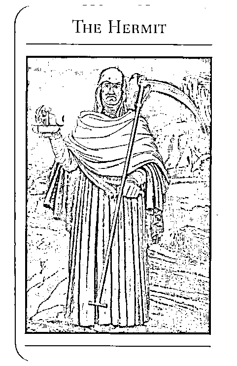

作者/朱丽叶·沙曼-伯克 丽兹·格林

译者/闫东升 编辑/玫瑰 图片/神话塔罗 网络

本文节选自《神话塔罗》

神话塔罗牌的设计源自于希腊神话，希腊诸神是西方文化的一个重要支柱，它们并不独属于某一个神秘流派、宗教教义或灵性途径，它们无关道德却蕴藏着深刻的道德真理，它们的出现早于我们现代的宗教象征符号，无处不在地渗透其中，整个西方文化的艺术和文学中都能看到它们的身影。总有一段时光我们只想自己独享，那就是隐士牌。今天就来解读大阿卡纳牌——隐士。

[🔈 神话塔罗·隐士](https://res.wx.qq.com/voice/getvoice?mediaid=MzA5NjA0NTAxNl8yNjUxNDc4NzI4)

**｜**朗读者小巫

**书名：**

神话塔罗 

**作者：**

朱丽叶·沙曼-伯克   丽兹·格林 

**出版日期：**

2011-08-02

隐士对应的希腊神祗**克洛诺斯·上一代天神****时间之神**

隐士牌描绘的是一个长着灰白胡须的年长的男人，肩披灰色的斗篷，他的脸被斗篷的帽子遮住了一小半。他的右手提着一盏油灯，闪耀着金色的光芒。

他的左手擎着一把长柄镰刀。一只乌鸦落在他的肩头。他身后是苍凉模糊的暗色山峦，和暗沉的灰色天空在远处连成一片。 

> **克洛诺斯（*Cronos*）提着的油灯**：象征着从孤独和耐心的等待过程中获得的理解和洞见。 
> 
> **新月形的镰刀（也就是新月）**：是克洛诺斯的母亲盖亚（*Gaea*）送给他的礼物，它象征着时间循环的永恒变化。

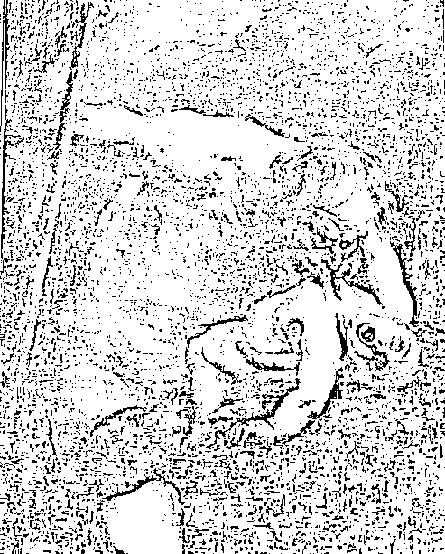

**统御世界的上一代天神**

隐士牌面上我们遇到了远古之神克洛诺斯，他的名字意味着时间。神话中乌拉诺斯（*Uranus*，天空）和盖亚（大地）结合后生出的第一个种族是泰坦（*Titans*）巨神（或大地之神，*Earth-gods*），克洛诺斯是其中最小的一个。

乌拉诺斯很不喜欢孩子们，嫌弃他们丑陋而且肉骨凡胎。他把所有的泰坦巨神关进地府，以免看到他们。

盖亚对此非常愤怒，决定报复丈夫。她从胸口取出了火石，变成了一把锋利的镰刀，把它交给最小的也是最机敏的儿子克洛诺斯。

夜晚到来的时候，乌拉诺斯和往常一样与妻子结合了。当他熟睡的时候，事先藏起来的克洛诺斯出来用镰刀阉割了他，并且把他血淋淋的阳具丢尽了大海。克洛诺斯杀死父亲后就解放了所有被囚禁的手足，并成为了统御世界的君主。创世纪的过程就这样在他不懈的努力中，历经了漫长的岁月后终于完成。那段时间被后人称为黄金时代，因为和乌拉诺斯统治时期相比，克洛诺斯的时代富饶繁华。作为时间之神，他统御的时空中有规律的季节交替，从孕育、出生、成长到死亡和再生，生命循环井然有序，臣民们对他既崇拜又敬畏，因为他带来了富饶，也带来了死亡，人们无法回到过去，只能大步向前。

克洛诺斯本人并不愿意全心接纳自己所创造的循环律则，因为它意味着终有一天，自己的王国也会被儿子颠覆，就像他和父亲乌拉诺斯的故事一样，所以他一直在吞噬自己的孩子，用来维持他所创立的规则。

接下来的故事就是克洛诺斯和宙斯（*Zeus*）之间的杀戮了，宙斯也是克洛诺斯最小的儿子，我们曾在皇帝牌中讲述过他的故事，神话中宙斯颠覆了父亲的统治，创建了奥林匹斯山的神之国度。

克洛诺斯被儿子宙斯驱逐后，有的神话中说他被囚禁在很深的地府之中，但也有些故事说他沉睡在赐福之岛（*the  Blessed  Isles*）上，等待着下一个黄金时代的到来。

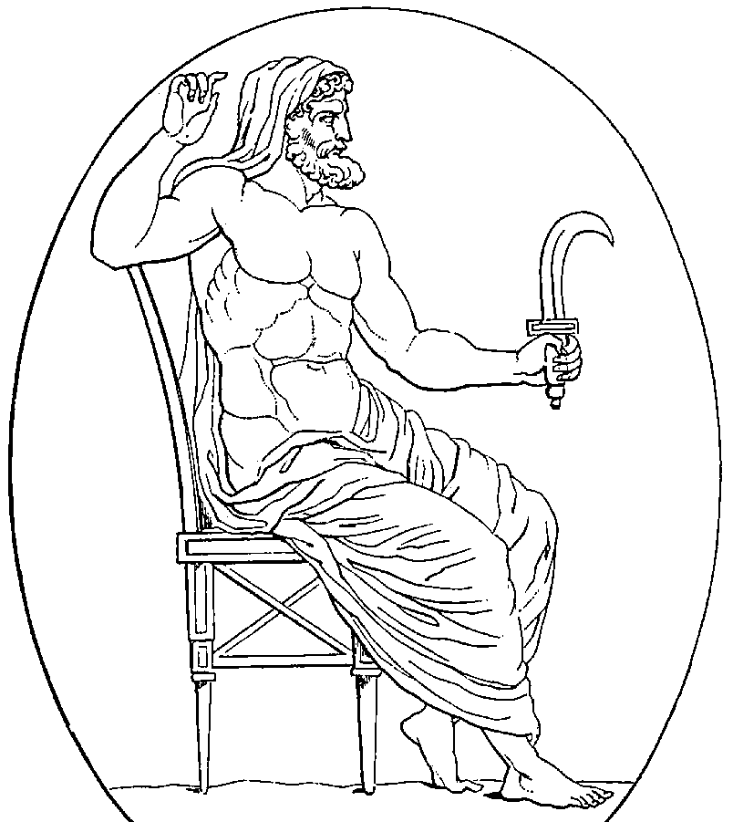

**无法跨越的时空律则**

**从内在的层面来看，隐士——克洛诺斯的意象，是愚人要学习的四项“美德”的最后一个：尘世生命的时间性和局限性。**

没有任何事情是一成不变的，也没有任何事情能够跨越时空的律则，这是尘世生命最显而易见的面向，尽管我们都非常清楚，却很难学会它的真谛，大部分情况下必须经历岁月和经验的洗礼，我们才会真诚并完全地接受它。

**克洛诺斯的意象反映出时间的意义，也同时反映了与之对抗的后果，所以他被颠覆并放逐，在孤独和沉默中获得了智慧**。从很多层面上看，克洛诺斯象征着身体，因为身体无法停止自己成长老去的步伐，但它时时都与其抗争，想要获得永生。

通过静默、孤独和探索，我们都会发现自己最终还是单独的个体，也都要面对尘世生命的进退两难。

从某种神秘性的角度来看，全然地接受这个事实就是在内在经历了真正的亲子分离，因为这意味着我们不再幻想某日、某地或某人会来帮助我们解开生命的魔咒。

“从此以后他们幸福地生活着”这句话蕴含了多少渴望、幻灭、心酸和苦难！那绝对不可能存在于克洛诺斯的规则中。从青涩走向成熟后，我们就再也无法回头，但记忆和智慧会从时间的洗礼中闪出夺目的光彩，而且还会获得耐心这个伟大的礼物。隐士牌的功课无法通过挣扎和征服来完成，因此我们看到克洛诺斯站在了赫拉克勒斯的对立面，这意味着怎样的挣扎都无法让时间停止。只有接受时间的规律，才能获得克洛诺斯黄金时代的奖赏。通过强制性的限制和岁月的洗礼，而不是战斗和挣扎，愚人才可以发展出隐士——克洛诺斯的内敛、深思熟虑和保持傲然独立的特质。因此，克洛诺斯在某种程度上还是谦卑的意象，在我们无法改变的事物面前，谦卑是最好的品质和面对方式，它会使我们变得冷静、从容和沉着，能够容忍生命之路上的障碍和失望。

无论多么聪慧，无论多么热心，无论有多么强大的自我身份认同感，如果没有学会内在隐士的耐心和慎重，生老病死的无常变迁可能会随时击溃我们，所以我们必须学会像隐士一样在静默中忍耐和等待。

克洛诺斯的黑暗面是僵化和顽固，一味地抗拒改变和时间的流逝。这位来自远古黄金时代，身上充满矛盾性的神明，最值得人们学习的就是需要改变的时候机敏，不能改变的时候接纳，在静默中耐心地等待我们能够分辨和选择的时机。

**隐士，回归内在的自省**

**从解牌的角度来看，克洛诺斯——隐士牌出现的时候，预示着当事人需要独处或者从外倾的社会活动中撤回到自己的内在，从而获得耐心的智慧。**

这是一个建造稳固内在的机遇，只要当事人愿意等待。因此，愚人最终变得成熟了，发展出了理智和情感的力量，拥有了稳固的自我身份，在岁月循环往复的洗礼下学会了发自内心地尊重自己的局限性。

**版权声明：**本文由《自在园》授权发布，欢迎转发，反对抄袭。友号转载请申请白名单。

**END****朱丽叶·沙曼·伯克**从 20 世纪 70 年代早期开始，就对塔罗牌产生了兴趣，并踏入了塔罗的世界。后来，在丽兹·格林的鼓励下，开始研习心理占星学和塔罗。1984 年，第一本书《塔罗全书》（The Complete Book ofTarot）出版。之后，与丽兹·格林合作设计并撰写了《神话塔罗》（The Mythic Tarot）。朱丽叶写了十本塔罗和占星学书，包括一本名为《众星的传说》（Stories from the Stars）的儿童读物，以及与丽兹·格林合著的《神话之旅》（The Mythic Journey），这是一本详细讲述如何运用神话来指导生活的书。

**点击下图了解课程详情** 

**微信又双叒叕改版啦，不想错过若道君的推送？**
**就把若道设为星标吧！****▼**

**喜欢就点一下“在看”吧！**

************报名直达入口************

# 关于神话塔罗课程，你想了解的都在这儿

> 原文：[`mp.weixin.qq.com/s?__biz=MzA5NjA0NTAxNg==&mid=2651478730&idx=3&sn=03b7f43723bfaf99ad9fd02f04b7c63e&chksm=8b48e87dbc3f616b5b307c0b787691d539436f8fe7f198be13be8f9f0e3f76bcb3c77725a54d&scene=126&sessionid=1692737791#rd`](http://mp.weixin.qq.com/s?__biz=MzA5NjA0NTAxNg==&mid=2651478730&idx=3&sn=03b7f43723bfaf99ad9fd02f04b7c63e&chksm=8b48e87dbc3f616b5b307c0b787691d539436f8fe7f198be13be8f9f0e3f76bcb3c77725a54d&scene=126&sessionid=1692737791#rd)

1

**塔罗牌是什么？**

**它是用来干嘛的？**

塔罗牌是一种**古老的疗愈工具**，同时也是**直观的解惑工具****；**

塔罗牌绕过逻辑思维，**和潜意识联结**，通过图像的方式生动地将隐藏在人类潜意识中的画面浮出水面，**揭示心灵的状况和运作****；**

塔罗牌**帮助我们和潜意识对话**，可以和现代的心理治疗联系在一起，帮助我们**看清心灵的冲突来源、本质和可以选择的道路；**

塔罗使用的过程并不繁琐，通过**“提问、洗牌、抽牌、解牌”**的方式来显现你的潜意识，给予问题明确的分析和建议。

2

**塔罗原理是什么？**

**它为什么这么准？**

塔罗是通往意识的工具，通过图画**帮助我们和潜意识对话**，可以和现代的心理治疗联系在一起，帮助我们**看清心灵的冲突来源、本质和可以选择的道路**。塔罗的心理投射也对应荣格的**“共时性原理”**：看似偶然的事物之间有着必然的联系。塔罗牌又和更广阔的**宇宙生命原型**联结，彰显**个人生命发展的阶段**，将个人**生命挣扎、内在冲突**放在生命进化的道途上，让更广大的生命智慧为个人成长照亮道路。

3

**塔罗预测是什么？**

**它如何帮助我？**

塔罗牌预测的运作就像是**照向心灵的一面镜子**。在塔罗牌解读时，图像的原型性质穿透隐藏的潜意识脉络，反应出与个人境遇相关但又未被了知的知识与洞见，因此**揭示出按照任何理性方式都无法发现的事情**。塔罗可以在你人生各个阶段，基于不同状态，针对具体困惑给予指引的神奇工具，运用古老的智慧工具**解码人生卡点，多维度去看待问题和生命的全貌性，推敲心理动线，更好地梳理生活。**如果你对生命好奇，塔罗学习会帮你**打开一扇通往未来的门**，让你了解**心灵运作和显化的秘密**，同时赋予你更多关于生命成长的支持和指引的能力！

4

**什么是神话塔罗？**

**它和其它塔罗有什么区别？**

神话通过**图像和故事**描绘人类生活的**原型模式**。通过瑰丽的想象、诗意的语言、栩栩如生的人物和故事描绘出我们内心的世界，表达出我们经历的那些实现人性的过程，帮助我们将**个体的生活与人类古老且永恒的故事**建立联结。从而在更深处**理解生命**，并学习**古老而长青的生命智慧**。跟其他塔罗相比，神话塔罗在**塔罗体系**基础上融合了**神话原型、占星原型、心理学原型。**学习、解读、内在成长的**维度更丰富立体。****神话塔罗**取材于**希腊神话**的无尽沃土，通过故事提供一种**记忆辅助**，在心理和预见层面提升解读的**丰富度**。因为这样更符合塔罗牌的性质，符合人类的想象。**按照故事思考，而不是简单的记忆关键词和固定的意义**。

5

**神话塔罗难学么？**

**能不能快速上手？**

神话塔罗认证课程，**不需要任何塔罗、占星、心理、神话基础**，这些知识朱丽叶老师都会在课程中教授，“兴趣是最好的老师，坚持是最大的成功。”塔罗咨询这项门栏不高，却能带来多重回报的“冷门技能”已经被越来越多人发觉，如果你为之心动，不如赶紧行动，初学者在经验丰富的导师教导下学习成果事半功倍，是小白亦能够掌握的课程，只要配合学习进度，不存在学不会的情况**，录播课有专业助教答疑，直播课老师亲自答疑，案例督导，****让你更自信的开展咨询工作，学以致用。**

6

**哪些人适合学神话塔罗？**

**为什么学神话塔罗？**

**1、对塔罗感兴趣的学员**，与其自习研究弯路多多，不如一步到位系统学习；**2、占星咨询师，**可以丰富咨询维度，通过图像更深入的和个案沟通交流；**3、心理工作者**，塔罗牌的原理本身也是心理投射，用于心理辅导是很棒的互动工具；**4、看重授课老师专业水平和能量层级的学员，**神话塔罗创始人亲授，金牌背书；**5、希望更加了解自己和他人内心世界**，想掌握这个疗愈工具自我探索和成长，帮助有困惑的人；**6、成为专业的塔罗师**，想从事这份事业，不论是兼职或全职，增加收入，打造长久稳定抗风险的现金流。

7

**神话塔罗咨询前景？**

**为什么看好它？**

塔罗行业现状鱼龙混杂，有的塔罗爱好者未经过系统学习，无占卜实力，占卜依赖“说明书”一知半解靠运气解读，无法积累实占经验和个人信誉。神话塔罗进入中国市场不久，由创始人亲自教授，**知识体系扎实靠谱，咨询技术纯正丰富，市场认可度高**，让您**无忧起步**，自信的在自我成长过程中成为他人的**塔罗照路人**。有些朋友经过系统的塔罗课程学习后成为**杠杆青年**，将塔罗咨询作为**副业**，无需店面，工作之余在家里就可以进行咨询，多一分收入欣喜满足。也有些学员完成课程后将塔罗咨询发展成**全职事业**，拥有自己的工作室，整合微信、微博、小红书、短视频等自媒体运营，线上线下年收益百万。**疫情环境下，副业刚需**，对于我们未来的事业需要有所规划，而塔罗咨询符合理想职业的所有条件，上手快、无需固定办公地点，是随时随地可接单的自由职业，经营打造属于自己长久稳定可发展的现金流。

8

**神话塔罗认证是什么？**

**如何获得高含金量认证？**

2022 年超高含金量的神话塔罗认证课程强势回归课程内容体系让你**直观精准**的感受**神话塔罗的魅力**扎实的建构**神话塔罗思维****系统**学习**最地道的塔罗知识****联报全阶课程，学成可获得有神话塔罗创始人颁发的****英国神话塔罗认证证书****，也是****若道塔罗毕业证书。****行业内超高含金量双背书。****若道还为塔罗学员开发了****“神话塔罗”APP****，是随身的工具，更是接咨询的平台，****录播课程****学成入驻平台****即可链接更多塔罗个案，发展壮大你的塔罗咨询事业。**

**如果你想学习塔罗，什么样的老师会让你怦然心动呢？她是三副塔罗牌的设计者，写了 6 本塔罗书籍。她研习塔罗四十余年，教授塔罗三十余年，是丽兹·格林的密友。还有****谁会比塔罗牌设计者更了解塔罗的历史、灵魂与精髓？****所以，这将是你开启塔罗之旅最坚实的一步。**

9

**你将跟随哪位大师学习神话塔罗？**

**我的老师是谁？**

****

**朱丽叶·沙曼-伯克** 

*   她是**3 副塔罗牌**的**设计者****——**神话塔罗牌、沙曼–卡塞利塔罗牌、“自己着色”塔罗牌；

*   她出版了**6 本塔罗书****——**《塔罗全书》、《新塔罗全书》、《众星的传说》、《理解塔罗牌》、《精通塔罗牌》、《塔罗初学者指南》；

*   她研习塔罗**四十余年；**

*   她教授塔罗**三十余年**；****

*   她是**丽兹·格林**的密友，两人合著了**《神话之旅》**，共同设计了**神话塔罗牌**。

*   她是认证的**心理治疗医师；**

*   她深谙**塔罗、占星学、心理学和神话学。**

**如果你想成为拥有英国神话塔罗认证的塔罗师**

那么她，就是你**最好的老师人选**

10

**神话塔罗认证课程的课程结构？**

**怎么上课？**

课程中老师传授**将神话、占星、心理学完美融合进塔罗**的人本主义咨询体系，并进行**学员案例督导**，让你更自信的开展咨询工作，学以致用。

本期认证课程采取**即报即学的录播课+案例督导直播课**的形式，

*   **18 节录播课：**精编剪辑，随来随学，助教答疑，学练结合。

*   **8 节直播课：**融会贯通，神话心理，塔罗占星，咨询技巧。

为了适配大家的各种学习场景，提高学习&复习效率，我们还将**录播课**剪辑了**中文字幕版**和**翻译音频版**：

*   **中文字幕版：**朱丽叶老师英文原声配中文字幕，适合在手机或电脑前专心致志的学习。

*   **翻译音频版：**翻译老师幼婷的中文原声纯享，适合运动、通勤路上耳机里陪伴式学习。

11

**神话塔罗认证课程报名流程**

**怎么报名？**

**报名流程如下：****1、报名****添加课程顾问，报名，交学费，进入学员群，邮寄学习工具。****2、开始学习****成功报名，18 节录播课程立即开通，学习过程有困惑可在 APP 内提问，有专业助教答疑，8 节直播课 8 月 10 日开课，录播课和直播课都是朱丽叶·沙曼-伯克老师亲授。****3、入驻平台****学习完录播课程，即可提交咨询案例申请入驻咨询平台。****4、结业证书**学习完直播+录播课程，提交毕业咨询案例，朱丽叶老师批阅通过，即可获得**神话塔罗认证证书。**

12

**具体在神话塔罗认证课程中学习什么？**

**课程大纲**

**录播课（即报即学）**

**☆****初阶：神话塔罗详解**

**神话故事和预测意涵**

**第 1 讲 塔罗牌介绍 ，讲述它的历史 （中文字幕版）**

**第 1 讲 塔罗牌介绍，讲述它的历史（翻译音频版）**

**第 2 讲 星座形态、元素和宫廷牌&基本星座与基本国王 （中文字幕版）**

**第 2 讲 星座形态、元素和宫廷牌&基本星座与基本国王（翻译音频版）**

**第 3 讲 固定星座与固定王后（中文字幕版）**

**第 3 讲 固定星座与固定王后（翻译音频版）**

**第 4 讲 变动星座与变动骑士（中文字幕版）**

**第 4 讲 变动星座与变动骑士（翻译音频版）**

**第 5 讲 小阿尔卡那牌权杖（中文字幕版）**

**第 5 讲 小阿尔卡那牌权杖（翻译音频版）**

**第 6 讲 小阿尔卡那牌圣杯（中文字幕版）**

**第 6 讲 小阿尔卡那牌圣杯（翻译音频版）**

**第 7 讲 小阿尔卡那牌宝剑（中文字幕版）**

**第 7 讲 小阿尔卡那牌宝剑（翻译音频版）**

**第 8 讲 小阿尔卡那牌星币（中文字幕版）**

**第 8 讲 小阿尔卡那牌星币（翻译音频版）**

**第 9 讲 经典牌阵教学讲解（中文字幕版）**

**第 9 讲 经典牌阵教学讲解（翻译音频版）**

**第 10 讲 牌阵解读案例演示（中文字幕版）**

**第 10 讲 牌阵解读案例演示（翻译音频版）**

**☆****中阶：神话塔罗牌阵应用**

**神话****解读和咨询技巧**

**开启神话塔罗愚人之旅**

****

**第 1 讲 愚人、魔术师、女皇、皇帝（中文字幕版）**

**第 1 讲 愚人、魔术师、女皇、皇帝（翻译音频版）**

**愚人**：永恒的少年（儿童的原型）

**魔术师**：恶作剧者、老师、向导、沟通者的原型；行星：水星。

**女王**：母亲、养育者、丰产的原型；行星：金星在金牛座；小行星：谷神星。

**皇帝**：父亲、供养者、计划者的原型；行星：木星。

**第 2 讲 女祭司、教皇、恋人、战车、正义、节制（中文字幕版）**

**第 2 讲 女祭司、教皇、恋人、战车、正义、节制（翻译音频版）**

**女祭司**：处女——等待被实现的潜力原型；行星：新月。

**教皇**：疗愈者、受伤的疗愈者、牧师的原型，牧师是神与人之间的灵性桥梁；行星：凯龙星。

**恋人**：爱、爱人、所爱之人的原型；行星：金星在天秤座。

**战车**：战争、冲突、战士、斗士的原型；行星：火星。

**正义**：智慧、兵不血刃的胜利的原型；星座：处女座；小行星：智神星。

**节制**：关系、合作的原型；星座：巨蟹座、双鱼座。

**第 3 讲 力量、隐士、命运之轮、倒吊人、死神（中文字幕版）**

**第 3 讲 力量、隐士、命运之轮、倒吊人、死神（翻译音频版）**

**力量**：力量的原型；星座：太阳在狮子座。

**隐士**：晚年、耐心的原型；行星：土星。

**命运之轮**：命运女神与命运的原型。

**倒吊人**：牺牲与有意识的牺牲的原型；行星：海王星。

**死神**：死亡、终点和起点的原型；行星：冥王星。

**第 4 讲 恶魔、高塔、星星、月亮、太阳（中文字幕版）**

**第 4 讲 恶魔、高塔、星星、月亮、太阳（翻译音频版）**

**恶魔**：阴影、人类不文明的面向、本能、欲望天性；行星：火星在天蝎座。

**高塔**：改变、分裂瓦解的原型；行星：天王星。

**星星**：希望的原型。

**月亮**：无意识的原型；行星：暗月。

**太阳**：意识、创造力和文明的原型；行星：太阳。

**第 5 讲 审判、世界（中文字幕版）**

**第 5 讲 审判、世界（翻译音频版）**

**审判**：复活、新生的原型；行星：水星作为灵魂向导普绪科蓬波斯。

**答疑与讨论，学员们分享对自己或客户的塔罗解读，对神话塔罗牌进行更多探讨。**

**世界**：整体、完成和个性化的原型。

**第 6 讲 经典牌阵教学讲解（中文字幕版）**

**第 6 讲 经典牌阵教学讲解（翻译音频版）**

**第 7 讲 咨询案例演示：为一位年轻女性所做的四次解读（中文字幕版）**

**第 7 讲 咨询案例演示：为一位年轻女性所做的四次解读（翻译音频版）**

**第 8 讲** **引导式冥想、荣格的四种意识功能（中文字幕版）**

**第 8 讲 引导式冥想、荣格的四种意识功能（翻译音频版）**

**☆****高阶：神话塔罗直播督导课**

**第 1 讲 塔罗牌中的荣格原型**

**2022 年 8 月 10 日（周三）**

我们将学习荣格是如何理解原型，以及荣格原型如何反映在塔罗牌中。对塔罗牌解读而言，理解原型的普遍性非常有帮助，因为这有助于塔罗咨询师碰触客户的内心世界。

**第 2 讲 塔罗牌是如何与行星原型和其原型体验联系在一起**

**2022 年 8 月 24 日（周三）**

大阿卡纳牌反映了行星神祗的原型，在某些情况下，原型经验意味着它们反映了所有人类的经验。我们将通过这个角度看这些大阿卡纳牌。我们将看到理解原型对解读有何帮助。

**第 3 讲 荣格意识的四种功能与小阿卡纳牌的四种元素及与权杖、星币、宝剑、圣杯四套牌之间的联系**

**2022 年 9 月 7 日（周三）  **

我们将看看小阿卡纳从 1 到 10 如何反映荣格意识功能的各个方面，以及它们如何反映在四套牌四个元素和其心理方面。我们还将对 1-10 的数字学进行修正，看它们在元素中的表现方式。

**第 4 讲 占星学中的 12 星座和宫廷牌之间的联系**

**2022 年 9 月 21 日（周三）**

我们将讨论形态和星座，以及它们如何反映在宫廷牌上。

**第 5 讲 马蹄牌阵学员案例督导**

**2022 年 10 月 19 日（周三） **

**第 6 讲 六芒星牌阵学员案例督导**

**2022 年 11 月 2 日（周三） **

**第 7 讲 凯尔特十字学员案例督导**

**2022 年 11 月 16 日（周三） **

****

**第 8 讲 三个牌阵学员完整案例督导**

**2022 年 11 月 30 日（周三）**

**认证阶段：考试论文**

录播课学习完毕，即可入驻若道神话塔罗 APP，以实习塔罗师获得推广流量，对接塔罗咨询个案。

直播课+录播课学习完毕，提交考试论文通过即可获得获得英国神话塔罗认证证书，升级为认证咨询师。

**入驻塔罗平台**

13

**适合人群**

*   塔罗初学者，完全没有塔罗基础；

*   塔罗自学者，也曾上过塔罗工作坊，但仍不懂如何使用塔罗牌；

*   塔罗进阶学习者，有塔罗基础，了解 78 张塔罗牌含义；

*   不知如何解决遇到的情感困惑、职业选择、人际问题，对人生感到迷茫；

*   想要学习深入解读塔罗牌、牌阵的使用、咨询技巧等将塔罗运用于咨询实践；

*   想要深入了解和学习塔罗，希望成为专业的塔罗师；

*   想要借助塔罗进行心灵、灵性成长。

14

**导师简介**

**朱丽叶·沙曼-伯克**

**朱丽叶·沙曼-伯克**从 20 世纪 70 年代早期开始，就对塔罗牌产生了兴趣，并踏入了塔罗的世界。后来，在丽兹·格林的鼓励下，开始研习心理占星学和塔罗。

1984 年，第一本书《**塔罗全书**》（*The Complete Book ofTarot*）出版。之后，与丽兹·格林合作设计并撰写了《**神话塔罗**》（*The Mythic Tarot*），在这本书中，她们将古希腊神话与传统塔罗解读结合起来。朱丽叶写了**十本塔罗和占星学书**，包括一本名为《众星的传说》（*Stories from the Stars*）的儿童读物，以及与丽兹·格林合著的《神话之旅》（*The Mythic Journey*），这是一本详细讲述如何运用神话来指导生活的书。

15

**课程价格**

**认证课程总价：****22000 元**

**联报优惠价：****19000 元**

**限时转发优惠价：18000 元（联系 Echo 老师，获取限时转发优惠价）**

长按二维码添加客服 Echo 老师

9

**退转课程**

*   **退款原则请详看《教学协议》，如有疑问请咨询课程顾问。**

**神话塔罗认证课程**

**授课老师：朱丽叶·沙曼-伯克**

**授课时间：录播课即报即学，直播课 2022 年 8 月 10 日起**

**授课方式：**网络课程**，**英文授课，中文翻译

**费用：****认证课程总价：****22000 元；****联报优惠价：****19000 元；****限时转发优惠价：18000 元**（联系 Echo 老师，获取限时转发优惠价）

**课程负责人：Echo 老师**（微信/手机：nodoor18518412824，请备注“神话塔罗”）

长按二维码添加课程负责人咨询~

****报名请点击“阅读原文”****

# 巨蟹座新月 | 愿这份免费的新月报告带给你久违的温情

> 原文：[`mp.weixin.qq.com/s?__biz=MzA5NjA0NTAxNg==&mid=2651478730&idx=2&sn=74a148e5ed9971302cd9d87ceeeaf4f0&chksm=8b48e87dbc3f616b38164da017513945525dcc821d530a7d6b3eb5617d951497f4815d02bec9&scene=126&sessionid=1692737791#rd`](http://mp.weixin.qq.com/s?__biz=MzA5NjA0NTAxNg==&mid=2651478730&idx=2&sn=74a148e5ed9971302cd9d87ceeeaf4f0&chksm=8b48e87dbc3f616b38164da017513945525dcc821d530a7d6b3eb5617d951497f4815d02bec9&scene=126&sessionid=1692737791#rd)

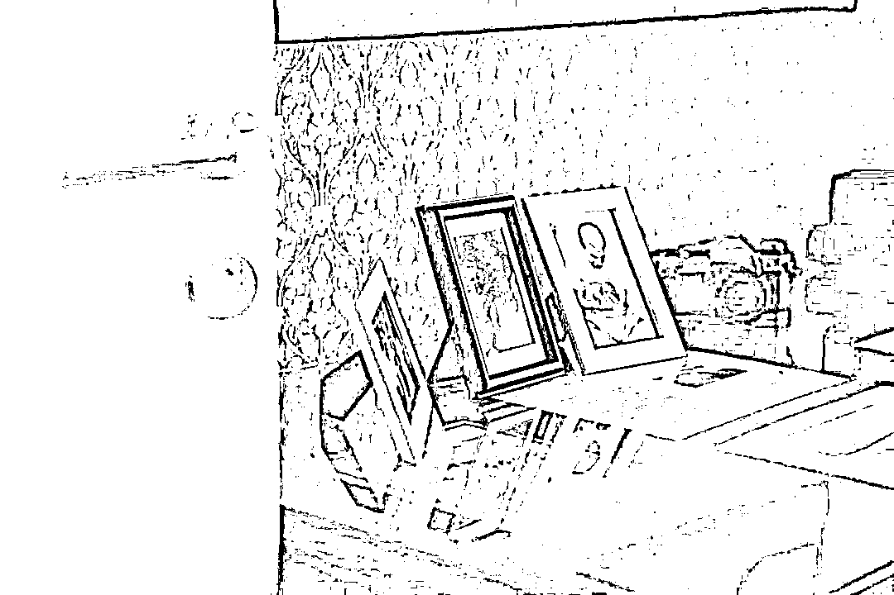

北京时间 6 月 29 日 10:52，新月发生在巨蟹座 7°22′。每到新月时分，若道君都会为你奉上根据你出生星图量身打造的免费新月报告。可是新月为什么要许愿？新月报告该如何领取？让若道君来教你。

　**什么是新月？**　

从占星学看，新月是月亮周期的一种相位。新月是开始，又称为朔，对应中国农历初一，太阳、月亮在此时合相。此时月亮运行到太阳与地球之间时，月亮以黑暗的一面对着地球，并且与太阳同升同落，地球上看不见月亮。

本次新月时间

**6 月 29 日 10:52，新月发生在巨蟹座 7°22′。**

为什么新月要许愿？

新月是一个周期的开始，新月发生的时候，太阳与月亮合相，能量很强。当新月出现时，你也许会发现灵感忽现，非常适宜开启新领域、项目与行动，缔结一段新的关系或合作。许愿会加强新月的能量，也有助于你了解自己现阶段适合开启的方向。 

本次新月最佳许愿时间从新月开始到其后的 48 小时内，许愿的力量最强。**最佳许愿时间：6 月 29 日 10:52-7 月 1 日 10:52**

属于你的免费新月报告每到新月时刻，看着占星文章里写着：看看你新月的宫位，如果新月在第 X 宫，你可以许愿的方向是……是不是常常一头雾水？新月的宫位？我到底该看哪里啊？而有时，那些标注上升星座的文章也会让你忍不住想：虽然我的上升星座是这个，可是我的新月好像并不落在你说的宫位啊？你是不是写错了？

虽然这些文章都没有写错，可是好像对你而言都太不友好了。**Don't Worry！**别着急，让博学又体贴的若道君来帮你！我们推出了一份**免费**又**好用**的新月报告！而且是专门为你设计的哦，**根据你出生星图为你量身打造的，只****属于你的独家新月报告**。报告有哪些内容？**新月时间****最佳许愿时间****如何许愿 **属于你的**许愿关键词**本次新月给你的**建议**你会有怎样的**感受 ******机会****

********

如何许愿？许愿方式也很简单。你可以把愿望写下来，或者双手合十后交叉，闭上眼睛来祈祷。 报告中会为你提供**祈祷词示例**，可以多多参考哦～ 你还可以适当添加自己的语言，创造属于你自己的祈祷文！如果报告拿到手了，快对照着许愿吧！

**这份好用又暖心的报告，点击****阅读原文****即可领取！**

****

****点击“阅读原文”即可获取新月报告****

# 巨蟹座新月 | 这个新月，遇上最疗愈的时刻：“心知道一切的答案”

> 原文：[`mp.weixin.qq.com/s?__biz=MzA5NjA0NTAxNg==&mid=2651478730&idx=1&sn=de78c186c9cb527746bdf982606d800f&chksm=8b48e87dbc3f616b9f1e151678dd5ea9c1fb3b4fbb2b552aa5c79e227e37c0f04cc97911d3ce&scene=126&sessionid=1692737791#rd`](http://mp.weixin.qq.com/s?__biz=MzA5NjA0NTAxNg==&mid=2651478730&idx=1&sn=de78c186c9cb527746bdf982606d800f&chksm=8b48e87dbc3f616b9f1e151678dd5ea9c1fb3b4fbb2b552aa5c79e227e37c0f04cc97911d3ce&scene=126&sessionid=1692737791#rd)

****☆ **后台回复“今日”，给你一句生命态度**

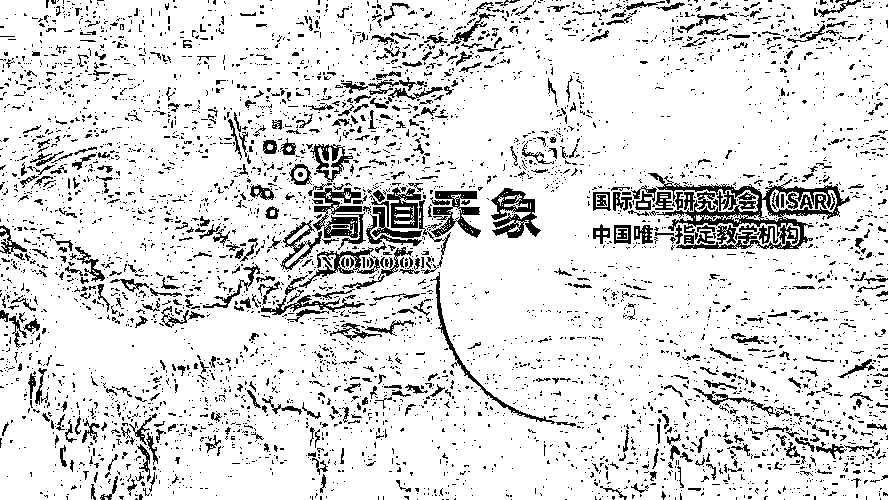

作者/王芝桦 编辑/玫瑰 图片/pexels

**巨蟹座新月****北京时间 2022 年 6 月 29 日 10:52 迎来巨蟹座新月，太阳与月亮精准合相于巨蟹座 7°22′。**此次巨蟹座新月带着强大的疗愈能量，唤醒我们内心深处对无条件的爱、对安全归属的强烈渴望，引领我们踏上“回家”的旅途。

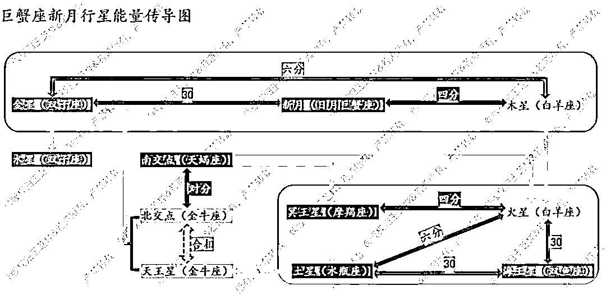

> **巨蟹座新月重点影响人群**
> 
> **参考新月峰值影响期间各个行星的行进度数，以及逆行行星的轨迹影响；常规容许度，个人行星入相位 3°，出相位 1°；非个人行星入相位和出相位均为 3°。**
> 
> *   出生星图中，有**行星、四轴、南北交点**落入**基本星座（白羊座、巨蟹座、天秤座、摩羯座）4°-12°，23°-30°**的人群。
>     
>     
> *   出生星图中，有**行星、四轴、南北交点**落入****固定星座（金牛座、狮子座、天蝎座、水瓶座）**14°-28°**的人群。
>     
>     
>     
>     
> *   出生星图中，有**行星、四轴、南北交点**落入**变动星座（双子座、射手座、处女座、双鱼座）4°-13°，15°-28°**的人群。

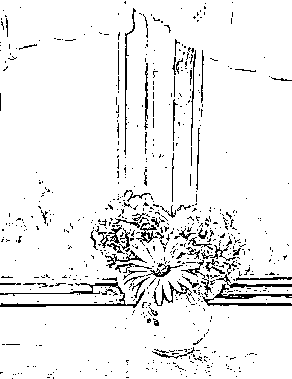

**心知道答案**每一年的中点时间都有一次巨蟹座新月，这个与母亲原型、与疗愈者原型相关的水象星座，总是伸出“妈妈的手”，引领在外漂泊的游子回归家园，联结爱的源头，重见内在的初心。**此次巨蟹座新月的前一天——6 月 28 日，海王星于双鱼座开始为期 5 个月的逆行周期（6 月 28 日-12 月 4 日）**；此次巨蟹座新月的前一周开始，代表“意识灵波”的海王星便开始在双鱼座的“意识海洋”之中进入逆行前的停滞期。海王星的停滞期就像是海面之下的无限水流在某一个地方集体止步，虽然海面上看起来依旧风平浪静，但海面之下已然形成无限的、叠加的、力量的拥积，在我们的意识深处荡起无声的涟漪。概括一下此次巨蟹座新月前一周的能量状态：**睡不着的和睡不醒的**。当然，这是比喻性的描述，但无论哪一种状态都像是在黑夜之中照镜子，照见出内心的焦虑和满身的疲惫。6 月 28 日，双鱼座海王星开始逆行，拥积的能量发生转向，形成巨大的意识漩涡；6 月 29 日，巨蟹座新月来临，引领我们顺着意识的流转，回归家园并寻觅初心。故而，此次巨蟹座新月是一次**“水元素+意识能量”**相当彰显的新月，提示我们**深入生命内在，回到梦开始的地方，跟随直觉并疗愈身心。**跟随直觉并不是一件容易的事情，需要放下大脑“因为，所以”的逻辑，需要放空内心“期待，恐惧”的欲念，就像自然而然地仰浮在水面，不分析，不用力，你会相信我们人类的祖先曾经是一尾鱼。

但如果大脑一动或身体一绷，马上就只剩扑通落水和挣扎扑腾。

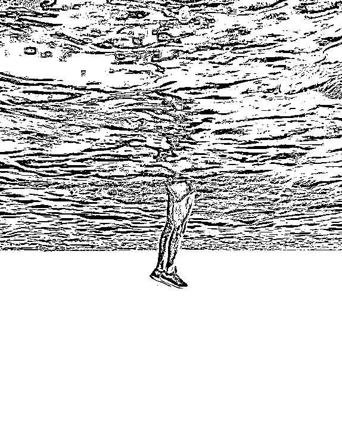

人类早已不再是鱼的样子，自然仰浮的功能早已演变为得学得练的技术，就像自观呼吸，静心冥想，都需要在老师“做一个纯粹的观察者”的引导之下，才能觉察到乱飞的思绪，安抚没完的评判。

人类越来越“要好”了，这是一份超越，但这也是一个毛病，因为**进步者容易坠入进步的执着，而不再关注进步的意义。而这一风险和考验，也在此次巨蟹座新月的前一周（6 月下旬）展现得淋漓尽致。**

***1.*** **新月前“冥府”走一遭**

> **天象**
> 
> **· 火冥四分：白羊座火星四分摩羯座冥王星****· 土海 30：水瓶座土星与双鱼座海王星形成 30°结构****· 火海 30：白羊座火星与双鱼座海王星形成 30°结构****· 火土六分：白羊座火星六分水瓶座土星。**

**5 月 16 日-6 月 22 日期间，水瓶座土星和双鱼座海王星形成“土海 30°”结构，该组结构的能量影响将会持续到 7 月上旬。**这是**理想与现实发生“化学反应”**的一段时间，就像那些在烧杯中咕嘟咕嘟沸腾冒泡的东西，我们并不知道将会出现什么样的成果，想一走了之却还得留下守护，眼睁睁看着却又忐忑无措。**5 月 25 日，火星进入白羊座“入庙”（行星行进在自己守护的星座之内），**于是，这颗“战神”原型的火星便开始接纳和定位白羊座木星的能量：**·** 1 月-4 月期间，代表“理想信念与扩张能量”的木星与代表“灵性通道与合一能量”的海王星一起在双鱼座之内，以**“木海互容+木海合相”**的形式，制造出诸多理想化且不落地的“评估与妄想”，看似带来了希望，实则制造了混乱；**·** 5 月 11 日，木星换座白羊座，开始为期 5 个月“试水白羊座”的旅程，很多事物开始进入迫切需要推进的阶段，激进的状态自然也就造成很多对立的情况；5 月 25 日，火星进入白羊座，战无不胜的“战神”开始接手“迫切推进”的任务。然而，事与愿违。**5 月 10 日-6 月 3 日期间**，一场水星逆行令所有“迫切推进”的事物都不得不“降速”处理，而这场水星逆行的后影响期一直持续到 6 月 19 日。管你“土海 30°”怎么忐忑无措，管你“战神”如何暴躁跳脚，都得等着，虐啊！**6 月下旬开启的巨蟹月旅途（6 月 21 日-7 月 22 日），也开启了我们内在的情感渴望与归属需求。**

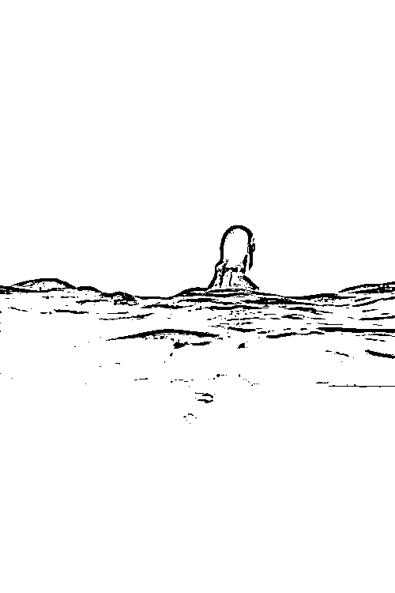

不知 2022 年上半年的生活，是否令你重新思量生命的意义和生活的本质？重新定义未来的轨道？选择回归安全的地方？但无论如何，这个选择都不是那么简单。随着**6 月下旬的推进，白羊座火星逐渐开始与摩羯座冥王星进入“火冥四分”结构，并将于 7 月 2 日达到精准呈相与能量峰值**——“战神”遇见“死神”，不难想象这场较量的激烈和惨烈；但是，冥府也是涅槃重生的地方，只要“战神”愿意勇敢凝视“死神”的眼睛，愿意真诚直面自己的内心。此次巨蟹座新月，“火冥四分”结构已经进入较为紧密的能量状态，而此时的白羊座火星也介入“土海 30°”形成“火土六分”和“火海 30°”两组结构。**·** 颤抖，无力，究竟是来自于现实的打压，还是来自于内心的恐惧？挣扎，嘶吼，究竟是为了坚持价值信念的不肯低头，还是被恐惧扼住喉咙的歇斯底里？**·** 确实，我们并不知道将会出现什么样的成果；但是，我们可以先自行转化“只能更好”的执着和“不能后退”的恐惧；**·** 执着与恐惧，令人一头扎进理想化的预设而忘记初心，那些“价值不明确”的涣散军心，“目标不清晰”的消耗火力，都将导致一场毫无意义的战斗；**·** 我们必须问问自己“我究竟在做什么，战斗的终极意义究竟是什么”这个问题，然后才能重塑自我并重振意志——投入一场有价值、有意义的战斗，这场战斗不在外面，而在我们生命最深处。如果我们能对 5 月-6 月“战神”（内在力量）的经历有所了解，就能对此次巨蟹座满月前一周的各种情绪波动和状态问题有个认知，那么剩下的就交给这一次纯粹而通透的新月能量吧。

***2. *****回到梦开始的地方**

> **天象**
> 
> **· 新月四分木星：新月发生时刻，合相巨蟹座的太阳与月亮四分白羊座木星**
> 
> **· 新月 30°金星：新月发生时刻，合相巨蟹座的太阳与月亮 30°双子座金星****· 金木六分：双子座金星六分白羊座木星。**

月亮与巨蟹座是一组共振的守护关系，故而，巨蟹座新月的开启能量总是指向“心灵的属地，家园的港湾”——回家，无论是现实的家园，还是心灵的家园，都是让我们感受到爱与滋养的地方，更是令生命感受到完整与安全的地方。2022 年的现实生活可能令很多朋友深切地感受到房子与家、关系与爱的不同，甚至令一些朋友开始思考“回不回去”的问题。我们渴望自我的独立与价值的创造，但也有太多的现实责任与情感牵绊；我们渴望超越原有的生活，却又在孤独无依的时刻想念远离的温暖。

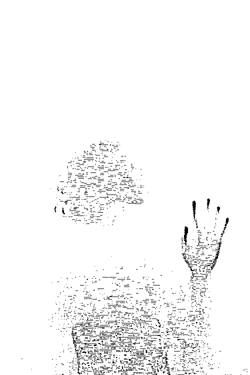

此次巨蟹座发生时刻，“日月合相”巨蟹座结构、白羊座木星和双子座金星都处于 7°的位置上，这个共振的“小团体”将会引领我们寻找自己的答案。**·** 白羊座木星引领我们“评估”前文提到的“战斗（奋斗）的终极意义究竟是什么”这个问题，没有谁能给谁答案，答案在每个人的心中；**· **接纳金牛座天王星“现实变革”能量、金牛座北交点“返璞归真”指引的双子座金星（金星守护金牛座），提示我们敞开接纳、快乐陪伴那些珍贵的关系网络；**· **巨蟹座新月能量则引领我们寻获生命中最珍贵的那些人事物，我们当以全部的热忱与热爱回报每一份的遇见与陪伴。此次巨蟹座新月，为我们注入一份勇敢，更为我们带来一份激励，而接纳白羊座木星能量的白羊座火星（火星守护白羊座）正在摩羯座冥王星“执着结果，恐惧失控”的“冥府”中穿行。那么，就再想想那个问题——“战斗（奋斗）的终极意义究竟是什么”呢？如果执着与恐惧正令你痛苦，那么爱你的人和你爱的人也只会跟着伤心，那么终极意义是否已经偏离了呢？记得回来，回到初心。借助此次巨蟹座新月的能量通道，回到梦开始的地方，走上摩羯座冥王星的进化路径——**破除虚妄！**“成功”从来都不是一个结果，而是不忘初心、不断成长的过程。

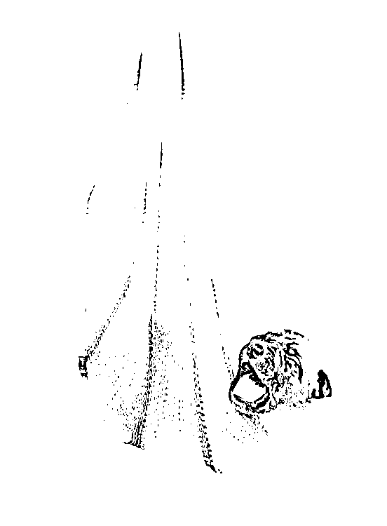

**寄语**写这篇文章的前一个晚上，我在学生群问大家：“火冥四分”越来越紧密了，大家有什么感悟分享。一位学生这样描述了她心中的画面：“就像毛毛虫破茧成蝶的过程，冥王星就是那个蛹，快要长成的蝴蝶一直挣扎着想要脱离冥王星构建的蛹，焦躁又疼痛。虽然它想快点结束这个过程，但这个过程又是那么的漫长和必要，无法假装也无法快速地穿越逃开。”看完她写的这段话，我脑补了“战神”拼命一搏、奋起反抗、恼羞成怒、胡打乱抓，最后毫无力气地坐在地上痛哭流涕的画面，而冥王星用冷冷的眼神看着这一切，如常地说：“谁还不是个宝宝，折腾什么呢，回家找老妈回收一下能量不好吗？”这是一次带来强大心灵能量、激发宏大愿景的新月，回到那个让你感到安全的空间里去，回到那个让你感到信任的人身边，爱自己，爱他们，爱会联结一切的能量，爱会释怀一切的困惑，爱会给与我们想要追寻的答案。祝福每一个生命健康，祝愿每一个灵魂安好。**新月如何许愿？****许愿时间**：2022 年 6 月 29 日北京时间 10:52 后，48 小时内有效、8 小时内最佳。 **许愿人群**：所有人。**许愿数量**：每人最多 10 个。**许愿方式**：静心冥想，身心祈祷或记录收藏。**许愿格式**：请万能的宇宙赐予我能量，我将以我的能量吸引**（什么）来到生命中……**许愿原则**：发心诚善利人。

**版权声明**：原创文章由作者授权首发于若道平台，欢迎转发，反对抄袭。友号转载请申请白名单。

**END**

****想阅读更多作者的文章，请在后台回复******王芝桦****** 即可。****

****王芝桦****

心理占星师，统合疗愈师，占星专栏作者

全职于个案咨询与占星教学工作 18 年

**个案预约咨询微信号**：zhihua0621 

**微信公众号**：daoxi-life

**长按打赏**

****

**20 位来自世界各地的占星师****带来 19 场沙龙——新世界的觉醒****详情可点击下图**

**学习占星学****点击下图了解课程详情**

**微信又双叒叕改版啦，不想错过若道君的推送？**
**就把若道设为星标吧！****▼**

**喜欢就点一下“在看”吧！****福利来啦**
**点击****“阅读原文”****获取最好用的免费****新月报告**

**获取免费新月报告，请点击文末“阅读原文”**

# 重大天象丨海王星逆行：未来五个月，我们都要变“海”了~

> 原文：[`mp.weixin.qq.com/s?__biz=MzA5NjA0NTAxNg==&mid=2651478579&idx=1&sn=c1c55351ebf0eb5aaae35d665c9a19e2&chksm=8b48e884bc3f6192fce986b04fa7a43991c84cc4901c33ec19ee239ccf7819139fa7b993fe90&scene=126&sessionid=1692737796#rd`](http://mp.weixin.qq.com/s?__biz=MzA5NjA0NTAxNg==&mid=2651478579&idx=1&sn=c1c55351ebf0eb5aaae35d665c9a19e2&chksm=8b48e884bc3f6192fce986b04fa7a43991c84cc4901c33ec19ee239ccf7819139fa7b993fe90&scene=126&sessionid=1692737796#rd)

****************☆ 后台回复“今日”，给你一句生命态度****************

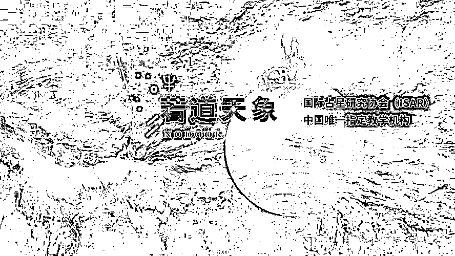

作者/傅莎珈 ISAR 认证占星师
编辑/翀子 封面/书君 图片/网络 6 月 28 日 15 点 54 分，海王星开启本年度的逆行之旅，它将从双鱼座 25 度逆行回到双鱼座 22 度。在将近 6 个月的逆行时间里，让我们看见在上半年的争斗、激情、情绪之中，有哪些地方是过度狂热、暴力侵轧的产物。我们需要深入那些恐惧，给自己和他人更多的耐心和爱。**海王星逆行**

**2022 年 6 月 28 日 15:54，海王星在双鱼座 25º26′开始逆行。到 12 月 4 日，在双鱼座 22º38′顺行。**

今年是海王星的大年。木海合相双鱼座，海王星的能量空前高涨。

木星和海王星每 13 年产生一次合相。每一次合相，都给人间带来环境、心理和信念上的更新换代。

*   **被污染，感染的恐惧……**

*   **旧有边界消融，带来更多群体的联合与创新……**

*   **产生新的信念，聚集起新的群体……**

2009 年，木海合相在水瓶座的时候，开启了互联网商业时代，“双十一”诞生；奥巴马在这一年当选美国总统，成为美国历史上第一个美籍非裔总统。接下来的 13 年，各种前所未有的创新、联合、开放，开创了一个令人怀念的环球联合时期。

13 年后的 2022 年，木海合相在双鱼座，旧有意识形态消融，新的意识形态再度崛起：国内疫情再起；美国的最高法院裁决推翻“罗诉韦德案“，取消了宪法规定的堕胎权；全球气候异常；俄乌战争…….

这些气候和政治、社会信念上的变化，让地球上的我们感受到的恐惧和困扰，估计会持续相当长一段时间。也正是因为这样的打破，新的理念、族群、联盟正在慢慢滋生之中。

在这种情况下，海王星在双鱼座逆行，如同潮水慢慢褪去，露出河床的底色。人们将要做的事情，是修缮加固河道，防止夏季的泛滥，清理河床的淤泥，浇灌两岸的田地……我们将要做的事情，和几千年前美索不达米亚平原上的农夫们好像不太一样，但其实又是一样的：

*   **调整疫情政策，防止新的泛滥产生；**

*   **构建新的价值同盟。虽然这些价值同盟的产生，可能孕育着战争阴影；**

*   **思索个体自由度、个人在社会中的生存权力……**

今年最特别的地方是 4 月 12 日木海合相，按照 Aleksandar Imsiragic 老师的说法：**“过往岁月的战斗、激情、狂热被唤醒；5 月 1 日，金牛座日食，以金星和木星在双鱼座 27º 合相的方式，开启了一个时空隧道：对丰盛、富饶的渴望也被唤醒。”**

这两股不相干的力量，在这次海王星逆行时成为梦境里不断闪现的碎片信息，需要我们在醒着的时候，不断去理解和重组。

今年的木海合相，尤其跟火星力量关联。所以在探讨海王星的行进时，一定要关注火星的轨迹。

**6 月 28 日的海王星逆行，将 4 月 12 日木海合相的能量再度唤醒。让每个人有半年时间再次潜入当时的恐惧、愤怒和反抗之中，去看看这股恐惧中可以学到什么。**

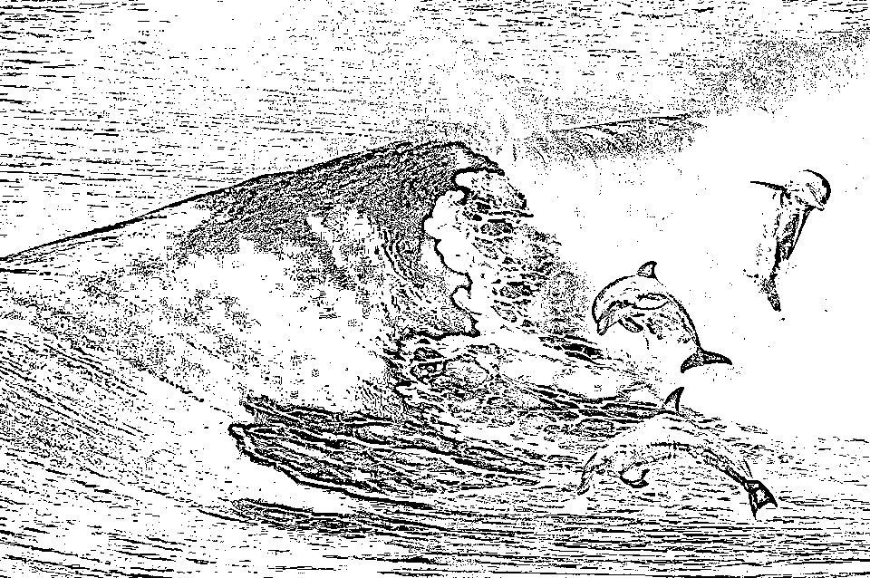

**社会意识形态混战时期**

本次海王星逆行，触发了火星和土星的中点。如果火星在白羊座意味着一场生存之战的开端，独立的权力、选择权力的宣言，土星在水瓶座则象征着终点：建成落地新的秩序，体系，法则。 

**海王星此刻的逆行，如同一次矫正，让人们看见在上半年的争斗、激情、情绪之中，有哪些地方是过度狂热、暴力侵轧的产物。  **

海王星的原型是水之母，泛指地球母亲；**因此这个逆行，需要我们思考环保、气候问题：如何与大自然达成共存平衡。**这次疫情一定程度上加剧了土地和水源的污染，后患无穷。

**海王星逆行的这半年，遇到了二年一次的火星逆行。**人们在火星所象征的“生存权利” 这个主题上会有非常多元的意见（双子座）涌现出来，嘴仗不停。

海王星在双鱼座，则会有各种牺牲、救赎的情绪被激发。不断造神, 不断发现神本是人。在这种矛盾中，我们在学习成为有神性的人。承认局限，依然愿意奉献。

**逆行中的冥王星和海王星形成六分相，推动每个人深入内在恐惧，去完成释放与转化。**

天王星在 8 月到 11 月期间，会和逆行的海王星形成六分相，**准备好迎接一些突如其来的变化，**继续让世界远离旧日。 

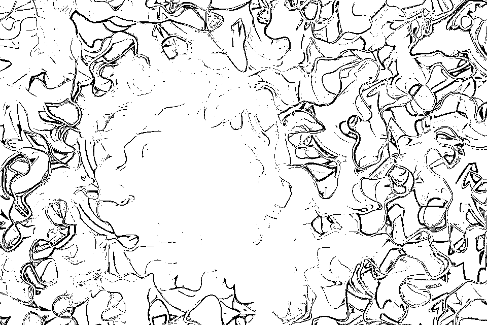

**巨蟹座新月：修复和孕育**

海王星逆行后的第二天是巨蟹座新月。所有木海合相时期被唤醒的有关生命受到威胁、生命创痛，都将在这个新月之后，被“生命魔法”慢慢治愈。

和海王星有关的神话中，有一则故事跟伊西丝有关。古埃及时期，皇后伊西丝为了救回被黑暗之神塞斯杀害的国王奥里希斯，踏遍上下埃及去寻访丈夫被肢解的尸体。最后找回来 12 片，只是阳具被鱼吞噬。

伊西丝用泥土重塑阳具，施魔法令奥里希斯复活一夜，生下荷鲁斯，荷鲁斯历经各种挑战最后夺回了被黑暗之神篡夺的皇位。

伊西丝以死亡的护佑者和复生者出名，在古埃及时期是魔法、婚姻、生育的守护神，长久以来影响着希腊-罗马文化，她抱着孩子的形象是后来基督教里圣母玛利亚的形象借鉴。

在生命遭受不可抗的疾病、死亡威胁的时候，人们总是会寻找生命中一个类似伊西丝式的人物或者关系，在她的陪伴下，穿越死亡障碍，经过各种身体修复，技艺提升，最终重新返回成长之旅，达成自己的使命。

尤其是本次新月和白羊座木星形成精确四分相，特别指出了脱离家族羁绊成为个体的挣扎：

*   **你有哪些创伤和成为真正的自己有关？**

*   **你有哪些压抑已久的愤怒或无力背后，其实是内疚与自责？**

*   **你有哪些退怯，和无法实现完美的自己有关？**

**请记住，你无法成为他人，你只能一遍遍的成为自己。所以各种的耐心、爱，首先要给自己。**

这段时间，有一些敏感的客户已经开始谈论：**如何突破生命的薄膜？**这层薄膜是家族里的保护力量，同时也阻碍自己走向外面的新世界……

伴随 5 月 1 日金牛座日食，有很多人发现自己的一些潜能正在苏醒。而这种潜能的苏醒，意味着 TA 要去改变现有社会身份，这个身份可能和父母期待、家族传统，一切代表此刻稳定与安全的元素不太一样。很多人对于这种改变是害怕的。

一些母亲，则无意识的遭遇一些事件，让她们特别聚焦孩子的前途或者情绪问题，试图帮助 TA 们找到解决之道。往往，首先需要厘清的是：你的焦虑是什么，是什么正在通过讨论孩子的未来被投射出来？

巨蟹座新月指向母亲/生育/家园主题。生育主题正因为“罗诉韦德案”被推翻，进入全面讨论中。婴儿和母亲，谁的生存权力更重要一些？女性是否有权利决定自己要不要成为母亲？

Pro-Choice 和 Pro-Life 是讨论堕胎问题时候常被引用的角度。但如果世界上一些地方连基本生存权和女性权力这个基础都不存在的话……下半年的意识斗争更激烈。

巨蟹座新月和海王星在双鱼座的逆行，都是发生在水象元素的行星能量。提醒我们更深的连接感受。**任何有关“感受”觉察的练习，是这次海王星逆行后的半个月内，最值得做的事情。**

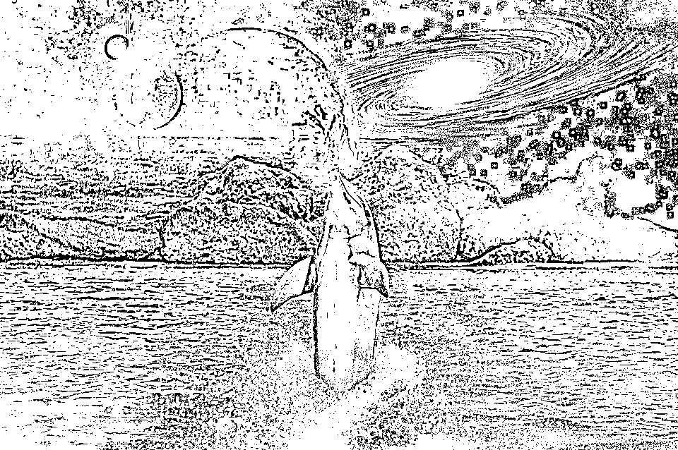

**本次海王星逆行的行进节奏****★****6 月 28 日-7 月 31 日**

*   **7 月 1 日-7 月 3 日：双子座水星四分双鱼座海王星（逆行）**

*   **7 月 11 日-7 月 15 日：双子座金星四分双鱼座海王星（逆行）**

*   **7 月 15 日-7 月 20 日：巨蟹座太阳三分双鱼座海王星（逆行）**

*   **7 月 16 日：太阳和水星在巨蟹座合相**

收入、情感、合作领域可能出现各种沟通表达的不顺畅，或者因为言不由衷、含糊其辞导致关系的信任度受挑战；**需要站在长远合作的角度，协商确认价值观共识之后，再做选择。**

7 月 16 日太阳和水星在巨蟹座合相，是 5 月 21 日太阳和逆行的水星在双子座合相之后的领悟产出：如何长久经营发展生活与事业，重建安全感。

**★****8 月 7 日-8 月 31 日**

*   **8 月 7 日-8 月 13 日：金牛座火星六分双鱼座海王星（逆行）**

*   **8 月 18 日-8 月 22 日：处女座水星对分双鱼座海王星（逆行）**

*   **8 月 20 日：火星换座双子座**

这是个非常欲速不达的时期。**最好放慢速度，跟随自己的直觉。**

水星换座处女座对分逆行的海王星，特别提醒我们理性处理幻灭感或者是过度理想化的情绪。

当火星换座双子座，而水星仍然在处女座，我们容易冲动行事、行事反复无常。请谨慎规划，探讨各种可能性，不要太早下结论。

**★****9 月 1 日-10 月 31 日**

*   **9 月 10 日：水星在天秤座逆行**

*   **9 月 27 日-10 月 3 日：水星在处女座（逆行）对分双鱼座海王星（逆行）**

*   **10 月 1 日-10 月 17 日：火星在双子座四分双鱼座海王星（逆行）**

*   **10 月 28 日：木星退回双鱼座，木海再次合相（逆行）**

*   **10 月 30 日：火星在双子座逆行**

**这是本次海王星逆行中最混乱的时期。谨慎观望，少做重大决定。大环境正处于高度转换阶段。**

是我们对 4 月以来的疫情政策做盖棺定论的时期。可能会再度发生疫情。

**★****11 月 1 日-12 月 4 日**

*   **11 月 1 日-11 月 25 日：火星在双子座（逆行）四分双鱼座海王星（逆行）**

*   **11 月 20 日-12 月 2 日：火星在双子座（逆行）三分土星水瓶（逆行）**

*   **12 月 4 日：海王星在双鱼座 22º 38′恢复顺行**

**这个年尾特别激烈。**伴随太阳、金星、水星依次进入天蝎座并合相南交点，逆行的天王星合相北交点。我们终将做出选择，可能有非常激烈的舍弃和觉醒。

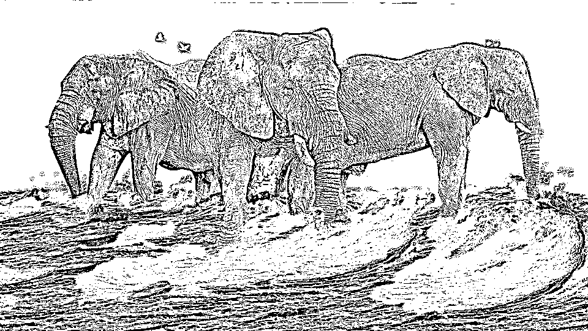

**尾声**

‍‍‍‍‍‍‍‍‍‍‍‍‍在复杂激烈的世界里，人们总是渴望回归宁静，寻找桃花源。直到有一天，我们知道，最终无可逃避的要为自己的成长做选择。请永远，选择最难的那条路，以激发出更多潜能。

这样三五年后，你可以微笑地在各种分享场合说：因为当时做了一个特别坚决的决定，而有了今天。**每个人的一小步尝试，最终汇聚成整个世界的大变化。**不积跬步无以至千里，此刻，我们正在酝酿这一小步的跨出。

祝福大家。

**版权声明**：原创文章由作者授权首发于若道平台，欢迎转发，反对抄袭。友号转载请申请白名单。

**END**

****傅莎珈****

ISAR 认证占星师（2015 年获得）

整合疗愈占星师

国际著名传播集团工作 20 年

**微信公众号**：Helloshajia

长按打赏

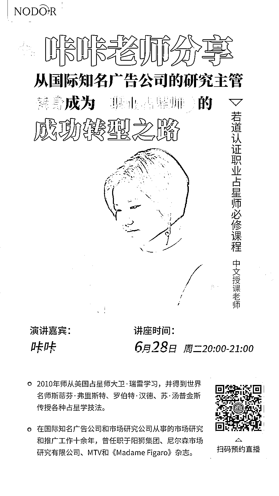

<mpvideosnap class="js_uneditable custom_select_card channels_live_iframe" data-pluginname="videosnap" data-headimgurl="https://wx.qlogo.cn/finderhead/PiajxSqBRaEJYnVsqWfEX9qA0sI6hNVKsDfyzfPZ92WZMZyBpZWU5NA/0" data-username="v2_060000231003b20faec8c4e68a1ec2d4ca07e434b07755bbf47e7053a3059defd2c9d6c68a20@finder" data-nickname="若道" data-desc="将在 06 月 28 日 20:00 直播" data-intro="从国际知名广告公司研究主管转身成为职业占星师的成功转型之路" data-noticeid="finderlivenotice-v2_060000231003b20faec8c4e68a1ec2d4ca07e434b07755bbf47e7053a3059defd2c9d6c68a20@finder-1655897310932651-1335680348" data-type="live"></mpvideosnap>**20 位来自世界各地的占星师****带来 19 场沙龙——新世界的觉醒****详情可点击下图**

**学习占星学****点击下图了解课程详情**

**微信又双叒叕改版啦，不想错过若道君的推送？**
**就把若道设为星标吧！****▼**

**喜欢就点一下“在看”吧！**

********报名直达入口********

‍‍‍‍‍‍‍‍‍‍‍‍‍

# 新课首发：斯蒂芬·弗里斯特工作坊丨探索组合图永恒的三角

> 原文：[`mp.weixin.qq.com/s?__biz=MzA5NjA0NTAxNg==&mid=2651478579&idx=2&sn=8c3bd7dd2be285d22214b320598bf40a&chksm=8b48e884bc3f6192ad1ff1eb08e76749fb306e452748ce5b7453f79f30316236c2565ebe7b82&scene=126&sessionid=1692737796#rd`](http://mp.weixin.qq.com/s?__biz=MzA5NjA0NTAxNg==&mid=2651478579&idx=2&sn=8c3bd7dd2be285d22214b320598bf40a&chksm=8b48e884bc3f6192ad1ff1eb08e76749fb306e452748ce5b7453f79f30316236c2565ebe7b82&scene=126&sessionid=1692737796#rd)

**1**

********斯蒂芬·弗里斯特老师若道独家三日线上工作坊********

斯蒂芬说，我们的组合图表明无论什么状况我们都能熬过去。

**2**

********此次授课内容********

**组合图描述了如何才能使两个人的关系一直充满活力。**这句话中隐含的意思是假设一段关系有一种区别于这两个个体的独立的生命。有时我们喜欢和一对伴侣共度时光，却从没想过单独见他们其中一人。我们从这对伴侣身上感觉到的 "频率"是对他们组合图能量的直接体验。在某种程度上，可以简单地理解为：**正如每个人都有自己的星图一样，每对伴侣也有他们的星图。**

从简单的描述层面上讲，这就是组合图的意涵。记住，我们可以将这一技法用于任何一种关系：**父母和子女、商业伙伴、朋友。**作为进化占星师，我们的目标要比单纯描述走得更深。解读组合图时，可以着眼于帮助人们，而不仅仅是使他们感到惊奇。对于个体来说，出生星图代表了一条正确的人生道路，一条承诺意义、活力、灵性目标的道路。组合图亦然，只不过它将一段关系看成一个独立的个体，而不是两个人。关系也有进化的路径：人们走到一起是为了学习和成长。个体如果没有领会自己出生星图的要点，会变得疲惫而沮丧。两个人也是如此，**如果没有抓住组合图的要点，我们就会对对方感到厌烦。这段关系似乎也会失去动力。**

伴侣常常意见不一，陷入困境，看不到前进的方向。三是一个更有动力的数字。三个人投票，二个人以多数票击败一个人，推动事情继续发展。**这实际上解释了这次工作坊的主题：永恒的三角。**

**每对伴侣其实都是一个三人组：你、我以及我们。**组合图所代表的那个看不见的 "第三人"经常会"投出打破僵局的一票"，使关系得以发展。**·** 但是如果组合图总是同意一个人的意见，而不同意另一个人的意见，怎么办呢？（这被称为"封建制度"）**·** 如果两个人都安静而保守，但他们的组合图却要求狂野的冒险呢？（这是 "文化冲击"）**·** 如果它同时均衡地反映了两个人的情况呢？我们可以称之为 "民主"，但我们仍可以区分出一个人天然的智慧比另一个人更强的领域，让擅长的人负责擅长的事，这会促进关系蓬勃发展。换句话说，我们开始看到这个技法的咨询维度了。我们将在这个工作坊中探讨这些内容。两个人究竟为什么会走到一起？**在严肃、复杂的关系中，我们可以假设两个人之间有一些未解决的业力。**如果他们在今生是恋人，但在前世中，一个是父母，一个是孩子呢？也许那些直觉和假设仍可以感受得到，极为错综复杂地使得他们在今生想要成为情侣。**这些疑问将我们引向组合图的月亮交点，在那里我们往往能发现当今人类任何伙伴关系问题的真正核心。**

**从理论上讲，组合图是基于中点的。**如果我的出生星图里太阳在摩羯座中段，而你的太阳在双鱼座中段，我们组合图的太阳就在水瓶座中段。换句话说，**在你和我的太阳的中间位置。****其他行星、月亮交点和中天也是如此。**其他宫头的位置，包括上升点则存在一些争议。通常的做法是仍然使用中点，但斯蒂芬老师将会解释他认为这样做存在的技术方面的问题。他更倾向于**使用关系最初开始的地点绘制星图，就像我们使用出生地来绘制出生星图一样。**

**组合图也像出生星图一样有行进。**在工作坊中， 我们将**探讨一些特殊的技法和考量，来帮助伴侣们应对生活中的挑战和机遇。**组合图的推进会出现一些看似难以解决的复杂问题，斯蒂芬老师创造了一种解决这些问题的技法。他将在工作坊中阐述相关细节，基本的问题是：如你所知，要了解一个人 30 岁生日的推进，我们要看这个人出生后 30 天的行星位置。问题是，组合图与我们在占星学实践中使用的其他星图不同，组合图并不代表某一天的天空。记住，它是基于中点的。**那么我们如何从一个不存在的日期开始 "向下数 30 天"呢？斯蒂芬老师将为我们提供一个行之有效的答案。**

并非所有的人都处于伴侣关系中，但**作为人类，就需要与其他的灵魂共舞。占星学能够极大地帮助人们驾驭复杂的关系。**了解我的星图如何与你的星图通过相位和宫位的交互而产生互动，是非常有帮助的。组合图包含了这些技法，提醒我们，整体总是大于各个部分之和，而又与之不同。

**3**

********斯蒂芬的占星著作********

**·** 1984 年-1988 年间，斯蒂芬写作出版了《内在的天空》（已有中文版）、《变化的天空》和《天空的伴侣》三本占星经典著作，奠定了早期在占星学界的地位。**·** 2002 年-2005 年间，他与朱迪·弗里斯特共同创作了两本经典的关系占星学著作《天空的伴侣 I：爱、性、和进化占星学》《天空的伴侣 II：组合图》。**·** 2008 年，斯蒂芬出版了一本非常重要的著作《昨日的天空》，此书是至今为止关于轮回转世跟星图的清晰对应最详尽的著作之一。 斯蒂芬前后一共出版了 12 部占星著作，在世界占星学界拥有很高的声誉。

**4**

********斯蒂芬获得的荣誉********

1985 年，他凭借《内在的天空》一书获得职业占星师协会奖（*Professional Astrologers Incorporated Award*）。1992 年、1995 年、2008 年、2018 年，他四次获得占星界最高的占星学联合协会奖（*UnitedAstrology Congress Regulus Award*）提名，2018 年获得轩辕十四教育奖。

**5**

********斯蒂芬的占星哲学观********

斯蒂芬的占星风格以**自由和选择**为中心，他的解读不是以下定论的方式来“预测”未来，他**强调如何改善生命，而不是宿命式的论断**。他以心理占星学的语言来解读星图上的人格部分，但是**通过南北交点及其相位和守护星来探索星图所揭示的前世业力与今生方向，在灵魂进化的背景里来整体解读星图。**他认为进化占星学的目的在于**鼓励人们做出更符合进化方向的智慧选择，我们学习去了解前世的时侯，关注点应该集中在如何通过意识来疗愈自己。**

**6**

**这些名人怎么说**

斯蒂芬让我们停止了玩责备命运的游戏，而开始看到自己是一个走在进化路途上的勇士。——奥普拉杂志“*O: THE OPRAH MAGAZINE*”

斯蒂芬和杰夫这两位著名占星师创造性地相互应和，展现出他们出色的教师才华，发展并弘扬了占星这门艺术。（对《测量天空：进化占星学和灵魂的钥匙》的书评）——著名心理占星师 现代占星之父 诺·泰尔（*Noel Tyl*）

请享用斯蒂芬和朱迪这两个博大的灵魂在此书中所提供的洞见大餐吧。（对《天空的伴侣》的书评）——进化占星学的创始人之一 杰夫·格林（*Jeff Green*）

我为斯蒂芬解读的精准感到惊叹，他强调没有一件事是坏得无法挽回的，也没有一件事是如此之好以至于它不会因为现在的错误判断而消失的。我怎样推荐他都不为过！——好莱坞著名影星“钢铁侠”男主角 小罗伯特·唐尼（*Robert Downey Jr*）

**7**

**上过课的占星师怎么说**

他关于我星图的解读，让几乎所有在场的人掉泪，我也从此开启了一段灵魂追寻的旅程。我很惊讶他透过星图可以如此深入一个人的灵魂。很多东西你自己都不知道，但是他讲出来你会发现，啊，这是真的，这是占星学的神奇。——《心探索》创始人孟想

每个来参加老师课程的同学，都会被老师深深的慈悲心感动。这种慈悲心，并不是表面上说的一些什么话，而是一种从意识层次上发出的能量。每个来上课的人，都能感受到老师的爱。这种爱，并不是盲目的爱，而是深刻地洞悉真相后的慈悲。

——斯蒂芬老师工作坊翻译逸月

斯蒂芬老师的一对一咨询已经排期到两年之后，我特别幸运，曾在课堂上被老师抽中分析过我的星图，老师充满爱与智慧的指引让我更加清晰的认识了自我。内在的潜能、需求和矛盾被老师娓娓道来。——禄丽荣斯蒂芬老师是位非常非常值得推荐的大师，很粉他，这位进化占星学的创始人，对人的理解是那么的全面完整、深刻洞见、慈悲和温暖，就这方面而言足可以媲美我无比崇敬的荣格和史坦纳（这两位去天堂里玩了）。如果你对西洋占星感兴趣，或者对人的所有角度、各个层次的真相和可能性感兴趣，推荐斯蒂芬老师的书和课程，特别是他的课程，数倍的功力大增的好机会，错过真是占星粉丝的莫大损失。——仁华

**8**

**2019 年工作坊学员感悟**

**9**

**什么人适合这门课程**

✦ 占星师或渴望成为占星师的人群。   ✦ 本课程并非针对初学者，需具备若道核心课程 level4 及以上水平，即了解星座、行星、宫位、相位、综合解读等知识。✦ 课程会涉及组合盘解读高阶内容，不了解相关知识的同学，请提前学习相关内容。

**10**

********授课老师********

**斯蒂芬·弗里斯特（Steven Forrest）**

**·** 进化占星学的创始人之一，当今世界最有影响力的占星大师之一；**· **毕业于美国北卡罗莱纳大学宗教学专业；**· **1984 年-1988 年间，写作出版了《内在的天空》、《变幻的天空》和《天空的伴侣》三本占星经典著作，奠定了早期在占星学界的地位。前后一共出版了 12 部占星著作，在世界占星学界拥有很高的声誉。**· **1985 年，他凭借《内在的天空》一书获得职业占星师协会奖（*Professional Astrologers Incorporated Award*）。1992 年、1995 年、2008 年、2018 年，他四次获得占星界最高的占星学联合协会奖（*United Astrology Congress Regulus Award*）提名，2018 年获得轩辕十四教育奖。**· **斯蒂芬将自己的绝大部分时间都花在教学以及个人咨询上，他于 1998 年创立了占星学徒计划（*Astrological Appretice Program*），这个计划致力于培养职业占星师；**· **至今为止已经有 600 余位学员完成了培训，其中很多都成为了优秀的职业占星师；**· **他是一位脚踏实地的导师，充满快乐和活力，亲和幽默同时又充满了智慧；**· **他的课程不仅仅是一次占星知识和经验的学习，也是一次与智者的相遇。

**11**

********课程费用********

**正价：6800 元****早鸟价：5800 元****早鸟价截止日期：2022 年 9 月 15 日**

**12**

********授课时间、方式、退转********

**授课时间：2022 年 10 月 14 日-16 日（周五、周六、周日）7:00-13:00****具体时间安排：****7:00-8:45****（15 分钟休息）****9:00-11:00****（30 分钟休息）****11:30-13:00**

****授课方式：******线上直播课，英文授课，中文翻译**

**课程退转：退款原则请详看《教学协议》，如有疑问请咨询课程顾问。**

****斯蒂芬工作坊 | 探索组合图永恒的三角****

**授课老师：斯蒂芬·弗里斯特**

**授课时间：2022 年 10 月 14 日-16 日（周五、周六、周日）**

**授课方式：******网络授课，英文授课，中文翻译****

**费用：**6800 元**（早鸟价：5800 元，截止日期：2022 年 9 月 15 日）**

**课程负责人：王老师**（微信/手机：18510107057，请备注“斯蒂芬工作坊”）

长按二维码添加课程负责人咨询

****报名直达入口****

# 2022 年若道 ISAR 选修课 | 《医疗占星手册》作者亲授

> 原文：[`mp.weixin.qq.com/s?__biz=MzA5NjA0NTAxNg==&mid=2651478579&idx=3&sn=834a1827ee70b7e410eec1acf119fcbc&chksm=8b48e884bc3f61920acf1ea30f3dfab157fc6f4d8355fa3d87a1b1f3a38a9d30cae70c82e813&scene=126&sessionid=1692737796#rd`](http://mp.weixin.qq.com/s?__biz=MzA5NjA0NTAxNg==&mid=2651478579&idx=3&sn=834a1827ee70b7e410eec1acf119fcbc&chksm=8b48e884bc3f61920acf1ea30f3dfab157fc6f4d8355fa3d87a1b1f3a38a9d30cae70c82e813&scene=126&sessionid=1692737796#rd)

**有四个主要因素影响着我们的生活和健康：基因构成、物质环境、情绪环境，以及我们的占星配置。我们在星图中都存在患病的可能性，而预防的方法在于尽可能充分、真实和健康地生活。****——简·里德·帕特里克****（Jane Ridder-Patrick）博士**

占星学就像心灵的 X 光片。它可以描述个人对世界的看法和反应。我们越不了解自己的天性，面对生活中的挑战，我们就会有越少的选择。

**“占星学可以精准定位需要解决的潜在问题。”**

**医疗占星学是一个强大的工具，同时洞察的身体和心理过程，通过更多的自我认知照顾和关爱自我和身边的人。**

**本课程既适合医疗占星学的初学者，也适合已经有一些相关经验的人****。**简·里德·帕特里克老师将运用现实生活中的例子，揭示一个人的性格、症状及其星图是如何相互映照的。课程也会探讨疾病的意义以及可能的治疗方法。

**本课程旨在为学员提供一个运用医疗占星学的框架和方法，**学员将会学到一些有价值的实用工具，在课程结束后，自己使用这些工具研究其中的关联性。

**此课程可作为 ISAR 选修课。**

1

**课程安排**

**课程时间：2022 年 9 月 20 日-11 月 8 日  每周二 20:00-22:00**

**第*****1*****讲  9 月 20 日 与占星学、心理学、病症一起工作**

*   医疗占星学的组成部分以及如何使用它们

*   行星的作用与相互作用

*   黄道星座人

*   宫位的重要性

*   疾病和健康是如何产生的

**★ 第二、三、四讲的课程内容基于星座以及它们之间的相互作用。**

**第*****2*****讲  9 月 27 日 基本星座**

学习基本大十字星座——**白羊座、巨蟹座、天秤座和摩羯座**——及其功能和相关的健康问题。**这些星座与防御、养育、结构、体内平衡和荷尔蒙控制有关。**

****第*****3*****讲  10 月 4 日 固定星座****

学习固定大十字星座——**金牛座、狮子座、天蝎座和水瓶座**——及其功能和相关的健康问题。**这些星座与习惯和反射、心脏调节、生存、循环和协调有关。**

“固定星座（金牛座、狮子座、天蝎座和水瓶座）在情感和生理上都倾向于**‘难以放手’**，这可能为恶性肿瘤的生长创造环境。所以说，他们可能倾向于沉浸在过去的伤害中，难以自拔。另一方面，这些星座也擅长在艰难的时期坚持不懈并一直**持之以恒**。”——简·里德·帕特里克（Jane Ridder-Patrick）博士

**第*****4*****讲  10 月 11 日 变动星座**

学习变动大十字星座——**双子座、处女座、射手座和双鱼座**及其功能和相关健康问题。**这些星座与呼吸、神经系统、肠道、睡眠以及信息、情感和行动的整合有关。**

**★ 第五、六、七、八讲重点学习行星，它们在身体层面的表达、它们的相位与行进。**

**第*****5*****讲  10 月 18 日 太阳与月亮**

**太阳**掌管视觉、活力、心脏和意识，与心脏、脊柱和视觉问题相关。**月亮**掌管人体的周期，特别是月经周期、饮食模式和体液，与情绪引起的疾病、饮食失调和胃病相关。

**第*****6*****讲  10 月 25 日 土星与天王星**

**土星**掌管着皮肤、骨骼、牙齿和衰老过程。它对应的疾病包括慢性疾病、耳聋、帕金森病、关节僵硬和牙齿问题。**天王星**代表身体活动的协调，有节奏的脉动和身体的“电”。与天王星相关的疾病包括癫痫、痉挛、心律失常，以及阿斯伯格综合症和自闭症样综合症。

**第*****7*****讲  11 月 1 日 海王星与冥王星**

**海王星**掌管松果体、细胞膜渗透和右脑功能，与过敏、上瘾的病症、慢性疲劳综合症和睡眠障碍相关。**冥王星**掌管消除和转化，其病理包括毒性、脓肿、癌症和强迫症。

**第*****8*****讲  11 月 8 日 火星**

**火星是与能量和防御相关的行星**，掌管免疫系统、肾上腺功能、肌肉活动和炎症反应。**它是许多身体和情绪障碍的核心**，如自动免疫障碍、抑郁和发烧，以及由手术或需要手术引发的问题。

2

**此次课程适合哪些人？**

*   有一定占星学基础，若道核心课 L3 以上水平；

*   希望成为优秀的占星师，想要借鉴国际大师医疗占星解读思路并融入自己的体系的人；

*   热爱占星学、健康、养生的研究型占星学者；

*   计划考取 ISAR 认证占星师，寻觅中意选修课的学员；

*   走在自我探索和个人成长道路上的人。

**快来和简·里德·帕特里克老师学习升级版的占星学身体地图吧！**

3

**授课老师**

**简·里德·帕特里克 **博士****

（Jane Ridder-Patrick）

简接受过药剂师、理疗师、草药师、心理治疗师和历史学的专业学习，从事写作、咨询和讲学工作，在英国和全球教授占星学及其历史、当今的心理学和医学应用。她在爱丁堡执业，在爱丁堡大学获得博士学位，研究方向是 17 世纪苏格兰占星学历史。

**她最著名的出版物是《医疗占星手册》。2018 年，她因对医疗占星学的贡献而获得了著名的查尔斯·哈维占星学杰出服务奖。**

《医学占星术手册》（第二版，修订版和扩充版）

(爱丁堡，克拉布出版社，2006 年)

4

**课程信息**

*   **课程时间：**2022 年 9 月 20 日开始，每周二晚上 8 点，每周一次，共 8 次课。

*   **授课方式：**线上直播，英文授课，中文翻译

*   **课程价格：****6800 元**

*   **早鸟价：5800 元（截止日期：2022 年 8 月 23 日）**

*   **课程咨询：**王老师（微信：18510107057，请备注“医疗占星”）

长按二维码添加王老师

5

**退转课程**

*   **退款原则请详看《教学协议》，如有疑问请咨询课程顾问。**

****医疗占星****

**授课老师：**简·里德·帕特里克

**授课时间：**2022 年 9 月 20 日起

**授课方式：**网络课程**，**英文授课，中文翻译

**费用：****6800 元****（早鸟价：5800 元，2022 年 8 月 23 日截止）**

**课程负责人：****王老师**（微信：18510107057，请备注“医疗占星”）

长按二维码添加课程负责人咨询~

****报名请点击“阅读原文”****

# 若道周运 6.27-7.3 丨七月第一周来啦，让爱与信心开启你的下半年（内含 12 星座运势）

> 原文：[`mp.weixin.qq.com/s?__biz=MzA5NjA0NTAxNg==&mid=2651478291&idx=1&sn=0d218efaa2a8f2374a7a765601a36983&chksm=8b48eba4bc3f62b27b4b7d16b653f0e229b057b0e574497d2a9f49ea63e1b17ad60cd183b06f&scene=126&sessionid=1692737796#rd`](http://mp.weixin.qq.com/s?__biz=MzA5NjA0NTAxNg==&mid=2651478291&idx=1&sn=0d218efaa2a8f2374a7a765601a36983&chksm=8b48eba4bc3f62b27b4b7d16b653f0e229b057b0e574497d2a9f49ea63e1b17ad60cd183b06f&scene=126&sessionid=1692737796#rd)

******☆ ****后台回复“今日”，给你一句生命态度******

作者/Dora ISAR 认证占星师
编辑/翀子 封面/书君 图片/网络 7 月来了！这也是 2022 年下半年的第一周。伴随着海王星逆行和巨蟹座新月，12 星座如何开启新阶段？让我们来看文章吧！（如果着急看 12 星座运势，不妨先拉到最后哦）**整体氛围**

最近很巧，遇到几个正在经历海王星四分出生星图海王星的咨询客户，无一例外地陷入迷惘，或者是事业，或者是感情。目前海王星在双鱼座 25 度，正好四分 1982 年左右出生的一代人的射手座海王星，他们正年近不惑，在经历他们的中年危机。

海王星的周期是 164 年，那么在 40 岁左右正好遇到行进海王星四分出生星图海王星。海王星在射手座的一代人，他们出生在 1970 到 1984 年，是中国改革开放四十年成长起来的一代，充满了理想抱负和进取精神，从出生到成年，一直身处充满进取氛围、经济不断加速发展的年代。

疫情三年对他们的冲击，无论是固有的社会规范、经济模式，还是前景展望，对他们而言，都是颠覆性的。这是海王星被分离、被瓦解的体验啊！

俄乌冲突仍在持续、上海的防控伤痛未去、唐山的事件挑战了我们的生存安全感、河南的红码直接摧毁了我们对财务安全和行动安全的信心。

新东方直播和董宇辉的爆红，大概是因为在这一片混乱中，有人用深情让你想起曾经有过的那些情怀，那些被遗忘的生活和梦想，在人群中，彼此拥抱取暖，董宇辉的语言，就好像是一杯暂时让你忘却眼前困境的红酒。

在希腊神话中，我们的宇宙分为三片疆域，木星宙斯掌管天空，冥王星哈迪斯管理冥界，海王星波塞冬，是海洋的守护者。

木星散发出乐观积极向上的正能量，许诺我们人间的光明，冥王星让我们面对人性最幽暗的深处，统治地下的未知。

而海王星呢？丽兹格林关于海王星的主题是：生命是一场追寻救赎的旅程。

海王星是所有原型的巨大容器，是一片深深的梦之海洋，这些原型包裹着我们所有的生活和梦想。海王星的拥抱使我们想起天堂的狂喜，想起完整合一的极乐，我们每个人都从中我们的本源获得自我意识。

在海王星的最高处，它溶解了小我，让我们和整个宇宙合一，包容万有。但在我们进入更高阶的层次之前，**我们可能需要面对的是幻灭和被放逐的恐惧。**

我们在困惑、混乱和精神崩溃中挣扎，在挣扎的痛苦中，我们都需要寻找救赎，我们可以思考一下，**人生实苦，什么才是真正的救赎？**

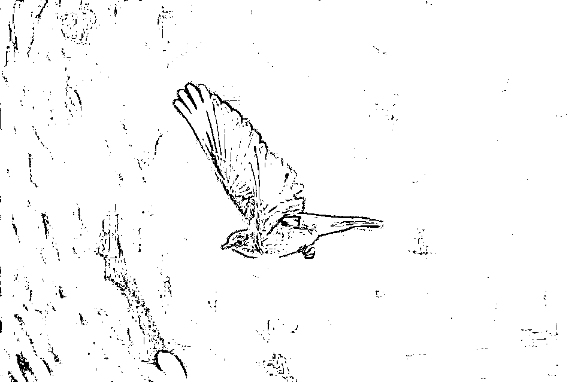

**重要天象**

**★****周二 6 月 28 日 海王星逆行**

**海王星开始逆行，要到 12 月 4 日，才会恢复顺行。**

行星逆行的意义是反思和重新调整，与逆行期那颗行星相关的事务可能变得不稳定且难以预测。

这些事被认为不适合启动与该行星相关的事物，例如：

*   在金星逆行时结婚、整容；

*   在木星逆行时打官司、旅行；

*   水星逆行容易有错误的信息和行程的意外，通常是因为你得不到需要作出周全决定的所有讯息。那么，在逆行期适合做的，就是重新调整，调整和完美你的计划。例如重新审查你的工作、重启老旧的议题或修复关系（复合？），重新翻修房子、或是修改计划。

**海王星逆行期间，我们需要重新调整什么呢？**

就像双鱼座是十二星座里最复杂难懂的一个星座一样，海王星也是十大行星里最复杂难懂的一颗行星。海王星是感知感受，是梦想，是沉沦，还有比这些更复杂的议题吗？

海王星在逆行期间，我们可能会摧毁原有的疆界、认知理念，低阶的运行可能会出现疯狂、愤怒、混乱和欺骗。

如果我们的心灵成长能包容万有、超越自我意识，和更大的宇宙全然相连接，我们也会升起高阶的大爱、慈悲和信心。这期间，呼唤我们回归人类神性源头的渴望，是我们人类共同追寻的救赎。

**放下现实的无力感，用爱去践行。**

**★****周三 6 月 29 日 巨蟹座新月**

巨蟹座新月的时候，太阳四分木星，金星六分木星。

月亮在巨蟹座的能量是最纯粹的。**巨蟹座新月升起，唤起人们对安全感的渴望，**我们想回家，想回到那个全然接纳自己的地方。

是时候去跟家人团聚、去找到自己的归属、去付出自己全然的爱。**在良好关系的支持下，我们才能变得更加的勇敢坚强。**

这个新月正逢太阳四分木星，金星六分木星，**什么才是自己最珍贵、自己真正重要的呢？**

是时候给自己所爱的人一份高质量的时间陪伴，是时候照顾自己的心灵、享受生活的美好、养护自己的宠物和植物、改善家居环境，接纳金星六分木星带来的美好祝福。

当巨蟹座太阳和白羊座木星形成四分相的时候，也可能会意气用事，这时候你可能信心满满、更加勇敢无畏，也可能因为你的盲目大胆，出现冒进的失控行为。

无论如何这一天是一个充满信心祈祷的日子，祈愿我们会有更美好的关系和生活。

**★****周六 7 月 2 日 火星四分冥王星、水星三分土星**

说到火星和冥王星，我们第一反应就是暴力和凶险。当这两个“狠角色”呈冲突相位的时候，这种情形可能会变得更加猛烈一些。

火星是我们生命中原始的冲动和欲望，冥王星是我们潜意识的最执着的欲望，当火星和冥王星呈四分相冲突的时候可能是我们的**欲望发生转化**的时机，**没有冲突就没有改变。**

貌似是很激烈的一天，但好在天空中水星和土星正形成三分相，给了我们一个很好的启示：**理性的思维、有条理的思考方式、规范自己的行为。**

建议大家这一天谨言慎行。耐心，冷静，不要轻易冲动。

**★****周日 7 月 3 日 水星四分海王星**

昨天你有没有遇到让你愤怒上火的事情呢？如果余怒未消，那今天的沟通表达容易出现词不达意的情况。

说话千万不要带有太多的情绪，很多时候我们的表达不是我们的本意，而只是情绪。而情绪向外的时候，很可能会伤人，最好的处理方式是：**静静地让情绪流过自己的身体，感受它，接纳它，拥抱它。**

水海四分相，你有做什么样的梦吗？如果我们不能够很顺畅地和他人沟通，不妨回到我们自己，哪怕做个白日梦也好，这一天可能是会有特别多有启发性灵感的一天哦。

**情绪思维比较饱满的一天**，我们也可以从事一些艺术性的思考和工作。比如绘画、写故事、艺术性创作，我相信你一定会在今天感觉灵感更多了一点。

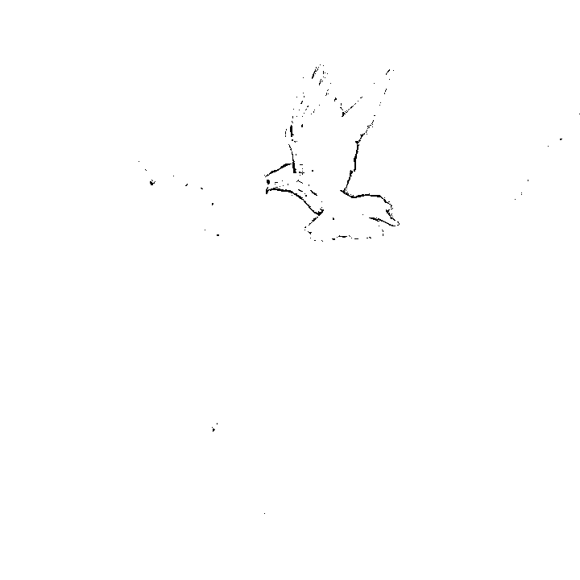

**12 星座一周运势**

**上升*****白羊座***

前些日子的白羊座，斗志满满，得到了不少新机会。在众人的关注和要求下，也觉得挺辛苦的呢，会不会最近有些想发火的冲动？

也许，你会在在生活工作中遇到一些突然的变化，但辛苦之外，也会有很多收获。本周正是你通过学习、不断提升自己的阶段。

巨蟹座太阳在你的第四宫，提醒你常回家看看，从家里获得力量的源泉。

*****上升**金牛座***

金牛座依然心情平和，社交生活开始活跃起来了，这个时候，可以多出去会会朋友，聚餐聊天。双子座金星在你们的第二宫，财运指数飙升，容易遇到好的客户和项目，投资理财的运势也会好转。

虽然工作上面压力重重，但只要你理性对待、广交朋友、多多学习取经，一定能够逢凶化吉。

**上升*****双子座***

上升双子座的宝宝们，最近可以多和朋友们联系一下。双子座金星在你们的一宫，人气飙升，魅力加分。客户缘比较好，也容易有事业方面的利好出现。财运方面，这个月也可能回升，但要记得走稳健路线，不要冒进。暂时不要计划长途旅行。

**上升*****巨蟹座***

巨蟹座的宝宝们生日快乐！太阳在你们的一宫，有没有感觉自己进入了满血复活的周期？这是巨蟹座的高光时刻，勇敢绽放出你的光芒吧。

火星进入巨蟹座的十宫，工作变得特别忙碌，也难免会在职场上跟人争吵。但是木星也在十宫，有好运加持，事情都会又快又好的完成。

这周适合集中精力在主业上，投资理财或者其他偏财运可能不是太顺利。各方面搜索一下，避免亏本或者套牢。

**上升*****狮子座***

狮子座最近人气太旺了，还能遇到事业上的贵人，有可能是来自远方的贵人给你带来新的机会。也是适合去开拓新的知识领域的时期，可以做些海外相关事务，无论是行万里路，还是读万卷书，你都需要去开阔视野。

多注意和最亲密的人的沟通，如果有压力和困惑，不妨敞开心扉，看看问题出在哪里。是不是对身心灵成长有了一些兴趣？不妨多接触冥想，去给自己一个探索内在自我的机会。        

**上升*****处女座***

处女座本周的工作状况可谓是压力重重，好事多磨，反反复复，好在这周人缘不错，关键时刻可以有人给力支持，最终会度过难关，并且得到好评。所谓梅花香自苦寒来，说的就是你。

理性的处女座最近有没有新的投资计划呢？也许可以花点心思理财了。毕竟手头的资金需要好好规划一下。这周的偏财运是不错的。

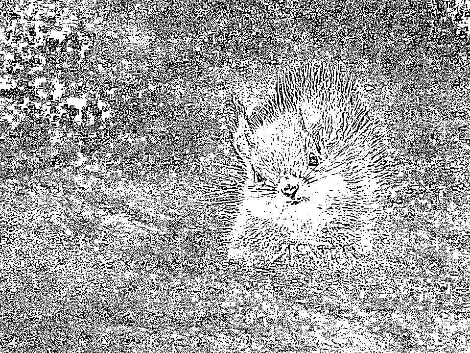

**上升*****天秤座***

天秤座最近有桃花运哦，有非常好的人缘和合作意识，是非常适合搞好人际关系的阶段。事业上也有机会崭露头角，得到同事们的关注和表杨。

有孩子的天秤座需要注意亲子沟通，不要给孩子太多压力，有可能的话，暑假带孩子出去走走，给孩子一些高质量陪伴的时间。

木星在第七宫，非常适合与你喜欢的人更进一步。爱就大胆地说出来，不要犹豫不决。

**上升*****天蝎座***

本周天蝎座偏财运强旺，会有一些意想不到的收获。同时，恋爱的运势也挺好的，容易遇到合适的对象，如果有机会表白，就不要犹豫了。

工作压力可能增加，注意不要轻易在职场和同事发生冲突。

天蝎座们要多多关注自己的身体健康，不要因为过度疲劳而消耗太多。早点回家休息，早睡早起，千万照顾好自己，也多关心一下父母。

**上升*****射手座***

射手座最近在事业合作方面的机会不要太好哦！可能突然开发出了社交能力，广泛受到朋友们的欢迎。和另一半的感情加分，亲密关系也有了提升的空间，好好享受甜蜜时光。

本周有投资获利的机会，可以搏一搏，不过千万小心谨慎。

木星在射手座们的第五宫，试试在家里创作一个作品，或者多出去玩一下，找些乐子，不要老想些沉重的话题。

**上升*****摩羯座***

这一周的摩羯座在职场上表现相当出众，充分显示了自己独立的工作能力，可以放心大胆的开展领导交办的任务。如果遇到困难，可以寻求他人的帮助和支持。亲密关系有望升温。

本周财运一般，注意避免风险。

家人也需要你的关心和帮助，多和家人沟通，也会给你带来新的启发，这周你会发现，家人是你最强的后盾。

**上升*****水瓶座***

最近水瓶座在工作中也是非常忙碌的。可能会感到比较累，压力比较大。记得要照顾好自己。好消息是最近桃花运不错。多参加一些玩乐聚会，可能会遇到心爱的人。希望有孩子的水瓶们，最近也可以抓紧。

学习运也是相当可以的，如果有机会开展新的课程或者去考试，这段时间是一个不错的时间点。

财运还不错，但是千万不要过于乐观，。

**上升*****双鱼座***

今年双鱼座们都是比较好运的。这一周双鱼座可能有非常好的财运，说不定会得到来自家里人的支援。记得常回家看看，在陪父母的同时也多陪陪孩子。如果是单身的双鱼座，花点时间去寻找自己的恋爱对象吧。

是时候做一个学习计划了，不要懒散，该努力的时候一定要努力付出啊！

**祝大家一周平安顺遂！**

**版权声明**：原创文章由作者授权首发于若道平台发布，欢迎转发，反对抄袭。友号转载请申请白名单。

**END**

****Dora****

若道 2017 届核心课毕业生

若道咨询平台占星师、ISAR 认证占星师

心理咨询师、塔罗咨询师、多年企业管理经验

咨询微信：AstrologerDora

公众号：Dorothy 占星文化

**长按打赏**

**20 位来自世界各地的占星师****带来 19 场沙龙——新世界的觉醒****详情可点击下图**

**学习占星学****点击下图了解课程详情**

**微信又双叒叕改版啦，不想错过若道君的推送？**
**就把若道设为星标吧！****▼**

**喜欢就点一下“在看”吧！**

********报名直达入口********

# 雷蒙德·梅里曼金融占星周运 | 注意 7 月 2 日前后的行情

> 原文：[`mp.weixin.qq.com/s?__biz=MzA5NjA0NTAxNg==&mid=2651478291&idx=2&sn=7e1354f50efe3ae80190acbfa51c3fe9&chksm=8b48eba4bc3f62b2548f4e1b2634eaa1cbee9abce579159b62627876a5caefeece18cc81ffb1&scene=126&sessionid=1692737796#rd`](http://mp.weixin.qq.com/s?__biz=MzA5NjA0NTAxNg==&mid=2651478291&idx=2&sn=7e1354f50efe3ae80190acbfa51c3fe9&chksm=8b48eba4bc3f62b2548f4e1b2634eaa1cbee9abce579159b62627876a5caefeece18cc81ffb1&scene=126&sessionid=1692737796#rd)

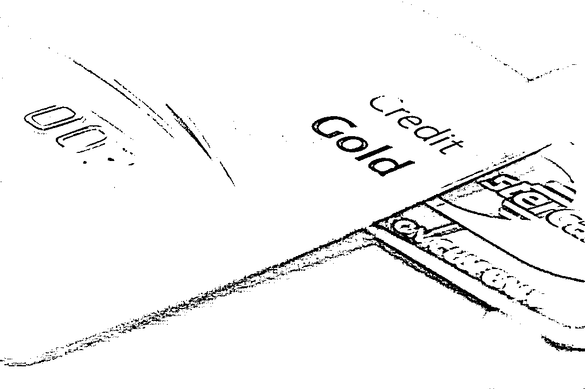

作者/雷蒙德·梅里曼 译者/Luke
编辑/玫瑰 图片/pexels

雷蒙德·梅里曼是在金融占星学界稳坐第一把交椅的占星师，同时他也是若道签约的金融占星课老师，我们引进了雷蒙德·梅里曼老师的《[上证指数月度报告](http://mp.weixin.qq.com/s?__biz=MzA5NjA0NTAxNg==&mid=2651477281&idx=3&sn=65ddd3e71ea11fbb78a1f51685d17483&chksm=8b48e796bc3f6e8034c6cfc8e0ac35cf8bda531ab58cb216c2003cd11cc20197333775a5d0ec&scene=21#wechat_redirect)》及《[黄金报告](http://mp.weixin.qq.com/s?__biz=MzA5NjA0NTAxNg==&mid=2651477281&idx=3&sn=65ddd3e71ea11fbb78a1f51685d17483&chksm=8b48e796bc3f6e8034c6cfc8e0ac35cf8bda531ab58cb216c2003cd11cc20197333775a5d0ec&scene=21#wechat_redirect)》。我们经老师的授权，将每周刊登梅里曼老师的周运，供大家参考和学习。于是，这是本周的周运（6.27-7.1）。

**说明：以下时间采用纽约证券交易所所在地美国东部标准时间。**

**展望与回顾**

****

**道琼斯工业平均指数自上周的熊市低点开始反弹，周五上涨超过 800 点，是 5 月以来的首次单周收涨。这些波动发生在标准普尔指数自 2020 年以来跌幅最糟糕的一周之后。****——莎拉·敏和杰西·庞德****《道琼斯指数周五上涨 800 点，完成了强势反弹的一周》****www.cnbc.com****2022 年 6 月 24 日****最高法院周五以 5 票对 4 票推翻了罗伊诉韦德案，此案是一项里程碑式的裁决，在 1973 年确立了宪法规定的堕胎权。****最高法院有争议但符合预期的裁决，赋予每个州设定自己堕胎法律的权利，而不必担心违反罗伊诉韦德案的先例。由于最高法院的决定，预计有一半的州将宣布堕胎为非法或严格限制堕胎权。****这些法律将会影响全国数千万人，他们可能不得不跨州来完成这项生殖健康护理。****——戴尔·曼根和凯文·布吕宁格**

**《最高法院推翻罗伊诉韦德案》**

**www.cnbc.com**

**2022 年 6 月 24 日**

推翻罗伊诉韦德案可能与金融市场没有太大关联（目前），但它反映了对美国 1776 年 7 月 2 日星图的行进。**许多占星师指出，美国首次 248 年的冥王星回归，作为一个地球宇宙学征象，与本次最高法院决定有关。**无论是用 7 月 2 日还是 7 月 4 日作为美国建国星图均适用。但是 1776 年 7 月 2 日的美国建国星图关联更多，那也是投票宣称独立的日子。因为在 7 月 2 日的美国建国星图中，月亮与冥王星在摩羯座 25°-27°合相，但在 7 月 4 日的美国建国星图中则不是如此。

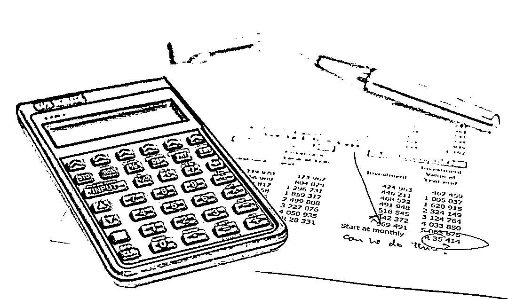

在占星学上，月亮毫无疑问与国家的女性和母亲有关。所以，最高法院在堕胎选择权（冥王星）方面的重大法律决定，将可能成为母亲的人（月亮）排除在了决策过程之外，是对美国法律的重大改革（冥王星）。法律的概念与木星-土星合相有关。2020 年 12 月 21 日的木星-土星合相对应了 140 年的“风象星座新纪元”。美国法律今日的改变，可能标志着美国社会在接下来一个世纪的根本性改变。关于全球股票市场，上周的走势非常积极。6 月 18 日金星-土星四分相时，许多股指来到了年内的最低点。正如本专栏多次阐述的，金融占星学的基本原则之一，就是任何下跌进入金星-土星困难相位的市场，都会形成潜在的“买入”机会。股票上周是一个“买入”机会。上周五道琼斯工业平均指数出现了 826 点的大幅上涨，在 31500 之上收盘。相对于前一个周五的低点，涨幅接近 2000 点。**短期占星趋势和长期考量**

****

**没有比真理更高的宗教，没有比爱更深的科学。**

**——罗伯特·蒂博多****《秘密玫瑰十字圣杯塔罗》****mayflowerbookshop.com****伯克利密歇根 2022 年****本周展开的重大地球宇宙学征象，是 6 月 28 日的海王星逆行和同一天的太阳四分木星。**海王星和木星都与原油价格的反转有关。原油从之前一周（6 月 14 日）的次高点 123 剧烈下跌至上周末的低点 102。在经济方面，**木星和海王星对应非理性繁荣，和未来的希望感。**上周股市上涨的事实，伴随着木星和海王星征象的展开，是新一周开端的好兆头。**但当人们欣快（而不是恐慌），上涨的基础往往并非根植于现实。**

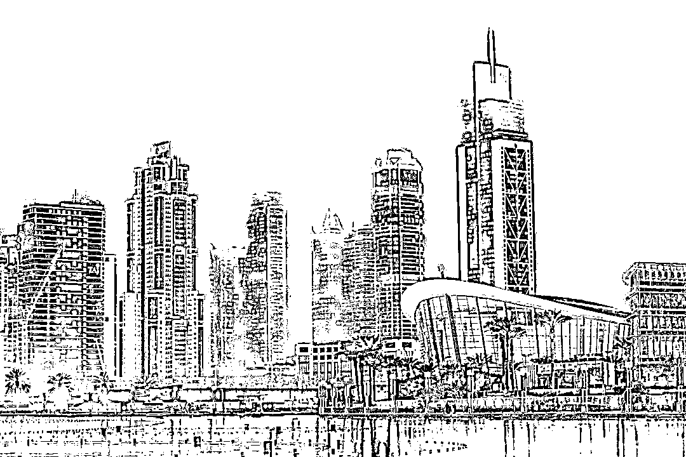

换句话说，这次上涨可能是一次幻觉，或空头回补的反弹，与基本面的重大改变无关，包括通胀的未来、加息。事实上，随着火星接近**7 月 2 日与冥王星的四分相**，对于金融市场来说，这可能导致另一次突发的反转，因为短期的泡沫破裂，生与死的现实逼近。这一切都将通向**2022 年最强力的相位时期，分别是 8 月前两周与 9 月 21 日-28 日**。**·** 8 月前两周，火星、天王星和月亮北交点在与金钱星座相关的金牛座合相，与太阳和土星形成 T 三角。8 月晚些时候，金星也会形成同样相位；**·** 9 月 21 日-28 日，土星和天王星将回到容许度在 1 度内的渐亏四分相。与此同时，木星处在土星和天王星的中点，与它们形成八分相。看起来宇宙在播放一个信息，那就是**这颗星球的生灵将在 8 月和 11 月期间经历另一轮的革命性转变**。它可能对应着一次**重大金融海啸的开端或结束**。考虑到火星、天王星和北交点相互在与金钱星座相关的金牛座合相，“震惊”可能发生在**货币市场**。**与美元挂钩的市场可能出现混乱，尤其需要关注美元兑日元与美元兑人民币。**

****

**可以想象有一些情况会导致美元陷入突发的危机。最实际的可能是高通胀和高债务的双重威胁，在这种情况下，不断上涨的消费者价格迫使美联储大幅加息。****大部分的国债主要由相对短期的工具组成，所以利息的上调就好像可调利率抵押贷款的优惠期结束一样。如果美国政府难以支付利息，外国债权人可能会抛售美元并引发崩溃。****——希恩·罗斯****《美元崩溃需要什么？》****www.Investopedia.com****2022 年 3 月 23 日**我跟踪了两个与当前 10 年股市表现有关的长期占星学模型。

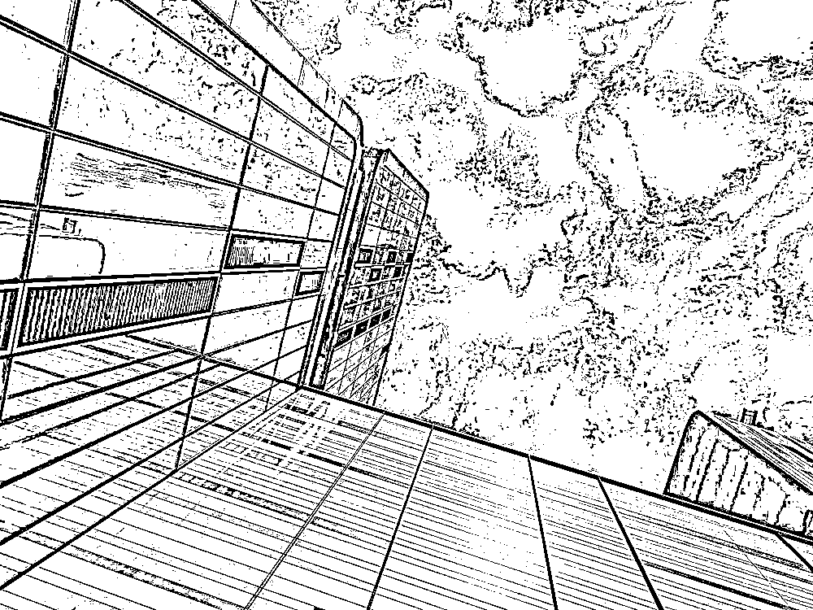

第一个模型基于土星-天王星和土星-冥王星在一个日历年内相继形成困难相位期间和之后，美国股市的历史表现，向前追溯到 1900 年。第二个模型基于自从 1840 年以来，木星-土星合相期间和之后的 20 年股市模式。自 1900 年来，土星-天王星和土星-冥王星在一个日历年内相继形成困难相位，已经发生了 7 次。上一次是在 2020 年-2021 年。2020 年 1 月土星合相冥王星，随后在 2021 年 2 月 17 日-12 月 24 日之间，土星与天王星形成三次渐亏四分相。之前两次发生这种情况，分别是 2008 年 11 月-2010 年 8 月，以及 1999 年 7 月-2002 年 5 月。1930 年-1931 年的大萧条时期也是如此。这项研究覆盖了第一个相位第一次精准成相，到最后一个相位最后一次精准成相的时间。在所有的七个案例中，美国股市从这些时期之间或之前出现的高点算起，在这些时期之间或之后的一年内到达低点，下跌幅度为 26.6%-86.3%。如果我们忽略大萧条跌幅 86%的案例，我们依然发现**这一宇宙现象对应 26%-54%的跌幅。**根据这个模型，如果把 2021 年视作土星-天王星渐亏四分相的终点，道琼斯工业平均指数应于今年（2022 年）下跌 26%-86%。或者**如果我们用 2022 年 9 月 21 日-28 日土星-天王星回到 1°内的四分相容许度作为终点，那么下跌将进入到 2023 年。**土星-天王星渐亏四分相本身，即使在不涉及冥王星的情况下，也是非常重要的。因为**美国历史上两次最严重的股市崩盘，都出现了这个相位。**事实上，这是 1834 年-1842 年和 1929-1932 年股市崩盘时唯一的主要外行星相位，当时美国股市的跌幅达到了 80%以上。**每隔一个 45 年的土星-天王星周期，都对应了美国股市的 90 年崩盘低点**（1842 年和 1932 年，现在我们来到了 2022 年）。我们在《股票市场时机手册第 1 卷：指数的周期和模式》首次介绍了这一 90 年周期。这本书于 1997 年首次出版。截至 2017 年 9 月已经更新过三次，在每一个版本中都讨论了这一 90 年周期。**我们当前的问题是，这个 90 年周期是否真正存在，倘若存在的话，股票市场是否会在 2023 年年底或甚至 2022 年底之前，从 2022 年 1 月的高点下跌 80%-90%？**如果美联储和美国政府失去了管理经济的信用，那么不能排除这一可能性。在这种崩盘的情况中，一个预警因素是消费者对国家在经济中的领导地位丧失信心。在这方面，已经可以注意到，密歇根大学消费者信心指数在 6 月过去一周内下跌至 50.0，是有史以来的最低点，相对于去年下降了 41.5%。这不是一个好迹象。**第二个地球宇宙学因素，是 20 年的木星-土星周期。它发生在 2020 年 12 月 21 日。****股票市场通常在这个合相的第一年创下高点。**在这个案例中，美国股市的历史高点发生在 2022 年 1 月的第一周，出现在合相后的一年零两周。股票市场随后应在 1-2 年后下跌至一个低点，并伴随一场军事危机。这可能与 2022-2023 年有关。考虑到我们在 2020 年 3 月已经迎来了 6 年周期低点，木星-土星引发的下跌进入 2022 年，将对应它的第一个 2 年周期阶段（共三个子周期）。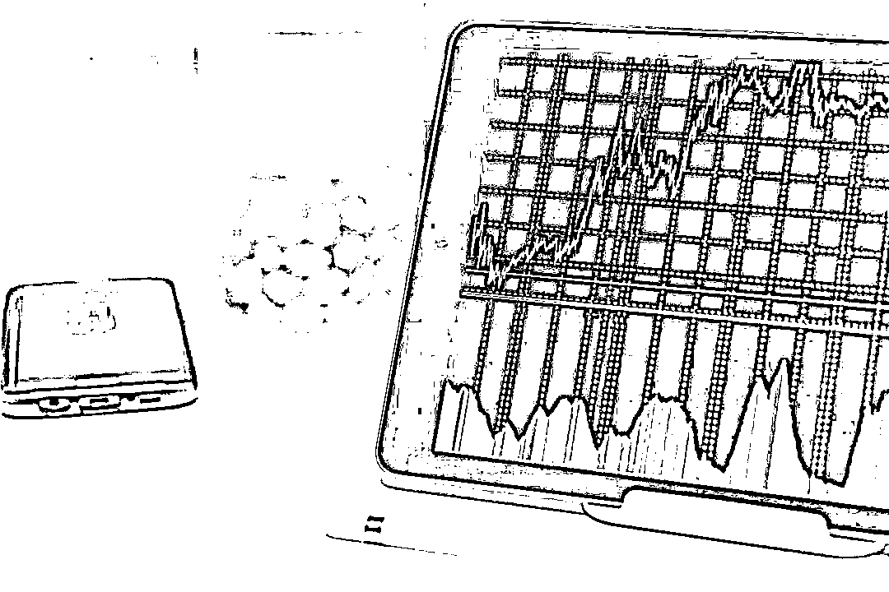通常，这类周期低点跌幅不会超过 26%，但会超过第一年的最大跌幅（在这个案例中，是 2020 年 10 月道琼斯工业平均指数下跌 10.46%）。所以，**这个模型预测道琼斯工业平均指数会下跌 11%-26%。截至 6 月 17 日，目前的跌幅是 19.75%，因此已经接近打破这个区间。**如果道琼斯工业平均指数下跌超过 26%（也就是跌破 27345），那意味着土星-冥王星和土星-天王星模型，相对于木星-土星的模型，更占据了主导地位。那也将是自 1900 年以来，民主党总统执政时股市第一次跌幅超过 26%（没错，罗斯福在 1938 年见证了 50%的第二轮暴跌，但真正的“暴跌”是 1929 年-1932 年赫伯特·胡佛执政时的 86%暴跌）。通常是当共和党人（事实上，每次都是如此）掌管白宫时，美国股市会出现 26%以上的跌幅。另一方面，在这项研究中，每个共和党总统都见证了股市创下历史高点。但在民主党领导下，则未必如此。好吧，对于天王星，总是会有“第一次”。对于冥王星，那总是“最后一次”。**梅里曼市场时机学院与若道于 2022 年 6 月 23 日 19:00 举办金融市场最新信息中国专场讲座。**这个 2-3 小时的在线讲座（有两次 5 分钟的休息时间）讨论了几个金融市场的前景，包括黄金、原油和上证综指。**长按下图了解更多详情**

这是特别及时的讲座，因为为期 12 年的木星轨道周期会在 5 月 10 日进入白羊座，并且 6 月-11 月是一年中最有力的地球宇宙征象接连登场的重要时间段，因为土星逆行与天王星形成几乎精准的渐亏四分相。

**说明：以上日期基于纽约证券交易所所在的美国东部标准时间，由于存在时差，中国地区可能需要加一天。**

**版权声明：**本文由若道翻译发布，欢迎转发，反对抄袭。友号转载请申请白名单。

**雷蒙德·梅里曼（Raymond Merriman）**

若道签约老师。著名金融占星师，ISAR（国际占星研究协会）前主席，梅里曼市场分析公司的总裁。他由于“提升了占星学的职业形象”，在 1995 年国际占星大会上被授予轩辕十四奖；在 2012 年国际占星大会上，被授予轩辕十四终身成就奖。

1“中国上证指数月度报告”发售**若道推出了****中文版****的雷蒙德·梅里曼中国上证指数月度报告，并持续发行该报告！**当把金融市场的周期和占星学的周期相结合时，雷蒙德·梅里曼老师的金融占星学研究**为投资者应对金融市场的周期波动，并随之调整投资策略提供了极大的价值参考**。
**7 月中英文报告已上线！**2“黄金价格周期月度报告”发售**若道推出****中文版****的雷蒙德·梅里曼黄金价格周期月度报告！**不仅仅为广大读者在中国股市的投资出谋划策，更将视角放眼黄金市场。**每当世界经济形式不明朗的时候，有一个地方是保值的港湾，那就是****黄金**。自 1982 年雷蒙德·梅里曼出版第一本研究《地球宇宙学征象与黄金价格的关联》的著作以来，**他一直作为最重要的黄金市场时机预测者之一享誉国际**。2022 年 7 月黄金报告已上线，梅里曼老师将会告诉你他对这个关键时期如何操作的想法。也可以按照季度和一年期订阅，有更多优惠。季度和年度的好处是，你可以持续了解梅里曼老师对于不断在变化的市场的看法。即便他某一次看法和市场不一致，你也看到在下一期他如何调整自己的看法，并看到金融占星在一个长期时间段内对你把控风险的帮助。而能够长期控制风险、尽量找到安全的投资时机才是投资的长久之计。**7 月中英文报告已上线！****购买套餐**，买得越多越优惠中国上证指数月度报告套餐价

*   **单月报告**：280 元
*   **3 个月套餐**：780 元（260 元/月）
*   **12 个月套餐价**：2400 元（200 元/月）

**长按下图识别二维码****购买金融报告****套餐****▼**

黄金周期月度报告优惠

*   **双报告年度套餐更优惠（直降 900 元）**

*   **12 个月黄金报告+12 个月上证指数报告：仅需 3900 元**

**长按下图识别二维码购买黄金报告套餐**▼

3《2022 年金融预报和沙龙》1976 年以来，由雷蒙德·A·梅里曼撰写的梅里曼市场时机学院每年一次的年度预报沙龙和每年一本的《年度预报》一直在应用占星学原理为投资者们服务，提供卓越洞见，从未间断。 **雷蒙德·梅里曼《2022 年金融预报和沙龙》发售中（报告已发布）。****长按下图识别二维码了解详情**
▼

4《2022 下半年金融占星投资沙龙》这是特别及时的讲座，因为为期 12 年的木星轨道周期会在 5 月 10 日进入白羊座，并且 6 月-11 月是一年中最有力的地球宇宙征象接连登场的重要时间段，因为土星逆行与天王星形成几乎精准的渐亏四分相。

**长按下图识别二维码了解详情**

▼

**点击阅读原文购买金融报告**

# ISAR 认证职业占星师文凭课程 | 开启“爱好变职业”的创收自由之路

> 原文：[`mp.weixin.qq.com/s?__biz=MzA5NjA0NTAxNg==&mid=2651478291&idx=3&sn=f13b40f1ea08d4a051471f9d250e8e97&chksm=8b48eba4bc3f62b281a2bc6b487591acfe473ed219a697f1a6a22a09ed96739aea4268e0d0d4&scene=126&sessionid=1692737796#rd`](http://mp.weixin.qq.com/s?__biz=MzA5NjA0NTAxNg==&mid=2651478291&idx=3&sn=f13b40f1ea08d4a051471f9d250e8e97&chksm=8b48eba4bc3f62b281a2bc6b487591acfe473ed219a697f1a6a22a09ed96739aea4268e0d0d4&scene=126&sessionid=1692737796#rd)

**2022 年，是世界和中国 40 年未有之大变局的开始。**

俄乌战争打破了欧洲大陆乃至全世界的和平局面，而新冠疫情也给中国经济带来前所未有之挑战。

如果你关心经济形势和世界局势，你会有这种的感觉，我们将面临一场深刻的危机，而这不是短期内可以结束的。

**占星学的看法也是如此。**

4 月青年失业率（16 岁到 24 岁）中国达 18.2%，一些背着房贷、教育、医疗负担的中年人突然失业更是整个家庭整个难以承受之重。为了更好准备面对这样的时代变化，连《北京日报》这样的官方媒体也在呼吁：**“开拓副业，让自己有多元化发展的生存能力”。**

**而这门课程，就是为了这样一个目标准备的。**

**占星学是非常好的“开展副业”的选择**

这个**为期 16 个月**的课程通过并不算长的时间和并不算高的投资，不仅可以帮助你学到一个终身可用的技艺，而且也可以选择成为自助助人的占星师，**开启受益终生的第二事业。**未来是个体崛起的时代，大量个体被鼓励独立发展，比如网红、自由职业、自媒体、咨询师等，他们都不需要传统的办公室。社会越发达，人的独立性就越强，未来有能力的人都可以变成独立的经济体。

**占星学也是越老越好的职业**

和一些技术变化非常快的职业不同，**占星学的技术层面非常稳定，不会快速迭代变化，**同时，掌握好占星学、能够做一场好的咨询又需要个人自身大量实践和对生命的深刻理解，而这些都是时间和岁月带来的。

**占星学是现代社会需要的助人职业**

社会快速发展和变化人们似乎越来越无法掌控自己的生活，这给很多人带来巨大的焦虑，**抚慰心灵的咨询市场需求巨大。**而占星学可以让人从前所未有的角度了解自己，了解目前和未来所处的周期，挑战的意义，不论对于深入的个人成长探寻，还是预测未来的周期，都又其独一无二的价值。

**ISAR 认证职业占星师的独有培训**

目前占星学的培训市场鱼龙混杂。而 ISAR（国际占星研究协会）是一个包含了 47 个国家在内的国际占星组织，多年来致力于占星的教育和研究，提升占星教育的品质和职业占星师的能力，在国际占星领域备受尊重。今年，ISAR 对于成为 ISAR 认证职业占星师提出了更高的要求，**所有想要获得 ISAR 职业占星认证的申请者均需要在 ISAR 的附属学校通过 500 个小时的研习（包含****主课****、选修课、沙龙、作业、讲座、工作坊等等）。**

**而这门核心占星学课程就是为此而准备的。**

**2022 年，鉴于对若道在占星教学领域所做的持续努力和高品质的课程服务，ISAR 特别授予若道核心课程为 ISAR 文凭课程，所有在若道学习，并通过若道毕业考试的同学将获得 ISAR 颁发的学历文凭（Diploma）。**

**你的占星核心课老师是谁？**

**拥有****51 年****占星实践经验的****若道创始人****前 ISAR 全球副主席****前 ISAR 全球职业占星师资质认证主席****大卫·瑞雷**

**和**

**2019 年第二届、2021 年第三届核心课中**

**与苏·汤普金斯老师****联合授课****的**

**ISAR 认证职业占星师**

**咔咔（Caroline）**

**二人合力打造**

**2022 年 ****若道全新核心占星课程**

**咔咔老师给同学的寄语：**

（向上滑动查看内容）

**亲爱的同学们：**

我为什么学占星学？

2000 年的时候我还是一个在网上搜索天蝎座和水瓶座配不配的普通白领。我搜索的内容还包括了水瓶座为什么总是这么若即若离？

体贴的搜索引擎给我推送了占星学、行星、星座、宫位、相位等资料，还让我了解到莉莉丝、月亮交点、截夺宫位等占星学概念。

2000 年 10 月我了解到，一个从业 30 多年的美国职业占星师大卫·瑞雷来到了中国，和他的中国合伙人将开办一个专业教授占星学知识的课程。过去 10 个月在网上东拼西凑的占星学知识唤起了我对占星学的兴趣，但是已经不能满足我对星图深度分析的需求了。

2013 年，我通过了若道核心课程的毕业考试和国际占星师研究协会的认证考试。2015 年我离开职场成为一名全职占星师。

到底学习占星带给了我什么呢？

1、它是自我觉知的工具，我现在已经不去纠结哪些星座是否匹配，我相信外在的事件是内在心理矛盾的显化。也就是说，想找到令人满足的亲密关系，要先去了解自己的情感模式和需求，而不是无意识地一次次地试错和撞墙。我开始学习自我关怀和接纳自己。

2、它带来看待世界的全新和全景的角度，天上如是，地下亦然。人类社会和个人生命的进化都有其周期和相似性，作为个体，占星学帮助我思考如何更积极和有建设性地与宇宙的能量合作，认识自己，发挥自己的潜力，度过有意义且自我满足的人生。

3、它带来了全新的职业：占星师和占星老师。除了收入，还有助人育人的满足感和意义感。

4、它带来一群志同道合的伙伴，我们彼此联结又相互独立。

作为中国占星界的“黄埔军校”若道占星的学生、助教和老师，我与很多学员在人生的不同阶段带着各异的需求走进了这所学校，2022-2023 年一年半的若道核心课程设计既蕴含了大卫·瑞雷老师的教学精华，也带入了我在跟随不同国外占星老师学习、助教和教学积累的心得。

有一些学员毕业后从事了占星咨询工作，有的在各大平台成为专业占星学知识的输出者和传播者，有的运用占星学提升他们的工作，也有的在占星学与投资，占星学与名人/八卦、占星学与原生家庭、亲密关系、亲子关系等领域收获了有用的或者有趣的体验。

对我来说，生命是一场自我完整的体验之旅。从 2011 年的那个春节在若道入学之后，我的生命旅程更加充实、有意义、有目标，也更有满足感。

希望在 2022-2023 年的若道核心课程里见到你。希望你此后的生命旅程里，有若道，有占星学。

占星师咔咔

2022 年 5 月 24 日

**大卫老师给同学的寄语：**

（向上滑动查看内容）

亲爱的学员们：

感谢你对我们从 8 月 30 日开始的若道 L1-5 级核心课程的兴趣。我和合作老师咔咔以及我们的核心课程团队期待着为你提供这个机会，来教授各种高品质的地道占星学知识和技巧。

对于那些希望获得 ISAR 职业占星师认证的学生，这是一门适合你的课程！

作为 ISAR 咨询技能培训的一部分，我曾与咔咔合作过，我们期待着再次合作。咔咔和我曾在 ISAR 职业占星师认证委员会（CAP ISAR）一起工作，我们非常熟悉获得 ISAR 职业认证的流程。作为你的老师，我们将陪伴你整个占星学发现之旅，帮助你逐渐认识到占星学有多么的神奇。此外，你还将受益于我们若道的助教和课程顾问，他们是若道核心课程计划的重要组成部分，提供在线沙龙、组织学习小组、指导家庭作业。我们的教育团队是“服务于你的团队”，所以也会根据你的需求进行相应的调整。你专用的核心课程微信群也促进了你的学习过程，使你能够每天与你的同学们一起学习、探讨、成长。

52 年前，当我开始学习占星学时，没有一所像若道这样的学校。如果有这样一所学校，我会尽一切可能在那里成为一名学生。事实上，我很幸运，我的老师都是经验丰富的专业占星师。然而，我花了 6 年的学习时间才通过 1976 年在美国乔治亚州亚特兰大举行的专业占星师考试，又花了 2 年的专业实践时间才通过占星学谋生。我永远不会忘记从 1970 年到 1978 年的 8 年，那些日子的反复试验教会了我如何苦练占星学。作为老师，我一直在努力传授我早年所学的知识，让你的旅程更加顺利，更加全面。

自 1978 年以来，44 年的全职实践教会了我很多，我很高兴有机会与大家分享我所学到的东西。我和咔咔都是现代占星师，虽然我们尊重西方占星学的历史和传统，但我们实践和教授的占星学植根于现代人本主义哲学，这种哲学旨在提高你对自身潜力的认识，并鼓励个人成长。还有什么比了解自己更实际的呢？还有什么比个人成长和发展潜力更有利的呢？这是你将要学习的占星学，一种可以应用于你自己生活的占星学，一种可以为你提供一个充实职业的占星学。

教书是我回馈占星学行业的方式，这个行业拓展了我的视野，远远超出了我曾经想象的可能。谢谢你给我这个机会做你的老师。

大卫·瑞雷

2022 年 5 月 24 日

**连报 L1-5 全阶网络直播课程，你可以享受**

❶ 64 次线上直播互动网络课程+2 场工作坊，全面而详细地讲解占星学知识、技能、案例和重要领域实践运用。

❷ 知识点+学员星图解读有机结合：咔咔老师以讲解知识点和中外名人案例为主，大卫·瑞雷老师以参课学员案例演示及客户案例为主，每个知识点覆盖班级内学员的亲身案例，参与感更强，多位学员都有机会听到自己的星图分析。

❸ 微信群学员互动分享，从真实案例学习生命成长故事。

❹ APP 答疑论坛提问：论坛上每个学员的问题都将得到及时回复。

❺ 若道独有的职业占星师养成计划，为你毕业后独立咨询做准备。

**❻ **提供**咨询平台**，只要努力，优秀毕业生有机会入驻**若道咨询平台**，拓展咨询客户群。

**更多了解老师和助教？**

**大卫·瑞雷（David Railey）**

*   **I****SAR 董事会成员，ISAR 全球副主席，ISAR 全球职业占星师资质认证主席，若道占星创始人**。

*   2016-2019 年，被选为国际占星协会（ISAR）考试委员会成员，国际占星协会（ISAR）是世界最大的国际占星机构，会员遍布 47 个国家。

*   2017-2020 年，被选为国际占星联盟（ISAR）考试委员会主席，理事会成员。

**占星师咔咔（Caroline）**

2010 年师从美国占星师大卫·瑞雷学习，并得到世界名师斯蒂芬·弗里斯特、罗伯特·汉德、苏·汤普金斯传授各种占星学技法。若道首届学员，国内最早获得 ISAR 职业占星师资质的职业占星师，多次担任若道核心课程助教，并于 2019 年第二届、2021 年第三届核心课中和苏·汤普金斯老师一起教授若道核心占星课程。

在国际知名广告公司和市场研究公司从事的市场研究和推广工作十余年，曾任职于阳狮集团、尼尔森市场研究有限公司、MTV 和《Madame Figaro》杂志。

**助教王嘉祺 （Conrad）**

ISAR 认证占星师、若道认证生时校正资质，从 2010 年起自学占星学，2015 年开始在若道系统学习，并开始个案咨询。2018 年担任若道核心课程助教，以及卜卦占星学和太阳返照选修课助教，并带领学员进行经世占星和太阳返照方面的研究。2019 年 11 月作为演讲人之一参加了国际占星协会（ISAR）北京大会，也是 ISAR 星空俱乐部中国区第 16 期的主讲人。

**什么人适合这门课？**

*   对占星学有浓厚兴趣，想要系统学习占星学。
*   对占星学有一定基础，但不知道该如何整合星图复杂的碎片。
*   希望成为优秀的占星师，想要借鉴国际大师解读思路并融入自己的体系。
*   想学习占星学，但不擅长英文，希望有中文老师授课。
*   想结合占星学理论与咨询实践。
*   走在自我探索和个人成长道路上的人。

**课程费用**

**★ 1-5 阶 连报**

**早鸟价：33000 元（2022 年８月 1 日之前）**

**课程费用：46500 元** **★ 1-2 阶 （8 月 30 日开课）**

**早鸟价：2800 元（2022 年８月１日之前）**

**课程费用：3500 元 ****★ 1-3 阶　连报**

**早鸟价：10500 元（2020 年８月１日之前）**

**课程费用：11500 元 **

**咨询课程请联系顾问**：**王老师（微信/手机：18510107057，请备注“大卫核心课”）**

**退转课程**

**退款原则请详看《教学协议》，如有疑问请咨询课程顾问。**

****2022 L1-5 认证职业占星师必修课程****

**授课老师：大卫·瑞雷、咔咔**

**直播课开课时间：2022 年 8 月 30 日（周二）**

**授课方式：******网络授课，英文/中文授课，中文翻译****

**费用：****1-5 阶连报**：46500 元**（早鸟价 33000 元,8 月 1 日前）；**1-2 阶**：**3500 元**（早鸟价 2800 元,8 月 1 日前）**；****1-3 阶**：**11500 元**（早鸟价 10500 元,8 月 1 日前）**

**课程负责人：王老师**（微信/手机：18510107057，请备注“大卫核心课”）

长按二维码添加课程负责人咨询~

****报名直达入口****

# 若道占星咨询｜人人皆有生命的“核心力量”，让专业占星师助你挖掘

> 原文：[`mp.weixin.qq.com/s?__biz=MzA5NjA0NTAxNg==&mid=2651478279&idx=1&sn=e8fd487576f146849cc56d41b4bbc107&chksm=8b48ebb0bc3f62a69dce5443ce2e9771a95c8cb6fe429c50d22fd71877b9b4af0db65d5c4ea8&scene=126&sessionid=1692737796#rd`](http://mp.weixin.qq.com/s?__biz=MzA5NjA0NTAxNg==&mid=2651478279&idx=1&sn=e8fd487576f146849cc56d41b4bbc107&chksm=8b48ebb0bc3f62a69dce5443ce2e9771a95c8cb6fe429c50d22fd71877b9b4af0db65d5c4ea8&scene=126&sessionid=1692737796#rd)

若道占星咨询平台至 2017 年运营至今，已有近 50 多位若道核心课程认证毕业生入驻。他们经过 2 年系统培训、累积完成近 150 小时的相关占星学理论学习、咨询技术的练习、通过若道认证考核后，成为职业占星师，开始开展占星咨询服务。

如果你对自己的出生星图充满好奇，想通过占星学这门古老的智慧并在专业咨询师的陪伴下、探索自己的生命故事和人生困惑，欢迎来若道咨询平台预约！

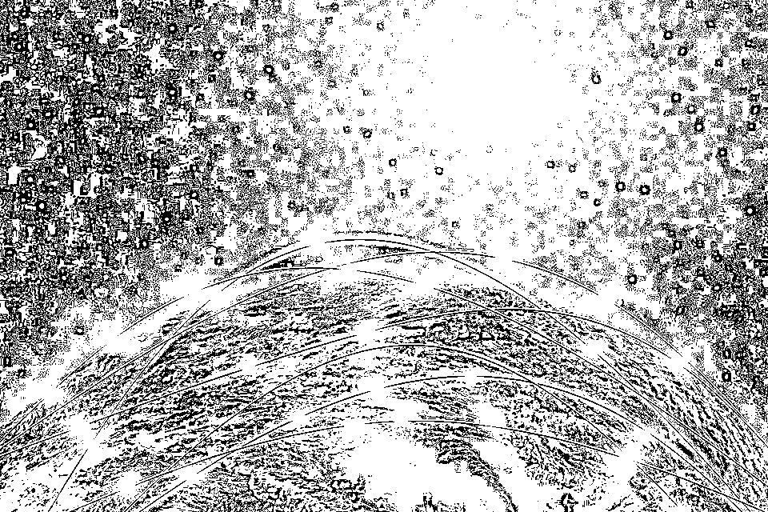

专业的占星师在这里等您

**若道占星咨询平台是以人本主义占星学导向的咨询，期望用博大精深的占星学提供优质信息，并通过和客户的交流，协助客户了解自己和他人、探索潜能、识别破坏性的人生模式、了解生命周期。**

我们期望更多人通过咨询，用占星学帮助自己提高觉察，学习成长，运用自由意志，学习与命运共舞。 

占星学是宇宙送给人类的礼物，我们愿意将这个礼物分享出去，让更多优秀的职业占星师为更多公众服务。

如果你对自己的生命有困惑，不论这个困惑是学业、职业，还是爱情、婚姻、亲子教育、个人成长等，我们都欢迎你来！

**本期我们将为大家推荐以下占星师**

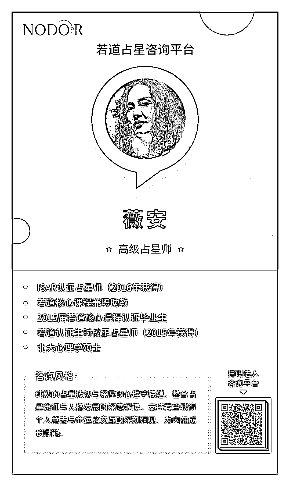

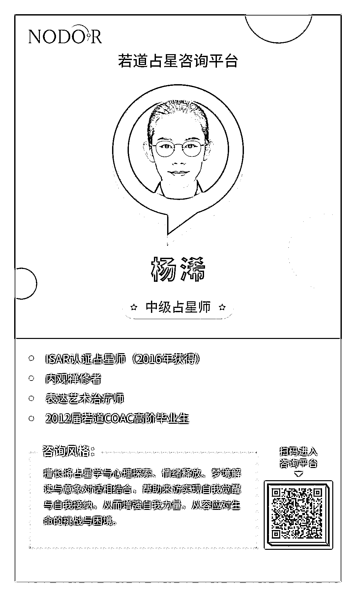

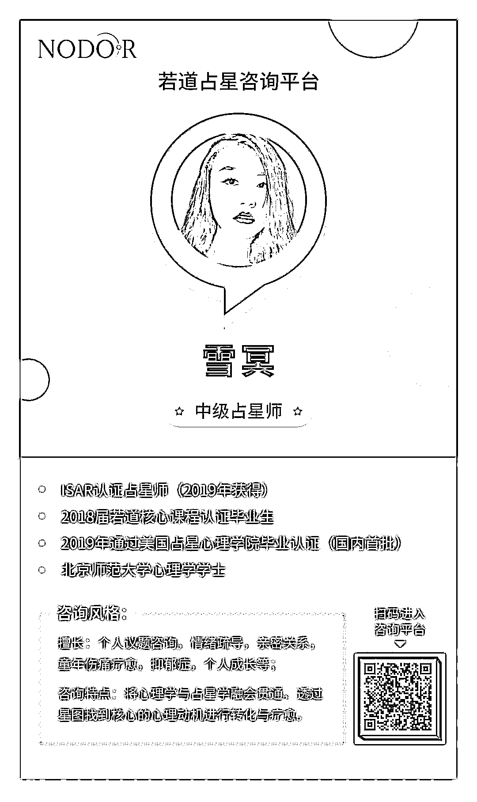

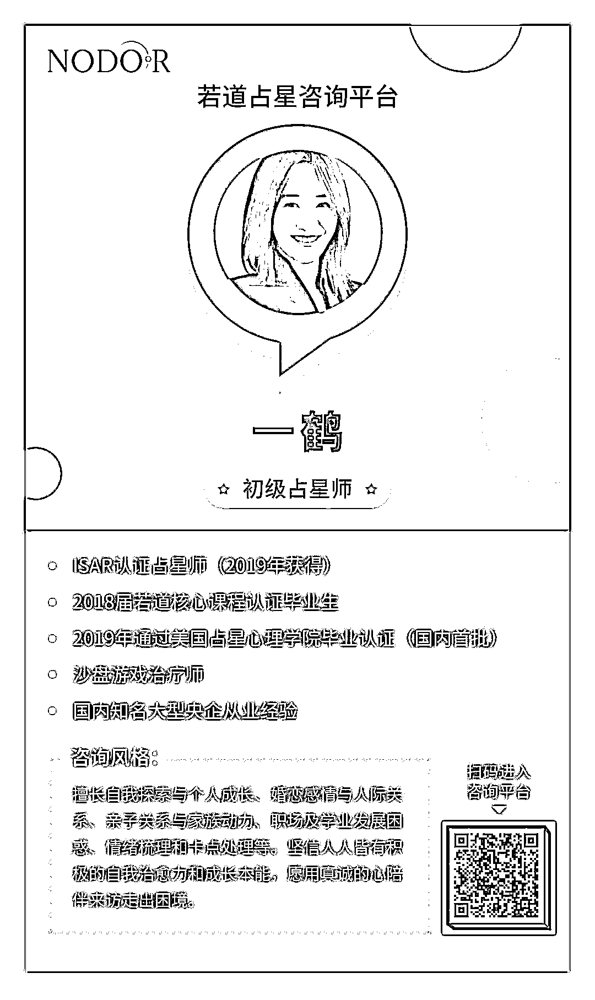

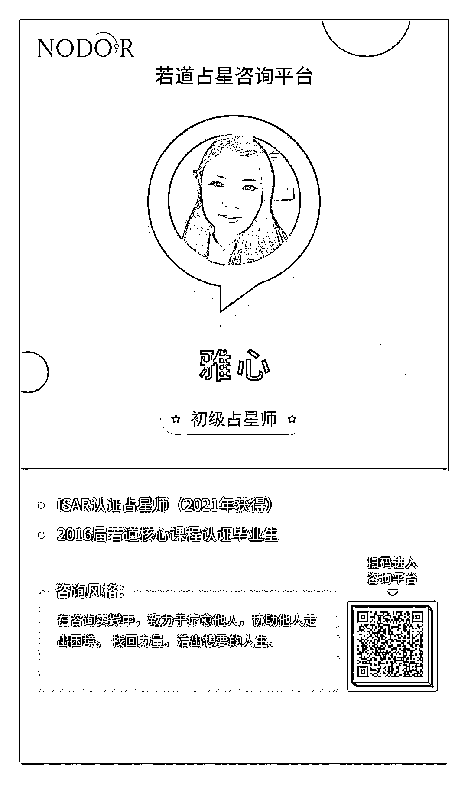

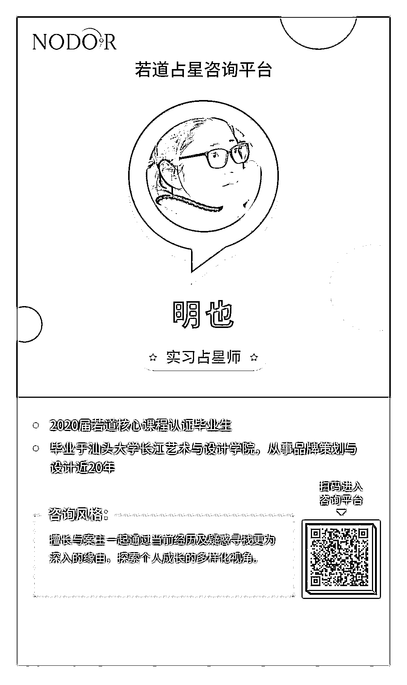

如何预约占星咨询？

**方式一：**

**下载若道 APP，进入占星咨询栏目可以进行预约**

****

**方式二：通过若道服务号**

****

# 夏至即至，你对未来三个月有哪些期待？

> 原文：[`mp.weixin.qq.com/s?__biz=MzA5NjA0NTAxNg==&mid=2651478272&idx=1&sn=66f7df80c768c381686f69c462aa7809&chksm=8b48ebb7bc3f62a1009f6efc39ab9d4dad4699a3fa5b2f45dc4546bd2244c5d182a29faafcb6&scene=126&sessionid=1692737796#rd`](http://mp.weixin.qq.com/s?__biz=MzA5NjA0NTAxNg==&mid=2651478272&idx=1&sn=66f7df80c768c381686f69c462aa7809&chksm=8b48ebb7bc3f62a1009f6efc39ab9d4dad4699a3fa5b2f45dc4546bd2244c5d182a29faafcb6&scene=126&sessionid=1692737796#rd)

**2022 年 6 月 25 日天象：**

*   **月亮在金牛座**
*   ******火星六分土星******

今天月亮在金牛座，你可以做一些金牛座月亮喜欢的事情，例如按摩、做美容、逛街、吃钟爱的食物，或只是在家舒服的躺着。月亮在今天会依次合相天王星、北交点、四分土星，情绪上的小震荡和小抑郁容易对人造成影响。这时候，试着让能量自然流淌，出现小的低谷期很正常。火星六分土星，这是行动高效的周末哦。

本周，[【夏至】](http://mp.weixin.qq.com/s?__biz=MzA5NjA0NTAxNg==&mid=2651477585&idx=1&sn=72cfac8d2ab99cb41bb69ef1f35d0a53&chksm=8b48e4e6bc3f6df0927087680def7344c8cfcc324259e1164ddc624e1735896a65e381a9a87f&scene=21#wechat_redirect)的来临（点击查看文章），标志着我们进入了 2022 年的第三季度，这也是全年中最适合拓展突破、开创进取的时光；周四，[【金星进双子座】](http://mp.weixin.qq.com/s?__biz=MzA5NjA0NTAxNg==&mid=2651477971&idx=1&sn=c31a8ccd283596995d1b52afb88756bc&chksm=8b48e564bc3f6c725000408a63942a00cf669a28acfbcc45c0c808752ea4514934967ad6f59f&scene=21#wechat_redirect)（点击查看文章），我们可以通过这段时间让生命更加丰富多彩。

灿烂夏日，你对接下来的三个月有哪些期待？欢迎分享哦~

周六快乐！**了解每日天象，可****下载“若道”APP 查看****还有更多精彩等着你哦**

# 咱们就是说，12 星座闪闪发光的点你 get 到了吗？

> 原文：[`mp.weixin.qq.com/s?__biz=MzA5NjA0NTAxNg==&mid=2651478150&idx=1&sn=514a2d734592d347e229327c024f3451&chksm=8b48ea31bc3f63270753e9e513957f45595d01ea5f12fe953bbcd2aad55cb014c10973cac887&scene=126&sessionid=1692737796#rd`](http://mp.weixin.qq.com/s?__biz=MzA5NjA0NTAxNg==&mid=2651478150&idx=1&sn=514a2d734592d347e229327c024f3451&chksm=8b48ea31bc3f63270753e9e513957f45595d01ea5f12fe953bbcd2aad55cb014c10973cac887&scene=126&sessionid=1692737796#rd)

**☆****后台回复“今日”，给你一句生命态度****** 

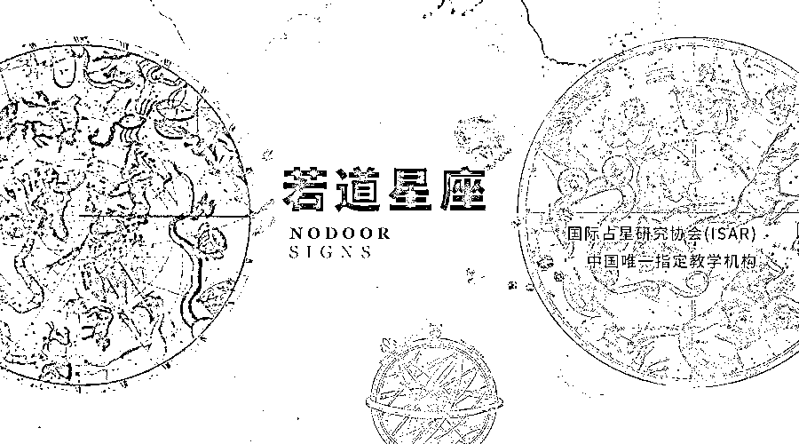

作者/咔咔 ISAR 认证占星师

编辑/玫瑰 图片/pexels

有些读者对自己的星座并不是那么喜欢，认为它有一些不太好的特质，而这些特质会拖累自己。那么今天，就来看看 12 星座可爱和闪光的地方吧，希望能够给你一些喜欢自己和他人的力量。**用占星学理解他人**学习占星学的好处很多，它能帮助我去理解一个人，也能让我看到一个人的闪耀之处而增加对他的喜爱。当我越了解占星符号的意义，就越能从客观的角度去理解一个人。如果我知道一个正在滔滔不绝讲话的女性的星图有水星四分上升下降轴线的配置，我会明白她正在用沟通来创造和维系人际关系。四分相则代表了一种强迫性的能量，让她一说起来就没完没了。如此一想，本来被她弄得烦躁的心情倒能平复一些，也多了想要和她互动和沟通的愿望。通过占星学提供的角度，不光改变了我对她的看法，也看到了她不停地讲话让我感到烦躁，这也让我思考自己对关系的态度，以及我在坦然表达自己方面的一些不安。

最近几年，我发现在我眼中**可爱、可敬**的人越来越多，每个人的星图符号背后都有一段或者几段精彩的人生瞬间，充满人性智慧的决定，这让我感慨活出星图特质的生命，宛若夜空里的星辰闪耀着光辉。

以下 12 星座的可爱瞬间采撷于我个人的观察与体会，纵然我通过整张星图作为依据，但是这里的描述来自我对他们**太阳星座**的感悟：

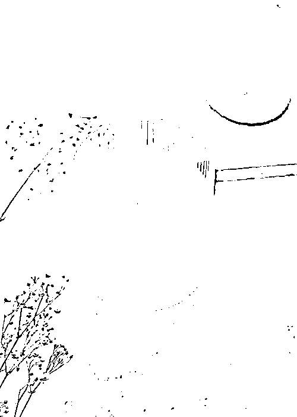

**可爱的 12 星座****白羊座**在希腊神话里被战神守护的星座，有着**直接、好动、独立、争先**的特性。我脑海里的白羊座与速度紧密相关。曾经坐过白羊座开的车，他在车流里自如变道，如果那条路有尽头，毫无疑问这位白羊座将会驾驶他的座驾第一个冲线。在白羊座女性的身上也呈现了同样的特质，一个女性在四十岁的时候，开始每天早上跑 6 公里。这几年坚持下来，不光通过跑步和游泳练出了马甲线人鱼线，还解锁了滑雪单板技能。每年冬天看着她在世界各地雪场的视频，在蜿蜒的雪道飞速驰骋，看得人击掌大呼厉害！**金牛座**金牛座有一个口头禅，不着急，不放弃，事情总会做完的。和他们在一起工作总给我一种**安然与踏实**的感觉。我想是他们的冷静和稳定，让我相信，他们是可以**被信赖和依靠**的伙伴。**金牛座对物质、舒适和美好有天然的感觉**。曾经有个金牛座耐心地教我如何煮出好喝的小米粥。按照她的方法做出来的小米粥浮着一层粥油，比我平时做的好喝许多。另外一个金牛座在理财方面给过我一些非常有价值的建议，让我收获颇丰。**双子座**有一个双子座曾说过：“不知道为什么，总有人和我说各种信息，娱乐八卦、股票基金、职场斗争。我就好像一个信息的集散地。”双子座与**信息、资讯、沟通、讲话**有关，能吸引他们关注的是能强烈引发他们**好奇心**的**信息与资讯**。公司的市场部和企业传讯部、学校、新闻传媒业是他们施展才华的舞台。我时常约双子座吃个饭喝个咖啡，探听当下的潮流、请他们推荐下近期的电影和新书，让自己在精神上充满电，也做个入世的社会人儿。

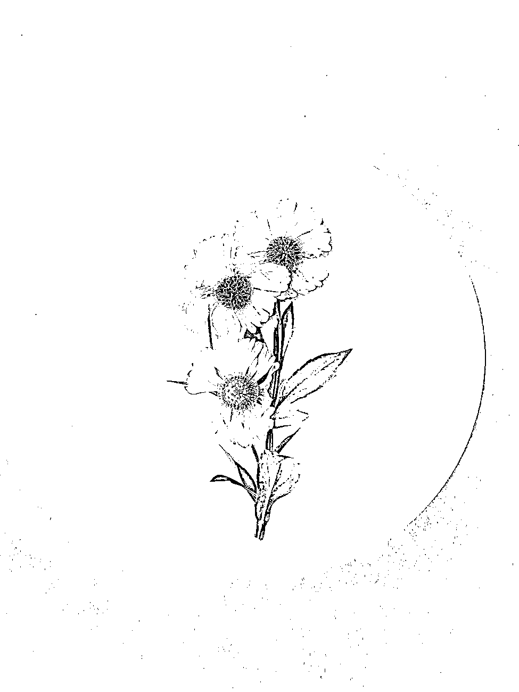

**巨蟹座**和螃蟹一样，巨蟹座也有一层壳子。在壳子里面的他们和壳子外面的样貌十分不一样。刚开始接触的时候，巨蟹座有点羞涩，他们会静静地观察着环境和对方，感到安全之后再做出下一步的举动。熟悉之后，他们才会自在地表达自己的情绪。此时，他们**情感**的雷达仍然十分敏锐，只是这时候他们会对探测到的信号做出回应，嘘寒问暖，给予关怀和照料。**被巨蟹座照顾让人感觉温暖，有种家人的感觉**。有几年的夏天我和朋友会聚集在某个巨蟹座的家里，烧烤做饭，聊天玩游戏，直到天黑才拖着脚各自回家。**狮子座**狮子座是最有趣的玩伴儿，不管多大，他们的性格里总有种**天真和童趣**。他会让我看路边的蜘蛛在织网，看叶片间彩色的虫子。会在逛了一天之后招呼旅途里新认识的朋友去夜店，在路边抱着酒瓶喝个七七八八。我喜欢和钦佩狮子座的**勇气和自信**，能对权威说：“你说得不对，那不是我要的东西。”有的狮子座把**玩耍和创造力与自己的工作结合**，带着团队一边玩一边做，不断推陈出新，他们的项目总能给人留下深刻的印象。**处女座**每次人们和我抱怨处女座有多挑剔的时候，我会想到那可能是这个处女座真的很努力想要把事情做到完美。但是**完美不是一个终点，而是一个不断完善与进步的过程**。通过追求完美的过程，实现了技艺的进步，提升了完成的效率。处女座照顾他人的方式是**为人服务，提供实际的帮助**。我父亲是处女座，有一次我的墨镜的小螺丝掉了，他从工具抽屉里找到最小号的螺丝刀，戴着老花镜一点一点地帮我把螺丝拧回去。我觉得那个时刻的他好有魅力啊！

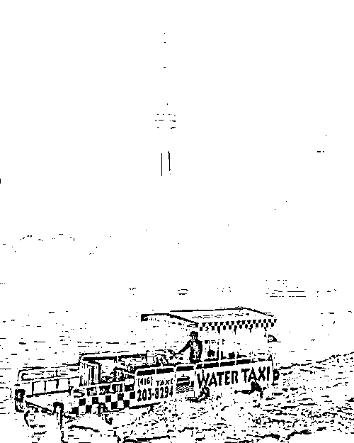

**天秤座**天秤座具有**顾问，外交家，咨询师的原型**，**建立关系与保持和谐**是他们的专长。我发现他们总能天然地为他人考虑，用两个视角来看待同一件事。非暴力沟通的创始人马歇尔·卢森堡博士的太阳在天秤座。他创造的非暴力沟通技巧帮助人们建立联结，让友爱互助成为现实。通过这种技巧，人们能够理解并看重彼此的需要，然后一起寻求方法满足双方的需要。简而言之，一个天秤座发明了一种用天秤座的风格（理解和满足彼此需要），实现天秤座目的（和平、建立联结）的沟通方式。**天蝎座**天蝎座可以是最可怕的敌人，也可以是最忠诚的朋友。这取决于你是否赢得了他们的**信任**。在他们那里，危机与秘密不会压垮他们，反而会激发出他们生存的力量，继而生出谋略，帮自己和在意的人度过难关。最近热播的电视剧《如懿传》里有一句特别天蝎座的话：“最贵重的不是身外华物，而是绝境中你不放开我的手。”在绝境中的那双手，可能是来自亲人，也可能来自专业的咨询师、占星师和疗愈师。我最近目睹了一个死亡事件，事件的第二天感到身体麻木，肩膀僵硬，毫无力气。天蝎座的治疗师在倾听了我的诉说之后说：“死亡本身就是僵硬的，需要让能量再流动起来。”她的话帮我我意识到，死亡可能随时降临，才更需要珍惜现在，带着激情去生活，“让生命的能量流动起来”！**射手座**我认识的射手座都有点儿像“野孩子”，**爱探索与冒险**。在智力的层面，他们探索古老的文化，吸收新的理论；在体力的层面，他们去野外，走没有人走过的路，看没有攻略写过的风景。在他们的眼里，**家反而可能在远方**。射手座出游回来会给我讲讲他们的经历，把危险和艰苦的旅途讲的活灵活现、妙趣横生，坐着竹筐挂在索道上过江，翻墙爬进一座古庙……

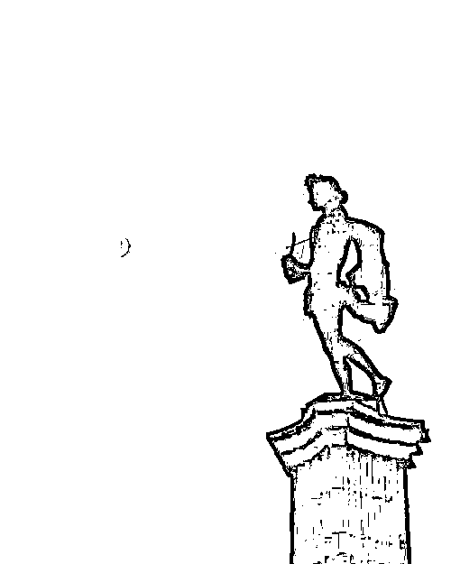

**摩羯座**我有点心疼我摩羯座的朋友，总觉得他们好像在**背着山前行**。这山可能是对家庭的责任，对公司的责任，对项目的责任。虽然说射手座与双子座是很好的销售与推广的人才，有一些公司开大单的销售却常常是摩羯座。他们往往在负责公司最重要最有战略性的客户，项目庞大复杂，需要调动多部门协作。

摩羯座善于**制定计划、管理和实现目标**的特质，让他们成为负责这个客户的最好人选。

**水瓶座**水瓶座有几个标签，特立独行，与众不同，外星人，冷漠孤傲……换句话说，这个星座**理性、客观、重视平等**，他们的创造力来自与别人不同的视角。苏汤普金斯老师是享誉国际的著名占星师，她对星图某个配置的分析角度让人赞叹，“怎么我就没想到呢？仔细一想特别有道理”。这背后是她深厚的占星知识与独特的思考角度。**保持距离能让水瓶座获得独特的观察视角**，打破旧有的模式，获得新的灵感。但是他们是团队合作的重要参与者。他们的独白是：我和你并无不同，所以我们是平等的。身为大公司高管的一枚水瓶座放弃了年度调薪的机会。将有限的预算分配给她的团队。她说“公司每个部门调薪的预算就是这么多，要是我涨了 10%，我的团队能涨得就少了。我要是不涨，团队每个人都能多涨一点儿。”**双鱼座**双鱼座是善于**给予的爱**，他们的爱让人感到被无限包容，感到在这个人的眼里，自我怎样都是好的，都是可爱的。他们的世界里有种散漫的气质，与处女座的精打细算相比，他们表现的毫无所谓。因为无我，也就无你。无我也无你，也就少了计较与争夺。因为**敏感和富有同情心**，所以他们向身处困境的人们伸出援手，甚至牺牲自己。因为**直觉性和想象力**，所以艺术、音乐、诗歌、电影是他们的好朋友。虽然情已逝，但是双鱼座送我的 CD 和歌单里的音乐还常常回响在耳畔与脑海。

**版权声明：**原创文章由作者授权发布于若道平台，欢迎转发，反对抄袭。友号转载请申请白名单。

**END**

**咔咔**

职业占星师，2017 年度若道兼职助教

ISAR 认证占星师（2014 年获得）

国际知名广告公司和市场研究公司工作十余年

**微信公众号**：咔星人

长按打赏

**20 位来自世界各地的占星师****带来 19 场沙龙——新世界的觉醒****详情可点击下图**

**学习占星学****点击下图了解课程详情**

**微信又双叒叕改版啦，不想错过若道君的推送？**
**就把若道设为星标吧！****▼**

**喜欢就点一下“在看”吧！**

********报名直达入口********

# 经世占星学和个人占星学有什么不同呢？

> 原文：[`mp.weixin.qq.com/s?__biz=MzA5NjA0NTAxNg==&mid=2651478150&idx=2&sn=7690f7d11c06e8322f32708936ce1b63&chksm=8b48ea31bc3f6327e572842e2859bbedba0cacab3f77df71b9444468081249088ff921457842&scene=126&sessionid=1692737796#rd`](http://mp.weixin.qq.com/s?__biz=MzA5NjA0NTAxNg==&mid=2651478150&idx=2&sn=7690f7d11c06e8322f32708936ce1b63&chksm=8b48ea31bc3f6327e572842e2859bbedba0cacab3f77df71b9444468081249088ff921457842&scene=126&sessionid=1692737796#rd)

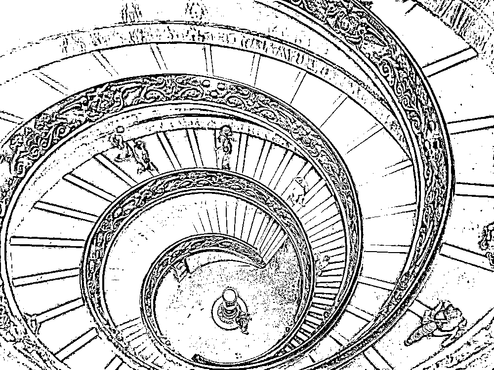

一个喜欢投资的朋友问：“经世占星学和个人的占星学有什么不同？学经世占星学有什么用呢？”我问他：“你炒股吗？”他说：“炒股。”我又问：“那么炒股最重要的是什么呢？”他说：“选择质地好的股票。”我又问：“还有吗？”他说：“选择好买和卖的时机。”我问：“为什么好时机那么重要？”他说：“如果在波谷买的股票，随着股市的整个趋势向上走，那么即便可能没有挑选到很好的股票，亏损的可能性仍然比较小，因为大势是向上的。如果在波峰买的股票，随着股市的整个趋势向下走，那么即便可能挑选到很好的股票，亏损的可能性仍然很大，因为大势是向下的。这跟买房一样，在 2000 年买房和 2020 年买房非常不同，因为大势完全变化了。不论怎么挑选，也不可能获得 2000 年时的利润。”我说：**“个人占星学是研究单只股票，而经世占星学是股票市场的大势。如你只是研究单只公司的股票，但是完全不看大势，就缺少了很多信息；而如果既懂得看大势，也懂得看单只股票，赢面就会更高，亏损可能性就会更低。”**

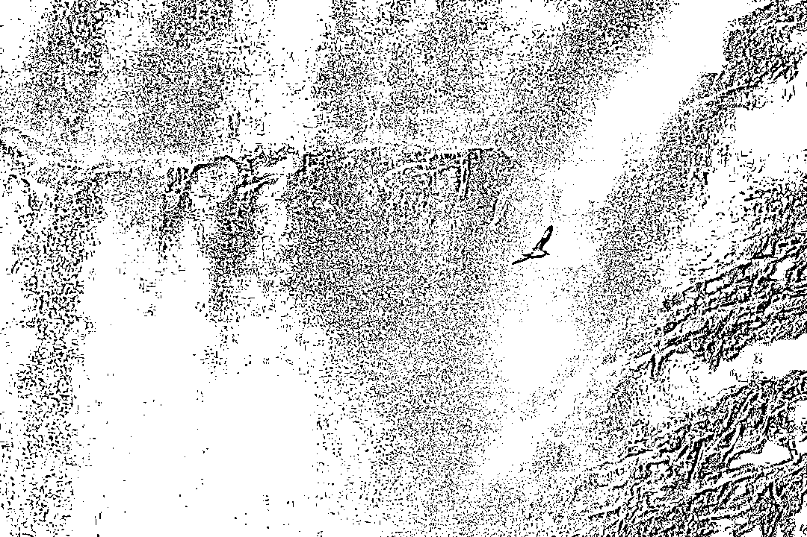

另外一个对现实有很多焦虑又有很多迷茫的朋友问：“学经世占星学有什么用呢？”我问他：“你喜欢读历史吗？全球史和中国史？”他说：“为什么要读历史？”我说：**“因为太阳下没有完全新鲜的事情。如果你读了历史，你就对现实为什么如此，更少焦虑，也更理解。对于未来，也会更有信心。”**因为时间是连续的，我们所看到的现在，是由我们所经历的、或者没有经历的过去所演变而来的；而我们所想预见的未来，是我们所看到的，所经历的，所创造的现在所演变而来的。比如说，我们所有人现在都是处于冥王星在魔羯座最后几度，处在土冥合相、土木合相、土天渐亏四分相周期中。

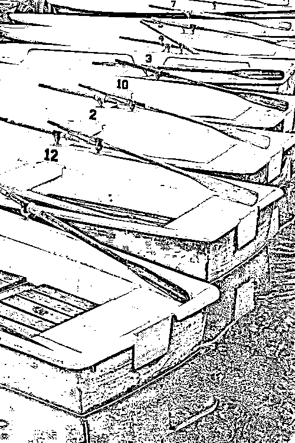

这是全球都在的周期。所有人都被其影响。你可能就会知道，冥王星所在的星座，会定义一个时代的精神，冥王星会挑战属于它所在的星座的生活领域，并且能会带来深刻变化。而当一个星座最后的度数时，这个星座最阴暗的面向会更加猛烈的爆发，冲突对抗更严重，这个时间的冥王星会惩罚之前年份的天真，但凡在之前年份没有重视的讯号现在全都来报复我们，此时往往**在冥王星所在的星座上会有非常紧张紧绷的议题出现。**你可能会知道，在土冥周期中，土星代表的既定的存在秩序被冥王星所代表的不可撤销的力量所终止了，你也可能看到**大规模的暴力和死亡，在这个周期中，人们也许会有惶惶不安的末日感，对未来没有信心。****因为这个周期标志着单纯和天真的终结。**人民会看到个人的生活如何由巨大的非个人力量所决定和制约。这种力量被认为比生命更大，而且是多种多样的。你可能还会知道，**土天四分相渐亏周期，新势力和旧势力的斗争，老旧的规则和新的创新力量之间的斗争，就像新能源和旧能源，旧的金融体系和新的数字货币**。如果你研究中国历史，你甚至可以看到中国历史朝代在土天四分渐亏对应的是什么样的时期。你可能还会知道，**木星土星的周期 20 年一次，是和经济有非常紧密关系的，当你看到木土处在新月阶段时，经济是比较脆弱的，往往会出现经济危机，虽然经济危机的原因可能是不一样的。**如果进一步，你去看国家的星图，会看到每个国家不同的个性。看到他们从哪里来，到哪里去。当下他们在各自经历什么。比如，如果看美国的星图，会看到他们进入了冥王星回归的周期，如果看中国的星图，你看到了天王星对中国星图上的火冥合相四分金星的挑战，你还可以看俄罗斯和乌克兰的星图，这样，你可能更加明白各个国家在同样的天象下经历着什么，未来可能会经历什么，而人民又会经历什么。经世占星学既是高大上的东西，又是非常实在东西，因为个人不过是大潮中的一朵小水滴，不论多么了不起的小水滴，都在世界、国家和历史的大潮之中。所以，邀请那些对世界充满好奇，对国家充满好奇，对历史充满好奇的人，来学这门既高大上又实际的学问。**END****大国命运：经世占星学 3 天线上工作坊来啦！**

在这个工作坊中，我们将学习**如何专注于能够理解世界大事并对它们做出准确的预测。**这将带领我们踏上**一段重要的行星周期之旅，并延伸到重要国家和世界领导人的星图。**现在正是学习的好时机！

2020 年 12 月，木星与土星合相，这是 800 年来这两颗行星首次在水瓶座合相，预示着地球以及政治和社会趋势将发生巨大变化。我们正在进入一个令人兴奋的奇境，非常适合探索经世占星学。

**点击下图了解更多详情** 

****

**微信又双叒叕改版啦，不想错过若道君的推送？**
**就把若道设为星标吧！****▼**

**喜欢就点一下“在看”吧！**

********报名直达入口********

# ISAR 选修课 | 大国命运：经世占星学 3 天线上工作坊

> 原文：[`mp.weixin.qq.com/s?__biz=MzA5NjA0NTAxNg==&mid=2651478150&idx=3&sn=6b471857617ad3b4c86123170045af10&chksm=8b48ea31bc3f632756511fb62d3c388bc7649688c0defac0400dce61438afb606147ac30ed44&scene=126&sessionid=1692737796#rd`](http://mp.weixin.qq.com/s?__biz=MzA5NjA0NTAxNg==&mid=2651478150&idx=3&sn=6b471857617ad3b4c86123170045af10&chksm=8b48ea31bc3f632756511fb62d3c388bc7649688c0defac0400dce61438afb606147ac30ed44&scene=126&sessionid=1692737796#rd)

<mpvideosnap class="js_uneditable custom_select_card channels_iframe videosnap_video_iframe" data-pluginname="videosnap" data-id="export/UzFfAgtgekIEAQAAAAAAfGQB6vQCmQAAAAstQy6ubaLX4KHWvLEZgBPEioJES3BsLK2DzNPgMIsb3nmx3ZXbJKLT1wm45TIu" data-url="https://findermp.video.qq.com/251/20304/stodownload?encfilekey=S7s6ianIic0ia4PicKJSfB8EjyjpQibPUAXolorph7kXX0G2V8DGSvfR9PkwwbPmosvYicRybibaBiaVv5A38Bc5Re8nsYStXZD7nqrhjvCib7Z8iaC9vlXIpibAjFAuw&amp;adaptivelytrans=0&amp;bizid=1023&amp;dotrans=0&amp;hy=SH&amp;idx=1&amp;m=&amp;scene=0&amp;token=AxricY7RBHdWxX5EuW79OcFLEojiajUVbfrb10projcwzwun3SBUDgOHcwIaMibQEFyWZc9dNWComE" data-headimgurl="http://wx.qlogo.cn/finderhead/PiajxSqBRaEJYnVsqWfEX9qA0sI6hNVKsDfyzfPZ92WZMZyBpZWU5NA/0" data-username="v2_060000231003b20faec8c4e68a1ec2d4ca07e434b07755bbf47e7053a3059defd2c9d6c68a20@finder" data-nickname="若道" data-desc="#ISAR 选修课 经世占星学是什么？会教授哪些知识内容？8 月经世占星工作坊，来提前了解一下" data-nonceid="3653579416430381618" data-type="video" data-width="640" data-height="368"></mpvideosnap>

有一些岁月经历的人，会非常清晰地看到，我们每个人的命运都和国家的命运紧密联系在一起。

以俄国人为例，不论每个俄国人有什么样不同的个人星图，31 年前的苏联解体，今年发生的乌俄战争这样重大的事件，毫无疑问影响了俄国 2 代人的命运。而在一些关键时间点个人的选择，毫无疑问，又影响了个人的生命历程。

而只要你关注世界局势，你也会看到，这样的一个国家发生的重大事件又会对其他国家的各个方面发生重要影响。

我们的命运、我们所获得的事业的发展机会、我们的财富机会都是和整个时代和国家息息相关。

**因此，一个好的占星师必须要懂得时代的声音，必须要洞悉全球的趋势，必须要懂得国家的故事。**

在这个工作坊中，我们将学习**如何专注于能够理解世界大事并对它们做出准确的预测。**这将带领我们踏上**一段重要的行星周期之旅，并延伸到重要国家和世界领导人的星图。**现在正是学习的好时机！

2020 年 12 月，木星与土星合相，这是 800 年来这两颗行星首次在水瓶座合相，预示着地球以及政治和社会趋势将发生巨大变化。我们正在进入一个令人兴奋的奇境，非常适合探索经世占星学。

邓肯老师说：

****

**学习经世占星学，我们可以依靠占星师们过去使用一些技法所做的预测，我们将在这个工作坊中进行探索。**

**比如：占星师迈克尔·贝金特在 1982 年，苏联解体事件发生 7 年前，就对苏联做出如下预测：**

**“从 1989 年 1 月到 1991 年 11 月……在领导和统治风格方面……国家将进行一些基本的重组。这一时期将预示着一些新的革命……严密的控制结构将失败，国家将崩溃，重新回到过去的众多自治国家。”**

**而占星师罗伯特·佐勒在世贸中心遭到袭击前一年的 2000 年写道：**

****“从 9 月份开始，我们西方正进入一个危险加剧的时期……尤其是在东海岸……这将招致乌萨马·本·拉登等冒险家的劫掠……这是一个警钟……2001 年 9 月第一次大危机袭击美国之后，我们将再也回不到从前了。”****

**在 2020 年美国大选前 6 个月，我也写了一篇文章：**

****“他（唐纳德·特朗普）将战斗到底，美国的街道将成为战场，他不会优雅地离去，但在 2021 年，一个新时代开始了，大海将覆盖特朗普总统任期的废墟。”****

出生星图和经世星图都使用相同的基本占星技法，对每一个主题的研究都同时丰富了这两个分支。你从观察世界大事中学到的东西，可以应用到个人客户身上，反之亦然。

**工作坊内容和时间安排**

**8 月 26 日 周五 **

**14:30-15:30**

**1. 基础知识介绍**

-外行星及其在各个星座运行

-外行星周期

-国家星图

-政治领导人星图

-选举星图

-将以上各项按优先级排序

**休息 30 分钟**

**16:00-17:30**

**2. 外行星及其在各个星座运行**

-天王星入座：革命性的变化

-海王星入座：意识的转变

-冥王星入座：危机与重生

**休息 90 分钟**

**19:00-20:30**

**3. 木星-土星的合相周期**

-文明的发展

-水瓶座新电子化时代

**休息 30 分钟**

**21:00-22:00**

**4. 木星与外行星的互动**

-木星-天王星：科技进步

-木星-海王星：媒体的力量；消融，受苦和慈悲

-木星-冥王星：意识形态极端主义

**8 月 27 日周六**

**14:30-15:30**

**5. 了解社会趋势**

-土星-天王星：新的如何取代旧的；科技重组

-土星-海王星：乌托邦梦想破灭；结构消融

-土星-冥王星：独裁与权力瓦解

**休息 30 分钟**

**16:00-17:30**

**6. 长期文明变革**

-天王星-海王星：新世界秩序的梦想

-天王星-冥王星：机械的变革力量；剧变

-海王星-冥王星：意识变化的 492 年周期

**休息 90 分钟**

**19:00-20:30**

**7. 20 世纪地缘政治力量的影响**

-俄罗斯、苏联时代及其衰落

-美国的故事

**休息 30 分钟**

**21:00-22:00**

**8. 中国**

-中国作为全球玩家出现

-科技、领导力和一带一路

**8 月 28 日周日**

**14:30-15:30**

**9. 行星推进的重要性**

-预测选举的结果；特朗普 - 拜登

-预测国家的发展：以色列

-美国：扩张与收缩

**休息 30 分钟**

**16:00-17:30**

**10. 有多张星图的国家**

-英国

-法国

-沙特阿拉伯

**休息 30 分钟**

**19:00-20:30**

**11. 统治者的出生星图**

-普京：克格勃军人，2020 年代的发展

-特朗普：虚假信息之王，获胜者与失败者

**休息 30 分钟**

**21:00-22:00**

**12. 21 世纪的世界发展**

-新时代的人口和气候变化

-独立与全球化

-宗教与科学

-人际关系与游戏

**授课老师**

**艾德里安·罗斯·邓肯（Adrian Ross Duncan）**

**·** 邓肯老师 1971 年在印度游学时开始学习占星学，1985 年开始成为全职占星师，迄今执业已超过 33 年，是人本主义占星学、卜卦占星学和经世占星学领域的知名占星师。

**·** 开发了占星软件 AstroClock 和多款占星报告。

**·** 从 1971 年开始研习佛学，受佛学影响很深，他相信占星学和佛学观点统一、转化的一个基础是在于对现实感知的改变。

**授课方式**

**授课方式：**

**线上网络直播课，英文授课，中文翻译**

**课程价格**

**课程价格：**

**正价：6800 元**

**早鸟价：5800 元**

**早鸟价截止日期：2022 年 8 月 1 日**

负责人：若道-童童

（微信：nodoorDaivd）

**退转课程**

**退款原则请详看《教学协议》，如有疑问请咨询课程顾问。**

****ISAR 选修课 | 大国命运：经世占星学 3 天线上工作坊****

**授课老师：******艾德里安·罗斯·邓肯****

**工作坊时间：2022 年 8 月 26 日-28 日（**周五-**周日）**

**授课方式：******网络授课，英文授课，中文翻译****

**费用：****正价：6800 元****（早鸟价 5800 元，8 月 1 日前）**

**课程负责人：童老师**（微信：nodoorDaivd，请备注“经世工作坊”）

长按二维码添加课程负责人咨询~

****报名直达入口****

# 2022 年若道 ISAR 选修课 | 《医疗占星手册》作者亲授

> 原文：[`mp.weixin.qq.com/s?__biz=MzA5NjA0NTAxNg==&mid=2651477971&idx=4&sn=d0ba2cbb0f5ec4a34dd849ba16450303&chksm=8b48e564bc3f6c7270acd58b4652bdcf95a77e06a0e6c61f6d136bccaa2a58227bbaa7257a7a&scene=126&sessionid=1692737796#rd`](http://mp.weixin.qq.com/s?__biz=MzA5NjA0NTAxNg==&mid=2651477971&idx=4&sn=d0ba2cbb0f5ec4a34dd849ba16450303&chksm=8b48e564bc3f6c7270acd58b4652bdcf95a77e06a0e6c61f6d136bccaa2a58227bbaa7257a7a&scene=126&sessionid=1692737796#rd)

**有四个主要因素影响着我们的生活和健康：基因构成、物质环境、情绪环境，以及我们的占星配置。我们在星图中都存在患病的可能性，而预防的方法在于尽可能充分、真实和健康地生活。****——简·里德·帕特里克****（Jane Ridder-Patrick）博士**

占星学就像心灵的 X 光片。它可以描述个人对世界的看法和反应。我们越不了解自己的天性，面对生活中的挑战，我们就会有越少的选择。

**“占星学可以精准定位需要解决的潜在问题。”**

**医疗占星学是一个强大的工具，同时洞察的身体和心理过程，通过更多的自我认知照顾和关爱自我和身边的人。**

**本课程既适合医疗占星学的初学者，也适合已经有一些相关经验的人****。**简·里德·帕特里克老师将运用现实生活中的例子，揭示一个人的性格、症状及其星图是如何相互映照的。课程也会探讨疾病的意义以及可能的治疗方法。

**本课程旨在为学员提供一个运用医疗占星学的框架和方法，**学员将会学到一些有价值的实用工具，在课程结束后，自己使用这些工具研究其中的关联性。

**此课程可作为 ISAR 选修课。**

1

**课程安排**

**课程时间：2022 年 9 月 20 日-11 月 8 日  每周二 20:00-22:00**

**第*****1*****讲  9 月 20 日 与占星学、心理学、病症一起工作**

*   医疗占星学的组成部分以及如何使用它们

*   行星的作用与相互作用

*   黄道星座人

*   宫位的重要性

*   疾病和健康是如何产生的

**★ 第二、三、四讲的课程内容基于星座以及它们之间的相互作用。**

**第*****2*****讲  9 月 27 日 基本星座**

学习基本大十字星座——**白羊座、巨蟹座、天秤座和摩羯座**——及其功能和相关的健康问题。**这些星座与防御、养育、结构、体内平衡和荷尔蒙控制有关。**

****第*****3*****讲  10 月 4 日 固定星座****

学习固定大十字星座——**金牛座、狮子座、天蝎座和水瓶座**——及其功能和相关的健康问题。**这些星座与习惯和反射、心脏调节、生存、循环和协调有关。**

“固定星座（金牛座、狮子座、天蝎座和水瓶座）在情感和生理上都倾向于**‘难以放手’**，这可能为恶性肿瘤的生长创造环境。所以说，他们可能倾向于沉浸在过去的伤害中，难以自拔。另一方面，这些星座也擅长在艰难的时期坚持不懈并一直**持之以恒**。”——简·里德·帕特里克（Jane Ridder-Patrick）博士

**第*****4*****讲  10 月 11 日 变动星座**

学习变动大十字星座——**双子座、处女座、射手座和双鱼座**及其功能和相关健康问题。**这些星座与呼吸、神经系统、肠道、睡眠以及信息、情感和行动的整合有关。**

**★ 第五、六、七、八讲重点学习行星，它们在身体层面的表达、它们的相位与行进。**

**第*****5*****讲  10 月 18 日 太阳与月亮**

**太阳**掌管视觉、活力、心脏和意识，与心脏、脊柱和视觉问题相关。**月亮**掌管人体的周期，特别是月经周期、饮食模式和体液，与情绪引起的疾病、饮食失调和胃病相关。

**第*****6*****讲  10 月 25 日 土星与天王星**

**土星**掌管着皮肤、骨骼、牙齿和衰老过程。它对应的疾病包括慢性疾病、耳聋、帕金森病、关节僵硬和牙齿问题。**天王星**代表身体活动的协调，有节奏的脉动和身体的“电”。与天王星相关的疾病包括癫痫、痉挛、心律失常，以及阿斯伯格综合症和自闭症样综合症。

**第*****7*****讲  11 月 1 日 海王星与冥王星**

**海王星**掌管松果体、细胞膜渗透和右脑功能，与过敏、上瘾的病症、慢性疲劳综合症和睡眠障碍相关。**冥王星**掌管消除和转化，其病理包括毒性、脓肿、癌症和强迫症。

**第*****8*****讲  11 月 8 日 火星**

**火星是与能量和防御相关的行星**，掌管免疫系统、肾上腺功能、肌肉活动和炎症反应。**它是许多身体和情绪障碍的核心**，如自动免疫障碍、抑郁和发烧，以及由手术或需要手术引发的问题。

2

**此次课程适合哪些人？**

*   有一定占星学基础，若道核心课 L3 以上水平；

*   希望成为优秀的占星师，想要借鉴国际大师医疗占星解读思路并融入自己的体系的人；

*   热爱占星学、健康、养生的研究型占星学者；

*   计划考取 ISAR 认证占星师，寻觅中意选修课的学员；

*   走在自我探索和个人成长道路上的人。

**快来和简·里德·帕特里克老师学习升级版的占星学身体地图吧！**

3

**授课老师**

**简·里德·帕特里克 **博士****

（Jane Ridder-Patrick）

简接受过药剂师、理疗师、草药师、心理治疗师和历史学的专业学习，从事写作、咨询和讲学工作，在英国和全球教授占星学及其历史、当今的心理学和医学应用。她在爱丁堡执业，在爱丁堡大学获得博士学位，研究方向是 17 世纪苏格兰占星学历史。

**她最著名的出版物是《医疗占星手册》。2018 年，她因对医疗占星学的贡献而获得了著名的查尔斯·哈维占星学杰出服务奖。**

《医学占星术手册》（第二版，修订版和扩充版）

(爱丁堡，克拉布出版社，2006 年)

4

**课程信息**

*   **课程时间：**2022 年 9 月 20 日开始，每周二晚上 8 点，每周一次，共 8 次课。

*   **授课方式：**线上直播，英文授课，中文翻译

*   **课程价格：****6800 元**

*   **早鸟价：5800 元（截止日期：2022 年 8 月 23 日）**

*   **课程咨询：**王老师（微信：18510107057，请备注“医疗占星”）

长按二维码添加王老师

5

**退转课程**

*   **退款原则请详看《教学协议》，如有疑问请咨询课程顾问。**

****医疗占星****

**授课老师：**简·里德·帕特里克

**授课时间：**2022 年 9 月 20 日起

**授课方式：**网络课程**，**英文授课，中文翻译

**费用：****6800 元****（早鸟价：5800 元，2022 年 8 月 23 日截止）**

**课程负责人：****王老师**（微信：18510107057，请备注“医疗占星”）

长按二维码添加课程负责人咨询~

****报名请点击“阅读原文”****

# ISAR 认证职业占星师文凭课程 | 开启“爱好变职业”的创收自由之路

> 原文：[`mp.weixin.qq.com/s?__biz=MzA5NjA0NTAxNg==&mid=2651477971&idx=3&sn=dee6f34b945e989605305f550228c713&chksm=8b48e564bc3f6c729a48bd1312d403019e8dfe952aad9d4947bc885c57408f07fa5994e0a068&scene=126&sessionid=1692737796#rd`](http://mp.weixin.qq.com/s?__biz=MzA5NjA0NTAxNg==&mid=2651477971&idx=3&sn=dee6f34b945e989605305f550228c713&chksm=8b48e564bc3f6c729a48bd1312d403019e8dfe952aad9d4947bc885c57408f07fa5994e0a068&scene=126&sessionid=1692737796#rd)

**2022 年，是世界和中国 40 年未有之大变局的开始。**

俄乌战争打破了欧洲大陆乃至全世界的和平局面，而新冠疫情也给中国经济带来前所未有之挑战。

如果你关心经济形势和世界局势，你会有这种的感觉，我们将面临一场深刻的危机，而这不是短期内可以结束的。

**占星学的看法也是如此。**

4 月青年失业率（16 岁到 24 岁）中国达 18.2%，一些背着房贷、教育、医疗负担的中年人突然失业更是整个家庭整个难以承受之重。为了更好准备面对这样的时代变化，连《北京日报》这样的官方媒体也在呼吁：**“开拓副业，让自己有多元化发展的生存能力”。**

**而这门课程，就是为了这样一个目标准备的。**

**占星学是非常好的“开展副业”的选择**

这个**为期 16 个月**的课程通过并不算长的时间和并不算高的投资，不仅可以帮助你学到一个终身可用的技艺，而且也可以选择成为自助助人的占星师，**开启受益终生的第二事业。**未来是个体崛起的时代，大量个体被鼓励独立发展，比如网红、自由职业、自媒体、咨询师等，他们都不需要传统的办公室。社会越发达，人的独立性就越强，未来有能力的人都可以变成独立的经济体。

**占星学也是越老越好的职业**

和一些技术变化非常快的职业不同，**占星学的技术层面非常稳定，不会快速迭代变化，**同时，掌握好占星学、能够做一场好的咨询又需要个人自身大量实践和对生命的深刻理解，而这些都是时间和岁月带来的。

**占星学是现代社会需要的助人职业**

社会快速发展和变化人们似乎越来越无法掌控自己的生活，这给很多人带来巨大的焦虑，**抚慰心灵的咨询市场需求巨大。**而占星学可以让人从前所未有的角度了解自己，了解目前和未来所处的周期，挑战的意义，不论对于深入的个人成长探寻，还是预测未来的周期，都又其独一无二的价值。

**ISAR 认证职业占星师的独有培训**

目前占星学的培训市场鱼龙混杂。而 ISAR（国际占星研究协会）是一个包含了 47 个国家在内的国际占星组织，多年来致力于占星的教育和研究，提升占星教育的品质和职业占星师的能力，在国际占星领域备受尊重。今年，ISAR 对于成为 ISAR 认证职业占星师提出了更高的要求，**所有想要获得 ISAR 职业占星认证的申请者均需要在 ISAR 的附属学校通过 500 个小时的研习（包含****主课****、选修课、沙龙、作业、讲座、工作坊等等）。**

**而这门核心占星学课程就是为此而准备的。**

**2022 年，鉴于对若道在占星教学领域所做的持续努力和高品质的课程服务，ISAR 特别授予若道核心课程为 ISAR 文凭课程，所有在若道学习，并通过若道毕业考试的同学将获得 ISAR 颁发的学历文凭（Diploma）。**

**你的占星核心课老师是谁？**

**拥有****51 年****占星实践经验的****若道创始人****前 ISAR 全球副主席****前 ISAR 全球职业占星师资质认证主席****大卫·瑞雷**

**和**

**2019 年第二届、2021 年第三届核心课中**

**与苏·汤普金斯老师****联合授课****的**

**ISAR 认证职业占星师**

**咔咔（Caroline）**

**二人合力打造**

**2022 年 ****若道全新核心占星课程**

**咔咔老师给同学的寄语：**

（向上滑动查看内容）

**亲爱的同学们：**

我为什么学占星学？

2000 年的时候我还是一个在网上搜索天蝎座和水瓶座配不配的普通白领。我搜索的内容还包括了水瓶座为什么总是这么若即若离？

体贴的搜索引擎给我推送了占星学、行星、星座、宫位、相位等资料，还让我了解到莉莉丝、月亮交点、截夺宫位等占星学概念。

2000 年 10 月我了解到，一个从业 30 多年的美国职业占星师大卫·瑞雷来到了中国，和他的中国合伙人将开办一个专业教授占星学知识的课程。过去 10 个月在网上东拼西凑的占星学知识唤起了我对占星学的兴趣，但是已经不能满足我对星图深度分析的需求了。

2013 年，我通过了若道核心课程的毕业考试和国际占星师研究协会的认证考试。2015 年我离开职场成为一名全职占星师。

到底学习占星带给了我什么呢？

1、它是自我觉知的工具，我现在已经不去纠结哪些星座是否匹配，我相信外在的事件是内在心理矛盾的显化。也就是说，想找到令人满足的亲密关系，要先去了解自己的情感模式和需求，而不是无意识地一次次地试错和撞墙。我开始学习自我关怀和接纳自己。

2、它带来看待世界的全新和全景的角度，天上如是，地下亦然。人类社会和个人生命的进化都有其周期和相似性，作为个体，占星学帮助我思考如何更积极和有建设性地与宇宙的能量合作，认识自己，发挥自己的潜力，度过有意义且自我满足的人生。

3、它带来了全新的职业：占星师和占星老师。除了收入，还有助人育人的满足感和意义感。

4、它带来一群志同道合的伙伴，我们彼此联结又相互独立。

作为中国占星界的“黄埔军校”若道占星的学生、助教和老师，我与很多学员在人生的不同阶段带着各异的需求走进了这所学校，2022-2023 年一年半的若道核心课程设计既蕴含了大卫·瑞雷老师的教学精华，也带入了我在跟随不同国外占星老师学习、助教和教学积累的心得。

有一些学员毕业后从事了占星咨询工作，有的在各大平台成为专业占星学知识的输出者和传播者，有的运用占星学提升他们的工作，也有的在占星学与投资，占星学与名人/八卦、占星学与原生家庭、亲密关系、亲子关系等领域收获了有用的或者有趣的体验。

对我来说，生命是一场自我完整的体验之旅。从 2011 年的那个春节在若道入学之后，我的生命旅程更加充实、有意义、有目标，也更有满足感。

希望在 2022-2023 年的若道核心课程里见到你。希望你此后的生命旅程里，有若道，有占星学。

占星师咔咔

2022 年 5 月 24 日

**大卫老师给同学的寄语：**

（向上滑动查看内容）

亲爱的学员们：

感谢你对我们从 8 月 30 日开始的若道 L1-5 级核心课程的兴趣。我和合作老师咔咔以及我们的核心课程团队期待着为你提供这个机会，来教授各种高品质的地道占星学知识和技巧。

对于那些希望获得 ISAR 职业占星师认证的学生，这是一门适合你的课程！

作为 ISAR 咨询技能培训的一部分，我曾与咔咔合作过，我们期待着再次合作。咔咔和我曾在 ISAR 职业占星师认证委员会（CAP ISAR）一起工作，我们非常熟悉获得 ISAR 职业认证的流程。作为你的老师，我们将陪伴你整个占星学发现之旅，帮助你逐渐认识到占星学有多么的神奇。此外，你还将受益于我们若道的助教和课程顾问，他们是若道核心课程计划的重要组成部分，提供在线沙龙、组织学习小组、指导家庭作业。我们的教育团队是“服务于你的团队”，所以也会根据你的需求进行相应的调整。你专用的核心课程微信群也促进了你的学习过程，使你能够每天与你的同学们一起学习、探讨、成长。

52 年前，当我开始学习占星学时，没有一所像若道这样的学校。如果有这样一所学校，我会尽一切可能在那里成为一名学生。事实上，我很幸运，我的老师都是经验丰富的专业占星师。然而，我花了 6 年的学习时间才通过 1976 年在美国乔治亚州亚特兰大举行的专业占星师考试，又花了 2 年的专业实践时间才通过占星学谋生。我永远不会忘记从 1970 年到 1978 年的 8 年，那些日子的反复试验教会了我如何苦练占星学。作为老师，我一直在努力传授我早年所学的知识，让你的旅程更加顺利，更加全面。

自 1978 年以来，44 年的全职实践教会了我很多，我很高兴有机会与大家分享我所学到的东西。我和咔咔都是现代占星师，虽然我们尊重西方占星学的历史和传统，但我们实践和教授的占星学植根于现代人本主义哲学，这种哲学旨在提高你对自身潜力的认识，并鼓励个人成长。还有什么比了解自己更实际的呢？还有什么比个人成长和发展潜力更有利的呢？这是你将要学习的占星学，一种可以应用于你自己生活的占星学，一种可以为你提供一个充实职业的占星学。

教书是我回馈占星学行业的方式，这个行业拓展了我的视野，远远超出了我曾经想象的可能。谢谢你给我这个机会做你的老师。

大卫·瑞雷

2022 年 5 月 24 日

**连报 L1-5 全阶网络直播课程，你可以享受**

❶ 64 次线上直播互动网络课程+2 场工作坊，全面而详细地讲解占星学知识、技能、案例和重要领域实践运用。

❷ 知识点+学员星图解读有机结合：咔咔老师以讲解知识点和中外名人案例为主，大卫·瑞雷老师以参课学员案例演示及客户案例为主，每个知识点覆盖班级内学员的亲身案例，参与感更强，多位学员都有机会听到自己的星图分析。

❸ 微信群学员互动分享，从真实案例学习生命成长故事。

❹ APP 答疑论坛提问：论坛上每个学员的问题都将得到及时回复。

❺ 若道独有的职业占星师养成计划，为你毕业后独立咨询做准备。

**❻ **提供**咨询平台**，只要努力，优秀毕业生有机会入驻**若道咨询平台**，拓展咨询客户群。

**更多了解老师和助教？**

**大卫·瑞雷（David Railey）**

*   **I****SAR 董事会成员，ISAR 全球副主席，ISAR 全球职业占星师资质认证主席，若道占星创始人**。

*   2016-2019 年，被选为国际占星协会（ISAR）考试委员会成员，国际占星协会（ISAR）是世界最大的国际占星机构，会员遍布 47 个国家。

*   2017-2020 年，被选为国际占星联盟（ISAR）考试委员会主席，理事会成员。

**占星师咔咔（Caroline）**

2010 年师从美国占星师大卫·瑞雷学习，并得到世界名师斯蒂芬·弗里斯特、罗伯特·汉德、苏·汤普金斯传授各种占星学技法。若道首届学员，国内最早获得 ISAR 职业占星师资质的职业占星师，多次担任若道核心课程助教，并于 2019 年第二届、2021 年第三届核心课中和苏·汤普金斯老师一起教授若道核心占星课程。

在国际知名广告公司和市场研究公司从事的市场研究和推广工作十余年，曾任职于阳狮集团、尼尔森市场研究有限公司、MTV 和《Madame Figaro》杂志。

**助教王嘉祺 （Conrad）**

ISAR 认证占星师、若道认证生时校正资质，从 2010 年起自学占星学，2015 年开始在若道系统学习，并开始个案咨询。2018 年担任若道核心课程助教，以及卜卦占星学和太阳返照选修课助教，并带领学员进行经世占星和太阳返照方面的研究。2019 年 11 月作为演讲人之一参加了国际占星协会（ISAR）北京大会，也是 ISAR 星空俱乐部中国区第 16 期的主讲人。

**什么人适合这门课？**

*   对占星学有浓厚兴趣，想要系统学习占星学。
*   对占星学有一定基础，但不知道该如何整合星图复杂的碎片。
*   希望成为优秀的占星师，想要借鉴国际大师解读思路并融入自己的体系。
*   想学习占星学，但不擅长英文，希望有中文老师授课。
*   想结合占星学理论与咨询实践。
*   走在自我探索和个人成长道路上的人。

**课程费用**

**★ 1-5 阶 连报**

**早鸟价：33000 元（2022 年８月 1 日之前）**

**课程费用：46500 元** **★ 1-2 阶 （8 月 30 日开课）**

**早鸟价：2800 元（2022 年８月１日之前）**

**课程费用：3500 元 ****★ 1-3 阶　连报**

**早鸟价：10500 元（2020 年８月１日之前）**

**课程费用：11500 元 **

**咨询课程请联系顾问**：**王老师（微信/手机：18510107057，请备注“大卫核心课”）**

**退转课程**

**退款原则请详看《教学协议》，如有疑问请咨询课程顾问。**

****2022 L1-5 认证职业占星师必修课程****

**授课老师：大卫·瑞雷、咔咔**

**直播课开课时间：2022 年 8 月 30 日（周二）**

**授课方式：******网络授课，英文/中文授课，中文翻译****

**费用：****1-5 阶连报**：46500 元**（早鸟价 33000 元,8 月 1 日前）；**1-2 阶**：**3500 元**（早鸟价 2800 元,8 月 1 日前）**；****1-3 阶**：**11500 元**（早鸟价 10500 元,8 月 1 日前）**

**课程负责人：王老师**（微信/手机：18510107057，请备注“大卫核心课”）

长按二维码添加课程负责人咨询~

****报名直达入口****

# 从广告公司主管到职业占星师，咔咔老师与你分享职业转型之路

> 原文：[`mp.weixin.qq.com/s?__biz=MzA5NjA0NTAxNg==&mid=2651477971&idx=2&sn=2039360bfa0f1dd590186c49529c6e1a&chksm=8b48e564bc3f6c72776ce472690d5af03064bbe8d6ff4789f2b3566003e240dd5c540462d3c0&scene=126&sessionid=1692737796#rd`](http://mp.weixin.qq.com/s?__biz=MzA5NjA0NTAxNg==&mid=2651477971&idx=2&sn=2039360bfa0f1dd590186c49529c6e1a&chksm=8b48e564bc3f6c72776ce472690d5af03064bbe8d6ff4789f2b3566003e240dd5c540462d3c0&scene=126&sessionid=1692737796#rd)

在和占星学相遇前，咔咔可能做梦也不会想到她会成为一个全职占星师。

在清华园长大，家人是清华的教授，从小是乖乖女。大学毕业后，规规矩矩上班，在国际知名广告公司和市场研究公司从事的市场研究和推广工作十余年，这是非常平稳、非常职业化的正经的人生道路。

然而，2012 年与占星学和大卫老师的相遇，却出人预料地改变了这条看似繁花似锦的康庄大道。命运在咔咔人到中年时，给了她出其不意的礼物，而其后她竟然也做出了一个意料之外的选择。

从康庄大路猛然掉头，拐入虽然看起来热闹，但其实和大路比，人烟稀少、且杂草丛生的“小路”——

成为职业占星师是一个生命的重要抉择，而在这条路上，跋涉着，跋涉着，她又从一个学习占星学的学生又成为教授占星学的老师。

**她从与占星学相遇，到成为一个职业占星师，这一路走来，经历过怎样的努力，又什么样的心路历程，又看到了怎样的风景？**

带着这些疑问，**6 月 28 日晚 8 点，****我们邀请咔咔老师为我们带来一场沙龙直播。**

**对于这个沙龙，咔咔老师是这样说的：**

我非常幸运，在人生的某个阶段遇到了占星学，并且在相遇 12 年之后，还对这个神秘的学科保有巨大的热情。更幸运的是，我在一开始就跟随若道的大卫·瑞雷老师学习，并且学习了格伦·佩里老师和苏·汤普金斯老师的核心课程。

2017 年，我开始为苏·汤普金斯老师主讲的若道核心课程担任助教，并且在 2019 年和 2021 年两届核心课程教授部分课程。

**与数百位中国同学共同学习，一起成长的这五年里，我进一步体会到了占星学的巨大魅力和力量，很多同学带着自我觉察的目的走进课堂，带着知识与对生命更深刻的洞察毕业。**

有一些同学开始从事占星咨询，用自己所学帮助来访者理解他们的人生；也有一些同学带着自我觉知更专注地投入到生活中，信赖生命并积极地创造自己的未来。

学习占星的收获是巨大的，但是学习占星的过程是富有挑战的，本次沙龙我将从以下几个方面为有志于投入到这一深远博大知识体系的同学们分析学习中会遇到的挑战与难点，包括：

*   **撕掉娱乐星座标签化和对星座的“刻板印象”；**

*   **进入严肃占星学的第一步：学习关键词；**

*   **占星学的四大基石：行星，星座，宫位，相位，这些概念有关联又容易混淆；**

*   **大十字，大三角，T 三角，莉莉丝，截夺，福点，这么多概念，到底哪个最重要？**

*   **星图信息那么多，胡子眉毛抓哪个？**

*   **学了这么多的关键词和概念，为什么还是不会解读？**

对于有志于通过学习占星学开启自己的职业新篇章的同学们，我也会在沙龙里分享我的职场转型经历、占星执业体验和心得。

**期待在下周二的沙龙里相会。**

**黄色的树林里分出两条路，可惜我不能同时去涉足。我在那路口久久伫立，我向着一条路极目望去。直到它消失在丛林深处。但我选了另外一条路。它荒草萋萋，十分幽寂，显得更诱人，更美丽。**

**6 月 28 日晚 8 点，微信视频直播，点击预约，欢迎你来。**

<mpvideosnap class="js_uneditable custom_select_card channels_live_iframe" data-pluginname="videosnap" data-headimgurl="https://wx.qlogo.cn/finderhead/PiajxSqBRaEJYnVsqWfEX9qA0sI6hNVKsDfyzfPZ92WZMZyBpZWU5NA/0" data-username="v2_060000231003b20faec8c4e68a1ec2d4ca07e434b07755bbf47e7053a3059defd2c9d6c68a20@finder" data-nickname="若道" data-desc="将在 06 月 28 日 20:00 直播" data-intro="从国际知名广告公司研究主管转身成为职业占星师的成功转型之路" data-noticeid="finderlivenotice-v2_060000231003b20faec8c4e68a1ec2d4ca07e434b07755bbf47e7053a3059defd2c9d6c68a20@finder-1655897310932651-1335680348" data-type="live"></mpvideosnap>

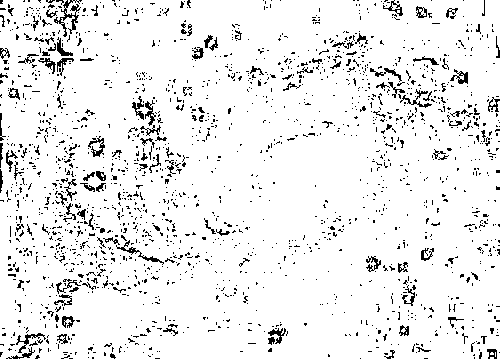

# 金星进双子座丨让生命变得更丰富的一个月来啦！

> 原文：[`mp.weixin.qq.com/s?__biz=MzA5NjA0NTAxNg==&mid=2651477971&idx=1&sn=c31a8ccd283596995d1b52afb88756bc&chksm=8b48e564bc3f6c725000408a63942a00cf669a28acfbcc45c0c808752ea4514934967ad6f59f&scene=126&sessionid=1692737796#rd`](http://mp.weixin.qq.com/s?__biz=MzA5NjA0NTAxNg==&mid=2651477971&idx=1&sn=c31a8ccd283596995d1b52afb88756bc&chksm=8b48e564bc3f6c725000408a63942a00cf669a28acfbcc45c0c808752ea4514934967ad6f59f&scene=126&sessionid=1692737796#rd)

**********************☆ ****************************后台****************************回复“今日”，给你一句生命态度**********************

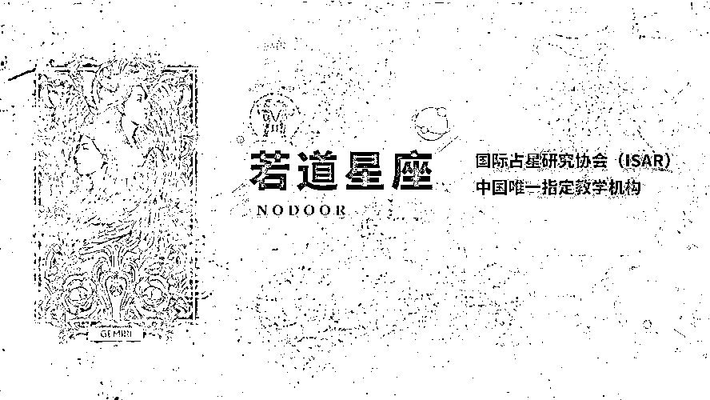

作者/MaryChan 玛丽

编辑/翀子 封面/书君 图片/网络

6 月 23 日 8:34，金星进入双子座。象征爱与美的金星来到这片新奇的土地时，会有哪些表现？在这段日子里，又有哪些重要的宇宙天气可以助力金星的能量发挥呢？让我们一起来看文章吧~
**金星进入双子座**

**6 月 23 日 08:34，金星将由金牛座进入双子座，直到 7 月 18 日 09:32 离开双子座进入巨蟹座。**

**由土元素到风元素的转换，**仿佛一辆满载新奇玩意的大篷车，驶入了一座安稳的田园小镇，原本静谧、缓慢、恒常的生活，**被注入各种新颖、鲜活、别致和趣味，一切都加速流动起来。**

**人们在丰富的信息中受到启发，得到新的认知，看到不同的可能性，由此激发了人们的想象力和创造力，并拓宽了人生的选择。**

金星象征着爱与美，以及一种连接、结合、给与、分享的阴性势能。除开逆行的影响，一般它在每个星座待三周半左右，再进入下一个星座。

金星与阴性面向有关，是除了月亮（代表滋养、照料、养育）之外的另一种阴性展现。其可视形状的变化，也仿佛月亮的阴晴圆缺，随着相对位置的不同而改变。当金星离地球很近的时候形似月牙，离地球很远的时候形似银盘。而阴性面向正与变化有关。

在金星的每月律动中，与之持续地连接，寻求理解，邀请金星所象征的品质与我们同在，有助于个体连接生命中的愉悦感，开发提升个人魅力、品味，带来自然而然的吸引力，创造良性的人际互动，开启或维护有品质的感情，创造价值、财富与丰盛。

金星属于内行星，是“自我”的具体面向，象征着客观性、连接、交换、存在于关系之中的彼此。有别于外行星所象征的超然面向，金星非常具有“烟火气”，与触手可及的人事物有关。其守护星座天秤座——带来平衡、和谐与优雅；金牛座——带来自然、价值与感官享受。

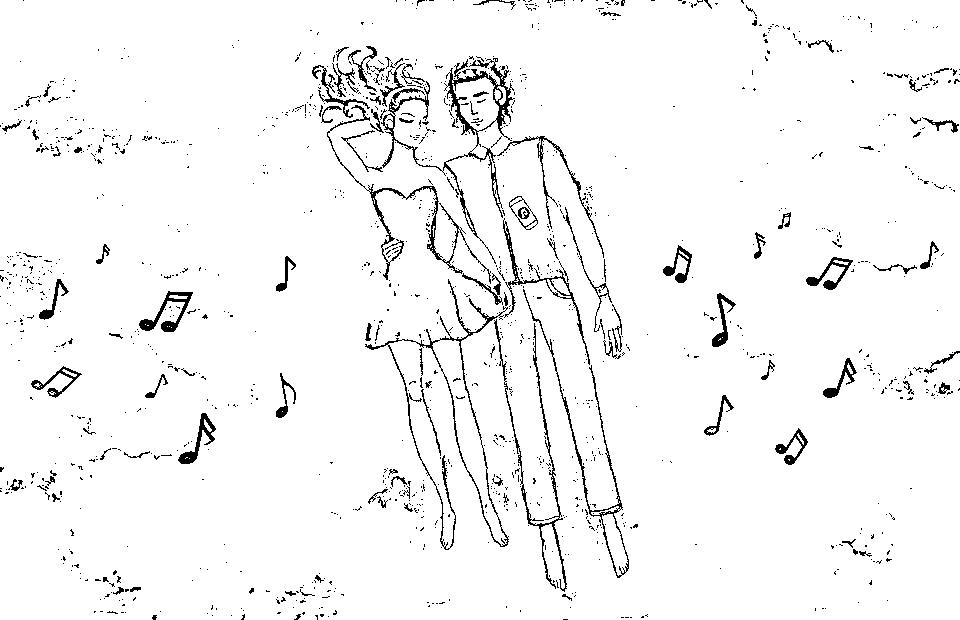

**双子座的法则**

双子座，是风象的阳性星座，处于黄道十二宫的第三个。

从前面的白羊座、金牛座那里，个体历经初生的火焰，确立自我的存在，并构建、发展物质身体；**到了双子座，个体开始关注环境中各事物之间的关系，发展理性认知，搜集记录信息，并传播出去。**

**双子座的关键词：信息搜集传播，事物连接沟通，多变、好奇、聪明、灵活、创造，反应迅速，对语词敏锐。**

在很多方面，双子座与前一个星座金牛座相反。金牛座比较稳重、缓慢，而双子座**迅速、敏捷**。金牛座具体、务实，而双子座倾向于**头脑层面的想法、点子**，在一个更抽象的层次上运作。金牛座较慢适应新环境，双子座则**渴望变化**。

可以说双子座是变动星座中最变动的。**双子座就生活在不断的变化中，如风一般，**迅速地从一个地方移动到另一个地方，弥散接触它所遇到的一切，获得资讯，并将之带到别处散布出去。

**所以双子座与交通、短途旅行有关，并与知识的学习有关，学习总是离不开关键信息的传递。**

**双子座具备迅速抓住事物特质的能力，因此可以时刻应对不断变化的情况。**

典型的双子座就像“万事通”，什么都知道一点。但风永远是流动的，它不会为任何事物驻足，所以双子座很难深入任何事物以获得某种深刻性。**在双子座这里，广度似乎比深度更加重要。**

**双子座具有强烈的好奇心和求知欲。**它希望认识和建立自我与环境之间的联系，由此更进一步地发展自我。

双子座不负责评估所搜集的信息，而只是**记录、知晓和学习**，它只是想知道这个世界在发生着什么。所以双子座需要**开放、自由**地去传播与事实相关的资讯，不希望被条条框框所评判和束缚。

但这是一把双刃剑，有时候不免被人质疑缺乏同理心和道德。就像戴安娜王妃的车祸和死亡，很多人谴责围追堵截的媒体在其中扮演了不光彩的角色。

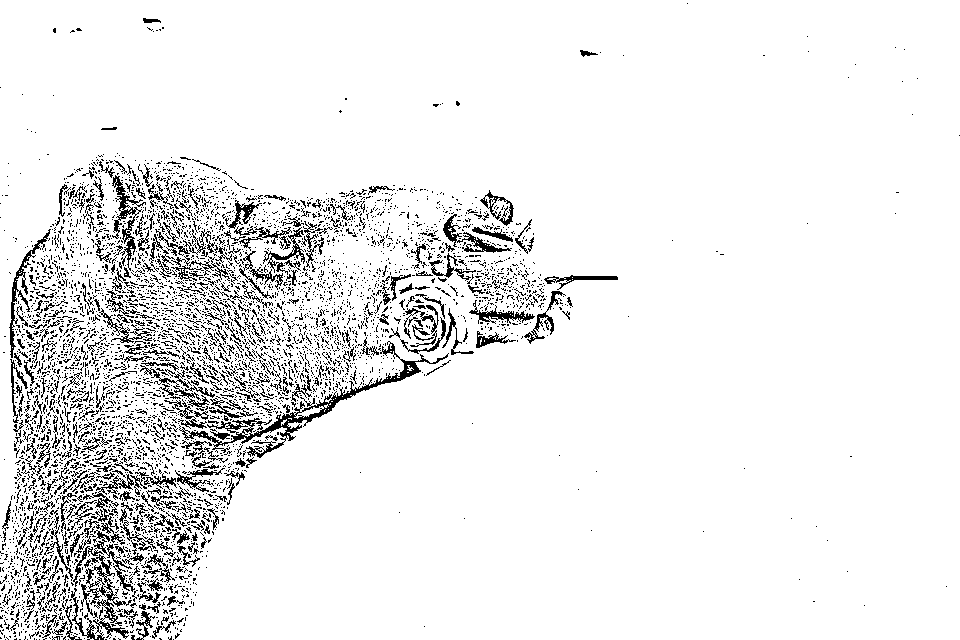

双子座非常聪明、灵活，多才多艺，对各种新东西的学习速度很快，心智异常活跃，**可以一心多用地同时进行几件事情，显得十分忙碌。**

双子座这种对信息来者不拒，迫切想获得更多内容的特点，容易导致神经紧张，甚至焦虑、不安。**所以需要把事情划分轻重缓急，并留一些空档给自己消化信息的时间。**

一般来说，双子座害怕潜入事物的更深处，所以一直在表面发散。而这恰恰也是遇到问题之后，需要去平衡之处。要想获得心灵的平静，需要适当地结合专注。

平面的多广，与纵向的深入，所带来的满足感是截然不同的。计划太多，凡事都想涉猎，很可能变成盲目地奔波，许多事情没法贯彻始终，许多人在生命中来来去去。

典型的双子座对语言文字比较敏感，因为它们是交流沟通的载体。双子座以**灵巧的说话技能和幽默感**著称，这就像社交中的润滑剂，有利于营造轻松明快的氛围，有效传达信息，增进理解，化解芥蒂与误会。

双子座与双手、双臂有关，手涉及身体的协调运作，让个体能够去触碰这个世界，是个体了解世界、表达自我的重要部分。双子座也与肺部和呼吸有关，呼吸是风，连接着内外，代表身体与外界持续进行着能量交换。

**双子座的原型人物是希腊神话中的赫尔墨斯。**他穿着带飞翅的凉鞋，手持魔杖，能像思想一样敏捷地飞来飞去，是宙斯的传旨者和众神的信使。他也被视为行路者的保护神、雄辩之神。

神话中的赫尔墨斯聪明伶俐，他是七弦琴的发明者，亦掌管诗与文字，重量与度量，发明与商业。他像风一样灵活，是边界及穿越边界的旅行者之神。除了冥王和冥后之外，他是唯一可以在冥界自由出入的神。

他被视为欺骗之术的创造者，出生没多久就设计盗取了阿波罗的牛，且逃脱了惩罚。赫尔墨斯的诡计和欺骗并没有那么多的刻意扭曲，他太喜欢头脑活动了，且有点为自己的小聪明而骄傲。

电影《逍遥法外（猫鼠游戏）》（Catch Me If You Can）中，莱昂纳多扮演的弗兰克显然具有许多双子座特质。

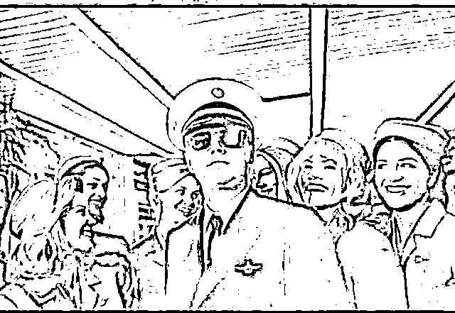

| 《逍遥法外》剧照

一个离家出走的 17 岁流浪小子，利用他精湛的伪造技术和巧舌如簧的口才，成功地伪造支票、冒充身份，“扮演”了医生、教授、飞行员、首席检察官助理等各种重要人物，而且屡屡逃脱追捕。

有意思的是该电影的原型人物：弗兰克·W·阿巴格内尔，在服刑结束后，为联邦调查局工作，成为权威的文件欺诈研究者，包括支票诈骗、伪造和贪污，并创办了一所有关经济诈骗犯罪的顾问公司。

双子座的另一个原型人物是小飞侠彼得潘，身着代表活力和创造力的爽利绿衣，头戴一根象征想象力和灵感的轻盈羽毛。他是一个永远不会变老的男孩，会飞翔、顽皮淘气、飞扬跳脱、勇敢无畏，有绅士风度，又有些傲气。

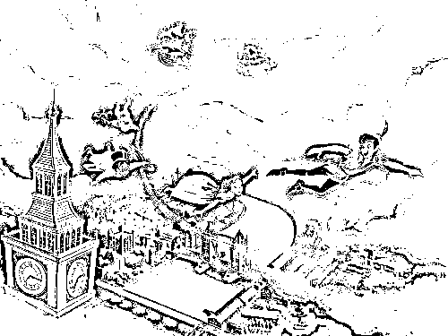

**金星在双子座**

金星在双子座，受到该星座能量加速的影响，金星变得活泼和活跃。人们的头脑、神经、喉咙、双手得到活化，**有利于更多地沟通交流，**更顺畅准确地表达内在真实的想法和需求。

大家可以发起邀约，谈天说地，交流新鲜事，发现新的乐趣，用幽默舒缓郁闷、无聊与僵滞的生活。很多事情，一时半会儿没法找到答案，但表达会带来流动的势能，灵感和解药也许就在那之后的某个时刻倏忽而至。就像一阵风吹来，把烦恼吹走了。

**金星在双子座，适合尝试多样的活动来活络身心。**比如和朋友一起玩动手动脑的游戏，例如纸牌游戏、桌游游戏，以及要运用记忆力、逻辑推理能力的破案游戏等。

另外，也适合进行协调手腿的锻炼活动，例如绿道骑行、羽毛球、溜冰、爬山等；启动、开发喉咙的活动，诗歌朗诵、唱歌等。

金星在双子座，协助人们对信息变得敏感，更快地捕捉语言中的关键词，**这有利于学习各种知识，**享受脑力激荡的快感。例如参加学习小组、读书会、工作坊等，并与更多人分享交流，满足我们的求知欲和好奇心。

金星在双子座，**可以用阅读和写作来愉悦自己。**通过阅读，收获丰富语言的表达，享受与作者跨越时空，头脑共振的美妙；通过写作（或记日记），与自己对话，逐渐理清头脑中的想法，享受灵光乍现的快乐，看到自己的潜力和创造力。

**弗朗茨·卡夫卡，**是 20 世纪德文小说家，其作品语言的象征意义很强，被认为是现代派文学的鼻祖，表现主义文学的先驱。其太阳在巨蟹座，月亮、金星、水星都在双子座。他深受弗洛伊德和尼采的影响，关注内心世界，并把哲学融入文学。

卡夫卡在日记中写道：“我内心有个庞大的世界，不通过文学途径把它引发出来，我就要撕裂了！”

**金星在双子座，有利于艺文创作，比如发挥语言文字和声音结合影响力的音乐。**

**鲍勃·迪伦，**一位有重要影响力的美国唱作人、民谣歌手、音乐家、诗人，2016 年获得诺贝尔文学奖。其太阳、金星、水星都在双子座。

他对音乐的贡献在于，使具寓意的歌词与音乐成为同等重要的一部分，这点也影响了列侬和麦卡特尼之后的很多歌手。从他一开始的抗议歌曲，就展示了他的歌词比他的音乐更富感召力、更激动人心。

其自传《像一块滚石》，里面关于他更名过程的描述，表现了双子座大脑停不下来的有趣运作。他创作速度惊人，歌曲千变万化，可以在几个月的时间内发行 3 张唱片。朋友说：“他将成为传奇人物，如果他最终没有精神失常的话。”

金星在双子座，空气中有一种轻快的因子，人际关系富于风趣和玩乐气氛。**人们需要在社交生活中随机应变，富于弹性和适应力，拥抱变化和多样性。**此时并不意味着一定有进一步深入的关系，而是带着一些实验和尝试，有的接触只是出于好奇，而非包含其他更为复杂的因素。

金星在双子座，赋予个人较高的能量水平，**机智和健谈让日常的社交活动变得有趣，**令人耳目一新。但有时候过犹不及，喋喋不休也会让人觉得疲惫，特别是习惯慢节奏的人。

金星在双子座，有人喜欢开玩笑逗人开心；也有人喜欢玩世不恭，仿佛对所有事情都不必太较真，知道许多状况可能都是暂时的。还有人喜欢自由地体验，害怕因承诺将自己固定下来，失去未来的选择权。

金星在双子座，为关系带来新意的同时，也带来易变。在双子座这里，强烈的依恋被当做一种羁绊和限制，妨碍了其经历各种体验的广度需要。当关系中涉及到更深入的连接时，可能会遇到莫名的抗拒。

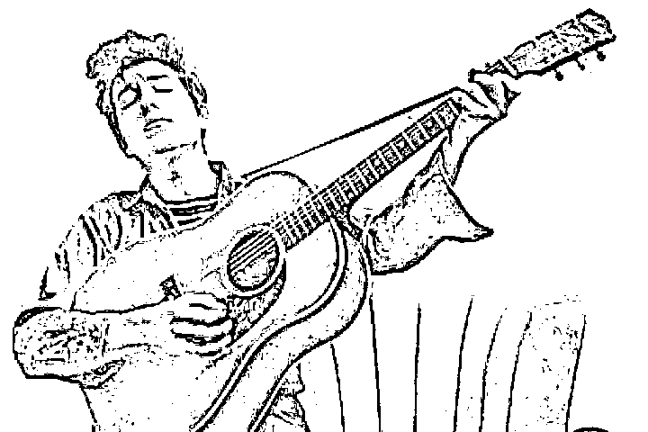

| 鲍勃·迪伦

金星在双子座，可以尽情聊感情，但并不意味着对感情的真正理解。双子座在第一个水象星座巨蟹座之前，还无法意识到除了逻辑和理性分析，这个世界还有更深的面向。双子座能迅速地用头脑去认知这个世界，但很难用感觉去感同身受。

用头脑认知情感，永远还是隔了一个世界。如果缺乏同理心，虽然可以舌灿莲花，但仍然让人感觉有一种事不关己的漠然，让人感觉不到温度，没有被真正看到，感到受伤。

所以，双子座之后是巨蟹座，代表个体发展情感面的感受力，让理性与感性平衡。双子座、巨蟹座是继白羊座、金牛座之后的又一对阴阳组合，能够彼此互补。

热播剧《梦华录》中的男主角陈晓，刚好就具备这样的组合。他太阳在巨蟹座，金星双子座，水星巨蟹座（逆行）合相太阳，天王星对分金星。

他曾在以前的访谈中说自己不喜欢双子座，而遇到陈妍希后，觉得双子座蛮好接触的。2016 年他与大 4 岁的她结婚。陈妍希太阳在双子座，合相火星，且北交点在双子座。

她在采访中谈关系里的沟通，说重点是要讲对方听得懂的话，如果存在沟通障碍就要去学习：如果他是水星人，我就去学水星话，他是火星人，我就去学火星话。这听起来很窝心，懂得沟通的重要性，是双子座对你好的方式。

有意思的是，陈晓今年有部剧就叫《好好说话》，讲的是用真诚的沟通去化解人际纷争，最终互相谅解与治愈的故事。

**金星在双子座，让我们以清晰的语言，来化解仇恨、纷争、矛盾和对立。**一旦人开始谈论需要，而非指责对方，双方就有可能找到办法去满足各自的需要。如果不看重自己需要的客观、准确表达，对方就可能一直不明白。直接说出需要，获得积极回应的可能性会增加。

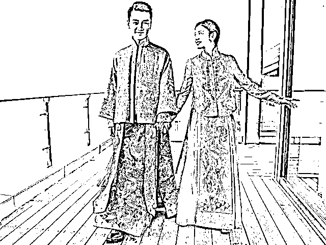

| 陈晓与陈妍希

**金星在双子座的爱情**

金星在双子座，带来有趣、欢快、活泼的爱情。容易被敏捷、机智、聪明伶俐、多才多艺的人吸引。欣赏谈吐大方，言谈间充满魅力的人。懂得聊天，对他人的想法、观点感兴趣，并给与反馈，或至少懂得尊重彼此的想法，可以增加好感率。

约会时可以用轻松的语言活跃气氛，带来当下的热门话题**，分享有趣的事物、想法。**好听的声音可以加分。如果缺乏顺畅的沟通和表达能力，至少也需要通情达理，懂得变化和带来新意。

一成不变的关系可能成为一种负担。喜欢能不断激发自己想象力的对象，来自心智头脑的刺激，对促进关系是重要的。**可以一起计划新的活动，一起探索新的领域，一起学习新知，以增进和保鲜感情。**

另外，除了诚实、清晰地表达自己，**花时间倾听对方，**并且能听懂对方的心声也很重要。有来有往，方为交流。精神层面的握手交融，是获得满意关系的关键。

有时候，爱从口出，祸也从口出，**应注意语词选择、表达分寸和场合。**鲁思·贝本梅尔的诗中写道“语言是窗户，或者是墙，它们审判我们，或者让我们自由。在我说与听的时候，请让爱的光芒照耀我。”

**幸运色：黄色、蓝色，代表心智活动的颜色。**

金星在双子座，可以通过多种多样的与流通、传播、语言、教育、互联网有关的领域获得收入。例如成为老师、出版业者、编辑、媒体人、营销企划者，还有演说、写作、主持、翻译、销售等。还可以从事艺术文化业、运输物流业。

**金星在双子座，带来敏锐的观察，知性的分析，能说会道，广结善缘，懂得运用良好的人际关系，让自己事半功倍。**

**金星在双子座的阴影**

此时**精力容易分散**，注意力被带走，导致做事拖拉、虎头蛇尾，或者开启很多，而没能坚持下去。对各类信息漫无目的地作反应，忙着从一朵花跳到另一朵花，以至于精疲力尽，无法有效吸收、消化资讯。

如果无法意识到自我内在的矛盾之处，就容易显得**性情轻浮、反复无常、缺乏担当**。当人际关系出现挑战，倾向于像风一样绕过障碍，而非直面。很快丧失兴趣或意兴阑珊，可能给人不负责任、是非不分、道德感不强的印象。

如果人格不够成熟，可能会油嘴滑舌，信口开河，甚至欺瞒哄骗。一时兴起的许诺，转头就忘，难以贯彻执行。

学得很快，许多事看起来驾轻就熟，但如果无法沉下心，发展出一份深刻的领悟，大量的知识就无法转化为智慧。这是一种遗憾。

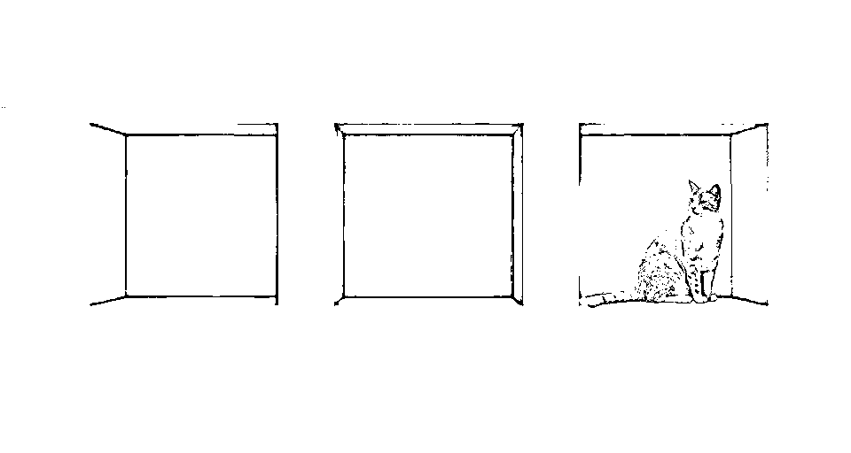

**金星在双子座的重要相位**

**金星在双子座期间与其他天象的结合以及相位（容许度 1°）：**

**★ **6 月 23-28 日 ****

**金星初进双子座之时，海王星处于逆行前的停滞阶段。6 月 28 日，海王星于双鱼座 25°开始逆行。**

这是一个强大的影响力，人容易迷糊、混沌，头脑不够清晰，失去焦点，而被幻象俘获，想要追求理想中的美好，逃避粗钝的现实，易沉迷于想象、游戏之中。意志力薄弱的人此时尤其容易受到影响、诱惑，乃至欺骗。

而那些所谓拥有“强大”自我的人，可能会由于丧失自我感，而觉得无力、痛苦。此刻，坚固的现实被一种神秘莫测的力量所侵蚀，其宇宙目的在于，让个人体验到更辽阔的意识维度的存在。

金星在双子座运行，**良性的情况下，可以收获想象力、创意、灵感，但也不缺乏挑战，例如信息的误用。**

建议不要急着做决定，可以多去搜集信息、去感受。在每天的生活中，记得为自己留一点时间，容忍自己静坐一下，也许在深呼吸、品茶、出神之间，秩序、意义和灵感便从混沌中闪现。

**★ **6 月 28-29 日 金星六分木星****

**重点影响人群：有重要行星/四轴/月亮交点落在双子座、白羊座、天秤座、射手座 0°-14°，狮子座、水瓶座 4°-10°。**

该天象带来丰富的信息，加速的、活泼的表现力，以及热切的社交氛围。用乐观的心态，欢乐的心情与人互动，用真诚去鼓励、关怀他人，给人力量与勇气，并收获欣赏与支持。人们可以互赠礼物，表达心意或给与安慰。

**当我们不惧他人眼光，去真实展现自己时，连脆弱也会启发他人，鼓舞成长。**

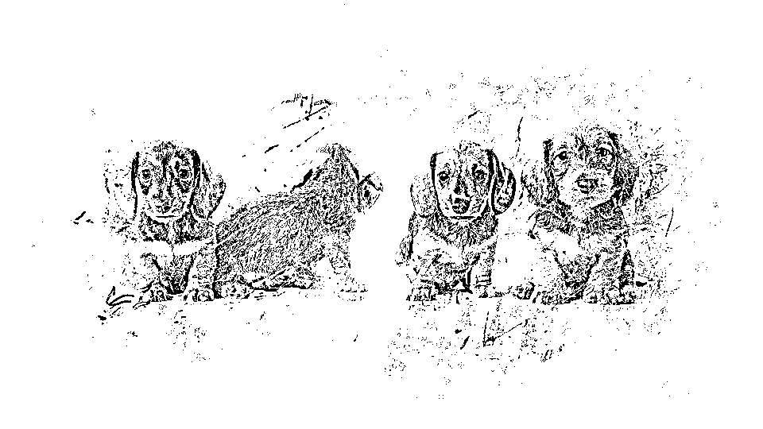

★ **7 月 6-7 日 金星六分凯龙星**

**重点影响人群：有重要行星/四轴/月亮交点落在双子座、白羊座、天秤座、射手座 9°-23°，狮子座、水瓶座 13°-19°。**

在学习、交流、阅读中，个人容易体会到一些更深刻的东西，看到一行文字，听到一句话语，令人触动、沉思。如果正面临对自己的质疑和不确信，或想要把一切都搞清楚，那么此时可以找到提示，去治愈自己的遗憾或伤痛。

**不要低估语言文字和声音的力量，并懂得区分知识与智慧。关键是先要让自己静下来，并敞开心，灵感才容易被吸收转化。** 

★ **7 月 12-13 日 金星三分土星**

**重点影响人群：有重要行星/四轴/月亮交点落在双子座、水瓶座、天秤座 17°-29°；白羊座、狮子座、射手座 21°-27°。**

该天象给与一份更高的能量水平，却又同时保持平稳。此时容易自然而然地接收信息、想法、点子，破除旧有的限制性的信念，稳妥地提升自我认同、自我评价。

在关系中发展自己的特质，并懂得尊重、欣赏彼此，为关系带来新鲜的活力，**看到责任和承诺并不只意味着负担，还有趣味、开明和创造。**

★ **7 月 13-14 日 金星四分海王星**

**重点影响人群：有重要行星/四轴/月亮交点落在双子座、双鱼座、射手座、处女座 18°-29°。**

该天象让觉知变得**纤细、敏感**，可能触发个人对理想关系的向往，或对浪漫爱情的幻想，希望跳脱粗糙、无趣、痛苦、有瑕疵的现实。

此时容易用想象代替现实，追求得不到的人事物。人可能陷入晃神、混沌，**注意擦亮眼睛去辨识人事物的真伪。**切勿让同理心泛滥为无理性的牺牲，而经历受伤、失望、幻灭、愤怒。

对绝对的美与完美的渴望，**可以发挥于艺术领域**，在音乐、绘画、诗歌、戏剧、电影中获得美的领悟。在也许不得已的牺牲、放弃与缺失中，看到另一种升华的完整。

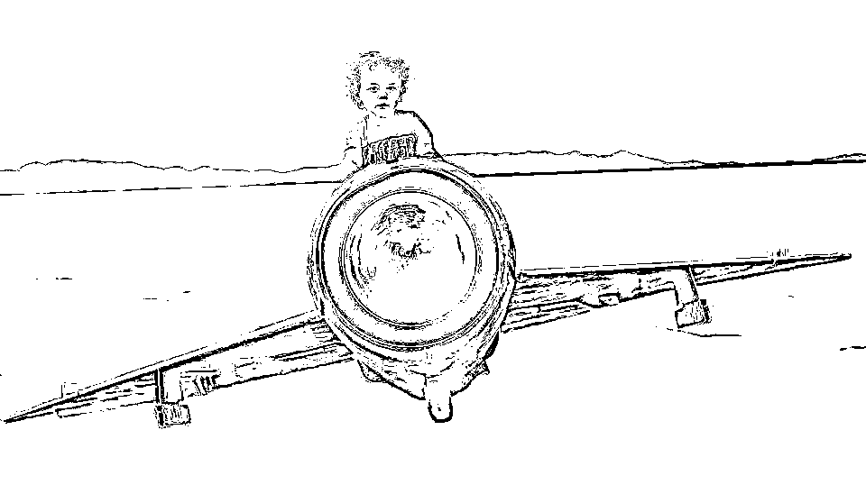

**结语**

金星在双子座，让我们在不断地连接中，**去拷贝、创造、传达，**就像生命之花的形成一般，将原始图案进行无尽的扩展、外移、排列，就会看起来变得越来越复杂，整个生命花园由此极大丰富。

正如双子座是第三个星座，“三”生万物，看似无规律地跳动中，藏着宇宙的韵律。

生命就像一个无限繁复的万花筒，我们既可以从原点朝外看，**不断地与这个世界的新奇相遇，**也可以换个方向，向内看到其本然的简单质朴。

双子座是关于知道的星座，不断外化是“知道”，而内化是知“道”——宇宙的规则。这神圣的觉知一旦被激发，会带来对立的统一，与整全的心智活动。于是，矛盾性得以统合。

我们与他人沟通，与世界沟通，与自己沟通，也与寂静沟通，头脑中的聒噪、分裂终归平和、安逸。

**版权声明：**原创文章由作者授权首发于若道平台，欢迎转发，反对抄袭。友号转载请申请白名单。

**END**

**MaryChan 玛丽**

人本主义占星师、花精咨询师

于成都创办工作室，从事咨询、组织相关活动 8 年

咨询预约号：MaryChen336

微信公众号：ZhanXing336

长按打赏

**2022 下半年金融占星投资沙龙****今晚 7 点开讲！****可扫描下图二维码了解详情哦~**

**20 位来自世界各地的占星师****带来 19 场沙龙——新世界的觉醒****详情可点击下图**

**学习占星学****点击下图了解课程详情**

**微信又双叒叕改版啦，不想错过若道君的推送？**
**就把若道设为星标吧！****▼**

**喜欢就点一下“在看”吧！**

********报名直达入口********

# 这个“爱钱”的北交点，今生反而得学着放手

> 原文：[`mp.weixin.qq.com/s?__biz=MzA5NjA0NTAxNg==&mid=2651477813&idx=1&sn=fe7715bdcd0b2317c241591a4ae92caa&chksm=8b48e582bc3f6c940c9385d5d1f003c0b0b0ea522a6d4e0f2f67abe696bd043c21849a701105&scene=126&sessionid=1692737796#rd`](http://mp.weixin.qq.com/s?__biz=MzA5NjA0NTAxNg==&mid=2651477813&idx=1&sn=fe7715bdcd0b2317c241591a4ae92caa&chksm=8b48e582bc3f6c940c9385d5d1f003c0b0b0ea522a6d4e0f2f67abe696bd043c21849a701105&scene=126&sessionid=1692737796#rd)

☆****后台回复“今日”，给你一句生命态度****

作者/简·斯皮勒 译者/Luke 校对/江艺编辑/玫瑰 封面/书君 图片/pexels

南交点金牛座-北交点天蝎座，兜兜转换就是和小钱钱过不去。想要拥有更多不是错，但方法要得当。这篇文章就来教你一些小窍门。记得收藏哦。

**北交点天蝎座/第八宫综述**

**发展的特质**

在这些领域的努力有助于解锁隐藏的天赋才华： 

**· **自律

**· **选择建设性的改变

**· **释放任何导致停滞和低能量的事物

**· **丢弃无用处的资产

**· **享受事物，却不必占有它们

**· **接受别人的支持（观点、金钱、机会）

**· **享受使人感到有活力的高风险情境

**· **觉察其他人的心理（欲望、愿望、需求和动机）

**· **愿意支援他人、与他人合作，融合权力

**要放下的倾向**

努力减少这些倾向的影响有助于让生活更轻松、更愉快 

**· **执着于舒适和现状

**· **占有欲

**· **过分关注积累和拥有权

**· **质疑过去的决定

**· **固执

**· **陷入感官欲望的泥潭

**· **重复同样的方法（较难的）做事，尽管另一个方法更加容易

**· **抗拒改变和其他人的建议

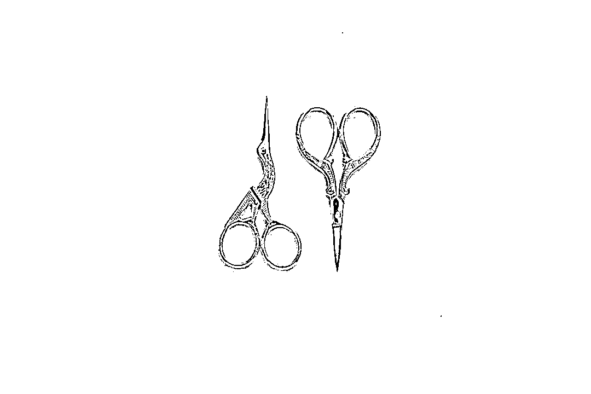

**阿喀琉斯之踵/避免的陷阱/底线**

天蝎座北交点的阿喀琉斯之踵是**舒适**（“人生的目标是舒适；我需要大量的财产以生存下去”），这可能导致他们**掉入陷阱，无止境地寻求积累**（“当我终于有了足够的金钱和财产，我就会对自己感觉良好，和人产生关系”）。**这种思想导致各种层面的停滞：物质、身体、精神、情感和灵性。**人生经验已经指出，天蝎座北交点永远无法获得足以让他们感到舒适的“物质”，从而作出能为他们的生命增加活力的改变。天蝎座北交点的人**需要愿意冒着失去当前舒适的风险，去获得更高阶的力量和活力。**最重要的是，**他们永远不觉得自己有足够的钱和个人财产，使自己有能力和别人建立关系，并且足够满足他们所有的需求**。在某个时刻，他们必须**放弃自我关注，把所有的精力投注到伴侣关系上**。讽刺的是，**当他们最终与另一个人结合，这种相互授权的关系可以使他们富有！**

**这些人真正的诉求**

**这些人真正想要的是金钱。**他们想要**积累财富和物质，以获得一种舒适和稳定的感觉，这样他们才能开始“真正的生活”。**为了达成这点，这些人**需要愿意与别人结成伙伴关系，找到那些有相近价值观和资源（金钱或天赋）的人一同分享。**如果天蝎座北交点的人**使用他们的天赋来提升伙伴的能量，真正地与另一个人结合形成一个团队，而不是维持一种分裂的感觉**（我的钱/你的钱，我的资源/你的资源），结果可能是**为双方带来巨大的经济回报**。**在约定可以获得一定比例利润的前提下，天蝎座北交点的人可以自由地致力于提升伴侣的能量和权力，让对方感到可以提升团队的成功。**对于经济方面的安排，天蝎座北交点的人**最好询问伴侣怎样才是公平的**，因为相对于他们自己，其他人更能欣赏他们的价值。

**天赋/职业**

这些人是很棒的编辑，因为他们**有能力深入其他人的心智，觉察他们的意图，以清楚的方式阐明材料。**他们**为其他人的项目或生意赋能**，当他们这么做的时候，对方倾向于**慷慨地奖励他们**。在他人的钱财方面尤为如此——比如**银行、保险和投资**。他们也擅长**心理学（在帮助别人改变的过程中，他们自己也在改变）和私家侦探，或其他涉及挖掘秘密的工作。****天蝎座北交点的人拥有做事彻底和决心坚定的特性，这可以建立持久的成果。**当他们使用这些前世的天赋，**在危机情境中建立稳定性的时候，他们的可靠性创建了一个环境，让所有相关人员感到舒适和安全。**然而，**如果他们从事的职业是以现状为导向的，需要维持现状而不是成长，他们可能很快会停滞不前，陷入困境和缺乏活力。**他们擅长**危机导向的职业**，或涉及**不断改变和成长**的职业，因为这可以**带来兴奋感和个人发展的潜力**。

**天蝎座北交点特定的疗愈誓言**

**· **“拥抱改变将带来活力。”

**· **“当我选择充满能量的改变，我就赢了；当我选择现状，我就输了。”**· **“不改变就是停滞。”**· **“当我为别人赋能，他们认可我的价值”**· **“当我深入洞察其他人的价值和动机，我就知道谁可以信任”

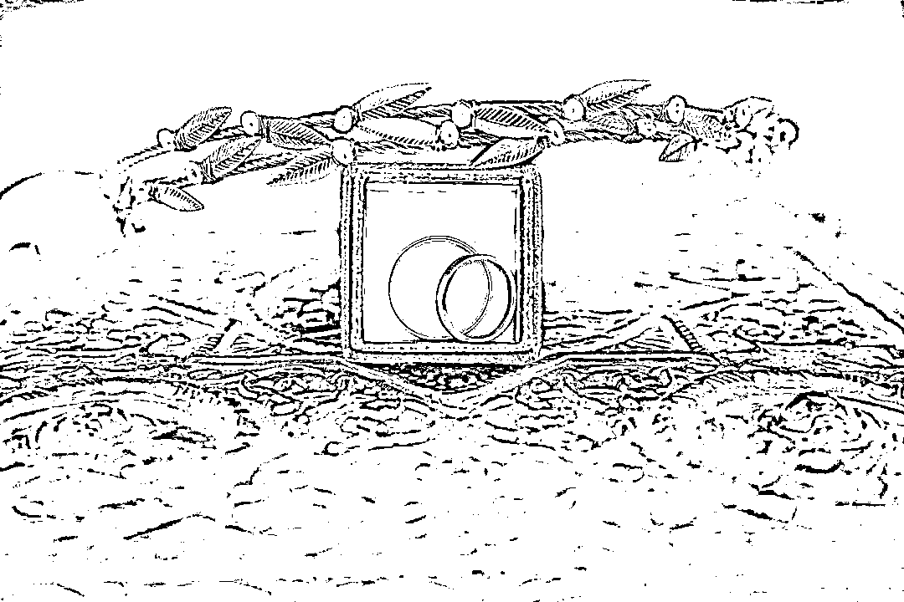

**北交点天蝎座/第八宫的个性**

**个性**

**前世****僵化、限制的价值观**天蝎座北交点的人来到这一世时**携带着僵化的前世观念**，关于**他们怎么做才能对自己感觉良好**—— 这对他们来说是一个非常沉重的负担。大多数的婴儿出生都是赤身裸体的，但这些人不是！就好像天蝎座北交点的人出生时穿着 10 件衬衫、14 件运动衫、12 条裤子和 6 件大衣。**他们带着所有前世的负担，这使得人生比应有的样子更加艰难。****他们在这一世的主要挑战是放手。**否则的话，**太多的物质财富、对前世价值观不合理的执着（“事情应该怎么样”）以及不愿与其他人交往，可能导致这些人停滞不前。**他们需要**对人生的能量保持开放，倾听别人的观点**。当某人说：“看——那件大衣不太好看。如果脱下来穿下面那件就好多了”，他们的第一反应是继续穿已有的那件。但是如果他们能听从，丢弃那件大衣（旧的价值观），他们就会感到轻松多了。**如果他们关注某一价值观，然后能量水平开始下降，那就是一个需要被释放的价值观。**比如说，如果这些人的价值观是，每天早上起来时都点亮一根蜡烛，照亮卧室的每个角落，然后再开始一天的工作，那么这个仪式可能让他们陷入困境。**他们前世有关如何做事的观点让他们陷入“停滞”。但他们也在学习认识到这些价值观已经不再正确，而且事实上是在消耗他们的能量。**他们可以做两件事，帮他们放手：**·** 首先，他们需要**重新评估那些拖他们后腿的价值观和理想**——关于工作、宗教、关系、自我价值、道德、创造力、家庭、目标等等——人们该怎么做才是”对的“。当他们想：“我需要做这个才是对的”，如果感觉有一种沉重感，他们知道自己可以释放这个想法，感觉更轻松。**·** 其次，他们需要**对其他人的价值观更感兴趣**。他们需要真正地倾听其他人认为什么是重要的，因为其他人可以提供有价值的视角，为北交点天蝎座的人带来能量，减轻他（她）的负担。天蝎座北交点的人也可以**通过帮助别人实现目标来获益，因为这一过程中显示出其他人对他们的看法。**在这一世，其他人常常比天蝎座北交点本人更能清楚意识到他们的价值观。这是因为天蝎座北交点的任务是**帮助其他人建立坚实的成果，其他人知道他们需要天蝎座北交点的帮助才能做到这点。****当他们为其他人赋能和帮助实现他们的梦想时，其他人也会回馈他们能量，让他们改变和成长。**他们需要**容许其他人和其他人的价值观帮他们扩展，超越他们的局限，进入充满活力的当下。**天蝎座北交点的人甚至可能**以一种导致收缩而不是扩张的方法，执着于灵性的价值观。**比如说，假设此人重视诚实、正直和忠诚。当应用在此时此地时，这些价值观总是正确的。但是如果天蝎座北交点的人在一份工作中呆了 20 年，然后 5 年以后这份工作严重压制了他们的生命能量，那么他们就不是对自己忠实。甚至灵性的价值观也需要与时俱进。**什么是忠诚？忠诚意味着忠于自己的最深处，这可能会随着生活的发展而改变。**

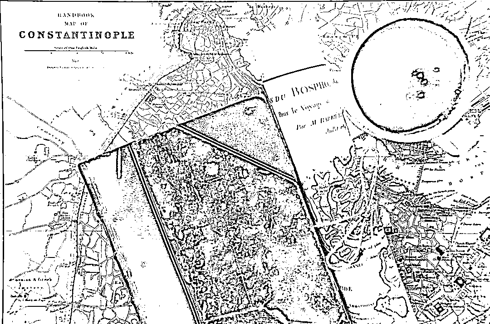

**视野狭窄**

**对这些人来说，最好也不要把鸡蛋放在一个篮子，变得过度专注。**一旦他们确定了目标，就需要在进行项目或任务时，刻意扩展自己的视角。**当他们容许其他人和其他有创意的风格参与进来，工作会变得更加精彩和有趣。**

之后，目的就变成了**享受与其他人的亲密关系，以达成共同的目标**。这会帮助天蝎座北交点的人把焦点放在人身上，而不是任务本身。

**如果他们不刻意扩张自己的视角，他们可能被锁定在做事的“唯一途径”上，从而产生一种强迫性的能量，要求事情以一定的方式进展。**这会使他们遭受比其他人更大的痛苦，因为这会导致他们做大量劳累的工作。关键是要**觉察到他们“视野狭窄”的模式。**一旦他们意识到自己在做什么，就能停下来，深呼吸，扩展自己的思路，然后可能会发现也许按照自己的方式行事并不那么重要。要控制这种“视野狭隘”的倾向，需要他们付出很大的努力。他们真的很难走出那个情绪的空间——试图证明他们的方法是正确的，并进入到一个可以倾听的心态中。这是在培养新习惯。**但是一旦他们开始真正关注其他人的动机、需求和欲望，他们就比其他的月亮交点群体更擅长与其他人结合，为双方创造更多的能量和活力。****北交点天蝎座/第八宫的需求**

**放下执着**

**只要天蝎座北交点的人专注在物质需求上，他们的需求就仿佛无穷无尽。**讽刺的是，当他们**停止喂养那个迫使它们去占有的内在机制，他们就开始释放自己对拥有的执着，并感觉更好**。一种新的能量进入了他们的生活。他们寻求的和平和满足以一种不期而遇的新方式到来：**一种灵性的方式。**在这一世中，他们的安排是**放弃通过物质来填补内在的空虚，转而追求能满足他们灵性需求的道路。**承认自己无形的灵性部分，将带来一种自我价值感。他们为获取洞察力的任何努力——无论是**日记，心理治疗，还是通过冒险和转化性经验学习自我掌控**都会立即获得回报。

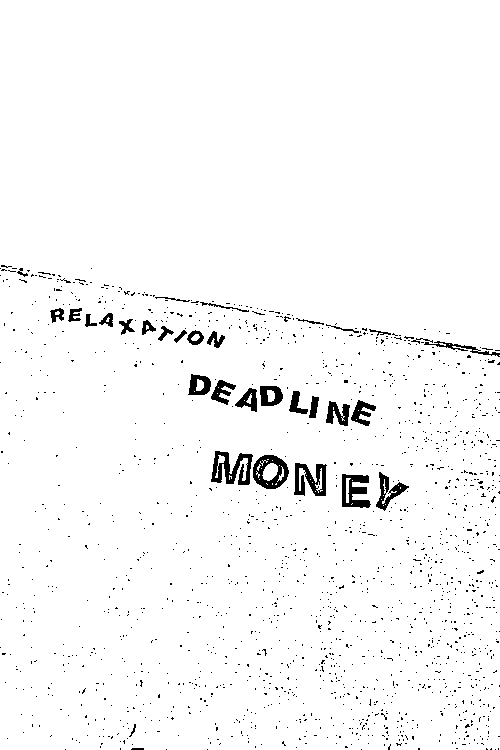

**金钱问题**

这些人似乎常常把钱看成是最关心的事情。他们**对钱有一种危机感，总是希望积累更多。他们对金钱也缺乏逻辑，要么抓得太紧，要么花钱太过于自由**。他们常常感到总是在挣扎——**拼命地长时间工作，只是为了“勉强度日”。****他们有严重的“金钱业力”，大多对金钱的态度是不准确的。**如果能容许别人**就金钱问题向他们提供建议**，他们会感到更少的压力。但是他们**很固执，**想按自己的方式做事——更难的方式。每次他们那么做，都会失败。比如说，某人可能对他们说：“你只要把这个电暖器丢掉，你每月的电费就会下降 50 美元。 ”天蝎座北交点的人会说：“不，不！我必须留着这个电暖器，因为这是我女儿上大学时用的，等等”。此类的执着会让他们贫穷。**为了获得繁荣和舒适，他们必须学会放手。积累的秘诀是合理分配。**如果他们想要富有，这些人必须学会**成为金钱的管家，而不是囤积金钱。**他们认为拥有金钱的关键是抓牢它，然而事实恰恰相反。**金钱喜欢流通，会受那些能使它们流动的人所吸引。**如果不容许金钱通过他们流向别人，那么只有一定数量的资金可以回到他们手上，因为他们不是一个良好的管道。他们要开始学到，**随着他们带着爱放手金钱——高兴地使用它去增加别人的财富，更多的钱会流向他们**。这是一种对金钱的态度，也是恰当的行为。他们需要**同时热爱金钱的两面——接收和给予，这样金钱能容易流向他们**。然而，这些人**往往很难放下任何东西——尤其是金钱！****天蝎座北交点可以做很多事来培养带着爱放手金钱的习惯。**当他们付账单，他们可以在这一过程中有意识地感到爱（反正他们也必须要花钱，还不如爱上这个过程！）。当他们写租金或抵押支票时，他们可以有意识地向个人或银行发送爱，祝愿他们繁荣。如果他们不抱怨自己的开支，还能带着感恩这么做（感谢上天让我有钱支付账单），他们会收到更多的金钱满足他们的开支，从而加强了良好金钱业力来到他们生命中的能量。另一个增加他们对金钱吸引力的关键是，**有意识地为他们当前的经济状况赞美宇宙**。哪怕钱很少也是如此，其目的是去**欣赏和感激当前已有的，而不是渴望更多**——后者在能量层面上，会**转化对拥有不够多的恐惧和忧虑**。对他们所拥有的东西心存感激，会释放焦虑，这样他们就不会再阻碍金钱和物质的流动。如果他们让金钱和物质在爱中穿越他们，那么就会获得更多。

**版权声明：**本文由若道翻译发布，欢迎转发，反对抄袭。友号转载请申请白名单。

**END**

**简·斯皮勒**

全球占星界的一位领军人物，是美国占星师联盟（AFAN）的教员。她定期在新时代和占星回忆上授课，是畅销书《新月占星学》、《灵魂占星》、《灵性占星学》和《宇宙之爱》的作者。

**20 位来自世界各地的占星师****带来 19 场沙龙——新世界的觉醒****详情可点击下图**

**学习占星学****点击下图了解课程详情**

**微信又双叒叕改版啦，不想错过若道君的推送？**
**就把若道设为星标吧！****▼**

**喜欢就点一下“在看”吧！**

********报名直达入口********

# ISAR 星空俱乐部沙龙丨用占星学揭示新冠肺炎的意义，以及其强大目的

> 原文：[`mp.weixin.qq.com/s?__biz=MzA5NjA0NTAxNg==&mid=2651477813&idx=2&sn=455959fe447da98e43ec48274819461a&chksm=8b48e582bc3f6c941d7780a8606f1128bc40472070cf2f3f5e268d9128ce9e111e3e655d34c0&scene=126&sessionid=1692737796#rd`](http://mp.weixin.qq.com/s?__biz=MzA5NjA0NTAxNg==&mid=2651477813&idx=2&sn=455959fe447da98e43ec48274819461a&chksm=8b48e582bc3f6c941d7780a8606f1128bc40472070cf2f3f5e268d9128ce9e111e3e655d34c0&scene=126&sessionid=1692737796#rd)

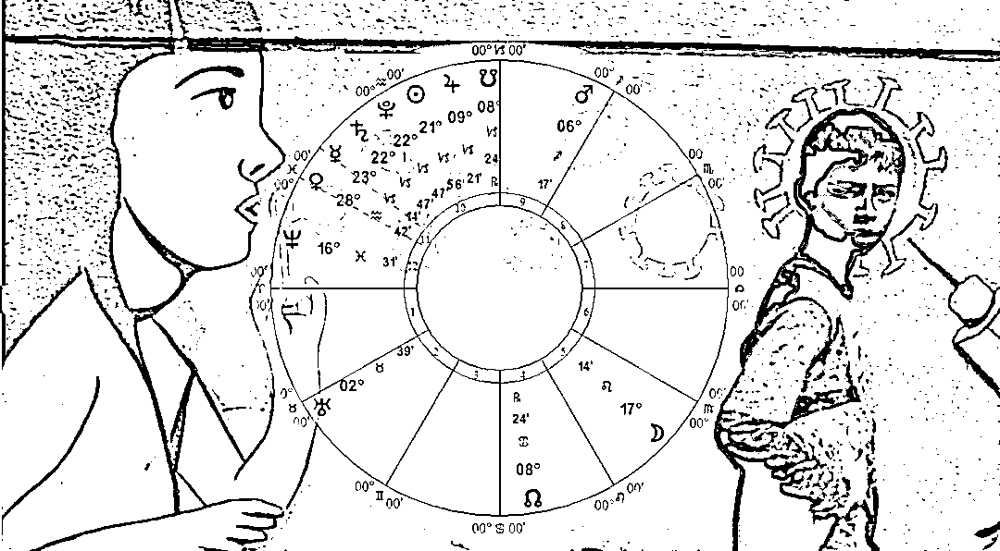

**沙龙来啦！**

**6 月 25 日，星期六上午 10 点，**国际占星研究协会（ISAR）中国星空俱乐部沙龙由占星占星师**弗雷德里克·雷**带来一场讲座！

**沙龙主题****沙龙主题：“等等：什么?”占星学揭示新冠肺炎的意义，及其强大目的****主讲人：**弗雷德里克·雷****

**沙龙时间：6 月 25 日，星期六**

**                北京时间 10:00-11:30（有英文翻译）**

**沙龙方式：线上沙龙**

什么样的星象结构可能与震惊世界的疫情有关？我们可以从占星师的观点中学到什么？

疫情的爆发与极其强大且罕见的行星连珠有关。**土星和冥王星在 2020 年 1 月 12 日在摩羯座达到相同的度数形成合相。**考虑到土星的周期大约是**29 年**，这似乎是一个频繁的事件，所以应该有很多土星-冥王星在摩羯座合相的例子。然而，事实并非如此。这种配置最后一次出现是在 502 年前（基于 2020 年）！**事实上，这是一个非常罕见的配置，但它的力量是值得注意的。**

**我们最后一次看到土星和冥王星在摩羯座合相是在 1518 年。**这是达芬奇最终离开意大利前往法国的时间，也是意大利文艺复兴接近尾声的时候。自从公元前 187 年安条克被杀，以色列的事件导致马加比人在耶稣降临之前起义以来，**我们只看到了 9 个这种合相的案例。**所以，我们没有足够的历史事件数据来作为指标，准确地预期从强大的摩羯座泰坦巨人的合相中得到什么。

**主讲嘉宾**

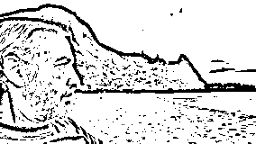

**弗雷德里克·雷**

1980 年在查尔斯·甘茨的指导下，他首次手工计算星图。查尔斯之前是伊萨伦研究所的占星研究员。他对马克斯·海因德尔所表达的玫瑰十字会占星学非常熟悉，并且是丹恩·鲁伊尔占星方法的学生。他计算过超过 25000 张星图，是当今专业实践中经验丰富的占星师之一。

他的重点是传统的西方技术，根据后见之明项目，以及现代西方占星学的概念和方法。他受到 20 世纪占星师的影响，包括伊莎贝尔·希基、罗伯特·汉德、罗伯特·佐勒、利兹·格林、李·雷曼和诺·泰尔。

弗雷德里克对行星运动和宏观经济之间的关系做了相当多的占星研究。他很早就正确地预测了最近的三次金融衰退，包括 2001 年、2008 年和 2020 年。他对利用占星来了解世界事件和国家特性的背后有着浓厚的兴趣。此外，弗雷德里克在数学、经济、金融、工程和应用物理方面有职业背景。

**如何参加沙龙？**本讲座也是本月的国际占星研究协会（ISAR）星空俱乐部讲座。**ISAR 会员可以免费收看。**请注意邮件通知，具体参与方式见邮件。❶ 如果你**已经是 ISAR 会员**，请注意邮件通知，告知如何参加。❷ 如果你**不是 ISAR 会员**，非 ISAR 会员价格：98 元。如有任何问题请咨询工作人员 yiyi（微信：YY18513802156）

**非 ISAR 会员报名请长按下图**

**▼**

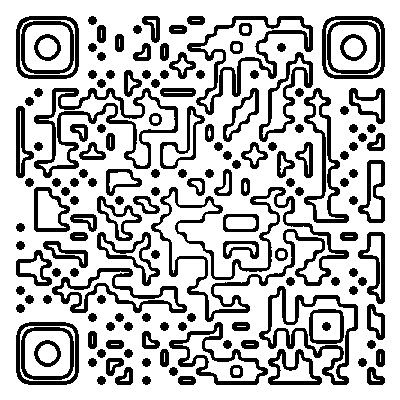

**ISAR 明星俱乐部**

2018 年，ISAR 在主席亚历山大·因舍阿吉克的带领下，成立了 ISAR 明星俱乐部，每月为全球 ISAR 会员提供在线直播讲座，邀请全球著名占星师开讲，学习和分享新的理念。讲座时长一小时，涉及占星学的不同领域、不同观点，每个会员都可以参与其中，每次讲座之后还有 20-30 分钟问答时间向老师们提问。每一场在线讲座都会记录下来，ISAR 除了提供视频，还会提供相关的讲座资料，以及单独的问答录音，自动发送到专门的 ISAR 明星俱乐部页面存档，每位 ISAR 会员可以在 ISAR 网站上自己的会员主页俱乐部页面找到。在 2018 年最初几个月，ISAR 明星俱乐部会每月举办一场在线演讲。之后，两周举办一场演讲，最终每周举办一场演讲。
但是，过去明星俱乐部讲座只有英文沙龙，因此，中国会员只有懂英文才能受益。为了使得更多不懂英文的中国会员能够受益，我们特别和 ISAR 总部协商，今后会安排有中文翻译的明星俱乐部占星沙龙，作为给中国 ISAR 会员的福利！**如何成为 ISAR 会员？**

**如果你也想成为 ISAR 会员，请复制链接在浏览器打开**

http://www.nodoor.com/isarcert.do?contentId=3588（仅支持网站支付）

**或直接长按下方二维码，微信购买会员：**

**ISAR 会员有什么福利？**一年期会员仅需支付**人民币 510 元**，即可享受：**☆ 星空俱乐部免费沙龙****☆每年出版 3 次的《国际占星师》（目前只有英文）；****☆每周电子邮件交流汇总杂志（目前只有英文）；****☆专项研究基金和奖学金资格；****☆ISAR 主办的会议和论坛的会员折扣，包括国际占星大会（UAC）、ISAR 的会议和研讨会等会员权益。****有疑问怎么办？**关于 ISAR 星空会员俱乐部以及我们的讲座，如果你还有任何疑问，**请联系工作人员**：

**yiyi**

**微信：YY18513802156**

**若道 Conrad**

**微信：nodoor2016**

****非 ISAR 会员报名请点击“阅读原文”****

# ISAR 认证职业占星师必修课 | 这个世界上，没有后悔与占星学相遇的人

> 原文：[`mp.weixin.qq.com/s?__biz=MzA5NjA0NTAxNg==&mid=2651477813&idx=3&sn=e3dd350c83242787fe36cb9fc07cd360&chksm=8b48e582bc3f6c949423a21b6c5241468637ae251f27ba0d8e29b3719009dbe1d79d71e41d03&scene=126&sessionid=1692737796#rd`](http://mp.weixin.qq.com/s?__biz=MzA5NjA0NTAxNg==&mid=2651477813&idx=3&sn=e3dd350c83242787fe36cb9fc07cd360&chksm=8b48e582bc3f6c949423a21b6c5241468637ae251f27ba0d8e29b3719009dbe1d79d71e41d03&scene=126&sessionid=1692737796#rd)

5 月，一个若道的老朋友突然发来一段微信，是对木星进入白羊座的感慨。这位朋友创建了自己的公司，他并不在占星行业，但仍经常记录占星日记，因为他总是体会到星体移动和个人生命变化的契合。

过了几天，又一位若道的老朋友发了一张当天新闻的图片，里面有医疗板块产业趋势、有啤酒股的泡沫问题、有千年老二的饮用水公司也要上市。她说，看，举目全是海王星。她也不是占星师。

然而，他们都与占星相遇，占星已经融入了他们的生活。

第一位朋友说：“在若道学习占星，对我来说建立了一个整体的世界观以及对自我内在的解释论。”

第二位朋友说：“学了占星就会知道，事情来时我们不必过度反应，知道一切会过去”。

占星学会改变你，不论你跟随它走多远，不论你是否选择成为占星师。

这个世界在飞快地变化着，占星学可以像定海神针，帮你测度这个世界的变化，也帮助你校正心中的自己和世界的样子。

**这个世界上，应该还没有后悔与占星学相遇的人。**

**8 月 30 日，新的若道占星核心课程要开始了。**

如果你还没有下定决心是不是好好学占星，那么 L1-2 可谓一个轻松的前菜，等着你品尝。

**把这个仅需投资 2800 元的课程作为礼物，送给自己或者自己所爱的人。**

**课程试听：不分组转发本文，找王老师领取。**

长按二维码添加王老师微信

**谁是你的老师？**

**占星师咔咔（Caroline）**

2010 年师从美国占星师大卫·瑞雷学习，并得到世界名师斯蒂芬·弗里斯特、罗伯特·汉德、苏·汤普金斯传授各种占星学技法。若道首届学员，国内最早获得 ISAR 职业占星师资质的职业占星师，2019 年第二届、2021 年第三届核心课中和苏·汤普金斯老师一起教授若道核心占星课程。

在国际知名广告公司和市场研究公司从事的市场研究和推广工作十余年，曾任职于阳狮集团、尼尔森市场研究有限公司、MTV 和《Madame Figaro》杂志。

**大卫·瑞雷（David Railey）**

*   **I****SAR 董事会成员，ISAR 全球副主席，ISAR 全球职业占星师资质认证主席，若道占星创始人**。

*   2016-2019 年，被选为国际占星协会（ISAR）考试委员会成员，国际占星协会（ISAR）是世界最大的国际占星机构，会员遍布 47 个国家。

*   2017-2020 年，被选为国际占星联盟（ISAR）考试委员会主席，理事会成员。

**助教王嘉祺 （Conrad）**

ISAR 认证占星师、若道认证生时校正资质，从 2010 年起自学占星学，2015 年开始在若道系统学习，并开始个案咨询。2018 年担任若道核心课程助教，以及卜卦占星学和太阳返照选修课助教，并带领学员进行经世占星和太阳返照方面的研究。2019 年 11 月作为演讲人之一参加了国际占星协会（ISAR）北京大会，也是 ISAR 星空俱乐部中国区第 16 期的主讲人。

**内容是什么？**

**开课时间和课程费用**

**８月３０日开课，每周一次，20：00-22：00，10 节课。**

**★ 1-2 阶 **

**早鸟价：2800 元（2022 年８月１日之前）**

**课程费用：3500 元 **

**你也可能想学更高阶：**

**★ 1-3 阶　连报**

**早鸟价：10500 元（2020 年８月１日之前）**

**课程费用：11500 元 ****★ 1-5 阶　连报**

早鸟价：33000 元（2020 年８月１日之前）

**课程费用：46500 元 **

德国哲学家雅思贝尔斯说：

教育是一棵树摇动另一棵树，

一朵云推动另一朵云，

一个灵魂唤醒另一个灵魂。

你准备好被摇动了吗？

**退转课程**

**退款原则请详看《教学协议》，如有疑问请咨询课程顾问。**

**课程试听**

**不分组转发本文，加王老师获取。**（微信/手机：18510107057，请备注“大卫核心课”）

****2022 L1-2 认证职业占星师必修课程****

**授课老师：大卫·瑞雷、咔咔**

**直播课开课时间：2022 年 8 月 30 日（周二）**

**授课方式：******网络授课，英文/中文授课，中文翻译****

**费用：**3500 元**（早鸟价 2800 元,8 月 1 日前）**

**课程负责人：王老师**（微信/手机：18510107057，请备注“大卫核心课”）

长按二维码添加课程负责人咨询~

****报名直达入口****

# 太阳进入巨蟹座 | 12 星座将会在何处得到滋养和疗愈？

> 原文：[`mp.weixin.qq.com/s?__biz=MzA5NjA0NTAxNg==&mid=2651477585&idx=1&sn=72cfac8d2ab99cb41bb69ef1f35d0a53&chksm=8b48e4e6bc3f6df0927087680def7344c8cfcc324259e1164ddc624e1735896a65e381a9a87f&scene=126&sessionid=1692737796#rd`](http://mp.weixin.qq.com/s?__biz=MzA5NjA0NTAxNg==&mid=2651477585&idx=1&sn=72cfac8d2ab99cb41bb69ef1f35d0a53&chksm=8b48e4e6bc3f6df0927087680def7344c8cfcc324259e1164ddc624e1735896a65e381a9a87f&scene=126&sessionid=1692737796#rd)

********************☆ 后**********************台**********************回复“今日”，给你一句生命态度********************

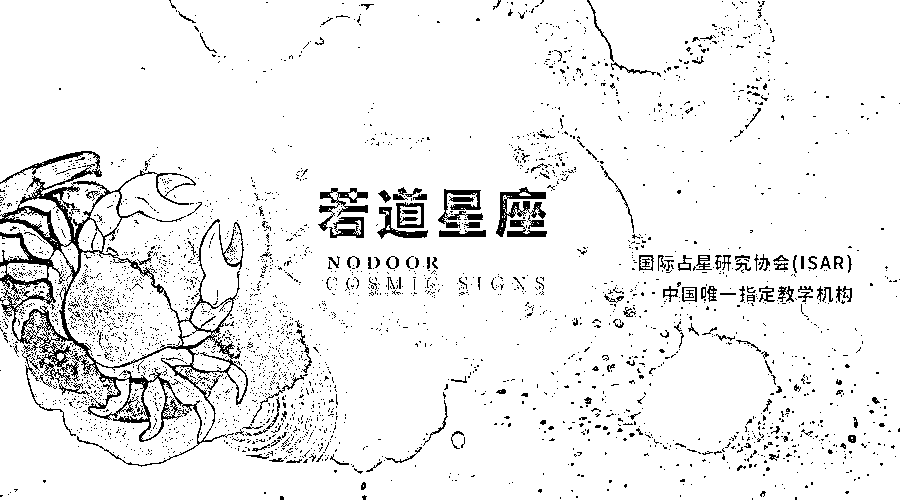

作者/郑玮玲 ISAR 认证占星师编辑/玫瑰 封面/书君 图片/pexels6 月 21 日 17:14，太阳进入巨蟹座，也是一年当中的至日——夏至。今天的太阳来到北回归线正上方，高纬度的北方将迎来“不夜天”。“夏九九”也从今天开始：夏至入头九，羽扇握在手，暑意渐浓。这段时间需要注意些什么呢？一起来看看吧。**太阳进入巨蟹座**自太阳进入巨蟹座 0°开始，天地万物便开始由生长走向伏藏。太阳在天空中渐渐向南移，直到冬至抵达南回归线。至日，即日光之极，而极至则衰减，这是宇宙永恒的定律。夏至三候：一候鹿角解，二候蝉始鸣，三候半夏生。夏至一阴生，麋鹿阳气衰减，知了感阴气而鸣，半夏等喜阴的植物从夏至开始进入最旺盛的生长期。天地阴性能量渐长，我们日常生活起居也当**收敛，滋养，避免过度耗散精力。身体虚寒的人在夏至这天食用姜和温暖的食物补充阳气能得到事半功倍的效果。****夏至所对应的时空填卦恰是：乾卦——天行健，君子以自强不息。**而乾为天，与至日相应，阳盛阴始。乾卦的时空里，我们应当**充分投入生活中去感受、表达，精进于当下生活、工作中，让生命的活力充分释放出来正是顺应天时。**每年太阳在巨蟹座，正是令人感伤的毕业季，是青春年华的永恒停驻的时节，是离歌飘荡校园的季节，是一壶浊酒尽余欢的痛快夜晚。纵然生命历程中充满各种离别，青春年少的相惜、别离是记忆中最初的伤感与最长久的念想。年少轻狂的生涩初心，念念不忘的温情往昔，都在巨蟹座的记忆里温暖了脆弱的心灵，柔软了长河落日风云变幻的岁月。在这个时节与背景下，眼泪和拥抱具有同样滋养的力量。莘莘学子，寒窗经年，知了声声回头已难。惜离别，勇向前，相拥相别，大志前程如锦还。害羞的年轻人走向成熟，需要长出巨蟹座一般的壳，保护、防御、自恰，以及迎着朝阳、风霜去打拼、奋斗，收获生命的成就。内心永存巨蟹座的温度才无惧寒风险阻，因为，心底的永恒家园永远能让我们休息、疗愈。**家，是巨蟹座最为重要的征象。**那意味着我们来的地方，和此生唯一的归属。回到家园，我们就重新注入了生之力量。在自己家中，伤痛得以疗愈，重新焕发光芒。为了家，成熟的人更愿意去付出、创造、服务、贡献。也只有朝向心中的永恒家园，向内的回归旅程，才能带来生命向外生长、茁壮的完整、丰美。

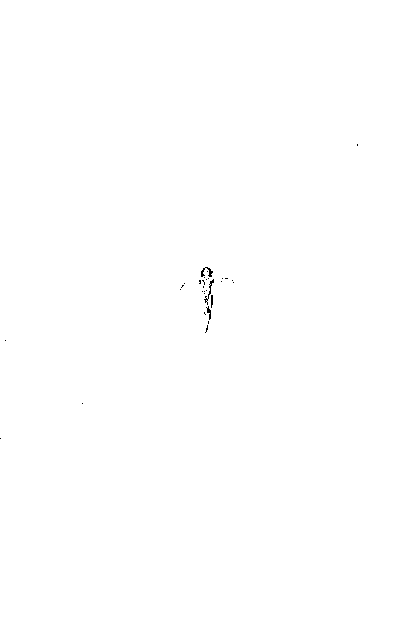

**太阳在巨蟹座的行进**

**太阳四分木星**

**周期：6 月 20 日-7 月 8 日**

**重点影响人群：有个人行星、四轴、月亮交点位于巨蟹座、天秤座、摩羯座、白羊座 0°-15°的人。**

在不久之前的**火木合相白羊座**背景下，不雅教材成为了大众关注的焦点，低俗并带有恶意倾向的图文激发了集体的愤怒，**木星既是扩张力，也是文化、传播、出版的象征。木星在白羊座的开端便以激烈、快速扩张的方式演化了文化中的战火。**此时的日木四分则是**将保护与疗愈的光线带到现实中**。教育部已对不雅教材事件作出回复，相信在这个夏天，在日木四分的周期中，教育系统会做出精准、快速的整改和调整。这个相位周期对个体的影响力也着重在木星代表的**出版、传播、文化与理念**，在双减政策下，无数的家庭、从业者都面面临重大的更新过程，机会的流失、丧失和突然的降临都是同时来到的。对于双减影响的从业者来说，职业方向、核心理念都需要全面的调适。每个家庭的教育，尤其是长期的教育规划与投入，同样在面临一次全新的规划与调整：过度了？还是失去过度？是当下值得思考的问题。**木星在此提示了不可忽略的长期眼光。**如果只是为当前考虑，眼光短浅，盲从顺应，被所谓的安全感限制，就会失去对长远未来多变可能性的探索，也终将失去未来的机会。如果我们没有清晰的自我意识，也会被主流媒体渲染过度的现象麻痹。木星提醒了我们，**尽可能用你的知识、眼界、智慧，甚至他人的肩膀、梯子让自己站高一点，培养远见卓识，或是去试着了解那些真正具有远见卓识的人们的观点。**当你真正跨越迷雾看到世界的全貌，跨越时间线看清未来的时候，你才可以为当下的教育或职业方向做出正确的判定。日木四分提醒了每个家庭：教育是一生的事，更是家庭的而非学校的权力。未成年人的父母才具有绝对的教育权力，你不能把这个权力交给学校和任何教育机构，学校、机构只能家庭的教育意图提供服务。**教育权力的核心必须是滋养、保护孩子，凡是出离此核心的，均是对权力的侵蚀、贪腐和滥用。**而长远的、全面的教育也必须囊括健康身心的养成，知识力量的储备，以及中正不扭曲的世界观，这才是适合人的教育。

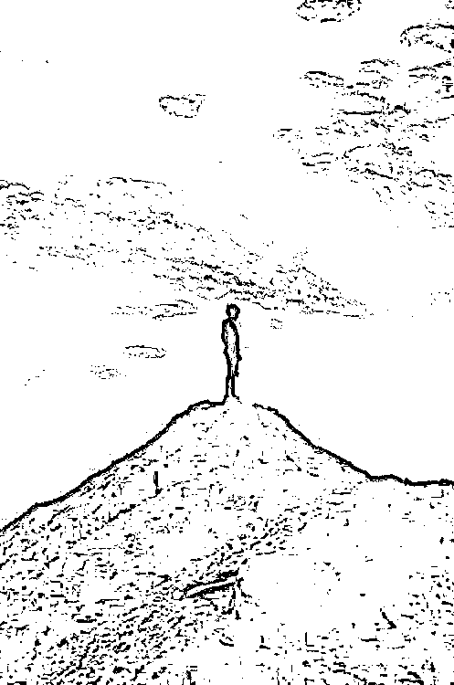

**太阳六分天王星**

**周期：7 月 5 日-7 月 16 日**

**重点影响人群：有个人行星、四轴、月亮交点位于巨蟹座、天秤座、天蝎座、摩羯座、双鱼座、白羊座、金牛座、处女座、狮子座、水瓶座 13°-23°的人。**

日天六分已经来到了小暑节气，金牛座的天王星与巨蟹座的太阳积极协作，为的是唤醒人类与天地相应的阴性能量。阴性能量是关于黑暗、下沉、承接、滋养和吸收，是一切不突张的力量，吸纳、沉降的智慧带来了万物的生生不息。天王星以断裂、离斥的方式打破小我的架构、模式与疆界，捅破智慧的迷障，带给个体清晰的疗愈意识，催醒自由的渴望。天王星六分太阳也提示着**接受并非软弱，臣服并非懦弱，快速的觉醒和温柔的和解兼容并蓄地发生着。**每一个渴望在崭新时代透过创造、服务与自我关照获得自由的人，本身也在参与并唤起了了时代对人类的解放。

**太阳三分南交点**

**周期：7 月 5 日-7 月 20 日**

**重点影响人群：有个人行星、四轴、月亮交点位于巨蟹座、处女座、天秤座、天蝎座、摩羯座、双鱼座、金牛座 13°-27°的人。**

诚然，在浩瀚的宇宙中，生命的每件事无论风起云涌，终将只是：小事。因为一切都转瞬即逝，消散无踪。但巨蟹座正是让我们去关照生命的细节，因为只有感受细微生命剧情演化，才会感受到内在本体深层的爱与喜悦。别忘了，巨蟹座正是：我感受。**此时的月亮南交点在天蝎座，与巨蟹座同为水象星座。**这组相位，能承接我们心灵深处最强有力，最细腻的感受，而这样的感受必定出于疗愈，归于平静。我们若对生命保持敞开，允许一切的可能性，便可开展对生命深广度的细腻体察，每一个事件、情绪的升落，每一个隐藏的按钮被触动，每一个心念、妄念的浮现，都在为疗愈提供一把钥匙，打开一扇门。北交金牛座，意味着享受生命的花园，带着疗愈意图的身心，将从所有细腻、精微的允许和体察中得到疏解和释放。在此时期，**透过任何创造性工作或是冥想、静修以及任何服务性工作，都有机会重新激活的感官，让疗愈发生得更加积极、活跃。**

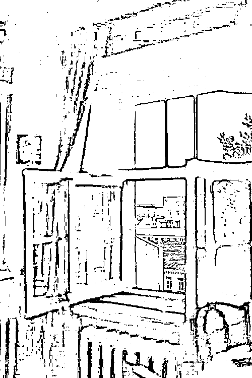

**太阳三分海王星**

**周期：7 月 10 日-7 月 26 日**

**重点影响人群：有个人行星、四轴、月亮交点位于巨蟹座、天秤座、天蝎座、摩羯座、双鱼座、白羊座 17°-29°，狮子座、射手座、白羊座 0°-3°的人。**

**海王星将于 6 月 28 日开始为期 5 个月的逆行，12 月 4 日从双鱼座 22°重新开始前行。**日海三分接续着太阳与月亮南交点的三分相，**7 月中旬，太阳、海王星与月亮南交点会形成精准的水象大三角。**这股细腻、丰富、变幻的能量也同时有月亮北交点和金牛座天王星共同以六分日海的角度参与，为我们潜藏的感受、情绪提供了强有力的稳定输出的机会。在此天象下，我们可能会**经历现实中的谎言、欺骗、丧失、挫败、迷惑和无力感，危机与警觉感促使我们不得不寻求疗愈与超越现实的出口。**透过**创造性的工作**，或是**与土地相关的一切工作：种植、徒步、露营、散步**，我们可以**快速地回归现实，落地创意，整合我们内在的阴影。**如果觉得失去力量，那就让自己短暂休息一阵，这样才能更好地赶路。如果觉得被某种无形的力量带走，那就努力去投入当下值得的创造。透过落地的工作让自己从困顿中解脱出来，自由地实现创造。

**太阳对分冥王星**

**周期：7 月 12 日-7 月 28 日**

**重点影响人群：有个人行星、四轴、月亮交点位于巨蟹座、天秤座、天蝎座、摩羯座、双鱼座、白羊座 19°-29°，狮子座、射手座、白羊座 0°-5°的人。**

年复一年的日冥对分，都在提醒我们，**透过内在感知直抵真相，勇敢坚定地伸入心灵秘境，并用爱的温度去疗愈转化进程中的伤痛。**在大暑时节，人的身心、意识都有如炙火烘烤一般灼热、激越，日冥对分强化了个体的意识转化。**我们很可能在这段时间触碰长期以来生活或灵性中的难题，不得不去应对、处理最难以面对却无法逃脱的功课。**冥王星要的是真实，当我们接纳真实自我时，所有的黑暗与束缚将协同自身的意识去整合。而若是固步自封于自身的阴影前，我们就丧失了难得转化与超越契机。

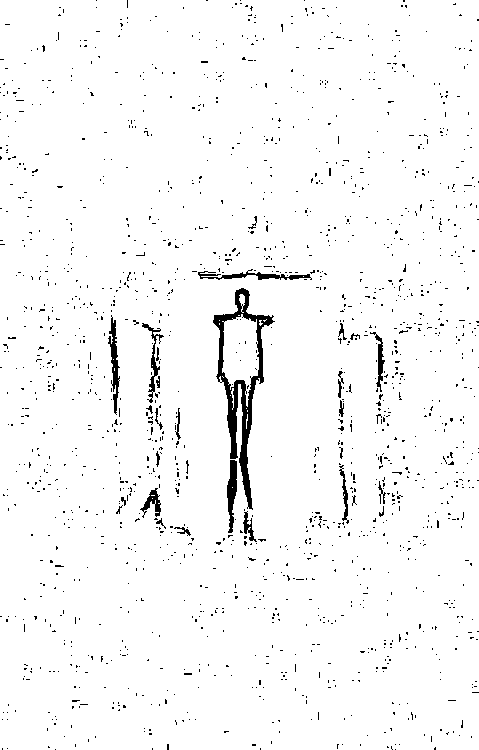

**太阳在巨蟹座对 12 上升星座的影响**注：以出生星图上升星座度数 30°范围内的上升星座为准。如你上升在 0°，可以完全参考下列内容；如你上升在 29°，则需参考下一上升星座。**若道君：****你可以在 app store 或者应用商店搜索“若道”下载 app，输入个人档案，查看行运盘（也可以使用其他星图软件），找到行进太阳落在出生星图的第几宫，然后对照下文查看。****例如下图中，比尔·盖茨上升在巨蟹座，行进太阳在个人星图的第 12 宫。**

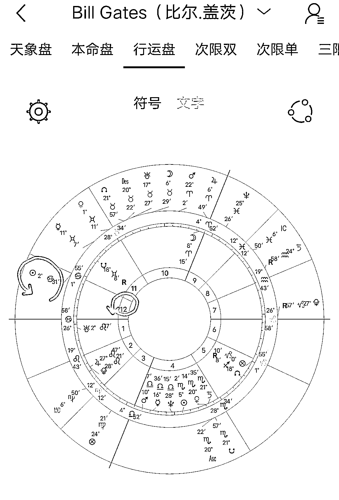

**上升****巨蟹座****，太阳行进在*****1*****宫**

**当你把注意力完全投注到自身的成长与创造中，你将感受到持续一个月的充沛精力。**可以利用自己敏感的天性与直觉去**寻找职场、事业和成长上的新机会**，一些外部机缘也将因你的积极主动被吸引来到当下。**前半个月非常值得去尝试扩展人脉、空间，下半月则需谨慎内收，把关注重点放在亲密关系或是内在那些束缚你现实发展的困境和议题中。**抗拒只能使心智冥顽，接纳才能带来和解与新生的活力。

**上升****双子座****，太阳行进在*****2*****宫**

你需要**关注和处理一些财务状况**了，这个过程会带来对自我更深入细微的认知，更清晰自身的价值，并有机会触碰一度无法解锁的危机感，信任、关系和财务议题，完成重大的内在整合。**当下的你经由现实的困境和闭锁的境况，转而寻求新的发展机遇。**经由团体的启发寻找到新的愿景，或是从崭新的个性化的愿景中激发新的斗志，都会为你的将来创造一个新的维度，新的机遇。

**上升****金牛座****，太阳行进在*****3*****宫**

小心被当下生活的激流带走，冲刷。当你忙着工作、赚钱、赶路，目不暇接地接收大量讯息时，别忘记了向你的内在守护神寻求福祉与庇护。**透过你的内在视野，让灵感和细腻的感受将浮尘清洗。**生活的患难对每个人来说都是均等而有序的，如果你感觉自己已拥有太多幸运，记得感恩。如果你感受到危机来袭，也请相信这仍是宇宙的赐福，在你充满斗志的此刻，你已拥有了转化的力量。

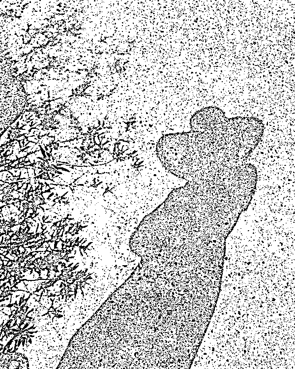

**上升****白羊座****，太阳行进在*4*****宫**

**当下的你需要把精力内收，关注你的心灵，细致地照料身体和饮食起居。**不要让过度自我展现耗散精力。当你试图打开新的格局与篇章时，也尽量避免意气用事，谦卑带来好运。本月的剧烈转化将会关于你的**身份，归属感**，若能让身心柔软、适恰地融入当下，给情绪更宽广的空间和出口，也给自己多一些时间，你会从深邃的意识中找寻到更新的活力与创造意图。

**上升****双鱼座****，太阳行进在*****5*****宫**

当下的你需要**从对虚妄的执迷中挣脱出来，关注当下的发生，投入现实的创造性工作，**或是**单纯地享受生活的滋养，与孩子一起消磨暑假的时光**。把你的心放到当下，就是本月最重要的事。对未来和未知的担忧其实是多余的，因为没有发生的事情都在我们意识的当下。适度去体会他人的感受、出发点，你便不会过度认可危机与灾变性的可能。

**上升****水瓶座****，太阳行进在*****6*****宫**

你正在开始或是准备成为一个生活的勇者、斗士，有很多的智慧和挑战都将迎面而来。为了更漫长岁月的磨砺与拼搏，当下的你最重要的事就是**照顾好你的身体，处理一切健康议题，并规范你的作息起居，保证最充足的精力去实践你的每一个想法。**当下你可能**想要学习更多，也有机会接触到感兴趣的课程，此时专注地投入时间与金钱都是值得的。**当你感受到这股力量是带自己回家，而不是向外消耗时，你便已经在实践自我疗愈。

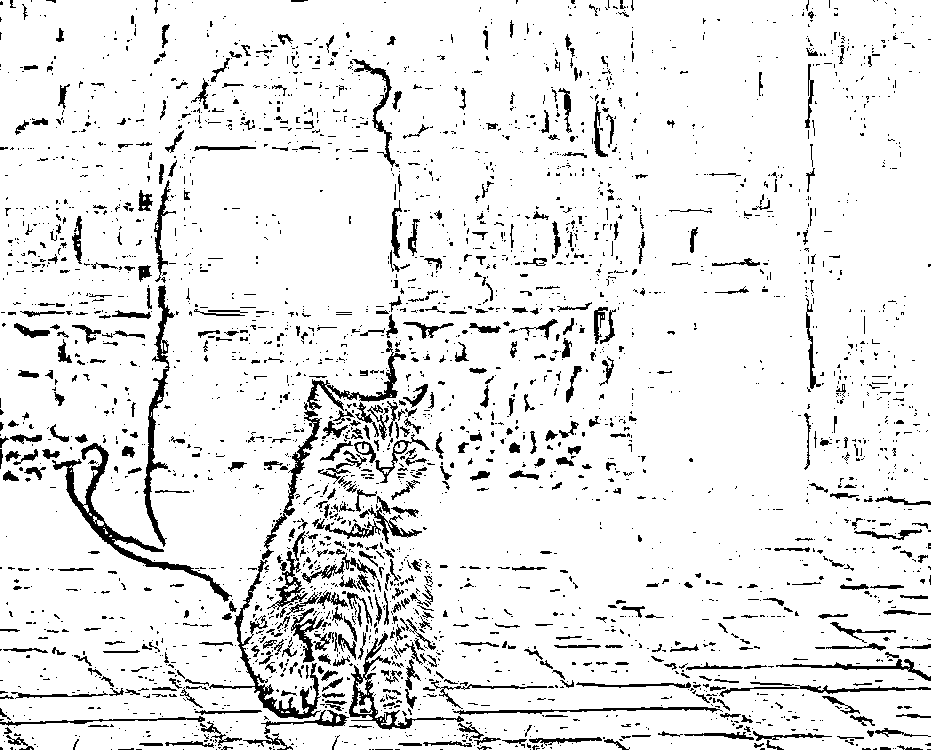

**上升****摩羯座****，太阳行进在*****7*****宫**

也许你长期沉浸大量的内在探索和自我成长，当下你需要**把精力和关注投入到伴侣、亲密关系、合作关系中去。**你的家人、家庭也需要分配些精力去照顾，**家庭中可能迎来些些的变动：新的成员，新的居所或新的资产流动。**此时期也是学习情绪、感受的好时机，自律与严谨需要让步于感性与柔软，尤其面对自己和生命中最重要的人。当你放弃对自身的限制与控制时，你便会感受疗愈的到来如此自然。

**上升****射手座****，太阳行进在*****8*****宫**

当下你值得去**关注身边的资源与危机，把最重要的关系都梳理一遍，适当的沟通和交流能缓解、消除长期以来被忽略的问题和误会。**可能你正享受在全新的创造中，可能在某个新的项目开创期，热情积极投入时也需要适当关注相关的风险。**利益与信任的议题可能出现在 7 月中下旬，权衡的过程就是你重建深层关系与信任的过程，这其中也包括你对自身能力的信任。**

**上升****天蝎座****，太阳行进在*****9*****宫**

此时的你是否有一种完结感？**某种阶段性的结束与落幕，也许有些惆怅、不舍、不满，但无论如何你已经完成某种实验性的过程。**接下来需要更加落地、务实，并保持眼光和高度地前行。如果你在进行内在探索与成长，下半月可能经受意识危机，现象与抽象，真理与道路之间呈现某种剧烈的张力，并为你提供了转化之机。

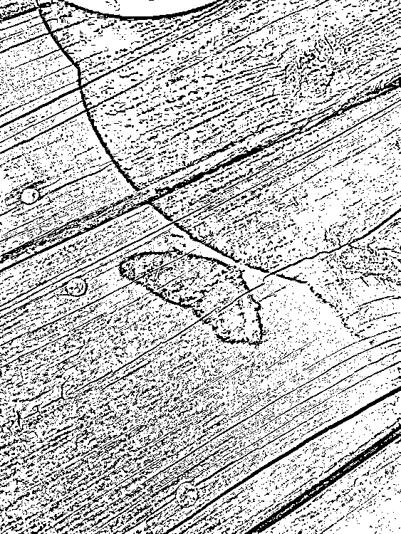

**上升****天秤座****，太阳行进在*****10*****宫**

**你正处在一段收获期，此时可以全力以赴的当然是职场、事业和公众展现**，一些宇宙的良机也在为你铺展开来，同时需要你**唤醒自己内在的勇气，勇敢去相信和承接。**也许一直是内在深层的危机感在督促你奋斗拼搏，但此刻可以短暂庆祝一下，长期深入的功课在当下正在完成新的升级。

**上升****处女座****，太阳行进在*****11*****宫**

**当下的你可以尽情享受团体生活、社交带来的快乐，也能经由集体性的互动带来疗愈与滋养。**与他人互动时多一些主动和自信，能为你建立更多有活力的关系。当下可能是一个极度渴望创造的时期，无论你想创造的是什么，都需静待时日。只有当你完全深入了内在自我的纵深时，那些最具生命力的创造才会展现出来。保持天真与激情，认真在你的生活中就好。

**上升****狮子座****，太阳行进在*****12*****宫**

对于真理和信仰的追寻可能令你的心感受激越难耐，但此时的你**需要一段时间的休息、调养，**让自己在宇宙的游戏中做一个华丽的梦，让身心在这个梦中得以滋养、复元。**此时参与一些灵性活动对你是极其疗愈的，从疗愈中也能重新整合现实的创造力。**若能在幽静的内在道路上跟随黑暗的牵引，便能从寂静中穿透暗藏的情绪，取而代之的将是你赤诚、无畏所散发的光芒。

**版权声明：**原创文章由作者授权首发于若道平台，欢迎转发，反对抄袭。友号转载请申请白名单。

**END**

**郑玮玲**

ISAR（国际占星研究协会）认证占星师（2016 年获得）

若道占星专栏作者

将占星咨询、教学与音乐、舞蹈相结合的疗愈者

**微信号**：zhengviolin

**新浪微博**：@郑玮玲

**微信公众号**：Sampriya-Astrology

长按打赏

**朋友们 夏至快乐！**

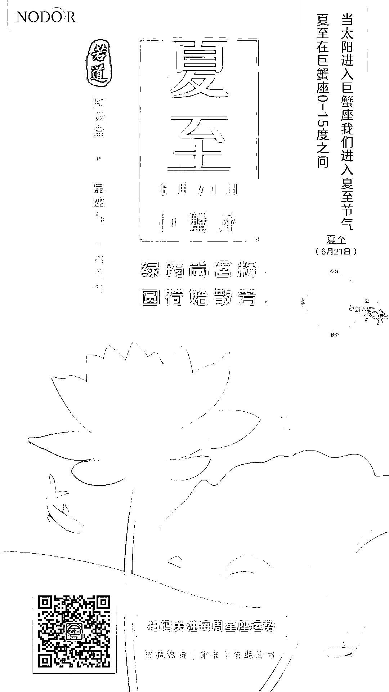

**20 位来自世界各地的占星师****带来 19 场沙龙——新世界的觉醒****详情可点击下图**

**学习占星学****点击下图了解课程详情**

**微信又双叒叕改版啦，不想错过若道君的推送？**
**就把若道设为星标吧！****▼**

**喜欢就点一下“在看”吧！**

********报名直达入口********

# 夏至到来，又可以抽四季牌阵了 | 神话塔罗 APP 四季牌阵咨询开放预约

> 原文：[`mp.weixin.qq.com/s?__biz=MzA5NjA0NTAxNg==&mid=2651477585&idx=2&sn=68bb5098cef68a04d35e3ffecb7d8f35&chksm=8b48e4e6bc3f6df0493895e41a61ed4df30a4e53dc808cc7b4647f5078e0558ce7d4c8cc4bec&scene=126&sessionid=1692737796#rd`](http://mp.weixin.qq.com/s?__biz=MzA5NjA0NTAxNg==&mid=2651477585&idx=2&sn=68bb5098cef68a04d35e3ffecb7d8f35&chksm=8b48e4e6bc3f6df0493895e41a61ed4df30a4e53dc808cc7b4647f5078e0558ce7d4c8cc4bec&scene=126&sessionid=1692737796#rd)

2022 年 6 月 21 日 17:10，我们将正式迎来**夏至**，夏至， 古时又称为——**“夏节”、“夏至节”**这一天太阳进入**巨蟹座**

日北至，

日长之至，日影短至，

故曰夏至。

**至者，极也。**

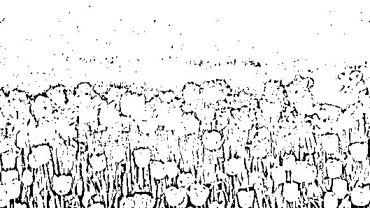

**在这一年中白昼最长****的一天，**

尤其适合来神话塔罗 APP，抽取万众期待、应时应景的牌阵——**四季牌阵(The Four SeasonsSpread )****一年只能使用四次的牌阵**
此牌阵最早出现在塔罗师 Marcia Masino 的 一本叫《*Best Tarot Practices*》 的书中，

此牌阵只能在一年里的 4 天进行占卜：分别是**春分、****夏至**、**秋分**和**冬至**。这 4 天蕴藏着四季的秘密，小小的节气，有大大的能量。是绝佳的日子，让自己看看接下来一个季度的能量趋势。**夏至牌，****展示的是****你从夏至到秋分这一个季度的整体能量趋势，****TA 会告诉你当季的主题，****你的思维计划、行动决策、****人际情感、财务发展。**如果你想要获悉一个季度的整体概况，**把握事业方向**，**感情状况的走向**，**提前了解财务如何发展**，那么四季牌阵能够满足你，它会对你整体的状态有一个相对清晰的展望。当你觉得对目前的状况不甚满意，又不知道该从哪个方向入手去做改变的时候，四季牌阵也可以给你相当多的指引。

**四季牌阵会从五个方面做出能量预报：**

**感情状况、工作财务、**

**拥有的行动力量、思维计划的警示、**

**精神状态与心灵成长。**

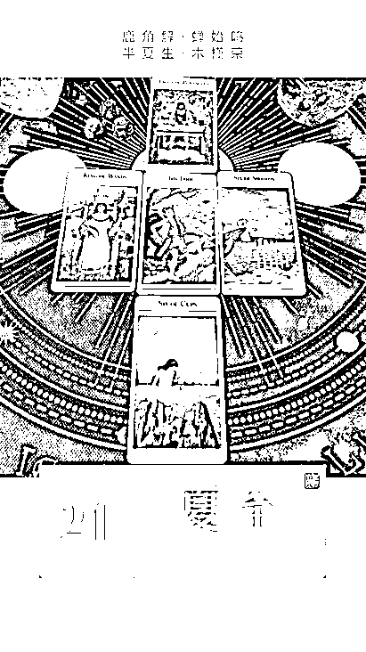

同时占星学中，

这四个节气是太阳换座到四个基本星座

（白羊座、**巨蟹座**、天秤座、摩羯座）

的时间点，意义重大。

因此，无论通过占星还是塔罗，

都是适合做下一个季度能量趋势预报，

完善中短期规划与展望的好时机。

**塔罗作为直觉的能量预报与灵性指引工具，**

**是对占星理性逻辑的分析方法的完美补充。**

用神话塔罗，

让包围你的宇宙能量一目了然，

对着四季塔罗冥想，

让自己度过有意义的夏至这一天。

**夏至日 限量优惠咨询活动**

**预约靠手速，限量****30****人。**

**活动地点**

线上——**若道神话塔罗 app**

**活动主题**

“夏至日—秋分日” 3 个月个人趋势的四季牌阵解读

**公益价格**

**150-300 元/四季牌阵解读**不等 

拼手速

******本次四季牌阵活动，****参与咨询的**

**塔罗师名单目录**

**（排名不分先后）**

**王小闲**

2018 年神话塔罗资质认证班毕业并获得认证证书

2019 年苏·汤普金斯若道核心占星课程学员

*****“塔罗可以带领我们去俯瞰心灵的迷宫，带领我们找到属于自己的那条路。”*****

**源乐**

2018 年神话塔罗资质认证班毕业并获得认证证书

六年的塔罗之旅深度觉照、践行经历，

伴我一次又一次从更高的视野中醒来，

从我以为的“问题”中解套，领悟与道同行的喜悦。

*****“以神话塔罗阿尔卡纳之旅契入，助你拨云见日，开拓新季度新视野。”*****

* * *

**RUO**

2018 年神话塔罗资质认证班毕业并获得认证证书

擅长处理亲密关系、职业发展、个人成长等议题。

帮助客户了解自己当下处境，理清思路。

***“透过一个个有趣的神话故事和生动鲜活的人物照见真实的自己。”***

* * *

**Hazel**

2018 年神话塔罗资质认证班毕业并获得认证证书

咨询经验丰富个案过千例

擅长爱情，事业类塔罗咨询

*****“塔罗占卜的意义往往不仅仅是一个答案，我会和你一起探讨你真正的心之所想。”*****

* * *

* * *

**妖妖**

2018 年神话塔罗资质认证班毕业并获得认证证书

个案类型多样，咨询与持续学习一直是正在进行时

***“神秘的塔罗与希腊神话的结合，揭示了不一样的高阶的人生秘密。”***

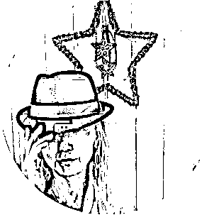

**Jinn**

2018 年神话塔罗资质认证班毕业并获得认证证书

ISAR 国际占星研究协会认证占星师

占星+塔罗，私人定制式咨询方案

***“******占星是逻辑的艺术，塔罗是感受的艺术、**星盘指引路的方向，牌面折射心之所在。”***

**Lisa**

2018 年神话塔罗资质认证班毕业并获得认证证书

丰富的塔罗咨询经验

帮助个案了解自己，解决困惑，

与个案一起深入分析探讨不同的人主题

***“神话塔罗，通过神话故事与个案产生共鸣，引发深思，从而照见内心，听见自己灵魂深处的声音。”***

**Silence**

2018 年神话塔罗资质认证班毕业并获得认证证书

7 年塔罗使用者

咨询风格兼具心理探索和灵性启示

***“塔罗讲述我们内心的故事，理解塔罗就是理解自己。”***

**陈漫**

瑞士库尔酒店管理硕士。

2018 年神话塔罗资质认证班毕业并获得认证证书

专注于塔罗及占星能量分析，个人成长及疗愈。

***“塔罗是一种能量语言，也是一种看待事件和人物的另一个角度。”*** 

**Wenny**

2018 年神话塔罗资质认证班毕业并获得认证证书

擅长亲密关系、职业发展、个人成长等议题的解读。

***“在人生分岔路口，能用塔罗牌为我们当下的每个选择作出指引，成为更好的自己。”***

**Maggie**

2018 年神话塔罗资质认证班毕业并获得认证证书

信息传递者，表述清晰

善于帮助来访者基于塔罗提示深入挖掘背后寓意

***“神话塔罗帮助我们与潜意识对话，透由塔罗牌的寓意指引，我们能够深入探索自己并智慧的去做每一个决定。”***

* * *

**Echo**

2018 年神话塔罗资质认证班毕业并获得认证证书

2021 年神话塔罗认证课程助教

帮你根据当下具体困惑分析下一季度的各个主题

***“神话塔罗通过神话故事投射出案主的个人神话原型，让你通过内在的声音，找到最适合你的洞见。”***

**神话塔罗 APP 中有更多宝藏塔罗咨询师等你预约哦**

**如何预约塔罗师咨询？**最后，一起再来复习一下如何在塔罗 app 上预约咨询服务去若道塔罗 app 上找到**上述咨询师的名字**打开**“四季牌阵”**塔罗服务项目就有机会拍到优惠咨询哦~具体咨询方式如下图（轻击可放大）

最后的最后

**如何更新神话塔罗 APP？**

快去应用市场更新神话塔罗 APP，抽牌&咨询吧～ 

还没有下载或更新的小伙伴

赶紧来看看如何下载和更新吧！

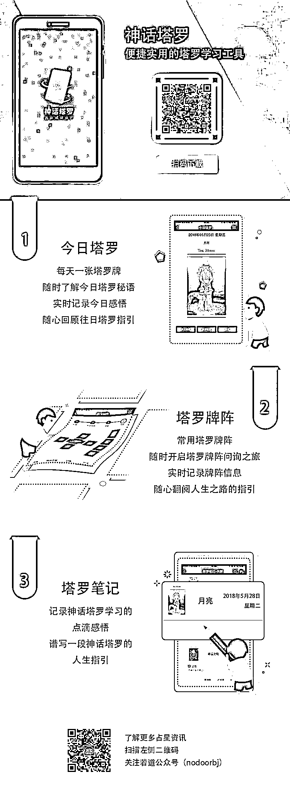

各位亲人小伙伴，一手资讯分享就先到这里吧， 每天有事没事都可以去 app 里转转。如果感到快乐你就用用**神话塔罗 app**，如果你感到不快乐，更要使用由专业人本主义塔罗师团队全程陪伴的**神话塔罗 app**哦！**我们在 6 月 19 日夏至牌阵直播****与你不见不散**

# 关于神话塔罗课程，你想了解的都在这儿

> 原文：[`mp.weixin.qq.com/s?__biz=MzA5NjA0NTAxNg==&mid=2651477585&idx=3&sn=db4bf503750ae954a4bce676bb3018d2&chksm=8b48e4e6bc3f6df05d5cbe254f003adde241cb189cf6e0b94adbfbfeaa8b8b08fa8814dcbd44&scene=126&sessionid=1692737796#rd`](http://mp.weixin.qq.com/s?__biz=MzA5NjA0NTAxNg==&mid=2651477585&idx=3&sn=db4bf503750ae954a4bce676bb3018d2&chksm=8b48e4e6bc3f6df05d5cbe254f003adde241cb189cf6e0b94adbfbfeaa8b8b08fa8814dcbd44&scene=126&sessionid=1692737796#rd)

1

**塔罗牌是什么？**

**它是用来干嘛的？**

塔罗牌是一种**古老的疗愈工具**，同时也是**直观的解惑工具****；**

塔罗牌绕过逻辑思维，**和潜意识联结**，通过图像的方式生动地将隐藏在人类潜意识中的画面浮出水面，**揭示心灵的状况和运作****；**

塔罗牌**帮助我们和潜意识对话**，可以和现代的心理治疗联系在一起，帮助我们**看清心灵的冲突来源、本质和可以选择的道路；**

塔罗使用的过程并不繁琐，通过**“提问、洗牌、抽牌、解牌”**的方式来显现你的潜意识，给予问题明确的分析和建议。

2

**塔罗原理是什么？**

**它为什么这么准？**

塔罗是通往意识的工具，通过图画**帮助我们和潜意识对话**，可以和现代的心理治疗联系在一起，帮助我们**看清心灵的冲突来源、本质和可以选择的道路**。塔罗的心理投射也对应荣格的**“共时性原理”**：看似偶然的事物之间有着必然的联系。塔罗牌又和更广阔的**宇宙生命原型**联结，彰显**个人生命发展的阶段**，将个人**生命挣扎、内在冲突**放在生命进化的道途上，让更广大的生命智慧为个人成长照亮道路。

3

**塔罗预测是什么？**

**它如何帮助我？**

塔罗牌预测的运作就像是**照向心灵的一面镜子**。在塔罗牌解读时，图像的原型性质穿透隐藏的潜意识脉络，反应出与个人境遇相关但又未被了知的知识与洞见，因此**揭示出按照任何理性方式都无法发现的事情**。塔罗可以在你人生各个阶段，基于不同状态，针对具体困惑给予指引的神奇工具，运用古老的智慧工具**解码人生卡点，多维度去看待问题和生命的全貌性，推敲心理动线，更好地梳理生活。**如果你对生命好奇，塔罗学习会帮你**打开一扇通往未来的门**，让你了解**心灵运作和显化的秘密**，同时赋予你更多关于生命成长的支持和指引的能力！

4

**什么是神话塔罗？**

**它和其它塔罗有什么区别？**

神话通过**图像和故事**描绘人类生活的**原型模式**。通过瑰丽的想象、诗意的语言、栩栩如生的人物和故事描绘出我们内心的世界，表达出我们经历的那些实现人性的过程，帮助我们将**个体的生活与人类古老且永恒的故事**建立联结。从而在更深处**理解生命**，并学习**古老而长青的生命智慧**。跟其他塔罗相比，神话塔罗在**塔罗体系**基础上融合了**神话原型、占星原型、心理学原型。**学习、解读、内在成长的**维度更丰富立体。****神话塔罗**取材于**希腊神话**的无尽沃土，通过故事提供一种**记忆辅助**，在心理和预见层面提升解读的**丰富度**。因为这样更符合塔罗牌的性质，符合人类的想象。**按照故事思考，而不是简单的记忆关键词和固定的意义**。

5

**神话塔罗难学么？**

**能不能快速上手？**

神话塔罗认证课程，**不需要任何塔罗、占星、心理、神话基础**，这些知识朱丽叶老师都会在课程中教授，“兴趣是最好的老师，坚持是最大的成功。”塔罗咨询这项门栏不高，却能带来多重回报的“冷门技能”已经被越来越多人发觉，如果你为之心动，不如赶紧行动，初学者在经验丰富的导师教导下学习成果事半功倍，是小白亦能够掌握的课程，只要配合学习进度，不存在学不会的情况**，录播课有专业助教答疑，直播课老师亲自答疑，案例督导，****让你更自信的开展咨询工作，学以致用。**

6

**哪些人适合学神话塔罗？**

**为什么学神话塔罗？**

**1、对塔罗感兴趣的学员**，与其自习研究弯路多多，不如一步到位系统学习；**2、占星咨询师，**可以丰富咨询维度，通过图像更深入的和个案沟通交流；**3、心理工作者**，塔罗牌的原理本身也是心理投射，用于心理辅导是很棒的互动工具；**4、看重授课老师专业水平和能量层级的学员，**神话塔罗创始人亲授，金牌背书；**5、希望更加了解自己和他人内心世界**，想掌握这个疗愈工具自我探索和成长，帮助有困惑的人；**6、成为专业的塔罗师**，想从事这份事业，不论是兼职或全职，增加收入，打造长久稳定抗风险的现金流。

7

**神话塔罗咨询前景？**

**为什么看好它？**

塔罗行业现状鱼龙混杂，有的塔罗爱好者未经过系统学习，无占卜实力，占卜依赖“说明书”一知半解靠运气解读，无法积累实占经验和个人信誉。神话塔罗进入中国市场不久，由创始人亲自教授，**知识体系扎实靠谱，咨询技术纯正丰富，市场认可度高**，让您**无忧起步**，自信的在自我成长过程中成为他人的**塔罗照路人**。有些朋友经过系统的塔罗课程学习后成为**杠杆青年**，将塔罗咨询作为**副业**，无需店面，工作之余在家里就可以进行咨询，多一分收入欣喜满足。也有些学员完成课程后将塔罗咨询发展成**全职事业**，拥有自己的工作室，整合微信、微博、小红书、短视频等自媒体运营，线上线下年收益百万。**疫情环境下，副业刚需**，对于我们未来的事业需要有所规划，而塔罗咨询符合理想职业的所有条件，上手快、无需固定办公地点，是随时随地可接单的自由职业，经营打造属于自己长久稳定可发展的现金流。

8

**神话塔罗认证是什么？**

**如何获得高含金量认证？**

2022 年超高含金量的神话塔罗认证课程强势回归课程内容体系让你**直观精准**的感受**神话塔罗的魅力**扎实的建构**神话塔罗思维****系统**学习**最地道的塔罗知识****联报全阶课程，学成可获得有神话塔罗创始人颁发的****英国神话塔罗认证证书****，也是****若道塔罗毕业证书。****行业内超高含金量双背书。****若道还为塔罗学员开发了****“神话塔罗”APP****，是随身的工具，更是接咨询的平台，****录播课程****学成入驻平台****即可链接更多塔罗个案，发展壮大你的塔罗咨询事业。**

**如果你想学习塔罗，什么样的老师会让你怦然心动呢？她是三副塔罗牌的设计者，写了 6 本塔罗书籍。她研习塔罗四十余年，教授塔罗三十余年，是丽兹·格林的密友。还有****谁会比塔罗牌设计者更了解塔罗的历史、灵魂与精髓？****所以，这将是你开启塔罗之旅最坚实的一步。**

9

**你将跟随哪位大师学习神话塔罗？**

**我的老师是谁？**

****

**朱丽叶·沙曼-伯克** 

*   她是**3 副塔罗牌**的**设计者****——**神话塔罗牌、沙曼–卡塞利塔罗牌、“自己着色”塔罗牌；

*   她出版了**6 本塔罗书****——**《塔罗全书》、《新塔罗全书》、《众星的传说》、《理解塔罗牌》、《精通塔罗牌》、《塔罗初学者指南》；

*   她研习塔罗**四十余年；**

*   她教授塔罗**三十余年**；****

*   她是**丽兹·格林**的密友，两人合著了**《神话之旅》**，共同设计了**神话塔罗牌**。

*   她是认证的**心理治疗医师；**

*   她深谙**塔罗、占星学、心理学和神话学。**

**如果你想成为拥有英国神话塔罗认证的塔罗师**

那么她，就是你**最好的老师人选**

10

**神话塔罗认证课程的课程结构？**

**怎么上课？**

课程中老师传授**将神话、占星、心理学完美融合进塔罗**的人本主义咨询体系，并进行**学员案例督导**，让你更自信的开展咨询工作，学以致用。

本期认证课程采取**即报即学的录播课+案例督导直播课**的形式，

*   **18 节录播课：**精编剪辑，随来随学，助教答疑，学练结合。

*   **8 节直播课：**融会贯通，神话心理，塔罗占星，咨询技巧。

为了适配大家的各种学习场景，提高学习&复习效率，我们还将**录播课**剪辑了**中文字幕版**和**翻译音频版**：

*   **中文字幕版：**朱丽叶老师英文原声配中文字幕，适合在手机或电脑前专心致志的学习。

*   **翻译音频版：**翻译老师幼婷的中文原声纯享，适合运动、通勤路上耳机里陪伴式学习。

11

**神话塔罗认证课程报名流程**

**怎么报名？**

**报名流程如下：****1、报名****添加课程顾问，报名，交学费，进入学员群，邮寄学习工具。****2、开始学习****成功报名，18 节录播课程立即开通，学习过程有困惑可在 APP 内提问，有专业助教答疑，8 节直播课 8 月 10 日开课，录播课和直播课都是朱丽叶·沙曼-伯克老师亲授。****3、入驻平台****学习完录播课程，即可提交咨询案例申请入驻咨询平台。****4、结业证书**学习完直播+录播课程，提交毕业咨询案例，朱丽叶老师批阅通过，即可获得**神话塔罗认证证书。**

12

**具体在神话塔罗认证课程中学习什么？**

**课程大纲**

**录播课（即报即学）**

**☆****初阶：神话塔罗详解**

**神话故事和预测意涵**

**第 1 讲 塔罗牌介绍 ，讲述它的历史 （中文字幕版）**

**第 1 讲 塔罗牌介绍，讲述它的历史（翻译音频版）**

**第 2 讲 星座形态、元素和宫廷牌&基本星座与基本国王 （中文字幕版）**

**第 2 讲 星座形态、元素和宫廷牌&基本星座与基本国王（翻译音频版）**

**第 3 讲 固定星座与固定王后（中文字幕版）**

**第 3 讲 固定星座与固定王后（翻译音频版）**

**第 4 讲 变动星座与变动骑士（中文字幕版）**

**第 4 讲 变动星座与变动骑士（翻译音频版）**

**第 5 讲 小阿尔卡那牌权杖（中文字幕版）**

**第 5 讲 小阿尔卡那牌权杖（翻译音频版）**

**第 6 讲 小阿尔卡那牌圣杯（中文字幕版）**

**第 6 讲 小阿尔卡那牌圣杯（翻译音频版）**

**第 7 讲 小阿尔卡那牌宝剑（中文字幕版）**

**第 7 讲 小阿尔卡那牌宝剑（翻译音频版）**

**第 8 讲 小阿尔卡那牌星币（中文字幕版）**

**第 8 讲 小阿尔卡那牌星币（翻译音频版）**

**第 9 讲 经典牌阵教学讲解（中文字幕版）**

**第 9 讲 经典牌阵教学讲解（翻译音频版）**

**第 10 讲 牌阵解读案例演示（中文字幕版）**

**第 10 讲 牌阵解读案例演示（翻译音频版）**

**☆****中阶：神话塔罗牌阵应用**

**神话****解读和咨询技巧**

**开启神话塔罗愚人之旅**

****

**第 1 讲 愚人、魔术师、女皇、皇帝（中文字幕版）**

**第 1 讲 愚人、魔术师、女皇、皇帝（翻译音频版）**

**愚人**：永恒的少年（儿童的原型）

**魔术师**：恶作剧者、老师、向导、沟通者的原型；行星：水星。

**女王**：母亲、养育者、丰产的原型；行星：金星在金牛座；小行星：谷神星。

**皇帝**：父亲、供养者、计划者的原型；行星：木星。

**第 2 讲 女祭司、教皇、恋人、战车、正义、节制（中文字幕版）**

**第 2 讲 女祭司、教皇、恋人、战车、正义、节制（翻译音频版）**

**女祭司**：处女——等待被实现的潜力原型；行星：新月。

**教皇**：疗愈者、受伤的疗愈者、牧师的原型，牧师是神与人之间的灵性桥梁；行星：凯龙星。

**恋人**：爱、爱人、所爱之人的原型；行星：金星在天秤座。

**战车**：战争、冲突、战士、斗士的原型；行星：火星。

**正义**：智慧、兵不血刃的胜利的原型；星座：处女座；小行星：智神星。

**节制**：关系、合作的原型；星座：巨蟹座、双鱼座。

**第 3 讲 力量、隐士、命运之轮、倒吊人、死神（中文字幕版）**

**第 3 讲 力量、隐士、命运之轮、倒吊人、死神（翻译音频版）**

**力量**：力量的原型；星座：太阳在狮子座。

**隐士**：晚年、耐心的原型；行星：土星。

**命运之轮**：命运女神与命运的原型。

**倒吊人**：牺牲与有意识的牺牲的原型；行星：海王星。

**死神**：死亡、终点和起点的原型；行星：冥王星。

**第 4 讲 恶魔、高塔、星星、月亮、太阳（中文字幕版）**

**第 4 讲 恶魔、高塔、星星、月亮、太阳（翻译音频版）**

**恶魔**：阴影、人类不文明的面向、本能、欲望天性；行星：火星在天蝎座。

**高塔**：改变、分裂瓦解的原型；行星：天王星。

**星星**：希望的原型。

**月亮**：无意识的原型；行星：暗月。

**太阳**：意识、创造力和文明的原型；行星：太阳。

**第 5 讲 审判、世界（中文字幕版）**

**第 5 讲 审判、世界（翻译音频版）**

**审判**：复活、新生的原型；行星：水星作为灵魂向导普绪科蓬波斯。

**答疑与讨论，学员们分享对自己或客户的塔罗解读，对神话塔罗牌进行更多探讨。**

**世界**：整体、完成和个性化的原型。

**第 6 讲 经典牌阵教学讲解（中文字幕版）**

**第 6 讲 经典牌阵教学讲解（翻译音频版）**

**第 7 讲 咨询案例演示：为一位年轻女性所做的四次解读（中文字幕版）**

**第 7 讲 咨询案例演示：为一位年轻女性所做的四次解读（翻译音频版）**

**第 8 讲** **引导式冥想、荣格的四种意识功能（中文字幕版）**

**第 8 讲 引导式冥想、荣格的四种意识功能（翻译音频版）**

**☆****高阶：神话塔罗直播督导课**

**第 1 讲 塔罗牌中的荣格原型**

**2022 年 8 月 10 日（周三）**

我们将学习荣格是如何理解原型，以及荣格原型如何反映在塔罗牌中。对塔罗牌解读而言，理解原型的普遍性非常有帮助，因为这有助于塔罗咨询师碰触客户的内心世界。

**第 2 讲 塔罗牌是如何与行星原型和其原型体验联系在一起**

**2022 年 8 月 24 日（周三）**

大阿卡纳牌反映了行星神祗的原型，在某些情况下，原型经验意味着它们反映了所有人类的经验。我们将通过这个角度看这些大阿卡纳牌。我们将看到理解原型对解读有何帮助。

**第 3 讲 荣格意识的四种功能与小阿卡纳牌的四种元素及与权杖、星币、宝剑、圣杯四套牌之间的联系**

**2022 年 9 月 7 日（周三）  **

我们将看看小阿卡纳从 1 到 10 如何反映荣格意识功能的各个方面，以及它们如何反映在四套牌四个元素和其心理方面。我们还将对 1-10 的数字学进行修正，看它们在元素中的表现方式。

**第 4 讲 占星学中的 12 星座和宫廷牌之间的联系**

**2022 年 9 月 21 日（周三）**

我们将讨论形态和星座，以及它们如何反映在宫廷牌上。

**第 5 讲 马蹄牌阵学员案例督导**

**2022 年 10 月 19 日（周三） **

**第 6 讲 六芒星牌阵学员案例督导**

**2022 年 11 月 2 日（周三） **

**第 7 讲 凯尔特十字学员案例督导**

**2022 年 11 月 16 日（周三） **

****

**第 8 讲 三个牌阵学员完整案例督导**

**2022 年 11 月 30 日（周三）**

**认证阶段：考试论文**

录播课学习完毕，即可入驻若道神话塔罗 APP，以实习塔罗师获得推广流量，对接塔罗咨询个案。

直播课+录播课学习完毕，提交考试论文通过即可获得获得英国神话塔罗认证证书，升级为认证咨询师。

**入驻塔罗平台**

13

**适合人群**

*   塔罗初学者，完全没有塔罗基础；

*   塔罗自学者，也曾上过塔罗工作坊，但仍不懂如何使用塔罗牌；

*   塔罗进阶学习者，有塔罗基础，了解 78 张塔罗牌含义；

*   不知如何解决遇到的情感困惑、职业选择、人际问题，对人生感到迷茫；

*   想要学习深入解读塔罗牌、牌阵的使用、咨询技巧等将塔罗运用于咨询实践；

*   想要深入了解和学习塔罗，希望成为专业的塔罗师；

*   想要借助塔罗进行心灵、灵性成长。

14

**导师简介**

**朱丽叶·沙曼-伯克**

**朱丽叶·沙曼-伯克**从 20 世纪 70 年代早期开始，就对塔罗牌产生了兴趣，并踏入了塔罗的世界。后来，在丽兹·格林的鼓励下，开始研习心理占星学和塔罗。

1984 年，第一本书《**塔罗全书**》（*The Complete Book ofTarot*）出版。之后，与丽兹·格林合作设计并撰写了《**神话塔罗**》（*The Mythic Tarot*），在这本书中，她们将古希腊神话与传统塔罗解读结合起来。朱丽叶写了**十本塔罗和占星学书**，包括一本名为《众星的传说》（*Stories from the Stars*）的儿童读物，以及与丽兹·格林合著的《神话之旅》（*The Mythic Journey*），这是一本详细讲述如何运用神话来指导生活的书。

15

**课程价格**

**认证课程总价：****22000 元**

**联报优惠价：****19000 元**

**限时转发优惠价：18000 元（联系 Echo 老师，获取限时转发优惠价）**

长按二维码添加客服 Echo 老师

9

**退转课程**

*   **退款原则请详看《教学协议》，如有疑问请咨询课程顾问。**

**神话塔罗认证课程**

**授课老师：朱丽叶·沙曼-伯克**

**授课时间：录播课即报即学，直播课 2022 年 8 月 10 日起**

**授课方式：**网络课程**，**英文授课，中文翻译

**费用：****认证课程总价：****22000 元；****联报优惠价：****19000 元；****限时转发优惠价：18000 元**（联系 Echo 老师，获取限时转发优惠价）

**课程负责人：Echo 老师**（微信/手机：nodoor18518412824，请备注“神话塔罗”）

长按二维码添加课程负责人咨询~

****报名请点击“阅读原文”****

# 神话塔罗之大阿卡纳牌｜节制

> 原文：[`mp.weixin.qq.com/s?__biz=MzA5NjA0NTAxNg==&mid=2651477585&idx=4&sn=8a394e13a5486a9da3da7313e88ae698&chksm=8b48e4e6bc3f6df0676dd0923c7db26474d733a9b2226b04531647a5f83bc460f33a141eb103&scene=126&sessionid=1692737796#rd`](http://mp.weixin.qq.com/s?__biz=MzA5NjA0NTAxNg==&mid=2651477585&idx=4&sn=8a394e13a5486a9da3da7313e88ae698&chksm=8b48e4e6bc3f6df0676dd0923c7db26474d733a9b2226b04531647a5f83bc460f33a141eb103&scene=126&sessionid=1692737796#rd)

作者/朱丽叶·沙曼-伯克 丽兹·格林

译者/闫东升 编辑/玫瑰 图片/神话塔罗 网络

本文节选自《神话塔罗》

十九世纪中叶，法国神秘主义者艾利冯斯·里维借鉴了三世纪犹太人的魔法测试——Sefer Yetsirah（形成之书），发展出一套塔罗解牌体系，通过不同牌面的组合反应出的意义变化来解读。这一创造性的发明，预示着现代塔罗牌的诞生。走过了正义女神雅典娜，迎接我们的伊瑞斯会是一个怎样的女神呢？今天就来解读大阿卡纳牌——节制。

、

[🔈 神话塔罗·节制](https://res.wx.qq.com/voice/getvoice?mediaid=MzA5NjA0NTAxNl8yNjUxNDc3NTgz)

**｜**朗读者小巫

**书名：**

神话塔罗 

**作者：**

朱丽叶·沙曼-伯克   丽兹·格林 

**出版日期：**

2011-08-02

节制对应的希腊神祗
**伊瑞斯·彩虹女神****彩虹女神**

这张牌的牌面描绘的是一位拥有一头黑色长发的美丽年轻女子，穿着彩虹般七彩的长袍，背上的一对翅膀也是七彩的。她站在一条清澈的河流旁，一只脚站在岸上，一只脚踏在河流中，身边的河床上紫色的鸢尾花正在盛放。

有一条美丽的彩虹在她身后伸展开去。她的双手握着两个杯子，一个是金色的，一个是银色的，她正在把一个杯子的水倾倒入另一个杯子中。

> **雨过天晴后阳光下的彩虹**：象征着关系中的承诺和重生。彩虹也是尘世和天堂之间的桥梁，因此也反映着它们的关系。 **水和土的不同特质以及盛开的鸢尾花**：反映出她有能力在个体的内在整合这两者。 **金色和银色的杯子**：象征着太阳和月亮、阴性和阳性、意识和潜意识，它们被流动的情感结合在了一起。

**天堂与尘世的桥梁**

在这里我们遇到了彩虹女神伊瑞斯（*Iris*），她也是神界皇后赫拉（*Hera*）的信使。神话中和伊瑞斯相对应的是宙斯的使者赫尔墨斯（*Hermes*），众神和人类都因为伊瑞斯的友好和爱心而喜欢她。

如果赫拉或宙斯希望人类知道他们的某些想法，伊瑞斯就会飘然飞入尘世，化作人形或以她原本的女神面貌现身，她的原貌是长着一对翅膀的美丽女神。

有时候她就像其配偶——西风之神塞菲勒斯（*Zephyrus*）一样，转瞬消失在空气中；有时候她又沿着彩虹翩然而下，在天空和大地之间架起一道桥梁。即使在水中，伊瑞斯也和在空气中一样穿行无碍。

当宙斯要求她传递讯息的时候，地狱的大门也会为她打开，她用冥河之水盛满金色的圣杯，意即把冥河之水象征的被恐怖的诅咒缠绕的不朽神性纳入其中。

当众神从旅程中返回到奥林匹斯山的时候，伊瑞斯会帮他们从战车上解下战马，并奉上芬芳的甘露和甜美的食物。伊瑞斯不仅是赫拉的信使，还经常帮助赫拉实施复仇的计划（虽然她在大部分时候给予的都是帮助和关怀）。她在赫拉身边无微不至地照顾她的衣食住行，没事的时候就夜以继日地在她的宝座旁悄然而立。有一些版本的神话中认为伊瑞斯孕育了爱神埃洛斯（*Eros*），而不是阿弗洛狄忒（*Aphrodite*）。**两极间不断变动的情感**

**从内在的层面来看，彩虹女神伊瑞斯的意象是愚人要成长为稳定的个体所必须学会的第二种特质或才能：适度和均衡。**

**正义之神雅典娜（*Athene*）代表的是公平和客观，而伊瑞斯呈现出来的是节制，以友好和仁慈的态度面对一切，伊瑞斯的同情心里面没有脆弱、痛苦和多愁善感的部分。**

伊瑞斯的意象和情感（*feeling*）有关，不是人们常说的情绪（*emotion*），情绪是对境遇的本能反映，而情感则意味着一种活跃的、明晰的选择能力。

**情感能够在矛盾的两极之间架起一道不断变化的桥梁，可以敏锐地呈现出某种境遇中想要达成最终的关联与和谐的需求**。神话中伊瑞斯不断地把水在金色和银色的圣杯之间倒来倒去，这意味着情感必须根据每时每刻的需求不断地流动和更新。

雅典娜的道德戒律是普世性的，而且要非常稳固，而伊瑞斯均衡和谐的目标则需要情感上不断地变动和调整，有时候是积极的，有时候是消极的。**但是最终伊瑞斯所服务的领域属于阴性而非阳性，无论情感变动的状态如何，即使是愤怒和冲突，其目标都是和谐、合作和更好的联结。**我们通常不认为情感和理性思维一样属于智力范畴。正义牌和节制牌的关系是对立又互补的。雅典娜和伊瑞斯是一对矛盾的意象，雅典娜从父亲的头部出生并为他服务，而伊瑞斯则是属于皇后的阵营；前者高举抽象真理的大旗，为此宁可舍弃个人的情感，而后者则可以为了个人的情感而放弃抽象的真理。

这两位女神在神话中并不是敌人，因为伊瑞斯不是任何人的敌人，但是她们可能在我们的内心对抗着彼此，因为她们常常在一个问题上给予我们对立的解决方案。我们到底是根据理性的思维做决定，还是根据情感的需要去维护关系？

这两个意象在大阿卡纳牌中出现的顺序告诉愚人——也就是我们每个人，必须要整合两者。

我们需要通过雅典娜去学习理性的思考，然后遇到彩虹女神伊瑞斯时，必须学会体味细微的情感变化和它的目的，同时还要记得它并不等同于狂暴的情绪反应和做作的多愁善感。

即使是彩虹女神伊瑞斯，也有其矛盾的两面性。不断在两极间变动的情感，其目的是为了保护关系，但它有时候也可能会造成淤塞，因为完全由强烈的情感主导时，关系中的人们就没有了喘息的机会。

没有不同的观点、没有冲突、不能对等的交谈都会破坏关系，太过想要和谐就失去了成长的空间。

只有和谐的关系中是没有分离的空间的，因为分离需要独立的状态。伊瑞斯作为众神和人类的朋友，忙碌于生活的方方面面，她必须为别人提供服务，所以失去了自己的权利。

**因此，节制牌如果没有正义牌的制衡，就会终将变为一潭死水，没有变化和冲突的地方，百无聊赖就会把智力扼杀。**

**节制，和谐与合作的力量**

**从解牌的角度来看，节制牌的出现暗示着一段关系中需要情感的流动。**彩虹女神伊瑞斯意味着和谐与合作的力量，其结果是良好的关系（包括婚姻）。

我们都需要发展出均衡与和谐的心性，当然通过这个挑战并不意味着完满，愚人不可以和美丽的女神伊瑞斯永远在一起，下一个“美德”的挑战还在等待着他。

**版权声明：**本文由《自在园》授权发布，欢迎转发，反对抄袭。友号转载请申请白名单。

**END****朱丽叶·沙曼·伯克**从 20 世纪 70 年代早期开始，就对塔罗牌产生了兴趣，并踏入了塔罗的世界。后来，在丽兹·格林的鼓励下，开始研习心理占星学和塔罗。1984 年，第一本书《塔罗全书》（The Complete Book ofTarot）出版。之后，与丽兹·格林合作设计并撰写了《神话塔罗》（The Mythic Tarot）。朱丽叶写了十本塔罗和占星学书，包括一本名为《众星的传说》（Stories from the Stars）的儿童读物，以及与丽兹·格林合著的《神话之旅》（The Mythic Journey），这是一本详细讲述如何运用神话来指导生活的书。

**点击下图了解课程详情** 

**微信又双叒叕改版啦，不想错过若道君的推送？**
**就把若道设为星标吧！****▼**

**喜欢就点一下“在看”吧！**

********报名直达入口********

# 神话塔罗之大阿卡纳牌｜力量

> 原文：[`mp.weixin.qq.com/s?__biz=MzA5NjA0NTAxNg==&mid=2651477585&idx=5&sn=762787fdd2403c92460e6490da354126&chksm=8b48e4e6bc3f6df051709881420443a22eca366e49d39d585043c48a962733f3b1e42740f759&scene=126&sessionid=1692737796#rd`](http://mp.weixin.qq.com/s?__biz=MzA5NjA0NTAxNg==&mid=2651477585&idx=5&sn=762787fdd2403c92460e6490da354126&chksm=8b48e4e6bc3f6df051709881420443a22eca366e49d39d585043c48a962733f3b1e42740f759&scene=126&sessionid=1692737796#rd)

作者/朱丽叶·沙曼-伯克 丽兹·格林

译者/闫东升 编辑/玫瑰 图片/神话塔罗 网络

本文节选自《神话塔罗》

神话塔罗牌根据文艺复兴时期艺术家和作家们喜爱的希腊诸神，通过重新设计牌面，让塔罗牌恢复其原始的质朴性和普及性。力量牌的设计就源自于大力士赫拉克勒斯征服猛狮的希腊神话。今天就来解读大阿卡纳牌——力量。

[🔈 神话塔罗·力量](https://res.wx.qq.com/voice/getvoice?mediaid=MzA5NjA0NTAxNl8yNjUxNDc3NTg0)

**｜**朗读者小巫

**书名：**

神话塔罗 

**作者：**

朱丽叶·沙曼-伯克   丽兹·格林 

**出版日期：**

2011-08-02

力量对应的希腊神祗**赫拉克勒斯·大力士****所向披靡的大力士**

力量牌描绘的是一个强壮有力的男人，长着一头栗色卷发，身上只围了一条红色的腰布。他正在和一头雄狮搏斗，用他强壮的手臂紧紧夹住它的喉咙，画面显示出这个男人此时正处于赢得角逐的关键时刻。

搏斗现场的四周是一个布满岩石的黑暗山洞，从远处的洞口望去，外面是棕色的山峦，贫瘠而荒凉。

> **赫拉克勒斯（*Heracles*）赤手空拳和雄狮搏斗**：没有使用任何工具，也没有任何辅助，只有他自身的资源。 
> 
> **赫拉克勒斯身穿的腰布是血红色的**：血红色属于战神阿瑞斯，我们在战车牌中遇见过他，这说明愚人已经学会了运用侵略性，因此可以有创造性地利用它了。 
> 
> **阴暗的山洞**：象征着潜意识的黑暗，其中隐含着原始的本能，日常的意识无法看到它。

**征服刀枪不入的尼米亚巨狮**

力量牌中的勇士是赫拉克勒斯，罗马人称他为海格力斯（*Hercules*），是神话中所向披靡的英雄人物。他是众神之王宙斯（*Zeus*）和人类女性阿尔克墨涅（*Alcmene*）的儿子。

和往常一样，宙斯的妻子赫拉（*Hera*）对于丈夫和阿尔克墨涅通奸并生出儿子的事情妒火中烧，决定给予这个孩子非常严重的惩罚。 

她用手段逼疯了赫拉克勒斯，疯狂的赫拉克勒斯又在无意间杀死了自己的妻子和孩子。

他清醒以后极度悔恨，祈求神灵给予他赎罪的机会，来自特尔斐的神谕命令他去给邪恶的国王欧律斯透斯（*Eurystheus*）完成十二个艰苦的任务，这也是赫拉最想看到的结果。

就这样，所向无敌的英雄心甘情愿地成为了女神的仆人，而这个女神却是他所犯罪行的始作俑者。

国王欧律斯透斯要求赫拉克勒斯去完成的第一个（也是最著名的）任务是征服尼米亚猛狮（*Nemean Lion*），这头巨狮身上的皮毛是刀枪不入的，它几乎吃光了附近的人们，所以赫拉克勒斯找不到人询问它的老巢在哪里。

经过很长时间的寻觅，他终于找到了身上还沾满猎物血迹的狮子。赫拉克勒斯先是对着它射出一箭，却没有对巨狮造成分毫的伤害。他又尝试用刀剑和棍棒攻击，结果自然也是铩羽而归。

巨狮躲进了一个有两个出口的山洞里，赫拉克勒斯用网堵住了其中一个洞口，自己则从另一个洞口钻了进去，搏斗中巨狮咬掉了他的一个手指头，而他则成功地用双手牢牢地掐住巨狮的喉咙，直到它死去。

赫拉克勒斯利用狮子锋利的爪子剥掉了它的皮，制作了一套盔甲穿戴在身上，于是他获得了巨狮刀枪不入的能力。

**与原始的动物性同行**

**从内在的层面来看，赫拉克勒斯和尼米亚巨狮搏斗的意象，反映出每个人内在强大和原始的动物性一面带来的问题，但是我们不能消灭它，因为它也是我们的创造力和生命力。**

狮子是一种特别的动物，它象征的心理面相和战车牌中顽固的战马并不相同。狮子在神话中一直和皇权有关，即使在它最有破坏性的时候，也反映着人们独特个体性中幼稚的、原始的自我中心特质。

尼米亚巨狮并不完全是邪恶的，它刀枪不入的皮毛能够让人们战无不胜，这种特质反映出人们内在的某种恒久性，它来自于一个稳固的“我（*me*）”的感觉。

当我们披上被我们征服的巨狮的皮毛时，外界的一切都会变得渺小，因为我们内在拥有了坚不可摧的自我身份认同。 

当巨狮的力量还处于原始和邪恶的动物性状态时，它的正面力量就还是潜在的，没有被发挥出来。

“唯我独尊”的这一面驱动着人们毫不留情地摧毁着欲望之路上的所有事物，从而获得自我的满足。暴怒是它的一种表现形式，在很多人生境遇中，怒火都带来负面的结果，它不管是非对错，只是不顾一切地摧毁满足欲望的任何阻碍。

自大也是它的一种表现形式，自大和自尊不同，它夸大和膨胀了自我的重要性，使我们失去该有的明智，幼稚和冷酷地对待那些我们必须依赖的事物。巨狮的意象在很多层面上都像我们内在那个愤怒的婴儿，要求世界围着我们打转，只要碰到任何反对和阻抗就盲目地攻击和破坏。如果我们征服了这头巨狮，就会获得它神奇的皮毛，用心理学的术语说，**就是把动物性的生命力整合到意识中，让它为有意识和负责任的自我服务。****因此，赫拉克勒斯和巨狮搏斗的目的是征服，而不是杀戮，这是一个转化的过程，使动物性的力量和欲望以人类的方式表达出来**。这就是力量牌所象征的矛盾性，赫拉克勒斯不能杀死巨狮，因为杀戮并不会带来任何好处。我们每个人内在都有赫拉克勒斯的黑暗面，意即一味压抑动物性的本能，而不是去转化它，这样做的后果就是在我们心灵的外面形成了一个坚硬的壳子，没有了愤怒，没有了热情，也没有了真正的自我身份。**力量，内在的勇士**

**从解牌的角度来看，力量牌出现的时候，暗示着当事人需要和内在的狮子正面交锋，他（她）要用创造性的方式面对自己内在的愤怒和自大**。

勇气、力量和自律在这时都是非要必要的。通过此时的人生境遇，当事人可以和自己内在的动物性相遇，同时也能看到内心的赫拉克勒斯，他是每个人都拥有的内在勇士，认同他就可以征服巨狮。

愚人在发展出理智和情感的能力后，现在要学习面对自己凶猛的自我主义了，如果赢得了这场搏斗，他就能够用信任和正直去面对自己和他人。

**版权声明：**本文由《自在园》授权发布，欢迎转发，反对抄袭。友号转载请申请白名单。

**END****朱丽叶·沙曼·伯克**从 20 世纪 70 年代早期开始，就对塔罗牌产生了兴趣，并踏入了塔罗的世界。后来，在丽兹·格林的鼓励下，开始研习心理占星学和塔罗。1984 年，第一本书《塔罗全书》（The Complete Book ofTarot）出版。之后，与丽兹·格林合作设计并撰写了《神话塔罗》（The Mythic Tarot）。朱丽叶写了十本塔罗和占星学书，包括一本名为《众星的传说》（Stories from the Stars）的儿童读物，以及与丽兹·格林合著的《神话之旅》（The Mythic Journey），这是一本详细讲述如何运用神话来指导生活的书。

**点击下图了解课程详情** 

**微信又双叒叕改版啦，不想错过若道君的推送？**
**就把若道设为星标吧！****▼**

**喜欢就点一下“在看”吧！**

********报名直达入口********

# 上证指数强劲上涨，追吗？？丨梅里曼 7 月黄金+上证指数报告上线！

> 原文：[`mp.weixin.qq.com/s?__biz=MzA5NjA0NTAxNg==&mid=2651477281&idx=3&sn=65ddd3e71ea11fbb78a1f51685d17483&chksm=8b48e796bc3f6e8034c6cfc8e0ac35cf8bda531ab58cb216c2003cd11cc20197333775a5d0ec&scene=126&sessionid=1692737796#rd`](http://mp.weixin.qq.com/s?__biz=MzA5NjA0NTAxNg==&mid=2651477281&idx=3&sn=65ddd3e71ea11fbb78a1f51685d17483&chksm=8b48e796bc3f6e8034c6cfc8e0ac35cf8bda531ab58cb216c2003cd11cc20197333775a5d0ec&scene=126&sessionid=1692737796#rd)

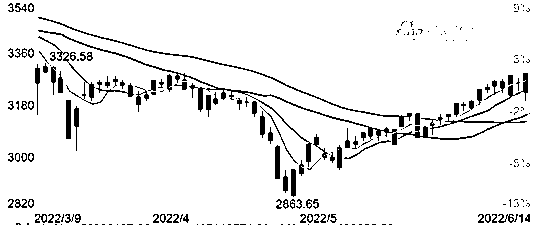

| 上证指数日 K 线

在上个月，我们认为，4 月 27 日应该是一个政策底。梅里曼老师在 5 月的报告也预告：**“如果上证综指要重现始于 2019 年 1 月的看涨趋势，那么它必须在 5 月之内触底。”**同时，他在 6 月的报告中说：**“如果 4 月 27 日是 33 个月周期的底部，那么可以判断至少未来 2-8 个月是看涨的。” **当然，这个判断是基于 4 月 27 日是上证 33 月周期的底部。因为还有另外一个可能性，即 2021 年 7 月 28 日的低点 3312 是 33 个月周期的底部，而目前上证是在一个熊市的下跌周期中。

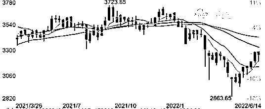

| 上证指数周 K 线

5 月上证指数没有继续下跌，一路上涨，6 月上证指数也是在上涨通道。一些股票的涨幅超过 50%。更加引入注目的是，这是在美国股票市场近期大跌的背景下。我们在美国股市的大跌下，走出独立行情。

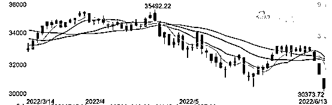

| 道琼斯指数日 K 线

**所以，可以确认 4 月 27 日的这个底部是 33 个月周期的底部了吗？7 月报告告诉你。**如果你还没有买入，正在感受踏空的苦恼，在如此强劲的上涨中，你是应该现在入场，还是等一个回调？如果你已经买入，是继续持股，还是落袋为安？7 月股市应该如何操作，金融占星大师雷蒙德·梅里曼的《2022 年 7 月上证指数报告》已上线，你可以听听梅里曼老师的看法。**《2022 年 7 月黄金报告》也已上线，欢迎购买。**

**也欢迎参加雷蒙德·梅里曼《2022 下半年金融占星投资沙龙》，将帮助你对 2022 年下半年的市场风云变化加深了解。**

**扫描下图二维码了解详情**

▼

**投资有收益，投资有风险，希望金融占星学的研究帮助你更好地评估你的投资。**

**7 月上证报告上线**

**上证指数月度报告价格****单月报告**：280 元/月 **季度套餐价格**：780 元（260 元/月）**年度套餐价格**：2400 元（200 元/月）**双报告年度套餐更优惠（直降 900 元）****12 个月黄金报告+12 个月上证指数报告：仅需 3900 元****长按下图识别二维码购买上证指数报告**
▼

“**黄金是金钱。其他的只是信贷。**

**——约翰·皮尔庞特·摩根**

”5 月份美联储加息 50 个基点，并表示将会在 6 月和 7 月的会议上讨论是否继续加息。美联储主席鲍威尔最近在对一位记者的简短回答中强调：“最终，最痛苦的事情会是如果我们未能应对，通胀将长期处于根深蒂固的高水平。”因此，未来的加息可能持续。德意志银行经济学家 Peter Hooper 表示，美联储可能需要将短期利率推高至 5%，这将是自 2007 年以来的最高水平，远高于目前的 0.75%-1%区间。然而加息也带来对经济的担心，尽管美国就业率非常强劲，但一些影响已经显现，比如 4 月份新屋销售暴跌，跌势创近九年来之最。而一些在过去 2 年非常强劲的大科技公司开始裁员。从 Jamie Dimon 和马斯克到家具零售商 RH 的负责人 Gary Friedman 上周都警告投资者：要警惕经济走下坡。经过几个月的强劲消费支出和供应链改善，美国一些最有话直说的企业领导人开始加大力度针对几十年来最高的通货膨胀和即将到来的加息发出警告。目前，火星、木星都在白羊座，带来了一些进取的冒险精神。同时，水星逆行周期已经于 6 月 3 日结束，而土星逆行周期（6 月 4 日至 10 月 22 日）已经开始。当土相逆行时，人们可能会感到压抑。许多分析师现在预测经济将陷入衰退，甚至更糟。

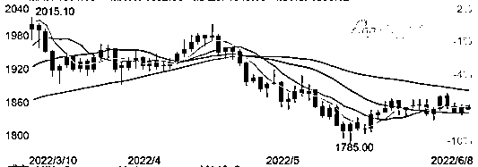

| 黄金日 K 线图

**而黄金在跌到 1785 美元后出现了小的反弹。接下来黄金会怎么走，你要不要抓小反弹？****此外，你考虑从做空黄金中赚钱的策略了吗？**7 月份黄金报告已经上线，上证报告也将在下周上线。欢迎了解。也可以按照季度和 1 年期订阅，有更多优惠。季度和年度的好处是，你可以持续了解梅里曼老师对于不断在变化的市场的看法。即便他某一次看法和市场不一致，你也看到在下一期他如何调整自己的看法，并看到金融占星在一个长期时间段内对你把控风险的帮助。而能够长期控制风险、尽量找到安全的投资时机才是投资的长久之计。点击文末阅读原文，雷蒙德·梅里曼黄金周期 2022 年 7 月报告带来有 40 年黄金市场研究经验的世界著名金融占星大师雷蒙德·梅里曼对当前黄金市场的研究。

**7 月黄金报告上线**

**黄金月度报告价格****单月报告**：280 元/月 **季度套餐价格**：780 元（260 元/月）**年度套餐价格**：2400 元（200 元/月）**双报告年度套餐更优惠（直降 900 元）****12 个月黄金报告+12 个月上证指数报告：仅需 3900 元****长按下图识别二维码购买黄金报告**
▼

**购买者需知**

**① **梅里曼市场时机学院《中国上证指数月度研究报告》是梅里曼市场时机学院（以下简称 MMA）的研究“预报”，而不是市场“预测”，是梅里曼老师及 MMA 金融占星分析师对人类活动周期历史与行星周期之间相关性的研究，二者在大部分情况下具有 80%或更高的相关性，而不是因果关系。报告中的研究完全存在错误的可能性。即便是非常认真的研究和几十年的研究经验，金融占星师无法总是正确地解读出各种征象在实际层面上会如何相互作用，并显化为事件结果。

所以请将报告看作一个研究参考，务必结合其他市场研究和你个人对市场的理解，根据你的自由意志做决策。

**②** 此报告一旦售出，**即不接受退款。**

**③** 上证、黄金月度报告每月固定 1 期，**并非都是在每月相同日期发布。**

**④** **我们收到英文报告的当天，即发布该英文报告。3 天后，上线报告中文版。此报告仅支持手机网页阅读，不支持电脑阅读和下载。****以上须知，请仔细阅读。一旦付款，即视为已了解并接受所有须知内容。**在过去的 40 年中，唯有梅里曼逐渐完善，并在梅里曼市场时机学院月度周期报告中阐释了将地球宇宙学与周期相结合的研究方法，以惊人的精确性预报了黄金价格发生重大变化的时间。**黄金购买 Tip**

各大银行均可购买黄金或黄金 EFT 基金，也可以在诸如天天基金或者支付宝购买黄金及黄金相关产品。不明白的可以百度搜索。

**购买后如何查看报告？**

**购买后有疑问怎么办？**请联系技术客服
**微信：nodoor201705**

**购买黄金报告直达入口**

# 6 月 23 日开讲 | 上证还有投资机会吗？梅里曼 2022 下半年金融占星投资沙龙

> 原文：[`mp.weixin.qq.com/s?__biz=MzA5NjA0NTAxNg==&mid=2651477281&idx=4&sn=610f22d20ab9ebab93125b9915bb84f6&chksm=8b48e796bc3f6e80a17217569d20456cafa22ee17f5cf6196bf4ee03d6d1bc7c51da3bce46ba&scene=126&sessionid=1692737796#rd`](http://mp.weixin.qq.com/s?__biz=MzA5NjA0NTAxNg==&mid=2651477281&idx=4&sn=610f22d20ab9ebab93125b9915bb84f6&chksm=8b48e796bc3f6e80a17217569d20456cafa22ee17f5cf6196bf4ee03d6d1bc7c51da3bce46ba&scene=126&sessionid=1692737796#rd)

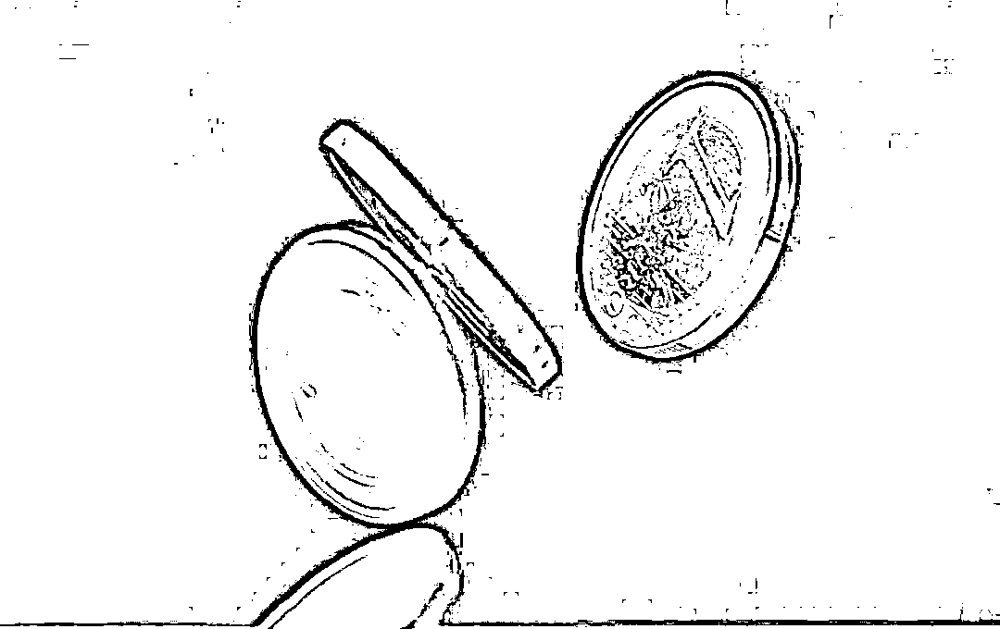

2022 年转眼快 6 个月过去了，你的投资还好吗？

| **上证日线**

| **上证周线**

| **黄金日线**

今年上半年最重要的天象——木海合相没有带来我们希望的上涨，而是带来了歇斯底里的下跌。在 5 个月内，上证从 3651 一直跌到最低 2863 点，跌幅达 21.6%，很多股票也都有更大跌幅。对黄金而言，在 3 月份达到 2078 的高点之后，也开始一轮下跌。上证的走势尤其值得关注。因为这样的下跌，许多公司的股价已经变得非常便宜。当然，目前因为动态清零抗疫方针，中国经济也面临着前所未有的困难，这些困难毫无疑问体现在上证及公司股价中。当 2022 年年度预报沙龙在 3 月举办的时候，当时上证指数已经在熊市的通道中，很多市场人士都比较悲观。而梅里曼老师说，如果上证有 5.5 年的周期，而这个周期分为两个 33 个月的半周期，按照 26-40 月的范围而言，这个周期低点应于 2022 年 3 月-2022 年 5 月出现，当时 3 月份已经是第 38 个月，周期而言相当晚了，因此他对于市场还是比较乐观。然而，我们看到市场 3 月份后并没有止住下跌，在木海合相期间开始更猛烈下跌。根据周期理论，4 月底已经进入第 40 月了，到这个范围的尽头，而市场开始反弹。而对于梅里曼老师给出的“33 个月周期低点的价格目标是 2633-3150、2973+/-87 和 3047+/-81”而言，2863 点也到了相对低的低点。在 2021 年，土星和天王星出现 3 次四分相时，上证指数都到了当时市场的高点，在今年下半年，土星和天王星还会再出现一次非常接近的四分相。

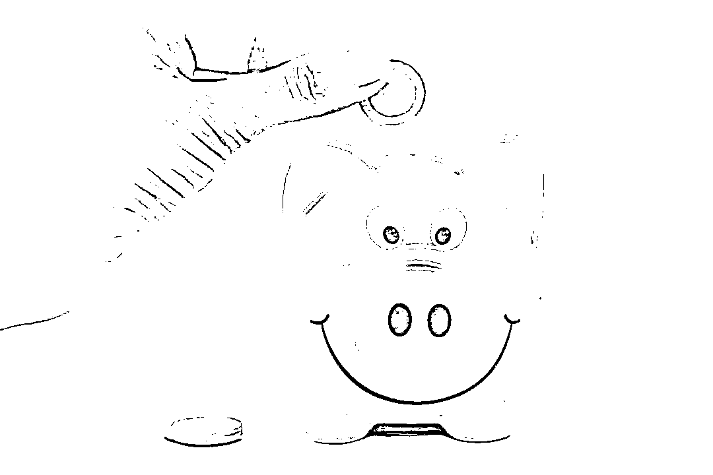

**下半年，上证会出现有力的反弹吗？或是梅里曼老师对市场的看法与年初相比有什么改变？****在沙龙中，除了上证外，梅里曼老师也会讲到其他金融投资市场。****下半年的投资该如何把握？我们特意邀请雷蒙德·梅里曼老师在 6 月 23 日 19:00 为大家带来 2022 年半年度金融沙龙。**这场在线沙龙将提探讨这些长期行星周期如何影响世界经济的长期周期和趋势，特别是如何影响上证综指和黄金市场，并描述在 2022 年剩下的时间里市场反转关键时间点。**沙龙价格**

**沙龙正价：****450 元**

**沙龙前 50 名早鸟价已售罄，转发可获得优惠价，具体请咨询工作人员**

**长按下方二维码添加李老师**

**咨询价格&提交问题**

**添加备注：金融沙龙**

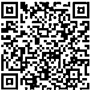

**沙龙时间**

**沙龙时间：6 月 23 日 19:00，时长 2-3 小时**

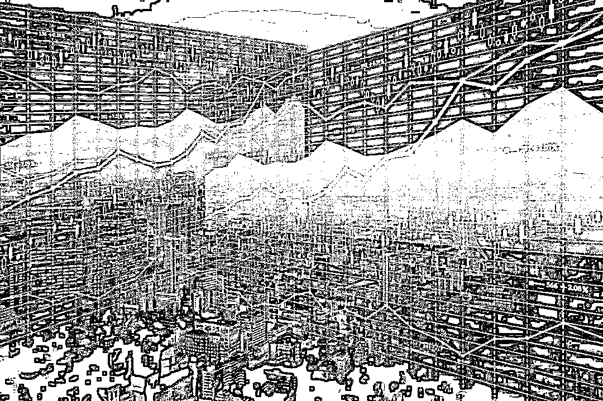

**报名直达入口**

# 雷蒙德·梅里曼金融占星周运 | 积极面还能持续吗？

> 原文：[`mp.weixin.qq.com/s?__biz=MzA5NjA0NTAxNg==&mid=2651477281&idx=2&sn=b48c37265b0d7f7459564943fb6c86c1&chksm=8b48e796bc3f6e80f65394e877a1622d01518813d952a5e4f606339afcc8f9435e87ea5cdba5&scene=126&sessionid=1692737796#rd`](http://mp.weixin.qq.com/s?__biz=MzA5NjA0NTAxNg==&mid=2651477281&idx=2&sn=b48c37265b0d7f7459564943fb6c86c1&chksm=8b48e796bc3f6e80f65394e877a1622d01518813d952a5e4f606339afcc8f9435e87ea5cdba5&scene=126&sessionid=1692737796#rd)

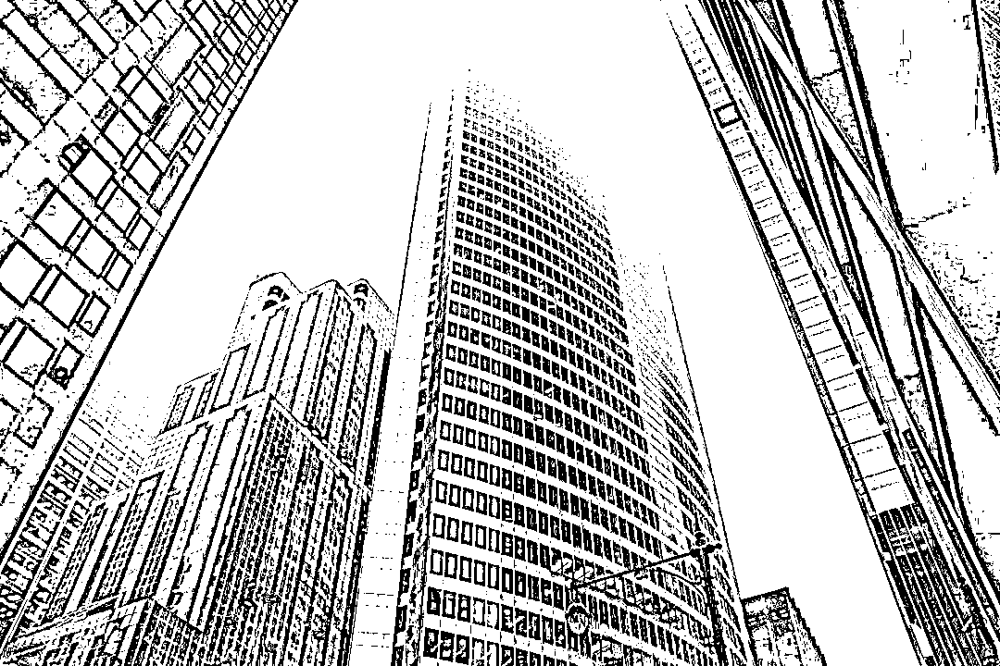

作者/雷蒙德·梅里曼 译者/Luke
编辑/玫瑰 图片/pexels

雷蒙德·梅里曼是在金融占星学界稳坐第一把交椅的占星师，同时他也是若道签约的金融占星课老师，我们引进了雷蒙德·梅里曼老师的《[上证指数月度报告](http://mp.weixin.qq.com/s?__biz=MzA5NjA0NTAxNg==&mid=2651474357&idx=2&sn=1dd70a90e2ea5b1351c8d9eb7342b72e&chksm=8b48fb02bc3f7214b27b2dcbebc7b32be9dab98bee34853299d6dca571248cb279cfdc9322d2&scene=21#wechat_redirect)》及《[黄金报告](http://mp.weixin.qq.com/s?__biz=MzA5NjA0NTAxNg==&mid=2651475867&idx=2&sn=a83315235db9523d78811c8cdd8e6aed&chksm=8b48fd2cbc3f743aa150d0f1182fcf17bcf14ad981390b87314d4845eea1783e35dd4b6acbc2&scene=21#wechat_redirect)》。我们经老师的授权，将每周刊登梅里曼老师的周运，供大家参考和学习。于是，这是本周的周运（6.20-6.24）。

**说明：以下时间采用纽约证券交易所所在地美国东部标准时间。**

**展望与回顾**

****

**随着通货膨胀和衰退担忧加剧，投资者度过了新冠病毒肺炎大流行以来糟糕的一段时间。****周五，纳斯达克综合指数和标准普尔 500 指数有涨有跌，然而道琼斯工业平均指数回撤。期货市场上，原油当周下跌 9.2%至每桶 109.56 美元。****——《美国股市收盘，结束了大流行以来最糟糕的一周》****www.foxbusiness.com****2022 年 6 月 17 日****美联储面临一个典型的两难境地。驱动通货膨胀的，主要是它无法控制的价格（与商品相关），或无人支付的价格（业主等价租金，标志着房屋所有权价格的上涨，但大多数美国房主支付的价格低于两年前）。****美联储能控制的大多数价格，要么是通货收缩，要么是完全通缩（超过 3%的消费者物价指数篮子出现了同比通货紧缩）。****美联储的两难境地是，它在能控制的价格中要引发多大程度的通货紧缩，才能抵消它无法控制的价格中的通货膨胀。****——经济学家保罗·多诺万博士****瑞银早间音频评论****www.UBS.com****2022 年 6 月 13 日**越来越难看了。你有种感觉，那就是杰米·戴蒙和埃隆·马斯克在过去几周（前几期报告中曾经引用）关于金融市场的言论可能是对的，就好像是在说：“休斯顿，休斯顿！问题来了。”金星合相天王星（6 月 11 日）并四分土星（6 月 18 日），也被称为金星为土星-天王星四分相“传递”能量。其间还发生了太阳四分海王星（6 月 16 日）。**上周，许多市场遭遇重击。正如我们上周初的推文所说，这些是微型恐慌的特征。**市场上周遭遇重创，因为政府和央行领导人——他们可以通过政策、决策和公告影响市场，似乎失去了很多可信度。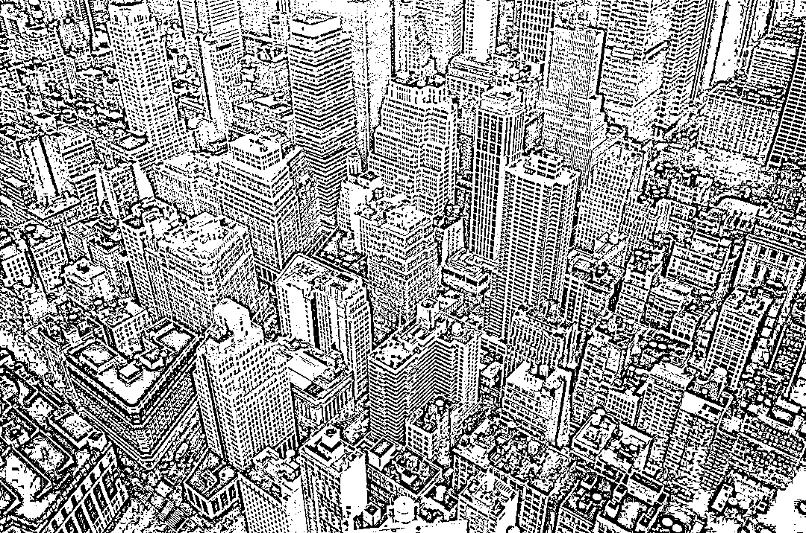**这是太阳四分海王星的典型特征，而且它不会很快结束，因为海王星会在 6 月 28 日新月时转为逆行，同一天太阳会四分木星。**出于这些因素，我们现在有了一场**微型恐慌**（可能比“微型”要大些）。这也体现了天王星的影响，因为多个全球股票指数和金融市场都跌破了长期和关键的支撑。我会在下文进一步阐释。在亚洲和环太平洋地区，澳大利亚 ASX 指数上周五跌至 2020 年 11 月以来的最低位。印度 Nifty 指数也跌至年度新低。日本日经指数快速下跌至新的月度低点，并正在接近 3 月 9 日的年度低点。香港恒生指数相对平静，但上证综合指数逆势飙升至 3 个月来的最高水平。上证综指从 4 月 27 日的 33 个月周期低点处上涨 17%。中国仿佛是另一个世界，因为那里的股票市场在上行，而不是像世界其他地方那样下跌。但是回到 4 月底，情况正好相反：中国股指看起来陷入了严重的困境，而世界其他地方看起来正在复苏。在欧洲和美国，上周是一场灾难。荷兰 AEX 指数和苏黎世 SMI 指数均跌至 2020 年 12 月和 2021 年 1 月以来的最低价位。伦敦富时指数和德国 DAX 指数则没那么糟，它们守住了 2022 年 3 月 7 日的低点。但是在巴西，Bovespa 指数跌至 2020 年 10 月以来的最低价。道琼斯工业平均指数和标准普尔指数也跌至 2020 年 12 月以来的最低点。纳斯达克指数受创更严重，跌至 2020 年 9 月以来的最低点。尽管存在下跌，但是从 11 月-1 月的历史高点或年度高点起，大多数股指的跌幅仍然没有超过 26%。纳斯达克指数的跌幅已经超过了 26%，属于 2020 年 3 月大流行低点以来涨势的一次正常回撤。顺便说一句，纳斯达克指数由天王星守护，后者与土星的四分相终于如预期的那样内爆了，只是来得有点延迟。

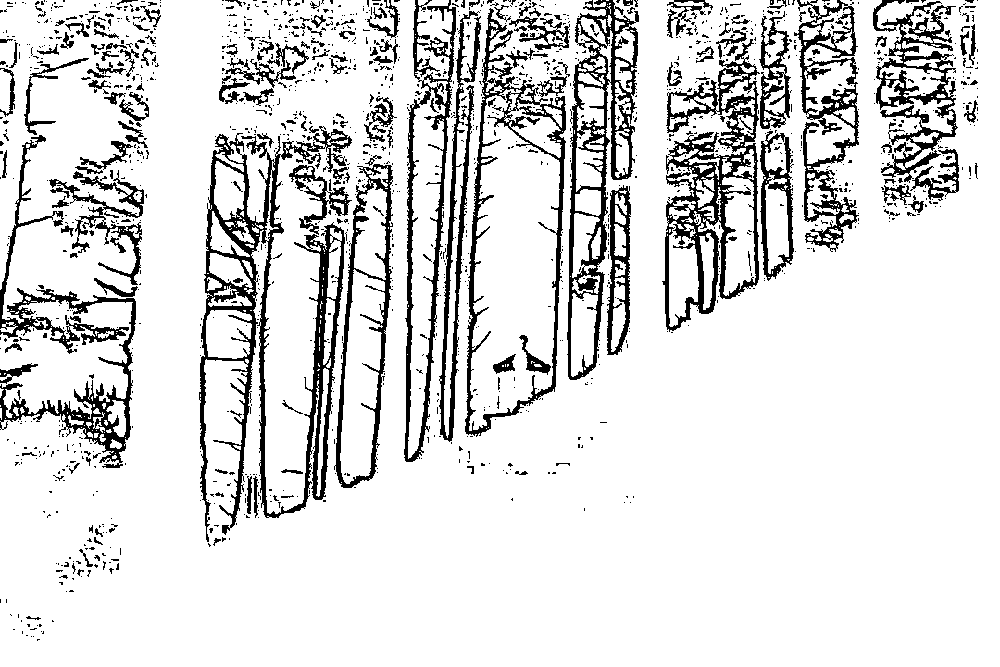

然而，有一个金融市场的跌幅超过了正常水平，那就是加密货币市场。比特币在上周测试了 20000，相对于 2021 年 11 月 9 日的历史高点 68999 跌幅达到 70.9%。以太坊更糟，已经从 11 月 14 日的历史高点 4867 下跌 79.2%。在 6 月 15 日，以太坊跌至 1012。我们将在本周四的中国专场讲座（[点击链接了解详情](http://mp.weixin.qq.com/s?__biz=MzA5NjA0NTAxNg==&mid=2651476207&idx=3&sn=a4f19b002d617865b02e8656ccc25e23&chksm=8b48e258bc3f6b4ede63fd106c0d63cbf68d13119e8d9a59933c2132dc39d4a546e0b12b513e&scene=21#wechat_redirect)）中，再详细谈谈比特币的话题。原油上周上涨至 123.60，创下 3 月 7 日年度高点 130.50 后的最高价位。然而，截至上周末它下跌得很厉害，周五下跌至 106.40。黄金和白银波动剧烈，首先创下新的主要周期低点，然后又创高点，然后又是低点。但更值得注目的是美元兑日元，它在 6 月 15 日飙升至 135.50，是 21 世纪的最高纪录。金融市场上正发生着某些大事，似乎没有人知道如何妥善应对。尽管总统宣布这是一场重大过渡的一部分，就仿佛他已经预料到了一样，人们还是不能安心。我们可以看出，一场重大的转变正在进行中。我们只是看不到，这场危机将如何结束，如果不是带来严重衰退或更糟的话。**短期占星趋势和长期考量**

****

**我们的经济不会回到先富带动后富的虚假承诺。我们要前进，步入一个让所有人受益的经济。**

**——乔·拜登总统****推特简讯****2022 年 6 月 14 日**首先，让我们看看上周通货膨胀和利率上升导致的市场崩盘，有哪些可能的积极影响。随着金星接近与土星在 6 月 18 日的四分相，许多市场都在上周末创下新低。我们的基本规则之一，任何下跌进入金星-土星困难相位的市场，都存在反弹的可能性。由于这个相位正在进行中，是存在希望的。**然而，从宇宙天象角度来看，积极面恐怕到此为止了。**因为**从 6 月 28 日到 7 月 2 日，海王星会改变运行方向，太阳四分木星，火星四分冥王星。**涉及海王星，会存在领导者可信度存疑的问题，他们对现状和未来做出误导性或不真实的评估，以至于没有人相信。涉及木星，这种误导性的评估可能被夸大，进一步侵蚀了信息的可信度。尽管每个人都深陷泥潭，但是在提供摆脱它的解决方案之前，让我们先谈谈冥王星以及它真实的恐怖故事。

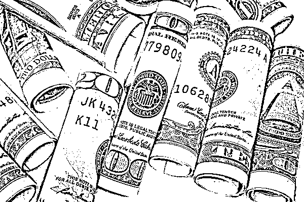

在上周金融市场的大屠杀后，我很担心许多市场的长期趋势在转为看跌。我也担心世界的地缘政治趋势也在转向不祥的方向。简单来说，我不是唯一感到冥王星能量的人，尽管我将尽一切努力保持对未来的积极态度，就像我在过去两年的挑战中所做的那样。但是当我展望未来 2-6 年时，这种乐观主义开始出现裂痕。我可以把这些令人担忧的展望和占星学的原则对应起来。我也可以提供如何安然无恙度过这段时光的建设性提议。但是我不能控制世界大国和领导人，他们可能有着不同的议程或意图。我注意到最近的市场抛售，发生在美联储讲话和市场上涨后。然后这些抛售发生在隔夜市场上，美国市场关闭时。我不太清楚，这看起来非常可疑。就好像这大规模的抛售是外国财团进行的，意图让美国和其他西方国家进入衰退，可能是为了让全世界的金融系统崩溃和重建。关键价格支撑区域被打破，代表他们可能会成功（如果我的怀疑是真的话）。

美国正在经历冥王星回归，这可能代表一种幕后协调一致的操作，以使美国倒台。某些人，比如美国总统，可能称之为“过渡”来找到安慰，这是一种描述冥王星与当前金融市场事件的好听说法。一种更加准确的冥王星式描述，是称之为一种刻意毁灭的行为。

但倘若如此，那么源头是来自国外，还是国内？对于冥王星，可能两者皆有。

但那些人显然知道在隔夜市场上大规模抛售造成的心理影响（冥王星喜欢在黑暗的阴影中工作），以至于美国的投资者醒来，看到自己的头寸上出现了巨大和令人沮丧的亏损，被迫清算（抛售），进一步加剧了恐慌。

某些人从这种模式中获利。对于每个买家，都有一个卖家。在这场战争中，买家在失败，卖家在获胜……是谁在隔夜市场上如此大规模地抛售？是谁在扮演冥王星的角色，冲击着美国星图中的摩羯座月亮和冥王星？

这也与堕胎问题（冥王星），和相关的法律变更有关。冥王星正在合相美国星图中的月亮，所以相关决定正在做出，将会剥夺女性堕胎的选择。那将成为法律——当前法律的重大变化，对应冥王星在 2023 年 3 月进入水瓶座，合相 2020 年 12 月 20 日木星-土星在水瓶座 0°的合相。正如先前提到的，木星-土星在水瓶座 0°的“超级能量”度数，对行经它的行星来说，有着很强的法律意味，尤其当行进的是 2023 年-2024 年像冥王星这样的外行星时。如果不是以改革和改善现状的方式进行，那么冥王星也代表事物的终结，生命的终结，中止，堕胎行为。要么是重建和改革，要么是毁灭和终结。冥王星不会妥协。当它行经星图中的一个主要的点时，那张星图的主人无法毫发无损地逃脱。美国、乔·拜登、唐纳德·特朗普、纽约证券交易所和联邦储备银行，都在经历冥王星与星图中的敏感点形成困难相位。你要么投降，开始改革之路；要么你会感到一条丝线在你脖子上勒紧，直到你没有选择，要么投降，要么消亡。

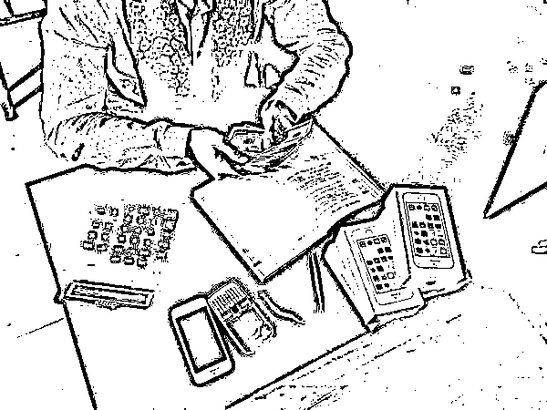

如果你做了某些不道德的事，没有理由认为你可以逃脱惩罚。冥王星掌管腐败，以及揭露腐败，在某些情况下会是救赎腐败，这发生在对权力和控制的执迷追求之后。我们今天到处都能看到这种剧情，从某种意义上来说，是一场善与恶、生与死之间的经典之战，一个充满希望的未来与一个充满绝望的未来的对决。但也不是没有希望。现在处在木星和土星的渐盈阶段，此时温和的决策最终会胜过极端的决策。但是由于天王星和冥王星在 2020-2022 年活跃，前两年可能会非常具有挑战。你会听到更多冥王星式的改革呼吁，比如“弹劾”、“叛国”和“背叛”。但在幕后的安静场所，你也可以听到和看到木星和土星象征的温和声音和行动开始浮现，因为大众对那些极端行为的呼吁开始越来越警惕。

未来目前看起来可能不太妙。这种危险和恐惧的感觉，随着今年秋天土星和天王星再次形成几乎精准的渐亏四分相，可能会变得越来越强，尤其在 9 月 21 日-28 日成相的 6-8 周内，届时木星也会在土星和天王星的中点与它们形成八分相。

在那期间，太阳、金星和火星也会与土星和天王星形成 T 三角。

这是一个非常疯狂的世界。但是涉及冥王星，它也包含着转化的潜力，促成真正的改革和重生，创建一个能让所有人成长和受益的社会和经济。可能不是每个人，因为那是不可能的。但对想负责和工作，想要在经济上有所成长的人来说，它会起到作用，前提是我们不要陷入一个禁止这种可能性的系统。**梅里曼市场时机学院与若道将于 2022 年 6 月 23 日 19:00 举办金融市场最新信息中国专场讲座。**这个 2-3 小时的在线讲座（有两次 5 分钟的休息时间）将讨论几个金融市场的前景，包括黄金、原油和上证综指。

这将是特别及时的讲座，因为为期 12 年的木星轨道周期会在 5 月 10 日进入白羊座，并且 6 月-11 月是一年中最有力的地球宇宙征象接连登场的重要时间段，因为土星逆行与天王星形成几乎精准的渐亏四分相。

**说明：以上日期基于纽约证券交易所所在的美国东部标准时间，由于存在时差，中国地区可能需要加一天。**

**版权声明：**本文由若道翻译发布，欢迎转发，反对抄袭。友号转载请申请白名单。

**雷蒙德·梅里曼（Raymond Merriman）**

若道签约老师。著名金融占星师，ISAR（国际占星研究协会）前主席，梅里曼市场分析公司的总裁。他由于“提升了占星学的职业形象”，在 1995 年国际占星大会上被授予轩辕十四奖；在 2012 年国际占星大会上，被授予轩辕十四终身成就奖。

1“中国上证指数月度报告”发售**若道推出了****中文版****的雷蒙德·梅里曼中国上证指数月度报告，并持续发行该报告！**当把金融市场的周期和占星学的周期相结合时，雷蒙德·梅里曼老师的金融占星学研究**为投资者应对金融市场的周期波动，并随之调整投资策略提供了极大的价值参考**。
**7 月中英文报告已上线！**2“黄金价格周期月度报告”发售**若道推出****中文版****的雷蒙德·梅里曼黄金价格周期月度报告！**不仅仅为广大读者在中国股市的投资出谋划策，更将视角放眼黄金市场。**每当世界经济形式不明朗的时候，有一个地方是保值的港湾，那就是****黄金**。自 1982 年雷蒙德·梅里曼出版第一本研究《地球宇宙学征象与黄金价格的关联》的著作以来，**他一直作为最重要的黄金市场时机预测者之一享誉国际**。2022 年 7 月黄金报告已上线，梅里曼老师将会告诉你他对这个关键时期如何操作的想法。也可以按照季度和一年期订阅，有更多优惠。季度和年度的好处是，你可以持续了解梅里曼老师对于不断在变化的市场的看法。即便他某一次看法和市场不一致，你也看到在下一期他如何调整自己的看法，并看到金融占星在一个长期时间段内对你把控风险的帮助。而能够长期控制风险、尽量找到安全的投资时机才是投资的长久之计。**7 月中英文报告已上线！****购买套餐**，买得越多越优惠中国上证指数月度报告套餐价

*   **单月报告**：280 元
*   **3 个月套餐**：780 元（260 元/月）
*   **12 个月套餐价**：2400 元（200 元/月）

**长按下图识别二维码****购买金融报告****套餐****▼**

黄金周期月度报告优惠

*   **双报告年度套餐更优惠（直降 900 元）**

*   **12 个月黄金报告+12 个月上证指数报告：仅需 3900 元**

**长按下图识别二维码购买黄金报告套餐**▼

3《2022 年金融预报和沙龙》1976 年以来，由雷蒙德·A·梅里曼撰写的梅里曼市场时机学院每年一次的年度预报沙龙和每年一本的《年度预报》一直在应用占星学原理为投资者们服务，提供卓越洞见，从未间断。 **雷蒙德·梅里曼《2022 年金融预报和沙龙》发售中（报告已发布）。****长按下图识别二维码了解详情**
▼

4《2022 下半年金融占星投资沙龙》这将是特别及时的讲座，因为为期 12 年的木星轨道周期会在 5 月 10 日进入白羊座，并且 6 月-11 月是一年中最有力的地球宇宙征象接连登场的重要时间段，因为土星逆行与天王星形成几乎精准的渐亏四分相。

**长按下图识别二维码了解详情**

▼

**点击阅读原文购买金融报告**

# 若道周运 6.20-6.26 丨迎来夏至的愉悦一周，为新旅程预热吧！（内含 12 星座运势）

> 原文：[`mp.weixin.qq.com/s?__biz=MzA5NjA0NTAxNg==&mid=2651477281&idx=1&sn=f1216c830c6396eaa7a42b79cb5f600b&chksm=8b48e796bc3f6e80170cfdf2e2c76d13e8016cd86ea9ef5a3381162cf791884cbaf1692c26e4&scene=126&sessionid=1692737796#rd`](http://mp.weixin.qq.com/s?__biz=MzA5NjA0NTAxNg==&mid=2651477281&idx=1&sn=f1216c830c6396eaa7a42b79cb5f600b&chksm=8b48e796bc3f6e80170cfdf2e2c76d13e8016cd86ea9ef5a3381162cf791884cbaf1692c26e4&scene=126&sessionid=1692737796#rd)

******☆ ****后台回复“今日”，给你一句生命态度******

作者/朵三三三 ISAR 认证占星师
编辑/翀子 封面/书君 图片/网络本周是相对轻松愉悦的一周，身体充满动力，心态活跃外放。周二的夏至（太阳进巨蟹座）拉开 2022 年第三季度的大幕，本周多做一些清理和扫尾的工作，为接下来的新开始做好准备吧！**整体氛围**

本周天象相对轻松，大多是和谐相位，适合安排一些愉悦身心的娱乐活动，例如聚餐、出行，或者是轻量级的运动健身，以及兴趣为主，压力较小的学习课程。**风、火元素占据主导，所以阳性能量较强，大家的动能很足，心态上也较为活跃外放。**

本周重要天象

*   **金星三分冥王星**

*   **太阳进入巨蟹座**

*   **金星进入双子座**

**夏至来了**

**本周二，夏至的来临，标志着我们即将进入 2022 年的第三季度。**

夏至图中群星入庙，各就各位发挥自己的最佳能量。太阳巨蟹座被月亮定位，而月亮与木星合相在白羊座，定位星在火星入庙。**这一切都显现出积极向上，奋发拼搏的新气象。**

白羊座总是与开端有关，**接下来的三个月，是全年中最适合拓展突破、开创进取的时光了**。如果你想有所改变，不如大胆尝试，定能收获不一样的精彩。

夏至图中火元素能量充沛，全力支持你的冒险、创意与挑战，而水星双子座六分白羊座群星，心智层面也完全跟得上节拍，行动与头脑双线并行，有条不紊。

**不过，本周仅仅是一个开始，准确的说，是预热。**

因为这周的月相，处于下弦月到残月（新月前夕）的周期。

旧的事情正在消亡，新的事物开始生长，现实中或许还没有实际的变化发生，但新的想法或灵感正在孕育、萌芽。**此时，我们适宜做一些收尾、清理、回顾类型的工作，**重新调整、评估自己的思维方式，为下一个新的周期做好准备。

**全新的事项，适合安排在下周三的新月之后来做，而本周的主题是：韬光养晦，静水流深。**

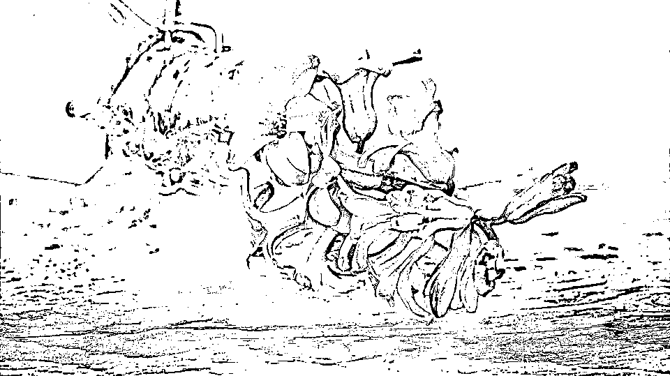

**一周预览**

★ **周一 水星六分木星+月亮在双鱼座 梦想照进现实的一天**

今天的天象非常温柔，平静又不失力量。**双鱼座月亮与海王星逐渐靠近**，我们变得纤细敏感，想象力非常丰富。

**而双子座水星与白羊座木星的六分相**，令我们健谈开朗，很适合与朋友之间的交流、沟通。通过谈论梦想和创意，或许就能收获幸运的机会。

我们的语言表达更加柔和，愿意关怀他人，鼓励他人，此时的对话多是愉快而有意义的。

★ **周二 夏至，太阳换座，具有转折意义的一天**

夏已深，阴气生而阳气衰。

**太阳进入巨蟹座**，弥补了星空中缺失的水元素。接下来，我们会更加重视情绪、安全感，以及与家人之间的关系。

**月亮进入白羊座，**彰显自我存在与自我意志，我们不自觉的想要表现自己，希望获得他人的认同，也可能在潜意识中与他人竞争，要赢得心理层面的胜利感。

这与巨蟹座能量刚好是矛盾的，所以今天星象中的日月四分相，或许会让我们感觉到一些内心的矛盾，是来自于个人价值实现和心理需求之间的冲突。

**金星三分冥王星**，今天的感受力格外强烈。对于人际关系、财务金钱方面，我们能够轻易察觉到过往不被注意到的细节及阴影面，有利于深层次的情感互动，或针对情感进行的疗愈、咨询。

**凌晨有月海合相**，我们或许会收获五彩斑斓的梦境。

★ **周三 月亮六分水星，情智平衡的一天**

水月关系决定了感性层面和理性层面之间的互动。当它们呈现冲突相位时，我们容易口不对心，难以表露真情实感，或与他人沟通困难。

而水月关系良好时，我们既能与自己和谐相处，又容易与他人亲近，无论是聊天八卦，还是沟通讨论，包括商业贸易、谈判，更有可能顺利的达成一致。

**所以，今天是我们进退有度，把控分寸的一天。**

除了要留意傍晚的时间，月亮逐渐靠近火星，容易亢奋躁动，小心控制好自己的脾气。

★ **周四 金星进入双子座，快乐谈心的一天**

**金星来到双子座**，我们的快乐可以变得很“肤浅”。想说就说，想聊就聊，不需要任何意义的探寻，表达本身就能给我们带来愉悦感。

对于讯息也会更加敏锐，刷社会新闻，娱乐八卦，都可能成为乐趣的来源。我们也更容易被知识产品吸引，例如购买书、音乐或付费课程。

人际关系和恋情上，**大家交流增多，**更看重彼此是否有共同语言，是一个敞开心扉，表达真我的好时机。

**傍晚，月亮进入金牛座**，吃喝玩乐的心蠢蠢欲动，约朋友享受一顿大餐，或者下班后做个 spa，来犒劳自己吧！

★ **周五 月亮六分太阳，继续愉悦的一天**

**金牛座月亮与巨蟹座太阳的能量和谐**，有一些小开心和小确幸在今天发生，或许是与家人朋友之间的互动，或者是接收到来自他人的善意，也或许是不经意间的生活细节，将我们的内心触动。

从自身层面来说，我们此时的需求与目的一致，周二冒出来的一些别扭和矛盾的感觉，或许在今天就能得到完美的解决。

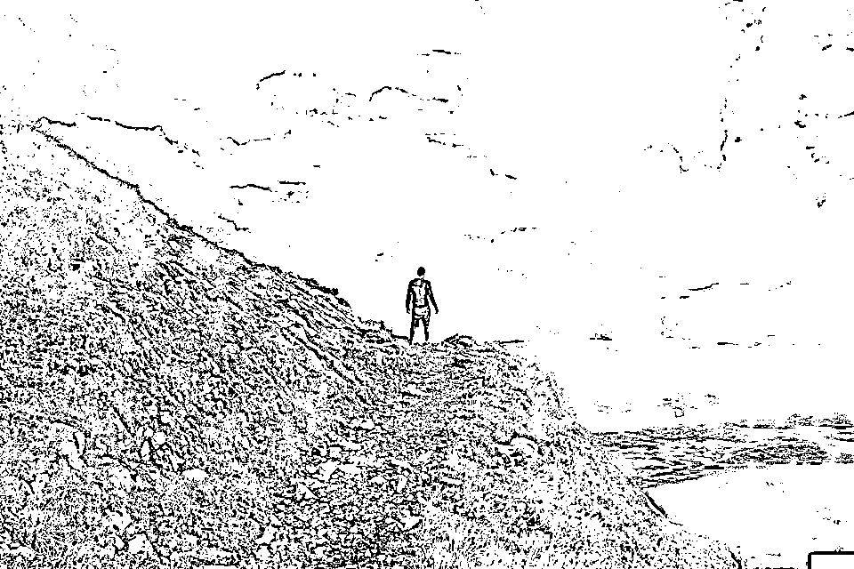

★**周六 月亮四分土星+月亮空亡，略带灰色的一天**

今天会经历本周唯一不太和谐的音符，因为月土的四分相在夜晚出现了，紧接着就进入到月亮的空亡期。

注意，emo 的警报已经拉响，请远离触发负面情绪的导火索！

开个玩笑，其实顺应天象的做法就是，**让能量自然的流淌**。小的低谷期出现很正常，此时我们往往排斥情感的交流，或遭遇关系的困难。

如果感受不好，可以主动选择独处，此时的我们很**需要私人空间**。

或许你也可以做一些月亮金牛喜欢的事情，例如按摩、做美容、逛街、吃钟爱的食物，或只是在家舒服的躺着，这些对于情绪都会有缓解和帮助。

当然，我们也可以发挥主观能动性，不要把重要的约会、人际见面安排在周六的晚上，避开这一段黑洞时间。

也尽量避免在此时开启新的事务，或入手新的物品，**因为月空亡时开始的事情，很容易没有结果，不了了之。**

★ **周日 月亮进入双子座，重新绽放活力的一天**

早上，月空亡结束的同时，**月亮进入双子座**。今天风相能量爆棚，适合会面、沟通、谈话、写作、头脑风暴，及一切与心智思维有关的事项。

下午，月亮合相金星，这个天象意味着，我们能通过社交获得天然的愉悦和满足感，尤其对于跟女性的关系尤为有利。

此时太适合约上闺蜜、好姐妹，或者是约会对象，来个下午茶，或聚餐了！你们有很大的概率相谈甚欢到停不下来。吃喝玩乐、逛美术展、听音乐会、看电影这些与金星相关的事项也非常应景。

**晚上，月亮六分木星**，内心或许会充斥着很多向往和期待，我们会有分享的冲动，适宜与朋友或亲密的人一起畅想、规划未来。

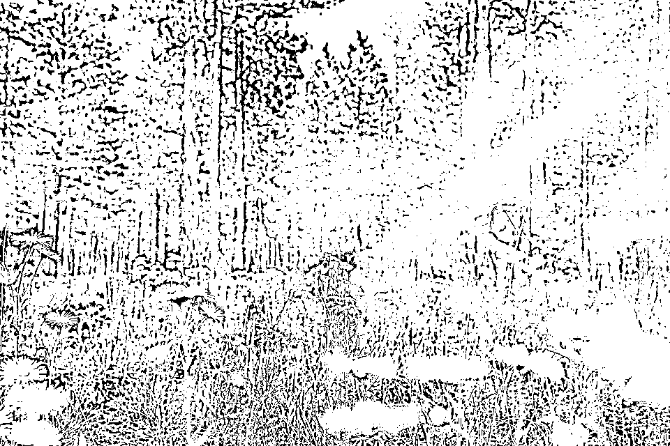

**12 星座一周运势**

**（重点参考上升星座，其次参考太阳星座）**

***白羊座***

**这是充满活力的一周。**除了周一这天，你或许过度沉浸在自己的世界里，或者带着些许“周一综合征”，难以注意力集中，容易做白日梦。**周二之后，你就能恢复旺盛的精力**，你可能发现自己变得话多、活泼，大部分的快乐喜悦来源于跟好朋友、身边人的相处。

**本周，你的重心慢慢转向家庭**，包括父母、家人，或者是房屋、居住环境上出现一些改变，引起你的关注。

***金牛座***

你与兄弟姐妹、好友、周遭人的**互动增多**，可能会留意到很多琐碎的小事，或者听到一些人的八卦，你能感受到自己对周围人的影响力增强，有些人可能会特地来询问你对某些事的看法和建议。你也可能在**计划新的学习或旅行**，但初期不太顺利。

周四之后，你的财运有所提升，同时物欲增加，想要享受舒适的物质生活。

***双子座***

本周开始，**你对于钱财方面更加关注**，同时收入有明显的增加。但你的内心仍然难以满足，可能因此产生焦虑感，驱动你去寻找新的赚钱方式，或积极处理财务上的事情。

**周四金星进入你的 1 宫**，人缘变好，桃花增多，恋情升温。同时你更加注重自己的外在形象，或许会尝试新的穿衣风格或发型，或开始做身材管理。

***巨蟹座***

**夏至后，太阳进入你的 1 宫**，此时你精力充沛，野心十足，想要展示自己，**重视意志和自我实现**。很适合与自己的内心对话，明确自己的方向和追求，重新定位梦想与目标。经过本周的准备，很快就会有重要事情提上日程。

周四后，你可能会因为人际关系或情感方面引发不安，通过深入思考或沟通，你能够很快了解问题产生的原因。

***狮子座***

你或许会感受到**心灵层面**的困扰和麻烦，有一些无明的情绪，它们很可能来自过往记忆的创伤和阴影，而你可以寻求帮助，通过心理咨询或疗愈获得力量。**潜意识变得活跃**，梦境对你会有所启发。

周四之后社交活动增多，适合多参与朋友、社团群体的互动，拓展人脉，会有意想不到的收获。

***处女座***

本周你会开始关注自己所在**团队、群体的状况**，以及社会大环境的动向，你所在的朋友圈、交际圈也可能会有一些事件或变化发生，或是有一些争端需要你处理。

你在团体中变得更加活跃，勇于表现，能够吸引大家的目光，获得他人的赞许。尤其是周四之后，更适合你展现魅力，赢得职场上同事或老板的欣赏，有一些正在求职的处女座，可能在这个时间拿到不错的 offer。

***天秤座***

本周开始，**工作事业会更多占据你的精力**，成为接下来一段时期的重点。你或许被赋予更多的责任，也容易获得领导的更多关注，你在职场中的一举一动都变得格外惹眼。自然，也要注意一些人际上的是非和麻烦。

最近你可能对**旅行和学习**开始感兴趣，想要暂时逃离当下的环境，到陌生的地方感受和体验。这段时间，跟与你成长生活背景不同的人多相处，能够给你启发和觉醒。

***天蝎座***

本周你的**内在心灵世界十分活跃**，你对于精神世界有强烈的渴求，想要获得更多的自我提升和成长，但同时也会质疑自己的想法。**你需要重新审视自己的信念**，坚定自我认同。你或许会计划学习新的知识和技能，参加线上课程、活动，或对远方的事务有所规划。

周四之后，你可能从投资、理财中获利有进账。

***射手座***

本周你的**人际关系成为重点**，伴侣及情感方面有望升温，单身的射手座或许会在此时开展新的恋情。而涉及到有**金钱往来、合作的人际部分**，可能会有一些麻烦和矛盾出现。或许你们的合作方式有所变化，或者有财务分配的事项需要处理。也可能是你改变了投资、理财的方式，有一些新的想法萌生。

大概率你会产生一些危机意识，它可能与金钱、健康、生老病死有关，也驱动你更加深入的检视，并看清自己的内心。

***摩羯座***

最近**一对一的关系**可能会让你感到烦恼，亲密关系，合作关系等，与人打交道占据你不少精力，也让你努力**寻求自我与他人之间的平衡**。有伴侣的摩羯座，你们之间的关系可能会更进一步，到达下一个阶段。

职场上人气上升，工作顺心，与同事、下属的相处更加融洽和睦，有宠物的摩羯座，能够从它们身上收获很多快乐。

***水瓶座***

本周开始你可能变得很忙，并且要持续一段时间。日常起居以及工作上都有些琐事，和服务性质的事情，来消耗你的体力。**注意保持作息规律**，不过最近你自己就会自发的，更加关注养生和身体健康。

周四之后，你试图忙中作乐，花更多时间在娱乐、兴趣爱好或恋情上，有孩子的，你也更享受跟他们在一起的亲子时光。

***双鱼座***

周一是你非常富有创造力的一天，快抓住你的灵感和创意！**本周你更加注重玩乐，富有童心，**或者能够把兴趣与必须要做的事情相结合。对于有子女的双鱼座来说，接下来这段时间你都会非常重视孩子，与他们的互动也会时常引起你内心的情感和波澜。

周四之后，你会更加享受家庭环境，变得更宅。懒得出门，或者想要更多跟家人待在一起，享受亲情带来的温暖。

**版权声明**：原创文章由作者授权首发于若道平台发布，欢迎转发，反对抄袭。友号转载请申请白名单。

**END**

****朵三三三****

ISAR 认证占星师

全职占星师/塔罗师/国家三级心理咨询师 

人大文学学士/德国慕尼黑大学文学硕士

**微博/微信公众号**：朵三三三

长按打赏

**20 位来自世界各地的占星师****带来 19 场沙龙——新世界的觉醒****详情可点击下图**

**学习占星学****点击下图了解课程详情**

**微信又双叒叕改版啦，不想错过若道君的推送？**

**就把若道设为星标吧！**

**▼**

**喜欢就点一下“在看”吧！**

********报名直达入口********

# 今日直播预告：夏至牌阵

> 原文：[`mp.weixin.qq.com/s?__biz=MzA5NjA0NTAxNg==&mid=2651477270&idx=2&sn=3e58f8b16c2cef2932b9b0ac161d2c78&chksm=8b48e7a1bc3f6eb7ea19f8f3f67c441dbe97fbe552b40effcd8ba5706419d179230fec93f019&scene=126&sessionid=1692737796#rd`](http://mp.weixin.qq.com/s?__biz=MzA5NjA0NTAxNg==&mid=2651477270&idx=2&sn=3e58f8b16c2cef2932b9b0ac161d2c78&chksm=8b48e7a1bc3f6eb7ea19f8f3f67c441dbe97fbe552b40effcd8ba5706419d179230fec93f019&scene=126&sessionid=1692737796#rd)

蕴藏在春分、夏至、秋分、冬至里的四季牌阵，即将迎来夏至的绝妙日子，关于四季牌阵你想知道的内容都在今晚的直播里，快长按下方二维码预约吧！另外，想要预约专业的塔罗师进行四季牌阵解读，也可以戳这里：[6.19 夏至直播福利 | 神话塔罗 APP 四季牌阵咨询开放预约](http://mp.weixin.qq.com/s?__biz=MzA5NjA0NTAxNg==&mid=2651477266&idx=2&sn=d8284af57d5ba159c41f497e4fd1c827&chksm=8b48e7a5bc3f6eb3227fff52e75e0242346a5858f8e7b100ca823110c0bd347503bfce04b38a&scene=21#wechat_redirect)

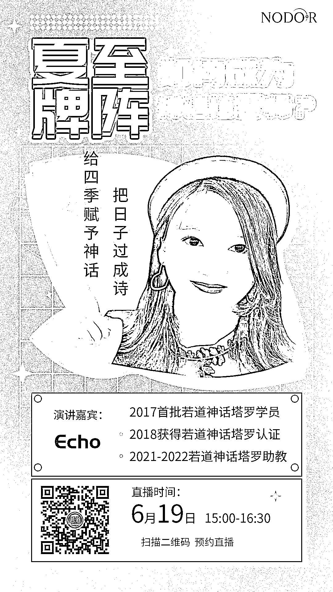

# 父亲节快乐！月亮在双鱼座，你和爸爸之间有哪些温暖的瞬间？

> 原文：[`mp.weixin.qq.com/s?__biz=MzA5NjA0NTAxNg==&mid=2651477270&idx=1&sn=de88bf882daa4eb6833d5dc813e95ff7&chksm=8b48e7a1bc3f6eb7908b104ac50c57db7d0d237460f1232e3e9ea5919336a0ee6cff24b42b5c&scene=126&sessionid=1692737796#rd`](http://mp.weixin.qq.com/s?__biz=MzA5NjA0NTAxNg==&mid=2651477270&idx=1&sn=de88bf882daa4eb6833d5dc813e95ff7&chksm=8b48e7a1bc3f6eb7908b104ac50c57db7d0d237460f1232e3e9ea5919336a0ee6cff24b42b5c&scene=126&sessionid=1692737796#rd)

**2022 年 6 月 18 日天象：**

*   **07:01 月亮进双鱼座**
*   ******太阳和冥王星呈梅花相******
*   ******水星六分木星******
*   ******金星六分海王星、四分土星******

父亲节快乐！月亮一早进入双鱼座，水星六分木星，向爸爸表达你的爱吧！此外，今天也适合出行、学习与沟通，跟朋友聚会（刚过去的[【射手座满月】](http://mp.weixin.qq.com/s?__biz=MzA5NjA0NTAxNg==&mid=2651476409&idx=1&sn=2143aaf7d1f976705176e66eb220ed92&chksm=8b48e30ebc3f6a18c2faf39ade7f9e3109ba7bc0dfed30963ca55ad7bc48a55e66c8f6dc1b65&scene=21#wechat_redirect)没准让你有很多话想聊）、来一场浪漫的约会也是不错的选择。或者你哪儿都不想去，在家里宅着听听音乐、看看电影，都让自己有如鱼得水的感受。

从周五到今天，我们都处在金星与土星的四分相影响下，合作与情感关系、财务状况让人有紧绷的压力。有些人感到自己的价值被否定和压制，这时候不如先问问自己，你有认可并赞赏过自己吗？试着放松一下吧，毕竟是金星六分海王星的一天，创造生活中的美好吧。

月亮在双鱼座，在这个适合表达情感的日子，你想跟你的爸爸说什么呢？你和他之间又有哪些温暖的瞬间？评论区等你哦~ 

周日快乐，我们明天见！**想更好的了解爸爸？** **可以扫描下图二维码测试哦~**

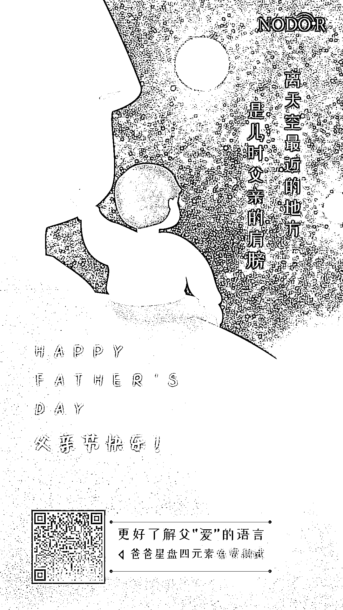

**了解每日天象，可****下载“若道”APP 查看****还有更多精彩等着你哦**

# 世界、健康和爱情，“618”一并为你奉上

> 原文：[`mp.weixin.qq.com/s?__biz=MzA5NjA0NTAxNg==&mid=2651477266&idx=1&sn=62d0be233cf1c8282d631a53645465f7&chksm=8b48e7a5bc3f6eb3b5908e597affc37b382dc372d4e6ab28d3b76e464cf70df5c068a5f99668&scene=126&sessionid=1692737801#rd`](http://mp.weixin.qq.com/s?__biz=MzA5NjA0NTAxNg==&mid=2651477266&idx=1&sn=62d0be233cf1c8282d631a53645465f7&chksm=8b48e7a5bc3f6eb3b5908e597affc37b382dc372d4e6ab28d3b76e464cf70df5c068a5f99668&scene=126&sessionid=1692737801#rd)

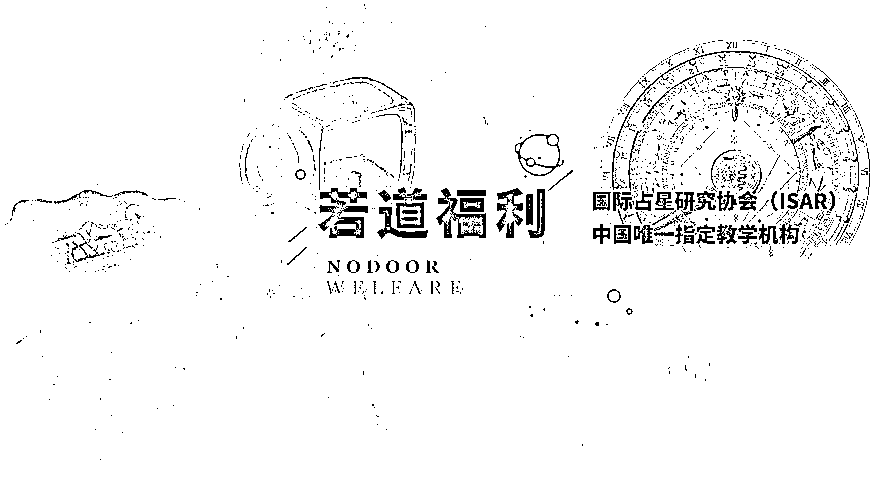

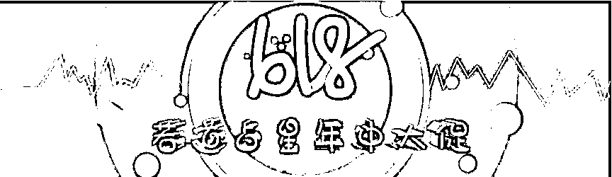

又到一年一度的 618。我们也来凑个热闹。

今年下半年，若道将开设三门大师占星课程，涉及全球趋势、身体健康、关系合盘。首先出场的是**8 月 26 日-28 日**，由若道学员都非常熟悉的艾德里安·罗斯·邓肯老师所带来的**经世占星学 3 天工作坊**，帮助你洞悉全球的趋势，国家的故事，时代的声音。**点击下图查看详细内容**

然后是**9 月 20 日开始持续 8 周**，由西方医疗占星大师、《医疗占星手册》作者**简·里德·帕特里克老师**所带来的**医疗占星网络课程**，帮助你进入医疗占星学的大门，更好的和身体做朋友。**点击下图查看详细内容**

最后是**10 月 14 日-16 日**，**斯蒂芬·弗利斯特老师**带来的**组合图线上工作坊**，帮助你了解组合图的秘密：如何才能使两个人的关系一直充满活力？

**长按下图识别二维码**

**咨询客服了解**

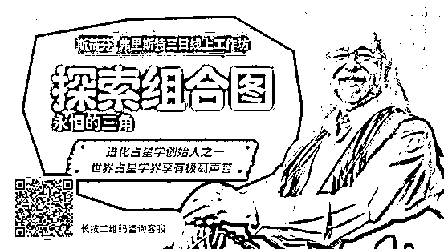

**工作坊价格**

这三位在各自领域的顶尖占星大师的线上工作坊以及网络课程：**单个课程原价：6800 元****早鸟价：5800 元****“618”打包三门课程套餐价：14000 元****该价格有效期为 6 月 30 日，7 月之后恢复原价**若道占星 618 年终促销套餐活动说明：1、本次优惠价格仅适用于购买套餐，单独购买不享受优惠 2、若已报名套餐中一门或两门课程，可报满三门，享受套餐优惠补差价 3、套餐优惠不与其他优惠券同享

优惠详情咨询

长按二维码添加 Maggie 老师

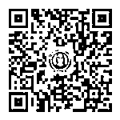

# 6.19 夏至直播福利 | 神话塔罗 APP 四季牌阵咨询开放预约

> 原文：[`mp.weixin.qq.com/s?__biz=MzA5NjA0NTAxNg==&mid=2651477266&idx=2&sn=d8284af57d5ba159c41f497e4fd1c827&chksm=8b48e7a5bc3f6eb3227fff52e75e0242346a5858f8e7b100ca823110c0bd347503bfce04b38a&scene=126&sessionid=1692737801#rd`](http://mp.weixin.qq.com/s?__biz=MzA5NjA0NTAxNg==&mid=2651477266&idx=2&sn=d8284af57d5ba159c41f497e4fd1c827&chksm=8b48e7a5bc3f6eb3227fff52e75e0242346a5858f8e7b100ca823110c0bd347503bfce04b38a&scene=126&sessionid=1692737801#rd)

2022 年 6 月 21 日 17:10，我们将正式迎来**夏至**，夏至， 古时又称为——**“夏节”、“夏至节”**这一天太阳进入**巨蟹座**

我们将在**6 月 19 日 15:00**

提前为大家带来免费的

**神话塔罗夏至牌阵分享直播**，欢迎预约

日北至，

日长之至，日影短至，

故曰夏至。

**至者，极也。**

**在这一年中白昼最长****的一天，**

尤其适合来神话塔罗 APP，抽取万众期待、应时应景的牌阵——**四季牌阵(The Four SeasonsSpread )****一年只能使用四次的牌阵**
此牌阵最早出现在塔罗师 Marcia Masino 的 一本叫《*Best Tarot Practices*》 的书中，

此牌阵只能在一年里的 4 天进行占卜：分别是**春分、****夏至**、**秋分**和**冬至**。这 4 天蕴藏着四季的秘密，小小的节气，有大大的能量。是绝佳的日子，让自己看看接下来一个季度的能量趋势。**夏至牌，****展示的是****你从夏至到秋分这一个季度的整体能量趋势，****TA 会告诉你当季的主题，****你的思维计划、行动决策、****人际情感、财务发展。**如果你想要获悉一个季度的整体概况，**把握事业方向**，**感情状况的走向**，**提前了解财务如何发展**，那么四季牌阵能够满足你，它会对你整体的状态有一个相对清晰的展望。当你觉得对目前的状况不甚满意，又不知道该从哪个方向入手去做改变的时候，四季牌阵也可以给你相当多的指引。

**四季牌阵会从五个方面做出能量预报：**

**感情状况、工作财务、**

**拥有的行动力量、思维计划的警示、**

**精神状态与心灵成长。**

同时占星学中，

这四个节气是太阳换座到四个基本星座

（白羊座、**巨蟹座**、天秤座、摩羯座）

的时间点，意义重大。

因此，无论通过占星还是塔罗，

都是适合做下一个季度能量趋势预报，

完善中短期规划与展望的好时机。

**塔罗作为直觉的能量预报与灵性指引工具，**

**是对占星理性逻辑的分析方法的完美补充。**

用神话塔罗，

让包围你的宇宙能量一目了然，

对着四季塔罗冥想，

让自己度过有意义的夏至这一天。

**夏至日 限量优惠咨询活动**

**预约靠手速，限量****30****人。**

**活动地点**

线上——**若道神话塔罗 app**

**活动主题**

“夏至日—秋分日” 3 个月个人趋势的四季牌阵解读

**公益价格**

**150-300 元/四季牌阵解读**不等 

拼手速

******本次四季牌阵活动，****参与咨询的**

**塔罗师名单目录**

**（排名不分先后）**

**王小闲**

2018 年神话塔罗资质认证班毕业并获得认证证书

2019 年苏·汤普金斯若道核心占星课程学员

*****“塔罗可以带领我们去俯瞰心灵的迷宫，带领我们找到属于自己的那条路。”*****

**源乐**

2018 年神话塔罗资质认证班毕业并获得认证证书

六年的塔罗之旅深度觉照、践行经历，

伴我一次又一次从更高的视野中醒来，

从我以为的“问题”中解套，领悟与道同行的喜悦。

*****“以神话塔罗阿尔卡纳之旅契入，助你拨云见日，开拓新季度新视野。”*****

* * *

**RUO**

2018 年神话塔罗资质认证班毕业并获得认证证书

擅长处理亲密关系、职业发展、个人成长等议题。

帮助客户了解自己当下处境，理清思路。

***“透过一个个有趣的神话故事和生动鲜活的人物照见真实的自己。”***

* * *

**Hazel**

2018 年神话塔罗资质认证班毕业并获得认证证书

咨询经验丰富个案过千例

擅长爱情，事业类塔罗咨询

*****“塔罗占卜的意义往往不仅仅是一个答案，我会和你一起探讨你真正的心之所想。”*****

* * *

* * *

**妖妖**

2018 年神话塔罗资质认证班毕业并获得认证证书

个案类型多样，咨询与持续学习一直是正在进行时

***“神秘的塔罗与希腊神话的结合，揭示了不一样的高阶的人生秘密。”***

**Jinn**

2018 年神话塔罗资质认证班毕业并获得认证证书

ISAR 国际占星研究协会认证占星师

占星+塔罗，私人定制式咨询方案

***“******占星是逻辑的艺术，塔罗是感受的艺术、**星盘指引路的方向，牌面折射心之所在。”***

**Lisa**

2018 年神话塔罗资质认证班毕业并获得认证证书

丰富的塔罗咨询经验

帮助个案了解自己，解决困惑，

与个案一起深入分析探讨不同的人主题

***“神话塔罗，通过神话故事与个案产生共鸣，引发深思，从而照见内心，听见自己灵魂深处的声音。”***

**Silence**

2018 年神话塔罗资质认证班毕业并获得认证证书

7 年塔罗使用者

咨询风格兼具心理探索和灵性启示

***“塔罗讲述我们内心的故事，理解塔罗就是理解自己。”***

**陈漫**

瑞士库尔酒店管理硕士。

2018 年神话塔罗资质认证班毕业并获得认证证书

专注于塔罗及占星能量分析，个人成长及疗愈。

***“塔罗是一种能量语言，也是一种看待事件和人物的另一个角度。”*** 

**Wenny**

2018 年神话塔罗资质认证班毕业并获得认证证书

擅长亲密关系、职业发展、个人成长等议题的解读。

***“在人生分岔路口，能用塔罗牌为我们当下的每个选择作出指引，成为更好的自己。”***

**Maggie**

2018 年神话塔罗资质认证班毕业并获得认证证书

信息传递者，表述清晰

善于帮助来访者基于塔罗提示深入挖掘背后寓意

***“神话塔罗帮助我们与潜意识对话，透由塔罗牌的寓意指引，我们能够深入探索自己并智慧的去做每一个决定。”***

* * *

**Echo**

2018 年神话塔罗资质认证班毕业并获得认证证书

2021 年神话塔罗认证课程助教

帮你根据当下具体困惑分析下一季度的各个主题

***“神话塔罗通过神话故事投射出案主的个人神话原型，让你通过内在的声音，找到最适合你的洞见。”***

**神话塔罗 APP 中有更多宝藏塔罗咨询师等你预约哦**

**如何预约塔罗师咨询？**最后，一起再来复习一下如何在塔罗 app 上预约咨询服务去若道塔罗 app 上找到**上述咨询师的名字**打开**“四季牌阵”**塔罗服务项目就有机会拍到优惠咨询哦~具体咨询方式如下图（轻击可放大）

最后的最后

**如何更新神话塔罗 APP？**

快去应用市场更新神话塔罗 APP，抽牌&咨询吧～ 

还没有下载或更新的小伙伴

赶紧来看看如何下载和更新吧！

各位亲人小伙伴，一手资讯分享就先到这里吧， 每天有事没事都可以去 app 里转转。如果感到快乐你就用用**神话塔罗 app**，如果你感到不快乐，更要使用由专业人本主义塔罗师团队全程陪伴的**神话塔罗 app**哦！**我们在 6 月 19 日夏至牌阵直播****与你不见不散**

# 摩羯座为什么会成为 12 星座里最成功的一个？

> 原文：[`mp.weixin.qq.com/s?__biz=MzA5NjA0NTAxNg==&mid=2651477142&idx=1&sn=6220b9cc308bbea30955a79a0809114f&chksm=8b48e621bc3f6f37f892369905adce87ec58393f39c26fea3842f403c1f93e36599e57512346&scene=126&sessionid=1692737801#rd`](http://mp.weixin.qq.com/s?__biz=MzA5NjA0NTAxNg==&mid=2651477142&idx=1&sn=6220b9cc308bbea30955a79a0809114f&chksm=8b48e621bc3f6f37f892369905adce87ec58393f39c26fea3842f403c1f93e36599e57512346&scene=126&sessionid=1692737801#rd)

************☆********************后台回复“今日”，给你一句生命态度************

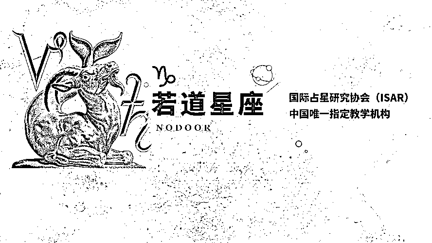

作者/大卫·瑞雷 若道占星创始人译者/李含 校对/轩轩编辑/玫瑰 图片/pexels 今天我们谈谈摩羯座的个人成长。如果你的太阳、月亮、上升点或其他重要行星落入摩羯座，或者是与该星座“共振”的宫位被强调，本文很适用于你。 大卫老师参与授课的【[ISAR 认证职业占星师文凭课程](http://mp.weixin.qq.com/s?__biz=MjM5MjQwNjAyMQ==&mid=2649439986&idx=6&sn=9772248d82fd5a943199c9d23c4014f2&chksm=beb9519889ced88e377f32724af92cee5318ceebeceb2e6a0a6a2d7c76fff6db2a83028f068a&scene=21#wechat_redirect)】报名中，点击链接了解更多详情吧。**摩羯座最重视的是什么？**

**训练，每一分钟都让我厌恶，但我告诉自己，要继续练习。今天的痛苦会为你赢得一生的胜利。****——拳王阿里（太阳摩羯座）**

上面的名言引自最伟大的重量级拳王，他是摩羯座核心驱动力的最佳代言人，不论这个驱动力埋藏得有多深。当然，**摩羯座强大的志向抱负可以投入到任何领域，摩羯座做出的牺牲有时候可以服务于超越个体自我的需求。**将一生致力于人权斗争的领袖，摩羯座的小马丁·路德·金便是这种牺牲的集中体现。他是一位牧师的儿子，与父亲同名。父亲是牧师，在种族隔离的美国南部，牧师在非洲裔美国人社区中十分受人尊敬。毫无疑问，年轻的马丁渴望这种尊重，这也反映出一个摩羯座的儿子与父亲竞争的本能冲动——去成就更多，事实上他做到了。但是，马丁·路德·金将他的意志和内在信念融合到牧师角色中。“我只是要执行上帝的意愿。他让我攀登高峰。”马丁·路德·金所说的**“高峰”**就是摩羯座的绝佳写照。摩羯座的符号便是山羊和鱼尾的组合，这正是从海底攀登至山巅的终极符号。这是发展进化的象征，描绘了加以时日所能达成的造诣成就。但是等级制也十分清晰，一个人可以在所有环境下，从海底到海岸，到海边小镇，到种满橄榄树的山坡，到稳健的山羊居住的峭壁危岩。在符号中保留鱼尾似乎十分恰当，**对于大海的记忆，提醒着一个人的过去，以及他所取得的长足进步。**

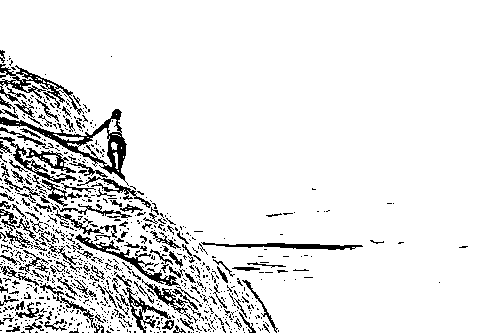

**摩羯座与射手座**但在所有黄道星座的生命之轮中，摩羯座来自何处？什么样的经历产生了摩羯座，催生了对于完美与成就的需求？摩羯座的前一个星座当然就是射手座。射手座对于追求真理、智慧、领悟和理解的经验丰富。但是接下来呢？令人惊叹的冒险生涯带来丰富的领悟，富于智慧的贤者在传道授业中获得满足，但也很自然地开始思考所有的学习是为了什么？他们看到自己最睿智卓越的学生运用其知识去成就世界。于是，一个渴望出现了，“凭着我现在有的这些知识，我想知道自己能够实现些什么——如果我更年轻，如果我还有机会的话。”将射手座的体验推向极致，如果一个人无所不知，那么他应该无所不能！因此，接受教育之后，人们做好准备去进入职业生涯，在社会上竞争，学以致用。**射手座是概念与理论的世界；而摩羯座将理论付诸实践。**摩羯座甚至愿意牺牲假期去实现他们的目标，好像在说，“我已经去过那儿了，我已经度过假了。”好像旅行的渴望已经在热爱自由的射手座那里满足了。这并不是意味着摩羯座并不享受假期，尤其是在著名的旅游胜地！然而，这种假期往往在成功之后，而不是之前，假期的长度仅仅可以让他们恢复体力，然后奔赴下一个目标。

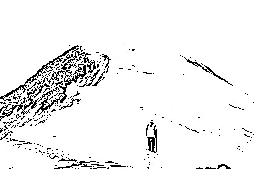

**摩羯座对成功的定义**在描述摩羯座时，会产生一个议题：**关于“成功”本身的。**通常这个议题会呈现为这样的问题：“这难道不是取决于你对成功的定义吗？”这是个很棒的问题，因为成功有很多种衡量方式。例如，达成个人目标同样也是一种成就。同时还存在内在的成就感，就像存在外在的成功标志一样。

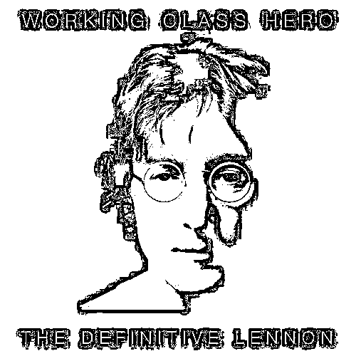

| 约翰·列侬
前甲壳虫乐队成员约翰·列侬的月亮落在了摩羯座，他在歌曲《女人》（Woman）中为小野洋子写下了这样精彩的句子：**“****不过，女人，我会试着表达****我内心的触动和感激之情****是你让我了解了成功的意义”**在这个例子中，我谈到的是月亮在摩羯座，而不是太阳。因为月亮象征着一个人生命中的重要女性，即母亲、（对一个男人来说）妻子、女儿，妻子带给列侬的感受完美诠释了这一点，通过他的“内在感受”，让他了解了成功的意义。**摩羯座是阴性星座，造就了它的内在动力。**所有十二星座从白羊座开始，极性依次交替，阴阳循环往复，就像电流的极性。正如初级占星学生所知，火象星座和风象星座是阳性星座，**土象星座和水象星座是阴性星座。**旧的占星书常常将阳性比作男性，阴性比作女性，但是现代占星师已经不再使用这一误导性的命名。例如，摩羯座是阴性星座，但是恐怕没有人会将摩羯座视作女性的典范！相反，中国的年轻人或许会认为摩羯座女人是“女强人”，因为她们像男人一样能干。但是，这种“能力”并不像狮子座那样华丽外放。拳王阿里极具表现性是因为他的上升点落在了狮子座，而不是因为他是一位太阳摩羯座。**摩羯座的男人和女人有种从容的力量，常常伴有泰然自若的尊严感。****他们的态度和行动展现出一种目的感，他们的脸上总是写着严肃和坚决。**但如果**经验不足或不安时，呈现出的则是僵化和笨拙，富有安全感的摩羯座会表现出无声的效率**。这种无声指的是一种**内在的过程，这种内在的权衡十分谨慎，计划周密。**

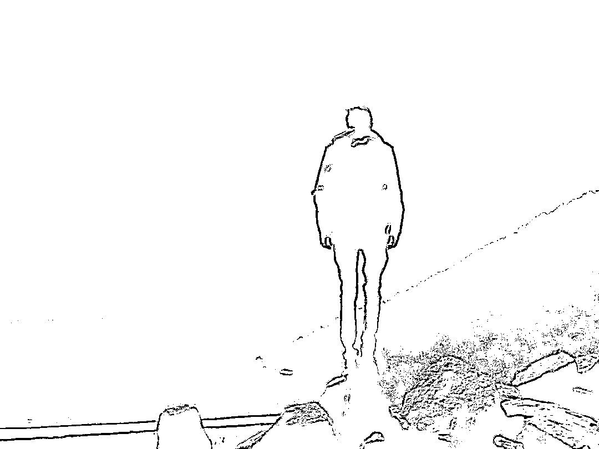

我认识一位摩羯座的舞台剧演员，有一次在观众热烈起立鼓掌后，他离开众人，退到幕后，看起来垂头丧气。有人问他这是怎么了，他说：“今晚，我的感觉很糟糕。”有人说：“但是观众们爱你，听听他们热烈的掌声？”“是的，但是我知道自己表现得有多差劲。”这个例子中，摩羯座的演员并未实现他自己所设定的成功标准，尽管他获得了观众的掌声。但是，摩羯座的专业意识让他又返场开始表演。这位演员非常喜欢表演。**对于许多摩羯座人来说，需要成为自己专业领域的精湛大师是一种无与伦比的驱动力。**当然，如果观众和这位演员对于他的表演有着一致的批评，毫不留情地发出嘘声，他的挫败感无疑将会更加强烈，即使他与观众的看法一致。**失败总是与成功如影随形，失败的苦楚总是在摩羯座人的心中意味深长。****成功感会首先从内心浮现，预示着外在的肯定。****· **一位摩羯座的太极老师可能在竞赛中证明他的技艺，但是在他自己心中，内在的自律已经使他获得了成就感；**·** 一位摩羯座的警察会谨言慎行，但卓越的能力会赢得他人的尊敬；**·** 一位摩羯座的护士长将其他护士管理得井井有条，她不用大声叫嚷，也无须发号施令；她按照规矩办事，其他人知道她的要求，并按照要求做好。因为她做出了表率示范，所以其他护士知道该怎么做，她尽职尽责，工作细致。这些事业成功的例子描绘出摩羯座如何赢得尊重。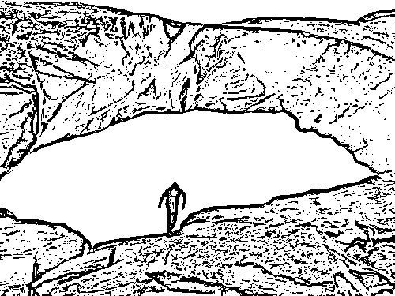当然，有些摩羯座人隐藏了他们的失败，或者失败感，隐藏在了功成名就的表象背后。但是，真正的成功才是对摩羯座真正的奖赏，尽管大部分摩羯座人在获得成就、接受赞誉时就已经开始了下一个目标的征程。当然，对于成功的体验显然不限于事业领域。一位摩羯座的母亲或父亲或许会耐心地帮助孩子找到方法消除学习障碍。看到子女逐步发展出本不可能的技能，为此奉献的摩羯座父母会获得无与伦比的满足。事实上，许多年前，我在北京电影学院演讲时曾被问到，为何一位摩羯座女人，一位许多行星落在摩羯座第十宫的女人会选择做全职妈妈和家庭主妇，而不是追求一份事业。我的回答是：全职妈妈和家庭主妇就是她的事业！她的家庭对她而言非常重要；这是她定义成功的方式，她的摩羯座“责任”意识表露无遗。她的朋友形容她是，像经营成功的公司一样快乐地经营家庭，计划周详，安排高效。

**版权声明：**原创文章由作者授权发布于若道平台，欢迎转发，反对抄袭。友号转载请申请白名单。

**END******想阅读更多作者的文章，请在后台回复******大卫****** 即可。****

**大卫·瑞雷**

美国占星师，若道联合创始人，致力于在中国教授和推广西方占星学；2010-2014 年，任全美占星师联盟监督委员会委员；2017 年，被选为 ISAR 委员会成员。ISAR 是世界最大的国际占星机构，会员遍布 45 个国家，2017-2020 年曾任 ISAR 全球副主席、CAPISAR（ISAR 职业占星师资质认证机构）主席。

**20 位来自世界各地的占星师****带来 19 场沙龙——新世界的觉醒****详情可点击下图**

**学习占星学****点击下图了解课程详情**

‍‍‍‍

**微信又双叒叕改版啦，不想错过若道君的推送？**

**就把若道设为星标吧！**

**▼**

**喜欢就点一下“在看”吧！**

********报名直达入口********

# 认证职业占星师文凭课程 L1-3 上线丨想看大卫老师是怎么做课堂演示的吗？

> 原文：[`mp.weixin.qq.com/s?__biz=MzA5NjA0NTAxNg==&mid=2651477142&idx=2&sn=4972836c65b24f7896d1c6e322cce6c0&chksm=8b48e621bc3f6f3767a9206f899769a90734b8cddf0a66f44277aff03b5098eefbfee8e7776b&scene=126&sessionid=1692737801#rd`](http://mp.weixin.qq.com/s?__biz=MzA5NjA0NTAxNg==&mid=2651477142&idx=2&sn=4972836c65b24f7896d1c6e322cce6c0&chksm=8b48e621bc3f6f3767a9206f899769a90734b8cddf0a66f44277aff03b5098eefbfee8e7776b&scene=126&sessionid=1692737801#rd)

**在若道核心课程的教学里，****以学员为案例****进行课堂的占星咨询演示，是我们课程的特色环节。**

这样的演示不仅让很多同学有亲身体验咨询的机会，而且这么多真实案例的学习，会让大家看到占星咨询到底是怎么样一个过程。毕竟，大部分人的学习都是要从模仿开始。

记得若道君当年学习占星的时候，可没有这样的机会。那时候主要是听课为主，后来，我们在多年的教学实践中，**越来越发现课堂演示的重要性**。因此，就把这个作为一个主要环节加入到课程中。

在新一期的若道核心课程中，咔咔老师和大卫老师这对组合就会把这个教学特色充分发挥出来。**熟悉中国同学思路的咔咔老师会以知识点的讲解为主，而有 50 年占星咨询经验的大卫老师，则以课堂演示为主。**

有时候，这样的课堂演示的功效是出乎意料的。

一位若道的老同学赵震宇这么写到：

2018 年，我正式开始在若道学习 L1-5。其实我一开始的心态更多的是希望得到系统化的学习来补充我的知识漏洞，以及拿到一个证书可以为自己做背书，增加自己将来转型占星师的筹码，而不是真的在期待可以从若道的学习中得到一些本质上的领悟。

事实上在初期的 L1-3 中，很多知识与课上的内容，也是我比较熟悉的领域，相对而言是驾轻就熟的。但在 L3 的工作坊中和大卫老师的接触以及模拟咨询，让我对占星的态度发生了很本质的变化。

大卫老师对我星图的分析不仅非常准确，更重要的是，他开启了我自身个人成长上的变化，从而成为了我本质上进化蜕变的一个契机。

在短短的 6 个月内，我对人生的认知、对自我的认知、对于人生看待的方式都发生了翻天覆地的质的变化。我意识到了原来跳出自己一直以来无意识间重复的模式，是一件可行、并且会给自己带来无限成长提高自己人生幸福度和质量的事情。这也让我深刻体会到了人本主义占星学的魅力，以及自己之前是多么的“无知“。

于是现在，占星学对我来说，不只是兴趣、宗教信仰、或者是可能的职业道路，而是一种激发自己和他人人生成长和蜕变的工具、一种让自己更幸福的看待世界的方式。哪怕我之后并不会以占星为生，它依然是我人生中不可或缺的一部分，就像一副隐形眼镜，影响着我与世界的互动。

而被大卫老师咨询深深影响的同学还有很多。

**这里，我们节选一些短小的试听片段，让你稍微感觉一下在若道核心课程上，大卫老师的咨询演示是怎样的一个样子。**

**片段一**

<mpvideosnap class="js_uneditable custom_select_card channels_iframe videosnap_video_iframe" data-pluginname="videosnap" data-id="export/UzFfAgtgekIEAQAAAAAAMKsWN6BUygAAAAstQy6ubaLX4KHWvLEZgBPEnoIULgMKKb-DzNPgMItC2ZEgiEDMBYjrYHv9wNsO" data-url="https://findermp.video.qq.com/251/20304/stodownload?encfilekey=S7s6ianIic0ia4PicKJSfB8EjyjpQibPUAXolK65qjuvEtF7VE3LuUIfibNBicR6aZMMfP2lV313icg6MQMfqMQqcPFj2m8Hhw10N65gJT2zkNKurNXqiaaAugQpntw&amp;adaptivelytrans=0&amp;bizid=1023&amp;dotrans=0&amp;hy=SH&amp;idx=1&amp;m=&amp;scene=0&amp;token=cztXnd9GyrEzmuleT8ub88RIicgCkUKW4liadDZCTsricEdF98BQMCWkUTxVevglwsb2TzGGW1rUZ4" data-headimgurl="http://wx.qlogo.cn/finderhead/PiajxSqBRaEJYnVsqWfEX9qA0sI6hNVKsDfyzfPZ92WZMZyBpZWU5NA/0" data-username="v2_060000231003b20faec8c4e68a1ec2d4ca07e434b07755bbf47e7053a3059defd2c9d6c68a20@finder" data-nickname="若道" data-desc="#若道核心课 大卫老师用星座、行星、宫位来探索一位同学出生星盘主题的时候，他回顾了解读星盘的优先次序" data-nonceid="7723748345640460016" data-type="video" data-width="544" data-height="344"></mpvideosnap>

**片段二**

<mpvideosnap class="js_uneditable custom_select_card channels_iframe videosnap_video_iframe" data-pluginname="videosnap" data-id="export/UzFfAgtgekIEAQAAAAAANycuUwRANAAAAAstQy6ubaLX4KHWvLEZgBPEhYJ0WjYILr-DzNPgMIvjhT14ogdLw3BWd0Tg37w0" data-url="https://findermp.video.qq.com/251/20304/stodownload?encfilekey=S7s6ianIic0ia4PicKJSfB8EjyjpQibPUAXoleMEBO7YqRBdVicTyRbZLSODWa2goURzKktJBq1dd5DIVYjlj926F5hsicv1cBaJ9Rv2mYicYQsNBTeicdAYHyJ6QPA&amp;adaptivelytrans=0&amp;bizid=1023&amp;dotrans=0&amp;hy=SH&amp;idx=1&amp;m=&amp;scene=0&amp;token=AxricY7RBHdWzD8K4WOaXSvyp6Ryjm97TQtPI3Gia6U1Ab852A11RvPCu31V9R4GVy7w9ZhPIpmIg" data-headimgurl="http://wx.qlogo.cn/finderhead/PiajxSqBRaEJYnVsqWfEX9qA0sI6hNVKsDfyzfPZ92WZMZyBpZWU5NA/0" data-username="v2_060000231003b20faec8c4e68a1ec2d4ca07e434b07755bbf47e7053a3059defd2c9d6c68a20@finder" data-nickname="若道" data-desc="#若道核心课 占星学如何反应职业选择？" data-nonceid="629392412247480278" data-type="video" data-width="544" data-height="344"></mpvideosnap>

**片段三**

<mpvideosnap class="js_uneditable custom_select_card channels_iframe videosnap_video_iframe" data-pluginname="videosnap" data-id="export/UzFfAgtgekIEAQAAAAAAl_sREJMyhwAAAAstQy6ubaLX4KHWvLEZgBPEtIIkIkRmL7-DzNPgMIsA5PpGB3ReSAYx6ZfSNfZ1" data-url="https://findermp.video.qq.com/251/20304/stodownload?encfilekey=S7s6ianIic0ia4PicKJSfB8EjyjpQibPUAXolicGo48MWlib8wvOFMCMmVRq6heVqPaLZWrZVDpKoE2lcibTklu18ibiabwe5r5MKNnk1B8b1WWwnJJbOKHROCicyOU0A&amp;adaptivelytrans=0&amp;bizid=1023&amp;dotrans=0&amp;hy=SH&amp;idx=1&amp;m=&amp;scene=0&amp;token=AxricY7RBHdWzD8K4WOaXSv7euicLue7HLq5QQtktB0MXqKnDuDFfRdGZicknvicEPXKqiatibVM9Qu1w" data-headimgurl="http://wx.qlogo.cn/finderhead/PiajxSqBRaEJYnVsqWfEX9qA0sI6hNVKsDfyzfPZ92WZMZyBpZWU5NA/0" data-username="v2_060000231003b20faec8c4e68a1ec2d4ca07e434b07755bbf47e7053a3059defd2c9d6c68a20@finder" data-nickname="若道" data-desc="#若道核心课 如何从出生星图的基本要素看到案主生命发展的故事和个人成长经验？
" data-nonceid="6689802853667419635" data-type="video" data-width="544" data-height="344"></mpvideosnap>

**若道新一期的核心课程将在****8 月 30 日****正式开始**，如果你有很浓厚的兴趣，不仅仅是因为好奇想浅尝一下占星学，但还没有想清楚是不是要学习整个 L1-5 的课程，**那么 L1-3 可能是一个不错的选择。**

**谁是你的老师？**

**占星师咔咔（Caroline）**

2010 年师从美国占星师大卫·瑞雷学习，并得到世界名师斯蒂芬·弗里斯特、罗伯特·汉德、苏·汤普金斯传授各种占星学技法。若道首届学员，国内最早获得 ISAR 职业占星师资质的职业占星师，多次担任若道核心课程助教，2019 年第二届、2021 年第三届核心课中和苏·汤普金斯老师一起教授若道核心占星课程。

在国际知名广告公司和市场研究公司从事的市场研究和推广工作十余年，曾任职于阳狮集团、尼尔森市场研究有限公司、MTV 和《Madame Figaro》杂志。

**大卫·瑞雷（David Railey）**

*   **I****SAR 董事会成员，ISAR 全球副主席，ISAR 全球职业占星师资质认证主席，若道占星创始人**。

*   2016-2019 年，被选为国际占星协会（ISAR）考试委员会成员，国际占星协会（ISAR）是世界最大的国际占星机构，会员遍布 47 个国家。

*   2017-2020 年，被选为国际占星联盟（ISAR）考试委员会主席，理事会成员。

**助教王嘉祺 （Conrad）**

ISAR 认证占星师、若道认证生时校正资质，从 2010 年起自学占星学，2015 年开始在若道系统学习，并开始个案咨询。2018 年担任若道核心课程助教，以及卜卦占星学和太阳返照选修课助教，并带领学员进行经世占星和太阳返照方面的研究。2019 年 11 月作为演讲人之一参加了国际占星协会（ISAR）北京大会，也是 ISAR 星空俱乐部中国区第 16 期的主讲人。

**内容是什么？**

**ISAR 认证职业占星师的独有培训**

目前占星学的培训市场鱼龙混杂。而 ISAR（国际占星研究协会）是一个包含了 47 个国家在内的国际占星组织，多年来致力于占星的教育和研究，提升占星教育的品质和职业占星师的能力，在国际占星领域备受尊重。

**2022 年，鉴于对若道在占星教学领域所做的持续努力和高品质的课程服务，ISAR 特别授予若道核心课程为 ISAR 文凭课程，所有在若道学习，并通过若道毕业考试的同学将获得 ISAR 颁发的学历文凭（Diploma）。**

如果你想更多了解 ISAR，请点击[【这里】 ](http://mp.weixin.qq.com/s?__biz=MzA5NjA0NTAxNg==&mid=2651475298&idx=1&sn=b91888b54c14e29068f8b4e2a3452f5d&chksm=8b48ffd5bc3f76c32699f20f5c99e978bbb25551e69d80c70fee361acbd930ba5970ae776cdc&scene=21#wechat_redirect)

**开课时间和课程费用**

**８月 30 日开课，每周一次，20:00-22:00，25 节课+2 天工作坊。**

**★ 1-3 阶 连报**

**早鸟价：10500 元（2022 年８月１日之前）**

**课程费用：11500 元 **

**你也可能想学更初阶或者更高阶：**

**★ 1-2 阶　**

**早鸟价：2800 元（2020 年８月１日之前）**

**课程费用：3500 元 ****★ 1-5 阶　连报**

早鸟价：33000 元（2020 年８月１日之前）

**课程费用：46500 元 **

**退转课程**

**退款原则请详看《教学协议》，如有疑问请咨询课程顾问。**

****2022 L1-3 认证职业占星师文凭课程****

**授课老师：大卫·瑞雷、咔咔**

**直播课开课时间：2022 年 8 月 30 日（周二）**

**授课方式：******网络授课，英文/中文授课，中文翻译****

**费用：**11500 元**（早鸟价 10500 元,8 月 1 日前）**

**课程负责人：王老师**（微信/手机：18510107057，请备注“大卫核心课”）

长按二维码添加课程负责人咨询

****报名直达入口****

# ISAR 星空俱乐部沙龙丨用占星学揭示新冠肺炎的意义，以及其强大目的

> 原文：[`mp.weixin.qq.com/s?__biz=MzA5NjA0NTAxNg==&mid=2651477142&idx=3&sn=340cda9fc833d87ef922ff18ecfde2f6&chksm=8b48e621bc3f6f37213ef5e739e722a0e348ce4b76583a38cb05a4140b35f109c3bdcc409ca1&scene=126&sessionid=1692737801#rd`](http://mp.weixin.qq.com/s?__biz=MzA5NjA0NTAxNg==&mid=2651477142&idx=3&sn=340cda9fc833d87ef922ff18ecfde2f6&chksm=8b48e621bc3f6f37213ef5e739e722a0e348ce4b76583a38cb05a4140b35f109c3bdcc409ca1&scene=126&sessionid=1692737801#rd)

**沙龙来啦！**

**6 月 25 日，星期六上午 10 点，**国际占星研究协会（ISAR）中国星空俱乐部沙龙由占星占星师**弗雷德里克·雷**带来一场讲座！

**沙龙主题****沙龙主题：“等等：什么?”占星学揭示新冠肺炎的意义，及其强大目的****主讲人：**弗雷德里克·雷****

**沙龙时间：6 月 25 日，星期六**

**                北京时间 10:00-11:30（有英文翻译）**

**沙龙方式：线上沙龙**

什么样的星象结构可能与震惊世界的疫情有关？我们可以从占星师的观点中学到什么？

疫情的爆发与极其强大且罕见的行星连珠有关。**土星和冥王星在 2020 年 1 月 12 日在摩羯座达到相同的度数形成合相。**考虑到土星的周期大约是**29 年**，这似乎是一个频繁的事件，所以应该有很多土星-冥王星在摩羯座合相的例子。然而，事实并非如此。这种配置最后一次出现是在 502 年前（基于 2020 年）！**事实上，这是一个非常罕见的配置，但它的力量是值得注意的。**

**我们最后一次看到土星和冥王星在摩羯座合相是在 1518 年。**这是达芬奇最终离开意大利前往法国的时间，也是意大利文艺复兴接近尾声的时候。自从公元前 187 年安条克被杀，以色列的事件导致马加比人在耶稣降临之前起义以来，**我们只看到了 9 个这种合相的案例。**所以，我们没有足够的历史事件数据来作为指标，准确地预期从强大的摩羯座泰坦巨人的合相中得到什么。

**主讲嘉宾**

**弗雷德里克·雷**

1980 年在查尔斯·甘茨的指导下，他首次手工计算星图。查尔斯之前是伊萨伦研究所的占星研究员。他对马克斯·海因德尔所表达的玫瑰十字会占星学非常熟悉，并且是丹恩·鲁伊尔占星方法的学生。他计算过超过 25000 张星图，是当今专业实践中经验丰富的占星师之一。

他的重点是传统的西方技术，根据后见之明项目，以及现代西方占星学的概念和方法。他受到 20 世纪占星师的影响，包括伊莎贝尔·希基、罗伯特·汉德、罗伯特·佐勒、利兹·格林、李·雷曼和诺·泰尔。

弗雷德里克对行星运动和宏观经济之间的关系做了相当多的占星研究。他很早就正确地预测了最近的三次金融衰退，包括 2001 年、2008 年和 2020 年。他对利用占星来了解世界事件和国家特性的背后有着浓厚的兴趣。此外，弗雷德里克在数学、经济、金融、工程和应用物理方面有职业背景。

**如何参加沙龙？**本讲座也是本月的国际占星研究协会（ISAR）星空俱乐部讲座。**ISAR 会员可以免费收看。**请注意邮件通知，具体参与方式见邮件。❶ 如果你**已经是 ISAR 会员**，请注意邮件通知，告知如何参加。❷ 如果你**不是 ISAR 会员**，非 ISAR 会员价格：98 元。如有任何问题请咨询工作人员 yiyi（微信：YY18513802156）

**非 ISAR 会员报名请长按下图**

**▼**

**ISAR 明星俱乐部**

2018 年，ISAR 在主席亚历山大·因舍阿吉克的带领下，成立了 ISAR 明星俱乐部，每月为全球 ISAR 会员提供在线直播讲座，邀请全球著名占星师开讲，学习和分享新的理念。讲座时长一小时，涉及占星学的不同领域、不同观点，每个会员都可以参与其中，每次讲座之后还有 20-30 分钟问答时间向老师们提问。每一场在线讲座都会记录下来，ISAR 除了提供视频，还会提供相关的讲座资料，以及单独的问答录音，自动发送到专门的 ISAR 明星俱乐部页面存档，每位 ISAR 会员可以在 ISAR 网站上自己的会员主页俱乐部页面找到。在 2018 年最初几个月，ISAR 明星俱乐部会每月举办一场在线演讲。之后，两周举办一场演讲，最终每周举办一场演讲。
但是，过去明星俱乐部讲座只有英文沙龙，因此，中国会员只有懂英文才能受益。为了使得更多不懂英文的中国会员能够受益，我们特别和 ISAR 总部协商，今后会安排有中文翻译的明星俱乐部占星沙龙，作为给中国 ISAR 会员的福利！**如何成为 ISAR 会员？**

**如果你也想成为 ISAR 会员，请复制链接在浏览器打开**

http://www.nodoor.com/isarcert.do?contentId=3588（仅支持网站支付）

**或直接长按下方二维码，微信购买会员：**

**ISAR 会员有什么福利？**一年期会员仅需支付**人民币 510 元**，即可享受：**☆ 星空俱乐部免费沙龙****☆每年出版 3 次的《国际占星师》（目前只有英文）；****☆每周电子邮件交流汇总杂志（目前只有英文）；****☆专项研究基金和奖学金资格；****☆ISAR 主办的会议和论坛的会员折扣，包括国际占星大会（UAC）、ISAR 的会议和研讨会等会员权益。****有疑问怎么办？**关于 ISAR 星空会员俱乐部以及我们的讲座，如果你还有任何疑问，**请联系工作人员**：

**yiyi**

**微信：YY18513802156**

**若道 Conrad**

**微信：nodoor2016**

****非 ISAR 会员报名请点击“阅读原文”****

# 世界、健康和爱情，“618”一并为你奉上

> 原文：[`mp.weixin.qq.com/s?__biz=MzA5NjA0NTAxNg==&mid=2651477142&idx=4&sn=8c17ebc53b626bb8d715f57e5c1e5c17&chksm=8b48e621bc3f6f37e591c7fa77246a9da17422e2f3e5d603c8370f1907226e22a249daf8e7cd&scene=126&sessionid=1692737801#rd`](http://mp.weixin.qq.com/s?__biz=MzA5NjA0NTAxNg==&mid=2651477142&idx=4&sn=8c17ebc53b626bb8d715f57e5c1e5c17&chksm=8b48e621bc3f6f37e591c7fa77246a9da17422e2f3e5d603c8370f1907226e22a249daf8e7cd&scene=126&sessionid=1692737801#rd)

又到一年一度的 618。我们也来凑个热闹。

今年下半年，若道将开设三门大师占星课程，涉及全球趋势、身体健康、关系合盘。首先出场的是**8 月 26 日-28 日**，由若道学员都非常熟悉的艾德里安·罗斯·邓肯老师所带来的**经世占星学 3 天工作坊**，帮助你洞悉全球的趋势，国家的故事，时代的声音。**点击下图查看详细内容**

然后是**9 月 20 日开始持续 8 周**，由西方医疗占星大师、《医疗占星手册》作者**简·里德·帕特里克老师**所带来的**医疗占星网络课程**，帮助你进入医疗占星学的大门，更好的和身体做朋友。**点击下图查看详细内容**

最后是**10 月 14 日-16 日**，**斯蒂芬·弗利斯特老师**带来的**组合图线上工作坊**，帮助你了解组合图的秘密：如何才能使两个人的关系一直充满活力？

**长按下图识别二维码**

**咨询客服了解**

**工作坊价格**

这三位在各自领域的顶尖占星大师的线上工作坊以及网络课程：**单个课程原价：6800 元****早鸟价：5800 元****“618”打包三门课程套餐价：14000 元****该价格有效期为 6 月 30 日，7 月之后恢复原价**若道占星 618 年终促销套餐活动说明：1、本次优惠价格仅适用于购买套餐，单独购买不享受优惠 2、若已报名套餐中一门或两门课程，可报满三门，享受套餐优惠补差价 3、套餐优惠不与其他优惠券同享

优惠详情咨询

长按二维码添加 Maggie 老师

# “你才刚上头，他已经下头了” | 12 星座恋爱热情度大揭秘

> 原文：[`mp.weixin.qq.com/s?__biz=MzA5NjA0NTAxNg==&mid=2651476909&idx=1&sn=83d7b720a78a284f9c887f87dfa9ee31&chksm=8b48e11abc3f680c840e0760dc039d3b79099774e468287f17f970107d4b272efe598d0fdcc7&scene=126&sessionid=1692737801#rd`](http://mp.weixin.qq.com/s?__biz=MzA5NjA0NTAxNg==&mid=2651476909&idx=1&sn=83d7b720a78a284f9c887f87dfa9ee31&chksm=8b48e11abc3f680c840e0760dc039d3b79099774e468287f17f970107d4b272efe598d0fdcc7&scene=126&sessionid=1692737801#rd)

******************************☆ **************后台****************************回复“今日”，给你一句生命态度****************

作者/Anastasia ISAR 认证占星师

编辑/玫瑰 封面制图/书君 图片/pexels

在爱情里，最“恋爱脑”的人也有一个小账本，对我好就加一笔，对我不好就减一笔，加加减减，最后得出一个对方的分数。12 星座也有“加分星座”和“减分星座”之分，一起来看看你是哪一种吧！

**“加分星座”和“减分星座”**在关系交往中，十二星座的表现大体可以分为**两类**，一类遵循的是孟子的**性本善论**。孟子说，人性本善，如果不善良，那也是因为他对自己没有要求，受到了外界不好的影响，并不能归结于他的本性。所以，**这类人在交往之初，往往热情似火，盲目信任**。一旦认准了某人，就会全身心、义无反顾地投入进去，**一段关系很快就会发展到你中有我、我中有你的深层交往阶段**。而另一类信奉的是荀子的**性本恶论**。他们谨慎小心，喜欢细工慢火，一点点观察，一步步靠近。**在决定是否交往之前，他们会反复考虑和斟酌**。荀子说“人之生也固小人”，这类人认为每个人都有情绪欲望，在现实社会中自然会首先为自己考虑，争夺利益。所以，他们会**很小心地去试探对方的界限和底线**。我们会发现，**开始一段关系时候的不同表现，也会体现在分手之后的状态**。迅速进入关系的人，也会在冲突发生之后断然地分手，甚至交恶，老死不相往来。而那些缓慢发展，要求不高的伴侣，反而更容易经营好一段长久的关系。如果说人和人之间建立关系的基本分是六十分，而经营一段长久良好的关系需要八十分，我喜欢把第一类称为“**减分星座**”，而把第二类称为“**加分星座**”。

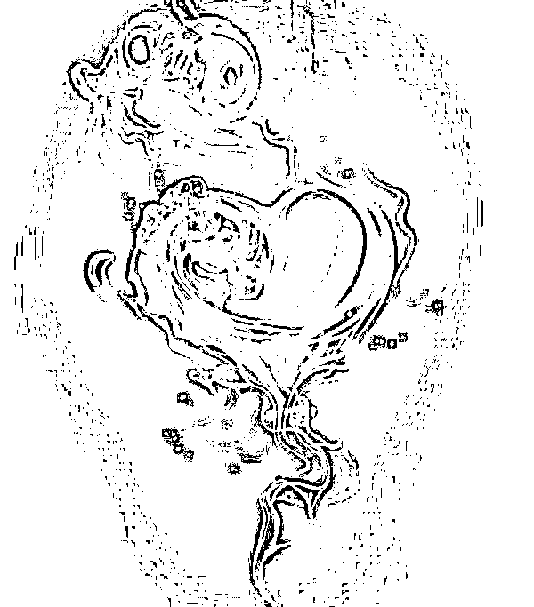

**“减分星座”的特点**

对于减分星座的人来说，他们往往是**个人主义至上者，喜欢快速进入关系**。一段关系刚刚开始没多久就达到了八十分，那么在之后的交往过程中，激情过去，理智复苏，他们逐渐发现了对方**并不是最初认识时候那么美好**（当然他们不会承认是自己盲目热情过头，而会认为是对方虚情假意）。**对方每一次对自我诉求的坚持，对社交空间的需求，在他们眼中都是减分项**。今天忘了和我说晚安扣一分，明天约会迟到再扣一分，送的礼物不走心扣五分，吵架后冷战再扣十分……不断的争吵和矛盾让关系分值快速下降，很快降到冰点，无可挽回。在分手后，他们往往喜欢抱怨对方，严重的甚至会丧失对感情的信心，不再相信关系的美好。

**“加分星座”的特点**

而加分星座正好相反。他们一开始就没有对关系抱有不切实际的憧憬，既不打算找个无条件包容自己的父母替代品，也没有打算找个让自己全身心付出的巨婴。**他们相信好的关系需要双方的妥协让步和共同经营**。在关系之初他们会**放低心态**，从六十分开始，抱着“先交往一下看看”的态度，**边观察，边思考关系的走向，慢慢加分**。遇到冲突也愿意冷静下来，心平气和地倾听和交流。如果真的某一天发现走到目前的状态，再也进行不下去了，也会好合好散。情谊不在恩义在，大家往往还能继续做朋友。

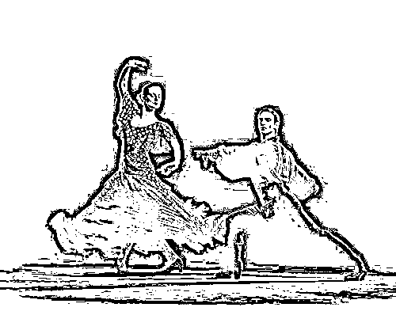

**12 星座是哪类？**十二星座里面，哪些星座容易出加分星座，哪些又更容易出减分星座呢？请同时参考**金星星座和太阳星座。****白羊座**：火象基本星座。个人主义加上勇往直前，有话不会好好说，减分星座。**金牛座**：土象固定星座。稳定积累加上固执执着，追求的就是天长地久，加分星座。**双子座**：风象变动星座。渔猎见闻加上灵活机敏，反正换一个也不难，减分星座。**巨蟹座**：水象基本星座。患得患失加上先入为主，一旦受伤就很难修复，减分星座。**狮子座**：火象固定星座。直截了当加上杀伐果决，心中只有自己，减分星座。**处女座**：土象变动星座。追求完美加上瞻前顾后，要么苛求别人，要么苛求自己，减分星座。**天秤座**：风象基本星座。与人为善加上善于周旋，为了关系，宁可自己多退几步，加分星座。**天蝎座**：水象固定星座。忠实可靠加上深谋远虑，加分星座（惹毛了的另说）。**射手座**：火象变动星座。喜欢冒险加上自由自在，放下很容易，减分星座。**摩羯座**：土象基本星座。踏实忍耐加上计划经营，关系就是利益的最大化，加分星座。**水瓶座**：风象固定星座。众人皆醉我独醒，我只做自己，你看着办，因人而异。**双鱼座**：水象变动星座。浪漫迷糊，戏精本精，可怨妇，可圣母，一切皆有可能。**加分星座**往往愿意**经营一段长久的关系**，有时候考虑过多，也容易**错过好的机会**；而**减分星座勇于行动**固然会大大推进关系的发展，但过于鲁莽、轻率、情绪化的特质也会**放大一些问题和误会**。

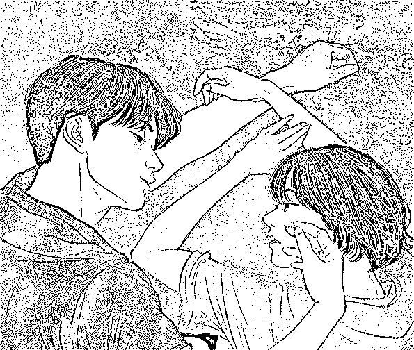

要知道，**关系中的加减法并不是一成不变的原则，什么时候该加，什么时候该减，需要自己好好思量**。失败不可怕，可怕的是失败了我们还不知道为什么，也没有从失败中总结经验，学会成长。**我们不仅要看见自己的加减法，也要看见对方的加减法；既要考虑到自己的需求和愿望，也要考虑到对方的需求和愿望**。在一种缓慢、放松的状态下，去找到、或者重新建立起自己内心的平衡，降低对关系的期待，努力学习做加法，是一件非常重要的事情。你觉得自己是加分星座，还是减分星座呢？

**版权声明：**原创文章由作者授权发布于若道平台，欢迎转发，反对抄袭。友号转载请申请白名单。

**END**

**Anastasia**

职业占星师/专栏作者/策展人

ISAR 认证占星师（2016 年获得）

若道认证生时校正资质（2015 年获得）

**微信公众号**：KairosMoment

长按打赏

**20 位来自世界各地的占星师****带来 19 场沙龙——新世界的觉醒****详情可点击下图**

**学习占星学****点击下图了解课程详情**

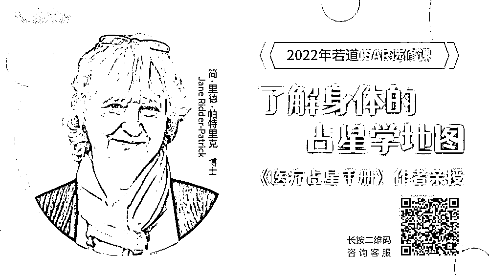

**微信又双叒叕改版啦，不想错过若道君的推送？**

**就把若道设为星标吧！**

**▼**

**喜欢就点一下“在看”吧！**

********报名直达入口********

# ISAR 选修课 | 大国命运：经世占星学 3 天线上工作坊

> 原文：[`mp.weixin.qq.com/s?__biz=MzA5NjA0NTAxNg==&mid=2651476909&idx=2&sn=e042ef833b995952c08c9db87a46f5c1&chksm=8b48e11abc3f680c7add9ba91cb9259de15cc2031ed2ae76615cc29f5aad0b1216e53c3e0bfe&scene=126&sessionid=1692737801#rd`](http://mp.weixin.qq.com/s?__biz=MzA5NjA0NTAxNg==&mid=2651476909&idx=2&sn=e042ef833b995952c08c9db87a46f5c1&chksm=8b48e11abc3f680c7add9ba91cb9259de15cc2031ed2ae76615cc29f5aad0b1216e53c3e0bfe&scene=126&sessionid=1692737801#rd)

<mpvideosnap class="js_uneditable custom_select_card channels_iframe videosnap_video_iframe" data-pluginname="videosnap" data-id="export/UzFfAgtgekIEAQAAAAAAfGQB6vQCmQAAAAstQy6ubaLX4KHWvLEZgBPEioJES3BsLK2DzNPgMIsb3nmx3ZXbJKLT1wm45TIu" data-url="https://findermp.video.qq.com/251/20304/stodownload?encfilekey=S7s6ianIic0ia4PicKJSfB8EjyjpQibPUAXolorph7kXX0G2V8DGSvfR9PkwwbPmosvYicRybibaBiaVv5A38Bc5Re8nsYStXZD7nqrhjvCib7Z8iaC9vlXIpibAjFAuw&amp;adaptivelytrans=0&amp;bizid=1023&amp;dotrans=0&amp;hy=SH&amp;idx=1&amp;m=&amp;scene=0&amp;token=AxricY7RBHdWxX5EuW79OcFLEojiajUVbfrb10projcwzwun3SBUDgOHcwIaMibQEFyWZc9dNWComE" data-headimgurl="http://wx.qlogo.cn/finderhead/PiajxSqBRaEJYnVsqWfEX9qA0sI6hNVKsDfyzfPZ92WZMZyBpZWU5NA/0" data-username="v2_060000231003b20faec8c4e68a1ec2d4ca07e434b07755bbf47e7053a3059defd2c9d6c68a20@finder" data-nickname="若道" data-desc="#ISAR 选修课 经世占星学是什么？会教授哪些知识内容？8 月经世占星工作坊，来提前了解一下" data-nonceid="3653579416430381618" data-type="video" data-width="640" data-height="368"></mpvideosnap>

有一些岁月经历的人，会非常清晰地看到，我们每个人的命运都和国家的命运紧密联系在一起。

以俄国人为例，不论每个俄国人有什么样不同的个人星图，31 年前的苏联解体，今年发生的乌俄战争这样重大的事件，毫无疑问影响了俄国 2 代人的命运。而在一些关键时间点个人的选择，毫无疑问，又影响了个人的生命历程。

而只要你关注世界局势，你也会看到，这样的一个国家发生的重大事件又会对其他国家的各个方面发生重要影响。

我们的命运、我们所获得的事业的发展机会、我们的财富机会都是和整个时代和国家息息相关。

**因此，一个好的占星师必须要懂得时代的声音，必须要洞悉全球的趋势，必须要懂得国家的故事。**

在这个工作坊中，我们将学习**如何专注于能够理解世界大事并对它们做出准确的预测。**这将带领我们踏上**一段重要的行星周期之旅，并延伸到重要国家和世界领导人的星图。**现在正是学习的好时机！

2020 年 12 月，木星与土星合相，这是 800 年来这两颗行星首次在水瓶座合相，预示着地球以及政治和社会趋势将发生巨大变化。我们正在进入一个令人兴奋的奇境，非常适合探索经世占星学。

邓肯老师说：

****

**学习经世占星学，我们可以依靠占星师们过去使用一些技法所做的预测，我们将在这个工作坊中进行探索。**

**比如：占星师迈克尔·贝金特在 1982 年，苏联解体事件发生 7 年前，就对苏联做出如下预测：**

**“从 1989 年 1 月到 1991 年 11 月……在领导和统治风格方面……国家将进行一些基本的重组。这一时期将预示着一些新的革命……严密的控制结构将失败，国家将崩溃，重新回到过去的众多自治国家。”**

**而占星师罗伯特·佐勒在世贸中心遭到袭击前一年的 2000 年写道：**

****“从 9 月份开始，我们西方正进入一个危险加剧的时期……尤其是在东海岸……这将招致乌萨马·本·拉登等冒险家的劫掠……这是一个警钟……2001 年 9 月第一次大危机袭击美国之后，我们将再也回不到从前了。”****

**在 2020 年美国大选前 6 个月，我也写了一篇文章：**

****“他（唐纳德·特朗普）将战斗到底，美国的街道将成为战场，他不会优雅地离去，但在 2021 年，一个新时代开始了，大海将覆盖特朗普总统任期的废墟。”****

出生星图和经世星图都使用相同的基本占星技法，对每一个主题的研究都同时丰富了这两个分支。你从观察世界大事中学到的东西，可以应用到个人客户身上，反之亦然。

**工作坊内容和时间安排**

**8 月 26 日 周五 **

**14:30-15:30**

**1. 基础知识介绍**

-外行星及其在各个星座运行

-外行星周期

-国家星图

-政治领导人星图

-选举星图

-将以上各项按优先级排序

**休息 30 分钟**

**16:00-17:30**

**2. 外行星及其在各个星座运行**

-天王星入座：革命性的变化

-海王星入座：意识的转变

-冥王星入座：危机与重生

**休息 90 分钟**

**19:00-20:30**

**3. 木星-土星的合相周期**

-文明的发展

-水瓶座新电子化时代

**休息 30 分钟**

**21:00-22:00**

**4. 木星与外行星的互动**

-木星-天王星：科技进步

-木星-海王星：媒体的力量；消融，受苦和慈悲

-木星-冥王星：意识形态极端主义

**8 月 27 日周六**

**14:30-15:30**

**5. 了解社会趋势**

-土星-天王星：新的如何取代旧的；科技重组

-土星-海王星：乌托邦梦想破灭；结构消融

-土星-冥王星：独裁与权力瓦解

**休息 30 分钟**

**16:00-17:30**

**6. 长期文明变革**

-天王星-海王星：新世界秩序的梦想

-天王星-冥王星：机械的变革力量；剧变

-海王星-冥王星：意识变化的 492 年周期

**休息 90 分钟**

**19:00-20:30**

**7. 20 世纪地缘政治力量的影响**

-俄罗斯、苏联时代及其衰落

-美国的故事

**休息 30 分钟**

**21:00-22:00**

**8. 中国**

-中国作为全球玩家出现

-科技、领导力和一带一路

**8 月 28 日周日**

**14:30-15:30**

**9. 行星推进的重要性**

-预测选举的结果；特朗普 - 拜登

-预测国家的发展：以色列

-美国：扩张与收缩

**休息 30 分钟**

**16:00-17:30**

**10. 有多张星图的国家**

-英国

-法国

-沙特阿拉伯

**休息 30 分钟**

**19:00-20:30**

**11. 统治者的出生星图**

-普京：克格勃军人，2020 年代的发展

-特朗普：虚假信息之王，获胜者与失败者

**休息 30 分钟**

**21:00-22:00**

**12. 21 世纪的世界发展**

-新时代的人口和气候变化

-独立与全球化

-宗教与科学

-人际关系与游戏

**授课老师**

**艾德里安·罗斯·邓肯（Adrian Ross Duncan）**

**·** 邓肯老师 1971 年在印度游学时开始学习占星学，1985 年开始成为全职占星师，迄今执业已超过 33 年，是人本主义占星学、卜卦占星学和经世占星学领域的知名占星师。

**·** 开发了占星软件 AstroClock 和多款占星报告。

**·** 从 1971 年开始研习佛学，受佛学影响很深，他相信占星学和佛学观点统一、转化的一个基础是在于对现实感知的改变。

**授课方式**

**授课方式：**

**线上网络直播课，英文授课，中文翻译**

**课程价格**

**课程价格：**

**正价：6800 元**

**早鸟价：5800 元**

**早鸟价截止日期：2022 年 8 月 1 日**

负责人：若道-童童

（微信：nodoorDaivd）

**退转课程**

**退款原则请详看《教学协议》，如有疑问请咨询课程顾问。**

****ISAR 选修课 | 大国命运：经世占星学 3 天线上工作坊****

**授课老师：******艾德里安·罗斯·邓肯****

**工作坊时间：2022 年 8 月 26 日-28 日（**周五-**周日）**

**授课方式：******网络授课，英文授课，中文翻译****

**费用：****正价：6800 元****（早鸟价 5800 元，8 月 1 日前）**

**课程负责人：童老师**（微信：nodoorDaivd，请备注“经世工作坊”）

长按二维码添加课程负责人咨询~

****报名直达入口****

# 2022 年若道 ISAR 选修课 | 《医疗占星手册》作者亲授

> 原文：[`mp.weixin.qq.com/s?__biz=MzA5NjA0NTAxNg==&mid=2651476909&idx=3&sn=baf67201d60c7b5fcdfaf80bc9ed575a&chksm=8b48e11abc3f680c98e78aa97944c999368fc50aa8e351b8283966b04152f7964645daf4b9d6&scene=126&sessionid=1692737801#rd`](http://mp.weixin.qq.com/s?__biz=MzA5NjA0NTAxNg==&mid=2651476909&idx=3&sn=baf67201d60c7b5fcdfaf80bc9ed575a&chksm=8b48e11abc3f680c98e78aa97944c999368fc50aa8e351b8283966b04152f7964645daf4b9d6&scene=126&sessionid=1692737801#rd)

**有四个主要因素影响着我们的生活和健康：基因构成、物质环境、情绪环境，以及我们的占星配置。我们在星图中都存在患病的可能性，而预防的方法在于尽可能充分、真实和健康地生活。****——简·里德·帕特里克****（Jane Ridder-Patrick）博士**

占星学就像心灵的 X 光片。它可以描述个人对世界的看法和反应。我们越不了解自己的天性，面对生活中的挑战，我们就会有越少的选择。

**“占星学可以精准定位需要解决的潜在问题。”**

**医疗占星学是一个强大的工具，同时洞察的身体和心理过程，通过更多的自我认知照顾和关爱自我和身边的人。**

**本课程既适合医疗占星学的初学者，也适合已经有一些相关经验的人****。**简·里德·帕特里克老师将运用现实生活中的例子，揭示一个人的性格、症状及其星图是如何相互映照的。课程也会探讨疾病的意义以及可能的治疗方法。

**本课程旨在为学员提供一个运用医疗占星学的框架和方法，**学员将会学到一些有价值的实用工具，在课程结束后，自己使用这些工具研究其中的关联性。

**此课程可作为 ISAR 选修课。**

1

**课程安排**

**课程时间：2022 年 9 月 20 日-11 月 8 日  每周二 20:00-22:00**

**第*****1*****讲  9 月 20 日 与占星学、心理学、病症一起工作**

*   医疗占星学的组成部分以及如何使用它们

*   行星的作用与相互作用

*   黄道星座人

*   宫位的重要性

*   疾病和健康是如何产生的

**★ 第二、三、四讲的课程内容基于星座以及它们之间的相互作用。**

**第*****2*****讲  9 月 27 日 基本星座**

学习基本大十字星座——**白羊座、巨蟹座、天秤座和摩羯座**——及其功能和相关的健康问题。**这些星座与防御、养育、结构、体内平衡和荷尔蒙控制有关。**

****第*****3*****讲  10 月 4 日 固定星座****

学习固定大十字星座——**金牛座、狮子座、天蝎座和水瓶座**——及其功能和相关的健康问题。**这些星座与习惯和反射、心脏调节、生存、循环和协调有关。**

“固定星座（金牛座、狮子座、天蝎座和水瓶座）在情感和生理上都倾向于**‘难以放手’**，这可能为恶性肿瘤的生长创造环境。所以说，他们可能倾向于沉浸在过去的伤害中，难以自拔。另一方面，这些星座也擅长在艰难的时期坚持不懈并一直**持之以恒**。”——简·里德·帕特里克（Jane Ridder-Patrick）博士

**第*****4*****讲  10 月 11 日 变动星座**

学习变动大十字星座——**双子座、处女座、射手座和双鱼座**及其功能和相关健康问题。**这些星座与呼吸、神经系统、肠道、睡眠以及信息、情感和行动的整合有关。**

**★ 第五、六、七、八讲重点学习行星，它们在身体层面的表达、它们的相位与行进。**

**第*****5*****讲  10 月 18 日 太阳与月亮**

**太阳**掌管视觉、活力、心脏和意识，与心脏、脊柱和视觉问题相关。**月亮**掌管人体的周期，特别是月经周期、饮食模式和体液，与情绪引起的疾病、饮食失调和胃病相关。

**第*****6*****讲  10 月 25 日 土星与天王星**

**土星**掌管着皮肤、骨骼、牙齿和衰老过程。它对应的疾病包括慢性疾病、耳聋、帕金森病、关节僵硬和牙齿问题。**天王星**代表身体活动的协调，有节奏的脉动和身体的“电”。与天王星相关的疾病包括癫痫、痉挛、心律失常，以及阿斯伯格综合症和自闭症样综合症。

**第*****7*****讲  11 月 1 日 海王星与冥王星**

**海王星**掌管松果体、细胞膜渗透和右脑功能，与过敏、上瘾的病症、慢性疲劳综合症和睡眠障碍相关。**冥王星**掌管消除和转化，其病理包括毒性、脓肿、癌症和强迫症。

**第*****8*****讲  11 月 8 日 火星**

**火星是与能量和防御相关的行星**，掌管免疫系统、肾上腺功能、肌肉活动和炎症反应。**它是许多身体和情绪障碍的核心**，如自动免疫障碍、抑郁和发烧，以及由手术或需要手术引发的问题。

2

**此次课程适合哪些人？**

*   有一定占星学基础，若道核心课 L3 以上水平；

*   希望成为优秀的占星师，想要借鉴国际大师医疗占星解读思路并融入自己的体系的人；

*   热爱占星学、健康、养生的研究型占星学者；

*   计划考取 ISAR 认证占星师，寻觅中意选修课的学员；

*   走在自我探索和个人成长道路上的人。

**快来和简·里德·帕特里克老师学习升级版的占星学身体地图吧！**

3

**授课老师**

**简·里德·帕特里克 **博士****

（Jane Ridder-Patrick）

简接受过药剂师、理疗师、草药师、心理治疗师和历史学的专业学习，从事写作、咨询和讲学工作，在英国和全球教授占星学及其历史、当今的心理学和医学应用。她在爱丁堡执业，在爱丁堡大学获得博士学位，研究方向是 17 世纪苏格兰占星学历史。

**她最著名的出版物是《医疗占星手册》。2018 年，她因对医疗占星学的贡献而获得了著名的查尔斯·哈维占星学杰出服务奖。**

《医学占星术手册》（第二版，修订版和扩充版）

(爱丁堡，克拉布出版社，2006 年)

4

**课程信息**

*   **课程时间：**2022 年 9 月 20 日开始，每周二晚上 8 点，每周一次，共 8 次课。

*   **授课方式：**线上直播，英文授课，中文翻译

*   **课程价格：****6800 元**

*   **早鸟价：5800 元（截止日期：2022 年 8 月 23 日）**

*   **课程咨询：**王老师（微信：18510107057，请备注“医疗占星”）

长按二维码添加王老师

5

**退转课程**

*   **退款原则请详看《教学协议》，如有疑问请咨询课程顾问。**

****医疗占星****

**授课老师：**简·里德·帕特里克

**授课时间：**2022 年 9 月 20 日起

**授课方式：**网络课程**，**英文授课，中文翻译

**费用：****6800 元****（早鸟价：5800 元，2022 年 8 月 23 日截止）**

**课程负责人：****王老师**（微信：18510107057，请备注“医疗占星”）

长按二维码添加课程负责人咨询~

****报名请点击“阅读原文”****

# “学习占星学让我成为更好的自己”，师兄师姐如是说

> 原文：[`mp.weixin.qq.com/s?__biz=MzA5NjA0NTAxNg==&mid=2651476700&idx=2&sn=40d8d6786f5930a37fce5445e030a26c&chksm=8b48e06bbc3f697dc18e4ea60d6483784705bca29e34e0e532150830162545491e1c6502b37e&scene=126&sessionid=1692737801#rd`](http://mp.weixin.qq.com/s?__biz=MzA5NjA0NTAxNg==&mid=2651476700&idx=2&sn=40d8d6786f5930a37fce5445e030a26c&chksm=8b48e06bbc3f697dc18e4ea60d6483784705bca29e34e0e532150830162545491e1c6502b37e&scene=126&sessionid=1692737801#rd)

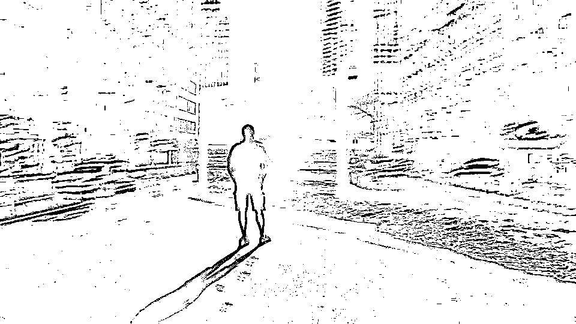

作者/若道君

编辑/翀子 图片/网络

每年当若道的同学们上完 L1-5 的核心课程后，我们都会让同学们对于自己学习占星的体会做一个分享，这样可以帮助未来刚刚踏入占星门槛的新同学们了解他们一路来学习的体验，和他们认为一些对自己有帮助的学习方法。

今天，若道君继续给大家摘录一些若道同学的分享。虽然每个人的个性不同，年龄不同，背景不同，也希望这些真诚的分享对于大家有所帮助。新一轮[【ISAR 认证职业占星师必修课程】](http://mp.weixin.qq.com/s?__biz=MjM5MjQwNjAyMQ==&mid=2649439812&idx=5&sn=0742db35aaba4900299fb99969c6c3aa&chksm=beb9512e89ced8381077e6ad4bab2483e201347dc4ddd27241062561864f68500fbb72f79876&scene=21#wechat_redirect)也在报名中，点击链接就可以了解更多信息啦。

很多人都曾说过类似的话，回忆起多年前开始学占星的时候，完全没有想到占星会给我带来如此大的改变，而且跟原来想象的非常不一样。

**这些意想不到的改变是什么？以下是一些若道师哥师姐的分享：**

**每个人都是不同的个体**

**@晨曦**

**让我对更加宏大的事物产生信心，进而对自我产生更多的信赖。**

在接触占星学的初期，我也对占星产生过一些错误的认识，把它看成是一个“类似于算命”的工具，沉迷于“准”或“不准”的标准之中。

随着学习的逐渐深入，才真正了解到**我所学习的是人本主义占星学**，它是能让我们深入认识自己、他人以及整个宇宙对我们怎样产生影响的工具，**可以让我们更清楚的看到自己的行为模式，能量原型在如何的运作，怎么样才能发挥出我们的潜能和创造力......**

**我觉得占星观的建立比学习任何占星技巧都要重要，**这决定了学习占星学的方向。

占星学帮助我认识到每个人都是不同的个体，都有其独特性，同时也是整个宇宙的一部分。我们与外界互动不可避免的都会带有我们的投射，投射出去的是我们的经历所形成的标准，信念和认知，会把别人当做镜子中的另一个自己。

**但是实际上每个人都是独一无二的，**每个人都具有自己的独特性，我们在不同的时间、不同的地点出生，根据其出生那一刻天上行星的位置，每个人都有不同的出生星图，即使是双胞胎，拥有同样的星图，星图发挥的能量也侧重不同、高低不同。

这使我们看待外面的世界会有**更大的包容心、更广阔的视野**，令我们对更加宏大的事物产生信心，进而对自我产生更多的信赖。

我们的经验和图式可以显示出我们的行为模式，**占星学能带给我们清晰的洞见**，让我们觉察自己，放下对过去经验，痛苦，模式的执着，让我们看到有新的模式和新的能量可以去替代，转换，**看到生命的动力和周期循环。**

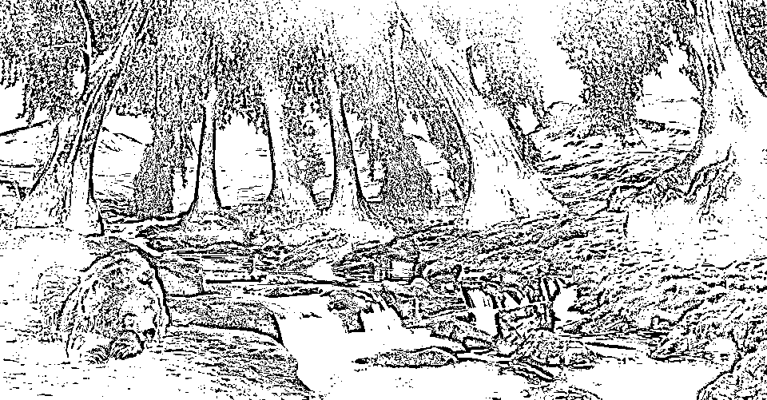

**越来越包容，越来越自信**

**@陈静**

**让喜欢评判和挑剔的我越来越包容，也让我看到“自信”的功课。**

**学习占星学以来给我最大的体会是，越来越包容理解他人。**

太阳处女座、水星处女座的我，总是不自觉的喜欢评判自己或是他人，评判多了自然也会带来关系上的障碍，当我了解我先生的出生星图，看到他的习性模式和星图的呼应，我也释然了：有什么好计较的的呢，他本来就是这样子的，我对他有了更多的接纳……

每个人的习性模式在星图上都是有呈现的，当然学习占星首先最大的受益是**帮助自己成长**。大多数人都是被自己的习性牵引着，盲目的反应，而星图帮助我们**更有觉知的去看待生活**，这一点我深有体会。

我的星图上，上升在狮子座，处女座土星在一宫。的确，我对于那些在舞台上发光的人，又羡慕又评判他们，当我想表现自己的时候，我又变得不自信、紧张、不安，退缩甚至有些恐惧。

这种矛盾的心理状态，以前很多时候我以为只是自己和别人一样怯场罢了，**学习占星以后，我才知道其实不然。**这和我童年被“土星”式的人物压制有关，也和我的自我价值感比较低有关，和我深层的不自信有关。

这种直接的了悟是学习占星带给我的，**明白了深层的原因，才能更好的成为自己。**

土星在一宫的处女座，通过长时间的（土星）学习某项专业技能（处女）来建立自我（一宫），这是土星教会我要做的功课。完成了土星的功课，也能更好的展现上升狮子座（自信、热情、鼓舞人心）建设性的影响力。

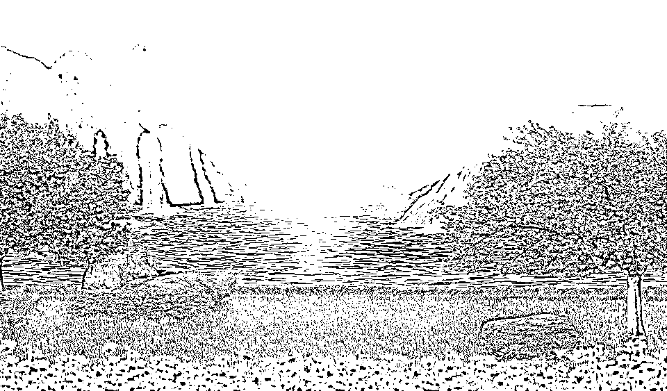

**越来越独立，越来越自由**

**@梅小莲**

**让我变得更独立自主，活得越来越自由。**

对于上升摩羯座的我来说，学习认真刻苦是标配。我几乎没有落下所有老师的网络课程。

老师从星座原型给我们讲起，从一知半解到略微有所知，再到深入理解。星座的原型神话故事、大卫老师讲我们的前世今生南北交故事、还有格伦老师的心理占星案例，丰富又过瘾，**让我理解占星学还有这么多的领域可以去拓展。**

我一边听着老师的讲解，一边看着自己的星图，看看最近是什么影响着我。我的生活似乎跟天上的星星有了关联。我发现，我在天王星对分我土星、冥王星经过我上升的时候开始学习占星学。

我根深蒂固的摩羯式观念和生活随着占星学开始有所松动，我原有的认知偏见，思想禁锢，阻碍了我成为一个自由独立的人。

同时，我更愿意在我父母面前表达我的意见，我也与他们设立了边界，确立了责任与义务，我终于明白为什么我能从原来的讨好型人格转变到反叛型人格，了解自己内心的冲突，慢慢努力调整这些冲突。

在每次确立我自己的时候，他们也越来越尊重我，也更愿意接纳不同的声音了。我感到小庆幸，在改变我自己的同时，也影响着我爸妈。**我觉得我活得越来越自由。**

**这就回到了占星学的初衷，更加认识自己，更加了解自己，并且成为更好的的自己。**

另外一方面，我对于一些事情有了自己看法，也更能够理解别人。通过若道每天的荐读，我知道原来这个世界上，油盐酱醋、悲欢喜乐、爱恨情仇的剧情时时在上演，我会试着用占星的语言理解这些故事。**通过学习，我学会感恩，学会慈悲，学会尊重每个生命！**

**成为自己的舵手**

**@曾宜希**

**让我把星图中的“蛊毒”变成我的“独特能量”。**

2009 年到 2013 年，经历几段虐恋之后，才知道我的星图中有很强的金冥主题。在学习了一段时间之后，我终于知道了自己中的“蛊”（金冥四分相）也是可以发展出高阶的表现的，我开始知道我天生拥有哪些能量，我该怎么样正确的去利用他们。

我很喜欢的一句话，我觉得占星学帮助我实现了**“我们不能避免受苦，但是我们可以避免盲目的受苦”。**

当我知道自己身上的能量的时候，我可以更有意识的去发展它们，也会更有意识的去控制负面的发展，那些无法避免的议题，试着用另一种轻松的方式展现出来。

比如现在我正在做的工作，帮助来访者去理清自己的情感模式，帮助它们度过一段自我价值感低的危机时期，这些都符合了金冥的特点。而我现在也并没有婚姻不好，结婚前，我陪着我的老公经历了债务危机（金冥），而现在我们的感情更加深刻了。

以前的我总是充当朋友当中的知心姐姐（水星 11 宫），用自己天生的共情能力（命主星太阳在 12 宫）帮助她们分析自己的情感模式（月亮处女座），而现在的我可以运用更加专业的知识去帮助周围的人走出困境了。

以前会相信命运，以前不知道自己有哪些潜能，以前以为受过的苦都是因为命不好，以前以为这一生就这么过去了。**当我打开自己的星图，看见自己的生命地图的时候，我才真正的成为了我生命之船的舵手。**

**带着觉醒活出星图能量**

**@金怡**

**让我了解此生功课和生命蓝图所在，带着觉醒活出星图中更高的能量。**

**我觉得意识的觉醒需要一系列外在事件的推动，而星图则是提醒你此生的功课所在。**

星图中很多需要解决的议题都与原生家庭有关，通过星图可以了解到原生家庭的问题，而你之所以拥有这样的星图、之所以会生在这样的原生家庭，则与此生的功课有关。

如果说星图是你灵魂出生前为了进化而精心设计的生命蓝图，那么当你没有觉醒之前，所谓业力的模式便会周而复始。

当意识还在沉睡时，日子就在喜怒哀乐中浑浑噩噩度过，你只能无意识的被行星行运牵着走，不是疲于应付那些用来提醒你觉醒的令人痛苦的外在事件，就是始终活在星图的低阶能量中。

**直到你看到它们、带着觉醒去改变这些模式**，你才能充分活出你星图的能量，活出你星图的高阶能量，接近你的北交点——灵魂此生将要进化的方向。带着这份生命地图，继续灵魂的进化之旅，直到回家。

**这是几位师兄师姐的体悟。**

**他们都说，感恩占星学。**

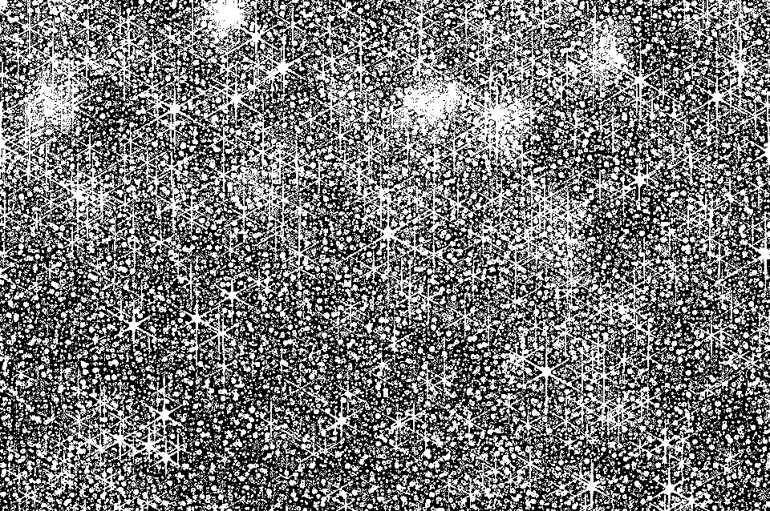

**版权声明**：原创文章由作者授权发布于若道平台，欢迎转发，反对抄袭。友号转载请申请白名单。

**END****拥有****51 年****占星实践经验的****若道创始人****前 ISAR 全球副主席****前 ISAR 全球职业占星师资质认证主席****大卫·瑞雷**

**和**

**2019 年第二届、2021 年第三届核心课中**

**与苏·汤普金斯老师****联合授课****的**

**ISAR 认证职业占星师**

**咔咔（Caroline）**

**二人合力打造**

**2022 年 ****若道全新核心占星课程**

**点击下图了解课程信息******20 位来自世界各地的占星师****带来 19 场沙龙——新世界的觉醒****详情可点击下图**

**学习占星学****点击下图了解课程详情**

**微信又双叒叕改版啦，不想错过若道君的推送？**

**就把若道设为星标吧！**

**▼**

**喜欢就点一下“在看”吧！**

**报名直达入口**

# ISAR 认证职业占星师文凭课程 | 开启“爱好变职业”的创收自由之路

> 原文：[`mp.weixin.qq.com/s?__biz=MzA5NjA0NTAxNg==&mid=2651476700&idx=3&sn=804527ca81139be7d588c15514ea527f&chksm=8b48e06bbc3f697d049b91379d493dbe49fe33f85fc9d3c14fa42fc547619f3db92e83380e88&scene=126&sessionid=1692737801#rd`](http://mp.weixin.qq.com/s?__biz=MzA5NjA0NTAxNg==&mid=2651476700&idx=3&sn=804527ca81139be7d588c15514ea527f&chksm=8b48e06bbc3f697d049b91379d493dbe49fe33f85fc9d3c14fa42fc547619f3db92e83380e88&scene=126&sessionid=1692737801#rd)

**2022 年，是世界和中国 40 年未有之大变局的开始。**

俄乌战争打破了欧洲大陆乃至全世界的和平局面，而新冠疫情也给中国经济带来前所未有之挑战。

如果你关心经济形势和世界局势，你会有这种的感觉，我们将面临一场深刻的危机，而这不是短期内可以结束的。

**占星学的看法也是如此。**

4 月青年失业率（16 岁到 24 岁）中国达 18.2%，一些背着房贷、教育、医疗负担的中年人突然失业更是整个家庭整个难以承受之重。为了更好准备面对这样的时代变化，连《北京日报》这样的官方媒体也在呼吁：**“开拓副业，让自己有多元化发展的生存能力”。**

**而这门课程，就是为了这样一个目标准备的。**

**占星学是非常好的“开展副业”的选择**

这个**为期 16 个月**的课程通过并不算长的时间和并不算高的投资，不仅可以帮助你学到一个终身可用的技艺，而且也可以选择成为自助助人的占星师，**开启受益终生的第二事业。**未来是个体崛起的时代，大量个体被鼓励独立发展，比如网红、自由职业、自媒体、咨询师等，他们都不需要传统的办公室。社会越发达，人的独立性就越强，未来有能力的人都可以变成独立的经济体。

**占星学也是越老越好的职业**

和一些技术变化非常快的职业不同，**占星学的技术层面非常稳定，不会快速迭代变化，**同时，掌握好占星学、能够做一场好的咨询又需要个人自身大量实践和对生命的深刻理解，而这些都是时间和岁月带来的。

**占星学是现代社会需要的助人职业**

社会快速发展和变化人们似乎越来越无法掌控自己的生活，这给很多人带来巨大的焦虑，**抚慰心灵的咨询市场需求巨大。**而占星学可以让人从前所未有的角度了解自己，了解目前和未来所处的周期，挑战的意义，不论对于深入的个人成长探寻，还是预测未来的周期，都又其独一无二的价值。

**ISAR 认证职业占星师的独有培训**

目前占星学的培训市场鱼龙混杂。而 ISAR（国际占星研究协会）是一个包含了 47 个国家在内的国际占星组织，多年来致力于占星的教育和研究，提升占星教育的品质和职业占星师的能力，在国际占星领域备受尊重。今年，ISAR 对于成为 ISAR 认证职业占星师提出了更高的要求，**所有想要获得 ISAR 职业占星认证的申请者均需要在 ISAR 的附属学校通过 500 个小时的研习（包含****主课****、选修课、沙龙、作业、讲座、工作坊等等）。**

**而这门核心占星学课程就是为此而准备的。**

**2022 年，鉴于对若道在占星教学领域所做的持续努力和高品质的课程服务，ISAR 特别授予若道核心课程为 ISAR 文凭课程，所有在若道学习，并通过若道毕业考试的同学将获得 ISAR 颁发的学历文凭（Diploma）。**

**你的占星核心课老师是谁？**

**拥有****51 年****占星实践经验的****若道创始人****前 ISAR 全球副主席****前 ISAR 全球职业占星师资质认证主席****大卫·瑞雷**

**和**

**2019 年第二届、2021 年第三届核心课中**

**与苏·汤普金斯老师****联合授课****的**

**ISAR 认证职业占星师**

**咔咔（Caroline）**

**二人合力打造**

**2022 年 ****若道全新核心占星课程**

**咔咔老师给同学的寄语：**

（向上滑动查看内容）

**亲爱的同学们：**

我为什么学占星学？

2000 年的时候我还是一个在网上搜索天蝎座和水瓶座配不配的普通白领。我搜索的内容还包括了水瓶座为什么总是这么若即若离？

体贴的搜索引擎给我推送了占星学、行星、星座、宫位、相位等资料，还让我了解到莉莉丝、月亮交点、截夺宫位等占星学概念。

2000 年 10 月我了解到，一个从业 30 多年的美国职业占星师大卫·瑞雷来到了中国，和他的中国合伙人将开办一个专业教授占星学知识的课程。过去 10 个月在网上东拼西凑的占星学知识唤起了我对占星学的兴趣，但是已经不能满足我对星图深度分析的需求了。

2013 年，我通过了若道核心课程的毕业考试和国际占星师研究协会的认证考试。2015 年我离开职场成为一名全职占星师。

到底学习占星带给了我什么呢？

1、它是自我觉知的工具，我现在已经不去纠结哪些星座是否匹配，我相信外在的事件是内在心理矛盾的显化。也就是说，想找到令人满足的亲密关系，要先去了解自己的情感模式和需求，而不是无意识地一次次地试错和撞墙。我开始学习自我关怀和接纳自己。

2、它带来看待世界的全新和全景的角度，天上如是，地下亦然。人类社会和个人生命的进化都有其周期和相似性，作为个体，占星学帮助我思考如何更积极和有建设性地与宇宙的能量合作，认识自己，发挥自己的潜力，度过有意义且自我满足的人生。

3、它带来了全新的职业：占星师和占星老师。除了收入，还有助人育人的满足感和意义感。

4、它带来一群志同道合的伙伴，我们彼此联结又相互独立。

作为中国占星界的“黄埔军校”若道占星的学生、助教和老师，我与很多学员在人生的不同阶段带着各异的需求走进了这所学校，2022-2023 年一年半的若道核心课程设计既蕴含了大卫·瑞雷老师的教学精华，也带入了我在跟随不同国外占星老师学习、助教和教学积累的心得。

有一些学员毕业后从事了占星咨询工作，有的在各大平台成为专业占星学知识的输出者和传播者，有的运用占星学提升他们的工作，也有的在占星学与投资，占星学与名人/八卦、占星学与原生家庭、亲密关系、亲子关系等领域收获了有用的或者有趣的体验。

对我来说，生命是一场自我完整的体验之旅。从 2011 年的那个春节在若道入学之后，我的生命旅程更加充实、有意义、有目标，也更有满足感。

希望在 2022-2023 年的若道核心课程里见到你。希望你此后的生命旅程里，有若道，有占星学。

占星师咔咔

2022 年 5 月 24 日

**大卫老师给同学的寄语：**

（向上滑动查看内容）

亲爱的学员们：

感谢你对我们从 8 月 30 日开始的若道 L1-5 级核心课程的兴趣。我和合作老师咔咔以及我们的核心课程团队期待着为你提供这个机会，来教授各种高品质的地道占星学知识和技巧。

对于那些希望获得 ISAR 职业占星师认证的学生，这是一门适合你的课程！

作为 ISAR 咨询技能培训的一部分，我曾与咔咔合作过，我们期待着再次合作。咔咔和我曾在 ISAR 职业占星师认证委员会（CAP ISAR）一起工作，我们非常熟悉获得 ISAR 职业认证的流程。作为你的老师，我们将陪伴你整个占星学发现之旅，帮助你逐渐认识到占星学有多么的神奇。此外，你还将受益于我们若道的助教和课程顾问，他们是若道核心课程计划的重要组成部分，提供在线沙龙、组织学习小组、指导家庭作业。我们的教育团队是“服务于你的团队”，所以也会根据你的需求进行相应的调整。你专用的核心课程微信群也促进了你的学习过程，使你能够每天与你的同学们一起学习、探讨、成长。

52 年前，当我开始学习占星学时，没有一所像若道这样的学校。如果有这样一所学校，我会尽一切可能在那里成为一名学生。事实上，我很幸运，我的老师都是经验丰富的专业占星师。然而，我花了 6 年的学习时间才通过 1976 年在美国乔治亚州亚特兰大举行的专业占星师考试，又花了 2 年的专业实践时间才通过占星学谋生。我永远不会忘记从 1970 年到 1978 年的 8 年，那些日子的反复试验教会了我如何苦练占星学。作为老师，我一直在努力传授我早年所学的知识，让你的旅程更加顺利，更加全面。

自 1978 年以来，44 年的全职实践教会了我很多，我很高兴有机会与大家分享我所学到的东西。我和咔咔都是现代占星师，虽然我们尊重西方占星学的历史和传统，但我们实践和教授的占星学植根于现代人本主义哲学，这种哲学旨在提高你对自身潜力的认识，并鼓励个人成长。还有什么比了解自己更实际的呢？还有什么比个人成长和发展潜力更有利的呢？这是你将要学习的占星学，一种可以应用于你自己生活的占星学，一种可以为你提供一个充实职业的占星学。

教书是我回馈占星学行业的方式，这个行业拓展了我的视野，远远超出了我曾经想象的可能。谢谢你给我这个机会做你的老师。

大卫·瑞雷

2022 年 5 月 24 日

**连报 L1-5 全阶网络直播课程，你可以享受**

❶ 64 次线上直播互动网络课程+2 场工作坊，全面而详细地讲解占星学知识、技能、案例和重要领域实践运用。

❷ 知识点+学员星图解读有机结合：咔咔老师以讲解知识点和中外名人案例为主，大卫·瑞雷老师以参课学员案例演示及客户案例为主，每个知识点覆盖班级内学员的亲身案例，参与感更强，多位学员都有机会听到自己的星图分析。

❸ 微信群学员互动分享，从真实案例学习生命成长故事。

❹ APP 答疑论坛提问：论坛上每个学员的问题都将得到及时回复。

❺ 若道独有的职业占星师养成计划，为你毕业后独立咨询做准备。

**❻ **提供**咨询平台**，只要努力，优秀毕业生有机会入驻**若道咨询平台**，拓展咨询客户群。

**更多了解老师和助教？**

**大卫·瑞雷（David Railey）**

*   **I****SAR 董事会成员，ISAR 全球副主席，ISAR 全球职业占星师资质认证主席，若道占星创始人**。

*   2016-2019 年，被选为国际占星协会（ISAR）考试委员会成员，国际占星协会（ISAR）是世界最大的国际占星机构，会员遍布 47 个国家。

*   2017-2020 年，被选为国际占星联盟（ISAR）考试委员会主席，理事会成员。

**占星师咔咔（Caroline）**

2010 年师从美国占星师大卫·瑞雷学习，并得到世界名师斯蒂芬·弗里斯特、罗伯特·汉德、苏·汤普金斯传授各种占星学技法。若道首届学员，国内最早获得 ISAR 职业占星师资质的职业占星师，多次担任若道核心课程助教，并于 2019 年第二届、2021 年第三届核心课中和苏·汤普金斯老师一起教授若道核心占星课程。

在国际知名广告公司和市场研究公司从事的市场研究和推广工作十余年，曾任职于阳狮集团、尼尔森市场研究有限公司、MTV 和《Madame Figaro》杂志。

**助教王嘉祺 （Conrad）**

ISAR 认证占星师、若道认证生时校正资质，从 2010 年起自学占星学，2015 年开始在若道系统学习，并开始个案咨询。2018 年担任若道核心课程助教，以及卜卦占星学和太阳返照选修课助教，并带领学员进行经世占星和太阳返照方面的研究。2019 年 11 月作为演讲人之一参加了国际占星协会（ISAR）北京大会，也是 ISAR 星空俱乐部中国区第 16 期的主讲人。

**什么人适合这门课？**

*   对占星学有浓厚兴趣，想要系统学习占星学。
*   对占星学有一定基础，但不知道该如何整合星图复杂的碎片。
*   希望成为优秀的占星师，想要借鉴国际大师解读思路并融入自己的体系。
*   想学习占星学，但不擅长英文，希望有中文老师授课。
*   想结合占星学理论与咨询实践。
*   走在自我探索和个人成长道路上的人。

**课程费用**

**★ 1-5 阶 连报**

**早鸟价：33000 元（2022 年８月 1 日之前）**

**课程费用：46500 元** **★ 1-2 阶 （8 月 30 日开课）**

**早鸟价：2800 元（2022 年８月１日之前）**

**课程费用：3500 元 ****★ 1-3 阶　连报**

**早鸟价：10500 元（2020 年８月１日之前）**

**课程费用：11500 元 **

**咨询课程请联系顾问**：**王老师（微信/手机：18510107057，请备注“大卫核心课”）**

**退转课程**

**退款原则请详看《教学协议》，如有疑问请咨询课程顾问。**

****2022 L1-5 认证职业占星师必修课程****

**授课老师：大卫·瑞雷、咔咔**

**直播课开课时间：2022 年 8 月 30 日（周二）开**

**授课方式：******网络授课，英文/中文授课，中文翻译****

**费用：****1-5 阶连报**：46500 元**（早鸟价 33000 元,8 月 1 日前）；**1-2 阶**：**3500 元**（早鸟价 2800 元,8 月 1 日前）**；****1-3 阶**：**11500 元**（早鸟价 10500 元,8 月 1 日前）**；

**课程负责人：王老师**（微信/手机：18510107057，请备注“大卫核心课”）

长按二维码添加课程负责人咨询~

****报名直达入口****

# 德普与艾梅伯世纪庭审 | 彼此纠缠，互相伤害，是一场生命的转化游戏

> 原文：[`mp.weixin.qq.com/s?__biz=MzA5NjA0NTAxNg==&mid=2651476700&idx=1&sn=5a092bf21d1aca4c97a7092377882d20&chksm=8b48e06bbc3f697d9efa273252bd86dc353e5ceefbe0ea0c80fb2bdacd9e65e09779d4beac47&scene=126&sessionid=1692737801#rd`](http://mp.weixin.qq.com/s?__biz=MzA5NjA0NTAxNg==&mid=2651476700&idx=1&sn=5a092bf21d1aca4c97a7092377882d20&chksm=8b48e06bbc3f697d9efa273252bd86dc353e5ceefbe0ea0c80fb2bdacd9e65e09779d4beac47&scene=126&sessionid=1692737801#rd)

********☆ ****后台回复“今日”，给你一句生命态度********

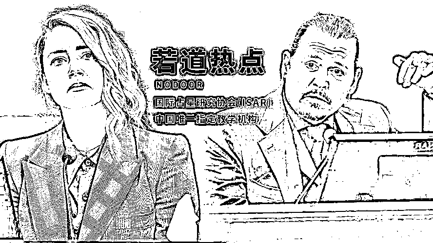

作者/咔咔（ISAR 认证占星师） 莱莱
编辑/玫瑰 封面图/书君 图片/pexels

据外媒报道，约翰尼·德普（Johnny Depp）起诉前妻艾梅柏·希尔德（Amber Heard）诽谤案审议结束。根据判决结果，36 岁的艾梅柏目前欠 58 岁的前夫德普 1035 万美元，艾梅柏方表示将对这一结果提起上诉。

两位占星师是如何看待这起事件呢？我们来看看吧。

**占星师如何看德普“大战”艾梅柏****咔咔：**约翰尼·德普是美国著名演员，1963 年美国生人，凭借《加勒比海盗》系列名声大噪。艾梅柏·希尔德，美国影视演员，1986 年出生于美国。两人于 2015 年结婚，他们的婚姻持续了 15 个月，于 2016 年离婚。离婚是艾梅柏提出的，理由是约翰尼·德普自从交往就一直家暴她，但是洛杉矶警方调查后也没有发现任何家暴证据。三个月后艾梅柏撤销了对德普家庭暴力的指控，两人正式庭外和解 ，德普付给艾梅柏 700 万美元。两个人也签了保密协议，表示之后对这段婚姻一致对外封口。

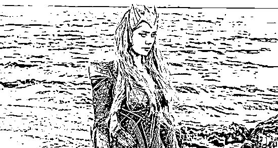

| 艾梅柏在《海王》中的扮相但是 2019 年，艾梅柏在华盛顿邮报上发表了一篇关于文章，说自己也经历了家暴。文章刊发时间刚好是她主演的电影《海王》上映之前。艾梅柏在文章里虽然没有点名，但公众也知道这是暗指德普家暴她。这给德普造成了很大的声誉影响，也导致他事业受损，被电影公司要求辞演《神奇动物在哪里》系列电影。被前妻指做“家暴男”对德普的打击应该是巨大的，他的外形也越来越颓，从原来的印第安混血小帅哥、酷帅大叔，到最近开庭，他胖的有点像个正方形了。

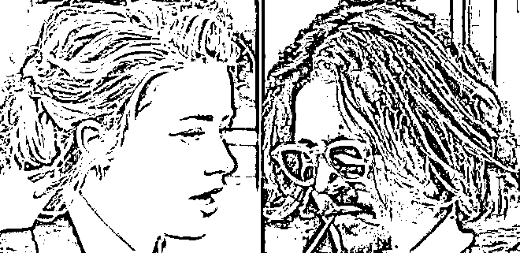

| 德普与艾梅柏近照**莱莱：**我觉得他完全放弃了帅哥路线，他原来是“屌酷帅”，现在变成萌老头了。**咔咔：**对，胖胖的就变成好像很可爱的样子，他这次在法庭上又是画漫画，又吃小熊软糖，你就觉得他怎么 50 多了，还像个少年呢？我们其实也无法判断德普到底家暴了没有，他被“诽谤”这件事，英国有英国的判决结果，美国有美国的判决结果。其实我们只是希望从占星学上找到一些线索**去理解德普是个什么样的人，艾梅柏是个什么样的人。在关系里面他们要做的功课是什么。****莱莱：**对，核心的要点要把握的是占星的基调，而且是严肃占星学的基调。就意味着我们是通过占星学工具来辅助我们看到事件，它是一个怎样的过程，从中也会看到一些不同人的部分，最终回到我们每个人自己对应的一些东西。在看名人事件的同时也能够收获一些自身问题的启示。首先，我们回到基本背景，来复盘一下德普的星图配置。**咔咔：**德普给我的感觉有点像小飞侠。**莱莱：****德普是是太阳双子座，月亮摩羯座，上升狮子座。**在占星学里**双子座对应着青少年**，德普有一种特别青春的状态，洋溢着一种少年气息，有活力，招人喜欢，而且很会社交，他的粉丝缘非常好。德普已经是个 50 多岁的老头了，但依然有可爱的一面，但是否也有些行为和举动有一点像没有长大的孩子？这跟他太阳落在双子座是有关联的。**太阳双子座还需要关注到水星的落位，因为水星是守护双子座的。**

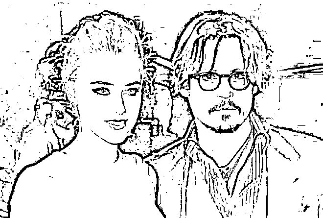

| 德普与艾梅柏**咔咔：****他星图里的水星主题特别重。**太阳双子座，双子座是由水星掌管，金星与水星合相，火星、天王星和冥王星也在水星掌管的处女座。但是他身上又有另外一种**摩羯座**的部分，一种成熟的感觉，好像是说在他的生命里面有两种能量：**老年人摩羯座的部分和很年轻聪明的双子座的部分。****但凡我们提到水星主题重，这个人可能非常非常聪明。**德普会说七国语言，不管说得是不是很流利，西班牙语、法语甚至塞尔维亚语、德语他都能拿出来讲两句。他没有受过特别好的高等教育，爸妈离婚了以后他就不太好好读书，从高中退学了。**莱莱：**我对双子座的印象是很聪明、很聪慧，它的原型是魔术师，有一种鬼魅的特征在身上。**咔咔：**变戏法的。**莱莱：**很多双子座透露出来的感觉会有些灵动。德普太阳双子座为什么有这么重要的影响呢？因为他本身是上升狮子座，太阳是他的命主星。**狮子座的外表，那种夸张的、戏剧的，特别有种感染力，是聚焦在他的外貌底下的。****咔咔：**你会觉得他进入到世界，他进到任何场合里面的时候，好像自带背景光，自带舞台追光。他希望能去展现出来的是自己太阳的表现力，就像你刚刚说的，他的表现力是夸张的，有自己的风格，他一路以来，你看他的时尚形象，也是非常独特的。

| 年轻时的德普**莱莱：**德普的星图有一种明星气息，但不是演员气息，但总是有粉丝爱他。你仔细想他的代表作，真正大的票房的就是《加勒比海盗》系列，他之前的作品都是比较小众、比较暗黑。他并不是在演员的功力上去见真章，声台形表的呈现不突出，因为上升点是虚点，其实没有能量，它只是个滤镜。但他的滤镜因为关联到他的太阳带来的能量，决定了德普真招人喜欢，11 宫太阳双子座的他真迷人，获得粉丝极大的拥趸。他胜诉后可以看到粉丝的狂欢，舆论几乎一边倒。我们很难要求人一辈子永远做正确的事，挺难的，要从中去成长，去完成积极的、高阶的表达，就有一颗行星就特别重要，表面它是给我们带来压力、困难的一颗行星，但它恰恰带给我们的是成长，推动了我们自身星图中所有不完善的东西往高阶的方向去发展，这颗星是土星。**这次的新闻事件和德普的土星有关，他的土星落在了七宫。**七宫对应到的是一对一关系，亲密关系当然包括婚姻，里面很关键的一个内容叫**契约，是两人之间的承诺**。我们经常说的土星在哪个位置，哪个位置就是要去做功课的地方。**咔咔：**土星的功课做得好，付出就有回报。但是**土星也代表了时间和持续不断的努力，你才会成为那个领域的专家。**提到土星的时候，德普星图除了他小飞侠双子座的部分，其实还有摩羯座土星的主题——**月亮摩羯座，土星在七宫四分了水星和金星**。土星所在的地方和触碰的行星，人们会感到不足，会觉得自己在这方面做的不好。有恐惧，也会有很高的标准，会认为我因为不足而被评判。**对德普来说，他会觉得自己的想法、思维、智力、知识、自我价值、被爱的感受受到土星的压制，感觉别人会评判他，压制他，土星在七宫，受挫的体验表现在伴侣关系和人际交往中。**

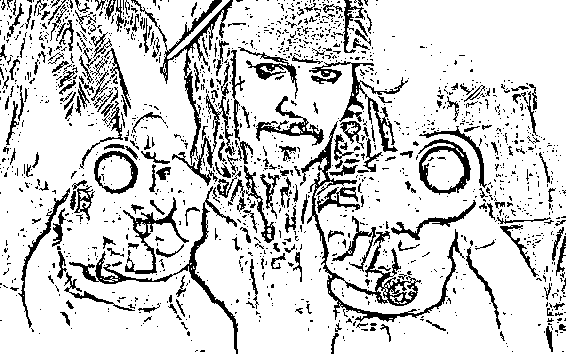

| 《加勒比海盗》中的德普**莱莱：**

**德普是土星水瓶座，水瓶座是有一些疏离的本质。**在两性关系中，他**需要一些空间，需要一些距****离，或者需要一些独立和自由。**

德普的土星四分了金星金牛座，从古典占星来看，德普土星水瓶座和金星金牛座都入庙，都在自己的守护星座，意味着本身这两颗行星其实是舒适的，能量输出是得当的。

金星 10 宫意味着在公众环境中他是自如的、愉悦的，但恰恰功课落到了他的婚姻宫里的土星，**金土四分的挑战相位，把本属于婚姻中的问题展现在了公众面前，亲密关系中未被解决的纠纷严重影响了他的公众形象。**

**咔咔：**

他和姐姐在法庭做证都提到，德普的妈妈脾气很糟糕，取笑他，给他起外号。小时候的这个体验成年后他又经历了一次，艾梅柏也会羞辱他说他是毫无魅力的胖子。

星图上月亮摩羯座四分木星白羊座显示了妈妈在家里很霸道强势。他的爸爸就比较软弱，忍无可忍才和妈妈离婚。

小时候妈妈在家里面骂完这个骂那个，他小时候视力不好要带眼罩，妈妈叫他“独眼龙”。他哥哥牙齿不好，他妈妈就管哥哥叫“地包天”，这其实是对孩子的言语暴力。

**我们生命里最早的关系就是和父母的关系。**软弱的爸爸加上霸道、脾气阴沉不定的妈妈，给孩子带来非常大的心理压力。德普说：“我们家有时候静的就跟鬼宅似的，谁也不敢说话。”功能失调家庭的孩子的普遍感受是动则其咎，所以我要把我自己保护好，不要惹到父母。我觉得**他也会很自然地在后来的关系里面回避，实在回避不了就突然爆发，就像他妈妈一样。**情绪就像高压锅。**他既想要妈妈（南交点合相月亮），得到女性的照顾，又对于和女性亲密有很大的恐惧。害怕被伴侣吞噬，其实是害怕被妈妈吞噬。**

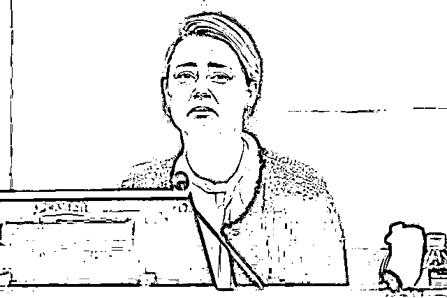

| 艾梅柏在法庭上哭泣，称自己输掉官司后破产了**莱莱：****这次又赶上德普的第二次土星回归，又到了做功课的重要时间节点。**平时天天过日子，也不是每天睁眼先看星图决定今天怎么过，但是命运的走向推动着我们每个人去完成的必须经历的人生历程。尤其土星的功课就是在平时的日积月累里，平日不做功，到考试后的时候就难过关。第一次土星回归是在 30 岁左右，基本上是而立之年的事，第二次土星回归就快六十了。**经历第二次土归就会面临到你的下半生——开始走向人生终点的时期，个人要立足于哪里？**所以，德普的婚姻问题和两性关系议题又一次到了大考的时候，这就看之前的功课做的怎么样了。**咔咔：**第一次土星回归，他出演了《剪刀手爱德华》，奠定了在好莱坞的地位。

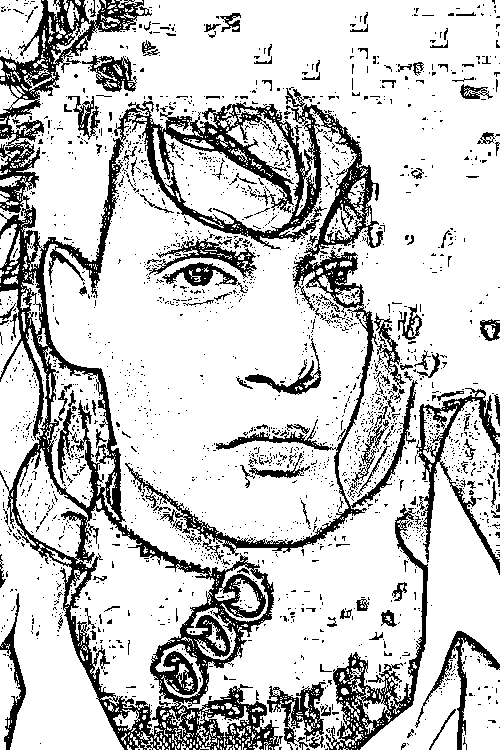

| 德普饰演的《剪刀手爱德华》我觉得月亮摩羯座在关系里的挑战是——**我要如何在关系里面变得柔软，能展现弱点，同时也接受别人有弱点，不要用“我要帮助你进步”的心态，或者我来告诉你该怎么做就能解决你的问题。**德普和艾梅柏相差 20 多岁，艾梅柏本身也有跟父亲的议题。很可能德普想要告诉艾梅柏怎么做的时候，激起了她原生家庭的一些没有解决的议题，那种月木四分压倒性、窒息性的爱激起艾梅柏非常大的愤怒，她在语言上攻击德普。也很可能德普被艾梅柏拒绝和攻击之后，他就变成一个失控的小孩，而这个小孩有种毁坏一切的倾向。**莱莱：**  艾梅柏星图里有**摧毁性**的东西，**冥王星合相了月亮南交点**，生就带着带着浓烈的议题而来的。**冥王星是她和德普双方星图中共同的议题，关系中的核心议题会成为这段关系成长的方向。****咔咔：**  **德普的星图有日冥四分相位，他的孩子有日冥相位，他交往的女友太阳天蝎座或者有日冥相位，都有跟权力有关的议题。****日冥人有一种“我的人生要经历巨大转化”的人生主题，人生的底色是“要么拥有巨大的力量、要么失去一切而被羞辱”。**生命因此**主动或者被动经历复杂的、戏剧性的状况。**他和艾梅柏两个人婚姻只有 15 个月，之后打了 6 年官司，给双方都造成了巨大的损失。声誉受损进而损失了巨大的金钱，“家暴男”和“屎后”对双方的人格而言都是一种羞辱和贬低。两个人互相伤害，撕扯着对方，我认为其实是这两人日冥主题的共振，缠夹不清，两败俱伤，这场战争里没有赢家。

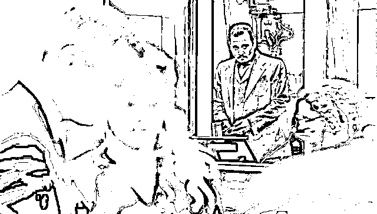

| 法庭上的德普与艾梅柏**莱莱：**星图中有强大的冥王星议题、天蝎座元素，会有**“我要学习如何掌控权力”**的议题，但掌权不是说你运用它，而恰恰是**你能收住自己的权力，收起自己的鞭子，收起自己摧毁性的爆发力，把它搁到恰当的位置上**。德普和艾梅柏之间发酵了长达 6 年的撕扯，成了一幕闹剧，两败俱伤，给社会带来的波及面也达到一定摧毁的状况。6 年的时间，世界从“Me Too”的运动逐步走到“厌女”情绪，艾梅柏利用了女权的声势，**她在诉讼中的表现，以及败诉的结果很可能会影响到真正被暴力虐待的女性没有办法获得正视，没有办法得到真正的帮助。**在网络大环境中，没有人去关注诉讼的核心，而成了“搞你极有乐趣”的事情，是网民的狂欢，但是狂欢建立在当事人的被摧毁和被伤害上。事情的原点其实是亲密关系中私密的部分，如果换一种方式去解决这个 7 宫的议题，这点俩人之间的事远不至于扯到 10 宫甚至 11 宫。失控的冥王星能量在土星进行到 7 宫的交作业的时候，变成了一把利剑，看似插向对方的，却造成了彼此更大面积的伤害。**咔咔：**其实在出现在德普生命里面的女人，很多都跟他有相似的配置，**水星和金星的相位，太阳和冥王的相位。水金组合让人使用语言作为取悦别人的工具，想法偏向友善**。像薇诺娜·赖德和帕拉迪丝，她们选择记住关系里面的些美好的事情。艾梅柏的**水星四分火星，水星还在白羊座**，她要用语言来表达攻击性。因为她的水星又在火星守护的星座，所以，她会用语言攻击德普，把他噎得说不出话来。德普水星四分土星，他脑子肯定没有水火人转得快。火星所在的位置，都是加速的。德普好多话还没有说出来，就已经被艾梅柏打断，甚至扭曲他的本意。这让他有一种郁闷的感觉，让他愤怒，所以他要去用一些比较极端的方式发泄。**艾梅柏有点像是：我用语言攻击你，打败你，让你痛苦，让你受伤。我可以在里面得到一种掌控感。但是并不真的用语言清晰地讲道理、阐述自己，而是一种宣泄**。

| 艾梅柏在艾梅柏的水火海的配置里，看到更多的是她用语言去攻击德普，而不是说我们在关系里面需要用一种比较的平和的，互相体谅的沟通。被攻击会刺激德普一宫的火星合相天王星突然爆发，处于失控的状态。艾梅柏的太阳金牛座，她应该是重视生命里的轻松、自如、舒适、丰盛的体验。冥王星对分了太阳，给她的渴望和追求遮蔽了一层黑重的罩子。**莱莱：**  是的，每个人星图中的太阳就是”找到自己是谁”，艾梅柏是太阳金牛座，金牛座确实出美女，而且还是很丰满性感的美女。但是这种美对于她们自身来说，到底该如何自我定位？尤其当身处于被外界定位的状态时，自己如何找到自身的价值，而价值又到底是什么？这种走向太阳高阶的表达还是挺不容易的。**咔咔：**要想整合日冥相，可能就是要经历打击，被打得足够低，低到尘埃里面，打不死再重新慢慢地爬起来，你看超级英雄最初都挺懦弱的，要获得 super power 很不容易，要经历生死攸关的危机，或者名誉扫地。**要有很大的下沉，才能获得向上窜的力量，就像弹簧一样。**

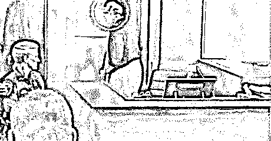

| 休庭时分，艾梅柏和德普两人差点撞上彼此，艾梅柏立刻后退几步表现出害怕的样子，法庭警官也第一时间赶了上去拦住德普，而德普转了个身保持微笑，接着无可奈何地耸了耸肩。（图源：网易）

**莱莱：**  并不是谁一开始就能很好地去转化，尤其涉及到冥王星议题，我觉得是很难避免到伤害，有的时候，我们转化的前提就是**会受伤，再去疗愈，最终真正的转化是看似无痕，但其实是非常有力量的。****这种力量与火星不同，不是外在的、武器式的，而是无形的、有力量感的东西。****也有种说法是，冥王星是高八度的火星。**从艾梅柏的行进看，再有一段时间，等冥王星进入水瓶座之后，她将会经历**行进冥王星四分出生星图中冥王星**的阶段了。**这是每个人都会在 40 岁前后经历的过程，仿佛被命运戳到底被戳透的感觉，然后才可能开启另一种新生，这对每个人都是一种非常深刻的体验。****咔咔：****处理冥王的功课需要先排毒，不名誉的、不体面的、让人羞愧的、痛苦的都要冒出来。**艾梅柏和德普的金星是合相的，他们两个现在都在经历土星的行进，德普本身金土四分，他之前的人生经历也是挺虐的，我觉得他后来也找到一种方式，音乐创作。对艾梅柏来说，她的金星没有被土星打压，她的人生前半场获得人们的喜爱是比较容易的，但是俗话说得好，生命里面所有礼物都标好了价格。艾梅柏的土星行进可能让她感觉自己不再被狂热的崇拜了，失去了美好的形象，这也让她有机会真实地看待自己，除了金钱、美貌，我还有什么，我还重视什么？我如何生活，如何找到内心的平静，这是她当下的考验。

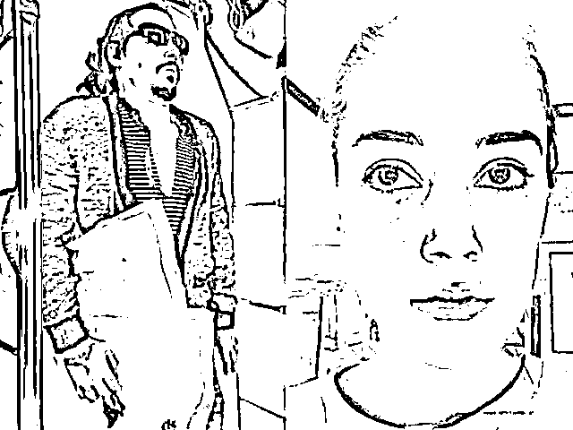

| 艾梅柏指控德普家暴，德普则表示，手指是艾梅柏扔来的酒瓶割伤的，但艾梅柏否认，她表示自己没有目睹德普的手指尖被切断。

**莱莱：****从金星的角度来说，物质的表达是一部分，还有一部分代表了个人的价值，你的价值的呈现在哪？**德普和艾梅柏的金星都落在金牛座，德普的星图中金星还在 10 宫，这次官司获胜不仅看到他赢得了赔偿，还获得了 6 年来个人声誉的回升，相应带给他了自信、喜悦以及未来可见的金钱的收益。艾梅柏太阳、金星都在金牛座，太阳还还合相月亮北交点，年轻的她对于金星高阶的呈现可能还是比较陌生的，**她的体会可能还是更来源于物质的、身体的，这些初级层次的表达，这些可能也是她认为自己的价值，尤其是作为女性的价值存在。**仿佛我的美貌、身体带来的价值就能够变成钱，以及别人的认可和喜爱。**咔咔：**这两个人彼此纠缠，把对方拉下马，让对方去蒙羞，拯救自己的尊严，我觉得是一场很不友善的游戏。但是成长的游戏大都不够友善。我们从事占星的工作，会思考如何能积极表达星图中的能量。**莱莱：**  我觉得第一步首先要**正视自己星图中的不太美好的配置，正视所经历的一切**，糟糕的事情总是会过去的，当然还有很重要的一点，行星逆行的时候就是提示你可以回溯，去把功课做圆满，要不早早晚晚在下一次经历相关情境的时候还是会掉到坑里。**学习占星的意义在于我们能够更好地利用顺势而为的契机去完成自我的提升。****咔咔：**人生的功课关关难过关过。但是带着觉知去看，又会觉得每一关没有么难。或者没有么绝望。我觉得人生永远都是要抱有信心去过的。即使德普和艾梅柏从被万众崇拜到名誉受损，这也是他们生命的转化的一个部分。

**版权声明：**原创文章由作者授权首发于若道平台，欢迎转发，反对抄袭。友号转载请申请白名单。

**END****咔咔**职业占星师，若道核心课程讲师 ISAR 认证占星师（2014 年获得）国际知名广告公司和市场研究公司工作十余年**微信公众号**：咔星人

长按打赏

****莱莱**** 若道占星平台咨询师，资深电视节目导演、制片人

**微信号：**lailaiy

长按打赏

**20 位来自世界各地的占星师****带来 19 场沙龙——新世界的觉醒****详情可点击下图**

**学习占星学****点击下图了解课程详情**

**微信又双叒叕改版啦，不想错过若道君的推送？**

**就把若道设为星标吧！**

**▼**

**喜欢就点一下“在看”吧！**

********报名直达入口********

# 射手座超级满月 | 行星“集体入庙”的 6 月，本次满月更是重中之重！

> 原文：[`mp.weixin.qq.com/s?__biz=MzA5NjA0NTAxNg==&mid=2651476409&idx=1&sn=2143aaf7d1f976705176e66eb220ed92&chksm=8b48e30ebc3f6a18c2faf39ade7f9e3109ba7bc0dfed30963ca55ad7bc48a55e66c8f6dc1b65&scene=126&sessionid=1692737801#rd`](http://mp.weixin.qq.com/s?__biz=MzA5NjA0NTAxNg==&mid=2651476409&idx=1&sn=2143aaf7d1f976705176e66eb220ed92&chksm=8b48e30ebc3f6a18c2faf39ade7f9e3109ba7bc0dfed30963ca55ad7bc48a55e66c8f6dc1b65&scene=126&sessionid=1692737801#rd)

**☆ 后台回复“今日”，给你一句生命态度**

作者/王芝桦 编辑/玫瑰 图片/pexels

**射手座满月****北京时间 2022 年 6 月 14 日 19:51 迎来射手座满月，双子座太阳与射手座月亮于 23°25′精准对分。此次射手座满月也是一次近地的“超级月亮”。**5 月的“食相月”铺陈出未来半年“清理和重建”的历程，而在食相影响周期内的每个满月都是一次重要的“完结和清理”节点。**此次射手座满月，射手座的高瞻视野和高阶觉悟将会引领我们望向“道德与观念”**——取其精华，去其糟粕，是人类文明进程中必不可少的动作，也是人类世界在浩瀚星河中存在的价值与意义。

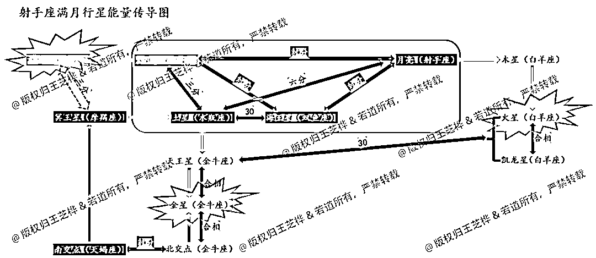

**射手座满月重点影响人群**

参考满月峰值影响期间各个行星的行进度数，以及逆行行星的轨迹影响；常规容许度，个人行星入相位 3°，出相位 1°；非个人行星入相位和出相位均为 3°。

**·** 出生星图中，有**行星、四轴、南北交点落入**变动星座（双子座、射手座、处女座、双鱼座）**0°-5°，20°-29°**的人群； **· **出生星图中，有**行星、四轴、南北交点落入**基本星座（白羊座、巨蟹座、天秤座、摩羯座）**2°-9°，12°-18°，23°-30°**的人群；**·** 出生星图中，有**行星、四轴、南北交点落入**固定星座（金牛座、狮子座、天蝎座、水瓶座）**13°-28°**的人群。

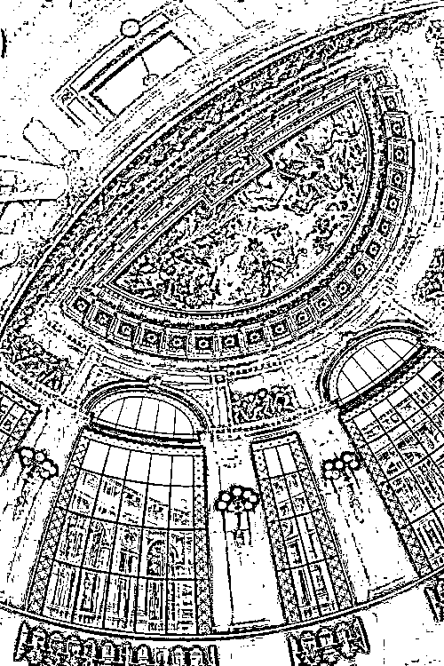

**取其精华，去其糟粕，重建未来**

> ****天象：******· 土海 30°：水瓶座土星与双鱼座海王星形成 30°结构。****·“土海 30°”介入日月对分轴线：双鱼座海王星四分双子座太阳，四分射手座月亮；水瓶座土星三分双子座太阳，六分射手座月亮。****· 火凯合相：白羊座火星合相白羊座凯龙星。****· 金星介入“南北交点”轴线：金牛座金星合相金牛座北交点，对分天蝎座南交点。****· 日金介入“土海 30°”：双子座太阳与水瓶座土星形成“日土三分”结构，与双鱼座海王星形成“日海四分”结构；金牛座金星与水瓶座土星形成“金土四分”结构，与双鱼座海王星形成“金海六分”结构。**

**“土海 30°”结构是 6 月不容忽视的天象背景，我们先来梳理一下时间线：****· 5 月 17 日：**土星行进在水瓶座 24°，海王星行进在双鱼座 24°，形成精准的“土海 30°”结构；**· 5 月 19 日：**水瓶座土星和双鱼座海王星同天迈入 25°位置；**· 6 月 23 日：**土星逆行回到水瓶座 24°，“土海 30°”结构走出剧烈影响。**敲黑板！划重点！****5 月 17 日-6 月 23 日期间，**6 月 5 日开始逆行的水瓶座土星、6 月 28 日开始逆行的双鱼座海王星双双处于“开始逆行前和开始逆行后”的减速期，而它们组成的天象背景“土海 30°”结构正在**将过去那些模糊规则、混乱秩序、越界操作的现实问题暴露出来，提示我们——检视过去、反思问题、敲碎虚假、撇去泡沫的时刻到了！**此次射手座满月，“土海 30°”结构介入“双子座太阳-射手座月亮”的日月对分轴线：**·** 一方面，国际局势、权力人物、教育领域等方面将会呈现高潮性事件，引发网络热议；**·** 另一方面，那些已然陈旧、已成束缚、已带破坏性的腐朽意识和落后观念，将会进一步曝光和剥落，而全新的规则秩序和管理体系正在重新建立。但是，凡事都要有个“引子”。

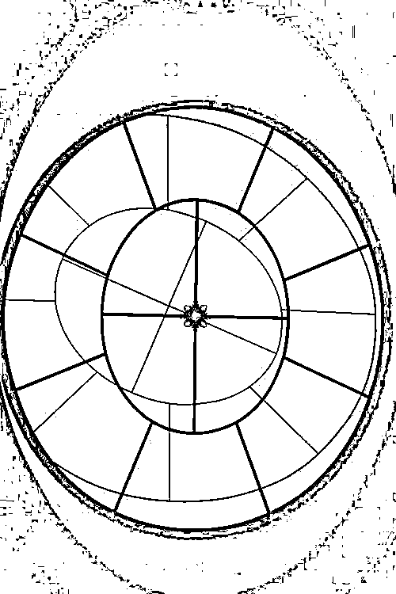

***1. *****满月前扔出陈旧垃圾**

**· 6 月 10 日：**金牛座金星与白羊座凯龙星形成“金凯 30°”结构——人类几千年的文明发展，从未离开过竞争与斗争的方式，即使在已经进入现代文明的今天，食链规则，弱肉强食，依然是生命的伤痛； **· 6 月 11 日：**恢复顺行的金牛座水星与逆行的摩羯座冥王星第 3 次形成“水冥三分”结构（第 1 次 4 月 28 日，第 2 次 5 月 26 日）。那些揭露真相的消息，那些霹雳言辞的交流，虽然触发着激烈的情绪，但却值得，因为我们意识到处理问题、真正改变、长久推进的时刻到了；**· 6 月 12 日：**金牛座金星与金牛座天王星形成“金天合相”结构，带来情感关系、金融趋势的弹跳性反转可能；而**12 日只不过是一个开始，我们将在 6 月下半月看到进一步的推进与答案。**故而，从 6 月 10 日开始，唐山打人案便开始高居热搜榜首，而后又接连出现多条实名举报恶势力、开展社会治安专项整治的热搜……生存安全、阴性能量、尊严权益，并不是几起个案背后的议题，而是人类几千年文明发展进程中，仍未结束的斗争，仍未抚平的伤痛。该结束了！那些恶俗的观念，那些落后的意识，那些肆意的越界，那些傲慢的凌驾，就让 6 月 14 日射手座满月的“完结能量”去结束这一切，取其精华，去其糟粕，才能重建安全、轻松、光明的未来世界。

***2. *****满月蕴含的“神启”**

此次射手座满月的前一天——**6 月 13 日**，曾于 4 月 30 日进入双子座、又于 5 月 10 日从双子座开始逆行、5 月 23 日逆行回到金牛座、6 月 3 日在金牛座恢复顺行的**水星再次换座进入双子座**。至此，这一波导致很多事物“降速”的水星逆行终于告一段落。**6 月 13 日-6 月 23 日期间**，水星、金星、火星三颗个人行星行进在自己守护的星座之内（双子座水星，金牛座金星，白羊座火星）；再加上，当下行进在自己守护的水瓶座的土星，行进在自己守护的双鱼座的海王星——6 月，五颗行星“集体入庙”，能量纯粹，影响巨大，而此次射手座满月周期则更是重中之重！两个重点：**· 6 月 14 日：**射手座满月“日月对分”轴线的能量，随着“射手座月亮→白羊座木星→白羊座火星”和“双子座太阳→双子座水星”的行星能量传导线，被双子座水星和白羊座火星定位；**· 6 月 15 日：**白羊座火星与白羊座凯龙星形成“火凯合相”结构，金牛座金星合相金牛座北交点、对分天蝎座南交点。这里面，火星定位了天蝎座南交点的能量（火星守护天蝎座），金星定位了金牛座北交点的能量（金星守护金牛座）。射手座满月的月光，照亮我们内心深处的理想豪情和慷慨激昂，然而现实生活的细碎砂砾时常磨痛了我们的双脚，现实世界的限制考验又时常令我们感觉无力，恨不得冲破，但绝不可以乱来。宇宙提示我们——**不以斗争去惩罚争斗，神（道）会惩罚罪恶；以微小之力去建设微小，神（天）会赐予丰盛。**

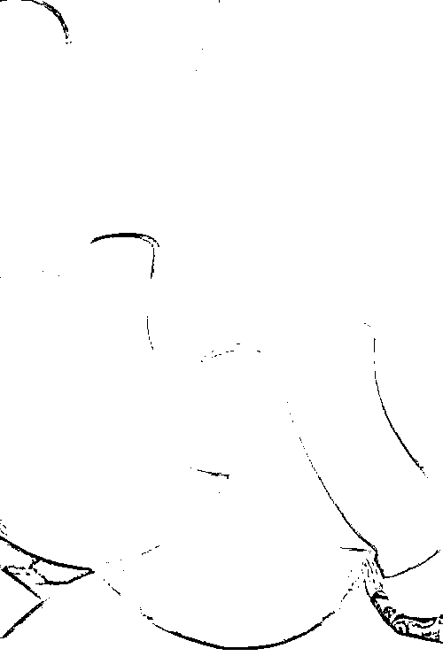

***3. *****满月后需要升起的觉悟**

**6 月 16 日-6 月 19 日，**双子座太阳和金牛座金星先后介入“土海 30°”结构，再次将那些模糊规则、混乱秩序、越界操作的现实问题激活。**· 6 月 16 日：**双子座太阳与水瓶座土星形成“日土三分”结构，与双鱼座海王星形成“日海四分”结构——双子座的模棱两可，双子月的变化波折，令人无力而脆弱；然而，没有捷径，不能贪图，只有坚信内在的力量，才能在当下必然的变革过程中重塑生命的目标与规则；**· 6 月 19 日：**金牛座金星与水瓶座土星形成“金土四分”结构，与双鱼座海王星形成“金海六分”结构——谁不喜欢美好的事物？谁不喜欢浪漫的情话？然而，现实会打懒惰者的脚，会破虚妄者的梦。以上几组结构，将在现实层面**引动那些“不对等的关系，不合理的权益”方面的争斗**。然而，现实就是现实，不会以自我的主观理想为主导，更不会被自我的主观意愿所左右，现实的砂砾就是要**帮助我们看到自我的盲点与局限，学会接纳并磨练成熟**。**敲黑板！划重点！****· 5 月 17 日-6 月 23 日**的“土海 30°”结构，只是一个开始，其中：**水瓶座土星参与的“土天四分”结构的“清算进程”，要到 2022 年 10 月才能收尾；而 2023 年 1 月 6 日“土海 30°”结构将会再次形成；****· 2022 年 10 月之前，**就是要敲碎虚假和撇去泡沫、清算过去并解决问题的时间；2023 年到来之前，就是宇宙赐予我们**重建对“现实世界和成人世界”的成熟理解与责任担当**的时间。此次射手座满月，宇宙带来灵性的启示——“过去”不是“未来”，一切是流动的，当下的“变化”只是在告诉我们“成长”的真相；无论集体，还是个人，我们要做的就是在一切的流动之中，注入更多的建设性与意义。

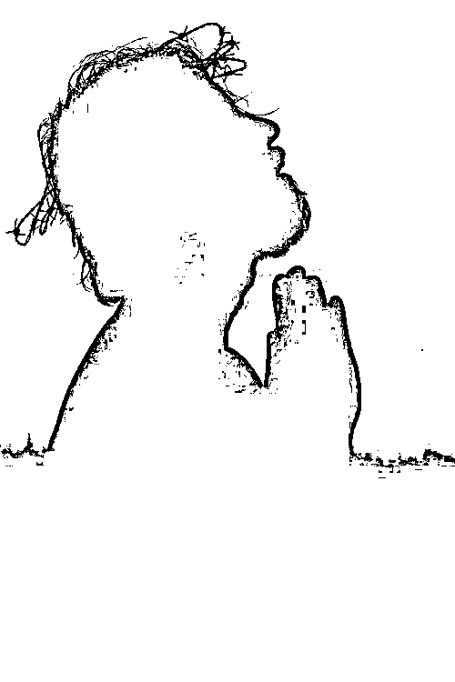

**寄语**“宇宙共时性”描述出奇妙的能量场。2022 年的双子月生活，毫无计划地与学生们做了几次有关双子座的研讨。双子座高阶模式所描述的“敞开、接纳、无辨别、不分别”，当然要包括那些我们不太喜欢的事物，比如不符合预期的反应、看不上眼的“low”、现实中的不公平、生活中的小砂砾；而往往，能够引起关注的还就是那些不太喜欢、不太美好的事物，因为已经拥有的美好、本就存在的优点往往令人感觉习以为常，认为理所应当。然而，此次射手座满月，正在揭开现实生活中的陈旧与腐朽，提示我们——那些布满砂砾的小路，正是通往全新未来的路径，我们必须带着敞开的态度和快乐的心情走上去，如此才能坚持到达山顶；因为，**真正的“高明”，不是自认为的高级，而是明白下面铺陈着多少不起眼的小石头。**祝愿朋友们：灵魂要安好，身体要健康。

**版权声明**：原创文章由作者授权首发于若道平台，欢迎转发，反对抄袭。友号转载请申请白名单。

****

****想阅读更多作者的文章，********请在后台回复******王芝桦****** 即可。****

****王芝桦****

心理占星师，统合疗愈师，占星专栏作者

若道占星“新月和满月”专栏作者，腾讯视频特约占星师

全职于个案咨询与占星教学工作 18 年

**个案预约咨询微信号**：zhihua0621 

**微信公众号**：daoxi-life

**长按打赏**

********

**20 位来自世界各地的占星师****带来 19 场沙龙——新世界的觉醒****详情可点击下图**

**学习占星学****点击下图了解课程详情**

**微信又双叒叕改版啦，不想错过若道君的推送？**
**就把若道设为星标吧！****▼**

**喜欢记得点一下在看哦☟**

**报名直达入口**

# 神话塔罗之大阿卡纳牌｜战车

> 原文：[`mp.weixin.qq.com/s?__biz=MzA5NjA0NTAxNg==&mid=2651476409&idx=3&sn=93e9dc24b6d8566af273f85428200b41&chksm=8b48e30ebc3f6a18e784e27ffec0029d656f3cbb150dca75818ffb41cb3334bba6a79e56df2e&scene=126&sessionid=1692737801#rd`](http://mp.weixin.qq.com/s?__biz=MzA5NjA0NTAxNg==&mid=2651476409&idx=3&sn=93e9dc24b6d8566af273f85428200b41&chksm=8b48e30ebc3f6a18e784e27ffec0029d656f3cbb150dca75818ffb41cb3334bba6a79e56df2e&scene=126&sessionid=1692737801#rd)

作者/朱丽叶·沙曼-伯克 丽兹·格林

译者/闫东升 编辑/玫瑰 图片/神话塔罗 网络

本文节选自《神话塔罗》

古老的神话、塔罗牌等象征系统用各种象征与类比的方式，勾画出意识的演化之路，而希腊诸神的形象则以象征的方式表达着人类最原始的本性。

阿瑞斯驾着战车，一路驰骋，这天生因流血与冲突狂热而的男人，又有着怎样一番身世？今天就来解读大阿卡纳牌——战神。

[🔈 神话塔罗·战车](https://res.wx.qq.com/voice/getvoice?mediaid=MzA5NjA0NTAxNl8yNjUxNDc2NDA3)

**｜**朗读者小巫

**书名：**

神话塔罗 

**作者：**

朱丽叶·沙曼-伯克   丽兹·格林 

**出版日期：**

2011-08-02

战车对应的希腊神祗 **阿瑞斯·战神****驾驭战车的神**

战车牌描绘的是一个潇洒阳刚的男人，拥有一头赤褐色卷发和一双蓝色的眼睛，红润的肌肤透着鲜亮的光泽，英武地驾驶着一辆青铜战车。他身穿一件血红色的束腰外衣，外套青铜色的铠甲和头盔。

他坐在战车的青铜座位上，旁边插着一根锋利的长矛，双手紧握着两匹战马的缰绳，其中一匹战马是红色的，另一匹是黑色的，它们奔向相反的两个方向。战车走过的一路尘土飞扬，四周是微红色的荒漠，阴暗的天空预示着一场风暴即将来临。

> **阿瑞斯（*Ares*）驾驶着战车经过一片荒漠**：那里明显缺水，这个意象反映出侵略性冲动的成长中缺乏了情感和关系的元素。然而阿瑞斯和阿弗洛狄忒（Aphrodite）在神话中关系密切，这似乎反映出本能的冲突和关系以某种方式紧密相连。 
> 
> **阿瑞斯的长矛**：男性气概的传统象征，它代表着男人和女人心中的阳物崇拜。 
> 
> **黑色和红色的战马**：就像是女祭司牌面中的代表二元性的石柱，反映出侵略性本能冲动中包含着善与恶的两面。

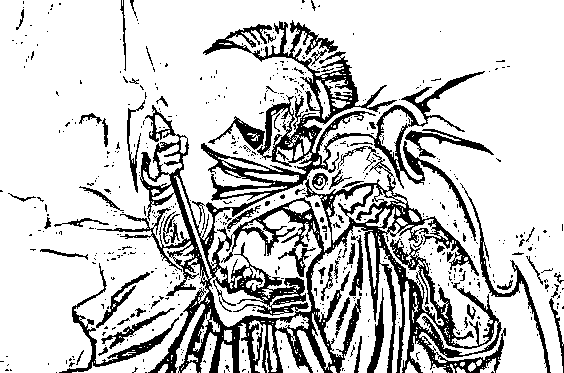

**禁忌的爱**

在这张牌中我们遇到了战神阿瑞斯，神话中他是皇后赫拉（*Hera*）单独孕育出来的，并没有任何男神的力量参与其中。作为战神，阿瑞斯非常享受纷繁的战火。

他的两个侍从德莫斯（*Deimos*，代表惊慌）和浮柏斯（*Phobos*，代表恐怖）（也有的神话故事中说二人是他的儿子），在战场上始终陪伴左右。

女神雅典娜（*Athene*）是代表战争的女神，她所反映的特质是深思熟虑和从容淡定，而阿瑞斯则喜欢战争本身的热烈和荣耀，在战争中他通过挑战对手的过程，兴奋地表达着自己的力量。阿瑞斯在大部分人的眼中都没有什么吸引力，因为他和流血与冲突联系在一起。奥林匹斯的君王宙斯（*Zeus*）和雅典娜都不喜欢他，觉得他粗鲁和暴力，但是爱之女神阿弗洛狄忒的口味和他们不同。

和她其貌不扬的丈夫铁匠之神赫菲斯托斯（*Hephaistos*）比起来，活力四射的战神深深吸引着阿弗洛狄忒 ，他们坠入了爱河，趁着赫菲斯托斯不在的时候开始偷情。

赫菲斯托斯很快发现了他们的奸情，并做出复仇的计划。他秘密地锻造出一张隐形而且牢不可破的网，然后把这张网放在卧榻的上方。

阿弗洛狄忒和阿瑞斯再次一起睡在床上的时候，那张隐形的网牢牢地罩住了他们，赫菲斯托斯这时叫来所有的神，一起见证了他们偷情的丑行。

但是阿瑞斯的热情并没有被这次尴尬的捉奸经历扑灭，他还是继续和阿弗洛狄忒交往，并且生了一个女儿哈尔莫尼亚（*Harmonia*），她的特质和她的名字一样，能够和谐地平衡爱与冲突。

**整合内在或外在引发的愤怒与冲突**

**从人们内在的层面来看，驾驭着战车的阿瑞斯象征着来自意识的意愿指挥和引导下的侵略性本能。**拉着战车跑向相反方向的战马反映出我们内在动物性驱力的冲突，它们充满活力但却不愿意和谐共处。

只有通过坚定的意志和强大的力量才能很好地驾驭它们，如果一味压抑或破坏，就会使我们失去生存的能力，无法走完生命的旅程。

阿瑞斯没有父亲，所以他只反映着身体本能的侵略性和竞争性，缺乏原型的精神之父，也就是没有愿景和意义的给予者。但是他钢铁般的意志和巨大的勇气是人类个性中所必需的面向，因为精神的愿景无法独自在艰难和充满竞争的尘世中生存。

阿瑞斯的爱情之路上充满了冲突，也就是说愚人在这里要面对人生之路上的第二个巨大的挑战（经验）——为激烈和狂暴的本能驱力披上盔甲。通过阿瑞斯这个战车驾驭者的意象之旅后，愚人开始成熟了。**在恋人牌中，愚人还处于青春期，被本能的浪漫之梦驱使着，渴望拥有一个美丽的目标。但是通过战车牌的经验，他学会了像一个真正的男人那样为自己行为的结果负责，勇于面对他自己内在或者外在引发的愤怒和冲突。**就像此时的愚人一样，**我们（男人或女人）如果想要生存，就必须学会和本能的侵略性以及矛盾的双方面做斗争**。在神话故事里，阿瑞斯永远陷入各种麻烦的境遇中，或者是因为愤怒与他人冲突，或者是义无反顾地追求着美丽的心爱之物。但是羞辱和失败都没有让他倒下，反而变得更为强壮。

最终他得到了一个女儿，她象征着通过创造性的手段解决了冲突后的和谐与平静。

阿瑞斯象征的冲突和争斗是人生所必需经验的。无论我们尝试要变成怎样的大爱无疆或仙风道骨，内在侵略性的驱力都不会消失。

我们可能会否认它们，或者把它们压抑到潜意识中，但它们会以疾病或投射（到别人身上）的方式重新出现。如果我们能够通过阿瑞斯的挑战，就会诚实地面对这股内在的生命力，挣扎着学会包容和引导它进入整体人格发展的和谐之路。

**战车，意志与冲突的较量****从解牌的角度来看，战车牌出现的时候意味着当事人会经历冲突和挣扎，其结果是个性变得更为强大。**在这个时候，当事人不仅可能要面对来自他人的侵略性，也要面对自己内在的竞争性和侵略性的驱力。冲突无法避免，但是当事人需要用勇气和肚量去面对。愚人在处理内在矛盾的时候学会了协调和平衡，这样就可以通过青春期的考验，走入下一个全新的阶段。

**版权声明：**本文由《自在园》授权发布，欢迎转发，反对抄袭。友号转载请申请白名单。

**朱丽叶·沙曼·伯克**从 20 世纪 70 年代早期开始，就对塔罗牌产生了兴趣，并踏入了塔罗的世界。后来，在丽兹·格林的鼓励下，开始研习心理占星学和塔罗。1984 年，第一本书《塔罗全书》（The Complete Book ofTarot）出版。之后，与丽兹·格林合作设计并撰写了《神话塔罗》（The Mythic Tarot）。朱丽叶写了十本塔罗和占星学书，包括一本名为《众星的传说》（Stories from the Stars）的儿童读物，以及与丽兹·格林合著的《神话之旅》（The Mythic Journey），这是一本详细讲述如何运用神话来指导生活的书。

**点击下图了解课程详情** 

**微信又双叒叕改版啦，不想错过若道君的推送？****就把若道设为星标吧！****▼**

**喜欢记得点一下在看哦☟**

************报名直达入口************

# 神话塔罗之大阿卡纳牌｜正义

> 原文：[`mp.weixin.qq.com/s?__biz=MzA5NjA0NTAxNg==&mid=2651476409&idx=4&sn=500e50aa9c361c2a71e4a06a553d638c&chksm=8b48e30ebc3f6a1826b6b2e24d1ef2aea2952c6b2b048b7eb73d07de9e555aec5c346029df73&scene=126&sessionid=1692749475#rd`](http://mp.weixin.qq.com/s?__biz=MzA5NjA0NTAxNg==&mid=2651476409&idx=4&sn=500e50aa9c361c2a71e4a06a553d638c&chksm=8b48e30ebc3f6a1826b6b2e24d1ef2aea2952c6b2b048b7eb73d07de9e555aec5c346029df73&scene=126&sessionid=1692749475#rd)

作者/朱丽叶·沙曼-伯克 丽兹·格林

译者/闫东升 编辑/玫瑰 图片/神话塔罗 网络

本文节选自《神话塔罗》

在十九世纪中叶，法国神秘主义者艾利冯斯·里维使塔罗牌重新流行了起来。里维认为塔罗是古代宗教的遗迹，从埃及人传到了摩西和所罗门；他将 22 张大阿卡纳牌与 22 个希伯来字母联系起来，为每张牌赋予对应的卡巴拉（犹太教的神秘哲学）意义。今天《神话塔罗》作者将为我们道来正义牌背后的故事。

[🔈 神话塔罗·正义](https://res.wx.qq.com/voice/getvoice?mediaid=MzA5NjA0NTAxNl8yNjUxNDc2NDA4)

**｜**朗读者小巫

**书名：**

神话塔罗 

**作者：**

朱丽叶·沙曼-伯克   丽兹·格林 

**出版日期：**

2011-08-02

正义对应的希腊神祗**雅典娜·正义女神****正义女神**

正义牌呈现的是一位表情严肃、年轻美丽的女人，头戴银色战盔，身着银色铠甲，正义凛然地端坐在王座上。她的右手握着一把指向上方的宝剑，左手拎着一架天平。

她白色的头发和长袍，与两侧白色的石柱和头顶白色的门廊交相辉映。她的脚下是黑白相间的大理石块铺就的地板。一只猫头鹰栖息于她的左肩。

> **陪伴着雅典娜（*Athene*）的猫头鹰**：反映了这位女神拥有清晰的洞见，因为猫头鹰能够在夜间扑食。 
> 
> **黑白相间的地板**：反映出头脑能够把黑白两面紧密且有秩序地整合在一起。 
> 
> **天平**：象征着通过一种事物来衡量另外一种事物，从而达成公平判决的力量。据说神话中的雅典娜为人类创建了第一个陪审团。

**维护和平与文明的战略家**

在这张牌中我们遇到了正义女神雅典娜，她曾经在前面的恋人牌中出现过。

神话中雅典娜的父亲是众神之王宙斯（*Zeus*），乌拉诺斯（*Uranus*）曾经警告过宙斯说， 如果他和第一个妻子——智慧之神墨提斯（*Metis*）生了第一个孩子，那么孩子的能力将会超越他。为了防止这个预言发生，宙斯在墨提斯怀孕的时候把她吞进了肚子。

不久以后，宙斯就开始被剧烈的头痛折磨到无法忍受。为了治疗他的头疼，铁匠之神赫菲斯托斯（*Hephaistos*）用青铜斧劈开了宙斯的头颅，全副武装的雅典娜从裂开的伤口中一跃而出，并发出胜利者的欢呼。

在场的众神都被这种场景震慑，心生敬畏。雅典娜变成了宙斯最喜欢的孩子，他对她的偏爱太过明显，引起了其他众神的嫉妒。从她出生的方式就可以看出雅典娜有好战的倾向。在战争的艺术方面，她与战神阿瑞斯（*Ares*）有很多不同。雅典娜引发的战争都不是基于爱的冲突和杀戮，而是基于宇宙更高的律则，其目的是为了支持和保护真理，都具有冷静、严肃和深思熟虑的特质。她是一个战略家，而不是一个冲动的战士，她平衡了阿瑞斯象征的本能的侵略性，非常善于利用逻辑、策略和技巧。雅典娜是勇士的保护神，所以很多英雄人物都在她的羽翼之下。她为珀尔修斯（*Perseus*）、奥德修斯（*Odysseus*）和其他英雄们提供的武器和帮助，都需要有足够的智力、远见和计划才能够运用。雅典娜的贞洁是奥林匹斯众神中一个明显的例外。她还给人类提供了许多非常有价值的服务，例如她教授人类如何驯服和养育战马，还有编织和刺绣等等。她传授的东西不仅仅只是在应用层面，还是艺术创作，因此她是推动人类文明的女神，尽管必要  的时候她也是一个战神，但她一直培育和保护着人类的和平与文明。

**思考的意义，人之所以为人**

**从内在的层面来看，正义之神雅典娜的意象反映着自然界中人类独有的才能——理性思考和反思判断（*reflective judgement*）。**

对于当时的希腊人来说，这种才能是神圣的，因为它使人类和动物有了区别，因此他们构思让雅典娜从众神之王宙斯的脑袋中出生，没有和任何母性的身体联系在一起，也就是说没有了母亲所蕴含的本能和物质性（意即动物性）。

**雅典娜的正义并不是基于个人的感受，而是根据事物当时的境遇，对所有相关因素进行正义和客观地评估，并以道德准则为基础而做出的选择。**

雅典娜的贞洁可以看做是反思能力的完整性和纯洁性的象征，它不会被个人的欲望所影响。她（象征的）在文明和艺术方面对人类的引导也反映出头脑能够驾驭狂野的自然本能，并通过客观的规划和洞察来转化它。**她的战争是为了某种原则，而不是激情，那是来自头脑反思后的选择，其中的本能力量被牢牢地掌控着。**在传统塔罗的大阿卡纳牌中，有四张牌反映着“四种美德”，其中第一张就是正义牌，另外三张分别是节制、力量和隐士，它们都和人们在生命之路上才能的发展有关。从心理学的角度看，它们有助于小我（*ego*）的形成和完善，而每个人的本我都需要通过小我去体验生命中的价值感，以及利用稳定的个体身份面对生命的挑战。愚人通过了情欲和本能侵略性这两个年轻阶段的巨大挑战之后，就必须要形成和完善他的人格和才能了，只有发展出健康完善的人格和才能［也就是个体（*individual*）的形成过程］，他才能在日后的人生之路上从容应对。

所以当愚人遇到正义之神雅典娜的时候，他必须学会清晰地思考和培养出平衡、冷静的思维能力。

在恋人牌的时候，他还没有举一反三和比较的能力，所以没办法做出公平的判断。如果我们不尊重和遵守公平、平等和服从真理这些道德原则，就无法通过正义之神雅典娜的考验，自然也无法获得他人的尊重和欣赏。

**雅典娜带离我们走出了纯粹的自然本能，以人类独有的思想和精神之躯独立于天地之间。**

**正义，理性的双刃剑**

**从解牌的角度来看，正义牌的出现预示着当事人用冷静和客观的思考做出了公正的决定。**但是就像雅典娜手中的利剑一样，这张牌的意象也是一把双刃剑。

在生活的很多层面上，雅典娜冷静的反思能力可能显得过于冷漠和理想主义，对于个人的关系领域缺乏应有的温情。

她的利剑在某些情境下，可能会因为普世性的真理而伤害到心灵，所以正义牌和其它所有大阿卡纳牌一样，带有明显的矛盾性。愚人必须发展出雅典娜所代表的正义，但是却不能停留在她纯洁的圣殿中，因为还有下一个“美德”等着他去学习。

**版权声明：**本文由《自在园》授权发布，欢迎转发，反对抄袭。友号转载请申请白名单。

**朱丽叶·沙曼·伯克**从 20 世纪 70 年代早期开始，就对塔罗牌产生了兴趣，并踏入了塔罗的世界。后来，在丽兹·格林的鼓励下，开始研习心理占星学和塔罗。1984 年，第一本书《塔罗全书》（The Complete Book ofTarot）出版。之后，与丽兹·格林合作设计并撰写了《神话塔罗》（The Mythic Tarot）。朱丽叶写了十本塔罗和占星学书，包括一本名为《众星的传说》（Stories from the Stars）的儿童读物，以及与丽兹·格林合著的《神话之旅》（The Mythic Journey），这是一本详细讲述如何运用神话来指导生活的书。

**点击下图了解课程详情** 

**微信又双叒叕改版啦，不想错过若道君的推送？****就把若道设为星标吧！****▼**

**喜欢记得点一下在看哦☟**

************报名直达入口************

# 关于神话塔罗课程，你想了解的都在这儿

> 原文：[`mp.weixin.qq.com/s?__biz=MzA5NjA0NTAxNg==&mid=2651476409&idx=2&sn=ef3ed8ee27ec0b527c5c2c4ce7a65f5f&chksm=8b48e30ebc3f6a186e6f17fc211b688b71d71248650d12a568aa34f27fcdf6523471a97317b5&scene=126&sessionid=1692737801#rd`](http://mp.weixin.qq.com/s?__biz=MzA5NjA0NTAxNg==&mid=2651476409&idx=2&sn=ef3ed8ee27ec0b527c5c2c4ce7a65f5f&chksm=8b48e30ebc3f6a186e6f17fc211b688b71d71248650d12a568aa34f27fcdf6523471a97317b5&scene=126&sessionid=1692737801#rd)

1

**塔罗牌是什么？**

**它是用来干嘛的？**

塔罗牌是一种**古老的疗愈工具**，同时也是**直观的解惑工具****；**

塔罗牌绕过逻辑思维，**和潜意识联结**，通过图像的方式生动地将隐藏在人类潜意识中的画面浮出水面，**揭示心灵的状况和运作****；**

塔罗牌**帮助我们和潜意识对话**，可以和现代的心理治疗联系在一起，帮助我们**看清心灵的冲突来源、本质和可以选择的道路；**

塔罗使用的过程并不繁琐，通过**“提问、洗牌、抽牌、解牌”**的方式来显现你的潜意识，给予问题明确的分析和建议。

2

**塔罗原理是什么？**

**它为什么这么准？**

塔罗是通往意识的工具，通过图画**帮助我们和潜意识对话**，可以和现代的心理治疗联系在一起，帮助我们**看清心灵的冲突来源、本质和可以选择的道路**。塔罗的心理投射也对应荣格的**“共时性原理”**：看似偶然的事物之间有着必然的联系。塔罗牌又和更广阔的**宇宙生命原型**联结，彰显**个人生命发展的阶段**，将个人**生命挣扎、内在冲突**放在生命进化的道途上，让更广大的生命智慧为个人成长照亮道路。

3

**塔罗预测是什么？**

**它如何帮助我？**

塔罗牌预测的运作就像是**照向心灵的一面镜子**。在塔罗牌解读时，图像的原型性质穿透隐藏的潜意识脉络，反应出与个人境遇相关但又未被了知的知识与洞见，因此**揭示出按照任何理性方式都无法发现的事情**。塔罗可以在你人生各个阶段，基于不同状态，针对具体困惑给予指引的神奇工具，运用古老的智慧工具**解码人生卡点，多维度去看待问题和生命的全貌性，推敲心理动线，更好地梳理生活。**如果你对生命好奇，塔罗学习会帮你**打开一扇通往未来的门**，让你了解**心灵运作和显化的秘密**，同时赋予你更多关于生命成长的支持和指引的能力！

4

**什么是神话塔罗？**

**它和其它塔罗有什么区别？**

神话通过**图像和故事**描绘人类生活的**原型模式**。通过瑰丽的想象、诗意的语言、栩栩如生的人物和故事描绘出我们内心的世界，表达出我们经历的那些实现人性的过程，帮助我们将**个体的生活与人类古老且永恒的故事**建立联结。从而在更深处**理解生命**，并学习**古老而长青的生命智慧**。跟其他塔罗相比，神话塔罗在**塔罗体系**基础上融合了**神话原型、占星原型、心理学原型。**学习、解读、内在成长的**维度更丰富立体。****神话塔罗**取材于**希腊神话**的无尽沃土，通过故事提供一种**记忆辅助**，在心理和预见层面提升解读的**丰富度**。因为这样更符合塔罗牌的性质，符合人类的想象。**按照故事思考，而不是简单的记忆关键词和固定的意义**。

5

**神话塔罗难学么？**

**能不能快速上手？**

神话塔罗认证课程，**不需要任何塔罗、占星、心理、神话基础**，这些知识朱丽叶老师都会在课程中教授，“兴趣是最好的老师，坚持是最大的成功。”塔罗咨询这项门栏不高，却能带来多重回报的“冷门技能”已经被越来越多人发觉，如果你为之心动，不如赶紧行动，初学者在经验丰富的导师教导下学习成果事半功倍，是小白亦能够掌握的课程，只要配合学习进度，不存在学不会的情况**，录播课有专业助教答疑，直播课老师亲自答疑，案例督导，****让你更自信的开展咨询工作，学以致用。**

6

**哪些人适合学神话塔罗？**

**为什么学神话塔罗？**

**1、对塔罗感兴趣的学员**，与其自习研究弯路多多，不如一步到位系统学习；**2、占星咨询师，**可以丰富咨询维度，通过图像更深入的和个案沟通交流；**3、心理工作者**，塔罗牌的原理本身也是心理投射，用于心理辅导是很棒的互动工具；**4、看重授课老师专业水平和能量层级的学员，**神话塔罗创始人亲授，金牌背书；**5、希望更加了解自己和他人内心世界**，想掌握这个疗愈工具自我探索和成长，帮助有困惑的人；**6、成为专业的塔罗师**，想从事这份事业，不论是兼职或全职，增加收入，打造长久稳定抗风险的现金流。

7

**神话塔罗咨询前景？**

**为什么看好它？**

塔罗行业现状鱼龙混杂，有的塔罗爱好者未经过系统学习，无占卜实力，占卜依赖“说明书”一知半解靠运气解读，无法积累实占经验和个人信誉。神话塔罗进入中国市场不久，由创始人亲自教授，**知识体系扎实靠谱，咨询技术纯正丰富，市场认可度高**，让您**无忧起步**，自信的在自我成长过程中成为他人的**塔罗照路人**。有些朋友经过系统的塔罗课程学习后成为**杠杆青年**，将塔罗咨询作为**副业**，无需店面，工作之余在家里就可以进行咨询，多一分收入欣喜满足。也有些学员完成课程后将塔罗咨询发展成**全职事业**，拥有自己的工作室，整合微信、微博、小红书、短视频等自媒体运营，线上线下年收益百万。**疫情环境下，副业刚需**，对于我们未来的事业需要有所规划，而塔罗咨询符合理想职业的所有条件，上手快、无需固定办公地点，是随时随地可接单的自由职业，经营打造属于自己长久稳定可发展的现金流。

8

**神话塔罗认证是什么？**

**如何获得高含金量认证？**

2022 年超高含金量的神话塔罗认证课程强势回归课程内容体系让你**直观精准**的感受**神话塔罗的魅力**扎实的建构**神话塔罗思维****系统**学习**最地道的塔罗知识****联报全阶课程，学成可获得有神话塔罗创始人颁发的****英国神话塔罗认证证书****，也是****若道塔罗毕业证书。****行业内超高含金量双背书。****若道还为塔罗学员开发了****“神话塔罗”APP****，是随身的工具，更是接咨询的平台，****录播课程****学成入驻平台****即可链接更多塔罗个案，发展壮大你的塔罗咨询事业。**

**如果你想学习塔罗，什么样的老师会让你怦然心动呢？她是三副塔罗牌的设计者，写了 6 本塔罗书籍。她研习塔罗四十余年，教授塔罗三十余年，是丽兹·格林的密友。还有****谁会比塔罗牌设计者更了解塔罗的历史、灵魂与精髓？****所以，这将是你开启塔罗之旅最坚实的一步。**

9

**你将跟随哪位大师学习神话塔罗？**

**我的老师是谁？**

****

**朱丽叶·沙曼-伯克** 

*   她是**3 副塔罗牌**的**设计者****——**神话塔罗牌、沙曼–卡塞利塔罗牌、“自己着色”塔罗牌；

*   她出版了**6 本塔罗书****——**《塔罗全书》、《新塔罗全书》、《众星的传说》、《理解塔罗牌》、《精通塔罗牌》、《塔罗初学者指南》；

*   她研习塔罗**四十余年；**

*   她教授塔罗**三十余年**；****

*   她是**丽兹·格林**的密友，两人合著了**《神话之旅》**，共同设计了**神话塔罗牌**。

*   她是认证的**心理治疗医师；**

*   她深谙**塔罗、占星学、心理学和神话学。**

**如果你想成为拥有英国神话塔罗认证的塔罗师**

那么她，就是你**最好的老师人选**

10

**神话塔罗认证课程的课程结构？**

**怎么上课？**

课程中老师传授**将神话、占星、心理学完美融合进塔罗**的人本主义咨询体系，并进行**学员案例督导**，让你更自信的开展咨询工作，学以致用。

本期认证课程采取**即报即学的录播课+案例督导直播课**的形式，

*   **18 节录播课：**精编剪辑，随来随学，助教答疑，学练结合。

*   **8 节直播课：**融会贯通，神话心理，塔罗占星，咨询技巧。

为了适配大家的各种学习场景，提高学习&复习效率，我们还将**录播课**剪辑了**中文字幕版**和**翻译音频版**：

*   **中文字幕版：**朱丽叶老师英文原声配中文字幕，适合在手机或电脑前专心致志的学习。

*   **翻译音频版：**翻译老师幼婷的中文原声纯享，适合运动、通勤路上耳机里陪伴式学习。

11

**神话塔罗认证课程报名流程**

**怎么报名？**

**报名流程如下：****1、报名****添加课程顾问，报名，交学费，进入学员群，邮寄学习工具。****2、开始学习****成功报名，18 节录播课程立即开通，学习过程有困惑可在 APP 内提问，有专业助教答疑，8 节直播课 8 月 10 日开课，录播课和直播课都是朱丽叶·沙曼-伯克老师亲授。****3、入驻平台****学习完录播课程，即可提交咨询案例申请入驻咨询平台。****4、结业证书**学习完直播+录播课程，提交毕业咨询案例，朱丽叶老师批阅通过，即可获得**神话塔罗认证证书。**

12

**具体在神话塔罗认证课程中学习什么？**

**课程大纲**

**录播课（即报即学）**

**☆****初阶：神话塔罗详解**

**神话故事和预测意涵**

**第 1 讲 塔罗牌介绍 ，讲述它的历史 （中文字幕版）**

**第 1 讲 塔罗牌介绍，讲述它的历史（翻译音频版）**

**第 2 讲 星座形态、元素和宫廷牌&基本星座与基本国王 （中文字幕版）**

**第 2 讲 星座形态、元素和宫廷牌&基本星座与基本国王（翻译音频版）**

**第 3 讲 固定星座与固定王后（中文字幕版）**

**第 3 讲 固定星座与固定王后（翻译音频版）**

**第 4 讲 变动星座与变动骑士（中文字幕版）**

**第 4 讲 变动星座与变动骑士（翻译音频版）**

**第 5 讲 小阿尔卡那牌权杖（中文字幕版）**

**第 5 讲 小阿尔卡那牌权杖（翻译音频版）**

**第 6 讲 小阿尔卡那牌圣杯（中文字幕版）**

**第 6 讲 小阿尔卡那牌圣杯（翻译音频版）**

**第 7 讲 小阿尔卡那牌宝剑（中文字幕版）**

**第 7 讲 小阿尔卡那牌宝剑（翻译音频版）**

**第 8 讲 小阿尔卡那牌星币（中文字幕版）**

**第 8 讲 小阿尔卡那牌星币（翻译音频版）**

**第 9 讲 经典牌阵教学讲解（中文字幕版）**

**第 9 讲 经典牌阵教学讲解（翻译音频版）**

**第 10 讲 牌阵解读案例演示（中文字幕版）**

**第 10 讲 牌阵解读案例演示（翻译音频版）**

**☆****中阶：神话塔罗牌阵应用**

**神话****解读和咨询技巧**

**开启神话塔罗愚人之旅**

****

**第 1 讲 愚人、魔术师、女皇、皇帝（中文字幕版）**

**第 1 讲 愚人、魔术师、女皇、皇帝（翻译音频版）**

**愚人**：永恒的少年（儿童的原型）

**魔术师**：恶作剧者、老师、向导、沟通者的原型；行星：水星。

**女王**：母亲、养育者、丰产的原型；行星：金星在金牛座；小行星：谷神星。

**皇帝**：父亲、供养者、计划者的原型；行星：木星。

**第 2 讲 女祭司、教皇、恋人、战车、正义、节制（中文字幕版）**

**第 2 讲 女祭司、教皇、恋人、战车、正义、节制（翻译音频版）**

**女祭司**：处女——等待被实现的潜力原型；行星：新月。

**教皇**：疗愈者、受伤的疗愈者、牧师的原型，牧师是神与人之间的灵性桥梁；行星：凯龙星。

**恋人**：爱、爱人、所爱之人的原型；行星：金星在天秤座。

**战车**：战争、冲突、战士、斗士的原型；行星：火星。

**正义**：智慧、兵不血刃的胜利的原型；星座：处女座；小行星：智神星。

**节制**：关系、合作的原型；星座：巨蟹座、双鱼座。

**第 3 讲 力量、隐士、命运之轮、倒吊人、死神（中文字幕版）**

**第 3 讲 力量、隐士、命运之轮、倒吊人、死神（翻译音频版）**

**力量**：力量的原型；星座：太阳在狮子座。

**隐士**：晚年、耐心的原型；行星：土星。

**命运之轮**：命运女神与命运的原型。

**倒吊人**：牺牲与有意识的牺牲的原型；行星：海王星。

**死神**：死亡、终点和起点的原型；行星：冥王星。

**第 4 讲 恶魔、高塔、星星、月亮、太阳（中文字幕版）**

**第 4 讲 恶魔、高塔、星星、月亮、太阳（翻译音频版）**

**恶魔**：阴影、人类不文明的面向、本能、欲望天性；行星：火星在天蝎座。

**高塔**：改变、分裂瓦解的原型；行星：天王星。

**星星**：希望的原型。

**月亮**：无意识的原型；行星：暗月。

**太阳**：意识、创造力和文明的原型；行星：太阳。

**第 5 讲 审判、世界（中文字幕版）**

**第 5 讲 审判、世界（翻译音频版）**

**审判**：复活、新生的原型；行星：水星作为灵魂向导普绪科蓬波斯。

**答疑与讨论，学员们分享对自己或客户的塔罗解读，对神话塔罗牌进行更多探讨。**

**世界**：整体、完成和个性化的原型。

**第 6 讲 经典牌阵教学讲解（中文字幕版）**

**第 6 讲 经典牌阵教学讲解（翻译音频版）**

**第 7 讲 咨询案例演示：为一位年轻女性所做的四次解读（中文字幕版）**

**第 7 讲 咨询案例演示：为一位年轻女性所做的四次解读（翻译音频版）**

**第 8 讲** **引导式冥想、荣格的四种意识功能（中文字幕版）**

**第 8 讲 引导式冥想、荣格的四种意识功能（翻译音频版）**

**☆****高阶：神话塔罗直播督导课**

**第 1 讲 塔罗牌中的荣格原型**

**2022 年 8 月 10 日（周三）**

我们将学习荣格是如何理解原型，以及荣格原型如何反映在塔罗牌中。对塔罗牌解读而言，理解原型的普遍性非常有帮助，因为这有助于塔罗咨询师碰触客户的内心世界。

**第 2 讲 塔罗牌是如何与行星原型和其原型体验联系在一起**

**2022 年 8 月 24 日（周三）**

大阿卡纳牌反映了行星神祗的原型，在某些情况下，原型经验意味着它们反映了所有人类的经验。我们将通过这个角度看这些大阿卡纳牌。我们将看到理解原型对解读有何帮助。

**第 3 讲 荣格意识的四种功能与小阿卡纳牌的四种元素及与权杖、星币、宝剑、圣杯四套牌之间的联系**

**2022 年 9 月 7 日（周三）  **

我们将看看小阿卡纳从 1 到 10 如何反映荣格意识功能的各个方面，以及它们如何反映在四套牌四个元素和其心理方面。我们还将对 1-10 的数字学进行修正，看它们在元素中的表现方式。

**第 4 讲 占星学中的 12 星座和宫廷牌之间的联系**

**2022 年 9 月 21 日（周三）**

我们将讨论形态和星座，以及它们如何反映在宫廷牌上。

**第 5 讲 马蹄牌阵学员案例督导**

**2022 年 10 月 19 日（周三） **

**第 6 讲 六芒星牌阵学员案例督导**

**2022 年 11 月 2 日（周三） **

**第 7 讲 凯尔特十字学员案例督导**

**2022 年 11 月 16 日（周三） **

****

**第 8 讲 三个牌阵学员完整案例督导**

**2022 年 11 月 30 日（周三）**

**认证阶段：考试论文**

录播课学习完毕，即可入驻若道神话塔罗 APP，以实习塔罗师获得推广流量，对接塔罗咨询个案。

直播课+录播课学习完毕，提交考试论文通过即可获得获得英国神话塔罗认证证书，升级为认证咨询师。

**入驻塔罗平台**

13

**适合人群**

*   塔罗初学者，完全没有塔罗基础；

*   塔罗自学者，也曾上过塔罗工作坊，但仍不懂如何使用塔罗牌；

*   塔罗进阶学习者，有塔罗基础，了解 78 张塔罗牌含义；

*   不知如何解决遇到的情感困惑、职业选择、人际问题，对人生感到迷茫；

*   想要学习深入解读塔罗牌、牌阵的使用、咨询技巧等将塔罗运用于咨询实践；

*   想要深入了解和学习塔罗，希望成为专业的塔罗师；

*   想要借助塔罗进行心灵、灵性成长。

14

**导师简介**

**朱丽叶·沙曼-伯克**

**朱丽叶·沙曼-伯克**从 20 世纪 70 年代早期开始，就对塔罗牌产生了兴趣，并踏入了塔罗的世界。后来，在丽兹·格林的鼓励下，开始研习心理占星学和塔罗。

1984 年，第一本书《**塔罗全书**》（*The Complete Book ofTarot*）出版。之后，与丽兹·格林合作设计并撰写了《**神话塔罗**》（*The Mythic Tarot*），在这本书中，她们将古希腊神话与传统塔罗解读结合起来。朱丽叶写了**十本塔罗和占星学书**，包括一本名为《众星的传说》（*Stories from the Stars*）的儿童读物，以及与丽兹·格林合著的《神话之旅》（*The Mythic Journey*），这是一本详细讲述如何运用神话来指导生活的书。

15

**课程价格**

**认证课程总价：****22000 元**

**联报优惠价：****19000 元**

**限时转发优惠价：18000 元（联系 Echo 老师，获取限时转发优惠价）**

长按二维码添加客服 Echo 老师

9

**退转课程**

*   **退款原则请详看《教学协议》，如有疑问请咨询课程顾问。**

**神话塔罗认证课程**

**授课老师：朱丽叶·沙曼-伯克**

**授课时间：录播课即报即学，直播课 2022 年 8 月 10 日起**

**授课方式：**网络课程**，**英文授课，中文翻译

**费用：****认证课程总价：****22000 元；****联报优惠价：****19000 元；****限时转发优惠价：18000 元**（联系 Echo 老师，获取限时转发优惠价）

**课程负责人：Echo 老师**（微信/手机：nodoor18518412824，请备注“神话塔罗”）

长按二维码添加课程负责人咨询~

****报名请点击“阅读原文”****

# 若道周运 6.13-6.19 丨本周迎来射手座月食，该如何灵活又务实？（内含 12 星座运势）

> 原文：[`mp.weixin.qq.com/s?__biz=MzA5NjA0NTAxNg==&mid=2651476207&idx=1&sn=f8781a9f0a286dd9ef74119699db28cc&chksm=8b48e258bc3f6b4eda0fdbe1cd10a794a6beaae428adb27cd75be70161a944e03cfa2f0a6fb7&scene=126&sessionid=1692737801#rd`](http://mp.weixin.qq.com/s?__biz=MzA5NjA0NTAxNg==&mid=2651476207&idx=1&sn=f8781a9f0a286dd9ef74119699db28cc&chksm=8b48e258bc3f6b4eda0fdbe1cd10a794a6beaae428adb27cd75be70161a944e03cfa2f0a6fb7&scene=126&sessionid=1692737801#rd)

******☆ ****后台回复“今日”，给你一句生命态度******

作者/芷菱 ISAR 认证占星师
编辑/翀子 封面/书君 图片/网络水星进双子座拉开本周大幕，紧接着我们迎来射手座满月。除此以外，金星与北交点、土星的互动，太阳和海王星的四分相又给我们哪些提示？12 星座又会如何度过本周？让我们来看文章吧！（如果着急看 12 星座运势，不妨先拉到最后哦）**整体氛围**

**本周重要星象**

*   **6 月 13 日 周一**

    23:26 水星进入双子座。上一次入双子座是 4 月 30 日，5 月 10 日开始逆行，5 月 23 逆行进入金牛座。

*   **6 月 14 日 周二**

    19:51 射手座满月（射手座/双子座 23°25′）

*   **6 月 15 日 周三  **

    金星合相北交点（金牛座 20°46′）

*   **6 月 16 日 周四  **

    太阳三分土星；太阳四分海王星（双子座/双鱼座 25°24′）

*   **6 月 19 日 周日  **

    金星四分土星（金牛座/水瓶座 25°05′）；  金星六分海王星

*   **背景：****土星逆行中，冥王星逆行中。**

*   **月亮先后经过天蝎座尾度、射手座、摩羯座、水瓶座、双鱼座。**

**本周是太阳在双子座的最后一周，我们将迎来水星进入双子座，射手座满月。**双子座学习思考的议题会继续凸显。另一方面，金星在金牛座合相北交点、还四分土星，提示我们关注经济与价值的议题。

当天空中的元素以风、土、火为主，缺少水元素时，**我们更多考虑的还是实际事务。**比如，如何以务实灵活的态度（双子座）来应对当下不太乐观的社会经济环境，寻求新的想法与出路，争取自己的生活保障与安全发展（金牛座）。

我们可能暂时顾不上诗意或感伤，没有太多的供情绪安放的空间。刚刚脱离疫情的影响，目前大家更关注的焦点，会是**如何适应变化的环境、安顿自己的生活工作，或找到新的发展点。**

不过海王星四分满月、四分太阳，本周我们可能还无法看清前路，做出选择和判断，可能也暂时找不到明确的发展目标。不如暂时接受这种迷茫与混乱，在摸索与思考中行动（火星和木星都在白羊座），**在行动中去调整，寻找答案。**

**变动星座的同学（双子座、处女座、射手座、双鱼座）是本周主要受星象影响的群体。其次是固定星座的同学（金牛座、狮子座、天蝎座、水瓶座）。**

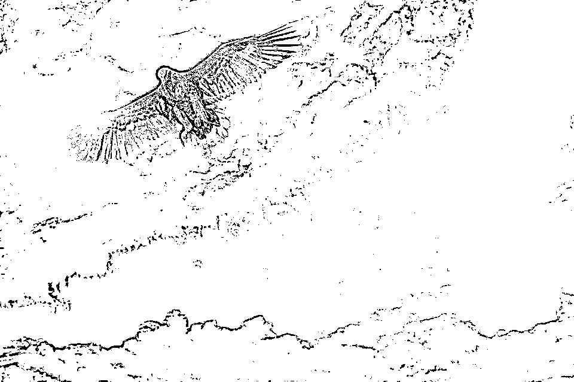

**金星：合相北交点、四分土星**

**本周一个重要的星象是金星合相北交点。**精准成相发生在 6 月 15 日周三，但其影响从上周末开始持续一周多的时间。同时，**上周末金星合相天王星的影响也仍然持续。**

从世俗占星的角度，与南北交点形成相位的行星会深刻影响社会氛围，或成为社会关注的焦点议题。金星在金牛座，同时它也是北交点的定位星，**多重强调了金牛座的主题。**

这意味着本周我们可能会听到很多关于经济金融相关的新闻或政策消息。比如刺激经济、保障民生、金融政策或粮食生产等。经过疫情的冲击，人们会充分意识到恢复经济生产的重要性，各行各业都面临如何复苏的问题。

**天王星带来意外和突然性**，本周天王星延续上周，与金星、北交点还在一定的范围内合相，意味着有些消息和政策可能是意料之外的，或者某些经济措施会有较大的变化。

另外值得注意的是，**周日将发生金土四分相**。土星的限制和压力意味着困难，或者这个议题的严肃性。我们可能会发现经济状况比预想要差，压力比较大。金融市场也可能出现下滑。

对于个人而言，金牛座代表的**物质丰盛的议题**也需要我们去思考。一方面是从疫情的封控里解放出来，我们可能想要享受生活、美食美景，满足自己的身心需求，弥补过去一两个月的缺憾。

另一方面，在整体经济受疫情冲击下滑的情况下，**我们也会感受到压力**，面临收入、个人财务安全的严肃议题。创业者需要考虑自己的生意如何继续，打工人也要面临如何稳定自己的收入、生活与工作，寻求保障与安全感。

金星也指向**价值感**，我们可能想要探究什么样的事业更能发挥自己的潜能，实现自我价值。

当下也是双子座能量充足的时候，收集信息，更好地认识现状，**理性思考，有助于我们应对现实，做出判断和选择。**

金星也是关系的征象星。感情关系或重要的合作关系可能遇冷（土星），让你不得不重视和想办法去沟通。或者是感到需要在关系中负起责任，**建立承诺，促进彼此更深的信任。**

**重点影响人群：四轴及重要个人行星落在固定星座（天蝎座、水瓶座、金牛座、狮子座）23～27 度的人群。**

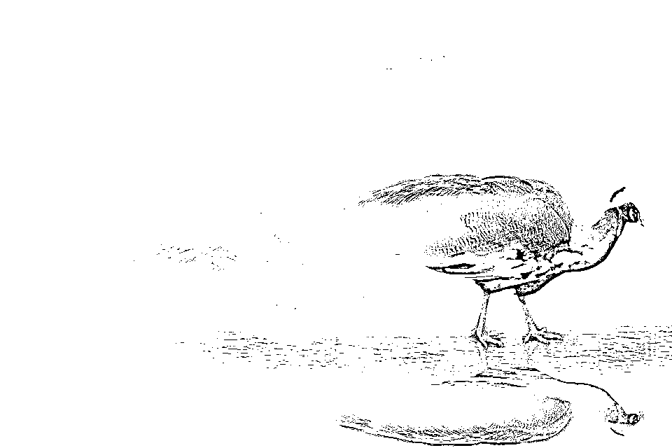

**水星进双子座**

**周一（6 月 13 日），水星进入双子座，将在这里待到 7 月 5 日。**这是水星恢复顺行之后，第二次进入双子座。上一次水星在双子座是在 4 月 30 日-5 月 23 日，我们可以回顾当时在学习思考交流等方面的状态，本周起可能会重现。

**水星在双子座是最强势的位置**，所以再一次，我们可能看到丰富的信息，活跃的新想法冒出来，更多快速流传的消息，给我们的头脑带来刺激。

水星在双子座期间，头脑活跃，是非常适合增进学习与交流的一个时期。积极去学习新知，多阅读、多沟通，去接触新信息、扩大自己的视野。有重要的写作、演讲、交流也可以在这段时间展开。

我们也有机会更新自己的认识。比如对当下经济环境的认识，对自我的认识，对未来的预期，可能都需要去了解变化的现实，更新认知，做出自己的判断。

月亮与水星在周一呈对分相，在情绪与理性思考之间需要找到平衡。先接纳情绪，再做梳理。跟朋友聊聊自己的感受是个不错的选择。

**射手座满月+日海四分**

**周二（6 月 14 日）晚 19:52，满月发生在射手座 23 度 25 分。同时海王星在双鱼座 25 度，四分满月。**

这次满月上接 5 月 30 日的双子座新月。如果那时你许了某些愿望，那么满月的时候可以看看你想要达成的目标还有多远，到什么阶段了。**满月是事物发展的高峰期，往往我们可以在此时看到一个阶段性的成果。**

**射手座与我们的信念有关。**满月发生时，我们可能对自己的信念进行审视，清晰地看到哪些部分已经不符合变化了的现实，需要抛弃，而哪些仍然可靠，或者是新的经验总结。

**射手座也与理想、远期目标有关。**当满月发生在这里，我们可能感到精神振奋、乐观，对琐碎的现实感到厌倦，更愿意思考宏大的理想，做一些远期发展规划。我们也更想摆脱束缚，要自由和远方，比如一场久违的长途旅行。

**海王星四分满月，**一方面会带来更多的憧憬想象，可能梦想很美但不切实际；另一方面也会让我们无法看清前路，感到迷茫无措，失去信心。

**满月时也要注意情绪与关系议题。**伴侣或合作伙伴，有可能因为三观不一致，或对某些问题的看法分歧而产生口角辩论，甚至伤了感情。这会考验彼此理念的配合度，以及相互的包容力。学习尊重对方的想法，求同存异。

**周四（6 月 16 日），海王星会精准四分太阳。**但其实这个影响在满月时已经开始显现。海王星会影响我们的信心，对于未来可能感到悲观，对当下感到迷茫不知道如何判断和选择。

也许在海王星对面的处女座才能给予我们解决的途径：从生活工作的细节处着手，去改善当下能做的，真正动手做事将想法落地，而不是停留于头脑。

这也符合现在火星、木星在白羊座的宇宙氛围：**坐而论道不如起而行之，**边做边想，边做边调整，比一直停滞在头脑中，要更有胜算。

**重点影响人群：四轴及重要个人行星落在变动星座（双子座、处女座、射手座、双鱼座）21～27 度的人群。**

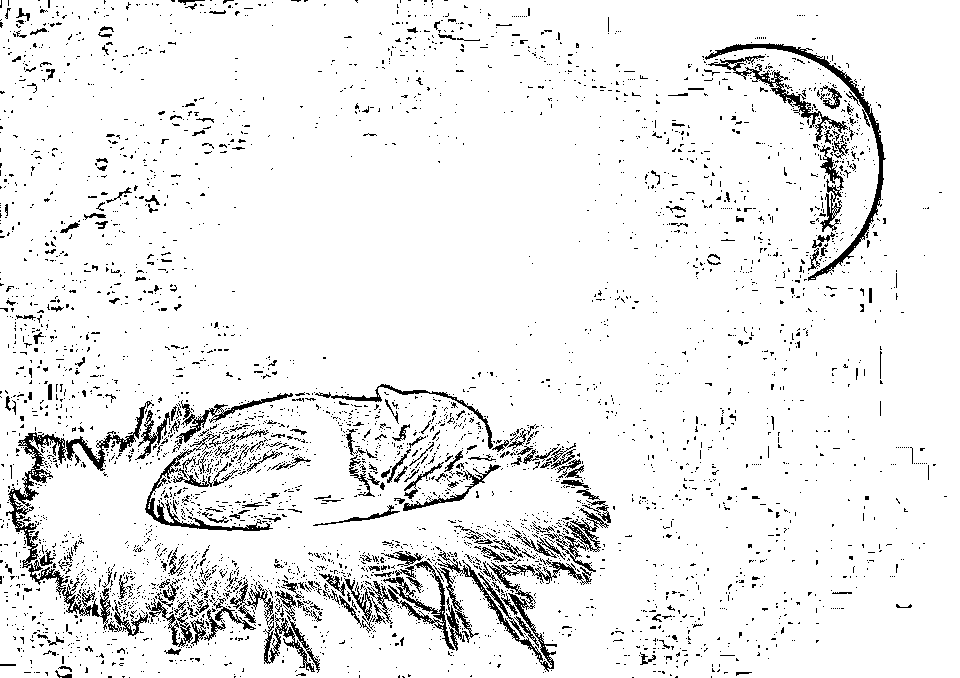

**12 星座的一周运势**

**（重点参考上升星座，其次参考太阳星座）**

***白羊座***

**满月发生在 9 宫，**你可能会看到自己信奉的理念得到验证，对未来也可能产生乐观心态，憧憬某种美好的前景。不过要小心不要用想象代替现实，提醒自己在行动之前多收集信息，尽量客观、审慎地考察实际状况。

如果对未来的道路有点迷茫，那就暂时不要急于做决定。或者停下来去倾听内心的声音，问问自己真正想要什么。

**如何增加自己的金钱收入可能是你最近关心的问题，**目前看来这方面似乎考验大过机会，你的价值还没有被完全看到，耐心一点，等待时机到来。另外选择更能发挥自己价值的事情去做，也很重要。

***金牛座***

**满月发生在你的 8 宫，水星又进入你的 2 宫，**看起来这一周你会非常关注钱的议题。如果之前有做投资，那么满月的时候你可能会看到成果。你是否适合做投资，还是专心工作挣钱更可靠？也许在满月的时候你会有一个初步的判断。

钱往往是对自我价值的一个衡量。如果你感到老板不够重视你，给你压力，也许他是对你有更多的期待，需要你付出更大的努力，承担更多的责任。或者你需要调整自己的工作，做更能发挥潜力的事情。

朋友或团队可能对你有影响，让你感到迷茫。如果团队没有方向，你可以坚持发挥自己的优势，做自己擅长的事。了解和相信自己很重要。

***双子座***

**满月发生在你的 7 宫，关系方面的议题可能达到顶点。**如果你和伴侣或合作伙伴之间，此前因为某些原因产生分歧，那么满月会放大问题，激化彼此的矛盾。

然而满月也会帮助我们看到问题的全貌和真相，从而解决问题。对于信任基础良好的关系，这是一次良性的磨合，会增进关系。但如果存在欺瞒、谎言或其他问题的关系，也可能在满月前后破裂。

水星进入你的星座，你的头脑会更加活跃清醒，学习和沟通的效率会更高。尽量避免你的状态被领导或工作上的麻烦事打乱，安排好节奏，做好手头的事，保持内在的定力。

***巨蟹座***

**满月发生在你的 6 宫。**你可能看到自己在工作方面的成果。如果你最近开启了健身或健康饮食模式，或者调整了生活习惯，那么满月时也可能让你感受到成果斐然，比如身体更有活力，精力更好。

金钱方面的议题可能让你有些忧虑，目前看来并不适宜去做有风险的投资。做好财务规划，谨慎花钱，是更适合你的方式。

你可能想休息一段时间，关心如何让自己身心宁静，获得疗愈放松。但看来工作上有很多事等着你去做，也有不错的发展机会。**等到下周太阳进入巨蟹座，就是你崭露头角的时刻，届时可以积极投身工作、努力表现。**

***狮子座***

**满月发生在你的 5 宫，你最近有什么让周围人瞩目的表现？**看起来你有机会展现自己的才华和创造力，并获得赞美。也许是你的孩子有很好的表现，或甜蜜的恋爱让你感到开心。

但如果最近做了风险较大的投资，满月也可能带来不太愉快的消息。海王星在你的财务宫里，要小心它有可能带来损失。相比之下做好自己的工作，争取收入的提升，目前看来更靠谱。

**金星在 10 宫，**你最近在老板或同事那里可能表现出色，获得肯定，也有机会获得金钱奖赏。但要注意不要忽略了伴侣，以免他们抱怨你陪伴和关注太少。或者合作者认为他的付出被忽略。适当做平衡。

***处女座***

**满月发生在你的 4 宫。**如果之前有改善家庭方面的事宜，比如家居环境、家人的健康，家庭关系、家庭财务计划等，满月前后可能看到阶段性的成果。

**如果之前家中存在一些未解决的问题，满月也可能会将问题放大，让我们不得不去面对和解决。**

**水星进入你的 10 宫**，你可能会有更多的上下级或同事之间的沟通工作需要做。也可能要收集信息，制定计划，梳理工作思路。注意投入工作的同时，不要忽略了伴侣，你可能需要去关心他/她的心理感受，才能更好地相互理解和彼此支持。

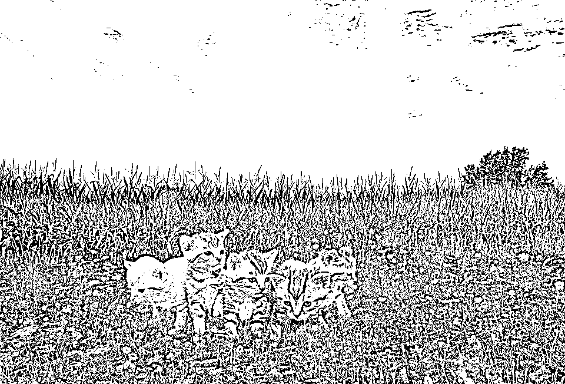

***天秤座***

**满月发生在你的 3 宫位。**你可能看到自己的一些想法在现实中检验的效果。如果之前在学习新知识，现在可能也看到阶段性的成果。

**金星在你的 8 宫合相北交点和天王星，**如果你有在做股票等投资，看起来最近不太平稳，起伏会比较大。尤其临近金星四分土星前后，要小心防范风险。

**水星进入 9 宫，**现在适合去学习系统理论知识，参与考试等。比如学习专业投资知识，建立自己的体系，避免赌博押注的心态带来损失。火星和木星在 7 宫，如果与专业的人合作，会有助于你的投资或学习。

***天蝎座***

**满月发生在你的 2 宫。**如果你之前在找工作或争取升职，那么满月前后可能看到结果。或者是公司岗位调整，收入变化等。

如果你从事的是一对一服务的工作，有可能这段时间客户增多，收入多机会变多。但家庭生活方面也可能同步增加开支，带来一些压力。**火星和木星在 6 宫，**多动手多做事，会带来机会和成果。

**水星进入 8 宫，**你也可以去关注理财方面的知识和信息，但要谨防赌博心态或冒险行为，以免带来损失。

***射手座***

**满月发生在你的 1 宫里。**你对自己的定位和期待是怎样的？你对现在的自己满意吗？满月前后，你可能看到放大的自己，优点、缺点、自信的部分、不自信的部分。这其中的某种感受，可能推动你想要做出改变，让自己更完善。

**水星进入对面的 7 宫，**你跟伴侣或合作伙伴之间，可能有很多想要沟通交流的东西，这将有助于你们的关系。也帮助你透过对方，看到自己。

**金星在 6 宫合相北交点**，改善自己的工作环境和日常生活，让自己更舒适一些，有助于你提升工作效率和成果。同事间的关系也会比较愉快。

***摩羯座***

**满月发生在 12 宫。**一段时间以来你的注意力在各种事务上，需要处理很多工作。满月前后你可能发现自己在心灵层面的需求。也许感到某种内心的疲劳，想要休息，或者跟自己内在对话。

本周可以去学习一些与灵性相关的知识，阅读能让你感到内心宁静的书，适当独处沉思，都对你的身心状态有益。

**金星在你的 5 宫合相北交点和天王星，**你可能有一些不错的想法，去思考如何化为某种形式的作品，比如项目方案、计划书、设计图、文学作品等等，它们会带来现实的回报。

***水瓶座***

**满月发生在你的 11 宫**。与朋友相关的事，或你参与的社团活动，或自己团队做的项目等，满月前后可能看到阶段性的成果。

你会感受到集体的力量。当你对自己做好某件事不确定时，可以寻求团队或家人朋友的帮助，让你懂得 1+1 大于 2 的道理。但是不要因此削弱对自己的信心，你正在学习如何成为更好、更有才能、更有权威性的自己。

**金星在你的 4 宫合相北交点。**美化家居环境，做一顿美餐，给家人安排财务计划等，都是不错的选择。让家成为一个舒适而有保障的地方。

***双鱼座***

**满月发生在你的 10 宫。**如果过去一段时间你努力工作，现在你就会收获成果。当然如果消极怠工，逃避了自己的责任，现在也可能看到不好的后果。

虽然更看重心灵生活，我们也无需避讳谈现实或钱的问题。与朋友熟人聊钱的议题，有助于你梳理自己的财务问题，寻找现实的解决方案。

如果你感到自己为家庭付出太多，迷失了自我。那你现在需要跟伴侣做一次沟通，要求他配合你，达成两个人的协作。这样才不会让生活失衡。

**版权声明**：原创文章由作者授权首发于若道平台发布，欢迎转发，反对抄袭。友号转载请申请白名单。

****

**芷菱**

ISAR 认证占星师/占星作者/媒体人若道 2019 届核心课程毕业生

于 2019 年通过 ISAR 考试，同年获得若道认证神话塔罗师资质

**微信公众号**：芷菱的理想国

长按打赏

**20 位来自世界各地的占星师****带来 19 场沙龙——新世界的觉醒****详情可点击下图**

**学习占星学****点击下图了解课程详情**

**微信又双叒叕改版啦，不想错过若道君的推送？**
**就把若道设为星标吧！****▼**

**喜欢记得点一下在看哦☟**

**报名直达入口**

# 雷蒙德·梅里曼金融占星周运 | 关注 16-18 日的行情

> 原文：[`mp.weixin.qq.com/s?__biz=MzA5NjA0NTAxNg==&mid=2651476207&idx=2&sn=d4b3171aa00876d75c14572fe047b955&chksm=8b48e258bc3f6b4e6d98f33331f533df17c87444f3e39cfbadbda566e7772908b89cd4a7576a&scene=126&sessionid=1692737801#rd`](http://mp.weixin.qq.com/s?__biz=MzA5NjA0NTAxNg==&mid=2651476207&idx=2&sn=d4b3171aa00876d75c14572fe047b955&chksm=8b48e258bc3f6b4e6d98f33331f533df17c87444f3e39cfbadbda566e7772908b89cd4a7576a&scene=126&sessionid=1692737801#rd)

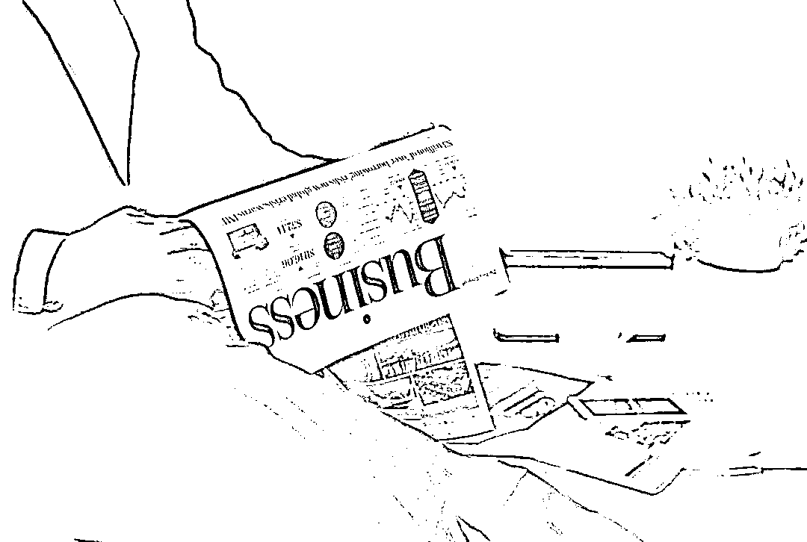

作者/雷蒙德·梅里曼 译者/Luke
编辑/玫瑰 图片/pexels

雷蒙德·梅里曼是在金融占星学界稳坐第一把交椅的占星师，同时他也是若道签约的金融占星课老师，我们引进了雷蒙德·梅里曼老师的《[上证指数月度报告](http://mp.weixin.qq.com/s?__biz=MzA5NjA0NTAxNg==&mid=2651474357&idx=2&sn=1dd70a90e2ea5b1351c8d9eb7342b72e&chksm=8b48fb02bc3f7214b27b2dcbebc7b32be9dab98bee34853299d6dca571248cb279cfdc9322d2&scene=21#wechat_redirect)》及《[黄金报告](http://mp.weixin.qq.com/s?__biz=MzA5NjA0NTAxNg==&mid=2651475867&idx=2&sn=a83315235db9523d78811c8cdd8e6aed&chksm=8b48fd2cbc3f743aa150d0f1182fcf17bcf14ad981390b87314d4845eea1783e35dd4b6acbc2&scene=21#wechat_redirect)》。我们经老师的授权，将每周刊登梅里曼老师的周运，供大家参考和学习。于是，这是本周的周运（6.13-6.17）。

**说明：以下时间采用纽约证券交易所所在地美国东部标准时间。**

**展望与回顾**

****

**5 月消费者价格指数相比去年上涨 8.6%，是 1981 年 12 月以来的最大增幅。通货膨胀已经成为白宫和拜登总统的政治难题。中央银行必须加息多少，还有待观察。****前财政部长拉里·萨默斯最近与其他经济学家团队一起发布了一份白皮书，指出美联储需要比预期走得更远。****这份白皮书声称，由于计算消费者物价指数的方式在过去和现在有所不同，当前的通货膨胀困境接近上个世纪 80 年代的情况，尽管看起来可能不是那样。****——杰夫·考克斯****《通货膨胀 5 月上涨 8.6%，为 1981 年以来最高》****www.cnbc.com****2022 年 6 月 10 日**啊，是的！我们也认为，当前的通货膨胀更接近上个世纪 80 年代的情形。在拜登总统任内，经济和股票市场的走势，与吉米·卡特在任时的情况非常类似。吉米·卡特是在上一个土星-天王星 45 年渐亏四分相周期时执政的总统。卡特的结局不怎么好，拜登可能也是如此，但他仍然有时间扭转趋势，这真的没有那么困难。把通货膨胀压下来的方法，只要增加供给大于需求就可以了。减少需求的方法之一，是加息，这也是美联储在做的。增加供应的方法之一，是修补损坏的供应链，并增加生产，特别是通货膨胀指数上升最快的能源领域，具体而言，就是原油的生产和分配，这也是当前政府的职权范围。拜登为减少通货膨胀所做的尝试看起来是从国家的战略油储备释放原油供应，增加替代能源的生产。第一个方法的问题在于，你必须以更高的价格回购原油，这最终推高了通胀。第二个方法的问题是，可能还需要另一个 5-10 年（北交点在水瓶座-摩羯座，土星合相天王星），才能生产出充沛的替代性能源，解决国家的能源困境。

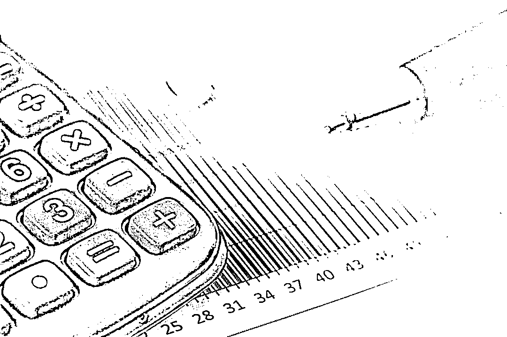

然而，增加原油生产和供应是可能的，同时继续加大开发替代能源的力度。哪怕你打算让化石燃料成为历史，你也可以两个方案同时进行。因此，问题不是说，我们的能源困境和通货膨胀无法逆转，而是因为这样做的解决方案已经成为政治问题了。市场明白这点。上周的市场走势反映了它对情况的理解，首先如预期上涨，然后随着周末迎来金星-天王星在金牛座的合相，市场在周四和周五时崩溃。6 月 8 日-10 日，金星处于守护星座金牛座，月亮在另一个金星守护的星座天秤座行进，人们可能预计市场会看涨。但是再一次，市场的实际表现，证明了这种关联实际是如何运作的。**有利的地球宇宙学征象和相位，不一定对应波峰。它们——与不和谐的宇宙征象一样，主要对应着走势的反转。**许多全球股票指数确实在 5 月 31 日或上周后段触顶。前者处于 5 月 29 日火星-木星合相的 2 个交易日内，后者处于金星-天王星合相金牛座的容许度内。这在上期梅里曼市场时机学院订阅周报中也有所提及，当时是这么说的，**“随着下周末（6 月 11 日）金星合相天王星，我们可能在本周或下周知道答案。这是一个相当强的反转征象，在 4 个交易日内与剧烈的波动有 76%的关联。我们期待那将构成 2-3 周交易周期的波谷。”**在亚洲和环太平洋地区，中国和日本股市在上周末都飙升至新周期和数月高点。印度股市一波良好的上涨于 6 月 3 日结束，随后下跌至上周末，与此同时澳大利亚 ASX 指数跌至自 1 月以来的最低价位。在欧洲，伦敦富时指数和苏黎世 SMI 指数都于 5 月 31 日创下周期高点，处于三星级关键反转日期 5 月 29 日火星-木星合相白羊座的容许度内。荷兰 AEX 指数和德国 DAX 指数于 6 月 6 日创下周期高点或双顶。这些欧洲指数随后于 6 月 10 日均跌至数周低点。在美国，巴西 Bovespa 指数于 5 月 30 日三星关键反转日触顶，随后暴跌至 6 月 10 日。所有的美国主要指数，均于 6 月 1-2 日触顶，处于火星-木星合相的容许度内，随后于上周早些时候上涨至次顶部，之后也下跌至 6 月 10 日，就在强有力的金星-天王星合相前。正如上期梅里曼市场时机学院订阅周报中所述，“随着下周末（6 月 11 日）金星合相天王星，我们可能在本周或下周知道答案。这是一个相当强的反转征象，在 4 个交易日内与剧烈的波动有 76%的关联。我们期待那将构成 2-3 周交易周期的波谷。”黄金在上周五也对金星-天王星合相做出了强烈反应：它跌至 5 月 19 日来的最低价 1826.50，但随后就以经典的天王星风格反转，开启了一轮显著上涨，当天结束前飙升至 1879.60，为 5 月 9 日以来的最高价位。

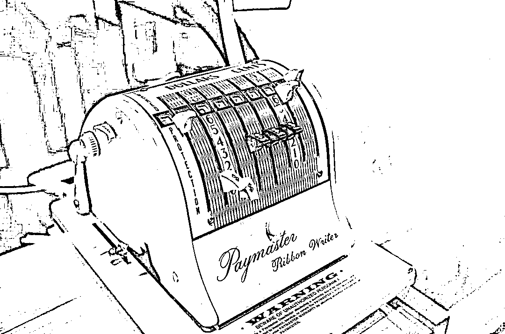

白银同样在上周五跌至数周低点 21.73，但随后的反弹甚至无法超越前一天的高点，与黄金在这个反转区间形成了可能的市场间看跌背离。加密货币表现也很有趣。以太坊于上周五跌至 1658，为 2021 年 3 月 26 日以来的最低价位。但比特币仅下跌至 28814，远远高于 5 月 12 日的低点 25350。**短期占星趋势和长期考量**

****

**“这是一个非凡的时刻：我们有 100 年来的首次病毒大流行。我们有 75 年来首次入侵欧洲。我们也有 40 年来首次的全球通胀。”摩根士丹利联合总裁特德·皮克说。****“当你看到这个组合，疫情、战争、通货膨胀的交叉，这象征了一场范式转变，15 年来金融压迫的终结和下一个时代的开端。”****——休·萨恩****《市场范式的转变已经开始》****www.cnbc.com****2022 年 6 月 5 日**我们在 2007-2008 年独创性地提出，我们想要通货膨胀，因为股票市场在崩溃，美联储把利率从 5%以上降至 0。难道不是指望零利率和量化宽松政策的出台，最终导致通货膨胀，通过通胀来摆脱世界和国家债务吗？即使那意味着退休和储蓄阶层的毁灭，这些阶层本来可以从工作一辈子储蓄的 100 万美元中每年获得 5 万美元利息，那会怎么样呢？随着冥王星进入摩羯座，老年人和退休者的利益可以成为牺牲品了。摩羯座掌管“老年”。冥王星掌管“可以牺牲的”。年龄歧视在主导。请摆脱他们吧。把他们移出我们的视线，至少持续到选举日前，因为他们依然能投票。但是随着冥王星预备在 2023 年 3 月 23 日进入水瓶座，这一情况可能会发生改变。通货膨胀和利率正在开始上升。老年人和那些储蓄者可能再次发现他们在社会上的地位得到了改善，不再是“被遗忘的阶层”。这一称号可能降临到由水瓶座掌管的年轻人头上。**摩羯座和水瓶座与政府也有很大关联。**在冥王星在摩羯座时期，我们看到民主遭受了重击（甚至在那些本应是民主制的国家），专制在获得力量。冥王星的天性是赋予或剥夺力量，甚至是毁灭它所落的星座所掌管的人类活动领域。冥王星在摩羯座，中央政府对人民的独裁和专制在上升。对于冥王星在水瓶座，个人自由、平等和民主的追求要么被集体的共识所赋予力量，要么被强有力的少数派所挟持，导向革命和拆毁体制的愿望。冥王星在水瓶座可以是那样。冥王星说，要么改革，要么被烧毁。水瓶座要么与世界问题的卓越或革命性解决方案有关，要么与精神病疯子烧焦地球的行为有关，他们毫不关心人类的自由和平等，更不要说生命本身了。然而，进入当前十年的中段，天王星进入双子座与在水瓶座的冥王星形成风象三分相，带来了希望。不能排除人民群众的崛起和民主复活的可能性。毕竟，水瓶座和天王星具有复兴的主题，没有比这两颗外行星之间的三分相更好的机会了。

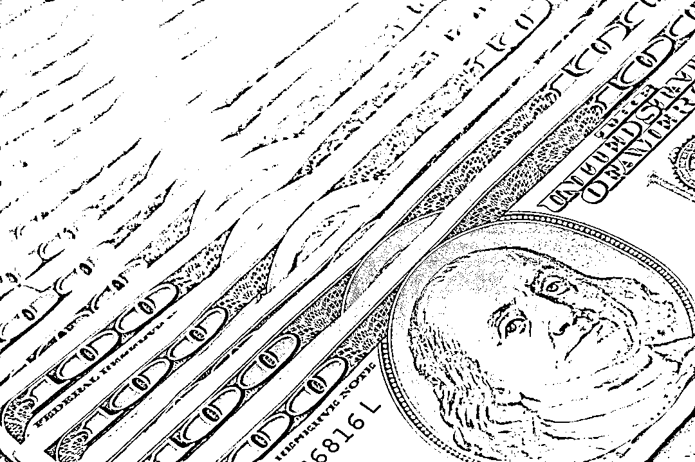

回到本周市场环境的话题来，我们注意到**金星在 6 月 18 日四分土星**。**这将完成金星对土星-天王星四分相的“传递”（6 月 11 日-18 日）。这整个时期是反转的时期。**金星和天王星，可能带来价格的崩溃，上周高得出乎意料的消费者物价指数报告带来失望后，股票和国债市场就是如此。**任何接近长期低点或高点的市场都容易出现突破。涉及土星，任何正在下跌的市场都构成了潜在的买入机会。****比 6 月 18 日金星四分土星更强的反转征象，是 6 月 16 日的太阳四分海王星。**因此，本周可能会**在火星、木星在白羊座的阔绰和贪婪之间，见证担忧、关切和困惑的卷土重来。**毕竟，像消费者物价指数这样的经济报告都是与过去相关的。交易者们用不了多长时间就会开始展望前方，把主流叙事从抑郁和恐惧再次转向希望和贪婪。**梅里曼市场时机学院与若道将于 2022 年 6 月 23 日 19:00 举办金融市场最新信息中国专场讲座。**这个 2-3 小时的在线讲座（有两次 5 分钟的休息时间）将讨论几个金融市场的前景，包括黄金、原油和上证综指。

这将是特别及时的讲座，因为为期 12 年的木星轨道周期会在 5 月 10 日进入白羊座，并且 6 月-11 月是一年中最有力的地球宇宙征象接连登场的重要时间段，因为土星逆行与天王星形成几乎精准的渐亏四分相。

**说明：以上日期基于纽约证券交易所所在的美国东部标准时间，由于存在时差，中国地区可能需要加一天。**

**版权声明：**本文由若道翻译发布，欢迎转发，反对抄袭。友号转载请申请白名单。

**雷蒙德·梅里曼（Raymond Merriman）**

若道签约老师。著名金融占星师，ISAR（国际占星研究协会）前主席，梅里曼市场分析公司的总裁。他由于“提升了占星学的职业形象”，在 1995 年国际占星大会上被授予轩辕十四奖；在 2012 年国际占星大会上，被授予轩辕十四终身成就奖。

1“中国上证指数月度报告”发售**若道推出了****中文版****的雷蒙德·梅里曼中国上证指数月度报告，并持续发行该报告！**当把金融市场的周期和占星学的周期相结合时，雷蒙德·梅里曼老师的金融占星学研究**为投资者应对金融市场的周期波动，并随之调整投资策略提供了极大的价值参考**。
**6 月中英文报告已上线！**2“黄金价格周期月度报告”发售**若道推出****中文版****的雷蒙德·梅里曼黄金价格周期月度报告！**不仅仅为广大读者在中国股市的投资出谋划策，更将视角放眼黄金市场。**每当世界经济形式不明朗的时候，有一个地方是保值的港湾，那就是****黄金**。自 1982 年雷蒙德·梅里曼出版第一本研究《地球宇宙学征象与黄金价格的关联》的著作以来，**他一直作为最重要的黄金市场时机预测者之一享誉国际**。2022 年 7 月黄金报告已上线，梅里曼老师将会告诉你他对这个关键时期如何操作的想法。也可以按照季度和一年期订阅，有更多优惠。季度和年度的好处是，你可以持续了解梅里曼老师对于不断在变化的市场的看法。即便他某一次看法和市场不一致，你也看到在下一期他如何调整自己的看法，并看到金融占星在一个长期时间段内对你把控风险的帮助。而能够长期控制风险、尽量找到安全的投资时机才是投资的长久之计。**7 月中英文报告已上线！****购买套餐**，买得越多越优惠中国上证指数月度报告套餐价

*   **单月报告**：280 元
*   **3 个月套餐**：780 元（260 元/月）
*   **12 个月套餐价**：2400 元（200 元/月）

**长按下图识别二维码****购买金融报告****套餐****▼**

黄金周期月度报告优惠

*   **双报告年度套餐更优惠（直降 900 元）**

*   **12 个月黄金报告+12 个月上证指数报告：仅需 3900 元**

**长按下图识别二维码购买黄金报告套餐**▼

3《2022 年金融预报和沙龙》1976 年以来，由雷蒙德·A·梅里曼撰写的梅里曼市场时机学院每年一次的年度预报沙龙和每年一本的《年度预报》一直在应用占星学原理为投资者们服务，提供卓越洞见，从未间断。 **雷蒙德·梅里曼《2022 年金融预报和沙龙》发售中（报告已发布）。****长按下图识别二维码了解详情**
▼

4《2022 下半年金融占星投资沙龙》这将是特别及时的讲座，因为为期 12 年的木星轨道周期会在 5 月 10 日进入白羊座，并且 6 月-11 月是一年中最有力的地球宇宙征象接连登场的重要时间段，因为土星逆行与天王星形成几乎精准的渐亏四分相。

**长按下图识别二维码了解详情**

▼

**点击阅读原文购买金融报告**

# 上证还有投资机会吗？ | 6 月 23 日梅里曼 2022 下半年金融占星投资沙龙

> 原文：[`mp.weixin.qq.com/s?__biz=MzA5NjA0NTAxNg==&mid=2651476207&idx=3&sn=a4f19b002d617865b02e8656ccc25e23&chksm=8b48e258bc3f6b4ede63fd106c0d63cbf68d13119e8d9a59933c2132dc39d4a546e0b12b513e&scene=126&sessionid=1692737801#rd`](http://mp.weixin.qq.com/s?__biz=MzA5NjA0NTAxNg==&mid=2651476207&idx=3&sn=a4f19b002d617865b02e8656ccc25e23&chksm=8b48e258bc3f6b4ede63fd106c0d63cbf68d13119e8d9a59933c2132dc39d4a546e0b12b513e&scene=126&sessionid=1692737801#rd)

之前的沙龙内容发出之后，50 个早鸟价很快就被抢购一空，现在还有转发优惠价，可以添加工作人员进行咨询。

**长按下方二维码添加李老师**

**添加备注：金融沙龙**

好了，以下是如此火爆的沙龙具体内容：

2022 年转眼已经过了 5 个月。你的投资还好吗？

| **上证日线**

| **上证周线**

| **黄金日线**

今年上半年最重要的天象——木海合相没有带来我们希望的上涨，而是带来了歇斯底里的下跌。在 5 个月内，上证从 3651 一直跌到最低 2863 点，跌幅达 21.6%，很多股票也都有更大跌幅。对黄金而言，在 3 月份达到 2078 的高点之后，也开始一轮下跌。上证的走势尤其值得关注。因为这样的下跌，许多公司的股价已经变得非常便宜。当然，目前因为动态清零抗疫方针，中国经济也面临着前所未有的困难，这些困难毫无疑问体现在上证及公司股价中。当 2022 年年度预报沙龙在 3 月举办的时候，当时上证指数已经在熊市的通道中，很多市场人士都比较悲观。而梅里曼老师说，如果上证有 5.5 年的周期，而这个周期分为两个 33 个月的半周期，按照 26-40 月的范围而言，这个周期低点应于 2022 年 3 月-2022 年 5 月出现，当时 3 月份已经是第 38 个月，周期而言相当晚了，因此他对于市场还是比较乐观。然而，我们看到市场 3 月份后并没有止住下跌，在木海合相期间开始更猛烈下跌。根据周期理论，4 月底已经进入第 40 月了，到这个范围的尽头，而市场开始反弹。而对于梅里曼老师给出的“33 个月周期低点的价格目标是 2633-3150、2973+/-87 和 3047+/-81”而言，2863 点也到了相对低的低点。在 2021 年，土星和天王星出现 3 次四分相时，上证指数都到了当时市场的高点，在今年下半年，土星和天王星还会再出现一次非常接近的四分相。

**下半年，上证会出现有力的反弹吗？或是梅里曼老师对市场的看法与年初相比有什么改变？****在沙龙中，除了上证外，梅里曼老师也会讲到其他金融投资市场。****下半年的投资该如何把握？我们特意邀请雷蒙德·梅里曼老师在 6 月 23 日 19:00 为大家带来 2022 年半年度金融沙龙。**这场在线沙龙将提探讨这些长期行星周期如何影响世界经济的长期周期和趋势，特别是如何影响上证综指和黄金市场，并描述在 2022 年剩下的时间里市场反转关键时间点。**沙龙价格**

**沙龙正价：****450 元**

**沙龙前 50 名早鸟价已售罄，转发可获得优惠价，具体请咨询工作人员**

**长按下方二维码添加李老师**

**咨询价格&提交问题**

**添加备注：金融沙龙**

**沙龙时间**

**沙龙时间：6 月 23 日 19:00，时长 2-3 小时**

**报名直达入口**

# 天蝎座月亮+水冥三分相，你在本周发现了哪些“隐藏的真相”？

> 原文：[`mp.weixin.qq.com/s?__biz=MzA5NjA0NTAxNg==&mid=2651476113&idx=1&sn=eb53092d67b34e1c050c77d7e70a0249&chksm=8b48e226bc3f6b301a4f861c7d31bd6e8bbe8fd6207a24050cd75eeba49c6ea49c2bc4adb042&scene=126&sessionid=1692737801#rd`](http://mp.weixin.qq.com/s?__biz=MzA5NjA0NTAxNg==&mid=2651476113&idx=1&sn=eb53092d67b34e1c050c77d7e70a0249&chksm=8b48e226bc3f6b301a4f861c7d31bd6e8bbe8fd6207a24050cd75eeba49c6ea49c2bc4adb042&scene=126&sessionid=1692737801#rd)

**2022 年 6 月 11 日天象：**

*   **04:40 月亮进天蝎座**
*   ******水星三分冥王星******
*   ******金星合相天王星******

月亮在今晨进入天蝎座，而天蝎座的守护星冥王星已经和水星保持了好几天的三分相，今天正处在精准成相阶段。水冥三分相和探索真相有关，虽然真相可能太让人舒服，但接纳它会让人不陷入虚幻。当然在这个时候，人们说话的风格也可能变得刻薄，“一针见血”的攻击性不一定人人都受得了。所以，虽然彼此的沟通容易深入主题，但如果意见不合，也记得别下嘴太狠。毕竟月亮在天蝎座，情绪易激烈，不由自主的控制欲也不利于关系互动。

在本周，你都“探测”到了哪些真相？它们对你有哪些触动？或者，有哪些“惊天爆料”让你有了更深的思考？欢迎分享哦~你也可以回看本周的内容，点击[【周运】](http://mp.weixin.qq.com/s?__biz=MzA5NjA0NTAxNg==&mid=2651475341&idx=1&sn=e20610876448eeead64d54666480aa13&chksm=8b48ff3abc3f762c192b35f7913d1c3486b6c11997872aaba263f4a920c4d5d1abd13fcba2de&scene=21#wechat_redirect)查看哦。

除此之外，今天的另一个天象——金星合相天王星，带来一丝令人兴奋的气息，你可能在社交场合中认识一些新朋友，愉悦的关系让你享受。这个周末，享受快乐吧！如果你正处在关系中，金天合相和天蝎座月亮也提醒我们，即便是彼此信任的深度关系，有时候也需要保持各自的独立性，既亲密又自由的状态，让生活充满不同的可能性。

周六快乐，我们周一见！**了解每日天象，可****下载“若道”APP 查看****还有更多精彩等着你哦**

# 拔除这根“毒刺”，天蝎座就无敌了

> 原文：[`mp.weixin.qq.com/s?__biz=MzA5NjA0NTAxNg==&mid=2651476106&idx=1&sn=f89fd5df5bf6cd35dc38b74761305dfc&chksm=8b48e23dbc3f6b2b6f1c65921eb12dfa820ca3d3cf32a3aaa1833265fda93c7e0d6be8cc5cc1&scene=126&sessionid=1692737801#rd`](http://mp.weixin.qq.com/s?__biz=MzA5NjA0NTAxNg==&mid=2651476106&idx=1&sn=f89fd5df5bf6cd35dc38b74761305dfc&chksm=8b48e23dbc3f6b2b6f1c65921eb12dfa820ca3d3cf32a3aaa1833265fda93c7e0d6be8cc5cc1&scene=126&sessionid=1692737801#rd)

************************☆ 后****************************台****************************回复“今日”，给你一句生命态度************************

作者/雷·格拉斯、琳达·帕费尔

译者/亚麻琳恩 校对/Chang

编辑/玫瑰 封面/书君  图片/pexels

12 星座代表 12 种能量原型，其中天蝎座与深层次、强有力的精神能量有关，如果我们从脉轮系统的角度看，天蝎座与脐轮—火星的“内在战士”相连，可以被理解为“阴性的火星”。怨恨是天蝎座的毒刺，如何解毒？让我们看看天蝎座的整合与转化之路。**“静水流深”**

在黄道十二星座中，人们认为一些星座比其他星座更受欢迎，也经常，天蝎座会首其冲地受到一些最负面的联想。

其中一个原因可能是，**天蝎座领域内的许多事实都与深层次、强有力的精神能量有关**——事实上，这种能量如此强大，以至于它被破坏性表达的潜力与它更高阶的建设性表达的潜力可以相匹敌。**换言之，通常只有毁灭的强度能救赎天蝎座。**

二十世纪占星学已帮助我们重新审视了对星座及其象征能量的态度。**从两极的角度来看待这些能量是非常有帮助的，**这种两极不仅存在于我们的心灵中，也作为普遍原则无时不刻的在运作，且体现于各种表现形式当中。

**每个星座都有其积极和消极的面向，全取决于你表达那些象征能量时是否带着有意识的觉知。**无意识的表达会招致更多负面的后果。

如果我们能接受每个人的心灵都包含所有的星座和它们相应的两极这个普遍原则，我们就会很快意识到，**每个人都有天蝎座能量，**无论是否有明显的行星“占位置”。

也就是说，**我们每个人都必须去面对这样一个天蝎座与生俱来的挑战，它主要通过愤怒、和愤怒的阴影—怨恨，来表现。**

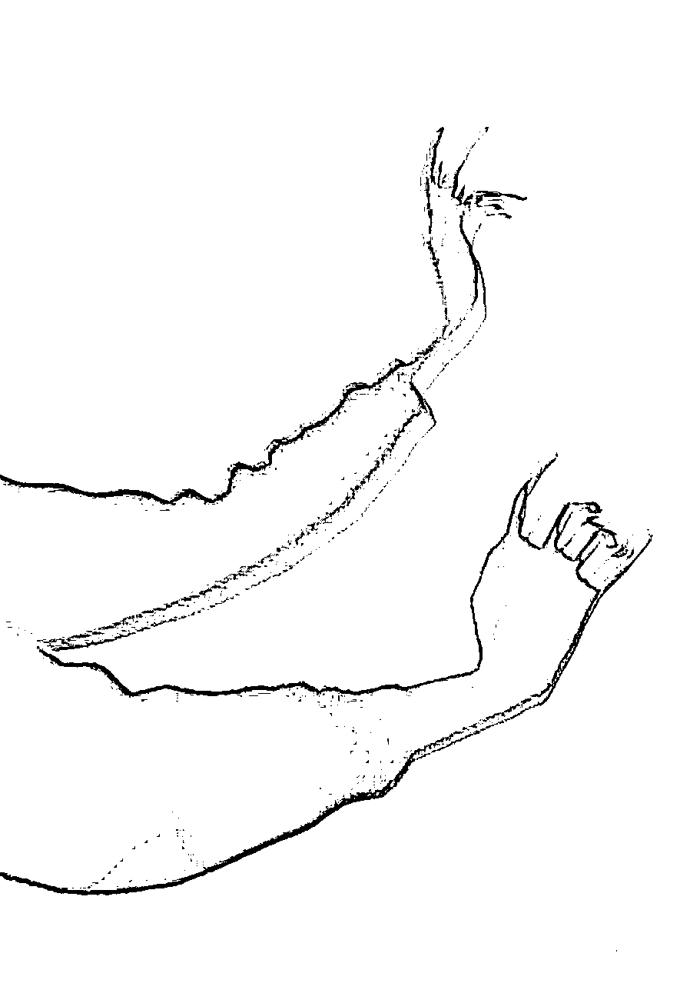

**脉轮系统中的天蝎座****在梵语中，Chakra 这个词的字面意思是“转动的轮子”。**在瑜伽哲学中，这个词指的是沿着脊柱长度分布的精神能量中心。贯穿全身上下的通常有成千上万个脉轮，但瑜伽哲学通常只强调其中的七个或八个，下面用它们的基本点和行星的关联来说明。

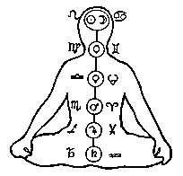

| **脉轮** | **行星** | **关键词** |
| **（8）顶轮**  | **— —** | **超脱者，灵感** |
| **（7）眉心轮** | **太阳**  | **主动意识，超强意愿** |
| **（6）月亮轮** | **月亮** | **反思意识，回忆** |
| **（5）喉轮** | **水星** | **思考，沟通** |
| **（4）心轮** | **金星** | **和谐，爱** |
| **（3）脐轮** | **火星** | **武力，力量，控制** |
| **（2）生殖轮**  | **木星** | **拓展性，情绪化** |
| **（1）根轮**  | **土星** | **结构，限制** |

通过深入思考瑜伽哲学所倡导的**脉轮理论**中所体现的**天蝎座的深奥本质**，不失为一个能深入理解天蝎座多样表现形式的好方法。(在雷·格拉斯的文章《占星学与脉轮：走进占星的神圣心理学》中，对这一主题作了更详细的介绍）。脉轮有时被描述成一个心理-灵性潜能的原型层级，等级跨越从更物质层面的、位于脊椎底部的根轮，到更灵性层面的、位于脑中的能量中心（见上图）。

**理解脉轮的一个关键**，是洞察每个脉轮都有三种不同的表现模式：一侧是**阳性（外在化）**，另一侧是**阴性（内化）**，以及位于脉轮中心的**中性（平衡）**。在图中，中性模式由位于中轴的行星表示，而阳性和阴性的状态则由中央通道两侧的黄道星座表示。

图示符号阶梯中的第三个脉轮，在梵文中被称为**脐轮（Manipura），与火元素和火星有关。**意志、力量和权力的争斗在这个层级被最为激烈的体验到。

该脉轮代表了我们**“****内在战士”**的水平，**只有“内在战士”掌握了对火性能量的平衡，我们才能真正体验到对心灵力量的灵性掌握。**

**这个层级也与自我意识的发展有关**，因此在这里，我们界定个人边界，打造我们自己的、关于“自我与他人”的独特定义（请注意，占星学里的宫位：一宫和上升点，与自我定义最为密切相关）。

该脉轮也有其防御的一面，因为对他人的恐惧会紧随自我意识的觉醒而来——紧跟着的，是意识到“我”并非无坚不摧。塔纳托斯（死神）紧随埃罗斯（爱神）之后：**生带来了对死的觉知。**

因此，**火星的能量至关重要，关乎意识的觉醒，和果断自卫的激发，**比如筑起高墙或划定边界。**这也包括过度侵占，那与病态的领地意识相关。**

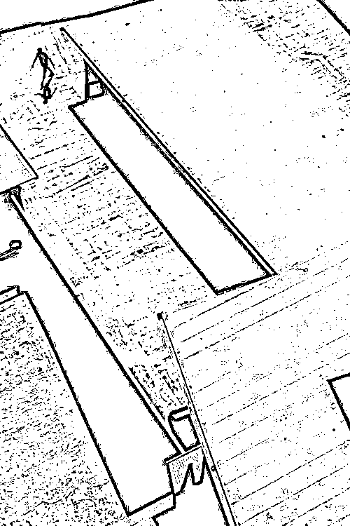

**阴火与阳火****因此，****天蝎座和白羊座更深层次的含义均与脐轮的心理意涵和隶属于脐轮层级的自我意识的觉醒紧密联系在了一起。****脐轮的一面是白羊座，**它**外化的火星能量**表现为自信、攻击和驱动力，以及更强劲的、直接的愤怒。这是一种向外投射的可见能量，形象地说，像矛，或者剑。**脐轮的另一面是天蝎座，**代表着**火星能量更内化的表达**。如果说白羊座的一面是单刀直入的面向世界，天蝎座的这面则反映出一种更为压缩的、圈圈环绕的能量，可以想象成将能量向内拉动的漩涡，那种螺旋状的力量。对某些神秘主义者来说，火星能量的白羊座面向和天蝎座面向，两者之间的细微差异，恰恰由男性和女性的生殖器形象地呈现出来。

男性生殖器向外刺，而女性能量向内收。因此**，****天蝎座可以被理解为“阴性火星”，与白羊座象征的“阳性火星”形成鲜明对比。**

这两者，天蝎座的力量应该至少与白羊座呈现出的外在能量旗鼓相当，**但因为压缩，它甚至可能变得更为强大。**只需想一想，按下金属弹簧会增加回弹力，就能够明白压缩后的动力真的很大。事实上，占星师们用来描绘**天蝎座的盘旋符号**，不禁让人联想到这种**压缩的、弹簧似的过程。**正是天蝎座这种向内压缩的、定向的火星力量使它如此强大，对许多人来说，可能是个问题。

最具建设性的是，天蝎座拥有**自律和专注的钻研精神**，这很适合**探索内在层面****，**也善于控制天蝎座所深刻洞悉的内在能量。往玄了说，天蝎座是与魔法意志相关的黄道带准则（特别是当狮子座在星图中与天蝎座相伴时）。

**那是神秘主义、方术和魔法式的能量。**那些天蝎能量强的人有着难以置信的意志力，**当他们把自己的专注力——或者更准确地说，是情感——投入到任务中时，他们就能所向披靡。**在一些古老的占星学文献中，人们发现了一个看似奇怪的见解，**即在古代与天蝎座有关的各种符号中，骆驼是其中之一。**因为骆驼能够穿越沙漠（沙漠之舟），虽长途跋涉，却仅靠体内的水分维生——骆驼的这种特质精辟的阐述了“固着水”的本义，**也阐述了天蝎座装载情感能量的能力，以及巨大的韧性，和驱动力。**天蝎座穿透表象的能力使它像**侦探一般调查任何秘密，解开任何真相。**天蝎座式的刨根究底，直指事物核心，撕掉一切伪装——管它是一个形而上学的谜，一个深埋的考古宝藏，还是政客的一件脏衣服！然而，**当它最具破坏性时，这股被压缩的火星能量会以一种毁灭性的方式回到我们自己身上。**因此，有天蝎用尾巴刺杀自己的符号象征，它是黄道带唯一一个能够自杀的动物。这时，火星力量溃烂、感染，强迫性地叮咬自己的伤口，让伤口永不愈合。

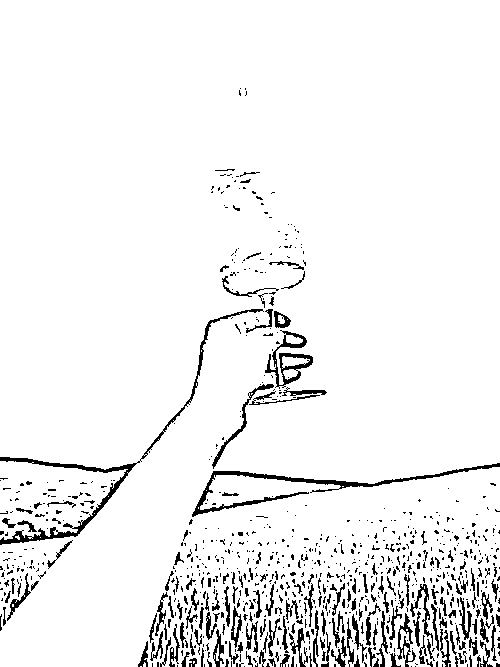

在天蝎座式的过程里出现问题的也不仅仅是愤怒，任何情感或思想，当被压缩或压抑时，都会有一个潜意识层面的能量加剧，**这股力量迟早会突破进入意识层面。**如果你们玩过一个叫“不要去想”的游戏——不管是白象、猴子，还是任何其他荒谬的东西——就都会明白压抑和压缩的力量。**压抑过多的事实**——无论是童年时期的创伤、性能量，还是关乎个人私生活的谨慎隐藏——**都会对个人的精神或身体健康造成严重的损害。**正如一句流行的谚语所表达的：“你就和你所保守的秘密一样健康。”一念成魔，一念成佛：如果我们以健康的方式与这些强大的能量一起工作，**好好运用它们，则能带来人生转变和重生，或被赋予非凡的疗愈能力。**反之，如果我们不能健康、积极的使用能量，它们就会变得极具破坏性，导致自我伤害也伤害他人。**天蝎座和天蝎座的能量要么被扭曲、表现为毒蝎，要么获得灵性成为雄鹰，**毁灭的力量被虔诚地运用，既实现自我又物尽其用。**怨恨：天蝎座的毒刺****白羊座和天蝎座的最激烈状态都与愤怒相关，但体验方式却截然相反。**以性为例，区别于白羊座公羊似的向外冲、以征服自己的渴望对象，天蝎座的方式则更为女性化和内敛，引诱对方接近它，好像用了一个“牵引波束”（我们的一位天蝎座朋友很有想象力的如是说）。这让人想起一句古老浪漫的格言：“他追她，追她，直到她最终抓住他！”**这里的“他”是众所周知的白羊座，向外冲，而“她”则类似于诱惑的天蝎座，引诱他人循迹而来。**
然而，在所有天蝎座处理的情绪中，天蝎座自己认为最有代表性的、呈现为生活挑战循环出现的，就是**与愤怒的抗争**。如下这一说法或许能帮助深化理解：**每个星座都有它自己的瘾或“选择的药”，灵性的成长需要我们学习控制、转化，甚至完全打破那些特定行为模式（成瘾或强迫），并且学习掌握该星座的能量。**例如，双子能量强的星图，“瘾”往往是很多想法，或喋喋不休；对金牛座，“瘾”是物质安全；而对摩羯座，“瘾”则是地位或杰出成就；我们可以这样把每个星座都过一遍，给出一个与之模式相符的例子。

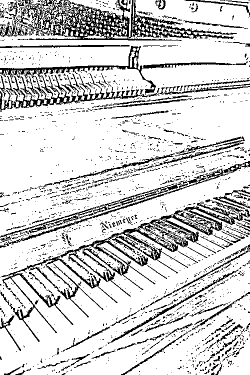

我们当然可以说，**天蝎座“选择的药”就是怨恨，这是被压抑后的愤怒更具破坏性的一面。**怨恨的自我喂养，和海洛因成瘾者需要吸毒大致相同。我们都知道，有些人常常把自己置身于易怒境地（可能是工作或爱情），他们的身体会产生怨恨的毒汁，以自我“修复”，但浸润其中，他们却获取了反常的“快乐”（非理性的，可能是无意识的）。我们当然可以论证愤怒有其建设性面向，但怨恨更阴险，因此更具破坏性；人们很难、也找不出任何理由来描述怨恨是“好的”。英国诗人威廉·布莱克在他的诗《一颗毒树》中对此问题有所表述：“**我对朋友生怨，****倾诉之间，怒气消散；****我对敌人生怨，****闷在胸间，任其蔓延。****惶恐之中将其浇灌，****从早到晚，用我的泪眼；****用我的笑脸，****温柔欺骗使其灿烂****它日夜攀援，**

**直至结出鲜果闪闪；**

**敌人开始对其垂涎，**

**其主是谁胸中了然。**

**夜色遮掩，****溜入我园。****清晨见状开颜：****敌人树下四脚朝天。**”诚然，**不是所有的天蝎座都沉迷怨恨，**就像不是所有的双子座都八卦，所有的白羊座都在打架一样！然而，这些极端的例子有时会是有用的提醒，提醒处于更微妙的挑战中的、面对这些能量的人们。事实上，我们每个人的星图上都包含所有的星座和行星，**因此我们都要面对天蝎座的挑战和能量。**

每个人都要处理这个议题，强度和张力的程度千差万别，**具体取决于个人星图/个人心灵埋藏的天蝎能量的位置，火星和冥王星的相位或受影响的程度，以及宫位和星座落座是隐性的还是显性的。**

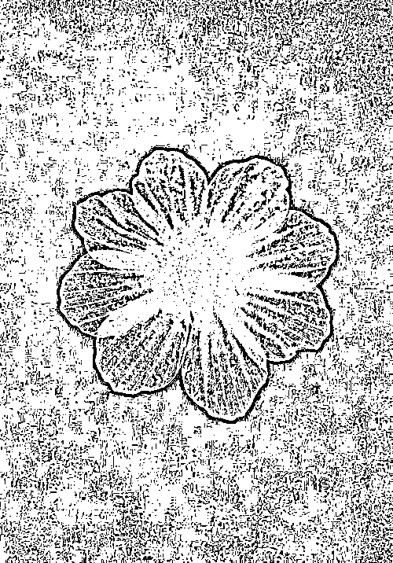

**一个很好的例子：**本文的作者之一，他的天蝎座在 12 宫宫头，没有行星落天蝎座。在撰写这篇文章的过程中，作者意识到，当前冥王星四分个人的一个行星群，他不得不直面一场意想不到的对抗，面对埋藏已久的愤怒和怨恨，而在此之前他一直以为这个愤怒和怨恨已经解决、甚至不存在了。这种共时性非常及时也异常深刻，作者毫无疑问开启了一个新的（也是谦卑的）视角与天蝎座共处。**转化愤怒和怨恨**那么，人们如何将潜能最大化，从毒蝎转化为鹰呢？也许**心理上的第一步，就是深挖这种防御性表现为主的能量背后，到底隐藏的是什么。**在极不理性状态下，白羊座和天蝎座的核心都在于不安、恐惧这两个心理因素。**人们害怕或怨恨那些唤醒自己不安感的人。**如前文所述，**随着脐轮层自我意识的觉醒，脆弱性和防御性会随之而来。**当一个人的边界被侵犯时，愤怒是一种正常的反应。愤怒会导致什么呢——它会如何被表达和最终处理掉呢——这就引出了我们下面三种和天蝎座棘手能量共舞的可行方法。**1****宽恕**第一种方法是宽恕。如果怨恨代表了天蝎座的致命弱点，**那么它要学习的就是放手，**松开自己灵魂的桎梏。宽恕有多种解读，对大多数人来言，它很可能只是一个未经检验的概念，最初通过宗教信条灌输，或者被原生家庭和根源文化所严格定义。然而，从神秘主义的层面来说，宽恕常常被认为是强大的**，****它能中和脉轮系统中的负向场，即清除寄生的思想形态，**这些思想形态附着在身体上，就像藤壶附着于船体一样。基于这点，多想想几种不同的宽恕方式还是很有用的，哪怕它们不是唯一的方式。首先，用宽恕来处理愤怒，以观想和引导意象的方式，**这些观想和引导意象可以帮助我们放下愤怒带来的沉重感，**这种沉重感其实已经远远超过愤怒的“保质期”。在埃及古书《亡灵书》中提到，当灵魂到达冥界，必须面对托特神，由他来做灵魂死后的最终审判。这个审判是通过在天平上用一根羽毛称心脏的重量来实现的。

如果心“太重”，灵魂就无法前行；任何留存在于心的东西都是这颗灵魂进化途中的障碍。如果心比羽毛轻，那就是一颗没有罪恶、值得救赎的心。

就个体经历而言，你可以回忆那些在你生命历程中曾让你感到怨恨、甚至是憎恨的人们。

然后，**在冥想中，向这些人倾注宽恕和怜悯，直到你感觉，与这些人相关的情感“控诉”慢慢和缓下来**（史蒂芬·莱文的优秀著作《引导冥想和观想》）中有一个特别有用的宽恕练习）。

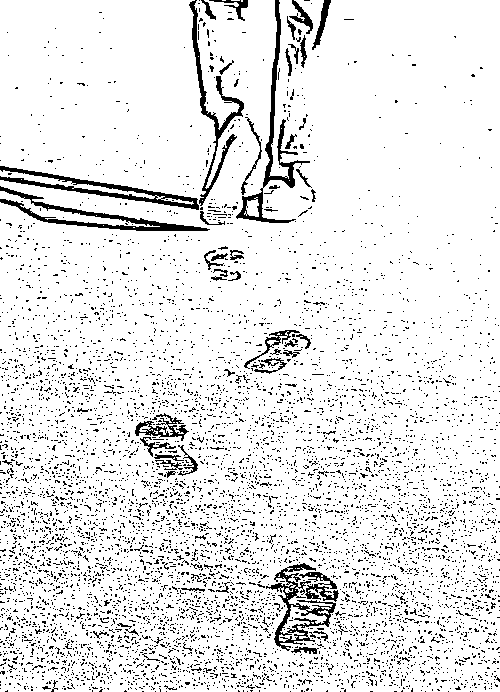

**2****“聚焦”疗法**当然有些人会争辩，说宽恕本身并不一定能根除根深蒂固的愤怒或怨恨。这就引入了我们的第二种方法，转化天蝎座的阴影能量。这种方法围绕着这样一种观点：**只有更深的体悟、或“释放”那些激烈情绪的能量根源，转变才会真正到来。**其目的是以诚实和开放的态度探讨情绪议题，探究心理状态下感受的真正来源。通过这样做，我们消除了他们的强迫或上瘾特征。这不是分析某种情绪。而是你可以允许自己，真正感受内心愤怒和怨恨的“感觉”，同时保持有意识的觉知。这个过程可以在有经验的治疗师指导下进行，也可以自己独立探索。沿着这个思路，或许最有效的方法是广受赞誉的“聚焦”疗法，它由尤金·根德林首创，将经典治疗方案中那些最有效的元素提炼出来，形成一种简单的、循序渐进的方法。(对于那些有兴趣进一步了解这种神奇疗法的人来说，最好的读物仍是根德林自己在这个领域的著作，书名正好就叫“聚焦”)**3****蜕变****第三种用以处理天蝎座的愤怒和怨恨的方法，叫“蜕变”。**这里，强调的重点变为释放天蝎座的本质能量，且引导它进入另一种更具建设性的表达方式。比如，世俗层面上说，一些占星师发现给天蝎座能量（出生图或行进）很强的客户这样的建议会很有帮助：**某些剧烈运动的方式**能很好的为这些能量提供出路，以免这些能量阻塞而造成更大的问题。从更神秘的层面上说，同样是能量，有人会用**仪式或观想**的方式，做更高、更灵性的意识状态的蜕变。**一个很好的例子：**我们认识的一个年轻的天蝎座描述了他曾经在一场几乎势不可挡的怨恨中得到的微型开悟。那晚，他躺在床上良久，因女朋友的恶言中伤而怒火中烧，最后他决定尝试做一个冥想式的观想来获取能量，这是他前一年在藏传佛教学习中学到的。
大体上，这包含将他强烈的感受引导给一个专管冥想的“愤怒之神”，这会重新定向这些感受而不是压抑它们。几分钟后，他突然发现自己领悟到了一个深刻的认知，就是所有的表象背后都自有神圣性和光明性，即使是将他包围的、非常愤怒的情绪。换言之，他恼人的情绪张力为他达到“逃逸速度”，进入到一个对自己状态更超然的视角提供了必要燃料。**毋庸多言，这类疗法最好在有经验的冥想教练指导下进行，而不是完全靠自己。**

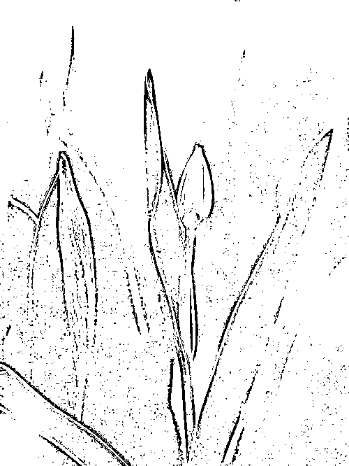

**尾声**最后，想做到和天蝎座的强大能量共舞，**核心就在于慈悲接纳自己本来的感受。**从疗愈的角度来看，**宽恕是一种整合。**我们无法整合仍处于无意识中的东西。而且当存在两极分化时，我们需要找到一种方式来同时**有意识地保管积极和消极两面**，直到我们认识到，为了疗愈我们必须去整合，成为一个整体。

当我们能带着有意识地觉知，察觉被愤怒所掩盖或扭曲的东西时，我们就接触到了本质的、真正的自我感受，那关乎以前从没被承认的恐惧、伤害和脆弱。**通过这种承认—直面，才可能释放这些情绪，才可能转化愤怒和怨恨。**

当我们尝试自我接纳而不是自我排斥时，启迪和自我成长就会显现，而这是天蝎座最深刻的、滋养灵魂的天赋。**当我们拒绝别人，我们也在拒绝自己。**

天蝎座的果实来自于心灵深处。我们用什么浇灌这些果实（可能是无法表达的苦涩、隐秘的怨恨，也可以是对自我和他人真诚的敞开和怜悯），就决定了我们会如何去迎接天蝎座的挑战，而不屈服于毒树的果实。

**版权声明：**本文由若道翻译，欢迎转发，反对抄袭。友号转载请申请白名单。

**雷·格拉斯 **TMA 的副主编和《清醒的梦：解锁我们生活的符号语言》一书的作者。他目前正在完成一本关于水瓶时代的象征意义和动态的书。他已经做了 25 年的占星师。**琳达·帕费尔**是一位诗人，也是一位专业的按摩治疗师，对情感和意识觉知的转化治愈力之间的身心连结特别感兴趣。**20 位来自世界各地的占星师****带来 19 场沙龙——新世界的觉醒****详情可点击下图**

**学习占星学****点击下图了解课程详情**

**微信又双叒叕改版啦，不想错过若道君的推送？**

**就把若道设为星标吧！**

**▼**

**就是这个“在看”，戳一下☟**

********报名直达入口********

# 关于神话塔罗课程，你想了解的都在这儿

> 原文：[`mp.weixin.qq.com/s?__biz=MzA5NjA0NTAxNg==&mid=2651476106&idx=2&sn=b49e9bd31ff106d0aeb366ddae0b2109&chksm=8b48e23dbc3f6b2b01baf777d0e57f549f3759b3aa847038b069a664656d5392fa8fc27f1911&scene=126&sessionid=1692737801#rd`](http://mp.weixin.qq.com/s?__biz=MzA5NjA0NTAxNg==&mid=2651476106&idx=2&sn=b49e9bd31ff106d0aeb366ddae0b2109&chksm=8b48e23dbc3f6b2b01baf777d0e57f549f3759b3aa847038b069a664656d5392fa8fc27f1911&scene=126&sessionid=1692737801#rd)

1

**塔罗牌是什么？**

**它是用来干嘛的？**

塔罗牌是一种**古老的疗愈工具**，同时也是**直观的解惑工具****；**

塔罗牌绕过逻辑思维，**和潜意识联结**，通过图像的方式生动地将隐藏在人类潜意识中的画面浮出水面，**揭示心灵的状况和运作****；**

塔罗牌**帮助我们和潜意识对话**，可以和现代的心理治疗联系在一起，帮助我们**看清心灵的冲突来源、本质和可以选择的道路；**

塔罗使用的过程并不繁琐，通过**“提问、洗牌、抽牌、解牌”**的方式来显现你的潜意识，给予问题明确的分析和建议。

2

**塔罗原理是什么？**

**它为什么这么准？**

塔罗是通往意识的工具，通过图画**帮助我们和潜意识对话**，可以和现代的心理治疗联系在一起，帮助我们**看清心灵的冲突来源、本质和可以选择的道路**。塔罗的心理投射也对应荣格的**“共时性原理”**：看似偶然的事物之间有着必然的联系。塔罗牌又和更广阔的**宇宙生命原型**联结，彰显**个人生命发展的阶段**，将个人**生命挣扎、内在冲突**放在生命进化的道途上，让更广大的生命智慧为个人成长照亮道路。

3

**塔罗预测是什么？**

**它如何帮助我？**

塔罗牌预测的运作就像是**照向心灵的一面镜子**。在塔罗牌解读时，图像的原型性质穿透隐藏的潜意识脉络，反应出与个人境遇相关但又未被了知的知识与洞见，因此**揭示出按照任何理性方式都无法发现的事情**。塔罗可以在你人生各个阶段，基于不同状态，针对具体困惑给予指引的神奇工具，运用古老的智慧工具**解码人生卡点，多维度去看待问题和生命的全貌性，推敲心理动线，更好地梳理生活。**如果你对生命好奇，塔罗学习会帮你**打开一扇通往未来的门**，让你了解**心灵运作和显化的秘密**，同时赋予你更多关于生命成长的支持和指引的能力！

4

**什么是神话塔罗？**

**它和其它塔罗有什么区别？**

神话通过**图像和故事**描绘人类生活的**原型模式**。通过瑰丽的想象、诗意的语言、栩栩如生的人物和故事描绘出我们内心的世界，表达出我们经历的那些实现人性的过程，帮助我们将**个体的生活与人类古老且永恒的故事**建立联结。从而在更深处**理解生命**，并学习**古老而长青的生命智慧**。跟其他塔罗相比，神话塔罗在**塔罗体系**基础上融合了**神话原型、占星原型、心理学原型。**学习、解读、内在成长的**维度更丰富立体。****神话塔罗**取材于**希腊神话**的无尽沃土，通过故事提供一种**记忆辅助**，在心理和预见层面提升解读的**丰富度**。因为这样更符合塔罗牌的性质，符合人类的想象。**按照故事思考，而不是简单的记忆关键词和固定的意义**。

5

**神话塔罗难学么？**

**能不能快速上手？**

神话塔罗认证课程，**不需要任何塔罗、占星、心理、神话基础**，这些知识朱丽叶老师都会在课程中教授，“兴趣是最好的老师，坚持是最大的成功。”塔罗咨询这项门栏不高，却能带来多重回报的“冷门技能”已经被越来越多人发觉，如果你为之心动，不如赶紧行动，初学者在经验丰富的导师教导下学习成果事半功倍，是小白亦能够掌握的课程，只要配合学习进度，不存在学不会的情况**，录播课有专业助教答疑，直播课老师亲自答疑，案例督导，****让你更自信的开展咨询工作，学以致用。**

6

**哪些人适合学神话塔罗？**

**为什么学神话塔罗？**

**1、对塔罗感兴趣的学员**，与其自习研究弯路多多，不如一步到位系统学习；**2、占星咨询师，**可以丰富咨询维度，通过图像更深入的和个案沟通交流；**3、心理工作者**，塔罗牌的原理本身也是心理投射，用于心理辅导是很棒的互动工具；**4、看重授课老师专业水平和能量层级的学员，**神话塔罗创始人亲授，金牌背书；**5、希望更加了解自己和他人内心世界**，想掌握这个疗愈工具自我探索和成长，帮助有困惑的人；**6、成为专业的塔罗师**，想从事这份事业，不论是兼职或全职，增加收入，打造长久稳定抗风险的现金流。

7

**神话塔罗咨询前景？**

**为什么看好它？**

塔罗行业现状鱼龙混杂，有的塔罗爱好者未经过系统学习，无占卜实力，占卜依赖“说明书”一知半解靠运气解读，无法积累实占经验和个人信誉。神话塔罗进入中国市场不久，由创始人亲自教授，**知识体系扎实靠谱，咨询技术纯正丰富，市场认可度高**，让您**无忧起步**，自信的在自我成长过程中成为他人的**塔罗照路人**。有些朋友经过系统的塔罗课程学习后成为**杠杆青年**，将塔罗咨询作为**副业**，无需店面，工作之余在家里就可以进行咨询，多一分收入欣喜满足。也有些学员完成课程后将塔罗咨询发展成**全职事业**，拥有自己的工作室，整合微信、微博、小红书、短视频等自媒体运营，线上线下年收益百万。**疫情环境下，副业刚需**，对于我们未来的事业需要有所规划，而塔罗咨询符合理想职业的所有条件，上手快、无需固定办公地点，是随时随地可接单的自由职业，经营打造属于自己长久稳定可发展的现金流。

8

**神话塔罗认证是什么？**

**如何获得高含金量认证？**

2022 年超高含金量的神话塔罗认证课程强势回归课程内容体系让你**直观精准**的感受**神话塔罗的魅力**扎实的建构**神话塔罗思维****系统**学习**最地道的塔罗知识****联报全阶课程，学成可获得有神话塔罗创始人颁发的****英国神话塔罗认证证书****，也是****若道塔罗毕业证书。****行业内超高含金量双背书。****若道还为塔罗学员开发了****“神话塔罗”APP****，是随身的工具，更是接咨询的平台，****录播课程****学成入驻平台****即可链接更多塔罗个案，发展壮大你的塔罗咨询事业。**

**如果你想学习塔罗，什么样的老师会让你怦然心动呢？她是三副塔罗牌的设计者，写了 6 本塔罗书籍。她研习塔罗四十余年，教授塔罗三十余年，是丽兹·格林的密友。还有****谁会比塔罗牌设计者更了解塔罗的历史、灵魂与精髓？****所以，这将是你开启塔罗之旅最坚实的一步。**

9

**你将跟随哪位大师学习神话塔罗？**

**我的老师是谁？**

****

**朱丽叶·沙曼-伯克** 

*   她是**3 副塔罗牌**的**设计者****——**神话塔罗牌、沙曼–卡塞利塔罗牌、“自己着色”塔罗牌；

*   她出版了**6 本塔罗书****——**《塔罗全书》、《新塔罗全书》、《众星的传说》、《理解塔罗牌》、《精通塔罗牌》、《塔罗初学者指南》；

*   她研习塔罗**四十余年；**

*   她教授塔罗**三十余年**；****

*   她是**丽兹·格林**的密友，两人合著了**《神话之旅》**，共同设计了**神话塔罗牌**。

*   她是认证的**心理治疗医师；**

*   她深谙**塔罗、占星学、心理学和神话学。**

**如果你想成为拥有英国神话塔罗认证的塔罗师**

那么她，就是你**最好的老师人选**

10

**神话塔罗认证课程的课程结构？**

**怎么上课？**

课程中老师传授**将神话、占星、心理学完美融合进塔罗**的人本主义咨询体系，并进行**学员案例督导**，让你更自信的开展咨询工作，学以致用。

本期认证课程采取**即报即学的录播课+案例督导直播课**的形式，

*   **18 节录播课：**精编剪辑，随来随学，助教答疑，学练结合。

*   **8 节直播课：**融会贯通，神话心理，塔罗占星，咨询技巧。

为了适配大家的各种学习场景，提高学习&复习效率，我们还将**录播课**剪辑了**中文字幕版**和**翻译音频版**：

*   **中文字幕版：**朱丽叶老师英文原声配中文字幕，适合在手机或电脑前专心致志的学习。

*   **翻译音频版：**翻译老师幼婷的中文原声纯享，适合运动、通勤路上耳机里陪伴式学习。

11

**神话塔罗认证课程报名流程**

**怎么报名？**

**报名流程如下：****1、报名****添加课程顾问，报名，交学费，进入学员群，邮寄学习工具。****2、开始学习****成功报名，18 节录播课程立即开通，学习过程有困惑可在 APP 内提问，有专业助教答疑，8 节直播课 8 月 10 日开课，录播课和直播课都是朱丽叶·沙曼-伯克老师亲授。****3、入驻平台****学习完录播课程，即可提交咨询案例申请入驻咨询平台。****4、结业证书**学习完直播+录播课程，提交毕业咨询案例，朱丽叶老师批阅通过，即可获得**神话塔罗认证证书。**

12

**具体在神话塔罗认证课程中学习什么？**

**课程大纲**

**录播课（即报即学）**

**☆****初阶：神话塔罗详解**

**神话故事和预测意涵**

**第 1 讲 塔罗牌介绍 ，讲述它的历史 （中文字幕版）**

**第 1 讲 塔罗牌介绍，讲述它的历史（翻译音频版）**

**第 2 讲 星座形态、元素和宫廷牌&基本星座与基本国王 （中文字幕版）**

**第 2 讲 星座形态、元素和宫廷牌&基本星座与基本国王（翻译音频版）**

**第 3 讲 固定星座与固定王后（中文字幕版）**

**第 3 讲 固定星座与固定王后（翻译音频版）**

**第 4 讲 变动星座与变动骑士（中文字幕版）**

**第 4 讲 变动星座与变动骑士（翻译音频版）**

**第 5 讲 小阿尔卡那牌权杖（中文字幕版）**

**第 5 讲 小阿尔卡那牌权杖（翻译音频版）**

**第 6 讲 小阿尔卡那牌圣杯（中文字幕版）**

**第 6 讲 小阿尔卡那牌圣杯（翻译音频版）**

**第 7 讲 小阿尔卡那牌宝剑（中文字幕版）**

**第 7 讲 小阿尔卡那牌宝剑（翻译音频版）**

**第 8 讲 小阿尔卡那牌星币（中文字幕版）**

**第 8 讲 小阿尔卡那牌星币（翻译音频版）**

**第 9 讲 经典牌阵教学讲解（中文字幕版）**

**第 9 讲 经典牌阵教学讲解（翻译音频版）**

**第 10 讲 牌阵解读案例演示（中文字幕版）**

**第 10 讲 牌阵解读案例演示（翻译音频版）**

**☆****中阶：神话塔罗牌阵应用**

**神话****解读和咨询技巧**

**开启神话塔罗愚人之旅**

****

**第 1 讲 愚人、魔术师、女皇、皇帝（中文字幕版）**

**第 1 讲 愚人、魔术师、女皇、皇帝（翻译音频版）**

**愚人**：永恒的少年（儿童的原型）

**魔术师**：恶作剧者、老师、向导、沟通者的原型；行星：水星。

**女王**：母亲、养育者、丰产的原型；行星：金星在金牛座；小行星：谷神星。

**皇帝**：父亲、供养者、计划者的原型；行星：木星。

**第 2 讲 女祭司、教皇、恋人、战车、正义、节制（中文字幕版）**

**第 2 讲 女祭司、教皇、恋人、战车、正义、节制（翻译音频版）**

**女祭司**：处女——等待被实现的潜力原型；行星：新月。

**教皇**：疗愈者、受伤的疗愈者、牧师的原型，牧师是神与人之间的灵性桥梁；行星：凯龙星。

**恋人**：爱、爱人、所爱之人的原型；行星：金星在天秤座。

**战车**：战争、冲突、战士、斗士的原型；行星：火星。

**正义**：智慧、兵不血刃的胜利的原型；星座：处女座；小行星：智神星。

**节制**：关系、合作的原型；星座：巨蟹座、双鱼座。

**第 3 讲 力量、隐士、命运之轮、倒吊人、死神（中文字幕版）**

**第 3 讲 力量、隐士、命运之轮、倒吊人、死神（翻译音频版）**

**力量**：力量的原型；星座：太阳在狮子座。

**隐士**：晚年、耐心的原型；行星：土星。

**命运之轮**：命运女神与命运的原型。

**倒吊人**：牺牲与有意识的牺牲的原型；行星：海王星。

**死神**：死亡、终点和起点的原型；行星：冥王星。

**第 4 讲 恶魔、高塔、星星、月亮、太阳（中文字幕版）**

**第 4 讲 恶魔、高塔、星星、月亮、太阳（翻译音频版）**

**恶魔**：阴影、人类不文明的面向、本能、欲望天性；行星：火星在天蝎座。

**高塔**：改变、分裂瓦解的原型；行星：天王星。

**星星**：希望的原型。

**月亮**：无意识的原型；行星：暗月。

**太阳**：意识、创造力和文明的原型；行星：太阳。

**第 5 讲 审判、世界（中文字幕版）**

**第 5 讲 审判、世界（翻译音频版）**

**审判**：复活、新生的原型；行星：水星作为灵魂向导普绪科蓬波斯。

**答疑与讨论，学员们分享对自己或客户的塔罗解读，对神话塔罗牌进行更多探讨。**

**世界**：整体、完成和个性化的原型。

**第 6 讲 经典牌阵教学讲解（中文字幕版）**

**第 6 讲 经典牌阵教学讲解（翻译音频版）**

**第 7 讲 咨询案例演示：为一位年轻女性所做的四次解读（中文字幕版）**

**第 7 讲 咨询案例演示：为一位年轻女性所做的四次解读（翻译音频版）**

**第 8 讲** **引导式冥想、荣格的四种意识功能（中文字幕版）**

**第 8 讲 引导式冥想、荣格的四种意识功能（翻译音频版）**

**☆****高阶：神话塔罗直播督导课**

**第 1 讲 塔罗牌中的荣格原型**

**2022 年 8 月 10 日（周三）**

我们将学习荣格是如何理解原型，以及荣格原型如何反映在塔罗牌中。对塔罗牌解读而言，理解原型的普遍性非常有帮助，因为这有助于塔罗咨询师碰触客户的内心世界。

**第 2 讲 塔罗牌是如何与行星原型和其原型体验联系在一起**

**2022 年 8 月 24 日（周三）**

大阿卡纳牌反映了行星神祗的原型，在某些情况下，原型经验意味着它们反映了所有人类的经验。我们将通过这个角度看这些大阿卡纳牌。我们将看到理解原型对解读有何帮助。

**第 3 讲 荣格意识的四种功能与小阿卡纳牌的四种元素及与权杖、星币、宝剑、圣杯四套牌之间的联系**

**2022 年 9 月 7 日（周三）  **

我们将看看小阿卡纳从 1 到 10 如何反映荣格意识功能的各个方面，以及它们如何反映在四套牌四个元素和其心理方面。我们还将对 1-10 的数字学进行修正，看它们在元素中的表现方式。

**第 4 讲 占星学中的 12 星座和宫廷牌之间的联系**

**2022 年 9 月 21 日（周三）**

我们将讨论形态和星座，以及它们如何反映在宫廷牌上。

**第 5 讲 马蹄牌阵学员案例督导**

**2022 年 10 月 19 日（周三） **

**第 6 讲 六芒星牌阵学员案例督导**

**2022 年 11 月 2 日（周三） **

**第 7 讲 凯尔特十字学员案例督导**

**2022 年 11 月 16 日（周三） **

****

**第 8 讲 三个牌阵学员完整案例督导**

**2022 年 11 月 30 日（周三）**

**认证阶段：考试论文**

录播课学习完毕，即可入驻若道神话塔罗 APP，以实习塔罗师获得推广流量，对接塔罗咨询个案。

直播课+录播课学习完毕，提交考试论文通过即可获得获得英国神话塔罗认证证书，升级为认证咨询师。

**入驻塔罗平台**

13

**适合人群**

*   塔罗初学者，完全没有塔罗基础；

*   塔罗自学者，也曾上过塔罗工作坊，但仍不懂如何使用塔罗牌；

*   塔罗进阶学习者，有塔罗基础，了解 78 张塔罗牌含义；

*   不知如何解决遇到的情感困惑、职业选择、人际问题，对人生感到迷茫；

*   想要学习深入解读塔罗牌、牌阵的使用、咨询技巧等将塔罗运用于咨询实践；

*   想要深入了解和学习塔罗，希望成为专业的塔罗师；

*   想要借助塔罗进行心灵、灵性成长。

14

**导师简介**

**朱丽叶·沙曼-伯克**

**朱丽叶·沙曼-伯克**从 20 世纪 70 年代早期开始，就对塔罗牌产生了兴趣，并踏入了塔罗的世界。后来，在丽兹·格林的鼓励下，开始研习心理占星学和塔罗。

1984 年，第一本书《**塔罗全书**》（*The Complete Book ofTarot*）出版。之后，与丽兹·格林合作设计并撰写了《**神话塔罗**》（*The Mythic Tarot*），在这本书中，她们将古希腊神话与传统塔罗解读结合起来。朱丽叶写了**十本塔罗和占星学书**，包括一本名为《众星的传说》（*Stories from the Stars*）的儿童读物，以及与丽兹·格林合著的《神话之旅》（*The Mythic Journey*），这是一本详细讲述如何运用神话来指导生活的书。

15

**课程价格**

**认证课程总价：****22000 元**

**联报优惠价：****19000 元**

**限时转发优惠价：18000 元（联系 Echo 老师，获取限时转发优惠价）**

长按二维码添加客服 Echo 老师

9

**退转课程**

*   **退款原则请详看《教学协议》，如有疑问请咨询课程顾问。**

**神话塔罗认证课程**

**授课老师：朱丽叶·沙曼-伯克**

**授课时间：录播课即报即学，直播课 2022 年 8 月 10 日起**

**授课方式：**网络课程**，**英文授课，中文翻译

**费用：****认证课程总价：****22000 元；****联报优惠价：****19000 元；****限时转发优惠价：18000 元**（联系 Echo 老师，获取限时转发优惠价）

**课程负责人：Echo 老师**（微信/手机：nodoor18518412824，请备注“神话塔罗”）

长按二维码添加课程负责人咨询~

****报名请点击“阅读原文”****

# 神话塔罗之大阿卡纳牌｜恋人

> 原文：[`mp.weixin.qq.com/s?__biz=MzA5NjA0NTAxNg==&mid=2651476106&idx=3&sn=b7ec0b5f4412f321a8e6368a7254e618&chksm=8b48e23dbc3f6b2b8934a0cd95dcfcefe38c76e8d1f8a5bb77f7429bd6b11ed2b4a60382ae5b&scene=126&sessionid=1692737801#rd`](http://mp.weixin.qq.com/s?__biz=MzA5NjA0NTAxNg==&mid=2651476106&idx=3&sn=b7ec0b5f4412f321a8e6368a7254e618&chksm=8b48e23dbc3f6b2b8934a0cd95dcfcefe38c76e8d1f8a5bb77f7429bd6b11ed2b4a60382ae5b&scene=126&sessionid=1692737801#rd)

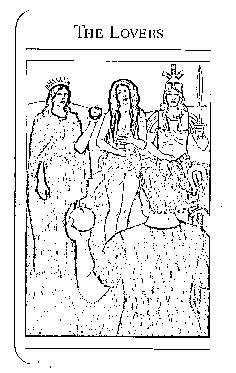

作者/朱丽叶·沙曼-伯克 丽兹·格林

译者/闫东升 编辑/玫瑰 图片/神话塔罗 网络

本文节选自《神话塔罗》

塔罗牌中许多版本的大阿卡纳牌都有编号，但朱丽叶·沙曼-伯克与丽兹·格林并没有给神话塔罗中的大阿卡纳牌编号。而早在十五世纪出现的维斯康提塔罗牌中，牌面图案既没有名字也没有编号，这或许反映了一个重要的心理学洞见——人类发展的原型阶段并不是人人相同，而是代表着每个人独特的“成长经历”，这在任何个体的生命中都可能以不同次序发生。今天就来解读大阿卡纳牌——恋人。

[🔈 神话塔罗·恋人](https://res.wx.qq.com/voice/getvoice?mediaid=MzA5NjA0NTAxNl8yNjUxNDc2MTA0)

**｜**朗读者小巫

**书名：**

神话塔罗 

**作者：**

朱丽叶·沙曼-伯克   丽兹·格林 

**出版日期：**

2011-08-02

恋人对应的希腊神祗
**帕里斯·特洛伊王子****三个女神一台戏**

恋人牌描绘的是一个年轻俊秀、金发碧眼的年轻男子，他身着牧羊人的简单装束，右手握着一个顶端弯曲的木杖，左手紧握着一个金苹果。三个女人并列站在他的面前，这是一个选美比赛，而金苹果就是冠军的奖赏。

左边的女性成熟而庄重，拥有一头赤褐色长发和一双蓝色的双眼，身穿皇室的紫色长袍，头戴金色王冠，手里握着一个类似地球仪的圆球。中间的女子非常年轻而且魅力十足，拥有一头黑色秀发，身穿玫红色半透明长裙，玲珑的身材隐约可见。

右边的女性气质沉静高雅，身着战士的盔甲，浅色的头发被钢盔遮住了一半，手里握着一把宝剑。牌面中远处的背景是连绵起伏的山峦，远远望去苍翠繁茂。

> **女神赫拉（*Hera*）**：是宙斯（*Zeus*）的配偶和代言人，她掌握着整个物质世界，代表着皇帝宙斯在人世间的威信和伦理道德的规范。 
> 
> **女神阿弗洛狄忒（*Aphrodite*）**：能够给予人们的是爱之圣杯，我们会在后面小阿卡纳牌的圣杯系列中再次看到，爱之圣杯是关系的象征。
> 
> **雅典娜（*Athene*）**：能够给予的是一把宝剑，我们会在后面小阿卡纳牌的宝剑系列中再次看到，宝剑象征着思维的力量、决断力和敏锐的观察力，这都是属于头脑的领域。

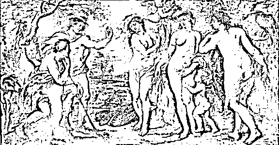

**特洛伊，一个苹果引发的战争**

在这张牌中我们遇到了特洛伊（*Trojan*）的王子帕里斯（*Paris*），他奉宙斯之命在赫拉、阿弗洛狄忒和雅典娜之间选择出最美丽的女神。帕里斯出生的时候，有一位神灵预言他会使其父亲的王国衰败。

他的父亲——特洛伊的国王布莱姆（*Priam*），命令手下把帕里斯遗弃在荒山野岭，后来一位善良的牧羊人救了他。帕里斯在照料羊群的岁月里慢慢长大成人，他喜欢在闲暇的时候用浪漫的方式追求女性，而他本身也是一个既英俊又充满魅力的小伙子。

有一天，奥林匹斯山的众神为了赫拉（神界的皇后）、阿弗洛狄忒（感官之爱的女神）和雅典娜（正义女神）谁是最美丽的女神的问题而争论不休，宙斯决定让帕里斯作为裁判，因为他对于女性有着非常丰富的经验。宙斯派赫尔墨斯（*Hermes*）去通知帕里斯，并告诉他这是一份殊荣。 帕里斯一听到这个要求就立刻回绝了，因为他知道无论选择了哪位女神，另外两位都不会原谅他的。但是赫尔墨斯威胁他说，如果他不接受，宙斯就会非常愤怒，那后果就非常糟糕了。帕里斯把一个苹果分了三份，他的意思是说自己无法从三位光彩夺目的女神之间做出选择，但是赫尔墨斯并不接受这个结果。这时，三位女神同时现身在帕里斯面前。赫拉说如果帕里斯选择她，就给予他统治尘世的权利。阿弗洛狄忒解开了身上的长袍，拿出了爱之圣杯，承诺他如果选择自己，就赐予他尘世最美的女人作为奖赏。

结果当然不言自明，帕里斯还非常年轻，并不了解自己内在真正的价值，自然毫不犹豫地选择了阿弗洛狄忒。他得到的奖赏是闻名于世的美女海伦（Helen），她当时已是斯巴达（Sparta）国王的王后了。

赫拉和雅典娜听到结果后微微一笑，告诉帕里斯她们不会对他的选择抱有成见，然后就转身挽着彼此的手臂离开了，但她们回去后立即密谋颠覆特洛伊王国。

特洛伊战争就这样拉开了帷幕，起因是海伦的丈夫因为妻子的不忠而异常愤怒，一把大火把特洛伊城烧成灰烬，雄伟的皇宫也被全部毁掉。帕里斯出生时候的预言变成了现实。

**自由意志 vs 本能**

**从人们内在的层面来看，神话中帕里斯的评判象征着生命中第一个最重要的挑战，那就是发展成为独立个体（individual）的过程中爱之选择的问题。**

这个进退两难的局面不仅仅是在两个女性（或男性）中选择哪一个的问题，它还反映出我们自己的价值，因为我们的选择映射出我们想要变成怎样的一个人。

因为帕里斯的幼稚和性需求的驱力，他没办法真正从一个成熟的视角做出选择。他的选择是由欲望决定的，而不他真正的自己。**这里呈现的是关于自由意志（free will）和本能冲动这一对力量的较量。**

**爱之选择的结果对于接下来发生的一切影响巨大，它可以说影响了整个人生的方方面面。**帕里斯根据本能冲动做出的选择，最终导致了惊天动地的特洛伊战争。不能说他做了“错误的”选择，因为他还没有足够的定力去平衡阿弗洛狄忒的情欲吸引力，最终做出了和别人妻子偷情的决定。当然他也不了解自己，无法懂得统治尘世的权利和作为维护正义而战的重要性。选美之争是他不得不面对的宿命，就像我们有时候还没有准备好时，却必须要面对生命中的挑战一样，从某种意义上来说，他“错误的”选择是必要的，也是必然的。

对他人的渴望迫使我们去发展自己的个体价值和对自我的了解，这势必根植于每个人的选择过程中所出现的混乱和冲突。如此的境遇无可避免，因为它属于人类内在的原型。

帕里斯是人类内在的意象，反映着对于满足欲望的无意识需求，以及无法看到我们势必要为选择的后果负责。没有通过战火的洗礼，我们不能理解如何去开创自己的将来，只能一味地责怪命运、机遇或者他人，自我反省是我们必须学会的课题。

**恋人，选择的意义**

**从解牌的角度来看，恋人牌出现的时候，预示着需要做出某种选择的时刻到了，这通常与爱情有关。**愚人在刚刚学习了自己身上的二元性之后，现在必须要测试他的价值了。

有时候，这张牌意味着**当事人要面对三角恋情，也可能意味着一段轻率的婚姻所带来的问题，或者是在爱情、事业与创造性活动之间的选择问题。**

这张牌意味着**个人做出选择时深思熟虑的必要性，盲目的本能驱力和创造性的自由意志之间，人们要学会辨识，才能避免走上帕里斯的灾难之路。**

**版权声明：**本文由《自在园》授权发布，欢迎转发，反对抄袭。友号转载请申请白名单。

**朱丽叶·沙曼·伯克**从 20 世纪 70 年代早期开始，就对塔罗牌产生了兴趣，并踏入了塔罗的世界。后来，在丽兹·格林的鼓励下，开始研习心理占星学和塔罗。1984 年，第一本书《塔罗全书》（The Complete Book ofTarot）出版。之后，与丽兹·格林合作设计并撰写了《神话塔罗》（The Mythic Tarot）。朱丽叶写了十本塔罗和占星学书，包括一本名为《众星的传说》（Stories from the Stars）的儿童读物，以及与丽兹·格林合著的《神话之旅》（The Mythic Journey），这是一本详细讲述如何运用神话来指导生活的书。

**点击下图了解课程详情** 

**微信又双叒叕改版啦，不想错过若道君的推送？****就把若道设为星标吧！****▼**

**喜欢记得点一下在看哦☟**

************报名直达入口************

# 神话塔罗之大阿卡纳牌｜导师

> 原文：[`mp.weixin.qq.com/s?__biz=MzA5NjA0NTAxNg==&mid=2651476106&idx=4&sn=e762dbaff292100cb7b3deb093795121&chksm=8b48e23dbc3f6b2b2933087059bfb13fcbe11e097f1eeb3c4d56f9bb74395cd271886dd895b8&scene=126&sessionid=1692737801#rd`](http://mp.weixin.qq.com/s?__biz=MzA5NjA0NTAxNg==&mid=2651476106&idx=4&sn=e762dbaff292100cb7b3deb093795121&chksm=8b48e23dbc3f6b2b2933087059bfb13fcbe11e097f1eeb3c4d56f9bb74395cd271886dd895b8&scene=126&sessionid=1692737801#rd)

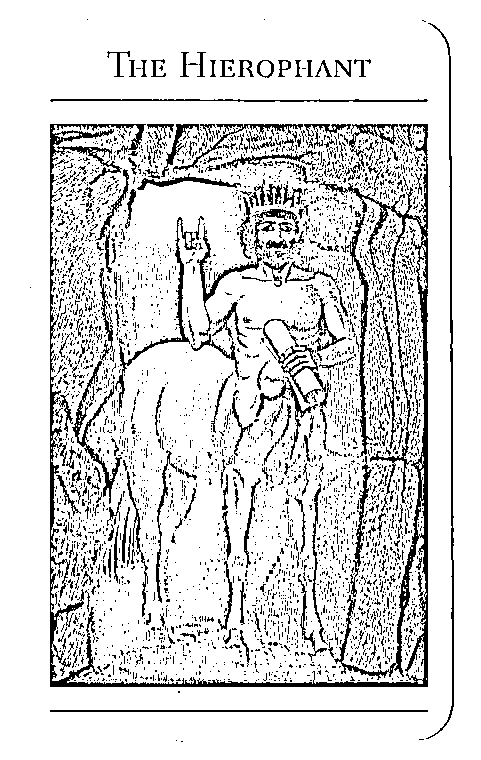

作者/朱丽叶·沙曼-伯克 丽兹·格林

译者/闫东升 编辑/玫瑰 图片/pexels

本文节选自《神话塔罗》

塔罗牌中大阿卡纳牌的图像和数字序列依不同的人们根据不同的信仰系统做了各种改变，从 20 世纪初的亚瑟·爱德华·韦特和亚利斯特·克劳利，到如今诸多塔罗牌人士都贡献了卓越智慧。因此，现在众多版本的塔罗牌都是创意的混合物，保持了塔罗的传统结构，但绘图与序列上又纷繁各异。今天半人半马的导师又会讲述一个怎样的神话故事呢？

[🔈 神话塔罗·导师](https://res.wx.qq.com/voice/getvoice?mediaid=MzA5NjA0NTAxNl8yNjUxNDc2MTA1)

**｜**朗读者小巫

导师对应的希腊神祗 
**凯龙·智慧贤者****人马族之王**

导师牌描绘的是一个奇怪的形象——人马，他的上半身包括双臂和头是一个男人，下半身则完全是马的样子。他的头发和胡子是褐色的，成熟的脸和仁慈的表情反映出他是一个教师或牧师。

他的左手握着一卷书，书的寓意是表达成文的智慧。他的右手举起，做出古人表达赐福的手势。他的两侧都是石柱，身后是粗糙的巨石构成的岩洞，那是他的家，也是他的神殿。岩洞的顶部有一个环形的开口，光芒从那里倾泻进来，沐浴着他带着皇冠的头部。 

**· 岩洞：**凯龙（*Chiron*）的神殿，它是天然的结构，不是人造的圣地，因为只有通过灵性的教诲，尘世的生命才有存在的价值和意义；

****· **两棵石柱支撑起知识的殿堂：**在这里学生们得以获得凯龙的教诲；

****· **凯龙手中的书卷：**里面记录着宇宙的律则，神圣的意愿通过文字揭露并传递出去。

**疗愈世人却无法拯救自己**

凯龙是神话中的人马族之王、疗愈者、牧师和年轻英雄们的老师。

凯龙的诞生是非常神秘的，他的父亲是战神阿瑞斯（*Ares*）的儿子伊瑞西翁（*Ixion*），母亲是宙斯（*Zeus*）依照赫拉（*Hera*）的样子仿造的一片云，宙斯当时的目的是防止伊瑞西翁去骚扰赫拉。

凯龙从太阳神阿波罗（*Apollo*）和月亮女神阿提米斯（*Artemis*）那里了获得了良好的教育，进而以他伟大的智慧和灵性被选为人马族之王，后来又被委任成为希腊皇室中年轻王子们的老师，教导他们灵性的价值和学会遵从神的律则，学会这些以后他们才可以学习统治人民的艺术和战斗的技能。凯龙还是一位伟大的疗愈者，掌握着植物和草药的秘密，但是他却不能疗愈自己。某一天他的朋友——英雄赫拉克勒斯（*Heracles*）杀死了九头蛇怪之后，到岩洞去探望他，无意间用曾经侵染过九头蛇怪鲜血的箭头擦伤了凯龙的大腿。九头蛇怪的血液中含有剧毒，因此无论凯龙用什么方法，都无法疗愈好那个伤口。因为凯龙是永生的神，他就不得不一直活在伤口带来的痛苦中，为此他牺牲了自己所有世间的欢乐，把所有的时间都献身于灵性智慧的教导。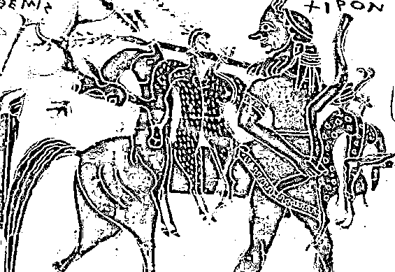**联结人与神的灵性之父**

**从人们内在的层面来看，凯龙－导师的意象是我们内在一种灵性渴望的象征，其目的是想要了解神所赋予我们的使命。他是内在的精神导师和牧师，帮助我们在日常世界的意识和反映神的律则的直觉知识之间建立联结。**

**波赛凤（*Persephone*）－女祭司**的世界是黑暗和难以捉摸的，无法通过智力去理解；而**凯龙**的世界能够通过思维去诠释和阐述。

牧师一词的古文是*pontifex*，意为“创建桥梁的人”，牧师在人类内部和外部世界的角色就是作为灵性之父服务众生，在人与上帝之间建立联结，通过订制自然的律则，保持人们与神性之间正确的关系。

**皇帝的律则**呈现的是尘世间的父性原则，使人们在世间的一切行为都保持正确性。但是**导师的律则**是从神的角度出发，让人们的行为禁得住神的检测。

凯龙象征的并不是任何传统的宗教系统。他本身就是一种狂野的生物——半人半马，他的神殿并非人为修建，而是纯粹天然的岩洞。因此凯龙传达的精神律则并不是集体意识中蒸馏出来的教条，而是在每个人与自己内在牧师的关系中产生的。

**不同的人们对神的体验都不一样，我们通过自己内在独有的感受去理解精神和灵性的内涵，这是每个人心目中“神”的真正含义。**凯龙身上的伤痕使他成为了一名受伤的疗愈者，通过自身的痛苦，他理解了别人的痛苦并升起慈悲心，也因此比盲目的伤者看的更高和高远。**因此凯龙－导师反映出我们内在受伤的部分，在那里有一些尚未解决的问题或制约，它使我们变得深刻和慈悲**，如果没有这内在的创伤，我们就只会说一些肤浅的陈腔滥调，无法感受其中真正的意义。

真正的牧师会对全世界的痛苦和渴望敞开自己，因为他曾经或正在经受苦难。

**凯龙的形象反映了我们内在的伤痛或无法超越的局限所带来的价值，尽管它可能使我们在日常生活必须忍受苦难，却在另一方促使我们去敞开自己，探寻并了解生命的更高律****则。**

人马族反映了这种悖论，他们一半是马，一半是神灵，所以同时承载着本能和灵性，这和我们人类二元性的特质如出一辙。我们的生命是动物性和神性的混合体，也必须学习在生命中活出两者。人马族在两者的混合体中找到伟大的智慧，了解神的知识和自然的律则之间的关系——意即神通过现象界呈现了自己。**导师，命运的指引者**

**从解牌的角度来看，凯龙－导师牌预示着当事人将要开始积极地为生命的意义寻找哲学性的答案，可能通过对某种信仰系统或哲学的学习，或者全身心地投入到对于生命意义的寻求当中。**

导师可能会以精神分析师、心理治疗师、牧师或者灵性指引者的外在形式出现，他们能够提供给当事人需要的安慰和帮助。

愚人在这里走出了地下世界和对潜意识中隐藏力量的探索过程，开始寻找生命的意义和关于生命之谜的答案。

当他遇到导师的时候，他就遇到了自己内在的个人哲学家，以此可以明确地规整并在   生命中表达自己的个人哲学、愿景和灵性，此时他在导师的指引下走出了童年，以更成熟的姿态进入充满生命挑战的冒险之旅。

**版权声明：**本文由《自在园》授权发布，欢迎转发，反对抄袭。友号转载请申请白名单。

**朱丽叶·沙曼·伯克**从 20 世纪 70 年代早期开始，就对塔罗牌产生了兴趣，并踏入了塔罗的世界。后来，在丽兹·格林的鼓励下，开始研习心理占星学和塔罗。1984 年，第一本书《塔罗全书》（The Complete Book ofTarot）出版。之后，与丽兹·格林合作设计并撰写了《神话塔罗》（The Mythic Tarot）。朱丽叶写了十本塔罗和占星学书，包括一本名为《众星的传说》（Stories from the Stars）的儿童读物，以及与丽兹·格林合著的《神话之旅》（The Mythic Journey），这是一本详细讲述如何运用神话来指导生活的书。

**点击下图了解课程详情** 

**微信又双叒叕改版啦，不想错过若道君的推送？****就把若道设为星标吧！****▼**

**喜欢记得点一下在看哦☟**

************报名直达入口************

# 如何在人群里一眼认出 12 上升星座？

> 原文：[`mp.weixin.qq.com/s?__biz=MzA5NjA0NTAxNg==&mid=2651475867&idx=1&sn=db0f646da62c47a24eab6024215465c3&chksm=8b48fd2cbc3f743abbe029a97ef8aa54381ab055cd73b7f146c9d2688b28488b40c3e9a91ce9&scene=126&sessionid=1692737801#rd`](http://mp.weixin.qq.com/s?__biz=MzA5NjA0NTAxNg==&mid=2651475867&idx=1&sn=db0f646da62c47a24eab6024215465c3&chksm=8b48fd2cbc3f743abbe029a97ef8aa54381ab055cd73b7f146c9d2688b28488b40c3e9a91ce9&scene=126&sessionid=1692737801#rd)

******☆ ****后台回复“今日”，给你一句生命态度******

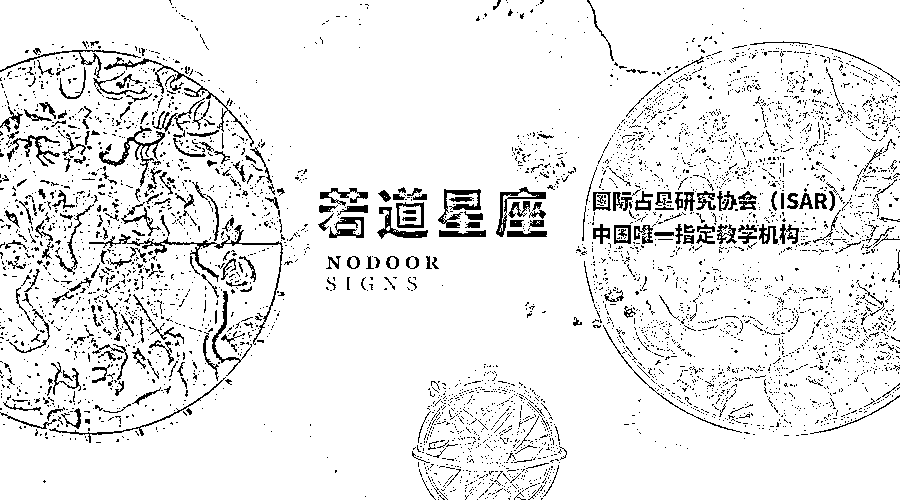

作者/大卫·瑞雷 若道占星创始人译者/荆小花 文字整理/懿真编辑/玫瑰 封面/书君 图片/pexels

在占星学中，上升星座有关于人的外在行为和性格。你的上升星座会有那些特点和小怪癖，又该如何发展呢？一起看看吧。大卫老师参与授课的【[ISAR 认证职业占星师必修课程](http://mp.weixin.qq.com/s?__biz=MzA5NjA0NTAxNg==&mid=2651475681&idx=3&sn=03edb5e195a24b0098a8574b6460bd75&chksm=8b48fc56bc3f75406fdbc1a546152ded765c2a0de8056fb8f8e752c9b486e237ca081af71606&scene=21#wechat_redirect)】报名中，点击链接了解更多详情！

**★****上升白羊座**

上升白羊座的人**行动会更加直接，更会坚持自己的观点，是个自我驱动类型的人**，你会把该做的事情做到位，不喜欢等来等去。在积极的面向上是个非常**自我坚定、自我驱动**的特质。但是负面的面向上就是**不耐烦**的人。

白羊座的关键字是如何自我捍卫。所以如果你是上升白羊座的人，你要问自己一个问题，**在你的人生当中是如何有效的捍卫自己的利益呢？**如果你在捍卫自己利益时是有效的、满意的、理想的，你就会获得一种满足感。

如果你是一个经常会和别人发生争斗的上升白羊座，也许说明你在跟他人坚持自己立场的时候并不是那么有效，所以在和他人抗争中**你要学习如何与他人抗争是有效的，知道如何抗争是无效的。**

**★****上升金牛座**金牛座是最接地气、最放松、最稳定的星座。**一个上升金牛座的人对待生活是很放松的态度****，**但是金牛座放松自在的状态去**看上去是被动的**，你会想去推他一把，这个时候你会感觉受到阻力，觉得推不动他！**上升金牛座也是感性的，**他们的身体经常有壮实很有依靠感的感觉，即便是胖了几公斤，你依然会觉得他很具有吸引力和魅力。金牛座和金星相关联，金星和美丽舒适共振，上升金牛座会**非常享受人生的舒适感**，想去品尝美味的生活、享受慢节奏生活。**★****上升双子座****一个上升双子座的人一般会远远就被发现。**他可以一边打电话一边发短信，或者一边和小伙伴说话，一边和出租车司机打电话。所以你如果看到一个**可以一心多用的人**说不定就是上升双子座。**这个星座有关于沟通，**双子座会很好奇你在想什么，而且他无时无刻不准备要和你你交谈。不断地寻找各式各样的信息，他的不安定也是很突出的，他是不安的、好奇的。他可能是知识信息的宝库，他可以告诉你去一个地方有什么样的捷径或者是一个 APP 可以做什么样的事情，另外他也可以通过倾听来消化信息。

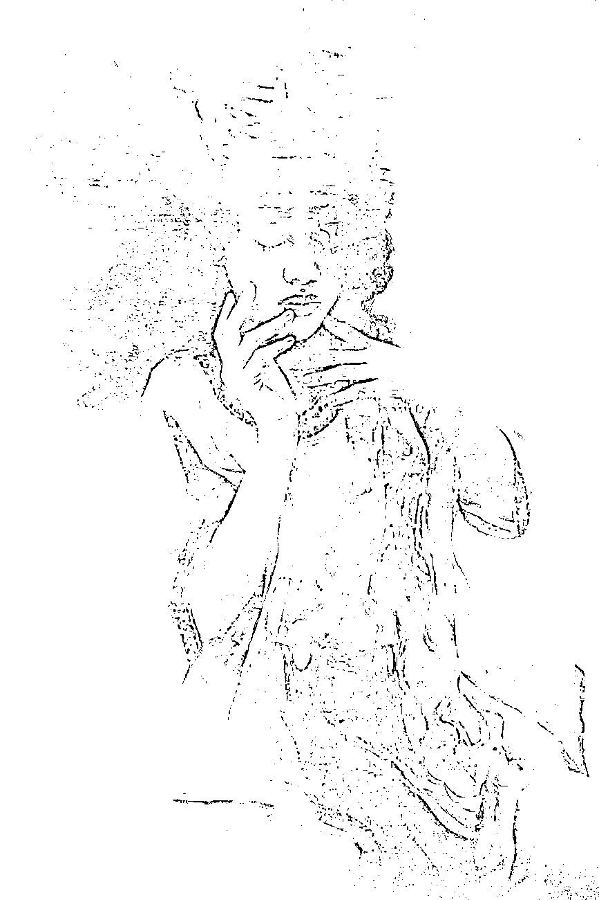

**★****上升巨蟹座****对于上升巨蟹座而言隐私是很重要的，**巨蟹座是一个水象星座、有关于人的情绪和感受。在占星学当中月亮是守护巨蟹座的，因此一个上升巨蟹的人，**他星图中的月亮落位非常重要。**诺·泰尔是一代占星宗师，他的上升就是巨蟹座，但是他一点也不害羞，原因是他的月亮落在 3 宫的狮子座，相对一般的上升巨蟹座而言，他体现更多的人格特质是狮子座的戏剧化和多姿多彩。但实际上诺泰尔老师非常地巨蟹座，几乎我们每一次一起吃饭聊天，他都能找到一个点触景生情，流下感伤的眼泪。比如我第一次和他吃饭时，突然提到一些让他伤感的事情，于是他就流泪了。当然，我不是在说所有的巨蟹座上升都是这样的多愁善感，**但是他们是所有星座中最善于通过情绪和感受体验生命的。情绪、直觉、感受是真正指引他们的向导，**在所有人格类型当中他们也是最具有人性的。**★****上升狮子座**狮子座一般都是引人注目的，他的长相可能是令人印象深刻的，或者他经常是负责筹划派对的人。
上升星座在火象的人制造的声音一般都比较大。**在所有火象上升星座中狮子座的声音是最大的。**政坛上有个比较极端的狮子座上升的例子，就是当今的美国总统特朗普，他总是在谈论自己有多棒，多聪明，以及不管什么问题他都可以搞定。也许他自信的外观弥补了他内心不自信的地方，只有越过狮子座上升的部分来分析他整张星图方能看到那些不自信的地方。**可以说在所有上升星座当中没有比上升狮子座更加自信的人了，论留给人印象最深刻的星座，也是上升狮子座上升的人。**狮子座上升的女性非常惊艳，狮子座上升的男性看上去像希腊的男神一样，他们可能自己都觉得自己是男神。但是也会有例外，也有会很谦逊的上升狮子，他们会为自己的谦逊感到自豪。

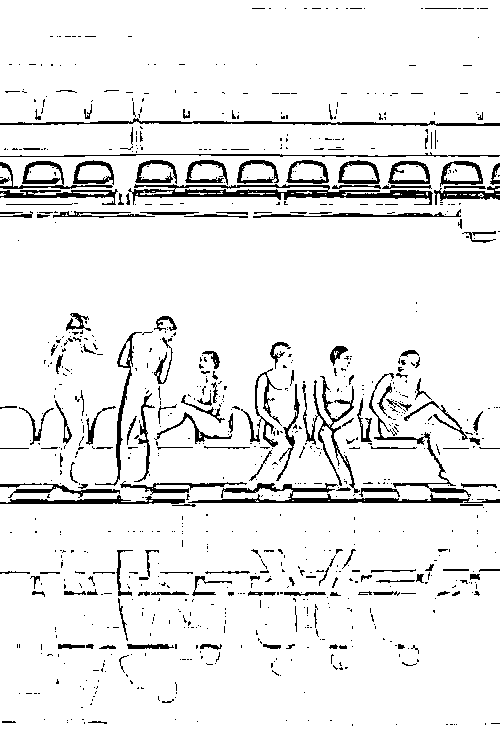

**★****上升处女座****上升处女座非常谦卑低调，**不断地在完善自己的不完美，因为他们知道自己是不完美的。他们的脸上往往会带有**批评和怀疑的表情**，尤其是当你涉及到他们**专业领域**的事情时，在他们专业领域之外的事情他们看上去可能很天真无邪，很安静倾听着，想要搞明白你在说什么，但是在他们的专业领域之内呢，他们非常聚焦、能力很强。**典型的上升处女座往往会觉得自己什么事情都没有做好准备。**如果去参加派对，他们会觉得这个衣服还是没有选合适，如果你对他说：“你从来都没有选对过穿着” ，他们会说 ：“是的，我从来都没有选对过” 。

**在性格层面上，**上升处女座是最乐于助人的性格，非常善于解决问题，帮助你把损坏的东西修好，给你的问题带来解决方案，**在表象上处女座非常低调。**

**★****上升天秤座**天秤座虽然不像双子座那么爱说话，但他是**非常善于社交的**。这样的性格特质喜欢去建立人际关系，他们看上去会对于你这个人和你想要表达的事情很感兴趣。通常来说**上升天秤座的人经常给周遭带来一抹平静、和谐的能量，**但是**他们吸引来的人际关系和伴侣往往是更加好斗、好动的，**这就给他们带来很多要做的事情，他会劝他们要和平相处。他们往往吸引来的恋人也是比较粗鲁无礼的。天秤座和金牛座一样也是金星所守护的星座。天秤座更喜欢在头脑思维层面欣赏美，好像学过美学历史的专业一样。他们会认为美和艺术是会在人和人之间带来和谐的美感。**天秤座上升的人会带有很亲和很善解人意的气质。**但是还是要取决于整张星图其他的状态是怎样的。一个天秤座上升的人也可以是个披着羊皮的狼。**天秤座上升表面的魅力、和谐的气质可能会掩饰他内在的行为。****★****上升天蝎座**如果一个天蝎座上升的人想让你知道他的感受是怎样的话，你肯定会知道。如果他不想让你知道他的情绪的话，你唯一会感受到的就是很恐怖的存在。上升天蝎座可能喜欢在聚会上一言不发地在角落里盯着大家，这是一个消极的例子。**但是一个积极面向的上升天蝎座会在朋友的危机关头帮助他，一直陪伴在他左右，**就算你凌晨 2 点钟被抓进监狱了，他也会爬起来帮你假释出去的。然后他们也会帮你保密。天蝎座上升的人**非常关注于会信任什么样的人，**会把什么样的东西交给什么样的人去信任。天蝎座上升总是在不停打量每一个人，看破每个人的表象去寻找他们的弱点。在所有的人格特质当中天蝎座是最激烈的人格特质。他们往往更加容易被辨认，因为他们是如此的安静和激烈。也并非说天蝎座就不能够和你直截了当，但是**只****有在他们信任你的时候他们才会和你敞开心扉。**当他们感觉还不能够信任你的时候，他们就是安静地看着你。

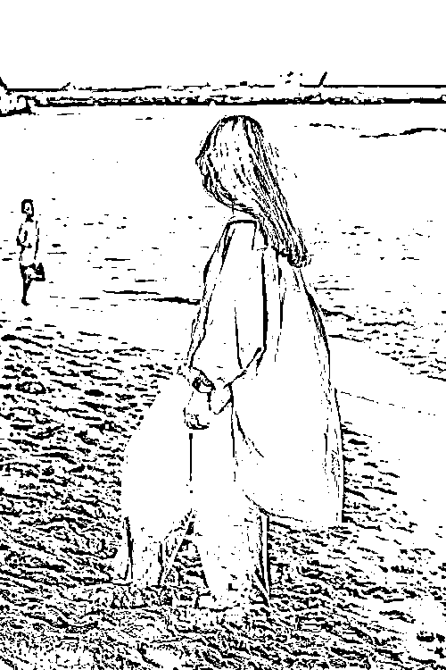

**★****上升射手座****射手座上升**是房间里笑得最大声的一个，他们讲的笑话都是他们自认为史上最好笑的笑话，具有冒险精神，**很外向很乐观的性格特质。**通常在销售推销行业里面，做的比较好的两个星座就是射手座和它对面的双子座。但他们的方式各有不同，双子座非常机智，会给你各种各样的信息；**射手座上升**则会和你说：“这可不仅仅是一辆车啊，**这还是一种理念，一种概念，**你知道这种车架的型号和宝马原装用的是一模一样的品种吗，正是因为有这种配置所以它会在长途旅行上更加牢靠，虽然没有折扣，但是这辆车还是很棒的，我自己买了 3 辆。”所以当射手座上升给你推销的时候，简直是上了一堂课，**给你的知识量都是你没有想到的。**像我的占星老师说过，射手座是一个幸运的星座。换句话说，谁会像射手座一样在急流的上方走过一条独木桥呢？这事我干过，你要么很幸运，要么摔死。所以你非幸运不可。**★****上升摩羯座**在所有的星座当中最具野心的就是摩羯座，他虽然是一种安静的野心，但的的确确是一种野心，之所以安静是因为他是一个土象星座。这个星座会很低调，长期的加班就是为了达成他远期的目标。当狮子座们都出去参加派对了，摩羯座还在加班，就是为了有一天可以当狮子座的老板。之所以举这个例子是因为狮子座和摩羯座经常都是和领袖领导相关的。

在领导方面可能狮子座更加明显一点，这种视觉上更加可见性强的领导会向你演示事情该怎么做。但是如果谈及要追踪一个项目的长期实施的话，摩羯座是更厉害的领导。

**摩羯座如果落在上升点可能看上去会非常严肃，**摩羯座上升的人可能小时候长得比同龄人要成熟，**有一种老成的感觉。**而且等他们真的年纪大了时，他们的长相也不会有很大的变化。

当上升摩羯座看到上升射手座迎着急流走过独木桥时，他会觉得这个人会掉下来的。摩羯座要过河的话，他宁可花时间架一座桥再过去，虽然这样会花很多时间，但这是长期而稳定的计划。摩羯座的人格特质实际上很有意思，尤其是在年轻的时候看起来也许会有点笨拙和拘束感，但是你给他一定的时间让他成长，你会发现当初很傻的孩子变成了高富帅。

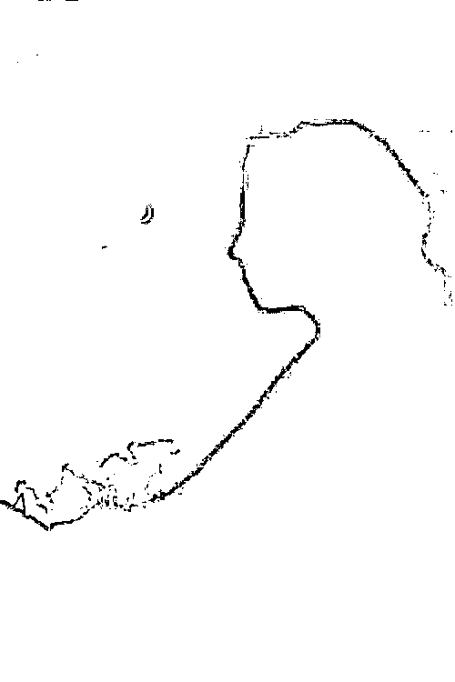

**★****上升水瓶座**水瓶座是人群中很独特的。这一类型的人，是最有可能做出自己独一无二的贡献和创意的，因为他是个风象星座，所以他的头脑更加的智力化。如果是水瓶座上升的人在你面前，**你可能会感到他很友好但是有点疏离感。**这样的人格**往往带着友好的面具在一旁观察**，但是不是怀疑。如果你是上升水瓶座的话，通常会面临这样一个问题，**就是合群的问题。**甚至他会觉得自己哪里都和人合不来，我们通常会用特殊和怪癖来形容水瓶座。就是奇怪、不同寻常、与众不同。但也会有这样的评价：虽然水瓶座和人不一样，但是我觉得这人蛮酷的。他们打扮往往和他人不同，或者他外在的风格和他人有不同寻常的点，而且水瓶座上升可能是房间里最聪明的那一个。但是困扰上升水瓶座的是“我很聪明但那又如何呢，我不知道我在哪里才能够融入人群中。”**所以找到一个合得来的群体对水瓶座上升特别的重要。**去寻找到一个志同道合的组织是非常重要的。不然很容易会觉得自己是周围团体的“局外人”。**★****上升双鱼座**双鱼座是 12 星座中最敏感的星座，也是最复杂的星座。双鱼座代表的是人性当中最复杂的面象。上升双鱼座的性格可能包含了 12 种不同分类的性格。有时候我们会管这种特色叫**变色龙特质**，就是你拥有随环境而改变自己去适应环境的能力。意味着**你可以在当下的时刻感受到灵感的启迪。**上升双鱼座**往往会经历那种对人生的幻灭感****，**觉得一切都是没有意义的，一切都是不能的，很无力无法招架的感觉。但是即便如此他依然有能力消化痛苦，然后再次带着对人生的灵感和启发站在舞台上。它是水象星座中最具直觉力的的星座，水象星座往往都是有第六感的。能够听到他人感觉不到的东西，对于双鱼座来说保持隐私对他们的健康非常的重要。比如说带着很好的心情进入一家超市，随便买了一件东西出来时心情就变得不好了，可能因为在排队时站在你前面的人心情很抑郁，**而你吸收了别人的情绪自己却没察觉。**

**版权声明：**原创文章由作者授权发布于若道平台，欢迎转发，反对抄袭。友号转载请申请白名单。

****想阅读更多作者的文章，请在后台回复******大卫****** 即可。****

**大卫·瑞雷**

美国占星师，若道联合创始人，致力于在中国教授和推广西方占星学；2010-2014 年，任全美占星师联盟监督委员会委员；2017 年，被选为 ISAR 委员会成员。ISAR 是世界最大的国际占星机构，会员遍布 45 个国家，2017-2020 年曾任 ISAR 全球副主席、CAPISAR（ISAR 职业占星师资质认证机构）主席。

**20 位来自世界各地的占星师****带来 19 场沙龙——新世界的觉醒****详情可点击下图**

**学习占星学****点击下图了解课程详情**

**微信又双叒叕改版啦，不想错过若道君的推送？**

**就把若道设为星标吧！**

**▼**

**就是这个“在看”，戳一下☟**

********报名直达入口********

# 水逆结束，土逆开始，市场会出现悲观情绪吗？丨梅里曼 7 月黄金报告上线！

> 原文：[`mp.weixin.qq.com/s?__biz=MzA5NjA0NTAxNg==&mid=2651475867&idx=2&sn=a83315235db9523d78811c8cdd8e6aed&chksm=8b48fd2cbc3f743aa150d0f1182fcf17bcf14ad981390b87314d4845eea1783e35dd4b6acbc2&scene=126&sessionid=1692737801#rd`](http://mp.weixin.qq.com/s?__biz=MzA5NjA0NTAxNg==&mid=2651475867&idx=2&sn=a83315235db9523d78811c8cdd8e6aed&chksm=8b48fd2cbc3f743aa150d0f1182fcf17bcf14ad981390b87314d4845eea1783e35dd4b6acbc2&scene=126&sessionid=1692737801#rd)

“**黄金是金钱。其他的只是信贷。**

**——约翰·皮尔庞特·摩根**

”5 月份美联储加息 50 个基点，并表示将会在 6 月和 7 月的会议上讨论是否继续加息。美联储主席鲍威尔最近在对一位记者的简短回答中强调：“最终，最痛苦的事情会是如果我们未能应对，通胀将长期处于根深蒂固的高水平。”因此，未来的加息可能持续。德意志银行经济学家 Peter Hooper 表示，美联储可能需要将短期利率推高至 5%，这将是自 2007 年以来的最高水平，远高于目前的 0.75%-1%区间。然而加息也带来对经济的担心，尽管美国就业率非常强劲，但一些影响已经显现，比如 4 月份新屋销售暴跌，跌势创近九年来之最。而一些在过去 2 年非常强劲的大科技公司开始裁员。从 Jamie Dimon 和马斯克到家具零售商 RH 的负责人 Gary Friedman 上周都警告投资者：要警惕经济走下坡。经过几个月的强劲消费支出和供应链改善，美国一些最有话直说的企业领导人开始加大力度针对几十年来最高的通货膨胀和即将到来的加息发出警告。目前，火星、木星都在白羊座，带来了一些进取的冒险精神。同时，水星逆行周期已经于 6 月 3 日结束，而土星逆行周期（6 月 4 日至 10 月 22 日）已经开始。当土相逆行时，人们可能会感到压抑。许多分析师现在预测经济将陷入衰退，甚至更糟。

| 黄金日 K 线图

**而黄金在跌到 1785 美元后出现了小的反弹。接下来黄金会怎么走，你要不要抓小反弹？****此外，你考虑从做空黄金中赚钱的策略了吗？**7 月份黄金报告已经上线，上证报告也将在下周上线。欢迎了解。也可以按照季度和 1 年期订阅，有更多优惠。季度和年度的好处是，你可以持续了解梅里曼老师对于不断在变化的市场的看法。即便他某一次看法和市场不一致，你也看到在下一期他如何调整自己的看法，并看到金融占星在一个长期时间段内对你把控风险的帮助。而能够长期控制风险、尽量找到安全的投资时机才是投资的长久之计。点击文末阅读原文，雷蒙德·梅里曼黄金周期 2022 年 7 月报告带来有 40 年黄金市场研究经验的世界著名金融占星大师雷蒙德·梅里曼对当前黄金市场的研究。

**也欢迎参加雷蒙德·梅里曼《2022 下半年金融占星投资沙龙》，将帮助你对 2022 年下半年的市场风云变化加深了解。**

**扫描下图二维码了解详情**

▼

**投资有收益，投资有风险，希望金融占星学的研究帮助你更好地评估你的投资。**

**7 月黄金报告上线**

**黄金月度报告价格****单月报告**：280 元/月 **季度套餐价格**：780 元（260 元/月）**年度套餐价格**：2400 元（200 元/月）**双报告年度套餐更优惠（直降 900 元）****12 个月黄金报告+12 个月上证指数报告：仅需 3900 元****长按下图识别二维码购买黄金报告**
▼

**购买者需知**

**① **梅里曼市场时机学院《中国上证指数月度研究报告》是梅里曼市场时机学院（以下简称 MMA）的研究“预报”，而不是市场“预测”，是梅里曼老师及 MMA 金融占星分析师对人类活动周期历史与行星周期之间相关性的研究，二者在大部分情况下具有 80%或更高的相关性，而不是因果关系。报告中的研究完全存在错误的可能性。即便是非常认真的研究和几十年的研究经验，金融占星师无法总是正确地解读出各种征象在实际层面上会如何相互作用，并显化为事件结果。

所以请将报告看作一个研究参考，务必结合其他市场研究和你个人对市场的理解，根据你的自由意志做决策。

**②** 此报告一旦售出，**即不接受退款。**

**③** 上证、黄金月度报告每月固定 1 期，**并非都是在每月相同日期发布。**

**④** **我们收到英文报告的当天，即发布该英文报告。3 天后，上线报告中文版。此报告仅支持手机网页阅读，不支持电脑阅读和下载。****以上须知，请仔细阅读。一旦付款，即视为已了解并接受所有须知内容。**在过去的 40 年中，唯有梅里曼逐渐完善，并在梅里曼市场时机学院月度周期报告中阐释了将地球宇宙学与周期相结合的研究方法，以惊人的精确性预报了黄金价格发生重大变化的时间。**黄金购买 Tip**

各大银行均可购买黄金或黄金 EFT 基金，也可以在诸如天天基金或者支付宝购买黄金及黄金相关产品。不明白的可以百度搜索。

**购买后如何查看报告？**

**购买后有疑问怎么办？**请联系技术客服
**微信：nodoor201705**

**购买黄金报告直达入口**

# ISAR 认证职业占星师必修课程 | 开启“爱好变职业”的创收自由之路

> 原文：[`mp.weixin.qq.com/s?__biz=MzA5NjA0NTAxNg==&mid=2651475681&idx=3&sn=03edb5e195a24b0098a8574b6460bd75&chksm=8b48fc56bc3f75406fdbc1a546152ded765c2a0de8056fb8f8e752c9b486e237ca081af71606&scene=126&sessionid=1692737801#rd`](http://mp.weixin.qq.com/s?__biz=MzA5NjA0NTAxNg==&mid=2651475681&idx=3&sn=03edb5e195a24b0098a8574b6460bd75&chksm=8b48fc56bc3f75406fdbc1a546152ded765c2a0de8056fb8f8e752c9b486e237ca081af71606&scene=126&sessionid=1692737801#rd)

**2022 年，是世界和中国 40 年未有之大变局的开始。**

俄乌战争打破了欧洲大陆乃至全世界的和平局面，而新冠疫情也给中国经济带来前所未有之挑战。

如果你关心经济形势和世界局势，你会有这种的感觉，我们将面临一场深刻的危机，而这不是短期内可以结束的。

**占星学的看法也是如此。**

4 月青年失业率（16 岁到 24 岁）中国达 18.2%，一些背着房贷、教育、医疗负担的中年人突然失业更是整个家庭整个难以承受之重。为了更好准备面对这样的时代变化，连《北京日报》这样的官方媒体也在呼吁：**“开拓副业，让自己有多元化发展的生存能力”。**

**而这门课程，就是为了这样一个目标准备的。**

**占星学是非常好的“开展副业”的选择**

这个**为期 16 个月**的课程通过并不算长的时间和并不算高的投资，不仅可以帮助你学到一个终身可用的技艺，而且也可以选择成为自助助人的占星师，**开启受益终生的第二事业。**未来是个体崛起的时代，大量个体被鼓励独立发展，比如网红、自由职业、自媒体、咨询师等，他们都不需要传统的办公室。社会越发达，人的独立性就越强，未来有能力的人都可以变成独立的经济体。

**占星学也是越老越好的职业**

和一些技术变化非常快的职业不同，**占星学的技术层面非常稳定，不会快速迭代变化，**同时，掌握好占星学、能够做一场好的咨询又需要个人自身大量实践和对生命的深刻理解，而这些都是时间和岁月带来的。

**占星学是现代社会需要的助人职业**

社会快速发展和变化人们似乎越来越无法掌控自己的生活，这给很多人带来巨大的焦虑，**抚慰心灵的咨询市场需求巨大。**而占星学可以让人从前所未有的角度了解自己，了解目前和未来所处的周期，挑战的意义，不论对于深入的个人成长探寻，还是预测未来的周期，都又其独一无二的价值。

**ISAR 认证职业占星师的独有培训**

目前占星学的培训市场鱼龙混杂。而 ISAR（国际占星研究协会）是一个包含了 47 个国家在内的国际占星组织，多年来致力于占星的教育和研究，提升占星教育的品质和职业占星师的能力，在国际占星领域备受尊重。今年，ISAR 对于成为 ISAR 认证职业占星师提出了更高的要求，**所有想要获得 ISAR 职业占星认证的申请者均需要在 ISAR 的附属学校通过 500 个小时的研习（包含****主课****、选修课、沙龙、作业、讲座、工作坊等等）。**

**而这门核心占星学课程就是为此而准备的。**

**你的占星核心课老师是谁？**

**拥有****51 年****占星实践经验的****若道创始人****前 ISAR 全球副主席****前 ISAR 全球职业占星师资质认证主席****大卫·瑞雷**

**和**

**2019 年第二届、2021 年第三届核心课中**

**与苏·汤普金斯老师****联合授课****的**

**ISAR 认证职业占星师**

**咔咔（Caroline）**

**二人合力打造**

**2022 年 ****若道全新核心占星课程**

**咔咔老师给同学的寄语：**

（向上滑动查看内容）

**亲爱的同学们：**

我为什么学占星学？

2000 年的时候我还是一个在网上搜索天蝎座和水瓶座配不配的普通白领。我搜索的内容还包括了水瓶座为什么总是这么若即若离？

体贴的搜索引擎给我推送了占星学、行星、星座、宫位、相位等资料，还让我了解到莉莉丝、月亮交点、截夺宫位等占星学概念。

2000 年 10 月我了解到，一个从业 30 多年的美国职业占星师大卫·瑞雷来到了中国，和他的中国合伙人将开办一个专业教授占星学知识的课程。过去 10 个月在网上东拼西凑的占星学知识唤起了我对占星学的兴趣，但是已经不能满足我对星图深度分析的需求了。

2013 年，我通过了若道核心课程的毕业考试和国际占星师研究协会的认证考试。2015 年我离开职场成为一名全职占星师。

到底学习占星带给了我什么呢？

1、它是自我觉知的工具，我现在已经不去纠结哪些星座是否匹配，我相信外在的事件是内在心理矛盾的显化。也就是说，想找到令人满足的亲密关系，要先去了解自己的情感模式和需求，而不是无意识地一次次地试错和撞墙。我开始学习自我关怀和接纳自己。

2、它带来看待世界的全新和全景的角度，天上如是，地下亦然。人类社会和个人生命的进化都有其周期和相似性，作为个体，占星学帮助我思考如何更积极和有建设性地与宇宙的能量合作，认识自己，发挥自己的潜力，度过有意义且自我满足的人生。

3、它带来了全新的职业：占星师和占星老师。除了收入，还有助人育人的满足感和意义感。

4、它带来一群志同道合的伙伴，我们彼此联结又相互独立。

作为中国占星界的“黄埔军校”若道占星的学生、助教和老师，我与很多学员在人生的不同阶段带着各异的需求走进了这所学校，2022-2023 年一年半的若道核心课程设计既蕴含了大卫·瑞雷老师的教学精华，也带入了我在跟随不同国外占星老师学习、助教和教学积累的心得。

有一些学员毕业后从事了占星咨询工作，有的在各大平台成为专业占星学知识的输出者和传播者，有的运用占星学提升他们的工作，也有的在占星学与投资，占星学与名人/八卦、占星学与原生家庭、亲密关系、亲子关系等领域收获了有用的或者有趣的体验。

对我来说，生命是一场自我完整的体验之旅。从 2011 年的那个春节在若道入学之后，我的生命旅程更加充实、有意义、有目标，也更有满足感。

希望在 2022-2023 年的若道核心课程里见到你。希望你此后的生命旅程里，有若道，有占星学。

占星师咔咔

2022 年 5 月 24 日

**大卫老师给同学的寄语：**

（向上滑动查看内容）

亲爱的学员们：

感谢你对我们从 8 月 30 日开始的若道 L1-5 级核心课程的兴趣。我和合作老师咔咔以及我们的核心课程团队期待着为你提供这个机会，来教授各种高品质的地道占星学知识和技巧。

对于那些希望获得 ISAR 职业占星师认证的学生，这是一门适合你的课程！

作为 ISAR 咨询技能培训的一部分，我曾与咔咔合作过，我们期待着再次合作。咔咔和我曾在 ISAR 职业占星师认证委员会（CAP ISAR）一起工作，我们非常熟悉获得 ISAR 职业认证的流程。作为你的老师，我们将陪伴你整个占星学发现之旅，帮助你逐渐认识到占星学有多么的神奇。此外，你还将受益于我们若道的助教和课程顾问，他们是若道核心课程计划的重要组成部分，提供在线沙龙、组织学习小组、指导家庭作业。我们的教育团队是“服务于你的团队”，所以也会根据你的需求进行相应的调整。你专用的核心课程微信群也促进了你的学习过程，使你能够每天与你的同学们一起学习、探讨、成长。

52 年前，当我开始学习占星学时，没有一所像若道这样的学校。如果有这样一所学校，我会尽一切可能在那里成为一名学生。事实上，我很幸运，我的老师都是经验丰富的专业占星师。然而，我花了 6 年的学习时间才通过 1976 年在美国乔治亚州亚特兰大举行的专业占星师考试，又花了 2 年的专业实践时间才通过占星学谋生。我永远不会忘记从 1970 年到 1978 年的 8 年，那些日子的反复试验教会了我如何苦练占星学。作为老师，我一直在努力传授我早年所学的知识，让你的旅程更加顺利，更加全面。

自 1978 年以来，44 年的全职实践教会了我很多，我很高兴有机会与大家分享我所学到的东西。我和咔咔都是现代占星师，虽然我们尊重西方占星学的历史和传统，但我们实践和教授的占星学植根于现代人本主义哲学，这种哲学旨在提高你对自身潜力的认识，并鼓励个人成长。还有什么比了解自己更实际的呢？还有什么比个人成长和发展潜力更有利的呢？这是你将要学习的占星学，一种可以应用于你自己生活的占星学，一种可以为你提供一个充实职业的占星学。

教书是我回馈占星学行业的方式，这个行业拓展了我的视野，远远超出了我曾经想象的可能。谢谢你给我这个机会做你的老师。

大卫·瑞雷

2022 年 5 月 24 日

**连报 L1-5 全阶网络直播课程，你可以享受**

❶64 次线上直播互动网络课程+2 场工作坊，全面而详细地讲解占星学知识、技能、案例和重要领域实践运用。

❷ 知识点+学员星图解读有机结合：咔咔老师以讲解知识点和中外名人案例为主，大卫·瑞雷老师以参课学员案例演示及客户案例为主，每个知识点覆盖班级内学员的亲身案例，参与感更强，多位学员都有机会听到自己的星图分析。

❸ 微信群学员互动分享，从真实案例学习生命成长故事。

❹ APP 答疑论坛提问：论坛上每个学员的问题都将得到及时回复。

❺ 若道独有的职业占星师养成计划，为你毕业后独立咨询做准备。

**❻ **提供**咨询平台**，只要努力，优秀毕业生有机会入驻**若道咨询平台**，拓展咨询客户群。

**更多了解老师和助教？**

**大卫·瑞雷（David Railey）**

*   **I****SAR 董事会成员，ISAR 全球副主席，ISAR 全球职业占星师资质认证主席，若道占星创始人**。

*   1976 年，通过美国亚特兰大职业占星师考试，成为全职占星师，随后通过**全美占星师联盟（AFAN）和国际占星协会（ISAR）职业测试**。

*   1980 年，与**杰夫·焦耳**一起在亚特兰大创建“**每日行星**”占星学中心。此后在亚特兰大占星协会担任 4 年考官，并且两次担任**亚特兰大地区占星协会主席**。

*   1979-1992 年，作为占星师活跃于美国社会媒体，向不了解现代占星学变化的大众宣传专业占星学知识。在 1989-1992 年期间，他在 WRGG 电台 12 频道每周主持个人电视秀“今日占星学”，早先他还在 WRFG 的广播节目中播讲宇宙天气节目。 

*   2010-2014 年，任**全美占星师联盟（AFAN）监督委员会委员**。

*   2010 年，其著作**《灵魂的目标》**中文版出版，和蒋颖一起创办**若道占星**学校和其官网 www.nodoor.com。从该年开始，他工作并往返于亚特兰大和北京。目前他 80%的时间致力于在中国教授和推广西方占星学。

*   2016-2019 年，被选为国际占星协会（ISAR）考试委员会成员，国际占星协会（ISAR）是世界最大的国际占星机构，会员遍布 47 个国家。

*   2017-2020 年，被选为国际占星联盟（ISAR）考试委员会主席，理事会成员。

**占星师咔咔（Caroline）**

2010 年师从美国占星师大卫·瑞雷学习，并得到世界名师斯蒂芬·弗里斯特、罗伯特·汉德、苏·汤普金斯传授各种占星学技法。若道首届学员，国内最早获得 ISAR 职业占星师资质的职业占星师，现兼任若道占星核心课程助教。

在国际知名广告公司和市场研究公司从事的市场研究和推广工作十余年，曾任职于阳狮集团、尼尔森市场研究有限公司、MTV 和《Madame Figaro》杂志。

**助教王嘉祺 （Conrad）**

ISAR 认证占星师、若道认证生时校正资质，从 2010 年起自学占星学，2015 年开始在若道系统学习，并开始个案咨询。2018 年担任若道核心课程助教，以及卜卦占星学和太阳返照选修课助教，并带领学员进行经世占星和太阳返照方面的研究。2019 年 11 月作为演讲人之一参加了国际占星协会（ISAR）北京大会，也是 ISAR 星空俱乐部中国区第 16 期的主讲人。

**什么人适合这门课？**

*   对占星学有浓厚兴趣，想要系统学习占星学。
*   对占星学有一定基础，但不知道该如何整合星图复杂的碎片。
*   希望成为优秀的占星师，想要借鉴国际大师解读思路并融入自己的体系。
*   想学习占星学，但不擅长英文，希望有中文老师授课。
*   想结合占星学理论与咨询实践。
*   走在自我探索和个人成长道路上的人。

**课程费用**

**★ 1-5 阶 连报**

**早鸟价：33000 元（2022 年８月 1 日之前）**

**课程费用：46500 元** **★ 1-2 阶 （8 月 30 日开课）**

**早鸟价：2800 元（2022 年８月１日之前）**

**课程费用：3500 元 ****★ 1-3 阶　连报**

**早鸟价：10500 元（2020 年８月１日之前）**

**课程费用：11500 元 **

**咨询课程请联系顾问**：**王老师（微信/手机：18510107057，请备注“大卫核心课”）**

**退转课程**

**退款原则请详看《教学协议》，如有疑问请咨询课程顾问。**

****2022 L1-5 认证职业占星师必修课程****

**授课老师：大卫·瑞雷、咔咔**

**直播课开课时间：2022 年 8 月 30 日（周二）开**

**授课方式：******网络授课，英文/中文授课，中文翻译****

**费用：****1-5 阶连报**：46500 元**（早鸟价 33000 元,8 月 1 日前）；**1-2 阶**：**3500 元**（早鸟价 2800 元,8 月 1 日前）**；****1-3 阶**：**11500 元**（早鸟价 10500 元,8 月 1 日前）**；

**课程负责人：王老师**（微信/手机：18510107057，请备注“大卫核心课”）

长按二维码添加课程负责人咨询~

****报名直达入口****

# 深度丨当土星在水瓶座，哪几个月亮星座深深感受到“被按在地板上摩擦”的酸爽？

> 原文：[`mp.weixin.qq.com/s?__biz=MzA5NjA0NTAxNg==&mid=2651475681&idx=1&sn=62a6f00b80d6e5c3145017c7a3444887&chksm=8b48fc56bc3f754017b3daeee4755943b303960df405f96aa967e6610ce66b10be2e1bc149ff&scene=126&sessionid=1692737801#rd`](http://mp.weixin.qq.com/s?__biz=MzA5NjA0NTAxNg==&mid=2651475681&idx=1&sn=62a6f00b80d6e5c3145017c7a3444887&chksm=8b48fc56bc3f754017b3daeee4755943b303960df405f96aa967e6610ce66b10be2e1bc149ff&scene=126&sessionid=1692737801#rd)

******************☆ **************后台回复“今日”，给你一句生命态度****

作者/ Serina Sun ISAR 认证占星师编辑/翀子 封面/书君 图片/ 网络

土星于 2020 年底进入水瓶座，对出行星图中月亮在金牛座、狮子座、天蝎座、水瓶座的人产生很多生活中的压力。四个月亮星座的人对土星“来袭”有哪些相同和相异的感受？需要带着哪些觉知去解决土星的议题？来看文章吧！

**序章：回看历史**

大家好，我是 Serina。

**土星自从于 2020 年底进入水瓶座以来，会对出生星图里四个月亮星座（金牛座、狮子座、天蝎座、水瓶座）的朋友们带来很多情绪与身体健康方面的困难功课，**原因是土星这颗星体从原型上看，被视为是困难与挑战，从灵魂占星与轮回观的角度，它又是业力之王，土星每个 29 年周期完整的走完一圈，会给我们的出生星图各个星体带来直接的影响。

土星的困难在于它的不可抗性，既然是业力平衡的法则，那该还的债，该补赎的”罪“，都会随着土星行进周期，以事件的形式被我们清晰看到。

**即使是提倡自由意志的现代占星体系，也不会否认土星在我们现实生活中带来的挑战，而且通常是以事件的方式显化。**

原因就在于土星是三维物质世界的统治者，肉眼可见的最远的行星，**它象征着边界、制度、规则，通常以”不可以“、”禁止“的命令示人**，所以我们在面对这颗星体对应的事件时，体验当然不可能是放松和放飞的。

**土星也是象征着物质与现实的**，它运作的方式就是透过让人感到**挫败、困难**的体验，“被迫”去面对问题的实质——哪里最薄弱，哪个环节迟迟没被解决——土星的智慧在于它把我们看得太清楚了，专拣那些最切中要害的部分。

我们人生每一个 29 年，都会遇到一次出生星图的土星回归，相信遭遇过这个经历的朋友，肯定对那时候的前后两年多时间记忆犹新。

星图中每一颗星体，都有机会轮流接受行进土星周期的考验，轮到的星体，会被触发这颗星体原本就存在的很多议题。

**今天我们的文章主要分析出生星图中的月亮在土星行进之下，需要面对的整合功课。**

**重点人群是月亮落在金牛座、狮子座、天蝎座、水瓶座的四组人群，原因是行进土星（位于水瓶座）自 2020 年年底至 2023 年早春，与这四个星座（固定星座轴线）产生硬相位：**

*   **行进土星四分出生星图月亮金牛座**

*   **行进土星对分出生星图月亮狮子座**

*   **行进土星四分出生星图月亮天蝎座**

*   **行进土星合相出生星图月亮水瓶座**

从大致的时间看，月亮的度数比较靠前，也就是在 0-15 度区间的人群，会感受到 2021 年爆发出来的困难张力最明显，无力感与脆弱感也是最强的。2022 一整年并非没有接触这股压力，而是**持续性的与 2021 年遇到的主题共存，在不断的磨练中已经在适应那个令人恐惧的东西，直到 2023 年初，即将迎来彻底的毕业。**

**月亮度数在 15-29.59 度区间的人群，压力的最高峰值出现在 2022 年，**从 2020 年底以来就一直有种说不出缘由的苦闷感，但又看不到这股情绪背后的真相，没法去真正解决。直到 2022 年开始，具体事件出现，要加紧进修和努力的时间来了。

无论是月亮在什么度数，从整个星座能量的角度来看，**行进土星会对整个星座所落的宫位带来影响，因此月亮所落宫位象征的事项，会从 2020 年底到 2023 年初这段日子作为一个整体主题出现。**

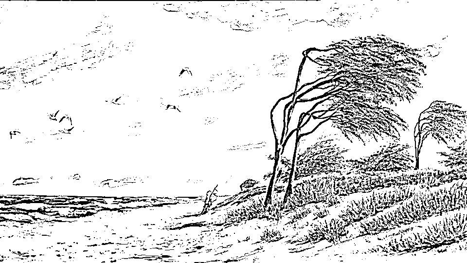

**行进土星与出生星图月亮的压力相位**

**行进土星和出生星图月亮产生压力相位的时候，会具体带来哪些感受呢？**

**首先是旧世界、旧的认知体系和行为习惯遭到碾压。**毫不留情的，我们最惧怕的东西，生活陋习、懒散拖延与不自律的习惯、无法看到的潜意识限制性信念，会被一个重型轧路机的轮子滚压过去。

这样的日子里，我们没办法乐观起来，也觉得对很多遭遇束手无策：

*   **明明工作已经够努力了，为什么还是没有机会晋升？**

*   **老板的调任为自己现有的工作带来更大的工作量与压力。**

*   **工作越做越没有乐趣，又看不到新的增长点在哪里。**

*   **对自我价值产生了怀疑，不确定性日渐增长。**

*   **身体健康成为一个很大的困扰，需要做很多努力去修复。**

等等等等。

**我们还可以继续分析月亮所落的星座，看看它是否有抗打击的能力。**

**月亮在金牛座的朋友，**尤其是夜间出生的人，月亮即使遇到土星带来的压力，但自己应对事情时候心是相对有力量有根基的，也容易遇到帮助自己扛困难的女性长辈。

月亮金牛座的人先天对压力的敏感度稍弱于其他星座，就好像是暴风雨来临了，仍不急不忙的先把眼下的事情弄完再去想危机怎么解决，节奏把握的很均衡，用务实而非情绪化的方式去解决问题。在行进土星到来时，甚至有可能是得到提升和奖励的机会提前到来。

**月亮落在天蝎座的朋友，**在这一轮土星行运中会感受到相当大的压力。除了相位方面是四分相，月亮先天的力量也较弱，案主若想爬出这个低谷，会需要消耗更多的力量，且可能觉得孤立无援、无人理解（除非出生星图的月亮得到木星、金星的友好帮助）。

月亮天蝎座的人天生不太会面对和处理自己的情绪，而作为水象星座恰恰又天然拥有很多炙热且激烈的情绪暗流，困难就在于学不会用较温和的方式去释放，常用的方式是忍着、积攒，攒到一定程度就只能像火山喷发一样彻底的爆发，不给周围的人留空间。

这股歇斯底里式的处理情绪的方式（要么表面冷静而内在咬牙切齿，要么通过虐自己来感受真实），正是天蝎座月亮的表达。

**月亮落在狮子座的朋友**会经历行进土星对分出生星图月亮的运势，困难功课很可能出现在一对一关系里，或是工作学习时遇到了强大的对手，自己在竞争中处于较弱势的一方，需要不断的壮大自己的实力，持之以恒的在技能或专项内容上磨练，逐渐的接近目标。

月亮狮子座很可能会在土星的高压之下，自尊心受到了打击，以前自己擅长搞定的事务和人际关系，有可能不再“得意”，越渴望被看到自己的价值，就越被塞到不知名的角落和位置受到冷落。

所以这段日子是要让月亮狮子座学习谦虚，也就是夹起尾巴来，低下身子，真心的看到对方（无论是合作伙伴、伴侣还是项目方）的长处，虚心请教长辈、上司，整合自己虚荣好强的阴影面。

**月亮落在水瓶座的朋友**经历的是行进土星合相出生星图月亮的相位。合相带来的感受与四分相、对分相不同，后者会偏向于外在环境带来的，或是一股外力的牵制，而合相的复杂在于，感受到了压力与情绪，却好像只缘身在此山中，想看清一个来龙去脉反而不容易。

这股土星式的沉闷与限制，似乎已经跟自己融为一体，如影随形的。这让平时习惯自由、尊崇个性的月亮水瓶座感到无所适从，好像创意不如以往来的顺畅了，到底要跟随一条符合普世价值的路走，还是继续坚持自己以前的风格呢？

土星会挟带“责任”与“成熟”的期待，要求月亮水瓶座思考现实世界的法则，可能要放弃自己的某些太超前的理念，才有可能不至于总被枪打出头鸟，不过，从真正更有意义的方面看，月亮水瓶座反而要审视自己的信念中，哪些是真正理性的发明原创，哪些是不切实际的空想。

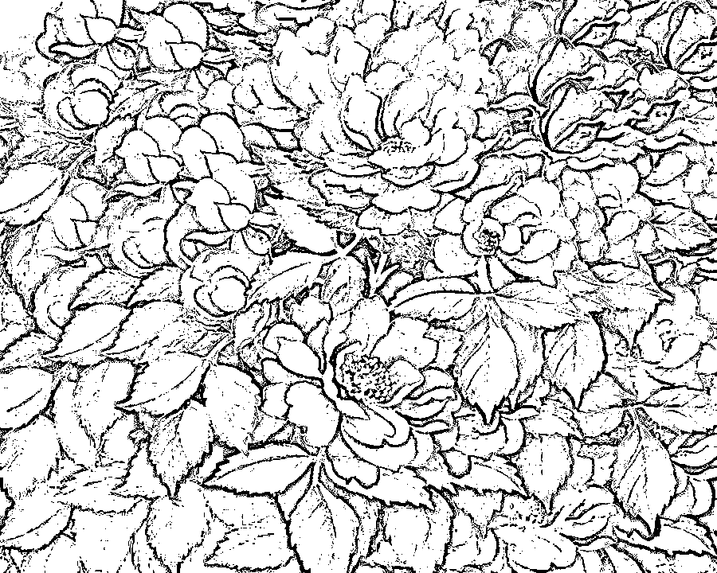

**月亮原型：原生家庭议题**

**再看月亮这颗星体本身相关的事物，我们看到的是家庭关系、亲子关系、家宅不动产、餐饮与身体健康等事项，这些领域都有可能成为以上四个月亮星座人群的灾害频发区。**

月亮跟一个人**内在最底层的生存安全感**有关，我们的安全感会来自很多领域，首先最直接的一个是我们与自己母亲的关系。

**月亮天蝎座、月亮狮子座朋友的母亲或养育者，很可能是强势而又掌控的**，从小到大需要小心翼翼的观察母亲的喜怒哀乐，活在母亲的保护之下很依赖却又渴望独立，这两个星座都有与母亲相爱相杀、争夺掌控权却又紧紧捆绑的议题。

**月亮金牛座朋友的母亲**可能一直尽力的满足他们的饮食，在金钱物质上给出最大的支持，但却可能缺了真正的情感呵护，或是总以钱的理由去限制孩子的自由。

**月亮水瓶座朋友的母亲**可能并不太管控小孩，会采取散养式的教育风格，外人看起来这个小孩很自由，家长很 cool，冷静又理性，很开明，然而这个小孩会在内心深处渴望一种真实的情感，想要被母亲关注，得不到的情况下，会以冷漠抽离作为自己的情感保护。

**行进土星带来的课题，是要把原生家庭模式翻出来，通过痛苦和无力的遭遇，让当事人去寻找问题的和解之道。**

很多人在这个运势之下会感受到抑郁、焦虑，或是身体健康出了问题。身体虚弱、精力不足，现实的压力大到自己要崩塌了。

土星带来“偿还业债”的糟糕经历，躲不过去了，我们必须允许痛苦流经身体，必须忍受这种难受的感觉。

但这并非土星真实的目的，因果业力也不是简单机械的惩罚和补赎，土星掌管时间，业力的流转需要借助时间的维度来显现，**而真正让我们受苦的，不是土星这个外来的力量，而是我们所有无法觉察到的，或是刻意去压抑、强迫与执着的内容。**

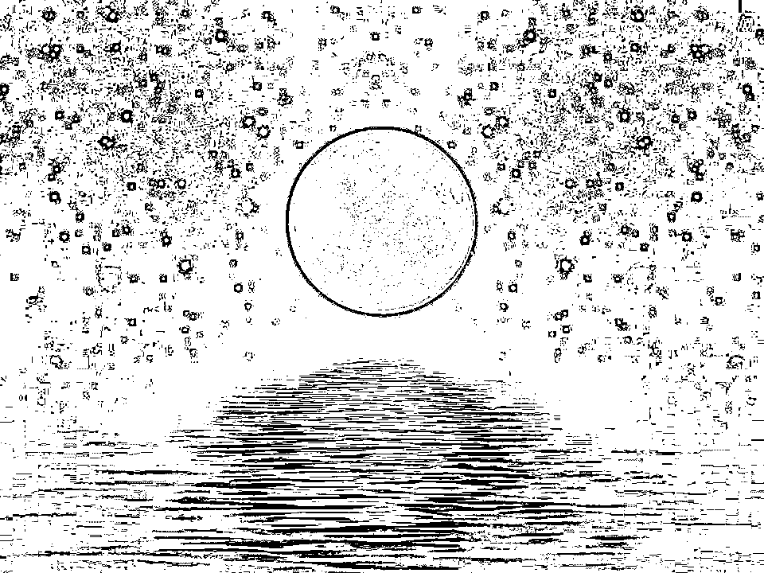

整合工作做得比较好的朋友，会透过身体与情绪的苦难，发现这背后更多的隐藏信息，比如，抑郁与焦虑，是我们长期以来不懂得处理情绪而积赞起来的“业力”，我们的身体再也承受不了了，便借助精神上的痛苦来传达信号，期待得到我们的注意。

**月亮扯出来的议题不仅是情绪、饮食习惯，她还提醒我们看看一直以来，我们是否是个有情感的人，我们对待他人到底是宽容的还是挑剔苛刻的，我们究竟有没有慈悲心，所谓的帮助他人，到底是出自良善无所求的心，还是为了操控。**

而当下遇到的健康议题，想要疗愈与康复，一个必须看到的功课在于，我们要拿出跑马拉松（土星式的）的心理准备，用至少两年多的时间，允许自己沉浸在痛苦与无力中，用眼泪去洗涤自己的心。

原生家庭的创伤、与母亲相处的复杂感受、自己的身体、外在的工作与个人形象，一环扣一环的，就这样交织成一张网，行进土星让我们通过某个事件，突然领悟了一些概念。

从小没得到过无条件滋养与爱的小孩，会自动的屏蔽掉真实的情感流动，不允许自己犯错，不允许自己不完美，必须要上进，要成功——

行进土星会再次唤醒这些深处的根源，幼小时候，究竟是哪一次，哪位长辈，以严苛的方式打压了我们的自信——觉得自己不值得、不配得的信念，必须要以成就换来长辈赞美的习惯，已经循环往复了多少年？

其实土星一直在给我们机会去看到这些隐藏的模式。与其神叨叨的提“业力”，不如说，这就是我们一直在重复的错误信念。

**土星每隔 7 年左右会与本命星图的月亮形成一次重要相位（合相、四分相、对分相），不管你的出生星图月亮落在哪里，都会是同样的周期规律。**

**而对月亮落在固定星座的朋友来说，2020 年底到 2023 年初的这段路，会以某种形式去再现 2013 年到 2015 年的那段人生经历。**

如果再往前回溯，2005 年到 2007 年，那时候你遇到的人生困顿（无论是精神上的还是物质上的），会持续围绕某一个相类似的主题展开。

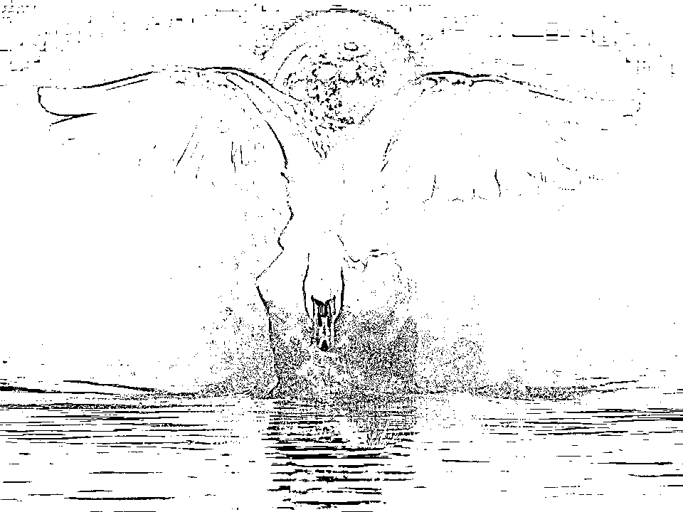

**建立觉知：月亮的功课**

我在咨询中经常喜欢让案主做这样的反思和整理工作，希望以这样的方式，让自己看到一个更加长线的蓝图，拓宽自己的认知。

更重要的，是看到所谓的业力、模式，以怎样的方式在循环，而我们如果没有建立起观察者的觉知，就很可能矇昧的重复下去，像个机器人一样，重复自己的宿命。

**我们也可以回忆一下，每隔 7 年多一次的土星与出生星图月亮的行运，是否像连续剧一样，一集接着一集，每一次都是对我们自己月亮的一次升级；我们对自己的接纳和爱，有没有随着土星轮回的周期，得到更好的升维；我们与母亲、原生家庭之间的疗愈工作，是否阶段性的续写着里程碑。**

像我自己就是在 7 年前，遭遇了人生的离婚与“啃老”，工作风雨飘摇的，能力总觉得不够，遇到了晋升的天花板，生活中又没法真正独立起来，很多事情需要自己的母亲来帮助。跟母亲之间的又爱又恨的故事，掌控与反掌控，真的是一言难尽。

7 年后的今天，我同样在处理类似的主题，买卖房产、搬家、安置自己的家，练习“断奶”，从与母亲的捆绑关系中脱离出来，但却从另一个角度感受到更多的关怀，看到她的脆弱，心里压抑的那些情绪，一次次的被释放出来——

**所谓的和解，不是刻意去追求来的，只能是通过现实世界扔给我们的各种难题，去体会整个遭遇背后最终带来什么益处。**

意识到的那一刻，土星会像一位严父露出和悦的微笑，你会觉得自己在接受这个奖赏（成就感）的时候，眼泪止不住的自己流出来，悲喜交加的成长为一个更加成熟和更加能扛事儿的人。

所以行进土星触发出生星图月亮的运势，**我们要学习的是完善这颗月亮，**懂得人生不易，也可能会切身的体会到苦，才能推己及人的看到众生的苦，慈悲心才有可能升起来。

月亮不是头脑，月亮也不是理性**，月亮就是我们最原始的一种情感需要。**我们可以学习去相信与依赖，放下小我想要维持表面风光的虚荣，真诚的与家人、朋友、事业伙伴去链接，用情感去消融人与人之间那些不必要的提防、猜忌——

吸引力法则告诉我们，**想要让外在的世界变得和谐融洽，我们第一个要改变的，是自己的心，是我们自己如何以月亮的原型方式，去接纳和包容。**

距离土星离开水瓶座进入下一个星座双鱼座，还有半年多的时间了，在这个星象彻底结束之前，月亮落在固定星座的朋友们，可以再加把劲，把该整合的功课继续做完。

如果还有没意识到自我-家庭-伴侣-事业这四大基石之间相互影响的，头痛医头脚痛医脚的，建议可以做更深的内在对话，看清原生家庭的相处模式、信念，是如何影响自己的工作环境的。

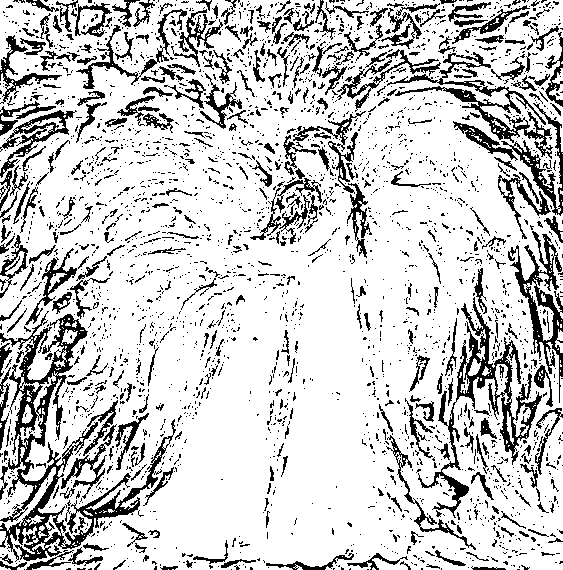

我此前在做一个客户咨询时，问及原生家庭关系的问题时，案主说没有任何问题，也不存在什么困惑；但提到自己事业中总无法信服前辈，觉得自己比他们强，偏偏怀才不遇总被打压。

后来我再次问她，你小时候的成长环境是怎样的。这一次，她突然悟了，她看到了原生家庭中相似于工作环境里的模式：她总是与父母所期待的计划背道而驰。

我让她自己总结这两个现象背后有什么同样的动力，她链接到自己深深的愤怒感，她对权威的符号有一种天然的抵触，无论这个权威说的对不对。

再挖掘下去，我们看到的一个情结，她内心的愤怒感来自于母亲与父亲之间家常便饭式的争吵，每当一个人说出一个建议，另一个人马上反对，所有大大小小的事，吃饭、看电视、人生观、事业观等等，从来没有一个统一和谐的认同，彼此唱反调是常态。

幼小的她，无力去改变父母天天吵架的局面，她只能选择把愤怒感和恐惧感压下去，假装看不到，听不到，然后去寻找自己的兴趣点转移注意力。

但是，这个模式却在她人生后来走上职场再次影响到她的认知，上司给一个任务，她会先莫名的升起一股无名火，觉得凭什么你的要求就一定对，你为什么不能 leave me alone，让我自己去决定。潜意识里的愤怒感，在不恰当的地方，以破坏性的方式被发泄出来。

**她的月亮落在狮子座，月亮与火星呈四分相。**一个极度寻求自尊心且渴望具有领导力的人，假如不去整理火星带来的愤怒感议题，便一直会遇到此类问题，换多少工作都无济于事。

行进土星在对分她月亮星座的这两年多里，她要学习的，是如何先看到原生家庭成长环境中，不被允许自己发泄情绪所带来的愤怒，包括自己在这个家庭里想去解救、想施展自己的能力，却无济于事的无力感，到最后她只能让自己成为一个叛逆和把“个性”作为标签的人，以此来逃避如何与权威相处的功课。

行进土星毫不留情的打击着她，想跳槽，想找更大的领导反应情况，都没有得到理想解决。她只能痛苦郁闷的退回来，找其他的方法，那就是，向内走，去看看自己到底怎么了。

过程很不容易，但相信这是一个疗愈的开始，她真正开始解决根源的问题，去面对自己对父母积压的愤怒感。

相信在 2023 年的春天，她将迎来一个更加真实和解脱的自己，一个有能力去处理情绪的健康的人。

**如果正在读文章的你，月亮也落在固定星座，也可以按照文章里的思路，给自己做一个由内到外的整理，趁土星离开水瓶座之前，把该完成的功课做完，然后就静等土星的奖赏吧。**

祝福大家！

**版权声明：**本文由作者授权发布于若道平台，欢迎转发，反对抄袭。友号转载请申请白名单。

**Serina Sun**

ISAR 认证占星师（2016 年获得）

曾任跨国企业品牌公关职业经理人

现居纽约，专注占星个案咨询与教学

**微信公众号**：宸时星语

**个人微信号**：yanniesun2010

长按打赏

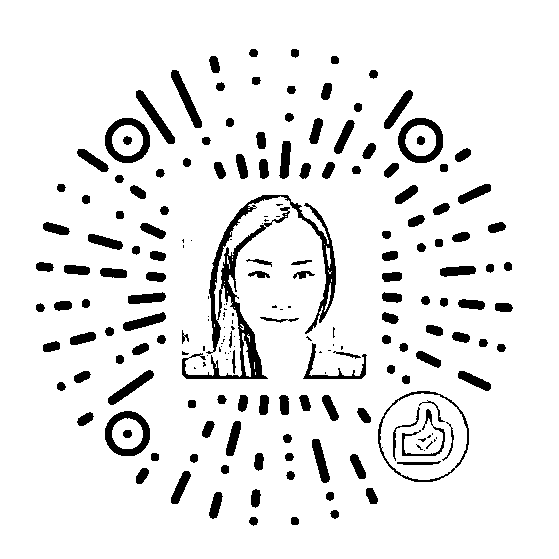

**20 位来自世界各地的占星师****带来 19 场沙龙——新世界的觉醒****详情可点击下图**

**学习占星学****点击下图了解课程详情**

**微信又双叒叕改版啦，不想错过若道君的推送？**

**就把若道设为星标吧！**

**▼**

**就是这个“在看”，戳一下☟**

********报名直达入口********

# 太卷了！为了学好占星学，师兄师姐们想出了这么多好方法！

> 原文：[`mp.weixin.qq.com/s?__biz=MzA5NjA0NTAxNg==&mid=2651475681&idx=2&sn=bcdffb8f3a77aac3a8b9e6fee2cd7a54&chksm=8b48fc56bc3f75407451e485163d053141e1fc11584731c501b3d46a8a282e323d87f522a12f&scene=126&sessionid=1692737801#rd`](http://mp.weixin.qq.com/s?__biz=MzA5NjA0NTAxNg==&mid=2651475681&idx=2&sn=bcdffb8f3a77aac3a8b9e6fee2cd7a54&chksm=8b48fc56bc3f75407451e485163d053141e1fc11584731c501b3d46a8a282e323d87f522a12f&scene=126&sessionid=1692737801#rd)

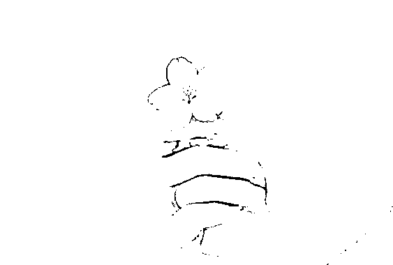

作者/若道君

编辑/玫瑰 图片/pexels

每年当若道的同学们上完 L1-L5 的核心课程后，我们都会让同学们对于自己学习占星的体会做一个分享，这样可以帮助未来刚刚踏入占星门槛的新同学们了解他们一路来学习的体验，和他们认为一些对自己有帮助的学习方法。

今天，若道君就给大家摘录一些若道同学的分享。虽然每个人的个性不同，年龄不同，背景不同，也希望这些真诚的分享对于大家有所帮助。新一轮[【ISAR 认证职业占星师必修课程】](http://mp.weixin.qq.com/s?__biz=MzA5NjA0NTAxNg==&mid=2651474544&idx=2&sn=a7aa61eadac077129dc73b0b7713af4b&chksm=8b48f8c7bc3f71d121a2f3a964e84e542a34e0a0b138cdce5fa2ca696b684fd0c3f731eea719&scene=21#wechat_redirect)也在报名中，点击链接就可以了解更多信息啦。

**理科生学习占星学**

**@王毅**

作为一名资深的新手占星学习者，觉得整个历程中，有些很想说的话，借这个机会分享分享。

首先，是一名理科生学习占星的心路历程。

拿过物理竞赛二等奖、名牌大学物理专业的人，应该具有怎样的特质呢？逻辑思维、科学理念？认为世界是可以被科学规则所描述？认为科学实验是必须可以被重复的？认为双盲实验才是真理的钥匙？认为所有不能被证明的观点都是迷信和宿命论？

在很多人的观点中，这样的我是不可能接受占星学的。

然而，这里我想强调的是，**如果一个人真正学习、接触了当代或者说现代科学，学习了系统科学哲学，而不是止步于中学的物理或者经典物理学，那么，这个人绝对不会排斥占星学。**

中学物理或者经典物理，实际上是基于牛顿、麦克斯韦们在 19 世纪达到的科学巅峰。当代的科学，早已经能够接受不能被证明的理论是可能正确的；早已明白世界是不能被僵化的公式所涵盖的；早已经接受了微观世界的电子的测不准、量子的共时性。

占星学就是在这样的情况下走入我的生活，并迅速通过一次次的实证，一次次与内心的共鸣，获得了我的认可。所以，**如果一个人不接受占星学，这很正常，但如果一个人反对占星学，那么，请他去学物理吧。**

其次，占星学是一门语言。

占星学是什么？占星是一门学说，是一项技术，是一种文化。但首先，**占星学是一门语言。**正如大师们反复强调的：**星图是宇宙的语言，占星师只是将这种语言翻译给案主。**

我有同样的感受，因为学习占星学，真的像学习一门非常复杂而偏门的外语一样难。从最初对于每个要素的把握，占星字母表（行星、星座、宫位）的背诵记忆，到组合造句，一直到整个星图解读。这让我想起了中学学习英语的噩梦。

但是另一方面而言，如果有氛围有环境，能够锻炼这门语言的话，占星学又是最能融入生活的。由于我身边有着同样爱好占星学的人，所以，有时候我们之间的对话，会转变成为外语学习一样的场景：

学生：“这个人肯定是月火相位或者月亮白羊座，你看他在家里吵的多凶啊？”

老师：“那只是一种可能，也可能两人组合盘有类似相位，或者火星在四宫。”等等。

**所以，我的第二个感受是，学习占星学就多开口多练习，如同学习外语。**

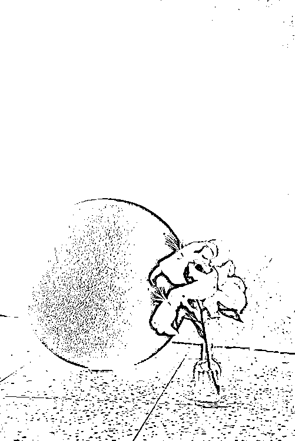

第三，占星学是哲学。

苏·汤普金斯大师的《当代占星研究》中，开篇总结了占星学的七大原则。这中间饱含了占星学的很多深刻哲学思想。然而在运用的过程中，却能够发现更多富有哲学思想的例子。

比如，最基本的，通过对每个星座与下一个星座之间特质的转换，我们能够发现什么是同与不同。

下一个星座要承接上一个星座，彼此之间有着类似因果，或者前后顺序的关系，但另一方面，我们又发现他们彼此在元素、属性、特性都完全不同，就好像台阶，既需要前一个台阶才能迈入下一个，又永远不在一个平面上。

这种星座间的同于不同，非常有趣，如何把反对与继承完美结合？就好像狮子座之后，需要处女座的细致与专业。好比上下任的美国总统，比如特朗普和拜登。

再比如说，如何看待对面星座的不同与同。

如果不学习占星，虽然我对于投射这个心理学概念非常清晰，但我大概很难学会如何面对自己对面的那个人。**我们有着最大的不同，但我们需要找到最大的相同，需要找到共同进化最好的途径。这大概是占星学给我最宝贵的哲学理念了。**

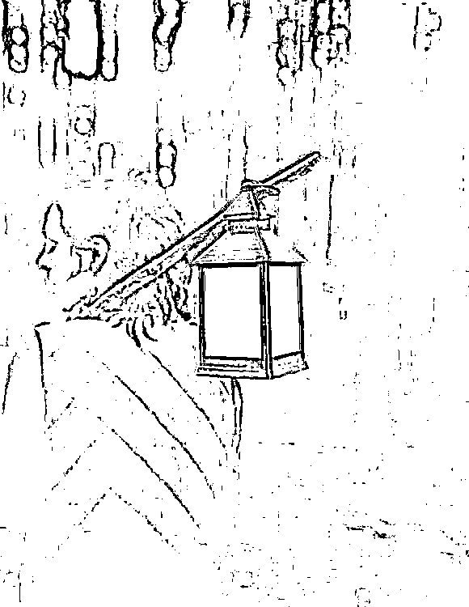

**用图画来学习占星学**

**@巫燕瑜**

**·** 备一盒 12 色的彩色水笔（无印良品的最好用），作笔记和画星图用。

**· **随堂笔记：我会把当天上课的 PPT 用 A4 纸打印出来，随时在上面记知识点，所以，我的每份 PPT 都基本上画满了，由于用了不同的颜色，所以很容易区分主题，不会杂乱无章。这样，每次翻看 PPT 的时候，都有种身临其境的感觉。

**· **手绘星图：每一张过手的星图我都会在电脑上先用软件生成一个星图，然后用手工绘制出来，这个时候，彩色笔就派上很大用场了。在画星图的过程，是一个静心的过程，有利于你和星图建立联结，有的时候，画着画着，灵感和线索就会慢慢浮现，那种感觉真的非常美妙。

**· **用心地观察身边的人：带着很强的好奇心，看看星图的信息是如何在他们的身上显现的。我尤其喜欢观察小孩子，他们的行为举止尚未受约束和教化，我总是能在他们身上看到最直接的星图信息。

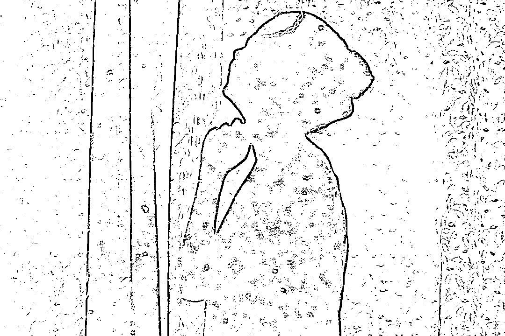

**咨询实践中学习占星学**

**@尔尔**

说起学习方法的话，我个人觉得：

**首先是研读经典，所谓研读是在理解了字面意思的基础上，深入思考每个关键词的内涵、演化、以及运作方式。将这种思维方式一层层的代入到行星、宫位、相位的一系列组合中去。**

非得做这种根本性的理解，才能把知识从书本中抠出来种在心里，也才可以在使用时得心应手，开出有效的脑洞。你当然可以从书籍上拷贝一棵树，但是更好的方法是让种子在自己的头脑中长出一棵树，开出花来。

之后就是**践行和讨论**，我比较喜欢收集身边亲友的星图，在日常交往中观察和理解这张星图和这个人之间的互动，同时我也会搜集自己感兴趣的影视书籍和演员、作家、历史人物的星图，对比着去理解各种配置的表现。

在学习进度进行到四阶以后，我开始尝试接咨询，在接了一个好友的咨询以后我给自己定了一个原则，那就是以后再也不接亲友的咨询；

在一个“回头客”的身上我明白了聆听与陪伴以及适当的点拨比告诉对方怎么做更重要，疗愈是从自己了解到自己的一刻开始的，占星师不能把这一切强加给咨客，否则会产生依赖的关系，并不能帮助咨客去完成自我的成长。

咨询结束我会再对照星图去感受一下这些配置在这个人身上的呈现，进一步的去尝试理解根本性的东西。此外和同学、助教的交流、互相学习也十分重要，因为自己的视角是局限的，师友们总是能给我很多启迪和教授，这都令我受益匪浅！

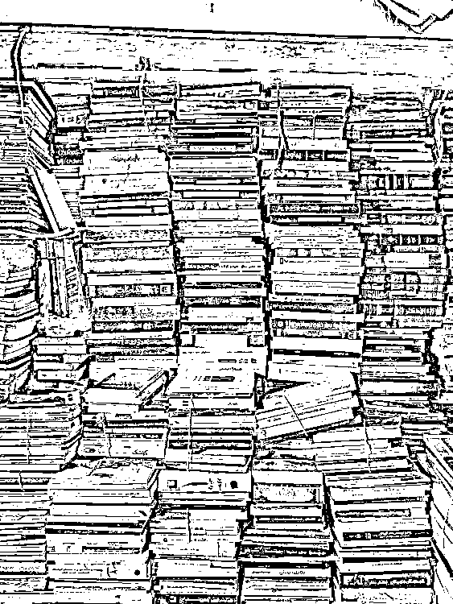

**专注胜于贪多**

**@廖思齐**

占星学浩瀚且复杂，仅在此分享一些学习经验，供参考：

**· 元素、模式、星座、行星、宫位、相位等是学习的重中之重，必须做到熟练掌握，**至少对各自正反面 3-5 个核心关键词的记忆能达到脱口而出的程度，之后的一切技法大多建立在这些占星学基础语言上。

**· **从学习策略上，我现在倾向于**先认准一个课程的老师（含助教）的教授，跟进度从头到尾先系统学习一次，之后有需要再结合其他占星大师/名家的著作学习**。

我最开始对某一知识点会同时参考多个不同的教材书目来归纳学习（如学习星座时同时归纳苏汤课程，《内在的天空》、《当代占星研究》、《内在的宇宙》、《占星全书》等内容），导致进度非常慢，严重影响学习兴致和热情，着实走了不少弯路，希望往后的学弟学妹注意。

**· 边学可边结合自己星图相应位置对照查看，一路走来可能会有很多新发现。**如学到金牛座的时候，立刻观察自己有哪些行星落入/守护金牛座，金牛座落在哪个宫位（四轴），自己的生活习惯、思维模式有哪方面呈现金牛座特质。

学到行进时，可以回忆自己出生到现在经历过的一些大事件（比如第一次恋爱、分手、升职、离职等）再查看同时间点的行进星图，看看有没呼应的地方。理论结合实践更容易加深理解和记忆。

**· **由于占星知识点比较博杂，可**建立自己的电子笔记本（我用 excel）作归纳总结**，可放在手机里方便随时查看。

**· **就我个人而言，认真研究透一个身边人的星图，比粗略零散看 10 个名人星图，似乎对学习掌握知识点帮助更大。

**版权声明**：原创文章由作者授权发布于若道平台，欢迎转发，反对抄袭。友号转载请申请白名单。

**拥有****51 年****占星实践经验的****若道创始人****前 ISAR 全球副主席****前 ISAR 全球职业占星师资质认证主席****大卫·瑞雷**

**和**

**2019 年第二届、2021 年第三届核心课中**

**与苏·汤普金斯老师****联合授课****的**

**ISAR 认证职业占星师**

**咔咔（Caroline）**

**二人合力打造**

**2022 年 ****若道全新核心占星课程**

**点击下图了解课程信息********20 位来自世界各地的占星师****带来 19 场沙龙——新世界的觉醒****详情可点击下图**

**学习占星学****点击下图了解课程详情**

**微信又双叒叕改版啦，不想错过若道君的推送？**

**就把若道设为星标吧！**

**▼**

**喜欢记得点一下在看哦☟**

**报名直达入口**

# ISAR 选修课 | 大国命运：经世占星学 3 天线上工作坊

> 原文：[`mp.weixin.qq.com/s?__biz=MzA5NjA0NTAxNg==&mid=2651475531&idx=2&sn=7235a491ea3bee298c7222655bef2dc1&chksm=8b48fcfcbc3f75ea9f96e6c20ca0eb2965ac18a47523230d4b4f93eb5174c29454bc17926f99&scene=126&sessionid=1692737806#rd`](http://mp.weixin.qq.com/s?__biz=MzA5NjA0NTAxNg==&mid=2651475531&idx=2&sn=7235a491ea3bee298c7222655bef2dc1&chksm=8b48fcfcbc3f75ea9f96e6c20ca0eb2965ac18a47523230d4b4f93eb5174c29454bc17926f99&scene=126&sessionid=1692737806#rd)

<mpvideosnap class="js_uneditable custom_select_card channels_iframe videosnap_video_iframe" data-pluginname="videosnap" data-id="export/UzFfAgtgekIEAQAAAAAAfGQB6vQCmQAAAAstQy6ubaLX4KHWvLEZgBPEioJES3BsLK2DzNPgMIsb3nmx3ZXbJKLT1wm45TIu" data-url="https://findermp.video.qq.com/251/20304/stodownload?encfilekey=S7s6ianIic0ia4PicKJSfB8EjyjpQibPUAXolorph7kXX0G2V8DGSvfR9PkwwbPmosvYicRybibaBiaVv5A38Bc5Re8nsYStXZD7nqrhjvCib7Z8iaC9vlXIpibAjFAuw&amp;adaptivelytrans=0&amp;bizid=1023&amp;dotrans=0&amp;hy=SH&amp;idx=1&amp;m=&amp;scene=0&amp;token=AxricY7RBHdWxX5EuW79OcFLEojiajUVbfrb10projcwzwun3SBUDgOHcwIaMibQEFyWZc9dNWComE" data-headimgurl="http://wx.qlogo.cn/finderhead/PiajxSqBRaEJYnVsqWfEX9qA0sI6hNVKsDfyzfPZ92WZMZyBpZWU5NA/0" data-username="v2_060000231003b20faec8c4e68a1ec2d4ca07e434b07755bbf47e7053a3059defd2c9d6c68a20@finder" data-nickname="若道" data-desc="#ISAR 选修课 经世占星学是什么？会教授哪些知识内容？8 月经世占星工作坊，来提前了解一下" data-nonceid="3653579416430381618" data-type="video" data-width="640" data-height="368"></mpvideosnap>

有一些岁月经历的人，会非常清晰地看到，我们每个人的命运都和国家的命运紧密联系在一起。

以俄国人为例，不论每个俄国人有什么样不同的个人星图，31 年前的苏联解体，今年发生的乌俄战争这样重大的事件，毫无疑问影响了俄国 2 代人的命运。而在一些关键时间点个人的选择，毫无疑问，又影响了个人的生命历程。

而只要你关注世界局势，你也会看到，这样的一个国家发生的重大事件又会对其他国家的各个方面发生重要影响。

我们的命运、我们所获得的事业的发展机会、我们的财富机会都是和整个时代和国家息息相关。

**因此，一个好的占星师必须要懂得时代的声音，必须要洞悉全球的趋势，必须要懂得国家的故事。**

在这个工作坊中，我们将学习**如何专注于能够理解世界大事并对它们做出准确的预测。**这将带领我们踏上**一段重要的行星周期之旅，并延伸到重要国家和世界领导人的星图。**现在正是学习的好时机！

2020 年 12 月，木星与土星合相，这是 800 年来这两颗行星首次在水瓶座合相，预示着地球以及政治和社会趋势将发生巨大变化。我们正在进入一个令人兴奋的奇境，非常适合探索经世占星学。

邓肯老师说：

****

**学习经世占星学，我们可以依靠占星师们过去使用一些技法所做的预测，我们将在这个工作坊中进行探索。**

**比如：占星师迈克尔·贝金特在 1982 年，苏联解体事件发生 7 年前，就对苏联做出如下预测：**

**“从 1989 年 1 月到 1991 年 11 月……在领导和统治风格方面……国家将进行一些基本的重组。这一时期将预示着一些新的革命……严密的控制结构将失败，国家将崩溃，重新回到过去的众多自治国家。”**

**而占星师罗伯特·佐勒在世贸中心遭到袭击前一年的 2000 年写道：**

****“从 9 月份开始，我们西方正进入一个危险加剧的时期……尤其是在东海岸……这将招致乌萨马·本·拉登等冒险家的劫掠……这是一个警钟……2001 年 9 月第一次大危机袭击美国之后，我们将再也回不到从前了。”****

**在 2020 年美国大选前 6 个月，我也写了一篇文章：**

****“他（唐纳德·特朗普）将战斗到底，美国的街道将成为战场，他不会优雅地离去，但在 2021 年，一个新时代开始了，大海将覆盖特朗普总统任期的废墟。”****

出生星图和经世星图都使用相同的基本占星技法，对每一个主题的研究都同时丰富了这两个分支。你从观察世界大事中学到的东西，可以应用到个人客户身上，反之亦然。

**工作坊内容和时间安排**

**8 月 26 日 周五 **

**14:30-15:30**

**1. 基础知识介绍**

-外行星及其在各个星座运行

-外行星周期

-国家星图

-政治领导人星图

-选举星图

-将以上各项按优先级排序

**休息 30 分钟**

**16:00-17:30**

**2. 外行星及其在各个星座运行**

-天王星入座：革命性的变化

-海王星入座：意识的转变

-冥王星入座：危机与重生

**休息 90 分钟**

**19:00-20:30**

**3. 木星-土星的合相周期**

-文明的发展

-水瓶座新电子化时代

**休息 30 分钟**

**21:00-22:00**

**4. 木星与外行星的互动**

-木星-天王星：科技进步

-木星-海王星：媒体的力量；消融，受苦和慈悲

-木星-冥王星：意识形态极端主义

**8 月 27 日周六**

**14:30-15:30**

**5. 了解社会趋势**

-土星-天王星：新的如何取代旧的；科技重组

-土星-海王星：乌托邦梦想破灭；结构消融

-土星-冥王星：独裁与权力瓦解

**休息 30 分钟**

**16:00-17:30**

**6. 长期文明变革**

-天王星-海王星：新世界秩序的梦想

-天王星-冥王星：机械的变革力量；剧变

-海王星-冥王星：意识变化的 492 年周期

**休息 90 分钟**

**19:00-20:30**

**7. 20 世纪地缘政治力量的影响**

-俄罗斯、苏联时代及其衰落

-美国的故事

**休息 30 分钟**

**21:00-22:00**

**8. 中国**

-中国作为全球玩家出现

-科技、领导力和一带一路

**8 月 28 日周日**

**14:30-15:30**

**9. 行星推进的重要性**

-预测选举的结果；特朗普 - 拜登

-预测国家的发展：以色列

-美国：扩张与收缩

**休息 30 分钟**

**16:00-17:30**

**10. 有多张星图的国家**

-英国

-法国

-沙特阿拉伯

**休息 30 分钟**

**19:00-20:30**

**11. 统治者的出生星图**

-普京：克格勃军人，2020 年代的发展

-特朗普：虚假信息之王，获胜者与失败者

**休息 30 分钟**

**21:00-22:00**

**12. 21 世纪的世界发展**

-新时代的人口和气候变化

-独立与全球化

-宗教与科学

-人际关系与游戏

**授课老师**

**艾德里安·罗斯·邓肯（Adrian Ross Duncan）**

**·** 邓肯老师 1971 年在印度游学时开始学习占星学，1985 年开始成为全职占星师，迄今执业已超过 33 年，是人本主义占星学、卜卦占星学和经世占星学领域的知名占星师。

**·** 开发了占星软件 AstroClock 和多款占星报告。

**·** 从 1971 年开始研习佛学，受佛学影响很深，他相信占星学和佛学观点统一、转化的一个基础是在于对现实感知的改变。

**授课方式**

**授课方式：**

**线上网络直播课，英文授课，中文翻译**

**课程价格**

**课程价格：**

**正价：6800 元**

**早鸟价：5800 元**

**早鸟价截止日期：2022 年 8 月 1 日**

负责人：若道-童童

（微信：nodoorDaivd）

**退转课程**

**退款原则请详看《教学协议》，如有疑问请咨询课程顾问。**

****ISAR 选修课 | 大国命运：经世占星学 3 天线上工作坊****

**授课老师：******艾德里安·罗斯·邓肯****

**工作坊时间：2022 年 8 月 26 日-28 日（**周五-**周日）**

**授课方式：******网络授课，英文授课，中文翻译****

**费用：****正价：6800 元****（早鸟价 5800 元，8 月 1 日前）**

**课程负责人：童老师**（微信：nodoorDaivd，请备注“经世工作坊”）

长按二维码添加课程负责人咨询~

****报名直达入口****

# 这个北交点今生的使命就是找对象！

> 原文：[`mp.weixin.qq.com/s?__biz=MzA5NjA0NTAxNg==&mid=2651475531&idx=1&sn=10b7c5c70f0e8b12881a7f95d379acb8&chksm=8b48fcfcbc3f75eab79517fae59d945bd0c942e5ba85ac408aa4cc8ebc6250976b1663a3bac5&scene=126&sessionid=1692737806#rd`](http://mp.weixin.qq.com/s?__biz=MzA5NjA0NTAxNg==&mid=2651475531&idx=1&sn=10b7c5c70f0e8b12881a7f95d379acb8&chksm=8b48fcfcbc3f75eab79517fae59d945bd0c942e5ba85ac408aa4cc8ebc6250976b1663a3bac5&scene=126&sessionid=1692737806#rd)

☆****后台回复“今日”，给你一句生命态度****

作者/简·斯皮勒 译者/李含 校对/江艺编辑/玫瑰 封面/书君 图片/pexels

有一个北交点，今生最大的功课就是从关系中获得他想要的。这就是北交点天秤座。这个星座最需要的就是找到伴侣——哪怕是合作伙伴。一起来看看吧！

**北交点天秤座/第七宫综述**

**发展的特质**

在这些领域的努力有助于解锁隐藏的天赋才华： 

**· **合作**· **交际手腕和策略提高对他人需求的觉知**· **无私：给予支持而不期待回报**· **创造双赢局面**· **分享**· **透过别人的眼睛看事情**· **传达自我认同

**要放下的倾向**

努力减少这些倾向的影响有助于让生活更轻松、更愉快 

**· **冲动**· **欠考虑的自作主张**· **没有意识到他人对支持的需求**· **以自我为中心**· **自私**· **缺乏对金钱的正确判断**· **期待别人像自己一样

**·** 漠不关心别人如何看待自己

**· **抗拒妥协

**· **愤怒的爆发

**· **过分关注生存

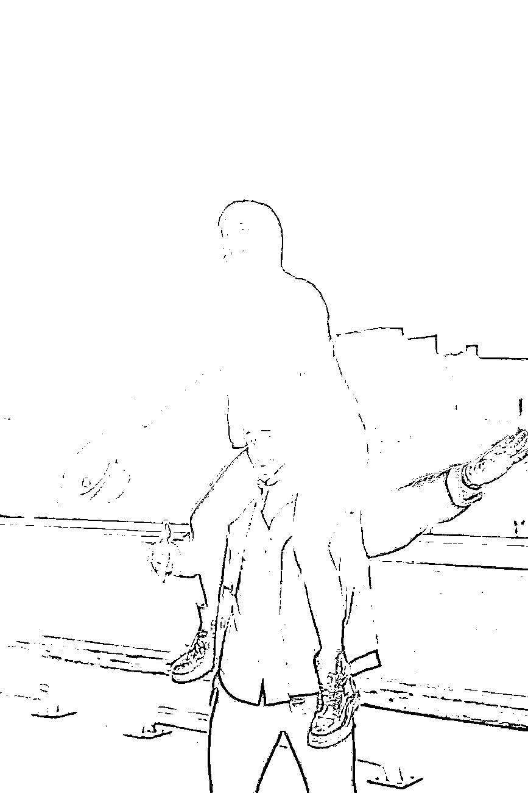

**阿喀琉斯之踵/避免的陷阱/底线**

**天秤座北交点的人需要意识到的致命弱点是自私（“我的生存首先取决于照顾自己，其他人应该确保我的需求得到满足，忽视其他人的关切？）。**但这是一个无底洞：如果他们觉得其他人必须不断地满足他们的需求，以使他们感到安全和联结，他们会发现**自己总是需要更多的关注和精力，只是为了感觉良好。****他们需要找到能够为之付出的伴侣，这些伴侣会感到活力十足，所以会自然而然地用感激之情斟满北交点天秤座人的杯子。**满足感在于**与那些看到他们真实的样子，欣赏他们，并愿意回馈他们的人建立关系。****他们需要避免的陷阱是无休止地寻求独立（“如果我能够自给自足，我就有信心成功地与他人相处，我就不会感到如此孤独”）。**生活告诉天秤座北交点的人，成就和独立并不能让他们感到完整。最重要的是他们**永远不会有足够强烈的自我意识来成为团队的一部分。**在某种程度上，他们需要**冒着失去自己的风险去支持另一个人**。具有讽刺意味的是，**一旦他们开始无私地支持别人，就开始感受到真实自我散发出的喜悦和荣耀。**

**这些人真正的诉求**

这些人真正想要的是**做他们自己，成为关注的中心，在不同的生活环境中发现自己，并接收到自己周遭的人提供的能量。**要做到这一点，北交点天秤座的人需要**把注意力从他们自己身上转移开，发现那些被他们吸引的人的本性。**一旦辨别出哪些人真正欣赏并想要支持他们，开始给这些人注入能量，回馈给他们的能量将创造他们想要的局面。

**天赋/职业**

**这些人是出色的顾问、外交家和和平缔造者。**他们有一种天赋，能够**清楚地看到并以一种促进相互理解和公平、和谐妥协的方式成功地将 A 的特性和担忧传达给其他人（反之亦然）。**北交点天秤座的人还**擅长美和艺术的领域**，如果他们的目标是**鼓舞、激励观众和给观众带来信心**时，他们会成为**伟大的表演者或公共演说家。**他们才华横溢，在任何**需要辅助角色**的职业中，无论是物质层面还是个人层面都能取得成功。**天秤座北交点的人天生就有独立和领导的天赋，因为他们意识到自己是独立的个体。**当他们**把前世的自信天赋作为建立和平和帮助他人声张正义的工具时，他们与生俱来的能力会创造积极的结果。**然而，如果旨在追求自己独立性的职业为目标，他们可能会变得不满，并感到自己从未实现过自己的目标。**当天秤座北交点的人利用强烈的自我认同感来支持他人时，会获得一种内在的满足感和完成感。**

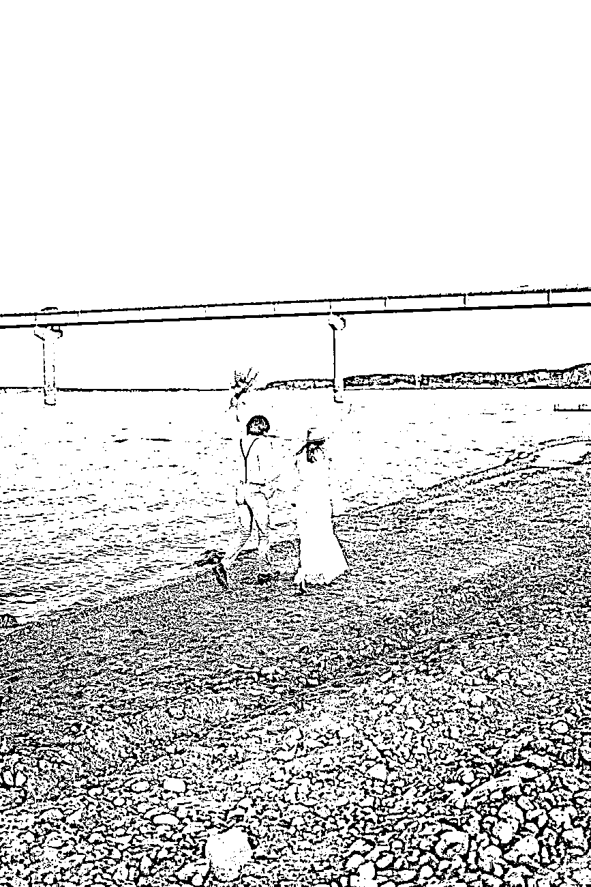

**天秤座北交点特定的疗愈誓言**

**· **“当我专注于支持他人时，我会感到自信。”**· **“当我成功地激发了别人的自信时，我们都赢了。”**· **“当团队成功的时候，我就赢了。”**· **“当我与他人分享时，我会拥有更多。”**北交点天秤座/第七宫的个性**

**个性**

**战士特质****经历数世的个人成就、自给自足和独立行动会使他们意识不到团队的努力和伙伴关系。**天秤座北交点的人在许多前世中扮演了**战士**的角色。战场上的战士，不关心别人，只关心活命杀敌。哪怕是扫一眼战友，他的身体也能被毁掉。因此，**他的整个意识都以自己为目标：他的身体，他的战斗能力，他的生存地位。****这些人现在有一种夸张的生存冲动和“我与你对立”的心态。**这就是他们所知的全部。他们**有竞争意识、目标导向和战术意识，总是意识到他们将如何被他们所做的事情或正在发生的事情所影响。**他们渴望和别人在一起，渴望去爱别人，渴望被爱，但他们不知道如何去做。他们害怕放松对自我意识的强烈控制，因为他们害怕“战斗”随时可能开始，他们必须坚强，必须保持戒备才能生存。但是这些人需要认识到这不是一个战士的一生。**没有人想要摧毁他们或者夺走他们的东西。**他们需要注意到，到处都有伙伴。他们这一生的任务就是**帮助别人赢得战斗，而在帮助别人的过程中，天秤座北交点的人赢得了胜利。**在所有那些作为战士的人生转世中，这些人失去了与爱的联系，失去了与他人一起工作的能力。因此，他们在这一生中对合作和与他人相处感到尴尬。但是他们不应该担心，因为整个星图都是为了重新建立与人的联系。只要清楚自己的方向，旧习惯就不会妨碍他们。事实上，对他们来说，这一生都是关于**伙伴关系**的——**他们不会缺少纠正错误的机会，因为婚姻和伙伴关系的机会很容易就会到来。**

**严格的纪律**

由于前世战士的经历，天秤座北交点的人已经形成了一种**“不问任何问题——不废话”**的纪律，这对其他交点群体的人来说是陌生的。他们前世在军队中的生活强调穿着和个人财物的整齐有序，所以这些人进入这一世时**重视他们的环境和生活中的井然有序。****他们对纪律和苛刻的限制有很强的容忍度，他们认为其他人应该愿意忍受同样的惩罚和损失。**他们**很难理解别人不会接受他们愿意承担的、同样的约束和牺牲**——这是破坏他们关系的一个因素。没有任何其他交点群体有同样的能力，**在严格的个人纪律和缺乏的条件下采取建设性行动。**事实上，天秤座北交点人**在逆境中的个人生存挑战中茁壮成长。**这对他们来说是个“高光”！

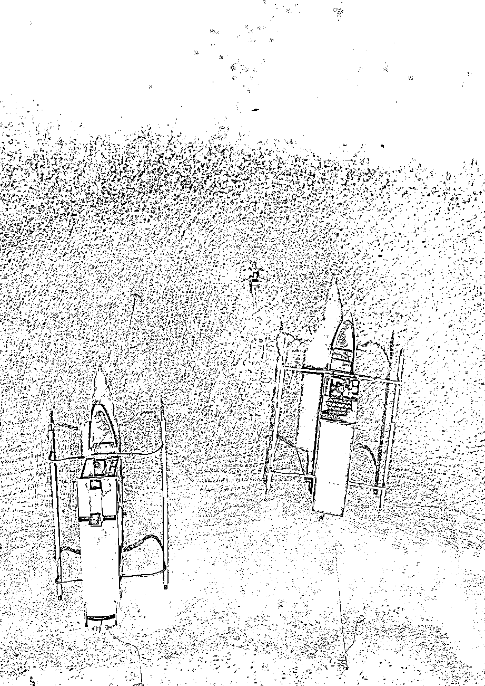

**通过个人牺牲、利用自己的资源、接受考验和取得胜利来努力实现目标的紧张情节给了他们一种个人认同感。****这些人有着强烈的自我意识，**他们想象每个人都和他们一样，潜意识里，他们在寻找和他们一样的人作为他们的伴侣。当另一个人没有表现出同样的品质时，他们可能会变得非常沮丧，并感到被欺骗。天秤座北交点的人们在这一生中学到的一课就是**个体差异之美。**他们是谁，他们在一段关系中能提供什么，可能与另一个人有很大的不同。挑战在于要**注意个体差异，并欣赏其他人给这段关系注入的力量。**要做到这一点，他们首先必须**重新审视自己对力量的定义。**由于在战士模式经历了数世轮回，他们对力量的定义通常只包括：**勇气、非常努力、牺牲和忍受损失的意愿、百分百以目标为导向、坚持立即取得成果、纪律、冲动的主动性（英雄心态）、高能量模式和愿意承担个人风险。**然而，伴侣可能会将这些人没有的其他优势带入他们的生活。这些能力包括：**· 欣赏实现目标的过程**（这可以减缓天秤座北交点人的速度，让他们更有持久力）；
**· 沟通技巧**（能够创造和谐与理解）；
**· 同理心**（这能让天秤座北交点的人最终找到自己的归属感）；
**· 趣味性**（可以让达成目标的过程变得愉快）；
**· 分析能力和处理细节的能力**；
**· 交际手腕**；
**· 对他人需求的敏感度**；
**· 创造协同效应的能力**（这可以极大地增强双方的能力）；
**· 冒险意识**；
**· 管理技巧**；
**· 创造力和创造性**；**· 还有同情心**（可以治愈天秤座北交点的人）。在这一世，天秤座北交点的人需**要与他人合作获得成功与满足**。为了获得伙伴关系的福利，他们面临的挑战是**如何欣赏他人与自己的不同之处。**

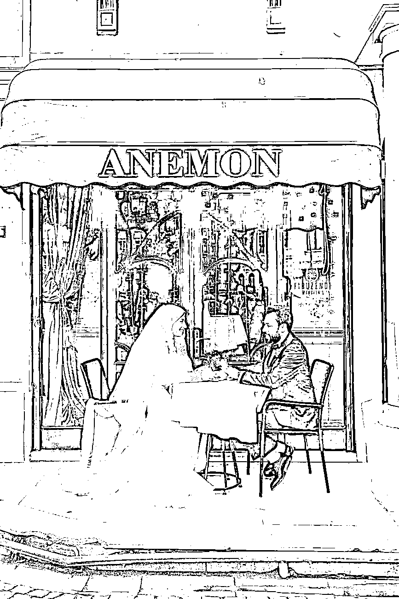

**北交点天秤座/第七宫的需求**

**承认**

**天秤座北交点的人渴望得到认可，想要融入对方的能量场。**当别人给予他们爱的“营养”时，他们会感到放松和快乐。这是一个有效的需求：在这一世中，**来自他人的爱会给予他们所需的精神平衡。**问题是他们用什么方法来吸引别人的关注和能量。为此，他们可能会**陷入竞争，争强好胜，并在不征求他人意见的情况下采取主动。**他们卖弄自己，努力让自己看起来漂亮，以吸引他们迫切需要的关注和爱的能量。因为他们渴望成为聚光灯下的焦点，当其他人在谈话时，这些人**经常会说一些关于他们自己的话，这样注意力就会回到他们身上。****他们并不真正关注对方——只关注自己对爱和认可的需求。**这些需求还可能导致天秤座北交点的人**在合作有利于他们自己的情况下更好胜。**解决办法在于**将他们的关注点从让自己看起来好，转移到让别人感觉好。**当这些人**接收并考虑到他们伴侣的感受时，他们将知道如何以伴侣可以接受的方式进一步实现共同目标。****如果天秤座北交点的人帮助周围的人获得快乐，他们会自动感受到良好的振动。**他们不必从别人那里“汲取”这种能量；接纳、爱和认可会自动流向他们。这是保持敏感并尽其所能让他人快乐的自然过程的一部分。这些人所需要的能量，就是**当他们认可他人做自己时所感受到的能量。**

**对关系的信心**

**由于前世缺乏合作和分享的经验，这些人可能会对人际关系缺乏信心。**此外，他们往往会因为**把太多精力放在自我身上而削弱自己的自信**。例如，如果在一段关系中存在**误会**，天秤座北交点倾向于**立即关注于自己受伤的感觉或者自己做错了什么，而不是去了解对方的想法和感受**。他们从来**不会超越自己的思维模式去确定对方的情况，这会削弱他们对这段关系的信心。****他们可能会认为对方不喜欢自己的某些方面，最终感觉自己“不被接受”。**或者，他们可能会**对他们的伴侣做出苛刻的评判，这让他们认为世界上他们可以建立关系的人很少。****天秤座北交点的人实际上拥有极丰富的自信，但是他们在社交层面上与之失联，直到他们开始分享它。**通过**专注于如何帮助他人感到更自信，他们也会感到更自信。**对于这些人来说，**拥有“处理”关系的能力实际上是一种难以置信的天赋，但他们并不知道自己拥有这种天赋**。当感情关系似乎没有结果的时候，他们会变得**沮丧**。他们想要的并不是不合适，只是他们的方法“不正确”。他们中知道如何“处理”人际关系的那部分，就像一个内部的房间，在那里，他们拥有创造成功人际关系的绝佳工具——但他们必须记得打开门！

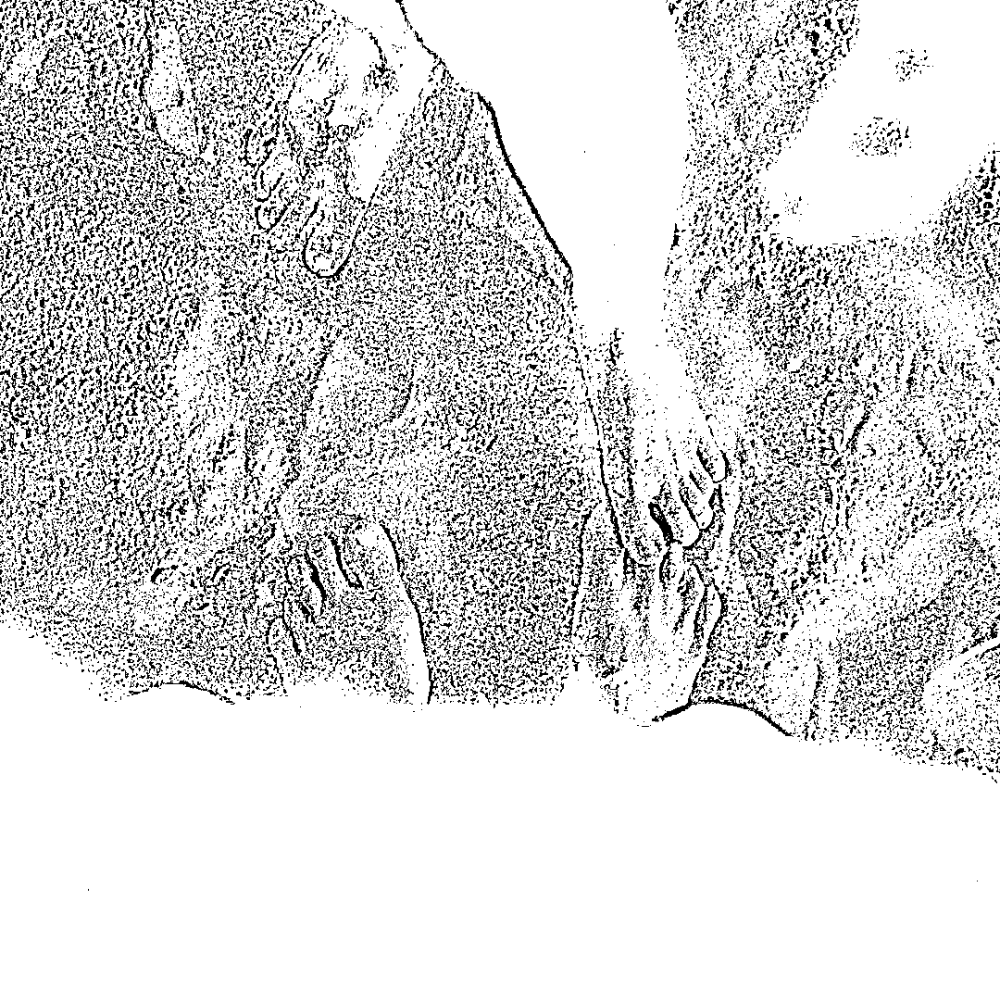

**支持他人**

**这些人是真正的“人类促进者”。**例如，约翰尼可能刚刚发明了一种设备，可以将废气排放的污染物从空气中全部清除出去——但他并没有用这种设备做任何事。其他人可能会说：“约翰尼，你应该卖掉你的发明！想想你能挣多少钱——想想你能对保护环境做多大贡献！”但是约翰尼有一百万个拖延的借口：“嗯，现在还不够好。”然后一个天秤座北交点的人出现了，他对约翰尼说了几句话，他说的话让约翰尼开始行动起来。**这些人拥有强大的能力，可以让他人成为勇士——给予他们信心和能量，让他们踏上征程。**但他们**担心其他人会变得依赖他们**。他们不希望别人耗尽他们的精力，他们的想法，或他们的生命力。事实上，**对方会回馈他们，但是接受别人送的礼物是一个挑战。**这需要**谦逊和承认天秤座北交点并不是完全自给自足。**这是学习给予和接受的一部分——成为团队的一员。

**版权声明：**本文由若道翻译发布，欢迎转发，反对抄袭。友号转载请申请白名单。

**简·斯皮勒**

全球占星界的一位领军人物，是美国占星师联盟（AFAN）的教员。她定期在新时代和占星回忆上授课，是畅销书《新月占星学》、《灵魂占星》、《灵性占星学》和《宇宙之爱》的作者。

**20 位来自世界各地的占星师****带来 19 场沙龙——新世界的觉醒****详情可点击下图**

**学习占星学****点击下图了解课程详情**

**微信又双叒叕改版啦，不想错过若道君的推送？**

**就把若道设为星标吧！**

**▼**

**喜欢记得点一下在看哦☟**

**报名直达入口**

# 若道周运 6.6-6.12 丨混乱结束，找回生活秩序吧！（内含 12 星座运势）

> 原文：[`mp.weixin.qq.com/s?__biz=MzA5NjA0NTAxNg==&mid=2651475341&idx=1&sn=e20610876448eeead64d54666480aa13&chksm=8b48ff3abc3f762c192b35f7913d1c3486b6c11997872aaba263f4a920c4d5d1abd13fcba2de&scene=126&sessionid=1692737806#rd`](http://mp.weixin.qq.com/s?__biz=MzA5NjA0NTAxNg==&mid=2651475341&idx=1&sn=e20610876448eeead64d54666480aa13&chksm=8b48ff3abc3f762c192b35f7913d1c3486b6c11997872aaba263f4a920c4d5d1abd13fcba2de&scene=126&sessionid=1692737806#rd)

******☆ ****后台回复“今日”，给你一句生命态度******

作者/苏黎 ISAR 认证占星师
编辑/翀子 封面/书君 图片/网络六月第二周是承上启下的过渡期，随着水星顺行和土星逆行的脚步，前一段时间的混乱落下帷幕。12 星座如何借助“宇宙之力”度过本周？让我们来看文章吧！（如果着急看 12 星座运势，不妨先拉到最后哦）**整体氛围**

六月的第二周是一个承上启下的过渡期，**随着水星顺行，土星逆行，五月混乱天象造成我们生活中的意外，小卡壳逐渐结束。**

社会的大环境逐渐消除对各个行业的解封，复工复产是六月的重点基调。当行星从顺行转为逆行，或者从逆行转顺行开始几天，能量很不稳定。我们可以把水星逆行转顺行过程，想象为不小心走错道路的车辆，陷入车流中，在试图回归正轨过程。

**本周前半周就是努力适应混乱的过程，**有关沟通，交流，物流，计划落地的冲突和矛盾都会存在，**后面几天会趋于稳定。**正如各个平台推出的“6·18”的促销活动，乱花渐欲迷人眼，到底哪个才是真正需要的呢？

下周是六月的满月，在逐渐回归生活的过程中，我们只有根据个体的生活节奏、需求，**在土星逆行期间学会反思和规划，建立我们内在的安全感，找回生活的秩序。**

**本周重要天象：**

*   **太阳六分凯龙星**

*   **水星三分冥王星**

*   **金星合相天王星**

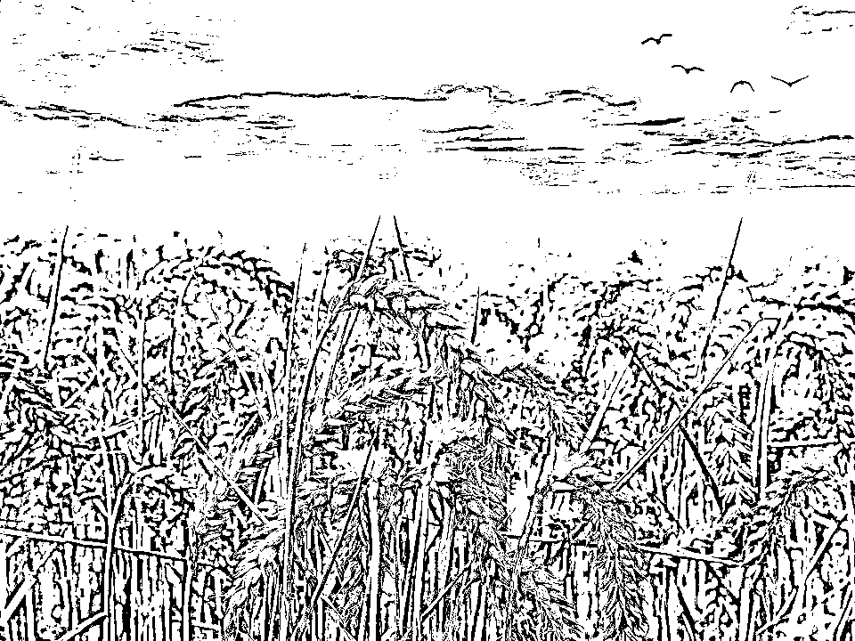

**一周重要天象**

**★****6 月 6 日周一，月亮入处女座，太阳（双子座）六分凯龙星（白羊座）**

周一是上弦月的周期，**月亮在中午更换星座进入处女座**。水星正处于顺行转逆行混乱期，上午的月亮星座仍在狮子座，月亮四分水星，我们需要关注沟通中误解，避免交流中缺乏清晰度，以缓和方式和他人沟通，**学会融通很重要。**

**中午月亮换座进入处女座**，处女座的月亮会让我们更关注工作和计划执行中的细节，学会归纳分类整理，避免挑刺和对他人过度严苛。

**太阳六分凯龙星，**这是探索和处理创伤，疗愈的最好时机，高昂的意志和目标会帮助人们转换内心的伤痛，走出过去的阴影。

凯龙星落入白羊座，与“我是谁”的议题有关，内在天赋和力量无法被看到，对个体存在这个世界有一种不信任感。**如果我们学会善用凯龙星的能量，将理解他人，沟通作为目标，我们就会洞悉事情的真相，理解他人的难处，情绪上也更圆融。**

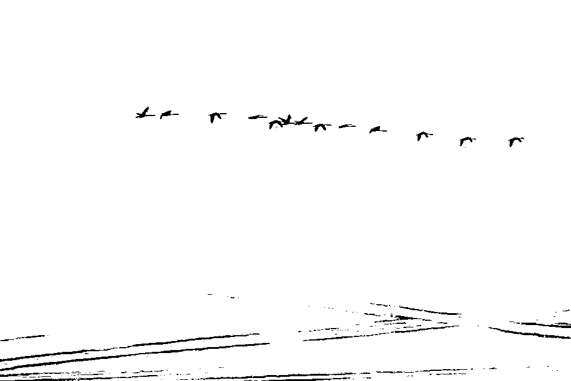

**★****6 月 11 日，周六，水星（金牛座）三分冥王星（摩羯座）**

上半周，水星逐渐适应顺行转逆行状态后，**下半周逐渐进入稳定状态。**从 4 月 28 日至今，水星和冥王星形成了三次这个相位。水冥的三分相和探索到的真相有关，将会帮助我们逐渐了解过去发生的事件真相。

真相永远不会是让人舒服的，接纳犀利的真实现象，会让人不陷入虚幻，对事物会保持更高专注力。学习的目的是什么？是为了满足他人的期待和需求吗？是为了变现需求还是真正的热爱？

水冥三分相，就是让我们学习**不流于表面的探索事物，更有深度的理解事物的核心价值**。水星逆行期间的迷茫，对某些事物的无明会有深刻的洞见和理解，跳出思维的卡顿，帮助自己或他人的蜕变。

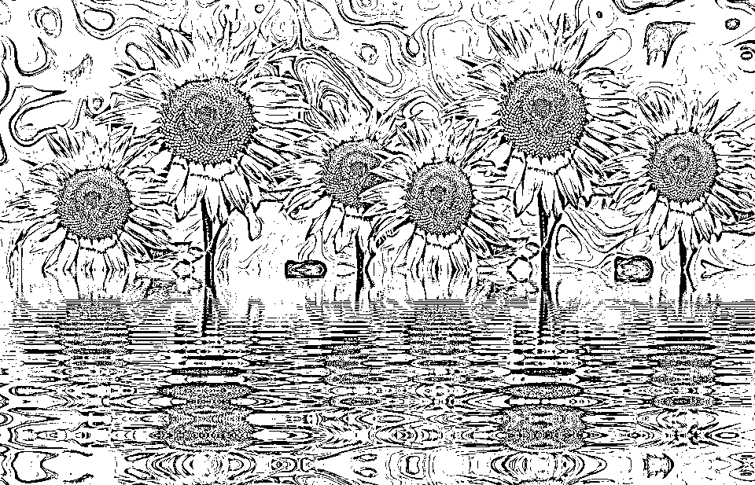

**★****6 月 12 日，周日，金星（金牛座）合相天王星，月亮对分北交点**

金星和天王星的组合，呈现出惊喜的周末、意外的关系、一见钟情的刹那、意外的开销、美好的惊喜等。你可能在社交关系中，意外认识一些新朋友，愉悦的关系让你享受自由的空间和休闲时间。

周末的社交活动会让人兴奋，刺激，感受到人际关系吸引力。享受快乐当下更重要，即使当下是闪电般触碰，但这种关系并不稳定，稳定和持久的关系需要彼此尊重各自价值感，需要一些时间和观察。

月亮在天蝎座行进中，即将还有两天就是满月，当下是盈凸的月相周期，并且月亮对分北交点。

这不是一个轻松的时刻，虽然金星合相天王星的组合让我们看到惊喜、愉悦、意外，但也在关系的沟通中看到恐惧和担心。

金星天王星的组合是电光火石刹那间，但月亮在天蝎座更关注私密关系，与信任的人分享最深的情感。盈凸月相就是通过和他人的互动，理解自我、帮助他人，分享和传播。

当进入内在心理阴影的探索时，我们才会和他人建立稳定、信任、有安全感的关系。

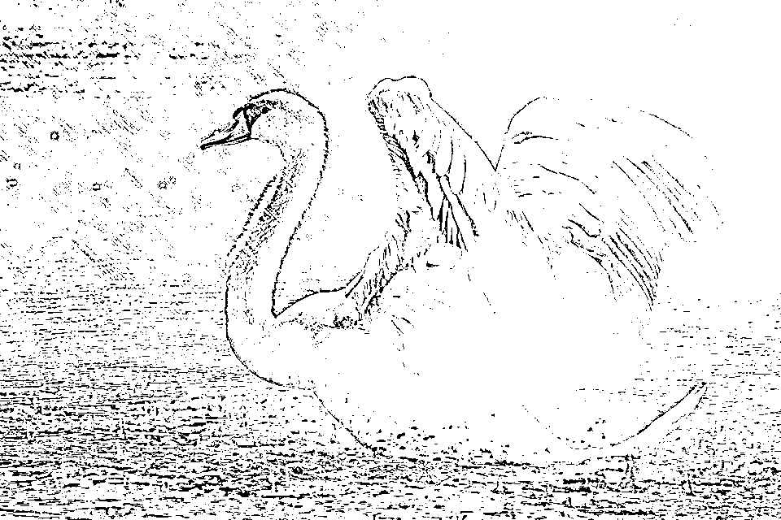

**12 星座的一周运势**

**（重点参考上升星座，其次参考太阳星座）**

***白羊座***

**水星在你的 2 宫行进中，土星在你的 11 宫行进中。**

你这周是否会感受自己更独立，是否更懂得处理财务问题、对金钱的目标更确定了呢？水星的顺行，你是否找到自己创造物质世界的资源，技能了呢？白羊座花钱消费属于冲动型，请注意财务上的收支平衡。

***金牛座***

喜欢稳定、务实、实际的金牛座，**这周会有一种渴望改变的冲动。**也许前期的事情进展缓慢，或你对未来的想法很多，顺行的水星让你反思到底哪条道路才是自己内在的渴望。

周末的金星与天王星的组合，也许生活中某个人的出现，给你新鲜感，带给你新的冒险。不用快速做决定，通过关系让你发现自己潜力和天赋，为将来实现愿望和梦想腾出思考空间和时间。

***双子座***

当你的守护星水星在上周转向顺行时，你的直觉会更可靠，困惑会逐渐消散。**这是你了解自己最佳时机，**通过和家人的沟通、了解家族的故事，让你明白自己经历过的困难，对未来做更好的抉择。

本周也许有一些诱人的机会出现，很符合双子座天生喜欢冒险的特质。保持冷静的头脑，克制，抵制冲动。

***巨蟹座***

新月或满月前期，巨蟹座是最容易敏感的族群，当他们渴望和期待的梦想落空，容易产生忧虑，感到自己被伤害。**土星在你的第 8 宫逆行，**你可能对某些人，事情感到疑惑，对自己的决定产生质疑或自责。

本周末社交活动增加，参与某些朋友的聚会可能认识新朋友，可能聚会中的某个人让你产生兴趣。享受欢乐时光。下周就是满月，巨蟹座的心情容易反复，起伏不定，健康的友谊和社交关系有助你心情振作起来。

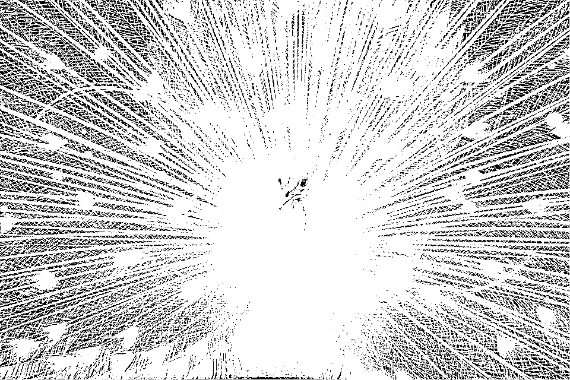

***狮子座***

上周顺行的水星、逆行的土星，让你在本周对事业、情感的思考更清晰。不是所有人都理解你，迎接工作机会时候，注意避免锋芒毕露招致小人，**通过做一些实在的事情赢得他人对你的真实看法。**

事业中也许有一些意外的机会，但你不一定意识到这个机会对自己的意义，跟随自己直觉做决定。你是听从内在第六感，还是听从他人的意见呢？

***处女座***

你将学会充分利用时间赢得自己喜欢的事物，学习新技能，积极展现自己的能力和天赋。

顺行的水星，你会渴望通过逻辑思考，与他人分享你的观点。你会意识到个人生活某些地方发生了改变，你在努力适应中不要执着结果，**带着诚实、敞开的心去体会，感受生命给到你的心灵的触动和启迪。**你的分享，他人不一定会接受。

***天秤座***

你习惯对外表现出天秤座的礼貌、公平、克制和冷静，**但本月工作关系、个人情感相关的问题、前期抑制的问题会浮出水面。**

失去的感情是否需要重新再来？你真正想挽回的情感是否和潜意识的失去有关呢？当金星与天王星合作，这是一个新的突破，你会意识到关系中的信任、阴影、渴望融合的来源是什么，学会享受爱、创造、关系中的真实的自我，不要让逆行的土星影响你的快乐！

***天蝎座***

水星开始顺行，这一周的沟通会如何呢？上半周会有些不适应，但相信你后期在关系的沟通会更顺畅。信任是天蝎座关系的议题，**当土星在你 4 宫逆行，过去原本以为遗忘的创伤会被唤醒，**你可能会与童年经历的记忆抗争。

学会真诚表达自我，学会倾听他人观点，有助于建立健康的关系。周末金星和天王星的组合，你可能会认识更有吸引力的人，享受周末吧！

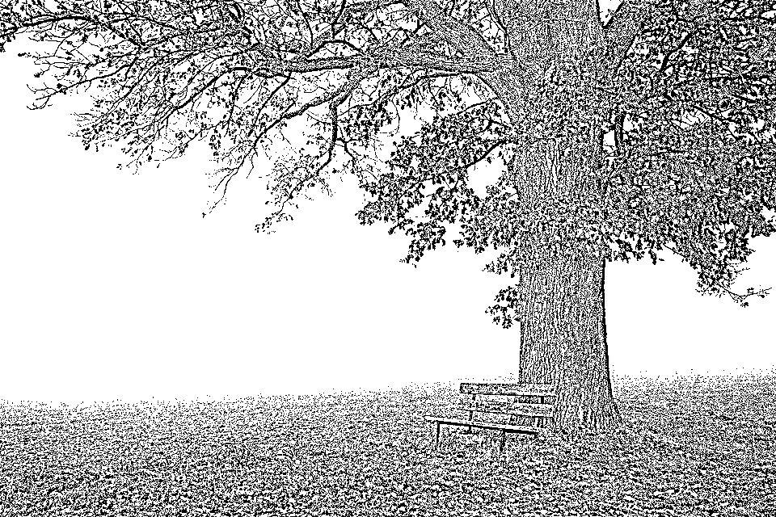

***射手座***

**水星顺行后，对你的健康和运动习惯会有帮助，**也许职场的同事关系也会处理得更顺畅。

本周前几天水星能量还有一些混乱，后面几天会转为平缓，理解工作中每个人思维出发点不一样很重要。想清楚如何表达，相信你的直觉很重要！周末金星和天王星的组合，看看平淡的生活会给到你什么惊喜的礼物呢？

***摩羯座***

**你的创造力在本周开始逐渐发挥出来，**但摩羯座的守护星土星的逆行，会让你质疑很多事情，考虑更多。

有些资源不像你想象的那样可以掌控和使用。但只要保持你的专注力和创造力，你的健康活力状态会逐渐提升好转，并在工作生活中更好的发挥水星的沟通合作能力，职场关系会更好。

***水瓶座***

创造良好人际关系是你六月幸福指数的关键，土星的逆行会让你减缓进程，**保持积极的心态是很重要的，**如果有必要，可以和理解你心声的人寻求帮助和咨询。

金星和天王星的组合，鼓励你的内在心灵学会敞开，家人和志同道合的伙伴有助于丰富你的人际关系，你会发现他人的慷慨，他们向你伸出合作橄榄枝。

***双鱼座***

水星在掌管你沟通、短途旅行、好友的宫位结束了逆行。前半周你似乎还没从混乱中恢复过来，正在逐渐适应，希望喘口气。

土星的逆行，会让你通过内省，坚定自己直觉的力量。学会如何和亲人更好的沟通，**处理好内部问题，**会让你更有效地解决问题。如何找到新的方法，把生活中的难题、任务变成充满乐趣的体验过程吧！

**版权声明**：原创文章由作者授权首发于若道平台发布，欢迎转发，反对抄袭。友号转载请申请白名单。

****

**苏黎（Sulis）**

ISAR 国际认证占星师（2019 年获得）/塔罗咨询师

现代占星融合古典解读

20 多年跨行业领域职场经历

**咨询微信**：liuzq26

**公众号**：Sulis_1975

长按打赏

**20 位来自世界各地的占星师****带来 19 场沙龙——新世界的觉醒****详情可点击下图**

**学习占星学****点击下图了解课程详情**

**微信又双叒叕改版啦，不想错过若道君的推送？**

**就把若道设为星标吧！**

**▼**

**喜欢记得点一下在看哦☟**

**报名直达入口**

# 雷蒙德·梅里曼金融占星周运 | 注意 6 月 11 日左右的市场行情

> 原文：[`mp.weixin.qq.com/s?__biz=MzA5NjA0NTAxNg==&mid=2651475341&idx=2&sn=40e010b0d677408b8e0b3040cb67bcbe&chksm=8b48ff3abc3f762c0b4fc38569cd2777e746f424347f304e7d029c2ef05604f4a42865b79d0b&scene=126&sessionid=1692737806#rd`](http://mp.weixin.qq.com/s?__biz=MzA5NjA0NTAxNg==&mid=2651475341&idx=2&sn=40e010b0d677408b8e0b3040cb67bcbe&chksm=8b48ff3abc3f762c0b4fc38569cd2777e746f424347f304e7d029c2ef05604f4a42865b79d0b&scene=126&sessionid=1692737806#rd)

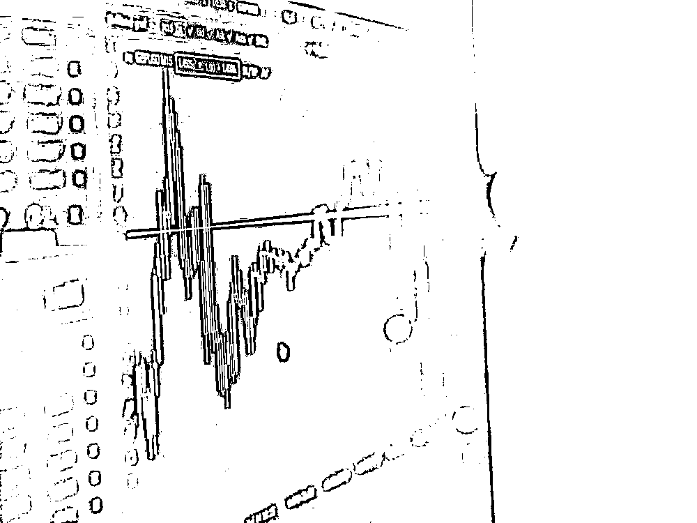

作者/雷蒙德·梅里曼 译者/Luke
编辑/玫瑰 图片/pexels

雷蒙德·梅里曼是在金融占星学界稳坐第一把交椅的占星师，同时他也是若道签约的金融占星课老师，我们引进了雷蒙德·梅里曼老师的《[上证指数月度报告](http://mp.weixin.qq.com/s?__biz=MzA5NjA0NTAxNg==&mid=2651474357&idx=2&sn=1dd70a90e2ea5b1351c8d9eb7342b72e&chksm=8b48fb02bc3f7214b27b2dcbebc7b32be9dab98bee34853299d6dca571248cb279cfdc9322d2&scene=21#wechat_redirect)》及《[黄金报告](http://mp.weixin.qq.com/s?__biz=MzA5NjA0NTAxNg==&mid=2651474357&idx=2&sn=1dd70a90e2ea5b1351c8d9eb7342b72e&chksm=8b48fb02bc3f7214b27b2dcbebc7b32be9dab98bee34853299d6dca571248cb279cfdc9322d2&scene=21#wechat_redirect)》。我们经老师的授权，将每周刊登梅里曼老师的周运，供大家参考和学习。于是，这是本周的周运（6.6-6.10）。

**说明：以下时间采用纽约证券交易所所在地美国东部标准时间。**

**展望与回顾**

****

**尽管存在经济放缓和通货膨胀加速的担忧，美国经济 5 月增加 39 万个就业岗位，好于预期。**

**与此同时，失业率稳定在 3.6%，刚好高于 1969 年 12 月的最低。平均每小时收入比 4 月增加了 0.3%。年度工资同比增长 5.2%，符合预期。**

**——杰夫·考克斯**

**《非农就业 5 月增长 39 万，好于预期》**

**www.cnbc.com**

**6 月 3 日**

**特斯拉首席执行官埃隆·马斯克说，他对经济有一种“超级坏的感觉”，想要裁员 10%。**

**——肯·马丁**

**《马斯克说特斯拉暂停招聘，想要裁员 10%：报告》**

**www.foxbusiness.com**

**2022 年 6 月 3 日**

**摩根大通首席执行官杰米·戴蒙警告称，需要为即将到来的经济“飓风”做好准备。“目前，依然阳光普照。一切都很好。每个人都认为美联储在掌控局势。然而飓风正向我们的方向袭来。**

**我们只是不知道，这是一场小飓风，还是超级风暴。”让戴蒙停下来担忧的，可能不仅仅是持续的通货膨胀外，还有美联储的量化紧缩计划，那包括加息和减少 9 万亿资产负债表。**

**——马修·福克斯**

**《做好准备：杰米·戴蒙为即将到来的经济飓风预警》**

**https://finance.yahoo.com**

**2022 年 6 月 1 日**

伴随着恶作剧者水星结束逆行，火星-木星在白羊座带来的美股涨势于 6 月 3 日戛然而止。6 月 3 日也是土星逆行的前一天。

尽管自 5 月 20 日水星逆行中点创下近期低点以来，股票市场近期有所上涨，但几位知名企业高管（如埃隆·马斯克、杰米·戴蒙）都在警告未来的经济问题。出于这些担忧，市场周五做出了反应。

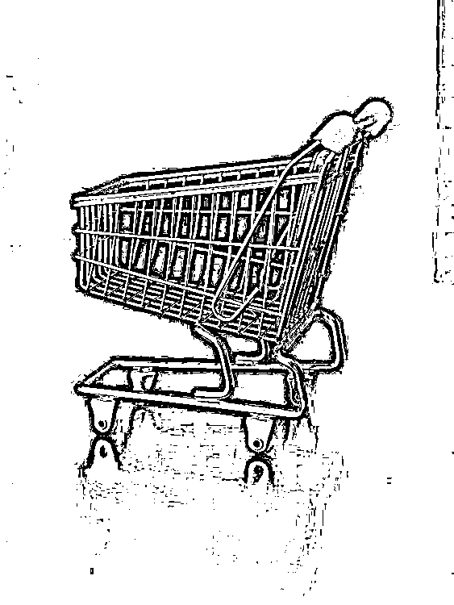

**不过，对于全球股票市场来说，经历了 5 月 29 日火星-木星在白羊座合相带来的剧烈上涨，这还算是不错的一周。**

从火星、木星在白羊座合相激进和冒险的精神，切换到水星和土星 6 月 3-4 日改变运行方向，就好像从超速档切换到停车档。大多数市场暂停下来，进入调整模式，而不是像水星和土星那样反转了方向。水星和土星需要时间思考，才会有下一步行动。

在这个暂停期间，很可能出现一些令人消沉的新闻。土星与“消沉”相关，水星与“新闻”相关。涉及这两颗行星，它们与怀疑和批判的集体心理有关。如果幸运的话，会出现建设性的提议渡过难关。

杰米·戴蒙为如何度过这段时间给出了最一针见血的提议：**做好最坏的准备。并不是说最坏的事情会发生，但如果它发生了，你没有做准备，那就糟糕了，那就感觉像一场飓风一样。**

对于大多数全球股指市场，从 5 月 20 日低点起的上涨于上周初到达顶峰，然后暂停了涨势，开始回撤至周五。水星和土星不仅在改变运行方向，而且两者之间形成了具有挑战性的四分相。周一后才会渐渐出相位。

一些股票市场，尤其亚洲市场（上证综指、日经指数、Nifty 指数）于上周末飙升至数周高点，但大多数仅仅走出了修正性的回撤走势。

其他市场上，黄金和白银正好在日心水星处于射手座尾度期间，上涨到了数周高点，于上周五早上触顶。然后，随着一周的结束，它们反转向下。黄金于 1878.60 触顶，周末在 1853 收盘。

白银飙升至 22.52，但随后遭到抛售，在 21.90 收盘。随着日心水星从射手座进入摩羯座，贵金属常常下跌，正如现在的情况一样。

原油是上周的明星，于周五飙升至 120 美元以上，再一次接近历史高点。

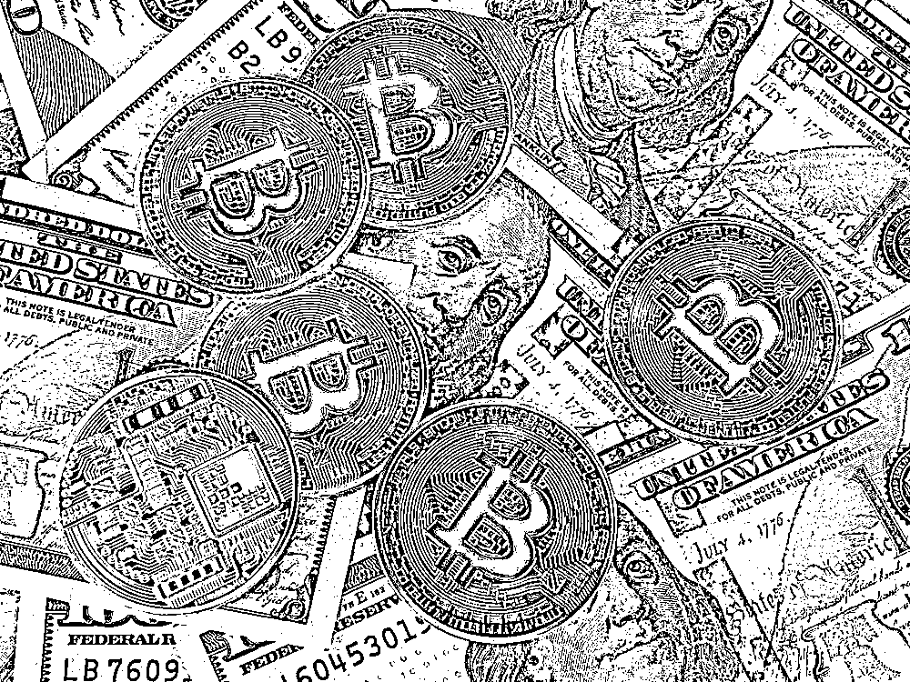

**短期占星趋势和长期考量**

****

**“你更不相信谁？政治家还是亿万富翁？这是一个真正的问题。”埃隆·马斯克，5 月 26 日发了这样一条推特。**

**（340 万受访者参与的调查结果显示，政治家的信任度比亿万富翁低多了，信任双方的比例分别是 75.7%和 24.3%。）**

**——加里·白**

**《人气投票中完胜亚历山德里娅·奥卡西奥-科尔特斯的埃隆·马斯克做出回应》**

**www.theepochtimes.com**

**2022 年 5 月 31 日**

**“我说：‘嘿，你，别碰我的云端。’”**

**——克·贾格尔和基思·理查兹**

**出自《别碰我的云端》**

**伦敦和德卡唱片公司**

**1965 年**

**这周接下来的主要相位是 6 月 11 日，金星和天王星在金牛座合相。**这是一个重要的相位，因为金星掌管金牛座（金钱和货币），天王星掌管数字世界，在目前的情况下，它们和加密货币有关。

这一组合也掌管银行，有趣的是杰米·戴蒙警告了**即将到来的“经济飓风”**。因为天王星也掌管又高又危险的风，比如飓风。它还掌管地震，所以这两种灾难的任何一种，都符合金星和天王星在金牛座合相的描述。

然而，金星和天王星合相也可以对应着爱情中的兴奋，因为金星掌管爱（或新的吸引力）和金钱。在这个季度，它们看起来携手相伴。

回到市场的话题……我们近期对行星-星座的研究显示，比特币市场频繁出现的剧烈反转时期之一，往往对应金星和天王星都在金牛座。也就是当前的从 5 月 28 日到 6 月 22 日。6 月 11 日的合相+/-3 天可能尤为重要。

比特币自 5 月 12 日崩盘至 25390 以来，走势相对平静。上周 5 月 31 日，比特币创下该低点来的最高价 32376，涨幅 27.5%。接下来这两周的加密货币市场，存在赚（或亏）大钱的机会。

“要做的事太多，但是时间不够。”这是水星四分土星的经典表达，尤其当这两颗行星都在改变运行方向。有条理地做事，跟上任务进度很难。把事情拖延到截止日期，可能会造成压力。

但是美国密歇根州伯克利五月花图书公司的占星师罗伯特·蒂博多发现，土星也参与了另一个强有力的行星设置。他注意到土星正处在海王星和冥王星的中点容许度中。随着当前的土星逆行，它会逐渐离开那个位置。

但是当土星转而顺行后（10 月 22 日），它会在 2023 年 1 月准确地落在海王星-冥王星中点处。

尽管难以理解，这可能会加剧与土星在水瓶座（海王星-冥王星中点）相关的挑战，正如[《2022 年金融预报》](http://mp.weixin.qq.com/s?__biz=MzA5NjA0NTAxNg==&mid=2651471782&idx=3&sn=9bf593258b18f05e41b5cd249cdd3a16&chksm=8b488d11bc3f0407bc45215ecb5d6549f25bd505fec12bc160babd12daa3c717f84d69f7d561&scene=21#wechat_redirect)（点击链接可购买）所说，此时土星仍位于与天王星（水瓶座守护星）的四分相容许度中。

书中有一节的标题是《太空探索：谁拥有外太空》。基本信息是，需要建立一个国际机构，确保迅速增长的空间站数量，不会对地球或人类活动造成危险。

鉴于目前水星与土星的四分相，同时两者在改变运行方向，涉及水星解决方案总是沟通。让我们谈话。倾听彼此关注的内容。让我们合作解决问题，而不是做出敌意行为升级紧张局势（土星）。

我们需要定义谁是太空的拥有者，谁有权安置数千颗卫星，让数十亿人依赖于这些卫星生活。如果正确规划和开发这些卫星及其功能，同时全世界相互合作、彼此支持，那将给人类带来巨大的好处。

如果只有科技（水瓶座、天王星）最先进的国家及其国内公司才有权为自己的目的使用外太空，那么和平就是一件不可能的事。如果我们真的要给和平一个机会，那么外太空要么属于每个人，要么谁也不属于。内在的空间和内在的平静也是如此。

**梅里曼市场时机学院与若道将于 2022 年 6 月 23 日 19:00 举办金融市场最新信息中国专场讲座。**这个 2-3 小时的在线讲座（有两次 5 分钟的休息时间）将讨论几个金融市场的前景，包括黄金、原油和上证综指。

这将是特别及时的讲座，因为为期 12 年的木星轨道周期会在 5 月 10 日进入白羊座，并且 6 月-11 月是一年中最有力的地球宇宙征象接连登场的重要时间段，因为土星逆行与天王星形成几乎精准的渐亏四分相。

**说明：以上日期基于纽约证券交易所所在的美国东部标准时间，由于存在时差，中国地区可能需要加一天。**

**版权声明：**本文由若道翻译发布，欢迎转发，反对抄袭。友号转载请申请白名单。

**雷蒙德·梅里曼（Raymond Merriman）**

若道签约老师。著名金融占星师，ISAR（国际占星研究协会）前主席，梅里曼市场分析公司的总裁。他由于“提升了占星学的职业形象”，在 1995 年国际占星大会上被授予轩辕十四奖；在 2012 年国际占星大会上，被授予轩辕十四终身成就奖。

1“中国上证指数月度报告”发售**若道推出了****中文版****的雷蒙德·梅里曼中国上证指数月度报告，并持续发行该报告！**当把金融市场的周期和占星学的周期相结合时，雷蒙德·梅里曼老师的金融占星学研究**为投资者应对金融市场的周期波动，并随之调整投资策略提供了极大的价值参考**。
**6 月中英文报告已上线！**2“黄金价格周期月度报告”发售**若道推出****中文版****的雷蒙德·梅里曼黄金价格周期月度报告！**不仅仅为广大读者在中国股市的投资出谋划策，更将视角放眼黄金市场。**每当世界经济形式不明朗的时候，有一个地方是保值的港湾，那就是****黄金**。自 1982 年雷蒙德·梅里曼出版第一本研究《地球宇宙学征象与黄金价格的关联》的著作以来，**他一直作为最重要的黄金市场时机预测者之一享誉国际**。2022 年 6 月黄金报告已上线，梅里曼老师将会告诉你他对这个关键时期如何操作的想法。也可以按照季度和一年期订阅，有更多优惠。季度和年度的好处是，你可以持续了解梅里曼老师对于不断在变化的市场的看法。即便他某一次看法和市场不一致，你也看到在下一期他如何调整自己的看法，并看到金融占星在一个长期时间段内对你把控风险的帮助。而能够长期控制风险、尽量找到安全的投资时机才是投资的长久之计。**6 月中英文报告已上线！****购买套餐**，买得越多越优惠中国上证指数月度报告套餐价

*   **单月报告**：280 元
*   **3 个月套餐**：780 元（260 元/月）
*   **12 个月套餐价**：2400 元（200 元/月）

**长按下图识别二维码****购买金融报告****套餐****▼**

黄金周期月度报告优惠

*   **双报告年度套餐更优惠（直降 900 元）**

*   **12 个月黄金报告+12 个月上证指数报告：仅需 3900 元**

**长按下图识别二维码购买黄金报告套餐**▼

3《2022 年金融预报和沙龙》1976 年以来，由雷蒙德·A·梅里曼撰写的梅里曼市场时机学院每年一次的年度预报沙龙和每年一本的《年度预报》一直在应用占星学原理为投资者们服务，提供卓越洞见，从未间断。 **雷蒙德·梅里曼《2022 年金融预报和沙龙》发售中（报告已发布）。****长按下图识别二维码了解详情**
▼

4《2022 下半年金融占星投资沙龙》这将是特别及时的讲座，因为为期 12 年的木星轨道周期会在 5 月 10 日进入白羊座，并且 6 月-11 月是一年中最有力的地球宇宙征象接连登场的重要时间段，因为土星逆行与天王星形成几乎精准的渐亏四分相。

**长按下图识别二维码了解详情**

▼

**点击阅读原文购买金融报告**

# 上证还有投资机会吗？ | 6 月 23 日梅里曼 2022 下半年金融占星投资沙龙

> 原文：[`mp.weixin.qq.com/s?__biz=MzA5NjA0NTAxNg==&mid=2651475341&idx=3&sn=46127d575aa3cf8a96b9a628b7e5bfc0&chksm=8b48ff3abc3f762cc181bc72b6d504f2d7f063718cc5bb2b8ed8488a8538de65bb0256897fa7&scene=126&sessionid=1692737806#rd`](http://mp.weixin.qq.com/s?__biz=MzA5NjA0NTAxNg==&mid=2651475341&idx=3&sn=46127d575aa3cf8a96b9a628b7e5bfc0&chksm=8b48ff3abc3f762cc181bc72b6d504f2d7f063718cc5bb2b8ed8488a8538de65bb0256897fa7&scene=126&sessionid=1692737806#rd)

上周的沙龙内容发出之后，50 个早鸟价很快就被抢购一空，现在还有转发优惠价，可以添加工作人员进行咨询。

**长按下方二维码添加李老师**

**添加备注：金融沙龙**

好了，以下是如此火爆的沙龙具体内容：

2022 年转眼已经过了 5 个月。你的投资还好吗？

| **上证日线**

| **上证周线**

| **黄金日线**

今年上半年最重要的天象——木海合相没有带来我们希望的上涨，而是带来了歇斯底里的下跌。在 5 个月内，上证从 3651 一直跌到最低 2863 点，跌幅达 21.6%，很多股票也都有更大跌幅。对黄金而言，在 3 月份达到 2078 的高点之后，也开始一轮下跌。上证的走势尤其值得关注。因为这样的下跌，许多公司的股价已经变得非常便宜。当然，目前因为动态清零抗疫方针，中国经济也面临着前所未有的困难，这些困难毫无疑问体现在上证及公司股价中。当 2022 年年度预报沙龙在 3 月举办的时候，当时上证指数已经在熊市的通道中，很多市场人士都比较悲观。而梅里曼老师说，如果上证有 5.5 年的周期，而这个周期分为两个 33 个月的半周期，按照 26-40 月的范围而言，这个周期低点应于 2022 年 3 月-2022 年 5 月出现，当时 3 月份已经是第 38 个月，周期而言相当晚了，因此他对于市场还是比较乐观。然而，我们看到市场 3 月份后并没有止住下跌，在木海合相期间开始更猛烈下跌。根据周期理论，4 月底已经进入第 40 月了，到这个范围的尽头，而市场开始反弹。而对于梅里曼老师给出的“33 个月周期低点的价格目标是 2633-3150、2973+/-87 和 3047+/-81”而言，2863 点也到了相对低的低点。在 2021 年，土星和天王星出现 3 次四分相时，上证指数都到了当时市场的高点，在今年下半年，土星和天王星还会再出现一次非常接近的四分相。

**下半年，上证会出现有力的反弹吗？或是梅里曼老师对市场的看法与年初相比有什么改变？****在沙龙中，除了上证外，梅里曼老师也会讲到其他金融投资市场。****下半年的投资该如何把握？我们特意邀请雷蒙德·梅里曼老师在 6 月 23 日 19:00 为大家带来 2022 年半年度金融沙龙。**这场在线沙龙将提探讨这些长期行星周期如何影响世界经济的长期周期和趋势，特别是如何影响上证综指和黄金市场，并描述在 2022 年剩下的时间里市场反转关键时间点。

**本次沙龙参与者可以提前告诉我们的工作人员你对于这些市场投资方面的问题，以提交给梅里曼老师。提问收集终止：5 月 30 日。**

**沙龙价格**

**沙龙正价：****450 元**

**沙龙前 50 名早鸟价已售罄，转发可获得优惠价，具体请咨询工作人员**

**长按下方二维码添加李老师**

**咨询价格&提交问题**

**添加备注：金融沙龙**

**沙龙时间**

**沙龙时间：6 月 23 日 19:00，时长 2-3 小时**

**报名直达入口**

# 若道占星咨询｜情感、事业、人生、成长……这些困惑你都可以找他们聊一聊

> 原文：[`mp.weixin.qq.com/s?__biz=MzA5NjA0NTAxNg==&mid=2651475335&idx=1&sn=3d665c55560e2db55317069cd8e7a275&chksm=8b48ff30bc3f76261c4446530c4c1b6b62ea9b586ceaa8dfbd33a39a654d5e1021857112b44d&scene=126&sessionid=1692737806#rd`](http://mp.weixin.qq.com/s?__biz=MzA5NjA0NTAxNg==&mid=2651475335&idx=1&sn=3d665c55560e2db55317069cd8e7a275&chksm=8b48ff30bc3f76261c4446530c4c1b6b62ea9b586ceaa8dfbd33a39a654d5e1021857112b44d&scene=126&sessionid=1692737806#rd)

若道占星咨询平台至 2017 年运营至今，已有近 50 多位若道核心课程认证毕业生入驻。他们经过 2 年系统培训、累积完成近 150 小时的相关占星学理论学习、咨询技术的练习、通过若道认证考核后，成为职业占星师，开始开展占星咨询服务。

如果你对自己的出生星图充满好奇，想通过占星学这门古老的智慧并在专业咨询师的陪伴下、探索自己的生命故事和人生困惑，欢迎来若道咨询平台预约！

**若道创始人写给大家的话：**

**在经过近多年的占星教学之后，我们在 2017 年推出若道占星咨询平台。**

2011 年，若道开始第一个教学项目的时候，我们并没有想到有今天。那时，占星学教学更多的是为国内占星爱好者们服务，若道作为一座桥梁，将西方占星界最知名的老师们请到中国，为占星学子提供原汁原味的西方占星学教育。2012 开第一个职业占星师资质课程（COAC）时，学习占星的同学们大多是爱好者，有自己的职业和工作，仅仅把占星学作为爱好来学习。

10 多年过去了，占星学的价值也被越来越多的人了解，有更多人希望用占星学来了解自己、开启潜能、规划生命周期，而若道的毕业生们也成熟起来，他们兼职或全职，用占星学为大众服务。

为了让更多的人可以找到合适的职业占星师，同时也让更多从若道毕业的优秀占星师们有机会为大众服务，我们觉得，推出职业占星咨询平台的时机成熟了。

——蒋颖 若道创始人

如何使用若道占星咨询平台预约占星咨询

若道占星咨询平台是一个连接占星爱好者和职业占星师的平台。如果你想探索更多的人生议题，在这个平台上，我们会提供职业占星师，为你提供一对一的咨询服务。

**1**

入驻咨询平台的**职业占星师**，都会有专门的个人主页，你可以登录占星师个人主页，详细了解每位职业占星师的**基本情况、咨询经验、在问答平台答疑解惑的服务案例以及曾经发表过的占星文章等。**

2

**在详细了解了占星师的信息后，你可以从中挑选和自己比较契合的占星师，**选择需要咨询的议题、内容、预约咨询时间，提交订单付款后，即咨询预约成功。

3

占星师在接到你的咨询订单后，会根据你留下的联系方式和咨询内容，**跟你取得联系，开展具体的占星咨询。**预约成功后，你还可以**通过个人中心，了解你的咨询预约情况。**

4

**咨询结束后，你还可以对占星师的服务质量进行评价。**

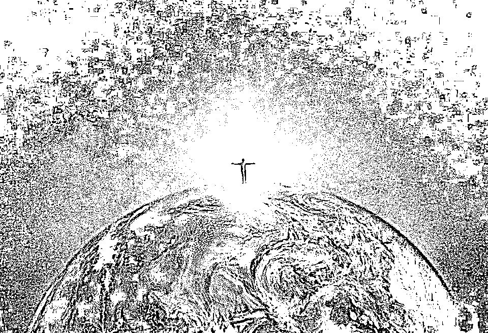

如何预约占星咨询？

**方式一：**

**下载若道 APP，进入占星咨询栏目可以进行预约**

****

**方式二：通过若道服务号**

****

专业的占星师在这里等您

**若道占星咨询平台是以人本主义占星学导向的咨询，期望用博大精深的占星学提供优质信息，并通过和客户的交流，协助客户了解自己和他人、探索潜能、识别破坏性的人生模式、了解生命周期。**

我们期望更多人通过咨询，用占星学帮助自己提高觉察，学习成长，运用自由意志，学习与命运共舞。 

占星学是宇宙送给人类的礼物，我们愿意将这个礼物分享出去，让更多优秀的职业占星师为更多公众服务。

如果你对自己的生命有困惑，不论这个困惑是学业、职业，还是爱情、婚姻、亲子教育、个人成长等，我们都欢迎你来！

**本期我们将为大家推荐以下占星师**

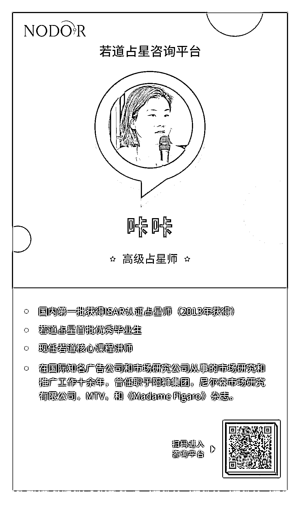

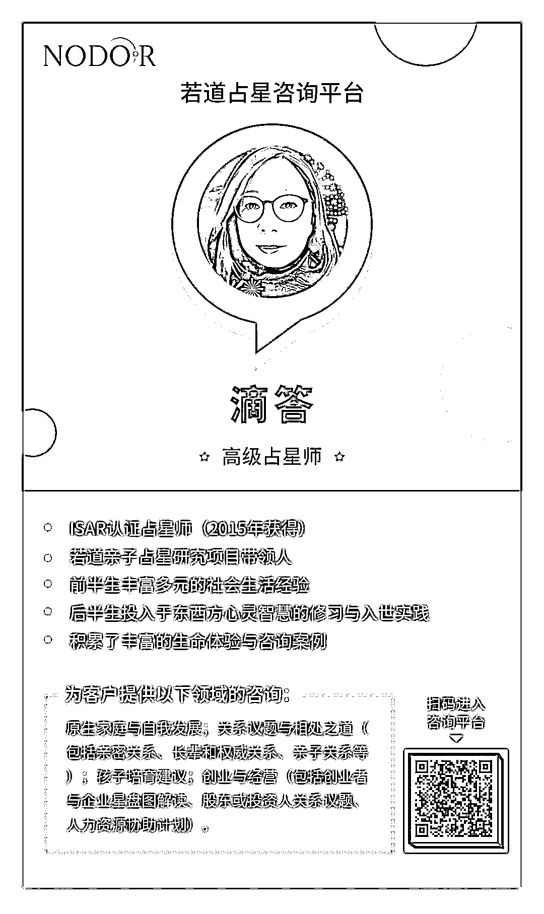

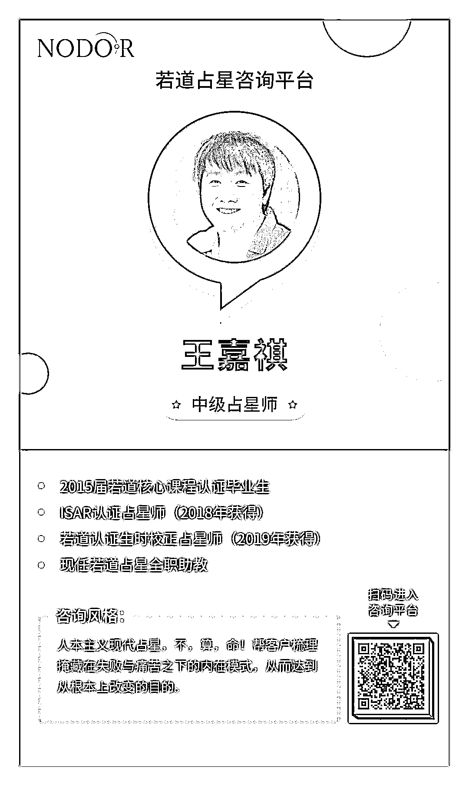

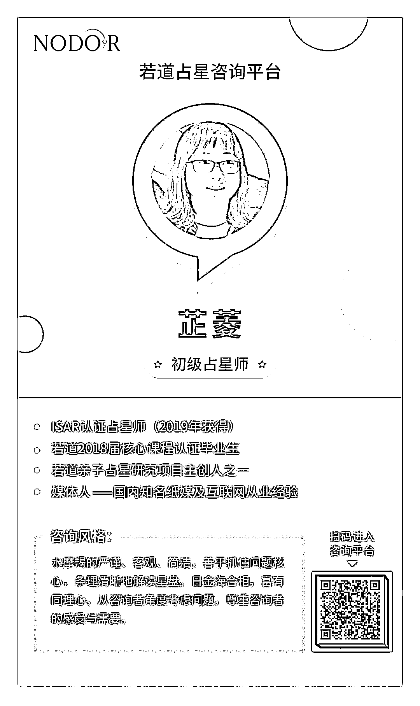

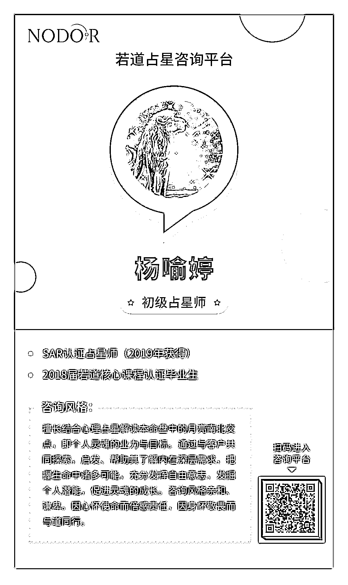

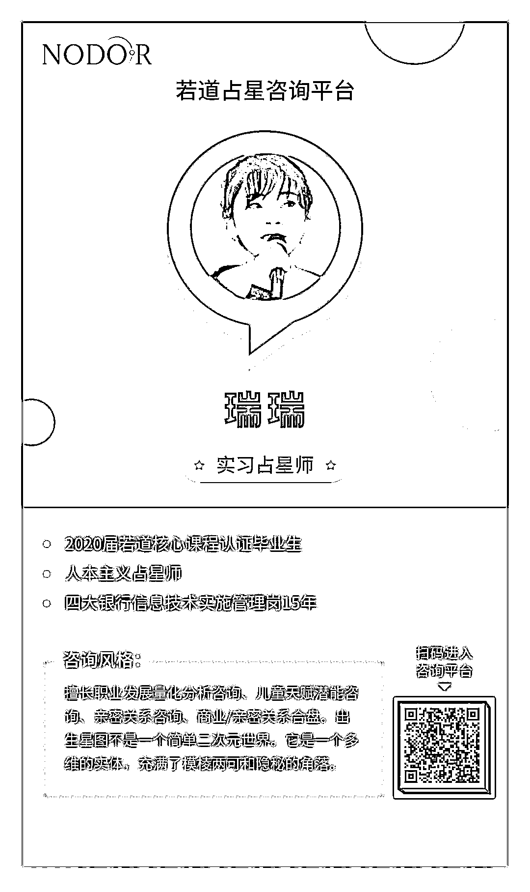

# 土星逆行 | 休整脚步，去繁化简，集中火力打开上升通道！

> 原文：[`mp.weixin.qq.com/s?__biz=MzA5NjA0NTAxNg==&mid=2651475334&idx=1&sn=76cc703cabaa51ad7bd2ebddd08079ef&chksm=8b48ff31bc3f7627c1f2f2340ac6c590fd866b781ab84645cc8337cb7690b97a09347350e235&scene=126&sessionid=1692737806#rd`](http://mp.weixin.qq.com/s?__biz=MzA5NjA0NTAxNg==&mid=2651475334&idx=1&sn=76cc703cabaa51ad7bd2ebddd08079ef&chksm=8b48ff31bc3f7627c1f2f2340ac6c590fd866b781ab84645cc8337cb7690b97a09347350e235&scene=126&sessionid=1692737806#rd)

**☆ 后台回复“今日”，给你一句生命态度**

作者/李妍（理想国的女巫）
编辑/玫瑰 封面/书君 图片/pexels

****

**当生命的巨轮从众人身上碾压过的时候，没有人感觉舒适。面对这份“逃不过的命运”，每个人给出了不同的回应，而这份回应则决定了各自日后的人生。**

**——李妍**

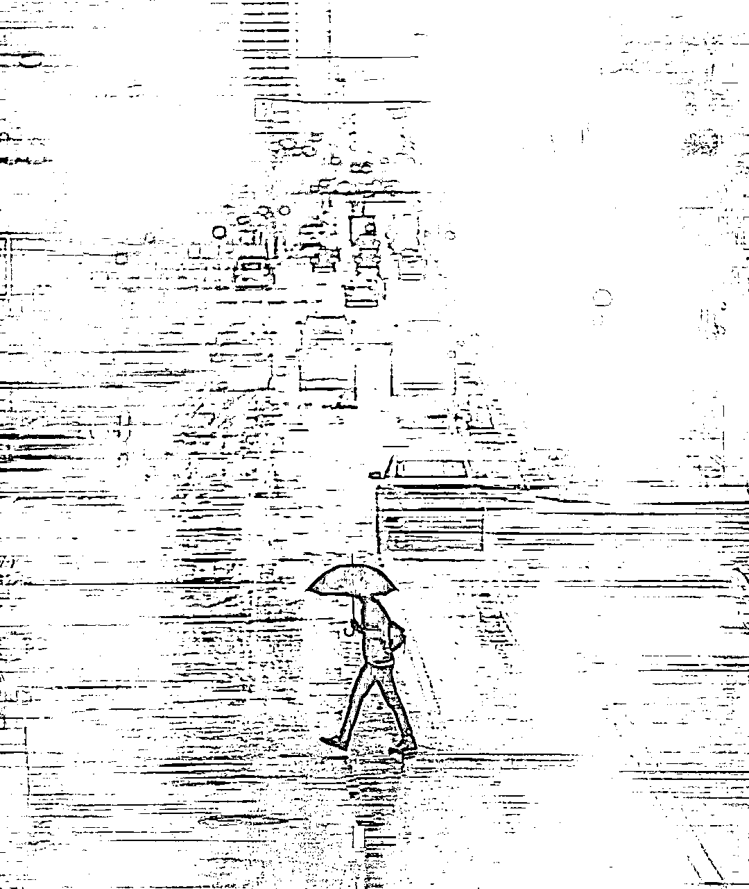

这几年，大家日子不太好过，本以为 2019 年-2020 年的土冥合相已经是谷底，没想到 2021 年-2022 年的木土新周期、土星水瓶座四分天王星金牛座、南交天蝎座-北交金牛座是谷底的谷底。我们都在经历着疫情和这波经济重要大周期给生活带来的震荡与挑战。

在这个过程中，世界面、社会面、人类的意识面都在以一种潜移默化的方式发生质的改变。面对这样的新世界，我们更要注重学习和转型，调整思维，放平心态，修炼内功，切勿眼高手低。

**土星行进在哪里，考验就在哪里发生，土星水瓶座的考验是面对社会大众的。**虽然不是所有人都是与生俱来乘风破浪的高手，但我们可以通过不断历练和学习来收获更加进阶的自己，以此更从容地进入这变幻莫测的世界和面对这起起伏伏的人生。

被土星这把岁月之刀磨砺完后，你会拥有坚不可摧的扎实底盘，拥有良好的处事能力，或成为相关领域的专家和厉害角色，但首先你得能经得起风雨和雷暴，有颗可扛击打的心。

土星在水瓶座的行进直到 2023 年 3 月，它给大众带来的考验仍在继续，而此刻迎来了它的一段逆行时期——**6 月 5 日，土星在水瓶座 26°逆行，10 月 23 日，在水瓶座 18°恢复顺行。**

我们要在这段期间**休整脚步、清理障碍、总结经验、提高效能。**

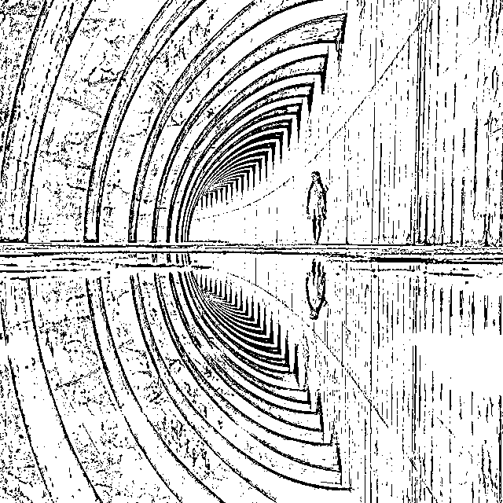

**去繁化简，停止内耗，提高效能**

土星在水瓶座的逆行非常适合**对自己当下的人生进行冷静客观的深度总结和调整**，这会为我们**释放掉许多没有必要的压力和内耗。**

**有的时候我们效率不高，不是因为懒，是心乱。**做事情太容易受到外界的干扰，于是分了心，或者没有一个结构性的思考规划，东一点，西一点，七零八落的没了重点，自然形成不了一个完整的图景，还带来了高耗能。

**土星的能量如果不转为有效产出，就很容易变成强大的内耗。**

土星行进在水瓶座作用力之一是**去繁化简，搭建内与外的秩序，除去内容和形式上的繁琐，让事物内部运转的流程变得高效合理，从而提升效能**。在这样的基础上，过度的形式主义会显得格格不入。

如果这份理性的清醒感和高效能在你的生命中还没有搭建起来，那可以**在土星水瓶座的逆行之下进行深度检索，从内而建。**加上木星和火星行进在白羊座，也在共同强调着**精力专注投放的重要性。**

可以看看**哪些地方拖拽了自己的后腿，时间精力花在了不必要的事情上，以及是否存在着不切实际的期待，或陷入进了过于悲观的认知，**都可以在这里进行调整。

**企业主或管理层会在这个期间集中检索原有发展战略的合理性，去过剩产能，对业务单元和人员结构进行新的优化调配，拟定更加高效的团队绩效考核制度等。**

土星在水瓶座逆行带来的深度检索和改革不仅聚焦在个体和企业中，也会体现在**政府相关事务**中，**带来的实效性会被更多的强调服务于大多数人。**

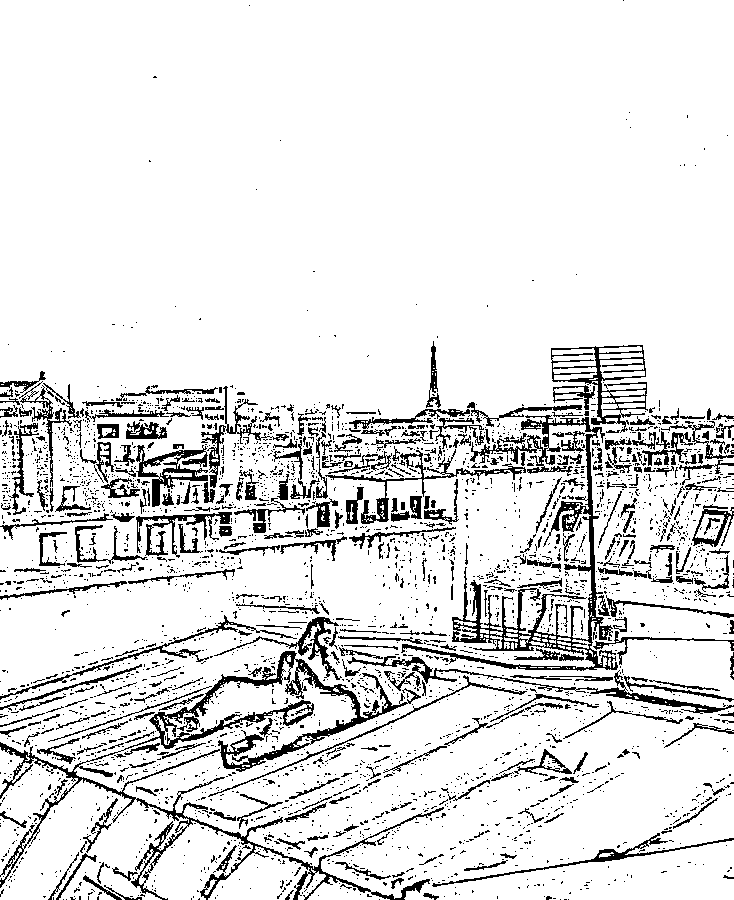

**宇宙是一个大的磁场，你是其中一个接口**

土星在水瓶座的行进会让人们**重新理解个体和群体之间的关系。**

宇宙是一个大的磁场，每个人都是这里面的一个接口，而每个接口又都在影响着这个大磁场。当我们每个人的接口释放了相应的信号（振动频率），就会从外界的磁场里吸引来怎样的同频回应。

我在试图用水瓶座的语言来描述个体和集体之间的关系。等到 2023 年，冥王星进入水瓶座之后可能大家对此会产生更多的认知。

近期**土星水瓶座和海王星双鱼座构成 30°相位**，可能会让很多人感受到一种**既压抑又迷茫，现实就像梦境，而自己就像宇宙中的一个浮木，孤立无援，无法依附，无能为力。**

而土海 30°的正向意义是：**将感性结合理性，让梦想落地，同时认识到集体是个家**，存在于其中的每个人（众生）都是一体的，海面上涨，我们跟着一起上涨，海面起风，我们一起被激荡。

如果我们了解了这其中的道理，就明白我们不是一个人，我们一定能在这个世界中找到属于自己的那个支点。也能明白**每个人只要用心的经营自己的人生，其实就是在向外界输送积极的能量。我们是可以反向影响世界的。**集体的存在面貌和每个人息息相关。

而幸福的人很少为自己无法决定的事情而烦恼，在既定的规则和环境下做自己能做的，选自己可选的，努力自己可以努力的，争取自己可以争取的，维护自己可以维护的则是自由。

土星在水瓶座的逆行结合上木星在白羊的行进，适合**重新校准自己和外界、团体、集体的关系，这会帮助你更好的在世界中找准自己的位置。**

**找到适合自己的生存方式**

2022 年 10 月，土星和天王星形成四分相，这是继 2021 年土天三次四分之后，又一次成相，也是最后一次成相，虽然没有精准四分，但能量依然很强。

天王星是土星水瓶座的定位星，又彼此四分，这里面带来的改革属性非常的强烈。**土天四分不仅加剧了世界格局的变化、整体经济发展态势的裂变、它也改变了人们的意识形态和对生活的理解。**

土星在水瓶座的行进是理性的，也是个性的。**理性让你不会像傻瓜一样没有任何准备就乱闯入新的世界，而个性则让你不会在新世界中迷失。**

而土星水瓶座和天王星金牛座的个性里面传递的是一种**可持续发展的实用主义，可以直接服务于物质生活。未来会有越来越多的人会打破对传统生活方式的遵从，生活方式变得非常多元。**

个性诞生的根本是不想勉强自己在既定的意识洪流中翻滚和犯困，你想回应自己的兴奋点。在土星于水瓶座的逆行之下，我们可以**思考下自己的个性生活是怎样的，并以此展开部署和实践，**这将能帮助你在 10 月的土天四分，以及更加长远的未来站稳脚跟。

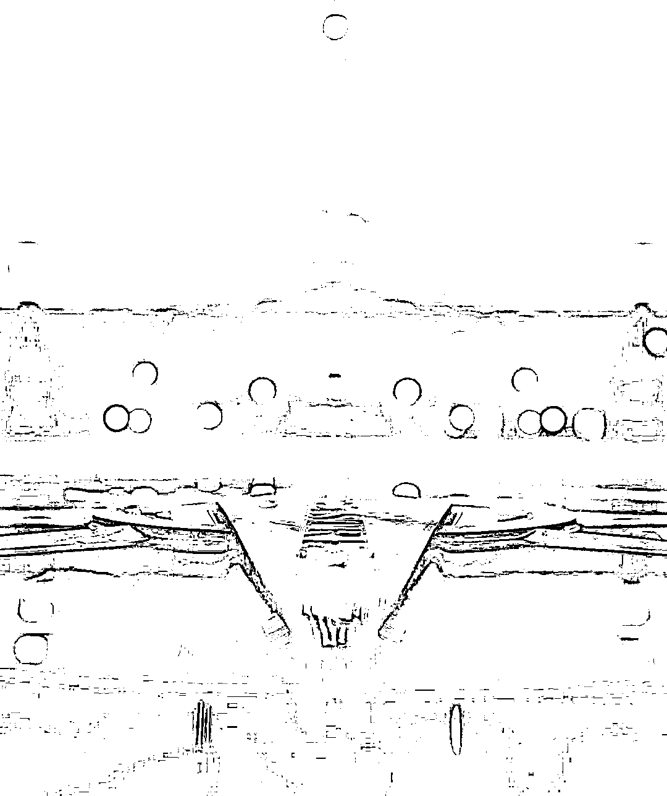

**世界格局的震荡**

土星逆行、冥王星逆行、土海 30°、木火白羊、加上土天四分，在这样的综合天象下**很多企业的发展还是面临较大的挑战，就业难问题仍旧是社会面一个重要的主题，世界范围里一些国家的政权会进入震荡期，容易引发冲突或战争，出现群体危机。**

**人们可能会抗击所在的政府，发生大规模游行，或者一批官员集中下台或更换。**同时这个期间也容易发生**地震、和一些极端事件**。**互联网行业和科技行业在这期间会有大动作。媒体信息的公信力会受到进一步挑战。**

**重点影响人群**

**土星在水瓶座逆行的重点影响人群是：出生星图中有行星、四轴、南北交点落在水瓶座、金牛座、狮子座、天蝎座的人群，其次是天秤座、双子座、射手座、白羊座的人群，再其次是摩羯座、巨蟹座、双鱼座、处女座。**

**大家也可以通过查看土星水瓶座逆行在自己出生星图的哪个宫位，来了解人生的什么领域需要进行深度检索，清除障碍、用心规划。**

举 1 个例子：

如果你上升是金牛座，土星水瓶座逆行在你的第 10 宫，那你需要在这期间对自己的事业进行结构上和方向上，或思路上的调整。这段期间，你可能发现事业进展会有些缓慢，但它却给了你更多时间去布局和规划。

**若道君：****你可以在 app store 或者应用商店搜索“若道”下载 app，输入个人档案，查看行运盘（也可以使用其他星图软件），找到行进土星♄落在出生星图的第几宫。**

**例如下图中，行运土星在比尔·盖茨个人星图的第 8 宫逆行。**

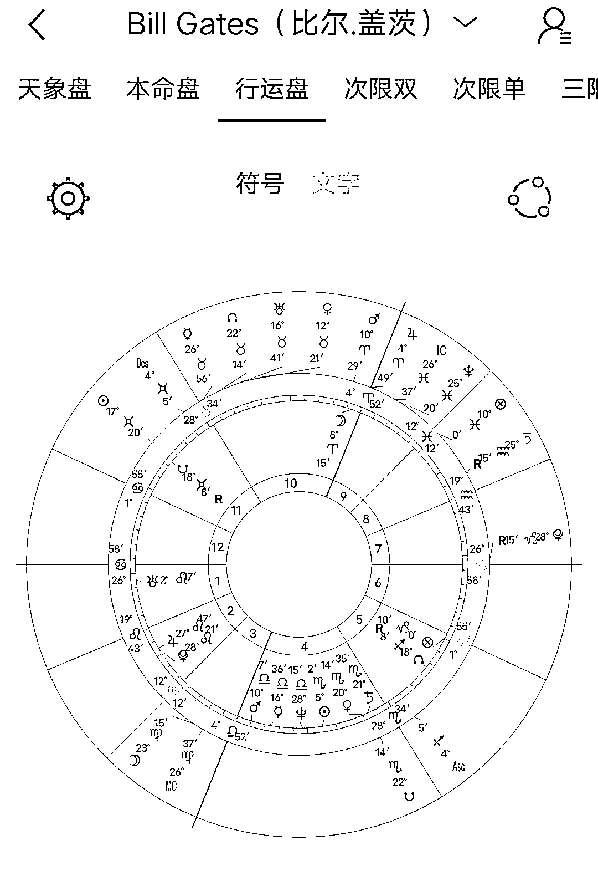

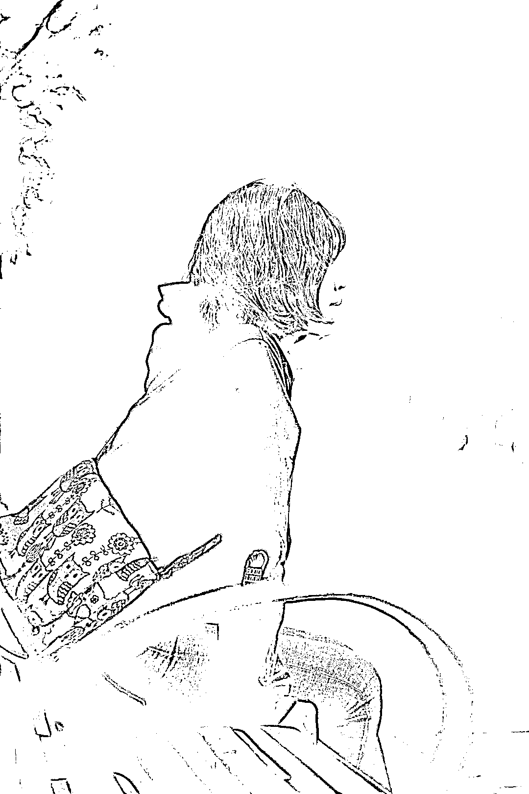

**不要忘记自己的独特性**

水瓶座追求的是超越、突破和革新，而土星在水瓶座则将它们一一落地。当喊着“想要一夜暴富”的口号时，有想过要如何去接近这个目标吗，胜算在哪里？以及可实施的计划又是什么呢？

土星是来帮助人们变得成熟、稳重、自律、踏实的，它是戒骄戒躁的鼻祖，会基于现实面来展开对人生的耕耘和实践。

土星在水瓶座的逆行如果运用得当，会帮助我们清理非常多的内存，会调准人生的发展方向和实施方案，混乱的思绪、过剩的欲望和不切实际的期待会被一一释放，我们会把精力用在真正可以带来产出的事务上。

同时，一定不要忘记自己的独特性，这关系着当下，也影响着未来。

**版权声明：**文章由作者授权首发于若道平台，欢迎转发，反对抄袭。友号转载请申请白名单。

****

****李妍**（**理想国的女巫**）**

资深现代人本主义占星师，塔罗师，心理咨询师

十二宫理想国创始人，首席咨询师&讲师

10 年全职于占星和塔罗教学与咨询工作

**微信公众号：**十二宫理想国

**助理微信****：**house12_star1

长按打赏

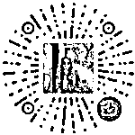

**20 位来自世界各地的占星师****带来 19 场沙龙——新世界的觉醒****详情可点击下图**

**学习占星学****点击下图了解课程详情**

**

**微信又双叒叕改版啦，不想错过若道君的推送？**
**就把若道设为星标吧！****▼**

**喜欢记得点一下在看哦☟**

**报名直达入口**

# 占星界的国际认证｜你想了解的国际认证“最新变化”，都在这里了！

> 原文：[`mp.weixin.qq.com/s?__biz=MzA5NjA0NTAxNg==&mid=2651475298&idx=1&sn=b91888b54c14e29068f8b4e2a3452f5d&chksm=8b48ffd5bc3f76c32699f20f5c99e978bbb25551e69d80c70fee361acbd930ba5970ae776cdc&scene=126&sessionid=1692737806#rd`](http://mp.weixin.qq.com/s?__biz=MzA5NjA0NTAxNg==&mid=2651475298&idx=1&sn=b91888b54c14e29068f8b4e2a3452f5d&chksm=8b48ffd5bc3f76c32699f20f5c99e978bbb25551e69d80c70fee361acbd930ba5970ae776cdc&scene=126&sessionid=1692737806#rd)

**1**

**ISAR 是什么？**

**ISAR 是国际占星研究协会（International Society of Astrology Research）的英文首字母缩写。**

中国占星学子第一次知道 ISAR，是从大卫·瑞雷老师那里。

2010 年，被国际占星界称为“占星界的马可·波罗”的大卫老师到中国来后，想帮助中国占星界和国际占星界取得联系，帮助中国的占星师获得更好的教育和培训，从而将本来只是爱好的占星学变成一个职业的培训，让本来主要是自学成才的良莠不齐的占星师们通过更专业的培训和认证考试，并取得国际职业占星师的认证。

大卫老师经过和几个有全球认证体系的占星协会（比如 AFA，NCGR）接触，最终选择和 ISAR 合作，帮助把 ISAR 的职业占星师资质认证体系介绍到中国来。**原因很简单，在国际化的今天，选择一个全球认证的体系很重要。**

**ISAR 是一个国际化程度很高的协会，其范围覆盖了 47 个国家，其国际影响力是其他占星协会和某个国家的占星学校所根本无法相比的。**

 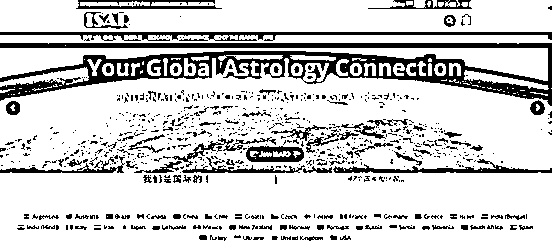

ISAR 作为一个国际化的占星组织，其主要活动分为：1.教育和培训 ；2.职业占星师资质认证 ；3.占星学研究 ；4.组织国际性的会议等

**我们今天着重介绍一下职业占星师资质认证。**

2

**如何获得职业占星师资质认证？**

**1****职业占星师认证的历史**

虽然占星学的发展历史悠久，但是职业占星师的资质认证只是在近几十年才出现的。其中很大一个原因是，在文艺复兴之后，占星学被赶出了大学的学术殿堂，不再有系统的教学和培训。所以，很多占星爱好者都是自学，或者跟随某个老师学习，然后就开始做咨询。

**但这就造成了占星师的良莠不齐，而这也给行业的声誉带来影响。**

一些受到业内尊重的占星师看到这种情况，认为如果占星学要变成在社会上受人尊重的专业，就需要有**系统的培训和考试**，而且也需要**建立资质认证体系**，以帮助全行业提升水平。

就是在这样的背景下，一些占星行业协会开始推行职业占星师资质认证，把职业占星师和没有经过系统训练的、声称自己是占星师的人区别开来。在这样的背景下，**ISAR 于 2003 年开始了自己职业占星师资质认证项目。**这个资质认证项目在全球范围内推行，并且不断优化。在为 ISAR 的资质认证项目设定教学要求时，ISAR 咨询了世界各地顶级占星学校的教学专家，他们的很多建议都被采纳到了现在的认证项目中。

**今年，ISAR 专门为职业占星师认证项目建了 CAPISAR 网站，未来，所有国家通过认证的 CAP 职业占星师都会在该网站呈现。**

**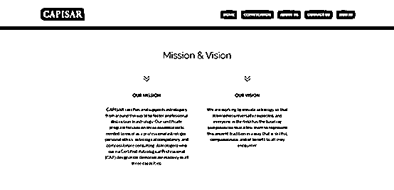**

**2****中国的 ISAR 职业占星师资质认证**

大卫老师为了把 ISAR 的职业占星师认证项目引入中国、提高中国占星学的职业水准，尽管当时他已经执业 40 多年且获得了 AFA 的认证，但还是根据 ISAR 的规定，在 2011 年参加并通过了 ISAR 的职业占星师认证考试、获得 ISAR 职业占星师认证。

2012 年，大卫老师带领跟随他学习占星的若道英文比较好的学生去到美国，在 UAC（联合占星大会，是占星界最受瞩目的会议）举办期间，参加了 ISAR 组织的资质认证项目。当时是全英文考试，有 5 位占星师获得了 ISAR 的认证，成为 ISAR 认证的职业占星师，也称为 CPA（certified professional astrologer)。

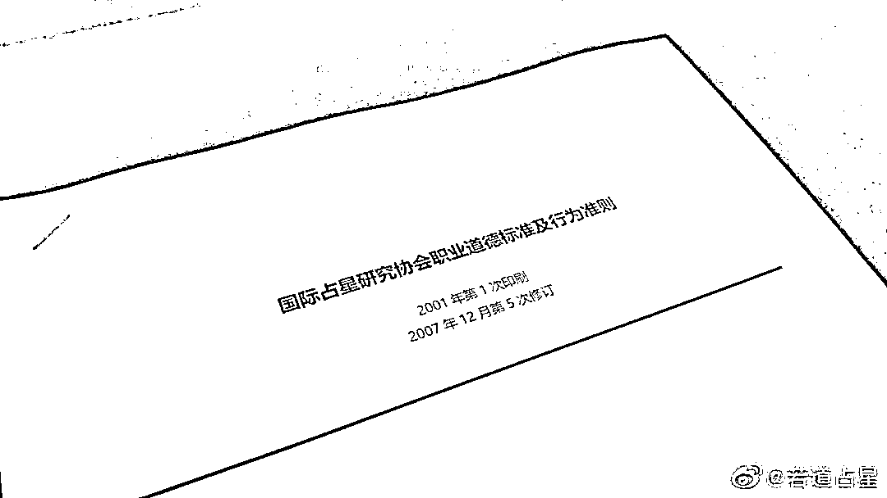

**2013 年，若道把 ISAR 认证项目引入中国，**由当时的 ISAR 主席 Gisele Terry 亲自带领，3 位设计了 ISAR 资质认证项目的资深职业占星师来到中国，第一次在中国通过翻译进行 ISAR 职业占星师的培训和认证。这样，国内即便不会英文的占星师，也有机会获得 ISAR 认证。

**2013 年至今，若道和 ISAR 合作，一共进行了 8 次 ISAR 认证，共计有 182 位占星师获得了 ISAR 职业占星师资质认证。可以在若道 APP 查询到这些职业占星师的名字和联络方式。**

3

**2022 年新的 ISAR 职业占星师认证要求**

**2022 年，ISAR 通过了全新的职业占星师认证要求。**和过去的 ISAR 职业占星师认证要求不同的是，**从今年开始，所有想要通过 ISAR 职业占星师认证的学员，必须在 ISAR 附属学校通过 500 小时占星教育**（学员可以不必在某一所学校学完 500 小时，可选择在多所学校完成共计至少 500 小时的占星教育标准）。**这样的要求是为了提高 ISAR 认证标准，保证参加考试的学员的确受到了最好的系统培训，而不是仅用一次考试来衡量其水准。**

**若道也根据这一要求，重新设计了课程，使想要通过 ISAR 认证的同学获得的培训可以达到 500 小时，****特别是若道核心课程，则是其中的重中之重。**在核心课程中，不仅有老师教学部分，还有助教沙龙、作业、小组讨论、小组汇报演讲、咨询练习等，给予同学们充分的培训，为学员成为职业占星师做好准备。

**500 小时的学习，作为 ISAR 中国唯一附属学校若道的标准是：**

**L1-5 核心课程+3 门选修课**

没有在 ISAR 附属学校完成 500 小时培训的朋友，也可以参加 ISAR 认证培训和考试，但是将无法获得 ISAR 职业占星师认证证书，也不会在 CAPISAR 网站露出，不过可以获得通过 ISAR 考试的证书。

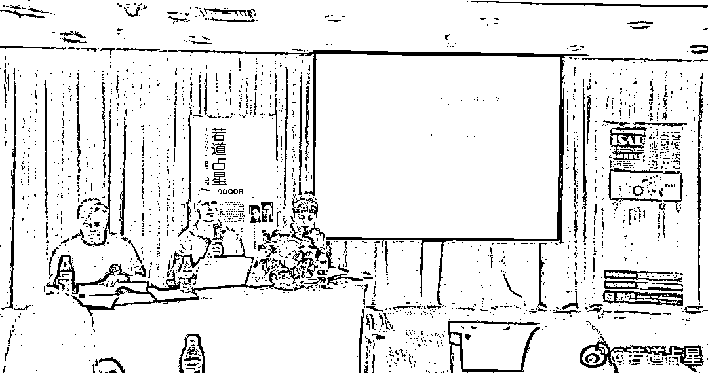

4

**关于**认证**的一些问题的回答**

**① 想要取得 ISAR 证书需要通过哪些认证？**

*   职业道德培训

*   咨询技巧培训

*   占星能力测试（笔试）

*   在 ISAR 附属学校完成 500 学时的研习（在若道完成，包含 L1-5 核心课（包含核心课沙龙、作业、研讨会）+3 门选修课）

*   上述四项必须全部完成，方可获得 ISAR 证书。

**② 上述四项的有效期？**

*   通过后终生有效。

**③ 如果未通过其中某项或者某几项，下次要如何参加？**

*   已通过的单项，终生有效；

*   只需要重新参加未通过的单项。

**④ ISAR 认证是线下进行，还是在线进行？**

*   线下：职业道德培训、咨询技巧培训，占星能力测试

*   ISAR 附属学校及 500 学时的信息详见：https://www.capisar.org/pages/become-a-cap

**⑤ 通常 ISAR 认证的线下部分的时间与地点？**

*   职业道德培训：13:00-18:00

*   咨询技巧培训：2 天，每天 09:30-17:30

*   占星能力测试：1 天，09:30-16:30（含 1 小时用餐时间）

*   地点：北京现场

**⑥ 占星能力测试的笔试部分，有没有考试大纲、题型、分值分布等等？**

*   ISAR 官方提供考试大纲与样题，详见：http://www.nodoor.com/isarcertfaq.do?contentId=3418

**⑦ 笔试是开卷还是闭卷？**

*   开卷，可以携带任何资料，如：书籍、纸质文档或者电子文档等。

**⑧ 参加笔试，可以携带哪些电子设备？**

*   可以携带笔记本电脑，但不允许联网；

*   任何可以使用数据流量进行联网的设备，均禁止使用。如：手机、平板等；

*   任何可以摄影或者录像的设备，均禁止使用。如：手机、平板等；

*   上述禁止使用的设备，在考试开始前会被集中保管，考试结束后即可取回。

**⑨ 参加笔试，是用笔作答还是用电脑作答？**

*   客观题部分，用笔在纸质试卷上作答；

*   主观题部分，用电脑上的 Word 文档作答。

**⑩ 所有的培训与考试都是以中文进行吗？**

*   是的。所有的考卷都被译成中文，而所有的培训都是以中英文双语进行，你不用担心任何语言问题。

*   笔试部分，如果需要中英文双语试卷的同学，可以在报名时申请。

**⑪ 在 ISAR 附属学校的 500 学时研习，需要在考试前完成吗？**

*   你最好在考前完成核心课程的学习，因为不完成核心课程的通过率非常低。但是你可以在考试后完成选修课的学习。

**⑫ 可以一次只参加所有项目中的一项或几项吗？**

*   可以自行选择参加一个或几个认证项目；

*   但只有在完成通过所有项目之后，才能获得 ISAR 颁发的占星师资格证，正式成为 ISAR 认证占星师。

**⑬ 为什么 ISAR 认证的费用会有变化？**

*   ISAR 认证的每一项费用（除了选修课）都是由 ISAR 美国总部确定的，单位是美元，因此换算成人民币时会由于汇率的变动而产生细微的调整。

**⑭ 此次付款后，若因故无法参加认证，可以延期吗？**

*   不可以延期，但可以选择退款。退款要求如下：申请退款的时间节点：考试开始日（一般是职业道德培训的日期）的 7 天之前（比如：若考试开始日是 11 月 25 日，那么申请退款的最后日期是 11 月 18 日）。

*   超过退款时间节点的，不再给予退款。若不能参加考试，默认为自行放弃。

**如果你考虑成为 ISAR 认证职业占星师，若道 2022 年新一期的核心课程正在招生中，欢迎了解。**

**点击下图查看课程详情** 

# 端午节快乐！今天水星顺行啦！

> 原文：[`mp.weixin.qq.com/s?__biz=MzA5NjA0NTAxNg==&mid=2651475298&idx=2&sn=bf19c9acf0f53bad1a1f4fd2c4770be1&chksm=8b48ffd5bc3f76c392e85d36ec8586f629190eb8c851ce3633fe2ee30e3d62134f8d7f0a5d77&scene=126&sessionid=1692737806#rd`](http://mp.weixin.qq.com/s?__biz=MzA5NjA0NTAxNg==&mid=2651475298&idx=2&sn=bf19c9acf0f53bad1a1f4fd2c4770be1&chksm=8b48ffd5bc3f76c392e85d36ec8586f629190eb8c851ce3633fe2ee30e3d62134f8d7f0a5d77&scene=126&sessionid=1692737806#rd)

**端午安康！**

**今天下午 4 点，水星顺行了**

**你可以点击**[【**水星逆行**】](http://mp.weixin.qq.com/s?__biz=MzA5NjA0NTAxNg==&mid=2651473498&idx=1&sn=9b4e04a22afdfe804563e19c444fb4fb&chksm=8b48f4edbc3f7dfbc42ea66f5088fb7b590dc3d61f078e73584fc7f7895fbf49726e35c5456a&scene=21#wechat_redirect)

**看看自己在这段时间是否有所收获呢？**

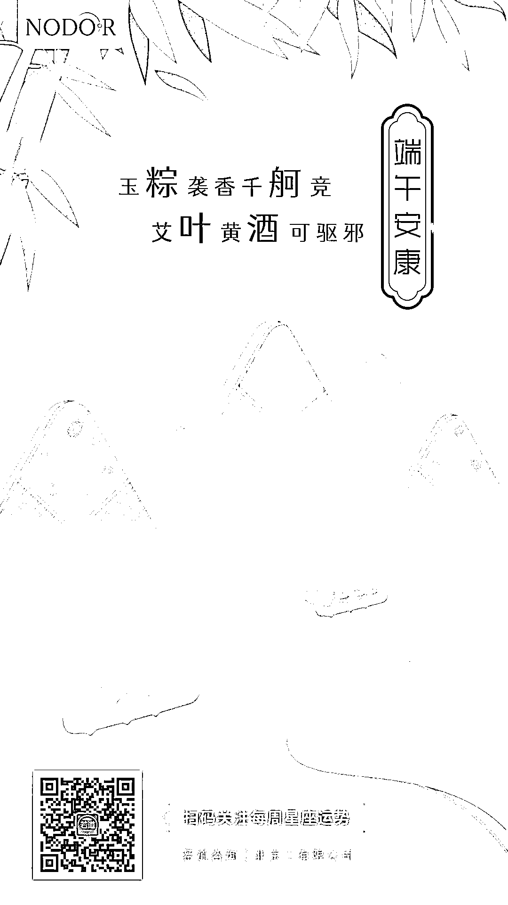

# 曾是受害者、被利用的人……这个北交点今生要在工作中找到自信

> 原文：[`mp.weixin.qq.com/s?__biz=MzA5NjA0NTAxNg==&mid=2651475237&idx=1&sn=c5ba2626d8c431034eca663fcdf5e53d&chksm=8b48ff92bc3f768417b28bf30ef2dbe4ae1e56b7e2e5a3961cd798171190e421807cc6413922&scene=126&sessionid=1692737806#rd`](http://mp.weixin.qq.com/s?__biz=MzA5NjA0NTAxNg==&mid=2651475237&idx=1&sn=c5ba2626d8c431034eca663fcdf5e53d&chksm=8b48ff92bc3f768417b28bf30ef2dbe4ae1e56b7e2e5a3961cd798171190e421807cc6413922&scene=126&sessionid=1692737806#rd)

☆****后台回复“今日”，给你一句生命态度****

作者/简·斯皮勒 译者/亚麻林恩 校对/李含编辑/玫瑰 封面/书君 图片/pexels

南交点双鱼座-北交点处女座这个交点组合，听起来就是一个“惨”字，这些人经历过怎样的前世啊，而今生他们需要学习的，就是自信起来。一起来学习一下吧！

**北交点处女座/第六宫综述**

**发展的特质**

**·** 参与**· **为混乱引入秩序**· **创建例程**· **专注当下**· **行事悲悯**· **为他人服务**· **分析和分类**· **从经验中获得自信**· **节制适度**· **不顾恐惧，勇于冒险**· **关注并重视细节

**要放下的倾向**

努力减少这些倾向的影响有助于让生活更轻松、更愉快 

**·** 成为受害者（或有受害者意识）**· **困惑和迷失方向**· **拒绝规划**· **逃避现实/成瘾倾向（毒品、酒精、过度睡眠、白日梦等）**· **极端主义**· **过度敏感**· **自我怀疑**· **匮乏感**· **退缩**· **含糊不清（不想承诺）/无所作为**· **放弃

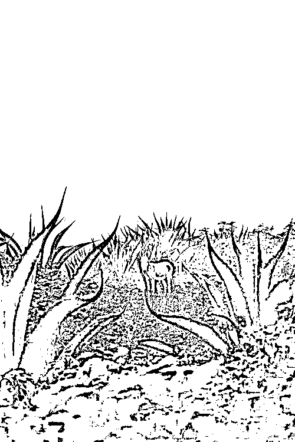

**阿喀琉斯之踵/避免的陷阱/底线**

**北交点处女座的致命弱点是受害者意识（“如果我没有得到别人对我的持续而富有同情心的关注和理解，就是有人要利用我”）。**但这是一个无底洞：**别人永远无法给予他们足够的安慰，来克服他们自身内在的无助和偏执。**只有当他们向内看时，才能发现自己需要创造怎样的外部结构来赋予自身力量和目标。他们必须避免的陷阱是**无休止地寻找他们盲目信赖某位救世主或导师，并为之臣服（“只要我足够地臣服，上帝就会安排好一切”）。**然而，生活已经向他们表明，内心的臣服不会让外部的世界变得井然有序且高效。他们实现目标的唯一途径就是**按照自己需要的方式规划自己的生活，这样他们才会感到安全和强大。**关键问题是，**他们总觉得自己没有足够的信心走进这个世界，去做一些有成效的事情。**有时候，他们就是需要开始积极地参与生活。讽刺的是，**当他们开始参与并了解什么能导向成功的结果时，就会获得自己所寻求的信心。**

**这些人真正的诉求**

**这些人真正想要的是沉迷于他们个人和宇宙联结的慰藉当中。**他们想“放手”融入一些比他们自己更宽广的存在，这将支持他们，给予他们更大的认同感。**处女座北交点的人对和平与整合的体验有一种永不满足的需求。**但要成功实现这一目标，他们必须**走向世界，为他人服务。**当他们将注意力从自身的恐惧转移到当下时，他们会很容易地看到如何在混乱的状况下重整秩序。

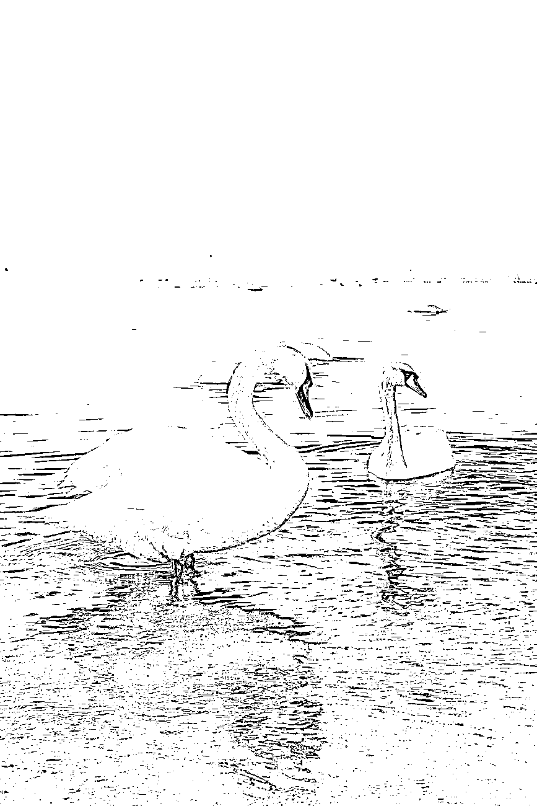

**天赋/职业**

这些人都是优秀的**医生、牙医、护士或护士助**理，因为这份职业让他们有机会**在做实际服务的同时发挥自己疗愈的能量。心理学家、治疗师、营养师、会计、组织者和工匠**也是不错的选择。**处女座北交点的人工作上有“好的业报”，也能与同事和员工相处融洽。**他们可以在一小时内完成一项任务，而另一个人可能需要五个小时；**他们应该处在一种“完成工作”是光荣的状态下，而不是仅仅为了小时工资而工作。**治疗性的职业是不错的选择的另一个原因是，这些工作涉及生活中身体的细节。在成功如此依赖于注重细节的领域，处女座北交点的人不得不着眼于当下。对他们来说，**身体上建立秩序的过程可以缓解心理压力。**处女座北交点的人也有同情心、有能力保持对全局的觉知。如果处女座北交点能积极地参与创造有形的成果，这份精神意识上的前世礼物会是一笔财富。然而，**以实现精神意识和宽恕为目标的职业往往会破坏这些人感受强大和完整所需的基础。**

**处女座北交点特定的疗愈誓言**

**· **“我是唯一一个能理顺这种情况的人，所以我不妨这样做。”**·** “这不是受害者的一生。”**·** “当我退出时，我输了；当我参与创造积极结果时，我赢了。”**·** “当我集中精力制定规划时，整个宇宙会开启通往成功的道路。”**北交点处女座/第六宫的个性**

**前世**

这些人对生活的精神层面有着与生俱来的意识，并使其与他们自身天性更高尚、更美好的领域相合。**他们非常敏感，容易受伤，并且非常小心地避免给他人造成痛苦。**事实上，他们有时比别人自己更了解和关心他们的痛苦。

**自我的消融**

处女座北交点的人经历过**数世轮回的自我消融**，**要么通过冥想和精神探索，滥用药物和（或）酒精，禁闭于修道院、监狱或精神病院终日沉思，或者沉迷于音乐、诗歌或艺术之中。**无论这种消融是如何发生的，在这一生中，他们必须应对这种影响。**如果它是通过精神取向而发生的，这一生将是完全混乱的，除非他们找到一条与前世相似的精神道路；**如果它的发生是借助毒品或酒精，这些人在此生中会有上瘾的倾向，这可能成为新的问题，并且可能必须从精神层面加以克服（戒酒互助会 12 步计划等）。**诗歌、音乐和艺术方面的天赋可能仍然是一种与崇高的情感状态联结的方式。**这些人曾有过许多灵妙的体验和化身，他们为了与更高的能量融合而放弃了自己身份的点点滴滴。但他们已经完成了这个过程；让自己在此生进一步的消融反而会适得其反。他们早已臣服于融入自己的愿景中。在这一生，他们需要**在现实世界中展现自己的愿景。****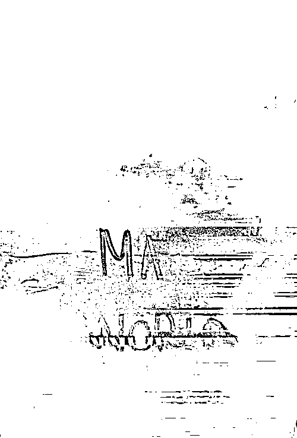**

**谦卑**

在前世的经验中，这些人**通过质疑自身的动机、承认自身德行不足之处进行自我净化，从而获得了巨大的洞察力，让他们这一世可以对他人不加评判。**在此生中，他们**不会认为自己有什么地方是“高人一等的”，他们的自省带来了真正的谦卑。****处女座北交点的人在太多次轮回中经历了受害者的人生，以至于他们很容易选择放弃。**他们**在对抗、竞争或任何针对他们的强烈反应中表现不佳。**他们的心理非常敏感，生活对这些人来说可能显得很残酷。总的来说，**他们不相信更多的“东西”会让他们更快乐。****由于他们的人生动机并不是为了获得物质上的东西，所以如果感到世界在阻挡他们欲参与的努力，他们就想直接放弃了。****基于前世曾被利用的关系，当这些人制造出一件创意作品时，那种他们任由自己的作品在没有任何酬劳的情况下被公开发行，或任由他人拿走功劳和金钱的情况比比皆是。**通常他们甚至不介意。毕竟，这项工作完成了预期的服务。**此外，在过去世苦行僧的生活中，他们可能曾发誓贫穷，因此会对在这一世财富的累积感到不安。**潜意识里，他们可能会觉得**累积金钱有些“肮脏”。**他们需要认识到，**金钱是服务的副产品，是衡量他们的参与是否有用的晴雨表。****处女座北交点的人真的富有同情心，想极尽所能地帮助他人。**在这一世，他们需要认识到，**只有通过创造坚实的物质基础，让他们的生命变得强韧，他们才能在一个更大的范围里，基于一个更好的位置提供帮助。****在这一生中，让自己成为“受害者”是行不通的；抵制这种倾向方能使他们走的更远。****北交点处女座/第六宫的需求**

**自信**

**处女座北交点的人需要在这一生中建立自信。**由于生性敏感，他们会表现出**潜在的无助感和持续的脆弱感。**这很容易容易导致**莫名的焦虑**。除非确定原因，否则他们会难以释放这些情绪。然后，他们通常会意识到**自己的担忧与现实几乎毫无关联，或者他们会看到如何避免陷入潜意识引发焦虑的情境之中。**在咨询师或信任的朋友这类外部帮助下，这一过程通常会更加顺利。**第三方的视角会稳住他们，防止他们转而向内。**举个例子，我有一位客户有这个交点配置，他对于接受一份看起来非常好的工作深感焦虑。这正是他想要的，伸出橄榄枝的人许诺了他全世界。然而，他却不明就里地对此焦虑不已。

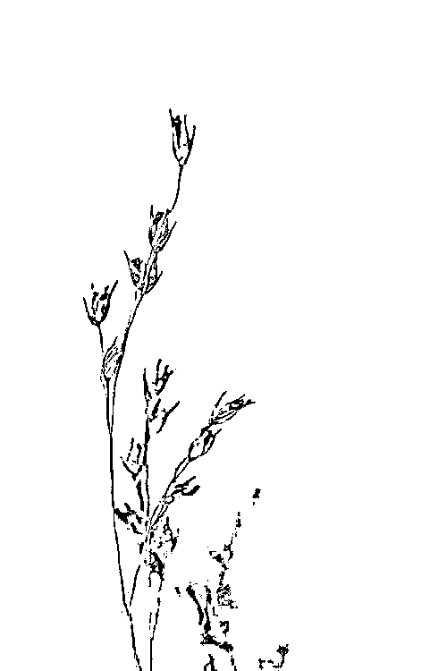

在向我解释这一点时，他提到，他以前曾在该国的那一地区工作过，结果苦乐参半：他赚了很多钱，但在社交上却感到十分孤独，因为人们对他特定的生活方式有强烈的偏见。当下他的人生正处在一个社交生活和财务成功对他来说都同等重要的时期。一旦他明白焦虑从何而来，他就与现实建立了联结，自信地决定不接受这份工作了。对于处女座北交点的人来说，自信不是天生的。由于缺乏在现世中的实践经验，他们深感焦虑。自信是成功经验的副产品，而这些人在前世中没有足够的经验去感知他们究竟能做到多么高效。然而，他们会发现，**有意识设定目标每一个生活领域中，他们的信心都在突飞猛进地增长。**当他们绕过自己的情绪，**利用自己强大的能力专注于实现一个目标时，他们能可以熟练地分辨出什么是有效的，什么是无效的，他们可以在极短的时间内取得成功。**一旦他们领悟了这点，就没有什么能阻碍到他们了。

**通过世俗经验建立信心**

因为处女座北交点的人潜意识中没有太多“世俗成功的记忆”，世俗的东西对他们来说并不是第二天性。有时他们会担心如果他们“做错了什么”，他们就不能得到他们想要的。事实上，这是真的，但这并不是一个道德或伦理问题，这只是一个实践问题！对这些人来说，亲历亲为是最好的方法：**在自己的实践中，边做边学，边试验，找出哪些可行，哪些不可行。**处女座北交点的人想要实际的结果——**他们不是“基于理论”的人，他们不认为书籍是最终权威。**他们想要实现自己的愿景，让它在现实世界中发挥作用，而且只有他们才做到。

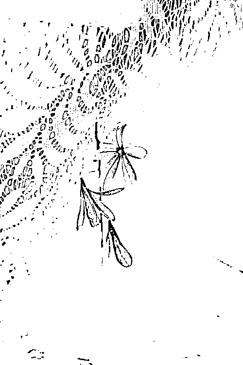

**他们对“正确”没有自我依恋，他们勇于在找到如何将事做成的过程中试错。**这种天生的开放性和谦逊对他们有利，因为错误是学习的必要组成部分。成功告诉一个人，他（她）用自己正在使用的技能以追求当下的道路是正确的；错误意味着“偏离轨道”。**这些人通常都是“快速学习者”，他们很快就会明白在各种情况下什么能行、什么不行。**避难所中的前世经历也与处女座北交点人的业力密切相关。这就是为什么在这一世中，他们可能会害怕“失去它”或发疯。这可能是因为他们的某部分心理在前世曾失衡。**工作是他们此生的良药。**专注于自己的工作和积极的结果时，无论心理哪部分曾失衡，都会因为要完成工作的实际需要而永远保持一致。**这些人必须愿意冒看似巨大的风险，从积极参与生活中获得自信。**例如，他们可能对找工作有各种各样的恐惧，但一旦他们迈出第一步，前进就会阻断他们的恐惧。**摆脱焦虑的方法光想可没用，是实践带他们克服与生俱来的缺乏自信。**

**弱点**

处女座北交点的人非常敏感，他们会认为其他人也同样敏感。当他们仔细观察时，**他们可以看到面具背后他人呈现出的真实状态：他人的动机、欲望和不安全感。**他们能做到这点是因为他们**不加评判**。由此产生的同情心使他们能看到他人的内心世界。因为他们有这种能力，他们会认为其他人也可以。所以，**当他们去到外面的世界，会感到非常的脆弱。**他们必须意识到，**其他人无法看穿别人，因为他们还没有经验过欲看穿人们的面具所需要的自我净化。**这些人担心别人对自己的评价，但心怀评判和成见正是阻碍其他人获取这项能力的特质！理解这一点能他们感到解脱，他们尽可以表现得自信超群，而其他人也会相信这一点。当处女座北交点的人看向他人，他们能直达他人的灵魂深处，从而对他人产生巨大的同情心。但当他人看到他们时，这些人只看到他们的自画像。基于这种方式，处女座北交点的人可以**搭建一个强大的“前阵”，以建设性的方式去控制他们生活中发生的很多事情。**这些人还以为他人知道他们有多敏感，知道他们为了避免伤害他人而做出了多少让步和保留，但这是不正确的。这就是为什么这些人必须**建立明确的边界，并且让其他人知道自己受伤了。**而不是哭泣和放弃，他们应该**清楚界定对他人而言正在发生的是什么，并制定一个清晰、有建设性的互动行为方针。**

**版权声明：**本文由若道翻译发布，欢迎转发，反对抄袭。友号转载请申请白名单。

**简·斯皮勒**

全球占星界的一位领军人物，是美国占星师联盟（AFAN）的教员。她定期在新时代和占星回忆上授课，是畅销书《新月占星学》、《灵魂占星》、《灵性占星学》和《宇宙之爱》的作者。

**今晚，“六·一”系列直播第 3 场****等你来~** 

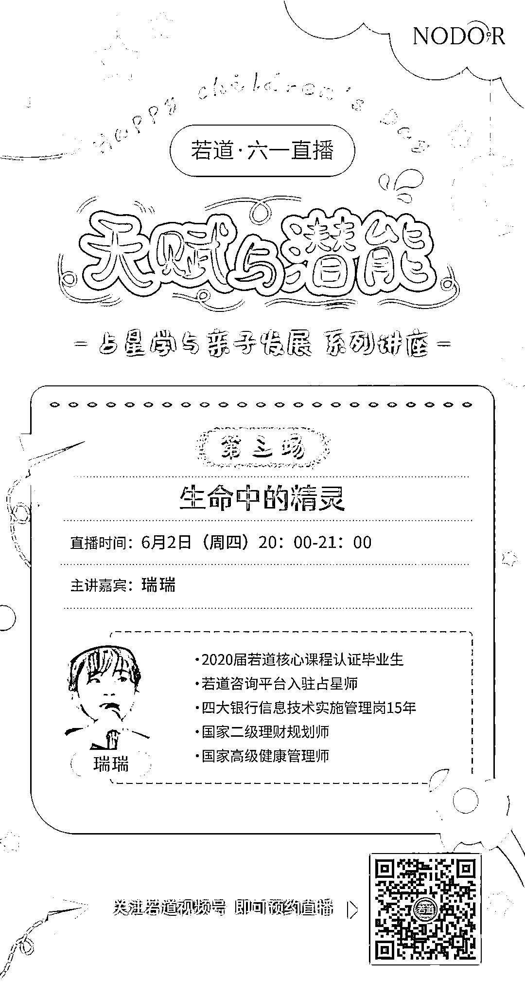

**不管大朋友还是小朋友****都可以领取的报告啊**

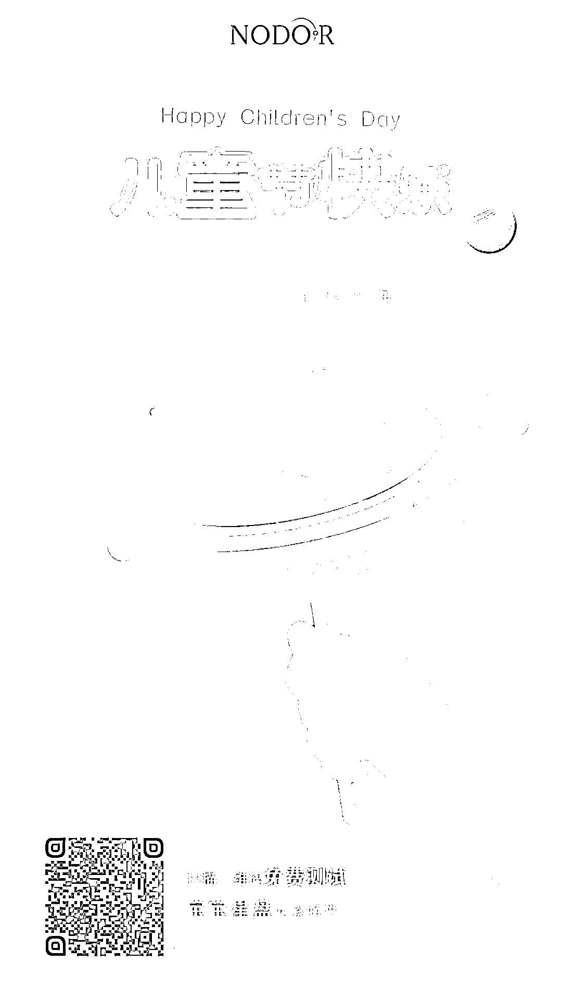

**20 位来自世界各地的占星师****带来 19 场沙龙——新世界的觉醒****详情可点击下图**

**学习占星学****点击下图了解课程详情**

**

**微信又双叒叕改版啦，不想错过若道君的推送？**
**就把若道设为星标吧！****▼**

**喜欢记得点一下在看哦☟**

**报名直达入口**

# 你知道吗？一名优秀的占星师要经历这“三个阶段”

> 原文：[`mp.weixin.qq.com/s?__biz=MzA5NjA0NTAxNg==&mid=2651475237&idx=2&sn=8374bfa87c8bdca92f93a5ac5b853107&chksm=8b48ff92bc3f768406827a564f3e42da5d90c9752f8d8065c7ac8474a1d6e6b0997c46bbbe45&scene=126&sessionid=1692737806#rd`](http://mp.weixin.qq.com/s?__biz=MzA5NjA0NTAxNg==&mid=2651475237&idx=2&sn=8374bfa87c8bdca92f93a5ac5b853107&chksm=8b48ff92bc3f768406827a564f3e42da5d90c9752f8d8065c7ac8474a1d6e6b0997c46bbbe45&scene=126&sessionid=1692737806#rd)

作者/咔咔 ISAR 认证占星师

文章来源/若道沙龙速记整理

编辑/翀子 图片/网络

**作者的话**

正式从事这个职业快 7 年的时间，在这个过程里，我经历了很多事儿。作为一个双子座能量很强的人，我想把自己的从业经历与大家分享。

2015 年 5 月，我从公司离职，休息了一个月后，决定成为一名占星师。等到 6 月，我做了一份自己的咨询表，里面包括我做什么，时长多少，咨询内容涵盖什么，客户如果要找我咨询需要提供什么样的东西等等，并且有了一个很明确的价格。到 2015 年 7 月，我接到了第一个正式的付费咨询。直到现在，我的占星咨询生涯主要经历了三个阶段。

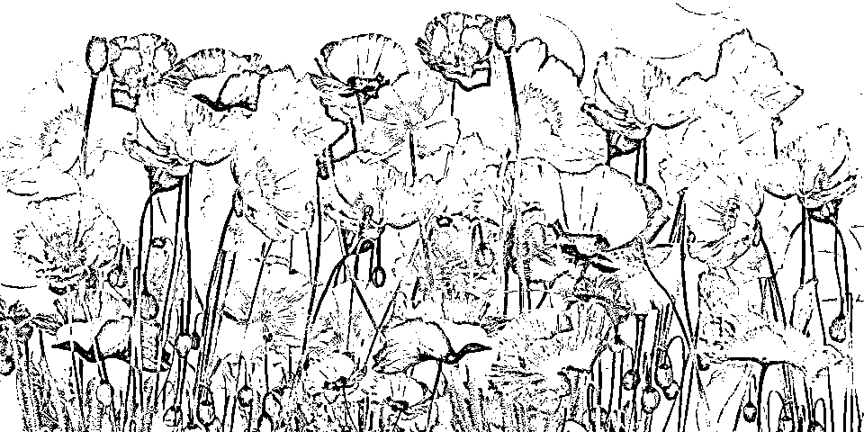

**第一阶段**

**“我希望让客户满意”**

对我来说，无论是占星咨询，还是心理咨询，**都好似在深海里游泳，或者潜水的一个过程**。经过大卫·瑞雷老师系统的核心课程、ISAR 考试的培训，以及通过考试，我成为了 ISAR 认证占星师。

**在 2015 年的时候，我像是纵身一跃，进入了心灵的深海**。当时我也不了解这个水有多深，我会遇到什么样的客户。这里所谓深海的感觉，也是因为我听到了很多人生故事里面的曲折，包括它背后痛苦的情绪、愤怒的情绪，或者是焦虑的情绪。

进入到职业化道路的时候，首先要有一个定价、宣传、服务须知：你的理念和背景是什么，你做什么样的服务，你的标准是什么，你相信什么，你认为怎样是能够帮助客户的……这些都是第一步，你要把自己的服务包装成一个产品。

当你越自然地去说，这就是我，我相信什么。你就会吸引和你理念共振的人，你们就会在同一个平台上说话，也就降低了很多顾客需求和你的供给不匹配程度。

**这是第一阶段我们必须要去面的挑战和思考。**

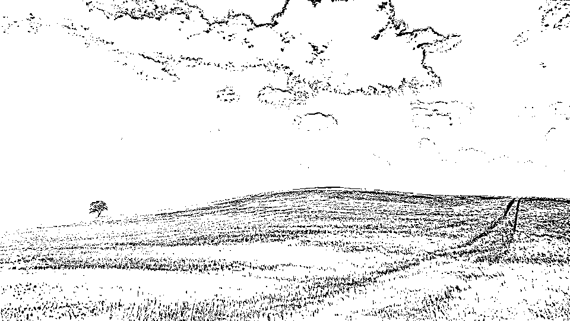

当时我做了很多推广性的工作，包括写了很多文章，开了自己的公众号，也告诉客户自己咨询的内容，比如和客户去探讨关于他人生中的某些议题……但是当时我并没有很清晰地告诉客户我相信的东西，或者说我的信念是什么。

**我当时的信念更多还是趋向于让客户满意**。我认为如果我想要在我的第二份正式的职业——占星师里获得成功，应该努力去回应客户的需求。因为在我过去的工作经验里（我曾经做客户服务、推广，还有一些销售的工作，包括后来成为一个团队或项目领导），我觉得客户的需求是非常重要的。

在我的理念里，只有客户满意了，我们才会继续合作，这是一个商业的思考。

努力回应客户的需求，客户就会说：我到底什么时候会结婚？我到底要不要离婚？我是要和这个人好，还是和那个人好？我到底要不要接这个工作呢？都是一些很具体的问题。当时的我，总是想着通过各种各样的方式去回应客户，并期待得到一个满意的回馈。

但是，现在我可以耐心地去理解他这个问题的背后，代表着他的一些固有的想法，一些固有的模式；这些模式和信念他如果不调整和改变的话，只是去告诉他这个事情好或者不好，该选择 A 或者 B，其实并不能从根本上解决问题。

**这个阶段还有一个挑战是建立健康的边界。**我在 2015-2016 年的一段时间，经常发现我的客户在深夜 10 点到凌晨 2 点期间，会发来很焦虑和绝望的短信，并且写得很长。里面写到：你说我的人生为什么这么难，或者我觉得真的非常痛苦等等。

我也是一个普通人，白天处理了客户这么激烈的情绪，然后晚上又有信息进来。这个状况对我来说，产生了不小的困扰。

还有一些客户，在做了一次咨询之后，就会不停地和你分享他新的人生心得，或者生活细节等等。这种情况不回复好像不太好，但是回复的话，这个标准是怎样的呢？

现在若道和 ISAR 可以提供给大家这方面的培训越来越多，很多同学已经获得了一些技巧，或者已经在如何建立边界方面做了一些功课。

我自己经历了这个过程，我也有一些自己的处理方法，这个事情在第一阶段告一段落了。如今已经不会困扰我了，但是这个有可能出现在你们未来的执业过程中。

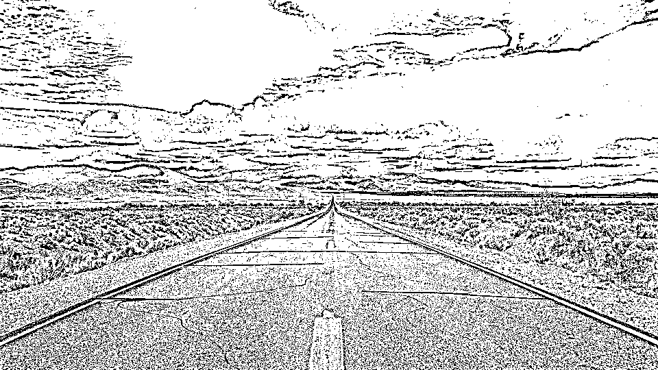

**第二阶段**

**“我的占星咨询的价值到底是什么？”**

**占星师的工作是帮助客户感到自己有能力应对面前的任务，无论这个任务是什么。所以占星师通过帮助客户认清现在的情况，从而赋予客户更大的力量。占星师的工作就是看到在表面之下，还有另一个事实。**

**——苏·汤普金斯**

到了 2017 年，我觉得自己进入到了一个更深的水域。这个阶段我想要通过咨询去挖掘背后更深的层次，但是我并不知道这对于客户的意义到底是什么？客户是不是真的在这个过程中获得帮助？在这整个过程里我感到孤独和不安。

**在这一阶段我主要的思考，还是让客户满意的咨询和对客户有所帮助的咨询，但是我也开始深究占星服务的价值究竟在哪里。**

这个问题我其实问过苏老师，也问过一些其他的占星师。每个人给到的答复都不一样，你可以去选择和你自己的理念以及价值观相匹配的。

2016 年夏天，苏·汤普金斯老师来北京开工作坊。当时我们组织了一个十几个同业人员的圆桌会议，问到苏老师：你觉得占星咨询的价值到底是什么？

苏老师是一个很睿智、很冷静、很清晰的人，她说的话并不复杂，但我记了很久：**其实咨询就是改变别人的看法，就是提供一个新的角度**。

后来我从她的文章中，我又看到了一个更丰富的版本：

**一场好的咨询，或者说两个人之间一次有益的交谈，可以改变这两个人对事物的认知，从而改变他们的现实情况。换句话说，问题本身已经发生了改变，实际上，这是一个科学的法则，对事物的看法可以改变事物，这就是为什么你不应该做个人层面的预测。**

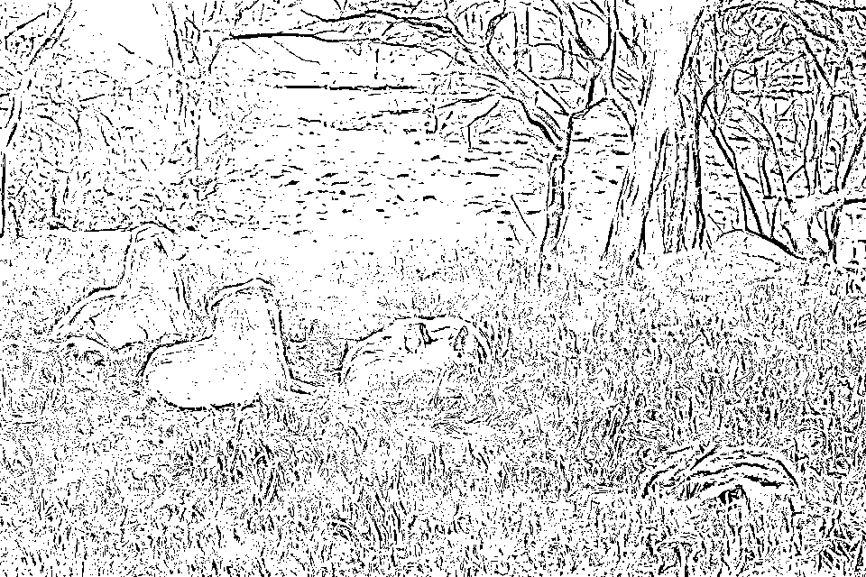

第二个阶段，我觉得自己经历了一个专业上的进修，包括咨询技巧，参加大师的课程和工作坊，也荣幸地成为若道的专职助教。

再次学习和教学是一个相互增长和助益的过程，感觉真的很美妙。也遇见了很多同学与我相互支持，一起成长。在这个过程中，很大程度上缓解了我的孤独感和不安感。

在这个阶段，我还做了很多关于自我成长方面的探索。**我发现当接纳自己激烈情绪的时候，就更容易去面对客户的激烈情绪**。所以现在，即使有客户和我说他人生的一些疾病灾难或者疾苦，我不会再心里一紧，而是能够更平和。

我知道这可能是一个很有挑战的事情，而我也拥有足够的勇气，可以更自在地和他一起去经历、去面对。同时，我也发现占星师是一本书，你有多厚，客户就能看到多少。

**自己要变得更厚实，更能照顾和接纳自己的情绪，然后有更多滋养自己的能力，才能够更自在地面对客户。**

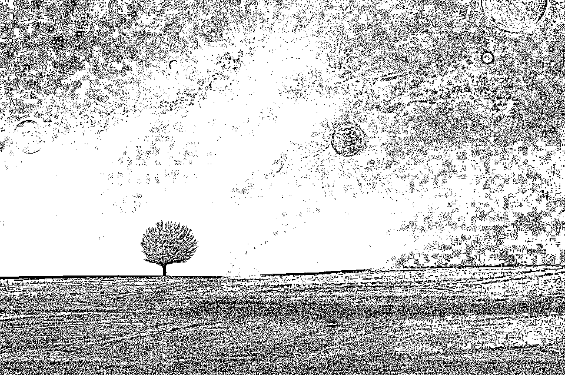

**第三阶段**

**找到自己笃定的信念**

2018 年，我又去接受了一些咨询，包括斯蒂芬·弗里斯特老师的占星解读，还有若道外籍老师的咨询。**在接受咨询的过程中，作为客户的我发现被理解和被接纳，以及不被评判的那种感受，是多么重要，是多么美好**。

在这个过程中，我也在换位思考。举个例子，当时安静地听斯蒂芬老师给我解读的时候，我发现自己的眼泪会掉下来。即使有一些内容我已经在他之前的工作坊听到过，但我仍然**感受到被关注、被接纳、被疗愈**。

然后，我写了一份用户反馈给斯蒂芬老师，我说我想成为他这样的占星师。希望客户在接受完我的咨询之后，能够反馈给我说，**感受到了力量，感受到了内在一些东西在成长**。

**在这个阶段，苏老师的课程对我帮助特别大**。苏老师是一个特别有魅力的水瓶座，刚开始的时候，可能同学们都会有点懵，觉得老师为什么总说“我不知道”。

后来我发现她在说不知道的时候，其实并不是真的不知道，有时可能只是口头禅。很多时候你问了一个问题，她说了不知道后，还会说很多。

她的态度很冷静，也没有全知全能的压力和人设。跟着她学习，你会发现她有些东西讲得真的很棒。有时候我们重新去理解她对于一个相位或者星图征象解读的时候，都会觉得真的是太棒了。她是一个知道很多的人，但是也会坦然地说“我不知道”，让我们看到了她的务实与踏实。

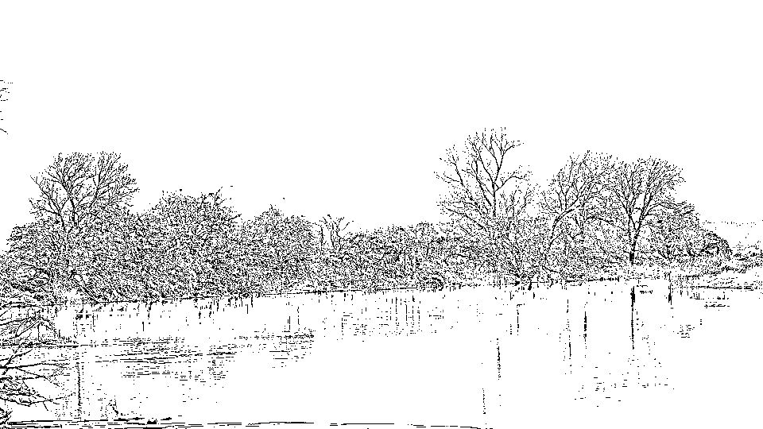

**后来，我把占星师这样一种所谓全知全能的压力还给客户的时候，我发现对于自己不满意的咨询，也知道怎么去处理了**。

有时候我会和客户说，我觉得之前可能聊得并不是很深入，或者不知道你的感受是怎样的，客户也会反馈一些感受。另外，我发现客户状态和意识的改变，让我觉得每个人都有巨大的潜力。这样也建立了一种信任，让我们成为“潜水”的伴侣。

以上这些就是我的**心路历程和感受**，以及**我现在笃定的一些信念**——**人本主义占星学**。

你要找到客户卡住的那个模式，那个模式背后的信念，他卡住的信念是什么，为什么形成了这个信念，我们要去看到那个模式和信念，要用意识的光和觉知的光，去看到那些藏在海面下的巨大冰山。去减轻那种被卡住的无力感，从而通过更新理念，刨除那些老旧的模式，成为一个更能掌控我们生活方向的人。

**对于占星师来说，如果我们能够去陪伴客户经历他人生中激烈的生活，陪他经历困难，成为他信任的助手，或者服务的提供者，这可以给我们带来很大的满足感。而且在过去执业的过程中，我发现我们是可以这样去做的**。

**版权声明：**本文由若道整理发布，欢迎转发，反对抄袭。友号转载请申请白名单。

********想阅读更多作者的文章，请在后台回复**************** 咔咔 即可。********

**咔咔**

职业占星师，2017 年度若道兼职助教

ISAR 认证占星师（2014 年获得）

国际知名广告公司和市场研究公司工作十余年

**微信公众号**：咔星人

长按打赏

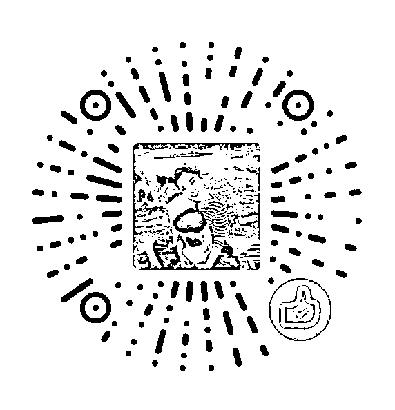

**ISAR 认证职业占星师必修课**

**占星学是非常好的“开展副业”的选择：**这个**为期 16 个月**的课程不仅可以帮助你学到一个终身可用的技艺，而且也可以选择成为自助助人的占星师，**开启受益终生的第二事业。**

**占星学也是越老越好的职业：****占星学的技术层面非常稳定，不会快速迭代变化。**

**占星学是现代社会需要的助人职业：**社会快速发展和变化人们似乎越来越无法掌控自己的生活，这给很多人带来巨大的焦虑，**抚慰心灵的咨询市场需求巨大。**

**ISAR 认证职业占星师的独有培训：**目前占星学的培训市场鱼龙混杂。而 ISAR（国际占星研究协会）是一个包含了 47 个国家在内的国际占星组织，在国际占星领域备受尊重。今年，ISAR 对于成为 ISAR 认证职业占星师提出了更高的要求，**所有想要获得 ISAR 职业占星认证的申请者均需要在 ISAR 的附属学校通过 500 个小时的研习（包含****主课****、选修课、沙龙、作业、讲座、工作坊等等）。**

**而这门核心占星学课程就是为此准备的**

**连报 L1-5 全阶网络直播课程，你可以享受**

❶ 64 次线上直播互动网络课程+2 场工作坊。
❷ 知识点+学员星图解读有机结合。
❸ 微信群学员互动分享。
❹ APP 答疑论坛提问。
❺ 若道独有的职业占星师养成计划，为你毕业后独立咨询做准备。 

**❻ **提供咨询平台，优秀毕业生有机会入驻若道咨询平台，拓展咨询客户群。

**老师和助教**

**大卫·瑞雷（David Railey）**

*   **I****SAR 董事会成员，ISAR 全球副主席，ISAR 全球职业占星师资质认证主席，若道占星创始人**。

*   2016-2019 年，被选为国际占星协会（ISAR）考试委员会成员，国际占星协会（ISAR）是世界最大的国际占星机构，会员遍布 47 个国家。

*   2017-2020 年，被选为国际占星联盟（ISAR）考试委员会主席，理事会成员。

**占星师咔咔（Caroline）**

2010 年师从美国占星师大卫·瑞雷学习，并得到世界名师斯蒂芬·弗里斯特、罗伯特·汉德、苏·汤普金斯传授各种占星学技法。若道首届学员，国内最早获得 ISAR 职业占星师资质的职业占星师，2019 年第二届、2021 年第三届核心课中和苏·汤普金斯老师一起教授若道核心占星课程。

在国际知名广告公司和市场研究公司从事的市场研究和推广工作十余年，曾任职于阳狮集团、尼尔森市场研究有限公司、MTV 和《Madame Figaro》杂志。

**助教王嘉祺 （Conrad）**

ISAR 认证占星师、若道认证生时校正资质，从 2010 年起自学占星学，2015 年开始在若道系统学习，并开始个案咨询。2018 年担任若道核心课程助教，以及卜卦占星学和太阳返照选修课助教，并带领学员进行经世占星和太阳返照方面的研究。2019 年 11 月作为演讲人之一参加了国际占星协会（ISAR）北京大会，也是 ISAR 星空俱乐部中国区第 16 期的主讲人。

**课程费用**

**★ 1-5 阶 连报**

**早鸟价：33000 元（2022 年８月 1 日之前）**

**课程费用：46500 元** **★ 1-2 阶 （8 月 30 日开课）**

**早鸟价：2800 元（2022 年８月１日之前）**

**课程费用：3500 元 ****★ 1-3 阶　连报**

**早鸟价：10500 元（2020 年８月１日之前）**

**课程费用：11500 元 **

**咨询课程请联系顾问**：**王老师（微信/手机：18510107057，请备注“大卫核心课”）**

**更多课程信息可点击下图查看~**

**20 位来自世界各地的占星师****带来 19 场沙龙——新世界的觉醒****详情可点击下图**

**学习占星学****点击下图了解课程详情**

**

**微信又双叒叕改版啦，不想错过若道君的推送？**

**就把若道设为星标吧！**

**▼**

**喜欢记得点一下在看哦☟**

********报名直达入口********

# 送给自己的端午节礼物|这个世界上，没有后悔与占星学相遇的人

> 原文：[`mp.weixin.qq.com/s?__biz=MzA5NjA0NTAxNg==&mid=2651475237&idx=3&sn=18f4241a0ca1929a583d94b56e7dd674&chksm=8b48ff92bc3f7684940bc3e5f5480f1f073070e865f45edd77e6c8e3b3acfa4ace7adbf61d5f&scene=126&sessionid=1692737806#rd`](http://mp.weixin.qq.com/s?__biz=MzA5NjA0NTAxNg==&mid=2651475237&idx=3&sn=18f4241a0ca1929a583d94b56e7dd674&chksm=8b48ff92bc3f7684940bc3e5f5480f1f073070e865f45edd77e6c8e3b3acfa4ace7adbf61d5f&scene=126&sessionid=1692737806#rd)

5 月，一个若道的老朋友突然发来一段微信，是对木星进入白羊座的感慨。这位朋友创建了自己的公司，他并不在占星行业，但仍经常记录占星日记，因为他总是体会到星体移动和个人生命变化的契合。

过了几天，又一位若道的老朋友发了一张当天新闻的图片，里面有医疗板块产业趋势、有啤酒股的泡沫问题、有千年老二的饮用水公司也要上市。她说，看，举目全是海王星。她也不是占星师。

然而，他们都与占星相遇，占星已经融入了他们的生活。

第一位朋友说，”在若道学习占星，对我来说建立了一个整体的世界观以及对自我内在的解释论。”

第二位朋友说，“学了占星就会知道，事情来时我们不必过度反应，知道一切会过去”。

占星学会改变你，不论你跟随它走多远，不论你是否选择成为占星师。

这个世界在飞快地变化着，占星学可以像定海神针，帮你测度这个世界的变化，也帮助你校正心中的自己和世界的样子。

**这个世界上，应该还没有后悔与占星学相遇的人。**

**8 月 30 日，新的若道占星核心课程要开始了。**

如果你还没有下定决心是不是好好学占星，那么 L1-2 可谓一个轻松的前菜，等着你品尝。

**端午节到了，把这个仅需投资 2800 元的课程作为礼物，送给自己或者自己所爱的人。**

**课程试听：不分组转发本文，找王老师领取。**

长按二维码添加王老师微信

**谁是你的老师？**

**占星师咔咔（Caroline）**

2010 年师从美国占星师大卫·瑞雷学习，并得到世界名师斯蒂芬·弗里斯特、罗伯特·汉德、苏·汤普金斯传授各种占星学技法。若道首届学员，国内最早获得 ISAR 职业占星师资质的职业占星师，2019 年第二届、2021 年第三届核心课中和苏·汤普金斯老师一起教授若道核心占星课程。

在国际知名广告公司和市场研究公司从事的市场研究和推广工作十余年，曾任职于阳狮集团、尼尔森市场研究有限公司、MTV 和《Madame Figaro》杂志。

**大卫·瑞雷（David Railey）**

*   **I****SAR 董事会成员，ISAR 全球副主席，ISAR 全球职业占星师资质认证主席，若道占星创始人**。

*   2016-2019 年，被选为国际占星协会（ISAR）考试委员会成员，国际占星协会（ISAR）是世界最大的国际占星机构，会员遍布 47 个国家。

*   2017-2020 年，被选为国际占星联盟（ISAR）考试委员会主席，理事会成员。

**助教王嘉祺 （Conrad）**

ISAR 认证占星师、若道认证生时校正资质，从 2010 年起自学占星学，2015 年开始在若道系统学习，并开始个案咨询。2018 年担任若道核心课程助教，以及卜卦占星学和太阳返照选修课助教，并带领学员进行经世占星和太阳返照方面的研究。2019 年 11 月作为演讲人之一参加了国际占星协会（ISAR）北京大会，也是 ISAR 星空俱乐部中国区第 16 期的主讲人。

**内容是什么？**

**开课时间和课程费用**

**８月３０日开课，每周一次，20：00-22：00，10 节课。**

**★ 1-2 阶 **

**早鸟价：2800 元（2022 年８月１日之前）**

**课程费用：3500 元 **

**你也可能想学更高阶：**

**★ 1-3 阶　连报**

**早鸟价：10500 元（2020 年８月１日之前）**

**课程费用：11500 元 ****★ 1-5 阶　连报**

早鸟价：33000 元（2020 年８月１日之前）

**课程费用：46500 元 **

德国哲学家雅思贝尔斯说：

教育是一棵树摇动另一棵树，

一朵云推动另一朵云，

一个灵魂唤醒另一个灵魂。

你准备好被摇动了吗？

**退转课程**

**退款原则请详看《教学协议》，如有疑问请咨询课程顾问。**

**课程试听**

**不分组转发本文，加王老师获取。**（微信/手机：18510107057，请备注“大卫核心课”）

****2022 L1-2 认证职业占星师必修课程****

**授课老师：大卫·瑞雷、咔咔、**

**直播课开课时间：2022 年 8 月 30 日（周二）开**

**授课方式：******网络授课，英文/中文授课，中文翻译****

**费用：**3500 元**（早鸟价 2800 元,8 月 1 日前）**

**课程负责人：王老师**（微信/手机：18510107057，请备注“大卫核心课”）

长按二维码添加课程负责人咨询~

****报名直达入口****

# 插班中丨让卜卦占星大师为你免费解盘，一个不确定世界的确定性绝技

> 原文：[`mp.weixin.qq.com/s?__biz=MzA5NjA0NTAxNg==&mid=2651475059&idx=3&sn=38a0af825eb5f06b38924186c1ecf184&chksm=8b48fec4bc3f77d24458df65a682070f5d01b644e733f2937f77319f92ee55d3db0127749e18&scene=126&sessionid=1692737806#rd`](http://mp.weixin.qq.com/s?__biz=MzA5NjA0NTAxNg==&mid=2651475059&idx=3&sn=38a0af825eb5f06b38924186c1ecf184&chksm=8b48fec4bc3f77d24458df65a682070f5d01b644e733f2937f77319f92ee55d3db0127749e18&scene=126&sessionid=1692737806#rd)

也许你会发现，这个世界变得越来越不确定了，变化也越来越无法预料。在一个越来越不确定的世界，有一个占星技法，能够帮助你和你的客户洞悉变化的方向、变化的原因、变化的本质、变化的可能结果，这个技术就是现代卜卦占星。**没错，卜卦占星就是一个在不确定世界的确定性的绝技！**5 月 3 日，现代动态卜卦占星课程正式开始了。参与课程的同学都表示无比精彩，大呼过瘾！你还在等什么？快来报名吧！越来越不确定的社会中，卜卦占星可以帮助我们的不是简单的“是”与“否”的答案，而是能帮助你**对于变化本身掌握其他任何方式都无法掌握的信息。**而信息可以给我们带来一些安定感和释然。我们也可以把这种感觉带给我们的客户。这个课程对于来参课的同学有一个特别的福利：**每位同学都可以在课程期间把非常想用卜卦了解答案的事情提交给邓肯老师，你的案例有很大可能被抽中作为教学案例请老师帮你现场解读！**要知道，邓肯老师的一个解盘加上翻译价值就有 2500 元！如果你在这两个月期间，碰巧遇到多个真实的问题，而确实是好的案例，你甚至会有多次被老师解盘，和老师对话的机会！**不仅如此，课堂还会有择时案例的选取，也都是用同学提交的案例来进行讲解。你假若有一些重要的需要择时的需要，也许也可以被当作案例挑选出来。**有的同学问，那是不是人人都有机会呢？这个取决于你提交的案例的价值。毕竟，8 次课程都是用案例教学，真实、有迫切需求的案例被选中的机会很大。而且，平时还有一起学习的同学一同陪你解盘。既学习了现代动态卜卦的技能，又有很大可能获得老师的亲自解读白赚一次大师解盘！这样的机会别说没有大声告诉你。

**卜卦占星可以问什么问题呢？**

从人生大的决策到小的决策，卜卦占星都可以给与一些答案。随便给一些真实的卜卦例子：**·** 经济形势不好，公司今年要裁员 30%，此轮裁员会裁掉我吗？我是不是应该早做准备？**· **我在这个公司已经工作了 20 年，很舒适。但是我现在有 2 个机会，我想辞职创业，我不知道这样做是不是太冲动？另外，我有 2 个可能的创业方向，哪个方向更可能成功？**· **此次疫情，我的小区会被封闭吗？我需要储存更多食品吗？**· **股市下跌，我该卖出股票止损还是应该补仓？**· **我今年能卖掉这个房子换一个有小院子的房子吗？**· **我妈妈给我介绍了一个对象，这个人是不是合适的伴侣？如果是，我们何时可以结婚？**· **我的上司会被调走吗？我和他关系很好，不知道新来的上司能否处好？**· **离婚很艰难，老公迟迟不签字，而且他在转移资产？我可以怎么做？**· **我有一个移民到加拿大的机会，我应该移民吗？移民后可以顺利找到工作吗？**· **我的孩子是选择留学还是在国内读书？**· **我的母亲被诊断为癌症，她该选择手术还是保守治疗？**· **我迟迟无法怀孕，治疗到现在没有结果，我还能怀孕吗？大概什么时候会怀孕？**· **我的小狗跑丢了，我还能找到它吗？**· **我已经是大龄产妇了，现在快到预产期，我身体也还可以，但是也有一些小毛病。所以我很踌躇，不知道应该选择剖腹产，还是自然产？**· **我们到底要不要三胎？如果你是占星师，你的客户很可能在这个不确定的环境里，会遇到类似的各种各样的人生问题，而现代动态卜卦占星则是一个无法代替的技能，帮助你拓宽为客户服务的业务范畴。课程持续报名中，欢迎了解！

**对现代动态卜卦占星的 7 个问题**

**1****什么是现代动态卜卦占星？**

现代动态卜卦是将有传统历史的卜卦占星和现代人本主义占星的精神结合在一起，**更适合现代社会现实状况**的卜卦占星技法。

**2****卜卦占星的特色是什么？**

**随时随地可用，**帮助你从这个卜卦星图中洞察当下你所期望了解的事情和人的现状、发展趋势、可能发生什么事情、可能的结果，及什么时候会出现什么结果。

**3****动态卜卦占星是什么意思？它重要吗？**

动态卜卦非常重要，因为事物不是静止的，而是变化的。**动态卜卦不仅会让你看到人和事物的状态，还可以让你看到其发展和变化的过程，**会碰到什么事情。

动态卜卦的美妙之处是它不是静止的一个照片，而是**描述一个故事的开始、发展和结局。**

**4****卜卦占星什么情况可以用？**

**万物万事皆可卜。**什么都可以用。1-12 宫所包含的人事百态，事业、健康、金钱投资、商务、旅游、教育、法律、生育、宠物养育等等。

卜卦占星也可以帮助我们去看某个社会事件、国际事件的发展，**可以和经世占星相结合。**

**5****它如何与人本主义占星结合？**

因为从卜卦行星可以看到参与人的**心理状态、心理过程和面临的议题**。而如果当事人愿意去调整自己的内心状态，就不再完全是被动的，而是可以以更积极主动的方式参与到事件中去；或者能够更理解目前的外部环境，选择更安然地调整内心。

**6****卜卦占星可以和人本主义的咨询相结合吗？**

当然。在课程中，老师将会仔细讲如何**把卜卦占星和出生星图及预测技术结合在一起，**给客户提供更好的服务。

**7****如何学好现代卜卦占星？**

**实践，实践，实践。**

占星学是一门必须大量实践的学问。纸上谈兵没有用，只是听课没有用。

实践是一步步来的。你不必知道所有的卜卦技法才开始实践。**从第一节课开始，你就可以进入实践。**

实践刚开始可能只是模仿。**我们有大量的真实案例，也安排了很多作业让大家练习。**也给大家拿自己的案例和老师互动的大量机会。

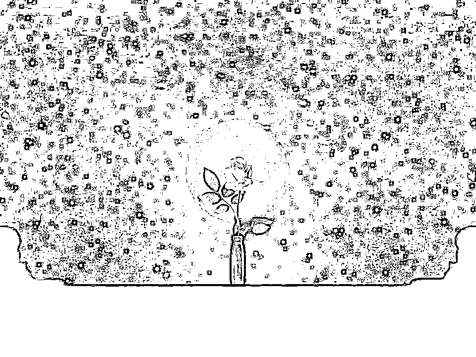

**授课老师**

**艾德里安·罗斯·邓肯****（Adrian Ross Duncan）**1971 年在印度游学时开始学习占星学，1985 年开始成为全职占星师，**迄今执业已超过 33 年，是人本主义占星学、卜卦占星学和经世占星学领域的知名占星师。他还开发了占星软件 AstroClock 和多款占星报告。**他在日常咨询中都会运用卜卦，咨询图（卜卦的一种运用方式，即根据客户来访时间制作星图，从星图中获得大量信息）也是他**特别擅长的领域**。艾德里安·罗斯·邓肯从 1971 年开始研习佛学，受佛学影响很深，他**相信占星学和佛学观点统一、转化的一个基础是在于对现实感知的改变**。而卜卦很容易与佛教融合，因为它只关乎当下。

| 艾德里安·罗斯·邓肯的占星学著作

作为本次课程的主讲老师，艾德里安·罗斯·邓肯如是说：

卜卦星图不仅给出了当下的能量状态，**它还包含着过去的踪迹，也蕴藏着未来的种子。**它是心理的，也是事件的。一个好的占星咨询是要把过去、现在和未来交织成一个整体。

**卜卦星图告诉客户他们当下在哪儿，他们处于的能量状态是什么，这张星图和他的过去有哪些关联，他可以怎样和这张星图一起合作去挖掘一个积极主动的未来。**这里预测的未来不是强加给他们的，这个未来是一点点揭露给他们看的。

心理占星学和卜卦占星学别无二致，所有的事件都有其心理对应。如果你的意识与世界同步，你就会看到二元统一。

行进和推进帮助我们理解如何抵御外在和内在的风暴。卜卦如同显微镜下的行进。**通过行进难以准确了解一段关系、房屋购买、工作机会等是否有益，但对卜卦来说并不难。卜卦也擅长回答与时间相关的问题，对行进和推进的标志进行微调。**

**课程形式**

**15 节录播课+8 节直播课线上网络课，英文授课，中文翻译。**

**15 节录播课为 2020 年动态现代卜卦课程的内容。8 节直播课则完全是案例教学的形式。**

这样的好处是，你可以通过 1 个半月的密集学习之内按照自己的进度学完录播课的理论和录播课中已有的案例，从学习开始就实践，然后把实践中遇到的问题拿到 8 节直播课中，和老师互动。

**在 8 节直播课中，老师也会用案例教学、和同学互动的方式帮助大家进一步掌握卜卦占星的技法。**

**授课时间**

**付费后一天即可开始看录播课程，全程有助教老师回答问题。**

**直播课程开始时间：**

2022 年 5 月 3 日，每周二 20:00-22:00

**这次课程恰逢世界在巨大的变动和不确定之中，期待这门课程能够给各位及各位的客户带来新的洞见和方向。**

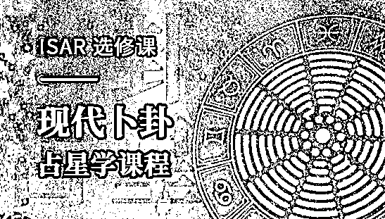

**在这次 8 次直播课程中，我们将采用案例教学的方式，所有参课同学均有机会提供案例，供老师解读，且我们将组织群体的练习，用大量案例帮你掌握卜卦及如何在咨询中用卜卦。**

**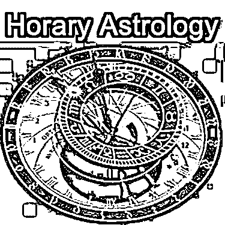**

**授课内容**

***Part1***** 融合现代占星理念，整合动态占星知识**

星图如同地图，展示了人们从哪里来，现在在哪里，以及可能的去向是什么。卜卦星图虽然显示的是当下这一刻，但却是在动态当中的。所以过去的运动轨迹对应着过去所发生的，接下来的运动轨迹对应着接下来要发生的。

**在课程中你会学习到：**

*   我们如何从一张卜卦星图看到时间的流动：从过去到未来，故事如何展开

*   心理占星和事件预测如何在卜卦占星中有机结合起来

*   卜卦星图如何回答是否的问题

*   如何用卜卦星图回答分析性和指导性的问题

*   现代动态占星中事件发展的顺序：

*   确定咨询图中强调的当前事件

*   将客户与相位或行星组合相关的情感能量关联起来

*   在早期经历中找出相似的情景

*   认识到过去和现在的情感完全相同

*   辨识出过去做出的所有限制性决定

*   通过头脑风暴找出更能带来力量的方法来解决相同类型的问题

*   在想象和现实生活中重演当前和未来的事件

***Part2 *****独家【现代动态卜卦占星技术】全面教学**

哥本哈根占星学院院长艾德里安·罗斯·邓肯 Ardian Duncan 老师 50 年卜卦占星经验倾囊相授，内容包括但不限于：

**1.卜卦中的行星**

*   行星强弱及力量

*   太、月、水、金、火、木、土在庙旺落陷时的意思

*   卜卦星图中的月亮及其在 12 宫的意义

*   卜卦星图中的外行星

*   卜卦星图中的恒星

*   上升点和指征星的度数

**2.如何选择和辨识征象星**

*   当问题出现时，如何判断征象星

*   如果两个人或物由同样的征象星指代该怎么办

**3.卜卦图中的相位**

*   不同相位的意义

*   征象星之间相位的意义

*   征象星与其他行星相位的意义

**4.卜卦中的宫位**

*   12 宫位和宫位系统

*   对宫位的动态观察

*   宫主星及其互动

*   互容和定位星

**5.卜卦中的星座**

**6.传统卜卦原则（约束和限制条件条件）及其在现代动态卜卦中的应用**

**7.空亡、光线传递、完成、围困、燃烧之路等**

**8.星图中的逆行及其讲述的故事**

*   水星和计划

*   金星与依恋

*   火星与斗争

*   外行星逆行

**9.应期与时机**

*   1 度是代表多久

*   宫位的重要性

*   行星速度和逆行

*   如何综合卜卦和行进、次限分析时间问题

***Part3*****  学以致用，覆盖人生各个领域问题的卜卦解法**

希望将现代卜卦占星学的精髓传达出来，精细地讲解每一宫所代表的卜卦事物，分主题详解不同类型问题的卜卦解读思路，内容包括但不限于：

**1.爱情和关系**

*   金星的重要性

*   第一宫和第七宫以及其中的行星

*   成对行星

*   上升点、下降点及其守护星

**2.业务和工作**

*   第十宫和第六宫以及其中的行星

*   木星和土星及其相位

*   火星和水星

*   行进和中天

**3.资金和资源**

*   第二宫和第八宫以及其中的行星

*   第五宫和第十一宫

*   金星、木星和土星

*   四元素的意义

**4.家庭和大家庭**

*   第四宫和第十宫及其守护星

*   第五宫、十一宫及其守护者

*   第五宫和第十一宫的行星

*   月亮

**5.社会、法律、智性、健康、存在主义的问题**

*   第九宫和第十二宫及其中的行星

*   木星和第九宫守护星

*   第三宫 、第十一宫、第六宫和第八宫

**6.如何解读事件星图**

*   从新闻学习卜卦盘

*   如何从卜卦盘看新闻事件和世界大事的发展变化

*   我们如何去培养自己观察有预兆意义的信息、从日常事件中捕捉启迪

*   占星解读的意义

***Part4 ***** 扩展延伸择时占星技法的新认知**

在择时的时候，我们会选取征象星处于有力的时候，来规划我们的事件；避免征象星不力的时候，尤其当这个征象星代表我们自己。

**择时星图一瞥**

*   择时的艺术

*   如何在不完美的天象下取得最佳结果

*   如何做出深思熟虑的回答

*   如何为约会择时

*   如何为婚礼择时

*   如何为商业活动择时

*   如何为旅行择时

*   如何为对抗事情择时

*   虚拟和实时会议的择时

***Part5  *****如何运用卜卦占星学做一场转化性的咨询**

虽然卜卦的结果可能是不利的，但我们仍然可以从心理占星学的角度给出一些积极建议，帮助客户建立信心，有助于应对之后的人生。客户出生星图与卜卦星图的关联，这在咨询中对于心理方面的考量是非常重要的。

*   一个好的咨询有哪些特色

*   咨询星图及其应用

*   如何用卜卦星图和新客户在短暂的咨询开场白快速建立信任

*   如何综合卜卦星图、出生星图、次限图一起分析

*   如何用卜卦星图聚焦当下的问题

*   如果客户在一场咨询提出多个问题，要看多少卜卦盘

*   如何在一个充满挑战的卜卦星图中寻找客户资源、有利的时机，找到支持客户的策略

*   如何从客户故事中寻找意义

*   卜卦星图如何从事件维度和心理维度来解读

*   当看到客户不愿意看到的结果可能出现时，如何开展对话

*   改变的方法

**什么人适合参加本课程？**

*   想要系统学习现代动态卜卦占星的学员

*   想在生活中熟练使用现代卜卦占星学

*   在咨询中想帮助个案更清晰的分析解读困惑

*   想参加 ISAR 认证考试，此课程是 ISAR 选修课

*   希望通过卜卦占星帮助自己和身边人挖掘一个积极主动的未来

学习整合卜卦技巧，不仅有益于想钻研卜卦占星学这个分支的同学，对占星初学者也很有有帮助，可以让你的占星技巧加倍。

**学员评价**

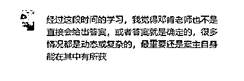

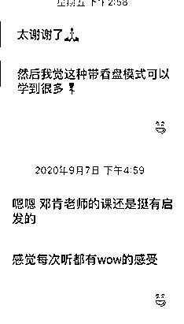

**课程费用**

**课程价格：9900 元**

**老学员复训专享价：**

**2020 年参加艾德里安·罗斯·邓肯卜卦占星课程的同学：****2900 元**

**2018 年参加艾德里安·罗斯·邓肯卜卦占星课程的同学：****4900 元**

**特别优惠****：**

**分享课宣到朋友圈****保留 48 小时****（不设分组显示）截图给课程顾问可获得****400 元优惠****。**

**课程负责人：童老师（微信：nodoorDaivd），请备注“卜卦”**

长按二维码添加课程负责人咨询

**退转课程****退款原则请详看《教学协议》，如有疑问请咨询课程顾问。******现代动态卜卦占星实战课·ISAR 选修课****

**授课老师：艾德里安·罗斯·邓肯**

**授课时间：**2022 年 5 月 3 日

**授课方式：**网络课程，英文授课，中文翻译

**费用：9900 元；****2020 年老学员复训价：2900 元；2018 老学员复训价：4900 元；特别优惠，分享课宣到朋友圈保留 48 小时（不设分组显示）截图给课程顾问可再获得 400 元优惠。**

**课程负责人：**童老师（微信：nodoorDaivd），请备注“卜卦”

长按二维码添加课程负责人咨询

****报名请点击“阅读原文”****

# 现代卜卦占星学丨不用做“全知的神”，和客户沟通才是要紧事！

> 原文：[`mp.weixin.qq.com/s?__biz=MzA5NjA0NTAxNg==&mid=2651475059&idx=2&sn=e15a6cf33ce24e9f97732434f90b6f20&chksm=8b48fec4bc3f77d26ede9ecf77e09dbe001175947b0ca8326e232c3a15dd0525a984c8ce273d&scene=126&sessionid=1692737806#rd`](http://mp.weixin.qq.com/s?__biz=MzA5NjA0NTAxNg==&mid=2651475059&idx=2&sn=e15a6cf33ce24e9f97732434f90b6f20&chksm=8b48fec4bc3f77d26ede9ecf77e09dbe001175947b0ca8326e232c3a15dd0525a984c8ce273d&scene=126&sessionid=1692737806#rd)

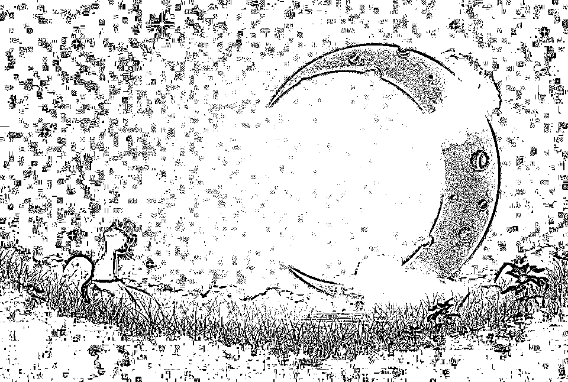

作者/若道君

编辑/翀子 图片/网络

之前的[【案例 1】](http://mp.weixin.qq.com/s?__biz=MzA5NjA0NTAxNg==&mid=2651472954&idx=2&sn=425d81db9f4d19190ba319b2b9a2daee&chksm=8b48f68dbc3f7f9b480a21d9dc0a9efb77175c7bd594a7b8b221f501d71fd772e5c2451c86d5&scene=21#wechat_redirect)[【案例 2】](http://mp.weixin.qq.com/s?__biz=MzA5NjA0NTAxNg==&mid=2651473218&idx=1&sn=cc51f08b052d17e34bc55013f6ddb86e&chksm=8b48f7f5bc3f7ee3ddd2c1eda5a833f9dba0ca804d46fc702bdbeac7686a80ff04985125f0e0&scene=21#wechat_redirect)[【案例 3】](http://mp.weixin.qq.com/s?__biz=MzA5NjA0NTAxNg==&mid=2651473498&idx=2&sn=cd1de5c018db2c4eb595698aaa1925eb&chksm=8b48f4edbc3f7dfb8a782fc5287971c51e24a08118f810484bae496067e3bccc64538bb6ef23&scene=21#wechat_redirect)[【案例 4】](http://mp.weixin.qq.com/s?__biz=MzA5NjA0NTAxNg==&mid=2651474130&idx=2&sn=7da11c5396459e21f94df9caa511c2b8&chksm=8b48fa65bc3f7373122565594a1f209bccd42323c47486f7a73287f1bb1e3ed2f8c598f990e2&scene=21#wechat_redirect)[【案例五】](http://mp.weixin.qq.com/s?__biz=MzA5NjA0NTAxNg==&mid=2651474784&idx=2&sn=c970634c55e0750c2e6081eac24bbf91&chksm=8b48f9d7bc3f70c1ce6a34f930f8a080c30515d37f03be2f4306659406acc29eb08c530ad787&scene=21#wechat_redirect)，若道君给大家展示了卜卦占星学如何在具体生活中运用。今天我们再用两个案例向你展现现代卜卦占星学的独特之处。如果你看完文章很感兴趣，可以点击[【现代卜卦占星学】](http://mp.weixin.qq.com/s?__biz=MjM5MjQwNjAyMQ==&mid=2649439533&idx=6&sn=c4d0ce92910c0c2b206c1d13783b32d5&chksm=beb9524789cedb516178823d66e51e43953a6e2e2ea621859902afa732e462d75489df2e26ba&scene=21#wechat_redirect)了解详情哦。**更好的与客户沟通**

一提到卜卦占星，大部分人都会认为，这就是给一个确定性答案的技术。

客户有一个问题，占星师给出一个答案，占星师就像一个回答问题的问答机。而通常这些答案都比较简单，占星师也不跟客户互动。对于不喜欢和客户互动的占星师来说，这一过程在现代社会用邮件就完成了，你连话都不用跟客户说。

**但是在邓肯老师看来，现代动态的卜卦占星却不是这么运作的**。既然现代的我们拥有非常便捷的沟通条件，**卜卦占星师完全可以和客户互动，以了解更清晰的客户背景信息，而不必扮演全知全能的这种上帝角色。**

这样其实可以更准确地给予客户反馈，为客户提供更好的服务。**有时候，客户甚至可以纠正占星师的一些假设性的看法。**

为什么说卜卦占星过程中，得到客户的反馈可以让占星师更好地为客户提供服务呢？

**首先，在卜卦占星中，非常关键的一点是，你需要在卜卦星图中找到在客户所问的事件中的有关行星的清晰的指代，这是卜卦星图判断非常关键之所在。**

按照邓肯老师的说法，就是给每个行星分配一个或者几个标签，你清楚知道那些关键的人物、事物、事件是由哪颗行星代表，而这并不是仅仅简单知道宫位的守护星那么简单。

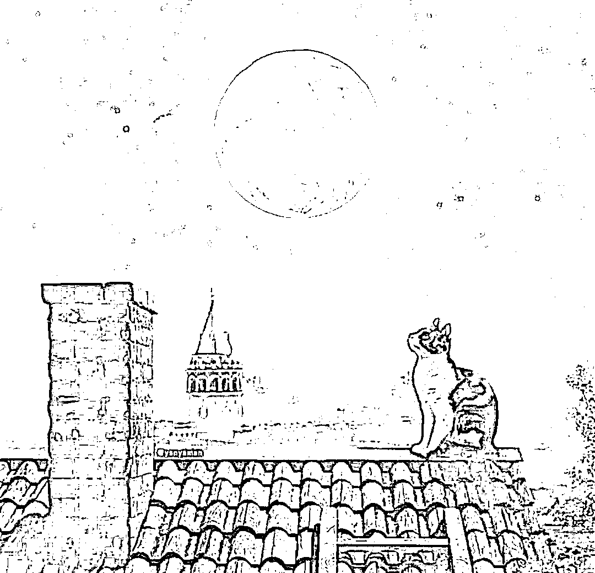

**案例**

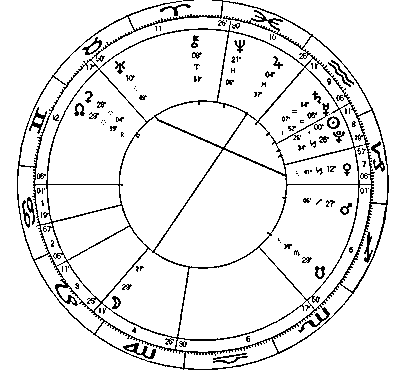

比如这样一个案例。有一位女士，她来问关于投资的一些问题。那么我们首先要找到这位女士的象征。

我们也知道，**上升点的守护星代表客户，**而当上升点是巨蟹座时，当你看客户的指征行星时，你可能不仅要看月亮，也要看太阳。

但是你看这个星图上的太阳和月亮，一个处于水瓶座的 0°，一个处于狮子座的末度，是两种非常不同的状态。**那么到底太阳更能代表这个客户，还是月亮更能代表这个客户呢？**

这时候，**通过咨询中的询问，**你获得了这样一些信息：

这位女士 3 年多前得了癌症，与此同时，她的丈夫为了另一位女士离开了她。此前，她和丈夫创建了一家公司，而她生病了，失去了丈夫，同时也失去了工作。现在她已经康复，而且交了一位新的男友，她和他之间处于非常开放的关系。

**而这些，如果你没有在咨询中提问，你是不知道这些信息的。**而这些信息都可以帮助你确认，这个星图中的太阳更代表这位女性。毕竟，**在卜卦星图中非常重要的是，这个卜卦图一定要像一张全息的相片，照出这个客户和她生活中的状态。**

如果你看到的征象星无法和客户的描述的状态有很大差异，那么一定有什么地方不对。

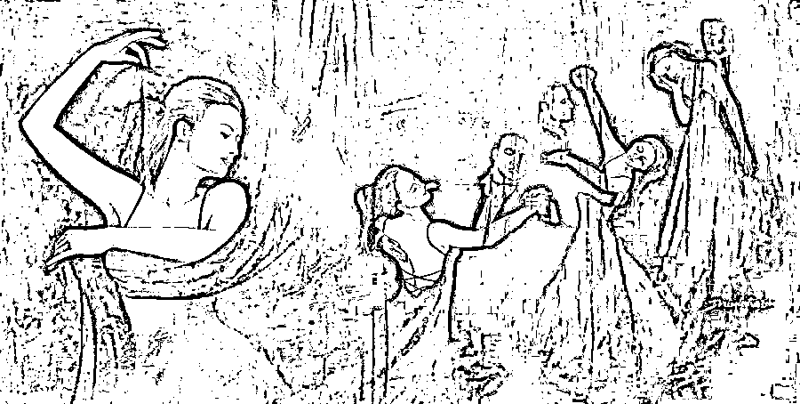

**同一颗征象星的多指代性**

**其次，在卜卦中，同一颗征象星，可能是代表了多个人、事、物。**

比如 10 宫的守护星，既可能是你的父母之一，也可能是你的岳父母之一，还有可能是你的老板。那么，假设这颗星是火星落在天秤座，与土星成了四分相，可能在卜卦咨询中，你注意到了这个信息，而你觉得也许这个信息可以对你的客户有所帮助，但是你怎么知道这个行星到底代表了谁呢？

**这时候，与客户的互动就可以帮助你。**

比如，你可能问，“你的老板是不是一个做事比较犹豫的人，最近也遇到了一些困难的事情”。而客户回答，“我的老板，为人也很苛刻，脾气很坏，但做事很雷厉风行，我没有听说他遇到什么难事，看他最近挺顺的。”

那你就知道，在这张卜卦图上，那个 10 宫的守护星火星估计代表的不是老板，而是其他更合适这个配置的人物或事情。

在这样的卜卦咨询中，占星师做出这样假设性的猜测，如果出现错误，也根本不必担心损坏了自己的形象，**而是可以非常坦然地告诉客户，那我这个假设看来不对。**

在现代卜卦占星中，占星师从来不代表那个全知全能的预言师的角色，和大家所学的人本主义占星相似的是，**占星师是一个可以通过和客户的对话，了解更多信息，通过客户的帮助，从而更清晰透视这个星图意义的人。**

而这样的对话，也可以帮助占星师**校准自己的猜想，从而做出更加准确的预测，并可以给出超出客户所提问题之外的信息**，毕竟，你有一个星图，这个星图上可以给出很多信息内容。

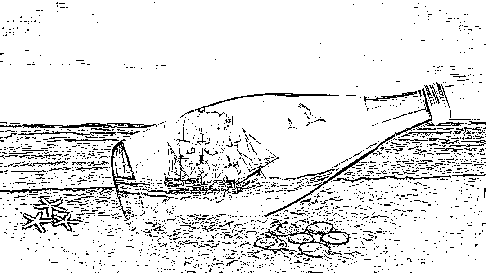

**案例**

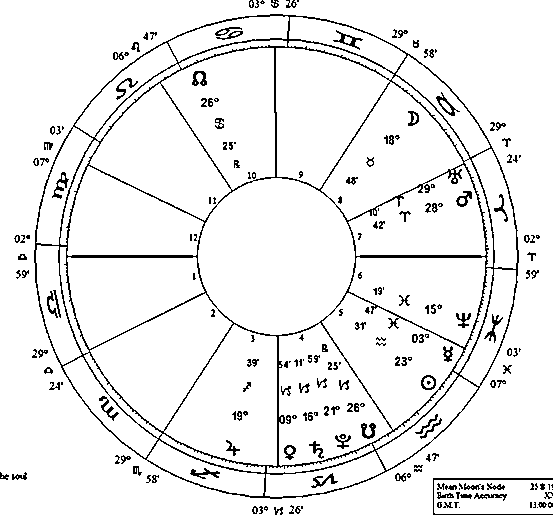

比如这个例子。这位女士来找占星师做卜卦咨询，其实是想问公司方面的事情。**她丝毫没有提及情感方面的问题。**但是占星师却从这张星图，看到了一些问题，代表伴侣的火星入相合相天王星，而代表她个人的金星，也是代表关系的金星要去合相土冥。

于是在咨询完投资的事情后，占星师提到了她的关系问题。这位女士觉得自己的关系很稳定，虽然好像有一点点隔阂，但是她觉得没有什么大问题，而且最近她的心思都在事业上面。

**因为咨询还有一些时间，所以，占星师更多地问了一些两人的关系中到底有什么问题。**两个人的谈话让这位女士有了更多的沉思，于是找伴侣谈话，结果发现伴侣其实已经有了外遇，正打算离婚。这对那位女士而言不可谓不是晴天霹雳。

**所以，一张卜卦图和一场卜卦咨询可能带来更有价值的信息，而不是仅仅回答大家常见的“是”与“否”的问题，或者“什么时候”的问题。**

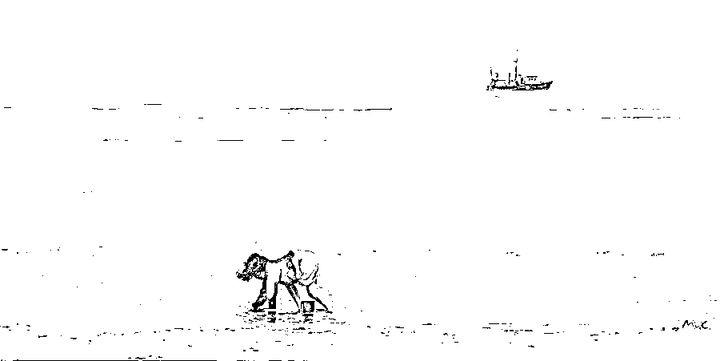

**生动的课堂**

现代动态卜卦占星学还可以给出客户心理上的一些洞见，不过我们就不在这篇短文里去给案例了。

现代动态卜卦占星是非常有趣的一门学问，在邓肯老师与案例同学的对话中，在课程群大家的讨论中，可以如此生动地去看人物、事件的过去和现在如何精妙地在星图中呈现。

而且，老师也完全可以猜错，根本不必背上“一定要对”的包袱。所以在课堂上，同学们都学得非常欢乐。

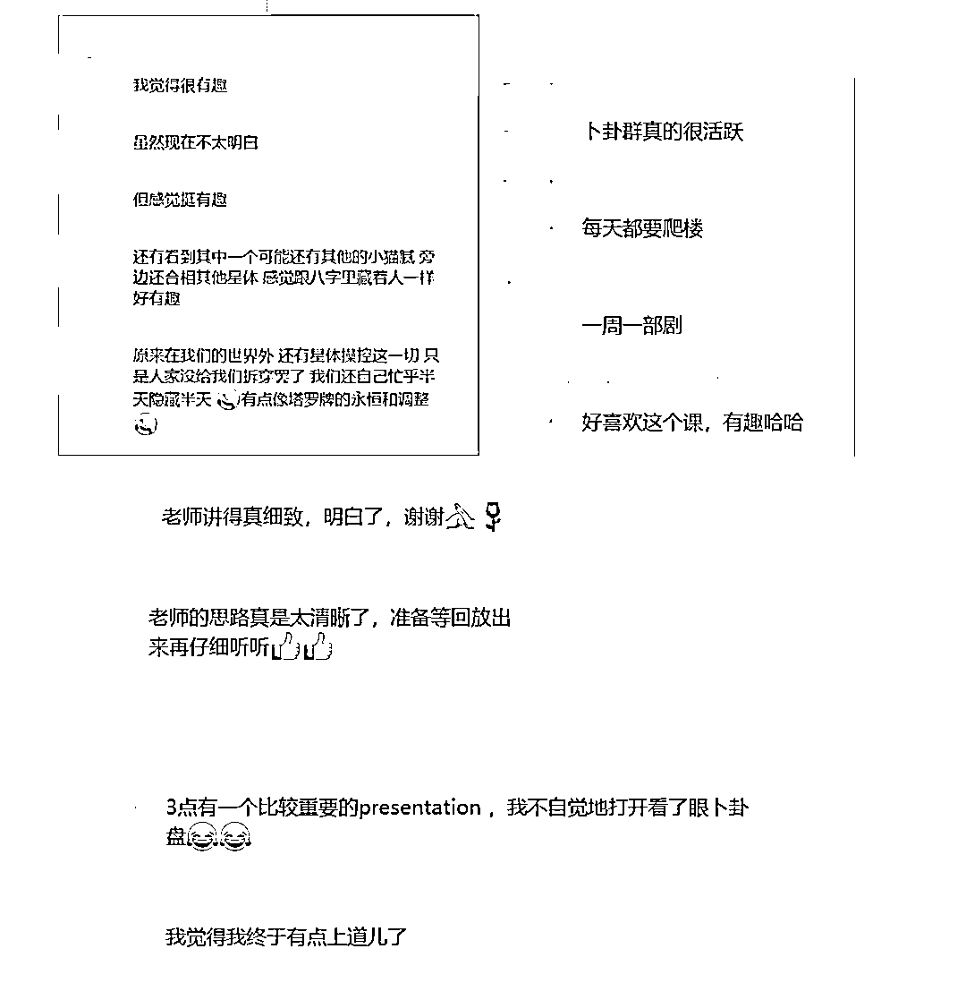

孔子在易经的系辞里说，学习易经，要“君子居则观其象而玩其辞，动则观其变而玩其占”。这句话真的也表达出了现代动态卜卦占星的精髓。**星图上呈现的“象”，这些行星的意思的“辞”，行星变化的“动”，**对于预测的“玩”和“占”，真是有趣极了。

**卜卦课程还在进行中，欢迎你来一起玩。**

****

**快来看若道君为你准备的课程吧！**

**现代卜卦占星课程内容**

**课程分为 5 部分：**

**Part1 **融合现代占星理念，整合动态占星知识**Part2**独家【现代动态卜卦占星技术】全面教学**Part3**学以致用，覆盖人生各个领域问题的卜卦解法**Part4**扩展延伸择时占星技法的新认知**Part5**如何运用卜卦占星学做一场转化性的咨询

**15 节录播课+8 节直播课线上网络课，英文授课，中文翻译。**

**15 节录播课为 2020 年动态现代卜卦课程的内容。8 节直播课则完全是案例教学的形式。**

这样的好处是，你可以通过 1 个半月的密集学习之内按照自己的进度学完录播课的理论和录播课中已有的案例，从学习开始就实践，然后把实践中遇到的问题拿到 8 节直播课中，和老师互动。

**在 8 节直播课中，老师也会用案例教学、和同学互动的方式帮助大家进一步掌握卜卦占星的技法。**

**授课老师**

**艾德里安·罗斯·邓肯****（Adrian Ross Duncan）**1971 年在印度游学时开始学习占星学，1985 年开始成为全职占星师，**迄今执业已超过 33 年，是人本主义占星学、卜卦占星学和经世占星学领域的知名占星师。他还开发了占星软件 AstroClock 和多款占星报告。**他在日常咨询中都会运用卜卦，咨询图（卜卦的一种运用方式，即根据客户来访时间制作星图，从星图中获得大量信息）也是他**特别擅长的领域**。艾德里安·罗斯·邓肯从 1971 年开始研习佛学，受佛学影响很深，他**相信占星学和佛学观点统一、转化的一个基础是在于对现实感知的改变**。而卜卦很容易与佛教融合，因为它只关乎当下。

**授课时间**

**付费后一天即可开始看录播课程，全程有助教老师回答问题。**

**直播课程开始时间：**

2022 年 5 月 3 日，每周二 20:00-22:00

**这次课程恰逢世界在巨大的变动和不确定之中，期待这门课程能够给各位及各位的客户带来新的洞见和方向。**

**在这次 8 次直播课程中，我们将采用案例教学的方式，所有参课同学均有机会提供案例，供老师解读，且我们将组织群体的练习，用大量案例帮你掌握卜卦及如何在咨询中用卜卦。**

**什么人适合参加本课程？**

*   想要系统学习现代动态卜卦占星的学员

*   想在生活中熟练使用现代卜卦占星学

*   在咨询中想帮助个案更清晰的分析解读困惑

*   想参加 ISAR 认证考试，此课程是 ISAR 选修课

*   希望通过卜卦占星帮助自己和身边人挖掘一个积极主动的未来

学习整合卜卦技巧，不仅有益于想钻研卜卦占星学这个分支的同学，对占星初学者也很有有帮助，可以让你的占星技巧加倍。

**课程费用**

**课程价格：9900 元**

**老学员复训专享价：**

**2020 年参加艾德里安·罗斯·邓肯卜卦占星课程的同学：****2900 元**

**2018 年参加艾德里安·罗斯·邓肯卜卦占星课程的同学：****4900 元**

**特别优惠****：**

**分享课宣到朋友圈****保留 48 小时****（不设分组显示）截图给课程顾问可获得****400 元优惠****。**

**课程负责人：童老师（微信：nodoorDaivd），请备注“卜卦”**

长按二维码添加课程负责人咨询

**退转课程****退款原则请详看《教学协议》，如有疑问请咨询课程顾问。******现代动态卜卦占星实战课·ISAR 选修课****

**授课老师：艾德里安·罗斯·邓肯**

**授课时间：**2022 年 5 月 3 日

**授课方式：**网络课程，英文授课，中文翻译

**费用：9900 元；****2020 年老学员复训价：2900 元；2018 老学员复训价：4900 元；特别优惠，分享课宣到朋友圈保留 48 小时（不设分组显示）截图给课程顾问可再获得 400 元优惠。**

**课程负责人：**童老师（微信：nodoorDaivd），请备注“卜卦”

长按二维码添加课程负责人咨询

****报名请点击“阅读原文”****

# 6 月宇宙天气丨混乱的局面暂时结束，享受未来一个月的好时光吧！

> 原文：[`mp.weixin.qq.com/s?__biz=MzA5NjA0NTAxNg==&mid=2651475059&idx=1&sn=3f7e31ca306ef1907e0fdeadbf58ac21&chksm=8b48fec4bc3f77d2615c03378e3346bc66e115639b16c0be3d5781956995c03d2b2e427a7e7c&scene=126&sessionid=1692737806#rd`](http://mp.weixin.qq.com/s?__biz=MzA5NjA0NTAxNg==&mid=2651475059&idx=1&sn=3f7e31ca306ef1907e0fdeadbf58ac21&chksm=8b48fec4bc3f77d2615c03378e3346bc66e115639b16c0be3d5781956995c03d2b2e427a7e7c&scene=126&sessionid=1692737806#rd)

******☆ **后台回复“今日”，给你一句生命态度****

作者/Anastasia

编辑/玫瑰 封面/书君 图片/pexels

一年快要过半，进入 6 月金星、火星分别进入自己有力的星座，也有几颗外行星开始逆行之旅。6 月对谁特别友好？一起来看看！今天是儿童节，若道君祝大小朋友们节日快乐哦！

**六月重点天象**

**· 水星恢复顺行（6 月 3 日）****· 土星逆行（6 月 5 日）****· 水星换座双子座（6 月 13 日）****· 射手座满月（6 月 14 日）****· 金星进入双子座（6 月 23 日）****· 海王星逆行（6 月 28 日）****· 巨蟹座新月（6 月 29 日）****整体氛围**相比之前混乱的几个月，六月的天象明显开始好转。但六月上旬由于水星的顺逆转换，并持续四分土星，仍然需要保持高度警惕。好消息有两个：**·** 一是**火星和金星两颗行星归位，都离开了自己的落陷位置，进入到自己守护的入庙星座。**火星回到白羊座，金星回到金牛座，各就其位，蓄势待发；**·** 二是**水星在月初结束逆行，恢复顺行，之后进入双子座，也是自己守护的星座**。入庙位置将给这三颗行星带来良好的状态和极大的行动力，推动各项事务按部就班向前发展。水星恢复顺行后，疫情带来的混乱也将告一段落。之前受阻、延迟、放缓的事情，开始收拾阵地，恢复状态，缓慢但有序推进。水星真正恢复到正常速度，全速运行，要等到 6 月下旬，也就是 6 月 19 号，水星彻底离开本次水逆的后阴影期。坏消息当然也有，**土星和海王星结束了停滞状态，转向逆行。**不过外行星逆行时间就比较长，相对于停滞期带来的破坏力，逆行时期的影响力比较缓慢和持久，压力感反而不如停滞期明显。不会带来立竿见影、迅速可见的影响。它们会在半年左右的时间里，来回碾压，反复摩擦，不时地提示我们调整节奏，慢下来，想一想。相对而言，外行星逆行带来的不良感觉不如个人行星那么明显，也不会像个人行星逆行那样，带来诸多社会面的混乱状态。**外行星逆行更多作用在人们的心灵层面上，更关注内在结构的调整。**也就是说，逆行的影响力往往运作在更大的层面上，落实到个人身上，会更倾向于在心灵层面上感受到它的威力。当然，如果外行星行进触及到了出生图的个人行星和轴点，激活个人相位，事件的影响就会变得更明显一些。**土星将在 10 月 23 日水瓶座 18°恢复顺行，逆行时间从 6 月 5 日-10 月 23 日，持续四个半月。****海王星将在 12 月 4 日双鱼座 22°恢复顺行，逆行时间从 6 月 28 日-12 月 4 日，持续时间五个多月。**

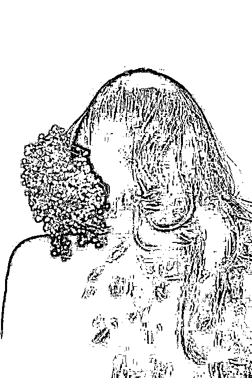

外行星逆行的时候，之前向前推进时带来的冲击力会慢慢减缓下来，我们也有机会（不得不）思考一下当初的决定和行为有没有不当、不妥的地方，是不是可以重新调整一下。**一些迫切之下的应急措施可以借此机会重新调整。**土星和海王星停滞的度数都是在 25°，土星是在固定星座**水瓶座 25°**，海王星是在变动星座**双鱼座 25°**。这也意味着整个六月，这两颗行星基本上都在停留在这个度数。**请留意这两个 25°在出生图上的位置，尤其是有个人行星和轴点落在这个度数附近或形成相位。**针对激发行星的特质以及行经的宫位领域向自己提出问题，结合土星的现实和海王星的梦想，我们会获得一些和成长相关的线索。外行星逆行可以提高我们的敏感度。敏感度越高，就越不需要亲身经历所有的苦。我们可以从旁人的经验上获得智慧，也可以从自我觉察上获得智慧，还可以从撞上南墙的疼里面获得智慧。

或迟或早，或难或易，我们都要学会生命的功课。而生命的功课总是苦涩的。

每一个苦都与一个“为什么是我”相关联，每一个喜悦却只带来一声惊叹。相对于停滞的土星和海王星，木星在六月基本保持正常的运行速度，行经区间是白羊座的 3°-7°。木星将在七月开始逆行。整个六月，**木星对于白羊座、狮子座、射手座初度，以及个人行星或轴点落在白羊座 1°-8°的人群来说都非常友好**。木星加持，你们就是六月的幸运儿，准备已经结迎接自己的惊叹吧。**重点天象****★****水星在金牛座恢复顺行**五月开始的水星逆行是今年的第二次水逆。**水逆从 5 月 10 号，双子座 4°开始。持续到 6 月 3 号，在金牛座 26°恢复顺行。从 4 月 27 号水星进入逆行前阴影期开始，到 6 月 19 号水星顺行后彻底离开后阴影期，整个水逆全程将近两个月。**现在，是时候复盘了。**查看双子座 4°到金牛座 26°在出生图上的宫位，回忆这一个月以来遇到的烦恼和麻烦事儿。**有哪些是因为沟通交流不到位，信息传递不及时，或者是粗心大意，又或者是心存侥幸、刻意隐瞒造成的？如果重来一次，你会怎么选择和行动？水逆虽然持续时间不长，但保持觉察的话，它会撕扯出一条缝隙，帮助我们打开昏沉的迷雾状态。日常，很多人都会有类似的感受，什么事情都提不起兴趣，什么事情都没有动力去做。手机一刷就是一天。又或者每天忙忙叨叨，疲惫不堪，仔细想想又觉得没有完成什么事情，计划都处于停滞或者拖延的状态。不到最后的时间期限，就不会动手去解决。这种状态，可以称之为昏昧状态。并不是真的睡着了，而是象征我们失去了对自己的觉察。而水星会让我们保持警觉，给我们传送有效讯息，让问题暴露出来，提醒我们及时纠偏。小有所得，小有所满，就会避免小麻烦变成大祸害。逆行的水星可以拯救我们筋疲力尽的大脑，它超过了我们，但又掉头回来拉我们一把。似乎在说：“嗨，我又来了，我来帮你理清思路，看清现实。”

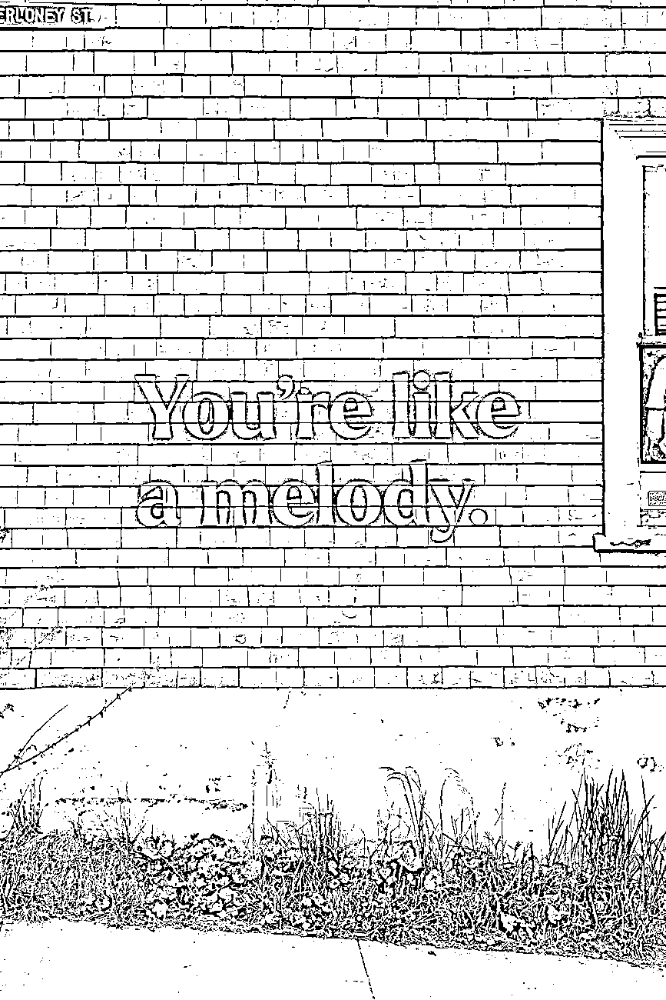

水逆结束的时候，不妨好好总结。尤其是**月初的这一周，停滞的水星在金牛座 26°四分土星，六分海王星，相位影响力持续将近 10 天。不妨利用海王星的灵感，正视现实问题，好好总结。****★****土星在水瓶座逆行**6 月 5 号，水星刚刚恢复顺行，又轮到土星逆行了。**本次土逆从水瓶座 25°开始，到水瓶座 18°结束，逆行区间 7°，都在风象的水瓶座。**由于刚刚启动逆行，速度很慢。整个六月，土星的运行区间只有两度，也就是水瓶座的 25°和 24°，七月，土星的运行区间也是两度，在水瓶座的 23°-22°。**整个土逆期间，生日在 2 月 8 日-16 日的水瓶座将倍感压力。**你们是本次的土逆影响的重点人群，将遭受来自现实的考验，并迫使自己下定一些决心，做出一些判断。如何选择接下来的发展路径，需要自己来选择。倒也不必恐慌，土星对谁都是一视同仁，总是会在最脆弱的地方爆发。一方面，土星象征着边界、纪律、规矩、约束和限制；另一方面，土星也象征了稳定、努力、责任和成果。**土逆就像一次年度考试，如果前期的踏实努力，准备充分，就会顺利通过考验，土星就会送上大礼。**毕竟木星只是带来机会，土星却可以提供结果。**★****海王星在双鱼座逆行**作为三王星之一，海王星的影响力超出了人力的控制。它影响的是世代潮流。所以海王星逆行会给我们带来宿命感。换句话说，**海王星要去消融掉个体的物质依靠，我们的身体、社会地位、物质拥有等等所有都会被席卷、消融、最终汇入到宇宙的洪流中。**目前我们正在经历海王双鱼时代，是海王星能量最强盛的时代。我们也亲历了海王星最糟糕的那一面，经济泡沫、蝴蝶效应、瘟疫和混乱。小事件无端被引爆，经过剧烈膨胀和传播，进而无数人受到牵连，引发大混乱。在这样的风潮下，**保持自我镇定，不跟风、不盲从、不凑热闹**非常非常重要。**海王星于 2014 年进入双鱼座，将停留到 2026 年。**每一年都会有将近五个月的时间处于逆行状态。逆行的时候，大多数人会被迷惑和怀疑所笼罩。之前对自我、对人生、对家庭、对工作、对爱情产生的幻想和期待，容易在海逆的时候经历幻灭和失去。

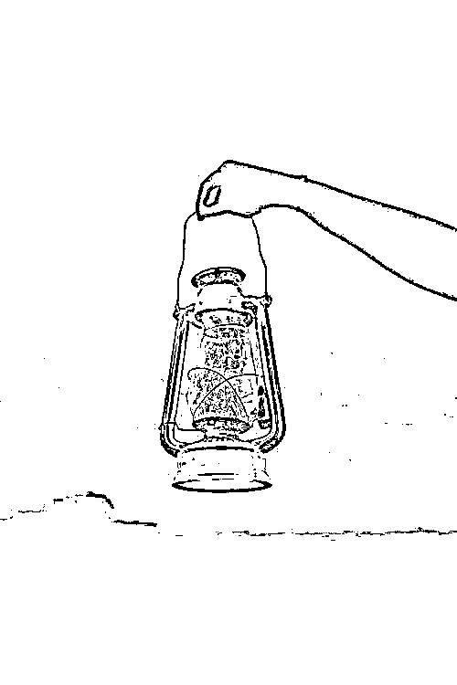

**查看海王星在出生图上的逆行宫位。这会提示我们，在哪个领域经验到这种集体潜意识带来的冲击，在哪个领域经历海王星式的梦境和解脱。**如果我们能够意识到海王星能量的存在，以及它如何呈现在我们的现实生活中，就能够更好地通过个体经验把它活出来。**★****朔望周期**六月的月相也很正常，没有超级月亮，也没有食相发生。我们将经历一次普普通通的新月和一次普普通通的满月。**6 月 14 日晚上 7:51 分在射手座 23°发生满月；6 月 29 日上午 10:53 分在巨蟹座 7°发生新月。**通常每个月的新月和满月星座会成对出现，但由于周期的误差，隔段时间就会有错位。比如上个月我们就经历了两次新月和一次满月。金牛座新月发生在 5 月 1 日，天蝎座满月发生在 5 月 16 日，双子座新月发生在 5 月 30 日。到了六月，我们就会先经历射手座满月，和下一轮的巨蟹座新月。满月预示着一个周期达到了顶点，视野最广，看到的事实最多，情绪也最饱满。射手座满月发生的时候，太阳和土星形成三分相，月亮和土星形成六分相。**这次满月会点亮人们心中的行动力之光，适合静定思绪，做好计划。**射手座 26°的萨比恩寓意是**“雕刻家在自己的工作室里工作，他熟练的双手缓慢而踏实地塑造出一件漂亮的作品。” **这是一个很有创造力的意象，非常符合日土三分、月土六分的征象。结合满月发生的宫位，将射手座的乐观、热情、探索未知、拷问意义带入到我们的生活中，调整状态，看准方向。要有行动，要有希望，要有光。**月末的巨蟹座新月宜许愿，宜制定计划，宜轻食断食。**新月的萨比恩寓意是**“穿着人类服饰的兔群正在游行。”**这个意象有些令人费解。从巨蟹座的阶段主题来说，这个度数意味着，**为了构筑新的生命，我们在情感关系中需要做出一些牺牲和决定。**巨蟹座的**宁静、滋养、关注内心、照顾家人**，都是适合许愿的方向。大家可以结合新月发生的宫位，以及自己的现实状态，许一个**让自己变温柔、变包容、变得更有力量**的愿望。现实无处可逃，如果你已经厌倦了目前的状态，不妨趁着新月，调整一个好的状态，向着远方，积蓄力量。

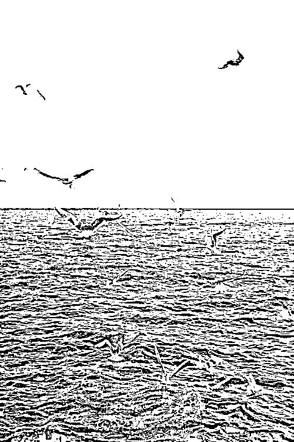

**12 星座六月小贴士**

**（参考太阳星座和上升星座）**

**★** **白羊座**

**· 精力充沛，适宜各种行动**

**· 沟通顺畅，金钱运筹帷幄**

**★** **金牛座****· 魅力提升，人际关系良好******· **展示自我，面貌焕然一新****★** **双子座** ****· **稳步向前，推进既定计划****· 安住内心，追求个人成长****★** **巨蟹座** **· 面对挑战，不要急于行动****· 勤于交流，改善社交环境**

**★** **狮子座** 

**· 增强信心，把握发展机**

**· 会化敌为友，增进同事关系**

**★** **处女座** 

**· 结交新人，社会关系活跃**

**· 学习精进，打开新的视野**

**★** **天秤座** 

**· 保持谨慎，避免急功近利**

**· 抓住机会，实现合作共赢**

**★** **天蝎座**

**· 正视现实，适当做些妥协**

**· 善解人意，享受二人世界**

**★** **射手座**

**· 获得助力，放手打拼事业**

**· 做好计划，平衡工作生活**

**★** **摩羯座** 

**· 身心愉悦，利于建立关系**

**· 灵感迸发，发展兴趣爱好**

**★** **水瓶座** 

**· 修养生息，积蓄身心力量**

**· 充分交流，获得家庭支持**

**★** **双鱼座**

**· 不假外求，提升内在力量**

**· 有来有往，促进邻里关系**

**版权声明：**原创文章由作者授权首发于若道平台，欢迎转发，反对抄袭。友号转载请申请白名单。

**Anastasia**

职业占星师/专栏作者/策展人

ISAR 认证占星师（2016 年获得）

若道认证生时校正资质（2015 年获得）

**微信公众号**：KairosMoment

长按打赏

**今晚，“六·一”直播等你来！**

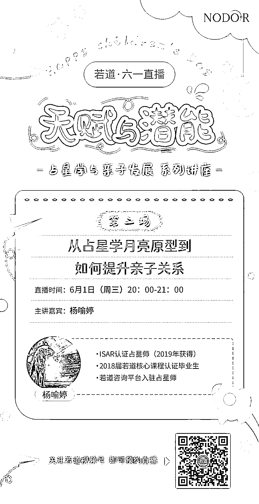

**六一节快乐呀！****不管大朋友还是小朋友****都可以领取的报告啊**

**20 位来自世界各地的占星师****带来 19 场沙龙——新世界的觉醒****详情可点击下图**

**学习占星学****点击下图了解课程详情**

**

**微信又双叒叕改版啦，不想错过若道君的推送？**
**就把若道设为星标吧！****▼**

**喜欢记得点一下在看哦☟**

**报名直达入口**

# “我跟 TA 是照亮彼此的一对吗？”看看你们的太阳星座就能了解！

> 原文：[`mp.weixin.qq.com/s?__biz=MzA5NjA0NTAxNg==&mid=2651474951&idx=1&sn=4c6f8464560b80fcc5064e574b472edf&chksm=8b48feb0bc3f77a64074f1c92b14483c86075f715b8cafc512225b12d653fd332050dacf3251&scene=126&sessionid=1692737806#rd`](http://mp.weixin.qq.com/s?__biz=MzA5NjA0NTAxNg==&mid=2651474951&idx=1&sn=4c6f8464560b80fcc5064e574b472edf&chksm=8b48feb0bc3f77a64074f1c92b14483c86075f715b8cafc512225b12d653fd332050dacf3251&scene=126&sessionid=1692737806#rd)

****************☆ ****************************后台****************************回复“今日”，给你一句生命态度****************

作者/曼迪·洛克利
译者/李含 校对/Jun

编辑/翀子 封面/书君 图片/网络

占星学不仅帮我们了解自己，还可以帮助我们了解自己和他人的互动，对比图便是这样一个研究关系的有力工具。我们可以从最基本的起点——二人太阳星座间的互动，观察自己和他人的联系。而当有外行星加入太阳间互动，又会给关系带来一些挑战。快来看文章吧！

**比对图的意义**

你有没有想过，为什么你很容易与一些人相处，却很难与另一些人建立融洽的关系？

**在占星学中，关于关系相容性的研究被称为 synastry，即比对图。**

我们星图中的**太阳代表我们的能量来源和我们如何利用它**。通过太阳的星座、宫位和相位信息，它建议我们最好应该把精力投入到哪里，以便成长，**实现我们的人生目标**。它还暗示了我们在前进的道路上可能会遇到的**挑战和功课**。

因此，它代表了我们个人的**英雄之旅**——我们的活力、意志力、自我认同和创造性冲动。表达出我们的太阳是一项使命，是我们需要学习去做、渴望去做的事情。

每当我们**遇到另一个人**，如果他的目的、目标、使命和生命力的表达**与我们自己的相似或相容**，我们就会**“理解他们”**。我们往往会感觉到与他们的关系融洽，或者至少我们可以理解他们来自哪里。

另一方面，当我们遇到一个与我们自己的表达**大相径庭的人**时，我们**很难理解**他们是从何而来。虽然我们可能会对不同的能量感到好奇和吸引，但在一起相处给我们双方都带来了挑战。

当判断太阳在不同星图之间的兼容性时，我们的确需要**纵观全局——太阳的星座、相位和宫位**——但仅仅孤立地观察太阳与太阳之间的基本相位是最好的起点，我们可以从那里开始解读。

当然，在比对图中两个太阳可能并未形成相位。如果是这样的话，请查看星座和元素的一般兼容性。下面的内容仍然适用，但联系将不那么强烈。

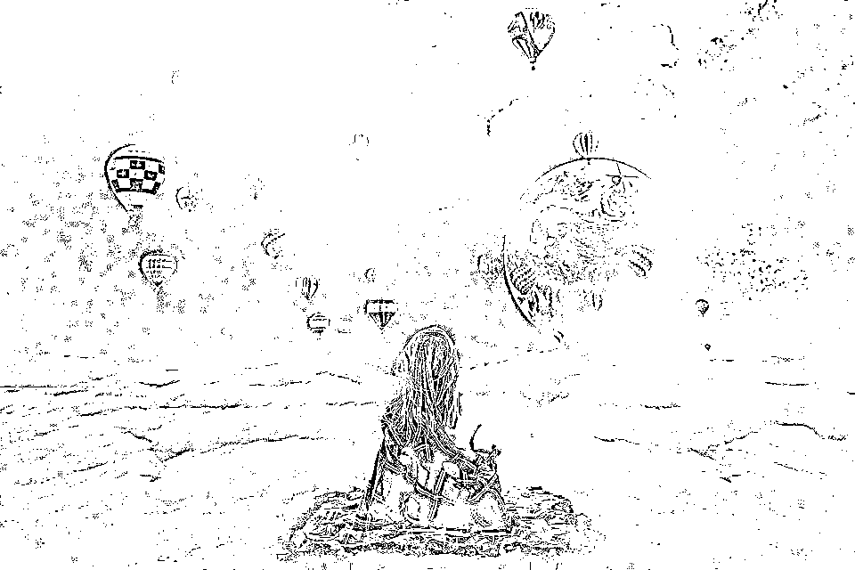

**对比星图中的太阳****★****太阳合相太阳**

如果你们的太阳合相，想想所有你们可以一起度过的生日聚会吧！

对于两个处女座或摩羯座来说，这可能是一件很棒的事情（想想你们共享一个聚会可以节省多少钱），但如果你们是两个狮子座的人，你真的想和另一个聚光灯下的霸主分享这一时刻吗？这听起来有点轻率，但重点是，**这种联系在很大程度上取决于太阳所在的星座。**

然而，一般说来，你们**有相似的方式**来表达自己的能量和自我，**你们的人生功课、使命和目标是相容的**。虽然你们在旅途中可能处于非常不同的阶段，但你们正朝着同一个方向前进。

你们真的可以与你太阳星座相同的人产生共鸣，**这可以是一种简单的、相互支持的关系。**

两人如此相似的危险在于，你们**太容易意识到彼此的弱点**。如果发生这种情况，请注意，这会给你们俩上一课。

与其主动地讨厌对方，不如记住，**他们很可能是在强调你不喜欢自己的地方，或者是你否认的地方，需要改进的地方。**

**★****太阳对分太阳**

**对立面的吸引！**这一相位在朋友和恋人之间很常见。对立面很可能充满吸引力，但它们也可以相互排斥，而且通常可以**同时产生吸引和排斥**，使得这一相位非常有趣。

最棒的情况是，你们之间良好互补，并发现这种关系充满刺激，相互支持，自我平衡得很好。这是因为尽管对宫星座有差异，但他们也有共同的关注点。

最坏的情况是，你们无法建立起真正的关系，因为你们不断地互相拉开，朝着完全相反的方向前进。甚至可能兼而有之……是的，**经典的爱恨交织在这里是有可能的。**

**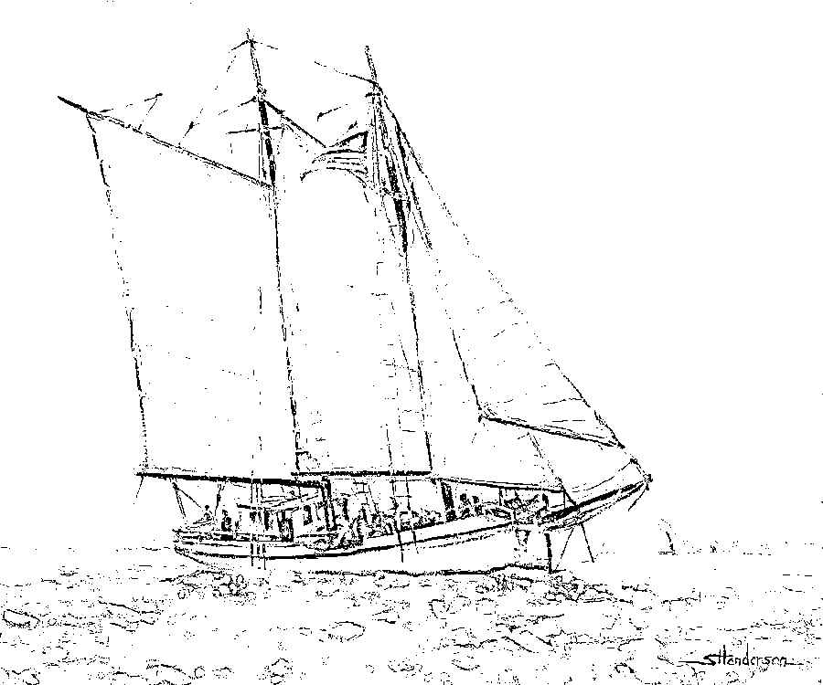**

**★****太阳四分太阳**

**四分相具有挑战和动力**。它们呼吁采取行动，往往是为了应对冲突，但成功处理冲突可以为涉事双方带来宝贵的成长。

行星会四分落在与其形态相同星座的行星，所以基本星座的行星会四分另一个基本星座的行星，依此类推。

在两个太阳彼此成四分相的关系中，你们**倾向于以相似的风格解决人生旅途中遇到的障碍和问题，**但因为你们的整体气质和生活目标不同，这有时会导致一段令人沮丧的关系动力。

**你们之间可能会****感觉到强烈的吸引力，但同样容易产生厌恶！**

**基本星座**之间的关系可能会因为**过度竞争**而受损，**固定星座**之间的关系会让人感受到**占有欲和束缚**，**变动星座**之间的关系可能会有**放任自流**的趋势。

归根结底，比对图中太阳四分太阳的情况下，如果能**健康地并有意识地**表达太阳，那么这种联系就可以使双方成长，获得个人发展。如果你们能解决你们的差异，那么就可以一起取得很多成就。

**基本星座：白羊座、巨蟹座、天秤座、摩羯座**

*   创始，精力充沛，以行动为导向

*   直接解决障碍，直面冲突

*   善于危机管理，但是难于跟进到底

**固定星座：金牛座、狮子座、天蝎座、水瓶座**

*   顽固，井井有条，执着

*   不紧不慢地处理问题，常常会陷入其中

*   启动慢，但善于跟进，完成任务，坚守阵地

**变动星座：双子座、处女座、射手座、双鱼座**

*   适应性强，多才多艺

*   善变，沟通力强，容易分心

*   会采取迂回的方式应对问题，通过协商去处理，或者回避议题

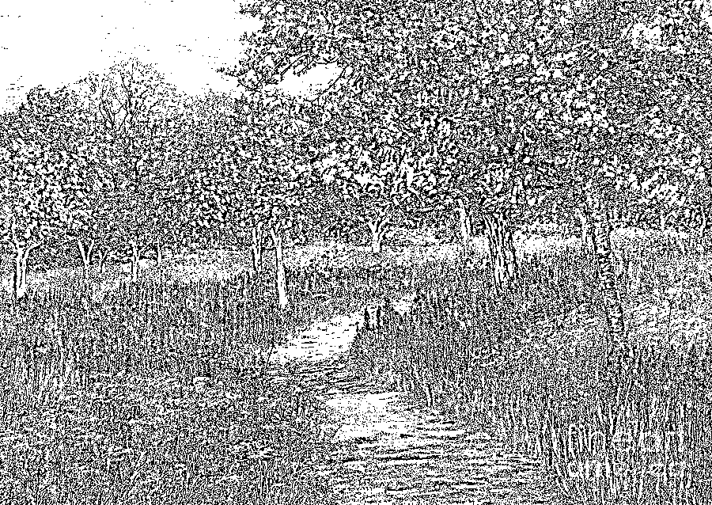

**★****太阳三分太阳**

当你的太阳与对方的太阳成三分相时，它暗示着一种**轻松、支持、和谐**的关系。你们会相互**“理解”**，携手一起在人生旅途中，**感觉很舒服，**而且彼此的陪伴让你们感觉精力充沛。

然而，如果你想在你们的关系中保持活力、成长和一些令人兴奋的张力，你可能需要在你们星图之间的其他相位中去寻找。

**行星落在相同的元素成三分相：**

*   **火象星座**：白羊座，狮子座，射手座

*   **水象星座**：巨蟹座，天蝎座，双鱼座

*   **风象星座**：双子座，天秤座，水瓶座

*   **土象星座**：金牛座，处女座，摩羯座

**★**

**太阳六分太阳**

六分相，就和三分相位一样，暗示着一种**轻松、和谐**的关系。这通常是一种**对双方都有利的支持性关系，**因为你们彼此的太阳所在的元素是相容的。

然而，六分相的确要比三分相更努力才能最大限度地发挥它的作用。最好的情况是，你们太阳之间的六分相为彼此提供了一个**互相帮助、鼓励的机会**，以实现你们的人生目标。

**火象和风象星座六分相：**

*   白羊座-双子座

*   白羊座-水瓶座

*   双子座-狮子座

*   狮子座-天秤座

*   天秤座-射手座

*   射手座-水瓶座

**土象和水象星座六分相：**

*   金牛座-巨蟹座

*   金牛座-双鱼座

*   巨蟹座-处女座

*   处女座-天蝎座

*   天蝎座-摩羯座

*   摩羯座-双鱼座

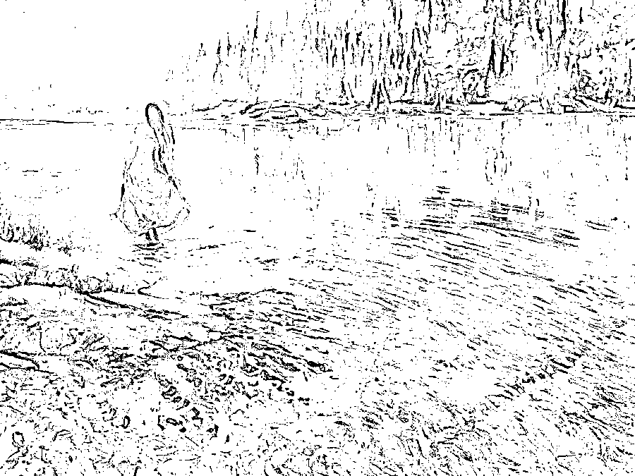

**★****太阳与太阳形成梅花相**

**形成梅花相位的行星完全无法互相理解。**和四分相不同，它们并未落在相同的形态（拥有相同的运作风格），也没有落在相互兼容的元素。

如果我们的太阳形成梅花相位，或仅仅是所落的星座成梅花相位，我们的能量、活力、人生道路和目标——以及我们如何实现我们的目标——会是如此不同，**很难看到一个共同的交汇点。**

梅花相位的关键词是**“别扭”**，在比对图中有梅花相位的**最好处理方法是双方都接受在关系中需要不断地调整和让步。**

然而，令人惊讶的是，太阳成梅花相位的人之间有亲密关系和婚姻是相当普遍的。也许太阳之间的这个相位让事情保持新鲜和活力，持续不断地有趣？

最好的情况是，如果你们的太阳形成梅花相位，生活在一起会使你们**学会非常宽容**。虽然你可能**永远也不会完全了解对方的想法**，但**学会充满爱地尊重**和尊敬你们之间的差异是一件很棒的事情。

如果你们的太阳形成梅花相，你会希望你们比对图中的其他行星之间有一些更兼容的相位。

比如我的摩羯座太阳和我丈夫的狮子座太阳形成一个天然的梅花相位。然而，他的摩羯座月亮与我的太阳互补，我的水瓶座月亮与他的太阳互补，反之亦然。和谐的金星和火星关系也有助于保持浪漫爱情的美好！

**成梅花相位的星座：**

*   白羊座-处女座

*   金牛座-天秤座

*   双子座-天蝎座

*   巨蟹座-射手座

*   狮子座-摩羯座

*   处女座-水瓶座

*   天秤座-双鱼座

*   天蝎座-白羊座

*   射手座-金牛座

*   摩羯座-双子座

*   水瓶座-巨蟹座

*   双鱼座-狮子座

**★****太阳与太阳成十二分相（落在相邻星座）**

十二分相的行星彼此之间相隔 30 度，也就是**相邻的星座**。虽然我们的邻居可能不是我们最天然的伙伴，但只要双方努力，我们就可以找到一种与他们和睦相处的方法。

幸运的是，在比对图中，太阳之间的十二分相位往往比土星和火星等天然不那么和谐的行星之间的十二分相位更轻松。

**如果你们的太阳成十二分相位，这为你们提供了一个很棒的学习经历。**

例如，水瓶座的太阳可以帮助摩羯座的太阳摆脱乏味的旧习惯去尝试新的东西，而摩羯座的太阳可以为水瓶座的目标和理想增加一些稳定性和结构。天蝎座的太阳可以帮助射手座的太阳变得更有控制力和耐心，射手座的太阳可以帮助天蝎座少一些怀疑，对生活对馈赠多一些乐观。诸如此类……

当你思考所有的太阳星座时，你就会很容易地看到，在它之前或之后的星座是如何作为一种**健康的解毒剂**，来消除它更负面的品质。

尽管十二分相并不一定马上就有阳光和玫瑰，但比对图的这一相位可能**需要努力和觉察才能有所收获**。

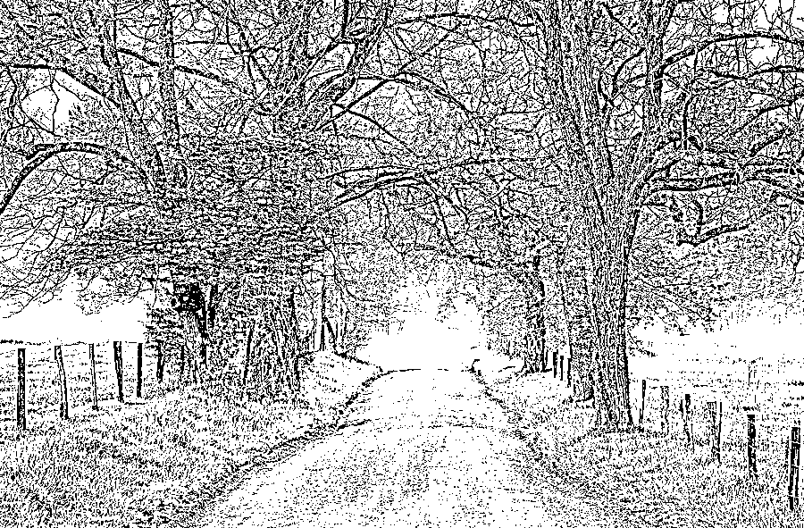

**外行星的加入**

这里有一个真实的例子来说明这些相位是如何运作的，它还引入了外行星维度，来展示这些相位是如何渲染比对图中太阳与太阳的相位：

**★****土星的加入**

如果土星参与到比对图中的太阳间相位之中，这段关系会呈现出一个**严肃的维度**。比对图中土星的紧密联接经常出现在**互相承诺的、长期的关系中**。是的，土星有持久性！

然而，土星并不总是意味着婚礼对钟声和 25 周年纪念日，因为这颗**严酷的现实行星**很可能暗示着，一段很难在一开始就走上正轨的关系。也许一方或另一方对进入一段关系持谨慎态度，或者怀疑对方是否适合自己？

有时候，这种联系可能意味着会**延迟**在一起，或在一起有**障碍**，无论是情感上的还是环境上的。一旦这段关系开始，至少有一方将需要一种**更传统的**关系风格所带来的安全和稳定。

这个问题能否解决，在很大程度上取决于这种关系风格是否适合对方的性格和人生道路。

此外，这种相位关系可能意味着在这种关系中，一方或另一方**感觉受到限制**，或感到他们的自信正在被另一方的苛责或悲观的生活态度所侵蚀。

最好的情况下，处于太阳——土星比对图关系中的伴侣可以在相互尊重、相互爱护和尊重中共同成长。这是一起优雅变老的完美结合。

**★****天王星的加入**

一般说来，比对图太阳和太阳的相位如果涉及了天王星，会带来非常**令人兴奋的互动**。

如果双方都准备好了探索**非传统**的互动方式，那就会有非常好的结果，但这往往会导致一段**不稳定**的关系，其中一方比另一方要求更多的自由，而另一方却不愿意给予。

这可能就是为什么这些关系经常以周期性（或永久性的）分手为标志，或者至少一方时不时需要在情感上与另一方保持疏离。

这并不是说它最终不会带来承诺，通常是会有承诺的，只是可能不是大多数人所认为的传统承诺。

要发挥作用，这些关系需要每一方都给对方**足够的空间**，让他们忠于自己，真诚地遵循自己的人生道路，即使这意味着他们最终会走向完全不同的方向。

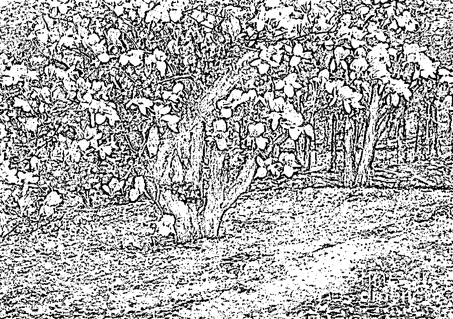

**★****海王星的加入**

当海王星加入到比对图太阳与太阳的互动中时，这种关系会呈现出一种超凡脱俗的感觉。这样的关联**可能会让人感觉“命中注定”**，是某个“神圣计划”的一部分。

危险在于，这段关系**太容易变得过于理想化**，而忽视或根本看不到其中的缺陷和弱点。逃避主义的可能性很明显，关系中任何一方或双方都希望这段关系能让他们远离严酷的现实生活。

 虽然这种关系可能是舒适的，在某种程度上也是积极的，但拥有这种关系的伴侣需要小心，不要一起陷入不健康的逃避现实的习惯，比如酗酒、吸毒或者情感上的相互依赖。

这样的关系**常常需要一方或双方做出牺牲**，这很容易使他们偏离自己的人生道路，削弱他们的活力和自由意志。

简单来说，这里融合的冲动**很容易失去你的个人身份**。这些关系通常以**某种方式的欺骗**为标志，一旦现实最终到来，这可能会让一方或双方失望、幻灭甚至放弃。

最好的情况下，这样的情侣关系确实可以是“天造地设”的，如果双方能够在人生旅途中相互支持，他们可以在爱情上、精神上和创造力上达到新的高度。

**★****冥王星的加入**

当冥王星参与到比对图太阳与太阳的互动中时，会产生一种**强大的吸引力**。不幸的是，这些关系很容易变成**意志力之战**，因为其中**一方或双方试图控制这段关系**，期望对方屈服于自己的意愿，甚至可能是强行的。

毫无疑问，这些关系非常**深刻、牢固、强大和充满激情**，但双方都需要能够正确看待事情，培养对方的自由意志和自尊，并不断问自己，这段关系对双方来说是否都是健康的。

在最好的情况下，如果双方都能允许自己和对方有健康的空间，来一起清理和探索他们最深层、最黑暗的欲望，这是一种可以**深刻转化**的关系。这种关系往往蕴藏着一些秘密。当双方都被这种关系积极地赋予力量时，这可能是一个值得考虑的伴侣关系！

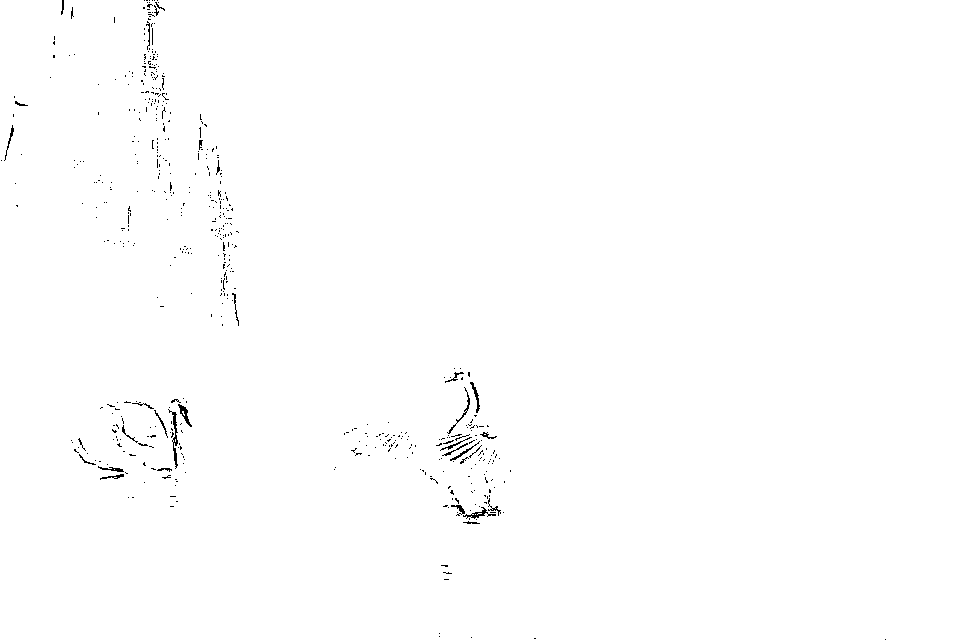

**注意事项**

需要注意的是：使用比对图的最佳方式是**将它应用到现有的关系中**，将它作为理解关系中的问题、契合点、张力和功课的指南。

如果你把比对图用在一个你不是很了解但又有点喜欢的人身上，我不相信你会得到非常有用的图景。这是因为人类是奇怪的生物，有着奇怪的品味和一种被称为自由意志的奇怪东西。

所以，如果某天晚上你在公交车上遇到一个可爱的男孩，你成功用甜言蜜语问出他的出生日期，然后比较你与他的星图，这真的无法告诉你，他是否也喜欢你！

哦，还有，在将你自己的星图与其他人的星图进行比对时，请先征得对方的许可，才是良好的道德表现。

**版权声明：**本文由若道翻译发布，欢迎转发，反对抄袭。友号转载请申请白名单。

**曼迪·洛克利**

是伦敦的一名占星师。除了接待客户咨询，她还在英国占星学院任教。她的文章发表在 AA 杂志（ AA Journal）、无限占星杂志（Infinity Astrological Magazine）、Astro Dienst 网站以及她的 Astroair 博客上。

**20 位来自世界各地的占星师****带来 19 场沙龙——新世界的觉醒****详情可点击下图**

**学习占星学****点击下图了解课程详情**

**

**微信又双叒叕改版啦，不想错过若道君的推送？**

**就把若道设为星标吧！**

**▼**

**就是这个“在看”，戳戳戳 ☟**

********报名直达入口********

# 神话塔罗之大阿卡纳牌｜皇帝

> 原文：[`mp.weixin.qq.com/s?__biz=MzA5NjA0NTAxNg==&mid=2651474951&idx=2&sn=315b8170dc81a891c89484ed76f349b1&chksm=8b48feb0bc3f77a6a89a1cb6db04f29c607cebba03df2be38c903ebeecde1152dbf3a123c2a5&scene=126&sessionid=1692737806#rd`](http://mp.weixin.qq.com/s?__biz=MzA5NjA0NTAxNg==&mid=2651474951&idx=2&sn=315b8170dc81a891c89484ed76f349b1&chksm=8b48feb0bc3f77a6a89a1cb6db04f29c607cebba03df2be38c903ebeecde1152dbf3a123c2a5&scene=126&sessionid=1692737806#rd)

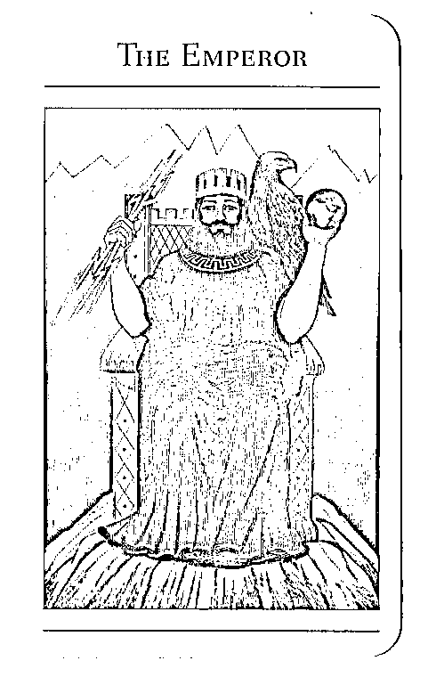

作者/朱丽叶·沙曼-伯克 丽兹·格林

译者/闫东升 编辑/玫瑰 图片/神话塔罗 网络

本文节选自《神话塔罗》

有时候我们无比诧异于为何某张牌会如此“偶然”的出现，击中了我们内心的隐秘，抑或精准地预见了未来。因此许多人对塔罗牌充满恐惧，认为它们是某种魔法或超自然的事物。但事实上，这不过是人类的心理与外部世界通过某种意义的关联，只是目前我们对此知之甚少。

塔罗的意义在于帮助我们更好地应对某种经历，以一种更丰富、更有创造性的方式来回应它，而不是盲目地听天由命或手足无措。今天来解读大阿卡纳牌——皇帝。

[🔈 神话塔罗·皇帝](https://res.wx.qq.com/voice/getvoice?mediaid=MzA5NjA0NTAxNl8yNjUxNDc0OTQ5)

**｜**朗读者小巫

**书名：**

神话塔罗 

**作者：**

朱丽叶·沙曼-伯克   丽兹·格林 

**出版日期：**

2011-08-02

皇帝对应的希腊神祗 

**宙斯·天神**

**万神之王**

皇帝牌描绘的是一个成熟的男人，拥有宽厚的双肩和结实的胸膛。他的胡子和头发是黑褐色的，非常浓密并散发着健康的光泽，一双眼睛是明亮的浅蓝色。他坐在位于山顶的黄金宝座上，直视着我们，身着一袭紫色并镶有金边的长袍，头顶金色的皇冠。他的右手抓着三道光芒四射的闪电，左手托着象征世界的球体。一头雄鹰栖息在他的肩头。他身后的远方是连绵的山巅，覆盖着白雪皑皑。

> **光芒四射的闪电**：宙斯（*Zeus*）所拥有的力量的象征，这不仅仅因为闪电散发着令人敬畏的威力，而且它还能照亮天空。宙斯是给人带来鼓舞、灵感和创造性愿景的神祗，其手中闪电的光芒象征着他对真相的揭示。**宙斯选择居住在山巅**：因为他代表着智力和灵性的高度，他的意愿超越了身体的束缚和自然的限制。**雄鹰**：是宙斯的象征，因为它飞翔的高度和眼力都远远超过其它鸟类。作为一种靠扑食为生的飞禽，它还表达着一种对于本能之神的攻击性和征服能力。

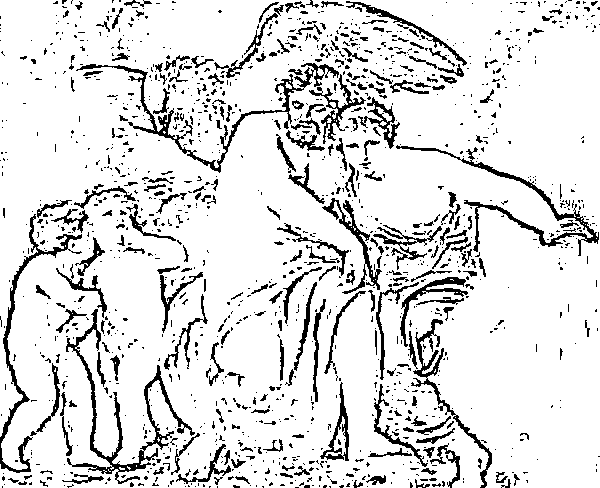

**｜**宙斯和妻子赫拉

**颠覆众生的弑父之子**

**我们在这里遇到了伟大的宙斯，他是万神之王，在希腊被称为主神（众生之父），是世界的创造者和众神以及人类的君主**。在神话中，宙斯是泰坦巨神克罗诺斯（*Titans Cronos*）和瑞亚（*Rhea*）最小的孩子。

克罗诺斯某天听到了一个预言，说他的某一个儿子会颠覆并取代他的地位。为了自保，他决定杀死所有的孩子，接下来每当瑞亚生出一个儿子或者女儿，克罗诺斯就在孩子还没睁开眼睛之前把他（她）抢走并吞噬掉，一共有五个孩子就这样进了他的肚子。

瑞亚当然对此非常不满，所以当她要生第六个孩子的时候，就偷偷地逃跑到了阿卡狄亚（*Arcadia*），在山洞中生出了宙斯，然后她把一块大石头包成孩子的模样拿给了克罗诺斯，说是她刚生出来的儿子。当然克罗诺斯又吞噬了它。

当宙斯成年之后，他扮作献酒人来到父亲面前，给他服用了自己准备好的毒药，克罗诺斯喝了后就开始恶心呕吐，吐出了被他吞噬的五个孩子，他们还都完好如初，当然也包括那块被当作宙斯的大石头。宙斯于是联合他的哥哥姐姐们推翻了克罗诺斯，取而代之成为了新的众神之王。这位新的君主选择了奥林匹斯山（*The mountain of Olympus*）作为家园，创建了新的律则并以此统辖众神。他的权利象征就是手中的武器——雷霆（由雷和闪电构成）。雷霆和他众多的情人以及孩子，反映出宙斯所具有的狂暴、放荡和易变的特质。他的孩子中包括了正义女神雅典娜（*Athene*）、自然律则女神狄克（*Dike*）、命运女神摩伊莱（*Moria*）和九位缪斯（*Muses*，掌管文学、音乐等艺术）。他的妻子是赫拉（*Hera*），掌管婚姻和生育的女神。**宙斯根据他所建立的律则来定义善良与邪恶。**同时他也是火炉和友谊之神，还是所有男人的保护神。

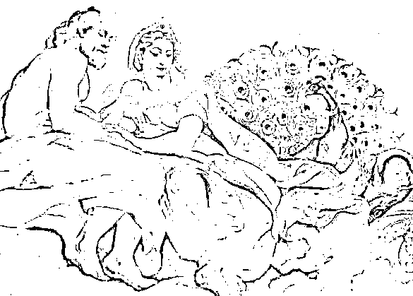

**｜**宙斯和妻子赫拉

**阳性的律则**

从人们内在的层面来看，**宙斯——皇帝的意象是人们对于父亲的经验**。父亲的形象承载了人们的灵性典范、道德规范、在世界中生存所需的自给自足的能力、想要实现的**抱负和权威性**，以及为了达成目标而必须拥有的**自律和远见**。

这种男人和女人内在都拥有的阳性律则，不同于皇后牌所蕴含的母亲形象中的滋养和无条件之爱，皇帝牌反映的是精神，不是和自然界为一体的身体（本能），精神意味着更高的价值和行动，而身体则是我们的本能需求。

我们内在的父亲也一手培养着我们的自尊，因为我们要依靠它作为立足点之一来面对生命的挑战。宙斯也可以很慈悲，保护弱者和被剥削的人。但是一旦有人挑战他的权威或者违背他的律则，他就会变得非常愤怒或升起复仇之意，因此宙斯的黑暗面表现为刻板、苛刻或者自以为是。

与内在的父亲联结意味着能够了解并激发自己的潜能和才智，并在现实中以某种形式表达出来。而被内在的父亲掌控，则意味着被某些观念（或信仰）所奴役，以顽固和自大的态度打压情感。就像宙斯的经历一样，我们必须颠覆旧有的规则，创建更有创造力的秩序，以免自己内在的独裁者掌控全局，或者被现实生活中某种独裁者奴役。

在发现了身体的需求和愉悦背后的丰饶世界后，愚人必须学会伦理道德，因为没有了内在的皇帝，我们就变成了生活中的行尸走肉，被盲目的本能驱动，把所有一切的困难和问题都推卸（或投射）到社会或他人身上。

**皇帝，疆土的开拓与秩序的建立**

**从解牌的角度来看，宙斯——皇帝牌预示着我们要面对父性原则的议题了，当然它可能以正面或负面的形式出现。**我们的挑战是要把某种力量具体呈现出来，把创造性的想法落实到现实中，例如可能是建立家庭、开创事业或创作某种作品等等。

这个时候我们需要采取某种立场，让自己变得强大并有效地落实符合自己道德准则的愿景。同时我们还要时时检视内在的皇帝是否在哪里表现出了顽固、自大和独裁的理念，它会严重阻碍生命的成长。

当愚人迈出本能世界的时候，就遇见了强大威严的皇帝，这时他必须学会利用自己的资源，根据伦理道德的约束去独立开创自己的尘世生活。只有这样他才能够有走下去的能力、信心和勇气，并相信生命中一定有某种更高的力量，通过他的才智和努力在世界精彩绽放。

**版权声明：**本文由《自在园》授权发布，欢迎转发，反对抄袭。友号转载请申请白名单。

**神话塔罗系列**

[开篇](http://mp.weixin.qq.com/s?__biz=MzA5NjA0NTAxNg==&mid=2651451590&idx=2&sn=41c1083542bcf098de303e29a028ff20&chksm=8b4b4271bc3ccb67d5d53c143cd5a17c24b7b60e5b1051949fa9f086f90b4ab04877976c47e5&scene=21#wechat_redirect)丨[愚人](http://mp.weixin.qq.com/s?__biz=MzA5NjA0NTAxNg==&mid=2651473739&idx=3&sn=e8441f9489af04cacaf21e9f0e844edf&chksm=8b48f5fcbc3f7ceadb864794113fee0f1b8d5272274d53fd85cf99493f9c2582ca8d6f88e9f4&scene=21#wechat_redirect)丨[魔术师](http://mp.weixin.qq.com/s?__biz=MzA5NjA0NTAxNg==&mid=2651474261&idx=2&sn=b83b22ad1b8791108a78b6b70f17398b&chksm=8b48fbe2bc3f72f4406ab59fe4e1566fc1d2978d30eea368945f4a988f3fcf7d0589444c7358&scene=21#wechat_redirect)丨[皇后](http://mp.weixin.qq.com/s?__biz=MzA5NjA0NTAxNg==&mid=2651474387&idx=2&sn=3cfd3a87cf571baaff3cfe4e3445cf0b&chksm=8b48fb64bc3f72720426fdb4ae9fbc197bf0b794e6979f1422a64ac638a91b929184b74f9941&scene=21#wechat_redirect)

**朱丽叶·沙曼·伯克**从 20 世纪 70 年代早期开始，就对塔罗牌产生了兴趣，并踏入了塔罗的世界。后来，在丽兹·格林的鼓励下，开始研习心理占星学和塔罗。1984 年，第一本书《塔罗全书》（The Complete Book ofTarot）出版。之后，与丽兹·格林合作设计并撰写了《神话塔罗》（The Mythic Tarot）。朱丽叶写了十本塔罗和占星学书，包括一本名为《众星的传说》（Stories from the Stars）的儿童读物，以及与丽兹·格林合著的《神话之旅》（The Mythic Journey），这是一本详细讲述如何运用神话来指导生活的书。

**点击下图了解课程详情** 

**微信又双叒叕改版啦，不想错过若道君的推送？**

**就把若道设为星标吧！**

**▼**

**喜欢记得点一下在看哦☟**

************报名直达入口************

# 神话塔罗之大阿卡纳牌｜女祭司

> 原文：[`mp.weixin.qq.com/s?__biz=MzA5NjA0NTAxNg==&mid=2651474951&idx=3&sn=30774714616755a284b3f5557e9a7eab&chksm=8b48feb0bc3f77a6c3ca528f39d0d453b38663b303d76775029df919950c04a6691b0cac1fc4&scene=126&sessionid=1692737806#rd`](http://mp.weixin.qq.com/s?__biz=MzA5NjA0NTAxNg==&mid=2651474951&idx=3&sn=30774714616755a284b3f5557e9a7eab&chksm=8b48feb0bc3f77a6c3ca528f39d0d453b38663b303d76775029df919950c04a6691b0cac1fc4&scene=126&sessionid=1692737806#rd)

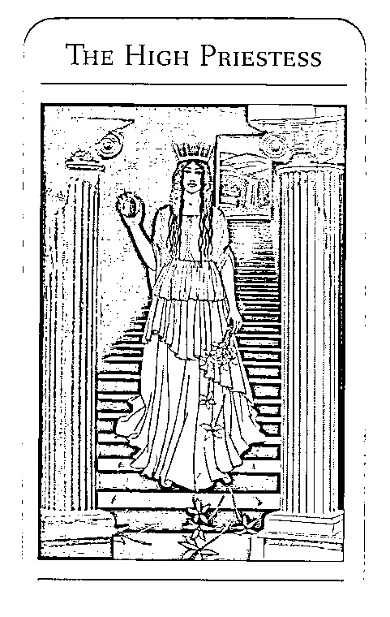

[🔈 神话塔罗·女祭司](https://res.wx.qq.com/voice/getvoice?mediaid=MzA5NjA0NTAxNl8yNjUxNDc0OTUw)

**冥府女王**

女祭司牌描绘的是一位身材修长、姿态翩然的年轻女性，她的皮肤略显苍白，衬着深色的双眼以及一头乌黑的长发，身上穿了一件简洁的白色长袍，头戴金色的王冠。她的右手握着一颗裂开的石榴，里面显现出很多的石榴籽；左手抓着一束白色的水仙，随意地垂着手臂，任凭几支水仙散落下去。她站在台阶上，两边各有一根高大粗壮的石柱，左边的是黑色的，右边的是白色的。在她身后台阶的顶端有一扇门，门外是生机盎然的风景，这片风景在皇后牌中也出现过。

> **石榴**：象征着婚姻之爱和死亡，因为它有很多种籽。由此可见，珀尔塞福涅（*Persephone*）的隐形世界是丰饶的，拥有很多还没有发展的创造性潜能。**珀尔塞福涅左手的水仙**：是哈迪斯（*Hades*）绑架她后给予她的，水仙和死亡有关，因为它每年都从冬天的大地中长出，颜色如同传说中的幽灵。**黑色和白色的石柱**：反映出地下世界包涵的二元性。创造性的潜能和破坏性的冲动，都隐藏在潜意识的黑暗世界中。

**死亡的守密人**

我们在这里遇到了珀尔塞福涅（*Persephone*），她是冥府的女王；是大地之母德墨忒尔（*Demeter*）的女儿；是死亡之秘密的保护者。在皇后牌中，我们看到了神话中冥王哈迪斯（*Hades*）由于不能控制对处女的渴望，从地下世界中奔出，绑架了正在花丛中散步的珀尔塞福涅。回到冥府之后，哈迪斯给了珀尔塞福涅一个石榴，让她吃掉。吃下死亡之果后，珀尔塞福涅和哈迪斯就永远地结合在一起了。

珀尔塞福涅和丈夫哈迪斯每年共同管辖冥府三个月的时间。尽管她在剩下的九个月里都和母亲德墨忒尔生活在尘世，却永远也不能说出冥府中关于死亡的秘密。

哈迪斯的领土非常富足和神秘，被一条令人恐惧的冥河环绕着，如果没有哈迪斯的允许，任何活着的男女都不能穿越它，只有神界的信使和灵魂向导赫尔墨斯（*Hermes*），可以引导一些经过上帝允许的英雄们获得通行的特许权。即使鬼魂到了冥河，也要支付给冥河摆渡人卡戎（*Charon*）一枚硬币，才能踏上他的小舟。

任何违背冥府律则的人，无论生死，都会被冥府守门的三头犬科尔伯罗（*Cerberus*）吞噬。通过吃了石榴果，珀尔塞福涅脱离了纯真的少女时代，成为黑暗世界的女王并保管着它的秘密。

**潜意识，灵魂深处的律则**

**从人们内在的层面来看，珀尔塞福涅——女祭司的意象和我们内在的神秘世界有关，深度心理学称它为“潜意识（或无意识）”**。好像在我们日常生活的现实世界之外，还有一个隐藏的世界，其中蕴含着丰富的潜能，如果我们没有获得它的掌管者的许可，就不能了解其中的秘密。这个世界中包含着我们没有被发展出来的潜能和人格中原始的、黑暗的面向。同时它还掌握着每个人命运的秘密，在黑暗中孕育并在时机成熟时展现。

**珀尔塞福涅——女祭司象征着了解我们内在世界之秘密的力量**，她也是我们自己的一部分，但是清醒的意识只能隐约地感觉到她，有时候通过支离破碎稍纵即逝的梦境，有时候通过一些同时性发生的“巧合”事件，这些都使我们开始讶异并猜测是否有一些隐藏的力量，秘密并强烈地影响着我们的生活。

| 珀尔塞福涅

珀尔塞福涅是一个诱惑的、令人着迷的形象，但是她从来不说出她的秘密。同样地，**潜意识的黑暗世界，偶尔通过梦境、幻想或直觉灵光乍现，强烈地吸引着人们想去窥探，但是当我们试图用理智去了解它和利用它，以达到我们的某些目标的时候，它就会默然逝去毫无踪影**。珀尔塞福涅的黑暗世界在无形中秘密地运作着，影响着每个人的生活，只有通过足够的耐心等到时机成熟，它才会在日光下显现出结果。

珀尔塞福涅的神话强调了时间的周期循环，暗示着一种恒常不变的力量在神秘的节奏下，以循环往复的运动模式运行着。改变的种子和新的潜力在地下世界的子宫中静候，某天它们会破土而出投入大地母亲的怀抱，在现实世界中茁壮成长。**珀尔塞福涅——女祭司象征着在灵魂深处运作的律则**，掌管着那个不可见的世界里还尚未成熟的宿命，只有通过**直觉、感受和黑夜里的梦境**，才有机会揭示出它的秘密。

**女祭司，启动命运的隐藏模式**

**从解牌的角度来看，女祭司的牌面预示着直觉和感受力的增强，当事人以此去了解内在世界里**，珀尔塞福涅所掌管的领域。当事人可能被莫名其妙又无法抗拒的好奇心牵引着，通过某些密教的内容、强烈的梦境或奇怪的感觉了解和意识到自己生命中某些隐藏的运作模式。

就这样，愚人在通过父母（皇帝和皇后）了解了他的自然属性、生存需求和在尘世生活中的位置之后，在这里走入了黑暗世界，带着潜意识中的混乱和迷惑（伟大母亲的另一个面向），去探寻自己命运的模式和真正的目的，这些秘密就隐藏在潜意识这个子宫的某个角落中。

**版权声明：**本文由《自在园》授权发布，欢迎转发，反对抄袭。友号转载请申请白名单。

**神话塔罗系列**

[开篇](http://mp.weixin.qq.com/s?__biz=MzA5NjA0NTAxNg==&mid=2651451590&idx=2&sn=41c1083542bcf098de303e29a028ff20&chksm=8b4b4271bc3ccb67d5d53c143cd5a17c24b7b60e5b1051949fa9f086f90b4ab04877976c47e5&scene=21#wechat_redirect)丨[愚人](http://mp.weixin.qq.com/s?__biz=MzA5NjA0NTAxNg==&mid=2651473739&idx=3&sn=e8441f9489af04cacaf21e9f0e844edf&chksm=8b48f5fcbc3f7ceadb864794113fee0f1b8d5272274d53fd85cf99493f9c2582ca8d6f88e9f4&scene=21#wechat_redirect)丨[魔术师](http://mp.weixin.qq.com/s?__biz=MzA5NjA0NTAxNg==&mid=2651474261&idx=2&sn=b83b22ad1b8791108a78b6b70f17398b&chksm=8b48fbe2bc3f72f4406ab59fe4e1566fc1d2978d30eea368945f4a988f3fcf7d0589444c7358&scene=21#wechat_redirect)丨[皇后](http://mp.weixin.qq.com/s?__biz=MzA5NjA0NTAxNg==&mid=2651474387&idx=2&sn=3cfd3a87cf571baaff3cfe4e3445cf0b&chksm=8b48fb64bc3f72720426fdb4ae9fbc197bf0b794e6979f1422a64ac638a91b929184b74f9941&scene=21#wechat_redirect)

**朱丽叶·沙曼·伯克**从 20 世纪 70 年代早期开始，就对塔罗牌产生了兴趣，并踏入了塔罗的世界。后来，在丽兹·格林的鼓励下，开始研习心理占星学和塔罗。1984 年，第一本书《塔罗全书》（The Complete Book ofTarot）出版。之后，与丽兹·格林合作设计并撰写了《神话塔罗》（The Mythic Tarot）。朱丽叶写了十本塔罗和占星学书，包括一本名为《众星的传说》（Stories from the Stars）的儿童读物，以及与丽兹·格林合著的《神话之旅》（The Mythic Journey），这是一本详细讲述如何运用神话来指导生活的书。

**点击下图了解课程详情** 

**微信又双叒叕改版啦，不想错过若道君的推送？**

**就把若道设为星标吧！**

**▼**

**喜欢记得点一下在看哦☟**

************报名直达入口************

# 2022 年神话塔罗认证课程 | 开启职业塔罗师的神话之旅

> 原文：[`mp.weixin.qq.com/s?__biz=MzA5NjA0NTAxNg==&mid=2651474951&idx=4&sn=eca309d26a5fe8a0ffc8852797e9437e&chksm=8b48feb0bc3f77a601f8d9b6f3637b09da63b3bd410e8d3c44fdc1571bf6ed9fd2282a25bf6f&scene=126&sessionid=1692737806#rd`](http://mp.weixin.qq.com/s?__biz=MzA5NjA0NTAxNg==&mid=2651474951&idx=4&sn=eca309d26a5fe8a0ffc8852797e9437e&chksm=8b48feb0bc3f77a601f8d9b6f3637b09da63b3bd410e8d3c44fdc1571bf6ed9fd2282a25bf6f&scene=126&sessionid=1692737806#rd)

**2022 年超高含金量的神话塔罗认证课程强势回归**课程内容体系让你**直观精准**的感受**神话塔罗的魅力**扎实的建构**神话塔罗思维****系统**学习**最地道的塔罗知识**

课程中老师传授**将神话、占星、心理学完美融合进塔罗**的人本主义咨询体系，并进行**学员案例督导**，让你更自信的开展咨询工作，学以致用。

本期认证课程采取**即报即学的录播课+案例督导直播课**的形式，

*   **18 节录播课：**精编剪辑，随来随学，助教答疑，学练结合。

*   **8 节直播课：**融会贯通，神话心理，塔罗占星，咨询技巧。

为了适配大家的各种学习场景，提高学习&复习效率，我们还将**录播课**剪辑了**中文字幕版**和**翻译音频版**：

*   **中文字幕版：**朱丽叶老师英文原声配中文字幕，适合在手机或电脑前专心致志的学习。

*   **翻译音频版：**翻译老师幼婷的中文原声纯享，适合运动、通勤路上耳机里陪伴式学习。

若道还为塔罗学员开发了**“神话塔罗”APP**，是随身的工具，更是接咨询的平台，录播课程**学成入驻平台**即可链接更多塔罗个案，发展壮大你的塔罗咨询事业。

**如果你想学习塔罗，什么样的老师会让你怦然心动呢？她是三副塔罗牌的设计者，写了 6 本塔罗书籍。她研习塔罗四十余年，教授塔罗三十余年，是丽兹·格林的密友。还有****谁会比塔罗牌设计者更了解塔罗的历史、灵魂与精髓？****所以，这将是你开启塔罗之旅最坚实的一步。**

1

**这位塔罗大师是谁？**

**朱丽叶·沙曼-伯克** 

*   她是**3 副塔罗牌**的**设计者****——**神话塔罗牌、沙曼–卡塞利塔罗牌、“自己着色”塔罗牌；

*   她出版了**6 本塔罗书****——**《塔罗全书》、《新塔罗全书》、《众星的传说》、《理解塔罗牌》、《精通塔罗牌》、《塔罗初学者指南》；

*   她研习塔罗**四十余年；**

*   她教授塔罗**三十余年**；****

*   她是**丽兹·格林**的密友，两人合著了**《神话之旅》**，共同设计了**神话塔罗牌**。

*   她是认证的**心理治疗医师；**

*   她深谙**塔罗、占星学、心理学和神话学。**

**如果你想成为拥有英国神话塔罗认证的塔罗师**

那么她，就是你**最好的老师人选**

2

**塔罗牌有什么用？**

*   塔罗牌是一种**古老的疗愈工具**，同时也是**直观的解惑工具****；**

*   塔罗牌绕过逻辑思维，**和潜意识联结**，通过图像的方式生动地将隐藏在人类潜意识中的画面浮出水面，**揭示心灵的状况和运作****；**

*   塔罗牌**帮助我们和潜意识对话**，可以和现代的心理治疗联系在一起，帮助我们**看清心灵的冲突来源、本质和可以选择的道路；**

*   塔罗牌又和更广阔的**宇宙生命原型**联结，彰显**个人生命发展的阶段**，将**个人生命挣扎、内在冲突**放在生命进化的道途上，让更广大的生命智慧为个人成长照亮道路。

3

**为什么学习神话？**

神话通过**图像和故事**描绘人类生活的**原型模式**。通过瑰丽的想象、诗意的语言、栩栩如生的人物和故事描绘出我们内心的世界，表达出我们经历的那些实现人性的过程，帮助我们将**个体的生活与人类古老且永恒的故事**建立联结。从而在更深处**理解生命**，并学习**古老而长青的生命智慧**。

**神话塔罗**取材于**希腊神话**的无尽沃土，通过故事提供一种**记忆辅助**，在心理和预见层面提升解读的**丰富度**。因为这样更符合塔罗牌的性质，符合人类的想象。**按照故事思考，而不是简单的记忆关键词和固定的意义。**

4

**塔罗预测是什么？**

塔罗牌预测的运作就像是**照向心灵的一面镜子**。在塔罗牌解读时，图像的原型性质穿透隐藏的潜意识脉络，反应出与个人境遇相关但又未被了知的知识与洞见，因此**揭示出按照任何理性方式都无法发现的事情。**

如果你对生命好奇，塔罗学习会帮你**打开一扇通往未来的门****，**让你了解**心灵运作和显化的秘密**，同时赋予你更多关于生命成长的支持和指引的能力！

5

**我们将学习什么？**

**录播课（即报即学）**

**☆****初阶**

**神话塔罗详解、神话故事和预测意涵**

**第 1 讲 塔罗牌介绍 ，讲述它的历史 （中文字幕版）**

**第 1 讲 塔罗牌介绍，讲述它的历史（翻译音频版）**

**第 2 讲 星座形态、元素和宫廷牌&基本星座与基本国王 （中文字幕版）**

**第 2 讲 星座形态、元素和宫廷牌&基本星座与基本国王（翻译音频版）**

**第 3 讲 固定星座与固定王后（中文字幕版）**

**第 3 讲 固定星座与固定王后（翻译音频版）**

**第 4 讲 变动星座与变动骑士（中文字幕版）**

**第 4 讲 变动星座与变动骑士（翻译音频版）**

**第 5 讲 小阿尔卡那牌权杖（中文字幕版）**

**第 5 讲 小阿尔卡那牌权杖（翻译音频版）**

**第 6 讲 小阿尔卡那牌圣杯（中文字幕版）**

**第 6 讲 小阿尔卡那牌圣杯（翻译音频版）**

**第 7 讲 小阿尔卡那牌宝剑（中文字幕版）**

**第 7 讲 小阿尔卡那牌宝剑（翻译音频版）**

**第 8 讲 小阿尔卡那牌星币（中文字幕版）**

**第 8 讲 小阿尔卡那牌星币（翻译音频版）**

**第 9 讲 经典牌阵教学讲解（中文字幕版）**

**第 9 讲 经典牌阵教学讲解（翻译音频版）**

**第 10 讲 牌阵解读案例演示（中文字幕版）**

**第 10 讲 牌阵解读案例演示（翻译音频版）**

**☆****中阶**

**神话塔罗排阵应用，****排阵解读和咨询技巧**

**开启神话塔罗愚人之旅**

****

**第 1 讲 愚人、魔术师、女皇、皇帝（中文字幕版）**

**第 1 讲 愚人、魔术师、女皇、皇帝（翻译音频版）**

**愚人**：永恒的少年（儿童的原型）

**魔术师**：恶作剧者、老师、向导、沟通者的原型；行星：水星。

**女王**：母亲、养育者、丰产的原型；行星：金星在金牛座；小行星：谷神星。

**皇帝**：父亲、供养者、计划者的原型；行星：木星。

**第 2 讲 女祭司、教皇、恋人、战车、正义、节制（中文字幕版）**

**第 2 讲 女祭司、教皇、恋人、战车、正义、节制（翻译音频版）**

**女祭司**：处女——等待被实现的潜力原型；行星：新月。

**教皇**：疗愈者、受伤的疗愈者、牧师的原型，牧师是神与人之间的灵性桥梁；行星：凯龙星。

**恋人**：爱、爱人、所爱之人的原型；行星：金星在天秤座。

**战车**：战争、冲突、战士、斗士的原型；行星：火星。

**正义**：智慧、兵不血刃的胜利的原型；星座：处女座；小行星：智神星。

**节制**：关系、合作的原型；星座：巨蟹座、双鱼座。

**第 3 讲 力量、隐士、命运之轮、倒吊人、死神（中文字幕版）**

**第 3 讲 力量、隐士、命运之轮、倒吊人、死神（翻译音频版）**

**力量**：力量的原型；星座：太阳在狮子座。

**隐士**：晚年、耐心的原型；行星：土星。

**命运之轮**：命运女神与命运的原型。

**倒吊人**：牺牲与有意识的牺牲的原型；行星：海王星。

**死神**：死亡、终点和起点的原型；行星：冥王星。

**第 4 讲 恶魔、高塔、星星、月亮、太阳（中文字幕版）**

**第 4 讲 恶魔、高塔、星星、月亮、太阳（翻译音频版）**

**恶魔**：阴影、人类不文明的面向、本能、欲望天性；行星：火星在天蝎座。

**高塔**：改变、分裂瓦解的原型；行星：天王星。

**星星**：希望的原型。

**月亮**：无意识的原型；行星：暗月。

**太阳**：意识、创造力和文明的原型；行星：太阳。

**第 5 讲 审判、世界（中文字幕版）**

**第 5 讲 审判、世界（翻译音频版）**

**审判**：复活、新生的原型；行星：水星作为灵魂向导普绪科蓬波斯。

**答疑与讨论，学员们分享对自己或客户的塔罗解读，对神话塔罗牌进行更多探讨。**

**世界**：整体、完成和个性化的原型。

**第 6 讲 经典牌阵教学讲解（中文字幕版）**

**第 6 讲 经典牌阵教学讲解（翻译音频版）**

**第 7 讲 咨询案例演示：为一位年轻女性所做的四次解读（中文字幕版）**

**第 7 讲 咨询案例演示：为一位年轻女性所做的四次解读（翻译音频版）**

**第 8 讲** **引导式冥想、荣格的四种意识功能（中文字幕版）**

**第 8 讲 引导式冥想、荣格的四种意识功能（翻译音频版）**

**☆****高阶**

**第 1 讲 塔罗牌中的荣格原型**

**2022 年 8 月 10 日（周三）**

我们将学习荣格是如何理解原型，以及荣格原型如何反映在塔罗牌中。对塔罗牌解读而言，理解原型的普遍性非常有帮助，因为这有助于塔罗咨询师碰触客户的内心世界。

**第 2 讲 塔罗牌是如何与行星原型和其原型体验联系在一起**

**2022 年 8 月 24 日（周三）**

大阿卡纳牌反映了行星神祗的原型，在某些情况下，原型经验意味着它们反映了所有人类的经验。我们将通过这个角度看这些大阿卡纳牌。我们将看到理解原型对解读有何帮助。

**第 3 讲 荣格意识的四种功能与小阿卡纳牌的四种元素及与权杖、星币、宝剑、圣杯四套牌之间的联系**

**2022 年 9 月 7 日（周三）  **

我们将看看小阿卡纳从 1 到 10 如何反映荣格意识功能的各个方面，以及它们如何反映在四套牌四个元素和其心理方面。我们还将对 1-10 的数字学进行修正，看它们在元素中的表现方式。

**第 4 讲 占星学中的 12 星座和宫廷牌之间的联系**

**2022 年 9 月 21 日（周三****）**

我们将讨论形态和星座，以及它们如何反映在宫廷牌上。

**第 5 讲 马蹄牌阵学员案例督导**

**2022 年 10 月 19 日（周三） **

**第 6 讲 六芒星牌阵学员案例督导**

**2022 年 11 月 2 日（周三） **

**第 7 讲 凯尔特十字学员案例督导**

**2022 年 11 月 16 日（周三） **

****

**第 8 讲 三个牌阵学员完整案例督导**

**2022 年 11 月 30 日（周三）**

**认证阶段：考试论文**

录播课学习完毕，即可入驻若道神话塔罗 APP，以实习塔罗师获得推广流量，对接塔罗咨询个案。

直播课+录播课学习完毕，提交考试论文通过即可获得获得英国神话塔罗认证证书，升级为认证咨询师。

**入驻塔罗平台**

6

**适合人群**

*   塔罗初学者，完全没有塔罗基础；

*   塔罗自学者，也曾上过塔罗工作坊，但仍不懂如何使用塔罗牌；

*   塔罗进阶学习者，有塔罗基础，了解 78 张塔罗牌含义；

*   不知如何解决遇到的情感困惑、职业选择、人际问题，对人生感到迷茫；

*   想要学习深入解读塔罗牌、牌阵的使用、咨询技巧等将塔罗运用于咨询实践；

*   想要深入了解和学习塔罗，希望成为专业的塔罗师；

*   想要借助塔罗进行心灵、灵性成长。

7

**导师简介**

**朱丽叶·沙曼-伯克**

**朱丽叶·沙曼-伯克**从 20 世纪 70 年代早期开始，就对塔罗牌产生了兴趣，并踏入了塔罗的世界。后来，在丽兹·格林的鼓励下，开始研习心理占星学和塔罗。

1984 年，第一本书《**塔罗全书**》（*The Complete Book ofTarot*）出版。之后，与丽兹·格林合作设计并撰写了《**神话塔罗**》（*The Mythic Tarot*），在这本书中，她们将古希腊神话与传统塔罗解读结合起来。朱丽叶写了**十本塔罗和占星学书**，包括一本名为《众星的传说》（*Stories from the Stars*）的儿童读物，以及与丽兹·格林合著的《神话之旅》（*The Mythic Journey*），这是一本详细讲述如何运用神话来指导生活的书。

8

**课程价格**

**认证课程总价：****22000 元**

**联报优惠价：****19000 元**

**限时转发优惠价：18000 元（联系 Echo 老师，获取限时转发优惠价）**

长按二维码添加客服 Echo 老师

9

**退转课程**

*   **退款原则请详看《教学协议》，如有疑问请咨询课程顾问。**

**神话塔罗认证课程**

**授课老师：朱丽叶·沙曼-伯克**

**授课时间：录播课即报即学，直播课 2022 年 8 月 10 日起**

**授课方式：**网络课程**，**英文授课，中文翻译

**费用：****认证课程总价：****22000 元；****联报优惠价：****19000 元；****限时转发优惠价：18000 元**（联系 Echo 老师，获取限时转发优惠价）

**课程负责人：Echo 老师**（微信/手机：nodoor18518412824，请备注“神话塔罗”）

长按二维码添加课程负责人咨询~

****报名请点击“阅读原文”****

# 若道周运 5.30-6.5 丨六月第一周来啦，用开放的心告别过去吧！（内含 12 星座运势）

> 原文：[`mp.weixin.qq.com/s?__biz=MzA5NjA0NTAxNg==&mid=2651474855&idx=1&sn=795491aea99742f82ed29e217fafa788&chksm=8b48f910bc3f70069c8e77e2f13afbae0853dfc06520d64997c187e2b27d1cd23b58ac841954&scene=126&sessionid=1692737806#rd`](http://mp.weixin.qq.com/s?__biz=MzA5NjA0NTAxNg==&mid=2651474855&idx=1&sn=795491aea99742f82ed29e217fafa788&chksm=8b48f910bc3f70069c8e77e2f13afbae0853dfc06520d64997c187e2b27d1cd23b58ac841954&scene=126&sessionid=1692737806#rd)

******☆ ****后台回复“今日”，给你一句生命态度******

作者/Dora ISAR 认证占星师
编辑/翀子 封面/书君 图片/网络伴随着端午节和儿童节，新的一周充满浓浓的风元素能量，双子座新月、水星顺行、土星逆行的天象也给我们带来诸多新的可能性。12 星座如何度过本周？让我们来看文章吧！（如果着急看 12 星座运势，不妨先拉到最后哦）**整体氛围**

粽子香飘来，端午季到了。这一周洋溢着强烈的风向能量：**[双子座新月](http://mp.weixin.qq.com/s?__biz=MzA5NjA0NTAxNg==&mid=2651474849&idx=1&sn=a004f2ffc090f3e29cf494a866541213&chksm=8b48f916bc3f7000c4ef54093286806bbd5f114309d6097c02e88a9c38f4c5d2866b36438e4d&scene=21#wechat_redirect)（点击链接可阅读），水星终于恢复顺行，儿童节带来孩童的天真活泼，端午节提醒我们这个节日的本意是“中正”，周末的时候，土星在水瓶座逆行又让我们面对为解决的问题的挑战。**

十二星座哪些星座最具有风象思考的内涵呢？同样是渴望学习、获得资讯，如果水瓶座说的是创意，天蝎座追的是深度，射手座要的是高度，那么双子座追求的一定是广度。

对于双子座，看一件事情，最好看三个以上的方面。如果能够用不同的角度来学习观察事物，一定是双子座最开心雀跃的时刻，**万事万物皆好奇，发现新的事物，或者新的观点，**是双子滋养自己的好方法。

目前水星一直在金牛座逆行，金牛座的思考方式是稳定而规律，可水星的原型是多么调皮捣蛋的赫尔墨斯，从一出生他就不肯乖乖地躺在襁褓之中：

出生才一天就出去探险了，碰到一只乌龟，就用它的壳做了一支里拉琴，然后又去偷了阿波罗的牛，并通过能言善辩逃避了惩罚，不按规则，无拘无束。

这样的水星，目前正在什么都想一成不变的金牛座逆行，这就像极了一个活泼泼的孩子，心里只想自由地探索，却被各种土象的条条框框禁锢在一个沉闷狭窄的空间。如果观点过于单一，对青春活跃的赤子之心，是怎样的一种限制呢？

所以水星在金牛座逆行，群星在金牛座的这一个时期，我们会感受到各种沟通的不畅，也许没办法准确地表达自己的想法。

也许自己的行动计划被无期限地搁置、也许电子产品突然出现了崩溃、也许车辆被追尾、也许在工作中遭遇了对手的攻击、也许遇到了经济上的压力…...心情想不压抑都难啊！

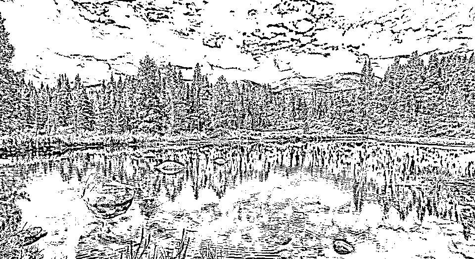

**重要天象**

**★****周一 5 月 30 日 双子座新月**

所幸的是，在周一北京时间的晚上 7 点半，**我们将迎来双子座新月。**

这个新月的双子座能量看起来压力重重。

新月在双子座，定位星水星还在金牛座（金融债务经济的象征）逆行，在恢复顺行前的停滞期，水逆的影响力更大！并且还被土星四分。**沟通不畅、自我表达被限制被压制、疫情对出行的影响**还是比较严重，还有对经济的种种担忧。

**但新月是新的希望，新的开始。**水星三分冥王星，冥王星深刻的洞察力也许会给我们的思想带来沉淀反思，也许会激发新的见解。对于水星来说，**开阔的心胸、崭新的观念、持续的学习、和世界联接**，是让生命发展的方式。

在这个双子座新月，我们祈愿一切尽快回到正轨。

目前全国疫情已经相对平稳，许多城市也在逐步的解封之中，希望双子座的新月给我们带来更多流动的可能，无论是心智上还是活动的空间。

**另外，何不尝试让我们的心灵更开放？**怀着孩子的好奇去探索我们不熟悉的领域，尝试去了解那些不可能、不理智、不正规的思想和领域。**是时候和过去的僵化告别，去看到未来的种种可能。**

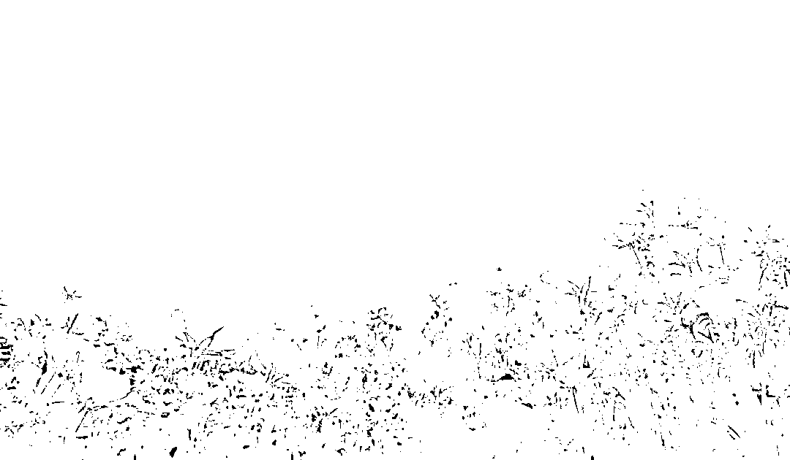

**★****周三 6 月 1 日 儿童节**

周三是儿童节，最纯粹的时光就是童年时光。如果你觉得你的生活过于呆板和僵化，**请试着让自己回到那个迎风起舞的少年。**我们曾经是怎样的勇敢的出发过？那现在也可以！生命难道不是一个勇往直前的探索的旅程吗？

**★****周五 6 月 3 日 水星终于顺行！**

这一次的水逆，我个人感觉真的很深刻，不知道大家是不是一样呢？被困顿家中的滋味很水逆、开车被追尾很水逆、思想困惑焦虑很水逆、电脑无端不能启动很水逆、我甚至在水逆期报废了陪伴我十八年的车子，总之是一段很困难的日子。

**周五的水星顺行，水逆终于结束了，**星象要好转了，卡壳的问题相信会慢慢理顺的。

水星还在金牛座，可能解决问题还没有那么快捷，按部就班不紧不慢，**大家耐心一点。**到六月中旬，水星会进入双子座，回到自己的家。双子座水星的气场会马上变得不同，多才多艺、思路敏捷、反应快速、观点全面，我们思路通畅了，出行的道路可能也会通畅了，祝愿大家考试顺利，合作愉快，出行顺畅！

**6 月 3 日也是中国的端午节。**大家都知道端午是纪念屈原的，吃粽子的节日，学习了占星后才知道，端午节也是源于自然天象。

中国古代天文学家为观测日、月、五星运行而划分了二十八星宿，由东方青龙、南方朱雀、西方白虎、北方玄武各七宿组成。东边的苍龙七宿在仲夏端午飞升于正南中央，处在全年最“中正”之位，正如《易经·乾卦》第五爻：“飞龙在天”。

苍龙的主星恒星心宿二高悬正南中天，龙气（阳气）旺盛，处于全年最“中正”之位，事物处于鼎盛时期，代表天象的运行处在一个阳气生发，生机勃勃的阶段。这一天水逆也结束了，让我们感应自然的生机，**在困顿中重新振作，重新出发。**

**★****周日 6 月 5 日 土星在水瓶座逆行**

行星的逆行都会在他们所代表的领域引起回顾和反思，帮助我们找出问题的卡点到底在哪里。

**土星在水瓶座逆行，**会让我们思考管理系统是否有提升的空间？我们需要在哪里设置更好的界限？事物发展的因果究竟是什么？哪里是我们的成长议题？我们是否足够关注了大自然的可持续发展？

**作为一颗移动较慢的外行星，土星每年逆行大约四个半月。**这些逆行可能会阻碍现有事物的进展，并把你送回最初的计划阶段，**重新洗牌，反复琢磨**，以确保你的计划建立在一个稳定的基础上，并具有比较强的结构性，完整性。可能公司会有整合变动，也有可能发生自然灾害。

总之，目前的一些进展、计划，可能会推倒重来。也许会有更多的艰难，**但也许修正、复盘，才是正确的开端。**

外行星的逆行带来的影响是更为大范围和长久的。土星本身是业力之星，会提醒我们面对那些过去没处理好的事情。但逃避不是办法，**只有认真的反思，直面它带来的恐惧和不安、寻求与自我和过去和解的方法，才能真的突破外界的限制。**

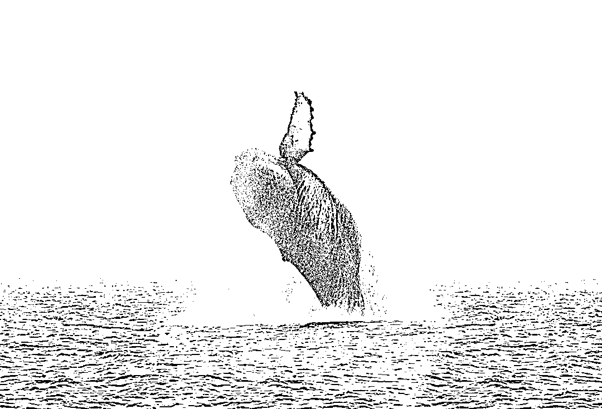

**12 星座一周运势**

**上升*****白羊座***

新月发生在你的 3 宫，最近是否有短途出行的计划？可以提前做好准备，留意临时变更的可能。部分人也可能会有临时出差的任务。木星火星合相在你的 1 宫，最近出现了那些新的机遇？**机遇也带来压力，可能太大的工作量让你倍感压力。**

**如果内心有不满，不要随便发火，正好利用双子座新月好好梳理自己：**提升语言表达能力、沟通技巧、学习新的知识、写作、改善邻里和兄弟姐妹关系等方面的想法。

最近财运不错，也可以尝试一下自己的新计划，也许会给你带来一些意外的惊喜呢！

*****上升**金牛座***

**守护金牛座的金星正在你的 1 宫，**虽然平时很低调，也还是换个发型吧，换个形象和心情！新月发生在第 2 宫，这时候适合你梳理自己：学习、发展新的职业技能、找到自我价值、改善财务状况、如果在生意方面有新的想法，也不妨试试。

多关心自己的健康，尝试让自己平静下来，多做善事，注意沟通的方式方法。

**上升*****双子座***

双子座的宝宝们生日快乐！

**新月来到了你的 1 宫，**你的人生正在发生很多改变。**许多新的机遇呈现在你的面前。**也许你刚刚结束一份工作，也许你将毕业踏上社会，无论它们出现在你生命的哪个方面，都是为了帮助你探索和体验新的人生经历，让你成长。

相信你的灵活、天然的好奇心与求知欲，会帮助你很快适应新的环境与改变。

当环境改变的时候，我们也会接触到新的朋友和团体。**新的关系会给你带来新的机会，**好好珍惜和朋友度过的时光，并且，回到自己的内心深处，问问自己，**到底什么才是最想要的呢？**

找到新的人生发展方向、新的生活环境、新的关系，改善个人形象与气质、加强锻炼，塑造全新的自我。

**上升*****巨蟹座***

新月发生在巨蟹座的 12 宫，巨蟹座天性就很敏感，最近是否会想的更多？有很多记忆、情绪被浮现出来？水星逆行给了你再次回顾过往人生的机会，**你会产生很多新的想法、灵感和直觉，**它们会给改变自己的人生、走向新的道路提供有益的指引。

在职场上有一些机会，也许有升职的可能，但要注意不要太忙，容易上火。

可以利用这段时间**释放压抑在心中的负面情绪或记忆**，恢复心灵的平静，改善睡眠、获得灵感和创造力等。

**上升*****狮子座***

**新月发生在你的 11 宫。**近期你有很多机会，去与朋友、团体、组织相聚，而你的社交生活也会相对丰富。与他们进行更多的交流和接触，能够帮助**连接到自己内在强大的创造力，**同时从他们身上获得关于自己未来和人生理想的灵感。

也许你在策划一段长途旅行，也许你将开始更高学历的学习，无论怎样，自己在这个阶段，行万里路，读万卷书，都会获得更高远的视野。

这时候适合你梳理自己：与找到人生理想和志向、改善朋友、团体之间的关系、结识新的人群，融入团队、组织等。

**上升*****处女座***

**新月发生在处女的第 10 宫，**虽然处女座在职场一般来说低调，不爱变动，但新月为你的职场和事业发展带来了很多新的机遇和可能性，倘若你在当前的事业当中感受到了僵化和停滞，那么可以利用这个契机，**去接受变化，主动寻找新的突破口。**

这周的人际互动比较频繁，需要更多关注和他人的关系，充分做好沟通互动的工作。

如果出门旅行出差，多多检查一下，避免可能的疏漏，确保旅行顺畅。

这周可以多思考新的事业、新的就业机会，如何促进职业发展和提升公众形象。

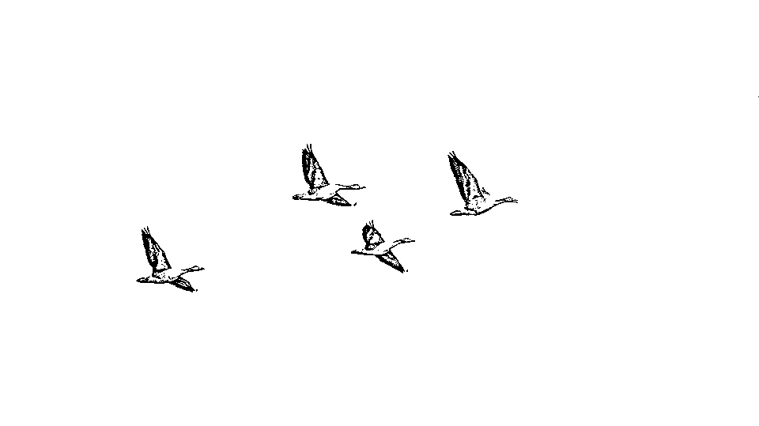

**上升*****天秤座***

这个新月带给你长途旅行、接触异国文化、以及接受继续教育、学习高等知识，阅读书籍的机会，这些都能帮助你**获得新的人生观和世界观**，从而以全新的方式与这个世界接触和连接。

最近在理财方面，可能会有新的计划和打算，**做好规划，争取稳扎稳打，**避免可能的亏损。

最近走桃花运呢！如果单身，看看真命天子是否已经出现了呢？已婚人士可多多关心自己的另一半，多理解，少争吵。

新月许愿可以是关于学习、深造，写作、出版，长途旅行，新的人生哲学和价值观。

**上升*****天蝎座***

天蝎座大部分时间很注重隐私，但一旦认定了人，就需要更深度的联结。**8 宫的新月可能让你愿意与人分享你内心的一些真实想法和感受。**可以主动对重要的人就某些议题进行深入交谈。当你们都能敞开心扉时，会发现，很多解不开的结自然而然就解开了。

也可能要处理很多与财务相关的事务，但在做出理财规划时要更加谨慎、仔细。同时注意节制，避免过度消费和支出。

在人际关系和情感关系中，面对新的变化，你可能想要稳定下来。**无论作何选择，确保你能够接纳并承担现实的责任。**

愿你放下心结或者执念，获得更良好的亲密关系。

**上升*****射手座***

射手座们有更多机会去接触新的对象，或者找到新的合作伙伴。但在签订任何协议、或者达成合作时，**需要反复多次的沟通、确认和了解清楚情况之后，再做决定。**

最近很热爱工作，但在工作中也需要更多的沟通，以免出错。

在情感关系上，你可能需要更多新鲜感，如果单身很久了，是时候开始一段新的恋情了呢。如果另一半让你感到压抑，你需要思考如何互动，才能让关系激发新的活力。**你需要在亲密关系方面有相应的成长和改变。**

**上升*****摩羯座***

**冥王星逆行在你的 1 宫，**你是否感受到来自外界的压力？如何获得自己的权威和力量？如何不依赖他人的关注、真正的认可自己的能力，我们每个人都会有自己的答案。

**新月是否会促使你开始健身计划呢？你会更关注自己的健康吗？**

职场环境可能多有变动，或者你要处理很多人事变动、文书、接洽的临时安排等，你需要调动起灵活性和协调性。

多多考虑如何提升职场氛围、改善职场环境、同事关系、身体健康、居家环境。

**上升*****水瓶座***

最近感觉被困住了吗？**是时候反思你某些固有的价值观和认知，看看是不是给自己设置了限制。**有时候我们需要走出自我封闭的圈子。

桃花运增多，你有更多发展浪漫恋情的机遇，这段时间创作力升级，可以重拾艺术爱好的乐趣。注重语言和心智的交流分享，有助于关系的进展。

多回家关心一下父母，还可以多多关注子女教育。家庭总是我们力量的源泉。

**上升*****双鱼座***

**新月发生在你的第 4 宫，**有哪些与家庭、父母有关的回忆和情结被再度唤醒？追溯原生家庭的模式是否能发现你的一些情感模式的来源？金牛座群星在 3 宫，告诉你通过客观的沟通交流理解原生家庭。**当你真正去看清面对时，你反倒能更坦然、真诚地接纳自己的情绪。**

木星火星都在 2 宫，如果有机会赚钱，就去尝试一下，但千万要冷静，不要太急躁。

这时候适合梳理自己与改善家人/父母关系、了解家族过往建立内在安全感，房屋建构、修缮、投资等方面的想法。

**祝大家一周平安顺遂！**

**版权声明**：原创文章由作者授权首发于若道平台发布，欢迎转发，反对抄袭。友号转载请申请白名单。

****

****Dora****

若道 2017 届核心课毕业生

若道咨询平台占星师、ISAR 认证占星师

心理咨询师、塔罗咨询师、多年企业管理经验

咨询微信：AstrologerDora

公众号：Dorothy 占星文化

**长按打赏**

**20 位来自世界各地的占星师****带来 19 场沙龙——新世界的觉醒****详情可点击下图**

**学习占星学****点击下图了解课程详情**

**

**微信又双叒叕改版啦，不想错过若道君的推送？**

**就把若道设为星标吧！**

**▼**

**喜欢记得点一下在看哦☟**

**报名直达入口**

# 雷蒙德·梅里曼金融占星周运 | 市场可能回到更谨慎的状态

> 原文：[`mp.weixin.qq.com/s?__biz=MzA5NjA0NTAxNg==&mid=2651474855&idx=2&sn=619aa9e19843dd92a264f68dad663740&chksm=8b48f910bc3f7006f114d771cfbe7e815d2ef97220862ad8fd9cc663b930143b29e0386431e7&scene=126&sessionid=1692737806#rd`](http://mp.weixin.qq.com/s?__biz=MzA5NjA0NTAxNg==&mid=2651474855&idx=2&sn=619aa9e19843dd92a264f68dad663740&chksm=8b48f910bc3f7006f114d771cfbe7e815d2ef97220862ad8fd9cc663b930143b29e0386431e7&scene=126&sessionid=1692737806#rd)

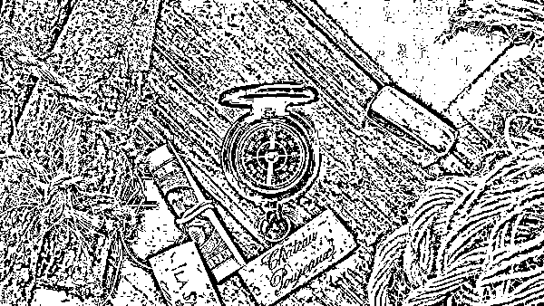

作者/雷蒙德·梅里曼 译者/Luke
编辑/玫瑰 图片/pexels

雷蒙德·梅里曼是在金融占星学界稳坐第一把交椅的占星师，同时他也是若道签约的金融占星课老师，我们引进了雷蒙德·梅里曼老师的《[上证指数月度报告](http://mp.weixin.qq.com/s?__biz=MzA5NjA0NTAxNg==&mid=2651474357&idx=2&sn=1dd70a90e2ea5b1351c8d9eb7342b72e&chksm=8b48fb02bc3f7214b27b2dcbebc7b32be9dab98bee34853299d6dca571248cb279cfdc9322d2&scene=21#wechat_redirect)》及《[黄金报告](http://mp.weixin.qq.com/s?__biz=MzA5NjA0NTAxNg==&mid=2651474357&idx=2&sn=1dd70a90e2ea5b1351c8d9eb7342b72e&chksm=8b48fb02bc3f7214b27b2dcbebc7b32be9dab98bee34853299d6dca571248cb279cfdc9322d2&scene=21#wechat_redirect)》。我们经老师的授权，将每周刊登梅里曼老师的周运，供大家参考和学习。于是，这是本周的周运（5.30-6.3）。

**说明：以下时间采用纽约证券交易所所在地美国东部标准时间。**

**展望与回顾**

****

**上周标志着道琼斯指数自 1923 年来首次连续八周下跌，标准普尔指数也连续下跌七周多，为 2001 年来的最糟。**

**——萨曼莎·苏宾****《道琼斯指数连续八周被抛售后，股票期货上涨》****www.cnbc.com****2022 年 5 月 22 日****周五，一份显示通货膨胀有所放缓的报告提振了股市。核心消费者价格指数 4 月上涨 4.9%，低于上个月的 5.2%。美联储在制定政策时特别关注这份报告。****——塔纳亚·马谢尔和苗汉娜****《通货膨胀放缓的报告提振了股市，道琼斯连续八周下跌》****www.cnbc.com****2022 年 5 月 27 日**5 月 22 日水星逆行的中点，再次证明是一个重要的市场时机。在一周前下跌至年度低点 30635 后，5 月 22 日，道琼斯工业平均指数反转并开始了一轮超过 2500 点的上涨，是自 4 月 21 日基本周期波峰 35492 以来最大（和最长时间）的上涨。那是经典的恶作剧者水星的戏法，因为一周以前（许多人现在仍然相信）还有大批投资者、分析师和美国公众相信一场更为严重的崩盘正在发生。此外，前一周标志着道琼斯工业平均指数在接近 100 年间以来持续时间最长的连续下跌。技术指标和图表形态是看跌的，投资者观察到的基本面情绪也是如此。毕竟，利率正在上涨，预期接下来几个月会继续上涨。通货膨胀处于 40 年来的最高水平。由于抵押贷款利率飙升，房屋销售停滞不前。由于高昂的汽油价格和航空旅行成本，人们正在延迟或取消夏季度假计划。相信美国经济正在向正确方向前进的美国人口比率下降到仅有 20%。大多数人的情绪并不乐观。

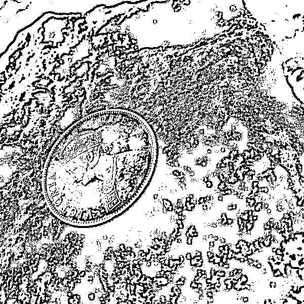

**但是水星（恶作剧者）在逆行，加上火星和木星进入白羊座，与天王星形成八分相，已经“点燃”了金融市场。**激进和投机的火星正在寻求活动，正于 5 月 29 日接近“庞然大物”木星。恶作剧者水星逆行的中点使市场反转，与此同时，行进的火星和木星在火象星座白羊座合相，对应大幅度的上涨，和爆发的冒险热情。在判断市场时机的工具箱中，这些是非常有用的领先指标。不受重视的水星逆行中点，再次成为了领先指标，至少短期如此，那也是大多数交易者所关注的时间周期。它恰好击中了 5 月 20 日的低点和反转。现在关注的是，5 月 20 日的低点，是否也是一个 23 个月周期的波谷，和一个新牛市的开端，这是我们在每周和每月报告中讨论的话题。在 5 月 8 日举行的梅里曼市场时机学院春季讲座中，讨论了道琼斯工业平均指数在 5 月底前另一轮 10%下跌的可能性。截至 5 月 4 日，这一指数那时在 33000 和 34000 附近交易。它在 5 月 20 日下跌了近 10%。5 月 27 日，道琼斯工业平均指数在 33213 收盘，为 3 周以来的最高价位。大多数全球市场走出了与道琼斯工业平均指数相似的形态。也就是说，它们从 5 月 20 日的数月甚至年度低点起，一路上涨至上周末。对大多数股指来说，此轮上涨代表了过去 3-5 周的最高价位。其他市场上，黄金和白银整周都出现了良好的上涨，那可能与日心水星在射手座行进有关。黄金上周测试了 1870，较 5 月 16 日的数月低点 1785 大幅上涨。白银周五上涨至 22.47，为三周来的最高价位。原油在 5 月 27 日上涨至 115.30，测试了 5 月 17 日 8 周来的高点 115.56。然而，比特币相对平静，在上周一的高点 30693 和周四的低点 27959 之间来回交易。与此同时，以太坊上周五下跌至 1710，重新测试了 5 月 12 日的数月低点 1702。看起来股票市场和比特币/以太坊之间的联动已经被打破。股票市场飙升，加密货币市场却在打鼾。

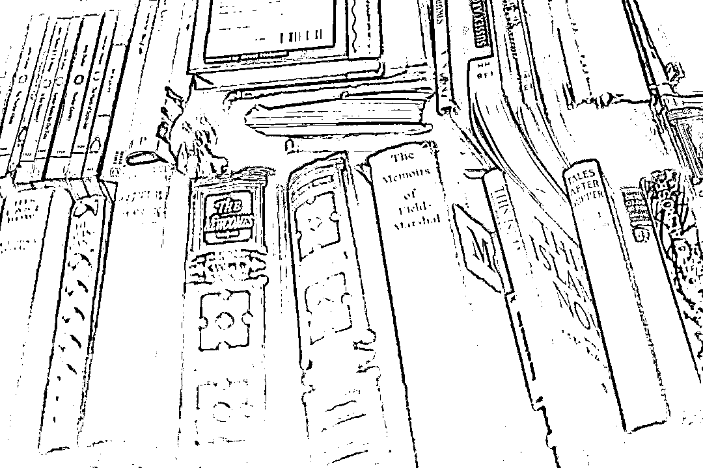

**短期占星趋势和长期考量**

****

**美联社-国家民意公共研究中心的一份近期调查发现，仅有 21%的成年人相信美国走向正确的方向，比 4 月的 29%有所下降。**

**甚至民主党人也失去了希望——只有 33%的人相信美国正朝着正确方向前进，相较于一个月前的 49%和 3 月的 55%有所下降。**

**——卡莉·帕特森****《20%的美国人相信美国朝着正确的方向前进》****《纽约邮报》****2022 年 5 月 20 日****美国发现自己陷入了 40 年来从未经历过的经济环境中。成功应对这些挑战需要一定程度的政策灵活性，但是近年来货币和财政领域都显著缺乏这种灵活性。****——杰拉德·贝克****《拯救这一次的衰退并不容易》****《华尔街日报》****2022 年 5 月 24 日****新冠病毒肺炎疫情的限制可能最终得以解除，使得人们能够再次自由旅行。****然而，这可能也是一段容易粗心大意的时期。由于木星和海王星在双鱼座，剧情具有两面性：获得了随意走动的自由，但粗心大意的倾向却让人随后付出代价。****——《2022 年金融预报》****写于 2021 年 9 月-10 月**本周主要的地球宇宙学征象，包括**5 月 29 日火星、木星在白羊座合相，6 月 3 日水星逆行，以及 6 月 4 日土星逆行。**本周晚些时候，**当严肃谨慎的水星和土星相继改变方向，火星、木星在火象星座合相带来的乐观情绪和冒险精神可能会熄灭。**随着火星和木星的分开，日心水星 6 月 1 日入座摩羯座，可能也会回到更为谨慎的状态。投资者可能被提醒，美联储依然在提高利率，尽管各地正在解封，新冠病毒肺炎作为一种传染病依然与我们同在。我们可能会享受再次自由的感觉，却卸下了防备，但现实要我们认清，病毒不在乎这些，住院病例正在再次上升，尤其对那些未接种疫苗的人。根据 5 月 20 日的美国疾病控制与预防中心报告，“……18 岁及以上的未接种疫苗的成年人，因新冠病毒肺炎住院的可能性比接种最新疫苗的人高出大约 5 倍。”

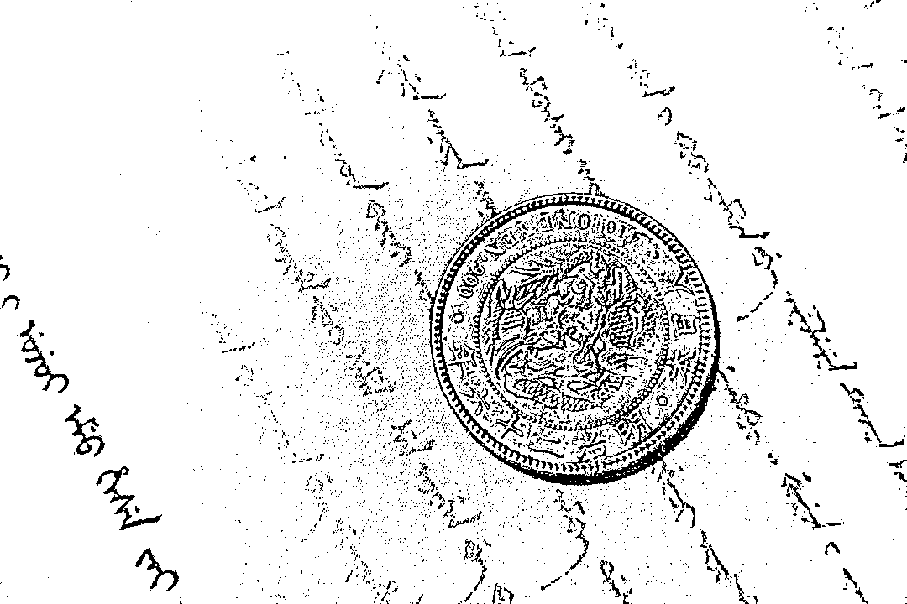

这不是一例疫苗广告，因为看起来疫苗对一些人也有风险。这只是要提醒，在火星、木星在白羊座合相的这些日期里，要小心不要感染病毒，因为这一合相是一个与粗心大意相关的征象。长期来看，值得注意的是，32-37 年的土星-冥王星合相周期在 2020 年 1 月发生。最近 3 年的《年度金融预报》中，阐述了这个合相周期与利率的关系。这个合相已经对应了长周期的高点或低点（交替）。1947 年的土星-冥王星合相（两个周期以前），是利率的长周期低点。当时的利率接近 0%，与 2020 年一样。在 1947 年 8 月的合相后，利率开始上升，股票市场下跌至 1949 年 6 月的 4 年周期低点。尽管利率在上升，随后却进入了一轮长期牛市和经济扩张，持续至 1966 年。然而，由于 1973-1974 年起，通货膨胀的上升带动利率快速上涨，股票市场于 1974 年 12 月下跌至 36 年周期低点。随后是 8 年的停滞，直到 1982 年美联储最终打破了通货膨胀。历史的教训是什么呢？股票市场可以在利率上涨的同时上涨，前提是利率增速是温和的。一旦利率上涨开始迅速加速，股市就会遭到重击。美联储已经指出，它将快速提高利率。但是 1947-1966 年，利率增速是稳定和温和的，股票市场基本是非常看涨的。木星-土星周期的渐盈阶段（2020-2030 年）也预示着温和政策（不太少，也不太多）能够推动经济增长，而非极端主义。我们正处于新的 140 年风象纪元的初期，风象纪元指的是每 20 年一次的木星-土星合相都发生在风象星座。起初的十年的重点，是建立一个新的经济和政治基础。建立那个基础，需要温和（木星-土星）的领导力。但它也需要开放的风气，容许通信方面的发明创造和革命，激发各地社会的文艺复兴。这是尼古拉·康德拉季耶夫发现的经济长波理论的主要特征，长波理论也被称为“康德拉季耶夫周期”。乔·拜登总统表示经济正处于转型状态，这在某种意义上可能是正确的。经济体可能从今天对化石燃料的依赖，很快转变为依靠替代能源运行世界。但是为了让这次转型成功，它需要逐步进行。那就是木星和土星带来的信息。

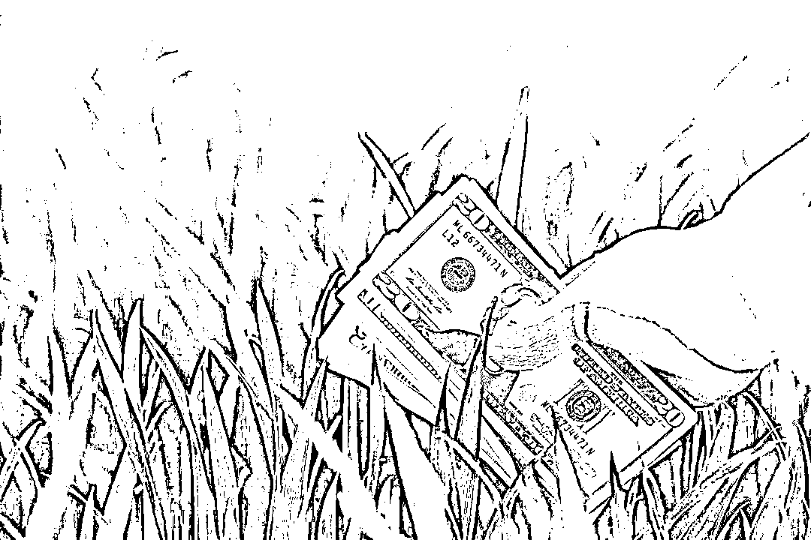

为了被接受，这十年的政策必须要适度，改变的步伐要平稳。不要太多，不要太快。不要太少，也不要太慢。否则，社会将反抗，非但没有迎来智力和创造力的革命，反而会经历社会动荡和剧变。木星-土星周期的头两年，历史上标志性的特点是战争、军事冲突，以及对全世界的经济和社会的威胁。但随后却会迎来一段时期的扩张和成长。我们正处于木星-土星周期的第二年。这一时期的混乱和动荡，可能会在 8 月-11 月结束，届时土星-天王星会形成最后一次近乎精准的渐亏四分相，木星处于两者的中点（与两者构成八分相）。根据宇宙天象，**这一混乱时期的最高峰是 9 月 21 日-28 日，但需要 2 个月的容许度来观察在发生什么。**那将是很有趣的。请保持关注，注意安全。**梅里曼市场时机学院与若道将于 2022 年 6 月 23 日 19:00 举办金融市场最新信息中国专场讲座。**这个 2-3 小时的在线讲座（有两次 5 分钟的休息时间）将讨论几个金融市场的前景，包括黄金、原油和上证综指。

这将是特别及时的讲座，因为为期 12 年的木星轨道周期会在 5 月 10 日进入白羊座，并且 6 月-11 月是一年中最有力的地球宇宙征象接连登场的重要时间段，因为土星逆行与天王星形成几乎精准的渐亏四分相。

**说明：以上日期基于纽约证券交易所所在的美国东部标准时间，由于存在时差，中国地区可能需要加一天。**

**版权声明：**本文由若道翻译发布，欢迎转发，反对抄袭。友号转载请申请白名单。

**雷蒙德·梅里曼（Raymond Merriman）**

若道签约老师。著名金融占星师，ISAR（国际占星研究协会）前主席，梅里曼市场分析公司的总裁。他由于“提升了占星学的职业形象”，在 1995 年国际占星大会上被授予轩辕十四奖；在 2012 年国际占星大会上，被授予轩辕十四终身成就奖。

1“中国上证指数月度报告”发售**若道推出了****中文版****的雷蒙德·梅里曼中国上证指数月度报告，并持续发行该报告！**当把金融市场的周期和占星学的周期相结合时，雷蒙德·梅里曼老师的金融占星学研究**为投资者应对金融市场的周期波动，并随之调整投资策略提供了极大的价值参考**。
**6 月中英文报告已上线！**2“黄金价格周期月度报告”发售**若道推出****中文版****的雷蒙德·梅里曼黄金价格周期月度报告！**不仅仅为广大读者在中国股市的投资出谋划策，更将视角放眼黄金市场。**每当世界经济形式不明朗的时候，有一个地方是保值的港湾，那就是****黄金**。自 1982 年雷蒙德·梅里曼出版第一本研究《地球宇宙学征象与黄金价格的关联》的著作以来，**他一直作为最重要的黄金市场时机预测者之一享誉国际**。2022 年 6 月黄金报告已上线，梅里曼老师将会告诉你他对这个关键时期如何操作的想法。也可以按照季度和一年期订阅，有更多优惠。季度和年度的好处是，你可以持续了解梅里曼老师对于不断在变化的市场的看法。即便他某一次看法和市场不一致，你也看到在下一期他如何调整自己的看法，并看到金融占星在一个长期时间段内对你把控风险的帮助。而能够长期控制风险、尽量找到安全的投资时机才是投资的长久之计。**6 月中英文报告已上线！****购买套餐**，买得越多越优惠中国上证指数月度报告套餐价

*   **单月报告**：280 元
*   **3 个月套餐**：780 元（260 元/月）
*   **12 个月套餐价**：2400 元（200 元/月）

**长按下图识别二维码****购买金融报告****套餐****▼**

黄金周期月度报告优惠

*   **双报告年度套餐更优惠（直降 900 元）**

*   **12 个月黄金报告+12 个月上证指数报告：仅需 3900 元**

**长按下图识别二维码购买黄金报告套餐**▼

3《2022 年金融预报和沙龙》1976 年以来，由雷蒙德·A·梅里曼撰写的梅里曼市场时机学院每年一次的年度预报沙龙和每年一本的《年度预报》一直在应用占星学原理为投资者们服务，提供卓越洞见，从未间断。 **雷蒙德·梅里曼《2022 年金融预报和沙龙》发售中（报告已发布）。****长按下图识别二维码了解详情**
▼

4《2022 下半年金融占星投资沙龙》这将是特别及时的讲座，因为为期 12 年的木星轨道周期会在 5 月 10 日进入白羊座，并且 6 月-11 月是一年中最有力的地球宇宙征象接连登场的重要时间段，因为土星逆行与天王星形成几乎精准的渐亏四分相。

**长按下图识别二维码了解详情**

▼

**点击阅读原文购买金融报告**

# 插班中 | 美国占星心理学学院&若道占星双认证核心课程

> 原文：[`mp.weixin.qq.com/s?__biz=MzA5NjA0NTAxNg==&mid=2651474855&idx=3&sn=e760dab06e252fdba3bf75e8a0050eca&chksm=8b48f910bc3f70064209980f3c9a9029f7113136278e10cff6f4b04a383e78f1d659df79ae41&scene=126&sessionid=1692737806#rd`](http://mp.weixin.qq.com/s?__biz=MzA5NjA0NTAxNg==&mid=2651474855&idx=3&sn=e760dab06e252fdba3bf75e8a0050eca&chksm=8b48f910bc3f70064209980f3c9a9029f7113136278e10cff6f4b04a383e78f1d659df79ae41&scene=126&sessionid=1692737806#rd)

**美国占星心理学学院创办人**

**格伦·佩里**授课

**40 余年**职业占星师生涯所学精华**倾囊相授**

修完 101-205 全部课程，并通过考核的毕业生将获得

**美国占星心理学学院证书**( Academy of Astropsychology )

和**若道毕业证书**

**高含金量双证书**

跟随主讲老师学习融合**心理学体系**的**占星知识**

为星图咨询解读打下坚实的基础

**大量**的课程资料，光是课后阅读资料就**超过 60 万字**

合理的课程设计，贴心的助教服务，及时的课后测验

1

**这门课程最大的看点是什么？**

1. **两位国际占星学大师**共同授课，将合计**90 年职业占星师生涯所学精华**倾囊相授；2. 修完**全阶课程**，考试通过的毕业生将获得**美国占星心理学学院证书**（Academy of Astropsychology）和**若道毕业证书**，**高含金量双证书**；3. **116 次课程**的充分授课时间（录播课程 69 次课；直播课程 47 次课），全面而详细地讲解占星学历史、知识、技能、案例、咨询和运用；4. 跟随主讲老师学习**自成体系、逻辑严密、实用性强的占星语法、星图解读方法**；5. 学习独特的**发展年龄预测法**，从星图看对关键年龄阶段的发展及议题；6.** 大量的课程资料，光是课后阅读资料就超过 60 万字**；7. 合理的课程设计，初中阶课程，每一节都有课后测验；8. 本课程可以作为**ISAR 选修课**中的一门，再修两门就满足 ISAR 认证选修课要求；9. **18 次占星咨询技巧的培训**，为正式从事占星咨询建立基础；10. 教授重要的**心理学概念**，比如与客体关系、心理动力理论、个人神话和叙事疗法相关的一些概念，学习如何将它们整合到星图解读中；11. 了解**《精神疾病诊断与统计手册》**诊断标准，探索星图中的心理疗愈；12.  学习**叙述疗法**和**自传写作**，将之作为自我疗愈和咨询的工具。

**格伦老师致学员的信**

（向上滑动查看内容）

**亲爱的学员：**

作为占星心理学学院的校长，我的目标是帮助你顺利完成学业。

占星心理学学院的课程让你能够在经济承受范围内，灵活地学习占星学。我们的课程让你可以舒适、便捷地在家学习，不用打乱你本就繁忙的日程。我们有完善的在线学习系统，让你能在线上课、下载学习资料、进行测试并自动获得即时反馈，还可以在虚拟课堂上同你的教员和同学互动。

作为私人开业的**职业占星师**和**执业心理治疗师**，我已经**工作超过 30 年。**我还花了近 10 年的时间，在研究院里学习并获得**心理学的硕士和博士学位**。这段训练和经历是无价的，帮助我将占星学发展成为连贯的 21 世纪模式。

我们的占星学培训项目是**系统化的、清晰的、组织有序的、易学的、前沿的。**尽管有许多类似的学校可供你选择，但你不会在这些学校中看到像占星心理学学院所提供的那样有深度的或尖端的课程。

**我非常期待 2022 年再次在若道教授心理占星学核心课程。**我们重新规划和升级了本次课程体系。**新的课程包含之前完整课程的 72 个录播视频，每个视频长 2 小时；以及由我教授的 37 次直播课程，和大卫老师教授的 10 次直播课程，每次课程 2 小时。**在实时课程中，除了我提供的案例，我还会用学员的星图进行案例演示，与学员互动，阐明视频中教授的原则和方法。

**2 小时直播课程安排：**

**第一阶段 提问和讨论：**

这将在每节课开始时进行。邀请学员提出与课前提供的资料相关的具体问题。这一阶段将持续 15-30 分钟。

**第二阶段 示例：**

这一阶段会讲解与每周任务相关的具体概念，例如行星的星座位置、宫位位置以及相位的意涵。星图示例来自我认识的人，如公众人物、朋友、家人、同事或以前的客户（不显示出生信息）。同样，这一阶段也开放课堂讨论，学员可以提出自己的问题和见解。

**第三阶段 学员案例演示：**

这个阶段会从学员的具体星图来阐明概念，例如火元素行星占优势。学员案例演示不会涉及任何类型的咨询或“解读”。它们将只是简单地包含一段对话，我会在对话中分享自己对某个配置的思考，然后问这个学员可能会如何主观地（影响、信念、行为）和客观地（事件/关系）体验这个配置。其他参课学员可能也会对讨论的主题有自己的见解或问题，他们也可以参与讨论。

我对这一新的在线课程形式感到兴奋，**并期待着从 2022 年 4 月 27 日开始认识我的新学员们。**获得本学院的文凭会是你做过的最明智的投资。你不仅将占星学掌握到前所未有的深度，还将学到如何为客户提供咨询服务并建立职业占星师的职业生涯。

真诚地

**格伦·佩里 占星心理学学院校长**

**为什么要学习心理占星学？**占星心理学是一个复杂的体系，让实践者能够向客户提供真正治疗性的益处。这从根本上说来是我们学院有别于其他学校之处：**我们教授占星学，也教授心理学概念。****我们明确讨论各种心理学概念，并将其与占星学无缝衔接。结果就是更深入的、更丰富的，最终更加强大的模式。****该项目专为初学者和渴望深造的有经验的占星师而设。**我们会从跨学科的角度探讨星图解读。**通过融合荣格心理学和各种其他模型的元素，学员将熟悉作为人格理论、发展模型、原型语言和诊断工具的占星学。**

2

**课程是怎么安排的？**

**第一学年**

**共****64****次课 **43****次录播课 **21 次直播课******

**101 占星学基础 **

****共****12****次课程：******8 次 2017 年录课+4 次直播课**

**占星学**关注成长，聚焦心理。外部事件意义重大，但我们可以把它们看作是对于发展中的心理结构的共时性反映，以及未来发展的媒介和催化剂。在这个阶段的课程中，会以四种形态的几何形式介绍**占星原型：星座、行星、宫位和相位**。黄道带是人类心灵的象征性地图，其中的每个**星座**都代表一种基本的人类需求、原型人物、发展阶段和行为风格。**行星**代表心理功能，以满足其关联星座的基本需求。**宫位**提供了环境舞台，行星在其中扮演它们的角色，而**相位**是行星之间的角度关系，在主观上体验为内在对话。

**课程安排**：

**录播课****、****直播课（周三）**时长都是 2 小时

第一节**录播课**：核心概念介绍

第二节**录播课**：黄道带的结构

2022 年 4 月 27 日**直播课**：核心概念、黄道带的结构提问和讨论、知识点示例

第三节**录播课**：图例、单态星体和其他奇妙的元素

2022 年 5 月 11 日**直播课**：图例、单态星体提问和讨论、知识点示例

第四节**录播课**：星座介绍（从白羊座到处女座）

第五节**录播课**：星座介绍（从天秤座到双鱼座）

2022 年 5 月 25 日**直播课**：12 星座案例演示

第六节**录播课**：行星作为过程

第七节**录播课**：行星作为内容

第八节**录播课**：将碎片整合起来

2022 年 6 月 8 日**直播课**：整合星图时，将行星作为过程和内容案例演示

**102 行星落星座、宫位** 

****共****12****次课程：**8 次 2019 年录课+4 次直播课**

这个阶段的课程**聚焦于初步的星图整合。**

学员将学习**占星语法**，以及如何运用它们来阐释**行星的星座落点**。学员不需要强记书中的星图解读，而是学习分析基础的占星句法结构，应用这些语法规则来思考和讲述这门语言。学员们将学习如何构建精妙的句子，将动机、功能、特质、状态和事件组合起来。

此外，还将学习解读**行星宫位落点**的规则。宫位被定义为心理环境，为特定类型成长和发展提供背景。行星落在宫位中，象征着情境中的特殊状态，应对环境挑战的方式，以及通过共时性人物和事件而外化的自我部分。

学员们将探索如何将星座和宫位落点融合在一个单一、整合的陈述中，做出灵活、层次分明的解读。

**课程安排**：

第一节**录播课**：占星语法介绍

第二节**录播课**：行星星座作为行为风格

2022 年 6 月 22 日**直播课**：占星语法、行星星座作为行为风格提问和讨论、知识点示例

第三节**录播课**：思维状态和行为结果

第四节**录播课**：学习行星的星座落点

2022 年 7 月 6 日**直播课**：思维状态和行为结果、行星的星座落点提问和讨论、知识点示例

第五节**录播课**：回顾宫位的含义

第六节**录播课**：宫位中的行星过程

2022 年 7 月 20 日**直播课**：宫位的含义、宫位中的行星过程提问和讨论、知识点示例

第七节**录播课**：行星在宫位中的状态

第八节**录播课**：行星作为宫位的内容

2022 年 8 月 3 日**直播课**：行星在宫位中的状态、内容的提问和讨论、知识点示例

**103 行星相位与个人神话** 

****共****13****次课程：**9 次 2019 年录课+4 次直播课**

在这个阶段的课程中，**相位**被解释为由更大的故事结构的潜在动力构成的个人神话。

学员将学习相位是如何象征内在心理的冲突、重要的童年情感体验、主要的人生挑战和内在对话的。需要着重强调的是，相位的意涵会随着心理成熟的程度而改变。人会成长、进化，会解决内在冲突，这些不仅反映在态度和行为的改变上，而且也会表现在某人吸引的事件及其与他人的关系品质上。

学员们还将学习一些**心理学概念**，比如与客体关系、心理动力理论、个人神话和叙事疗法相关的一些概念，它们将整合到相位解读中。

**课程安排**：

第一节**录播课**：重要主题与核心冲突

第二节**录播课**：渐盈相位与渐亏相位

2022 年 8 月 17 日**直播课**：重要主题与核心冲突、渐盈相位与渐亏相位的提问和讨论、知识点示例

第三节**录播课**：主要相位的核心意义

第四节**录播课**：罗生门原则

2022 年 8 月 31 日**直播课**：主要相位的核心意义、罗生门原则的提问和讨论、知识点示例

第五节**录播课**：占星学中的认知

第六节**录播课**：心灵的控制结构

2022 年 9 月 14 日**直播课**：占星学中的认知、心灵的控制结构的提问和讨论、知识点示例

第七节**录播课**：作为认知结构的相位

第八节**录播课**：强迫性重复

第九节**录播课**：听大卫·瑞雷讲月亮交点

2022 年 10 月 12 日**直播课**：月亮交点（由大卫·瑞雷老师教授）

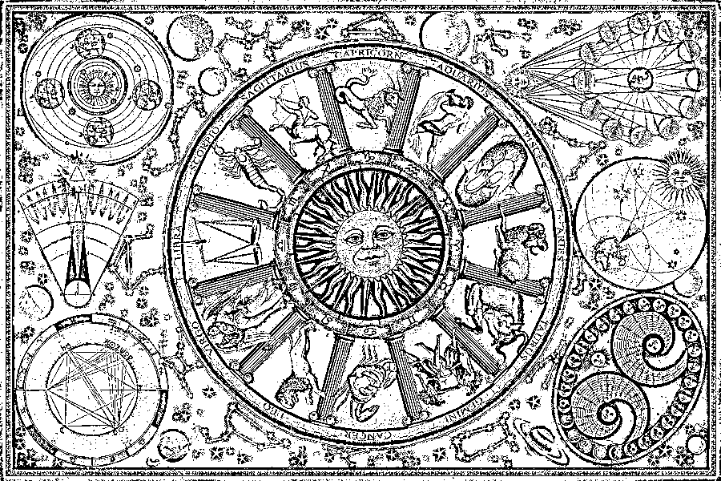

**104 征象星与定位星：作为进化故事的星图 **

****共****12****次课程：******8 次 2019 年录课+4 次直播课**

这个阶段的课程聚焦于**从叙事角度整合星图。**

学员们将探索**宫位征象星**和**行星定位星**如何讲述一个故事，反映一个人进化发展之旅。行星定位关系揭示了个人神话的主体构架。而这个故事的主题常常处于意识觉知和控制之外，占星学提供了一种方式，揭示、解读、改编这个神话。

我们推荐的星图整合方式是将相位和定位星关系融合成一个单一、连贯的叙事。要特别强调的是，如何活出整合程度更高的生命故事。

学员们还将了解**叙事疗法**和**自传写作**，把它们当作促进整张星图整合的一种方式。

**课程安排**：

第一节**录播课**：每张星图都讲述了一个故事

第二节**录播课**：互容与最终定位星

2022 年 10 月 26 日**直播课**：每张星图都讲述了一个故事、互容与最终定位星的提问和讨论、知识点示例

第三节**录播课**：将相位整合进流程图

第四节**录播课**：完整的故事

2022 年 11 月 9 日**直播课**：将相位整合进流程图、完整的故事的提问和讨论、知识点示例

第五节**录播课**：过渡短语

第六节**录播课**：良好定位或不良定位

2022 年 11 月 23 日**直播课**：过渡短语、良好定位或不良定位的提问和讨论、知识点示例

第七节**录播课**：发展年龄方法

第八节**录播课**：进行全面整合

2022 年 12 月 7 日**直播课**：发展年龄方法、进行全面整合的提问和讨论、知识点示例、案例演示

**105 星图中的精神病理学与疗愈 **

****共****15****次课程：******10 次 2019 年录课+5 次直播课**

在这个阶段的课程中,我们将**聚焦于十二星座(从白羊座到双鱼座）及其对应的守护星的潜在功能障碍**。

我们将学习如何识别、理解和应对每个星座的潜在挑战。我们将在各种相应的心理障碍背景下来考察占星原型，这些心理障碍表现为功能障碍、失衡的极端状态。

学员们将了解**《精神疾病诊断与统计手册》诊断标准**。我们会探讨治疗的概念，尤其是那些与整合和个性化相关的概念。我们将特别关注外行星的困难相位，以及它们与内在心理冲突、防御和症状形成的关系。

学员们将探索人的痛苦如何成为发展和实现天赋才能的催化剂。

**课程安排**：

第一节**录播课**：白羊座-火星的病理学

第二节**录播课**：金牛座/天秤座-金星的病理学

2022 年 12 月 21 日**直播课**：白羊座-火星、金牛座/天秤座-金星的病理学提问和讨论、知识点示例、案例演示

第三节**录播课**：双子座/处女座-水星的病理学

第四节**录播课**：巨蟹座-月亮的病理学

2023 年 1 月 4 日**直播课**：双子座/处女座-水星、巨蟹座-月亮的病理学提问和讨论、知识点示例、案例演示

第五节**录播课**：狮子座-太阳的病理学

第六节**录播课**：天蝎座-冥王星的病理学

2023 年 2 月 1 日**直播课**：狮子座-太阳、天蝎座-冥王星的病理学提问和讨论、知识点示例、案例演示

第七节**录播课**：射手座-木星的病理学

第八节**录播课**：摩羯座-土星的病理学

2023 年 2 月 15 日**直播课**：射手座-木星、摩羯座-土星的病理学提问和讨论、知识点示例、案例演示

第九节**录播课**：水瓶座-天王星的病理学

第十节**录播课**：双鱼座-海王星的病理学

2023 年 3 月 1 日**直播课**：水瓶座-天王星、双鱼座-海王星的病理学提问和讨论、知识点示例、案例演示

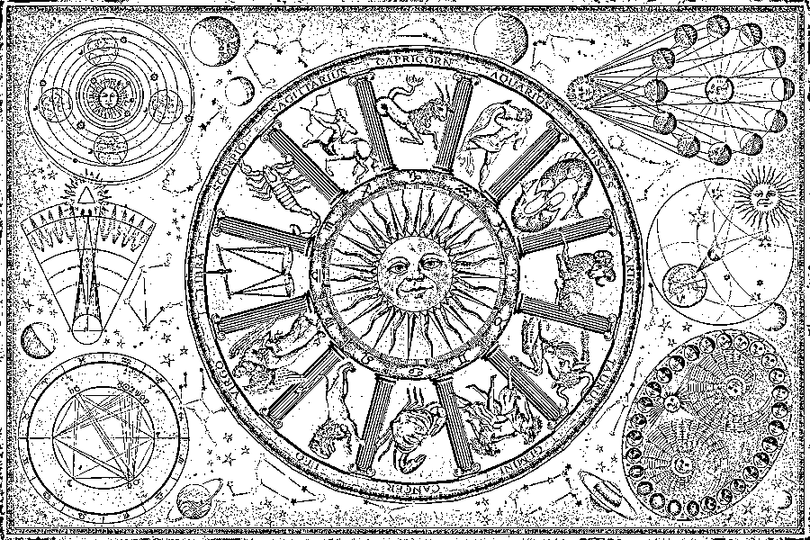

**第二学年 2023 年**

****共****52****次课 **36****次录播课 **16 次直播课********

**201 回顾占星历史 **

****共****16****次课程：******9 次 2019 年录课+7 次直播课**

在这个阶段的课程中，我们将探索**占星历史如何反映心灵的进化**。

现代之前的占星学以事件为导向，注重具体预测，偏向决定论，它反映了现代之前的主导意识模式。上世纪以来，占星学已经逐渐变得更加抽象、心理化、开放和非决定性，这似乎反映了集体意识的改变。因此，我们将在人类发展和意识进化的背景下考察占星历史。我们会谈到不同时代的星图解读和咨询技术，以此来比较和对比前现代、现代和后现代占星学。

**课程安排**：

第一节**录播课**：朝着整体占星学前进

第二节**录播课**：占星原教旨主义

2023 年 3 月 22 日**直播课**：朝着整体占星学前进、占星原教旨主义提问和讨论、知识点示例

第三节**录播课**：占星学的其他分支——大卫·瑞雷

2023 年 3 月 29 日**直播课**：占星学的其他分支提问和讨论、知识点示例（由大卫·瑞雷老师教授）

第四节**录播课**：从古代占星学到后现代占星学

第五节**录播课**：比较与批评

2023 年 4 月 5 日**直播课**：从古代占星学到后现代占星学、比较与批评、提问和讨论、知识点示例

第六节**录播课**：希腊占星学：摘录与评论

2023 年 4 月 19 日**直播课**：希腊占星学：摘录与评论提问和讨论、知识点示例

第七节**录播课**：比对图中的伴侣匹配度，古代与现代

2023 年 5 月 3 日**直播课**：比对图中的伴侣匹配度，古代与现代提问和讨论、知识点示例

第八节**录播课**：比对图——大卫·瑞雷

2023 年 5 月 10 日**直播课**：比对图提问和讨论、知识点示例、案例演示（由大卫·瑞雷老师教授）

第九节**录播课**：组合图——大卫·瑞雷

2023 年 5 月 17 日**直播课**：组合图提问和讨论、知识点示例、案例演示（由大卫·瑞雷老师教授）

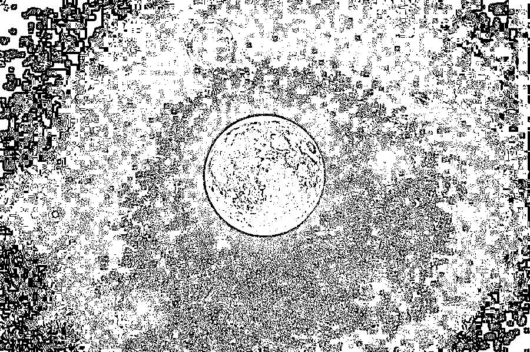

**202 预测与意识演变(一) **

****共****9****次课程：******6 次 2019 年录课+3 次直播课**

作为一门艺术，**预测占星学**运用行星的运行来预测特定时期的性质、意义和持续时间。在这个阶段的课程中，我们会考察**意识进化**的概念、其基本原理及其与占星学预测部分的关系。

意识进化可以被定义为有意识地与星图中固有的进化过程合作。学员们将探索如何用**行进**和**推进**来为意识进化服务。我们不是简单描述事件的结果，而是将行星运行描述为实现先天潜能的机遇之窗。

**课程安排**：

第一节**录播课**：开始预测

第二节**录播课**：发展年龄方法

2023 年 5 月 24 日**直播课**：开始预测、发展年龄方法提问和讨论、知识点示例、案例演示

第三节**录播课**：太阳的行进

第四节**录播课**：月亮的行进与推进

2023 年 6 月 7 日**直播课**：太阳的行进、月亮的行进与推进提问和讨论、知识点示例、案例演示

第五节**录播课**：水星的行进

第六节**录播课**：金星的行进

2023 年 6 月 14 日**直播课**：水星、金星的行进提问和讨论、知识点示例、案例演示

**203 预测与意识演变(二) **

****共****15****次课程：******9 次 2019 年录课+6 次直播课**

在这个阶段的课程中，学员们会继续探索**如何将对行进、推进和其他预测方法的分析运用于个人成长**。

具体事件反映并促进了意识的改变；因此，行星运行可以帮助我们洞察成长过程的精确时机，让我们领会内在和外在现实如何同时发生、彼此反映、互相转化。

我们还将探索宏观的世界行进，考察占星格局如何在社会、政治、经济、艺术和生态层面上表现出不同的形式，却又在多样化的现象中反映单一的**原型**。

这里的挑战是去思考，我们对宇宙的这种参与式关系如何能为共同创造一个积极的、更充满希望的未来做出贡献。

**课程安排**：

第一节**录播课**：火星的行进

第二节**录播课**：木星的行进

2023 年 6 月 28 日**直播课**：火星、木星的行进提问和讨论、知识点示例、案例演示

第三节**录播课**：土星的行进

第四节**录播课**：天王星的行进

2023 年 7 月 12 日**直播课**：土星、天王星的行进提问和讨论、知识点示例、案例演示

第五节**录播课**：海王星的行进

第六节**录播课**：冥王星的行进

2023 年 7 月 26 日**直播课**：海王星、冥王星的行进提问和讨论、知识点示例、案例演示

第七节**录播课**：次限推进——大卫·瑞雷

2023 年 8 月 2 日**直播课**：次限推进提问和讨论、知识点示例、案例演示（由大卫·瑞雷老师教授）

第八节**录播课**：太阳弧——大卫·瑞雷

2023 年 8 月 9 日**直播课**：太阳弧提问和讨论、知识点示例、案例演示（由大卫·瑞雷老师教授）

第九节**录播课**：太阳返照图和月亮返照图——大卫·瑞雷

2023 年 8 月 16 日**直播课**：太阳返照图和月亮返照图提问和讨论、知识点示例、案例演示（由大卫·瑞雷老师教授）

**204 占星咨询技巧(一) **

****共****9****次课程：******6 次 2019 年录课+3 次直播课**

在这个阶段的课程中，学员们将学习**咨询技巧**，比如如何选取一段经历，询问相关问题，提出假设，进行解读，重塑冲突，预测成长机遇，深化疗愈。

我们会审视各种**咨询理论**，重点强调它们在占星学中的**运用**。学员们将学习如何处理危机，做出恰当的推荐引介。

我们强调**有效沟通**的原则、聆听技巧、言语和非言语沟通，以及占星学如何帮助我们建立共情关系。

我们会专门介绍**伦理道德**法则，因为它关系到职业责任问题、资质能力、咨询和预测。

我们会特别关注**占星师的阴影**以及我们在自卑和膨胀问题上的集体脆弱。

**课程安排**：

第一节**录播课**：导言与概述

第二节**录播课**：确定咨询范围

2023 年 8 月 30 日**直播课**：导言与概述、确定咨询范围提问和讨论、知识点示例、案例演示

第三节**录播课**：会见客户

第四节**录播课**：厘清问题(剥开占星学的洋葱)

2023 年 9 月 13 日**直播课**：会见客户、厘清问题(剥开占星学的洋葱)提问和讨论、知识点示例、案例演示

第五节**录播课**：认出生活模式(隐喻思维)

第六节**录播课**：提出假设与辨识核心信念

2023 年 9 月 27 日**直播课**：认出生活模式(隐喻思维)、提出假设与辨识核心信念提问和讨论、知识点示例、案例演示

**205 占星咨询技巧 (二) **

****共****12****次课程：******6 次 2019 年录课+6 次直播课**

在这个阶段的课程中，参与者将**继续学习咨询技巧**，包括如何选取一段经历，询问相关问题，提出假设，进行解读，重塑冲突，预测成长机遇，深化疗愈。

我们还将考察各种**电影**，考察它们与理解人们寻求帮助的共同议题的关系。我们会审视各种咨询理论，着重强调它们在占星学中的运用。学员们会学到如何处理危机，做出恰当的推荐引介。我们会强调有效沟通的原则，以及聆听技巧、言语和非言语沟通，以及占星学如何帮助我们建立共情关系。我们会专门介绍伦理道德法则，因为它关系到职业责任问题、资质能力、咨询、预测和古代术语的运用。

**课程安排**：

第一节**录播课**：检验假设

第二节**录播课**：对星图做出初步解读

2023 年 10 月 11 日**直播课**：检验假设、对星图做出初步解读提问和讨论、知识点示例、案例演示

第三节**录播课**：建设性解读星图的艺术

第四节**录播课**：洞悉客户经历的目的

2023 年 10 月 25 日**直播课**：建设性解读星图的艺术、洞悉客户经历的目的提问和讨论、知识点示例、案例演示

第五节**录播课**：提供希望和方向

第六节**录播课**：案例研究和督导

2023 年 11 月 8 日**直播课**：提供希望和方向、案例研究和督导提问和讨论、知识点示例、案例演示

2023 年 11 月 15 日**直播课**：ISAR 资质认证考试大纲和准备（由大卫·瑞雷老师教授）

2023 年 11 月 22 日**直播课**：ISAR 资质认证考试术语词汇表第一部分（由大卫·瑞雷老师教授）

2023 年 11 月 29 日**直播课**：ISAR 资质认证考试术语词汇表第二部分（由大卫·瑞雷老师教授）

**若道核心课程结业考试**

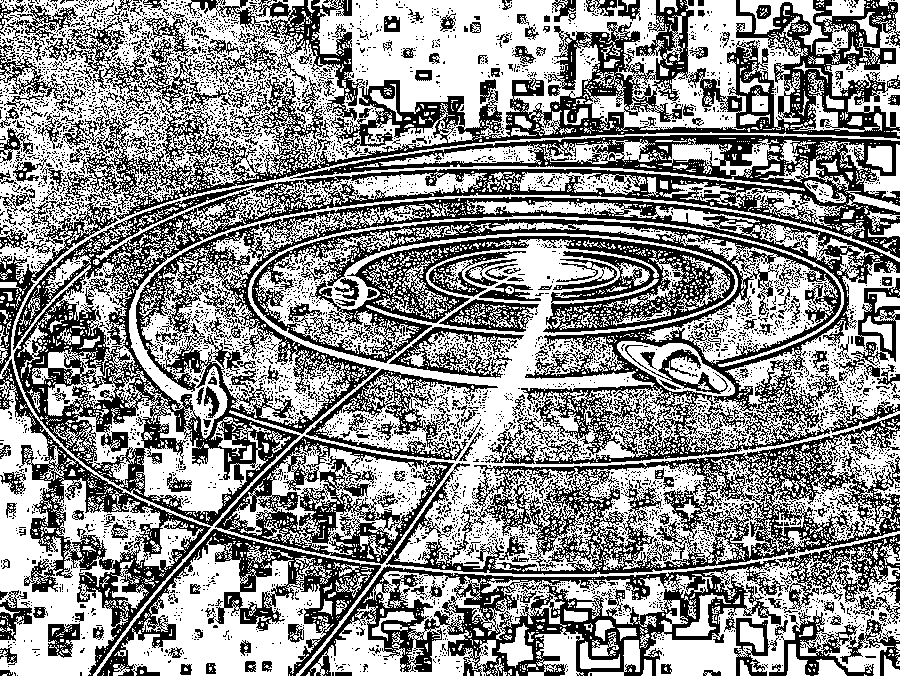

3

**导师简介**

**格伦·佩里（Glenn Perry）**

*   这位传奇的占星师，也是一名拳击和摩托车爱好者

*   他毕业于赛布鲁克学院(Saybrook Institute)，是心理/意识研究专业博士

*   也是拥有 30 余年经验的加州注册婚姻和家庭治疗师 （CAMFT）

*   美国占星心理学学院（Academy of AstroPsychology）的创办人

*   他曾任国际占星研究协会 （ISAR）以及联合占星大会董事会（UAC）副主席

*   也是 ISAR 突破性道德标准的设定者

*   康涅狄格州研究生院（the Graduate Institute of Connecticut）原型宇宙学与意识进化项目的负责人

*   共出版八本占星学著作：《心理占星学入门》《心理占星论文集》《盗取天火》《从忠诚到革命》《星图中的阴影》《占星职业议题与伦理》《出生星图深度分析》《从古代到后现代占星学》

**大卫·瑞雷（David Railey）**

*   若道联合创始人，致力于在中国教授和推广西方占星学；

*   曾任 ISAR 全球副主席，CAPISAR（ISAR 职业占星师资质认证机构）主席；

*   1976 年，通过亚特兰大职业占星师考试，成为全职占星师，随后通过 AFAN 和 ISAR 职业测试；

*   1980 年，与杰夫·焦耳一起在亚特兰大创建“每日行星”占星学中心。此后在亚特兰大占星协会担任 4 年考官，并且两次担任亚特兰大地区占星协会主席。1979-1992 年，作为占星师活跃于美国社会媒体，向不了解现代占星学变化的大众宣传专业占星学知识。在 1989-1992 年期间，他在 WRGG 电台 12 频道每周主持个人电视秀“今日占星学”，早先他还在 WRFG 的广播节目中播讲宇宙天气节目；

*   2010-2014 年，任全美占星师联盟监督委员会委员；

*   2010 年，其著作《灵魂的目标》中国版出版，和蒋颖一起创办若道占星学校和其官网 www.nodoor.com；

*   2017 年，被选为 ISAR 委员会成员。ISAR 是世界最大的国际占星机构，会员遍布 45 个国家，2017-2020 年曾任 ISAR 全球副主席、CAPISAR（ISAR 职业占星师资质认证机构）主席。

**助教简介**

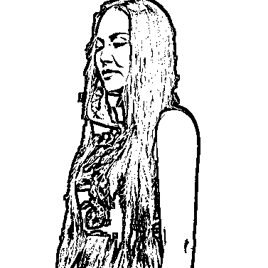

**薇安**

*   全职心理占星师、ISAR 认证占星师（2016 年获得）；

*   北大心理学硕士、MBTI 国际认证施测师；

*   若道认证生时校正资质及 COAC 高阶资质毕业生；

*   连续两届担任格伦·佩里老师亲授的“美国占星心理学院&若道占星双认证核心课程”主助教；

*   2012 年至今，持续追随多位国际占星大师进行占星学的深入学习；

*   2007 年至今，持续进行精神分析及心理动力取向的理论及技巧研习；

*   致力研究心理学与占星学的整合运用。

4

**此次课程适合哪些人？**

*   对占星学感兴趣，想要入门的零基础者

*   占星学小白，但有志成为职业占星师的人

*   有一定占星学基础，但不知道该如何整合星图复杂碎片的人

*   想要师从更多殿堂级占星导师学习占星心法的人

*   走在自我探索和个人成长道路上的人

5

**选择若道学习占星学的优势**

**运用自由意志，扭转破坏性模式，绽放天赋潜能**

若道是人本主义占星学的旗手。因为我们相信，**人通过了解模式、觉察习性、积极疗愈、终将释放其潜能，与命运共舞**。

**进入国际权威职业占星师认证的快车道**

占星界的“联合国”ISAR（国际占星研究协会），是具有全世界影响力的占星教学和研究组织和职业占星师全球认证机构，认证占星师遍布 47 个国家。**在 ISAR 的 22 所附属学校中，大中华地区的附属学校只有若道一家**。在国际化的教学理念大纲标准下，**若道毕业生在 ISAR 国际认证占星师的考试通过率多次全球第一**。

**十年占星学教育中国本土化教学经验**

**根据中国学生的学习习惯不断优化占星教学体系，让学员学成后更自如地应对本土咨询市场的需求。**

学好占星学不仅仅需要邀请一两位老师教学，更需要对教学难点有充分了解，且有持续的教学跟进服务。**10 年来多次核心课程和各种专题课程的教学，让若道非常了解中国学生学习占星学的难点和卡点，合理有效地拆分、提炼课程知识点，同时也积累了丰富的国外老师和中国老师、助教紧密配合以及课程顾问密切配合教学的经验**。

若道还专门开发了有助于占星学习的“**若道**”APP，每门课程都设有答疑板块，学员能够方便快捷地提交问题，助教及时答疑解惑和批改作业。

**融入中国顶尖的职业占星师群体**

若道是中国职业占星师的“黄埔军校”。职业占星师的培养从若道开始，**进入若道，你就走进了中国顶尖的职业占星师群体，和一群志同道合的师兄师姐联谊，获得经验，共同成长**。 

**多种奖学金支持**

为了鼓励学员不因为暂时的经济困难而放弃学习，我们特意设置了各种**技能交换和奖学金**。

对于有一技之长的学员，我们推出的技能交换的项目包括**“笔译”、“笔记整理”、“平面设计”、“课本朗读”、“班级服务”**等技能交换项目；

而对于努力学习、出勤率高、完成作业率高的学员，我们设置的**土星奖、木星奖**等各种奖学金在等着你。

为了感谢帮助我们推荐学员的老学员们，我们设置了“**老学员推荐奖**”；

对于通过问卷提建议，帮助我们提高服务的学员，我们也设置了相应的奖学金。

**开启占星咨询的职业规划和支持**

若道为占星学员搭建了占星问答平台和占星咨询平台，并提供严肃占星学影响力最大的媒体平台，全力为毕业生提供宣传渠道，帮助你吸引和积累咨询生涯初期的种子客户。若道为学员开发了适用于占星学习的“若道”APP，并不断更新完善。

**①  微信平台**若道微信平台作为业内颇具影响力专业平台，为文笔好的若道毕业生提供传播占星学并免费宣传自己的机会。有的学员因为文笔获得众多粉丝喜爱，在 3 年多时间积累起 2000 多人的潜在客户。

****②  **咨询平台**若道咨询平台是我们为优秀毕业生所搭建的平台，帮助毕业生在自己的咨询拓展之外，用若道提供的平台扩展咨询客户群。自咨询平台 2017 年 8 月上线运营以来，咨询平台共入驻 65 人，收入最高者达 32 万元。

此处所列学员收入仅供参考，收入高的学员和其专业水准、努力程度密切相关。若道平台尽其所能将自己定位为辅助学员开展职业生涯的桥梁。

6

**课程价格**

**101-102 初阶**

**正价：**6800 元

**学习充值卡优惠价：5800 元**

**101-105 第一学年**

**正价：**18800 元

**学习充值卡优惠价：17000 元**

**101-205 全阶联报**

**正价：**50000 元

**转发优惠价：38000 元**

**学习充值卡优惠价：35000 元**

**咨询课程顾问**：**王老师（微信/手机：18510107057，请备注“格伦核心课”）**

**全阶段学习后，可参与若道占星毕业认证考试，考试费用为：580 元**

7

**直播课开课时间**

**2022 年 4 月 27 日（周三）20:00-22:00**

**如果直播课时间临时有调整，班班会及时通知每位同学****最终解释权归若道所有**

8

**退转课程**

**退款原则请详看《教学协议》，如有疑问请咨询课程顾问。**

9

**格伦老师视频**

** 格伦·佩里老师如何将心理学和占星学结合，如何开始教授心理占星学？**

<mpvideosnap class="js_uneditable custom_select_card channels_iframe videosnap_video_iframe" data-pluginname="videosnap" data-id="export/UzFfAgtgekIEAQAAAAAA8eIyMnQ0OwAAAAstQy6ubaLX4KHWvLEZgBPElIMYehsfM5L8zNPgMIuvMAf_Y6LDutEHc2Wrzjw4" data-url="https://findermp.video.qq.com/251/20304/stodownload?encfilekey=rjD5jyTuFrIpZ2ibE8T7YmwgiahniaXswqziaIVPleibJ2hxOpvKV1xQEH6MamiaEBVFicyZBhiclPyaSRcGvHAp4bwkwdXNbQRJbg9RrtRbicfWiaWoJ07pzF0Fko4A&amp;adaptivelytrans=0&amp;bizid=1023&amp;dotrans=0&amp;hy=SH&amp;idx=1&amp;m=&amp;scene=0&amp;token=x5Y29zUxcibDN9xf8canDXrHbgHlBEI63uP2UCArXcOZMS5ibDQzQmvzBdLf8ZGmicZryTq7O2zP30" data-headimgurl="http://wx.qlogo.cn/finderhead/PiajxSqBRaEJYnVsqWfEX9qA0sI6hNVKsDfyzfPZ92WZMZyBpZWU5NA/0" data-username="v2_060000231003b20faec8c4e68a1ec2d4ca07e434b07755bbf47e7053a3059defd2c9d6c68a20@finder" data-nickname="若道" data-desc="#若道核心课  （不是纯英文视频，有中文翻译）心理占星学和普通的占星学有什么不同？心理占星学有什么特殊的内容设置？
" data-nonceid="8810794934239578092" data-type="video" data-width="1920" data-height="1080"></mpvideosnap>****2022 双证书核心课****

**授课老师：格伦·佩里、大卫·瑞雷**

**直播课开课时间：2022 年 4 月 27 日（周三）开课**

**授课方式：******网络授课，英文授课，中文翻译****

**费用：101-102 价格：**6800 元**（充值卡优惠价 5800）**，**101-105 价格**：18800 元**（充值卡优惠价 17000）**，**101-205 价格**：50000 元**（转发优惠价：38000 元，充值卡优惠价 35000）**；

**课程负责人：王老师**（微信/手机：18510107057，请备注“格伦核心课”）

长按二维码添加课程负责人咨询~

****报名直达入口****

# 双子座新月 | 2.5 年才有一次！蕴藏着巨大能量的“黑月亮”

> 原文：[`mp.weixin.qq.com/s?__biz=MzA5NjA0NTAxNg==&mid=2651474849&idx=1&sn=a004f2ffc090f3e29cf494a866541213&chksm=8b48f916bc3f7000c4ef54093286806bbd5f114309d6097c02e88a9c38f4c5d2866b36438e4d&scene=126&sessionid=1692737806#rd`](http://mp.weixin.qq.com/s?__biz=MzA5NjA0NTAxNg==&mid=2651474849&idx=1&sn=a004f2ffc090f3e29cf494a866541213&chksm=8b48f916bc3f7000c4ef54093286806bbd5f114309d6097c02e88a9c38f4c5d2866b36438e4d&scene=126&sessionid=1692737806#rd)

****☆ **后台回复“今日”，给你一句生命态度**

作者/王芝桦 编辑/玫瑰 图片/pexels

**双子座新月****北京时间 2022 年 5 月 30 日 19:30 迎来双子座新月，太阳与月亮精准合相于双子座 9°03′。**5 月我们过得并不容易，5 月 1 日的金牛座日食和 5 月 16 日的天蝎座月食令 5 月成为 2022 年的第一个“食相月”，启动了未来半年的转折性进程——**现实世界的结构与韵律正在进入全新的篇章，当下正是我们重新联结现实、重新构建生活的时间，无论是衣食住行，还是身心状态。**

此次双子座新月是 5 月内的第二次新月，第二季度的新月次数也从 3 次增加到 4 次，故而，**此次双子座新月也是一次“黑月亮”。**

当然，“黑月亮”并不是凭空生出来的，而是因为月亮 29.5 天的行进周期逐渐积沉下来的剩余时间（每月 30 天），在每 2.5 年左右发生一次，并与“蓝月亮”（一个月内的第二次满月）同曲呼应。**“黑月亮”蕴藏着强大的阴性能量和觉醒之力，预示着“豁然开朗”的转折性。**此次双子座新月，6 月即将上演的“群星逆行”剧目已经吹响前奏，则令这份觉醒能量变得更加深沉。

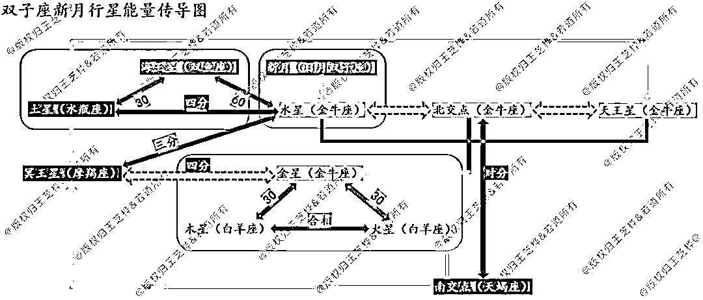

> **双子座新月重点影响人群**
> 
> **参考新月峰值影响期间各个行星的行进度数，以及逆行行星的轨迹影响；常规容许度，个人行星入相位 3°，出相位 1°；非个人行星入相位和出相位均为 3°。**
> 
> *   出生星图中，有**行星、四轴、南北交点**落入**变动星座（双子座、射手座、处女座、双鱼座）0°-13°，22°-28°**的人群。
>     
>     
> *   出生星图中，有**行星、四轴、南北交点**落入**基本星座（白羊座、巨蟹座、天秤座、摩羯座）0°-8°，23°-30°**的人群。
>     
>     
>     
>     
> *   出生星图中，有**行星、四轴、南北交点**落入**固定星座（金牛座、狮子座、天蝎座、水瓶座）0°-7°，13°-30°**的人群。

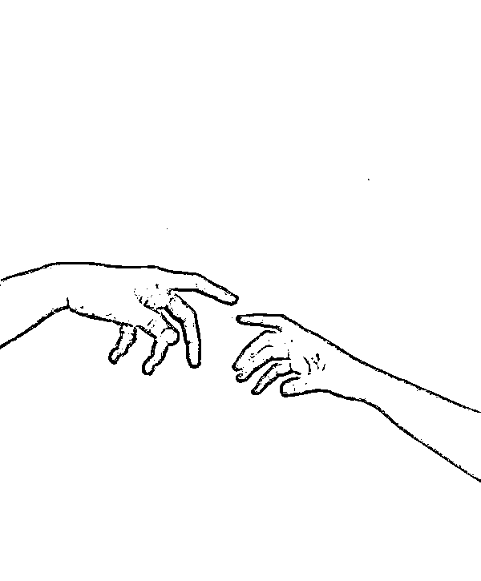

**纯净，放松，平衡**此次双子座新月的发生时刻，“日月精准合相”没有与任何一颗大行星形成紧密结构，故而，这是一次**能量相当纯净的“空相”新月。**希腊神话中，双子座的神话原型是象征着“光明与黑暗”的一对孪子：与生俱来的一体两面，在并存中对立着，在对立中冲突着，也在冲突中成长着，故而，**双子座时常在“明与暗，善与恶，好与坏”的交汇之中，呈现出模棱两可的特质和喜怒无常的反应。**比如，同样的食物吃进不同人的胃里，是享受还是难受，是营养还是跑肚，取决于每个人肠胃的润化能力，而不能说那个食物测视出每个人的命运。但是，每个人对自己的润化能力（生命真相），也是有不同的反应：有人会调理身体，呈现出双子座“光明-智性”的一面，客观看待，敞开学习；有人则会哀叹命运，呈现出双子座“黑暗-魔性”的一面，强词狡辩，推诿责任。但是，我们得允许每个人做出不同的反应，因为不同的反应正是一种客观的存在——双子座的高阶进化之路通往“无辨别的感知”，那是一种放下分别心的允许与接纳，放下评判的好奇心与学习度。此次双子座新月，双子座的“智性和魔性”将会在纯净的能量通道之内彻底闪现——我们常常说起的“命运”，究竟是客观面对并敞开学习的成长轨迹呢，还是逃避真相且歪理邪说的自欺迷途呢？当然，这个世界不是二元对立的，但我们依然可以对自我生命保持一个“觉察但不评判，看见即是经历”的观察者视角。此次双子座新月，先让自己放松下来：或许新意识、新点子、新计划正在你的大脑里噼里啪啦地闪现，或许外界的新闻、信息、动态令你恨不得吧啦吧啦地一吐为快，或许未来的前景、可能、变化令你积攒了一堆的疑问……但你还是要**让自己有意识地放松下来，让它们等一等，而不是急着找到答案。**大脑快速运转只会令人焦虑不堪，却并不能帮助我们看清全局和理清重点。在这个携带着巨大心智能量的新月时刻，让我们学会——**有意识地平衡“快与慢”。**

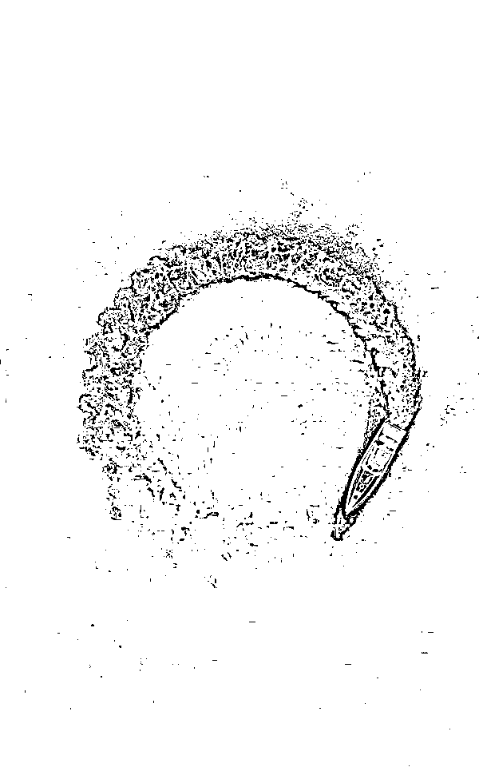

**了解一位神，然后在生命中与其相遇**“空相”的双子座新月，令我们的目光自然就聚焦在接纳新月能量的水星（水星守护双子座）身上。希腊神话中，水星的神话原型是唯一可以自由穿梭天地人三界的“神的信使”赫尔墨斯（罗马神话中的墨丘利）。水星守护双子座，故而，赫尔墨斯身上也呈现着双子座“光明与黑暗”的一体两面：**·** 赫尔墨斯指天指地且神通广大，掌管商业世界的交易规则和流通程序，引渡已逝灵魂的前世消磁并进入冥界；**·** 但同时，赫尔墨斯也狡诈无比且精于算计，甚至时常做出鸡鸣狗盗的一些混事，简直将“神”的完美神设和理想图腾摔了个粉碎。“神”并不住在天上，而是住在我们生命之内。我们心智层面的逻辑思维和交流表达、才华技能和分析决定，统统都要与赫尔墨斯（水星）一起工作，自然也时常呈现出“光明与黑暗”的一体两面：**· 光明面-指路的神：**赫尔墨斯教导我们学习知识并进行思考，引领我们理清逻辑并指点迷津，帮助我们争取利益并送来奖赏；**· 黑暗面-说谎的神：**当现实混乱袭来的时候，我们被自己的无能激怒，我们为自己的不成熟羞愧，我们怪罪命运捉弄了自己，我们指责外界并推诿责任，但就是不愿面对自己的“内在阴影”。故而，我们时常陷入焦虑，因为“光明与黑暗”同时存在，因为“成长和问题”同时存在，而这种“并不确定和模棱两可”的感觉，常常令我们无意识地启动“自我防御”的机制——不是我的错！很多时候，赫尔墨斯这位“神”，比我们真实，比我们诚实，他从不掩饰自己身上“光明与黑暗”的一体两面，从不恐惧“模棱两可”的未知可能。如果我们不愿看到、不愿接受赫尔墨斯“黑暗面-说谎的神”这一面向，那么只能说我们太需要“好，对，价值”来武装自己的虚弱和不自信——炼金术中，“神使”赫尔墨斯的形象是由一条“拥有四位一体的触角”的恶龙形象演变而来的，其第四位的触角（水星）则是由前三位的触角（太阳、月亮、日月在金牛宫和合而生的金星）和合而生。故而，当我们在生命之内与赫尔墨斯相遇，除了需要自我意志（太阳）与内在意愿（月亮），还需要一些自我确信（金星）的支撑，才能勇敢面对“内在阴影”——**光明与黑暗，成长与问题，皆是生命不可分割的一体两面，我们要对生命的每一个面向给予确信，对自己说真话。**之所以花这么多篇幅写赫尔墨斯，是因为此次双子座新月，已经逆回金牛座的水星肩负着三组重要结构的责任。

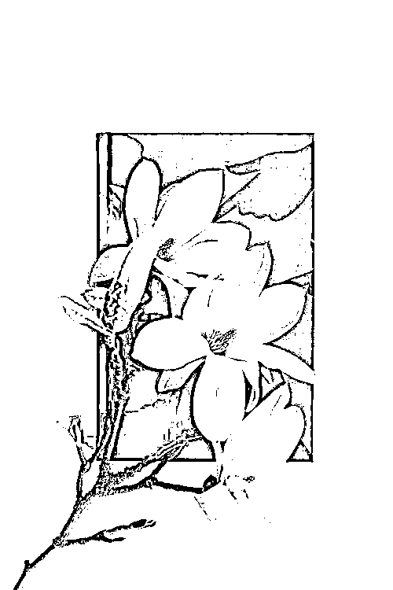

**抱团减速，“活着”才是大事**

> **天象**
> 
> **· 水土四分：逆行的金牛座水星四分水瓶座土星**
> 
> **· 水海六分：逆行的金牛座水星六分双鱼座海王星**
> 
> **· 水冥三分：逆行的金牛座水星三分摩羯座冥王星****· 土海 30°：水瓶座土星与双鱼座海王星形成 30°结构**

此次双子座新月，**接纳新月能量的水星已于 5 月 23 日逆回金牛座，并即将于 6 月 3 日结束这一波的逆行。****重点一！**此次双子座新月周期，水星正处于恢复顺行前的“减速”状态；而这一波水星逆行的轨迹也是从“活跃伶俐”的双子座逆行回到“缓慢沉静”的金牛座，同样蕴含着“减速”的意味。**重点二！**即将到来的 6 月：6 月 5 日，土星将于水瓶座开始为期 5 个月的逆行旅程；6 月 28 日，海王星将于双鱼座开始为期 5 个月的逆行旅程。而当下这两颗行进慢速的行星（土星周期 29 年，海王星周期 165 年）正处于逆行前的“减速”状态。**重点三！****· 5 月 16 日**，天蝎座月食当日开始，逐渐“减速”的水瓶座土星和双鱼座海王星形成“土海 30°”结构，该组结构的影响将会一直持续到 6 月 23 日方才缓解；**· 5 月 16 日-6 月 22 日，**那些逃避已久的问题，那些模糊已久的边界，那些来自环境的束缚，那些来自权威的压力，令人升起蚍蜉撼树般的无措、无力、无助、无望的内心情绪。**重点四！**此次双子座新月，逆行的金牛座水星与水瓶座土星组成“水土四分”结构，与双鱼座海王星组成“水海六分”结构。一堆的“减速”，并且还“抱团减速”！但是，宇宙并不是来整治我们的，而是在提示我们**放松下来，拿出一些时间回头检视并向内反思，我们需要对当下进程拿出自己的思辨，对未来的旅途做出有力的选择。****此次双子座新月前夕的 5 月 26 日，双双逆行的金牛座水星与摩羯座冥王星第 2 次形成“水冥三分”结构（第 1 次发生在 4 月 28 日，第 3 次将发生在 6 月 11 日），意在帮助我们看清 4 月下旬的事件真相。**除非生命内在的赫尔墨斯正在扮演“黑暗面-说谎的神”，不愿面对那些不太理想、不合人意的真相；否则我们一定会在此次双子座新月看到“自由与责任，理想与现实”之间的冲突，也一定能够在这种张力之中重建成熟的边界与原则——**对自己的责任负责，将过度的责任放下。**5 月，确实有太多的不轻松，但也着实帮助我们认清了“现实”——我们过去以为的不是现实，我们想象的未来也不是现实，现实就是当下，没有什么好商量的，更没有什么好矫情的。5 月，治愈着赫尔墨斯“黑暗面-说谎的神”的面向，因为这一套对于现实来讲没用。就像时间到了就得做饭一样，否则身体就会不停地喊饿；但你也不能为了证明自己的勤劳而多做两顿饭，因为你的身体多吃两顿会吃不消。此次双子座新月，“抱团减速”的行星向我们诉说着“生命的大实话”——**“活着”的大事都拿起来，其他的都放下。**

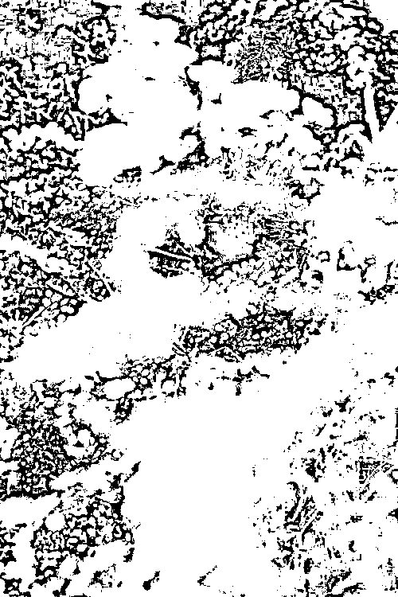

**冲啊！慢点！**

> **天象****· 火木合相：火星和木星合相于白羊座。****· 金星 30°“火木合相”：金牛座金星与“火木合相”形成 30°结构。****· 金冥四分：金牛座金星四分摩羯座冥王星。**

**5 月 11 日**，具有“扩张能量”的木星换座进入“爱拼才会赢”的白羊座，开启为期 5 个月“扩张斗志，但也扩张对立”的旅程。**5 月 25 日**，“战神”火星换座进入白羊座，**5 月 29 日**，白羊座火星与白羊座木星形成“火木合相”结构：**·** 这对于刚刚走过迷雾重重的 4 月、力量被抽走的 5 月的我们而言，无疑是注入令人振奋的能量——斗志在，将军也在，冲啊！**·** 但不能忽略的是，该组结构也容易被木星膨胀着肾上腺素，制造出没必要的激进和麻烦——慢点！目标校准，再冲不迟。另外，定位此次双子座新月能量（双子座新月-金牛座水星-金牛金星座）的金星刚于 5 月 28 日换座进入金牛座，并于 5 月 28 日-6 月 4 日期间与“火木合相”形成 30°联动结构。故而，**5 月-6 月跨月的这几天时间里，需要特别小心各种关系的“极端和冲动”。**“减速”依然是现阶段的主节奏，我们必须**放松下来，客观考量并向内反思——在未来的时间里，你和那个人是否还会在彼此的生活里，无论是合作关系，还是情感关系。**在些这篇新月文的清晨，写下了“情蛊”这首小诗：**因为，“我”以为，****所以，给自己下了蛊，****未来，某一刻会痛。****要走的路一条都省不了。****要受的罪一点都少不了。****除非，“我”不再狂妄，****以为，什么都知道，****其实，那么无知。**

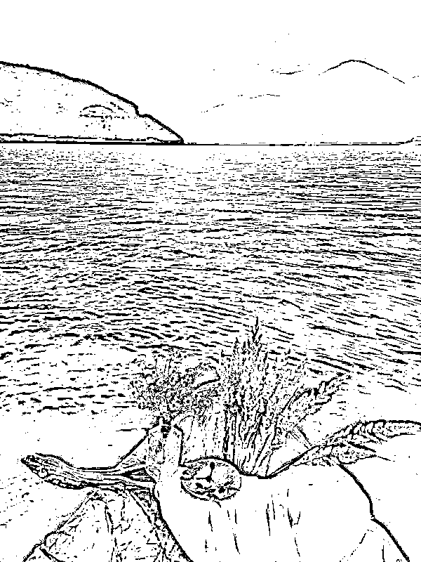

**寄语**这篇文章我来不及找一些文摘，因为每天除了大量的工作，还要做三顿营养均衡的饭菜，还要不定时地下楼去做核酸，再加上一些其他的琐碎事务……嗯，我好像打了好几份工。很多年没有过这样的生活了，从一开始的疲惫，到后来的接纳，再到今天的享受，突然感谢这一段的体验与觉察，让我与内心、与身体、与现实、与万物，以一种全新的方式建立起全新的联结。而在这种全新的联结里，我感受到生命前所未有的踏实。最后，还得真诚地说一句：随着文章越写越多，我能找到的书摘越来越少。我得承认自己的精力和阅读是有限的，所以亲爱的朋友，我诚挚地邀请你将一些精彩的书籍或书摘推荐给我，如果你愿意，那么我也愿意。感谢。祝福每一个生命健康，祝愿每一个灵魂安好。**新月如何许愿？****许愿时间**：2022 年 5 月 30 日北京时间 19:30 后，48 小时内有效、8 小时内最佳。 **许愿人群**：所有人。**许愿数量**：每人最多 10 个。**许愿方式**：静心冥想，身心祈祷或记录收藏。**许愿格式**：请万能的宇宙赐予我能量，我将以我的能量吸引**（什么）来到生命中……**许愿原则**：发心诚善利人。

**版权声明**：原创文章由作者授权首发于若道平台，欢迎转发，反对抄袭。友号转载请申请白名单。

****

****想阅读更多作者的文章，请在后台回复******王芝桦****** 即可。****

****王芝桦****

心理占星师，统合疗愈师，占星专栏作者

全职于个案咨询与占星教学工作 18 年

**个案预约咨询微信号**：zhihua0621 

**微信公众号**：daoxi-life

**长按打赏**

****

**20 位来自世界各地的占星师****带来 19 场沙龙——新世界的觉醒****详情可点击下图**

**学习占星学****点击下图了解课程详情**

**

**微信又双叒叕改版啦，不想错过若道君的推送？****就把若道设为星标吧！****▼**

**福利来啦**
**点击****“阅读原文”****获取最好用的免费****新月报告**

**获取免费新月报告，请点击文末“阅读原文”**

# 双子座新月，送你一份免费的新月报告！

> 原文：[`mp.weixin.qq.com/s?__biz=MzA5NjA0NTAxNg==&mid=2651474849&idx=2&sn=03c3c95cdbcd2a716e535533d1533012&chksm=8b48f916bc3f70001066367cfb98e7d1e077c036f47ed5f4db4dd94e80cdfe3bcbf770af7999&scene=126&sessionid=1692737806#rd`](http://mp.weixin.qq.com/s?__biz=MzA5NjA0NTAxNg==&mid=2651474849&idx=2&sn=03c3c95cdbcd2a716e535533d1533012&chksm=8b48f916bc3f70001066367cfb98e7d1e077c036f47ed5f4db4dd94e80cdfe3bcbf770af7999&scene=126&sessionid=1692737806#rd)

北京时间 5 月 30 日 19:30，新月发生在双子座 9°03′。每到新月时分，若道君都会为你奉上根据你出生星图量身打造的免费新月报告。可是新月为什么要许愿？新月报告该如何领取？让若道君来教你。

　**什么是新月？**　

从占星学看，新月是月亮周期的一种相位。新月是开始，又称为朔，对应中国农历初一，太阳、月亮在此时合相。此时月亮运行到太阳与地球之间时，月亮以黑暗的一面对着地球，并且与太阳同升同落，地球上看不见月亮。

本次新月时间

**5 月 30 日 19:30，新月发生在双子座 9°03′。**

为什么新月要许愿？

新月是一个周期的开始，新月发生的时候，太阳与月亮合相，能量很强。当新月出现时，你也许会发现灵感忽现，非常适宜开启新领域、项目与行动，缔结一段新的关系或合作。许愿会加强新月的能量，也有助于你了解自己现阶段适合开启的方向。 

本次新月最佳许愿时间从新月开始到其后的 48 小时内，许愿的力量最强。**最佳许愿时间：5 月 30 日 19:30-6 月 1 日 19:30**

属于你的免费新月报告每到新月时刻，看着占星文章里写着：看看你新月的宫位，如果新月在第 X 宫，你可以许愿的方向是……是不是常常一头雾水？新月的宫位？我到底该看哪里啊？而有时，那些标注上升星座的文章也会让你忍不住想：虽然我的上升星座是这个，可是我的新月好像并不落在你说的宫位啊？你是不是写错了？

虽然这些文章都没有写错，可是好像对你而言都太不友好了。**Don't Worry！**别着急，让博学又体贴的若道君来帮你！我们推出了一份**免费**又**好用**的新月报告！而且是专门为你设计的哦，**根据你出生星图为你量身打造的，只****属于你的独家新月报告**。报告有哪些内容？**新月时间****最佳许愿时间****如何许愿 **属于你的**许愿关键词**本次新月给你的**建议**你会有怎样的**感受 ******机会****

********

如何许愿？许愿方式也很简单。你可以把愿望写下来，或者双手合十后交叉，闭上眼睛来祈祷。 报告中会为你提供**祈祷词示例**，可以多多参考哦～ 你还可以适当添加自己的语言，创造属于你自己的祈祷文！如果报告拿到手了，快对照着许愿吧！

**这份好用又暖心的报告，点击****阅读原文****即可领取！**

****

****点击“阅读原文”即可获取新月报告****

# 在“三星”换座、火力十足的本周，你有哪些新气象？

> 原文：[`mp.weixin.qq.com/s?__biz=MzA5NjA0NTAxNg==&mid=2651474831&idx=1&sn=58cb417e3d34c7f4790c9d4a8a464586&chksm=8b48f938bc3f702edb7f54915b9aa61e72f4505a40c4e8b0aed66c1c53be44840a7d6937a917&scene=126&sessionid=1692737812#rd`](http://mp.weixin.qq.com/s?__biz=MzA5NjA0NTAxNg==&mid=2651474831&idx=1&sn=58cb417e3d34c7f4790c9d4a8a464586&chksm=8b48f938bc3f702edb7f54915b9aa61e72f4505a40c4e8b0aed66c1c53be44840a7d6937a917&scene=126&sessionid=1692737812#rd)

**2022 年 5 月 28 日天象：**

*   **月亮在金牛座**
*   ******22:45 金星进金牛座******
*   ******火星合相木星******

今天月亮在金牛座，到了晚上金星也将进入[【金牛座】](http://mp.weixin.qq.com/s?__biz=MzA5NjA0NTAxNg==&mid=2651474784&idx=1&sn=7249fc5eeae2868d427b00c9dd21536d&chksm=8b48f9d7bc3f70c154a73e7b1a15f28430f376a6290970a0948ec9141519f22123efe935cf1f&scene=21#wechat_redirect)（点击查看昨日文章）。我们的内在逐渐平稳，犹如穿越过暴风骤雨，来到了阳光地带。这个月亮、水星、金星同在金牛座的周末，享受生活、享受当下会成为首要主题。本周除了金星换座，逆行水星在周一重新回到金牛座，我们心智的运转速度在减速，“一边思考，一边前行”是适宜的方式。

除了金星和水星换座，火星也在本周[【进入白羊座】](http://mp.weixin.qq.com/s?__biz=MzA5NjA0NTAxNg==&mid=2651474544&idx=1&sn=9460d77f78f957da2119635a3eea1efb&chksm=8b48f8c7bc3f71d1d9e33fed90584777b0ec5b034106ba159f4524e94d84b58de7cfc9a79e16&scene=21#wechat_redirect)（点击查看天象文章）。三颗重要的内行星在本周全部换座，相信很多人的生活状态和氛围都发生了变化。这几天木火合相，我们的精力更加旺盛，很多人忽然就忙碌起来，但也要注意过度乐观和过度消耗的倾向，阳性能量过剩也容易引发争执。

在三颗内行星换座、空气里火力十足的本周，你的生活有哪些新变化呢？欢迎分享哦~

周六快乐，敬请期待明天的双子座新月文章！**了解每日天象，可****下载“若道”APP 查看****还有更多精彩等着你哦**

# 插班中！丨现代动态卜卦占星实战课，4 个月掌握卜卦技法

> 原文：[`mp.weixin.qq.com/s?__biz=MzA5NjA0NTAxNg==&mid=2651474784&idx=3&sn=16e65b97c0f0570bf75e2fa20e6307df&chksm=8b48f9d7bc3f70c16c49f09c1ff90bb6196a0443780b877638d7c6c788438584ea4edc2a4607&scene=126&sessionid=1692737812#rd`](http://mp.weixin.qq.com/s?__biz=MzA5NjA0NTAxNg==&mid=2651474784&idx=3&sn=16e65b97c0f0570bf75e2fa20e6307df&chksm=8b48f9d7bc3f70c16c49f09c1ff90bb6196a0443780b877638d7c6c788438584ea4edc2a4607&scene=126&sessionid=1692737812#rd)

**对现代动态卜卦占星的 7 个问题**

**1****什么是现代动态卜卦占星？**

现代动态卜卦是将有传统历史的卜卦占星和现代人本主义占星的精神结合在一起，**更适合现代社会现实状况**的卜卦占星技法。

**2****卜卦占星的特色是什么？**

**随时随地可用，**帮助你从这个卜卦星图中洞察当下你所期望了解的事情和人的现状、发展趋势、可能发生什么事情、可能的结果，及什么时候会出现什么结果。

**3****动态卜卦占星是什么意思？它重要吗？**

动态卜卦非常重要，因为事物不是静止的，而是变化的。**动态卜卦不仅会让你看到人和事物的状态，还可以让你看到其发展和变化的过程，**会碰到什么事情。

动态卜卦的美妙之处是它不是静止的一个照片，而是**描述一个故事的开始、发展和结局。**

**4****卜卦占星什么情况可以用？**

**万物万事皆可卜。**什么都可以用。1-12 宫所包含的人事百态，事业、健康、金钱投资、商务、旅游、教育、法律、生育、宠物养育等等。

卜卦占星也可以帮助我们去看某个社会事件、国际事件的发展，**可以和经世占星相结合。**

**5****它如何与人本主义占星结合？**

因为从卜卦行星可以看到参与人的**心理状态、心理过程和面临的议题**。而如果当事人愿意去调整自己的内心状态，就不再完全是被动的，而是可以以更积极主动的方式参与到事件中去；或者能够更理解目前的外部环境，选择更安然地调整内心。

**6****卜卦占星可以和人本主义的咨询相结合吗？**

当然。在课程中，老师将会仔细讲如何**把卜卦占星和出生星图及预测技术结合在一起，**给客户提供更好的服务。

**7****如何学好现代卜卦占星？**

**实践，实践，实践。**

占星学是一门必须大量实践的学问。纸上谈兵没有用，只是听课没有用。

实践是一步步来的。你不必知道所有的卜卦技法才开始实践。**从第一节课开始，你就可以进入实践。**

实践刚开始可能只是模仿。**我们有大量的真实案例，也安排了很多作业让大家练习。**也给大家拿自己的案例和老师互动的大量机会。

**授课老师**

**艾德里安·罗斯·邓肯****（Adrian Ross Duncan）**1971 年在印度游学时开始学习占星学，1985 年开始成为全职占星师，**迄今执业已超过 33 年，是人本主义占星学、卜卦占星学和经世占星学领域的知名占星师。他还开发了占星软件 AstroClock 和多款占星报告。**他在日常咨询中都会运用卜卦，咨询图（卜卦的一种运用方式，即根据客户来访时间制作星图，从星图中获得大量信息）也是他**特别擅长的领域**。艾德里安·罗斯·邓肯从 1971 年开始研习佛学，受佛学影响很深，他**相信占星学和佛学观点统一、转化的一个基础是在于对现实感知的改变**。而卜卦很容易与佛教融合，因为它只关乎当下。

| 艾德里安·罗斯·邓肯的占星学著作

作为本次课程的主讲老师，艾德里安·罗斯·邓肯如是说：

卜卦星图不仅给出了当下的能量状态，**它还包含着过去的踪迹，也蕴藏着未来的种子。**它是心理的，也是事件的。一个好的占星咨询是要把过去、现在和未来交织成一个整体。

**卜卦星图告诉客户他们当下在哪儿，他们处于的能量状态是什么，这张星图和他的过去有哪些关联，他可以怎样和这张星图一起合作去挖掘一个积极主动的未来。**这里预测的未来不是强加给他们的，这个未来是一点点揭露给他们看的。

心理占星学和卜卦占星学别无二致，所有的事件都有其心理对应。如果你的意识与世界同步，你就会看到二元统一。

行进和推进帮助我们理解如何抵御外在和内在的风暴。卜卦如同显微镜下的行进。**通过行进难以准确了解一段关系、房屋购买、工作机会等是否有益，但对卜卦来说并不难。卜卦也擅长回答与时间相关的问题，对行进和推进的标志进行微调。**

**课程形式**

**15 节录播课+8 节直播课线上网络课，英文授课，中文翻译。**

**15 节录播课为 2020 年动态现代卜卦课程的内容。8 节直播课则完全是案例教学的形式。**

这样的好处是，你可以通过 1 个半月的密集学习之内按照自己的进度学完录播课的理论和录播课中已有的案例，从学习开始就实践，然后把实践中遇到的问题拿到 8 节直播课中，和老师互动。

**在 8 节直播课中，老师也会用案例教学、和同学互动的方式帮助大家进一步掌握卜卦占星的技法。**

**授课时间**

**付费后一天即可开始看录播课程，全程有助教老师回答问题。**

**直播课程开始时间：**

2022 年 5 月 3 日，每周二 20:00-22:00

**这次课程恰逢世界在巨大的变动和不确定之中，期待这门课程能够给各位及各位的客户带来新的洞见和方向。**

**在这次 8 次直播课程中，我们将采用案例教学的方式，所有参课同学均有机会提供案例，供老师解读，且我们将组织群体的练习，用大量案例帮你掌握卜卦及如何在咨询中用卜卦。**

****

**授课内容**

***Part1***** 融合现代占星理念，整合动态占星知识**

星图如同地图，展示了人们从哪里来，现在在哪里，以及可能的去向是什么。卜卦星图虽然显示的是当下这一刻，但却是在动态当中的。所以过去的运动轨迹对应着过去所发生的，接下来的运动轨迹对应着接下来要发生的。

**在课程中你会学习到：**

*   我们如何从一张卜卦星图看到时间的流动：从过去到未来，故事如何展开

*   心理占星和事件预测如何在卜卦占星中有机结合起来

*   卜卦星图如何回答是否的问题

*   如何用卜卦星图回答分析性和指导性的问题

*   现代动态占星中事件发展的顺序：

*   确定咨询图中强调的当前事件

*   将客户与相位或行星组合相关的情感能量关联起来

*   在早期经历中找出相似的情景

*   认识到过去和现在的情感完全相同

*   辨识出过去做出的所有限制性决定

*   通过头脑风暴找出更能带来力量的方法来解决相同类型的问题

*   在想象和现实生活中重演当前和未来的事件

***Part2 *****独家【现代动态卜卦占星技术】全面教学**

哥本哈根占星学院院长艾德里安·罗斯·邓肯 Ardian Duncan 老师 50 年卜卦占星经验倾囊相授，内容包括但不限于：

**1.卜卦中的行星**

*   行星强弱及力量

*   太、月、水、金、火、木、土在庙旺落陷时的意思

*   卜卦星图中的月亮及其在 12 宫的意义

*   卜卦星图中的外行星

*   卜卦星图中的恒星

*   上升点和指征星的度数

**2.如何选择和辨识征象星**

*   当问题出现时，如何判断征象星

*   如果两个人或物由同样的征象星指代该怎么办

**3.卜卦图中的相位**

*   不同相位的意义

*   征象星之间相位的意义

*   征象星与其他行星相位的意义

**4.卜卦中的宫位**

*   12 宫位和宫位系统

*   对宫位的动态观察

*   宫主星及其互动

*   互容和定位星

**5.卜卦中的星座**

**6.传统卜卦原则（约束和限制条件条件）及其在现代动态卜卦中的应用**

**7.空亡、光线传递、完成、围困、燃烧之路等**

**8.星图中的逆行及其讲述的故事**

*   水星和计划

*   金星与依恋

*   火星与斗争

*   外行星逆行

**9.应期与时机**

*   1 度是代表多久

*   宫位的重要性

*   行星速度和逆行

*   如何综合卜卦和行进、次限分析时间问题

***Part3*****  学以致用，覆盖人生各个领域问题的卜卦解法**

希望将现代卜卦占星学的精髓传达出来，精细地讲解每一宫所代表的卜卦事物，分主题详解不同类型问题的卜卦解读思路，内容包括但不限于：

**1.爱情和关系**

*   金星的重要性

*   第一宫和第七宫以及其中的行星

*   成对行星

*   上升点、下降点及其守护星

**2.业务和工作**

*   第十宫和第六宫以及其中的行星

*   木星和土星及其相位

*   火星和水星

*   行进和中天

**3.资金和资源**

*   第二宫和第八宫以及其中的行星

*   第五宫和第十一宫

*   金星、木星和土星

*   四元素的意义

**4.家庭和大家庭**

*   第四宫和第十宫及其守护星

*   第五宫、十一宫及其守护者

*   第五宫和第十一宫的行星

*   月亮

**5.社会、法律、智性、健康、存在主义的问题**

*   第九宫和第十二宫及其中的行星

*   木星和第九宫守护星

*   第三宫 、第十一宫、第六宫和第八宫

**6.如何解读事件星图**

*   从新闻学习卜卦盘

*   如何从卜卦盘看新闻事件和世界大事的发展变化

*   我们如何去培养自己观察有预兆意义的信息、从日常事件中捕捉启迪

*   占星解读的意义

***Part4 ***** 扩展延伸择时占星技法的新认知**

在择时的时候，我们会选取征象星处于有力的时候，来规划我们的事件；避免征象星不力的时候，尤其当这个征象星代表我们自己。

**择时星图一瞥**

*   择时的艺术

*   如何在不完美的天象下取得最佳结果

*   如何做出深思熟虑的回答

*   如何为约会择时

*   如何为婚礼择时

*   如何为商业活动择时

*   如何为旅行择时

*   如何为对抗事情择时

*   虚拟和实时会议的择时

***Part5  *****如何运用卜卦占星学做一场转化性的咨询**

虽然卜卦的结果可能是不利的，但我们仍然可以从心理占星学的角度给出一些积极建议，帮助客户建立信心，有助于应对之后的人生。客户出生星图与卜卦星图的关联，这在咨询中对于心理方面的考量是非常重要的。

*   一个好的咨询有哪些特色

*   咨询星图及其应用

*   如何用卜卦星图和新客户在短暂的咨询开场白快速建立信任

*   如何综合卜卦星图、出生星图、次限图一起分析

*   如何用卜卦星图聚焦当下的问题

*   如果客户在一场咨询提出多个问题，要看多少卜卦盘

*   如何在一个充满挑战的卜卦星图中寻找客户资源、有利的时机，找到支持客户的策略

*   如何从客户故事中寻找意义

*   卜卦星图如何从事件维度和心理维度来解读

*   当看到客户不愿意看到的结果可能出现时，如何开展对话

*   改变的方法

**什么人适合参加本课程？**

*   想要系统学习现代动态卜卦占星的学员

*   想在生活中熟练使用现代卜卦占星学

*   在咨询中想帮助个案更清晰的分析解读困惑

*   想参加 ISAR 认证考试，此课程是 ISAR 选修课

*   希望通过卜卦占星帮助自己和身边人挖掘一个积极主动的未来

学习整合卜卦技巧，不仅有益于想钻研卜卦占星学这个分支的同学，对占星初学者也很有有帮助，可以让你的占星技巧加倍。

**学员评价**

**课程费用**

**课程价格：9900 元**

**老学员复训专享价：**

**2020 年参加艾德里安·罗斯·邓肯卜卦占星课程的同学：****2900 元**

**2018 年参加艾德里安·罗斯·邓肯卜卦占星课程的同学：****4900 元**

**特别优惠****：**

**分享课宣到朋友圈****保留 48 小时****（不设分组显示）截图给课程顾问可获得****400 元优惠****。**

**课程负责人：童老师（微信：nodoorDaivd），请备注“卜卦”**

长按二维码添加课程负责人咨询

**退转课程****退款原则请详看《教学协议》，如有疑问请咨询课程顾问。******现代动态卜卦占星实战课·ISAR 选修课****

**授课老师：艾德里安·罗斯·邓肯**

**授课时间：**2022 年 5 月 3 日

**授课方式：**网络课程，英文授课，中文翻译

**费用：9900 元；****2020 年老学员复训价：2900 元；2018 老学员复训价：4900 元；特别优惠，分享课宣到朋友圈保留 48 小时（不设分组显示）截图给课程顾问可再获得 400 元优惠。**

**课程负责人：**童老师（微信：nodoorDaivd），请备注“卜卦”

长按二维码添加课程负责人咨询

****报名请点击“阅读原文”****

# 5.28 金星进金牛座丨金星回到自己的“神庙”，宇宙的富饶都向你敞开

> 原文：[`mp.weixin.qq.com/s?__biz=MzA5NjA0NTAxNg==&mid=2651474784&idx=1&sn=7249fc5eeae2868d427b00c9dd21536d&chksm=8b48f9d7bc3f70c154a73e7b1a15f28430f376a6290970a0948ec9141519f22123efe935cf1f&scene=126&sessionid=1692737812#rd`](http://mp.weixin.qq.com/s?__biz=MzA5NjA0NTAxNg==&mid=2651474784&idx=1&sn=7249fc5eeae2868d427b00c9dd21536d&chksm=8b48f9d7bc3f70c154a73e7b1a15f28430f376a6290970a0948ec9141519f22123efe935cf1f&scene=126&sessionid=1692737812#rd)

**********************☆ ****************************后台****************************回复“今日”，给你一句生命态度**********************

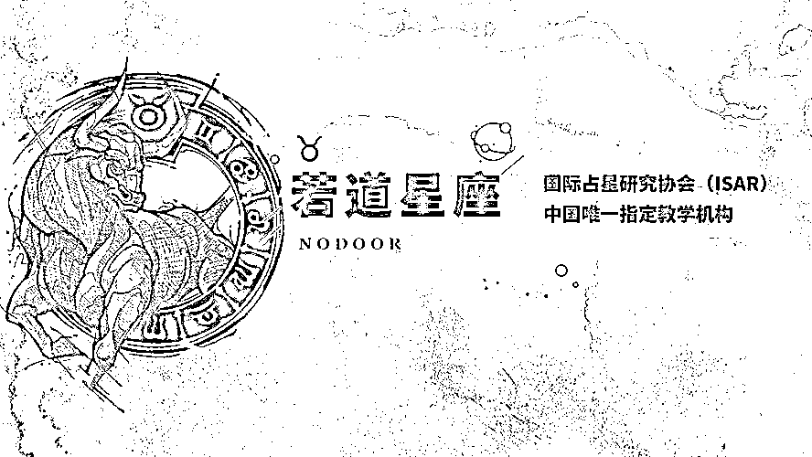

作者/MaryChan 玛丽

编辑/翀子 封面/书君 图片/网络

5 月 28 日 22:45，金星进入金牛座。象征爱与美的金星来到自己守护的富饶之地时，会有哪些表现？在这段日子里，又有哪些重要的宇宙天气可以助力金星的能量发挥呢？让我们一起来看文章吧~
**金星进入金牛座**

**5 月 28 日 22:45 金星将由白羊座进入金牛座。**由火元素到土元素的转换，从爆发的原初活力点亮生命，跳动的火苗激发冒险的热情，外放的能量烘托出“我”之存在；到深深扎根于现实，稳定地承接并蓄积力量，可靠地维系并温和的滋养，经由时间和耐心具体显化造物的神奇与美丽。

**金星象征着爱与美，以及一种连接、结合、给与、分享的阴性势能。一般它在每个星座待三周半左右，再进入下一个星座。**

金星与阴性面向有关，是除了月亮（代表滋养、照料、养育）之外的另一种阴性展现。其可视形状的变化，也像是有月亮的阴晴圆缺似的，当离地球很近的时候形似月牙，离地球很远的时候形似银盘。而阴性面向正与变化有关。

在金星的每月律动中，与之持续地连接，寻求理解，邀请金星所象征的品质与我们同在，有助于个体连接生命中的愉悦感，开发提升个人魅力、品味，带来自然而然的吸引力，创造良性的人际互动，开启或维护有品质的感情，创造价值、财富与丰盛。

**金星属于内行星，是“自我”的具体面向，象征着客观性、连接、交换、存在于关系之中的彼此。**有别于外行星所象征的超然面向，金星非常具有“烟火气”，与触手可及的人事物有关。其守护星座天秤座——带来平衡、和谐与优雅；金牛座——带来自然、价值与感官享受。

**金牛座的法则**

金牛座，是土象固定星座。在黄道十二宫的循环中，金牛座是第二个星座，它为白羊座势不可挡的生命力提供了一个容器，接收能量，使之成形，让创造性的势能在一个基本环境中得以酝酿和表现，由此物质被具体显化。

在人类早期历史中，白羊座象征打猎，金牛座象征农耕，二者一阳一阴，在人类的生存与存在中有着同样的重要性。

金牛座是阴性能量星座。阴性特质往往显得被动，没有阳性事物那么明显，而容易被曲解，或被简单地物化。我们需要理解被动的价值，如果没有它，白羊座的能量将永远不会有任何结果。

就像远古条件尚未成熟的太阳系，太阳的强光照射在虚空中，而没有行星可以作为容器，承接这能量，于是生命尚未产生。

历经漫长的演化，地球这庞大的生命之舟，早已承载了一个生机盎然的世界。而亘古不变的阳光，在每个早春，温暖了金牛座所象征的土壤，由此万物生长。

白羊座的阴影在金牛座得以弥补。相对白羊座的不稳定，**金牛座带来稳定、持久和坚持。**相对白羊座向外涌动的精力，**金牛座带来向内的限制，集中精力，搜集能量并加以储存。**

相对白羊座意志之火的抽象，金牛座带来对现实物质世界的关注，**进入更具象的、可感受、可体验的领域。**白羊座可能因炽烈而干燥，**金牛座带来温和平宁。**

**金牛座的守护星是金星。**也有学者认为地球本身更与金牛座相关，因为它与实际的、物质的安全感有关，与个人真正拥有令其舒适生存所需的东西有关。而在这里擢升的月亮，与情感面的安全感、归属感有关。总之，它们都具有浓厚的阴性能量特质。

金牛座的象征人物：大地之母、德墨忒尔女神（希腊神话中的谷物女神、丰饶女神）。

金牛座需要深深地进入物质世界，扎根，由此真实锚定白羊座初生的生命之火。**金牛座享受物质世界，要成为其中的一份子，体验物质世界的多彩、丰盛和美妙。**

因此，金牛座重视获得物质、积累物质、维持物质，不会轻易相信无法看到的事物。**物质的实存感，带来心理上的安全感。**

如果说白羊座与“我”有关，金牛座则与“我的”有关。拥有物质令个人觉得“我”的存在是受保障的，“我”的生活是稳定、稳固的。**金牛座希望事物是恒常的、不易变化的。**

**金牛座与身体、感官有关。**身体是每个人在这物质世界中的重要“容器”和载具。

通过感官系统的感知，我们得以确知自己对身体的控制权，知晓自己拥有这副身体。再通过感官感知这个物质世界，看到美丽的事物，听到悦耳的声音，吃到可口的食物，闻到馥郁的芬芳，触摸到有质感的东西，这一切让个体更真实地沉浸在这个花花世界中。

**金牛座与金钱以及实物交易有关。**金牛座能量显著的人一般善于获得、储存金钱，也会在购物和理财上比较精明。

**金牛座对物质的价值有良好的判断力，**清楚地知道什么是值得的，什么不值得。由此也引发个人对自我价值的物化衡量，“我”的价值在哪里，“我”靠什么获得收入，我的价值有多少，“我”的价值得到体现了吗，“我”要如何存在。

**被误用和扭曲的金牛座能量会导致对人事物价值的极端物化，用金钱衡量一切。**

**金牛座追求恒常性，排斥变化和不确定，**就像一片点缀着牛羊的初夏大草原，辽阔、宁静、温暖、安稳，是固定星座中最稳定的。所以易变的情绪在这里是不受欢迎的。

比起变幻莫测的情绪，金牛座宁愿待在有形事物的牢靠中。**金牛座对情感感受不足或较慢，情绪不太容易波动，也不容易被他人影响。**

金牛座的象征动物是公牛，与蓄积的力量和耐力有关，象征做事**踏实、可靠，**并且拥有不屈不挠的精神。

金牛座也象征**多产和繁育力**，就像肥沃的土地，物产丰富。子宫和大地一样，养育种子，并在一段时期之后让其出现在光明之中，因此丰饶女神德墨忒尔也是福佑胎儿的结婚女神，及妇女的保护神。

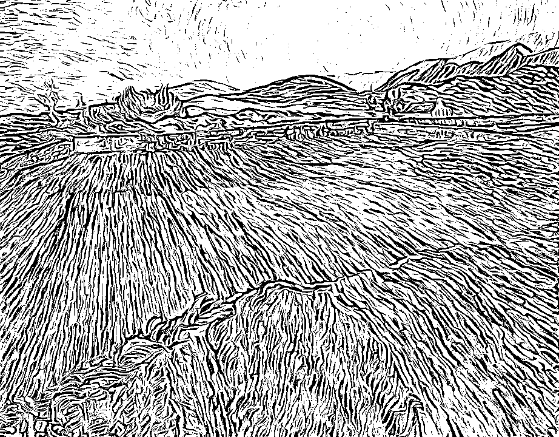

**金星在金牛座**

**金星在金牛座入庙，相当于金牛座就是金星的神庙和家园，金星的能量得以更顺畅、舒适地传递出来。**

金星在金牛座带来一种**天然的魅力**，它以平易近人的方式吸引着你。不一定是绝世之美或致命吸引力，而是一种清水出芙蓉、天然去雕饰的美，**这里面没有太多刻意为之，是健康的身体、肌肤所散发的美。**

已逝的戴安娜王妃，太阳在巨蟹座，金星在金牛座，并且金星四分天王星，火星冥王星合相，不论其生命故事多么令人唏嘘和褒贬不一，也不会妨碍其本有的美丽，她英伦玫瑰的形象留在许多人心中。其耗资巨大的世纪婚礼，也彰显着金星金牛座所象征的无尽繁华的一面。

金星在金牛座的法国著名女演员朱丽叶·比诺什，太阳在双鱼座，金星三分天王星。电影评论员这样评价她：她的美丽和清纯就像清新的空气一样透明。

她有一双坚定专注的眼睛，在众多女演员中，她并非最漂亮，也不是作品最多，但拥有实实在在的演技，曾获得欧洲三大电影节影后桂冠。她在《布拉格之恋》里饰演的特蕾莎，流露出青春与自由的自然美感。

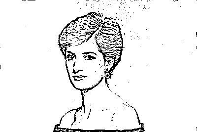

| 戴安娜王妃

**金星在金牛座，人们通过享受物质生活，而得到某种慰藉。**例如舒适得体的衣着，美丽的饰品，质地考究的居家用品等。人们也通过沉浸于感官世界的体验，例如一次全然放松的按摩和 spa，一顿温暖可口的饭菜，一瓶田园般清新的香水，一段令耳朵怀孕的音乐，而获得安宁、平衡、肯定、放松和宣泄。

如果身处压力和挑战中，感官的满足也会降低焦虑和沮丧，所以香烟成为战场上的军需品。朱丽叶·比诺什主演的《浓情巧克力》里，她每次做出来的巧克力，不仅香浓美味，还能满足顾客的心理需求，发掘他们心中隐蔽的渴望。于是巧克力成为打开固有思维模式的媒介，承载着一个个的人生转化故事。

**金星在金牛座，通过打开眼耳鼻舌身等接收管道，开发感官觉受，从而令我们与更多开阔的可能性连接。**

金星在金牛座，引发我们对时间的思考，而去回归一种**自然务实的质朴生活**。透过对物质的珍惜，深入与当前之物的关系，从“慢”中去体会生活的质感，例如茶道，由一杯茶汤感受一个丰富的世界。

**慢下来并非迟钝昏沉，而是去感受事物在沉静中缓慢生长、变化，**跟随大自然的节律，按部就班，不去揠苗助长、急于求成。

此时，鼓励人们去到大自然中，**与土地、植物接触。**也可以体会种植的乐趣，观察和尊重时间与物质的关系，通过持续不断的努力和耐心，取得收获。

**金星在金牛座，空气中有一种慵懒，但慢不等于没有力量。**此时精力就像缓释胶囊，做事的时候，留意自己身体的信号，倾听身体的需求，不需过于用头脑强迫自己。

所以有时候你有一个目标，但感觉身体并不急于“做”什么，尤其对开启新事物比较慢。但只要坚定目标，并付出持续的努力，一段时间后，你就会发现自己仿佛启动了内在的“大象”，犹如拥有了庞大、扎实的能量，能够长时间地去潜心专注、稳定贯彻。

**金星在金牛座，引发人们的占有欲和对所有权的重视。**无论对事物还是对人，拥有他们，令人快乐、满足和安心。想要持续占有并重复这些美妙的经验，所以对人事物产生依赖/依恋，同时也产生对缺乏和失去的焦虑、恐惧。

朱丽叶·比诺什主演的《新桥恋人》里的富家女，被生命的痛苦击中，失恋并面临失明。她在出走中与断腿流浪汉相遇，互相逐渐取暖疗伤，找到生命的火花与慰藉。

朱丽叶·比诺什的冥王星对分火星、水星、太阳，这点往往呈现为电影中的死亡/重生主题，以及对物质与精神的戏剧性思考。

同样，大地女神德墨忒尔的女儿波赛凤进入冥府的故事，显示了金牛座与其对面天蝎座的互补关系。当我们被欲望牵制，流连于“已死”之物而不自知，冥王就会适时地出现，摧毁这一切。有时候这显得相当残忍，令人不得不看清、放下，然后得以在生命的道途上继续前行和成长。

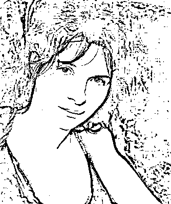

| 朱丽叶·比诺什

**金星在金牛座，**我们可以提升对自己的信赖，感知生命的丰富，相信自己自给自足的能力，**去发展对物质世界的理解和把控力**，对价值的判断力，精明地应对生活的挑战。

就像《加勒比海盗》中的杰克船长，聪明灵活、反应机敏，总喜欢利用"筹码"做交易，远胜过打架，虽然屡屡涉险，但总是天无绝人之路。主演强尼·戴普的金星就在金牛座。

**金星在金牛座，带来良性、温暖、有烟火气的人际关系，**类似塔罗皇后牌的特质，带来务实的滋养，爱与美，丰收与创造，以及欢乐。懂得感恩才会与源源不断的丰盛连接，形成良性循环。**感谢生命所供给我们的一切，感受到大自然、事物、环境的支持，并且能与周围的人分享。**

此时我们学习如何大方地表达爱与关怀，懂得滋养与照料他人身体&物质上的需求，让他人感觉安适、舒服。这就像大地之母，为生命提供成长的环境，孕育和滋养生命。此时也利于创作/创造，例如怀孕生育、产品生产、艺术创作等。

**金星在金牛座，用艺术的眼睛看物质世界。**著名的西班牙超现实主义画家萨尔瓦多·达利，其灵感和呈现形式都与物质世界息息相关。

这位群星（太阳、水星、金星、火星）金牛座的艺术家，不折不扣地以富想象力的方式展现着、夸张着、变形着物质、肉身、欲望，以及藏于其中的情结和思考。西装革履的形象、讲究的发型与胡须、华丽的手杖常出现在他的照片中。年少时的自然风光（大平原、橄榄林、岩石海岸），成为其画作的背景。

受精神分析学家弗洛伊德（太阳在金牛座）的影响，他探索对感官、性欲、潜意识的表达。

1929 年创作的《伟大的自慰者》，诸多细节糅合了身体、性、死亡、恐惧与焦虑的释放。人体在其创作中常常出现，包括《我的妻子》、《球体的伽拉忒亚》、《在醒来前一秒由蜜蜂围绕石榴飞舞所引发的梦》等，还有人体宴、人体积木等行为艺术。

他后来也涉足商业设计，把艺术更多融入现实，为众多高级百货设计展示橱窗、品牌 Logo，设计珠宝、家具，例如有名的红唇沙发。

金星在金牛座，我们属于这个物质世界的事实变得无比“真实”，并**渴望事物的恒常与稳定**。然而看起来再坚固的东西，也会在时间的长河中疲惫。

就像达利的画作《记忆的永恒》，据说是从在阳光下融化的奶酪得到启发，原本坚固的钟表变成了松垮的、延展的、有流动性的东西，承载着某种浓稠的胶着，暗示某种缓慢的却不会停止的影响力，表达了潜意识底层关于物质恒常的另类洞察。

科学（核物理、量子力学）对于物质实相认识的推进，也开启了达利特有的观看世界的方式，带给他灵感。《记忆的永恒的解体》就是从物质分解成原子的角度进行的再创作。在一切的表象之下是否存在着一种如如不动，一种深广的宽厚与寂静的力量？

金星在金牛座，一般来说是个不虞匮乏且很有创造潜力的位置。**只要确保工作具有实际意义，就可以透过多种领域获得收入。**

例如与身体有关的按摩、芳香疗法、徒手整骨，与大自然和土地有关的农业、园艺，与感官有关的音乐、艺术、时尚、奢侈品、食品业、纺织业，与实物商品有关的商业等。

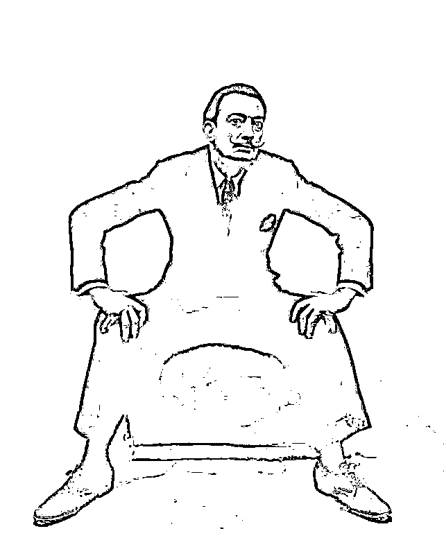

| 萨尔瓦多·达利

**金星在金牛座的爱情**

**金星在金牛座，带来忠诚、稳定、实在的爱情。**欣赏自然美，例如健康的外表、光洁的皮肤。重视感官体验，例如好闻的味道、悦耳的声音。喜欢性格质朴、实在，给人稳重、可靠感觉的人。看重自给自足的能力，需要有物质保障的感情，不喜欢小气。

约会的时候，建议衣着打扮得体，穿搭有质感；有条件的可以华美一些，并且佩戴珠宝。约会地点可以选择令人放松舒适，能享受悠闲时光的地方。美味的招待必不可少，不过要事先搞清楚对方的口味。

示爱的表现可能不那么浪漫，**而通常比较实在，**例如为对方亲自下厨做一顿美味，互赠有价值的礼物。当熟悉以后，喜欢透过肢体语言表达爱意，例如有品质的触碰、牵手和拥抱。性爱中追求感官的享受和舒适，爱抚必不可少。

**金星在金牛座，看重的是实际需求的满足，**在对细腻情感的表达、倾听、体会上，乍看之下可能不太灵光。

**金星在金牛座，是慢热的，只要耐心地给彼此酝酿的时间，慢炖细火持续加温，他/她就会像一口优质砂锅一样，煲出一锅好汤。**

**金星在金牛座的阴影**

如果害怕缺乏物质保障，或过于崇尚物质享乐，而**占有欲过度**，就可能变成自私、贪婪、小气的守财奴。物质并没有为其带来丰盛，反而带来限制。**为物所役，活在自我设限的狭隘中，**生命变得僵化、无趣。

如果在关系中总是满足于以自己的方式行事，拒绝调整和改变，过度想要占有、掌控，就会显得**顽固、执着、不知变通，**无法从已发生的事中汲取洞见。

如果过度在乎身体的舒适与感官享受，就可能导致**懒惰和肥胖**。就像“沙发土豆”比喻长时间窝在沙发里的人，除了吃零食的嘴之外，身体摊在那里一动不动。

如果在关系中，为了维护自我的稳定感，有意无意地对情绪加以批判、隔离，就无法将行为与心底的情绪关联起来。**忽视情感的沟通**，缺乏情感交流的需要，更无法化解他人的情绪，这有时候令人沮丧。

**金星在金牛座的重要相位**

**金星在金牛座期间与其他天象的结合以及相位（容许度 1°）：**

**★ **6 月 11-12 日 ******金星合相天王星**

**重点影响人群：有重要行星/四轴/月亮交点落在金牛座、天蝎座、狮子座、水瓶座 10°-24°；处女座、摩羯座 12°-22°；巨蟹座、双鱼座 14°-20°。**

这天象为金牛座的金星带来活跃的能量，**激发探索新事物的热情，并乐于尝试与新的人事物建立关系，或对既有的人事物产生不同的看法。**

已有的关系可能进入新的节点，长期停滞的事情有了重要突破，或有意外的金钱收入和经济变动。打破某种固着和僵化，享受美好事物带来的感官刺激。

单身人士发展新恋情的契机，容易遇到一些活力充沛、有个性的人。带来自由、突破和改变，也利于获得艺术与音乐的灵感和原创力。

**★ **6 月 18-19 日 金星四分土星****

**重点影响人群：有重要行星/四轴/月亮交点落在金牛座、水瓶座、天蝎座、狮子座 18°-29°。**

这天象带来**压力和挑战**。此时土星刚逆行两周，其运行速度很慢，影响力较强。**为了实现目标，需要适当的自律。**如何在承诺与自我需求之间找到平衡？

个人可能需要承担实际的工作担子，或看到**关系中的现实面**。容易因为压力而滋生不满和挫败的情绪，引发内在对于缺乏关爱、资源和自我价值的焦虑和恐惧，关系出现紧张或困难。**这也是吸收经验，重新评估资源和关系的时候。**

另外，此相位度数精准关联 5 月的天蝎座月食，**有某种了结、完成的意味。**诚实面对，拥抱内在的虚弱面，勇于表达自己真实的情感，可以帮助个人突破受困的感觉。此时购物需慎重，谨防买到品质不够好的东西。

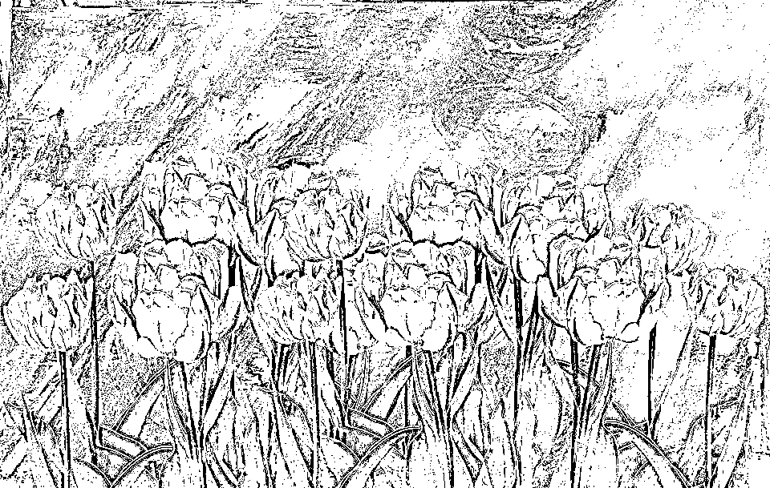

★ **6 月 18-19 日 金星六分海王星**

**重点影响人群：有重要行星/四轴/月亮交点落在金牛座、双鱼座、天蝎座、处女座 18°-29°；巨蟹座、摩羯座 22°-28°。**

**这天象带来慰藉、理解与灵感。**此时海王星还有一周左右即将逆行，处于停滞状态，其影响力也很强。为生活带来一抹温柔、浪漫的色彩，通过一幅画、一部电影、一次对话得到心灵的安抚、启发和支持感。

在遇到压力的时候，建议用片刻的深呼吸和独处，让自己安定下来，提示的讯息也许会自动到来，带着放松和弹性去看待它。

**此时也容易产生逃避倾向，和自我欺骗。**只把海王星的能量当成麻醉剂和迷幻剂，未免太可惜。人生没有捷径，因果法则令一切终有代价。在关系中看到彼此对于安全感的需求，在不失去现实感和价值感的同时，去做好辨识和包容、妥协的平衡。

★ **6 月 21 日 金星三分冥王星**

**重点影响人群：有重要行星/四轴/月亮交点落在金牛座、摩羯座、处女座 21°-29°；天蝎座、巨蟹座、双鱼座 25°-29°。**

这天象带来**热忱、强烈与执着**。这势能活化金星在金牛座的物质视角，**透过事物的表面，看到深层的动机**，从而加深对人事物的理解与把握。

利于精明地去料理财务，发展利益关联，以及建立有深度的关系。透过人脉而获得财富与资源，以及地位与声誉的机会。

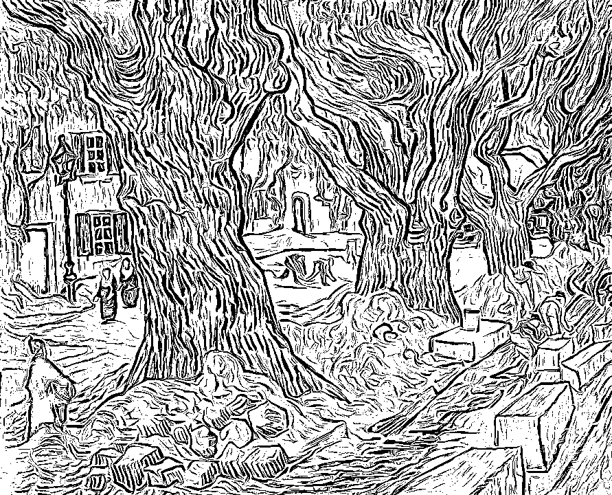

**结语**

这世间有许多美好的体验、丰富的创造，也有无情的限制、遗憾的怨叹。恩雅的歌《Only Time》中唱到：谁能说出，道路伸向何方，岁月流逝何处，唯有时光；又有谁能说出是否爱在成长，如心之所愿，唯有时光。

在旷久的时间长廊中，历经世事的心可能会疲惫变老，但如如不动的存在本身仍会像钻石一般闪耀。

金星在金牛座，令人连接生命中属于自己的物质根基和自我满足的能力。无论外界如何变化万千，甚至风雨飘摇，我们可以找到底气和自信，在自己的领地中，守住一份安全和稳固。

有时候，当下的付出与期待的收获也许不成正比，但请相信生命比我们想象的强韧、厚重，并永远充满潜力。无论处于何种境地，我们能靠自己的力量和坚持慢慢走出来，并创造属于自己的财富和丰盛。

**版权声明：**原创文章由作者授权首发于若道平台，欢迎转发，反对抄袭。友号转载请申请白名单。

**MaryChan 玛丽**

人本主义占星师、花精咨询师

于成都创办工作室，从事咨询、组织相关活动 8 年

咨询预约号：MaryChen336

微信公众号：ZhanXing336

长按打赏

**20 位来自世界各地的占星师****带来 19 场沙龙——新世界的觉醒****详情可点击下图**

**学习占星学****点击下图了解课程详情**

**

**微信又双叒叕改版啦，不想错过若道君的推送？****就把若道设为星标吧！****▼**

**喜欢记得点一下在看哦☟**

****报名直达入口****

# 卜卦占星案例丨“卖车”和“考驾照”，哪个能成功？

> 原文：[`mp.weixin.qq.com/s?__biz=MzA5NjA0NTAxNg==&mid=2651474784&idx=2&sn=c970634c55e0750c2e6081eac24bbf91&chksm=8b48f9d7bc3f70c1ce6a34f930f8a080c30515d37f03be2f4306659406acc29eb08c530ad787&scene=126&sessionid=1692737812#rd`](http://mp.weixin.qq.com/s?__biz=MzA5NjA0NTAxNg==&mid=2651474784&idx=2&sn=c970634c55e0750c2e6081eac24bbf91&chksm=8b48f9d7bc3f70c1ce6a34f930f8a080c30515d37f03be2f4306659406acc29eb08c530ad787&scene=126&sessionid=1692737812#rd)

作者/梁向桐

编辑/翀子 图片/网络

之前的[【案例 1】](http://mp.weixin.qq.com/s?__biz=MzA5NjA0NTAxNg==&mid=2651472954&idx=2&sn=425d81db9f4d19190ba319b2b9a2daee&chksm=8b48f68dbc3f7f9b480a21d9dc0a9efb77175c7bd594a7b8b221f501d71fd772e5c2451c86d5&scene=21#wechat_redirect)[【案例 2】](http://mp.weixin.qq.com/s?__biz=MzA5NjA0NTAxNg==&mid=2651473218&idx=1&sn=cc51f08b052d17e34bc55013f6ddb86e&chksm=8b48f7f5bc3f7ee3ddd2c1eda5a833f9dba0ca804d46fc702bdbeac7686a80ff04985125f0e0&scene=21#wechat_redirect)[【案例 3】](http://mp.weixin.qq.com/s?__biz=MzA5NjA0NTAxNg==&mid=2651473498&idx=2&sn=cd1de5c018db2c4eb595698aaa1925eb&chksm=8b48f4edbc3f7dfb8a782fc5287971c51e24a08118f810484bae496067e3bccc64538bb6ef23&scene=21#wechat_redirect)[【案例 4】](http://mp.weixin.qq.com/s?__biz=MzA5NjA0NTAxNg==&mid=2651474130&idx=2&sn=7da11c5396459e21f94df9caa511c2b8&chksm=8b48fa65bc3f7373122565594a1f209bccd42323c47486f7a73287f1bb1e3ed2f8c598f990e2&scene=21#wechat_redirect)，课程助教给大家展示了卜卦占星学如何在具体生活中运用。今天，由我们的学员给大家带来两个自己实践的真实案例。如果你看完文章很感兴趣，可以点击[【现代卜卦占星学】](http://mp.weixin.qq.com/s?__biz=MjM5MjQwNjAyMQ==&mid=2649439525&idx=3&sn=034e460f8970fe67b356c87a67291b3d&chksm=beb9524f89cedb59ade3783a57358fa8d3c2cc0cd3eccf68b3b411bdfecdc894e7dc4ebd6fc1&scene=21#wechat_redirect)了解详情哦。**案例一：车何时能卖掉？**

**提问背景：想通过二手渠道卖掉旧车后买新车。**

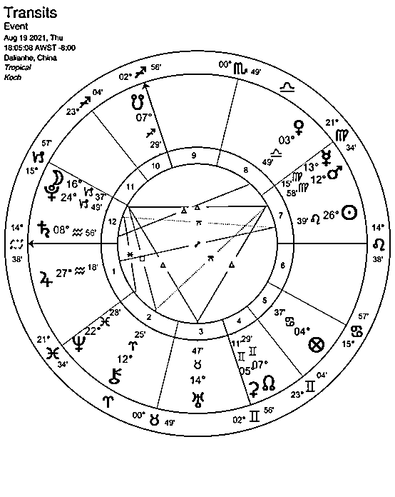

这张卜卦星图需要注意到的是**月亮与冥王星、水星与天王星呈现的大三角**，水星与天王星和水星与冥王星呈入相位。

**入相位代表事情会在不久的将来发生。**其中水星与天王星 1 度半左右呈入相位，水星与冥王星 9-10 度呈入相位。这个大三⻆可以呈现出，售车的过程会比较顺利。

**月亮是问题的次要征象星，水星的本意与交通有关，在这个问题中可以代表车**。月亮与水星呈三分相出相位也代表车况不错。

**水星与天王星**所代表的正是车的出手，水星在 7 宫，天王星在 3 宫。天王星的本意有循环系统，而这个卜卦问题恰好是二手车的“吐故纳新”。

车通过二手渠道找到买家。结合处于固定和变动星座和宫位的状况，1 度半的应期可以设定时间最长 1 个多月，短则一周多。

除此之外，金星作为 3 宫宫主星，与命主星土星呈三分相。金土之间的三分相在 5-6 度入相位(5 至 6 周）。

**最后的事实反馈结果正如卜卦星图所示**，在第 9 天的时候，该车由 4s 店的二手部接手，同时第 10 天的时候， 提问者交了购买新车的余款。并且在 1 个多月，二手部将此车售出。

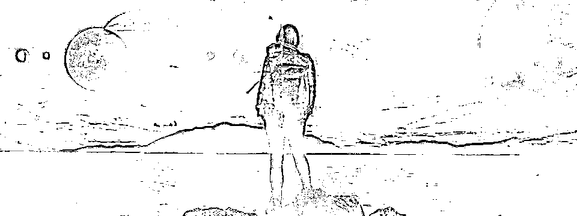

**案例二：驾照考试能否通过？**

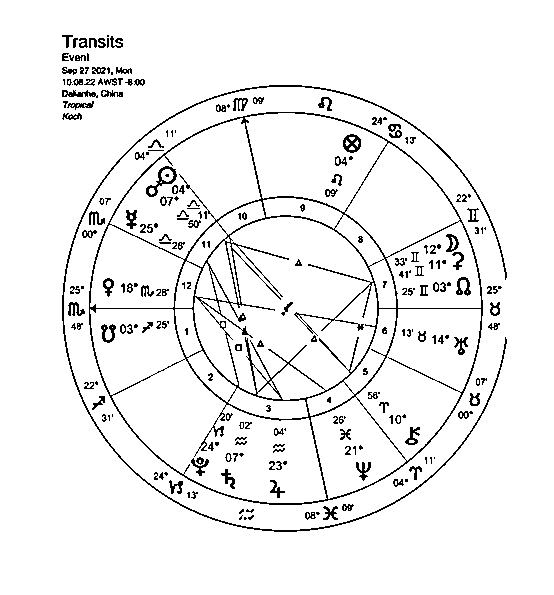

上升在天蝎座，接近 26 度，火星作为命主星入弱天秤座，合太阳且被太阳“灼伤”，驾照学习接近尾声，却自信不足，内心紧张。火星对分凯龙星 5 宫入相位，**强调实际上并不是真的水平不行，而是缺乏自我肯定。**作为**次要征象星**，**月亮**处于双子座 7 宫，符合驾照考试的提问。7 宫代表这种考试决定权在教练(他人)。

这张卜卦星图虽然上升点的守护星入弱，但由于月亮、土星和火星形成的大三角，且是出相位的风向大三角，**正好说明了学习已经顺利结束。**虽然月亮已经是出相位，但也说明过去的学习能力还是不错的。

根据我的经验，**大三角哪怕出现的不是入相位，涉及到主要征象星，仍然具有重要的作用。**尤其这个大三角中还有三宫的土星入庙水瓶座。月亮的最终落点是三分了水星，考试中只要对自己有信心，别紧张，考过还是没问题的。

**咨询时询问了提问者的心理状态，的确符合本张卜卦星图所显示：**太阳与火星同时处于弱势位置，并且火星被“灼伤”，表现出信心不足。也有一部分原因是本人太忙无更多时间去练习，所以过于紧张。咨询后得到情绪舒缓，且安排时间去练习，考试顺利通过。

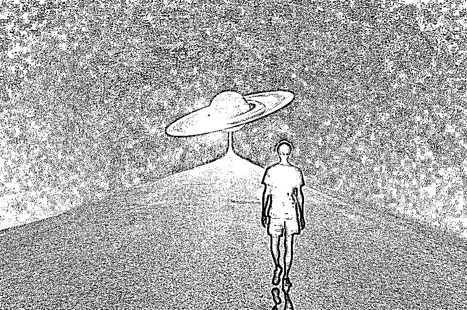

**学习卜卦占星学的体会**

我在 2020 年参与了邓肯老师的卜卦课程学习，这一次又进行了复训。感觉很幸运的是，能够遇到一位把现代占星学的心理层面与古典占星技法结合起来的老师。

同时我也在 2019 年参加了格伦老师两年的心理占星学课程，而在我自己的运用中，**两者结合真的是相得益彰。**

**出生星图的解读可以帮助咨询者了解生活中遇到的问题之根源，再运用卜卦占星去分析事情发展的趋势和结果，两种方式的结合， 最终咨询者的反馈是极为有效的。**

邓肯老师带有灵性的解读星图的方法，时常加持着我。在日常的咨询工作中，每逢遇到难点、无法看清真相的时候，我会闭上眼睛冥想，代入邓肯老师解读星图的思路。我会发现其实是自己没有抓住星图的重点，注意点太过分散，从而着眼于太多不必要的细节。

实际上初学卜卦占星学的人，都会硬性去记忆古典占星的基础知识。大家会去读卜卦占星学的书籍，自限其中，而**忽略星图本身呈现的重点内容**。我个人的理解，这也是邓肯老师解读卜卦星图的精髓所在。

卜卦占星学的确不太容易，因为难点在于其本身可以提供很大的信息量，而咨询者本人的心理状态、性格模式，包括如何看待这件事情，以及一件事情本身的复杂性和存在的变数，**都在星图中有所体现。**就看占星师能否抓住重点、梳理脉络并解读出来。

所以我觉得，卜卦占星学又像是学习占星学的一种检验，检验你是否灵活运用了所学的知识。在实践中，你也会惊奇的发现，**提问者的卜卦星图和其本人的出生星图之间的精密共振**，**把行进星图和卜卦星图呈现的发展趋势相结合**也可以帮助你解读出更精准的结论。

**最有效的也是必须要进行的学习方法，当然是不怕犯错，多练习，多总结。**这个练习是针对有效提问，而不是以试探、质疑、娱乐的心态去提问卜卦。因为**提问者心态状态都会呈现在卜卦星图中**，的确会影响最终的解读结果。

**版权声明**：原创文章由作者授权首发于若道平台发布，欢迎转发，反对抄袭。友号转载请申请白名单。

****

****向童****

2019 届若道核心课程学员 

全职心理占星师 

**微信号**：easet05

长按打赏

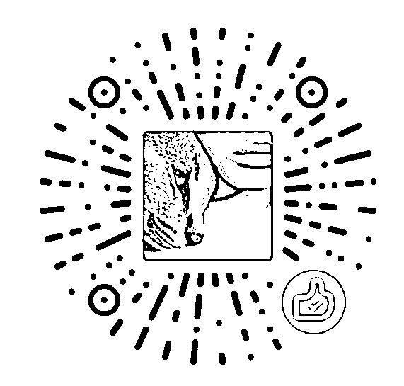

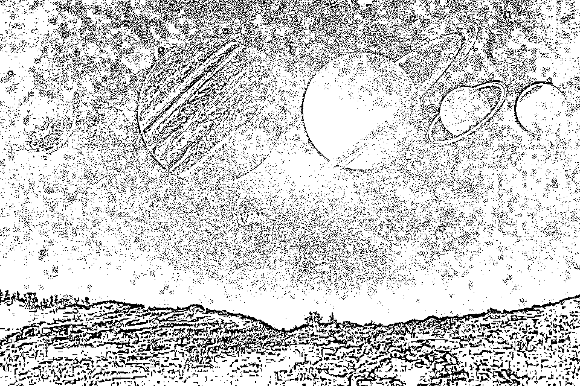

**快来看若道君为你准备的课程吧！**

**现代卜卦占星课程内容**

**课程分为 5 部分：**

**Part1 **融合现代占星理念，整合动态占星知识**Part2**独家【现代动态卜卦占星技术】全面教学**Part3**学以致用，覆盖人生各个领域问题的卜卦解法**Part4**扩展延伸择时占星技法的新认知**Part5**如何运用卜卦占星学做一场转化性的咨询

**15 节录播课+8 节直播课线上网络课，英文授课，中文翻译。**

**15 节录播课为 2020 年动态现代卜卦课程的内容。8 节直播课则完全是案例教学的形式。**

这样的好处是，你可以通过 1 个半月的密集学习之内按照自己的进度学完录播课的理论和录播课中已有的案例，从学习开始就实践，然后把实践中遇到的问题拿到 8 节直播课中，和老师互动。

**在 8 节直播课中，老师也会用案例教学、和同学互动的方式帮助大家进一步掌握卜卦占星的技法。**

**授课老师**

**艾德里安·罗斯·邓肯****（Adrian Ross Duncan）**1971 年在印度游学时开始学习占星学，1985 年开始成为全职占星师，**迄今执业已超过 33 年，是人本主义占星学、卜卦占星学和经世占星学领域的知名占星师。他还开发了占星软件 AstroClock 和多款占星报告。**他在日常咨询中都会运用卜卦，咨询图（卜卦的一种运用方式，即根据客户来访时间制作星图，从星图中获得大量信息）也是他**特别擅长的领域**。艾德里安·罗斯·邓肯从 1971 年开始研习佛学，受佛学影响很深，他**相信占星学和佛学观点统一、转化的一个基础是在于对现实感知的改变**。而卜卦很容易与佛教融合，因为它只关乎当下。

**授课时间**

**付费后一天即可开始看录播课程，全程有助教老师回答问题。**

**直播课程开始时间：**

2022 年 5 月 3 日，每周二 20:00-22:00

**这次课程恰逢世界在巨大的变动和不确定之中，期待这门课程能够给各位及各位的客户带来新的洞见和方向。**

**在这次 8 次直播课程中，我们将采用案例教学的方式，所有参课同学均有机会提供案例，供老师解读，且我们将组织群体的练习，用大量案例帮你掌握卜卦及如何在咨询中用卜卦。**

**什么人适合参加本课程？**

*   想要系统学习现代动态卜卦占星的学员

*   想在生活中熟练使用现代卜卦占星学

*   在咨询中想帮助个案更清晰的分析解读困惑

*   想参加 ISAR 认证考试，此课程是 ISAR 选修课

*   希望通过卜卦占星帮助自己和身边人挖掘一个积极主动的未来

学习整合卜卦技巧，不仅有益于想钻研卜卦占星学这个分支的同学，对占星初学者也很有有帮助，可以让你的占星技巧加倍。

**课程费用**

**课程价格：9900 元**

**老学员复训专享价：**

**2020 年参加艾德里安·罗斯·邓肯卜卦占星课程的同学：****2900 元**

**2018 年参加艾德里安·罗斯·邓肯卜卦占星课程的同学：****4900 元**

**特别优惠****：**

**分享课宣到朋友圈****保留 48 小时****（不设分组显示）截图给课程顾问可获得****400 元优惠****。**

**课程负责人：童老师（微信：nodoorDaivd），请备注“卜卦”**

长按二维码添加课程负责人咨询

**退转课程****退款原则请详看《教学协议》，如有疑问请咨询课程顾问。******现代动态卜卦占星实战课·ISAR 选修课****

**授课老师：艾德里安·罗斯·邓肯**

**授课时间：**2022 年 5 月 3 日

**授课方式：**网络课程，英文授课，中文翻译

**费用：9900 元；****2020 年老学员复训价：2900 元；2018 老学员复训价：4900 元；特别优惠，分享课宣到朋友圈保留 48 小时（不设分组显示）截图给课程顾问可再获得 400 元优惠。**

**课程负责人：**童老师（微信：nodoorDaivd），请备注“卜卦”

长按二维码添加课程负责人咨询

****报名请点击“阅读原文”****

# 人人有份的好运大礼包！ | 12 星座的幸运点在哪儿？

> 原文：[`mp.weixin.qq.com/s?__biz=MzA5NjA0NTAxNg==&mid=2651474670&idx=1&sn=6ae2c46c4015d4cedfe019fb20370fae&chksm=8b48f859bc3f714f7b1f83c552286b48aade0360e3eb09685beaefd4f9345e5a86ef179de910&scene=126&sessionid=1692737812#rd`](http://mp.weixin.qq.com/s?__biz=MzA5NjA0NTAxNg==&mid=2651474670&idx=1&sn=6ae2c46c4015d4cedfe019fb20370fae&chksm=8b48f859bc3f714f7b1f83c552286b48aade0360e3eb09685beaefd4f9345e5a86ef179de910&scene=126&sessionid=1692737812#rd)

******☆ ****后台回复“今日”，给你一句生命态度******

来源/astrotheme.com
译者/江艺 校对/Chang 编辑/玫瑰 封面/书君 图片/pexels

木星通常被认为是一颗大吉星，它在星图中的位置，指向了我们最有可能被生命眷顾的领域，而它所在的星座也被赋予了温暖和成长的巨大潜力。现在让我们看看木星在 12 宫位和 12 星座都会带来哪些好运吧~

**木星的特质**在占星星图中，有一个点是大家考察的时候通常是非常愉快的，**因为它包含了好运的元素，**除非它与星图中的其他行星和轴线形成许多紧张相位。**我们所指的正是木星的落点。**的确，分析快速移动的行星能够指出个性，而木星和土星则是社会性介入的行星，具有集体性和宿命论的“成分”。**与木星和土星形成的相位，以及与土星外的——天王星、海王星和冥王星形成的相位，揭示了那些不服从个人意志的对个性和命运的影响，与个人行星形成的相位形成对照。**

**木星所落星座表明，这个星座的总体特征被赋予了一定程度的温暖、成长****。**此外，木星所落宫位指向**最有可能被眷顾的生命领域。**

下面我们解读这个来自大自然的礼物的特征，并且描述木星的宫位和星座如何影响这个人。它们是这颗行星没有受到任何特别影响的情况下的“纯粹”表达。**只有通过将出生星图作为整体来详细分析，才有可能发现木星在此人生活中实际的积极作用。**

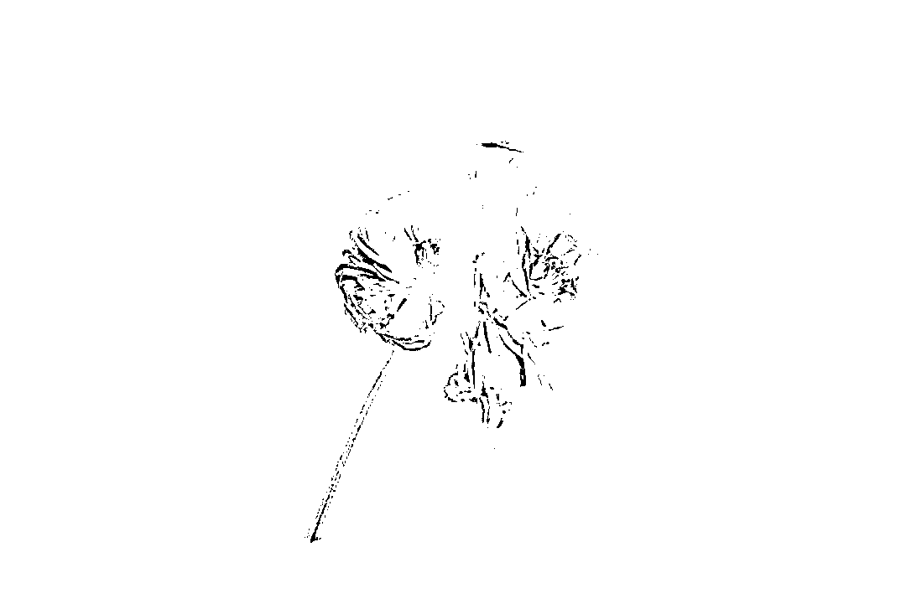

**木星在 12 宫位**现在就来探索这个礼物（或双重礼物）是什么吧。先享受你的木星的宫位中这第一个资产，然后沐浴木星所落星座的光芒。木星只有一个，但是，好吧，有两部分供你阅读！**若道君：****你可以在 app store 或者应用商店搜索“若道”下载 app，输入个人档案，查看本命盘（也可以使用其他星图软件），找到木星符号♃，然后看该符号落在出生星图的第几宫，对照下文查看。****例如下图中，比尔·盖茨木星落在第二宫。**

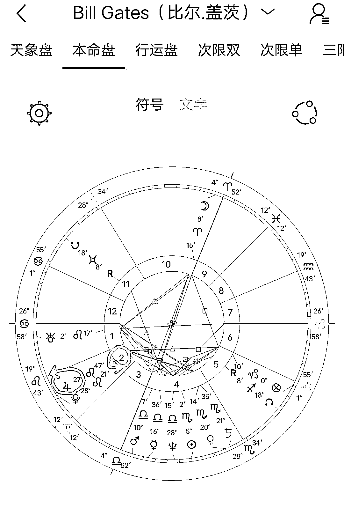

**1****木星在第一宫** 自然给了你一个往正确方向前进的推动，赋予你热情和慷慨，带给你魅力和活力。**你引人注目，对群体有影响力。**你的外表是快乐而有魅力的。**2****木星在第二宫** 木星的落点是上天赐予的礼物。它会提升你的**赚钱能力**，也可能让你变成一个**固执、倔强、贪婪**的人。同时你也可能感性而忠诚。所以，有时候，物质上的运气和爱适于合作！**3****木星在第三宫** 

大吉星在这个占星宫位中的落点会给你带来**轻松的人际关系**，你兄弟姐妹的爱，邻里之间的良好沟通能力，以及一生中**愉快的短途旅行**。

**4****木星在第四宫** 噢！家庭！它对你至关重要，你在那儿很愉快。此外，大吉星落在这里带给你足够的所需，**让你可以成功地建立一个和谐、安全、舒适的家。**你的私人生活得到有利影响。你会很自然地被那些与泥土、石头和房地产打交道的事务所吸引。**5****木星在第五宫** 大自然的礼物包括在**休闲、娱乐、创造和爱**方面的许多极大的满足。有利于哪怕只带有一点点娱乐的事物。一个不受义务约束的奇妙世界照亮了你的生活。根据传统，你的好运也适用于**你和孩子之间的交流**，你的后代是和谐、成功的。

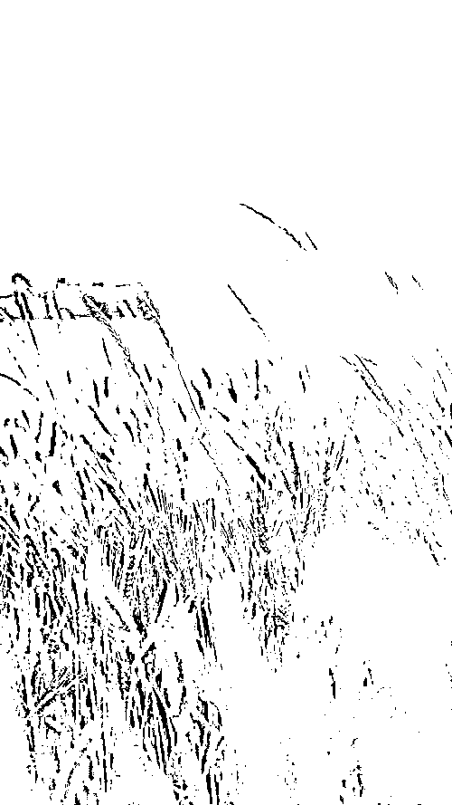

**6****木星在第六宫** 大自然的馈赠是幸运守护神保护你远离疾病，并在日常工作中给你带来生活乐趣。因此，**你的健康和你的工作环境一直是满足感的源泉。**你的价值被充分欣赏，你很受欢迎，且能够助益他人。**7****木星在第七宫** 极为利于你在与他人交往时的仁爱之心。木星落第七宫**通常被认为是婚姻成功的最佳征象之一**，也是你社交生活的跳板！**你慷慨地表达感情**，有你的陪伴是愉快的。**8****木星在第八宫** 这颗大吉星落在这个宫位是一个天赐的礼物。**它预示着遗产、强烈和令人满足的性，以及强大、秘密的直觉**。你可能很满足！你的感情也会被放大和加深。不可否认，木星落在你星图中的这个位置，你非常幸运。**9****木星在第九宫** 木星给你带来了特别美好的天赐的礼物，因为这颗行星和这个宫位之间具有相似性。木星的宽广、仁慈和温暖的人生视野与第九宫所象征的**高等教育、哲学、政治和人文科学领域**相一致。随着你的成熟，你会散发出**智慧的光芒**。在具体的层面上，**有利于长途旅行****，**整个一生都如此。**10****木星在第十宫** 这个行星礼物绝不是无关紧要的。事业之宫被大吉星入主，只会让你的**职业生涯备受眷顾**。随着时间的推移，它会发展成一个最愉快的领域。迟早，它会给你带来成功和同行的认可。你不害怕责任，并会恰如其分地面对它们。

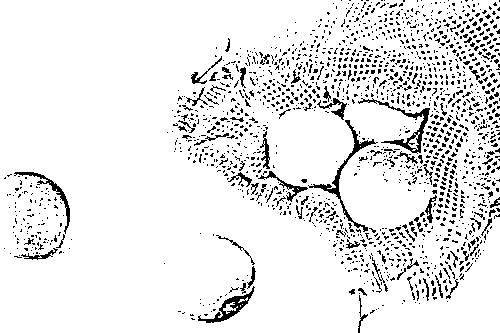

**11****木星在第十一宫** 上天赐予的礼物以守护天使之名被继承给了你！你会得到强大的高层或家人的保护。利于你在一群朋友里的地位！**友谊、保护和集体项目是你应该铭记于心的三个关键词，**因为它们构成了你一生中的真实资产。**12****木星在第十二宫** 虽然自然向正确方向的推力在这里并不壮观，但它仍然非常真实。你的**奉献精神、慷慨和同情心**都发展到如此程度，以至于它们经常使你在**人道主义工作**和**慈善事业**等非附庸性的领域中快乐地找到成就感。利于当你默默无闻、沉默审慎地奋斗时你的人道品性。作为回报，你的人生丰富多彩，**不受物质偶然性限制。****木星在 12 星座****1****木星在白羊座**大吉星落入这个星座**有利于自信，以及热心和展现温暖的能力。**你最有价值的资产是你能够轻松地表达你的火热，并热情投入到项目的实施中。然而，**危险在于，你的自信可能会成为反叛或无纪律的代名词，**在这种情况下，它会对你的利益产生不利影响。**2****木星在金牛座**大吉星落入这个和平而温暖的星座中，让你**组织和增加物质安全的实际能力得到加强。**你的情感作用被强化，你对舒适的品味和需求也不例外……不可否认，这有利于情感和物质满足。**硬币的另一面可能是过度的物质主义。**

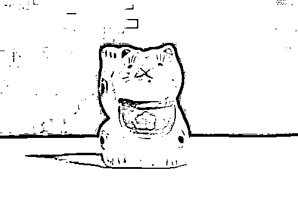

**3****木星在双子座**当大吉星落入这个星座，你的沟通能力和好奇心都得到了极大的加强。**你能言善辩，有一支雄辩之笔，你的兴趣中心多样化。**你比任何人都更有能力同时处理许多不同的智力问题，你会增加你的友谊的和职业上的联络人数量。利于经常的短途旅行。只是要小心，**不要贪多嚼不烂。****4****木星在巨蟹座**这颗行星在你星图中的配置非常积极，因为大吉星木星在这里擢升，这意味着，它落在一个特权位置。**木星会保护你的家庭领域，之后会保护你自己的家。**你的责任感被提升了，你对舒适和习惯的偏爱增强了;通常，你会很好地融入了社会。你的情感成熟很早，这一事实使你避免了许多挫折。**这种令人愉快的配置的唯一危险可能是所有领域的好东西都吸引你**。**5****木星在狮子座**你的魅力、你天生的权威和你的慷慨都被这个落点支持。**你不计较小事，你的本性是胸怀大志，慷慨大方。**你天生喜欢愉快地看待事物，尽管这通常意味着你把自己放在首位。孩子会欣赏你，人们通常也会察觉到你的魅力。即使你星图中的其余部分显示出你较内向，这个位置也会凸显你性格中的温暖。很多都归功于你自己！如果你性格外向，**你必须提防虚荣的危险。****6****木星在处女座**你星图中这颗大吉星的主要资产，是增加你对实际现实的感知和你在周遭创造秩序的能力。你很容易在你的活动中进步，在大多数情况下，**你是有效率、有用、谨慎的。****危险可能是，当收获你努力的回报时，你会不把自己放在最先，**特别是当你星图中的其他部分显示出内向或缺乏自信的倾向时。

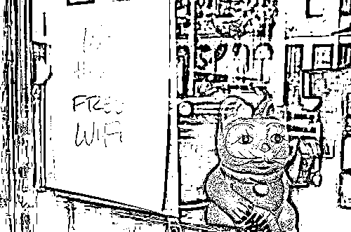

**7****木星在天秤座**寻求共识和妥协，以及不惜一切代价的恰当适度，这些成分，都是你星图中的大吉星落点赋予你的天然特质的一部分。**它也可能带给你非常好的品味和魅力，提高你接触的人的品质，**特别是关于你所有的团体、职业上的联络人，以及比如婚姻这样最亲密的联系。**8****木星在天蝎座**大吉星带给你的礼物是：**调查的天赋、对神秘的品味和解决它们的能力。**你的情感被放大，并促使你无所畏惧或不加克制地采取行动一直到底。**你也有聪明地管理你的金融投资的才能。**根据传统，性和肉欲同样被这种幸运配置平衡。所以，尽情享受吧，快乐起来！**9****木星在射手座**这是你星图中这颗大吉星的最佳位置！它提供了很多**人性的温暖**（或者如果你星图的其他地方显示你会内向，它抵消了这种倾向)、**旅行的品味、乐观、活力和进取的思想。**你是机动的，你有一个宏大的愿景。智慧开始于从不同的角度思考生活，把所有的事情都纳入视野！

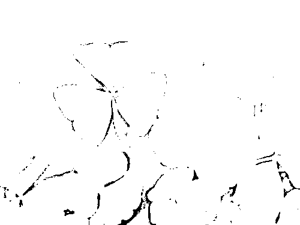

**10** **木星在摩羯座**对你来说，大吉星的礼物是**组织素养，以及基于长远考虑进行彻底推理的能力****。**它也赋予你在一切事务上的权威和严肃。因此，这显然**有利于你的雄心壮志，**尽管它有损你的热情、灵活性或欢乐。然而，如果你愿意，你可以发展所有这些方面。**11****木星在水瓶座**当你处理你的项目时，尤其是集体项目，你的精神活动和你的热情都非常受这个行星结构的支持。**你最好的品质之一就是你能融入团队，同时又能保持你的原创性。**作为一个自然的结果，这有利于你的友谊，并且保护会贯穿你的一生。**12** **木星在双鱼座**当大吉星落入这个无边界的星座中，**大大提高了你的敏感性、情感、艺术能力，**特别是在音乐和节奏方面的能力。它赋予你艺术和可爱的面向，以及**灵活机动地思考你的关系和你的环境的方式。**你的幻想的心境和对他人痛苦的敏感，可能会促使你参与到伟大的人道主义事业中去。

**版权声明：**本文由若道翻译发布，欢迎转发，反对抄袭。友号转载请申请白名单。

**20 位来自世界各地的占星师****带来 19 场沙龙——新世界的觉醒****详情可点击下图**

**学习占星学****点击下图了解课程详情**

**

**微信又双叒叕改版啦，不想错过若道君的推送？**
**就把若道设为星标吧！****▼**

**喜欢记得点一下在看哦☟**

**报名直达入口**

# 心理占星学五维星图测试丨快来测一测严肃占星学界的 MBTI

> 原文：[`mp.weixin.qq.com/s?__biz=MzA5NjA0NTAxNg==&mid=2651474670&idx=2&sn=adaabb1f1a37a6787c61c34e52acffde&chksm=8b48f859bc3f714f1c8189163933583b53cb2563048e0a907b57ce4120544e3e0d0c37b7297b&scene=126&sessionid=1692737812#rd`](http://mp.weixin.qq.com/s?__biz=MzA5NjA0NTAxNg==&mid=2651474670&idx=2&sn=adaabb1f1a37a6787c61c34e52acffde&chksm=8b48f859bc3f714f1c8189163933583b53cb2563048e0a907b57ce4120544e3e0d0c37b7297b&scene=126&sessionid=1692737812#rd)

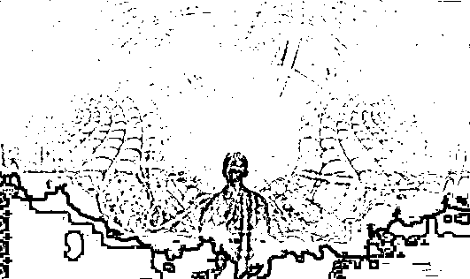

**拿到一张星图不知如何入手？**格伦老师结合**占星学**和**心理学**视角为我们深入浅出的总结出了一套**本命星图心理占星学测量表格**，快打开你的本命星图开始计算吧！

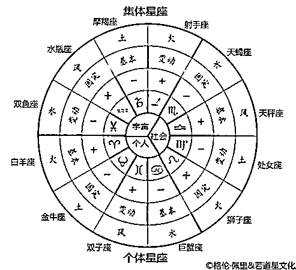

**计算的基础知识都在这张图表中，各个星座的五维属性随手查**

**我们从以下五个维度计算：**

*   **个体星座和集体星座** ** Individual and Collective Signs**

*   **两极性（阳性、阴性）****Polarity (Yang and Yin)**

*   **元素** **Elements**

*   **模式** **Modality**

*   **视角** **Perspective**

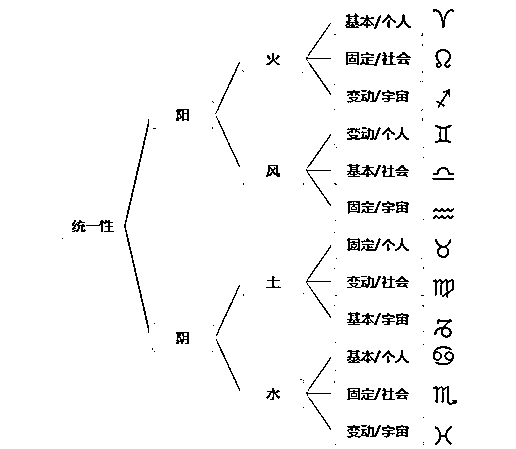

**出生星图计分方式**

太阳、月亮各**2 分**；上升点（ASC）、 中天（MC）、南北交点和水星、金星、火星、木星、土星、天王星、海王星、冥王星各**1 分**。**计算下列要素的总分：**

*   元素、形态、极性和视角

**来听听格伦老师以荣格星图为例的计分过程吧**

<mpvideosnap class="js_uneditable custom_select_card channels_iframe videosnap_video_iframe" data-pluginname="videosnap" data-id="export/UzFfAgtgekIEAQAAAAAAibcC7Px4NAAAAAstQy6ubaLX4KHWvLEZgBPEsYJIUjMmIN6DzNPgMIu_NPWyAJVANiu9s2vsVYFb" data-url="https://findermp.video.qq.com/251/20304/stodownload?encfilekey=S7s6ianIic0ia4PicKJSfB8EjyjpQibPUAXolJJTGEYArLaazGrpgbg2lJok3ZWInws8uFk1UkcJTNCwwhXUdZsV0ofb7PWv1xGybzv4CeTibBQVoiaXUL8fP5VXw&amp;adaptivelytrans=0&amp;bizid=1023&amp;dotrans=0&amp;hy=SH&amp;idx=1&amp;m=&amp;scene=0&amp;token=AxricY7RBHdWNcAzgNb19l1eZIXKJBqmHDmt9Gs8oEicb7Dqq9MNgxcqLpg3nmsMTm3P8bog2kbd8" data-headimgurl="http://wx.qlogo.cn/finderhead/PiajxSqBRaEJYnVsqWfEX9qA0sI6hNVKsDfyzfPZ92WZMZyBpZWU5NA/0" data-username="v2_060000231003b20faec8c4e68a1ec2d4ca07e434b07755bbf47e7053a3059defd2c9d6c68a20@finder" data-nickname="若道" data-desc="#若道核心课 拿到一张星图不知如何入手？格伦老师总结出了一套本命星图心理占星学测量表格，不可错过的星图解读技巧。
" data-nonceid="9196797956979756222" data-type="video" data-width="656" data-height="368"></mpvideosnap>

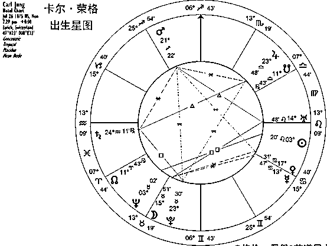

以荣格星图计分为例

➣个体星座=9，集体星座=3

➣火元素=5，土元素=4，风元素=3，水元素=2

➣阳性星座=8，阴性星座=6

➣基本星座=3，固定星座=9，变动星座=2

➣优势元素：火元素

➣劣势元素：水元素

➣星座视角：个人=6，社会=4，宇宙=4

**★ 你的心理占星学星图计分：**

**➣个体星座=，集体星座=** 

**➣火元素=，土元素=，风元素=，水元素=**

**➣阳性星座=，阴性星座=**

**➣基本星座=，固定星座=，变动星座=**

**➣优势元素：**

**➣劣势元素：**

**➣星座视角：个人=，社会=，宇宙=**

**★ 格伦老师从优势元素组合的角度，给我们提供了更多的星图解读思路：**

**元素组合 **

*   **火/土=熔岩**

*   **火/风=热气球**

*   **火/水=蒸汽**

*   **土/风=沙尘**

*   **土/水=泥**

*   **风/水=雾**

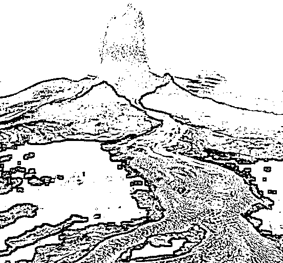

**火/土 熔岩**

所有组合中**最富于生产力**的一组

成就卓越，积极能干

**强大，有驱动力，**推土机一样的人

热情加实干等于**野心**

**自信，坚韧**

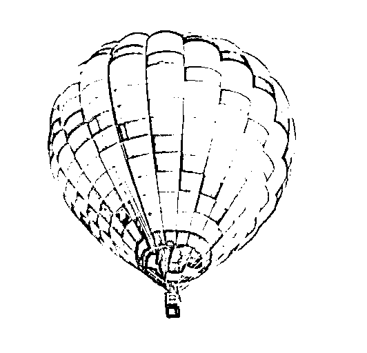

**火/风 热气球**

**积极乐观，**有魅力，外向

 卓越的**沟通技巧**，温暖迷人

** 超级销售员**，把冰块卖给爱斯基摩人，

**富有朝气**，很有头脑

 对情绪感受、消极性和任何形式的限制不耐烦

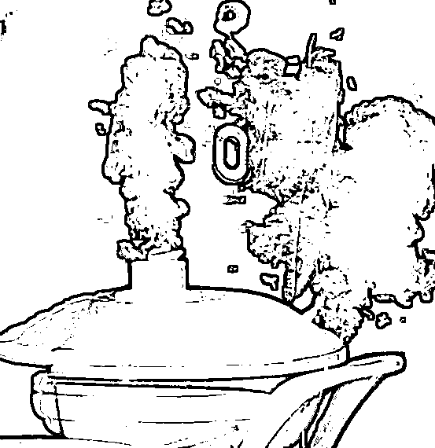

**火/水 蒸汽**

**积极的情感**；温暖，充满爱

 心情摇摆起伏，强烈而情绪丰富

** 可能在感情上勇敢无畏，也可能只是反覆无常**

** 关怀体贴**、与他人关系密切

自发地直接表达内在生命

** 自发性内省，****情感外露**

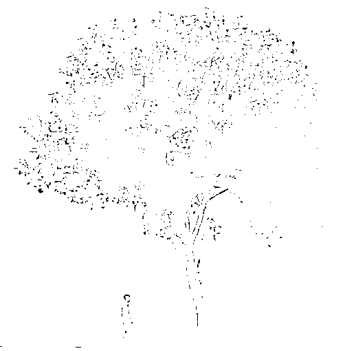

**土/风 沙尘**

**理性、经验主义**；立足现实的思考

 明智，聪颖。有耐心，专注

** 面对问题，态度客观**

** 善于解决问题**，能够认识到事情的实际意义

 记账、研究、修理工作

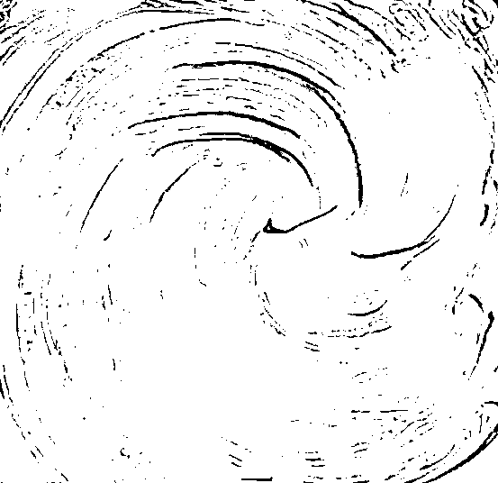

**土/水 泥**

终极的**大地母亲**；看护者

 同情心与不实用主义的结合

 **以构建安全、有爱心的世界为导向**，保守

 戒许有一些**严肃和压抑**

 倾向于维持原状；非常偏爱熟悉的事物

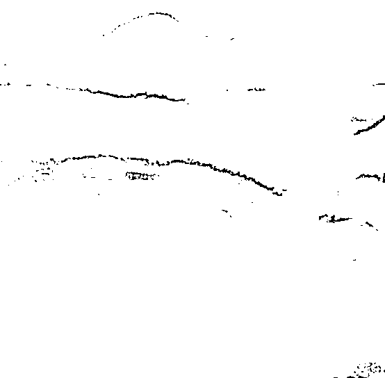

**风/水 雾**

** 好奇**、了解内心的世界。**交流感受，**

让无意识表露出来

 可能是**不切实际的梦想家**

 对主观领域保持客观态度

 可能只是**人生的旁观者**

 将想象力与观念结合

**如果你对格伦老师的心理占星学体系感兴趣，想获得更多五维星图解读资料，测试后添加课程顾问 Maggie，回复“五维”领取。**

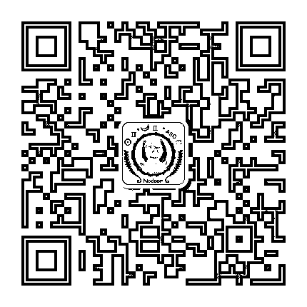

**如果你对课程感兴趣****也可以点击下方图片了解详情**

**

****报名直达入口****

# 六一·3 场直播大放送丨天赋与潜能，占星学与亲子发展系列讲座

> 原文：[`mp.weixin.qq.com/s?__biz=MzA5NjA0NTAxNg==&mid=2651474670&idx=3&sn=8f7328ca63b10bbdb82ab24855fc0896&chksm=8b48f859bc3f714ff8b36b3594f04036f388c535b94d1891d831ec4f9434882c3a2e05b47338&scene=126&sessionid=1692737812#rd`](http://mp.weixin.qq.com/s?__biz=MzA5NjA0NTAxNg==&mid=2651474670&idx=3&sn=8f7328ca63b10bbdb82ab24855fc0896&chksm=8b48f859bc3f714ff8b36b3594f04036f388c535b94d1891d831ec4f9434882c3a2e05b47338&scene=126&sessionid=1692737812#rd)

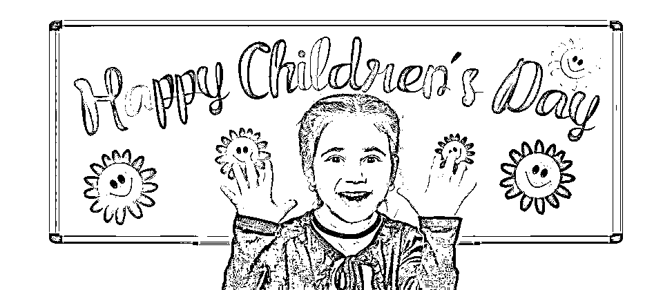

六一将至，我们特别邀请**若道亲子研究小组成员**和**若道咨询平台入驻的占星师**为大家带来占星学视角下的亲子发展系列讲座，**分别从不同的角度一起探讨****“占星学与亲子发展”**，以期能够用占星学更好地支持到亲子关系的发展过去一年多时间里若道亲子研究小组不仅开发撰写了**国内第一份《亲子报告》**，开辟了若道公众号亲子研究分享专栏（往期亲子专栏：[8 个孩子的上升故事和第 2 期亲子访谈招募计划](http://mp.weixin.qq.com/s?__biz=MzA5NjA0NTAxNg==&mid=2651451695&idx=2&sn=12ca43f8084445ec06c0e7a66c265fda&chksm=8b4b4398bc3cca8e61e1410068ef5de86d81a871ffad8e546e11e2f1f1206f547596d2a81dd0&scene=21#wechat_redirect)；[当行星落在轴点会对孩子的性格产生什么影响](http://mp.weixin.qq.com/s?__biz=MzA5NjA0NTAxNg==&mid=2651463451&idx=1&sn=99ea1f0175349607b51b3a84ef15ac5f&chksm=8b48adacbc3f24ba7ce0b64964ecc8412d8fef1c1b41f24fde192339f45bef751e774455b098&scene=21#wechat_redirect)[；大时代是如何影响下一代孩子](http://mp.weixin.qq.com/s?__biz=MzA5NjA0NTAxNg==&mid=2651459194&idx=1&sn=a4d7090919c7edaea5bdcd946395ab86&chksm=8b48bccdbc3f35db29afa768704d7593a1b9267d579f97213244375def9ff193d37becf7a56c&scene=21#wechat_redirect)；[谷爱凌、苏翊鸣、羽生结弦……这些优秀的运动员，火星是否跟常人不一样？](http://mp.weixin.qq.com/s?__biz=MzA5NjA0NTAxNg==&mid=2651468383&idx=1&sn=1a2e9753d6a8fd4b7bf306d2e27654ad&chksm=8b4880e8bc3f09fe4370e6e068b98e0c307ba1e5fd2603a63c3b89ddf3f911551be85c3a1230&scene=21#wechat_redirect)），并持续进行亲子案例访谈和研究工作，至今采访了**近百位父母**，与父母们共同探讨孩子的养育成长，观察孩子星图的现实表现。**2022 年六一期间，三位研究员将共同演讲，分享过去一年多的研究心得与体会。 **

**系列演讲：占星学与亲子发展**

**依据研究主题将演讲内容分为三个部分：****❶****如何在亲子关系中运用占星学？****❷** **天冥四分时期出生的孩子（2011 年—2019 年）共同的经历与使命**我们访谈的大部分孩子都出生于天冥四分相的时期。我们知道外行星周期会深刻影响时代的变迁，那么孩子的成长会受到怎样的影响？我们将分享几个孩子的故事，观察天冥的能量如何在他们的个体生命中显化，以及他们面临的共同时代议题。**❸**** 出生星图中上升点的故事与观察**上升点是每个人进入这个世界的入口，是与外界互动的自我身分展现。我们将分享对上升点所落的星座元素、行星合相上升点的观察，分享各不相同的出生故事和成长表现。

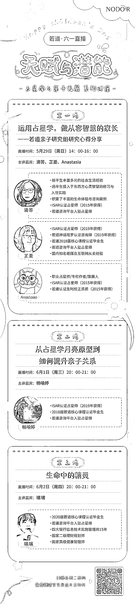

**讲座参与方式：****关注若道视频号，预约讲座，直播限时免费，回放需付费购买。**<mpvideosnap class="js_uneditable custom_select_card channels_live_iframe" data-pluginname="videosnap" data-headimgurl="https://wx.qlogo.cn/finderhead/PiajxSqBRaEJYnVsqWfEX9qA0sI6hNVKsDfyzfPZ92WZMZyBpZWU5NA/0" data-username="v2_060000231003b20faec8c4e68a1ec2d4ca07e434b07755bbf47e7053a3059defd2c9d6c68a20@finder" data-nickname="若道" data-desc="将在 05 月 29 日 14:00 直播" data-intro="运用占星学，做从容智慧的家长" data-noticeid="finderlivenotice-v2_060000231003b20faec8c4e68a1ec2d4ca07e434b07755bbf47e7053a3059defd2c9d6c68a20@finder-1652945486841540-1794312757" data-type="live"></mpvideosnap>

**若道亲子研究访谈招募·第四期**

若道亲子研究组现开启一个新的研究课题：**《孩子的学习与潜力发展研究》**，我们将结合孩子出生星图，观察**行进中的行星周期**对孩子成长的影响，特别考察处于**升学转换阶段**的孩子（比如幼儿园升入小学、小学升入初中），他们的**学习与潜力发展**方面的变化，以及在进入新的学习阶段后，他们对**社会环境、人际关系**变化的适应力、行为反应、心路历程等。

**若道亲子研究组的咨询师（均为取得 ISAR 认证的资深咨询师）会根据此次新的研究课题设计的访谈大纲，与报名参与访谈的父母进行访谈。**

**招募安排**

*   **招募对象：**欢迎现在就读**一、二年级**（小学）和**七、八年级**（初中）的孩子父母报名（PS：之前已经报名的志愿者，若符合本次访谈招募需求，可以联系客服微信：nodoor201705，申请参与）

*   **报名方式：**添加客服微信（nodoor201705），备注“亲子访谈”，添加客服微信后，需要提供孩子的出生信息。

    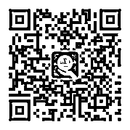

（报名请扫码添加客服微信，备注“亲子访谈”）

*   **访谈通知：**报名成功后，亲子研究组的咨询师会根据访谈安排，选择符合研究主题的星图，若道客服人员将会微信通知访谈安排。

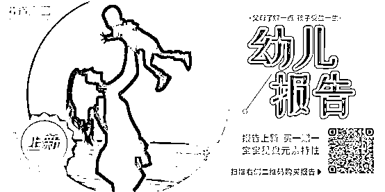

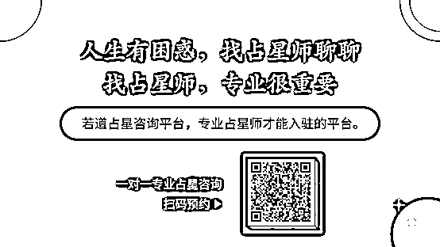

# 火星进入白羊座 | 12 星座会发生什么精彩的事情？

> 原文：[`mp.weixin.qq.com/s?__biz=MzA5NjA0NTAxNg==&mid=2651474544&idx=1&sn=9460d77f78f957da2119635a3eea1efb&chksm=8b48f8c7bc3f71d1d9e33fed90584777b0ec5b034106ba159f4524e94d84b58de7cfc9a79e16&scene=126&sessionid=1692737812#rd`](http://mp.weixin.qq.com/s?__biz=MzA5NjA0NTAxNg==&mid=2651474544&idx=1&sn=9460d77f78f957da2119635a3eea1efb&chksm=8b48f8c7bc3f71d1d9e33fed90584777b0ec5b034106ba159f4524e94d84b58de7cfc9a79e16&scene=126&sessionid=1692737812#rd)

********************☆ 后**********************台**********************回复“今日”，给你一句生命态度********************

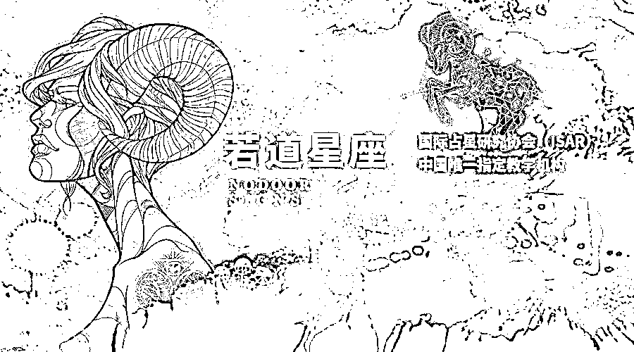

作者/郑玮玲 ISAR 认证占星师编辑/玫瑰 封面/书君 图片/pexels

5 月 25 日 7:17，火星进入白羊座，直到 7 月 5 日离开。这段时间将会是我们开启内在勇士的旅程。一起来看看吧。

**火星的存在**

每个生命进程中有各种残酷、纷争，神和宇宙从来不会让我们觉得人生太轻松。火星的存在是提醒我们，人与野生动物的原生属性无二。

世界有美好也有险恶，生命是要准备面对挑战、对抗的，慈悲与善良需要清晰设限来保护这份柔软。在甘愿付出时奉献爱与温暖，也要意识到自我捍卫的重要性，不吝善举，无惧险阻，无畏邪恶。

火星行经黄道 12 星座的历程如同青铜圣斗士拯救女神雅典娜的历程，12 个黄金圣斗士及他们所代表的意识、力量和领域都是火星战士的自我炼金之路。从铅到黄金锤炼的意志，最终都是为着我们的真我——太阳而服务。

**过去一个多月里，火星在双鱼座消沉而迂回发力，集体被某些暗藏的势力操控着，看不见，摸不着。**

火星在双鱼座最后几度，我们视野中蹦出了“猴痘”这个新病毒，几天之后，我们能看到这个病毒与已消亡的天花、牛痘还有着丝丝联系，与某国实验室也有着无可名状的联系。

火星在双鱼座 27°，就有新闻称这种新病毒的疫苗被某些国家政府订购了上百万剂。与此同时，上海传出解封的消息，实则演出了种种似解未解的闹剧。

双鱼座的烟雾扰动着视野，迷幻不清的背景掩藏着，催生着冲垮虚幻的力量。**随着火星的行进，越来越多人会走出谎言的包围。**

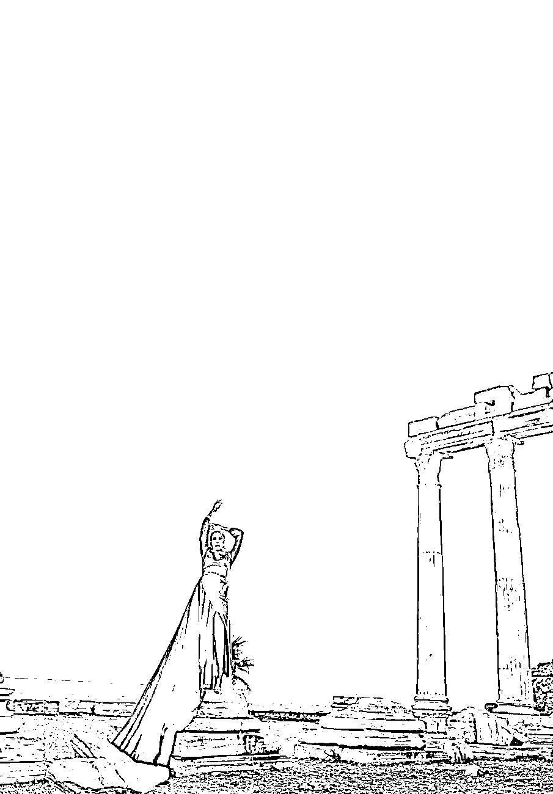

**火星在白羊座**白羊座作为创始星座，其创始之意也指代：**调整与创建**，就像每个季节开初，我们总是面临巨大的体感、温度、衣装的切换过程，万物在一番新的适应状态中。因此，作为创始星座的能量能将火星的动态最大限度地激活，是我们开始执行并调整行动的极佳宇宙助推器。**白羊座的火星提示了原始性、兽性与狂野的爆发力，有利于火星以天然的形式来发挥。正面的白羊座是战士，是无畏、果敢、率真，勇于开火和肉搏。****白羊座竞争的意义在于竞争的过程而非胜负，白羊座的火星并不意味着其力量绝对至胜，而是无论胜负都坦诚无惧。**这股勇猛必需要一场对决来释放和表达，即使受伤、流血、战败也觉痛快。**输得起，还要输得坦然、漂亮是白羊座火星容易被忽略的要点。**对火星来说真正可怕的不是认输和退败，而是**被阉割**。挫败是激起火星斗志的有力机制。而**被压制、磨平的斗志则无法让火星的原型天然呈现。**白羊座的火星将强烈的当下、此刻和更近的距离带到面前。双鱼座的火星意味着无处不在的警觉，潜藏的敌人与按兵不动，白羊座的火星就向战争更进了一步，如同揭露埋伏，进入激烈对峙的战斗。近距离就让互相伤害就成为了最大可能。事实上，人类是地球上最擅长互相伤害的物种——在我们一生伤害最深的总是最亲近的人。因为足够近的距离才让伤害得以发生。亲密关系里的火星充当了愤怒、攻击时的武器，岁月静好的守护者和界限。白羊座的火星会在两个独立个体的意识、情绪、感受交会的时空里，提出更自我、个性化和前所未有的声明，这往往会带来你进我退的争夺与权衡，容易引致一方的不满。尤其触发了个人星图中的行星、轴点、交点时，争端与冲突就可能呈现。**当行进火星触发个人星图太阳时，常常引致身体受伤：割伤、烫伤、擦伤等开放性伤口，或是感冒、发烧、发炎、落枕等情况。火星经过 12 星座的周期大约两年，其实每半年就会与我们出生星图某些行星、轴点、交点形成困难相位。**白羊座的火星引致的身体情况往往是**快速而直接的症状，疗愈也是快速的**。但这样的身体征象其实是提醒我们伤害发生的当下，我们的意识是脱离当下的，不聚焦的，或是带着愤怒的行事。白羊座的火星提醒着，**高度集中的专注力会把我们从危险中解救出来，避免一切受伤和病痛，意识是我们最好的保护屏障。**

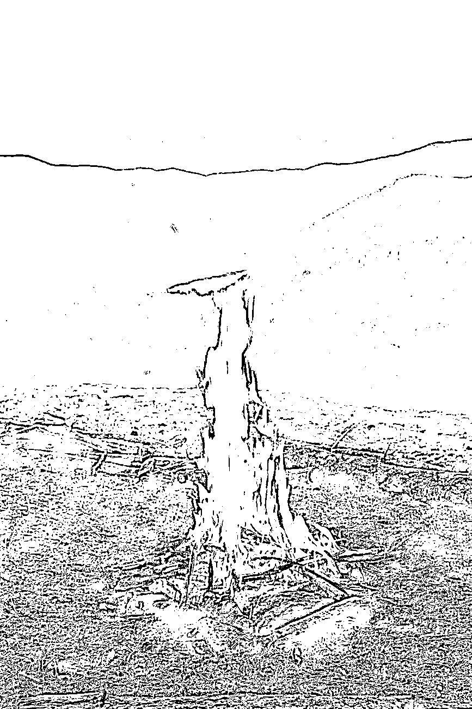

**火星在白羊座的行进****火星目前与太阳在黄道上处于从娥眉月至上弦月阶段，日火四分相将开始在 8 月 8 日**。此阶段的火星更多展现出**个性与独立，支持更新、未经反复锤炼的创造性的举动，可将此时期视为创造性的实验期、尝试期，待火星与太阳精准四分时更进一步发力促成结果。****火海合相也将于 5 月 30 日完全结束**，这会令白羊座的火星更加干脆、利落，帮助我们**放下一切拖泥带水，不清晰的拯救、守护行为，回到自我中心去做决定，实施出自本能意愿的行动。**在这轮行进之下，上海的疫情管控也应当进入最终的收尾、结束和各项强有力的重启建设中，让每个受困的重新回到生命原本的活力、能量中心场。

**火木合相于白羊座**

**周期：5 月 15 日-6 月 12 日**

**重点影响人群：有个人行星、四轴、月亮交点位于白羊座、巨蟹座、狮子座、天秤座、射手座、摩羯座 0°-13°，以及双子座、巨蟹座、处女座、天蝎座、射手座、双鱼座 22°-29°的人。**

木星提升出火星巨大的威力、愤怒与激情，在此期间我们可以看到**战争的扩大化，现有战火、竞争、对峙升级或进入白热化进程。**木星带来的战事加剧与扩张也可能导致阶段性的结局，对抗、竞争与争端的双方快速失衡，就会让结束即刻到来。在普世层面，**一些长期的积怨、不满极可能在火木合的周期里引发集体性的愤怒扩大化，以致于问题推向高潮而快速解决**。此时期也应关注**金融市场的周期性动荡可能到达临界点。**火木合相最紧密的**5 月 26 日-5 月 31 日**，重点影响人群需要**高度注意情绪的变化**，可能遇到诸如：**重大离别、突发事故、严重挫败或人际纷争等引发不可控的愤怒或极度低落、情绪崩溃、甚至短期的抑郁**。白羊座的火木强烈提示着**“自私、私欲”引发的波澜与反击，极度的自私行径与利己主义必然在这一轮行进中遭受公开的审判。**

**利用火木合相的周期进入高效的，充满开拓性的创造性工作将会令我们感受到激情与效率并进，兴致与机遇同在的快意人生。**这也是一个值得果断决策，开启新行动，甚至冒险尝试的时期。

**如果你有即将上马的新项目，跃跃欲试不如放手一搏。**接下来的时间好好去部署你创想，尤其是带着一点点大胆、偏执和不怕输，不问结果的心态，便能在最快的时间验证成果。

**如有机会可以加入一些户外旅行、户外运动、户外生存体验或是任何一种能释放你天然野性的活动。**这是火木合相时期给自我赋能的最佳途径。

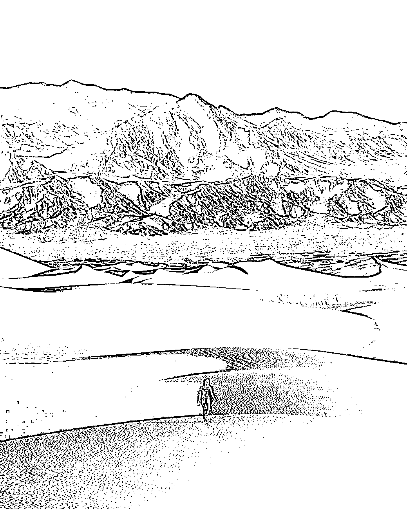

**火星与逆行的土星六分**

**周期：6 月 22 日-7 月 5 日**

**重点影响人群：有个人行星、四轴、月亮交点位于白羊座、金牛座、巨蟹座、狮子座、天秤座、天蝎座、摩羯座、水瓶座 20°-29°的人。**

**一年一度的土星逆行始于 6 月 5 日，将从水瓶座 25°逆回 18°，结束于 10 月 23 日。**火土六分让我们得到空间去**强化抗压能力与肩负能力**。土星的逆行将一切阻碍、限制收缩、向内，因此未来五个月，**我们能感受到的内压会多过外在压力，与内在阴影相处的必要性增加**。所有投射在外的阻碍与限制都会缩影为意识中的高墙，很大一部分与我们对自由、真理的自我设限有关。火星因土星的六分会**燃烧出勇猛精进，带来客观、清明、稳定性和担当力，会为着内在清晰的真理而冲锋陷阵，烈士与殉道情结也可能随之浮现**。

这会帮助我们在现实中去**寻找、探索长期以来困惑不解，或努力不达的真理，让我们在通往意识高峰的体验中敢于敞开热情，带着赤诚与激情为自己开创、筑基新的未来。**

对于热爱运动的人来说，火土六分便是一个**极佳的体能调试期和技能升级过程。**当然需要通过强有力的训练和高度自律来达成，这个自我锤炼的过程在恒定的自我目标之下，会有一个相对快速和轻松的达成。对于正在学习技艺的人，火土六分时期也是磨炼和快速提升，并且更为灵活的好时机，选择一个确定的目标，而不是太多的目标去做持续的习练，就能快速实现提升。

**火星与凯龙星合相**

**周期：6 月 12 日-6 月 19 日**

**重点影响人群：有个人行星、四轴、月亮交点位于****白羊座、巨蟹座、狮子座、天秤座、射手座、摩羯座 13°-18°的人。**

好战与怒气之神火星与创伤疗愈者凯龙星的合相预示着**用前所未有的勇气去揭开创痛并且快速学习和实践疗愈**。在这个进程中，重点人群可能要面对的是疗愈器物所伤，也会意味着**对漫长心灵疗愈的更深入的阶段。**神话中的凯龙也是智慧传授者和深具才艺的神，同时也是隐忍者和牺牲者。凯龙能忍受常人无法忍受的痛苦，能接受常人无法接受的苦难，在某个层面，这正是我们得以超越苦难，换来新生与希望的能量。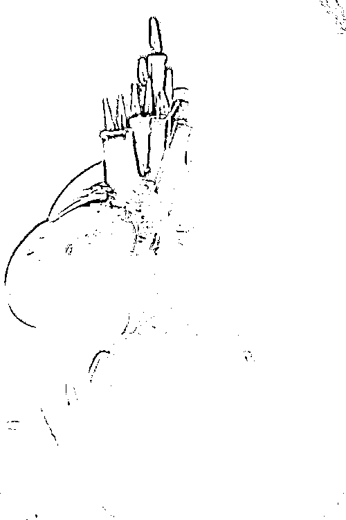火凯合相非常精准地指引了现实中苦难的疗愈，无论是集体还是个人层面的苦难，都需要我们从内在去执掌疗愈的力量，将疗愈的主动权还给自己。**放下在现实中受苦的表面机制，去深入智慧内核，找到自己的解药。****行动不利带来的挫败感也许会增强，但却需要在无法改变的事实、结果面前探索到新的疗愈契机。**火星将勇猛和急切、精准的体验带到我们面前来，战士对于伤口的认同如同他自身一般赤诚可贵。进入创伤核心，不加思索地投入你的智慧火焰，才是当下疗愈的正确打开方式。这个相位非常有助于一些**深入、激烈的灵性疗愈与探索**，对于想寻找创伤背后议题的人们能带来快速的开启。

**火冥四分**

**周期：6 月 21 日-7 月 13 日**

**重点影响人群：有个人行星、四轴、月亮交点位于白羊座、巨蟹座、天秤座、摩羯座 19°-29°，金牛座、狮子座、天蝎座、水瓶座 0°-5°的人。**

火星与高八度的火星——冥王星激烈四分，必将**助燃深藏的危机显化，让转化发生得激烈而迅猛。**冥王星在摩羯座尾度让我们感受到更多严峻的现实：随着疫情持续增加的失业率、破产，经济的困境让很多人的现实蒙上了阴影，并且无法在短期内快速恢复生产。火星四分冥王星，**愤怒与现实突发的挑战就会引起长期暗藏、压抑的阴影显化为生活中不得不采取行动的危机、绝境。**四分相威力十足地在告诉我们，火星的愤怒与行动力，冥王星的危机与绝境是势不两立的，火冥在激烈四分中各自在燃烧着。

我们会感受到现实中生命的权力被激烈地争夺，生死攸关的决斗会爆发。但在此我们要明白**冥王星透过死亡和黑暗提供了新生的可能性，旧有愤怒需要完全释放才能迎来新的生之力量，陈旧机制需要完全摧毁才能获得意志的胜利。**

**火冥四分期间，在公共场所要尽可能避免人多拥挤和不确定因素带来的危险。**在个人层面要**及时清理负面情绪，在工作中不要将压力扛到极致，周期性地休息和调整才能缓解冥王星底限抽空式的健康危机**。

撕破底限的争斗也许在所难免，但若为了勇气的胜利，可以让你与权威的对抗显得更有意义，将内在的权威感，你生命的主导权还给自己。

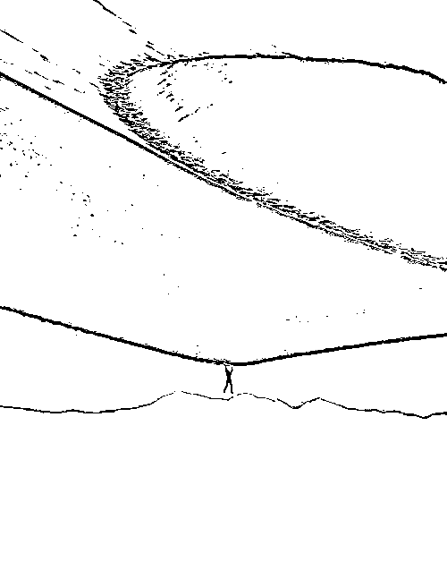

**火星与水星六分**

**周期：7 月 1 日-7 月 9 日**火星行至白羊座尾度时，还将与双子座尾度的水星形成六分相，在此过程中水星与火星都将换座：**7 月 5 日，水星进入巨蟹座，火星进入金牛座。**水火六分，会**令所有的行动变得有条理，水星将讯息加诸到行动的意图中，某种程度上会令火星的单纯显得钝化，进入短暂的调适与消化状态。**但很快会让我们**适应变化，有了灵活性与交流性**。在此期间大可**接受有益的建议去改善行动方案，对当下的问题会有全新的思考和定位。**因为水星、火星都在自己守护的星座里，快速和直接仍然是被支持的，而双子座的水星会引导我们进入思维、理性层面的发力与进攻。因此这也可视为**学习、考试、写作创作和演讲的极佳时期，任何一种验证学习成交的竞赛也能让我们大有可为。****写在最后**火星在 12 星座行进也是一种力量、意志力的学习、进化过程。火星除了接受战争，投入冒险，还需要开放小我的意识，去认识并臣服于更大的力量，比如令我们无法获胜的巨大背景，和我们需要认同的生命的周期性。火星的力量在于勇猛与谦卑协作，愤怒也可以在臣服的力量之下成为自我成长的养料。让情绪的毒瘤、积郁燃烧怠尽，才能助我们发出正确、有效的进攻，去完成个人的进化。每个人心中都有一个勇士，那是我们迎向太阳坚定奔跑的赤诚与谦卑的品质。

**版权声明：**原创文章由作者授权首发于若道平台，欢迎转发，反对抄袭。友号转载请申请白名单。

**郑玮玲**

ISAR（国际占星研究协会）认证占星师（2016 年获得）

若道占星专栏作者

将占星咨询、教学与音乐、舞蹈相结合的疗愈者

**微信号**：zhengviolin

**新浪微博**：@郑玮玲

**微信公众号**：Sampriya-Astrology

长按打赏

**20 位来自世界各地的占星师****带来 19 场沙龙——新世界的觉醒****详情可点击下图**

**学习占星学****点击下图了解课程详情**

**

**微信又双叒叕改版啦，不想错过若道君的推送？**
**就把若道设为星标吧！****▼**

**喜欢记得点一下在看哦☟**

**报名直达入口**

# 首发：ISAR 认证职业占星师必修课程 | 开启“爱好变职业”的创收自由之路

> 原文：[`mp.weixin.qq.com/s?__biz=MzA5NjA0NTAxNg==&mid=2651474544&idx=2&sn=a7aa61eadac077129dc73b0b7713af4b&chksm=8b48f8c7bc3f71d121a2f3a964e84e542a34e0a0b138cdce5fa2ca696b684fd0c3f731eea719&scene=126&sessionid=1692737812#rd`](http://mp.weixin.qq.com/s?__biz=MzA5NjA0NTAxNg==&mid=2651474544&idx=2&sn=a7aa61eadac077129dc73b0b7713af4b&chksm=8b48f8c7bc3f71d121a2f3a964e84e542a34e0a0b138cdce5fa2ca696b684fd0c3f731eea719&scene=126&sessionid=1692737812#rd)

**2022 年，是世界和中国 40 年未有之大变局的开始。**

俄乌战争打破了欧洲大陆乃至全世界的和平局面，而新冠疫情也给中国经济带来前所未有之挑战。

如果你关心经济形势和世界局势，你会有这种的感觉，我们将面临一场深刻的危机，而这不是短期内可以结束的。

**占星学的看法也是如此。**

4 月青年失业率（16 岁到 24 岁）中国达 18.2%，一些背着房贷、教育、医疗负担的中年人突然失业更是整个家庭整个难以承受之重。为了更好准备面对这样的时代变化，连《北京日报》这样的官方媒体也在呼吁：**“开拓副业，让自己有多元化发展的生存能力”。**

**而这门课程，就是为了这样一个目标准备的。**

**占星学是非常好的“开展副业”的选择**

这个**为期 16 个月**的课程通过并不算长的时间和并不算高的投资，不仅可以帮助你学到一个终身可用的技艺，而且也可以选择成为自助助人的占星师，**开启受益终生的第二事业。**未来是个体崛起的时代，大量个体被鼓励独立发展，比如网红、自由职业、自媒体、咨询师等，他们都不需要传统的办公室。社会越发达，人的独立性就越强，未来有能力的人都可以变成独立的经济体。

**占星学也是越老越好的职业**

和一些技术变化非常快的职业不同，**占星学的技术层面非常稳定，不会快速迭代变化，**同时，掌握好占星学、能够做一场好的咨询又需要个人自身大量实践和对生命的深刻理解，而这些都是时间和岁月带来的。

**占星学是现代社会需要的助人职业**

社会快速发展和变化人们似乎越来越无法掌控自己的生活，这给很多人带来巨大的焦虑，**抚慰心灵的咨询市场需求巨大。**而占星学可以让人从前所未有的角度了解自己，了解目前和未来所处的周期，挑战的意义，不论对于深入的个人成长探寻，还是预测未来的周期，都又其独一无二的价值。

**ISAR 认证职业占星师的独有培训**

目前占星学的培训市场鱼龙混杂。而 ISAR（国际占星研究协会）是一个包含了 47 个国家在内的国际占星组织，多年来致力于占星的教育和研究，提升占星教育的品质和职业占星师的能力，在国际占星领域备受尊重。今年，ISAR 对于成为 ISAR 认证职业占星师提出了更高的要求，**所有想要获得 ISAR 职业占星认证的申请者均需要在 ISAR 的附属学校通过 500 个小时的研习（包含****主课****、选修课、沙龙、作业、讲座、工作坊等等）。**

**而这门核心占星学课程就是为此而准备的。**

**你的占星核心课老师是谁？**

**拥有****51 年****占星实践经验的****若道创始人****前 ISAR 全球副主席****前 ISAR 全球职业占星师资质认证主席****大卫·瑞雷**

**和**

**2019 年第二届、2021 年第三届核心课中**

**与苏·汤普金斯老师****联合授课****的**

**ISAR 认证职业占星师**

**咔咔（Caroline）**

**二人合力打造**

**2022 年 ****若道全新核心占星课程**

**咔咔老师给同学的寄语：**

（向上滑动查看内容）

**亲爱的同学们：**

我为什么学占星学？

2000 年的时候我还是一个在网上搜索天蝎座和水瓶座配不配的普通白领。我搜索的内容还包括了水瓶座为什么总是这么若即若离？

体贴的搜索引擎给我推送了占星学、行星、星座、宫位、相位等资料，还让我了解到莉莉丝、月亮交点、截夺宫位等占星学概念。

2000 年 10 月我了解到，一个从业 30 多年的美国职业占星师大卫·瑞雷来到了中国，和他的中国合伙人将开办一个专业教授占星学知识的课程。过去 10 个月在网上东拼西凑的占星学知识唤起了我对占星学的兴趣，但是已经不能满足我对星图深度分析的需求了。

2013 年，我通过了若道核心课程的毕业考试和国际占星师研究协会的认证考试。2015 年我离开职场成为一名全职占星师。

到底学习占星带给了我什么呢？

1、它是自我觉知的工具，我现在已经不去纠结哪些星座是否匹配，我相信外在的事件是内在心理矛盾的显化。也就是说，想找到令人满足的亲密关系，要先去了解自己的情感模式和需求，而不是无意识地一次次地试错和撞墙。我开始学习自我关怀和接纳自己。

2、它带来看待世界的全新和全景的角度，天上如是，地下亦然。人类社会和个人生命的进化都有其周期和相似性，作为个体，占星学帮助我思考如何更积极和有建设性地与宇宙的能量合作，认识自己，发挥自己的潜力，度过有意义且自我满足的人生。

3、它带来了全新的职业：占星师和占星老师。除了收入，还有助人育人的满足感和意义感。

4、它带来一群志同道合的伙伴，我们彼此联结又相互独立。

作为中国占星界的“黄埔军校”若道占星的学生、助教和老师，我与很多学员在人生的不同阶段带着各异的需求走进了这所学校，2022-2023 年一年半的若道核心课程设计既蕴含了大卫·瑞雷老师的教学精华，也带入了我在跟随不同国外占星老师学习、助教和教学积累的心得。

有一些学员毕业后从事了占星咨询工作，有的在各大平台成为专业占星学知识的输出者和传播者，有的运用占星学提升他们的工作，也有的在占星学与投资，占星学与名人/八卦、占星学与原生家庭、亲密关系、亲子关系等领域收获了有用的或者有趣的体验。

对我来说，生命是一场自我完整的体验之旅。从 2011 年的那个春节在若道入学之后，我的生命旅程更加充实、有意义、有目标，也更有满足感。

希望在 2022-2023 年的若道核心课程里见到你。希望你此后的生命旅程里，有若道，有占星学。

占星师咔咔

2022 年 5 月 24 日

**大卫老师给同学的寄语：**

（向上滑动查看内容）

亲爱的学员们：

感谢你对我们从 8 月 30 日开始的若道 L1-5 级核心课程的兴趣。我和合作老师咔咔以及我们的核心课程团队期待着为你提供这个机会，来教授各种高品质的地道占星学知识和技巧。

对于那些希望获得 ISAR 职业占星师认证的学生，这是一门适合你的课程！

作为 ISAR 咨询技能培训的一部分，我曾与咔咔合作过，我们期待着再次合作。咔咔和我曾在 ISAR 职业占星师认证委员会（CAP ISAR）一起工作，我们非常熟悉获得 ISAR 职业认证的流程。作为你的老师，我们将陪伴你整个占星学发现之旅，帮助你逐渐认识到占星学有多么的神奇。此外，你还将受益于我们若道的助教和课程顾问，他们是若道核心课程计划的重要组成部分，提供在线沙龙、组织学习小组、指导家庭作业。我们的教育团队是“服务于你的团队”，所以也会根据你的需求进行相应的调整。你专用的核心课程微信群也促进了你的学习过程，使你能够每天与你的同学们一起学习、探讨、成长。

52 年前，当我开始学习占星学时，没有一所像若道这样的学校。如果有这样一所学校，我会尽一切可能在那里成为一名学生。事实上，我很幸运，我的老师都是经验丰富的专业占星师。然而，我花了 6 年的学习时间才通过 1976 年在美国乔治亚州亚特兰大举行的专业占星师考试，又花了 2 年的专业实践时间才通过占星学谋生。我永远不会忘记从 1970 年到 1978 年的 8 年，那些日子的反复试验教会了我如何苦练占星学。作为老师，我一直在努力传授我早年所学的知识，让你的旅程更加顺利，更加全面。

自 1978 年以来，44 年的全职实践教会了我很多，我很高兴有机会与大家分享我所学到的东西。我和咔咔都是现代占星师，虽然我们尊重西方占星学的历史和传统，但我们实践和教授的占星学植根于现代人本主义哲学，这种哲学旨在提高你对自身潜力的认识，并鼓励个人成长。还有什么比了解自己更实际的呢？还有什么比个人成长和发展潜力更有利的呢？这是你将要学习的占星学，一种可以应用于你自己生活的占星学，一种可以为你提供一个充实职业的占星学。

教书是我回馈占星学行业的方式，这个行业拓展了我的视野，远远超出了我曾经想象的可能。谢谢你给我这个机会做你的老师。

大卫·瑞雷

2022 年 5 月 24 日

**连报 L1-5 全阶网络直播课程，你可以享受**

❶64 次线上直播互动网络课程+2 场工作坊，全面而详细地讲解占星学知识、技能、案例和重要领域实践运用。

❷ 知识点+学员星图解读有机结合：咔咔老师以讲解知识点和中外名人案例为主，大卫·瑞雷老师以参课学员案例演示及客户案例为主，每个知识点覆盖班级内学员的亲身案例，参与感更强，多位学员都有机会听到自己的星图分析。

❸ 微信群学员互动分享，从真实案例学习生命成长故事。

❹ APP 答疑论坛提问：论坛上每个学员的问题都将得到及时回复。

❺ 若道独有的职业占星师养成计划，为你毕业后独立咨询做准备。

**❻ **提供**咨询平台**，只要努力，优秀毕业生有机会入驻**若道咨询平台**，拓展咨询客户群。

**更多了解老师和助教？**

**大卫·瑞雷（David Railey）**

*   **I****SAR 董事会成员，ISAR 全球副主席，ISAR 全球职业占星师资质认证主席，若道占星创始人**。

*   1976 年，通过美国亚特兰大职业占星师考试，成为全职占星师，随后通过**全美占星师联盟（AFAN）和国际占星协会（ISAR）职业测试**。

*   1980 年，与**杰夫·焦耳**一起在亚特兰大创建“**每日行星**”占星学中心。此后在亚特兰大占星协会担任 4 年考官，并且两次担任**亚特兰大地区占星协会主席**。

*   1979-1992 年，作为占星师活跃于美国社会媒体，向不了解现代占星学变化的大众宣传专业占星学知识。在 1989-1992 年期间，他在 WRGG 电台 12 频道每周主持个人电视秀“今日占星学”，早先他还在 WRFG 的广播节目中播讲宇宙天气节目。 

*   2010-2014 年，任**全美占星师联盟（AFAN）监督委员会委员**。

*   2010 年，其著作**《灵魂的目标》**中文版出版，和蒋颖一起创办**若道占星**学校和其官网 www.nodoor.com。从该年开始，他工作并往返于亚特兰大和北京。目前他 80%的时间致力于在中国教授和推广西方占星学。

*   2016-2019 年，被选为国际占星协会（ISAR）考试委员会成员，国际占星协会（ISAR）是世界最大的国际占星机构，会员遍布 47 个国家。

*   2017-2020 年，被选为国际占星联盟（ISAR）考试委员会主席，理事会成员。

**占星师咔咔（Caroline）**

2010 年师从美国占星师大卫·瑞雷学习，并得到世界名师斯蒂芬·弗里斯特、罗伯特·汉德、苏·汤普金斯传授各种占星学技法。若道首届学员，国内最早获得 ISAR 职业占星师资质的职业占星师，现兼任若道占星核心课程助教。

在国际知名广告公司和市场研究公司从事的市场研究和推广工作十余年，曾任职于阳狮集团、尼尔森市场研究有限公司、MTV 和《Madame Figaro》杂志。

**助教王嘉祺 （Conrad）**

ISAR 认证占星师、若道认证生时校正资质，从 2010 年起自学占星学，2015 年开始在若道系统学习，并开始个案咨询。2018 年担任若道核心课程助教，以及卜卦占星学和太阳返照选修课助教，并带领学员进行经世占星和太阳返照方面的研究。2019 年 11 月作为演讲人之一参加了国际占星协会（ISAR）北京大会，也是 ISAR 星空俱乐部中国区第 16 期的主讲人。

**什么人适合这门课？**

*   对占星学有浓厚兴趣，想要系统学习占星学。
*   对占星学有一定基础，但不知道该如何整合星图复杂的碎片。
*   希望成为优秀的占星师，想要借鉴国际大师解读思路并融入自己的体系。
*   想学习占星学，但不擅长英文，希望有中文老师授课。
*   想结合占星学理论与咨询实践。
*   走在自我探索和个人成长道路上的人。

**课程费用**

**★ 1-5 阶 连报**

**早鸟价：33000 元（2022 年８月 1 日之前）**

**课程费用：46500 元** **★ 1-2 阶 （8 月 30 日开课）**

**早鸟价：2800 元（2022 年８月１日之前）**

**课程费用：3500 元 ****★ 1-3 阶　连报**

**早鸟价：10500 元（2020 年８月１日之前）**

**课程费用：11500 元 **

**咨询课程请联系顾问**：**王老师（微信/手机：18510107057，请备注“大卫核心课”）**

**退转课程**

**退款原则请详看《教学协议》，如有疑问请咨询课程顾问。**

****2022 L1-5 认证职业占星师必修课程****

**授课老师：大卫·瑞雷、咔咔**

**直播课开课时间：2022 年 8 月 30 日（周二）开**

**授课方式：******网络授课，英文/中文授课，中文翻译****

**费用：****1-5 阶连报**：46500 元**（早鸟价 33000 元,8 月 1 日前）；**1-2 阶**：**3500 元**（早鸟价 2800 元,8 月 1 日前）**；****1-3 阶**：**11500 元**（早鸟价 10500 元,8 月 1 日前）**；

**课程负责人：王老师**（微信/手机：18510107057，请备注“大卫核心课”）

长按二维码添加课程负责人咨询~

****报名直达入口****

# 这个北交点的人生精彩之处，在于不断追求“爱与自由”

> 原文：[`mp.weixin.qq.com/s?__biz=MzA5NjA0NTAxNg==&mid=2651474387&idx=1&sn=c7540be678db6255d8a705d6a9eccf42&chksm=8b48fb64bc3f7272015a4ac7dcc971c4c794642726f8be8ff1b4c256adc0863c915e19b39923&scene=126&sessionid=1692737812#rd`](http://mp.weixin.qq.com/s?__biz=MzA5NjA0NTAxNg==&mid=2651474387&idx=1&sn=c7540be678db6255d8a705d6a9eccf42&chksm=8b48fb64bc3f7272015a4ac7dcc971c4c794642726f8be8ff1b4c256adc0863c915e19b39923&scene=126&sessionid=1692737812#rd)

☆****后台回复“今日”，给你一句生命态度****

作者/简·斯皮勒 译者/Shirley 校对/江艺编辑/玫瑰 封面/书君 图片/pexels

南交点水瓶座-北交点狮子座今生最大的功课会是什么？他们最擅长和最需要学习的分别是什么？今天就带你一起来看看！

**北交点狮子座/第五宫综述**

**发展的特质**

在这些领域的努力有助于解锁隐藏的天赋才华： 

**· **个性**· **愿意成为“舞台中心”**· **遵循内心的渴望**· **增强意志力**· **热情**· **自信**· **冒险**· **与他人身上孩子气的特质关联**· **享受生活——玩乐**· **将生活视为一场游戏**· **发展“这由我决定”的态度

**要放下的倾向**

努力减少这些倾向的影响有助于让生活更轻松、更愉快

**·** 为了“归属感”而屈服于同龄人的压力**· **疏离于情绪状态**· **冷漠**· **等待他人催促自己采取行动**· **“忽略”到底发生了什么**· **在采取行动前等待“更多”知识**· **过度的白日梦**· **逃避对抗

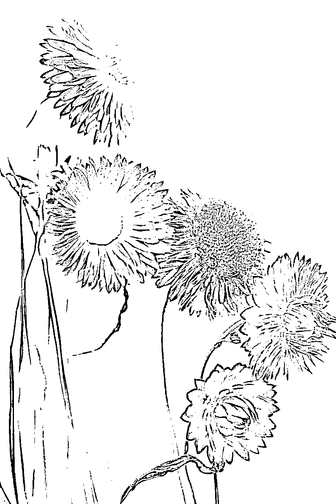

**阿喀琉斯之踵/避免的陷阱/底线**

对于北交点狮子座的人来说，他们需要意识到的致命弱点是：**他们最重要的需求是感受到被同龄人接纳（“如果我只是与生活合作，‘跟从大家的意见’，我的同伴会自动支持我，给我带来幸福”）。**但这是一个无底洞：他们的朋友永远无法给他们足够的支持，让他们作为个体脱颖而出，利用生活带来的激动人心的机会。**他们需要成为自己最好的朋友，鼓励自己追求那些能给他们带来幸福的东西。****他们需要避免的陷阱是无休止地寻找知识（“如果我有足够的知识，我会有信心采取创造性的行动”）。**他们永远不会觉得自己有足够的知识来确保创造性行动的成功，所以他们继续“随大流”，等待幸福来找到他们。最重要的是，在某个时刻，他们必须承担风险，开始创造自己的幸福。具有讽刺意味的是，**一旦他们采取行动并开始创造幸福，他们所需的成功的知识就会毫不费力地降临到他们身上。**

**这些人真正的诉求**

**北交点狮子座的人真正想要的是得到爱。**他们需要**体验他人的爱的能量，这几乎是无法满足的。**要想成功地将这种能量带入他们的生活，他们首先需要通过**让人们高兴**来给予爱，因为他们知道如何利用聚光灯来让他人快乐。通过**发挥创造力为他人的幸福做出贡献，他们创造了一个“观众”，或一个支持他们、接受他们、爱他们的同龄人群体。**对于北交点狮子座的人来说，“走上正轨”的最佳晴雨表是**其他人的掌声和认可**。在给予幸福的过程中，只要**与自己的人道主义理想保持一致，他们就会获得回报**，因为他们知道自己是生命之流中的重要参与者。

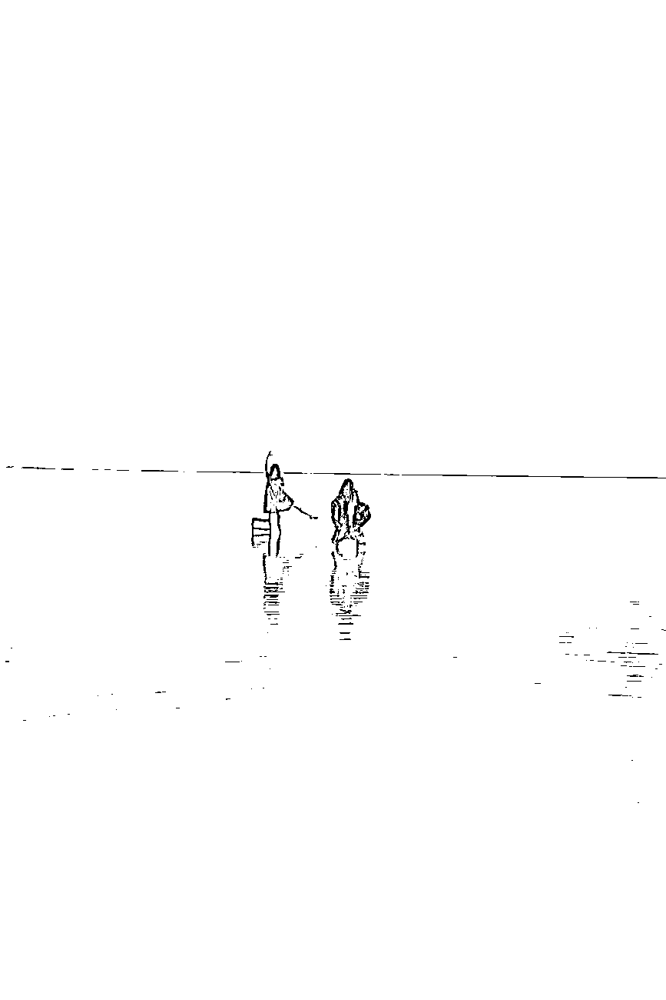

**天赋/职业**

这些人适合做奖赏个人创造性努力的职业。**娱乐（唱歌、表演等）、创业或其他处于舞台中心、以建设性的方式**释放他们巨大的创造力的方式，给所有人带来欢乐。其他好的选择包括**与孩子打交道的活动、炒股、游戏和运动。**北交点狮子座的人也有**客观**的天赋，他们可以**准确地看到“游戏”是什么**。当这项技能被用于实现对他们来说有趣的目标的背景时，他们客观地看待事物的能力就成为了一种资产。然而，**如果他们从事以客观为目标的职业（科学家、发明家、工程师、X 光技师等），他们的生活可能会变得缺乏活力和欢乐。他们最好在极具创意的项目中使用这种天赋。****狮子座北交点特定的疗愈誓言****· **“唯一能创造我幸福的人就是我。”**· **“如果我玩得开心，我就走上正轨了。”**· **“当我跟随内在小孩的冲动时，我就赢了。”**· **“当我积极创造我想要的结果时，我就赢了。”**· **“当我与他人的内在孩子建立联系时，每个人都会赢。”**· **“当我给别人带来欢乐时，我感到自己被包容了。”**北交点狮子座/第五宫的个性**

**前世**

北交点狮子座的人在许多前世中都在**旁观他人的互动**。他们是**科学家、观察者，是那些为了促进人道主义事业和理想而牺牲个人身份的人。**他们习惯于**将自己的创造力与他人的梦想和愿望联系起来，而不考虑自己的需求和愿望。**因此，在前世的生活中，他们**失去了与内在小孩的生命活力的联系**。在这一世中，他们再次下意识地选择了**否定内在小孩的环境，以便解决这个问题，并重新与他们的生命活力取得联系。**他们可能出生在一个暴力家庭，在那里，对父母行为的客观观察关系到生存。或者，他们可能出生在一个酗酒的家庭，在这个家庭中，父母一方或双方的情绪反应是不可预测的，因为他们无法信任看护者，所以唯一安全的方法就是压抑他们的情绪。

或者，他们在很小的时候就失去了父母，这给了他们额外的责任感，他们觉得“只做个孩子”是不行的。

这些人在许多的前世中是客观的，并且从科学的角度来看问题，所以在这一世中，他们真的很害怕卷入其中。他们害怕失去客观性；潜意识里，他们觉得这是过去唯一能让他们安全的东西。但这一生是**关于参与和学习如何玩耍！**他们在太多的轮回中采取了**沉闷、科学的方法**，在这个星球上度过了太多没有乐趣的转世——所以这一次他们需要**朝着享受自己的方向走。**和孩子们在一起时，他们自己内在的小孩会反射回来。当他们看到孩子们玩耍，简单地做自己时，这会激励这些人一起玩耍，参与生活。这就是他们的挑战——**回到生命活力的中心。**

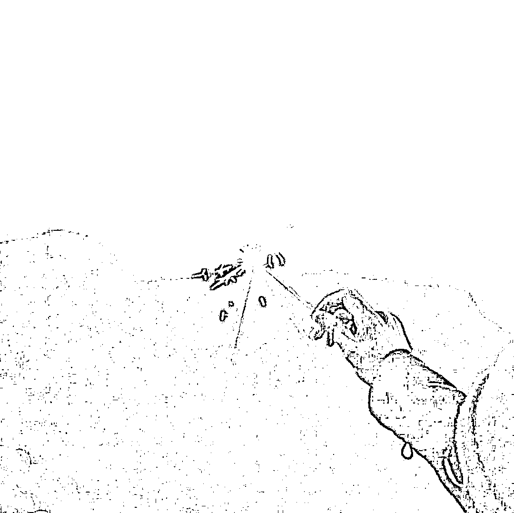

由于前世的科学取向，北交点狮子座人带着**“实验室客观性”**进入这一世——**继续观察而不寻求改变，或以任何方式干扰数据。**这使他们能够非常清楚和准确地了解正在发生的事情。然而，如果过度认同“重要观察者”的角色，这可能会成为一种自我满足，他们会退后一步，对其他人做出判断，并感到优越。他们可能会采取这样的方式：“我们要打破所有的胡说八道，直言不讳！”然后，当他们看到对方脸上的表情时，会感觉很糟糕。但他们的大脑会说：“好吧，我说了！我会坚持的！”他们适应了僵化的立场。然而，在这一生中，这些人面临的挑战是，**以积极的方式向他人指出正在发生的事情，让他们开怀大笑和（或）帮助他们改变观点，减轻负担。**这一次，狮子座北交点的人不仅需要**看到正在发生的事情，还需要积极参与将“事实”转化为对所有相关方有利的事情，包括他们自己。**在这一世的化身中，他们的人生目标是**学习如何得到他们想要的，不是通过超然，而是通过强烈的参与。****观察与行动**

北交点狮子座的人有时会觉得自己被其他人的戏剧所淹没，他们自己只是坐在后面——尽管他们能清楚地看到墙上的文字，但无能为力。

他们认为其他人可以调整他们的行动路线，“乘风破浪”，改变方向，从当前的条件中获胜。但是狮子座北交点的人经常感觉到他们在观察风向的变化，并意识到海浪的存在，但似乎无法与能量联系起来并利用这种情况。

这些人“被困”在创造性钟摆的一边。为了成功地实现梦想，这个过程包括**观察和行动。**有时，有必要用力拉动绳索，以物理方式操纵船只，在船只移动时恢复平衡，将重物移动到平衡位置，为新的方向做好准备，“未雨绸缪”，为变化做好准备。这一定会消耗大量的能量。对主导力量的准确观察是创造过程中同样重要的一部分，这样所有的能量都会朝着正确的方向消耗。**狮子座北交点的人在观察方面很出色，但他们必须记住，为了改变物质世界，必须采取行动。**

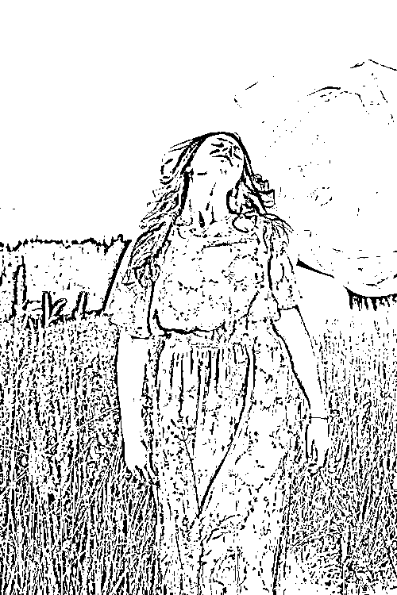

**北交点狮子座/第五宫的需求**

**个人成长**

**这些人迫切需要认可的能量。**他们在许多的前世化身中都很超然，成为“无名小卒”，以至于在这个化身中，他们**害怕成为“大人物”，害怕成为自己**。通过在许多转世中将自己的身份升华为更大的事业，他们已经不知道自己是谁。这使他们成为非常优秀的演员；他们**愿意扮演别人的角色，以获得他们非常需要的认可。**事实上，对积极参与的认可和赞扬对这些人来说是健康的，因为这是他们积极个性的基础。

**发展自我**

**自我的功能（正如本章所讨论的）是表达欲望，将个人的欲望和需求与世界其他地方交织在一起。**自我用言语表达个人想要去的方向。它是意志的决策者和激活者。北交点狮子座的人在过去的许多转世中都**沉浸在一种基于“应该”和“应当”的“超我”心态中——这是由社会、家庭、宗教或人道主义理想意识决定的道德。**结果，他们失去了与个人自我的联系——对作为个体的自我的意识，拥有个人的需求和方向。他们意识到自己的本我——他们对事物的自发“本能反应”和他们的超我意识，但他们没有与作为两者之间的调停者的自我建立联结。因此，他们倾向于**在过于随和以及允许他人凌驾于他们之上中间摇摆，并对自己的“公平线”遭到侵犯而爆发愤怒。**通常他们甚至不明白发生了什么，他们发现很难向自己或他人解释自己的愤怒。**如果没有自我意识来帮助他们做出正确的决定，这些人可能会变得异常固执。**如果他们认为自己不能因为基于知识的原因（应该、应当、道德或精神信仰）离开某个环境，即使他们的直觉告诉他们这不健康，他们无论如何都会留下来。如果他们将这种固执转化为积极追求目标的决心，这种固执可能会对他们有利，但当他们处于停滞、受限的状态时，这种固执会对他们不利。**他们保持不变的动机也可能是安全、保障和对变化的恐惧。**通常，他们会**在旧的环境中寻找新的挑战，让自己感觉充满创造力，从而将自己的惰性转化为积极的东西。**但事实是，如果他们只能做到这一点，最终将变成自我限制。如果给自己设定一个时间限制，他们可能会有勇气挣脱束缚。他们可以**利用预定的时间为跳入新生活做好准备。当他们下定决心，拒绝考虑任何其他选择时，就会激活自己的意志，突然拥有改变的力量和能量。**在这个转世中，北交点狮子座的人们要在此**有意识地发展一个健康的自我。**他们面临的挑战是**通过验证自我来强化自我，口头传达他们从超我的角度所感知到的，以及他们在本我中所经历的（他们的本能反应）。**例如他们可以说：“我知道我不应该为此生气，因为你今天工作很辛苦；你很累，你只是想忘记与人打交道。但当你回家后，拿起报纸，扑通一声坐在电视机前，不跟我说话时，我会感到非常不安。我想每天晚上创造一些时间来关心彼此，恢复我们的关系。”

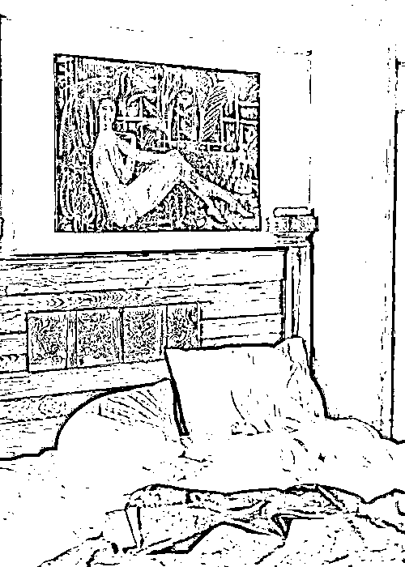

一旦这些人在不审查自己的的情况下说出了自己的事实，表达了自己的感受和需求，他们便开始发展自己独特的个性。这需要巨大的勇气，但这是这些人在一个重要、坚实的层面上扎根和融入自己的唯一途径。当他们以充满爱但坚定的方式表达他们的超我和本我观点时，创造性的解决方案就会显现出来，他们的自我变得更加强大，其他人开始注意他们所说的话。如果他们不把自己的感受强烈地传达给他人，人们又怎么能真正了解他们，给他们想要的呢？有意识地通过自己的成就来发展自我，这些人可以坚持正确的行动方式，也可以让他人与他们的超我建立更多联结。**通过分享所看到的大局，交流本我的直觉反应，他们帮助他人拥有更广阔的视野，考虑到每个人的最佳利益。**

**版权声明：**本文由若道翻译发布，欢迎转发，反对抄袭。友号转载请申请白名单。

**简·斯皮勒**

全球占星界的一位领军人物，是美国占星师联盟（AFAN）的教员。她定期在新时代和占星回忆上授课，是畅销书《新月占星学》、《灵魂占星》、《灵性占星学》和《宇宙之爱》的作者。

**20 位来自世界各地的占星师****带来 19 场沙龙——新世界的觉醒****详情可点击下图**

**学习占星学****点击下图了解课程详情**

**

**微信又双叒叕改版啦，不想错过若道君的推送？**
**就把若道设为星标吧！****▼**

**喜欢记得点一下在看哦☟**

**报名直达入口**

# 神话塔罗之大阿卡纳牌｜皇后

> 原文：[`mp.weixin.qq.com/s?__biz=MzA5NjA0NTAxNg==&mid=2651474387&idx=2&sn=3cfd3a87cf571baaff3cfe4e3445cf0b&chksm=8b48fb64bc3f72720426fdb4ae9fbc197bf0b794e6979f1422a64ac638a91b929184b74f9941&scene=126&sessionid=1692737812#rd`](http://mp.weixin.qq.com/s?__biz=MzA5NjA0NTAxNg==&mid=2651474387&idx=2&sn=3cfd3a87cf571baaff3cfe4e3445cf0b&chksm=8b48fb64bc3f72720426fdb4ae9fbc197bf0b794e6979f1422a64ac638a91b929184b74f9941&scene=126&sessionid=1692737812#rd)

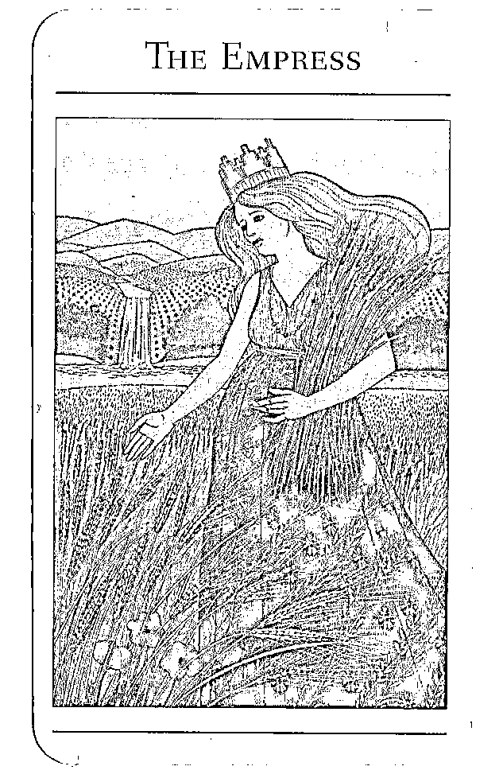

作者/朱丽叶·沙曼-伯克 丽兹·格林

译者/闫东升 编辑/玫瑰 图片/神话塔罗 网络

本文节选自《神话塔罗》

塔罗是什么？这 78 张彩色画片又能够告诉我们什么？塔罗 TA 可以探寻过去、解读未来，但更重要的是明晰当下，洞察自我。为我们厘清眼前这纷繁杂乱的思绪，回归最真实的自己。今天来解读大阿卡纳牌——皇后。

[🔈 神话塔罗·皇后](https://res.wx.qq.com/voice/getvoice?mediaid=MzA5NjA0NTAxNl8yNjUxNDc0Mzg2)

**｜**朗读者小巫

**书名：**

神话塔罗 

**作者：**

朱丽叶·沙曼-伯克   丽兹·格林 

**出版日期：**

2011-08-02

皇后对应的希腊神祗 **德墨忒尔·谷物之神****孕育万物的女子**

皇后牌的图像描绘的是一位拥有一头褐色长发的（带有明显土元素特质的）美丽女人，她从容地站在成熟的麦田中，从微微隆起的小腹上看明显怀有身孕。她身穿印着各种植物图案的长袍，不同种类的绿色叶子层叠渐进。

镶嵌着 12 颗珍贵宝石的项链环绕着她优雅的颈部，头上高耸的皇冠像一个城堡。她身后的背景是一片肥沃的土地，一条玉带般的河流从山上倾泻而下，流进距离她不远处的水潭中。

**· 德墨忒尔（*Demeter*）头戴城堡形状的皇冠：**象征了她掌管着用石头和木材建造的家园，用以获得和平与安全之处所的本能；

**· 从山上倾泻而下的瀑布**：反映了德墨忒尔的世界中滋养的力量和情感之流。她掌管着婚姻与结合的赐福；

**·** **12 颗宝石镶嵌而成的项链**：象征着黄道 12 星座。作为自然界的主宰，德墨忒尔掌管着季节的循环和宇宙的律则。

**凛冬将至，只因她**

在这里我们遇到了伟大的女神德墨忒尔，她是地球之母，主宰自然律则和保护没有防御能力的幼小生物的女性神灵。希腊神话中，德墨忒尔能够带来每年的丰收，每年夏末的时候人们都会对她的慷慨表达感恩之情。

**德墨忒尔掌管着自然界规律性的循环和万物的生长**，因此她身穿着由各种植物织就的长袍。**她还主宰着生命的孕育和新生，以及福佑着婚姻——这个承载着自然界循环往复、生生不息的力量的容器。**

德墨忒尔是一个典型的象征母系氏族的女神，是地球所拥有的力量的意象，她并不需要来自天国的灵性授权。据说她能够教会男人耕种的艺术，教会女人研磨小麦和烘烤面包的技巧。 德墨忒尔和女儿波西凤（*Persephone*）住在一起，她庇护着女儿，避开外界的一切纷乱和争斗。但是某天，这种和平与宁静被打碎了，幸福的生活忽然彻底地改变了。波西凤出去散步以后，就再也没有回来。极度痛苦的德墨忒尔搜遍了世界的各个角落，但是波西凤就像凭空消失了一般毫无踪迹。

最后经过很多年绝望地追寻，她终于得到了女儿的消息。原来是居于地府的冥王哈迪斯（*Hades*），因为无法压抑对处女的渴望，驾着由两匹黑色战马拉着的双轮战车升出地面，绑架了正在散步的波西凤。

德墨忒尔盛怒之下令大地限于贫瘠，往日的富足繁茂一去不返。

在哈迪斯的威逼利诱之下，波西凤自愿吃了地府世界的石榴果，成为了哈迪斯的皇后，但德墨忒尔无法接受女儿身上发生的这一切，所以大地上生存的所有人类都跟着忍受饥饿之苦，面临着灭亡的危机。

|德墨忒尔和波西风

最后幸亏聪明伶俐和无所不知的赫密士（*Hermes*）出面调节，德墨忒尔和哈迪斯才达成了妥协。此后每年的九个月，波西凤都回来和母亲生活在一起，另外三个月则在冥府中陪伴在丈夫哈迪斯身边。

德墨忒尔虽然妥协了，但一直没有对这个协议完全释怀，每年波西凤离开她的日子，这位地球之母都痛苦万分，这个阶段花儿凋谢、落叶飘零，大地变得冰冷且毫无生机。当波西凤回来探望她的时候，春天就又一次翩然而至。

**大自然的智慧 vs 灵性的匮乏**

从人们内在的层面来看，**德墨忒尔－皇后的意象，反映出母性的特质**。这并不是仅仅意味着现实中的孕育、分娩和滋养（无助的）婴幼儿的过程。

它也反映出每个人内在**伟大母亲（*Great Mother*）**的体验：**发现身体的价值并珍惜它；懂得身体是自然界的一部分并一直根植于自然；感恩每天与身体同在的感受和它所带来的最简单的快乐**。

如果没有内在的伟大母亲，我们就不能孕育出任何成果，因为她能够使我们用耐心去温柔地等待适当的时机，为自己的目标付诸行动。没有了她的存在，我们就不会对现实的自我怀有感恩之情，只活在纯粹智力的层面上，失去对现实世界的尊重和与它的联结。

**孩子对母亲的经验与对生命的安全感和信任紧密相关，因此皇后的意象就反映出了人们内在的防卫能力和安全感。**她是非常有智慧的，但并非属于头脑层面，她拥有的是自然的智慧，明白万物都要循环往复，成熟需要等待恰当的时机。

但是和所有塔罗牌的形象一样，德墨忒尔也有她的黑暗面。**只有自然属性就意味着灵性力量的匮乏或阻滞，从而破坏了改变的可能性。**

德墨忒尔不仅仅是孕育和滋养的伟大母亲，她也是一个非常哀伤的母亲，不愿意放弃自己所拥有的东西，对于任何导致生命改变的外力都很排斥，就像伊甸园的世界一样。

哀伤的母亲可能会常常被酸楚和痛苦纠缠，因为生命需要改变，需要经历分离，死亡（结束）是必然的。因此当愚人在他的原型旅程中遇到德墨忒尔－皇后的时候，他就要去信任自己本能属性中的黑暗和光明两个面向。

**皇后，母性的滋养**

从解牌的角度来看，**翻出皇后的牌面表明当事人要更多地涉入生命中现实的领域，可能是婚姻的结合、孕育孩子、艺术创作或者某种创造性结果的获得，因为这些都需要伟大母亲的耐心和滋养**。

通过这张牌我们进入了身体和本能的领域，那里可能有和平但也有瘀滞，可能给予生命也可能扼杀生命。愚人这个来自天国的孩子，在这里发现了自己居住在物质性的身体中，开始知道自己不仅仅是灵性的，也是物质性的。

**版权声明：**本文由《自在园》授权发布，欢迎转发，反对抄袭。友号转载请申请白名单。

**神话塔罗系列**

[开篇](http://mp.weixin.qq.com/s?__biz=MzA5NjA0NTAxNg==&mid=2651451590&idx=2&sn=41c1083542bcf098de303e29a028ff20&chksm=8b4b4271bc3ccb67d5d53c143cd5a17c24b7b60e5b1051949fa9f086f90b4ab04877976c47e5&scene=21#wechat_redirect)丨[愚人](http://mp.weixin.qq.com/s?__biz=MzA5NjA0NTAxNg==&mid=2651452189&idx=2&sn=f4cc6e768e367fbdb0f69b9c6382443d&chksm=8b4b41aabc3cc8bcdbd952d91d8408014a799224d3f67ab50bb5cbe88ee0090afc92869de1a6&scene=21#wechat_redirect)丨[魔术师](http://mp.weixin.qq.com/s?__biz=MzA5NjA0NTAxNg==&mid=2651453528&idx=2&sn=3ca9b35e1736168eef1856274635224a&chksm=8b4b4aefbc3cc3f965f2531f8c0d37da2e66a2b47139d445df1ea35eeb74bdf3b6827236741a&scene=21#wechat_redirect)

**朱丽叶·沙曼·伯克**从 20 世纪 70 年代早期开始，就对塔罗牌产生了兴趣，并踏入了塔罗的世界。后来，在丽兹·格林的鼓励下，开始研习心理占星学和塔罗。1984 年，第一本书《塔罗全书》（The Complete Book ofTarot）出版。之后，与丽兹·格林合作设计并撰写了《神话塔罗》（The Mythic Tarot）。朱丽叶写了十本塔罗和占星学书，包括一本名为《众星的传说》（Stories from the Stars）的儿童读物，以及与丽兹·格林合著的《神话之旅》（The Mythic Journey），这是一本详细讲述如何运用神话来指导生活的书。

**点击下图了解课程详情** 

**微信又双叒叕改版啦，不想错过若道君的推送？****就把若道设为星标吧！****▼**

**喜欢记得点一下在看哦☟**

************报名直达入口************

# 2022 年神话塔罗认证课程 | 开启职业塔罗师的神话之旅

> 原文：[`mp.weixin.qq.com/s?__biz=MzA5NjA0NTAxNg==&mid=2651474387&idx=3&sn=5586e488f5320fc5033ae217e99c81e4&chksm=8b48fb64bc3f7272fcb3d88d9f87c5bd5aa98ff70a7eaed875c6ba5f03c45ac588ea901d9d0d&scene=126&sessionid=1692737812#rd`](http://mp.weixin.qq.com/s?__biz=MzA5NjA0NTAxNg==&mid=2651474387&idx=3&sn=5586e488f5320fc5033ae217e99c81e4&chksm=8b48fb64bc3f7272fcb3d88d9f87c5bd5aa98ff70a7eaed875c6ba5f03c45ac588ea901d9d0d&scene=126&sessionid=1692737812#rd)

**2022 年超高含金量的神话塔罗认证课程强势回归**课程内容体系让你**直观精准**的感受**神话塔罗的魅力**扎实的建构**神话塔罗思维****系统**学习**最地道的塔罗知识**

课程中老师传授**将神话、占星、心理学完美融合进塔罗**的人本主义咨询体系，并进行**学员案例督导**，让你更自信的开展咨询工作，学以致用。

本期认证课程采取**即报即学的录播课+案例督导直播课**的形式，

*   **18 节录播课：**精编剪辑，随来随学，助教答疑，学练结合。

*   **8 节直播课：**融会贯通，神话心理，塔罗占星，咨询技巧。

为了适配大家的各种学习场景，提高学习&复习效率，我们还将**录播课**剪辑了**中文字幕版**和**翻译音频版**：

*   **中文字幕版：**朱丽叶老师英文原声配中文字幕，适合在手机或电脑前专心致志的学习。

*   **翻译音频版：**翻译老师幼婷的中文原声纯享，适合运动、通勤路上耳机里陪伴式学习。

若道还为塔罗学员开发了**“神话塔罗”APP**，是随身的工具，更是接咨询的平台，录播课程**学成入驻平台**即可链接更多塔罗个案，发展壮大你的塔罗咨询事业。

**如果你想学习塔罗，什么样的老师会让你怦然心动呢？她是三副塔罗牌的设计者，写了 6 本塔罗书籍。她研习塔罗四十余年，教授塔罗三十余年，是丽兹·格林的密友。还有****谁会比塔罗牌设计者更了解塔罗的历史、灵魂与精髓？****所以，这将是你开启塔罗之旅最坚实的一步。**

1

**这位塔罗大师是谁？**

**朱丽叶·沙曼-伯克** 

*   她是**3 副塔罗牌**的**设计者****——**神话塔罗牌、沙曼–卡塞利塔罗牌、“自己着色”塔罗牌；

*   她出版了**6 本塔罗书****——**《塔罗全书》、《新塔罗全书》、《众星的传说》、《理解塔罗牌》、《精通塔罗牌》、《塔罗初学者指南》；

*   她研习塔罗**四十余年；**

*   她教授塔罗**三十余年**；****

*   她是**丽兹·格林**的密友，两人合著了**《神话之旅》**，共同设计了**神话塔罗牌**。

*   她是认证的**心理治疗医师；**

*   她深谙**塔罗、占星学、心理学和神话学。**

**如果你想成为拥有英国神话塔罗认证的塔罗师**

那么她，就是你**最好的老师人选**

2

**塔罗牌有什么用？**

*   塔罗牌是一种**古老的疗愈工具**，同时也是**直观的解惑工具****；**

*   塔罗牌绕过逻辑思维，**和潜意识联结**，通过图像的方式生动地将隐藏在人类潜意识中的画面浮出水面，**揭示心灵的状况和运作****；**

*   塔罗牌**帮助我们和潜意识对话**，可以和现代的心理治疗联系在一起，帮助我们**看清心灵的冲突来源、本质和可以选择的道路；**

*   塔罗牌又和更广阔的**宇宙生命原型**联结，彰显**个人生命发展的阶段**，将**个人生命挣扎、内在冲突**放在生命进化的道途上，让更广大的生命智慧为个人成长照亮道路。

3

**为什么学习神话？**

神话通过**图像和故事**描绘人类生活的**原型模式**。通过瑰丽的想象、诗意的语言、栩栩如生的人物和故事描绘出我们内心的世界，表达出我们经历的那些实现人性的过程，帮助我们将**个体的生活与人类古老且永恒的故事**建立联结。从而在更深处**理解生命**，并学习**古老而长青的生命智慧**。

**神话塔罗**取材于**希腊神话**的无尽沃土，通过故事提供一种**记忆辅助**，在心理和预见层面提升解读的**丰富度**。因为这样更符合塔罗牌的性质，符合人类的想象。**按照故事思考，而不是简单的记忆关键词和固定的意义。**

4

**塔罗预测是什么？**

塔罗牌预测的运作就像是**照向心灵的一面镜子**。在塔罗牌解读时，图像的原型性质穿透隐藏的潜意识脉络，反应出与个人境遇相关但又未被了知的知识与洞见，因此**揭示出按照任何理性方式都无法发现的事情。**

如果你对生命好奇，塔罗学习会帮你**打开一扇通往未来的门****，**让你了解**心灵运作和显化的秘密**，同时赋予你更多关于生命成长的支持和指引的能力！

5

**我们将学习什么？**

**录播课（即报即学）**

**☆****初阶**

**神话塔罗详解、神话故事和预测意涵**

**第 1 讲 塔罗牌介绍 ，讲述它的历史 （中文字幕版）**

**第 1 讲 塔罗牌介绍，讲述它的历史（翻译音频版）**

**第 2 讲 星座形态、元素和宫廷牌&基本星座与基本国王 （中文字幕版）**

**第 2 讲 星座形态、元素和宫廷牌&基本星座与基本国王（翻译音频版）**

**第 3 讲 固定星座与固定王后（中文字幕版）**

**第 3 讲 固定星座与固定王后（翻译音频版）**

**第 4 讲 变动星座与变动骑士（中文字幕版）**

**第 4 讲 变动星座与变动骑士（翻译音频版）**

**第 5 讲 小阿尔卡那牌权杖（中文字幕版）**

**第 5 讲 小阿尔卡那牌权杖（翻译音频版）**

**第 6 讲 小阿尔卡那牌圣杯（中文字幕版）**

**第 6 讲 小阿尔卡那牌圣杯（翻译音频版）**

**第 7 讲 小阿尔卡那牌宝剑（中文字幕版）**

**第 7 讲 小阿尔卡那牌宝剑（翻译音频版）**

**第 8 讲 小阿尔卡那牌星币（中文字幕版）**

**第 8 讲 小阿尔卡那牌星币（翻译音频版）**

**第 9 讲 经典牌阵教学讲解（中文字幕版）**

**第 9 讲 经典牌阵教学讲解（翻译音频版）**

**第 10 讲 牌阵解读案例演示（中文字幕版）**

**第 10 讲 牌阵解读案例演示（翻译音频版）**

**☆****中阶**

**神话塔罗排阵应用，****排阵解读和咨询技巧**

**开启神话塔罗愚人之旅**

****

**第 1 讲 愚人、魔术师、女皇、皇帝（中文字幕版）**

**第 1 讲 愚人、魔术师、女皇、皇帝（翻译音频版）**

**愚人**：永恒的少年（儿童的原型）

**魔术师**：恶作剧者、老师、向导、沟通者的原型；行星：水星。

**女王**：母亲、养育者、丰产的原型；行星：金星在金牛座；小行星：谷神星。

**皇帝**：父亲、供养者、计划者的原型；行星：木星。

**第 2 讲 女祭司、教皇、恋人、战车、正义、节制（中文字幕版）**

**第 2 讲 女祭司、教皇、恋人、战车、正义、节制（翻译音频版）**

**女祭司**：处女——等待被实现的潜力原型；行星：新月。

**教皇**：疗愈者、受伤的疗愈者、牧师的原型，牧师是神与人之间的灵性桥梁；行星：凯龙星。

**恋人**：爱、爱人、所爱之人的原型；行星：金星在天秤座。

**战车**：战争、冲突、战士、斗士的原型；行星：火星。

**正义**：智慧、兵不血刃的胜利的原型；星座：处女座；小行星：智神星。

**节制**：关系、合作的原型；星座：巨蟹座、双鱼座。

**第 3 讲 力量、隐士、命运之轮、倒吊人、死神（中文字幕版）**

**第 3 讲 力量、隐士、命运之轮、倒吊人、死神（翻译音频版）**

**力量**：力量的原型；星座：太阳在狮子座。

**隐士**：晚年、耐心的原型；行星：土星。

**命运之轮**：命运女神与命运的原型。

**倒吊人**：牺牲与有意识的牺牲的原型；行星：海王星。

**死神**：死亡、终点和起点的原型；行星：冥王星。

**第 4 讲 恶魔、高塔、星星、月亮、太阳（中文字幕版）**

**第 4 讲 恶魔、高塔、星星、月亮、太阳（翻译音频版）**

**恶魔**：阴影、人类不文明的面向、本能、欲望天性；行星：火星在天蝎座。

**高塔**：改变、分裂瓦解的原型；行星：天王星。

**星星**：希望的原型。

**月亮**：无意识的原型；行星：暗月。

**太阳**：意识、创造力和文明的原型；行星：太阳。

**第 5 讲 审判、世界（中文字幕版）**

**第 5 讲 审判、世界（翻译音频版）**

**审判**：复活、新生的原型；行星：水星作为灵魂向导普绪科蓬波斯。

**答疑与讨论，学员们分享对自己或客户的塔罗解读，对神话塔罗牌进行更多探讨。**

**世界**：整体、完成和个性化的原型。

**第 6 讲 经典牌阵教学讲解（中文字幕版）**

**第 6 讲 经典牌阵教学讲解（翻译音频版）**

**第 7 讲 咨询案例演示：为一位年轻女性所做的四次解读（中文字幕版）**

**第 7 讲 咨询案例演示：为一位年轻女性所做的四次解读（翻译音频版）**

**第 8 讲** **引导式冥想、荣格的四种意识功能（中文字幕版）**

**第 8 讲 引导式冥想、荣格的四种意识功能（翻译音频版）**

**☆****高阶**

**第 1 讲 塔罗牌中的荣格原型**

**2022 年 8 月 10 日（周三）**

我们将学习荣格是如何理解原型，以及荣格原型如何反映在塔罗牌中。对塔罗牌解读而言，理解原型的普遍性非常有帮助，因为这有助于塔罗咨询师碰触客户的内心世界。

**第 2 讲 塔罗牌是如何与行星原型和其原型体验联系在一起**

**2022 年 8 月 24 日（周三）**

大阿卡纳牌反映了行星神祗的原型，在某些情况下，原型经验意味着它们反映了所有人类的经验。我们将通过这个角度看这些大阿卡纳牌。我们将看到理解原型对解读有何帮助。

**第 3 讲 荣格意识的四种功能与小阿卡纳牌的四种元素及与权杖、星币、宝剑、圣杯四套牌之间的联系**

**2022 年 9 月 7 日（周三）  **

我们将看看小阿卡纳从 1 到 10 如何反映荣格意识功能的各个方面，以及它们如何反映在四套牌四个元素和其心理方面。我们还将对 1-10 的数字学进行修正，看它们在元素中的表现方式。

**第 4 讲 占星学中的 12 星座和宫廷牌之间的联系**

**2022 年 9 月 21 日（周三****）**

我们将讨论形态和星座，以及它们如何反映在宫廷牌上。

**第 5 讲 马蹄牌阵学员案例督导**

**2022 年 10 月 19 日（周三） **

**第 6 讲 六芒星牌阵学员案例督导**

**2022 年 11 月 2 日（周三） **

**第 7 讲 凯尔特十字学员案例督导**

**2022 年 11 月 16 日（周三） **

****

**第 8 讲 三个牌阵学员完整案例督导**

**2022 年 11 月 30 日（周三）**

**认证阶段：考试论文**

录播课学习完毕，即可入驻若道神话塔罗 APP，以实习塔罗师获得推广流量，对接塔罗咨询个案。

直播课+录播课学习完毕，提交考试论文通过即可获得获得英国神话塔罗认证证书，升级为认证咨询师。

**入驻塔罗平台**

6

**适合人群**

*   塔罗初学者，完全没有塔罗基础；

*   塔罗自学者，也曾上过塔罗工作坊，但仍不懂如何使用塔罗牌；

*   塔罗进阶学习者，有塔罗基础，了解 78 张塔罗牌含义；

*   不知如何解决遇到的情感困惑、职业选择、人际问题，对人生感到迷茫；

*   想要学习深入解读塔罗牌、牌阵的使用、咨询技巧等将塔罗运用于咨询实践；

*   想要深入了解和学习塔罗，希望成为专业的塔罗师；

*   想要借助塔罗进行心灵、灵性成长。

7

**导师简介**

**朱丽叶·沙曼-伯克**

**朱丽叶·沙曼-伯克**从 20 世纪 70 年代早期开始，就对塔罗牌产生了兴趣，并踏入了塔罗的世界。后来，在丽兹·格林的鼓励下，开始研习心理占星学和塔罗。

1984 年，第一本书《**塔罗全书**》（*The Complete Book ofTarot*）出版。之后，与丽兹·格林合作设计并撰写了《**神话塔罗**》（*The Mythic Tarot*），在这本书中，她们将古希腊神话与传统塔罗解读结合起来。朱丽叶写了**十本塔罗和占星学书**，包括一本名为《众星的传说》（*Stories from the Stars*）的儿童读物，以及与丽兹·格林合著的《神话之旅》（*The Mythic Journey*），这是一本详细讲述如何运用神话来指导生活的书。

8

**课程价格**

**认证课程总价：****22000 元**

**联报优惠价：****19000 元**

**限时转发优惠价：18000 元（联系 Echo 老师，获取限时转发优惠价）**

长按二维码添加客服 Echo 老师

9

**退转课程**

*   **退款原则请详看《教学协议》，如有疑问请咨询课程顾问。**

**神话塔罗认证课程**

**授课老师：朱丽叶·沙曼-伯克**

**授课时间：录播课即报即学，直播课 2022 年 8 月 10 日起**

**授课方式：**网络课程**，**英文授课，中文翻译

**费用：****认证课程总价：****22000 元；****联报优惠价：****19000 元；****限时转发优惠价：18000 元**（联系 Echo 老师，获取限时转发优惠价）

**课程负责人：Echo 老师**（微信/手机：nodoor18518412824，请备注“神话塔罗”）

长按二维码添加课程负责人咨询~

****报名请点击“阅读原文”****

# 若道周运 5.23-5.29 丨内行星集体“搬家”，接下来你将在哪个领域元气满满？（内含 12 星座运势）

> 原文：[`mp.weixin.qq.com/s?__biz=MzA5NjA0NTAxNg==&mid=2651474368&idx=1&sn=dd14e513ce488dacc42d0b234f987702&chksm=8b48fb77bc3f72614336c945e91b3a7b623fe4a738efb60dbd3667962173372db3c31102a685&scene=126&sessionid=1692737812#rd`](http://mp.weixin.qq.com/s?__biz=MzA5NjA0NTAxNg==&mid=2651474368&idx=1&sn=dd14e513ce488dacc42d0b234f987702&chksm=8b48fb77bc3f72614336c945e91b3a7b623fe4a738efb60dbd3667962173372db3c31102a685&scene=126&sessionid=1692737812#rd)

******☆ ****后台回复“今日”，给你一句生命态度******

作者/朵三三三 ISAR 认证占星师
编辑/翀子 封面/书君 图片/网络本周，三颗内行星（水星、金星、火星）全部换座，我们的生活状态和环境氛围即将发生转变。金星与冥王星的四分相可能会带来一些考验，火星与木星的合相也值得关注。12 星座如何度过本周？让我们来看文章吧！（如果着急看 12 星座运势，不妨先拉到最后哦）**整体氛围**

**本周三颗重要的内行星全部换座，很多人的生活状态和氛围即将发生转变，**或许从隔离中重获自由，或许是工作中启动了一些新的计划。也或许是开始调整心情，以全新的自己迎接 6 月和盛夏的来临。

上周月食的震荡正在渐渐散去，但没有完全消失。书写这篇周运时，刚刚经历过天蝎座月食的自己，依然可以感受到心中激烈的震荡：**旧有安全感的丧失，以及对自由和安宁的渴望。**

月食的持续影响力可长达一年，所以在本周，**一些复杂感受还在延续**，加上内行星的集体“搬家”，这个星期的天象活跃而精彩，我们的心情丰富而热烈，也可以说是百感交集。

带着对你内心情绪的觉知和关注，我们一起来看看，接下来都有哪些运势的变化吧！

本周重要天象

*   **水星逆行至金牛座**

*   **火星进入白羊座**

*   **金星四分冥王星**

*   **金星进入金牛座**

*   **火星合相木星**

**一周重点**

01

**5 月中旬，木星进入白羊座之后，为世界带来了喜悦、勇气与坚定。**

从社会层面来说，很多新的政策、法规出台施行，从个体层面来说，很多人有了新的目标方向，建立新的理念认知，开始规划新的生活方式。

但木星的运行速度相对较慢，它带来的改变是一个长期的过程，尤其在换座最初，更是令人不易觉察。**我们对它强烈清晰的感知，往往要靠运行速度较快的内行星激发。**

**那么，本周三进入白羊座的火星，便是这样一个点燃木星能量的契机！**

白羊座是黄道第一个星座，也是启动星座，蕴含着纯粹的火的能量。**火星进入到这个位置，是非常有力量的，**它可以让大家行动力增强，促进事物的进展突破，也会让我们更有自信，克服内心的恐惧，大胆独立的去完成挑战，走出生命卡点。

**而周日的木火合相，会让我们的精力更加旺盛，**木星是理论与信念，而火星是实战和行动，两者结合起来，简直就是治疗拖延症的灵丹妙药。

周末前后，有很多躺平许久的人，猝不及防就忙碌起来，积极投身于工作、学习、研究或旅行之中。

**任何事情都是双刃剑，木火合相自然有负面影响，和需要警惕的危险。**

**第一，木火可能让大家过度乐观，**要求比平时更多的东西，我们倾向在内心假设一切都会非常顺利，那么一旦遇到卡壳、障碍就难以接受，能量很容易转化为愤怒，引发混乱。

同时，自我预期过高，也就容易**过度消耗**。要尽量在做事、工作、运动时留有余地，量力而行，也不要做出盲目或随意的承诺。

**第二，木星的扩张性加上火星的激烈特质，**又落在较为自我中心的白羊座，**很容易引起矛盾争端。**大家难以换位思考，刚愎自用，所以可能出现互不相让的局面，本来存在的冲突也会在这个时间段加剧。

**第三，木火会合的阳性能量过旺，**天气也逐渐炎热。社会事件上，要预防爆炸、火灾的发生，个人健康上要注意发炎、上火、发烧的可能。

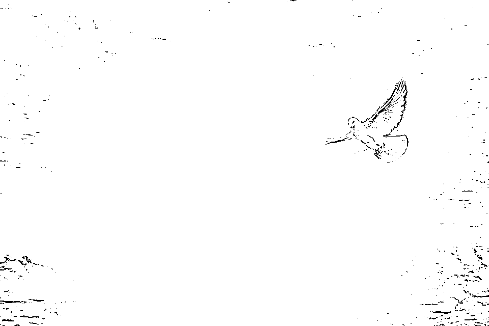

02

**虽然木火合相已经把氛围感拉满，但水星却在继续逆行。**

**周一，水星逆回金牛座，**并且在整个本周的时间，与水瓶座的土星呈现四分相的入相位。这代表我们**心智的运转处于减速状态，**比起行为的亢奋激进来说，它呈现出的是凝滞和保守。

头脑（水星），跟行动力（木火）之间状态的不相匹配，会让我们感到分裂，被往两个相反的方向拉扯。

一方面我们信心十足，想要放手一搏，另一方面，我们的思维变得缓慢、谨慎，甚至引发消极与自我否定。

**所以正确的打开方式是：一边思考，一边前行。**并不是要把所有细节都分析清楚，确保无后顾之忧才能去落实，也不是放弃思考，只顾着往前冲。

带着顾虑行动反而能够克制木火的自满，而在实践中求证也是解决所有疑问的最好方式。

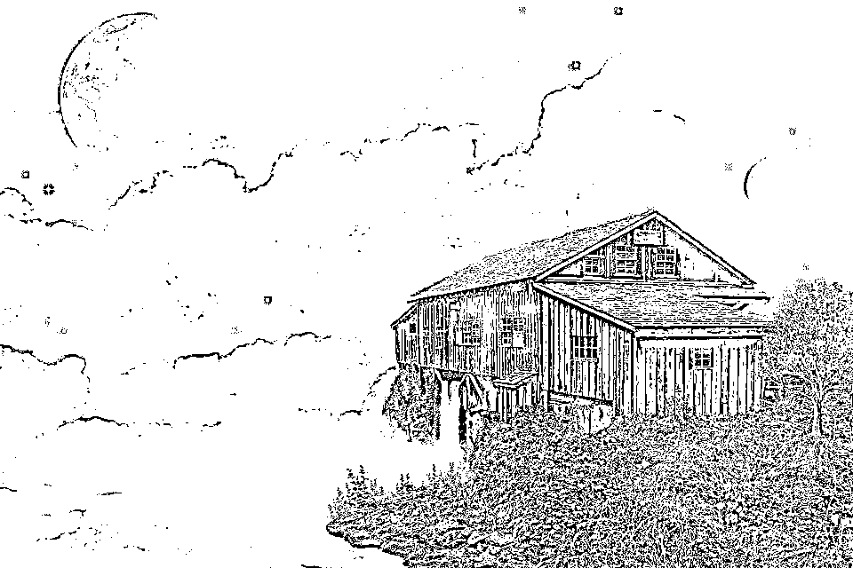

03

**金星即将结束在白羊座的旅程，进入金牛座。**而在它彻底离开白羊座之前，会在周五与冥王星发生压力四分相。

金星在白羊座的这一个月，大家应该都能感受到一些**人际关系上的棘手，或金钱上的麻烦**。金星白羊对于情感的处理方式是较为莽撞直接的，缺乏耐心，也因此会埋下一些地雷。

当金星运行在这个星座的末度数时，预示着**很多事情即将来到终点。**金星与冥王星的四分相，就像一场清算，过往没有处理好的事情，很可能在这个时间再次被引爆，并来到完结篇。

**尤其是星图中有重要星体落在白羊座、摩羯座、巨蟹座、天秤座末度数的人，留意周五前后，可能会发生一些与情感和金钱相关的事件。**

情感方面，内心上的不安、无法掌控或许会引发强烈的痛苦：我已经给你最好的了，为什么你依然不能理解我？为什么我还是不能得到想要的东西？

**冥王星也可能触发过往关于失去或分离的悲伤，**这种求而不得的痛，被即将合相的木火能量放大，便会引发内心的一场情绪风暴。

金星此时被同在白羊座的火星定位，外加木星的鼓舞，**内在的激烈纠葛往往会指向行动的落实**：一些人在这个时间点，终于决定离开一段关系，或一个交际圈；另一些人产生想要深度连接，不再分离的愿望，继而采取行动，去追逐自己心中所求。

财务方面，我们可能对金钱产生巨大的渴望，想要通过占有更多的物质来获取现实方面的安全感。这种驱动力会让我们做出钱财、交易或投资方面的决策，在情绪黑洞的影响之下，这些抉择可能过于冲动或激进，**需要我们稳妥对待，三思而后行。**

**周六，金星换座到金牛座，**我们内在也终于逐渐平稳，穿越过暴风骤雨，来到阳光地带。这个月亮、水星、金星同在金牛座的周末，享受生活、享受当下会成为首要主题。

即便有着木火合相的忙碌和快节奏，我们依然可以感受到内心的富足和安逸，此心安处是吾乡，**唯有心中的平和才会带来真正的安宁。**

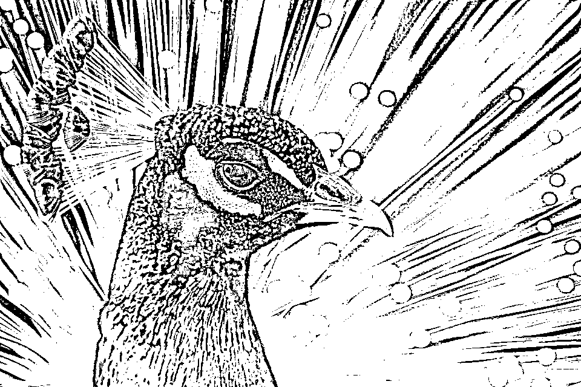

**12 星座一周运势**

**（重点参考上升星座，其次参考太阳星座）**

***白羊座***

**本周，你的命主星火星来到 1 宫**，为你带来忙碌而充实的一段时光。你或许会缺乏耐心，容易着急，你也可能会感到强烈自信，继而有展现自我的需求。攻击性和好胜心增强，**需要注意人际交往中的争端冲突**，当涉及到金钱、利益相关时，你会格外敏感。

周五前后，需要当心职场上出现复杂难解的人际麻烦，尤其是与上司、领导、权威之间的关系。

***金牛座***

本周，你的潜意识格外活跃，内心小剧场不断上演。你可能会感受到无名的怒气或者不安，而这与**火星进入到你的 12 宫**有关。

这段时间，你或许会觉得自己很难集中注意力做事，那么**放松休息**是最好的应对方式，**参加志愿者或者公益活动**也会对心情舒缓有帮助。

亲密关系或人际中可能有棘手的情况，扰乱你情绪。也需要当心一些意外事件，例如物品丢失，或职场上小人的出现。

***双子座***

**火星进入你的 11 宫**，是重返 social 场合的时间了！

可能是工作需求，或者生活状态的变化，**你接下来要接触更多的人，或与朋友、团体有更加密切的联络。**

可是，你内在的状态并没能跟上外界突然热闹的氛围。**你依然需要一些时间独处放空**，不要忽略自己内心的迟疑，剔除无效社交绝对是必要的事，若不这么做，代价可能是跟某些人闹翻，或给他人留下易怒的印象。

周五前后，某些双子座可能要处理与朋友之间的遗留金钱问题。

***巨蟹座***

**这是事业上铆足劲向前冲的一周！**

工作上几乎马不停蹄，但这样的快节奏，也刚好可以用来释放你**充沛的体能**。本周你能够带着兴趣和热爱做事，心情较为明快。但也不能排除火气过旺的情况，你容易跟同事、团队意见不合，或顶撞老板，所以还是要注意控制冲动喔。

情感方面，部分与旧人纠缠还未放下的巨蟹座，容易重温旧梦，与对方再次纠葛起来。

***狮子座***

对于还在上学或做研究的狮子座来说，本周的星象十分利好。**你对知识的吸收力很强，也可能福至心灵，获得创造性的观点。**

部分狮子座可能突然要远行，出差，或搬家。

本周你会思考很多事情，规划将来，也可能是工作需要，开始计划学习或进修的事宜。这些想法或许早已产生，但因为现实原因搁置，在当下的节点又重新回归到日程中。

***处女座***

本周你大概率要处理与金钱相关的事项，例如与他人财产的分配，或合伙投资项目，或做出新的理财选择。**需要警惕过度乐观的心态**，不然可能会遭遇损失。这种破财也体现在冲动的购买消费上，**注意有所节制，量入为出。**

周五前后，你或许会感受到对于钱财、情感方面的强烈欲念和不甘，但赌徒心态只会让你越陷越深，这不是一个适合豁出去的时间。

***天秤座***

接下来这段时间，**你对亲密关系及所有一对一的关系都十分关注**，也愿意投入大量精力去经营，但过度在意也可能演变为吹毛求疵，反而让关系紧张。单身天秤座对婚恋情感更加积极，也迎来了有望脱单的时光。部分天秤座遇到**新的合作机会、合作伙伴。**

周末金星换座后，**更有利于你从一些执念中挣脱，更加关注自己内心深处的需求**，而不是聚焦在用力掌控关系，维系表面和谐上。

***天蝎座***

**这是格外劳碌的一周**，无论是生活中的日常琐事，还是工作的繁忙事务，都需要你事必躬亲。虽然你的体力比平时要好很多，依然要注意身体上可能的发炎、上火、焦虑，甚至有小的外伤。

有宠物的天蝎座，也要留意小动物的健康情况。

职场上可能有新的工作内容、方向，也容易与同事、下属之间出现口舌是非，尤其周五前后，或许是已久的积怨突然爆发。

***射手座***

本周你可能发掘出**新的兴趣爱好**，或者在工作上很有**灵感创意**，迫不及待要去执行新想法、新思路。

部分射手座开始恋爱，正处于不可自拔的沉浸期，但内心却总有担忧不安。周五前后，或许你会遇到一些现实的困难、分歧，有种被泼冷水的挫败感。

有子女的射手座，会将更多心力放在孩子身上，他们更加活泼，需要耗费你更多时间，但你们也能探索开发出新乐趣，亲子关系更加和睦。

***摩羯座***

**本周你会把更多精力放在忙碌的家庭事务上。**可能是更换了住所，也可能在装潢住宅，或规划对房屋做出一些改变。也可能是你与家人之间的互动增加，相处时间增多，也或许是你邀请亲密的朋友来到家中，度过一段美好的时光。

要注意，涉及到任何家庭的事情，你都可能过度敏感、情绪化，留意周末前后的时间，或许会有一些童年创伤从记忆中浮现，而这是你进行深度思考，从而治愈它的好时机。

***水瓶座***

**最近你比往常更渴望表达和交流，**非常有利于写作、演讲、文书工作，或者是从事设计、创意、与人互动行业的水瓶座。但要注意，你很容易与人争论，或在沟通中失去耐心。

部分水瓶座由于工作原因需要短途出差，途中突发情况较多，很可能要赶时间，记住不要急躁，注意交通安全。部分水瓶座开始学习新技能、新知识，或开启新的工作项目。

***双鱼座***

**你的资金流动进入到一个相对活跃的时期，**接下来你的进账变多，开销也会增加。物质方面的需求提升，可能会购买一些昂贵的物品，对于金钱的野心胃口变大，或许有了想要加薪的念头，或找到更多赚钱的途径。你的收入和花销可能与异地、远方或者教育相关，比如一些线上的课程学习，也可能是出差旅行的花费。

周五前后，你或许因为跟朋友之间的金钱往来感到烦恼，也可能会想起过往一些与金钱、人际相关的，不愉快的记忆。

**版权声明**：原创文章由作者授权首发于若道平台发布，欢迎转发，反对抄袭。友号转载请申请白名单。

****

****朵三三三****

ISAR 认证占星师

全职占星师/塔罗师/国家三级心理咨询师 

人大文学学士/德国慕尼黑大学文学硕士

**微博/微信公众号**：朵三三三

长按打赏

**20 位来自世界各地的占星师****带来 19 场沙龙——新世界的觉醒****详情可点击下图**

**学习占星学****点击下图了解课程详情**

**

**微信又双叒叕改版啦，不想错过若道君的推送？**

**就把若道设为星标吧！**

**▼**

**喜欢记得点一下在看哦☟**

**报名直达入口**

# 雷蒙德·梅里曼金融占星周运 | 24 日之后金融市场或向好

> 原文：[`mp.weixin.qq.com/s?__biz=MzA5NjA0NTAxNg==&mid=2651474368&idx=2&sn=34374ca70f61b8292fc3ce8c96260dc3&chksm=8b48fb77bc3f72610c7858f84cad60b6612be7c838554c835ef9bb5ed202b5c396afd7e88452&scene=126&sessionid=1692737812#rd`](http://mp.weixin.qq.com/s?__biz=MzA5NjA0NTAxNg==&mid=2651474368&idx=2&sn=34374ca70f61b8292fc3ce8c96260dc3&chksm=8b48fb77bc3f72610c7858f84cad60b6612be7c838554c835ef9bb5ed202b5c396afd7e88452&scene=126&sessionid=1692737812#rd)

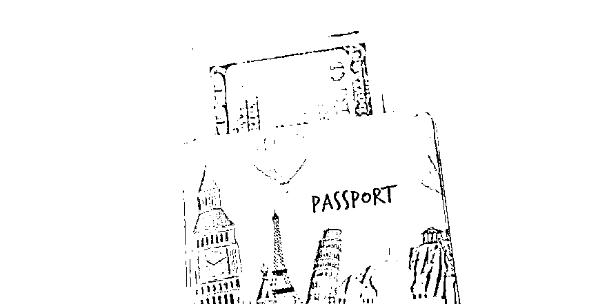

作者/雷蒙德·梅里曼 译者/Luke
编辑/玫瑰 图片/pexels

雷蒙德·梅里曼是在金融占星学界稳坐第一把交椅的占星师，同时他也是若道签约的金融占星课老师，我们引进了雷蒙德·梅里曼老师的《[上证指数月度报告](http://mp.weixin.qq.com/s?__biz=MzA5NjA0NTAxNg==&mid=2651474357&idx=2&sn=1dd70a90e2ea5b1351c8d9eb7342b72e&chksm=8b48fb02bc3f7214b27b2dcbebc7b32be9dab98bee34853299d6dca571248cb279cfdc9322d2&scene=21#wechat_redirect)》及《[黄金报告](http://mp.weixin.qq.com/s?__biz=MzA5NjA0NTAxNg==&mid=2651474357&idx=2&sn=1dd70a90e2ea5b1351c8d9eb7342b72e&chksm=8b48fb02bc3f7214b27b2dcbebc7b32be9dab98bee34853299d6dca571248cb279cfdc9322d2&scene=21#wechat_redirect)》。我们经老师的授权，将每周刊登梅里曼老师的周运，供大家参考和学习。于是，这是本周的周运（5.23-5.27）。

**说明：以下时间采用纽约证券交易所所在地美国东部标准时间。**

**展望与回顾**

****

**对衰退的担忧加剧，推动美国股市短暂进入熊市，周五标准普尔指数从 1 月的历史高点算起，跌幅一度达到 20%。尾盘的戏剧性反转，使指数当日以高于基准线的绿色收盘。****——莎拉·敏和弗雷德·因伯特****《周五的疯狂交易日中，标准普尔指数短暂跌入熊市，尾盘回涨持平》****www.cnbc.com****2022 年 5 月 20 日**又是疯狂古怪的一周，因为恶作剧者水星（逆行）在将看多者戏弄一番后，又马上唱响看空的曲调，让每个人心神不宁。在水星逆行和木星进入白羊座的第二天——5 月 12 日，美国股市创下低点后，直到 5 月 17 日还是看涨的。道琼斯工业平均指数从 31228 的低点回升到高点 32689，3 个交易日内上涨了 1400 点。但下一天它回撤了 1164 点，创下历史上最大单日跌幅之一。暴跌直到周五才结束，于 30635 触底，从周二的高点下跌 2000 点。但之后一件有趣的事发生了（恶作剧者水星总爱玩戏法）。道琼斯工业平均指数在最后 2 小时内拉升超过 600 点，当日竟以涨势收盘。标准普尔指数和纳斯达克指数也在周五创下新低，但在最后 2 小时迅速上涨。毫无章法的市场走势到底要走向何方？随着恶作剧者水星在周末到达逆行周期的中点，它留下了一些线索。再一次，这轮通向新周期和年度低点的抛售，只发生在美国。其余的全球股票指数不仅保持在 1 月-3 月的低点之上，也在 5 月 10-12 日水星逆行（市场不稳定）的低点之上。

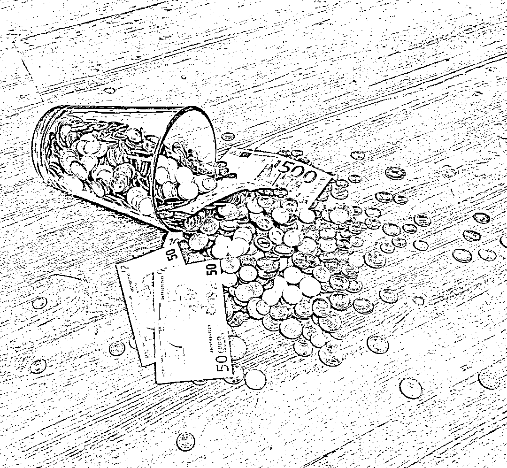

所以，这就是恶作剧者水星迄今为止描绘的画面。水星在转向逆行的一天内对应了大多数全球股票的低点，除了美国之外。此外，在水星逆行周期的中点，市场正在创下新的年度低点。**当市场在水星逆行初没有反转，它通常会继续先前的趋势，然后在水逆的中点反转。**所以，这次水星逆行周期对美国来说有一套与世界其他国家不同的规则。也许这是因为美国比世界其他国家更深地陷入了经济动荡中。在亚洲和环太平洋地区，值得注意的是中国上证和恒生指数正在上涨，而且在近期的下跌中，先于其他指数触底。澳大利亚、日本和印度股市回落，直至 5 月 10-12 日，但在上周的交易中，守住了这些低点以及今年早先的低点。在欧洲，每个指数都守住了 3 月 7-8 日的低点。此外，每个指数也守住了 5 月 9-13 日的次低点，除了苏黎世 SMI 指数外，它在 5 月 19 日下跌到更低，与这一区域的其他市场构成了市场间看涨背离。在美国，三大主要指数均于 5 月 20 日跌至新的年度低点。其他市场上，比特币和以太坊均守住了 5 月 12 日的洗盘低点，但迄今为止没有展示出令人信服的看涨迹象，除了众所周知的“死猫反弹”外。黄金在 5 月 16 日创下新的数月低点 1785，但在上周下半部分又回到了 1850 附近。美元指数从上周 5 月 13 日创下的 19 年高点 105 有所回落，但仍然处于牛市。原油经历了波动剧烈的一周，在 103 和 115 之间交易，最终在 110 附近收盘。随着水星开始逆行，铜价守住了 5 月 12 日的基本周期低点 4.039，这是一个积极的迹象，因为铜往往会带动股票走势。在接下来几周我们会更多地谈谈铜，而且会把它加入梅里曼市场时机学院周期报告。此外，我们会继续列出股票和贵金属的太阳-月亮反转数值，因为订阅者要求我们继续提供这一市场时机数据。作为领先的市场指标，它确实很有价值。

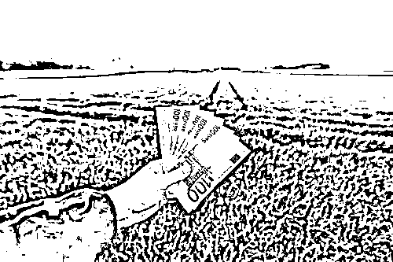

**短期占星趋势和长期考量**

****

**一份新的民意调查显示，拜登总统的支持率 5 月跌至任期以来的最低点，继续加深的悲观情绪在他的民主党成员中蔓延。**

**美联社-公共研究中心的国家民意研究显示，只有 39%的美国成年人支持拜登总统在任期内的表现，比 1 个月前的负面调查结果更加糟糕。**

**在中期选举前，拜登尤其需要担心的是，他在民主党内部的支持率为 73%，自他早些时候担任总统以来大幅下降。在 2021 年的美联社-国家民意研究中心民意调查中，拜登在民主党人中的支持率从未低于 82%。****——古拉斯·里卡迪****《根据美联社/国家民意研究中心民意调查，拜登的支持率跌至总统任期的最低水平》****美联社（apnews.com）****2022 年 5 月 20 日****这个国家的政治一团糟。我们有四个政党，而不是两个：在共和党方面，存在特朗普主义者和传统保守主义者。在民主党方面，存在温和派和进步派。这些既存的势力正将政治从可以找到解决方案的中心地带赶走。****然而，有理由抱有希望。我们的民主总能适应，它可以再次适应。让它生存和繁荣的力量存在于每个参与和受益于伟大美国实验的人手中。****——杰拉尔德·塞布****《历经 30 年风雨，仍有希望》****《华尔街日报》****2022 年 5 月 17 日**这是杰拉尔德在 29 年后向《华尔街日报》读者发表的告别演说。我会怀念他不偏不倚的报道。**对于这周，我们注意到多颗行星正在改变星座。这被称为入座，代表那颗行星相关的集体心理的改变。**这很重要，尤其是涉及外行星时，比如木星在 5 月 11 日入座白羊座，就在所有市场（除了美国股票市场）创下低点的前一天。现在，我们有一系列运行速度较快的内行星正在改变星座，我要谈谈它们为什么也很重要。太阳在 5 月 21 日进入双子座，会在双子座逗留一个月，所以此时全球领导力的重心，取决于领导者传达合适的信息，给出正确的叙事，展现清晰和才华的能力。不然的话，将不得不一遍又一遍地撤回自相矛盾的叙述，尤其当双子座的守护星水星逆行时。

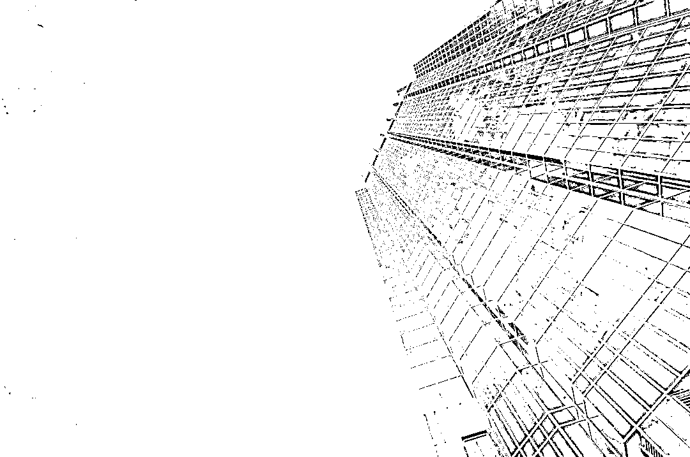

水星也将离开自己守护的双子座，在 5 月 23 日逆行回到金牛座，并在那里逗留到 6 月 23 日。这实际上是一个积极的变动，因为在金牛座，人们更倾向于用逻辑来解释他们的立场，让其他人更好理解。或者，它可能意味着有人做了错误的判断（水星逆行），不得不撤回，但他们太固执不愿这么做，这使得推进他们的议程变得更加困难。由于缺乏灵活性，事情的进展卡住了。太阳在双子座要求适应和调整的意愿。然而，最重要的入座，涉及火星和金星。**火星在 5 月 24 日进入白羊座，金星在 5 月 28 日进入金牛座。**金星和火星因此会入座各自的守护星座，这会给予它们力量。**这对于金融市场是个好兆头，因为木星也在白羊座，给人更大勇气大胆前进，和冒更大风险。这正是股票市场克服目前困境所需要的。**此外，火星进入自己守护的白羊座（大胆行动，冒险）后，将于 5 月 29 日合相在白羊座的木星，这是拥有力量和自信去冒险的另一个迹象。就其本身而言，**对于市场似乎是个吉兆，因为火星和木星都喜欢火象的白羊座。**当然，金星也喜欢金钱星座金牛座，那也是它守护的星座。重要的是，集体心理的改变正在发生，始于木星上周入座白羊座，随后金星和火星也在本周入座它们的守护星座，并在 5 月 29-30 日的新月和火星合相木星到达顶峰。

**这可能是巨大乐观和重振自由感的时期。也是非常适合玩乐的一段时期。**所以，做好准备参加很多社交活动和娱乐。但是也要记在心里，如果玩乐过头（木星在白羊座），或太不小心（木星和火星在白羊座），可能导致意外或宿醉的后果。

如往常一样，不仅要负责地玩乐，也要知道自己的界限在哪儿。因为当火星和木星在白羊座合相时，对于那些不知道界限在哪儿，也不尊重别人界限的人，这里没有真正的自由。如果在这一天象下，你犯了愚蠢加粗心大意的错误，那就可能需要一张“免狱”卡。这会让人谦卑下来。**对于交易而言，赚钱和亏钱的机会都有，取决于你是在交易，还是过度交易。**火星和木星可能会带来利润和乐趣，甚至巨大的乐趣。但是它也可能诱发贪婪，导致损失，如果贪婪到了过度不受控制的程度的话。这也可以让人谦卑，或带来回报，这取决于你的注意力和管理风险的能力。**梅里曼市场时机学院与若道将于 2022 年 6 月 23 日 19:00 举办金融市场最新信息中国专场讲座。**这个 2-3 小时的在线讲座（有两次 5 分钟的休息时间）将讨论几个金融市场的前景，包括黄金、原油和上证综指。

这将是特别及时的讲座，因为为期 12 年的木星轨道周期会在 5 月 10 日进入白羊座，并且 6 月-11 月是一年中最有力的地球宇宙征象接连登场的重要时间段，因为土星逆行与天王星形成几乎精准的渐亏四分相。

**说明：以上日期基于纽约证券交易所所在的美国东部标准时间，由于存在时差，中国地区可能需要加一天。**

**版权声明：**本文由若道翻译发布，欢迎转发，反对抄袭。友号转载请申请白名单。

**雷蒙德·梅里曼（Raymond Merriman）**

若道签约老师。著名金融占星师，ISAR（国际占星研究协会）前主席，梅里曼市场分析公司的总裁。他由于“提升了占星学的职业形象”，在 1995 年国际占星大会上被授予轩辕十四奖；在 2012 年国际占星大会上，被授予轩辕十四终身成就奖。

1“中国上证指数月度报告”发售**若道推出了****中文版****的雷蒙德·梅里曼中国上证指数月度报告，并持续发行该报告！**当把金融市场的周期和占星学的周期相结合时，雷蒙德·梅里曼老师的金融占星学研究**为投资者应对金融市场的周期波动，并随之调整投资策略提供了极大的价值参考**。
**6 月中英文报告已上线！**2“黄金价格周期月度报告”发售**若道推出****中文版****的雷蒙德·梅里曼黄金价格周期月度报告！**不仅仅为广大读者在中国股市的投资出谋划策，更将视角放眼黄金市场。**每当世界经济形式不明朗的时候，有一个地方是保值的港湾，那就是****黄金**。自 1982 年雷蒙德·梅里曼出版第一本研究《地球宇宙学征象与黄金价格的关联》的著作以来，**他一直作为最重要的黄金市场时机预测者之一享誉国际**。2022 年 6 月黄金报告已上线，梅里曼老师将会告诉你他对这个关键时期如何操作的想法。也可以按照季度和一年期订阅，有更多优惠。季度和年度的好处是，你可以持续了解梅里曼老师对于不断在变化的市场的看法。即便他某一次看法和市场不一致，你也看到在下一期他如何调整自己的看法，并看到金融占星在一个长期时间段内对你把控风险的帮助。而能够长期控制风险、尽量找到安全的投资时机才是投资的长久之计。**6 月中英文报告已上线！****购买套餐**，买得越多越优惠中国上证指数月度报告套餐价

*   **单月报告**：280 元
*   **3 个月套餐**：780 元（260 元/月）
*   **12 个月套餐价**：2400 元（200 元/月）

**长按下图识别二维码****购买金融报告****套餐****▼**

黄金周期月度报告优惠

*   **双报告年度套餐更优惠（直降 900 元）**

*   **12 个月黄金报告+12 个月上证指数报告：仅需 3900 元**

**长按下图识别二维码购买黄金报告套餐**▼

3《2022 年金融预报和沙龙》1976 年以来，由雷蒙德·A·梅里曼撰写的梅里曼市场时机学院每年一次的年度预报沙龙和每年一本的《年度预报》一直在应用占星学原理为投资者们服务，提供卓越洞见，从未间断。 **雷蒙德·梅里曼《2022 年金融预报和沙龙》发售中（报告已发布）。****长按下图识别二维码了解详情**
▼

4《2022 下半年金融占星投资沙龙》这将是特别及时的讲座，因为为期 12 年的木星轨道周期会在 5 月 10 日进入白羊座，并且 6 月-11 月是一年中最有力的地球宇宙征象接连登场的重要时间段，因为土星逆行与天王星形成几乎精准的渐亏四分相。

**长按下图识别二维码了解详情**

▼

**点击阅读原文购买金融报告**

# 插班中丨心理占星学第一学年，从麻瓜进化成占星师的自我觉察工具

> 原文：[`mp.weixin.qq.com/s?__biz=MzA5NjA0NTAxNg==&mid=2651474368&idx=3&sn=d70d1797ce4b2cc27c9f45405e1c0ccc&chksm=8b48fb77bc3f7261c5ecead4c1804feac7e7f2d6bec2805d937aaae5e83ea21330dafda96fce&scene=126&sessionid=1692737812#rd`](http://mp.weixin.qq.com/s?__biz=MzA5NjA0NTAxNg==&mid=2651474368&idx=3&sn=d70d1797ce4b2cc27c9f45405e1c0ccc&chksm=8b48fb77bc3f7261c5ecead4c1804feac7e7f2d6bec2805d937aaae5e83ea21330dafda96fce&scene=126&sessionid=1692737812#rd)

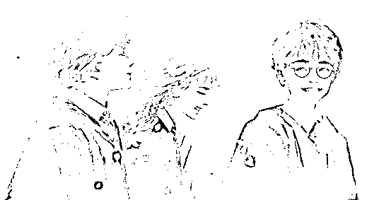

**自我觉察，是智慧的基础**

我们每个人都有自己的内在冰山，自我觉察能够帮助我们觉察自己的行为、情绪等，然后向内深层探索，探索自己的行为、情绪背后的深层渴望、期待。 **学习和应用占星学的过程，就是慢慢掌握自我觉察工具的过程，**当你熟练掌握了占星学也就具备了帮助引导他人觉察到自身生命议题的能力。 往外张望的人在做梦，向内审视的人才是清醒的。**只有我们真正向内看，只有当觉察开始由外向内时，改变才会发生，才能够知行合一。**

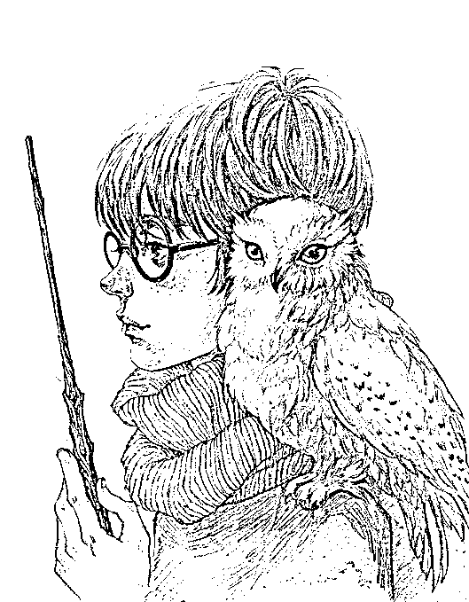

# 插画师：古戈力

以情绪来举例说明，每个人的情况不同，觉察的程度也不同，觉察有四个层次：

**1.不知不觉：**没有觉察情况，当情绪来了，会被情绪控制，做出很多不计后果的事情。而且每次都是同样的状况，反反复复。

**2.后知后觉：**情绪过后，自己能够反应过来，自己做的对与错，但是很难避免同样的情况再次发生。

**3.当知当觉：**就是当情绪来的时候，你已经知道在这个当下，正在发生什么。当达到这个层次，你就可以自己控制情绪，从而影响后事的发展。

**4.先知先觉：**就是当事情还没发生，就可以预知它要发生了。因为你对情绪的觉察已经越来越熟练，所以情绪还没来，你就知道它要来了。所以，你也就有了更好的选择和处理方法。

所以，我们要自我觉察，向内探索，觉察是为了接纳，然后做出改变，成长，迭代，升级。**那么要如何练习自我觉察，掌握先知先觉的能力呢？**

**每日觉察的工具推荐**

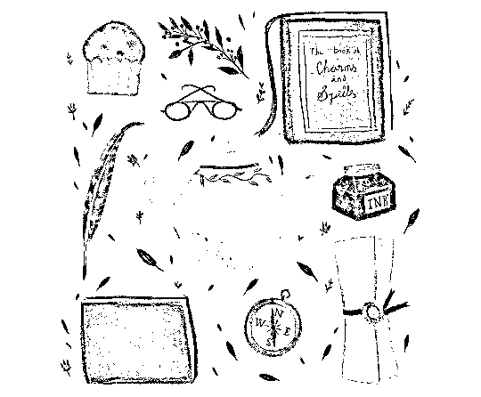

**今日天象&近期行进**

若道 APP 中的今日天象功能，罗列展示每一天的具体天象，和你当天的行进和行进周期：

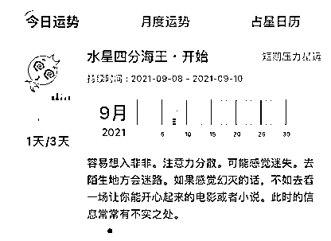

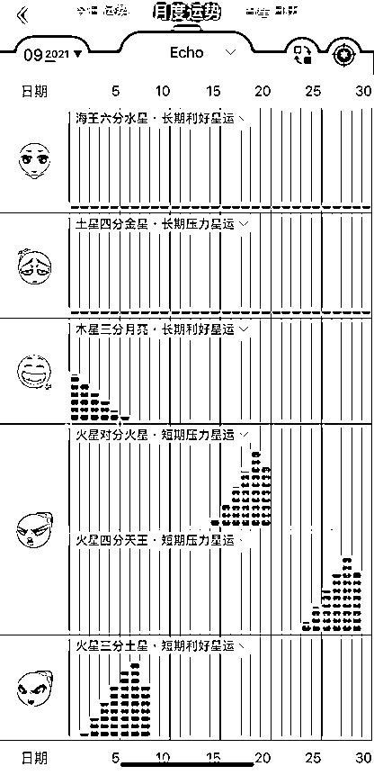

**作为一位占星师，可以这样使用这个自我觉知工具：**

★ **记录梦境**

如果你有醒来记录梦境的习惯，每天早上看一下睡梦中的天象和行进，对应联想，你会惊喜的发现一些神奇的对应，能够更敏锐的捕捉到日常被压抑的情绪和需求。能够帮助你在白天的工作生活中先知先觉的关注身心状态。

★**规划生活**

每月月初，周初都可以参考天象和行进进行日程规划，预估可能的助力和阻力，在对的时间做对的事，会发现平平无奇的日常也可以有不一样的色彩。根据月相的变化感知情绪的起伏，更好的自我关爱。

★**感知环境**

当身边发生了引起你注意和好奇的事情，或者网络上层出不穷的新闻热点，都可以在天象中寻找对应的能量。从更大的格局视角去思考你的个人观点。通过环境的共振，更深入的理解自己的本命星图。

**以上都是很好的学习深化占星知识的方法，你只需要系统掌握以下知识，你就可以开始使用以上方法去提升自我觉知。**

**美国占星心理学学院创办人**

**格伦·佩里**授课

**40 余年**职业占星师生涯所学精华**倾囊相授**

修完 101-205 全部课程，并通过考核的毕业生将获得

**美国占星心理学学院证书**( Academy of Astropsychology )

和**若道毕业证书**

**高含金量双证书**

跟随主讲老师学习融合**心理学体系**的**占星知识**

为星图咨询解读打下坚实的基础

**大量**的课程资料，光是课后阅读资料就**超过 60 万字**

合理的课程设计，贴心的助教服务，及时的课后测验

1

**这门课程最大的看点是什么？**

1. **两位国际占星学大师**共同授课，将合计**90 年职业占星师生涯所学精华**倾囊相授；2. 修完**2 年课程**，考试通过的毕业生将获得**美国占星心理学学院证书**（Academy of Astropsychology）和**若道毕业证书**，**高含金量双证书**；3. **第一学年 64 次课程**的充分授课时间（录播课程 43 次课；直播课程 21 次课），全面而详细地讲解占星学历史、知识、技能、案例、咨询和运用；4. 跟随主讲老师学习**自成体系、逻辑严密、实用性强的占星语法、星图解读方法**；5. 学习独特的**发展年龄预测法**，从星图看对关键年龄阶段的发展及议题；6.** 大量的课程资料，光是课后阅读资料就超过 60 万字**；7. 合理的课程设计，初中阶课程，每一节都有课后测验；8. 本课程可以作为**ISAR 选修课**中的一门，再修两门就满足 ISAR 认证选修课要求；9. 教授重要的**心理学概念**，比如与客体关系、心理动力理论、个人神话和叙事疗法相关的一些概念，学习如何将它们整合到星图解读中；10. 在 105 阶段了解**《精神疾病诊断与统计手册》**诊断标准，探索星图中的心理疗愈；

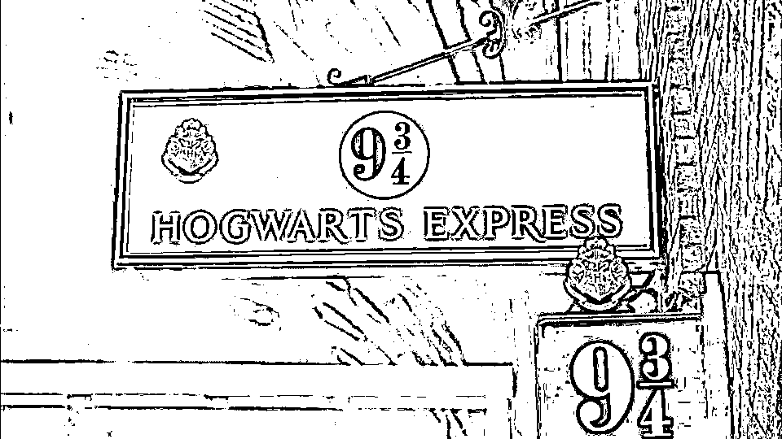

**格伦老师致学员的信**

（向上滑动查看内容）

**亲爱的学员：**

作为占星心理学学院的校长，我的目标是帮助你顺利完成学业。

占星心理学学院的课程让你能够在经济承受范围内，灵活地学习占星学。我们的课程让你可以舒适、便捷地在家学习，不用打乱你本就繁忙的日程。我们有完善的在线学习系统，让你能在线上课、下载学习资料、进行测试并自动获得即时反馈，还可以在虚拟课堂上同你的教员和同学互动。

作为私人开业的**职业占星师**和**执业心理治疗师**，我已经**工作超过 30 年。**我还花了近 10 年的时间，在研究院里学习并获得**心理学的硕士和博士学位**。这段训练和经历是无价的，帮助我将占星学发展成为连贯的 21 世纪模式。

我们的占星学培训项目是**系统化的、清晰的、组织有序的、易学的、前沿的。**尽管有许多类似的学校可供你选择，但你不会在这些学校中看到像占星心理学学院所提供的那样有深度的或尖端的课程。

**我非常期待 2022 年再次在若道教授心理占星学核心课程。**我们重新规划和升级了本次课程体系。**新的课程包含之前完整课程的 72 个录播视频，每个视频长 2 小时；以及由我教授的 37 次直播课程，和大卫老师教授的 10 次直播课程，每次课程 2 小时。**在实时课程中，除了我提供的案例，我还会用学员的星图进行案例演示，与学员互动，阐明视频中教授的原则和方法。

**2 小时直播课程安排：**

**第一阶段 提问和讨论：**

这将在每节课开始时进行。邀请学员提出与课前提供的资料相关的具体问题。这一阶段将持续 15-30 分钟。

**第二阶段 示例：**

这一阶段会讲解与每周任务相关的具体概念，例如行星的星座位置、宫位位置以及相位的意涵。星图示例来自我认识的人，如公众人物、朋友、家人、同事或以前的客户（不显示出生信息）。同样，这一阶段也开放课堂讨论，学员可以提出自己的问题和见解。

**第三阶段 学员案例演示：**

这个阶段会从学员的具体星图来阐明概念，例如火元素行星占优势。学员案例演示不会涉及任何类型的咨询或“解读”。它们将只是简单地包含一段对话，我会在对话中分享自己对某个配置的思考，然后问这个学员可能会如何主观地（影响、信念、行为）和客观地（事件/关系）体验这个配置。其他参课学员可能也会对讨论的主题有自己的见解或问题，他们也可以参与讨论。

我对这一新的在线课程形式感到兴奋，**并期待着从 2022 年 4 月 27 日开始认识我的新学员们。**获得本学院的文凭会是你做过的最明智的投资。你不仅将占星学掌握到前所未有的深度，还将学到如何为客户提供咨询服务并建立职业占星师的职业生涯。

真诚地

**格伦·佩里 占星心理学学院校长**

**为什么要学习心理占星学？**占星心理学是一个复杂的体系，让实践者能够向客户提供真正治疗性的益处。这从根本上说来是我们学院有别于其他学校之处：**我们教授占星学，也教授心理学概念。****我们明确讨论各种心理学概念，并将其与占星学无缝衔接。结果就是更深入的、更丰富的，最终更加强大的模式。****该项目专为初学者和渴望深造的有经验的占星师而设。**我们会从跨学科的角度探讨星图解读。**通过融合荣格心理学和各种其他模型的元素，学员将熟悉作为人格理论、发展模型、原型语言和诊断工具的占星学。**

2

**课程是怎么安排的？**

**第一学年**

**共****64****次课 **43****次录播课 **21 次直播课******

**101 占星学基础 **

****共****12****次课程：******8 次 2017 年录课+4 次直播课**

**占星学**关注成长，聚焦心理。外部事件意义重大，但我们可以把它们看作是对于发展中的心理结构的共时性反映，以及未来发展的媒介和催化剂。在这个阶段的课程中，会以四种形态的几何形式介绍**占星原型：星座、行星、宫位和相位**。黄道带是人类心灵的象征性地图，其中的每个**星座**都代表一种基本的人类需求、原型人物、发展阶段和行为风格。**行星**代表心理功能，以满足其关联星座的基本需求。**宫位**提供了环境舞台，行星在其中扮演它们的角色，而**相位**是行星之间的角度关系，在主观上体验为内在对话。

**课程安排**：

**录播课****、****直播课（周三）**时长都是 2 小时

第一节**录播课**：核心概念介绍

第二节**录播课**：黄道带的结构

2022 年 4 月 27 日**直播课**：核心概念、黄道带的结构提问和讨论、知识点示例

第三节**录播课**：图例、单态星体和其他奇妙的元素

2022 年 5 月 11 日**直播课**：图例、单态星体提问和讨论、知识点示例

第四节**录播课**：星座介绍（从白羊座到处女座）

第五节**录播课**：星座介绍（从天秤座到双鱼座）

2022 年 5 月 25 日**直播课**：12 星座案例演示

第六节**录播课**：行星作为过程

第七节**录播课**：行星作为内容

第八节**录播课**：将碎片整合起来

2022 年 6 月 8 日**直播课**：整合星图时，将行星作为过程和内容案例演示

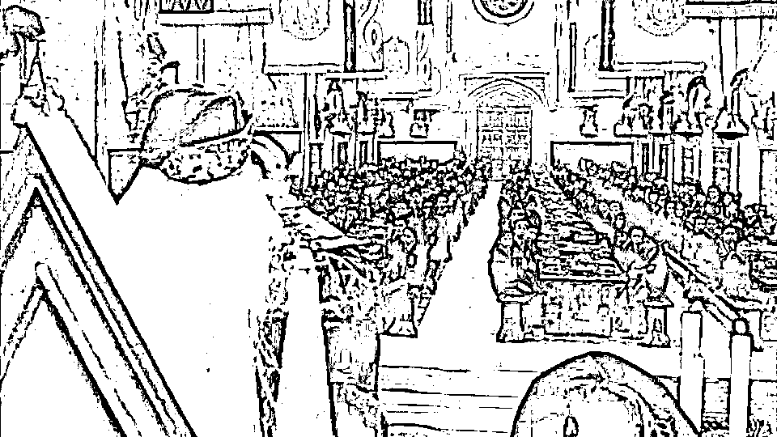

**102 行星落星座、宫位** 

****共****12****次课程：**8 次 2019 年录课+4 次直播课**

这个阶段的课程**聚焦于初步的星图整合。**

学员将学习**占星语法**，以及如何运用它们来阐释**行星的星座落点**。学员不需要强记书中的星图解读，而是学习分析基础的占星句法结构，应用这些语法规则来思考和讲述这门语言。学员们将学习如何构建精妙的句子，将动机、功能、特质、状态和事件组合起来。

此外，还将学习解读**行星宫位落点**的规则。宫位被定义为心理环境，为特定类型成长和发展提供背景。行星落在宫位中，象征着情境中的特殊状态，应对环境挑战的方式，以及通过共时性人物和事件而外化的自我部分。

学员们将探索如何将星座和宫位落点融合在一个单一、整合的陈述中，做出灵活、层次分明的解读。

**课程安排**：

第一节**录播课**：占星语法介绍

第二节**录播课**：行星星座作为行为风格

2022 年 6 月 22 日**直播课**：占星语法、行星星座作为行为风格提问和讨论、知识点示例

第三节**录播课**：思维状态和行为结果

第四节**录播课**：学习行星的星座落点

2022 年 7 月 6 日**直播课**：思维状态和行为结果、行星的星座落点提问和讨论、知识点示例

第五节**录播课**：回顾宫位的含义

第六节**录播课**：宫位中的行星过程

2022 年 7 月 20 日**直播课**：宫位的含义、宫位中的行星过程提问和讨论、知识点示例

第七节**录播课**：行星在宫位中的状态

第八节**录播课**：行星作为宫位的内容

2022 年 8 月 3 日**直播课**：行星在宫位中的状态、内容的提问和讨论、知识点示例

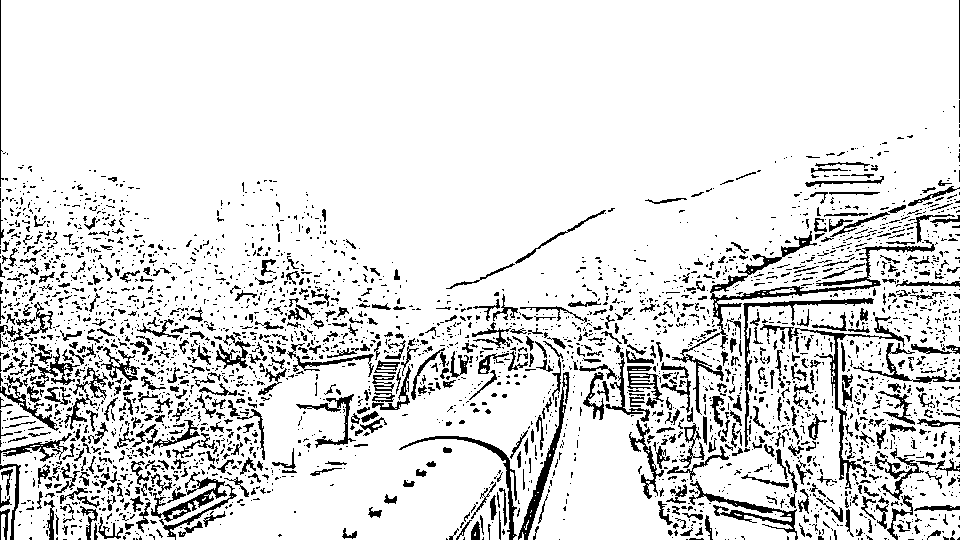

**103 行星相位与个人神话** 

****共****13****次课程：**9 次 2019 年录课+4 次直播课**

在这个阶段的课程中，**相位**被解释为由更大的故事结构的潜在动力构成的个人神话。

学员将学习相位是如何象征内在心理的冲突、重要的童年情感体验、主要的人生挑战和内在对话的。需要着重强调的是，相位的意涵会随着心理成熟的程度而改变。人会成长、进化，会解决内在冲突，这些不仅反映在态度和行为的改变上，而且也会表现在某人吸引的事件及其与他人的关系品质上。

学员们还将学习一些**心理学概念**，比如与客体关系、心理动力理论、个人神话和叙事疗法相关的一些概念，它们将整合到相位解读中。

**课程安排**：

第一节**录播课**：重要主题与核心冲突

第二节**录播课**：渐盈相位与渐亏相位

2022 年 8 月 17 日**直播课**：重要主题与核心冲突、渐盈相位与渐亏相位的提问和讨论、知识点示例

第三节**录播课**：主要相位的核心意义

第四节**录播课**：罗生门原则

2022 年 8 月 31 日**直播课**：主要相位的核心意义、罗生门原则的提问和讨论、知识点示例

第五节**录播课**：占星学中的认知

第六节**录播课**：心灵的控制结构

2022 年 9 月 14 日**直播课**：占星学中的认知、心灵的控制结构的提问和讨论、知识点示例

第七节**录播课**：作为认知结构的相位

第八节**录播课**：强迫性重复

第九节**录播课**：听大卫·瑞雷讲月亮交点

2022 年 10 月 12 日**直播课**：月亮交点（由大卫·瑞雷老师教授）

**104 征象星与定位星：作为进化故事的星图 **

****共****12****次课程：******8 次 2019 年录课+4 次直播课**

这个阶段的课程聚焦于**从叙事角度整合星图。**

学员们将探索**宫位征象星**和**行星定位星**如何讲述一个故事，反映一个人进化发展之旅。行星定位关系揭示了个人神话的主体构架。而这个故事的主题常常处于意识觉知和控制之外，占星学提供了一种方式，揭示、解读、改编这个神话。

我们推荐的星图整合方式是将相位和定位星关系融合成一个单一、连贯的叙事。要特别强调的是，如何活出整合程度更高的生命故事。

学员们还将了解**叙事疗法**和**自传写作**，把它们当作促进整张星图整合的一种方式。

**课程安排**：

第一节**录播课**：每张星图都讲述了一个故事

第二节**录播课**：互容与最终定位星

2022 年 10 月 26 日**直播课**：每张星图都讲述了一个故事、互容与最终定位星的提问和讨论、知识点示例

第三节**录播课**：将相位整合进流程图

第四节**录播课**：完整的故事

2022 年 11 月 9 日**直播课**：将相位整合进流程图、完整的故事的提问和讨论、知识点示例

第五节**录播课**：过渡短语

第六节**录播课**：良好定位或不良定位

2022 年 11 月 23 日**直播课**：过渡短语、良好定位或不良定位的提问和讨论、知识点示例

第七节**录播课**：发展年龄方法

第八节**录播课**：进行全面整合

2022 年 12 月 7 日**直播课**：发展年龄方法、进行全面整合的提问和讨论、知识点示例、案例演示

**105 星图中的精神病理学与疗愈 **

****共****15****次课程：******10 次 2019 年录课+5 次直播课**

在这个阶段的课程中,我们将**聚焦于十二星座(从白羊座到双鱼座）及其对应的守护星的潜在功能障碍**。

我们将学习如何识别、理解和应对每个星座的潜在挑战。我们将在各种相应的心理障碍背景下来考察占星原型，这些心理障碍表现为功能障碍、失衡的极端状态。

学员们将了解**《精神疾病诊断与统计手册》诊断标准**。我们会探讨治疗的概念，尤其是那些与整合和个性化相关的概念。我们将特别关注外行星的困难相位，以及它们与内在心理冲突、防御和症状形成的关系。

学员们将探索人的痛苦如何成为发展和实现天赋才能的催化剂。

**课程安排**：

第一节**录播课**：白羊座-火星的病理学

第二节**录播课**：金牛座/天秤座-金星的病理学

2022 年 12 月 21 日**直播课**：白羊座-火星、金牛座/天秤座-金星的病理学提问和讨论、知识点示例、案例演示

第三节**录播课**：双子座/处女座-水星的病理学

第四节**录播课**：巨蟹座-月亮的病理学

2023 年 1 月 4 日**直播课**：双子座/处女座-水星、巨蟹座-月亮的病理学提问和讨论、知识点示例、案例演示

第五节**录播课**：狮子座-太阳的病理学

第六节**录播课**：天蝎座-冥王星的病理学

2023 年 2 月 1 日**直播课**：狮子座-太阳、天蝎座-冥王星的病理学提问和讨论、知识点示例、案例演示

第七节**录播课**：射手座-木星的病理学

第八节**录播课**：摩羯座-土星的病理学

2023 年 2 月 15 日**直播课**：射手座-木星、摩羯座-土星的病理学提问和讨论、知识点示例、案例演示

第九节**录播课**：水瓶座-天王星的病理学

第十节**录播课**：双鱼座-海王星的病理学

2023 年 3 月 1 日**直播课**：水瓶座-天王星、双鱼座-海王星的病理学提问和讨论、知识点示例、案例演示

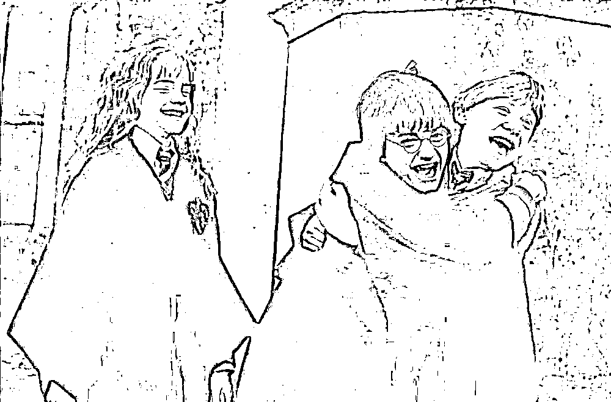

3

**导师简介**

**格伦·佩里（Glenn Perry）**

*   这位传奇的占星师，也是一名拳击和摩托车爱好者

*   他毕业于赛布鲁克学院(Saybrook Institute)，是心理/意识研究专业博士

*   也是拥有 30 余年经验的加州注册婚姻和家庭治疗师 （CAMFT）

*   美国占星心理学学院（Academy of AstroPsychology）的创办人

*   他曾任国际占星研究协会 （ISAR）以及联合占星大会董事会（UAC）副主席

*   也是 ISAR 突破性道德标准的设定者

*   康涅狄格州研究生院（the Graduate Institute of Connecticut）原型宇宙学与意识进化项目的负责人

*   共出版八本占星学著作：《心理占星学入门》《心理占星论文集》《盗取天火》《从忠诚到革命》《星图中的阴影》《占星职业议题与伦理》《出生星图深度分析》《从古代到后现代占星学》

**大卫·瑞雷（David Railey）**

*   若道联合创始人，致力于在中国教授和推广西方占星学；

*   曾任 ISAR 全球副主席，CAPISAR（ISAR 职业占星师资质认证机构）主席；

*   1976 年，通过亚特兰大职业占星师考试，成为全职占星师，随后通过 AFAN 和 ISAR 职业测试；

*   1980 年，与杰夫·焦耳一起在亚特兰大创建“每日行星”占星学中心。此后在亚特兰大占星协会担任 4 年考官，并且两次担任亚特兰大地区占星协会主席。1979-1992 年，作为占星师活跃于美国社会媒体，向不了解现代占星学变化的大众宣传专业占星学知识。在 1989-1992 年期间，他在 WRGG 电台 12 频道每周主持个人电视秀“今日占星学”，早先他还在 WRFG 的广播节目中播讲宇宙天气节目；

*   2010-2014 年，任全美占星师联盟监督委员会委员；

*   2010 年，其著作《灵魂的目标》中国版出版，和蒋颖一起创办若道占星学校和其官网 www.nodoor.com；

*   2017 年，被选为 ISAR 委员会成员。ISAR 是世界最大的国际占星机构，会员遍布 45 个国家，2017-2020 年曾任 ISAR 全球副主席、CAPISAR（ISAR 职业占星师资质认证机构）主席。

**助教简介**

**薇安**

*   全职心理占星师、ISAR 认证占星师（2016 年获得）；

*   北大心理学硕士、MBTI 国际认证施测师；

*   若道认证生时校正资质及 COAC 高阶资质毕业生；

*   连续两届担任格伦·佩里老师亲授的“美国占星心理学院&若道占星双认证核心课程”主助教；

*   2012 年至今，持续追随多位国际占星大师进行占星学的深入学习；

*   2007 年至今，持续进行精神分析及心理动力取向的理论及技巧研习；

*   致力研究心理学与占星学的整合运用。

4

**此次课程适合哪些人？**

*   对占星学感兴趣，想要入门的零基础者

*   占星学小白，但有志成为职业占星师的人

*   有一定占星学基础，但不知道该如何整合星图复杂碎片的人

*   想要师从更多殿堂级占星导师学习占星心法的人

*   走在自我探索和个人成长道路上的人

5

**选择若道学习占星学的优势**

**运用自由意志，扭转破坏性模式，绽放天赋潜能**

若道是人本主义占星学的旗手。因为我们相信，**人通过了解模式、觉察习性、积极疗愈、终将释放其潜能，与命运共舞**。

**进入国际权威职业占星师认证的快车道**

占星界的“联合国”ISAR（国际占星研究协会），是具有全世界影响力的占星教学和研究组织和职业占星师全球认证机构，认证占星师遍布 47 个国家。**在 ISAR 的 22 所附属学校中，大中华地区的附属学校只有若道一家**。在国际化的教学理念大纲标准下，**若道毕业生在 ISAR 国际认证占星师的考试通过率多次全球第一**。

**十年占星学教育中国本土化教学经验**

**根据中国学生的学习习惯不断优化占星教学体系，让学员学成后更自如地应对本土咨询市场的需求。**

学好占星学不仅仅需要邀请一两位老师教学，更需要对教学难点有充分了解，且有持续的教学跟进服务。**10 年来多次核心课程和各种专题课程的教学，让若道非常了解中国学生学习占星学的难点和卡点，合理有效地拆分、提炼课程知识点，同时也积累了丰富的国外老师和中国老师、助教紧密配合以及课程顾问密切配合教学的经验**。

若道还专门开发了有助于占星学习的“**若道**”APP，每门课程都设有答疑板块，学员能够方便快捷地提交问题，助教及时答疑解惑和批改作业。

**融入中国顶尖的职业占星师群体**

若道是中国职业占星师的“黄埔军校”。职业占星师的培养从若道开始，**进入若道，你就走进了中国顶尖的职业占星师群体，和一群志同道合的师兄师姐联谊，获得经验，共同成长**。 

**多种奖学金支持**

为了鼓励学员不因为暂时的经济困难而放弃学习，我们特意设置了各种**技能交换和奖学金**。

对于有一技之长的学员，我们推出的技能交换的项目包括**“笔译”、“笔记整理”、“平面设计”、“课本朗读”、“班级服务”**等技能交换项目；

而对于努力学习、出勤率高、完成作业率高的学员，我们设置的**土星奖、木星奖**等各种奖学金在等着你。

为了感谢帮助我们推荐学员的老学员们，我们设置了“**老学员推荐奖**”；

对于通过问卷提建议，帮助我们提高服务的学员，我们也设置了相应的奖学金。

**开启占星咨询的职业规划和支持**

若道为占星学员搭建了占星问答平台和占星咨询平台，并提供严肃占星学影响力最大的媒体平台，全力为毕业生提供宣传渠道，帮助你吸引和积累咨询生涯初期的种子客户。若道为学员开发了适用于占星学习的“若道”APP，并不断更新完善。

**①  微信平台**若道微信平台作为业内颇具影响力专业平台，为文笔好的若道毕业生提供传播占星学并免费宣传自己的机会。有的学员因为文笔获得众多粉丝喜爱，在 3 年多时间积累起 2000 多人的潜在客户。

****②  **咨询平台**若道咨询平台是我们为优秀毕业生所搭建的平台，帮助毕业生在自己的咨询拓展之外，用若道提供的平台扩展咨询客户群。自咨询平台 2017 年 8 月上线运营以来，咨询平台共入驻 100 人，收入最高者达 32 万元。

此处所列学员收入仅供参考，收入高的学员和其专业水准、努力程度密切相关。若道平台尽其所能将自己定位为辅助学员开展职业生涯的桥梁。

6

**课程价格**

**101-105 第一学年**

**正价：**18800 元

**学习充值卡优惠价：17000 元**

**101-205 全阶联报**

**正价：**50000 元

**转发优惠价：38000 元**

**学习充值卡优惠价：35000 元**

**其它各阶段课程单报价格，请咨询课程顾问**：**王老师（微信/手机：18510107057，请备注“格伦核心课”）**

**全阶段学习后，可参与若道占星毕业认证考试，考试费用为：580 元**

7

**直播课开课时间**

**2022 年 4 月 27 日（周三）20:00-22:00**

**如果直播课时间临时有调整，班班会及时通知每位同学****最终解释权归若道所有**

8

**退转课程**

**退款原则请详看《教学协议》，如有疑问请咨询课程顾问。**

9

**格伦老师视频**

<mpvideosnap class="js_uneditable custom_select_card channels_iframe videosnap_video_iframe" data-pluginname="videosnap" data-id="export/UzFfAgtgekIEAQAAAAAA8eIyMnQ0OwAAAAstQy6ubaLX4KHWvLEZgBPElIMYehsfM5L8zNPgMIuvMAf_Y6LDutEHc2Wrzjw4" data-url="https://findermp.video.qq.com/251/20304/stodownload?encfilekey=rjD5jyTuFrIpZ2ibE8T7YmwgiahniaXswqziaIVPleibJ2hxOpvKV1xQEH6MamiaEBVFicyZBhiclPyaSRcGvHAp4bwkwdXNbQRJbg9RrtRbicfWiaWoJ07pzF0Fko4A&amp;adaptivelytrans=0&amp;bizid=1023&amp;dotrans=0&amp;hy=SH&amp;idx=1&amp;m=&amp;scene=0&amp;token=x5Y29zUxcibD6nkeC6mHyXwVgSiblekcMGDQU559VS6vb5bGW2frdibQFzzyYMiaVnSD1zcNfjOjJ8U" data-headimgurl="http://wx.qlogo.cn/finderhead/PiajxSqBRaEJYnVsqWfEX9qA0sI6hNVKsDfyzfPZ92WZMZyBpZWU5NA/0" data-username="v2_060000231003b20faec8c4e68a1ec2d4ca07e434b07755bbf47e7053a3059defd2c9d6c68a20@finder" data-nickname="若道" data-desc="#若道核心课  （不是纯英文视频，有中文翻译）心理占星学和普通的占星学有什么不同？心理占星学有什么特殊的内容设置？
" data-nonceid="8810794934239578092" data-type="video"></mpvideosnap>****2022 双证书核心课第一学年****

**授课老师：格伦·佩里、大卫·瑞雷**

**直播课开课时间：2022 年 4 月 27 日（周三）开**

**授课方式：******网络授课，英文授课，中文翻译****

**费用：****101-105 价格**：18800 元**（充值卡优惠价 17000）**

**课程负责人：王老师**（微信/手机：18510107057，请备注“格伦核心课”）

长按二维码添加课程负责人咨询~

****报名直达入口****

# 经历了本年度“最强”月食，你有哪些深刻的体验？

> 原文：[`mp.weixin.qq.com/s?__biz=MzA5NjA0NTAxNg==&mid=2651474361&idx=2&sn=d9080512aaaea52e1e0553af388a83ab&chksm=8b48fb0ebc3f721887b4ea4bf6db3e956c1d531c701cd76600636f799bf394e0e56e7b2b2127&scene=126&sessionid=1692737812#rd`](http://mp.weixin.qq.com/s?__biz=MzA5NjA0NTAxNg==&mid=2651474361&idx=2&sn=d9080512aaaea52e1e0553af388a83ab&chksm=8b48fb0ebc3f721887b4ea4bf6db3e956c1d531c701cd76600636f799bf394e0e56e7b2b2127&scene=126&sessionid=1692737812#rd)

**2022 年 5 月 22 日天象：**

*   **23:49 月亮进双鱼座**
*   ******太阳合相逆行水星、六分木星******
*   ******逆行水星三分冥王星******
*   ******火星六分冥王星******

水星在双子座逆行，今天与合相太阳，同时三分冥王星。一些观点会被重新思考梳理，理性思辨的力量会凸显。几乎一整天，月亮都在理性的水瓶座，这又强调了我们容易在心智层面有新的发现和更深入的理解。太阳昨天进入[【双子座】](http://mp.weixin.qq.com/s?__biz=MzA5NjA0NTAxNg==&mid=2651474357&idx=1&sn=d58ab36d203e65a2ccdd1a087e6a5c84&chksm=8b48fb02bc3f7214427e085558e1d3bca3f42ccb8ec5d7074cda5aa24f79348700963db879ca&scene=21#wechat_redirect)（点击查看文章），在此轮太阳双子座进程中，我们可能面对更多的现实停摆、停顿、整改和规划，需要留意并链接新的讯息。而在周一的[【天蝎座月食】](http://mp.weixin.qq.com/s?__biz=MzA5NjA0NTAxNg==&mid=2651473953&idx=1&sn=6604f4b30a4b1dfa410b3e07b27fa221&chksm=8b48fa96bc3f73808bde4038961ee94f358f2c9bc01070a2c441f102a815380ab1f92a6e2d30&scene=21#wechat_redirect)过后（点击查看文章），新的思维方式、新的工作模式、新的合作与关系在召唤每一个人。在这场 2022 开年以来最强劲的月食中，你经历了哪些事情？它们让你的心灵深处产生了什么转变？在激荡的情绪体验背后，你“清理”了什么、又纳入怎样的生机？欢迎跟我们分享呀~周日快乐，我们明天见！**了解每日天象，可****下载“若道”APP 查看****还有更多精彩等着你哦**

# 重磅丨国际占星协会主题研讨会中文字幕发布！为新世界的转变做好准备

> 原文：[`mp.weixin.qq.com/s?__biz=MzA5NjA0NTAxNg==&mid=2651474361&idx=1&sn=d78e978adaed121d960f93929ae1d2f4&chksm=8b48fb0ebc3f72188849ba936157082fbb7c8ffaa07ebe3125a10a5919360ab90ff693412c31&scene=126&sessionid=1692737812#rd`](http://mp.weixin.qq.com/s?__biz=MzA5NjA0NTAxNg==&mid=2651474361&idx=1&sn=d78e978adaed121d960f93929ae1d2f4&chksm=8b48fb0ebc3f72188849ba936157082fbb7c8ffaa07ebe3125a10a5919360ab90ff693412c31&scene=126&sessionid=1692737812#rd)

**国际占星日 ISAR 主题研讨会**

**新世界的觉醒** 

今年是世界格局大变的初始之年。 俄乌战争改变了整个世界的局面。在中国，最后一波疫情卷土重来，我们再一次看到封城上演。 同时，战争、疫情、通货膨胀都给我们带来挑战，**而我们需要用新的眼光去看这个正在激烈变化中的世界并为一个新的世界转变做好准备。 **

为此，ISAR 在今年的国际占星日为大家准备了一个为期***2******天***的研讨会***19**场******演讲***，共有邀请来自世界各地的***20******位******著名占星师***，包括我们的 ISAR 全球总监，分享他们对世界正在发生什么的见解，以及我们未来可以如何应对的建议。

**研讨会主题描述**

**“我们将探讨的一些主题：我们在未来 5 年和长期的全球范围内可以期待什么？在新冠疫情、经济、性、技术、新世界结构和国家边界相关的未来事件，我们可以预测什么？总体而言，占星师如何看待世界的未来？我们需要从更高的层面上接收到什么信息？可能的解决方案是什么？”**

**演讲已经结束，若道将本次演讲翻译为中文字幕版，目前已经上线发布。**

（如果英文流利，可以到 ISAR 网站自行购买，英文版价格更为优惠） 

**演讲内容安排**

**第一天**

**开幕式（15 分钟）**

**第一场（60 分钟）**

*   **主题：在新世界中觉醒**

*   **演讲人：温迪·斯泰西**

**简介：**

在接下来的五年里，我们面临着一些有趣的挑战。但也带来了一些充满希望的变化。**一个新的“常态”——一个不断增长的全球化社会**。新的基础设施和混合的意识形态。但我们的注意力转向天空和宇宙时，**占星学会给我们哪些指引**？

**演讲中，主讲人列举了历史各个时期外行星之间，或外行星和凯龙星之间形成的相位和周期，会对我们的政治、经济、文化、科技、意识形态等等各方面产生的的影响。**有些外行星周期追溯到公元前四五百年。

随后列举了**历史上在各个外行星与外行星之间，或外行星与凯龙星形成的相位时所发生的历史事件：**比如某些爆款电影和电视剧的上映、航空和太空的发展、著名法案的颁布、知识产权的影响、火山喷发和地震的发生、石油泄漏、当下新闻事件、饮食结构的创新、意识形态的冲击、芯片的发明、信息传播和通讯领域的转变、人权和平等意识的发展……

在此基础上，**对于未来的外行星周期的发生时间和可能的影响做了展望**（并不局限于演讲文字介绍中所说的未来五年），最远的外行星周期发生在 2323 年，并预测有可能随之而来的社会影响和人们生活方式的变化。

**第二场（20 分钟）**

*   **主题：占星师作为“心灵影响者”——新的大祭司？**

*   **演讲人：格雷厄姆·伊贝尔**

**简介：**

**在水瓶时代，占星师如何扮演好“大祭司”的角色，成为人与神之间的桥梁，帮助人们连接内在神性，在水瓶的集体理想主义下实现个性化。同时如何警惕不滥用这种影响力，不陷入自恋的陷阱**。

**第三场（25 分钟）**

*   **主题：波斯占星的复兴**

*   **演讲人：埃桑·哈泽尼**

**简介：**

**波斯占星学属于占星学当中一支非常古老和极具丰富内涵的分支**。但无数珍贵的文本并没有得到翻译，很多波斯技法也没有被占星师所挖掘。伊桑的演讲**主要聚焦于这个珍贵而古老的智慧的复兴**。

**第四场（20 分钟）**

*   **主题：新冠疫情对人类精神和人类社会的影响**

*   **演讲人：乌苏拉·斯托克德**

**简介：**

**疫情让人类经历了巨大的灵性和心理创伤。乌苏拉从占星学角度解释了这些触发器，并从神话学角度讨论了人生、死亡、希望与灵性疗愈的重要性**。乌苏拉·斯托克德除了是一位占星师外，她还研究塔罗和神话、荣格心理学 、夫妻治疗和死亡学，她还是个画家。

这些学术背景，**让乌苏拉·斯托克德开篇就讲述了不同描述“疫情”的词汇，在词源学意涵上的区别**。也使得整篇演讲围绕着**神话故事、塔罗深刻的象征语言和寓意**，**让我们有了象征系统，去进一步理解疫情对人们生活的影响以及启示，探讨死亡对人们的意义**。

**神祇不只是神话故事，也帮助我们理解过去，预见未来**。每个神话故事的发生，都和人类深层的心理密切联系。**疫情给人类带来很多的恐惧、焦虑和不确定性等心理问题，如何重新找回我们心理和灵性的平衡**？

**第五场（20 分钟）**

*   **主题：在两个相反的“宇宙发电机”之间振荡 **

*   **演讲人：托马斯·加齐斯**

**简介：**

**2025 年是继从 2020 年摩羯座高峰开始，宇宙集体行星间多年不和谐的相位之后，首次所有宇宙集体行星将形成和谐的相位的时间**。我们经历了暴风雨，届时将摆脱瘟疫，迎来一首盛大的无比和美的宇宙之歌。

**第六场（20 分钟）**

*   **主题：从占星的透镜看新冠疫情的心理后果**

*   **演讲人：伊莎贝尔·吉马拉斯**

**简介：**

疫情让人类遭受了极大的情感痛苦。**木星在双鱼座，以及接下来木星去到白羊座，还有木星和海王星的合相，和疫情带来的心理影响有什么关系**？

**第七场（20 分钟）**

*   **主题：占星适合预测吗？占星作为工具的特质**

*   **演讲人：石冢龙一**

**简介：**

**在使用占星符号进行预测时，占星师需要觉知自身的能力局限。如何为客户转译占星符号，使客户形成一种关于未来的建设性愿景？**

**第八场（20 分钟）**

*   **主题：重新定义结构、上师和伦理——一个灵性视角**

*   **演讲人：加利·萨特·普兰·利夫纳**

**简介：**

**当前的土星-冥王星周期，是以怎样的方式影响世界，帮助人类重新定义结构、上师和伦理，这里提供一种灵性视角**。并以上一个周期中，中国所发生的事件为例，帮助大家揣摩未来的可能性。

**第九场（20 分钟）**

*   **主题：冥王星在水瓶座和全球的社会实验**

*   **演讲人：索勒·乔奈特**

**简介：**

2023-2043 年期间，冥王星将进入在代表大众、社会的水瓶座。近日国际上一些重大事件已为冥王水瓶的时代展现了一些征兆。**接下来的 20 年，冥王星式能量将在水瓶座所代表的领域内掀起什么样的实验与浪潮？期间的行星行进，将对冥王星水瓶座的力量带来怎么样的影响？**

**第十场（20 分钟）**

*   **主题：当上帝似乎已经背弃了我们**

*   **演讲人：亚历克斯·特伦诺维斯**

**简介：**

演讲者是职业占星师，同时也是学校教课的老师，她阐述了**青少年发展过程中的几个重要占星学上的影响。她希望探讨疫情对教育的影响，以及木星进入双鱼座后对孩子和我们的未来的思考**。

**第十一场（90 分钟）**

*   **主题：占星的未来：占星能预测未来吗？**

*   **演讲人：里克·莱文和克里斯·布伦南**

**简介：**

自 20 世纪 60 年代以来，我们见证了占星学在全球流行的巨大复苏，特别是在年轻世代中。**占星学是否已经到了顶峰，或者已经停滞不前了？占星学是否仍处于上升趋势，会变得更受欢迎？让我们一起来探讨占星学的未来**。

**第二天**

**第一场（60 分钟）**

*   **主题：波浪带来的木星-海王星合相**

*   **演讲人：琳恩·贝尔**

**简介：**

**木星与海王星在 2022 年 4 月在双鱼座合相。这一合相浪潮会带来什么，以及历史上木星和海王星的合相曾对于世界、人类带来过什么深刻的影响？**

**第二场（20 分钟）**

*   **主题：2020 年木星、土星和冥王星的相遇，以及金钱的命运**

*   **演讲人：理查德·费德勒**

**第三场（20 分钟）**

*   **主题：金牛座和天蝎座在 2022 年和 2023 年的黄道带日食传递了什么信息**

*   **演讲人：杰丽娜·朱德扬**

**简介：**

**2022 年 5 月、10 月及 2023 年 4 月将发生几次金牛座和天蝎座食相，所呈现的天象，以及对于国家集体和个人生活等方面所产生的影响和所传递的信息。**

**第四场（20 分钟）**

*   **主题：阿奎拉（鹰）与 2020 年大连合**

*   **演讲人：杜布拉夫卡奥伯赞**

**简介：**

2020 年的三大合相（木土合相、木冥合相、土冥合相）都对准了天鹰座的恒星。这些主要的占星学事件，为接下来数十年的政治、社会和经济发展定下了基调。

**第五场（20 分钟）**

*   **主题：冥王星在水瓶座——预测水瓶时代**

*   **演讲人：索尔·乔纳森**

**简介：**

**冥王星将在 2023 年至 2044 年进入水瓶座，届时我们将会面临哪些挑战，如何应对，又有哪些可能的趋势？我们如何正确的使用这一能量，在这个时期做出适当的改变？**

**第六场（20 分钟）**

*   **主题：中国的历史和中国的星图：理解历史，理解未来**

*   **演讲人：蒋颖 Felicia Jiang**

**简介：**

中国有漫长的历史。在历史朝代的变迁中，有一些有趣的星图现象。**而建国后的 70 年，我们可以看到当星图中的一个重要配置几乎如钟表一样被触发时，一系列重大的历史事件构成了新中国的故事。**我们理解历史才能理解未来。

**第七场（20 分钟）**

*   **主题：新世界崛起**

*   **演讲人：葆拉·贝洛米妮**

**简介：**

**这段演讲是木土合相周期以及它们的三分性转换，如何和历史中发生的重大事件的相呼应，以及现在的木土合相对未来可能发生的事件的预测**。结合每一个元素在历史时期的发生年份，及其发生的著名历史事件在时间上神奇的对应性，葆拉·贝洛米妮带我们回顾了**历史上在不同的三分性（元素星座）时期，曾经发生过的不同元素特点的历史事件**。

**闭幕讲座（60 分钟）**

*   **主题：让木星之年开始吧**
*   **演讲人：亚历山大·因舍阿吉克**

**简介：****2022 是一个木星之年。4 月 30 日木星还将与金星在双鱼座 27 度精准合相，同时伴有日食。这是一个前所未有的天象。这个天象在集体层面和个人层面将会带来怎样的影响？有着什么显著的意义？**我们如何利用这个难得的机遇，与个人、家庭和集体联结，利用我们的信念做出改变？

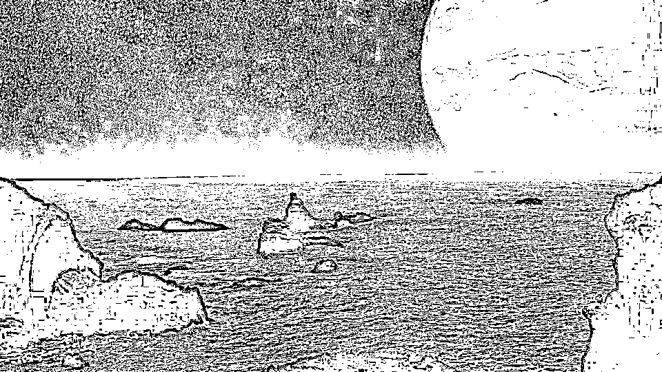

**费用**

**本期演讲售价：****980 元** **（送价值 480 元的一年 ISAR 会员资格） **

**ISAR 会员优惠价：****680 元 ****（会员购买前请联系负责人修改价格）**

购买请扫描下方二维码

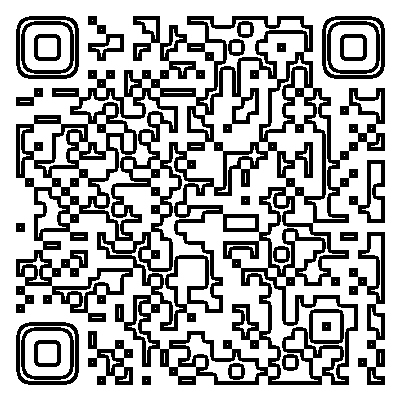

遇到任何问题？

负责人：若道-童童

（微信：nodoorDaivd）

请备注“国际占星日”

**退转课程**

**退款原则请详看《教学协议》，如有疑问请咨询童老师。**

****报名请点击“阅读原文”****

# 太阳进双子座丨剧烈的震荡后，你需要这个绝佳的调整重组期

> 原文：[`mp.weixin.qq.com/s?__biz=MzA5NjA0NTAxNg==&mid=2651474357&idx=1&sn=d58ab36d203e65a2ccdd1a087e6a5c84&chksm=8b48fb02bc3f7214427e085558e1d3bca3f42ccb8ec5d7074cda5aa24f79348700963db879ca&scene=126&sessionid=1692737812#rd`](http://mp.weixin.qq.com/s?__biz=MzA5NjA0NTAxNg==&mid=2651474357&idx=1&sn=d58ab36d203e65a2ccdd1a087e6a5c84&chksm=8b48fb02bc3f7214427e085558e1d3bca3f42ccb8ec5d7074cda5aa24f79348700963db879ca&scene=126&sessionid=1692737812#rd)

********************☆ 后**********************台**********************回复“今日”，给你一句生命态度********************

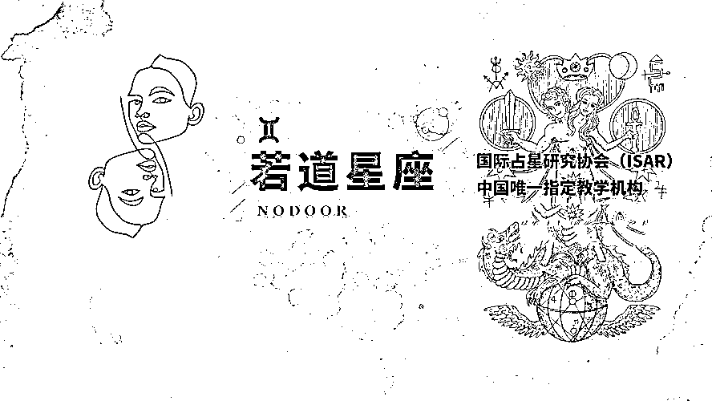

作者/郑玮玲 ISAR 认证占星师
编辑/玫瑰 封面/书君 图片/pexels

5 月 21 日 9:23，太阳进入双子座至 6 月 21 日离开。太阳在双子座 0°这一天正是小满节气，夏天由此向我们徐徐展开来。

**小满**小满三候：一候苦菜秀，二候靡草死，三候麦秋至。桑叶肥壮，幼蚕疯长，感天地火气而苦味成的野菜生长繁茂，而细软喜阴的草在烈日下枯萎，田地里麦芒渐丰，籽粒灌浆饱满。这是一个**无为而治，不言之教，自然赋予**的过程。

****

**小满气全时，如何靡草衰。****田家私黍稷，方伯问蚕丝。****——元稹**小满时节，孟夏之月，白昼增长至最长的光景，万物生长积极、旺盛，天地阳气至满盈。**快速、成长正是对应双子座的词汇。****小满对应的时空卦为：水天需。**“需”意为**等待，需要，饮食之道。**时至小满，君子以饮食宴乐，此时天降雨水才利农作物成熟，人类生长快速的青春期是体能最好，精力最旺盛时期，但却需要等待心智、能力、技艺成熟方可实现创造。此时空意味着**筹谋、立志、奋斗的事也不宜操之过急，调养身心，等待时机为上。**

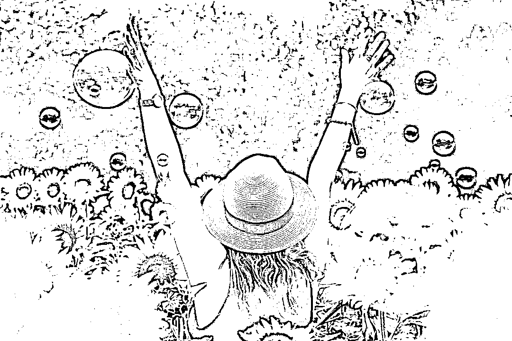

**太阳在双子座****双子座作为风象星座，代表人类头脑心智探索万物万象的进程，也表达了万事万物之间交互的过程。**这是一个最擅长**学习、求知、解惑**的星座，为人类带来知识面的拓展和心智的成长，因此双子座是**学子、青春和年轻人**的符号。作为变动星座，双子座透过新鲜、快速的信息诱发、激励心智的敏捷和灵活应变的能力，我们与生俱来的好奇心就在双子座的氛围中得到满足与进化。**双子座既是内在的思维、思考，也是声音与发声，水星的守护将双子座与喉轮、表达力紧密相连。**最好的一面，双子座为我们**提供了心智与情感向外输出的通道。**有时未成熟的双子座能量会引发**过度表达**，诸如“半罐水响叮当”，聪明反被聪明误的情况，正如“小满”之境，并非壮大、圆满。然而双子座不是一个需要学习闭嘴的星座，在这里我们要**学习聆听与表达，学习与思考，获取与传输成为一个融汇贯通的整体。**水星作为双子座太阳的守护星，此轮扮演了极具潜力的大臣角色。5 月 10 日开始的水逆还将持续两周，而水星回到水逆开始时的双子座 4°则需要到 6 月 19 日，届时，太阳已经来到双子座 27°，即将离开双子座。**水星的逆行将心智与思考模式转移到个性化、内在的旅程之中。**独立、深化的思维路径才能打破个人寻常模式，更符合未来生命进程的思考维度和表达、传输方式将在水逆加太阳双子座的进程中被孵化成形。**未来一个月是一年当中极佳的震荡、变动后的调整、重组期。**我们可以**将精力投入工作、事业、职业的核心目标整改和运作模式转换中，着力于未来核心生命道路的选择与经营，以及当下最棘手的生活命题的调适工作中。**当然，被水逆影响的重点人群，也就是有**个人行星、四轴、交点位于固定星座（金牛座、狮子座、天蝎座、水瓶座）尾度和变动星座初度（双子座、处女座、射手座、双鱼座）**的人会**面对最多、最紧要的调整与适应。**所有人也都会在水逆、太阳进入双子座的进程中，**加深体会内在、独立思考的重要性和价值。**

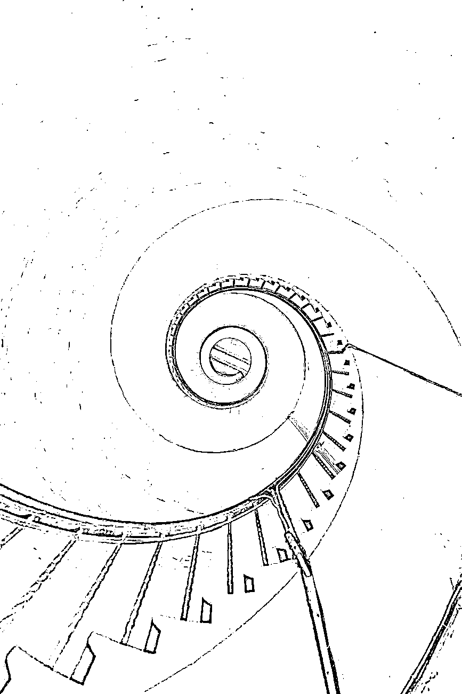

在此轮太阳双子座进程中，我们可能**面对更多的现实停摆、停顿、整改和规划，留意并链接新的讯息，新的时代范式对当下至关重要。**毕竟双子座就是赋予生命永恒的鲜活与新奇，在变动中适应生命的裂变，从拥挤、消耗的过往中走出来，透过寻觅与学习支持独立、鲜明的个体进化。每个人都想从时代中掘取力所能及的价值，但我们更需要主动、积极去适应新时代的脉博。逆行的水星引导人们去做一个时代的冥想与感知，太阳双子座的进程就是我们意志力的战车调整启动的时机。**太阳在双子座的行进**当下我们还处在今年的食季之中——连续两次的日食与月食。虽然最近一次在金牛座—天蝎座 25°满月月食已结束，但**食相的能量将震荡至 6 月 1 日。**因此，在太阳进入双子座第一周内，它正在出离与月亮北交点的合相。月亮交点把集体对于生存、安全感与灵魂求索的诉求带到了生命现实中，太阳如同生命的守护者将这向生的渴望传递到生活的分分秒秒。天地厚生之德，逆境全然教会了人类生之宝贵与生命最积极的意义。**食季的清理让很多人在过去的三周内完成了生命重大转换。**新的意识是为了符合当下的生命情境演化，更是让我们在活着的时候完善自我，摒弃陈旧阻碍向上进化的模式。清理、简化带来的朝向生命核心目标——自我成长的聚焦与进化。新的思维方式，新的工作模式，新的合作与关系的开启将让失去和放弃的永不再回来，所有不同的变动其实都在同一个频率当中。

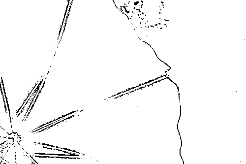

**太阳与火木六分**

**周期：5 月 16 日-5 月 30 日**

**重点影响人群：有个人行星、四轴、月亮交点位于白羊座、双子座、巨蟹座、处女座、天秤座、射手座、摩羯座、双鱼座 0°-9°，以及金牛座、双子座、狮子座、处女座、天蝎座、射手座、水瓶座、双鱼座 23°-29°的人。**

**火星与太阳从 4 月 15 日开始一直保持着六分相，5 月 16 日天蝎座月食当天，太阳便开始了与木星的六分相。**这戏剧性的时空让我们更深一步明白了月食的能量递进：太阳将月食的张力与转化力进一步扩展到现实行动中来。太阳是发光体，有光的地方希望无边。天蝎座月食牵引我们深入情绪暗潮和悲伤暗流，看向阴影深处。明暗的强烈对比才让生活的错位重新修正、对位，暗藏的创痛得以浮现。继而，沉入阴影、创伤的疗愈，或是投入现实的清理与解困便都是在月食能量的余波中。太阳与火木六分为集体意志提供了强有力的援助和鼓舞，即将进入白羊座的火星将显化出凡的变幻之力，**传递灵感与理想的意图，帮助提升和实现曾付诸努力的理想目标。**木星则将自由信仰燃点为火炬，照亮从阴影、困境中走向自由归途的人们，让一切为理想创造的行动更加快速、剧烈，加倍燃点、鼓动起来。双子座的太阳是发出声音、想法的意志力，白羊座的木星呼吁纯粹的自由，助力勇敢的个性需求，火星将行动力从理想层面引入现实，势如破竹般的力量将推开一切对自由的禁声、阻隔与限制。火木合相在此时表达了**对自由的高度尊重，任何压制自由，歪曲事实，制造阻拦的行为都会引发众怒，形成难以平复的波澜。****这组相位支持所有积极为自己发声的行为，鲜活、个性化的表达是穿越旧有阴影的必然之举。**独立、勇敢的个体是被当下时代所需要和呼唤的，勇敢充满真知灼见的声音能冲击并唤起更多人对独立、自由的渴望和行动。在这个鼓励求新、求变，充分表达个体的时代抓住信息的快速更迭的节奏，去实现充满意志的创建。

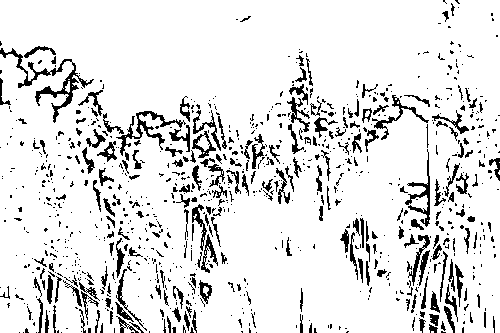

**太阳与海王星四分**

**周期：6 月 8 日-6 月 25 日**

**重点影响人群：有个人行星、四轴、月亮交点位于****双子座、处女座、射手座、双鱼座 18°-29°，以及白羊座、巨蟹座、天秤座、摩羯座 0°-3°的人。**

日海四分正值水逆结束后阴影期，**迷幻效应顺势而来，更需注意信息传达中的误会与延滞效应，在学习与理解上需要打开全方位的感知才会获取准确知见。**同时，日海四分提供了**超越头脑和现实的可能性**，在生活、工作、学习、关系等各个层面，都值得用全息的感知、想像力去发展对未来的创想。经历食季的震荡之后，各种新的篇章展开，此时的构想是否能落地，便是支撑起未来的天空的决定因素。**任何一种对自我救赎的渴望会显化得无比剧烈。**海王星提醒我们**所有被误以为“爱”的东西，都值得扒开云雾一探究竟**。要求、索取、无助、迷茫、操控都可能披着慈悲、仁爱的外衣或是受其诱惑误入歧途。只有纯然无杂质的白色的光亮能清洗尘垢，显露光华，带我们超越痛苦。而这一切的发生不可能经由外力实现，深切的自我之爱绽放于痛苦中。**日海四分，学习与痛苦和解，放手所有不切实际的幻想，才能回到爱本源。**要解除爱的迷障，我们需要**深入、坚定的灵性学习**。此时的我们都需要清晰有力的灵性引导与修习，深度的自审与感知，精进的修持与清明的知见让我们走向疗愈与自我超越。在太阳的光耀下万水千山都在显露着爱，在海王星的护佑下微小万物都能映照心灵的本质。在命运的洪流中，爱就是所有，被爱是无求。

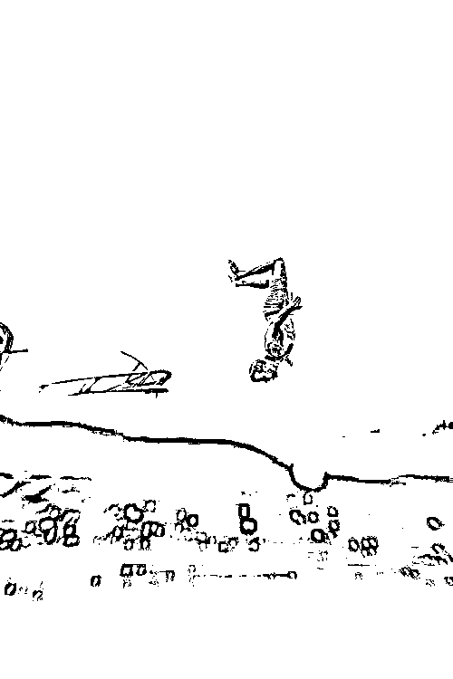

**太阳与土星三分**

**周期：6 月 8 日-6 月 24 日**

**重点影响人群：有个人行星、四轴、月亮交点位于****金牛座、双子座、巨蟹座、狮子座、处女座、天秤座、天蝎座、射手座、水瓶座、双鱼座 17°-29°，白羊座、巨蟹座、天秤座、天蝎座、摩羯座、双鱼座 0°-2°的人。**

**土星在 6 月 5 日开始一年一度的逆行。**此时的日土三分带来了**向内的沉淀与凝聚力**，日海四分也在同时展开，唯妙唯肖地显化着集体的梦想与落地现实的粗糙和痛楚感。

期待太久却迟迟不能结束的疫情，等待太久却没能解封的疫情，计划太久却迟迟不能出行的旅行，这些，便是集体层面此时最无奈的麻木。

土星逆行让我们有机会再次回顾和修补春天未尽的功课，在我们曾积极付出努力的地方也会将岁月的亏欠用另一种方式弥补返还。日土三分推动着精神、意志朝向更具前瞻性、未来化的集体愿景迈进，每一个对自由、真理的渴望都会经由你扎根、努力的土壤中坚定生长。**坚定发声，表达自我的人都在自我赋权的进程中重返内在权威，执掌未来的命运。****太阳在 12 宫的行进**注：以出生星图上升星座度数 30°范围内的上升星座为准。如你上升在 0°，可以完全参考下列内容；如你上升在 29°，则需参考下一上升星座。**若道君：****你可以在 app store 或者应用商店搜索“若道”下载 app，输入个人档案，查看行运盘（也可以使用其他星图软件），找到行进太阳落在出生星图的第几宫，然后对照下文查看。****例如下图中，比尔·盖茨上升在巨蟹座，行进太阳在个人星图的第 11 宫。**

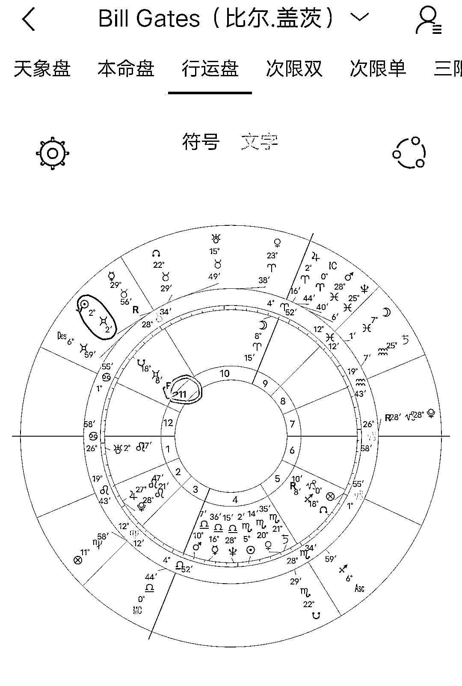

**上升****双子座****，太阳行进在*****1*****宫**

此阶段主动或被动地对自我提出了更高要求和目标、挑战，你正在改变策略，更新创造，新的自我定位也将由此开始。**未来一个月将经历大规模、大尺度的整改、调整。在工作和事业中坚持鲜明的自我风格，清晰表达个人主张才能拓展新的局面。**
由于水星逆行，会**需要一段时期的自我反思、整顿与打磨，目标与项目搁浅或反复磋商的过程，也包括一定程度的身体工作。**休养生息也是为了更好地使用生命能量，回到自我之爱。**所有经历积累的项目在未来 2-3 周内仍会顺利进入流程甚至完成预设目标和进度。**

**上升****金牛座****，太阳行进在*****2*****宫**

**一些持续的稳定在食季中被震荡、碎裂，未来一个月需要内在修补和深度的心灵工作来补养自己。**虽然着眼于创造价值和自我实现，但此时的行动不易展现，灵感的动态却值得透过别样的方式去记录和挖掘，比如：**记录你的梦境，提取想像力等。**投入一些灵性活动对当下最为有益：**冥想、瑜伽、唱诵**等都能让你从困顿的当下解脱出来。片刻的宁静为自己的灵感创造新的空间，内在静谧的自我对话也能帮助快速解围。

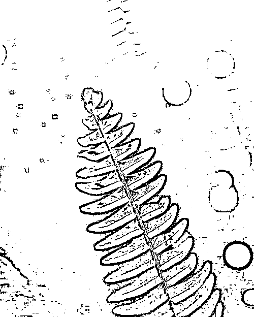

**上升****白羊座****，太阳行进在*****3*****宫**

当下是你感受到自己活力满满的时期，所有春天播下的种子，也许能快速看到成果。**你只需要更深地坚信与持续的行动，把已进行的项目推向高潮。** 

同时，为了更新创造和递进式成长，此时的你还需要**更频繁地学习、交流与探讨**。在那些能支持你的社群中，在所有能启迪你的环境中去敞开心灵的耳朵，与他人交换意见，你便能成长更加快速，突破长期以来的瓶颈。

**上升****双鱼座****，太阳行进在*****4*****宫**

努力是一件看似徒劳的事，当下的你有点懈怠在所难免。命运为你关上一扇门，就会为你打开一扇窗。此时的关注与重心可以放在**心灵成长与家庭生活**中，陪伴是最好的爱，而爱能解除一切的困境魔咒。 

**如果与你的家人心存隔阂，也可以趁此时期好好沟通，尤其是涉及核心价值观、世界观，此时有机会全面清晰并解决问题。**水逆加上太阳的行进，给予了**家人之间和谈的机会，也是消除误会的契机。**创造性的能量一旦在思想中引发共鸣，一切旧有问题将为你们的未来打开新的局面。

**上升****水瓶座****，太阳行进在*****5*****宫**

压力与忙碌可以暂时抛在脑后，未来一个月你可以**融入更有创造性，更令人轻松的活动中。无论是工作还是家庭生活，你将因为充分的话语权被看见和支持。****对一直坚持的目标投入更多的学习、交流与探索，**而此时可作为长期积累与结果的检验期，将有效的总结运用到未来。**在触及金钱价值的话题中要等待清晰**，不要不经思考而答应一些超出时间、能力和金钱范围的事，审时度势，量力而行。

**上升****摩羯座****，太阳行进在*****6*****宫**

在工作中需要努力表达内在的想法，此时有精力高度投入工作，而你积累已久的想法和动力需要一个展现的机会，这个机会需要自己去争取。**当下的体力和精力都是较好的状态，高效的时间管理可以协助你事半功倍。**  一些长远的计划此时可以进行一番回溯、修整，因为一些变化的因素在当下可能为你带来新的视野，切换角度之后你可能对未来生出别样的打算和期待。

**上升****射手座****，太阳行进在*****7*****宫**

**如果感觉很累，就让自己歇一歇。**暂时放下一些无法承受的事，或暂别一个历史舞台。将你的期待与关注投入到未来、长期性和更高远的目标中，身心的休整在当下是为必要。 

你很渴望承担更多责任，展现更积极活跃的一面，但此时**积极投入创造与旧有的肩负需要一些调整，重新分配自己的精力和时间才能带来最佳的效率。****与你的伴侣和合作者深入长谈也是极期重要的事，以此解除旧有的误会，并达成未来的默契，创造新的合作模式。**

**上升****天蝎座****，太阳行进在*****8*****宫**

努力去做一个**打开心扉的伴侣、合作者和信息分享者**吧。在此阶段你的信息显得非常宝贵，**你身边的人，尤其是伴侣和合作者很需要你的分享，并从深入的共享与探讨中你们能创造新的相处、相知模式。**你的魅力指数也将因此而提升。
**工作中的高效和积极将呈现出来，但家人之间的摩擦与挑战可能还在继续。**从你当下最舒适的关系中获取一些支持、帮助吧，一切由你的分享开始。

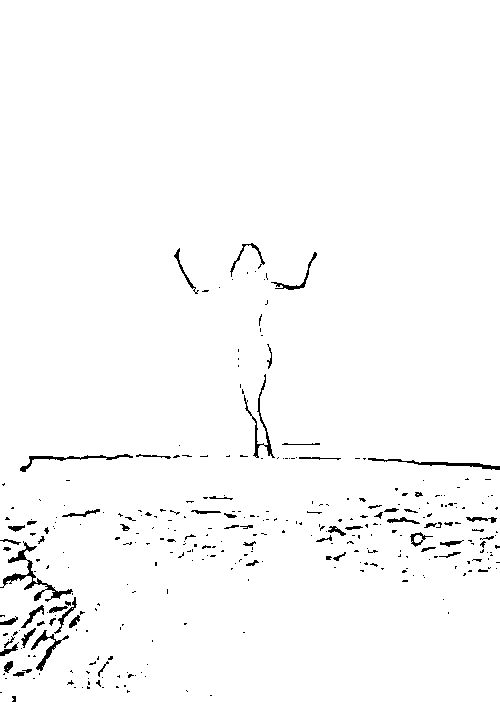

**上升****天秤座****，太阳行进在*****9*****宫**

**此时的你想要实现、展现、获得更多，对生命的体验欲也胜过一切。**即使不能旅行、游学，此时的你也**需要一些远足与心灵历程来实践你的心灵抛物线**。所以一些**线上心灵讲座、课程、工作坊，或是参观展览、浏览博物馆，阅读一本深度的书籍**都成为了此时的必要，或者，**此时的你正在写论文。** 当我们生命渴望积极扩张的时候，心智与心灵的活跃度都一并提升了，但只有身体的指令能决定我们能走多远。所以，**仍需花些暗关照自己的身体，切勿因为太过投入学习、工作、提升而造成健康问题。**

**上升****处女座****，太阳行进在*****10*****宫**

忙碌求索、教学与自我学习的你可能感觉到**一度投入忙碌忽略了与伴侣的沟通与联系，意识到急需与伴侣深入沟通某些议题。****也许长期以来只是习惯了相处，而忽略了对方真正的需求和意图，对方可能陷入的困惑也许正是你们之间深刻的需要沟通解决的议题。**为了不让问题扩大化，不受到某些外因的刺激，**真诚的沟通**显得尤为重要。
水星的逆行也为你带来一系列**延迟、内省与独立的清晰**，未来一个月是一个极佳的**事业梳理期，回顾旧有工作模式，重新找到新标准，新高度能助你在未来实现更多的价值。**

**上升****狮子座****，太阳行进在*****11*****宫**

**处在事业活跃期的你正在努力产出，未来一个月还需要花些时间精力努力完成对未来、团体的构建与团队沟通的工作。一些令人兴奋的创建正在逐渐实现的进程中。**为了让你的创造与价值展现更为稳定坚实，此时有必要**加入一些哲学性的探索、研习，或是将知识、经验投入到有效的实地体验过程中，实践出真知**。也许**从伴侣或合作者角度听到的一些反对意见**，对你的创造性工作是更有支持力的，能将你所不能看到的缺憾进行弥补和完善。

**上升****巨蟹座****，太阳行进在*****12*****宫**

**也许你一直在努力做一个“坚强的小孩”，生活中的无助与幻灭却越发剧烈呈现出来。**此时的你会有些**无力，无从表达，甚至无所适从感。**但未来已来，并已透过食季向你揭示出你预感的正确性。**在你内在的某个方向，你已经铆定的目标将会在不久的将来变为现实。**当下值得去为梦想努力一把，忘掉这暂时的悲伤与失落，倾听你内在的声音与激情。真理和信仰不会辜负每一个为它们举起火炬的人们。

**版权声明：**原创文章由作者授权首发于若道平台，欢迎转发，反对抄袭。友号转载请申请白名单。

**郑玮玲**

ISAR（国际占星研究协会）认证占星师（2016 年获得）

若道占星专栏作者

将占星咨询、教学与音乐、舞蹈相结合的疗愈者

**微信号**：zhengviolin

**新浪微博**：@郑玮玲

**微信公众号**：Sampriya-Astrology

长按打赏

**20 位来自世界各地的占星师****带来 19 场沙龙——新世界的觉醒****详情可点击下图**

**学习占星学****点击下图了解课程详情**

**

**微信又双叒叕改版啦，不想错过若道君的推送？**

**就把若道设为星标吧！**

**▼**

**喜欢记得点一下在看哦☟**

**报名直达入口**

# 上证政策底已经出现，受火木合相影响的市场怎么走？丨梅里曼 6 月上证+黄金报告上线！

> 原文：[`mp.weixin.qq.com/s?__biz=MzA5NjA0NTAxNg==&mid=2651474357&idx=2&sn=1dd70a90e2ea5b1351c8d9eb7342b72e&chksm=8b48fb02bc3f7214b27b2dcbebc7b32be9dab98bee34853299d6dca571248cb279cfdc9322d2&scene=126&sessionid=1692737812#rd`](http://mp.weixin.qq.com/s?__biz=MzA5NjA0NTAxNg==&mid=2651474357&idx=2&sn=1dd70a90e2ea5b1351c8d9eb7342b72e&chksm=8b48fb02bc3f7214b27b2dcbebc7b32be9dab98bee34853299d6dca571248cb279cfdc9322d2&scene=126&sessionid=1692737812#rd)

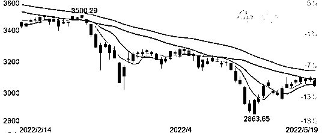

| 上证指数日 K 线

**自 2008 年以来，国内 A 股市场共出现四次明显的“政策底-市场底”组合。**分别是 2008 年 9-11 月、2012 年 9-12 月、2015 年 7-2016 年 1 月、2018 年 10-2019 年 1 月。

自 4 月 25 日梅里曼老师撰写上份报告以来，上证指数于 4 月 27 日跌至 21 个月新低 2863。从那以后，上证开始反弹。**可以比较乐观的说，4 月 27 日应该是一个政策底。**

梅里曼老师曾经在 5 月报告中修正了他在 4 月报告中认为 3 月 16 日的低点预示着新一轮基本周期开始的判断，因为上证指数在 3 月 16 日，基本周期的第 18 周跌到 3023 后继续下跌，那么显然，从 2021 年 11 月 10 日开始的这次的 13-20 周的基本周期发生了扩张扭曲。

因此，他在 5 月的报告中预告：

**“我们可能会看到一个扩张的 22-26 周的基本周期现在发生，如果是这样的话，低点可能在未来两周的任何时间发生，这将对应我们的关键反转日期 4 月 28-29 日和 5 月 6-9 日，+/-3 交易日 ……下行价格目标为 2866+/-100 或 2605+/-131。”**

4 月 27 日的低点 2863 发生在这个基本周期的第 24 周。股市休假期间的 5 月 1 日发生金木合相和金牛座日食，而此前，市场反弹，反弹至今持续着。**那么 4 月 27 日是不是基本周期的结束和开始？**

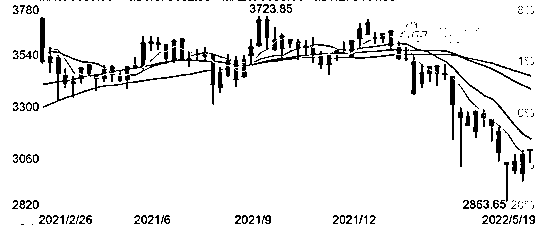

| 上证指数周 K 线

还有更重要的是 33 个月的中长周期。因为正如 5 月报告所说：

**“5.5 年周期的第一个 33 个月半周期应于 2021 年 10 月+/-5 月结束，或 2022 年 5 月底前的任何时候结束。”“我们正处于这个时间段的末尾，所以如果上证综指要重现始于 2019 年 1 月的看涨趋势，那么它必须在 5 月之内触底。否则的话就表明周期扩张了。”**

**所以，市场底什么时候会来，5 月下旬水星逆行期，火木合相，6 月水星顺行，土星逆行，金星进入金牛座又该注意什么？**

6 月股市应该如何操作，金融占星大师雷蒙德·梅里曼的《2022 年 6 月上证指数报告》已上线，你可以听听梅里曼老师的看法。

**《2022 年 6 月黄金报告》也已上线，欢迎购买。**

**也欢迎参加雷蒙德·梅里曼《2022 下半年金融占星投资沙龙》，将帮助你对 2022 年下半年的市场风云变化加深了解。**

**扫描下图二维码了解详情**

▼

**投资有收益，投资有风险，希望金融占星学的研究帮助你更好地评估你的投资。**

**6 月上证报告上线**

**上证指数月度报告价格****单月报告**：280 元/月 **季度套餐价格**：780 元（260 元/月）**年度套餐价格**：2400 元（200 元/月）**双报告年度套餐更优惠（直降 900 元）****12 个月黄金报告+12 个月上证指数报告：仅需 3900 元****长按下图识别二维码购买上证指数报告**
▼

“**黄金是金钱。其他的只是信贷。**

**——约翰·皮尔庞特·摩根**

”

**4 月份美元经历了猛烈的升值，而黄金也经历了如梅里曼老师报告中的下跌。**

2000 年以来美元经历了四次明显的升值周期。分别是：

*   **2008 年 3 月 17 日-2009 年 3 月 4 日，美元升值 23.61%；**

*   **2009 年 11 月 26 日-2010 年 6 月 7 日，美元升值 18.66%；**

*   **2014 年 5 月 8 日-2015 年 3 月 16 日，美元升值 25.78%；**

*   **2021 年 1 月 6 日至今。**

**黄金价格走势和美元周期存在一定负相关性，**在第一次美元升值周期，黄金价格下跌了 10.48%，第三次美元升值周期，黄金下跌 8.91%，不过在第二次美元升值周期，黄金价格上涨了 37.33%。**从 2021 年 1 月 6 日以来，黄金目前已经下跌了 4.77%。**

美国 4 月 CPI 同比上涨 8.3%，比 3 月下降 0.2%，但依然在 40 年以来的最高水平。而欧元区 4 月通胀也高达 7.5%，连续 6 个月创历史新高。美国 4 月 PPI 同比升 11%，超过了市场预期。

6 月分美联储加息即将落地，货币紧缩已经提前产生影响。

| 黄金走势日 K 线图

目前，木星已经从双鱼座换座到了白羊座，而水星也开始逆行，**在这些因素的影响下，6 月份应该如何操作？**

黄金报告已经上线，上证报告也即将上线。欢迎了解。也可以按照季度和 1 年期订阅，有更多优惠。季度和年度的好处是，你可以持续了解梅里曼老师对于不断在变化的市场的看法。即便他某一次看法和市场不一致，你也看到在下一期他如何调整自己的看法，并看到金融占星在一个长期时间段内对你把控风险的帮助。而能够长期控制风险、尽量找到安全的投资时机才是投资的长久之计。

点击阅读原文，雷蒙德·梅里曼黄金周期 2022 年 6 月报告带来有 40 年黄金市场研究经验的世界著名金融占星大师雷蒙德·梅里曼对当前黄金市场的研究。

**2022 年 6 月黄金报告上线**

**黄金月度报告价格****单月报告**：280 元/月 **季度套餐价格**：780 元（260 元/月）**年度套餐价格**：2400 元（200 元/月）**双报告年度套餐更优惠（直降 900 元）****12 个月黄金报告+12 个月上证指数报告：仅需 3900 元****长按下图识别二维码购买黄金报告**
▼

**购买者需知**

**① **梅里曼市场时机学院《中国上证指数月度研究报告》是梅里曼市场时机学院（以下简称 MMA）的研究“预报”，而不是市场“预测”，是梅里曼老师及 MMA 金融占星分析师对人类活动周期历史与行星周期之间相关性的研究，二者在大部分情况下具有 80%或更高的相关性，而不是因果关系。报告中的研究完全存在错误的可能性。即便是非常认真的研究和几十年的研究经验，金融占星师无法总是正确地解读出各种征象在实际层面上会如何相互作用，并显化为事件结果。

所以请将报告看作一个研究参考，务必结合其他市场研究和你个人对市场的理解，根据你的自由意志做决策。

**②** 此报告一旦售出，**即不接受退款。**

**③** 上证、黄金月度报告每月固定 1 期，**并非都是在每月相同日期发布。**

**④** **我们收到英文报告的当天，即发布该英文报告。3 天后，上线报告中文版。此报告仅支持手机网页阅读，不支持电脑阅读和下载。****以上须知，请仔细阅读。一旦付款，即视为已了解并接受所有须知内容。**在过去的 40 年中，唯有梅里曼逐渐完善，并在梅里曼市场时机学院月度周期报告中阐释了将地球宇宙学与周期相结合的研究方法，以惊人的精确性预报了黄金价格发生重大变化的时间。**黄金购买 Tip**

各大银行均可购买黄金或黄金 EFT 基金，也可以在诸如天天基金或者支付宝购买黄金及黄金相关产品。不明白的可以百度搜索。

**购买后如何查看报告？**

**购买后有疑问怎么办？**请联系技术客服
**微信：nodoor201705**

**购买黄金报告直达入口**

# 520 丨他是不是“对的人”？金星 12 宫位解读帮你拿主意！

> 原文：[`mp.weixin.qq.com/s?__biz=MzA5NjA0NTAxNg==&mid=2651474323&idx=1&sn=294312aeafc06c032c8e69b9563bb2f3&chksm=8b48fb24bc3f7232aec96eda4e71fdff345cdf9773c0600e34b370ec45386dbbadc0b978e07a&scene=126&sessionid=1692737812#rd`](http://mp.weixin.qq.com/s?__biz=MzA5NjA0NTAxNg==&mid=2651474323&idx=1&sn=294312aeafc06c032c8e69b9563bb2f3&chksm=8b48fb24bc3f7232aec96eda4e71fdff345cdf9773c0600e34b370ec45386dbbadc0b978e07a&scene=126&sessionid=1692737812#rd)

******☆ ****后台回复“今日”，给你一句生命态度******

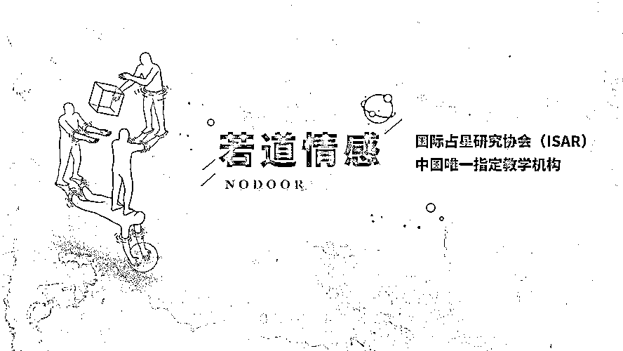

来源/astrotheme.com
译者/Leisha 校对/江艺编辑/玫瑰 封面/书君 图片/pexels

爱情总是和金星联系在一起。12 个宫位的概念，小伙伴们应该也不陌生了。那么，看看你星图里金星落在哪个宫位，通常可以有效地预见你会拥有一段怎样的爱情。是你的就别抗拒啦~

**金星的重要意义**

出生星图中金星所在的星座、宫位及与其他行星形成的相位显示了这个人对待爱的方式。金星可以落在十二个星座之一和十二个宫位之一，因此有 144 种可能的基本组合。在其他行星的影响下，这个数字几乎会无限地增长。

要理解金星的象征意义，需考虑以下几点：

**·** 首先是**金星所在的星座**，因为这是主线，或称基础指征，可以将其比作“爱”这个动词的背景色，描述“如何”去爱； 

**·** 其次是**金星所在的宫位**，重要性仅次于金星所在的星座，显示这个人最能表达其魅惑力的领域，描述“在哪里”；

**·** 接下来必须分析**金星与其他行星形成的相位**，相位可能具有放大的功效，可能会增添色彩，妨碍或阻止前面识别出的特征具体地显化出来。相位描述了性质的改变。

此外，还需考虑**第五宫及其行星和相位（如果有的话），以及发光体（重要性没那么高），即太阳和月亮**。评估金星的整体状态也可以使我们间接地了解案主在情感领域可能抱有什么期望。

至少总体而言和从长远来看，当一个人的情感丰富浓烈时，其期望被满足的几率就越高，这意味着他最有可能获得幸福。诚然，付出才会有回报，这一原则对爱完全适用，尽管爱情短暂偶然、变化无常，但也更确凿地证实了这个原则。

我们聚焦于最容易表达情感的人生领域，解释金星在十二个占星学宫位的含义。必须强调的是，文中所述的征象并不包含金星的状态，**金星的状态取决于金星与其他行星形成的紧张或柔和相位。**

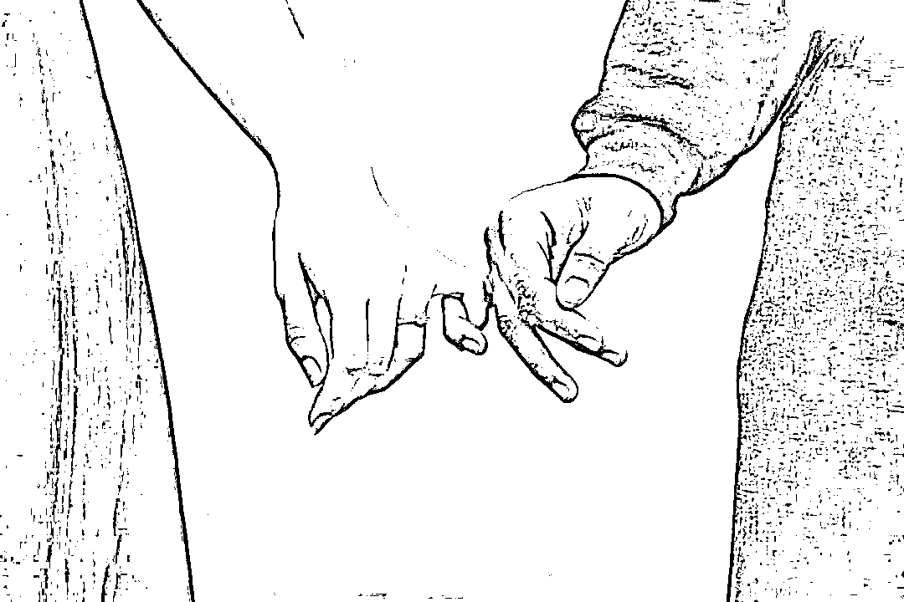

在一定程度上，金星的宫位落点额外描述了我们在哪些领域状态最佳，以及我们如何享受放松。它还显示出我们在哪些领域会有些被动，处于某种一知半解的状态中，而且不愿意付出努力……

本文的征象解读基于特定配置本身的含义，出生星图中存在其他不同或矛盾的元素，可能会弱化或更改其基本含义。

此外，我们通常难以将具体的经历与配置的象征性和内化特质区分开来。人工分析是把拼图的各个部分放到合适的位置，比如评估一个外向的人非常可能获得成功等。

以第九宫为例，第九宫凸显对遥远事务的浓厚兴趣。但距离的概念可以表现在抽象、心智或灵性的层面，而并不一定要体现为经常坐飞机飞到地球另一端。

占星学非常有效，验证其准确性对占星学子而言很有益，但……唯有经过数年的研究之后，占星学的奥秘才会显露出来。就此而言，占星学与其他学科类似，而且证实了我们无法轻易或立即地获取任何知识。

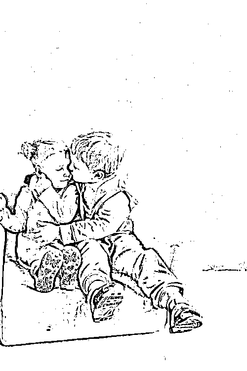

**当金星落在 12 个宫位**

**如何查看金星落在出生星图中的第几个宫位？**

**若道君：****你可以在 app store 或者应用商店搜索“若道”下载 app，输入个人档案，找到金星（符号：♀）落在出生星图的第几宫。**

**金星在第*****1*****宫**

**第一宫（及上升点）代表你乐于向他人展示的行为或性格，金星在第一宫为你的个性增添了一丝柔和的色彩。**她赋予你许多天然的魅力和轻松的态度，还有一种闪闪发光、迷人性感的活力。
以充满爱意和魅力的方式表达情感对你来说并不难，因为这就是你天性中不可分割的一部分，也是你看待事物的方式和向他人呈现自我的方式。

你想要讨人喜欢，而且对美、奢华、艺术、音乐具有浓厚的兴趣。你寻求万事万物的和谐，交际意识是你为人所知的主要特质之一。

当然，你在爱之中是幸运儿，很容易交到朋友，也完全有理由期望长久的关系，因为你愿意表露自己的情感，种善因得善果是迟早的事。你的行为和情感不矛盾，这是魅力的重要组成部分。

**金星在第*****2*****宫**

你通常会将所有物和情感联系起来。情感一开始会在不经意间慢慢出现，但是它会逐渐生根发芽，并随着依恋的加深而变得愈加强烈。然后，**你需要确信自己心之所属的对象是忠诚的，而且在某种层面上属于你。**

**情感与物质幸福通常密不可分，在良好的物质环境中体验爱对你至关重要，有情饮水饱是不可能的。**让你放任情感冲动的必不可少的条件是**拥有一个舒适华丽的安乐窝或身处非常奢侈豪华的环境中。**

这并不意味着你只被一己私利驱动。实际上，你时常会展现出**慷慨和富有爱心**的良好特质，但是你**很难将结为眷侣的幸福法则与事物的物质享乐方面分割开来。**此外，你渴望**获得情感层面的安全感**，如果没有，你会不惜一切代价地设法攫取这种安全感。

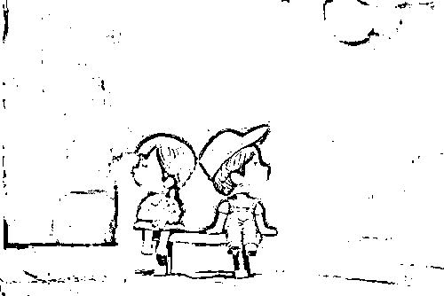

**金星在第*****3*****宫**

这个配置往往会使你**以多种多样的方式表现情感，当你同时与几个人交流，或身边都是了解你的人时，你的情感可能会变得尤为高亢**。

你与聊天对象拥有一些不同领域的共同兴趣，通常会激发你的情感，无论是文化、新闻、科学还是与旅游相关的领域。你可能会在频繁的短途旅行中敞开心扉，也许因为在这种情况下，你才能确定投入自我的程度不会超出你内心深处的真实愿望。

所有的通讯形式都让你青睐，无论是信件，还是互联网（虚拟世界！……）和电话。**你非常喜爱这种轻快又较为疏离的沟通方式，使你能畅所欲言，将爱与友谊混为一谈，而又不会过度质疑自己。**你可能是发信息的冠军，总是欣然接受变化和不经大脑的想法。让你接受唯一责任的约束真的太有挑战性了。

**金星在第*****4*****宫**

要获得满意的情感生活，你需要**强大又让人安心的家庭后盾**，只有拥有了这样的家庭后盾，你才能最终去考虑外面的世界，并放纵自己的浪漫激情。

也许你有一个幸福的童年，获得了很多爱和关怀，现在则不惜一切代价地想要重温这种令人安心又持久的温暖感受。

又或者，也许命运让你在童年时期饱受痛苦，历经情感上的孤独，现在则不惜一切代价地想要获得过去不曾拥有过的幸福。在这两种情况下，家庭关系的和谐在你的余生中都必不可少，家庭关系不和谐的话，你会感觉生命之花无法绽放。

你通常需要拥有这种安全感（就这个词的字面意思）才能敞开心扉。**当你开启一段认真的关系时，首先会考虑购买或美化自己的安乐窝，这当然得是舒适而华丽的**。

对你而言，室内装潢与安全感同样重要，你很可能会花大量时间搜寻反映你最深情感的艺术品，秘密而温暖，令人安心又合理。

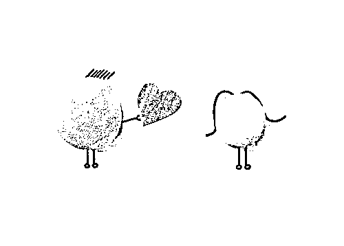

**金星在第*****5*****宫**

这个宫位和金星的相关性很明确。**金星在第五宫感觉非常自在，并会尽其所能地表现出强大的情感、艺术创造力、休闲娱乐、美术或音乐天赋，以及易于跟孩童沟通的能力。**

你的情感强度会得到大幅提升，而且比其他宫位更甚的是，第五宫的金星会在这个人生领域为你赋予积极进取的态度。的确，第五宫掌管创造力，金星使你能够将玩乐和干劲融合起来，不仅在艺术创造或娱乐领域，在浪漫恋情领域也是如此。

金星促使你无所畏惧地发挥创造力，或与心仪的对象积极地发展浪漫关系。此外，你会展示出自己最好的一面，而且相较其他日常活动而言，你愿意在此表现出更多的善意、热情和吸引力。

这个位置的危险在于，**如果沉溺于浪漫恋情或单纯享受自己光芒四射，你可能会沦为自身取悦能力或享乐能力的受害者。**

**金星在第*****6*****宫**

这个位置的金星比较特殊，因为金星象征意义的本质（情感、不限制、不控制）与第六宫的象征意义（约束、日常生活或工作、生活方式、无条件顺从、服务别人的原则）不能很好地相融。

这种关联会导致**情感受缚于一个框架或某种义务，但这不一定令人不安。**

**你很有可能在职业环境、某个协会或与工作相关的某项活动（如普通的职业项目等）中遇见自己的配偶或伴侣，**这一点尤其适用于男性星图。

这样的环境似乎可以更轻易地解除这种宫位-行星组合带来的约束或自我限制。此外，传统认为这种配置的人**十分喜爱和仆人（下属或社会地位比自己低的人）或同事发生风流韵事。**

而且，如果金星在第六宫没有形成紧张相位，你的日常生活就是愉快的。你重视工作，欣然将享乐与必做之事结合起来，体验愉快的邂逅，并不断发掘令人着迷的新兴趣爱好。

大多数时候，你会赢得友谊、奉献精神、同事的尊重，尤其是女性同事的尊重。工作对你有益。

你属于那种罕见的在工作中不感觉受限的人，反而会认为工作是一种日常乐趣，可能是因为你知道如何以令自己愉快的方式做事。只是要注意别在这种环境中过于频繁地陷入爱河。

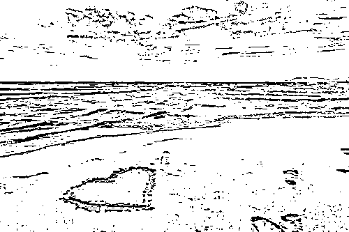

**金星在第*****7*****宫**

**热情和迷人的特质对你未来或当前的婚姻有所助益**。金星在第七宫意味着**承诺、需要得到爱的回应、情感的具体显化。**这里强调的是**爱与被爱的渴望**。

在浪漫恋情的领域，你全身心渴求和谐、外交策略、豁达的心胸，以便让你不惜一切代价地找到可能帮助你实现目标的共同点，可能的话，这就是一段甜蜜的时光，然后顺理成章地进入一段美好的婚姻。

如果出现任何问题，如意见不合或误解，你会立即承担起让伴侣冷静下来的责任，将重心放在维护你们的感情之上，同时巧妙地化解那些可能破坏你内心珍视的和谐的因素。

显而易见，你以这种自以为是的行为方式稳步向前，实现目标。然而，要付出的代价可能非常高昂。你对伴侣的依赖会变得实际。

令人惊讶的是，你根本不在意，因为你就是这样的人。全盘考量过后，你还是宁可继续保持自我牺牲的做法，收获自我牺牲的报偿，却不愿把自己推到风口浪尖，承受魅力减少的风险……实际上，让关系合法化就是让你最快乐的事，而且可以肯定的是，一旦结婚，你就会成为完美伴侣，竭尽所能地让双方都过上愉快的生活。

**金星在第*****8*****宫**

根据传统，这个配置将情感和性紧密相联。**陷入爱河时，你的情感强度会迅速攀升，将你带入激情的世界。你不会缺乏热情，而且你要么深爱，要么完全不爱。**你认为，爱的身体面向和欲望在本质上与情感相联。

此外，你很快便能为自己的行为刻意注入大量狂热的情欲，并将美妙情事变得与你的内心情感一样激烈澎湃！

**如果金星没有形成不利相位，占有欲的表达会相对积极。你乐于关爱自己的爱人，照管对方的经济利益**。金星在第八宫的确会维护一切与他人（尤其是配偶）资产管理相关的事务。你在伴侣和一般的生意中表现出善意，这通常会带来财产继承方面的美好惊喜。

有时，**当行进行星与你的金星形成四分相或对分相时，你可能会陷入执迷痛苦的嫉妒困境中**。这种情形并不光彩，因为俗语有云，无来由的嫉妒心是多余的，而且会造成伤害，然而在已经造成伤害之后，再来嫉妒又百无一用而且为时已晚。

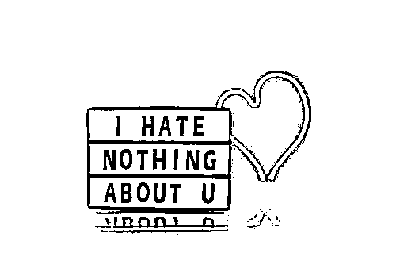

**金星在第*****9*****宫**

**你可以选择在出国旅途中遇到爱或热爱旅行，也可以选择将自己的情感聚焦于高远的话题中，以满足自己逃避现实的理想。**也许两种情况兼有。

无论如何，你常常**容易与外国人恋爱或结婚**，因为异国情调和背景差异对你有谜一样的吸引力，而且你对此毫无抵抗力。**这种描述更适用于男性，因为在男性星图中，金星象征理想的女性，而在女性星图中，火星象征着可能吸引她们的男性类型。**

情感方面，你在很早期的时候就会表达出**对空间和变化的渴望**。你**无法满足于日常事务，需要体验刺激、新颖、不寻常、未知的新事件。**

你渴望出门旅行，只有当身处于地球另一端的船上，或任意某个机场中，感官四处寻觅着，准备好被一个与你截然不同的人用其奇妙的魅力引诱时，你才会感觉良好。

**你的情感丰富而慷慨，有时甚至会被升华和理想化，因为你坚决拒绝受到任何形式的限制。**

驱动你前行的是一种要持续不停地获取更高知识的需求，这种知识仅存于灵性领域，或者从字面意义上而言，可以在探索异国他乡的过程中寻找，以此类推，也可以通过与拥有异国文化背景的人相处来寻找，因为他们能极大地丰富我们的人生。

你的个性被赋予了**高尚和高瞻远瞩**的特点，这是成熟的人的特征，这样的人不会从以自我为中心和过度简单化的视角看待事物。的确，从更高的视角看，所有重要事物的真实性终会更鲜明清晰地凸显出来。

**金星在第*****10*****宫**

**除非这个配置与其他行星形成了困难相位，否则你倾向于将事业和爱（甚至婚姻）联系起来，并将工作与享乐结合起来，这可能会影响你的命运。**

总体而言，女性可能会有助于你社会地位的提升，女性的支持可能会加快你获取成功的速度。你会毫不犹豫地利用魅力和吸引力来达到自己的目的。如果是男性的话，这一特征会更强。

有时，金星类型的工作会引起你的兴趣，如**艺术、美学、装潢、奢侈品交易或外交工作。**无论如何，你都极为重视自己的职业。你感觉十分良好，情感层面受人欢迎，这会带来极强的好运，将你推向顶峰位置，或至少是你渴望达到的位置。

通常而言，**你是个完美主义者，在实现目标的过程中十分仔细谨慎，这非常有助于目标的实现。**你绝不会忘记自己的目标，结交外交、政治或商业领域高层的重要人物，就是最让你感觉最高兴的事。你乐于充当调解者或中间人，收获你不可抗拒的魅力所带来的回报。在某些情况下，传统认为**拥有这个配置的男性非常爱母亲，这对他们的命运有极为有益的影响。**在某些不利的情况下，你可能**欠缺爱的恒心或毅力**。还有一种可能是，由于你的粗心大意，爱情可能会以某种方式使你的事业目标受挫。你可能会被女性控制，或可能缺乏威信。**你极有可能会努力平衡爱情和事业，却无法做决定，结果情场职场双失意。**

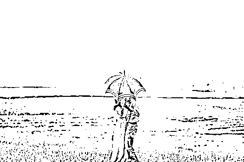

**金星在第*****11*****宫**

**你的社交能力通常令人钦佩，这种强烈的性格特征使你在爱情和友谊之间游刃有余。**你如此热情迷人，以至于你周围的人不知该如何自处。你最有可能从友谊中得到极大的满足感，而且在大多数情况下，你的恋爱关系会从友谊潜移默化地逐步变为真爱！

此外，**即使关系没能长久地走下去，你肯定也会与前任爱人保持良好的关系，你们会回到温暖的朋友关系，这曾是你们热恋的基石，现在还有回忆为伴。**

**你的情感很矛盾，既热情又不涉及私欲。**诚然，如这个占星学宫位及其天然守护星座水瓶座所示，在爱的问题上，你是个优雅宽容的人，让你更感兴趣的是集体和宽广的视角，而不是严格的个体之爱。你要实施的计划通常会受到他人的保护，尤其是大量女性友人的保护，她们非常看重你的教育、教养和出游的渴望，也许是去剧院、音乐会、开会等等。你潜在的弱点可能恰恰是源于你**疏离或不掺合**的行为，这样的行为对你而言很正常，但可能会伤害或冲击你的某些恋爱关系。你的伴侣可能会批评你身上在他们看来是**冷漠疏离或三心二意**的态度，并要求你改变表达情感的方式。在这样的时刻，稍微多流露出一点情感就是最能掐断挨骂苗头的方法……

**金星在第*****12*****宫**

不管你喜不喜欢，你都会印证一句法国俗语：“快乐生活的诀窍是隐秘行事”！就爱情生活而言，最适合你的是**安宁、平和、隐秘**，相关原因有许多，例如**腼腆、浪漫主义、羞怯**等。

无论如何，**你的确在秘密恋情中状态更好，而通常受世人追捧的合法婚姻却是最使你恐惧的事。**你是个**浪漫、情感不外露、有时还很忧郁**的人。你往往**会把自己的情感升华到灵性层面，因此你可能会经历一些独处的时刻，但不会因此受到严重的影响**。

的确，你有些宿命论，通常会将爱与磨难联系起来。这是出于你奉献和热爱的本性，还是出于你与生俱来的善良？

无论答案是什么，你都可能会**在困境或不幸的境况中遇见灵魂伴侣**。你经常会在这样的情况下建立重要的关系，可能发生在**封闭的环境中，如医院、修道院或监狱**，说不清为什么，但对你而言，这些就是爱情容易萌芽和发展的地方。你是个慈善家，拥有真正慈悲的灵魂，每当遇到充满不幸和不确定性的境况，你都会尽最大努力去做些什么。你属于会**带着诚意和热情投入人道主义行动**的那类人。如果现实的爱情生活不能满足你表达强烈情感的需求，那么这类工作会为你提供良好的情感宣泄出口。尽管外表会误导别人，但你在私人情感领域是腼腆含蓄的，你过得不会比别人差，因为你如此友善、忠实、慷慨。实际上，你有办法将逆境转化为提升灵性和命运的个人经历。此外，你还有幸得到某种庇佑，免受人生苦难。让你周围的人感到惊讶的是，**孤独的破坏性并不会影响你。**

**版权声明：**本文由若道翻译发布，欢迎转发，反对抄袭。友号转载请申请白名单。

**520 快乐！****你的灵魂伴侣是什么样子的？****扫描下方二维码了解一下吧！**

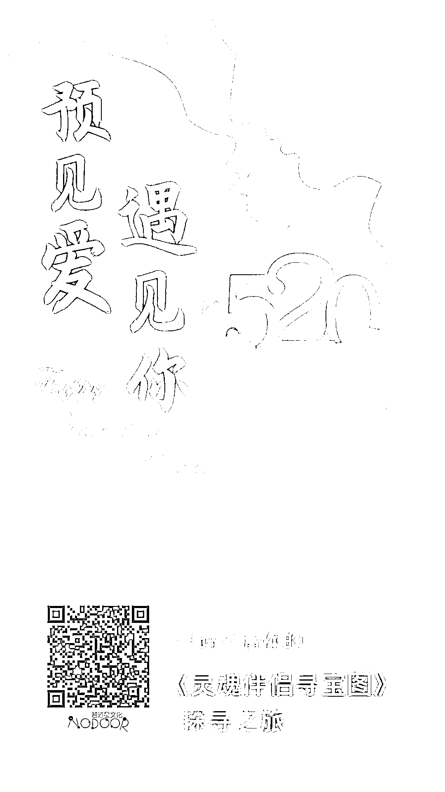

**20 位来自世界各地的占星师****带来 19 场沙龙——新世界的觉醒****详情可点击下图**

**学习占星学****点击下图了解课程详情**

**

**微信又双叒叕改版啦，不想错过若道君的推送？**
**就把若道设为星标吧！****▼**

**喜欢记得点一下在看哦☟**

**报名直达入口**

# 不知道出生时间怎么办？有困难你就找生时校正占星师！

> 原文：[`mp.weixin.qq.com/s?__biz=MzA5NjA0NTAxNg==&mid=2651474323&idx=2&sn=a676bbbcf13cefd2640b43e48e5ad3d9&chksm=8b48fb24bc3f72320cac5c4f1ff60578943ae8e48b7160c8e1589815566a517ca98943f8484c&scene=126&sessionid=1692737812#rd`](http://mp.weixin.qq.com/s?__biz=MzA5NjA0NTAxNg==&mid=2651474323&idx=2&sn=a676bbbcf13cefd2640b43e48e5ad3d9&chksm=8b48fb24bc3f72320cac5c4f1ff60578943ae8e48b7160c8e1589815566a517ca98943f8484c&scene=126&sessionid=1692737812#rd)

大家都知道，要从占星学角度了解自己和他人，
需要出生星图。 **而出生星图，离不开精准的出生时间和地点。**总有同学询问，**“我只知道大概的出生时间怎么办？”****“难道没办法得到正确的出生星图吗？****当然有方法！**占星学里有一支“技术流”， 专门帮你**从人生的”蛛丝马迹“中**， 探测到你的精准出生时间， 而这门绝技，就叫**生时校正**。生时校正需要高超的技术、极大的耐心，占星师同时具备**熟练解读星图&预测的技能。**在若道往年开设的生时校正课上， 有不少优秀占星师通过了若道的课程认证，成为**生时校正认证咨询师****如果你想知道自己的准确出生时间，****可以和他们联系哦！**

**以下是若道 2021 年的认证生时校正占星师**

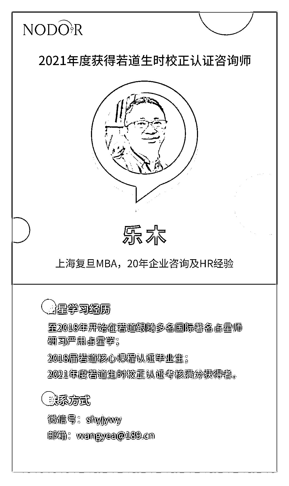

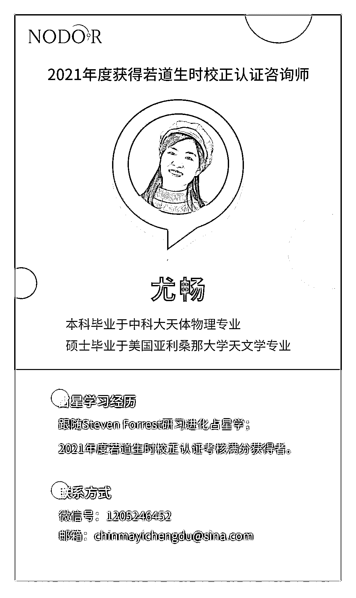

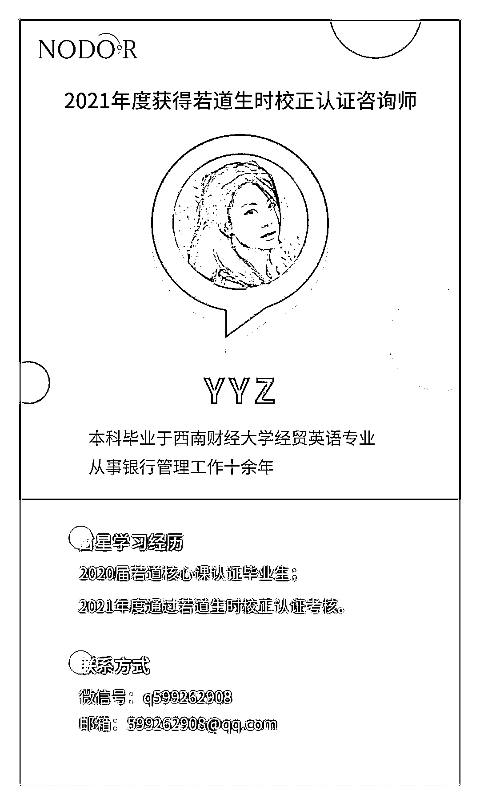

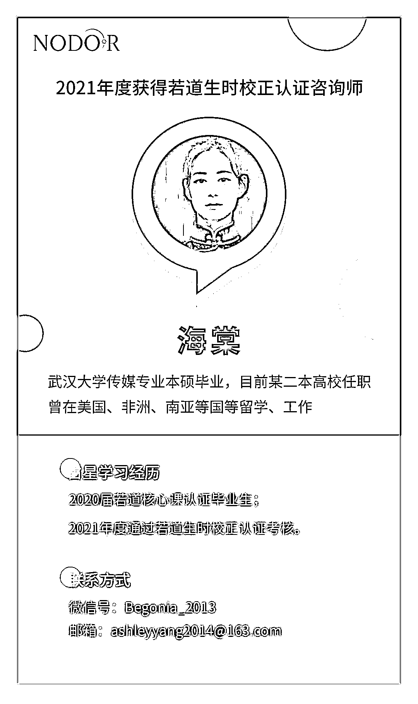

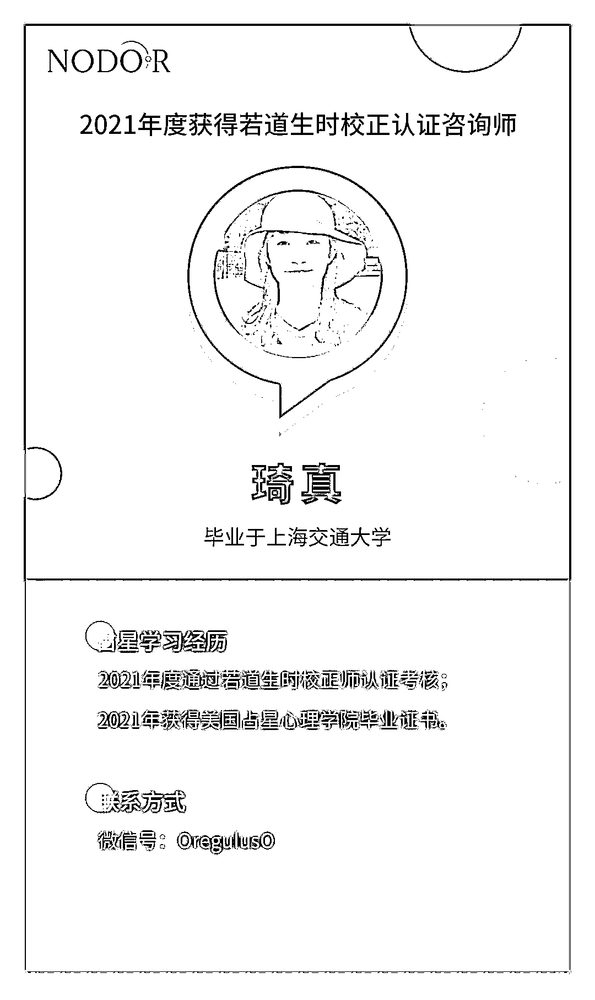

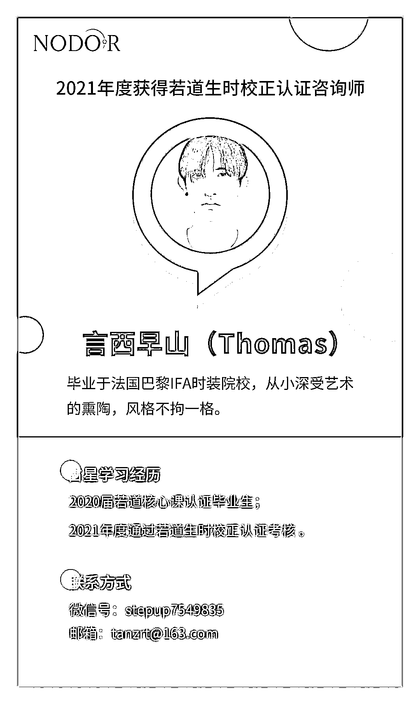

**以下是若道历年的认证生时校正占星师名单**

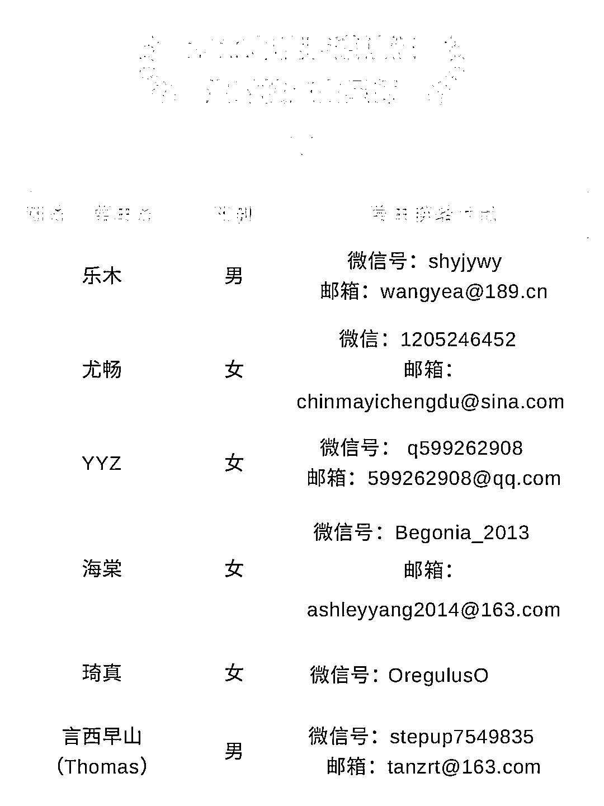

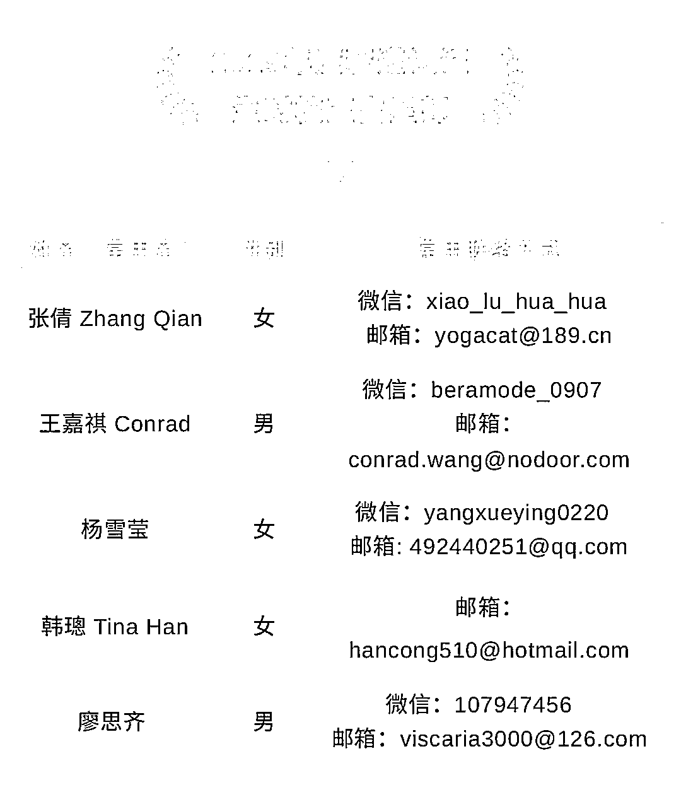

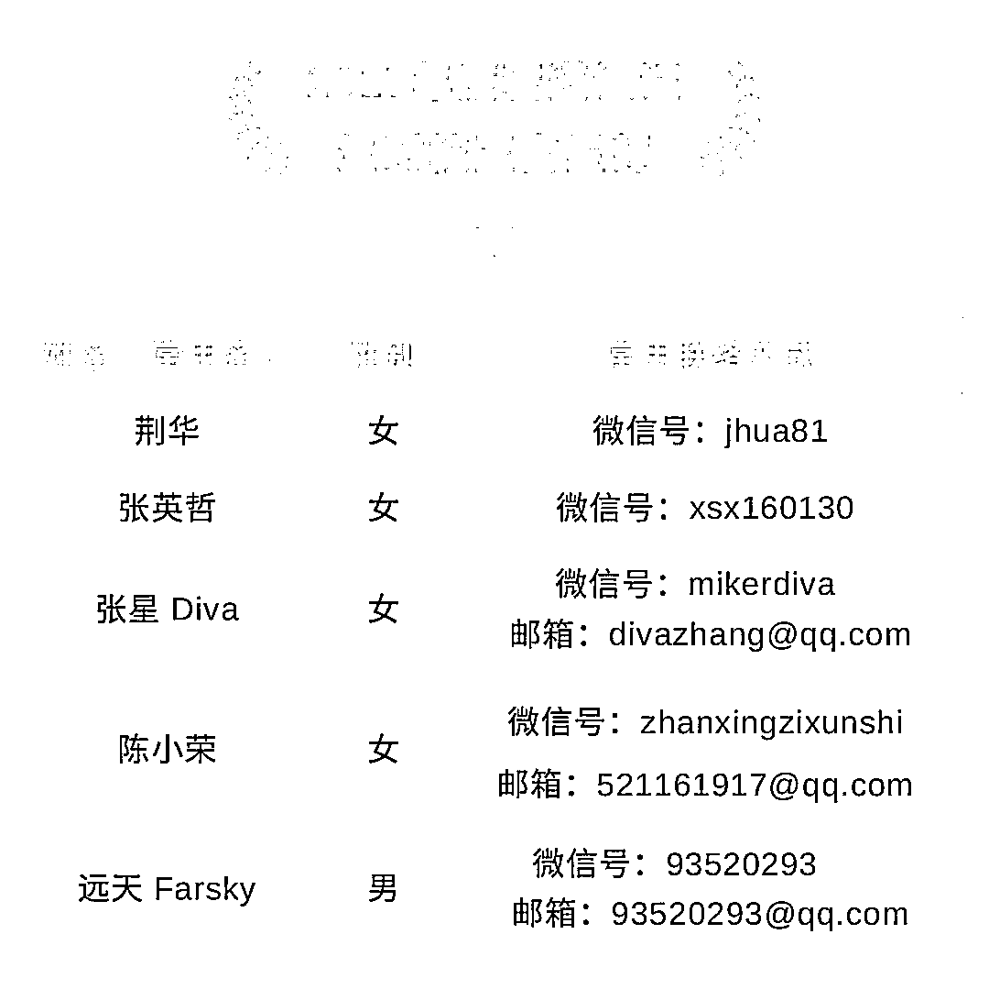

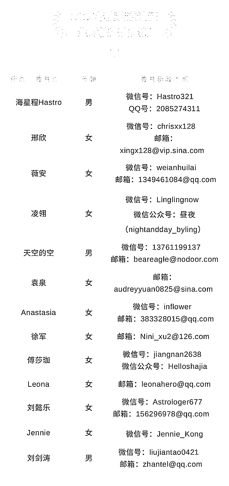

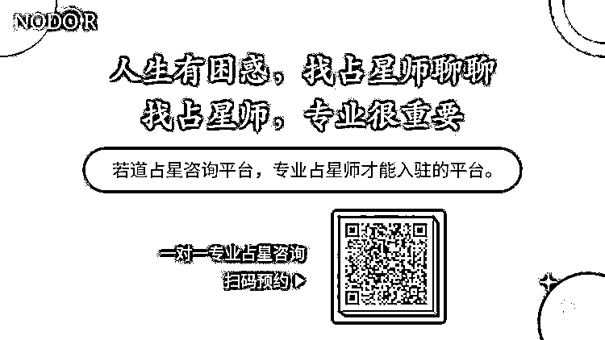

# 当 12 星座面对压力 | 藏在太阳星座里的秘密，你远比自己想象的要强大！

> 原文：[`mp.weixin.qq.com/s?__biz=MzA5NjA0NTAxNg==&mid=2651474261&idx=1&sn=8c6db9a72f614bf92d1f5d78b01bc77e&chksm=8b48fbe2bc3f72f4c05bc0f1312bdf4a6f16b52ecca1e166c2dae313d1a974516d5dc013f2b6&scene=126&sessionid=1692737812#rd`](http://mp.weixin.qq.com/s?__biz=MzA5NjA0NTAxNg==&mid=2651474261&idx=1&sn=8c6db9a72f614bf92d1f5d78b01bc77e&chksm=8b48fbe2bc3f72f4c05bc0f1312bdf4a6f16b52ecca1e166c2dae313d1a974516d5dc013f2b6&scene=126&sessionid=1692737812#rd)

******☆ ****后台回复“今日”，给你一句生命态度******

作者/大卫·瑞雷 若道创始人

译者/李含 校对/江艺 编辑/玫瑰

封面/书君 图片/pexels

文章来源/《风度》杂志 2020 年 4 月刊

如果请你对当下的生活做个评估，你觉得压力值会是多少呢？要知道。适当的压力是前进的动力，但高压会直接影响生活的方方面面，12 星座该如何缓解压力？一起看看吧。

**高压会危害我们的健康**

**生活在高压之下会让你的整个健康处于危险之中。**压力对你的情绪平衡和身体健康造成严重破坏。它限制了你清晰思考、有效运作和享受生活的能力。

对于压力，你似乎无能为力。账单不会停止，一天中再也不会有更多的时间，而你的工作和家庭责任总是很繁重。

然而，**你拥有的控制权比你想象的要多得多。**当然，压力管理没有一个放之四海而皆准的方法，这正是现代占星学的助力所在，它能够帮助你找到最适合你的方式。

**每个星座都有自己的压力管理能力**，你可以更容易地学会利用。**下面的黄道十二星座压力管理小贴士可以帮助你建立适当的压力管理机制。**

**12 星座如何应对压力？**1 白羊座

**快速得到结果并不总是有效，急躁和压力开始滋生。**幸运的是，你不是一个紧紧抓住压力不放的人。**换一种行动是你首选的解决方案**。

“现在不行吗？好吧，那我做点别的。”你说着，从长长的队伍或拥挤的餐馆转身离开。但是如果你堵在拥挤的交通中，不断变换车道来亦步亦趋的前进，你很快就会变老，特别是当你的 GPS 显示没有可行路线的时候。

当暂时受到别人或情况的拖累，深呼吸，考虑一下在这之后你将如何挤出一些“私人”时间，去购物或在健身房锻炼。**转移你的注意力会改变你的压力。**

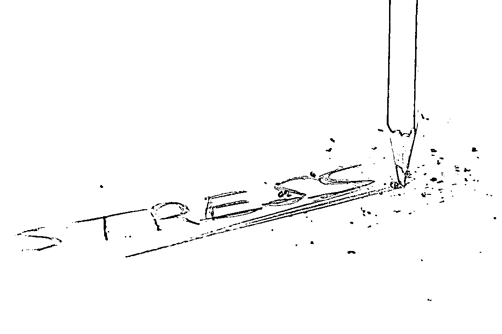

2 金牛座

**你很难变得有压力，部分是因为你避免了不舒服的情况。**但是一旦有压力，你通常会去**寻求口腹之欲的满足**——巧克力、舒适的食物、甜饮料。

在啜饮你最喜欢的甜奶茶或拿铁的时候，花一点时间思考你生活中欣赏的所有事物，不仅仅是物质上的，还包括你自己积极的品质和天赋。

**让一种对生活中美好事物的感激之情浮现出来**。当压力让你情绪低落时，这个简单的策略可以帮助你正确地看待事情。**为了缓解颈部和肩部的压力，做一次按摩。味觉和触觉可以帮你减轻压力。**

3 双子座

**持续的多任务处理会给你的神经系统带来很大的压力，但是没有什么比一个需要付出大量关注的无聊任务更能带给你压力的了！**绞尽脑汁寻找聪明的解决方案，你可能会忽略让你倍感压力的潜在感受。

与真正倾听你说话的咨询师或朋友谈谈心理治疗，可以帮助你**了解自己的感受**，“如果”你真的会表达自己的感受，而不是顾左右而言他。

表达你正在经历的事情是一种很好的宣泄方式，即使你现在无力去改变一个困难的局面。**不要只是听你脑中的喋喋不休，也要听听你自己的感受。**

4 巨蟹座

**定期与家人和朋友联系对你来说是减压的方法。矛盾的是，压力也可能出现在家庭聚会上！这是因为家庭和朋友极大地影响着你的幸福感。**向你在乎的人表达你的感受，而不是把它们闷在肚子里，可以避免很多胃痛。

**怀旧也可以起到治疗作用。**看一张最喜欢的照片，闻一闻唤起美好回忆的特殊气味，听一首最喜欢的老歌，或者拥抱一只宠物，都可以帮助你放松和减压。通常情况下，你会本能地倾听自己的感受，知道自己需要一段休息时间。

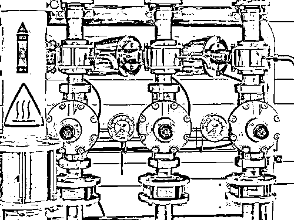

5 狮子座

**除了负责任的方式和积极的态度之外，如果你经常把娱乐和放松的时间作为你生活的一部分，就可以为你减轻压力。**每天做一些你喜欢做的事。但是，在超级紧张的时候，谁会想要庆祝生命呢？事实上，你会！我的意思不是把派对当心理治疗。

然而，在紧张的一周之后，一顿烛光晚餐，配上一杯葡萄酒和一个特别的人，可以让一切变得不同。即使是超级英雄也会有压力！正义联盟英雄晚上玩扑克，X 战警玩棒球、篮球、徒步旅行、旱冰、看电影、打台球等。

6 处女座

**减少你的待办事项。**分析你的日程、职责和日常任务，如果你手头有太多的事情要做，就把那些不必要的任务放在清单的最下面，或者把它们全部删除。

**调整你的标准。完美主义是压力的主要来源，它是可以避免的。**不要再要求完美来让自己陷于失败。为自己和他人设定合理的标准，学会认可“足够好”，**接受这个事实：我们生活在一个不完美的世界里，人们会犯错。**

正如我认识的一位占星师曾经说过的那样，“不完美只是不完美地表达出来的完美。”此外，担心不是一种策略。

7 天秤座

**你是一个讨人喜欢的人，但试图取悦每个人是一个主要的压力源。此外，学习如何以及何时说“不”可以在很大程度上为你缓解压力。**

**要知道自己与他人相处的界限，你需要更多地意识到自己的自身利益。**一旦你清楚了自己的利益，你就可以开始区分“应该”和“必须”，并且在可能的情况下，对过度承担说“不”。创建一个平衡的时间表。

太多的义务和承诺会让你筋疲力尽。**努力在工作和家庭生活、社交活动和独处、日常责任和休息时间之间找到平衡。**

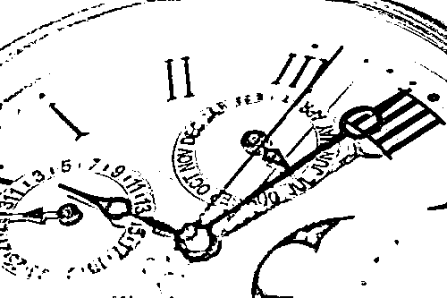

8 天蝎座

**控制你的环境，但不要试图控制不可控的东西。**生活中有很多事情是我们无法控制的，特别是其他人的行为。与其在他们身上承受巨大压力，不如把注意力放在你能控制的事情上，比如你选择应对问题的方式。

如果晚间新闻让你焦虑，就关掉电视；如果交通堵塞让你紧张，那就走一条较长但人流量较少的路线；如果去市场是一件令人不愉快的差事，那就在网上购买你的食品杂货吧。

**最重要的是，学会原谅。**通过宽恕和继续前进，把自己从负能量中解放出来。是的，**健康的性生活是你的主要减压方式。**

9 射手座

**在处理压力的时候，你纵观全局的能力会帮助你对压力的情况有更好的认识。**你会扪心自问，从长远来看，这件事的重要性有多大。真的值得为此而烦恼吗？你倾向于寻找好的一面。即使在面对重大挑战时，你也经常把它们看作是个人成长的机会。

**你的幽默感，包括自嘲的能力，帮助你战胜压力**。然而，要注意对自己承诺过多的倾向，或者试图在一天之内完成太多的事情。你可能会低估事情需要多长时间，并且感觉被自己善意的天性所束缚。

10 摩羯座

**你焦虑的根源是你对失败的恐惧。**提醒自己，你害怕失败的唯一原因是因为你迫切需要成功。然后你会意识到你的压力主要是自我引起的！所以，接受你的竞争本性，想办法把你的压力减到最小。

要意识到，正是对失败的恐惧让你变得过于紧张，造成你的落后。你太过努力地证明你自己！同样，**不要试图减少所有你应该做的健康事务来控制压力**，比如社交和充足的睡眠。

有时候，为了赶上最后期限而不吃午饭是可以的，但不是每天都可以。如果你身体健康，压力小，那么你更有可能实现自己的目标。

11 水瓶座

**你****有能力重新构思问题，从更客观的角度看待有压力的情况**。你不会因为交通堵塞而大发雷霆，你会停下来重新安排，听你最喜欢的电台，或者享受你在车里的独处时光。**虽然独立对你很重要，但你也需要与朋友的友情。**

事实上，**面对面的交流**会触发一系列的荷尔蒙反应，从而抵消焦虑。**建立和维持一个亲密的朋友网络可以提高你面对生活压力的弹性。**

在工作场合，尽可能下放委派责任。你需要成为一个聪明的团队中的一员，这个团队也“了解你”。**积极参与并且有所贡献是缓解压力的良方。**

12 双鱼座

**学会设定界限可以防止你被消极的人榨干。**如果有人在你的生活中总是给你带来压力，那就限制你和他在一起的时间，或者结束这段关系。

作为 12 星座中最敏感的一位，你需要**尊重自己的敏感性**。在处理压力时，这种敏感性可能是一种优势。**音乐、舞蹈和绘画**都是一种创造性的自我表达，都是利用你的敏感性，安抚压力的例子。

同样地，你也比其他星座更能显著感受到**瑜伽、冥想和太极拳**的益处。**灵感也是你对抗压力的特殊天赋。**

**版权声明：**原创文章由作者授权发布于若道平台，欢迎转发，反对抄袭。友号转载请申请白名单。

****想阅读更多作者的文章，请在后台回复******大卫****** 即可。****

**喜欢文章请长按下方二维码打赏**

**给大卫老师加杯咖啡呗~**

**▼**

**20 位来自世界各地的占星师****带来 19 场沙龙——新世界的觉醒****详情可点击下图**

**学习占星学****点击下图了解课程详情**

**

**微信又双叒叕改版啦，不想错过若道君的推送？**
**就把若道设为星标吧！****▼**

**喜欢记得点一下在看哦☟**

**报名直达入口**

# 神话塔罗之大阿卡纳牌｜魔术师

> 原文：[`mp.weixin.qq.com/s?__biz=MzA5NjA0NTAxNg==&mid=2651474261&idx=2&sn=b83b22ad1b8791108a78b6b70f17398b&chksm=8b48fbe2bc3f72f4406ab59fe4e1566fc1d2978d30eea368945f4a988f3fcf7d0589444c7358&scene=126&sessionid=1692737812#rd`](http://mp.weixin.qq.com/s?__biz=MzA5NjA0NTAxNg==&mid=2651474261&idx=2&sn=b83b22ad1b8791108a78b6b70f17398b&chksm=8b48fbe2bc3f72f4406ab59fe4e1566fc1d2978d30eea368945f4a988f3fcf7d0589444c7358&scene=126&sessionid=1692737812#rd)

作者/朱丽叶·沙曼-伯克   丽兹·格林

译者/闫东升 编辑/玫瑰 图片/神话塔罗 网络

本文节选自《神话塔罗》

塔罗是面心灵的镜子，照映出我们最真实的模样。就算我们还未察觉，不肯承认，不愿面对，不想知道……抽出牌的那一刹那，所有谎言与自欺欺人终将褪去，触碰到我们赤裸的灵魂。

**书名：**

神话塔罗 

**作者：**

朱丽叶·沙曼-伯克   丽兹·格林 

**出版日期：**

2011-08-02

魔术师对应的希腊神祗 

**赫尔墨斯·信使之神**

**万事俱备，只欠出发**

魔术师牌的牌面呈现的是一个修长结实的年轻人，长着一头卷曲浓密的黑发，站在十字路口上正视着每一个看着他的塔罗玩家。他身穿一件利于远行的束腰白色外衣，披着一件深红色的斗篷。

他的左手向上指着天空，右手向下指着面前那块位于十字路口正中间的平整的岩石。岩石上有四样东西，分别是一个杯子、一把宝剑、一根燃烧的权杖（或雕刻着两条缠绕之蛇的赫尔墨斯手杖）和一个印着五角星形的钱币。在他的身后是一片贫瘠的土地，布满灰色和褐色的岩石，这片不毛之地是愚人牌中同样风景的延续。两条道路一左一右向他身后蔓延开去，在最远处的岩石中失去踪迹。

> **杯子**：代表着幸运之杯，尤其是在爱方面的运气，因为赫尔墨斯（Hermes）的才智是关于心的知识。**蛇**：赫尔墨斯的权杖被两条蛇缠绕着，这代表着所有的两极性——好与坏；男人与女人；黑暗和光明等等。**宝剑**：代表着智力（头脑）的力量、前瞻性和危险性，那是父亲宙斯送给赫尔墨斯的礼物。**五角星形钱币**：代表着赫尔墨斯是商人和实业家的守护神，同时也能带给人们意外的好运。 （注：赫尔墨斯、墨丘利和赫密士是同一神祗在不同时代和地区的不同称呼）

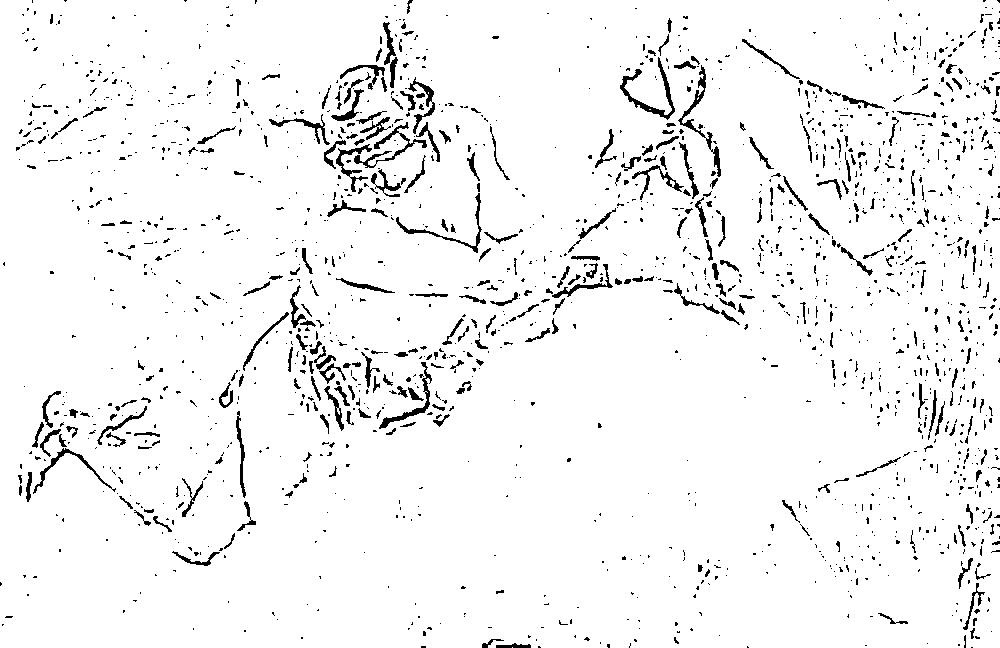

**巧舌如簧的信使**

赫尔墨斯是个很有趣的神灵形象，他是**旅行者的向导、骗子和盗贼的庇护者、魔法和占卜的掌门人、以及带来意外惊喜的幸运之神。**虽然他常会施展魔术、骗术和传递出一些暧昧不明的信息，但他却是**众神之间值得信赖的信使和灵魂在黑暗中的领航者**。

希腊神话中，赫尔墨斯是众神之王宙斯（Zeus）和神秘的夜之女神美亚（Maia）的儿子。因此他是神圣之光和宇宙原初暗夜的孩子，他的本性中包含了**属于尘世的激情欲望和属于神圣的智慧之光这两个部分**。

当赫尔墨斯还是个幼儿的时候，就蹒跚着走出了摇篮，从他的哥哥太阳之神阿波罗（Apollo）那里偷了一群牛。为了欺骗阿波罗，他把鞋子倒着穿上，愤怒的阿波罗因此便向相反的方向追了过去。后来阿波罗再次碰到他的时候，询问他是谁偷走了牛，他便送了阿波罗一个龟壳做的竖琴，又巧舌如簧地称赞阿波罗的音乐才华，说只有他才能配上这个竖琴发出的美妙声音。

阿波罗听后飘飘然地忘记了牛的事情，还把自己的占卜能力作为礼物回赠给了赫尔墨斯。赫尔墨斯就这样获得了宇宙四元素的法则，最后他又传授给了人类关于地理方面的技能（土元素）、光和热方面的技能（火元素）、液体方面的技能（水元素）和气候方面的技能（风元素）。**赫尔墨斯的雕像大都被放在十字路口，用以祈求他的赐福，庇护那些流浪、旅行和无家可归的人们**。

**暗夜中的灵魂摆渡人**从人们内在的层面来看，魔法之神赫尔墨斯是一个向导，这意味着**无论我们在生命旅途中的哪一处迷失或困扰，内心的某个地方总是存在着预见性和指导性的力量，告诉我们该如何做出选择，只是它常常没有被意识到而已**。当人们呼唤魔术师的时候，他通常并不会立刻出现，因为赫尔墨斯是一个顽皮和狡猾的神，并不会根据人们自我判定的重要时刻现身。他常常在夜里才悄然而来，以令人迷惑的梦境传递讯息，或者装扮成某个夜色中偶遇的旅人，“**不经意地**”成为人们旅途中的导航者。有时候赫尔墨斯也会以**灵光乍现**的方式在人们的脑海中闪现，使我们猛然发现自己知道的事情远远多过以前的自我认知。我们“偶然间”读到的书，或者造访的朋友，亦或改变人生的大小际遇，都是内在这个魔术师的妙手为之。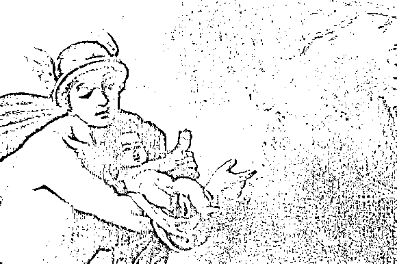**｜**赫尔墨斯与小酒神狄奥尼索斯从某种意义上说，魔术师是愚人的心灵导师和守护者，就像神话中赫尔墨斯把还未出生的狄奥尼索斯缝入宙斯的大腿中，又一直照看着他到出生为止一样。**他是每个人潜意识中的力量，虽然我们无法看到他，却在生命的某些关键时刻或艰难境遇中得到他的指引和赋予的智慧**。**人们无法在日常生活中的日常事务中仰赖赫尔墨斯的赐福**。他可能是狡猾甚至奸诈的，常常把人们带入暗夜般的迷途，让人们莫名其妙地走上了一条坎坷的道路，也看不到远方的曙光，所以跟随内在的指引并不一定就给我们带来安全和保障，甚至常常让自我觉得到南辕北辙。这可能是因为赫尔墨斯是四元素的大师，他的智慧能够穿透生命的所有层面（意识、想象力、身体和心灵）。如果没有他，我们就失去了内在所有的资源，只能像迷糊的羔羊一样在每天刻板的旧路上循环往复，找不到任何新的方向。愚人只有勇敢地跃入断崖之后，才能碰到魔术师，因为他在安全的山洞中时，赫尔墨斯是不会去探望他的。**魔术师，等待爆发的潜力股**从解牌的角度来看，**赫尔墨斯——魔术师意味着潜在的技能和创造力还没有呈现出来。他可能以突发的旺盛精力或全新的灵感方式出现，预示着某种洞见的产生和对未知事物的有意识察觉**。愚人是盲目的，只是本能地感觉到某种意义以某种形式存在于某个地方。但是通过与赫尔墨斯这个魔术师的相遇，他明白了旅途的目的地，并知道自己还有很多尚未发展出来的潜力。

**版权声明：**本文由《自在园》授权发布，欢迎转发，反对抄袭。友号转载请申请白名单。

**朱丽叶·沙曼·伯克**从 20 世纪 70 年代早期开始，就对塔罗牌产生了兴趣，并踏入了塔罗的世界。后来，在丽兹·格林的鼓励下，开始研习心理占星学和塔罗。1984 年，第一本书《塔罗全书》（The Complete Book ofTarot）出版。之后，与丽兹·格林合作设计并撰写了《神话塔罗》（The Mythic Tarot）。朱丽叶写了十本塔罗和占星学书，包括一本名为《众星的传说》（Stories from the Stars）的儿童读物，以及与丽兹·格林合著的《神话之旅》（The Mythic Journey），这是一本详细讲述如何运用神话来指导生活的书。

**点击下图了解课程详情** 

**微信又双叒叕改版啦，不想错过若道君的推送？**

**就把若道设为星标吧！**

**▼**

**喜欢记得点一下在看哦☟**

************报名直达入口************

# 2022 年神话塔罗认证课程 | 开启职业塔罗师的神话之旅

> 原文：[`mp.weixin.qq.com/s?__biz=MzA5NjA0NTAxNg==&mid=2651474261&idx=3&sn=65174cac4308503ccf2ae74d8b6d07f9&chksm=8b48fbe2bc3f72f49444ce770b96e49a148b36ca03701d2b8fb08a8f33048be046bf62ee5d51&scene=126&sessionid=1692737812#rd`](http://mp.weixin.qq.com/s?__biz=MzA5NjA0NTAxNg==&mid=2651474261&idx=3&sn=65174cac4308503ccf2ae74d8b6d07f9&chksm=8b48fbe2bc3f72f49444ce770b96e49a148b36ca03701d2b8fb08a8f33048be046bf62ee5d51&scene=126&sessionid=1692737812#rd)

**2022 年超高含金量的神话塔罗认证课程强势回归**课程内容体系让你**直观精准**的感受**神话塔罗的魅力**扎实的建构**神话塔罗思维****系统**学习**最地道的塔罗知识**

课程中老师传授**将神话、占星、心理学完美融合进塔罗**的人本主义咨询体系，并进行**学员案例督导**，让你更自信的开展咨询工作，学以致用。

本期认证课程采取**即报即学的录播课+案例督导直播课**的形式，

*   **18 节录播课：**精编剪辑，随来随学，助教答疑，学练结合。

*   **8 节直播课：**融会贯通，神话心理，塔罗占星，咨询技巧。

为了适配大家的各种学习场景，提高学习&复习效率，我们还将**录播课**剪辑了**中文字幕版**和**翻译音频版**：

*   **中文字幕版：**朱丽叶老师英文原声配中文字幕，适合在手机或电脑前专心致志的学习。

*   **翻译音频版：**翻译老师幼婷的中文原声纯享，适合运动、通勤路上耳机里陪伴式学习。

若道还为塔罗学员开发了**“神话塔罗”APP**，是随身的工具，更是接咨询的平台，录播课程**学成入驻平台**即可链接更多塔罗个案，发展壮大你的塔罗咨询事业。

**如果你想学习塔罗，什么样的老师会让你怦然心动呢？她是三副塔罗牌的设计者，写了 6 本塔罗书籍。她研习塔罗四十余年，教授塔罗三十余年，是丽兹·格林的密友。还有****谁会比塔罗牌设计者更了解塔罗的历史、灵魂与精髓？****所以，这将是你开启塔罗之旅最坚实的一步。**

1

**这位塔罗大师是谁？**

**朱丽叶·沙曼-伯克** 

*   她是**3 副塔罗牌**的**设计者****——**神话塔罗牌、沙曼–卡塞利塔罗牌、“自己着色”塔罗牌；

*   她出版了**6 本塔罗书****——**《塔罗全书》、《新塔罗全书》、《众星的传说》、《理解塔罗牌》、《精通塔罗牌》、《塔罗初学者指南》；

*   她研习塔罗**四十余年；**

*   她教授塔罗**三十余年**；****

*   她是**丽兹·格林**的密友，两人合著了**《神话之旅》**，共同设计了**神话塔罗牌**。

*   她是认证的**心理治疗医师；**

*   她深谙**塔罗、占星学、心理学和神话学。**

**如果你想成为拥有英国神话塔罗认证的塔罗师**

那么她，就是你**最好的老师人选**

2

**塔罗牌有什么用？**

*   塔罗牌是一种**古老的疗愈工具**，同时也是**直观的解惑工具****；**

*   塔罗牌绕过逻辑思维，**和潜意识联结**，通过图像的方式生动地将隐藏在人类潜意识中的画面浮出水面，**揭示心灵的状况和运作****；**

*   塔罗牌**帮助我们和潜意识对话**，可以和现代的心理治疗联系在一起，帮助我们**看清心灵的冲突来源、本质和可以选择的道路；**

*   塔罗牌又和更广阔的**宇宙生命原型**联结，彰显**个人生命发展的阶段**，将**个人生命挣扎、内在冲突**放在生命进化的道途上，让更广大的生命智慧为个人成长照亮道路。

3

**为什么学习神话？**

神话通过**图像和故事**描绘人类生活的**原型模式**。通过瑰丽的想象、诗意的语言、栩栩如生的人物和故事描绘出我们内心的世界，表达出我们经历的那些实现人性的过程，帮助我们将**个体的生活与人类古老且永恒的故事**建立联结。从而在更深处**理解生命**，并学习**古老而长青的生命智慧**。

**神话塔罗**取材于**希腊神话**的无尽沃土，通过故事提供一种**记忆辅助**，在心理和预见层面提升解读的**丰富度**。因为这样更符合塔罗牌的性质，符合人类的想象。**按照故事思考，而不是简单的记忆关键词和固定的意义。**

4

**塔罗预测是什么？**

塔罗牌预测的运作就像是**照向心灵的一面镜子**。在塔罗牌解读时，图像的原型性质穿透隐藏的潜意识脉络，反应出与个人境遇相关但又未被了知的知识与洞见，因此**揭示出按照任何理性方式都无法发现的事情。**

如果你对生命好奇，塔罗学习会帮你**打开一扇通往未来的门****，**让你了解**心灵运作和显化的秘密**，同时赋予你更多关于生命成长的支持和指引的能力！

5

**我们将学习什么？**

**录播课（即报即学）**

**☆****初阶**

**神话塔罗详解、神话故事和预测意涵**

**第 1 讲 塔罗牌介绍 ，讲述它的历史 （中文字幕版）**

**第 1 讲 塔罗牌介绍，讲述它的历史（翻译音频版）**

**第 2 讲 星座形态、元素和宫廷牌&基本星座与基本国王 （中文字幕版）**

**第 2 讲 星座形态、元素和宫廷牌&基本星座与基本国王（翻译音频版）**

**第 3 讲 固定星座与固定王后（中文字幕版）**

**第 3 讲 固定星座与固定王后（翻译音频版）**

**第 4 讲 变动星座与变动骑士（中文字幕版）**

**第 4 讲 变动星座与变动骑士（翻译音频版）**

**第 5 讲 小阿尔卡那牌权杖（中文字幕版）**

**第 5 讲 小阿尔卡那牌权杖（翻译音频版）**

**第 6 讲 小阿尔卡那牌圣杯（中文字幕版）**

**第 6 讲 小阿尔卡那牌圣杯（翻译音频版）**

**第 7 讲 小阿尔卡那牌宝剑（中文字幕版）**

**第 7 讲 小阿尔卡那牌宝剑（翻译音频版）**

**第 8 讲 小阿尔卡那牌星币（中文字幕版）**

**第 8 讲 小阿尔卡那牌星币（翻译音频版）**

**第 9 讲 经典牌阵教学讲解（中文字幕版）**

**第 9 讲 经典牌阵教学讲解（翻译音频版）**

**第 10 讲 牌阵解读案例演示（中文字幕版）**

**第 10 讲 牌阵解读案例演示（翻译音频版）**

**☆****中阶**

**神话塔罗排阵应用，****排阵解读和咨询技巧**

**开启神话塔罗愚人之旅**

****

**第 1 讲 愚人、魔术师、女皇、皇帝（中文字幕版）**

**第 1 讲 愚人、魔术师、女皇、皇帝（翻译音频版）**

**愚人**：永恒的少年（儿童的原型）

**魔术师**：恶作剧者、老师、向导、沟通者的原型；行星：水星。

**女王**：母亲、养育者、丰产的原型；行星：金星在金牛座；小行星：谷神星。

**皇帝**：父亲、供养者、计划者的原型；行星：木星。

**第 2 讲 女祭司、教皇、恋人、战车、正义、节制（中文字幕版）**

**第 2 讲 女祭司、教皇、恋人、战车、正义、节制（翻译音频版）**

**女祭司**：处女——等待被实现的潜力原型；行星：新月。

**教皇**：疗愈者、受伤的疗愈者、牧师的原型，牧师是神与人之间的灵性桥梁；行星：凯龙星。

**恋人**：爱、爱人、所爱之人的原型；行星：金星在天秤座。

**战车**：战争、冲突、战士、斗士的原型；行星：火星。

**正义**：智慧、兵不血刃的胜利的原型；星座：处女座；小行星：智神星。

**节制**：关系、合作的原型；星座：巨蟹座、双鱼座。

**第 3 讲 力量、隐士、命运之轮、倒吊人、死神（中文字幕版）**

**第 3 讲 力量、隐士、命运之轮、倒吊人、死神（翻译音频版）**

**力量**：力量的原型；星座：太阳在狮子座。

**隐士**：晚年、耐心的原型；行星：土星。

**命运之轮**：命运女神与命运的原型。

**倒吊人**：牺牲与有意识的牺牲的原型；行星：海王星。

**死神**：死亡、终点和起点的原型；行星：冥王星。

**第 4 讲 恶魔、高塔、星星、月亮、太阳（中文字幕版）**

**第 4 讲 恶魔、高塔、星星、月亮、太阳（翻译音频版）**

**恶魔**：阴影、人类不文明的面向、本能、欲望天性；行星：火星在天蝎座。

**高塔**：改变、分裂瓦解的原型；行星：天王星。

**星星**：希望的原型。

**月亮**：无意识的原型；行星：暗月。

**太阳**：意识、创造力和文明的原型；行星：太阳。

**第 5 讲 审判、世界（中文字幕版）**

**第 5 讲 审判、世界（翻译音频版）**

**审判**：复活、新生的原型；行星：水星作为灵魂向导普绪科蓬波斯。

**答疑与讨论，学员们分享对自己或客户的塔罗解读，对神话塔罗牌进行更多探讨。**

**世界**：整体、完成和个性化的原型。

**第 6 讲 经典牌阵教学讲解（中文字幕版）**

**第 6 讲 经典牌阵教学讲解（翻译音频版）**

**第 7 讲 咨询案例演示：为一位年轻女性所做的四次解读（中文字幕版）**

**第 7 讲 咨询案例演示：为一位年轻女性所做的四次解读（翻译音频版）**

**第 8 讲** **引导式冥想、荣格的四种意识功能（中文字幕版）**

**第 8 讲 引导式冥想、荣格的四种意识功能（翻译音频版）**

**☆****高阶**

**第 1 讲 塔罗牌中的荣格原型**

**2022 年 8 月 10 日（周三）**

我们将学习荣格是如何理解原型，以及荣格原型如何反映在塔罗牌中。对塔罗牌解读而言，理解原型的普遍性非常有帮助，因为这有助于塔罗咨询师碰触客户的内心世界。

**第 2 讲 塔罗牌是如何与行星原型和其原型体验联系在一起**

**2022 年 8 月 24 日（周三）**

大阿卡纳牌反映了行星神祗的原型，在某些情况下，原型经验意味着它们反映了所有人类的经验。我们将通过这个角度看这些大阿卡纳牌。我们将看到理解原型对解读有何帮助。

**第 3 讲 荣格意识的四种功能与小阿卡纳牌的四种元素及与权杖、星币、宝剑、圣杯四套牌之间的联系**

**2022 年 9 月 7 日（周三）  **

我们将看看小阿卡纳从 1 到 10 如何反映荣格意识功能的各个方面，以及它们如何反映在四套牌四个元素和其心理方面。我们还将对 1-10 的数字学进行修正，看它们在元素中的表现方式。

**第 4 讲 占星学中的 12 星座和宫廷牌之间的联系**

**2022 年 9 月 21 日（周三****）**

我们将讨论形态和星座，以及它们如何反映在宫廷牌上。

**第 5 讲 马蹄牌阵学员案例督导**

**2022 年 10 月 19 日（周三） **

**第 6 讲 六芒星牌阵学员案例督导**

**2022 年 11 月 2 日（周三） **

**第 7 讲 凯尔特十字学员案例督导**

**2022 年 11 月 16 日（周三） **

****

**第 8 讲 三个牌阵学员完整案例督导**

**2022 年 11 月 30 日（周三）**

**认证阶段：考试论文**

录播课学习完毕，即可入驻若道神话塔罗 APP，以实习塔罗师获得推广流量，对接塔罗咨询个案。

直播课+录播课学习完毕，提交考试论文通过即可获得获得英国神话塔罗认证证书，升级为认证咨询师。

**入驻塔罗平台**

6

**适合人群**

*   塔罗初学者，完全没有塔罗基础；

*   塔罗自学者，也曾上过塔罗工作坊，但仍不懂如何使用塔罗牌；

*   塔罗进阶学习者，有塔罗基础，了解 78 张塔罗牌含义；

*   不知如何解决遇到的情感困惑、职业选择、人际问题，对人生感到迷茫；

*   想要学习深入解读塔罗牌、牌阵的使用、咨询技巧等将塔罗运用于咨询实践；

*   想要深入了解和学习塔罗，希望成为专业的塔罗师；

*   想要借助塔罗进行心灵、灵性成长。

7

**导师简介**

**朱丽叶·沙曼-伯克**

**朱丽叶·沙曼-伯克**从 20 世纪 70 年代早期开始，就对塔罗牌产生了兴趣，并踏入了塔罗的世界。后来，在丽兹·格林的鼓励下，开始研习心理占星学和塔罗。

1984 年，第一本书《**塔罗全书**》（*The Complete Book ofTarot*）出版。之后，与丽兹·格林合作设计并撰写了《**神话塔罗**》（*The Mythic Tarot*），在这本书中，她们将古希腊神话与传统塔罗解读结合起来。朱丽叶写了**十本塔罗和占星学书**，包括一本名为《众星的传说》（*Stories from the Stars*）的儿童读物，以及与丽兹·格林合著的《神话之旅》（*The Mythic Journey*），这是一本详细讲述如何运用神话来指导生活的书。

8

**课程价格**

**认证课程总价：****22000 元**

**联报优惠价：****19000 元**

**限时转发优惠价：18000 元（联系 Echo 老师，获取限时转发优惠价）**

长按二维码添加客服 Echo 老师

9

**退转课程**

*   **退款原则请详看《教学协议》，如有疑问请咨询课程顾问。**

**神话塔罗认证课程**

**授课老师：朱丽叶·沙曼-伯克**

**授课时间：录播课即报即学，直播课 2022 年 8 月 10 日起**

**授课方式：**网络课程**，**英文授课，中文翻译

**费用：****认证课程总价：****22000 元；****联报优惠价：****19000 元；****限时转发优惠价：18000 元**（联系 Echo 老师，获取限时转发优惠价）

**课程负责人：Echo 老师**（微信/手机：nodoor18518412824，请备注“神话塔罗”）

长按二维码添加课程负责人咨询~

****报名请点击“阅读原文”****

# 这个月亮交点总是得不到尊重，是要学会先“给出尊重”

> 原文：[`mp.weixin.qq.com/s?__biz=MzA5NjA0NTAxNg==&mid=2651474130&idx=1&sn=1d93fc9038c232c60addd30d5e7414dd&chksm=8b48fa65bc3f7373822de218d5f072f5bbc938d69f6f1473d9678292b267377712fb80fdaa12&scene=126&sessionid=1692737817#rd`](http://mp.weixin.qq.com/s?__biz=MzA5NjA0NTAxNg==&mid=2651474130&idx=1&sn=1d93fc9038c232c60addd30d5e7414dd&chksm=8b48fa65bc3f7373822de218d5f072f5bbc938d69f6f1473d9678292b267377712fb80fdaa12&scene=126&sessionid=1692737817#rd)

☆****后台回复“今日”，给你一句生命态度****

作者/简·斯皮勒 译者/李含 校对/江艺编辑/玫瑰 封面/书君 图片/pexels

南交点摩羯座-北交点巨蟹座这个交点组合，这一生面对的考验和功课是怎样的呢？这是一群曾经非常成功的人，而今生他们想要得到尊重却并没那么容易。一起来学习一下吧！

**北交点巨蟹座/第四宫综述**

**发展的特质**

**· **注意和确认感受

**·** 同理心

**· **关怀和支持他人**· **建立自己的根基和安全感**· **诚实地表露感情和不安全感**· **谦逊**· **不加评判地接受别人的缺点和变化无常的情绪**· **以自己的感觉为中心

**要放下的倾向**

努力减少这些倾向的影响有助于让生活更轻松、更愉快 

**· **需要控制一切和每个人**· **没有充分了解情况就强制主管**· **忽略过程；过于专注于目标**· **感觉对所有事情负全部责任**· **在亲密关系中隐藏感情和恐惧**· **做事是为了获得别人的尊重或赞赏**· **照顾别人的感受而忽视自己的感受**· **做“社会可以接受的”而不是完全坦诚的事情**· **认为事情必须是困难的，才能是重要的

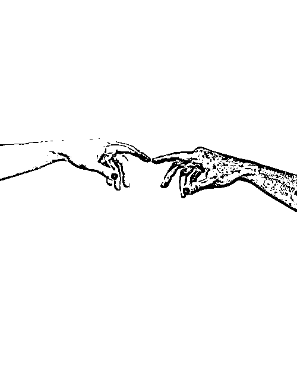

**阿喀琉之斯之踵/避免的陷阱/底线**

**巨蟹座北交点的人需要意识到的是他们对控制的需求（“只有我能让他们一起生活，我才能放松，变得脆弱”）。**但事实是，他们对局势或其他人的控制永远不足以让他们觉得做自己是安全的。**当他们试图在没有被邀请的情况下掌控他人的生活时，是在不适当地篡夺他人的责任。** 

**他们需要避免的陷阱是无休止地寻求认可（“只要别人能以尊重的方式认可我的贡献，我就能开始自我感觉良好”）。**

但这是一个无底洞：其他人永远不能给予足够的认可，让他们感到满足。**只有当他们内心认识到自己所做贡献的重要性（通过以支持的方式扶持他人），才会开始感到满足。**

归根结底，他们永远不会获得足够的权威，让他们感觉脆弱是安全的。在某个时刻，他们必须抓住机会，让其他人知道他们是谁以及他们的感受：**他们的不安全感、对被拒绝和抛弃的恐惧，以及不足的感觉。**具有讽刺意味的是，**当他们冒风险让别人看到自己真实模样时，他们最终获得了完全的安全感，因为在表露自己的感受时，他们在更深层次上掌控了自己。**

**这些人真正的诉求**

**这些人真正想要的是始终绝对控制他们生活的每一个领域。**他们有一种永不满足的需求，认为自己有能力成功。然而，为了实现这一目标，这些人必须**与自己的感受和不安全感保持联系，并与他人分享真实的自我。**承认自己的不安全感将给北交点巨蟹座的人一个稳定的基础，让他们在外部世界创造成功，因为他们不再通过试图隐藏或压抑自己的情感来与自己抗争。这给了他们一种平静的、内在的确定性，从那里可以实现他们的目标。**通过承认自己的情绪，他们会对他人的情绪产生一种意识。**只要他们意识到并支持其他人，他们就会获得所需的支持，帮助他们走上自己的道路。

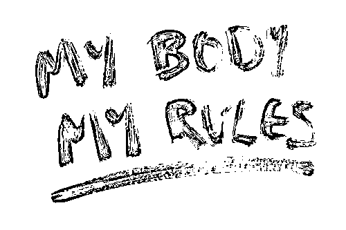

**天赋/职业**

**巨蟹座北交点的人有能够滋养和支持他人的天赋；**因此，**任何能够给他们机会去滋养他人）身体上、精神上或情感上）的职业对他们来说都是一种乐趣**。好的选择包括**处理食物（餐馆、酒店、款待等）、房屋维修和在家工作**。他们在**房地产销售或投资方面**也做得很好。然而，他们**必须在这种投资中运用自己的直觉，跟随自己的“直觉”。**巨蟹座北交点的人也具有**扎实和准确的商业意识，以及出色的讨价还价能力和精明的谈判能力。**他们本能地知道如何完成任务，如何在生意上取得成功。然而，当他们的职业仅仅是运用商业敏锐洞悉时，他们并不高兴，因为这太“枯燥”了。他们的职业应该仅仅**利用他们的商业本能作为背景，以一种实际的、经济上可行的方式来滋养他人。**

**巨蟹座北交点特定的疗愈誓言**

**· **“当我试图控制时，我就失败了。”

**·** “当我分享我的感受时，我就赢了。”**· **“当我承认他人有能力掌控自己的生活时，我就赢了。”**·** “表达自己的感受没关系。”**·** “没有一直处理好所有事情也不要紧。”**·** “没有人能否定我的感受。”

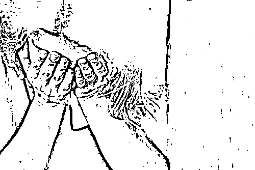

**北交点巨蟹座/第四宫的个性**

**前世-匮乏**

许多巨蟹座北交点的人在前世的化身曾**生活在高度结构化的寺院、修道院或其他地方，在那里他们参与到严格的、社区导向的宗教环境中**。他们**离开了正常的家庭互动关系。****由于在相互依赖性、处理人们情绪、接受自己和他人人类本能冲动方面的经验限制，他们缺乏其他交点群体普遍拥有的舒适家庭关系的本能。**在前世的生活中，这些人**被训练去压抑他们的感觉、本能、性冲动和对身体感官的享受。节欲和纪律是最重要的，剥夺作为人类的乐趣会得到尊重和提升的奖赏。**在这一世的化身中，他们仍然**倾向于在自己和与他人进行轻松、朴实的互动之间搭建一堵墙。他们习惯于推迟生活的享乐，而推迟往往会导致永久的否认。**这些人有一个“崇高的目标”，其他一切都被放在次要地位，直到这个目标已经实现。这个目标**附有一种正义感，他们不允许自己被人类的诱惑分心。**唯一的问题是，**目标是永恒的，这是一种无休止的追求，源于实现精神高度的潜意识欲望。**然而，**因为这个目标是永不满足的，这些人最终只能不断奋斗，没有时间去建立关系，寻找乐趣，或者真正的生活。**

北交点巨蟹座的人在过去世的化身中一直被训练去**抑制他们对生命的“感觉”（即情绪的）反应，以保持专注于他们所服务的更高的目标**。但**他们的心渴望与其他人类联系在一起。**

他们**渴望归属感，并与他们所爱的人一起体验一种家的感觉——但他们感到尴尬。**他们在许多世中都在接受有纪律的训练，以至于他们不知道该怎么做——**他们羞于表露自己的感受。**

**他们对他人的不敏感是他们对自己感受根深蒂固的不敏感的结果。**然而，在这一世的化身中，**以更高目标的名义压抑他们自己的感受，与他们的灵魂需要完成和实现的方向背道而驰。**

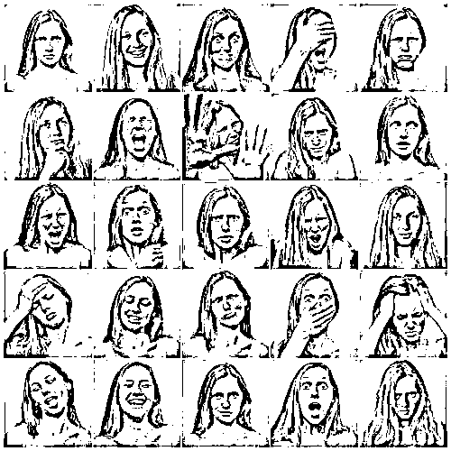

**尊重**

**在前世的生活中，这些人获得了公共权威、社会地位和声望。**他们是**封建领主、政治家、商人和户主**。巨蟹座北交点的人扮演着**“老板”**的角色；**他们管理他人，并负责以典型的社会正确的方式行事。**由于很多次轮回中他们都在享受公众的瞩目，所以他们仍然在寻找观众！**尊重对这些人来说很重要。**他们往往出于寻求他人尊重的动机而行事。他们做出了巨大的个人牺牲，以牺牲自己的个人需要为代价，坚持自己信奉的原则，但仍然得不到尊重。**他们习惯于成为权威，但现在没有人听从他们的指示，他们也弄不明白。他们变得沮丧是因为他们不明白发生了什么，随着时间的推移，这会使他们的心变得更冷酷。**事实上，他们的成就基于自身的价值，是他们自己获得的回报。但是巨蟹座北交点的人们在潜意识里**寻求对他们高贵牺牲的认可**。这使得**完成任何任务都出现了不必要的困难。****如果只是简单地放弃“获得信誉”的需要，他们就能够达到他们的目标，并且在此过程中享受个人快乐。**这一世并不是简单地安排他们因做出个人牺牲而赢得尊重。当他们用尊重作为衡量自己是否“走上正轨”的晴雨表时，他们每次都会“偏离轨道”。在前世生活中，尊重对他们来说是一个有效的标志。但他们在那么多次轮回中扮演着那些公共角色，担任着权威的职位，以至于他们变得孤独和孤立：那么多的责任，又如此少的个人关怀滋养，一次又一次！**现在他们的出生星图的格局不允许他们把成就、尊重和荣誉建立在其他更私人的维度之上。**巨蟹座北交点的人需要更加注意——**以一种既满足个人需求又符合长远目标的方式来组织自己的生活。**在这一生中，这些人**不必为其他人维护形象**。事实上，**当他们努力实现目标，仅仅因为做好工作会让他们感到快乐，因为这份工作满足了公众的需求——无论是对他们自己的家庭还是整个世界，他们就会获得认可。**但如果他们直接寻求认可，就会偏离正轨。他们仍然是成就大师。但是，如果他们的成就动机是为了获得他人的尊重，他们永远不会对自己所获得的感到快乐，因为他们对尊重的需求是永不满足的——他们永远不会获得足够的满足。讽刺的是，**让这些人满意的关键是学会给予尊重，而不是要求尊重。**如果在任何领域的成功来得太容易，这些人往往会变得以自我为中心，被自己的重要性冲昏头脑。他们可能变得粗心大意，不知不觉间推开了他们如此渴望得到的奖赏。**对他们来说，以谦虚感激的心迎接成功是至关重要的。**这会让他们放慢脚步，接触到新起点的能量。

**他们需要学会尊重这一时期——新的关系、新的工作、新的机会、新的家，并且用温柔的觉知对待初始阶段。**这将为建立成功打下坚实的基础。一旦放慢了脚步，他们会自然而然地意识到正确的方法。

当巨蟹座北交点的人们有意识地注重和尊重超越他们自身的存在时（生命带来的机遇、帮助他们的人，等等) ，他们的定位就发生了转变，他们以一种新的态度对待他人。**他们怀着关心、关注、同情和一丝不苟的清晰态度对待他们——创造一个对所有参与者都有利的环境。**与其寻求获得尊重，这些人需要把自己的定位放在**给予尊重**上。如果能做到这一点，他们的生活将会以一种神奇的、相互滋养的方式发生改变。

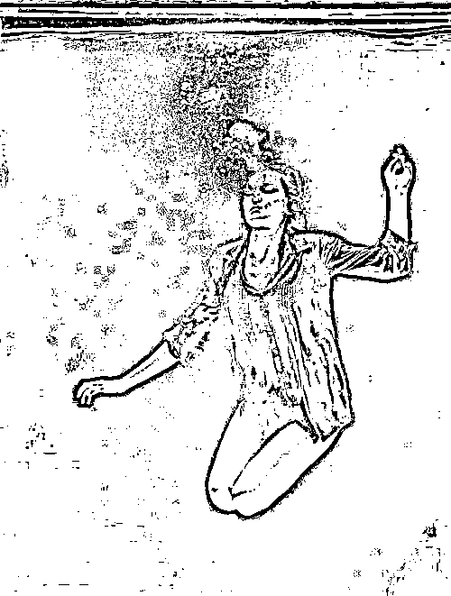

**北交点巨蟹座/第四宫的需求**

**情绪确认**

**巨蟹座北交点的人们非常需要确认他们自己的感觉，加强他们的感觉意识，并表达他们自己的感受。**这些人带着压抑情绪的前世习惯来到这一世。他们可能下意识地建立了他们的早期环境，看起来好像他们的父母之一在否定他们的感受，阻止他们让别人知道自己的感受。例如，在美国文化中，几乎所有的小男孩都被告知：“做一个男人，不要哭”——但是巨蟹座北交点的男孩对此非常重视。他们的父母可能会给他们上百种不同的指示，但这是他们听到的最响亮的一个指示。(这个例子是要说明前世的模式是如何通过今生的形式导致特质的再现，而这些特质必须在这一世中得到平衡和解决。)

**脆弱性风险**

**这些人不能忽视他们的个人需求或假装他们的情感不存在。**他们的情绪被压抑了这么多世轮回，以至于现在他们**形成了一个巨大的“不要被否认”的能量集合！**巨蟹座北交点的人被安排在亲密的层面上体验关心和被他人关爱的个人生活。然而，他们花了太多时间压抑自己的感情，以至于它们觉得对他人表露脆弱的情感这一想法令人恐惧。“什么？我应该让别人知道我的感受吗？开什么玩笑！我为什么要暴露自己的情感，让别人来控制我呢?”他们惊呆了，因为他们习惯于掌控一切。**然而，诚实地表达他们的感受正是他们被安排要做的功课。**在这一生中，为了使人格变得圆润和柔软，他们的情绪感受必须被肯定。**进一步的压抑会让他们的情绪更固执，更令人畏惧。越久不表达“感觉”本能，他们就会变得越无力。**巨蟹座北交点的人要学习**将自己的感觉与自己的其他部分结合起来。**要做到这一点，最好的方法之一就是在令人生畏的情境中穿行，体验被唤起的感受。在承认他们的感受的过程中，被放大的强度将会消散。然而，**问题是巨蟹座北交点的人们已经形成了本能的反应，不惜一切代价回避他们的情绪感受，所以他们的情绪变得有点僵硬**。生活可能枯燥乏味，充满了外在的成就，却缺乏内在的意义和满足。因此，在他们这一生中，最大的挑战之一**就是找到勇气去与自己的感受联结，并将这些感受传达给别人——诚实地表达自己的感受，而不必为此“做些什么”。**这验证了当事人的情感，并允许它们融入到人格的其他部分之中。而且，由于前世压抑了情感，这些人带着某种**羞怯**来到这一世。他们觉得自己**不善于在“感觉”层面上与他人相处，因为他们很少有实践经验。**然而，一旦习惯了，他们就会意识到他们比其他任何交点人群都更有天赋，能够以一种既滋养又赋予力量的方式来回应他人的感受。他们只是需要一段时间来适应，从而轻松舒适地展现他们自己的这一部分。

**版权声明：**本文由若道翻译发布，欢迎转发，反对抄袭。友号转载请申请白名单。

**简·斯皮勒**

全球占星界的一位领军人物，是美国占星师联盟（AFAN）的教员。她定期在新时代和占星回忆上授课，是畅销书《新月占星学》、《灵魂占星》、《灵性占星学》和《宇宙之爱》的作者。

**20 位来自世界各地的占星师****带来 19 场沙龙——新世界的觉醒****详情可点击下图**

**学习占星学****点击下图了解课程详情**

**

**微信又双叒叕改版啦，不想错过若道君的推送？**
**就把若道设为星标吧！****▼**

**喜欢记得点一下在看哦☟**

**报名直达入口**

# 卜卦占星案例丨在令人紧张的面试中，如何“窥探”结果？

> 原文：[`mp.weixin.qq.com/s?__biz=MzA5NjA0NTAxNg==&mid=2651474130&idx=2&sn=7da11c5396459e21f94df9caa511c2b8&chksm=8b48fa65bc3f7373122565594a1f209bccd42323c47486f7a73287f1bb1e3ed2f8c598f990e2&scene=126&sessionid=1692737817#rd`](http://mp.weixin.qq.com/s?__biz=MzA5NjA0NTAxNg==&mid=2651474130&idx=2&sn=7da11c5396459e21f94df9caa511c2b8&chksm=8b48fa65bc3f7373122565594a1f209bccd42323c47486f7a73287f1bb1e3ed2f8c598f990e2&scene=126&sessionid=1692737817#rd)

作者/王嘉祺

编辑/翀子 图片/网络

之前的[【案例 1】](http://mp.weixin.qq.com/s?__biz=MzA5NjA0NTAxNg==&mid=2651472954&idx=2&sn=425d81db9f4d19190ba319b2b9a2daee&chksm=8b48f68dbc3f7f9b480a21d9dc0a9efb77175c7bd594a7b8b221f501d71fd772e5c2451c86d5&scene=21#wechat_redirect)[【案例 2】](http://mp.weixin.qq.com/s?__biz=MzA5NjA0NTAxNg==&mid=2651473218&idx=1&sn=cc51f08b052d17e34bc55013f6ddb86e&chksm=8b48f7f5bc3f7ee3ddd2c1eda5a833f9dba0ca804d46fc702bdbeac7686a80ff04985125f0e0&scene=21#wechat_redirect)[【案例 3】](http://mp.weixin.qq.com/s?__biz=MzA5NjA0NTAxNg==&mid=2651473498&idx=2&sn=cd1de5c018db2c4eb595698aaa1925eb&chksm=8b48f4edbc3f7dfb8a782fc5287971c51e24a08118f810484bae496067e3bccc64538bb6ef23&scene=21#wechat_redirect)，给大家展示了卜卦占星学如何在具体生活中运用。今天继续给大家带来两个关于面试的真实案例，我们将关注卜卦星图上命主星和征象星相同的情况。如果你看完文章很感兴趣，可以点击[【现代卜卦占星学】](http://mp.weixin.qq.com/s?__biz=MjM5MjQwNjAyMQ==&mid=2649439504&idx=4&sn=7114460df50e40549774d0d0cd6fbf3c&chksm=beb9527a89cedb6cda0e750620a750c0da06056fbaaed20da59bfe4ea7d620da2750f96d7f47&scene=21#wechat_redirect)了解详情哦。

大家好，我是 Conrad 卜卦课程的助教。上一篇文章给大家介绍了两个关于升学考试的例子，同时也观察了行星处于“灼伤”状态的情况是怎样的。今天我们继续来讲两则卜卦的真实案例。希望大家能在听卜卦故事的同时，开动脑筋并寓教于乐，头脑动起来才能找到属于自己的解谜乐趣。

**本次主要阐述当命主星与征象星相同的时候，应该如何分析。**

**案例一：面试能成功吗？**

这是以前我帮一位朋友解读的卜卦案例。朋友当时刚刚参加了一个网络平台的心理咨询师面试。也就是说如果成功的话，我的朋友就能成为那个平台的签约的心理咨询师，被想预约心理咨询的人在网络上找到，并预约她的咨询。

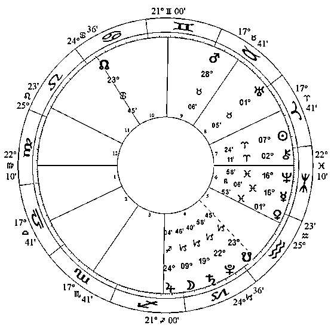

**这个卜卦星图的上升点位于处女座。**这样的星图有一个特点，就是在没有劫夺发生的情况下，一定是中天在双子座，也就造成了上升与中天是同一个守护星水星。这个时候如果遇到卜卦咨询事业相关的问题是，就容易给一部分朋友造成混乱。**因为命主星与 10 宫主星是同一个行星，**也就无所谓相位关系，有些朋友就不会分析了。

其实这一点很简单，就是**把两个宫位的征象星，当作是同源而出的**，是一荣俱荣，一损俱损的关系。我们也可以简单理解为，两个人是在一起的，共同面对某些有利的，或者不利的境遇。所以当这种征象星相同的情况出现时，也不意味着事情一定会顺利。**因为还要分析这个征象星遇到了什么样的具体情况。**

这个卜卦案例的问题是面试。这里面要注意一个小细节，就是面试官不一定能够决定面试者的录取，这具体看面试官在该公司担当的职务。所以有的面试官是面试者“对面的人”，所以是 7 宫主星来代表。而有的面试官因为能直接决定结果，所以扮演了“裁决者”的角色，因此是 10 宫主星来代表。

然而不论面试官是否有决定录取的权力，亦或是其他人有，在面试的卜卦咨询当中，与“裁决者”的关系是至关重要的。所以才显得相同征象星的情况比较特殊。

这个案例中的相同征象星是水星。水星不但在双鱼座属于失势和落陷的无力位置，而且还处于逆行期。说明我的这位朋友在面试这件事上，确实没什么信心，而且总有打退堂鼓的心思。这个水星还恰好与海王星形成精准的合相，所以体现出来的就是我的朋友非常焦虑，思绪万千，所以她刚从面试的地方出来，就联系我了，试图平静下来。

然而我跟朋友说，别着急，心理咨询的平台那边应该也是千头万绪的。他们很可能也在不停地寻思，到底选择哪些面试者。因为 10 宫主星与命主星所处的境遇是完全一样的，大家的状态都是无力的。

那么如何判断面试是否能够成功呢？其实在当时，水星的逆行已经处于末期了，马上就要恢复顺行。并且在顺行之后的第十天，就会与 6 宫主星土星形成精准的六分相。这就非常有利了，毕竟 6 宫是象征实际工作的。

**当时我建议朋友等十天左右，看看是否有消息。**不过我也提醒了她，在这个平台的发展前景可能比较一般，毕竟水星是无力的，而且土星与冥王星也在合相。连月亮也处在失势的不力位置，且也会很快合相土星和冥王星。

后来果然在第十天，朋友跟我说她被平台录用了。不过后来平台的发展也确实不愠不火，她就转到其他平台了。

**案例二：考公务员**

第二个案例也来自我的一位朋友，她的情况是考公务员，相当于一次超大型面试加考核。仍然是上升处女座，中天双子座，水星是第 1 宫和第 10 宫的共同守护星。考公务员据了解，先要考笔试，通过之后才能进入面试。听起来相当严格。

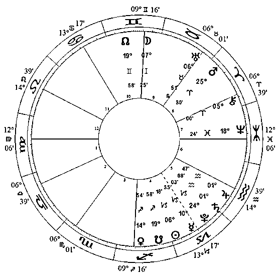

这个案例中，**水星正好落在摩羯座**这个代表严苛，以及大型组织的星座。水星在摩羯座按说既不属于有力的位置，也不属于无力的位置。看起来比前一个例子情况要好一些，但实际上则不然。

首先，水星与太阳距离很近，处于**“灼伤”**的状态。这个知识点我们上一篇中讲到过，在这种情况下，当事人比较难以执行原本的目的。

**其次，水星虽然与天王星有一个三分相，但已经是出相位了。**只能说我的朋友考试水平曾经有一定的突破，或者说政策上曾经有过一些利好的调整，但已经过去了。并且天王星也是在逆行的，等于双方都在远离彼此。

第三，水星与海王星有一个宽泛的六分相，但与上一个案例不同的是。上一个案例本身就是心理咨询方面的面试，正好符合海王星的征象。而公务员考试与海王星的征象没有关系，反而会受到无力感的影响。

最后一点，就是水星虽然在远期也会与有力的 6 宫主星合相，但一个是距离较远，另一个是在期间先会与冥王星合相，这个挑战就比较大了。

上一个案例是，水星先与土星呈相，再与冥王星呈相，所以面试很可能成功，只是后续发展不大。此案例是相反的，先与冥王星呈相，阻力就相当大了。

**看其次征象星月亮的情况，**也能得出相似的结论。虽然月亮看上去与中天合相，是很好的征象。然而月亮与木星和土星的三分相已经出离很多，说明机会已经基本不在了。本人也在远离那种可能性。

月亮下面将与金星形成对分相，而金星处在射手座也是第 9 宫的宫主星，所以意味着我的朋友在远离当下，寻找新的机会。

**结语**

我们今天给大家带来了两个**命主星与征象星相同**的案例。在这种情况下，两者的征象看似失去了联系，但其实是出于相同境况之下的。**但我们仍然需要具体分析这个相同征象星的各种情况，才能对卜卦做出判断。**如果您对现代动态卜卦占星的技巧感兴趣，欢迎您关注一下我们的课程。

今天的案例介绍就到这里，我们下次见！

**快来看若道君为你准备的课程吧！**

**现代卜卦占星课程内容**

**课程分为 5 部分：**

**Part1 **融合现代占星理念，整合动态占星知识**Part2**独家【现代动态卜卦占星技术】全面教学**Part3**学以致用，覆盖人生各个领域问题的卜卦解法**Part4**扩展延伸择时占星技法的新认知**Part5**如何运用卜卦占星学做一场转化性的咨询

**15 节录播课+8 节直播课线上网络课，英文授课，中文翻译。**

**15 节录播课为 2020 年动态现代卜卦课程的内容。8 节直播课则完全是案例教学的形式。**

这样的好处是，你可以通过 1 个半月的密集学习之内按照自己的进度学完录播课的理论和录播课中已有的案例，从学习开始就实践，然后把实践中遇到的问题拿到 8 节直播课中，和老师互动。

**在 8 节直播课中，老师也会用案例教学、和同学互动的方式帮助大家进一步掌握卜卦占星的技法。**

**授课老师**

**艾德里安·罗斯·邓肯****（Adrian Ross Duncan）**1971 年在印度游学时开始学习占星学，1985 年开始成为全职占星师，**迄今执业已超过 33 年，是人本主义占星学、卜卦占星学和经世占星学领域的知名占星师。他还开发了占星软件 AstroClock 和多款占星报告。**他在日常咨询中都会运用卜卦，咨询图（卜卦的一种运用方式，即根据客户来访时间制作星图，从星图中获得大量信息）也是他**特别擅长的领域**。艾德里安·罗斯·邓肯从 1971 年开始研习佛学，受佛学影响很深，他**相信占星学和佛学观点统一、转化的一个基础是在于对现实感知的改变**。而卜卦很容易与佛教融合，因为它只关乎当下。

**授课时间**

**付费后一天即可开始看录播课程，全程有助教老师回答问题。**

**直播课程开始时间：**

2022 年 5 月 3 日，每周二 20:00-22:00

**这次课程恰逢世界在巨大的变动和不确定之中，期待这门课程能够给各位及各位的客户带来新的洞见和方向。**

**在这次 8 次直播课程中，我们将采用案例教学的方式，所有参课同学均有机会提供案例，供老师解读，且我们将组织群体的练习，用大量案例帮你掌握卜卦及如何在咨询中用卜卦。**

**什么人适合参加本课程？**

*   想要系统学习现代动态卜卦占星的学员

*   想在生活中熟练使用现代卜卦占星学

*   在咨询中想帮助个案更清晰的分析解读困惑

*   想参加 ISAR 认证考试，此课程是 ISAR 选修课

*   希望通过卜卦占星帮助自己和身边人挖掘一个积极主动的未来

学习整合卜卦技巧，不仅有益于想钻研卜卦占星学这个分支的同学，对占星初学者也很有有帮助，可以让你的占星技巧加倍。

**课程费用**

**课程价格：9900 元**

**老学员复训专享价：**

**2020 年参加艾德里安·罗斯·邓肯卜卦占星课程的同学：****2900 元**

**2018 年参加艾德里安·罗斯·邓肯卜卦占星课程的同学：****4900 元**

**特别优惠****：**

**分享课宣到朋友圈****保留 48 小时****（不设分组显示）截图给课程顾问可获得****400 元优惠****。**

**课程负责人：童老师（微信：nodoorDaivd），请备注“卜卦”**

长按二维码添加课程负责人咨询

**退转课程****退款原则请详看《教学协议》，如有疑问请咨询课程顾问。******现代动态卜卦占星实战课·ISAR 选修课****

**授课老师：艾德里安·罗斯·邓肯**

**授课时间：**2022 年 5 月 3 日

**授课方式：**网络课程，英文授课，中文翻译

**费用：9900 元；****2020 年老学员复训价：2900 元；2018 老学员复训价：4900 元；特别优惠，分享课宣到朋友圈保留 48 小时（不设分组显示）截图给课程顾问可再获得 400 元优惠。**

**课程负责人：**童老师（微信：nodoorDaivd），请备注“卜卦”

长按二维码添加课程负责人咨询

****报名请点击“阅读原文”****

# 插班中！丨现代动态卜卦占星实战课，4 个月掌握卜卦技法

> 原文：[`mp.weixin.qq.com/s?__biz=MzA5NjA0NTAxNg==&mid=2651474130&idx=3&sn=6c3849fcedbb0ce0e33029473e1e31ac&chksm=8b48fa65bc3f7373c7bcd50d9481cb066f63ee9d92f610147ff7c7f2219ff561ea124adaa542&scene=126&sessionid=1692737817#rd`](http://mp.weixin.qq.com/s?__biz=MzA5NjA0NTAxNg==&mid=2651474130&idx=3&sn=6c3849fcedbb0ce0e33029473e1e31ac&chksm=8b48fa65bc3f7373c7bcd50d9481cb066f63ee9d92f610147ff7c7f2219ff561ea124adaa542&scene=126&sessionid=1692737817#rd)

**对现代动态卜卦占星的 7 个问题**

**1****什么是现代动态卜卦占星？**

现代动态卜卦是将有传统历史的卜卦占星和现代人本主义占星的精神结合在一起，**更适合现代社会现实状况**的卜卦占星技法。

**2****卜卦占星的特色是什么？**

**随时随地可用，**帮助你从这个卜卦星图中洞察当下你所期望了解的事情和人的现状、发展趋势、可能发生什么事情、可能的结果，及什么时候会出现什么结果。

**3****动态卜卦占星是什么意思？它重要吗？**

动态卜卦非常重要，因为事物不是静止的，而是变化的。**动态卜卦不仅会让你看到人和事物的状态，还可以让你看到其发展和变化的过程，**会碰到什么事情。

动态卜卦的美妙之处是它不是静止的一个照片，而是**描述一个故事的开始、发展和结局。**

**4****卜卦占星什么情况可以用？**

**万物万事皆可卜。**什么都可以用。1-12 宫所包含的人事百态，事业、健康、金钱投资、商务、旅游、教育、法律、生育、宠物养育等等。

卜卦占星也可以帮助我们去看某个社会事件、国际事件的发展，**可以和经世占星相结合。**

**5****它如何与人本主义占星结合？**

因为从卜卦行星可以看到参与人的**心理状态、心理过程和面临的议题**。而如果当事人愿意去调整自己的内心状态，就不再完全是被动的，而是可以以更积极主动的方式参与到事件中去；或者能够更理解目前的外部环境，选择更安然地调整内心。

**6****卜卦占星可以和人本主义的咨询相结合吗？**

当然。在课程中，老师将会仔细讲如何**把卜卦占星和出生星图及预测技术结合在一起，**给客户提供更好的服务。

**7****如何学好现代卜卦占星？**

**实践，实践，实践。**

占星学是一门必须大量实践的学问。纸上谈兵没有用，只是听课没有用。

实践是一步步来的。你不必知道所有的卜卦技法才开始实践。**从第一节课开始，你就可以进入实践。**

实践刚开始可能只是模仿。**我们有大量的真实案例，也安排了很多作业让大家练习。**也给大家拿自己的案例和老师互动的大量机会。

**授课老师**

**艾德里安·罗斯·邓肯****（Adrian Ross Duncan）**1971 年在印度游学时开始学习占星学，1985 年开始成为全职占星师，**迄今执业已超过 33 年，是人本主义占星学、卜卦占星学和经世占星学领域的知名占星师。他还开发了占星软件 AstroClock 和多款占星报告。**他在日常咨询中都会运用卜卦，咨询图（卜卦的一种运用方式，即根据客户来访时间制作星图，从星图中获得大量信息）也是他**特别擅长的领域**。艾德里安·罗斯·邓肯从 1971 年开始研习佛学，受佛学影响很深，他**相信占星学和佛学观点统一、转化的一个基础是在于对现实感知的改变**。而卜卦很容易与佛教融合，因为它只关乎当下。

| 艾德里安·罗斯·邓肯的占星学著作

作为本次课程的主讲老师，艾德里安·罗斯·邓肯如是说：

卜卦星图不仅给出了当下的能量状态，**它还包含着过去的踪迹，也蕴藏着未来的种子。**它是心理的，也是事件的。一个好的占星咨询是要把过去、现在和未来交织成一个整体。

**卜卦星图告诉客户他们当下在哪儿，他们处于的能量状态是什么，这张星图和他的过去有哪些关联，他可以怎样和这张星图一起合作去挖掘一个积极主动的未来。**这里预测的未来不是强加给他们的，这个未来是一点点揭露给他们看的。

心理占星学和卜卦占星学别无二致，所有的事件都有其心理对应。如果你的意识与世界同步，你就会看到二元统一。

行进和推进帮助我们理解如何抵御外在和内在的风暴。卜卦如同显微镜下的行进。**通过行进难以准确了解一段关系、房屋购买、工作机会等是否有益，但对卜卦来说并不难。卜卦也擅长回答与时间相关的问题，对行进和推进的标志进行微调。**

**课程形式**

**15 节录播课+8 节直播课线上网络课，英文授课，中文翻译。**

**15 节录播课为 2020 年动态现代卜卦课程的内容。8 节直播课则完全是案例教学的形式。**

这样的好处是，你可以通过 1 个半月的密集学习之内按照自己的进度学完录播课的理论和录播课中已有的案例，从学习开始就实践，然后把实践中遇到的问题拿到 8 节直播课中，和老师互动。

**在 8 节直播课中，老师也会用案例教学、和同学互动的方式帮助大家进一步掌握卜卦占星的技法。**

**授课时间**

**付费后一天即可开始看录播课程，全程有助教老师回答问题。**

**直播课程开始时间：**

2022 年 5 月 3 日，每周二 20:00-22:00

**这次课程恰逢世界在巨大的变动和不确定之中，期待这门课程能够给各位及各位的客户带来新的洞见和方向。**

**在这次 8 次直播课程中，我们将采用案例教学的方式，所有参课同学均有机会提供案例，供老师解读，且我们将组织群体的练习，用大量案例帮你掌握卜卦及如何在咨询中用卜卦。**

****

**授课内容**

***Part1***** 融合现代占星理念，整合动态占星知识**

星图如同地图，展示了人们从哪里来，现在在哪里，以及可能的去向是什么。卜卦星图虽然显示的是当下这一刻，但却是在动态当中的。所以过去的运动轨迹对应着过去所发生的，接下来的运动轨迹对应着接下来要发生的。

**在课程中你会学习到：**

*   我们如何从一张卜卦星图看到时间的流动：从过去到未来，故事如何展开

*   心理占星和事件预测如何在卜卦占星中有机结合起来

*   卜卦星图如何回答是否的问题

*   如何用卜卦星图回答分析性和指导性的问题

*   现代动态占星中事件发展的顺序：

*   确定咨询图中强调的当前事件

*   将客户与相位或行星组合相关的情感能量关联起来

*   在早期经历中找出相似的情景

*   认识到过去和现在的情感完全相同

*   辨识出过去做出的所有限制性决定

*   通过头脑风暴找出更能带来力量的方法来解决相同类型的问题

*   在想象和现实生活中重演当前和未来的事件

***Part2 *****独家【现代动态卜卦占星技术】全面教学**

哥本哈根占星学院院长艾德里安·罗斯·邓肯 Ardian Duncan 老师 50 年卜卦占星经验倾囊相授，内容包括但不限于：

**1.卜卦中的行星**

*   行星强弱及力量

*   太、月、水、金、火、木、土在庙旺落陷时的意思

*   卜卦星图中的月亮及其在 12 宫的意义

*   卜卦星图中的外行星

*   卜卦星图中的恒星

*   上升点和指征星的度数

**2.如何选择和辨识征象星**

*   当问题出现时，如何判断征象星

*   如果两个人或物由同样的征象星指代该怎么办

**3.卜卦图中的相位**

*   不同相位的意义

*   征象星之间相位的意义

*   征象星与其他行星相位的意义

**4.卜卦中的宫位**

*   12 宫位和宫位系统

*   对宫位的动态观察

*   宫主星及其互动

*   互容和定位星

**5.卜卦中的星座**

**6.传统卜卦原则（约束和限制条件条件）及其在现代动态卜卦中的应用**

**7.空亡、光线传递、完成、围困、燃烧之路等**

**8.星图中的逆行及其讲述的故事**

*   水星和计划

*   金星与依恋

*   火星与斗争

*   外行星逆行

**9.应期与时机**

*   1 度是代表多久

*   宫位的重要性

*   行星速度和逆行

*   如何综合卜卦和行进、次限分析时间问题

***Part3*****  学以致用，覆盖人生各个领域问题的卜卦解法**

希望将现代卜卦占星学的精髓传达出来，精细地讲解每一宫所代表的卜卦事物，分主题详解不同类型问题的卜卦解读思路，内容包括但不限于：

**1.爱情和关系**

*   金星的重要性

*   第一宫和第七宫以及其中的行星

*   成对行星

*   上升点、下降点及其守护星

**2.业务和工作**

*   第十宫和第六宫以及其中的行星

*   木星和土星及其相位

*   火星和水星

*   行进和中天

**3.资金和资源**

*   第二宫和第八宫以及其中的行星

*   第五宫和第十一宫

*   金星、木星和土星

*   四元素的意义

**4.家庭和大家庭**

*   第四宫和第十宫及其守护星

*   第五宫、十一宫及其守护者

*   第五宫和第十一宫的行星

*   月亮

**5.社会、法律、智性、健康、存在主义的问题**

*   第九宫和第十二宫及其中的行星

*   木星和第九宫守护星

*   第三宫 、第十一宫、第六宫和第八宫

**6.如何解读事件星图**

*   从新闻学习卜卦盘

*   如何从卜卦盘看新闻事件和世界大事的发展变化

*   我们如何去培养自己观察有预兆意义的信息、从日常事件中捕捉启迪

*   占星解读的意义

***Part4 ***** 扩展延伸择时占星技法的新认知**

在择时的时候，我们会选取征象星处于有力的时候，来规划我们的事件；避免征象星不力的时候，尤其当这个征象星代表我们自己。

**择时星图一瞥**

*   择时的艺术

*   如何在不完美的天象下取得最佳结果

*   如何做出深思熟虑的回答

*   如何为约会择时

*   如何为婚礼择时

*   如何为商业活动择时

*   如何为旅行择时

*   如何为对抗事情择时

*   虚拟和实时会议的择时

***Part5  *****如何运用卜卦占星学做一场转化性的咨询**

虽然卜卦的结果可能是不利的，但我们仍然可以从心理占星学的角度给出一些积极建议，帮助客户建立信心，有助于应对之后的人生。客户出生星图与卜卦星图的关联，这在咨询中对于心理方面的考量是非常重要的。

*   一个好的咨询有哪些特色

*   咨询星图及其应用

*   如何用卜卦星图和新客户在短暂的咨询开场白快速建立信任

*   如何综合卜卦星图、出生星图、次限图一起分析

*   如何用卜卦星图聚焦当下的问题

*   如果客户在一场咨询提出多个问题，要看多少卜卦盘

*   如何在一个充满挑战的卜卦星图中寻找客户资源、有利的时机，找到支持客户的策略

*   如何从客户故事中寻找意义

*   卜卦星图如何从事件维度和心理维度来解读

*   当看到客户不愿意看到的结果可能出现时，如何开展对话

*   改变的方法

**什么人适合参加本课程？**

*   想要系统学习现代动态卜卦占星的学员

*   想在生活中熟练使用现代卜卦占星学

*   在咨询中想帮助个案更清晰的分析解读困惑

*   想参加 ISAR 认证考试，此课程是 ISAR 选修课

*   希望通过卜卦占星帮助自己和身边人挖掘一个积极主动的未来

学习整合卜卦技巧，不仅有益于想钻研卜卦占星学这个分支的同学，对占星初学者也很有有帮助，可以让你的占星技巧加倍。

**学员评价**

**课程费用**

**课程价格：9900 元**

**老学员复训专享价：**

**2020 年参加艾德里安·罗斯·邓肯卜卦占星课程的同学：****2900 元**

**2018 年参加艾德里安·罗斯·邓肯卜卦占星课程的同学：****4900 元**

**特别优惠****：**

**分享课宣到朋友圈****保留 48 小时****（不设分组显示）截图给课程顾问可获得****400 元优惠****。**

**课程负责人：童老师（微信：nodoorDaivd），请备注“卜卦”**

长按二维码添加课程负责人咨询

**退转课程****退款原则请详看《教学协议》，如有疑问请咨询课程顾问。******现代动态卜卦占星实战课·ISAR 选修课****

**授课老师：艾德里安·罗斯·邓肯**

**授课时间：**2022 年 5 月 3 日

**授课方式：**网络课程，英文授课，中文翻译

**费用：9900 元；****2020 年老学员复训价：2900 元；2018 老学员复训价：4900 元；特别优惠，分享课宣到朋友圈保留 48 小时（不设分组显示）截图给课程顾问可再获得 400 元优惠。**

**课程负责人：**童老师（微信：nodoorDaivd），请备注“卜卦”

长按二维码添加课程负责人咨询

****报名请点击“阅读原文”****

# 今晚 8 点，核心课程 L3 研究分享丨海王星组前来报到！

> 原文：[`mp.weixin.qq.com/s?__biz=MzA5NjA0NTAxNg==&mid=2651474031&idx=4&sn=19971368d9a1f62b72fe761d48dadc0c&chksm=8b48fad8bc3f73ce58cf4793f6debf6241cc55335f2687a35fd5339fd7ab092afae53c70cab0&scene=126&sessionid=1692737817#rd`](http://mp.weixin.qq.com/s?__biz=MzA5NjA0NTAxNg==&mid=2651474031&idx=4&sn=19971368d9a1f62b72fe761d48dadc0c&chksm=8b48fad8bc3f73ce58cf4793f6debf6241cc55335f2687a35fd5339fd7ab092afae53c70cab0&scene=126&sessionid=1692737817#rd)

**今晚八点，若道核心课 L3 研究分享****终于来到了海王星组****他们会交上一份怎样的答卷呢？****欢迎前来预约收看~**

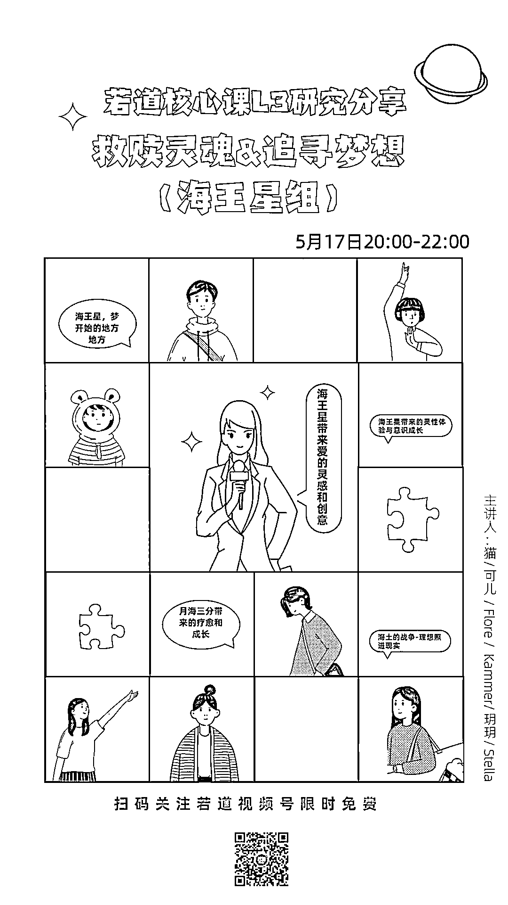

<mpvideosnap class="js_uneditable custom_select_card channels_live_iframe" data-pluginname="videosnap" data-headimgurl="https://wx.qlogo.cn/finderhead/PiajxSqBRaEJYnVsqWfEX9qA0sI6hNVKsDfyzfPZ92WZMZyBpZWU5NA/0" data-username="v2_060000231003b20faec8c4e68a1ec2d4ca07e434b07755bbf47e7053a3059defd2c9d6c68a20@finder" data-nickname="若道" data-desc="将在 05 月 17 日 20:00 直播" data-intro="若道核心核心课程 L3 研究小组分享会-救赎的灵魂&amp;追寻梦想（海王星组）" data-noticeid="finderlivenotice-v2_060000231003b20faec8c4e68a1ec2d4ca07e434b07755bbf47e7053a3059defd2c9d6c68a20@finder-1651821151339308-803714941" data-type="live"></mpvideosnap>

# 插班中 | 美国占星心理学学院&若道占星双认证核心课程

> 原文：[`mp.weixin.qq.com/s?__biz=MzA5NjA0NTAxNg==&mid=2651474031&idx=3&sn=5849d70b3b6d337f8a8b77bdb5a8e45e&chksm=8b48fad8bc3f73cee03b7bad9a2cab61a9890e452c915419614f4002f89ed2d799b47aaf8ee5&scene=126&sessionid=1692737817#rd`](http://mp.weixin.qq.com/s?__biz=MzA5NjA0NTAxNg==&mid=2651474031&idx=3&sn=5849d70b3b6d337f8a8b77bdb5a8e45e&chksm=8b48fad8bc3f73cee03b7bad9a2cab61a9890e452c915419614f4002f89ed2d799b47aaf8ee5&scene=126&sessionid=1692737817#rd)

**美国占星心理学学院创办人**

**格伦·佩里**授课

**40 余年**职业占星师生涯所学精华**倾囊相授**

修完 101-205 全部课程，并通过考核的毕业生将获得

**美国占星心理学学院证书**( Academy of Astropsychology )

和**若道毕业证书**

**高含金量双证书**

跟随主讲老师学习融合**心理学体系**的**占星知识**

为星图咨询解读打下坚实的基础

**大量**的课程资料，光是课后阅读资料就**超过 60 万字**

合理的课程设计，贴心的助教服务，及时的课后测验

1

**这门课程最大的看点是什么？**

1. **两位国际占星学大师**共同授课，将合计**90 年职业占星师生涯所学精华**倾囊相授；2. 修完**全阶课程**，考试通过的毕业生将获得**美国占星心理学学院证书**（Academy of Astropsychology）和**若道毕业证书**，**高含金量双证书**；3. **116 次课程**的充分授课时间（录播课程 69 次课；直播课程 47 次课），全面而详细地讲解占星学历史、知识、技能、案例、咨询和运用；4. 跟随主讲老师学习**自成体系、逻辑严密、实用性强的占星语法、星图解读方法**；5. 学习独特的**发展年龄预测法**，从星图看对关键年龄阶段的发展及议题；6.** 大量的课程资料，光是课后阅读资料就超过 60 万字**；7. 合理的课程设计，初中阶课程，每一节都有课后测验；8. 本课程可以作为**ISAR 选修课**中的一门，再修两门就满足 ISAR 认证选修课要求；9. **18 次占星咨询技巧的培训**，为正式从事占星咨询建立基础；10. 教授重要的**心理学概念**，比如与客体关系、心理动力理论、个人神话和叙事疗法相关的一些概念，学习如何将它们整合到星图解读中；11. 了解**《精神疾病诊断与统计手册》**诊断标准，探索星图中的心理疗愈；12.  学习**叙述疗法**和**自传写作**，将之作为自我疗愈和咨询的工具。

**格伦老师致学员的信**

（向上滑动查看内容）

**亲爱的学员：**

作为占星心理学学院的校长，我的目标是帮助你顺利完成学业。

占星心理学学院的课程让你能够在经济承受范围内，灵活地学习占星学。我们的课程让你可以舒适、便捷地在家学习，不用打乱你本就繁忙的日程。我们有完善的在线学习系统，让你能在线上课、下载学习资料、进行测试并自动获得即时反馈，还可以在虚拟课堂上同你的教员和同学互动。

作为私人开业的**职业占星师**和**执业心理治疗师**，我已经**工作超过 30 年。**我还花了近 10 年的时间，在研究院里学习并获得**心理学的硕士和博士学位**。这段训练和经历是无价的，帮助我将占星学发展成为连贯的 21 世纪模式。

我们的占星学培训项目是**系统化的、清晰的、组织有序的、易学的、前沿的。**尽管有许多类似的学校可供你选择，但你不会在这些学校中看到像占星心理学学院所提供的那样有深度的或尖端的课程。

**我非常期待 2022 年再次在若道教授心理占星学核心课程。**我们重新规划和升级了本次课程体系。**新的课程包含之前完整课程的 72 个录播视频，每个视频长 2 小时；以及由我教授的 37 次直播课程，和大卫老师教授的 10 次直播课程，每次课程 2 小时。**在实时课程中，除了我提供的案例，我还会用学员的星图进行案例演示，与学员互动，阐明视频中教授的原则和方法。

**2 小时直播课程安排：**

**第一阶段 提问和讨论：**

这将在每节课开始时进行。邀请学员提出与课前提供的资料相关的具体问题。这一阶段将持续 15-30 分钟。

**第二阶段 示例：**

这一阶段会讲解与每周任务相关的具体概念，例如行星的星座位置、宫位位置以及相位的意涵。星图示例来自我认识的人，如公众人物、朋友、家人、同事或以前的客户（不显示出生信息）。同样，这一阶段也开放课堂讨论，学员可以提出自己的问题和见解。

**第三阶段 学员案例演示：**

这个阶段会从学员的具体星图来阐明概念，例如火元素行星占优势。学员案例演示不会涉及任何类型的咨询或“解读”。它们将只是简单地包含一段对话，我会在对话中分享自己对某个配置的思考，然后问这个学员可能会如何主观地（影响、信念、行为）和客观地（事件/关系）体验这个配置。其他参课学员可能也会对讨论的主题有自己的见解或问题，他们也可以参与讨论。

我对这一新的在线课程形式感到兴奋，**并期待着从 2022 年 4 月 27 日开始认识我的新学员们。**获得本学院的文凭会是你做过的最明智的投资。你不仅将占星学掌握到前所未有的深度，还将学到如何为客户提供咨询服务并建立职业占星师的职业生涯。

真诚地

**格伦·佩里 占星心理学学院校长**

**为什么要学习心理占星学？**占星心理学是一个复杂的体系，让实践者能够向客户提供真正治疗性的益处。这从根本上说来是我们学院有别于其他学校之处：**我们教授占星学，也教授心理学概念。****我们明确讨论各种心理学概念，并将其与占星学无缝衔接。结果就是更深入的、更丰富的，最终更加强大的模式。****该项目专为初学者和渴望深造的有经验的占星师而设。**我们会从跨学科的角度探讨星图解读。**通过融合荣格心理学和各种其他模型的元素，学员将熟悉作为人格理论、发展模型、原型语言和诊断工具的占星学。**

2

**课程是怎么安排的？**

**第一学年**

**共****64****次课 **43****次录播课 **21 次直播课******

**101 占星学基础 **

****共****12****次课程：******8 次 2017 年录课+4 次直播课**

**占星学**关注成长，聚焦心理。外部事件意义重大，但我们可以把它们看作是对于发展中的心理结构的共时性反映，以及未来发展的媒介和催化剂。在这个阶段的课程中，会以四种形态的几何形式介绍**占星原型：星座、行星、宫位和相位**。黄道带是人类心灵的象征性地图，其中的每个**星座**都代表一种基本的人类需求、原型人物、发展阶段和行为风格。**行星**代表心理功能，以满足其关联星座的基本需求。**宫位**提供了环境舞台，行星在其中扮演它们的角色，而**相位**是行星之间的角度关系，在主观上体验为内在对话。

**课程安排**：

**录播课****、****直播课（周三）**时长都是 2 小时

第一节**录播课**：核心概念介绍

第二节**录播课**：黄道带的结构

2022 年 4 月 27 日**直播课**：核心概念、黄道带的结构提问和讨论、知识点示例

第三节**录播课**：图例、单态星体和其他奇妙的元素

2022 年 5 月 11 日**直播课**：图例、单态星体提问和讨论、知识点示例

第四节**录播课**：星座介绍（从白羊座到处女座）

第五节**录播课**：星座介绍（从天秤座到双鱼座）

2022 年 5 月 25 日**直播课**：12 星座案例演示

第六节**录播课**：行星作为过程

第七节**录播课**：行星作为内容

第八节**录播课**：将碎片整合起来

2022 年 6 月 8 日**直播课**：整合星图时，将行星作为过程和内容案例演示

**102 行星落星座、宫位** 

****共****12****次课程：**8 次 2019 年录课+4 次直播课**

这个阶段的课程**聚焦于初步的星图整合。**

学员将学习**占星语法**，以及如何运用它们来阐释**行星的星座落点**。学员不需要强记书中的星图解读，而是学习分析基础的占星句法结构，应用这些语法规则来思考和讲述这门语言。学员们将学习如何构建精妙的句子，将动机、功能、特质、状态和事件组合起来。

此外，还将学习解读**行星宫位落点**的规则。宫位被定义为心理环境，为特定类型成长和发展提供背景。行星落在宫位中，象征着情境中的特殊状态，应对环境挑战的方式，以及通过共时性人物和事件而外化的自我部分。

学员们将探索如何将星座和宫位落点融合在一个单一、整合的陈述中，做出灵活、层次分明的解读。

**课程安排**：

第一节**录播课**：占星语法介绍

第二节**录播课**：行星星座作为行为风格

2022 年 6 月 22 日**直播课**：占星语法、行星星座作为行为风格提问和讨论、知识点示例

第三节**录播课**：思维状态和行为结果

第四节**录播课**：学习行星的星座落点

2022 年 7 月 6 日**直播课**：思维状态和行为结果、行星的星座落点提问和讨论、知识点示例

第五节**录播课**：回顾宫位的含义

第六节**录播课**：宫位中的行星过程

2022 年 7 月 20 日**直播课**：宫位的含义、宫位中的行星过程提问和讨论、知识点示例

第七节**录播课**：行星在宫位中的状态

第八节**录播课**：行星作为宫位的内容

2022 年 8 月 3 日**直播课**：行星在宫位中的状态、内容的提问和讨论、知识点示例

**103 行星相位与个人神话** 

****共****13****次课程：**9 次 2019 年录课+4 次直播课**

在这个阶段的课程中，**相位**被解释为由更大的故事结构的潜在动力构成的个人神话。

学员将学习相位是如何象征内在心理的冲突、重要的童年情感体验、主要的人生挑战和内在对话的。需要着重强调的是，相位的意涵会随着心理成熟的程度而改变。人会成长、进化，会解决内在冲突，这些不仅反映在态度和行为的改变上，而且也会表现在某人吸引的事件及其与他人的关系品质上。

学员们还将学习一些**心理学概念**，比如与客体关系、心理动力理论、个人神话和叙事疗法相关的一些概念，它们将整合到相位解读中。

**课程安排**：

第一节**录播课**：重要主题与核心冲突

第二节**录播课**：渐盈相位与渐亏相位

2022 年 8 月 17 日**直播课**：重要主题与核心冲突、渐盈相位与渐亏相位的提问和讨论、知识点示例

第三节**录播课**：主要相位的核心意义

第四节**录播课**：罗生门原则

2022 年 8 月 31 日**直播课**：主要相位的核心意义、罗生门原则的提问和讨论、知识点示例

第五节**录播课**：占星学中的认知

第六节**录播课**：心灵的控制结构

2022 年 9 月 14 日**直播课**：占星学中的认知、心灵的控制结构的提问和讨论、知识点示例

第七节**录播课**：作为认知结构的相位

第八节**录播课**：强迫性重复

第九节**录播课**：听大卫·瑞雷讲月亮交点

2022 年 10 月 12 日**直播课**：月亮交点（由大卫·瑞雷老师教授）

**104 征象星与定位星：作为进化故事的星图 **

****共****12****次课程：******8 次 2019 年录课+4 次直播课**

这个阶段的课程聚焦于**从叙事角度整合星图。**

学员们将探索**宫位征象星**和**行星定位星**如何讲述一个故事，反映一个人进化发展之旅。行星定位关系揭示了个人神话的主体构架。而这个故事的主题常常处于意识觉知和控制之外，占星学提供了一种方式，揭示、解读、改编这个神话。

我们推荐的星图整合方式是将相位和定位星关系融合成一个单一、连贯的叙事。要特别强调的是，如何活出整合程度更高的生命故事。

学员们还将了解**叙事疗法**和**自传写作**，把它们当作促进整张星图整合的一种方式。

**课程安排**：

第一节**录播课**：每张星图都讲述了一个故事

第二节**录播课**：互容与最终定位星

2022 年 10 月 26 日**直播课**：每张星图都讲述了一个故事、互容与最终定位星的提问和讨论、知识点示例

第三节**录播课**：将相位整合进流程图

第四节**录播课**：完整的故事

2022 年 11 月 9 日**直播课**：将相位整合进流程图、完整的故事的提问和讨论、知识点示例

第五节**录播课**：过渡短语

第六节**录播课**：良好定位或不良定位

2022 年 11 月 23 日**直播课**：过渡短语、良好定位或不良定位的提问和讨论、知识点示例

第七节**录播课**：发展年龄方法

第八节**录播课**：进行全面整合

2022 年 12 月 7 日**直播课**：发展年龄方法、进行全面整合的提问和讨论、知识点示例、案例演示

**105 星图中的精神病理学与疗愈 **

****共****15****次课程：******10 次 2019 年录课+5 次直播课**

在这个阶段的课程中,我们将**聚焦于十二星座(从白羊座到双鱼座）及其对应的守护星的潜在功能障碍**。

我们将学习如何识别、理解和应对每个星座的潜在挑战。我们将在各种相应的心理障碍背景下来考察占星原型，这些心理障碍表现为功能障碍、失衡的极端状态。

学员们将了解**《精神疾病诊断与统计手册》诊断标准**。我们会探讨治疗的概念，尤其是那些与整合和个性化相关的概念。我们将特别关注外行星的困难相位，以及它们与内在心理冲突、防御和症状形成的关系。

学员们将探索人的痛苦如何成为发展和实现天赋才能的催化剂。

**课程安排**：

第一节**录播课**：白羊座-火星的病理学

第二节**录播课**：金牛座/天秤座-金星的病理学

2022 年 12 月 21 日**直播课**：白羊座-火星、金牛座/天秤座-金星的病理学提问和讨论、知识点示例、案例演示

第三节**录播课**：双子座/处女座-水星的病理学

第四节**录播课**：巨蟹座-月亮的病理学

2023 年 1 月 4 日**直播课**：双子座/处女座-水星、巨蟹座-月亮的病理学提问和讨论、知识点示例、案例演示

第五节**录播课**：狮子座-太阳的病理学

第六节**录播课**：天蝎座-冥王星的病理学

2023 年 2 月 1 日**直播课**：狮子座-太阳、天蝎座-冥王星的病理学提问和讨论、知识点示例、案例演示

第七节**录播课**：射手座-木星的病理学

第八节**录播课**：摩羯座-土星的病理学

2023 年 2 月 15 日**直播课**：射手座-木星、摩羯座-土星的病理学提问和讨论、知识点示例、案例演示

第九节**录播课**：水瓶座-天王星的病理学

第十节**录播课**：双鱼座-海王星的病理学

2023 年 3 月 1 日**直播课**：水瓶座-天王星、双鱼座-海王星的病理学提问和讨论、知识点示例、案例演示

**第二学年 2023 年**

****共****52****次课 **36****次录播课 **16 次直播课********

**201 回顾占星历史 **

****共****16****次课程：******9 次 2019 年录课+7 次直播课**

在这个阶段的课程中，我们将探索**占星历史如何反映心灵的进化**。

现代之前的占星学以事件为导向，注重具体预测，偏向决定论，它反映了现代之前的主导意识模式。上世纪以来，占星学已经逐渐变得更加抽象、心理化、开放和非决定性，这似乎反映了集体意识的改变。因此，我们将在人类发展和意识进化的背景下考察占星历史。我们会谈到不同时代的星图解读和咨询技术，以此来比较和对比前现代、现代和后现代占星学。

**课程安排**：

第一节**录播课**：朝着整体占星学前进

第二节**录播课**：占星原教旨主义

2023 年 3 月 22 日**直播课**：朝着整体占星学前进、占星原教旨主义提问和讨论、知识点示例

第三节**录播课**：占星学的其他分支——大卫·瑞雷

2023 年 3 月 29 日**直播课**：占星学的其他分支提问和讨论、知识点示例（由大卫·瑞雷老师教授）

第四节**录播课**：从古代占星学到后现代占星学

第五节**录播课**：比较与批评

2023 年 4 月 5 日**直播课**：从古代占星学到后现代占星学、比较与批评、提问和讨论、知识点示例

第六节**录播课**：希腊占星学：摘录与评论

2023 年 4 月 19 日**直播课**：希腊占星学：摘录与评论提问和讨论、知识点示例

第七节**录播课**：比对图中的伴侣匹配度，古代与现代

2023 年 5 月 3 日**直播课**：比对图中的伴侣匹配度，古代与现代提问和讨论、知识点示例

第八节**录播课**：比对图——大卫·瑞雷

2023 年 5 月 10 日**直播课**：比对图提问和讨论、知识点示例、案例演示（由大卫·瑞雷老师教授）

第九节**录播课**：组合图——大卫·瑞雷

2023 年 5 月 17 日**直播课**：组合图提问和讨论、知识点示例、案例演示（由大卫·瑞雷老师教授）

**202 预测与意识演变(一) **

****共****9****次课程：******6 次 2019 年录课+3 次直播课**

作为一门艺术，**预测占星学**运用行星的运行来预测特定时期的性质、意义和持续时间。在这个阶段的课程中，我们会考察**意识进化**的概念、其基本原理及其与占星学预测部分的关系。

意识进化可以被定义为有意识地与星图中固有的进化过程合作。学员们将探索如何用**行进**和**推进**来为意识进化服务。我们不是简单描述事件的结果，而是将行星运行描述为实现先天潜能的机遇之窗。

**课程安排**：

第一节**录播课**：开始预测

第二节**录播课**：发展年龄方法

2023 年 5 月 24 日**直播课**：开始预测、发展年龄方法提问和讨论、知识点示例、案例演示

第三节**录播课**：太阳的行进

第四节**录播课**：月亮的行进与推进

2023 年 6 月 7 日**直播课**：太阳的行进、月亮的行进与推进提问和讨论、知识点示例、案例演示

第五节**录播课**：水星的行进

第六节**录播课**：金星的行进

2023 年 6 月 14 日**直播课**：水星、金星的行进提问和讨论、知识点示例、案例演示

**203 预测与意识演变(二) **

****共****15****次课程：******9 次 2019 年录课+6 次直播课**

在这个阶段的课程中，学员们会继续探索**如何将对行进、推进和其他预测方法的分析运用于个人成长**。

具体事件反映并促进了意识的改变；因此，行星运行可以帮助我们洞察成长过程的精确时机，让我们领会内在和外在现实如何同时发生、彼此反映、互相转化。

我们还将探索宏观的世界行进，考察占星格局如何在社会、政治、经济、艺术和生态层面上表现出不同的形式，却又在多样化的现象中反映单一的**原型**。

这里的挑战是去思考，我们对宇宙的这种参与式关系如何能为共同创造一个积极的、更充满希望的未来做出贡献。

**课程安排**：

第一节**录播课**：火星的行进

第二节**录播课**：木星的行进

2023 年 6 月 28 日**直播课**：火星、木星的行进提问和讨论、知识点示例、案例演示

第三节**录播课**：土星的行进

第四节**录播课**：天王星的行进

2023 年 7 月 12 日**直播课**：土星、天王星的行进提问和讨论、知识点示例、案例演示

第五节**录播课**：海王星的行进

第六节**录播课**：冥王星的行进

2023 年 7 月 26 日**直播课**：海王星、冥王星的行进提问和讨论、知识点示例、案例演示

第七节**录播课**：次限推进——大卫·瑞雷

2023 年 8 月 2 日**直播课**：次限推进提问和讨论、知识点示例、案例演示（由大卫·瑞雷老师教授）

第八节**录播课**：太阳弧——大卫·瑞雷

2023 年 8 月 9 日**直播课**：太阳弧提问和讨论、知识点示例、案例演示（由大卫·瑞雷老师教授）

第九节**录播课**：太阳返照图和月亮返照图——大卫·瑞雷

2023 年 8 月 16 日**直播课**：太阳返照图和月亮返照图提问和讨论、知识点示例、案例演示（由大卫·瑞雷老师教授）

**204 占星咨询技巧(一) **

****共****9****次课程：******6 次 2019 年录课+3 次直播课**

在这个阶段的课程中，学员们将学习**咨询技巧**，比如如何选取一段经历，询问相关问题，提出假设，进行解读，重塑冲突，预测成长机遇，深化疗愈。

我们会审视各种**咨询理论**，重点强调它们在占星学中的**运用**。学员们将学习如何处理危机，做出恰当的推荐引介。

我们强调**有效沟通**的原则、聆听技巧、言语和非言语沟通，以及占星学如何帮助我们建立共情关系。

我们会专门介绍**伦理道德**法则，因为它关系到职业责任问题、资质能力、咨询和预测。

我们会特别关注**占星师的阴影**以及我们在自卑和膨胀问题上的集体脆弱。

**课程安排**：

第一节**录播课**：导言与概述

第二节**录播课**：确定咨询范围

2023 年 8 月 30 日**直播课**：导言与概述、确定咨询范围提问和讨论、知识点示例、案例演示

第三节**录播课**：会见客户

第四节**录播课**：厘清问题(剥开占星学的洋葱)

2023 年 9 月 13 日**直播课**：会见客户、厘清问题(剥开占星学的洋葱)提问和讨论、知识点示例、案例演示

第五节**录播课**：认出生活模式(隐喻思维)

第六节**录播课**：提出假设与辨识核心信念

2023 年 9 月 27 日**直播课**：认出生活模式(隐喻思维)、提出假设与辨识核心信念提问和讨论、知识点示例、案例演示

**205 占星咨询技巧 (二) **

****共****12****次课程：******6 次 2019 年录课+6 次直播课**

在这个阶段的课程中，参与者将**继续学习咨询技巧**，包括如何选取一段经历，询问相关问题，提出假设，进行解读，重塑冲突，预测成长机遇，深化疗愈。

我们还将考察各种**电影**，考察它们与理解人们寻求帮助的共同议题的关系。我们会审视各种咨询理论，着重强调它们在占星学中的运用。学员们会学到如何处理危机，做出恰当的推荐引介。我们会强调有效沟通的原则，以及聆听技巧、言语和非言语沟通，以及占星学如何帮助我们建立共情关系。我们会专门介绍伦理道德法则，因为它关系到职业责任问题、资质能力、咨询、预测和古代术语的运用。

**课程安排**：

第一节**录播课**：检验假设

第二节**录播课**：对星图做出初步解读

2023 年 10 月 11 日**直播课**：检验假设、对星图做出初步解读提问和讨论、知识点示例、案例演示

第三节**录播课**：建设性解读星图的艺术

第四节**录播课**：洞悉客户经历的目的

2023 年 10 月 25 日**直播课**：建设性解读星图的艺术、洞悉客户经历的目的提问和讨论、知识点示例、案例演示

第五节**录播课**：提供希望和方向

第六节**录播课**：案例研究和督导

2023 年 11 月 8 日**直播课**：提供希望和方向、案例研究和督导提问和讨论、知识点示例、案例演示

2023 年 11 月 15 日**直播课**：ISAR 资质认证考试大纲和准备（由大卫·瑞雷老师教授）

2023 年 11 月 22 日**直播课**：ISAR 资质认证考试术语词汇表第一部分（由大卫·瑞雷老师教授）

2023 年 11 月 29 日**直播课**：ISAR 资质认证考试术语词汇表第二部分（由大卫·瑞雷老师教授）

**若道核心课程结业考试**

3

**导师简介**

**格伦·佩里（Glenn Perry）**

*   这位传奇的占星师，也是一名拳击和摩托车爱好者

*   他毕业于赛布鲁克学院(Saybrook Institute)，是心理/意识研究专业博士

*   也是拥有 30 余年经验的加州注册婚姻和家庭治疗师 （CAMFT）

*   美国占星心理学学院（Academy of AstroPsychology）的创办人

*   他曾任国际占星研究协会 （ISAR）以及联合占星大会董事会（UAC）副主席

*   也是 ISAR 突破性道德标准的设定者

*   康涅狄格州研究生院（the Graduate Institute of Connecticut）原型宇宙学与意识进化项目的负责人

*   共出版八本占星学著作：《心理占星学入门》《心理占星论文集》《盗取天火》《从忠诚到革命》《星图中的阴影》《占星职业议题与伦理》《出生星图深度分析》《从古代到后现代占星学》

**大卫·瑞雷（David Railey）**

*   若道联合创始人，致力于在中国教授和推广西方占星学；

*   曾任 ISAR 全球副主席，CAPISAR（ISAR 职业占星师资质认证机构）主席；

*   1976 年，通过亚特兰大职业占星师考试，成为全职占星师，随后通过 AFAN 和 ISAR 职业测试；

*   1980 年，与杰夫·焦耳一起在亚特兰大创建“每日行星”占星学中心。此后在亚特兰大占星协会担任 4 年考官，并且两次担任亚特兰大地区占星协会主席。1979-1992 年，作为占星师活跃于美国社会媒体，向不了解现代占星学变化的大众宣传专业占星学知识。在 1989-1992 年期间，他在 WRGG 电台 12 频道每周主持个人电视秀“今日占星学”，早先他还在 WRFG 的广播节目中播讲宇宙天气节目；

*   2010-2014 年，任全美占星师联盟监督委员会委员；

*   2010 年，其著作《灵魂的目标》中国版出版，和蒋颖一起创办若道占星学校和其官网 www.nodoor.com；

*   2017 年，被选为 ISAR 委员会成员。ISAR 是世界最大的国际占星机构，会员遍布 45 个国家，2017-2020 年曾任 ISAR 全球副主席、CAPISAR（ISAR 职业占星师资质认证机构）主席。

**助教简介**

**薇安**

*   全职心理占星师、ISAR 认证占星师（2016 年获得）；

*   北大心理学硕士、MBTI 国际认证施测师；

*   若道认证生时校正资质及 COAC 高阶资质毕业生；

*   连续两届担任格伦·佩里老师亲授的“美国占星心理学院&若道占星双认证核心课程”主助教；

*   2012 年至今，持续追随多位国际占星大师进行占星学的深入学习；

*   2007 年至今，持续进行精神分析及心理动力取向的理论及技巧研习；

*   致力研究心理学与占星学的整合运用。

4

**此次课程适合哪些人？**

*   对占星学感兴趣，想要入门的零基础者

*   占星学小白，但有志成为职业占星师的人

*   有一定占星学基础，但不知道该如何整合星图复杂碎片的人

*   想要师从更多殿堂级占星导师学习占星心法的人

*   走在自我探索和个人成长道路上的人

5

**选择若道学习占星学的优势**

**运用自由意志，扭转破坏性模式，绽放天赋潜能**

若道是人本主义占星学的旗手。因为我们相信，**人通过了解模式、觉察习性、积极疗愈、终将释放其潜能，与命运共舞**。

**进入国际权威职业占星师认证的快车道**

占星界的“联合国”ISAR（国际占星研究协会），是具有全世界影响力的占星教学和研究组织和职业占星师全球认证机构，认证占星师遍布 47 个国家。**在 ISAR 的 22 所附属学校中，大中华地区的附属学校只有若道一家**。在国际化的教学理念大纲标准下，**若道毕业生在 ISAR 国际认证占星师的考试通过率多次全球第一**。

**十年占星学教育中国本土化教学经验**

**根据中国学生的学习习惯不断优化占星教学体系，让学员学成后更自如地应对本土咨询市场的需求。**

学好占星学不仅仅需要邀请一两位老师教学，更需要对教学难点有充分了解，且有持续的教学跟进服务。**10 年来多次核心课程和各种专题课程的教学，让若道非常了解中国学生学习占星学的难点和卡点，合理有效地拆分、提炼课程知识点，同时也积累了丰富的国外老师和中国老师、助教紧密配合以及课程顾问密切配合教学的经验**。

若道还专门开发了有助于占星学习的“**若道**”APP，每门课程都设有答疑板块，学员能够方便快捷地提交问题，助教及时答疑解惑和批改作业。

**融入中国顶尖的职业占星师群体**

若道是中国职业占星师的“黄埔军校”。职业占星师的培养从若道开始，**进入若道，你就走进了中国顶尖的职业占星师群体，和一群志同道合的师兄师姐联谊，获得经验，共同成长**。 

**多种奖学金支持**

为了鼓励学员不因为暂时的经济困难而放弃学习，我们特意设置了各种**技能交换和奖学金**。

对于有一技之长的学员，我们推出的技能交换的项目包括**“笔译”、“笔记整理”、“平面设计”、“课本朗读”、“班级服务”**等技能交换项目；

而对于努力学习、出勤率高、完成作业率高的学员，我们设置的**土星奖、木星奖**等各种奖学金在等着你。

为了感谢帮助我们推荐学员的老学员们，我们设置了“**老学员推荐奖**”；

对于通过问卷提建议，帮助我们提高服务的学员，我们也设置了相应的奖学金。

**开启占星咨询的职业规划和支持**

若道为占星学员搭建了占星问答平台和占星咨询平台，并提供严肃占星学影响力最大的媒体平台，全力为毕业生提供宣传渠道，帮助你吸引和积累咨询生涯初期的种子客户。若道为学员开发了适用于占星学习的“若道”APP，并不断更新完善。

**①  微信平台**若道微信平台作为业内颇具影响力专业平台，为文笔好的若道毕业生提供传播占星学并免费宣传自己的机会。有的学员因为文笔获得众多粉丝喜爱，在 3 年多时间积累起 2000 多人的潜在客户。

****②  **咨询平台**若道咨询平台是我们为优秀毕业生所搭建的平台，帮助毕业生在自己的咨询拓展之外，用若道提供的平台扩展咨询客户群。自咨询平台 2017 年 8 月上线运营以来，咨询平台共入驻 65 人，收入最高者达 32 万元。

此处所列学员收入仅供参考，收入高的学员和其专业水准、努力程度密切相关。若道平台尽其所能将自己定位为辅助学员开展职业生涯的桥梁。

6

**课程价格**

**101-102 初阶**

**正价：**6800 元

**学习充值卡优惠价：5800 元**

**101-105 第一学年**

**正价：**18800 元

**学习充值卡优惠价：17000 元**

**101-205 全阶联报**

**正价：**50000 元

**转发优惠价：38000 元**

**学习充值卡优惠价：35000 元**

**咨询课程顾问**：**王老师（微信/手机：18510107057，请备注“格伦核心课”）**

**全阶段学习后，可参与若道占星毕业认证考试，考试费用为：580 元**

7

**直播课开课时间**

**2022 年 4 月 27 日（周三）20:00-22:00**

**如果直播课时间临时有调整，班班会及时通知每位同学****最终解释权归若道所有**

8

**退转课程**

**退款原则请详看《教学协议》，如有疑问请咨询课程顾问。**

9

**格伦老师视频**

** 格伦·佩里老师如何将心理学和占星学结合，如何开始教授心理占星学？**

<mpvideosnap class="js_uneditable custom_select_card channels_iframe videosnap_video_iframe" data-pluginname="videosnap" data-id="export/UzFfAgtgekIEAQAAAAAA8eIyMnQ0OwAAAAstQy6ubaLX4KHWvLEZgBPElIMYehsfM5L8zNPgMIuvMAf_Y6LDutEHc2Wrzjw4" data-url="https://findermp.video.qq.com/251/20304/stodownload?encfilekey=rjD5jyTuFrIpZ2ibE8T7YmwgiahniaXswqziaIVPleibJ2hxOpvKV1xQEH6MamiaEBVFicyZBhiclPyaSRcGvHAp4bwkwdXNbQRJbg9RrtRbicfWiaWoJ07pzF0Fko4A&amp;adaptivelytrans=0&amp;bizid=1023&amp;dotrans=0&amp;hy=SH&amp;idx=1&amp;m=&amp;scene=0&amp;token=x5Y29zUxcibDN9xf8canDXrHbgHlBEI63uP2UCArXcOZMS5ibDQzQmvzBdLf8ZGmicZryTq7O2zP30" data-headimgurl="http://wx.qlogo.cn/finderhead/PiajxSqBRaEJYnVsqWfEX9qA0sI6hNVKsDfyzfPZ92WZMZyBpZWU5NA/0" data-username="v2_060000231003b20faec8c4e68a1ec2d4ca07e434b07755bbf47e7053a3059defd2c9d6c68a20@finder" data-nickname="若道" data-desc="#若道核心课  （不是纯英文视频，有中文翻译）心理占星学和普通的占星学有什么不同？心理占星学有什么特殊的内容设置？
" data-nonceid="8810794934239578092" data-type="video" data-width="1920" data-height="1080"></mpvideosnap>****2022 双证书核心课****

**授课老师：格伦·佩里、大卫·瑞雷**

**直播课开课时间：2022 年 4 月 27 日（周三）开课**

**授课方式：******网络授课，英文授课，中文翻译****

**费用：101-102 价格：**6800 元**（充值卡优惠价 5800）**，**101-105 价格**：18800 元**（充值卡优惠价 17000）**，**101-205 价格**：50000 元**（转发优惠价：38000 元，充值卡优惠价 35000）**；

**课程负责人：王老师**（微信/手机：18510107057，请备注“格伦核心课”）

长按二维码添加课程负责人咨询~

****报名直达入口****

# 他是心理占星学第一“男神”，不接受反驳！

> 原文：[`mp.weixin.qq.com/s?__biz=MzA5NjA0NTAxNg==&mid=2651474031&idx=2&sn=6faf63f39161b5710af1a16e3bfd72f7&chksm=8b48fad8bc3f73ceff2c9dd4c894c30ec3cd00baf6e3925a6bd1db9c2a3f34bb2866f9275fcf&scene=126&sessionid=1692737817#rd`](http://mp.weixin.qq.com/s?__biz=MzA5NjA0NTAxNg==&mid=2651474031&idx=2&sn=6faf63f39161b5710af1a16e3bfd72f7&chksm=8b48fad8bc3f73ceff2c9dd4c894c30ec3cd00baf6e3925a6bd1db9c2a3f34bb2866f9275fcf&scene=126&sessionid=1692737817#rd)

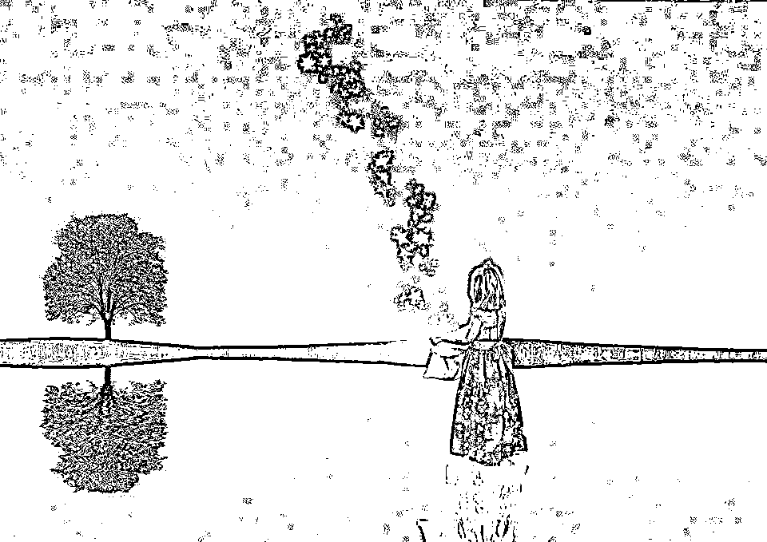

译者/江艺 王宏 校对/王宏 esme 文字整理/若道君 编辑/玫瑰 图片/pexels

提到心理占星学，有一个绕不过去的人物，就是格伦·佩里老师，他到底有多传奇？往下看。格伦老师开设的【[心理占星双证一学年课](http://mp.weixin.qq.com/s?__biz=MjM5MjQwNjAyMQ==&mid=2649439504&idx=5&sn=e2b29f828e91e0a4ae1bb1438956e3e7&chksm=beb9527a89cedb6c5e72a0188af9e82447b9b661b6f25c5ca3bb4434de76863a4e68d5388724&scene=21#wechat_redirect)】、【[心理占星双证课](http://mp.weixin.qq.com/s?__biz=MjM5MjQwNjAyMQ==&mid=2649439504&idx=6&sn=788bdaa5d52089c08cc066d1a0ebd285&chksm=beb9527a89cedb6c77c50b55a75119af7bd985b0d9eec75a71d4575df7e98d768c38c343cb83&scene=21#wechat_redirect)】报名中，也欢迎你点击链接了解更多详情哦。

格伦·佩里(Glenn Perry)，这位传奇的占星师，也是一名拳击和摩托车爱好者。他毕业于赛布鲁克学院(Saybrook Institute)，获得心理/意识研究专业博士学位，目前已是一位拥有三十多年从业经验的美国职业占星师和注册心理治疗师。他曾任国际占星研究协会 （ISAR）以及联合占星大会董事会（UAC）副主席，也是 ISAR 突破性道德标准的设定者。**关于格伦老师的十个问题****问：**是什么让您成为一名占星师？您是如何开启自己的占星之旅的？您现在还做咨询吗？**格伦**：我在 16 岁时发现了占星学。最初我只是阅读一些书籍，然后将太阳星座的特征描述与我熟悉的人进行对照——包括我的家人、朋友，当然还有我自己！占星学不证自明的有效性让人着迷。之后，在我 21 岁左右时，我开始更加严肃认真地学习占星，并且学习如何手绘占星图。那时还没有个人电脑。我越深入地研习占星学，它的价值和有效性就变得越明显。那种感觉就像是坠入情网一样。

是的，我还在做咨询，对我来说，咨询就像是与一位美丽的女士共舞。这个活动的活力让我的头脑保持灵活、强大，而不断的学习只不过是为优雅的舞姿做准备 —— 所以我绝不会踩到任何人的脚！

**问：**心理学最吸引您的地方是什么？心理占星学在多大程度上帮您找到深层次个人问题的答案和人生的方向？在这方面您有没有可以和我们分享的故事？通常，您在一次咨询中，您用到占星学与心理学的比例是多少呢？

**格伦**：我会回答是**心理动力（psychodynamic）理论**。心理动力是研究精神中所包含的自激活动、目标导向和互动驱力如何成为所有思考、感受和行为的基础。一个心理动力的公式涉及到精神如何发展，如何受伤，如何努力自我疗愈，进化到更高的层次。动机、情感、认知和行为之间的关系是心理动力学中的首要主题。**心理动力（psychodynamic）这个术语——灵魂的活动是指持续运动和改变的精神能量。**在研究生阶段，我醉心于研究外在事件如何以不计其数的方式影响精神能量，精神能量如何由自发性的内在过程引导、阻塞、释放，并在整个心灵中以无数种方式再分配。然而，心理动力在占星学的背景下变得更加有趣了。因为星图可以被看作是对精神能量动态的描绘，一个生动且处于进化中的过程，不断的与环境进行能量交换，但是其方式远超出了心理学教授的范围。

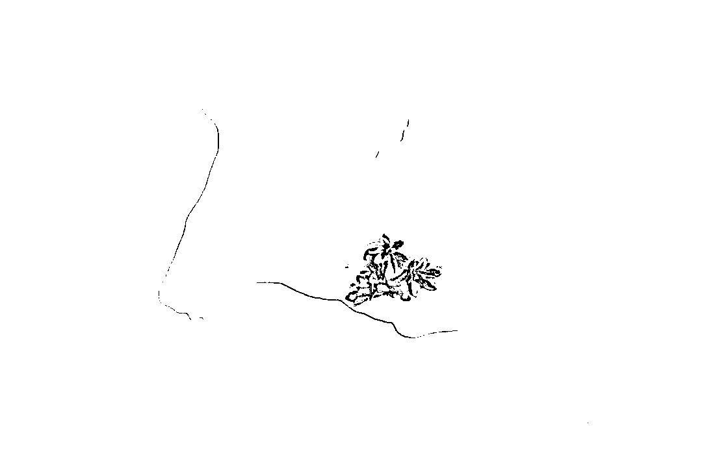

**心理占星学是可以终身陪伴着你的东西，它就像你额头前戴着的一盏头灯，让你在面对前方的黑暗时看得更远，更清晰**。在我 37 岁时，行进土星在第八宫合相我出生时落在射手座的月亮，那时我的老师理查德·埃德蒙去世了。这个占星学象征其实非常恰当。因为随着理查德离世，火炬也被传递下来了，我感觉自己继承了他的遗产，必须背负它继续前行。月亮象征着家庭，而理查德对我来说就像大哥一样**。射手座代表理论教学，第八宫代表死亡和转变。****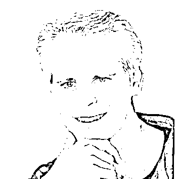**

随着理查德的死亡，我从学生转变为老师，并且开始进行有关占星学的写作，将之作为转变的工具。土星每 29 年才与我出生时的月亮合相一次，因此这是非常强大的转变时期，而占星学帮助我明白了它的意义。

在比例上，不可能将二者分开。正如我的教学一样，占星学就是它自己的心理学。

**问：**您非常强调个人意识和更伟大的宇宙意识之间的协调。您如何通过心理占星实践来达成这一目标呢？您在中国的学生或许会对您如何在世俗生活中实践您的信仰感到好奇。您会运用占星学来规划自己的日常生活，做抉择吗？您这样运用占星学的频率如何呢？

**格伦**：**我从不用占星学来引导我的人生，我运用它帮助我自己指引我的人生**。

我们的目标不是变得依赖于一个外在的指示来源，而是加深对自己内在指引的信任。许多人为了控制未来的事件而利用占星学，即想知道将会发生什么，然后要做什么。

多半情况下，占星学不是非常擅长于这类事情。**对占星学更好的运用是当事件真正展现的时候，明白其目的和意义**。占星学习深化了我们对更大智慧的信仰，因为每日经验始终与对出生图行星行进的象征保持一致。没有必要试图比宇宙更聪明，因为它的智慧和目的性在每个可想象的方面都超越我们。占星学习反复证实，宇宙是被巧妙地精心安排的，这种精心安排一直延伸到个人经验的细节。由于相信宇宙，我并不试图用占星学获取个人利益，而是用它来采集对个人经验的意义的洞见，从而让我能够更加有效地进化、成长，并从经验中学习。通过这种方式，我逐渐开始认同更伟大的智慧，它始终指引我回到它身边。

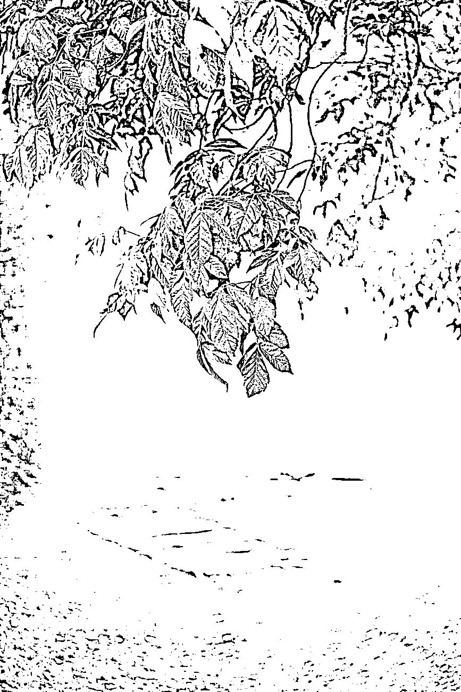

问：现在您已经经历了许多行星周期，您是否仍然需要体验由具有挑战性的行星周期所带来的不愉快感受吗？不同于您年轻时的方法，您现在用什么方法应对它们呢？从您的咨询经验来看，我们能在多大程度上治愈我们出生图中存在的问题呢？

**格伦**：**在回应艰难的行进时，我仍然会体验到一些不愉快的情绪，但是这些感觉非常微小，我恢复起来也比年轻时要快**。

我相信所有经历都有其目的和意义而言，我能更好地适应人生带给我的一切。我不太去抵抗具有挑战性的事件，我不感觉自己是“霉运”或虐待的受害者。

占星学帮助我们明白，困难时期的出现都是有原因的，有特定的持续，对于个性成长和潜力认知来说是必需的。**由于占星学实际上是对变化（行星在不断移动）的研究，所以它教育我们拥有更少的留恋和更多的适应性**。无论发生什么，不管是好是坏，我的态度越来越多地是：**“这也会过去的。”**经验教导我宇宙在不断地精心安排事件，来帮助我们学习、治愈创伤、实现我们的天赋。占星学帮助我们清楚地看到这是如何发生的，并让我们信任这一过程。 

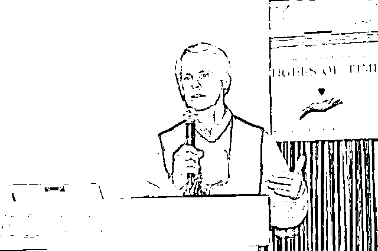

问：我们知道您是执业心理治疗师。在中国，现在咨询心理学非常受欢迎。您能给我们多讲讲您在心理治疗方面的背景吗？获得执业许可是不是要求很高？占星师，心理咨询师，教师，您更认同哪一个身份？**格伦**：我是在加利福利亚州获得执业许可的。它要求至少三年的官方认可项目的研究生学习、多年的实习医师期、接受一名执业心理治疗师的指导 5000 个小时，并通过由国家组织的口头和书面测试。一般来说，这至少需要五年时间。我从 1979 年开始个人诊疗实践。**我会解读每位客户的出生星图，并将它作为一种诊断和病情预断的工具。这并不一定意味着我在心理治疗的背景下谈论出生图，但它加速并加深了我对于促使客户来做治疗的事件的认识**。拥有客户的出生星图就像拥有他们灵魂的 X 光片。它不仅能够让我看见他们内在的心理结构，还能帮助我明白特定周期的意义和持续时间，以及外部事件的意义。

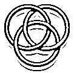 

对于这三个身份，我没有偏好。我不能想象失去其中任何一种。对我而言，他们就像是波罗米安之环。如果你拿走一个环，其他两个就会掉落。在古代，波罗米安之环象征着团结的力量。这就是我对占星学、心理治疗和教学的感觉。

问：心理学的概念能顺利地转化为占星学概念吗？

**格伦**：当然可以。事实上，心理学和占星学这两个模式相互丰富彼此。**占星学帮助解释内在世界和外部世界是如何密切相关的，这在心理学中并未得到很好的理解。**

荣格的共时性概念在这里很有用，但是占星学充分显示了心理动力过程被外部事件和情感关系的特定性质所映射——传统上称之为“命运”。

另一方面，**心理学提供了大量的观点，澄清并深化我们对于占星象征如何与心灵复杂的内部运作相联系的理解。**心理占星学显示了心灵和命运如何循环关联，从而让内在和外部现实相一致，互相反映并相互转化。

问：您在文章中写道：“在我看来，真正的帮助必须让客户重新与自己认知的源头连结。”由于占星过程中所耗费的时间远远少于心理治疗的时间，那您是如何在有限的会面中做到这一点的呢？

**格伦**：我在可以利用的有限时间里尽我所能做到最好，无论是只有一次会面，还是有一百次会面。在我的经验里，即便只有一次会面，也可以有力地证实客户认知的内在根源。

通常的做法是，指出他们所做的选择与出生星图预示相符。**我认为客户不太需要该做什么这类的建议，更多的是需要支持，支持他们朝着感觉正确的方向前进**。

**客户实际上不可能以与他们的出生图不一致的方式行事，唯一真正存在的问题是他们活在出生图的哪个层面上**。

鼓励他们去融合，去进化，这不仅确认了客户当下的状态，还激励他们随着时间的推移去实现更高的潜能。换句话说，**我的解读要描述出（出生星图中）某一格局如何以更富满足感的形式表达，以及客户在这一领域中的延续性成长**。

这给予他们方向感和可能性。尽管单一的一次会面可能只会播下一颗种子，但橡子可以长成高大的橡树！

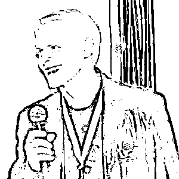

问：大多数人找治疗师是为了治愈，而找占星师则是为了寻求答案。这是中国存在的一种现象。

但您在文章中说过，您不帮助客户为了个人私利而占占星学的便宜，您不会告诉客户他们什么时候应该恋爱、结婚、生子、离婚、度假、创业、转让买卖，这些都是人们在会面时普遍会问到的问题。

像我们这样年轻的占星师不仅时不时地忍不住一头扎入答录机的角色之中，而且还常常被客户所催促。您在执业中遇到此类情况时做何反应？比如说，对于“什么样的职业最适合我”这样的问题。**格伦**：客户的行为和决策总会与其出生图所表现出的潜在可能相一致。这意味着，如果他们已经在从事某一职业，那个职业自然适合他们，尽管它可能只是通往更美好未来的踏脚石，但同样与其出生图相一致。或是，如果他们还没有职业，他们可能会拥有自己想要追求的特定的抱负或梦想，这些也会反映出生图所展示的内容。因此你只需要问：**“你想要做什么？有什么你梦想去做但害怕尝试的事吗？”**

**或许他们有职业，但想要将关注点转移到不同的职业上，而新职业在原型上与他们所从事的职业很相似，只是更为接近其更高的潜能（像是从妓女转换为心理学家，这两个都是第八宫所代表的职业）**。

因此，我作为占星师的工作是确认并支持客户已经知道但不相信自己知道的事。有时这意味着帮助他们解决阻碍他们进步的内在冲突，或是驳斥减弱其自信的致病信念。 

如果客户催促获得问题的确切答案，我会邀请他们一起探寻与问题相关的想法和感受，例如，**如果他们想要知道他们是否会创业，我可能会问：“什么会阻止你创业？”**通常，答案是惧怕失败，这根源于更深层的人生问题，也会反映在出生星图中。

**占星学不会显示他们是否会创业，但可能会暗示他们纠结于这个问题**。底线是，占星学不能确实地预测将会发生什么，或如何避免不好的事件，或如何为了实现想要的结果而利用机会之类的问题。然而，占星学可以为客户提供帮助远比这更有价值。

**好的占星咨询会澄清问题，有助于解决客户的恐惧问题，更好的实现其出生图所蕴藏的潜能**。我告诉客户，作为预测体系，占星学的功效口碑并不好，尽管占星师喜欢假装占星学比实际上表现的更为可靠。我最多根据经验猜测特定的关注点会发生什么，或他们应该做什么。

即便我猜对了，提供的信息也相当无用。我觉得真正有价值的是鼓励他们相信自己的直觉以及宇宙，相信这两者最终实际上是一码事。我利用占星学来指引客户认识真实的自我，以及他们最终可能成为什么样的人。

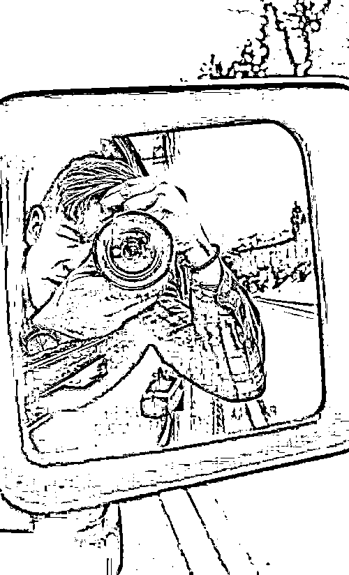

问：在西方，预测占星师比心理占星师的生活更宽裕吗？如果我们以您所开创的方式进行不同的占星实践，在占星学在中国的形象依然是更多地以预测为导向的情况下，我们真能作为占星师而谋生吗？请您给中国的学生提供一些建议。

**格伦**：嗯，我有一个有趣的答案：我不知道！可能有些预测占星师非常忙碌，但我更多地把他们看成是毒贩子。他们给客户权宜之计，让顾客暂时感觉更好一些，但马上他们又会回来寻求更多的权宜之计。

这种占星学让客户具有依赖性，并显得幼稚，实际上增强了他们的神经症，并妨碍他们通过自我决策能力获得自信。再多的钱也不能让我做出这样的事。

然而，**存在一个快乐的平衡点，一种折中的方案，使得从业者既可以提供预测，又能支持客户的发展**。预测时间段的特征，同时承认特定的行进可以有多重可能的表现结果，便能做到这一点。

再一次强调，**关键是支持客户做出与其自身利益和潜能一致的抉择**。如果能做好这一点，客户就会增多，而占星师也能获得很好的财富收益。

**从业者还可以将占星学与自己已经在做的工作结合自来，例如，作为教师、职业顾问或治疗师。或者，他们可以在占星的同时，从事可以提供更为稳定的收入的工作，即，将占星当作一种第二职业**。

通过这些方式，你就无需依赖占星作为整个收入的来源，也就不用对为急切的、神经质客户提供权宜之计而感到有压力了，这些客户完全就是希望你对他们的生活负责！问：依照您的经验，学习占星学最有效的方法是什么？您能为中国学生学习占星学提供一些建议吗？**格伦**：立志成为占星师的同学们所犯的最大的错误是认为他们可以通过各类书籍和录音来学习占星学。**想要掌握占星学的艺术，需要以有条不紊、一步一个脚印的方式来学习一个整合完善的体系**。理想状态下，这应当包括系统化的作业、实践练习、测验，以及与可信赖的导师的互动课程。这正是我们在心理占星学院所提供的。 

**版权声明：**本文由若道翻译发布，欢迎转发，反对抄袭。友号转载请申请白名单。

**格伦·佩里**

若道签约老师，前 ISAR 董事会成员，共出版 8 本占星著作；心理/意识研究专业博士；占星心理学学院（Academy of AstroPsychology）的创办人；康涅狄格州研究生院（the Graduate Institute of Connecticut）原型宇宙学与意识进化项目的负责人。

**美国占星心理学学院创办人****格伦·佩里**授课**40 余年**职业占星师生涯所学精华**倾囊相授**修完 101-205 全部课程，并通过考核的毕业生将获得**美国占星心理学学院证书**( Academy of Astropsychology )和**若道毕业证书****高含金量双证书**跟随主讲老师学习融合**心理学体系**的**占星知识**为星图咨询解读打下坚实的基础**大量**的课程资料，光是课后阅读资料就**超过 60 万字**合理的课程设计，贴心的助教服务，及时的课后测验

1

**这门课程最大的看点是什么？**1. **两位国际占星学大师**共同授课，将合计**90 年职业占星师生涯所学精华**倾囊相授；2. 修完**2 年课程**，考试通过的毕业生将获得**美国占星心理学学院证书**（Academy of Astropsychology）和**若道毕业证书**，**高含金量双证书**；3. **第一学年 64 次课程**的充分授课时间（录播课程 43 次课；直播课程 21 次课），全面而详细地讲解占星学历史、知识、技能、案例、咨询和运用；4. 跟随主讲老师学习**自成体系、逻辑严密、实用性强的占星语法、星图解读方法**；5. 学习独特的**发展年龄预测法**，从星图看对关键年龄阶段的发展及议题；6.** 大量的课程资料，光是课后阅读资料就超过 60 万字**；7. 合理的课程设计，初中阶课程，每一节都有课后测验；8. 本课程可以作为**ISAR 选修课**中的一门，再修两门就满足 ISAR 认证选修课要求；9. 教授重要的**心理学概念**，比如与客体关系、心理动力理论、个人神话和叙事疗法相关的一些概念，学习如何将它们整合到星图解读中；10. 在 105 阶段了解**《精神疾病诊断与统计手册》**诊断标准，探索星图中的心理疗愈；

2

**课程是怎么安排的？****第一学年****共****64****次课 **43****次录播课 **21 次直播课********101 占星学基础 ******共****12****次课程：******8 次 2017 年录课+4 次直播课****102 行星落星座、宫位** ****共****12****次课程：**8 次 2019 年录课+4 次直播课****103 行星相位与个人神话** ****共****13****次课程：**9 次 2019 年录课+4 次直播课****104 征象星与定位星：作为进化故事的星图 ******共****12****次课程：******8 次 2019 年录课+4 次直播课****105 星图中的精神病理学与疗愈 ******共****15****次课程：******10 次 2019 年录课+5 次直播课****想了解更多？****点击下图了解课程详情**

**

**20 位来自世界各地的占星师**

**带来 19 场沙龙——新世界的觉醒**

**详情可点击下图**

**微信又双叒叕改版啦，不想错过若道君的推送？****就把若道设为星标吧！****▼**

**就是这个“在看”，戳戳戳 ☟**

********报名直达入口********