# 若道 202111-202207 PT2

# 若道周运 5.16-5.22 丨本周迎来天蝎座月食，还进入了双子座月！（内含 12 星座运势）

> 原文：[`mp.weixin.qq.com/s?__biz=MzA5NjA0NTAxNg==&mid=2651474031&idx=1&sn=bd4c85c8a6db3642d5854e654e917f14&chksm=8b48fad8bc3f73ce81c4fa3d1523ef6a0fd6b782be8270909fb8956257a939bce637a4bad66d&scene=126&sessionid=1692737817#rd`](http://mp.weixin.qq.com/s?__biz=MzA5NjA0NTAxNg==&mid=2651474031&idx=1&sn=bd4c85c8a6db3642d5854e654e917f14&chksm=8b48fad8bc3f73ce81c4fa3d1523ef6a0fd6b782be8270909fb8956257a939bce637a4bad66d&scene=126&sessionid=1692737817#rd)

******☆ ****后台回复“今日”，给你一句生命态度******

作者/芷菱 ISAR 认证占星师
编辑/翀子 封面/书君 图片/网络天蝎座月食拉开本周大幕，太阳也将离开金牛座、进入双子座。本周的宇宙天气给我们哪些提示？12 星座又会如何度过本周？让我们来看文章吧！（如果着急看 12 星座运势，不妨先拉到最后哦）**整体氛围**

**本周重要星象**

*   **5 月 16 日 周一**

    **02:49 土星四分太阳 （水瓶座/金牛座 25 度）**

    **12:14 天蝎座月食 （金牛座/天蝎座 25 度 17 分）**

*   **5 月 18 日 周三**

    **14:33  火星合相海王星（双鱼座 24 度 59 分）**

*   **5 月 19 日 周四**

    **20:11 太阳三分冥王星（金牛座/摩羯座 28 度 30 分）**

*   **5 月 21 日 周六**

    **09:22 太阳进双子座**

*   **5 月 22 日 周日**

    **03:18 太阳合相水星（双子座 0 度 42 分）**

上一周，我们看到上海入户消杀引发的社会争议，人们担忧个人的隐私权、财产权遭到侵犯。而这正是在木星进入白羊座前后发生的。

**木星的换座是一个年度大事件，它在潜移默化中带来社会氛围的变化。**我们看到白羊座象征的个人自由、独立、私有权，对自我权利的强调，越来越鲜明地得到表达、放大与扩散。

**而本周六，太阳会离开金牛座，进入风象的双子座。**随着木星与太阳的相继换座，宇宙正在缓慢地转变——从群星在金牛座与双鱼座扎堆的阴性能量满满，一步步增加更多的阳性能量。**下周三，火星进白羊座会是一个鲜明的节点**，摆脱双鱼座的迷茫无力，我们会感受到热情和动力，想要行动起来，打开新局面。

但目前还要再等一等。太阳在金牛座的这最后一周，我们还将经历重大的天蝎座月食，火海合相双鱼座，水星仍在逆行——**我们还需要更多的耐心，回看来路，去清理自己的深层情感、隐藏的恐惧，释放掉内在的焦虑脆弱，找到内心深处的锚点。**

只有在完成了深层的清理与转化之后，才能以清明坚定的心性，去迎接白羊座时期的奋斗、行动与成长。

**天蝎座月食：深层忧虑与清理转化**

这周一开始，我们就会遭遇年度的重要食相：

**发生在 16 日周一的天蝎座月食（点击可阅读：[2022 开年来最强劲的天蝎座月全食：穿越黑暗后的涅槃重生](http://mp.weixin.qq.com/s?__biz=MzA5NjA0NTAxNg==&mid=2651473953&idx=1&sn=6604f4b30a4b1dfa410b3e07b27fa221&chksm=8b48fa96bc3f73808bde4038961ee94f358f2c9bc01070a2c441f102a815380ab1f92a6e2d30&scene=21#wechat_redirect)），太阳和月亮分别在金牛座/天蝎座 25 度 17 分呈对分相。日月与南北交点非常接近，只有两度多的距离。**

**从天文学角度这是一次罕见的月全食。**而在占星师看来，日月与南北交的紧密合相，更强烈地表达了**金牛座/天蝎座轴线的“生存-危机”议题**。而且月食被土星四分，凸显了困难、压抑的一面，或强化我们情绪上的忧虑。

**这次月食是对 5 月 1 日金牛座日食的一个呼应。**金牛座日食开启了一个长达两年的新周期，提示我们关注与解决基本的生存需求、物质安全、金钱价值的议题。

经过三年的疫情冲击，社会经济与个人生活方方面面深受影响：高杠杆的泡沫经济难以为继，过去高欲望高消费的生活不再现实，冒险激进的财务策略也不再合适——这些都是由南交天蝎座所象征的。

**宇宙通过日月食来调整方向，推动我们做出重大转变：**从南交天蝎座获取的坚韧、专注、勇气与行动力，学习北交金牛座的保守稳健策略，回归最朴素简单的生活需要，学习量入为出、稳定积累，为自己与家人创造更可靠的、真正的安全感。

**另一方面，金牛座日食也为我们指出回归内心宁静的道路。**喧嚣与欲海横流并非宇宙的实相。摒弃天蝎座的强烈欲望、过度控制以及冒险犯难的一面，学会欣赏简单的生活，顺应宇宙节律，拥抱大自然，寻求自足圆满的心灵状态。

**从金牛座日食作为起点，本周的天蝎座月食将是一个阶段性的高峰，人们对未来安全的深层担忧与危机感可能在月食前后达到顶峰。**最近已经看到越来越多关于房贷断供、失业、公司倒闭、毕业生求职难等新闻讨论，人们担忧手头的工作还能做多久，房贷还能否维持，债务如何解决。在感情关系中，伴侣间也可能因为物质金钱的议题产生矛盾分歧。

天蝎座月食要我们集中看到内心的危机感与恐惧，面对与清理它们。**逃避问题是无法解决问题的，唯有直面才可能获得转化。**

**这次月亮合相了南交点，也可能加强我们旧的习气与情感模式**，比如唤起我们的直觉反应，一味陷入情绪恐慌，或者在危机面前习惯性地用旧模式来处理，继续扩大债务或冒险一搏，或者加强控制。

这些可能都无法解决问题。作为南交点的定位星，冥王星正在摩羯座的末度逆行，19 日太阳还将与冥王星呈三分相，**强调了深入真相，清理旧模式的议题。**我们需要学习某种程度的“断舍离”，以天蝎座的决绝与勇气，放弃某些紧抓不放的欲望，彻底转变旧的做法。对无法继续的事物放手，回归真实质朴，才可能有所转化。

**这次月食值得注意的还有土星精准四分了日月。**土星一方面让危机感不至于失控，我们可能从权威或长辈那里感到仍有所依靠，或因为责任感而继续坚持。另一方面土星可能带来对情绪、信心的压制，造成无力感。

作为放大很多倍的满月，**月食前后的情绪问题值得我们注意。**如果有沮丧、失落、恐惧、焦虑等情绪出现，如果担忧未来，不必回避它们，接受问题，并思考如何应对。危机感的好处是提醒我们避开错误的路径。**在月食之后我们有充分的时间（月食影响未来半年左右）去清理、转化、解决这些问题，并走上新的道路。**要相信，宇宙始终是一个等待我们成熟的，温柔的果园。

**重点影响人群：四轴及重要个人行星落在固定星座（天蝎座、水瓶座、金牛座、狮子座）22～28 度的人群。**

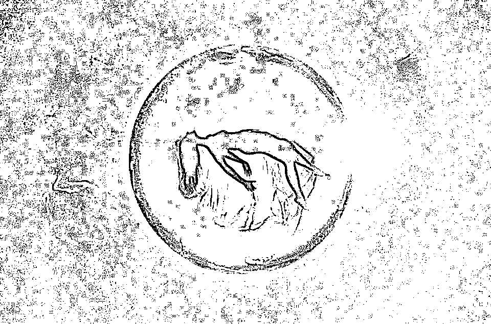

**火星合相海王星：灵感与启悟**

**5 月 18 日周三，我们会迎来火星合相海王星，在双鱼座 24 度 59 分。**

需要提醒的是，之前的木海合相，我们看到病毒扩散疫情升级，人们在疫情中共情互助。**这一次火海合相，跟天蝎座月食同时出现，**不排除有病毒加快扩散，引发更多恐慌情绪的可能性。但这只是其中一种可能。

火星在双鱼座的行动力被削弱，从这个层面来说，火海合相可能带来迷茫感。**虽然有很好的理想，道路却不太清晰，**不知如何行动，可能沦为空想。

而另一方面，火星会**助燃海王星的灵感与想象力。**我们可能愿意寻求灵性启发，与自己内心深处对话，清理内在意识，释放深层的情绪。这对于月食之后的清理与转化工作很有益处。

我们也更容易被感动，同情弱小者或受害者，愿意为保护弱者而呼吁、行动。可能有英雄情结的出现。

**火海相位也有愤怒的议题。**当火星被海王星淹没，怒气可能无处发泄，但又无边无际地弥散。正视自己的情绪，正面表达，或用激烈运动的方式，将愤怒转化。

灵感与想象力可能爆棚，我们可以享受艺术，或创造作品，沉浸在电影、文学、音乐、美术中，**去满足和释放自己的内在情感和想象力。**通过运动健身塑造更好的自己，也是对火海能量的一种良性表达。

**重点影响人群：太阳白羊座、天蝎座，以及四轴或重要个人行星落在变动星座（双鱼座、双子座、处女座、射手座）22～28 度间的人群。**

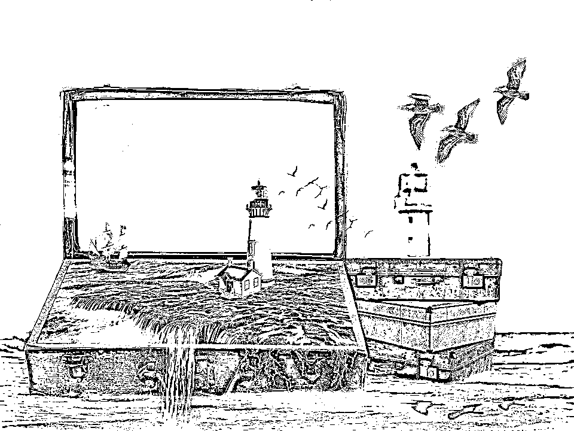

**太阳进双子座：包容与思辨**

**5 月 21 日周六，太阳进入双子座。**通过月食集中清理了金牛座的生存议题之后，宇宙将继续向前。我们将迎来信息充沛，头脑活跃的一个月。

**我们需要更多的理性思辨。**从年初至今，社会思想面显现出越来越多的割裂与对立：关于防疫政策是清零还是共存、关于战争是挺俄还是挺乌、关于外交关系是合作还是对抗等等。人们发现彼此的立场观点泾渭分明、水火不容，朋友同事之间可能吵到相互拉黑。

作为双元星座，双子座的能量并不能解决统一思想的问题，但它有足够的灵活度来包容不同的观点，达成彼此的沟通与理解：**我不接受你的观点，但我尊重你的思想自由，也能理解各自不同的立场。**

更多的信息出现，获得更快传播，我们也会趋向于更加开放包容的头脑，更客观中立的态度，能够容纳不同的观点思辨。

**水星正在双子座逆行，并将在周日合相太阳。**一些观点会被重新思考梳理，理性思辨的力量会凸显。

双子座能量也要求我们有更灵活的态度去应对变化。接受新鲜的想法，不固守于某些成见；同时适应现实的变化，调整自己的行为。

**重点影响人群：太阳和上升在双子座、处女座、射手座、双鱼座。**

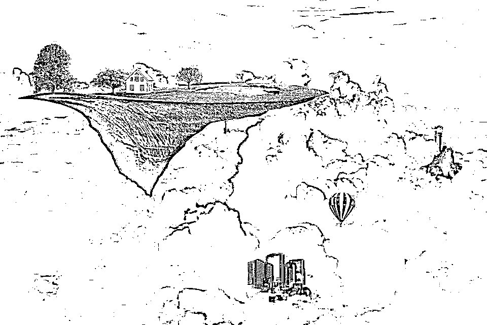

**12 星座的一周运势**

**（重点参考上升星座，其次参考太阳星座）**

***白羊座***

月食影响下，财务方面本周可能看到一个结果，也许是你之前做的投资，或是与债务有关。你可能需要调整金钱策略，多考虑安全性，减少债务与开支。

金星和木星两颗吉星都在支持着你，**你可以相信自己的能力，**足够应付当下和未来。好运气现在站在你这边。

如果你很在意自我价值是否实现，周围人是否认可你的实力，宇宙已经用日月食给你打开了一条自我证明的道路，继续坚持。

**最近你可能有很多深层的情绪和想法，梦境也比较丰富。**给自己留一些独处的时间，冥想、与自己对话，或享受电影、音乐、艺术。

***金牛座***

**本周你在关系方面可能来到一个关键节点，**也许是亲密关系，或是重要的合作关系。如果存在隐瞒、谎言等不牢靠的关系，在月食前后可能难以为继。真相也许不太愉快，但宇宙是在帮你清理掉不适合的关系，为更合适的留出空间。

如果是根基牢固的关系，你们可能因为金钱或安全感的议题有一些分歧，但无伤大雅。上司或同事可能让你感到压力，需要建立更多相互信任。

**你会从关系中获得成长。**你天生懂得如何经营稳固美好的物质生活，当下这种技能无比珍贵。精心生活取悦自己，帮助人们懂得珍惜已有，学会欣赏身边的美，你会获得很多认可。

***双子座***

如果感到生活或工作失控，**你需要把脚步慢下来，梳理一下日常的节奏**：时间安排是否合理、身心状态如何才更健康、千头万绪的事务怎样一一落实……

**但更重要的是找到内心的宁静。**若你有什么心里悬而不决的事，去正视它们。接触灵性的知识，通过冥想、内观与自己对话，认清自己真正想要什么。或只简单放松，头脑放空。我们的内外世界是彼此一致的，理清内心，也会给外部带来秩序。

**太阳在本周末会来到你的 1 宫，照亮你一整个月。**火星和海王星则给你的事业带来希望与梦想。珍视你的灵感和想法，更要思考如何落实。多与团队或朋友商量协作，他们是你的福星，会带来帮助。

***巨蟹座***

**本周月食发生在你的 5 宫。**如果你为孩子或恋人感到担忧，那么最好跟他们开诚布公地谈一谈，像朋友一样友好交流，达成相互理解。

也可能让你感到焦虑的不是孩子，而是自己的创造力。如果你失去了自信心，甚至开始怀疑自己的才能，那么最好是放下身份与虚荣心，跟朋友或团队坦白你遇到的问题，集思广益，大家的力量会帮助你解决难题。

**金星、木星两颗吉星都在你的 10 宫，**上司也会继续支持你。只要记住，你不是一个人在战斗，学会寻求支持，与群体的联结会给你力量和安全感。

**周末太阳将进入你的 12 宫。**未来一个月你可能感到需要休整一下，从热闹的外界活动中暂时退出，让自己恢复宁静。

***狮子座***

有家庭作为后盾，才能让我们在舞台上自信地发挥，让世界瞩目。本周月食会指出你需要弥补的地方，也许是需要更亲密的家人关系、也许是家居环境需要改善、也许跟家庭的财务安全有关。伴侣也可能对你提出更多的期待。

总之，你需要为自己和家人建造更坚固的堡垒，可以遮风避雨，感到安全无忧。你在财务方面有很多想法，也许对某一笔投资寄予厚望。但海王星在你的 8 宫，要小心希望落空。保守一些的策略更适合当下。

对你来说，真正的安全感可能不是来自金钱，而是来自你的事业。**如何发掘潜能，找到适合自己的发展方向，才是从根本上建立安全感的方法。**宇宙已经用日食给你打开了一扇事业发展之门，未来一两年请抓住时机。

***处女座***

**本周月食会推动你的交流和思考，**你也许与工作伙伴观点分歧，意见无法协调一致。寻找一些专业知识资源，抓住问题的核心和大方向，**用更长远的角度去思考问题，有利于找到你们的共识。**

本周的情感关系可能激动人心，你与伴侣的关系有美好浪漫的色彩，也有身体的吸引。但若有矛盾则需要及时开解，开诚布公地表达，否则可能转化为愤怒争执。

金星和木星在你的财务宫，最近在财务方面似乎有很好的运气和机会，可以在安全范围内尝试一些小的投资。**本周太阳就将进入 10 宫**，未来一个月你都有机会去展露自己的才华，赢得瞩目。

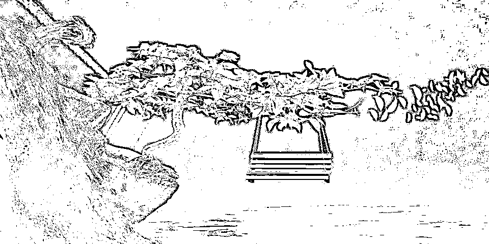

***天秤座***

本周的月食可能提醒你**财务安全的议题。**固定收入是否有保障，日常消费是否合理，你需要关注这些问题，做出相应调整。

你可能也在参与钱生钱的游戏，学习投资，或从事副业，寻求资产增值。**重要的是学习专业的理财知识。另外金木两颗星目前在你的 7 宫**，你有机会遇到“贵人”。可以寻求他人帮助，借助他人的资源或专业知识来获得更大收益。

如果你单身，有金木两颗星加持，现在是很好的脱单时机。抓住时机，多参与社交，你有可能遇到条件优越的对象。

***天蝎座***

**本周月食发生在你的 1 宫。你的身份或自我认知也许会发生一场深刻的变化。**或许你突然意识到过去一直扮演的那个社会角色，并不能代表真正的你，你想要重新为自己而活。也许你对自己的认识发生了重大的转变，你意识到某些过去忽略的自我的部分。

这种变化也可能体现在你的重要关系中。你和伴侣、合作者都在成长，你们的关系模式也需要更新，以适应已经不一样的彼此。**你需要学习成功关系的课题，**这是日食为你开启的功课。

**火海合相发生在你的 5 宫。**可能有激动人心的情感关系，但也许是表现在你的想象力上，如果能将头脑中的幻想都表达出来，可能是一件很棒的作品。

***射手座***

**月食发生在你的 12 宫**。你可能感到脆弱无力，或者头脑里有美好的想法却不知如何在现实中落地。**过度沉溺于内心会使我们失去现实感，解药正是投入生活，身体力行。**

对于随性自由的你，现在的功课是学习发展出生活的秩序感，更有计划性、更有节奏的日常生活，更有条理的生活环境，关注身心健康。尤其不耽溺于头脑中的想法，而是真正去行动去做事。

**火海合相在你的 4 宫**，家庭生活应是美好的。**周末太阳将进入 7 宫**，照亮你的关系，有利于关系的和谐，也有机会遇到好的对象或合作者。

***摩羯座***

**月食发生在你的 11 宫。**朋友或团队中有人也许跟你发生矛盾，不同意你的意见，让你自信心受挫。或许你与朋友因为某些事发生信任危机。

然而你的自信心不应由外界评价来获取，而是要自我肯定。它来自你不断发展自己的才能，不**断超越自己，看到自己的进步。**

**火海合相在你的 3 宫。**如果你与人讨论问题，写作或演讲，本周也许会有一番非常精彩、富有感染力的表现。

**太阳周末会进入你的 6 宫**，未来一个月你的工作表现可能引人注目。

***水瓶座***

**周一的月食发生在你的 10 宫。**你可能遇到工作的重大调整，比如上司的变动，或项目终结，或工作职能变化岗位调整等。

你可能意识到自己需要寻求更稳固，有长期发展前途的事业方向。**土星在你的 1 宫**，提示你需要发展出自我的权威性。提升专业水平，挖掘潜能，你需要抓紧时机发展自己。

**火海合相在你的 2 宫**，注意理性消费，做好财务规划。

**周末太阳会进入你的 5 宫**，未来一个月也许灵感爆棚，注意记录下好的想法。

***双鱼座***

**周一的月食发生在你的 9 宫，**某些事件可能动摇你某些根深蒂固的观念。世界每天都在变化，固守某些观点可能会落后于现实。

你需要学习更务实、接地气，更灵活开放的思维方式，以适应快速变化的现实。

**火海合相在你的 1 宫**，你可能会扮演英雄的角色，为保护弱小者而发声。你的愤怒和勇气也很可能来自对他人的同情。你的表达会很有感染力，如果你写作或演讲，会颇引人共鸣。

**周末太阳进入 4 宫**，未来一个月适于关注和处理家庭、家人或房产方面的事宜。

**版权声明**：原创文章由作者授权首发于若道平台发布，欢迎转发，反对抄袭。友号转载请申请白名单。

****

**芷菱**

ISAR 认证占星师/占星作者/媒体人若道 2019 届核心课程毕业生

于 2019 年通过 ISAR 考试，同年获得若道认证神话塔罗师资质

**微信公众号**：芷菱的理想国

长按打赏

**今晚 8 点，若道核心课海王星组直播分享****点击下方按钮预约~**

<mpvideosnap class="js_uneditable custom_select_card channels_live_iframe" data-pluginname="videosnap" data-headimgurl="https://wx.qlogo.cn/finderhead/PiajxSqBRaEJYnVsqWfEX9qA0sI6hNVKsDfyzfPZ92WZMZyBpZWU5NA/0" data-username="v2_060000231003b20faec8c4e68a1ec2d4ca07e434b07755bbf47e7053a3059defd2c9d6c68a20@finder" data-nickname="若道" data-desc="将在 05 月 17 日 20:00 直播" data-intro="若道核心核心课程 L3 研究小组分享会-救赎的灵魂&amp;追寻梦想（海王星组）" data-noticeid="finderlivenotice-v2_060000231003b20faec8c4e68a1ec2d4ca07e434b07755bbf47e7053a3059defd2c9d6c68a20@finder-1651821151339308-803714941" data-type="live"></mpvideosnap>**20 位来自世界各地的占星师****带来 19 场沙龙——新世界的觉醒****详情可点击下图**

**学习占星学****点击下图了解课程详情**

**

**微信又双叒叕改版啦，不想错过若道君的推送？**
**就把若道设为星标吧！****▼**

**喜欢记得点一下在看哦☟**

**报名直达入口**

# 2022 开年来最强劲的天蝎座月全食：穿越黑暗后的涅槃重生！

> 原文：[`mp.weixin.qq.com/s?__biz=MzA5NjA0NTAxNg==&mid=2651473953&idx=1&sn=6604f4b30a4b1dfa410b3e07b27fa221&chksm=8b48fa96bc3f73808bde4038961ee94f358f2c9bc01070a2c441f102a815380ab1f92a6e2d30&scene=126&sessionid=1692737817#rd`](http://mp.weixin.qq.com/s?__biz=MzA5NjA0NTAxNg==&mid=2651473953&idx=1&sn=6604f4b30a4b1dfa410b3e07b27fa221&chksm=8b48fa96bc3f73808bde4038961ee94f358f2c9bc01070a2c441f102a815380ab1f92a6e2d30&scene=126&sessionid=1692737817#rd)

****☆ **后台回复“今日”，给你一句生命态度**

作者/王芝桦 编辑/玫瑰 图片/pexels

**金牛座月食****北京时间 2022 年 5 月 16 日 12:14 迎来天蝎座满月，金牛座太阳与天蝎座月亮于 25°18′精准对分，**并以 3°之差紧密合相“天蝎座南交点-金牛座北交点”轴线，带来**2022 开年以来最强劲的一场月食——天蝎座月全食。**再次保留半个月前金牛座日食分享的两个观察：**· 5 月将是“食相”月份：**5 月 1 日的金牛座日食，5 月 16 日的天蝎座月食。此次天秤座满月实际已经进入“食相季”的影响之中，而 5 月后的半年时间也将是“食相季”影响的演化时间。**· 4 月-8 月期间，**冥王星、土星、海王星、凯龙星、天王星将依次与每一次满月（或月食）的“日月对分”轴线形成四分结构；而**6 月 29 日的巨蟹座新月，正在白羊座试水的木星（5 月 11 日-10 月 27 日）则与新月形成四分结构。**宇宙动手了，我们不可能再往回走，此次天蝎座月食就是我们**学会放下、学习成熟**的时刻，只要我们**准备好勇敢和坚定**。

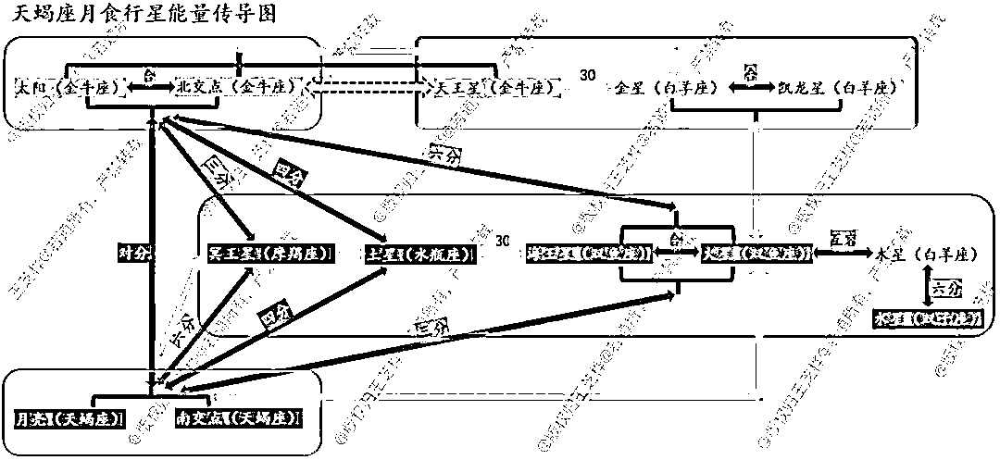

> **天蝎座月食重点影响人群**
> 
> **参考新月峰值影响期间各个行星的行进度数，以及逆行行星的轨迹影响；常规容许度，个人行星入相位 3°，出相位 1°；非个人行星入相位和出相位均为 3°。**
> 
> *   出生星图中，有**行星、四轴、南北交点**落入**固定星座（金牛座、狮子座、天蝎座、水瓶座）12°-30°**的人群。
>     
>     
> *   出生星图中，有**行星、四轴、南北交点**落入**变动星座（双子座、射手座、处女座、双鱼座）0°-5°,20°-30°**的人群。
>     
>     
>     
>     
> *   出生星图中，有**行星、四轴、南北交点**落入**基本星座（白羊座、巨蟹座、天秤座、摩羯座）0°-4°，12°-19°，23°-30°**的人群。

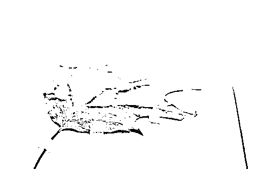

**让过去的过去，待未来的到来**金牛座和天蝎座这两个星座都与**“欲望，价值，安全”**有关，但它们的模式呈现却发生在不同的层面：**·** 金牛座倾向现实层面，天蝎座倾向心理层面；**· **金牛座简单务实，天蝎座复杂深沉；**· **金牛座渴望“拥有”，天蝎座渴望“操控”；**· **金牛座通过积累自我价值而获得现实安全和内心宁静，天蝎座通过联结他人资源而获得心理安全和情感信任。故而，当金牛月（太阳行进金牛座时期）彰显的“落地现实，安享当下”的生活，却在各种天象触发之下呈现出或岁月静好、或颠沛流离的同时，也会在我们的内心世界**逐渐积聚出越来越多的主观感受和情绪反应**，并在天蝎座满月“金牛座太阳-天蝎座月亮”精准对分的时刻，**将“当下现实与内在情绪”之间的张力极致呈现。**那些现实生活的无常变化和凹凸不平，将我们与他人、与外界、与现实的“关系联结”撕开裂缝，那些难以深入的隔阂，难以信任的恐惧，内心翻涌的情绪，皆在天蝎座满月月光的照见之下无处可藏。**故而，天蝎座满月总是情绪激荡的日子，更何况此次天蝎座月全食“加倍催化”的能量。**天蝎座象征着**地面之下的暗底世界，“黑暗的隐没”犹如“死亡的神秘”**；然而，**天蝎座的死亡不是飞灰湮灭，而是穿越黑暗的涅槃重生。**此次天蝎座月食，开始了**未来半年“向死而生”的旅途**——与那些已然腐朽、不具鲜活、没有营养的事物告别，而只有**经过“清理，释放，腾空”的过程，才能让那些“鲜活，重要，宝贵”的事物进入我们的生活。**

***1*****. 真假美猴王，机会与诱惑**

> **天象**
> 
> **· 天王星加入“金牛座阵营”：宽泛容许度下，金牛座太阳、金牛座北交点、金牛座天王星形成“金牛座阵营”。****· 金天 30°：金牛座天王星与白羊座金星形成 30°结构。****· 金凯合相：金星与凯龙星合相于白羊座。****· 火海合相：火星与海王星星合相于双鱼座。**

此次天蝎座月食发生时刻，接纳“金牛座阵营”能量的白羊座金星（金星守护金牛座）与白羊座凯龙星形成合相结构，同时与金牛座天王星形成 30°结构。金牛座掌管的现实结构和安全根基，从 2019 年天王星进入金牛座便开始被一层一层地颠覆和打破。

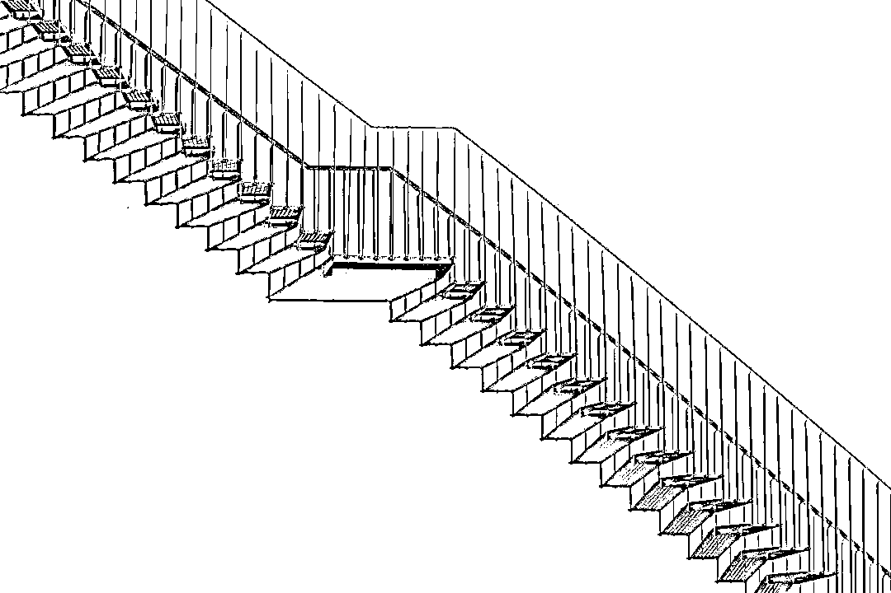

时至今日，震荡和变化依然没完没了，我们也逐渐意识到“旧有的秩序”正在打破，“全新的秩序”正在建立。而就在这个新旧转换的过程中，过往并未解决的问题和危机也再次触发呈现，并引发内心深处的“深思与焦虑”——究竟如何解决呢？需要什么，就来什么！但是，机会来了，诱惑也来了。月食当天的 5 月 16 日，接纳白羊座金星、白羊座凯龙星能量的双鱼座火星（火星守护白羊座）与双鱼座海王星形成**“火海合相”**结构；**月食周期内的 5 月 20 日，5 月 11 日换座进入白羊座的木星、5 月 10 日于双子座开始逆行的水星形成“水木六分”结构。**这里需要注意的是：这一波“双子座-金牛座”的水星逆行，也暗含着**“降速”**的意味；而本就代表“扩张能量”的木星进入“勇敢进取”的白羊座，则激发了我们的斗志，但也诱发着我们的冲动。故而，以上两组结构，在此次天蝎座月食的前三天和后一周的时间里，带来两种可能性：**· 一方面：**宇宙赐予我们一颗“打通任督二脉”的神奇解药，一场深入内心的交流，一个超越狭隘的视角，一次接纳脆弱的拥抱，都能解除过去的误会，疗愈内在的伤痛，抚平内心的羞愧；**· 另一方面：**在这个具有疗愈并携带机会的宇宙能量之中，也隐藏着无力之下的沉溺、光环效应的投射、急于冒险的草率，以致很难分辨从天而降的是真正的机会，还是诱人的毒草莓。急不得，急了恐怕也得回头反思而后再来。此次天蝎座月食，当“机会与诱惑”像“真假美猴王”一样，带着同样的面貌站在我们面前的时候，我们**需要一双火眼金睛做出准确的辨别和成熟的选择。**

***2*****. 与死神对视，练火眼金睛**

> **天象****· 冥王星介入“日月对分”轴线：逆行的摩羯座冥王星三分金牛座太阳，六分天蝎座月亮。**

此次天蝎座月食，摩羯座冥王星、水瓶座土星和双鱼座海王都直接介入了“日月对分”轴线。首先是当下正行进在摩羯座 28°位置，并将于 2024 年换座进入水瓶座的摩羯座冥王星——2022 年-2023 年，是冥王星驱动我们转化“摩羯座”相关业力功课的最后阶段，而下一次冥王星进入摩羯座将会在 248 年后的未来世界。

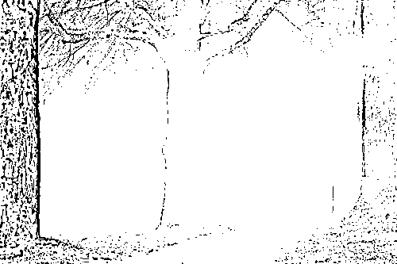

“谁在考试前都不轻松”！如果我们理解了这句话，那么就不难理解未来两年将被“上紧弦”的感觉。**冥王星揭示业力的执着与恐惧，摩羯座冥王星揭示着我们对“现实成果”的执着，对“不进则退”的恐惧。**这里面包含着**巨大的野心和强制的管控**，而**不优秀、没有结果、打乱规则所带来的“失控感”，简直就是“失责和失德”的沉重压力。**想想从 2008 年冥王星进入摩羯座之后，我们对孩子、房子、银子、票子，哪个不是如此？当然更重要的是对自己。2021 年底，随着南北交点换座进入“天蝎座南交点-金牛座北交点”轴线，“描述业力线索”的天蝎座南交点与“揭示业力议题”的摩羯座冥王星更是一体共振（冥王星守护天蝎座），并在**2022 年-2023 年 7 月**期间驱动各种黑暗面和阴影面彻底爆发，而我们亦可能会**在“失控感”的包围之下，对“现实成果”的执着更加疯狂，对“不进则退”的恐惧更加强烈。****慢下来。即使很难，但还是要慢下来。**此次天蝎座月食，接纳月食能量的摩羯座冥王星和谐介入“日月对分”轴线。而这颗 4 月 30 日开始逆行、正处于减速期、几乎原地不动的摩羯座冥王星，似乎正等着我们与它对视——那双透彻一切和辨别真假的“火眼金睛”！神话系统中，冥王星的神话原型是主宰死亡、掌管冥府的神——“冥王”哈迪斯。如果我们愿意凝视“死神”的眼睛，就能看到那双眼睛之中“没得商量”的讯息，就能读懂那双眼睛之中“揭露真相”的能量——或许当下减缓的速度才是这个星球正常的速度，或许当下跌倒的困境才是我们生命的真相，或许我们不想、不肯、不敢慢下来，但或许宇宙只是在说“你已经很优秀了，你可以抛开那些折磨你的执着和纠缠你的恐惧，尝试另一种生活”。“另一种生活”，什么样？**金牛座北交点为我们提供线索——活在当下，返璞归真，衣食住行，回归质朴。**虽然简单，却又那么的难。一切快速发展的时候，田园生活令人向往；当一双神秘的大手开始降低这个世界运行速度的时候，买菜做饭却都成了负担。但是，这场疫情所带来的现实震荡，相信会令很多朋友开始反观过去的生活，深思“生”的本质，重建“活”的意义。而这一切的反思与重建，正是从“与死神对视，炼火眼金睛，觉生命真相”开始。

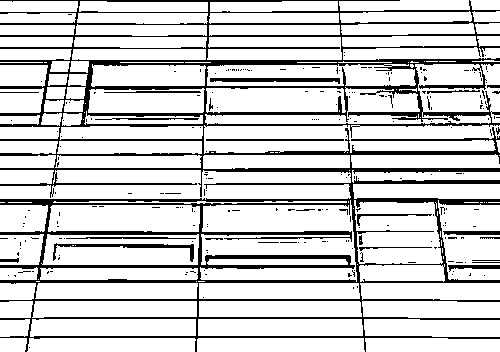

***3*****. 选择路口，臣服与顺应**

> **天象**
> 
> **· 土星四分“日月对分”轴线：水瓶座土星四分金牛座太阳和天蝎座月亮。****· 海王星介入“日月对分”轴线：双鱼座海王星六分金牛座太阳，三分天蝎座月亮。****· 土海 30°：水瓶座土星与双鱼座海王星形成 30°结构。**

此次天蝎座月食，接纳摩羯座冥王星能量的水瓶座土星（土星守护摩羯座）与“日月对分”轴线形成四分结构，引领我们站在选择的路口；而与水瓶座土星 30°联手并和谐介入“日月对分”轴线的双鱼座海王星，却拉上“火海合相、火木互容、水木六分”几组结构，将“机会和诱惑”再次抛到我们面前。**可能经历的****· 集体层面：**社会民生和保障体系正在逐步完善，金融领域和医疗领域也将公布全新的政策消息；有关名人的桃色新闻或过往丑闻，可能出现全新的曝光或旧史的反转；国际社会的对立局面和战火纷争进入相当敏感的时间点，祈祷及时停火止损，早日共建全新秩序；**· 职场层面：**有关职能、权力、利益、责任等几方面，容易出现互相竞争、互相拉锯、互相扯皮的情况，一要注意尽量不要站队，二要注意工作严谨以免莫名背锅；**· 心态层面：**只能更好的野心，不能后退的执着，失去控制的恐惧，可能会在月食周期再次被激发和强化。拥有斗志当然是好事，但因为斗志而失去理智却是盲目和危险的——当被欲望左右，诱惑也随之出现，我们最好多花一些时间去看清“真假美猴王”的本质和真相。这里，我们需要再次联结有关“土星”的几个关键词：**现实考核、时间法则、成熟担当，不做后悔的事。**现实的考核确实令人感到重重的压力，时常令我们深陷无力感和低迷状态之中，但土星的警示其实就一句话“干就完了”！或许我们并不知道当下什么样的选择是最好的路径，或许我们恐惧选择失当将会造成损伤的后果，但不去干又怎么知道行不行？“不做后悔的事”，其真正涵义是：**去干，去坚持，不荒废，不后悔，时间会帮助我们沉淀出经验与实力，更会帮助我们发展出成熟与智慧。**此次天蝎座月食，“土星四分日月对分轴线”这组结构，亦在提醒我们：或许“另一种生活”我们已经不习惯，但震荡不已的现实当下就是要让我们**学会“生命小循环对宇宙大循环”的臣服与顺应——让过去的过去，才能让未来的到来。**

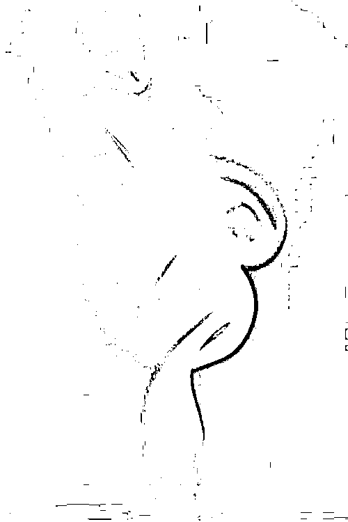

**寄语**写这篇文章的当天，我和几位学生们做了一场漫长而深刻的线上研讨。最神奇和最感动的部分在于，真诚的心灵和敞开的态度，将曾经发生的矛盾彻底解开，将隐藏许久的伤痛一一抚平。我在屏幕另一端，嘴角挂着笑，看着她们，轻轻地说：“感谢这一场冥王星频道的对话，感谢天蝎座月食的礼物。”祝愿朋友们：灵魂要安好，身体要健康。

**版权声明**：原创文章由作者授权首发于若道平台，欢迎转发，反对抄袭。友号转载请申请白名单。

****

****想阅读更多作者的文章，请在后台回复******王芝桦****** 即可。****

****王芝桦****

心理占星师，统合疗愈师，若道占星“新月和满月”专栏作者，腾讯视频特约占星师

全职于个案咨询与占星教学工作 18 年

**个案预约咨询微信号**：zhihua0621 

**微信公众号**：daoxi-life

**长按打赏**

**20 位来自世界各地的占星师****带来 19 场沙龙——新世界的觉醒****详情可点击下图**

**学习占星学****点击下图了解课程详情**

**

**微信又双叒叕改版啦，不想错过若道君的推送？**

**就把若道设为星标吧！**

**▼**

**喜欢记得点一下在看哦☟**

**报名直达入口**

# 雷蒙德·梅里曼金融占星周运 | 两手准备：一场崩盘，或大幅上涨再反转

> 原文：[`mp.weixin.qq.com/s?__biz=MzA5NjA0NTAxNg==&mid=2651473953&idx=2&sn=9ce271b6dbd35ab8963ea1ebdd8ed7d0&chksm=8b48fa96bc3f738035f6cb65deff4554c3d95aecc5ed0783a11ea86a2fc6d7c164d5cdcbfd7e&scene=126&sessionid=1692737817#rd`](http://mp.weixin.qq.com/s?__biz=MzA5NjA0NTAxNg==&mid=2651473953&idx=2&sn=9ce271b6dbd35ab8963ea1ebdd8ed7d0&chksm=8b48fa96bc3f738035f6cb65deff4554c3d95aecc5ed0783a11ea86a2fc6d7c164d5cdcbfd7e&scene=126&sessionid=1692737817#rd)

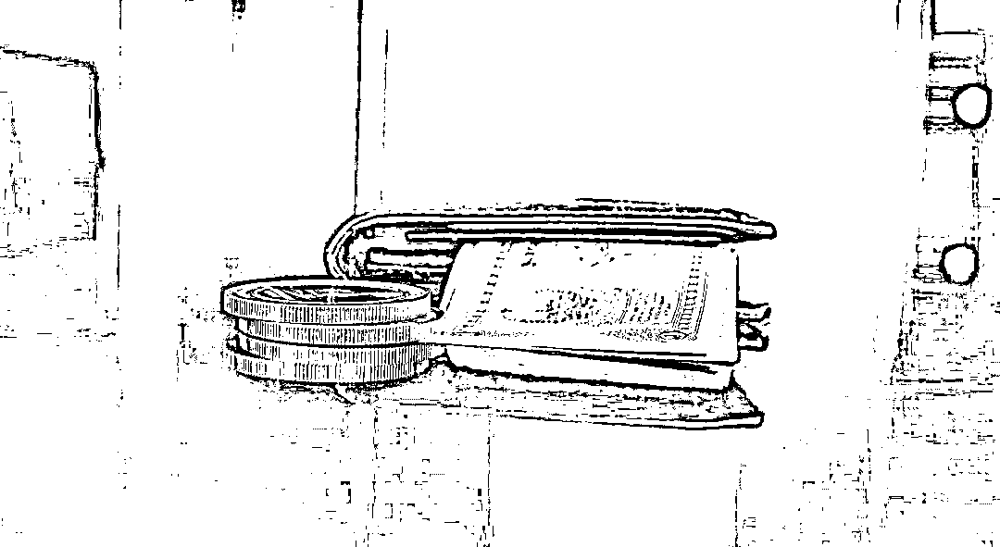

作者/雷蒙德·梅里曼 译者/Luke
编辑/玫瑰 图片/pexels

雷蒙德·梅里曼是在金融占星学界稳坐第一把交椅的占星师，同时他也是若道签约的金融占星课老师，我们引进了雷蒙德·梅里曼老师的《[上证指数月度报告](http://mp.weixin.qq.com/s?__biz=MzA5NjA0NTAxNg==&mid=2651473208&idx=2&sn=9465e5528554b9c84d45d7c9697d55f7&chksm=8b48f78fbc3f7e991517dd548db6b6875b3e09b800f6f48ed766e953a49ac0eb810c16b20fd6&scene=21#wechat_redirect)》及《[黄金报告](http://mp.weixin.qq.com/s?__biz=MzA5NjA0NTAxNg==&mid=2651473915&idx=2&sn=a9ab61dc20fd8b137af3fc82ddbf6dca&chksm=8b48f54cbc3f7c5aef50f4c0b0ef560532a4b840b4086321aafff67168037ab1e3918c291048&scene=21#wechat_redirect)》。我们经老师的授权，将每周刊登梅里曼老师的周运，供大家参考和学习。于是，这是本周的周运（5.16-5.20）。

**说明：以下时间采用纽约证券交易所所在地美国东部标准时间。**

**展望与回顾**

****

**加密货币的世界又经历了一轮周期性的动荡。泡沫的（再一次）破裂重要吗？建立泡沫将真正的财富从泡沫的买家转移到泡沫的卖家。**

**某个在 7 万美元卖出比特币的人锁定了他们获得的财富，他们现在持有一项具有价值的资产（美元）。买家本以为他们拥有了价值 7 万美元的资产，却开始缩水，如果不是一文不值的话。通常经济学家会担心财富的损失。**

**财富的突然下跌让人们感觉很糟糕。对亏损的厌恶夸大了亏损的重要性。这鼓励了更高的储蓄和更低的消费。**

**——保罗·多诺万博士****《比特币的泡沫破裂重要吗？》****UBS 每周博客****www.ubs.com/cio**

**2022 年 5 月 13 日**

**任何人都能创造一个虚拟货币，向投资者推销，并随心所欲地使用这些钱。尽管美元这类的法定货币由政府背书，但为加密货币背书的只有对开发者的信任。这样会导致什么问题？投资者这周已经发现了。（编者注：法定货币也由人民对政府的信心支撑）****——《加密货币崩盘的警报》****《华尔街日报》社论版****2022 年 5 月 13 日**这可能是一个黑色星期五，但是股票市场没有被最近上演的《人格分裂》戏剧所吓到。或许因为水星逆行，连惊吓也要倒装过来。在恶作剧者水星的影响下，许多市场看起来是颠倒的。无论怎样，在上周四的新的周期低点后，过去 6 周的大屠杀终于暂停了下来。周五反转了一切，是一个强有力的上涨日。但上涨会持续吗，还是随着市场的个性再次变化，奇迹只能持续一天？对于许多股指来说，截至上周四的抛售，代表了一个新的年度低点。对其他指数来说，它挑战了今年 1 月 24 日和 3 月 9 日之间先前创下的低点。

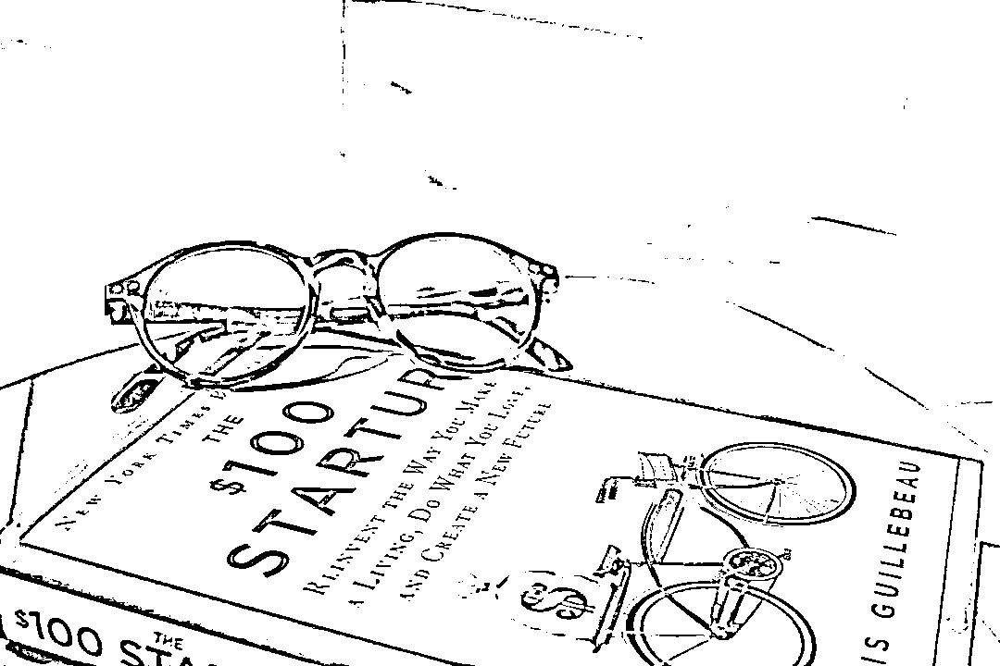

对于投资者和交易者来说，上周是让人神经紧张、疯狂而不可预测的一周，因为**恶作剧者水星逆行在疯狂不可预测的双子座（它的守护星座），在 5 月 5 日太阳-天王星合相扩大了动荡后更为如此。**这两周也恰好夹在**两次日食（4 月 30 日和 5 月 15-16 日）**之间。换句话说，这是一段尤其光怪陆离的宇宙时间。不仅太阳-天王星合相，水星逆行，和 2 周的日食季在起作用。天王星和大块头的木星也形成了八分相。**“宏大”、“扩张”、“过度”是木星的关键词。当木星处于“喜乐”时，它是机会的代名词。但当它愤怒时，则代表了夸大和恐慌。**当木星与天王星形成相位，没有什么是稳定的，每件事都处在崩溃的边缘，用市场术语来说，就是**突破**。换句话说，**附近的支撑区间和/或阻力区间通常被击破。**确实，**上周全球多个金融和股票市场的支撑区间或阻力区间都被击穿。**比特币（和其他加密货币）就是受害者之一。它上周四崩盘至接近 25000，是自 2020 年 12 月以来的最低价，符合我们 5 月 8 日工作坊中给出的预测，认为 25000 会被测试（在年底前可能会更低）。前一周（5 月 5 日），比特币还在 40000 交易，所以上周的暴跌是个大新闻。尽管大新闻是木星喜欢的，投资给比特币的普通人却遭到重创。他们恐慌了。当天王星也牵扯进来，恐慌再正常不过了，或许两次日食结合水星在双子座逆行，更加剧了恐慌。我的意思是，这就像精神分裂症患者喝了类固醇和甲基苯丙胺的鸡尾酒。顺便提一句，上周药物也出现在新闻里，报道了破纪录的过量服药案例，这与过去一年木星在双鱼座行进有关，尤其是它上个月还与海王星合相。但是回到市场上来。在木星进入白羊座和水星逆行把精灵（恶作剧者）从瓶子里释放出来的第二天，5 月 12 日，所有美国股票市场均跌至新的周期低点。随后，所有股市均于周五出现了强势的反弹。突然之间，市场情绪从双鱼座切换到了白羊座，也就是从萧条和恐慌切换到了乐观主义和冒险精神。我们追踪的其他主要全球股票市场都没有创下新的年度低点。只有在美国是如此，白宫和国会还在争论如何把美国“重建得更好”。他们越努力，似乎跌落得越远越快。有些人需要承担指责，在双子座的影响下，这被一些领导人机敏地利用了。在欧洲，所有股票指数跌落严重，但仍远远高于 3 月 7 日的低点。伦敦富时指数尤其坚韧，在政府签署条约承诺在芬兰和瑞典遇袭时保卫两国后，该指数于周五大幅上涨。在亚洲和澳大利亚，跌势于周四停止，但股票指数仍高于 1 月-3 月的低点。中国上证指数很有意思，因为在两周前的近期低点后，它于上周反弹。中国处于封控状态，试图阻止新冠病毒的传播。但**或许他们阻止的是 4 月 27 日低点处的大幅抛售，这是自 2020 年 5 月以来的最低价位。**我们将在本周发布的梅里曼市场时机学院上证报告中进一步讨论这一点。

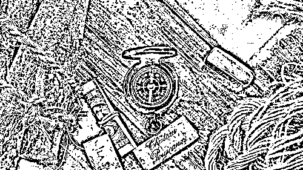

其他市场，原油继续了牛市，周线图的收盘价高于 110。一个月前，它还在 92.23 交易。但是贵金属和欧元表现不佳。欧元于周五下跌至 1.0340，仅比 2017 年 1 月 6 日的数年低点 1.0339 高了 0.0001。黄金于周五短暂跌至 1800 美元之下，远低于 3 月 8 日与历史高点形成双顶的年度高点 2078。白银也遭到抛售，于周五下跌至 20.42，是 2020 年 7 月以来的最低价，符合我们 5 月 8 日金融市场春季专题讲座中的预测。**短期占星趋势和长期考量**

****

**坏消息是，4 月是通货膨胀率连续超过 8%的第二个月。好消息是，在接下来的 12 个月中，通胀率很可能下跌至这个数字的一半左右。**

**自 1940 年代末以来，通胀率仅有两次上涨到去年的水平。而且那两次都像目前一样，是供应链的中断打击了火热的经济。**

**——葛雷格****《通货膨胀正在下降，但是有多低？》****《华尔街日报》****2022 年 5 月 13 日****……税收收入激增。截至 4 月，联邦财政收入上涨了令人震惊的 8430 亿美元，达到近 3 万亿美元……这主要归功于经济增长和通货膨胀提高了名义收入。联邦政府获得了远高于“应得的”收入。**

**所有这些加起来促成了环城大道的繁荣时期，但是拜登先生仍然希望创纪录地增税。难道 39%的涨幅还不够吗？**

**——《为什么预算赤字正在下降》****《华尔街日报》社论版****2022 年 5 月 13 日****恶作剧者水星的逆行，将伴随我们直到 6 月 3 日。无论我们说了什么，无论任何人说了什么，在那之前都可能遭到修订和修正。**所以，让我们跳到前面，看看**9 月 21 日-28 日**的令人忧心的天象汇聚，同时意识到，此类重要的行星汇聚，可能需要两个月才能充分显化。届时土星与天王星的精准四分相，将回到 1°容许度内（不到 40’）。但这还不是全部。木星也处在这两颗行星的中点，并与它们形成八分相，同时木星处在好战（或者说，先驱和创始）的星座白羊座。**这预示着某件“大”事的发生（记住：木星喜欢“大”）。**由于涉及天王星，可能会**出现巨大的混乱和很大的声响。由于也涉及土星，可能和结构有关。**这就好像“大爆炸”，可能是科学和天文学上的重大突破（比如说，上周我们就有此类启示，从银河系中心获得了第一张黑洞图像）。甚至在过去的一周中，我们看到木星与天王星形成了连续三次八分相（**5 月 10-11 日、9 月 29 日和 12 月 13 日**，使用前后 10 天作为“显化”的容许度）中的第一次。我们见证了这个相位是如何与全球股票市场的巨幅价格运动（目前的情况是下跌）关联的。但也可能是相反的情况，因为在 2021 年土星四分天王星三次，全球股票市场创下了历史新高或多年高点。在目前的情况下，我们需要做两手准备：**一场崩盘，或大幅上涨至新的多年高点，然后再反转。**我们知道届时什么会导致股市崩盘。可能是经济层面的事件，一份经济报告显示经济在衰退。或是美国中期选举引发的骚乱和动荡。但哪些因素可能导致股市的大幅上涨呢？根据我对周期的理解，我相信**我们接近股票市场一个重要的中周期低点，之后会迎来 2-6 月的急剧上涨（或更多）。**我有一个观点（我们不是都有自己的观点吗），拜登的支持率如此低迷，每个人都在预测共和党中期选举会取得压倒性胜利。

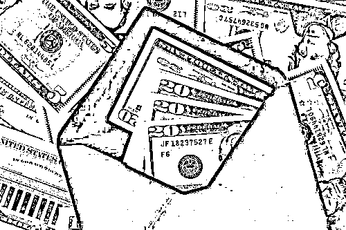

然而，海王星行进与拜登出生星图中的金星和木星形成大三角（有利），象征了极度的“运气”，有可能某一件“好事”（或一系列的运气），可以挽救他的政党（和他儿子的命运）。**梅里曼市场时机学院与若道将于 2022 年 6 月 23 日 19:00 举办金融市场最新信息中国专场讲座。**这个 2-3 小时的在线讲座（有两次 5 分钟的休息时间）将讨论几个金融市场的前景，包括黄金、原油和上证综指。

这将是特别及时的讲座，因为为期 12 年的木星轨道周期会在 5 月 10 日进入白羊座，并且 6 月-11 月是一年中最有力的地球宇宙征象接连登场的重要时间段，因为土星逆行与天王星形成几乎精准的渐亏四分相。

**说明：以上日期基于纽约证券交易所所在的美国东部标准时间，由于存在时差，中国地区可能需要加一天。**

**版权声明：**本文由若道翻译发布，欢迎转发，反对抄袭。友号转载请申请白名单。

**雷蒙德·梅里曼（Raymond Merriman）**

若道签约老师。著名金融占星师，ISAR（国际占星研究协会）前主席，梅里曼市场分析公司的总裁。他由于“提升了占星学的职业形象”，在 1995 年国际占星大会上被授予轩辕十四奖；在 2012 年国际占星大会上，被授予轩辕十四终身成就奖。

1“中国上证指数月度报告”发售**若道推出了****中文版****的雷蒙德·梅里曼中国上证指数月度报告，并持续发行该报告！**当把金融市场的周期和占星学的周期相结合时，雷蒙德·梅里曼老师的金融占星学研究**为投资者应对金融市场的周期波动，并随之调整投资策略提供了极大的价值参考**。
**5 月中英文报告已上线！**2“黄金价格周期月度报告”发售**若道推出****中文版****的雷蒙德·梅里曼黄金价格周期月度报告！**不仅仅为广大读者在中国股市的投资出谋划策，更将视角放眼黄金市场。**每当世界经济形式不明朗的时候，有一个地方是保值的港湾，那就是****黄金**。自 1982 年雷蒙德·梅里曼出版第一本研究《地球宇宙学征象与黄金价格的关联》的著作以来，**他一直作为最重要的黄金市场时机预测者之一享誉国际**。2022 年 6 月黄金报告已上线，梅里曼老师将会告诉你他对这个关键时期如何操作的想法。也可以按照季度和一年期订阅，有更多优惠。季度和年度的好处是，你可以持续了解梅里曼老师对于不断在变化的市场的看法。即便他某一次看法和市场不一致，你也看到在下一期他如何调整自己的看法，并看到金融占星在一个长期时间段内对你把控风险的帮助。而能够长期控制风险、尽量找到安全的投资时机才是投资的长久之计。**6 月中英文报告已上线！****购买套餐**，买得越多越优惠中国上证指数月度报告套餐价

*   **单月报告**：280 元
*   **3 个月套餐**：780 元（260 元/月）
*   **12 个月套餐价**：2400 元（200 元/月）

**长按下图识别二维码****购买金融报告****套餐****▼**

黄金周期月度报告优惠

*   **双报告年度套餐更优惠（直降 900 元）**

*   **12 个月黄金报告+12 个月上证指数报告：仅需 3900 元**

**长按下图识别二维码购买黄金报告套餐**▼

3《2022 年金融预报和沙龙》1976 年以来，由雷蒙德·A·梅里曼撰写的梅里曼市场时机学院每年一次的年度预报沙龙和每年一本的《年度预报》一直在应用占星学原理为投资者们服务，提供卓越洞见，从未间断。 **雷蒙德·梅里曼《2022 年金融预报和沙龙》发售中（报告已发布）。****长按下图识别二维码了解详情**
▼

4《2022 下半年金融占星投资沙龙》这将是特别及时的讲座，因为为期 12 年的木星轨道周期会在 5 月 10 日进入白羊座，并且 6 月-11 月是一年中最有力的地球宇宙征象接连登场的重要时间段，因为土星逆行与天王星形成几乎精准的渐亏四分相。

**长按下图识别二维码了解详情**

▼

**点击阅读原文购买金融报告**

# 上证还有投资机会吗？ | 6 月 23 日梅里曼 2022 下半年金融占星投资沙龙

> 原文：[`mp.weixin.qq.com/s?__biz=MzA5NjA0NTAxNg==&mid=2651473953&idx=3&sn=d082c91a09617037596ccc00d3bc4fdd&chksm=8b48fa96bc3f7380406c343a8a52645057979933c2d21ff6ff1bbc061581120082eeaf8c2ddf&scene=126&sessionid=1692737817#rd`](http://mp.weixin.qq.com/s?__biz=MzA5NjA0NTAxNg==&mid=2651473953&idx=3&sn=d082c91a09617037596ccc00d3bc4fdd&chksm=8b48fa96bc3f7380406c343a8a52645057979933c2d21ff6ff1bbc061581120082eeaf8c2ddf&scene=126&sessionid=1692737817#rd)

上周的沙龙内容发出之后，50 个早鸟价很快就被抢购一空，现在还有转发优惠价，可以添加工作人员进行咨询。

**长按下方二维码添加李老师**

**添加备注：金融沙龙**

好了，以下是如此火爆的沙龙具体内容：

2022 年转眼已经过了 5 个月。你的投资还好吗？

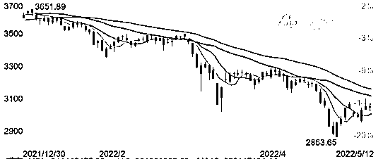

| **上证日线**

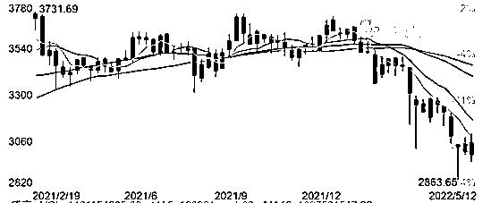

| **上证周线**

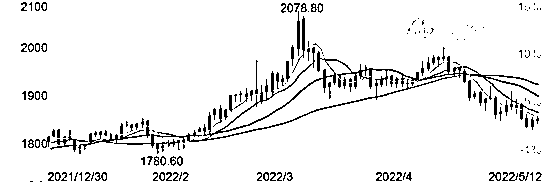

| **黄金日线**

今年上半年最重要的天象——木海合相没有带来我们希望的上涨，而是带来了歇斯底里的下跌。在 5 个月内，上证从 3651 一直跌到最低 2863 点，跌幅达 21.6%，很多股票也都有更大跌幅。对黄金而言，在 3 月份达到 2078 的高点之后，也开始一轮下跌。上证的走势尤其值得关注。因为这样的下跌，许多公司的股价已经变得非常便宜。当然，目前因为动态清零抗疫方针，中国经济也面临着前所未有的困难，这些困难毫无疑问体现在上证及公司股价中。当 2022 年年度预报沙龙在 3 月举办的时候，当时上证指数已经在熊市的通道中，很多市场人士都比较悲观。而梅里曼老师说，如果上证有 5.5 年的周期，而这个周期分为两个 33 个月的半周期，按照 26-40 月的范围而言，这个周期低点应于 2022 年 3 月-2022 年 5 月出现，当时 3 月份已经是第 38 个月，周期而言相当晚了，因此他对于市场还是比较乐观。然而，我们看到市场 3 月份后并没有止住下跌，在木海合相期间开始更猛烈下跌。根据周期理论，4 月底已经进入第 40 月了，到这个范围的尽头，而市场开始反弹。而对于梅里曼老师给出的“33 个月周期低点的价格目标是 2633-3150、2973+/-87 和 3047+/-81”而言，2863 点也到了相对低的低点。在 2021 年，土星和天王星出现 3 次四分相时，上证指数都到了当时市场的高点，在今年下半年，土星和天王星还会再出现一次非常接近的四分相。

**下半年，上证会出现有力的反弹吗？或是梅里曼老师对市场的看法与年初相比有什么改变？****在沙龙中，除了上证外，梅里曼老师也会讲到其他金融投资市场。****下半年的投资该如何把握？我们特意邀请雷蒙德·梅里曼老师在 6 月 23 日 19:00 为大家带来 2022 年半年度金融沙龙。**这场在线沙龙将提探讨这些长期行星周期如何影响世界经济的长期周期和趋势，特别是如何影响上证综指和黄金市场，并描述在 2022 年剩下的时间里市场反转关键时间点。

**本次沙龙参与者可以提前告诉我们的工作人员你对于这些市场投资方面的问题，以提交给梅里曼老师。提问收集终止：5 月 30 日。**

**沙龙价格**

**沙龙正价：****450 元**

**沙龙前 50 名早鸟价已售罄，转发可获得优惠价，具体请咨询工作人员**

**长按下方二维码添加李老师**

**咨询价格&提交问题**

**添加备注：金融沙龙**

**沙龙时间**

**沙龙时间：6 月 23 日 19:00，时长 2-3 小时**

**报名直达入口**

# 水星逆行+木星进白羊座，你的生活发生了哪些故事？

> 原文：[`mp.weixin.qq.com/s?__biz=MzA5NjA0NTAxNg==&mid=2651473916&idx=1&sn=95d65dc88ae111011dea00b8a57ab845&chksm=8b48f54bbc3f7c5defb1181cad226d37037fa14c67b57da11af3cf98e3918532e737c88c0036&scene=126&sessionid=1692737817#rd`](http://mp.weixin.qq.com/s?__biz=MzA5NjA0NTAxNg==&mid=2651473916&idx=1&sn=95d65dc88ae111011dea00b8a57ab845&chksm=8b48f54bbc3f7c5defb1181cad226d37037fa14c67b57da11af3cf98e3918532e737c88c0036&scene=126&sessionid=1692737817#rd)

**2022 年 5 月 15 日天象：**

*   **月亮在天蝎座**

*   ******太阳六分海王星、四分土星******

*   ******金星合相凯龙星******

*   ******火星合相海王星、六分北交点******

本周我们迎来了 2022 年的第 2 次[【水星逆行】](http://mp.weixin.qq.com/s?__biz=MzA5NjA0NTAxNg==&mid=2651473498&idx=1&sn=9b4e04a22afdfe804563e19c444fb4fb&chksm=8b48f4edbc3f7dfbc42ea66f5088fb7b590dc3d61f078e73584fc7f7895fbf49726e35c5456a&scene=21#wechat_redirect)和重要天象[【木星进白羊座】](http://mp.weixin.qq.com/s?__biz=MzA5NjA0NTAxNg==&mid=2651473576&idx=1&sn=65223d8cda4f395c01169c7debf3ef3f&chksm=8b48f41fbc3f7d09a10c93a35b3fbf1566518434bb7c45a9fa6ff9705eeb441585e34ace0ee3&scene=21#wechat_redirect)。水星从双子座逆行回到金牛座，我们可以学习如何让梦想照进现实，将梦想和现实协调统合，而木星进白羊座给金牛月带来明显的火元素能量，我们渴望在生活各个领域有所突破。虽然疫情还未结束，但种子已经发芽。我们会反思人生的目标，去寻找比自身需求还巨大的渴望。这几天，你有哪些水逆故事可以跟我们分享呢？或者，木星进白羊座给生活带来哪些光彩？都可以留言哦~ 今天一整天，月亮在天蝎座、金星合相凯龙星，是我们治愈心灵的机会，我们有机会深入情感中的创伤、了解自己在情感中的真实需求，并体验到真正的爱。太阳、火星与海王星的互动，更是让慈悲、理解、柔软与爱流动在周围，去感受和表达它吧。周日快乐，我们明天见！明天是天蝎座月食，敬请期待我们的文章哦！**了解每日天象，可****下载“若道”APP 查看****还有更多精彩等着你哦**

# 太阳双鱼座·12 星座月亮丨“你的浪漫多情为谁绽放？”

> 原文：[`mp.weixin.qq.com/s?__biz=MzA5NjA0NTAxNg==&mid=2651473915&idx=1&sn=951297ffe34564eeaa0d17544e17243e&chksm=8b48f54cbc3f7c5aa4f9404e4f96b032e3b9c585ffaac91d9024b9eaae8e5c07b6d29e784d31&scene=126&sessionid=1692737817#rd`](http://mp.weixin.qq.com/s?__biz=MzA5NjA0NTAxNg==&mid=2651473915&idx=1&sn=951297ffe34564eeaa0d17544e17243e&chksm=8b48f54cbc3f7c5aa4f9404e4f96b032e3b9c585ffaac91d9024b9eaae8e5c07b6d29e784d31&scene=126&sessionid=1692737817#rd)

☆****后台回复“今日”，给你一句生命态度****

作者/诺·泰尔 译者/江艺、dogcatcher 编辑/翀子 封面/书君 图片/网络太阳是生命的伟大能量，而月亮被认为是人格中的“主导需要”，同样被重视（你可以点击【开篇】，查看诺·泰尔老师对此部分内容的详细阐述）。当双鱼座太阳，遇见 12 星座月亮，分别有哪些表现呢？**太阳双鱼座和 12 星座月亮**

**★月亮*****白羊座***

对这个配置来说，真实的自我总是比外表矜持和自足。他们**坦率的性情和气质滋养**、保护着情感的表达。偶尔的虚张声势保护着敏感的内心。 

**★月亮*****金牛座 ***

双鱼座的灵感从金牛座的务实中收获了安全的构架。他们因而富于**敏感多情**，同时，**审美力**使他们能够创造性地表达感情，收获他人的欣赏。对他们来说，**爱情**能渗透灵魂，吸引内心深处的忠贞。 

**★月亮*****双子座 ***

他们容易在紧张的急躁和被动的默许之间**犹豫不决**，这种犹豫通常发生在需要对外界作出新的回应的时候。他们的**演说力和销售才华**主要用来说服自己相信自己，而非说服别人。

他们的思维可能过于脆弱，以至于会对结论进行赌博式猜测：富有灵感的双鱼座保证总有一个结论会冒出来；而口齿伶俐的双子座保证冒出来的那个结论一定能被采纳。

他们成长中的紧张任务，**是在做决定的过程中找到思维的支点**，让决定不再构建于一时的异想天开，不再为了保全颜面而固执地强迫自己去执行。 

**★月亮*****巨蟹座***

月亮守护巨蟹座：他们通过**羞怯的交际手腕**，陶冶和培养起富有**直觉力**的情绪体验和茂盛的唯情论。当自尊受到伤害的时候，他们经常流露出牺牲情结。对他们来说，**自我认知是珍贵的人生宝藏**，情感之泉经常从中喷涌而出。

他们经常凭借**多才多艺**而拥有很多种获取听众的方式。 

**★月亮*****狮子座***

他们**戏剧化的内心**在两个极端之间**变换**：是含蓄保留、不动声色、富有接受力的温和与宁静，还是扩张、好斗、夸张炫耀的华丽一击？

占星师 Grant Lewi 观察道：“你给人留下这样的印象：只要你愿意，你能做许多事情。可是你却因为**缺乏参与竞争的意愿**，而没能做到这一点。你表面的自信仅是一种态度和气场，而非实实在在的自信。” 

**★月亮*****处女座 ***

富于区分力的**理性思维**同**多情的灵感**互相沟通。这带来容忍和理解。他们通常具有一种**温暖的幽默感**：能用自嘲和苦笑去理解生活的（不如意的）细节。

星图别处的相位能够给这个 180 度配置带来不平衡感，打破思维与灵感间的互动，然后，案主在任何环境下都会感到孤独。 

**★月亮*****天秤座***

**通过人文与艺术，他们能够雅致悦目地表达灵感。**他们的感情大量地向外界显露，并总是劳碌于让自己不稳定的心理需求适应社会环境。

当外界曲解他们，要求他们的感情需求顺应他人的时候，他们的内心可能会产生一种有趣的压抑。 

**★月亮*****天蝎座***

他们获得灵感和动感情的途径有很多，而且**能够敏锐地体验感情**。他们具有**嘲讽式的幽默感**；可能全神贯注于病态、玄学、神秘学和宗教，这在现实生活中经常造成困扰。对他们来说，性变得非常重要。 

**★月亮*****射手座***

**射手座月亮对双鱼座太阳的灵感拔苗助长，**这可能让他们的想象力虚幻、空洞而不切实际。如果教育环境提供了纪律感，他们高尚的感情和想法就能创造出对整个世界宏大而有益的认知。**他们内心的灵性无处不在**。

**理想主义借助宏大的概念成形，**并被四处宣扬。 

**★月亮*****摩羯座***

双鱼座的敏感调和了摩羯座的抱负和支配心，他们是“有感情的生意人”。**抽象和具体、理想和现实、梦幻与实用**相互融合，支配着他们的自我意识。他们个性的力量蕴藏在矜持之中。 

**★月亮*****水瓶座***

人文主义：正统的信仰，传教士热情，感知到怎样使世界更美好。 

**★月亮*****双鱼座***

他们**专注于潜意识和直觉**，具备**艺术先锋**气质，这使得自我形象与众不同。这个配置的内省让他们的正直更加明显。但他们**必须尊敬和吸收他人的观念**，才能不至于变得不切实际。

理想的情形：情感带动了技艺的培养，他们因兼备圆熟老练与敏感而成为某方面的权威。 

**版权声明：**本文由若道翻译发布，欢迎转发，反对抄袭。友号转载请申请白名单。

**本系列其他文章**

[太阳白羊座·12 星座月亮](http://mp.weixin.qq.com/s?__biz=MzA5NjA0NTAxNg==&mid=2651463192&idx=2&sn=7ecd2012aee1f245b56e0f107bdfc19e&chksm=8b48acafbc3f25b968e9ca8cbe8acf6972dc3e418827b36ac12af7bf7c81858937657babb393&scene=21#wechat_redirect)丨[太阳金牛座·12 星座月亮](http://mp.weixin.qq.com/s?__biz=MzA5NjA0NTAxNg==&mid=2651463523&idx=1&sn=69fa5ba9035316fecd6c3911e744f089&chksm=8b48add4bc3f24c274cd5064316982ae958debed1e9ab681b46b80d8d8ec26bb3d2036075be9&scene=21#wechat_redirect)

[太阳双子座·12 星座月亮](http://mp.weixin.qq.com/s?__biz=MzA5NjA0NTAxNg==&mid=2651465406&idx=1&sn=c9bf1ba49b07f6c67740c46779200be8&chksm=8b489409bc3f1d1fdad398e34840d6338275f29a8292e9eb404df28126fcc8262c454b2cb6c5&scene=21#wechat_redirect)丨[太阳巨蟹座·12 星座月亮](http://mp.weixin.qq.com/s?__biz=MzA5NjA0NTAxNg==&mid=2651465949&idx=1&sn=9dfd930de39b2de38c761152f4b8710c&chksm=8b489a6abc3f137c5c6e96f404038de7f4261fc6c995aeb285bc37f79b96ef5a1d237dbe3af5&scene=21#wechat_redirect)

[太阳狮子座·12 星座月亮](http://mp.weixin.qq.com/s?__biz=MzA5NjA0NTAxNg==&mid=2651467312&idx=1&sn=d1a81f5cc1a60b3198d9c0ba770b4ba0&chksm=8b489c87bc3f1591008c88cef7b385086eb7717d4345926de92349b071ad10ceb67099f17ed0&scene=21#wechat_redirect)丨[太阳处女座·12 星座月亮](http://mp.weixin.qq.com/s?__biz=MzA5NjA0NTAxNg==&mid=2651467590&idx=1&sn=09b8f5ba9fa46e469e0add987cbe1664&chksm=8b489df1bc3f14e7a4e6b90286394af16e05f4c097058a2e2402d38f2634a0a84b32aaa03fe3&scene=21#wechat_redirect)

[太阳天秤座·12 星座月亮](http://mp.weixin.qq.com/s?__biz=MzA5NjA0NTAxNg==&mid=2651469157&idx=1&sn=c8b14b4a67b6c6ed3b7943c136d7c34c&chksm=8b4887d2bc3f0ec46e3b444c2f1ba1f331d5d0b35326aa75e77351fdde762f0fd1c6d43ada5c&scene=21#wechat_redirect) | [太阳天蝎座·12 星座月亮](http://mp.weixin.qq.com/s?__biz=MzA5NjA0NTAxNg==&mid=2651470116&idx=1&sn=68fb9ddee0671591ebae843cf2b38431&chksm=8b488b93bc3f02853f1cb8bcde25868c1c1500478eda9c4773dd1d3f93b3239a8a5fc956d999&scene=21#wechat_redirect)

[太阳射手座·12 星座月亮](http://mp.weixin.qq.com/s?__biz=MzA5NjA0NTAxNg==&mid=2651470771&idx=1&sn=c00e6fac49cac9c8ed97b637fe39267a&chksm=8b488904bc3f00122bf676a9dc0d668389344169bb9e78f94a909be9575feab784436648a42c&scene=21#wechat_redirect)丨[太阳摩羯座·12 星座月亮](http://mp.weixin.qq.com/s?__biz=MzA5NjA0NTAxNg==&mid=2651472509&idx=1&sn=b4abbafe099fe7e8c3904d79df3a5131&chksm=8b48f0cabc3f79dc7e8865e434904b3da31fd8c1c74632c02a0ceb2a2213dcbf5f8bcdec8e64&scene=21#wechat_redirect)

[太阳水瓶座·12 星座月亮](http://mp.weixin.qq.com/s?__biz=MzA5NjA0NTAxNg==&mid=2651473351&idx=1&sn=ef70ce661e6dabbb1e87900eb6f51cf3&chksm=8b48f770bc3f7e66a1e6ec5b3eef32669657039abceed3312ab12aa1a5689f263a580fb4cce8&scene=21#wechat_redirect)

**诺·泰尔**

现代占星学鼻祖，世界众多著名西方占星师的占星老师。他毕业于哈佛大学社会关系专业，是当今世界上最重要的占星师之一，占星联盟协会（AFAN）的创始人及原主席。其所著的三十三本占星教科书作为占星教学的典范，引领了整整两代占星师的占星学习与教育，1998 年国际占星大会（UAC）授予其占星界最高奖项 “轩辕奖”。

**20 位来自世界各地的占星师****带来 19 场沙龙——新世界的觉醒****详情可点击下图**

**学习占星学****点击下图了解课程详情**

**

**微信又双叒叕改版啦，不想错过若道君的推送？**
**就把若道设为星标吧！****▼**

**喜欢记得点一下在看哦☟**

**报名直达入口**

# 木星进入白羊座，水星逆行对黄金市场有何影响？丨雷蒙德·梅里曼 6 月黄金报告上线！

> 原文：[`mp.weixin.qq.com/s?__biz=MzA5NjA0NTAxNg==&mid=2651473915&idx=2&sn=a9ab61dc20fd8b137af3fc82ddbf6dca&chksm=8b48f54cbc3f7c5aef50f4c0b0ef560532a4b840b4086321aafff67168037ab1e3918c291048&scene=126&sessionid=1692737817#rd`](http://mp.weixin.qq.com/s?__biz=MzA5NjA0NTAxNg==&mid=2651473915&idx=2&sn=a9ab61dc20fd8b137af3fc82ddbf6dca&chksm=8b48f54cbc3f7c5aef50f4c0b0ef560532a4b840b4086321aafff67168037ab1e3918c291048&scene=126&sessionid=1692737817#rd)

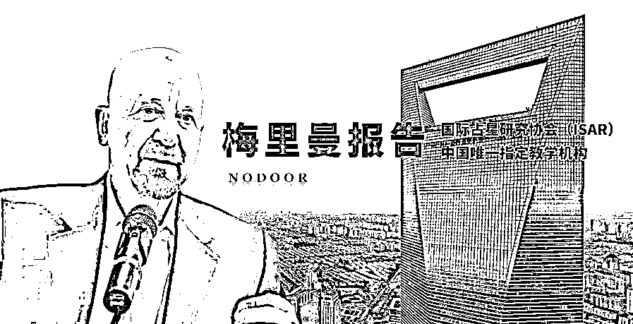

“**黄金是金钱。其他的只是信贷。**

**——约翰·皮尔庞特·摩根**

”

**4 月份美元经历了猛烈的升值，而黄金也经历了如梅里曼老师报告中的下跌。**

2000 年以来美元经历了四次明显的升值周期。分别是：

*   **2008 年 3 月 17 日-2009 年 3 月 4 日，美元升值 23.61%；**

*   **2009 年 11 月 26 日-2010 年 6 月 7 日，美元升值 18.66%；**

*   **2014 年 5 月 8 日-2015 年 3 月 16 日，美元升值 25.78%；**

*   **2021 年 1 月 6 日至今。**

**黄金价格走势和美元周期存在一定负相关性，**在第一次美元升值周期，黄金价格下跌了 10.48%，第三次美元升值周期，黄金下跌 8.91%，不过在第二次美元升值周期，黄金价格上涨了 37.33%。**从 2021 年 1 月 6 日以来，黄金目前已经下跌了 4.77%。**

美国 4 月 CPI 同比上涨 8.3%，比 3 月下降 0.2%，但依然在 40 年以来的最高水平。而欧元区 4 月通胀也高达 7.5%，连续 6 个月创历史新高。美国 4 月 PPI 同比升 11%，超过了市场预期。

6 月分美联储加息即将落地，货币紧缩已经提前产生影响。

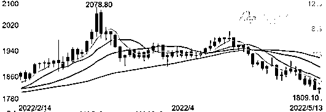

| 黄金走势日 K 线图

目前，木星已经从双鱼座换座到了白羊座，而水星也开始逆行，**在这些因素的影响下，6 月份应该如何操作？**

黄金报告已经上线，上证报告也即将上线。欢迎了解。也可以按照季度和 1 年期订阅，有更多优惠。季度和年度的好处是，你可以持续了解梅里曼老师对于不断在变化的市场的看法。即便他某一次看法和市场不一致，你也看到在下一期他如何调整自己的看法，并看到金融占星在一个长期时间段内对你把控风险的帮助。而能够长期控制风险、尽量找到安全的投资时机才是投资的长久之计。

点击阅读原文，雷蒙德·梅里曼黄金周期 2022 年 6 月报告带来有 40 年黄金市场研究经验的世界著名金融占星大师雷蒙德·梅里曼对当前黄金市场的研究。

**也欢迎购买雷蒙德·梅里曼《2022 下半年金融占星投资沙龙》，将帮助你对 2022 年下半年的市场风云变化加深了解。**

**投资有收益，投资有风险，希望金融占星学的研究帮助你更好地评估你的投资。**

****扫描下图二维码了解详情****

▼

**2022 年 6 月黄金报告上线**

**黄金月度报告价格****单月报告**：280 元/月 **季度套餐价格**：780 元（260 元/月）**年度套餐价格**：2400 元（200 元/月）**双报告年度套餐更优惠（直降 900 元）****12 个月黄金报告+12 个月上证指数报告：仅需 3900 元****长按下图识别二维码购买黄金报告**
▼

**购买者需知**

**① **梅里曼市场时机学院《中国上证指数月度研究报告》是梅里曼市场时机学院（以下简称 MMA）的研究“预报”，而不是市场“预测”，是梅里曼老师及 MMA 金融占星分析师对人类活动周期历史与行星周期之间相关性的研究，二者在大部分情况下具有 80%或更高的相关性，而不是因果关系。报告中的研究完全存在错误的可能性。即便是非常认真的研究和几十年的研究经验，金融占星师无法总是正确地解读出各种征象在实际层面上会如何相互作用，并显化为事件结果。

所以请将报告看作一个研究参考，务必结合其他市场研究和你个人对市场的理解，根据你的自由意志做决策。

**②** 此报告一旦售出，**即不接受退款。**

**③** 上证、黄金月度报告每月固定 1 期，**并非都是在每月相同日期发布。**

**④** **我们收到英文报告的当天，即发布该英文报告。3 天后，上线报告中文版。此报告仅支持手机网页阅读，不支持电脑阅读和下载。****以上须知，请仔细阅读。一旦付款，即视为已了解并接受所有须知内容。**在过去的 40 年中，唯有梅里曼逐渐完善，并在梅里曼市场时机学院月度周期报告中阐释了将地球宇宙学与周期相结合的研究方法，以惊人的精确性预报了黄金价格发生重大变化的时间。**黄金购买 Tip**

各大银行均可购买黄金或黄金 EFT 基金，也可以在诸如天天基金或者支付宝购买黄金及黄金相关产品。不明白的可以百度搜索。

**购买后如何查看报告？**

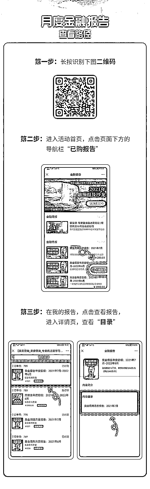

**购买后有疑问怎么办？**请联系技术客服
**微信：nodoor201705**

**购买黄金报告直达入口**

# 12 星座和谁最聊得来，和谁说话最下头？

> 原文：[`mp.weixin.qq.com/s?__biz=MzA5NjA0NTAxNg==&mid=2651473854&idx=1&sn=6e659654b05091d8ed5a1cd7ea9bb681&chksm=8b48f509bc3f7c1f2be146b49a01dfb50ca07310d34e4f3bb567285d99025db6c38decf5932a&scene=126&sessionid=1692737817#rd`](http://mp.weixin.qq.com/s?__biz=MzA5NjA0NTAxNg==&mid=2651473854&idx=1&sn=6e659654b05091d8ed5a1cd7ea9bb681&chksm=8b48f509bc3f7c1f2be146b49a01dfb50ca07310d34e4f3bb567285d99025db6c38decf5932a&scene=126&sessionid=1692737817#rd)

******☆ ****后台回复“今日”，给你一句生命态度******

作者/大卫·瑞雷 若道占星创始人译者/李含 校对/江艺编辑/玫瑰 封面/书君 图片/pexels

最近，大家的火气似乎都有些蹭，聊天的时候一言不合就容易吵起来。而且你可能会发现，你会和有些人莫名亲近，絮絮叨叨，和另一些人则话不投机，这是怎么回事呢？从占星学角度，我们来给你这些答案！

**沟通很重要**

**怎样才能建立更健康的关系？沟通！**这是老生常谈，但也的确如此！在占星学中，出生星图中的太阳、月亮、水星、金星甚至火星都对沟通交流有着重要影响。

太阳代表最重要的核心议题，月亮代表感受和情绪，水星被称为沟通之星——因为它是思想、感受和心灵的诠释者。金星也代表感觉，特别是在爱和情感方面的感觉，火星是通过肢体语言和行动去交流。

然而，每个星座都有自己的交流方式，可以根据元素来分类：**火、土、风和水**。

**·** **火象星座——白羊座、狮子座和射手座**是最喧闹的星座，他们通过**生动的互动**来交流，而**射手座是这群活跃的星座中最健谈的**。**火象星座独立且缺乏耐心。如果你想让他们听到你的声音，你就需要和他们一起前进。**

**·** **土象星座——金牛座、处女座和摩羯座**通过**实际事例**来交流，他们是**最不善于表达**的星座。**处女座是土象星座中更善于沟通的人，他们能提供切实可行的解决方案，表达关键性的顾虑或担忧。****·** **风象星座——双子座、天秤座和水瓶座**可以**保持喋喋不休**。**水瓶座是这个健谈群体中最不健谈的，天秤座是最好的倾听者。****·** **水象星座——巨蟹座、天蝎座、双鱼座**绝对不像风象星座那样健谈，他们通过**情感**来交流，而不是像风象星座那样理性交流。水象星座表达某事物的方式，主要传递的信息在于**情感基调和他们的表述方式，而不是词句本身**。在水象星座中，**双鱼座是最复杂，最晦涩难懂的。**而**沉默不语的天蝎座会变成强烈紧张的天蝎座，向你施加极大的压力去感受他们的情绪**。在天蝎座愿意的时候，他们是水象星座中最喧闹的。

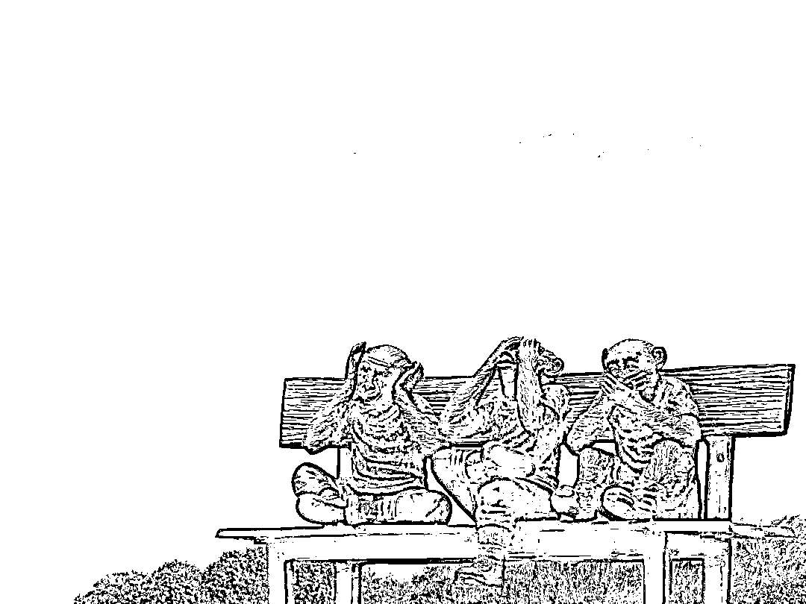

**12 星座如何好好说话**

下面列出了每个星座沟通受阻的特征，以及每个星座与其他星座沟通良好或不良的情况。 

**★****白羊座**

率直、生动的沟通方式，即“咄咄逼人”，其特征是简短而刺激性的谈话。

**挑战：**缺乏耐心，注意力持续时间短，不善于长时间倾听。

**与其他 11 个星座沟通 Tips**

**·** 与白羊座、狮子座、射手座沟通最为轻松；

**·** 与双子座、水瓶座沟通良好，但是与天秤座在沟通方面有爱恨交织的关系；

**·** 与双鱼座和金牛座沟通尚可：双鱼座是他们的知己。金牛座能提供冷静的支持；

**·** 与处女座和天蝎座需要调整沟通：无法与处女座相处。拒绝被天蝎座控制，尽管有性吸引力；

**·** 与巨蟹座和摩羯座在交流中有矛盾冲突：很容易被这两个星座的安全顾虑所挫败。

**★****金牛座**缓慢的沟通方式，语音平静，令人愉快。被动地倾听，没有紧迫感。
**挑战：**抵制新思想。迟迟不能做出承诺或达成协议，直到已经仔细阐明了所得报酬。**与其他 11 个星座沟通 Tips****·** 与金牛座、处女座和摩羯座的沟通最为轻松；**·** 与巨蟹座和双鱼座沟通良好，但是与天蝎座在沟通方面有爱恨交织的关系，顽强抵制天蝎座控制或操纵局面的企图；**·** 与白羊座和双子座沟通尚可：信赖白羊座。重视双子座的想法；**·** 与天秤座和射手座需要调整沟通：无法适应天秤座的优柔寡断和理智导向。觉得射手座很迷人，但不值得信任；**·** 与狮子座和水瓶座在交流中有矛盾冲突。抵制专横的狮子座和善于创造的水瓶座。

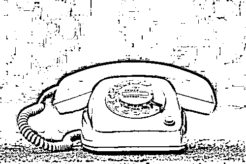

**★****双子座**12 个星座中最合群的星座，随时随地都可以和任何人谈论任何事情。 **挑战：**说话是为了听自己说话。诉说不一定是交流。**与其他 11 个星座沟通 Tips****·** 与双子座、天秤座和水瓶座的沟通最为轻松；**·** 与狮子座和白羊座沟通良好，但是与射手座在沟通方面有爱恨交织的关系，他们可能认为射手座是吵闹的、居高临下的万事通；**·** 与金牛座和巨蟹座沟通尚可：信赖金牛座，从巨蟹座得到一些支持；**·** 与天蝎座和摩羯座需要调整沟通：发现天蝎座很挑剔，与摩羯座之间有信任议题；**·** 与处女座和双鱼座在交流中有矛盾冲突：很快会觉得处女座无趣，被双鱼座搞糊涂。**★****巨蟹座**

在他们的脸上很容易流露情绪和情感，这就是他们的交流。

**挑战：**波动的情绪需要敏感、共情和深度。

**与其他 11 个星座沟通 Tips**

**· **与巨蟹座、天蝎座和双鱼座沟通最为轻松；

**· **与金牛座和处女座沟通良好，但是与摩羯座在沟通方面有爱恨交织的关系；

**· **与狮子座和双子座沟通尚可。要双子座给予“言语”，要狮子座给予“支持”；

**· **与射手座和水瓶座需要调整沟通：被射手座惹恼，与水瓶座之间有信任议题；

**· **与白羊座和天秤座在交流中有矛盾冲突：觉得白羊座粗鲁，天秤座缺乏感情。

**★****狮子座**生动多彩的交流方式。趣味丰富，会非常有趣、令人印象深刻。
**挑战：**如果不谈论与他们相关的事情，他们的注意力往往会减弱。**与其他 11 个星座沟通 Tips****· **与狮子座、射手座和白羊座的沟通最为轻松；**· **与天秤座和双子座沟通良好，但是与水瓶座在沟通方面有爱恨交织的关系；**· **与巨蟹座和处女座沟通尚可；信赖巨蟹座，获得处女座的支持；**· **与摩羯座和双鱼座需要调整沟通：被摩羯座惹恼，与双鱼座有信任议题；**· **与金牛座和天蝎座在交流中有矛盾冲突：与这两个星座的冲突矛盾经常涉及到金钱、财产和资源。

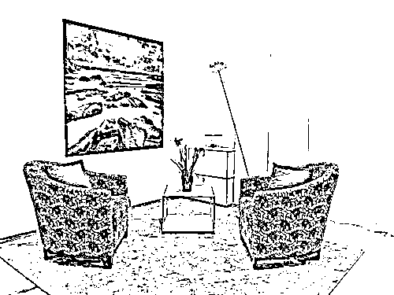

**★****处女座**

逻辑严谨的沟通风格。枯燥而保守，通常是正确的。

**挑战：**倾向于过度苛责自己和他人。谦逊，但缺乏同情心。

**与其他 11 个星座沟通 Tips**

**· **与处女座、摩羯座、金牛座的沟通最为轻松；

**· **与巨蟹座和天蝎座沟通良好，但是与双鱼座在沟通方面有爱恨交织的关系；

**· **与狮子座和双子座沟通尚可。要双子座给予“言语”，要狮子座给予“支持”；

**· **与水瓶座和白羊座需要调整沟通：被水瓶座惹恼，与白羊座有信任议题；

**· **与双子座和射手座在交流中有矛盾冲突：觉得双子座肤浅，缺乏条理，射手座缺少事实依据。

**★****天秤座**

友好、随和、充满魅力的沟通方式；通常体贴有礼。

**挑战：**优柔寡断。很难知道他们真正的感受，因为他们不喜欢冲突。

**与其他 11 个星座沟通 Tips**

**· **与天秤座、水瓶座和双子座的沟通最为轻松；

**· **与狮子座和射手座沟通良好，但是与白羊座在沟通方面有爱恨交织的关系；

**· **与处女座和天蝎座沟通尚可。信赖处女座，从天蝎座获得支持；

**· **与双鱼座和金牛座需要调整沟通：双鱼座对天秤座来说有很多工作要做。天秤座可能会被金牛座所吸引，尽管这种感觉通常不是相互的；

**· **与巨蟹座和摩羯座在交流中有矛盾冲突：天秤座尊重摩羯座，但讨厌无休止的竞争。巨蟹座被认为是非理性的，因为天秤座不喜欢情绪化的争论。

**★****天蝎座**

从沉默和沉思转变为强烈和热情。表达深刻的情绪。

**挑战：**不轻易信任别人，用沟通来试探对方的防御。

**与其他 11 个星座沟通 Tips**

**· **与天蝎座、双鱼座和巨蟹座的沟通最为轻松；

**· **与处女座、摩羯座沟通良好，但是与金牛座在沟通方面有爱恨交织的关系；

**· **与天秤座和射手座沟通尚可。信赖天秤座，从射手座那里获得财富;

**· **与白羊座和双子座需要调整沟通：白羊座对天蝎座来说有很多工作要做，天蝎座感觉双子座不值得信赖；

**· **与狮子座和水瓶座在交流中有矛盾冲突：认为狮子座过于专横，不遵守他们的规则，而水瓶座并不像他们想象的那么聪明。

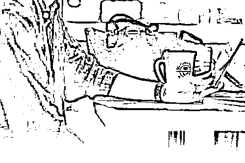

**★****射手座**外向、热情的沟通方式。要么推销某物，要么开玩笑或大笑。**挑战：**夸张。太笼统，缺乏细节。承诺太多，过于乐观了。**与其他 11 个星座沟通 Tips****· **与射手座、白羊座和狮子座的沟通最为轻松；**· **与天秤座和水瓶座沟通良好，但是与双子座在沟通方面有爱恨交织的关系；**· **与天蝎座和摩羯座沟通尚可。信赖天蝎座，向摩羯座寻求支持；**· **与金牛座和巨蟹座需要调整沟通：觉得金牛座很无趣，尽管被巨蟹座吸引，但与他们有信任议题；**· **与处女座和双鱼座在交流中有矛盾冲突：认为处女座无法理解什么才是真正重要的，并对双鱼座感到困惑和沮丧。**★****摩羯座**

认真的沟通方式，有效地描述目标，定义承诺。不要闲聊。

**挑战：**在沟通中竞争。讨厌失败，通过交流寻求优势。当目标没有实现时变得沮丧。

**与其他 11 个星座沟通 Tips**

**· **与摩羯座、金牛座和处女座的沟通最为轻松；

**· **与天蝎座和双鱼座的沟通良好，但是与巨蟹座在沟通方面有爱恨交织的关系；

**· **与射手座和水瓶座沟通尚可。信赖射手座，从水瓶座那里获得有价值的理念；

**· **与双子座和狮子座需要调整沟通：被双子座惹恼，与狮子座有信任议题；

**· **与白羊座和天秤座在交流中有矛盾冲突：觉得白羊座目光短浅，挥霍浪费，天秤座在承诺与决心方面有所欠缺。

**★****水瓶座**

友好，但很冷酷。理性客观的风格，希望他人的意见能支持自己的看法。有强烈的想法。

**挑战：**太冷漠无情了。固执己见。可能认为别人是白痴。

**与其他 11 个星座沟通 Tips**

**· **与水瓶座、双子座和天秤座沟通最为轻松；

**· **与白羊座和射手座的沟通良好，但是与狮子座在沟通方面有爱恨交织的关系；

**· **与摩羯座和双鱼座沟通尚可。信赖摩羯座，寻求双鱼座的支持；

**· **与巨蟹座和处女座需要调整沟通：被多愁善感的巨蟹座惹恼，与处女座有信任议题；

**· **与天蝎座和金牛座在交流中有矛盾冲突：矛盾围绕着金钱、财产和资源，包括商业和家庭问题。

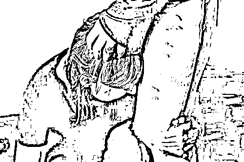

**★****双鱼座**沟通方式极其多样和复杂。可能是安静的、躲闪推诿的，也可能是充满灵感启发的！ **挑战：**由于缺乏清晰度，容易被误解。因缺乏细节和事实而让他人感到困惑。**与其他 11 个星座沟通 Tips****· **与双鱼座、巨蟹座和天蝎座沟通最为轻松。**· **与金牛座和摩羯座沟通良好，但是与处女座在沟通方面有爱恨交织的关系。**· **与水瓶座和白羊座沟通尚可。需要从水瓶座那里获得信息，从白羊座那里获得财富/支持。**· **与狮子座和天秤座需要调整沟通：被狮子座惹恼，与天秤座有信任议题。**· **与双子座和射手座在交流中有矛盾冲突：觉得双子座吵闹专横，射手座有着不应得的幸运和居高临下的优越感。

**版权声明：**原创文章由作者授权发布于若道平台，欢迎转发，反对抄袭。友号转载请申请白名单。

****想阅读更多作者的文章，请在后台回复******大卫****** 即可。****

**喜欢文章请长按下方二维码打赏**

**给大卫老师加杯咖啡呗~**

**▼**

**20 位来自世界各地的占星师****带来 19 场沙龙——新世界的觉醒****详情可点击下图**

**学习占星学****点击下图了解课程详情**

**

**微信又双叒叕改版啦，不想错过若道君的推送？**
**就把若道设为星标吧！****▼**

**喜欢记得点一下在看哦☟**

**报名直达入口**

# 上证有投资机会吗？ | 6 月 23 日梅里曼 2022 下半年金融占星投资沙龙

> 原文：[`mp.weixin.qq.com/s?__biz=MzA5NjA0NTAxNg==&mid=2651473854&idx=2&sn=ca86796fd80c626f48c79c57424196cc&chksm=8b48f509bc3f7c1fb754d98abe9e52de4d4db1e41350ef707dbf3f3608e1f3be2b8fe4a0118b&scene=126&sessionid=1692737817#rd`](http://mp.weixin.qq.com/s?__biz=MzA5NjA0NTAxNg==&mid=2651473854&idx=2&sn=ca86796fd80c626f48c79c57424196cc&chksm=8b48f509bc3f7c1fb754d98abe9e52de4d4db1e41350ef707dbf3f3608e1f3be2b8fe4a0118b&scene=126&sessionid=1692737817#rd)

2022 年转眼已经过了 5 个月。你的投资还好吗？

| **上证日线**

| **上证周线**

| **黄金日线**

今年上半年最重要的天象——木海合相没有带来我们希望的上涨，而是带来了歇斯底里的下跌。在 5 个月内，上证从 3651 一直跌到最低 2863 点，跌幅达 21.6%，很多股票也都有更大跌幅。对黄金而言，在 3 月份达到 2078 的高点之后，也开始一轮下跌。上证的走势尤其值得关注。因为这样的下跌，许多公司的股价已经变得非常便宜。当然，目前因为动态清零抗疫方针，中国经济也面临着前所未有的困难，这些困难毫无疑问体现在上证及公司股价中。当 2022 年年度预报沙龙在 3 月举办的时候，当时上证指数已经在熊市的通道中，很多市场人士都比较悲观。而梅里曼老师说，如果上证有 5.5 年的周期，而这个周期分为两个 33 个月的半周期，按照 26-40 月的范围而言，这个周期低点应于 2022 年 3 月-2022 年 5 月出现，当时 3 月份已经是第 38 个月，周期而言相当晚了，因此他对于市场还是比较乐观。然而，我们看到市场 3 月份后并没有止住下跌，在木海合相期间开始更猛烈下跌。根据周期理论，4 月底已经进入第 40 月了，到这个范围的尽头，而市场开始反弹。而对于梅里曼老师给出的“33 个月周期低点的价格目标是 2633-3150、2973+/-87 和 3047+/-81”而言，2863 点也到了相对低的低点。在 2021 年，土星和天王星出现 3 次四分相时，上证指数都到了当时市场的高点，在今年下半年，土星和天王星还会再出现一次非常接近的四分相。

**下半年，上证会出现有力的反弹吗？或是梅里曼老师对市场的看法与年初相比有什么改变？****在沙龙中，除了上证外，梅里曼老师也会讲到其他金融投资市场。****下半年的投资该如何把握？我们特意邀请雷蒙德·梅里曼老师在 6 月 23 日 19:00 为大家带来 2022 年半年度金融沙龙（时长 2-3 小时）。**这场在线沙龙将提探讨这些长期行星周期如何影响世界经济的长期周期和趋势，特别是如何影响上证综指和黄金市场，并描述在 2022 年剩下的时间里市场反转关键时间点。

**长按下方二维码报名**

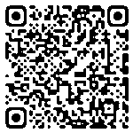

**本次沙龙参与者可以提前告诉我们的工作人员你对于这些市场投资方面的问题，以提交给梅里曼老师。提问收集终止：5 月 30 日。**

**长按下方二维码添加李老师提交问题**

**添加备注：金融沙龙**

**沙龙价格**

**沙龙正价：****450 元**

**沙龙前 50 名早鸟价：****390 元**

**沙龙时间**

**沙龙时间：6 月 23 日 19:00，时长 2-3 小时**

**报名直达入口**

# 这个交点过去曾是干大事的人，如今最需要的是“关注当下”

> 原文：[`mp.weixin.qq.com/s?__biz=MzA5NjA0NTAxNg==&mid=2651473739&idx=1&sn=a3a0e48d5a86c20f54e0acbab143a0e8&chksm=8b48f5fcbc3f7cead1cfff443af85f122242a6376e1d250d96fda25fc2d71b8f1e26fdac6dd4&scene=126&sessionid=1692737817#rd`](http://mp.weixin.qq.com/s?__biz=MzA5NjA0NTAxNg==&mid=2651473739&idx=1&sn=a3a0e48d5a86c20f54e0acbab143a0e8&chksm=8b48f5fcbc3f7cead1cfff443af85f122242a6376e1d250d96fda25fc2d71b8f1e26fdac6dd4&scene=126&sessionid=1692737817#rd)

☆****后台回复“今日”，给你一句生命态度****

作者/简·斯皮勒 译者/Shirley 校对/江艺编辑/玫瑰 封面/书君 图片/pexels

提到南交点射手座-北交点双子座，就不得不提到一些“高大上”的形容词了。这组交点最需要学习的，可能就是放弃假大空，更为接地气。一起来看看吧。

**北交点双子座/第三宫综述**

**发展的特质**

在这些领域努力有助于挖掘隐藏的天赋和才能：
**·** 健康的好奇心**· **通过提问了解他人的想法**· **看到一种情况的两面**· **机敏**· **逻辑**· **内部二分法的沟通**· **积极面对生活和他人**· **有目的地鼓励别人**· **在表达想法时使用非威胁性的方式**· **倾听**· **对新思想和经验持开放态度**· **在做决定前寻找实际信息

**要放下的倾向**

努力减少这些倾向的影响有助于让生活更轻松、更愉快 

**· **自以为是**· **冷漠**· **假设其他人知道“他们在哪里”**· **认为自己知道别人在说什么而没有真正倾听**· **需要是正确的**· **信奉“真理”，而不考虑他人的观点**· **疏忽大意的自发行为**· **走捷径**· **把自己看得太重；对生活有着沉闷的态度**· **凭直觉行事而不查看事实**· **抵制与自己的信仰体系无关的思想**· **根据过去的经验预先判断现状

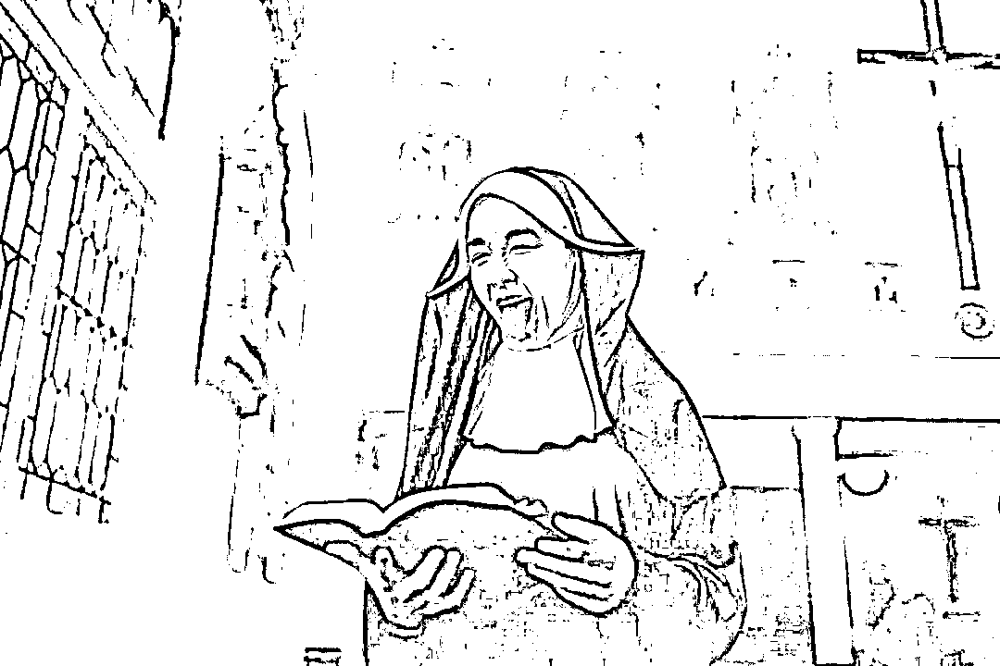

**阿喀琉之斯之踵/避免的陷阱/底线**

北交点落在双子座的致命弱点是**需要意识到自以为是（“如果其他人只是承认我是对的，并因此欣赏我，我才会感到被理解和接受”），这可能会让他们陷入无休止地追求真理的陷阱**（“如果我有所有的正确答案，每个人都会重视我；然后我可以感觉到放松并且与人有联系”）。但这是一个无底洞：因为人不可能一直“正确”，所以他们对自己永远不会感觉到好。当他们争论并试图说服别人他们是对的时，其他人不想与他们联系。然而，**如果他们足够的谦逊和开放，能够真正倾听各种观点，即使这些观点与他们之前的经历不符，他们也可以通过这种方式来了解他人，从而让他们感觉到有更多的联结。**底线是，在某个时刻，他们必须**放下他们对绝对真理的专注，简单地开始与人建立联系，倾听他人并向他们学习。**具有讽刺意味的是，在这种更公平、更轻松的互动过程中，真理的传递会更成功。**当北交点双子座的人真正倾听对他人重要的事情时，他们的反馈会更恰当、更有帮助。然后人们会欣赏他们，并希望与他们建立联系。**

**这些人真正的诉求**

这些人真的想要的是完全自由地追求真理，去冒险，保持自发性，并且始终百分之百地正确。他们希望完全按照他们的真理和直觉过程来讲述，让每个人都理解他们，向他们学习，并感谢他们的帮助。为了达到这个目标，北交点双子座的人必须停止关注“他们的真理”，开始关注他们周围的人。他们需要**倾听和理解他人分享的关于他们生活的信息**。当北交点双子座的人以这种方式倾听时，有时他们会说“啊哈！”，这正是另一个人所需要的洞察力。因为这些信息准确地解决了对方的问题，所以他们将非常感激地接受。

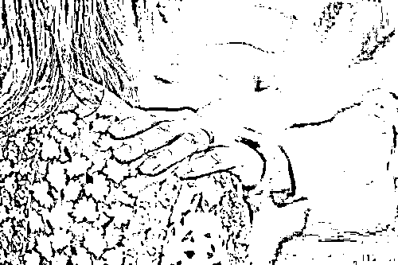

**天赋/职业**

这些人有能力（当他们倾听时）了解他人的特定思维过程并提供信息，让他人从更广阔的角度看待问题。**销售、写作、教学和各种形式的交流可以给他们带来幸福和物质上的成功。****北交点双子座的人也可以获得哲学和宗教方面的天赋，以及与生俱来的伦理道德意识。**他们可以利用自己的精神和直觉意识，来理解他人的想法而不会失去自己的真理。

然而，**如果他们在职业上把追求真理或宗教作为最终目标，最终可能会感到被孤立。当他们利用自己的天赋在日常生活中与他人深入联系时，他们的境况会更好。**

**双子座北交点特定的疗愈誓言****· **“这是一个以人为本的一生。”**·** “我可以放慢脚步，花些时间与他人连结。”**·** “当我关注别人的想法时，我知道该说什么。”** ·**“当我愿意倾听并了解对方时，我就赢了。”**·** “如果我不明白，可以提问。”**北交点双子座/第三宫的个性**

**前世**

北交点双子座的人有两种截然不同的前世经历，但有一个共同点：**追求真理。**他们有过自己追求真理的化身，比如印度的娑度（苦行者）之旅、沙漠中的游牧民族、隐士，或者独自进入荒野了解大自然秘密的普通人。他们也有许多化身，将寻求真理作为一种集体理想，融入宗教组织。不管怎样，**对真理、灵性、伦理和启蒙的追求推动了他们的整个生活，社会和人际关系则被忽视。**

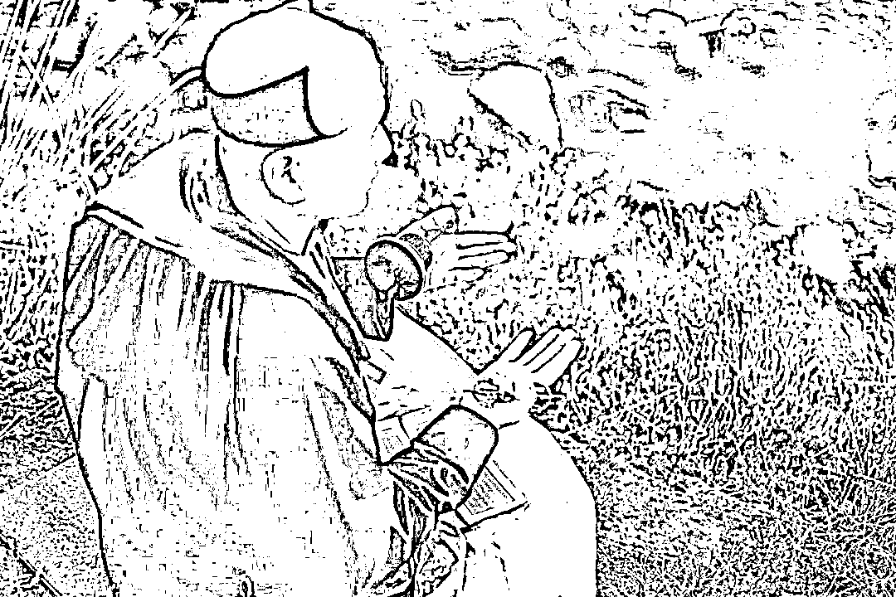

**哲学家**

这些人曾多次化身为哲学家国王。一世又一世，无论是佛教徒、希伯来人、穆斯林还是基督教徒，他们都离开身边的人去追求真理。这就是为什么在这一生中，他们仍然倾向于离开所有人，独自生活。在他们的所有前世化身中，他们都在寻求启迪——爬上山顶，到达真理的顶峰。但在经历了如此多的转世之后，他们找到了它！他们没有必要在这一生中继续寻找。最后，在山顶上，他们变得孤立无援。现在，**在这一生中，挑战是分享他们的真理，重新融入社会并与他人保持联系。****自以为是可能是北交点双子座有效地与人联系，感受真正的联结所固有的和平与爱的最大障碍。**因为他们在过去世中是哲学家和牧师，其他人遵循他们的指示。他们习惯于被认为总是毫无疑问地“正确”，所以他们带着某种傲慢进入这个化身是可以理解的。然而，其他人可以感觉到这种优越的态度，这就阻碍了他们去倾听北交点在双子座的人。因此，北交点双子座的人开始觉得其他人低估了他们的智力，因为他们不听。这是他们如何遭遇沟通问题的一个例子。**北交点双子座/第三宫的需求**

**接受与分享**

**北交点双子座的人对于让自己的观点被理解、被“听到”有一种紧迫感，然而，在这种紧迫感之下，他们真正想要的是被接受的感觉。**接受是衡量他们是否“走上正轨”的准确晴雨表。当其他人接受他们所说的话时，这是他们有效沟通的信号。如果其他人不接受他们的话，这也是一个信号，表明他们需要**收回并用其他人能够理解的话，重新表达他们的信息。**对这些人来说，真理就像神圣的垫脚石，是他们认知的基础。他们不愿分享自己的真理，因为他们害怕别人会认为他们疯了，或者因为他们思考真理，而不是考虑赚钱或其他物质问题而对他们进行评判。

他们想向他人展示自己，但他们神圣的真理是如此无形，以至于很难直接谈论，而另一个人往往会失去兴趣。然后北交点双子座的人会感到沮丧，因为他不知道如何用几句话来表达他的哲学。

这就像因为牙痛而走进牙医的办公室。患者想知道：我们是要补牙、拔牙、上牙套还是做根管治疗？她不想让牙医告诉她他在牙科学校的所有经历。

因为牙医花了这么多年的时间来学习，是用来支持他如何处理该牙齿的观点的，患者会在他简单、真实的观点背后感受到学习的过程。

同样，北交点双子座的人需要学会**回答另一个人的直接需求，给出一个看似暂时性或简单的答案，而不是一个完整的哲学。**这就是在今世为他们安排的工作。

真理是一种能量，而不是概念。这些人实际上是在寻求真理的能量，但他们需要记住，它不会以一种呆板的方式出现。当他们与他人交流想法以解决日常生活中的问题时，他们会接触到他们所寻找的真理。当他们帮助他人破解哪怕是肤浅的问题或误解时，真理的能量就会显现出来，每个参与其中的人都会分享他们的解决方案和平和的心态。在这一世的化身中，**北交点双子座的人要通过简单的日常互动和与他人的真正联系来获得真理。**

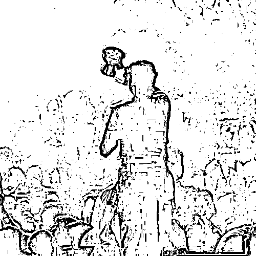

**活在当下，此时此地的解决方案**

北交点双子座的人倾向于**过于关注远大的整体解决方案，以至于他们不允许自己感受到此刻的喜悦。**他们仍在寻找“永恒的真理”。然而，在这个化身中，他们需要更多地**关注“此时此地”的解决方案**，并认识到如果他们（以及他们周围的人）在每一刻都感到快乐，那么这些时刻就会累积起来，快乐就会持续下去。他们的商业事务也是如此。他们可能**过于关注“大局”，以至于忽略了如何创造一个立即成功的局面。**他们需要更多地**意识到时间，将他们的项目划分为特定的区块来完成，而不是感觉他们有“无限”的时间来处理重大问题。**例如，我有一位北交点双子座的客户，他拥有一处复式出租房产。当他的一个房客搬出去时，需要对管道进行一些小的维修。但他没有将它处理了然后再次租出去，而是认为现在是彻底检修管道系统的好时机。然后他决定，这将是一个加固地基的很好时间，但这需要花费大量的时间和金钱（而他没有），同时要把房子从现在的地基上抬起来（“从而做一个彻底的工作”）。他一直在想，未来的某个时候（这些人总是从永恒的角度来思考！）这是必须做的，所以他最好现在就处理。由于他没有足够的资源立即完成这项工作，空白期持续了一个月又一个月。当顶层的一家人搬走后，他将项目扩大到包括楼上的管道（“最终必须完成”）。当他来看我的时候，房子已经空置了九个月；由于缺乏租金收入，他有失去房子的危险。**这些人要学习暂时性解决方案的价值，在问题出现时处理问题，而不是对未来进行过多的预测。**否则，他们失去了坚实的，可以为未来的扩张提供根基的基础。地球上的生命是短暂，永恒只存在于意识中。他们需要缩短视野，理顺时事。他们需要考虑一种情况的所有显著事实——正面和负面，并运用他们的逻辑。

**版权声明：**本文由若道翻译发布，欢迎转发，反对抄袭。友号转载请申请白名单。

**简·斯皮勒**

全球占星界的一位领军人物，是美国占星师联盟（AFAN）的教员。她定期在新时代和占星回忆上授课，是畅销书《新月占星学》、《灵魂占星》、《灵性占星学》和《宇宙之爱》的作者。

**20 位来自世界各地的占星师****带来 19 场沙龙——新世界的觉醒****详情可点击下图**

**学习占星学****点击下图了解课程详情**

**

**微信又双叒叕改版啦，不想错过若道君的推送？**
**就把若道设为星标吧！****▼**

**喜欢记得点一下在看哦☟**

**报名直达入口**

# 2022 年神话塔罗认证课程 | 开启职业塔罗师的神话之旅

> 原文：[`mp.weixin.qq.com/s?__biz=MzA5NjA0NTAxNg==&mid=2651473739&idx=2&sn=2ca8a93be205cbfa7b5ecdf018fb7ea0&chksm=8b48f5fcbc3f7ceaa563040a490a58acbf5ad6386862bbcbe8d2c59762f738c10b926ab2f0f5&scene=126&sessionid=1692737817#rd`](http://mp.weixin.qq.com/s?__biz=MzA5NjA0NTAxNg==&mid=2651473739&idx=2&sn=2ca8a93be205cbfa7b5ecdf018fb7ea0&chksm=8b48f5fcbc3f7ceaa563040a490a58acbf5ad6386862bbcbe8d2c59762f738c10b926ab2f0f5&scene=126&sessionid=1692737817#rd)

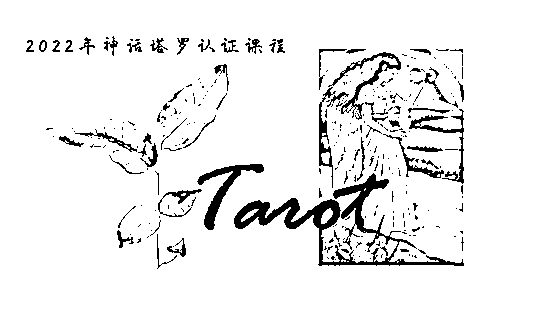

**2022 年超高含金量的神话塔罗认证课程强势回归**课程内容体系让你**直观精准**的感受**神话塔罗的魅力**扎实的建构**神话塔罗思维****系统**学习**最地道的塔罗知识**

课程中老师传授**将神话、占星、心理学完美融合进塔罗**的人本主义咨询体系，并进行**学员案例督导**，让你更自信的开展咨询工作，学以致用。

本期认证课程采取**即报即学的录播课+案例督导直播课**的形式，

*   **18 节录播课：**精编剪辑，随来随学，助教答疑，学练结合。

*   **8 节直播课：**融会贯通，神话心理，塔罗占星，咨询技巧。

为了适配大家的各种学习场景，提高学习&复习效率，我们还将**录播课**剪辑了**中文字幕版**和**翻译音频版**：

*   **中文字幕版：**朱丽叶老师英文原声配中文字幕，适合在手机或电脑前专心致志的学习。

*   **翻译音频版：**翻译老师幼婷的中文原声纯享，适合运动、通勤路上耳机里陪伴式学习。

若道还为塔罗学员开发了**“神话塔罗”APP**，是随身的工具，更是接咨询的平台，录播课程**学成入驻平台**即可链接更多塔罗个案，发展壮大你的塔罗咨询事业。

**如果你想学习塔罗，什么样的老师会让你怦然心动呢？她是三副塔罗牌的设计者，写了 6 本塔罗书籍。她研习塔罗四十余年，教授塔罗三十余年，是丽兹·格林的密友。还有****谁会比塔罗牌设计者更了解塔罗的历史、灵魂与精髓？****所以，这将是你开启塔罗之旅最坚实的一步。**

1

**这位塔罗大师是谁？**

**朱丽叶·沙曼-伯克** 

*   她是**3 副塔罗牌**的**设计者****——**神话塔罗牌、沙曼–卡塞利塔罗牌、“自己着色”塔罗牌；

*   她出版了**6 本塔罗书****——**《塔罗全书》、《新塔罗全书》、《众星的传说》、《理解塔罗牌》、《精通塔罗牌》、《塔罗初学者指南》；

*   她研习塔罗**四十余年；**

*   她教授塔罗**三十余年**；****

*   她是**丽兹·格林**的密友，两人合著了**《神话之旅》**，共同设计了**神话塔罗牌**。

*   她是认证的**心理治疗医师；**

*   她深谙**塔罗、占星学、心理学和神话学。**

**如果你想成为拥有英国神话塔罗认证的塔罗师**

那么她，就是你**最好的老师人选**

2

**塔罗牌有什么用？**

*   塔罗牌是一种**古老的疗愈工具**，同时也是**直观的解惑工具****；**

*   塔罗牌绕过逻辑思维，**和潜意识联结**，通过图像的方式生动地将隐藏在人类潜意识中的画面浮出水面，**揭示心灵的状况和运作****；**

*   塔罗牌**帮助我们和潜意识对话**，可以和现代的心理治疗联系在一起，帮助我们**看清心灵的冲突来源、本质和可以选择的道路；**

*   塔罗牌又和更广阔的**宇宙生命原型**联结，彰显**个人生命发展的阶段**，将**个人生命挣扎、内在冲突**放在生命进化的道途上，让更广大的生命智慧为个人成长照亮道路。

3

**为什么学习神话？**

神话通过**图像和故事**描绘人类生活的**原型模式**。通过瑰丽的想象、诗意的语言、栩栩如生的人物和故事描绘出我们内心的世界，表达出我们经历的那些实现人性的过程，帮助我们将**个体的生活与人类古老且永恒的故事**建立联结。从而在更深处**理解生命**，并学习**古老而长青的生命智慧**。

**神话塔罗**取材于**希腊神话**的无尽沃土，通过故事提供一种**记忆辅助**，在心理和预见层面提升解读的**丰富度**。因为这样更符合塔罗牌的性质，符合人类的想象。**按照故事思考，而不是简单的记忆关键词和固定的意义。**

4

**塔罗预测是什么？**

塔罗牌预测的运作就像是**照向心灵的一面镜子**。在塔罗牌解读时，图像的原型性质穿透隐藏的潜意识脉络，反应出与个人境遇相关但又未被了知的知识与洞见，因此**揭示出按照任何理性方式都无法发现的事情。**

如果你对生命好奇，塔罗学习会帮你**打开一扇通往未来的门****，**让你了解**心灵运作和显化的秘密**，同时赋予你更多关于生命成长的支持和指引的能力！

5

**我们将学习什么？**

**录播课（即报即学）**

**☆****初阶**

**神话塔罗详解、神话故事和预测意涵**

**第 1 讲 塔罗牌介绍 ，讲述它的历史 （中文字幕版）**

**第 1 讲 塔罗牌介绍，讲述它的历史（翻译音频版）**

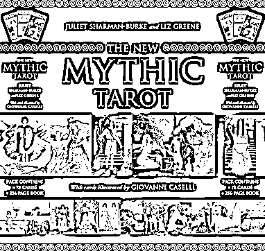

**第 2 讲 星座形态、元素和宫廷牌&基本星座与基本国王 （中文字幕版）**

**第 2 讲 星座形态、元素和宫廷牌&基本星座与基本国王（翻译音频版）**

**第 3 讲 固定星座与固定王后（中文字幕版）**

**第 3 讲 固定星座与固定王后（翻译音频版）**

**第 4 讲 变动星座与变动骑士（中文字幕版）**

**第 4 讲 变动星座与变动骑士（翻译音频版）**

**第 5 讲 小阿尔卡那牌权杖（中文字幕版）**

**第 5 讲 小阿尔卡那牌权杖（翻译音频版）**

**第 6 讲 小阿尔卡那牌圣杯（中文字幕版）**

**第 6 讲 小阿尔卡那牌圣杯（翻译音频版）**

**第 7 讲 小阿尔卡那牌宝剑（中文字幕版）**

**第 7 讲 小阿尔卡那牌宝剑（翻译音频版）**

**第 8 讲 小阿尔卡那牌星币（中文字幕版）**

**第 8 讲 小阿尔卡那牌星币（翻译音频版）**

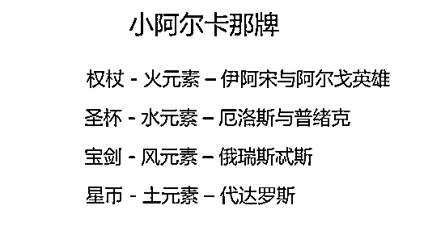

**第 9 讲 经典牌阵教学讲解（中文字幕版）**

**第 9 讲 经典牌阵教学讲解（翻译音频版）**

**第 10 讲 牌阵解读案例演示（中文字幕版）**

**第 10 讲 牌阵解读案例演示（翻译音频版）**

**☆****中阶**

**神话塔罗排阵应用，****排阵解读和咨询技巧**

**开启神话塔罗愚人之旅**

****

**第 1 讲 愚人、魔术师、女皇、皇帝（中文字幕版）**

**第 1 讲 愚人、魔术师、女皇、皇帝（翻译音频版）**

**愚人**：永恒的少年（儿童的原型）

**魔术师**：恶作剧者、老师、向导、沟通者的原型；行星：水星。

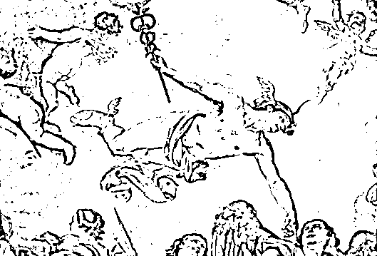

**女王**：母亲、养育者、丰产的原型；行星：金星在金牛座；小行星：谷神星。

**皇帝**：父亲、供养者、计划者的原型；行星：木星。

**第 2 讲 女祭司、教皇、恋人、战车、正义、节制（中文字幕版）**

**第 2 讲 女祭司、教皇、恋人、战车、正义、节制（翻译音频版）**

**女祭司**：处女——等待被实现的潜力原型；行星：新月。

**教皇**：疗愈者、受伤的疗愈者、牧师的原型，牧师是神与人之间的灵性桥梁；行星：凯龙星。

**恋人**：爱、爱人、所爱之人的原型；行星：金星在天秤座。

**战车**：战争、冲突、战士、斗士的原型；行星：火星。

**正义**：智慧、兵不血刃的胜利的原型；星座：处女座；小行星：智神星。

**节制**：关系、合作的原型；星座：巨蟹座、双鱼座。

**第 3 讲 力量、隐士、命运之轮、倒吊人、死神（中文字幕版）**

**第 3 讲 力量、隐士、命运之轮、倒吊人、死神（翻译音频版）**

**力量**：力量的原型；星座：太阳在狮子座。

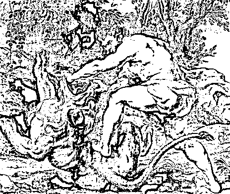

**隐士**：晚年、耐心的原型；行星：土星。

**命运之轮**：命运女神与命运的原型。

**倒吊人**：牺牲与有意识的牺牲的原型；行星：海王星。

**死神**：死亡、终点和起点的原型；行星：冥王星。

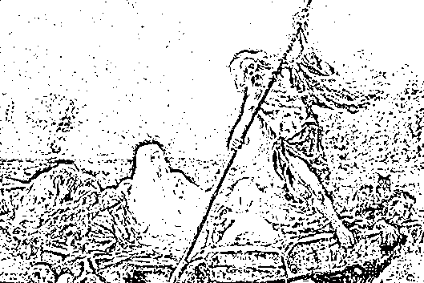

**第 4 讲 恶魔、高塔、星星、月亮、太阳（中文字幕版）**

**第 4 讲 恶魔、高塔、星星、月亮、太阳（翻译音频版）**

**恶魔**：阴影、人类不文明的面向、本能、欲望天性；行星：火星在天蝎座。

**高塔**：改变、分裂瓦解的原型；行星：天王星。

**星星**：希望的原型。

**月亮**：无意识的原型；行星：暗月。

**太阳**：意识、创造力和文明的原型；行星：太阳。

**第 5 讲 审判、世界（中文字幕版）**

**第 5 讲 审判、世界（翻译音频版）**

**审判**：复活、新生的原型；行星：水星作为灵魂向导普绪科蓬波斯。

**答疑与讨论，学员们分享对自己或客户的塔罗解读，对神话塔罗牌进行更多探讨。**

**世界**：整体、完成和个性化的原型。

**第 6 讲 经典牌阵教学讲解（中文字幕版）**

**第 6 讲 经典牌阵教学讲解（翻译音频版）**

**第 7 讲 咨询案例演示：为一位年轻女性所做的四次解读（中文字幕版）**

**第 7 讲 咨询案例演示：为一位年轻女性所做的四次解读（翻译音频版）**

**第 8 讲** **引导式冥想、荣格的四种意识功能（中文字幕版）**

**第 8 讲 引导式冥想、荣格的四种意识功能（翻译音频版）**

**☆****高阶**

**第 1 讲 塔罗牌中的荣格原型**

**2022 年 8 月 10 日（周三）**

我们将学习荣格是如何理解原型，以及荣格原型如何反映在塔罗牌中。对塔罗牌解读而言，理解原型的普遍性非常有帮助，因为这有助于塔罗咨询师碰触客户的内心世界。

**第 2 讲 塔罗牌是如何与行星原型和其原型体验联系在一起**

**2022 年 8 月 24 日（周三）**

大阿卡纳牌反映了行星神祗的原型，在某些情况下，原型经验意味着它们反映了所有人类的经验。我们将通过这个角度看这些大阿卡纳牌。我们将看到理解原型对解读有何帮助。

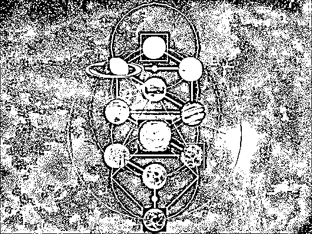

**第 3 讲 荣格意识的四种功能与小阿卡纳牌的四种元素及与权杖、星币、宝剑、圣杯四套牌之间的联系**

**2022 年 9 月 7 日（周三）  **

我们将看看小阿卡纳从 1 到 10 如何反映荣格意识功能的各个方面，以及它们如何反映在四套牌四个元素和其心理方面。我们还将对 1-10 的数字学进行修正，看它们在元素中的表现方式。

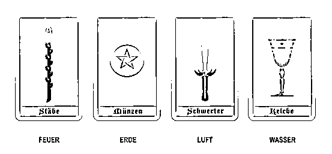

**第 4 讲 占星学中的 12 星座和宫廷牌之间的联系**

**2022 年 9 月 21 日（周三****）**

我们将讨论形态和星座，以及它们如何反映在宫廷牌上。

**第 5 讲 马蹄牌阵学员案例督导**

**2022 年 10 月 19 日（周三） **

**第 6 讲 六芒星牌阵学员案例督导**

**2022 年 11 月 2 日（周三） **

**第 7 讲 凯尔特十字学员案例督导**

**2022 年 11 月 16 日（周三） **

****

**第 8 讲 三个牌阵学员完整案例督导**

**2022 年 11 月 30 日（周三）**

**认证阶段：考试论文**

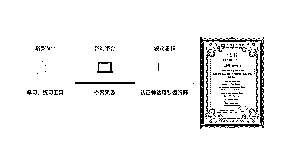

录播课学习完毕，即可入驻若道神话塔罗 APP，以实习塔罗师获得推广流量，对接塔罗咨询个案。

直播课+录播课学习完毕，提交考试论文通过即可获得获得英国神话塔罗认证证书，升级为认证咨询师。

**入驻塔罗平台**

6

**适合人群**

*   塔罗初学者，完全没有塔罗基础；

*   塔罗自学者，也曾上过塔罗工作坊，但仍不懂如何使用塔罗牌；

*   塔罗进阶学习者，有塔罗基础，了解 78 张塔罗牌含义；

*   不知如何解决遇到的情感困惑、职业选择、人际问题，对人生感到迷茫；

*   想要学习深入解读塔罗牌、牌阵的使用、咨询技巧等将塔罗运用于咨询实践；

*   想要深入了解和学习塔罗，希望成为专业的塔罗师；

*   想要借助塔罗进行心灵、灵性成长。

7

**导师简介**

**朱丽叶·沙曼-伯克**

**朱丽叶·沙曼-伯克**从 20 世纪 70 年代早期开始，就对塔罗牌产生了兴趣，并踏入了塔罗的世界。后来，在丽兹·格林的鼓励下，开始研习心理占星学和塔罗。

1984 年，第一本书《**塔罗全书**》（*The Complete Book ofTarot*）出版。之后，与丽兹·格林合作设计并撰写了《**神话塔罗**》（*The Mythic Tarot*），在这本书中，她们将古希腊神话与传统塔罗解读结合起来。朱丽叶写了**十本塔罗和占星学书**，包括一本名为《众星的传说》（*Stories from the Stars*）的儿童读物，以及与丽兹·格林合著的《神话之旅》（*The Mythic Journey*），这是一本详细讲述如何运用神话来指导生活的书。

8

**课程价格**

**认证课程总价：****22000 元**

**联报优惠价：****19000 元**

**限时转发优惠价：18000 元（联系 Echo 老师，获取限时转发优惠价）**

长按二维码添加客服 Echo 老师

9

**退转课程**

*   **退款原则请详看《教学协议》，如有疑问请咨询课程顾问。**

**神话塔罗认证课程**

**授课老师：朱丽叶·沙曼-伯克**

**授课时间：录播课即报即学，直播课 2022 年 8 月 10 日起**

**授课方式：**网络课程**，**英文授课，中文翻译

**费用：****认证课程总价：****22000 元；****联报优惠价：****19000 元；****限时转发优惠价：18000 元**（联系 Echo 老师，获取限时转发优惠价）

**课程负责人：Echo 老师**（微信/手机：nodoor18518412824，请备注“神话塔罗”）

长按二维码添加课程负责人咨询~

****报名请点击“阅读原文”****

# 神话塔罗之大阿卡纳牌｜愚人

> 原文：[`mp.weixin.qq.com/s?__biz=MzA5NjA0NTAxNg==&mid=2651473739&idx=3&sn=e8441f9489af04cacaf21e9f0e844edf&chksm=8b48f5fcbc3f7ceadb864794113fee0f1b8d5272274d53fd85cf99493f9c2582ca8d6f88e9f4&scene=126&sessionid=1692737817#rd`](http://mp.weixin.qq.com/s?__biz=MzA5NjA0NTAxNg==&mid=2651473739&idx=3&sn=e8441f9489af04cacaf21e9f0e844edf&chksm=8b48f5fcbc3f7ceadb864794113fee0f1b8d5272274d53fd85cf99493f9c2582ca8d6f88e9f4&scene=126&sessionid=1692737817#rd)

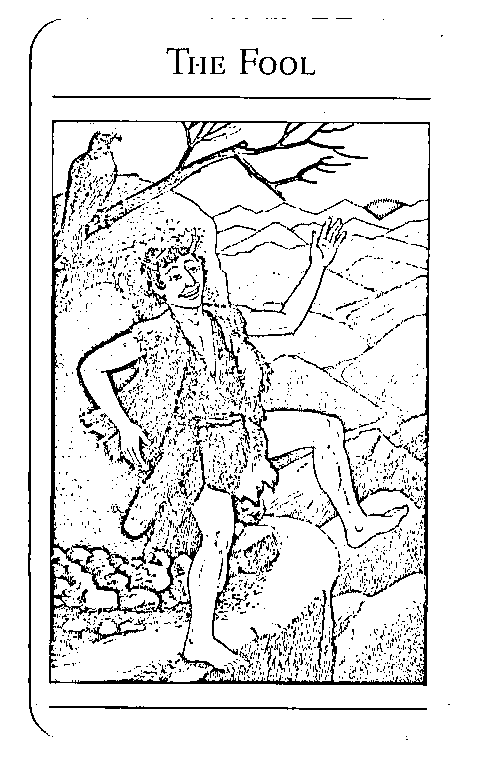

作者/朱丽叶·沙曼-伯克 丽兹·格林

译者/闫东升 编辑/玫瑰 图片/神话塔罗 网络

本文节选自《神话塔罗》

今天我们走进神话塔罗的 22 张大阿卡纳牌之旅，大阿卡纳牌用 22 张意味深长的图画，描绘了人生中从不止息的大小轮回，那是我们人生之旅的开始、过程与结束。站在悬崖边上手舞足蹈的愚人，便是这一趟旅程的启航。2022 年神话塔罗认证课程也开始报名啦，详情请见今日二条！

[🔈 神话塔罗·愚人](https://res.wx.qq.com/voice/getvoice?mediaid=MzA5NjA0NTAxNl8yNjUxNDczNzM4)

**｜**朗读者小巫

**书名：**

神话塔罗 

**作者：**

朱丽叶·沙曼-伯克   丽兹·格林 

**出版日期：**

2011-08-02

愚人对应的希腊神祗 

**狄奥尼索斯·酒神**

**出生牛犊不怕虎**

愚人牌是大阿卡纳牌的第一张，描述的是一个荒野中的年轻人，穿着自然花色的蓬乱兽皮，心醉神秘地在悬崖边跳舞。他栗色的头发上戴着用藤叶编织的头环，看起来像额头上长了一对山羊的角。

他的目光看向远方破晓的曙光，太阳已经在地平线上冒出了一点点。他身处贫瘠的荒野，四周都是褐色和灰色的石头。在他左边，是笼罩在渐退的黑夜阴影中的一个洞口，他就是从那里面走出来的。他的头顶上方是树木的枯枝，栖息着一只鹰。

> **鹰**：宙斯（Zeus）的象征，而宙斯是众神之王，他的目光注视着跃入未知的愚人。 
> 
> **山洞**：愚人的来处，那里充满着黑暗和没有分化的力量，象征着个体的孕育之处和生命的起点。
> 
> **愚人额头上像山羊角的头环和他所穿的兽皮**：意味着他的状态象是身强力壮的动物，被本能驱使着去经验生命，还没有发展出意识和理解能力。

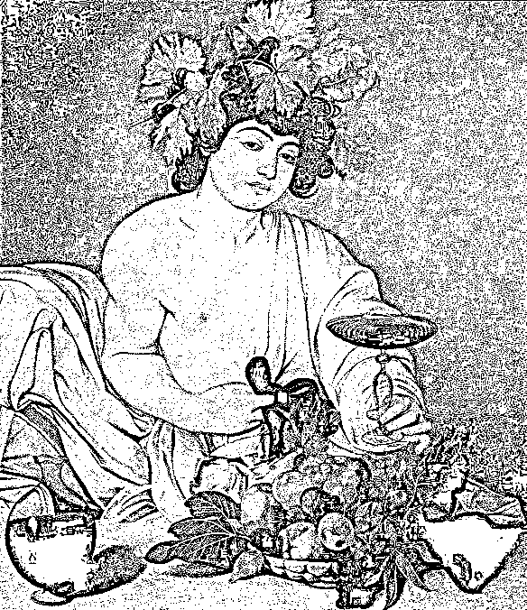

**｜**《酒神》 意大利 卡拉瓦乔 布上油画  佛罗伦萨乌菲齐美术馆藏**头上长角的孩子，他有两条命**

在这里我们遇到了塔罗牌人生之旅的主角，他以神秘的狄奥尼索斯（Dionysos，希腊神话中的狂喜之神——酒神）形象出现，经历了两次出生。

狄奥尼索斯是伟大的宙斯和塞墨勒（Semele）之子，塞墨勒并不是女神， 而是一个凡人，是底比斯国（Thebes）的公主。

宙斯的妻子赫拉（Hera），对于宙斯的出轨大感愤怒，她伪装成一个奶妈接近塞墨勒并怂恿她去测试宙斯对她的爱，赫拉说塞墨勒应该要求宙斯现身并展示出神的光芒。

宙斯承诺会满足塞墨勒所有的要求，因此他就被自己的誓言所束缚了，必须对其展示出神的光芒。虽然很不情愿，宙斯还是用雷电展示了神的力量，结果塞墨勒被烧死了。宙斯无法挽救她，但却救活了塞墨勒怀着的孩子。

神界的信使和魔法之神赫尔墨斯（Hermes）在抢救孩子的过程中也给予了很大的帮助，他把婴儿先缝入宙斯的大腿中，直到足月后才取出来，狄奥尼索斯就这样来到了人世。赫拉的怒火并没有因此止息，她找到了这个头上长着角的孩子，并召唤来巨神泰坦（Titans），让泰坦把孩子撕成碎片。当宙斯赶到的时候，孩子已经被撕碎了，他只抢回了孩子还在跳动的心脏，宙斯把它放进了一剂石榴籽药水中。

后来哈迪斯（Hades，希腊神话中的冥府之王）绑架珀尔塞福涅（Persephone）的时候，让她把这剂药水喝了下去，于是珀尔塞福涅就怀孕了，狄奥尼索斯就这样在冥府中再一次降生。

因为这次经历， 狄奥尼索斯也被称为狄奥尼索斯-伊阿柯斯（Iacchos），是光和狂喜之神。宙斯让他活在人类的世界中，分担人们的苦难。赫拉一直没有放弃对狄奥尼索斯的追杀，因此他必须到处游荡，尾随他的是一群疯狂的女人、动物和好色之徒。

他把美酒作为礼物带了人类，那些愿意弃绝权利和财富的人们可以享受它带来的狂喜和灵性的救赎。后来宙斯把狄奥尼索斯带到了奥林匹斯山（Olympus），他终于在众神之王的右手边安稳地享受着神的荣耀了。

**狂喜和灵性的救赎**

**从人们内在的层面来看，狄奥尼索斯——愚人这个神秘的意象，在每个人的内心驱动着我们去跃入未知的领域。**

我们保守、谨慎和现实主义的一面不愿意接纳这种狂野的冲动，但是朝气蓬勃和渴望自由的精神是信仰天国的，它随时准备着行走于悬崖的边缘，没有一丝一毫的犹豫。

狄奥尼索斯的疯狂对于每个人内在现实性的一面都是巨大的威胁，因为它不属于理性也没有任何逻辑和制约，但是从更深的层面上来说，它并不是疯狂，因为没有它就没有改变，也没有“青出于蓝而胜于蓝”的成功。**人生有很多事情是不可能通过计划或理性判断达成的，但这也是人生不可或缺的一部分。**愚人身上穿着的皮毛象征着人性里直觉的和感性的面向，我们常常把它归于第六感或动物本能的范畴，在这片领域中逻辑、规则、理性等具体形式还没有成型。狄奥尼索斯是万神之王的儿子，神圣的力量和精神造就并引领着他，虽然他注定要生活在凡间，但他的驱动力是人类很难去理解的；他也曾经在地狱里出生，那么究竟他会带着人们走向天国还是地狱，我们似乎永远无法清楚地判断。

**狄奥尼索斯——愚人象征着人类内心想要改变的非理性冲动和敞开面对未知的驱动力**。愚人站在旅程的起点，当我们站在每一个旅程起点的时候，都能在内心体验到他所象征的神秘驱动力。

这些非理性的冲动有时候是毁灭性的，有时候又极具创造性，通常两者皆然。

**内心的狂野之神有时候会促使我们跃入危险和痛苦的境地，也可能带着我们走向某种创造性的开始，那种内心的冲动和渴望来时雷霆万钧又神秘莫测。**

如果人们不回应它的召唤，在生命终结之时，就会因为错过和压抑而空虚和悔恨。由此可见，愚人是一个矛盾的形象，他在旅程开始之时不给出任何我们是否能安全抵达目的地的承诺，但是如果不开始就意味着否定神性的召唤，从内在的层面讲就是否定我们内心一直年轻的、极富创造力的、高于自我的力量。

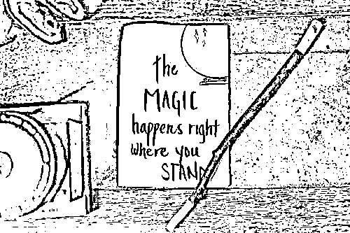

**愚人，探险的意义**

从解牌的角度来看，狄奥尼索斯——愚人的出现，预示着人生新旅程的开始。此时冒险的精神是非常必要的，要勇于和愿意踏上一条未知之路。

愚人象征的不确定性就像狄奥尼索斯一样，我们不知道踏上的是一条通往神圣之地的道路，还是最后像个傻子一样盲目地跌入黑暗。

**带着激动、恐惧和不确定踏上一段生命的全新之旅，就是愚人牌所描绘的境遇，无论它带着我们走向光明或者黑暗，都将是一次意义深远的伟大探险。**

**版权声明：**本文由《自在园》授权发布，欢迎转发，反对抄袭。友号转载请申请白名单。

**朱丽叶·沙曼·伯克**从 20 世纪 70 年代早期开始，就对塔罗牌产生了兴趣，并踏入了塔罗的世界。后来，在丽兹·格林的鼓励下，开始研习心理占星学和塔罗。1984 年，第一本书《塔罗全书》（The Complete Book ofTarot）出版。之后，与丽兹·格林合作设计并撰写了《神话塔罗》（The Mythic Tarot）。朱丽叶写了十本塔罗和占星学书，包括一本名为《众星的传说》（Stories from the Stars）的儿童读物，以及与丽兹·格林合著的《神话之旅》（The Mythic Journey），这是一本详细讲述如何运用神话来指导生活的书。**20 位来自世界各地的占星师****带来 19 场沙龙——新世界的觉醒****详情可点击下图**

**学习占星学****点击下图了解课程详情**

**

**微信又双叒叕改版啦，不想错过若道君的推送？**
**就把若道设为星标吧！****▼**

**喜欢记得点一下在看哦☟**

**报名直达入口**

# ISAR 星空俱乐部沙龙丨十二分盘：一个古老的技法，以及使用的改进与发展

> 原文：[`mp.weixin.qq.com/s?__biz=MzA5NjA0NTAxNg==&mid=2651473576&idx=2&sn=319da8c23d4741d900272595e501d656&chksm=8b48f41fbc3f7d09c84c1b7b1f79e083a5c186e8a498a955d5489e4fe71d1f2b626fb2ddc6d9&scene=126&sessionid=1692737817#rd`](http://mp.weixin.qq.com/s?__biz=MzA5NjA0NTAxNg==&mid=2651473576&idx=2&sn=319da8c23d4741d900272595e501d656&chksm=8b48f41fbc3f7d09c84c1b7b1f79e083a5c186e8a498a955d5489e4fe71d1f2b626fb2ddc6d9&scene=126&sessionid=1692737817#rd)

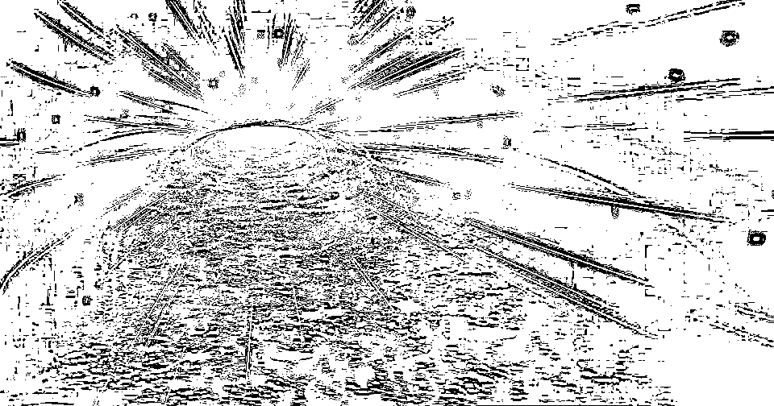

**沙龙来啦！**

**5 月 13 日，星期五晚上 8 点**，国际占星研究协会（ISAR）中国星空俱乐部沙龙由美国占星师**大卫·科克伦**带来一场沙龙！

**沙龙主题****沙龙主题：十二分盘——启蒙，大师和黑帮****主讲人：**大卫·科克伦****

**沙龙时间：5 月 13 日，星期五**

**                北京时间 20:00-21:30（有英文翻译）**

**沙龙方式：线上沙龙**

一本写于 378 年的古代占星入门书，**描述了一个黄道十二宫分支系统，称为十二分盘。**该研究的作者保罗斯·亚历山德里努斯（Paulus Alexandrinus）认为，**十二分盘可以使好的行星结构变得更好，而使坏的行星结构变得更糟。**这个古老的想法得到了现代数据库研究的证实！ 

十二分盘使用的改进和发展，揭示了为什么它们可以增加精神动力，但也可能变得功能失调，这在黑手党领导人的星图中也很突出。

**主讲嘉宾**

**大卫·科克伦**

大卫是振动占星学的先驱，帮助组织了振动占星学年度会议。他是占星软件的开发者、研究者、作者和演讲者。大卫还制作了 300 多个关于各种主题的免费占星教程视频（Youtube），这些视频是成千上万的占星爱好者的重要资源。

他获得了多个奖项，包括 2018 年轩辕十四发现、创新和研究奖。

**如何参加沙龙？**本讲座也是本月的国际占星研究协会（ISAR）星空俱乐部讲座。**ISAR 会员可以免费收看。**请注意邮件通知，具体参与方式见邮件。❶ 如果你**已经是 ISAR 会员**，请注意邮件通知，告知如何参加。❷ 如果你**不是 ISAR 会员**，非 ISAR 会员价格：98 元。如有任何问题请咨询工作人员 yiyi（微信：YY18513802156）

**非 ISAR 会员报名请长按下图**

**▼**

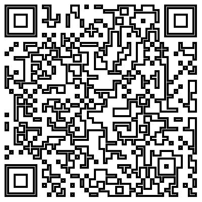

**ISAR 明星俱乐部**

2018 年，ISAR 在主席亚历山大·因舍阿吉克的带领下，成立了 ISAR 明星俱乐部，每月为全球 ISAR 会员提供在线直播讲座，邀请全球著名占星师开讲，学习和分享新的理念。讲座时长一小时，涉及占星学的不同领域、不同观点，每个会员都可以参与其中，每次讲座之后还有 20-30 分钟问答时间向老师们提问。每一场在线讲座都会记录下来，ISAR 除了提供视频，还会提供相关的讲座资料，以及单独的问答录音，自动发送到专门的 ISAR 明星俱乐部页面存档，每位 ISAR 会员可以在 ISAR 网站上自己的会员主页俱乐部页面找到。在 2018 年最初几个月，ISAR 明星俱乐部会每月举办一场在线演讲。之后，两周举办一场演讲，最终每周举办一场演讲。
但是，过去明星俱乐部讲座只有英文沙龙，因此，中国会员只有懂英文才能受益。为了使得更多不懂英文的中国会员能够受益，我们特别和 ISAR 总部协商，今后会安排有中文翻译的明星俱乐部占星沙龙，作为给中国 ISAR 会员的福利！**如何成为 ISAR 会员？**

**如果你也想成为 ISAR 会员，请复制链接在浏览器打开**

http://www.nodoor.com/isarcert.do?contentId=3588（仅支持网站支付）

**或直接长按下方二维码，微信购买会员：**

**ISAR 会员有什么福利？**一年期会员仅需支付**人民币 510 元**，即可享受：**☆ 星空俱乐部免费沙龙****☆每年出版 3 次的《国际占星师》（目前只有英文）；****☆每周电子邮件交流汇总杂志（目前只有英文）；****☆专项研究基金和奖学金资格；****☆ISAR 主办的会议和论坛的会员折扣，包括国际占星大会（UAC）、ISAR 的会议和研讨会等会员权益。****有疑问怎么办？**关于 ISAR 星空会员俱乐部以及我们的讲座，如果你还有任何疑问，**请联系工作人员**：

**yiyi**

**微信：YY18513802156**

**若道 Conrad**

**微信：nodoor2016**

****非 ISAR 会员报名请点击“阅读原文”****

# 重磅天象丨“木星年”的下半场，想重振旗鼓？要借好木星白羊座的”东风“！

> 原文：[`mp.weixin.qq.com/s?__biz=MzA5NjA0NTAxNg==&mid=2651473576&idx=1&sn=65223d8cda4f395c01169c7debf3ef3f&chksm=8b48f41fbc3f7d09a10c93a35b3fbf1566518434bb7c45a9fa6ff9705eeb441585e34ace0ee3&scene=126&sessionid=1692737817#rd`](http://mp.weixin.qq.com/s?__biz=MzA5NjA0NTAxNg==&mid=2651473576&idx=1&sn=65223d8cda4f395c01169c7debf3ef3f&chksm=8b48f41fbc3f7d09a10c93a35b3fbf1566518434bb7c45a9fa6ff9705eeb441585e34ace0ee3&scene=126&sessionid=1692737817#rd)

******☆ ****后台回复“今日”，给你一句生命态度******

作者/Justine ISAR 认证占星师
编辑/翀子 封面/书君 图片/网络

5 月 11 日，木星来到黄道的第一个星座白羊座，这也意味着当我们能发起、激励他人并表现出热情和勇气时，在接下去的一年会吸引好运。新生力量正破土而出，我们有机会比以前更独立、并以自己希望的方式创造新天地。拥抱自己的勇气吧！

**PS：核心课程的 L3 学员研究分享。今晚 8 点，甘苦交响曲的土星组有哪些故事？长按二维码预约直播哦~**

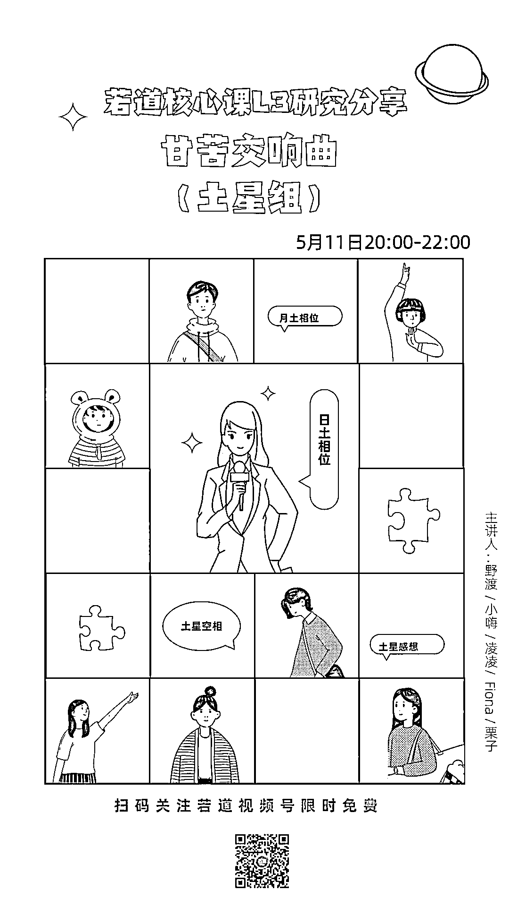

**木星年的下半场**

**2022 年是名副其实的“木星年”**——众神之王宙斯的高光时刻。很多人本以为充满了扩展的机会，却大跌眼镜。 

过去的四个多月里，除了新冠病毒与俄乌战争引发的死亡与经济衰退，全球还有因气旋、热带风暴、海底火山喷发、洪灾暴雨山体滑坡、以及空难而死去的人。**2022 年，对于地球与人类而言，是非常非常艰难的一年。**

让我们回顾一下，2022 年至今为止重大宇宙天气：

*   **2022 年 4 月 12 日，木海合相双鱼座 23 度；**

*   **2022 年 5 月 1 日，日食发生在金牛座 10 度，金木合相**双鱼座**27 度。**

**下一个重大宇宙事件，是 5 月 11 日木星进入白羊座。**

木星平均每年换一个星座。过去三年来，木星从摩羯座、水瓶座移动到双鱼座，现在终于离开混沌消融的水域，充满力量地一跃而起。**白羊座是黄道的第一个星座，因此这也拉开了木星 12 年新周期的序幕。**

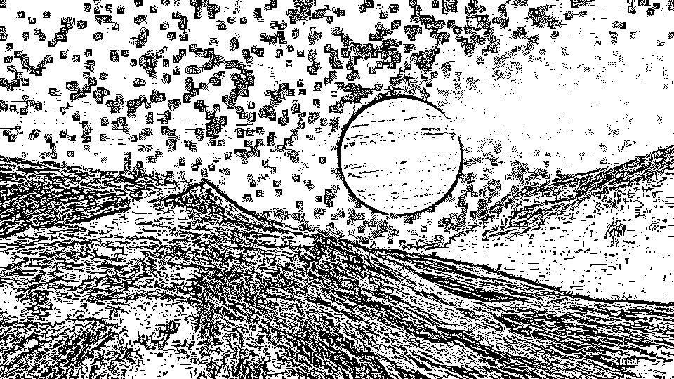

**承担有计划的风险，独立创新**

作为幸运之神，木星无论走到哪里，就像一个巨大的宇宙聚光灯，都会带来清晰、动力与结果。**当木星进入白羊座，对于有个人行星、上升点落火象星座（白羊座、狮子座、射手座）的人，或者对于每个人星图上白羊座所落宫位代表的人生领域，会带来积极乐观的期待。**

白羊座是充满活力、高度独立、先锋的能量。它让我们联想到春天的生机勃勃、绚丽的花朵竞相开放，新芽穿过混凝土的裂缝到达光的景象，不加掩饰的青春朝气……

也许你会问：当木星进入白羊座，会有很多创业兴起吗？

结合当下的时局，不推荐大家鲁莽去创业。**对于个体而言，只有结合宏观视角与自身优势，并能承担有计划的风险，才能将木星白羊座的创新能量运用到最佳状态。**

具体地说，**当我们能发起、激励他人并表现出热情和勇气时，在接下去的一年会吸引最多的好运**。如果个体有能力在某些亟需创新的领域开拓机会，将有机会搭上木星白羊座的宇宙快车，引领社会与行业的创新。

**从更高的角度，**可以期待的是——木星入白羊座可以让世界更有希望摆脱美国与美元垄断，让更多人摆脱对大公司、或对他人的依赖。大家已经看到：2022 年，很多亟待治理解决的老旧问题都浮出水面，不再适应时代的旧体系已经开始崩坍——**这也意味着这些领域需要新生力量迎面而上，紧跟时代步伐去创新。**

如果你在考虑新的工作方向或职业转型，不要因为貌似通胀的宏观环境感到泄气。因为在社会转型期的太多不确定之下，**也蕴藏了大胆创新的机会**——而且是比以往更公平的机会。

随着冥王星进入水瓶座，大公司、大财团靠垄断赢取巨额利润的空间会越来越少，直到无差价可赚、无缝可钻。拥有专业技能的个体将会崛起，**每个人必须主动思考和去解决问题，发挥所长为社会创造价值。**“潜规则”会逐渐退出历史舞台，每个人可以在公开、透明的氛围下做事——**新一轮的赛道，将随着木星入白羊座开启。**

在过去两三年，大流行已经让整个世界发生了如此大的变化，从社会经济形态到产业结构，如果你恰好有“如果……会不会很疯狂”的想法，请不要退缩，大胆测试运行。**请相信，当我们有意识地使用木星白羊座的能量，完全有机会比以前更加独立，并以自己希望的方式做事。**

请相信，没有人是 100% 准备好之后才开始的。每一个创新成功者，都必然需要面对内在的恐惧。木星白羊座的能量鼓励我们放手，勇敢地尝试并“犯错”。秘诀很简单：**在得到回报（木星）之前，必须承担的一些风险（白羊座）。**

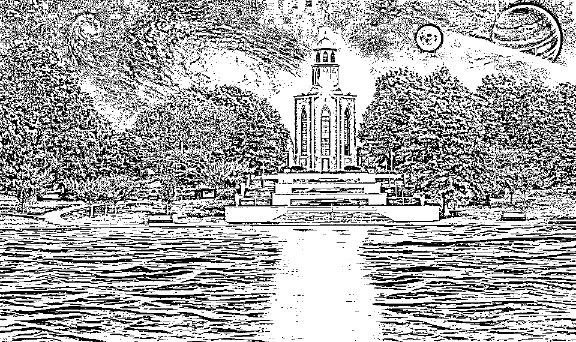

**提防白羊座木星的阴影**

白羊座是炽热、移动的能量，是战士的标志。它想要领引，想要成为第一，它不会让任何人挡道。**木星不仅会强调白羊的创新与勇气，也可能会扩大白羊好斗的阴影。**

在我们分享观点或捍卫信仰时，木星白羊座可以火上浇油，会带来人际摩擦甚至暴力，无论是在个人生活中，还是跨越国际边界。

**一起来回顾下历史：**

*   **在 1917 年木星进入白羊座期间，美国与当时的盟国英国、法国和俄罗斯一起对德国宣战，卷入第一次世界大战。**

*   **1939 年第二次世界大战爆发时，木星也在白羊座。**

*   **木星最后一次进入白羊座是在 2010 年 6 月至 9 月，然后是 2011 年 1 月至 2011 年 6 月。这期间发生了阿拉伯之春，执政 23 年的突尼斯总统本·阿里在民众示威浪潮中出逃。随后，其他一些西亚北非国家出现不同程度政治和社会动荡。2 月 11 日，执政 30 年的埃及总统穆巴拉克下台，从而拉开了叙利亚和伊拉克内战的序幕；3 月 11 日，悲惨的海啸袭击了日本，夺走了近 20000 人的生命，并引发了福岛核电站的爆炸和放射性物质泄漏。**

我们祈祷再也不要目睹这样的悲剧。但客观地说，俄乌战争在 2022 年中会升级吗？如果有可能，会以什么样的方式？

当下的战争，早已不单单是在物理的战场上，更多是社交媒体舆论战、意识形态分裂战、经济制裁、甚至病毒战。过去两个月，世界已经感受到：俄乌战争会成为美元弱化的致命转折点，将改变世界格局。

现在很多人在关注战争带来的粮食危机、全球通胀、欧洲能源问题，但对于正在崛起的中国而言，美国步步紧逼才是我们最临近的挑战。他们随时可以用强大的全球媒体网络来造谣抹黑我们，一些有目的买办精英和极端分子通过操纵愤怒、受苦的群众，在背后挑拨离间、危害国家安全。

**白羊座是有勇气的，在权益与正义受到侵犯的情况下，有强大的自卫能力；但同时也可能是鲁莽的、冲动的、没有全面的视角和成熟的周璇能力的。这里特别需要我们提高警惕，增强辨识力，不要被肾上腺素轻易驱动。**

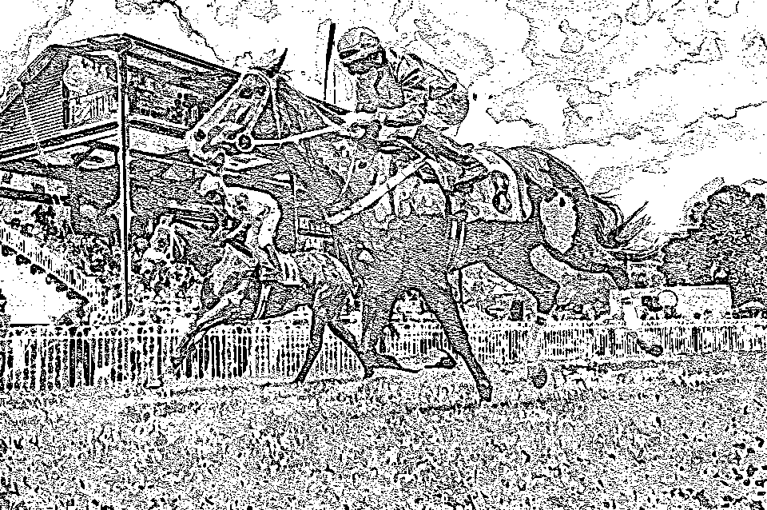

**木星行进白羊座的全周期**

**从全周期的角度，来看看木星入白羊座一年来的关键节点：**

*   **2022 年 5 月 11 日，木星进入白羊座**

    **幻觉的面纱被揭开，从梦中惊醒**

*   **2022 年 5 月 29 日，木火合相白羊座 3 度**

    **火力加猛，猎豹飞跃**

*   **2022 年 7 月 29 日，木星在白羊座 8 度开始逆行**

    **放缓微调，转向内在的扩展**

*   **2022 年 10 月 28 日，木星移回双鱼座**

    **回顾木星双鱼座未完成的功课**

*   **2022 年 11 月 24 日，木星在双鱼座 28 度顺行**

    **内在功课结束，向外显化**

*   **2022 年 12 月 20 日，木星再次进入白羊座，在白羊座停留至 2023 年 5 月 17 日**

**在最后将近五个月的阶段，又分几个时期：**

**1**

火星“暴力”阴影强化期

**2022 年 10 月 30 日到 2023 年 1 月 13 日，火星将在双子座逆行。**火逆会将火星的能量向内引导，性欲和野心会挣扎。强化的冲动和无法识别的愤怒，会导致事故、争执和伤害。

火星是月亮南交点天蝎座的守护星，同时也是白羊座木星的定位星。**当 12 月 20 日，木星再度进入好战的白羊座时，白羊座的阴影会因为火星逆行被深化加强。**

可以说，2022 年底到 2023 年初的三周内，个人层面特别要防范摩擦对抗与自然灾害，国际层面某些国家可能会出现暴力抗议，甚至局部战役。

**2**

火星“先锋”能量激发期

**木星在白羊座的周期后端，将与土星进入双鱼座、冥王星进入水瓶座重叠。**

2023 年 3 月 7 日，当土星来到双鱼座，将进一步带来旧秩序、旧结构的瓦解，让更多人看穿谎言。这会带来巨大的幻灭和悲伤，也会为木星白羊在各方面所做的创新与改变提供支持。

2023 年 3 月 23 日，冥王星进入水瓶座，垄断的国家与政府、大机构将不再“负责”和拥有所有的权力，人民会拥有更多自下而上的权力——以一种服务于全人类最大利益的方式来表达个人真理的力量。

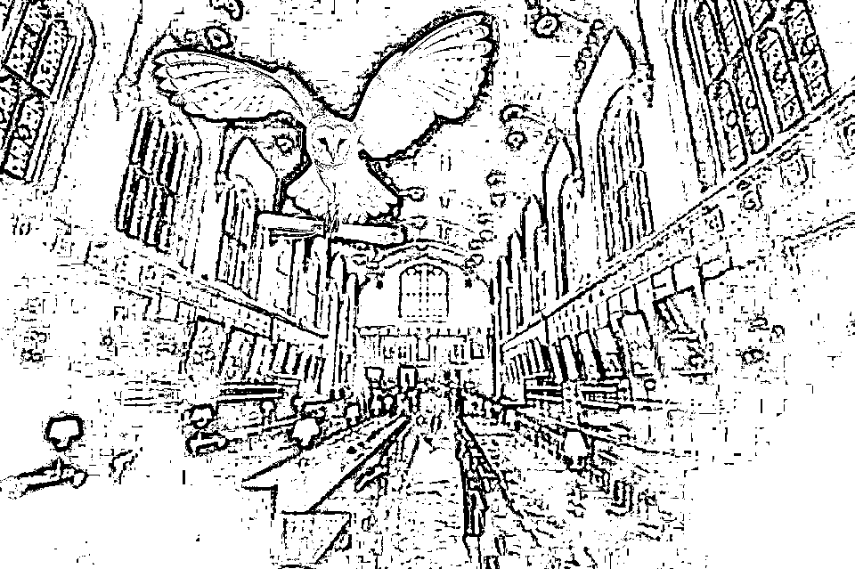

**结语**

2022 年会是最艰难的一年：国际旧秩序倒塌、去伪存真、人们被苦难唤醒……在战争、灾难、限制、动荡、不去定中, 也孕育了开拓、创新与竞争。2023 年能量会变得缓和，土星与冥王星的相继换座，也会带来新的希望与时局的转变。

**木星行进在白羊座的前半段（2022.5 到 2023.1），社会面的恐惧和焦虑不会减少。因此，任何能抚慰心灵并帮助你集中注意力的东西都值得一试。从小事做起，来缓解环境和自己内在的压力：**

*   **作为“和平大使”去协调周围人之间的摩擦与闹剧；**

*   **多一些身体上的锻炼，来摆脱任何强烈或暴躁的能量；**

*   **用音乐、香薰、绿植、冥想打造一个和谐的工作生活空间……**

*   **如果必须成为一名战士，那么请成为一个“爱的战士”。**

**当我们进入在木星白羊周期的后半段时（2023.2-2023.5），重塑生活并充满信心地向前迈进的信念，将会变得强烈。**

但我们要蒙起眼睛等待悲惨的 2022 年过去吗？

**不，从木星进入白羊座开始，就要努力活在“现在”，迅速抓住机遇，去相信“生活是自己创造的”。不要等待机会砸到自己的头上，年轻一代应该走在时代的前列，甚至去主动引领积极的改变。**

最后，愿大家借着木星入白羊座的勇气与冲劲，都能在接下去的一年里，找到冥王星行进水瓶座的 20 年，自己可以牢牢站立的位置。

**版权声明**：原创文章由作者授权首发于若道平台发布，欢迎转发，反对抄袭。

****

**Justine**

ISAR 国际认证占星师（2014 年获得）/塔罗师

毕业于浙江大学，十年跨国企业 HR 经验

咨询时长超过 1500 个小时

**咨询微信**：Justine_JT

**公众号**：星光体

长按打赏

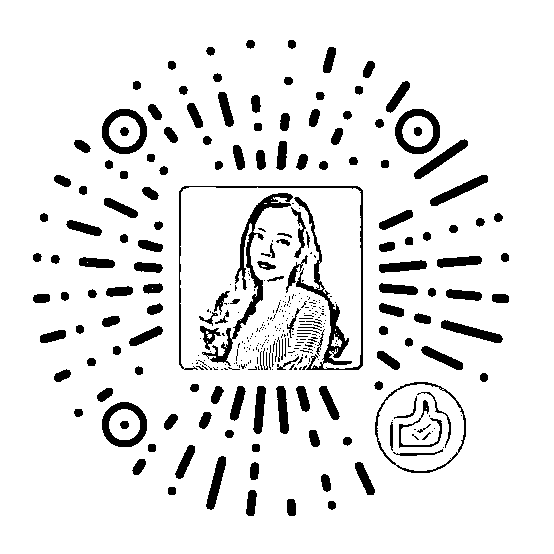

**20 位来自世界各地的占星师****带来 19 场沙龙——新世界的觉醒****详情可点击下图**

**学习占星学****点击下图了解课程详情**

**

**微信又双叒叕改版啦，不想错过若道君的推送？**
**就把若道设为星标吧！****▼**

**喜欢记得点一下在看哦☟**

**报名直达入口**

# 重磅天象丨注意！2022 年第二场水逆来了！

> 原文：[`mp.weixin.qq.com/s?__biz=MzA5NjA0NTAxNg==&mid=2651473498&idx=1&sn=9b4e04a22afdfe804563e19c444fb4fb&chksm=8b48f4edbc3f7dfbc42ea66f5088fb7b590dc3d61f078e73584fc7f7895fbf49726e35c5456a&scene=126&sessionid=1692737817#rd`](http://mp.weixin.qq.com/s?__biz=MzA5NjA0NTAxNg==&mid=2651473498&idx=1&sn=9b4e04a22afdfe804563e19c444fb4fb&chksm=8b48f4edbc3f7dfbc42ea66f5088fb7b590dc3d61f078e73584fc7f7895fbf49726e35c5456a&scene=126&sessionid=1692737817#rd)

******☆ **后台回复“今日”，给你一句生命态度****

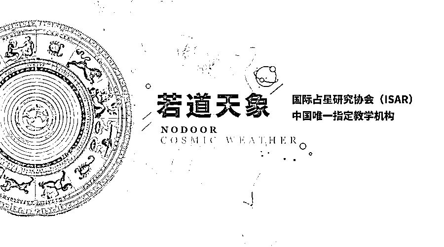

作者/Anastasia

编辑/翀子 封面/书君 图片/网络

北京时间 5 月 10 日 19:41，2022 年的第二次水星逆行华丽登场。此次水星从双子座逆行回到金牛座，意味着我们的所思所想最终要落到现实层面上的执行，需要将自己的思维和实用的智慧联系在一起，同时思考与安全感和自我价值相关的问题。

**水星在双子座逆行**

5 月 10 号，水星又要逆行了。**这次水星逆行从 5 月 10 号开始，持续到 6 月 3 日结束，一共 24 天。逆行从双子座 4 度开始，5 月 23 日逆行换座回到金牛座，最后在金牛座 26 度结束。逆行区间跨风土两个元素共 8 度。**

**有个人行星和轴点落在这个区间，以及生日在 2 月 16-23 日，5 月 18-26 日，8 月 20-28 日，11 月 19-27 日的人群将是本次水逆的重灾区，**一定要对水星的各种消极影响，诸如文档丢失、电器失灵、交通意外、社交误会等现象保持觉知，提前做好备用方案，尽可能缓和水逆带来的混乱状态。

**完整的水逆周期要从 4 月 27 号水星进入逆行前阴影期开始算起，到 6 月 19 号水星顺行后彻底离开后阴影期结束，整个水逆过程持续将近两个月。**如果有重大思想决策，重要合同签署或者大件电子产品的消费，建议避开这段时间。

疫情也是我们无法回避的生活主题。在医疗占星中，水星对应肺和呼吸系统，掌管气体的交换。这就是新冠病毒的战场。所以每逢水逆，疫情都会出现反复。回顾这两年，每次水逆都会带来一波疫情的扩散。并且，当水星状态不好的时候，也是疫情反复爆发的时候。

今年三月，水星进入弱势的双鱼座，并且陆续合相双鱼座的群星，又叠加了木海合相在双鱼座，海王星在双鱼座与疫情直接相关，木星负责扩散。这次疫情来势汹汹。持续时间长，扩散地方广，每个人都不要掉以轻心。

土星的秩序和纪律是对抗木海双鱼带来的无序的解药。土星的崩坏会导致彻底的混乱。**做好土星的功课，**做好个人防护，遵守防疫制度，不聚集，不乱跑，才能快速地控制疫情，才能尽快恢复有序的生活和生产，将疫情造成的伤害降至最低。

**水逆期间的注意事项**

**本次水逆从风象星座开始，到土象星座结束，这意味着我们的所思所想最终要落到现实层面上的执行。停留在头脑中的想法毕竟只是抽象的思维，并不是具体的现实。**

这就好像当一个人饿着肚子的时候，你讲再多的道理也无济于事，道理既解决不了空腹带来的肠胃抽搐，也无法安抚饥饿带来的愤怒和疯狂。人只有在吃饱喝足之后，才会理性地思考接下来做什么。仓廪实才能知礼仪。

现实层面的问题解决不了，懂再多的道理也没用，不行动意味着什么也落实不了，更谈不上改变和进化。道理只有经过多年的实践和经历之后，才能彻底转化为自己的经验。**知行合一需要持之以恒的刻苦练习，才能化为真正属于我们的能力。**

**水逆期间，我们需要更多地练习将自己的思维和实用的智慧联系在一起，好好思考与安全感和自我价值相关的问题。**对于新的想法和理论，需要时间来消化，不急于做决定。一旦做出决定，就轻易不会改变。目前，北交点和天王星都在金牛座，**一些突发事件、陌生状况的发生将有助于我们打开自己的眼界，改变原有的思考模式。**

**水逆期间的重要天象**

水星开始逆行后的第二天，**5 月 11 日，木星换座进入白羊座。火星于 5 月 25 日换座白羊座，木星与火星将在 5 月 29 日合相。**群星来到白羊座，这对于 4 月 12 日木海合相双鱼座，以及 5 月 18 日的火海合相双鱼座带来的混乱、无力、无序将是一个修正。有时，矫枉需过正。随后，水星恢复顺行，秩序逐渐回归。

**5 月 28 日，金星离开白羊座进入金牛座，来到了自己守护的星座，能量回归，充满力量。**作为三颗定位星之一，金星定位了太阳、水星、冥王星、土星、天王星，定位了最长的那条星链，极大稳定了定位木星的火星，以及只定位自己的海王星的能量。非常有利于缓和局势，安定生活。

冥王星已于 4 月 30 日开始为期半年的逆行。**水星逆行进入金牛座之后，将在 5 月 26 日三分摩羯座 28 度的冥王星；恢复顺行后，将于 6 月 11 日再次三分冥王星。**对于逆行的水星能量来说，三分逆行中的冥王星，会**更****加深化我们的思考和反省。**只有深刻了解自己的弱点，才能更加包容他人的缺陷。人无完人，止于至善。

尤其是这个三分相发生在土象星座。土元素意味着问题变得具体可见。我们所有的努力和错误都会制造出具体的后果，被我们看到。土元素的现实层面，具体就是指钱、价值、资源、工作、服务、事业等等。**水逆期间非常适合停下来想明白这些现实问题。**

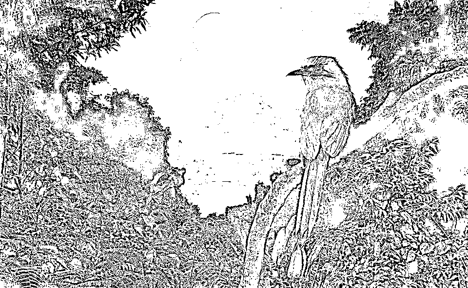

**水星逆行对个人生活的影响**

下面我们来看一下本次水逆对于个人的影响。**水逆的区间是双子座 4 度到金牛座 26 度，查看这个度数区间在出生星图上的宫位，这个宫位对应的生活面向，就是水逆期间我们需要关注的主要议题，以及适宜采取的行动领域。**

**若道君：****你可以在 app store 或者应用商店搜索“若道”下载 app，输入个人档案，查看行运盘（也可以使用其他星图软件），找到行运水星落在出生星图的第几宫，然后对照下文查看水星逆行的影响。**

**例如下图中，行运水星在比尔·盖茨个人星图的第 11 宫，它将从 11 宫逆行到 10 宫的金牛座 26°。**

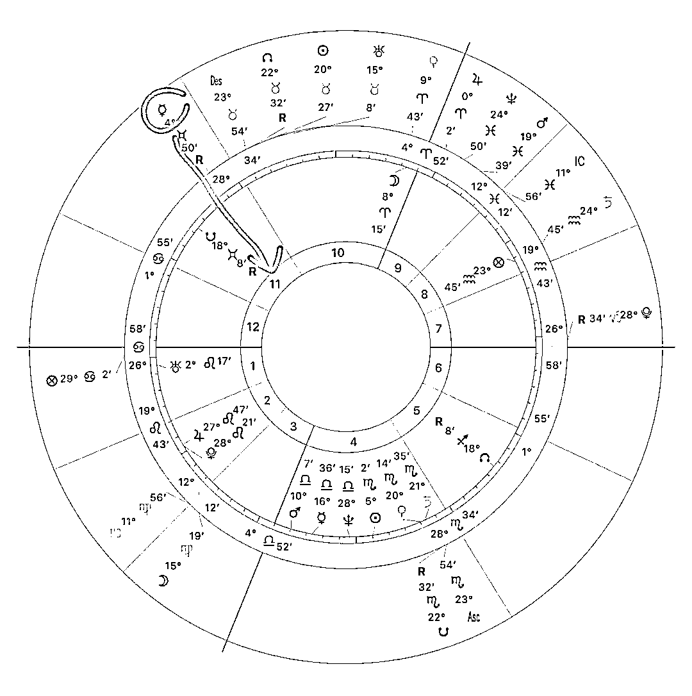

**第一宫****是我们面对世界的窗口，**也是我们生命中的重要生活课题所在，关于我是谁，我要做什么的大哉问。水星在这里逆行，提醒我们需要关注自己的身体健康以及过往待人处事的原则是否需要改变和调整。

**第二宫****的关键词是金钱收入和资源以及自我价值。**水星在这里逆行，提醒我们关注那些与个人钱财、自我价值产生互动的领域。我们为了赚钱、为了获得自我价值感，而采取的行为是否合适，方向是否正确，是否可以做一些调整和改变。

**第三宫****的关键词是兄弟姐妹、亲朋好友、短程旅行、沟通学习等，**水星在三宫逆行，意味着我们要去关注那些与沟通、学习相关的生活课题，进行深入的思考，并且做出适当的调整和改变。也会产生一些新的学习兴趣和想法。

**第四宫****的关键词是父母、原生家庭、房子住所、童年、安全感等等。**水星在这里逆行，提示我们思考、关注与个人家庭生活产生互动的领域。我们怎么理解归属感和安全感，是否有需要改变和调整的地方。和家人的沟通也要保持真诚和开放，避免误解。

**第五宫****的关键词是恋爱、才艺、娱乐、投机和孩子等，是我们个人才华、浪漫爱情产生的领域。**水星在这里逆行，提醒我们关注自我创造力和想要去创作的生活主题，发现创新视角，改变惯有的思维模式。

**第六宫****的关键词是日常生活和工作的结构，个人健康、工作和服务特质等，这里是我们与工作产生互动的领域。**水星在这里逆行，提醒我们注意工作和生活之间的关系，重新调整生活结构，并且思考服务他人的主题。

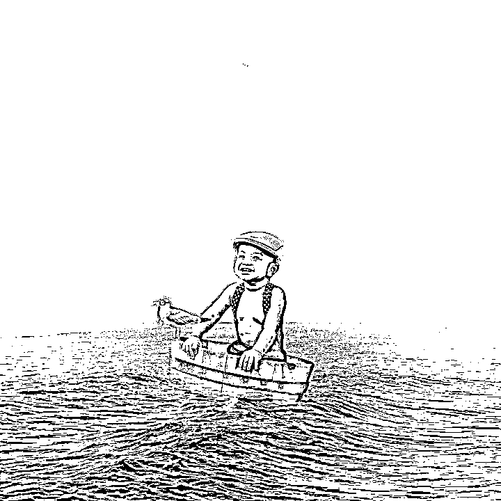

**第七宫****的关键词是重要的一对一关系、婚姻和敌对状况等，**这里是我们与他人合作、产生互动的生活领域。水星在这里逆行，提示我们关注个人在关系中想要去挑战的生活主题，谨慎地给予和接受，适当做出调整和改变，关系才会更加深入。

**第八宫****的关键词是资源、死亡、性、秘密、神秘学等禁忌性的主题，**水星在这里逆行，提示我们关注和思考生活中由上述关键词主题引发的事件，尤其是个人密切关注，并且想要去暗中从事的事项可能会遭遇困难和麻烦，对此要学会保持一个开放的态度。

**第九宫****的关键词是异国文化、长途旅行、高等教育和道德信仰等**，水星在这里逆行，提示我们想要去深入体验、探索和学习、交流相关的生活主题。也许会产生学习一些新课程、探索一些新方向的念头，重新思考人生意义。

**第十宫****是出生星图上的最高点，关键词是事业、名声、地位和权力等。**水星在这里逆行，会给我们的工作带来一些麻烦和混乱，提醒我们放慢工作脚步，并且推动我们去思考，目前个人所想要去达成的目标是否合适。

**第十一宫****的关键词是团体生活、志同道合的朋友、希望和愿景、人道主义活动等等，**水星在这里逆行，会给我们的社交圈带来一些改变，可能会发生一些误会和意外。而对此的思考会帮助我们重新认识和确认我们想要做的事情。

第十二宫**的关键词是逃避、梦想、灵性、家族课题和业力等等，**水星在这里逆行会带来一些混乱，这提示我们安静下来，从现实生活中的忙碌回归自己的内心。这有助于我们发现隐秘的敌人，修复伤痛，获得身心健康。

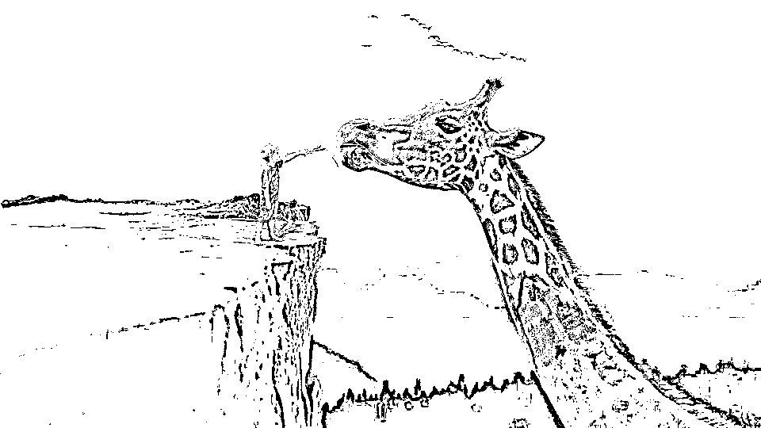

**结语**

2021 年，我们经历了三次水逆，分别是一月的水瓶座水逆、五月的双子座水逆和年末的天秤座水逆，全都在风象星座，更多是在思维和精神层面上的运作。**今年水逆的主题换到了风象和土象元素。这意味着头脑和身体，思维和现实的联系将更加紧密。**

**今年我们一共要经历四次水逆。**第一次水逆从 1 月 14 日持续到 2 月 4 号，从水瓶座 10 度开始逆行，在摩羯座 24 度恢复顺行。本次水逆是第二次。第三次水逆发生在 9 月 10 日，水星在天秤座 8 度开始逆行，9 月 23 日逆行回到处女座，10 月 2 日在处女座 24 度恢复顺行**。这三次水逆都是从风象星座逆回土象星座，在土象星座恢复顺行。**

**第四次水逆将在岁末，**12 月 29 日水星在摩羯座 24 度开始逆行，2023 年 1 月 18 日在摩羯座 8 度恢复顺行。拉开了水星在土象星座逆行的序幕，进入更基础的实践时期，聚焦当下，享受现实生活。从头脑到现实，层层反复推进。这就是后话了。

**版权声明：**原创文章由作者授权首发于若道平台，欢迎转发，反对抄袭。友号转载请申请白名单。

**Anastasia**

职业占星师/专栏作者/策展人

于 2015 年通过 ISAR 占星能力考试

若道认证生时校正资质（2015 年获得）

**微信公众号**：KairosMoment

长按打赏

**今晚 8 点**

**将由核心课 L3 的同学们带来天王星组的分享**

**关注若道视频号即可预约**

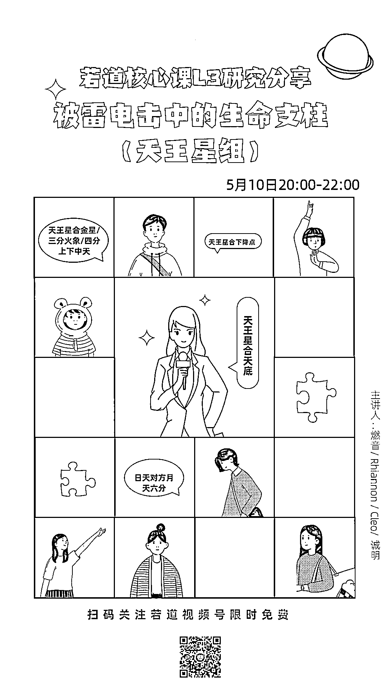

**20 位来自世界各地的占星师****带来 19 场沙龙——新世界的觉醒****详情可点击下图**

**学习占星学****点击下图了解课程详情**

**

**微信又双叒叕改版啦，不想错过若道君的推送？**

**就把若道设为星标吧！**

**▼**

**喜欢记得点一下在看哦☟**

**报名直达入口**

# 卜卦占星案例丨考试能成功“上岸”吗？快看看行星是否被太阳灼伤！

> 原文：[`mp.weixin.qq.com/s?__biz=MzA5NjA0NTAxNg==&mid=2651473498&idx=2&sn=cd1de5c018db2c4eb595698aaa1925eb&chksm=8b48f4edbc3f7dfb8a782fc5287971c51e24a08118f810484bae496067e3bccc64538bb6ef23&scene=126&sessionid=1692737817#rd`](http://mp.weixin.qq.com/s?__biz=MzA5NjA0NTAxNg==&mid=2651473498&idx=2&sn=cd1de5c018db2c4eb595698aaa1925eb&chksm=8b48f4edbc3f7dfb8a782fc5287971c51e24a08118f810484bae496067e3bccc64538bb6ef23&scene=126&sessionid=1692737817#rd)

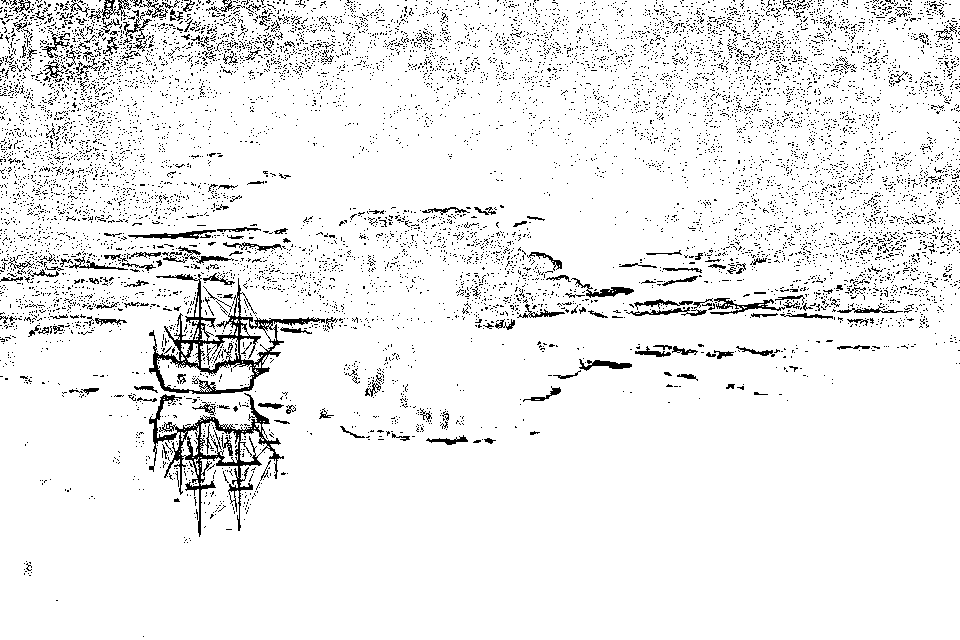

作者/王嘉祺

编辑/翀子 图片/网络

前两次的[【案例分析 1】](http://mp.weixin.qq.com/s?__biz=MzA5NjA0NTAxNg==&mid=2651472954&idx=2&sn=425d81db9f4d19190ba319b2b9a2daee&chksm=8b48f68dbc3f7f9b480a21d9dc0a9efb77175c7bd594a7b8b221f501d71fd772e5c2451c86d5&scene=21#wechat_redirect)[【案例分析 2】](http://mp.weixin.qq.com/s?__biz=MzA5NjA0NTAxNg==&mid=2651473218&idx=1&sn=cc51f08b052d17e34bc55013f6ddb86e&chksm=8b48f7f5bc3f7ee3ddd2c1eda5a833f9dba0ca804d46fc702bdbeac7686a80ff04985125f0e0&scene=21#wechat_redirect)，给大家展示了卜卦占星学如何在具体生活中运用。今天继续给大家带来两个关于升学的真实案例，我们会关注卜卦星图上行星处于“灼烧”状态的情况。如果你看完文章很感兴趣，可以点击[【现代卜卦占星学】](http://mp.weixin.qq.com/s?__biz=MjM5MjQwNjAyMQ==&mid=2649439478&idx=3&sn=6fa8089d479e275d5b3ba2f0eefb0684&chksm=beb9539c89ceda8a0e4a66570d97c4f7de380631acfda43ef38216f992a26d56a25f42438e61&scene=21#wechat_redirect)了解详情哦。

大家好，我是 Conrad 卜卦课程的助教。上一篇文章给大家介绍了土星在第 7 宫是否还能进行有效的卜卦咨询。**今天我们继续来讲两则卜卦的真实案例。**希望大家能在听卜卦故事的同时，开动脑筋并寓教于乐，头脑动起来才能找到属于自己的解谜乐趣。

本次主要阐述两个关于升学考试的例子，同时也可以观察一下**行星处于“灼伤”状态的情况。**

**案例一：考研**

这个卜卦仍然是童老师的同学提供的。同学的妻子在 2021 年问，考研是否能成功。**这张卜卦星图的上升星座是天秤座，代表提问者的行星就是金星。巧合的是，金星恰好落在下降点。合相轴点的行星，总是需要多多注意的。**

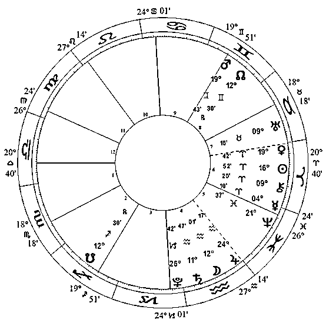

代表提问者的金星落在白羊座，是失势的位置。这个位置表示了提问者因为某些不利的状况，而很可能在寻求伴侣的帮助。而代表伴侣的火星，恰好与金星有一个完美到只差一毫的六分相。如果大家在之前的卜卦直播中，听过这对夫妻在结婚之前的卜卦案例的话，就知道他们非常的恩爱，一定会彼此支持。

读研究生属于高等教育，所以归第 9 宫掌管。火星已经合相了第 9 宫的宫头线。其实如果换成 Koch 分宫制的话，火星已经在第 9 宫内了。但即便如此，按照五度原则，火星与第 9 宫是有非常紧密的关系的。

火星落在双子座，代表丈夫在学业上努力帮助妻子，可能是帮助复习，也可能是帮助找寻关系。只是火星与海王星有一个紧密的四分相，而海王星一直处在双鱼座属于极为有力的位置。所以这明显削弱了火星的力量，火星的帮助可能起不到关键作用。

那么本身掌管第 9 宫的水星是什么情况呢？水星也落在白羊座，不过与金星相距甚远。但不利的是，**水星与金星都处在“日光”下，并且金星距离太阳非常近，属于被“灼伤”。**

**所谓被太阳灼伤，就是太阳的光芒太大了，掩盖了本来的自我。**当人被光线照射得刺眼时，会停下原本的动作，不自觉的用手挡住阳光。**行星的被灼伤是类似的，在太阳的干扰之下，比较难执行原本的目的。**

本身的无力加之被灼伤可谓是双重打击。所以我们可以判断，当事人对于考研的意志可能是不那么坚定的，会受到一些其他事情的动摇。而其自身，很可能也没有太多的信心来通过考研的考试。

我们看看次要征象星月亮的状况。月亮与土星有一个紧密的合相，虽然已经是出相位的状态，但是彼此只有半度的距离，说明本人感觉考研对于自己还是比较艰难的，虽然可能随着自己的复习和准备，在逐渐减轻心理负担，但完全摆脱土星的影响恐怕还需要很长时间。

同样的，月亮距离象征高等教育的木星也有不小的距离，还形不成合相，所以考研的事情似乎时机尚不成熟。

**由于这是去年的卜卦案例，所以我们已经有了一个较为明确的结果。**当事人夫妇后来在准备生娃，目前已经怀孕很长时间了。我们这里也可以看到土星作为第 5 宫的宫主星，与大多数行星都能形成主要相位，并且也是紧密合相月亮落于第 4 宫的行星，所以最终是生育的事情延缓了一切。

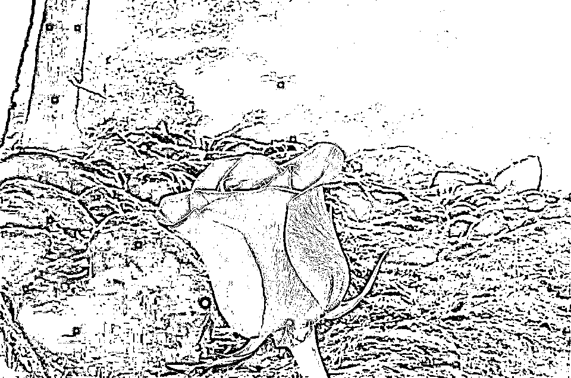

**案例二：中考**

第二个案例来自一位妈妈，问自己的孩子中考的情况。目前距离中考还有一个多月的时间，不过卜卦也是在去年就询问的。可以看出当家长的比较容易操心着急。**我们也能再次看到与上升点合相的冥王星。**

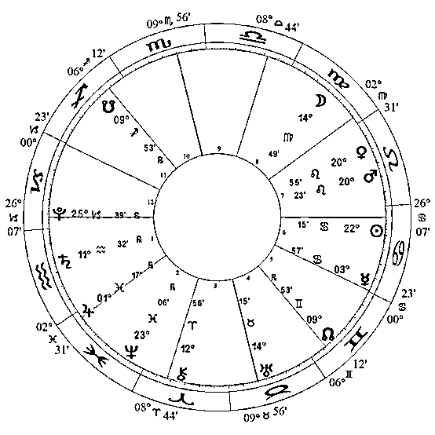

**需要注意的是，这个卜卦问题并不是孩子提问的，而是家长来提问的。**所以这个冥王星所代表的压力与恐惧，**指向的都是家长一方。**孩子考学的问题，通常都是父母非常头疼，但又并不容易掌控的事情。

作为代表提问者的土星位于第 1 宫水瓶座，是非常强势有力量的位置，并且也非常的主观。上升在摩羯座以及土星落于第 1 宫的状况，也代表了家长的权威性。土星在这里与天王星有一个四分相，据家长说，孩子的中考正面临新的考试政策，所以格外的担心忧虑。全新的政策也正好对应了天王星与水瓶座。

不过既然是孩子的中考，**我们还是要观察第 5 宫主星的状况，在这个案例中是水星。**水星位于巨蟹座，确实一个令家人关切的落点。水星目前与木星有一个三分相，是出相位的状态。据说，孩子确实在之前主动提出找寻一对一的学习辅导。而木星正好与水星是成对行星。

**由于进行的是中考，所以这里面我们观察第 3 宫的状况，**而不是第 9 宫，因为到高中仍然是中学，还不是高等教育的范畴。这里面我想有生理上的成熟，以及心智上成熟的双重意义，来界定是属于第 3 宫的教育还是第 9 宫的。

第 3 宫的守护星是火星，目前与水星没有任何主要相位的联系。不过中考距离提问时间还有一年多，而水星和火星都是内行星，行进快速。当水星与火星能够形成合相的时候，正好处于处女座，也就是水星强势的位置。

并且与第一个案例不同的是，不论是当前星图中，还是未来水火合相的位置，**都没有在被太阳“灼伤”。**说明在远期的考试时，对孩子还是相对有利的。只是需要持续的复习和努力，毕竟处女座是一个讲究真实力，掌握过硬水平的星座。

相似的，次要征象星月亮恰好也在处女座，并且与天王星有非常紧密的三分相。这说明家长和孩子一直都在重视考试新政策，并积极地加以应对。所以总得来讲，虽然目前看起来状况一般，但是一年的时间上升空间还是很大的。持续努力的话，结果一定随人愿。

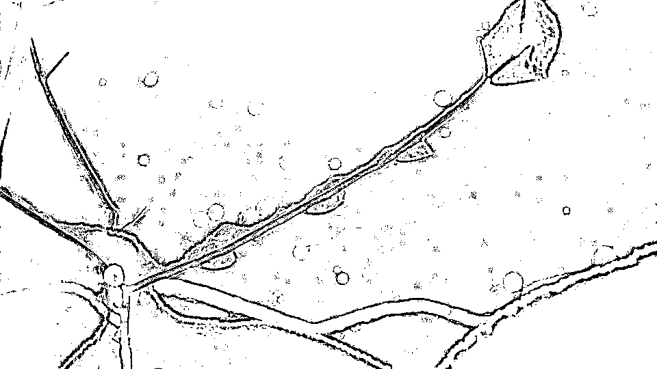

**结语**

我们今天给大家带来了两个关于学业的案例，并且正好观察到了距离太阳很近，但是一个被“灼伤”，另一个没有的案例之间的区别。**在被太阳影响的情况下，当事人会受到较为明显的影响，从而动摇信心。在这种情况下，如果自己立场不坚定，确实不容易达成目标。**

如果您对现代动态卜卦占星的技巧感兴趣，欢迎您关注一下我们的课程。

今天的案例介绍就到这里，我们下次见！

**快来看若道君为你准备的课程吧！**

**现代卜卦占星课程内容**

**课程分为 5 部分：**

**Part1 **融合现代占星理念，整合动态占星知识**Part2**独家【现代动态卜卦占星技术】全面教学**Part3**学以致用，覆盖人生各个领域问题的卜卦解法**Part4**扩展延伸择时占星技法的新认知**Part5**如何运用卜卦占星学做一场转化性的咨询

**15 节录播课+8 节直播课线上网络课，英文授课，中文翻译。**

**15 节录播课为 2020 年动态现代卜卦课程的内容。8 节直播课则完全是案例教学的形式。**

这样的好处是，你可以通过 1 个半月的密集学习之内按照自己的进度学完录播课的理论和录播课中已有的案例，从学习开始就实践，然后把实践中遇到的问题拿到 8 节直播课中，和老师互动。

**在 8 节直播课中，老师也会用案例教学、和同学互动的方式帮助大家进一步掌握卜卦占星的技法。**

**授课老师**

**艾德里安·罗斯·邓肯****（Adrian Ross Duncan）**1971 年在印度游学时开始学习占星学，1985 年开始成为全职占星师，**迄今执业已超过 33 年，是人本主义占星学、卜卦占星学和经世占星学领域的知名占星师。他还开发了占星软件 AstroClock 和多款占星报告。**他在日常咨询中都会运用卜卦，咨询图（卜卦的一种运用方式，即根据客户来访时间制作星图，从星图中获得大量信息）也是他**特别擅长的领域**。艾德里安·罗斯·邓肯从 1971 年开始研习佛学，受佛学影响很深，他**相信占星学和佛学观点统一、转化的一个基础是在于对现实感知的改变**。而卜卦很容易与佛教融合，因为它只关乎当下。

**授课时间**

**付费后一天即可开始看录播课程，全程有助教老师回答问题。**

**直播课程开始时间：**

2022 年 5 月 3 日，每周二 20:00-22:00

**这次课程恰逢世界在巨大的变动和不确定之中，期待这门课程能够给各位及各位的客户带来新的洞见和方向。**

**在这次 8 次直播课程中，我们将采用案例教学的方式，所有参课同学均有机会提供案例，供老师解读，且我们将组织群体的练习，用大量案例帮你掌握卜卦及如何在咨询中用卜卦。**

**什么人适合参加本课程？**

*   想要系统学习现代动态卜卦占星的学员

*   想在生活中熟练使用现代卜卦占星学

*   在咨询中想帮助个案更清晰的分析解读困惑

*   想参加 ISAR 认证考试，此课程是 ISAR 选修课

*   希望通过卜卦占星帮助自己和身边人挖掘一个积极主动的未来

学习整合卜卦技巧，不仅有益于想钻研卜卦占星学这个分支的同学，对占星初学者也很有有帮助，可以让你的占星技巧加倍。

**课程费用**

**课程价格：9900 元**

**老学员复训专享价：**

**2020 年参加艾德里安·罗斯·邓肯卜卦占星课程的同学：****2900 元**

**2018 年参加艾德里安·罗斯·邓肯卜卦占星课程的同学：****4900 元**

**特别优惠****：**

**分享课宣到朋友圈****保留 48 小时****（不设分组显示）截图给课程顾问可获得****400 元优惠****。**

**课程负责人：童老师（微信：nodoorDaivd），请备注“卜卦”**

长按二维码添加课程负责人咨询

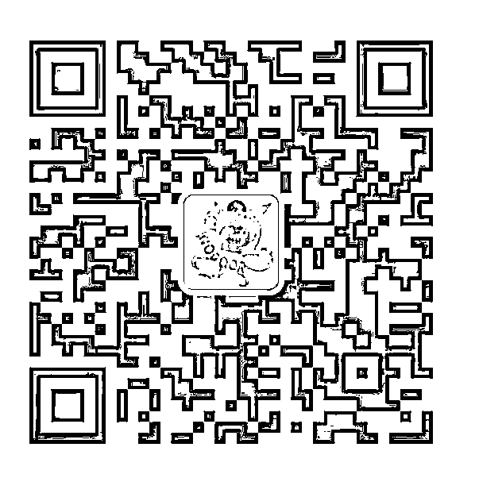

**退转课程****退款原则请详看《教学协议》，如有疑问请咨询课程顾问。******现代动态卜卦占星实战课·ISAR 选修课****

**授课老师：艾德里安·罗斯·邓肯**

**授课时间：**2022 年 5 月 3 日

**授课方式：**网络课程，英文授课，中文翻译

**费用：9900 元；****2020 年老学员复训价：2900 元；2018 老学员复训价：4900 元；特别优惠，分享课宣到朋友圈保留 48 小时（不设分组显示）截图给课程顾问可再获得 400 元优惠。**

**课程负责人：**童老师（微信：nodoorDaivd），请备注“卜卦”

长按二维码添加课程负责人咨询

****报名请点击“阅读原文”****

# 插班中！丨现代动态卜卦占星实战课，4 个月掌握卜卦技法

> 原文：[`mp.weixin.qq.com/s?__biz=MzA5NjA0NTAxNg==&mid=2651473498&idx=3&sn=c8f150d63a603d09885a38324d4080d0&chksm=8b48f4edbc3f7dfb21908f40f13b02cebdea3fe38eb874a10ce1ab2778cfbb82260d9405005e&scene=126&sessionid=1692737817#rd`](http://mp.weixin.qq.com/s?__biz=MzA5NjA0NTAxNg==&mid=2651473498&idx=3&sn=c8f150d63a603d09885a38324d4080d0&chksm=8b48f4edbc3f7dfb21908f40f13b02cebdea3fe38eb874a10ce1ab2778cfbb82260d9405005e&scene=126&sessionid=1692737817#rd)

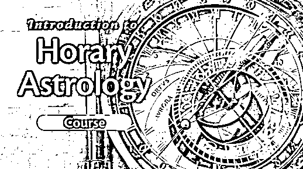

**对现代动态卜卦占星的 7 个问题**

**1****什么是现代动态卜卦占星？**

现代动态卜卦是将有传统历史的卜卦占星和现代人本主义占星的精神结合在一起，**更适合现代社会现实状况**的卜卦占星技法。

**2****卜卦占星的特色是什么？**

**随时随地可用，**帮助你从这个卜卦星图中洞察当下你所期望了解的事情和人的现状、发展趋势、可能发生什么事情、可能的结果，及什么时候会出现什么结果。

**3****动态卜卦占星是什么意思？它重要吗？**

动态卜卦非常重要，因为事物不是静止的，而是变化的。**动态卜卦不仅会让你看到人和事物的状态，还可以让你看到其发展和变化的过程，**会碰到什么事情。

动态卜卦的美妙之处是它不是静止的一个照片，而是**描述一个故事的开始、发展和结局。**

**4****卜卦占星什么情况可以用？**

**万物万事皆可卜。**什么都可以用。1-12 宫所包含的人事百态，事业、健康、金钱投资、商务、旅游、教育、法律、生育、宠物养育等等。

卜卦占星也可以帮助我们去看某个社会事件、国际事件的发展，**可以和经世占星相结合。**

**5****它如何与人本主义占星结合？**

因为从卜卦行星可以看到参与人的**心理状态、心理过程和面临的议题**。而如果当事人愿意去调整自己的内心状态，就不再完全是被动的，而是可以以更积极主动的方式参与到事件中去；或者能够更理解目前的外部环境，选择更安然地调整内心。

**6****卜卦占星可以和人本主义的咨询相结合吗？**

当然。在课程中，老师将会仔细讲如何**把卜卦占星和出生星图及预测技术结合在一起，**给客户提供更好的服务。

**7****如何学好现代卜卦占星？**

**实践，实践，实践。**

占星学是一门必须大量实践的学问。纸上谈兵没有用，只是听课没有用。

实践是一步步来的。你不必知道所有的卜卦技法才开始实践。**从第一节课开始，你就可以进入实践。**

实践刚开始可能只是模仿。**我们有大量的真实案例，也安排了很多作业让大家练习。**也给大家拿自己的案例和老师互动的大量机会。

**授课老师**

**艾德里安·罗斯·邓肯****（Adrian Ross Duncan）**1971 年在印度游学时开始学习占星学，1985 年开始成为全职占星师，**迄今执业已超过 33 年，是人本主义占星学、卜卦占星学和经世占星学领域的知名占星师。他还开发了占星软件 AstroClock 和多款占星报告。**他在日常咨询中都会运用卜卦，咨询图（卜卦的一种运用方式，即根据客户来访时间制作星图，从星图中获得大量信息）也是他**特别擅长的领域**。艾德里安·罗斯·邓肯从 1971 年开始研习佛学，受佛学影响很深，他**相信占星学和佛学观点统一、转化的一个基础是在于对现实感知的改变**。而卜卦很容易与佛教融合，因为它只关乎当下。

| 艾德里安·罗斯·邓肯的占星学著作

作为本次课程的主讲老师，艾德里安·罗斯·邓肯如是说：

卜卦星图不仅给出了当下的能量状态，**它还包含着过去的踪迹，也蕴藏着未来的种子。**它是心理的，也是事件的。一个好的占星咨询是要把过去、现在和未来交织成一个整体。

**卜卦星图告诉客户他们当下在哪儿，他们处于的能量状态是什么，这张星图和他的过去有哪些关联，他可以怎样和这张星图一起合作去挖掘一个积极主动的未来。**这里预测的未来不是强加给他们的，这个未来是一点点揭露给他们看的。

心理占星学和卜卦占星学别无二致，所有的事件都有其心理对应。如果你的意识与世界同步，你就会看到二元统一。

行进和推进帮助我们理解如何抵御外在和内在的风暴。卜卦如同显微镜下的行进。**通过行进难以准确了解一段关系、房屋购买、工作机会等是否有益，但对卜卦来说并不难。卜卦也擅长回答与时间相关的问题，对行进和推进的标志进行微调。**

**课程形式**

**15 节录播课+8 节直播课线上网络课，英文授课，中文翻译。**

**15 节录播课为 2020 年动态现代卜卦课程的内容。8 节直播课则完全是案例教学的形式。**

这样的好处是，你可以通过 1 个半月的密集学习之内按照自己的进度学完录播课的理论和录播课中已有的案例，从学习开始就实践，然后把实践中遇到的问题拿到 8 节直播课中，和老师互动。

**在 8 节直播课中，老师也会用案例教学、和同学互动的方式帮助大家进一步掌握卜卦占星的技法。**

**授课时间**

**付费后一天即可开始看录播课程，全程有助教老师回答问题。**

**直播课程开始时间：**

2022 年 5 月 3 日，每周二 20:00-22:00

**这次课程恰逢世界在巨大的变动和不确定之中，期待这门课程能够给各位及各位的客户带来新的洞见和方向。**

**在这次 8 次直播课程中，我们将采用案例教学的方式，所有参课同学均有机会提供案例，供老师解读，且我们将组织群体的练习，用大量案例帮你掌握卜卦及如何在咨询中用卜卦。**

****

**授课内容**

***Part1***** 融合现代占星理念，整合动态占星知识**

星图如同地图，展示了人们从哪里来，现在在哪里，以及可能的去向是什么。卜卦星图虽然显示的是当下这一刻，但却是在动态当中的。所以过去的运动轨迹对应着过去所发生的，接下来的运动轨迹对应着接下来要发生的。

**在课程中你会学习到：**

*   我们如何从一张卜卦星图看到时间的流动：从过去到未来，故事如何展开

*   心理占星和事件预测如何在卜卦占星中有机结合起来

*   卜卦星图如何回答是否的问题

*   如何用卜卦星图回答分析性和指导性的问题

*   现代动态占星中事件发展的顺序：

*   确定咨询图中强调的当前事件

*   将客户与相位或行星组合相关的情感能量关联起来

*   在早期经历中找出相似的情景

*   认识到过去和现在的情感完全相同

*   辨识出过去做出的所有限制性决定

*   通过头脑风暴找出更能带来力量的方法来解决相同类型的问题

*   在想象和现实生活中重演当前和未来的事件

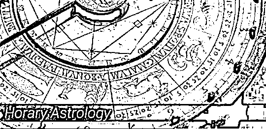

***Part2 *****独家【现代动态卜卦占星技术】全面教学**

哥本哈根占星学院院长艾德里安·罗斯·邓肯 Ardian Duncan 老师 50 年卜卦占星经验倾囊相授，内容包括但不限于：

**1.卜卦中的行星**

*   行星强弱及力量

*   太、月、水、金、火、木、土在庙旺落陷时的意思

*   卜卦星图中的月亮及其在 12 宫的意义

*   卜卦星图中的外行星

*   卜卦星图中的恒星

*   上升点和指征星的度数

**2.如何选择和辨识征象星**

*   当问题出现时，如何判断征象星

*   如果两个人或物由同样的征象星指代该怎么办

**3.卜卦图中的相位**

*   不同相位的意义

*   征象星之间相位的意义

*   征象星与其他行星相位的意义

**4.卜卦中的宫位**

*   12 宫位和宫位系统

*   对宫位的动态观察

*   宫主星及其互动

*   互容和定位星

**5.卜卦中的星座**

**6.传统卜卦原则（约束和限制条件条件）及其在现代动态卜卦中的应用**

**7.空亡、光线传递、完成、围困、燃烧之路等**

**8.星图中的逆行及其讲述的故事**

*   水星和计划

*   金星与依恋

*   火星与斗争

*   外行星逆行

**9.应期与时机**

*   1 度是代表多久

*   宫位的重要性

*   行星速度和逆行

*   如何综合卜卦和行进、次限分析时间问题

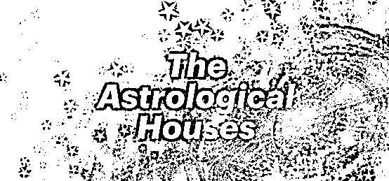

***Part3*****  学以致用，覆盖人生各个领域问题的卜卦解法**

希望将现代卜卦占星学的精髓传达出来，精细地讲解每一宫所代表的卜卦事物，分主题详解不同类型问题的卜卦解读思路，内容包括但不限于：

**1.爱情和关系**

*   金星的重要性

*   第一宫和第七宫以及其中的行星

*   成对行星

*   上升点、下降点及其守护星

**2.业务和工作**

*   第十宫和第六宫以及其中的行星

*   木星和土星及其相位

*   火星和水星

*   行进和中天

**3.资金和资源**

*   第二宫和第八宫以及其中的行星

*   第五宫和第十一宫

*   金星、木星和土星

*   四元素的意义

**4.家庭和大家庭**

*   第四宫和第十宫及其守护星

*   第五宫、十一宫及其守护者

*   第五宫和第十一宫的行星

*   月亮

**5.社会、法律、智性、健康、存在主义的问题**

*   第九宫和第十二宫及其中的行星

*   木星和第九宫守护星

*   第三宫 、第十一宫、第六宫和第八宫

**6.如何解读事件星图**

*   从新闻学习卜卦盘

*   如何从卜卦盘看新闻事件和世界大事的发展变化

*   我们如何去培养自己观察有预兆意义的信息、从日常事件中捕捉启迪

*   占星解读的意义

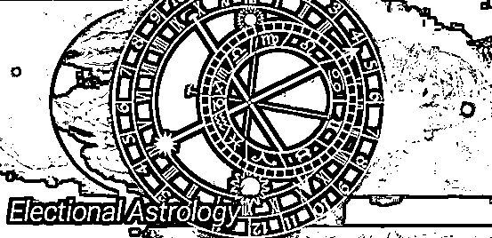

***Part4 ***** 扩展延伸择时占星技法的新认知**

在择时的时候，我们会选取征象星处于有力的时候，来规划我们的事件；避免征象星不力的时候，尤其当这个征象星代表我们自己。

**择时星图一瞥**

*   择时的艺术

*   如何在不完美的天象下取得最佳结果

*   如何做出深思熟虑的回答

*   如何为约会择时

*   如何为婚礼择时

*   如何为商业活动择时

*   如何为旅行择时

*   如何为对抗事情择时

*   虚拟和实时会议的择时

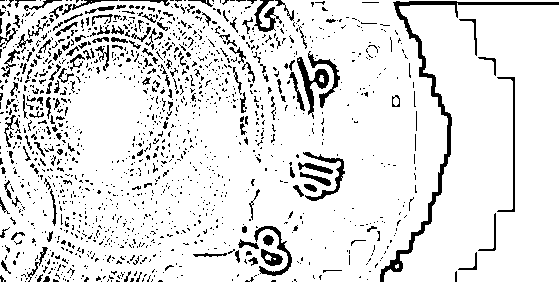

***Part5  *****如何运用卜卦占星学做一场转化性的咨询**

虽然卜卦的结果可能是不利的，但我们仍然可以从心理占星学的角度给出一些积极建议，帮助客户建立信心，有助于应对之后的人生。客户出生星图与卜卦星图的关联，这在咨询中对于心理方面的考量是非常重要的。

*   一个好的咨询有哪些特色

*   咨询星图及其应用

*   如何用卜卦星图和新客户在短暂的咨询开场白快速建立信任

*   如何综合卜卦星图、出生星图、次限图一起分析

*   如何用卜卦星图聚焦当下的问题

*   如果客户在一场咨询提出多个问题，要看多少卜卦盘

*   如何在一个充满挑战的卜卦星图中寻找客户资源、有利的时机，找到支持客户的策略

*   如何从客户故事中寻找意义

*   卜卦星图如何从事件维度和心理维度来解读

*   当看到客户不愿意看到的结果可能出现时，如何开展对话

*   改变的方法

**什么人适合参加本课程？**

*   想要系统学习现代动态卜卦占星的学员

*   想在生活中熟练使用现代卜卦占星学

*   在咨询中想帮助个案更清晰的分析解读困惑

*   想参加 ISAR 认证考试，此课程是 ISAR 选修课

*   希望通过卜卦占星帮助自己和身边人挖掘一个积极主动的未来

学习整合卜卦技巧，不仅有益于想钻研卜卦占星学这个分支的同学，对占星初学者也很有有帮助，可以让你的占星技巧加倍。

**学员评价**

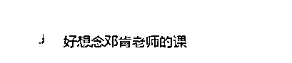

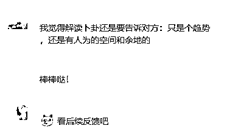

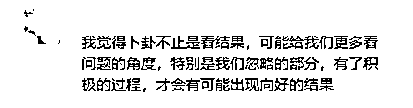

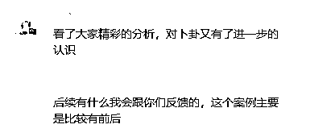

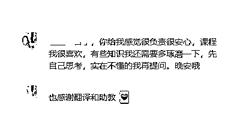

**课程费用**

**课程价格：9900 元**

**老学员复训专享价：**

**2020 年参加艾德里安·罗斯·邓肯卜卦占星课程的同学：****2900 元**

**2018 年参加艾德里安·罗斯·邓肯卜卦占星课程的同学：****4900 元**

**特别优惠****：**

**分享课宣到朋友圈****保留 48 小时****（不设分组显示）截图给课程顾问可获得****400 元优惠****。**

**课程负责人：童老师（微信：nodoorDaivd），请备注“卜卦”**

长按二维码添加课程负责人咨询

**退转课程****退款原则请详看《教学协议》，如有疑问请咨询课程顾问。******现代动态卜卦占星实战课·ISAR 选修课****

**授课老师：艾德里安·罗斯·邓肯**

**授课时间：**2022 年 5 月 3 日

**授课方式：**网络课程，英文授课，中文翻译

**费用：9900 元；****2020 年老学员复训价：2900 元；2018 老学员复训价：4900 元；特别优惠，分享课宣到朋友圈保留 48 小时（不设分组显示）截图给课程顾问可再获得 400 元优惠。**

**课程负责人：**童老师（微信：nodoorDaivd），请备注“卜卦”

长按二维码添加课程负责人咨询

****报名请点击“阅读原文”****

# 若道周运 5.9-5.15 丨水逆双子座和木星白羊座加持的一周（内含 12 星座运势）

> 原文：[`mp.weixin.qq.com/s?__biz=MzA5NjA0NTAxNg==&mid=2651473441&idx=1&sn=6610c153847f78987970937c1c70fdce&chksm=8b48f496bc3f7d80aa5d50a0ecb58050c0a50dea2de0d35586b515b31063bc5c1f4a1fa1be7c&scene=126&sessionid=1692737817#rd`](http://mp.weixin.qq.com/s?__biz=MzA5NjA0NTAxNg==&mid=2651473441&idx=1&sn=6610c153847f78987970937c1c70fdce&chksm=8b48f496bc3f7d80aa5d50a0ecb58050c0a50dea2de0d35586b515b31063bc5c1f4a1fa1be7c&scene=126&sessionid=1692737817#rd)

******☆ ****后台回复“今日”，给你一句生命态度******

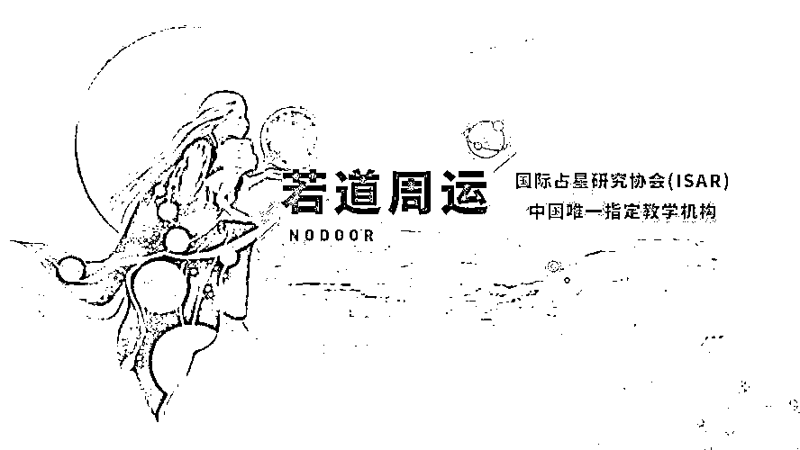

作者/苏黎 ISAR 认证占星师
编辑/翀子 封面/书君 图片/网络本周，2022 年的第二次水星逆行在双子座拉开帷幕，同时伴随着的，还有木星进白羊座这一重磅天象。12 星座如何借助“宇宙之力”度过本周？让我们来看文章吧！（如果着急看 12 星座运势，不妨先拉到最后哦）**整体氛围**

5 月的宇宙天象在金牛座新月日偏食拉开序幕，波动的情绪，各种意外的事件充斥着生活的媒体报导。我们以为在小说中发生的事情，却在上海长征福利院真实地发生。疫情发生的第三年，为了给在深处低谷的人们精神的支点，作家莫言老师的《不被大风吹倒》用自己真实的经历回答内心的困惑。

**本周水星在双子座逆行，**水星逆行在上个月就进入阴影期了。我们可以学习思考自我，**如何让梦想照进现实，把梦想和现实协调统合，是本周天象的主题。**

**随着火元素能量在星图逐渐增强，**积极勇敢的信念，开创的意识如同燃烧的火炬，我们在稳定的金牛月渴望突破。我们会从“最初的自我分裂、自我否定、自我斗争、直到最后，自我和平，自我调解”（卡尔维诺），凭借勇气和信心穿越食相季的阴霾，学会如何把梦想的火焰和冰冷的现实统合。这是我们成长的主题。

我写作的当下，外面天空正蓝，阳光正好。我所在的南方城市平静，稳定。做旅游的好友说因为疫情已经几个月没有收入；在外地封控区的朋友，他们只能在屋内遥望外面的春光，向往飞鸟的自由、关注每日一饭一蔬、城市的物质是否稳定、什么时候可以去户外享受春日。

金牛月渴望舒适、稳定、放松的状态，但本月日月食相却把情绪和纷争，意识的争辩推到了高潮。本周两颗行星（金星，木星）在白羊座，水星正式逆行，亢奋的能量难以体现出大自然隽永平静的能量，**水星逆行的主题就是让我们真实照见自我内心的信念和梦想是什么。**

白羊座的木星渴望突破，水星逆行是反思和规划的契机，我**们会反思人生的目标，寻找比自身需求还巨大的渴望。**

白羊座木星渴望千山万水的冒险之旅，寻找人生的意义，渴望真实展现自己信念、梦想。但逆行的水星，冒险的脚步会被束缚，梦想的脚步需要适当地放慢。作家莫言提到的，当我们处于低谷的时候，需要抓住一个生命的锚点去度过困境。

梦想是瑰丽的，现实是残酷的，**当我们学会了统合，才有稳定的情绪根基，**找寻属于自己生存和发展的真相，属于自己的真我旅途！

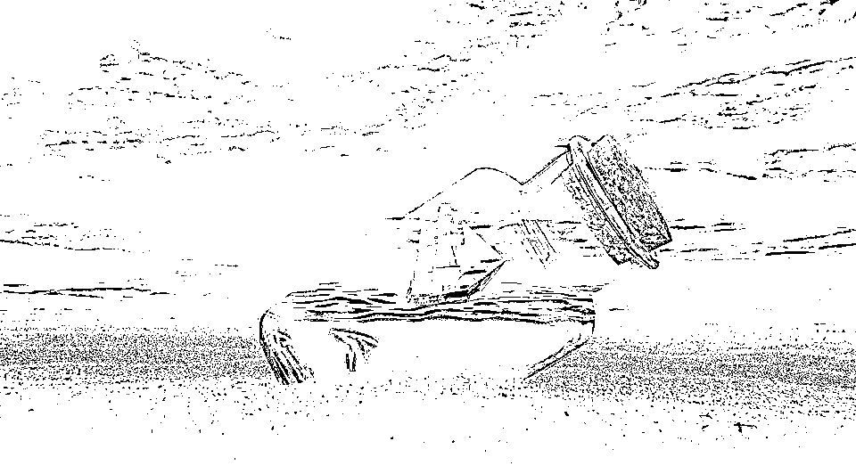

**一周重要天象**

**★****5 月 9 日周一，月亮入狮子座（****月亮四分天王星、四分太阳、四分北交点、对分土星）**

渴望在生活中被关注、认同和尊重，享受乐趣和创造的热情是月亮在狮子座行进内在的欲望。月亮狮子座和孩子相处很不错，如果你从事行业与幼儿相关，或者你是孩子的长辈，这天与孩子尽情玩乐，你的内心会充满欢喜。当然，**宴会、艺术、运动和各种形式的娱乐**也和狮子座有关，如果你从事的职业，当日的活动与这些因素有关，你会感受到创造性的活力。**我们需要尝试发挥内在的创造力。**

水星在逆行停滞期，停滞期的水星能量比逆行期间给人感受更强烈。我们需要避免月亮狮子座过于自我的倾向，总渴望自己主导和掌控一切，期待收获更多的爱与肯定，缺乏客观性。孩子般的自负会让我们**陷入过度渴求关注**的盲点误区。在工作，生活中如果遇到沟通问题，计划不顺畅，就很容易有意外情况发生。

**周一是挑战和创造性的时刻，**我们需要避免冲动和意外，导致金钱的损失，与权威人物的冲突。跳出沟通的误区、提前做好计划、在群体中学会尊重他人的价值、务实的落实目标，会让我们学会发挥热情和创造力，避免过度渴求爱和认同、月亮狮子座的挫败和失落感。

**★****5 月 10 日，周二，水星在双子座逆行**

**水星在双子座 4°开始逆行，一直到 6 月 3 日。**每次水星逆行，事情不一定按计划进行，我们总是习惯把各种问题让水星背锅。其实水星逆行并没有多糟糕，只是需要学习修正，反思和灵活处理我们生活的各种事情和意外。

生活本身就没有一帆风顺，意外、危机其实无处不在，尤其是当下。注意各种信息传递上的问题，也可能有很多机会出现，但需要谨慎评估。对于各种契约的内容、电子设备的处理需要更多的耐心，秉持慎重的态度。

**水星本次逆行会从双子座初度逆行回到金牛座 26°**，我们会如思考和选择呢？水星在双子座好奇心很强，感觉到外面世界诱惑很多，不懂如何选择做决定。当我们思维卡顿的时候，我们会紧张和焦虑。**当水星逆行回到金牛座的时候**，我们可以放慢思考的脚步，将专注力放在自己掌握的资源，收入，当下稳定的生活。

**这次逆行贯穿了整个五月食相季，**只有我们找到稳定的锚，才会避免焦躁不安的心理。如果你是注重规划的土星类型的人，当意外和不知所措来临时，让自己学会适应变化很重要。你可以从实践经验中学习，**学会修正对生活的态度，反思自我，**在事态糟糕之前提高警惕，明白自己需要什么很重要。

**★****5 月 11 日，周三，木星进入白羊座**

**“人格是一个浩瀚而神秘的系统，人的内心世界就像宇宙一样，人生最伟大的探险，就是对内心世界的探索。”（荣格）**

**5 月 11 日-10 月 28 日，木星在白羊座 0-7 度之间顺行逆行，**木星换星座，是一年最重要的星相之一。木星进入白羊座就是荣格说的对人生，信念冒险的旅途。我们生存的意义和哲学是什么呢？木星也和财富有关，这是一颗激进的木星，和火星在白羊座 “想做就做”斗士不同，是一种**“敢于把事情做大”**的能量。这种扩张性的能量也会**带有侵略性**的特质，不顾一切的冒险和冲动，自信，膨胀。

**当金星、木星都在白羊座行进的时候，我们在关系中会放大内在的信念，**过于认同自己的信仰，我们需要避免和他人产生冲突。白羊座的木星如同东征的十字军，自认为自己是最正确的，需要拓展自我，但也会导致我们承担在关系中过多的风险，高估了我们的品质和能力。

这一周结束后，新的一周会从天蝎座月全食开启，当我们快速、信心爆棚突进新事物的时候，需要避免木星的冒失和鲁莽。开创新的事物，展现真我的信念是好的，可以提升我们的行动力和勇气，但逆行期间还是需要三思，避免放大木星的能量，在现实落入困境和束缚。

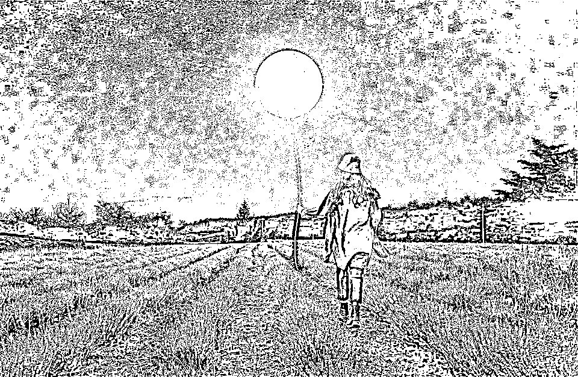

****★****5 月 13 日，周五，金牛座太阳合相北交点****

太阳在金牛座 22°与北交点会合。每年，太阳与北交点的会合，都会提醒我们关注学习的目标和功课是什么。当下是物质的严冬，**但正是我们需要****学会和地球母亲建立连接、了解自己的满足感和成就感、生活的舒适感、身体的真实感受最佳时刻。**

生活中不一定会发生重大的事情，也不会告诉我们具体的指引，而是唤醒我们内心深处某些东西，让我们更关注当下目标是什么？我们需要如何发展、有什么激励、我们如何达到自己人生中某些目标。**关注行进的金牛座太阳在你星图的第几宫，体会这个宫位在你星图中的能量。**

太阳与北交点的合相，也意味着不稳定的时期，虽然本月的整体星相都不太稳定。金牛座是固定星座，也说明**我们需要更长的时间去消化和处理问题。**

****★****5 月 15 日，周日，金星合相凯龙星****

金星代表我们在关系中的情感、愉悦和享受，我们在关系中的感受。凯龙星是受伤的疗愈者，需要整合才能找到完整的自我。**金星合相凯龙星，是我们治愈心灵的机会，**我们需要了解情感中的创伤，自己在情感中真实的需求和感受，我们才能体验到真正的爱。

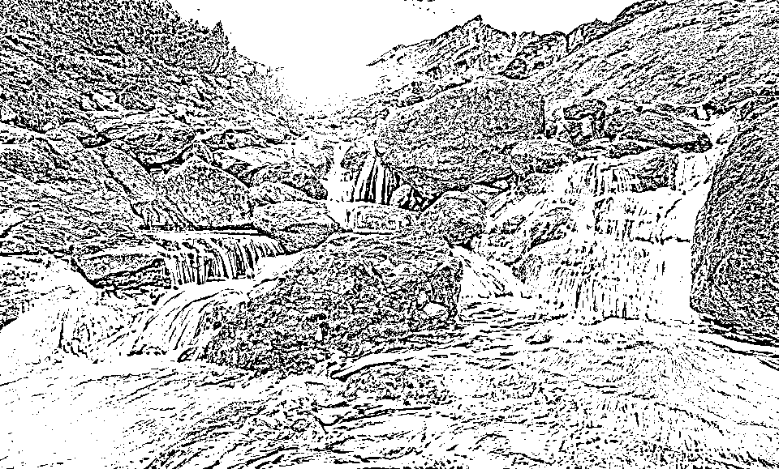

**12 星座的一周运势**

**（重点参考上升星座，其次参考太阳星座）**

***白羊座***

木星进入你的 1 宫，本周你会信心满满，感觉自己可以对外拓展和冒险，更宏大的目标展现在你的生命蓝图中。当金星和木星会合在 1 宫时，**你期待展现自己的魅力，**你会充分利用机会检查未来的人生目标在哪里。**你会被积极，正能量的人吸引，并从他们身上学习。**你会被生活中甜蜜，浪漫和轻松的关系吸引，并产生兴奋的能量和感受。

木星进入白羊座激活你的雄心壮志，你会感受到被鼓舞，激励。**水星在你的第 3 宫逆行**，凡事请三思，了解自己动力背后真实的原因很重要，先不要着急去做。当然，你需要关注文件处理，电子设备使用和沟通方面的问题，言多必失，给自己思考的时间，为将来拓展做规划。

***金牛座***

务实和稳定、关注自己身体的感受、与他人的关系互动是金牛月的重点。你对财务，安全感和物质领域很敏感。一旦你想表达和分享真实的感受，找到正确的表达方式，你会收获到一些财务上的意外。你的星图隐含静水深流的能量，一切都是为下周月全食的挑战做准备。

当金钱让你感受到紧张的时候，公众场合的某些权威人物的言论、举措、传达出的理念会影响你的判断力。**找到合适咨询者帮忙给你参考意见，让你更有安全感，**你也会和他人建立亲密的信任关系。**不要让自己陷入身体的压力中，**画大饼的梦会容易让你失望。

***双子座***

双子座天生懂得如何分享和表达自我，他们是说故事的高手。**木星换座，他们会感受到群体或团队中对他们支持和关注度。**当水星在 1 宫行进时，你的沟通会更频繁，这可能会消耗你的能量，让你有点疲劳。宇宙在考验你的应变能力，幸运的是，双子座天生擅长于处理问题。**水星逆行给你充分思考的空间，给你机会处理一些遗留的问题。**

木星换座需要留意，你的生活中有哪些人是因为共同兴趣爱好走在一起，给到你什么样的鼓舞和激励。在水逆期间观察，**你可以通过分享和沟通，了解你们的信念是否一致，**也许未来会成为一起开拓事业的伙伴。

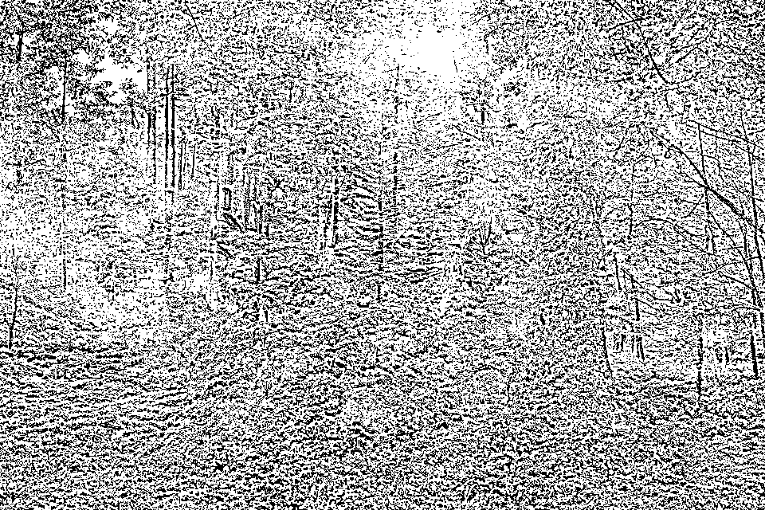

***巨蟹座***

**当木星进入白羊座时，会给你的 10 宫带来更多的机会和繁荣。**如果你对目前的事业不满意，现在是给自己事业重新定位的时候了。但正如**水星逆行在你第 12 宫**，过去的经历和体验会对你产生重大的影响。

巨蟹座是敏感的星座，关注家庭、熟悉的感受和食物。对外界反应敏感，比较羞涩，不会积极大胆。**金星也在你的 10 宫行进，在事业中大胆展现你的魅力、价值，**让老板认识到你的重要性。

你需要学会温柔地对待自己，月全食前后对敏感的巨蟹座们的情绪有很大影响。你需要通过 12 宫的能量与自己对话，过往的挫折和艰难只是你人生故事一部分。五月的星体能量会逐渐帮助你建立安全感。

***狮子座***

狮子座不喜欢无奈和沮丧感，渴望成为生活的主导者。金牛月对大狮子是新的开始，太阳在 10 宫行进中，你渴望通过运用自己的天赋和创造力，创造财富的目标。也许时机不一定是最佳的，但学会顺势而为很重要。日月食发生在你星图的 10 宫和 4 宫轴线时，学会顺应环境的变化很重要，**我们无法掌控外部环境，学会耐心去面对人生的目标很重要。**

**木星进入你星图的第 9 宫，**我们人生的意义是什么呢？找到有意义的关系，目标，观察朋友圈的人际关系，学会慷慨的分享，与老友叙旧，从沟通中捕获你的洞见和灵感，不要吝啬你的慷慨。

***处女座***

你是以事实、专业为导向的人，如何高效处理自己生活、展现你的技能很重要。水星在你的 10 宫行进，这给你的职业道路带来障碍和挑战。但你是善于从经验中学习的人，你懂得生存的技能和法则。**水星的逆行，提醒你在工作中需要更高效的处理文件，更专注自己的精力。**

**木星进入了你星图的第 8 宫**，你可以在本周适当的放松，享受无所事事的轻松。不要着急行动，商业的合作规划，你需要思考哪些人可以帮助到你。你是否想重启一些搁置已久的事项，学会诚实的沟通，当你对任何挫败不在意时，你就自然享受到成就的喜悦。

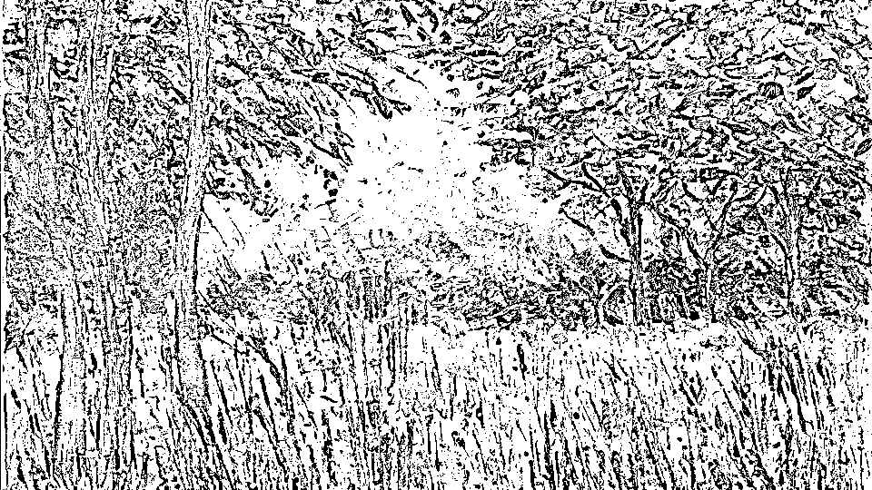

***天秤座***

**随着金星和木星进入你的 7 宫，5 月是年度最浪漫的月份。**是遇到新的伴侣/合作伙伴，承诺建立完美关系的最佳时期。挑战也同时存在，有些关系看似有进展，但也许不一定是你期待的。你也需要关注财务方面的问题，你期待和他人合作的项目可能因为资金原因并不一定如期进行。

**水星逐渐从你的第 9 宫逆行回到第 8 宫**，对于出版、传播自己的信念和声音、一些文件签署的机会，你会犹豫不决，你担心出错。一直对自己魅力很自信的你，你也许会在周末产生不确定性，过往情感挫败感会涌上心头。很多推进到关键时机的事项，你会不懂如何推动，保持自信很重要。

***天蝎座***

5 月 16 日是天蝎座月食，月食前正好是本周末，你会对近期关系的规则产生质疑。天蝎座的不信任感，让你在人际关系中存在一种对抗的感受。你对危机、他人的企图心有先天的敏锐感，**你渴望稳定的关系**，寻找有趣，聪明的朋友可以给到你更多帮助。你对职场关系中冒犯你的人，升起烦躁和愤怒的情绪，觉得自己被伤害了。

如何寻找到合适的合作伙伴，而不是昙花一现，**你需要理解自己内在的欲望和需求**。水星的逆行教导你学习信任的议题，哪些人值得信任合作、哪些人需要放弃，你需要合作关系，还是单干呢？**你可以在水星逆行期间，给自己更多时间反思，学会坦诚沟通很重要。**

***射手座***

木星进入你创意和享乐的宫位。你有多久没有好好享受和放松了呢？**学会给自己放假，**进入一些社交活动，把你从忙碌生活中解放出来。当你从事的项目即将告一个阶段时，请学会慎重对待。如果不懂如何选择，那就暂且放弃，先不用着急做决定。

水星的逆行，你需要在合作事项、工作、生活中放慢脚步。射手座讨厌细节，希望可以快速处理事情。**你需要慢慢品尝关系中的节奏**，事情不会一下给到你结论。八卦、肤浅的信息并不是你想要的，学会品味优质的关系。

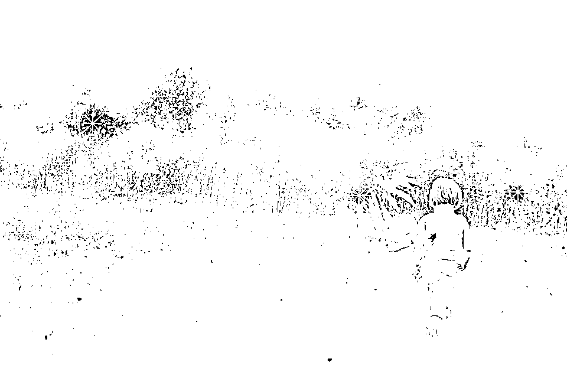

***摩羯座***

生活中某些拖延的事情，在本月你会有机会突破。你很能抗压，也很努力突破生活的瓶颈。你在家庭事物、房屋处理、内心的安全感方面，有自己的想法和信念，并逐渐建立根基。**你愿意走出自己舒适区，在生活中打算学习新的技能，为将来的事业打基础。**

太阳合相北交点在你的星图的第 5 宫，如果你是孩子的父母，你学会如何和孩子相处了吗？让亲子关系更和谐、愉悦是学习的功课之一。有些人可能在生活中让你烦恼，有些人也可能然扰乱你的生活，让你感觉生活规律被打破。**学会乐观积极的面对，**把你的创造力展现在娱乐、玩耍中，激活你生命中最好的一面。

***水瓶座***

这个月对水瓶座而言，无论搬家还是事业都是一个**震荡期**，你会遇到一些意外，无法预期的情况出现。从长期看，**释放和清理是一个好事**，在本月构建稳定的家居环境有助缓解紧张的情绪。你会发现一些幸运的机会源自你的好友，当你学会把对生活信念的顿悟，无私向他人传播分享时，生活中也许有一些意外的机会出现。

学会真实表达自我很重要，当你愿意敞开自我，让他人看到你内在反思的观点，想法，你会吸引来更多的关注。**本周是你学习表达情感的机会**，不要在乎得失，跟着感觉走、帮助朋友和他人，会给你带来新的思路。

***双鱼座***

你喜欢顺其自然让事情发生，每当好事发生时，一些消极的情绪和看法也会影响到你。当下的行进让你对自己不太自信，在财务上有一些犹豫不决。某些新鲜的灵感，念头在脑海间一闪而过，**如果直觉这件事情是正确的，那就去做，**不用思虑太多。学会优雅的表达自我，让事情进展更顺利。

水星的逆行，会让你对某些**家庭事务、房子问题、财务问题**反复确认。木星进入白羊座，你渴望收获更多财富，但内心的不安全感让你对未来缺乏自信和安全感。学会记录自己的开销、学会分辨思想中真实的想法很重要，这会让你在本月食相季探寻到适合自己的财富的法则。

**版权声明**：原创文章由作者授权首发于若道平台发布，欢迎转发，反对抄袭。友号转载请申请白名单。

****

**苏黎（Sulis）**

ISAR 国际认证占星师（2019 年获得）/塔罗咨询师

现代占星融合古典解读

20 多年跨行业领域职场经历

**咨询微信**：liuzq26

**公众号**：Sulis_1975

长按打赏

**今晚 8 点**

**将由核心课 L3 的同学们带来月相组的分享**

**关注若道视频号即可预约**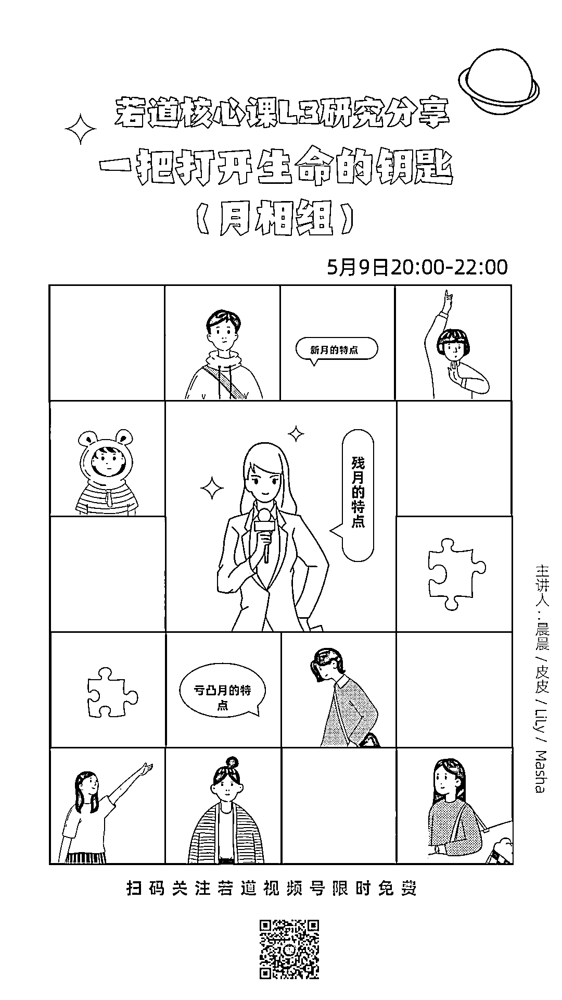

**20 位来自世界各地的占星师**
**带来 19 场沙龙——新世界的觉醒****详情可点击下图**

**学习占星学****点击下图了解课程详情**

**

**微信又双叒叕改版啦，不想错过若道君的推送？**

**就把若道设为星标吧！**

**▼**

**喜欢记得点一下在看哦☟**

**报名直达入口**

# 雷蒙德·梅里曼金融占星周运 | 木星进入白羊座+水星逆行=？

> 原文：[`mp.weixin.qq.com/s?__biz=MzA5NjA0NTAxNg==&mid=2651473441&idx=2&sn=d02d06e9f8fa1363a313eeed25da5bdc&chksm=8b48f496bc3f7d8051f5a6a5483928f67e84e375d9f82cd744df00848d444c06048755dd0729&scene=126&sessionid=1692737817#rd`](http://mp.weixin.qq.com/s?__biz=MzA5NjA0NTAxNg==&mid=2651473441&idx=2&sn=d02d06e9f8fa1363a313eeed25da5bdc&chksm=8b48f496bc3f7d8051f5a6a5483928f67e84e375d9f82cd744df00848d444c06048755dd0729&scene=126&sessionid=1692737817#rd)

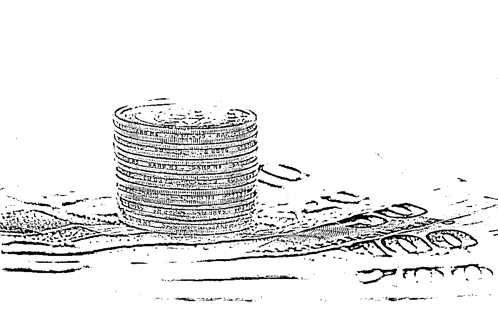

作者/雷蒙德·梅里曼 译者/Luke
编辑/玫瑰 图片/pexels

雷蒙德·梅里曼是在金融占星学界稳坐第一把交椅的占星师，同时他也是若道签约的金融占星课老师，我们引进了雷蒙德·梅里曼老师的《[上证指数月度报告](http://mp.weixin.qq.com/s?__biz=MzA5NjA0NTAxNg==&mid=2651473208&idx=2&sn=9465e5528554b9c84d45d7c9697d55f7&chksm=8b48f78fbc3f7e991517dd548db6b6875b3e09b800f6f48ed766e953a49ac0eb810c16b20fd6&scene=21#wechat_redirect)》及《[黄金报告](http://mp.weixin.qq.com/s?__biz=MzA5NjA0NTAxNg==&mid=2651473208&idx=2&sn=9465e5528554b9c84d45d7c9697d55f7&chksm=8b48f78fbc3f7e991517dd548db6b6875b3e09b800f6f48ed766e953a49ac0eb810c16b20fd6&scene=21#wechat_redirect)》。我们经老师的授权，将每周刊登梅里曼老师的周运，供大家参考和学习。于是，这是本周的周运（5.9-5.13）。

**说明：以下时间采用纽约证券交易所所在地美国东部标准时间。**

**展望与回顾**

****

**尽管上升的利率、飙升的通胀、劳动力短缺加剧和对衰退的恐惧带来了阻力，但 4 月美国经济出现了稳定的就业增长，表明劳动力市场仍然强势。****根据劳工部周五发布的报告，4 月增加了 42.8 万个就业岗位，超越了路透社经济学家预测的 39.1 万个岗位。这标志着连续 12 个月就业增长超过 40 万。与此同时，失业率稳定在 3.6%，是自 2020 年 2 月以来的最低点。****——梅根·亨尼****《美国经济在 4 月出现了健康的就业增长，就业人数增加了 42.8 万》****www.foxbusiness.com****2022 年 5 月 6 日**随着股票市场展开一场名为《人格分裂》的戏剧，上周迎来了缩减恐慌的回归。它是否终于要杀死牛市？还是说熊市终于可以进入冬眠，让股票市场恢复生机。上周，随着情节的进一步发展或恶化，前途似乎在两种可能性之间摇摆，取决于你支持哪种观点。上周初，人们担心美联储可能加息 0.75%。导致了周一的大幅抛售。周三时，美联储不负众望地宣布“仅仅”加息 0.5%，让市场进入一阵非理性繁荣，使得道琼斯工业平均指数上涨超过 900 点，是 2020 年 10 月以来最大的单日上涨。但所有的涨幅第二天都被抹消，因为缩减恐慌的回归，使市场下跌超过 1000 点。事实上，上周有 3 天价格波动都超过了 1000 点。周一至周三月亮在双子座，随后是周四太阳、天王星强有力的合相，正如这些天象所示的那样，一切都是如此的疯狂和不可预测。上周的行星组合象征混乱，情绪的地震。地面不再坚固了。阻力的天花板也是如此。看似是界限的东西都被打破了，结果不仅是海王星式的困惑，更是天王星式的混乱。不仅美国是如此，全世界也是一样。在亚洲和环太平洋地区，澳大利亚 ASX 指数和印度 Nifty 指数自 1 月-2 月重要低点以来，继续出现剧烈的跌势。对图表形态的研究者来说，这些早期的年度低点，代表了逆向的头肩底。它出现在许多指数中，比如印度 NIFTY 指数和瑞士的 SMI 指数。在中国和日本，4 月 27 日的近期低点在上周缩短的交易日中得以守住。在欧洲，上周的下跌仍然远高于 3 月 7-8 日的近期低点，因此这次近期的回调依然仅是修正性下跌。然而，美国股市的表现非常不同，更令人担心。纳斯达克指数和标准普尔指数均跌破了 1 月-3 月的低点。对于标准普尔指数，这是自 2021 年 5 月 19 日以来的最低价位。纳斯达克指数也跌至 2020 年 11 月 24 日以来的最低位。这是不详的征兆。

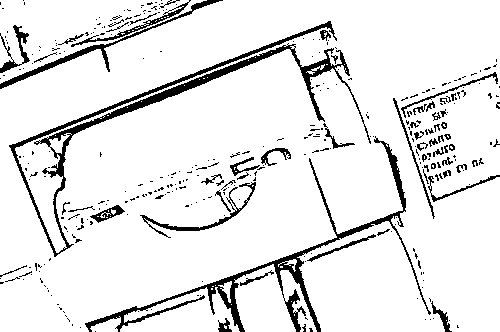

但是道琼斯工业平均指数仍然守住了 2 月 24 日的低点，也就是俄罗斯进攻乌克兰那天创下的低点。只要不跌破那个低点，就能形成市场间看涨背离。在其他的市场上，比特币和以太坊追随了全球股票指数的轨迹，也就是持续下跌至周五。比特币测试了 35000，以太坊测试了 2700。但是迄今为止，两者都守住了 1 月和 2 月的低点。黄金和白银继续下跌。黄金在周内跌至 1850 以下，白银测试 22.00。仅仅 2 个月之前，黄金还在测试 2078 的历史高点，白银大约在 27.50。最近，黄金似乎不像过去那样闪闪发光了。另一方面，原油保持强势，周四当天涨至 111 之上。**短期占星趋势和长期考量**本周还不能突然看清形势。**我们必须应付恶作剧者水星的逆行，从 5 月 10 日持续到 6 月 3 日。**对于白宫来说，这是一个多么好的时机来成立一个新的“真理部”及下属的“虚假信息委员会”。这是个好主意。但谁来决定什么是真理？谁来决定什么是“虚假信息”？难道谷歌、美国微软全国广播公司和福克斯新闻不是已经在这么做了吗？人们在争论委员会应取名为“虚假信息”还是“错误信息”。恶作剧者水星会在其中找到很多乐趣的。恶作剧者水星可能也很享受当前动荡不安的市场环境。**当水星逆行时，许多金融市场起初往一个方向运行，然后每过 1-4 天突然反转一次。每次反转前的间隔，它都会给出一个几乎很快就被否定的买入或卖出信号，我们称之为假突破。**上周天王星影响下的市场就是如此，天王星是水星的高八度。如果交易是一门艺术，当抽象成为趋势就是如此。5 月 10 日-11 日也会开启木星进入白羊座的第一个阶段，它将在白羊座逗留 5 个月（直至 10 月 27-28 日），然后年底时短暂返回双鱼座，之后再次回到白羊座，直至 2023 年 5 月。**对于全球的股票市场来说，这可能代表投资者进入一个更加激进的时期，更积极地寻找投资机会。**我认为在白羊座的木星是大胆和冒进的，这可能**对股市有利**。回顾历史，在起初的下跌后，战争并不总是对股市不利。不过，火星和木星在白羊座的合相也是一个“男子气概”的时间，届时最受关注的人将是那些表现得最激进，最肆无忌惮地指责其他人“太软弱而无法领导”的人。这也正好赶上美国 2022 年中期选举。那可能是很有趣的。

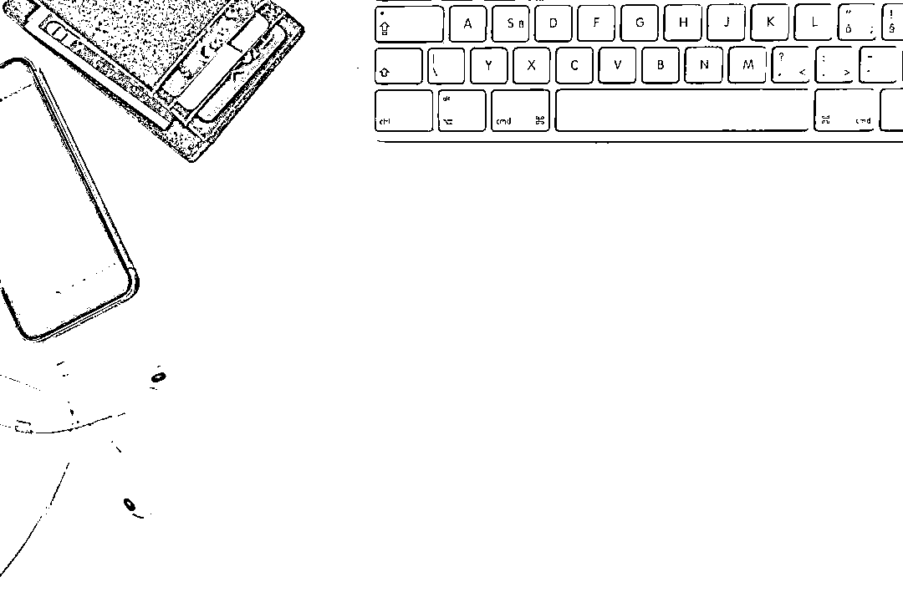

更可能的是，随着极端主义和过度的时代走到最后的尽头，这番表演也是令人讨厌和尴尬的。如果虚假或错误信息部门在这一时期启动，那么它将不堪重负。没什么是事实或可证明的。每件事看起来都像诽谤、侮辱或冒犯，对那些严肃的人来说尤其如此。这段时期不要把事情看得那么严肃，但是当生命处于危险的时候，这很难做到。然而，在白羊座的木星也有其益处。它想要自由，寻求乐趣，愿意参与更多的活动。它不会静止不动，让生命虚度。它可能很有竞争性，这可能会带来超人的壮举。许多体育场上的记录可能被打破。太空和教育方面可能会出现新的前沿领域。就好像我们正在进入一个思想和活动的新时代。恐惧可能让位于虚张声势和信心。人们愿意承担更多风险，开启贸易和商业活动的新航路。**我认为那对于全球股票市场是看涨的。**

**说明：以上日期基于纽约证券交易所所在的美国东部标准时间，由于存在时差，中国地区可能需要加一天。**

**版权声明：**本文由若道翻译发布，欢迎转发，反对抄袭。友号转载请申请白名单。

**雷蒙德·梅里曼（Raymond Merriman）**

若道签约老师。著名金融占星师，ISAR（国际占星研究协会）前主席，梅里曼市场分析公司的总裁。他由于“提升了占星学的职业形象”，在 1995 年国际占星大会上被授予轩辕十四奖；在 2012 年国际占星大会上，被授予轩辕十四终身成就奖。

1“中国上证指数月度报告”发售**若道推出了****中文版****的雷蒙德·梅里曼中国上证指数月度报告，并持续发行该报告！**当把金融市场的周期和占星学的周期相结合时，雷蒙德·梅里曼老师的金融占星学研究**为投资者应对金融市场的周期波动，并随之调整投资策略提供了极大的价值参考**。
**5 月中英文报告已上线！**2“黄金价格周期月度报告”发售**若道推出****中文版****的雷蒙德·梅里曼黄金价格周期月度报告！**不仅仅为广大读者在中国股市的投资出谋划策，更将视角放眼黄金市场。**每当世界经济形式不明朗的时候，有一个地方是保值的港湾，那就是****黄金**。自 1982 年雷蒙德·梅里曼出版第一本研究《地球宇宙学征象与黄金价格的关联》的著作以来，**他一直作为最重要的黄金市场时机预测者之一享誉国际**。2022 年 5 月黄金报告已上线，梅里曼老师将会告诉你他对这个关键时期如何操作的想法。也可以按照季度和一年期订阅，有更多优惠。季度和年度的好处是，你可以持续了解梅里曼老师对于不断在变化的市场的看法。即便他某一次看法和市场不一致，你也看到在下一期他如何调整自己的看法，并看到金融占星在一个长期时间段内对你把控风险的帮助。而能够长期控制风险、尽量找到安全的投资时机才是投资的长久之计。**5 月中英文报告已上线！****购买套餐**，买得越多越优惠中国上证指数月度报告套餐价

*   **单月报告**：280 元
*   **3 个月套餐**：780 元（260 元/月）
*   **12 个月套餐价**：2400 元（200 元/月）

**长按下图识别二维码****购买金融报告****套餐****▼**

黄金周期月度报告优惠

*   **双报告年度套餐更优惠（直降 900 元）**

*   **12 个月黄金报告+12 个月上证指数报告：仅需 3900 元**

**长按下图识别二维码购买黄金报告套餐**▼

3《2022 年金融预报和沙龙》1976 年以来，由雷蒙德·A·梅里曼撰写的梅里曼市场时机学院每年一次的年度预报沙龙和每年一本的《年度预报》一直在应用占星学原理为投资者们服务，提供卓越洞见，从未间断。 **雷蒙德·梅里曼《2022 年金融预报和沙龙》发售中（报告已发布）。****长按下图识别二维码了解详情**
▼

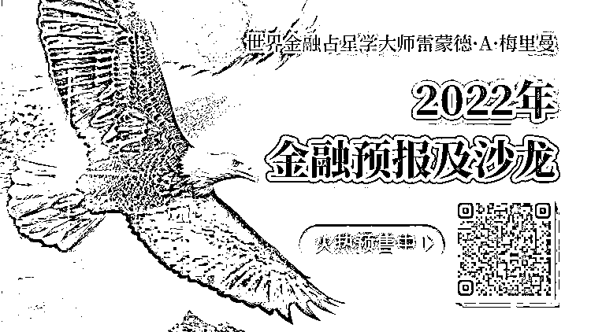

**点击阅读原文购买金融报告**

# 插班中 | 美国占星心理学学院&若道占星双认证核心课程

> 原文：[`mp.weixin.qq.com/s?__biz=MzA5NjA0NTAxNg==&mid=2651473441&idx=3&sn=6c63b70eb2c06a97ad8095b81de3187f&chksm=8b48f496bc3f7d806af8786252ff8fb67508d0c8089e28f15be25ea36312d11a4c44818ac3fe&scene=126&sessionid=1692737817#rd`](http://mp.weixin.qq.com/s?__biz=MzA5NjA0NTAxNg==&mid=2651473441&idx=3&sn=6c63b70eb2c06a97ad8095b81de3187f&chksm=8b48f496bc3f7d806af8786252ff8fb67508d0c8089e28f15be25ea36312d11a4c44818ac3fe&scene=126&sessionid=1692737817#rd)

**美国占星心理学学院创办人**

**格伦·佩里**授课

**40 余年**职业占星师生涯所学精华**倾囊相授**

修完 101-205 全部课程，并通过考核的毕业生将获得

**美国占星心理学学院证书**( Academy of Astropsychology )

和**若道毕业证书**

**高含金量双证书**

跟随主讲老师学习融合**心理学体系**的**占星知识**

为星图咨询解读打下坚实的基础

**大量**的课程资料，光是课后阅读资料就**超过 60 万字**

合理的课程设计，贴心的助教服务，及时的课后测验

1

**这门课程最大的看点是什么？**

1. **两位国际占星学大师**共同授课，将合计**90 年职业占星师生涯所学精华**倾囊相授；2. 修完**全阶课程**，考试通过的毕业生将获得**美国占星心理学学院证书**（Academy of Astropsychology）和**若道毕业证书**，**高含金量双证书**；3. **116 次课程**的充分授课时间（录播课程 69 次课；直播课程 47 次课），全面而详细地讲解占星学历史、知识、技能、案例、咨询和运用；4. 跟随主讲老师学习**自成体系、逻辑严密、实用性强的占星语法、星图解读方法**；5. 学习独特的**发展年龄预测法**，从星图看对关键年龄阶段的发展及议题；6.** 大量的课程资料，光是课后阅读资料就超过 60 万字**；7. 合理的课程设计，初中阶课程，每一节都有课后测验；8. 本课程可以作为**ISAR 选修课**中的一门，再修两门就满足 ISAR 认证选修课要求；9. **18 次占星咨询技巧的培训**，为正式从事占星咨询建立基础；10. 教授重要的**心理学概念**，比如与客体关系、心理动力理论、个人神话和叙事疗法相关的一些概念，学习如何将它们整合到星图解读中；11. 了解**《精神疾病诊断与统计手册》**诊断标准，探索星图中的心理疗愈；12.  学习**叙述疗法**和**自传写作**，将之作为自我疗愈和咨询的工具。

**格伦老师致学员的信**

（向上滑动查看内容）

**亲爱的学员：**

作为占星心理学学院的校长，我的目标是帮助你顺利完成学业。

占星心理学学院的课程让你能够在经济承受范围内，灵活地学习占星学。我们的课程让你可以舒适、便捷地在家学习，不用打乱你本就繁忙的日程。我们有完善的在线学习系统，让你能在线上课、下载学习资料、进行测试并自动获得即时反馈，还可以在虚拟课堂上同你的教员和同学互动。

作为私人开业的**职业占星师**和**执业心理治疗师**，我已经**工作超过 30 年。**我还花了近 10 年的时间，在研究院里学习并获得**心理学的硕士和博士学位**。这段训练和经历是无价的，帮助我将占星学发展成为连贯的 21 世纪模式。

我们的占星学培训项目是**系统化的、清晰的、组织有序的、易学的、前沿的。**尽管有许多类似的学校可供你选择，但你不会在这些学校中看到像占星心理学学院所提供的那样有深度的或尖端的课程。

**我非常期待 2022 年再次在若道教授心理占星学核心课程。**我们重新规划和升级了本次课程体系。**新的课程包含之前完整课程的 72 个录播视频，每个视频长 2 小时；以及由我教授的 37 次直播课程，和大卫老师教授的 10 次直播课程，每次课程 2 小时。**在实时课程中，除了我提供的案例，我还会用学员的星图进行案例演示，与学员互动，阐明视频中教授的原则和方法。

**2 小时直播课程安排：**

**第一阶段 提问和讨论：**

这将在每节课开始时进行。邀请学员提出与课前提供的资料相关的具体问题。这一阶段将持续 15-30 分钟。

**第二阶段 示例：**

这一阶段会讲解与每周任务相关的具体概念，例如行星的星座位置、宫位位置以及相位的意涵。星图示例来自我认识的人，如公众人物、朋友、家人、同事或以前的客户（不显示出生信息）。同样，这一阶段也开放课堂讨论，学员可以提出自己的问题和见解。

**第三阶段 学员案例演示：**

这个阶段会从学员的具体星图来阐明概念，例如火元素行星占优势。学员案例演示不会涉及任何类型的咨询或“解读”。它们将只是简单地包含一段对话，我会在对话中分享自己对某个配置的思考，然后问这个学员可能会如何主观地（影响、信念、行为）和客观地（事件/关系）体验这个配置。其他参课学员可能也会对讨论的主题有自己的见解或问题，他们也可以参与讨论。

我对这一新的在线课程形式感到兴奋，**并期待着从 2022 年 4 月 27 日开始认识我的新学员们。**获得本学院的文凭会是你做过的最明智的投资。你不仅将占星学掌握到前所未有的深度，还将学到如何为客户提供咨询服务并建立职业占星师的职业生涯。

真诚地

**格伦·佩里 占星心理学学院校长**

**为什么要学习心理占星学？**占星心理学是一个复杂的体系，让实践者能够向客户提供真正治疗性的益处。这从根本上说来是我们学院有别于其他学校之处：**我们教授占星学，也教授心理学概念。****我们明确讨论各种心理学概念，并将其与占星学无缝衔接。结果就是更深入的、更丰富的，最终更加强大的模式。****该项目专为初学者和渴望深造的有经验的占星师而设。**我们会从跨学科的角度探讨星图解读。**通过融合荣格心理学和各种其他模型的元素，学员将熟悉作为人格理论、发展模型、原型语言和诊断工具的占星学。**

2

**课程是怎么安排的？**

**第一学年**

**共****64****次课 **43****次录播课 **21 次直播课******

**101 占星学基础 **

****共****12****次课程：******8 次 2017 年录课+4 次直播课**

**占星学**关注成长，聚焦心理。外部事件意义重大，但我们可以把它们看作是对于发展中的心理结构的共时性反映，以及未来发展的媒介和催化剂。在这个阶段的课程中，会以四种形态的几何形式介绍**占星原型：星座、行星、宫位和相位**。黄道带是人类心灵的象征性地图，其中的每个**星座**都代表一种基本的人类需求、原型人物、发展阶段和行为风格。**行星**代表心理功能，以满足其关联星座的基本需求。**宫位**提供了环境舞台，行星在其中扮演它们的角色，而**相位**是行星之间的角度关系，在主观上体验为内在对话。

**课程安排**：

**录播课****、****直播课（周三）**时长都是 2 小时

第一节**录播课**：核心概念介绍

第二节**录播课**：黄道带的结构

2022 年 4 月 27 日**直播课**：核心概念、黄道带的结构提问和讨论、知识点示例

第三节**录播课**：图例、单态星体和其他奇妙的元素

2022 年 5 月 11 日**直播课**：图例、单态星体提问和讨论、知识点示例

第四节**录播课**：星座介绍（从白羊座到处女座）

第五节**录播课**：星座介绍（从天秤座到双鱼座）

2022 年 5 月 25 日**直播课**：12 星座案例演示

第六节**录播课**：行星作为过程

第七节**录播课**：行星作为内容

第八节**录播课**：将碎片整合起来

2022 年 6 月 8 日**直播课**：整合星图时，将行星作为过程和内容案例演示

**102 行星落星座、宫位** 

****共****12****次课程：**8 次 2019 年录课+4 次直播课**

这个阶段的课程**聚焦于初步的星图整合。**

学员将学习**占星语法**，以及如何运用它们来阐释**行星的星座落点**。学员不需要强记书中的星图解读，而是学习分析基础的占星句法结构，应用这些语法规则来思考和讲述这门语言。学员们将学习如何构建精妙的句子，将动机、功能、特质、状态和事件组合起来。

此外，还将学习解读**行星宫位落点**的规则。宫位被定义为心理环境，为特定类型成长和发展提供背景。行星落在宫位中，象征着情境中的特殊状态，应对环境挑战的方式，以及通过共时性人物和事件而外化的自我部分。

学员们将探索如何将星座和宫位落点融合在一个单一、整合的陈述中，做出灵活、层次分明的解读。

**课程安排**：

第一节**录播课**：占星语法介绍

第二节**录播课**：行星星座作为行为风格

2022 年 6 月 22 日**直播课**：占星语法、行星星座作为行为风格提问和讨论、知识点示例

第三节**录播课**：思维状态和行为结果

第四节**录播课**：学习行星的星座落点

2022 年 7 月 6 日**直播课**：思维状态和行为结果、行星的星座落点提问和讨论、知识点示例

第五节**录播课**：回顾宫位的含义

第六节**录播课**：宫位中的行星过程

2022 年 7 月 20 日**直播课**：宫位的含义、宫位中的行星过程提问和讨论、知识点示例

第七节**录播课**：行星在宫位中的状态

第八节**录播课**：行星作为宫位的内容

2022 年 8 月 3 日**直播课**：行星在宫位中的状态、内容的提问和讨论、知识点示例

**103 行星相位与个人神话** 

****共****13****次课程：**9 次 2019 年录课+4 次直播课**

在这个阶段的课程中，**相位**被解释为由更大的故事结构的潜在动力构成的个人神话。

学员将学习相位是如何象征内在心理的冲突、重要的童年情感体验、主要的人生挑战和内在对话的。需要着重强调的是，相位的意涵会随着心理成熟的程度而改变。人会成长、进化，会解决内在冲突，这些不仅反映在态度和行为的改变上，而且也会表现在某人吸引的事件及其与他人的关系品质上。

学员们还将学习一些**心理学概念**，比如与客体关系、心理动力理论、个人神话和叙事疗法相关的一些概念，它们将整合到相位解读中。

**课程安排**：

第一节**录播课**：重要主题与核心冲突

第二节**录播课**：渐盈相位与渐亏相位

2022 年 8 月 17 日**直播课**：重要主题与核心冲突、渐盈相位与渐亏相位的提问和讨论、知识点示例

第三节**录播课**：主要相位的核心意义

第四节**录播课**：罗生门原则

2022 年 8 月 31 日**直播课**：主要相位的核心意义、罗生门原则的提问和讨论、知识点示例

第五节**录播课**：占星学中的认知

第六节**录播课**：心灵的控制结构

2022 年 9 月 14 日**直播课**：占星学中的认知、心灵的控制结构的提问和讨论、知识点示例

第七节**录播课**：作为认知结构的相位

第八节**录播课**：强迫性重复

第九节**录播课**：听大卫·瑞雷讲月亮交点

2022 年 10 月 12 日**直播课**：月亮交点（由大卫·瑞雷老师教授）

**104 征象星与定位星：作为进化故事的星图 **

****共****12****次课程：******8 次 2019 年录课+4 次直播课**

这个阶段的课程聚焦于**从叙事角度整合星图。**

学员们将探索**宫位征象星**和**行星定位星**如何讲述一个故事，反映一个人进化发展之旅。行星定位关系揭示了个人神话的主体构架。而这个故事的主题常常处于意识觉知和控制之外，占星学提供了一种方式，揭示、解读、改编这个神话。

我们推荐的星图整合方式是将相位和定位星关系融合成一个单一、连贯的叙事。要特别强调的是，如何活出整合程度更高的生命故事。

学员们还将了解**叙事疗法**和**自传写作**，把它们当作促进整张星图整合的一种方式。

**课程安排**：

第一节**录播课**：每张星图都讲述了一个故事

第二节**录播课**：互容与最终定位星

2022 年 10 月 26 日**直播课**：每张星图都讲述了一个故事、互容与最终定位星的提问和讨论、知识点示例

第三节**录播课**：将相位整合进流程图

第四节**录播课**：完整的故事

2022 年 11 月 9 日**直播课**：将相位整合进流程图、完整的故事的提问和讨论、知识点示例

第五节**录播课**：过渡短语

第六节**录播课**：良好定位或不良定位

2022 年 11 月 23 日**直播课**：过渡短语、良好定位或不良定位的提问和讨论、知识点示例

第七节**录播课**：发展年龄方法

第八节**录播课**：进行全面整合

2022 年 12 月 7 日**直播课**：发展年龄方法、进行全面整合的提问和讨论、知识点示例、案例演示

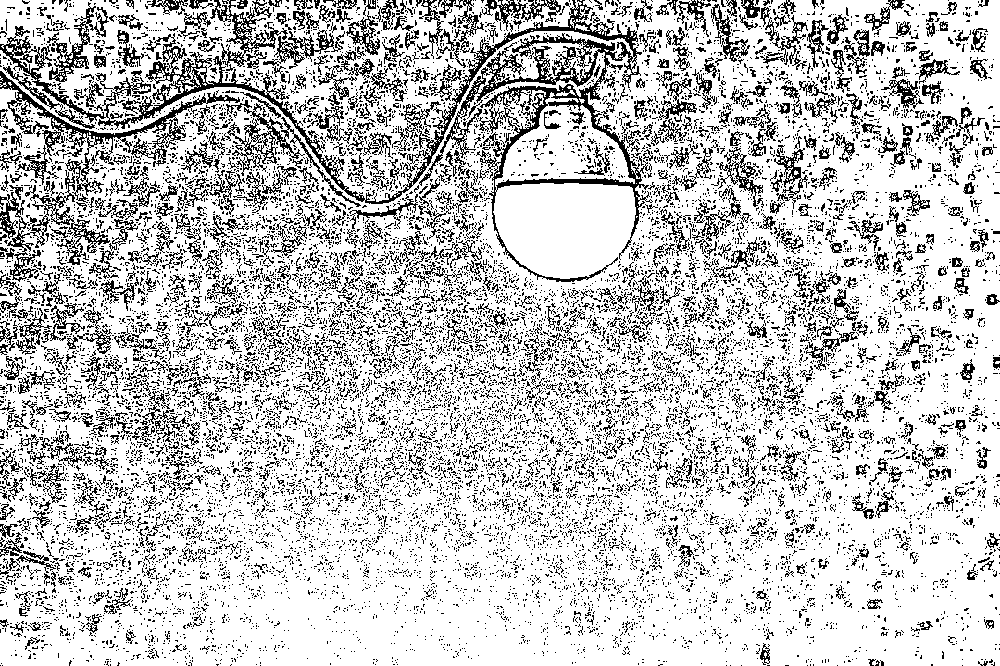

**105 星图中的精神病理学与疗愈 **

****共****15****次课程：******10 次 2019 年录课+5 次直播课**

在这个阶段的课程中,我们将**聚焦于十二星座(从白羊座到双鱼座）及其对应的守护星的潜在功能障碍**。

我们将学习如何识别、理解和应对每个星座的潜在挑战。我们将在各种相应的心理障碍背景下来考察占星原型，这些心理障碍表现为功能障碍、失衡的极端状态。

学员们将了解**《精神疾病诊断与统计手册》诊断标准**。我们会探讨治疗的概念，尤其是那些与整合和个性化相关的概念。我们将特别关注外行星的困难相位，以及它们与内在心理冲突、防御和症状形成的关系。

学员们将探索人的痛苦如何成为发展和实现天赋才能的催化剂。

**课程安排**：

第一节**录播课**：白羊座-火星的病理学

第二节**录播课**：金牛座/天秤座-金星的病理学

2022 年 12 月 21 日**直播课**：白羊座-火星、金牛座/天秤座-金星的病理学提问和讨论、知识点示例、案例演示

第三节**录播课**：双子座/处女座-水星的病理学

第四节**录播课**：巨蟹座-月亮的病理学

2023 年 1 月 4 日**直播课**：双子座/处女座-水星、巨蟹座-月亮的病理学提问和讨论、知识点示例、案例演示

第五节**录播课**：狮子座-太阳的病理学

第六节**录播课**：天蝎座-冥王星的病理学

2023 年 2 月 1 日**直播课**：狮子座-太阳、天蝎座-冥王星的病理学提问和讨论、知识点示例、案例演示

第七节**录播课**：射手座-木星的病理学

第八节**录播课**：摩羯座-土星的病理学

2023 年 2 月 15 日**直播课**：射手座-木星、摩羯座-土星的病理学提问和讨论、知识点示例、案例演示

第九节**录播课**：水瓶座-天王星的病理学

第十节**录播课**：双鱼座-海王星的病理学

2023 年 3 月 1 日**直播课**：水瓶座-天王星、双鱼座-海王星的病理学提问和讨论、知识点示例、案例演示

**第二学年 2023 年**

****共****52****次课 **36****次录播课 **16 次直播课********

**201 回顾占星历史 **

****共****16****次课程：******9 次 2019 年录课+7 次直播课**

在这个阶段的课程中，我们将探索**占星历史如何反映心灵的进化**。

现代之前的占星学以事件为导向，注重具体预测，偏向决定论，它反映了现代之前的主导意识模式。上世纪以来，占星学已经逐渐变得更加抽象、心理化、开放和非决定性，这似乎反映了集体意识的改变。因此，我们将在人类发展和意识进化的背景下考察占星历史。我们会谈到不同时代的星图解读和咨询技术，以此来比较和对比前现代、现代和后现代占星学。

**课程安排**：

第一节**录播课**：朝着整体占星学前进

第二节**录播课**：占星原教旨主义

2023 年 3 月 22 日**直播课**：朝着整体占星学前进、占星原教旨主义提问和讨论、知识点示例

第三节**录播课**：占星学的其他分支——大卫·瑞雷

2023 年 3 月 29 日**直播课**：占星学的其他分支提问和讨论、知识点示例（由大卫·瑞雷老师教授）

第四节**录播课**：从古代占星学到后现代占星学

第五节**录播课**：比较与批评

2023 年 4 月 5 日**直播课**：从古代占星学到后现代占星学、比较与批评、提问和讨论、知识点示例

第六节**录播课**：希腊占星学：摘录与评论

2023 年 4 月 19 日**直播课**：希腊占星学：摘录与评论提问和讨论、知识点示例

第七节**录播课**：比对图中的伴侣匹配度，古代与现代

2023 年 5 月 3 日**直播课**：比对图中的伴侣匹配度，古代与现代提问和讨论、知识点示例

第八节**录播课**：比对图——大卫·瑞雷

2023 年 5 月 10 日**直播课**：比对图提问和讨论、知识点示例、案例演示（由大卫·瑞雷老师教授）

第九节**录播课**：组合图——大卫·瑞雷

2023 年 5 月 17 日**直播课**：组合图提问和讨论、知识点示例、案例演示（由大卫·瑞雷老师教授）

**202 预测与意识演变(一) **

****共****9****次课程：******6 次 2019 年录课+3 次直播课**

作为一门艺术，**预测占星学**运用行星的运行来预测特定时期的性质、意义和持续时间。在这个阶段的课程中，我们会考察**意识进化**的概念、其基本原理及其与占星学预测部分的关系。

意识进化可以被定义为有意识地与星图中固有的进化过程合作。学员们将探索如何用**行进**和**推进**来为意识进化服务。我们不是简单描述事件的结果，而是将行星运行描述为实现先天潜能的机遇之窗。

**课程安排**：

第一节**录播课**：开始预测

第二节**录播课**：发展年龄方法

2023 年 5 月 24 日**直播课**：开始预测、发展年龄方法提问和讨论、知识点示例、案例演示

第三节**录播课**：太阳的行进

第四节**录播课**：月亮的行进与推进

2023 年 6 月 7 日**直播课**：太阳的行进、月亮的行进与推进提问和讨论、知识点示例、案例演示

第五节**录播课**：水星的行进

第六节**录播课**：金星的行进

2023 年 6 月 14 日**直播课**：水星、金星的行进提问和讨论、知识点示例、案例演示

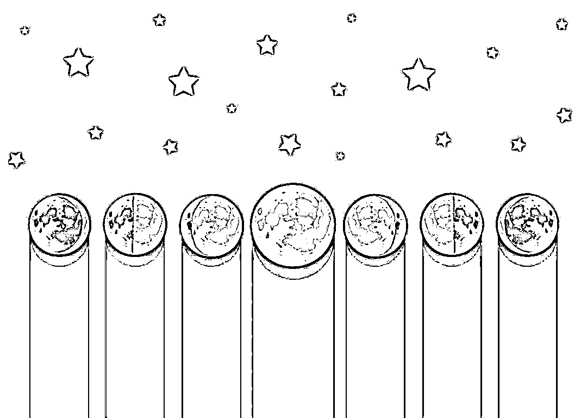

**203 预测与意识演变(二) **

****共****15****次课程：******9 次 2019 年录课+6 次直播课**

在这个阶段的课程中，学员们会继续探索**如何将对行进、推进和其他预测方法的分析运用于个人成长**。

具体事件反映并促进了意识的改变；因此，行星运行可以帮助我们洞察成长过程的精确时机，让我们领会内在和外在现实如何同时发生、彼此反映、互相转化。

我们还将探索宏观的世界行进，考察占星格局如何在社会、政治、经济、艺术和生态层面上表现出不同的形式，却又在多样化的现象中反映单一的**原型**。

这里的挑战是去思考，我们对宇宙的这种参与式关系如何能为共同创造一个积极的、更充满希望的未来做出贡献。

**课程安排**：

第一节**录播课**：火星的行进

第二节**录播课**：木星的行进

2023 年 6 月 28 日**直播课**：火星、木星的行进提问和讨论、知识点示例、案例演示

第三节**录播课**：土星的行进

第四节**录播课**：天王星的行进

2023 年 7 月 12 日**直播课**：土星、天王星的行进提问和讨论、知识点示例、案例演示

第五节**录播课**：海王星的行进

第六节**录播课**：冥王星的行进

2023 年 7 月 26 日**直播课**：海王星、冥王星的行进提问和讨论、知识点示例、案例演示

第七节**录播课**：次限推进——大卫·瑞雷

2023 年 8 月 2 日**直播课**：次限推进提问和讨论、知识点示例、案例演示（由大卫·瑞雷老师教授）

第八节**录播课**：太阳弧——大卫·瑞雷

2023 年 8 月 9 日**直播课**：太阳弧提问和讨论、知识点示例、案例演示（由大卫·瑞雷老师教授）

第九节**录播课**：太阳返照图和月亮返照图——大卫·瑞雷

2023 年 8 月 16 日**直播课**：太阳返照图和月亮返照图提问和讨论、知识点示例、案例演示（由大卫·瑞雷老师教授）

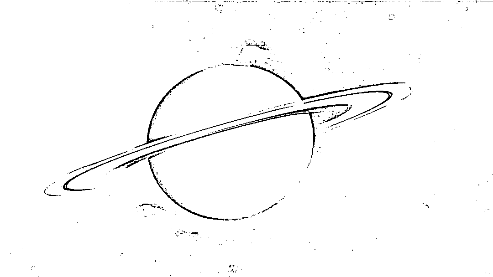

**204 占星咨询技巧(一) **

****共****9****次课程：******6 次 2019 年录课+3 次直播课**

在这个阶段的课程中，学员们将学习**咨询技巧**，比如如何选取一段经历，询问相关问题，提出假设，进行解读，重塑冲突，预测成长机遇，深化疗愈。

我们会审视各种**咨询理论**，重点强调它们在占星学中的**运用**。学员们将学习如何处理危机，做出恰当的推荐引介。

我们强调**有效沟通**的原则、聆听技巧、言语和非言语沟通，以及占星学如何帮助我们建立共情关系。

我们会专门介绍**伦理道德**法则，因为它关系到职业责任问题、资质能力、咨询和预测。

我们会特别关注**占星师的阴影**以及我们在自卑和膨胀问题上的集体脆弱。

**课程安排**：

第一节**录播课**：导言与概述

第二节**录播课**：确定咨询范围

2023 年 8 月 30 日**直播课**：导言与概述、确定咨询范围提问和讨论、知识点示例、案例演示

第三节**录播课**：会见客户

第四节**录播课**：厘清问题(剥开占星学的洋葱)

2023 年 9 月 13 日**直播课**：会见客户、厘清问题(剥开占星学的洋葱)提问和讨论、知识点示例、案例演示

第五节**录播课**：认出生活模式(隐喻思维)

第六节**录播课**：提出假设与辨识核心信念

2023 年 9 月 27 日**直播课**：认出生活模式(隐喻思维)、提出假设与辨识核心信念提问和讨论、知识点示例、案例演示

**205 占星咨询技巧 (二) **

****共****12****次课程：******6 次 2019 年录课+6 次直播课**

在这个阶段的课程中，参与者将**继续学习咨询技巧**，包括如何选取一段经历，询问相关问题，提出假设，进行解读，重塑冲突，预测成长机遇，深化疗愈。

我们还将考察各种**电影**，考察它们与理解人们寻求帮助的共同议题的关系。我们会审视各种咨询理论，着重强调它们在占星学中的运用。学员们会学到如何处理危机，做出恰当的推荐引介。我们会强调有效沟通的原则，以及聆听技巧、言语和非言语沟通，以及占星学如何帮助我们建立共情关系。我们会专门介绍伦理道德法则，因为它关系到职业责任问题、资质能力、咨询、预测和古代术语的运用。

**课程安排**：

第一节**录播课**：检验假设

第二节**录播课**：对星图做出初步解读

2023 年 10 月 11 日**直播课**：检验假设、对星图做出初步解读提问和讨论、知识点示例、案例演示

第三节**录播课**：建设性解读星图的艺术

第四节**录播课**：洞悉客户经历的目的

2023 年 10 月 25 日**直播课**：建设性解读星图的艺术、洞悉客户经历的目的提问和讨论、知识点示例、案例演示

第五节**录播课**：提供希望和方向

第六节**录播课**：案例研究和督导

2023 年 11 月 8 日**直播课**：提供希望和方向、案例研究和督导提问和讨论、知识点示例、案例演示

2023 年 11 月 15 日**直播课**：ISAR 资质认证考试大纲和准备（由大卫·瑞雷老师教授）

2023 年 11 月 22 日**直播课**：ISAR 资质认证考试术语词汇表第一部分（由大卫·瑞雷老师教授）

2023 年 11 月 29 日**直播课**：ISAR 资质认证考试术语词汇表第二部分（由大卫·瑞雷老师教授）

**若道核心课程结业考试**

3

**导师简介**

**格伦·佩里（Glenn Perry）**

*   这位传奇的占星师，也是一名拳击和摩托车爱好者

*   他毕业于赛布鲁克学院(Saybrook Institute)，是心理/意识研究专业博士

*   也是拥有 30 余年经验的加州注册婚姻和家庭治疗师 （CAMFT）

*   美国占星心理学学院（Academy of AstroPsychology）的创办人

*   他曾任国际占星研究协会 （ISAR）以及联合占星大会董事会（UAC）副主席

*   也是 ISAR 突破性道德标准的设定者

*   康涅狄格州研究生院（the Graduate Institute of Connecticut）原型宇宙学与意识进化项目的负责人

*   共出版八本占星学著作：《心理占星学入门》《心理占星论文集》《盗取天火》《从忠诚到革命》《星图中的阴影》《占星职业议题与伦理》《出生星图深度分析》《从古代到后现代占星学》

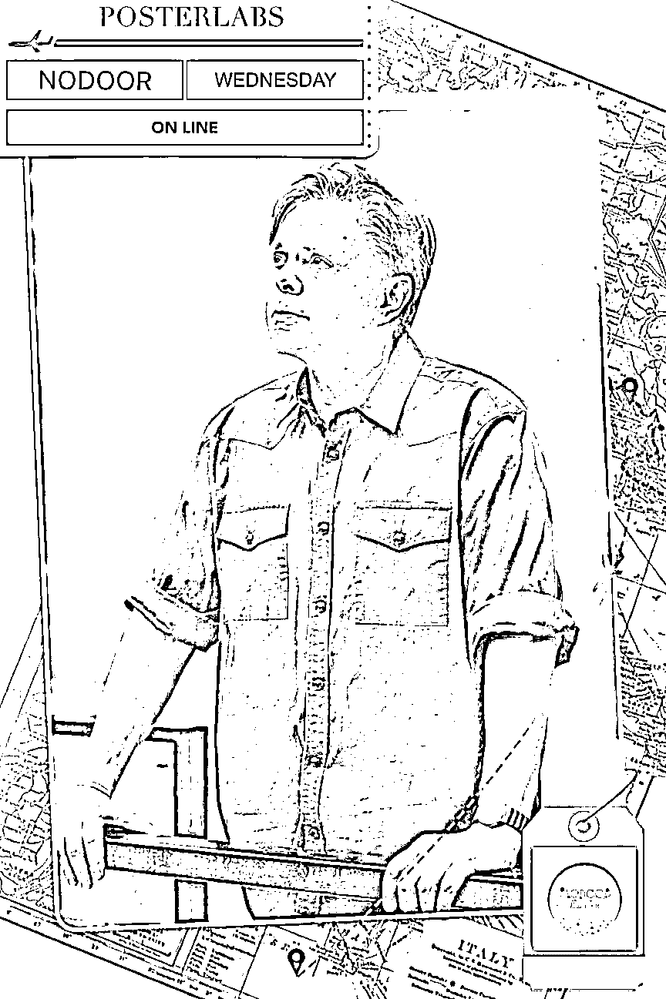

**大卫·瑞雷（David Railey）**

*   若道联合创始人，致力于在中国教授和推广西方占星学；

*   曾任 ISAR 全球副主席，CAPISAR（ISAR 职业占星师资质认证机构）主席；

*   1976 年，通过亚特兰大职业占星师考试，成为全职占星师，随后通过 AFAN 和 ISAR 职业测试；

*   1980 年，与杰夫·焦耳一起在亚特兰大创建“每日行星”占星学中心。此后在亚特兰大占星协会担任 4 年考官，并且两次担任亚特兰大地区占星协会主席。1979-1992 年，作为占星师活跃于美国社会媒体，向不了解现代占星学变化的大众宣传专业占星学知识。在 1989-1992 年期间，他在 WRGG 电台 12 频道每周主持个人电视秀“今日占星学”，早先他还在 WRFG 的广播节目中播讲宇宙天气节目；

*   2010-2014 年，任全美占星师联盟监督委员会委员；

*   2010 年，其著作《灵魂的目标》中国版出版，和蒋颖一起创办若道占星学校和其官网 www.nodoor.com；

*   2017 年，被选为 ISAR 委员会成员。ISAR 是世界最大的国际占星机构，会员遍布 45 个国家，2017-2020 年曾任 ISAR 全球副主席、CAPISAR（ISAR 职业占星师资质认证机构）主席。

**助教简介**

**薇安**

*   全职心理占星师、ISAR 认证占星师（2016 年获得）；

*   北大心理学硕士、MBTI 国际认证施测师；

*   若道认证生时校正资质及 COAC 高阶资质毕业生；

*   连续两届担任格伦·佩里老师亲授的“美国占星心理学院&若道占星双认证核心课程”主助教；

*   2012 年至今，持续追随多位国际占星大师进行占星学的深入学习；

*   2007 年至今，持续进行精神分析及心理动力取向的理论及技巧研习；

*   致力研究心理学与占星学的整合运用。

4

**此次课程适合哪些人？**

*   对占星学感兴趣，想要入门的零基础者

*   占星学小白，但有志成为职业占星师的人

*   有一定占星学基础，但不知道该如何整合星图复杂碎片的人

*   想要师从更多殿堂级占星导师学习占星心法的人

*   走在自我探索和个人成长道路上的人

5

**选择若道学习占星学的优势**

**运用自由意志，扭转破坏性模式，绽放天赋潜能**

若道是人本主义占星学的旗手。因为我们相信，**人通过了解模式、觉察习性、积极疗愈、终将释放其潜能，与命运共舞**。

**进入国际权威职业占星师认证的快车道**

占星界的“联合国”ISAR（国际占星研究协会），是具有全世界影响力的占星教学和研究组织和职业占星师全球认证机构，认证占星师遍布 47 个国家。**在 ISAR 的 22 所附属学校中，大中华地区的附属学校只有若道一家**。在国际化的教学理念大纲标准下，**若道毕业生在 ISAR 国际认证占星师的考试通过率多次全球第一**。

**十年占星学教育中国本土化教学经验**

**根据中国学生的学习习惯不断优化占星教学体系，让学员学成后更自如地应对本土咨询市场的需求。**

学好占星学不仅仅需要邀请一两位老师教学，更需要对教学难点有充分了解，且有持续的教学跟进服务。**10 年来多次核心课程和各种专题课程的教学，让若道非常了解中国学生学习占星学的难点和卡点，合理有效地拆分、提炼课程知识点，同时也积累了丰富的国外老师和中国老师、助教紧密配合以及课程顾问密切配合教学的经验**。

若道还专门开发了有助于占星学习的“**若道**”APP，每门课程都设有答疑板块，学员能够方便快捷地提交问题，助教及时答疑解惑和批改作业。

**融入中国顶尖的职业占星师群体**

若道是中国职业占星师的“黄埔军校”。职业占星师的培养从若道开始，**进入若道，你就走进了中国顶尖的职业占星师群体，和一群志同道合的师兄师姐联谊，获得经验，共同成长**。 

**多种奖学金支持**

为了鼓励学员不因为暂时的经济困难而放弃学习，我们特意设置了各种**技能交换和奖学金**。

对于有一技之长的学员，我们推出的技能交换的项目包括**“笔译”、“笔记整理”、“平面设计”、“课本朗读”、“班级服务”**等技能交换项目；

而对于努力学习、出勤率高、完成作业率高的学员，我们设置的**土星奖、木星奖**等各种奖学金在等着你。

为了感谢帮助我们推荐学员的老学员们，我们设置了“**老学员推荐奖**”；

对于通过问卷提建议，帮助我们提高服务的学员，我们也设置了相应的奖学金。

**开启占星咨询的职业规划和支持**

若道为占星学员搭建了占星问答平台和占星咨询平台，并提供严肃占星学影响力最大的媒体平台，全力为毕业生提供宣传渠道，帮助你吸引和积累咨询生涯初期的种子客户。若道为学员开发了适用于占星学习的“若道”APP，并不断更新完善。

**①  微信平台**若道微信平台作为业内颇具影响力专业平台，为文笔好的若道毕业生提供传播占星学并免费宣传自己的机会。有的学员因为文笔获得众多粉丝喜爱，在 3 年多时间积累起 2000 多人的潜在客户。

****②  **咨询平台**若道咨询平台是我们为优秀毕业生所搭建的平台，帮助毕业生在自己的咨询拓展之外，用若道提供的平台扩展咨询客户群。自咨询平台 2017 年 8 月上线运营以来，咨询平台共入驻 65 人，收入最高者达 32 万元。

此处所列学员收入仅供参考，收入高的学员和其专业水准、努力程度密切相关。若道平台尽其所能将自己定位为辅助学员开展职业生涯的桥梁。

6

**课程价格**

**101-102 初阶**

**正价：**6800 元

**学习充值卡优惠价：5800 元**

**101-105 第一学年**

**正价：**18800 元

**学习充值卡优惠价：17000 元**

**101-205 全阶联报**

**正价：**50000 元

**转发优惠价：38000 元**

**学习充值卡优惠价：35000 元**

**咨询课程顾问**：**王老师（微信/手机：18510107057，请备注“格伦核心课”）**

**全阶段学习后，可参与若道占星毕业认证考试，考试费用为：580 元**

7

**直播课开课时间**

**2022 年 4 月 27 日（周三）20:00-22:00**

**如果直播课时间临时有调整，班班会及时通知每位同学****最终解释权归若道所有**

8

**退转课程**

**退款原则请详看《教学协议》，如有疑问请咨询课程顾问。**

9

**格伦老师视频**

** 格伦·佩里老师如何将心理学和占星学结合，如何开始教授心理占星学？**

<mpvideosnap class="js_uneditable custom_select_card channels_iframe videosnap_video_iframe" data-pluginname="videosnap" data-id="export/UzFfAgtgekIEAQAAAAAAHBcLpepWXQAAAAstQy6ubaLX4KHWvLEZgBPEkIMYRVhfSLT8zNPgMIs23XYw2eSgrRaPW3Dj9_BA" data-url="https://findermp.video.qq.com/251/20304/stodownload?encfilekey=S7s6ianIic0ia4PicKJSfB8EjyjpQibPUAXolnQrZwePcCZ0XffhxtFKBwL8xABabPSCrxp2TBZSdOyypmjhiabiaWTOO3EBU1J4xTc5YqicfMicRDjwKRTic0XAyGhw&amp;adaptivelytrans=0&amp;bizid=1023&amp;dotrans=0&amp;hy=SH&amp;idx=1&amp;m=&amp;scene=0&amp;token=x5Y29zUxcibDvW6kcaiah8Ercl8kTODs9WlcutHnqspJaoS4rCI8zZQ2lSdgwic54KnoDkAWPP5Y1A" data-headimgurl="http://wx.qlogo.cn/finderhead/PiajxSqBRaEJYnVsqWfEX9qA0sI6hNVKsDfyzfPZ92WZMZyBpZWU5NA/0" data-username="v2_060000231003b20faec8c4e68a1ec2d4ca07e434b07755bbf47e7053a3059defd2c9d6c68a20@finder" data-nickname="若道" data-desc="#若道核心课 如何解读一张出生星图？出生星图有哪些组成部分？星图里不同组成部分分别代表什么？" data-nonceid="7032132594947358005" data-type="video"></mpvideosnap>****2022 双证书核心课****

**授课老师：格伦·佩里、大卫·瑞雷**

**直播课开课时间：2022 年 4 月 27 日（周三）开课**

**授课方式：******网络授课，英文授课，中文翻译****

**费用：101-102 价格：**6800 元**（充值卡优惠价 5800）**，**101-105 价格**：18800 元**（充值卡优惠价 17000）**，**101-205 价格**：50000 元**（转发优惠价：38000 元，充值卡优惠价 35000）**；

**课程负责人：王老师**（微信/手机：18510107057，请备注“格伦核心课”）

长按二维码添加课程负责人咨询~

****报名直达入口****

# 她创立了母亲节，却终生未做过母亲 | 一个北交天蝎座的人生之路

> 原文：[`mp.weixin.qq.com/s?__biz=MzA5NjA0NTAxNg==&mid=2651473410&idx=1&sn=0cdd73009de51174946809e0b9bed0eb&chksm=8b48f4b5bc3f7da3400c829086cc3d559b5d74cea729efd1cec264837b974eb51b7c24adff7a&scene=126&sessionid=1692737822#rd`](http://mp.weixin.qq.com/s?__biz=MzA5NjA0NTAxNg==&mid=2651473410&idx=1&sn=0cdd73009de51174946809e0b9bed0eb&chksm=8b48f4b5bc3f7da3400c829086cc3d559b5d74cea729efd1cec264837b974eb51b7c24adff7a&scene=126&sessionid=1692737822#rd)

****☆ **后台回复“今日”，给你一句生命态度**

作者/蒋颖 若道占星创始人编辑/玫瑰 图片/网络**作者的话**每逢母亲的节日，都能看到全世界感受到伟大母爱的人们在向母亲表达爱意，对母亲心怀不满的人们在画讽刺和幽默漫画，分析人类行为的心理治疗师在宣讲母亲对生命的复杂影响，勤奋的商家在努力利用这个节日把商品销售给打算表达爱意和孝顺的儿女。而这一切热闹的人类社会活动都源于一个出生在上个世纪的女性，母亲节的创始人安娜·玛丽·贾维斯和她的母亲的故事。**“母亲节”创始人的母亲**故事要先从安娜的母亲讲起。安娜的母亲安娜·玛丽·瑞威斯·贾维斯（文中我们将称呼她为瑞威斯）出生于一个神职人员家庭。她的父亲是牧师，而她嫁给了另一位牧师的儿子，她的丈夫后来成为了一个成功的商人。贾维斯家族，和那个年代许多的家族一样，经历了很多的悲伤故事（瑞威斯星图中有太阳-冥王对分相），比如她生育了 13 个孩子，其中只有 4 个活到了成年。瑞威斯不仅是一位非常虔诚的教徒，也是一个积极的社会活动先行者。因为自己的苦难，她决定采取行动，帮助她的教区对抗儿童疾病和糟糕的卫生条件。她建立了“母亲日工作俱乐部”（瑞威斯星图中南交水瓶座合相海王星），俱乐部成员们积极参与到当时兴起的卫生健康运动中（那是在 1800 中期哦！）他们筹集捐款，拜访家庭，宣传卫生知识，为母亲提供教育和其他帮助，以降低儿童疾病和死亡率。瑞威斯还是一个坚定的和平主义者。内战爆发后，瑞威斯所生活的弗吉尼亚州首先受到冲击，这个州分裂成两个部分，人们纷纷加入南方阵营和北方阵营。瑞威斯作为俱乐部的领导人，坚持中立（北交狮子座，太阳天秤座），拒绝了教会的分裂，坚持为南北双方的士兵和家庭提供服务和援助。她的俱乐部成为美国内战时期的一股团结和统一的力量。战后，为了消除战争的敌对所带来的憎恨，她和她的俱乐部成员建立了母亲友谊日，尽管受到威胁（太阳冥王对分相），但她仍旧勇敢地站上舞台（北交狮子座，太阳天秤座），最终，北方南方的士兵及其家人手拉手唱着歌，把憎恨和敌对变成了眼泪及和解。瑞威斯一生致力于帮助女性，荣耀和帮助母亲们。她是虔诚的教徒，一直在主日学校（孩子们在去教会前会到主日学校学习圣经）教书，积极参与教会的活动。瑞威斯的月亮很可能在射手座，在维基百科的词条中，她是一个**“被信仰所定义的女人”**。这是母亲的故事，是整个母女故事的前半部分，听起来鼓舞人心，充满爱、信仰、勇气、慈悲。然后我们来看看瑞威斯的女儿，母亲节的创始人安娜·玛丽·贾维斯的故事。

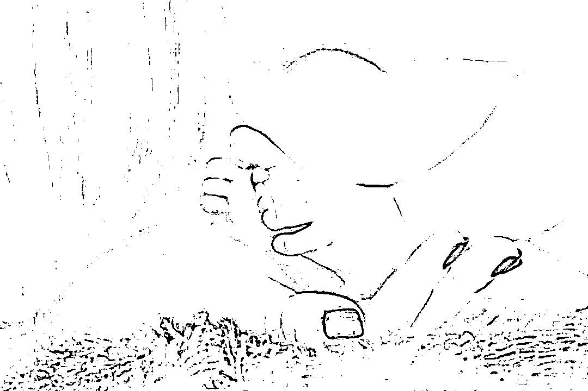

**“母亲节”创始人的星图解析**在安娜的星图上，月亮在双鱼座。稍微懂一点占星学的人，都能看到这个月亮反映了安娜眼中的母亲——那个**充满了大爱、虔诚和奉献精神的圣徒**。对月亮双鱼座而言，把这样一个母亲及其精神放入圣坛，似乎就是自然而然的事情。安娜非常敬爱她的母亲，同时也非常虔诚。她是教会成员，帮助她母亲的社会工作。母女之间的关系亲密，她们不在一起的时候，常常通信，母亲为女儿在职业上获得的成就感到自豪。没错，太阳合相冥王星在金牛座的安娜在创办母亲节前，职业上很成功，是忠诚互助人寿保险公司的第一位女性编辑（在当时，职业女性很少） 。然而母亲节改变了她的人生。创立母亲节的念头源于 12 岁时在主日学校课程中，她听到母亲念的一段祈祷词“我希望，某天，某人，在某个时刻，找到一天纪念母亲，纪念她无与伦比的奉献”。当她的母亲去世 3 年后，在 1908 年 5 月 10 日，她终于找到了这个日子。这天，她在自己所属教堂举办了一个母亲纪念日典礼，买了她母亲生前最喜欢的花——500 株白色康乃馨装饰这个典礼，以纪念她的母亲和她所在的教会的所有母亲。这成为母亲节的开端。此后，她投入了一场要把“母亲日”变成全国性节日的运动，她从工作中辞职，不断地写信游说教会、州和国家议员、商业领袖，在锲而不舍的努力下，1914 年，当时的美国总统伍德罗·威尔逊把母亲节定位全国性节日，而这个节日也流传到其他很多国家。

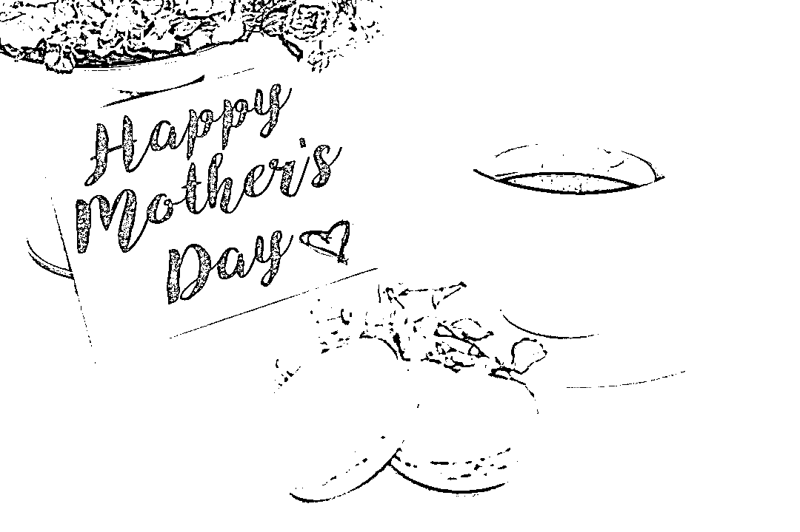

**“母亲节”和商业化的斗争**如果这个故事到此结束，可能就是一个皆大欢喜的故事，也不会引起我的深思。然而故事发展了下去。创立了母亲节后，和当年她天秤座的母亲（太阳冥王对分相）为保持中立维持和平的信念而进行抗争一样，安娜也陷入了一场信念的抗争（ 安娜北交点在天蝎座，木星合相北交点，太阳紧密合相冥王在金牛座）。不过这是一场**和母亲节变得商业化而进行的抗争。**因为人们要庆祝节日，给母亲买礼物，因此花、糖果、甜食、卡片成为母亲节最大的消费品，比如，原来庆祝母亲节的白色康乃馨价格大涨。当数量不够时，商家就出售红色康乃馨，用红色献给活着的母亲，白色康乃馨献给死去的母亲。因为商家热情的参与和推动，母亲节变得如火如荼，花朵、糖果、珠宝、卡片、餐馆等众多行业因此受益。然而，安娜痛恨这种商业化的行为，抨击这种行为，认为这种行为亵渎了母亲节的虔诚和神圣。安娜把自己所有投入这个抗争中，后来在美国大萧条时期，她又失去了从商的哥哥留给她的遗产。最后，安娜一贫如洗，双目近盲。1943 年 11 月的某一天，她來到費城的大众医院，要求医院以慈善的名义收容她，在朋友的帮助下，她住进一家私人疗养院（月亮双鱼座），1948 年 11 月 24 日，安娜在疗养院去世。这位母亲节的创始人一生没有结婚，也没有成为母亲。

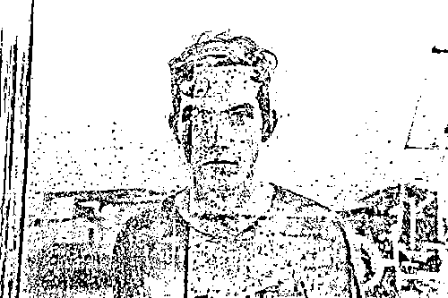

最后死于疗养院、没有因这个节日获得任何金钱收益的安娜可能不会料到的是，她创始的这个尊崇母亲和母爱的节日成为美国第三大节日，每年母亲节，美国人大概每年花费 26 亿美元在这个节日中。我想今天，即使在中国，也有数不清的商家因此而获利，他们可能完全不知道谁是安娜·玛丽·贾维斯，不知道她所挚爱的母亲的故事。当然，也有数不清的人因为这个节日，借此向母亲表达自己的爱。**母女的天蝎座议题：冲突与挑战**

| 安娜出生星图（1864 年 5 月 1 日，9:38:21am，West Chester，PA）没有占星学背景的朋友看这个故事，可能会有一些唏嘘感叹，甚至认为这是一个悲剧性的故事，但作为占星师，有了母女二人的星图做指引，我总是会想这样一个问题：安娜的灵魂想在世上寻求什么？她为什么有这样一个生命故事？为什么母亲的故事到了女儿这里，有了这样的演化？从世间法而言，她所倡导的事情获得了全世界的认同，但在纯粹的信仰和利益导向的商业化战争中，这位神职家庭出生的女儿又似乎输了一场战争，那么从灵魂的目标而言，她的成绩单分数又怎样？仅仅看母女二人星图，星图上都有**非常明显的天蝎座议题（冥王星议题），而且全部是太阳和冥王星的挑战相位，并通过和各自月亮交点的联系而成了人生的主要故事。**也就是说，**母女二人的灵魂都在寻求一些激烈的冲突、挑战，通过面对危机、甚至丧失转化她们自己，获得太阳的光辉和荣耀**。女儿北交天蝎座的要求则让她的人生道路变得愈加激烈。如果，我们相信，灵魂在选择自己的道路的话，这是需要勇敢的灵魂才敢于选择的道路，虽然作为人的我们不知道这个召唤和选择。一般而言，如果女儿星图上出现和父母相似的相位，代表着女儿继承了这个相位所代表的议题，家族中这个相位代表的动力持续存在，需要有人把这个议题解决。仅就冥王星而言，其要求的献祭常常是**丧失，通过丧失而走向更深的生命道路和与生命的联结。**安娜的家族历史中有很多的痛苦，仅仅从母亲一面而言，安娜的母亲失去了 9 个孩子，这是她的献祭；而安娜失去了所有的财富和视力，这似乎是她的献祭。而她们通过这种“献祭”完成了一生的故事。尽管安娜的母亲是勇敢而伟大的女性，但这种丧失的悲伤显然没有在母亲那里完结。不管她们的故事在一般人眼里是什么样的，我想说这是一对非常勇敢的母女，而她们也确实成了时代的先锋。圣经中虽然有圣母和一些圣女，但 100 多年前，西方女性的地位其实和中国一样，并不高，在 19 世纪中期和 20 世纪早期，西方女性主义运动还远远没有开始。那时，波伏娃还没有谈到“第二性”，女性在社会的地位无非是作为女儿、妻子和母亲，最大的贡献无非是作为母亲，而通过生育而繁衍后代则是女性天经地义的义务。历史上因为生育条件的恶劣，很多母亲失去了自己的儿女，或者因为生育而失去生命。而这种生死的历程从来没有得到过承认或者颂扬。安娜以一己之力，推动母亲节在世界范围内的庆祝，让更多人看到作为女性的角色之一，也是女性在那个时代最主要的角色——身为母亲的奉献之伟大。非常有趣的是，安娜本人没有结婚，也没有孩子，不论我们怎样去想她个人的故事及其含义，但从社会角度而言，却似乎是一个很有趣的先兆性的象征，这个完成了歌颂女性作为母亲角色，并将这个角色放上神坛的女性却以自身的姿态预兆着女性的另外一条道路，不是作为妻子、也不是作为母亲而存在，未来的女性也许可以追求更丰富的生命光谱。

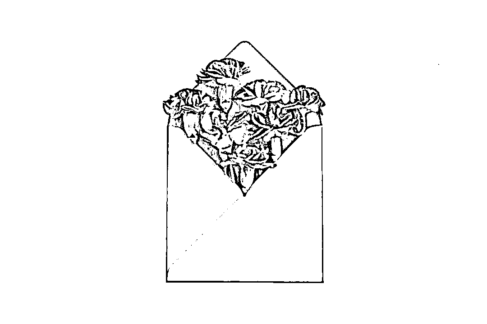

**对抗商业化的战争源自何处？**另外，非常有趣的一个观察当然是安娜对抗商业化的战争，从占星学上看尤其有趣。如果金牛座象征商业社会的一切东西，这似乎是一个月亮双鱼座孩子和月亮金牛座孩子的战争，他们都在为了荣耀母亲的需要而战。**月亮双鱼座的孩子要纯净的宗教情感和神圣化母亲，而月亮金牛座的孩子要通过商业贸易让母亲得到丰盛的生活。**而现在写故事的我是**月亮水瓶座，我看到是对社会进步影响，女性解放的意义。**我们都在为自己的母亲书写着。我们有着不同月亮星座的人们有没有可能互相理解、合作，而不需要战争？进一步再看安娜的星图，这个战争是不是安娜内心的战争呢？毕竟母亲节是一个虔诚的信教的月亮双鱼座、太阳金牛座的孩子，在代表着安逸和富足的土象星座金牛座的月份里发起的节日。懂得占星学的人都明白太阳代表父亲，安娜和她母亲的星图上都有非常紧密的太阳-冥王星的相位，预示着和父亲/丈夫之间的权力斗争，并通过这样的斗争获得力量的生命故事。在历史上，我们读到安娜和她母亲的故事，家族里的男性似乎没有留下什么印迹。我们知道安娜的父亲和兄长都是成功的商人，如果不是因为大萧条，兄长留下的钱足够安娜和她的姐姐度过舒适的一生。而安娜最终丧失了这些钱，她最终进入月亮双鱼座所代表的疗养院也似乎说明这场内心战争的结果。这张星图上还有许多值得探讨的地方，有兴趣的朋友可以自己探讨。总之，这个故事提醒我们，母亲节是一个精神性的节日，也是一个物质性的节日，愿我们两者都能取得平衡。历史是一个神话。历史中的重要人物也是一个神话。我无法评价这些神话，只能遥远地眺望着，深思着，并祝福安娜的灵魂安息。

**版权声明**：文章由作者授权发布于若道平台发布，欢迎转发，反对抄袭。

****

**母亲节系列直播活动****今晚第三场****扫描关注视频号，即可预约直播哦~**

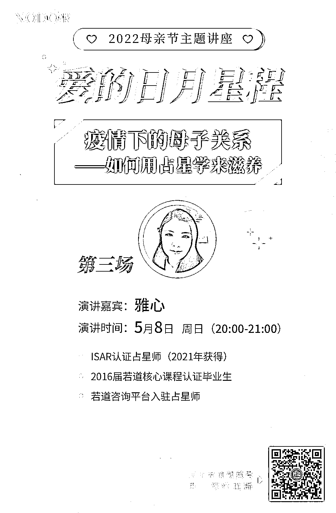

**获取亲子报告****可以扫描下图二维码****买一赠一哦~**

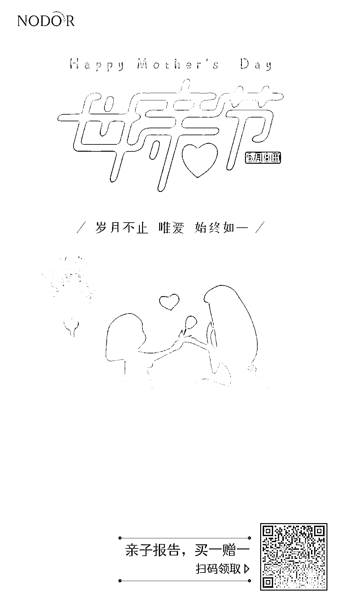

**20 位来自世界各地的占星师****带来 19 场沙龙——新世界的觉醒****详情可点击下图**

**学习占星学****点击下图了解课程详情**

**

**微信又双叒叕改版啦，不想错过若道君的推送？**

**就把若道设为星标吧！**

**▼**

**就是这个“在看”，戳戳戳 ☟**

****************报名直达入口****************

# 太阳水瓶座与 12 星座月亮丨“你的特立独行是为谁而来？”

> 原文：[`mp.weixin.qq.com/s?__biz=MzA5NjA0NTAxNg==&mid=2651473351&idx=1&sn=ef70ce661e6dabbb1e87900eb6f51cf3&chksm=8b48f770bc3f7e66a1e6ec5b3eef32669657039abceed3312ab12aa1a5689f263a580fb4cce8&scene=126&sessionid=1692737822#rd`](http://mp.weixin.qq.com/s?__biz=MzA5NjA0NTAxNg==&mid=2651473351&idx=1&sn=ef70ce661e6dabbb1e87900eb6f51cf3&chksm=8b48f770bc3f7e66a1e6ec5b3eef32669657039abceed3312ab12aa1a5689f263a580fb4cce8&scene=126&sessionid=1692737822#rd)

☆****后台回复“今日”，给你一句生命态度****

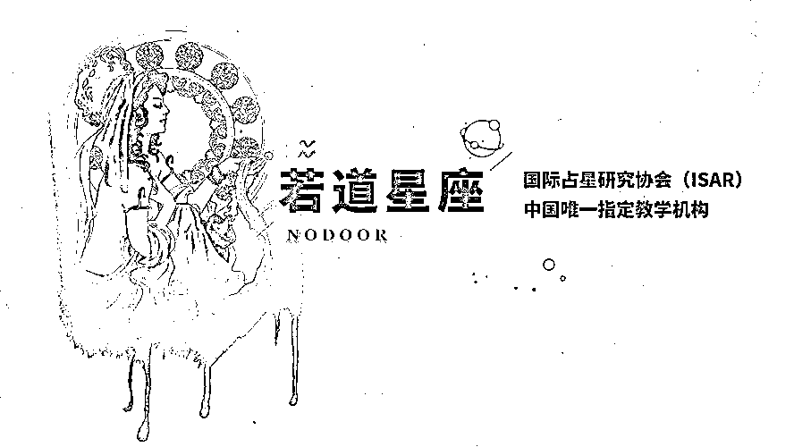

作者/诺·泰尔 译者/江艺、dogcatcher 编辑/翀子 封面/书君 图片/网络太阳是生命的伟大能量，而月亮被认为是人格中的“主导需要”，同样被重视（你可以点击[【开篇】](http://mp.weixin.qq.com/s?__biz=MzA5NjA0NTAxNg==&mid=2651463192&idx=2&sn=7ecd2012aee1f245b56e0f107bdfc19e&chksm=8b48acafbc3f25b968e9ca8cbe8acf6972dc3e418827b36ac12af7bf7c81858937657babb393&scene=21#wechat_redirect)，查看诺·泰尔老师对此部分内容的详细阐述）。当水瓶座太阳，遇见 12 星座月亮，分别有哪些表现呢？**太阳水瓶座和 12 星座月亮**

**★月亮*****白羊座***

占星师 Grant Lewi 写道：“**你有着快速、好斗的思维**，对自己的智力才能有着敏锐的感知，并对外界持有一种批判的态度。这是一个具备天才优越感情结的配置。”**他们的思维过于明亮地火花四溅**。

为了让智力和表现欲有效地服务于自己，他们**必须注重社交中的平衡感。 **

**★月亮*****金牛座 ***

**思维和感情能动地融合在一起**。二者的构架都是**自足的**，因而他们**通常缺乏企图心**。对他们来说，个性的发展比获得社会声望要重要；依赖感和忠诚对爱情格外重要。

他们成长中的紧张任务，**是让自己的才华得到应用和施展，**获得真正的意义。

**★月亮*****双子座 ***

在**艺术、爱情和智力活动**中，他们展现着强烈的戏剧感，引人注目。但犹豫不决却会侵蚀和暗中破坏实实在在的创新。他们**需要务实和专注**。 

**★月亮*****巨蟹座***

**他们有着强大的**响应他人**的能力。**在情感和安全感方面，他人只要稍稍付出滴水之恩，他们就会触发自尊，作出涌泉相报。如果星图别处也有不平衡，他们就会作践自我价值感，丢失为人处事的基本风度和准则。 

**★月亮*****狮子座***

理智和感情激烈地争夺生活的舞台中央。他们的**思考和猜测太具有革命性**，以至于可能脱离现实和逻辑。他们的言行举止带有**自豪感、独立感**和一种引人注目地表现自尊的特殊气质。

在濒临困境的时候，自尊会寻找逃离的机会，而不是调整和适应。 

**★月亮*****处女座 ***

**思维的力量，理性，严厉的观察，富有创造性的推理演绎**——这些都是他们的优势。辩论与演说能释放他们的全部价值观。他们的感情被思维过程的细节所吞没，对理性的重视让他们轻易地忽视生活中的感性一面。 

**★月亮*****天秤座***

**社交和浪漫**对他们极其重要。和他人相处时的轻松感会稀释他们坚持不懈的品质。他人的口是心非会让他们很震惊，因为他们非常珍视自己的忠诚老实。随着成长，他们逐渐学会容忍和同情。 

**★月亮*****天蝎座***

**自尊是不可或缺的**。他们**敏锐而理性**，并能靠其静静地取悦自己。对他们来说，即使和他人合作，仍然是为了证明自尊的重要性。一切都是基于自己的能力和能量。

他们成长中的紧张任务，是在现实世界中**找到引人注目、有鞭策力的伙伴，**这样，自尊就可以在一个更广阔的地带找到方向和远景，获得认可。 

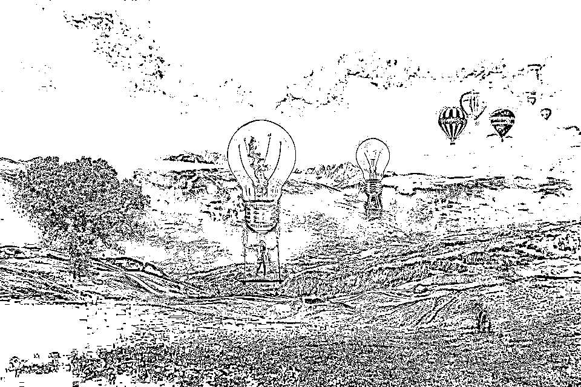

**★月亮*****射手座***

射手座把理性的思维提升到了比水瓶座更加独立和高远的层面。**他们有着****理性、诚实的品质和宽广的、国际化的思想观念。**他们的爱情是热切而理想化的。

在具备强势征象的星图里，这个配置带来无边的好运，**友谊对自我提升有着奇迹般的作用。 **

**★月亮*****摩羯座***

思维支配着个性中民主创新的一面。**他们需要面向大众**。这是公众领袖的典型配置：衣衫褴褛的独立运动推行者挥舞着臂膀煽动人群。他们充满人文情怀，又能实事求是，二者完美组合。

土星守护这两个星座。当太阳落入水瓶座时，月亮会提升其力量。

**★月亮*****水瓶座***

这个配置聚焦了**发明、科技、分析和研究**。他们积累**不同寻常的朋友**，来组成一个令人敬畏的社交圈子。 

**★月亮*****双鱼座***

水瓶座不同寻常的、革新的特质被双鱼座的感知力进一步加强。在他们的生活里，来自玄学、神秘和宗教的影响和灵感，把**现实和想象、实际和想设、科学和诗意**熔合在一起。

如果星图其他部分缺乏强力的结构，**他们容易活在想象的世界中**，容易自欺欺人。

**版权声明：**本文由若道翻译发布，欢迎转发，反对抄袭。友号转载请申请白名单。

**本系列其他文章**

[太阳白羊座·12 星座月亮](http://mp.weixin.qq.com/s?__biz=MzA5NjA0NTAxNg==&mid=2651463192&idx=2&sn=7ecd2012aee1f245b56e0f107bdfc19e&chksm=8b48acafbc3f25b968e9ca8cbe8acf6972dc3e418827b36ac12af7bf7c81858937657babb393&scene=21#wechat_redirect)丨[太阳金牛座·12 星座月亮](http://mp.weixin.qq.com/s?__biz=MzA5NjA0NTAxNg==&mid=2651463523&idx=1&sn=69fa5ba9035316fecd6c3911e744f089&chksm=8b48add4bc3f24c274cd5064316982ae958debed1e9ab681b46b80d8d8ec26bb3d2036075be9&scene=21#wechat_redirect)[太阳双子座·12 星座月亮](http://mp.weixin.qq.com/s?__biz=MzA5NjA0NTAxNg==&mid=2651465406&idx=1&sn=c9bf1ba49b07f6c67740c46779200be8&chksm=8b489409bc3f1d1fdad398e34840d6338275f29a8292e9eb404df28126fcc8262c454b2cb6c5&scene=21#wechat_redirect)丨[太阳巨蟹座·12 星座月亮](http://mp.weixin.qq.com/s?__biz=MzA5NjA0NTAxNg==&mid=2651465949&idx=1&sn=9dfd930de39b2de38c761152f4b8710c&chksm=8b489a6abc3f137c5c6e96f404038de7f4261fc6c995aeb285bc37f79b96ef5a1d237dbe3af5&scene=21#wechat_redirect)[太阳狮子座·12 星座月亮](http://mp.weixin.qq.com/s?__biz=MzA5NjA0NTAxNg==&mid=2651467312&idx=1&sn=d1a81f5cc1a60b3198d9c0ba770b4ba0&chksm=8b489c87bc3f1591008c88cef7b385086eb7717d4345926de92349b071ad10ceb67099f17ed0&scene=21#wechat_redirect)丨[太阳处女座·12 星座月亮](http://mp.weixin.qq.com/s?__biz=MzA5NjA0NTAxNg==&mid=2651467590&idx=1&sn=09b8f5ba9fa46e469e0add987cbe1664&chksm=8b489df1bc3f14e7a4e6b90286394af16e05f4c097058a2e2402d38f2634a0a84b32aaa03fe3&scene=21#wechat_redirect)[太阳天秤座·12 星座月亮](http://mp.weixin.qq.com/s?__biz=MzA5NjA0NTAxNg==&mid=2651469157&idx=1&sn=c8b14b4a67b6c6ed3b7943c136d7c34c&chksm=8b4887d2bc3f0ec46e3b444c2f1ba1f331d5d0b35326aa75e77351fdde762f0fd1c6d43ada5c&scene=21#wechat_redirect) | [太阳天蝎座·12 星座月亮](http://mp.weixin.qq.com/s?__biz=MzA5NjA0NTAxNg==&mid=2651470116&idx=1&sn=68fb9ddee0671591ebae843cf2b38431&chksm=8b488b93bc3f02853f1cb8bcde25868c1c1500478eda9c4773dd1d3f93b3239a8a5fc956d999&scene=21#wechat_redirect)[太阳射手座·12 星座月亮](http://mp.weixin.qq.com/s?__biz=MzA5NjA0NTAxNg==&mid=2651470771&idx=1&sn=c00e6fac49cac9c8ed97b637fe39267a&chksm=8b488904bc3f00122bf676a9dc0d668389344169bb9e78f94a909be9575feab784436648a42c&scene=21#wechat_redirect)丨[太阳摩羯座·12 星座月亮](http://mp.weixin.qq.com/s?__biz=MzA5NjA0NTAxNg==&mid=2651472509&idx=1&sn=b4abbafe099fe7e8c3904d79df3a5131&chksm=8b48f0cabc3f79dc7e8865e434904b3da31fd8c1c74632c02a0ceb2a2213dcbf5f8bcdec8e64&scene=21#wechat_redirect)

**诺·泰尔**

现代占星学鼻祖，世界众多著名西方占星师的占星老师。他毕业于哈佛大学社会关系专业，是当今世界上最重要的占星师之一，占星联盟协会（AFAN）的创始人及原主席。其所著的三十三本占星教科书作为占星教学的典范，引领了整整两代占星师的占星学习与教育，1998 年国际占星大会（UAC）授予其占星界最高奖项 “轩辕奖”。

**母亲节系列直播活动****今晚第二场****扫描关注视频号，即可预约直播哦~**

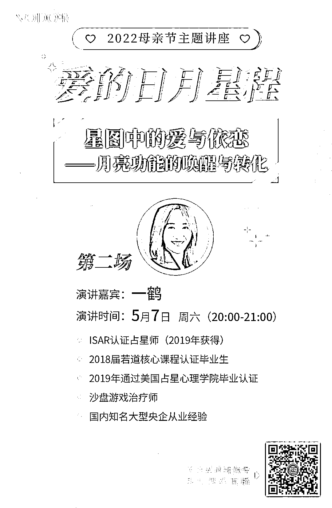

**20 位来自世界各地的占星师****带来 19 场沙龙——新世界的觉醒****详情可点击下图**

**学习占星学****点击下图了解课程详情**

**

**微信又双叒叕改版啦，不想错过若道君的推送？**

**就把若道设为星标吧！**

**▼**

**就是这个“在看”，戳戳戳 ☟**

****************报名直达入口****************

# 今年喜提四次食相 | 每 4.5 年一次的食相，对你的人生会有什么重大影响？（建议收藏）

> 原文：[`mp.weixin.qq.com/s?__biz=MzA5NjA0NTAxNg==&mid=2651473260&idx=1&sn=8c8835add689e634ac88040fc705efa5&chksm=8b48f7dbbc3f7ecdba1191b1692473471a0004d59b30abf44cdaffece542bcc3f763457c63cb&scene=126&sessionid=1692737822#rd`](http://mp.weixin.qq.com/s?__biz=MzA5NjA0NTAxNg==&mid=2651473260&idx=1&sn=8c8835add689e634ac88040fc705efa5&chksm=8b48f7dbbc3f7ecdba1191b1692473471a0004d59b30abf44cdaffece542bcc3f763457c63cb&scene=126&sessionid=1692737822#rd)

☆****后台回复“今日”，给你一句生命态度****

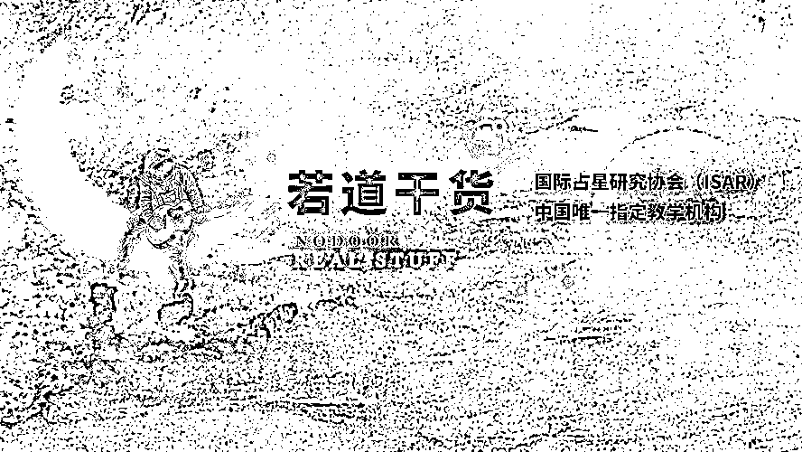

作者/埃普丽尔･艾略特･肯特译者/亚麻林恩 校对/李含
编辑/玫瑰 图片/pexels 食相是重要人生转折的触发器，特别是当食相触发了出生星图中重要行星和轴点、交点的时候。而今年我们会迎来一共四次的食相，分别是 5 月 1 日的金牛座日食，5 月 16 日的天蝎座月食，以及 10 月份的两次日月食。当食相出现的时候，我们可能会有比平时更激烈的感受，篇文章详细地解读了不同的触发带来的变化可能，一定要认真阅读哦。
**食相遇到困难相位**你的出生星图中很有可能包含至少一个这样的行星配置，它是如此“可怕”，以至于占星师们看一眼就会惊呼：“你是如何承受它的？”你耸耸肩。因为这就像与生俱来的蓝眼睛或红头发：对你而言它一直就是这样，所以你已经习惯了，就像一个人习惯了关节炎的抽痛一样。正如丽塔修女常说的，这个有可怕预设的相位就是你要承受的十字架。但是乍看之下，这些激发恐惧的相位生是你潜在的财富。**由困难相位交织在一起的行星们像钢铁一样坚固。它们代表你无法忽视的问题，以及在你找到解决方案或至少是缓和之前会一直困扰你的冲突。**它们描述了你的定义性属性。**每当食相触及激发这些相位时（大约每四年半一次），你都会被再次赋予一次机会，变得更像你自己。**因此，**即便是出生星图上最令人不舒服的相位也不是天生就可怕的。**尽管它们让人感到不安，但**食相也一样激发不安。**有一些食相会参与到更大、更令人生畏、具有全球影响的天象中。然而，就个人层面而言，**当食相与我们出生星图中的行星形成紧密相位（特别是合相、四分相和对分相）时，我们对食相的感受最为强烈。**

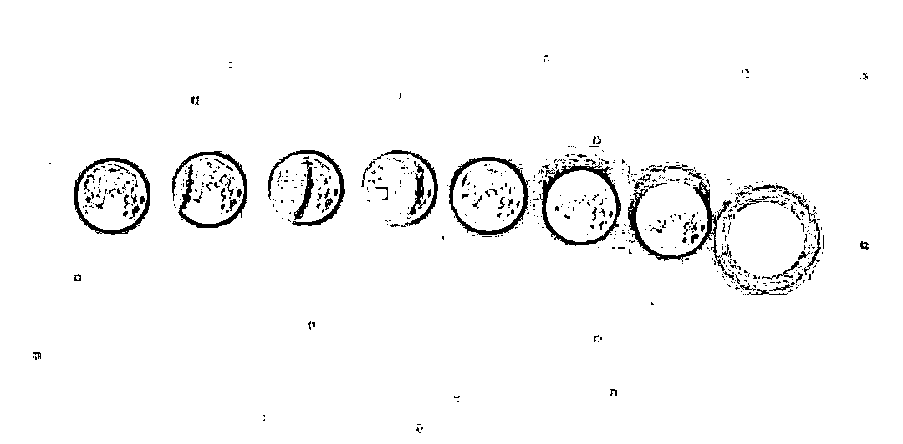

**当食相与我们背负的行星十字架形成相位时，一个关于变化的叙述就会浮现出来——一个贯穿你一生的、反复出现的故事。**如果食相没有触发这些极具张力的出生星图相位，或是非常接近一、四、七或第十宫的宫头，很可能你的感受微乎其微，如同寒风中飘动的树叶。然而一旦敏感相位被触发，这种差异感就如同在体验医生测试你的反应能力和锤打患关节炎膝盖的差异一样。**食相触发行星、轴点、交点的影响****若道君温馨提示：这里的形成相位，可用行进图进行查看，行进的时间可调整到日月食对应的时间，查看“行进盘”月亮与“本命盘”产生相位的行星即可。****今年日月食时间如下：****5 月 1 日，04:27，金牛座日食** **5 月 16 日，12:14，天蝎座月食** **10 月 25 日，18:48，天蝎座日食** **11 月 8 日，19:02，金牛座月食**

**食相与出生星图的****太阳****形成相位**

**如果生命是一部电影，太阳就是我们为之欢呼的主角——不管它有多少缺点。**我们每个人生来就是自己人生故事中的英雄；但通常，**怯懦或虚伪的谦虚会让我们把这个角色交给别人。**

当食相与出生星图的太阳形成相位时，你就被**推上了主角的位置，或者必须努力夺回它。**有时候，**为了让你过上真实的生活，父母或老板这样的权威人物会退位或必须被推翻。**

**食相与出生星图的****月亮****形成相位**

从母亲的子宫剥离的那刻起，我们就一直在试图重新获得那份曾熟知的可靠感和安全感。我们为自己的巢穴铺上羽毛，囤积喜爱的食物，让周围都是让我们感到舒服的人。

但是，当**食相与出生星图的月亮形成相位时，**有些东西——**一种新的生活环境，关于健康的变化**可能会让你感觉像一只被剥了壳的螃蟹，无所遁形。

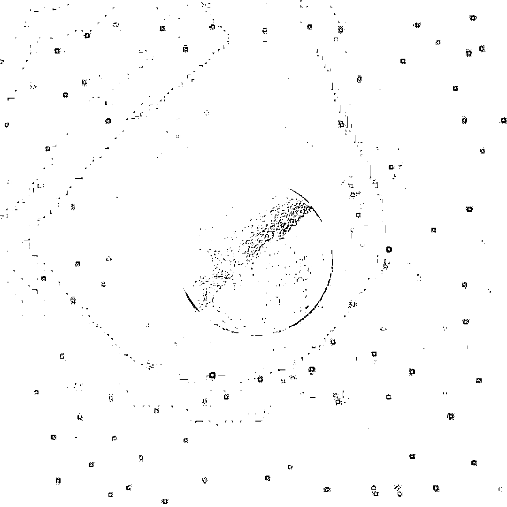

**食相与出生星图的****水星****形成相位**

你如何定义自己？通常，首先是一个名字。然后是你在家庭里的序位，你在运动场的排名，你在职场中的地位。最后，数字（学校成绩、年龄、工资单上的数字）定义了你。

当食相与出生星图上这位定义之神——水星成相位时，准备好**更改你的名字、等级或序列号吧**——**更改你定义自己的方式**。水星是讲故事的人，所以也许是时候重写你生命的故事了。

**食相与出生星图的****金星****形成相位**

如果每个人都拥有完美的自信、良好的人际关系、无尚的自尊和大把现金该多好！食相与金星的相位提醒我们，世界不会总是给予我们自己认为应得的待遇，无论是仁慈的还是残忍的。这种觉知通常来自于**经济上窘境，关系上的转变，或你对自身吸引力的感觉。**

**食相与出生星图的****火星****形成相位**

火星是一只训练有素、冷酷无情的护卫犬，它只对你忠诚。它**保卫你和你的家园，捍卫你的名誉，帮助你得到你想要的一切。**当食相与出生星图的火星形成相位时，这只护卫犬会被激怒并拉紧皮带；**得到属于你的东西，但不要让任何人受伤。**

**食相与出生星图的****木星****形成相位**

你上次冒险是什么时候？当**食相与木星形成相位时，你渴望抓住机会，感受全然活着的兴奋。**这个时候的你可能**过于乐观；但这可能也是你的生活跳出常轨，开始朝新方向前进的时刻了。** 

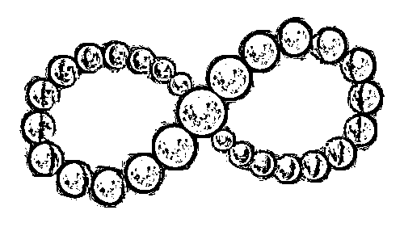

**食相与出生星图的****土星****形成相位**

**你可能会感到疲惫和沮丧。**也许，你已经长大成人了，或仍在遵循过时的规则。但是如果总是把自己的问题归咎于别人，你将永远不会有长进。不管事情是如何发展到这一步的，你打算怎么做让你的生活变得更好呢？

**食相与出生星图的****天王星****形成相位**

**你可能会觉得自己是个异类——而这会伤害你。**看清谁是你的朋友（谁不是），寻找一个让你能做自己的群体，这就是这些食相的挑战。

**食相与出生星图的****海王星****形成相位**

这些食相促使你**检查你的盲点，质疑你的信仰，并挑战你以前认为是理所当然的事情。**如果你一直在**自欺欺人**——比如，妻子无视丈夫已经出轨的迹象，或者一个人对他沉溺女色的上师幻灭——这些食相会让你清醒。

**食相与出生星图的****冥王星****形成相位**

**每个人都有黑暗面。**它们是我们不愿接受的那部分情绪——**愤怒、嫉妒、恐惧、贪婪。**它们削弱我们，让我们成为自己情感的奴隶，成为更沉着冷静的人的奴隶。当食相与冥王星形成相位时，我们需要**面对黑暗的自我，和被投射了黑暗面的他人，与权力和控制的需要作斗争。**

**食相与出生星图的****月亮交点****形成相位**

**作为孩子，我们需要熟悉的人事物产生的边界感和保护性；**父母的职能是为我们进入社会打下坚实的基础，这样我们就能面对不熟悉的、有回报的挑战。**当食相合相或四分出生星图的月亮交点时，**这就是所要面临的挑战：**是时候离开舒适的窝，测试下我们潜力了。**

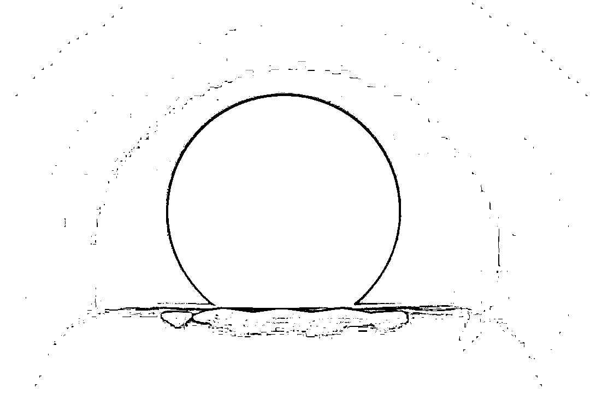

**食相与出生星图的****上升点****形成相位**

**有一些位置——有外部的，也有内部的，让我们与世界联结，其他一切都是以它们为导向的。**这就是上升点的角色。当食相与上升形成相位时，我们**被要求更改方向，有时是自愿的——外在、名字、家庭、前景的改变，有时是为了回应来自外部的要求。****星图中的所有其他轴点，特别是下降点，都会因为这些变化而发出回响。**

**食相与出生星图的****中天****形成相位**

**这是让你个人旗帜飘扬的桅杆，这是人们在很远的地方，就一眼看到你的部分。**幸运的话，它**来源于星图中的另一个端——下中天，它是个探测杆，位于滋养你的家庭关系的内在源泉中**。

当食相与中天形成相位时，你可能会觉得**是时候追求天命，或搬到一个更能反映你真实自我的地方了。**

**版权声明：**本文由若道翻译发布，欢迎转发，反对抄袭。友号转载请申请白名单。

****埃普丽尔･艾略特･肯特****

曾在全美占星师联盟（AFAN）指导委员会任职，曾任圣地亚哥星象学会主席，也是国际占星研究协会（ISAR）、职业占星师组织（OPA）和美国占星学会（NCGR）成员。著有三本书，包括《占星行进全书（*Astrological Transits* ）》和《实用占星基本指南（ *The Essential Guide to Practical Astrology*）》，该书被《奥普拉杂志》、《纽约杂志》和《商业内幕》列入最佳榜单。

**母亲节系列直播活动****今晚第一场****扫描关注视频号，即可预约直播哦~**

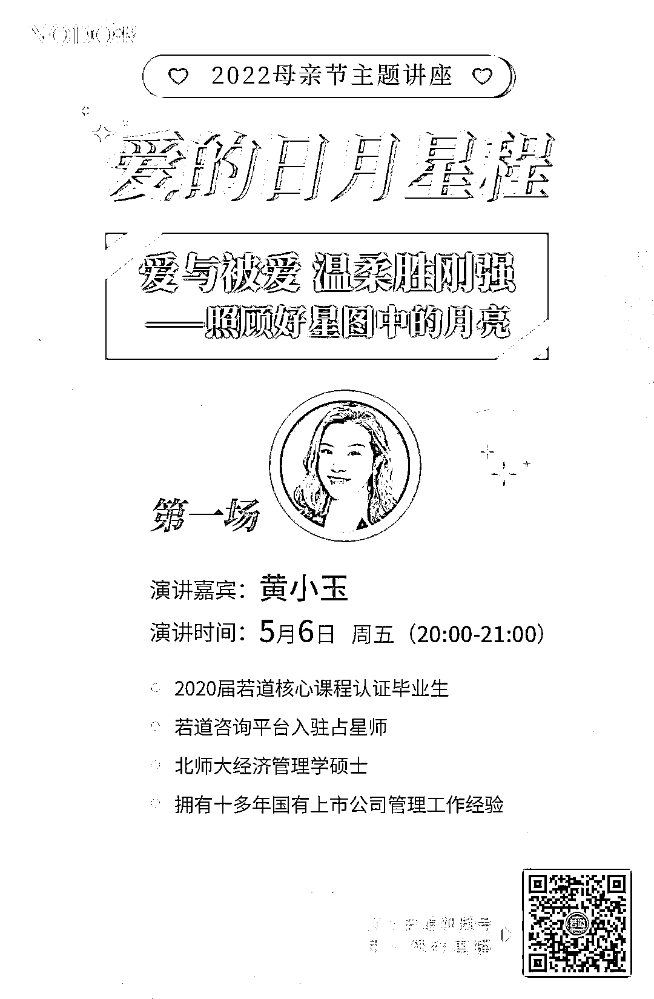

**20 位来自世界各地的占星师**
**带来 19 场沙龙——新世界的觉醒****详情可点击下图**

**学习占星学****点击下图了解课程详情**

**

**微信又双叒叕改版啦，不想错过若道君的推送？**
**就把若道设为星标吧！****▼**

**喜欢记得点一下在看哦☟**

**报名直达入口**

# 心理占星学解读 10 大星体（下） | 如何借助外行星的力量？

> 原文：[`mp.weixin.qq.com/s?__biz=MzA5NjA0NTAxNg==&mid=2651473260&idx=2&sn=847d7a3b0d62471bfa4d4eec896820f5&chksm=8b48f7dbbc3f7ecd3c8f66cf58c87b9ec04cf10f94d7d211502a63bfb937e94a5d1d598ad6f9&scene=126&sessionid=1692737822#rd`](http://mp.weixin.qq.com/s?__biz=MzA5NjA0NTAxNg==&mid=2651473260&idx=2&sn=847d7a3b0d62471bfa4d4eec896820f5&chksm=8b48f7dbbc3f7ecd3c8f66cf58c87b9ec04cf10f94d7d211502a63bfb937e94a5d1d598ad6f9&scene=126&sessionid=1692737822#rd)

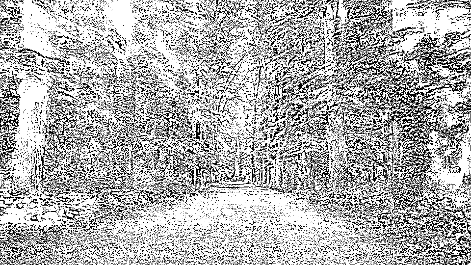

作者/格伦·佩里 译者/若道翻译团队
  编辑/翀子  图片/网络

[【上篇文章】](http://mp.weixin.qq.com/s?__biz=MzA5NjA0NTAxNg==&mid=2651473224&idx=2&sn=4004027397e70d076a243aab05e7faeb&chksm=8b48f7ffbc3f7ee90ef726843ac3fbb263af9a2d9c64de725af9c3a0f0666c3e89068417f8a3&scene=21#wechat_redirect)里（点击回顾），格伦老师给大家讲述了太阳、月亮、水星、金星、火星的心理学占星诠释。那么，剩下的 5 个行星又会有怎样的表现呢？一起来看看吧。另外，本文作者格伦老师参与授课的【[心理占星双证第一学年课](http://mp.weixin.qq.com/s?__biz=MjM5MjQwNjAyMQ==&mid=2649439486&idx=3&sn=1fb4dc879c61be206b46d8b760480fb8&chksm=beb9539489ceda82cb50c0ecb17b6271969413d25fa7c919813896bd9915a7956e471b0f51ec&scene=21#wechat_redirect)】、【[心理占星双证核心课](http://mp.weixin.qq.com/s?__biz=MjM5MjQwNjAyMQ==&mid=2649439486&idx=4&sn=76ef134e1badd5d83cbb04ef6e19132e&chksm=beb9539489ceda8241ce7bd76fe8ced8f1f12d56988de8e27073114dd46cae34b21c451f0c51&scene=21#wechat_redirect)】报名中，点击链接了解更多详情~

**木星**

**木星的符号**

**木星守护的射手座需求的活化剂**

*   真理，智慧

*   意义，重要性

*   公正，正义

*   希望，信念，信任

*   目标

*   美德，品行，伦理

*   扩张，旅行

*   对于更高力量的信念

**木星作为过程所代表的动词**

*   建立理论，做出假设

*   得出结论，形成概念

*   去抽象化，去相信

*   去传教，去宣讲

*   去说教，审判，争辩

*   做出预测和预报

*   去相信，心怀希望，存有信念

*   过分扩张，夸张

*   去推测，去解释

*   去推断，推论

*   去教授，去公布

*   去宣传，销售，推广

*   去证实正确性或真实性

*   给予建议和忠告

*   去扩张，旅行，拓展

*   估计过高，做得过分

**作为心理官能或能力**

*   高等心智

*   道德评判

*   心生希望的能力

*   推论，推理

*   良知，美德

*   信任的能力

**作为心理状态或事件**

木星的目标状态是**心怀希望、信念与热忱**。这是一种**膨胀**的感觉，**坚守着对宇宙智慧的信任**。其对立的状态是**怀疑、失去信念，或愤世嫉俗**。

如果**木星功能运作良好**，可能会有一系列结果——**好运、福气和充裕富足的感觉。**

木星是我们的**“仙女教母情结”**。它代表了我们**心生希望的能力**，不论我们是否觉得事情会顺利发展。这里显示出的状态是**乐观、慷慨、慈善的行为与友好**。

木星还与**前瞻性、远见、智慧**相关。它很自然地与**哲学、伦理与道德的观念**相关。它掌管着**咨询与顾问**的职位。

如果木星**过度运作**，可能会引发一些状态和问题，比如，**教条主义、自以为是、专横，可能有过度批判的倾向**。还可能会激起**传教士般的热情，想要去转变他人的想法**。

过多的信念可能会导致**自大吹嘘，狂躁热情，奢侈放纵**的行为，**缺乏先见之明，冒险，以及一般意义上的愚蠢。**

此人可能会**抱有巨大的希望，但却不切实际**。这会导致此人在重要亊情上**过度扩张，夸大自己的位置，对他人期待过多，给予他人过多承诺，因为自身的盲目乐观而成为受害者。** 

**土星**

**土星的符号**

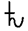

**土星守护的摩羯座需求的活化剂**

*   完美，卓越

*   成功，成就

*   声望，地位

*   结构，限制，形式

*   秩序，组织

*   控制，权威

**土星作为过程所代表的动词**

*   去达成，去生产

*   获得成功（去实现）

*   去坚持，坚忍

*   去实施（计划）

*   去完成，去实现

*   去构造，去整理

*   去组织，去自我控制

*   去管理，去统治

*   去计划，去系统化

*   去控制，去维持

*   去改善，去精通

*   去结晶，去成熟

*   着迷，全神贯注

*   去聚焦，去深化

*   去维护（传统）

*   去减少开支，保持谨慎

**土星作为情结所代表的动词**

*   去害怕（失败/不足）

*   去设障碍，去妨碍

*   去压制，去禁止

*   变慢，延误，去屏蔽

*   去限制，去压缩

*   去紧缩，去收紧

*   去渴望（因为不足）

*   去过度补偿

*   过度努力，痴迷困扰

*   去过度运作，做过头

**作为心理官能或能力**

*   抱负，权威

*   自律

*   自我控制

*   义务与责任

*   对规则与限制的尊敬

*   生产力

**作为心理状态或事件**

土星的目标状态是**任务达成，做好工作，获得成功的感觉**。与这种目标状态关联的需求是感觉在追求成功目标的过程中**安排有序，“自信满满”**。

这种**“位高权重”**的感觉是土星的目标状态，也暗指土星对于位居高层的需求，也就是成为**老板、权威人士或总统**。

土星最害怕的就是**失败**。亊实上，**追求成功在一定程度上正是对于害怕失败的本能补偿。**所有土星更为积极的状态——**雄心壮志、耐心、守纪、果断、坚毅、专业知识、地位、终极荣耀和勋章**、都可以被规作**内在害怕失败、低人一等、不胜任和匮乏的补偿**。

所以，土星与**责任、重要的生意、义务、职责以及成功的压力**有关。土星同样可能在它最活跃的生命领域中体验到一种**渴望的状态，或者是急切的渴求**。

如果土星**过度运作**，可能案主会**深受严苛的标准之苦**，它驱使此人过分努力。这可能会导致**工作狂或是无力享受劳动成果**。

但如果与土星相伴的**本能、健康的焦虑被抑制**，此人可能患上**拖延症，逃避责任**。或者就是**简单放弃了，允许消极悲观的情绪控制行为**。

内在的恐惧状态与特定的外在境遇相对应，比如**受限、延误、不足、障碍、阻碍、束缚**。

如果此人认为这些境遇无法改变，永无止境，那么，可能会感觉到**更为极端消极的土星状态**，**彻底的失败、个人缺陷、抑郁、孤独、孤立、沮丧、内疚、闷闷不乐、绝望、悲伤。**

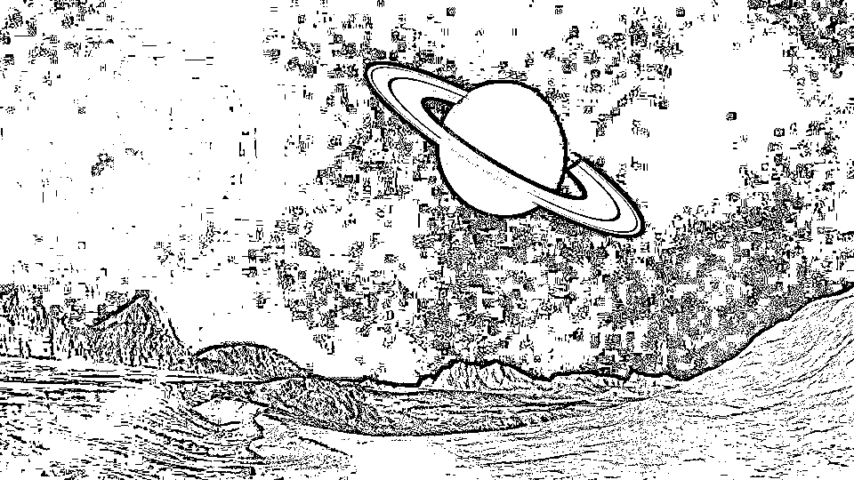

**天王星**

**天王星的符号**

**天王星守护的水瓶座需求的活化剂**

*   觉醒，启示

*   规野（全面）

*   客观的观点

*   改变，进步，改革

*   启蒙，启迪

*   概观（全景的）

*   利他主义，人道主义

*   解放，突破

**天王星作为过程所代表的动词**

*   去觉醒，去启蒙

*   获得自由，去解放

*   体现客观，去释放

*   去进步，去发展

*   去揭示，启发

*   从陈旧的方式中解脱出来

*   去改发，去改革

*   去创新，去发明

**天王星作为情结所代表的动词**

*   去震撼，去破坏

*   去反抗，去煽动

*   使不安，使动摇

*   使分开，使疏进

*   使惊愕，使动摇、重组

*   去分裂，去颠覆

*   去打破依附

*   去分离，去逃离

**作为心理官能或能力**

*   观察自我

*   整体思维

*   彻底的洞察，改变

*   宇宙意识

*   客观见证

*   利他主义，人道主义

**作为心理状态或事件**

天王星的目标状态是**博爱**，戒考是希腊人所诪的阿加比（agape）——神对世人之爱。

这种状态伴随着**观念认识的实现**而达成。这种观念是一种**彻底的洞见或自我实现**，它是一种**超客观的认识，在灵光一闪之间顿悟了万事万物为美好目标该如何共事。**

有此认知之后，天王星希望能够**通过自身的参与，分享所得，启迪他人**。**人道主义、利他主义**，**揭示所有事物之间关联性的运动**，都是天王星喜爱的消遣方式。

认识到**整体总是优于部分的**，这是典型的天王星式认知。同样，它总是关心着**整个人类的未来福祉**。

天王星倾向于**设法带来突破、革命、启示或发现**。这就与**突发、破坏、出乎意料和不稳定的状态**有关，让人想到**震惊与不安**。

它还与**古怪、离奇、异常、争辩**有关。天王星掌管着**广播、无线电、电规、电脑、电子设备、先进技术和科学**。

天王星通过原创的贡献或发明激励着积极的改革，推动体系向着新的方向进发。这里推动的体系可能涉及任何领域——一段婚姻、一项生意、一个研究领域，一门艺术，一种文化，一个政治体系或一种制度。

如果走向极端，天王星可能产生极端的不满，表现为**攻击传统、无政府状态、反叛、反抗、争吵或虚无主义**。

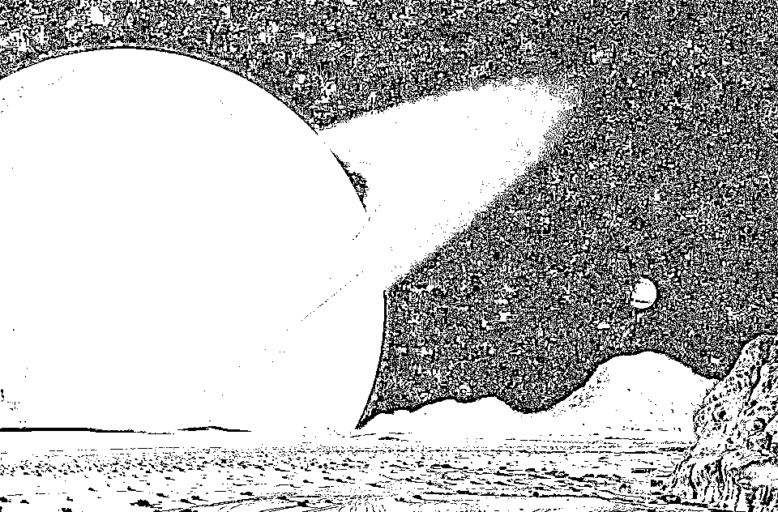

**海王星****海王星的符号**

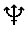

**海王星守护的双鱼座需求的活化剂**

*   超越二元性

*   统一的意识

*   生命/神性的统一

*   无限的爱与美

*   神圣，极乐，狂喜

*   赎罪，宽恕

*   慈善，利他主义

*   臣服，不执著

**海王星作为过程所代表的动词**

*   去超越，去融合

*   去流动，使融化，去屈服

*   去投降，牺牲

*   放手，听从神的旨意

*   放弃，中止 

*   共情，原谅

*   接纳和允许

*   非个人的爱

*   去无私地爱

*   为他人而殉难

*   去营救受害者

*   去想象、展望

*   去梦想，去鼓舞

*   去展望，去幻想

*   去振奋，去提升

*   凭直觉认识，去通灵（超想官）

*   赋予魅力， 使理想化

*   去着迷，陶醉

**海王星作为情结所代表的动词**

*   去逃避，拉开距离

*   进入无意识，否认

*   表现无助，使崩溃

*   消解至混乱

*   游移踌躇，拖延

*   使服从，听从他人

*   放弃责任

*   自毁，蓄意破坏

*   使困惑，使神秘化

*   使不知所措，醉生梦死

*   蛊惑，欺骗

*   伪装，掩饰

*   消失，撤退

*   扭曲，逃避，隐藏

**作为心理官能或能力**

*   超验的能力

*   集体无意识

*   想象力与幻想

*   同理心与宽恕

*   直觉，超感官能力

*   梦想，理想

**作为心理状态或事件**

海王星的目标状态是**极乐，对生命统一性的超验觉知**。这一状态很难达成 （更不用说维持），但我们可以在海王星的许多追求中窥见一斑。从积极的一面来看，灵性追求大体都属于海王星的表达，只要其目标在终极现实中被分享，而不仅仅是理性研究。

**冥想、瑜伽、静修和祈祷**是常见的形式。**一个人只要感受到了共情、慈悲与宽恕，都是在体验海王星。**

**超自然的体验，诸如心电想应、先知、透视力是此行星的另一些表现形式**。如果一个人有了**与神合为一体这种超越性**的感受，并**备受鼓舞，或是想象无限的爱与美**，那么他们正在**更高的层面上体验海王星**。

**仁爱与解除痛苦的正当愿望**是另一种健康的表达方式，同样还有**向超越个人控制的信仰臣服**的愿望。后一种产生了**随波逐流、随遇而安（适应性）**的体验，**以“无为之为”的方式追求目标。**

另一个不那么愉快，但却更普遍的海王星体验则是**受害者（救世主）**的状态，这两个方面都是海王星的状态。

有许多**真正值得帮助的受害者**，比如，空难的幸存者、被病魔威胁生命的人，或者是被性侵的受害儿童，另外还有一些**“表面上的”受害者**，他们只是**自我毁灭，通常这源自无意识的内疚，可能表现为对毒品或酒精的沉溺**。

典型的人——**救助者、烈士、救世主，试图去帮助这些“表面的受害者”**。每当救助者认为自己对受害者的人生负有责任，尤其是受害者有能力自救时，救助者都表现出了海王星的冲动。

通常，这种冲动源自**救助者对自己心理问题的否认，于是投射给了合适的对象——表面的受害者**。

**受害者将责任推给救助者，**救助者对自己的动机和潜在的心理问题仍然保持无意识，这就是达成了同一性。然而，受害者通过**自我毁灭**的行为表现出海王星的冲动，救助者通过**拯救**的行为表现海王星的冲动。双方都是**陷入纠缠状态的牺牲品。**

我们或许会说**受害者否认自我，也就是陷入无意识中，逃避作为一个人所需要做出的艰难选择和决定**。通过**否认现实，逃脱或回避责任**，通过**优柔寡断、拖拖拉拉，或者假设出一个相对被动无助的状态，此人并不是把生命交付于神，而是向命运投降。**

而命运往往显现为一个人的形式，**这个人通过欺骗、利用、破坏、背叛或抛弃受害者来抓住受害者的弱点。**命运的第二波接下来会扮成**社工、流浪者之家或者就是一位好心人——任何施以援手的人**。

受害者-救助者模式尤其恶毒的形式则是**依附-互相依附**的共舞，除非有一方决定中止游戏，否则他们就会一直这样纠缠，却难有极乐降临。无法达成时可能会造成**救助者“同情疲软”（燃烧殆尽）和受害者的“死亡”**。

有关**困惑和妄念**的主观状态也是海王星的领域。困惑通常是为了**否认**，作为一种**防御**。为了各种原因，此人**在无意识中试图逃避令人不安的真相**。如果这种困惑的状态差不多有规律地发生，则预示着此人**无力发展出强大、分化的自我**。

然而，任何**因借口、谎言、欺骗、背叛或诡计而受害的人**都可能在体验海王星。这样的经验可能只是为了**深化受害者的同理心和对痛苦的理解**，或者也许能**够鞭策其更好地发展辨识力。**

大部分人都曾经历过**幻灭**，这些海王星病症更为强烈的形式，发生在那些几乎经常处于**妄想状态**的不幸灵魂身上，像是**精神分裂症患者**。通常，那些**丧失、悲剧、不幸、疾病**的体验则是海王星的其他化身形式。

注意，当人们处于痛苦或悲伤的状态时，他们往往会通过**祈祷和冥想**表达自身的精神渴求。

海王星同样也可能体验为具象化的艺术形式，比如**绘画、摄影或电影。诗歌、音乐和舞蹈**是灵感的另一些表现，尤其是以这些形式来表达超验的理想时。

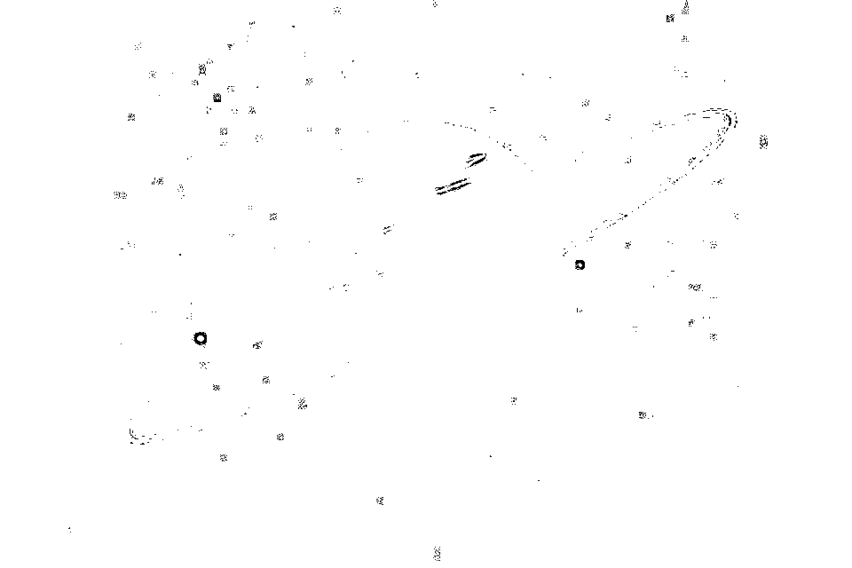

**冥王星****冥王星的符号**

**冥王星守护的天蝎座需求的活化剂**

*   转化，治愈

*   发泄，释放

*   涤罪，净化

*   完整（整合）

*   死亡和重生

*   清除，淘汰

*   力量，权势

*   性，合并，融合

**冥王星作为过程所代表的动词**

*   赋予力量，唤起热情

*   去深化，使强化

*   去洞穿，合并，融合

*   去整合，去同化

*   使再生，更新

*   去治愈，变纯洁

*   去重建，去革新

*   彻底转发，突发

*   去宣泄，释放

*   强迫，占有

*   使更加色情，激发性欲

*   去调查，去洞察

*   去合并，同化

*   使变形，使转变

*   使净化，使清洁

*   使变化，重制

*   排除（毒素）

*   排出，毁灭

**冥王星作为情结代表的动词**

*   去害怕，去恐惧

*   去压抑，去防卫

*   去怀疑，去猜测

*   去否认，断绝关系

*   投射为邪恶、劣性

*   去控制，去操纵

*   去计划，去谋划

*   去恐吓，去胁迫

*   强迫，压迫，恐怖统治

*   使惊恐，使害怕，惊慌

*   使堕落，使恶化，使黑暗

*   使降级，贬低

*   去引诱，去怂恿，诱惑

*   去颠覆，暗中破坏

*   去毁灭，去反抗

*   歼灭，杀死

**作为心理官能或能力**

*   力量，潜力

*   性欲，性爱

*   完整性（整合）

*   疗愈能力

**作为心理状态或事件**

冥王星的目标状态是**力量或整体性**，但这与天王星和海王星所追求的整体性不一样。冥王星关注的整体是**内在的，而不是人类或自然的整体**。

这种内在的整体性正是我们所说的**整合**，这是精神的整合所带来的**精神专注力**。状态达成时，会带来**深刻、透彻的关系，相对没有恐惧。**

整合达成时，**再没有伤口需要疗愈，没有害怕揭开的压抑回忆，也没有痛苦的创伤被封存在心底的黑暗角落。**如果真有如此一隅，冥王星掌管的**转化与疗愈过程**就会启动运作，包括**高峰体验、精神宣泄、净化、清洗**。

冥王星还与这些痛苦经历必然导致的所有**恐惧和痛苦**相关。因为冥王星既是死亡，也是重生。

又一次看到，冥王星并不是对与所有生命达成统一这种超越的状态有兴趣；然而，它的确**渴望与其当下的环境感觉到联结**。这是因为，当下环境乃是投射的集结之处，准确地反应出个人投射，也就是我们的**阴影**，**在自我与他人之间创造了一种不舒服的分割**。

因此，冥王星与**权力斗争和控制**问题有关，因为它是**意识的阴影内容**——一个人未愈的伤口通常会在关系的困境中像鬼影一般萦绕。

如果一个人逃避痛苦，不愿面对阴影寻求改变，那么，冥王星将会表现为**控制，甚至是毁灭当前的敌人**。“毒性”较次一级表现形式则是这种控制具有**强迫性和恐吓性**，像是**勒索、讹诈、绑架、暴民统治**。

更极端的形式是退化为**偏执、暴力和毁灭**。**强奸、谋杀、恐怖主义****和暴政**也是冥王星的领域。

**如果投射阴影，则可能遭受恐惧和失去力量的折磨。**如果一个人过于认同意识中的冥王星成分，而排斥灵魂的其他部分，则可能**过于执迷于阴影**，转化为恐惧的对象；一个人企图化解恐惧，最终却导致他堕入阴影，这种状况，我们可以在迟来的整合现象中看到。

阴影状态通常与一些**犯罪或邪恶的行为、黑社会、强制力、变态、颠覆**有关。

任何人**与阴影或黑暗社会元素共舞，**都是在演绎冥王星的功能。这包括**疗愈工作者——医生、治疗师、社会工作者**，还有那些投身黑暗，直面阴影的人们。

比如**警察、侦探、FBI 探员、中情局特工、治安委员会成员、间谍、打入敌人内部的人、卧底特工、告密者、调查员**，还有其他与邪恶做斗争的人们。

冥王星的另一些表现包括**性欲、性冲突、强烈的激情**。**当人们即将通过对未知亊物的体验而转变自身时，似乎会感觉到无限的激情。**

也许正是基于此原因，**性冲动与焦虑**都以同样的生理反应为表征；也就是说，恐惧是刺激源，因为我们需要将之整合。**“孤注一掷”的极端主义**同样是冥王星的表象，此时，**人们为了信念而将生死置于脑后**。

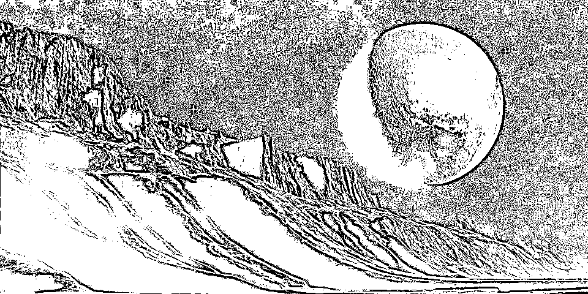

**版权声明：**本文由若道翻译发布，欢迎转发，反对抄袭。友号转载请申请白名单。

**格伦·佩里**

若道签约老师，著名占星师，前 ISAR 董事会成员，共出版 8 本占星著作；心理/意识研究专业博士；占星心理学学院（Academy of AstroPsychology）的创办人；康涅狄格州研究生院（the Graduate Institute of Connecticut）原型宇宙学与意识进化项目的负责人。

**美国占星心理学学院创办人**

**格伦·佩里**授课

**40 余年**职业占星师生涯所学精华**倾囊相授**

修完 101-205 全部课程，并通过考核的毕业生将获得

**美国占星心理学学院证书**( Academy of Astropsychology )

和**若道毕业证书**

**高含金量双证书**

跟随主讲老师学习融合**心理学体系**的**占星知识**

为星图咨询解读打下坚实的基础

**大量**的课程资料，光是课后阅读资料就**超过 60 万字**

合理的课程设计，贴心的助教服务，及时的课后测验

1

**这门课程最大的看点是什么？**

1. **两位国际占星学大师**共同授课，将合计**90 年职业占星师生涯所学精华**倾囊相授；2. 修完**2 年课程**，考试通过的毕业生将获得**美国占星心理学学院证书**（Academy of Astropsychology）和**若道毕业证书**，**高含金量双证书**；3. **第一学年 64 次课程**的充分授课时间（录播课程 43 次课；直播课程 21 次课），全面而详细地讲解占星学历史、知识、技能、案例、咨询和运用；4. 跟随主讲老师学习**自成体系、逻辑严密、实用性强的占星语法、星图解读方法**；5. 学习独特的**发展年龄预测法**，从星图看对关键年龄阶段的发展及议题；6.** 大量的课程资料，光是课后阅读资料就超过 60 万字**；7. 合理的课程设计，初中阶课程，每一节都有课后测验；8. 本课程可以作为**ISAR 选修课**中的一门，再修两门就满足 ISAR 认证选修课要求；9. 教授重要的**心理学概念**，比如与客体关系、心理动力理论、个人神话和叙事疗法相关的一些概念，学习如何将它们整合到星图解读中；10. 在 105 阶段了解**《精神疾病诊断与统计手册》**诊断标准，探索星图中的心理疗愈；

2

**课程是怎么安排的？**

**第一学年**

**共****64****次课 **43****次录播课 **21 次直播课******

**101 占星学基础 **

****共****12****次课程：******8 次 2017 年录课+4 次直播课**

**102 行星落星座、宫位** 

****共****12****次课程：**8 次 2019 年录课+4 次直播课**

**103 行星相位与个人神话** 

****共****13****次课程：**9 次 2019 年录课+4 次直播课**

**104 征象星与定位星：作为进化故事的星图 **

****共****12****次课程：******8 次 2019 年录课+4 次直播课**

**105 星图中的精神病理学与疗愈 **

****共****15****次课程：******10 次 2019 年录课+5 次直播课**

3

**课程价格**

**101-105 第一学年**

**正价：**18800 元

**学习充值卡优惠价：17000 元**

**101-205 全阶联报**

**正价：**50000 元

**转发优惠价：38000 元**

**学习充值卡优惠价：35000 元**

**其它各阶段课程单报价格，请咨询课程顾问**：**王老师（微信/手机：18510107057，请备注“格伦核心课”）**

**全阶段学习后，可参与若道占星毕业认证考试，考试费用为：580 元**

**相了解更多？****点击下图了解课程详情**

**

**20 位来自世界各地的占星师****带来 19 场沙龙——新世界的觉醒****详情可点击下图**

**其它课程****点击下图了解课程详情**

**微信又双叒叕改版啦，不想错过若道君的推送？**

**就把若道设为星标吧！**

**▼**

**就是这个“在看”，戳戳戳 ☟**

********报名直达入口********

# 当这个北交点停止与他人纠缠，反而能得到经济和能量的助力

> 原文：[`mp.weixin.qq.com/s?__biz=MzA5NjA0NTAxNg==&mid=2651473224&idx=1&sn=f785dc653b2bf7c1a39913c9454177f3&chksm=8b48f7ffbc3f7ee98a0d36809a0f0eb155f731796e8dfe9ea50b8aa871138917b5cc345eff5d&scene=126&sessionid=1692737822#rd`](http://mp.weixin.qq.com/s?__biz=MzA5NjA0NTAxNg==&mid=2651473224&idx=1&sn=f785dc653b2bf7c1a39913c9454177f3&chksm=8b48f7ffbc3f7ee98a0d36809a0f0eb155f731796e8dfe9ea50b8aa871138917b5cc345eff5d&scene=126&sessionid=1692737822#rd)

☆****后台回复“今日”，给你一句生命态度****

作者/简·斯皮勒 译者/李含 校对/江艺编辑/玫瑰 封面/书君 图片/pexels

继[【南交天秤座-北交白羊座】](http://mp.weixin.qq.com/s?__biz=MzA5NjA0NTAxNg==&mid=2651472874&idx=1&sn=69dafef56677132360c41fd93780c363&chksm=8b48f15dbc3f784ba62c936b949711008b4f66a51e25fc7fa3e50956624ef0b091cf05b39c6d&scene=21#wechat_redirect)后，提到南交点天蝎座-北交点金牛座，就不能不提到欲望和金钱。这个配置最大的考验就是如何面对欲望。一起来看看吧。

**北交点金牛座/第二宫综述**

**发展的特质**

在这些领域的努力有助于解锁隐藏的天赋才华： 

**· **忠诚

**· **边界意识**· **一步一个脚印**· **自我价值感**· **个人价值观的意识**· **耐心**· **尊重自己和他人表达出来的需求**· **享受五种生理感官**· **感激之情**· **意识到地球母亲的滋养**· **宽恕**· **坚持不懈

**要放下的倾向**

努力减少这些倾向的影响有助于让生活更轻松、更愉快 

**· **对危机局势的吸引力

**· **过分关心他人的事情**· **急躁**· **不合适的紧张**· **评头论足的倾向**· **非常关注他人的心理动机**· **拒绝与别人合作**· **反应过度**· **为了消除一个部分而破坏某物**· **强迫症的倾向

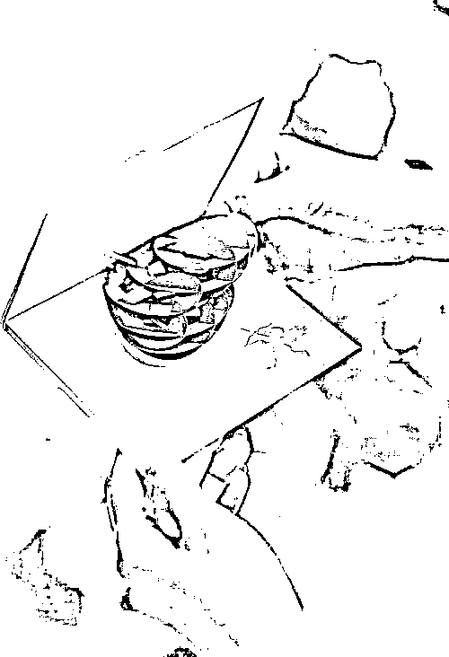

**阿喀琉之斯之踵/避免的陷阱/底线**

金牛座北交点的人需要注意的是，**通过他人寻求自我价值（“我只能通过他人的肯定来获得良好的自我感觉”)，这将导致他们陷入无止境地寻找灵魂伴侣的陷阱（“如果我拥有这个特别的人的能量，我会感觉完整”）。**

事实上，金牛座北交点的人只能在他们自己身上实现自己内心的完整感——这永远不会成为一段关系的副产品，即使是灵魂伴侣。不管他们从别人那里得到多少支持和确认，他们总是认为自己需要更多。

事实上，对他们来说，别人的确认是他们是否走在正确道路上的一个假晴雨表。**不管别人怎么想，按照他们认为适合自己的标准生活，会帮助他们发展自我价值感。**

最重要的是，在某些时候，他们必须**停止与他人的纠缠，停止参与他人的事务，而只是走自己的路。**具有讽刺意味的是，**当他们开始这样做时，其他人将在经济上和能量层面上支持他们。**

**这些人真正的诉求**

**这些人真正想要的是：与别人的能量融合，并感到相互力量的加持。**他们寻求的是**完全的、永久的承诺。**他们想要一个**可以依靠的伴侣来照顾所有的物质需求，**也会**照顾伴侣所有的情感需求（反之亦然）——一种相互赋力和完全可靠的协同关系。**要想成功地建立这种关系，他们必须**善于辨别，并找到与自己能量和价值观相似的人。**共同的目标对他们每个人来说都必须具有内在价值。为了实现这一点，金牛座北交点的人必须**首先与他们自己的价值联结。**他们自己的内心必须**变得强大，意识到自己想要什么，并将注意力转向对他们来说是真实和有意义的事物。****挑战在于建立自己的能量体系，并弄清楚作为个体到底是谁。**当能量变得更强时，他们会自动吸引相似能量的伴侣，并与他们建立成功的伙伴关系。

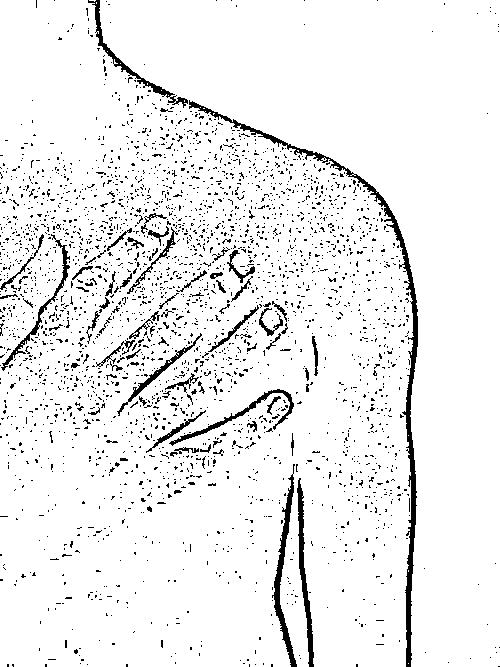

**天赋/职业**

这些人是建筑大师——无论是建造家庭、关系还是生意。愿意遵守规则时，他们可以成功地建造任何东西。他们所擅长的事业与他们认为真正有价值的职业是一致的。例如，如果他们认为按摩是一种治疗他人的工具，同时也可以带来利润，他们就会在这个领域取得成功。他们在金钱方面也很有天赋；专注于能够自食其力和感觉舒适的方式也会让他们找到一个合适的职业。**任何强调欣赏生活的物质层面和五官感知的领域，如农业、建筑、工程、烹饪或体育教学，都是令人愉快和有利可图的。**一般来说，金牛座北交点的最佳选择是**“做自己的事情”：要么管理他们自己的项目或业务，要么为他们能感到自主的公司工作。**他们需要学会**放弃立竿见影的结果，一步一个脚印地走下去，在继续前进之前适应每一步。****金牛座北交点的人也有在危机情况下发挥重要作用的天赋，他们对心理学有一种天生的亲和力。**他们对他人的需求和愿望的认识可以帮助推进自己的目标。通过以公开承认并以相互赋力（双赢）的方式使用他人的能量，金牛座北交点的人可以有助于实现双方都在寻求的结果。**然而，投身于心理学或危机管理的职业，他们通常不会满足，最终会感到空虚。他们最好利用自己的才能建立一些有形的价值，这能增加一种稳定感。**

**金牛座北交点特定的疗愈誓言**

**· **“要想赢，我需要慢慢地、坚定地、一步一步地前进。”

**· **“当我按照自己的价值观生活时，我对自己感觉很好。”**· **“大自然母亲给我提供了所需的能量。”**· **“当我满足了自己的需求和他人表达的需求时，我就建立了人际关系的稳定基础。”**· **“如果我感觉舒服，我就‘上道了’。”**· **“别人怎么想与我无关。”

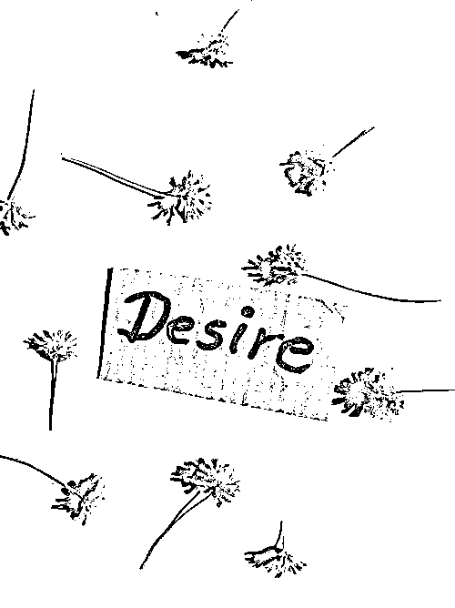

**北交点金牛座/第二宫的个性**

**前世**

**与他人融合****在前世中，金牛座北交点与处于权力和影响地位的人建立了不可分割的、紧密的关系。**他们是国王背后的王后或交际花，知道“内部消息”，但最终还是由另一个人做出决定。**他们是首领的顾问，总统的首席助理，或将军的心腹。**他们把自己所有的力量、精力和魅力都献给更强大的灵魂伴侣，作为交换，他们从那个人那里得到了对自己价值的认可和赞赏。**在前世中，掌权者给金牛座北交点人提供吃穿用度和纵容。**金牛座北交点人要做的就是**保持与那个人的关系，并帮助实现他（她）的愿望，而其本人将体验最好的生活方式。**所以现在金牛座北交点的人倾向于**对金钱不甚关心**（好像有人要为他偿还信用卡），但在这一生中，并不是这样运作的！金**牛座北交点的前世依赖于另一个人，这剥夺了他们对自食其力的认识。**因此，在此生中，他们需要**为自己承担经济责任，以此来重新获得自信；当他们对自己的花销毫无意识时，就会产生灾难性的债务。**与这一世相关的其他前世都是在“声名狼藉”中度过的——**以某种形式出卖灵魂。**在那些前世中，金牛座北交点人的成功有赖于他们没有自己的边界，所以他们可以成功地与另一个人的能量场合并，以产生比任何单独一人更大的能量。他们培养了对他人需求的敏感，这在他们的那些前世中非常有效。然而，这种与他人的强烈融合，导致金牛座北交点作为一个独立的实体，失去了对自己需求和价值观的感知。因此，在这一世中，**与另一个人过于密切或过快地融合时，会体验到背叛，以警告他们应该保持自己的界限、价值观和精神伦理。****这些人在前世中擅长心理学，作为战略家和顾问，穿透他人的心理来理解他们的动机和需求，并预测他们的行为。**他们在不稳定的人周围，帮助他们发现他们的精神或情感障碍，治愈他们，并获得经济保护作为回报。他们心理上的敏感使他们能够预测敌人的思维模式，同时能够注意到他们灵魂伴侣未说出口的需求和欲望。然而，在这一世中，他们与他人的调谐使他们**无法以坚实、一致的方式有效地追求自己的方向。**现在，他们的最大利益就是**从与他人的深度接触中抽身出来，更多地专注于自己的业务。****一些金牛座北交点的人在前世中滥用权力并以暴力回应。**在这一世中，他们要学习不滥用权力，而对某一些人来说，这可能意味着**他们自己成为了滥用权力的受害者。**对这些人来说，此生的教训并不容易。他们可能在生活中经历真正的极端——从吸毒或酗酒，到处理严重的心理问题，再到坐在公司董事会的会议室中，到走上严格的精神道路。他们的生活经历了从黑暗之渊到光明之巅的光谱。

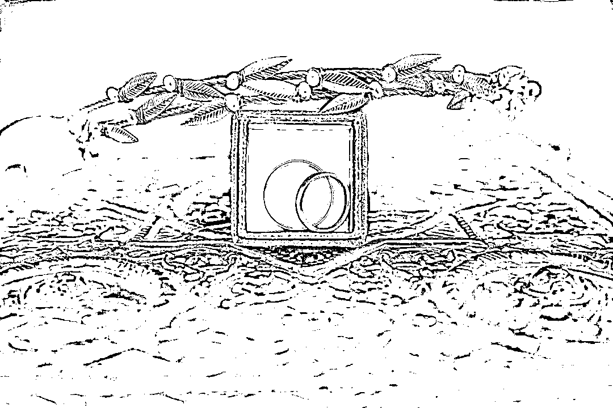

**北交点金牛座/第二宫的需求**

**建立舒适区**

金牛座北交点的人变得如此依赖另一个人的原因是，他们已经**远离了自己内在的舒适感。**于是，除了与他人的联系之外，就没有什么可以依靠——这充其量是一种脆弱和不稳定的状态。**如果有意识地与自己的舒适层面保持联结，他们的关系会运作得更好，因为他们在自己的内心创造了一些坚实和稳定的东西。**他们在前世中经历了许多根本性的转变，所以在此生中，他们被安排**去休息，积累财产，享受简单愉快的生活：**美好的食物、美好的性生活，和一个舒适、稳定的家庭环境。**一种内在的“舒适”感是走在正确道路上的准确晴雨表。**忠于自己舒适区的边界，他们就会获胜。

**欲望 vs.需求**

有时候，**嫉妒**会成为金牛座北交点人的一个问题。他们看到别人的财产就垂涎。基于对他人财产的渴望，这些家伙常常有无尽的“欲望链”。他们看到邻居的新车，内心的一个机制马上就说：“我想要它。”**但如果他们的欲望是基于不安全感，那就永远不会解决——那是一个无底洞。**为了获得他们所追求的物质感，他们最好的办法是**把注意力从他们没有的东西上转移开，开始欣赏他们已经拥有的东西。****对金牛座北交点人来说这是物质积累的一生，所以物质欲望不是一个错误。**然而，他们必须愿意**通过自己的努力来获得他们想要的东西。**当嫉妒的情绪出现时，他们可以用它来识别嫉妒是否由他们真正需要的东西引发；然后他们可以决定是否值得为之奋斗。而不是成为“欲望”的受害者，他们要了解到，**只要愿意去争取，就能得到想要的任何东西。**金牛座北交点的人有**被别人的欲望和动机分散注意力**的倾向。实际上，他们的生存问题激发了他们对他人的关注。他们需要化繁为简：停止“进入别人的思想”，而只与自己保持联系。“我需要什么？我需要什么才能在这种情况下感到舒服？”这些人真正想要的是**解决他们自己的不安全感**——知道他们所有的需求都会得到满足。在这一世中要感恩宇宙所给予的恩惠，而不是去攫取别人所拥有的。如果他们惊慌失措，试图在生活中加速接受赏金，就会与自然时机带来的舒适感失去联结。金牛座北交点的人注定会积累那些增加他们内在物质感的东西。他们面临的挑战是尽量放慢脚步，接受生命给予的礼物。通过把重点从特定的人（作为其“来源”）身上移开，通过直接与生命本身合作，他们对于生存的不安全感最终可以被治愈。他们会发现，当每一个新的需求出现时，生活总会给他们送来合适的人——这些人经常会意外地出现——让他们的旅程变得更加轻松。

**版权声明：**本文由若道翻译发布，欢迎转发，反对抄袭。友号转载请申请白名单。

**简·斯皮勒**

全球占星界的一位领军人物，是美国占星师联盟（AFAN）的教员。她定期在新时代和占星回忆上授课，是畅销书《新月占星学》、《灵魂占星》、《灵性占星学》和《宇宙之爱》的作者。

**20 位来自世界各地的占星师**
**带来 19 场沙龙——新世界的觉醒****详情可点击下图**

**学习占星学****点击下图了解课程详情**

**

**微信又双叒叕改版啦，不想错过若道君的推送？**
**就把若道设为星标吧！****▼**

**喜欢记得点一下在看哦☟**

**报名直达入口**

# 心理占星学解读 10 大星体（上） | 5 大个人行星详细指南

> 原文：[`mp.weixin.qq.com/s?__biz=MzA5NjA0NTAxNg==&mid=2651473224&idx=2&sn=4004027397e70d076a243aab05e7faeb&chksm=8b48f7ffbc3f7ee90ef726843ac3fbb263af9a2d9c64de725af9c3a0f0666c3e89068417f8a3&scene=126&sessionid=1692737822#rd`](http://mp.weixin.qq.com/s?__biz=MzA5NjA0NTAxNg==&mid=2651473224&idx=2&sn=4004027397e70d076a243aab05e7faeb&chksm=8b48f7ffbc3f7ee90ef726843ac3fbb263af9a2d9c64de725af9c3a0f0666c3e89068417f8a3&scene=126&sessionid=1692737822#rd)

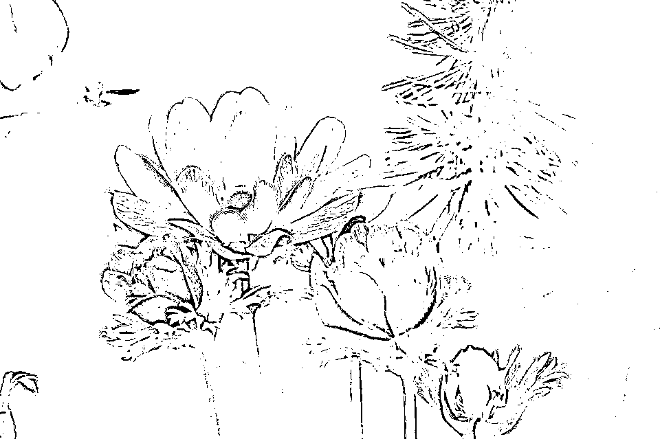

作者/格伦·佩里 译者/若道翻译团队
编辑/翀子 图片/网络

想必大家对于占星学中的十大星体都不陌生。那么，从心理占星学的角度，又该如何诠释这些星体的意涵，以及对我们的影响呢？格伦老师给大家带来了超级干货，一定要收藏，仔细阅读哦！另外，本文作者格伦老师参与授课的【[心理占星双证第一学年课](http://mp.weixin.qq.com/s?__biz=MjM5MjQwNjAyMQ==&mid=2649439478&idx=4&sn=6bacf2ee7863a017ff175f640043806f&chksm=beb9539c89ceda8a22c30f2e1cde3ab79f6ec8bdee9bcccccd0e00d0fc058c3183e845e61f49&scene=21#wechat_redirect)】、【[心理占星双证核心课](http://mp.weixin.qq.com/s?__biz=MjM5MjQwNjAyMQ==&mid=2649439478&idx=5&sn=a7bafabc17476c75a23107da51a00a6a&chksm=beb9539c89ceda8a7d92d4de9d6d90e9f6754c5e59055bdb53a0aeb059fa2b0c027b0197ab07&scene=21#wechat_redirect)】报名中，点击链接了解更多详情吧~

**太阳**

**太阳的符号**

**太阳守护的狮子座需求的活化剂**

*   身份的确认

*   自尊

*   创造性的自我表达

*   积极的自我形象

*   认可、欣赏

*   享乐、消遣

**太阳作为过程所代表的动词**

*   去创造，去表达

*   去打算，去决定

*   去保卫（自尊）

*   去获得认可

*   去浪漫，使人铭记

*   去娱乐，去表演

*   去选择，下决心，去认同

*   去辩解（行为），使其合理化

*   去赞同（他人）

*   去认可（他人）

**作为心理官能或能力**

*   自我表达，创造力

*   决断力，意志力，意图

*   身份认定，自我意识

*   自我，自身

**作为心理状态或事件**

太阳的目标状态是**骄傲而自信**的。它希望**避免一切丢脸蒙羞的亊情**。太阳需要被瞩目，因此会参与到活动和行为之中，以搏得他人的关注，这是完全健康自然的。

获得快乐就是去表达自我，这就是太阳寻求的目标——**自我表达、创造力、玩耍、表演**。

星图中，太阳的位置描绘了此人**在哪个领域，以怎样的方式寻求观众对自身身份的认可。**太阳的活动与**浪漫和求爱、娱乐、玩耍、游戏、运动**有关。简而言之，就是**一切自我表演性质的活动**。

同样，太阳所落的星座和宫位预示着，**我们在哪个领域，以何种方式获得快乐，以及给他人留下深刻印象。**

如果太阳整合良好，就会产生积极的状态：**愉快、自豪、自信、亲切**。但是，如果整合得不好，此人可能会过度补偿，表现出**傲慢、自大、自我中心、虚荣、自我膨胀**。这都是**太阳状态调控不足**的征象。

**太阳状态调整过度**的征象包括**卑躬屈膝、战战兢兢、沉默寡言、不确定、不自信。**

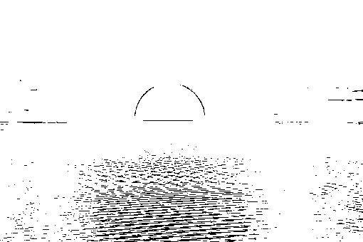

**月亮**

**月亮的符号**

**月亮守护的巨蟹座需求的活化剂**

*   滋养，（母亲般的）抚育

*   情感的安全

*   归属，接纳

*   亲切

*   同情理解

*   无条件的爱

*   温暖与亲密

*   照顾与保护

**月亮作为过程所代表的动词**

*   去滋养、保护

*   去倾听（去感受）

*   去照顾、同情

*   去习惯性地反应

*   无条件去爱

*   去理解，去共鸣

*   去感受，去包容

*   去记忆，去回应

 **作为心理官能或能力**

*   接纳的功能

*   滋养能力

*   倾听回应

*   情绪条件作用

*   记忆

*   个人潜意识

**作为心理状态或事件**

月亮的目标状态是**归属感和亲密感**。它试图去**避免被拒绝**。因此，月亮的落点描述了我们**以何种方式，在哪些领域寻求爱的感觉的体验，包括我们对他人的爱和他人对我们的爱**。

相关的主题包括**养育与依赖**的问题，与**理解和支持**的需求相关的经历，关于**脆弱、敏感、温柔**的主题，以及可能存在**源自过往的情绪条件作用的地方**。

其他议题包括**自我保护，家庭议题，以及在案主的生活中与母亲（女性）相关的经历**。其行为可能涉及某种**照顾、养育和保护**，为他人提供一个安全的港湾，满足他人的需求，以及住房等问题。

如果月亮整合良好，这个人将会**很容易表达温柔的情感，怀着同情去倾听他人，谈论感情**。相反，**调控不足**的月亮状态包括**过度的情绪化、过度依赖他人、过度敏感、依恋执着**。

如果月亮被**调整过度**，这个人很可能**对情感产生不舒服的感觉，无法表达温柔的关怀**。这种状态的根源是**过度害怕被拒绝。**

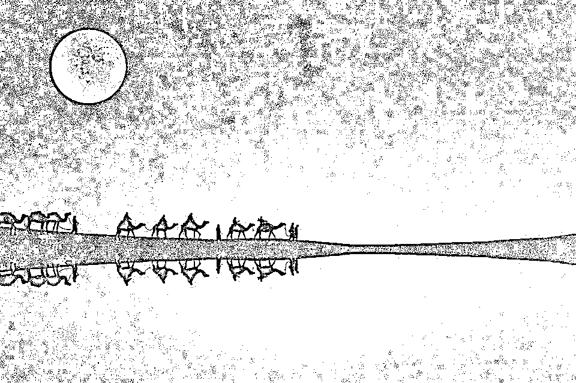

**水星**

**水星的符号**

作为一颗行星，水星掌管了两个星座，分别是**双子座和处女座**。因此，水星努力满足这两个星座的需求。

**双子座需求的活化剂** 

*   信息，新闻

*   学习，教育

*   头脑刺激

*   交流

*   知识（事实与资料）

*   语言

**处女座需求的活化剂**

*   高效运作

*   熟练服务

*   解决问题

*   辨识

*   能力

*   有用

*   改善

*   健康与健身

**水星代表的双子座动词**

*   去学习，去研究

*   去标记，去分类

*   去通知，去讲述

*   去注意，去观察

*   去提问，去查究

*   去交流，去报道

**水星代表的处女座动词**

*   去分析，去审查

*   去分解（成部分）

*   去纠正，去修理

*   去批评，挑毛病

*   去详细检查，去剖析

*   去服务，去改善

*   去修复 ，去维护

*   使系统化

**作为心理官能或能力**

*   认知能力，理性

*   思考，合理性

*   演讲，交流

*   智力，头脑

**作为心理状态或事件**

在满足双子座的需求时，水星的目标状态是**好奇与有趣，避免厌倦或无趣**。这可能会表现为**不知满足的求知欲。**表达自己所学也是同样强烈的需求，于是可能会显得**喋喋不休**。

如果**学习的需求被过度强调**，则可能会显得**焦躁不安、不够专注**。

水星的外在表现可能包括**上课、学习新东西**，如果**学习能力过度运作，**则可能成为某种涉猎广泛却不够深入的半吊子，也就是**博而不精**的人。

其他的典型表现包括**传媒、写作、报道、记者、知识分类、信息归档**，诸如此类。

在满足处女座的需求时，水星的目标状态是**有用、有效率**。相关的状态包括**在工作类的任务中发挥效力，有能力完成工作，熟练地完成任务，能够在所有方面给予帮助。**

如果一个人太努力去成为有助益的人，可能变得**苛责，到处纠错，尤其是在需要修正某些事或某些人的行为时**。

实际的表现可能包括**任何种类的工作或服务，修理坏掉的东西，纠正错误，成为故障检修和纠纷调解人，或效能专家，从事手工艺、贸易、推销工作，尤其是在健康领域，比如饮食与营养方面。**

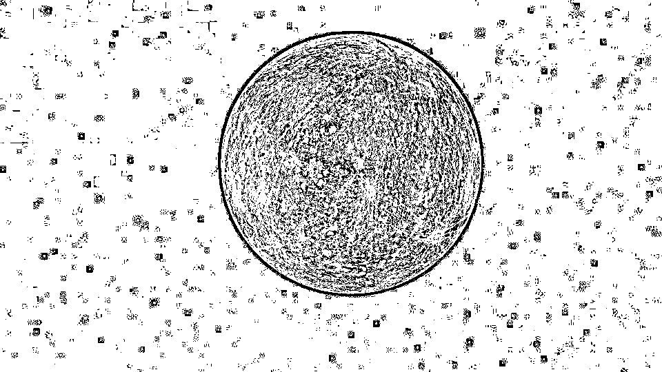

**金星****金星的符号**

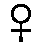

和水星一样，金星也是**金牛座和天秤座**两个星座的守护星。

**金牛座需求的活化剂**

*   安全、保障

*   相同，可预期

*   自我与客体恒常性

*   稳定，内在平衡

*   感官满足

*   愉悦与舒适

**天秤座需求的活化剂**

*   和谐，美，平衡

*   亲密，伴侣关系

*   社会关系

*   公平，平等

**金星代表的金牛座动词**

*   去吸引，去获得

*   去保护，去保存

*   去拥有，去占有

*   去取得，去得到

*   去抚慰，使缓和

*   去快乐，去满足 

**金星代表的天秤座动词**

*   去美化，去和谐

*   去平衡，去补充

*   去合作，去考虑

*   去关联，去建立密切关系

*   去调解，去仲裁

*   去吸引，去联结

*   去协商，去妥协

*   去社交，去结交伙伴

**作为心理官能或能力**

*   自我与客体恒常性

*   审美功能（品位）

*   内在安全感

*   艺术感

*   心理稳定

*   社交能力

*   自我安慰

*   亲密能力

**作为心理状态或事件**

在满足金牛座的需求时，金星的目标状态是**保持平静**，这与**安全、舒适、愉快**相关。这种状态**试图避免痛苦、不安和不稳定**。与此根本目标状态相关的有**积蓄财务、维系安全和安宁、感官的满足**。

举例来说，一个人购买渔船所获得的意义是：渔船提供了无尽的欢乐时光。然而，如果**金星被过度夸大**，可能导致的状态和行为有很多，包括**贪婪、占有的行为、自我放纵、怠惰、无精打采、懒惰、暴饮暴食、贪得无厌。**

为了满足天秤座的需求，金星的目标状态是**亲密与合作**。个体寻求与合作有关的体验。避免独自行事，比如缺乏他人的参与。正如我的一位天秤座客户所说：**“我并不介意独立，我只是不愿意一个人去做。”**

渴望的状态包括**喜爱的感觉、爱情以及各种伙伴关系、优雅与迷人的感觉、外交关系、社会关系、建立关系网**，诸如此类。另外，金星同样是美的典范。因此，**和谐、美、艺术鉴赏**也是目标状态。

如果走得太远，金星可能变得**浅薄、肤浅、模棱两可，为了爱与联结感而过于依赖他人。**如果金星**开发不足**，可能**引发公开的冲突、分歧、争议，甚至是诉讼。**

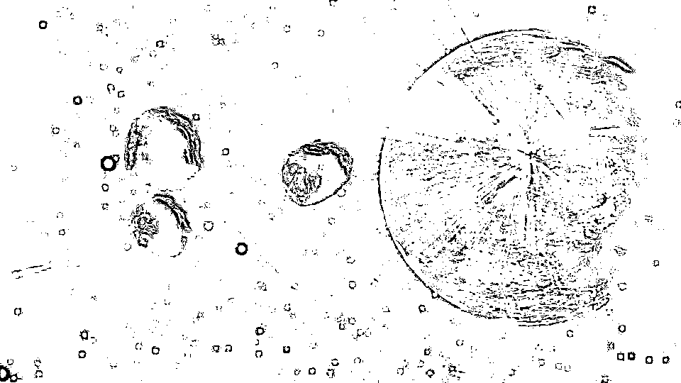

**火星****火星的符号**

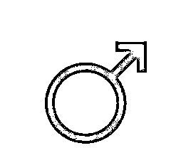

 **火星守护的白羊座需求的活化剂**

*   生存，生命，存在

*   自由，解放

*   行动、行为

*   自主性，独立

*   即时满足

*   活动、运动

**火星作为过程所代表的动词**

*   去行动，去做

*   去开始，去冒险

*   去开动，去赋予生命力

*   去挑战，去尝试

*   去行动，去证实

*   去发起，去开拓

*   去战斗，去抗争

*   惹怒，去激发

**作为心理官能或能力**

*   行动

*   生存本能

*   侵略性，本我

*   竞争性本能

*   驱动力，首创精神

*   力比多本能

**作为心理状态或事件**

火星的目标状态是**纯粹的活力，为活着而快乐**。避免了无生气，也就是一切对生存的威胁。比如，火星会将缺乏自由或缺少活动视作对生命的威胁。火星最重要的需求是**不断运动，特别是向着他们的愿望进发。**

**想要满足，获得短期目标——回报，高于其他一切考量**。因此，火星的恶名是**约束力差，缺乏社交技巧，对于其他生命形态普遍感觉迟钝。**

由此产生的状态是**生命力、果断、鲁莽、冲动、无限力量（没有限制意识）、不顾后果、愤怒、沮丧（如果受挫）、攻击性。**

火星能量的外在表现包括，**新的计划或项目、冒险、事故、争斗、暴力、争吵、头疼、高血压、机械能力、工程技能、使用工具或切割仪器的工作**。任何**“独立作业”，与艰苦的体力劳作相关的工作**都属于火星的范畴。

**未完，请见下篇。**

**版权声明：**本文由若道翻译发布，欢迎转发，反对抄袭。友号转载请申请白名单。

**格伦·佩里**

若道签约老师，著名占星师，前 ISAR 董事会成员，共出版 8 本占星著作；心理/意识研究专业博士；占星心理学学院（Academy of AstroPsychology）的创办人；康涅狄格州研究生院（the Graduate Institute of Connecticut）原型宇宙学与意识进化项目的负责人。

**美国占星心理学学院创办人**

**格伦·佩里**授课

**40 余年**职业占星师生涯所学精华**倾囊相授**

修完 101-205 全部课程，并通过考核的毕业生将获得

**美国占星心理学学院证书**( Academy of Astropsychology )

和**若道毕业证书**

**高含金量双证书**

跟随主讲老师学习融合**心理学体系**的**占星知识**

为星图咨询解读打下坚实的基础

**大量**的课程资料，光是课后阅读资料就**超过 60 万字**

合理的课程设计，贴心的助教服务，及时的课后测验

1

**这门课程最大的看点是什么？**

1. **两位国际占星学大师**共同授课，将合计**90 年职业占星师生涯所学精华**倾囊相授；2. 修完**2 年课程**，考试通过的毕业生将获得**美国占星心理学学院证书**（Academy of Astropsychology）和**若道毕业证书**，**高含金量双证书**；3. **第一学年 64 次课程**的充分授课时间（录播课程 43 次课；直播课程 21 次课），全面而详细地讲解占星学历史、知识、技能、案例、咨询和运用；4. 跟随主讲老师学习**自成体系、逻辑严密、实用性强的占星语法、星图解读方法**；5. 学习独特的**发展年龄预测法**，从星图看对关键年龄阶段的发展及议题；6.** 大量的课程资料，光是课后阅读资料就超过 60 万字**；7. 合理的课程设计，初中阶课程，每一节都有课后测验；8. 本课程可以作为**ISAR 选修课**中的一门，再修两门就满足 ISAR 认证选修课要求；9. 教授重要的**心理学概念**，比如与客体关系、心理动力理论、个人神话和叙事疗法相关的一些概念，学习如何将它们整合到星图解读中；10. 在 105 阶段了解**《精神疾病诊断与统计手册》**诊断标准，探索星图中的心理疗愈；

2

**课程是怎么安排的？**

**第一学年**

**共****64****次课 **43****次录播课 **21 次直播课******

**101 占星学基础 **

****共****12****次课程：******8 次 2017 年录课+4 次直播课**

**102 行星落星座、宫位** 

****共****12****次课程：**8 次 2019 年录课+4 次直播课**

**103 行星相位与个人神话** 

****共****13****次课程：**9 次 2019 年录课+4 次直播课**

**104 征象星与定位星：作为进化故事的星图 **

****共****12****次课程：******8 次 2019 年录课+4 次直播课**

**105 星图中的精神病理学与疗愈 **

****共****15****次课程：******10 次 2019 年录课+5 次直播课**

3

**课程价格**

**101-105 第一学年**

**正价：**18800 元

**学习充值卡优惠价：17000 元**

**101-205 全阶联报**

**正价：**50000 元

**转发优惠价：38000 元**

**学习充值卡优惠价：35000 元**

**其它各阶段课程单报价格，请咨询课程顾问**：**王老师（微信/手机：18510107057，请备注“格伦核心课”）**

**全阶段学习后，可参与若道占星毕业认证考试，考试费用为：580 元**

**相了解更多？****点击下图了解课程详情**

**

**20 位来自世界各地的占星师****带来 19 场沙龙——新世界的觉醒****详情可点击下图**

**其它课程****点击下图了解课程详情**

**微信又双叒叕改版啦，不想错过若道君的推送？**

**就把若道设为星标吧！**

**▼**

**就是这个“在看”，戳戳戳 ☟**

********报名直达入口********

# 插班中丨心理占星学第一学年，从麻瓜进化成占星师的自我觉察工具

> 原文：[`mp.weixin.qq.com/s?__biz=MzA5NjA0NTAxNg==&mid=2651473224&idx=3&sn=6c6411e18181067278c04e67de86a8d6&chksm=8b48f7ffbc3f7ee9df2b639e7bcd7e2b1d82a788ebd08894ad16c319bc44adc86bd2b5acad0d&scene=126&sessionid=1692737822#rd`](http://mp.weixin.qq.com/s?__biz=MzA5NjA0NTAxNg==&mid=2651473224&idx=3&sn=6c6411e18181067278c04e67de86a8d6&chksm=8b48f7ffbc3f7ee9df2b639e7bcd7e2b1d82a788ebd08894ad16c319bc44adc86bd2b5acad0d&scene=126&sessionid=1692737822#rd)

**自我觉察，是智慧的基础**

我们每个人都有自己的内在冰山，自我觉察能够帮助我们觉察自己的行为、情绪等，然后向内深层探索，探索自己的行为、情绪背后的深层渴望、期待。 **学习和应用占星学的过程，就是慢慢掌握自我觉察工具的过程，**当你熟练掌握了占星学也就具备了帮助引导他人觉察到自身生命议题的能力。 往外张望的人在做梦，向内审视的人才是清醒的。**只有我们真正向内看，只有当觉察开始由外向内时，改变才会发生，才能够知行合一。**

# 插画师：古戈力

以情绪来举例说明，每个人的情况不同，觉察的程度也不同，觉察有四个层次：

**1.不知不觉：**没有觉察情况，当情绪来了，会被情绪控制，做出很多不计后果的事情。而且每次都是同样的状况，反反复复。

**2.后知后觉：**情绪过后，自己能够反应过来，自己做的对与错，但是很难避免同样的情况再次发生。

**3.当知当觉：**就是当情绪来的时候，你已经知道在这个当下，正在发生什么。当达到这个层次，你就可以自己控制情绪，从而影响后事的发展。

**4.先知先觉：**就是当事情还没发生，就可以预知它要发生了。因为你对情绪的觉察已经越来越熟练，所以情绪还没来，你就知道它要来了。所以，你也就有了更好的选择和处理方法。

所以，我们要自我觉察，向内探索，觉察是为了接纳，然后做出改变，成长，迭代，升级。**那么要如何练习自我觉察，掌握先知先觉的能力呢？**

**每日觉察的工具推荐**

**今日天象&近期行进**

若道 APP 中的今日天象功能，罗列展示每一天的具体天象，和你当天的行进和行进周期：

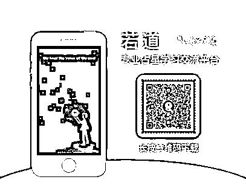

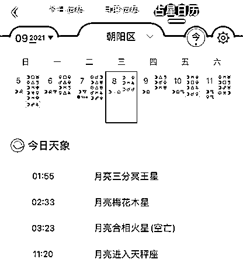

**作为一位占星师，可以这样使用这个自我觉知工具：**

★ **记录梦境**

如果你有醒来记录梦境的习惯，每天早上看一下睡梦中的天象和行进，对应联想，你会惊喜的发现一些神奇的对应，能够更敏锐的捕捉到日常被压抑的情绪和需求。能够帮助你在白天的工作生活中先知先觉的关注身心状态。

★**规划生活**

每月月初，周初都可以参考天象和行进进行日程规划，预估可能的助力和阻力，在对的时间做对的事，会发现平平无奇的日常也可以有不一样的色彩。根据月相的变化感知情绪的起伏，更好的自我关爱。

★**感知环境**

当身边发生了引起你注意和好奇的事情，或者网络上层出不穷的新闻热点，都可以在天象中寻找对应的能量。从更大的格局视角去思考你的个人观点。通过环境的共振，更深入的理解自己的本命星图。

**以上都是很好的学习深化占星知识的方法，你只需要系统掌握以下知识，你就可以开始使用以上方法去提升自我觉知。**

**美国占星心理学学院创办人**

**格伦·佩里**授课

**40 余年**职业占星师生涯所学精华**倾囊相授**

修完 101-205 全部课程，并通过考核的毕业生将获得

**美国占星心理学学院证书**( Academy of Astropsychology )

和**若道毕业证书**

**高含金量双证书**

跟随主讲老师学习融合**心理学体系**的**占星知识**

为星图咨询解读打下坚实的基础

**大量**的课程资料，光是课后阅读资料就**超过 60 万字**

合理的课程设计，贴心的助教服务，及时的课后测验

1

**这门课程最大的看点是什么？**

1. **两位国际占星学大师**共同授课，将合计**90 年职业占星师生涯所学精华**倾囊相授；2. 修完**2 年课程**，考试通过的毕业生将获得**美国占星心理学学院证书**（Academy of Astropsychology）和**若道毕业证书**，**高含金量双证书**；3. **第一学年 64 次课程**的充分授课时间（录播课程 43 次课；直播课程 21 次课），全面而详细地讲解占星学历史、知识、技能、案例、咨询和运用；4. 跟随主讲老师学习**自成体系、逻辑严密、实用性强的占星语法、星图解读方法**；5. 学习独特的**发展年龄预测法**，从星图看对关键年龄阶段的发展及议题；6.** 大量的课程资料，光是课后阅读资料就超过 60 万字**；7. 合理的课程设计，初中阶课程，每一节都有课后测验；8. 本课程可以作为**ISAR 选修课**中的一门，再修两门就满足 ISAR 认证选修课要求；9. 教授重要的**心理学概念**，比如与客体关系、心理动力理论、个人神话和叙事疗法相关的一些概念，学习如何将它们整合到星图解读中；10. 在 105 阶段了解**《精神疾病诊断与统计手册》**诊断标准，探索星图中的心理疗愈；

**格伦老师致学员的信**

（向上滑动查看内容）

**亲爱的学员：**

作为占星心理学学院的校长，我的目标是帮助你顺利完成学业。

占星心理学学院的课程让你能够在经济承受范围内，灵活地学习占星学。我们的课程让你可以舒适、便捷地在家学习，不用打乱你本就繁忙的日程。我们有完善的在线学习系统，让你能在线上课、下载学习资料、进行测试并自动获得即时反馈，还可以在虚拟课堂上同你的教员和同学互动。

作为私人开业的**职业占星师**和**执业心理治疗师**，我已经**工作超过 30 年。**我还花了近 10 年的时间，在研究院里学习并获得**心理学的硕士和博士学位**。这段训练和经历是无价的，帮助我将占星学发展成为连贯的 21 世纪模式。

我们的占星学培训项目是**系统化的、清晰的、组织有序的、易学的、前沿的。**尽管有许多类似的学校可供你选择，但你不会在这些学校中看到像占星心理学学院所提供的那样有深度的或尖端的课程。

**我非常期待 2022 年再次在若道教授心理占星学核心课程。**我们重新规划和升级了本次课程体系。**新的课程包含之前完整课程的 72 个录播视频，每个视频长 2 小时；以及由我教授的 37 次直播课程，和大卫老师教授的 10 次直播课程，每次课程 2 小时。**在实时课程中，除了我提供的案例，我还会用学员的星图进行案例演示，与学员互动，阐明视频中教授的原则和方法。

**2 小时直播课程安排：**

**第一阶段 提问和讨论：**

这将在每节课开始时进行。邀请学员提出与课前提供的资料相关的具体问题。这一阶段将持续 15-30 分钟。

**第二阶段 示例：**

这一阶段会讲解与每周任务相关的具体概念，例如行星的星座位置、宫位位置以及相位的意涵。星图示例来自我认识的人，如公众人物、朋友、家人、同事或以前的客户（不显示出生信息）。同样，这一阶段也开放课堂讨论，学员可以提出自己的问题和见解。

**第三阶段 学员案例演示：**

这个阶段会从学员的具体星图来阐明概念，例如火元素行星占优势。学员案例演示不会涉及任何类型的咨询或“解读”。它们将只是简单地包含一段对话，我会在对话中分享自己对某个配置的思考，然后问这个学员可能会如何主观地（影响、信念、行为）和客观地（事件/关系）体验这个配置。其他参课学员可能也会对讨论的主题有自己的见解或问题，他们也可以参与讨论。

我对这一新的在线课程形式感到兴奋，**并期待着从 2022 年 4 月 27 日开始认识我的新学员们。**获得本学院的文凭会是你做过的最明智的投资。你不仅将占星学掌握到前所未有的深度，还将学到如何为客户提供咨询服务并建立职业占星师的职业生涯。

真诚地

**格伦·佩里 占星心理学学院校长**

**为什么要学习心理占星学？**占星心理学是一个复杂的体系，让实践者能够向客户提供真正治疗性的益处。这从根本上说来是我们学院有别于其他学校之处：**我们教授占星学，也教授心理学概念。****我们明确讨论各种心理学概念，并将其与占星学无缝衔接。结果就是更深入的、更丰富的，最终更加强大的模式。****该项目专为初学者和渴望深造的有经验的占星师而设。**我们会从跨学科的角度探讨星图解读。**通过融合荣格心理学和各种其他模型的元素，学员将熟悉作为人格理论、发展模型、原型语言和诊断工具的占星学。**

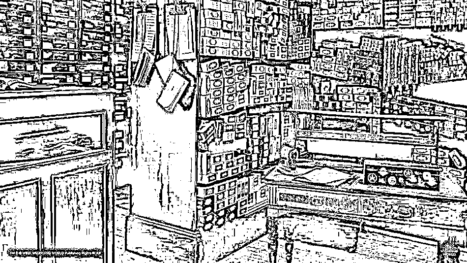

2

**课程是怎么安排的？**

**第一学年**

**共****64****次课 **43****次录播课 **21 次直播课******

**101 占星学基础 **

****共****12****次课程：******8 次 2017 年录课+4 次直播课**

**占星学**关注成长，聚焦心理。外部事件意义重大，但我们可以把它们看作是对于发展中的心理结构的共时性反映，以及未来发展的媒介和催化剂。在这个阶段的课程中，会以四种形态的几何形式介绍**占星原型：星座、行星、宫位和相位**。黄道带是人类心灵的象征性地图，其中的每个**星座**都代表一种基本的人类需求、原型人物、发展阶段和行为风格。**行星**代表心理功能，以满足其关联星座的基本需求。**宫位**提供了环境舞台，行星在其中扮演它们的角色，而**相位**是行星之间的角度关系，在主观上体验为内在对话。

**课程安排**：

**录播课****、****直播课（周三）**时长都是 2 小时

第一节**录播课**：核心概念介绍

第二节**录播课**：黄道带的结构

2022 年 4 月 27 日**直播课**：核心概念、黄道带的结构提问和讨论、知识点示例

第三节**录播课**：图例、单态星体和其他奇妙的元素

2022 年 5 月 11 日**直播课**：图例、单态星体提问和讨论、知识点示例

第四节**录播课**：星座介绍（从白羊座到处女座）

第五节**录播课**：星座介绍（从天秤座到双鱼座）

2022 年 5 月 25 日**直播课**：12 星座案例演示

第六节**录播课**：行星作为过程

第七节**录播课**：行星作为内容

第八节**录播课**：将碎片整合起来

2022 年 6 月 8 日**直播课**：整合星图时，将行星作为过程和内容案例演示

**102 行星落星座、宫位** 

****共****12****次课程：**8 次 2019 年录课+4 次直播课**

这个阶段的课程**聚焦于初步的星图整合。**

学员将学习**占星语法**，以及如何运用它们来阐释**行星的星座落点**。学员不需要强记书中的星图解读，而是学习分析基础的占星句法结构，应用这些语法规则来思考和讲述这门语言。学员们将学习如何构建精妙的句子，将动机、功能、特质、状态和事件组合起来。

此外，还将学习解读**行星宫位落点**的规则。宫位被定义为心理环境，为特定类型成长和发展提供背景。行星落在宫位中，象征着情境中的特殊状态，应对环境挑战的方式，以及通过共时性人物和事件而外化的自我部分。

学员们将探索如何将星座和宫位落点融合在一个单一、整合的陈述中，做出灵活、层次分明的解读。

**课程安排**：

第一节**录播课**：占星语法介绍

第二节**录播课**：行星星座作为行为风格

2022 年 6 月 22 日**直播课**：占星语法、行星星座作为行为风格提问和讨论、知识点示例

第三节**录播课**：思维状态和行为结果

第四节**录播课**：学习行星的星座落点

2022 年 7 月 6 日**直播课**：思维状态和行为结果、行星的星座落点提问和讨论、知识点示例

第五节**录播课**：回顾宫位的含义

第六节**录播课**：宫位中的行星过程

2022 年 7 月 20 日**直播课**：宫位的含义、宫位中的行星过程提问和讨论、知识点示例

第七节**录播课**：行星在宫位中的状态

第八节**录播课**：行星作为宫位的内容

2022 年 8 月 3 日**直播课**：行星在宫位中的状态、内容的提问和讨论、知识点示例

**103 行星相位与个人神话** 

****共****13****次课程：**9 次 2019 年录课+4 次直播课**

在这个阶段的课程中，**相位**被解释为由更大的故事结构的潜在动力构成的个人神话。

学员将学习相位是如何象征内在心理的冲突、重要的童年情感体验、主要的人生挑战和内在对话的。需要着重强调的是，相位的意涵会随着心理成熟的程度而改变。人会成长、进化，会解决内在冲突，这些不仅反映在态度和行为的改变上，而且也会表现在某人吸引的事件及其与他人的关系品质上。

学员们还将学习一些**心理学概念**，比如与客体关系、心理动力理论、个人神话和叙事疗法相关的一些概念，它们将整合到相位解读中。

**课程安排**：

第一节**录播课**：重要主题与核心冲突

第二节**录播课**：渐盈相位与渐亏相位

2022 年 8 月 17 日**直播课**：重要主题与核心冲突、渐盈相位与渐亏相位的提问和讨论、知识点示例

第三节**录播课**：主要相位的核心意义

第四节**录播课**：罗生门原则

2022 年 8 月 31 日**直播课**：主要相位的核心意义、罗生门原则的提问和讨论、知识点示例

第五节**录播课**：占星学中的认知

第六节**录播课**：心灵的控制结构

2022 年 9 月 14 日**直播课**：占星学中的认知、心灵的控制结构的提问和讨论、知识点示例

第七节**录播课**：作为认知结构的相位

第八节**录播课**：强迫性重复

第九节**录播课**：听大卫·瑞雷讲月亮交点

2022 年 10 月 12 日**直播课**：月亮交点（由大卫·瑞雷老师教授）

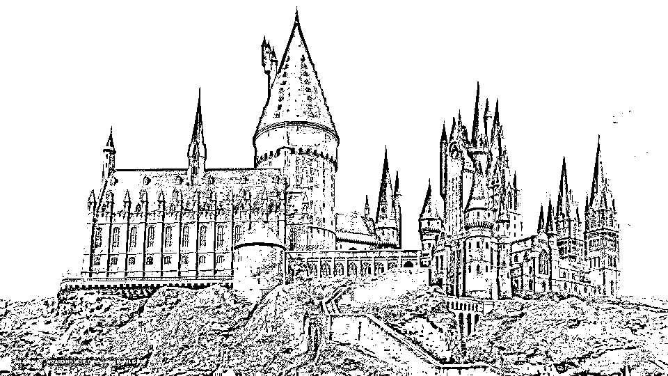

**104 征象星与定位星：作为进化故事的星图 **

****共****12****次课程：******8 次 2019 年录课+4 次直播课**

这个阶段的课程聚焦于**从叙事角度整合星图。**

学员们将探索**宫位征象星**和**行星定位星**如何讲述一个故事，反映一个人进化发展之旅。行星定位关系揭示了个人神话的主体构架。而这个故事的主题常常处于意识觉知和控制之外，占星学提供了一种方式，揭示、解读、改编这个神话。

我们推荐的星图整合方式是将相位和定位星关系融合成一个单一、连贯的叙事。要特别强调的是，如何活出整合程度更高的生命故事。

学员们还将了解**叙事疗法**和**自传写作**，把它们当作促进整张星图整合的一种方式。

**课程安排**：

第一节**录播课**：每张星图都讲述了一个故事

第二节**录播课**：互容与最终定位星

2022 年 10 月 26 日**直播课**：每张星图都讲述了一个故事、互容与最终定位星的提问和讨论、知识点示例

第三节**录播课**：将相位整合进流程图

第四节**录播课**：完整的故事

2022 年 11 月 9 日**直播课**：将相位整合进流程图、完整的故事的提问和讨论、知识点示例

第五节**录播课**：过渡短语

第六节**录播课**：良好定位或不良定位

2022 年 11 月 23 日**直播课**：过渡短语、良好定位或不良定位的提问和讨论、知识点示例

第七节**录播课**：发展年龄方法

第八节**录播课**：进行全面整合

2022 年 12 月 7 日**直播课**：发展年龄方法、进行全面整合的提问和讨论、知识点示例、案例演示

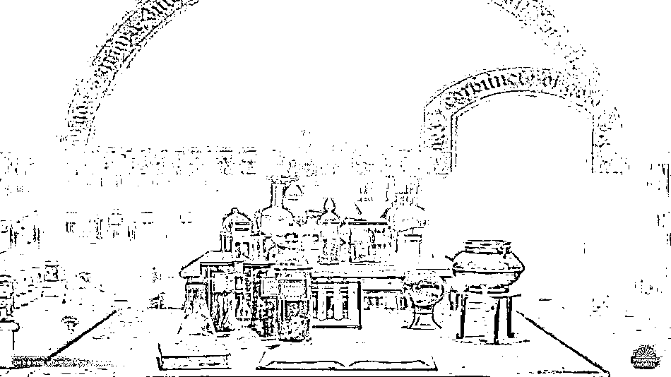

**105 星图中的精神病理学与疗愈 **

****共****15****次课程：******10 次 2019 年录课+5 次直播课**

在这个阶段的课程中,我们将**聚焦于十二星座(从白羊座到双鱼座）及其对应的守护星的潜在功能障碍**。

我们将学习如何识别、理解和应对每个星座的潜在挑战。我们将在各种相应的心理障碍背景下来考察占星原型，这些心理障碍表现为功能障碍、失衡的极端状态。

学员们将了解**《精神疾病诊断与统计手册》诊断标准**。我们会探讨治疗的概念，尤其是那些与整合和个性化相关的概念。我们将特别关注外行星的困难相位，以及它们与内在心理冲突、防御和症状形成的关系。

学员们将探索人的痛苦如何成为发展和实现天赋才能的催化剂。

**课程安排**：

第一节**录播课**：白羊座-火星的病理学

第二节**录播课**：金牛座/天秤座-金星的病理学

2022 年 12 月 21 日**直播课**：白羊座-火星、金牛座/天秤座-金星的病理学提问和讨论、知识点示例、案例演示

第三节**录播课**：双子座/处女座-水星的病理学

第四节**录播课**：巨蟹座-月亮的病理学

2023 年 1 月 4 日**直播课**：双子座/处女座-水星、巨蟹座-月亮的病理学提问和讨论、知识点示例、案例演示

第五节**录播课**：狮子座-太阳的病理学

第六节**录播课**：天蝎座-冥王星的病理学

2023 年 2 月 1 日**直播课**：狮子座-太阳、天蝎座-冥王星的病理学提问和讨论、知识点示例、案例演示

第七节**录播课**：射手座-木星的病理学

第八节**录播课**：摩羯座-土星的病理学

2023 年 2 月 15 日**直播课**：射手座-木星、摩羯座-土星的病理学提问和讨论、知识点示例、案例演示

第九节**录播课**：水瓶座-天王星的病理学

第十节**录播课**：双鱼座-海王星的病理学

2023 年 3 月 1 日**直播课**：水瓶座-天王星、双鱼座-海王星的病理学提问和讨论、知识点示例、案例演示

3

**导师简介**

**格伦·佩里（Glenn Perry）**

*   这位传奇的占星师，也是一名拳击和摩托车爱好者

*   他毕业于赛布鲁克学院(Saybrook Institute)，是心理/意识研究专业博士

*   也是拥有 30 余年经验的加州注册婚姻和家庭治疗师 （CAMFT）

*   美国占星心理学学院（Academy of AstroPsychology）的创办人

*   他曾任国际占星研究协会 （ISAR）以及联合占星大会董事会（UAC）副主席

*   也是 ISAR 突破性道德标准的设定者

*   康涅狄格州研究生院（the Graduate Institute of Connecticut）原型宇宙学与意识进化项目的负责人

*   共出版八本占星学著作：《心理占星学入门》《心理占星论文集》《盗取天火》《从忠诚到革命》《星图中的阴影》《占星职业议题与伦理》《出生星图深度分析》《从古代到后现代占星学》

**大卫·瑞雷（David Railey）**

*   若道联合创始人，致力于在中国教授和推广西方占星学；

*   曾任 ISAR 全球副主席，CAPISAR（ISAR 职业占星师资质认证机构）主席；

*   1976 年，通过亚特兰大职业占星师考试，成为全职占星师，随后通过 AFAN 和 ISAR 职业测试；

*   1980 年，与杰夫·焦耳一起在亚特兰大创建“每日行星”占星学中心。此后在亚特兰大占星协会担任 4 年考官，并且两次担任亚特兰大地区占星协会主席。1979-1992 年，作为占星师活跃于美国社会媒体，向不了解现代占星学变化的大众宣传专业占星学知识。在 1989-1992 年期间，他在 WRGG 电台 12 频道每周主持个人电视秀“今日占星学”，早先他还在 WRFG 的广播节目中播讲宇宙天气节目；

*   2010-2014 年，任全美占星师联盟监督委员会委员；

*   2010 年，其著作《灵魂的目标》中国版出版，和蒋颖一起创办若道占星学校和其官网 www.nodoor.com；

*   2017 年，被选为 ISAR 委员会成员。ISAR 是世界最大的国际占星机构，会员遍布 45 个国家，2017-2020 年曾任 ISAR 全球副主席、CAPISAR（ISAR 职业占星师资质认证机构）主席。

**助教简介**

**薇安**

*   全职心理占星师、ISAR 认证占星师（2016 年获得）；

*   北大心理学硕士、MBTI 国际认证施测师；

*   若道认证生时校正资质及 COAC 高阶资质毕业生；

*   连续两届担任格伦·佩里老师亲授的“美国占星心理学院&若道占星双认证核心课程”主助教；

*   2012 年至今，持续追随多位国际占星大师进行占星学的深入学习；

*   2007 年至今，持续进行精神分析及心理动力取向的理论及技巧研习；

*   致力研究心理学与占星学的整合运用。

4

**此次课程适合哪些人？**

*   对占星学感兴趣，想要入门的零基础者

*   占星学小白，但有志成为职业占星师的人

*   有一定占星学基础，但不知道该如何整合星图复杂碎片的人

*   想要师从更多殿堂级占星导师学习占星心法的人

*   走在自我探索和个人成长道路上的人

5

**选择若道学习占星学的优势**

**运用自由意志，扭转破坏性模式，绽放天赋潜能**

若道是人本主义占星学的旗手。因为我们相信，**人通过了解模式、觉察习性、积极疗愈、终将释放其潜能，与命运共舞**。

**进入国际权威职业占星师认证的快车道**

占星界的“联合国”ISAR（国际占星研究协会），是具有全世界影响力的占星教学和研究组织和职业占星师全球认证机构，认证占星师遍布 47 个国家。**在 ISAR 的 22 所附属学校中，大中华地区的附属学校只有若道一家**。在国际化的教学理念大纲标准下，**若道毕业生在 ISAR 国际认证占星师的考试通过率多次全球第一**。

**十年占星学教育中国本土化教学经验**

**根据中国学生的学习习惯不断优化占星教学体系，让学员学成后更自如地应对本土咨询市场的需求。**

学好占星学不仅仅需要邀请一两位老师教学，更需要对教学难点有充分了解，且有持续的教学跟进服务。**10 年来多次核心课程和各种专题课程的教学，让若道非常了解中国学生学习占星学的难点和卡点，合理有效地拆分、提炼课程知识点，同时也积累了丰富的国外老师和中国老师、助教紧密配合以及课程顾问密切配合教学的经验**。

若道还专门开发了有助于占星学习的“**若道**”APP，每门课程都设有答疑板块，学员能够方便快捷地提交问题，助教及时答疑解惑和批改作业。

**融入中国顶尖的职业占星师群体**

若道是中国职业占星师的“黄埔军校”。职业占星师的培养从若道开始，**进入若道，你就走进了中国顶尖的职业占星师群体，和一群志同道合的师兄师姐联谊，获得经验，共同成长**。 

**多种奖学金支持**

为了鼓励学员不因为暂时的经济困难而放弃学习，我们特意设置了各种**技能交换和奖学金**。

对于有一技之长的学员，我们推出的技能交换的项目包括**“笔译”、“笔记整理”、“平面设计”、“课本朗读”、“班级服务”**等技能交换项目；

而对于努力学习、出勤率高、完成作业率高的学员，我们设置的**土星奖、木星奖**等各种奖学金在等着你。

为了感谢帮助我们推荐学员的老学员们，我们设置了“**老学员推荐奖**”；

对于通过问卷提建议，帮助我们提高服务的学员，我们也设置了相应的奖学金。

**开启占星咨询的职业规划和支持**

若道为占星学员搭建了占星问答平台和占星咨询平台，并提供严肃占星学影响力最大的媒体平台，全力为毕业生提供宣传渠道，帮助你吸引和积累咨询生涯初期的种子客户。若道为学员开发了适用于占星学习的“若道”APP，并不断更新完善。

**①  微信平台**若道微信平台作为业内颇具影响力专业平台，为文笔好的若道毕业生提供传播占星学并免费宣传自己的机会。有的学员因为文笔获得众多粉丝喜爱，在 3 年多时间积累起 2000 多人的潜在客户。

****②  **咨询平台**若道咨询平台是我们为优秀毕业生所搭建的平台，帮助毕业生在自己的咨询拓展之外，用若道提供的平台扩展咨询客户群。自咨询平台 2017 年 8 月上线运营以来，咨询平台共入驻 100 人，收入最高者达 32 万元。

此处所列学员收入仅供参考，收入高的学员和其专业水准、努力程度密切相关。若道平台尽其所能将自己定位为辅助学员开展职业生涯的桥梁。

6

**课程价格**

**101-105 第一学年**

**正价：**18800 元

**学习充值卡优惠价：17000 元**

**101-205 全阶联报**

**正价：**50000 元

**转发优惠价：38000 元**

**学习充值卡优惠价：35000 元**

**其它各阶段课程单报价格，请咨询课程顾问**：**王老师（微信/手机：18510107057，请备注“格伦核心课”）**

**全阶段学习后，可参与若道占星毕业认证考试，考试费用为：580 元**

7

**直播课开课时间**

**2022 年 4 月 27 日（周三）20:00-22:00**

**如果直播课时间临时有调整，班班会及时通知每位同学****最终解释权归若道所有**

8

**退转课程**

**退款原则请详看《教学协议》，如有疑问请咨询课程顾问。**

9

**格伦老师视频**

<mpvideosnap class="js_uneditable custom_select_card channels_iframe videosnap_video_iframe" data-pluginname="videosnap" data-id="export/UzFfAgtgekIEAQAAAAAA8eIyMnQ0OwAAAAstQy6ubaLX4KHWvLEZgBPElIMYehsfM5L8zNPgMIuvMAf_Y6LDutEHc2Wrzjw4" data-url="https://findermp.video.qq.com/251/20304/stodownload?encfilekey=rjD5jyTuFrIpZ2ibE8T7YmwgiahniaXswqziaIVPleibJ2hxOpvKV1xQEH6MamiaEBVFicyZBhiclPyaSRcGvHAp4bwkwdXNbQRJbg9RrtRbicfWiaWoJ07pzF0Fko4A&amp;adaptivelytrans=0&amp;bizid=1023&amp;dotrans=0&amp;hy=SH&amp;idx=1&amp;m=&amp;scene=0&amp;token=x5Y29zUxcibD6nkeC6mHyXwVgSiblekcMGDQU559VS6vb5bGW2frdibQFzzyYMiaVnSD1zcNfjOjJ8U" data-headimgurl="http://wx.qlogo.cn/finderhead/PiajxSqBRaEJYnVsqWfEX9qA0sI6hNVKsDfyzfPZ92WZMZyBpZWU5NA/0" data-username="v2_060000231003b20faec8c4e68a1ec2d4ca07e434b07755bbf47e7053a3059defd2c9d6c68a20@finder" data-nickname="若道" data-desc="#若道核心课  （不是纯英文视频，有中文翻译）心理占星学和普通的占星学有什么不同？心理占星学有什么特殊的内容设置？
" data-nonceid="8810794934239578092" data-type="video"></mpvideosnap>****2022 双证书核心课第一学年****

**授课老师：格伦·佩里、大卫·瑞雷**

**直播课开课时间：2022 年 4 月 27 日（周三）开**

**授课方式：******网络授课，英文授课，中文翻译****

**费用：****101-105 价格**：18800 元**（充值卡优惠价 17000）**

**课程负责人：王老师**（微信/手机：18510107057，请备注“格伦核心课”）

长按二维码添加课程负责人咨询~

****报名直达入口****

# 让卜卦占星大师为你免费解盘 | 一个不确定世界的确定性绝技

> 原文：[`mp.weixin.qq.com/s?__biz=MzA5NjA0NTAxNg==&mid=2651473221&idx=2&sn=85c00f089cd7430de552696921b68ce5&chksm=8b48f7f2bc3f7ee40a87fcb5488d6a4787538a856e21f2ec92b123897bee72d1e290183a98e8&scene=126&sessionid=1692737822#rd`](http://mp.weixin.qq.com/s?__biz=MzA5NjA0NTAxNg==&mid=2651473221&idx=2&sn=85c00f089cd7430de552696921b68ce5&chksm=8b48f7f2bc3f7ee40a87fcb5488d6a4787538a856e21f2ec92b123897bee72d1e290183a98e8&scene=126&sessionid=1692737822#rd)

也许你会发现，这个世界变得越来越不确定了，变化也越来越无法预料。比如，上海人民怎么也没想到被静态管理，因此带来的对于生意、工作、健康、日常生活的管理，都似乎不再那么确定地在我们的把握之中。在一个越来越不确定的世界，有一个占星技法，能够帮助你和你的客户洞悉变化的方向、变化的原因、变化的本质、变化的可能结果，这个技术就是现代卜卦占星。**没错，卜卦占星就是一个在不确定世界的确定性的绝技！**昨天（5 月 3 日），现代动态卜卦占星课程正式开始了。昨晚参与课程的同学都表示无比精彩，大呼过瘾！你还在等什么？快来报名吧！越来越不确定的社会中，卜卦占星可以帮助我们的不是简单的“是”与“否”的答案，而是能帮助你**对于变化本身掌握其他任何方式都无法掌握的信息。**而信息可以给我们带来一些安定感和释然。我们也可以把这种感觉带给我们的客户。这个课程对于来参课的同学有一个特别的福利：**每位同学都可以在课程期间把非常想用卜卦了解答案的事情提交给邓肯老师，你的案例有很大可能被抽中作为教学案例请老师帮你现场解读！**要知道，邓肯老师的一个解盘加上翻译价值就有 2500 元！如果你在这两个月期间，碰巧遇到多个真实的问题，而确实是好的案例，你甚至会有多次被老师解盘，和老师对话的机会！**不仅如此，课堂还会有择时案例的选取，也都是用同学提交的案例来进行讲解。你假若有一些重要的需要择时的需要，也许也可以被当作案例挑选出来。**有的同学问，那是不是人人都有机会呢？这个取决于你提交的案例的价值。毕竟，8 次课程都是用案例教学，真实、有迫切需求的案例被选中的机会很大。而且，平时还有一起学习的同学一同陪你解盘。既学习了现代动态卜卦的技能，又有很大可能获得老师的亲自解读白赚一次大师解盘！这样的机会别说没有大声告诉你。

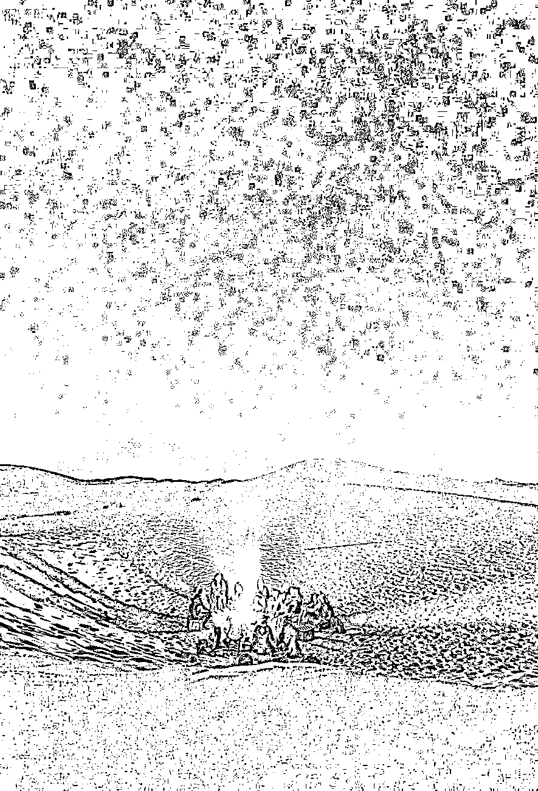

**卜卦占星可以问什么问题呢？**

从人生大的决策到小的决策，卜卦占星都可以给与一些答案。随便给一些真实的卜卦例子：**·** 经济形势不好，公司今年要裁员 30%，此轮裁员会裁掉我吗？我是不是应该早做准备？**· **我在这个公司已经工作了 20 年，很舒适。但是我现在有 2 个机会，我想辞职创业，我不知道这样做是不是太冲动？另外，我有 2 个可能的创业方向，哪个方向更可能成功？**· **此次疫情，我的小区会被封闭吗？我需要储存更多食品吗？**· **股市下跌，我该卖出股票止损还是应该补仓？**· **我今年能卖掉这个房子换一个有小院子的房子吗？**· **我妈妈给我介绍了一个对象，这个人是不是合适的伴侣？如果是，我们何时可以结婚？**· **我的上司会被调走吗？我和他关系很好，不知道新来的上司能否处好？**· **离婚很艰难，老公迟迟不签字，而且他在转移资产？我可以怎么做？**· **我有一个移民到加拿大的机会，我应该移民吗？移民后可以顺利找到工作吗？**· **我的孩子是选择留学还是在国内读书？**· **我的母亲被诊断为癌症，她该选择手术还是保守治疗？**· **我迟迟无法怀孕，治疗到现在没有结果，我还能怀孕吗？大概什么时候会怀孕？**· **我的小狗跑丢了，我还能找到它吗？**· **我已经是大龄产妇了，现在快到预产期，我身体也还可以，但是也有一些小毛病。所以我很踌躇，不知道应该选择剖腹产，还是自然产？**· **我们到底要不要三胎？如果你是占星师，你的客户很可能在这个不确定的环境里，会遇到类似的各种各样的人生问题，而现代动态卜卦占星则是一个无法代替的技能，帮助你拓宽为客户服务的业务范畴。课程持续报名中，欢迎了解！

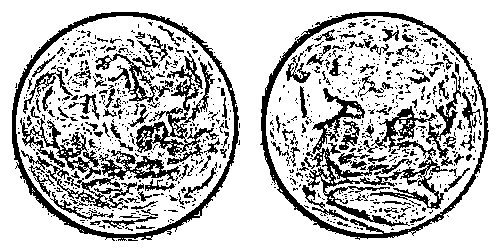

**对现代动态卜卦占星的 7 个问题**

**1****什么是现代动态卜卦占星？**

现代动态卜卦是将有传统历史的卜卦占星和现代人本主义占星的精神结合在一起，**更适合现代社会现实状况**的卜卦占星技法。

**2****卜卦占星的特色是什么？**

**随时随地可用，**帮助你从这个卜卦星图中洞察当下你所期望了解的事情和人的现状、发展趋势、可能发生什么事情、可能的结果，及什么时候会出现什么结果。

**3****动态卜卦占星是什么意思？它重要吗？**

动态卜卦非常重要，因为事物不是静止的，而是变化的。**动态卜卦不仅会让你看到人和事物的状态，还可以让你看到其发展和变化的过程，**会碰到什么事情。

动态卜卦的美妙之处是它不是静止的一个照片，而是**描述一个故事的开始、发展和结局。**

**4****卜卦占星什么情况可以用？**

**万物万事皆可卜。**什么都可以用。1-12 宫所包含的人事百态，事业、健康、金钱投资、商务、旅游、教育、法律、生育、宠物养育等等。

卜卦占星也可以帮助我们去看某个社会事件、国际事件的发展，**可以和经世占星相结合。**

**5****它如何与人本主义占星结合？**

因为从卜卦行星可以看到参与人的**心理状态、心理过程和面临的议题**。而如果当事人愿意去调整自己的内心状态，就不再完全是被动的，而是可以以更积极主动的方式参与到事件中去；或者能够更理解目前的外部环境，选择更安然地调整内心。

**6****卜卦占星可以和人本主义的咨询相结合吗？**

当然。在课程中，老师将会仔细讲如何**把卜卦占星和出生星图及预测技术结合在一起，**给客户提供更好的服务。

**7****如何学好现代卜卦占星？**

**实践，实践，实践。**

占星学是一门必须大量实践的学问。纸上谈兵没有用，只是听课没有用。

实践是一步步来的。你不必知道所有的卜卦技法才开始实践。**从第一节课开始，你就可以进入实践。**

实践刚开始可能只是模仿。**我们有大量的真实案例，也安排了很多作业让大家练习。**也给大家拿自己的案例和老师互动的大量机会。

**授课老师**

**艾德里安·罗斯·邓肯****（Adrian Ross Duncan）**1971 年在印度游学时开始学习占星学，1985 年开始成为全职占星师，**迄今执业已超过 33 年，是人本主义占星学、卜卦占星学和经世占星学领域的知名占星师。他还开发了占星软件 AstroClock 和多款占星报告。**他在日常咨询中都会运用卜卦，咨询图（卜卦的一种运用方式，即根据客户来访时间制作星图，从星图中获得大量信息）也是他**特别擅长的领域**。艾德里安·罗斯·邓肯从 1971 年开始研习佛学，受佛学影响很深，他**相信占星学和佛学观点统一、转化的一个基础是在于对现实感知的改变**。而卜卦很容易与佛教融合，因为它只关乎当下。

| 艾德里安·罗斯·邓肯的占星学著作

作为本次课程的主讲老师，艾德里安·罗斯·邓肯如是说：

卜卦星图不仅给出了当下的能量状态，**它还包含着过去的踪迹，也蕴藏着未来的种子。**它是心理的，也是事件的。一个好的占星咨询是要把过去、现在和未来交织成一个整体。

**卜卦星图告诉客户他们当下在哪儿，他们处于的能量状态是什么，这张星图和他的过去有哪些关联，他可以怎样和这张星图一起合作去挖掘一个积极主动的未来。**这里预测的未来不是强加给他们的，这个未来是一点点揭露给他们看的。

心理占星学和卜卦占星学别无二致，所有的事件都有其心理对应。如果你的意识与世界同步，你就会看到二元统一。

行进和推进帮助我们理解如何抵御外在和内在的风暴。卜卦如同显微镜下的行进。**通过行进难以准确了解一段关系、房屋购买、工作机会等是否有益，但对卜卦来说并不难。卜卦也擅长回答与时间相关的问题，对行进和推进的标志进行微调。**

**课程形式**

**15 节录播课+8 节直播课线上网络课，英文授课，中文翻译。**

**15 节录播课为 2020 年动态现代卜卦课程的内容。8 节直播课则完全是案例教学的形式。**

这样的好处是，你可以通过 1 个半月的密集学习之内按照自己的进度学完录播课的理论和录播课中已有的案例，从学习开始就实践，然后把实践中遇到的问题拿到 8 节直播课中，和老师互动。

**在 8 节直播课中，老师也会用案例教学、和同学互动的方式帮助大家进一步掌握卜卦占星的技法。**

**授课时间**

**付费后一天即可开始看录播课程，全程有助教老师回答问题。**

**直播课程开始时间：**

2022 年 5 月 3 日，每周二 20:00-22:00

**这次课程恰逢世界在巨大的变动和不确定之中，期待这门课程能够给各位及各位的客户带来新的洞见和方向。**

**在这次 8 次直播课程中，我们将采用案例教学的方式，所有参课同学均有机会提供案例，供老师解读，且我们将组织群体的练习，用大量案例帮你掌握卜卦及如何在咨询中用卜卦。**

****

**授课内容**

***Part1***** 融合现代占星理念，整合动态占星知识**

星图如同地图，展示了人们从哪里来，现在在哪里，以及可能的去向是什么。卜卦星图虽然显示的是当下这一刻，但却是在动态当中的。所以过去的运动轨迹对应着过去所发生的，接下来的运动轨迹对应着接下来要发生的。

**在课程中你会学习到：**

*   我们如何从一张卜卦星图看到时间的流动：从过去到未来，故事如何展开

*   心理占星和事件预测如何在卜卦占星中有机结合起来

*   卜卦星图如何回答是否的问题

*   如何用卜卦星图回答分析性和指导性的问题

*   现代动态占星中事件发展的顺序：

*   确定咨询图中强调的当前事件

*   将客户与相位或行星组合相关的情感能量关联起来

*   在早期经历中找出相似的情景

*   认识到过去和现在的情感完全相同

*   辨识出过去做出的所有限制性决定

*   通过头脑风暴找出更能带来力量的方法来解决相同类型的问题

*   在想象和现实生活中重演当前和未来的事件

***Part2 *****独家【现代动态卜卦占星技术】全面教学**

哥本哈根占星学院院长艾德里安·罗斯·邓肯 Ardian Duncan 老师 50 年卜卦占星经验倾囊相授，内容包括但不限于：

**1.卜卦中的行星**

*   行星强弱及力量

*   太、月、水、金、火、木、土在庙旺落陷时的意思

*   卜卦星图中的月亮及其在 12 宫的意义

*   卜卦星图中的外行星

*   卜卦星图中的恒星

*   上升点和指征星的度数

**2.如何选择和辨识征象星**

*   当问题出现时，如何判断征象星

*   如果两个人或物由同样的征象星指代该怎么办

**3.卜卦图中的相位**

*   不同相位的意义

*   征象星之间相位的意义

*   征象星与其他行星相位的意义

**4.卜卦中的宫位**

*   12 宫位和宫位系统

*   对宫位的动态观察

*   宫主星及其互动

*   互容和定位星

**5.卜卦中的星座**

**6.传统卜卦原则（约束和限制条件条件）及其在现代动态卜卦中的应用**

**7.空亡、光线传递、完成、围困、燃烧之路等**

**8.星图中的逆行及其讲述的故事**

*   水星和计划

*   金星与依恋

*   火星与斗争

*   外行星逆行

**9.应期与时机**

*   1 度是代表多久

*   宫位的重要性

*   行星速度和逆行

*   如何综合卜卦和行进、次限分析时间问题

***Part3*****  学以致用，覆盖人生各个领域问题的卜卦解法**

希望将现代卜卦占星学的精髓传达出来，精细地讲解每一宫所代表的卜卦事物，分主题详解不同类型问题的卜卦解读思路，内容包括但不限于：

**1.爱情和关系**

*   金星的重要性

*   第一宫和第七宫以及其中的行星

*   成对行星

*   上升点、下降点及其守护星

**2.业务和工作**

*   第十宫和第六宫以及其中的行星

*   木星和土星及其相位

*   火星和水星

*   行进和中天

**3.资金和资源**

*   第二宫和第八宫以及其中的行星

*   第五宫和第十一宫

*   金星、木星和土星

*   四元素的意义

**4.家庭和大家庭**

*   第四宫和第十宫及其守护星

*   第五宫、十一宫及其守护者

*   第五宫和第十一宫的行星

*   月亮

**5.社会、法律、智性、健康、存在主义的问题**

*   第九宫和第十二宫及其中的行星

*   木星和第九宫守护星

*   第三宫 、第十一宫、第六宫和第八宫

**6.如何解读事件星图**

*   从新闻学习卜卦盘

*   如何从卜卦盘看新闻事件和世界大事的发展变化

*   我们如何去培养自己观察有预兆意义的信息、从日常事件中捕捉启迪

*   占星解读的意义

***Part4 ***** 扩展延伸择时占星技法的新认知**

在择时的时候，我们会选取征象星处于有力的时候，来规划我们的事件；避免征象星不力的时候，尤其当这个征象星代表我们自己。

**择时星图一瞥**

*   择时的艺术

*   如何在不完美的天象下取得最佳结果

*   如何做出深思熟虑的回答

*   如何为约会择时

*   如何为婚礼择时

*   如何为商业活动择时

*   如何为旅行择时

*   如何为对抗事情择时

*   虚拟和实时会议的择时

***Part5  *****如何运用卜卦占星学做一场转化性的咨询**

虽然卜卦的结果可能是不利的，但我们仍然可以从心理占星学的角度给出一些积极建议，帮助客户建立信心，有助于应对之后的人生。客户出生星图与卜卦星图的关联，这在咨询中对于心理方面的考量是非常重要的。

*   一个好的咨询有哪些特色

*   咨询星图及其应用

*   如何用卜卦星图和新客户在短暂的咨询开场白快速建立信任

*   如何综合卜卦星图、出生星图、次限图一起分析

*   如何用卜卦星图聚焦当下的问题

*   如果客户在一场咨询提出多个问题，要看多少卜卦盘

*   如何在一个充满挑战的卜卦星图中寻找客户资源、有利的时机，找到支持客户的策略

*   如何从客户故事中寻找意义

*   卜卦星图如何从事件维度和心理维度来解读

*   当看到客户不愿意看到的结果可能出现时，如何开展对话

*   改变的方法

**什么人适合参加本课程？**

*   想要系统学习现代动态卜卦占星的学员

*   想在生活中熟练使用现代卜卦占星学

*   在咨询中想帮助个案更清晰的分析解读困惑

*   想参加 ISAR 认证考试，此课程是 ISAR 选修课

*   希望通过卜卦占星帮助自己和身边人挖掘一个积极主动的未来

学习整合卜卦技巧，不仅有益于想钻研卜卦占星学这个分支的同学，对占星初学者也很有有帮助，可以让你的占星技巧加倍。

**学员评价**

**课程费用**

**课程价格：9900 元**

**老学员复训专享价：**

**2020 年参加艾德里安·罗斯·邓肯卜卦占星课程的同学：****2900 元**

**2018 年参加艾德里安·罗斯·邓肯卜卦占星课程的同学：****4900 元**

**特别优惠****：**

**分享课宣到朋友圈****保留 48 小时****（不设分组显示）截图给课程顾问可获得****400 元优惠****。**

**课程负责人：童老师（微信：nodoorDaivd），请备注“卜卦”**

长按二维码添加课程负责人咨询

**退转课程****退款原则请详看《教学协议》，如有疑问请咨询课程顾问。******现代动态卜卦占星实战课·ISAR 选修课****

**授课老师：艾德里安·罗斯·邓肯**

**授课时间：**2022 年 5 月 3 日

**授课方式：**网络课程，英文授课，中文翻译

**费用：9900 元；****2020 年老学员复训价：2900 元；2018 老学员复训价：4900 元；特别优惠，分享课宣到朋友圈保留 48 小时（不设分组显示）截图给课程顾问可再获得 400 元优惠。**

**课程负责人：**童老师（微信：nodoorDaivd），请备注“卜卦”

长按二维码添加课程负责人咨询

****报名请点击“阅读原文”****

# 5.3 金星进白羊座丨爱自己吧！从当下这一刻开始！

> 原文：[`mp.weixin.qq.com/s?__biz=MzA5NjA0NTAxNg==&mid=2651473221&idx=1&sn=eb4a397fb05de730e95fd50a2ac7d18b&chksm=8b48f7f2bc3f7ee4a57d52ab21bf73fb3d510a12bcef5e285bb757acb882ba392422daff4021&scene=126&sessionid=1692737822#rd`](http://mp.weixin.qq.com/s?__biz=MzA5NjA0NTAxNg==&mid=2651473221&idx=1&sn=eb4a397fb05de730e95fd50a2ac7d18b&chksm=8b48f7f2bc3f7ee4a57d52ab21bf73fb3d510a12bcef5e285bb757acb882ba392422daff4021&scene=126&sessionid=1692737822#rd)

**********************☆ ****************************后台****************************回复“今日”，给你一句生命态度**********************

作者/MaryChan 玛丽

编辑/翀子 封面/书君 图片/网络

5 月 3 日凌晨，金星进入白羊座。象征爱与美的金星来到“战士之地”白羊座掌管的领地时，会有哪些表现？在这段日子里，又有哪些重要的宇宙天气可以助力金星的能量发挥呢？让我们一起来看文章吧~
**金星进入白羊座**

**5 月 3 日 0:10 金星将由双鱼座进入白羊座。**由水元素到火元素的转换，从无边无际的神秘大海，不可名状的缥缈虚空，空灵悠远的心灵国度；到聚焦的意志之火，熊熊燃烧的原初热情，**涌动而出的强大生命力量，势不可挡降生的闪光自我。**

金星象征着爱与美，以及一种连接、结合、给与、分享的阴性势能。**一般它在每个星座待三周半左右，再进入下一个星座。**

**金星与阴性面向有关，**是除了月亮（代表滋养、照料、养育）之外的另一种阴性展现。其可视形状的变化，也像是有月亮的阴晴圆缺似的，当离地球很近的时候形似月牙，离地球很远的时候形似银盘。而阴性面向正与变化有关。

在金星的每月律动中，与之持续地连接，寻求理解，邀请金星所象征的品质与我们同在，有助于个体**连接生命中的愉悦感，**开发提升个人魅力、品味，带来自然而然的吸引力，**创造良性的人际互动**，开启或维护有品质的感情，**创造价值、财富与丰盛。**

**金星属于内行星，**是“自我”的具体面向，象征着客观性、连接、交换、存在于关系之中的彼此。有别于外行星所象征的超然面向，金星非常具有“烟火气”，与触手可及的人事物有关。

**其守护星座天秤座——带来平衡、和谐与优雅；金牛座——带来自然、价值与感官享受。**

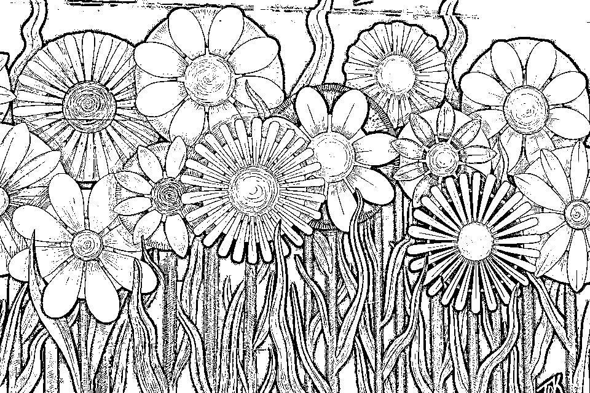

**白羊座的法则**

**白羊座，是阳性的火相开创星座，带来开始、开端、开启，守护星是战神之星——火星。**

白羊座是黄道 12 宫的开端，白羊座 0 度是黄道 12 宫的起点。如果说双鱼座象征万物还在地下酝酿的阶段，白羊座则象征破土而出的力量。**白羊座的原型人物是战士、先驱、创始人、婴儿、冒险者。**

**白羊座与生存有关。**古人要在荒蛮的环境中存活，面对毒蛇猛兽，必须为自己而战。只有先活下来，才有后续发展的可能性。时至今日，这种生存印记仍然存留于个体的原始记忆中。**所以白羊座会有竞争性，这是出于生存的本能。**

**白羊座与自我存在感有关。**在白羊座，自我不是成熟的、完美的，而是初生的、尚在形成的、在表达和探索中的自我，就像一株生机蓬勃的嫩芽，还有待成长，一切都在未来的可能性中。

**白羊座是个体自我意志的初始流露，**到接下来的火相星座狮子座、射手座则会渐趋成熟——从想要某事发生的意愿，到立定志向的决心和相应的自制力。

**白羊座的自主性和自发性较强，**善于主动选择目标，采取行动。白羊座需要拥有随时行动的自由，如果一件事情陷入被动太久，对白羊座而言则是痛苦的历练。

**白羊座与力量、精力有关，爆发力强，**喜欢追求速度和第一。F1 车手迈克尔·舒马赫，其土星和月亮北交点在白羊座，在他头 16 年的职业生涯中，几乎刷新了每一项纪录，总共赢得 7 次总冠军。

**白羊座与活在当下有关。**就像一个初生的婴儿，还没有与母体截然地分离，他是这个世界，这个世界也是他。在白羊座原型的经验中，过去、未来都汇聚于当下这一刻。当下就是最强烈的创造时刻，生命是一个片刻接着一个片刻，过去的经验或未来的可能都没有现下的生动体验有吸引力。

白羊座带着单纯的印记，带着对生命纯然的信任与天真，容易放下过去的不愉快或失败的经验，继续走在人生道路的每一步中。

**白羊座带着简单、明快、真实，**不需要添加任何多余的东西，也不需要虚张声势。月亮、火星在白羊座的苹果集团创始人乔布斯说：简单就是快乐。其设计师乔纳森补充说：苹果绝对是努力研发简单的应用方案，因为人们喜欢简单明了。

白羊座的勇气、胆识以及对“新大陆”的渴望，驱动着个体去**冒险和探索。**白羊座很难总停留在原地，这与行动有关的能量不会安于现状。安稳留给下一个星座金牛座，白羊座负责开疆辟土，而接下来的金牛座负责守护和开垦。

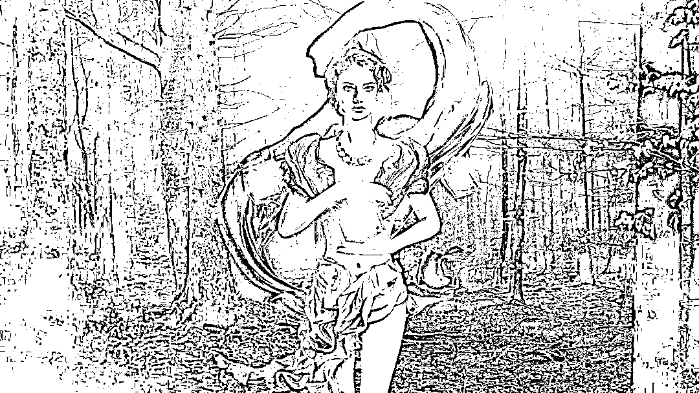

**金星在白羊座**

金星在白羊座，是代表阴性法则的金星，来到了阳性法则主导的白羊座领地，这里传统上是金星处于弱势的位置。然而阴阳交错、汇聚一体，**也可以给人带来特别的光芒。**

**金星在白羊座的美，**是奥黛丽·赫本主演的《罗马假日》中的活泼公主，是伊丽莎白·泰勒主演的《埃及艳后》中的传奇女王，是詹妮弗·安妮斯顿主演的《老友记》中率真的瑞秋，是凯特·布兰切特主演的《本杰明·巴顿奇事》中风姿绰约的舞者黛西。

这些演员的金星均在白羊座，戏如人生，她们遇到的角色也散发着其金星的魅力。

**金星在白羊座，引领人们关注明快、直接、带有一定视觉冲击力的事物。**白羊座是原始的，有点横冲直撞，显得粗糙、生猛、未经雕琢，这与金星的本质并不贴合。当金星进入白羊座，人们所欣赏的或许不需要那么温柔优雅。

凝视梵高的画作《星月夜》、《向日葵》、《麦田与收割者》，浓烈的色彩、奔放有力的线条，其中鲜活的能量倾泻而下，凸显大胆、狂热的激情，非常富有生命力和表现力。这位太阳白羊座的后印象派大师，成为表现主义的先驱，并深深地影响了二十世纪的艺术。

**金星在白羊座，带来女战士、女将军的原型能量。**太阳双鱼座、月亮巨蟹座的法国导演吕克·贝松，其水星、金星均在白羊座，他执导的电影《第五元素》、《圣女贞德》、《超体》中的女主角都是身手敏捷、拥有力量与勇气的战士类型。

男人星图中的金星要素，也体现在他的重要关系上。其前妻米拉·乔沃维奇的演艺经历完全反映了白羊座的特点，她出演的《生化危机》系列电影，体现了在极端情况下主角的强劲生存能力和爆棚战斗力，甚至该系列有一集叫《生化危机：战神再生》。

无独有偶的是，金星在白羊座的男演员成毅，其主演的仙侠剧《琉璃》中，他爱上的女子也曾是天界战力超群的战神。

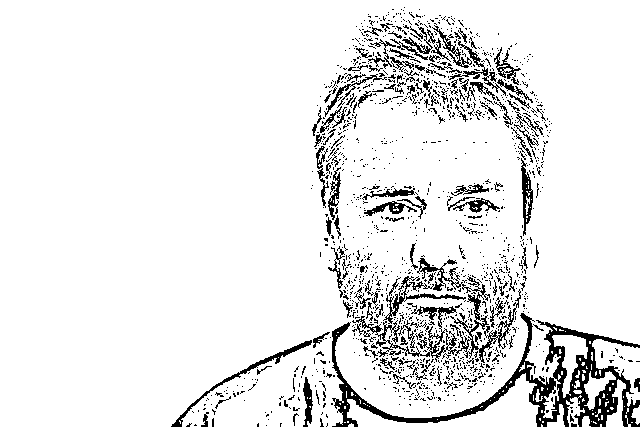

| 吕克·贝松

据查，神话传说中司掌战争的女神有：中国神话中的九天玄女、埃及神话中的奈斯、希腊神话中的雅典娜、印度神话中的杜尔迦、罗马神话中的贝罗娜等。

有意思的是，所有战争女神有一个共同点，就是他们司掌战争的同时，也是智慧的化身。并且都是女神（而非男神）同时代表战争与智慧的化身。**这透露着集体意识中，带有阴性能量原型特色的保护力。**

**金星在白羊座，带来对力量的关注。**人们可能更多参与运动和健身，注意锻炼肌肉力量和保持身材。这也是希望减重人士的有利燃脂时机。同时，这也激发个人的内在力量，让人看到自己的潜能，并培养自己的实力。

**真正的力量绝不只是孔武有力，内在有力的人更能承受环境中的压力，为关系带来弹性和稳定性。**电影《霍元甲》中霍母说：孩子，武术最厉害的地方，不是要打倒别人，而是要克制自己的好胜心。

**关系是一面镜子，映照出个人内心真实的欲望与恐惧，而每个人真正的对手可能就是自己。**

金星在白羊座，带来勇气，**令人在关系中敢于表达自己的需求，并坚守自己的底线。**当个人处于一段关系中，需要明确自己的诉求是什么，同时也看到他人的诉求。当一方过于主观、自我，变得步步紧逼的时候，矛盾越来越难以调和。

此时展开的抗争，是为了不破不立，无情击穿对方的盲目无知，让对方看到我方立场的坚决。经过交手，也许能加深相互的了解，从而在新的平衡中结交和相处。当然也可能就此反目。

请不要忘记，爱蕴含于万事万物中，当不希望彻底决裂的时候，需要注意以爱和真诚来托底，才不至于因鲁莽而产生无法承担的后果。爱不是简单的迁就和妥协，爱是一份敏锐的辨识力和洞察力，让人感知到更多讯息，从而自然找到打开人心的钥匙。

**金星在白羊座，用这能量去引爆“生”之希望，带给自己在意之人安心的守护，而非破坏和损失。**金星在白羊座让人联想到女强人，但我认为这种“强”不仅仅是外在的厉害，关键是始于内心的勇敢和担当。

就像替父从军的花木兰，她不仅胆识过人，而且智勇双全，她的勇敢是为了保护家人。同样，电影《海王》中，勇士亚瑟在海底洞穴里对巨兽卡拉森说：我来到此地并非因为我已准备好，我为了保护自己的人民和所爱的人而来，我前来是因为我别无选择。

**金星在白羊座，个人可以积极、主动而友好地对待他人，令人感受到扑面而来的热情。**但火元素星座的情感因素比较少，在关系中较多在意自己的感受，而不一定善于体察和捕捉他人的感觉，有时候显得“用力”过猛，而忽视了关系中的细腻。

**金星在白羊座的负面情绪主要是愤怒。**当个体在关系中的存在感和重要性不被看到，以及自我主张无法伸张，愤怒感就容易滋生。不过这种愤怒往往来得快，也去得快，典型的白羊座是不会压抑情绪的，尽管有可能发生一些破坏和误伤。

**金星在白羊座的爱情**

个人容易被独立、积极的人吸引，欣赏为了实现目标而勇于战斗的人；也会被有孩童般可爱举止的人吸引。此时适合直接了当地表白，用简单和纯粹去打动对方。

外露的感情和热力，令人感受到活力、激发和鼓舞。分享彼此生活中的热情、理想和目标，会拉近彼此的距离。计划一些共同的行动，或一起参与运动项目，适当地竞争和征服感，会让彼此更加亲密。

**在相处中，尊重也许比柔情更重要，看到彼此的个性，给对方做自己的自由，可以增进彼此的存在感、认同感。**

金星在白羊座，当最初的激情褪去，个体取悦对方的意愿可能降低，如果缺乏持续力与维护力，例如土星的因素，则不利于长期关系的发展。除非双方都很独立，可以各行其是地做自己喜爱的事情，允许对方自由地探索和发展自我。

当涉及深层融合和需要彼此接受更多限制的时候，关系容易出现阻力和问题。**往往当自我真正面临某种无法改变的结果时，才是学习客观看到事物本来面目的开始。**

如果金星在白羊座的能量被扭曲和滥用，就会带来无底线的冲动，无道德的利用，以及无知的伤害和破坏。要避免这样的状况，关系中的双方都需要**抱有诚实和敞开的心，**都具有内在独立的、强壮的自我。

**金星在白羊座的爱情剧本中少不了关于勇气的试炼，通过另一半我们反而更加了解自己，从而变得成熟、客观和体谅。**

**金星在白羊座的开运色：红色、白色、黑色。**

金星在白羊座，可以通过与**力量、速度、勇气、行动力、竞争性、表现力有关的事物**获得金钱收入，例如成为军警人员、运动员、教练、保镖、探险者、（某领域的）创始人、创业者、艺术者、营销者、送货员等。

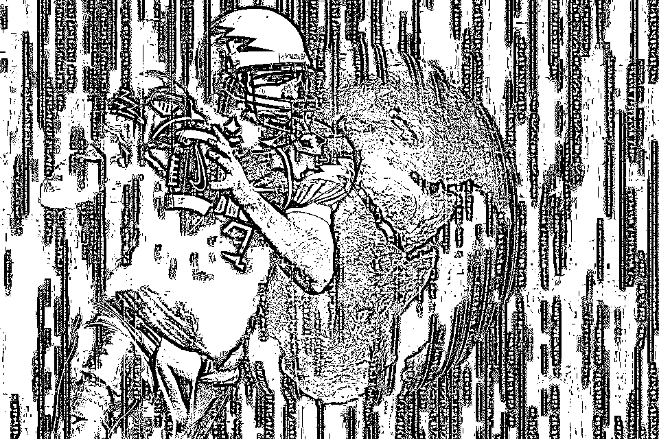

**金星在白羊座的阴影**

做事的时候如果只看到眼前，**缺乏远见和预判**，等到事情已经发生，再想去补救，可能已经晚了。

行事如果缺乏对细节的考量，可能会让事物显得粗糙；或者因鲁莽行事，而产生不必要的伤害和破坏。

做事“现在就要”的习性，令人**缺乏耐心**，不想等待，容易不断催促他人，无法宽容地对待反应较慢的人。

在关系中**急于求成**，过于冲动的话，可能会忽视一些重要因素，而导致将来后悔，甚至受骗上当。

在关系中容易自我中心，较难看见他人的观点并自我反省，令人觉得其自私、无法沟通。

渴望参与当前的事情和状况，一时兴起，就随意介入他人正在进行的活动，令人觉得被冒犯和干预，被他人指出来以后，又会有不被接纳的挫败感。

在关系中对情感不太敏感，如果只听从本能行事，而不愿尝试理解一些微妙的感受，久而久之身边的人会觉得自己担待过多，而对这份关系疲惫倦怠。

在关系中存在有意无意的攻击性和竞争性，需要对这股动能加以觉察，并导向更具建设性的地方。

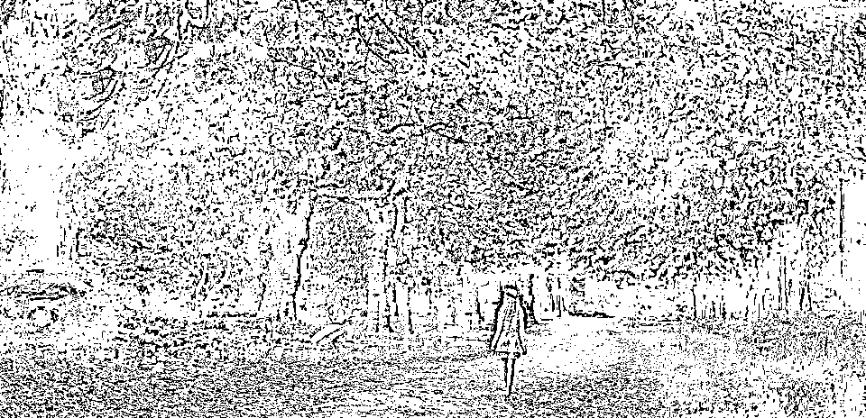

**金星在白羊座的重要相位**

**金星在双鱼座期间与其他天象的结合以及相位（容许度 1°）：**

金星进入白羊座时，是冥王星刚开始逆行的第 4 天，且木星六分冥王星（4 月 29-5 月 8 日）。冥王星粉碎已不适合个人成长的东西，木星为个人带来扩展的意识。

这带来改变的机会和讯息，也让旷日持久的僵局有活化的可能性。这激发内在的欲望，财富和权力的分配或重新考量，**扩展获得心灵资源的机会，发掘隐藏的资源和巨大的潜力。**

同时，5 月 1 日的金牛座日食，和 5 月 16 日的天蝎座月食，也强化了新旧更替的意涵。

**★ **5 月 15 日 ******金星合相凯龙星**

**重点影响人群：有重要行星/四轴/月亮交点落在白羊座、天秤座、摩羯座、巨蟹座、狮子座、射手座 7°-21°；水瓶座、双子座 9°-19°。**

**这是在关系中去治愈的时机。**关系中的伤害也许会发生，伤痛也许会浮现，是为了让个人有机会去看到并面对关系中的自我需求和欲望。也许我们并不认为自己在使用“暴力”，但有的表达方式确实会带给他人痛苦。

过度的竞争性、好胜心源于内在原本虚弱受伤的自我。如果不愿看到事情的本质，那么关系就很难圆满。

**★ **5 月 24 日 金星六分土星****

**重点影响人群：有重要行星/四轴/月亮交点落在白羊座、水瓶座、天秤座、狮子座 18°-29°；双子座、射手座 20°-29°。**

这协助个人**在勇气与谨慎之间找到平衡。**失控的勇气可能演变为不负责任、不顾后果的危险行为，从而伤人伤己。土星为我们带来稳定的根基与扎实的功夫，并让个人对自我和他人有更客观的评估，从而激发建设性的创造。

★ **5 月 26-27 日 金星四分冥王星**

**重点影响人群：有重要行星/四轴/月亮交点落在白羊座、摩羯座、天秤座、巨蟹座 21°-29°。**

冥王星与生命底层的欲望和热忱有关，**带出关系中早已腐朽的部分，引发关系的更新与重生。**如果事情不能尽如人意，此时不如尝试放开一点，试图去掌控，反而费力不讨好。**在关系中做个勇敢的人，**并不只是单纯出击或隐忍，更需要领悟阴阳平衡、刚柔相济的道理。

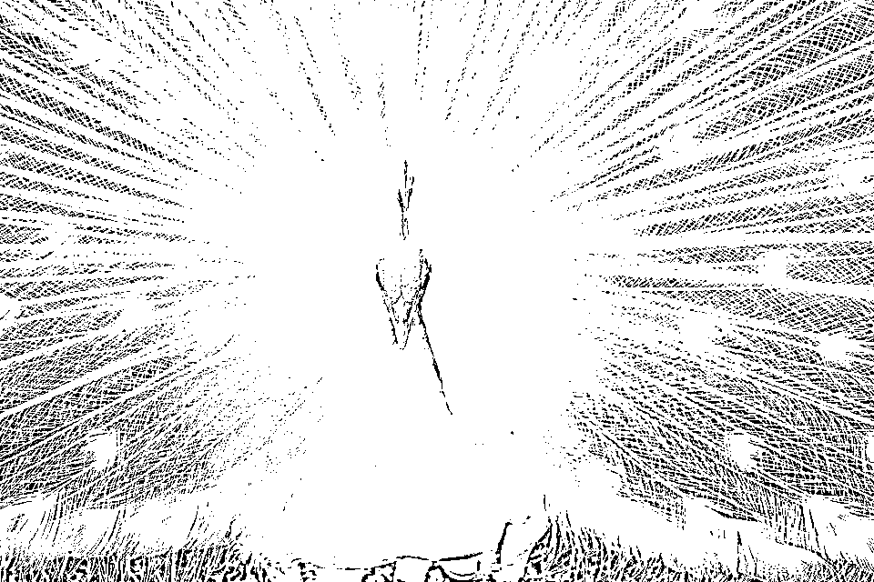

**金星在白羊座期间，正值白羊座的守护星火星由双鱼座转向白羊座，以下相位值得参考：**

★ **5 月 3-5 日 火星六分天王星**

**重点影响人群：有重要行星/四轴/月亮交点落在双鱼座、金牛座、天蝎座、处女座 7°-21°；巨蟹座、摩羯座 9°-19°。**

此时位于双鱼座的火星不大有明确的方向感，但也令行动充满了想象力和潜力。**与天王星的连接会带来新的刺激，**适合进行一些有创造力的活动，例如看一场艺术展，启发精神层面的探索与觉悟。此时梦境和潜意识比较活跃，可能引发一些人的焦虑不安，源于对自我的不确定感或不想改变。

★ **5 月 3-11 日** **火星六分太阳。二者在 12°-20°之间持续相伴而行，在 16°49′精确成相。**

**重点影响人群：有重要行星/四轴/月亮交点落在双鱼座、金牛座、天蝎座、处女座 9°-23°；巨蟹座、摩羯座 13°-19°。**

将直觉注入行动中，不妨去做做按摩和 spa，放松头脑，**回到身体层面，可以更好地接收到灵感和启发。**为务实的构想添加创意的行动，让理想体现于现实中。学习耐心和等待，让事情慢慢酝酿并稳步成长。

★ **5 月 17-19 日 火星合相海王星**

**重点影响人群：有重要行星/四轴/月亮交点落在双鱼座、射手座、处女座、双子座、天蝎座、巨蟹座 18°-29°；金牛座、摩羯座 20°-29°。**

此时人的注意力不容易集中，可能感觉困倦昏沉，仿佛精力丢失得很快。不适宜把日程安排得过满，建议劳逸结合，保证休息时间，防止因分心晃神而引发小意外。

人容易缺乏目标感和纪律性，对现实世界有种不想用力的躺平感。意志薄弱的人容易被怂恿或推销，谨防受利用和欺骗。

个人如果行动受阻，容易有逃避倾向，发生沉溺行为或上瘾行为的几率较高。**此时内在深藏的怨愤可能浮现出来，**例如对被冷落和忽视的不满，谨防发生精神失控的行为。

个人如果前期稳扎稳打，做好了基础铺垫，这时直觉和灵感将会涌来，相应的人和事可能自然发生，让人心想事成。不过一切还需要个人**静下心来聆听和分辨**，切勿满足于天真的白日梦。

相较在性关系中迷失而言，与伴侣一起追求灵肉升华的神秘体验会更有建设性。从本质来说，此相位通过让人处于无力中，而看到小我的狭隘，并有可能使之脱落，懂得臣服于更大的宇宙法则，并精炼和纯化火星的行动力使之脱离二元对立的局限，从而引领生命达到更圆融的境地。

★ **5 月 25 日 火星进入白羊座**

带来新生的欢欣、热力与清晰的行动力，但也要谨防冲动和夸大。

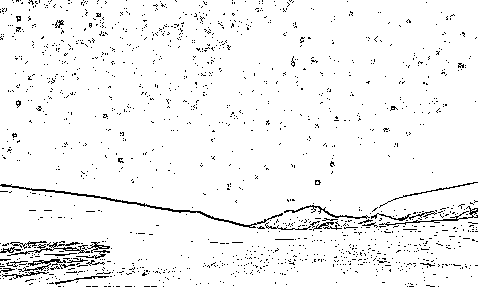

**结语**

金星在白羊座，这力量可以在关系中“去保护”，也可以“去伤害”。**让我们以爱来承载勇气，让美善在行动中体现。**愿我们能勇敢地去做出真实，活出潇洒，不为懦弱所牵制，不被欲望所扭曲，在当下直接表达关于爱、尊重、支持、信任与自由的需要。

**我们去爱，不是出于恐惧或内疚，而是一种快乐的表达。**

在一段亲密关系中，难免会遇到矛盾，对待“争端”的态度和方式，会让对方看到你的力量抑或虚弱，让自己看到自我的强韧抑或单薄。诚然，在关系中需要适时地说 No。但最后，能穿越屏障，看到两个寂寞受伤灵魂的人，才能让关系保有长青的生命力。

**版权声明：**原创文章由作者授权首发于若道平台，欢迎转发，反对抄袭。友号转载请申请白名单。

**MaryChan 玛丽**

人本主义占星师、花精咨询师

于成都创办工作室，从事咨询、组织相关活动 8 年

咨询预约号：MaryChen336

微信公众号：ZhanXing336

长按打赏

**20 位来自世界各地的占星师****带来 19 场沙龙——新世界的觉醒****中文字幕现已发布****详情可点击下图**

**学习占星学****点击下图了解课程详情**

**

**微信又双叒叕改版啦，不想错过若道君的推送？**

**就把若道设为星标吧！**

**▼**

**喜欢记得点一下在看哦☟**

****报名直达入口****

# 今晚开讲！丨现代动态卜卦占星实战课，4 个月掌握卜卦技法

> 原文：[`mp.weixin.qq.com/s?__biz=MzA5NjA0NTAxNg==&mid=2651473218&idx=2&sn=08994377f2d1d43d38d49b3166cef83c&chksm=8b48f7f5bc3f7ee304999e4623551a0a4ce1ed5cb26f490ae4fcc5d5b8c9f3aea6a40ede5e92&scene=126&sessionid=1692737822#rd`](http://mp.weixin.qq.com/s?__biz=MzA5NjA0NTAxNg==&mid=2651473218&idx=2&sn=08994377f2d1d43d38d49b3166cef83c&chksm=8b48f7f5bc3f7ee304999e4623551a0a4ce1ed5cb26f490ae4fcc5d5b8c9f3aea6a40ede5e92&scene=126&sessionid=1692737822#rd)

**对现代动态卜卦占星的 7 个问题**

**1****什么是现代动态卜卦占星？**

现代动态卜卦是将有传统历史的卜卦占星和现代人本主义占星的精神结合在一起，**更适合现代社会现实状况**的卜卦占星技法。

**2****卜卦占星的特色是什么？**

**随时随地可用，**帮助你从这个卜卦星图中洞察当下你所期望了解的事情和人的现状、发展趋势、可能发生什么事情、可能的结果，及什么时候会出现什么结果。

**3****动态卜卦占星是什么意思？它重要吗？**

动态卜卦非常重要，因为事物不是静止的，而是变化的。**动态卜卦不仅会让你看到人和事物的状态，还可以让你看到其发展和变化的过程，**会碰到什么事情。

动态卜卦的美妙之处是它不是静止的一个照片，而是**描述一个故事的开始、发展和结局。**

**4****卜卦占星什么情况可以用？**

**万物万事皆可卜。**什么都可以用。1-12 宫所包含的人事百态，事业、健康、金钱投资、商务、旅游、教育、法律、生育、宠物养育等等。

卜卦占星也可以帮助我们去看某个社会事件、国际事件的发展，**可以和经世占星相结合。**

**5****它如何与人本主义占星结合？**

因为从卜卦行星可以看到参与人的**心理状态、心理过程和面临的议题**。而如果当事人愿意去调整自己的内心状态，就不再完全是被动的，而是可以以更积极主动的方式参与到事件中去；或者能够更理解目前的外部环境，选择更安然地调整内心。

**6****卜卦占星可以和人本主义的咨询相结合吗？**

当然。在课程中，老师将会仔细讲如何**把卜卦占星和出生星图及预测技术结合在一起，**给客户提供更好的服务。

**7****如何学好现代卜卦占星？**

**实践，实践，实践。**

占星学是一门必须大量实践的学问。纸上谈兵没有用，只是听课没有用。

实践是一步步来的。你不必知道所有的卜卦技法才开始实践。**从第一节课开始，你就可以进入实践。**

实践刚开始可能只是模仿。**我们有大量的真实案例，也安排了很多作业让大家练习。**也给大家拿自己的案例和老师互动的大量机会。

**授课老师**

**艾德里安·罗斯·邓肯****（Adrian Ross Duncan）**1971 年在印度游学时开始学习占星学，1985 年开始成为全职占星师，**迄今执业已超过 33 年，是人本主义占星学、卜卦占星学和经世占星学领域的知名占星师。他还开发了占星软件 AstroClock 和多款占星报告。**他在日常咨询中都会运用卜卦，咨询图（卜卦的一种运用方式，即根据客户来访时间制作星图，从星图中获得大量信息）也是他**特别擅长的领域**。艾德里安·罗斯·邓肯从 1971 年开始研习佛学，受佛学影响很深，他**相信占星学和佛学观点统一、转化的一个基础是在于对现实感知的改变**。而卜卦很容易与佛教融合，因为它只关乎当下。

| 艾德里安·罗斯·邓肯的占星学著作

作为本次课程的主讲老师，艾德里安·罗斯·邓肯如是说：

卜卦星图不仅给出了当下的能量状态，**它还包含着过去的踪迹，也蕴藏着未来的种子。**它是心理的，也是事件的。一个好的占星咨询是要把过去、现在和未来交织成一个整体。

**卜卦星图告诉客户他们当下在哪儿，他们处于的能量状态是什么，这张星图和他的过去有哪些关联，他可以怎样和这张星图一起合作去挖掘一个积极主动的未来。**这里预测的未来不是强加给他们的，这个未来是一点点揭露给他们看的。

心理占星学和卜卦占星学别无二致，所有的事件都有其心理对应。如果你的意识与世界同步，你就会看到二元统一。

行进和推进帮助我们理解如何抵御外在和内在的风暴。卜卦如同显微镜下的行进。**通过行进难以准确了解一段关系、房屋购买、工作机会等是否有益，但对卜卦来说并不难。卜卦也擅长回答与时间相关的问题，对行进和推进的标志进行微调。**

**课程形式**

**15 节录播课+8 节直播课线上网络课，英文授课，中文翻译。**

**15 节录播课为 2020 年动态现代卜卦课程的内容。8 节直播课则完全是案例教学的形式。**

这样的好处是，你可以通过 1 个半月的密集学习之内按照自己的进度学完录播课的理论和录播课中已有的案例，从学习开始就实践，然后把实践中遇到的问题拿到 8 节直播课中，和老师互动。

**在 8 节直播课中，老师也会用案例教学、和同学互动的方式帮助大家进一步掌握卜卦占星的技法。**

**授课时间**

**付费后一天即可开始看录播课程，全程有助教老师回答问题。**

**直播课程开始时间：**

2022 年 5 月 3 日，每周二 20:00-22:00

**这次课程恰逢世界在巨大的变动和不确定之中，期待这门课程能够给各位及各位的客户带来新的洞见和方向。**

**在这次 8 次直播课程中，我们将采用案例教学的方式，所有参课同学均有机会提供案例，供老师解读，且我们将组织群体的练习，用大量案例帮你掌握卜卦及如何在咨询中用卜卦。**

****

**授课内容**

***Part1***** 融合现代占星理念，整合动态占星知识**

星图如同地图，展示了人们从哪里来，现在在哪里，以及可能的去向是什么。卜卦星图虽然显示的是当下这一刻，但却是在动态当中的。所以过去的运动轨迹对应着过去所发生的，接下来的运动轨迹对应着接下来要发生的。

**在课程中你会学习到：**

*   我们如何从一张卜卦星图看到时间的流动：从过去到未来，故事如何展开

*   心理占星和事件预测如何在卜卦占星中有机结合起来

*   卜卦星图如何回答是否的问题

*   如何用卜卦星图回答分析性和指导性的问题

*   现代动态占星中事件发展的顺序：

*   确定咨询图中强调的当前事件

*   将客户与相位或行星组合相关的情感能量关联起来

*   在早期经历中找出相似的情景

*   认识到过去和现在的情感完全相同

*   辨识出过去做出的所有限制性决定

*   通过头脑风暴找出更能带来力量的方法来解决相同类型的问题

*   在想象和现实生活中重演当前和未来的事件

***Part2 *****独家【现代动态卜卦占星技术】全面教学**

哥本哈根占星学院院长艾德里安·罗斯·邓肯 Ardian Duncan 老师 50 年卜卦占星经验倾囊相授，内容包括但不限于：

**1.卜卦中的行星**

*   行星强弱及力量

*   太、月、水、金、火、木、土在庙旺落陷时的意思

*   卜卦星图中的月亮及其在 12 宫的意义

*   卜卦星图中的外行星

*   卜卦星图中的恒星

*   上升点和指征星的度数

**2.如何选择和辨识征象星**

*   当问题出现时，如何判断征象星

*   如果两个人或物由同样的征象星指代该怎么办

**3.卜卦图中的相位**

*   不同相位的意义

*   征象星之间相位的意义

*   征象星与其他行星相位的意义

**4.卜卦中的宫位**

*   12 宫位和宫位系统

*   对宫位的动态观察

*   宫主星及其互动

*   互容和定位星

**5.卜卦中的星座**

**6.传统卜卦原则（约束和限制条件条件）及其在现代动态卜卦中的应用**

**7.空亡、光线传递、完成、围困、燃烧之路等**

**8.星图中的逆行及其讲述的故事**

*   水星和计划

*   金星与依恋

*   火星与斗争

*   外行星逆行

**9.应期与时机**

*   1 度是代表多久

*   宫位的重要性

*   行星速度和逆行

*   如何综合卜卦和行进、次限分析时间问题

***Part3*****  学以致用，覆盖人生各个领域问题的卜卦解法**

希望将现代卜卦占星学的精髓传达出来，精细地讲解每一宫所代表的卜卦事物，分主题详解不同类型问题的卜卦解读思路，内容包括但不限于：

**1.爱情和关系**

*   金星的重要性

*   第一宫和第七宫以及其中的行星

*   成对行星

*   上升点、下降点及其守护星

**2.业务和工作**

*   第十宫和第六宫以及其中的行星

*   木星和土星及其相位

*   火星和水星

*   行进和中天

**3.资金和资源**

*   第二宫和第八宫以及其中的行星

*   第五宫和第十一宫

*   金星、木星和土星

*   四元素的意义

**4.家庭和大家庭**

*   第四宫和第十宫及其守护星

*   第五宫、十一宫及其守护者

*   第五宫和第十一宫的行星

*   月亮

**5.社会、法律、智性、健康、存在主义的问题**

*   第九宫和第十二宫及其中的行星

*   木星和第九宫守护星

*   第三宫 、第十一宫、第六宫和第八宫

**6.如何解读事件星图**

*   从新闻学习卜卦盘

*   如何从卜卦盘看新闻事件和世界大事的发展变化

*   我们如何去培养自己观察有预兆意义的信息、从日常事件中捕捉启迪

*   占星解读的意义

***Part4 ***** 扩展延伸择时占星技法的新认知**

在择时的时候，我们会选取征象星处于有力的时候，来规划我们的事件；避免征象星不力的时候，尤其当这个征象星代表我们自己。

**择时星图一瞥**

*   择时的艺术

*   如何在不完美的天象下取得最佳结果

*   如何做出深思熟虑的回答

*   如何为约会择时

*   如何为婚礼择时

*   如何为商业活动择时

*   如何为旅行择时

*   如何为对抗事情择时

*   虚拟和实时会议的择时

***Part5  *****如何运用卜卦占星学做一场转化性的咨询**

虽然卜卦的结果可能是不利的，但我们仍然可以从心理占星学的角度给出一些积极建议，帮助客户建立信心，有助于应对之后的人生。客户出生星图与卜卦星图的关联，这在咨询中对于心理方面的考量是非常重要的。

*   一个好的咨询有哪些特色

*   咨询星图及其应用

*   如何用卜卦星图和新客户在短暂的咨询开场白快速建立信任

*   如何综合卜卦星图、出生星图、次限图一起分析

*   如何用卜卦星图聚焦当下的问题

*   如果客户在一场咨询提出多个问题，要看多少卜卦盘

*   如何在一个充满挑战的卜卦星图中寻找客户资源、有利的时机，找到支持客户的策略

*   如何从客户故事中寻找意义

*   卜卦星图如何从事件维度和心理维度来解读

*   当看到客户不愿意看到的结果可能出现时，如何开展对话

*   改变的方法

**什么人适合参加本课程？**

*   想要系统学习现代动态卜卦占星的学员

*   想在生活中熟练使用现代卜卦占星学

*   在咨询中想帮助个案更清晰的分析解读困惑

*   想参加 ISAR 认证考试，此课程是 ISAR 选修课

*   希望通过卜卦占星帮助自己和身边人挖掘一个积极主动的未来

学习整合卜卦技巧，不仅有益于想钻研卜卦占星学这个分支的同学，对占星初学者也很有有帮助，可以让你的占星技巧加倍。

**学员评价**

**课程费用**

**课程价格：9900 元**

**老学员复训专享价：**

**2020 年参加艾德里安·罗斯·邓肯卜卦占星课程的同学：****2900 元**

**2018 年参加艾德里安·罗斯·邓肯卜卦占星课程的同学：****4900 元**

**特别优惠****：**

**分享课宣到朋友圈****保留 48 小时****（不设分组显示）截图给课程顾问可获得****400 元优惠****。**

**课程负责人：童老师（微信：nodoorDaivd），请备注“卜卦”**

长按二维码添加课程负责人咨询

**退转课程****退款原则请详看《教学协议》，如有疑问请咨询课程顾问。******现代动态卜卦占星实战课·ISAR 选修课****

**授课老师：艾德里安·罗斯·邓肯**

**授课时间：**2022 年 5 月 3 日

**授课方式：**网络课程，英文授课，中文翻译

**费用：9900 元；****2020 年老学员复训价：2900 元；2018 老学员复训价：4900 元；特别优惠，分享课宣到朋友圈保留 48 小时（不设分组显示）截图给课程顾问可再获得 400 元优惠。**

**课程负责人：**童老师（微信：nodoorDaivd），请备注“卜卦”

长按二维码添加课程负责人咨询

****报名请点击“阅读原文”****

# 卜卦占星案例丨“换工作”和“口腔手术”，哪个更让人忐忑？

> 原文：[`mp.weixin.qq.com/s?__biz=MzA5NjA0NTAxNg==&mid=2651473218&idx=1&sn=cc51f08b052d17e34bc55013f6ddb86e&chksm=8b48f7f5bc3f7ee3ddd2c1eda5a833f9dba0ca804d46fc702bdbeac7686a80ff04985125f0e0&scene=126&sessionid=1692737822#rd`](http://mp.weixin.qq.com/s?__biz=MzA5NjA0NTAxNg==&mid=2651473218&idx=1&sn=cc51f08b052d17e34bc55013f6ddb86e&chksm=8b48f7f5bc3f7ee3ddd2c1eda5a833f9dba0ca804d46fc702bdbeac7686a80ff04985125f0e0&scene=126&sessionid=1692737822#rd)

******************************☆ **************后台****************************回复“今日”，给你一句生命态度****************

作者/王嘉祺

编辑/翀子 图片/网络

上次的[【案例分析】](http://mp.weixin.qq.com/s?__biz=MzA5NjA0NTAxNg==&mid=2651472954&idx=2&sn=425d81db9f4d19190ba319b2b9a2daee&chksm=8b48f68dbc3f7f9b480a21d9dc0a9efb77175c7bd594a7b8b221f501d71fd772e5c2451c86d5&scene=21#wechat_redirect)，给大家展示了卜卦占星学是如何在具体的生活中运用。今天继续给大家带来两个读者投稿的案例，我们会关注卜卦星图上在第 7 宫的土星。如果你看完文章很感兴趣，可以点击[【现代卜卦占星学】](http://mp.weixin.qq.com/s?__biz=MjM5MjQwNjAyMQ==&mid=2649439478&idx=3&sn=6fa8089d479e275d5b3ba2f0eefb0684&chksm=beb9539c89ceda8a0e4a66570d97c4f7de380631acfda43ef38216f992a26d56a25f42438e61&scene=21#wechat_redirect)了解详情哦。

大家好，我是 Conrad 卜卦课程的助教。上一篇文章给大家介绍了成对行星的重要作用。今天我们继续来讲两则卜卦的真实案例。希望大家能在听卜卦故事的同时，开动脑筋并寓教于乐，头脑动起来才能找到属于自己的解谜乐趣。

**本次主要阐述土星在第 7 宫是否还能进行有效的卜卦咨询。**

**案例一：工作**

这个卜卦来源于一位热心的若道读者，这位读者**最近正在抉择现有的工作，以及新的工作机会。**

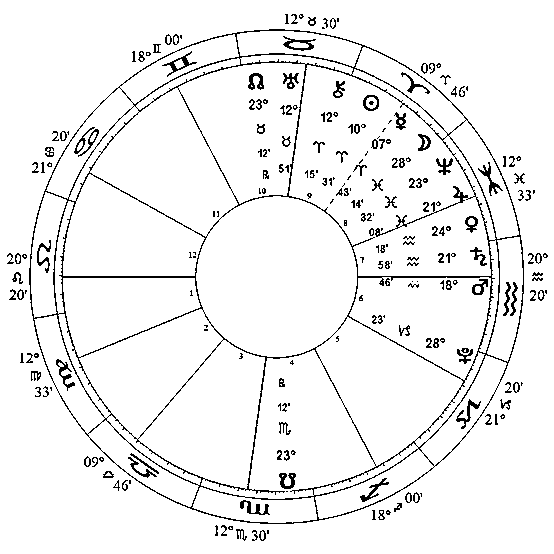

我们可以看到很“巧合”的是，这位读者卜卦提问的时间和地点，正好天王星紧紧的合相在中天的位置。而学习占星的我们都懂得，**天王星象征着突然的变化。**

我想说的是，**很多星图中看似与现实非常“巧合”的对应情况，其实都不是巧合。**这就是著名的心理学家荣格提到的共时性（Synchronicity）法则。**共时性是指，两个看似没有联系的两个事件，其中其实隐含着某种联系，**就如这张星图一样。

所以这个与中天紧紧合相的天王星，不仅代表了象征公司的第 10 宫，可能有突然的变动发生，而且还代表了提问者内心的改变意愿。

我们有理由认为，正是这个改变，使得提问者有心更换工作。而这个促使提问者改变的要素，就要在中天指向的星座来找寻，那就是金牛座。所以有可能新工作有丰厚的薪水，**但是可能不太稳定，因为天王星在中天的位置。**

**金牛座还有一个常见的表征，就是稳定。**高薪 vs 稳定，想必是很多人在面临工作抉择时，所主要考量的要素吧。第 10 宫的宫主星金星，恰好也落在天王星所守护的水瓶座，也代表改变和突破。

**代表提问者的太阳，也在白羊座第 9 宫**，看起来也代表主动寻找新方向的意味。所以这个卜卦的结果，就是提问者会发生工作变动吗？别急，我们需要继续分析。

**我们这次主要是讲述土星在第 7 宫的情况。**这是在传统说法中，无法进行咨询的一种情形。然而这是为什么呢？**因为土星处于第 7 宫，代表着关系的困难情况，**而卜卦咨询，是需要提问者与咨询师建立咨询关系的，如果关系很难达成，那么咨询也就无从谈起了。

事实上也是这样，虽然这位热心的读者提供了案例，但是让接收案例的童老师比较为难的情况是，这位读者并没有提供更多的细节。所以这也体现了土星在第 7 宫的关系困难的情况。

**而这种模式，是会在当事人的各个方面都重现的，包括新工作的选择。**

也就是说，如果一个关系建立困难的人，好不容易与现在的公司建立了较为坚固（土星的征象）的关系的话，那么会很容易与新公司建立关系吗？显然是困难的。

并且我们可以观察到，卜卦星图的金星与火星，都在合相土星。也就是象征公司的 10 宫守护星，与象征内心安全感的 4 宫守护星，都倾向于保守的选择。

这里面虽然金星已经是出相位的合相，但是距离新的星座还有一段距离，并且也不会与木星马上就形成合相，所以恐怕近期脱离现有公司，是相当困难的。

**所以综合而言，提问者可能未来会选择新工作，但是目前这个机会多半是不会选择的。**这次的工作机会，更像是给当事人埋了一颗改变的种子，等待着未来发芽。

目前这个卜卦的时间已经过去了一个月，我们得到的最新进展是，虽然新工作的薪水确实很高，然而当事人没有选择新工作的机会。

**案例二：口腔手术**

这个案例相对前一个没有那么复杂。这也是一位热心读者提供的卜卦案例，询问的是口腔手术是否顺利。在日常的生活来讲，口腔手术是一个小手术，然而提问者显然心情是比较忐忑的。

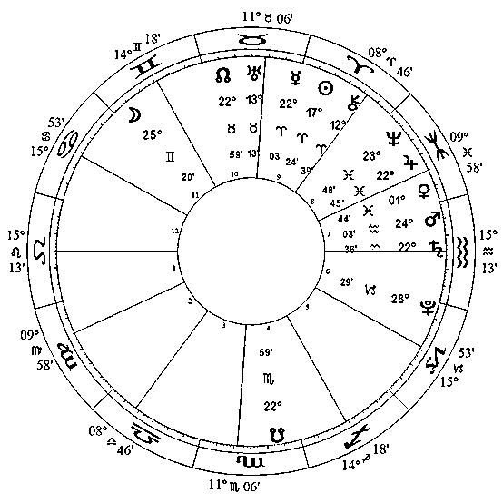

**如果单单来看健康的话，我们可以观察第 6 宫的情况。**

第 6 宫的宫主星是土星，在水瓶座强而有力。并且土星与火星合相，象征着守护。提问的时候，提问者已经支付了手术的费用，那么一般就不存在不做手术的情况了。而火星正好也刚刚与土星形成出相位，说明决定进行手术，是不久之前的事情。

**土星也与太阳和水星，也就是第 1 宫主星和第 2 宫主星有六分相，**属于和谐相位，说明提问者自己是有进行手术的自主意愿，并且也支付了费用（认可手术的价值）。而太阳和水星，正好也落在象征手术的白羊座。

如果考虑第 6 宫本身的情况，感觉还是有些状况，那就是第 6 宫内有冥王星的存在。不过如果大家阅读了我们上一篇的卜卦案例就可以知道，**冥王星的存在并不一定会有实质性的可怕的事情，而很可能代表提问者自己内心的害怕。**显然，本次的提问者也确实担心手术会出状况。

**这个案例也是一个土星位于第 7 宫的案例。**这个案例呈现的困难之处在哪里呢？那就是火星与白羊座象征的手术本身。由于预约的手术是在五月进行，所以大家看到这篇文章的时候，手术还没有进行。所以我们无从得知手术的结果。

从行星所代表的的情况看也是。先是火星与土星形成合相，目前是出相位的状态，所以预约手术在先。然后是这个手术成为了卜卦案例的文章发表在公众号上，这与第 11 宫主水星的六分相是关联的。最后是提问者本人做手术，这由命主星太阳的六分相来代表。

那么手术可能会出现什么状况呢？一个是火星和白羊座带来的炎症的状况。另一个是我们可以观察一下代表情绪的月亮的状况。月亮落在双子座，并且四分在双鱼座的木星和海王星，三分在水瓶座的火星和土星，六分在白羊座的太阳和水星。

**月亮处在如此多的相位之间，**还落在沟通交流的双子座，这恐怕就是为什么提问者会询问的原因吧，确实思绪很多，担心也很多。尤其是与木星和海王星的挑战相位，很容易引起自己的不安与敏感。

不过月亮与所有主要的相位都是出相位了，虽然这也意味着月亮处于空亡的状况，但这又如何呢？手术是一定会有结果的。

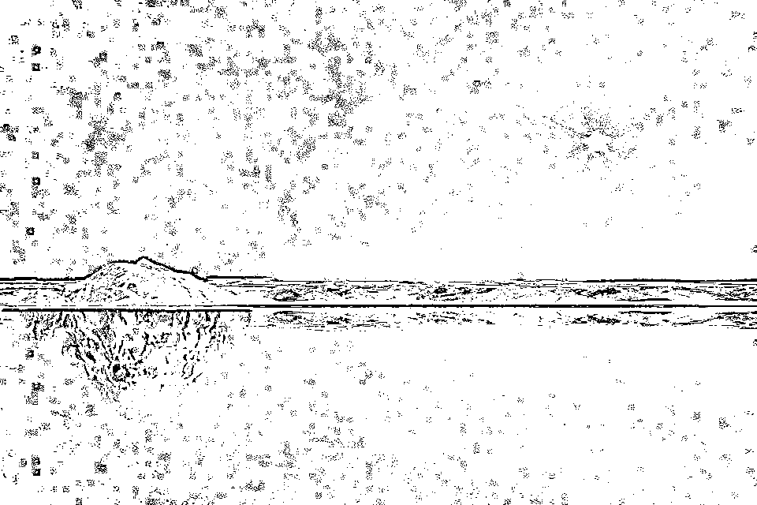

**结语**

我们今天给大家带来了两个土星在第 7 宫的案例。

**在实际的卜卦案例中，土星在第 1 宫或者在第 7 宫的情况时有发生，但并不意味着无法做卜卦咨询，而是象征着提问者自己，或者关系难以被打开的状况。**作为咨询师，注意到这样的情况并加以处理就好了。

所以如果您对现代动态卜卦占星的技巧感兴趣，欢迎您关注一下我们的课程。

今天的案例介绍就到这里，我们下次见！

**快来看若道君为你准备的课程吧！**

**现代卜卦占星课程内容**

**课程分为 5 部分：**

**Part1 **融合现代占星理念，整合动态占星知识**Part2**独家【现代动态卜卦占星技术】全面教学**Part3**学以致用，覆盖人生各个领域问题的卜卦解法**Part4**扩展延伸择时占星技法的新认知**Part5**如何运用卜卦占星学做一场转化性的咨询

**15 节录播课+8 节直播课线上网络课，英文授课，中文翻译。**

**15 节录播课为 2020 年动态现代卜卦课程的内容。8 节直播课则完全是案例教学的形式。**

这样的好处是，你可以通过 1 个半月的密集学习之内按照自己的进度学完录播课的理论和录播课中已有的案例，从学习开始就实践，然后把实践中遇到的问题拿到 8 节直播课中，和老师互动。

**在 8 节直播课中，老师也会用案例教学、和同学互动的方式帮助大家进一步掌握卜卦占星的技法。**

**授课老师**

**艾德里安·罗斯·邓肯****（Adrian Ross Duncan）**1971 年在印度游学时开始学习占星学，1985 年开始成为全职占星师，**迄今执业已超过 33 年，是人本主义占星学、卜卦占星学和经世占星学领域的知名占星师。他还开发了占星软件 AstroClock 和多款占星报告。**他在日常咨询中都会运用卜卦，咨询图（卜卦的一种运用方式，即根据客户来访时间制作星图，从星图中获得大量信息）也是他**特别擅长的领域**。艾德里安·罗斯·邓肯从 1971 年开始研习佛学，受佛学影响很深，他**相信占星学和佛学观点统一、转化的一个基础是在于对现实感知的改变**。而卜卦很容易与佛教融合，因为它只关乎当下。

**授课时间**

**付费后一天即可开始看录播课程，全程有助教老师回答问题。**

**直播课程开始时间：**

2022 年 5 月 3 日，每周二 20:00-22:00

**这次课程恰逢世界在巨大的变动和不确定之中，期待这门课程能够给各位及各位的客户带来新的洞见和方向。**

**在这次 8 次直播课程中，我们将采用案例教学的方式，所有参课同学均有机会提供案例，供老师解读，且我们将组织群体的练习，用大量案例帮你掌握卜卦及如何在咨询中用卜卦。**

**什么人适合参加本课程？**

*   想要系统学习现代动态卜卦占星的学员

*   想在生活中熟练使用现代卜卦占星学

*   在咨询中想帮助个案更清晰的分析解读困惑

*   想参加 ISAR 认证考试，此课程是 ISAR 选修课

*   希望通过卜卦占星帮助自己和身边人挖掘一个积极主动的未来

学习整合卜卦技巧，不仅有益于想钻研卜卦占星学这个分支的同学，对占星初学者也很有有帮助，可以让你的占星技巧加倍。

**课程费用**

**课程价格：9900 元**

**老学员复训专享价：**

**2020 年参加艾德里安·罗斯·邓肯卜卦占星课程的同学：****2900 元**

**2018 年参加艾德里安·罗斯·邓肯卜卦占星课程的同学：****4900 元**

**特别优惠****：**

**分享课宣到朋友圈****保留 48 小时****（不设分组显示）截图给课程顾问可获得****400 元优惠****。**

**课程负责人：童老师（微信：nodoorDaivd），请备注“卜卦”**

长按二维码添加课程负责人咨询

**退转课程****退款原则请详看《教学协议》，如有疑问请咨询课程顾问。******现代动态卜卦占星实战课·ISAR 选修课****

**授课老师：艾德里安·罗斯·邓肯**

**授课时间：**2022 年 5 月 3 日

**授课方式：**网络课程，英文授课，中文翻译

**费用：9900 元；****2020 年老学员复训价：2900 元；2018 老学员复训价：4900 元；特别优惠，分享课宣到朋友圈保留 48 小时（不设分组显示）截图给课程顾问可再获得 400 元优惠。**

**课程负责人：**童老师（微信：nodoorDaivd），请备注“卜卦”

长按二维码添加课程负责人咨询

****报名请点击“阅读原文”****

# 若道周运 5.2-5.8 丨五月第一周来啦，用热情活力扫除阴霾！（内含 12 星座运势）

> 原文：[`mp.weixin.qq.com/s?__biz=MzA5NjA0NTAxNg==&mid=2651473217&idx=1&sn=6e3cd5c859b4f7d4e14f741da60e90f2&chksm=8b48f7f6bc3f7ee070b985f739336f4cf092c2ffe893bc0e6be316d700987de50b8ef4f63b8c&scene=126&sessionid=1692737822#rd`](http://mp.weixin.qq.com/s?__biz=MzA5NjA0NTAxNg==&mid=2651473217&idx=1&sn=6e3cd5c859b4f7d4e14f741da60e90f2&chksm=8b48f7f6bc3f7ee070b985f739336f4cf092c2ffe893bc0e6be316d700987de50b8ef4f63b8c&scene=126&sessionid=1692737822#rd)

******☆ ****后台回复“今日”，给你一句生命态度******

作者/Dora ISAR 认证占星师
编辑/翀子 封面/书君 图片/网络五一假期快乐！无论你待在家里、还是可以去户外走走，本周都是[【五月】](http://mp.weixin.qq.com/s?__biz=MzA5NjA0NTAxNg==&mid=2651473211&idx=1&sn=7b39009ce6712faef345372912884476&chksm=8b48f78cbc3f7e9ac0879a3cbf8db25dbc51bfd5bf1b28aa97f304579977c3af911c293373e7&scene=21#wechat_redirect)（点击查看月运）全新的开始！12 星座如何度过本周？让我们来看文章吧！（如果着急看 12 星座运势，不妨先拉到最后哦）**整体氛围**

读书的时候，老师经常说：你们就像早晨八九点钟的太阳，希望就在你们身上。

为什么是八九点，而不是六七点日出的时候呢？初生的太阳充满希望，岂不更像青年？最近突然意识到：在我们的这个经纬度，八九点的太阳正在十一宫啊！

太阳从地平线升起，便进入了十二宫，这个宫位和年轻没有关系。

难道还有比十一宫更加与年轻力量同频的宫位吗？

年轻的时候，我们需要朋友来认可接纳我们，进入相同理念的群体，我们渴望团队的凝聚；于此同时，我们渴望瓦解旧的规范（比如父母，家族、学校等的羁绊），用革新去建立新的秩序，开启新的生活。

11 宫既需要人间的温暖——伙伴和团队，也需要独立的疏离——独特和创见。

当太阳来到 11 宫的时候，激活了创新和变革的能量！八九点钟的太阳，凝聚大众和变革创新，满怀希望和面向未来，去全然活出自己的生命，这就是青春的意义吧？

1919 年，一百多年前的那个五月天，就是那么多的年轻人，用发自肺腑的呐喊，宣告了中国新民主主义运动的开始。开天辟地、变革的力量，正如摧枯拉朽的洪流，宣告新时代的诞生。这是多么激动人心的时刻。

每一年的这个日子，都是唱响青春之歌的日子。11 宫，水瓶座，天王星，青春。

在美丽的五月天，在迷雾重重的现实里，本周，我们将庆祝五四青年节，也会经历**“立夏”**这个充满热情活力，顶天立地的节气。

**金星进入白羊座，带来对自我意识的宣告和捍卫理想信念的热血**；**太阳合相天王星，是冲出禁锢，离经叛道，渴望重生的勇气**，这周的宇宙能量也在不断地回响着青春的旋律。

上周日开启了今年的日月食季，我们承接了五月一日的新月，日食。**日食是新月的 2.0 版，象征着新的周期的开始，扫除旧的阴霾，努力去面对，清理和修复。**

可能有不少小伙伴还在疫情隔离中，这次的日食新月发生在金牛座-天蝎座轴线，象征着对物质世界深层次的清理和重新整合，如果暂居家中，不妨利用这段时间的能量，好好把早就打算**整理、清洁、收纳**的家居焕新计划实施起来。

在空间净化的同时，也扩大了我们心灵的领地，也许我们也囤积了很多的课程，是时候拿出来认真学习了。当我们能够出门的时候，希望是家居清爽，人心也清爽。

**重要天象**

**★****周一 5 月 2 日 月亮入双子座**

年轻的心敏捷多变，无拘无束，有着永无休止的好奇心。目前水星也在双子座，本周月亮在双子座的三天，**我们可以尝试打开视野，多沟通交流，去了解这个世界。**

下周水星即将逆行，现在已经在**停滞阴影期**，同时，群星也在双鱼座聚集，我们也要**警惕错误信息的传播**。备份好重要的文件，出行前反复确认行程，以免因为信息和交通工具的失误造成损失。

**★****周二 5 月 3 日 金星进白羊座**

金星是爱和价值的化身，属于阴性的能量，现在在喜欢接纳和包容的双鱼座。**但当金星进入白羊座的时候**，我们不再内敛，我们要宣告，要征服，拒绝暧昧黏糊，**爱我所爱，无怨无悔**，要轰轰烈烈地爱一场！

虽然有那么多磕磕绊绊，艰难险阻，但这就是年轻的爱情，年轻的美好，**是属于征服和勇气的。**当金星在白羊座的时候，不妨将藏在心底的爱大胆地说出来，或者勇敢地拒绝结束一段不再合宜的关系，认清自己的内心，去获得自己真正想要的那份美好。

如果困在家中，这可是断舍离的好时机。多年堆积的鸡肋，弃之可惜，不妨就此说 Bye。空间整洁也会带来好的能量场。

**★****周三 5 月 4 日 木星六分冥王星，火星六分天王星**

无论是生理年龄还是心理年龄的青年们，节日快乐！天象的两个柔和相位都是在绽放庆祝这个节日的礼花！

木星六分冥王星，斯蒂芬老师说过，“木冥之间的柔和相位往往代表着**朝向更美好，更光明的未来，**一系列的资源、联结和机遇都集中在一起。**对自己有信心，愿意去冒险前进，是这个时期成功远行的关键。**”

无论在什么样的环境下，保持信念，坚信未来，生命的宝藏等待有觉知的人来开发。

**火星六分天王星。**火星和天王星都是不省事的行星，意外、大胆、不稳定、事故，六分相可能带来比较正向的活力，**迅速、精准、有行动力**。感觉就是能量满满，火力全开。

这个青年节的天象好像在说，年轻的人呐，这个世界是个宝藏，你的生命有无限的可能，你要有信念，你要去行动，哪怕暂时困足家中，也不要忘记，**生命的每一刻都是需要享受的，**要认真对待，别忘记庆祝你的青春。

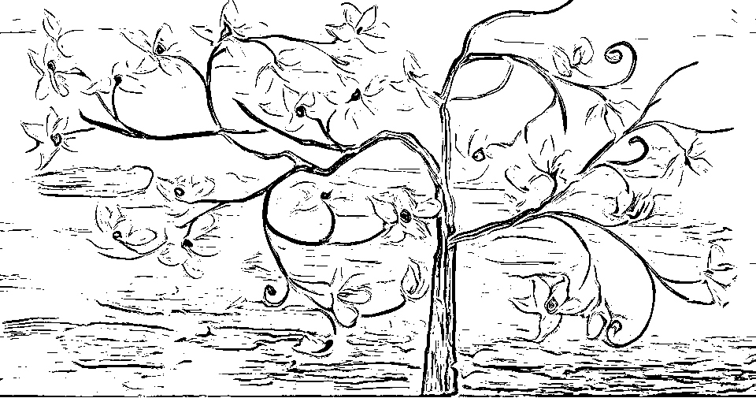

**★****周四 5 月 5 日 立夏，太阳合相天王星**

**立夏的节气表示太阳进入金牛座 15 度。**金牛座的季节，属于希望的季节。大地向我们呈现了勃勃生机，展现出丰饶的景象，所以金牛座和物质囤积有关系。但在奥义占星学中，当一个精神导向的人的太阳或者上升星座是金牛座的时候，他肩负的使命是和“光之信条”有关的。他们的生命目的就是**用纯净的物性之光照亮这个物质世界。**佛陀是金牛座，相传这位伟大的智慧之神的诞生成道，觉悟涅槃都发生在金牛时间。

立夏在金牛座，是感知万物生长，感知世界光明之美好的时间啊！

**当太阳遇到天王星**，彷佛也唱响了特立独行，精灵古怪的青春之歌，这股能量是叛逆和反抗，每个人都应该为这个世界做出力所能及的改变。

天王星的独立意识在提醒我们：**每一个人都是独立的个体，**有自己的思想，喜好，观点，我们需要与众不同。如果生命不是参差多态的，这个世界还有那么美吗？**当我们坚持自己的独特性的时候，也要尊重和包容别人的不同，**“君子和而不同”，而不是固执己见，愤世嫉俗。**★****周五 5 月 6 日 水星六分金星**当表达沟通的水星六分美好魅力的金星的时候，我能想到的就是朋友的快乐聚会，更深入的沟通，以及听音乐，唱歌，用美好的旋律沟通自己的心灵。

**★****周六 5 月 7 日 太阳六分火星**

五一小长假结束了，充电过后的你，是否已经满满活力，跃跃欲试了呢？这是你对新计划的开启说“是”的日子，不要害怕限制，着手去做自己想做的事情吧。

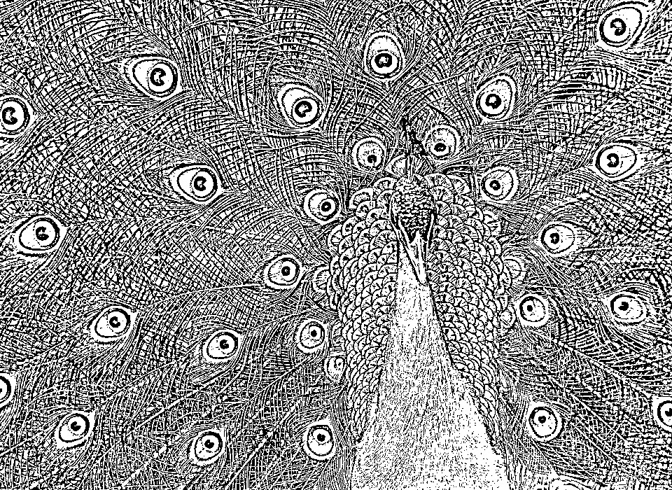

**12 星座一周运势**

**上升*****白羊座***

双鱼座的火星、木星、海王星聚集在你的**12 宫**，提醒你是否忘记了自己隐藏的技能？**天王星和太阳在你的 2 宫合相**，也许你就解锁了自己被封印的才华！也许你可以想想自己独特的才华可以带来哪些收入的渠道？

**金星入白羊，进入了你的 1 宫**，换个惊艳的造型吧，不敢剪短的头发，不敢实施的染烫，不敢尝试的新款服装，统统试试，也许你的新面孔能带来意想不到的好机会呢！有什么心仪的人，这周就去表白，想要什么，就去做吧。

*****上升**金牛座***

金牛座的宝宝们生日快乐！

低调的金牛，这周突然有点想造反啊。**太阳合相天王星进入你的 1 宫，**你一反常态，想做点什么离谱又特别的事情呢？自己的生活要靠自己创造。虽然你大概率是个随遇而安的金牛，也不妨碍有的时候想做一只特例独行的猪。

**金星进入了神秘的 12 宫**，虽然 11 宫的群星在召唤着你出去找朋友，但你更喜欢自己独处。或者因为疫情，不得不和自己呆在一起，那就安静地面对自己吧，这是一段可以静心的时间，问问自己到底想要什么。**在人海中我们始终要做自己。**

**上升*****双子座***

本周的水星在双子座，月亮有 3 天在双子座，**太阳和天王星合相在双子座们的 12 宫**。思维敏捷的双子座，别再被八卦迷了眼睛，你知道除了排山倒海的资讯之外，还有一种信息的渠道么？**闭上你的双眼，看向你的内心，**对！内观，直觉，第六感。

本周在事业上有冲突、有忙碌、也有新的机会，当你**安静下来**，把自家的敏感触角亮出来的时候，也许你能看到事业发展新的方向。

**上升*****巨蟹座***

巨蟹座天生羞怯，但这周可以在朋友圈里撒个野，**太阳与天王星合相在 11 宫，**你也许想找自己喜欢的朋友们欢聚一下，制造一些调皮的小惊喜，小意外。

**白羊座金星在 10 宫，**这周在工作中能够有机会得到上司和同事们的注意，平时不敢表达的主张，也不妨大胆说出来。每个人都有自己的观点和看法，不说话别人怎么能发现，你其实是很有个性的呢？

**这周可以高调一点。**

**上升*****狮子座***

**太阳来到了你的 10 宫**，事业上也许会有新的机会，也许是期盼已久的升职，调动，或者是换一个新的工作环境。你的天赋需要被更多的人看到。

在亲密关系中，我们要学习信任，愿意信任别人的狮子座，自然而然就成为了那个领头的人。

**在 9 宫的金星告诉你**，去接收新的观念，提高自己的精神境界，找你喜爱的老师聊聊天，或者开始新的学习计划。

**上升*****处女座***

世界上有好多未知的地方，最近一段的隔离是在是太久了呢，处女座们真的很想出门去浪一浪了。也许，我们还没有条件可以出发旅行，但心灵的旅行必不可少。**也许是全新的领域的学习，也许是未来的旅行计划。**人生需要新的经历，远方就是我们成长的地方。

这周也许和最亲密的人会有些小争执，如果你只想对方按你的相法来，那就可能是矛盾的原因。每个人都有自己的独特性，**尊重他人的立场，包容他人的不同，**才是更为和谐的相处之道。

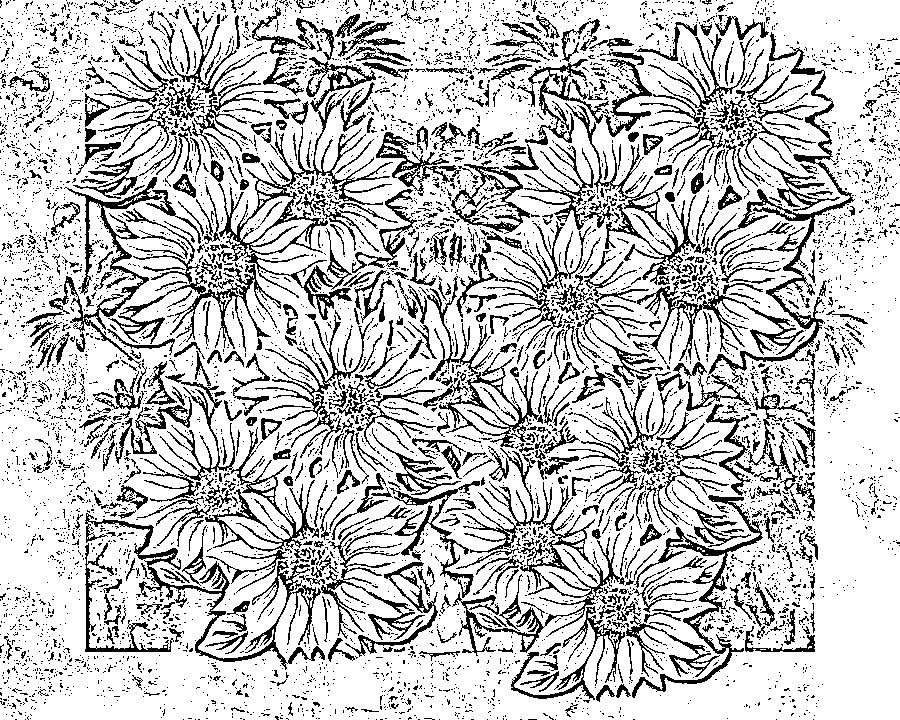

**上升*****天秤座***

这周天秤座要保持一贯的优雅是有些不容易的，**太阳合相天王星在 8 宫**，有什么样的禁忌或者隐秘需要天秤们去突破呢？

8 宫藏了很多我们不愿意去触及的问题，深层的恐惧，欲望，这次的天王星可能会带领你冲破重重禁锢，去触及内心的真相。也许，困扰你一段时间的问题，就此水落石出。

**白羊座金星在 7 宫**，爱要大胆说出口，不爱也一样。

注意身体健康。

**上升*****天蝎座***

你最亲密的人最近怎么突然看不懂了？突然想出很多新花样来了，生活总是需要一些变化，那好吧，最近的生活真是比较焦虑，我们一起来点刺激吧，**做点什么不寻常的事情呢？**如果是单身，和最好的朋友一起嗨一下，好好地爱自己。

**双鱼座的群星落在你们的 5 宫**，也许这些惊喜会来自艺术和创造。如果正好在家隔离，做点手工吧，喜欢十字绣还是做小手包呢？或者绘画和园艺？**尽情发挥你的想象力，**让快乐滋养你的心灵。

**上升*****射手座***

我不知道你是什么样的射手座，大大咧咧，不关心细节？还是总在流浪？**这周射手座可能会改变自己的日常生活方式。**

把你在旅途中的才华用来规划你的生活方式，用来设计你的养生计划。这个五一假期不能出门，那我们来研究一下如何把自己的日程安排得更加有利于身体健康。也许我们开始在 11 点睡觉了，也许今天自己下厨做一顿健康大餐？ 疫情困足的时候正是我们修身养性的时候。

如果和家人有矛盾，记得你是爱他们的，在困难的时刻家人更需要互相支持。用爱来化解一切吧。

**上升*****摩羯座***

摩羯座们有个严肃的人设，也并不妨碍他们在这个五月天**放飞自我**，假期节日可能会让摩羯座们感到一点轻松，不用背负那么重的责任，突然有勇气自由的表达。提出分手或者表白，好吧，谁都需要**快乐地做回自己。**

放假在家里，记得告诉父母你爱他们，家人面前不用伪装坚强，你还是个小孩子呢！

**上升*****水瓶座***

最近水瓶座会不会搬家呀？有计划换新房吗？或者把自己的家重新收拾，焕然一新好心情。也许有新的工作地点，那也是挺不错的安排。

**白羊座金星在你的 3 宫**，学习上有了什么样的新观点呢？在面对压力和各种不确定性的时候，最好的办法就是**学习和交流。**长途旅行不太合适，假期还是可以周边短途走一走，去享受一下这个初夏的美好。

**上升*****双鱼座***

如果和他人有争论，那是好事，有不同的观点说明咱们是有观点和立场的人。开放包容是双鱼座们的优点，继续在学习和交流中保持这个优点吧。

**金星在 2 宫**，虽然最近的经济状况很难有好转，但也许你们还是有点小财运，也许是因为工作表现不错，发了一笔奖金。

**双鱼座群星还在你的 1 宫**，是一个表现的时间段，抓住今年的好运机会，好好努力吧。

**祝大家一周平安顺遂！**

**版权声明**：原创文章由作者授权首发于若道平台发布，欢迎转发，反对抄袭。友号转载请申请白名单。

****

****Dora****

若道 2017 届核心课毕业生

若道咨询平台占星师、ISAR 认证占星师

心理咨询师、塔罗咨询师、多年企业管理经验

咨询微信：AstrologerDora

公众号：Dorothy 占星文化

**长按打赏**

**20 位来自世界各地的占星师****带来 19 场沙龙——新世界的觉醒****详情可参见今日二条**

**学习占星学****点击下图了解课程详情**

**

**微信又双叒叕改版啦，不想错过若道君的推送？**

**就把若道设为星标吧！**

**▼**

**喜欢记得点一下在看哦☟**

**报名直达入口**

# 重磅丨国际占星协会主题研讨会中文字幕发布！为新世界的转变做好准备

> 原文：[`mp.weixin.qq.com/s?__biz=MzA5NjA0NTAxNg==&mid=2651473217&idx=2&sn=ef97fc7eb5e67c78997e741473e3f1e6&chksm=8b48f7f6bc3f7ee03ce83e251e2a92e6bd814b291b1c19163bd6055a844911a3e57863d41eb8&scene=126&sessionid=1692737822#rd`](http://mp.weixin.qq.com/s?__biz=MzA5NjA0NTAxNg==&mid=2651473217&idx=2&sn=ef97fc7eb5e67c78997e741473e3f1e6&chksm=8b48f7f6bc3f7ee03ce83e251e2a92e6bd814b291b1c19163bd6055a844911a3e57863d41eb8&scene=126&sessionid=1692737822#rd)

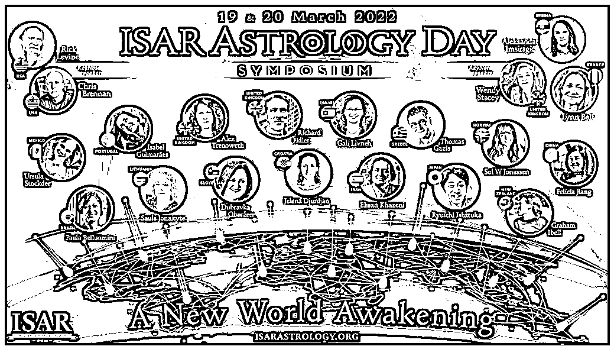

**国际占星日 ISAR 主题研讨会**

**新世界的觉醒** 

今年是世界格局大变的初始之年。 俄乌战争改变了整个世界的局面。在中国，最后一波疫情卷土重来，我们再一次看到封城上演。 同时，战争、疫情、通货膨胀都给我们带来挑战，**而我们需要用新的眼光去看这个正在激烈变化中的世界并为一个新的世界转变做好准备。 **

为此，ISAR 在今年的国际占星日为大家准备了一个为期***2******天***的研讨会***19**场******演讲***，共有邀请来自世界各地的***20******位******著名占星师***，包括我们的 ISAR 全球总监，分享他们对世界正在发生什么的见解，以及我们未来可以如何应对的建议。

**研讨会主题描述**

**“我们将探讨的一些主题：我们在未来 5 年和长期的全球范围内可以期待什么？在新冠疫情、经济、性、技术、新世界结构和国家边界相关的未来事件，我们可以预测什么？总体而言，占星师如何看待世界的未来？我们需要从更高的层面上接收到什么信息？可能的解决方案是什么？”**

**演讲已经结束，若道将本次演讲翻译为中文字幕版，目前已经上线发布。**

（如果英文流利，可以到 ISAR 网站自行购买，英文版价格更为优惠） 

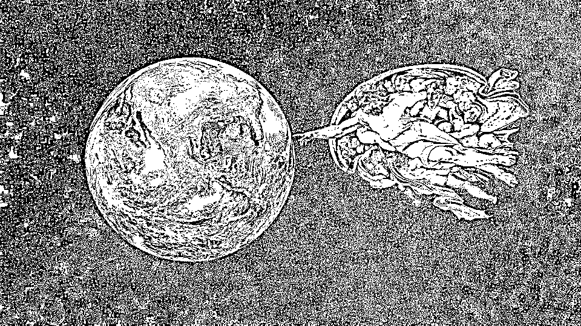

**演讲内容安排**

**第一天**

**开幕式（15 分钟）**

**第一场（60 分钟）**

*   **主题：在新世界中觉醒**

*   **演讲人：温迪·斯泰西**

**简介：**

在接下来的五年里，我们面临着一些有趣的挑战。但也带来了一些充满希望的变化。**一个新的“常态”——一个不断增长的全球化社会**。新的基础设施和混合的意识形态。但我们的注意力转向天空和宇宙时，**占星学会给我们哪些指引**？

**演讲中，主讲人列举了历史各个时期外行星之间，或外行星和凯龙星之间形成的相位和周期，会对我们的政治、经济、文化、科技、意识形态等等各方面产生的的影响。**有些外行星周期追溯到公元前四五百年。

随后列举了**历史上在各个外行星与外行星之间，或外行星与凯龙星形成的相位时所发生的历史事件：**比如某些爆款电影和电视剧的上映、航空和太空的发展、著名法案的颁布、知识产权的影响、火山喷发和地震的发生、石油泄漏、当下新闻事件、饮食结构的创新、意识形态的冲击、芯片的发明、信息传播和通讯领域的转变、人权和平等意识的发展……

在此基础上，**对于未来的外行星周期的发生时间和可能的影响做了展望**（并不局限于演讲文字介绍中所说的未来五年），最远的外行星周期发生在 2323 年，并预测有可能随之而来的社会影响和人们生活方式的变化。

**第二场（20 分钟）**

*   **主题：占星师作为“心灵影响者”——新的大祭司？**

*   **演讲人：格雷厄姆·伊贝尔**

**简介：**

**在水瓶时代，占星师如何扮演好“大祭司”的角色，成为人与神之间的桥梁，帮助人们连接内在神性，在水瓶的集体理想主义下实现个性化。同时如何警惕不滥用这种影响力，不陷入自恋的陷阱**。

**第三场（25 分钟）**

*   **主题：波斯占星的复兴**

*   **演讲人：埃桑·哈泽尼**

**简介：**

**波斯占星学属于占星学当中一支非常古老和极具丰富内涵的分支**。但无数珍贵的文本并没有得到翻译，很多波斯技法也没有被占星师所挖掘。伊桑的演讲**主要聚焦于这个珍贵而古老的智慧的复兴**。

**第四场（20 分钟）**

*   **主题：新冠疫情对人类精神和人类社会的影响**

*   **演讲人：乌苏拉·斯托克德**

**简介：**

**疫情让人类经历了巨大的灵性和心理创伤。乌苏拉从占星学角度解释了这些触发器，并从神话学角度讨论了人生、死亡、希望与灵性疗愈的重要性**。乌苏拉·斯托克德除了是一位占星师外，她还研究塔罗和神话、荣格心理学 、夫妻治疗和死亡学，她还是个画家。

这些学术背景，**让乌苏拉·斯托克德开篇就讲述了不同描述“疫情”的词汇，在词源学意涵上的区别**。也使得整篇演讲围绕着**神话故事、塔罗深刻的象征语言和寓意**，**让我们有了象征系统，去进一步理解疫情对人们生活的影响以及启示，探讨死亡对人们的意义**。

**神祇不只是神话故事，也帮助我们理解过去，预见未来**。每个神话故事的发生，都和人类深层的心理密切联系。**疫情给人类带来很多的恐惧、焦虑和不确定性等心理问题，如何重新找回我们心理和灵性的平衡**？

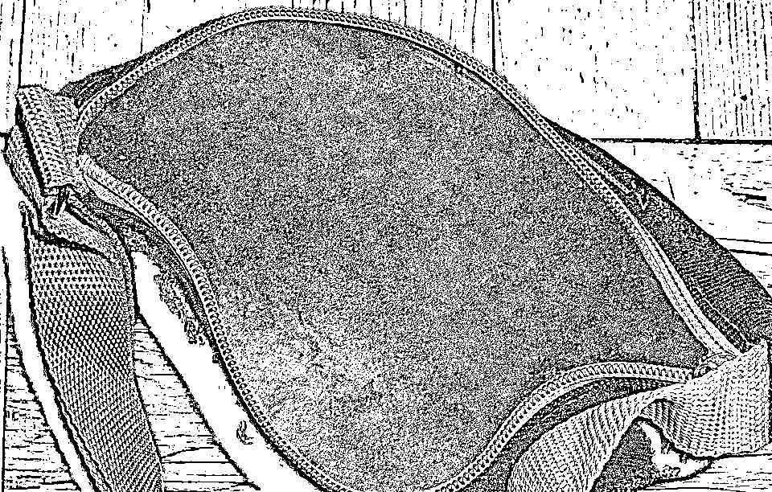

**第五场（20 分钟）**

*   **主题：在两个相反的“宇宙发电机”之间振荡 **

*   **演讲人：托马斯·加齐斯**

**简介：**

**2025 年是继从 2020 年摩羯座高峰开始，宇宙集体行星间多年不和谐的相位之后，首次所有宇宙集体行星将形成和谐的相位的时间**。我们经历了暴风雨，届时将摆脱瘟疫，迎来一首盛大的无比和美的宇宙之歌。

**第六场（20 分钟）**

*   **主题：从占星的透镜看新冠疫情的心理后果**

*   **演讲人：伊莎贝尔·吉马拉斯**

**简介：**

疫情让人类遭受了极大的情感痛苦。**木星在双鱼座，以及接下来木星去到白羊座，还有木星和海王星的合相，和疫情带来的心理影响有什么关系**？

**第七场（20 分钟）**

*   **主题：占星适合预测吗？占星作为工具的特质**

*   **演讲人：石冢龙一**

**简介：**

**在使用占星符号进行预测时，占星师需要觉知自身的能力局限。如何为客户转译占星符号，使客户形成一种关于未来的建设性愿景？**

**第八场（20 分钟）**

*   **主题：重新定义结构、上师和伦理——一个灵性视角**

*   **演讲人：加利·萨特·普兰·利夫纳**

**简介：**

**当前的土星-冥王星周期，是以怎样的方式影响世界，帮助人类重新定义结构、上师和伦理，这里提供一种灵性视角**。并以上一个周期中，中国所发生的事件为例，帮助大家揣摩未来的可能性。

**第九场（20 分钟）**

*   **主题：冥王星在水瓶座和全球的社会实验**

*   **演讲人：索勒·乔奈特**

**简介：**

2023-2043 年期间，冥王星将进入在代表大众、社会的水瓶座。近日国际上一些重大事件已为冥王水瓶的时代展现了一些征兆。**接下来的 20 年，冥王星式能量将在水瓶座所代表的领域内掀起什么样的实验与浪潮？期间的行星行进，将对冥王星水瓶座的力量带来怎么样的影响？**

**第十场（20 分钟）**

*   **主题：当上帝似乎已经背弃了我们**

*   **演讲人：亚历克斯·特伦诺维斯**

**简介：**

演讲者是职业占星师，同时也是学校教课的老师，她阐述了**青少年发展过程中的几个重要占星学上的影响。她希望探讨疫情对教育的影响，以及木星进入双鱼座后对孩子和我们的未来的思考**。

**第十一场（90 分钟）**

*   **主题：占星的未来：占星能预测未来吗？**

*   **演讲人：里克·莱文和克里斯·布伦南**

**简介：**

自 20 世纪 60 年代以来，我们见证了占星学在全球流行的巨大复苏，特别是在年轻世代中。**占星学是否已经到了顶峰，或者已经停滞不前了？占星学是否仍处于上升趋势，会变得更受欢迎？让我们一起来探讨占星学的未来**。

**第二天**

**第一场（60 分钟）**

*   **主题：波浪带来的木星-海王星合相**

*   **演讲人：琳恩·贝尔**

**简介：**

**木星与海王星在 2022 年 4 月在双鱼座合相。这一合相浪潮会带来什么，以及历史上木星和海王星的合相曾对于世界、人类带来过什么深刻的影响？**

**第二场（20 分钟）**

*   **主题：2020 年木星、土星和冥王星的相遇，以及金钱的命运**

*   **演讲人：理查德·费德勒**

**第三场（20 分钟）**

*   **主题：金牛座和天蝎座在 2022 年和 2023 年的黄道带日食传递了什么信息**

*   **演讲人：杰丽娜·朱德扬**

**简介：**

**2022 年 5 月、10 月及 2023 年 4 月将发生几次金牛座和天蝎座食相，所呈现的天象，以及对于国家集体和个人生活等方面所产生的影响和所传递的信息。**

**第四场（20 分钟）**

*   **主题：阿奎拉（鹰）与 2020 年大连合**

*   **演讲人：杜布拉夫卡奥伯赞**

**简介：**

2020 年的三大合相（木土合相、木冥合相、土冥合相）都对准了天鹰座的恒星。这些主要的占星学事件，为接下来数十年的政治、社会和经济发展定下了基调。

**第五场（20 分钟）**

*   **主题：冥王星在水瓶座——预测水瓶时代**

*   **演讲人：索尔·乔纳森**

**简介：**

**冥王星将在 2023 年至 2044 年进入水瓶座，届时我们将会面临哪些挑战，如何应对，又有哪些可能的趋势？我们如何正确的使用这一能量，在这个时期做出适当的改变？**

**第六场（20 分钟）**

*   **主题：中国的历史和中国的星图：理解历史，理解未来**

*   **演讲人：蒋颖 Felicia Jiang**

**简介：**

中国有漫长的历史。在历史朝代的变迁中，有一些有趣的星图现象。**而建国后的 70 年，我们可以看到当星图中的一个重要配置几乎如钟表一样被触发时，一系列重大的历史事件构成了新中国的故事。**我们理解历史才能理解未来。

**第七场（20 分钟）**

*   **主题：新世界崛起**

*   **演讲人：葆拉·贝洛米妮**

**简介：**

**这段演讲是木土合相周期以及它们的三分性转换，如何和历史中发生的重大事件的相呼应，以及现在的木土合相对未来可能发生的事件的预测**。结合每一个元素在历史时期的发生年份，及其发生的著名历史事件在时间上神奇的对应性，葆拉·贝洛米妮带我们回顾了**历史上在不同的三分性（元素星座）时期，曾经发生过的不同元素特点的历史事件**。

**闭幕讲座（60 分钟）**

*   **主题：让木星之年开始吧**
*   **演讲人：亚历山大·因舍阿吉克**

**简介：****2022 是一个木星之年。4 月 30 日木星还将与金星在双鱼座 27 度精准合相，同时伴有日食。这是一个前所未有的天象。这个天象在集体层面和个人层面将会带来怎样的影响？有着什么显著的意义？**我们如何利用这个难得的机遇，与个人、家庭和集体联结，利用我们的信念做出改变？

**费用**

**本期演讲售价：****980 元** **（送价值 480 元的一年 ISAR 会员资格） **

**ISAR 会员优惠价：****680 元 ****（会员购买前请联系负责人修改价格）**

购买请扫描下方二维码

遇到任何问题？

负责人：若道-童童

（微信：nodoorDaivd）

请备注“国际占星日”

**退转课程**

**退款原则请详看《教学协议》，如有疑问请咨询童老师。**

****报名请点击“阅读原文”****

# 5 月宇宙天气丨出现“出人意料”的新周期？为 6 月的冲刺做好准备吧！

> 原文：[`mp.weixin.qq.com/s?__biz=MzA5NjA0NTAxNg==&mid=2651473211&idx=1&sn=7b39009ce6712faef345372912884476&chksm=8b48f78cbc3f7e9ac0879a3cbf8db25dbc51bfd5bf1b28aa97f304579977c3af911c293373e7&scene=126&sessionid=1692737822#rd`](http://mp.weixin.qq.com/s?__biz=MzA5NjA0NTAxNg==&mid=2651473211&idx=1&sn=7b39009ce6712faef345372912884476&chksm=8b48f78cbc3f7e9ac0879a3cbf8db25dbc51bfd5bf1b28aa97f304579977c3af911c293373e7&scene=126&sessionid=1692737822#rd)

******☆ **后台回复“今日”，给你一句生命态度****

作者/Anastasia

编辑/翀子 封面/书君 图片/网络

纵观 5 月的宇宙天气，有众多重要天象值得我们关注，天空中的水元素氛围减弱，火元素的能量越来越强，随着两个新月和一个满月的到来（其中有日食和月食）、以及木星进入白羊座，我们的生活将以出人意料的方式进入新周期。

五月重点天象

*   **金牛座日偏食（5 月 1 日）**

*   **金星进入白羊座（5 月 3 日）**

*   **水星在双子座逆行（5 月 10 日）**

*   **木星进入白羊座（5 月 11 日）**

*   **天蝎座月全食（5 月 16 日）**

*   **水星逆行进入金牛座（5 月 23 日）**

*   **火星换座白羊座（5 月 25 日）**

*   **金星进入金牛座（5 月 28 日）**

*   **双子座新月（5 月 30 日）**

**整体氛围**

**经历了四月份的木海合相，混乱状况将在五月继续发展。**外行星行运总是先埋下种子，其带来的影响力和破坏力往往在多年后才能恍然大悟，后知后觉。

我们以为的木海合相是爱、慈悲、灵性觉醒和伟大的梦想，实际上这次木海合相则充满了谎言、混乱、疫情带来的无序和各路妖魔鬼怪的显形。**木星这个放大器更是放大了意识形态层面上的撕扯和分裂。**

这也提示我们在观察天象的时候，要始终提醒自己，**每一种能量在现实层面上的呈现都拥有着光谱式广泛的可能性**，从负分到满分有着无穷多的变化。阳是过度，阴是不足。保持平衡与调和，就要战战兢兢，贯彻始终。

人生在世，如履薄冰。到底命运的小精灵会如何落在每个人肩上，带来荣耀还是带来灾祸，还要具体情况具体分析。

**火星在 4 月 15 日进入双鱼座，将于 5 月 25 日换座白羊座。**换座之前，五月的大部分时间，火星都会在双鱼座运行。我们印象中的火星双鱼座更多是一种力不从心的颓废和疲惫，抵抗力降低，免疫力下降，还容易生病。

但火星在双鱼座也有好消息，它会永远站在纯粹理想、无私奉献这一边，它是灵性的战士，对投机取巧、追逐私利发起暴击。**用好火星双鱼的能量来利他，来追求初心，**就会无往而不利。

**换句话说，锋利的刀握在谁的手上，用来救人还是越货，只在一念之间。**

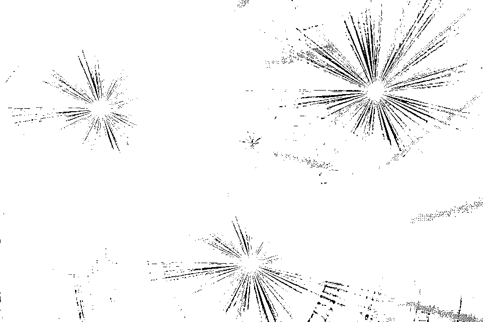

**这个五月，我们将经历两个新月和一个满月，其中一次日偏食，一次月全食。水星也将在双子座开始本年度的第二次逆行。木星从双鱼座换座到白羊座。土星在水瓶座 25 度停滞，为 6 月的逆行蓄势待发。天王星和凯龙星分别在金牛座和白羊座的 14-15 度这个区间相伴而行，持续影响基本星座和固定星座的 14-15 度。受到影响最大的是生日在 4 月 5 日和 6 日的白羊座和生日在 5 月 5 日和 6 日的金牛座。**

**对于你们来说，这个月将是一个新周期的开始，并且会以一种完全出人意料的方式展开。**

这个五月，金星将率先离开双鱼座，进入白羊座。木星在月中进入白羊座。火星也在月末进入白羊座。

群星离开双鱼座，**整体天象上的水象元素陆续减少，火象元素逐渐增加。**虽然整体秩序仍旧充满变数，但火象的热情和行动力会取代水象的犹疑粘滞，带来一些轻松和灵动的氛围。

尤其是月末，在**火星换座白羊座（5 月 25 号）**之后，**金星换座金牛座（5 月 28 号）**之前，火星定位了除海王星之外的所有行星，并合相木星，**将推动各项事物快速向前发展**。

这三天一定要管住自己的手脚，毕竟火星快速鲁莽，不讲武德；而水星在逆行期也会带来的信息混乱，干扰我们的判断。

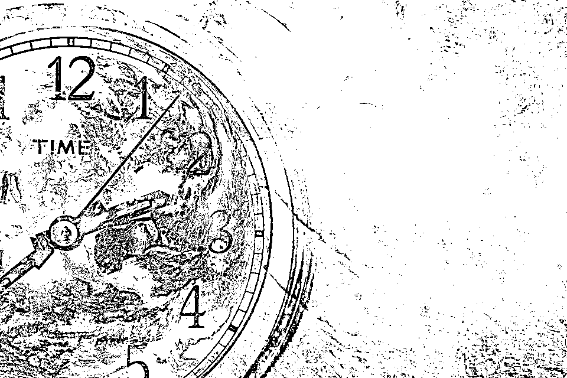

**重点天象****★****水星在双子座逆行**

**5 月 10 号，水星在双子座 4 度开始今年的第二次逆行。6 月 3 号，在金牛座 26 度恢复顺行。**

从 4 月 27 号水星进入逆行前阴影期开始，到 6 月 19 号水星顺行后彻底离开后阴影期，**整个水逆过程持续将近两个月。**如果有重大思想决策，或者大件电子产品的消费，建议避开这段时间。

**水逆从水象星座开始，到土象星座结束，意味着我们的所思所想最终会落到现实层面的考量。**停留在头脑中的想法始终是个想法，不是现实。懂的道理再多，不行动什么也改变不了。只有知行合一，落实到行动上的想法，才是真正属于我们的能力。

**这次水逆，我们需要更多地练习将自己的思维和实用的智慧联系在一起，好好思考安全感和自我价值的问题。**对于新的想法和理论需要时间做决定，一旦做出决定，轻易也不会改变。北交点和天王星也在金牛座，一些突发事件的发生将有助于我们改变原有的思考模式。

水星在逆行进入金牛座之后，将两次三分摩羯座 28 度的冥王星。对于逆行的水星能量来说，**冥王星的加入会深化我们的思考和探索，**很适合慢下来反思过往，查漏补缺，总结经验。

尤其是这个三分相发生在土象星座。**土元素意味着问题变得具体可见。**我们所有的努力和错误都会制造出具体的后果。现实层面的理解也相对简单，具体就是钱、价值、资源、工作、服务、事业等等。

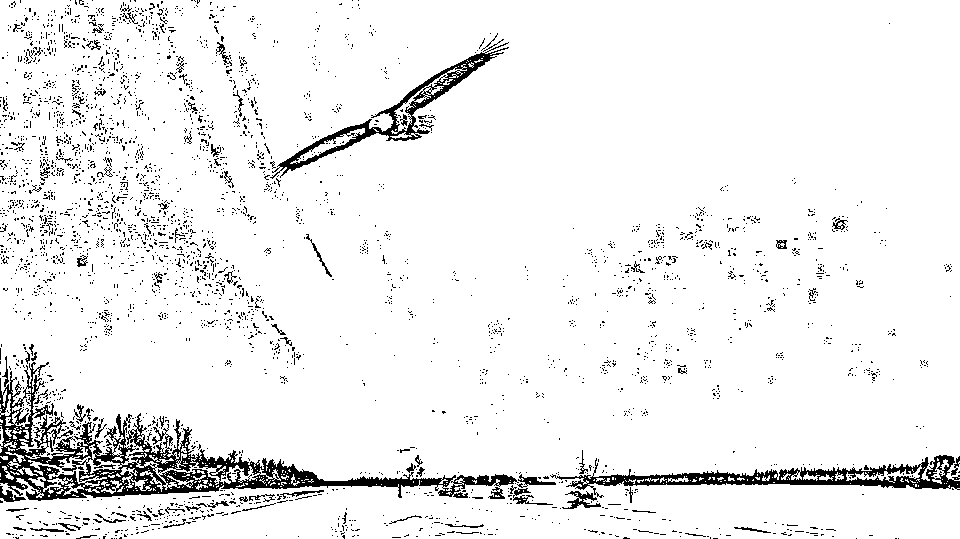

**★****木星换座白羊座**

四月下旬，金星、火星、木星、海王星四颗行星汇集双鱼座，木海合相将能量带到了峰值。不论是无力和悲伤，还是奉献和感动，相信每个人都充分体验了一回双鱼座的能量。

不管怎样，兴风作浪的庞大**木星将于 5 月 11 号离开双鱼座，进入白羊座直到 10 月 28 日。**

木星守护射手座，在黄道星座上，射手座三分白羊座。两个星座同属于火象星座，热情、外向，果断，冲劲十足。这个三分相结构目标相同，能量和谐，一致对外。

木星带来的信心和热情，在进入白羊座之后，将一扫之前湿漉漉的温吞气，变得信心十足，勇往直前。**这将有助于我们强势果断地开创新潮流，推进事务的进程，带来快速的提升。**

但也不要忘了我们的能量光谱，木星进入白羊座也存在另一种可能性。**它会放大、加剧白羊座的冒失鲁莽，制造出新的麻烦，带来白热化的争斗。**

如果有个人行星和重要轴点落在白羊座，并且有不良的相位结构，在接下来的五个多月中，尤其要当心木星带来的膨胀和冲动，冲动是魔鬼，一定要避免头脑发热，**放缓脚步，谨言慎行。**

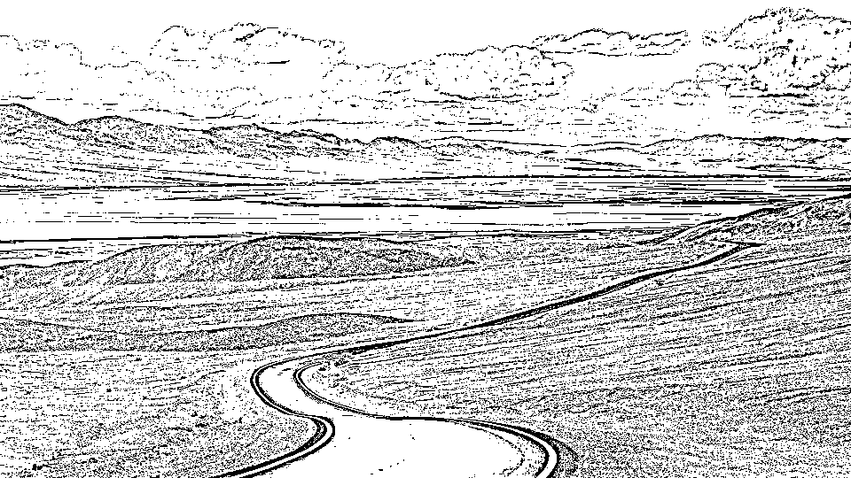

**★****土星进入停滞期**

目前，土星在水瓶座 24 度，**将于 6 月 5 号在水瓶座 25 度开始逆行。**5 月 19 日土星开始在水瓶座 25 停滞，这意味着整个五月和六月，土星运行的区间会集中在水瓶座 24-25 度。

正常速度的土星一个月会行经黄道 4 度，相位影响力差不多持续一个多月。**但这次由于土星的停滞，对于固定星座 24-25 度有重要个人行星或轴点的个体来说，土星行运的影响力可能会持续四个月，一定要提前做好心理建设。**

5 月 19 日，土星在水瓶座 25 度开始滞止，直到 6 月 22 日，土星都逗留在这个位置。一个多月的时间，土星以它缓慢的脚步碾压着水瓶座 25 度，同时波及到同度数的狮子座（对分相）、金牛座和天蝎座（四分相）。

**受其影响的人群将感受到来自组织、秩序、权威、长辈的压力，感觉很不自由，如何选择接下来的发展路径，需要做出自己的判断和决定。**

土 Boss 送了大礼，水瓶座、金牛座、狮子座、天蝎座需要提前规划和准备，调整心态，以应对挑战。

顺逆转换的土星会在**10 月 23 日水瓶座 18 度**（这个度数也很关键）恢复顺行，并在 2023 年 1-2 月再次快速通过这个区间（水瓶座 24 度-25 度），**这意味着任何决定都不能匆忙做出，而是会经过反复的调整和改变，以达到最好的效果。**

对于水瓶座来说，土星在水瓶座的两年半时间里，你们的人生打开了一个新的三十年的日土周期。尤其需要提醒的是生日在 2 月 14-15 日的水瓶座，这两个月是非常关键的，这期间的决定将会为之后三十年的发展定下基调，一定要**胆大心细，慎重考虑，谨慎决策，夯实基础，创造良好的开端。**

**★****朔望周期**

**五月，我们将经历两次新月和一次满月。**5 月 1 日凌晨 4:27 在金牛座 10 度发生新月，4:27 发生日偏食；5 月 16 日中午 12:14 在天蝎座 25 度发生月全食，12:14 满月；5 月 30 日晚午 7:30 发生双子座新月。

2022 年，我们将经历两次日食和两次月食。下一次是在 10 月 25 日的天蝎座日偏食，和 11 月 8 日的金牛座月全食。这两次食相都发生在牛蝎轴线。

大家会注意到这也是今年的南北交点轴线。是的，日月食都会发在南北交点轴线附近。新月发生在南北交点 18.5 度之内，会发生日食；满月发生在南北交点 12 度之内，会发生月食。日月距离南北交点越近，能量就越强。

**日月食可以理解为超级新月和超级满月，能量更强。**日食发生在新月期（失去方向），适合静思冥想，回归内心；月食发生在满月期（本能冲动），适合独立思考，理性判断。**食相会激发我们的潜能，要重点关注食相发生的宫位，以及触发的行星能量。**

**日月食经常会给我们带来改变，它会指出我们生活中最薄弱的环节，帮助我们指出下一步的发展方向。**关注日月食发生的宫位，以及触发的行星、轴线、相位结构，有针对性地采取措施，会让我们距离自己的目标更近一些。

**日食的影响周期长达两到三年，预示了新周期的开启，会强烈影响着我们的个性；而月食的影响周期是六个月，会给已经存在一段时间的问题带来一个高潮，并解决这个问题。**

**记住金牛座 4 度和天蝎座 25 度，**当重要的行运行星，比如火星和土星经过这两个度数的时候，将会激发重要事件，无论是在个人生活（如果有个人行星或轴点落在此处），还是在世界舞台上。火星会带来冲突和迅速的变化，土星则会带来整顿和最后的结果。

日月食会带来巨大的变化。但不要恐惧改变和失去，试着换个思路。我们离开，是为了再回来；我们失去某人某物，是为了新人新事腾出位置和空间。宇宙中不会出现绝对真空的地方。只要出现真空，就会有新的物质去填满它。

**所以，相信命运的安排，相信命运不会给我们超过我们自身承受能力的考验，相信未来永远会比过去要好。**

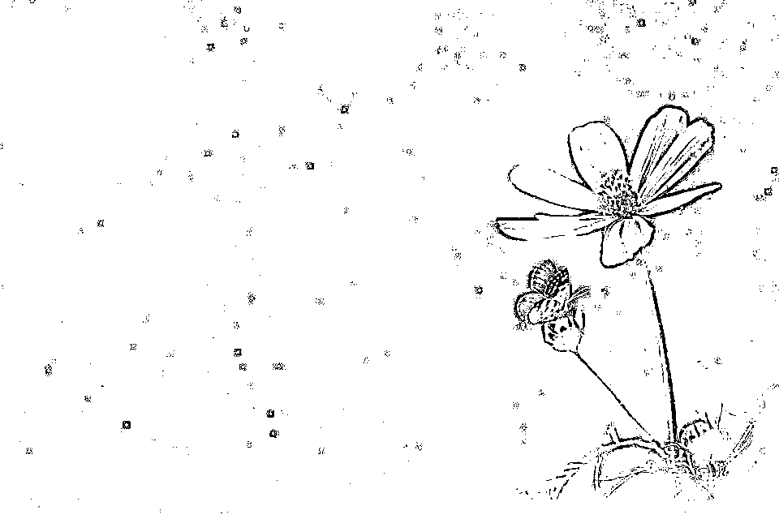

**12 星座五月小贴士**

**（参考太阳星座和上升星座）**

**★** **白羊座**

*   **魅力提升，适宜拓展关系**

*   **等候时机，不宜轻举妄动**

**★** **金牛座**

*   **充满活力，一静不如一动**

*   **社交活跃，充满展示自我**

**★** **双子座** 

*   **多想多做，理论联系实际**

*   **事务繁多，做好工作计划**

**★** **巨蟹座** 

*   **管理情绪，主动迎接挑战**

*   **调整心态，理性交流沟通**

**★** **狮子座** 

*   **厚积薄发，切勿急于求成**

*   **有得有失，不妨从长计议**

**★** **处女座** 

*   **放松心态，避免信息爆炸**

*   **稍安勿躁，适当做些妥协**

**★** **天秤座** 

*   **才思泉涌，创造有效输出**

*   **控制节奏，平衡工作生活**

**★** **天蝎座**

*   **善解人意，适宜提供帮助**

*   **充满魅力，专注展现自我**

**★** **射手座**

*   **放低姿态，避免口舌之争**

*   **调整重心，兼顾事业家庭**

**★** **摩羯座** 

*   **有的放矢，减少社交摩擦**

*   **充分交流，协调同事关系**

**★** **水瓶座** 

*   **言出必行，夯实社交基础**

*   **量力而为，开源也要节流**

**★** **双鱼座** 

*   **呵护身体，关爱身心健康**

*   **遇事不慌，获得家庭支撑**

**版权声明：**原创文章由作者授权首发于若道平台，欢迎转发，反对抄袭。友号转载请申请白名单。

**Anastasia**

职业占星师/专栏作者/策展人

于 2015 年通过 ISAR 占星能力考试

若道认证生时校正资质（2015 年获得）

**微信公众号**：KairosMoment

长按打赏

**20 位来自世界各地的占星师****带来 19 场沙龙——新世界的觉醒****详情可点击下图**

**学习占星学****点击下图了解课程详情**

****

**微信又双叒叕改版啦，不想错过若道君的推送？**

**就把若道设为星标吧！**

**▼**

**喜欢记得点一下在看哦☟**

**报名直达入口**

# 金牛座日食 | “食相季”开启！将影响你未来半年！

> 原文：[`mp.weixin.qq.com/s?__biz=MzA5NjA0NTAxNg==&mid=2651473208&idx=1&sn=df43c751573161084408d637ab6c0c8b&chksm=8b48f78fbc3f7e99a2dcba2ff092e8e1272c976667e7057b2b10990c765fba440059a54cb87a&scene=126&sessionid=1692737822#rd`](http://mp.weixin.qq.com/s?__biz=MzA5NjA0NTAxNg==&mid=2651473208&idx=1&sn=df43c751573161084408d637ab6c0c8b&chksm=8b48f78fbc3f7e99a2dcba2ff092e8e1272c976667e7057b2b10990c765fba440059a54cb87a&scene=126&sessionid=1692737822#rd)

****☆ **后台回复“今日”，给你一句生命态度**

作者/王芝桦 编辑/玫瑰 图片/pexels

**金牛座日食****北京时间 2022 年 5 月 1 日 4:27 迎来金牛座新月，太阳与月亮精准合相于金牛座 10°27′，并以 13°之差合相金牛座北交点、对分天蝎座南交点，形成金牛座日偏食。**此次金牛座日食是南北交点行进“天蝎座南交点-金牛座北交点”轴线的一年半旅程中，唯一一次发生在金牛座的日食，可以说是相当的弥足珍贵！日食将新月的开启能量呈数倍放大，影响周期拉长至 6 个月之久，故而，未来半年将是我们重启现实能量、重建生命根基的重要时间！

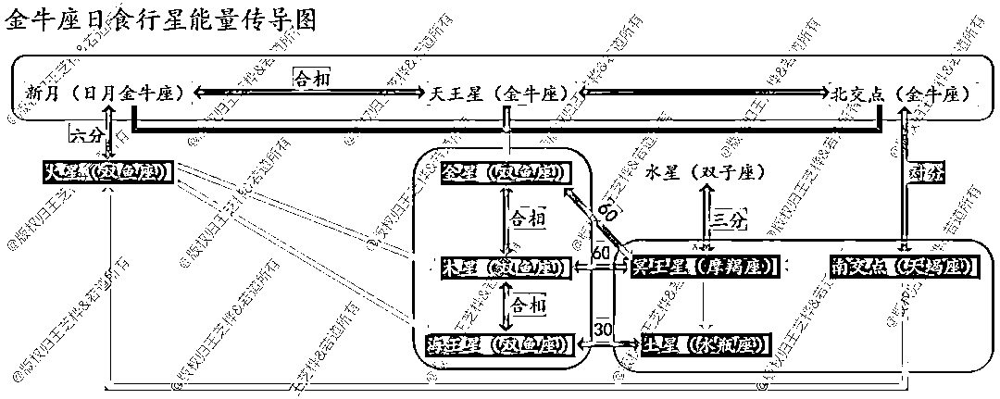

> **金牛座日食重点影响人群**
> 
> **参考新月峰值影响期间各个行星的行进度数，以及逆行行星的轨迹影响；常规容许度，个人行星入相位 3°，出相位 1°；非个人行星入相位和出相位均为 3°。**
> 
> *   出生星图中，有**行星、四轴、南北交点**落入**固定星座（金牛座、狮子座、天蝎座、水瓶座）7°-17°，20°-30°**的人群。
>     
>     
> *   出生星图中，有**行星、四轴、南北交点**落入****变动星座**（双子座、射手座、处女座、双鱼座）0°-5°，8°-15°。21°-30°**的人群。
>     
>     
>     
>     
> *   出生星图中，有**行星、四轴、南北交点**落入**基本星座（白羊座、巨蟹座、天秤座、摩羯座）23°-30°**的人群。

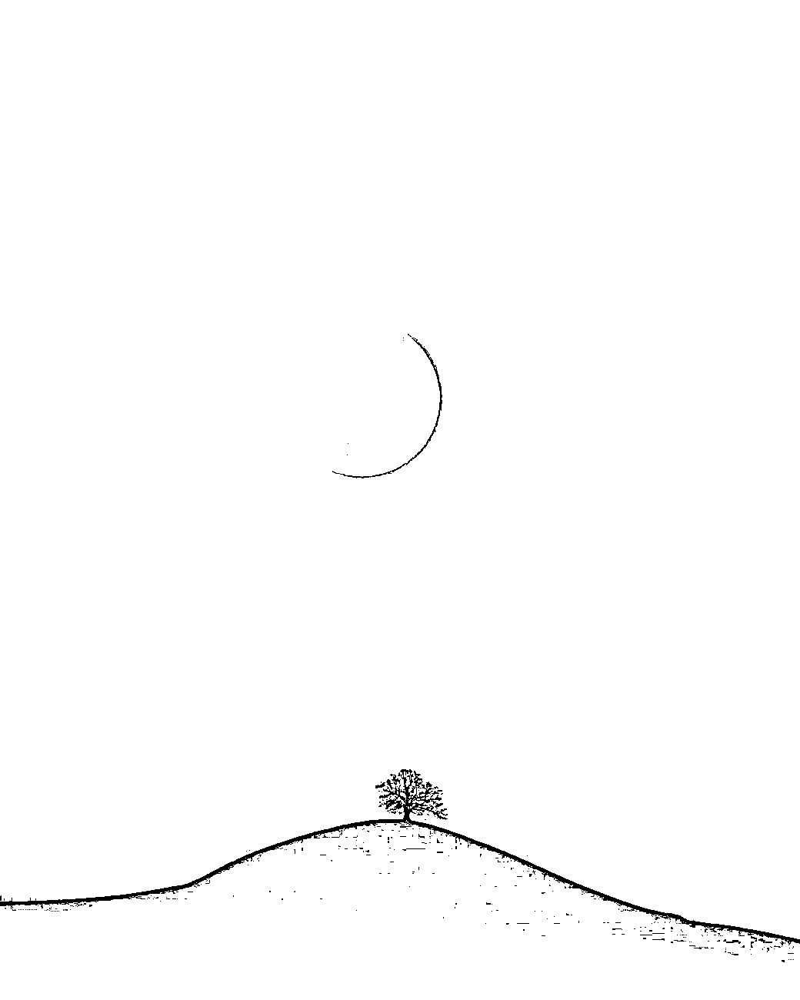

**活在当下，返璞归真，做一个幸福的人**

****

**过去的岁月安全无害，可以被轻易跨越；而未来却藏在迷雾之中，令人望而生畏。但当你踏足其中，就会云开雾散。****——柏瑞尔·马卡姆《夜航西飞》**日食发生时刻，金牛座太阳和金牛座月亮近距离地靠近金牛座天王星，再加上对日食发生起到决定性作用的金牛座北交点，形成了一个**“金牛座”的能量场。**自 2019 年 3 月，天王星这个“不按常理出牌的疯子”进入金牛座以来，便将金牛座所掌管的“大地万物”搅了个天翻地覆：**地球生态、金融环境、资源归属、粮食作物等各个方面都发生着结构性的变化，而 2020 年开始席卷全球的新冠疫情更是令经济形势、市场业态、个人生计、健康安全经历着严峻性的洗礼。****2019 年-2026 年，天王星行进在金牛座。**2021 年底，随着描述“业力进化轨迹”的南北交点换座进入“天蝎座南交点-金牛座北交点”轴线，“金牛座”更是站在舞台中央被聚光灯照亮——**金牛座天王星变革陈旧愚腐，颠覆现实结构；金牛座北交点提示活在当下，倡导返璞归真。**前文提到，此次金牛座日食是南北交点行进“天蝎座南交点-金牛座北交点”轴线的一年半时间中（2021 年 12 月 23 日-2023 年 7 月 13 日），唯一一次发生在金牛座的日食，对 2022 年进程、对天王星金牛座周期都是一次重要的开启能量，预示着——**当下的愿景计划将对未来 6 个月**“踩稳现实土壤，重建生命根基”的**进程起到引航作用。**

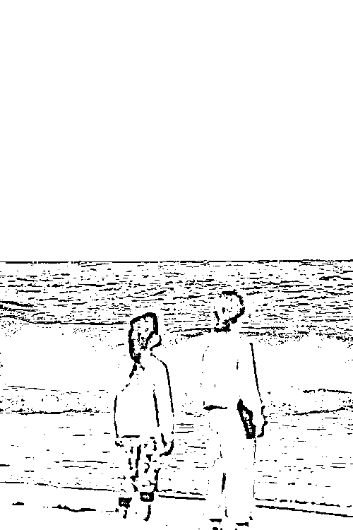

**1. 先说希望**

****

**变化的精髓所在是时间，我们只能等待。**

**——柏瑞尔·马卡姆《夜航西飞》**

> **天象****· 新月合相天王星：太阳、月亮、天王星合相于金牛座。****· 金星介入“木海合相”：金星、木星、海王星合相于双鱼座。**

**4 月 12 日，木星和海王星合相于共同守护的双鱼座，形成 165 年左右才能遇见一次的神奇天象“木海合相双鱼座”结构**——“未来”仿佛就在蕴藏一切可能性的神秘大门之中，看不见的时候已在酝酿，看得见的时候已成未来。此次金牛座日食，接纳金牛座太阳、金牛座月亮、金牛座天王星、金牛座北交点能量的双鱼座金星（金星守护金牛座），介入年度重磅天象“木海合相双鱼座”结构并形成“金木海双鱼座星群”。“金木海双鱼座星群”是此次金牛座日食的能量核心，蕴藏着无限的神奇和超强的能量：金星在双鱼座擢升，属于盟友级别的拜会；木星和海王星在双鱼座双双入庙，等于两位自家家主掌舵；而这组结构中的木星和海王星，也最终定位了“金牛座日食+双鱼座海王星”的能量。那么，金星、木星和海王星齐聚双鱼座，又是家主，又是盟友，究竟在干什么呢？首先，**金牛座日食关乎着现实层面和集体层面的发展，比如经济、资源、民生、物价这些非常实际、非常根本的事情；**其次，金牛座是一个**讲究务实、要求价值**的星座，而合相日食的天王星就是要**瓦解那些已经陈旧愚腐、清理那些已经没有价值的东西。****此次金牛座日食的前后 18 天，我们将会看到有关经济政策和税务制度的相关调整，金融市场和货币汇率的相关震荡，甚至经历现实生存和衣食住行的相关变化，但这只是刚刚开始。**当下，接纳金牛座日食开启能量、接纳金牛座天王星变革之力、接纳金牛座北交点进化目标的双鱼座金星，进入那扇蕴藏一切可能性的神秘大门，留下一颗关乎未来 6 个月“优化现实，创新未来”的种子。象征着意识之海的双鱼座，描述出“一念一世界”的真相：理想落地一点，现实包容一点，纠结便小一点，撕扯便少一点，而这一切其实只需微调一下意识的编码——**全面评估理想化和现实性，随身携带慷慨心和慈悲心。**但是，没有那么简单，有希望，亦有考验，我们需要时间；变化的精髓所在是时间，我们只能等待。

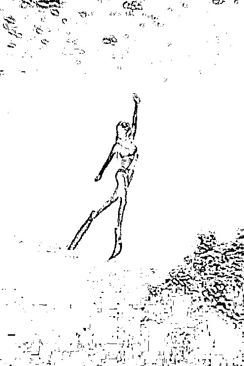

**2. 再说业力**

****

**我们飞翔，但我们并未“征服”天空。大自然保有它的尊严，允许我们学习和掌握它的某些力量。****一旦我们擅自做出逾越之举，想当然地接受它的宽容，严厉的惩罚就会降临在我们放肆的手脚上。到时候我们会揉着痛处，仰头凝望，被自己的无知震撼。****——柏瑞尔·马卡姆《夜航西飞》**

> **天象**
> 
> **· 土海 30°：水瓶座土星与双鱼座海王星形成 30°结构。****· “双鱼座星群”六分冥王星：双鱼座上的“金星、木星和海王星”六分摩羯座冥王星。**

此次金牛座日食，“金牛座”能量场中：金牛座天王星誓要变革陈旧愚腐，颠覆现实结构，但这位“不按常理出牌的疯子”并不向我们预告准备的时间；金牛座北交点提示活在当下，倡导返璞归真，但不要忘记对面还有一个携带“执着业力，恐惧阴影”的天蝎座南交点。当今时代已是多么繁华，人类世界已经很久没有担忧过“衣食住行”这个简单又原始的问题。但最近两年的现实世界，却突然生出“打回原形”的危机与恐惧：当疫情要求减速踩刹车，当经济不再如常地增长，国际社会急了，经济业态急了；当病毒没完没了地一再变异，当现实停停走走地难见前景，钱包急了，肚子急了。

从无到有容易，从有到无很难。这两年的旅程告诉我们，急了也只能接受。但是，**我们接受得心不甘情不愿，恐惧无常，焦虑丛生。**

自南北交点换座进入“天蝎座南交点-金牛座北交点”轴线之后，描述“业力模式”的天蝎座南交点便与揭示“业力议题”的摩羯座冥王星一体共振（冥王星守护天蝎座）。**2021 年 12 月 23 日-2023 年 7 月 13 日，是天蝎座模式和冥王星能量彻底爆发的一段时间：**

**· ** “业力”相关的线索让我们看到那些死亡的威胁、痛苦的损失和负面的情绪，而这些我们平时不愿谈起、视为禁忌的事情，却被一种残酷而决绝的力量推到眼前难以回避；

**· **我们对“没得商量”的死神敬畏臣服，但对那些学着死神宣判命运的情境忍无可忍。于是，无论集体社会，还是我们个人，都在“只能更好的野心，不能后退的执念”驱动之下，拼命拉着那根“减速”的绳索不让它脱离掌心；

· 然而，2022 年还未走过一半，我们似乎更“怕”了。我们惊觉生命的渺小和脆弱，但更惊觉总有一双比大手还大的手，我们不知道在和谁“斗”，更不知道更大的手在哪里隐藏。

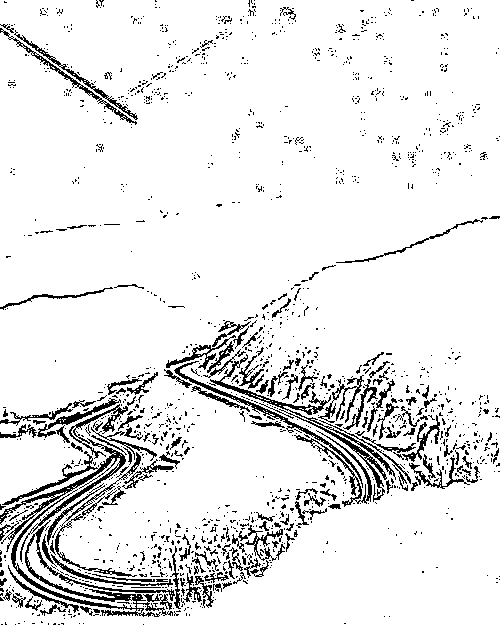

沮丧、痛苦、愤怒、挣扎、无力……最后，一定是反思。**此次金牛座日食的前一天——4 月 30 日，冥王星开始逆行，从摩羯座 28°逆行回到 26°。**摩羯座 26°这个位置，冥王星先于**2021 年 3 月-4 月**走过一次，后于**2022 年 1 月-2 月**走过一次，**这两次时间点，我们经历的外部事件和心路历程，是此次冥王星逆行周期“检视和反思”的重点。**

行星逆行就像是宇宙再给予一次机会，至少我们可以觉察得更透彻，处理得更成熟。

此次金牛座日食：**·** 刚刚逆行的摩羯座冥王星带着“向内洞悉”的能量，与“双鱼座星群”形成的六分结构，**引领我们评估“理想与现实”之间的差异，洞悉“希望与失望”之间的真相；****·** 水瓶座土星与双鱼座海王星的 30°结构，则提示我们只有带着更长远的视角和更成熟的担当面对当下的一切，那扇酝酿“未来”的神秘大门之中才能成就更高的可能性。**几个觉察****·** 牵动我们内心感受上来下去、不断沉浮的究竟是什么呢？**·** “如我所愿”是这个世界应该配合的事情，还是本身就是一份荒唐的执念呢？**·** “出生-成熟-消亡-重生”是万物自然的发展规律和循环进程，为什么到人类这里就“只能向前，不能后退”了呢？宇宙并没有给人类那么大的权力和胆子，我们不要被自己的无知震撼。

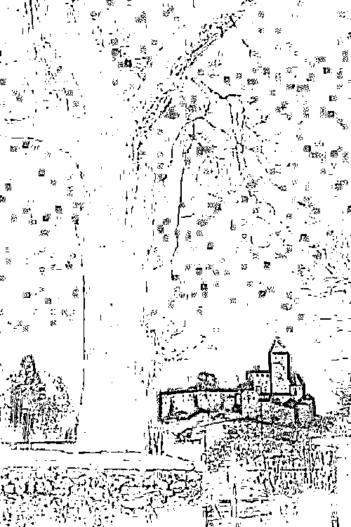

**3. 后说速度**

****

**曾经，这个世界上没有机器、报纸、街道、钟表，而它依旧运转。**

**——柏瑞尔·马卡姆《夜航西飞》**

> **天象**
> 
> **· 水冥三分：水星与冥王星形成三分结构。**
> 
> **· 火星六分“金牛座星群”：双鱼座火星六分金牛座上的“太阳、月亮和天王星”。**

此次金牛座日食，双子座水星与摩羯座冥王星之间的“水冥三分”结构，并不是精准呈相，但却是需要关注的一组结构。先来看看水星近期的行进：**·** 4 月 26 日，水星行进到金牛座 26°，年度第二波水星逆行进入前影响期；**· **4 月 30 日，水星进入双子座；**· **5 月 10 日，水星于双子座 4°开始逆行；**· **5 月 23 日，水星逆行回到金牛座；**· **6 月 3 日，水星于金牛座 26°恢复顺行；**· **6 月 13 日，水星再次进入双子座；**· **6 月 19 日，水星再次行进到双子座 4°。2022 年第二波水星逆行的整个周期，走了一趟**“金牛座-双子座-金牛座-双子座”**的旅程。这两个星座之间的能量换挡，对于运转快速、代表流动的水星而言，凸显着与“速度”相关的一切。我们可以这样理解“金牛座-双子座-金牛座-双子座”的旅程：**· 4 月 26 日，有些事情还没有处理好，但是 4 月 30 日就“提速”了（当天冥王星逆行）；****·** 然后 5 月 10 日，发现不对劲并回头检视，5 月 23 日，做出“降速”处理；**·** 而后 6 月 3 日，终于发现问题根源并开始修正，最后 6 月 13 日问题基本解决并再次“提速”。以上，适用于所有事情。**“水冥三分”结构的 3 次精准成相，随着第二波水星逆行的脚步，发生在 4 月 28 日、5 月 26 日、6 月 11 日。**此次金牛座日食只是延续着第一次“水冥三分”的能量影响，但两颗都在逆行周期的行星所组成的结构，则**进一步加剧和放大了“回头检视，向内反思”的寓意。**检视和反思，需要时间，需要减速，这与当下的世界节奏不谋而合。我们并不喜欢这种被迫慢下来的感觉，但其实除了接受，也并不能做什么。此次金牛座日食，宇宙提示我们**将意识和关注力转向“生命的真相”：**那些不以世俗价值衡量的满足，那些不用证明自我成绩的真实，那些踩稳大地足以活下去的力量，正是此次金牛座日食在那扇酝酿“未来”的神秘大门之内，留下的关乎未来 6 个月“优化现实，创新未来”的种子。

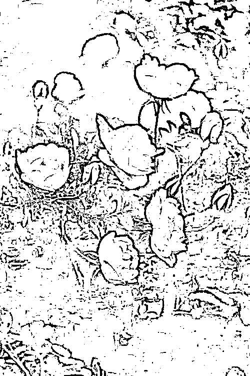

而双鱼座火星与“金牛座星群”的六分结构，则为这颗种子的酝酿过程增添了“迎接一切考验”的勇气和行动力——**即使未来仍藏在迷雾之中，令人望而生畏；但当我们踏足其中，就会云开雾散。**别怕！曾经，这个世界上没有机器、报纸、街道、钟表，而它依旧运转；而今，这个世界已经拥有了更多的资源、科技、发明、灵性，难道它还不能依旧运转吗？但是，简单和质朴，才是这个世界真正的运转基础，因为“没有太多的有，才能有更多的有”。而这里所说的“有”，不仅仅是一种创造，更是一种感恩和一种幸福。**寄语**

****

**如果必须离开你曾经住过、爱过、深埋着所有过往的地方，无论以何种方式，都不要慢慢离开，要决绝地离开，永远不回头。****——柏瑞尔·马卡姆《夜航西飞》**这句话看着挺决绝和冷酷的，但细细品味，确实如此。我们当下的很多痛苦就是离不开过去的生活、经验、理想化，故而当震荡和变化来临，恐惧和压力反而促成更大的震荡和变化。此次金牛座日食，提示我们将一切的复杂简单化，活在当下，返璞归真。故而，**放下那些对未来的恐惧，对现实的猜测，拥抱时光，好好活着。**最后，以海子的诗送给大家：**从明天起，做一个幸福的人****喂马，劈柴，周游世界****从明天起，关心粮食蔬菜****我有一所房子，面朝大海，春暖花开**祝福每一个生命健康，祝愿每一个灵魂安好。**新月如何许愿？****许愿时间**：2022 年 5 月 1 日北京时间 4:27 后，48 小时内有效、8 小时内最佳。 **许愿人群**：所有人。**许愿数量**：每人最多 10 个。**许愿方式**：静心冥想，身心祈祷或记录收藏。**许愿格式**：请万能的宇宙赐予我能量，我将以我的能量吸引**（什么）来到生命中……**许愿原则**：发心诚善利人。

**版权声明**：原创文章由作者授权首发于若道平台，欢迎转发，反对抄袭。友号转载请申请白名单。

****

****想阅读更多作者的文章，请在后台回复******王芝桦****** 即可。****

****王芝桦****

心理占星师，统合疗愈师，占星专栏作者

全职于个案咨询与占星教学工作 18 年

**个案预约咨询微信号**：zhihua0621 

**微信公众号**：daoxi-life

**长按打赏**

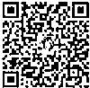

**20 位来自世界各地的占星师****带来 20 场沙龙——新世界的觉醒****详情可点击下图**

**学习占星学****点击下图了解课程详情**

**

**微信又双叒叕改版啦，不想错过若道君的推送？**

**就把若道设为星标吧！**

**▼**

**福利来啦**
**点击****“阅读原文”****获取最好用的免费****新月报告**

**获取免费新月报告，请点击文末“阅读原文”**

# 金木合相+金牛座日食，节后上证怎么走？丨梅里曼 5 月上证+黄金报告上线！

> 原文：[`mp.weixin.qq.com/s?__biz=MzA5NjA0NTAxNg==&mid=2651473208&idx=2&sn=9465e5528554b9c84d45d7c9697d55f7&chksm=8b48f78fbc3f7e991517dd548db6b6875b3e09b800f6f48ed766e953a49ac0eb810c16b20fd6&scene=126&sessionid=1692737822#rd`](http://mp.weixin.qq.com/s?__biz=MzA5NjA0NTAxNg==&mid=2651473208&idx=2&sn=9465e5528554b9c84d45d7c9697d55f7&chksm=8b48f78fbc3f7e991517dd548db6b6875b3e09b800f6f48ed766e953a49ac0eb810c16b20fd6&scene=126&sessionid=1692737822#rd)

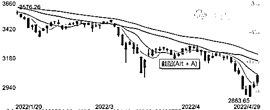

| 上证指数日 K 线

3 月的下跌后，上证指数在木海合相期间没有发生上涨，而是出现更疯狂的下跌。虽然也符合木海合相的夸张和歇斯底里的性质，但毫无疑问给投资者带来恐慌。4 月 25 日跌破 3000 点，4 月 27 日最低到 2863。这是 2020 年疫情爆发后的低点，在疫情对经济影响的乌云之下，投资者信心受到破坏。上海的静态管理已经满 1 个月，而包括北京在内各地也发生散发疫情和区域的静态管理，这些都对整体经济带来比 2020 年严重得多的影响。在 3 月份的上证报告中，梅里曼老师写道：**“当前的 13-20 周基本周期始于 11 月 10 日的低点 3448。因此 2 月 21 日开启了本轮周期的第 15 周。最近的低点，1 月 28 日的 3356，在这个周期的第 11 周出现。****它跌破了开启周期的那个低点，这意味着这个周期是看跌的，也就是说最终的低点——最低的价格将在基本周期结束时出现，它会在接下来 5 周的任何时间出现。”**在 4 月份的上证报告中，梅里曼老师提到：**“13-20 周基本周期始于 11 月 10 日的低点 3448。3 月 16 日的新低是 3023。它在第 18 周‘准时’出现，因此，我认为新一轮 13-20 周基本周期开始了。”****而因为 3 月 16 日的低谷也是 33 个月周期的终点，因此上证有很大的上涨希望。**

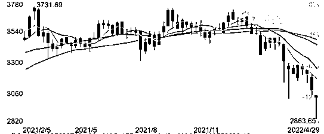

| 上证指数周 K 线

然而事情的发展显然发生了预期之外的变化。3 月 16 日上证跌至 3023，这是 13-20 周的基本周期的第 18 周，这是一个波谷。随后市场短暂的反弹至 4 月 6 日，但其后继续走低，跌破 3 月 16 日的低点。如果 3 月 16 日是一个基本周期的开始，这是否意味着市场目前在经历的不过是熊市的早期阵痛，但市场已经进入熊市，所以还会接着下跌？还是说从 2021 年 11 月 10 日的低点 3448 开始的为期 13-20 周基本周期出现扭曲，出现一个延长的基本周期，因为从 11 月 10 日开始算，目前已经是第 25 周。**5 月 1 日会发生金木合相和金牛座日食，此前，4 月 27 日市场已经开始反弹。这个反弹会持续吗？****这是一个熊市开始的周期，还是 4 月 27 日波谷已经到来，而一个较晚开始的新的基本周期正在展开？**

5.1 假期回来后应该如何操作，金融占星大师雷蒙德·梅里曼的《2022 年 5 月上证指数报告》已上线，你可以听听梅里曼老师的看法。

**《2022 年 5 月黄金报告》也已上线，欢迎购买。**

**也欢迎购买雷蒙德·梅里曼《2022 年金融年度预报和沙龙》，《2022 年四位占星大师天象预测》课程，这些预测都将帮助你对 2022 年的变化加深了解。**

**扫描下图二维码了解详情**

▼

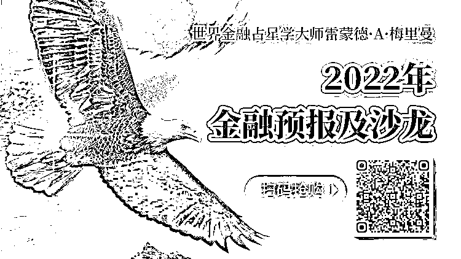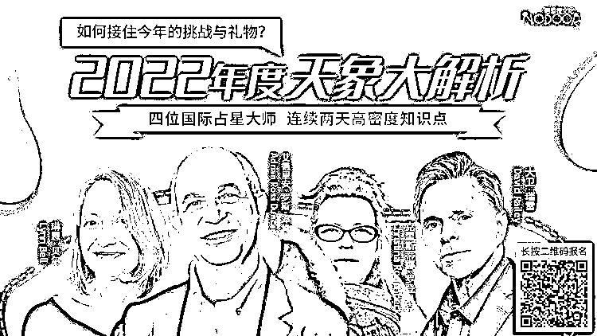

**投资有收益，投资有风险，希望金融占星学的研究帮助你更好地评估你的投资。**

**5 月上证报告上线**

**上证指数月度报告价格****单月报告**：280 元/月 **季度套餐价格**：780 元（260 元/月）**年度套餐价格**：2400 元（200 元/月）**长按下图识别二维码购买上证指数报告**
▼

“**黄金是金钱。其他的只是信贷。**

**——约翰·皮尔庞特·摩根**

”

**3 月份西方各国通胀都创新高。**

美国通胀升值 8.5%，创 40 年来最高水平，也即 1981 年以来的最高水平。

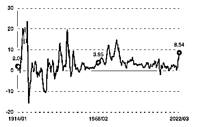

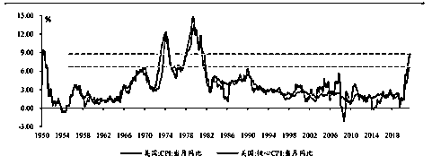

德国通胀 7.3%，也创下 1990 年两德统一以来的新高。

英国通胀率 7%，为 1992 年以来最高水平。

整个欧元区通胀率达 7.5%。

本来受到新冠疫情冲击供应链的影响，许多国家在 2021 年下半年就面临通胀压力，而 2022 年 2 月份开始的俄乌战争造成的能源和农产品等大宗产品价格飙升则让情况变得更为严重。

4 月 13 日，在美、英、法、德、日、意、加 7 国集团中，加拿大央行首先决定加息。

尽管美联储在过去一直坚持说通胀是个短暂现象，但在这样的形势下，5 月的美联储议息会议也可能加快货币紧缩的节奏。

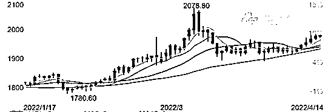

| 黄金走势日 K 线图

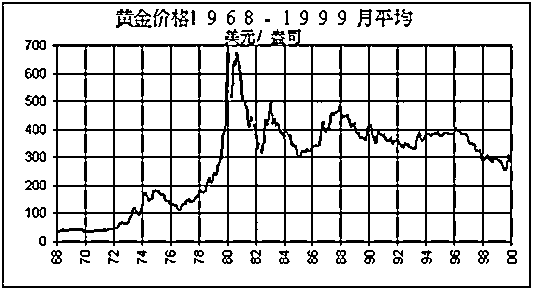

从历史走势来看，**20 世纪 70 年代和 80 年代初**，通胀和黄金的走势相一致，同涨同跌，通胀对黄金的影响相对较为明显。**而 1985 年-2000 年前后**，通胀水平和黄金价格均处于相对平稳期，两者的关系已经不明显。**2000 年以后**的黄金牛市对应低通胀水平，通胀和黄金价格的关系弱化。

**然而，70 年代的滞涨是否会在未来几年再现？**

短期来看，4 月 12 日木星-海王星已经在双鱼座合相。而黄金并没有创出新高。而黄金长周期也进入尾部时光。

**在这些因素的影响下，5 月份应该如何操作？**

黄金报告已经上线，上证报告也即将上线。欢迎了解。也可以按照季度和 1 年期订阅，有更多优惠。季度和年度的好处是，你可以持续了解梅里曼老师对于不断在变化的市场的看法。即便他某一次看法和市场不一致，你也看到在下一期他如何调整自己的看法，并看到金融占星在一个长期时间段内对你把控风险的帮助。而能够长期控制风险、尽量找到安全的投资时机才是投资的长久之计。

点击阅读原文，雷蒙德·梅里曼黄金周期 2022 年 5 月报告带来有 40 年黄金市场研究经验的世界著名金融占星大师雷蒙德·梅里曼对当前黄金市场的研究。

**5 月黄金报告上线**

**黄金月度报告价格****单月报告**：280 元/月 **季度套餐价格**：780 元（260 元/月）**年度套餐价格**：2400 元（200 元/月）**双报告年度套餐更优惠（直降 900 元）****12 个月黄金报告+12 个月上证指数报告：仅需 3900 元****长按下图识别二维码购买黄金报告**
▼

**购买者需知**

**① **梅里曼市场时机学院《中国上证指数月度研究报告》是梅里曼市场时机学院（以下简称 MMA）的研究“预报”，而不是市场“预测”，是梅里曼老师及 MMA 金融占星分析师对人类活动周期历史与行星周期之间相关性的研究，二者在大部分情况下具有 80%或更高的相关性，而不是因果关系。报告中的研究完全存在错误的可能性。即便是非常认真的研究和几十年的研究经验，金融占星师无法总是正确地解读出各种征象在实际层面上会如何相互作用，并显化为事件结果。

所以请将报告看作一个研究参考，务必结合其他市场研究和你个人对市场的理解，根据你的自由意志做决策。

**②** 此报告一旦售出，**即不接受退款。**

**③** 上证、黄金月度报告每月固定 1 期，**并非都是在每月相同日期发布。**

**④** **我们收到英文报告的当天，即发布该英文报告。3 天后，上线报告中文版。此报告仅支持手机网页阅读，不支持电脑阅读和下载。****以上须知，请仔细阅读。一旦付款，即视为已了解并接受所有须知内容。**在过去的 40 年中，唯有梅里曼逐渐完善，并在梅里曼市场时机学院月度周期报告中阐释了将地球宇宙学与周期相结合的研究方法，以惊人的精确性预报了黄金价格发生重大变化的时间。**黄金购买 Tip**

各大银行均可购买黄金或黄金 EFT 基金，也可以在诸如天天基金或者支付宝购买黄金及黄金相关产品。不明白的可以百度搜索。

**购买后如何查看报告？**

**购买后有疑问怎么办？**请联系技术客服
**微信：nodoor201705**

**购买黄金报告直达入口**

# 金牛座日食，稳扎稳打的果实，从这份免费新月报告开始

> 原文：[`mp.weixin.qq.com/s?__biz=MzA5NjA0NTAxNg==&mid=2651473208&idx=3&sn=2ac03ebdce7c11ebe1c420d0641f79a2&chksm=8b48f78fbc3f7e99a2dd0405d2f79ebfd3ba1a4a64ef3ffe50885f5354f90922966748f6a8cf&scene=126&sessionid=1692737822#rd`](http://mp.weixin.qq.com/s?__biz=MzA5NjA0NTAxNg==&mid=2651473208&idx=3&sn=2ac03ebdce7c11ebe1c420d0641f79a2&chksm=8b48f78fbc3f7e99a2dd0405d2f79ebfd3ba1a4a64ef3ffe50885f5354f90922966748f6a8cf&scene=126&sessionid=1692737822#rd)

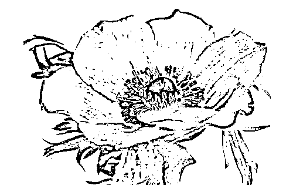

北京时间 5 月 1 日 4:27，日食发生在金牛座 10°27′。每到新月时分，若道君都会为你奉上根据你出生星图量身打造的免费新月报告。可是新月为什么要许愿？新月报告该如何领取？让若道君来教你。　**什么是日食？**　

从占星学看，新月是月亮周期的一种相位。新月是开始，又称为朔，对应中国农历初一，太阳、月亮在此时合相。此时月亮运行到太阳与地球之间时，月亮以黑暗的一面对着地球，并且与太阳同升同落，地球上看不见月亮。如果新月发生的位置靠近月亮交点，则称之为日食。

本次日食时间

**5 月 1 日 4:27，日食发生在金牛座 10°27′。**

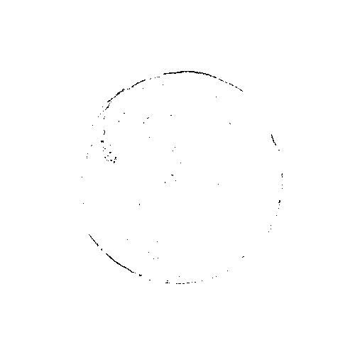

为什么新月要许愿？

新月是一个周期的开始，新月发生的时候，太阳与月亮合相，能量很强。当新月出现时，你也许会发现灵感忽现，非常适宜开启新领域、项目与行动，缔结一段新的关系或合作。许愿会加强新月的能量，也有助于你了解自己现阶段适合开启的方向。 

本次新月最佳许愿时间从新月开始到其后的 48 小时内，许愿的力量最强。**最佳许愿时间：5 月 1 日 4:27-5 月 3 日 4:27**

属于你的免费新月报告每到新月时刻，看着占星文章里写着：看看你新月的宫位，如果新月在第 X 宫，你可以许愿的方向是……是不是常常一头雾水？新月的宫位？我到底该看哪里啊？而有时，那些标注上升星座的文章也会让你忍不住想：虽然我的上升星座是这个，可是我的新月好像并不落在你说的宫位啊？你是不是写错了？

虽然这些文章都没有写错，可是好像对你而言都太不友好了。**Don't Worry！**别着急，让博学又体贴的若道君来帮你！我们推出了一份**免费**又**好用**的新月报告！而且是专门为你设计的哦，**根据你出生星图为你量身打造的，只****属于你的独家新月报告**。报告有哪些内容？**新月时间****最佳许愿时间****如何许愿 **属于你的**许愿关键词**本次新月给你的**建议**你会有怎样的**感受 ******机会****

****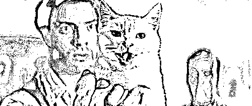****

如何许愿？许愿方式也很简单。你可以把愿望写下来，或者双手合十后交叉，闭上眼睛来祈祷。 报告中会为你提供**祈祷词示例**，可以多多参考哦～ 你还可以适当添加自己的语言，创造属于你自己的祈祷文！如果报告拿到手了，快对照着许愿吧！

**这份好用又暖心的报告，点击****阅读原文****即可领取！**

****

****点击“阅读原文”即可获取新月报告****

# “如果不曾拥有，就不会失去” | 金海相位的逐爱之痛

> 原文：[`mp.weixin.qq.com/s?__biz=MzA5NjA0NTAxNg==&mid=2651473043&idx=1&sn=2d6580d4e380ab783e51bcf43b741454&chksm=8b48f624bc3f7f3243b761c99332dbeef2e2e6e21ec24c1fcdf815c346eb492e3cc9cf74da26&scene=126&sessionid=1692737822#rd`](http://mp.weixin.qq.com/s?__biz=MzA5NjA0NTAxNg==&mid=2651473043&idx=1&sn=2d6580d4e380ab783e51bcf43b741454&chksm=8b48f624bc3f7f3243b761c99332dbeef2e2e6e21ec24c1fcdf815c346eb492e3cc9cf74da26&scene=126&sessionid=1692737822#rd)

******************************☆ **************后台****************************回复“今日”，给你一句生命态度****************

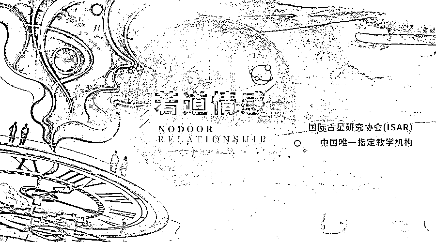

作者/格伦·佩里译者/Cora 校对/王宏
编辑/玫瑰 图片/pexels

占星学里，有两颗同爱与美相关的行星——金星、海王星。当这两颗行星互相碰撞的时候又会产生怎样奇妙的反应呢？让我们一起来看看格伦老师的解读吧。另外，格伦老师参与授课的【[心理占星双证课第一学年课](http://mp.weixin.qq.com/s?__biz=MzA5NjA0NTAxNg==&mid=2651472620&idx=3&sn=5494ef2c29a7ac515ef8a6b431991655&chksm=8b48f05bbc3f794df5680b6ebcee8670baca4bcbd6827c9a650a1d14bc5428b0ce3e332f0a24&scene=21#wechat_redirect)】【[心理占星双证全阶课](http://mp.weixin.qq.com/s?__biz=MzA5NjA0NTAxNg==&mid=2651472874&idx=3&sn=aa6de935322126ff537f48feeea4bc87&chksm=8b48f15dbc3f784bddbe94214b31f99b121a2d0f5c4c5e293d00fe04674b6df3c30040a93ff6&scene=21#wechat_redirect)】正在报名中，有兴趣的小伙伴点击链接了解更多详情吧！

**金星遇上海王星**

**金星和海王星形成的困难相位，要求我们将对亲密和依恋的需求，与对超越和升华的灵性渴望整合起来**。

在其**高阶**整合层面上，这可以呈现为**视觉艺术、对受苦者的无私之爱、超越人类依恋的虔诚之爱，或是在有觉察的关系中不设防的爱**。

在**低阶**的表现中，同样的挑战可能引发**会摧毁爱的无意识的内疚，不得不以欺骗维系的地下恋情，将所爱之人理想化而带来的低价值感，会无意中牺牲爱的拯救者-受害者动力。**

**没有互动的想象中的恋人，以及其他的由无意识驱动会带来幻灭、丧失和悲剧的选择**。

要充分领会整合金星-海王星相位的困难，就有必要了解这两颗行星所代表的基本驱动力。作为双鱼座的守护星，**海王星代表试图超越并与万物源头合一的灵性冲动**。

这股热望无休止地拉扯着灵魂，因为缺乏对神的认识时，所有的快乐和成就最终都只不过是空虚。

在许多灵性传统中，人生的终极目标是**从与整体分离的幻觉中醒来**，为了融入与神合一的狂喜中，甘愿放弃个人独立自我的意识，也就是**“小我”**。为了协助这个进程，代表神意灵性面向的海王星协力带来了与**失败、幻灭和丧失**相关的体验。

因为在有了这些体验之后，这个人就会倾向于发展出帮助一个人进化成灵性存有所必需的态度：**谦卑、臣服、慈悲，等等。**

与此相冲突的是**金星的各种需求**，它们会提出自己的要求。这既包括金牛座**对与能带来愉悦、舒适和安全感的人和物形成稳定依恋的驱力**，也包括天秤座**对于美、亲密和陪伴的需求**，而这可能尤其与双鱼座要**与众生合一**的强烈需求相冲突。

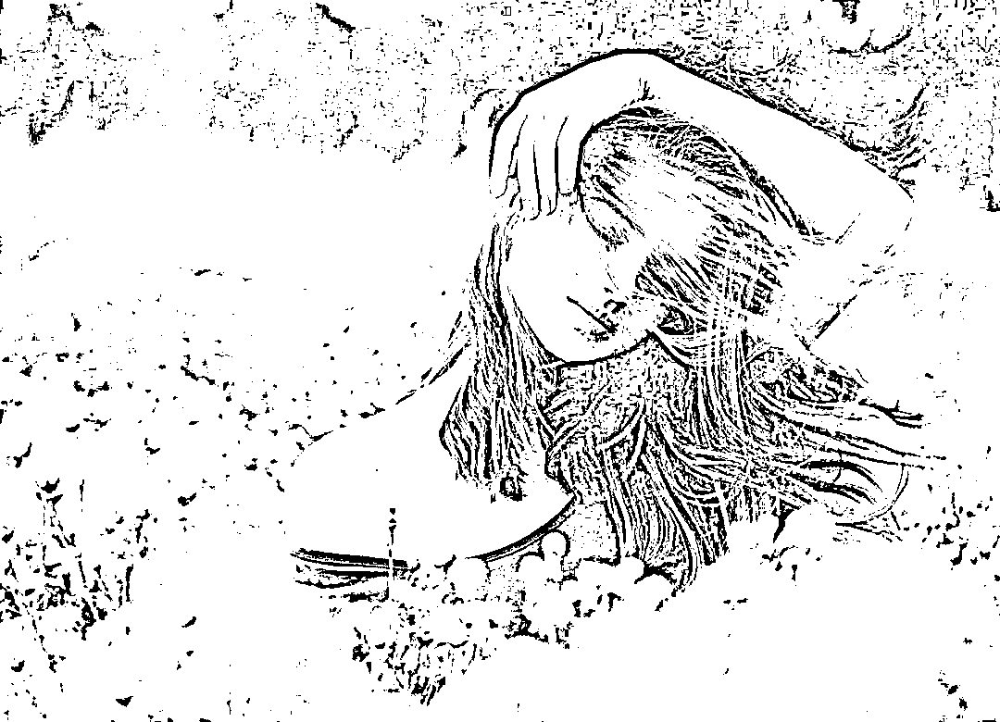

要满足天秤座的需求，要求我们**承认差异**，这是任何稳定的关系得以成立的前提条件。但在海王星消弥差异，要与对方心醉神迷地融为一体的背景下，一个人要如何才能追求公正，化解冲突，寻求合作以达成一致呢？

这是天秤座和双鱼座之间的梅花相位所暗含的根本困境，这在所有金星和海王星的困难相位中都显现出来了。

当行星之间形成相位时，一颗行星会作用于另一颗行星，并为那颗行星注入自己的精髓。海王星提升了金星，使之变得有灵性，让金星以一种更为理想化的方式运作，为金星增添**超然、无限、永恒**的气息。

反过来，金星令海王星变得**注重感官**，把海王星带到**有形享乐的世俗境界**，为海王星输入对于**亲密和承诺**的渴望。

然而，由于海王星的理想归根结底是脱离现实的，是存在于想象中的完美，本质上并不真实，也不长久，所以这样的结合往往会消解于**虚无**，在梦醒时分带来丧失、悲痛和心碎。

然而金星-海王星相位并不总是负面的，因为在更为高阶的整合层面上，这两种原型能够以**相对稳定、互利**的方式相结合。

在具体的个案中，金星-海王星往往不止一种表现方式，其正面结果和负面结果混合出现。经过时间的洗礼，当然有可能朝着更能带来满足感的方向进化。

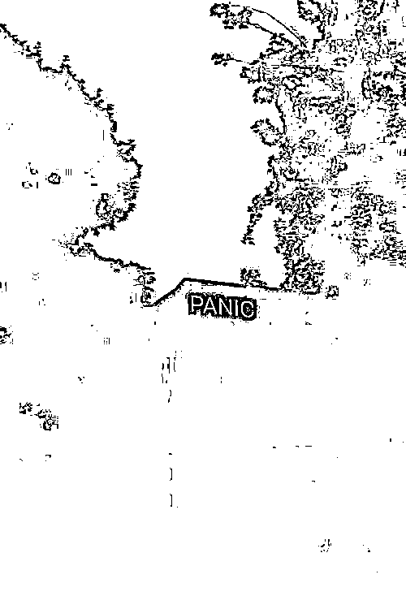

**金海相位的早期表现**

金星-海王星的早期表现往往以**身体和关系方面的越界**为特征。一个有金星-海王星相位的小孩，可能经历过**不想要的或不恰当的碰触**，这会引发**内疚感**，此后这个孩子可能会通过**说谎和（或）压抑这种体验本身，来拒绝这样的碰触。**

**缺乏清晰的界限**也可能是父母婚姻的特点。比如，孩子目睹了父母的**婚外情、欺骗、背弃**，以及这一切的混乱纠葛及其后果，包括**悲痛、内疚和丧失**。在有些例子里，孩子可能会**被父母中的一方利用**，给婚外情打掩护。

当父亲说要带儿子出去郊游时，但实际上他在外面的大部分时间都是在和情妇厮混，然后他又要求儿子对自己的母亲撒谎。这不仅让儿子成了帮凶，还为儿子提供了情感关系的“榜样”。我也见过一些母亲为了同样的目的利用自己的孩子。

海王星掌管**消融**的过程。因此，**当海王星与金星形成困难相位时，婚姻解体很常见**。这可能让一个有金星-海王星相位的孩子，不得不跟着一位**孤独又沮丧**的父亲或母亲生活，他（她）将孩子视为自己生命中的**主要关系和爱的源泉**。

由于父母婚姻的破裂，这个孩子被剥夺了健康的关系榜样，同时也背负了让父母之一在情感上幸福的责任。

有时他会夹在父母中间，与父亲和母亲的关系都变得紧绷，使他陷入**两难处境**：如果与母亲走得太近，就会伤害父亲；如果与父亲关系好，就会伤害母亲。不可避免地，由于他认为自己无论如何都会给某个人带来痛苦，所以会由此产生**不理性的内疚**。

糟糕的婚姻的另一种形式是，父母没有离婚，但**父母之一将孩子当成伴侣的替代品**。这会造成双重危险：孩子一方面会**害怕被有情感需要的父母所吞没**，另一方面又会因**给被疏远的一方造成痛苦而内疚**。

这类关系制造的**恐惧和内疚**会形成模式，以后必将在这个孩子成年后的关系中有所体现。

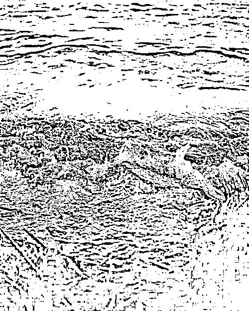

**无意识的内疚感**

有人可能会说，金星与海王星的困难相位的核心，是**无意识的内疚感**，这种内疚感与**人类依恋**有着不可分割的关联。尽管在实际的童年经历中可能存在着这种内疚感的基础，就像上面所说的那样，但也有可能存在一定量的与一般关系相关的存在主义的内疚。

**存在主义的内疚是指，只是因为生而为人而产生的内疚感**。这是由海王星的**灵性需求和基本指导原则**所带来的：**为了合一的意识而做出牺牲**。作为个体存在，就是要和神相分离。所有的海王星体验都有一个目的，就是为了**与神重新合一**。

因为这要求，个体舍弃依恋来为灵性合一服务，所以说**对于个体的任何实际依恋，都是对回应这种更高的召唤的阻碍**。

舍弃依恋不仅仅偿还了爱上替代神的人这种想象中的罪孽，还导致了悲痛、苦闷和自责不可避免的混杂，这会让灵魂变得柔软，为侍奉神做好准备。

有这类相位的人具有一种普遍倾向，即通过**与放浪、不诚实，或因为其他原因不值得信赖的人结婚，来让自己对于亲密的需求得不到满足**。

我们可以将这种倾向看作**无意识内疚**的表现。再一次说明，海王星跟消融界限有关，因此，当事人可能在进入婚姻时**略显草率**，没有进行必要的天秤式对话，并达成有共识的约定，让双方真正了解彼此。

**缺少真正亲密的、彼此袒露的交谈，是缺乏界限的表现，也就是“纠缠”**。金星-海王星型的人总是简单地将一切都想象得很完美，就好像**“我们是一体的”**。他们会**将伴侣理想化，不切实际地放大伴侣身上的优点**。

海王星的想象力取代了实实在在地去做金星的工作，去**确定自己面对的到底是个什么样的人**。等到他们发现伴侣有懒惰、犯罪、滥用药物、双性恋、性瘾、恋童癖，或其他对婚姻有害的问题时，为时已晚。

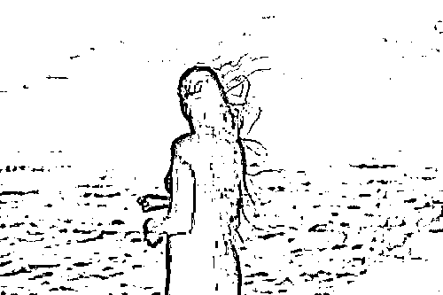

**爱上得不到回报的爱**

如果有金星-海王星相位的人身处一段**稳定又健康**的婚姻中，他们可能会发觉自己**无法自制地迷恋上另外一个人，从而毁掉婚姻**。那个人通常代表一种**更为理想化的爱**，或者是**触不可及的爱**，或是由于一些**带有悲剧性或宿命色彩的原因而难以结合**的人。

这可能会引发**婚外情**，或只是**萦绕于心的一份未被满足的渴望**。这不是传统意义上的“选择”，更像是一种**强迫性的冲动**，**要牺牲已经拥有的爱，来追求更伟大的、无法获得的爱**。

单身的人也有类似的故事。他们可能**爱上某位已婚人士**，或**相距甚远**之人，或是**已经订婚**的人，或是**与自己性别相同**的人，或者就只是**单相思**。

英国小说家萨默塞特·毛姆有金星与海王星的四分相，他说过：**“我最爱那些不怎么关心我或对我毫不在意的人，而当有人爱上我时，我会觉得尴尬……为了不伤害他们的感情，我常常表现得很有激情，其实我并没有那种感觉。”** 

毛姆还说：**“最持久的爱，是永远得不到回报的爱。****”**

这些话反映了金星-海王星关系的常见模式：爱上一个人，而那个人甚至没有意识到自己是某人热恋的对象，那个人可能是**朋友、师长、别人的伴侣，或是公众人物，比如电影明星**。

这样的情况发展下去，会发生更让人不安的状况：在想象中，那个自己迷恋的人，也跟自己有同样的感受，即便两人在这方面根本没有任何实际的交流，对方也没有任何这样的表示。

这可能会带来**怪诞的结果**：给对方送人家并不想要的信件和礼物，纠缠骚扰，责怪对方误导了自己，或是以其他方式将自己置于感到**被抛弃、幻灭和丧失**的境地。

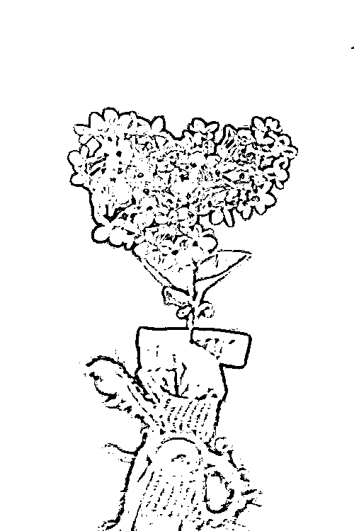

如果将金星-海王星的四分相比作一种酒，那就是一种**将神圣之爱与凡人之爱相混合的、令人沉醉、使人上瘾的酒。**这种酒下肚，会让人陶醉、入迷，因无法抗拒、常常也是没有希望的倾慕感而忘乎所以。

这包括各类**不可能的关系**：已婚人士和单身人士之间的关系、师生之间的关系、治疗师和客户之间的关系、医生和患者之间的关系、年龄差异巨大的两个人之间的关系，等等。

正是对不可能得到的东西的渴望，暗示了这类关系中神圣的一面，因为**神是一个不可触及的理想，不能以有形的方式被占有**。

通过将神的面容投射到所爱之人身上，被爱的那个人就被赋予了一种**超然**的特质，就像缪斯女神一样，她能激发人的灵感和想象，她本身却无法被占有。

在可以短暂接触到所爱之人的情境中，很有可能他们**很快就会失去所爱之人**。这可能是因为**疾病或死亡**而真的失去爱人，或只是当被理想化的爱情对象暴露自己过于凡人化的所有瑕疵和缺点时，不可避免地产生的**幻灭感**。

**不断强迫重复的模式**

我曾有一位客户，他的**金星在双鱼座合相下中天，同时对分中天的海王星**。在他出生后的头两年，他和母亲生活在一起，他的母亲未婚先孕生下了他，他的生父是一位富有又有权势的男性，和他的母亲发生了婚外情。

他的母亲幻想这位男性最终会和妻子离婚，然后娶她。孩子出生两年后，这位男性承认他并不打算离婚，这位母亲于是抛弃了自己的孩子，从此杳无音讯。

这位男性将受到精神创伤的、蹒跚学步的孩子带回家，向妻子坦白了他的不忠。他们一起将这个孩子当成他们的孩子来抚养，从没让他知道自己的生母抛弃了他。当我的这位客户长到 21 岁参军时，他第一次看到了自己的出生证明，发现了自己的身世。

这打开了被封存的记忆的闸门，他想起了失去母亲的痛苦，为此他用酒精麻醉自己，酗酒的状态持续了 5 年。

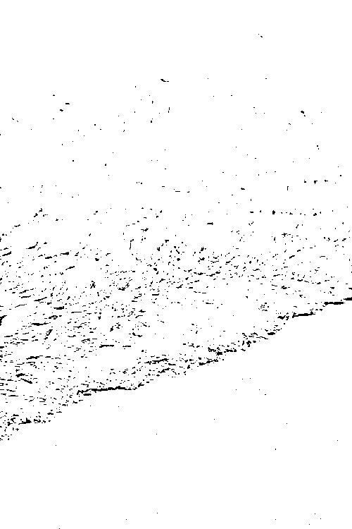

在他脱离酒瘾之后，他进入了一个模式，总是**疯狂地追求那些不可能得到的女人**。潜意识里，他强迫性地去**寻找他失去的母亲**。这导致他的一连串婚姻都以同样的方式收场：他总是会发现新的“女神”，在远处召唤他，那是他必须去拥有的曾经失去的爱的对象。

到 50 岁时，他在一段相对稳定的关系中安定了下来，跟一个让他在经济上有所依赖的女性在一起，就像是一个小男孩和母亲的关系。在这种情况下，他又遇到了他最新的一位“灵魂伴侣”，他无法与这位女性结婚，因为与她结合意味着失去他的安全感的来源。

事实上，他陷入了两难，要么是与自己的母亲待在一起，那是他的安乐毯；要么去追求以理想化爱情对象的形式存在的母亲，但那个对象可能再度消失。

当他的这位女朋友真的结束这段婚外情时（就像他的生母一样，她对婚外情感到幻灭），他感到痛不欲生，开始纠缠她，逼得她要从警察那里申请限制令。

在这个例子里，出现了好几个金星-海王星的主题：**早年被抛弃，将女性理想化然后又感到幻灭，贬低自我，不断发生的婚外恋，经历丧失、内疚和痛苦。**

这反映了一个更重要的问题，即这类相位不仅代表一套行为特征，同时也对应**从出生延续到死亡的经验模式**。

他在金牛座所代表的两岁到五岁阶段，失去了对母亲的依恋，构建起一种**强迫性的重复模式**，这个模式贯穿了他成年后的人生：**不断抛弃现有的关系，去追求象征自己失去的母亲的理想化爱人。**

这个模式中的婚外情、欺骗和幻灭只不过是更深层的故事的表象，这个故事根植于最初**被抛弃**的体验，这种体验是他一直试图扭转的。

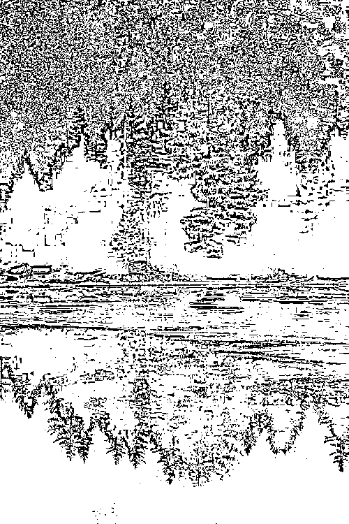

**金海相位的其他表现方式**受害者和拯救者

这个相位的另一种表达方式，是通过**受害者和拯救者**的关系来体现的。在这种情况中，**海王星在受害者和拯救者这两种彼此互补的角色中表达自我，而金星将两者结合到一段亲密关系中。**

受害者激发了拯救者的同情心，拯救者要为受害者提供无私的关爱，就必须**牺牲**自己在关系中的需求。尽管有些受害者是合情合理的，比如得了癌症的伴侣，其他受害者则是自己毁灭性行为的牺牲品，比如**药物或酒精成瘾**。

在第二种情况下，受害者和拯救者的组合就是**“二联性精神病”**，因为拯救者也是推动者，他在其中的参与帮助维持了问题的存在。

如果他这位自残的受害者（伴侣）痊愈，这位受害者不会心存感激，反而会**怨愤**。因为**拯救者的强大和美德是通过受害者的软弱和内疚来实现的**。

这常常会导致受害者通过某种**背叛或抛弃**的行为来对拯救者**“恩将仇报”**。于是，**拯救者又成了受害者**。这两者的角色是可以互换的。

独身主义者

同样的动力还有一种更高阶的表现形式，可以在某些**独身主义者**身上发现。他们**为了响应灵性的召唤，而有意选择牺牲自己的情爱**。金星对**依恋**的需求升华成为**对身处苦难之人无私的爱**，比如那些遭遇战争、疾病，或因为其他原因而遭受折磨的人。

其他有金星-海王星相位的独身主义者可能**完全放弃人类的关系，将他们在关系方面的需求升华为对更加抽象的实体的爱。**

也可以在具有金星-海王星相位的个体的生活中，发现类似于独身主义的表现，这类人借由对**灵性实体的虔诚之爱**，超越了人类的依恋，而那个灵性实体象征了金星原型本身。

通过与海王星超越的冲动保持一致，来拒绝个人对人类依恋的需求，这当然是**避免感受丧失所带来的痛苦**的一种方式，因为如果不曾拥有，就不会失去。

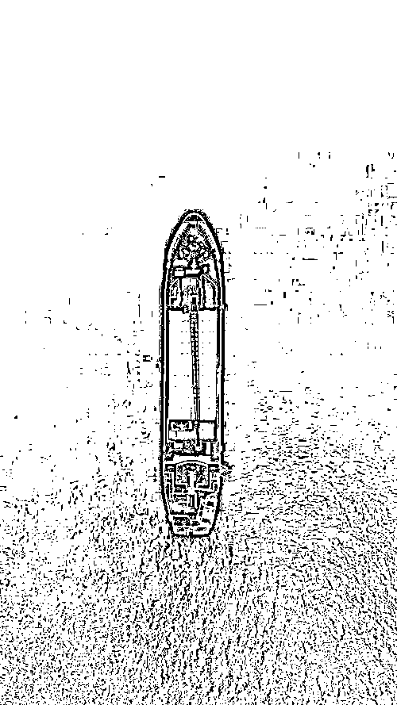

艺术

金星-海王星相位的另一种表现方式，是**通过艺术表达来解决冲突**。金星-海王星常常被体验为一种**带有宿命感的、永恒的、超然的爱**，就像个体宣称说自己的爱人是前世的缘分，是双生火焰，是灵魂伴侣，诸如此类。

海王星被投射到伴侣身上，因此整个关系给人的感觉是**神秘的、不可思议的**。然而，人类终究不是神，所以这类关系通常会**从不可思议发展为悲剧。**

****| 莎朗·斯通饰演的电影《本能》中的剧照

说到爱情女神，有一些偶像演员将女神这个原型具体呈现出来了，比如**帕米拉·安德森**、电影《十全十美》中的宝黛丽；**简·方达**在电影《太空英雌芭芭丽娜》中的角色、情色舞蹈演员乔瑟芬·贝克；电影《本能》中的**莎朗·斯通**，还有悲剧收场的**多萝西·斯特拉滕**。

其中除了宝黛丽是金星-海王星合相外，其他人都有金星与海王星的四分相。

其他将金星-海王星相位升华为艺术表达的方式包括超然的意象。比如**画家苏拉米斯·乌尔绯**有金星-海王星四分相，她描绘非凡间的、谜一般的人物形象，比如天使、仙女和精灵。

同样，法国印象派画家**保罗·高更**也有金星-海王星四分相，他强调象征意义和灵性，描绘那些生活在热带天堂的土著居民，以及其他完全从他的想象中诞生的画面。

**金海相位的整合**

或许金星-海王星困难相位最完美的表达会在这样的时刻发生：**两种原型完全被区分开来，得到发展，并以能够相互提升的方式整合起来**。

在这种情况下，没有哪一种原型的表达要以牺牲另一种原型为代价。**金星不被用来防御丧失所带来的痛苦，海王星也不被用作抵御害怕失去个人依恋的屏障**。

它们以**允许个体拥有深刻的、亲密的伴侣关系的方式结合起来，同时也接纳在发现各自的不完美之后必然会出现的幻灭感**。事实上，**关系本就包含了失去，这些失去服务于一个灵性的理想，并成为发展慈悲、同理心以及宽恕的媒介**。

很多时候，伴侣也会在某种海王星式的项目中**合作**，无论是在**做善事、灵性追求**，还是**艺术表达**上。以这样的方式，海王星能量找到了出口，可以真正地加强这段关系，而不是毁坏它。

伴侣可能会一起**冥想、画画，分享音乐或诗歌方面的爱好，或在减轻痛苦方面进行合作**。

我最喜欢的整合金星-海王星四分相的例子之一，是具有代表性的**美国心理学家乔伊斯·布拉泽斯博士**，她以制作一档提供建议的电视节目、在报刊杂志上写婚恋专栏而闻名。

她的丈夫是一位内科医生，也因慈善事业而享有盛誉。他们幸福的婚姻持续了 40 年，直到他在 1989 年死于癌症。

乔伊斯·布拉泽斯在 1992 年出版了《独居生涯》一书，是丧夫之痛激发她写下了这本书，她在书中针对丧偶的人给出了非常实际的建议，帮助他们去处理悲痛并继续生活下去。

| 布拉泽斯的作品：《独居生涯》

她的其他书也是在探讨**婚恋中不可避免的紧张、失望和转变**。布拉泽斯在 1988 年出版了《做个成功女人：如何拥有事业、婚姻和家庭，同时不感到内疚》一书。这本书教导女性如何平衡婚姻中的牺牲和对事业的渴望。

更重要的是，它在处理海王星的主题，即无意识的内疚可以怎样破坏本来很好的关系，这毫无疑问是她整合金星-海王星四分相的证明。

在布拉泽斯博士的人生中，我们看到金星和海王星是如何在一段夫妻双方都致力于减轻人们痛苦的婚姻中整合的。布拉泽斯的丈夫以一位内科医生的身份，专注于救死扶伤；她作为一位心理学家，则专门处理爱中的困难和痛苦，包括不可避免的丧偶问题。

布拉泽斯的生活表明，**婚姻中的幸福和失望，祝福和痛苦，依恋和丧失，并不是互相排斥的，而是可以在更高的层面上转化为永恒的爱**。

**注释和参考文献**

1. Meyers,Jeffrey (2005). Somerset Maugham: A Life. New York: Vintage Books., p. 232

2. See, “PopeJohn Paul II and the Culture of Death,”  www.aaperry.com/index.asp?pgid=66

3. See, for example, Morton, A.(2001). Madonna. New York: Saint Martin's Press.

史蒂文·索德伯格，1963 年 1 月 14 日；没有出生时间；使用美国东部标准时间的正午；美国亚特兰大(33°N45 '，84°W23 ')；X：没有出生时间的日期；摘自史蒂文·索德伯格:《访谈》，安东尼·考夫曼编辑，密西西比大学出版社，2002 年，引自《年表》。

**版权声明：**本文由若道翻译发布，欢迎转发，反对抄袭。友号转载请申请白名单。

**格伦·佩里**

著名占星师，ISAR 董事会成员，共出版 8 本占星著作；心理/意识研究专业博士；占星心理学学院（Academy of AstroPsychology）的创办人；康涅狄格州研究生院（the Graduate Institute of Connecticut）原型宇宙学与意识进化项目的负责人。

**20 位来自世界各地的占星师****带来 20 场沙龙——新世界的觉醒****详情可点击下图**

**学习占星学****点击下图了解课程详情**

**

**微信又双叒叕改版啦，不想错过若道君的推送？****就把若道设为星标吧！****▼**

**就是这个“在看”，戳戳戳 ☟**

********报名直达入口********

# 今晚 8 点开讲丨如何在星图中，深入根深蒂固的情绪模式？

> 原文：[`mp.weixin.qq.com/s?__biz=MzA5NjA0NTAxNg==&mid=2651473043&idx=2&sn=ab59ffc54cc559a5bf6b44d18ecc761f&chksm=8b48f624bc3f7f329d0c1ea48fb17ac0d49639f80a5f22ff03ab124b14850cd25cba72c98150&scene=126&sessionid=1692749501#rd`](http://mp.weixin.qq.com/s?__biz=MzA5NjA0NTAxNg==&mid=2651473043&idx=2&sn=ab59ffc54cc559a5bf6b44d18ecc761f&chksm=8b48f624bc3f7f329d0c1ea48fb17ac0d49639f80a5f22ff03ab124b14850cd25cba72c98150&scene=126&sessionid=1692749501#rd)

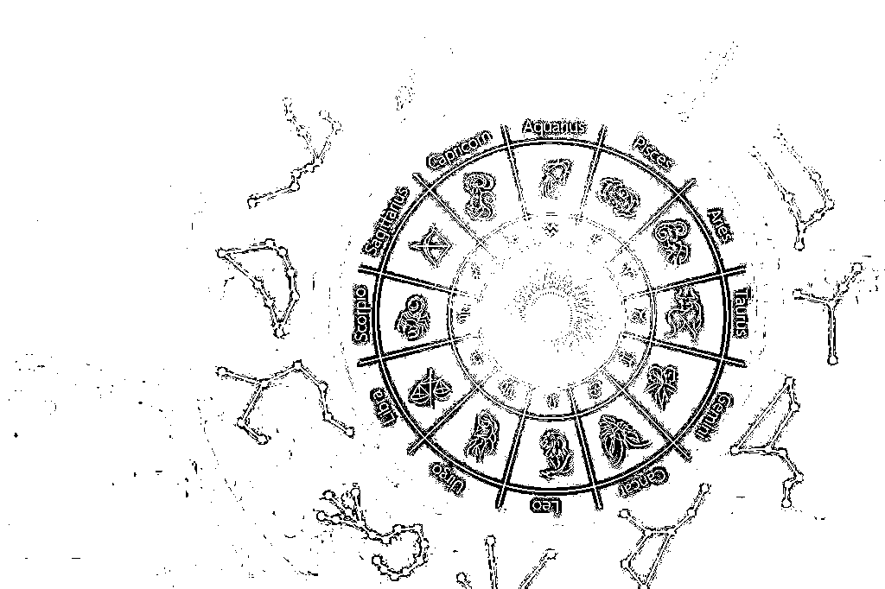

**沙龙来啦！**

**4 月 29 号，星期五晚上 8 点，**将由占星师**米歇尔·古尔德**带来另一场场沙龙！

**沙龙主题****沙龙主题：在困难情绪中找到智慧****主讲人：**米歇尔·古尔德****

**沙龙时间：4 月 29 号，星期五**

**                北京时间 20:00-21:30（有英文翻译）**

**沙龙方式：线上沙龙**

我们所有人都有**根深蒂固的情绪模式**，我们在压力或危机时的“直接”反应。

**占星学最好的情况是能让我们对这些倾向有更深入的了解**，所以我们会变得不那么被动，不会加剧情绪化。

在这场沙龙中，我们将探索识别**星图中阻碍模式**的策略，并应用一个**简单的框架**，借用佛教心理学（阿毗达摩），在咨询室及以外的地方处理这些棘手的情绪。

**主讲嘉宾**

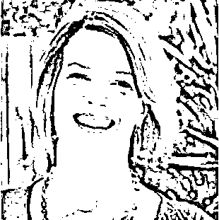

**米歇尔·古尔德**

米歇尔·古尔德，MFA, TACC，是一位国际占星演讲者和老师，她喜欢将**传统和现代的最佳占星技术**融入到她的咨询实践中。

她是青年占星师协会(AYA)的创始成员，ISAR 的前任财务主管，阿瓦隆占星学院的讲师和董事会成员，以及 AstroDatabank 的撰稿人。

她目前担任 ISAR 伦理委员会主席和 AFAN 顾问。

**如何参加沙龙？**

本讲座也是本月的国际占星研究协会（ISAR）星空俱乐部讲座。**ISAR 会员可以免费收看。**请注意邮件通知，具体参与方式见邮件。

❶ 如果你**已经是 ISAR 会员**，请注意邮件通知，告知如何参加。

❷ 如果你**不是 ISAR 会员**，非 ISAR 会员价格：98 元。如有任何问题请咨询工作人员

yiyi（微信：YY18513802156）

**非 ISAR 会员报名请长按下图**

**▼**

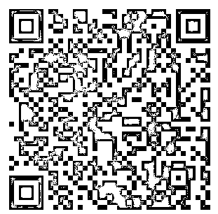

**ISAR 明星俱乐部**

2018 年，ISAR 在主席亚历山大·因舍阿吉克的带领下，成立了 ISAR 明星俱乐部，每月为全球 ISAR 会员提供在线直播讲座，邀请全球著名占星师开讲，学习和分享新的理念。讲座时长一小时，涉及占星学的不同领域、不同观点，每个会员都可以参与其中，每次讲座之后还有 20-30 分钟问答时间向老师们提问。

每一场在线讲座都会记录下来，ISAR 除了提供视频，还会提供相关的讲座资料，以及单独的问答录音，自动发送到专门的 ISAR 明星俱乐部页面存档，每位 ISAR 会员可以在 ISAR 网站上自己的会员主页俱乐部页面找到。在 2018 年最初几个月，ISAR 明星俱乐部会每月举办一场在线演讲。之后，两周举办一场演讲，最终每周举办一场演讲。

但是，过去明星俱乐部讲座只有英文沙龙，因此，中国会员只有懂英文才能受益。为了使得更多不懂英文的中国会员能够受益，我们特别和 ISAR 总部协商，今后会安排有中文翻译的明星俱乐部占星沙龙，作为给中国 ISAR 会员的福利！

**如何成为 ISAR 会员？**

**如果你也想成为 ISAR 会员，请复制链接在浏览器打开**

http://www.nodoor.com/isarcert.do?contentId=3588（仅支持网站支付）

**或直接长按下方二维码，微信购买会员：**

**ISAR 会员有什么福利？**

一年期会员仅需支付**人民币 420 元**，即可享受：

**☆ 星空俱乐部免费沙龙**

**☆每年出版 3 次的《国际占星师》（目前只有英文）；**

**☆每周电子邮件交流汇总杂志（目前只有英文）；**

**☆专项研究基金和奖学金资格；**

**☆ISAR 主办的会议和论坛的会员折扣，包括国际占星大会（UAC）、ISAR 的会议和研讨会等会员权益。**

**有疑问怎么办？**

关于 ISAR 星空会员俱乐部以及我们的讲座，如果你还有任何疑问，**请联系工作人员**：

**yiyi**

**微信：YY18513802156**

**若道 Conrad**

**微信：nodoor2016**

****非 ISAR 会员报名请点击“阅读原文”****

# 重磅天象丨冥王星逆行了！！！

> 原文：[`mp.weixin.qq.com/s?__biz=MzA5NjA0NTAxNg==&mid=2651472954&idx=1&sn=3d0526ff47e677f4362c2e4c616c2331&chksm=8b48f68dbc3f7f9b077fdb5d03f738ba7435c8be665766650d390bad91e32429cefc1c5430fd&scene=126&sessionid=1692737827#rd`](http://mp.weixin.qq.com/s?__biz=MzA5NjA0NTAxNg==&mid=2651472954&idx=1&sn=3d0526ff47e677f4362c2e4c616c2331&chksm=8b48f68dbc3f7f9b077fdb5d03f738ba7435c8be665766650d390bad91e32429cefc1c5430fd&scene=126&sessionid=1692737827#rd)

****************☆ 后台回复“今日”，给你一句生命态度****************

作者/傅莎珈 ISAR 认证占星师
编辑/翀子 封面/书君 图片/网络 4 月 30 日凌晨 2 点 35 分，冥王星开启本年度的逆行之旅，它将从摩羯座 28 度逆行回到摩羯座 26 度。在超过 5 个月的逆行时间里，我们需要面对那些不愿意看到的事情真相，并再次核实目标、做出调整，以便更好的建构未来。**前言**

**4 月 30 日凌晨 2 点 35 分，冥王星在摩羯座 28º35′开始逆行， 到 10 月 9 日在摩羯座 26º 06′停止逆行转为顺行。**

上海的疫情进入到白热化状态。很多现象已经明显触及律法，但依然在疫情里被作为必须的手段执行着。人们对政府的信任度出现严重动摇；在物资贪污、野蛮执法、看似遥遥无期的解封时间，继续枯竭的医疗系统面前，甚至出现了硬隔离这样匪夷所思的行为，上海人眉头越皱越紧。

全国人民都被上海吓到了。一听说自己城市可能有封闭，超市立刻秒空。人们没有被疫情吓到，但是被空荡荡的超市吓到，被铁篱笆吓到……

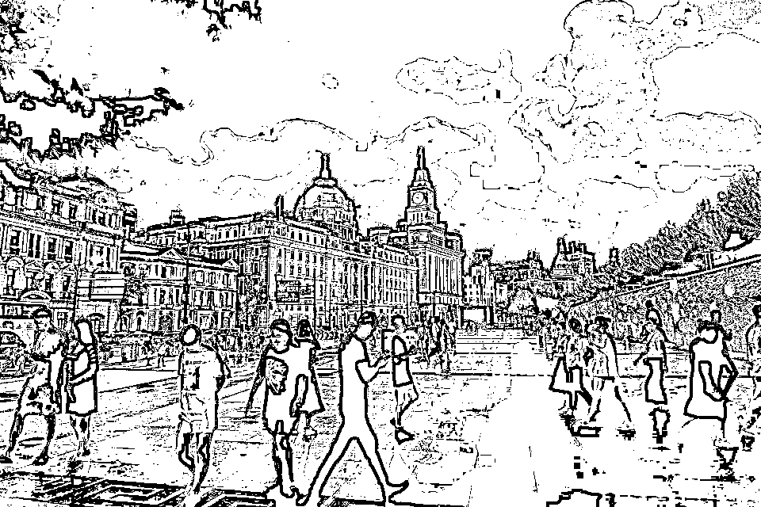

**外部环境的功课**

我忍不住想：这场疫情发展到现在，想要教会我什么？土星在水瓶座精确四分南北交点的时候，我天真的以为正能量启动了，可以对抗天蝎座南交点的狰狞，往金牛座北交点跑了。结果土星老爹呵呵一笑：来！给我上铁丝网硬隔离以及第四到第七波精彩大戏！

在这样的”人定胜天“ 的暴力之中，我对科学 vs 管理有了更多的体验———**只有这样级别的灾难性社会性事件里，人们才会真正去思考，旧有的以人的意志力为根本的管理如何对每个人造成不可磨灭的心理冲击。**甚至整个社会和政府职能本身，都会在这样的冲击之下，要去想一下科学、法律、人文如何真正成为管理中重要的参考和借鉴。

**水瓶座的关键词是：系统层面的科学、智慧、公平、自由。**尊重每个个体的自由，提倡群体之间的平等。推崇万物不同，但根部相连，归于同一个系统。 水瓶座的运作，是依赖一个“系统” 的。

当土星位于水瓶座，我们感受到的是水瓶座的阴影面：冷酷无情的系统，没有人，只有一个庞大的系统。

**土星在水瓶座**，如同在**抗拒和延迟**高阶水瓶座能量的输入；又或者是经由低阶阴影事件的张力，让每个人，反思个体自由，独立与集体意志力之间的关系。直到人们形成相对统一的看法，落地成律法，制度，这些都需要时间，一个轮回 12 年。

今年的 4 次水逆，每次都发生在风向回到土相，在社会层面，回头审视社会管理思维上的沉疴。

**需要时间和耐心让这些觉悟慢慢发生。**

土星是摩羯座冥王星的定位星。**这次冥王星的逆行，助攻了土星的主题：不愿意面对的真相、想要掩盖的事实，都会在逆行时候暴露出来。**

**然后在下半年、明年，慢慢的修复，重建。**

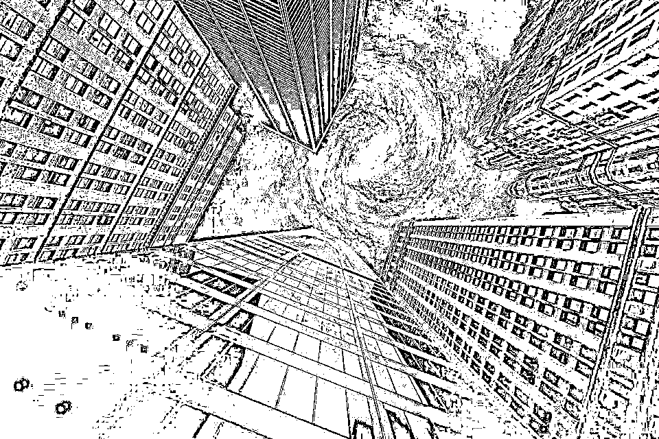

4 月 26 日，马斯克宣布收购 Twitter。意味着一个寻求“言论自由、去中心化、去核心化” 的全球化平台可能成为现实。通常一个戴着“自由平等”头衔的新事物，最初到最后最后，都会变本加厉的“反自由”。**这是土星和天王星之间的互为对方法则：叛逆者成为统治者之后，成了新的独裁者。**

在冥王星逆行的同时，水星从金牛座来到双子座，呼应了这种多元言论、交流的渴望。在进入双子座之前，金牛座水星三分了停滞中的摩羯座冥王星，**展示了更多真相。**在此基础上人们需要放下现有的价值观角度，去听听看各种不同意见。

同时，水星在双子座也意味着**我们需要超越自己的心理极限，更深的进入自己的内在世界**，看看在权力和控制这个主题之下，你还有哪些从未触及的创伤，需要被看见。和转化。

对抗权威的目的，不是去“改造”权威，你没有可能改变它。而是在这个过程中，**看见和确认自己的力量、自己的价值观，**为将来和志同道合的人一起创造出属于你们的世界，奠定起点。这是个梦想的起点，需要拥有宏大的视角，去理解一切。

放慢脚步，在冥王星的逆行之中仔细品味土星水瓶的阴影，和如何成就**高阶的水瓶座能量：****尊重科学和智慧、尊重每一个个体的独立性、无私奉献、利他精神。**

**金融上的重组**由俄乌战争导致原有的全球支付体系重组、中国上海疫情导致海外高科技行业退出中国市场，还在一波波的扩展。

疫情中上海民间的社区团购所爆发出来的巨大商机，在未来 6 个月将会成为“私域流量”的外延。抖音、微信视频号、快团团、社区型线下商业……**以社区为单位的商业正在爆发出巨大的发展力量**，并行于盒马、美团，拼多多这些大型线上商业系统。

如果摩羯座是一个攀登健将，企业家，**冥王星在这里的功课是不断核实：你的目标对么？还有哪些地方需要结构性的调整，并且辅助以相关的律法和道德准则？**

这是冥王星倒数第二次在摩羯座逆行，为冥王星跨入水瓶座做准备。水瓶座象征的社区化、以地域为主的块状连接、服务意识、爱好导向、科技化等特质，都已经慢慢表现出来。

**冥王星逆行的目的，是看到过去和未来的连接点在哪里，再度校正方向。**

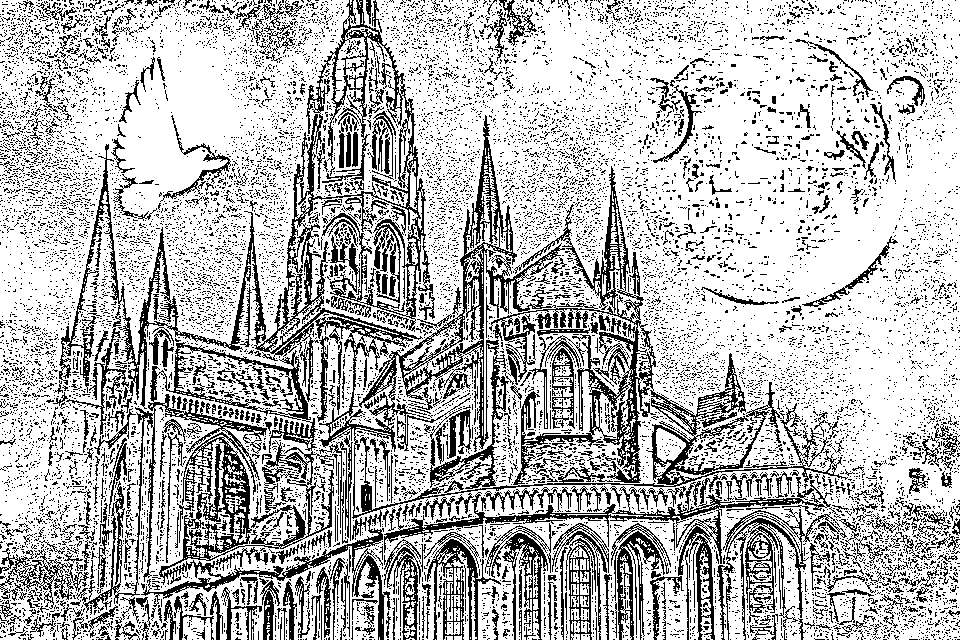

**个体的功课**

疫情中的人们，最大的苦恼是受困。陷在无限循环的 14 天里，什么时候是个尽头。最近的咨询里也不断听到客户说：原来长程可以发现这么多东西、怎么痛苦老是挖不完，反复的出现，**什么时候能被疗愈？**

**冥王星的特质是只有深深的进入死亡、恐惧等任何你不愿意面对的阴影里，你才有机会找回自己与生俱来的力量。它只是冷冷的凝视着你。**

若你被这种巨大的恐惧感打败，你就献祭了自己的力量，成为它的奴隶；若你认同这种巨大的威胁性，你会成为它的爪牙；只有当你在它面前平静的躺下来，被它深深的包裹，保持自己的呼吸，寻找它的呼吸节奏，**当你和它同频节奏，窒息突然成为一种强大的推动力。**

**这种力量让你对自己的身体，自己的呼吸，自己的意志，有全然的“控制感“。**I am who I am. 

**冥王星逆行提供的反思是：借用外界的限制，觉察自我掌控和对抗的节奏、力度和意识。**不是盲目的去对抗这种限制，你永无可能对抗成功；也不是消极徒劳的顺从，这让你陷入彻底的死亡中。

**冥王星是天蝎座南交点的守护星。当它开始逆行，意味着我们要再次返回天蝎座南交点所在的宫位，去找到令自己感到窒息、害怕的部分。**

如果冥王星、火星、土星代表着精神毁灭与物质身体、现实世界的重启，那么海王星和金星、木星就如同一只孕育全新生命的圣杯，代表着意识的重建。金星、火星、木星、海王星此刻齐聚双鱼座，金星还在六分冥王星，**请试着在生活中，试着思考自我存在的价值感、自我关注的能力、亲密关系中的信任感、财务领域的安全感和可持续发展……**。

**这次冥王星逆行**，是重建神经元链接、疗愈心轮、海底轮的关键时期：多做心轮、海底轮有关的冥想和瑜伽练习，或者参加任何有助于疗愈这两个脉轮的疗愈活动。

**摩羯座-巨蟹座轴线有关家族。**当冥王星在摩羯座尾度逆行，家族业力继续在坍塌和清理之中。很多人在这次疫情前后再度瘫软。请在瘫软的同时，对各种恐惧和死亡感说是。有些大型的集体、家族层面的创伤转化，需要半年到一年的时间，不断不断的发现，体会和看见。

**保持对自己的耐心，保持对自己一定能走出去的信念，以及，深深的拥抱和陪伴这个无助的自己。**

**摩羯座神话的启发**

**冥王星从 2008 年进入摩羯座，现在走在最后的 2 度。2023 年，冥王星进入水瓶座。**在结束摩羯座的旅程之前，需要回溯一下摩羯座的神话原型。这是另一个摩羯座的神话原型，和传统的不同。

摩羯座的守护神叫潘神，长得粗俗丑陋如同一只野兽。潘神出生的时候长得太丑，亲妈吓坏了，扔下这个丑娃就跑。潘神从小被大地之母盖亚抚养长大。**它的力量和安全感来自大自然。**

潘神居住在山洞里。总有人好奇的想要去看看它到底长啥样，然后吓得尖叫逃回来。心理学上的 Panic 意思为恐惧，恐慌。

丑陋的潘神天生音乐才华过人，唱歌弹琴令众神欲罢不能。于是，尽管它长得很丑，但总是被邀请出席神的宴会做乐师。

有一次神的宴会被怪物提丰惊扰，潘神躲避到一条小溪中，下半身变成了鱼尾，庞大的上半身还是羊的样子。正在尴尬的时候，他发现提丰捉住了众神之王宙斯。潘神奋不顾身救了宙斯牺牲了自己。宙斯为了感谢潘神的勇敢，将他升上天空执掌摩羯座。

**摩羯座的本性不是勇敢无畏。而是当惊慌与恐惧化成本能的勇气，他就超越了自己的生命局限。**

众神的宴会是世俗成功、丰盛、财富、地位的象征。而当这一一切被冥王星摧毁，当道德伦理被绑架威胁的时候，人类恐惧惊慌，**有没有产生打破和超越这种恐慌的勇气？**

**从 2008 年到现在，我们经历的种种失去的恐惧，有没有让我们滋生出超越生命局限的勇气？**从个体走向集体，从家庭走向社群，从自我走向利他……在你跨出这一步之前，先问问自己：你爱你自己吗？不要那么着急地回答着问题，边走边看：不要把渴求被爱的心意转化成对他人的无私奉献，那最终让你走向枯竭。

**接收阴性力量的引领**

冥王星逆行的时候，月亮在白羊座的尾巴上四分摩羯座冥王星。月亮象征着我们潜意识里拥有的东西，白羊座是一个战士。**你的战士能量，被唤醒了么，那种和恐惧作战的勇气，被唤醒了么？**还是羞于表达恐惧？硬撑着去要去战斗？如果是后者，停下来，**试着和你周围值得信任的人柔软的表达自己的不安和无力。**

5 月 1 日，金牛座日食。地球正式进入了本年度最重要的食相月。金星作为金牛座日事和北交点的守护星，合相双鱼座木星、六分摩羯座的冥王星。感谢神圣宇宙！一切如期而至的发生：接纳脆弱的力量、勇气的引领力量、塑形未来的想象力……以一种应有尽有的丰盛姿态展现了出来。

这个日食充满了大地母亲盖亚的给予：包容、接纳、滋养、疗愈……

5 月 1 日，也是新任上海市委书记和市长开始工作的第一天。

实事求是的讲，最近上海买菜难的焦虑在降低，团购正从生存式购买转向改善生活型购买。伴随物流和商业的慢慢苏醒，解封是技术性问题。

世界是个圆，凡你所真心给予的，都会百倍千倍地回到你身上来。那么，接受，再给。

**“给予是一种感激，也是一种邀请，邀请更大的能量，更大的时空，进入到你的生命中来。 ”（孟想）**

祝福大家，拥有一个前所未有的五月。

**版权声明**：原创文章由作者授权首发于若道平台，欢迎转发，反对抄袭。友号转载请申请白名单。

****

****傅莎珈****

ISAR 认证占星师（2015 年获得）

心理占星师/内观书写带领者/冥想带领者

国际著名传播集团工作 20 年

**微信公众号**：Helloshajia

长按打赏

**“神奇的三次限技法，与玩转若道星图”** **扫描下图二维码，参与今晚直播**

# 

**20 位来自世界各地的占星师****带来 20 场沙龙——新世界的觉醒****详情可点击下图**

**学习占星学****点击下图了解课程详情**

**

**微信又双叒叕改版啦，不想错过若道君的推送？**

**就把若道设为星标吧！**

**▼**

**就是这个“在看”，戳戳戳 ☟**

********报名直达入口********

# 卜卦占星案例丨“智斗”维修公司和判断感情走势，哪个更难？

> 原文：[`mp.weixin.qq.com/s?__biz=MzA5NjA0NTAxNg==&mid=2651472954&idx=2&sn=425d81db9f4d19190ba319b2b9a2daee&chksm=8b48f68dbc3f7f9b480a21d9dc0a9efb77175c7bd594a7b8b221f501d71fd772e5c2451c86d5&scene=126&sessionid=1692737827#rd`](http://mp.weixin.qq.com/s?__biz=MzA5NjA0NTAxNg==&mid=2651472954&idx=2&sn=425d81db9f4d19190ba319b2b9a2daee&chksm=8b48f68dbc3f7f9b480a21d9dc0a9efb77175c7bd594a7b8b221f501d71fd772e5c2451c86d5&scene=126&sessionid=1692737827#rd)

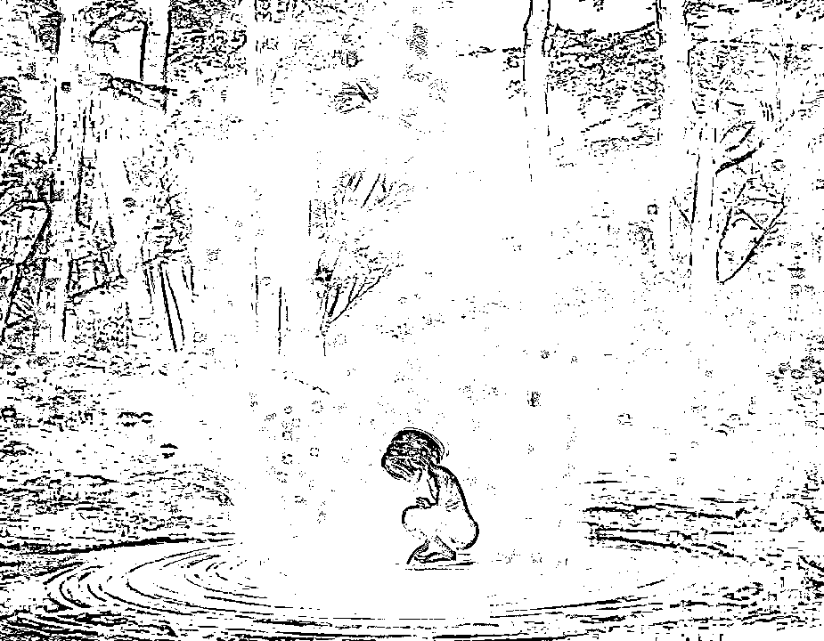

作者/王嘉祺

编辑/翀子 图片/网络

在经过两次卜卦小测验后（点击查看[【测验 1】](http://mp.weixin.qq.com/s?__biz=MzA5NjA0NTAxNg==&mid=2651470990&idx=2&sn=93e337c3f7a4511bce7d0f2724f4f0a7&chksm=8b488e39bc3f072f56b663766294f99676c26aae48c63d23807840390f654bf288c1607d7af4&scene=21#wechat_redirect)[【测验 2】](http://mp.weixin.qq.com/s?__biz=MzA5NjA0NTAxNg==&mid=2651472140&idx=2&sn=78c7f2120aba79875499db01b7852f61&chksm=8b48f3bbbc3f7aad2c6024b85b7d94c29166d2cd57ed52ce3af4f74daa320c3c7531b12ab46e&scene=21#wechat_redirect)），你不是觉得卜卦占星学很有趣？今天带来两个案例分析，进一步向大家展现卜卦占星学是如何在具体的生活中运用的。如果看完文章你很感兴趣，可以点击[【现代卜卦占星学】](http://mp.weixin.qq.com/s?__biz=MjM5MjQwNjAyMQ==&mid=2649439468&idx=3&sn=50f946c4c38010b96e63c246cb553381&chksm=beb9538689ceda90d52e59faa1dc180094b9e41a127ecd74c48b399b8efebfd2303474d03c2f&scene=21#wechat_redirect)了解详情哦。

大家好，我是 Conrad 卜卦课程的助教。之前给大家写文章介绍过什么是现代动态卜卦占星，以及一些选择题。今天我带来两个实际的案例，希望大家能在听卜卦故事的同时，开动脑筋并寓教于乐，头脑动起来才能找到属于自己的解谜乐趣。

**本次主要阐述一下成对行星在卜卦案例中的作用。**

**案例一：维修**

这个卜卦由我们亲爱的同事童老师提出。他在帮助大家维修单位的大门，想找一家上门维修的公司。由于之前也找过维修公司，但结果并不令人满意，所以这次又出问题的时候，童老师包括我们几个同事还是有些心有余悸的。

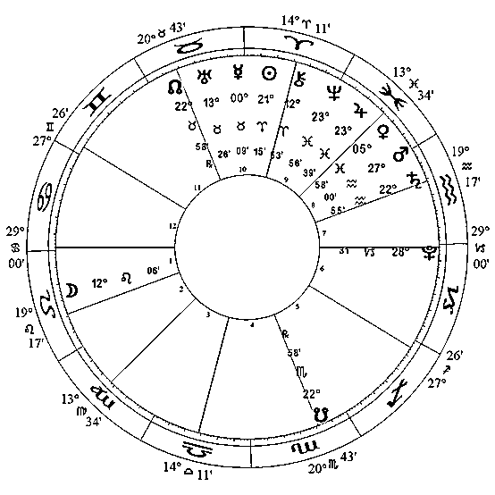

这个卜卦星图的上升点，是在巨蟹座的末度 29 度，但卜卦的事项并没有按照传统的理论直接无效。想想也是，在实际生活中找一家维修公司，这件事情是很不容易找不到并无法安排上门的。**所以，用现代动态的眼光来重新审视卜卦规则是十分必要的。**

**按照动态卜卦的理论，这件事情很快就会发生变化，后来也果真如此。**

我们还需要注意到，**冥王星非常接近下降点，**只有半度的距离。维修公司是很可怕，或者不好接触的对象吗？其实并没有，但事先感觉可能是。其实这源于之前非常糟糕的体验，所以我们把“维修公司非常不好打交道”的想法，投射到了这一次当中。

**这个问题中，最主要的是需要观察上升点与下降点这两个成对行星的彼此状态，也是这个案例的重点。**月亮正处于狮子座第 1 宫，土星在水瓶座第 8 宫，处于强势的位置。土星在第 8 宫看起来很坚实有力，是有保障的感觉，可以信赖。

月亮与土星之间，有一个容许度非常大的对分相。然而**月亮是快速行星，并且对分相是个入相位，**按照趋势推演很快就能形成精准的相位。**虽然对分相是一个有压力的相位，但相位能够形成，是更重要的事情。**

这里还有一个有意思的点，就是**月亮与天王星的四分相。**天王星代表可能会有一些突然性的状况。事实上当维修上门的时候，多数同事都没有注意到，等到后来问起的时候，童老师说大门已经修好了师傅都撤退了，这才意识到天王星的突然性。

以上从我们心怀忐忑的找人上门，到维修好，过程其实相当迅速，但心情是此起彼伏的。这也在天王星和冥王星上有对应。但如果按照传统的死板式的解读，我们可能就会换个时间来维修，那样的话事情就又被耽误了。

还有一个知识点，**就是由于月亮是快速行星，所以当月亮作为上升点的守护星时，其实还可以有另外的征象星可以观察。**至于是什么，欢迎大家报名我们的课程听邓肯老师的讲解。

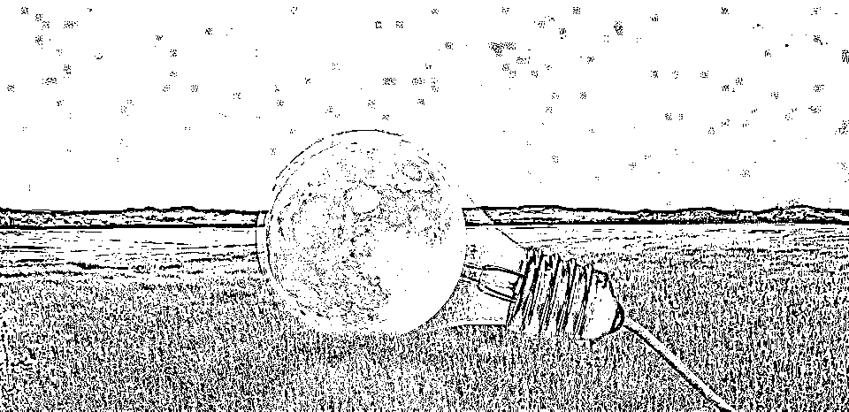

**案例二：感情发展**

我们再看一个需要观察成对行星的案例。这是一个询问感情的卜卦案例，女方问与男方的感情走向，是否能走向婚姻。

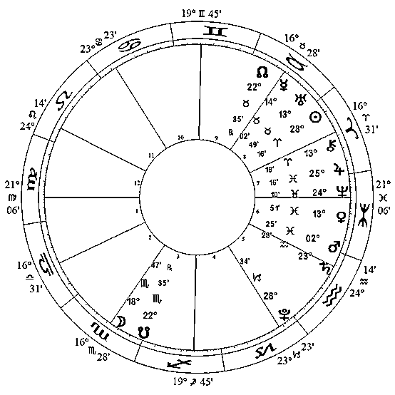

我跟童老师都分析了这个案例。我们都注意到，**海王星距离下降点非常近。**所以这个感情走向，确实很容易让提问者陷入混乱，从而搞不清目前自己所处于何种状况。

**男方代表的木星处于双鱼座，是强势的位置**，看起来拥有主动。然而木星也很接近海王星，说明对方面对当下的局面，恐怕多半也是非常混乱的。

可能有些同学会注意到，木星正在出离与海王星的合相，局面是否对男方利好？虽然趋势如此，但想要彻底走出混乱恐怕也不容易。毕竟木海都是很慢的行星。

不过值得反馈的一点是，男方刚刚大病一场，才走出大病的危险情况，这个状况是与木海的出相位是吻合的。

还有一个情况，是与**木星和海王星在双鱼座第 7 宫的合相**是有关的，就是男方在感情中的态度比较忽冷忽热，反反复复。这大概也与男方的病情有关，据说男方曾经一度病得非常严重，有生死之忧。在这种情况下，感情态度反复，左右不定也是情理之中。

**我们看代表女方的水星，与天王星有一个紧密的合相，刚刚出离，也刚刚出离与金星的紧密六分相。**

这代表女方在左右权衡自己的感情这件事，并且看起来情况是比较复杂的，毕竟金星也是在双鱼座。而水星与天王星在第 8 宫的合相，也可以代表因为男方严重的病情，使得两个人的亲密关系产生了变化。

如果大家注意到的话，可以发现**水星在不远的将来，就会与代表男方的木星形成六分相。**然而一个事实是，当水星与木星形成紧密六分相的时候，已经在逆行的阴影期了。水星会逐渐减速，然后开始逆行，最后再顺行。而且当水星与木星形成精准相位的时候，水星会正好合相一个象征凶暴的恒星大陵五。

总体而言，**水木的六分相要反复出现三次。**这代表双方的感情，很可能会纠缠不清一段时间。这期间很可能也是反反复复的，并且伴随一些困难的局面。所以综合考虑这些因素的话，想顺利的走入婚姻，恐怕不是一件容易的事情。

**结语**

我们今天给大家带来了两个与成对行星有关的案例。**在实际的卜卦案例中，要考虑成对行星的情况非常多。而邓肯老师也会在课程当中，重点讲述这一部分。**所以如果您对现代动态卜卦占星的技巧感兴趣，欢迎您关注一下我们的课程。

今天的案例介绍就到这里，我们下次见！

**快来看若道君为你准备的课程吧！**

**现代卜卦占星课程内容**

**课程分为 5 部分：**

**Part1 **融合现代占星理念，整合动态占星知识**Part2**独家【现代动态卜卦占星技术】全面教学**Part3**学以致用，覆盖人生各个领域问题的卜卦解法**Part4**扩展延伸择时占星技法的新认知**Part5**如何运用卜卦占星学做一场转化性的咨询

**15 节录播课+8 节直播课线上网络课，英文授课，中文翻译。**

**15 节录播课为 2020 年动态现代卜卦课程的内容。8 节直播课则完全是案例教学的形式。**

这样的好处是，你可以通过 1 个半月的密集学习之内按照自己的进度学完录播课的理论和录播课中已有的案例，从学习开始就实践，然后把实践中遇到的问题拿到 8 节直播课中，和老师互动。

**在 8 节直播课中，老师也会用案例教学、和同学互动的方式帮助大家进一步掌握卜卦占星的技法。**

**授课老师**

**艾德里安·罗斯·邓肯****（Adrian Ross Duncan）**1971 年在印度游学时开始学习占星学，1985 年开始成为全职占星师，**迄今执业已超过 33 年，是人本主义占星学、卜卦占星学和经世占星学领域的知名占星师。他还开发了占星软件 AstroClock 和多款占星报告。**他在日常咨询中都会运用卜卦，咨询图（卜卦的一种运用方式，即根据客户来访时间制作星图，从星图中获得大量信息）也是他**特别擅长的领域**。艾德里安·罗斯·邓肯从 1971 年开始研习佛学，受佛学影响很深，他**相信占星学和佛学观点统一、转化的一个基础是在于对现实感知的改变**。而卜卦很容易与佛教融合，因为它只关乎当下。

**授课时间**

**付费后一天即可开始看录播课程，全程有助教老师回答问题。**

**直播课程开始时间：**

2022 年 5 月 3 日，每周二 20:00-22:00

**这次课程恰逢世界在巨大的变动和不确定之中，期待这门课程能够给各位及各位的客户带来新的洞见和方向。**

**在这次 8 次直播课程中，我们将采用案例教学的方式，所有参课同学均有机会提供案例，供老师解读，且我们将组织群体的练习，用大量案例帮你掌握卜卦及如何在咨询中用卜卦。**

**什么人适合参加本课程？**

*   想要系统学习现代动态卜卦占星的学员

*   想在生活中熟练使用现代卜卦占星学

*   在咨询中想帮助个案更清晰的分析解读困惑

*   想参加 ISAR 认证考试，此课程是 ISAR 选修课

*   希望通过卜卦占星帮助自己和身边人挖掘一个积极主动的未来

学习整合卜卦技巧，不仅有益于想钻研卜卦占星学这个分支的同学，对占星初学者也很有有帮助，可以让你的占星技巧加倍。

**课程费用**

**课程价格：9900 元**

**老学员复训专享价：**

**2020 年参加艾德里安·罗斯·邓肯卜卦占星课程的同学：****2900 元**

**2018 年参加艾德里安·罗斯·邓肯卜卦占星课程的同学：****4900 元**

**特别优惠****：**

**分享课宣到朋友圈****保留 48 小时****（不设分组显示）截图给课程顾问可获得****400 元优惠****。**

**课程负责人：童老师（微信：nodoorDaivd），请备注“卜卦”**

长按二维码添加课程负责人咨询

**退转课程****退款原则请详看《教学协议》，如有疑问请咨询课程顾问。******现代动态卜卦占星实战课·ISAR 选修课****

**授课老师：艾德里安·罗斯·邓肯**

**授课时间：**2022 年 5 月 3 日

**授课方式：**网络课程，英文授课，中文翻译

**费用：9900 元；****2020 年老学员复训价：2900 元；2018 老学员复训价：4900 元；特别优惠，分享课宣到朋友圈保留 48 小时（不设分组显示）截图给课程顾问可再获得 400 元优惠。**

**课程负责人：**童老师（微信：nodoorDaivd），请备注“卜卦”

长按二维码添加课程负责人咨询

****报名请点击“阅读原文”****

# 今天开课啦！| 美国占星心理学学院&若道占星双认证核心课程

> 原文：[`mp.weixin.qq.com/s?__biz=MzA5NjA0NTAxNg==&mid=2651472874&idx=3&sn=aa6de935322126ff537f48feeea4bc87&chksm=8b48f15dbc3f784bddbe94214b31f99b121a2d0f5c4c5e293d00fe04674b6df3c30040a93ff6&scene=126&sessionid=1692737827#rd`](http://mp.weixin.qq.com/s?__biz=MzA5NjA0NTAxNg==&mid=2651472874&idx=3&sn=aa6de935322126ff537f48feeea4bc87&chksm=8b48f15dbc3f784bddbe94214b31f99b121a2d0f5c4c5e293d00fe04674b6df3c30040a93ff6&scene=126&sessionid=1692737827#rd)

**美国占星心理学学院创办人**

**格伦·佩里**授课

**40 余年**职业占星师生涯所学精华**倾囊相授**

修完 101-205 全部课程，并通过考核的毕业生将获得

**美国占星心理学学院证书**( Academy of Astropsychology )

和**若道毕业证书**

**高含金量双证书**

跟随主讲老师学习融合**心理学体系**的**占星知识**

为星图咨询解读打下坚实的基础

**大量**的课程资料，光是课后阅读资料就**超过 60 万字**

合理的课程设计，贴心的助教服务，及时的课后测验

1

**这门课程最大的看点是什么？**

1. **两位国际占星学大师**共同授课，将合计**90 年职业占星师生涯所学精华**倾囊相授；2. 修完**全阶课程**，考试通过的毕业生将获得**美国占星心理学学院证书**（Academy of Astropsychology）和**若道毕业证书**，**高含金量双证书**；3. **116 次课程**的充分授课时间（录播课程 69 次课；直播课程 47 次课），全面而详细地讲解占星学历史、知识、技能、案例、咨询和运用；4. 跟随主讲老师学习**自成体系、逻辑严密、实用性强的占星语法、星图解读方法**；5. 学习独特的**发展年龄预测法**，从星图看对关键年龄阶段的发展及议题；6.** 大量的课程资料，光是课后阅读资料就超过 60 万字**；7. 合理的课程设计，初中阶课程，每一节都有课后测验；8. 本课程可以作为**ISAR 选修课**中的一门，再修两门就满足 ISAR 认证选修课要求；9. **18 次占星咨询技巧的培训**，为正式从事占星咨询建立基础；10. 教授重要的**心理学概念**，比如与客体关系、心理动力理论、个人神话和叙事疗法相关的一些概念，学习如何将它们整合到星图解读中；11. 了解**《精神疾病诊断与统计手册》**诊断标准，探索星图中的心理疗愈；12.  学习**叙述疗法**和**自传写作**，将之作为自我疗愈和咨询的工具。

**格伦老师致学员的信**

（向上滑动查看内容）

**亲爱的学员：**

作为占星心理学学院的校长，我的目标是帮助你顺利完成学业。

占星心理学学院的课程让你能够在经济承受范围内，灵活地学习占星学。我们的课程让你可以舒适、便捷地在家学习，不用打乱你本就繁忙的日程。我们有完善的在线学习系统，让你能在线上课、下载学习资料、进行测试并自动获得即时反馈，还可以在虚拟课堂上同你的教员和同学互动。

作为私人开业的**职业占星师**和**执业心理治疗师**，我已经**工作超过 30 年。**我还花了近 10 年的时间，在研究院里学习并获得**心理学的硕士和博士学位**。这段训练和经历是无价的，帮助我将占星学发展成为连贯的 21 世纪模式。

我们的占星学培训项目是**系统化的、清晰的、组织有序的、易学的、前沿的。**尽管有许多类似的学校可供你选择，但你不会在这些学校中看到像占星心理学学院所提供的那样有深度的或尖端的课程。

**我非常期待 2022 年再次在若道教授心理占星学核心课程。**我们重新规划和升级了本次课程体系。**新的课程包含之前完整课程的 72 个录播视频，每个视频长 2 小时；以及由我教授的 37 次直播课程，和大卫老师教授的 10 次直播课程，每次课程 2 小时。**在实时课程中，除了我提供的案例，我还会用学员的星图进行案例演示，与学员互动，阐明视频中教授的原则和方法。

**2 小时直播课程安排：**

**第一阶段 提问和讨论：**

这将在每节课开始时进行。邀请学员提出与课前提供的资料相关的具体问题。这一阶段将持续 15-30 分钟。

**第二阶段 示例：**

这一阶段会讲解与每周任务相关的具体概念，例如行星的星座位置、宫位位置以及相位的意涵。星图示例来自我认识的人，如公众人物、朋友、家人、同事或以前的客户（不显示出生信息）。同样，这一阶段也开放课堂讨论，学员可以提出自己的问题和见解。

**第三阶段 学员案例演示：**

这个阶段会从学员的具体星图来阐明概念，例如火元素行星占优势。学员案例演示不会涉及任何类型的咨询或“解读”。它们将只是简单地包含一段对话，我会在对话中分享自己对某个配置的思考，然后问这个学员可能会如何主观地（影响、信念、行为）和客观地（事件/关系）体验这个配置。其他参课学员可能也会对讨论的主题有自己的见解或问题，他们也可以参与讨论。

我对这一新的在线课程形式感到兴奋，**并期待着从 2022 年 4 月 27 日开始认识我的新学员们。**获得本学院的文凭会是你做过的最明智的投资。你不仅将占星学掌握到前所未有的深度，还将学到如何为客户提供咨询服务并建立职业占星师的职业生涯。

真诚地

**格伦·佩里 占星心理学学院校长**

**为什么要学习心理占星学？**占星心理学是一个复杂的体系，让实践者能够向客户提供真正治疗性的益处。这从根本上说来是我们学院有别于其他学校之处：**我们教授占星学，也教授心理学概念。****我们明确讨论各种心理学概念，并将其与占星学无缝衔接。结果就是更深入的、更丰富的，最终更加强大的模式。****该项目专为初学者和渴望深造的有经验的占星师而设。**我们会从跨学科的角度探讨星图解读。**通过融合荣格心理学和各种其他模型的元素，学员将熟悉作为人格理论、发展模型、原型语言和诊断工具的占星学。**

2

**课程是怎么安排的？**

**第一学年**

**共****64****次课 **43****次录播课 **21 次直播课******

**101 占星学基础 **

****共****12****次课程：******8 次 2017 年录课+4 次直播课**

**占星学**关注成长，聚焦心理。外部事件意义重大，但我们可以把它们看作是对于发展中的心理结构的共时性反映，以及未来发展的媒介和催化剂。在这个阶段的课程中，会以四种形态的几何形式介绍**占星原型：星座、行星、宫位和相位**。黄道带是人类心灵的象征性地图，其中的每个**星座**都代表一种基本的人类需求、原型人物、发展阶段和行为风格。**行星**代表心理功能，以满足其关联星座的基本需求。**宫位**提供了环境舞台，行星在其中扮演它们的角色，而**相位**是行星之间的角度关系，在主观上体验为内在对话。

**课程安排**：

**录播课****、****直播课（周三）**时长都是 2 小时

第一节**录播课**：核心概念介绍

第二节**录播课**：黄道带的结构

2022 年 4 月 27 日**直播课**：核心概念、黄道带的结构提问和讨论、知识点示例

第三节**录播课**：图例、单态星体和其他奇妙的元素

2022 年 5 月 11 日**直播课**：图例、单态星体提问和讨论、知识点示例

第四节**录播课**：星座介绍（从白羊座到处女座）

第五节**录播课**：星座介绍（从天秤座到双鱼座）

2022 年 5 月 25 日**直播课**：12 星座案例演示

第六节**录播课**：行星作为过程

第七节**录播课**：行星作为内容

第八节**录播课**：将碎片整合起来

2022 年 6 月 8 日**直播课**：整合星图时，将行星作为过程和内容案例演示

**102 行星落星座、宫位** 

****共****12****次课程：**8 次 2019 年录课+4 次直播课**

这个阶段的课程**聚焦于初步的星图整合。**

学员将学习**占星语法**，以及如何运用它们来阐释**行星的星座落点**。学员不需要强记书中的星图解读，而是学习分析基础的占星句法结构，应用这些语法规则来思考和讲述这门语言。学员们将学习如何构建精妙的句子，将动机、功能、特质、状态和事件组合起来。

此外，还将学习解读**行星宫位落点**的规则。宫位被定义为心理环境，为特定类型成长和发展提供背景。行星落在宫位中，象征着情境中的特殊状态，应对环境挑战的方式，以及通过共时性人物和事件而外化的自我部分。

学员们将探索如何将星座和宫位落点融合在一个单一、整合的陈述中，做出灵活、层次分明的解读。

**课程安排**：

第一节**录播课**：占星语法介绍

第二节**录播课**：行星星座作为行为风格

2022 年 6 月 22 日**直播课**：占星语法、行星星座作为行为风格提问和讨论、知识点示例

第三节**录播课**：思维状态和行为结果

第四节**录播课**：学习行星的星座落点

2022 年 7 月 6 日**直播课**：思维状态和行为结果、行星的星座落点提问和讨论、知识点示例

第五节**录播课**：回顾宫位的含义

第六节**录播课**：宫位中的行星过程

2022 年 7 月 20 日**直播课**：宫位的含义、宫位中的行星过程提问和讨论、知识点示例

第七节**录播课**：行星在宫位中的状态

第八节**录播课**：行星作为宫位的内容

2022 年 8 月 3 日**直播课**：行星在宫位中的状态、内容的提问和讨论、知识点示例

**103 行星相位与个人神话** 

****共****13****次课程：**9 次 2019 年录课+4 次直播课**

在这个阶段的课程中，**相位**被解释为由更大的故事结构的潜在动力构成的个人神话。

学员将学习相位是如何象征内在心理的冲突、重要的童年情感体验、主要的人生挑战和内在对话的。需要着重强调的是，相位的意涵会随着心理成熟的程度而改变。人会成长、进化，会解决内在冲突，这些不仅反映在态度和行为的改变上，而且也会表现在某人吸引的事件及其与他人的关系品质上。

学员们还将学习一些**心理学概念**，比如与客体关系、心理动力理论、个人神话和叙事疗法相关的一些概念，它们将整合到相位解读中。

**课程安排**：

第一节**录播课**：重要主题与核心冲突

第二节**录播课**：渐盈相位与渐亏相位

2022 年 8 月 17 日**直播课**：重要主题与核心冲突、渐盈相位与渐亏相位的提问和讨论、知识点示例

第三节**录播课**：主要相位的核心意义

第四节**录播课**：罗生门原则

2022 年 8 月 31 日**直播课**：主要相位的核心意义、罗生门原则的提问和讨论、知识点示例

第五节**录播课**：占星学中的认知

第六节**录播课**：心灵的控制结构

2022 年 9 月 14 日**直播课**：占星学中的认知、心灵的控制结构的提问和讨论、知识点示例

第七节**录播课**：作为认知结构的相位

第八节**录播课**：强迫性重复

第九节**录播课**：听大卫·瑞雷讲月亮交点

2022 年 10 月 12 日**直播课**：月亮交点（由大卫·瑞雷老师教授）

**104 征象星与定位星：作为进化故事的星图 **

****共****12****次课程：******8 次 2019 年录课+4 次直播课**

这个阶段的课程聚焦于**从叙事角度整合星图。**

学员们将探索**宫位征象星**和**行星定位星**如何讲述一个故事，反映一个人进化发展之旅。行星定位关系揭示了个人神话的主体构架。而这个故事的主题常常处于意识觉知和控制之外，占星学提供了一种方式，揭示、解读、改编这个神话。

我们推荐的星图整合方式是将相位和定位星关系融合成一个单一、连贯的叙事。要特别强调的是，如何活出整合程度更高的生命故事。

学员们还将了解**叙事疗法**和**自传写作**，把它们当作促进整张星图整合的一种方式。

**课程安排**：

第一节**录播课**：每张星图都讲述了一个故事

第二节**录播课**：互容与最终定位星

2022 年 10 月 26 日**直播课**：每张星图都讲述了一个故事、互容与最终定位星的提问和讨论、知识点示例

第三节**录播课**：将相位整合进流程图

第四节**录播课**：完整的故事

2022 年 11 月 9 日**直播课**：将相位整合进流程图、完整的故事的提问和讨论、知识点示例

第五节**录播课**：过渡短语

第六节**录播课**：良好定位或不良定位

2022 年 11 月 23 日**直播课**：过渡短语、良好定位或不良定位的提问和讨论、知识点示例

第七节**录播课**：发展年龄方法

第八节**录播课**：进行全面整合

2022 年 12 月 7 日**直播课**：发展年龄方法、进行全面整合的提问和讨论、知识点示例、案例演示

**105 星图中的精神病理学与疗愈 **

****共****15****次课程：******10 次 2019 年录课+5 次直播课**

在这个阶段的课程中,我们将**聚焦于十二星座(从白羊座到双鱼座）及其对应的守护星的潜在功能障碍**。

我们将学习如何识别、理解和应对每个星座的潜在挑战。我们将在各种相应的心理障碍背景下来考察占星原型，这些心理障碍表现为功能障碍、失衡的极端状态。

学员们将了解**《精神疾病诊断与统计手册》诊断标准**。我们会探讨治疗的概念，尤其是那些与整合和个性化相关的概念。我们将特别关注外行星的困难相位，以及它们与内在心理冲突、防御和症状形成的关系。

学员们将探索人的痛苦如何成为发展和实现天赋才能的催化剂。

**课程安排**：

第一节**录播课**：白羊座-火星的病理学

第二节**录播课**：金牛座/天秤座-金星的病理学

2022 年 12 月 21 日**直播课**：白羊座-火星、金牛座/天秤座-金星的病理学提问和讨论、知识点示例、案例演示

第三节**录播课**：双子座/处女座-水星的病理学

第四节**录播课**：巨蟹座-月亮的病理学

2023 年 1 月 4 日**直播课**：双子座/处女座-水星、巨蟹座-月亮的病理学提问和讨论、知识点示例、案例演示

第五节**录播课**：狮子座-太阳的病理学

第六节**录播课**：天蝎座-冥王星的病理学

2023 年 2 月 1 日**直播课**：狮子座-太阳、天蝎座-冥王星的病理学提问和讨论、知识点示例、案例演示

第七节**录播课**：射手座-木星的病理学

第八节**录播课**：摩羯座-土星的病理学

2023 年 2 月 15 日**直播课**：射手座-木星、摩羯座-土星的病理学提问和讨论、知识点示例、案例演示

第九节**录播课**：水瓶座-天王星的病理学

第十节**录播课**：双鱼座-海王星的病理学

2023 年 3 月 1 日**直播课**：水瓶座-天王星、双鱼座-海王星的病理学提问和讨论、知识点示例、案例演示

**第二学年 2023 年**

****共****52****次课 **36****次录播课 **16 次直播课********

**201 回顾占星历史 **

****共****16****次课程：******9 次 2019 年录课+7 次直播课**

在这个阶段的课程中，我们将探索**占星历史如何反映心灵的进化**。

现代之前的占星学以事件为导向，注重具体预测，偏向决定论，它反映了现代之前的主导意识模式。上世纪以来，占星学已经逐渐变得更加抽象、心理化、开放和非决定性，这似乎反映了集体意识的改变。因此，我们将在人类发展和意识进化的背景下考察占星历史。我们会谈到不同时代的星图解读和咨询技术，以此来比较和对比前现代、现代和后现代占星学。

**课程安排**：

第一节**录播课**：朝着整体占星学前进

第二节**录播课**：占星原教旨主义

2023 年 3 月 22 日**直播课**：朝着整体占星学前进、占星原教旨主义提问和讨论、知识点示例

第三节**录播课**：占星学的其他分支——大卫·瑞雷

2023 年 3 月 29 日**直播课**：占星学的其他分支提问和讨论、知识点示例（由大卫·瑞雷老师教授）

第四节**录播课**：从古代占星学到后现代占星学

第五节**录播课**：比较与批评

2023 年 4 月 5 日**直播课**：从古代占星学到后现代占星学、比较与批评、提问和讨论、知识点示例

第六节**录播课**：希腊占星学：摘录与评论

2023 年 4 月 19 日**直播课**：希腊占星学：摘录与评论提问和讨论、知识点示例

第七节**录播课**：比对图中的伴侣匹配度，古代与现代

2023 年 5 月 3 日**直播课**：比对图中的伴侣匹配度，古代与现代提问和讨论、知识点示例

第八节**录播课**：比对图——大卫·瑞雷

2023 年 5 月 10 日**直播课**：比对图提问和讨论、知识点示例、案例演示（由大卫·瑞雷老师教授）

第九节**录播课**：组合图——大卫·瑞雷

2023 年 5 月 17 日**直播课**：组合图提问和讨论、知识点示例、案例演示（由大卫·瑞雷老师教授）

**202 预测与意识演变(一) **

****共****9****次课程：******6 次 2019 年录课+3 次直播课**

作为一门艺术，**预测占星学**运用行星的运行来预测特定时期的性质、意义和持续时间。在这个阶段的课程中，我们会考察**意识进化**的概念、其基本原理及其与占星学预测部分的关系。

意识进化可以被定义为有意识地与星图中固有的进化过程合作。学员们将探索如何用**行进**和**推进**来为意识进化服务。我们不是简单描述事件的结果，而是将行星运行描述为实现先天潜能的机遇之窗。

**课程安排**：

第一节**录播课**：开始预测

第二节**录播课**：发展年龄方法

2023 年 5 月 24 日**直播课**：开始预测、发展年龄方法提问和讨论、知识点示例、案例演示

第三节**录播课**：太阳的行进

第四节**录播课**：月亮的行进与推进

2023 年 6 月 7 日**直播课**：太阳的行进、月亮的行进与推进提问和讨论、知识点示例、案例演示

第五节**录播课**：水星的行进

第六节**录播课**：金星的行进

2023 年 6 月 14 日**直播课**：水星、金星的行进提问和讨论、知识点示例、案例演示

**203 预测与意识演变(二) **

****共****15****次课程：******9 次 2019 年录课+6 次直播课**

在这个阶段的课程中，学员们会继续探索**如何将对行进、推进和其他预测方法的分析运用于个人成长**。

具体事件反映并促进了意识的改变；因此，行星运行可以帮助我们洞察成长过程的精确时机，让我们领会内在和外在现实如何同时发生、彼此反映、互相转化。

我们还将探索宏观的世界行进，考察占星格局如何在社会、政治、经济、艺术和生态层面上表现出不同的形式，却又在多样化的现象中反映单一的**原型**。

这里的挑战是去思考，我们对宇宙的这种参与式关系如何能为共同创造一个积极的、更充满希望的未来做出贡献。

**课程安排**：

第一节**录播课**：火星的行进

第二节**录播课**：木星的行进

2023 年 6 月 28 日**直播课**：火星、木星的行进提问和讨论、知识点示例、案例演示

第三节**录播课**：土星的行进

第四节**录播课**：天王星的行进

2023 年 7 月 12 日**直播课**：土星、天王星的行进提问和讨论、知识点示例、案例演示

第五节**录播课**：海王星的行进

第六节**录播课**：冥王星的行进

2023 年 7 月 26 日**直播课**：海王星、冥王星的行进提问和讨论、知识点示例、案例演示

第七节**录播课**：次限推进——大卫·瑞雷

2023 年 8 月 2 日**直播课**：次限推进提问和讨论、知识点示例、案例演示（由大卫·瑞雷老师教授）

第八节**录播课**：太阳弧——大卫·瑞雷

2023 年 8 月 9 日**直播课**：太阳弧提问和讨论、知识点示例、案例演示（由大卫·瑞雷老师教授）

第九节**录播课**：太阳返照图和月亮返照图——大卫·瑞雷

2023 年 8 月 16 日**直播课**：太阳返照图和月亮返照图提问和讨论、知识点示例、案例演示（由大卫·瑞雷老师教授）

**204 占星咨询技巧(一) **

****共****9****次课程：******6 次 2019 年录课+3 次直播课**

在这个阶段的课程中，学员们将学习**咨询技巧**，比如如何选取一段经历，询问相关问题，提出假设，进行解读，重塑冲突，预测成长机遇，深化疗愈。

我们会审视各种**咨询理论**，重点强调它们在占星学中的**运用**。学员们将学习如何处理危机，做出恰当的推荐引介。

我们强调**有效沟通**的原则、聆听技巧、言语和非言语沟通，以及占星学如何帮助我们建立共情关系。

我们会专门介绍**伦理道德**法则，因为它关系到职业责任问题、资质能力、咨询和预测。

我们会特别关注**占星师的阴影**以及我们在自卑和膨胀问题上的集体脆弱。

**课程安排**：

第一节**录播课**：导言与概述

第二节**录播课**：确定咨询范围

2023 年 8 月 30 日**直播课**：导言与概述、确定咨询范围提问和讨论、知识点示例、案例演示

第三节**录播课**：会见客户

第四节**录播课**：厘清问题(剥开占星学的洋葱)

2023 年 9 月 13 日**直播课**：会见客户、厘清问题(剥开占星学的洋葱)提问和讨论、知识点示例、案例演示

第五节**录播课**：认出生活模式(隐喻思维)

第六节**录播课**：提出假设与辨识核心信念

2023 年 9 月 27 日**直播课**：认出生活模式(隐喻思维)、提出假设与辨识核心信念提问和讨论、知识点示例、案例演示

**205 占星咨询技巧 (二) **

****共****12****次课程：******6 次 2019 年录课+6 次直播课**

在这个阶段的课程中，参与者将**继续学习咨询技巧**，包括如何选取一段经历，询问相关问题，提出假设，进行解读，重塑冲突，预测成长机遇，深化疗愈。

我们还将考察各种**电影**，考察它们与理解人们寻求帮助的共同议题的关系。我们会审视各种咨询理论，着重强调它们在占星学中的运用。学员们会学到如何处理危机，做出恰当的推荐引介。我们会强调有效沟通的原则，以及聆听技巧、言语和非言语沟通，以及占星学如何帮助我们建立共情关系。我们会专门介绍伦理道德法则，因为它关系到职业责任问题、资质能力、咨询、预测和古代术语的运用。

**课程安排**：

第一节**录播课**：检验假设

第二节**录播课**：对星图做出初步解读

2023 年 10 月 11 日**直播课**：检验假设、对星图做出初步解读提问和讨论、知识点示例、案例演示

第三节**录播课**：建设性解读星图的艺术

第四节**录播课**：洞悉客户经历的目的

2023 年 10 月 25 日**直播课**：建设性解读星图的艺术、洞悉客户经历的目的提问和讨论、知识点示例、案例演示

第五节**录播课**：提供希望和方向

第六节**录播课**：案例研究和督导

2023 年 11 月 8 日**直播课**：提供希望和方向、案例研究和督导提问和讨论、知识点示例、案例演示

2023 年 11 月 15 日**直播课**：ISAR 资质认证考试大纲和准备（由大卫·瑞雷老师教授）

2023 年 11 月 22 日**直播课**：ISAR 资质认证考试术语词汇表第一部分（由大卫·瑞雷老师教授）

2023 年 11 月 29 日**直播课**：ISAR 资质认证考试术语词汇表第二部分（由大卫·瑞雷老师教授）

**若道核心课程结业考试**

3

**导师简介**

**格伦·佩里（Glenn Perry）**

*   这位传奇的占星师，也是一名拳击和摩托车爱好者

*   他毕业于赛布鲁克学院(Saybrook Institute)，是心理/意识研究专业博士

*   也是拥有 30 余年经验的加州注册婚姻和家庭治疗师 （CAMFT）

*   美国占星心理学学院（Academy of AstroPsychology）的创办人

*   他曾任国际占星研究协会 （ISAR）以及联合占星大会董事会（UAC）副主席

*   也是 ISAR 突破性道德标准的设定者

*   康涅狄格州研究生院（the Graduate Institute of Connecticut）原型宇宙学与意识进化项目的负责人

*   共出版八本占星学著作：《心理占星学入门》《心理占星论文集》《盗取天火》《从忠诚到革命》《星图中的阴影》《占星职业议题与伦理》《出生星图深度分析》《从古代到后现代占星学》

**大卫·瑞雷（David Railey）**

*   若道联合创始人，致力于在中国教授和推广西方占星学；

*   曾任 ISAR 全球副主席，CAPISAR（ISAR 职业占星师资质认证机构）主席；

*   1976 年，通过亚特兰大职业占星师考试，成为全职占星师，随后通过 AFAN 和 ISAR 职业测试；

*   1980 年，与杰夫·焦耳一起在亚特兰大创建“每日行星”占星学中心。此后在亚特兰大占星协会担任 4 年考官，并且两次担任亚特兰大地区占星协会主席。1979-1992 年，作为占星师活跃于美国社会媒体，向不了解现代占星学变化的大众宣传专业占星学知识。在 1989-1992 年期间，他在 WRGG 电台 12 频道每周主持个人电视秀“今日占星学”，早先他还在 WRFG 的广播节目中播讲宇宙天气节目；

*   2010-2014 年，任全美占星师联盟监督委员会委员；

*   2010 年，其著作《灵魂的目标》中国版出版，和蒋颖一起创办若道占星学校和其官网 www.nodoor.com；

*   2017 年，被选为 ISAR 委员会成员。ISAR 是世界最大的国际占星机构，会员遍布 45 个国家，2017-2020 年曾任 ISAR 全球副主席、CAPISAR（ISAR 职业占星师资质认证机构）主席。

**助教简介**

**薇安**

*   全职心理占星师、ISAR 认证占星师（2016 年获得）；

*   北大心理学硕士、MBTI 国际认证施测师；

*   若道认证生时校正资质及 COAC 高阶资质毕业生；

*   连续两届担任格伦·佩里老师亲授的“美国占星心理学院&若道占星双认证核心课程”主助教；

*   2012 年至今，持续追随多位国际占星大师进行占星学的深入学习；

*   2007 年至今，持续进行精神分析及心理动力取向的理论及技巧研习；

*   致力研究心理学与占星学的整合运用。

4

**此次课程适合哪些人？**

*   对占星学感兴趣，想要入门的零基础者

*   占星学小白，但有志成为职业占星师的人

*   有一定占星学基础，但不知道该如何整合星图复杂碎片的人

*   想要师从更多殿堂级占星导师学习占星心法的人

*   走在自我探索和个人成长道路上的人

5

**选择若道学习占星学的优势**

**运用自由意志，扭转破坏性模式，绽放天赋潜能**

若道是人本主义占星学的旗手。因为我们相信，**人通过了解模式、觉察习性、积极疗愈、终将释放其潜能，与命运共舞**。

**进入国际权威职业占星师认证的快车道**

占星界的“联合国”ISAR（国际占星研究协会），是具有全世界影响力的占星教学和研究组织和职业占星师全球认证机构，认证占星师遍布 47 个国家。**在 ISAR 的 22 所附属学校中，大中华地区的附属学校只有若道一家**。在国际化的教学理念大纲标准下，**若道毕业生在 ISAR 国际认证占星师的考试通过率多次全球第一**。

**十年占星学教育中国本土化教学经验**

**根据中国学生的学习习惯不断优化占星教学体系，让学员学成后更自如地应对本土咨询市场的需求。**

学好占星学不仅仅需要邀请一两位老师教学，更需要对教学难点有充分了解，且有持续的教学跟进服务。**10 年来多次核心课程和各种专题课程的教学，让若道非常了解中国学生学习占星学的难点和卡点，合理有效地拆分、提炼课程知识点，同时也积累了丰富的国外老师和中国老师、助教紧密配合以及课程顾问密切配合教学的经验**。

若道还专门开发了有助于占星学习的“**若道**”APP，每门课程都设有答疑板块，学员能够方便快捷地提交问题，助教及时答疑解惑和批改作业。

**融入中国顶尖的职业占星师群体**

若道是中国职业占星师的“黄埔军校”。职业占星师的培养从若道开始，**进入若道，你就走进了中国顶尖的职业占星师群体，和一群志同道合的师兄师姐联谊，获得经验，共同成长**。 

**多种奖学金支持**

为了鼓励学员不因为暂时的经济困难而放弃学习，我们特意设置了各种**技能交换和奖学金**。

对于有一技之长的学员，我们推出的技能交换的项目包括**“笔译”、“笔记整理”、“平面设计”、“课本朗读”、“班级服务”**等技能交换项目；

而对于努力学习、出勤率高、完成作业率高的学员，我们设置的**土星奖、木星奖**等各种奖学金在等着你。

为了感谢帮助我们推荐学员的老学员们，我们设置了“**老学员推荐奖**”；

对于通过问卷提建议，帮助我们提高服务的学员，我们也设置了相应的奖学金。

**开启占星咨询的职业规划和支持**

若道为占星学员搭建了占星问答平台和占星咨询平台，并提供严肃占星学影响力最大的媒体平台，全力为毕业生提供宣传渠道，帮助你吸引和积累咨询生涯初期的种子客户。若道为学员开发了适用于占星学习的“若道”APP，并不断更新完善。

**①  微信平台**若道微信平台作为业内颇具影响力专业平台，为文笔好的若道毕业生提供传播占星学并免费宣传自己的机会。有的学员因为文笔获得众多粉丝喜爱，在 3 年多时间积累起 2000 多人的潜在客户。

****②  **咨询平台**若道咨询平台是我们为优秀毕业生所搭建的平台，帮助毕业生在自己的咨询拓展之外，用若道提供的平台扩展咨询客户群。自咨询平台 2017 年 8 月上线运营以来，咨询平台共入驻 65 人，收入最高者达 32 万元。

此处所列学员收入仅供参考，收入高的学员和其专业水准、努力程度密切相关。若道平台尽其所能将自己定位为辅助学员开展职业生涯的桥梁。

6

**课程价格**

**101-102 初阶**

**正价：**6800 元

**学习充值卡优惠价：5800 元**

**101-105 第一学年**

**正价：**18800 元

**学习充值卡优惠价：17000 元**

**101-205 全阶联报**

**正价：**50000 元

**转发优惠价：38000 元**

**学习充值卡优惠价：35000 元**

**咨询课程顾问**：**王老师（微信/手机：18510107057，请备注“格伦核心课”）**

**全阶段学习后，可参与若道占星毕业认证考试，考试费用为：580 元**

7

**直播课开课时间**

**2022 年 4 月 27 日（周三）20:00-22:00**

**如果直播课时间临时有调整，班班会及时通知每位同学****最终解释权归若道所有**

8

**退转课程**

**退款原则请详看《教学协议》，如有疑问请咨询课程顾问。**

9

**格伦老师视频**

** 格伦·佩里老师如何将心理学和占星学结合，如何开始教授心理占星学？**

<mpvideosnap class="js_uneditable custom_select_card channels_iframe" data-pluginname="videosnap" data-id="export/UzFfAgtgekIEAQAAAAAAHBcLpepWXQAAAAstQy6ubaLX4KHWvLEZgBPEkIMYRVhfSLT8zNPgMIs23XYw2eSgrRaPW3Dj9_BA" data-url="https://findermp.video.qq.com/251/20304/stodownload?encfilekey=S7s6ianIic0ia4PicKJSfB8EjyjpQibPUAXolnQrZwePcCZ0XffhxtFKBwL8xABabPSCrxp2TBZSdOyypmjhiabiaWTOO3EBU1J4xTc5YqicfMicRDjwKRTic0XAyGhw&amp;adaptivelytrans=0&amp;bizid=1023&amp;dotrans=0&amp;hy=SH&amp;idx=1&amp;m=&amp;scene=0&amp;token=x5Y29zUxcibDvW6kcaiah8Ercl8kTODs9WlcutHnqspJaoS4rCI8zZQ2lSdgwic54KnoDkAWPP5Y1A" data-headimgurl="http://wx.qlogo.cn/finderhead/PiajxSqBRaEJYnVsqWfEX9qA0sI6hNVKsDfyzfPZ92WZMZyBpZWU5NA/0" data-username="v2_060000231003b20faec8c4e68a1ec2d4ca07e434b07755bbf47e7053a3059defd2c9d6c68a20@finder" data-nickname="若道" data-desc="#若道核心课 如何解读一张出生星图？出生星图有哪些组成部分？星图里不同组成部分分别代表什么？" data-nonceid="7032132594947358005" data-type="video"></mpvideosnap>****2022 双证书核心课****

**授课老师：格伦·佩里、大卫·瑞雷**

**直播课开课时间：2022 年 4 月 27 日（周三）开课**

**授课方式：******网络授课，英文授课，中文翻译****

**费用：101-102 价格：**6800 元**（充值卡优惠价 5800）**，**101-105 价格**：18800 元**（充值卡优惠价 17000）**，**101-205 价格**：50000 元**（转发优惠价：38000 元，充值卡优惠价 35000）**；

**课程负责人：王老师**（微信/手机：18510107057，请备注“格伦核心课”）

长按二维码添加课程负责人咨询~

****报名直达入口****

# 免费直播丨神奇的三次限技法，以及如何玩转若道星图！

> 原文：[`mp.weixin.qq.com/s?__biz=MzA5NjA0NTAxNg==&mid=2651472874&idx=2&sn=0117726eb3fc104d1ca38aa34757ec5d&chksm=8b48f15dbc3f784ba5eb35c995e5cdfdc24d13f21f5085339d6d4dacdc3db0f20ca8db1ec722&scene=126&sessionid=1692737827#rd`](http://mp.weixin.qq.com/s?__biz=MzA5NjA0NTAxNg==&mid=2651472874&idx=2&sn=0117726eb3fc104d1ca38aa34757ec5d&chksm=8b48f15dbc3f784ba5eb35c995e5cdfdc24d13f21f5085339d6d4dacdc3db0f20ca8db1ec722&scene=126&sessionid=1692737827#rd)

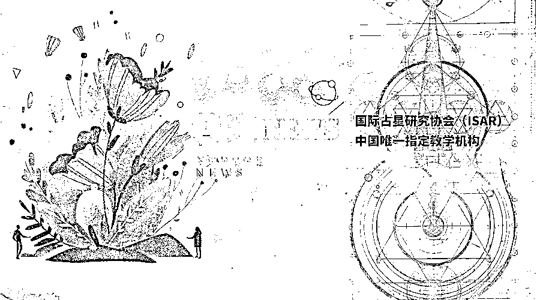

**占星知识小课堂开讲**

若道 APP 又有新增功能了！**4 月 28 日**（本周四）晚八点，我们特别邀请到了智力比肩计算机的**海星程老师**来为我们讲解此功能的知识点——**三限技法**。**三限技法小 tips**身为推进技法之中一个重要的方法，在三限推进体系中，出生后 1 天相当于未来 1 个月，90 年=90*12（天）=1080 天，1080/360=3 年，也就是，90 年的人生，在 3 年中形成缩微版。 无论中外的神话传说中，都有“天上 1 天，人间 1 年”的概念，占星学中则是以次限推进以及太阳弧推进所表达的，1 天相当于 1 年，一生缩微为 90 天，3 个月。在本次的直播内容中，我们就是要深入在探讨一下三限法的运用。干货满满，值得全程用笔记记录下来哦！**直播内容抢先看**

<shape type="#_x0000_t75" filled="f" style="text-indent:0;left:0;width:415.3pt;height:236.45pt;"><imagedata title="image1"></imagedata></shape>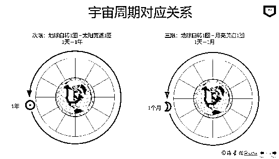

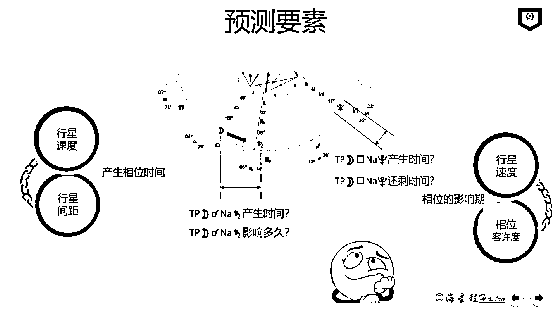

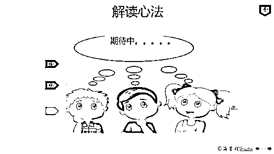

同时我们的**产品经理 May**还将详细介绍**若道 App 星盘功能**，如果您在使用过程中有任何疑问和建议，可在**留言区留言**给我们，直播当晚可获得解答！**直播内容抢先看**

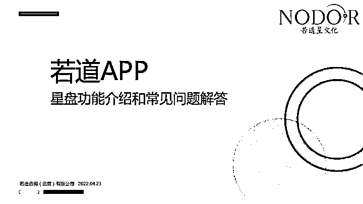

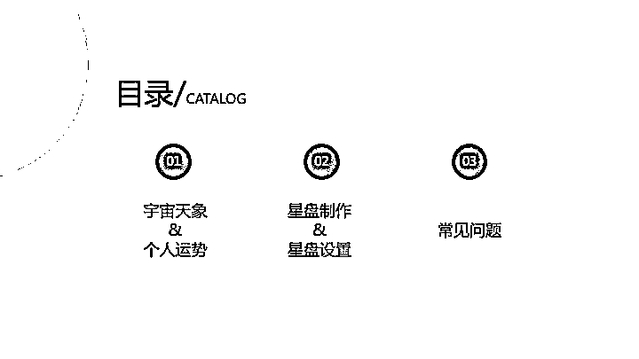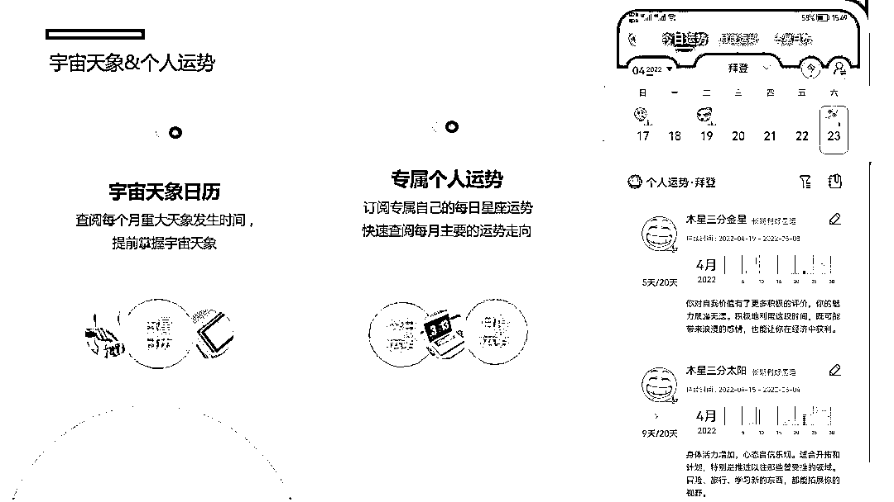

**如何参与直播？**

**长按下方海报二维码，关注若道视频号，点击预约，即可限时免费参与直播！**

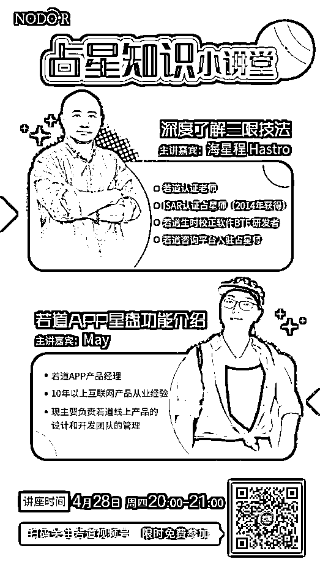

**预约成功，即如下图显示。微信后台会在直播开始准时提醒你~**

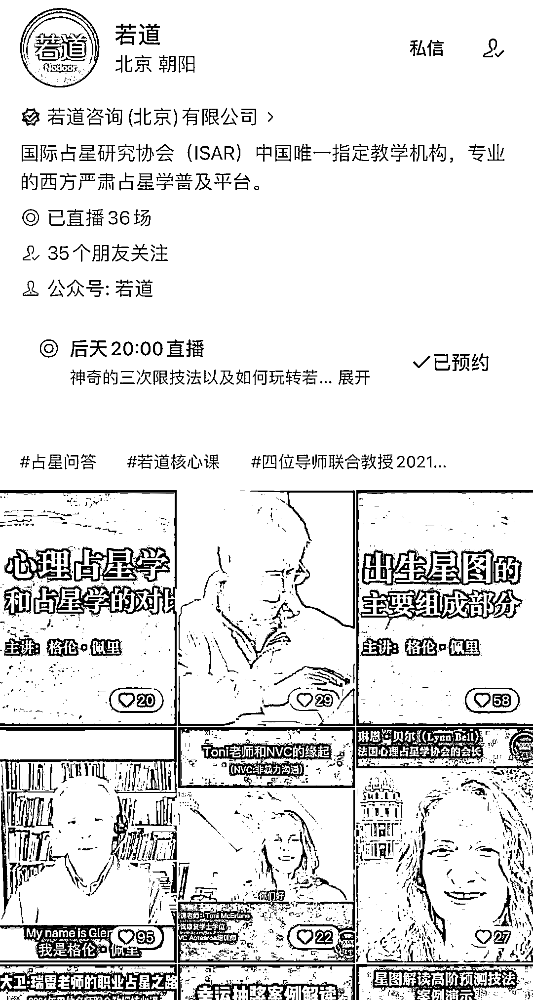

**本次讲座提供回放，若道核心课程学员可到课程群领取福利，非若道核心课程学员需付费购买回放！**

**了解每日天象**

**获得个人定制版星运日历**

**可下载若道 APP 查看更多精彩！**

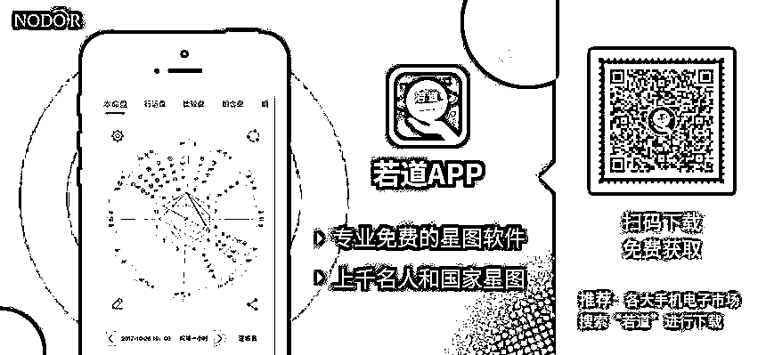

# 你知道吗？这个北交点最需要学习的是变得“自私”一点！

> 原文：[`mp.weixin.qq.com/s?__biz=MzA5NjA0NTAxNg==&mid=2651472874&idx=1&sn=69dafef56677132360c41fd93780c363&chksm=8b48f15dbc3f784ba62c936b949711008b4f66a51e25fc7fa3e50956624ef0b091cf05b39c6d&scene=126&sessionid=1692737827#rd`](http://mp.weixin.qq.com/s?__biz=MzA5NjA0NTAxNg==&mid=2651472874&idx=1&sn=69dafef56677132360c41fd93780c363&chksm=8b48f15dbc3f784ba62c936b949711008b4f66a51e25fc7fa3e50956624ef0b091cf05b39c6d&scene=126&sessionid=1692737827#rd)

☆****后台回复“今日”，给你一句生命态度****

作者/简·斯皮勒 译者/李含 校对/江艺编辑/玫瑰 封面/书君 图片/pexels

这可能是关于南交天秤座-北交白羊座最详细，也是最深入的一篇文章了。如果你有这样的配置，一定要认真阅读，或者会给到你不一样的启发哦。另外，大卫老师亲授的【[月亮交点线上工作坊](http://mp.weixin.qq.com/s?__biz=MzA5NjA0NTAxNg==&mid=2651471394&idx=3&sn=bf9616ab4c2614f0341b79347dd54461&chksm=8b488c95bc3f0583a0b2d402520e8b9984bb1801d8f3f011bcc33fc594693dbd5b6bc026e80e&scene=21#wechat_redirect)】报名中，点击链接了解更多详情吧！

**北交点白羊座/第一宫综述**

**发展的特质**

在这些领域的努力有助于解锁隐藏的天赋才华： **·** 忠诚**· **边界意识**· **一步一个脚印**· **自我价值感**· **对个人价值的认识**· **耐心**· **尊重自我和他人表达的需求**· **享受五感**· **感恩**· **觉知地球母亲的养育**· **宽恕**· **坚持

**要放下的倾向**

努力减少这些倾向的影响有助于让生活更轻松、更愉快 **·** 透过别人的眼睛看自己**· **令人衰弱的无私**· **做个好人**· **对公平和正义的执着**· **共依存症：对外部和谐的依恋**· **“以牙还牙”的心态

**阿喀琉之斯之踵/避免的陷阱/底线**

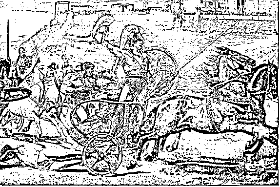

| 阿喀琉斯

**白羊座北交点的人需要注意的是他们对正义的关注（“我的生存取决于每个人待我公平”；这个想法应该表明他们的立场是不稳固的）**。

这些人天生非常乐于助人，但他们对正义和绝对公平的需求却是个无底洞。即使他们知道不会有任何回报，他们也可以开始“公平地对待”自己，不付出超出自己感觉舒适的程度。 

**白羊座北交点的人们需要避免的陷阱是无止境地寻找一个理想的、忠诚的伙伴关系（“如果我能找到一个完美的伴侣，我会感到自己内心的完整”)。**他们寻求的完整感只能单独实现；它不会是一段关系的副产品，无论伴侣多么美好。**底线是，他们永远不会从别人那里得到足够的认可，从而允许他们做自己。**在某种程度上，他们必须承担风险，从事对自己有意义的活动。具有讽刺意味的是，**一旦白羊座北交点朝着他们自己的方向前进，适当的人会被吸引到他们的生活中来支持他们。**

**这些人真正的诉求**

白羊座北交点的人们真正想要的是与他们所爱的一个伴侣一起体验幸福、和谐、公平和支持。要做到这一点，他们首先需要**成为自己的合作伙伴。**通过了解自己，他们开始做那些能给自己带来快乐和提高自我滋养水平的事情，这样他们就会感受到强大、自信和被支持。当他们更公平地对待自己时，他们会感受到自己所寻求的平衡和正义感。只有在这时，他们才能建立一种健康的伙伴关系，在这种关系中，两个人平等地分享彼此而不会感到被削弱。

**才华/职业**

**这些人需要能够根据自己的冲动驱使“做自己的事情”，而不受他人意见的限制。**他们是**领导者、创新者、开拓者**。**他们需要一种职业，让他们能够独立地遵循自己的直觉。**他们在需要主动和独立行动的职业中是成功的：例如**外科医生、技术人员或企业家。**
延续自前世，他们有一种天赋，能够**看到对方的观点，并通过圆滑地商谈确保公平。**他们可以利用这种与生俱来的能力来促进自己的成功！然而，在强调调解作为最终目标的职业中，他们通常不像他们运用谈判才能实现自己的独立目标那样充满活力。

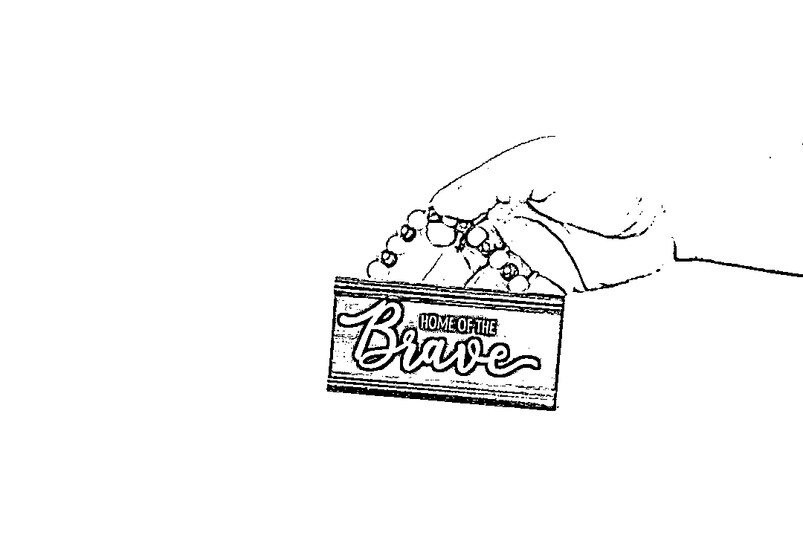

**白羊座北交点特定的疗愈誓言****·** “当我相信自己，跟随自己的冲动，每个人都会获益。”**·** “在我能够支持他人之前，我必须学会如何滋养自己。”**·** “只有真正做自己，我才能帮助别人。”**·** “不要总是那么友好。”**·** “平衡感和力量感来自于对自己的公平。”**北交点白羊座/第一宫的个性**

**前世**

白羊座北交点的人们前世中有很多**支持他人的经历**，他们有这方面的天赋。在过去世中，她们是**家庭主妇、秘书、顾问和助理**。他们是**“幕后”给予他人能量和支持的人。**这使得其他人更强大，因为案主在支持他人的过程中注入了他们自己的身份、力量和积极的能量。**白羊座北交点的人也有很多次前世是“一家之主”，并且习惯于将自己的能量与自身周围的环境结合起来。**
为了成功地支持他人，他们培养了极大的觉知和敏感性。他们的工具是**爱、安慰、温柔的鼓励，以及相信对方在任何情况下都会取得胜利。**他们的关注点是另一个人；每当他们看到自己的伴侣缺乏信心或需要支持时，他们会直接介入帮助他们——这些人从来不需要别人请求。他们对别人的需求很敏感，并且特别乐于助人。他们培养了一种难以置信的爱和慷慨的精神。他们习惯于付出，习惯于成为“团队合作者”，习惯于不考虑自我而支持他人。尽管他们在前世的生活中非常乐于奉献，但他们也有隐秘的动机：**他们是一个团队的一部分，如果他们的伴侣（合伙人）做得好，这也确保了他们自己的生存。**通过保持伴侣的心情和谐，白羊座北交点**确保伴侣会对自己善意、慷慨。**因此，他们放弃了关注自己的需求，转而全身心地关注伴侣——一切都围绕着让伴侣保持强大和满足。在前世，这套系统运作得很好，但是这一世的化身不是这样设置的。**在支持他人的过程中，这些人抹杀了他们自己的身份。**在这个化身中，他们的命运现在是**与他们自身共振的强度和力度联系在一起。**这就是为什么每次他们依靠伴侣度过难关，而没有直接寻求帮助时，他们最终都会感到失望。事实上，这对他们是有利的，因为**依赖他人会妨碍他们体验到自力更生的能力。**所以现在，当他们牺牲自己的身份来让另一个人变得强大时，他们迷失了——他们期待的回报再也不会回来了。是时候重新发现自己了。

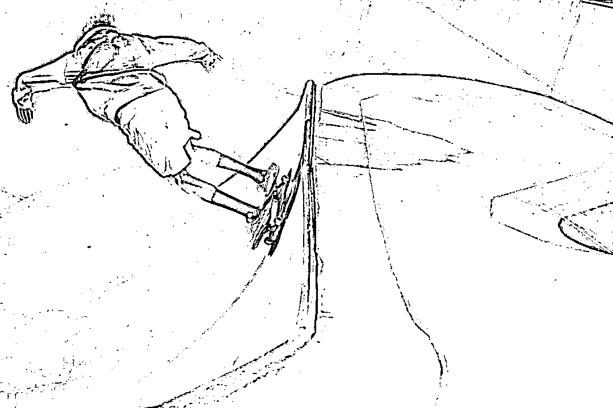

**缺乏身份认同**

白羊座北交点的人们已经经历了如此多次轮回化身来支持他人的身份，以至于在这一世化身中他们没有意识到自己是谁。在能量层面上，他们缺少一种身份认同感的隔绝。**当一个婴儿出生时，它的气场中有一个捆带，叫做“身份”，其他交点群体的人们也有这个。**它像盾牌一样抵御其他强大的能量场。正因为如此，人们可以在不伤害彼此的情况下进行激烈的互动。例如，如果比尔在街上遇到苏，他可能会带着巨大的能量说：“你好，苏！”苏友善地回应，他们热情地互动，然后两人都没有改变就走开了。但是如果比尔遇到一个白羊座北交点的人，带着同样的能量说：“你好，吉姆！”吉姆被吹走了！他感到被所有这些能量压得喘不过气来。**由于白羊座北交点气场中“身份”捆带的弱点，这些人对他人非常敏感，很容易受到他人情绪和想法的影响，他们需要记住去做一些事情来增强自我意识。****这些人甚至倾向于套上他人的身份。**一般来说，他们很容易学会口音，而且会无意识地模仿其他人的习惯，即使他们只相处了很短的时间。和谐对他们十分重要，以至于他们试图成为所有人的全部。他们对他人的接纳性的一个副产品就是**内心容易激发巨大的爱。**因为自己的身份是脆弱的，所以**与他人联系时，他们很容易感觉到一种合一感。**

**在这一世的化身中，白羊座北交点的人面临着加强身份认同感的挑战。**因为他们对“自我”没有预存的概念，他们乐于发现自己内心真实而自然的东西。这是一个天真的过程。他们的本能冲动证实了他们的身份，他们的身份通过他们的行动得到加强。

**这些人需要很多时间独处来了解自己。**他们每天都需要一个特定的时间与自己交谈。他们面临的第一个挑战是发现他们自己是谁。然后他们可以学习如何与他人保持界限。这个过程是逐渐发生的。自我发现不可能一蹴而就，但白羊座北交点的人在下定决心更加关注自己时会取得进步。

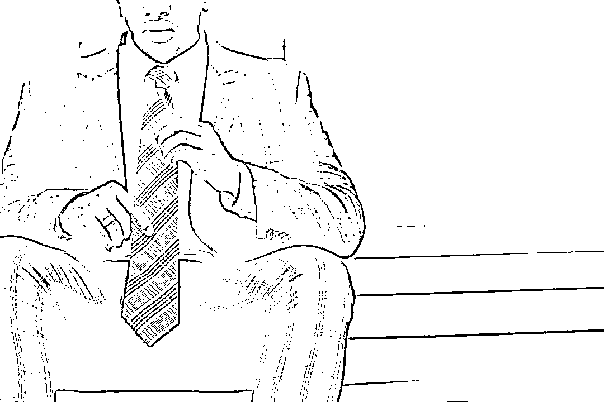

**北交点白羊座/第一宫的需求**

**身份意识**

**白羊座北交点的人由于在太多次轮回化身中牺牲了自己的身份来支持他人，因此进入这一生时没有与生俱来的身份感。重新发现和重新建立真正的自我意识现在是首要需求。**尤其是在早年，他们的整个自我意识都是基于别人对他们的看法。他们可能会赞同别人对他们是谁的定义，或者完全抵制它。无论如何，这不是他们的身份——这是对他人对他们是谁的建构的反应。要开始自我发现的道路，他们需要扪心自问：**“除了别人的投射之外……我是谁？”**他们只有通过观察自己才能找到答案。

**自我觉知**

为了满足他们对自我觉知的需求，这些人开始定期“审视”自己是有帮助的。当他们与自己失联时，他们往往最终会采取极端的行动。

与其他人一起，他们觉得自己必须始终是一个充满爱、给予支持和自我牺牲的灯塔。这压抑了不可能一直如此的那部分自我，从而创造了一个强烈的极性。 

**他们试图始终保持爱和支持，因为这是他们在前世所扮演的角色，但这种积极角色的极端化也会唤起深处的黑暗。**如果他们仔细观察黑暗，他们会发现这实际上只是他们更自信独断的一面，曾经他们不允许自己表达。这是他们阳性的一部分——他们阳刚的一面。它是两极分化的，因为它在过去的许多世轮回中一直被压制，以至于它没有与人格的其他部分融合在一起。所以它可能会以一种非常激烈的方式出现，这会让白羊座北交点变得尴尬并想：“这是从哪里来的？”**最好的解决方法是与自己保持一致：留在自己的能量场中，并与自己内心世界的发展保持联系。**然后，当他们感到不安时，就自然而然地交流：“天哪，不知为什么，我对这件事感到不安。”他们的任务就是做自己。当他们第一次尝试这种方法时，他们可能会感到不舒服；但他们需要相信，因为他们的潜在动机是爱，所以无论结果如何，都是基本正确的。

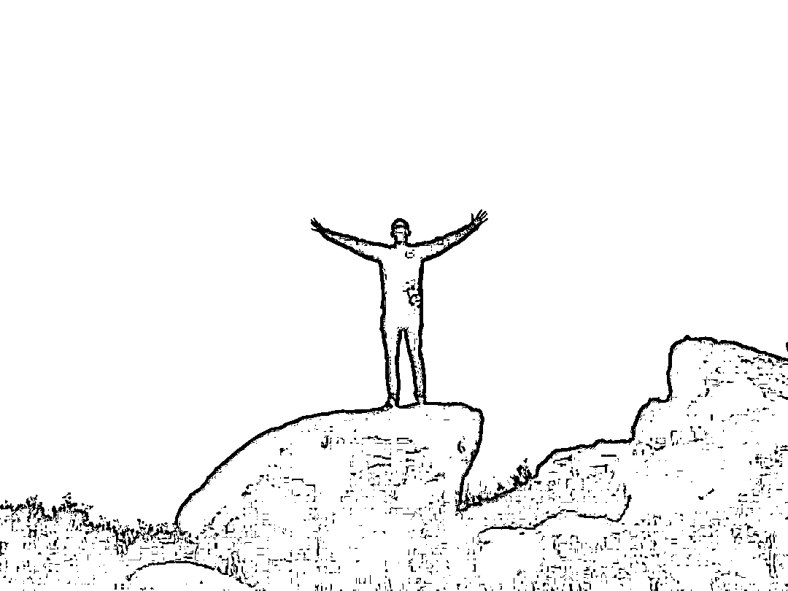

**白羊座北交点人要学习掌控，去做他们需要为自己做的事情，并且通过追随他们自己的诉求变得自给自足。**当他们有冲动去做一些他们知道会给自己带来满足感的事情时，他们需要坚持到底。由于在前世完成了自我净化，他们可以相信自己的冲动对他人没有害处，实际上，这描绘了他们需要前进的方向。在生活的每一个领域，建议他们遵循自己的第一冲动自由的行动，这些行动在任何情况下都是最好的。**来自自我的任何抵抗都应该被忽视。**通过这种方式，他们在真实性和对自己负责的基础上与他人保持平衡。由于这些人天生就没有意识到自给自足的价值，所以他们没有意识到其他人有多重视它。当他们开始支持没有寻求帮助的人时，他们可能会引起负面反应。他们进入对方的力场，了解他或她的感受和想法。他们觉察到别人的需求，这一点很好，但要学着认识到**别人有界限，他们自己也有界限。**学会尊重他人的自给自足时，他们会开始重视自己的自给自足。**白羊座北交点的人在看到别人照顾自己时往往会持反对态度。**他们变得批判性，并认为其他人是只关心自己、冷漠和自私的。然而，这些人需要做的就是关心自己！当他们在别人身上看到它时，会让他们感到困扰，因为他们自己没有这样做。当他们注意到别人的“自私”时，可以用它来提醒自己检查自己的需求。他们必须开始关注自己，即使一开始他们有点走极端。不管怎样，可以从每天给自己分配 30 到 40 分钟的独处时间开始。在一个没有外界干扰的房间里，他们可能会喝一杯茶，计划自己的一天，写日记，读一本鼓舞人心的书，或者只是坐下来思考。关键是，这是自己的时间；**在这段时间里，自己排在第一位。**如果他们为自己安排了这其中的一件事，将能够全天给予他人而不会产生怨恨。有意识地关注自己的呼吸也有帮助：它让他们与身体保持联系。当他们和其他人在一起时，可以不时有意识地深呼吸，让自己保持在自己的界限之内。一些月亮交点群体在这一生要学习无私。但是白羊座北交点已经知道无私——在这一生他们需要**学习自私。**当他们与自己保持联系时，每个人都觉得舒适。这不合逻辑，但很实用。当他们做自己时，他们害怕自己可能会伤害他人，而做自己实际上会在比预期的更深层次上帮助他人。但是白羊座北交点必须尝试“自私”（也就是说，仅仅因为一个想法能给他们带来满足感，就按照这个想法行事），然后看看结果如何。是时候让他们为创造自己的幸福负责了。

**版权声明：**本文由若道翻译发布，欢迎转发，反对抄袭。友号转载请申请白名单。

**简·斯皮勒**

全球占星界的一位领军人物，是美国占星师联盟（AFAN）的教员。她定期在新时代和占星回忆上授课，是畅销书《新月占星学》、《灵魂占星》、《灵性占星学》和《宇宙之爱》的作者。

**月亮交点线上工作坊**

需求就是所有的一切。有两种人类天性的基本规则可以定义需求：**我们需要获得成就（北交点），我们需要有安全感（南北点）。**  成就感意味着我们在安全感之外渴望某些东西和某些经验，关系着我们的内心向往。安全感意味着我们感到安心，和我们已经建立的参与生活的模式协调一致，关系着我们的习惯。

人类的需求就在成就感和安全感之间来来回回，写下这一生的主题。这个主题与我们人生的发展方向和灵魂的渴望相关。

如果发展方向和灵魂渴望实现的目标了解了，变得清晰可见，那么就更容易知道做出什么样的决定，来让人生变得圆满和幸福。一些困扰的问题也会随之一一迎刃而解了。 **我们这次就跟随大卫·瑞雷一起，进行****为期两天****的寻找之旅，从星图里南北交点以及与此相关元素的解读入手，为我们人生的生命道路找到指引，**看看是朝向哪里，又是一种什么样模式和周期。于是，也会更加容易的掌握自己的命运了。

**长按下图识别二维码**

**了解更多课程详情**

**20 位来自世界各地的占星师**
**带来 20 场沙龙——新世界的觉醒****详情可点击下图**

**学习占星学****点击下图了解课程详情**

**

**微信又双叒叕改版啦，不想错过若道君的推送？**
**就把若道设为星标吧！****▼**

**喜欢记得点一下在看哦☟**

**报名直达入口**

# 生活陷入无端恐慌？别怕，宇宙自有智慧，帮你缓解冥王星带来的恐惧

> 原文：[`mp.weixin.qq.com/s?__biz=MzA5NjA0NTAxNg==&mid=2651472689&idx=1&sn=d3851215c34e146dab96092fbb4227d8&chksm=8b48f186bc3f7890e3e9242119548ad3fb8be8291b78771ef9cd5d0660f55c6581b60b63b08b&scene=126&sessionid=1692737827#rd`](http://mp.weixin.qq.com/s?__biz=MzA5NjA0NTAxNg==&mid=2651472689&idx=1&sn=d3851215c34e146dab96092fbb4227d8&chksm=8b48f186bc3f7890e3e9242119548ad3fb8be8291b78771ef9cd5d0660f55c6581b60b63b08b&scene=126&sessionid=1692737827#rd)

****************☆ ****************************后台****************************回复“今日”，给你一句生命态度****************

作者/琳恩·柯纳译者/三三 校对/Jun
编辑/翀子 图片/网络

最近，因为北京疫情的原因，很多人都陷入了内在的恐慌。这种恐慌与冥王星的行进给人的感觉如出一辙。它会让你感觉到失控，甚至提到冥王星行进，很多人都会一哆嗦。的确，这个大 boss 所在之处，简直可以用“尸横遍野”来形容。

但是，其实冥王星给我们带来的也是非常宝贵的成长，它需要我们清理身心“负重”，赋予自己力量。在这个当下，也许你正在或者即将经历冥王星行进，也许不是，但都希望这篇文章会对你有些帮助。

**冥王星行进时你可能经历什么**

**当你感到失控时，很容易躲起来，放任自己的生活变得不可收拾。**但你唯一能控制的就是你自己和你当下的环境。冥王星通过身体表现出来，因此**保持身体活跃并做些事对调节和释放其能量**至关重要。我发现自己会在深夜起身处理信件和项目，那是我的海王星行进留下的一团乱麻。

**在掌控的过程中，清理环境，扔掉不需要的东西，处理好你长期拖延的任务。**

如果我躺在床上，我会感到冥王星的过度刺激而无法入睡。只是出门并不能解决问题或释放能量。如果是海王星行进，那么逛商场、购物是简单又舒适的解决方式，而冥王星行进只会引起无意义的强迫性消费......又是失控的一步。

**进行有意义的讨论、脑力活动和有目的的行动**似乎效果最好。

**冥王星行进发生在当一个人即将实现伟大的新飞跃，抛弃过去并迎接新开始的时候。**这就是冥王星要我们做的——**通过放手过去、使我们的生活有一个变革性的向前飞跃，来赋予我们自己力量。**

身体活动——**运动**是对冥王星能量很好的释放，尽管冬天的天气并没有给我提供太多出去散步的机会。我加入了一家当地的健身馆，这总让我感觉更好。

**冥王星会带来很多高强度的能量，而高强度的运动（长时间步行）对我非常有效。**

在这种“失控”模式下，我的工作使我感到失控。射手座喜欢等级分明，所以我必须安排好我的优先级，不能让自己超负荷。我会很容易感到不堪重负。我整理日程，并列出“待办事项”清单。我必须按计划行事才不会感到失控。

**我也发现了与冥王星合作的另一个关键**——**保持生活简单**。避免一切复杂的事情。学会对一切不是绝对必要的事说“不”。你的心理生存取决于此！

**我观察到到天王星、海王星与冥王星的行进会通过荷尔蒙失衡来影响我们。**

对于年轻女性来说，有两种草药可以使荷尔蒙恢复至正常水平。如果你有月经问题，就是因为荷尔蒙。我食用**野山药和圣洁莓**，每天一到两次，每次一粒。想要了解助益的氨基酸，请阅读茱莉亚·罗斯写的《饮食疗法》。

焦虑，特别是在夜晚，会导致夜间放纵和失眠。晚上 7 点左右，我会准备一大杯“超强效睡眠”茶。任何一家不错的维生素药店都有可以帮助睡眠的补充剂，比如**褪黑素**。

**在冥王星行进之下，肾上腺承受着巨大压力。**我经历过急性腰痛，每次都是肾上腺问题。我现在的建议是服用 Solaray 牌或 Natural Sources 牌的肾上腺胶囊，可以在大多数保健品店买到。起床后服用 2 粒，上午 11 点再服用 2 粒。这个处方是由一位医生推荐的。服用周期——服用 3 周，暂停 1 周。

不得不去面对浮现的长期压抑的情绪、恐惧，尤其是愤怒，确实非常困难！**允许自己生气吧！**

**一些冥王星行进能够损害我们的免疫系统，使我们易受病毒和感染。**一个不错的保护措施是**野生牛至和橄榄叶**（Nature’s Way 牌是最强的）。这些抗病毒和抗菌药物需要每天服用，它们会在体内积累加强。

注意：如果你正在服用其他药物，请与你的药剂师沟通这些草药和补充剂是否会与你的药物相互作用。

**冥王星行进时可能遇到的坑**

**冥王星能让你觉得这种情况将永远持续，但事实并非如此。**你很容易对未来失去憧憬与希望。

为了超越黑暗，**拓展你的意识**至关重要。我发现阅读灵性书籍与意识拓展的书籍，以及冥想能提供极大的解脱！“你走得越高（意识上），俯视所见就越小！”（另译：“会当凌绝顶（意识上的高山），一览众山小！”）

**自我赋能——这是你在冥王星行进中学到的最重要的一课，但它不会立即或轻易到来。**

当冥王星逆行，与我的太阳呈四分相时，我意识到我已经将自己的权力交给了一个无能为力的人，他只会对我所做的一切进行批评与挑错；我已经将自己的权力交给了消极思维，交给了吸收他人的批评与残暴的自我指责！

一个朋友给自我赋能下了一个“挽救生活”的定义：

**“自我赋权就是察觉那些你需要为自己做的事，即便他人说你自私，你也要去完成它。你的首要任务是照顾好自己！当境况不佳时，你的首要职责是让自己脱身，让自己从任何负面的、敌对的或者是有争议的境况中离开，无论是一份工作、一段关系或者一种环境。你通过保护自己来为自己赋能！”**

当我建立了一种态度——**我不会忍受任何人的胡言乱语......无论什么借口！**我终于感到自己拥有了力量。从感到不堪重负到“不接受废话”的旅程似乎是无尽的。

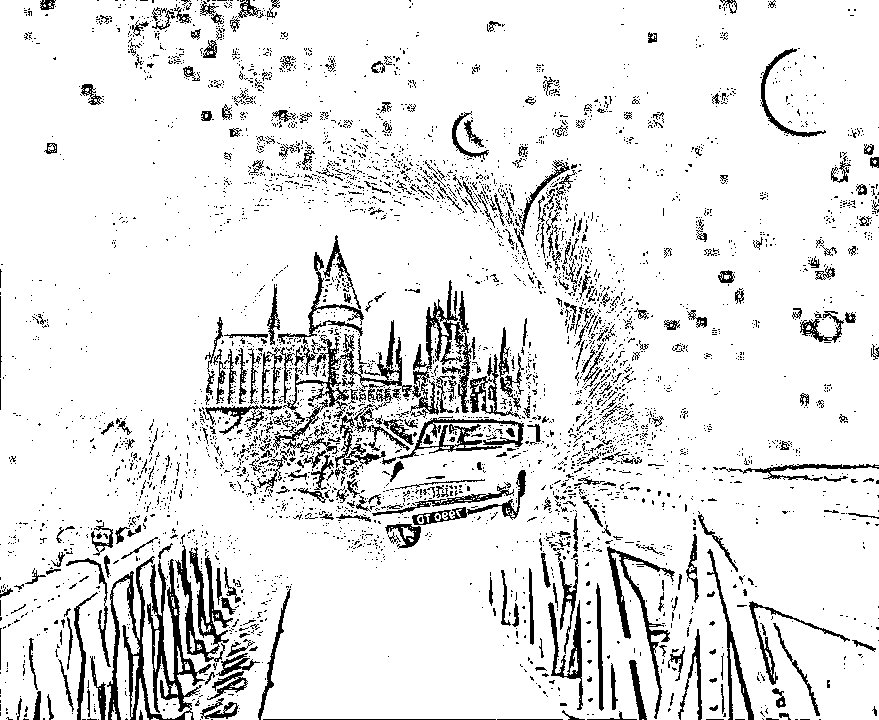

占星学家玛丽·谢伊（Mary Shea）在巴尔的摩美国占星研究学会（NCGR）的演讲中列出了在冥王星行进的影响下，我们可能遇到的一些坑：

**1\.** **权力斗争、掌控问题、复杂化和橡皮筋陷阱。**

失控的人通常是我们遇见的最具控制力与操控力的人。橡皮筋效应是我最喜欢的：两个人发现了一根橡皮筋，都想得到它，并同时抓住了它。“占有者在诉讼中占上风”背后的理论是，谁持有的时间最长，谁就会赢。

在冥王星行进之下，他们扯着一根橡皮筋，无论是谁先松开，另一个就会被打到！无论谁抓的时间最长，都会被冥王星.....还有橡皮筋抽打。这里的指导原则是，**在你被击倒前放手！！在一些事让你的生活变复杂之前放手！**

**2.** **逐步升级，意外打击。**

我有个朋友，曾经历冥王星与她的上升点呈四分相。她开始玩一个游戏，一个潜意识游戏，来了解她在一段关系中拥有多少权力和掌控。这个游戏一开始，她立即意识到她赢不了。她要输了，并失去这段关系。

然而，一个在柏林的冥王星朋友向我保证，当冥王星人开始玩那个游戏时，他们就放不了手，停不下来，即使结果当着他们的面炸锅。通过坚持不懈的硬碰硬，就会知道你何时会失败，然后放手！

**3. ****非黑即白两级分化的情况。**

冥王星之下的一切看上去都是黑白分明的......但是没有非黑即白的情况。**放下你的观点，把问题去个人化，努力达成双赢的共识。**

**4. ****反应性反馈、情绪过载、恐惧和愤怒，都会导致境况变停滞、刻板、精神失衡或无意识。**

冥王星通过太阳神经丛对我们的星光体施加压力，这将迫使长时间压抑的情绪问题和感受浮现。

我们越对这些感受不知不觉、脱节，它们就越是有自己的生命，蒙蔽我们的双眼，在无意识中逮住我们。愤怒会失控地爆发，我们可能会沉迷于感受，也可能变得情感麻木。

我们必须与他人谈论这些，**并尊重我们确实拥有的感受，**这很重要。它们不是事实；而是感受。

一个很好的例子是一个年轻女性，她经历了冥王星四分她第一宫的太阳。出生星图中的冥王星在她代表创造性自我表达的第五宫。事实上，在冥王星行进的最后阶段，怀孕是她自我赋能的形式。

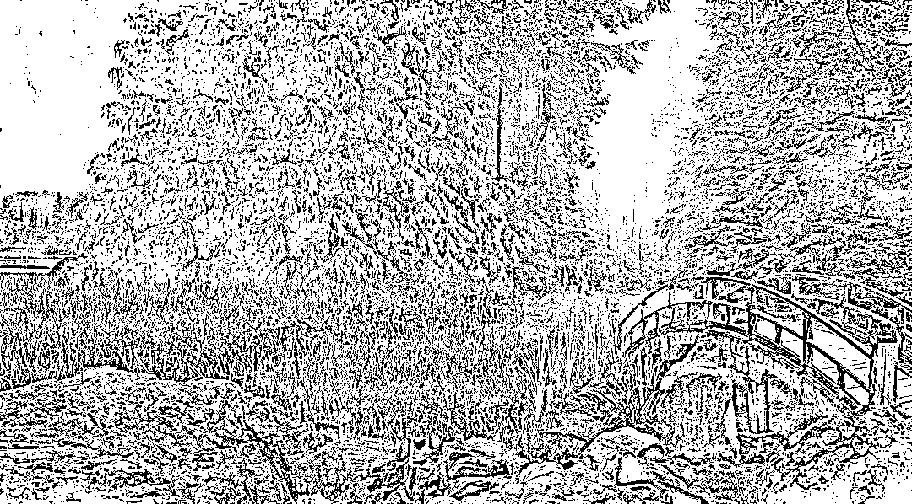

**冥王星无关年龄。**这位女性年轻貌美，并非常甜美体贴。在冥王星行进开始时，她退出了我的占星学课，因为她觉得自己无法处理正在她的生活中浮现的情绪问题。她觉得自己很脆弱，不堪重负，对所有人的批评都非常敏感。他人的意见太重要了。

她觉得他人能够看穿她，她也无法说出自己想要什么，在所有的交流与个人想法中，她都感到巨大的不确定性。**她的恐惧成为走向真相的障碍，**而这些恐惧让人无法承受。

她看了几个月的治疗师，以为治疗师可以解决她的问题，给她答案并指明她的生活。很快，她明白了她自己才是唯一可以解决自己问题的人，而不是治疗师。

自我价值是不存在的。她感到无能为力，无法再胜任自己的工作。她还没有准备好与新人打交道，没准备好换工作，任何新事物对她来说都无法驾驭。

她发誓不让恐惧占据主导。她直面自己的恐惧，但这太难了。她向内寻找一些坚强的东西，但一无所获。

当她从生活中退出去重获她的力量，并重建她的内在时，疗愈的过程开始了。强迫自己面对一切是她做过最糟糕的事。在此时，她怀孕了，变得只能躺在床上，这个经历让她从生活撤退，给了她重建内在自我的时间。

她的建议是，**对自己温柔一点，慢慢让自己的力量恢复——只有这样你才会尝试面对自己的恐惧。**

**版权声明：**本文由若道翻译发布，欢迎转发，反对抄袭。友号转载请申请白名单。

**林恩·柯纳**自 1969 年 6 月起成为全职占星师。诺·泰尔《占星学的具体度量》（Astrology's Special Measurements）作者之一。
**20 位来自世界各地的占星师****带来 20 场沙龙——新世界的觉醒****详情可点击下图**

**学习占星学****点击下图了解课程详情**

**

**微信又双叒叕改版啦，不想错过若道君的推送？**

**就把若道设为星标吧！**

**▼**

**就是这个“在看”，戳戳戳 ☟**

********报名直达入口********

# 卜卦占星学中的“神器”是它！

> 原文：[`mp.weixin.qq.com/s?__biz=MzA5NjA0NTAxNg==&mid=2651472689&idx=2&sn=263aaf2b629d3563371f975d12f0d967&chksm=8b48f186bc3f7890ad872afb786689c74eedf7d72745037cbc4237b6538d65b6e8b1d2dda49a&scene=126&sessionid=1692737827#rd`](http://mp.weixin.qq.com/s?__biz=MzA5NjA0NTAxNg==&mid=2651472689&idx=2&sn=263aaf2b629d3563371f975d12f0d967&chksm=8b48f186bc3f7890ad872afb786689c74eedf7d72745037cbc4237b6538d65b6e8b1d2dda49a&scene=126&sessionid=1692737827#rd)

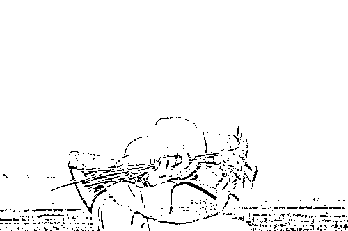

采访/若道君 译者/李含 校对/Arrow

编辑/玫瑰 图片/pexels

在这篇文章中，让我们进入技术流时间，一起跟随著名占星师艾德里安·罗斯·邓肯老师来为我们讲述神奇的卜卦占星学吧。另外，艾德里安老师亲授【[现代卜卦占星学](http://mp.weixin.qq.com/s?__biz=MzA5NjA0NTAxNg==&mid=2651472317&idx=2&sn=50477f1157c68fc75f2972ecaa0dab23&chksm=8b48f30abc3f7a1caecbb1732a41e9408e7d1a6325280f57920af82ef8001032acfa322b7fd9&scene=21#wechat_redirect)】报名中，点击链接了解更多详情吧！**技术流谈卜卦占星学**

******问：********相比利用出生星图进行预测或利用其他预测技术，卜卦占星学的预测特色是什么？**

**艾德里安·邓肯: 行进和推进对于理解我们如何经历外在和内在的风暴是至关重要的。**卜卦如同显微镜下的行进。通过行进难以了解一段关系、房屋购买、工作机会等是否有益，但对卜卦来说并不难。因此，想要精确预测，行进和推进未必有效，但卜卦却是有效的。

*********问：***********我知道你用传统卜卦的一些规则，您也会在卜卦星图中使用外行星，您在卜卦中所用的规则和在其他占星图中使用的规则一样吗？**

******艾德里安·邓肯: ******我在各类占星学中使用相同的规则。没有必要将心理占星学与卜卦占星学区分开来，即便分支不同，规则也应该相同。因为所有的事件都有其心理对应。占星学是动态的——它只关乎运动。

推进显示了个人业力的缓慢进化式展开，而行进则展现了外在集体影响，我们个人需要去消化处理这个影响。卜卦星图将时间暂停片刻，在这一瞬间显示出过去、现在和将来。

无所谓微观或宏观画面，占星图如同分形景观一般，在微观或宏观层面上反映一切（分形的概念是虽然整体无限复杂，但是整体与局部具有无限的自相似性）。动态卜卦更现代、更动态，更能反映全局。

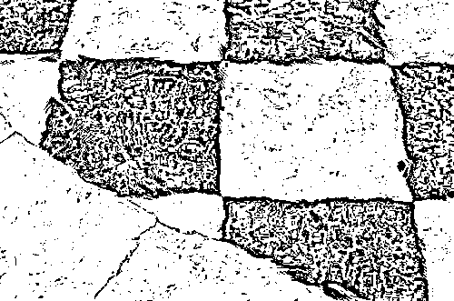

************问：**********您在课程大纲中也介绍到咨询图，对此我非常期待，因为我知道您对咨询星图经验丰富。很多占星师，比如林恩·贝尔都是在您的影响下开始使用咨询图。咨询星图是不是也属于卜卦应用的一种？    **

**********艾德里安·邓肯: ********是的，咨询星图就是卜卦星图，但却是动态的卜卦**。每几分钟，上升点和宫位就会继续移动，行星会“掉”回前面的宫位。一颗位于中天的行星一会儿之后就会掉进第九宫。这是你需要关注的动态。

***************问：*****************您说整合卜卦技巧对初学者很有帮助，就好像“让你的占星技巧加倍”，您能多解释一下吗？****艾德里安·邓肯: **我之所以说卜卦技巧可以让你的占星技巧成倍增长，是因为当我在咨询中开始使用卜卦时，我突然发现自己可以准确地回答问题了。在此之前，只是用行进、推进或日返，我无法准确回答问题。（卜卦）咨询星图将行进和推进置于一个框架之下，焦点明确。举例来说，某人的行进冥王星在四分其本命水星。我们知道这意味着此人可能执着于某事，但是什么事呢？（卜卦）咨询星图显示水星在第六宫，也可能和冥王星成相。所以说，这是和工作中同事的议题，影响了他的心理平衡。**当你在咨询中使用卜卦星图时，你几乎总是会看到出生星图中行星模式的清晰重演。**实际上，有时咨询中的卜卦星图会显示在此人的生活中只发生了一次或两次的模式。在出现这种情况时，你完全知道要关注什么。

**版权声明：**原创文章由作者授权发布于若道平台，欢迎转发，反对抄袭。友号转载请申请白名单。

**现代卜卦占星的课程内容**

**课程分为 5 部分：**

**Part1 **融合现代占星理念，整合动态占星知识**Part2**独家【现代动态卜卦占星技术】全面教学**Part3**学以致用，覆盖人生各个领域问题的卜卦解法**Part4**扩展延伸择时占星技法的新认知**Part5**如何运用卜卦占星学做一场转化性的咨询

**15 节录播课+8 节直播课线上网络课，英文授课，中文翻译。**

**15 节录播课为 2020 年动态现代卜卦课程的内容。8 节直播课则完全是案例教学的形式。**

这样的好处是，你可以通过 1 个半月的密集学习之内按照自己的进度学完录播课的理论和录播课中已有的案例，从学习开始就实践，然后把实践中遇到的问题拿到 8 节直播课中，和老师互动。

**在 8 节直播课中，老师也会用案例教学、和同学互动的方式帮助大家进一步掌握卜卦占星的技法。**

******想要跟随邓肯老师学习卜卦占星学？******
**点击下图了解详情**

**学习占星学****点击下图了解课程详情** 

**

**微信又双叒叕改版啦，不想错过若道君的推送？****就把若道设为星标吧！****▼**

就是这个“在看”，戳戳戳 ☟

********报名直达入口********

# 现代动态卜卦占星实战课 | 23 堂课，4 个月掌握卜卦技法

> 原文：[`mp.weixin.qq.com/s?__biz=MzA5NjA0NTAxNg==&mid=2651472689&idx=3&sn=e8b68d9dfc46fab0d2070a2b6a0c3ad6&chksm=8b48f186bc3f78905861dee828104cfd30bc377113cab8f1f0d2f251b4d8c5f2061db5f038b3&scene=126&sessionid=1692737827#rd`](http://mp.weixin.qq.com/s?__biz=MzA5NjA0NTAxNg==&mid=2651472689&idx=3&sn=e8b68d9dfc46fab0d2070a2b6a0c3ad6&chksm=8b48f186bc3f78905861dee828104cfd30bc377113cab8f1f0d2f251b4d8c5f2061db5f038b3&scene=126&sessionid=1692737827#rd)

**对现代动态卜卦占星的 7 个问题**

**1****什么是现代动态卜卦占星？**

现代动态卜卦是将有传统历史的卜卦占星和现代人本主义占星的精神结合在一起，**更适合现代社会现实状况**的卜卦占星技法。

**2****卜卦占星的特色是什么？**

**随时随地可用，**帮助你从这个卜卦星图中洞察当下你所期望了解的事情和人的现状、发展趋势、可能发生什么事情、可能的结果，及什么时候会出现什么结果。

**3****动态卜卦占星是什么意思？它重要吗？**

动态卜卦非常重要，因为事物不是静止的，而是变化的。**动态卜卦不仅会让你看到人和事物的状态，还可以让你看到其发展和变化的过程，**会碰到什么事情。

动态卜卦的美妙之处是它不是静止的一个照片，而是**描述一个故事的开始、发展和结局。**

**4****卜卦占星什么情况可以用？**

**万物万事皆可卜。**什么都可以用。1-12 宫所包含的人事百态，事业、健康、金钱投资、商务、旅游、教育、法律、生育、宠物养育等等。

卜卦占星也可以帮助我们去看某个社会事件、国际事件的发展，**可以和经世占星相结合。**

**5****它如何与人本主义占星结合？**

因为从卜卦行星可以看到参与人的**心理状态、心理过程和面临的议题**。而如果当事人愿意去调整自己的内心状态，就不再完全是被动的，而是可以以更积极主动的方式参与到事件中去；或者能够更理解目前的外部环境，选择更安然地调整内心。

**6****卜卦占星可以和人本主义的咨询相结合吗？**

当然。在课程中，老师将会仔细讲如何**把卜卦占星和出生星图及预测技术结合在一起，**给客户提供更好的服务。

**7****如何学好现代卜卦占星？**

**实践，实践，实践。**

占星学是一门必须大量实践的学问。纸上谈兵没有用，只是听课没有用。

实践是一步步来的。你不必知道所有的卜卦技法才开始实践。**从第一节课开始，你就可以进入实践。**

实践刚开始可能只是模仿。**我们有大量的真实案例，也安排了很多作业让大家练习。**也给大家拿自己的案例和老师互动的大量机会。

**授课老师**

**艾德里安·罗斯·邓肯****（Adrian Ross Duncan）**1971 年在印度游学时开始学习占星学，1985 年开始成为全职占星师，**迄今执业已超过 33 年，是人本主义占星学、卜卦占星学和经世占星学领域的知名占星师。他还开发了占星软件 AstroClock 和多款占星报告。**他在日常咨询中都会运用卜卦，咨询图（卜卦的一种运用方式，即根据客户来访时间制作星图，从星图中获得大量信息）也是他**特别擅长的领域**。艾德里安·罗斯·邓肯从 1971 年开始研习佛学，受佛学影响很深，他**相信占星学和佛学观点统一、转化的一个基础是在于对现实感知的改变**。而卜卦很容易与佛教融合，因为它只关乎当下。

| 艾德里安·罗斯·邓肯的占星学著作

作为本次课程的主讲老师，艾德里安·罗斯·邓肯如是说：

卜卦星图不仅给出了当下的能量状态，**它还包含着过去的踪迹，也蕴藏着未来的种子。**它是心理的，也是事件的。一个好的占星咨询是要把过去、现在和未来交织成一个整体。

**卜卦星图告诉客户他们当下在哪儿，他们处于的能量状态是什么，这张星图和他的过去有哪些关联，他可以怎样和这张星图一起合作去挖掘一个积极主动的未来。**这里预测的未来不是强加给他们的，这个未来是一点点揭露给他们看的。

心理占星学和卜卦占星学别无二致，所有的事件都有其心理对应。如果你的意识与世界同步，你就会看到二元统一。

行进和推进帮助我们理解如何抵御外在和内在的风暴。卜卦如同显微镜下的行进。**通过行进难以准确了解一段关系、房屋购买、工作机会等是否有益，但对卜卦来说并不难。卜卦也擅长回答与时间相关的问题，对行进和推进的标志进行微调。**

**课程形式**

**15 节录播课+8 节直播课线上网络课，英文授课，中文翻译。**

**15 节录播课为 2020 年动态现代卜卦课程的内容。8 节直播课则完全是案例教学的形式。**

这样的好处是，你可以通过 1 个半月的密集学习之内按照自己的进度学完录播课的理论和录播课中已有的案例，从学习开始就实践，然后把实践中遇到的问题拿到 8 节直播课中，和老师互动。

**在 8 节直播课中，老师也会用案例教学、和同学互动的方式帮助大家进一步掌握卜卦占星的技法。**

**授课时间**

**付费后一天即可开始看录播课程，全程有助教老师回答问题。**

**直播课程开始时间：**

2022 年 5 月 3 日，每周二 20:00-22:00

**这次课程恰逢世界在巨大的变动和不确定之中，期待这门课程能够给各位及各位的客户带来新的洞见和方向。**

**在这次 8 次直播课程中，我们将采用案例教学的方式，所有参课同学均有机会提供案例，供老师解读，且我们将组织群体的练习，用大量案例帮你掌握卜卦及如何在咨询中用卜卦。**

****

**授课内容**

***Part1***** 融合现代占星理念，整合动态占星知识**

星图如同地图，展示了人们从哪里来，现在在哪里，以及可能的去向是什么。卜卦星图虽然显示的是当下这一刻，但却是在动态当中的。所以过去的运动轨迹对应着过去所发生的，接下来的运动轨迹对应着接下来要发生的。

**在课程中你会学习到：**

*   我们如何从一张卜卦星图看到时间的流动：从过去到未来，故事如何展开

*   心理占星和事件预测如何在卜卦占星中有机结合起来

*   卜卦星图如何回答是否的问题

*   如何用卜卦星图回答分析性和指导性的问题

*   现代动态占星中事件发展的顺序：

*   确定咨询图中强调的当前事件

*   将客户与相位或行星组合相关的情感能量关联起来

*   在早期经历中找出相似的情景

*   认识到过去和现在的情感完全相同

*   辨识出过去做出的所有限制性决定

*   通过头脑风暴找出更能带来力量的方法来解决相同类型的问题

*   在想象和现实生活中重演当前和未来的事件

***Part2 *****独家【现代动态卜卦占星技术】全面教学**

哥本哈根占星学院院长艾德里安·罗斯·邓肯 Ardian Duncan 老师 50 年卜卦占星经验倾囊相授，内容包括但不限于：

**1.卜卦中的行星**

*   行星强弱及力量

*   太、月、水、金、火、木、土在庙旺落陷时的意思

*   卜卦星图中的月亮及其在 12 宫的意义

*   卜卦星图中的外行星

*   卜卦星图中的恒星

*   上升点和指征星的度数

**2.如何选择和辨识征象星**

*   当问题出现时，如何判断征象星

*   如果两个人或物由同样的征象星指代该怎么办

**3.卜卦图中的相位**

*   不同相位的意义

*   征象星之间相位的意义

*   征象星与其他行星相位的意义

**4.卜卦中的宫位**

*   12 宫位和宫位系统

*   对宫位的动态观察

*   宫主星及其互动

*   互容和定位星

**5.卜卦中的星座**

**6.传统卜卦原则（约束和限制条件条件）及其在现代动态卜卦中的应用**

**7.空亡、光线传递、完成、围困、燃烧之路等**

**8.星图中的逆行及其讲述的故事**

*   水星和计划

*   金星与依恋

*   火星与斗争

*   外行星逆行

**9.应期与时机**

*   1 度是代表多久

*   宫位的重要性

*   行星速度和逆行

*   如何综合卜卦和行进、次限分析时间问题

***Part3*****  学以致用，覆盖人生各个领域问题的卜卦解法**

希望将现代卜卦占星学的精髓传达出来，精细地讲解每一宫所代表的卜卦事物，分主题详解不同类型问题的卜卦解读思路，内容包括但不限于：

**1.爱情和关系**

*   金星的重要性

*   第一宫和第七宫以及其中的行星

*   成对行星

*   上升点、下降点及其守护星

**2.业务和工作**

*   第十宫和第六宫以及其中的行星

*   木星和土星及其相位

*   火星和水星

*   行进和中天

**3.资金和资源**

*   第二宫和第八宫以及其中的行星

*   第五宫和第十一宫

*   金星、木星和土星

*   四元素的意义

**4.家庭和大家庭**

*   第四宫和第十宫及其守护星

*   第五宫、十一宫及其守护者

*   第五宫和第十一宫的行星

*   月亮

**5.社会、法律、智性、健康、存在主义的问题**

*   第九宫和第十二宫及其中的行星

*   木星和第九宫守护星

*   第三宫 、第十一宫、第六宫和第八宫

**6.如何解读事件星图**

*   从新闻学习卜卦盘

*   如何从卜卦盘看新闻事件和世界大事的发展变化

*   我们如何去培养自己观察有预兆意义的信息、从日常事件中捕捉启迪

*   占星解读的意义

***Part4 ***** 扩展延伸择时占星技法的新认知**

在择时的时候，我们会选取征象星处于有力的时候，来规划我们的事件；避免征象星不力的时候，尤其当这个征象星代表我们自己。

**择时星图一瞥**

*   择时的艺术

*   如何在不完美的天象下取得最佳结果

*   如何做出深思熟虑的回答

*   如何为约会择时

*   如何为婚礼择时

*   如何为商业活动择时

*   如何为旅行择时

*   如何为对抗事情择时

*   虚拟和实时会议的择时

***Part5  *****如何运用卜卦占星学做一场转化性的咨询**

虽然卜卦的结果可能是不利的，但我们仍然可以从心理占星学的角度给出一些积极建议，帮助客户建立信心，有助于应对之后的人生。客户出生星图与卜卦星图的关联，这在咨询中对于心理方面的考量是非常重要的。

*   一个好的咨询有哪些特色

*   咨询星图及其应用

*   如何用卜卦星图和新客户在短暂的咨询开场白快速建立信任

*   如何综合卜卦星图、出生星图、次限图一起分析

*   如何用卜卦星图聚焦当下的问题

*   如果客户在一场咨询提出多个问题，要看多少卜卦盘

*   如何在一个充满挑战的卜卦星图中寻找客户资源、有利的时机，找到支持客户的策略

*   如何从客户故事中寻找意义

*   卜卦星图如何从事件维度和心理维度来解读

*   当看到客户不愿意看到的结果可能出现时，如何开展对话

*   改变的方法

**什么人适合参加本课程？**

*   想要系统学习现代动态卜卦占星的学员

*   想在生活中熟练使用现代卜卦占星学

*   在咨询中想帮助个案更清晰的分析解读困惑

*   想参加 ISAR 认证考试，此课程是 ISAR 选修课

*   希望通过卜卦占星帮助自己和身边人挖掘一个积极主动的未来

学习整合卜卦技巧，不仅有益于想钻研卜卦占星学这个分支的同学，对占星初学者也很有有帮助，可以让你的占星技巧加倍。

**学员评价**

**课程费用**

**课程价格：9900 元**

**老学员复训专享价：**

**2020 年参加艾德里安·罗斯·邓肯卜卦占星课程的同学：****2900 元**

**2018 年参加艾德里安·罗斯·邓肯卜卦占星课程的同学：****4900 元**

**特别优惠****：**

**分享课宣到朋友圈****保留 48 小时****（不设分组显示）截图给课程顾问可获得****400 元优惠****。**

**课程负责人：童老师（微信：nodoorDaivd），请备注“卜卦”**

长按二维码添加课程负责人咨询

**退转课程****退款原则请详看《教学协议》，如有疑问请咨询课程顾问。******现代动态卜卦占星实战课·ISAR 选修课****

**授课老师：艾德里安·罗斯·邓肯**

**授课时间：**2022 年 5 月 3 日

**授课方式：**网络课程，英文授课，中文翻译

**费用：9900 元；****2020 年老学员复训价：2900 元；2018 老学员复训价：4900 元；特别优惠，分享课宣到朋友圈保留 48 小时（不设分组显示）截图给课程顾问可再获得 400 元优惠。**

**课程负责人：**童老师（微信：nodoorDaivd），请备注“卜卦”

长按二维码添加课程负责人咨询

****报名请点击“阅读原文”****

# 若道周运 4.25-5.1 丨浪漫黄金周开启，重磅天象登场！你将在哪里发生变化？（内含 12 星座运势）

> 原文：[`mp.weixin.qq.com/s?__biz=MzA5NjA0NTAxNg==&mid=2651472620&idx=1&sn=9ff822bfe04d263e72ca4f31f00a59b1&chksm=8b48f05bbc3f794de1ef03a5e47352072563757905085f615e83a71fa6d30731924a537eaa1d&scene=126&sessionid=1692737827#rd`](http://mp.weixin.qq.com/s?__biz=MzA5NjA0NTAxNg==&mid=2651472620&idx=1&sn=9ff822bfe04d263e72ca4f31f00a59b1&chksm=8b48f05bbc3f794de1ef03a5e47352072563757905085f615e83a71fa6d30731924a537eaa1d&scene=126&sessionid=1692737827#rd)

******☆ ****后台回复“今日”，给你一句生命态度******

作者/朵三三三 ISAR 认证占星师
编辑/翀子 封面/书君 图片/网络太阳进入金牛座，本周我们将迎来重要的金牛座日食。除此之外，金星与海王星、木星的合相带来了浪漫氛围，而冥王星逆行与水星进双子座，又给本周增加了不少色彩。12 星座如何度过本周？让我们来看文章吧！（如果着急看 12 星座运势，不妨先拉到最后哦）**整体氛围**

**本周是难得一见的浪漫黄金周，**金星、木星、海王星在天空中会合，又是在他们各自庙旺的双鱼座。周中，月亮也加入了这个行列，美妙的感觉达到峰值。

**这是百年一遇的天象，**也是在当下疫情肆虐，世界晦暗的大背景下，宇宙为我们燃起的光芒。

周末，南北交点换座到金牛座-天蝎座轴线后的日月食系列正式开启！第一个隆重登场的就是发生在**5 月 1 日的金牛座日食**，很多人被这个天象影响，即将迎来**生活的震荡期。**

本周重要天象

*   **金星合相海王星**

*   **金星合相木星**

*   **水星进入双子座**

*   **冥王星逆行**

*   **金牛座日食**

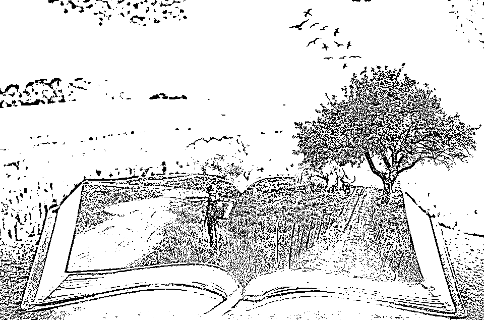

**一周天象**

01

**周一，月亮进入双鱼座之后，金海合相也开始发挥效力。**

即便此刻仍置身暗夜，我们拥有发现美的眼睛，即便心中是冰天雪地，此时也会生出暖意。金星海王星一相遇，便胜却人间无数，星空为心灵插上翅膀，**带来一段身心愉悦的时光。**

很多人在本周邂逅心动对象，体验到梦幻的情感。在月亮的引动下，我们除了被荷尔蒙吸引，**也能感受到心与心的共鸣，找到默契度和亲密感。**

这段时间，会有不少人脱单，走进一段正式的恋情。

我们可能愿意为了爱情牺牲一些自己的需求，或是付出金钱。**我们需要清楚的是，这是为了成全做出的奉献，还是自我满足的感动和幻想。**

这个星象非常有利于**艺术创作**或需要**灵感**的领域行业，我们也可以自觉引导能量到匹配的方向，例如灵修、冥想、慈善、志愿服务工作。

在这个天象的影响下，**我们容易理想化，陷入幻觉，而忘记了现实中的危险。**

海王星毕竟与扩散和蔓延相关，**本周海王星能量凸显**，病毒的风险等级依然处在高位。它容易叫人放松警惕，疫情隐匿传播的概率反而大大增加。

**金海合相影响时间：周一至周四**

02

周四，金星离开海王星，向木星行进。**周日，金木合相形成正相位。**

这两颗吉星的会合，象征着喜悦和幸运，也会为我们**在人际关系和情感方面带来自信和魅力。**可以预见，在本周的后半段，人际互动变得热烈频繁，我们也更能享受与朋友、恋人、熟人相聚或联络带来的欢乐。

如果有人需要表白，推动关系更进一步，不妨试试把时间选在周末的愉悦时光。

想要发展合作关系的，也可以利用本周后半段的好时机。

**这段时间我们相对更加懒散，惰性抬头，专注于轻松享乐，而排斥劳碌艰辛的事情。**

**金木合相影响时间：周三至周日**

03

本周并不会以如此轻快闲适的节奏画上句点，**周末的天象开始变得复杂。**不如说是，老天给我们相对欢脱的一周，作为加油站，让我们充电放松，暂得喘息。进入这个美梦之中，暂时忘却现实的烦恼。然后，马不停蹄地进入下一关卡。

**周六，水星进入双子座。10 天之后，即将迎来水星逆行。**

首先，水星离开金牛座，换到它的有力位置双子座，物流运输方面一定是更加通畅的。社会大环境方面，沟通更加有效，信息更加透明，人们的头脑心智运作加速。

另一方面来说，**此时的水星在逆行前夕的阴影期，**运行速度比平时要慢。所以在物资输送上遇到卡点和困难的，本周能够看到进展和曙光，但无法从根本上完全解决问题。

同样的，本周我们会得到一些期盼已久的好消息，政策也会有相应的调整和松动，但不一定能够马上落实。我们可以看到改变的风向，**但这些消息可能会延迟实现，**或朝令夕改，**在不久的以后发生逆转、反复。**上述情况，都需要我们做好心理准备。

04

**周六的另一星象是，冥王星开始逆行。**

**这是冥王星自从 2008 年进入摩羯座以来，在摩羯座发生的最后一次逆行。**等它 10 月份再度恢复顺行之后，就要一直前进，长驱直入水瓶座了。

**这次逆行，很多有星体落在基本星座（白羊座、巨蟹座、摩羯座、天秤座）末度数的人群，会有强烈感应。**

你们或许会体验到临门一脚落空的感受，很多特别努力才放下的事情，又要再度重提了。那些苦苦开解自己多少个夜晚才得以释怀的心魔，又回来探望自己了。好不容易走到光明地带，黑暗又再度降临。

或许欲哭无泪，或许是撕裂的痛，但冥王星正是千锤百炼的考验，**没有反反复复的辗轧，便不会有新生。**

**生命在埋葬中发芽，残酷与希望并存。**

**放手成长吧，拥抱这最后一次的涅槃。**

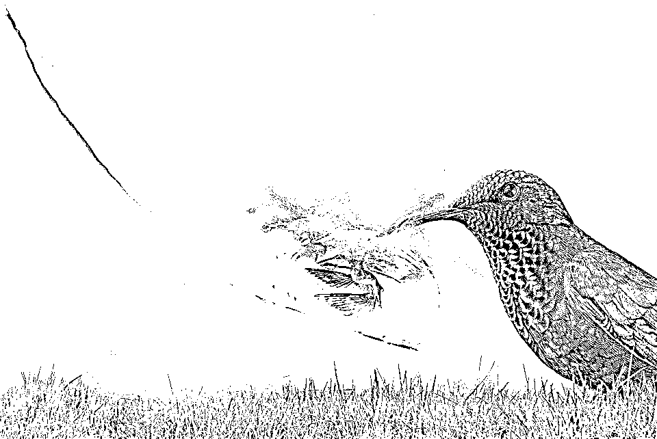

05

**周日，重磅天象降临——金牛座新月日食。**

此次新月合相月亮北交点和天王星，**象征了一个变革的开端。**

就个人而言，我们可能在新月前后**，确立在物质和现实层面的新目标。**我们或许可以清晰认知到，自己要朝着怎样的方向前行，我们渴望拥有什么，得到什么，我们想要过怎样的生活。

**星图中有重要星体落入金牛座、天蝎座、狮子座、水瓶座的人群，感应到的冲击更加强烈。**或许在周末前后，你会收到一些让人震惊的消息，甚至经历人生的转折点。

金牛座能量是物质、价值、资源的显化，有些人的收入和理财方式发生转变，有些人在工作和钱财方面有了新动向，或许跳槽、离职、创业，也有些人是亲密关系受到影响，改变相处方式，或是共同财产的分配方式。还有些人的价值观被洗礼，有认知上的重大改变和重塑。

**大环境来说，**经济金融、粮食、物资方面或许有新政施行，房地产领域也可能有大变动。

但土星依然在水瓶座，**所以革新和牵制依然同在。**所有的变化都不可能一蹴而就，更何况牵涉到整个社会资源的重新分配。只是历史车轮滚滚向前，趋势已然明了，**5 月 1 日之后，一切将渐渐成形，初见端倪。**

周日，我们将一同见证这个里程碑式的新月！

**金牛座能量提示我们：耐心耕耘，脚踏实地，顺应自然，便可以不变应万变。**

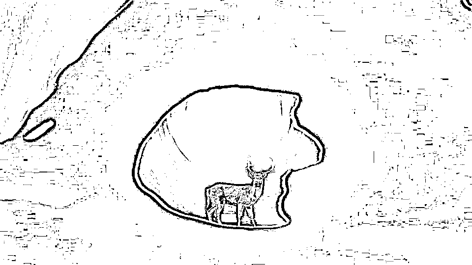

**12 星座一周运势**

**（重点参考上升星座，其次参考太阳星座）**

***白羊座***

**近期你的梦境十分活跃精彩，**充足的睡眠能让你跟潜意识连接，得到灵感与启示。你可能并不太想跟外界打交道，比起人际交往你更享受独处。

周末前后，职场上有一些过往遗留的问题再度浮现，可能涉及到与领导上级的互动关系，或是与职业发展前景相关。

财务收入出现波动，部分白羊座有破财问题，另一些人换了工作，还有些人因为金钱相关的事宜与另一半产生矛盾，对亲密关系产生影响。

***金牛座***

本周对你来说意义非凡，因为日食就发生在你的 1 宫！这意味着**你会经历一些刷新自我认知的事件**，重新定义自己的身份，或思考自我与他人的关系。尤其留意周末前后的经历，它会对你未来三年产生影响。

社交互动上你魅力大增，很受欢迎，可能认识新的朋友，或加入新的团体组织。良好互动能让你们完成共同的目标，对你的工作产生助益。

***双子座***

本周事业运飙升，很有可能赢得上级领导的赏识，或在公开场合表现出色，崭露头角。**可能迎来新的合作机会**，也容易在求职创业、跳槽晋升方面收到好消息。

部分双子座经历了一段自我封闭的时光后，会在本周末经历心灵的洗礼和震撼**。解决心理困难后，重整旗鼓再出发，**重回社交场合。或许会有新的旅行或学习计划。

***巨蟹座***

本周有一些异地的好消息传来，可能是网络线上的合作，也可能是有远方的桃花出现，或远距离的情感关系有进展。也有部分巨蟹座正在经历让人愉悦的长途旅行。

周末前后，可能你会经历人际圈子的变动，和群体环境的变化。或许是你所在的平台、组织、公司方面的人员调整，也或许是接到一些新的政策和规定。**部分人在这时会开启新创作、新项目、新合作。**

***狮子座***

本周你的偏财运非常棒，有望获得丰厚的进账，也可能在理财、股票、投资方面获益。

情感方面，你的身体能量活跃，很可能经历一段激情燃烧的时光。此时你更渴求跟伴侣和他人的**紧密而深入的连接，**有利于在亲密关系方面深度敞开，资源共享。

日食为你的事业开启新的转型期，**突如其来的变化，会令你重新寻找事业与家庭之间的平衡。**

***处女座***

本周对你的**婚恋感情、人际关系**大有助益，你可能与人两情相悦，在本周告白，也可能在本周结婚，步入婚姻殿堂，也可能跟好朋友互动愉悦，享受社交带来的乐趣。也或许是你的**合作关系**进展顺利，并从中获得了可观的回报。有伴侣的，近期感情甜蜜，温暖和谐。

周末前后，你可能突然有外出的需要，也有部分处女座收到留学、迁移、外派的消息，或是报名网络课程，开始学习新技能。

***天秤座***

本周大部分时间，你心情愉悦，精力充沛，**容易在日常生活的细节中，发现美感和小确幸。**本周工作相对轻松，你更多将精力放在享受上，略有懒惰，需要在饮食、作息方面注意节制。

周末前后，有可能经历与他人在**共同财产**方面的波动，例如伴侣或合伙人，或投资项目方面。也需要注意家中长辈可能出现一些健康问题。

***天蝎座***

**周末的日食对你意义重大，**尤其影响到你的**婚恋及合作关系**。你或许在上述方面有重大决定，或经历相处模式的重大改变，从而令你对“自我与他人”这个课题有新的深刻体会。你会谨慎选择与你同行的人，此后三年你们都将共同面对生活的风雨。

本周你的**创作灵感**不断，适合沉浸在自己的兴趣爱好中。单身的天蝎座本周桃花运爆棚，有可能在聚会、玩乐场合结识有缘人，开启新恋情。

***射手座***

本周你的家宅运飙升，与家人相处和睦，在房产、土地、房屋交易方面有好运，适合采买一些新家具、摆件，来布置装饰居家环境，**比起外出，你更喜欢舒服的待在家里。**

周末前后，你**工作**上可能会有一些变动发生，例如内容、方向、岗位的调整，或是有同事离职、上岗，你的心情也随之受到影响。

也可能是你在**健康养生**方面有了新计划，例如开始锻炼、减肥，或做长程疗养。有部分射手养了新宠物。

***摩羯座***

本周你**与周边环境互动愉快**，例如兄弟姐妹、邻居、亲近的朋友，也可能是这些人给你帮忙，为你提供物质或人脉资源。部分摩羯座可能通过考试、考核，或合作顺利，签订新合同。

周末前后，恋爱或子女方面可能有新动向，例如脱单、怀孕，部分从事创意类行业的摩羯，可能开始创作研发新作品。也有部分摩羯座找到了自己**热情投入的方向**。

***水瓶座***

本周你在**金钱方面**能够收获幸运，可能会收到一笔丰硕的报酬，也可能是买到了你心心念念的东西。或许是为了变美花钱，也或许是为了家庭花钱，总体比较大手大脚，**建议要有量入为出的意识。**

周末前后，有**房屋或家庭事务**方面的变化，可能是搬家、改变住所、换城市，也可能是家人或你们的关系正在经历一些重要转折。

***双鱼座***

本周是你的高光时刻，**人际关系**有良好进展，甚至可以带来钱财的收益。或许有**一些项目在本周开启**，你也会随之获得丰厚的资源，以及周围人的正面评价。

周末前后，你可能有突如其来的短途旅行，途中变数较多，务必做好应急措施。也或许你有重要发言、交流任务、面试考核，一样需要**注意突发状况**。

部分双鱼座正处于学业的**关键阶段**，日食会助你开启新征程。也有部分双鱼座在经历日食后，体验到大彻大悟的感觉。

**版权声明**：原创文章由作者授权首发于若道平台发布，欢迎转发，反对抄袭。友号转载请申请白名单。

****

****朵三三三****

ISAR 认证占星师

全职占星师/塔罗师/国家三级心理咨询师 

人大文学学士/德国慕尼黑大学文学硕士

**微博/微信公众号**：朵三三三

长按打赏

**20 位来自世界各地的占星师****带来 20 场沙龙——新世界的觉醒****详情可点击下图**

**学习占星学****点击下图了解课程详情**

**

**微信又双叒叕改版啦，不想错过若道君的推送？**

**就把若道设为星标吧！**

**▼**

**喜欢记得点一下在看哦☟**

**报名直达入口**

# 雷蒙德·梅里曼金融占星周运 | 继续前进，抱有信心

> 原文：[`mp.weixin.qq.com/s?__biz=MzA5NjA0NTAxNg==&mid=2651472620&idx=2&sn=f665fcb3c851c3231420e0775fa950b0&chksm=8b48f05bbc3f794d53d3770c56f776db99c9322e4175ba0ba30aeb0b6a55ad54be72ad2aaa10&scene=126&sessionid=1692737827#rd`](http://mp.weixin.qq.com/s?__biz=MzA5NjA0NTAxNg==&mid=2651472620&idx=2&sn=f665fcb3c851c3231420e0775fa950b0&chksm=8b48f05bbc3f794d53d3770c56f776db99c9322e4175ba0ba30aeb0b6a55ad54be72ad2aaa10&scene=126&sessionid=1692737827#rd)

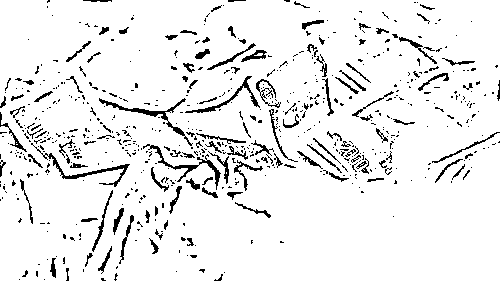

作者/雷蒙德·梅里曼 译者/Luke
编辑/玫瑰 图片/pexels

雷蒙德·梅里曼是在金融占星学界稳坐第一把交椅的占星师，同时他也是若道签约的金融占星课老师，我们引进了雷蒙德·梅里曼老师的《[上证指数月度报告](http://mp.weixin.qq.com/s?__biz=MzA5NjA0NTAxNg==&mid=2651470181&idx=1&sn=69c248709bdc518b2e58236b802e80bc&chksm=8b488bd2bc3f02c4ce70d642da1670983877d3ce09fe99911c635c8e90b0d95ab332e84ee2b9&scene=21#wechat_redirect)》及《[黄金报告](http://mp.weixin.qq.com/s?__biz=MzA5NjA0NTAxNg==&mid=2651471968&idx=1&sn=8c599e3378936525947da655de4c8f3d&chksm=8b48f2d7bc3f7bc104e52eb0cf13954f7060b1ef3e4fcc09237f27b259e3f7306fa6f98daae2&scene=21#wechat_redirect)》。我们经老师的授权，将每周刊登梅里曼老师的周运，供大家参考和学习。于是，这是本周的周运（4.25-4.29）。

**说明：以下时间采用纽约证券交易所所在地美国东部标准时间。**

**展望与回顾**

****

**道琼斯工业平均指数下跌 980 点，跌幅 2.8%。标准普尔指数和纳斯达克综合指数分别下跌 2.7%和 2.5%。美联储主席杰罗姆·鲍威尔周四表示，政策制定者在遏制高通胀方面将比之前更快地行动。**

**——《由于担心加息，道琼斯指数下跌 980 点，标准普尔和纳斯达克指数下跌 2%》****www.foxbusinesss.com****2022 年 4 月 22 日****在美联储主席杰罗姆·鲍威尔打击市场情绪后，相对于周四、周五的市场走势发生了戏剧性的反转。鲍威尔在国际货币基金组织的小组讨论会上表示，遏制通胀是“绝对必要的”，预计 5 月上调 50 个基点。****——《道琼斯指数下跌超过 900 点，是 2020 年来最糟糕的一天》****坦尼娅·马歇尔和李云****2022 年 4 月 22 日**倘若不是欣快和非理性繁荣，那么木星和海王星的行进可能反而显化为歇斯底里和恐慌。那就是上周五所发生的事。**金星将于 4 月 27-30 日与木星和海王星合相，在此之前，4 月 12 日，木星与海王星在双鱼座完成了 14 年的合相。**起初，看起来本周的金星-木星-海王星的星群合相可能显化为壮观的上涨。道琼斯工业平均指数和其他股票指数飙升直至 4 月 21 日上午，达到了自 2 月 24 日俄罗斯入侵乌克兰以来的最高价位。但随后抛售开始了，道琼斯工业平均指数从周四的高点下跌 700 点收盘，随后又在 4 月 22 日暴跌 981 点。

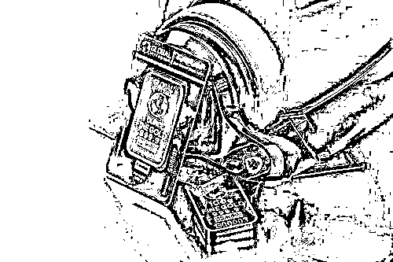

周四上午的乐观迅速变成了恐慌，因为美联储主席杰罗姆·鲍威尔认为，目前遏制通胀是最重要的，哪怕经济收缩也在所不惜。也许他认为能够遏制通胀，美国就不会陷入衰退了，这就好像是在说，我将停止花太多钱，以克服我债务带来的萧条。黄金和白银展现出了与美国股市相似的模式。4 月 18 日，黄金自 3 月 11 日以来首次短暂超越 2000 美元价位，之后黄金于当周其余时间遭抛售，最后以 1932 收盘。白银也好不到哪里去。在 4 月 18 日上涨到 1 个月以来的最高价位 26.50 后，白银随后在周五下跌至 24.00。黄金和白银，本应作为对冲经济不确定性的贵金属。但长周期研究却为这两种贵金属描绘了黯淡的前景。和美国股票市场一样，比特币也在创下当周高点后，于周四开始下跌，但跌幅不大。**短期占星趋势和长期考量**

****

**当前，所有在金融领域的人都认识到，金融系统可能发生一些大事，而且可能很快就发生。当前市场走势的迅速，以及美联储（鹰派）和日本银行（鸽派）极端的两极分化，几乎确保了那样的结果。**

**——阿尔伯特·爱德华兹****《无人谈论的最大新闻》****全球战略替代观点****法国兴业银行****2022 年 4 月 22 日****毫无疑问的是，美元的武器化对美国来说是极其强大的工具。尽管如此，还是需要担心美国近期（对俄罗斯）举动的长期影响。倘若有一天，拥有巨额外汇储备的其他国家突然失宠于华盛顿，它们会如何看待这个问题。****因此，有越来越大的可能性，以美元计价外汇储备正达到长期的峰值，因为各个国家开始质疑积累此类“资产”的价值。因为这些资产最终是对某人的债权，而拥有金条，甚至比特币，却不受任何人的欠债。**** ——克里斯托弗·伍德****《中国的人民币是否将成为世界新的储备货币？》****Grizzle****2022 年 4 月 19 日**全球金融市场上有些事情不对。随着美联储继续高举激进加息遏制通胀的大旗（同时通过终止量化宽松项目减少流动性），激发了经济下行的风险。

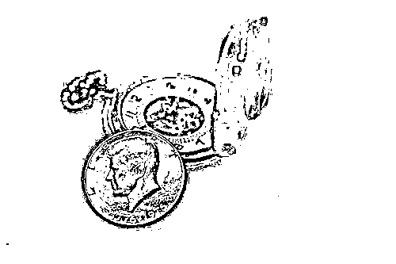

日本和中国等国家却在采取相反的策略。也就是说，它们希望预防经济收缩（衰退），并愿意冒着更大的通胀风险这么做。当然，它们可以这么做，因为这些国家的通胀率低多了。结果就是，美元正在飙升，同时日元正在崩塌至 20 年来最极端的价差。这就像茶壶正在沸腾，尽管它越来越热，声音越来越大，却没有人在意。作为金融占星师，可能会认为 4 月 27 日-30 日金星与木星和海王星的合相将是庆祝和乐观的时刻。但是上周对于大多数金融市场来说并不好。为什么？金融占星学如何解释这一点？这没有多难。首先，金星现在是晨星，而不是昏星。作为晨星，与其说像外交家与和平缔造者，它在心理上更像是好斗的战士。直到 10 月 23 日，金星和太阳一起进入天蝎座，才会恢复它昏星的地位。在这期间，国际紧张局势可能会继续升温。需要有人意识到，加热器正在变得过热。

**5 月 10 日，木星进入火象星座白羊座，可能无益于纠正这个问题。**事实上，它可能产生新的问题，那就是厨房里的厨师太多了。

另一个看似合理的解释是，土星在水瓶座 23°，正与天蝎座（债务）和金牛座（金钱）的月亮交点形成四分相。这是一个重要的度数，因为在纽约证券交易所的星图（1792 年 5 月 17 日）中，水星在金牛座 23°，四分水瓶座 23°的冥王星。换句话说，土星正在合相纽约证券交易所星图中的冥王星，同时在金牛座-天蝎座的月亮交点与土星和纽约证券交易所星图中的水星-冥王星形成 T 三角。与通常情况下金星合相木星和海王星带来的欢乐与愉悦不同，我们得到的是土星四分月亮交点，月亮交点落在与金钱和债务相关的星座，所对应的沉重和焦虑。不止如此，**本周 4 月 30 日还将发生金牛座日食。**但是稍等一下。这不全是好事或全是坏事。这是两个方向的极端。

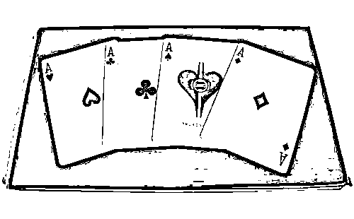

是的，土星和落在固定星座的月亮交点反映了美联储、其他央行和各国政府在面对今日金融压力时的困境，包括关键物质和供应链的中断，以及过去 14 年来金融和货币过度刺激的后遗症（成瘾和退缩）。但是木星和海王星在二元星座双鱼座也处在极佳的状态。所以，尽管我们很快就没有钱买游艇和名牌薯片，但我们却有了更多的自由，可以四处走动、旅行，表达我们坚定的信念。出于双鱼座的仁慈，我们仍然能找到感恩和批评的理由。我们要记住的是，在这些相位期间，木星倾向于夸大每件事，尤其当它处于共同守护的星座双鱼座时。它会夸大骄傲和自满，也会扩大恐惧和焦虑。它不像一些人说的那么好，也不像其他人说的那么坏。但是对于土星，我们也有了一个机会冷静审视世界，了解现实，重新调整我们集体的优先事项。每件事都将要改变。**天王星在双子座（2025-2033 年）预示着一个电动汽车取代汽油车的新时代。**这会使那些经济依赖原油生产和销售的国家如何是好，尤其是**土星（减少）合相海王星（原油）的 2026 年之后**？但直到那时之前，人类还有一个更紧迫的生存危机要应对。正如大门乐队和吉姆·莫里森所唱的那样，“有个杀手在路上……握住他的手，让他理解，世界取决于你，我们的生命永远不会终结……”（《风暴骑士》）。**你要继续前进，抱有信心。因为倘若没有信心（海王星、双鱼座、木星），那么就什么也没有了。**由于大多数行星现在终于处于彼此的渐盈阶段，宇宙天象让我们有理由保持这样的信心，那就是所有的情节剧实际上都是为了一个共同的目的，那么就是实现我们彼此的团结，让人类作为一个整体生存、成长和创造。

**说明：以上日期基于纽约证券交易所所在的美国东部标准时间，由于存在时差，中国地区可能需要加一天。**

**版权声明：**本文由若道翻译发布，欢迎转发，反对抄袭。友号转载请申请白名单。

**雷蒙德·梅里曼（Raymond Merriman）**

若道签约老师。著名金融占星师，ISAR（国际占星研究协会）前主席，梅里曼市场分析公司的总裁。他由于“提升了占星学的职业形象”，在 1995 年国际占星大会上被授予轩辕十四奖；在 2012 年国际占星大会上，被授予轩辕十四终身成就奖。

1“中国上证指数月度报告”发售**若道推出了****中文版****的雷蒙德·梅里曼中国上证指数月度报告，并持续发行该报告！**当把金融市场的周期和占星学的周期相结合时，雷蒙德·梅里曼老师的金融占星学研究**为投资者应对金融市场的周期波动，并随之调整投资策略提供了极大的价值参考**。
**4 月中英文报告已上线！**2“黄金价格周期月度报告”发售**若道推出****中文版****的雷蒙德·梅里曼黄金价格周期月度报告！**不仅仅为广大读者在中国股市的投资出谋划策，更将视角放眼黄金市场。**每当世界经济形式不明朗的时候，有一个地方是保值的港湾，那就是****黄金**。自 1982 年雷蒙德·梅里曼出版第一本研究《地球宇宙学征象与黄金价格的关联》的著作以来，**他一直作为最重要的黄金市场时机预测者之一享誉国际**。2022 年 5 月黄金报告已上线，梅里曼老师将会告诉你他对这个关键时期如何操作的想法。也可以按照季度和一年期订阅，有更多优惠。季度和年度的好处是，你可以持续了解梅里曼老师对于不断在变化的市场的看法。即便他某一次看法和市场不一致，你也看到在下一期他如何调整自己的看法，并看到金融占星在一个长期时间段内对你把控风险的帮助。而能够长期控制风险、尽量找到安全的投资时机才是投资的长久之计。**5 月中英文报告已上线！****购买套餐**，买得越多越优惠中国上证指数月度报告套餐价

*   **单月报告**：280 元
*   **3 个月套餐**：780 元（260 元/月）
*   **12 个月套餐价**：2400 元（200 元/月）

**长按下图识别二维码****购买金融报告****套餐****▼**

黄金周期月度报告优惠

*   **双报告年度套餐更优惠（直降 900 元）**

*   **12 个月黄金报告+12 个月上证指数报告：仅需 3900 元**

**长按下图识别二维码购买黄金报告套餐**▼

3《2022 年金融预报和沙龙》1976 年以来，由雷蒙德·A·梅里曼撰写的梅里曼市场时机学院每年一次的年度预报沙龙和每年一本的《年度预报》一直在应用占星学原理为投资者们服务，提供卓越洞见，从未间断。 **雷蒙德·梅里曼《2022 年金融预报和沙龙》发售中（报告已发布）。****长按下图识别二维码了解详情**
▼

**点击阅读原文购买金融报告**

# 4 月 27 日开课| 心理占星学第一学年，从麻瓜进化成占星师的自我觉察工具

> 原文：[`mp.weixin.qq.com/s?__biz=MzA5NjA0NTAxNg==&mid=2651472620&idx=3&sn=5494ef2c29a7ac515ef8a6b431991655&chksm=8b48f05bbc3f794df5680b6ebcee8670baca4bcbd6827c9a650a1d14bc5428b0ce3e332f0a24&scene=126&sessionid=1692737827#rd`](http://mp.weixin.qq.com/s?__biz=MzA5NjA0NTAxNg==&mid=2651472620&idx=3&sn=5494ef2c29a7ac515ef8a6b431991655&chksm=8b48f05bbc3f794df5680b6ebcee8670baca4bcbd6827c9a650a1d14bc5428b0ce3e332f0a24&scene=126&sessionid=1692737827#rd)

**自我觉察，是智慧的基础**

我们每个人都有自己的内在冰山，自我觉察能够帮助我们觉察自己的行为、情绪等，然后向内深层探索，探索自己的行为、情绪背后的深层渴望、期待。 **学习和应用占星学的过程，就是慢慢掌握自我觉察工具的过程，**当你熟练掌握了占星学也就具备了帮助引导他人觉察到自身生命议题的能力。 往外张望的人在做梦，向内审视的人才是清醒的。**只有我们真正向内看，只有当觉察开始由外向内时，改变才会发生，才能够知行合一。**

# 插画师：古戈力

以情绪来举例说明，每个人的情况不同，觉察的程度也不同，觉察有四个层次：

**1.不知不觉：**没有觉察情况，当情绪来了，会被情绪控制，做出很多不计后果的事情。而且每次都是同样的状况，反反复复。

**2.后知后觉：**情绪过后，自己能够反应过来，自己做的对与错，但是很难避免同样的情况再次发生。

**3.当知当觉：**就是当情绪来的时候，你已经知道在这个当下，正在发生什么。当达到这个层次，你就可以自己控制情绪，从而影响后事的发展。

**4.先知先觉：**就是当事情还没发生，就可以预知它要发生了。因为你对情绪的觉察已经越来越熟练，所以情绪还没来，你就知道它要来了。所以，你也就有了更好的选择和处理方法。

所以，我们要自我觉察，向内探索，觉察是为了接纳，然后做出改变，成长，迭代，升级。**那么要如何练习自我觉察，掌握先知先觉的能力呢？**

**每日觉察的工具推荐**

**今日天象&近期行进**

若道 APP 中的今日天象功能，罗列展示每一天的具体天象，和你当天的行进和行进周期：

**作为一位占星师，可以这样使用这个自我觉知工具：**

★ **记录梦境**

如果你有醒来记录梦境的习惯，每天早上看一下睡梦中的天象和行进，对应联想，你会惊喜的发现一些神奇的对应，能够更敏锐的捕捉到日常被压抑的情绪和需求。能够帮助你在白天的工作生活中先知先觉的关注身心状态。

★**规划生活**

每月月初，周初都可以参考天象和行进进行日程规划，预估可能的助力和阻力，在对的时间做对的事，会发现平平无奇的日常也可以有不一样的色彩。根据月相的变化感知情绪的起伏，更好的自我关爱。

★**感知环境**

当身边发生了引起你注意和好奇的事情，或者网络上层出不穷的新闻热点，都可以在天象中寻找对应的能量。从更大的格局视角去思考你的个人观点。通过环境的共振，更深入的理解自己的本命星图。

**以上都是很好的学习深化占星知识的方法，你只需要系统掌握以下知识，你就可以开始使用以上方法去提升自我觉知。**

**美国占星心理学学院创办人**

**格伦·佩里**授课

**40 余年**职业占星师生涯所学精华**倾囊相授**

修完 101-205 全部课程，并通过考核的毕业生将获得

**美国占星心理学学院证书**( Academy of Astropsychology )

和**若道毕业证书**

**高含金量双证书**

跟随主讲老师学习融合**心理学体系**的**占星知识**

为星图咨询解读打下坚实的基础

**大量**的课程资料，光是课后阅读资料就**超过 60 万字**

合理的课程设计，贴心的助教服务，及时的课后测验

1

**这门课程最大的看点是什么？**

1. **两位国际占星学大师**共同授课，将合计**90 年职业占星师生涯所学精华**倾囊相授；2. 修完**2 年课程**，考试通过的毕业生将获得**美国占星心理学学院证书**（Academy of Astropsychology）和**若道毕业证书**，**高含金量双证书**；3. **第一学年 64 次课程**的充分授课时间（录播课程 43 次课；直播课程 21 次课），全面而详细地讲解占星学历史、知识、技能、案例、咨询和运用；4. 跟随主讲老师学习**自成体系、逻辑严密、实用性强的占星语法、星图解读方法**；5. 学习独特的**发展年龄预测法**，从星图看对关键年龄阶段的发展及议题；6.** 大量的课程资料，光是课后阅读资料就超过 60 万字**；7. 合理的课程设计，初中阶课程，每一节都有课后测验；8. 本课程可以作为**ISAR 选修课**中的一门，再修两门就满足 ISAR 认证选修课要求；9. 教授重要的**心理学概念**，比如与客体关系、心理动力理论、个人神话和叙事疗法相关的一些概念，学习如何将它们整合到星图解读中；10. 在 105 阶段了解**《精神疾病诊断与统计手册》**诊断标准，探索星图中的心理疗愈；

**格伦老师致学员的信**

（向上滑动查看内容）

**亲爱的学员：**

作为占星心理学学院的校长，我的目标是帮助你顺利完成学业。

占星心理学学院的课程让你能够在经济承受范围内，灵活地学习占星学。我们的课程让你可以舒适、便捷地在家学习，不用打乱你本就繁忙的日程。我们有完善的在线学习系统，让你能在线上课、下载学习资料、进行测试并自动获得即时反馈，还可以在虚拟课堂上同你的教员和同学互动。

作为私人开业的**职业占星师**和**执业心理治疗师**，我已经**工作超过 30 年。**我还花了近 10 年的时间，在研究院里学习并获得**心理学的硕士和博士学位**。这段训练和经历是无价的，帮助我将占星学发展成为连贯的 21 世纪模式。

我们的占星学培训项目是**系统化的、清晰的、组织有序的、易学的、前沿的。**尽管有许多类似的学校可供你选择，但你不会在这些学校中看到像占星心理学学院所提供的那样有深度的或尖端的课程。

**我非常期待 2022 年再次在若道教授心理占星学核心课程。**我们重新规划和升级了本次课程体系。**新的课程包含之前完整课程的 72 个录播视频，每个视频长 2 小时；以及由我教授的 37 次直播课程，和大卫老师教授的 10 次直播课程，每次课程 2 小时。**在实时课程中，除了我提供的案例，我还会用学员的星图进行案例演示，与学员互动，阐明视频中教授的原则和方法。

**2 小时直播课程安排：**

**第一阶段 提问和讨论：**

这将在每节课开始时进行。邀请学员提出与课前提供的资料相关的具体问题。这一阶段将持续 15-30 分钟。

**第二阶段 示例：**

这一阶段会讲解与每周任务相关的具体概念，例如行星的星座位置、宫位位置以及相位的意涵。星图示例来自我认识的人，如公众人物、朋友、家人、同事或以前的客户（不显示出生信息）。同样，这一阶段也开放课堂讨论，学员可以提出自己的问题和见解。

**第三阶段 学员案例演示：**

这个阶段会从学员的具体星图来阐明概念，例如火元素行星占优势。学员案例演示不会涉及任何类型的咨询或“解读”。它们将只是简单地包含一段对话，我会在对话中分享自己对某个配置的思考，然后问这个学员可能会如何主观地（影响、信念、行为）和客观地（事件/关系）体验这个配置。其他参课学员可能也会对讨论的主题有自己的见解或问题，他们也可以参与讨论。

我对这一新的在线课程形式感到兴奋，**并期待着从 2022 年 4 月 27 日开始认识我的新学员们。**获得本学院的文凭会是你做过的最明智的投资。你不仅将占星学掌握到前所未有的深度，还将学到如何为客户提供咨询服务并建立职业占星师的职业生涯。

真诚地

**格伦·佩里 占星心理学学院校长**

**为什么要学习心理占星学？**占星心理学是一个复杂的体系，让实践者能够向客户提供真正治疗性的益处。这从根本上说来是我们学院有别于其他学校之处：**我们教授占星学，也教授心理学概念。****我们明确讨论各种心理学概念，并将其与占星学无缝衔接。结果就是更深入的、更丰富的，最终更加强大的模式。****该项目专为初学者和渴望深造的有经验的占星师而设。**我们会从跨学科的角度探讨星图解读。**通过融合荣格心理学和各种其他模型的元素，学员将熟悉作为人格理论、发展模型、原型语言和诊断工具的占星学。**

2

**课程是怎么安排的？**

**第一学年**

**共****64****次课 **43****次录播课 **21 次直播课******

**101 占星学基础 **

****共****12****次课程：******8 次 2017 年录课+4 次直播课**

**占星学**关注成长，聚焦心理。外部事件意义重大，但我们可以把它们看作是对于发展中的心理结构的共时性反映，以及未来发展的媒介和催化剂。在这个阶段的课程中，会以四种形态的几何形式介绍**占星原型：星座、行星、宫位和相位**。黄道带是人类心灵的象征性地图，其中的每个**星座**都代表一种基本的人类需求、原型人物、发展阶段和行为风格。**行星**代表心理功能，以满足其关联星座的基本需求。**宫位**提供了环境舞台，行星在其中扮演它们的角色，而**相位**是行星之间的角度关系，在主观上体验为内在对话。

**课程安排**：

**录播课****、****直播课（周三）**时长都是 2 小时

第一节**录播课**：核心概念介绍

第二节**录播课**：黄道带的结构

2022 年 4 月 27 日**直播课**：核心概念、黄道带的结构提问和讨论、知识点示例

第三节**录播课**：图例、单态星体和其他奇妙的元素

2022 年 5 月 11 日**直播课**：图例、单态星体提问和讨论、知识点示例

第四节**录播课**：星座介绍（从白羊座到处女座）

第五节**录播课**：星座介绍（从天秤座到双鱼座）

2022 年 5 月 25 日**直播课**：12 星座案例演示

第六节**录播课**：行星作为过程

第七节**录播课**：行星作为内容

第八节**录播课**：将碎片整合起来

2022 年 6 月 8 日**直播课**：整合星图时，将行星作为过程和内容案例演示

**102 行星落星座、宫位** 

****共****12****次课程：**8 次 2019 年录课+4 次直播课**

这个阶段的课程**聚焦于初步的星图整合。**

学员将学习**占星语法**，以及如何运用它们来阐释**行星的星座落点**。学员不需要强记书中的星图解读，而是学习分析基础的占星句法结构，应用这些语法规则来思考和讲述这门语言。学员们将学习如何构建精妙的句子，将动机、功能、特质、状态和事件组合起来。

此外，还将学习解读**行星宫位落点**的规则。宫位被定义为心理环境，为特定类型成长和发展提供背景。行星落在宫位中，象征着情境中的特殊状态，应对环境挑战的方式，以及通过共时性人物和事件而外化的自我部分。

学员们将探索如何将星座和宫位落点融合在一个单一、整合的陈述中，做出灵活、层次分明的解读。

**课程安排**：

第一节**录播课**：占星语法介绍

第二节**录播课**：行星星座作为行为风格

2022 年 6 月 22 日**直播课**：占星语法、行星星座作为行为风格提问和讨论、知识点示例

第三节**录播课**：思维状态和行为结果

第四节**录播课**：学习行星的星座落点

2022 年 7 月 6 日**直播课**：思维状态和行为结果、行星的星座落点提问和讨论、知识点示例

第五节**录播课**：回顾宫位的含义

第六节**录播课**：宫位中的行星过程

2022 年 7 月 20 日**直播课**：宫位的含义、宫位中的行星过程提问和讨论、知识点示例

第七节**录播课**：行星在宫位中的状态

第八节**录播课**：行星作为宫位的内容

2022 年 8 月 3 日**直播课**：行星在宫位中的状态、内容的提问和讨论、知识点示例

**103 行星相位与个人神话** 

****共****13****次课程：**9 次 2019 年录课+4 次直播课**

在这个阶段的课程中，**相位**被解释为由更大的故事结构的潜在动力构成的个人神话。

学员将学习相位是如何象征内在心理的冲突、重要的童年情感体验、主要的人生挑战和内在对话的。需要着重强调的是，相位的意涵会随着心理成熟的程度而改变。人会成长、进化，会解决内在冲突，这些不仅反映在态度和行为的改变上，而且也会表现在某人吸引的事件及其与他人的关系品质上。

学员们还将学习一些**心理学概念**，比如与客体关系、心理动力理论、个人神话和叙事疗法相关的一些概念，它们将整合到相位解读中。

**课程安排**：

第一节**录播课**：重要主题与核心冲突

第二节**录播课**：渐盈相位与渐亏相位

2022 年 8 月 17 日**直播课**：重要主题与核心冲突、渐盈相位与渐亏相位的提问和讨论、知识点示例

第三节**录播课**：主要相位的核心意义

第四节**录播课**：罗生门原则

2022 年 8 月 31 日**直播课**：主要相位的核心意义、罗生门原则的提问和讨论、知识点示例

第五节**录播课**：占星学中的认知

第六节**录播课**：心灵的控制结构

2022 年 9 月 14 日**直播课**：占星学中的认知、心灵的控制结构的提问和讨论、知识点示例

第七节**录播课**：作为认知结构的相位

第八节**录播课**：强迫性重复

第九节**录播课**：听大卫·瑞雷讲月亮交点

2022 年 10 月 12 日**直播课**：月亮交点（由大卫·瑞雷老师教授）

**104 征象星与定位星：作为进化故事的星图 **

****共****12****次课程：******8 次 2019 年录课+4 次直播课**

这个阶段的课程聚焦于**从叙事角度整合星图。**

学员们将探索**宫位征象星**和**行星定位星**如何讲述一个故事，反映一个人进化发展之旅。行星定位关系揭示了个人神话的主体构架。而这个故事的主题常常处于意识觉知和控制之外，占星学提供了一种方式，揭示、解读、改编这个神话。

我们推荐的星图整合方式是将相位和定位星关系融合成一个单一、连贯的叙事。要特别强调的是，如何活出整合程度更高的生命故事。

学员们还将了解**叙事疗法**和**自传写作**，把它们当作促进整张星图整合的一种方式。

**课程安排**：

第一节**录播课**：每张星图都讲述了一个故事

第二节**录播课**：互容与最终定位星

2022 年 10 月 26 日**直播课**：每张星图都讲述了一个故事、互容与最终定位星的提问和讨论、知识点示例

第三节**录播课**：将相位整合进流程图

第四节**录播课**：完整的故事

2022 年 11 月 9 日**直播课**：将相位整合进流程图、完整的故事的提问和讨论、知识点示例

第五节**录播课**：过渡短语

第六节**录播课**：良好定位或不良定位

2022 年 11 月 23 日**直播课**：过渡短语、良好定位或不良定位的提问和讨论、知识点示例

第七节**录播课**：发展年龄方法

第八节**录播课**：进行全面整合

2022 年 12 月 7 日**直播课**：发展年龄方法、进行全面整合的提问和讨论、知识点示例、案例演示

**105 星图中的精神病理学与疗愈 **

****共****15****次课程：******10 次 2019 年录课+5 次直播课**

在这个阶段的课程中,我们将**聚焦于十二星座(从白羊座到双鱼座）及其对应的守护星的潜在功能障碍**。

我们将学习如何识别、理解和应对每个星座的潜在挑战。我们将在各种相应的心理障碍背景下来考察占星原型，这些心理障碍表现为功能障碍、失衡的极端状态。

学员们将了解**《精神疾病诊断与统计手册》诊断标准**。我们会探讨治疗的概念，尤其是那些与整合和个性化相关的概念。我们将特别关注外行星的困难相位，以及它们与内在心理冲突、防御和症状形成的关系。

学员们将探索人的痛苦如何成为发展和实现天赋才能的催化剂。

**课程安排**：

第一节**录播课**：白羊座-火星的病理学

第二节**录播课**：金牛座/天秤座-金星的病理学

2022 年 12 月 21 日**直播课**：白羊座-火星、金牛座/天秤座-金星的病理学提问和讨论、知识点示例、案例演示

第三节**录播课**：双子座/处女座-水星的病理学

第四节**录播课**：巨蟹座-月亮的病理学

2023 年 1 月 4 日**直播课**：双子座/处女座-水星、巨蟹座-月亮的病理学提问和讨论、知识点示例、案例演示

第五节**录播课**：狮子座-太阳的病理学

第六节**录播课**：天蝎座-冥王星的病理学

2023 年 2 月 1 日**直播课**：狮子座-太阳、天蝎座-冥王星的病理学提问和讨论、知识点示例、案例演示

第七节**录播课**：射手座-木星的病理学

第八节**录播课**：摩羯座-土星的病理学

2023 年 2 月 15 日**直播课**：射手座-木星、摩羯座-土星的病理学提问和讨论、知识点示例、案例演示

第九节**录播课**：水瓶座-天王星的病理学

第十节**录播课**：双鱼座-海王星的病理学

2023 年 3 月 1 日**直播课**：水瓶座-天王星、双鱼座-海王星的病理学提问和讨论、知识点示例、案例演示

3

**导师简介**

**格伦·佩里（Glenn Perry）**

*   这位传奇的占星师，也是一名拳击和摩托车爱好者

*   他毕业于赛布鲁克学院(Saybrook Institute)，是心理/意识研究专业博士

*   也是拥有 30 余年经验的加州注册婚姻和家庭治疗师 （CAMFT）

*   美国占星心理学学院（Academy of AstroPsychology）的创办人

*   他曾任国际占星研究协会 （ISAR）以及联合占星大会董事会（UAC）副主席

*   也是 ISAR 突破性道德标准的设定者

*   康涅狄格州研究生院（the Graduate Institute of Connecticut）原型宇宙学与意识进化项目的负责人

*   共出版八本占星学著作：《心理占星学入门》《心理占星论文集》《盗取天火》《从忠诚到革命》《星图中的阴影》《占星职业议题与伦理》《出生星图深度分析》《从古代到后现代占星学》

**大卫·瑞雷（David Railey）**

*   若道联合创始人，致力于在中国教授和推广西方占星学；

*   曾任 ISAR 全球副主席，CAPISAR（ISAR 职业占星师资质认证机构）主席；

*   1976 年，通过亚特兰大职业占星师考试，成为全职占星师，随后通过 AFAN 和 ISAR 职业测试；

*   1980 年，与杰夫·焦耳一起在亚特兰大创建“每日行星”占星学中心。此后在亚特兰大占星协会担任 4 年考官，并且两次担任亚特兰大地区占星协会主席。1979-1992 年，作为占星师活跃于美国社会媒体，向不了解现代占星学变化的大众宣传专业占星学知识。在 1989-1992 年期间，他在 WRGG 电台 12 频道每周主持个人电视秀“今日占星学”，早先他还在 WRFG 的广播节目中播讲宇宙天气节目；

*   2010-2014 年，任全美占星师联盟监督委员会委员；

*   2010 年，其著作《灵魂的目标》中国版出版，和蒋颖一起创办若道占星学校和其官网 www.nodoor.com；

*   2017 年，被选为 ISAR 委员会成员。ISAR 是世界最大的国际占星机构，会员遍布 45 个国家，2017-2020 年曾任 ISAR 全球副主席、CAPISAR（ISAR 职业占星师资质认证机构）主席。

**助教简介**

**薇安**

*   全职心理占星师、ISAR 认证占星师（2016 年获得）；

*   北大心理学硕士、MBTI 国际认证施测师；

*   若道认证生时校正资质及 COAC 高阶资质毕业生；

*   连续两届担任格伦·佩里老师亲授的“美国占星心理学院&若道占星双认证核心课程”主助教；

*   2012 年至今，持续追随多位国际占星大师进行占星学的深入学习；

*   2007 年至今，持续进行精神分析及心理动力取向的理论及技巧研习；

*   致力研究心理学与占星学的整合运用。

4

**此次课程适合哪些人？**

*   对占星学感兴趣，想要入门的零基础者

*   占星学小白，但有志成为职业占星师的人

*   有一定占星学基础，但不知道该如何整合星图复杂碎片的人

*   想要师从更多殿堂级占星导师学习占星心法的人

*   走在自我探索和个人成长道路上的人

5

**选择若道学习占星学的优势**

**运用自由意志，扭转破坏性模式，绽放天赋潜能**

若道是人本主义占星学的旗手。因为我们相信，**人通过了解模式、觉察习性、积极疗愈、终将释放其潜能，与命运共舞**。

**进入国际权威职业占星师认证的快车道**

占星界的“联合国”ISAR（国际占星研究协会），是具有全世界影响力的占星教学和研究组织和职业占星师全球认证机构，认证占星师遍布 47 个国家。**在 ISAR 的 22 所附属学校中，大中华地区的附属学校只有若道一家**。在国际化的教学理念大纲标准下，**若道毕业生在 ISAR 国际认证占星师的考试通过率多次全球第一**。

**十年占星学教育中国本土化教学经验**

**根据中国学生的学习习惯不断优化占星教学体系，让学员学成后更自如地应对本土咨询市场的需求。**

学好占星学不仅仅需要邀请一两位老师教学，更需要对教学难点有充分了解，且有持续的教学跟进服务。**10 年来多次核心课程和各种专题课程的教学，让若道非常了解中国学生学习占星学的难点和卡点，合理有效地拆分、提炼课程知识点，同时也积累了丰富的国外老师和中国老师、助教紧密配合以及课程顾问密切配合教学的经验**。

若道还专门开发了有助于占星学习的“**若道**”APP，每门课程都设有答疑板块，学员能够方便快捷地提交问题，助教及时答疑解惑和批改作业。

**融入中国顶尖的职业占星师群体**

若道是中国职业占星师的“黄埔军校”。职业占星师的培养从若道开始，**进入若道，你就走进了中国顶尖的职业占星师群体，和一群志同道合的师兄师姐联谊，获得经验，共同成长**。 

**多种奖学金支持**

为了鼓励学员不因为暂时的经济困难而放弃学习，我们特意设置了各种**技能交换和奖学金**。

对于有一技之长的学员，我们推出的技能交换的项目包括**“笔译”、“笔记整理”、“平面设计”、“课本朗读”、“班级服务”**等技能交换项目；

而对于努力学习、出勤率高、完成作业率高的学员，我们设置的**土星奖、木星奖**等各种奖学金在等着你。

为了感谢帮助我们推荐学员的老学员们，我们设置了“**老学员推荐奖**”；

对于通过问卷提建议，帮助我们提高服务的学员，我们也设置了相应的奖学金。

**开启占星咨询的职业规划和支持**

若道为占星学员搭建了占星问答平台和占星咨询平台，并提供严肃占星学影响力最大的媒体平台，全力为毕业生提供宣传渠道，帮助你吸引和积累咨询生涯初期的种子客户。若道为学员开发了适用于占星学习的“若道”APP，并不断更新完善。

**①  微信平台**若道微信平台作为业内颇具影响力专业平台，为文笔好的若道毕业生提供传播占星学并免费宣传自己的机会。有的学员因为文笔获得众多粉丝喜爱，在 3 年多时间积累起 2000 多人的潜在客户。

****②  **咨询平台**若道咨询平台是我们为优秀毕业生所搭建的平台，帮助毕业生在自己的咨询拓展之外，用若道提供的平台扩展咨询客户群。自咨询平台 2017 年 8 月上线运营以来，咨询平台共入驻 100 人，收入最高者达 32 万元。

此处所列学员收入仅供参考，收入高的学员和其专业水准、努力程度密切相关。若道平台尽其所能将自己定位为辅助学员开展职业生涯的桥梁。

6

**课程价格**

**101-105 第一学年**

**正价：**18800 元

**学习充值卡优惠价：17000 元**

**101-205 全阶联报**

**正价：**50000 元

**转发优惠价：38000 元**

**学习充值卡优惠价：35000 元**

**其它各阶段课程单报价格，请咨询课程顾问**：**王老师（微信/手机：18510107057，请备注“格伦核心课”）**

**全阶段学习后，可参与若道占星毕业认证考试，考试费用为：580 元**

7

**直播课开课时间**

**2022 年 4 月 27 日（周三）20:00-22:00**

**如果直播课时间临时有调整，班班会及时通知每位同学****最终解释权归若道所有**

8

**退转课程**

**退款原则请详看《教学协议》，如有疑问请咨询课程顾问。**

9

**格伦老师视频**

<mpvideosnap class="js_uneditable custom_select_card channels_iframe" data-pluginname="videosnap" data-id="export/UzFfAgtgekIEAQAAAAAA8eIyMnQ0OwAAAAstQy6ubaLX4KHWvLEZgBPElIMYehsfM5L8zNPgMIuvMAf_Y6LDutEHc2Wrzjw4" data-url="https://findermp.video.qq.com/251/20304/stodownload?encfilekey=rjD5jyTuFrIpZ2ibE8T7YmwgiahniaXswqziaIVPleibJ2hxOpvKV1xQEH6MamiaEBVFicyZBhiclPyaSRcGvHAp4bwkwdXNbQRJbg9RrtRbicfWiaWoJ07pzF0Fko4A&amp;adaptivelytrans=0&amp;bizid=1023&amp;dotrans=0&amp;hy=SH&amp;idx=1&amp;m=&amp;scene=0&amp;token=x5Y29zUxcibD6nkeC6mHyXwVgSiblekcMGDQU559VS6vb5bGW2frdibQFzzyYMiaVnSD1zcNfjOjJ8U" data-headimgurl="http://wx.qlogo.cn/finderhead/PiajxSqBRaEJYnVsqWfEX9qA0sI6hNVKsDfyzfPZ92WZMZyBpZWU5NA/0" data-username="v2_060000231003b20faec8c4e68a1ec2d4ca07e434b07755bbf47e7053a3059defd2c9d6c68a20@finder" data-nickname="若道" data-desc="#若道核心课  （不是纯英文视频，有中文翻译）心理占星学和普通的占星学有什么不同？心理占星学有什么特殊的内容设置？
" data-nonceid="8810794934239578092" data-type="video"></mpvideosnap>****2022 双证书核心课第一学年****

**授课老师：格伦·佩里、大卫·瑞雷**

**直播课开课时间：2022 年 4 月 27 日（周三）开**

**授课方式：******网络授课，英文授课，中文翻译****

**费用：****101-105 价格**：18800 元**（充值卡优惠价 17000）**

**课程负责人：王老师**（微信/手机：18510107057，请备注“格伦核心课”）

长按二维码添加课程负责人咨询~

****报名直达入口****

# 下周五一假期，你给自己计划了哪些美好呢？

> 原文：[`mp.weixin.qq.com/s?__biz=MzA5NjA0NTAxNg==&mid=2651472530&idx=1&sn=1e7ff908e9315aba3c9d9aaa28a24a9e&chksm=8b48f025bc3f79333734c1351416824ab48d9a0f54702515d96f6ede70cdeaaf6e1ae5b664b2&scene=126&sessionid=1692737827#rd`](http://mp.weixin.qq.com/s?__biz=MzA5NjA0NTAxNg==&mid=2651472530&idx=1&sn=1e7ff908e9315aba3c9d9aaa28a24a9e&chksm=8b48f025bc3f79333734c1351416824ab48d9a0f54702515d96f6ede70cdeaaf6e1ae5b664b2&scene=126&sessionid=1692737827#rd)

**2022 年 4 月 24 日天象：**

*   **月亮在水瓶座**

*   ******水星合相北交点、四分土星、六分海王星******

本周我们迎来了谷雨节气，太阳也进入金牛座（点击[【太阳进金牛座】](http://mp.weixin.qq.com/s?__biz=MzA5NjA0NTAxNg==&mid=2651472259&idx=1&sn=11440455d73455355811d5c59850e92e&chksm=8b48f334bc3f7a22360300ccceb970cef29f672cf428b49cccf67a4442db197ac7dbdc01b964&scene=21#wechat_redirect)查看文章）。金牛座给我们的提示是，享受美好的当下，重拾生活的慵懒与安适。今天一整天，月亮都在水瓶座。你可能想给自己更多的独立空间进行思考，或是跟朋友们来一场突如其来的线上/线下聚会，看看大家最近有哪些收获。金牛座的水星合相北交点，同时四分土星、六分海王星。你可能感受到现实里的棘手状况，而新的想法很难马上实施。要知道，这个延迟和等待的过程是必要的，重视你当下的想法，勇于思考和尝试，才有可能真正达成改变。今天是工作日，下周末就是五一假期了，虽然因为疫情原因，大家可能没办法随心意享受春光，但我们依然可以给自己计划一些美好呀~你的计划是什么呢？欢迎分享哦！周日快乐，我们明天见！**了解每日天象，可****下载“若道”APP 查看****还有更多精彩等着你哦**

# 太阳摩羯座与 12 星座月亮丨谁说摩羯座都顶着一张“扑克脸”？

> 原文：[`mp.weixin.qq.com/s?__biz=MzA5NjA0NTAxNg==&mid=2651472509&idx=1&sn=b4abbafe099fe7e8c3904d79df3a5131&chksm=8b48f0cabc3f79dc7e8865e434904b3da31fd8c1c74632c02a0ceb2a2213dcbf5f8bcdec8e64&scene=126&sessionid=1692737827#rd`](http://mp.weixin.qq.com/s?__biz=MzA5NjA0NTAxNg==&mid=2651472509&idx=1&sn=b4abbafe099fe7e8c3904d79df3a5131&chksm=8b48f0cabc3f79dc7e8865e434904b3da31fd8c1c74632c02a0ceb2a2213dcbf5f8bcdec8e64&scene=126&sessionid=1692737827#rd)

☆****后台回复“今日”，给你一句生命态度****

作者/诺·泰尔 译者/江艺、dogcatcher 编辑/翀子 封面/书君 图片/网络太阳是生命的伟大能量，而月亮被认为是人格中的“主导需要”，同样被重视（你可以点击【[开篇](http://mp.weixin.qq.com/s?__biz=MzA5NjA0NTAxNg==&mid=2651463192&idx=2&sn=7ecd2012aee1f245b56e0f107bdfc19e&chksm=8b48acafbc3f25b968e9ca8cbe8acf6972dc3e418827b36ac12af7bf7c81858937657babb393&scene=21#wechat_redirect)】，查看诺·泰尔老师对此部分内容的详细阐述）。当摩羯座太阳，遇见 12 星座月亮，分别有哪些表现呢？**太阳摩羯座和 12 星座月亮**

**★月亮*****白羊座***

目标和企图心驱动着个性，持续不断地给其注入无畏的决心和头脑风暴。他们的思维始终在工作，激发新点子和计划；他们的工作消耗着自我意识，并会忽隐忽现地表现出过分敏感和易怒。

**他们成长中的紧张任务，是做到自我节制；是找到自身和具体目标之间的桥梁；是少去管理，多去感受。 **

**★月亮*****金牛座 ***

这是从事人力资源管理的理想配置。在此类工作中，他人的反对总是使人为难，所以他们**天然的自信**（Self-Assuming）成了可贵的优势。这个配置刻画了一群人中的领导者的形象。 

**★月亮*****双子座 ***

在智力、创造和科学的领域中，摩羯座的抱负和企图心能找到最佳的释放点。但他们可能有先说再做的习惯。**在他们个性保守的一面和带有革新色彩的踌躇的一面之间，存在着冲突。 **

**★月亮*****巨蟹座***

务实和感性争夺个性舞台的中央。**他们的企图心和抱负最好以内心的宁静和安全感为基础。**两者必须互相协调。一旦拥有了安全感，他们会倾向于隐藏感情。太阳摩羯座的抱负和管理欲望在这个月亮星座变得柔和而不那么咄咄逼人。 

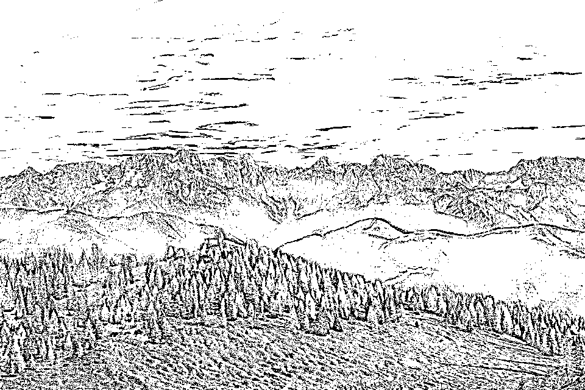

**★月亮*****狮子座***

他们行事果断有序，容易树立威望，有着精力旺盛、充满生机的个性。**他们落实企图的手段直接的，引人注目的。**他们能超然于个人情绪，铁面无私，由此创造了效率。实用主义和自信给这他们带来强大的说服力。他们崇尚精确。 

**★月亮*****处女座 ***

他们强势、自知的外表下隐藏着腼腆**。比起执行既定的程序，他们更偏爱分析处事原则。**他们的神经系统可能热情高涨，感受着野心的燃烧，提出堆积如山的工作计划，但总是在执行的时候渐渐掉队。然后，他们会滋生出一种私人化的智力上的恃才傲物来保护自尊心。

**他们太容易把自己该做的工作投射到他人身上，因而需要更多的远景式的想法和纪律感来支持自我。 **

**★月亮*****天秤座***

雄心勃勃的**独立自足感**掩盖了他们内心**对社交、对他人的关注的渴求**。他们可能会发展出一种歌剧女主角般的超然气质。**他们的挑战，是妥协日月二者的需求。 **

**★月亮*****天蝎座***

**他们有着极大的内心驱力和脾气。**但因为矜持，他们抑制和隐瞒了很多冒失的看法。虽然他们学会了妥协，但要松动自己核心的看法却比登天还难。他们不会把感情掺杂到推理中去。为了屈从和适应他人，自尊学得了策略化的力量。 

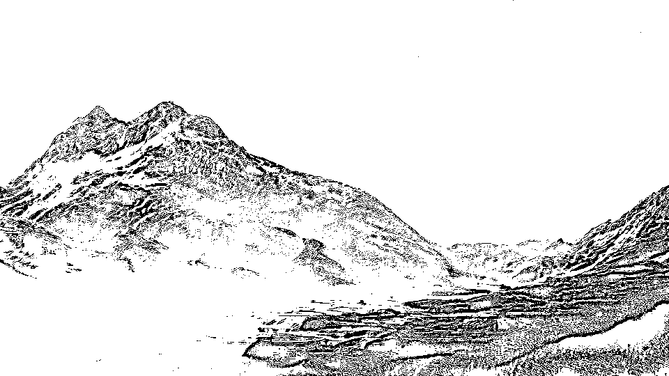

**★月亮*****射手座***

射手座月亮让摩羯座太阳的企图心表达得更流畅，**观点更多样，更有社会包容度。**他们充满了紧张的热情；会产生智力优越感，会焦躁不安地争取一切新东西。这些个性富有魅力但却劳心。 

**★月亮*****摩羯座***

企图心、抱负和跨越障碍的能力在这个配置达到了顶点。他们可能早年有着身体上的弱势，这给成年生活提供过度补偿的诱因。他们的个性可能自私并垂涎权力。**他们内心现实，高度重视秩序、守时、精确、自控和理性。**

**★月亮*****水瓶座***

**摩羯座的决断力和企图心找到了安全而新颖的释放渠道，**这些渠道可能是人道主义、人文或社会化的。他们往往有着明确的人生目标和稳定的努力方向，容易在上述领域获得成功。 

**★月亮*****双鱼座***

**他们的企图心能够感知并接受外部世界，**因此摩羯座好斗的一面被软化了。他们能领悟到民主与慈悲，这调节和改变了支配者的形象。**仁慈和有益于他人的想法代替了权力动机。**他们有着非常私人化的自我满足的方式。他们容易主动承担责任，并可能因此受到他人的利用。 

**版权声明：**本文由若道翻译发布，欢迎转发，反对抄袭。友号转载请申请白名单。

**本系列其他文章**[太阳白羊座·12 星座月亮](http://mp.weixin.qq.com/s?__biz=MzA5NjA0NTAxNg==&mid=2651463192&idx=2&sn=7ecd2012aee1f245b56e0f107bdfc19e&chksm=8b48acafbc3f25b968e9ca8cbe8acf6972dc3e418827b36ac12af7bf7c81858937657babb393&scene=21#wechat_redirect)丨[太阳金牛座·12 星座月亮](http://mp.weixin.qq.com/s?__biz=MzA5NjA0NTAxNg==&mid=2651463523&idx=1&sn=69fa5ba9035316fecd6c3911e744f089&chksm=8b48add4bc3f24c274cd5064316982ae958debed1e9ab681b46b80d8d8ec26bb3d2036075be9&scene=21#wechat_redirect)[太阳双子座·12 星座月亮](http://mp.weixin.qq.com/s?__biz=MzA5NjA0NTAxNg==&mid=2651465406&idx=1&sn=c9bf1ba49b07f6c67740c46779200be8&chksm=8b489409bc3f1d1fdad398e34840d6338275f29a8292e9eb404df28126fcc8262c454b2cb6c5&scene=21#wechat_redirect)丨[太阳巨蟹座·12 星座月亮](http://mp.weixin.qq.com/s?__biz=MzA5NjA0NTAxNg==&mid=2651465949&idx=1&sn=9dfd930de39b2de38c761152f4b8710c&chksm=8b489a6abc3f137c5c6e96f404038de7f4261fc6c995aeb285bc37f79b96ef5a1d237dbe3af5&scene=21#wechat_redirect)[太阳狮子座·12 星座月亮](http://mp.weixin.qq.com/s?__biz=MzA5NjA0NTAxNg==&mid=2651467312&idx=1&sn=d1a81f5cc1a60b3198d9c0ba770b4ba0&chksm=8b489c87bc3f1591008c88cef7b385086eb7717d4345926de92349b071ad10ceb67099f17ed0&scene=21#wechat_redirect)丨[太阳处女座·12 星座月亮](http://mp.weixin.qq.com/s?__biz=MzA5NjA0NTAxNg==&mid=2651467590&idx=1&sn=09b8f5ba9fa46e469e0add987cbe1664&chksm=8b489df1bc3f14e7a4e6b90286394af16e05f4c097058a2e2402d38f2634a0a84b32aaa03fe3&scene=21#wechat_redirect)[太阳天秤座·12 星座月亮](http://mp.weixin.qq.com/s?__biz=MzA5NjA0NTAxNg==&mid=2651469157&idx=1&sn=c8b14b4a67b6c6ed3b7943c136d7c34c&chksm=8b4887d2bc3f0ec46e3b444c2f1ba1f331d5d0b35326aa75e77351fdde762f0fd1c6d43ada5c&scene=21#wechat_redirect) | [太阳天蝎座·12 星座月亮](http://mp.weixin.qq.com/s?__biz=MzA5NjA0NTAxNg==&mid=2651470116&idx=1&sn=68fb9ddee0671591ebae843cf2b38431&chksm=8b488b93bc3f02853f1cb8bcde25868c1c1500478eda9c4773dd1d3f93b3239a8a5fc956d999&scene=21#wechat_redirect)[太阳射手座·12 星座月亮](http://mp.weixin.qq.com/s?__biz=MzA5NjA0NTAxNg==&mid=2651470771&idx=1&sn=c00e6fac49cac9c8ed97b637fe39267a&chksm=8b488904bc3f00122bf676a9dc0d668389344169bb9e78f94a909be9575feab784436648a42c&scene=21#wechat_redirect)

**诺·泰尔**

现代占星学鼻祖，世界众多著名西方占星师的占星老师。他毕业于哈佛大学社会关系专业，是当今世界上最重要的占星师之一，占星联盟协会（AFAN）的创始人及原主席。其所著的三十三本占星教科书作为占星教学的典范，引领了整整两代占星师的占星学习与教育，1998 年国际占星大会（UAC）授予其占星界最高奖项 “轩辕奖”。

**20 位来自世界各地的占星师****带来 20 场沙龙——新世界的觉醒****详情可点击下图**

**学习占星学****点击下图了解课程详情**

**

**微信又双叒叕改版啦，不想错过若道君的推送？****就把若道设为星标吧！****▼**

**就是这个“在看”，戳戳戳 ☟**

****************报名直达入口****************

# 2 场沙龙来袭丨如何在星图中，深入根深蒂固的情绪模式？

> 原文：[`mp.weixin.qq.com/s?__biz=MzA5NjA0NTAxNg==&mid=2651472398&idx=1&sn=649cbb14fbc6b61d268f3de3345006b5&chksm=8b48f0b9bc3f79af054a9bf438eea1f89cf465765952378a39f9fa1fd30fa1cb127032c1b7b8&scene=126&sessionid=1692737827#rd`](http://mp.weixin.qq.com/s?__biz=MzA5NjA0NTAxNg==&mid=2651472398&idx=1&sn=649cbb14fbc6b61d268f3de3345006b5&chksm=8b48f0b9bc3f79af054a9bf438eea1f89cf465765952378a39f9fa1fd30fa1cb127032c1b7b8&scene=126&sessionid=1692737827#rd)

**沙龙来啦！**

**4 月 23 号星期六上午 10 点，**国际占星研究协会（ISAR）中国星空俱乐部沙龙由**占星师苏茜·考克斯**带来一场沙龙。

**4 月 29 号，星期五晚上 8 点，**将由占星师**米歇尔·古尔德**带来另一场场沙龙！

**沙龙主题****沙龙主题：苏茜的解读秘密****主讲人：******苏茜·考克斯****

**沙龙时间：2022 年 4 月 23 日 星期六**

**                北京时间 10:00-11:30（有英文翻译）**

**沙龙方式：线上沙龙**

占星学中最难的部分是综合星图解读。如果你想了解开普勒学院的学生对星图解读中学到的内容，这堂课就是为你准备的。

**利用关键词和图片，苏茜将向你展示如何将你的星图运用简单的句子表达出来。**你将以一种全新的方式来看待占星学…...我向你们保证。

**主讲嘉宾**

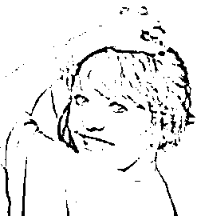

**苏茜·考克斯**

苏茜·考克斯(Susie Cox)自 1971 年以来一直是职业占星师，在此期间她解读了超过 5 万张星图。她作为占星师在峡谷牧场健康水疗中心工作了 32 年，在那里她开创了玄学部。苏茜在开普勒学院教星图解读，做国际演讲，是一个狂热的博主，每月写通讯，并写了 8 本书。她擅长商业占星学和恋爱关系。

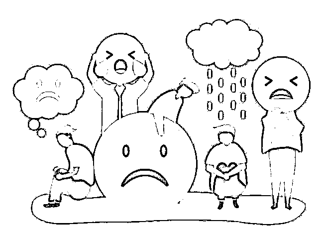

**沙龙主题****沙龙主题：在困难情绪中找到智慧****主讲人：**米歇尔·古尔德****

**沙龙时间：4 月 29 号，星期五**

**                北京时间 20:00-21:30（有英文翻译）**

**沙龙方式：线上沙龙**

我们所有人都有**根深蒂固的情绪模式**，我们在压力或危机时的“直接”反应。

**占星学最好的情况是能让我们对这些倾向有更深入的了解**，所以我们会变得不那么被动，不会加剧情绪化。

在这场沙龙中，我们将探索识别**星图中阻碍模式**的策略，并应用一个**简单的框架**，借用佛教心理学（阿毗达摩），在咨询室及以外的地方处理这些棘手的情绪。

**主讲嘉宾**

**米歇尔·古尔德**

米歇尔·古尔德，MFA, TACC，是一位国际占星演讲者和老师，她喜欢将**传统和现代的最佳占星技术**融入到她的咨询实践中。

她是青年占星师协会(AYA)的创始成员，ISAR 的前任财务主管，阿瓦隆占星学院的讲师和董事会成员，以及 AstroDatabank 的撰稿人。

她目前担任 ISAR 伦理委员会主席和 AFAN 顾问。

**如何参加沙龙？**

本讲座也是本月的国际占星研究协会（ISAR）星空俱乐部讲座。**ISAR 会员可以免费收看。**请注意邮件通知，具体参与方式见邮件。

❶ 如果你**已经是 ISAR 会员**，请注意邮件通知，告知如何参加。

❷ 如果你**不是 ISAR 会员**，非 ISAR 会员价格：98 元。如有任何问题请咨询工作人员

yiyi（微信：YY18513802156）

**非 ISAR 会员报名请长按下图**

**▼**

**4 月 23 日沙龙**

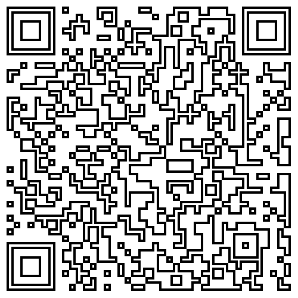

**▼**

**4 月 29 日沙龙**

**ISAR 明星俱乐部**

2018 年，ISAR 在主席亚历山大·因舍阿吉克的带领下，成立了 ISAR 明星俱乐部，每月为全球 ISAR 会员提供在线直播讲座，邀请全球著名占星师开讲，学习和分享新的理念。讲座时长一小时，涉及占星学的不同领域、不同观点，每个会员都可以参与其中，每次讲座之后还有 20-30 分钟问答时间向老师们提问。

每一场在线讲座都会记录下来，ISAR 除了提供视频，还会提供相关的讲座资料，以及单独的问答录音，自动发送到专门的 ISAR 明星俱乐部页面存档，每位 ISAR 会员可以在 ISAR 网站上自己的会员主页俱乐部页面找到。在 2018 年最初几个月，ISAR 明星俱乐部会每月举办一场在线演讲。之后，两周举办一场演讲，最终每周举办一场演讲。

但是，过去明星俱乐部讲座只有英文沙龙，因此，中国会员只有懂英文才能受益。为了使得更多不懂英文的中国会员能够受益，我们特别和 ISAR 总部协商，今后会安排有中文翻译的明星俱乐部占星沙龙，作为给中国 ISAR 会员的福利！

**如何成为 ISAR 会员？**

**如果你也想成为 ISAR 会员，请复制链接在浏览器打开**

http://www.nodoor.com/isarcert.do?contentId=3588（仅支持网站支付）

**或直接长按下方二维码，微信购买会员：**

**ISAR 会员有什么福利？**

一年期会员仅需支付**人民币 420 元**，即可享受：

**☆ 星空俱乐部免费沙龙**

**☆每年出版 3 次的《国际占星师》（目前只有英文）；**

**☆每周电子邮件交流汇总杂志（目前只有英文）；**

**☆专项研究基金和奖学金资格；**

**☆ISAR 主办的会议和论坛的会员折扣，包括国际占星大会（UAC）、ISAR 的会议和研讨会等会员权益。**

**有疑问怎么办？**

关于 ISAR 星空会员俱乐部以及我们的讲座，如果你还有任何疑问，**请联系工作人员**：

**yiyi**

**微信：YY18513802156**

**若道 Conrad**

**微信：nodoor2016**

****非 ISAR 会员报名请点击“阅读原文”****

# 2022 金融年运丨木星在白羊座，给世界带来哪些挑战？

> 原文：[`mp.weixin.qq.com/s?__biz=MzA5NjA0NTAxNg==&mid=2651472398&idx=2&sn=6db4c1bb9e5358abc7c8d4829473492b&chksm=8b48f0b9bc3f79af9e532f6094838ce15b5864e03c485b2d3d1d11f900b0cba8c62c90910cc8&scene=126&sessionid=1692737827#rd`](http://mp.weixin.qq.com/s?__biz=MzA5NjA0NTAxNg==&mid=2651472398&idx=2&sn=6db4c1bb9e5358abc7c8d4829473492b&chksm=8b48f0b9bc3f79af9e532f6094838ce15b5864e03c485b2d3d1d11f900b0cba8c62c90910cc8&scene=126&sessionid=1692737827#rd)

**木星在白羊座**

双鱼座是潮湿的，而白羊座是火热的。木星在双鱼座可能与雨水和洪水对应，但木星在白羊座更容易与火灾和干旱对应。

**木星将进入白羊座两次。**它第一次进驻这个与自我主张、侵略、竞争和战斗相关的星座是在**2022 年 5 月 20 日-10 月 27 日**，第二次是**2022 年 12 月 21 日-2023 年 5 月 16 日**。

白羊座是先锋，代表探索的原则，冒险进入那些等着被发现的新领域，如外太空，或一些新的商业尝试。涉及木星，白羊座可以非常善于运动、有竞争性，在人类活动的各个方面打破记录，如体育、辩论、政治竞赛。

涉及白羊座，这成了**“不惜一切代价赢得胜利”**的任务。我们指的是一种**“战士心态”**，一种与刚离开的双鱼座完全相反的强硬态度。它们一个为和平而战，另一个为胜利和征服而战。

2022 年的美国中期选举可能会非常激烈，充分展现出夸夸其谈和大男子主义，似乎是为了证明谁是最强壮、最粗犷、最有能力应对作为强大领导人的严峻挑战，或者谁最能说服公众相信他们是强大而勇敢的领导人。

**唯一的问题是，这个世界刚刚从双鱼座时期走出来，它希望展现共情。**尽管有木星在，但白羊座的原则与共情无关，如果演戏能带来胜利，白羊座可以成为一个好的演员，**只有胜利才是重要的。**

因此，在木星从双鱼座进入白羊座的 12 年周期中，看到冲突和军事侵略行为爆发就不足为奇了。上一个实例在**2010-2011 年**发生，阿拉伯之春爆发。**1999 年**，是印度和巴基斯坦之间的格尔吉尔战争。**1987 年**是两伊战争。**1975 年**，是西贡沦陷，越南战争结束，这场战争始于 1963 年木星的白羊座之旅。在此之前是朝鲜战争**(1951 年)**和第二次世界大战的开始**(1939 年 9 月 1 日)**。这个列表还可以继续。

**木星从双鱼座转换到白羊座，通常伴随着这种侵略性的军事冲突。**因此，2022-2023 年，当木星从双鱼座行进到白羊座时，世界可能会目睹另一场严重的冲突。从积极的方面来看，世界也可能见证巨大力量的展示，人们可能会在各种人类活动中创造记录，包括在体育运动中，以及进一步的太空探索和飞行任务中。

**这是一个激动人心的时刻，但也是一个制造危险的时刻，**因为在被大男子主义和自负的个性所统治的国家里，这些原则会被应用到战争般的行为中。

**作为一个集体，我们如何才能最好地处理这个问题？**我们可以奖励英勇无畏的行为，但不鼓励造成不必要危险局面的侵略行为，后者会让人们的生命处于危险之中，只是为了满足某个疯狂的世界领导人或未来领导人的某种自私欲望。如果我们能够避免这些人在世界舞台上上演冲突，那么社会上的先驱者和训练有素的天赋运动员所取得的卓越成就就可以得到赞赏。

**这是一个成为天才运动员或者竞争者的好时机。**如果你屈从于残酷人格的自我驱动需求，唯一的目标是不惜一切代价赢得他人、征服他人，那这对你来说就不是一个好时机。

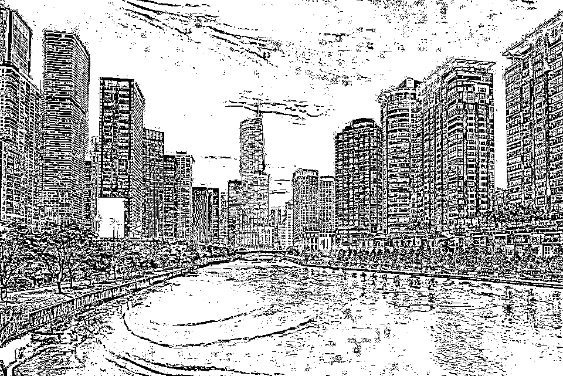

1976 年以来，由雷蒙德·A·梅里曼撰写的梅里曼市场时机学院每年一次的年度预报沙龙和每年一本的《年度预报》一直在应用占星学原理为投资者们服务，提供卓越洞见，从未间断。

**2020 年，木星、土星和冥王星形成大合相，我们刚刚结束了一个周期和一个时代。现在我们正处于一个新时代和一个新的长期周期的早期阶段。**

如果 2020 年我们还在手忙脚乱，不知道发生了什么；2021 年则更让我们更清楚地看到一个时代结束了——2020 年之前的时代，在新冠肺炎病毒大流行、2020 年”大合相”之前的时代，这是人类历史进程上的一个转折点。**我们所熟知的生活诸多方面在那时就结束了，现在人们仍在试图找出“正确的方式”或“最好的方式”来重建和再造世界。**

2021 年，有的行业被彻底摧毁，有的行业成为新贵。

2021 年对投资者是一个苦乐不均的一年。尽管美国新冠肺炎疫情未见好转，道琼斯指数仍然扶摇直上；尽管中国经济在世界经济增长中一马当先，上证指数仍然波澜不惊。在货币对标的品种中，老贵族黄金走低，新贵族比特币飞升。

我们还看到了大宗商品价格的飞涨，各种短缺开始出现。在中国，各种政府干预市场的调控在各个行业愈演愈烈。

**2022 年仍然是旧世界向着新世界转变的一年。**

此时，金融市场的投资者和潜在投资者，都需要客观而睿智的思考，而金融占星大师雷蒙德·A·梅里曼的研究则更是无可替代的。

去年，这个 3 小时的年度预报沙龙和长达 200 页左右对金融市场的分析报告帮助许多若道的读者做出正确的投资决策，降低投资风险，并获得相当不菲的投资收益。

**2022 年 3 月，梅里曼老师带来了一场精彩的讲座，讨论 2022 年重要的宇宙天象及其对世界经济、金融形势的整体影响，还覆盖了中国上证股票市场的分析、黄金白银市场、比特币市场等投资市场。**

**2022 年度报告及沙龙**

**价格：****1380 元（报告已发布）**

**一份价格仅千元的顶尖金融占星大师的投资分析报告和沙龙，聪明的投资者值得拥有。******扫描下图二维码购买报告及沙龙****

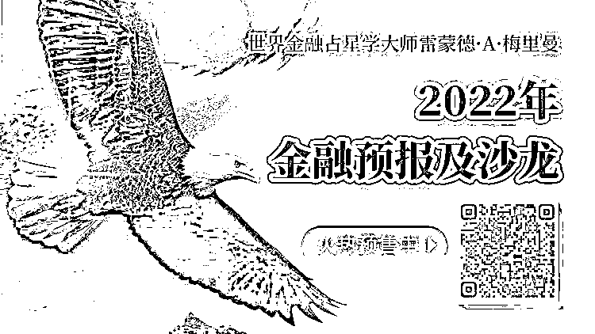

**购买者重要须知****①** 梅里曼市场时机学院每年一次的年度预报沙龙和《年度预报》是梅里曼市场时机学院的研究“预报”，而不是市场“预测”，是梅里曼老师及其金融占星分析师对人类活动周期历史与行星周期之间相关性的研究，二者在大部分情况下具有 80%或更高的相关性，而不是因果关系。沙龙中和报告中的研究完全存在错误的可能性。即便是非常认真的研究和几十年的研究经验，我们无法总是正确地解读出各种征象在实际层面上会如何相互作用，并显化为事件结果。

所以请将次沙龙和报告看作一个研究参考，务必结合其他市场研究和你个人对市场的理解，根据你的自由意志做决策。

**②** 此报告一旦售出，**即不接受退款。**

**③** 此报告仅支持在手机网页和若道 APP 上阅读，不支持电脑阅读和下载。**④** 讲座提供视频回放。**以上须知，请仔细阅读。一旦付款，即视为已了解并接受所有须知内容。**

**如在购买报告中遇见任何问题**

**可添加客服**

▼

****购买报告直达入口****

# 情感、事业、金钱、孩子……你所关心的 4 个领域这个技法都可以预测！（内含完整案例）

> 原文：[`mp.weixin.qq.com/s?__biz=MzA5NjA0NTAxNg==&mid=2651472317&idx=1&sn=bb84df92e792a2ab6e5d015c21057f8a&chksm=8b48f30abc3f7a1cedee7d33b5f5d7c79744aa3c2264be064b8b8e1eb3418e29f84b95623b69&scene=126&sessionid=1692737827#rd`](http://mp.weixin.qq.com/s?__biz=MzA5NjA0NTAxNg==&mid=2651472317&idx=1&sn=bb84df92e792a2ab6e5d015c21057f8a&chksm=8b48f30abc3f7a1cedee7d33b5f5d7c79744aa3c2264be064b8b8e1eb3418e29f84b95623b69&scene=126&sessionid=1692737827#rd)

**☆****后台回复“今日”，给你一句生命态度******

作者/艾德里安·邓肯 译者/Christy 校对/Arrow

编辑/玫瑰 图片/pexels

卜卦星图可以反映出我们自身和周围世界正在发生什么，当它作为咨询星图时，是我们为客户提供答案的完美工具。让我们看看哥本哈根占星学院院长艾德里安·邓肯老师如何解读卜卦星图上的征象星、征象星和其他行星的关系。另外，艾德里安老师亲授【[现代卜卦占星学](http://mp.weixin.qq.com/s?__biz=MjM5MjQwNjAyMQ==&mid=2649439458&idx=3&sn=5930b97b5292603c8b3d668b90554799&chksm=beb9538889ceda9e85535c44a05b9f4ebfc1b2e6e7fe4ce3ebb1b1ae7cc26067225d83ad9300&scene=21#wechat_redirect)】报名中，点击链接了解更多详情吧！**敏感的上升点****当意识专注于某个时刻，那个时刻的卜卦星图就必然会反映出你身上和你周围的世界正在发生什么。**推动着宇宙的那股力量也同样推动着人，而通过占星学，你能理解和阐释这种联系。当我开始使用卜卦图作为来访客户的咨询图时，我的咨询立刻变得准确多了。描述性格和个人发展，人本主义占星学很好用。不过，对很多客户而言，心理占星学只在某种程度上有用。

一个商人或许想要了解与工作和财务相关的事情，只有当你在这些领域给予他满意答复后，他才愿意略微吐露一些心理议题。**咨询星图是提供这些答案的完美工具。**

传统上，如果提问时上升点在一个星座的**开始或最后 3 度**，那么在大多数情况下，这个问题无法回答。这是因为当上升点在 27°-29°时，事件几乎没有时间发展，能量很低，既没有欲望也没有时间来完成事件。同样地，当上升点在 0°-3°时，局势还太早，客户还没有机会判断形势。但通常，当上升点在这些度数时，客户就到访了或者打了电话，**这其实给出了关于客户情况的重要信息**。就像涉水过河一样，提问者要么刚到浅滩，正准备过河，要么已经过了一半，要么马上就要过完河了。或者，也可以把这种情况比作两个非常不同的国家之间的边境，两个国家由相关的两个星座象征。如果客户前来咨询时上升点在双子座 29°，那么她已经通过了第一个国家的边境哨所，正准备进入无人区，目前对另一个国家是什么样浑然不知。这可能表明，提问者快要结束学业，接下来或许要组建一个家庭（巨蟹座）。**这里的要点是：每个星座的边界都有特定解释，了解这一点对客户来说很有帮助。**

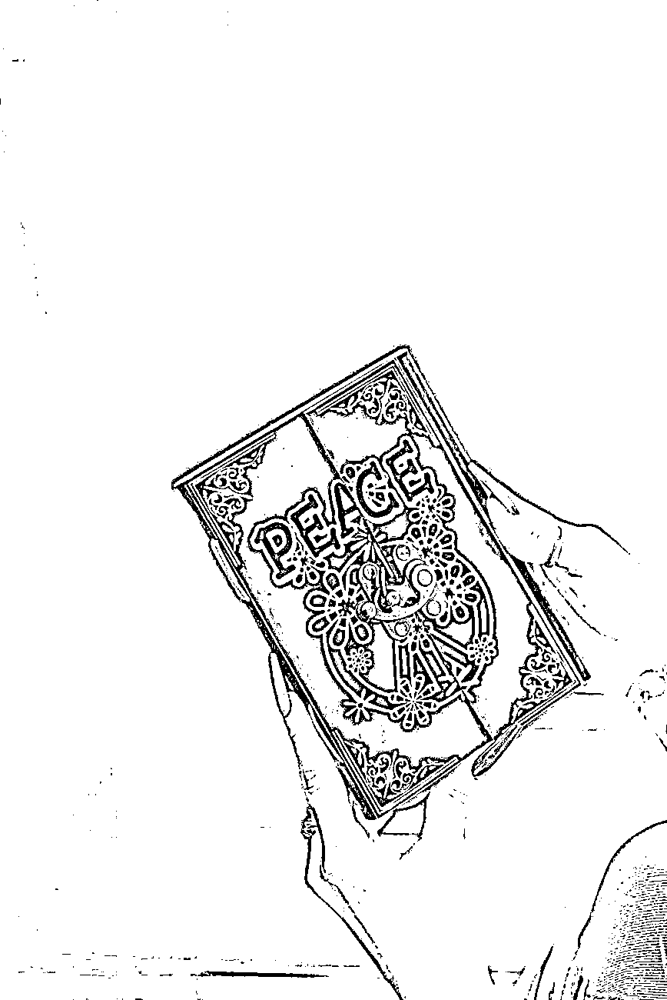

**注意星座的边界**

**当征象星接近宫头时，情况类似。**如果一颗行星**在 27°-29°**，那么它即将完成任务（只要随后不逆行）。这代表了一个有些疲惫，却还在为某个没有真正的未来的事奋斗的人，他也不知道接下来会发生什么。如果一颗行星**在 0°-3°**，代表了一个充满能量和热情的人，或许有点天真，缺乏经验，容易犯新手会犯的错。

如果一颗行星进入新的星座后，又逆行退回到上一个星座，那么这颗行星就有了一种特殊身份：**跨越边境的流浪者**。这代表了一个可能有双重国籍，或者在两个不同领域有生意，或者试图在两段关系之间做抉择的人。

比如，如果金星进入天蝎座，随后又退回到天秤座，这展现出一个人踏入了危险领域，在这里她在财务或性上妥协让步，她的伴侣或对手（火星守护天蝎座）说了算。于是金星会寻求退回到安全的避风港天秤座，聚集力量、盟友和资源。

**每个星座的边界都有特定含义，任何在星座边界左右徘徊的行星都有奇妙的故事可说。**

**特殊状态：月亮空亡**

如果一颗行星——尤其是月亮在离开一个星座前不再形成相位，那么它就处于空亡状态，意味着事件不再会有后续发展。**这是一条有效的规则，如果月亮空亡，对于期待事件有某种特定结果的客户来说不是好兆头。**

当然，如果你想要避免坏结果，这可能是件好事。当计划与权威人士会面时可以运用这条规则，此时期待的结果将化为泡影。

但即便是威廉·利里也对这条规则提出了**例外**，尤其当月亮在**能量较强的金牛座或巨蟹座**时。如果月亮在一个星座末尾，即将成相，那么空亡规则在某些情况下可以忽略。

比如，月亮在天蝎座 28°，木星在射手座 4°。如果客户希望上大学，那么这个愿望很有可能实现。客户将离开一个非常坏的环境（天蝎座），进入一个十分积极的环境（射手座）。**跨越星座边界后即将形成的相位仍然预示着符合客户预期的结果**，不过，如果月亮比如说在 15°，且不再形成相位的情况下，那么很大可能什么也不会发生。

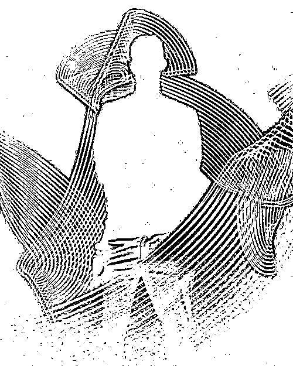

**关注征象星**

在解读星图时，每个占星元素都可以考虑在内。它们都反映了客户和客户的情况，你挖掘得越深，星图就会告诉你越多。**然而，如果你想要回答一个问题，诀窍在于忽略多余信息。**即便在个人咨询时，通常时间也只够关注一些重要的占星模式。

**因此，在卜卦占星学中，你需要专注于征象星，评估它们的强度，观察其运行和相位。**

**不能忽视外行星，但与天王星、海王星和冥王星形成的相位更多地是给予信息，而不具有决定作用。**如果你的征象星是火星，你在找房子，火星运行，与海王星成四分相，你可能会被骗，或者那个房子建在沼泽地上，但如果其他因素有利的话，你仍然可以买那个房子。如果你的征象星是金星，你对一段关系产生兴趣，金星运行，与冥王星成四分相，但三分火星，你会与你喜欢的人在一起，但这段关系很可能非常偏执。如果你的征象星是太阳，你想移居国外，太阳与天王星成相，那么在预测一段异国旅行前，你还需要一些佐证。**卜卦星图的实际运用**

**关于感情**

如果上升点在白羊座，那么第七宫的宫头就落在天秤座。如果上升在射手座，下降点就落在双子座。**每颗行星都有其天然伙伴——对宫星座的守护星。**火星-金星、水星-木星、太阳/月亮-土星都是彼此吸引的对立行星。

在每一个伴侣关系问题中，你要寻找的是一组成对行星之间的相位，最好成六分、三分、合相或对分相，最好不要成四分相。 **成对行星中运动较快的行星是主动的一方，而运动较慢的接收到在一起的邀请。**通过研究每个征象星的星座和相位，占星师有可能对潜在的伴侣做出精确描述。

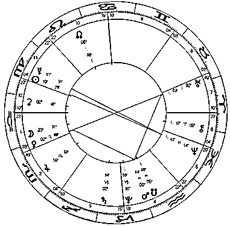

**| **卜卦图：2018 年 9 月 12 日 9:00，挪威桑讷菲尤尔，上升在天秤座 10°23′

在这个案例中，代表客户的是金星，落在天蝎座，这展现出一个在金钱和爱情方面都处于不利地位的人。但是，金星最近与火星形成四分相，这些征象显示她一定遇到了一位男性。这位男性突然向她提供了一份数百公里以外的工作，客户问是否应该追随这位男性去工作。由于金星很快将逆行，并再次与火星成四分相，因此很可能他们之间有着很强的化学反应。由于金星将再次与天王星成对分相，因此远途旅行的可能性很大。

因而，对她而言很难拒绝这份吸引，但是这种情形的压力非常大，当金星退回到天秤座时，她会回家，因为你不得不问，火星在水瓶座四分天王星时，对感情的兴趣又能有多大呢？

总之，如果提问者问到的是一段尚未形成的关系，那么上升和下降的守护星之间应该形成一个传统的（托勒密）相位。

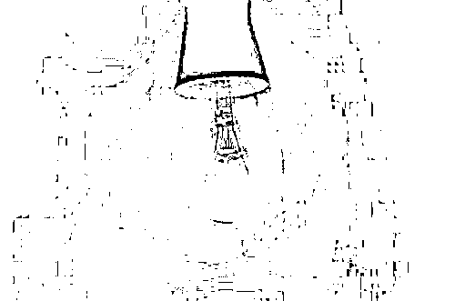

但人生鲜能如此简单，许多客户来咨询时情况复杂得多。比如，他们可能已经在一段关系中，但关系正渐渐变淡，并遇见了别的人。或者他们已经结婚，但伴侣却出轨了。

**卜卦图本身会反映出这些细微差别及其所有的发展情况，前提是你能识别出哪些行星代表相关的各方。**

**关于孩子**

客户常常提问他/她是否会有孩子，或者问关于孩子生活的问题。**通常，代表孩子的是第五宫的守护星**，因此，如果上升的守护星与五宫的守护星成入相位，那么可以合理推测将有一个孩子诞生，前提是客户年龄合适。

一些星座比另一些更多产，比如金牛座和巨蟹座，而另一些就或许不那么多产，比如水瓶座或双子座。**月亮落在一个多产星座是有孩子的好征象，前提是月亮将要形成良好的相位**，而不是诸如四分土星这样的相位，月亮四分土星常常预示着不好的结果。

如果征象星与天王星成相，或天王星在第五宫，那么母亲可能需要类似试管受精这样的技术辅助。如果涉及冥王星，提问者可能担心会失去孩子，或者想要堕胎。如果涉及海王星，可能药物或毒品会成为阻碍。**如果提问者问到的是他/她已经有的孩子，并且只有一个孩子，那么这个孩子将由第五宫的守护星代表。**如果存在更多孩子，占星师就有多种选择。如果第五宫中有多颗个人行星，那么可能每颗行星代表着一个孩子，度数最靠前的行星代表最小的孩子。

也有一种传统，认为第五宫的守护星代表最大的孩子，第七宫的守护星代表老二，第九宫的守护星代表老三等等，这种方式通常也很有效。被截夺行星落在第五宫可能显示孩子来自另一段关系。

**占星师需要有务实的态度：找出哪颗行星代表哪个孩子的最佳方式是研究星图，看每颗行星与孩子性格的契合度。**很可能金星代表女儿，火星代表儿子。如果一位母亲询问她的儿子，火星在水瓶座四分天王星，而她的儿子又有些调皮捣蛋，那么你就知道代表她儿子的就是火星了。

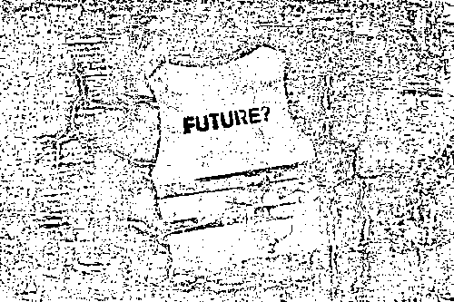

**关于工作事业**

**角宫非常强大，它们的守护星分别代表了客户（第一宫），母亲、家和家人（第四宫），伴侣或地位对等的人（第七宫），老板、父亲或事业（第十宫）。**

有时代表父亲和母亲的宫位需要对调，取决于谁是占主导地位的家长。第十宫的守护星代表机构中最高的管理者。第十宫内的行星展现了其他权威人物和伙伴，但它们也能透露客户所做的工作类型。同事和雇员由第六宫的守护星以及六宫内的行星代表。

如果一位客户正寻求一份顶尖的工作，那么你会想看到**上升守护星与中天守护星**成入相位。但如果客户只是寻求就业，那么**上升守护星或月亮与第六宫的守护星**成相位即可。

**|**卜卦图：2018 年 1 月 10 日 15:00，比利时布鲁塞尔，上升在双子座 26°45′

这个案例的卜卦图是求问工作的典型。在这张星图中，月亮入弱天蝎座，在第六宫，展现出客户在现有工作中心力交瘁。

她是一位有才能的中国女性，拥有卓越的语言能力，在布鲁塞尔工作，水星入陷在射手座既体现出她的才智，又透露出她生活在异乡的感觉。

火星和木星在天蝎座第六宫代表了工作环境中独断专行的男性，或许还有些许性意味。考虑到金星合相太阳和冥王星在第八宫，她在咨询时显然焦虑不安。她的提问是，她是否应该接受一份工作邀约。答案显而易见。**上升点正接近星座末尾，预示着她当前的形势难以延续，转变即将到来。**此外，上升守护星水星落在射手座 29°，**也即将进入新的星座**。第三，进入摩羯座后，**水星将与第十宫的守护星土星相遇**。因此，她应该立即离开现在的工作，把目标瞄准一家受人尊敬的公司的更高职位——土星在自己的守护星座摩羯座是尊贵状态。她几个月内获得了新工作。

**关于金钱与安全**

**在判断财务问题时，常常需要考虑许多不同因素**。大多数客户希望财源广进，但通常，他们未来的财务趋势会延续此前生命中普遍存在的财务趋势，不会有太大出入。出生星图会给出关于这些趋势的信息。

但偶尔，客户会有关于金钱和财力的具体、紧迫的问题。

**如果提问者的确在投资，那么第二宫和第八宫的守护星就很重要**。如果提问者想要获得来自社会体系的支持，比如保险、工会（通常也由第十一宫代表）、养老金和遗产，那么就是第八宫的事务。

如果提问者喜欢赌博，那么第五宫就很重要。比如，火星与冥王星合相在第五宫可能呈现为病态赌徒。

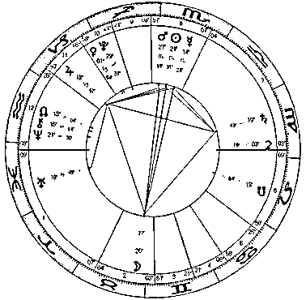

**|**卜卦图：2008 年 11 月 13 日 14:00，丹麦哥本哈根，上升在双鱼座 3°

这个案例的客户经营一家成功的餐厅，还喜欢投资股市作为副业。这种对经济风险的痴迷体现在金牛座月亮对分天蝎座火星中。由于两颗行星都落在强有力的位置，暗示着他很明白自己在做什么，并且能从中赚很多钱。

需要警惕的是：月亮落在恒星大陵五上，可能暗示着他被贪欲遮蔽了双眼，满月四分海王星，可能会减损利润。但是，由于擢升的月亮已经三分上升守护星木星，也三分了土星，并将继续与太阳和火星成相，因此经济情况似乎是强健的。

据我所知，他狠赚了一段时间。餐厅本身由土星与木星的三分相代表。

**当练习卜卦占星学时，你需要让星图来引导你，而不是被死板的规则牵着鼻子走，但你绝不能忽视征象星及其相对强度。**在你倾听客户描述他们生命中的各种状况时，你需要识别卜卦图中相关的行星模式。

你手中有地图，但客户熟悉实地，二者结合才能找到答案。客户提供的细节越多，你给出的答案就越详细。当你识别出反映客户情境的行星时，你就能跟随它们的运动轨迹，做出预测。

**版权声明：**本文由若道翻译、整理发布，欢迎转发，反对抄袭。友号转载请申请白名单。

艾德里安·罗斯·邓肯

若道签约老师，哥本哈根占星学院院长 1985 年开始成为全职占星师，是人本主义占星、卜卦占星和经世占星学领域的知名占星师。开发了占星软件 AstroClock 和多款占星报告。**现代卜卦占星的课程内容**

**课程分为 5 部分：**

**Part1 **融合现代占星理念，整合动态占星知识**Part2**独家【现代动态卜卦占星技术】全面教学**Part3**学以致用，覆盖人生各个领域问题的卜卦解法**Part4**扩展延伸择时占星技法的新认知**Part5**如何运用卜卦占星学做一场转化性的咨询

**15 节录播课+8 节直播课线上网络课，英文授课，中文翻译。**

**15 节录播课为 2020 年动态现代卜卦课程的内容。8 节直播课则完全是案例教学的形式。**

这样的好处是，你可以通过 1 个半月的密集学习之内按照自己的进度学完录播课的理论和录播课中已有的案例，从学习开始就实践，然后把实践中遇到的问题拿到 8 节直播课中，和老师互动。

**在 8 节直播课中，老师也会用案例教学、和同学互动的方式帮助大家进一步掌握卜卦占星的技法。**

******想要跟随邓肯老师学习卜卦占星学？******
**点击下图了解详情**

**20 位来自世界各地的占星师****带来 20 场沙龙——新世界的觉醒****详情可点击下图**

**学习占星学****点击下图了解课程详情**

**

**微信又双叒叕改版啦，不想错过若道君的推送？****就把若道设为星标吧！****▼**

就是这个“在看”，戳戳戳 ☟

********报名直达入口********

# 现代动态卜卦占星实战课 | 23 堂课，4 个月掌握卜卦技法

> 原文：[`mp.weixin.qq.com/s?__biz=MzA5NjA0NTAxNg==&mid=2651472317&idx=2&sn=50477f1157c68fc75f2972ecaa0dab23&chksm=8b48f30abc3f7a1caecbb1732a41e9408e7d1a6325280f57920af82ef8001032acfa322b7fd9&scene=126&sessionid=1692737827#rd`](http://mp.weixin.qq.com/s?__biz=MzA5NjA0NTAxNg==&mid=2651472317&idx=2&sn=50477f1157c68fc75f2972ecaa0dab23&chksm=8b48f30abc3f7a1caecbb1732a41e9408e7d1a6325280f57920af82ef8001032acfa322b7fd9&scene=126&sessionid=1692737827#rd)

**对现代动态卜卦占星的 7 个问题**

**1****什么是现代动态卜卦占星？**

现代动态卜卦是将有传统历史的卜卦占星和现代人本主义占星的精神结合在一起，**更适合现代社会现实状况**的卜卦占星技法。

**2****卜卦占星的特色是什么？**

**随时随地可用，**帮助你从这个卜卦星图中洞察当下你所期望了解的事情和人的现状、发展趋势、可能发生什么事情、可能的结果，及什么时候会出现什么结果。

**3****动态卜卦占星是什么意思？它重要吗？**

动态卜卦非常重要，因为事物不是静止的，而是变化的。**动态卜卦不仅会让你看到人和事物的状态，还可以让你看到其发展和变化的过程，**会碰到什么事情。

动态卜卦的美妙之处是它不是静止的一个照片，而是**描述一个故事的开始、发展和结局。**

**4****卜卦占星什么情况可以用？**

**万物万事皆可卜。**什么都可以用。1-12 宫所包含的人事百态，事业、健康、金钱投资、商务、旅游、教育、法律、生育、宠物养育等等。

卜卦占星也可以帮助我们去看某个社会事件、国际事件的发展，**可以和经世占星相结合。**

**5****它如何与人本主义占星结合？**

因为从卜卦行星可以看到参与人的**心理状态、心理过程和面临的议题**。而如果当事人愿意去调整自己的内心状态，就不再完全是被动的，而是可以以更积极主动的方式参与到事件中去；或者能够更理解目前的外部环境，选择更安然地调整内心。

**6****卜卦占星可以和人本主义的咨询相结合吗？**

当然。在课程中，老师将会仔细讲如何**把卜卦占星和出生星图及预测技术结合在一起，**给客户提供更好的服务。

**7****如何学好现代卜卦占星？**

**实践，实践，实践。**

占星学是一门必须大量实践的学问。纸上谈兵没有用，只是听课没有用。

实践是一步步来的。你不必知道所有的卜卦技法才开始实践。**从第一节课开始，你就可以进入实践。**

实践刚开始可能只是模仿。**我们有大量的真实案例，也安排了很多作业让大家练习。**也给大家拿自己的案例和老师互动的大量机会。

**授课老师**

**艾德里安·罗斯·邓肯****（Adrian Ross Duncan）**1971 年在印度游学时开始学习占星学，1985 年开始成为全职占星师，**迄今执业已超过 33 年，是人本主义占星学、卜卦占星学和经世占星学领域的知名占星师。他还开发了占星软件 AstroClock 和多款占星报告。**他在日常咨询中都会运用卜卦，咨询图（卜卦的一种运用方式，即根据客户来访时间制作星图，从星图中获得大量信息）也是他**特别擅长的领域**。艾德里安·罗斯·邓肯从 1971 年开始研习佛学，受佛学影响很深，他**相信占星学和佛学观点统一、转化的一个基础是在于对现实感知的改变**。而卜卦很容易与佛教融合，因为它只关乎当下。

| 艾德里安·罗斯·邓肯的占星学著作

作为本次课程的主讲老师，艾德里安·罗斯·邓肯如是说：

卜卦星图不仅给出了当下的能量状态，**它还包含着过去的踪迹，也蕴藏着未来的种子。**它是心理的，也是事件的。一个好的占星咨询是要把过去、现在和未来交织成一个整体。

**卜卦星图告诉客户他们当下在哪儿，他们处于的能量状态是什么，这张星图和他的过去有哪些关联，他可以怎样和这张星图一起合作去挖掘一个积极主动的未来。**这里预测的未来不是强加给他们的，这个未来是一点点揭露给他们看的。

心理占星学和卜卦占星学别无二致，所有的事件都有其心理对应。如果你的意识与世界同步，你就会看到二元统一。

行进和推进帮助我们理解如何抵御外在和内在的风暴。卜卦如同显微镜下的行进。**通过行进难以准确了解一段关系、房屋购买、工作机会等是否有益，但对卜卦来说并不难。卜卦也擅长回答与时间相关的问题，对行进和推进的标志进行微调。**

**课程形式**

**15 节录播课+8 节直播课线上网络课，英文授课，中文翻译。**

**15 节录播课为 2020 年动态现代卜卦课程的内容。8 节直播课则完全是案例教学的形式。**

这样的好处是，你可以通过 1 个半月的密集学习之内按照自己的进度学完录播课的理论和录播课中已有的案例，从学习开始就实践，然后把实践中遇到的问题拿到 8 节直播课中，和老师互动。

**在 8 节直播课中，老师也会用案例教学、和同学互动的方式帮助大家进一步掌握卜卦占星的技法。**

**授课时间**

**付费后一天即可开始看录播课程，全程有助教老师回答问题。**

**直播课程开始时间：**

2022 年 5 月 3 日，每周二 20:00-22:00

**这次课程恰逢世界在巨大的变动和不确定之中，期待这门课程能够给各位及各位的客户带来新的洞见和方向。**

**在这次 8 次直播课程中，我们将采用案例教学的方式，所有参课同学均有机会提供案例，供老师解读，且我们将组织群体的练习，用大量案例帮你掌握卜卦及如何在咨询中用卜卦。**

****

**授课内容**

***Part1***** 融合现代占星理念，整合动态占星知识**

星图如同地图，展示了人们从哪里来，现在在哪里，以及可能的去向是什么。卜卦星图虽然显示的是当下这一刻，但却是在动态当中的。所以过去的运动轨迹对应着过去所发生的，接下来的运动轨迹对应着接下来要发生的。

**在课程中你会学习到：**

*   我们如何从一张卜卦星图看到时间的流动：从过去到未来，故事如何展开

*   心理占星和事件预测如何在卜卦占星中有机结合起来

*   卜卦星图如何回答是否的问题

*   如何用卜卦星图回答分析性和指导性的问题

*   现代动态占星中事件发展的顺序：

*   确定咨询图中强调的当前事件

*   将客户与相位或行星组合相关的情感能量关联起来

*   在早期经历中找出相似的情景

*   认识到过去和现在的情感完全相同

*   辨识出过去做出的所有限制性决定

*   通过头脑风暴找出更能带来力量的方法来解决相同类型的问题

*   在想象和现实生活中重演当前和未来的事件

***Part2 *****独家【现代动态卜卦占星技术】全面教学**

哥本哈根占星学院院长艾德里安·罗斯·邓肯 Ardian Duncan 老师 50 年卜卦占星经验倾囊相授，内容包括但不限于：

**1.卜卦中的行星**

*   行星强弱及力量

*   太、月、水、金、火、木、土在庙旺落陷时的意思

*   卜卦星图中的月亮及其在 12 宫的意义

*   卜卦星图中的外行星

*   卜卦星图中的恒星

*   上升点和指征星的度数

**2.如何选择和辨识征象星**

*   当问题出现时，如何判断征象星

*   如果两个人或物由同样的征象星指代该怎么办

**3.卜卦图中的相位**

*   不同相位的意义

*   征象星之间相位的意义

*   征象星与其他行星相位的意义

**4.卜卦中的宫位**

*   12 宫位和宫位系统

*   对宫位的动态观察

*   宫主星及其互动

*   互容和定位星

**5.卜卦中的星座**

**6.传统卜卦原则（约束和限制条件条件）及其在现代动态卜卦中的应用**

**7.空亡、光线传递、完成、围困、燃烧之路等**

**8.星图中的逆行及其讲述的故事**

*   水星和计划

*   金星与依恋

*   火星与斗争

*   外行星逆行

**9.应期与时机**

*   1 度是代表多久

*   宫位的重要性

*   行星速度和逆行

*   如何综合卜卦和行进、次限分析时间问题

***Part3*****  学以致用，覆盖人生各个领域问题的卜卦解法**

希望将现代卜卦占星学的精髓传达出来，精细地讲解每一宫所代表的卜卦事物，分主题详解不同类型问题的卜卦解读思路，内容包括但不限于：

**1.爱情和关系**

*   金星的重要性

*   第一宫和第七宫以及其中的行星

*   成对行星

*   上升点、下降点及其守护星

**2.业务和工作**

*   第十宫和第六宫以及其中的行星

*   木星和土星及其相位

*   火星和水星

*   行进和中天

**3.资金和资源**

*   第二宫和第八宫以及其中的行星

*   第五宫和第十一宫

*   金星、木星和土星

*   四元素的意义

**4.家庭和大家庭**

*   第四宫和第十宫及其守护星

*   第五宫、十一宫及其守护者

*   第五宫和第十一宫的行星

*   月亮

**5.社会、法律、智性、健康、存在主义的问题**

*   第九宫和第十二宫及其中的行星

*   木星和第九宫守护星

*   第三宫 、第十一宫、第六宫和第八宫

**6.如何解读事件星图**

*   从新闻学习卜卦盘

*   如何从卜卦盘看新闻事件和世界大事的发展变化

*   我们如何去培养自己观察有预兆意义的信息、从日常事件中捕捉启迪

*   占星解读的意义

***Part4 ***** 扩展延伸择时占星技法的新认知**

在择时的时候，我们会选取征象星处于有力的时候，来规划我们的事件；避免征象星不力的时候，尤其当这个征象星代表我们自己。

**择时星图一瞥**

*   择时的艺术

*   如何在不完美的天象下取得最佳结果

*   如何做出深思熟虑的回答

*   如何为约会择时

*   如何为婚礼择时

*   如何为商业活动择时

*   如何为旅行择时

*   如何为对抗事情择时

*   虚拟和实时会议的择时

***Part5  *****如何运用卜卦占星学做一场转化性的咨询**

虽然卜卦的结果可能是不利的，但我们仍然可以从心理占星学的角度给出一些积极建议，帮助客户建立信心，有助于应对之后的人生。客户出生星图与卜卦星图的关联，这在咨询中对于心理方面的考量是非常重要的。

*   一个好的咨询有哪些特色

*   咨询星图及其应用

*   如何用卜卦星图和新客户在短暂的咨询开场白快速建立信任

*   如何综合卜卦星图、出生星图、次限图一起分析

*   如何用卜卦星图聚焦当下的问题

*   如果客户在一场咨询提出多个问题，要看多少卜卦盘

*   如何在一个充满挑战的卜卦星图中寻找客户资源、有利的时机，找到支持客户的策略

*   如何从客户故事中寻找意义

*   卜卦星图如何从事件维度和心理维度来解读

*   当看到客户不愿意看到的结果可能出现时，如何开展对话

*   改变的方法

**什么人适合参加本课程？**

*   想要系统学习现代动态卜卦占星的学员

*   想在生活中熟练使用现代卜卦占星学

*   在咨询中想帮助个案更清晰的分析解读困惑

*   想参加 ISAR 认证考试，此课程是 ISAR 选修课

*   希望通过卜卦占星帮助自己和身边人挖掘一个积极主动的未来

学习整合卜卦技巧，不仅有益于想钻研卜卦占星学这个分支的同学，对占星初学者也很有有帮助，可以让你的占星技巧加倍。

**学员评价**

**课程费用**

**课程价格：9900 元**

**老学员复训专享价：**

**2020 年参加艾德里安·罗斯·邓肯卜卦占星课程的同学：****2900 元**

**2018 年参加艾德里安·罗斯·邓肯卜卦占星课程的同学：****4900 元**

**特别优惠****：**

**分享课宣到朋友圈****保留 48 小时****（不设分组显示）截图给课程顾问可获得****400 元优惠****。**

**课程负责人：童老师（微信：nodoorDaivd），请备注“卜卦”**

长按二维码添加课程负责人咨询

**退转课程****退款原则请详看《教学协议》，如有疑问请咨询课程顾问。******现代动态卜卦占星实战课·ISAR 选修课****

**授课老师：艾德里安·罗斯·邓肯**

**授课时间：**2022 年 5 月 3 日

**授课方式：**网络课程，英文授课，中文翻译

**费用：9900 元；****2020 年老学员复训价：2900 元；2018 老学员复训价：4900 元；特别优惠，分享课宣到朋友圈保留 48 小时（不设分组显示）截图给课程顾问可再获得 400 元优惠。**

**课程负责人：**童老师（微信：nodoorDaivd），请备注“卜卦”

长按二维码添加课程负责人咨询

****报名请点击“阅读原文”****

# 早鸟价最后 1 天丨月亮交点线上工作坊：探索生命的方向与潜能

> 原文：[`mp.weixin.qq.com/s?__biz=MzA5NjA0NTAxNg==&mid=2651472259&idx=3&sn=daac7a7f616a09bd5c4e3aedf3c5bb5b&chksm=8b48f334bc3f7a2264dcf67b244d4dc1d16981affe95be8af4944fb27eab0bee2681b962fe93&scene=126&sessionid=1692737827#rd`](http://mp.weixin.qq.com/s?__biz=MzA5NjA0NTAxNg==&mid=2651472259&idx=3&sn=daac7a7f616a09bd5c4e3aedf3c5bb5b&chksm=8b48f334bc3f7a2264dcf67b244d4dc1d16981affe95be8af4944fb27eab0bee2681b962fe93&scene=126&sessionid=1692737827#rd)

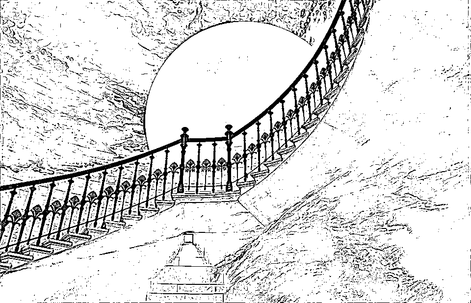

**生命有如一条河流，有它自己的方向。这是一条从南交点开始的河流，而北交点是这条河流奔去的地方。**

**——大卫·瑞雷**

1

**课程描述**

需求就是所有的一切。有两种人类天性的基本规则可以定义需求：**我们需要获得成就（北交点），我们需要有安全感（南北点）。**  成就感意味着我们在安全感之外渴望某些东西和某些经验，关系着我们的内心向往。安全感意味着我们感到安心，和我们已经建立的参与生活的模式协调一致，关系着我们的习惯。

人类的需求就在成就感和安全感之间来来回回，写下这一生的主题。这个主题与我们人生的发展方向和灵魂的渴望相关。如果发展方向和灵魂渴望实现的目标了解了，变得清晰可见，那么就更容易知道做出什么样的决定，来让人生变得圆满和幸福。一些困扰的问题也会随之一一迎刃而解了。 **我们这次就跟随大卫·瑞雷一起，进行****为期两天****的寻找之旅，从星图里南北交点以及与此相关元素的解读入手，为我们人生的生命道路找到指引，**看看是朝向哪里，又是一种什么样模式和周期。于是，也会更加容易的掌握自己的命运了。

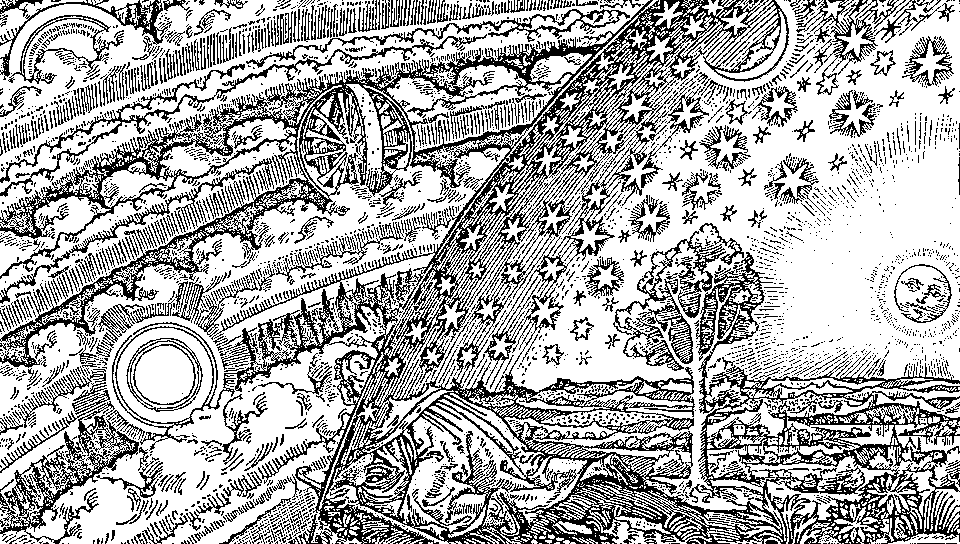

2

**课程目标**

*   帮助大家认识自己的**生命道路的主旋律**，知道我们的生命从哪里来、到哪里去；

*   帮助大家知道如何用占星了解**怎样获得安全感，怎样获得更大的成就感**；

*   帮助大家学会如何**就南北交点提问**，如何发掘我们未知的潜能；

*   帮助大家学会如何从**星座、宫位、相位**解读星图中的南北交点；

*   帮助大家学会如何**以南北交点为切入点**，整合星图的解读。

3

**课程内容**

1.  学习**月亮南北交点星座、宫位、相位**的关键特质。

2.  学习**以月亮南北交点为轴心**，整合星图解读的方法。

3.  从月亮南北交点看**生命周期**，解读相关交点周期。

4.  学习在**占星咨询**中如何就月亮南北交点提问。

5.  同学们可以带着**对于自己南北交点的疑问**，得到自我疗愈的解答和方法。

6.  以**学员星图**分析为例，为大家解开迷惑，做出建设性的指引。

4

**导师简介**

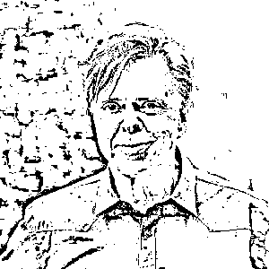

**大卫·瑞雷（David Railey）**

*   曾任 ISAR 全球副主席，ISAR 考试委员会前主席，若道创始人。 

*   被称为占星界的“马可·波罗”，第一位将西方严肃占星学系统教学和多位西方占星学大师引入中国的西方占星师。

*   第一位在美国用电视和广播媒体推广严肃占星学的职业占星师。

*   培养最多中国职业占星师的老师。

*   《灵魂的目标》、《一生的旅程》作者。

*   研究占星 48 年，拥有三十多年的占星咨询的执业经验，其服务客户包括学生、工人、市长、州长、议会议员、企业家、心理咨询师、工程师、艺术家、演员、知名企业家等，客户年龄跨度从襁褓婴儿到耄耋老人（大卫老师的老客户常常是一家三代人）。

*   2010 年 6 月，大卫的书《灵魂的目标》中文版出版。在 2011 年春季的北京之行期间，大卫接受了《南方周末》记者的采访。

*   2010 年，其著作《灵魂的目标》中国版出版，和蒋颖一起创办若道占星学校和其官网 www.nodoor.com。从该年开始，他工作并往返于亚特兰大和北京。目前他 80%的时间致力于在中国教授和推广西方占星学。

*   2017 年，被选为 ISAR 委员会成员（2017）。ISAR 是世界最大的国际占星机构，会员遍布 45 个国家。

**老师月亮南北交点著作介绍：**

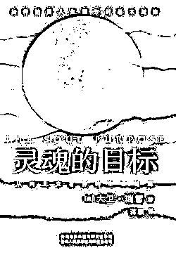

《灵魂的目标-从南北交看你的生命道路》

本书主要研究的是占星学中的月亮交点与人生阶段、生命道路之间意味深长的联系。通过几十年来大量积累的个案，作者发掘了十二组月亮交点与人的安全感需求、天赋才华、内在渴望，以及成就感召唤之间的深层联结，并对有关职业发展、亲密关系、亲子关系、生命周期等重要议题进行了精要分析与概括总结。

作者以大量名人故事及咨询个案作具体讲解，立论建立在严谨的逻辑分析和科学实证的基础上；同时，行文又充满意趣，展现出广博的人文视野和丰富的哲学蕴涵。

5

**此次课程适合哪些人？**

*   对占星学有一定了解（L3 以上水平），希望能够深入学习月亮南北交点的知识；

*   职业占星师，希望深入学习，看到大师如何就南北交点提问，解读星图。

6

**往期学员分享**

学员 A：大卫老师的专业和敬业，他的话直指人心，能看到自己更多的可能性，非常鼓舞人心，感恩老师！特别疗愈，智慧，拥有神奇的灵感和想象力。

学员 B：大卫老师总能对占星征象与现实状况和心理模式的对应，作出我们没有想到过的解读。老师的真诚，能感受到他对占星学的投入与对学员的无限关爱，讲解细腻。

学员 C：大卫老师总是迅速在一张星图中抓住要点，然同时用清晰幽默的语言把他的思路呈现给我们。针对星图中呈现的功课，他总能提供温暖有力的治愈，既共情又突破，特别赞叹他的治愈力和感染力。

学员 D：依然是大卫老师的人本主义精神，还有就是这次大卫老师做个案时讲到的庙宇花朵种子的故事，美好又神奇。

学员 E：在职业规划方面得到了新的启迪，让我面对一些曾经想都不敢想的事情，给了自己一些信心和动力去做更有意义的事情   理解 2、6、10 宫的具体职业体现。

学员 F：对于土星、天王星行运对职业的影响有了更深入的理解工作职场的问题和童年经历的联系，让自己豁然开朗。

学员 AA：在看职业的顺序、行星行进对职业的影响方面收获很大,收获了职业占星的基本方法论和思路。

学员 AB：此次加深了几个行星与星座，宫位更深刻的理解，融会贯通，特别讲解案例，对我学习占星有更深刻体会。对职业方面的解散思路更加清晰;听到很多大卫老师的经验之谈，有所启发吧。

学员 AC：老师一步步拆解思维过程，让我了解到拿到一张盘应该如何入手；丰富的真人案例，老师的解盘能立刻与现实事件进行对照，理解更深入了。

学员 AD：看到了大卫老师精湛的占星技艺，若道团队的专业水准，南北交以主题的咨询理念和占星概念特质。在今后的解盘中要磨炼运用。

7

**课程价格**

**正价：6800 元**

**早鸟价：5800 元（4 月 20 日前） **

长按二维码添加课程负责人 Margaret 咨询~

（微信：18515059056，请备注“月亮交点”）

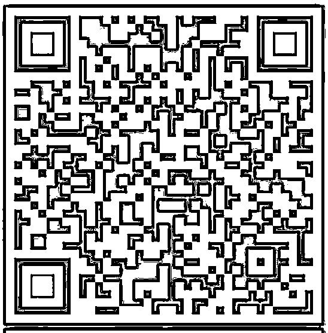

8

**课程时间**

2022 年 4 月 30 日-5 月 1 日   9:00-17:00

9

**退转课程**

**退款原则请详看《教学协议》，如有疑问请咨询课程顾问。**

****2022 月亮交点线上工作坊****

**授课老师：大卫·瑞雷**

**直播课开课时间：2022 年 4 月 30 日-5 月 1 日 9:00-17:00**

**授课方式：******网络授课，英文授课，中文翻译****

**费用：**6800 元**（早鸟价：5800，4 月 20 日前）**

**课程负责人：Margaret**（微信：18515059056，请备注“月亮交点”）

长按二维码添加课程负责人咨询~

****报名直达入口****

# 太阳进金牛座丨莫要辜负春天，我们该迎接生命的丰盛了！

> 原文：[`mp.weixin.qq.com/s?__biz=MzA5NjA0NTAxNg==&mid=2651472259&idx=1&sn=11440455d73455355811d5c59850e92e&chksm=8b48f334bc3f7a22360300ccceb970cef29f672cf428b49cccf67a4442db197ac7dbdc01b964&scene=126&sessionid=1692737827#rd`](http://mp.weixin.qq.com/s?__biz=MzA5NjA0NTAxNg==&mid=2651472259&idx=1&sn=11440455d73455355811d5c59850e92e&chksm=8b48f334bc3f7a22360300ccceb970cef29f672cf428b49cccf67a4442db197ac7dbdc01b964&scene=126&sessionid=1692737827#rd)

********************☆ 后**********************台**********************回复“今日”，给你一句生命态度********************

作者/郑玮玲 ISAR 认证占星师编辑/翀子 封面/书君 图片/网络

今天上午 10 点 24 分，太阳进入金牛座并停留至 5 月 21 日。这段时间，我们的生命中将有怎样的太阳功课？12 星座又如何度过这个月？一起来看看吧

**金牛座与谷雨节气**

**4 月 20 日 10:24，太阳进入金牛座，直到 5 月 21 日才离开。**

**太阳进入金牛座，正值谷雨之气。**谷雨时节多雨水，是春耕春种的好时节，也是早春茶采摘的最后时日，一芽一叶将经由茶人的双手制成新茗。

谷雨之物候：一候萍始生，二候鸣鸠拂其羽，三候戴胜降于桑。在这个春雨纷飞的时节，浮萍开始生长在水面，无根的浮萍经不起风霜，也意味着气温稳定持续升高，彻底告别倒春寒。鸣鸠即杜鹃鸟开始求偶，桑树上的鸟儿也提醒桑户开始饲养新生的蚕宝宝了，山林谷地一派繁忙。

谷雨时空卦为雷泽归妹，雷雨泽下，万物生发，之子于归，正值播种、养蚕、求偶、成家之时。此卦提示“君子以永终知弊”，善始终，知利弊，共经人生风雨，共同成长和肩负，创造未来的丰盛。

**金木合相，宜赏花作乐**

**5 月 1 日，是一年一遇的金木合相，伴随着金牛座新月的发生**，这可谓一年中的大好日子——新月的守护星入旺并与入庙的木星合相。

**在这样的日子，每个人都值得去感受、享受时光的美好，用任何美好的方式灌满生活。**这一天即使没有任何的计划，满眼繁花也可以作为此时节金牛座大地之灵的礼物送给自己。

赏花正对应着谷雨之后的时空卦火泽睽，意为用双眼阅览万物，观赏百花争艳。君子以同而异，**在同一朵花中窥见不一样的感受，**保持意识的独立。

金牛座的太阳被金星所守护，这颗爱与美的行星，此时正行进在舒适的双鱼座。5 月 3 日才会进入白羊座。在此之前入旺的金星会用平和的方式支持美丽的展现，而后金星提供了独立、自主的动能，**激发太阳的意志力朝向个人主义的方向前进。**

**在金牛月里，人类拥有最积极丰盛的世界，万物勃发的生机让大地尽显意趣。**金牛月里也是百花开到最精彩、极致和高潮收尾的时节，古云：“谷雨过三日，园里看牡丹”。牡丹是国人眼中的百花之王，富贵、大气，不愧为金牛月里盛开的花魁。

惹人欢喜的牡丹与芍药，向人们展示着最美的春色；沁人心肺的茉莉与栀子，用迷人的香味留驻了时光之美，让我们对四、五月的回忆都充满了香气，在裙裾边萦绕。

这理应是一个享受人生甘美的季节。**无论你身在哪里，都值得为生之美好去沉入当下。**也祝福所有上海的朋友们，能早日解封，重拾生活的慵懒、安适。

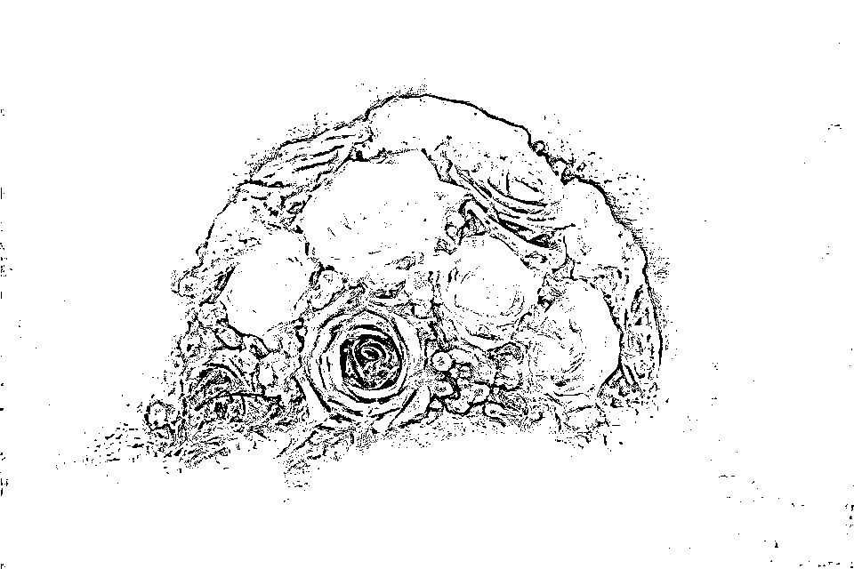

**太阳在金牛座的行进**

**太阳六分火星**

**周期：4 月 15 日—5 月 30 日**

**重点影响人群：****有个人行星、四轴、月亮交点位于金牛座、狮子座、天蝎座、水瓶座、双鱼座、双子座、处女座、射手座、巨蟹座、摩羯座的人。**

火星从水瓶座便开始与白羊座的太阳形成六分相，在成相期间太阳也会经由白羊座尾度行至双子座初度。这个漫长的相位将继续**赋予我们以积极、热情、果断的行动和精力去投入生活。**

上海漫长的疫情期间，全国各地疫情此起彼伏，很多人的生活和工作随时面临限制、阻碍的当下，回到正常生活，回到曾经的生活就是我们最大的期许和对自己的祝福。

**火星与太阳的积极互动，**正如那股无助之下不灭的生之活力，**纵然现实严峻、混乱、无助，也不忘创造一点美好**：照料植物和花朵，用心料理食物，享受每一缕掠过窗口的阳光，坚持每日的运动为自己灌满活力和信心。

**火星用积极的斗志去助燃理想的火花，并提醒我们：**

**现在即未来，我们只有一个现实可以去行动。**金牛座的太阳意味着精神与心灵的中心是经由自然而然的显化去实现创造，一点一滴实践心中所愿，创造美好，便是对生命的养护和捍卫。我们所创造的一切美好都让我们变得更加勇敢、坚实。

**太阳合相天王星**

**周期：4 月 27 日—5 月 14 日**

**重点影响人群：****有个人行星、四轴、月亮交点位于金牛座、狮子座、处女座、天蝎座、摩羯座、水瓶座 6-23 度的人。**

**日天合相足以助推革新、创举也会引发震惊、创痛。**天王星 2018 年进入金牛座以来，时代见证了不断打破底限的金融动态，存款利率历史最低，投资理财不断缩减受限，楼市崩塌，金融、资本圈的黑幕层出不穷。

4 月 18 日招商银行董事长被免职，随之股价大跌 8%。4 月 19 日，以岭药业连续三日跌停，市值蒸发超 160 亿。此前王思聪、丁香园对连花清瘟的连续炮轰要求证监会介入调查，紧接着网友们便开始揭露万达、丁香园与国外资本的医药、疫苗联姻，网友的曝料还同时牵扯出华山医院注册了辉瑞抗新冠药的消息，一切的讯息都指向资本联手对中药的打击其目正是为美国辉瑞高价药开路。

**随着日天合相的日渐紧密，将撕开不可掩藏的内幕，让大众一探资本的究竟。**

天王星虽以集体性、不可控的方式呈现，但在个人意识中**我们可以将革新、创造、解放与积极的个体自由安放于生活中，**用理想和愿景的方式去铺垫、开创。实现真实自我的鲜活诉求，这便是天王星赋予我们突破难关的决绝之力和自我的权力。

作为剧变之神，金牛座的天王星会聚焦于金融、资本的打破与革新，在个体层面让我们关注价值感和价值创新。**日天合相支持透过寻找、巩固自我价值到达真理，再经由真理重塑世界观，重获自由与解放。**

这革命性的道路终将让每一个奔赴真理的人稳定扎根于现实中，即使苦难风雨，**都能在坚定意志中完成真实自我的理想和革新**。因为，是世界观决定了自己身处的世界。

**太阳合相月亮北交点**

**周期：5 月 5 日—5 月 22 日**

**重点影响人群：****四轴、月亮交点位于金牛座、狮子座、处女座、天蝎座、摩羯座、水瓶座 14-29 度的人。**

月亮北交点在金牛座的这一年，生活的现实呈现了无数的危机、恐怖、灾难，南交天蝎座把黑暗尽情展现着，让我们感受死亡、病毒、人性的黑暗离我们如此之近。

**北交金牛座要用轻松、安定的生活来疗愈我们，也要我们透过价值感的展现实践危机的转化。太阳合相在此更是强化了这一点——用意志力冲破危机，努力展开自由与理想的道路，大地和更大宇宙的灵性之爱一直在护佑着生命。**

金牛座的太阳和北交点呼吁我们要用心打造生活的美感、质感，无论背后阴影多巨大，即使心中仍有恐惧。**如果我们够坚定，就会展现出生命原有的坚韧、丰美，努力看向阴影，把光带进现实，从不可能的地方找寻到新的价值感和财富。**

**太阳四分土星**

**周期：5 月 7 日—5 月 24 日**

**重点影响人群：****有个人行星、四轴、月亮交点位于金牛座、狮子座、天蝎座、水瓶座 16—29 度，双子座、处女座、射手座、双鱼座 0-3 度的人。**

**水瓶座的土星把封控、隔离引发的恐慌无所遁形地展现出来。**

2500 万人口的上海，长达一个月的封控，缺少生活补给，就医困难，那些急需救治的生命终结在就医的路上，或不堪忍受病痛自尽于家中，一些居民被强行隔离、带走，让我们看到相关行政部门冰冷、严酷有失人性和文明的尊严。更不用说封控引致大规划的经济损失和后续可能的企业破产，个人失业和无法偿还贷款而失去唯一住房。

就此，我们可以问责土星制造的白色恐怖。这颗代表质疑、短缺的行星此刻也让我们感尝到现实的魔幻：这是 2022 年高度文明的上海？我们的未来会怎样？

各种无人统计的次生灾害在管控之下频发。其它城市的人们也经受不起土星碾压，**陷入对未来的恐慌中**，引发了非理性的囤粮、囤物潮。

**土星将老旧和限制的重力推向了我们的意识，**每一个想要好好活着的人们就会为限制多出一份考量。**金牛座的太阳想要物质的充足、丰盛。**

土星代表的管控、权威是否能在日土四分的高潮 5 月 15 日（也是日天合相的结束点）接管集体性的恐慌，继而释放出有效的政策性保障？我们拭目以待。

虽说土星碾压过的人生才是岁月沧桑，太土四分足以让人饱尝人间辛酸。但在这艰辛的过程中的人们也请给予自己自由的热望，每个人都独立拥有自己的想法、决断，我们的意志力正是用在充满阻碍、困苦的现实中拓展的利器。

**放下所有行不通的，但不放弃每一条真理和智慧指引的道路，虽漫长、艰难也要砥砺前行。**

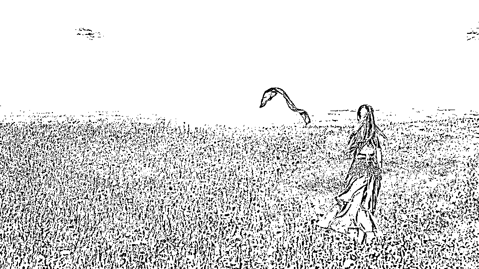

**太阳六分海王星**

**周期：5 月 10 日—5 月 21 日**

**重点影响人群：****有个人行星、四轴、月亮交点位于金牛座、狮子座、天蝎座、水瓶座、双鱼座、双子座、处女座、射手座 19-29 度的人。**

双鱼座的海王星不断在为我们制造幻像与麻烦，尤其在这一轮木海行进中，将一切幻象，疫情下的灾变、大规模的患难，个体的幻灭感推向了极致。**在沉沦、无力和复杂交混中，我们要努力做意识的功课才能保持不迷失，也不过度松懈。**

**日海六分带来积极的想像力的激活，**在此期间，适宜尝试能让心灵活跃起来的灵性方法，在精神、神性和疗愈的道路上，让我们的小我超越困顿的现实，超越苦难的侵蚀。

沉浸于音乐、诗歌、文学、绘画、舞蹈等艺术也是极佳的选择，**金牛座的太阳和双鱼座的海王星共同描述了艺术的疗愈。**如有机会，可以让自己更多沉浸于大自然中，与植物在一起，感受大地的承载与丰饶带给我们身心的安稳。如不能出门，在家冥想静坐也能为自己创造静谧的神圣。

**太阳三分冥王星**

**周期：5 月 11 日—5 月 27 日**

**重点影响人群：****有个人行星、四轴、月亮交点位于白羊座、金牛座、巨蟹座、狮子座、处女座、天秤座、天蝎座、摩羯座、水瓶座 20–29 度，双子座、处女座、射手座、双鱼座 0-6 度的人。**

在 4 月 26 日前，太阳还处在与冥王星的四分相中，经历完金牛座 20 度以后，太阳便完成了冥王星的激烈转化，将这份转化后的能量化作意志的助力推向生活的核心。

发生在 4 月中下旬的日冥四分正是银行、中药板块股份下跌，隐藏的资本操作开始被揭露，而后紧接着的便是日天合相，迎向新的决裂和开启。

天冥交替行进的节奏似乎在告诉我们**有多少需要清理的黑暗，就有多少需要打破的现实。**这是天冥四分的大周期结束后，新生意识与旧有格局交战的方式。

日冥三分相更多向我们展示了一种不可逆转的转化、蜕变，**也许在此过程中我们终将失去一些宝贵的东西，但是重生的必然是向生、护生的意志。**

在所有的丧失面前，生的渴望变得更加有力、刚毅，**冥王星教会每一个人像生命最后一天那样活着，教会我们在失去的底限之下还能找到不灭的信念。**

日冥三分宛如黑暗中，烧焦的土地上开出的花，生之力量大过悲痛与绝望。无论你还在追求什么，放弃了什么，每一天都好好活着，就是尽了最大的努力。**此时的冥王星正如黑暗将尽的地平线，让光亮升起，给予我们黑暗隐没的叹息。**

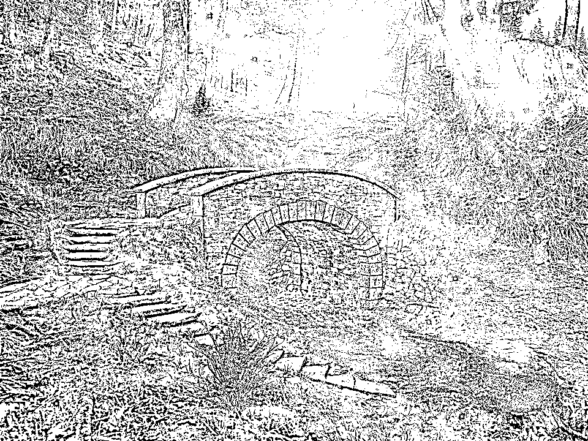

**太阳行进在十二宫**

**注：以出生星图上升星座度数 30 度范围内的上升星座为准。如你上升在 0 度，可以完全参考下列内容；如你上升在 29 度，则需参考下一上升星座。**

**若道君：****你可以在 app store 或者应用商店搜索“若道”下载 app，输入个人档案，查看行运盘（也可以使用其他星图软件），找到行进太阳落在出生星图的第几宫，然后对照下文查看。**

**例如下图中，比尔·盖茨上升在巨蟹座，行进太阳在个人星图的第 10 宫。**

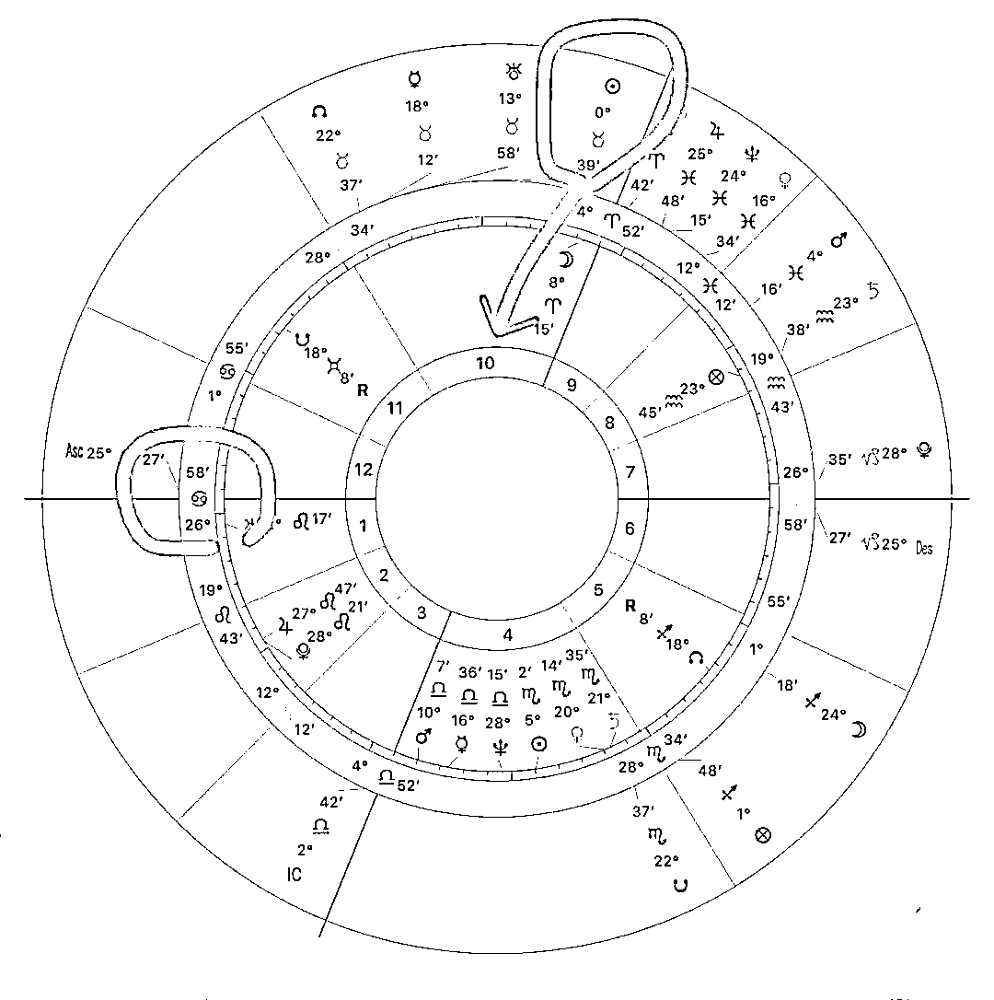

**上升*****白羊座 *****太阳行进*****2*****宫**

如果你正在寻找、重新定位自我价值，**此时正值得投入新的创造、构想中，融入理想便是最让你感活力充沛的事。**新的航向会灌注以活力与自信，迈向稳定、持续的创造力，构建更符合你人生蓝图的职业与创造性道路。

若你已经持续稳定在确定的道路中，也拥有充足的价值感，**那么当下可能会经由新的视角去重审所走过的路。**另辟蹊径，求新求变，接触新的观点，走出平和、舒适区，将打开令你兴奋的领域。

**上升*****金牛座 *****太阳行进*****1*****宫**

**这是精力满满的时期，用来投入你的个性化表达和创造吧。**一段时间以来你都在投入自我重构，独立、稳定和持续的探索注定需要新鲜感和高深度的质感来加强对自我的肯定。

经由你亲手创造的作品、成绩可以拿到适当的位置去展示，表达你自己显得如此重要，哪怕只是为了自我肯定，你也需要从美的事物里再次看到更新的自我。**不一样的自己，不一样的当下，每一刻你都在投入生命的自我更新中。**

**上升*****双子座 *****太阳行进*****12*****宫**

生活的困顿，人间的疾苦宛如四起的楚歌萦绕在你的周围，这种非我的困扰对你是一种消耗，也是一种慈悲与爱的联接。如果愿意，也有能力伸出手，就请做一些能为“他们”付出的事吧。**尤其是表达你的声音，发出你的正见，让更多的人听到你充满爱的呼吁。**

如果没有合适的时机去表达自己的见解，那就值得更多时间沉入你的内在世界，冥想、静坐、艺术的体验，或是静静地赏花，照料植物都能让你从苦难的现实中解脱出来。**每一个当下的美好都是疗愈的解药。**

**上升*****巨蟹座 *****太阳行进*****11*****宫**

**此时的你更愿意投入社交和集体愿景中，团体的意志力会激发你的创造性才能**，也能将你从孤独、个性化的陷落中拯救出来，重获宁静与喜悦。

此时的你值得为未来的构想找到志同道合的伙伴、团队，一个人可以走很快，一群人能走更久。**共同创造的使命感在呼唤着你，**感受很多双手在一起创造时的激情迸发，交织的音符，和声般的创想是在为未来编织更大的捕梦网。所以，大胆去做那些从未有过的尝试，你将快速翻越旧时的屏障。

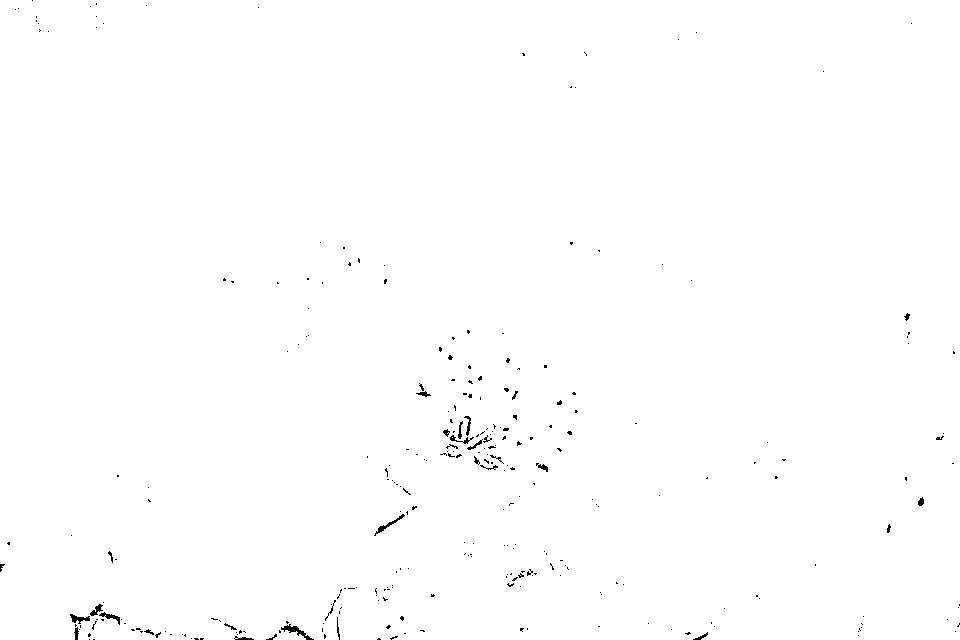

**上升*****狮子座 *****太阳行进*****10*****宫**

长久以来想要打破的旧有瓶颈，现在有了机遇去完成最紧要的工作。**灵感和创意会随着你的活力和激情一同到来。**积极投入你醉心的事吧，在你最有自信的地方去表达和创造。

没有人比你更在意此时你的获得感，只有你自己满足才能称之为满意。所以，只凭着自己的心意去努力就行，不管此时是一个开头还是结尾，都是你在自我实现中最为要紧的过程。**在过程中你无需完美，但你需要为着核心目标去做必要的改变。**

**上升*****处女座*** **太阳行进*****9*****宫**

像是走了很远的路，就要攀爬到某个顶峰了，一些令人激动的礼物、收获、时机摆在你面前。如果你还没意识到你将要实施的创造性冲动，那就请问问自己当下有何不够稳定，需要夯实的？为此去工作，你将拓展新的视野，用**更高的角度、标准和价值感来肯定自己。**

你的自信将来自于你的最高信念，信仰的道路在你脚下展开，却需要你将它更新为完全属于你自己的，独一无二的。**跨越你内在的障碍，你就能触及另一片天空。**

**上升*****天秤座*** **太阳行进*****8*****宫**

这似乎又是一个需要作出重大决定的时期，一些摇摆、质疑可能出现。若你信任你的笃定，一些全新的深信也会来到你的生命中——其实它一直都在，你的关系中持续的温暖和信任，在等你去看见，**挖掘到你内在的价值。**

**如果你足够信任一个人，那么此刻你们将共同构建新的事物。**如果旧有的信任在崩塌中，或是关于价值、金钱的议题横在了两个人中间，此时的你需要去快速解决这个议题了。在此期间，投资理财上宜小心谨慎，在动荡的趋势下避免非常规的操作带来的损失。

**上升*****天蝎座*** **太阳行进*****7*****宫**

**把你的关注力投入到关系中去，和你的伴侣更多的交流会激发你的灵感和创意，也能活化你们的关系。**很长一段时间，你都会需要在两个人的世界中找到和谐、平稳和舒适，某种程度上，你的亲密关系在疗愈你的心灵。

单身的你也可以适时找到值得信赖的人交流，抒发你心中所思所感，**与人对话能激发你对创造的想法**，启发你对价值感的新体验，以新的角度重新肯定自我。

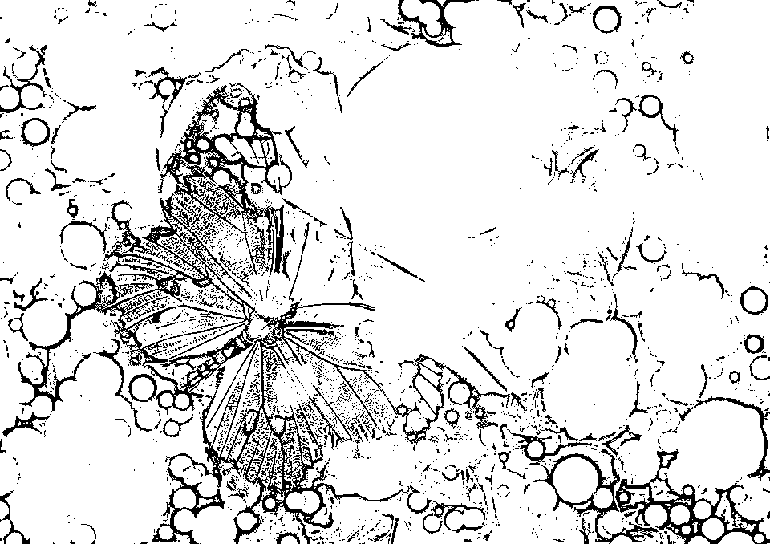

**上升*****射手座*** **太阳行进*****6*****宫**

积极工作，磨练技艺是你当下最值得投入的事，工作或职业上的付出也会令你乐此不疲。持续稳定的创造也会将你带往新的价值取向中，**你有机会重新定位自己的人生职业。**

此时享受工作是令人感到快乐和充满活力的事，与此同时你也要注意劳逸结合，避免太过投入工作而忽略了身体的照料。**规律作息和顺时养生才能保障最好的状态去完成最具挑战的工作。**千万不要因为过度用力而伤害到了自己的身体。

**上升*****摩羯座*** **太阳行进*****5*****宫**

赏花游玩是时候要安排一下，不要因为太过忙碌和刻苦钻研而错过了窗外的好春光。人生百年不过几十个春天够我们玩乐，如果你因疫情受困在家，也值得眼光看向大地和植物。

**在此时期，游戏、玩乐和创造是你最值得投入的事。**工作中如果有机会去开展新的尝试将会令你感受到自己更有价值的一面，享受这个过程比他人给你的反馈更为重要。积极投入任何一种游戏也会令你感受到活力四射，当然也包括恋爱这件事。

**上升*****水瓶座*** **太阳行进*****4*****宫**

如果此时的你很享受在家的时光，那就多一些美食料理，多一些时间照料自己的植物，把家装饰更美一点，以及多些晚上给自己泡个芬芳的花草浴，再加一点精油按摩。

家会让你灌满活力，让你恢复精力。也可能因为疫情限制，让你重新感受到了家人的珍视，家庭的地位在心中有了新的重量和价值感。**一些新的洞见在你心底打开，对于这个世界你也会重新发展出你的世界观。**

**上升*****双鱼座*** **太阳行进*****3*****宫**

也许你在一些快速、激烈的学习进程中，**在此期间你会经由快速学习获得全新的价值感，积累到创造性的经验或财富。**如果因疫情封控在家的朋友很可能重新感受和定位到了邻居们的价值——那些非常有价值的关系很可能是在危难时候能向你伸出手的人们。这样的关系显得尤为珍重。

**此时的你正需要向你身边的一切发展交换的态度，从中挖掘出生活的价值和宝藏。**因为日常的忙碌让我们无暇顾及的身边事，身边人，身边的一草一木，此时显得那么美好。

**版权声明：**原创文章由作者授权首发于若道平台，欢迎转发，反对抄袭。友号转载请申请白名单。

**郑玮玲**

ISAR（国际占星研究协会）认证占星师（2016 年获得）

若道占星专栏作者

将占星咨询、教学与音乐、舞蹈相结合的疗愈者

**微信号**：zhengviolin

**新浪微博**：@郑玮玲

**微信公众号**：Sampriya-Astrology

长按打赏

**20 位来自世界各地的占星师****带来 20 场沙龙——新世界的觉醒****详情可点击下图**

**学习占星学****点击下图了解课程详情**

**

**微信又双叒叕改版啦，不想错过若道君的推送？**

**就把若道设为星标吧！**

**▼**

**就是这个“在看”，戳戳戳 ☟**

********报名直达入口********

# “灵魂是你怎么都摆脱不掉的议题”，而它告诉你生命的来处

> 原文：[`mp.weixin.qq.com/s?__biz=MzA5NjA0NTAxNg==&mid=2651472259&idx=2&sn=b410a4df06a8354ea75706750a7faf49&chksm=8b48f334bc3f7a22b0aa7ff3f0189cef64a4f4c920bc82bdaee2d0a61229f79002d551f8dcb5&scene=126&sessionid=1692737827#rd`](http://mp.weixin.qq.com/s?__biz=MzA5NjA0NTAxNg==&mid=2651472259&idx=2&sn=b410a4df06a8354ea75706750a7faf49&chksm=8b48f334bc3f7a22b0aa7ff3f0189cef64a4f4c920bc82bdaee2d0a61229f79002d551f8dcb5&scene=126&sessionid=1692737827#rd)

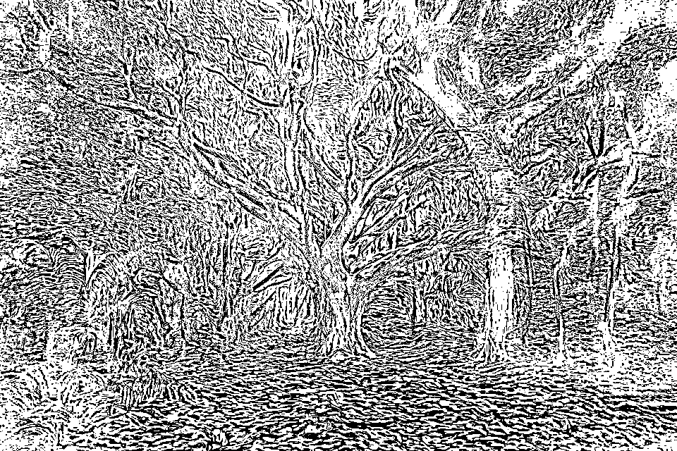

作者/大卫·瑞雷 若道占星创始人编辑/翀子 图片/网络来自 2019 年南北交点工作坊速记

大卫老师是研究和运用月亮交点的专家，他是如何被星图上这组并不实际存在的虚点吸引的呢？客户又为什么对交点有强烈共鸣？本文以象征惯性模式的南交点为主题，描绘了灵魂旅程的重要标记。

[【月亮交点线上工作坊】](http://mp.weixin.qq.com/s?__biz=MjM5MjQwNjAyMQ==&mid=2649439458&idx=2&sn=2da799c94fa119d78f7c5ea65389aacb&chksm=beb9538889ceda9e22d746520b57bf1274e8f58c3985cb4406a2a2935112ca3c9f03bfce7b4d&scene=21#wechat_redirect)即将上线，点击链接了解详情，可以跟大卫老师一起探索生命的潜能和方向哦~ 

**写在前面**

我的星图中有很多射手座能量，不过也有一些其它能量。

我母亲就是射手座，她 53 年都在轮椅上，那是很长的一段时间，从 27 岁开始坐在轮椅上。她曾是体操运动员，所以她以前很喜欢走路和跑步。我也是，只要能站着就不坐着，只要能走路就不坐车。

**我一直是这样的性格。但是性格之后有更多的因素。**

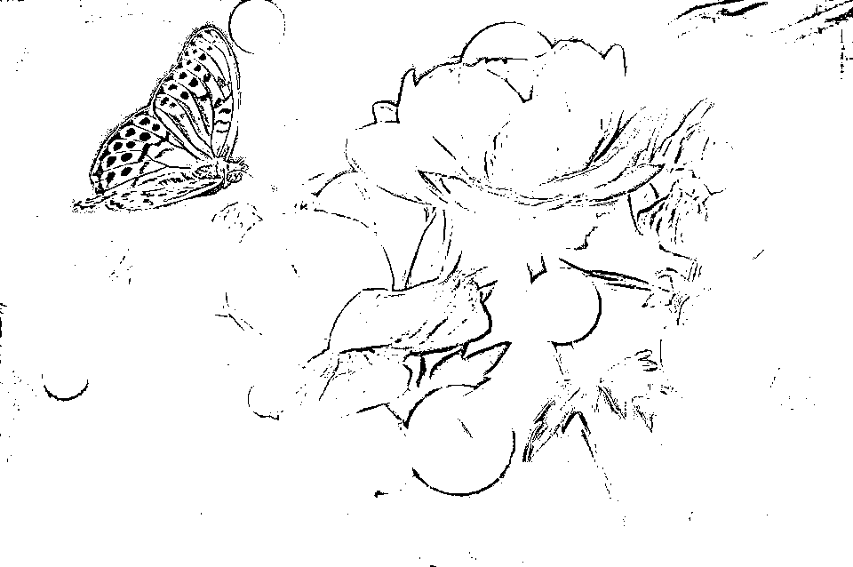

**我对月亮交点的研究过程**

今天我想和大家讲讲，我在 1972 年时对占星学的一个重大发现。我那时在一本书上看见有关月亮交点的资料，那个时候我已经学习占星学 2 年了。

**书中说月亮交点可以解释一个人为什么来到这个世上，南北交点是一个关键的主线和主题。**我当时抱有怀疑——“就凭这两个符号就说明一个人转世的原因会不会太激进了？” 

**我是一个很有怀疑精神的人，因为我的南交点在处女座合相土星。**这个理论也许是对的，但可能也是错的，**我的南交点在 9 宫，**所以我对很多事情都保有怀疑精神。

后来我对南北交点做了两三年的观察，最后我很震惊，我与熟悉的人讨论他们的日月升星座，**但是当我和他们谈到月亮交点的星座和宫位时，话题就开始有了一些改变。**我觉得我们的对话不再是闲聊的性质，而是触及到了一些有意义的东西。

**很多时候我们谈到南北交点时，对方都会有一个强烈的回馈，**或者他们会说，刚才谈论的点是我一辈子都在努力的议题。所以经过这两三年的实验后，**我开始正式研究南北交点。**

因为当我看到了大家对谈及南北交点领域之后的情感反应，所以我在 1976 年职业的时候（此时我已学习 6 年占星学），在第一批客户身上做尽了实验。

在我职业生涯的前四年，我很专注于南北交点在他们身上的影响，之后我一直沿用这一套体系，而且对我个人来说有很好的效果，我的占星师生涯也因此有了很大的成功。

我和客户有一个长期稳定的咨询关系，正是因为我们有了南北交点这个议题，让我们有了更深的连接，**南北交点触及了他们内在更为神圣的部分——灵魂。**

就像我的老师说“**灵魂是你怎么都摆脱不掉的议题”**，因为你和你的灵魂是一直在一起的。作为一个正常的人类会有各种需求和想要的东西，但是灵魂会有一个更深的需求。

**占星咨询有个作用，就是帮助客户觉察自我，**但是我要说更大的作用，是帮助他们觉察到自己的灵魂，即使他们不相信有灵魂。**但是占星师依然是帮助他了解自己内在更深的一部分。**

我们每个人在这一具会死去的肉身和那不死的灵魂之间，如果能搭起一座桥梁，如果能在这两个意识之间有一个对话的话，我们每个人不管相不相信，灵魂都会从中受益。

**对我来说这是占星工作中非常精华的所在，**因为你可以和他们什么都谈，但最后总要谈到灵魂的旅程。在过去两天中我们谈到北交点对于亲密关系的重要性，所以能够看到这点的话你会有恍然大悟的感觉。

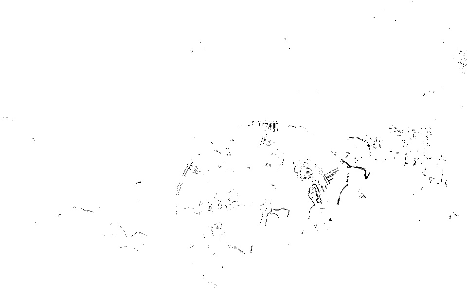

我在研究月亮交点几年后，发现斯蒂芬·弗里斯特也对月亮交点开始感兴趣，他当时不知道我已经开始研究交点，他研究交点的角度是从前世今生的角度去切入的。还有杰夫焦耳也在研究交点，慢慢的越来越多占星师开始研究交点，但目前还是有很多占星师并不刻意强调月亮交点。

这也是可以的，因为就算你在星图里面不去看交点也可以从其他配置从得出很多信息，**但是如果不研究交点，会有些东西串联不起来，**当我们看见一些明显的矛盾串联不起来的时候，占星师只好说不知道。

斯蒂芬·弗里斯特在五年前坐在若道办公室对我说“大卫，交点真的很有趣，你看我们两都用南北交点，我们做的是正确的事情，因为我们俩的学生比别人的都要多”。

我觉得斯蒂芬的思路很有意思，而且他是对的，并且他是一个摩羯座，摩羯座通常会想社会地位、等级这样的东西。于是他说“我们俩的学生组合起来，都可以开一个很大的公司了，所以我们做的事情肯定是对的”。

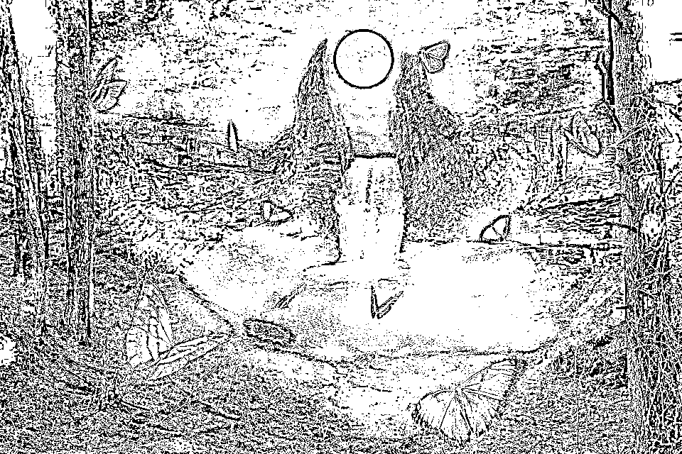

**月亮南交点的意义**

我能有机会探索交点是我从那本书的作者处得到的礼物，所以我想将它分享给大家。

星图中所有的符号都很重要，但是如果要将星图中所有的点串联起来，北交点就是一根主线，将所有的故事串联起来。

**Rahu 和 Ketu 分别代表北交点和南交点**，我可以说 2500 年前，甚至更久前，人们就在使用交点了。古代文化中会通过计算交点来得出，月食在什么时候发生。对古代占星师来说，预测月食是很重要的事情，古代占星师一般为皇室御用，如果不能准确预测月食得时间，丢掉的不仅是工作而且还有脑袋。

后来占星师们发现，除了用交点预测月食之外，它还有自己的意义，**尽管交点只是虚点并非真实存在得落点。**

但是交点确实对生活有很重要得意义。吠陀占星用 Rahu 和 Ketu 代替交点的名称，**在印度占星学中，交点几乎和行星有相同重要的地位，**他们觉得月亮交点和日月一样重要。

**所以有些关于交点的知识是从印度传到西方，再从西方传回印度，这样来回交流。**

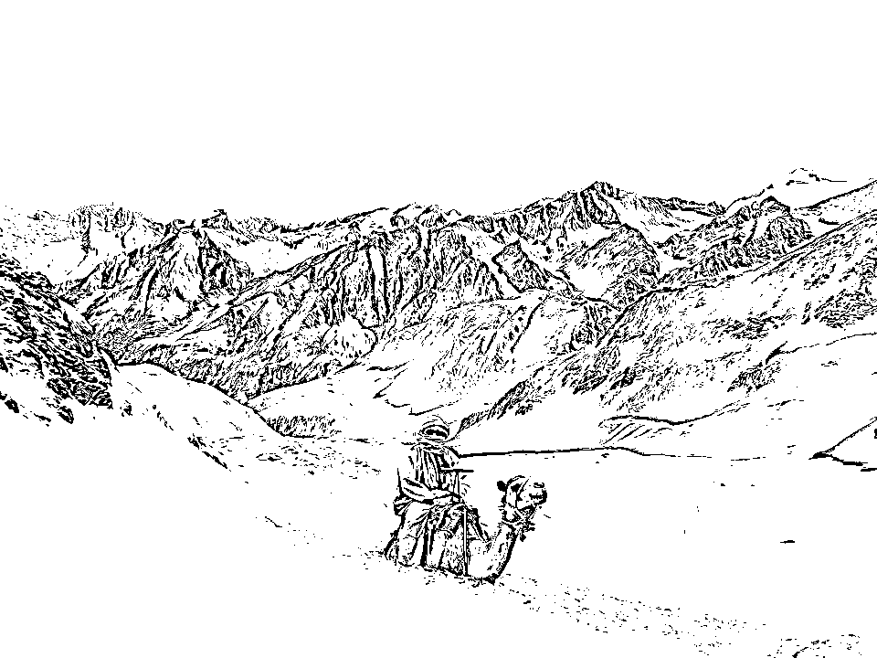

Rahu 拿着一朵花，背后的坐骑是一头猛兽，呈现出一种愉快的状态。Ketu 有一条长长的鱼尾巴。**所以在西方还有一种说法：北交点是龙头，南交点是龙尾。**

**尾巴是什么呢？尾巴就是一边走一边拖在身后的东西，**不管去哪里都得带着这条尾巴。如果你是一条龙，尾巴也是一个很好的武器。尾巴还带着你的过去，因为它永远跟在你身后，**过去也是你现在的一部分，而且是非常深刻的一部分。**

**过去是熟悉的，你完全可以将过去作为游刃有余的工具。**恐龙也像龙一样有很长的尾巴，如果你是小孩子，把恐龙尾巴砍掉，那么它就站不稳了，玩具恐龙就会立刻正面朝下的倒地。所以尾巴也是支撑的一部分，**它可以提供支撑和防御。**

**她是你的过去和安全感来源，它让你对自己有所保障，它同样也是你的根源**，当你的灵魂潜回到永恒之海万物起源之时，它就成为过去。

所以南交点——Ketu 身穿盔甲手拿盾牌宝剑和旗帜以此来保护自己。**如果你的南交点在狮子座，你会因为过去发生的事情而有勇气，你会觉得我是我人生的主导。**

有些父母带着南交点狮子座的小孩过来找我，他们通常会说“我的孩子才 2 岁，但他却想管理整个家庭了”。所以父母和孩子之间此时会有一场权力斗争，因为南交狮子座的力量和意志是很重要的，南交狮子座也是带着很强大的慈悲个人意志。

**去往新的方向是需要勇气的，但是达成后会很有满足感。**图像中的 Rahu 和 Ketu 都呈现出一种接纳性。

**问：为什么感觉北交点 Retu 的双脚被什么东西缠绕着呢？Ketu 给我的感觉穿着盔甲有点冷的感觉？**

缠绕 Retu（北交点）的尾巴是 Ketud（南交点），因为它还是带着一部分过去的行为模式来成长。所以过去和业力依然会约束当下我们，**我们带着过去往前走。**这个画面告诉我们很多灵魂之旅是什么样的。

**南交点故事带来的启发**

在印度占星学中，Ketu 有一个很丰富精彩的故事：Retu 和 Ketu 是双胞胎，他们想要成为天神，因为天神可以永生。成为天神是他们毕生的追寻，如果一辈子都在追求永生，其实你已经活在永生当中了，只是自身没有意识到。

Retu 和 Ketu 把自己伪装成太阳神和月亮神，当时有一场很大的宴会，很多天神都去参加，只要喝下宴会的饮品就会永生，就在他们正准备喝下去时，他们的伪装被识别出来了，他们还没来得及咽下饮品，头就被切断了。

所以只有 Retu 的头保持了永生。**所以交点代表从原始的生命之海向永生的方向前进，**这个哲学是从印度哲学衍生出来的，当然中国也有自己的传说。

**版权声明：**本文由若道翻译发布，欢迎转发，反对抄袭。友号转载请申请白名单。

****想阅读更多作者的文章，请在后台回复******大卫****** 即可。****

**大卫·瑞雷**

美国占星师，若道联合创始人，致力于在中国教授和推广西方占星学；2010-2014 年，任全美占星师联盟监督委员会委员；2017 年，被选为 ISAR 委员会成员。ISAR 是世界最大的国际占星机构，会员遍布 45 个国家，2017-2020 年曾任 ISAR 全球副主席、CAPISAR（ISAR 职业占星师资质认证机构）主席。

**喜欢文章请长按下方二维码打赏****给大卫老师加杯咖啡呗~****▼**

**月亮交点线上工作坊**

需求就是所有的一切。有两种人类天性的基本规则可以定义需求：**我们需要获得成就（北交点），我们需要有安全感（南北点）。**  成就感意味着我们在安全感之外渴望某些东西和某些经验，关系着我们的内心向往。安全感意味着我们感到安心，和我们已经建立的参与生活的模式协调一致，关系着我们的习惯。

人类的需求就在成就感和安全感之间来来回回，写下这一生的主题。这个主题与我们人生的发展方向和灵魂的渴望相关。

如果发展方向和灵魂渴望实现的目标了解了，变得清晰可见，那么就更容易知道做出什么样的决定，来让人生变得圆满和幸福。一些困扰的问题也会随之一一迎刃而解了。 **我们这次就跟随大卫·瑞雷一起，进行****为期两天****的寻找之旅，从星图里南北交点以及与此相关元素的解读入手，为我们人生的生命道路找到指引，**看看是朝向哪里，又是一种什么样模式和周期。于是，也会更加容易的掌握自己的命运了。

**南北交点工作坊报名中****长按二维码咨询客服了解更多**

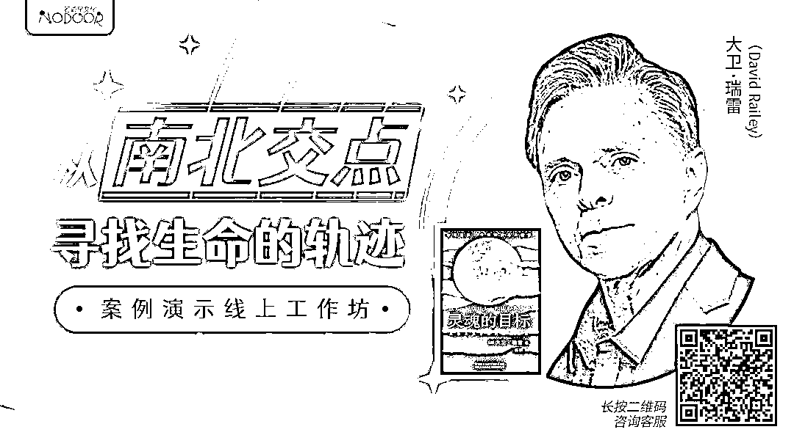

**20 位来自世界各地的占星师****带来 20 场沙龙——新世界的觉醒****详情可点击下图**

**学习占星学****点击下图了解课程详情**

**

**微信又双叒叕改版啦，不想错过若道君的推送？**
**就把若道设为星标吧！****▼**

**喜欢记得点一下在看哦☟**

**报名直达入口**

# 卜卦占星学丨想在枯燥的学习里找点乐子？来测一测吧！

> 原文：[`mp.weixin.qq.com/s?__biz=MzA5NjA0NTAxNg==&mid=2651472140&idx=2&sn=78c7f2120aba79875499db01b7852f61&chksm=8b48f3bbbc3f7aad2c6024b85b7d94c29166d2cd57ed52ce3af4f74daa320c3c7531b12ab46e&scene=126&sessionid=1692737827#rd`](http://mp.weixin.qq.com/s?__biz=MzA5NjA0NTAxNg==&mid=2651472140&idx=2&sn=78c7f2120aba79875499db01b7852f61&chksm=8b48f3bbbc3f7aad2c6024b85b7d94c29166d2cd57ed52ce3af4f74daa320c3c7531b12ab46e&scene=126&sessionid=1692737827#rd)

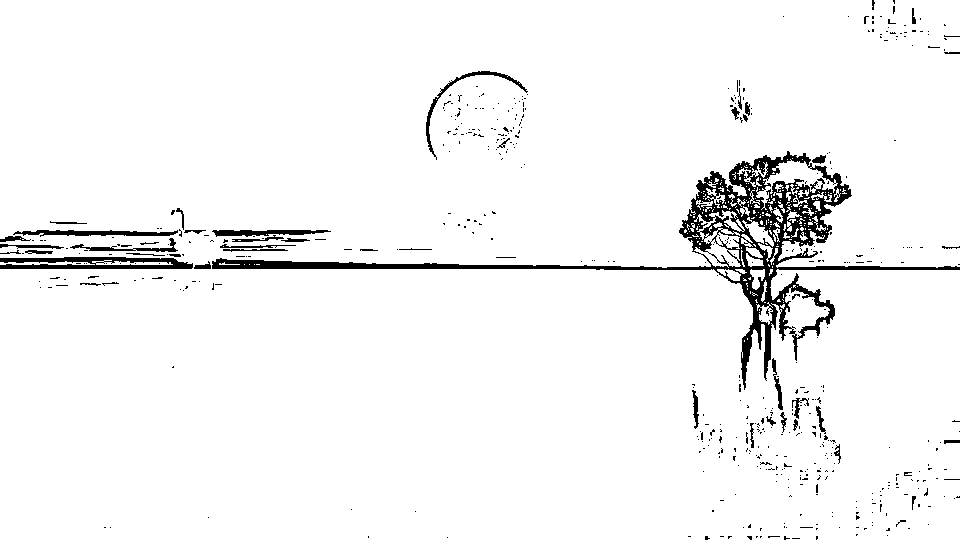

作者/王嘉祺

编辑/翀子 图片/网络

上次的[【卜卦小测验】](http://mp.weixin.qq.com/s?__biz=MzA5NjA0NTAxNg==&mid=2651470990&idx=2&sn=93e337c3f7a4511bce7d0f2724f4f0a7&chksm=8b488e39bc3f072f56b663766294f99676c26aae48c63d23807840390f654bf288c1607d7af4&scene=21#wechat_redirect)你答得怎么样？是不是觉得还挺有趣的？让我们继续“问与答”的环节吧！相信经过之前的测试，你已经对卜卦占星学有了不少了解。若道即将开设卜卦占星课程，如果你感兴趣，可以点击[【现代卜卦占星学】](http://mp.weixin.qq.com/s?__biz=MjM5MjQwNjAyMQ==&mid=2649439458&idx=3&sn=5930b97b5292603c8b3d668b90554799&chksm=beb9538889ceda9e85535c44a05b9f4ebfc1b2e6e7fe4ce3ebb1b1ae7cc26067225d83ad9300&scene=21#wechat_redirect)了解详情哦。

大家好，我是 Conrad 卜卦课程的助教。不知道上次给大家出的几道小题，大家感觉如何呢？今天我继续给大家提供 4 道选择题，以及一个实际的卜卦案例。希望大家在寓教于乐的过程中，能够在卜卦占星里找到属于自己的乐趣。

答题开始啦

**选择题（共四题）**

**第一题**

**在动态卜卦系统中，如何看待和使用三王星？**

A.只使用古老的七星守护体系，不使用三王星；

B.使用三王星，但不当作星座的守护星来使用；

C.使用三王星，也将三王星当作星座的守护星来使用；

D.是否使用三王星，取决于问题中是否出现三王星所代表的人和事。

点击下方空白区域查看答案

▼

**答案：B**

在动态卜卦系统中会使用到三王星，但因为是我们肉眼不可见的，代表了超出我们控制的集体性的能量。所以三王星不代表人和事，它们在卜卦星图中从来不作为任何人或者事的征象星，所以也不会作为星座的守护星来使用。**第二题**

**卜卦星图的时间确定，是以什么为准的？**

A.以客户提出问题的时间为准，比如客户发送提问邮件的时间；

B.以咨询师任何情况下看到问题的时间为准；

C.以咨询师看到问题，并且心态上也准备好去解读的时间为准；

D.有的时候通过电邮、电话信件等方式的传递会被延误或者中断，所以需要客户重新发起提问。

点击下方空白区域查看答案

▼

**答案：C**

占星师收到了客户提出的问题、阅读并理解了问题，并准备作答的时候，就用这个时候来制作卜卦星图。有的时候，客户发过来的邮件长时间没有被打开，或者即便是看到了但也还没有准备好去处理，这个时候不宜使用看到的时间。等准备好阅读并理解提问的时候，再去看邮件并根据那个时间来制作星图。此外，有的时候因为一些原因导致占星师收到问题被延误，这也是提问过程的一部分，而卜卦占星学正是关于时间动态发展的学问。

**第三题**

**在动态卜卦系统中如何对待客户提出的“是否”性的提问？**

A.可以根据传统卜卦占星，给与客户是或否的答案；

B.是否问题对客户不太有帮助，所以客户需要重新提问；

C.可以以心理面向来转化是否问题，并与客户探讨相应的应对策略；

D.可以给与客户是否答案，并与客户讨论后续策略。

点击下方空白区域查看答案

▼

**答案：C**

传统而言，卜卦占星往往给予客户是或否的答案，但是这在心理面向上，对于客户是不太有帮助的。咨询师可以去探讨策略，同时关注客户的情绪。

**第四题**

**关于时事与事件的星图，与卜卦占星学的关系恰当的是？**

A.时事、事件与卜卦占星是不同的，一个是已经发生的事情，一个是未发生的；

B.时事与事件在占星学中有另外的分支叫经世占星学，与卜卦占星学互不从属，没有多大关系；

C.时事与事件，以及卜卦占星都代表了“某个时刻的占星”，都是动态过程的一部分，在有些原则和技巧上也有相通之处；

D.在学习和实践卜卦占星的过程中，我们可以尽可能地注意身边发生的事，既包括新闻时事也包括日常小事，因为这些都可以帮助我们理解卜卦占星。

点击下方空白区域查看答案

▼

**答案：CD**

在卜卦占星学中，我们可以尽可能多注意在身边发生了什么事情，不仅包括政治局势，也包括身边的日常小事，诸如看了什么电视剧，遇到什么人。这些事件时刻都是行星运行轨迹的体现。作为占星师，当我们知道行星在什么位置，我们就可以观察到周边发生的事情与行星之间的彼此关系。这就像是行走的卜卦星图，眼前发生的真实事件都可以变成问题，也都可以回答。

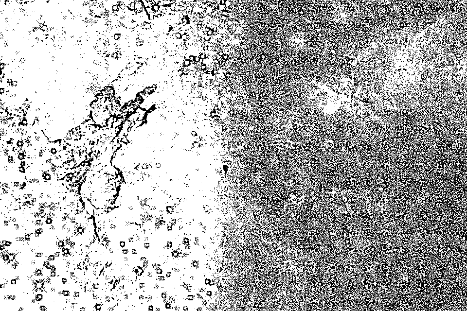

**实际案例题**

**案例题**

他在当地是一个知名的 NLP 疗法课程的领导。由于爆发了新冠疫情，他不得不取消全部课程。他想要知道危机会怎样，以及自己能做什么来摆脱困境。他的第二个问题是，他和前妻的孩子有时和他生活在一起，有时和妈妈生活在一起，孩子的心理状态比较糟糕。他想知道怎么做。如果你作为他的卜卦咨询师，你会如何分析这两个问题呢？

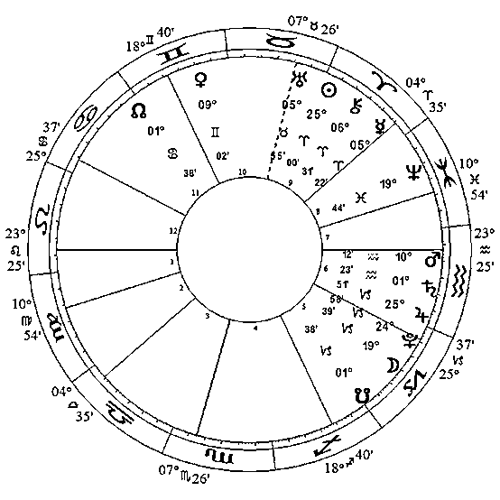

点击下方空白区域查看答案

▼

**参考答案：**

客户由上升的守护星太阳来代表，太阳位于第 9 宫，揭示了客户是 NLP 老师的身份，同时太阳在白羊座是擢升而有力量的。目前的危机，在于太阳与冥王星和木星有紧密的四分相，以及月亮马上也会在失势的位置合相冥王星和木星。并且由于是入相位，事情起先会比较糟糕，随后会达到顶峰，然后再好转。

这里金星在双子座，三分土星和火星，所以现在就可以抓住师资力量，有不少人在帮助他。他们可以合作起来，并且开展线上课程。随后几天，水星会分别与金星和火星形成紧密的六分相，也意味着不错的合作机会。后来不到一个月，客户发布了他们的线上课程。

关于第二个问题，孩子由第 5 宫主星木星代表，月亮可以指代母亲以及家庭。月亮与木星同时在摩羯座处于不利的位置，并且合相冥王星，所以看起来目前的状态是比较糟糕的。太阳在这里与木星形成四分相，可能自己当下确实比较无助。不过土星代表他现在的妻子，土星之后会逆行回到摩羯座，与木星合相，并一起进入到水瓶座。因此很可能现在的妻子，在帮助处理孩子的心理问题方面，会扮演比较重要的角色。

**怎么样，你答对了几道题？**

**快在评论区告诉我们吧！**

**是不是对于**卜卦占星学****

**有了不一样的认识？**

**快来看若道君为你准备的课程吧！**

**现代卜卦占星课程内容**

**课程分为 5 部分：**

**Part1 **融合现代占星理念，整合动态占星知识**Part2**独家【现代动态卜卦占星技术】全面教学**Part3**学以致用，覆盖人生各个领域问题的卜卦解法**Part4**扩展延伸择时占星技法的新认知**Part5**如何运用卜卦占星学做一场转化性的咨询

**15 节录播课+8 节直播课线上网络课，英文授课，中文翻译。**

**15 节录播课为 2020 年动态现代卜卦课程的内容。8 节直播课则完全是案例教学的形式。**

这样的好处是，你可以通过 1 个半月的密集学习之内按照自己的进度学完录播课的理论和录播课中已有的案例，从学习开始就实践，然后把实践中遇到的问题拿到 8 节直播课中，和老师互动。

**在 8 节直播课中，老师也会用案例教学、和同学互动的方式帮助大家进一步掌握卜卦占星的技法。**

**授课老师**

**艾德里安·罗斯·邓肯****（Adrian Ross Duncan）**1971 年在印度游学时开始学习占星学，1985 年开始成为全职占星师，**迄今执业已超过 33 年，是人本主义占星学、卜卦占星学和经世占星学领域的知名占星师。他还开发了占星软件 AstroClock 和多款占星报告。**他在日常咨询中都会运用卜卦，咨询图（卜卦的一种运用方式，即根据客户来访时间制作星图，从星图中获得大量信息）也是他**特别擅长的领域**。艾德里安·罗斯·邓肯从 1971 年开始研习佛学，受佛学影响很深，他**相信占星学和佛学观点统一、转化的一个基础是在于对现实感知的改变**。而卜卦很容易与佛教融合，因为它只关乎当下。

**授课时间**

**付费后一天即可开始看录播课程，全程有助教老师回答问题。**

**直播课程开始时间：**

2022 年 5 月 3 日，每周二 20:00-22:00

**这次课程恰逢世界在巨大的变动和不确定之中，期待这门课程能够给各位及各位的客户带来新的洞见和方向。**

**在这次 8 次直播课程中，我们将采用案例教学的方式，所有参课同学均有机会提供案例，供老师解读，且我们将组织群体的练习，用大量案例帮你掌握卜卦及如何在咨询中用卜卦。**

**什么人适合参加本课程？**

*   想要系统学习现代动态卜卦占星的学员

*   想在生活中熟练使用现代卜卦占星学

*   在咨询中想帮助个案更清晰的分析解读困惑

*   想参加 ISAR 认证考试，此课程是 ISAR 选修课

*   希望通过卜卦占星帮助自己和身边人挖掘一个积极主动的未来

学习整合卜卦技巧，不仅有益于想钻研卜卦占星学这个分支的同学，对占星初学者也很有有帮助，可以让你的占星技巧加倍。

**课程费用**

**课程价格：9900 元**

**老学员复训专享价：**

**2020 年参加艾德里安·罗斯·邓肯卜卦占星课程的同学：****2900 元**

**2018 年参加艾德里安·罗斯·邓肯卜卦占星课程的同学：****4900 元**

**特别优惠****：**

**分享课宣到朋友圈****保留 48 小时****（不设分组显示）截图给课程顾问可获得****400 元优惠****。**

**课程负责人：童老师（微信：nodoorDaivd），请备注“卜卦”**

长按二维码添加课程负责人咨询

**退转课程****退款原则请详看《教学协议》，如有疑问请咨询课程顾问。******现代动态卜卦占星实战课·ISAR 选修课****

**授课老师：艾德里安·罗斯·邓肯**

**授课时间：**2022 年 5 月 3 日

**授课方式：**网络课程，英文授课，中文翻译

**费用：9900 元；****2020 年老学员复训价：2900 元；2018 老学员复训价：4900 元；特别优惠，分享课宣到朋友圈保留 48 小时（不设分组显示）截图给课程顾问可再获得 400 元优惠。**

**课程负责人：**童老师（微信：nodoorDaivd），请备注“卜卦”

长按二维码添加课程负责人咨询

****报名请点击“阅读原文”****

# 冥王星摩羯座的尾度，拿什么来迎接 2023 年的冥王水瓶座？

> 原文：[`mp.weixin.qq.com/s?__biz=MzA5NjA0NTAxNg==&mid=2651472140&idx=1&sn=63153bb7af2615aef88a4e0d3375b8c2&chksm=8b48f3bbbc3f7aadedb19606f33bae7654275a488bec59219a62e4f03017a191d57f8c05a33b&scene=126&sessionid=1692737827#rd`](http://mp.weixin.qq.com/s?__biz=MzA5NjA0NTAxNg==&mid=2651472140&idx=1&sn=63153bb7af2615aef88a4e0d3375b8c2&chksm=8b48f3bbbc3f7aadedb19606f33bae7654275a488bec59219a62e4f03017a191d57f8c05a33b&scene=126&sessionid=1692737827#rd)

****************☆ ****************************后台****************************回复“今日”，给你一句生命态度****************

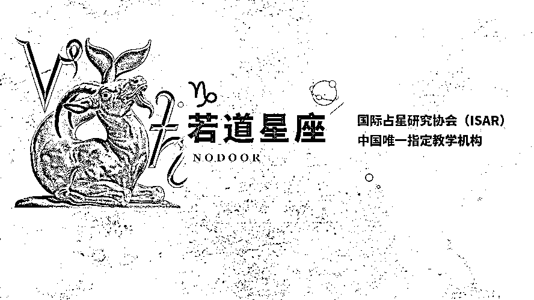

作者/达娜·格哈特
译者/三三 校对/Leisha 编辑/玫瑰 图片/pexels

当过去十几年，冥王星行进在摩羯座，会给整个人类和每个个体带来怎样的颠覆和蜕变，可想而知。而我们正准备跨入冥王星水瓶座的时代。让我们一起来回顾冥王星摩羯座的指引，从神话故事中汲取养分，大步向前。

**当冥王星来到摩羯座**

****

**我觉得世界末日不错，因为我认为人们将不得不重新培养他们的习惯，而这样才会越来越好。**

**——NPR 新闻评论员陆赛静**

我有很多富有直觉的客户。历年来，其中彼此并不相识的一小部分人，曾向我坦承他们有特殊的使命，这是他们不敢告诉家人与朋友的事。他们像电视剧《英雄》（Heroes，2006）中的角色一样，都是拥有超能力的普通人。

我并不是说他们会飞、能穿越时空或者从十层楼高的建筑物上坠下而毫发无伤，而是他们有远见。透过快乐消费的景象，他们看见难以想象的严峻时代如乌云一般滚滚而来，而在他们预感出现的很久之后，这个新闻才会被《时代》周刊报道。

当他们还是孩童的时候，就知道文明正在坍塌。逐渐，他们开始获取事实和回归自然的技能，这将必然使他们成为拯救未来迷茫社会的英雄。没有人知道世界末日的确切日期，但现在，冥王星行进在摩羯座，我怀疑那天即将来临。

谈及世界末日常常会带给我恐惧的颤栗。黄道是一个智慧之轮，**用后一个星座来平衡前一个星座的极端特质**。冥王星在射手座的亢奋扩张时代过去之后，我们需要摩羯座的**谨慎与收缩**。

**摩羯座由挥舞着镰刀的土星掌管，土星现在正举着“少即是多”和“末日将近”的横幅游行于集体中**。

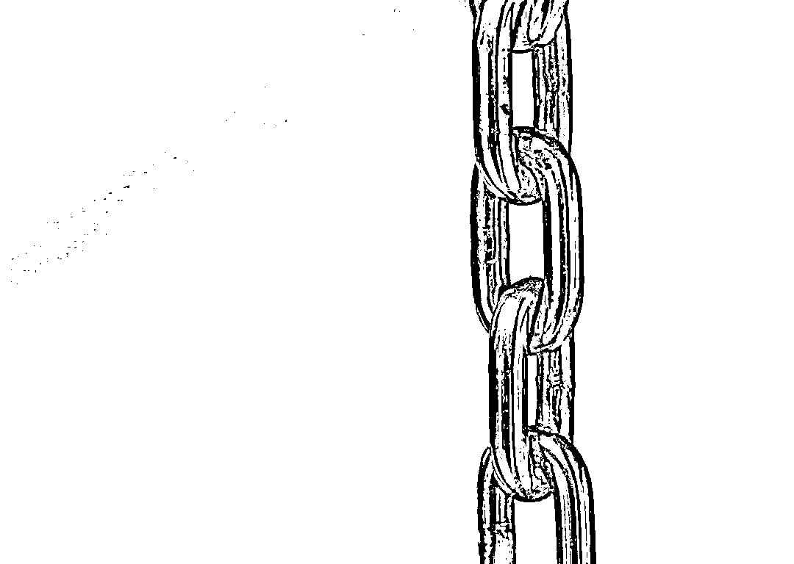

去年，我做了近视激光手术，部分原因是在恐怖片《迷离时空》（TwilightZone，1959）中有一个情节，地球上最后的幸存者终于坐下来，安静地读着他心爱的书，然后他的眼镜掉下来，摔碎了。

但现在我准备好了，治好了近视，车库里堆满了还没读过的书。如果情况真的很糟，我可以把那些书当作燃料或者当作碳水化合物来充饥。当世界末日来临时，我只会撑起需要我负责的集体帐篷的一角，然后像往常一样：解读星座。

这个世界已经充满了**摩羯座萨比恩征象**（Sabian symbols）：

一对失业的夫妇失去了他们最近购入的房子；另一种未被发现的昆虫在亚马逊消失了；一辆过于耗油的汽车被推下悬崖；持有硕士学位的人在施舍处吃饭。但这也不全是残酷的，**当冥王星经过一个星座，他会带来彻底的变革，将这个星座所掌管的一切夷为平地并重新建立**。

摩羯座代表的是**权势集团——领导、结构、政府、公司**。一些企业会倒闭，但另一些会蓬勃发展——比如制造可重复使用购物袋的公司和“绝望者之家”网站（Despair.com）。

后者向长期愤世嫉俗的人和企业中的闲散人员推销鼓吹消极的小玩意。正如晚间新闻报道所言：**“这是一个让绝望繁荣的时期”**。

**绝望**是摩羯座的词，这个网站迎来它有史以来业绩最好的一年，因为它售卖的海报上印有启发性的图片和这类标语：**“价值：仅仅因为你是必需品不代表你重要”**或者：**“失误：可能你的人生目的只是为了警醒他人”。**

摩羯座的原型——山羊绝对是个**喜剧演员**（魔羯座的喜剧大师包括史蒂夫·艾伦、安迪·考夫曼、霍华德·斯特恩、金·凯瑞、特蕾西·厄尔曼，包括大卫·莱特曼、理查德·普莱尔，露西尔·鲍尔都有摩羯座的月亮。

大萧条时期最受欢迎的喜剧演员查理·卓别林的土星落在中天）。当然他是个**雄心勃勃的登山者**，他是在迫不得已时会吃废弃易拉罐的**现实主义者**，但他的眼中也闪烁**快乐的光芒**。

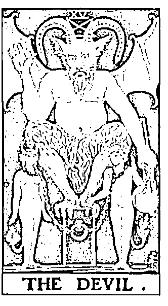

| 韦特塔罗牌中的恶魔牌

角山羊（摩羯座）与潘神和那群喜爱狂欢作乐的萨蒂尔（半人半羊的神）是表亲关系。萨蒂尔是邪恶、下流、具有颠覆性和滑稽的。

在塔罗牌中，萨蒂尔是代表摩羯座的恶魔牌上的主角。在韦特塔罗的恶魔牌上，画着一对裸体男女被锁在一只可怕的山羊恶魔的基座上。这个情境看起来似乎很糟，没人愿意抽到这张牌。

但如果你仔细观察的话，你会发现受困者脖子上的锁链系得非常松，这对男女完全可以脱下锁链然后走开。这就是讽刺所在。改述美国连环漫画 Pogo 的名言，这张牌意味着，**恶魔永远是我们自己**。**我们是自身欲望、恐惧与贪婪的囚徒。**

冥王星在射手座行进时，在**乐观主义和鼓吹**的滋养下，**恐惧与贪婪**大行其道——从散布恐慌的政客到“安然公司式”（2001 年，发生在美国的安然公司破产案）的投机者、炒房者、发战争财的人，还有那些为了获得巨额奖金而裁员的首席执行官们。

贪婪甚至蔓延到形而上学的领域，《秘密》(The Secret)这本书所承诺的“心想事成”让大众备受鼓舞和振奋。关于射手座的放纵特质，我最喜欢的例子是一个叫做《我的 16 岁花季》（My Super Sweet 16）的电视节目。

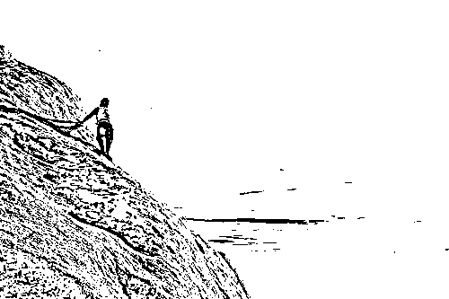

节目中，骄纵的富二代们用足以买下一个小国家的预算来为自己举办穷奢极侈的生日派对。

在每集中那些自恋的小孩会精心设计一个邀请仪式（主要为了羞辱那些没有被邀请的人），然后邀请他们的土豪父亲负担得起的最大牌明星，为富二代圈子里的女王或国王布置一个华丽的派对入场式（高坐轿辇，被衣着暴露的舞者环绕，或者从直升机上走下来），并且最后总是会拿到一辆新的豪华轿车的钥匙。

剧中一位甜美的 16 岁少女骄傲地宣称：“我爸爸拥有自己的石油公司，还有遍布世界的油井。我爱石油。石油就是鞋子、汽车和包。”她生日的座驾是一辆宝马 325i，她兴奋地说：“这让我在这座城市中高人一等。”

但是冥王星在摩羯座撕开了这个现实故事的假象。这位石油公主的父亲现在正被起诉，因为他利用并不实际存在的石油公司欺诈了数百名投资者。如果恶魔牌暗示了人会自取灭亡，那么冥王星在摩羯座看起来也有着相似的幽默感。

这个电视节目的制作人应该查过星历表了，因为他们的节目《放逐》要给同一群被宠坏的孩子们呈现更黑暗的现实。溺爱他们的有钱父母要把他们送到国外与当地的贫困人民住在一起，与鸡和牛粪共处一室，他们将必须（倒吸一口气）亲自干活。

**摩羯座的幽默是讽刺的和干巴巴的，这正是让我们度过困难时期的东西**。我猜想当末日临近，事情会越来越有趣。带着 1974 年法国农民围观特权阶级人头落地的热情，我希望所有那些贪婪的混蛋都能得到他们应得的报应。至于你我，我们有自己的事要做。

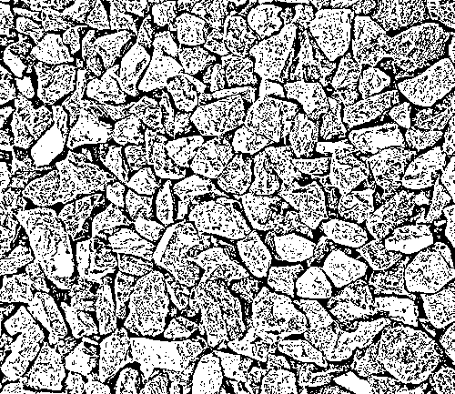

**赫拉克勒斯的冥府之旅**

在高中时，我曾以一场演讲而赢得了几个奖项。那场演讲以花哨的起手势和耸动的声明开场：“循规蹈矩的风气正在席卷全国。”

除了世界末日，这也是我对冥王星进入摩羯座的第二大恐惧：这会把我们带回到一种由灰色法兰绒西装和公文包构成的上世纪 50 年代的千篇一律中。

摩羯座毕竟是一个**商人**，而被摩羯座奉为格言的是从我们蹒跚学步时起就一直聆听的父母、老师乃至整个社会的**训导**。遵守规则。负起责任。为了赢得尊重，你必须自己去争取。努力工作你才会走得更远。

摩羯座是**传统的、可靠的、务实的和自律的**。它也**富有野心**，但更喜欢**往现存的结构之上攀登**。它的成功通常**遵循传统路线**。

作为一个有着上世纪 60 年代嬉皮士之心的人，我担心过冥王星全盛时期的临近，也从未想象过它的优点能在千禧年后的世界有多么闪亮。现在，我很乐意看到类似于**“尊重”、“正直”和“有效领导”**这样的摩羯座关键词正卷土重来。

如果保守意味着足够进取地去保存资源而不是耗尽它们，那么我甚至会成为一个“保守派”人士。**重建基础设施，振兴政府以及企业**看似是值得开展的项目，也非常符合**冥王星对摩羯座主题的变革和复兴**。

除了冥王星的集体议题，他也会给我们指派个人任务。如果你想要成功，我建议你**顺应集体趋势**而行。

以摩羯座作为你的北极星，成为你生活里坚定的新领导者。如果冥王星在射手座时的吉祥物是年轻的冒险者（我如何才能在不努力工作的情况下快速前进呢？），摩羯座则会给我们带来智慧长者的建议：**“要更务实、现实和有耐心，一步一步地实现你的梦想。”**

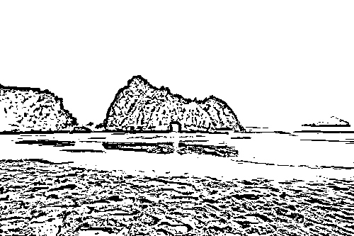

这并不如它看上去的那样糟糕。在摩羯座对历史与等级制度的热爱之下，我们可以用很多优秀的榜样来激励自己。我决定回到几十个世纪前，以神话英雄赫拉克勒斯和他的 12 功绩作为这个新星座系列的试金石。

在阅读了那么多有趣的参考资料后，我早就想这么做了，正如欧内斯特·布森巴克在《象征、性与星星》（Sex and the Stars，1997）书中所言：“早在公元前 5 世纪，鲍桑尼亚（Pausanius）就观察到赫拉克勒斯的 12 项任务代表了太阳每年穿越黄道 12 个星座的行进。

这个观点得到了赫西奥德注解学者的支持，他们指出：**‘承载太阳完成一整年行进的黄道是赫拉克勒斯真正的事业所在。’**”神秘学老师爱丽斯·贝利（Alice Bailey）也把星座与任务联系起来，以形而上学地描述通往获取灵性控制力的灵魂之旅。

如果我们必须要在这些年里“做”摩羯座的事，那么赫拉克勒斯或许能对我们有所启发。传统上与摩羯座有关的任务是他最后一项任务，赫拉克勒斯要**去往冥府再返回。**

| 赫拉克勒斯与三头恶犬

第 12 项任务是赫拉克勒斯的摩羯座挑战。有人认为这是最困难的一项任务：**前往冥府之门，并带回守门的那只三头恶犬刻耳柏洛斯，这只守门犬允许任何人进入冥府，但只能有去无回。**

在执行任务之前，赫拉克勒斯前往了厄琉西斯城，**通过获取神秘力量而净化了自身**。然后，他穿过拉科尼亚的一个洞穴口，由赫尔墨斯引领降入地狱。

亡灵们看到活人都惊慌逃窜，而可怕的美杜莎除外，她头上的蛇扭动着并嘶嘶作响。赫拉克勒斯拔出他的剑，但赫尔墨斯这时说道：“不要浪费你的时间，他们只是亡灵。”

他俩遇见了冥府渡神喀戎，他起初拒绝他们通过驳船，直到英雄用喀戎自己的船桨攻击了他；经过一番恐吓，喀戎带他们渡过斯提克斯冥河，赫尔墨斯在河上看到了令他伤心流泪的景象。他的好友忒修斯被遗忘锁链捆绑。

他之前为了救珀尔塞福涅，与庇里托俄斯一起来到冥府。守门犬刻耳柏洛斯把庇里托俄斯撕成碎片，如果没有冥王普路同的干预，它差点也把忒修斯撕碎。

赫拉克勒斯请求与令人敬畏的冥界之神会面，并请求冥王允许他把忒修斯和冥界之犬带回人间。冥王同意了，但有一个条件：赫拉克勒斯必须徒手（不能使用棍棒和箭）制服野兽。

然后，英雄抓住三头犬的脖子，勒住它三个喉咙的底部，这条狗几乎要窒息了。然后这位勇士从冥府之门上扯下锁链做狗绳，并为守门犬每只颤抖的脑袋套上了项圈。

忒修斯在他身旁，赫拉克勒斯拖着守门犬上了喀戎的驳船，伴随着船的上行，阳光逐渐变得愈发强烈刺眼，刻耳柏洛斯暴跳起来逃跑，差点将赫拉克勒斯拽回冥府。这时候英雄愤怒了，猛然拉回猎犬，踩着它的喉咙，直到这只窒息的狗最终屈服。

从它的口中吐出的每滴白沫滴在地上，都生出一种剧毒的植物——乌头。和往常一样（如果你贯穿始终阅读这个系列的文章，你就会看到），最初指派任务的国王总是对赫拉克勒斯的成功感到吃惊。

因为恐惧恶犬而躲在椅子后面的国王欧律斯透斯，命令赫拉克勒斯把三头恶犬送回冥府，这位英雄就此便完成了所有的任务。

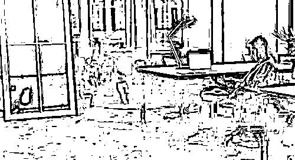

**摩羯座所落宫头和行星的主要挑战**

在这个故事中，没有山羊，也没有西装革履；事实上，没有什么令人直接想到摩羯座的内容。即便如此，征服冥界的守门恶犬仍然完美地比拟了**摩羯座所落宫头和行星的主要挑战**。

但首先，我们能从相关的细节中学到什么？赫拉克勒斯完成任务的方法是经过**精心策划**的。他通过获取冥府的神秘力量净化自己。如果没有这种保护，他的冥界之旅很可能有去无返。

**摩羯座的野心同样也需要一个坚实的基础——获取你所求目标的传统力量**。即使你想打破规则，先**了解规则**也很重要。赫拉克勒斯还找了一个**向导**。

宫头和行星落在白羊座，最好要随心所欲、独辟蹊径；落在巨蟹座，你需要跟随直觉和感受；落在天秤座，找个搭档；但落在摩羯座的话，导师指引是关键。

有了强有力的榜样，你成功的几率会增加。**去跟随那些已经去过你想去的地方的人**。

我认识一个成功的出版商，他星图中代表出版领域的第 9 宫宫头落在摩羯座，而他的文学出版社实际上是他在出版界的导师给他的礼物——那位导师不仅提出了这个想法，还安排好了启动资金。

赫尔墨斯劝赫拉克勒斯不要把浪费时间在与亡灵战斗。我还记得很久以前，当我的第一任丈夫进入企业界时，他的一位导师建议他不要浪费时间在餐厅里和那些被他贴上“失败者”和“抱怨者”标签的人聊天。

这让刚从大学毕业的我和丈夫认为是冷漠无情和极端行为。但这些年来，我重新思考了他智慧的忠告。

专注于摩羯座的工作可能意味着**远离其他人**。在你想获取成功的领域中，那些与你志不相投的人只不过是幽灵。然而，赫尔墨斯却允许赫拉克勒斯攻击喀戎。**好斗的火星在摩羯座擢升**。这里传达的是战略信息；**无需每仗必打——只打重要的仗**。

而渡神喀戎是**必须克服的障碍**。《兰迪·波许的最后一课》（Randy Pausch's Last Lecture，2007）中有这么一句话：**“障碍是要将其他人拒之门外，而让你证明自己有多渴望实现自己的梦想。****”**

摩羯座的成功对我们而言通常意义重大，因为在某个时刻，我们可能终需为之战斗。

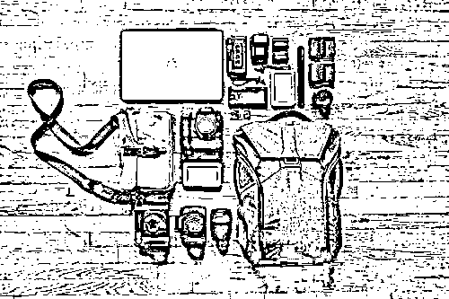

当然，如果走入极端，这样的态度会导致**摩羯座的负面行为**：变得**无情、自负、霸道、追求地位和剥削别人**。这就是赫拉克勒斯拯救忒修斯的行为中隐含的**平衡信息：****服务行为能调和野心**。

摩羯座是 3 个超个人星座（摩羯座、水瓶座、双鱼座）的第一个，这意味着涉及摩羯座所落的宫头和行星时，我们必须**关注造福众人而不仅仅是我们自己的上善之道。**

赫拉克勒斯与冥王会面，请求释放忒修斯并带走守门犬。摩羯座的任务要求我们**尊重等级链条**。即便如此，冥王很快就应许了赫拉克勒斯的请求还是让人感到惊讶，尤其是对于见证过冥王星行进对个人生活摧毁程度的人们来说，更是难以置信。

在此，我们会想起摩羯座与冥王星守护的天蝎座之间存在天然的和谐关系：它们形成六分相，这是代表**合作**的相位。这两个星座有着**相似的价值观**：**对权力的欣赏与对权力形式的认可**。

也要记得赫拉克勒斯为这一刻做了充分的准备，在获取冥界的神秘力量后，他其实已经与冥王站在了同一阵营。

**与冥府守门犬作战**

我的两个客户同时受到了冥王星对他们星图四轴的行进。由于这个行进可能会**颠覆生活的方方面面**——**家庭、事业、关系，甚至身体健康**，因此我们会关注这个行进好几年。

一位客户的冥王星行进在射手座最后几度，而另一位客户的冥王星行进在摩羯座的前几度。两个人都在事业上遭遇了严重的挫折。

但冥王星在射手座末尾行进的那个人，获得了胜利，他得到了更好的新职位。而另一个四轴落在摩羯座初度的人情况不太好：他被解雇了，遭遇了健康危机，他的妻子与他离婚了，他的驾照在酒驾后被吊销了。

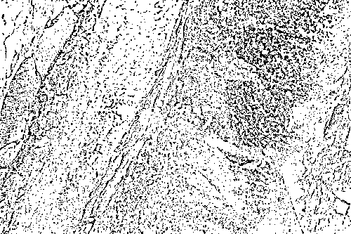

这可能会误导我们得出冥王星在射手座会比在摩羯座更加友善的结论，但更具误导性的是那种可怕的占星学道德说教，它假定如果行进进展不佳，那就是当事人自己的问题。

或许，最好是去**探究每次行进触发星图的过程**，于是我们就不得不提神话故事中冥界守门犬的意义。**使每个人在职业生涯中孤助无援的，并不是自己的所作所为**。

这两位客户都是销售人员。他们各自行业的经济衰退使他们的事业岌岌可危，也导致他们陷入感觉抑郁和不安全的危机中。

他们**内心消极的声音**开始咆哮叫嚷，就像地冥界恶犬刻耳柏洛斯一般，这也象征了每个人心中的**地狱野兽**，站在**损失、失败与死亡**的门口。

爱丽丝·贝莉提出，刻耳柏洛斯的三个脑袋分别象征**知觉、欲望与美好愿景**——或者是象征**对良好的感受的渴望、想要获得成功和感到满足，以及心存从未实践过的想法**（如谚语所言：“徒有良好愿望而无行动”）。

贝莉列出的这些关键词清单是个不错的开头，但我倒认为摩羯座的守门犬更全能，会**对着我们的过往经历以及我们星图中弱点的汇集处嚎叫、咆哮和撕咬。**

冥王星行进在射手座最后几度的那位销售靠近了他的刻耳柏洛斯，但没有必须展开恶战。反而，他怀着射手座的乐观态度并寻找自己身边的机遇，这样的态度给他回赠了更加强有力的状态（是的，**冥王星行进最终确实意在赋予我们权力**）。

而冥王星行进在摩羯座前几度的那位销售度过了更艰难的时期。

听闻他的挣扎历程之后，我认为刻耳柏洛斯的三个头分别象征**恐惧、高期待（以及令人难堪的完美主义），最后是惰性**。他星图中有太多行星落入水象星座（巨蟹座、天蝎座。双鱼座），海王星合上升点，因此被压垮。

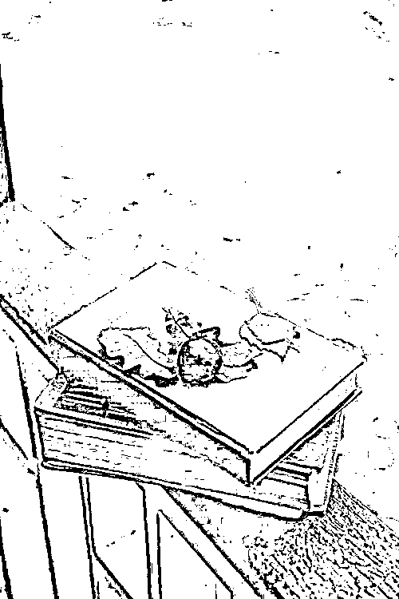

他只是放弃了属于他的赫拉克勒斯战斗。摩羯座的**惰性**原型比占星学教科书中常提及的情况更为普遍。我认识**很多摩羯座们在这个星座的高期望重压之下崩溃了，只是选择躺下而不去攀登高峰**。**没有目标的摩羯座很容易陷入抑郁。**

贝莉的引导者，迪瓦尔.库尔（Djwhal Khul）曾经说过，摩羯座是最难写的星座之一，因为它是**最神秘**的星座。当某些事情被认为是“神秘的”或“秘密的”时，是因为**没有集体的准则**。

对于每个人来说都有不同的境遇，我们的摩羯座斗争亦然，尽管这一切要经受社会的观察与评估，但终究还是非常私人的。

在我们的摩羯座之旅中，我们需要运用**自制力**。**过度的自制会导致严重的僵化，但如果没有自制力，我们将永远无法为自我提升做准备和计划，无法遵从传统，听从导师，并明辨何时该收剑、何时该挥剑**。

这是个永无止境的功课。因为即便我们真的制服了内心中的刻耳柏洛斯，它的毒涎也会萌生出**有毒的态度**（就像故事中的剧毒植物乌头一样），以后依旧会带来麻烦。

最终，我们**既是胜利者，也是战败者**，就像恶魔牌上描绘的那对男女一样。**自制克己**是摩羯座的核心任务。这也是为什么赫拉克勒斯不被允许携带任何武器，必须与恶犬赤手空拳地搏斗的原因。

**只有通过战胜自我，我们才能获得摩羯座承诺给予的真正权力。**赫拉克勒斯回到人间，就如同**太阳每年在白昼与黑夜时长即将颠倒的冬至时回到摩羯座**一样。无论是个人还是集体，处在冥王星在摩羯座行进期间，希望我们都能从黑暗中凯旋。

**版权声明：**本文由若道翻译发布，欢迎转发，反对抄袭。友号转载请申请白名单。

**达纳·格哈特**一位国际范围内受尊敬的占星师。她为众多占星学网站和出版物讲课、写稿。她在十二宫的月亮激励她对这颗发光体进行了深刻而持久的探索研究。**20 位来自世界各地的占星师****带来 20 场沙龙——新世界的觉醒****详情可点击下图**

**学习占星学****点击下图了解课程详情**

**

**微信又双叒叕改版啦，不想错过若道君的推送？**

**就把若道设为星标吧！**

**▼**

**喜欢记得点一下在看哦☟**

**报名直达入口**

# 若道周运 4.18-4.24 丨马上进入金牛月，宇宙能量哪些值得关注？（内含 12 星座运势）

> 原文：[`mp.weixin.qq.com/s?__biz=MzA5NjA0NTAxNg==&mid=2651471987&idx=1&sn=76ccd7cce524a06e572a69c77956f884&chksm=8b48f2c4bc3f7bd2abe8ce3eeffd14b05b316b87039a21780a427eb42492558b5dfb740a3b69&scene=126&sessionid=1692737832#rd`](http://mp.weixin.qq.com/s?__biz=MzA5NjA0NTAxNg==&mid=2651471987&idx=1&sn=76ccd7cce524a06e572a69c77956f884&chksm=8b48f2c4bc3f7bd2abe8ce3eeffd14b05b316b87039a21780a427eb42492558b5dfb740a3b69&scene=126&sessionid=1692737832#rd)

******☆ ****后台回复“今日”，给你一句生命态度******

作者/芷菱 ISAR 认证占星师
编辑/翀子 封面/书君 图片/网络随着土星四分月亮交点的精准呈相周的到来，太阳也将进入金牛座。本周的宇宙天气有哪些值得我们关注？12 星座又会如何度过本周？让我们来看文章吧！（如果着急看 12 星座运势，不妨先拉到最后哦）**整体氛围**

**本周重要星象**

*   **4 月 18 日**

    **12:51 水星与天王星合相在金牛座 13 度 48 分**

    ****下午 金星在双鱼座，先后六分水星与天王星。****

    **23:14 太阳四分冥王星 （白羊座/摩羯座 28 度 34 分）**

*   **4 月 20 日**

    **10:24 太阳进入金牛座**

*   **4 月 21 日**

    **18:07 土星四分南北交点（水瓶座/天蝎座/金牛座 23 度 40 分）**

*   **4 月 24 日**

    **15:16 水星合相北交点（金牛座 23 度 31 分）**

    **21:50 水星四分土星（金牛座/水瓶座 23 度 53 分）**

**月相**

**月亮处于满月后的下旬月阶段（17 日天秤座满月），行经天蝎座、射手座、摩羯座、水瓶座四个星座。分别形成月土四分相（18 日）、月火四分相（19 日）、月金四分相（20 日）、月木四分相（21 日）。**

在讨论本周星象之前，我想先说说上周的星象。因为上周我们经历了本年度最重大的星象：木海合相双鱼座（4 月 12 日 22:42）。

在之前展望这个相位的影响时，不少占星师包括我，都将重点放在了灵性的成长、想象的美好世界、愉悦的艺术感受上面。也有占星师指出，木海双鱼座有放松的意味，在这个相位形成前后，严苛的疫情管控、以及物资紧缺的状况有望获得放松的势头。

从某些角度确实有放松的迹象，我观察到的是：12 日下午传来消息，8 个试点城市将减少隔离的天数、上海部分小区解封、菜蔬的供应似乎也在逐步恢复。

兰州大学出炉一份预测报告说，预计 4 月 11 日之后是上海疫情的转折点。出于对疫情防控放松的预期，一直跌跌不休的 A 股在 12 日下午突然翻盘上攻，拉回到 3200 点上方。

但在同时，国家卫建委澄清坚持动态清零的管控措施不放松。上海市公安局也发布了疫情期间加强社会秩序管理的通告。

截止 4 月 13 日，上海日新增感染者仍然是两万多，人们在朋友圈和微博上还是不断看到各种疫情封控带来的次生灾害，感到失望和焦虑。

**放松和想要转变的迹象，和各地在加码的紧张管控措施，似乎同时存在。**

同时我们在社交媒体看到，**人们被激起很大的情绪、共鸣和同理心。**很多人为不会用智能手机抢菜的老人揪心，为半夜敲邻居门给孩子求退烧药的妈妈难过，为打不通 120 电话到医院急救的病人感到焦虑。

虽然素不相识，此时此刻我们与他们是一体的，我们感同身受他们的恐惧与脆弱无助。

这其实很吻合木海双鱼座的另一面：海王星与双鱼座掌管人类的集体意识，**指向一种深刻的共情与慈悲心，也指向失望、脆弱与无力感。**某些原来美好的东西破灭了，很多人说，怎么能想象这些是发生在上海。

**另一方面，我们也看到脆弱中的人性之光。**看到一个上海网友说，之前住门对面的人都不认识，疫情之后每天一起抢菜、以物易物，现在整个楼的人都成了熟人。这是木海所象征的人类一体共鸣、彼此同情理解的显现。

如果从全球范围来看，就在 4 月 12 日，美国纽约布鲁克林的地铁内突发枪击事件，至少 5 人身亡，十多人受伤，造成很大的恐慌。这里再次放大（木星）了海王星与双鱼座的 B 面：**牺牲、伤害、悲悯、同情。**

我们暂时没有看到木海乐观、美好的 A 面，也许还有一个重要的原因：在木海双鱼座的同时，还存在着其他困难宇宙星象的影响。

**这也是本周星象的重点：土星四分月亮南北交点。**

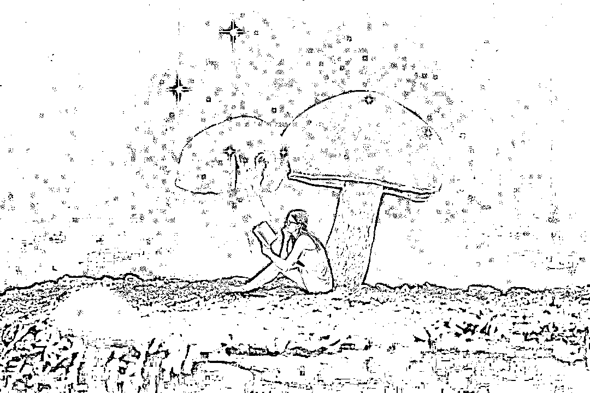

**土星四分月亮交点的社会氛围**

如果以 3 度容许度来看，**从 3 月 30 日开始，土星就进入了四分南北交点的影响范围。而本周将是这个相位精准成相的一周：**

**4 月 21 日，在水瓶座的土星，将四分天蝎座南交点-金牛座北交点，在三个星座的 23 度 40 分。**

从经世占星学的角度看，与行运南北交成硬相位的行星，它的特征会被凸显，成为这段时间内社会的焦点，左右社会的潮流与整体氛围。

同样以 3 度容许度为限的话，这个相位的影响将持续到 5 月中下旬才会结束。**本周，随着这个相位精准成相，我们可能来到一个顶峰，同时也会逐渐看到转折的希望。**

土星入相位四分南北交点，过去半个月我们看到疫情带来的城市封控措施越来越严，在全国各地都有封闭、管控加码的情况。人们被隔离封闭，不能自由行动，高速公路关闭出口，物资匮乏紧张，及由此带来的恐惧——**这些都是非常典型、强烈的土星特征。**

与此同时，冥王星在摩羯座 28 度半的位置徘徊，它呼应着土星的权威和管控。**星座末度的位置是一个关键点，它往往带有最后一次强烈显现的意味，也会带来后果与反思。**

在土星能量的“加持”下，南北交点天蝎座-金牛座轴线的议题也被强烈地凸显出来：**我们从未像最近这样强烈地感受到生活物资、安全保障的重要性，危机感蔓延。**上海的物资供应成了讨论焦点，朋友圈里很多人开始囤货，广州一度出现抢购潮。

有名教授的母亲因为等待核酸结果在急诊室猝死，有著名投资家在群里抢面包牛奶，有名作家为 80 岁母亲要进方舱而求助，灾难面前没有谁能幸免。考虑到天王星也在金牛座，我们发现生命与生活的脆弱性，并不如过去想象的那么牢固。

**天蝎座南交点与土星的能量**，掀动我们内心潜在的、对生存危机的恐惧，严重缺失安全感。而**金牛座北交点**代表的安全、稳定则是需要我们去学习、掌握的功课，我们要如何才能真正地获得安全感？

**土星提醒我们要更加严肃地对待安全与保障的议题**，为自己做好未雨绸缪的准备，包括生理的和心理的。注重身体健康，保障物资储备，同时也要更加坚韧务实清醒，放弃幻想，面对现实。

**金牛座的能量也提醒我们珍视当下，**去寻找那些能让我们找到安全感、平静、愉悦的事物。适当屏蔽外界焦躁的声音，学会放松。

从这个角度看，木海在双鱼座合相更像是让我们**学会臣服，承认无力与脆弱，并学习对他人的理解、同情。**

如果过去我们太自以为是，太乐观偏执，为各自的利益或立场，分裂对立，汲汲于相互内卷和竞争。那么现在我们需要看到人类脆弱的本质，生命与人性的不堪一击。

通过感受自己的无助，学会谦卑、慈悲心，理解和同情他人的脆弱，相互支援，耐心等待这个巨变时代的尘埃落定。

也许这才是木海合相双鱼座的人类精神共融的高阶意义所在。从更长的时间维度，木海合相双鱼座可能正在引导我们走向新的心灵启发，虽然我们目前还不能完全明白。

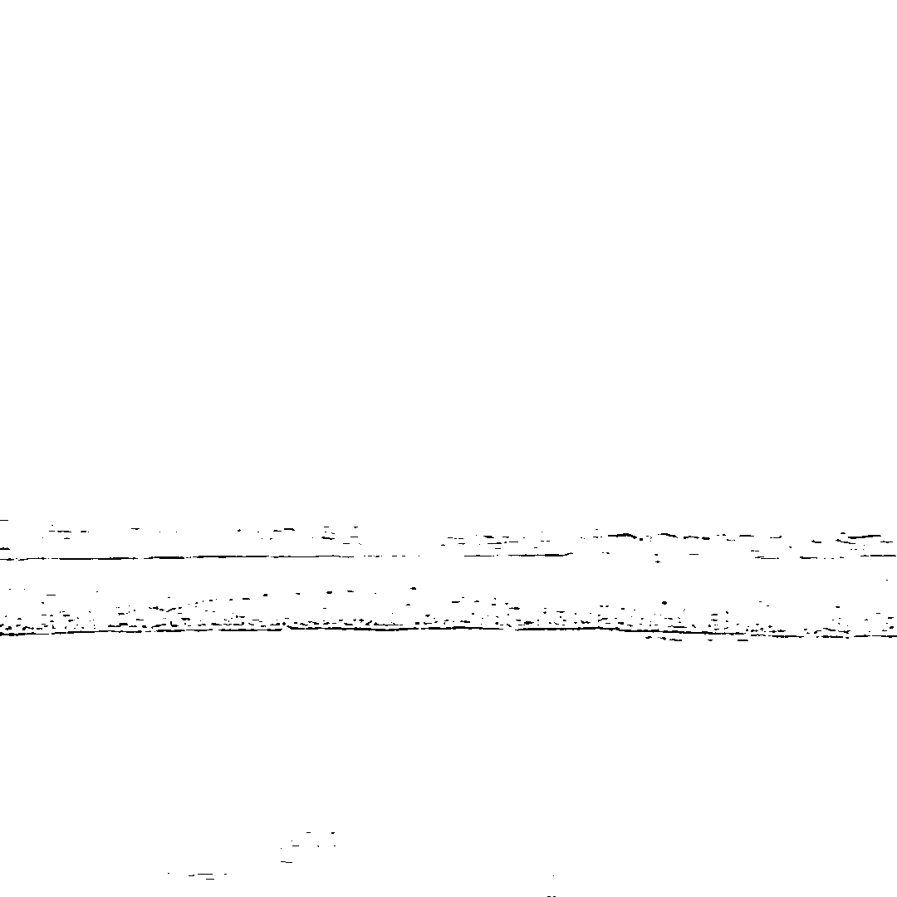

**金牛座能量的指引**

**金牛座的能量在本周会有集中的显现。**随着 4 月 20 日周三太阳进入金牛座，金牛座们的生日月到来了。

经过了白羊座的冲撞和开拓，**金牛座要我们慢下来，更多去感受当下。**如果我们过去经历了太多天蝎座式的焦虑，那么现在是时候清理那些焦躁的声音，去珍惜当下的生活，愉悦自己，享受宁静一刻。

而更早之前 4 月 11 日，作为太阳前哨的水星就已经进入金牛座。

**本周水星在金牛座非常活跃，动作频频。**它将先后合相天王星、北交点，最后四分土星，一路“煽风点火”，给我们带来各种内在外在的讯息。

我们可能会听到突然的消息，或产生新的领悟，改变想法，想要付诸实践却遭遇现实阻力，而这些状况都会围绕金牛座代表的物资供应、安全保障、价值感，也可能显现在金融市场或经济政策方面。

**金牛座代表的是人类最基本的“免于恐惧与匮乏的需求”**，只有足够的物质保障，足够丰裕的选择权、足够的生活安全感，才能让我们感到双脚扎根大地的幸福与安定。

**金牛座北交点是我们需要去完成的方向**，本周是一个不错的时机，让我们更多思考地金钱和物质的议题，我们可能想要改变现状，为自己获得更多保障。疫情影响下如何恢复社会经济，也可能成为我们讨论关注的重点。

**珍惜当下，去感受生活平静、安稳的幸福，也是感受金牛座能量的一种方式。**动手做美食，照料植物、去大自然当中感受泥土与花香，或收集喜欢的首饰等美好物品。瑜伽、冥想或按摩也是不错的放松愉悦自己的方式。

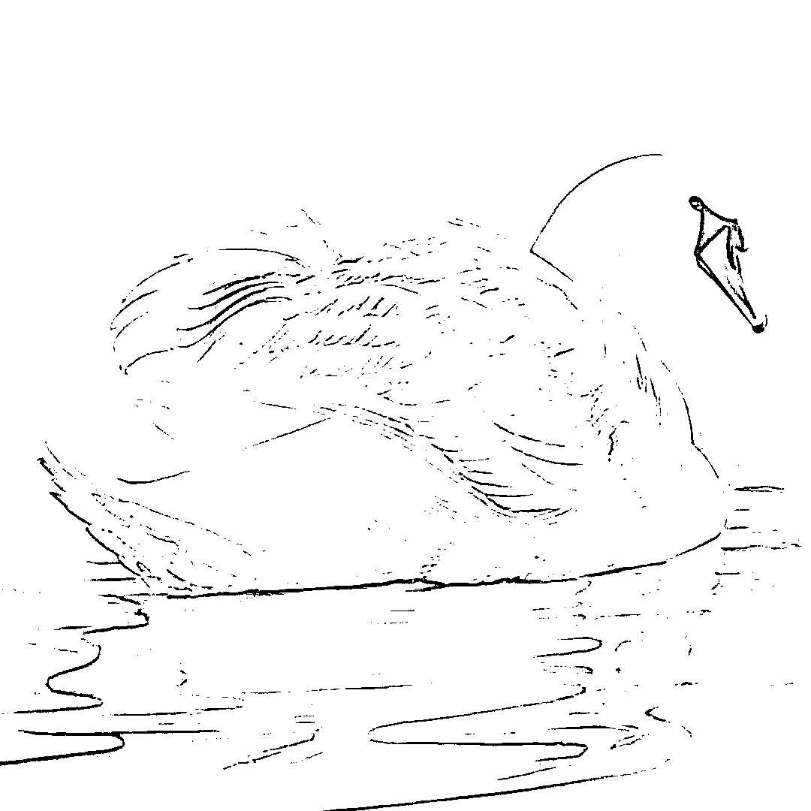

**重点关注的日子**

★ **4 月 18 日 周一**

**周一聚集了好几个重点星象，包括太阳四分冥王星、水星合相天王星、金星六分水星和天王星。**

关于金牛座相关的议题，我们可能听到新消息，或出现新的讨论。想要改变现状的愿望也会更强烈，可能有更多反对的意见出现。

保持开放的头脑，接纳新鲜的想法。避免被过度焦虑影响情绪，保持冷静。

★**4 月 20 日 周三 太阳进金牛座 月亮四分金星**

我们有更多的意愿、更多动力去思考金钱物质议题。

享受生活，让自己过得更舒适愉快，关注自身的物质保障，也适于思考自我价值的议题。

★**4 月 21 日 周四 土星四分南北交点**

如同满月效应，一方面困难的感觉可能来到顶点，另一方面也是清理、反思、转变的开始。

保持信心和耐心。

★**4 月 24 日 周日 水星四分土星 水星合相北交点**

感受到现实状况的棘手，新的想法很难马上实施。但这个过程是必要的，重视当下的想法，勇于思考和尝试，才有可能真正达成改变。

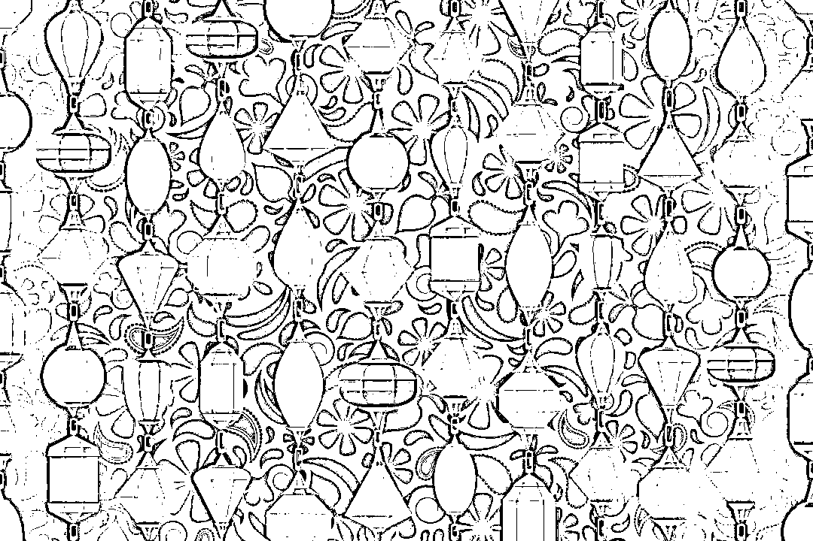

**12 星座的一周运势**

**（重点参考上升星座，其次参考太阳星座）**

***白羊座***

本周的金牛座能量，对你的影响尤为突出。也许前一段的冲冲冲，及与人争论让你疲惫，**现在你需要学习慢下来。**

像诗人海子说的那样，关心粮食和蔬菜，去感受当下的生活，欣赏自然与艺术，获取放松和宁静。

你也可能关心自己的财务问题，想要寻求更好的收入。或者正储备物资，给自己建立安全保障。

在这背后，进一步思考自我价值，**去寻找那些能让你感到安全、牢靠和自信的事物，发展它们，与它们在一起。**

***金牛座***

本周你可能感到充满活力，有很多新鲜的想法，也乐于去表达，显得更加自信。

虽然跟权威或领导打交道可能存在压力，但朋友和同事会站在你的一边，相信自己，给自己加油打气。你也可能成为她们眼中可靠的权威。

参与朋友的聚会活动，能让你找到共鸣，放松愉快，感受到周围的支持和滋养。展示你对生活精致高品味的一面，一定会给朋友们留下深刻印象。

**欣赏自己，取悦自己，享受生活。**如果在疫情封控中，试试阳台种菜，在线欣赏艺术，布置家庭环境，或者学做一道美食，都能让你放松愉悦。

***双子座***

你最近可能不太想要社交。随着太阳的换座，**未来一段时间你可能发现自己越来越宅，更喜欢独处，寻求内心的宁静。**

但还是有很多工作责任需要承担。也许领导对你抱有期待，有很多要求，你会担心自己做不好。

一个解决办法是深度思考，列好计划和行动清单。关键是不要胡子眉毛一把抓，**抓住工作的重点，**放弃不重要的，集中火力。

在独处的时候，冥想、瑜伽、静思、阅读，都有助于你的内心放松与灵性成长。

***巨蟹座***

未来一段时间，你可能越来越多地参与团队协作。如果过去你更关注自我发展，**那么现在你有机会学习合作，或组织分配资源。**

就像最近上海崛起的社区团长们那样，在团购买菜中展现很强的组织力。你也有这样的潜质，你也许已经在团队中发挥自己的领导力。这是值得你去学习的一课，你会收获很多，也许包括财务上的提升。

如果你想要拓展和提升自己，现在也是不错的时机。无论你想学习种花、写作还是设计，或者身心灵，**现在大可去接触、投身于那些让你感到激动和吸引的领域。**

***狮子座***

聚光灯打到了你的身上，你有机会走到舞台中央。

如果你已经做好准备，在到来的金牛月，你可能获得一些机会，受到重视，被赋予重要任务。**你会很有动力去追求自己的事业目标，现在也很适合努力做事。**

财务方面看起来也比较乐观，好业绩会带来好收益，**但要小心过分乐观或幻想，**你需要先扎实做好自己的工作。

客户、合作伙伴或伴侣可能对你有要求或比较挑剔。想要顺利完成工作，你需要学习整合资源，兼顾他人利益，寻求理解和支持。

***处女座***

你可能感到自己需要学习、提升。**未来一段时间确实可以多花一些时间在学习上面。**工作需要的知识，业余的兴趣领域，或只是吸引你的书籍，都可以学起来。

多多阅读、思考、表达，强化你的头脑，增加你的知识。你一贯重视技能的掌握，**现在也适合认真学习、实践一门新的技能，对你未来很有益处。**

你的第 7 宫很热闹，最近是否遇到吸引你的人，或被你吸引？这很美好，你可能沉醉于感情中。但注意不要因为同情或想拯救他人去投入一段关系。

关系中也可能存在美化或靠幻想加戏的部分，或单方面过度的付出，最终让你感到失望。**学习分辨事实和主观感受。**

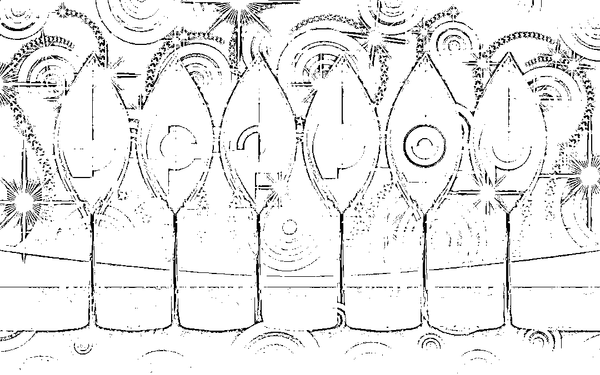

***天秤座***

随着太阳进入第 8 宫，未来一段时间你可能比较关注财务议题。

如果想要资产获得增值，寻求更好的投资渠道，你首先要摒弃投机心理，更严肃地学习专业知识，把风险考虑在内，**认真对待投资这件事。**

如果你是从事创意相关的工作，比如作家、影视、设计等行业，那么发挥自己的想象力和创造力比投资股市更可靠。**这段时间你工作中应该很有灵感，有机会创造出好的作品，带来优异回报。**

若是身处一段感情关系中，你可能面临需要将关系深入一步。愉快单纯的恋爱已不够，**需要更深入的敞开分享彼此，建立更深刻的情感联结。**这个过程也可能涉及到金钱、资源的分享议题。

***天蝎座***

**伴侣或关系，可能逐渐成为你的关注点。**一些新人可能进入你的生命中，不一定是恋爱关系，也许是重要的朋友，潜在的合作者。

已有伴侣的，这段时间可能与伴侣有更多沟通和情感交流。或者需要去配合对方，对自己的生活做出一些调整。特别是来自家庭或孩子的责任，需要你和伴侣协调一致，共同承担。

你的第 5 宫现在非常热闹，你可能很想出去游玩，休闲娱乐，享受生活。如果被疫情影响无法出门，那么可以寄情于影视剧、文学艺术，来转移这种能量。

如果单身，现在其实是很适合浪漫恋爱的一段时间，有机会，也有浪漫的想法。但宅在家里是不容易实现的，**扩展自己的社交圈，主动交流表达，多给自己创造机会。**

***射手座***

**最近你需要关注自己的健康和作息问题。**一贯自由随性的你，也许开始对熬夜免疫力下降感到有些焦虑，或者发现身体素质不如以前。疫情的紧张态势，也提醒你注意健康。

运动、睡眠、健康饮食，**未来一个月你可以多花一些心思去改变自己的生活习惯，给自己由内到外更健康的状态。**

生活和工作中可能有很多事务需要处理，有时候手忙脚乱。列清单、排时间表的方式很有效，可以帮助你按部就班完成工作。若有不会的技能，要善于学习，借助书籍或网络资料。

很多星星在你的第 4 宫，处理好家务或家庭生活，能给你带来放松和愉悦感。

***摩羯座***

你现在可能头脑活跃，很有灵感。如果是从事创意相关的工作，写作、画画、设计，**这段时间很适于发挥你的创造性，去表达头脑里的想法，**可能会产生很棒的作品。

如果写的是策划方案、工作计划，也不要浪费你头脑里的新想法和灵机一动，抓住它们，你可能有很好的方案让大家耳目一新。

你的表达也会更加有感染力和想象力，能够吸引别人的共鸣。**这段时间可以大胆一点展示自己，让别人看到你的才华。**不要让不自信阻碍你，也不要恐惧失败，走出第一步，你就知道下一步该怎样做了。

***水瓶座***

最近家庭生活越来越占据你的注意力，未来一段时间你可能会投入更多精力，安排家庭生活，照顾家人，也可能是与装修或房产相关。

如果过去太忙于工作，**现在是时候去关注家人的需求，给他们打造更安全更好的家庭生活。**比如关心彼此，调节生活氛围，改善家庭环境。你会是家人依靠的对象。

但不要因此给自己增加压力，你的情绪平和、自信愉悦更有益于家庭的良好氛围。**关注自己内在的安全感和宁静稳定，**冥想静思、阅读沉思或与亲友良好的交流，都有助益。

最近你在财务方面可能比较乐观，有增加收入的机会，也愿意花钱。注意做好必要的储蓄和保障，不过度消费。

***双鱼座***

最近你可能会越来越多地需要与人沟通，表达自己的想法，交流信息。**快速获取知识信息、与人分享会带给你很强的成就感。**写作也是一个很好的方式。

你的自信和乐观很有感染力，你敏感的观察和表达很容易触动别人产生共鸣。所以这段时间不妨多写一写，或跟人说说自己的所思所想，可能会吸引到志同道合的朋友。

注意不执着于自己固有的观念，**保持开放的心态，**多听听不同角度的观点和立场。不同的意见并不会威胁我们的自信，反而能强大我们的思维。

如果内心感到压力，可以试试冥想、阅读，表达沟通也可以帮助我们排解和释放。

**版权声明**：原创文章由作者授权首发于若道平台发布，欢迎转发，反对抄袭。友号转载请申请白名单。

****

**芷菱**

ISAR 认证占星师/占星作者/媒体人若道 2019 届核心课程毕业生

于 2019 年通过 ISAR 考试，同年获得若道认证神话塔罗师资质

**微信公众号**：芷菱的理想国

长按打赏

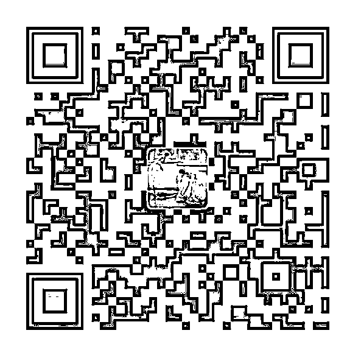

**20 位来自世界各地的占星师****带来 20 场沙龙——新世界的觉醒****详情可点击下图**

**学习占星学****点击下图了解课程详情**

**

**微信又双叒叕改版啦，不想错过若道君的推送？**
**就把若道设为星标吧！****▼**

**喜欢记得点一下在看哦☟**

**报名直达入口**

# 咨询占星学与心理占星学的区别在哪里？

> 原文：[`mp.weixin.qq.com/s?__biz=MzA5NjA0NTAxNg==&mid=2651471987&idx=2&sn=1ace9fd71a417d186036697d818a3c0c&chksm=8b48f2c4bc3f7bd2b7e17fce87abf637b4ca7b5f3f54a151513d660044e9cd06fc595c940b1d&scene=126&sessionid=1692737832#rd`](http://mp.weixin.qq.com/s?__biz=MzA5NjA0NTAxNg==&mid=2651471987&idx=2&sn=1ace9fd71a417d186036697d818a3c0c&chksm=8b48f2c4bc3f7bd2b7e17fce87abf637b4ca7b5f3f54a151513d660044e9cd06fc595c940b1d&scene=126&sessionid=1692737832#rd)

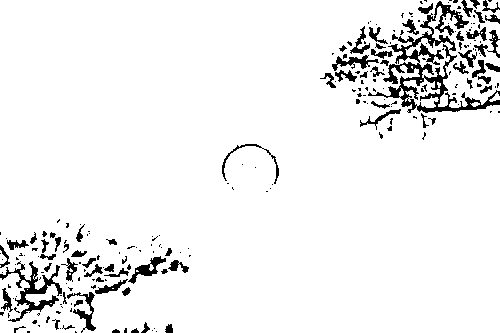作者/格伦·佩里 译者/王宏 校对/李含 esme 编辑/玫瑰 图片/pexels

**作者的话**

占星咨询是一个广义的词汇，涵盖大多数种类的占星学；而**心理占星学则是一个专业化的分支领域，只侧重于与人格成长与满足相关的事件。**这类占星学通常只限于一次性的咨询，可以依据心理治疗连续进行的特质而与其区分开来。
然而，心理占星学和心理治疗有一个**显著的共同点**，那就是两者都有着共同的目标，并可能会用到相似的技巧。当然，两者间也有**重大的差异**。没有接受过心理治疗训练的占星师在被客户要求做持续咨询时，可能发觉自己处于道德困境之中。**什么是占星咨询？****在 ISAR（国际占星研究协会）道德规范的“D”部分，对占星咨询定义如下**： 占星咨询师提供以下服务，讨论星图，以便：❶ 帮助他人认识到自身的长处和天赋；❷ 提供有关生活问题的见解；❸ 阐明成长与发展的模式；❹ 确认自我认知；❺ 指明生活目的；❻ 告知危机与机会对应的时期；❼ 探明特定经历或生活阶段的意义；❽ 针对特定行为的时间安排或决定给出指导建议。

根据定义可知，当占星师面对个人或一对伴侣的客户，阐述以上问题时，他们是在做咨询，或是顾问。 

而有些占星师试图将咨询与顾问区分开来，但与我们目标的差异却是模糊不清的。根据我的字典，**咨询师是“提供专家或专业意见的人”，而顾问被定义为“给出顾问建议的人，或劝告者”**。

但是，顾问往往与心理咨询领域关联，像是“婚姻顾问”。这样看来，“顾问”比“咨询”更适合心理学。即便如此，**在占星学和本文的撰写中，这两个词并没有太大区别，会视作同义词**。

尽管有些占星师可能会将自己局限于写作和研究，或者专注于财务、商业或其他分支学科，但说**大多数专业占星师至少会做一些咨询或顾问工作**也是可以的。例如，他们进行“解读”，并提供这样、那样的意见和指导。如此说来，他们就是占星顾问。

上述条款的最后一条指出，咨询占星师“针对特定行为的时间安排或决定给出指导建议”。这在定义上包括卜卦占星学、择日占星学、金融占星学、商业占星学、择地占学星，以及几乎任何其他种类的占星。

相应地，一个人所认可的占星派别，无论是心理占星学、预测占星学、印度占星学、汉堡学派占星学，或其他种类的占星学，并不影响他成为一位占星顾问。**任何同客户坐在一起，为其“解读”星图的人都在进行咨询活动，因此都是在为客户提供建议。** 

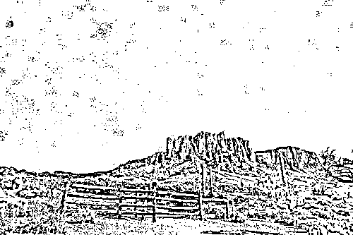

**咨询占星学 vs.心理占星学**综前所述，我们可以得出如下结论：**“****咨询占星学****”是涵盖各种各样占星术的概括性词汇**。由于一个人无需成为特定类别的占星师，就可以成为占星顾问，问题就产生了：**特意进行心理占星学意味着什么？****想要回答这个问题，区分“咨询心理学”和“临床心理学”将会有所帮助。后者与“心理治疗”同义，但又有着略微不同的学术和职业侧重。** **咨询心理学****可以被定义为，交换意见和想法，以有效解决个人日常生活中的问题。**这些可能与其情感、认知或行为问题有关，亦或他们可能只是关心眼下的境遇，例如是否应该换工作。治疗的长度可能各有不同，从一次治疗到十二次或更多次治疗。另一方面，**心理治疗是****如下一种治疗方式：临床大夫与个人建立起长期关系，以便修正自我挫败的行为模式，并促进积极个性的成长与发展。**治疗往往是长期的，而非短期的，也就是说，心理治疗可能需要每周一次、持续数月的治疗期，乃以每周两到三次、持续数年的治疗期。

**临床心理医生（即心理治疗师）提供咨询服务，但他们也**❶ 治疗受困扰更严重的人群；❷ 接受深度、潜意识过程（心理动力论）的培训；❸ 主要专注于个人成长与改变。相反地，**心理咨询师**❶ 治疗相对健康、病征微弱的人群；❷ 进行更多的事业和职业测评；❸主要关注解决实际的当务之急。 由于**咨询更多的是解决问题，心理治疗则程度更深，其目的是自我认知和自我改造。**在咨询里，要解决的问题就是问题。大多数人进行咨询是因为他们想要解决诸如人际关系冲突或职场问题等当务之急。相反地，在心理治疗中，要解决的问题是人。人们求助于治疗是因为过去对他们有效的防御不再有效，所以他们在防御措施整体运行方式上寻求更为普遍深入的改变。因此，**心理治疗对于外在问题的关注仅仅是因为外在问题是探求内在的心理脉络的途径。**

读者可能总结出，**咨询占星学与咨询心理学相似，因此心理占星学也与心理治疗相似。**
而咨询（或顾问）占星学是一个广义词汇，因为实际上所有解读星图的占星师都在进行咨询。

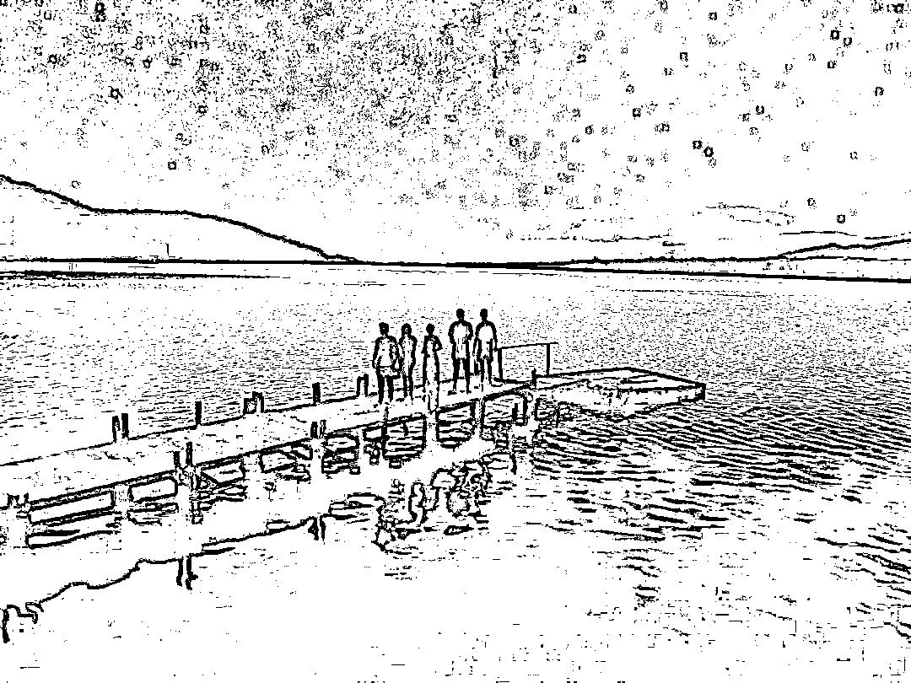

另一方面，**心理占星学是咨询占星学的一个分支，因此其关注点更明确，也更窄。或许****心理占星学****的定义属性在于其对出生图综合关注，以此来支撑人类对于成长和改变的潜能。** 

**咨询占星师****为个人问题和日常生活问题提供实际的指导。更多关注于教育性、支持性，并以意识为导向，指向有限的实际目标。**对于卜卦占星师来说，这可能意味着回答有关爱情的一个具体问题。

预测占星师可能针对度假的最佳时机为客户提供建议。择时占星师可以针对开创新事业的理想时机提供建议。股市走势是金融占星师的领域，而商业占星师则给出有关员工、人事建议、扩张市场份额等的建议。

另一方面，**心理占星师****感兴趣的是深奥、无意识的过程，以及促进人格的治愈和转变。**实际上，心理占星学与有时所说的“治疗占星学”含义相同。

从心理占星学中衍生出来的是一系列相关学科，包括**发展心理学**和**精神病理学**。两者都是占星学心理化的衍生，具体体现在：

❶ 两者都与心理学手段相关；

❷ 两者都可以与占星概念和实践结合起来。由此可以设想，心理占星师至少接受过培训，并熟悉这些学科。

**心理占星通常需要一到三次会面。**然而，即使是一次会面，其目的也是进行阐释，以定义并说明心理情结、阴影问题、伤害、防卫，以及客户可能都没有意识到的问题。**正如心理治疗师一样，心理占星师也做咨询，即提供建议、方向和指导。然而，他们仍不仅仅局限于此。**

**心理占星师对于星图如何描述个人的心理结构和过程格外感兴趣。**这就是“精神动力学”一词含义的由来，它指的是潜在的驱动力、情绪和信念，这几点的相互作用引发显著的行为和事件。心理占星师不那么关注结果——显著的行为和事件，他们探寻结果是如何从深层的无意识心理领域中衍生出来的（精神动力学）。行为不会用所谓的占星学原因来解释。**占星符号被用来理解和解释那些被看成是行为和事件真正原因的心理过程。**

**心理占星学认为个人要对自己的人生经历负责，而不是假定这一切是由行星所导致。目标是让客户对自己吸引和创造的事物负起责任。心理治疗强调的核心是促进客户朝着最佳状态成长和发展。**

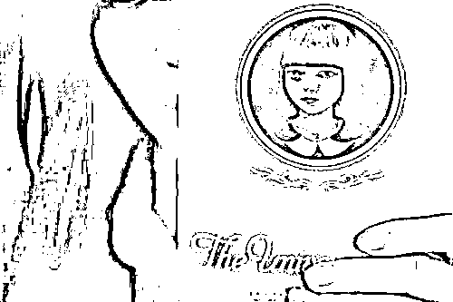

**心理占星学 vs.心理治疗**

**心理占星学和心理治疗的差别更多的是程度的问题，而非类别的问题。两者都有着相似的目标，可能利用相似的技巧。**例如，洞察无意识和不良的信念是两者实践中的典型问题，两者都依赖于对诊法和艺术化的阐述解决问题。

此外，两者都蕴含着促进个性成长和治愈的意义。甚至可以说，仅从微观上来说，一次心理占星可以涵盖心理治疗的整个过程。仅在一次占星咨询中就至少可能整合引发问题的想法、释放情绪，随后将被否认的部分融合进来。

**两者最明显的差异是过程中所花费的时间**。在大多数占星案例中，仅需与客户会面一次，尽管多次会面也不少见。可即便如此，与客户会面超过三四次也相对少见。对于星图或事件可说的也就那么多，再多就难免拖沓冗繁。

另一方面，心理治疗通常需要持续数月到数年，更多地着重于支持客户内在探索和发现的过程。这突显出了心理占星师和心理治疗师的一个重要差异。前者利用占星来阐明心理事件和冲突，后者利用心理治疗技巧来解决心理问题和冲突。

**心理占星学是诊断的最佳工具，可以迅速阐明客户没有意识到的、造成问题的原因。**尽管这可能会有即刻的治疗效果，但在大多数案例中，真正的成长和治愈源于对未发现事件更为缓慢、更为透彻的探寻。

在典型的占星咨询中，并没有足够的时间来完成这一过程。就像依地图行进的人一样，占星师可以指出旅行者行进途中可能遇到的各种挑战、困难和障碍。

占星师甚至可能就如何最好地完成旅途提供一些有用的建议。而在实际旅途中陪伴探索者，对于每一步提供帮助、意见和支持的则是心理治疗师。

**占星师最大的价值是他们有能力加速意图的揭示过程。**客户在纠结于个人困难时经常会寻求咨询。这样的困难通常源于心理冲突，这是心灵所固有的，并通过星图体现出来。心理冲突表现为不良的想法和自我挫败的行为。

外在问题和斗争同步体现在心灵/星图中，为解决内部冲突提供了媒介。**占星咨询的优点在于，它可以迅速揭示内在和外在因素是如何联系在一起的。**像是太阳四分冥王星这样的天象可以代表内在冲突、作为结果的不良想法，以及同时产生的后续事件。

所有这些都在指向治愈的方向——运动前的热身或是大戏上演的前奏。心理占星师认识到，个性会随着时间而进化，一个人的命运也会相应改变。转变不会自动依照占星揭示的结果而出现。大多数人可能会同意，持续的改变需要花费时间、耐心和不断的努力。

最理想的状态是将人生视为不断变化的过程。在这一过程中，占星的角色主要是诊断和预报。也就是说，**一次好的占星咨询可以让客户深入了解自身困难的本质，同时带来希望并为未来做出改变指明方向。**

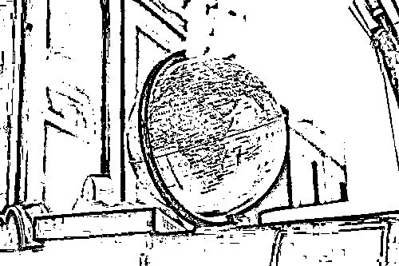

**治愈的机会存在于日常经历中，心理治疗可以辅助，甚至加速成长过程，特别是处于压力或危机之中时。这和心理占星学的区别在于，其侧重点是自我探寻和情绪释放。**

在**占星咨询中**，更多地关注阐释的过程——展示过去与现在的关联，暴露出有问题的想法，同时也反映在外部体验之中。然而，**心理治疗中**的首要任务就不再是解释，而转变为促进探索和自我发现。现在，客户需要担负起责任，参与到自省的过程中。

客户的主要关注点在于探寻情绪——担忧、关心、冲突——并遵循情绪的指引。这必然需要心理治疗师给予更多支持和接纳，心理治疗师不能过早的干预，给予解释，或是尝试快速修复。

如果一切进行顺利的话，客户渐渐地会充满安全感，以便回顾压抑的记忆，那些记忆可能太过于痛苦或可怕，让人不敢面对。伴随这些记忆的是与受伤经历相关的压抑感觉，以及随后形成的可怕的问题观念。

这类发现与从占星咨询中得到的认识有显著差别。它更为全面、立体，带有情感成分，以便深入理解、整合个性并真正治愈。毫无疑问，**在治疗方法中处理这类资料需要相当程度的训练和专业知识。** 

**版权声明：**本文由若道翻译发布，欢迎转发，反对抄袭。友号转载请申请白名单。

**格伦·佩里**

若道签约老师，著名占星师，前 ISAR 董事会成员，共出版 8 本占星著作；心理/意识研究专业博士；占星心理学学院（Academy of AstroPsychology）的创办人；康涅狄格州研究生院（the Graduate Institute of Connecticut）原型宇宙学与意识进化项目的负责人。

**美国占星心理学学院创办人**

**格伦·佩里**授课**40 余年**职业占星师生涯所学精华**倾囊相授**修完 101-205 全部课程，并通过考核的毕业生将获得**美国占星心理学学院证书**( Academy of Astropsychology )和**若道毕业证书****高含金量双证书**跟随主讲老师学习融合**心理学体系**的**占星知识**为星图咨询解读打下坚实的基础**大量**的课程资料，光是课后阅读资料就**超过 60 万字**合理的课程设计，贴心的助教服务，及时的课后测验

**美国占星心理学学院&若道占星联手打造** 

**两年双证书核心课程**

**点击图片了解详情**

****20 位来自世界各地的占星师****带来 20 场沙龙——新世界的觉醒****详情可点击下图**

**学习占星学****点击下图了解课程详情**

**微信又双叒叕改版啦，不想错过若道君的推送？**

**就把若道设为星标吧！**

**▼**

**喜欢记得点一下在看哦☟**

**报名直达入口**

# 4 月 27 日开课| 心理占星学第一学年，从麻瓜进化成占星师的自我觉察工具

> 原文：[`mp.weixin.qq.com/s?__biz=MzA5NjA0NTAxNg==&mid=2651471987&idx=3&sn=c4f161e943cb2375f535e936b9a6b482&chksm=8b48f2c4bc3f7bd25a7b38b57c25cd565f253ab9206a5d2b152f766635b95eac7afa5d65aa88&scene=126&sessionid=1692737832#rd`](http://mp.weixin.qq.com/s?__biz=MzA5NjA0NTAxNg==&mid=2651471987&idx=3&sn=c4f161e943cb2375f535e936b9a6b482&chksm=8b48f2c4bc3f7bd25a7b38b57c25cd565f253ab9206a5d2b152f766635b95eac7afa5d65aa88&scene=126&sessionid=1692737832#rd)

**自我觉察，是智慧的基础**

我们每个人都有自己的内在冰山，自我觉察能够帮助我们觉察自己的行为、情绪等，然后向内深层探索，探索自己的行为、情绪背后的深层渴望、期待。 **学习和应用占星学的过程，就是慢慢掌握自我觉察工具的过程，**当你熟练掌握了占星学也就具备了帮助引导他人觉察到自身生命议题的能力。 往外张望的人在做梦，向内审视的人才是清醒的。**只有我们真正向内看，只有当觉察开始由外向内时，改变才会发生，才能够知行合一。**

# 插画师：古戈力

以情绪来举例说明，每个人的情况不同，觉察的程度也不同，觉察有四个层次：

**1.不知不觉：**没有觉察情况，当情绪来了，会被情绪控制，做出很多不计后果的事情。而且每次都是同样的状况，反反复复。

**2.后知后觉：**情绪过后，自己能够反应过来，自己做的对与错，但是很难避免同样的情况再次发生。

**3.当知当觉：**就是当情绪来的时候，你已经知道在这个当下，正在发生什么。当达到这个层次，你就可以自己控制情绪，从而影响后事的发展。

**4.先知先觉：**就是当事情还没发生，就可以预知它要发生了。因为你对情绪的觉察已经越来越熟练，所以情绪还没来，你就知道它要来了。所以，你也就有了更好的选择和处理方法。

所以，我们要自我觉察，向内探索，觉察是为了接纳，然后做出改变，成长，迭代，升级。**那么要如何练习自我觉察，掌握先知先觉的能力呢？**

**每日觉察的工具推荐**

**今日天象&近期行进**

若道 APP 中的今日天象功能，罗列展示每一天的具体天象，和你当天的行进和行进周期：

**作为一位占星师，可以这样使用这个自我觉知工具：**

★ **记录梦境**

如果你有醒来记录梦境的习惯，每天早上看一下睡梦中的天象和行进，对应联想，你会惊喜的发现一些神奇的对应，能够更敏锐的捕捉到日常被压抑的情绪和需求。能够帮助你在白天的工作生活中先知先觉的关注身心状态。

★**规划生活**

每月月初，周初都可以参考天象和行进进行日程规划，预估可能的助力和阻力，在对的时间做对的事，会发现平平无奇的日常也可以有不一样的色彩。根据月相的变化感知情绪的起伏，更好的自我关爱。

★**感知环境**

当身边发生了引起你注意和好奇的事情，或者网络上层出不穷的新闻热点，都可以在天象中寻找对应的能量。从更大的格局视角去思考你的个人观点。通过环境的共振，更深入的理解自己的本命星图。

**以上都是很好的学习深化占星知识的方法，你只需要系统掌握以下知识，你就可以开始使用以上方法去提升自我觉知。**

**美国占星心理学学院创办人**

**格伦·佩里**授课

**40 余年**职业占星师生涯所学精华**倾囊相授**

修完 101-205 全部课程，并通过考核的毕业生将获得

**美国占星心理学学院证书**( Academy of Astropsychology )

和**若道毕业证书**

**高含金量双证书**

跟随主讲老师学习融合**心理学体系**的**占星知识**

为星图咨询解读打下坚实的基础

**大量**的课程资料，光是课后阅读资料就**超过 60 万字**

合理的课程设计，贴心的助教服务，及时的课后测验

1

**这门课程最大的看点是什么？**

1. **两位国际占星学大师**共同授课，将合计**90 年职业占星师生涯所学精华**倾囊相授；2. 修完**2 年课程**，考试通过的毕业生将获得**美国占星心理学学院证书**（Academy of Astropsychology）和**若道毕业证书**，**高含金量双证书**；3. **第一学年 64 次课程**的充分授课时间（录播课程 43 次课；直播课程 21 次课），全面而详细地讲解占星学历史、知识、技能、案例、咨询和运用；4. 跟随主讲老师学习**自成体系、逻辑严密、实用性强的占星语法、星图解读方法**；5. 学习独特的**发展年龄预测法**，从星图看对关键年龄阶段的发展及议题；6.** 大量的课程资料，光是课后阅读资料就超过 60 万字**；7. 合理的课程设计，初中阶课程，每一节都有课后测验；8. 本课程可以作为**ISAR 选修课**中的一门，再修两门就满足 ISAR 认证选修课要求；9. 教授重要的**心理学概念**，比如与客体关系、心理动力理论、个人神话和叙事疗法相关的一些概念，学习如何将它们整合到星图解读中；10. 在 105 阶段了解**《精神疾病诊断与统计手册》**诊断标准，探索星图中的心理疗愈；

**格伦老师致学员的信**

（向上滑动查看内容）

**亲爱的学员：**

作为占星心理学学院的校长，我的目标是帮助你顺利完成学业。

占星心理学学院的课程让你能够在经济承受范围内，灵活地学习占星学。我们的课程让你可以舒适、便捷地在家学习，不用打乱你本就繁忙的日程。我们有完善的在线学习系统，让你能在线上课、下载学习资料、进行测试并自动获得即时反馈，还可以在虚拟课堂上同你的教员和同学互动。

作为私人开业的**职业占星师**和**执业心理治疗师**，我已经**工作超过 30 年。**我还花了近 10 年的时间，在研究院里学习并获得**心理学的硕士和博士学位**。这段训练和经历是无价的，帮助我将占星学发展成为连贯的 21 世纪模式。

我们的占星学培训项目是**系统化的、清晰的、组织有序的、易学的、前沿的。**尽管有许多类似的学校可供你选择，但你不会在这些学校中看到像占星心理学学院所提供的那样有深度的或尖端的课程。

**我非常期待 2022 年再次在若道教授心理占星学核心课程。**我们重新规划和升级了本次课程体系。**新的课程包含之前完整课程的 72 个录播视频，每个视频长 2 小时；以及由我教授的 37 次直播课程，和大卫老师教授的 10 次直播课程，每次课程 2 小时。**在实时课程中，除了我提供的案例，我还会用学员的星图进行案例演示，与学员互动，阐明视频中教授的原则和方法。

**2 小时直播课程安排：**

**第一阶段 提问和讨论：**

这将在每节课开始时进行。邀请学员提出与课前提供的资料相关的具体问题。这一阶段将持续 15-30 分钟。

**第二阶段 示例：**

这一阶段会讲解与每周任务相关的具体概念，例如行星的星座位置、宫位位置以及相位的意涵。星图示例来自我认识的人，如公众人物、朋友、家人、同事或以前的客户（不显示出生信息）。同样，这一阶段也开放课堂讨论，学员可以提出自己的问题和见解。

**第三阶段 学员案例演示：**

这个阶段会从学员的具体星图来阐明概念，例如火元素行星占优势。学员案例演示不会涉及任何类型的咨询或“解读”。它们将只是简单地包含一段对话，我会在对话中分享自己对某个配置的思考，然后问这个学员可能会如何主观地（影响、信念、行为）和客观地（事件/关系）体验这个配置。其他参课学员可能也会对讨论的主题有自己的见解或问题，他们也可以参与讨论。

我对这一新的在线课程形式感到兴奋，**并期待着从 2022 年 4 月 27 日开始认识我的新学员们。**获得本学院的文凭会是你做过的最明智的投资。你不仅将占星学掌握到前所未有的深度，还将学到如何为客户提供咨询服务并建立职业占星师的职业生涯。

真诚地

**格伦·佩里 占星心理学学院校长**

**为什么要学习心理占星学？**占星心理学是一个复杂的体系，让实践者能够向客户提供真正治疗性的益处。这从根本上说来是我们学院有别于其他学校之处：**我们教授占星学，也教授心理学概念。****我们明确讨论各种心理学概念，并将其与占星学无缝衔接。结果就是更深入的、更丰富的，最终更加强大的模式。****该项目专为初学者和渴望深造的有经验的占星师而设。**我们会从跨学科的角度探讨星图解读。**通过融合荣格心理学和各种其他模型的元素，学员将熟悉作为人格理论、发展模型、原型语言和诊断工具的占星学。**

2

**课程是怎么安排的？**

**第一学年**

**共****64****次课 **43****次录播课 **21 次直播课******

**101 占星学基础 **

****共****12****次课程：******8 次 2017 年录课+4 次直播课**

**占星学**关注成长，聚焦心理。外部事件意义重大，但我们可以把它们看作是对于发展中的心理结构的共时性反映，以及未来发展的媒介和催化剂。在这个阶段的课程中，会以四种形态的几何形式介绍**占星原型：星座、行星、宫位和相位**。黄道带是人类心灵的象征性地图，其中的每个**星座**都代表一种基本的人类需求、原型人物、发展阶段和行为风格。**行星**代表心理功能，以满足其关联星座的基本需求。**宫位**提供了环境舞台，行星在其中扮演它们的角色，而**相位**是行星之间的角度关系，在主观上体验为内在对话。

**课程安排**：

**录播课****、****直播课（周三）**时长都是 2 小时

第一节**录播课**：核心概念介绍

第二节**录播课**：黄道带的结构

2022 年 4 月 27 日**直播课**：核心概念、黄道带的结构提问和讨论、知识点示例

第三节**录播课**：图例、单态星体和其他奇妙的元素

2022 年 5 月 11 日**直播课**：图例、单态星体提问和讨论、知识点示例

第四节**录播课**：星座介绍（从白羊座到处女座）

第五节**录播课**：星座介绍（从天秤座到双鱼座）

2022 年 5 月 25 日**直播课**：12 星座案例演示

第六节**录播课**：行星作为过程

第七节**录播课**：行星作为内容

第八节**录播课**：将碎片整合起来

2022 年 6 月 8 日**直播课**：整合星图时，将行星作为过程和内容案例演示

**102 行星落星座、宫位** 

****共****12****次课程：**8 次 2019 年录课+4 次直播课**

这个阶段的课程**聚焦于初步的星图整合。**

学员将学习**占星语法**，以及如何运用它们来阐释**行星的星座落点**。学员不需要强记书中的星图解读，而是学习分析基础的占星句法结构，应用这些语法规则来思考和讲述这门语言。学员们将学习如何构建精妙的句子，将动机、功能、特质、状态和事件组合起来。

此外，还将学习解读**行星宫位落点**的规则。宫位被定义为心理环境，为特定类型成长和发展提供背景。行星落在宫位中，象征着情境中的特殊状态，应对环境挑战的方式，以及通过共时性人物和事件而外化的自我部分。

学员们将探索如何将星座和宫位落点融合在一个单一、整合的陈述中，做出灵活、层次分明的解读。

**课程安排**：

第一节**录播课**：占星语法介绍

第二节**录播课**：行星星座作为行为风格

2022 年 6 月 22 日**直播课**：占星语法、行星星座作为行为风格提问和讨论、知识点示例

第三节**录播课**：思维状态和行为结果

第四节**录播课**：学习行星的星座落点

2022 年 7 月 6 日**直播课**：思维状态和行为结果、行星的星座落点提问和讨论、知识点示例

第五节**录播课**：回顾宫位的含义

第六节**录播课**：宫位中的行星过程

2022 年 7 月 20 日**直播课**：宫位的含义、宫位中的行星过程提问和讨论、知识点示例

第七节**录播课**：行星在宫位中的状态

第八节**录播课**：行星作为宫位的内容

2022 年 8 月 3 日**直播课**：行星在宫位中的状态、内容的提问和讨论、知识点示例

**103 行星相位与个人神话** 

****共****13****次课程：**9 次 2019 年录课+4 次直播课**

在这个阶段的课程中，**相位**被解释为由更大的故事结构的潜在动力构成的个人神话。

学员将学习相位是如何象征内在心理的冲突、重要的童年情感体验、主要的人生挑战和内在对话的。需要着重强调的是，相位的意涵会随着心理成熟的程度而改变。人会成长、进化，会解决内在冲突，这些不仅反映在态度和行为的改变上，而且也会表现在某人吸引的事件及其与他人的关系品质上。

学员们还将学习一些**心理学概念**，比如与客体关系、心理动力理论、个人神话和叙事疗法相关的一些概念，它们将整合到相位解读中。

**课程安排**：

第一节**录播课**：重要主题与核心冲突

第二节**录播课**：渐盈相位与渐亏相位

2022 年 8 月 17 日**直播课**：重要主题与核心冲突、渐盈相位与渐亏相位的提问和讨论、知识点示例

第三节**录播课**：主要相位的核心意义

第四节**录播课**：罗生门原则

2022 年 8 月 31 日**直播课**：主要相位的核心意义、罗生门原则的提问和讨论、知识点示例

第五节**录播课**：占星学中的认知

第六节**录播课**：心灵的控制结构

2022 年 9 月 14 日**直播课**：占星学中的认知、心灵的控制结构的提问和讨论、知识点示例

第七节**录播课**：作为认知结构的相位

第八节**录播课**：强迫性重复

第九节**录播课**：听大卫·瑞雷讲月亮交点

2022 年 10 月 12 日**直播课**：月亮交点（由大卫·瑞雷老师教授）

**104 征象星与定位星：作为进化故事的星图 **

****共****12****次课程：******8 次 2019 年录课+4 次直播课**

这个阶段的课程聚焦于**从叙事角度整合星图。**

学员们将探索**宫位征象星**和**行星定位星**如何讲述一个故事，反映一个人进化发展之旅。行星定位关系揭示了个人神话的主体构架。而这个故事的主题常常处于意识觉知和控制之外，占星学提供了一种方式，揭示、解读、改编这个神话。

我们推荐的星图整合方式是将相位和定位星关系融合成一个单一、连贯的叙事。要特别强调的是，如何活出整合程度更高的生命故事。

学员们还将了解**叙事疗法**和**自传写作**，把它们当作促进整张星图整合的一种方式。

**课程安排**：

第一节**录播课**：每张星图都讲述了一个故事

第二节**录播课**：互容与最终定位星

2022 年 10 月 26 日**直播课**：每张星图都讲述了一个故事、互容与最终定位星的提问和讨论、知识点示例

第三节**录播课**：将相位整合进流程图

第四节**录播课**：完整的故事

2022 年 11 月 9 日**直播课**：将相位整合进流程图、完整的故事的提问和讨论、知识点示例

第五节**录播课**：过渡短语

第六节**录播课**：良好定位或不良定位

2022 年 11 月 23 日**直播课**：过渡短语、良好定位或不良定位的提问和讨论、知识点示例

第七节**录播课**：发展年龄方法

第八节**录播课**：进行全面整合

2022 年 12 月 7 日**直播课**：发展年龄方法、进行全面整合的提问和讨论、知识点示例、案例演示

**105 星图中的精神病理学与疗愈 **

****共****15****次课程：******10 次 2019 年录课+5 次直播课**

在这个阶段的课程中,我们将**聚焦于十二星座(从白羊座到双鱼座）及其对应的守护星的潜在功能障碍**。

我们将学习如何识别、理解和应对每个星座的潜在挑战。我们将在各种相应的心理障碍背景下来考察占星原型，这些心理障碍表现为功能障碍、失衡的极端状态。

学员们将了解**《精神疾病诊断与统计手册》诊断标准**。我们会探讨治疗的概念，尤其是那些与整合和个性化相关的概念。我们将特别关注外行星的困难相位，以及它们与内在心理冲突、防御和症状形成的关系。

学员们将探索人的痛苦如何成为发展和实现天赋才能的催化剂。

**课程安排**：

第一节**录播课**：白羊座-火星的病理学

第二节**录播课**：金牛座/天秤座-金星的病理学

2022 年 12 月 21 日**直播课**：白羊座-火星、金牛座/天秤座-金星的病理学提问和讨论、知识点示例、案例演示

第三节**录播课**：双子座/处女座-水星的病理学

第四节**录播课**：巨蟹座-月亮的病理学

2023 年 1 月 4 日**直播课**：双子座/处女座-水星、巨蟹座-月亮的病理学提问和讨论、知识点示例、案例演示

第五节**录播课**：狮子座-太阳的病理学

第六节**录播课**：天蝎座-冥王星的病理学

2023 年 2 月 1 日**直播课**：狮子座-太阳、天蝎座-冥王星的病理学提问和讨论、知识点示例、案例演示

第七节**录播课**：射手座-木星的病理学

第八节**录播课**：摩羯座-土星的病理学

2023 年 2 月 15 日**直播课**：射手座-木星、摩羯座-土星的病理学提问和讨论、知识点示例、案例演示

第九节**录播课**：水瓶座-天王星的病理学

第十节**录播课**：双鱼座-海王星的病理学

2023 年 3 月 1 日**直播课**：水瓶座-天王星、双鱼座-海王星的病理学提问和讨论、知识点示例、案例演示

3

**导师简介**

**格伦·佩里（Glenn Perry）**

*   这位传奇的占星师，也是一名拳击和摩托车爱好者

*   他毕业于赛布鲁克学院(Saybrook Institute)，是心理/意识研究专业博士

*   也是拥有 30 余年经验的加州注册婚姻和家庭治疗师 （CAMFT）

*   美国占星心理学学院（Academy of AstroPsychology）的创办人

*   他曾任国际占星研究协会 （ISAR）以及联合占星大会董事会（UAC）副主席

*   也是 ISAR 突破性道德标准的设定者

*   康涅狄格州研究生院（the Graduate Institute of Connecticut）原型宇宙学与意识进化项目的负责人

*   共出版八本占星学著作：《心理占星学入门》《心理占星论文集》《盗取天火》《从忠诚到革命》《星图中的阴影》《占星职业议题与伦理》《出生星图深度分析》《从古代到后现代占星学》

**大卫·瑞雷（David Railey）**

*   若道联合创始人，致力于在中国教授和推广西方占星学；

*   曾任 ISAR 全球副主席，CAPISAR（ISAR 职业占星师资质认证机构）主席；

*   1976 年，通过亚特兰大职业占星师考试，成为全职占星师，随后通过 AFAN 和 ISAR 职业测试；

*   1980 年，与杰夫·焦耳一起在亚特兰大创建“每日行星”占星学中心。此后在亚特兰大占星协会担任 4 年考官，并且两次担任亚特兰大地区占星协会主席。1979-1992 年，作为占星师活跃于美国社会媒体，向不了解现代占星学变化的大众宣传专业占星学知识。在 1989-1992 年期间，他在 WRGG 电台 12 频道每周主持个人电视秀“今日占星学”，早先他还在 WRFG 的广播节目中播讲宇宙天气节目；

*   2010-2014 年，任全美占星师联盟监督委员会委员；

*   2010 年，其著作《灵魂的目标》中国版出版，和蒋颖一起创办若道占星学校和其官网 www.nodoor.com；

*   2017 年，被选为 ISAR 委员会成员。ISAR 是世界最大的国际占星机构，会员遍布 45 个国家，2017-2020 年曾任 ISAR 全球副主席、CAPISAR（ISAR 职业占星师资质认证机构）主席。

**助教简介**

**薇安**

*   全职心理占星师、ISAR 认证占星师（2016 年获得）；

*   北大心理学硕士、MBTI 国际认证施测师；

*   若道认证生时校正资质及 COAC 高阶资质毕业生；

*   连续两届担任格伦·佩里老师亲授的“美国占星心理学院&若道占星双认证核心课程”主助教；

*   2012 年至今，持续追随多位国际占星大师进行占星学的深入学习；

*   2007 年至今，持续进行精神分析及心理动力取向的理论及技巧研习；

*   致力研究心理学与占星学的整合运用。

4

**此次课程适合哪些人？**

*   对占星学感兴趣，想要入门的零基础者

*   占星学小白，但有志成为职业占星师的人

*   有一定占星学基础，但不知道该如何整合星图复杂碎片的人

*   想要师从更多殿堂级占星导师学习占星心法的人

*   走在自我探索和个人成长道路上的人

5

**选择若道学习占星学的优势**

**运用自由意志，扭转破坏性模式，绽放天赋潜能**

若道是人本主义占星学的旗手。因为我们相信，**人通过了解模式、觉察习性、积极疗愈、终将释放其潜能，与命运共舞**。

**进入国际权威职业占星师认证的快车道**

占星界的“联合国”ISAR（国际占星研究协会），是具有全世界影响力的占星教学和研究组织和职业占星师全球认证机构，认证占星师遍布 47 个国家。**在 ISAR 的 22 所附属学校中，大中华地区的附属学校只有若道一家**。在国际化的教学理念大纲标准下，**若道毕业生在 ISAR 国际认证占星师的考试通过率多次全球第一**。

**十年占星学教育中国本土化教学经验**

**根据中国学生的学习习惯不断优化占星教学体系，让学员学成后更自如地应对本土咨询市场的需求。**

学好占星学不仅仅需要邀请一两位老师教学，更需要对教学难点有充分了解，且有持续的教学跟进服务。**10 年来多次核心课程和各种专题课程的教学，让若道非常了解中国学生学习占星学的难点和卡点，合理有效地拆分、提炼课程知识点，同时也积累了丰富的国外老师和中国老师、助教紧密配合以及课程顾问密切配合教学的经验**。

若道还专门开发了有助于占星学习的“**若道**”APP，每门课程都设有答疑板块，学员能够方便快捷地提交问题，助教及时答疑解惑和批改作业。

**融入中国顶尖的职业占星师群体**

若道是中国职业占星师的“黄埔军校”。职业占星师的培养从若道开始，**进入若道，你就走进了中国顶尖的职业占星师群体，和一群志同道合的师兄师姐联谊，获得经验，共同成长**。 

**多种奖学金支持**

为了鼓励学员不因为暂时的经济困难而放弃学习，我们特意设置了各种**技能交换和奖学金**。

对于有一技之长的学员，我们推出的技能交换的项目包括**“笔译”、“笔记整理”、“平面设计”、“课本朗读”、“班级服务”**等技能交换项目；

而对于努力学习、出勤率高、完成作业率高的学员，我们设置的**土星奖、木星奖**等各种奖学金在等着你。

为了感谢帮助我们推荐学员的老学员们，我们设置了“**老学员推荐奖**”；

对于通过问卷提建议，帮助我们提高服务的学员，我们也设置了相应的奖学金。

**开启占星咨询的职业规划和支持**

若道为占星学员搭建了占星问答平台和占星咨询平台，并提供严肃占星学影响力最大的媒体平台，全力为毕业生提供宣传渠道，帮助你吸引和积累咨询生涯初期的种子客户。若道为学员开发了适用于占星学习的“若道”APP，并不断更新完善。

**①  微信平台**若道微信平台作为业内颇具影响力专业平台，为文笔好的若道毕业生提供传播占星学并免费宣传自己的机会。有的学员因为文笔获得众多粉丝喜爱，在 3 年多时间积累起 2000 多人的潜在客户。

****②  **咨询平台**若道咨询平台是我们为优秀毕业生所搭建的平台，帮助毕业生在自己的咨询拓展之外，用若道提供的平台扩展咨询客户群。自咨询平台 2017 年 8 月上线运营以来，咨询平台共入驻 100 人，收入最高者达 32 万元。

此处所列学员收入仅供参考，收入高的学员和其专业水准、努力程度密切相关。若道平台尽其所能将自己定位为辅助学员开展职业生涯的桥梁。

6

**课程价格**

**101-105 第一学年**

**正价：**18800 元

**学习充值卡优惠价：17000 元**

**101-205 全阶联报**

**正价：**50000 元

**转发优惠价：38000 元**

**学习充值卡优惠价：35000 元**

**其它各阶段课程单报价格，请咨询课程顾问**：**王老师（微信/手机：18510107057，请备注“格伦核心课”）**

**全阶段学习后，可参与若道占星毕业认证考试，考试费用为：580 元**

7

**直播课开课时间**

**2022 年 4 月 27 日（周三）20:00-22:00**

**如果直播课时间临时有调整，班班会及时通知每位同学****最终解释权归若道所有**

8

**退转课程**

**退款原则请详看《教学协议》，如有疑问请咨询课程顾问。**

9

**格伦老师视频**

<mpvideosnap class="js_uneditable custom_select_card channels_iframe" data-pluginname="videosnap" data-id="export/UzFfAgtgekIEAQAAAAAA8eIyMnQ0OwAAAAstQy6ubaLX4KHWvLEZgBPElIMYehsfM5L8zNPgMIuvMAf_Y6LDutEHc2Wrzjw4" data-url="https://findermp.video.qq.com/251/20304/stodownload?encfilekey=rjD5jyTuFrIpZ2ibE8T7YmwgiahniaXswqziaIVPleibJ2hxOpvKV1xQEH6MamiaEBVFicyZBhiclPyaSRcGvHAp4bwkwdXNbQRJbg9RrtRbicfWiaWoJ07pzF0Fko4A&amp;adaptivelytrans=0&amp;bizid=1023&amp;dotrans=0&amp;hy=SH&amp;idx=1&amp;m=&amp;scene=0&amp;token=x5Y29zUxcibD6nkeC6mHyXwVgSiblekcMGDQU559VS6vb5bGW2frdibQFzzyYMiaVnSD1zcNfjOjJ8U" data-headimgurl="http://wx.qlogo.cn/finderhead/PiajxSqBRaEJYnVsqWfEX9qA0sI6hNVKsDfyzfPZ92WZMZyBpZWU5NA/0" data-username="v2_060000231003b20faec8c4e68a1ec2d4ca07e434b07755bbf47e7053a3059defd2c9d6c68a20@finder" data-nickname="若道" data-desc="#若道核心课  （不是纯英文视频，有中文翻译）心理占星学和普通的占星学有什么不同？心理占星学有什么特殊的内容设置？
" data-nonceid="8810794934239578092" data-type="video"></mpvideosnap>****2022 双证书核心课第一学年****

**授课老师：格伦·佩里、大卫·瑞雷**

**直播课开课时间：2022 年 4 月 27 日（周三）开**

**授课方式：******网络授课，英文授课，中文翻译****

**费用：****101-105 价格**：18800 元**（充值卡优惠价 17000）**

**课程负责人：王老师**（微信/手机：18510107057，请备注“格伦核心课”）

长按二维码添加课程负责人咨询~

****报名直达入口****

# 天秤座满月 | “食相季”即将开始，需要坚持与等待，慈悲与慷慨

> 原文：[`mp.weixin.qq.com/s?__biz=MzA5NjA0NTAxNg==&mid=2651471986&idx=1&sn=ead59b218aae62709b6a23e95f6dba23&chksm=8b48f2c5bc3f7bd361cdff8721f5943cc27c12ae040e2465d3e3ca991578d627f73765fa1531&scene=126&sessionid=1692737832#rd`](http://mp.weixin.qq.com/s?__biz=MzA5NjA0NTAxNg==&mid=2651471986&idx=1&sn=ead59b218aae62709b6a23e95f6dba23&chksm=8b48f2c5bc3f7bd361cdff8721f5943cc27c12ae040e2465d3e3ca991578d627f73765fa1531&scene=126&sessionid=1692737832#rd)

**☆ 后台回复“今日”，给你一句生命态度**

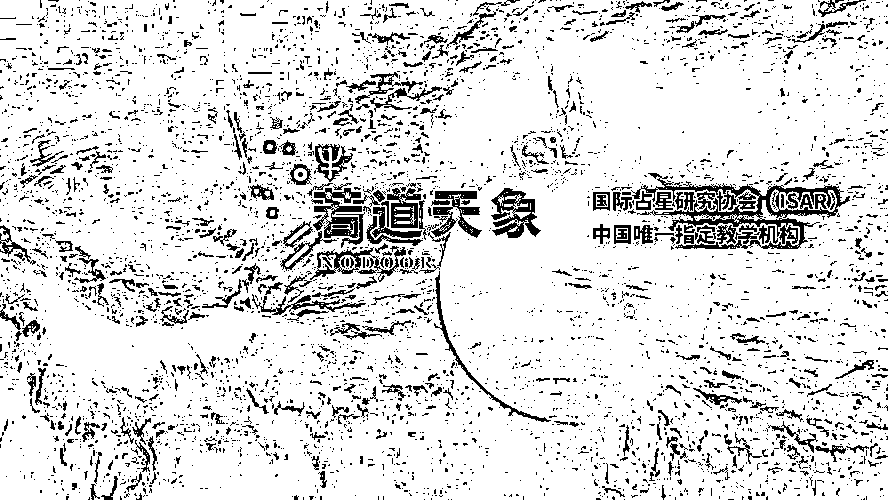

作者/王芝桦 编辑/玫瑰 图片/pexels

**天秤座满月****北京时间 2022 年 4 月 17 日 2:54 迎来天秤座满月，白羊座太阳与天秤座月亮于 26°45′精准对分。**先来分享两个观察：**· 5 月将是“食相”月份：**5 月 1 日的金牛座日食，5 月 16 日的天蝎座月食。此次天秤座满月实际已经进入“食相季”的影响之中，而 5 月后的半年时间也将是“食相季”影响的演化时间。

**·** 4 月-8 月期间，冥王星、土星、海王星、凯龙星、天王星将依次与每一次满月（或月食）的“日月对分”轴线形成四分结构；而 6 月 29 日的巨蟹座新月，正在白羊座试水的木星（5 月 11 日-10 月 28 日）则与新月形成四分结构。

宇宙总是在现实行进之中蕴藏深意——慢速行星们将用 5 个月的时间，向我们提出“挑战”并布置“选择”，直至处暑时节燥气渐微，只待收成季节检验耕耘成果；未来 5 个月，集体性演化（天秤座到水瓶座）与个人性发展（白羊座到狮子座）双线并行，纵使挑战不断，耕耘也绝不能停。

此次天秤座满月，只是下一阶段旅程的起点。但对于我们个人而言，在这次满月中，至少要**找回自我的勇气与力量。**

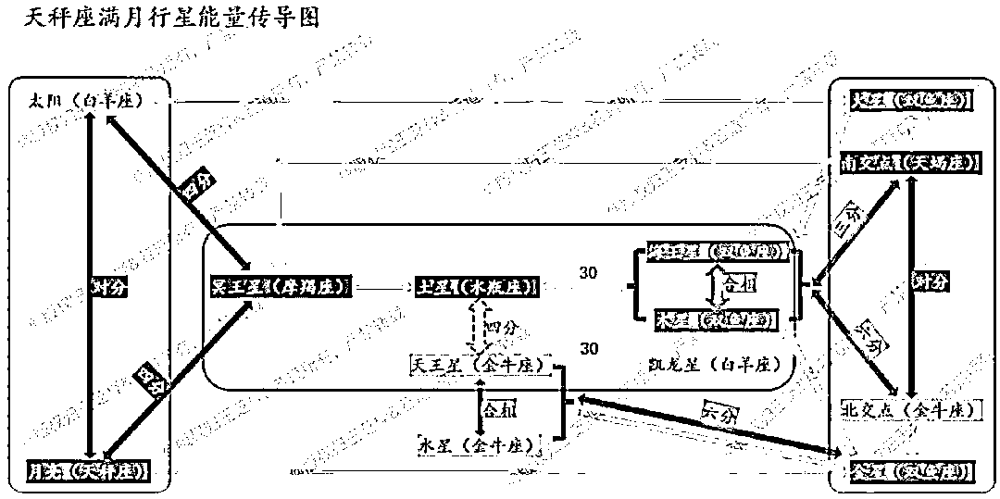

**天秤座满月重点影响人群**

参考满月峰值影响期间各个行星的行进度数，以及逆行行星的轨迹影响；常规容许度，个人行星入相位 3°，出相位 1°；非个人行星入相位和出相位均为 3°。

**·** 出生星图中，有**行星、四轴、南北交点落入基本星座（白羊座、巨蟹座、天秤座、摩羯座）11°-15°，23°-30°**的人群； **· **出生星图中，有**行星、四轴、南北交点落入固定星座（金牛座、狮子座、天蝎座、水瓶座）8°-17°，20°-26°**的人群；**·** 出生星图中，有**行星、四轴、南北交点落入变动星座（双子座、射手座、处女座、双鱼座）0°-4°、9°-16°、21°-28°**的人群。

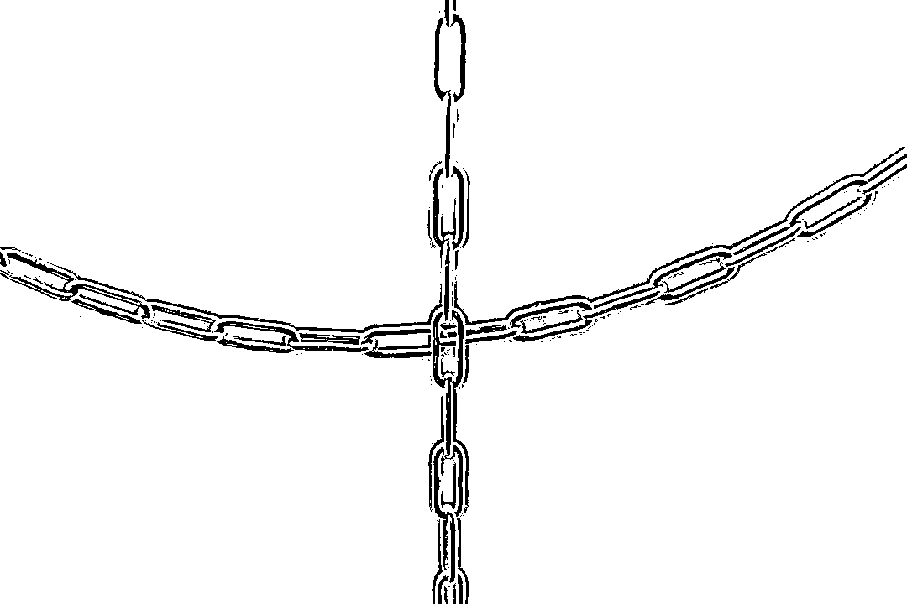

**“明智的选择”装满“时间的袋子”**

****

**时间的袋子，尽管里面装的东西可能会变，但它的容量不会变。****——胡利奥·克塔萨尔《南方高速》**

> ****天象：****
> 
> **· 基本星座 T 三角：白羊座太阳和天秤座月亮分别四分摩羯座冥王星，形成“基本星座 T 三角”结构。**

上古时代，代表天秤座形象的“秤”，中间架起“平衡”的是一盏明灯，左右两个秤盘则是蝎子的两个螯。这就奇怪了！黄道十二星座中，“身居暗底”的天蝎座排在“彰显平衡”的天秤座之后，那为什么天秤座的秤盘却又由天蝎座的钳子幻化而来呢？天蝎座身居的暗底世界，象征着人类与生俱来的“贪嗔痴慢疑”，只有经过长时间的反思与进化，引领意识之光照亮“无明”，觉察原始的企图心，转化本能的报复心，方能发展出超越个体视角、支撑集体关系的“平衡法则和公正态度”。但是，人类与生俱来的“贪嗔痴慢疑”自然难以转化，优雅而友善的天秤座更倾向于关系的联结和道德的审判，而“去腐存真”的狠活儿还得留给排在其后的天蝎座去干，也算是“解铃还须系铃人”。**倡导“平衡与公正”的天秤座，对关系中的不平衡、集体中的不公正也就更加的格外敏感。**于是，平衡与不平衡，公正与不公正，就像从“一”的完整世界分割出“二元”的对立世界。此次天秤座满月的月光，穿过二元的缝隙，将现实世界中的平衡与不平衡、公正和不公正照亮。我们的眼睛将会看到哪些事物？是美好，还是混乱？我们的内心将被什么样的情绪冲击？是感动，还是愤懑？而这一切均取决于我们的选择。

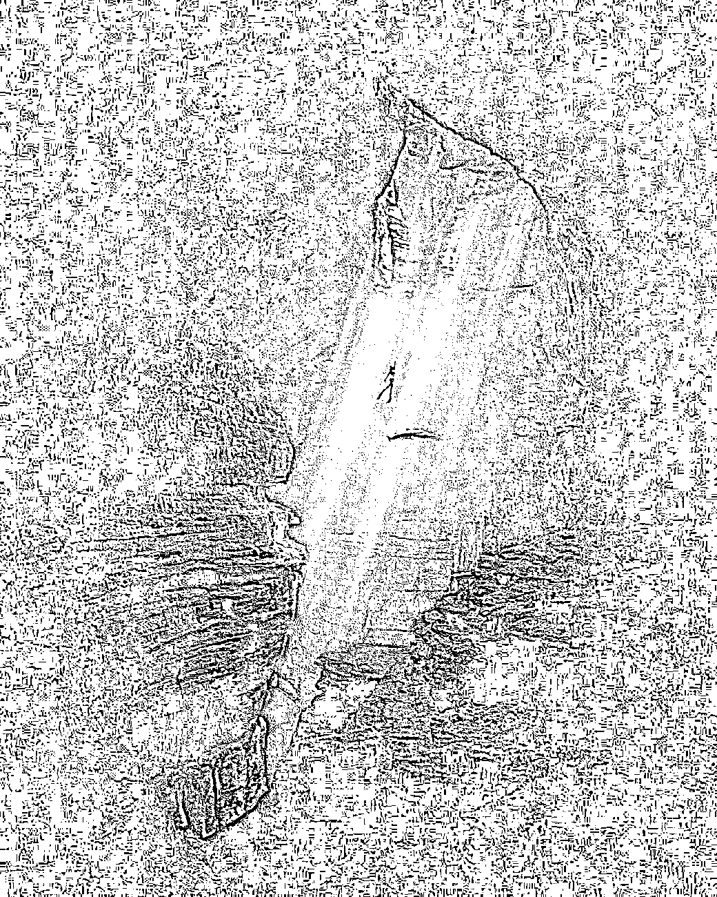

满月发生时刻，“日月对分”轴线与揭示“业力议题”的摩羯座冥王星组成“基本星座 T 三角”结构。

而这颗本身揭示着“业力议题”、同时受到天蝎座南交点“业力驱动”的摩羯座冥王星（冥王星守护天蝎座），也再次提示我们**在已经进入“食相季”的此次满月，需要做出明智的选择。**

**·** 放下那些已经没有营养、不再具有建设性的东西。任何成为梦魇和困扰的东西，都必须超越它；

**·** 当下确实是“计划赶不上变化”的一段时间。不要执着于过去的完美计划，不要抱着应该如何的预设，能做什么就做什么，能做多少就做多少；

**·** 生活从来不会给出一种答案，而是总会提出无数个问题。没有问题的时候未必真实，没有答案的时候要学会提问；

**·** 将精力投入到重要的地方。除了必须出手的时刻，其他的都不重要。以上这些内容，修真性和过生活，发大财和吃饱饭，同样适用。就在写这篇文的过程中，看到“14 批京东小哥驰援上海”的新闻，不禁落泪，是希望，亦是感动。即使我们没有身在疫情严重的地区，但看着认识和不认识的人们每天不分昼夜地抢菜、想尽办法地置换、用心良苦地存菜，却无计可施并无能为力，感觉连问候和安慰都显得苍白！时间的袋子，尽管里面装的东西可能会变，但它的容量不会变。故而，在时间面前，京东做了一个明智的选择，为他人的挺身而出，亦是为自己的全力出征。这个寂寞的春天，感谢那些带来希望的人和事。

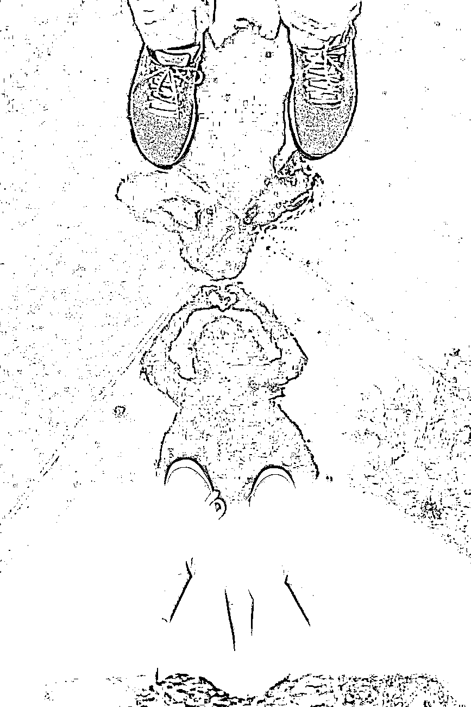

**躬身入局，时时自问**

****

**为什么要这么匆忙，为什么深更半夜在一群陌生的汽车中，在谁都不了解谁的人群中，在这样一个人人目视前方的世界里，要这样向前飞驰。****——胡利奥·克塔萨尔《南方高速》**

> ****天象：****
> 
> **· 木海合相：木星与海王星合相于双鱼座。****· 土星联动“木海合相”：水瓶座土星与“木海合相”形成 30°结构。****· 水天合相：水星与天王星合相于金牛座。****· 金星六分“水天合相”：双鱼座金星六分“水天合相”结构。**

此次天秤座满月，接纳摩羯座冥王星能量的水瓶座土星（土星守护摩羯座）与“木海合相”形成 30°的联手结构，个人认为这是一个**“躬身入局”**的结构。

***1.*** **为“最后的谈判”做准备**

虽然 2021 年度重磅天象“土天四分”结构的影响看似已经松散，但**2022 年 10 月还将迎来一次“土天四分”结构的小小高潮，或者说是“最后的谈判”。** 

**谈什么？谈新旧转化，谈边破边立。**2022 年 10 月以前，“土天四分”结构中的两颗行星都不能太清闲，都要做一些准备工作：**金牛座天王星要颠覆、瓦解、创新现实环境的原有结构，水瓶座土星要清算、界定、沉淀集体层面的全新规则。**故而，过程之中，有代价亦有觉醒，有考验但更有成熟。水瓶座土星要清算、界定、沉淀集体层面的全新规则，这可是必须要亲历亲为和躬身入局的活儿，但水瓶座土星首先就入了“双鱼座家族”的局。

***2. *****回归之旅，酝酿未来**

“木海合相双鱼座”结构中的木星和海王星，正是双鱼座的两颗守护行星。故而，“木海合相双鱼座”结构就像是木星和海王星这对在外打拼一百多年的两兄弟，双双荣归故里再次团聚，并演绎出两种不同的剧本。 

**· 光宗耀祖：**木星的“扩张能量”和海王星的“灵性通道”汇聚在双鱼座的“意识海洋”之中，引领“意识觉醒”的圣光照亮过去毫无觉察的黑暗之处，愿以慈悲之心包容过去的裂痕，愿以慷慨之情升级家中的环境；**· 败家子儿：**木星“过度膨胀”的风险和海王星“逃避主义”的倾向，也容易归家放肆而喝得迷糊，沉溺虚妄脚不着地，逃避问题自欺欺人，遇见矛盾就喊“都是你的错”，碰壁现实就说“我不在乎”。当然，光宗耀祖并不那么容易的事情，而败家子儿也不过是进化的过程。

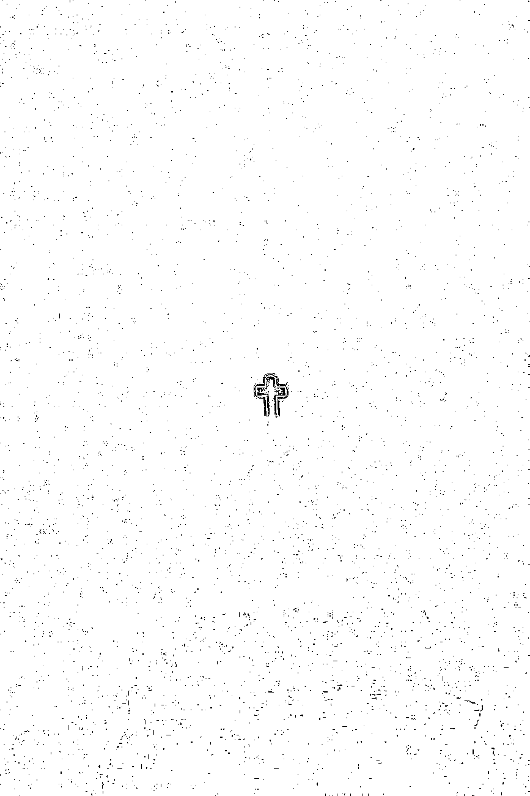

**“木海合相双鱼座”结构，一方面会将“无度扩张，丧失底线”的混乱推向极致，另一方面也会将“超越二元，灵性觉醒”的圣火照亮人间。**“木海合相”结构每 13 年发生一次，但罕见的“木海合相双鱼座”结构上一次发生还是在**1856 年 3 月 17 日。****1853 年-1856 年，俄罗斯与英法为首的欧洲国家因小亚细亚的地权问题爆发了“克里米亚战争”；1856 年-1860 年，中华大地上发生了“第二次鸦片战争”；1857 年，美国因贸易膨胀而爆发经济危机，成为美国南北战争的导火索。**

战争和危机总是让人伤感，但历史也往往在混乱之中前行。不可否认的是，**19 世纪中叶的世界风云变幻，也推进着人类社会迈向“现代化文明”的步伐。**

**2022 年的“木海合相双鱼座”结构的峰值影响发生在 4 月 12 日前后一个月时间，而后随着 5 月 10 日木星换座试水白羊座而暂告一个段落。**从 3 月开始，俄乌战、金融战、疫情战、舆论战，一起将现实世界搅了个一塌糊涂，人们心底的焦虑和惶恐越来越深，现实就像一个调皮捣蛋又胡搅蛮缠的倒霉孩子，让人恨不得打他屁股，但一想到这是宇宙的安排，便还得继续修炼“见招拆招”的本领。历史总是惊人的相似，但历史总是被一再地超越。没有所谓魔幻的匪夷所思，只有超出认知的现实真相，但每一次的“木海合相双鱼座”结构也都标志着——**未来的、长期的人类进程正在其中酝酿。**

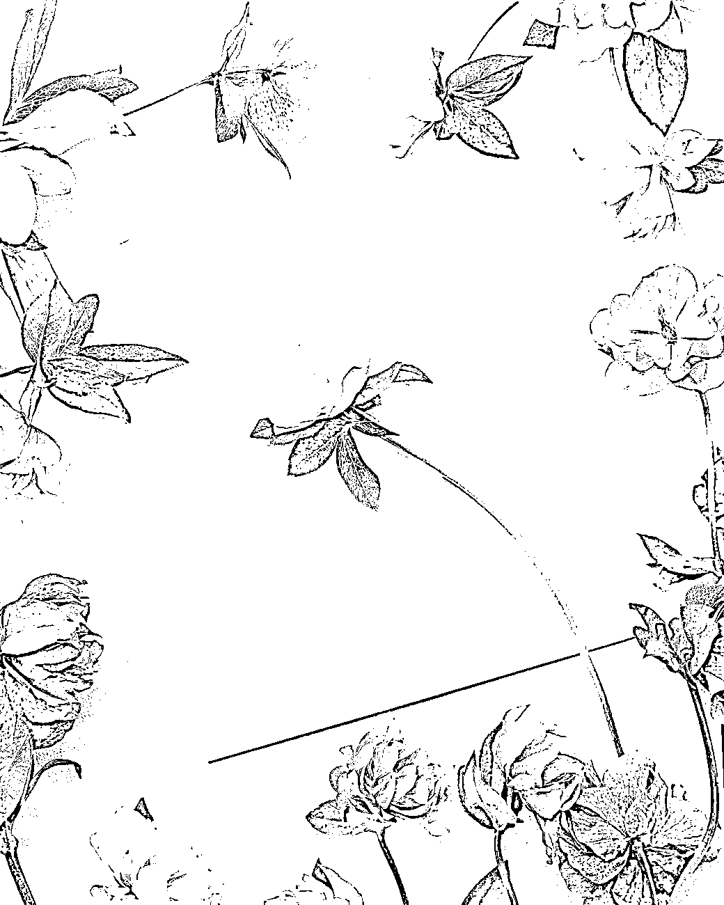

***3. *****躬身入局**

此次天秤座满月，为什么说水瓶座土星与“木海合相”的 30°联手是“躬身入局”的结构呢？ 

因为：**· 一是**水瓶座土星 30°联手的“木海合相双鱼座”结构的未来进程仍在酝酿；**· 二是**水瓶座土星接纳的摩羯座冥王星正在提示**“放下那些没有建设性的东西，将精力投入到重要的地方，能做多少就做多少”。**故而，10 月之前为“土天四分”做准备的水瓶座土星就需要承担更多的责任，肩负更多的担当，同时也为我们提供出关键的策略。**· 一是：**坚持与等待。**· 二是：**慈悲与慷慨。**· 三是：**选择与建设。双鱼座的“意识之海”是水流成河、河流入海的无限汇聚，而当下世界也正在需要我们每一个人的每一份信念和每一份努力——躬身入局。但是，我想说：**·** 不要急，此次天秤座满月不过是未来几个月进程的起点；在未来的几个月时间里，或许我们需要时时自问 “为什么要这么匆忙地向前飞驰”？**·** 如果你想哭泣，就允许自己哭泣。无力和脆弱并不可耻，反而证明着清晰的自我感知和真实的内在反应；**·** 如果你被强烈的情绪驱动着参与到某些权力较量和站队游戏，那么先停下来，理智地看看自己正在投身的事情，是否有为之出征的立场，是否有迎接挑战的能力，是否有承担风险的准备？如果没有，那就别犯傻。

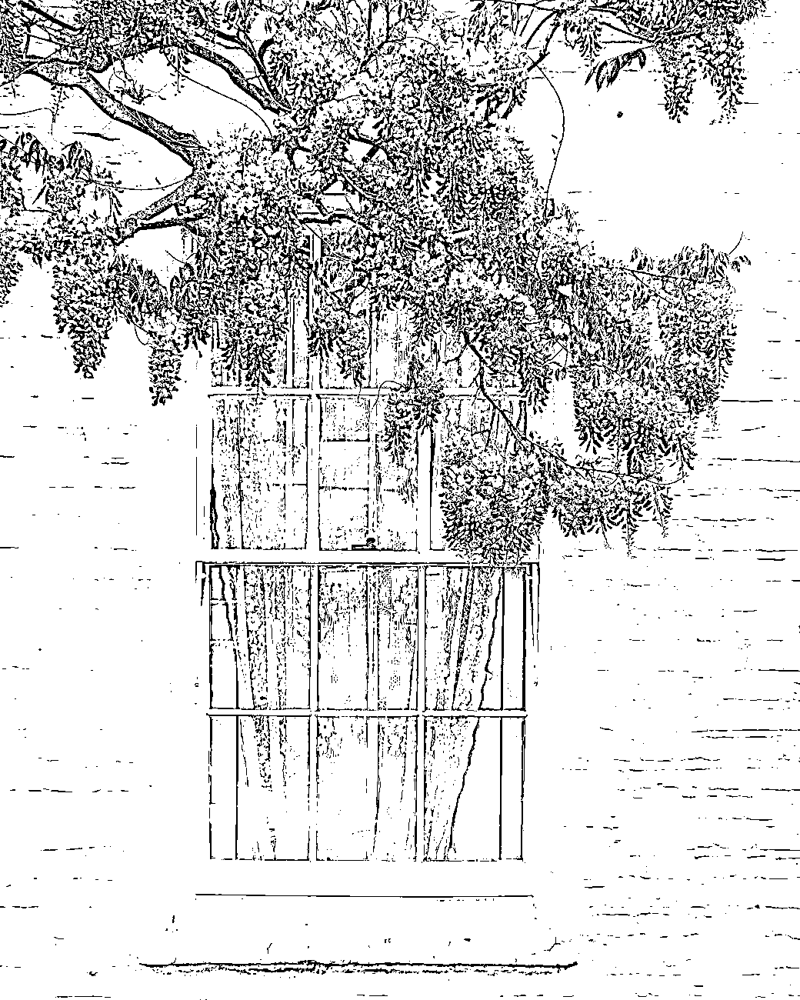

***4. *****彩蛋**

此次天秤座满月，接纳天秤座月亮能量、接纳金牛座北交点进化策略、接纳“水天合相”金牛座结构能量的双鱼座金星，又同时与“水天合相”形成六分结构，带来几点提示： 

**· 一是：**用最新的视角、最质朴的态度重新梳理一下生活。这个时代需要我们觉醒的不单单是灵性的觉知，更是落地的生活；**· 二是：**鉴于涉及 4 月 26 日即将进入逆行前影响期、5 月 10 日将会开始逆行的水星，故而建议提前做好计划的备选方案，提前做好所需的充足准备。**寄语**

****

**越长时间的误解将会带来越出乎意料的演变，恐怕那一天生活将有重大改变。****——崔健《超越那一天》**写这篇文章的晚上，崔健开了一场线上摇滚音乐会，最后一首歌就是《超越那一天》。中场采访的时候，崔健这样描述能量：“当音乐响起的时候，你觉得自己是宽容的人。”接纳已经发生的，融入无限的创造，或许这就是音乐现场的魅力。我们的生活，就是一场永远的 Live，只有接纳已经发生的，才能融入无限的创造。不管了！平衡的，不平衡的，都来吧！我们还能创造（转化）它。祝愿朋友们：灵魂要安好，身体要健康。

**版权声明**：原创文章由作者授权首发于若道平台，欢迎转发，反对抄袭。友号转载请申请白名单。

****

****想阅读更多作者的文章，********请在后台回复******王芝桦****** 即可。****

****王芝桦****

心理占星师，统合疗愈师，占星专栏作者

若道占星“新月和满月”专栏作者，腾讯视频特约占星师

全职于个案咨询与占星教学工作 18 年

**个案预约咨询微信号**：zhihua0621 

**微信公众号**：daoxi-life

**长按打赏**

****

**20 位来自世界各地的占星师****带来 20 场沙龙——新世界的觉醒****详情可点击下图**

**学习占星学****点击下图了解课程详情**

**

**微信又双叒叕改版啦，不想错过若道君的推送？****就把若道设为星标吧！****▼****就是这个“在看”，戳戳戳 ☟**

********报名直达入口********

# 本周木海合相双鱼座，你有哪些难忘的经历和深刻体会？

> 原文：[`mp.weixin.qq.com/s?__biz=MzA5NjA0NTAxNg==&mid=2651471986&idx=2&sn=8d3f5d2ccb7c0de374a6446f4a6830ad&chksm=8b48f2c5bc3f7bd3653394476689bfb5e5c0ab49c768ce5fc55f6e0da103c793df676fa8380e&scene=126&sessionid=1692737832#rd`](http://mp.weixin.qq.com/s?__biz=MzA5NjA0NTAxNg==&mid=2651471986&idx=2&sn=8d3f5d2ccb7c0de374a6446f4a6830ad&chksm=8b48f2c5bc3f7bd3653394476689bfb5e5c0ab49c768ce5fc55f6e0da103c793df676fa8380e&scene=126&sessionid=1692737832#rd)

**2022 年 4 月 17 日天象：**

*   **02:54 月天秤座满月**

*   ******08:22 月亮进入天蝎座******

*   ******太阳四分冥王星******

*   ******水星六分金星、合相天王星******

我们还在睡梦中的时候，迎来**天秤座满月**（见今日头条），这是一次能量激烈的满月**，**矛盾与冲突反映了现实中的压力与抗争。双鱼座的金星六分金牛座天王星、水星合相天王星，意味着解开难题需要在思路和沟通里有些改变。当我们换个角度，会对如何丰盛自我、如何与他人构建平等关系产生新的洞见。本周，在重磅天象[【木星与海王星在双鱼座合相】](http://mp.weixin.qq.com/s?__biz=MzA5NjA0NTAxNg==&mid=2651471394&idx=1&sn=49e525819c16defe2b5e82441a48cacc&chksm=8b488c95bc3f05835a52a7ebeb66ea109829e8c09143c3effd08549c67e1d7768843fcad30b4&scene=21#wechat_redirect)（点击查看文章）的氛围里，我们还迎来[【火星进入双鱼座】](http://mp.weixin.qq.com/s?__biz=MzA5NjA0NTAxNg==&mid=2651471782&idx=1&sn=6cdccc2d55f48e6b640b68e969787fdc&chksm=8b488d11bc3f040793593710a1707be64a10b85bcf6f75b60567fbe834c4146549bfe3ff4bae&scene=21#wechat_redirect)（点击查看文章），空气里浓郁的双鱼座氛围，让人不得不面对各种意外和混乱。你的内心也许正在经历无力和沮丧，但如果愿意对痛苦敞开、接纳阴影、并对世界慷慨的时候，我们会感受到宇宙的慈悲和慷慨。月亮今天在天蝎座，我们有机会面对内在的深刻情感。在宇宙能量转化的一周里，你在有哪些经历？木海合相双鱼座又给了你哪些体验？欢迎跟我们分享呀~周日快乐，我们明天见！**了解每日天象，可****下载“若道”APP 查看****还有更多精彩等着你哦**

# 全球通胀明显，黄金会借机冲高吗？丨雷蒙德·梅里曼 5 月黄金报告上线！

> 原文：[`mp.weixin.qq.com/s?__biz=MzA5NjA0NTAxNg==&mid=2651471968&idx=1&sn=8c599e3378936525947da655de4c8f3d&chksm=8b48f2d7bc3f7bc104e52eb0cf13954f7060b1ef3e4fcc09237f27b259e3f7306fa6f98daae2&scene=126&sessionid=1692737832#rd`](http://mp.weixin.qq.com/s?__biz=MzA5NjA0NTAxNg==&mid=2651471968&idx=1&sn=8c599e3378936525947da655de4c8f3d&chksm=8b48f2d7bc3f7bc104e52eb0cf13954f7060b1ef3e4fcc09237f27b259e3f7306fa6f98daae2&scene=126&sessionid=1692737832#rd)

“**黄金是金钱。其他的只是信贷。**

**——约翰·皮尔庞特·摩根**

”

**3 月份西方各国通胀都创新高。**

美国通胀升值 8.5%，创 40 年来最高水平，也即 1981 年以来的最高水平。

德国通胀 7.3%，也创下 1990 年两德统一以来的新高。

英国通胀率 7%，为 1992 年以来最高水平。

整个欧元区通胀率达 7.5%。

本来受到新冠疫情冲击供应链的影响，许多国家在 2021 年下半年就面临通胀压力，而 2022 年 2 月份开始的俄乌战争造成的能源和农产品等大宗产品价格飙升则让情况变得更为严重。

4 月 13 日，在美、英、法、德、日、意、加 7 国集团中，加拿大央行首先决定加息。

尽管美联储在过去一直坚持说通胀是个短暂现象，但在这样的形势下，5 月的美联储议息会议也可能加快货币紧缩的节奏。

| 黄金走势日 K 线图

从历史走势来看，**20 世纪 70 年代和 80 年代初**，通胀和黄金的走势相一致，同涨同跌，通胀对黄金的影响相对较为明显。**而 1985 年-2000 年前后**，通胀水平和黄金价格均处于相对平稳期，两者的关系已经不明显。**2000 年以后**的黄金牛市对应低通胀水平，通胀和黄金价格的关系弱化。

**然而，70 年代的滞涨是否会在未来几年再现？**

短期来看，4 月 12 日木星-海王星已经在双鱼座合相。而黄金并没有创出新高。而黄金长周期也进入尾部时光。

**在这些因素的影响下，5 月份应该如何操作？**

黄金报告已经上线，上证报告也即将上线。欢迎了解。也可以按照季度和 1 年期订阅，有更多优惠。季度和年度的好处是，你可以持续了解梅里曼老师对于不断在变化的市场的看法。即便他某一次看法和市场不一致，你也看到在下一期他如何调整自己的看法，并看到金融占星在一个长期时间段内对你把控风险的帮助。而能够长期控制风险、尽量找到安全的投资时机才是投资的长久之计。

点击阅读原文，雷蒙德·梅里曼黄金周期 2022 年 5 月报告带来有 40 年黄金市场研究经验的世界著名金融占星大师雷蒙德·梅里曼对当前黄金市场的研究。

**也欢迎购买雷蒙德·梅里曼《2022 年金融年度预报和沙龙》，《2022 年四位占星大师天象预测》课程，这些预测都将帮助你对 2022 年的变化加深了解。**

**投资有收益，投资有风险，希望金融占星学的研究帮助你更好地评估你的投资。**

**扫描下图二维码了解详情**

▼

**2022 年 5 月黄金报告上线**

**黄金月度报告价格****单月报告**：280 元/月 **季度套餐价格**：780 元（260 元/月）**年度套餐价格**：2400 元（200 元/月）**双报告年度套餐更优惠（直降 900 元）****12 个月黄金报告+12 个月上证指数报告：仅需 3900 元****长按下图识别二维码购买黄金报告**
▼

**购买者需知**

**① **梅里曼市场时机学院《中国上证指数月度研究报告》是梅里曼市场时机学院（以下简称 MMA）的研究“预报”，而不是市场“预测”，是梅里曼老师及 MMA 金融占星分析师对人类活动周期历史与行星周期之间相关性的研究，二者在大部分情况下具有 80%或更高的相关性，而不是因果关系。报告中的研究完全存在错误的可能性。即便是非常认真的研究和几十年的研究经验，金融占星师无法总是正确地解读出各种征象在实际层面上会如何相互作用，并显化为事件结果。

所以请将报告看作一个研究参考，务必结合其他市场研究和你个人对市场的理解，根据你的自由意志做决策。

**②** 此报告一旦售出，**即不接受退款。**

**③** 上证、黄金月度报告每月固定 1 期，**并非都是在每月相同日期发布。**

**④** **我们收到英文报告的当天，即发布该英文报告。3 天后，上线报告中文版。此报告仅支持手机网页阅读，不支持电脑阅读和下载。****以上须知，请仔细阅读。一旦付款，即视为已了解并接受所有须知内容。**在过去的 40 年中，唯有梅里曼逐渐完善，并在梅里曼市场时机学院月度周期报告中阐释了将地球宇宙学与周期相结合的研究方法，以惊人的精确性预报了黄金价格发生重大变化的时间。**黄金购买 Tip**

各大银行均可购买黄金或黄金 EFT 基金，也可以在诸如天天基金或者支付宝购买黄金及黄金相关产品。不明白的可以百度搜索。

**购买后如何查看报告？**

**购买后有疑问怎么办？**请联系技术客服
**微信：nodoor201705**

**购买黄金报告直达入口**

# 火星进双鱼座丨未来一个多月，12 星座如何唤醒内在的灵性战士！

> 原文：[`mp.weixin.qq.com/s?__biz=MzA5NjA0NTAxNg==&mid=2651471782&idx=1&sn=6cdccc2d55f48e6b640b68e969787fdc&chksm=8b488d11bc3f040793593710a1707be64a10b85bcf6f75b60567fbe834c4146549bfe3ff4bae&scene=126&sessionid=1692737832#rd`](http://mp.weixin.qq.com/s?__biz=MzA5NjA0NTAxNg==&mid=2651471782&idx=1&sn=6cdccc2d55f48e6b640b68e969787fdc&chksm=8b488d11bc3f040793593710a1707be64a10b85bcf6f75b60567fbe834c4146549bfe3ff4bae&scene=126&sessionid=1692737832#rd)

********************☆ 后**********************台**********************回复“今日”，给你一句生命态度********************

作者/郑玮玲 ISAR 认证占星师编辑/翀子 封面/书君 图片/网络

今天中午 11 点 06 分，火星进入双鱼座并停留至 5 月 25 日。这段时间，我们的生命中将有怎样的火星功课？如何更好的活在当下？一起来看看吧。

**火星的意义**

**北京时间 4 月 15 日 11:06，火星进入双鱼座，并将在双鱼座行进至 5 月 25 日，之后便进入它所守护的白羊座。**

火星与神话的关联是希腊神话中的战神阿瑞斯，热血斗士，有勇无谋，屡战屡败。这就是为什么传统占星学总是将火星视作危险、凶兆，因为有流血、受伤、怒气、暴力的征象。

**火星的原型是阳性能量，**是男性、斗志、力量、勇敢、刚毅、性能量和行动力，也是热血与个性的表达力。火星代表了每个人面向生命的开垦拓荒，我们如何为自身行事、捍卫，**是挥霍生命力也激活生命力的动能。**

火星在太阳系中位于地球与木星之间，但它离地球更近，也是个人行星中唯一处在地球外圈的行星。这个宇宙坐标说明了火星是个体向世界说“不”的捍卫和进攻力，它犹如个人王国的贴身护卫或是军队，清楚声明了自我的界限。

**无论火星行进在何处，都是一种力量的演化与呈现，如何与自我力量合作，行使自己的权力便是火星行进时值得探索的问题。**

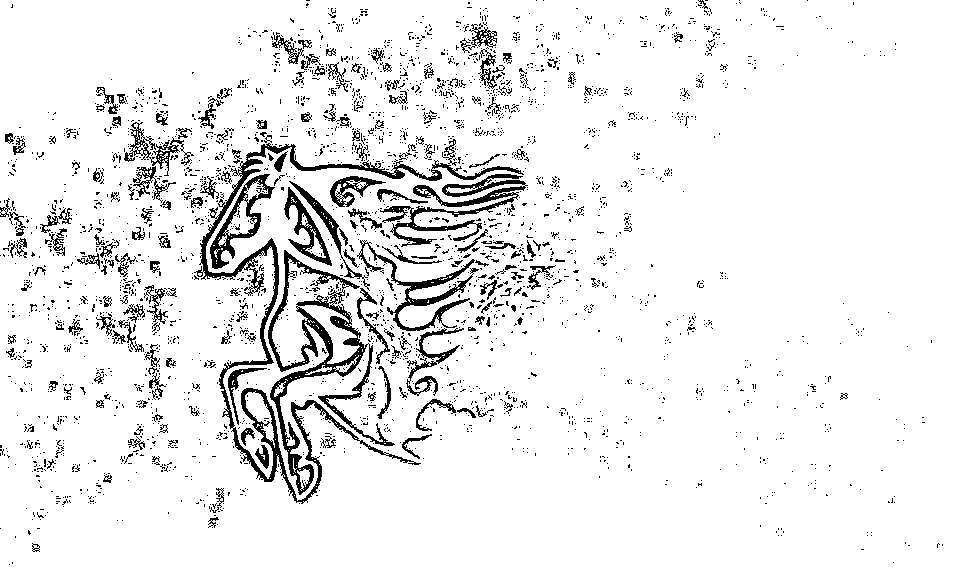

**火星在双鱼座**

**当火星进入双鱼座时，极大概率的消融、无边界的氛围将让我们感受到乏力、无力、困顿、失序和混乱。**

如果说火星进入双鱼座最应当担心什么，那便是：**失控的力量**，攻击或是捍卫时都可能陷入复杂情境，过度或是发散性地释放愤怒，超越现实、道德、人性的界限。

**神和他们不可理喻的规矩，总有让你不得不下跪的理由。**

**——《喀耳刻》玛德琳·米勒**

双鱼座，变幻无常，无形无限，水象与变动特质更支持意识的沉浮、切换与生灭。火星的威力难以在虚空中展露锋芒，更无法在情感水域披荆斩棘。

那种生于小我，忠于小我的斗志消融在意识、环境、情绪的洋流中，在遭受冲刷、涤荡的混杂与飘荡过程中，**我们以为手握利剑，但很可能发现仅仅抓住了海草。**

逃避或无视自身力量与逼近的战火是不可取的，即使身处逆势，也要在幻灭中努力寻回斗志、力量和武器——正确信念便是当下所需。

**祈祷与信念都是火星双鱼座背景下最重要的力量来源，**寄希望于宇宙法则、天地道法，借助灵性与神秘学，把对未知的确信、可能性纳入日常探索与体证中。做一些努力，也允许自己无法做另一些，一半交给自己，一半交给不可知，**等待奇迹与救赎在迷茫、未知中出现。**

**双鱼座的火星赋予了内在灵性战士以力量**，敏感、脆弱、崩溃的情绪都可能搅动潜意识中，继而升起怒火，触发进攻与捍卫的行动。

另一方面，双鱼座的火星也带来了**消毒、排毒、清理**的最有利时机，是此刻确保生存必须的行动。物质层面的精微消毒可以在此时段实现，而在心灵、情绪层面的排毒、清理能稳定心绪，提升心灵稳定、坚韧度，从而有力维护生命的尊严。

在与疫情共存的第三年，每个人都值得借用这个时机为自己开辟神圣救赎的道途。**呼唤你内在的神性，向复杂与乱象宣战**，勇敢相信内在的质疑，如同清理病毒一样清理有毒害的思想、意识与情绪。

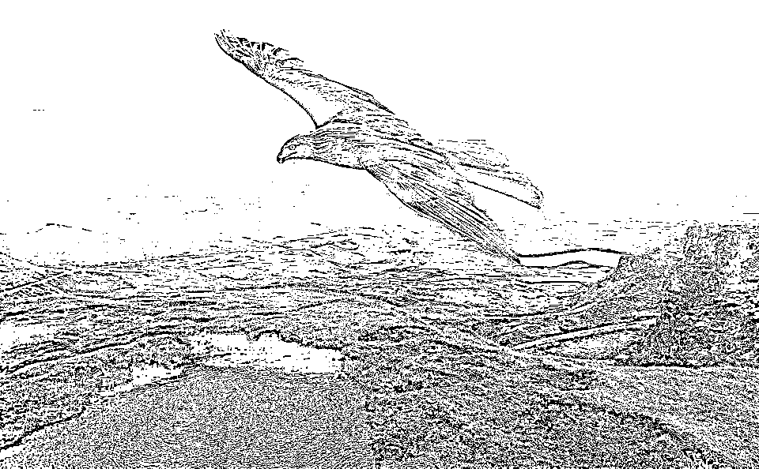

**火星在双鱼座的行进**

**火星六分天王星**

**周期：4 月 27 日—5 月 11 日**

**重点影响人群：有个人行星、四轴、交点位于双鱼座、金牛座、双子座、巨蟹座、狮子座、处女座、天蝎座、射手座、摩羯座、水瓶座 9–20 度的人。**

火天相交，激烈、快速、陡然，对自由的呐喊足以点燃胸中的火焰。普罗米修斯盗火的原型再现，他要把创造、辟新的火炬带给人类，相信的创造，**敢于革新的人就能接住天神的赠予。**

天王星要的是不破不立。独立与自由是天王星不懈的追寻，不怕被当作异端，不怕孤立与放逐。灵性的勇气一旦升起，便能握住信念的火炬，奔向灵感与创新的道路，陈旧的束缚将一一崩解于脚下。

**勇气和胆识支撑你完成看似不可能的极限超越。你所相信的，都会为自由开辟全新的路径。**

**在此时期，适宜进行大胆、另类的探索与体验，**尤其对你从未涉足又深信的灵性的法则，会带来奇幻的般的助力。占星学、神秘学、萨满、非传统疗法都会鼓励我们走向更深广的宇宙意识，获取深层自我的精微能量。

金牛座的天王星向我们敞开着珍宝般的智慧库，勇敢坚信**灵感就是最好的“武器”。**对杂质、干扰的即时觉察与清理，会帮助我们实时更新力量与活力。当你已经在热情自由的进程中时，你会忘记曾经定义的“冒险与不可为”，原来是这般可靠，耳目一新又充满意义的尝试。

**火星合相海王星**

**周期：5 月 7 日—5 月 29 日**

**重点影响人群：有个人行星、四轴、交点位于双鱼座、双子座、巨蟹座、处女座、天蝎座、射手座 16—29 度，以及白羊座、巨蟹座、狮子座、天秤座、射手座、摩羯座 0–3 度的人。**

此时的火星被海王星所守护，海王星落在自己的庙宇，无限强大的消融与幻灭的可能性。小我的力量在绝对的集体潮流中被裹挟、渲染、浸入、消融、迷茫、失序。

海王星、双鱼座共振的能量足以吞噬小我意志力**，在交混的情境中每个人都需要坚定自己的方向和路径，**清晰自我所处的位置、情势，等待迷雾散去，或是顺着巨大的无法挣扎的洋流去到未知的彼岸。

**解其纷，挫其锐，和其光，同其尘。**

**——《道德经》老子**

面对海王星的行进，不妨用“**道”、虚空、无限的宇宙法则**去容纳小我的知见，让我们站在原型的庞博背景之下明晰小我如微尘又饱含质感与火力。

这似有还无的宇宙大手自有它调解纷争，混同光尘的法度，小我所需的只是安住，**接受一切的发生才能让宇宙性的力量入驻、协同。**将心安于当下，处处可重新生根、发力。

火海合相，**内在的灵性、开示引领着我们的热情。**以柔克刚，不战而胜，将所有向外的争斗转向与虚空共舞，在灵性与意识的交汇处，在无力与放手的边缘，让救赎与超越自行呈现。

相信奇迹与魔法，你就拥有了火海双鱼座的力量，你的感知便是力量，你可以用它来做任何事；**你的相信成为了拯救的力量，也是神性的入口，你可以经由信念完成对自我、集体的救赎。**

火海合相期间，生活中需要密集的灵性、艺术尝试，让生命热起来，如风帆鼓动起来，主动应变风浪和冲击，并用柔和的方式去协奏这命运波澜起伏。

**舞蹈、太极、金刚功、八段锦、瑜伽，冥想、静坐、唱诵、持咒，或是游泳、玩音乐、绘画都会支持我们走出虚空迷雾，实践灵性法则，超越自我。**

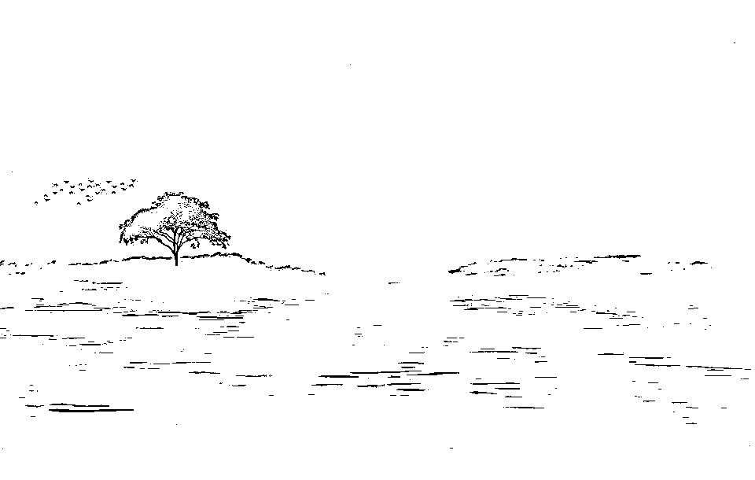

**火星六分月亮北交点**

**周期：5 月 8 日—5 月 21 日**

**重点影响人群：有个人行星、四轴、交点位于双鱼座、金牛座、双子座、巨蟹座、狮子座、处女座、天蝎座、射手座、摩羯座、水瓶座 17—27 度的人**

月亮北交点行进在金牛座的当下，每个人都在努力朝向真实、坚定的价值成长，包括我们曾错失的、隐藏的质感，都有机会在这一年完成转化。

**南交点天蝎座用危机和生死来拷问我们对真实自我的信心，**而火星正是南交点的守护星之一，此时与南交点形成三分相。

在此期间，我们得到了一次自我拷问的机会，对自己勇敢可能是这世界是最难的一件事。如果我们永远不面对真实自我，就会阉割掉某个神性自我，这是生命的瑰宝，也是通向无限的潜力。

北交金牛座向我们提示在患难中的美好前程——一箱子的黄金珠宝，一整片山头或是海岛，那是我们不用费力就能拥有的宝藏。**而我们若信任内在的灵感与信念，便能乘上宇宙的快车去拥有专属的宝藏。**

为自己奋斗天经地义，**北交金牛座让我们知道真正的满足必然与物质的丰美连接在一起。**也许你从来没有做过农业，但疫情当下，你不得不开始学习如何培育、照顾一颗脆弱的菜苗，用上你所有知道和相信的方法。

金牛座把我们带往泥土中去寻宝，而你的利剑就是一切基本求生的工具，那些看似微不足道的东西变得像魔法棒一样足以点石成金。而你要做的就是掌握这些“复杂”的技能，**因为只有这样，我们才能从生存的危机感中得到救赎与解脱。**

脆弱的小我在绝对的危机中重新焕发出向生的活力，创造丰美的现实。

**火星合相木星**

**周期：5 月 15 日—6 月 12 日**

**重点影响人群：有个人行星、四轴、交点位于双鱼座、双子座、巨蟹座、处女座、天蝎座、射手座 22—29 度，以及白羊座、巨蟹座、狮子座、天秤座、射手座、摩羯座 0–13 度的人。**

火星与木星相会，众神之神驾到，我们想要“有如神助”之功效似乎可以呈现为现实。但在此，首先需要小心面对火星的困扰与搅动，即使是神，也是有充满怒气的时候，火星就是怒气本身。

火木合相最危险的可能便是庞大的愤怒，愤怒会带走理性、礼貌和逻辑，木星扩张了愤怒将可能带出灾难性的后果。当然，人间的灾难没有一天不在上演，尤其南交天蝎座的时空，我们看到的悲剧还不够多吗？

**将愤怒作为日常觉察，去为它做点有用的清理、排解，那便是火木合相期间最值得的尝试。**

此时的木星与火星都呈现出一些特别之处：它们在合相过程中一起走完双鱼座进入白羊座，并保持一段时间的合相。此时，火星将真正获得专属于它的力量。火星将要变得单纯、有力了！木星也会随着换座而聚焦、集中。

**我们可以在 5 月 11 日木星换座前大量投入信念的工作中，以此加持自我的稳定性与活力。**在木星进入白羊座以后专注于当下最紧要的工作与生活中，心无旁骛地投入实干，让所有支持、保护生命的工作占据我们的时间和精力，如果不够，还可以加入充满活力的运动来消耗、更新体能。

当火星也换座进入白羊座以后，我们将用最饱满的精神动力，最充足的体能去投入高效、快速、勇猛的工作中。无论你拿来做什么，**记得在火星双鱼座期间与你的灵感相连，**相信你可以创造奇迹，你的魔法就可以得到木星的加持展现出来。

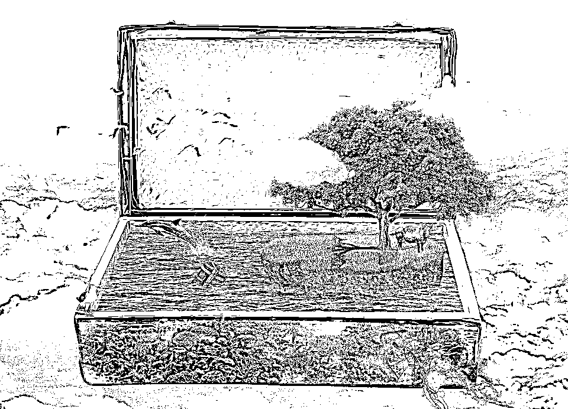

**火星六分逆行的冥王星**

**周期：5 月 16 日—5 月 29 日**

**重点影响人群：有个人行星、四轴、交点位于白羊座、双鱼座、金牛座、双子座、巨蟹座、处女座、天秤座、天蝎座、射手座、摩羯座 23–29 度，以及白羊座、巨蟹座、狮子座、天秤座、射手座、摩羯座 0–3 度的人。**

**冥王星从 4 月 30 日开始逆行在摩羯座 28 度，火星与冥王星在逆行中形成活跃的六分相。**

无论冥王星顺或逆，在任何度数，都把转化、蜕变、重生、禁忌而激烈的事件呈现给我们看，也免不了触及性、罪恶与抗争的议题。

**冥王星是高八度的火星**，火冥相遇，地球上的战火很可能在这段时间更加激烈——包括火药味的战场和意识的战场，在看得见和看不见的地方，对峙和抗争都可能推到极致。

冥王星代表的隐秘、黑暗操控会遭遇正义、光明、慈悲的利剑出击。双鱼座的火星看似无力，却能从最微弱个体开始掀起巨大的波澜，集体性的剑拔弩张声势浩瀚，如愤怒的海潮能吞没、清洗黑暗与罪恶。

**火冥交会，是将勇气与智慧的力量交给每一个人。**敢于面对极度失衡、被操纵、控制的现状，敢于直面最深的恐怖、死亡的阴影和丧失一切的后果，个体便有了勇气绝地反击。

逆行的冥王星是将恐惧内化的有力证据，我们完全有理由相信最深的黑暗里藏着专属于己的“上方宝剑”。**有勇气的人，在绝境求生的人会穿越黑暗夺回自己的力量，信念与爱的护佑着你迎向内在的神性。**

**火星六分逆行的水星**

**周期：5 月 20 日—5 月 28 日**

**重点影响人群：有个人行星、四轴、交点位于双鱼座、双子座、巨蟹座、处女座、射手座、天蝎座 26—29 度，双子座、处女座、天秤座、射手座、水瓶座、双鱼座 0-1 度，白羊座、巨蟹座、狮子座、天秤座、射手座、摩羯座 0—2 度，金牛座、狮子座、处女座、天蝎座、摩羯座、水瓶座 27-29 度的人。**

水星于 5 月 10 日从双子座 4 度开始逆行，火星与逆行的水星有一周时间形成积极有力的六分相。在此期间，水星正好从双子座逆回金牛座 27 度，此相位影响的黄道星座区间尤为复杂。

在此期间，每个人都需要注意自己思想、思维、思考方式和言语、文字表达是否被无意识的、非我的、集体性的愤怒影响、带走，**小心避免口角纠纷，言语无忌带来的争吵、暴力，以及不必要的误会导致的精力消耗。**

**六分相的活跃激发我们将心智投入为灵性、疗愈、慈悲协作的事。**比如研读灵性经典，学习疗愈技能，探索人类心灵与意识的广袤边界，也许还能得到神奇的引领和加持，快速领略神秘的奥义。

逆行的水星支持内在探索与修整，在火星的助力、鼓动下，快速点燃思维的火花。**也许能在此过程中发现前所未有的思考方式，切换新的思维角度，**随着水逆的推进，重新找到新的思维定位和思想、言论价值，校正对于生命、生存意义的诠释。

说对的话，让思想宛若珍宝；做对的人，让慈悲灌满胸膛。

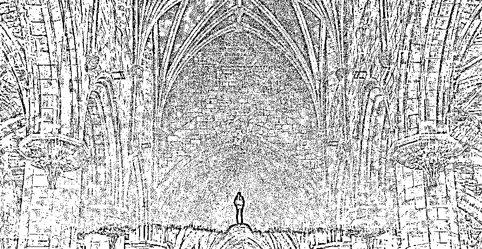

**尾声**

去看，去了解火星，是让自己永保热情、激情和活力，永不放弃争取自我力量。每一个人，包括女性也需要与内在男性面积极整合，没有勇气，就无法去荣耀我们的生命。

**缺乏支持的时候，每个人都可以从内在找到自我支持力——这就是自我赋权的火星，永远鼓舞，永远温热我们的生命。**

木海双鱼座的背景之下，我们很容易在患难沉浮中逃避、推离、麻木，失去，但正是苦难将人类心灵的敏感脆弱紧紧相连，是共情与同理心盛载了每个个体的意志与突破困境的动力。

同样背景下，我们值得跨出现实的悲凉、失望、绝望，在宇宙充满仁慈的祝福中去理解这个世界的发生，与慈悲、勇气站在一起，行使我们从未被剥夺的生命权力。

我们不得不承认，苦难就是人生常态，在冥王星行经摩羯座的最后两度里，一切黑暗转化还将被推向深处。但无论多少的黑暗险峻，都是成就真实自我道路上的重重关卡而已。**行动才是意志的延伸，更是自由与理想的拓荒之力。**

火星双鱼座若是问为何而战、而争？**那是为你灵性的自由而战，是你与旧有小我的竞争。**灵性战士们，披上信念的盔甲上路吧。

**版权声明：**原创文章由作者授权首发于若道平台，欢迎转发，反对抄袭。友号转载请申请白名单。

**郑玮玲**

ISAR（国际占星研究协会）认证占星师（2016 年获得）

若道占星专栏作者

将占星咨询、教学与音乐、舞蹈相结合的疗愈者

**微信号**：zhengviolin

**新浪微博**：@郑玮玲

**微信公众号**：Sampriya-Astrology

长按打赏

**20 位来自世界各地的占星师****带来 20 场沙龙——新世界的觉醒****详情可点击下图**

**学习占星学****点击下图了解课程详情**

**

**微信又双叒叕改版啦，不想错过若道君的推送？**

**就把若道设为星标吧！**

**▼**

**就是这个“在看”，戳戳戳 ☟**

********报名直达入口********

# 今晚沙龙丨 现代动态卜卦占星可以为你做什么？（免费）

> 原文：[`mp.weixin.qq.com/s?__biz=MzA5NjA0NTAxNg==&mid=2651471782&idx=2&sn=7b32f0823debf1cd395a0b5a56ee9309&chksm=8b488d11bc3f0407fdc23b0344156cb2fa9b64b8e75c5c3f7964d7935118c0159c125abe2290&scene=126&sessionid=1692737832#rd`](http://mp.weixin.qq.com/s?__biz=MzA5NjA0NTAxNg==&mid=2651471782&idx=2&sn=7b32f0823debf1cd395a0b5a56ee9309&chksm=8b488d11bc3f0407fdc23b0344156cb2fa9b64b8e75c5c3f7964d7935118c0159c125abe2290&scene=126&sessionid=1692737832#rd)

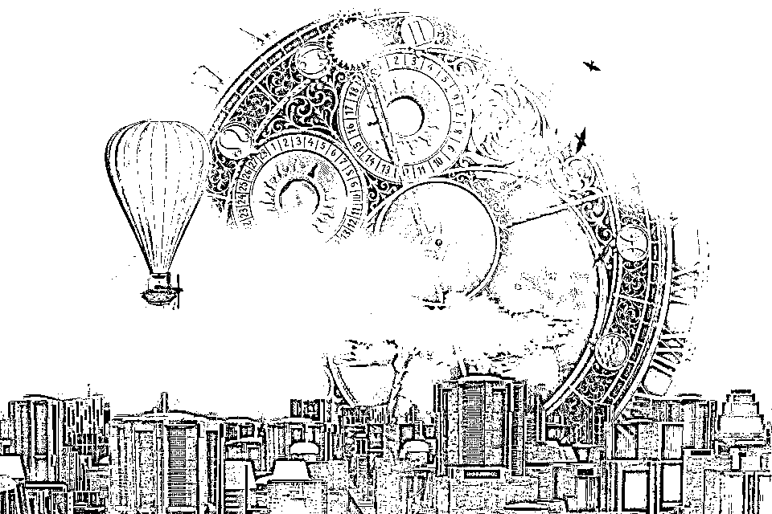

**5 月 3 日，由阿德里安·邓肯老师老师带来的[《现代动态卜卦占星》](http://mp.weixin.qq.com/s?__biz=MjM5MjQwNjAyMQ==&mid=2649439458&idx=3&sn=5930b97b5292603c8b3d668b90554799&chksm=beb9538889ceda9e85535c44a05b9f4ebfc1b2e6e7fe4ce3ebb1b1ae7cc26067225d83ad9300&scene=21#wechat_redirect)（点击可了解详情）课程就要开讲了。**

**也许对于卜卦占星，你还是很陌生。**

**到底卜卦占星有什么用？**

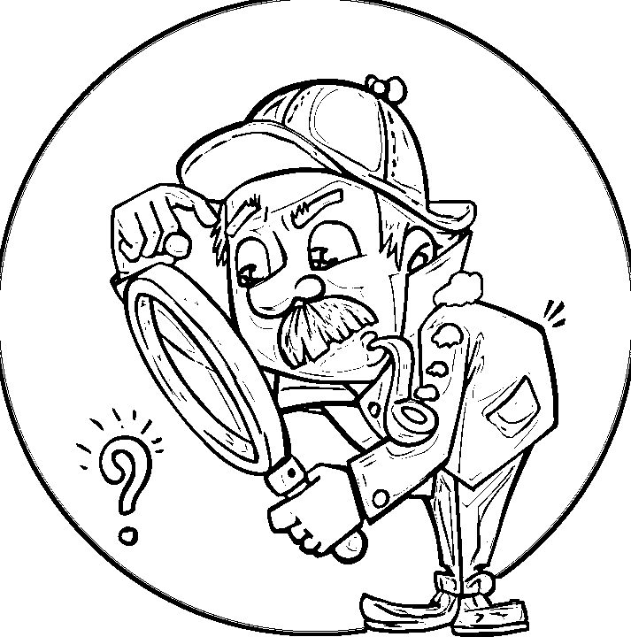

**这些问题都可以用卜卦占星来回答吗？**

**求职**1 分钟前

**我即将参加面试，我该怎么准备？**

**约会**2 分钟前

**我想邀约喜欢的人吃晚餐，该如何选择餐厅？ **

**财务**3 分钟前

**朋友借我的钱能还给我吗？**

**学习**4 分钟前

**有个课程很吸引我，但我能完成并学以致用吗？**

**学业&前途**5 分钟前

**高考面临选择专业，哪个方向是适合我的？**

**家庭**6 分钟前

**伴侣出轨，我应该离婚还是选择原谅对方？**

**工作项目**7 分钟前

**疫情之下，有个项目该不该合作？**

**失物**8 分钟前

**信用卡好久不用找不到了，去哪找？**

**金融理财**9 分钟前

**股票基金目前选择哪个方向投资比较好？**

**现代动态卜卦占星和传统的卜卦占星有什么不同？**

**卜卦占星可以和预测技术结合在一起吗？**

**卜卦占星可以和心理占星结合在一起吗？**

**学习卜卦占星也可以促进对出生星图的理解吗？**

**仅有若道 L3 的基础可以学习卜卦占星吗？**

如果你对以上都充满好奇，那么**4 月 15 日本周五晚 8 点**，由本次卜卦占星的课程助教——ISAR 认证职业占星师王嘉祺老师带来的卜卦占星沙龙，就是你的最佳选择。

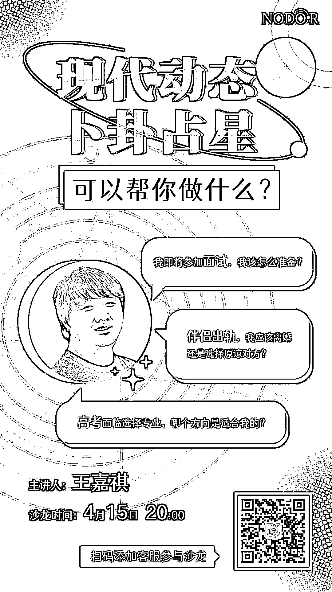

**本沙龙没有回放，具体参加沙龙的方式请联系课程顾问童老师。**

**课程顾问：童老师（微信：nodoorDaivd），请备注“卜卦沙龙”**

扫码添加客服参与沙龙

# 金融占星学大师《2022 年金融预报》 |  你未来一年的理财手册，值得拥有

> 原文：[`mp.weixin.qq.com/s?__biz=MzA5NjA0NTAxNg==&mid=2651471782&idx=3&sn=9bf593258b18f05e41b5cd249cdd3a16&chksm=8b488d11bc3f0407bc45215ecb5d6549f25bd505fec12bc160babd12daa3c717f84d69f7d561&scene=126&sessionid=1692737832#rd`](http://mp.weixin.qq.com/s?__biz=MzA5NjA0NTAxNg==&mid=2651471782&idx=3&sn=9bf593258b18f05e41b5cd249cdd3a16&chksm=8b488d11bc3f0407bc45215ecb5d6549f25bd505fec12bc160babd12daa3c717f84d69f7d561&scene=126&sessionid=1692737832#rd)

1976 年以来，由雷蒙德·A·梅里曼撰写的梅里曼市场时机学院每年一次的年度预报沙龙和每年一本的《年度预报》一直在应用占星学原理为投资者们服务，提供卓越洞见，从未间断。**2020 年，木星、土星和冥王星形成大合相，我们刚刚结束了一个周期和一个时代。现在我们正处于一个新时代和一个新的长期周期的早期阶段。**  如果 2020 年我们还在手忙脚乱，不知道发生了什么；2021 年则更让我们更清楚地看到一个时代结束了——2020 年之前的时代，在新冠肺炎病毒大流行、2020 年”大合相”之前的时代，这是人类历史进程上的一个转折点。**我们所熟知的生活诸多方面在那时就结束了，现在人们仍在试图找出“正确的方式”或“最好的方式”来重建和再造世界。**2021 年，有的行业被彻底摧毁，有的行业成为新贵。2021 年对投资者是一个苦乐不均的一年。尽管美国新冠肺炎疫情未见好转，道琼斯指数仍然扶摇直上；尽管中国经济在世界经济增长中一马当先，上证指数仍然波澜不惊。在货币对标的品种中，老贵族黄金走低，新贵族比特币飞升。我们还看到了大宗商品价格的飞涨，各种短缺开始出现。在中国，各种政府干预市场的调控在各个行业愈演愈烈。**这种现象到底说明了什么？又预示着什么？**2022 年我们的金融市场会受到哪些行星组合的影响呢？我们来看一看：**·** 140 年的木星-土星合相的“风象纪元”在 2021 年刚刚拉开序幕，2022 年我们还将会看到温和主义与极端主义之间存在冲突；**·** 土星四分天王星最后一次成相的影响：专制主义和中央政府控制与个人追求个体的权利和声音的冲突；新能源和旧能源的冲突；**·** 天王星进入金牛座的后半段：包括美元在内的世界货币的重新估价和地位；**·** 土星-海王星的半六分相：新冠肺炎病毒；**·** 水星、金星和火星在 2022 年的逆行“它们对 2022 年发展和增长的影响；**·** 木星在双鱼座（黄道最后一个星座）和白羊座（黄道第一个星座）之间来回移动：战争还是和平；谁是“第一名”的激烈竞争；**· **木星与海王星在双鱼座合相；**·** 冥王星在美国国家星图回归；美国的选择会对全球带来的影响；**·** 月亮交点的换座：月亮交点周期和经济周期的对应；**·** 木星在双鱼座期间金融市场和主要趋势的反转。2022 年仍然是旧世界向着新世界转变的一年。此时，金融市场的投资者和潜在投资者，都需要客观而睿智的思考，而金融占星大师雷蒙德·A·梅里曼的研究则更是无可替代的。1976 年以来，由雷蒙德·A·梅里曼撰写的梅里曼市场时机学院每年一次的年度预报沙龙和每年一本的《年度预报》报告一直在应用占星学原理为投资者们服务，提供卓越洞见，从未间断。去年，这个 3 小时的年度预报沙龙和长达 200 页左右对金融市场的分析报告帮助许多若道的读者做出正确的投资决策，降低投资风险，并获得相当不菲的投资收益。在《2021 年金融预报》中，关于上证指数，梅里曼老师说：对于上证指数，梅里曼老师说：**“我们预计涨势将在 2020 年 12 月-2021 年 2 月之间达到波峰，然后急剧下跌至 52 周和 22 个月周期的低点，这些周期将在 2021 年 5 月之前，甚至在 3 月底之前结束。此后可能会出现另一轮反弹，可能会也可能不会在 2021 年 11 月之前形成第一个 33 个月周期的新高。”**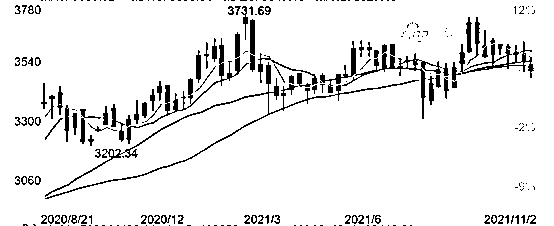| 上证指数 K 线图关于黄金，梅里曼老师说：**“黄金的 31.33 个月周期波谷将在 2021 年 9 月之前出现，理想情况是 2020 年 12 月-2021 年 6 月。价格目标是 1628+/-109 或 1768+/-76。重叠范围（理想情况）是 1692-1737。如果价格跌破这些范围，则为看涨情况中令人担忧的状况。”**| 黄金走势 K 线图关于白银，梅里曼老师说：**“木星和月亮交点的周期表明，白银的一个重要低点将在 2021 年出现，最有可能在 5 月 13 日之前或 7 月 28 日之后出现。这可能是 5-7 年周期的波谷，但可能会保持在 18.50 以上。收盘低于 17.00 将令人担忧。”**

| 白银走势 K 线图

**2022 年 3 月（具体日期待定），梅里曼老师将会照样带来一场精彩的讲座，讨论 2022 年重要的宇宙天象及其对世界经济、金融形势的整体影响，还将覆盖中国上证股票市场的分析、黄金白银市场、比特币市场等投资市场。具体时间我们待确定后会通知大家。****2022 年度报告及沙龙预售**

**价格：****1380 元（报告已发布）**

**一份价格仅千元的顶尖金融占星大师的投资分析报告和沙龙，聪明的投资者值得拥有。****购买者重要须知****①** 梅里曼市场时机学院每年一次的年度预报沙龙和《年度预报》是梅里曼市场时机学院的研究“预报”，而不是市场“预测”，是梅里曼老师及其金融占星分析师对人类活动周期历史与行星周期之间相关性的研究，二者在大部分情况下具有 80%或更高的相关性，而不是因果关系。沙龙中和报告中的研究完全存在错误的可能性。即便是非常认真的研究和几十年的研究经验，我们无法总是正确地解读出各种征象在实际层面上会如何相互作用，并显化为事件结果。

所以请将次沙龙和报告看作一个研究参考，务必结合其他市场研究和你个人对市场的理解，根据你的自由意志做决策。

**②** 此报告一旦售出，**即不接受退款。**

**③** 此报告仅支持在手机网页和若道 APP 上阅读，不支持电脑阅读和下载。**④** 讲座提供视频回放。**以上须知，请仔细阅读。一旦付款，即视为已了解并接受所有须知内容。**

**如在购买报告中遇见任何问题**

**可添加客服**

▼

****购买报告直达入口****

# 喜欢承认错误居然也是自恋？ | 心理占星学告诉你 4 种自恋的疗愈方式

> 原文：[`mp.weixin.qq.com/s?__biz=MzA5NjA0NTAxNg==&mid=2651471721&idx=1&sn=26245a3a04af8bf41a7dd48aa719449f&chksm=8b488ddebc3f04c8996f3126761a991d76bbdf0c7c08ecab98f6a7b01a731db2bae68d321286&scene=126&sessionid=1692737832#rd`](http://mp.weixin.qq.com/s?__biz=MzA5NjA0NTAxNg==&mid=2651471721&idx=1&sn=26245a3a04af8bf41a7dd48aa719449f&chksm=8b488ddebc3f04c8996f3126761a991d76bbdf0c7c08ecab98f6a7b01a731db2bae68d321286&scene=126&sessionid=1692737832#rd)

****************☆ ****************************后台****************************回复“今日”，给你一句生命态度****************

********************************

作者/雪冥 ISAR 认证占星师编辑/玫瑰 图片/pinterest 通常在人们说到自恋的时候，都带有一种负面的情绪来对待它。认为自恋的人自私自利，只想着自己不顾别人；认为这是一种不好的人格特质。这篇文章，我们就从心理占星学的维度来深入讨论下自恋这个话题。让大家更加了解自恋这个充满着魅力的人格特质。另外，格伦老师和大卫老师联合授课的【[心理占星双证第一年课程](https://mp.weixin.qq.com/s?__biz=MjM5MjQwNjAyMQ==&mid=2649439424&idx=4&sn=1d76359640defabfc8bcee1d6e783f3e&scene=21#wechat_redirect)】报名中，有兴趣的小伙伴可以点击链接了解详情哦！**心理学中的自恋**通常我们说一个人太过于自恋的时候，是在说这个人的行为模式只考虑自己，以自己为中心，眼中没有别人，也不懂得尊重和感恩，好像别人为他做的一切都是理所当然的，行为上还会因为自己的一点点成绩就沾沾自喜，好像自己刚刚拯救了全宇宙。**而心理学中所说的自恋可以分为原发性自恋与继发性自恋。****原发性自恋无好坏之分，是一种生而为人的本能，每个人都拥有着这种自恋的模式。**从婴儿时期开始，那种想要什么都会得到的全能感，饿了有人喂，哭一下就有人回应，每一个婴儿都知道我就是很棒的，我值得拥有，也值得被照顾。**原发性自恋有一个良好的发展时，就会形成非常正向的自恋水平—成熟的自恋，它会使我们认为自己很优秀，充满着自豪感。**也会将这种自豪感表现出来，甚至配以“你看我厉害吧”的语言，**以一种自己值得被欣赏，又不去打压别人的状态展现出来。****通常这种良好发展是经历了非创伤性的挫折，在延续了全能自恋的傲慢时，需要由养育者进行温和的教育和引导。**

**若是在发展期间造成了创伤，导致了不健康的自恋水平，就有了另一个概念叫做继发性自恋。**

继发性自恋的模式是多样的，有些表现为无法听进去别人的话语，表面上在沟通，实际沉浸在自己的世界中；有些是疯狂的夸大自己、美化自己的模式；还有些是苛责自己，甚至是揽责，认为所有的事情都和自己有关。

所有表现背后的含义都与未良好完成的原发性自恋有关。**也被称作是病理性自恋，我们日常所说的自恋，也是继发性自恋的模式。**

在心理占星学中，自恋与太阳-狮子座有关。如果野蛮对应，可以理解为**原发性自恋的正向发展是一种太阳-狮子座的良好表现；如果发展为继发性自恋则是一种太阳-狮子座的负向表现**。它们因着星图当中的各种阻碍，使能量没有得到满足和良好的运转。

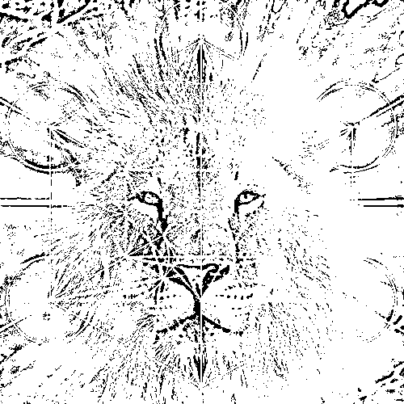

**继发性自恋的表现**继发性自恋的表现多种多样，配合星图的配置会有不同的呈现，也很难尽数，本文描述四种情况，供大家了解：

****1. 全能自恋的延续****

**表现：**唯我独尊；任何人事物都需要以自己为中心；别人的东西可以直接拿来用，甚至都不用打招呼，好像世界上的一切都是自己的附属品；不懂得什么是合作，缺乏同理心；有一点成绩就沾沾自喜；觉得无论是谁都应该拜倒在自己的领导之下；对于女孩子来讲，还有另一个称呼——“公主病”。**形成原因：****被养育者宠溺的孩子，从婴儿时期开始到成年，什么需求都被养育者满足，不管是合理的还是不合理的。任何事情造成自己的不愉快都被养育者称为是别人的错，导致原发性自恋未被打磨而直接延续，发展成继发性自恋。**他们的自恋模式就像是小孩子一样。既然自己是全能又高高在上的存在，那所有别人的给予都会成为理所当然，又有什么值得感恩的呢？反而**那些不把自己当回事儿的人，不满足自己要求的人，需要被“制裁”。****星图呈现**（以下呈现仅作为可能性的参考，具体还需结合出生星图及人格发展程度全面评估）：**·** 太阳与木星形成合相、六分相、三分相的相位关系；**·** 个人行星在狮子座，与木星形成合相、六分相、三分相的相位关系；**·** 南交点、上升星座在狮子座，与木星形成合相、六分相、三分相的相位关系；通常他们身边的人都会接纳他们全能自恋的表现。而当**行进行星与出生星图太阳-狮子座相关的能量形成困难相位**的时候，**会让他们遭受到巨大的冲击，而且每一次的冲击都比上一次来的更为猛烈。**被挑战、被质疑、被否定，慢慢让他们开始怀疑自己，在内心埋下自卑的种子。为了持续满足自己的全能自恋，他们还会**“施舍”利益，引来那些逐利的人们在自己的身边**。以确保自己并非是无用的，来缓解潜意识中的自卑。起初的行进，虽然只是轻度的冲击，依然会让他们内心感受到巨大的落差，就好像从亿万富翁到一贫如洗，好像自己就是“末代皇帝”。比起正常人面对相同程度的挫折时，一直被宠溺的人所感受到的挫败感要翻了不知道多少倍。这种挫败感是他们从来都没有习得该如何去接受的，扑面而来的压力也让他们内在形成了防御。为了不去面对这种挫败感，干脆一不做二不休，胡搅蛮缠加矢口否认，以气势压倒对方，先发制人对对方进行 PUA。

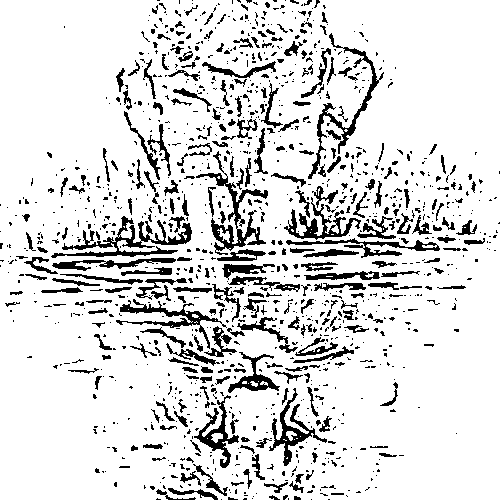

通常对方会输于气势或者以多一事不如少一事的姿态面对，这也让他们感受到了这种策略处理问题的好处，形成了强化，导致了不断以这种行为来应对类似的事情。而行进的冲击会不断带来更猛烈的提醒，令他们八面受敌，焦灼不安，似乎先发制人的策略也变得不那么好使了，整个世界像坍塌了一般，让一向高傲又秉持着无所不能的他们感受到了真正的无措。

****2. 自说自话的表演者****

**表现：**听不进别人的描述、建议，还会找到蛛丝马迹去否定他人的观点和理论；会在别人暴露自己的弱项时抬高自己压制别人；会把自己放在一个高位上，以更高的心理姿态俯视和他们沟通的人；会不停表现、表达自己，展现自己有多好。**形成原因：**受损的原发性自恋。**在婴儿时期，哭闹没有引起养育者的反应和关注；会导致孩子埋下了“我不值得获得关爱和关注”的潜意识信念。**正常情况下，在孩子开始成长，习得了一些技能的时候，会充分表达自己的原发性自恋，他们为自己骄傲和自豪，并把这份喜悦与养育者分享。在他们的年纪也确实应该为自己骄傲，因为他们每天都在进步的过程中。这个时候如果养育者自己有继发性自恋的议题，就会**担心孩子为了这么点儿成绩而傲慢；会觉得这些成绩不值得一提而直接否定孩子的成绩；甚至会因为自己没有获得过鼓励从而产生嫉妒不去鼓励孩子。**这也导致了孩子原发性自恋的需求不管是否正向都被无差别的忽视。让孩子内心觉得**自己自豪的行为是不被接纳的，是不好的，**最终发展为继发性自恋，直接影响孩子的自我满足感，同时会在潜意识内埋下**“我不够好”、“我不配自豪”**的种子。这些种子会随着一次次这样的经历慢慢长大、萌芽，透过潜意识影响着孩子成长，直至成人后的一系列的思想和行为。他们本能的、未被满足的原发性自恋会一直想要获得认可，想要被夸赞。**在成年后不断找寻别人对自己的认可，会将自身的能量全然关注在自己那个受损的部分，无法分出能量去关心别人，导致了行为上的自说自话。**而否定他人观点的行为模式，只是对自己未获得认可的内在攻击和评判的一种防御机制。

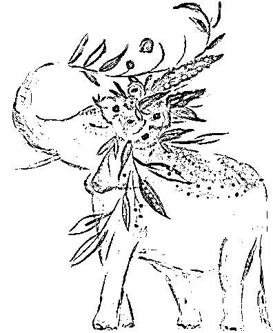

通常有这样模式的人存在着一种错误的潜意识信念：**“他获得了认可，我没有，就是我不够好。”**所以，**只有否定了他，证明他不够好，才能不去接纳潜意识内的“我不够好”的信息，才能让“我”松一口气，减缓“我不值得被称赞”的那种无力感。**这种行为模式只是原发性自恋的一种求生欲望的表现，一种对幼年时植根于潜意识内的那颗种子的抵抗，换句话来讲，这是一种顽强生命力的体现。**他只是需要被真实的看到，需要被称赞来弥补自己受创的原发性自恋。****星图呈现**（以下呈现仅作为可能性的参考，具体呈现还需要结合出生星图及人格发展程度全面评估）：**·** 太阳与其它能量形成四分相、对分相、梅花相；**·** 个人行星在狮子座，与其它能量形成四分相、对分相、梅花相；**·** 南交点、上升星座在狮子座，与其它能量形成四分相、对分相、梅花相；**这个类型的人表现上是自恋，内在隐藏着深深的自卑。**自恋与自卑在心理学中本就是一体两面，无法分割的议题。他们渴望被全然的接纳来弥补儿时留下的创伤，他们的外在表现也只是在尝试告知身边的人：**“你能认可我一下吗？让我知道，我不是真的不配！”**

****3. 苛责自己，甚至是揽责****

**表现：**哪怕是微小的责任也要揽在自己的身上；默默的付出怕被别人看见；被别人表扬和称赞时会表现得很紧张；不断的用学习和工作来证明自己；容易被内卷。**形成原因：**看似是责任心极强，对事件负责的态度。实则是**以这种方式引起他人的关注。****可能在婴儿时期，母亲因自身原因拒绝对孩子的接触或哺乳的行为，甚至表现出对这种行为的厌恶。**他们童年的经历是**被养育者批判**，相比单纯阻碍了原发性自恋的发展而言更甚，**言语中充斥着贬低**，**当有为自己自豪的正向表现时也会被碾压和羞辱**。

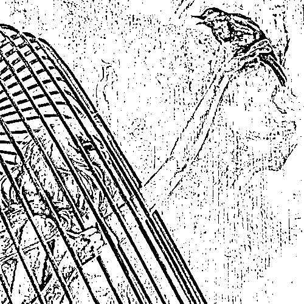

**潜意识内埋下的种子也由“我不值得被称赞”转变为更为刺激的“我不配被看见”，随之而来的还有“虽然不配但我还想要”而引发的羞耻感。**于是潜意识的冲突也由此形成，一方面默默做事情，匹配“我不配被看见”的信念，另一方面由原发性自恋生出的本能来摆脱这种“我不配被看见”又“想要被看见”的羞耻，为自己抗争，**主动承担所有可能带来的责任，变相让别人看见自己，满足自己被看见的期待和接受揽责的惩罚来缓解自身的羞耻感。**当主动揽责时，外界给予的贬低也会随之减少，贬低越少时，潜意识内那种“想要被看见”所带来的羞耻感也会随之降低。**自己的揽责相对于外界贬低带来的自身羞耻感而言，更加温和。**如果潜意识会说话，他还会告诉我们：“为了不让他人对自己苛责，为了让别人能够看见我，不如我对自己苛责，我做到极致，虽然辛苦，但就没有别人的苛责可以伤害到我了，我也可以松一口气了。”而被内卷也是内在对自己不认可的一种防御，为了证明自己不比别人差，要不断学习、进步、努力工作，不断拼搏，才能缓解潜意识之中对自己的评判，让自己有那么一点点“配得感”。**星图呈现**（以下呈现仅作为可能性的参考，具体呈现还需要结合出生星图及人格发展程度全面评估）：**·** 太阳与土星形成合相、四分相、对分相、梅花相；**·** 个人行星在狮子座与土星形成合相、四分相、对分相、梅花相；**·** 南交点、上升星座在狮子座与土星形成合相、四分相、对分相、梅花相；**·** 太阳与在摩羯座的外行星形成四分相、对分相、梅花相；**·** 个人行星在狮子座与在摩羯座的外行星形成梅花相。**他们表现得很谦卑，甚至是自卑，实际上内在有着受创的自恋模式，这种备受打击形成的继发性自恋涌动着更加卑微的表现来博取更多的关注。**他们自身有两股能量在想要又不敢要的冲突之中纠葛，想要得到认可，又充满着不配得感，甚至害怕接受认可之后可能会迎来新的棒喝。

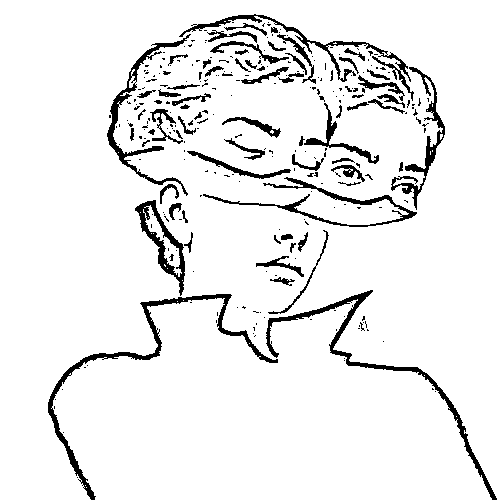

****4. 关闭心门的自我保护****

**表现：**独来独往；有朋友也是表面上的，无法深入坦诚交流；拒绝别人走入自己的内心；认为“人世太险恶，人类太愚蠢，无法与人类相处”；把自己放置在“非人类”的位置上；带着看似坚强的自己，独立生活着，拒绝别人深入自己的生活；言语表达自己不需要伴侣/朋友。**形成原因：**通常，**他们经历过难以言说的扎心感受，在发展原发自恋时甚至被抚养者侮辱和鞭打得遍体鳞伤，让他们经历了如同死亡一般的炼狱生活。** 或者，**在成长期间，让他们发展自恋的镜子人物——他们理想化的对象突发身亡，让他们面临了巨大的恐惧。**于是，他们将自己隔离起来度日，把自己的原发性自恋也一起隔离，严重的甚至是阉割掉。生活中不去真心关注除自己以外的任何人，有时甚至连自己都不是那么的关心。闺蜜、好友、亲密关系一概不要，只为了好好保护残存的自己。**情况严重的甚至会导致社交障碍。**这类情况看似与自恋无关，表象上与享受独立生活类似。却在伤痛的背后隐藏着继发性自恋的议题，同样在幼年时期没有得到自恋水平的正向发展。若有机会，真的有人走入他的内心，继发性自恋的议题也会显露出来，会表现为**面对伴侣时慌张及不知所措，也会出现恐慌无法面对伴侣的可能性。****星图呈现**（以下呈现仅作为可能性的参考，具体呈现还需要结合出生星图及人格发展程度全面评估）：**·** 太阳与冥王星形成合相、四分相、对分相、梅花相；**·** 个人行星在狮子座与冥王星形成四分相、对分相、梅花相；**·** 南交点、上升星座在狮子座与冥王星形成四分相、对分相、梅花相；**·** 太阳落入八宫；**·** 在狮子座的个人行星落入八宫；**·** 太阳与在天蝎座的外行星形成四分相、对分相、梅花相；**·** 个人行星在狮子座与在天蝎座的外行星形成四分相。表面看不出有自恋的议题，他们会以一种隔离的方式来进行自我保护，与天王星-水瓶座的疏离看似有点相似，不同的是，**他们并不真的享受远离亲密的行为**。这种隔离还会导致意识难以觉察，以至于言语上以自己享受独处来作为自我安慰和不让询问者靠近的防御，尤其在星图中还有天王星-水瓶座能量的加持时，更加有些混乱不清。而无论主动还是被动进入一段亲密关系后，**潜意识会因为太过害怕像曾经的模式一样被对待，导致把精力都专注在自己身上而卡住，不知道要以什么样的行为行事，致使手足无措和引来恐慌。**我们描述了四种模式，每一种都带着更深一层的伤痛，即便是同一种模式，由于不同的星图呈现也会有程度上的差别。这四种模式也并非各自独立，它们完全有可能叠加组合。自恋的表现远远不止这四种，也很难尽数清楚，比如**狮子座-水瓶座轴线引起的“我只爱我自己，无法与他人相处”的疏离模式**、太阳-狮子座、冥王星-天蝎座-八宫、天秤座、海王星-双鱼座的混合很可能会导致本人在阉割掉自己的原发性自恋的同时，无法拒绝他人“无礼”的要求等等。

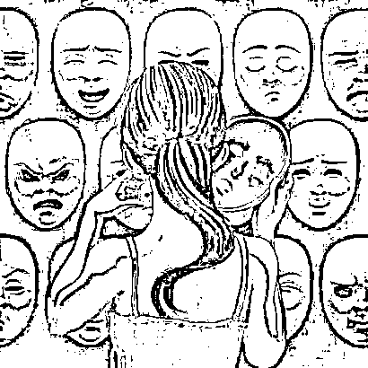

**继发性自恋的转化**

****真正被看见、被理解****

无论哪一种继发性自恋的人，他们最需要的都是**真正被看见和理解，被鼓励和夸赞**。可以透过他们的表现看到内在核心那个受伤的部分。他们需要被理解这一路的心酸；需要被理解来清理曾经遭受不公时积压的情绪；需要通过被理解得知，即便他们是个凡人也会被爱着；需要通过被理解让他们知道，他们即便变得柔软也是被接纳的；需要通过被理解让他们知道，无需架起自己来防御批判。他们需要被夸赞，让他们知道自己足够好，才可以把自己的力量从过去拿回来投注到现在，往今后更好的方向努力；需要被夸赞让他们更加认可自己，好能够从自卑的情绪中跳脱出来；需要通过被夸赞让他们认识到自己是值得被爱的。如果可以有外部人员可以这样对待自己自然是更好的，然而那个最主要的人，还是自己。**自己是否真正“看见”和理解了自己；是否觉得自己值得所有的赞誉；以上所说的这些需要，是否自己先满足了自己。****主要方法：****练习觉察力，发展自由意志，让我们在反应与回应之间有能力选择后者。**首先，练习自己的觉察能力，每当引发情绪后，待平静下来多问自己几个问题，我刚刚怎么了，有了什么样的情绪？是愤怒、是悲伤、是否认的防御机制、还是隔离？又是什么引发了我的情绪？通常有自恋议题的人会有**羞耻感、自卑感、被忽视感、不被尊重感**……并因此引发情绪，带来行为中的防御。找到自己更容易被哪一种感觉触发情绪。再随着每一次情绪后的觉察，会逐渐转变为**在情绪爆发前就可以觉察到自己的异样，从而利用自由意志转变行为模式。****其次，把投注的能量放在自己身上。**继发性自恋的议题通常是无法自己完成真正的自恋过程，他们总要透过别人来完成自己的自恋，不断在人群之中找到那个可以帮助他们完成达到成熟自恋模式过程的父母，但通常事与愿违。他们总是会思考：“他们怎么看我？”“我不能让他们说我的不是。”这个时候，更加无法把能量专注在自己的身上。以问自己问题的方式来把能量转向流回到自己身上来做觉察是个不错的方式，比如：“他们如果说我的不是，我怎么了？”让所有的问题都回到“我”身上。

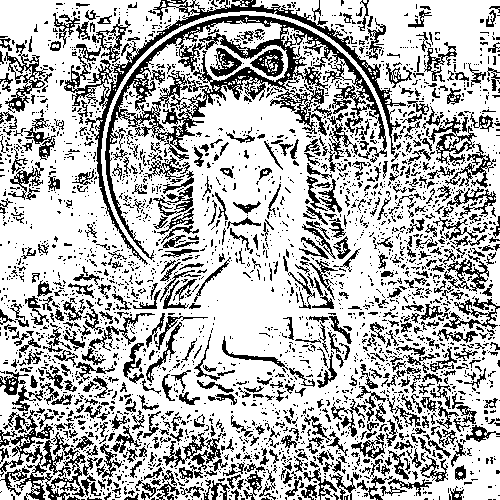

**最后，不要否定自己，**当觉察到升起有否定自己的念头时，告诉自己，“以目前的我来说，已经做得很好了，还有时间，我会慢慢提升做到更好！”这是不断理解和称赞自己的方法，也可以在每天早晚洗漱时对着镜子里的自己说句“早安，我爱你”“辛苦啦，今天你很棒！”这未必是短期可以完成的，需要有意识的长期训练。

**星图的转化建议**

**无外行星参与时：**需要通过**认可自己、接纳自己的弱小、承认我们理所应当做不了很多事情，**来转化太阳-狮子座的自恋模式。以**为自己骄傲、尊重自己和他人**的模式，来放下太阳-狮子座的面子和架子。**有土星的加入时：**更多的要**把土星从外部的打压模式、害怕外部打压而强迫的模式，内化为自己的力量，由自身的努力奋斗，沉淀、磨炼来替代。**比如星图中的土星在生活中以爸爸的身份显化，他不断要求孩子要突破，对当下的进步视而不见，甚至是打压现在没有让他觉得完美的孩子。这个时候的孩子通常没有把土星真正的内化，而是投射到了爸爸的身上，孩子并不想那么辛苦的磨炼自己。但当孩子意识到，**需要为自己的人生负责，需要自己精进，主动去承担和成长**的时候，土星就成为了内化的力量，在身边显化土星的爸爸也将有所转变。**这时的土星和爸爸更多的将作为基石，让成长之路越走越稳。****有冥王星参与时：**他们可能**受到过非人的待遇，他们可能经历过生命中重要人物的突然离世，他们会因着对死亡的恐惧而将自己隔离在人群之外**。对他们来说，最重要的是**允许有个让他们感受到安全的人走入他们的内心，通过不断的倾诉、觉察等方式清理掉内在的伤痛。**这种清理本就是冥王星的另一种模式，通过这种模式也会带来冥王星的转化，达到重生。转变成一个可以真实展现自己，拥有清明、透彻的自我力量的人。当然，在转化的期间，也需要不断的带着“恐惧”前行。

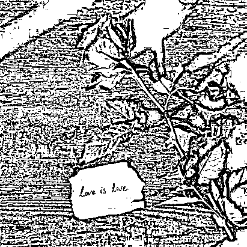

**生出力量带来突破**

对于缺乏力量的继发性自恋者，以上建议只不过是隔靴搔痒，看着都对，能力无法达到，完全起不到真正的作用，就好像失去双腿的残疾人，你告诉他要如何才可以用双腿直立行走一样无力。这种未被看见自己双腿缺失的自说自话，会更让他们感受到失落。**无法按照这些建议去做的主要原因是他们没有力量感。**对他们而言，**人格破损的最重要部分不在自我（太阳），而是本我（上升点）。**儿时的原发性自恋模式恰恰匹配了一宫的全能感，发展受挫也使本我受损，导致**不知道什么是对的，什么是错的，到底自己要怎样行事，无法坚持自己观点的无力感，也无法活出真实的自己，甚至不知道自己想要的是什么。****本我受损的星图配置：****任何与上升点或命主星形成合相、四分相、对分相、梅花相的配置都可能造成本我的挫伤。**本我的力量感缺失，自我发展就没有根基，如同摇摇欲坠的大楼。他无法再加盖任何一层，因为任何一个细微的操作都有可能让大楼倒塌。本我对应马斯洛需要层次理论的下两层，**生理需求和安全需求**。下层需求没有满足是无法稳固支撑达成上层需求的。**生理需求未满足会引来匮乏感，安全需求未满足会带来恐惧感和焦虑，**本我的议题没有解决，就会带着匮乏、焦虑甚至恐惧的内耗在人间疾驰，去发展自我，然而自我的发展也无法真正解决本我的缺失。

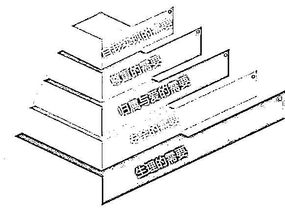

| 马斯洛需要层次理论他们需要更多的力量感来让自己有勇气突破固有的模式。而这力量感的来源就是本我，当把本我的力量找回来，同属太阳议题的自我及自恋模式的发展也将是更自然而然的事情。**案例说明**案主太阳与土星的合相，以及这个合相与火星狮子座的梅花相、与木星的四分相，也带来了我们前文所述的自恋议题，不断向内的自我攻击，对自恋模式的无差别否定。
火星狮子座十二宫，想要露出水面，需要土星的托举和木星所给与的信心；太阳要摆脱土星的压迫、木星的过度承担，也需要自我的转化。

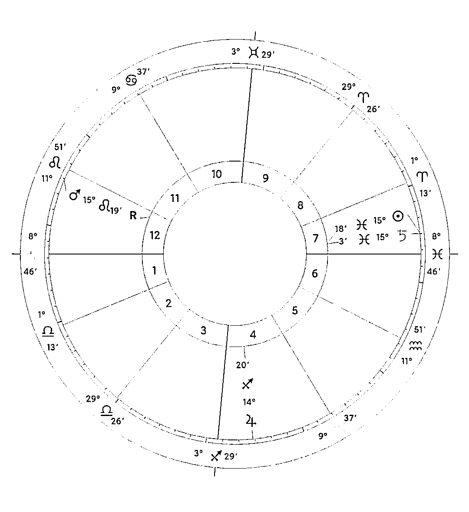

| 案主星图中的部分行星
核心都是要她承担起自己的责任，为自己的选择负责，为自己站出来发声。然而，即便案主知道要如何行事，也无法做到。提示与案主同样做不到转化的伙伴，多问为什么，往往可以看到更为核心的问题，找到更深一层的真相。**为什么无法做到承担起自己的责任？为何无法站出来为自己发声？**通过这些问题带来觉察，找到更核心的议题，促进转变的形成，而不要因做不到去向内攻击，进一步否定自己。

要相信每一个灵魂，他们能做到的一定是目前状态之下能做到的最好！做不到的背后，通常隐藏着更深入的议题。

案主的上升点与四宫木星射手座呈四分相，从小在她心里，家里人就是权威，这些权威人士们会对她进行说教，甚至按照自己的想法去控制和左右她的人生。这让案主的本我从小受到压制，无法遵照自己的本心成长，无法真实的展现自己，也无法获得自己应有的力量。   **她会遇到即使身陷困境之中也无法从中跳脱的事情；会明知被欺骗还替别人美化；会对自己的正常自恋表现进行攻击和批判；会在别人替自己做选择的时候默默生气，无法正向回应。****针对案主的调节方法：****· 做家务：**有空余时间的时候，和妈妈沟通，告知现在自己有时间可以帮妈妈做些家务，并认真完成。告知妈妈现在自己有时间，一定程度上避免妈妈对自己随叫随到的期待，以及期待落空后的情绪；又在设立自己边界的前提下，用做家务的事情来生出自己的处女座能量。

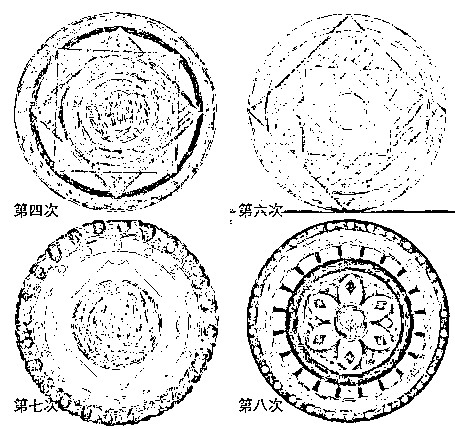

| 曼陀罗**· 画曼陀罗：**为了更好地调节处女座与双鱼座的能量，案主每周都会画曼陀罗。在细致描绘色彩的处女座能量下，带出双鱼座的感受，让本混乱在一起的两股能量可以各行其是，各自归位。从第七周开始，同样的画笔，同样的纸张，已经可以看出更为清晰、更有力量感的笔触。也正是从这个时候开始，现实生活中案主的力量感、边界感也在逐渐的攀升。现在的案主已经有力量为自己的人生做决定；可以在其他人对自己人生选择有着不同声音的情况下，坚持自己的决定；也逐步掌控自己的人生，为自己负责；更有力量可以捍卫自己，不让别人跨越边界。境遇没有变，只是因着案主逐渐找回本我（上升点）的能量，使力量升起带来更多的觉知和转变，让自己通过更为成熟的自恋模式生出更多的自信，也让生活变得轻松起来。注：以上案例经案主同意发布最后，想要告诉大家，没有不自恋的人，也无需对自恋心生愧疚，发展出太阳-狮子座成熟的自恋模式就是在良好的运作我们的自我，每个人都值得为自己骄傲和自豪，每个人也都无需被他人践踏才可以成长，每个人也都可以健全自己的人格拥有捍卫自己的力量！

**版权声明：**原创文章由作者授权首发于若道平台，欢迎转发，反对抄袭。友号转载请申请白名单。

**雪冥 **ISAR 认证占星师（2019 年获得），全职心理占星师 美国心理占星学院认证心理占星师 北师大心理学学士，11 年心理咨询经验 **个人公众号：**POWER 心理**咨询微信**：psychology-xm

长按打赏

**20 位来自世界各地的占星师****带来 20 场沙龙——新世界的觉醒****详情可点击下图**

**学习占星学****点击下图了解课程详情**

**

**微信又双叒叕改版啦，不想错过若道君的推送？**

**就把若道设为星标吧！**

**▼**

**喜欢记得点一下在看哦☟**

**报名直达入口**

# 4 月 27 日开课| 心理占星学第一学年，从麻瓜进化成占星师的自我觉察工具

> 原文：[`mp.weixin.qq.com/s?__biz=MzA5NjA0NTAxNg==&mid=2651471721&idx=2&sn=b8c5e4b7dd95c33bb635cf869f0a96c5&chksm=8b488ddebc3f04c814ad7a58bbace5b6292cc65a99111c8969d343778b8be0ee5cda9e5d6dbf&scene=126&sessionid=1692737832#rd`](http://mp.weixin.qq.com/s?__biz=MzA5NjA0NTAxNg==&mid=2651471721&idx=2&sn=b8c5e4b7dd95c33bb635cf869f0a96c5&chksm=8b488ddebc3f04c814ad7a58bbace5b6292cc65a99111c8969d343778b8be0ee5cda9e5d6dbf&scene=126&sessionid=1692737832#rd)

**自我觉察，是智慧的基础**

我们每个人都有自己的内在冰山，自我觉察能够帮助我们觉察自己的行为、情绪等，然后向内深层探索，探索自己的行为、情绪背后的深层渴望、期待。 **学习和应用占星学的过程，就是慢慢掌握自我觉察工具的过程，**当你熟练掌握了占星学也就具备了帮助引导他人觉察到自身生命议题的能力。 往外张望的人在做梦，向内审视的人才是清醒的。**只有我们真正向内看，只有当觉察开始由外向内时，改变才会发生，才能够知行合一。**

# 插画师：古戈力

以情绪来举例说明，每个人的情况不同，觉察的程度也不同，觉察有四个层次：

**1.不知不觉：**没有觉察情况，当情绪来了，会被情绪控制，做出很多不计后果的事情。而且每次都是同样的状况，反反复复。

**2.后知后觉：**情绪过后，自己能够反应过来，自己做的对与错，但是很难避免同样的情况再次发生。

**3.当知当觉：**就是当情绪来的时候，你已经知道在这个当下，正在发生什么。当达到这个层次，你就可以自己控制情绪，从而影响后事的发展。

**4.先知先觉：**就是当事情还没发生，就可以预知它要发生了。因为你对情绪的觉察已经越来越熟练，所以情绪还没来，你就知道它要来了。所以，你也就有了更好的选择和处理方法。

所以，我们要自我觉察，向内探索，觉察是为了接纳，然后做出改变，成长，迭代，升级。**那么要如何练习自我觉察，掌握先知先觉的能力呢？**

**每日觉察的工具推荐**

**今日天象&近期行进**

若道 APP 中的今日天象功能，罗列展示每一天的具体天象，和你当天的行进和行进周期：

**作为一位占星师，可以这样使用这个自我觉知工具：**

★ **记录梦境**

如果你有醒来记录梦境的习惯，每天早上看一下睡梦中的天象和行进，对应联想，你会惊喜的发现一些神奇的对应，能够更敏锐的捕捉到日常被压抑的情绪和需求。能够帮助你在白天的工作生活中先知先觉的关注身心状态。

★**规划生活**

每月月初，周初都可以参考天象和行进进行日程规划，预估可能的助力和阻力，在对的时间做对的事，会发现平平无奇的日常也可以有不一样的色彩。根据月相的变化感知情绪的起伏，更好的自我关爱。

★**感知环境**

当身边发生了引起你注意和好奇的事情，或者网络上层出不穷的新闻热点，都可以在天象中寻找对应的能量。从更大的格局视角去思考你的个人观点。通过环境的共振，更深入的理解自己的本命星图。

**以上都是很好的学习深化占星知识的方法，你只需要系统掌握以下知识，你就可以开始使用以上方法去提升自我觉知。**

**美国占星心理学学院创办人**

**格伦·佩里**授课

**40 余年**职业占星师生涯所学精华**倾囊相授**

修完 101-205 全部课程，并通过考核的毕业生将获得

**美国占星心理学学院证书**( Academy of Astropsychology )

和**若道毕业证书**

**高含金量双证书**

跟随主讲老师学习融合**心理学体系**的**占星知识**

为星图咨询解读打下坚实的基础

**大量**的课程资料，光是课后阅读资料就**超过 60 万字**

合理的课程设计，贴心的助教服务，及时的课后测验

1

**这门课程最大的看点是什么？**

1. **两位国际占星学大师**共同授课，将合计**90 年职业占星师生涯所学精华**倾囊相授；2. 修完**2 年课程**，考试通过的毕业生将获得**美国占星心理学学院证书**（Academy of Astropsychology）和**若道毕业证书**，**高含金量双证书**；3. **第一学年 64 次课程**的充分授课时间（录播课程 43 次课；直播课程 21 次课），全面而详细地讲解占星学历史、知识、技能、案例、咨询和运用；4. 跟随主讲老师学习**自成体系、逻辑严密、实用性强的占星语法、星图解读方法**；5. 学习独特的**发展年龄预测法**，从星图看对关键年龄阶段的发展及议题；6.** 大量的课程资料，光是课后阅读资料就超过 60 万字**；7. 合理的课程设计，初中阶课程，每一节都有课后测验；8. 本课程可以作为**ISAR 选修课**中的一门，再修两门就满足 ISAR 认证选修课要求；9. 教授重要的**心理学概念**，比如与客体关系、心理动力理论、个人神话和叙事疗法相关的一些概念，学习如何将它们整合到星图解读中；10. 在 105 阶段了解**《精神疾病诊断与统计手册》**诊断标准，探索星图中的心理疗愈；

**格伦老师致学员的信**

（向上滑动查看内容）

**亲爱的学员：**

作为占星心理学学院的校长，我的目标是帮助你顺利完成学业。

占星心理学学院的课程让你能够在经济承受范围内，灵活地学习占星学。我们的课程让你可以舒适、便捷地在家学习，不用打乱你本就繁忙的日程。我们有完善的在线学习系统，让你能在线上课、下载学习资料、进行测试并自动获得即时反馈，还可以在虚拟课堂上同你的教员和同学互动。

作为私人开业的**职业占星师**和**执业心理治疗师**，我已经**工作超过 30 年。**我还花了近 10 年的时间，在研究院里学习并获得**心理学的硕士和博士学位**。这段训练和经历是无价的，帮助我将占星学发展成为连贯的 21 世纪模式。

我们的占星学培训项目是**系统化的、清晰的、组织有序的、易学的、前沿的。**尽管有许多类似的学校可供你选择，但你不会在这些学校中看到像占星心理学学院所提供的那样有深度的或尖端的课程。

**我非常期待 2022 年再次在若道教授心理占星学核心课程。**我们重新规划和升级了本次课程体系。**新的课程包含之前完整课程的 72 个录播视频，每个视频长 2 小时；以及由我教授的 37 次直播课程，和大卫老师教授的 10 次直播课程，每次课程 2 小时。**在实时课程中，除了我提供的案例，我还会用学员的星图进行案例演示，与学员互动，阐明视频中教授的原则和方法。

**2 小时直播课程安排：**

**第一阶段 提问和讨论：**

这将在每节课开始时进行。邀请学员提出与课前提供的资料相关的具体问题。这一阶段将持续 15-30 分钟。

**第二阶段 示例：**

这一阶段会讲解与每周任务相关的具体概念，例如行星的星座位置、宫位位置以及相位的意涵。星图示例来自我认识的人，如公众人物、朋友、家人、同事或以前的客户（不显示出生信息）。同样，这一阶段也开放课堂讨论，学员可以提出自己的问题和见解。

**第三阶段 学员案例演示：**

这个阶段会从学员的具体星图来阐明概念，例如火元素行星占优势。学员案例演示不会涉及任何类型的咨询或“解读”。它们将只是简单地包含一段对话，我会在对话中分享自己对某个配置的思考，然后问这个学员可能会如何主观地（影响、信念、行为）和客观地（事件/关系）体验这个配置。其他参课学员可能也会对讨论的主题有自己的见解或问题，他们也可以参与讨论。

我对这一新的在线课程形式感到兴奋，**并期待着从 2022 年 4 月 27 日开始认识我的新学员们。**获得本学院的文凭会是你做过的最明智的投资。你不仅将占星学掌握到前所未有的深度，还将学到如何为客户提供咨询服务并建立职业占星师的职业生涯。

真诚地

**格伦·佩里 占星心理学学院校长**

**为什么要学习心理占星学？**占星心理学是一个复杂的体系，让实践者能够向客户提供真正治疗性的益处。这从根本上说来是我们学院有别于其他学校之处：**我们教授占星学，也教授心理学概念。****我们明确讨论各种心理学概念，并将其与占星学无缝衔接。结果就是更深入的、更丰富的，最终更加强大的模式。****该项目专为初学者和渴望深造的有经验的占星师而设。**我们会从跨学科的角度探讨星图解读。**通过融合荣格心理学和各种其他模型的元素，学员将熟悉作为人格理论、发展模型、原型语言和诊断工具的占星学。**

2

**课程是怎么安排的？**

**第一学年**

**共****64****次课 **43****次录播课 **21 次直播课******

**101 占星学基础 **

****共****12****次课程：******8 次 2017 年录课+4 次直播课**

**占星学**关注成长，聚焦心理。外部事件意义重大，但我们可以把它们看作是对于发展中的心理结构的共时性反映，以及未来发展的媒介和催化剂。在这个阶段的课程中，会以四种形态的几何形式介绍**占星原型：星座、行星、宫位和相位**。黄道带是人类心灵的象征性地图，其中的每个**星座**都代表一种基本的人类需求、原型人物、发展阶段和行为风格。**行星**代表心理功能，以满足其关联星座的基本需求。**宫位**提供了环境舞台，行星在其中扮演它们的角色，而**相位**是行星之间的角度关系，在主观上体验为内在对话。

**课程安排**：

**录播课****、****直播课（周三）**时长都是 2 小时

第一节**录播课**：核心概念介绍

第二节**录播课**：黄道带的结构

2022 年 4 月 27 日**直播课**：核心概念、黄道带的结构提问和讨论、知识点示例

第三节**录播课**：图例、单态星体和其他奇妙的元素

2022 年 5 月 11 日**直播课**：图例、单态星体提问和讨论、知识点示例

第四节**录播课**：星座介绍（从白羊座到处女座）

第五节**录播课**：星座介绍（从天秤座到双鱼座）

2022 年 5 月 25 日**直播课**：12 星座案例演示

第六节**录播课**：行星作为过程

第七节**录播课**：行星作为内容

第八节**录播课**：将碎片整合起来

2022 年 6 月 8 日**直播课**：整合星图时，将行星作为过程和内容案例演示

**102 行星落星座、宫位** 

****共****12****次课程：**8 次 2019 年录课+4 次直播课**

这个阶段的课程**聚焦于初步的星图整合。**

学员将学习**占星语法**，以及如何运用它们来阐释**行星的星座落点**。学员不需要强记书中的星图解读，而是学习分析基础的占星句法结构，应用这些语法规则来思考和讲述这门语言。学员们将学习如何构建精妙的句子，将动机、功能、特质、状态和事件组合起来。

此外，还将学习解读**行星宫位落点**的规则。宫位被定义为心理环境，为特定类型成长和发展提供背景。行星落在宫位中，象征着情境中的特殊状态，应对环境挑战的方式，以及通过共时性人物和事件而外化的自我部分。

学员们将探索如何将星座和宫位落点融合在一个单一、整合的陈述中，做出灵活、层次分明的解读。

**课程安排**：

第一节**录播课**：占星语法介绍

第二节**录播课**：行星星座作为行为风格

2022 年 6 月 22 日**直播课**：占星语法、行星星座作为行为风格提问和讨论、知识点示例

第三节**录播课**：思维状态和行为结果

第四节**录播课**：学习行星的星座落点

2022 年 7 月 6 日**直播课**：思维状态和行为结果、行星的星座落点提问和讨论、知识点示例

第五节**录播课**：回顾宫位的含义

第六节**录播课**：宫位中的行星过程

2022 年 7 月 20 日**直播课**：宫位的含义、宫位中的行星过程提问和讨论、知识点示例

第七节**录播课**：行星在宫位中的状态

第八节**录播课**：行星作为宫位的内容

2022 年 8 月 3 日**直播课**：行星在宫位中的状态、内容的提问和讨论、知识点示例

**103 行星相位与个人神话** 

****共****13****次课程：**9 次 2019 年录课+4 次直播课**

在这个阶段的课程中，**相位**被解释为由更大的故事结构的潜在动力构成的个人神话。

学员将学习相位是如何象征内在心理的冲突、重要的童年情感体验、主要的人生挑战和内在对话的。需要着重强调的是，相位的意涵会随着心理成熟的程度而改变。人会成长、进化，会解决内在冲突，这些不仅反映在态度和行为的改变上，而且也会表现在某人吸引的事件及其与他人的关系品质上。

学员们还将学习一些**心理学概念**，比如与客体关系、心理动力理论、个人神话和叙事疗法相关的一些概念，它们将整合到相位解读中。

**课程安排**：

第一节**录播课**：重要主题与核心冲突

第二节**录播课**：渐盈相位与渐亏相位

2022 年 8 月 17 日**直播课**：重要主题与核心冲突、渐盈相位与渐亏相位的提问和讨论、知识点示例

第三节**录播课**：主要相位的核心意义

第四节**录播课**：罗生门原则

2022 年 8 月 31 日**直播课**：主要相位的核心意义、罗生门原则的提问和讨论、知识点示例

第五节**录播课**：占星学中的认知

第六节**录播课**：心灵的控制结构

2022 年 9 月 14 日**直播课**：占星学中的认知、心灵的控制结构的提问和讨论、知识点示例

第七节**录播课**：作为认知结构的相位

第八节**录播课**：强迫性重复

第九节**录播课**：听大卫·瑞雷讲月亮交点

2022 年 10 月 12 日**直播课**：月亮交点（由大卫·瑞雷老师教授）

**104 征象星与定位星：作为进化故事的星图 **

****共****12****次课程：******8 次 2019 年录课+4 次直播课**

这个阶段的课程聚焦于**从叙事角度整合星图。**

学员们将探索**宫位征象星**和**行星定位星**如何讲述一个故事，反映一个人进化发展之旅。行星定位关系揭示了个人神话的主体构架。而这个故事的主题常常处于意识觉知和控制之外，占星学提供了一种方式，揭示、解读、改编这个神话。

我们推荐的星图整合方式是将相位和定位星关系融合成一个单一、连贯的叙事。要特别强调的是，如何活出整合程度更高的生命故事。

学员们还将了解**叙事疗法**和**自传写作**，把它们当作促进整张星图整合的一种方式。

**课程安排**：

第一节**录播课**：每张星图都讲述了一个故事

第二节**录播课**：互容与最终定位星

2022 年 10 月 26 日**直播课**：每张星图都讲述了一个故事、互容与最终定位星的提问和讨论、知识点示例

第三节**录播课**：将相位整合进流程图

第四节**录播课**：完整的故事

2022 年 11 月 9 日**直播课**：将相位整合进流程图、完整的故事的提问和讨论、知识点示例

第五节**录播课**：过渡短语

第六节**录播课**：良好定位或不良定位

2022 年 11 月 23 日**直播课**：过渡短语、良好定位或不良定位的提问和讨论、知识点示例

第七节**录播课**：发展年龄方法

第八节**录播课**：进行全面整合

2022 年 12 月 7 日**直播课**：发展年龄方法、进行全面整合的提问和讨论、知识点示例、案例演示

**105 星图中的精神病理学与疗愈 **

****共****15****次课程：******10 次 2019 年录课+5 次直播课**

在这个阶段的课程中,我们将**聚焦于十二星座(从白羊座到双鱼座）及其对应的守护星的潜在功能障碍**。

我们将学习如何识别、理解和应对每个星座的潜在挑战。我们将在各种相应的心理障碍背景下来考察占星原型，这些心理障碍表现为功能障碍、失衡的极端状态。

学员们将了解**《精神疾病诊断与统计手册》诊断标准**。我们会探讨治疗的概念，尤其是那些与整合和个性化相关的概念。我们将特别关注外行星的困难相位，以及它们与内在心理冲突、防御和症状形成的关系。

学员们将探索人的痛苦如何成为发展和实现天赋才能的催化剂。

**课程安排**：

第一节**录播课**：白羊座-火星的病理学

第二节**录播课**：金牛座/天秤座-金星的病理学

2022 年 12 月 21 日**直播课**：白羊座-火星、金牛座/天秤座-金星的病理学提问和讨论、知识点示例、案例演示

第三节**录播课**：双子座/处女座-水星的病理学

第四节**录播课**：巨蟹座-月亮的病理学

2023 年 1 月 4 日**直播课**：双子座/处女座-水星、巨蟹座-月亮的病理学提问和讨论、知识点示例、案例演示

第五节**录播课**：狮子座-太阳的病理学

第六节**录播课**：天蝎座-冥王星的病理学

2023 年 2 月 1 日**直播课**：狮子座-太阳、天蝎座-冥王星的病理学提问和讨论、知识点示例、案例演示

第七节**录播课**：射手座-木星的病理学

第八节**录播课**：摩羯座-土星的病理学

2023 年 2 月 15 日**直播课**：射手座-木星、摩羯座-土星的病理学提问和讨论、知识点示例、案例演示

第九节**录播课**：水瓶座-天王星的病理学

第十节**录播课**：双鱼座-海王星的病理学

2023 年 3 月 1 日**直播课**：水瓶座-天王星、双鱼座-海王星的病理学提问和讨论、知识点示例、案例演示

3

**导师简介**

**格伦·佩里（Glenn Perry）**

*   这位传奇的占星师，也是一名拳击和摩托车爱好者

*   他毕业于赛布鲁克学院(Saybrook Institute)，是心理/意识研究专业博士

*   也是拥有 30 余年经验的加州注册婚姻和家庭治疗师 （CAMFT）

*   美国占星心理学学院（Academy of AstroPsychology）的创办人

*   他曾任国际占星研究协会 （ISAR）以及联合占星大会董事会（UAC）副主席

*   也是 ISAR 突破性道德标准的设定者

*   康涅狄格州研究生院（the Graduate Institute of Connecticut）原型宇宙学与意识进化项目的负责人

*   共出版八本占星学著作：《心理占星学入门》《心理占星论文集》《盗取天火》《从忠诚到革命》《星图中的阴影》《占星职业议题与伦理》《出生星图深度分析》《从古代到后现代占星学》

**大卫·瑞雷（David Railey）**

*   若道联合创始人，致力于在中国教授和推广西方占星学；

*   曾任 ISAR 全球副主席，CAPISAR（ISAR 职业占星师资质认证机构）主席；

*   1976 年，通过亚特兰大职业占星师考试，成为全职占星师，随后通过 AFAN 和 ISAR 职业测试；

*   1980 年，与杰夫·焦耳一起在亚特兰大创建“每日行星”占星学中心。此后在亚特兰大占星协会担任 4 年考官，并且两次担任亚特兰大地区占星协会主席。1979-1992 年，作为占星师活跃于美国社会媒体，向不了解现代占星学变化的大众宣传专业占星学知识。在 1989-1992 年期间，他在 WRGG 电台 12 频道每周主持个人电视秀“今日占星学”，早先他还在 WRFG 的广播节目中播讲宇宙天气节目；

*   2010-2014 年，任全美占星师联盟监督委员会委员；

*   2010 年，其著作《灵魂的目标》中国版出版，和蒋颖一起创办若道占星学校和其官网 www.nodoor.com；

*   2017 年，被选为 ISAR 委员会成员。ISAR 是世界最大的国际占星机构，会员遍布 45 个国家，2017-2020 年曾任 ISAR 全球副主席、CAPISAR（ISAR 职业占星师资质认证机构）主席。

**助教简介**

**薇安**

*   全职心理占星师、ISAR 认证占星师（2016 年获得）；

*   北大心理学硕士、MBTI 国际认证施测师；

*   若道认证生时校正资质及 COAC 高阶资质毕业生；

*   连续两届担任格伦·佩里老师亲授的“美国占星心理学院&若道占星双认证核心课程”主助教；

*   2012 年至今，持续追随多位国际占星大师进行占星学的深入学习；

*   2007 年至今，持续进行精神分析及心理动力取向的理论及技巧研习；

*   致力研究心理学与占星学的整合运用。

4

**此次课程适合哪些人？**

*   对占星学感兴趣，想要入门的零基础者

*   占星学小白，但有志成为职业占星师的人

*   有一定占星学基础，但不知道该如何整合星图复杂碎片的人

*   想要师从更多殿堂级占星导师学习占星心法的人

*   走在自我探索和个人成长道路上的人

5

**选择若道学习占星学的优势**

**运用自由意志，扭转破坏性模式，绽放天赋潜能**

若道是人本主义占星学的旗手。因为我们相信，**人通过了解模式、觉察习性、积极疗愈、终将释放其潜能，与命运共舞**。

**进入国际权威职业占星师认证的快车道**

占星界的“联合国”ISAR（国际占星研究协会），是具有全世界影响力的占星教学和研究组织和职业占星师全球认证机构，认证占星师遍布 47 个国家。**在 ISAR 的 22 所附属学校中，大中华地区的附属学校只有若道一家**。在国际化的教学理念大纲标准下，**若道毕业生在 ISAR 国际认证占星师的考试通过率多次全球第一**。

**十年占星学教育中国本土化教学经验**

**根据中国学生的学习习惯不断优化占星教学体系，让学员学成后更自如地应对本土咨询市场的需求。**

学好占星学不仅仅需要邀请一两位老师教学，更需要对教学难点有充分了解，且有持续的教学跟进服务。**10 年来多次核心课程和各种专题课程的教学，让若道非常了解中国学生学习占星学的难点和卡点，合理有效地拆分、提炼课程知识点，同时也积累了丰富的国外老师和中国老师、助教紧密配合以及课程顾问密切配合教学的经验**。

若道还专门开发了有助于占星学习的“**若道**”APP，每门课程都设有答疑板块，学员能够方便快捷地提交问题，助教及时答疑解惑和批改作业。

**融入中国顶尖的职业占星师群体**

若道是中国职业占星师的“黄埔军校”。职业占星师的培养从若道开始，**进入若道，你就走进了中国顶尖的职业占星师群体，和一群志同道合的师兄师姐联谊，获得经验，共同成长**。 

**多种奖学金支持**

为了鼓励学员不因为暂时的经济困难而放弃学习，我们特意设置了各种**技能交换和奖学金**。

对于有一技之长的学员，我们推出的技能交换的项目包括**“笔译”、“笔记整理”、“平面设计”、“课本朗读”、“班级服务”**等技能交换项目；

而对于努力学习、出勤率高、完成作业率高的学员，我们设置的**土星奖、木星奖**等各种奖学金在等着你。

为了感谢帮助我们推荐学员的老学员们，我们设置了“**老学员推荐奖**”；

对于通过问卷提建议，帮助我们提高服务的学员，我们也设置了相应的奖学金。

**开启占星咨询的职业规划和支持**

若道为占星学员搭建了占星问答平台和占星咨询平台，并提供严肃占星学影响力最大的媒体平台，全力为毕业生提供宣传渠道，帮助你吸引和积累咨询生涯初期的种子客户。若道为学员开发了适用于占星学习的“若道”APP，并不断更新完善。

**①  微信平台**若道微信平台作为业内颇具影响力专业平台，为文笔好的若道毕业生提供传播占星学并免费宣传自己的机会。有的学员因为文笔获得众多粉丝喜爱，在 3 年多时间积累起 2000 多人的潜在客户。

****②  **咨询平台**若道咨询平台是我们为优秀毕业生所搭建的平台，帮助毕业生在自己的咨询拓展之外，用若道提供的平台扩展咨询客户群。自咨询平台 2017 年 8 月上线运营以来，咨询平台共入驻 100 人，收入最高者达 32 万元。

此处所列学员收入仅供参考，收入高的学员和其专业水准、努力程度密切相关。若道平台尽其所能将自己定位为辅助学员开展职业生涯的桥梁。

6

**课程价格**

**101-105 第一学年**

**正价：**18800 元

**学习充值卡优惠价：17000 元**

**101-205 全阶联报**

**正价：**50000 元

**转发优惠价：38000 元**

**学习充值卡优惠价：35000 元**

**其它各阶段课程单报价格，请咨询课程顾问**：**王老师（微信/手机：18510107057，请备注“格伦核心课”）**

**全阶段学习后，可参与若道占星毕业认证考试，考试费用为：580 元**

7

**直播课开课时间**

**2022 年 4 月 27 日（周三）20:00-22:00**

**如果直播课时间临时有调整，班班会及时通知每位同学****最终解释权归若道所有**

8

**退转课程**

**退款原则请详看《教学协议》，如有疑问请咨询课程顾问。**

9

**格伦老师视频**

** 格伦·佩里老师如何将心理学和占星学结合，教授心理占星学？**

<mpvideosnap class="js_uneditable custom_select_card channels_iframe" data-pluginname="videosnap" data-id="export/UzFfAgtgekIEAQAAAAAAICMWRGOvbQAAAAstQy6ubaLX4KHWvLEZgBPEhYNYQjdhYYD8zNPgMItfEqNKrrhhTrEbKMtZqP18" data-url="https://findermp.video.qq.com/251/20304/stodownload?encfilekey=rjD5jyTuFrIpZ2ibE8T7YmwgiahniaXswqzUlvIibibnTToOpQKCZjmIn55FUC6087wmFXafRUpqicaRuxJEdDGTGkicSqt4DAR3ECPqzjicLZhXI9ZbVuwERjhTWg&amp;adaptivelytrans=0&amp;bizid=1023&amp;dotrans=0&amp;hy=SH&amp;idx=1&amp;m=&amp;scene=0&amp;token=AxricY7RBHdWSLcjIAMrrgNf8pQq8Miav8Vy8lxlB8AtWh0VQ5fs2xjSibicodyW0DjSd6ic7Nq6FevM" data-headimgurl="http://wx.qlogo.cn/finderhead/PiajxSqBRaEJYnVsqWfEX9qA0sI6hNVKsDfyzfPZ92WZMZyBpZWU5NA/0" data-username="v2_060000231003b20faec8c4e68a1ec2d4ca07e434b07755bbf47e7053a3059defd2c9d6c68a20@finder" data-nickname="若道" data-desc="#若道核心课 格伦老师 2022 年核心课会有什么新的特点？将会有什么新的授课方式？" data-nonceid="11642873072878967695" data-type="video"></mpvideosnap>****2022 双证书核心课第一学年****

**授课老师：格伦·佩里、大卫·瑞雷**

**直播课开课时间：2022 年 4 月 27 日（周三）开课**

**授课方式：******网络授课，英文授课，中文翻译****

**费用：****101-105 价格**：18800 元**（充值卡优惠价 17000）**

**课程负责人：王老师**（微信/手机：18510107057，请备注“格伦核心课”）

长按二维码添加课程负责人咨询~

****报名直达入口****

# 现代动态卜卦占星实战课 | 23 堂课，4 个月掌握卜卦技法

> 原文：[`mp.weixin.qq.com/s?__biz=MzA5NjA0NTAxNg==&mid=2651471464&idx=3&sn=fe20fb13eaf58a0caff2dc3413e490a4&chksm=8b488cdfbc3f05c97b7a2fbdd6111e2c44286e9684595928e7d54a48994ee460c7d07a1b0d36&scene=126&sessionid=1692737832#rd`](http://mp.weixin.qq.com/s?__biz=MzA5NjA0NTAxNg==&mid=2651471464&idx=3&sn=fe20fb13eaf58a0caff2dc3413e490a4&chksm=8b488cdfbc3f05c97b7a2fbdd6111e2c44286e9684595928e7d54a48994ee460c7d07a1b0d36&scene=126&sessionid=1692737832#rd)

**对现代动态卜卦占星的 7 个问题**

**1****什么是现代动态卜卦占星？**

现代动态卜卦是将有传统历史的卜卦占星和现代人本主义占星的精神结合在一起，**更适合现代社会现实状况**的卜卦占星技法。

**2****卜卦占星的特色是什么？**

**随时随地可用，**帮助你从这个卜卦星图中洞察当下你所期望了解的事情和人的现状、发展趋势、可能发生什么事情、可能的结果，及什么时候会出现什么结果。

**3****动态卜卦占星是什么意思？它重要吗？**

动态卜卦非常重要，因为事物不是静止的，而是变化的。**动态卜卦不仅会让你看到人和事物的状态，还可以让你看到其发展和变化的过程，**会碰到什么事情。

动态卜卦的美妙之处是它不是静止的一个照片，而是**描述一个故事的开始、发展和结局。**

**4****卜卦占星什么情况可以用？**

**万物万事皆可卜。**什么都可以用。1-12 宫所包含的人事百态，事业、健康、金钱投资、商务、旅游、教育、法律、生育、宠物养育等等。

卜卦占星也可以帮助我们去看某个社会事件、国际事件的发展，**可以和经世占星相结合。**

**5****它如何与人本主义占星结合？**

因为从卜卦行星可以看到参与人的**心理状态、心理过程和面临的议题**。而如果当事人愿意去调整自己的内心状态，就不再完全是被动的，而是可以以更积极主动的方式参与到事件中去；或者能够更理解目前的外部环境，选择更安然地调整内心。

**6****卜卦占星可以和人本主义的咨询相结合吗？**

当然。在课程中，老师将会仔细讲如何**把卜卦占星和出生星图及预测技术结合在一起，**给客户提供更好的服务。

**7****如何学好现代卜卦占星？**

**实践，实践，实践。**

占星学是一门必须大量实践的学问。纸上谈兵没有用，只是听课没有用。

实践是一步步来的。你不必知道所有的卜卦技法才开始实践。**从第一节课开始，你就可以进入实践。**

实践刚开始可能只是模仿。**我们有大量的真实案例，也安排了很多作业让大家练习。**也给大家拿自己的案例和老师互动的大量机会。

**授课老师**

**艾德里安·罗斯·邓肯****（Adrian Ross Duncan）**1971 年在印度游学时开始学习占星学，1985 年开始成为全职占星师，**迄今执业已超过 33 年，是人本主义占星学、卜卦占星学和经世占星学领域的知名占星师。他还开发了占星软件 AstroClock 和多款占星报告。**他在日常咨询中都会运用卜卦，咨询图（卜卦的一种运用方式，即根据客户来访时间制作星图，从星图中获得大量信息）也是他**特别擅长的领域**。艾德里安·罗斯·邓肯从 1971 年开始研习佛学，受佛学影响很深，他**相信占星学和佛学观点统一、转化的一个基础是在于对现实感知的改变**。而卜卦很容易与佛教融合，因为它只关乎当下。

| 艾德里安·罗斯·邓肯的占星学著作

作为本次课程的主讲老师，艾德里安·罗斯·邓肯如是说：

卜卦星图不仅给出了当下的能量状态，**它还包含着过去的踪迹，也蕴藏着未来的种子。**它是心理的，也是事件的。一个好的占星咨询是要把过去、现在和未来交织成一个整体。

**卜卦星图告诉客户他们当下在哪儿，他们处于的能量状态是什么，这张星图和他的过去有哪些关联，他可以怎样和这张星图一起合作去挖掘一个积极主动的未来。**这里预测的未来不是强加给他们的，这个未来是一点点揭露给他们看的。

心理占星学和卜卦占星学别无二致，所有的事件都有其心理对应。如果你的意识与世界同步，你就会看到二元统一。

行进和推进帮助我们理解如何抵御外在和内在的风暴。卜卦如同显微镜下的行进。**通过行进难以准确了解一段关系、房屋购买、工作机会等是否有益，但对卜卦来说并不难。卜卦也擅长回答与时间相关的问题，对行进和推进的标志进行微调。**

**课程形式**

**15 节录播课+8 节直播课线上网络课，英文授课，中文翻译。**

**15 节录播课为 2020 年动态现代卜卦课程的内容。8 节直播课则完全是案例教学的形式。**

这样的好处是，你可以通过 1 个半月的密集学习之内按照自己的进度学完录播课的理论和录播课中已有的案例，从学习开始就实践，然后把实践中遇到的问题拿到 8 节直播课中，和老师互动。

**在 8 节直播课中，老师也会用案例教学、和同学互动的方式帮助大家进一步掌握卜卦占星的技法。**

**授课时间**

**付费后一天即可开始看录播课程，全程有助教老师回答问题。**

**直播课程开始时间：**

2022 年 5 月 3 日，每周二 20:00-22:00

**这次课程恰逢世界在巨大的变动和不确定之中，期待这门课程能够给各位及各位的客户带来新的洞见和方向。**

**在这次 8 次直播课程中，我们将采用案例教学的方式，所有参课同学均有机会提供案例，供老师解读，且我们将组织群体的练习，用大量案例帮你掌握卜卦及如何在咨询中用卜卦。**

****

**授课内容**

***Part1***** 融合现代占星理念，整合动态占星知识**

星图如同地图，展示了人们从哪里来，现在在哪里，以及可能的去向是什么。卜卦星图虽然显示的是当下这一刻，但却是在动态当中的。所以过去的运动轨迹对应着过去所发生的，接下来的运动轨迹对应着接下来要发生的。

**在课程中你会学习到：**

*   我们如何从一张卜卦星图看到时间的流动：从过去到未来，故事如何展开

*   心理占星和事件预测如何在卜卦占星中有机结合起来

*   卜卦星图如何回答是否的问题

*   如何用卜卦星图回答分析性和指导性的问题

*   现代动态占星中事件发展的顺序：

*   确定咨询图中强调的当前事件

*   将客户与相位或行星组合相关的情感能量关联起来

*   在早期经历中找出相似的情景

*   认识到过去和现在的情感完全相同

*   辨识出过去做出的所有限制性决定

*   通过头脑风暴找出更能带来力量的方法来解决相同类型的问题

*   在想象和现实生活中重演当前和未来的事件

***Part2 *****独家【现代动态卜卦占星技术】全面教学**

哥本哈根占星学院院长艾德里安·罗斯·邓肯 Ardian Duncan 老师 50 年卜卦占星经验倾囊相授，内容包括但不限于：

**1.卜卦中的行星**

*   行星强弱及力量

*   太、月、水、金、火、木、土在庙旺落陷时的意思

*   卜卦星图中的月亮及其在 12 宫的意义

*   卜卦星图中的外行星

*   卜卦星图中的恒星

*   上升点和指征星的度数

**2.如何选择和辨识征象星**

*   当问题出现时，如何判断征象星

*   如果两个人或物由同样的征象星指代该怎么办

**3.卜卦图中的相位**

*   不同相位的意义

*   征象星之间相位的意义

*   征象星与其他行星相位的意义

**4.卜卦中的宫位**

*   12 宫位和宫位系统

*   对宫位的动态观察

*   宫主星及其互动

*   互容和定位星

**5.卜卦中的星座**

**6.传统卜卦原则（约束和限制条件条件）及其在现代动态卜卦中的应用**

**7.空亡、光线传递、完成、围困、燃烧之路等**

**8.星图中的逆行及其讲述的故事**

*   水星和计划

*   金星与依恋

*   火星与斗争

*   外行星逆行

**9.应期与时机**

*   1 度是代表多久

*   宫位的重要性

*   行星速度和逆行

*   如何综合卜卦和行进、次限分析时间问题

***Part3*****  学以致用，覆盖人生各个领域问题的卜卦解法**

希望将现代卜卦占星学的精髓传达出来，精细地讲解每一宫所代表的卜卦事物，分主题详解不同类型问题的卜卦解读思路，内容包括但不限于：

**1.爱情和关系**

*   金星的重要性

*   第一宫和第七宫以及其中的行星

*   成对行星

*   上升点、下降点及其守护星

**2.业务和工作**

*   第十宫和第六宫以及其中的行星

*   木星和土星及其相位

*   火星和水星

*   行进和中天

**3.资金和资源**

*   第二宫和第八宫以及其中的行星

*   第五宫和第十一宫

*   金星、木星和土星

*   四元素的意义

**4.家庭和大家庭**

*   第四宫和第十宫及其守护星

*   第五宫、十一宫及其守护者

*   第五宫和第十一宫的行星

*   月亮

**5.社会、法律、智性、健康、存在主义的问题**

*   第九宫和第十二宫及其中的行星

*   木星和第九宫守护星

*   第三宫 、第十一宫、第六宫和第八宫

**6.如何解读事件星图**

*   从新闻学习卜卦盘

*   如何从卜卦盘看新闻事件和世界大事的发展变化

*   我们如何去培养自己观察有预兆意义的信息、从日常事件中捕捉启迪

*   占星解读的意义

***Part4 ***** 扩展延伸择时占星技法的新认知**

在择时的时候，我们会选取征象星处于有力的时候，来规划我们的事件；避免征象星不力的时候，尤其当这个征象星代表我们自己。

**择时星图一瞥**

*   择时的艺术

*   如何在不完美的天象下取得最佳结果

*   如何做出深思熟虑的回答

*   如何为约会择时

*   如何为婚礼择时

*   如何为商业活动择时

*   如何为旅行择时

*   如何为对抗事情择时

*   虚拟和实时会议的择时

***Part5  *****如何运用卜卦占星学做一场转化性的咨询**

虽然卜卦的结果可能是不利的，但我们仍然可以从心理占星学的角度给出一些积极建议，帮助客户建立信心，有助于应对之后的人生。客户出生星图与卜卦星图的关联，这在咨询中对于心理方面的考量是非常重要的。

*   一个好的咨询有哪些特色

*   咨询星图及其应用

*   如何用卜卦星图和新客户在短暂的咨询开场白快速建立信任

*   如何综合卜卦星图、出生星图、次限图一起分析

*   如何用卜卦星图聚焦当下的问题

*   如果客户在一场咨询提出多个问题，要看多少卜卦盘

*   如何在一个充满挑战的卜卦星图中寻找客户资源、有利的时机，找到支持客户的策略

*   如何从客户故事中寻找意义

*   卜卦星图如何从事件维度和心理维度来解读

*   当看到客户不愿意看到的结果可能出现时，如何开展对话

*   改变的方法

**什么人适合参加本课程？**

*   想要系统学习现代动态卜卦占星的学员

*   想在生活中熟练使用现代卜卦占星学

*   在咨询中想帮助个案更清晰的分析解读困惑

*   想参加 ISAR 认证考试，此课程是 ISAR 选修课

*   希望通过卜卦占星帮助自己和身边人挖掘一个积极主动的未来

学习整合卜卦技巧，不仅有益于想钻研卜卦占星学这个分支的同学，对占星初学者也很有有帮助，可以让你的占星技巧加倍。

**学员评价**

**课程费用**

**课程价格：9900 元**

**老学员复训专享价：**

**2020 年参加艾德里安·罗斯·邓肯卜卦占星课程的同学：****2900 元**

**2018 年参加艾德里安·罗斯·邓肯卜卦占星课程的同学：****4900 元**

**特别优惠****：**

**分享课宣到朋友圈****保留 48 小时****（不设分组显示）截图给课程顾问可获得****400 元优惠****。**

**课程负责人：童老师（微信：nodoorDaivd），请备注“卜卦”**

长按二维码添加课程负责人咨询

**退转课程****退款原则请详看《教学协议》，如有疑问请咨询课程顾问。******现代动态卜卦占星实战课·ISAR 选修课****

**授课老师：艾德里安·罗斯·邓肯**

**授课时间：**2022 年 5 月 3 日

**授课方式：**网络课程，英文授课，中文翻译

**费用：9900 元；****2020 年老学员复训价：2900 元；2018 老学员复训价：4900 元；特别优惠，分享课宣到朋友圈保留 48 小时（不设分组显示）截图给课程顾问可再获得 400 元优惠。**

**课程负责人：**童老师（微信：nodoorDaivd），请备注“卜卦”

长按二维码添加课程负责人咨询

****报名请点击“阅读原文”****

# 如何在卜卦星图中，找到发挥自由意志的机会？

> 原文：[`mp.weixin.qq.com/s?__biz=MzA5NjA0NTAxNg==&mid=2651471464&idx=2&sn=a2eb977908230fd650c9a78f8fe88059&chksm=8b488cdfbc3f05c9d5e35c8d853f869d41943cfbfdb63e286bd5d88e898e40982247e439835d&scene=126&sessionid=1692737832#rd`](http://mp.weixin.qq.com/s?__biz=MzA5NjA0NTAxNg==&mid=2651471464&idx=2&sn=a2eb977908230fd650c9a78f8fe88059&chksm=8b488cdfbc3f05c9d5e35c8d853f869d41943cfbfdb63e286bd5d88e898e40982247e439835d&scene=126&sessionid=1692737832#rd)

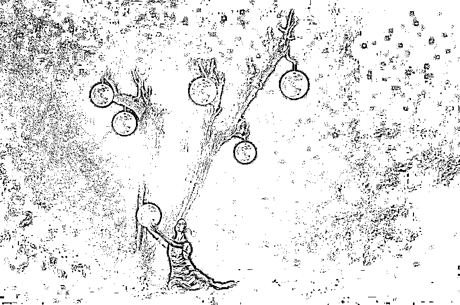采访/若道君

译者/李含 校对/Arrow

编辑/翀子 图片/网络

一提到占星，人们总会问很多类似的问题，比如预测、命运与自由意志。这些问题放在在卜卦占星学中可能更有趣。因为卜卦感觉就是占卜；而占卜，似乎就是算命；那算命，我们一直强调的人本主义自由意志该搁在哪里？若道君必须得抓着邓肯老师问明白。

而受访对象——艾德里安·邓肯老师，再次和若道合作开设[【现代卜卦占星学】](http://mp.weixin.qq.com/s?__biz=MzA5NjA0NTAxNg==&mid=2651470990&idx=3&sn=814228f880016da7a69d088c3470ae7b&chksm=8b488e39bc3f072fb5f58a8c2884bb76d2bf6828f4d0a8771bfe6da151b9d9234dfb98b6ccd5&scene=21#wechat_redirect)，此门课程还可作为 ISAR 选修课，如果你有兴趣，可以点击课程连接了解详情哦~

**预测得准意味着什么呢？**

***问：***

**卜卦星图预测的原理是什么？**

***艾德里安·邓肯: ***

卜卦星图描绘了某个特定时刻的行星配置。行星过去曾在某处，现在在某处，将来也会在某处。

换言之，它们是可以预测的。此时此刻囊括一切事物。如果你知道每颗行星对于提问者而言代表着什么，你就可以做出精准的预测。但是占星师会犯错，因此预测应是受限的，需要和客户现实的背景结合。

***问：***

**您是人本主义占星师，我还知道佛教对您的影响也很深，同时您也多用卜卦。您是如何将古典/中世纪卜卦占星学与佛教和人本主义观点调和在一起的？您是如何在卜卦中处理自由意志和命运这个古老的话题的？**

***艾德里安·邓肯:** *

我对于古典/中世纪占星学没什么看法，但是在我看来，**卜卦很容易与佛教融合，因为它只关乎于当下。如果你的意识和世界同步，那么你就会看到二元统一**。

**自由意志是当意识和体验合一时在空间中运作的能力**。如果你与此刻不一致，情况就会如业力限定那般展开。**要改变行为，你就得回溯本源——即此时以某种方式左右你的能量**。

在卜卦中，你追随行星的移动，力争最佳结果。你别想着不追随行星移动，如果有人这么想，那是因为不真实的需求。

比如，一个人可能经历天王星行进本命太阳，卜卦星图显示上升点的守护星落在第 10 宫，对分海王星。那说明他需要改变，他对事业不满。他可能饱受压力，但还是觉得必须要与令人不满的事业缠斗。这可能因为父母给他的压力或类似情况，而他需要抗拒那种压力。

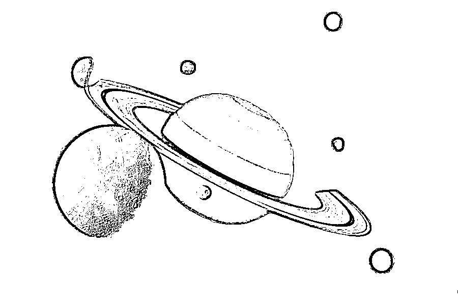

***问：***

**自由意志是当意识和体验合一时在空间中运作的能力，这真是很有趣的说法，又有点不好理解，您能进一步解释吗？**

***艾德里安·邓肯：***

没问题。一般来说，我们从一个时刻到下一个时刻都是无意识的。每一个时刻的出现都取决于前一个时刻，这给了我们时间流逝的错觉。**我们每时每刻遇到的事件是由非常复杂的业力因素决定的，是以前行为的后果。**

自由意志的概念预先假定存在个体自我。根据我们的经验，确实存在一种自我——这就是星图所显示的——我们的生活蓝图。然而，当个体意识和意识对象融合在一起时，自我意识就消失了。

相对来说，**我们每时每刻越有觉知，我们就越能意识到无意识的行为，而且似乎有机会通过调整行为来改变我们的未来**。

我们可以称之为**自由意志**。它是一个连续统一体，在一端是完全的无意识，另一端是完全的意识。当完全意识存在时，自我感就消失了，自由意志的概念就变得无关紧要了。当然，这一方面我们还有很长的路要走。

***问：***

**那是否可以这么说，当占星师的预测言中的时候，我们可以说我们正在预测业力的显现？**

***艾德里安·邓肯：***

是的。我认为这是一个很好的观察。然而，**如果占星师在给客户的咨询中在微观层面描绘了会导致不当的行为和有害结果的反应模式，那么就可以改变这些模式，获得更好的结果！**很可能所带来的个人发展也是业力的一部分……占星师和客户的会面当然不是偶然的。

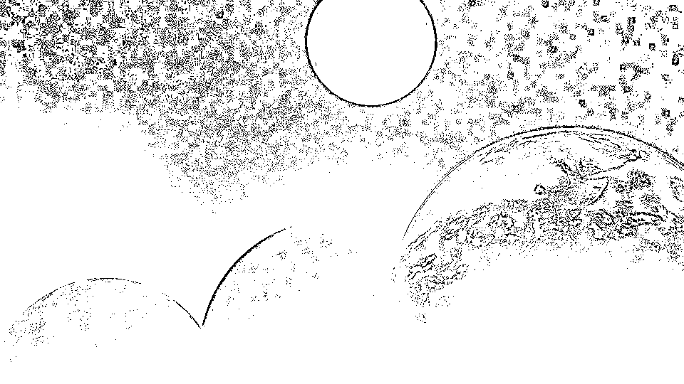

***问：***

**你提到占星师和客户的会面不是偶然的，这让我想起另外一个问题，人们使用卜卦时，这个行动本身以及占星师给出的回答会影响事件的结果吗？在牛顿的静态世界和量子力学的不确定世界之间的领域中，现代卜卦占星学的位置在哪里？**

***艾德里安·邓肯：***

这是一道难题。哈哈，我们对于自我都有强烈的执著，不是吗？我们都相信我们的行为会影响事件。当客户来见占星师时，他们期待建议，他们如果喜欢这个建议，就会据此行动。

然而，另一方面，**咨询星图会准确反映客户的情况**。他们来见你，问他们的问题，都在恰恰好的时间。怎么会这样呢？因为我们都与宇宙之舞同步，没有一刻不是如此。

牛顿的世界和现代量子力学之间的区别是现代量子力学的世界面对不确定性原理和混沌理论。当存在复杂的一系列起因时，预测逐渐变得更困难。

**生活极为复杂，因此我们越是试图进入更遥远的未来，预测越是难以确定。**

**版权声明：**原创文章由作者授权首发于若道平台，欢迎转发，反对抄袭。友号转载请申请白名单。

**现代卜卦占星课程内容**

**课程分为 5 部分：**

**Part1 **融合现代占星理念，整合动态占星知识**Part2**独家【现代动态卜卦占星技术】全面教学**Part3**学以致用，覆盖人生各个领域问题的卜卦解法**Part4**扩展延伸择时占星技法的新认知**Part5**如何运用卜卦占星学做一场转化性的咨询

**15 节录播课+8 节直播课线上网络课，英文授课，中文翻译。**

**15 节录播课为 2020 年动态现代卜卦课程的内容。8 节直播课则完全是案例教学的形式。**

这样的好处是，你可以通过 1 个半月的密集学习之内按照自己的进度学完录播课的理论和录播课中已有的案例，从学习开始就实践，然后把实践中遇到的问题拿到 8 节直播课中，和老师互动。

**在 8 节直播课中，老师也会用案例教学、和同学互动的方式帮助大家进一步掌握卜卦占星的技法。**

**授课老师**

**艾德里安·罗斯·邓肯****（Adrian Ross Duncan）**1971 年在印度游学时开始学习占星学，1985 年开始成为全职占星师，**迄今执业已超过 33 年，是人本主义占星学、卜卦占星学和经世占星学领域的知名占星师。他还开发了占星软件 AstroClock 和多款占星报告。**他在日常咨询中都会运用卜卦，咨询图（卜卦的一种运用方式，即根据客户来访时间制作星图，从星图中获得大量信息）也是他**特别擅长的领域**。艾德里安·罗斯·邓肯从 1971 年开始研习佛学，受佛学影响很深，他**相信占星学和佛学观点统一、转化的一个基础是在于对现实感知的改变**。而卜卦很容易与佛教融合，因为它只关乎当下。

**授课时间**

**付费后一天即可开始看录播课程，全程有助教老师回答问题。**

**直播课程开始时间：**

2022 年 5 月 3 日，每周二 20:00-22:00

**这次课程恰逢世界在巨大的变动和不确定之中，期待这门课程能够给各位及各位的客户带来新的洞见和方向。**

**在这次 8 次直播课程中，我们将采用案例教学的方式，所有参课同学均有机会提供案例，供老师解读，且我们将组织群体的练习，用大量案例帮你掌握卜卦及如何在咨询中用卜卦。**

**什么人适合参加本课程？**

*   想要系统学习现代动态卜卦占星的学员

*   想在生活中熟练使用现代卜卦占星学

*   在咨询中想帮助个案更清晰的分析解读困惑

*   想参加 ISAR 认证考试，此课程是 ISAR 选修课

*   希望通过卜卦占星帮助自己和身边人挖掘一个积极主动的未来

学习整合卜卦技巧，不仅有益于想钻研卜卦占星学这个分支的同学，对占星初学者也很有有帮助，可以让你的占星技巧加倍。

**课程费用**

**课程价格：9900 元**

**老学员复训专享价：**

**2020 年参加艾德里安·罗斯·邓肯卜卦占星课程的同学：****2900 元**

**2018 年参加艾德里安·罗斯·邓肯卜卦占星课程的同学：****4900 元**

**特别优惠****：**

**分享课宣到朋友圈****保留 48 小时****（不设分组显示）截图给课程顾问可获得****400 元优惠****。**

**课程负责人：童老师（微信：nodoorDaivd），请备注“卜卦”**

长按二维码添加课程负责人咨询

**退转课程****退款原则请详看《教学协议》，如有疑问请咨询课程顾问。******现代动态卜卦占星实战课·ISAR 选修课****

**授课老师：艾德里安·罗斯·邓肯**

**授课时间：**2022 年 5 月 3 日

**授课方式：**网络课程，英文授课，中文翻译

**费用：9900 元；****2020 年老学员复训价：2900 元；2018 老学员复训价：4900 元；特别优惠，分享课宣到朋友圈保留 48 小时（不设分组显示）截图给课程顾问可再获得 400 元优惠。**

**课程负责人：**童老师（微信：nodoorDaivd），请备注“卜卦”

长按二维码添加课程负责人咨询

****报名请点击“阅读原文”****

# 了解这三种行星关系，你将会获得幸福美满的情感关系

> 原文：[`mp.weixin.qq.com/s?__biz=MzA5NjA0NTAxNg==&mid=2651471464&idx=1&sn=bbe630593f2f6bb008124f68ae30db1b&chksm=8b488cdfbc3f05c9d8e7d29162823743d214c3f9372270dd54c689197b2b424e576c7e6cb682&scene=126&sessionid=1692737832#rd`](http://mp.weixin.qq.com/s?__biz=MzA5NjA0NTAxNg==&mid=2651471464&idx=1&sn=bbe630593f2f6bb008124f68ae30db1b&chksm=8b488cdfbc3f05c9d8e7d29162823743d214c3f9372270dd54c689197b2b424e576c7e6cb682&scene=126&sessionid=1692737832#rd)

****************************☆ ****************************后台****************************回复“今日”，给你一句生命态度****************************

作者/丹恩·鲁伊尔 译者/Arrow 校对/江艺  编辑/玫瑰 封面/书君 图片/pexels 人际关系一直是最引人入胜的占星学应用领域之一。在本文中，现代人本主义占星学之父鲁伊尔探讨了如何借助成对行星太阳-月亮、金星-火星和木星-土星深入理解关系的动力。一起来看看吧。**“我和这个人在一起会幸福吗？”**

**“我和这个人在一起会幸福吗？”**是占星师最常被问到的一个问题。这个问题可能指**婚姻或任何其他形式的个人关系**；但是，无论是何种情况，这个议题本质上涉及的是**每个人心中所怀有的对幸福的渴望。**

我们本能地知道，这种渴望只有通过某种关系才能得到满足。然而，关系可以有很多种，对关系和幸福的渴望可以在几个层面上运作。

**一个人的渴望如愿以偿得到满足，通常会带来幸福；**但很多时候，人们在自己的本性中发现了**矛盾的目标和渴望。**

在我们寻求幸福或个人成就之时，我们也许会被吸引到多个方向，往往是**两个截然相反的方向**；一个欲望被满足后，我们也许发现心中充满了一种**奇怪的空虚和沮丧**，因为在满足的过程中，也许**同样强烈的其他欲望枯萎或破碎了**。

因此，如何找到幸福这个问题，本质上就是关于**清晰地意识到一个人最重要、最强烈的渴望是什么**；然后**根据生活中某段重要关系是否能满足这一基本欲望**——我们的**“发自内心的渴望”**，来**对它给予足够的重视**。

然而，在许多情况下，人类并没有真正停下来问自己这些关乎他们最基本欲望特征的问题。

我们可以说，这些人生活在人类发展的**“一般”**水平上；他们几乎完全**被生物或集体-社会冲动所左右**。这些冲动实际上迫使他们按照正常的社会、文化和宗教模式，在完全处于“自然”活力水平的人际关系中寻求自我实现。

另一方面，有许多人已经或多或少在他们对生活的反应、对满足欲望问题的态度上成功实现了**“个体化”**。毫无疑问，他们**体验到人性中固有的基本冲动，尤其是“求偶冲动”以及对幸福和自我表达的渴望**。

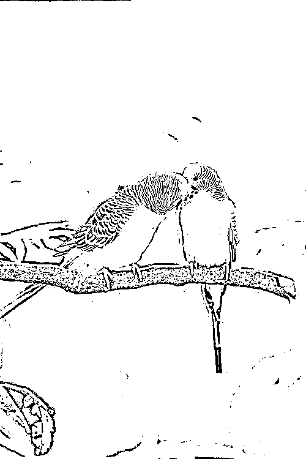

但他们**把这些欲望强行纳入了精神框架**；他们要求生活以一种特殊的、个体的、他们自己的方式来满足这些欲望，如果他们要充分满足的话。

通常，这些自然的欲望被压抑，甚至完全被否定，另一种心理和精神的（或所谓的“灵性”）欲望占据了个人注意力的焦点；幸福的实现取决于这些欲望的满足。

也许幸福完全避开了这些人，因为在整个人格中，**对立欲望的冲突也带来了评价人际关系时的冲突和严重问题。**

某种关系可能**满足生理和性层面的基本需求**，而另一种关系可能**满足智力、文化或精神层面发展起来的所谓“更高”的欲望。**结果可能会造成严重的混乱。

辨别任何一种特定关系可能给个人带来什么，实际上往往是最困难的，因为**复杂的人格之间的关系——通常是指充斥着“情结”的人格，总是充满了不确定性和模糊感**。那么，对于“我和这个人在一起会幸福吗？”这个最基本的问题，我们该如何有把握地回答呢？

如果占星师想要给出一个满意的答案，必须做的第一件事就是：**试着评估提问者的两三个基本层面欲望的相对强度。**

*   此人在对人性基本冲动的反应和回应中是否有多“个体化”？

*   在童年和青少年时期，困难、冲击或严重的心理（和生理）压力对这些基本欲望的影响有多深？——这主要意味着一个人早期与父母、手足的关系有多自然、多健全？ 

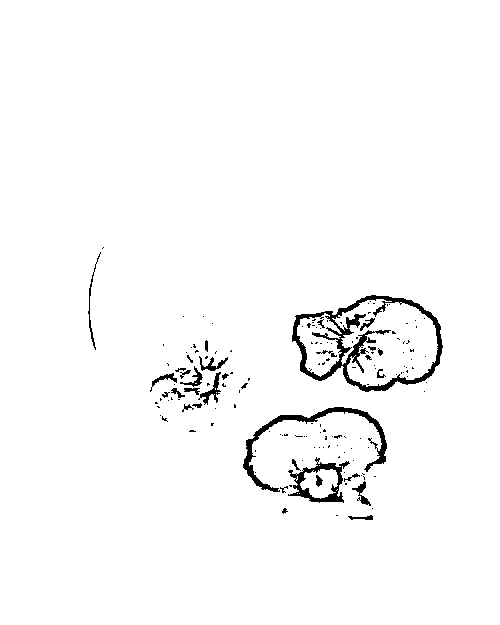

如果提问者在其心理构造中显示出**强烈的情结**，以及**对生活和社会的个体化态度**，再加上**强大的智力发展**，那么，在关系中是否可能幸福的问题，必须首先在**心理层面**加以判断——当然不仅仅如此。

然而，一段开始时具有**严重冲突“情结”**的关系，如果他们之间发展出**强大的生理-性的和谐关系，**可能会**调和自身**，并**改变关系双方人格的主要运作层次**，

无论如何，幸福这个问题在一段刚刚开始的关系中总是最难回答的，根据双方太阳星座之间的关系做出的快速而圆滑的判断都是无效的，而且可能造成很大的伤害。我在这里想指出的是，为了回答上述问题，在比较出生星图时，必须考虑到**许多更复杂的因素**。

事实上，在我看来，通常的程序充其量是最表面的，而且在心理上，许多方面也是站不住脚的，因为它们**没有掌握影响人际关系中基本心理机制的真实运作**——尤其是在亲密的爱情关系中。

**欲望的层面**

首先，我们必须从占星学因素上考虑**人类基本欲望的运作层面**。

最基本的层面是**以太阳和月亮为代表的生物-本能-生命力层面**；**第二层是或多或少、个体化的个人-情感层面，**受**文化影响和心理情结的影响**，由**火星和金星**为代表；然后还有**社会或宗教层面，**由**木星和土星**代表，在某些情况下，这个层面可以**构架和控制个人在关系中追求幸福的驱力。**

至于水星和天王星、海王星、冥王星，认为也要考虑它们。这些因素修饰，或倾向于**转变和变革、解放或瓦解男性和女性对爱和关系的态度**，这些态度是人生头 20 年期间在**生理、父母、宗教或社会因素的压力**下形成的。

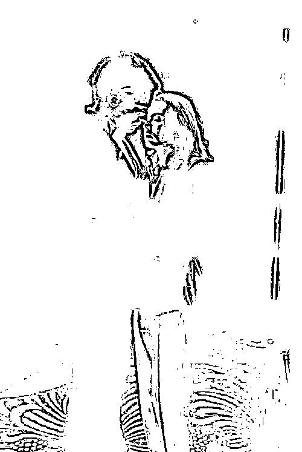

**彼此关联的行星**

两张星图有一个或多个紧密的行星联结点（而且它们应该紧密到真正重要的程度！）未必表示两人会有很多故事。

我见过不少案例中，星图之间有强烈关联的两人，在短暂几次双方相互吸引的约会后就分道扬镳了，这段肤浅的关系并没有任何意义重大或重要的事发生。

两张星图之间的行星联结仅仅意味着：**如果建立了一段重要或长久的关系，可以通过这类行星联结解读和理解这段关系的基本意涵。**

然而，如果两个人或他们中的一人想知道出生星图之间的联系是否预示着幸福的可能，这已经表明了关系的潜力在运作，**在困惑中寻求实现自己**。

因此，问题是：要试着在他们的性情或自我中找出最小阻碍的路径，让关系的驱动力涌现，尤其要寻找在哪个层面能够带来最令人满足的幸福的基本线索；当然，可能同时存在多个这样的层面受影响。

**太阳-月亮的联系**

**一张星图中的太阳和另一张星图中的月亮之间的联系，通常相当明确地揭示了在生命力的一般层面上运作的关系的基本潜力。**

太阳和月亮代表了宇宙生命力的两极；但在心理层面上，它们代表基本“形象”的两极：这会**给一个人带来其所缺乏的东西，从而使他（她）在力量和活力上变得完整。**

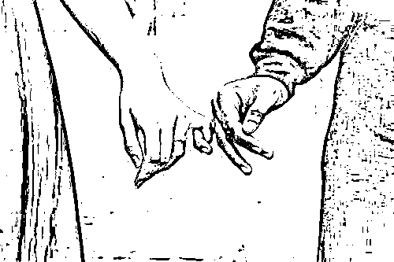

换句话说，在**男性**的星图中，**月亮的落位描绘了“理想的女性”类型，她会给他带来一种内在的活力，这是他所缺乏的或还未发展的潜能。女性星图上的太阳代表了她心目中的理想“男性”，理想的恋人。**

**每一种匮乏都会吸引那些能使它完整的东西，所以通常（根据畅通无阻的自然关系）。一位男性吸引到分化和照亮他出生月亮的女性。**因此，如果男性的月亮在金牛座中段，他往往会被那些出生太阳在金牛座中段附近的女性吸引。

因此，**现实中的女性会回应男性所投射出的潜在的“女性形象”的召唤，**也就是说，在另一种意义上，**回应男性自身潜在的、未被表达的阴性特质的召唤。**

如果建立了联系，相互的吸引力应该很强烈，前提是**在更严格的心理-智力的自我水平上没有太多干扰或阻碍。**

这样的日-月联系的运作是双向的：

*   男性在女性身上找到光明和力量，来充盈他的“女性形象”（他特别需要一位女性伴侣，把自己无法具体化的东西外化出来）； 

*   女性发现她的“男性形象”（她的出生太阳）反映在男性的心灵镜像或欲望中，由此意识到自己未表达的男性自我。结果，双方都变得更完整，通过对方更彻底地“自我实现”。 

这本质上是一种**在男女两性结合的“人性”（而不仅仅是动物性）上运作的心理过程**。

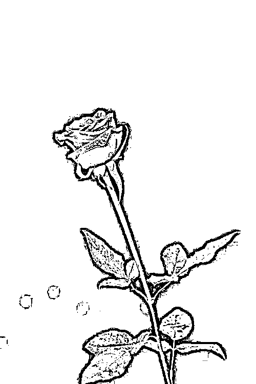

但是，人们当然也可以主张相反的联系方式同样有效或更有效：即**男性的太阳与女性的月亮结合。**在这种情况下，我们所看到的是**在生命的不可抗力之下，一个纯粹的性和本能的两极象征。**

第一种情况下，**在心理层面上，我们解决了男人的心理-精神和女人的灵魂对他们精神伴侣的个人需求**。

这有可能，并且能够成为**真正有意识、令人满足的爱的过程**——可以**使两个真正的人通过身体，并超越身体结合在一起；**在第二种情况下，**在生物学层面上**，我们简单地见证了**两种相对的能量为了非个人生命延续的目的而相遇**，如果允许它以自然完美的节奏运作，那就足够美妙了。

然而，这种日-月联系本身主要涉及**自然能量**，而**不是人类的意识**。（当然，可能会有其他的行星联系，为这种关增添加其他面向。)

相比之下，**在男性的月亮和女性的太阳两种“形象”的结合中，两种理想融合在了一起。如果两人结婚了，那么它就是一种“形象”（即心理现实）的联姻**。**生理-性行为主要成为象征性的仪式，将心理上的交融外化，对相互联结的个体来说，心理交融是基本因素。**

这种结合在参与者的生活中**具有创造性而非生殖方面的目的和意义**。重要的是，即使有了孩子，这种关系也蕴含着**创造或再创造**的潜力。**每个参与者通过在对方身上投射自己，实现了对方本性中隐藏的一面。**因此，两个更伟大的存在被创造出来。

在具有某种关系的个体（无论是是无性的友谊还是恋爱或婚姻关系）星图间的许多关联中，一方的太阳或月亮都与另一张星图上的一颗行星相联系。行星间的联系有很多种可能。

但是，当太阳或月亮包含其中时，你总能发现一个基本的“形象”在运作，或在无意识深处被唤醒。

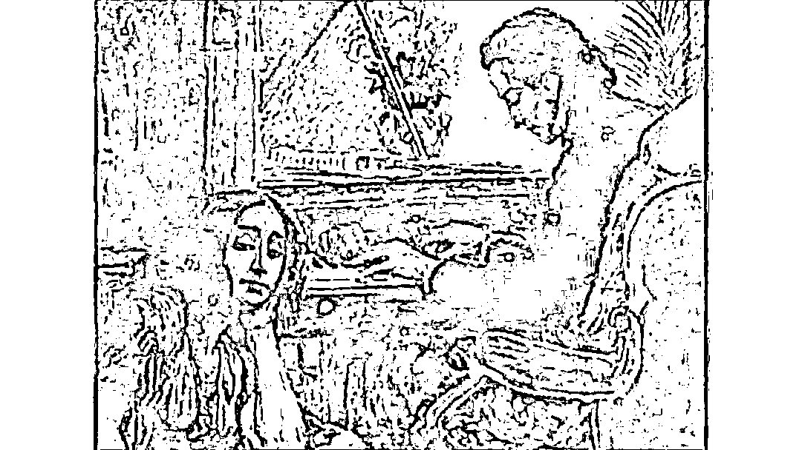

|肖邦与乔治·桑的画像

在波兰作曲家肖邦和法国女作家乔治·桑著名的爱情故事中，男方的月亮在天秤座 12°，与女方被着重强调的天王星合相。这位细腻、敏感的作曲家心中有一个坚强、善变、不拘传统的女性“形象”。

他爱上了一个不安分的法国女人，几乎是自由、独立和有创造力的现代女性的原型。她的月亮也在白羊座末度，与肖邦的木星相对，她自己的木星在天秤座 26°，对分他白羊座 23°的木星。她第 7 宫的土星在处女座 28°，对分他第 7 宫白羊座 2°30 的火星。

木星的交流是有趣的，因为**涉及木星和土星的联系倾向于显示社会压力或个人业力在关系中影响。**我记得有一个案例，男方的木星合相女方的太阳-土星，女方的木星合相男方的月亮。

这表明**由一种强烈的灵魂连接走向婚姻**——然而，在非常特殊的社会和业力压力下，婚姻在几年后瓦解了。

这位女士再婚了，这一次，男方的出生星图与她只有一个联结点：他的天王星与她落在第 4 宫的月亮精准合相（后者代表了一种相当不寻常的“母亲情结”）。

这个男人的天王星强烈地刺激了她女性天性的某些阶段，结果是一个天王星合相上升点的孩子出生了！这个男人的太阳和其他几颗行星落在她的第 1 宫，加强了这种联系。

在另一个例子中，男方的太阳落在女方的金星上，这没有促成婚姻，而是带来了一段**非常美好的友谊**。

女人能够给男人积极的自我形象（太阳）注入金星爱的品质和更高的意义。女人的土星落在男人的太阳上，可能会给男人带来压力和来自久远过去世的业力对抗；但这也可能有助于把他的真实自我带到一个更明确和更聚焦的状态。

**这种联系在有些情况下可能“非常有效”，而在另一些情况下则可能根本不起作用或只是间接作用**。我想起一位男士，他的金星合相女方的太阳。

他们通过一个共同的熟人认识，但只是点头之交；然而，在做决定的一个时刻，男人给了女人一些看似不太重要的建议，改变了她的生活，阻止了一场似乎不可避免的离婚，并导致了一个完全意想不到的孩子的诞生。

事实上，**任何人都不可能看透或预见到与另一个人交往的后果——这同样适用于同性朋友、同事以及没有明显情感交流的关系**。

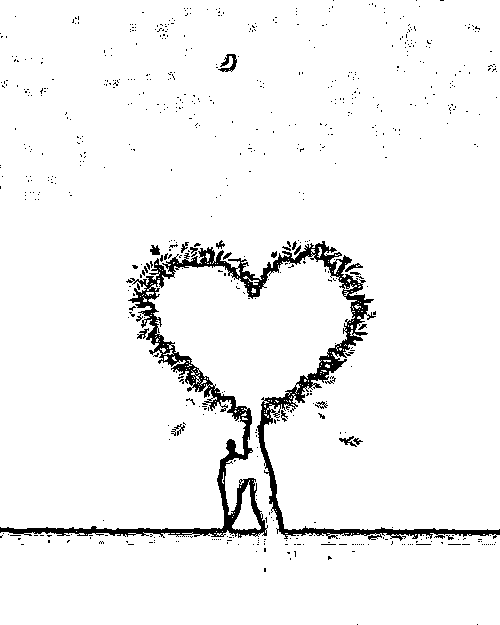

**对关系当事人星图之间的联结点的研究并不能表明是否会形成一段显然重要的关系**；它只能**展现这两人之间潜在关系的本质特征**：即，如果命运之间确实存在着某种具体活跃的联系，这就是他们相连的最根本原因。

**火星-金星的联系**

当两张星图的**火星和金星**以某种方式成相时，两个人之间的潜在联结往往以**非常“个性化”的心理-情感状况和需求表达**出来。在这里，我们不再处理生命极性的基本“自然”层面，而是**生命能量在两个人格中所释放和建立的泛音**。

每个人作为人类物种的一员，基本上都是“人”；但作为个体，每个人都是不同的，这取决于**他对人类经验和自己必须面对的特殊经历的反应方式，**尤其是**在性格形成的时期**。这些**对生活做出的个人化的及时回应产生了特有的“情感态度”**；火星和金星最直接地指向这些。

当一个人的火星非常接近另一人的金星时，最有可能的是（至少就这个联结点而言）他们的相遇是**基于对某人的寻求**，此人的**情感态度将作为补充因素，**去**平衡某些重要的个人能力缺乏、或个性中未发展的心理领域，或安抚心理困扰**。

需求是非常个人的，通常基于某种**持续的“情结”**：这两人在情感上沿着相反的路径发展——以至于他们潜在本性中的一整个面向都不成熟，或处于无意识的阴影中。

**火星是有意识的情感生活的阳极；金星是阴极**。因此，**男性的金星代表了他潜在的阴性气质；女性的火星是她潜在而仍然真实的、可能被唤起的阳刚之气**。这些行星代表了**个人灵魂层面上的阴性气质和阳性气质**，而不是生物学意义上的。

因此，**如果一个男人过分表现了他的男性角色和回应能力，也许是因为他的火星被强烈地强调，他性格中的阴性面可能会非常不发达**；于是可能会（最可能是在这位男性自我无意识的状态下）**呼唤他人去激活这个阴性面**。

这种呼唤的形式往往是**投射他自己强烈的“女性形象”；**这种形象**在女性的“男性形象”上寻找互补**，这位女性渴望与男性联结，给她一个机会**展示自己或多或少无意识的阳刚之气**。

另一方面，当一个男人的火星和一个女人的金星合相时，我们可能看到，**个人情感活力更直接和更无意识地由男方流向女方**。**一种基于阳性和阴性魅力的更简单、更自然的吸引力可能滋养着这段关系**。

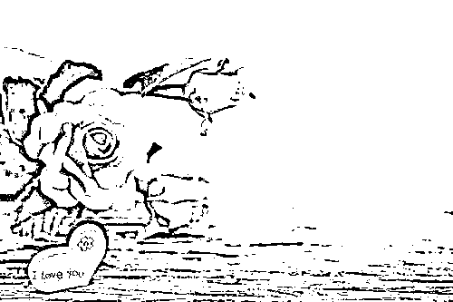

它是基于**男人渴望在情感上自我表达**的影响，这种渴望**唤起了女人的个人反应**。

如果男人或女人（或者是两者）**对人际关系有些恐惧，**因此**过度有意识地活在头脑中**，或者**被某种智力-精神的幻觉所笼罩**，那么这段关系就会变得**特别重要**。因此，**男人需要感觉自己更阳刚，女人需要感觉自己更阴柔。**

**行星和四轴**

两人间的许多重要关系在占星学上还体现为：**一张星图中的某个（某些）行星与另一张星图中的四轴（主要是上升点）关联**。前文提到的肖邦和乔治·桑的例子中，肖邦的金星就合相他情人的上升点。

毫无疑问，她是被他作为作曲家和钢琴家的金星式音乐天赋激发的。**一个人星图中的行星会激发这个轴点所指向的心理功能。**

如果我们使用卡尔·荣格对人类四种基本心理功能的定义，我们可以看到：**“直觉”指向上升点，“感受”指向下中天，“感官”指向下降点，“思维”指向中天。**乔治·桑需要唤起她的“直觉”。

**福点的联系**

另一个同样具有启发性的联系是，**一张星图中的一颗行星和另一张星图中的福点联系。**从真正意义上说，福点是衡量一个人幸福能力的主要指标之一，也指示了人们幸福或不幸福的特殊本质。

**福点仅仅是月亮和太阳之间每日关系的移动指数**。它指出了**“月亮阶段”**，更准确地说，应该被称为**日-月关系的阶段（即月亮周期的阶段）**。

因此，福点在每个人身上象征着其**基本天性中太阳极（阳性）和月亮极（阴性）之间的联系**。这是一个至关重要的联系；当它直接受到附近行星位置的影响时，此人的性格会显露出某种基本特征。

如果**土星合相福点**，往往是**悲观**的类型，他的幸福取决于根深蒂固的个人因素，而不是表面的环境或事件。相反，**木星合相福点**，象征着**天生的乐观和信念、社交活跃、态度热忱。**

**如果一个人的土星接近另一个人的福点，关系可能会加深，使第二个人的个人态度更实际；**但它有时也可能**沉重而压抑。**通过考虑行星的典型特征，可以很容易地得出其与福点关系的意义。

最后，我要说明的是，我在此仅仅对一个复杂的主题勾勒出粗略的轮廓。**两个人的星图显示出强关联，并不意味着双方会有或必然应该具有密切的关系。**

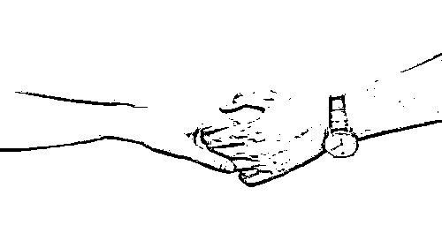

我之所以强调这一点，是因为我见过有人因发现别人的星图与自己的紧密相连而几乎导致悲剧。同样，我也见过两人拥有幸福而持久的婚姻，但他们的出生星图之间只有微弱的联结。

如果人们之间建立了一种**或持久或短暂但极有意义的关系**，那么，无论他们的出生星图之间有什么联结点，这些联系几乎一定对这种关系的特征和目的给予了显著的揭示和指示。

正是这个事实使这样的研究成为有效和必要的；它是“必要的”，因为只有当这个主题所有错综复杂的因素都得到仔细考量后，对星图间关系的占星学判断才是有效的。

**版权声明：**本文由若道翻译发布，欢迎转发，反对抄袭。友号转载请申请白名单。

**丹恩·鲁伊尔**

二十世纪最重要和最有影响力的占星家，现代人本主义占星学之父。他对古典占星做法进行了改革，极大地影响了后来的占星从业者及占星师。他也是相当高产的作家，为现代占星学创作了 16 本书和近 1000 篇文章。 

**20 位来自世界各地的占星师****带来 20 场沙龙——新世界的觉醒****详情可点击下图**

**学习占星学****点击下图了解课程详情**

**

**微信又双叒叕改版啦，不想错过若道君的推送？**

**就把若道设为星标吧！**

**▼**

**喜欢记得点一下在看哦☟**

**报名直达入口**

# 重磅天象 | 木海精准合相：每一次幻灭，都是一场伟大的觉醒！

> 原文：[`mp.weixin.qq.com/s?__biz=MzA5NjA0NTAxNg==&mid=2651471394&idx=1&sn=49e525819c16defe2b5e82441a48cacc&chksm=8b488c95bc3f05835a52a7ebeb66ea109829e8c09143c3effd08549c67e1d7768843fcad30b4&scene=126&sessionid=1692737832#rd`](http://mp.weixin.qq.com/s?__biz=MzA5NjA0NTAxNg==&mid=2651471394&idx=1&sn=49e525819c16defe2b5e82441a48cacc&chksm=8b488c95bc3f05835a52a7ebeb66ea109829e8c09143c3effd08549c67e1d7768843fcad30b4&scene=126&sessionid=1692737832#rd)

****************☆ 后台回复“今日”，给你一句生命态度****************

作者/傅莎珈 ISAR 认证占星师
编辑/翀子 封面/书君 图片/网络今天，木星和海王星在双鱼座 23°合相，这是 2022 年的重磅天象，开启了新的木海行星周期。在幻灭与沉没中，也同时孕育着开始和成长，抱持美好又坚定的信念，终将让我们超越束缚、到达天堂。**前言**

**4 月 12 日，木星和海王星在双鱼座 23º 合相。**作为占星师，在 3 月写月运的时候，我乐观的认为，封到 4 月中旬木海合相差不多了。一切会好起来。

我是个土生土长的上海人，住在浦西市中心。3 月 28 日左右一边写月运，一边每天下楼 3 次大采购。IAPM 楼下的城市超市付款的人群绕超市一周、联华超市限人流进出、盒马上订不到菜、菜场一把芹菜卖 12 块……

从 4 月 1 日开始至今 10 天，只有下楼做核酸才离开家门。我已经从一个只会做炒青菜、小排萝卜汤的厨房小白，变成能炸油墩子、做糍饭糕、菜饭、培根卷虾仁、素三丝、煎牛排，并且打算尝试蛋糕烘培……  

每天上午从起床到 10 点特别忙，要看各种群，知道今天有什么可团、今天需要做抗体还是核酸……以及各种照常进行的占星师工作。以至于佳黛问我：莎珈你文章写了么？我才如梦初醒，哦哦，我还有一篇稿子没有交！

这些体验如此珍贵地告诉我：木海射手座的莎珈啊，你对海王星了解太少了！**这是一颗带来失乐园体验的行星！失去、毁灭、救赎是它的节奏！**

木星和海王星分别是双鱼座的古典、现代守护星。木星作为一颗触发器，今年特别触发了海王星和双鱼座的各种主题。

**失去，是生命必经之路**

**在海王星的神话原型里，海王星的三部曲是“诞生—失乐园—成为救赎者”。**

在诞生的章节，人和神生活在丰盛、美好、光明、和平的天堂里。和这种满足平静相对应一起生长的，是人类无节制的欲望，以及**人类对永生的渴望———想要像神一样。**

古巴比伦国王吉尔伽美什费劲千辛万苦潜入大海深处找到了**永生之树**，当他带着这棵树的树枝回到岸上、在小溪边休息，一条蛇从水中游出，叼走并吃掉了树枝，褪去蛇皮获得永生。吉尔伽美什只能望着溪流叹气。

回头看 2011 年 4 月 5 日海王星换座双鱼座，直到 2018 年，真正是繁花似锦烈火烹油的年代：

奢侈品市场爆发式增加、环球旅行、飞速发展的科技和电子商业/金融、征服火星计划、互联网汽车、无人机……奋斗三年去纳斯达克敲钟，风口上，猪也会飞。**泡沫早就开始越聚越多**……

2018 年的时候，我们喊着 2018 快点过去，2019 年会好点吗？2021 年的时候却想着，原来 2018 年才是好时光啊……

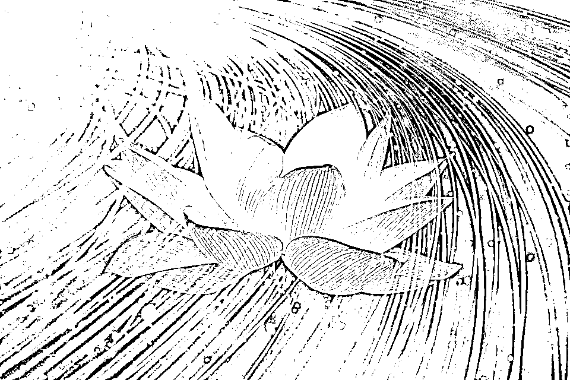

人类渴望拥有的一切，在一生的不同阶段，多少都会得到一些或者全部，然而迟早都会失去。或者说换一种面貌重新开始。**是否能坦然接受失去？承认不会永远美好？愿意接受消退、萎缩、停滞不前？**

我知道有些人会再问：那万一永远不会好了呢？就像疫情中不断被延期解封的人群：到底什么时候解封呢？

**这个信念，是你自己给自己的**：你愿意相信你会好起来、能被解封么？无需他人的确认，只是知道会好起来、会解封，然后埋头该工作工作、该抢菜抢菜、该提建议建议、该做服务去积极参与义工。**没有任何期待的，有坚定信念的生活着。**

**这是海王星行运中重要的功课：在混乱之中意识到自我的存在，自我的力量，不依附依赖于环境。**因为你不仅仅是大系统的一份子，还是你自己。你的生活既受限于环境，又由自己控制。**在你能控制的空间里，创造自己的方舟。**

**而木星给予了什么？木星激发了海王星所有的正面能量，**消除它特有的悲伤和迷惑，甚至教会它享受神圣的赐福，教会它看见光，迎接光。 

**双鱼座和脚有关。**所以 11 日-14 日，尤其建议大家多做海底轮、脚趾有关的练习，或者连接家族力量的冥想。**这样的连接，帮助我们把强大的重启能量，落地成日常之中思想和行动的转化。**

同时，借助现在水星在金牛座，**请开始从情绪危机中慢慢抽身出来，从大自然中寻找支持的力量。**

海王星赋予所有人的特质，是与生俱来的与自然感应的能力，如同细胞和细胞之间的沟通。

**在盛开的鲜花，茁壮发芽的树木身上，体会那种生命自顾自长大的肆意。**

人类社会或许正在战争、疫情之中挣扎，但自然界的生机却在恢复，生长。**木海合相提醒每个人，你还是地球上的生灵**，地球母亲的复苏，会带给你来自生命源初的支持。静下来，连接这部分。

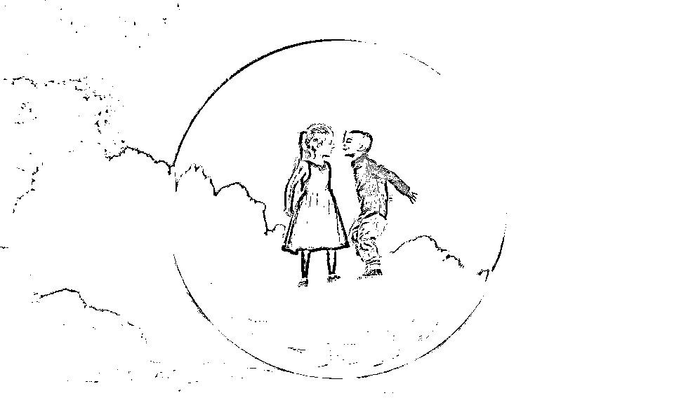

**在恐惧和分裂中，期待新的诞生**

**海王星神话和失乐园有关。**无论是大洪水/诺亚方舟，还是一只苹果导致亚当和夏娃被逐出伊甸园。人类在某一个时期，都需要面对驱逐、暴力分裂、毁灭带来的灾难。

这个过程是人类的自我觉醒所需要经历的过程：**生命发展到某个阶段，曾经带来欢乐和恩宠的形式与环境，需要彻底改变以迎接新阶段的到来。**停留在老旧的模式里反而变得危机四伏。

巴比伦神话里，创造世界的淡水神阿普苏和盐水神提阿马特二合为一，兼具阴阳，以生命之源的完整意向方式存在，是天与地的孕育者。阿普苏和提阿马特的孩子们喧嚣躁动，让这 2 个创造者忍无可忍，决定毁灭这群吵闹的后代。

这个计划被最小的孩子得知，召集所有孩子们起来反抗。其中最强大的火神马杜克提出和提阿马特单挑，并且最终射杀了创造他的母亲。马杜克用提阿马特的碎尸创造了天地，新世界由此诞生。

**这个故事意味着，生命与生俱来带有矛盾性和对立性。**

*   提阿马特母亲，既是生命的创造者又是凶险的毁灭者;

*   对婴儿来说，子宫既是出生前的乐园，又是出生时的地狱。羊水褪去、无法呼吸、子宫收缩、开始把 TA 挤向凶险的产道……  

*   世界始于无边无际的深海，又暴力的分裂…….而这种分裂，是在无意识的合一的源头，分离出独立存在的个体。**这个出生的过程，必然经历巨大的恐惧和痛苦。**

站在这个角度看疫情、战争、经济衰退，就会有新的角度：**这个源头里必然分裂出更独立、有生命力的个体和群体。**

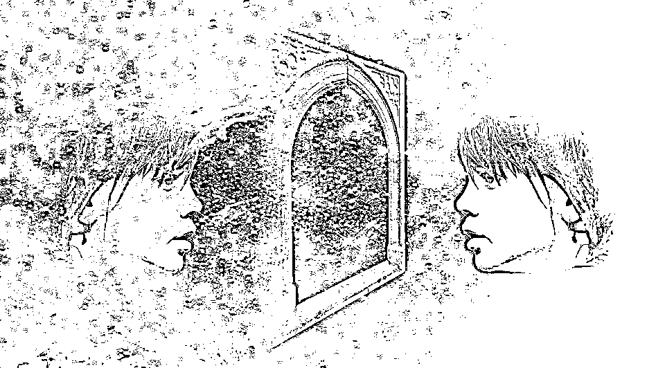

上海疫情激发了人们巨大的生存恐惧，囤物已经是一种下意识。好多人发誓一旦解封，第一件事就是买冰柜、换双门冰箱。**恐惧体验如果得不到释放，一味要求正能量，会激发更大的反弹，因为恐惧是此刻的真相，生命的真相。**

****恐惧是此刻某些城市人的一部分，不是全部。****

如何对这个恐惧说是，同时又不受困于这个恐惧？**就囤吧**，负能量吧。万一囤多了，群里有的是以物易物这种最原始的交易方式，还加强了邻里关系。**也给自己设定一个界限，**一天中负能量一部分时间，其他时间留来正常作息。

上海这次疫情的状态令很多中国人大跌眼镜。什么？这是以高效、发达、富有文明、应变能力超强著称的上海？所有在武汉和西安发生过的事情全都走一遍还变本加厉，什么情况！

仔细盘点，才发现引以为傲的遍布大街小巷的商业网点全部停了，一帮有管理经验和组织能力的人被关进家里去了，只剩下公共系统。而这个公共系统由的人数之少，相对 2400 万人口，如同一粒沙子和整个撒哈拉沙漠，更不要说这个公共系统中的一大部分人效率之低，处理问题的能力之差……加上政策直接切断了生活物资供应和医疗系统坍塌。这下子，全崩了。

木海在双鱼座的冲击，导致所有的系统、界限都被抹平，城市成了一个悲惨的、看不到边际的、吞噬生命的汪洋大海。

人们对整个政策的疑问也在愈演愈烈。这些疑问之中，会发现有些人还是**习惯性的受害人心态**：**恐慌**（被包围在阳性中太可怕了，万一染上怎么办……) 、**发泄不合作**（你这些政策在乱搞！我们没有食物，甚至连检测报告都错了，你怎么做的！）、**问责**（你是政府，请你做正确的事，什么是否开放！）……

甚至以前的朝阳大妈，现在成了歌颂对象：她们既是时刻监督你的一举一动、令你感到隐私被侵犯的人，也是疫情时候能严格执行报告每户究竟有没有核酸、有没有发到救济物资的人。绝对不会出现上海基层居委一问三不知的情况。

因为场景和事件的不同，同一件事的两面性以矛盾对立的方式呈现出来。**这是生命的本质。我们在此学习生命的矛盾对立性。不同的人会有不同的领悟。**

请特别做以下的回顾：

*   **盘点一下你应对震惊事件的态度，有哪些发现？**

*   **你有没有转移外在冲击的内在力量？**

*   **你是否能在安置好自己的同时，还能鼓舞激励他人？**

*   **你是否相信，宇宙自有安排？**

*   **你是否感受到一种内在真理的支持和守护？**

*   **对于自由、身体、健康、财富、情爱、存在意义等等人生信念，你有没有新的发现？**

**这是个经由危机，让所有人完成成长的重要一步。**

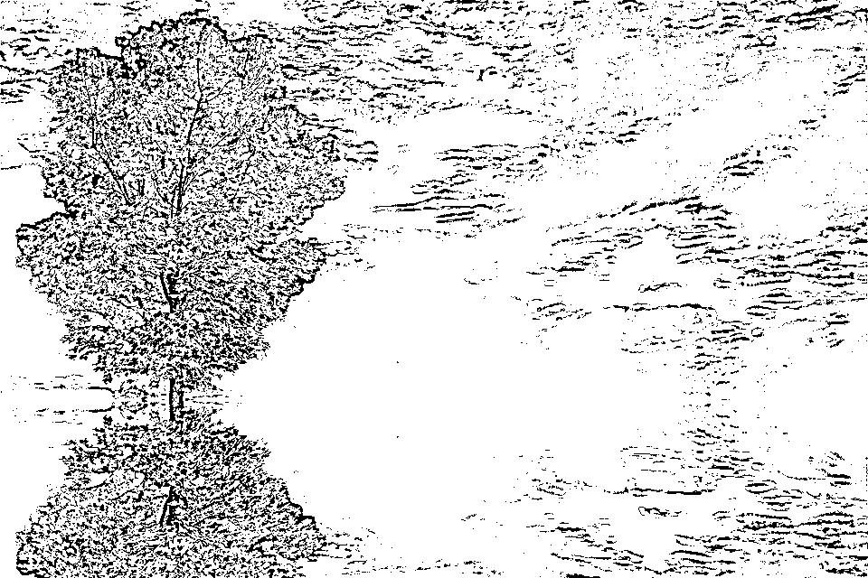

**唤醒内在神性**

说起海王星、双鱼座，总会跟灵性有关。人们苦苦修炼，试图获得神的垂怜，重返光之国度。**然而在这个疫情中，木海合相所激发的神性，有关仁慈和救赎的部分，无声的展现在每个普通人身上、在每一件日常小事上。**

我们在危机中学习。不仅学会生存，更积极参与到群体的服务中去，因为我们内在对生命的仁慈之心，被触发了。

**我们在危机中，学到了“仁慈和救赎” 的一课。**

是，环境太恶劣，系统的不作为和政策的高压令人愤怒。**我们可以做的是互助：**关心那些没有手机不懂团购的老人，不会做饭的年轻人、孩子……邻里之间互相协助，甚至体谅和关心日夜操劳的大白与居委，他们同样即将崩溃。

多少人在这个疫情期间投身参与公共服务，公益事业，基层工作。从 2020 年开始的疫情，给我们带来正面的影响是，它打破了旧有的个体、集体、国家之间的界限。让我们体会到，支持他人，理解他们，就是在帮助自己，也是在给这个千疮百孔的世界，添加亮光：

**“当你感觉周围全是黑暗，也许你要再仔细看一下，你就是那个正在发出的光，它点亮了黑暗 ”。（鲁米）**

仁慈和救赎，不仅仅是神迹展现。**仁慈和救赎，一直如神性一样，存于我们心中。**在木海合相双鱼座的时刻，被唤醒，被启动。对于那些渴求救助的人来说，一个转发、一袋从窗口递进去的蔬菜、一碗面条，就是神的痕迹：**你不会被放弃。**

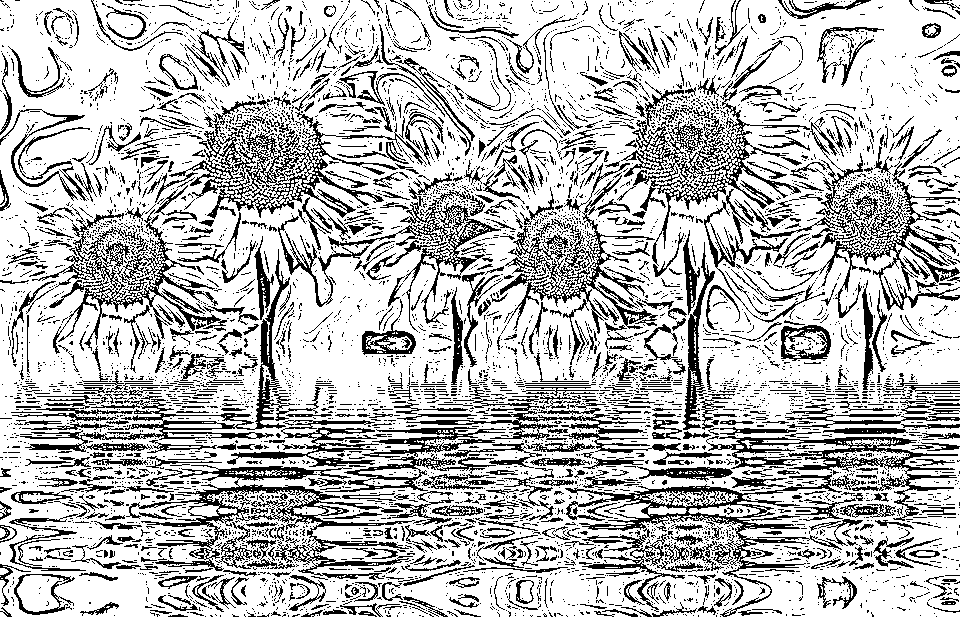

**走上重建家园之路**

在写这篇文章的时候，我看到马斯克再度完成了运载私人火箭进入太空国际空间旅行的任务，人类进入了全新时代。与此同时，处于疫情和战争中的人们知道何时会结束吗？不知道。 

12 日的星图上，海王星象征的阴性力量，和月亮/金星/北交点形成一组落地、复苏、生长的状态，并且唤醒了水星/天王星的思维创新和升级。

但另一方面，太阳/火星/土星/冥王星继续展现了严苛、高压、自我、扩张的一面。

**我们如何能在这样拉锯的环境里保持平衡？或许这是木海合相在这一年里留给我们的功课，不仅仅是 4 月。如何调整自己的阳性力量，让它变得勇敢、无畏、创造、不自私暴力蛮横，如何呈现自己的阴性力量、智慧、连接......**

金星作为金牛座北交点的守护星，将在 4 月 27 日的时候合相海王星，而 5 月 1 日的金牛座新月，开启了金星和逆行的冥王星之间的积极转化能量。**转变在不远的将来，比预期晚，却会到来。**

**一个全新的个体，每个人的全新时代，正在这场疫情中慢慢孕育。**

翻了一下 2011 年 4 月 5 日，海王星进入双鱼座时候的星图。海王星合相双鱼座凯龙星、火星合相天王星、太阳和木星组成 2 组白羊座能量，浩浩荡荡的开始了它的独立之旅。

**突变带来唤醒，创伤会变成最好的导师。**

**上一次木海合相在双鱼座，是 1856 年**。当时的中国山西遭遇蝗灾、太平天国攻破江南大营并发生内乱、亚罗号事件导致鸦片战争开始…….对当时的民众来说，那是一场类似世纪大洪水的饥荒动乱之年，开启了近代中国历史的无序时期。

也是在这一年，著名的浪漫主义音乐家舒曼去世，精神分析大师佛洛依德出生。写出《蝴蝶》、《狂欢》、《梦幻曲》的浪漫主义音乐家去世，一个探索精神苦痛来源、发表性驱力、恋父恋母理论的精神分析大师诞生，且启发了荣格这位心理学大师。

出生星图上，海王星能量、双鱼座能量强的人，在无意识中总有一种“他乡是故土”的回家意识，想要回到那片传说中的理想家园。**然而奔波于人世间，承受苦难、安住于困苦之中、对束缚说是的过程，也是超越束缚的过程。**

**天堂，在我们心里。**神圣居于我们身体的细胞中。不在过去不在未来，在我们对生命中的每个发生说“是”的时候，在我们于苦痛之中学习臣服之时，伊甸园之门，正缓缓打开。

神，就是我们自己。家园就是此地。回家，就是把此地，再度恢复成荣华之地，由此懂得珍惜荣华富有，且谦卑而尊重，理解它会再度离开。

**每个幻灭、沉没，都是全新的开始。生命，居于开合之中，生生不息的成长。我，和这个世界，时刻处于独立和合一的矛盾统合之中，循环上升。**

**祝福每一个人，在这个 2022 年的白羊月，发现全新的自我面向。**

**版权声明**：原创文章由作者授权首发于若道平台，欢迎转发，反对抄袭。友号转载请申请白名单。

****

****傅莎珈****

ISAR 认证占星师（2015 年获得）

心理占星师/内观书写带领者/冥想带领者

国际著名传播集团工作 20 年

**微信公众号**：Helloshajia

长按打赏

**20 位来自世界各地的占星师****带来 20 场沙龙——新世界的觉醒****详情可点击下图**

**学习占星学****点击下图了解课程详情**

**

**微信又双叒叕改版啦，不想错过若道君的推送？**

**就把若道设为星标吧！**

**▼**

**就是这个“在看”，戳戳戳 ☟**

********报名直达入口********

# 这个神秘记号，指出了生命前进的方向

> 原文：[`mp.weixin.qq.com/s?__biz=MzA5NjA0NTAxNg==&mid=2651471394&idx=2&sn=bd5a62597ddc2f98fb18ede328b5f52b&chksm=8b488c95bc3f0583fe74a522783dfb14914dea8820514373ec63c996550f72819cb184acfeae&scene=126&sessionid=1692737832#rd`](http://mp.weixin.qq.com/s?__biz=MzA5NjA0NTAxNg==&mid=2651471394&idx=2&sn=bd5a62597ddc2f98fb18ede328b5f52b&chksm=8b488c95bc3f0583fe74a522783dfb14914dea8820514373ec63c996550f72819cb184acfeae&scene=126&sessionid=1692737832#rd)

作者/大卫·瑞雷 若道创始人

编辑/翀子 图片/网络

在漫长的一生中，似乎冥冥之中总有一股神秘力量将我们推向某些既定方向或是某些主题、事件。本文大卫·瑞雷老师将从月亮南北交点的角度告诉大家，这些方向和事件背后的能量是如何运作的。

**月亮代表着过去，而月亮公转轨道与地球公转轨道的切点就形成了占星学中的月亮南北交轴线。在灵魂占星学中，月亮的南北交轴线早已超越了现在世界的空间维度，连接着过去与未来，揭示了我们在过去世所习惯的方式、环境以及能量（南交点），也指明了现在以及未来世中灵魂的演进方向（北交点）。**

**——大卫·瑞雷**

**月亮的南北交点是什么**

占星学中通常会认为南交点代表前世，北交点代表今生。对于占星中的业力论来说，第一个需要明确的线索就是你的**南交点****（karma），代表累世业力；而我们通常所谓的法（darma），则是****北交点****，是你今生需要完成的工作，要学习的一些在今生发展出来的新事物**。

在南交点和北交点之间有一种相互的作用，**这种动态的相互作用力是与我们的灵魂有共振的。**

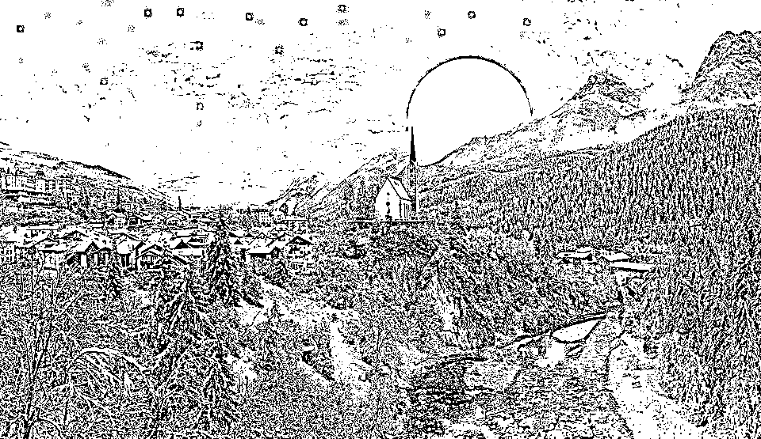

**知晓前世，是为了更理解今生**

我大概有 1/4 左右的个案会咨询前世相关问题。问题很广泛，像工作、关系、个人成长、健康、婚姻等等，都会有。**他们想知道前世的理由之一，是因为那些跟今生有关。**

曾经有这样一个案主，她的星图显示她在前世是一名战士（男性），而且不止一次，有好几世都是，而她在这一生中也确实在很年轻的时候在军队待了两三年。此生她的方向是要在生活中找到宁静、平静，同时还要解决家庭的问题。

星图显示出这种成长是非常痛苦的。她必须体会到她过去世的行为对他人的影响（身为战士，总会面对死亡），必须去体会、承受那些结果。

当我告诉她这些的时候，她告诉我她的儿子在海军。一年后他被派到了阿富汗，9 个月后就在阿富汗丛林中失去了生命，所以她再次来找我进行咨询，这确实是很痛苦的一件事。

但由**于她了解了过去世的经历，所以就比较容易理解现在的事**。要知道，让人们理解“失去”从来就不是一件容易的事情。

每次客户来问我的时候，我都会认真向他们确认一番：**你确定真的想知道你的前世吗？你做好了准备接受任何可能性吗？因为有时候去看到前世反而会给你带来一些冲击和刺激，要如何平衡好前世和今生是个大功课。**

**如何平衡南北交点？**

**平衡南北交点之间能量互动的第一个关键点就是****觉察****。**所以每次我跟客户解释的时候都会说明，南交点的优点、好处及不好的地方，同时也解释北交点的优点、好处及不好的地方，以此来增加他们的觉察。

一般当他们做出判断的时候，我能感觉到他们是如何基于正面或负面的东西来做出决定的，然后我就会质疑他们的判断。

我想让他们放松，放下那个评判，因为**过多的评判会阻碍能量的自然流动**。一旦阻断的话，能量就会被导向别的地方，就像河流中的遮挡物，只有把它拿去，才能让河流顺畅，让能量去生命该流去的地方。

有时候灵魂中（累积业力）的评判，跟情感联系在一起。比如关于一个人的不自信、觉得不被爱、无力感……每个人都很会这样评判自己。有时候除非我点醒客户，向他们展示：你是在自我评判，不然他们都很难觉察到这种潜意识的东西。

**清楚这些对我们是有帮助的，你可以看到这种评判如何来又怎样作用于你。**

**命运之船，引领我走入这片天地**

我在学习占星之前就已经在接触前世今生这个领域了，大概十几岁的时候。第一次接触到的时候就觉得有一种共振，感觉很熟悉这个理论，16 岁时我开始读吠陀的典籍，有一本名为《印度教吠陀奥义书：薄伽梵歌》（Hindu Vedic：Bhagavad Gita Upanishads）的书里的一句话带给我很强的能量震动：

Life is as certain for those who die as death is for those who are born.（**对那些死去的人来说生命是确定无疑的，正如对那些活着的人来说死去是确定无疑的一样**。）在我接触老子之前，我读了很久有关吠陀的书。

促使我对这个领域产生共振的原因，可能和我小时候的一些经历也有关。从小我就总是被误解，还好我的妈妈会理解我。

大概 12 岁的时候，有一次在课堂上和大家一起讨论如何改善学习习惯，更专心致志。我说你们知道吗？只要闭上眼睛，精力集中，你会在第三眼的位置感受到光。所有人都看着我，觉得我不可理喻，是疯了。

这让我感到非常尴尬，只有我能感觉到那个光。这种深刻的体会和感受性，让我对世界有很不一样的认知，也让我在早年的时候就对前世今生与灵魂产生兴趣。

作为一名咨询师，敏感性对于帮助别人来说是非常有帮助的，虽然在个人生活中可能会造成很多困扰。

从正向来说，可以帮助家里的每个人：孩子、父母，有时候事情在他们没知道之前我就知道了。敏感的另外一个反应就是，如果没有时间来冥想或做有创意的事情，我就会觉得整个人被压倒了、被淹没了，生活过得好像很幻灭。 

我的敏感性天赋，刚开始就像找到一件超级英雄的外衣，穿上了却不知道怎么用它，而占星学可以帮助我走在正确的道路上，它就像是这个外衣的说明书。

**在许多情况下，我会学到零星的片段，然后慢慢聚合起来，一个故事就发展出来了。**

**版权声明：**原创文章由作者授权发布于若道平台，欢迎转发，反对抄袭。友号转载请申请白名单。

****想阅读更多作者的文章，请在后台回复******大卫****** 即可。****

**大卫·瑞雷**

美国占星师，若道联合创始人，致力于在中国教授和推广西方占星学；2010-2014 年，任全美占星师联盟监督委员会委员；2017 年，被选为 ISAR 委员会成员。ISAR 是世界最大的国际占星机构，会员遍布 45 个国家，2017-2020 年曾任 ISAR 全球副主席、CAPISAR（ISAR 职业占星师资质认证机构）主席。

**喜欢文章请长按下方二维码打赏****给大卫老师加杯咖啡呗~****▼**

**月亮交点线上工作坊**

需求就是所有的一切。有两种人类天性的基本规则可以定义需求：**我们需要获得成就（北交点），我们需要有安全感（南北点）。**  成就感意味着我们在安全感之外渴望某些东西和某些经验，关系着我们的内心向往。安全感意味着我们感到安心，和我们已经建立的参与生活的模式协调一致，关系着我们的习惯。

人类的需求就在成就感和安全感之间来来回回，写下这一生的主题。这个主题与我们人生的发展方向和灵魂的渴望相关。

如果发展方向和灵魂渴望实现的目标了解了，变得清晰可见，那么就更容易知道做出什么样的决定，来让人生变得圆满和幸福。一些困扰的问题也会随之一一迎刃而解了。 **我们这次就跟随大卫·瑞雷一起，进行****为期两天****的寻找之旅，从星图里南北交点以及与此相关元素的解读入手，为我们人生的生命道路找到指引，**看看是朝向哪里，又是一种什么样模式和周期。于是，也会更加容易的掌握自己的命运了。

**南北交点工作坊报名中****长按二维码咨询客服了解更多**

**20 位来自世界各地的占星师****带来 20 场沙龙——新世界的觉醒****详情可点击下图**

**学习占星学****点击下图了解课程详情**

**

**微信又双叒叕改版啦，不想错过若道君的推送？**

**就把若道设为星标吧！**

**▼**

**就是这个“在看”，戳戳戳 ☟**

********报名直达入口********

# 月亮交点线上工作坊丨和大卫·瑞雷一起，探索生命的方向与潜能

> 原文：[`mp.weixin.qq.com/s?__biz=MzA5NjA0NTAxNg==&mid=2651471394&idx=3&sn=bf9616ab4c2614f0341b79347dd54461&chksm=8b488c95bc3f0583a0b2d402520e8b9984bb1801d8f3f011bcc33fc594693dbd5b6bc026e80e&scene=126&sessionid=1692737832#rd`](http://mp.weixin.qq.com/s?__biz=MzA5NjA0NTAxNg==&mid=2651471394&idx=3&sn=bf9616ab4c2614f0341b79347dd54461&chksm=8b488c95bc3f0583a0b2d402520e8b9984bb1801d8f3f011bcc33fc594693dbd5b6bc026e80e&scene=126&sessionid=1692737832#rd)

**生命有如一条河流，有它自己的方向。这是一条从南交点开始的河流，而北交点是这条河流奔去的地方。**

**——大卫·瑞雷**

1

**课程描述**

需求就是所有的一切。有两种人类天性的基本规则可以定义需求：**我们需要获得成就（北交点），我们需要有安全感（南北点）。**  成就感意味着我们在安全感之外渴望某些东西和某些经验，关系着我们的内心向往。安全感意味着我们感到安心，和我们已经建立的参与生活的模式协调一致，关系着我们的习惯。

人类的需求就在成就感和安全感之间来来回回，写下这一生的主题。这个主题与我们人生的发展方向和灵魂的渴望相关。如果发展方向和灵魂渴望实现的目标了解了，变得清晰可见，那么就更容易知道做出什么样的决定，来让人生变得圆满和幸福。一些困扰的问题也会随之一一迎刃而解了。 **我们这次就跟随大卫·瑞雷一起，进行****为期两天****的寻找之旅，从星图里南北交点以及与此相关元素的解读入手，为我们人生的生命道路找到指引，**看看是朝向哪里，又是一种什么样模式和周期。于是，也会更加容易的掌握自己的命运了。

2

**课程目标**

*   帮助大家认识自己的**生命道路的主旋律**，知道我们的生命从哪里来、到哪里去；

*   帮助大家知道如何用占星了解**怎样获得安全感，怎样获得更大的成就感**；

*   帮助大家学会如何**就南北交点提问**，如何发掘我们未知的潜能；

*   帮助大家学会如何从**星座、宫位、相位**解读星图中的南北交点；

*   帮助大家学会如何**以南北交点为切入点**，整合星图的解读。

3

**课程内容**

1.  学习**月亮南北交点星座、宫位、相位**的关键特质。

2.  学习**以月亮南北交点为轴心**，整合星图解读的方法。

3.  从月亮南北交点看**生命周期**，解读相关交点周期。

4.  学习在**占星咨询**中如何就月亮南北交点提问。

5.  同学们可以带着**对于自己南北交点的疑问**，得到自我疗愈的解答和方法。

6.  以**学员星图**分析为例，为大家解开迷惑，做出建设性的指引。

4

**导师简介**

**大卫·瑞雷（David Railey）**

*   曾任 ISAR 全球副主席，ISAR 考试委员会前主席，若道创始人。 

*   被称为占星界的“马可·波罗”，第一位将西方严肃占星学系统教学和多位西方占星学大师引入中国的西方占星师。

*   第一位在美国用电视和广播媒体推广严肃占星学的职业占星师。

*   培养最多中国职业占星师的老师。

*   《灵魂的目标》、《一生的旅程》作者。

*   研究占星 48 年，拥有三十多年的占星咨询的执业经验，其服务客户包括学生、工人、市长、州长、议会议员、企业家、心理咨询师、工程师、艺术家、演员、知名企业家等，客户年龄跨度从襁褓婴儿到耄耋老人（大卫老师的老客户常常是一家三代人）。

*   2010 年 6 月，大卫的书《灵魂的目标》中文版出版。在 2011 年春季的北京之行期间，大卫接受了《南方周末》记者的采访。

*   2010 年，其著作《灵魂的目标》中国版出版，和蒋颖一起创办若道占星学校和其官网 www.nodoor.com。从该年开始，他工作并往返于亚特兰大和北京。目前他 80%的时间致力于在中国教授和推广西方占星学。

*   2017 年，被选为 ISAR 委员会成员（2017）。ISAR 是世界最大的国际占星机构，会员遍布 45 个国家。

**老师月亮南北交点著作介绍：**

《灵魂的目标-从南北交看你的生命道路》

本书主要研究的是占星学中的月亮交点与人生阶段、生命道路之间意味深长的联系。通过几十年来大量积累的个案，作者发掘了十二组月亮交点与人的安全感需求、天赋才华、内在渴望，以及成就感召唤之间的深层联结，并对有关职业发展、亲密关系、亲子关系、生命周期等重要议题进行了精要分析与概括总结。

作者以大量名人故事及咨询个案作具体讲解，立论建立在严谨的逻辑分析和科学实证的基础上；同时，行文又充满意趣，展现出广博的人文视野和丰富的哲学蕴涵。

5

**此次课程适合哪些人？**

*   对占星学有一定了解（L3 以上水平），希望能够深入学习月亮南北交点的知识；

*   职业占星师，希望深入学习，看到大师如何就南北交点提问，解读星图。

6

**往期学员分享**

学员 A：大卫老师的专业和敬业，他的话直指人心，能看到自己更多的可能性，非常鼓舞人心，感恩老师！特别疗愈，智慧，拥有神奇的灵感和想象力。

学员 B：大卫老师总能对占星征象与现实状况和心理模式的对应，作出我们没有想到过的解读。老师的真诚，能感受到他对占星学的投入与对学员的无限关爱，讲解细腻。

学员 C：大卫老师总是迅速在一张星图中抓住要点，然同时用清晰幽默的语言把他的思路呈现给我们。针对星图中呈现的功课，他总能提供温暖有力的治愈，既共情又突破，特别赞叹他的治愈力和感染力。

学员 D：依然是大卫老师的人本主义精神，还有就是这次大卫老师做个案时讲到的庙宇花朵种子的故事，美好又神奇。

学员 E：在职业规划方面得到了新的启迪，让我面对一些曾经想都不敢想的事情，给了自己一些信心和动力去做更有意义的事情   理解 2、6、10 宫的具体职业体现。

学员 F：对于土星、天王星行运对职业的影响有了更深入的理解工作职场的问题和童年经历的联系，让自己豁然开朗。

学员 AA：在看职业的顺序、行星行进对职业的影响方面收获很大,收获了职业占星的基本方法论和思路。

学员 AB：此次加深了几个行星与星座，宫位更深刻的理解，融会贯通，特别讲解案例，对我学习占星有更深刻体会。对职业方面的解散思路更加清晰;听到很多大卫老师的经验之谈，有所启发吧。

学员 AC：老师一步步拆解思维过程，让我了解到拿到一张盘应该如何入手；丰富的真人案例，老师的解盘能立刻与现实事件进行对照，理解更深入了。

学员 AD：看到了大卫老师精湛的占星技艺，若道团队的专业水准，南北交以主题的咨询理念和占星概念特质。在今后的解盘中要磨炼运用。

7

**课程价格**

**正价：6800 元**

**早鸟价：5800 元（4 月 20 日前） **

长按二维码添加课程负责人 Margaret 咨询~

（微信：18515059056，请备注“月亮交点”）

8

**课程时间**

2022 年 4 月 30 日-5 月 1 日   9:00-17:00

9

**退转课程**

**退款原则请详看《教学协议》，如有疑问请咨询课程顾问。**

****2022 月亮交点线上工作坊****

**授课老师：大卫·瑞雷**

**直播课开课时间：2022 年 4 月 30 日-5 月 1 日 9:00-17:00**

**授课方式：******网络授课，英文授课，中文翻译****

**费用：**6800 元**（早鸟价：5800，4 月 20 日前）**

**课程负责人：Margaret**（微信：18515059056，请备注“月亮交点”）

长按二维码添加课程负责人咨询~

****报名直达入口****

# 若道周运 4.11-4.17 丨在木海合相的疗愈里，获得转化（内含 12 星座运势）

> 原文：[`mp.weixin.qq.com/s?__biz=MzA5NjA0NTAxNg==&mid=2651471296&idx=1&sn=9eaf24eb940ae4537f56a6b99cfa1cc8&chksm=8b488f77bc3f066100c0ade8a5876b5e7e9e938ecf250f790eeddb42d9c42895e42a812a9462&scene=126&sessionid=1692737832#rd`](http://mp.weixin.qq.com/s?__biz=MzA5NjA0NTAxNg==&mid=2651471296&idx=1&sn=9eaf24eb940ae4537f56a6b99cfa1cc8&chksm=8b488f77bc3f066100c0ade8a5876b5e7e9e938ecf250f790eeddb42d9c42895e42a812a9462&scene=126&sessionid=1692737832#rd)

******☆ ****后台回复“今日”，给你一句生命态度******

作者/苏黎 ISAR 认证占星师
编辑/翀子 封面/书君 图片/网络新的一周开始了，水星进入金牛座、木星与海王星合相、火星进入双鱼座、天秤座满月是本周的主要宇宙天气，它们做出了哪些提示呢？12 星座又会如何度过本周？让我们来看文章吧！（如果着急看 12 星座运势，不妨先拉到最后哦）**整体氛围**

这是一个充满变动的月份，在当下世界经历的战争、疫情、裁员等各种浪潮中，我们感受到伤痛、迷茫、臣服、疑惑。未来会如何呢？

生活中的每一天，各种 drama 的讯息震惊我们内心，刷屏增加对物质世界的不安全感，焦虑的感受。**白羊座是积极战斗的勇士，对新生命的渴望点燃我们的内在，**在真实的世界中，我们会感受到个体力量的渺小，生命的脆弱，生活的艰难。

《与神对话》中提到“生活是单一的事件，是此时正在宇宙间发生的事件”，当我们陷入胶着的无力感和期待梦想矛盾时，能做事情就是等待，停止刷屏，放慢思维脚步，不要着急去战斗。让我们回到宇宙源头，看待事物全貌是什么。

**即使经历挫折和失败，被困住的行动局限，此时的经验主义值得我们慢慢感受，接受改变的时刻，看清方向才能把握转化时机和动力。**

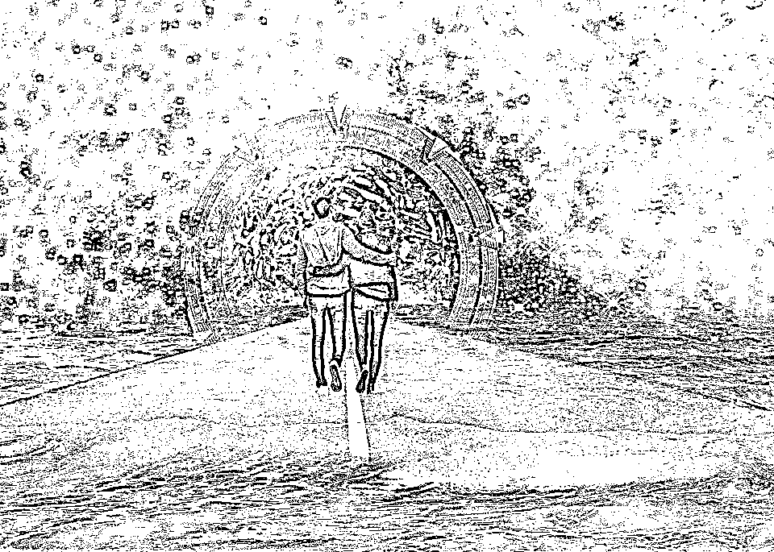

**一周重要天象**

**★****水星进入金牛座，土星四分南北交点**

**4 月 11 日周一，上午 10:09，水星进入金牛座。**水星象征交通流动，信息交流，水星在金牛座，人们关注焦点是收入，安全感，资源和食物等民生需求。

金融股市，基金的保值，如何稳定收入来源成为谈论的重点话题。金牛座和食物相关，我们会关注疫情期间的健康饮食，采购合适自己的食物，宅家期间如何烹饪美食。在非风险的区域，人们会沉迷在咖啡馆，酒精享乐沟通中。

**多关注身体的真实感受，放松身心活动和学会享受当下生活，我们会从现实生活的压力中得到解脱，减轻压力感。**

土星是一颗业力行星，当土星和南北交点（南交天蝎座-北交金牛座）形成困难相位时，银行没钱、饥寒交迫中忍冻挨饿的历史经历、战争后遗症心理创伤、人类对可怕挑战表现出无限的忍耐考验在重复。

**战争仍在持续，打仗和谈判；检测，封闭隔离，疫情仍在持续。**

在巨大现实中，我们都有不同的选择。**当我们学会直面责任和压力，**并站在更宏观的双鱼座能量层面，我们会从恐惧和焦虑中释放压力，拥抱过去，接纳当下。在土星管辖领域下，**从人道主义、利他出发，在群体中学会贡献自己的能量和责任，**用积极正面心态创建未来，抵达圣地。

但如果我们陷入下意识压抑和自我牺牲状态，我们会对权威投射出敌意，对宇宙投射出无所谓冷漠和不负责任态度。当我们如爬山那样，经历这一切挫折和苦难，我们才从会经验学习到智慧，攀爬到山顶。

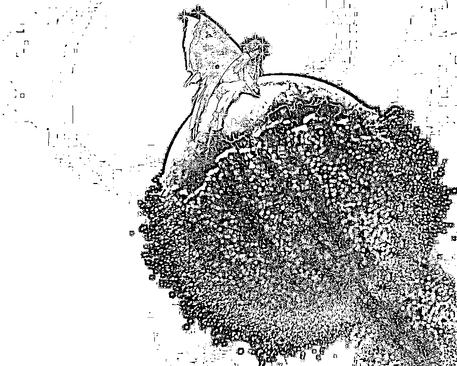

**★****木星与海王星在双鱼座 23°58′合相**

4 月 12 日周二，我们迎来每 13 年的轮回周期。木星和海王星分别是双鱼座的古典和现代守护星，我们内在的心灵意识会被海啸冲击，有美妙无比的梦幻和浪漫，让我们渴望找到人生的使命，**渴望获得心灵的疗愈达到自己梦想和目标。**

双鱼座代表了大爱与慷慨，同理心，包容和接纳的能量，我们会强调精神和意识的能量。**这是能量的转化时刻，并不一定是当下，而是我们需要内在感受去体会到，需要更细腻的觉知。**

如果你有一个创意的梦想，远大项目期待开启，**这是很合适开启和构思的时刻，**也许到 5 月份，你才能将梦想落地。从日常生活层面，这个时刻合适祈祷，冥想，瑜伽练习。

我们需要通过表面幻象看到实相。从社会层面看，疫情和身体的健康会在未来这段时间（也许到 5 月中旬）是我们关注重点，我们可能会寻求一些身心灵学习课程。

**但我们也需要关注木星和海王星负面能量表达，**木星带有“过度膨胀”的风险，海王星有“逃避主义，灵性上瘾”的倾向，我们会在现实的挫折中陷入自欺欺人，渴望被他人拯救虚妄的期待。

**我们是否接纳当下困境和真实的压力呢？**梦想是美好的，但当我们把期待和梦想过度理想化时，我们会带着玫瑰色滤镜看待现实，无法客观面对，玫瑰泡泡就很容易幻灭。

**从社会层面看，需要避免股市或投资理财中过度膨胀，看不清现实，学会适度很重要。**

我们渴望世界和平，但战争打破我们的梦想；我们珍惜日常美好的小确幸，期待稳定的平静，但失事的飞机让我们看到命运无常和残酷；我们在疫情中被各种讯息共情，真假幻象我们也许无法看到，我们渴望获得导师的心灵引导，但忘记自己起心动念学习的初心。

如果无法对灵性有正确的认识和追求，那只会让自己成为等待拯救上瘾者，陷入虚幻。鲁米诗歌这句话送给大家：

**宇宙中的一切都在你体内，
向内寻求一切的答案吧！**

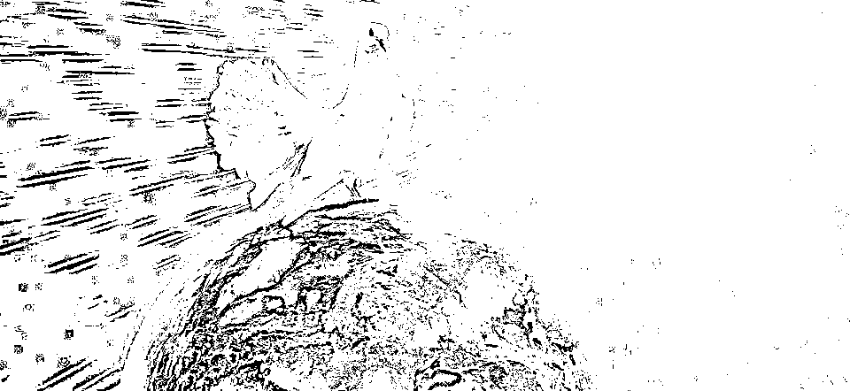

**★****太阳（白羊座）六分土星（水瓶座）**

4 月 13 日周三，太阳和土星的六分相是一个良好互动能量。企业的调整和重组、商业运作模式的调控会为了更好目标而奋斗。

从个体层面看，这是我们学习最佳时刻，**我们可以在土星组织群体协助中，达成自己的奋斗目标。**我们可以向更很有经验的长者学习，在群体互助中找到目标和认同感。

**★****火星进入双鱼座**

**4 月 15 日周五 11:05，火星进入双鱼座。**当战斗的勇士进入双鱼座时，人们内心的创伤会被激活，奋战中打出的拳头如同在海绵般无力。

**当金星、火星、木星和海王星都在双鱼座时候，人们的情绪感受会更敏感，耐心和慈悲，**愿意承受现实的苦难，而不是选择用行动去挑战现实。

这段时间，我们做事的效率不高，节奏会放缓。在社会层面，我们也可能会看到和身心灵相关重大事件发生，我们情绪能量会难以隐藏，敏感也会容易让我们受伤。

火星在双鱼座行进中意味着**很多事情的纠纷会在幕后进行，我们无法看到真实客观真相。**

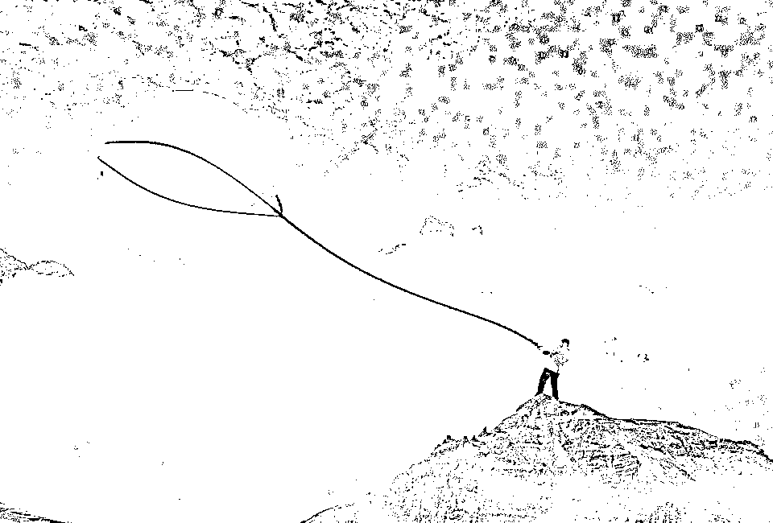

****★****天秤座满月****

**4 月 17 日周日凌晨 2:54，我们将以天秤座满月结束本周**，开启新的一周日程。白羊座太阳、天秤座的月亮分别和摩羯座冥王星形成四分相的结构，冥王星是 T 三角的端点行星。

**这是一组激烈的满月相位，**意味着矛盾和冲突，与世俗抗争的压力和反抗性。挑战中也有柔和相位加持，双鱼座的金星六分金牛座天王星、水星合相天王星，**意味着思维的创新和改变。**

**当我们换个角度看待思维和价值观问题时，我们会对如何丰盛自我、如何与他人构建平等关系产生新洞见。**

太阳和月亮的最终定位星都和双鱼座的能量有关，满月会照亮显化现实世界的冲突，释放我们内在的心灵压力。我们渴望尊重和平等的关系，无论是社会关系还是个体关系，获得平等的待遇、维护自身的权益很重要。

这个过程是艰难的改变，**我们不得不面对意外和混乱，**内心也许会感受到无力和沮丧，但我们在木海合相大天象下，**我们愿意对痛苦敞开，愿意接纳自我一切阴影，**包容这个世界不完美，当我们对世界慷慨的时候，我们才会感受到宇宙的慈悲和慷慨，我们才能看清楚事物真相和细节。

**12 星座的一周运势**

**（重点参考上升星座，其次参考太阳星座）**

***白羊座***

这个月是白羊座宝宝们能量充沛的月份，你们渴望在生活，工作和事业中展现天赋和才华。**水****星本周在你第 2 宫行进，**你对物质生活规划和预算能力会有很大提升，深思熟虑，明智的选择很重要。

木星和海王星的合相是一个神奇的能量，这种能量会打开你心灵意识大门和神秘的体验，**这是内观自我的最佳时机，不要着急去行动。**

朋友圈的活动信息对你有很大影响，在 4 月 15 日前，你会接到朋友电话，短信比较多，你们沟通聊天获得心灵支持力量**。火星换座后，你会花更多时间在休息或调整，**当你做任何事情请三思而后行，这是需要你对未来负责和承诺时刻。

**天秤座满月在你的第 7 宫，**构建什么样伴侣关系，寻找什么样合作伙伴是你需要关注的主题，展现你的魅力吧，让对方看到你与众不同想法和点子。

***金牛座***

这个月是金牛座宝宝们小有成就的月份。金牛们踏实，稳定的态度会获得上司，领导的认同，事业上努力付出有回报。**水星本周在你第 1 宫行进，**你会花很多时间探索他人做事的动机，你可能会不动声色。在财务上你很慎重，不会轻举妄动投资或开销过度。

木星和海王星的合相，你看到朋友圈的众生相，你会从 TA 的身上中获得启发，也可能 TA 给到你一些疑惑，让你误解。

**天秤座的满月，你需要关注如何处理好职场关系，**不要轻易站队，也不要放弃自己的立场很重要。在满月前后，在关系中你也许会面对一些惊喜或意外，处**理好和恋人矛盾，懂得与他人合作很重要。**

***双子座***

双子座是最善于把握机遇的星座，他们对信息的传播，资源的把控，打造人设这方面有先天的优势。**木海合相在你们的第 10 宫，**代表着可遇而不可求的机会，你可以期待梦想和奇迹的发生。

在 12 日前后，当你对宇宙和他人慷慨的时候，你会获得宇宙馈赠的礼物。你可以对外展现更勇敢的面向，成功和幸福在未来召唤着你。

**天秤座的满月在恋爱，享受和娱乐，创意，子女的宫位。**关系中多一些耐心和包容，如果身旁有追求者，如果对方表现出甜言蜜语，保持清醒头脑，不要急于在一起。双子座喜欢快速做决定，如果有孩子家庭，学会和孩子建立尊重和平等关系也很重要。

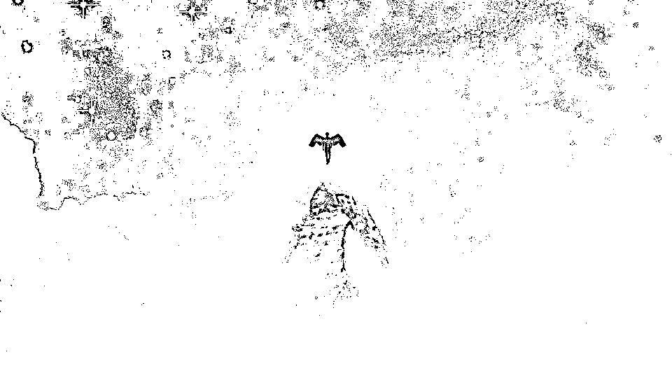

***巨蟹座***

这个月是巨蟹座宝宝们变化比较大的月份。你如果想通过网络平台，开启更高领域的学习，或探索身心灵课题，木星合相海王星是很好的契机。你可能会计划等疫情稳定后开启一趟期待人心的旅途，你也可能会遇到**更重要的客户或领导**，你和他们有良性互动友好关系。

**天秤座满月发生在你的第 4 宫**，你可能前期在家庭事务，家居装修，个人财产方面做一些深入的思考，把这些事情做个完结或决定。

你也可以去探访自己的父母，帮助他们解决生活的问题，通过沟通，有助你了解自己的家族故事。月亮是你的守护星，你比其他人对满月有更深刻的了解和体悟。

***狮子座***

这个月对狮子座而言是需要逐步深入的过程，每件事情并不如期待那样有结果。如果你从事艺术性，慈善机构，社会工作，或心理学方面的工作，你在项目或工作中会取得不错的成就。

**木星海王星合相落入星图的第 8 宫**，这是他人的金钱，和税收、奖金、银行贷款有关，你可能会获得工资以外的收入，但花销也需要慎重。你可能会在本周通过网络开启课程学习计划，渴望智力上分享和提升。

天秤座满月，金星和天王星的能量链接也意味着事业和财务上意外的惊喜，顺应变化才能成长。**满月前后，你可能和亲戚，或好友一起，共同完成某些事情，**分享生活的乐趣。

**学会顺应和敞开心胸很重要，对得失和意外保持平常心，会让你获得更多的合作资源和支持。**

***处女座***

处女座宝宝们这个月会很关注金钱，职场的主题。火星换座前，你在职场工作中发挥重要的动力。如果你是团队项目中一份子，你会成为关键的人物；如果你是自营业者，你推广生意行动力是积极主动的。

如何通过合作关系，获得更多财富机会，你需要学习如何与他人构建良好稳定的合作关系。**木星海王星的合相落入你星图第 7 宫，**说明合作远比单打独斗收益更大。对他人学会更慷慨的付出和支持，你将会收获更丰盛的回报。

**天秤座满月也和你的第 2 宫相关**，满月和冥王星的相位，会让你对金钱财富和信任度主题有更深刻体悟。你可以信任谁，你对目前从事的工作，你感受到财务上的安全保障吗？你是否相信自己工作的努力和付出呢？

**当你对自己有足够财务安全感时，就可以创建更丰盛的未来。**

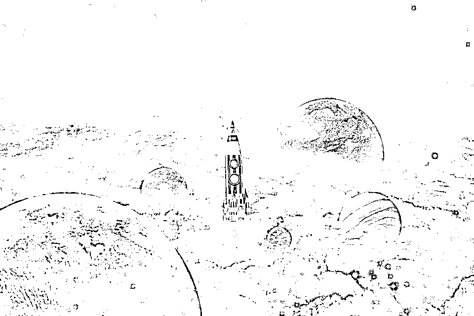

***天秤座***

天秤座关注平等的关系和婚姻关系，他们认为适当的妥协和得体的关系是构建稳定和谐关系基础。

**木海合相在你星图的第 6 宫，金星也在你的 6 宫行进中**，与工作中学会发挥你的创意，与同事建立良好合作关系，让他们看到你在工作中慷慨很重要，创意的项目有助提升你的收入，你的客户或团队管理人员会对你品味和洞察力更有印象。

**天秤座的满月在你的第 1 宫**，这是强有利的位置。你需要考虑关系中的合作者，伴侣关系，你内在真实需求和目的是什么。

满月和冥王星的关系，会让你家人关系有点紧张，也可能是内在心灵层面在经历一个痛苦改变过程，保持冷静和克制，当你突破内心的屏障，痛苦都会过去。

***天蝎座***

这个月对天蝎座宝宝们而言，工作将不再觉得仅仅是工作，**当太阳白羊座点亮你第 6 宫时，你是否会发现一些工作的乐趣？**

**木星与海王星落入你星图第 5 宫**，这是享受恋爱和幸福最佳时光，如果你有孩子，也许你在和孩子相处中感受到思维或灵感的碰撞，让你在生活中展现出自身的魅力，外人会为你着迷。

**天秤座满月在你第 12 宫**，也许你渴望休息，放下日常生活的疲惫和压力。在周末两天放下日常安排，不用去想孩子、工作和生活其他事情，给自己放松的时光。

**享受生活很重要，可以什么都不做，学会发呆，冥想也是人生的一部分。**

***射手座***

这是专注自我和目标实现的一个月，射手座宝宝们可能感觉到一些动荡。本周火星换座到双鱼座，**你的财务会从人情社交的开销到家庭开销的主题变化。**

**木星海王星落入你星图第 4 宫**，合适你改善家居环境，让自己居住环境更舒适，增添一件不错艺术品也是不错的选择。你也可能从父母家得到更多的支持和帮助。

**天秤座满月在你第 11 宫**，对享受，乐趣，社交的愿望会被强调。你可以和家人，朋友一起享受热闹和快乐的周末聚会。

你也许需要更多资金来支持某个意外的项目，你可能感受到压力，但射手座乐观需要灵活处理，你可以从长辈获得支持和帮助。

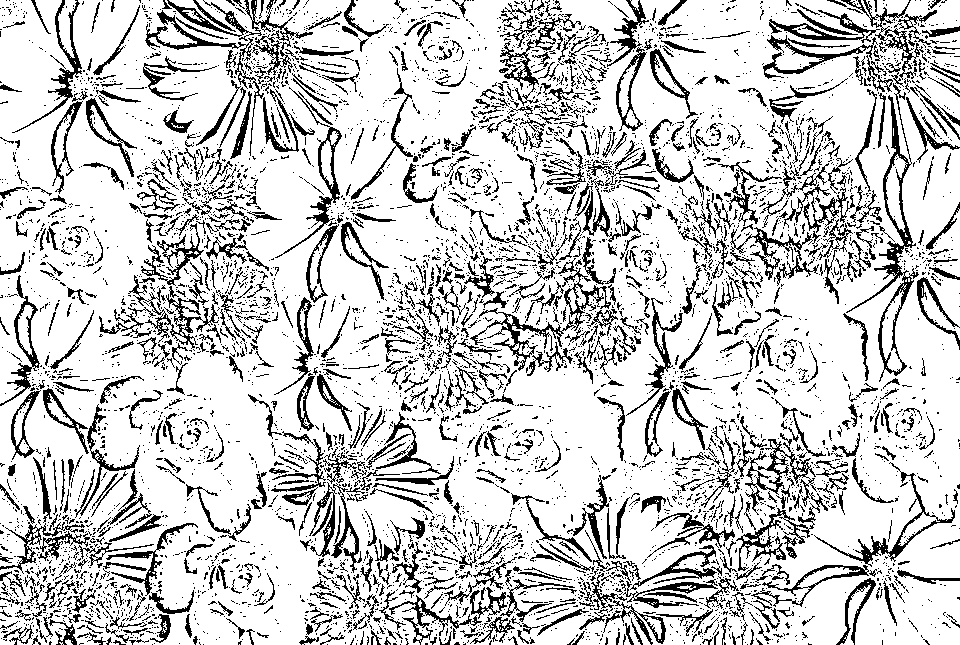

***摩羯座***

这个月对摩羯座宝宝们是很高效的月份，家庭事务、孩子生活是你本月的重点。**随着水星和火星的换座，你会在真爱感情，孩子，创作方面思考更多**，摩羯座的稳重会让你不容易被虚幻的美好吸引。

**木星与海王星的合相落入你星图第 3 宫**，如果你想写小说，创作绘画那就展开你的想象力去创作吧。如果你想和朋友在市郊附近旅游，在网络沟通策划你们的计划，虽然现在无法成行，但也许未来 5 月是你们欢聚的好时光。

**天秤座满月在你的第 10 宫，**你可以和家人分享你在事业发展中的讯息，你对事业规划的想法和计划。满月是清理释放的过程，可以通过清理家居空间，或者清理内心沉积已久灰尘或负面想法，对未来目标有更乐观的确定的规划。

***水瓶座***

你准备已久的计划即将推出和兑现承诺，你期待自己承担的责任和目标可以实现。**本周随着火星的换座，你在个人财务上开支可能会提升**，前期你会努力拓展自己项目获得收益，后期会在开销方面增加。

**木星与海王星合相在你的第 2 宫**，任何从事创意，艺术或通过灵性工作获得水瓶座宝贝们都可能在经济上获得良好的成绩。

**满月在你的第 9 宫**，现在无法进行长途旅行，但如果你专注于你的课程学习后的传播和分享，很多人会从你的分享收益，你也会获得他人的支持。你的个人魅力会让你收获到更多转变的契机。

***双鱼座***

本月对双鱼座宝宝们是一个梦幻般的日子！**当金星，火星，木星和海王星都汇聚你的第 1 宫时，任何事情都可能发生。**爱情，梦幻的泡沫，机遇和好运都有可能实现。

木星海王星的合相不是仅仅在 4 月 12 日发生，你需要观察体会那天的感受，**很多事情也许在 5 月或未来周期我们才能看到突破。**白羊月最后几天，你再考虑自己财务计划目标，你在思考口袋的钱是否足够支出满足你的生活目标。

**天秤座满月发生在你的第 8 宫**，你会通过找到合适途径，解决房贷，装修费用或合作投资加盟费等相关的问题。不要被冥王星能量吓到，不要为钱担心，你拥有赚钱的潜力。专注你的目标和可以调动的资源，学会和政府机关、机构建立良好关系，有助于你创造属于你的好运！

**版权声明**：原创文章由作者授权首发于若道平台发布，欢迎转发，反对抄袭。友号转载请申请白名单。

****

**苏黎（Sulis）**

ISAR 国际认证占星师（2019 年获得）/塔罗咨询师

现代占星融合古典解读

20 多年跨行业领域职场经历

**咨询微信**：liuzq26

**公众号**：Sulis_1975

长按打赏

**20 位来自世界各地的占星师****带来 20 场沙龙——新世界的觉醒****详情可点击下图**

**学习占星学****点击下图了解课程详情**

**

**微信又双叒叕改版啦，不想错过若道君的推送？**

**就把若道设为星标吧！**

**▼**

**喜欢记得点一下在看哦☟**

**报名直达入口**

# 雷蒙德·梅里曼金融占星周运 | 全球股票指数有望良好表现

> 原文：[`mp.weixin.qq.com/s?__biz=MzA5NjA0NTAxNg==&mid=2651471296&idx=2&sn=5a855013a23f18ec15fdb3ae6d7d899a&chksm=8b488f77bc3f0661fd3b83443012de5a83bacb4eea07f210b7ac83456f45cd3bbf1408e013b2&scene=126&sessionid=1692737832#rd`](http://mp.weixin.qq.com/s?__biz=MzA5NjA0NTAxNg==&mid=2651471296&idx=2&sn=5a855013a23f18ec15fdb3ae6d7d899a&chksm=8b488f77bc3f0661fd3b83443012de5a83bacb4eea07f210b7ac83456f45cd3bbf1408e013b2&scene=126&sessionid=1692737832#rd)

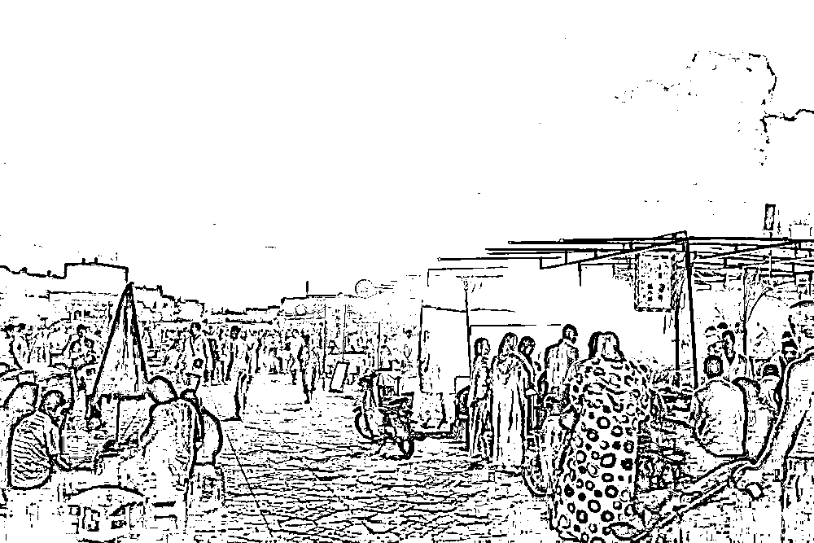

作者/雷蒙德·梅里曼 译者/Luke
编辑/玫瑰 图片/pexels

雷蒙德·梅里曼是在金融占星学界稳坐第一把交椅的占星师，同时他也是若道签约的金融占星课老师，我们引进了雷蒙德·梅里曼老师的《[上证指数月度报告](http://mp.weixin.qq.com/s?__biz=MzA5NjA0NTAxNg==&mid=2651470181&idx=1&sn=69c248709bdc518b2e58236b802e80bc&chksm=8b488bd2bc3f02c4ce70d642da1670983877d3ce09fe99911c635c8e90b0d95ab332e84ee2b9&scene=21#wechat_redirect)》及《[黄金报告](http://mp.weixin.qq.com/s?__biz=MzA5NjA0NTAxNg==&mid=2651470181&idx=1&sn=69c248709bdc518b2e58236b802e80bc&chksm=8b488bd2bc3f02c4ce70d642da1670983877d3ce09fe99911c635c8e90b0d95ab332e84ee2b9&scene=21#wechat_redirect)》。我们经老师的授权，将每周刊登梅里曼老师的周运，供大家参考和学习。于是，这是本周的周运（4.11-4.15）。

**说明：以下时间采用纽约证券交易所所在地美国东部标准时间。**

**展望与回顾**

****

**（关于通货膨胀）拉里·萨默斯从一开始就是正确的。他写道，美联储现行政策“可能导致滞胀……失业率和通胀率在未来几年平均超过 5%，并最终导致大衰退”。 **

**——威廉·A.·加尔斯顿**

**《通货膨胀将如何结束？》**

**《华尔街日报》**

**2022 年 4 月 6 日**

**现代货币理论是这样一个经济理论，它宣称政府可以印钱而不用顾忌后果，仅仅因为它是货币的发行方。**

**——梅勒妮·洛克特**

**《什么是现代货币理论？》**

**www.busnessinsider.com**

**2021 年 10 月 6 日**

尽管纵情享乐时很快活，但是宴会已经结束了。如今现代货币理论已经声名狼藉，其支持者反复斟满的酒杯已经空了。

3 月 29 日-4 月 5 日，金星、火星和土星形成三重合相，它们上周为全球股票市场浇下一盆冷水。人们清醒过来，开始充分意识到现实（土星），那就是除非采取激进的货币紧缩（更高的利率，减少美联储的资产负债表），否则通货膨胀无法被抑制。

此外，俄罗斯对乌克兰的战争，也不利于能源和食物等必需商品的全球供应链流动，这进一步加重了全球通胀。经济增长的可能性正在迅速降低，经济衰退的可能性正在增加。

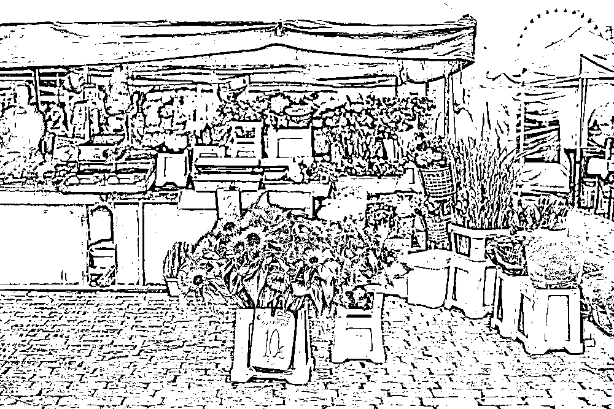

在这一背景下，许多全球股票价格在 3 月 29 日金星合相土星时，终止了为期一个月令人印象深刻的上涨，其他一些指数的上涨持续到上周初，但都在 4 月 5 日火星合相土星时开始下跌。

与此同时，行进的火星也激活了纽约证券交易所（1792 年 5 月 17 日成立）星图中的水星-冥王星四分相，持续到 4 月 7 日。**在火星-土星能量的影响下，金融市场整周都在挣扎着获取上行动能，同时全世界也在努力解决通胀和化解战争冲突。**

上周一定程度上表现不错的两个市场，是黄金和谷物。黄金上涨超过 20 美元，同时玉米、大豆和小麦都走在走高。但它们没有创下新高，可能此轮上涨仅仅是修正性反弹，被通货膨胀和战争困扰引发。

原油、比特币和以太坊有所下跌，度过了总体上波澜不惊的一周。实际上，上周值得注意的是美国国债，因为 10 年期国债自 2018 年 12 月以来第一次跌破 120。这仅仅是另一个迹象，显示出随着银行贷款变得更加严格，流动性即将枯竭。

一旦零利率的时代过去，现金可能很快为王，符合过去两年《年度金融预报》中对土星-冥王星 32-37 年周期的看法。

**短期占星趋势和长期考量**

上周火星-土星合相发生在水瓶座 22°，与在金牛座/天蝎座 24°的月亮交点轴线形成四分相。

在古典占星学中，火星掌管力量，土星掌管阻力。合在一起，它们代表投注巨大的能量，迫使一个拒绝妥协的情境改变。它可以代表困难的情境，让对立的双方都感到挫败。它是进攻（火星）与防御（土星）的对决，最终导致僵局。

**随着宇宙从土星能量主导（担忧和收缩）转移到木星能量主导（乐观和扩张），情绪的钟摆开始摆向信心。****本周木星-海王星的 14 年会合（合相）周期发生在双鱼座，它是这两颗行星联合守护的星座**。

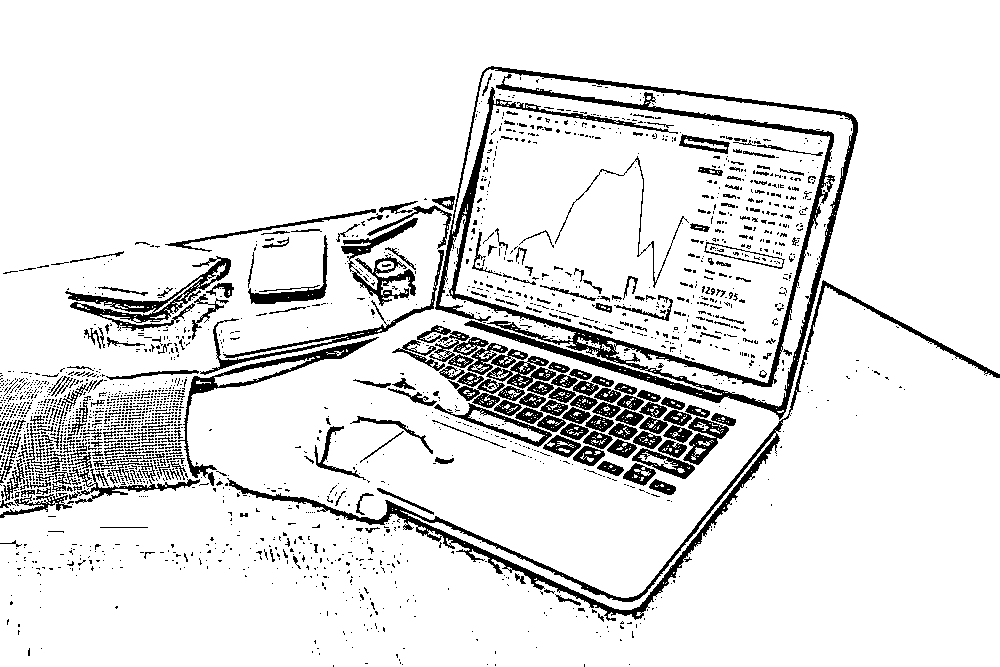

我想到一句格言，“希望之泉永恒”，意味着尽管面对逆境，人们也抱着最好的希望。毫无疑问的是，如今的世界面对着大量的逆境。对

于木星，这里总有希望。对于海王星，也有希望，但只有存在信任的时候才会有效，因为海王星（和双鱼座）往往流于天真，容易受到欺骗。不过，**当希望的气息存在时，全球股票指数往往表现良好。**

正如本专栏常说的那样，**木星与海王星的相位可能会凸显非理性繁荣和欣快时期，或歇斯底里和恐慌的时期。**如果全球股票市场继续下跌得更低，3 月唤起的希望可能会蒸发，演变成 4 月的恐慌。

但我们不要太过于悲观，因为尽管过去 10 天金星、火星合相土星，我们很快将发现 4 月底时金星合相木星和海王星。土星和木星的区别就像夜晚和白天。

因此，3 月 29 日-4 月 7 日和 4 月 12 日-30 日之间的集体心理，就像穷酸的土豆餐和精致的法国晚宴一样天差地别。如果有可能，一个人应该在接下来 3 周充分享受生活。

当然，对于木星（丰盛）和海王星在双鱼座（水）的合相，这些日子可能充斥着暴雨和洪水，所以确保你手边带着雨伞（或小船）。或者对于浪漫主义者来说，如果你因为随意的善举而流下感动的泪水，那么就准备好手帕吧。

这个月，人类能够不可思议地表达对彼此的关心。

**说明：以上日期基于纽约证券交易所所在的美国东部标准时间，由于存在时差，中国地区可能需要加一天。**

**版权声明：**本文由若道翻译发布，欢迎转发，反对抄袭。友号转载请申请白名单。

**雷蒙德·梅里曼（Raymond Merriman）**

若道签约老师。著名金融占星师，ISAR（国际占星研究协会）前主席，梅里曼市场分析公司的总裁。他由于“提升了占星学的职业形象”，在 1995 年国际占星大会上被授予轩辕十四奖；在 2012 年国际占星大会上，被授予轩辕十四终身成就奖。

1“中国上证指数月度报告”发售**若道推出了****中文版****的雷蒙德·梅里曼中国上证指数月度报告，并持续发行该报告！**当把金融市场的周期和占星学的周期相结合时，雷蒙德·梅里曼老师的金融占星学研究**为投资者应对金融市场的周期波动，并随之调整投资策略提供了极大的价值参考**。
**4 月中英文报告已上线！**2“黄金价格周期月度报告”发售**若道推出****中文版****的雷蒙德·梅里曼黄金价格周期月度报告！**不仅仅为广大读者在中国股市的投资出谋划策，更将视角放眼黄金市场。**每当世界经济形式不明朗的时候，有一个地方是保值的港湾，那就是****黄金**。自 1982 年雷蒙德·梅里曼出版第一本研究《地球宇宙学征象与黄金价格的关联》的著作以来，**他一直作为最重要的黄金市场时机预测者之一享誉国际**。2022 年 4 月黄金报告已上线，梅里曼老师将会告诉你他对这个关键时期如何操作的想法。也可以按照季度和一年期订阅，有更多优惠。季度和年度的好处是，你可以持续了解梅里曼老师对于不断在变化的市场的看法。即便他某一次看法和市场不一致，你也看到在下一期他如何调整自己的看法，并看到金融占星在一个长期时间段内对你把控风险的帮助。而能够长期控制风险、尽量找到安全的投资时机才是投资的长久之计。**4 月中英文报告已上线！****购买套餐**，买得越多越优惠中国上证指数月度报告套餐价

*   **单月报告**：280 元
*   **3 个月套餐**：780 元（260 元/月）
*   **12 个月套餐价**：2400 元（200 元/月）

**长按下图识别二维码****购买金融报告****套餐****▼**

黄金周期月度报告优惠

*   **双报告年度套餐更优惠（直降 900 元）**

*   **12 个月黄金报告+12 个月上证指数报告：仅需 3900 元**

**长按下图识别二维码购买黄金报告套餐**▼

3《2022 年金融预报和沙龙》1976 年以来，由雷蒙德·A·梅里曼撰写的梅里曼市场时机学院每年一次的年度预报沙龙和每年一本的《年度预报》一直在应用占星学原理为投资者们服务，提供卓越洞见，从未间断。 **雷蒙德·梅里曼《2022 年金融预报和沙龙》发售中（报告已发布）。****长按下图识别二维码了解详情**
▼

**点击阅读原文购买金融报告**

# 月亮进狮子座，面对最近的境况，你有哪些让自己开心的小方法？

> 原文：[`mp.weixin.qq.com/s?__biz=MzA5NjA0NTAxNg==&mid=2651471290&idx=1&sn=4a97acc113a47880e84f02b9c1d7b2be&chksm=8b488f0dbc3f061bb6f5e078e1f31d7b4de8850df939854168c1c534f9a9c6fc34b96f01cfe8&scene=126&sessionid=1692737832#rd`](http://mp.weixin.qq.com/s?__biz=MzA5NjA0NTAxNg==&mid=2651471290&idx=1&sn=4a97acc113a47880e84f02b9c1d7b2be&chksm=8b488f0dbc3f061bb6f5e078e1f31d7b4de8850df939854168c1c534f9a9c6fc34b96f01cfe8&scene=126&sessionid=1692737832#rd)

**2022 年 4 月 10 日天象：**

*   **11:59 月亮进入狮子座**

*   ******太阳六分土星******

*   ******水星四分冥王星******

*   ******木星合相海王星******

今天中午，月亮从居家的巨蟹座进入闪耀的狮子座，如果这两天一直被情绪缠绕，不如试着让自己“活力”一下吧！无论你是因为疫情的缘故需要待在室内空间，还是可以享受户外的春光，都可以让自己成为释放光芒的小太阳！白羊座太阳和水瓶座土星呈六分相，你的目标有了可行的计划了吗？朋友们没准可以提供靠谱的意见哦~水星四分冥王星，借这个机会，我们也可以看清现实，深入真相，发现事情的真实情况。本周，金星进入[【双鱼座】](http://mp.weixin.qq.com/s?__biz=MzA5NjA0NTAxNg==&mid=2651470854&idx=1&sn=437fef75933a93b1e5a3b043a94dea9d&chksm=8b488eb1bc3f07a79d8340ed1177b272a8a9297f476d8fb4c2dc61adb67435962993254e0258&scene=21#wechat_redirect)（点击查看文章），我们的身体和思绪得以放松，带回内在的愉悦感和平衡感。或许在今天，让自己进入音乐、舞蹈、诗歌、绘画、戏剧等艺术形式的世界，也是很好的放松方法哦。疫情反反复复，让人心情不怎么美丽，而面对最近的境况，你都有哪些让自己开心的小方法？欢迎跟大家分享呀~周日快乐！我们明天见！**了解每日天象，可****下载“若道”APP 查看****还有更多精彩等着你哦**

# 木海合相就要来了，上证和黄金怎么走？丨梅里曼 4 月上证+黄金报告上线！

> 原文：[`mp.weixin.qq.com/s?__biz=MzA5NjA0NTAxNg==&mid=2651471289&idx=1&sn=c415f3a631c24902a29b46b8f26ec191&chksm=8b488f0ebc3f061824482102f1a72435bc82b50b8f2f607f3367f291a42022deee59388a7864&scene=126&sessionid=1692737832#rd`](http://mp.weixin.qq.com/s?__biz=MzA5NjA0NTAxNg==&mid=2651471289&idx=1&sn=c415f3a631c24902a29b46b8f26ec191&chksm=8b488f0ebc3f061824482102f1a72435bc82b50b8f2f607f3367f291a42022deee59388a7864&scene=126&sessionid=1692737832#rd)

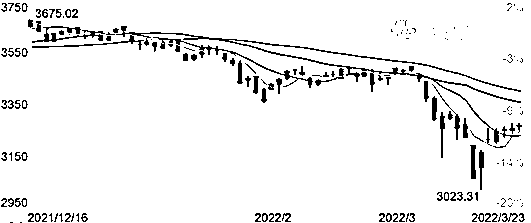

| 上证指数日 K 线图

上证指数在过去一个月经历了最疯狂的下跌。

随后，金融工作会议的召开，让上证找到了政策的底部，因此开启了触底反弹。现在的问题是，**这个底部是不是确定了，有没有实质的支撑？**

在 3 月份的上证报告中，雷里曼老师写道：

**“当前的 13-20 周基本周期始于 11 月 10 日的低点 3448。因此 2 月 21 日开启了本轮周期的第 15 周。最近的低点，1 月 28 日的 3356，在这个周期的第 11 周出现。它跌破了开启周期的那个低点，这意味着这个周期是看跌的，也就是说最终的低点——最低的价格——将在基本周期结束时出现，它会在接下来 5 周的任何时间出现。”**

**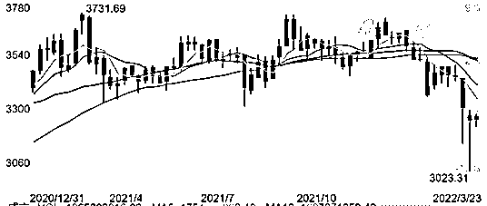**

| 上证指数周 K 线图

这个低点 3023 出现在 3 月 16 日，13-20 周的基本周期的第 18 周，也即 3 月报告中所预测的第 4 周内出现了。

正如我们在上次所提及，**从技术角度看，今年的 3 月和 7 月都是关键月份。**3 月份的政策底部已经出现。市场还会再次试探这个底部吗？

**4 月木海合相，上证会怎么走？**

2022 年 4 月应该如何操作，金融占星大师雷蒙德·梅里曼的**《2022 年 4 月上证指数报告》已上线，**你可以听听梅里曼老师的看法。

**《2022 年 4 月黄金报告》也已上线，欢迎购买。**

**4 月上证报告上线**

**上证指数月度报告价格****单月报告**：280 元/月 **季度套餐价格**：780 元（260 元/月）**年度套餐价格**：2400 元（200 元/月）**长按下图识别二维码购买上证指数报告**
▼

“**黄金是金钱。其他的只是信贷。**

**——约翰·皮尔庞特·摩根**

”

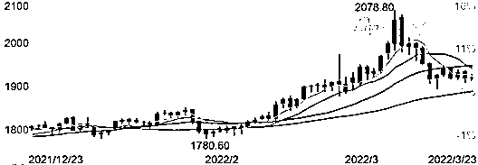

| 黄金走势日 K 线图
黄金价格在 1 月 28 日探底 1780，在乌俄战争爆发后持续上涨到 3 月 8 日的 2018.8，2 个月上涨 13.4%，同时也和 2020 年 8 月的最高点 2089.2 形成双顶。

正如过去所说，**今年最重要的一个天象是 4 月 12 日发生的木星-海王星双鱼座合相。**这个合相通常会造成一种歇斯底里的气氛。由于大规模的货币超发，通货膨胀率在美国已经达到 40 年来的新高。战争造成石油和粮食价格高起，也进一步推动通货膨胀。而在木海合相时期，很可能成为黄金看涨的助推力。同时，美联储已经开始收紧货币政策，这将会看涨美元，对贵金属构成看跌压力。

从天象看，接下来一个月，火天、火土可能也会造成战争的升级。**而木海合相越来越近，在激烈的战事和通货膨胀阴影笼罩之下，黄金会上演最后的上涨吗？**

黄金报告已经上线，上证报告本周也将上线。欢迎了解。**也可以按照季度和 1 年期订阅，有更多优惠。**季度和年度的好处是，你可以持续了解梅里曼老师对于不断在变化的市场的看法。即便他某一次看法和市场不一致，你也看到在下一期他如何调整自己的看法，并看到金融占星在一个长期时间段内对你把控风险的帮助。**而能够长期控制风险、尽量找到安全的投资时机才是投资的长久之计。**

点击阅读原文，雷蒙德·梅里曼黄金周期 2022 年 4 月报告带来有 40 年黄金市场研究经验的世界著名金融占星大师雷蒙德·梅里曼对当前黄金市场的研究。

**也欢迎购买雷蒙德·梅里曼《2022 年金融年度预报和沙龙》，《2022 年四位占星大师天象预测》课程，这些预测都将帮助你对 2022 年的变化加深了解。**

**投资有收益，投资有风险，希望金融占星学的研究帮助你更好地评估你的投资。**

**扫描下图二维码了解详情**

▼

**2022 年 4 月黄金报告上线**

**黄金月度报告价格****单月报告**：280 元/月 **季度套餐价格**：780 元（260 元/月）**年度套餐价格**：2400 元（200 元/月）**双报告年度套餐更优惠（直降 900 元）****12 个月黄金报告+12 个月上证指数报告：仅需 3900 元****长按下图识别二维码购买黄金报告**
▼

**购买者需知**

**① **梅里曼市场时机学院《中国上证指数月度研究报告》是梅里曼市场时机学院（以下简称 MMA）的研究“预报”，而不是市场“预测”，是梅里曼老师及 MMA 金融占星分析师对人类活动周期历史与行星周期之间相关性的研究，二者在大部分情况下具有 80%或更高的相关性，而不是因果关系。报告中的研究完全存在错误的可能性。即便是非常认真的研究和几十年的研究经验，金融占星师无法总是正确地解读出各种征象在实际层面上会如何相互作用，并显化为事件结果。

所以请将报告看作一个研究参考，务必结合其他市场研究和你个人对市场的理解，根据你的自由意志做决策。

**②** 此报告一旦售出，**即不接受退款。**

**③** 上证、黄金月度报告每月固定 1 期，**并非都是在每月相同日期发布。**

**④** **我们收到英文报告的当天，即发布该英文报告。3 天后，上线报告中文版。此报告仅支持手机网页阅读，不支持电脑阅读和下载。****以上须知，请仔细阅读。一旦付款，即视为已了解并接受所有须知内容。**在过去的 40 年中，唯有梅里曼逐渐完善，并在梅里曼市场时机学院月度周期报告中阐释了将地球宇宙学与周期相结合的研究方法，以惊人的精确性预报了黄金价格发生重大变化的时间。**黄金购买 Tip**

各大银行均可购买黄金或黄金 EFT 基金，也可以在诸如天天基金或者支付宝购买黄金及黄金相关产品。不明白的可以百度搜索。

**购买后如何查看报告？**

**购买后有疑问怎么办？**请联系技术客服
**微信：nodoor201705**

**购买上证+黄金报告直达入口**

# 深度干货丨天海周期：如此关键的“第二轴心时代”，我们普通人能做什么？

> 原文：[`mp.weixin.qq.com/s?__biz=MzA5NjA0NTAxNg==&mid=2651471189&idx=1&sn=c270a33e4c0259ff119b58e0b1d5b3b2&chksm=8b488fe2bc3f06f4a331e10f80c93df30aa052c5b7f417af71b6fdcba52af68e41e2cba94991&scene=126&sessionid=1692737837#rd`](http://mp.weixin.qq.com/s?__biz=MzA5NjA0NTAxNg==&mid=2651471189&idx=1&sn=c270a33e4c0259ff119b58e0b1d5b3b2&chksm=8b488fe2bc3f06f4a331e10f80c93df30aa052c5b7f417af71b6fdcba52af68e41e2cba94991&scene=126&sessionid=1692737837#rd)

******☆ ****后台回复“今日”，给你一句生命态度******

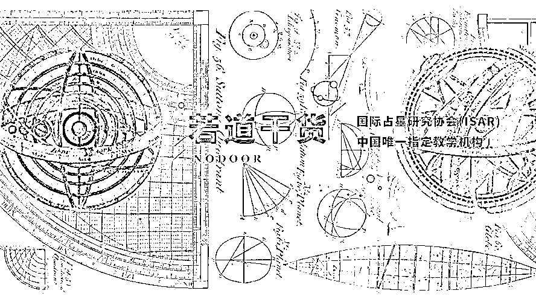

作者/乐木
编辑/翀子 封面/书君 图片/网络在[【上篇】](http://mp.weixin.qq.com/s?__biz=MzA5NjA0NTAxNg==&mid=2651470990&idx=1&sn=8ee5c9e4d4236e6f73c4d3dcb25a7632&chksm=8b488e39bc3f072f5933e780ee077cbdc6852d19339990afc3087005bf208aca8f36439e59c5&scene=21#wechat_redirect)，作者梳理了天王星与海王星的行星原型与神话，从久远的历史中点明天王星与海王星的汇合周期（171 年）对人类发展的推动作用。这篇将继续未完成的旅程，让我们更深入的领略行星周期的魅力。**科学兴起：物质与精神的对立**

**让我们再来看看，19 世纪初至上世纪末的这轮天海周期（也是距离当下周期最近的一次）。**

**1821 年，天海合相在摩羯座初度。**这一年，拿破仑在圣赫勒拿岛上去世。作为人类最早的民主政府——法兰西共和国的领袖，欧洲第一个不是因为血统登基的皇帝，拿破仑向所有人展示了从平民身份到皇帝身份的转变过程，开启了神（皇帝）与人（平民）之间的新故事。

**民主革命推翻了君主制**——那些似乎天生更高贵的人，并不拥有高于他人的权力，其地位更不是来自“神”的旨意。

类似的主题预告还可见于同一时期，诗人帕西·雪莱发表的《解放了的普罗米修斯》。这篇诗剧是基于古希腊的《被缚的普罗米修斯》故事进行的新改写（此处又见天海原型，在对古典神话的更新里，表达出新时代的解放精神）。

不同于早期的希腊版本，在新版的结尾，为拯救人类而备受酷刑的普罗米修斯没有与宙斯和解，而是联合冥王哈迪斯，将暴君宙斯打入了地狱，**“人类从此一律平等，没有阶级、民族和国家的区别”。**

恩格斯称雪莱是“天才预言家”——在这本著作发表后的一百多年里，不同身份（各阶层、肤色、种族）的群体，实现了自由与解放：延续数千年的奴隶制度被废除了，充满歧视的种族隔离制度也被废除了（最后一个结束种族隔离的南非，是在 1991 年）。

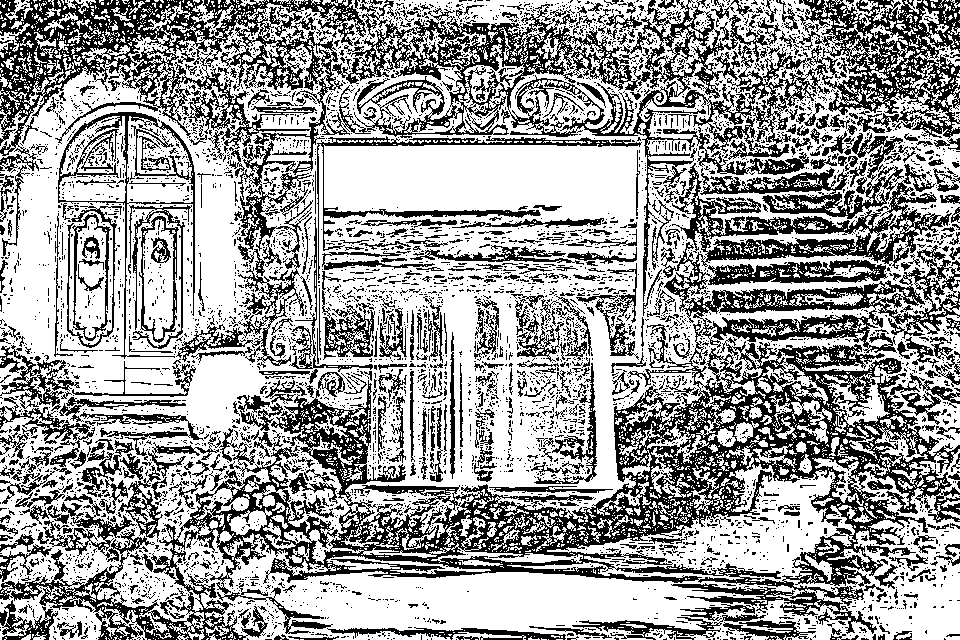

**而 1960 年代（当时正值天冥合相）**，在民权运动、女权运动中，发出了更多关于身份平等的呼声。人性的尊严和民主自由，成为当时社会中广泛认可的观念。

**不过，正如海王星所象征的复杂性，当天海结盟时，“进步”的各种征象里，也常常伴随着微妙的文化影响力。**

19 世纪另一部更具标志性的、预言般的文学作品，是年仅 19 岁的雪莱夫人于 1818 年发表的《弗兰肯斯坦——现代普罗米修斯》（又名“科学怪人”）。这本作品被视为科幻小说的鼻祖。

书中描述了科学家试图制造人类的故事。被科学拼接出的“怪物”既无法融入人类社会，也不受科学家控制，最终悲剧结尾。书中以文学形式，反应了 19 世纪科学发展的深层议题，**讽刺了当代科学（天王星）试图代替造物主（海王星），不惜代价追求一切知识的自负傲慢。**

**从十七世纪的启蒙运动开始（再上一个天海周期）**，随着天文学、物理学、数学、化学等自然科学的进步与发展，神、宗教信仰，以及所有不能被科学证明的理论体系和思想，统统受到了质疑（天王星）。占星学也被排除在正规学术之外，与天文学分离。

**进入十九世纪后，科学已发展成了人们追求真理、驳斥神秘学与信仰的工具（或是武器）**——越来越多的人相信，科学即真理。世界是一个脱离思想而存在的物质实体，而人的思维活动，不过是由电流和化学反应维持。

在机械唯物哲学观的主导下，精确的测量征服了广袤无限；**客观的头脑（天王星）**，好像就足以洞悉**混沌世界的全部缩影（海王星）**。而探寻精神世界的各种学说体系，被科学定义为了人们自我安慰、试图抵抗空虚感的虚构故事。

不仅如此，对比一下轴心时代更具浪漫主义色彩的科学（比如，数与神学·毕达哥拉斯），19 世纪的科学发展，总体更以物质主义为导向。提升效率，发明更多的机械、电器和武器；强调新技术带来的利益，而非伦理道德风险（体现了摩羯座功利主义的阴影）。

到了十九世纪末，人们认为唯物科学理论已经趋于完美，**“物理大厦已经落成，所剩的只是一些修饰工作”。然而，修饰工作再也没有等到完美收官的那一天，“两朵乌云笼罩住了大厦上方美丽的晴空（物理学家威廉·汤姆森 1900 年）”**。

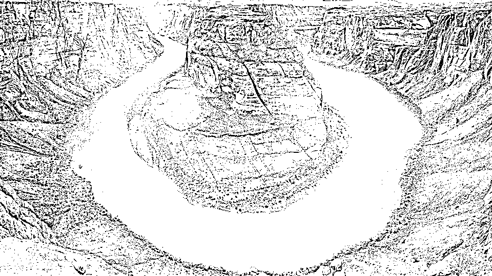

**在 20 世纪初（天海对分时）**，相对论和量子力学的发现，颠覆了传统物理学，随着尼尔斯 玻尔（量子力学奠基人之一）那句著名的名言——**“我们称之为真实的一切，都是由那些不被视为真实的东西构成的”**，“唯物科学之神”悄然进入了黄昏。

不仅是没有等来完美的大厦。一个切断了精神世界联系的世界，也只留下了孤立的心智碎片，和存在主义者们幻想出的神话。

如同科学家弗兰肯斯坦拼接出的躯壳，即使闪电（天王星）给了它生命，却无法让它真正拥有一个完整的灵魂（海王）。**在身体与心灵、意识与精神的分离中，无论个体还是集体，都会在碎片化的世界中失去方向。**

**在那个时代，人们纷纷失去了与心灵的对话，任由集体意识淹没自己**；笃信物质主义和现实主义的阵营，把对立的国家拼接在一起，而相同的民族却被隔离在两边；不同的信仰、割裂的文明，为纷争与战乱种下了种子。

即使今天，仍可在东欧目睹到一些阴影的延续。而这种割裂所产生的影响，到了周期末期，在 1990 年前后达到了极致：苏联解体，一些战争结束了（两伊战争，教派和土地之争），一些战争又开始了（海湾战争，还是来自历史土地的划分）。

**上一个周期留下的问题与遗产，也成为了新周期之初的背景。如同不断涌来的波浪，连续而坚定的发展着前一个周期的故事和神话。**

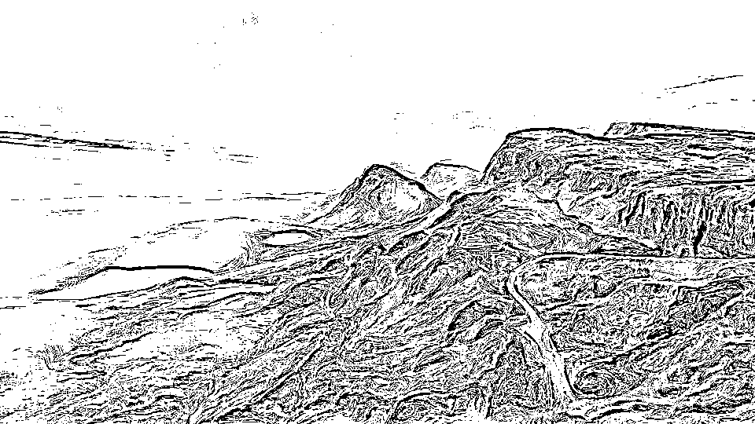

**天海摩羯座的下半场**

20 世纪 90 年代天海合相之初，美国神学家尤尔特·卡曾斯（Ewert Cousins）提出，人类历史可分为三个阶段：轴心前时代、轴心时代和第二轴心时代。**“在二十一世纪，我们可以看到另一种意识的转变。它意义深远，我称之为第二个轴心时代。”**

对比第一次轴心时代，除了天王星、海王星、冥王星合相外，当时的冥王星（金牛座 12 度左右）也恰好来到了远日点（离太阳最远的位置）；而上世纪 90 年代的天海合相，令人惊讶地，冥王星（天蝎座 12 度）来到了近日点，它离太阳最近的位置。

想想海王星与冥王星轨道的关系，二个交叉的圆。在冥王星围着太阳 248 年的时间里，有 20 年，它会穿过海王星轨道，开始比海王星更接近太阳，一直走到最近的近日点。其余 200 多年的时间，它又会滑行出去，远离太阳，滑出海王星驻扎的太阳系的边界。

**如果说海王星象征了那扇神秘的玻璃窗，飘浮在意识世界（以太阳为中心的太阳系）与无法看到的意识（太阳系外的宇宙）之间，那冥王星就像穿行在二个世界的“萨满”**。大部分时间，它呆在海王星外面的神秘世界，偶尔插进来，向意识的世界（太阳系）解封一些神秘的信息。

1979 年 2 月 7 日，冥王星进入海王星轨道，比海王星更靠近太阳。1989 年达到近日点，随后开始远离，历经了 20 年零 4 天之后（1999 年 2 月 11 日），缓慢地回到海王星之外。

离太阳越近的行星运转速度越快。近日点的冥王星，像一个隐藏的脚注，**提示着某种深层能量的释放，激烈性和强迫的感觉被强调了，以及，必然的转化。**

二十世纪 90 年代，天文学上首先迎来了一段黄金复兴时期。哈勃望远镜成了人们在宇宙里看得最远的眼睛，无论是时间还是空间上。**随后一系列的新发现，一次又一次唤醒了人们对宇宙的惊叹与敬畏。**

**如果我们相信天空与心灵的镜像关系，那么在宇宙知识大爆炸的时代，是否会有一种预言，宣告它与打开人类心灵意识的共时性？**

二十世纪 90 年代，随着个人电脑（PC）普及，海底电缆把世界各地的互联网连在了一起，跟着精灵一般的搜索引擎，我们可以去往任何一个不可思议的地方。

地球变得越来越小（我们有了比飞机，火箭快的多的意识交通工具），它又变得越来越大（每一秒都能找到新的发现）。从数字革命，到今天谈论的媒体文化现象（无论好坏），互联网对整个时代的意识塑形可谓功不可没。

意识的媒介从时间、空间上被彻底改变了；任何角落的声音都可能“瞬间”被所有人听到；正如尤尔特·卡曾斯所说，“全球意识在这个时代真正形成，所有人经历着单一、共同的历史时代”。

文明的集体意识海洋变得无比广阔、深邃，紧密相联。但硬币的另一面呢，集体无意识泛滥的泡沫。**当寻求刺激的疯狂（天王星）与虚假欺骗（海王星）合谋时，大海就会显露狂暴和不理智的一面。**更别提，混沌的水流对流行文化的操纵，对集体价值观微妙的渗透和侵蚀。

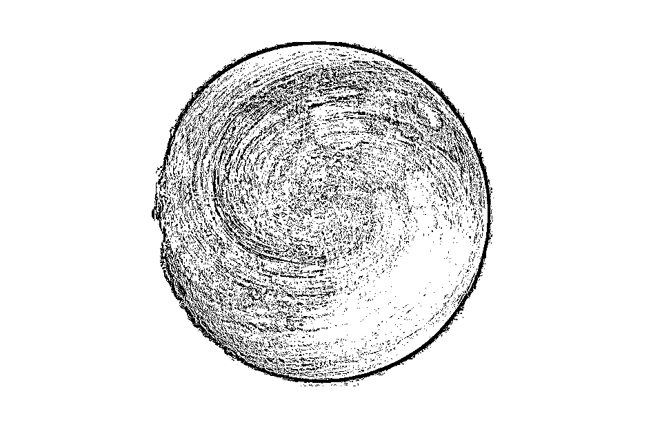

**二十一世纪也是“个性化”的时代”，互联网不仅鼓励了多元化（个体间的差异），也给个性探索内在的多维面向提供了渠道（人格的不同面向）。**

没有人再想从属于一个集中又单一的集体标签，这个时代的身份，是更灵活、丰富而有层次的（想想微信或社交帐号里，加入不同群组的个体身份，每一个都代表了自己对某个独特价值的认同，且群体间也在相互影响），不同的个性身份，又在网络中形成无数个自由（天王星）、漂浮（海王星）的意识群落。

**相较于实体世界，在网络世界里的身份，延伸出了更快速、开放、流动（无固定边界）、自由而不确定的关系。**

可反过来，**当意识无限自由时，“自我”（天王星），也越来越成为一个难解的迷（海王星）。**“我究竟是谁”，似乎很难再在这个多元、复杂的世界中，寻找到唯一的答案。在多重的身份，甚至矛盾和冲突的身份中，弥漫着挥之不去的迷失感。

**当面对信息化时代里无穷的选项时，“我还可能成为谁”，也成了一个神秘、充满诱惑的问题。**

仅仅用混乱和迷失来总结这个时代的特征吗？并不算公平。反观几十年中的社会变化，和碎片、多元化环境同时活跃的，**还有一股回归精神整体意识的复苏。**和上个世纪的“割裂与分离”相比，新一轮的天海周期，从最初就开始了一系列不同的基调转变。

90 年代，随着大量荣格主义作品（成形于上世纪天海对分时）的流行，坎贝尔留下的神话遗产，包括许多神秘主义文学作品的灵性启迪，一股探寻心灵奥秘的渴望也涌入了集体中，越来越多的人产生了对神秘学的好奇。

在心理学理论和疗法中，人们的关注从早期精神病理学的精神分析，转向了梦境、心灵、神话和原型的维度。心理工作，不再被简单地判定成生理疾病或缺陷，“疗愈灵魂”的关怀，正开始尝试与唯物观的“心理诊断”结合在一起。

无论借助咨询还是自助学习，占星、神秘学、冥想还是灵性艺术 ，**人们逐渐想要花更多的时间探索那个“真实的自我”。**而 2020 年疫情后，这种关注内心世界的意识趋势，似乎也随之经历了一定程度的强化。或许，这已为新一轮天海周期的“进化”之路开了个头？

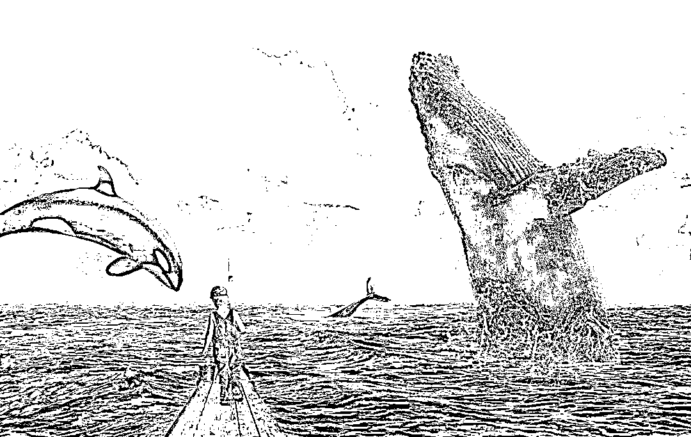

回到天海原型上，**每一轮新的神话，总会从一股融合（海王星）的试验（天王星）开始。**对集体文化来说，它可能发生在科学与灵性，艺术与哲学、物质（外在）与精神（内在）、人与自然、男性与女性、智力与灵魂之间等等。

即使我们不知道这个时代的神话最终会怎样，但一定期待着天王星和海王星的华尔兹。**换句话说，找到一种方式，让原来分离和对立的事物，在融合过程中诞生出新的生命。**

**对个体来说呢？我们又如何来更新个人的神话？理解一个完整又独特的自己？**

我们看到了诱惑和谎言，看到骗取同情心的报道，我们也看到了科技飞速发展，创造着令人兴奋的新世界。在更加碎片化的快节奏时代，我们越来越需要收获属于自己的灵性智慧。

从轴心时代最初的“身份”概念，到了现在，任何外在的“神话”已无法再完整回答我是谁的问题。**自我，不仅想要从社会神话塑造的身份中解放，也想从集体信仰的示范中抽离**，这意味着在任何一条追寻灵性智慧的道路上，要选择忠于自我的方式。

我们相信什么，我们是如何相信的？**一份健康的理性，会把海王星的窗户擦的更亮。**当然，不要忘记海王星的声音，它是关于爱的，关于臣服与连接，对自己、他人、整个世界充满同情。

或许，这就是我们想要在新的天海周期里，寻找的“宇宙身份”吧。

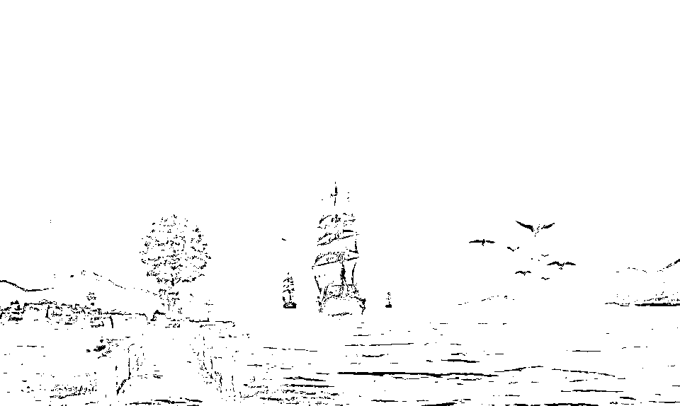

**结语**

聊一个上百年的时代变迁，总有点“夏虫语冰”的感觉——小小夏日毛毛虫，构想着伟大冰川形成的画面。**不过，原型和周期的知识，却在以它的方式，叙述一个清晰的主题和道路**——

它有着必然的复杂、流动与模糊性，在开始一定会伴随巨大的不安和混乱，直到自发式的理解惯性（旧神）进入反思（天王星），新的神话重新构建……

而在这个主题潜在的所有祝福中，有一条重要的信息：当有一天回首起 2020 的“暂停”时光，“失去”与“灾难”，已不再能概括全部的意义。

或许它最美的神话结局，就在这段话里：

最惊人的宇宙奇迹不是恒星，不是行星，而是我们自身。我们身体里的每一个原子都来自一颗爆炸了的恒星。形成左手的原子和形成右手的原子，很可能又是来自不同的恒星。仰望星空时，恒星对于地表上的我们美得遥不可及。可从某种意义上来说——我们都是星星的孩子，是宇宙的奇迹。（布莱恩·考克斯，物理学教授）

**版权声明**：原创文章由作者授权首发于若道平台发布，欢迎转发，反对抄袭。友号转载请申请白名单。

****

****乐木****

若道 2018 届核心课程认证毕业生，若道咨询平台入驻占星师

若道 2021 年生时校正认证占星师（满分）

复旦大学 MBA，20 年企业咨询及 HR 经验

咨询微信号：shyjywy

长按打赏

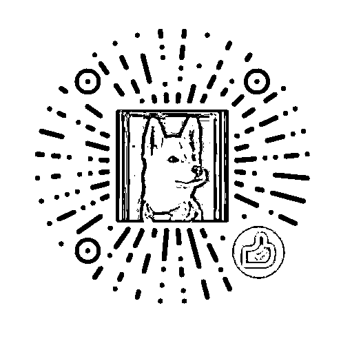

**想要预约该咨询师？**

**请扫描下方二维码**

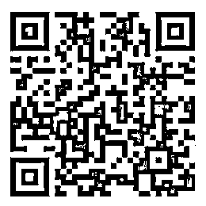

**20 位来自世界各地的占星师****带来 20 场沙龙——新世界的觉醒****详情可点击下图**

**学习占星学****点击下图了解课程详情**

**

**微信又双叒叕改版啦，不想错过若道君的推送？**

**就把若道设为星标吧！**

**▼**

**喜欢记得点一下在看哦☟**

**报名直达入口**

# 关于南北交点的 6 个问题，《灵魂的目标》作者为你解答！

> 原文：[`mp.weixin.qq.com/s?__biz=MzA5NjA0NTAxNg==&mid=2651471189&idx=2&sn=4dd2e0a8937319a658188348d9ce9c78&chksm=8b488fe2bc3f06f40d40ced04d3ea0ac8b290223164bbee3f4aad50dd015aa672a1601c1af6d&scene=126&sessionid=1692737837#rd`](http://mp.weixin.qq.com/s?__biz=MzA5NjA0NTAxNg==&mid=2651471189&idx=2&sn=4dd2e0a8937319a658188348d9ce9c78&chksm=8b488fe2bc3f06f40d40ced04d3ea0ac8b290223164bbee3f4aad50dd015aa672a1601c1af6d&scene=126&sessionid=1692737837#rd)

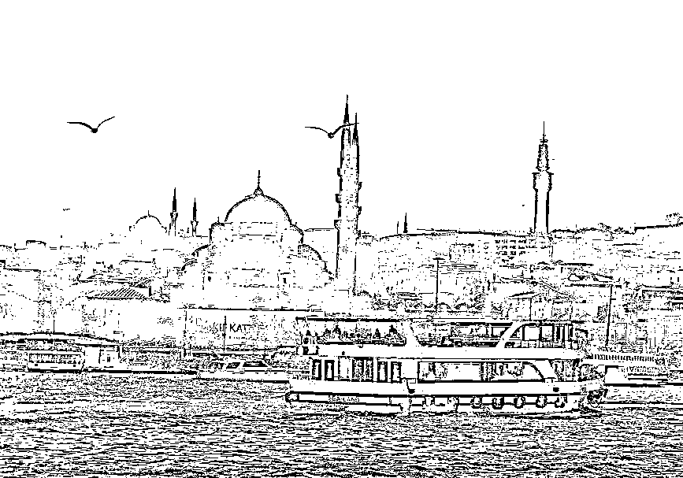

作者/大卫·瑞雷 若道占星创始人
译者/若道翻译团队编辑/玫瑰 图片/pexels

大卫老师参与授课的【[月亮交点线上工作坊](http://mp.weixin.qq.com/s?__biz=MjM5MjQwNjAyMQ==&mid=2649439424&idx=2&sn=de0418066052b6ac45e664aee8bc266d&chksm=beb953aa89cedabc0dcc4f690aaba94d56fea1c91162fa28a1ca49e929e5288f9c95c3dd2a95&scene=21#wechat_redirect)】开启报名中，在这里，我们收集了一些经常被问到的南北交点的问题，请大卫老师做出了精彩的解答，一起来学习吧！

**关于南北交点的问答**

**问：为什么不同电脑/手机软件显示的月亮交点的度数和星座不一样？**

**答：**有时《星历表》中北交点有两个标题：一个是“平均” 北交点；另一个是“真实” 北交点。

**· 平均北交点——月亮相对黄道的运行轨道的平均位置（平均每天逆行 3’）；**

**· 真实北交点——月亮相对黄道的运行轨道的实际位置。**

注意真实北交点在其周期中会**逆行(R)和顺行(D)**。这些逆行和顺行的改变与地球-月亮-太阳周期的天然转换相对应。

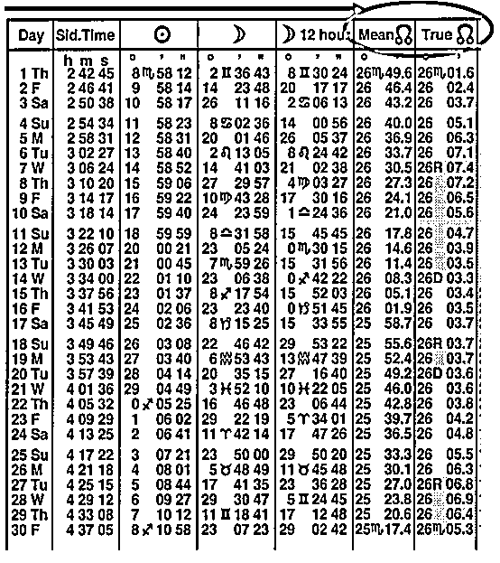

**问：我们如何从一张出生星图中解读前世或“业力”？**

**答：**星图综合分析是三阶的问题，甚至是五阶的问题。不过，简短的回答是从南交点入手，寻找南交点的星座和宫位所代表的主题。

例如：有其他行星落在第十二宫吗？有落在双鱼座的行星吗？海王星落在什么宫位？海王星有相位吗？还有行星落在天蝎座吗？第八宫中有行星吗？冥王星落在什么宫位？冥王星有相位吗？

**问：南交点是“坏的/消极的”，而北交点是“好的/积极的”吗？**

****答：****不是。

**问：****北交点代表“灵魂的目标”或“此生的方向”，这意味着我们应该摈弃南交点所代表的人生领域，勇敢地走向北交点所代表的人生领域吗？**

******答：******不是。 

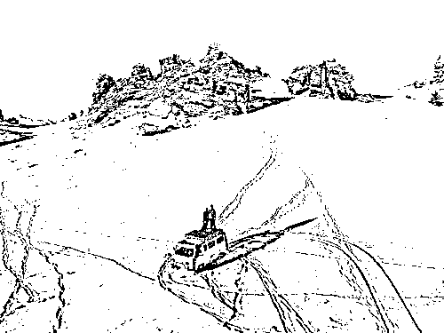

**问：当人们设法发展北交点的主题时，南交点的作用是什么？人们最终在一定程度上同时拥有两者吗？还是达成北交点是此生的主要目标？有没有一种情况是重新发展南交点？或者应该说过度发展了北交点？**

**我遇到过一些人北交点发展得很好，他们往往有点憎恶南交点的能量。他们曾经擅长的事情变得让他们觉得不再适合继续下去。**

**尤其是北交点在白羊座的群体，我有很多朋友的北交点在白羊座。我能看到他们在一直学习坚持自我，但是我搞不明白，其中不少人有一种倾向，不再合作，当他们表现得像天秤座时，几乎会厌恶自己。**

******答：******月亮交点代表的旅程有多个阶段和起伏。一个人带着负面偏见评判自己南交点象征的行为很常见，因为过去总是充满着痛苦的记忆。我们总是希望通过评判可以防止痛苦再次发生，我们相信评判能防止痛苦再次发生。

然而，这种评判让痛苦循环不止。与过去和解，其实就是与我们自己和解。北交点和南交点对我们的平和与幸福都很重要。

南交点在天秤座的好处是对关系和人类体验的心理动力有经验，因此伟大的心理学家西格蒙德·弗洛伊德、卡尔·荣格、弗里茨·皮尔斯、斯坦·格罗夫、理查德·阿尔珀特/拉姆·达斯以及诸如理查德·塔纳斯和格伦·佩里等占星学先驱的南交点都在天秤座。

我看到过许多有这组交点的人的表现，上述这些人是一些著名的例子。

他们都以自己的方式战斗，但致力于人类的和平发展。

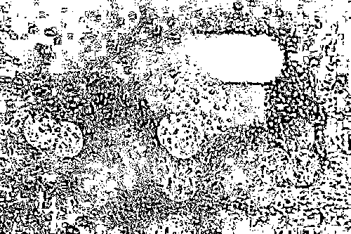

基本的挑战是：“**我怎样才能更有效地坚持自我，并且继续享受生活中重要关系带来的安心感。**”以“过度妥协的生活”来评判一个人天秤座南交点的过去，是对被别人以某种方式拒绝的痛苦感受的反应。

甚至这种反应本身也更多的是天秤座的反应，而不是白羊座的反应，因为它植根于感觉受到“不公平”的对待，因此天秤座要求公平。

**问：北交点和太阳都与“成就”有关，两者有何不同？**

********答：******“**成就**”**更像是与摩羯座相关的词，而不是与太阳相关的词，因此与第十宫和土星更相关。

同时，“目标”这个词常用作太阳的关键词。我的书《灵魂的目标》的标题显然借鉴了这个词，某种程度上是一种双关语，因为英语有一个俗语叫“唯一的目标”，意思是“主要”目标，当然这是月亮交点所代表的，即我们人生的目标感。

就此而言，北交点和南交点在广义上都对应我们的人生目标。把北交点想象成一个要实现的目标是一种误导，会让我们以为南交点是我们应该抛下的。

然而，一条没有尾巴的龙很快就会坠落，一头撞到地上。当我们发现自己在评判南交点的行为和体验时，可以想想这个类比。

因为别人似乎更有效地坚持了自我，或因为一时战斗失利，而评判自己“弱”，也属于白羊座/天秤座的体验。关键是既要运用龙首，又要运用龙尾，因为一条没有尾巴的龙很快就会坠落，一头栽倒在地。

**所以，这个问题其实是两极之间的适合度问题。“什么时候我该是天秤座，什么时候我该是白羊座？”**

**当我需要在关系中感觉安全时，我是天秤座，当我准备为自己“采取行动”时，我是白羊座。**

**版权声明：**原创文章由作者授权首发于若道平台，欢迎转发，反对抄袭。友号转载请申请白名单。

****想阅读更多作者的文章，请在后台回复******大卫****** 即可。****

**大卫·瑞雷**

美国占星师，若道联合创始人，致力于在中国教授和推广西方占星学；2010-2014 年，任全美占星师联盟监督委员会委员；2017 年，被选为 ISAR 委员会成员。ISAR 是世界最大的国际占星机构，会员遍布 45 个国家，2017-2020 年曾任 ISAR 全球副主席、CAPISAR（ISAR 职业占星师资质认证机构）主席。

**喜欢文章请长按下方二维码打赏****给大卫老师加杯咖啡呗~****▼**

**月亮交点线上工作坊**

需求就是所有的一切。有两种人类天性的基本规则可以定义需求：**我们需要获得成就（北交点），我们需要有安全感（南北点）。**  成就感意味着我们在安全感之外渴望某些东西和某些经验，关系着我们的内心向往。安全感意味着我们感到安心，和我们已经建立的参与生活的模式协调一致，关系着我们的习惯。

人类的需求就在成就感和安全感之间来来回回，写下这一生的主题。这个主题与我们人生的发展方向和灵魂的渴望相关。

如果发展方向和灵魂渴望实现的目标了解了，变得清晰可见，那么就更容易知道做出什么样的决定，来让人生变得圆满和幸福。一些困扰的问题也会随之一一迎刃而解了。 **我们这次就跟随大卫·瑞雷一起，进行****为期两天****的寻找之旅，从星图里南北交点以及与此相关元素的解读入手，为我们人生的生命道路找到指引，**看看是朝向哪里，又是一种什么样模式和周期。于是，也会更加容易的掌握自己的命运了。

**长按下图识别二维码**

**了解更多课程详情**

**学习占星学****点击下图了解课程详情**

**

**微信又双叒叕改版啦，不想错过若道君的推送？**
**就把若道设为星标吧！****▼**

**喜欢记得点一下在看哦☟**

**报名直达入口**

# 月亮交点线上工作坊丨和大卫·瑞雷一起，探索生命的方向与潜能

> 原文：[`mp.weixin.qq.com/s?__biz=MzA5NjA0NTAxNg==&mid=2651471189&idx=3&sn=4ea67e211aa4a6ba0f270b13afc77b25&chksm=8b488fe2bc3f06f45bdad529016c1df1300f95dabb40cb24e016169f6479eed00aaf2b25d194&scene=126&sessionid=1692737837#rd`](http://mp.weixin.qq.com/s?__biz=MzA5NjA0NTAxNg==&mid=2651471189&idx=3&sn=4ea67e211aa4a6ba0f270b13afc77b25&chksm=8b488fe2bc3f06f45bdad529016c1df1300f95dabb40cb24e016169f6479eed00aaf2b25d194&scene=126&sessionid=1692737837#rd)

**生命有如一条河流，有它自己的方向。这是一条从南交点开始的河流，而北交点是这条河流奔去的地方。**

**——大卫·瑞雷**

1

**课程描述**

需求就是所有的一切。有两种人类天性的基本规则可以定义需求：**我们需要获得成就（北交点），我们需要有安全感（南北点）。**  成就感意味着我们在安全感之外渴望某些东西和某些经验，关系着我们的内心向往。安全感意味着我们感到安心，和我们已经建立的参与生活的模式协调一致，关系着我们的习惯。

人类的需求就在成就感和安全感之间来来回回，写下这一生的主题。这个主题与我们人生的发展方向和灵魂的渴望相关。如果发展方向和灵魂渴望实现的目标了解了，变得清晰可见，那么就更容易知道做出什么样的决定，来让人生变得圆满和幸福。一些困扰的问题也会随之一一迎刃而解了。 **我们这次就跟随大卫·瑞雷一起，进行****为期两天****的寻找之旅，从星图里南北交点以及与此相关元素的解读入手，为我们人生的生命道路找到指引，**看看是朝向哪里，又是一种什么样模式和周期。于是，也会更加容易的掌握自己的命运了。

2

**课程目标**

*   帮助大家认识自己的**生命道路的主旋律**，知道我们的生命从哪里来、到哪里去；

*   帮助大家知道如何用占星了解**怎样获得安全感，怎样获得更大的成就感**；

*   帮助大家学会如何**就南北交点提问**，如何发掘我们未知的潜能；

*   帮助大家学会如何从**星座、宫位、相位**解读星图中的南北交点；

*   帮助大家学会如何**以南北交点为切入点**，整合星图的解读。

3

**课程内容**

1.  学习**月亮南北交点星座、宫位、相位**的关键特质。

2.  学习**以月亮南北交点为轴心**，整合星图解读的方法。

3.  从月亮南北交点看**生命周期**，解读相关交点周期。

4.  学习在**占星咨询**中如何就月亮南北交点提问。

5.  同学们可以带着**对于自己南北交点的疑问**，得到自我疗愈的解答和方法。

6.  以**学员星图**分析为例，为大家解开迷惑，做出建设性的指引。

4

**导师简介**

**大卫·瑞雷（David Railey）**

*   曾任 ISAR 全球副主席，ISAR 考试委员会前主席，若道创始人。 

*   被称为占星界的“马可·波罗”，第一位将西方严肃占星学系统教学和多位西方占星学大师引入中国的西方占星师。

*   第一位在美国用电视和广播媒体推广严肃占星学的职业占星师。

*   培养最多中国职业占星师的老师。

*   《灵魂的目标》、《一生的旅程》作者。

*   研究占星 48 年，拥有三十多年的占星咨询的执业经验，其服务客户包括学生、工人、市长、州长、议会议员、企业家、心理咨询师、工程师、艺术家、演员、知名企业家等，客户年龄跨度从襁褓婴儿到耄耋老人（大卫老师的老客户常常是一家三代人）。

*   2010 年 6 月，大卫的书《灵魂的目标》中文版出版。在 2011 年春季的北京之行期间，大卫接受了《南方周末》记者的采访。

*   2010 年，其著作《灵魂的目标》中国版出版，和蒋颖一起创办若道占星学校和其官网 www.nodoor.com。从该年开始，他工作并往返于亚特兰大和北京。目前他 80%的时间致力于在中国教授和推广西方占星学。

*   2017 年，被选为 ISAR 委员会成员（2017）。ISAR 是世界最大的国际占星机构，会员遍布 45 个国家。

**老师月亮南北交点著作介绍：**

《灵魂的目标-从南北交看你的生命道路》

本书主要研究的是占星学中的月亮交点与人生阶段、生命道路之间意味深长的联系。通过几十年来大量积累的个案，作者发掘了十二组月亮交点与人的安全感需求、天赋才华、内在渴望，以及成就感召唤之间的深层联结，并对有关职业发展、亲密关系、亲子关系、生命周期等重要议题进行了精要分析与概括总结。

作者以大量名人故事及咨询个案作具体讲解，立论建立在严谨的逻辑分析和科学实证的基础上；同时，行文又充满意趣，展现出广博的人文视野和丰富的哲学蕴涵。

5

**此次课程适合哪些人？**

*   对占星学有一定了解（L3 以上水平），希望能够深入学习月亮南北交点的知识；

*   职业占星师，希望深入学习，看到大师如何就南北交点提问，解读星图。

6

**往期学员分享**

学员 A：大卫老师的专业和敬业，他的话直指人心，能看到自己更多的可能性，非常鼓舞人心，感恩老师！特别疗愈，智慧，拥有神奇的灵感和想象力。

学员 B：大卫老师总能对占星征象与现实状况和心理模式的对应，作出我们没有想到过的解读。老师的真诚，能感受到他对占星学的投入与对学员的无限关爱，讲解细腻。

学员 C：大卫老师总是迅速在一张星图中抓住要点，然同时用清晰幽默的语言把他的思路呈现给我们。针对星图中呈现的功课，他总能提供温暖有力的治愈，既共情又突破，特别赞叹他的治愈力和感染力。

学员 D：依然是大卫老师的人本主义精神，还有就是这次大卫老师做个案时讲到的庙宇花朵种子的故事，美好又神奇。

学员 E：在职业规划方面得到了新的启迪，让我面对一些曾经想都不敢想的事情，给了自己一些信心和动力去做更有意义的事情   理解 2、6、10 宫的具体职业体现。

学员 F：对于土星、天王星行运对职业的影响有了更深入的理解工作职场的问题和童年经历的联系，让自己豁然开朗。

学员 AA：在看职业的顺序、行星行进对职业的影响方面收获很大,收获了职业占星的基本方法论和思路。

学员 AB：此次加深了几个行星与星座，宫位更深刻的理解，融会贯通，特别讲解案例，对我学习占星有更深刻体会。对职业方面的解散思路更加清晰;听到很多大卫老师的经验之谈，有所启发吧。

学员 AC：老师一步步拆解思维过程，让我了解到拿到一张盘应该如何入手；丰富的真人案例，老师的解盘能立刻与现实事件进行对照，理解更深入了。

学员 AD：看到了大卫老师精湛的占星技艺，若道团队的专业水准，南北交以主题的咨询理念和占星概念特质。在今后的解盘中要磨炼运用。

7

**课程价格**

**正价：6800 元**

**早鸟价：5800 元（4 月 20 日前） **

长按二维码添加课程负责人 Margaret 咨询~

（微信：18515059056，请备注“月亮交点”）

8

**课程时间**

2022 年 4 月 30 日-5 月 1 日   9:00-17:00

9

**退转课程**

**退款原则请详看《教学协议》，如有疑问请咨询课程顾问。**

****2022 月亮交点线上工作坊****

**授课老师：大卫·瑞雷**

**直播课开课时间：2022 年 4 月 30 日-5 月 1 日 9:00-17:00**

**授课方式：******网络授课，英文授课，中文翻译****

**费用：**6800 元**（早鸟价：5800，4 月 20 日前）**

**课程负责人：Margaret**（微信：18515059056，请备注“月亮交点”）

长按二维码添加课程负责人咨询~

****报名直达入口****

# 现代动态卜卦占星实战课 | 23 堂课，4 个月掌握卜卦技法

> 原文：[`mp.weixin.qq.com/s?__biz=MzA5NjA0NTAxNg==&mid=2651470990&idx=3&sn=814228f880016da7a69d088c3470ae7b&chksm=8b488e39bc3f072fb5f58a8c2884bb76d2bf6828f4d0a8771bfe6da151b9d9234dfb98b6ccd5&scene=126&sessionid=1692737837#rd`](http://mp.weixin.qq.com/s?__biz=MzA5NjA0NTAxNg==&mid=2651470990&idx=3&sn=814228f880016da7a69d088c3470ae7b&chksm=8b488e39bc3f072fb5f58a8c2884bb76d2bf6828f4d0a8771bfe6da151b9d9234dfb98b6ccd5&scene=126&sessionid=1692737837#rd)

**对现代动态卜卦占星的 7 个问题**

**1****什么是现代动态卜卦占星？**

现代动态卜卦是将有传统历史的卜卦占星和现代人本主义占星的精神结合在一起，**更适合现代社会现实状况**的卜卦占星技法。

**2****卜卦占星的特色是什么？**

**随时随地可用，**帮助你从这个卜卦星图中洞察当下你所期望了解的事情和人的现状、发展趋势、可能发生什么事情、可能的结果，及什么时候会出现什么结果。

**3****动态卜卦占星是什么意思？它重要吗？**

动态卜卦非常重要，因为事物不是静止的，而是变化的。**动态卜卦不仅会让你看到人和事物的状态，还可以让你看到其发展和变化的过程，**会碰到什么事情。

动态卜卦的美妙之处是它不是静止的一个照片，而是**描述一个故事的开始、发展和结局。**

**4****卜卦占星什么情况可以用？**

**万物万事皆可卜。**什么都可以用。1-12 宫所包含的人事百态，事业、健康、金钱投资、商务、旅游、教育、法律、生育、宠物养育等等。

卜卦占星也可以帮助我们去看某个社会事件、国际事件的发展，**可以和经世占星相结合。**

**5****它如何与人本主义占星结合？**

因为从卜卦行星可以看到参与人的**心理状态、心理过程和面临的议题**。而如果当事人愿意去调整自己的内心状态，就不再完全是被动的，而是可以以更积极主动的方式参与到事件中去；或者能够更理解目前的外部环境，选择更安然地调整内心。

**6****卜卦占星可以和人本主义的咨询相结合吗？**

当然。在课程中，老师将会仔细讲如何**把卜卦占星和出生星图及预测技术结合在一起，**给客户提供更好的服务。

**7****如何学好现代卜卦占星？**

**实践，实践，实践。**

占星学是一门必须大量实践的学问。纸上谈兵没有用，只是听课没有用。

实践是一步步来的。你不必知道所有的卜卦技法才开始实践。**从第一节课开始，你就可以进入实践。**

实践刚开始可能只是模仿。**我们有大量的真实案例，也安排了很多作业让大家练习。**也给大家拿自己的案例和老师互动的大量机会。

**授课老师**

**艾德里安·罗斯·邓肯****（Adrian Ross Duncan）**1971 年在印度游学时开始学习占星学，1985 年开始成为全职占星师，**迄今执业已超过 33 年，是人本主义占星学、卜卦占星学和经世占星学领域的知名占星师。他还开发了占星软件 AstroClock 和多款占星报告。**他在日常咨询中都会运用卜卦，咨询图（卜卦的一种运用方式，即根据客户来访时间制作星图，从星图中获得大量信息）也是他**特别擅长的领域**。艾德里安·罗斯·邓肯从 1971 年开始研习佛学，受佛学影响很深，他**相信占星学和佛学观点统一、转化的一个基础是在于对现实感知的改变**。而卜卦很容易与佛教融合，因为它只关乎当下。

| 艾德里安·罗斯·邓肯的占星学著作

作为本次课程的主讲老师，艾德里安·罗斯·邓肯如是说：

卜卦星图不仅给出了当下的能量状态，**它还包含着过去的踪迹，也蕴藏着未来的种子。**它是心理的，也是事件的。一个好的占星咨询是要把过去、现在和未来交织成一个整体。

**卜卦星图告诉客户他们当下在哪儿，他们处于的能量状态是什么，这张星图和他的过去有哪些关联，他可以怎样和这张星图一起合作去挖掘一个积极主动的未来。**这里预测的未来不是强加给他们的，这个未来是一点点揭露给他们看的。

心理占星学和卜卦占星学别无二致，所有的事件都有其心理对应。如果你的意识与世界同步，你就会看到二元统一。

行进和推进帮助我们理解如何抵御外在和内在的风暴。卜卦如同显微镜下的行进。**通过行进难以准确了解一段关系、房屋购买、工作机会等是否有益，但对卜卦来说并不难。卜卦也擅长回答与时间相关的问题，对行进和推进的标志进行微调。**

**课程形式**

**15 节录播课+8 节直播课线上网络课，英文授课，中文翻译。**

**15 节录播课为 2020 年动态现代卜卦课程的内容。8 节直播课则完全是案例教学的形式。**

这样的好处是，你可以通过 1 个半月的密集学习之内按照自己的进度学完录播课的理论和录播课中已有的案例，从学习开始就实践，然后把实践中遇到的问题拿到 8 节直播课中，和老师互动。

**在 8 节直播课中，老师也会用案例教学、和同学互动的方式帮助大家进一步掌握卜卦占星的技法。**

**授课时间**

**付费后一天即可开始看录播课程，全程有助教老师回答问题。**

**直播课程开始时间：**

2022 年 5 月 3 日，每周二 20:00-22:00

**这次课程恰逢世界在巨大的变动和不确定之中，期待这门课程能够给各位及各位的客户带来新的洞见和方向。**

**在这次 8 次直播课程中，我们将采用案例教学的方式，所有参课同学均有机会提供案例，供老师解读，且我们将组织群体的练习，用大量案例帮你掌握卜卦及如何在咨询中用卜卦。**

****

**授课内容**

***Part1***** 融合现代占星理念，整合动态占星知识**

星图如同地图，展示了人们从哪里来，现在在哪里，以及可能的去向是什么。卜卦星图虽然显示的是当下这一刻，但却是在动态当中的。所以过去的运动轨迹对应着过去所发生的，接下来的运动轨迹对应着接下来要发生的。

**在课程中你会学习到：**

*   我们如何从一张卜卦星图看到时间的流动：从过去到未来，故事如何展开

*   心理占星和事件预测如何在卜卦占星中有机结合起来

*   卜卦星图如何回答是否的问题

*   如何用卜卦星图回答分析性和指导性的问题

*   现代动态占星中事件发展的顺序：

*   确定咨询图中强调的当前事件

*   将客户与相位或行星组合相关的情感能量关联起来

*   在早期经历中找出相似的情景

*   认识到过去和现在的情感完全相同

*   辨识出过去做出的所有限制性决定

*   通过头脑风暴找出更能带来力量的方法来解决相同类型的问题

*   在想象和现实生活中重演当前和未来的事件

***Part2 *****独家【现代动态卜卦占星技术】全面教学**

哥本哈根占星学院院长艾德里安·罗斯·邓肯 Ardian Duncan 老师 50 年卜卦占星经验倾囊相授，内容包括但不限于：

**1.卜卦中的行星**

*   行星强弱及力量

*   太、月、水、金、火、木、土在庙旺落陷时的意思

*   卜卦星图中的月亮及其在 12 宫的意义

*   卜卦星图中的外行星

*   卜卦星图中的恒星

*   上升点和指征星的度数

**2.如何选择和辨识征象星**

*   当问题出现时，如何判断征象星

*   如果两个人或物由同样的征象星指代该怎么办

**3.卜卦图中的相位**

*   不同相位的意义

*   征象星之间相位的意义

*   征象星与其他行星相位的意义

**4.卜卦中的宫位**

*   12 宫位和宫位系统

*   对宫位的动态观察

*   宫主星及其互动

*   互容和定位星

**5.卜卦中的星座**

**6.传统卜卦原则（约束和限制条件条件）及其在现代动态卜卦中的应用**

**7.空亡、光线传递、完成、围困、燃烧之路等**

**8.星图中的逆行及其讲述的故事**

*   水星和计划

*   金星与依恋

*   火星与斗争

*   外行星逆行

**9.应期与时机**

*   1 度是代表多久

*   宫位的重要性

*   行星速度和逆行

*   如何综合卜卦和行进、次限分析时间问题

***Part3*****  学以致用，覆盖人生各个领域问题的卜卦解法**

希望将现代卜卦占星学的精髓传达出来，精细地讲解每一宫所代表的卜卦事物，分主题详解不同类型问题的卜卦解读思路，内容包括但不限于：

**1.爱情和关系**

*   金星的重要性

*   第一宫和第七宫以及其中的行星

*   成对行星

*   上升点、下降点及其守护星

**2.业务和工作**

*   第十宫和第六宫以及其中的行星

*   木星和土星及其相位

*   火星和水星

*   行进和中天

**3.资金和资源**

*   第二宫和第八宫以及其中的行星

*   第五宫和第十一宫

*   金星、木星和土星

*   四元素的意义

**4.家庭和大家庭**

*   第四宫和第十宫及其守护星

*   第五宫、十一宫及其守护者

*   第五宫和第十一宫的行星

*   月亮

**5.社会、法律、智性、健康、存在主义的问题**

*   第九宫和第十二宫及其中的行星

*   木星和第九宫守护星

*   第三宫 、第十一宫、第六宫和第八宫

**6.如何解读事件星图**

*   从新闻学习卜卦盘

*   如何从卜卦盘看新闻事件和世界大事的发展变化

*   我们如何去培养自己观察有预兆意义的信息、从日常事件中捕捉启迪

*   占星解读的意义

***Part4 ***** 扩展延伸择时占星技法的新认知**

在择时的时候，我们会选取征象星处于有力的时候，来规划我们的事件；避免征象星不力的时候，尤其当这个征象星代表我们自己。

**择时星图一瞥**

*   择时的艺术

*   如何在不完美的天象下取得最佳结果

*   如何做出深思熟虑的回答

*   如何为约会择时

*   如何为婚礼择时

*   如何为商业活动择时

*   如何为旅行择时

*   如何为对抗事情择时

*   虚拟和实时会议的择时

***Part5  *****如何运用卜卦占星学做一场转化性的咨询**

虽然卜卦的结果可能是不利的，但我们仍然可以从心理占星学的角度给出一些积极建议，帮助客户建立信心，有助于应对之后的人生。客户出生星图与卜卦星图的关联，这在咨询中对于心理方面的考量是非常重要的。

*   一个好的咨询有哪些特色

*   咨询星图及其应用

*   如何用卜卦星图和新客户在短暂的咨询开场白快速建立信任

*   如何综合卜卦星图、出生星图、次限图一起分析

*   如何用卜卦星图聚焦当下的问题

*   如果客户在一场咨询提出多个问题，要看多少卜卦盘

*   如何在一个充满挑战的卜卦星图中寻找客户资源、有利的时机，找到支持客户的策略

*   如何从客户故事中寻找意义

*   卜卦星图如何从事件维度和心理维度来解读

*   当看到客户不愿意看到的结果可能出现时，如何开展对话

*   改变的方法

**什么人适合参加本课程？**

*   想要系统学习现代动态卜卦占星的学员

*   想在生活中熟练使用现代卜卦占星学

*   在咨询中想帮助个案更清晰的分析解读困惑

*   想参加 ISAR 认证考试，此课程是 ISAR 选修课

*   希望通过卜卦占星帮助自己和身边人挖掘一个积极主动的未来

学习整合卜卦技巧，不仅有益于想钻研卜卦占星学这个分支的同学，对占星初学者也很有有帮助，可以让你的占星技巧加倍。

**学员评价**

**课程费用**

**课程价格：9900 元**

**老学员复训专享价：**

**2020 年参加艾德里安·罗斯·邓肯卜卦占星课程的同学：****2900 元**

**2018 年参加艾德里安·罗斯·邓肯卜卦占星课程的同学：****4900 元**

**特别优惠****：**

**分享课宣到朋友圈****保留 48 小时****（不设分组显示）截图给课程顾问可获得****400 元优惠****。**

**课程负责人：童老师（微信：nodoorDaivd），请备注“卜卦”**

长按二维码添加课程负责人咨询

**退转课程****退款原则请详看《教学协议》，如有疑问请咨询课程顾问。******现代动态卜卦占星实战课·ISAR 选修课****

**授课老师：艾德里安·罗斯·邓肯**

**授课时间：**2022 年 5 月 3 日

**授课方式：**网络课程，英文授课，中文翻译

**费用：9900 元；****2020 年老学员复训价：2900 元；2018 老学员复训价：4900 元；特别优惠，分享课宣到朋友圈保留 48 小时（不设分组显示）截图给课程顾问可再获得 400 元优惠。**

**课程负责人：**童老师（微信：nodoorDaivd），请备注“卜卦”

长按二维码添加课程负责人咨询

****报名请点击“阅读原文”****

# 深度干货丨天海周期：这 171 年的周期，我们的时代走到了哪里？

> 原文：[`mp.weixin.qq.com/s?__biz=MzA5NjA0NTAxNg==&mid=2651470990&idx=1&sn=8ee5c9e4d4236e6f73c4d3dcb25a7632&chksm=8b488e39bc3f072f5933e780ee077cbdc6852d19339990afc3087005bf208aca8f36439e59c5&scene=126&sessionid=1692737837#rd`](http://mp.weixin.qq.com/s?__biz=MzA5NjA0NTAxNg==&mid=2651470990&idx=1&sn=8ee5c9e4d4236e6f73c4d3dcb25a7632&chksm=8b488e39bc3f072f5933e780ee077cbdc6852d19339990afc3087005bf208aca8f36439e59c5&scene=126&sessionid=1692737837#rd)

******☆ ****后台回复“今日”，给你一句生命态度******

作者/乐木
编辑/翀子 封面/书君 图片/网络天王星是“革命之神”，海王星爱与海洋的神话。天王星与海王星的汇合周期是 171 年，象征了“时代神话的革命”。作者从历史脉络出发，梳理了人类发展中天海周期起到的特殊作用，这对于我们更好的理解天王星与海王星的原型能量有很大帮助。**引言**

如果没有时钟的滴答、指针的跳动、手机上数字的显示，时间原本就是对变化的体验。回顾过去几千年的历史——**人类不断的在寻找真实的自我，也在寻找关于“伟大与永恒”的迷底。**从古老年代的神话，宗教与信仰、到现代社会的主流意识，都在诉说着人类意识海洋的演变。

自上世纪 90 年代的信息化革命，似乎又开启了新的创世机遇。在互通互联的意识中，透过模糊的字迹，尝试重新书写一个古老而隽永的神话。

在那里，每个独立的意识，正在寻找着与自我灵魂、与宇宙灵魂的完整联结。

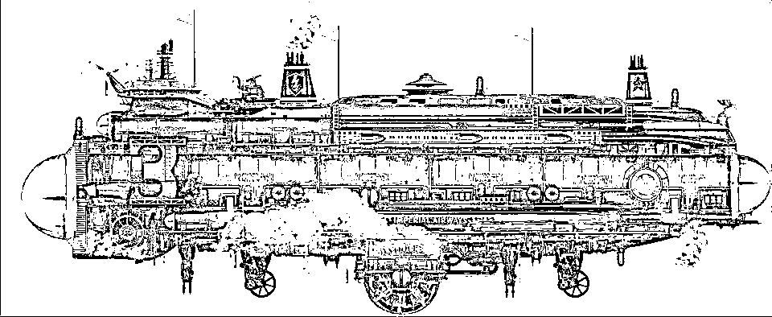

**变化中的循环**

去年，公司进出大门的刷脸门禁上，加装了一套识别佩戴口罩的视频系统，对于防疫管理还是挺实用的。不过老实说，每次想要穿行时总觉得有那么点别扭：戴着口罩触发不了门禁的感应，进不去大门。可一摘下，两个同时响起的悦耳声音就开始打架：“欢迎光临”、“请正确佩戴口罩”……

于是“戴口罩的我”和“不戴口罩的我”，两种身份开始纠结，到底谁才是主角？

应对疫情时的新技术总难免有点手忙脚乱。但不管怎样，口罩（还有行程码）已经是生活中形影不离的老友，出行自由全靠它的护驾。马路上戴着口罩的人群，彼此多了几分熟悉的相似，与其说被口罩隔开了物理距离，更多的感受倒是那个“茫茫人海中的我”。

每个人的真实面容差异在口罩的遮盖下，似乎不再那么突出和重要了。可是，为了追溯病毒轨迹的行程码/健康码，又让一个人的身份在数字世界中被标记、区分和追踪着。

**换句话说，在真实世界的远端——虚拟（数字化）世界里的独立身份标识，被抹上了更重的颜色。**

不仅仅是身份，疫情后的生活也开始越来越多的在互联网上进行，以一种坚决、不确定、但又诱人的味道，慢慢重塑起新的习惯和理解，以及，关于未来新生活到底会怎样的猜测。

在这样的大转变期，一大波新技术、新产业也应运而生。比如 2021 年，就出现了一个火爆的词——“元宇宙”。

Facebook（脸书）在去年 10 月更名为 Meta（元）公司，首次宣布进军该领域。一夜间，这个新名词突然就成了技术、资本、政府追逐的热点；而最近随着 Mate 的亏损和股票的下跌，它转眼又成了风险的代名词。

有人说，元宇宙不过是个大型全球在线游戏，还有人说那不就是 Matrix（黑客帝国）吗。作为占星师，自然更乐意从原型层面去了解一个概念——**基于最新数字化技术（天王星）的虚拟世界（海王星），结合了科技与想象。**

而元宇宙一词也是出自于 1992 年出版的科幻小说《雪崩》，**那时，天王星刚刚在摩羯座追上了海王星，**一轮新的周期就此开始。有趣的共时性，也是一个巨大的线索，于是我禁不住对这个“巧合”有了更多的好奇心。

**虽然在相同的时间点上，不同的行星周期总在相互叠加和染色，但讲到社会时代主题的理解，天海这对组合仍然有自己特殊的重要性：**

*   **每一轮的天海周期长达约 171 年，每次合相位置会在黄道带上再走 18 度左右。**如果上一个周期开始于某个星座的初度（如 1821 年的天海合相在摩羯 2 度），意味着走完一个黄道星座的主题，总共需要花上 3 个半世纪。

    **这恰恰具备了一个时代、王朝、社会文明变迁通常所需要的时长。**更不用说，这二个最外圈的行星，分别守护着黄道中象征集体意识（水瓶座）和宇宙视角（双鱼座）的星座。

*   **天海周期与海王星自身周期的近似性：天海周期 171 年，海王星周期 164.8 年，也约等于天王星周期的 2 倍（168 年）。****这种“巧合”让天海能量有了更强的共振。**

    例如，出生在 90 年前后的人，在 84 岁天王回归时，刚好也会经历世界天象的天海对分（即天海满月）。

*   **1993 年两者精确合相在摩羯 20 度，就像 19 世纪天海周期的“续集”。**（注：经世占星容许度通常都较宽，合相时间前后能持续约 8-10 年）

    **2020 年，依然在难忘的摩羯 20 度——这轮天海周期开始的位置上，木土冥三大巨头同时齐步踩过。**不知道这个“同度”仅仅是巧合，还是有什么神秘寓意？反正那一年，从一场席卷全球，快速蔓延的疫情起，突然间，世界的模样就变了。

    随后发生的，还有同年换座水瓶座的木星与土星，2021 年起尚未结束的土天四分相，包括 2022 年令人暇想不已的木星与海王星在双鱼座的合相，一切，似乎都在催化一场天海旋律的“变革”。

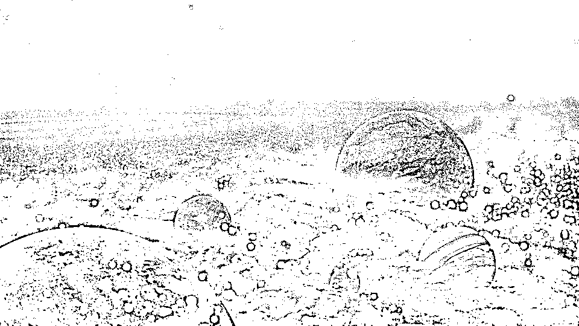

**天王星与海王星的原型**

我们知道，天空之神天王星掌管闪电和星空，也是为人类盗取天火的普罗米修斯。闪电与火光，隐喻来自天堂解放人类的礼物，**从突然的变革、震惊中得到启蒙与觉醒。**

**天王星也是独立身份意识与个性化的革命之神。**在锐利与质疑的头脑中，权威和既定规则，更像是最薄弱的证据。正是这种激进、反叛、兴奋又不安的冲动，照亮了人类火箭般的精神使命——**从一切“重力”规则的束缚中挣脱，飞向太空，飞往不曾抵达过的空间探索。**

**而海王星呢，海洋与水的神话。**混沌、浩翰、包容，在一个无边的隐性容器里，汇聚了人类集体的梦与信仰。**它赞成统一而非分裂，赞成爱而非战争。**

无论在艺术文化、神话宗教，或是一波波社会风尚和理想主义的演变中，我们都会体验到它对心灵的洗刷。**从中升起的灵感、启迪与想象，甚至催眠与幻觉，**都是人类想要与“神”融合、回归源头的冲动。

**海王星是精神与灵性的导师，我们也称它为居住在每个时代、每个个体心中的——“神话”。**

远古时代，闪电劈入海洋，地球随即发生了一系列反应：最早的有机物出现了，再逐步演变出单细胞生物、更高级的植物、动物，还有“我们”——生物进化链顶端的人类。

**当天王星与海王星相遇，同样巨大的生命创造力就会出现。**并非只是字面意思上的生命形态，而是“集体生命”最高形式的创造物——文明本身。

**一个时代的文明范式（技术、文化、经济、制度等等的集合）到了转变的时刻**，新时代开始了对旧秩序的改造，需要创造属于这个时代的新的神话。

**或者更简单的说：有一场关于“神话”的革命。**

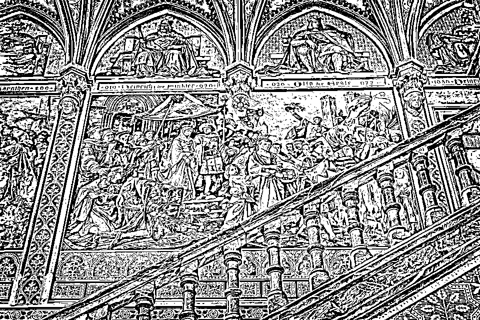

**众神时代的开端：出现神与人**

漫步在历史的长廊里，如果人类文明的每次飞跃就是一盏灯的话，大概我们很快就会在公元前 6 世纪这里驻足——因为它如此耀眼的光芒——全球各地的文明（信仰、宗教、哲学，以及神的起源），都“不约而同”的出现在这个非凡的时代。

**它的璀璨，以及对后代文明的巨大影响，被历史学家们称为伟大的“轴心时代”。**

这个被公认为整个世界宗教和文明历史上最重要的时期，有关于它的起源、过程及影响的研究分析有很多。**今天，我们不妨再从占星学的角度来看看——**

**就在公元前 578 年，发生了一个了不起的天象，三个最远的行星天海冥走在了一起**——这是几千年来唯一一次，天海、天冥、海冥，三大远行星如此紧密地，同时开启新的周期，也开启了之后数千年中，“人类文明进化”这个无比巨大的母题。

公元前 6 世纪以前（对应古希腊的古风时代、中国的春秋时期），人类文明弱小又分散，仿佛雨天玻璃上的一个个水滴，由散落的部落、城邦或是王国组成，有时彼此碰撞、汇合，有时又会消逝不见。

进入公元前 6 世纪后，随着经济交往、技术发展和战争，零散的村庄和部落开始一点点汇聚成为了城邦、王国。

**就在天海冥发生三重合相的几十年间，世界各国突然同时出现许多伟大的先知、圣贤人物，思想文化活动在各地兴起。**

希腊的神话传说，在荷马史诗和赫西俄德神谱的广泛传颂中，相互渗透、逐渐融合，直到奥林匹斯万神殿的形成，孕育了希腊古典文明的精神内核；在中国，老子传道，百家争鸣，孔子带着 72 弟子周游列国；在印度，菩提伽耶的毕波罗树下，释迦摩尼开悟；在以色列，先知耶利米、以西结和以赛亚二世出现，希伯来圣经第一次编撰和修订。

**文明的绽放，犹如从酝酿已久的天空中闪现的雷电跃入了大海一般，宣告着轴心时代的来临，也宣布了每个文明的神祗与信仰的的出现。**

最初，是马背上的游吟诗人和旅者，把故事、传说和神话，如同蒲公英的种子般传播到各地；后来，随着一些新媒介的发明和流行，诸如雅典的纸莎草纸和中国的竹简，包括在雅典的交易市场上，出现了人类最早的出版业（被认为是雅典文明奇迹的发端），加快了文化的流通速度。

雅典政治家兼诗人梭伦（天海的原型人物），还为公开朗诵荷马史诗建立了规则，使之成为希腊教育和古典想象的持久基础——技术的进步，制度的革新，不仅让普通人学会了文字（天王星），更听懂了神话与诗歌（海王星）。“文明”、“与神的直接接触”，从此不再只是贵族祭司的高级特权。

**知识与文明的普及（天王星的解放），唤醒了人们对神与信仰的渴望（海王星），同时也有了个体对于社会身份（天王星）的需求。**这一点，最明显的例子，是轴心时代“姓名”的出现。

无论从小山村里来的山民、第一次呼吸到自由空气的奴隶，或从流浪中安定下来定居的游民，来到城市里首先需要确定的，是自己在城邦、在社会中的身份。

而代表身份的，首先是姓名——名字，让人们建构了自我形象的社会内容，把自己与其他人区分开来；姓氏，则起源于血缘、地域、职业和宗教，它进一步地让人们把自己与类似的群体联系在了一起。

**轴心时代开启了神（超越世俗）的意象，也形成了最早的社会身份（天王星象征的个体与群体的关系），之后的每一轮天海周期中，都可见一股精神觉醒的浪潮，对集体意识的转变。**

**无论故事在各个时代如何演绎，神话（完美的精神）、信仰，与人类社会进步的关系始终在延续。**

在天王星的影响下，旧的“神”与信念体系，会不断遭遇不同声音的质疑，慢慢衰亡或崩溃。**随着新秩序种子的播下，巨大的潜力也等待成熟的时机，以意想不到的方式创造出新的信念和希望。**

**（未完待续，下篇明日头条发布）**

**版权声明**：原创文章由作者授权首发于若道平台发布，欢迎转发，反对抄袭。友号转载请申请白名单。

****

****乐木****

若道 2018 届核心课程认证毕业生，咨询平台入驻占星师

若道 2021 年生时校正认证占星师（满分）

复旦大学 MBA，20 年企业咨询及 HR 经验

咨询微信号：shyjywy

长按打赏

**学习占星学****点击下图了解课程详情**

**

**微信又双叒叕改版啦，不想错过若道君的推送？**

**就把若道设为星标吧！**

**▼**

**喜欢记得点一下在看哦☟**

**报名直达入口**

# 卜卦占星学 | 你是青铜，还是王者？这五道题一测就知道！

> 原文：[`mp.weixin.qq.com/s?__biz=MzA5NjA0NTAxNg==&mid=2651470990&idx=2&sn=93e337c3f7a4511bce7d0f2724f4f0a7&chksm=8b488e39bc3f072f56b663766294f99676c26aae48c63d23807840390f654bf288c1607d7af4&scene=126&sessionid=1692737837#rd`](http://mp.weixin.qq.com/s?__biz=MzA5NjA0NTAxNg==&mid=2651470990&idx=2&sn=93e337c3f7a4511bce7d0f2724f4f0a7&chksm=8b488e39bc3f072f56b663766294f99676c26aae48c63d23807840390f654bf288c1607d7af4&scene=126&sessionid=1692737837#rd)

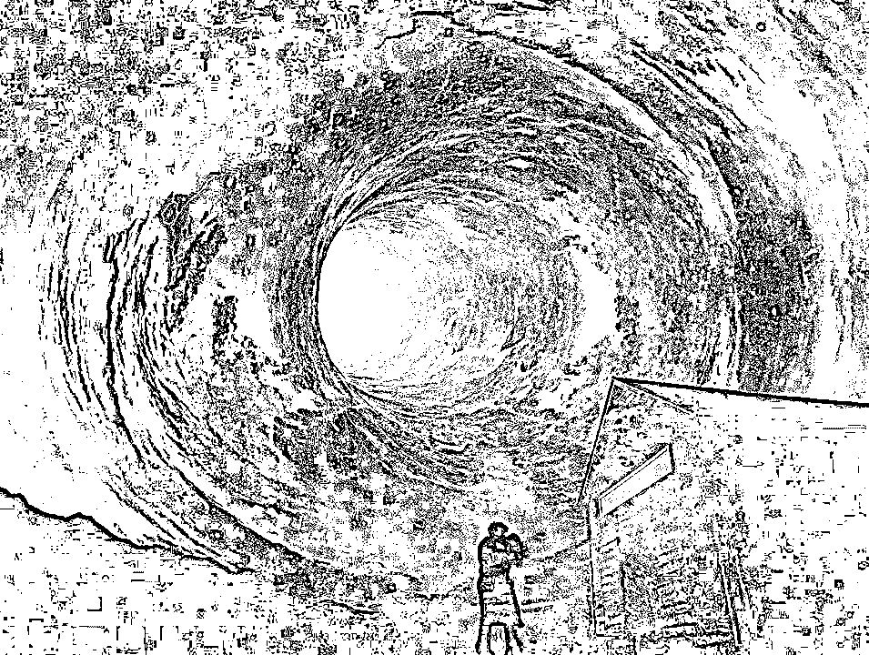

作者/王嘉祺

编辑/翀子 图片/网络

如果你对卜卦占星学已经有了一些学习，这篇测试可以帮你了解自己的程度，如果还没学习过，这些小问题也能帮你了解卜卦占星学研究的面向。若道即将开设卜卦占星课程，如果你感兴趣，可以点击[【现代卜卦占星学】](http://mp.weixin.qq.com/s?__biz=MzA5NjA0NTAxNg==&mid=2651469648&idx=2&sn=e9af4fcb4e9708658f183442532b95e6&chksm=8b4885e7bc3f0cf181e29fb38078cc11368110940c848c7e2e17fb56cd00dad123930238a81e&scene=21#wechat_redirect)了解详情哦。

大家好，我是 Conrad 卜卦课程的助教。我知道看咱们文章的有些同学，是刚刚从核心课程毕业的。还有的虽然没有系统学过卜卦，但是感兴趣，平时也会尝试进行卜卦的。今天我给大家提供 4 道选择题，以及一个实际的卜卦案例，看看大家目前处在什么阶段了。

答题开始啦

**选择题（共四题）**

**第一题**

**如果客户同时询问了好几个问题，该如何卜卦？**

A.需要针对每个问题单独制作卜卦星图；

B.除了客户的第一个问题，其余的问题无效；

C.可以通过一张卜卦星图解释所有问题，因为问题是同时同地提出的；

D.客户一次卜卦只能询问一个问题。

点击下方空白区域查看答案

▼

**答案：C**

卜卦占星中一个核心点就是时间，其精髓就在于星图显示的时刻发生了什么。因此当在某一个时间点，客户询问的内容在对应的星图中都会显示出线索。**第二题**

**如果卜卦星图遇到下列情况，说明什么问题？**

A.如果土星出现在第 1 宫，客户是个麻烦，不要展开咨询；

B.如果土星出现在第 7 宫，则有可能客户与咨询师的关系会出现一些困难，客户与其他人的关系可能也是呈现困难状态的；

C.当上升点处于星座的起始 3 度或末尾 3 度之内时，星图无法被解读；

D.如果月亮处于火星与土星 5-6 度之间被“围攻”的状态时，则事情很可能遭遇麻烦。

点击下方空白区域查看答案

▼

**答案：BD**

如果用动态的眼光来看待卜卦星图，就会跳出简单的是否回答的逻辑，因为每个结论都是由过去发展而来的，又会发展出新的可能性。所以有些状况确实意味着一些麻烦，但并不代表一些绝对性的结论，还是需要具体问题具体分析。

比如当土星在第 1 宫时，客户可能是一个封闭的状态，很难打开自己。又或者当上升点即将变动到下一个星座，或者刚刚变动到下一个星座时，代表客户即将或者刚刚经历了一些变动。

**第三题**

**以下哪些是关于行星弱势位置以及困难相位说法正确的选项？**

A.卜卦星图中一些困难的相位，是客户无力正视和处理的，只能尽量逃避；

B.卜卦星图中失势或落陷的行星以及困难的相位，预示着一些需要经历的艰难和痛苦；

C.正是因为失势或落陷的行星以及困难的相位带来了挑战，所以我们可以越来越有意识，进而越来越擅长解决这些问题；

D.卜卦星图中失势或落陷的行星以及困难的相位，就是困难本身，我们无法进行疏导或创造性的使用这股能量。

点击下方空白区域查看答案

▼

**答案：BC**

困难的相位，不是代表客户需要逃避的地方。恰恰相反，那些是客户避无可避的地方。困难的相位以及行星落点的失势和落陷，往往带给当事人一些痛苦，但也带来成长并且给星图和个体带来能量和动力，并且当事人可以有机会创造性的使用这种能量和动力。

**第四题**

**关于 2 选 1 这类抉择性的问题，如何通过卜卦占星来分析？**

A.需要判断每一个选择的不同特征，然后找到对应的征象星来判断；

B.需要找到对应的宫位，然后以宫主星代表其中一个选择，以后一个宫的宫主星代表另一个选择；

C.需要在不同的时间制作两张卜卦星图解决此类问题；

D.卜卦占星无法解决抉择问题。

点击下方空白区域查看答案

▼

**答案：A**

关于有具体抉择的问题，我们可以通过备选项的个性特征来确定哪个行星代表 A，以及哪个行星代表 B。比如一个成功的商人更对应土星，一个足球运动员更对应火星。

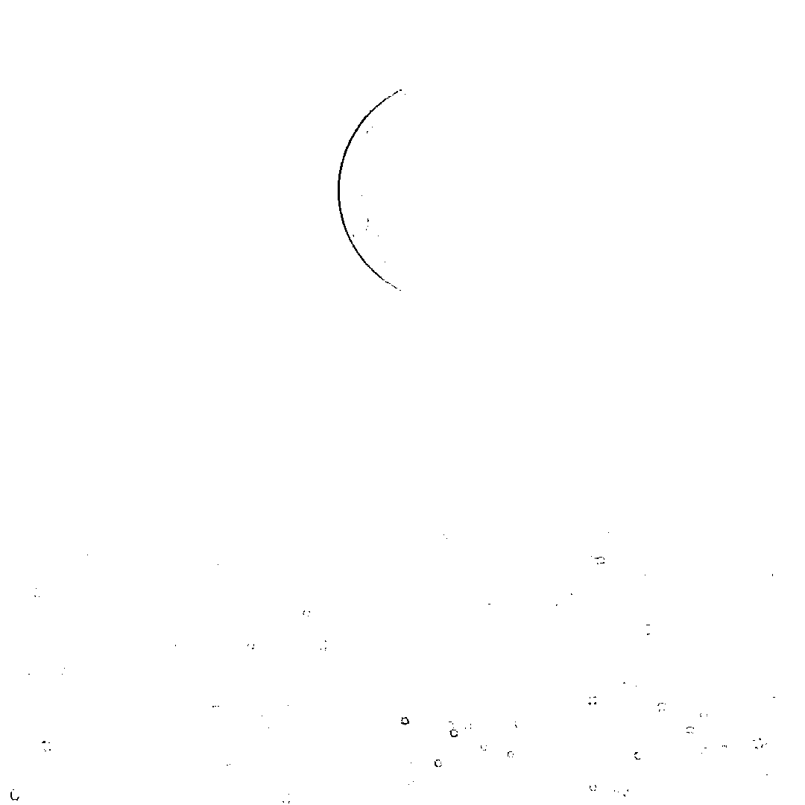

**实际案例题**

**案例题**

提问者在咨询的时候已经怀孕了，还有四个月就是预产期，她的公司当时在裁员。她不是很喜欢这个工作，她提问是否应该马上就辞职？还是等到分娩之后再说？她马上走也是可以获得赔偿金的，但是如果现在辞职，会不会在分娩后六个月内找到一份理想的工作呢？如果你作为她的卜卦咨询师，你会如何分析这个问题呢？

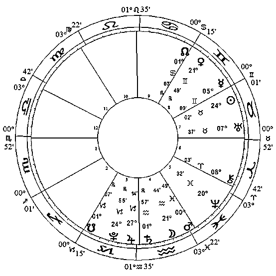

点击下方空白区域查看答案

▼

**参考答案：**

我们看到星图中的上升点和守护星刚刚换座，显然刚刚发生了一些变化，提问者是从前一个境况刚刚进入了一个新的境况。作为命主星的火星在水瓶座，代表可能提问者是一个社交忙碌的，融入集体的情况，然后进入双鱼座就是一个比较孤单的状态。

第 10 宫的宫头是狮子座，宫主星是太阳，精准三分冥王星，对应的情形就是——公司因为疫情的原因正在裁员和重组。问题并没涉及公司的领导，但看到太阳也可以思考领导相关的问题，比如太阳落在金牛座有可能描述了什么；太阳合相大陵五，同时三分冥王星，背后对应了现实的什么原因？这可能是一个非常残忍无情的领导，也可能是一个马上被替换掉的领导，但重组看上去是挺成功的。

月亮在水瓶座 21 度，金星在双子座第 8 宫也是 21 度。第 8 宫和他人的钱财相关，月亮与金星有非常紧密的三分相，意味着可能在钱财方面获得他人的有利支持、资源，可能就对应到现实生活中可能获得的赔偿金。所以马上辞职拿到赔偿金应该是较为有利的选择。

**怎么样，你答对了几道题？**

**快在评论区告诉我们吧！**

**是不是对于**卜卦占星学****

**有了不一样的认识？**

**快来看若道君为你准备的课程吧！**

**现代卜卦占星课程内容**

**课程分为 5 部分：**

**Part1 **融合现代占星理念，整合动态占星知识**Part2**独家【现代动态卜卦占星技术】全面教学**Part3**学以致用，覆盖人生各个领域问题的卜卦解法**Part4**扩展延伸择时占星技法的新认知**Part5**如何运用卜卦占星学做一场转化性的咨询

**15 节录播课+8 节直播课线上网络课，英文授课，中文翻译。**

**15 节录播课为 2020 年动态现代卜卦课程的内容。8 节直播课则完全是案例教学的形式。**

这样的好处是，你可以通过 1 个半月的密集学习之内按照自己的进度学完录播课的理论和录播课中已有的案例，从学习开始就实践，然后把实践中遇到的问题拿到 8 节直播课中，和老师互动。

**在 8 节直播课中，老师也会用案例教学、和同学互动的方式帮助大家进一步掌握卜卦占星的技法。**

**授课老师**

**艾德里安·罗斯·邓肯****（Adrian Ross Duncan）**1971 年在印度游学时开始学习占星学，1985 年开始成为全职占星师，**迄今执业已超过 33 年，是人本主义占星学、卜卦占星学和经世占星学领域的知名占星师。他还开发了占星软件 AstroClock 和多款占星报告。**他在日常咨询中都会运用卜卦，咨询图（卜卦的一种运用方式，即根据客户来访时间制作星图，从星图中获得大量信息）也是他**特别擅长的领域**。艾德里安·罗斯·邓肯从 1971 年开始研习佛学，受佛学影响很深，他**相信占星学和佛学观点统一、转化的一个基础是在于对现实感知的改变**。而卜卦很容易与佛教融合，因为它只关乎当下。

**授课时间**

**付费后一天即可开始看录播课程，全程有助教老师回答问题。**

**直播课程开始时间：**

2022 年 5 月 3 日，每周二 20:00-22:00

**这次课程恰逢世界在巨大的变动和不确定之中，期待这门课程能够给各位及各位的客户带来新的洞见和方向。**

**在这次 8 次直播课程中，我们将采用案例教学的方式，所有参课同学均有机会提供案例，供老师解读，且我们将组织群体的练习，用大量案例帮你掌握卜卦及如何在咨询中用卜卦。**

**什么人适合参加本课程？**

*   想要系统学习现代动态卜卦占星的学员

*   想在生活中熟练使用现代卜卦占星学

*   在咨询中想帮助个案更清晰的分析解读困惑

*   想参加 ISAR 认证考试，此课程是 ISAR 选修课

*   希望通过卜卦占星帮助自己和身边人挖掘一个积极主动的未来

学习整合卜卦技巧，不仅有益于想钻研卜卦占星学这个分支的同学，对占星初学者也很有有帮助，可以让你的占星技巧加倍。

**课程费用**

**课程价格：9900 元**

**老学员复训专享价：**

**2020 年参加艾德里安·罗斯·邓肯卜卦占星课程的同学：****2900 元**

**2018 年参加艾德里安·罗斯·邓肯卜卦占星课程的同学：****4900 元**

**特别优惠****：**

**分享课宣到朋友圈****保留 48 小时****（不设分组显示）截图给课程顾问可获得****400 元优惠****。**

**课程负责人：童老师（微信：nodoorDaivd），请备注“卜卦”**

长按二维码添加课程负责人咨询

**退转课程****退款原则请详看《教学协议》，如有疑问请咨询课程顾问。******现代动态卜卦占星实战课·ISAR 选修课****

**授课老师：艾德里安·罗斯·邓肯**

**授课时间：**2022 年 5 月 3 日

**授课方式：**网络课程，英文授课，中文翻译

**费用：9900 元；****2020 年老学员复训价：2900 元；2018 老学员复训价：4900 元；特别优惠，分享课宣到朋友圈保留 48 小时（不设分组显示）截图给课程顾问可再获得 400 元优惠。**

**课程负责人：**童老师（微信：nodoorDaivd），请备注“卜卦”

长按二维码添加课程负责人咨询

****报名请点击“阅读原文”****

# 4 月 27 日开课| 美国占星心理学学院&若道占星双认证核心课程

> 原文：[`mp.weixin.qq.com/s?__biz=MzA5NjA0NTAxNg==&mid=2651470854&idx=2&sn=4b9ebced794cfbebadc7d677b0328744&chksm=8b488eb1bc3f07a701e89736e3b1ba630774d4643fc87e7a960369dfaa41fe3fd5085c84f2bb&scene=126&sessionid=1692737837#rd`](http://mp.weixin.qq.com/s?__biz=MzA5NjA0NTAxNg==&mid=2651470854&idx=2&sn=4b9ebced794cfbebadc7d677b0328744&chksm=8b488eb1bc3f07a701e89736e3b1ba630774d4643fc87e7a960369dfaa41fe3fd5085c84f2bb&scene=126&sessionid=1692737837#rd)

**美国占星心理学学院创办人**

**格伦·佩里**授课

**40 余年**职业占星师生涯所学精华**倾囊相授**

修完 101-205 全部课程，并通过考核的毕业生将获得

**美国占星心理学学院证书**( Academy of Astropsychology )

和**若道毕业证书**

**高含金量双证书**

跟随主讲老师学习融合**心理学体系**的**占星知识**

为星图咨询解读打下坚实的基础

**大量**的课程资料，光是课后阅读资料就**超过 60 万字**

合理的课程设计，贴心的助教服务，及时的课后测验

1

**这门课程最大的看点是什么？**

1. **两位国际占星学大师**共同授课，将合计**90 年职业占星师生涯所学精华**倾囊相授；2. 修完**全阶课程**，考试通过的毕业生将获得**美国占星心理学学院证书**（Academy of Astropsychology）和**若道毕业证书**，**高含金量双证书**；3. **116 次课程**的充分授课时间（录播课程 69 次课；直播课程 47 次课），全面而详细地讲解占星学历史、知识、技能、案例、咨询和运用；4. 跟随主讲老师学习**自成体系、逻辑严密、实用性强的占星语法、星图解读方法**；5. 学习独特的**发展年龄预测法**，从星图看对关键年龄阶段的发展及议题；6.** 大量的课程资料，光是课后阅读资料就超过 60 万字**；7. 合理的课程设计，初中阶课程，每一节都有课后测验；8. 本课程可以作为**ISAR 选修课**中的一门，再修两门就满足 ISAR 认证选修课要求；9. **18 次占星咨询技巧的培训**，为正式从事占星咨询建立基础；10. 教授重要的**心理学概念**，比如与客体关系、心理动力理论、个人神话和叙事疗法相关的一些概念，学习如何将它们整合到星图解读中；11. 了解**《精神疾病诊断与统计手册》**诊断标准，探索星图中的心理疗愈；12.  学习**叙述疗法**和**自传写作**，将之作为自我疗愈和咨询的工具。

**格伦老师致学员的信**

（向上滑动查看内容）

**亲爱的学员：**

作为占星心理学学院的校长，我的目标是帮助你顺利完成学业。

占星心理学学院的课程让你能够在经济承受范围内，灵活地学习占星学。我们的课程让你可以舒适、便捷地在家学习，不用打乱你本就繁忙的日程。我们有完善的在线学习系统，让你能在线上课、下载学习资料、进行测试并自动获得即时反馈，还可以在虚拟课堂上同你的教员和同学互动。

作为私人开业的**职业占星师**和**执业心理治疗师**，我已经**工作超过 30 年。**我还花了近 10 年的时间，在研究院里学习并获得**心理学的硕士和博士学位**。这段训练和经历是无价的，帮助我将占星学发展成为连贯的 21 世纪模式。

我们的占星学培训项目是**系统化的、清晰的、组织有序的、易学的、前沿的。**尽管有许多类似的学校可供你选择，但你不会在这些学校中看到像占星心理学学院所提供的那样有深度的或尖端的课程。

**我非常期待 2022 年再次在若道教授心理占星学核心课程。**我们重新规划和升级了本次课程体系。**新的课程包含之前完整课程的 72 个录播视频，每个视频长 2 小时；以及由我教授的 37 次直播课程，和大卫老师教授的 10 次直播课程，每次课程 2 小时。**在实时课程中，除了我提供的案例，我还会用学员的星图进行案例演示，与学员互动，阐明视频中教授的原则和方法。

**2 小时直播课程安排：**

**第一阶段 提问和讨论：**

这将在每节课开始时进行。邀请学员提出与课前提供的资料相关的具体问题。这一阶段将持续 15-30 分钟。

**第二阶段 示例：**

这一阶段会讲解与每周任务相关的具体概念，例如行星的星座位置、宫位位置以及相位的意涵。星图示例来自我认识的人，如公众人物、朋友、家人、同事或以前的客户（不显示出生信息）。同样，这一阶段也开放课堂讨论，学员可以提出自己的问题和见解。

**第三阶段 学员案例演示：**

这个阶段会从学员的具体星图来阐明概念，例如火元素行星占优势。学员案例演示不会涉及任何类型的咨询或“解读”。它们将只是简单地包含一段对话，我会在对话中分享自己对某个配置的思考，然后问这个学员可能会如何主观地（影响、信念、行为）和客观地（事件/关系）体验这个配置。其他参课学员可能也会对讨论的主题有自己的见解或问题，他们也可以参与讨论。

我对这一新的在线课程形式感到兴奋，**并期待着从 2022 年 4 月 27 日开始认识我的新学员们。**获得本学院的文凭会是你做过的最明智的投资。你不仅将占星学掌握到前所未有的深度，还将学到如何为客户提供咨询服务并建立职业占星师的职业生涯。

真诚地

**格伦·佩里 占星心理学学院校长**

**为什么要学习心理占星学？**占星心理学是一个复杂的体系，让实践者能够向客户提供真正治疗性的益处。这从根本上说来是我们学院有别于其他学校之处：**我们教授占星学，也教授心理学概念。****我们明确讨论各种心理学概念，并将其与占星学无缝衔接。结果就是更深入的、更丰富的，最终更加强大的模式。****该项目专为初学者和渴望深造的有经验的占星师而设。**我们会从跨学科的角度探讨星图解读。**通过融合荣格心理学和各种其他模型的元素，学员将熟悉作为人格理论、发展模型、原型语言和诊断工具的占星学。**

2

**课程是怎么安排的？**

**第一学年**

**共****64****次课 **43****次录播课 **21 次直播课******

**101 占星学基础 **

****共****12****次课程：******8 次 2017 年录课+4 次直播课**

**占星学**关注成长，聚焦心理。外部事件意义重大，但我们可以把它们看作是对于发展中的心理结构的共时性反映，以及未来发展的媒介和催化剂。在这个阶段的课程中，会以四种形态的几何形式介绍**占星原型：星座、行星、宫位和相位**。黄道带是人类心灵的象征性地图，其中的每个**星座**都代表一种基本的人类需求、原型人物、发展阶段和行为风格。**行星**代表心理功能，以满足其关联星座的基本需求。**宫位**提供了环境舞台，行星在其中扮演它们的角色，而**相位**是行星之间的角度关系，在主观上体验为内在对话。

**课程安排**：

**录播课****、****直播课（周三）**时长都是 2 小时

第一节**录播课**：核心概念介绍

第二节**录播课**：黄道带的结构

2022 年 4 月 27 日**直播课**：核心概念、黄道带的结构提问和讨论、知识点示例

第三节**录播课**：图例、单态星体和其他奇妙的元素

2022 年 5 月 11 日**直播课**：图例、单态星体提问和讨论、知识点示例

第四节**录播课**：星座介绍（从白羊座到处女座）

第五节**录播课**：星座介绍（从天秤座到双鱼座）

2022 年 5 月 25 日**直播课**：12 星座案例演示

第六节**录播课**：行星作为过程

第七节**录播课**：行星作为内容

第八节**录播课**：将碎片整合起来

2022 年 6 月 8 日**直播课**：整合星图时，将行星作为过程和内容案例演示

**102 行星落星座、宫位** 

****共****12****次课程：**8 次 2019 年录课+4 次直播课**

这个阶段的课程**聚焦于初步的星图整合。**

学员将学习**占星语法**，以及如何运用它们来阐释**行星的星座落点**。学员不需要强记书中的星图解读，而是学习分析基础的占星句法结构，应用这些语法规则来思考和讲述这门语言。学员们将学习如何构建精妙的句子，将动机、功能、特质、状态和事件组合起来。

此外，还将学习解读**行星宫位落点**的规则。宫位被定义为心理环境，为特定类型成长和发展提供背景。行星落在宫位中，象征着情境中的特殊状态，应对环境挑战的方式，以及通过共时性人物和事件而外化的自我部分。

学员们将探索如何将星座和宫位落点融合在一个单一、整合的陈述中，做出灵活、层次分明的解读。

**课程安排**：

第一节**录播课**：占星语法介绍

第二节**录播课**：行星星座作为行为风格

2022 年 6 月 22 日**直播课**：占星语法、行星星座作为行为风格提问和讨论、知识点示例

第三节**录播课**：思维状态和行为结果

第四节**录播课**：学习行星的星座落点

2022 年 7 月 6 日**直播课**：思维状态和行为结果、行星的星座落点提问和讨论、知识点示例

第五节**录播课**：回顾宫位的含义

第六节**录播课**：宫位中的行星过程

2022 年 7 月 20 日**直播课**：宫位的含义、宫位中的行星过程提问和讨论、知识点示例

第七节**录播课**：行星在宫位中的状态

第八节**录播课**：行星作为宫位的内容

2022 年 8 月 3 日**直播课**：行星在宫位中的状态、内容的提问和讨论、知识点示例

**103 行星相位与个人神话** 

****共****13****次课程：**9 次 2019 年录课+4 次直播课**

在这个阶段的课程中，**相位**被解释为由更大的故事结构的潜在动力构成的个人神话。

学员将学习相位是如何象征内在心理的冲突、重要的童年情感体验、主要的人生挑战和内在对话的。需要着重强调的是，相位的意涵会随着心理成熟的程度而改变。人会成长、进化，会解决内在冲突，这些不仅反映在态度和行为的改变上，而且也会表现在某人吸引的事件及其与他人的关系品质上。

学员们还将学习一些**心理学概念**，比如与客体关系、心理动力理论、个人神话和叙事疗法相关的一些概念，它们将整合到相位解读中。

**课程安排**：

第一节**录播课**：重要主题与核心冲突

第二节**录播课**：渐盈相位与渐亏相位

2022 年 8 月 17 日**直播课**：重要主题与核心冲突、渐盈相位与渐亏相位的提问和讨论、知识点示例

第三节**录播课**：主要相位的核心意义

第四节**录播课**：罗生门原则

2022 年 8 月 31 日**直播课**：主要相位的核心意义、罗生门原则的提问和讨论、知识点示例

第五节**录播课**：占星学中的认知

第六节**录播课**：心灵的控制结构

2022 年 9 月 14 日**直播课**：占星学中的认知、心灵的控制结构的提问和讨论、知识点示例

第七节**录播课**：作为认知结构的相位

第八节**录播课**：强迫性重复

第九节**录播课**：听大卫·瑞雷讲月亮交点

2022 年 10 月 12 日**直播课**：月亮交点（由大卫·瑞雷老师教授）

**104 征象星与定位星：作为进化故事的星图 **

****共****12****次课程：******8 次 2019 年录课+4 次直播课**

这个阶段的课程聚焦于**从叙事角度整合星图。**

学员们将探索**宫位征象星**和**行星定位星**如何讲述一个故事，反映一个人进化发展之旅。行星定位关系揭示了个人神话的主体构架。而这个故事的主题常常处于意识觉知和控制之外，占星学提供了一种方式，揭示、解读、改编这个神话。

我们推荐的星图整合方式是将相位和定位星关系融合成一个单一、连贯的叙事。要特别强调的是，如何活出整合程度更高的生命故事。

学员们还将了解**叙事疗法**和**自传写作**，把它们当作促进整张星图整合的一种方式。

**课程安排**：

第一节**录播课**：每张星图都讲述了一个故事

第二节**录播课**：互容与最终定位星

2022 年 10 月 26 日**直播课**：每张星图都讲述了一个故事、互容与最终定位星的提问和讨论、知识点示例

第三节**录播课**：将相位整合进流程图

第四节**录播课**：完整的故事

2022 年 11 月 9 日**直播课**：将相位整合进流程图、完整的故事的提问和讨论、知识点示例

第五节**录播课**：过渡短语

第六节**录播课**：良好定位或不良定位

2022 年 11 月 23 日**直播课**：过渡短语、良好定位或不良定位的提问和讨论、知识点示例

第七节**录播课**：发展年龄方法

第八节**录播课**：进行全面整合

2022 年 12 月 7 日**直播课**：发展年龄方法、进行全面整合的提问和讨论、知识点示例、案例演示

**105 星图中的精神病理学与疗愈 **

****共****15****次课程：******10 次 2019 年录课+5 次直播课**

在这个阶段的课程中,我们将**聚焦于十二星座(从白羊座到双鱼座）及其对应的守护星的潜在功能障碍**。

我们将学习如何识别、理解和应对每个星座的潜在挑战。我们将在各种相应的心理障碍背景下来考察占星原型，这些心理障碍表现为功能障碍、失衡的极端状态。

学员们将了解**《精神疾病诊断与统计手册》诊断标准**。我们会探讨治疗的概念，尤其是那些与整合和个性化相关的概念。我们将特别关注外行星的困难相位，以及它们与内在心理冲突、防御和症状形成的关系。

学员们将探索人的痛苦如何成为发展和实现天赋才能的催化剂。

**课程安排**：

第一节**录播课**：白羊座-火星的病理学

第二节**录播课**：金牛座/天秤座-金星的病理学

2022 年 12 月 21 日**直播课**：白羊座-火星、金牛座/天秤座-金星的病理学提问和讨论、知识点示例、案例演示

第三节**录播课**：双子座/处女座-水星的病理学

第四节**录播课**：巨蟹座-月亮的病理学

2023 年 1 月 4 日**直播课**：双子座/处女座-水星、巨蟹座-月亮的病理学提问和讨论、知识点示例、案例演示

第五节**录播课**：狮子座-太阳的病理学

第六节**录播课**：天蝎座-冥王星的病理学

2023 年 2 月 1 日**直播课**：狮子座-太阳、天蝎座-冥王星的病理学提问和讨论、知识点示例、案例演示

第七节**录播课**：射手座-木星的病理学

第八节**录播课**：摩羯座-土星的病理学

2023 年 2 月 15 日**直播课**：射手座-木星、摩羯座-土星的病理学提问和讨论、知识点示例、案例演示

第九节**录播课**：水瓶座-天王星的病理学

第十节**录播课**：双鱼座-海王星的病理学

2023 年 3 月 1 日**直播课**：水瓶座-天王星、双鱼座-海王星的病理学提问和讨论、知识点示例、案例演示

**第二学年 2023 年**

****共****52****次课 **36****次录播课 **16 次直播课********

**201 回顾占星历史 **

****共****16****次课程：******9 次 2019 年录课+7 次直播课**

在这个阶段的课程中，我们将探索**占星历史如何反映心灵的进化**。

现代之前的占星学以事件为导向，注重具体预测，偏向决定论，它反映了现代之前的主导意识模式。上世纪以来，占星学已经逐渐变得更加抽象、心理化、开放和非决定性，这似乎反映了集体意识的改变。因此，我们将在人类发展和意识进化的背景下考察占星历史。我们会谈到不同时代的星图解读和咨询技术，以此来比较和对比前现代、现代和后现代占星学。

**课程安排**：

第一节**录播课**：朝着整体占星学前进

第二节**录播课**：占星原教旨主义

2023 年 3 月 22 日**直播课**：朝着整体占星学前进、占星原教旨主义提问和讨论、知识点示例

第三节**录播课**：占星学的其他分支——大卫·瑞雷

2023 年 3 月 29 日**直播课**：占星学的其他分支提问和讨论、知识点示例（由大卫·瑞雷老师教授）

第四节**录播课**：从古代占星学到后现代占星学

第五节**录播课**：比较与批评

2023 年 4 月 5 日**直播课**：从古代占星学到后现代占星学、比较与批评、提问和讨论、知识点示例

第六节**录播课**：希腊占星学：摘录与评论

2023 年 4 月 19 日**直播课**：希腊占星学：摘录与评论提问和讨论、知识点示例

第七节**录播课**：比对图中的伴侣匹配度，古代与现代

2023 年 5 月 3 日**直播课**：比对图中的伴侣匹配度，古代与现代提问和讨论、知识点示例

第八节**录播课**：比对图——大卫·瑞雷

2023 年 5 月 10 日**直播课**：比对图提问和讨论、知识点示例、案例演示（由大卫·瑞雷老师教授）

第九节**录播课**：组合图——大卫·瑞雷

2023 年 5 月 17 日**直播课**：组合图提问和讨论、知识点示例、案例演示（由大卫·瑞雷老师教授）

**202 预测与意识演变(一) **

****共****9****次课程：******6 次 2019 年录课+3 次直播课**

作为一门艺术，**预测占星学**运用行星的运行来预测特定时期的性质、意义和持续时间。在这个阶段的课程中，我们会考察**意识进化**的概念、其基本原理及其与占星学预测部分的关系。

意识进化可以被定义为有意识地与星图中固有的进化过程合作。学员们将探索如何用**行进**和**推进**来为意识进化服务。我们不是简单描述事件的结果，而是将行星运行描述为实现先天潜能的机遇之窗。

**课程安排**：

第一节**录播课**：开始预测

第二节**录播课**：发展年龄方法

2023 年 5 月 24 日**直播课**：开始预测、发展年龄方法提问和讨论、知识点示例、案例演示

第三节**录播课**：太阳的行进

第四节**录播课**：月亮的行进与推进

2023 年 6 月 7 日**直播课**：太阳的行进、月亮的行进与推进提问和讨论、知识点示例、案例演示

第五节**录播课**：水星的行进

第六节**录播课**：金星的行进

2023 年 6 月 14 日**直播课**：水星、金星的行进提问和讨论、知识点示例、案例演示

**203 预测与意识演变(二) **

****共****15****次课程：******9 次 2019 年录课+6 次直播课**

在这个阶段的课程中，学员们会继续探索**如何将对行进、推进和其他预测方法的分析运用于个人成长**。

具体事件反映并促进了意识的改变；因此，行星运行可以帮助我们洞察成长过程的精确时机，让我们领会内在和外在现实如何同时发生、彼此反映、互相转化。

我们还将探索宏观的世界行进，考察占星格局如何在社会、政治、经济、艺术和生态层面上表现出不同的形式，却又在多样化的现象中反映单一的**原型**。

这里的挑战是去思考，我们对宇宙的这种参与式关系如何能为共同创造一个积极的、更充满希望的未来做出贡献。

**课程安排**：

第一节**录播课**：火星的行进

第二节**录播课**：木星的行进

2023 年 6 月 28 日**直播课**：火星、木星的行进提问和讨论、知识点示例、案例演示

第三节**录播课**：土星的行进

第四节**录播课**：天王星的行进

2023 年 7 月 12 日**直播课**：土星、天王星的行进提问和讨论、知识点示例、案例演示

第五节**录播课**：海王星的行进

第六节**录播课**：冥王星的行进

2023 年 7 月 26 日**直播课**：海王星、冥王星的行进提问和讨论、知识点示例、案例演示

第七节**录播课**：次限推进——大卫·瑞雷

2023 年 8 月 2 日**直播课**：次限推进提问和讨论、知识点示例、案例演示（由大卫·瑞雷老师教授）

第八节**录播课**：太阳弧——大卫·瑞雷

2023 年 8 月 9 日**直播课**：太阳弧提问和讨论、知识点示例、案例演示（由大卫·瑞雷老师教授）

第九节**录播课**：太阳返照图和月亮返照图——大卫·瑞雷

2023 年 8 月 16 日**直播课**：太阳返照图和月亮返照图提问和讨论、知识点示例、案例演示（由大卫·瑞雷老师教授）

**204 占星咨询技巧(一) **

****共****9****次课程：******6 次 2019 年录课+3 次直播课**

在这个阶段的课程中，学员们将学习**咨询技巧**，比如如何选取一段经历，询问相关问题，提出假设，进行解读，重塑冲突，预测成长机遇，深化疗愈。

我们会审视各种**咨询理论**，重点强调它们在占星学中的**运用**。学员们将学习如何处理危机，做出恰当的推荐引介。

我们强调**有效沟通**的原则、聆听技巧、言语和非言语沟通，以及占星学如何帮助我们建立共情关系。

我们会专门介绍**伦理道德**法则，因为它关系到职业责任问题、资质能力、咨询和预测。

我们会特别关注**占星师的阴影**以及我们在自卑和膨胀问题上的集体脆弱。

**课程安排**：

第一节**录播课**：导言与概述

第二节**录播课**：确定咨询范围

2023 年 8 月 30 日**直播课**：导言与概述、确定咨询范围提问和讨论、知识点示例、案例演示

第三节**录播课**：会见客户

第四节**录播课**：厘清问题(剥开占星学的洋葱)

2023 年 9 月 13 日**直播课**：会见客户、厘清问题(剥开占星学的洋葱)提问和讨论、知识点示例、案例演示

第五节**录播课**：认出生活模式(隐喻思维)

第六节**录播课**：提出假设与辨识核心信念

2023 年 9 月 27 日**直播课**：认出生活模式(隐喻思维)、提出假设与辨识核心信念提问和讨论、知识点示例、案例演示

**205 占星咨询技巧 (二) **

****共****12****次课程：******6 次 2019 年录课+6 次直播课**

在这个阶段的课程中，参与者将**继续学习咨询技巧**，包括如何选取一段经历，询问相关问题，提出假设，进行解读，重塑冲突，预测成长机遇，深化疗愈。

我们还将考察各种**电影**，考察它们与理解人们寻求帮助的共同议题的关系。我们会审视各种咨询理论，着重强调它们在占星学中的运用。学员们会学到如何处理危机，做出恰当的推荐引介。我们会强调有效沟通的原则，以及聆听技巧、言语和非言语沟通，以及占星学如何帮助我们建立共情关系。我们会专门介绍伦理道德法则，因为它关系到职业责任问题、资质能力、咨询、预测和古代术语的运用。

**课程安排**：

第一节**录播课**：检验假设

第二节**录播课**：对星图做出初步解读

2023 年 10 月 11 日**直播课**：检验假设、对星图做出初步解读提问和讨论、知识点示例、案例演示

第三节**录播课**：建设性解读星图的艺术

第四节**录播课**：洞悉客户经历的目的

2023 年 10 月 25 日**直播课**：建设性解读星图的艺术、洞悉客户经历的目的提问和讨论、知识点示例、案例演示

第五节**录播课**：提供希望和方向

第六节**录播课**：案例研究和督导

2023 年 11 月 8 日**直播课**：提供希望和方向、案例研究和督导提问和讨论、知识点示例、案例演示

2023 年 11 月 15 日**直播课**：ISAR 资质认证考试大纲和准备（由大卫·瑞雷老师教授）

2023 年 11 月 22 日**直播课**：ISAR 资质认证考试术语词汇表第一部分（由大卫·瑞雷老师教授）

2023 年 11 月 29 日**直播课**：ISAR 资质认证考试术语词汇表第二部分（由大卫·瑞雷老师教授）

**若道核心课程结业考试**

3

**导师简介**

**格伦·佩里（Glenn Perry）**

*   这位传奇的占星师，也是一名拳击和摩托车爱好者

*   他毕业于赛布鲁克学院(Saybrook Institute)，是心理/意识研究专业博士

*   也是拥有 30 余年经验的加州注册婚姻和家庭治疗师 （CAMFT）

*   美国占星心理学学院（Academy of AstroPsychology）的创办人

*   他曾任国际占星研究协会 （ISAR）以及联合占星大会董事会（UAC）副主席

*   也是 ISAR 突破性道德标准的设定者

*   康涅狄格州研究生院（the Graduate Institute of Connecticut）原型宇宙学与意识进化项目的负责人

*   共出版八本占星学著作：《心理占星学入门》《心理占星论文集》《盗取天火》《从忠诚到革命》《星图中的阴影》《占星职业议题与伦理》《出生星图深度分析》《从古代到后现代占星学》

**大卫·瑞雷（David Railey）**

*   若道联合创始人，致力于在中国教授和推广西方占星学；

*   曾任 ISAR 全球副主席，CAPISAR（ISAR 职业占星师资质认证机构）主席；

*   1976 年，通过亚特兰大职业占星师考试，成为全职占星师，随后通过 AFAN 和 ISAR 职业测试；

*   1980 年，与杰夫·焦耳一起在亚特兰大创建“每日行星”占星学中心。此后在亚特兰大占星协会担任 4 年考官，并且两次担任亚特兰大地区占星协会主席。1979-1992 年，作为占星师活跃于美国社会媒体，向不了解现代占星学变化的大众宣传专业占星学知识。在 1989-1992 年期间，他在 WRGG 电台 12 频道每周主持个人电视秀“今日占星学”，早先他还在 WRFG 的广播节目中播讲宇宙天气节目；

*   2010-2014 年，任全美占星师联盟监督委员会委员；

*   2010 年，其著作《灵魂的目标》中国版出版，和蒋颖一起创办若道占星学校和其官网 www.nodoor.com；

*   2017 年，被选为 ISAR 委员会成员。ISAR 是世界最大的国际占星机构，会员遍布 45 个国家，2017-2020 年曾任 ISAR 全球副主席、CAPISAR（ISAR 职业占星师资质认证机构）主席。

**助教简介**

**薇安**

*   全职心理占星师、ISAR 认证占星师（2016 年获得）；

*   北大心理学硕士、MBTI 国际认证施测师；

*   若道认证生时校正资质及 COAC 高阶资质毕业生；

*   连续两届担任格伦·佩里老师亲授的“美国占星心理学院&若道占星双认证核心课程”主助教；

*   2012 年至今，持续追随多位国际占星大师进行占星学的深入学习；

*   2007 年至今，持续进行精神分析及心理动力取向的理论及技巧研习；

*   致力研究心理学与占星学的整合运用。

4

**此次课程适合哪些人？**

*   对占星学感兴趣，想要入门的零基础者

*   占星学小白，但有志成为职业占星师的人

*   有一定占星学基础，但不知道该如何整合星图复杂碎片的人

*   想要师从更多殿堂级占星导师学习占星心法的人

*   走在自我探索和个人成长道路上的人

5

**选择若道学习占星学的优势**

**运用自由意志，扭转破坏性模式，绽放天赋潜能**

若道是人本主义占星学的旗手。因为我们相信，**人通过了解模式、觉察习性、积极疗愈、终将释放其潜能，与命运共舞**。

**进入国际权威职业占星师认证的快车道**

占星界的“联合国”ISAR（国际占星研究协会），是具有全世界影响力的占星教学和研究组织和职业占星师全球认证机构，认证占星师遍布 47 个国家。**在 ISAR 的 22 所附属学校中，大中华地区的附属学校只有若道一家**。在国际化的教学理念大纲标准下，**若道毕业生在 ISAR 国际认证占星师的考试通过率多次全球第一**。

**十年占星学教育中国本土化教学经验**

**根据中国学生的学习习惯不断优化占星教学体系，让学员学成后更自如地应对本土咨询市场的需求。**

学好占星学不仅仅需要邀请一两位老师教学，更需要对教学难点有充分了解，且有持续的教学跟进服务。**10 年来多次核心课程和各种专题课程的教学，让若道非常了解中国学生学习占星学的难点和卡点，合理有效地拆分、提炼课程知识点，同时也积累了丰富的国外老师和中国老师、助教紧密配合以及课程顾问密切配合教学的经验**。

若道还专门开发了有助于占星学习的“**若道**”APP，每门课程都设有答疑板块，学员能够方便快捷地提交问题，助教及时答疑解惑和批改作业。

**融入中国顶尖的职业占星师群体**

若道是中国职业占星师的“黄埔军校”。职业占星师的培养从若道开始，**进入若道，你就走进了中国顶尖的职业占星师群体，和一群志同道合的师兄师姐联谊，获得经验，共同成长**。 

**多种奖学金支持**

为了鼓励学员不因为暂时的经济困难而放弃学习，我们特意设置了各种**技能交换和奖学金**。

对于有一技之长的学员，我们推出的技能交换的项目包括**“笔译”、“笔记整理”、“平面设计”、“课本朗读”、“班级服务”**等技能交换项目；

而对于努力学习、出勤率高、完成作业率高的学员，我们设置的**土星奖、木星奖**等各种奖学金在等着你。

为了感谢帮助我们推荐学员的老学员们，我们设置了“**老学员推荐奖**”；

对于通过问卷提建议，帮助我们提高服务的学员，我们也设置了相应的奖学金。

**开启占星咨询的职业规划和支持**

若道为占星学员搭建了占星问答平台和占星咨询平台，并提供严肃占星学影响力最大的媒体平台，全力为毕业生提供宣传渠道，帮助你吸引和积累咨询生涯初期的种子客户。若道为学员开发了适用于占星学习的“若道”APP，并不断更新完善。

**①  微信平台**若道微信平台作为业内颇具影响力专业平台，为文笔好的若道毕业生提供传播占星学并免费宣传自己的机会。有的学员因为文笔获得众多粉丝喜爱，在 3 年多时间积累起 2000 多人的潜在客户。

****②  **咨询平台**若道咨询平台是我们为优秀毕业生所搭建的平台，帮助毕业生在自己的咨询拓展之外，用若道提供的平台扩展咨询客户群。自咨询平台 2017 年 8 月上线运营以来，咨询平台共入驻 65 人，收入最高者达 32 万元。

此处所列学员收入仅供参考，收入高的学员和其专业水准、努力程度密切相关。若道平台尽其所能将自己定位为辅助学员开展职业生涯的桥梁。

6

**课程价格**

**101-102 初阶**

**正价：**6800 元

**学习充值卡优惠价：5800 元**

**101-105 第一学年**

**正价：**18800 元

**学习充值卡优惠价：17000 元**

**101-205 全阶联报**

**正价：**50000 元

**转发优惠价：38000 元**

**学习充值卡优惠价：35000 元**

**咨询课程顾问**：**王老师（微信/手机：18510107057，请备注“格伦核心课”）**

**全阶段学习后，可参与若道占星毕业认证考试，考试费用为：580 元**

7

**直播课开课时间**

**2022 年 4 月 27 日（周三）20:00-22:00**

**如果直播课时间临时有调整，班班会及时通知每位同学****最终解释权归若道所有**

8

**退转课程**

**退款原则请详看《教学协议》，如有疑问请咨询课程顾问。**

9

**格伦老师视频**

** 格伦·佩里老师如何将心理学和占星学结合，如何开始教授心理占星学？**

<mpvideosnap class="js_uneditable custom_select_card channels_iframe" data-pluginname="videosnap" data-id="export/UzFfAgtgekIEAQAAAAAAHBcLpepWXQAAAAstQy6ubaLX4KHWvLEZgBPEkIMYRVhfSLT8zNPgMIs23XYw2eSgrRaPW3Dj9_BA" data-url="https://findermp.video.qq.com/251/20304/stodownload?encfilekey=S7s6ianIic0ia4PicKJSfB8EjyjpQibPUAXolnQrZwePcCZ0XffhxtFKBwL8xABabPSCrxp2TBZSdOyypmjhiabiaWTOO3EBU1J4xTc5YqicfMicRDjwKRTic0XAyGhw&amp;adaptivelytrans=0&amp;bizid=1023&amp;dotrans=0&amp;hy=SH&amp;idx=1&amp;m=&amp;scene=0&amp;token=x5Y29zUxcibDvW6kcaiah8Ercl8kTODs9WlcutHnqspJaoS4rCI8zZQ2lSdgwic54KnoDkAWPP5Y1A" data-headimgurl="http://wx.qlogo.cn/finderhead/PiajxSqBRaEJYnVsqWfEX9qA0sI6hNVKsDfyzfPZ92WZMZyBpZWU5NA/0" data-username="v2_060000231003b20faec8c4e68a1ec2d4ca07e434b07755bbf47e7053a3059defd2c9d6c68a20@finder" data-nickname="若道" data-desc="#若道核心课 如何解读一张出生星图？出生星图有哪些组成部分？星图里不同组成部分分别代表什么？" data-nonceid="7032132594947358005" data-type="video"></mpvideosnap>****2022 双证书核心课****

**授课老师：格伦·佩里、大卫·瑞雷**

**直播课开课时间：2022 年 4 月 27 日（周三）开课**

**授课方式：******网络授课，英文授课，中文翻译****

**费用：101-102 价格：**6800 元**（充值卡优惠价 5800）**，**101-105 价格**：18800 元**（充值卡优惠价 17000）**，**101-205 价格**：50000 元**（转发优惠价：38000 元，充值卡优惠价 35000）**；

**课程负责人：王老师**（微信/手机：18510107057，请备注“格伦核心课”）

长按二维码添加课程负责人咨询~

****报名直达入口****

# 4.5 金星进双鱼座丨愿你我心灵相通，世界和平相爱

> 原文：[`mp.weixin.qq.com/s?__biz=MzA5NjA0NTAxNg==&mid=2651470854&idx=1&sn=437fef75933a93b1e5a3b043a94dea9d&chksm=8b488eb1bc3f07a79d8340ed1177b272a8a9297f476d8fb4c2dc61adb67435962993254e0258&scene=126&sessionid=1692737837#rd`](http://mp.weixin.qq.com/s?__biz=MzA5NjA0NTAxNg==&mid=2651470854&idx=1&sn=437fef75933a93b1e5a3b043a94dea9d&chksm=8b488eb1bc3f07a79d8340ed1177b272a8a9297f476d8fb4c2dc61adb67435962993254e0258&scene=126&sessionid=1692737837#rd)

**********************☆ ****************************后台****************************回复“今日”，给你一句生命态度**********************

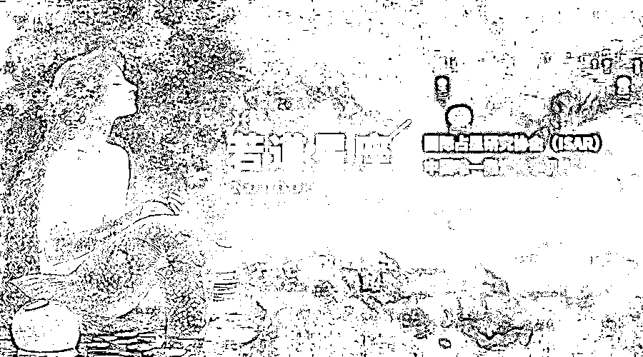

作者/MaryChan 玛丽

编辑/翀子 封面/书君 图片/网络

4 月 5 日 23 点 17 分，金星进入双鱼座并在此停留至 5 月 2 日。象征爱与美的金星来到曜升位置双鱼座掌管的领地时，会有哪些表现？在这段日子里，又有哪些重要的宇宙天气可以助力金星的能量发挥呢？让我们一起来看文章吧~
**金星进入双鱼座**

**4 月 5 日 23:17 金星将由水瓶座进入双鱼座。**由风元素到水元素的转换，从传递洞见到寂静感应；从世俗中抽离，到超凡脱俗；由对不一样的爱与关系的探讨、尝试、理解，到沉浸、融合并与爱合一。

**金星象征着爱与美，以及一种连接、结合、给与、分享的阴性势能。**一般它在每个星座待三周半左右，再进入下一个星座。

**金星与阴性面向有关，是除了月亮（代表滋养、照料、养育）之外的另一种阴性展现。**其可视形状的变化，也像是有月亮的阴晴圆缺似的，当离地球很近的时候形似月牙，离地球很远的时候形似银盘。而阴性面向正与变化有关。

在金星的每月律动中，与之持续地连接，寻求理解，邀请金星所象征的神圣美好与我们同在，有助于个体连接生命中的愉悦感，开发提升个人魅力、品味，**带来自然而然的吸引力，创造良性的人际互动，开启或维护有品质的感情，创造价值、财富与丰盛。**

金星属于内行星，是“自我”的具体面向，象征着客观性、连接、交换、存在于关系之中的彼此。有别于外行星所象征的超然面向，**金星非常具有“烟火气”，与触手可及的人事物有关。**其守护星座天秤座——带来平衡、和谐与优雅；金牛座——带来自然、价值与感官享受。

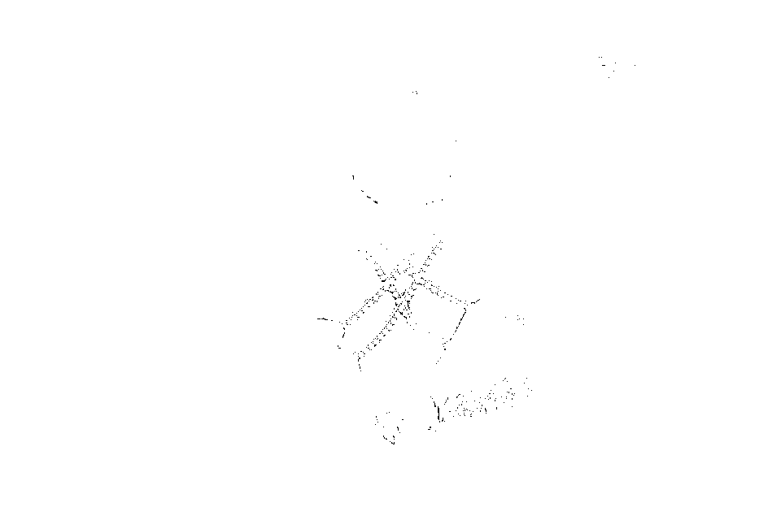

**双鱼座的法则**

双鱼座处于黄道 12 宫的最后一个。从白羊座到处女座，象征自我的开展和完善，从天秤座到摩羯座，象征个体社会化的进程。水瓶座，象征社会化的完成，为了个体进一步地成长，打破既有框架，令个体看到崭新的可能和不一样的运作法则。

**到了双鱼座，一切终归无垠的星辰大海，象征与源头合一。**

如果说水瓶座让人脱离正常轨道，令人耳目一新或惊讶震撼。到了双鱼座，便是**“大音希声、大象无形”**的境界。在水瓶座，个体需要认同的是独特的群体或多层次自我。在双鱼座，**个体需要更加认同于大宇宙本身。**

吕克·贝松导演的电影《超体》就有着这方面的隐喻。当个体与某种代表无限的潜势结合，对这个世界的感受也会有本质的不同。

双鱼座很难被正确地、真切地理解，**因为这最后阶段是超越个体头脑认知的。**这是一个若隐若现的神秘之地，在没有彻底了悟之前，总是隔着模糊不清的罩纱，让人觉得身处迷雾之中。

这其中升腾起来的幻境，或美丽或扭曲，总是充满理想化的色彩，如梦境一般，让现实中无法触及，也无法掌控的荒诞仿佛变得近在眼前。就像神话中的美人鱼与海妖，对个体充满着神秘莫测的诱惑。

**在双鱼座，“自我”被弱化了，自我坚持的力量减少了，个体成为某种特别存在的欲望降低了。**所以双鱼座善于接纳、配合和融入。就像变色龙一般，善于随环境的变化随时改变身体颜色。所以双鱼座也常被诟病，缺乏意志力和原则，标准和边界在这里变得模糊不清，因此双鱼座也容易受到“诱惑”，或与欺骗有关。

**双鱼座代表终极的自我超越。**双鱼座的很多东西，是无法只用语言表达的（所以艺术与双鱼座有关），它神秘、不可尽说，就像在握紧与放手之间灵光乍现的无门之门。

真正的超越，是“小我”的死亡，这意味着个体全然地臣服于造物。而在没有准备好之前，把自我交托出去，是很危险的。并且因为消融了土星的俗世准则，所以个体会感到无力和痛苦。许多受双鱼座影响的人，总是在自控与放任之间不等比例地摆荡（具体要看其本命星图中土星的影响力）。

双鱼座象征着结束与开始。下一个星座是白羊座——黄道 12 宫的第 1 宫，又是新一轮自我进展的开端。在双鱼座，就像“自我”出生之前的原始海洋，母亲的子宫或灵魂的宇宙子宫，是事物隐秘酝酿的阶段。**在这里藏着旧循环结束，与新循环开始的希望。**

**金星在双鱼座**

金星在双鱼座，是其擢升的强势位置。此时，**人们更能够感受到某种细腻的柔和能量，**润物细无声地去消弭显著的界分感，由此缓和抗拒与纷争，令人更有弹性地去接纳周围的人事物。

金星在双鱼座，我们得以与水元素连接。个体可能与事实上的水接触，想要泡个澡、做个 SPA、去游泳，也可以是去河湖岸边散步。可能被与“水”有关的征象吸引，例如与情绪、情感有关的作品或产品。

**在安全和舒适的水环境下，身体和思绪得以放松，带回内在的愉悦感和平衡感。**正如人本主义心理学的观点——“人在安全的环境下会自动朝着正向发展”。

**金星在双鱼座，人的整体状态比较敞开，我们更加有机会去亲近艺术，接收灵感和启示。**双鱼座善与象征、意象连接，并以此带出丰富的意涵。音乐、舞蹈、诗歌、绘画、戏剧等形式，引领人们感应无以言表的意境，得到超越平庸的美的享受。

就像程璧的歌《我想和你虚度时光》：“我想和你虚度时光，比如低头看鱼，比如把茶杯留在桌子上，离开，浪费它们好看的阴影；一起虚度短的沉默，长的无意义，一起消磨精致而苍老的宇宙。”

**金星在双鱼座，与领略意识的更深面向有关，例如梦境。**著名超现实主义画家达利，其画作体现了一种与梦和潜意识的连接。在画作《记忆的永恒》中，那些坚固的钟表，变成了柔软的、有延展性的物体，令人看到一副个人在现实生活中根本看不到的离奇景象，引发想象和思考。

金星在双鱼座的神话学大师约瑟夫·坎贝尔(Joseph·Campbell)，在《神话的力量》中写道：**神话是公开的梦，梦是私人的神话。**这不仅表达了其对神话的独特见解，也表现了其对人类深层精神世界的直观契入，令人印象深刻。

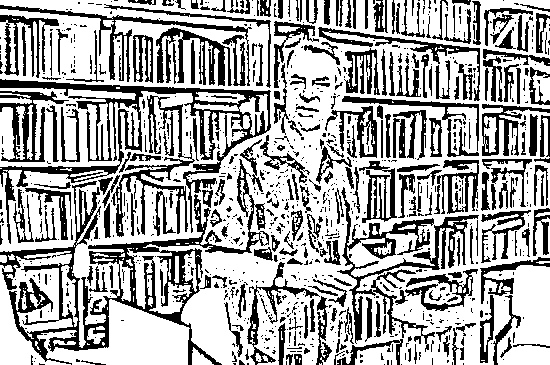

| 约瑟夫·坎贝尔

**金星在双鱼座，我们以一种更加宽容的方式去连接人事物。**在关系中容易忽略差异，更加接纳彼此。这有利于建立或缓和关系，并为关系中的彼此寻求更大的理解与合作。

用细致、敏感，去理解事物之中更加纤细、精微的层面，适时放下主观好恶，去尊重他者的不同表现，并愿意给与对方时间，去完成自己的生命体验。而非一味希望对方认同自己的评判标准和价值体系。

在表达中，体悟话语背后的话语，看到一切源于对爱的渴求，抑或爱的缺乏。**爱是一种深深的连接，一种无法言说的懂得，一种自然而然的默然，寂静、旷达而欢喜。**

**金星在双鱼座，利于发展关系中的同理心，**让我们对一些状况更加感同身受，设身处地为他人着想。并且对他人的遭遇或处境，在情感上产生共鸣。这样的交往，让人觉得被理解和懂得，感到舒适和安心。

此时有利于个体在交流中吸收潜在的信息，比如语音语调、肢体动作、表情背后的情感流露，甚至感应到对方未表达的情绪、情感、想法。就像电视剧《猎罪图鉴》中的天才画像师，靠深切的直觉和细致入微的洞察力，屡立奇功，但令人动容的部分还在于用艺术抚慰人心以及救赎。剧中不断出现的海洋、模糊的记忆，亦透露出双鱼座的气息。

**金星在双鱼座，容易带着诗意的眼光，理想主义的眼镜去看待关系。**如果缺乏土星所代表的现实感，关系中往往出现被美化的成分，以及被扭曲的事实。个体或是没有力量看清，或是不舍得看清。

**金星在双鱼座，在关系中比较被动，容易迁就他人。**如果长期超出自我界限地付出，会感觉生命活力不断流逝，身体渐渐被掏空，心变得苦涩，在关系中产生一种无能为力之感。觉得自己在受苦受难、牺牲奉献，而他人不理解。由此个人或怨天尤人，或黯然神伤。

这就像一种日积月累的侵蚀力，破坏了生命的强韧，让人越来越失去勇气与力量，陷入一种恶性循环中。**如果我们否认了生命中富有创造性的一面，也会因此阻隔了生命能量的回流。**

当个体总觉得自己是受害者，其实是不愿意或无法承担属于自己的生命责任，抑或还没有搞清楚这份责任是什么。**金星在双鱼座的被动，不等于无力。**“天下之至柔，驰骋天下之至坚。”在这个世界中，许多人重视事物的阳面，而忽视了事物的阴面。

这几年大天象层出不穷，借此机会让每个人看到更完整的画面，而获得内在的顿悟。“万物负阴而抱阳，冲气以为和。”阴阳和谐存在，才会产生生命力和创造力。许多人外在看似坚固的架构（阳面）被打破了，内心中又没有发展出强韧的可信赖的力量（阴面），生命的重建就需要一段时间。

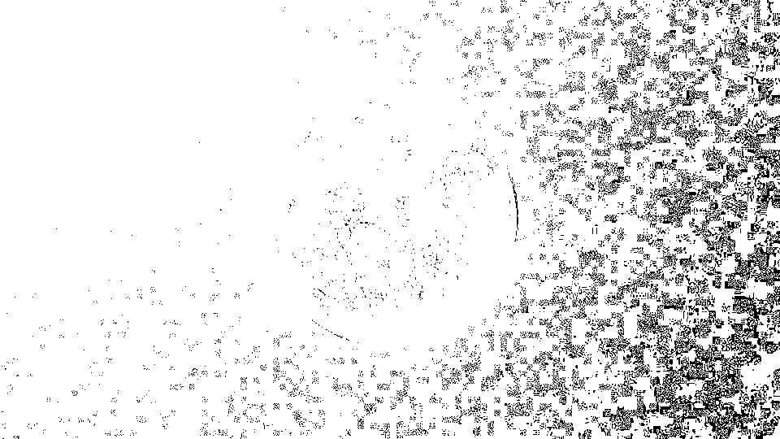

**金星在双鱼座，可能在关系中出现逃避倾向，借关系来逃避粗糙的现实世界。**透过“眼镜”，得到加工粉饰的信息，看到被美化后的对方，而非真实的或全面的对方。

这种扭曲和变形，有时候会严重到令人惊讶的程度。明明知道不现实，也会想要抓住看似美好的一切。所谓当局者迷、旁观者清，一切只有通过时间来澄清和了解。当个体选择在自筑的“梦”中经历时，旁人是很难强行扭转的。但最终，尽管不情愿，幻象的泡泡毕竟有破灭的一天，这是宇宙循环往复的游戏。

当大海退潮，水“落”石“出”，刚刚的一汪碧水，可能变成千疮百孔的滩涂。但这就是生命，我们无法代替他人去活出来。相对于结果，有时候过程会更重要。

庄周梦蝶悟出了一番生命道理。我们可以通过这个过程，**扩展生命体验，促使习气的转变，感悟舍与得的智慧。**

**金星在双鱼座，在关系中有一种微妙的永不满足感，**一份淡淡的困惑、空虚、失落和忧伤。相对于全然包容的理想国度，**现实的一切都是有缺憾的。**拥有完美的关系并不意味着失去自我，而是需要日复一日地了解自我。

《内在的探索》中写道：“我们的不满足绝大部分并非源自于疾病或物质上的困境，而是未能充分活出自己。不知道自己是谁，不认识我们真正的存在本质。”

金星在双鱼座，是以关系为镜，看到关系是如何塑造自己的，以及双方在关系中最深的渴望，包容双方活出本真的自我。前面提到过，双鱼座处于黄道 12 宫的最后一个，其隐藏的要求是超越和消融，**所以如果没有很好完成个体化的进程，个人基于什么来超越呢？**

假如个体没有对自己是谁加以理解，没有发展出自己的价值和优势，没有体验自己的情感以及其中的力量，就容易缺乏一种从容和笃定，容易被外在人事物所影响，引发脆弱、纠结、抗拒，甚至欺骗。**在关系中感受到的，是自我缺陷的投影，而难以真实地关注对方、倾听对方、感受对方。**

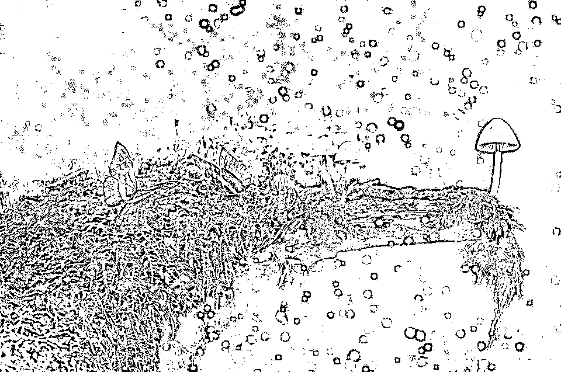

**金星在双鱼座，帮助我们通过平衡自己与自己的关系，自己与他人或事物的关系，而让我们更充分地活出自己。**浪漫并不会变成一种活在现实生活中的阻碍，你需要去做实际的事情，与各种人接触。而在双鱼座的金星协助我们，无论何时，都可以观察自己的心，去不逃避地发现阻碍你与这个人（或事）融合的东西是什么。

少一些批判，无拣择地“看”，就会发现某个事实，可能是任何书本或老师无法传授给你的。领悟源于真的明白，经由这份明白，心打开了，知识可能是头脑中的文字储备，**而智慧是活生生流淌于个体生命河流中的精华。**

金星在双鱼座，眼泪并非总是软弱的表征。眼泪不仅源于脆弱无力，也源于真情流露的释然，**其中可以充满力量，成为人与人之间珍贵的体验和粘合剂。**

眼泪也和某种超然的体验相关。当个体在大自然的盛景中，在神圣的建筑里，在抄写经文的某一刻，会肃然起敬，甚至莫名流泪，那是某种超越头脑的神秘连接。**当你的心在振动扩展，当你整个人被融化，你的眼泪将无可避免地自由流淌。**

**金星在双鱼座，激发个体与精神源头合一的深层渴望，**令人愿意了解真理，重新发现和这个命运与共的世界在底层的连接。获得超越现实的洞见，看到宇宙的统一性，体悟“活在世间，却不属于它”的智慧。这时候，我们可以适当给自己的生活留白，以便探索内在的精神层面。

除了参观和享受艺术之外，可以读读书，提升境界，例如老子的《道德经》或阿玛斯的《内在的探索》。瑜伽与冥想自然是很好的。另外，学习或深入一门与美有关的技能，例如自己制作一个手工蜡烛，仿佛一个动态的静心，**在专注中，放松了平时事物充塞的大脑，反而也许会有意想不到的灵感火花。**

**金星在双鱼座的爱情**

这是一个冒着粉红泡泡的、充满想象与浪漫的组合。空气中飘来令人陶醉的甜蜜，引发建立温柔而甜美关系的渴望。带着某种特别的艺术气质，或安静或忧郁，在讲究的光影氛围下，在懂你的眼眸中，**感应心灵相通的自然而然。**星空下唯美的音乐，烂漫的焰火，映照出朦胧飘逸的裙摆与不真实的脸庞。

**对爱有完美的期待，希望得到纯粹的爱。**渴望精神层面、心灵层面的共鸣。善解人意、包容和懂得感恩，可令关系保鲜和成长。**适合连接有艺术气质，有才华，敏感，内在世界丰富的人。**开运色：海蓝色、白色、紫色。

**金星在双鱼座，可通过医药、治疗、艺术、社会服务，获得金钱，并摆脱自我的无价值感。**

**金星在双鱼座的阴影**

在关系中缺乏主心骨，容易被主导或被剥削，不断付出心力，变得疲惫不堪。**不要认为牺牲可以换得爱情，负罪感也不是爱。**如果缺乏判断力，同情心也可能被利用，或被欺骗。

在自我发展不足的情况下，容易被诱惑，**在关系中迷失自我，**在浪漫、梦幻中忘却自我，在酒精中麻醉、扭曲自我。**混淆想象与现实，**人变得困惑、沉溺、混乱。

由于“无分别的”开放状态，在关系中容易摇摆不定，很难做出稳定的和实际的承诺。

缺乏现实的眼光，凭想象做出的决定，很难落实或持久。

**金星在双鱼座的重要相位**

**金星在双鱼座期间与其他天象的结合以及相位（容许度 1°）：**

**★ **4 月 4 日-6 日**** **火星合相土星**

**重点影响人群：有重要行星/四轴/月亮交点落在水瓶座、狮子座、金牛座、天蝎座、双子座、天秤座 15°-29°；射手座、白羊座 19°-25°。**

在金星进入双鱼座的时候，火星也刚好合相土星。带来某种柔性的掌控，个体想要谋求自我的重要感或权力地位。力量和勇气的试炼，可能感觉被打击、受阻和无力。

**建议着力发展耐心和切实的行动力，**寻求把理想落地的可能性，用务实的方式确立自我，获得一份稳定的感觉。**更加成熟地看待成败，**塞翁失马焉知非福，接纳隐藏在背后的一体法则。短期内，由于更大群体的利益，个人恐怕要接受约束或牺牲自由。

**★ **4 月 7-17 日 木星合相海王星****

**重点影响人群：有重要行星/四轴/月亮交点落在双鱼座、处女座、射手座、双子座、巨蟹座、天蝎座 17°-29°；金牛座、摩羯座 21°-27°。**

**精准合相的时点：4 月 12 日 22:42。**二者下一次相遇，是在 2035 年白羊座 21°21′。**这期间个人的潜意识活跃，利于发展创造力、艺术与想象力，但也可能变得脆弱易感，伴随失落、无力、无意义感或焦虑愤怒感。**

建议个体允许自己有放空的时间，待在某种无所作为的状态中。在经历中体会生命的复杂与简单，展开关于精神层面的探讨，了解信仰的知识，获得直观的体验。

建议通过静心体会扩展的状态，感应生命的神秘面向，**跳脱/超越小我的体验**（但愿不是通过酒精）。体会小我与宏大画面（愿景）的连接，例如人道主义、慈悲心。体悟“一花一世界，一叶一菩提”的境界。

但也可能扩大个体的无知、妄念和傲慢，把自我的行为无限合理化，觉得这世界只有一种感觉，就是自己的感觉。谨防无所忌惮的欺诈。建议不要沉溺在具有破坏性的活动中，例如酗酒、赌博。**不切实际的渴望和虚妄的活动，终会带来失望，以及需要承担的现实后果。**

★ **4 月 17-18 日 金星六分天王星**

**重点影响人群：有重要行星/四轴/月亮交点落在处女座、天蝎座 6°-20°；双鱼座、金牛座、巨蟹座、摩羯座 10°-16°。**

这是一个激发好奇心、创造力，有魅力和制造惊喜的组合。**基于真实、自由，去建立诚实的关系。**可以与不同身份、背景的人产生接触。容易接纳改变，建议在生活中做一些不同的尝试，增加生活趣味，例如在忙碌之余与爱人一起试着烹饪新菜式。

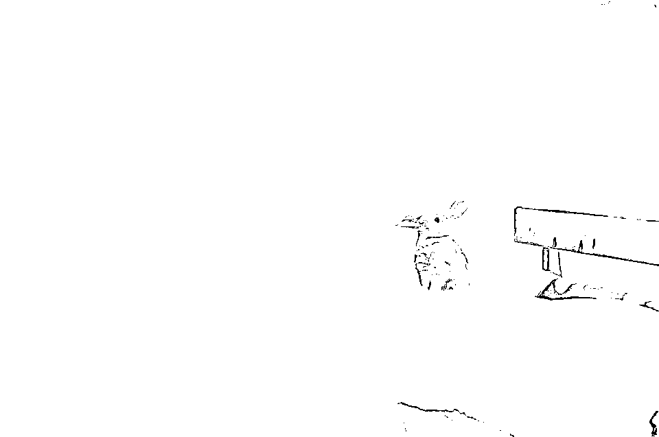

★ **4 月 27-28 日 金星合相海王星**

**重点影响人群：有重要行星/四轴/月亮交点落在双鱼座、处女座、射手座、双子座、巨蟹座、天蝎座 17°-29°；金牛座、摩羯座 21°-27°。**

充满爱与美的梦幻组合。**想要寻求浪漫理想的感情，或通过一段关系逃避无趣的现实。**谋求关系中的包容和理解。适合欣赏一场美妙的音乐会，走进大自然中或打理植物，找个安静的地方单独待会儿，完全放松，也可以做做 SPA、按摩，以及静坐、冥想。

**这是个适合修复、疗愈关系中伤痛的时机。**当被虚无感漫过的时候，尝试回到身体活动，可以重获力量，例如运动，整理房间，或为自己烹饪美食。

★ **4 月 30-5 月 1 日 金星合相木星**

**重点影响人群：有重要行星/四轴/月亮交点落在双鱼座、处女座、射手座、双子座、巨蟹座、天蝎座 21°-29°；金牛座、摩羯座 25°-29°。**

**这是一个乐天的组合，适合送出和接收礼物或帮助。**对个体来说，可以是夜夜笙歌的享乐；也可以是跳脱平庸，去理解关系的意义，获得爱的力量。此时人也容易慷慨大方，**但切忌过度重视表面，盲目膨胀，**过度美化人事物。谨防脑门一热的大笔花销。

★ **5 月 1 日 金星六分冥王星**

**重点影响人群：有重要行星/四轴/月亮交点落在处女座、巨蟹座 21°-29°；双鱼座、摩羯座、天蝎座、金牛座 25°-29°。**

希望在关系中获得微妙的控制权。对被拒绝的恐惧。想要与对方产生深度连接的渴望。领悟关系中强烈的一面以及底层的欲望。**转化关系中陈腐的部分，发现内在本有的强韧的生命热忱和爱的力量。**

**这个时点会同时伴随三个重要天象：①4 月 29-5 月 8 日，木星六分冥王星；②4 月 30 日 02:38，冥王星开始逆行（摩羯座 28°35′）；③5 月 1 日 04:29，金牛座日食（10°28′）。**

逆行前后 20 天，是冥王星能量被极大激发的时候，而木星的加入会扩大这力量，一切变得强烈。这激发内在的欲望，财富和权力的分配或重新考量，扩展获得心灵资源的机会，发掘隐藏的资源和巨大的潜力。

**建议用专注和聚焦去处理可能出现的诱惑，对事物进行深度审视，将这能量导向生命较高的目的。**在被激发的状态中，有机会彻底了解自己的生命驱动力，从而去完满自己，并把自己带入更新与平衡中。

金牛座日食，这也会强化开始、启示、更新、促发的意涵。可以成为开启新项目或新人生旅程的时机。

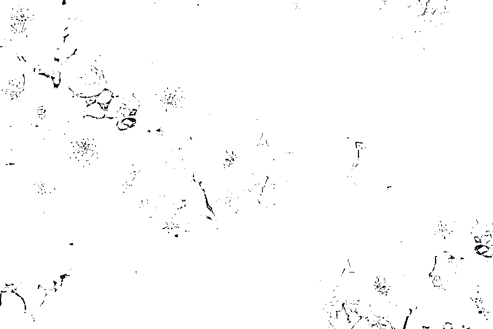

**结语**

金星在双鱼座，让我们去“爱”。而这个字眼，常被滥用，常常等同于自我欲望的满足。**在理想的情况下，金星在双鱼座的爱，是无私的爱，是无条件的爱，是一种无差别的接纳。**个体通过人间之爱，而瞥见永恒。

这爱，会在不经意中降临，就像她脸上含蓄而又温暖的微笑，如春日的暖阳，照耀在我的脸庞，包容着我的身体。**我的忧伤、软弱、疼痛，全都被治愈了，消融在如光一般的拥抱中。**

在那一刻，此心与彼心相印，此岸与彼岸相连，我真的“懂得”了你，也由此真的“看到”了我。

**版权声明：**原创文章由作者授权首发于若道平台，欢迎转发，反对抄袭。友号转载请申请白名单。

**MaryChan 玛丽**

人本主义占星师、花精咨询师

于成都创办工作室，从事咨询、组织相关活动 8 年

咨询预约号：MaryChen336

微信公众号：ZhanXing336

长按打赏

**20 位来自世界各地的占星师****带来 20 场沙龙——新世界的觉醒****详情可点击下图**

**学习占星学****点击下图了解课程详情**

**

**微信又双叒叕改版啦，不想错过若道君的推送？**

**就把若道设为星标吧！**

**▼**

**喜欢记得点一下在看哦☟**

****报名直达入口****

# 若道周运 4.4-4.10 丨“我们该如何度过今天？用温暖，守护每一刻的生命”（内含 12 星座运势）

> 原文：[`mp.weixin.qq.com/s?__biz=MzA5NjA0NTAxNg==&mid=2651470815&idx=1&sn=c5c757d92f208be82fbd7f45acac5528&chksm=8b488968bc3f007ea629ab17ce857114da864aa0ca252ccce16a6a493fdf207eeb3954afdc49&scene=126&sessionid=1692737837#rd`](http://mp.weixin.qq.com/s?__biz=MzA5NjA0NTAxNg==&mid=2651470815&idx=1&sn=c5c757d92f208be82fbd7f45acac5528&chksm=8b488968bc3f007ea629ab17ce857114da864aa0ca252ccce16a6a493fdf207eeb3954afdc49&scene=126&sessionid=1692737837#rd)

******☆ ****后台回复“今日”，给你一句生命态度******

作者/Dora ISAR 认证占星师
编辑/翀子 封面/书君 图片/网络本周，火星与土星在水瓶座的合相让人压力倍增，需要我们多一些耐心，而水星与火星、土星的互动，又给我们带来了行动的机会。12 星座如何度过本周？让我们来看文章吧！（如果着急看 12 星座运势，不妨先拉到最后哦）**整体氛围**

在遭遇特别伤痛的事件的时候，我们常常想起老子的一句话“天地不仁，以万物为刍狗”。大部分人的理解是：老天并不仁慈，只把万物当作没有生命的贡品。然而我更赞同另外的一种理解方式：

刍狗是祭祀用品，草扎成的狗，就跟今天的纸做的汽车洋房差不多。在祭奠之前，这些贡品都是被高度重视的，要小心摆放，被毕恭毕敬对待，完成使命后，就会被烧掉，完成天地的通达。

世间万物，来到人世间都是非常珍贵的，生命结束，就是使命完成，灵魂进入又一个轮回。对待祭品的方式，也就是老天对待生命的方式。

那么，生而为人的使命是什么呢？相信是参差多态的，为家庭为事业为人类，总之须得有或多或少的希望和温暖吧。

老天看待万物是一视同仁，不对谁特别好，也不对谁特别坏，一切顺其自然发展，当生则生，当去则去，是天地之道。**天地之仁，就是不执着仁。**

这个世界在战争、在地震、在坠机、在疫情，最近我们经历了太多太多的伤痛，以至于怀疑：这个世界还会好吗？

太阳从双鱼座进入白羊座，开启了人间四月天，就好像是从离散而去的结束转而进入新的生命周期，也许我们还沉浸在哀悼的悲痛中，但自然届的生命活力又在大增，**勃发的生机在实实在在地告诉我们：春天来了，万物会复苏！**

本周我们会度过我国一个非常重要的节气，清明。到了这个时节，万物皆洁齐、生气旺盛、吐故纳新，大地呈现春和景明之象，正是郊外踏青,春游与行清墓祭的好时节。

**这个节气是悲痛和希望并存的，离别也是新生。唯有更加珍重，才能坦然告别。**

**如果明天就是下一生**

**你将如何度过今天**

**我用温暖**

**守护生命**

**让浪花留了痕**

**我用觉照**

**守护健康**

**让转轮点了光**

**——歌词《如果明天就是下一生》**

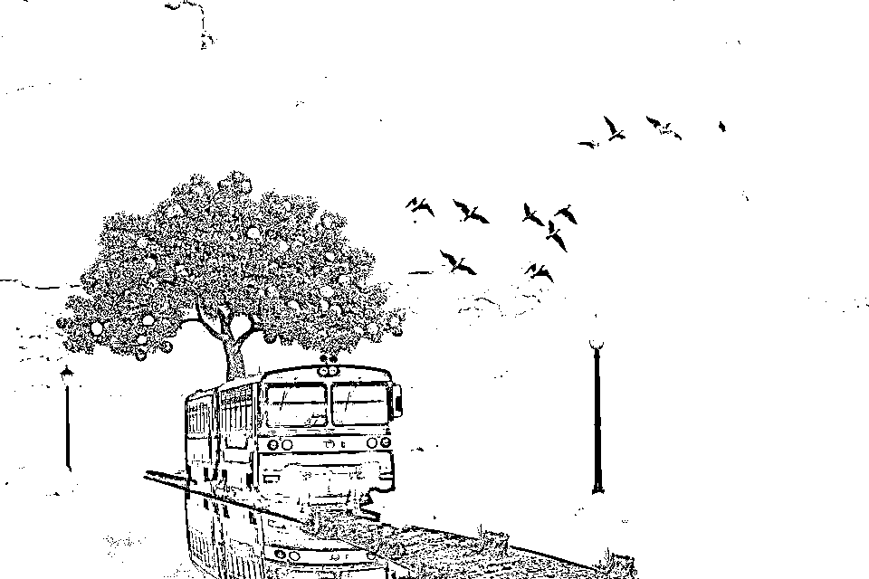

**重要天象**

**★****火星合相土星**

4 月 5 日周二，清明节。上午十点左右，**火星合相土星在水瓶座 22 度。**

**火星与土星合相，会给我们带来压力，**火星引发土星的限制和压抑，土星引发火星的愤怒与烦躁，可能会让人举步维艰，抑郁烦躁。

**但这个合相也会带来控制力，**土星会告诉火星这匹脱缰的野马什么叫做克己自制，将无力转化为效力。

在非常焦躁不安的时刻，**我们需要保持耐心，**去守候一份值得期待的结果，在水瓶座的理性和人道主义的理念中，**我们需要更清醒的意志，**关注这个世界的苦难，为人类的共同福祉做出自己应有的贡献。

如果你正遭遇恐惧和悲伤，这一行进会告诉你：**专注于行动，认清目标，去践行你今生的使命。**没有一个目标是不费力的，重要的问题都可以**一步一步完成**。无论是坚持锻炼的好习惯，还是工作中需要攻克一个难题，都需要我们面对阻碍，坚持努力！

**★****金星进入双鱼座**

**同样在清明节这一天，金星进入双鱼座。**金星在双鱼座是擢升的位置，金星在这里能够和双鱼座的特质结合，比较容易发挥出自身的力量。**我们也许会更懂得浪漫，更需要艺术的滋养，更富有想象力。**

在这个怀念故人的日子，也许因为疫情的原因，我们没有办法回到家乡去祭奠，也许可以通过我们的想象力和情感，消融阴阳的障碍，连接天地。也许我们也能**感同身受人类的苦痛**，为那些非亲非故的逝去的人们，点燃一瓣心香，感通天地，为他们祈福。

清明节也叫踏青节，在医疗占星里，双鱼座是我们的足部，**是时候去郊外走走，让我们的双足触摸大地，连结大自然的力量，**吸纳天地的灵气了。

**★****水星六分土星**

**4 月 7 日周四，白羊座的水星六分水瓶座土星。**火星与土星仍然在合相中，那种紧张的压力好像找到了宣泄表达的方式，**是时候制定计划、说出自己的目标了！**

当水星（沟通者）和土星（坚持和自制力）在一起“合作”时，我们能更准确地说出我们的目标，并为之努力。

最近一段时间，我们在个人层面和集体层面上都经历了很多很多。生活方式也随之改变，我们的内心也产生变化了吗？**这些感受实际上是我们全新的人生阶段的开始。**

更加独立的生活，可能是我们的新常态，在家里隔离的日子，可能让我们更清晰什么是我们此生的使命，什么是我们的责任和担当、什么样的人生才是有意义和价值。

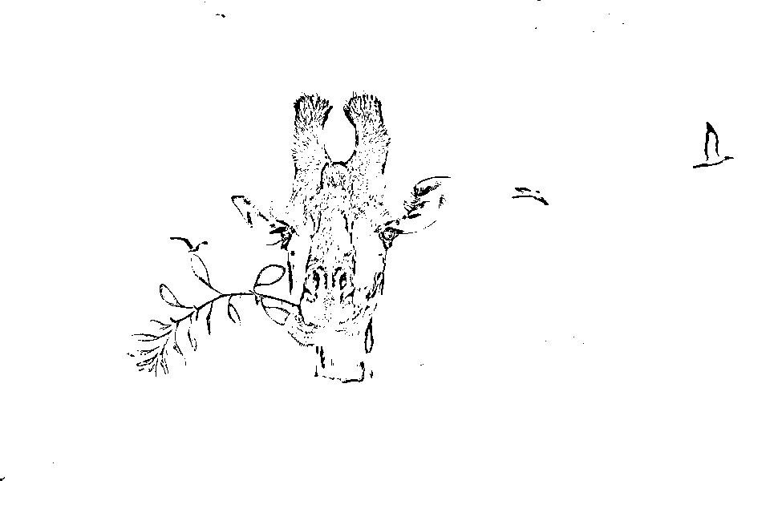

**★****水星六分火星**

**4 月 9 日周六，水星六分火星。**你有没有感觉到这段时间在我们确立目标，制定计划后，我们的**思考力更敏捷**，我们的**行动力变强了**？而且积极、高效，为自己的目标而拼搏，这段时间可以加强人际的沟通，但须注意，**好好说话，不要急躁。**

**★****水星四分冥王星**

**4 月 10 日周日下午，水星四分冥王星，**冥王星要求我们**看清现实，深入真相，**好奇的水星可能会通过不断的研究，发现一些事情的真实情况，这可能是很不舒服的发现，但可以让我们清醒，并且成长！

对你的得到的信息进行探究并且独立思考，而不是盲听盲信，世界不一定是我们以为的样子，**我们需要穿越迷雾去找到真相，**不是吗？

最近几天也要多注意交通安全。专心开车，不要大意。

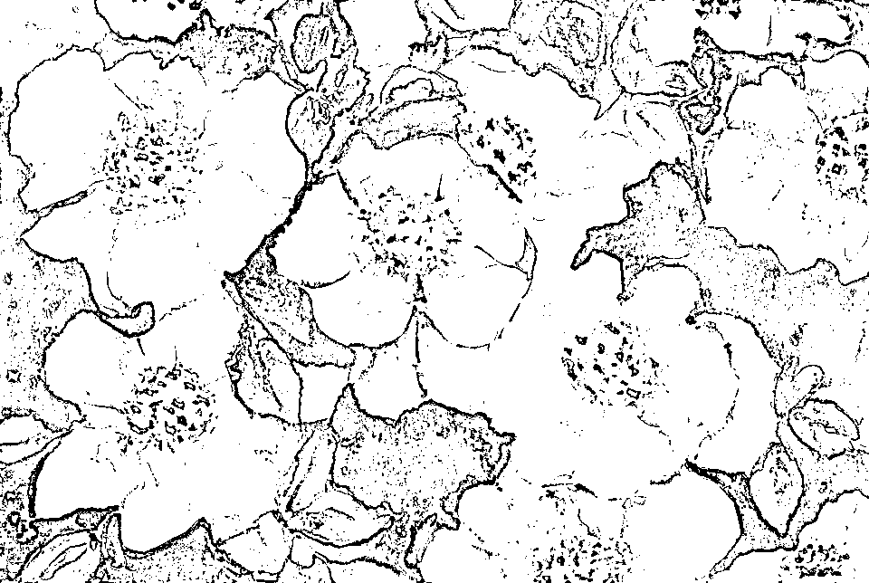

**12 星座一周运势**

**上升*****白羊座***

太阳白羊座的宝宝们生日快乐！这段时间你一改前一段时间的消沉，突然变得**斗志满满**，可能正好解除了隔离，也可能突然被周围的人们关注了。那么正好利用这一段时间，**表达你的想法，发出自己的声音。**

也许你会为网络上的种种消息感到困扰，或者会和朋友因为意见不同产生矛盾，种种压力让你想反抗。我们在充满斗志得同时，还是需要沉静，找时间自己安静呆一会儿，**放空一下头脑，看看自己究竟需要什么呢？**

*****上升**金牛座***

务实勤勉的金牛座，这周好像变得佛系起来了，干活有点懒懒的提不起劲儿，是在工作上遇到了不好解决的问题了吗？

**也许，是时候找朋友聊一聊了，或许你会的到新的看法，想法改变了，就会有新的转机。**朋友圈里可是你的福地，多刷刷自己的存在感好了。

**上升*****双子座***

上升双子座的宝宝们，工作的好运还没有结束啊。**继续好好干活吧，**希望能够做出自己的业绩。虽然暂时也都出不了远门，原来的旅行计划看起来只能泡汤了，但也许你又开始做新的计划了！

**别忘记多和朋友们沟通一下**，聊天八卦，你会受到大家的欢迎的！

**上升*****巨蟹座***

白羊座的太阳照在你事业的宫位，**这周在工作中能够有机会得到上司和同事们的注意，**虽然巨蟹座们都有点害羞的，但机会来了也要当仁不让，好不容易暂露头角，当然要争取更多。

**是时候开启新的项目计划**，也许是开始一个新课程的学习，也许是找到了一个新的领域，总之，鼓起你的勇气，努力散发自己的光芒。

**上升*****狮子座***

太阳来到了你的九宫，告诉你这个世界有更广阔的格局和更深邃的思想，无论是行万里路，还是读万卷书，**你都需要去开阔视野。**当新的思想建立的时候，你会很高兴和旧的自我告别。

最近和另一半是否相处的时间变多了呢？也许会更加甜蜜，也许会发现各种冲突和矛盾。如果亲密关系出现困扰，不妨两人坐下来，**坦诚地聊一下，**从心底交换自己的想法。

**上升*****处女座***

理性的处女座最近有没有新的投资计划呢？**也许可以花点心思理财了。**毕竟手头的资金需要好好规划一下。

**这周尽量享受和另一半的亲密时光，**不要过分挑剔，或者疑神疑鬼，爱是信任，是全身心的托付，一起和爱人展望一下未来吧。

**上升*****天秤座***

天秤座这周的工作运还是挺不错的。**之前开展的工作计划，抓紧时间去完成吧，**疫情让我们耽搁了好多事情，这段时间需要抓紧。

太阳这周在我们的第七宫，**非常适合和你喜欢的人更进一步。**爱就大胆地说出来，不要犹豫不决。

**上升*****天蝎座***

天蝎座们要**多多关注自己的身体健康**，不要因为过度疲劳消耗太多。早点回家休息，早睡早起，千万照顾好自己。患得患失的心情完全没有用，有什么事情想做就按照自己的愿望去做吧。

父母的身体我们也要多多关心，用积极的心态处理家里的各项事务，可以和父母亲有更好的联结。

**上升*****射手座***

射手座的心永远在远方，**但这个礼拜最好在家，**把想去浪的心收一下。千万不要忘记在家庭陪伴和儿女教育上付出我们的精力，在该歇歇的时候就安静一会儿，**停下来找到目标，也可以更好地去远方。**

家人的帮助和支持，也会给我们带来好运，让我们发挥出自己更大的创造力和生命力。

太阳和水星射手们的第五宫，试试在家里创作一个作品，无论是文章，绘画，还是十字绣，都很棒哦！

**上升*****摩羯座***

虽然目前的经济情况还是让摩羯座们感到焦虑，但也可以开启一个长期理财计划。**本周是开展各方面学习和交流的好时机，**看看市场有什么新的资讯，新的思路。

家人也需要你的关心和帮助，和家人聊聊天，也会给你带来新的启发，这周你会发现，**家人是你最强的后盾。**

**上升*****水瓶座***

理性的水瓶座今年的压力是挺大的，这一段时间可能也会比较烦躁，在面对压力和各种不确定性的时候，**最好的办法就是学习和交流。**和朋友们聊聊天，打电话和语音都行，重点是不要一个人默默承担压力，而是要感受到大家的相互支持。

好消息是最近财运还可以的，**可能有些意想不到的收入**，但不要有太大的投资，不要盲目乐观。

**上升*****双鱼座***

今年双鱼座们都是比较好运的。要相信自己会得到更多机会。

这周好多人复工了，隔离了好长的一段时间，我们不得不面对财务的问题。有机会赚钱的时候就努力赚钱吧。都说双鱼座柔弱爱做梦，但鱼儿们认真起来的能力，那也是势不可挡的，**制定目标，开始行动！**

祝大家一周平安顺遂！

**版权声明**：原创文章由作者授权首发于若道平台发布，欢迎转发，反对抄袭。友号转载请申请白名单。

****

****Dora****

若道 2017 届核心课毕业生

若道咨询平台占星师、ISAR 认证占星师

心理咨询师、塔罗咨询师、多年企业管理经验

咨询微信：AstrologerDora

公众号：Dorothy 占星文化

**长按打赏**

**20 位来自世界各地的占星师****带来 20 场沙龙——新世界的觉醒****详情可点击下图**

**学习占星学****点击下图了解课程详情**

**

**微信又双叒叕改版啦，不想错过若道君的推送？**

**就把若道设为星标吧！**

**▼**

**喜欢记得点一下在看哦☟**

**报名直达入口**

# “一年之计在于春”，你在白羊座新月许了什么愿望？

> 原文：[`mp.weixin.qq.com/s?__biz=MzA5NjA0NTAxNg==&mid=2651470772&idx=1&sn=b2fb2fe77b28e2d4e4cc17020506987c&chksm=8b488903bc3f00158b10a0f2c68bd2b340088592bd56e2f84dc3cd286cc1a09d5e17b7e2cc3a&scene=126&sessionid=1692737837#rd`](http://mp.weixin.qq.com/s?__biz=MzA5NjA0NTAxNg==&mid=2651470772&idx=1&sn=b2fb2fe77b28e2d4e4cc17020506987c&chksm=8b488903bc3f00158b10a0f2c68bd2b340088592bd56e2f84dc3cd286cc1a09d5e17b7e2cc3a&scene=126&sessionid=1692737837#rd)

**2022 年 4 月 3 日天象：**

*   **0:50 月亮进入金牛座**

*   ******太阳与水星合相在白羊座******

*   ******火星合相土星******

今天是清明小长假第一天，月亮在金牛座，如果你这几天感到紧绷或压力有点大，不如给自己放个假，彻底放松一下，比如享受美食的滋养、花花草草的芳香、身体 SPA 的舒适。昨天下午的[【白羊座新月】](http://mp.weixin.qq.com/s?__biz=MzA5NjA0NTAxNg==&mid=2651470592&idx=1&sn=35a604cc027e89f9a7f0d9f19c0e4c6c&chksm=8b4889b7bc3f00a1dada764261727e60a680f9f5b77c3ca5371b90ec7a82e32bec4a763638b6&scene=21#wechat_redirect)（点击查看文章），提示我们要“从心出发”，谨守规则、团结盟友才能借助新月的“开启”能量破局重生。太阳与水星在冲动热情的白羊座合相，而白羊座的守护星火星又和强调稳重谨慎的土星合相在水瓶座。和朋友们多聊聊天吧，在高谈阔论中没准对当下和未来有了更实际的计划。时间进入了[【四月】](http://mp.weixin.qq.com/s?__biz=MzA5NjA0NTAxNg==&mid=2651470712&idx=1&sn=81c713ff6d6a67b077932b538850e9b9&chksm=8b4889cfbc3f00d98f0986d28c0b3318fa18c2ae3aa916f9d58a8ab4ce7aa6d3504cb8233d11&scene=21#wechat_redirect)（点击查看四月运势文章），在“一年之计在于春”的白羊月，你的内心冲动是什么？你渴望奔向何方？你在昨天的新月又许下什么愿望？来跟我们分享吧~ 周日快乐！我们明天见！**了解每日天象，可****下载“若道”APP 查看****还有更多精彩等着你哦**

# 太阳射手座与 12 星座月亮丨这 12 种射手座各有各的可爱之处

> 原文：[`mp.weixin.qq.com/s?__biz=MzA5NjA0NTAxNg==&mid=2651470771&idx=1&sn=c00e6fac49cac9c8ed97b637fe39267a&chksm=8b488904bc3f00122bf676a9dc0d668389344169bb9e78f94a909be9575feab784436648a42c&scene=126&sessionid=1692737837#rd`](http://mp.weixin.qq.com/s?__biz=MzA5NjA0NTAxNg==&mid=2651470771&idx=1&sn=c00e6fac49cac9c8ed97b637fe39267a&chksm=8b488904bc3f00122bf676a9dc0d668389344169bb9e78f94a909be9575feab784436648a42c&scene=126&sessionid=1692737837#rd)

☆****后台回复“今日”，给你一句生命态度****

作者/诺·泰尔 译者/江艺、dogcatcher 编辑/翀子 封面/书君 图片/网络太阳是生命的伟大能量，而月亮被认为是人格中的“主导需要”，同样被重视（你可以点击【[开篇](http://mp.weixin.qq.com/s?__biz=MzA5NjA0NTAxNg==&mid=2651463192&idx=2&sn=7ecd2012aee1f245b56e0f107bdfc19e&chksm=8b48acafbc3f25b968e9ca8cbe8acf6972dc3e418827b36ac12af7bf7c81858937657babb393&scene=21#wechat_redirect)】，查看诺·泰尔老师对此部分内容的详细阐述）。当射手座太阳，遇见 12 星座月亮，分别有哪些表现呢？**太阳射手座和 12 星座月亮**

**★月亮*****白羊座***

在很多领域，他们都是充满**活力的先锋**。哲学、旅行、理想、社会化的理念、体育运动……全都为他们的热情、见解和舞台表现欲提供了释放点。荣誉感给他们的自我表达带来无边的勇气。他们个性深处可能驻扎着**灵性与宗教**的一面，来为人生提供活力。

**★月亮*****金牛座 ***

个性吸收了射手座对外部世界的感知欲，并建造起一个美好实用的生活结构，来方便自己表达射手座的理想主义。教育和艺术因而对他们来说尤其重要。这个配置呈现了**高尚的理想与实实在在的物质安全感的联姻**。 

**★月亮*****双子座 ***

安全感飘散到风中；多样化、四处游荡的热情给他们带来转瞬即逝的回报。他们往往吐字发音精准，行事步调清晰，能够号召和利用最崇高的行事原则，把双子座的犹豫和冲动转换为收益。

他们精于免费（或用很小的代价）获取东西，对大量改良生活的**小技巧**感兴趣，并乐于在这方面挑战自己。

这个配置的**乐观主义天性需要（通过星图中其他征象）找到根基感，提炼人生方向**，来避免做出糟糕的决定，并把聪慧的技巧转变为务实周到的服务意识。 

**★月亮*****巨蟹座***

充沛的情感解构了射手座高高在上的思维模式；高度的直觉力、诗意的个性和敏感的适应力一同提炼和改良了射手座的热情。

在人际交往中，他们仿佛能够预先理解对方想要表达的情感和情绪，这是优点，却也带来上当受骗的可能。他们**人生目标不能离开感性的怀抱太远**。

他们总是被新鲜事物所吸引。**该配置需要相位的帮助来聚焦务实的执行力**。 

**★月亮*****狮子座***

**荣誉感和伦理感**统领着他们的生活。他们认为那些认真生活的人才能得到公平和正义。他们的想象力和创造力经常表现得非常引人注目。**忠诚和理想主义**在这个配置达到了顶峰。他们通常能够吸引掌声与成功。 

**★月亮*****处女座 ***

射手座太阳**高远的想法通过处女座月亮找到了务实的、细节化的土壤**。这两个星座的本性在思维平面内自如地混合。他们因此有这样一种魅力：能用平实质朴而富有建设性的话语来表达高尚而抽象的理念。

成长过程中的紧张任务，**是在沟通的过程中避免焦虑，**并学会**顾及情感方面的互动**，使人际交往更加温暖。  

**★月亮*****天秤座***

人际交往为射手座广阔的想法提供了释放点。慷慨变成了他们个性的弱点，这是因为**乐于助人的想法迎合了个人理想**，却忽略了上当受骗的可能性。

**他们坚持理想**，可能会为此排斥功利的发展机遇，还可能会为了增添见闻经历、凑热闹而养成一种旅行癖。

**★月亮*****天蝎座***

**天蝎座月亮能迅速凝固射手座太阳宽广的灵感**。他们渴求机遇以证明自己的价值。月亮天蝎座带来了恰到好处的矜持感，使他们能清晰有力、令人愉悦地表达个人观点和见解。

他们在表达感情的时候会有些**表面上的迟疑**，但一旦得到鼓励，就能轻松地**展现幽默感和对他人的欣赏**。射手座太阳让落陷的月亮更加容易发挥出正面的特质。 

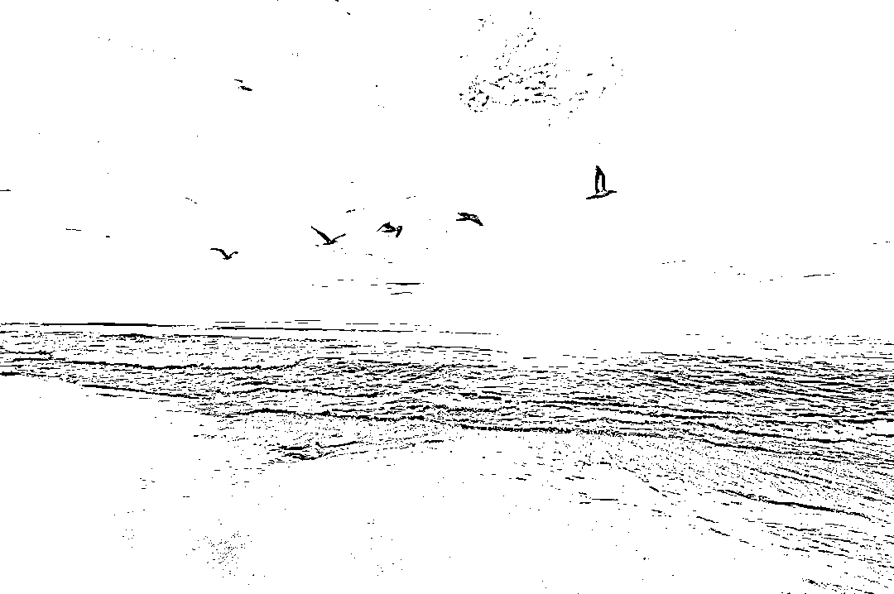

**★月亮*****射手座***

**紧张的思维能量既是长处也是短处。**他们过于**频繁地转换想法**，精力充沛地献身于多变的理想，弄乱了理智判断的进程。

他们很难把花式繁多的个人信条思考和整理清楚，以至于给他人留下肤浅的印象。他们愿意**改良自我**，但这种改良必须先从想法和信仰开始。

他们需要的是**平静和深度**。很容易背井离乡。 

**★月亮*****摩羯座***

他们**能目标明确、管理有序地落实高远的想法**。他们可能具备很强的幽默感，这是因为思维能够熟练有效地应用其能量。

射手座的理想主义得到了高效的领导。**但在他们受到阻挠的时候，**失势的月亮可能表现出严酷刺耳、自以为是的愤怒。 

**★月亮*****水瓶座***

独立自由、社会感知力、理想主义。他们的**个人哲学**要么效仿**国际化**的观念，要么为自己的**特立独行**辩护。

**他们的个性受控于自己的思想**，受控于思想带来的内心的自足感。而这些思想，既可能被星图其他部分的征象所聚焦，并有效地组织起来，也可能被剁成紧张的碎片，表现为空洞的热情。

**★月亮*****双鱼座***

高远的思想得到了灵感的大力支持。这是哲学家的配置。他们的**日常生活和思想占据两个截然不同的心灵空间**。因为过于不谙世故，他们可能在现实世界中吃亏和受苦。 

**版权声明：**本文由若道翻译发布，欢迎转发，反对抄袭。友号转载请申请白名单。

**本系列其他文章**[太阳白羊座·12 星座月亮](http://mp.weixin.qq.com/s?__biz=MzA5NjA0NTAxNg==&mid=2651463192&idx=2&sn=7ecd2012aee1f245b56e0f107bdfc19e&chksm=8b48acafbc3f25b968e9ca8cbe8acf6972dc3e418827b36ac12af7bf7c81858937657babb393&scene=21#wechat_redirect)丨[太阳金牛座·12 星座月亮](http://mp.weixin.qq.com/s?__biz=MzA5NjA0NTAxNg==&mid=2651463523&idx=1&sn=69fa5ba9035316fecd6c3911e744f089&chksm=8b48add4bc3f24c274cd5064316982ae958debed1e9ab681b46b80d8d8ec26bb3d2036075be9&scene=21#wechat_redirect)[太阳双子座·12 星座月亮](http://mp.weixin.qq.com/s?__biz=MzA5NjA0NTAxNg==&mid=2651465406&idx=1&sn=c9bf1ba49b07f6c67740c46779200be8&chksm=8b489409bc3f1d1fdad398e34840d6338275f29a8292e9eb404df28126fcc8262c454b2cb6c5&scene=21#wechat_redirect)丨[太阳巨蟹座·12 星座月亮](http://mp.weixin.qq.com/s?__biz=MzA5NjA0NTAxNg==&mid=2651465949&idx=1&sn=9dfd930de39b2de38c761152f4b8710c&chksm=8b489a6abc3f137c5c6e96f404038de7f4261fc6c995aeb285bc37f79b96ef5a1d237dbe3af5&scene=21#wechat_redirect)[太阳狮子座·12 星座月亮](http://mp.weixin.qq.com/s?__biz=MzA5NjA0NTAxNg==&mid=2651467312&idx=1&sn=d1a81f5cc1a60b3198d9c0ba770b4ba0&chksm=8b489c87bc3f1591008c88cef7b385086eb7717d4345926de92349b071ad10ceb67099f17ed0&scene=21#wechat_redirect)丨[太阳处女座·12 星座月亮](http://mp.weixin.qq.com/s?__biz=MzA5NjA0NTAxNg==&mid=2651467590&idx=1&sn=09b8f5ba9fa46e469e0add987cbe1664&chksm=8b489df1bc3f14e7a4e6b90286394af16e05f4c097058a2e2402d38f2634a0a84b32aaa03fe3&scene=21#wechat_redirect)[太阳天秤座·12 星座月亮](http://mp.weixin.qq.com/s?__biz=MzA5NjA0NTAxNg==&mid=2651469157&idx=1&sn=c8b14b4a67b6c6ed3b7943c136d7c34c&chksm=8b4887d2bc3f0ec46e3b444c2f1ba1f331d5d0b35326aa75e77351fdde762f0fd1c6d43ada5c&scene=21#wechat_redirect) | [太阳天蝎座·12 星座月亮](http://mp.weixin.qq.com/s?__biz=MzA5NjA0NTAxNg==&mid=2651470116&idx=1&sn=68fb9ddee0671591ebae843cf2b38431&chksm=8b488b93bc3f02853f1cb8bcde25868c1c1500478eda9c4773dd1d3f93b3239a8a5fc956d999&scene=21#wechat_redirect)

**诺·泰尔**

现代占星学鼻祖，世界众多著名西方占星师的占星老师。他毕业于哈佛大学社会关系专业，是当今世界上最重要的占星师之一，占星联盟协会（AFAN）的创始人及原主席。其所著的三十三本占星教科书作为占星教学的典范，引领了整整两代占星师的占星学习与教育，1998 年国际占星大会（UAC）授予其占星界最高奖项 “轩辕奖”。

**20 位来自世界各地的占星师****带来 20 场沙龙——新世界的觉醒****详情可点击下图**

**学习占星学****点击下图了解课程详情**

**

**微信又双叒叕改版啦，不想错过若道君的推送？****就把若道设为星标吧！****▼**

**就是这个“在看”，戳戳戳 ☟**

****************报名直达入口****************

# 国际占星协会主题研讨会丨 20 场演讲：为新世界的转变做好准备

> 原文：[`mp.weixin.qq.com/s?__biz=MzA5NjA0NTAxNg==&mid=2651470771&idx=2&sn=304f44067db807cfdf6bc2c30eeede07&chksm=8b488904bc3f0012c08e9cc77184b01da5b6e390fd120a8071878e06e99144398c707d50fa20&scene=126&sessionid=1692737837#rd`](http://mp.weixin.qq.com/s?__biz=MzA5NjA0NTAxNg==&mid=2651470771&idx=2&sn=304f44067db807cfdf6bc2c30eeede07&chksm=8b488904bc3f0012c08e9cc77184b01da5b6e390fd120a8071878e06e99144398c707d50fa20&scene=126&sessionid=1692737837#rd)

**国际占星日 ISAR 主题研讨会**

**新世界的觉醒** 

今年是世界格局大变的初始之年。 俄乌战争改变了整个世界的局面。在中国，最后一波疫情卷土重来，我们再一次看到封城上演。 同时，战争、疫情、通货膨胀都给我们带来挑战，**而我们需要用新的眼光去看这个正在激烈变化中的世界并为一个新的世界转变做好准备。 **

为此，ISAR 在今年的国际占星日为大家准备了一个为期***2******天***的研讨会***20******场******演讲***，共有邀请来自世界各地的***20******位******著名占星师***，包括我们的 ISAR 全球总监，分享他们对世界正在发生什么的见解，以及我们未来可以如何应对的建议。

**研讨会主题描述**

**“我们将探讨的一些主题：我们在未来 5 年和长期的全球范围内可以期待什么？在新冠疫情、经济、性、技术、新世界结构和国家边界相关的未来事件，我们可以预测什么？总体而言，占星师如何看待世界的未来？我们需要从更高的层面上接收到什么信息？可能的解决方案是什么？”**

**演讲结束后，若道会将本次演讲翻译为中文字幕版在演讲完成后一个月（4 月 25 日后）上线发布。**

（因为这次演讲我们需要审核内容，以便内容符合国内环境的要求。**在演讲播出 1 周内，我们会陆续上传英文内容，在演讲播出 1 个月后，我们将会陆续上传中文字幕版。**如果英文流利的同学，想要及时听到演讲建议到 ISAR 网站自行购买，英文版价格更为优惠） 

**演讲内容安排**

**第一天**

**开幕式（15 分钟）**

**第一场（60 分钟）**

*   主题：待定

*   演讲人：温迪·斯泰西

**第二场（20 分钟）**

*   主题：占星师作为“心灵影响者”——新的大祭司？

*   演讲人：格雷厄姆·伊贝尔

**第三场（25 分钟）**

*   主题：波斯占星的复兴

*   演讲人：埃桑·哈泽尼

**第四场（20 分钟）**

*   主题：新冠疫情对人类精神和人类社会的影响

*   演讲人：乌苏拉·斯托克德

**第五场（20 分钟）**

*   主题：在两个相反的“宇宙发电机”之间振荡 

*   演讲人：托马斯·加齐斯

**第六场（20 分钟）**

*   主题：从占星的透镜看新冠疫情的心理后果

*   演讲人：伊莎贝尔·吉马拉斯

**第七场（20 分钟）**

*   主题：占星适合预测吗？占星作为工具的特质

*   演讲人：石冢龙一

**第八场（20 分钟）**

*   主题：重新定义结构、上师和伦理——一个灵性视角

*   演讲人：加利·萨特·普兰·利夫纳

**第九场（20 分钟）**

*   主题：冥王星在水瓶座和全球的社会实验

*   演讲人：索勒·乔奈特

**第十场（20 分钟）**

*   主题：当上帝似乎已经背弃了我们

*   演讲人：亚历克斯·特伦诺维斯

**第十一场（90 分钟）**

*   主题：占星的未来：占星能预测未来吗？

*   演讲人：里克·莱文和克里斯·布伦南

**第二天**

**第一场（60 分钟）**

*   主题：波浪带来的木星-海王星合相

*   演讲人：琳恩·贝尔

**第二场（20 分钟）**

*   主题：2020 年木星、土星和冥王星的相遇，以及金钱的命运

*   演讲人：理查德·费德勒

**第三场（20 分钟）**

*   主题：金牛座和天蝎座在 2022 年和 2023 年的黄道带日食传递了什么信息

*   演讲人：杰丽娜·朱德扬

**第四场（20 分钟）**

*   主题：阿奎拉（鹰）与 2020 年大连合

*   演讲人：杜布拉夫卡奥伯赞

**第五场（20 分钟）**

*   主题：待定

*   演讲人：索尔·乔纳森

**第六场（20 分钟）**

*   主题：寻找第三条道路——在一个快速变化的世界中思考未来 5 年中国的道路

*   演讲人：蒋颖 Felicia Jiang

**第七场（20 分钟）**

*   主题：新世界崛起

*   演讲人：Paula Belluomini

**闭幕讲座（60 分钟）**

*   主题：让木星之年开始吧

*   演讲人：亚历山大·因舍阿吉克

**费用**

*   **本期演讲售价：****980 元** **（送价值 480 元的一年 ISAR 会员资格） **

*   **ISAR 会员优惠价：****680 元** **（会员购买前请联系负责人修改价格）**

负责人：若道-童童

（微信：nodoorDaivd）

请备注“国际占星日”

**退转课程**

**退款原则请详看《教学协议》，如有疑问请咨询童老师。**

****报名请点击“阅读原文”****

# 4 月宇宙天气丨木海合相重磅登场，现实与梦想一样重要！（内含 12 星座月度指南）

> 原文：[`mp.weixin.qq.com/s?__biz=MzA5NjA0NTAxNg==&mid=2651470712&idx=1&sn=81c713ff6d6a67b077932b538850e9b9&chksm=8b4889cfbc3f00d98f0986d28c0b3318fa18c2ae3aa916f9d58a8ab4ce7aa6d3504cb8233d11&scene=126&sessionid=1692737837#rd`](http://mp.weixin.qq.com/s?__biz=MzA5NjA0NTAxNg==&mid=2651470712&idx=1&sn=81c713ff6d6a67b077932b538850e9b9&chksm=8b4889cfbc3f00d98f0986d28c0b3318fa18c2ae3aa916f9d58a8ab4ce7aa6d3504cb8233d11&scene=126&sessionid=1692737837#rd)

******☆ **后台回复“今日”，给你一句生命态度****

作者/Anastasia

编辑/翀子 封面/书君 图片/网络

4 月，我们迎来重要的木海在双鱼座的合相，新的行星周期开启，双鱼座能量爆棚，另外，土星四分月亮交点的天象也在提醒我们，在这个月要脚踏实地的生活。那么，12 星座在这个月份有怎样的运势呢？让我们来看文章吧！

四月重点天象

*   **白羊座新月（4 月 1 日）**

*   **金星进入双鱼座（4 月 5 日）**

*   **水星进入金牛座（4 月 11 日）**

*   **木星合相海王星（4 月 12 日）**

*   **火星进入双鱼座（4 月 15 日）**

*   **天秤座满月（4 月 17 日）**

*   **冥王星逆行（4 月 30 日）**

*   **水星进入双子座（4 月 30 日）**

**整体氛围**

**四月，人们需要重点关注黄道带上的两个度数，一个是 23 度，北交点的运行区间是金牛座的 22-23 度：**海王星的运行区间是双鱼座的 23-24 度，土星的运行区间是水瓶座的 22-24 度，木星的运行区间是双鱼座的 22-27 度。

**可以看到，木海合相将三分南交点，六分北交点；而土星则会在四月四分南北交点轴线。**

**另一个需要关注的黄道度数是 13 度，**这里汇集了天王星和凯龙星的能量。四月，天王星的运行区间是金牛座的 12-14 度；凯龙星的运行区间是白羊座的 12-13 度。**天王星总是带来震惊和分离；凯龙星则会带来无法疗愈的伤痛。**

**如果出生星图上有个人行星或者轴点落在这两个度数前后，**这个月会感觉很酸爽，一定提醒自己保持观察和觉知。**看看这些外行星的行运会给我们带来什么挑战和机会，**柔和相位也不例外。

外行星的柔和相位一样也是挑战，只不过和挑战相位比较（合相、四分相、对分相），三分相和六分相带来的影响会更容易被我们接纳，变成前进的动力。而挑战相位引发的事件和情绪则令人抗拒和恐惧，令我们产生内耗，带来悲伤、愤怒和挫败感。

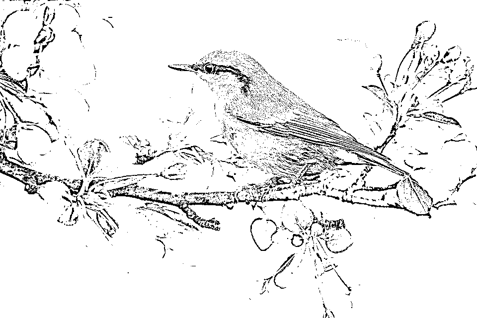

**重点天象****★****木星与海王星在双鱼座合相**

**木海合相是 2022 年的重点天象。**4 月 12 日，木海精准合相在双鱼座 23 度，将影响力带到顶峰。4 月 15 日，火星换座进入双鱼座形成星座合相，继续为双鱼能量加油添醋。4 月 28 日，金星也加入到这个合相中，和海王星精准合相在双鱼座 24 度，**双鱼能量爆棚。**

木星和海王星的周期是 12-13 年**，并不少见。但木星和海王星作为双鱼座的传统守护星和现代守护星合相在双鱼座就称得上百年一遇了。**这个天象将给我们带来非常多的可能性，不论是医疗救助、灵性成长，还是影视娱乐都会涌现出来非常多的机会。

但是，**要小心泡沫，**考虑到火星和金星也都在双鱼座，我们如果将行动落实在个人成长、精神追求和内在的灵性觉醒方面，怎么做都不过分；但如果是在金钱和关系方面采取行动，就要小心木星带来的盲目乐观，以及海王星带来的不切实际的幻象。

**破除幻象的最好办法，无疑看到地平线上的另一半，不再将关注点局限在自己身上。**运用木星的理想和热情，运用海王星的同情和慈悲。仅仅考虑自己，很容易陷入虚无主义中，觉得一切都没有意义，只要自己开心就好。

**只有将更广阔的人世间纳入到自己的视野里，看到身旁的其他人，我们才能真正找到人生的使命和生活的意义。**

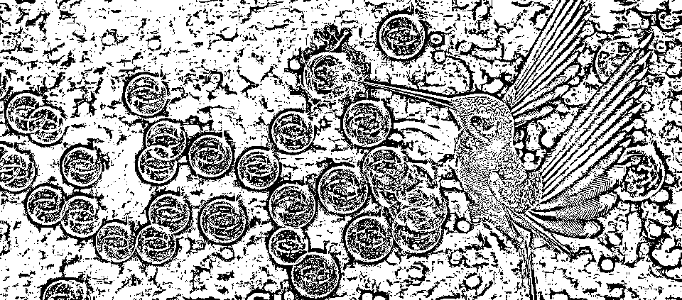

**★****土星四分南北交点**

**4 月 12 日，土星在水瓶座 22 度精准四分南北交点轴线，构成 T 三角结构，这个相位持续整个四月。**精准合相这天，月亮行经狮子座，对分土星，构成一个固定星座的大十字结构，感受会尤为明显。

土星在这里意味着来自外界的打压，可能是事情的标准太高，也可能是来自权威的否定和指责。人们会觉得累、辛苦、折腾又无效，还得不到与付出相对应的肯定和认可，就会产生很强烈的挫败感。

固定星座的大十字比变动星座和基本星座大十字要更困难一些。大十字结构本身就是一个被困住的状态，陷在局中，找不到突破口。固定星座的稳定特质让改变和突破变得更加困难。

具体到土星这个结构，就需要我们搞明白，**土****星代表的野心和目标，是不是我们真心需要的，还是成为了我们寻求安全和稳定路上的绊脚石。**

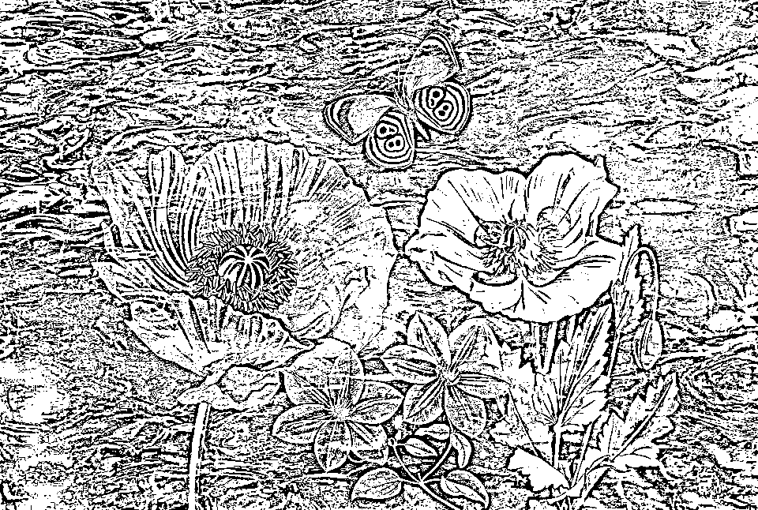

**★****朔望周期**

4 月 1 日下午 2:24 在白羊座 11°发生[新月](http://mp.weixin.qq.com/s?__biz=MzA5NjA0NTAxNg==&mid=2651470592&idx=1&sn=35a604cc027e89f9a7f0d9f19c0e4c6c&chksm=8b4889b7bc3f00a1dada764261727e60a680f9f5b77c3ca5371b90ec7a82e32bec4a763638b6&scene=21#wechat_redirect)（点击可阅读），与之对应的天秤座满月发生在 4 月 17 日凌晨 2:54，天秤座 26°。

**我们可以看到，这次朔望周期的度数都在之前强调的两个度数附近。**新月合相凯龙星和水星落在白羊座，定位星火星合相土星和金星落在水瓶座，这意味着**打开视角**，采取客观地评论和行动，才能找到正确的方向。反之则会遇到激烈的冲突和伤害。

满月四分摩羯座的冥王星也不轻松。好在土星在水瓶座 23 度，三分月亮，六分太阳，为激烈的情绪波动带来一个锚定点。**强烈的情绪具有非常大的破坏力，**情绪海潮的涌动会冲毁堤岸，带来无法挽回的灾难。

**没有稳定的基石，谈不上任何转化和净化。**只有在土星的结构之中，改变才是可控的。

**12 星座四月运势**

**（参考太阳星座和上升星座，太阳星座可主要参考第一个小标题，上升星座可主要参考第二个小标题）**

***白羊座***

**★** **打开视角，积极寻求合作**

生日在 4 月 2 日到 6 日的白羊座将受到凯龙星的冲击，这会提醒大白羊们，**单靠自己的力量，能够做到的事情非常有限。**利用好 4 月 1 日的白羊座新月，谨慎许愿会带来新的启发。

有时候，独自疗伤并不会一个好的选择，帮助有相同遭遇的同伴会带来更大的帮助。

**★ ****关注内心，追求精神成长**

群星双鱼座将给上升白羊座带来非常多的灵感和创意，**不妨放慢自己的脚步，**留出足够的个人时间和空间，摸鱼发呆做做白日梦。这对于精力十足的白羊座是一个很好的放松和休息的阶段。

**适当地把自己生活的重心向内收，**不但不会影响外界世界的打拼，反而是磨刀不误砍柴工，积蓄力量，谋求更大的发展。

***金牛座***

**★**** 正视过去，处理遗留问题**

生日在 5 月 3 日到 7 日，5 月 14 日到 19 日之间的金牛座在这个月压力最大，稳定的生活节奏将会被打断，手忙脚乱，应对突如其来的改变。

对于金牛座来说，**首先要去做的是正视过去遗留的、未解决的问题。**这就好像是定时炸弹，不去排除它，就会始终处于它的阴影之下。

**★**** 做好规划，专注自身发展**

对于职场上的金牛座来说，四月份会非常忙碌，机会与挑战并存。复杂的职场关系可能会给单纯的金牛座带来不少困扰。这时候，建议金牛座**把重心放在自己的职责范围内，**减少外界的干扰，做好规划，专注地处理自己手头的问题。

***双子座***

**★**** 保持安静，留出思考时间**

四月份的双子座将受到双鱼座群星的强烈干扰，尤其是生日在 6 月 13 日之后的双子座。**你们需要保持安静**，给心灵一些运作的机会，让深埋的潜意识浮出水面。从而**倾听到内心的声音，**了解真实的自己。只知道呱噪的人，没有时间去思考。

**★**** 调整理念，平衡工作生活**

双子座善于一心多用，在工作、生活之间来回腾挪跳跃。这个四月，可能会发现时间和精力不够用了，有些手忙脚乱。这时候，需要提醒自己，**改变习以为常的理念。**多阅读，多和智慧的人交流，**找到一些新的思路和视角，**从而更好地去平衡工作和生活。

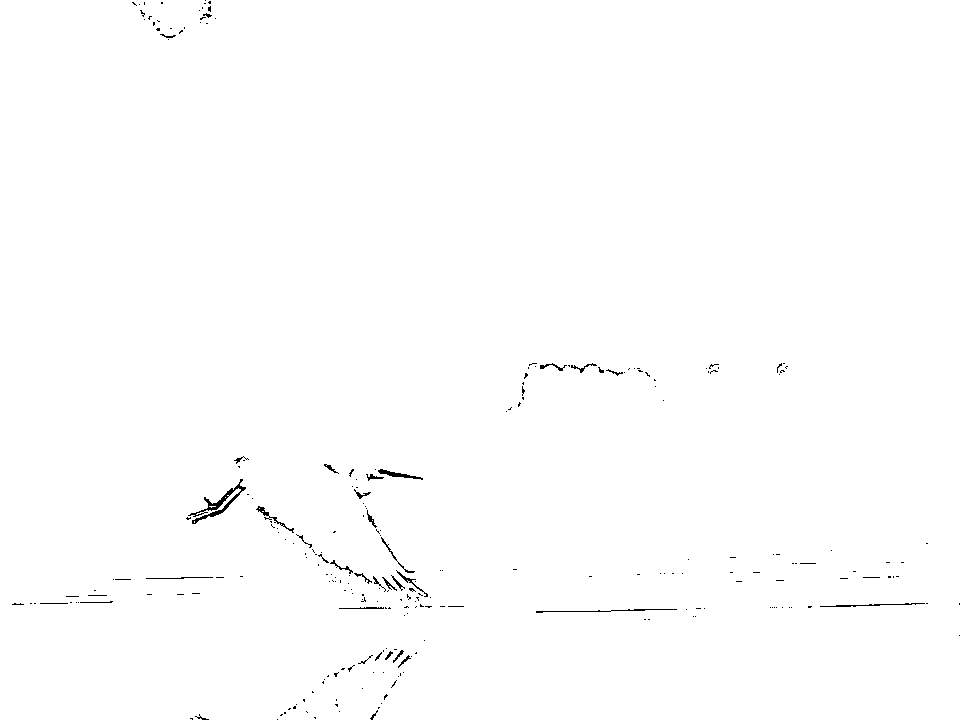

***巨蟹座***

**★**** 放松心态，避免急于求成**

四月的前半个月对于内心敏感的巨蟹座来说并不顺利，交流不畅，也容易被针对。尤其是 7 月 5 日到 10 日的巨蟹座会感觉尤为受伤。不过随着金火先后换座双鱼座，巨蟹座的整体状体会提升不少。

**如果有重要的事务安排，建议放松心态，不要急于求成，放在下半个月去处理，效果会更好。**

**★**** 做好减法，建立有效社交**

水象星座需要的安全感，往往来自于和他人建立情感上的链接。但这种链接也不是越多越好，四月，对于巨蟹座来说，是检视自己朋友圈的好机会。不但要做加法，也要学会做减法。

**清理掉无效的社交，才能保留下真正需要的有效资源。**

***狮子座***

**★**** 先扬后抑，从容推进行动**

对于狮子座来说，上半月要比下半月效率高，**重要的会议、交流、落实等事情尽量安排在月初，**行动起来会比较省心。生日在 8 月 15-21 日的狮子座尤其要注意控制好节奏，才能更好地缓解压力，从容推进各项事务的发展和落实。

**★**** 保持冷静，调整合作关系**

工作方面，狮子座会拥有一段相对和缓、平静的职业生活。但这并不意味着可以偷懒，获得轻松。反而是内心冲突比较多的时候，需要狮子座**处理好自己的情绪波动，**解决遗留问题，透过表面现象找到问题的根源，**重新梳理重要的合作关系和伴侣关系。**

***处女座***

**★**** 循序渐进，获得稳步成长**

整体来说，今年对于处女座的成长来说都是利大于弊。北交点、天王星和冥王星分别落在土象星座的各个区间，给予处女座**极大的改变的动力**。

尤其是生日在 9 月 5 日-11 日的处女座，如果有困扰已久的烦恼，会在四月份获得意想不到的启发和灵感，**促进思考，找到更好地解决问题的办法。**

**★**** 控制节奏，合理安排社交**

进入四月，处女座的社交生活就会变得忙碌起来。过多的约会对于喜欢安静的处女座来说，也是一个不小的烦恼。建议处女座，尤其是上升处女座，**控制好社交活动的密度，合理安排时间和活动，**避免不必要的争吵和冲突。

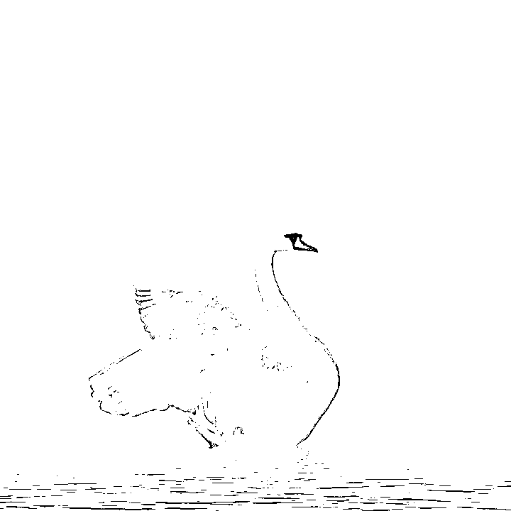

***天秤座***

**★**** 低调输出，避免口舌之争**

作为基本星座，天秤座处在冥王星和凯龙星的双重压力之下，尤其是 4 月 10 日之前，并不利于喜欢社交的天秤座发挥自己的特长。尤其是生日在 10 月 5 日至 9 日的天秤座，容易感受到人情冷暖，内心非常受伤。

**在与人交往的时候，一定要避免主观观点的输出，减少口舌之争。**

**★**** 培养爱好，协调身心平衡**

虽然搞好人际关系对于天秤座是头等大事。但也不要忽略了天秤座的另一面，对于美和艺术的追求。四月，天秤座有机会接触到创意性的活动，**发现日常生活之美，**从而激发自己的兴趣。

不妨多多留意这样的机会，逐渐发展出自己的专属艺术爱好，更好地去协调身心之间的平衡。

***天蝎座***

**★**** 保持谨慎，小心乐极生悲**

四月，随着金星和火星相继进入双鱼座，双鱼座群星汇集，无疑又给同为水象星座的天蝎座带来一大波好运。但由于南交点也在天蝎座，**旧浪翻滚，残渣泛起，**天蝎座一定要保持谨慎乐观，**小心幻象掩饰下的大坑。**

尤其是生日在 11 月 11 日到 16 日的天蝎座，更要提醒自己保持冷静，**不要情绪上头，冲动做决定。**

**★**** 桃花朵朵，不如自身强大**

天蝎座可能会发现自己在四月份很受异性的欢迎，不免有些洋洋自得，心态漂浮起来。**好的关系能给天蝎座带来更多的资源。**但别人的资源归根到底是别人的，主动权不在自己手里，不能和自己的资源划等号。

**如果能够从他人身上学到一些东西，挖掘出自身的潜力，才是真正属于自己的强大。**

***射手座***

**★**** 关爱身体，增强抵抗能力**

四月份，射手座的日子并不好过，尤其是下半月，以及生日在 12 月 15 日到 20 日的射手座，会更加感觉到有心无力，疲于奔命，在压力之下非常容易生病。

当下正处于冬春交替之际，气候说变就变，**射手座尤其需要注意身体上的变化，及时增减衣物，注意饮食健康，增强身体的抵抗力。**

**★**** 留意细节，关注家庭生活**

射手座是十二星座中出名的好心态，不拘小节，开朗乐观。但凡事有利必有弊，有时候，过于大大咧咧，也会给他人带来困扰。四月，射手座要**留心家庭中的繁琐小事，**尽量多关心家人，关注家庭生活。

风起于青萍之末，小事情不及时处理，或者处理不好，也会给自己带来很大的麻烦。

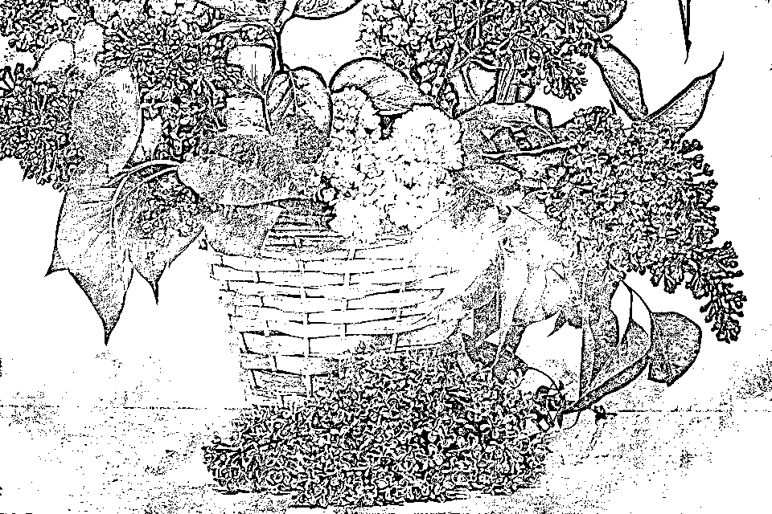

***摩羯座***

**★**** 机会很多，能够落实才行**

冥王星将在月底逆行，碾压最大的还是摩羯座，尤其是生日在 1 月 18 日和 19 日前后的摩羯座将迎来大考。很可能这个区间的摩羯座对于冥王星已经麻木了，咬牙扛着就是，行运总会过去。

但对于 1 月 10 日-18 日的摩羯座来说，四月份**会得到不少发展机会，**能不能抓住并且落实，还要看之前两年是否通过了冥王星的考验。

**★**** 兼听则明，跳出小我圈子**

摩羯座是土象星座，也是基本星座。所以摩羯座并不是人们想象中的墨守成规的星座，而是目标结果导向，会随着条件的发展变化来调整自己的策略。

这一年来，摩羯座或多或少感受到了一些经济上的压力，或是突发一些大的开销，单靠自己很难解决。**不妨试试向朋友们求助，集思广益，寻求解决之道。**

***水瓶座***

**★**** 做出选择，不再逃避现实**

传统占星学中，同样是土星守护水瓶座，水瓶座作为固定风象星座较起真来，比摩羯座要固执得多。四月份，土星的接力棒给到了生日在 2 月 10 日-17 日的水瓶座。

**关于何去何从，需要你们面对现实做出自己的判断和选择。**没有舍，就没有得，选择虽然艰难，但逃避现实只会于事无补。

**★**** 蓄势待发，重塑现实基础**

这个四月，水瓶座可能会遇到一些力不从心的事情和矛盾，身体出些小毛病或者感觉自己精力不足。这种事情的出现，很容易动摇自身的信心，怀疑自己的能力。其实，这是在提示水瓶座必须做出改变以应对。

**与其盲动，不如尊重和接纳现实，韬光养晦，蓄势待发。**心态放松了，再大的事情也是小事。

***双鱼座***

**★**** 集中力量，解决遗留问题**

群星进入双鱼座，会让爱做梦的双鱼座变得更加受人欢迎，飘飘然自我感觉良好。单身的双鱼座会有很多社交活动，有很大概率遇到令自己心动的人。

尤其是生日在 3 月 10 日之后的双鱼座，做什么都感觉非常顺利，**非常利于集中力量，缓和关系，一劳永逸地去解决一些遗留的问题。**

**★****放下成见，搞好身边关系**

双鱼座是一个很包容的星座，擅长结交各种类型的朋友。这并不是说双鱼座没有自己的择友原则，而是双鱼座不会选择在明面上交恶。不喜欢就躲开。**但有些关系是没法逃避的，**不管是同事，还是邻居，还是某个不靠谱的亲戚。

这个四月，**适合放下以前的成见，**重新发现周围人身上的闪光点，建立新的社交关系。

**版权声明：**原创文章由作者授权发布于若道平台，欢迎转发，反对抄袭。友号转载请申请白名单。

**Anastasia**

职业占星师/专栏作者/策展人

于 2015 年通过 ISAR 占星能力考试

若道认证生时校正资质（2015 年获得）

**微信公众号**：KairosMoment

长按打赏

**学习占星学****点击下图了解课程详情**

**

**微信又双叒叕改版啦，不想错过若道君的推送？**

**就把若道设为星标吧！**

**▼**

**喜欢记得点一下在看哦☟**

**报名直达入口**

# 在疫情中用投资提升财富丨世界金融占星学大师雷蒙德·A·梅里曼 2022 年《年度预报及讲座》

> 原文：[`mp.weixin.qq.com/s?__biz=MzA5NjA0NTAxNg==&mid=2651470712&idx=2&sn=6809000662658b23c0cb9121ba04e28a&chksm=8b4889cfbc3f00d9e0b723bb3e7d9b5d025a0a53de1399efb2f0e8a6609e2108cb4aeb68dfe6&scene=126&sessionid=1692737837#rd`](http://mp.weixin.qq.com/s?__biz=MzA5NjA0NTAxNg==&mid=2651470712&idx=2&sn=6809000662658b23c0cb9121ba04e28a&chksm=8b4889cfbc3f00d9e0b723bb3e7d9b5d025a0a53de1399efb2f0e8a6609e2108cb4aeb68dfe6&scene=126&sessionid=1692737837#rd)

**2022 年，我们遇到了比 2020 年更大的疫情挑战。**

因为奥密克戎的高传染性，很多人的工作、生活都受到了比 2020 年更大的挑战。

2 月 24 日开启的俄乌战争也对中国产生意料之外的影响。

这样的危机影响了很多人的正常工资收入，不说很多个体工商业者，就连互联网大厂也在迅速裁员，而物价却在不断上涨。

把钱放在银行会被通货膨胀侵蚀，但是盲目投资却会造成更大的损失。

**所以，在这个时候，我们需要明智的投资决策。**

所有研究经济和金融投资的人都知道，**经济和金融市场最重要的是周期研究，**当你在正确的周期进入市场，你投资的胜算远远大于在错误的周期进入市场。

**而占星学则是研究周期最好的工具。**

**1976 年以来，金融占星大师雷蒙德·A·梅里曼撰写的梅里曼市场时机学院每年一次的年度预报沙龙和每年一本的《年度预报》一直在应用占星学原理为投资者们服务，提供卓越洞见，从未间断。**

去年，这个 3 小时的年度预报讲座和长达 200 页左右对金融市场的分析报告帮助许多若道的读者做出正确的投资决策，降低投资风险，并获得相当不菲的投资收益。

**我们来看看上次金融年报中梅里曼老师说了什么：**

**上证指数**

**2021 年报告预测：**

我们预计涨势将在 2020 年 12 月-2021 年 2 月之间达到波峰，然后急剧下跌至 52 周和 22 个月周期的低点，这些周期将在 2021 年 5 月之前，甚至在 3 月底之前结束。此后可能会出现另一轮反弹，可能会也可能不会在 2021 年 11 月之前形成第一个 33 个月周期的新高。

**实际状况：**

****

上证指数在 2021 年 2 月 18 日达到年内最高峰 3731.69，随后出现一个快速的下跌，而且正如他所预测的，虽然随后上证指数出现反弹，但是没有再次到达 3731.69 这个高点。

**黄金**

**2021 年报告预测：**

黄金的 31.33 个月周期波谷将在 2021 年 9 月之前出现，理想情况是 2020 年 12 月-2021 年 6 月。价格目标是 1628+/-109 或 1768+/-76。重叠范围（理想情况）是 1692-1737。如果价格跌破这些范围，则为看涨情况中令人担忧的状况。

**实际情况：**

****

黄金价格波谷出现在 3 月 3 日，1673。随后在 8 月 6 日，再次探底至 1677.9。在 9 月后黄金开始反弹。

**白银**

**2021 年报告预测：**

木星和月亮交点的周期表明，白银的一个重要低点将在 2021 年出现，最有可能在 5 月 13 日之前或 7 月 28 日之后出现。这可能是 5-7 年周期的波谷，但可能会保持在 18.50 以上。收盘低于 17.00 将令人担忧。

**实际情况：**

白银价格波谷出现在 21.41 美元，保持在 18.50 以上。

**如果你根据梅里曼老师的指导进行投资，你会比一般人有更大的胜算。**

**2022 年的年度报告和沙龙的内容都非常丰富，对于一些重要市场的状况都有谈及：**

**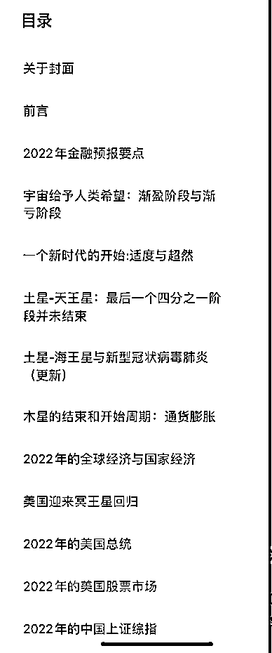**

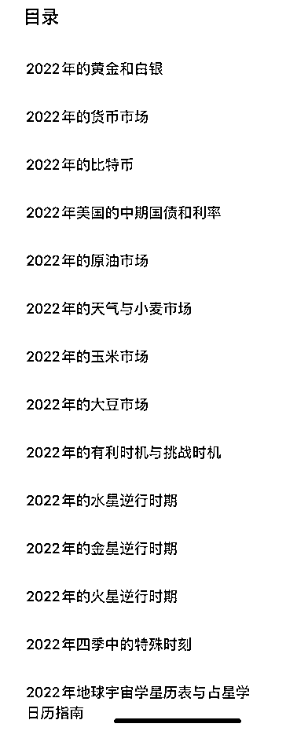

**在沙龙中，梅里曼老师也回答了许多大家关心的问题。**

比如：

*   **2022 年的黄金价格会到达比 2020 年更高的高点吗?**

*   **上证今年的整体走势会如何？现在到了波谷吗？**

*   **哪些行业板块值得关注？**

*   **石油还可以投资吗？**

*   **道指还会继续向上吗？**

*   **如何利用报告中的反转日获利？**

*   **如何看待 2023 年冥王星进入水瓶座开启长达 20 年的旅途？**

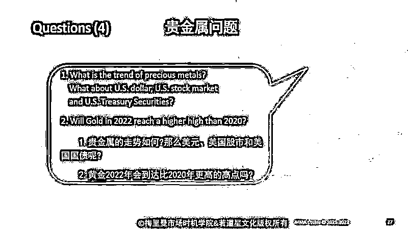

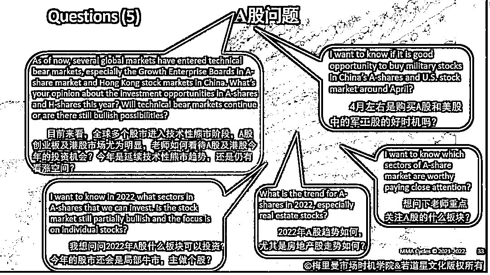

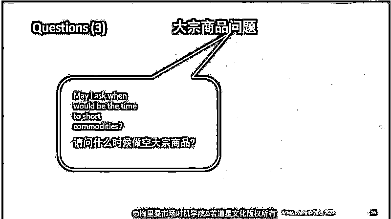

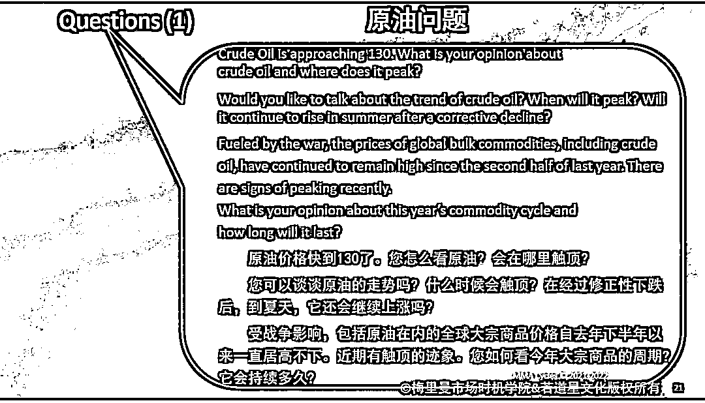

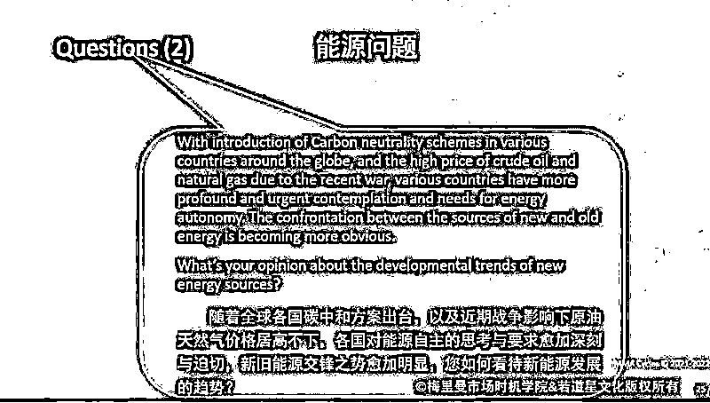

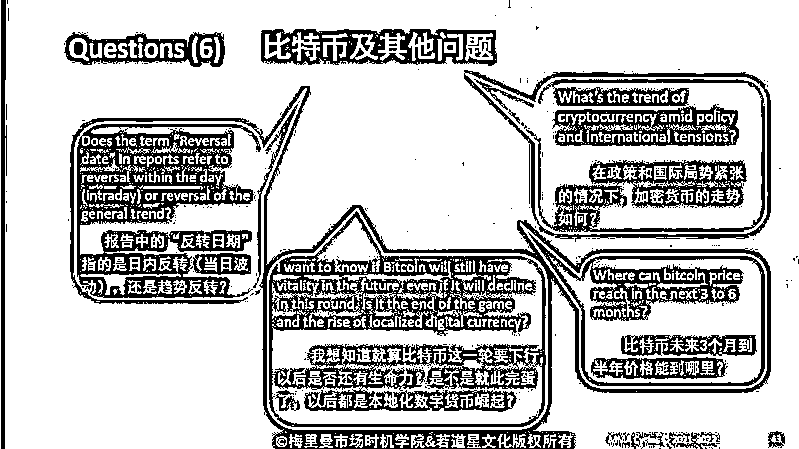

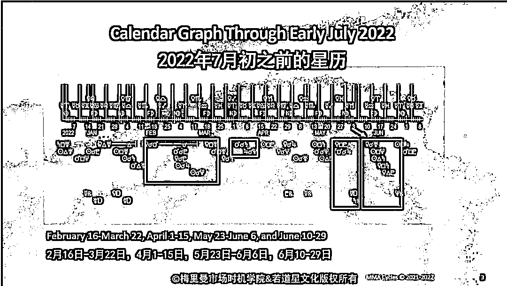

2022 年经济状况令人忧虑，但投资市场大有可为。

**一份价格仅千元的顶尖金融占星大师的投资分析报告和沙龙，聪明的投资者值得拥有。**

**2022 年度报告及沙龙**

**价格：****1380 元**

**购买者重要须知**

**①** 梅里曼市场时机学院每年一次的年度预报沙龙和《年度预报》是梅里曼市场时机学院的研究“预报”，而不是市场“预测”，是梅里曼老师及其金融占星分析师对人类活动周期历史与行星周期之间相关性的研究，二者在大部分情况下具有 80%或更高的相关性，而不是因果关系。沙龙中和报告中的研究完全存在错误的可能性。即便是非常认真的研究和几十年的研究经验，我们无法总是正确地解读出各种征象在实际层面上会如何相互作用，并显化为事件结果。

所以请将次沙龙和报告看作一个研究参考，务必结合其他市场研究和你个人对市场的理解，根据你的自由意志做决策。**②** 此报告一旦售出，**即不接受退款。**

**③** 此报告仅支持在手机网页和若道 APP 上阅读，不支持电脑阅读和下载。

**以上须知，请仔细阅读。一旦付款，即视为已了解并接受所有须知内容。**

**如在购买报告中遇见任何问题****可添加客服**▼

****购买报告直达入口****

# 白羊座新月 | 四面楚歌中，这场需要智慧和勇气的战斗，等你入局！

> 原文：[`mp.weixin.qq.com/s?__biz=MzA5NjA0NTAxNg==&mid=2651470592&idx=1&sn=35a604cc027e89f9a7f0d9f19c0e4c6c&chksm=8b4889b7bc3f00a1dada764261727e60a680f9f5b77c3ca5371b90ec7a82e32bec4a763638b6&scene=126&sessionid=1692737837#rd`](http://mp.weixin.qq.com/s?__biz=MzA5NjA0NTAxNg==&mid=2651470592&idx=1&sn=35a604cc027e89f9a7f0d9f19c0e4c6c&chksm=8b4889b7bc3f00a1dada764261727e60a680f9f5b77c3ca5371b90ec7a82e32bec4a763638b6&scene=126&sessionid=1692737837#rd)

****☆ **后台回复“今日”，给你一句生命态度**

作者/王芝桦 编辑/玫瑰 图片/pexels

**白羊座新月****北京时间 2022 年 4 月 1 日 14:24 迎来白羊座新月，太阳与月亮精准合相于白羊座 11°30′。**我们需要一个希望，但这个希望首先要在我们心里，而后才能在现实生活破土发芽。此次白羊座新月，虽是一次火象星座的新月，但宇宙指着那条“以诚实之性看向内心，以成熟之行落地生根”的未来之路说——从心出发。

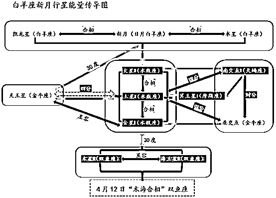

> **白羊座新月重点影响人群**
> 
> **参考新月峰值影响期间各个行星的行进度数，以及逆行行星的轨迹影响；常规容许度，个人行星入相位 3°，出相位 1°；非个人行星入相位和出相位均为 3°。**
> 
> *   出生星图中，有**行星、四轴、南北交点**落入**基本星座（金牛座、狮子座、天蝎座、水瓶座）6°-26°，25°-30°**的人群。
>     
>     
> *   出生星图中，有**行星、四轴、南北交点**落入**固定星座（双子座、射手座、处女座、双鱼座）9°-29°**的人群。
>     
>     
>     
>     
> *   出生星图中，有**行星、四轴、南北交点**落入**变动星座（白羊座、巨蟹座、天秤座、摩羯座）18°-26°**的人群。

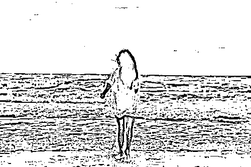

**躬身入局，方有可翼**

****

**我们怀着谦卑的态度接近新的地方，对于什么是有趣的东西，不带任何成见。**

**——阿兰·德波顿《旅行的艺术》**

> **天象**
> 
> **· 白羊座内四星联手：水星、新月、太阳和凯龙星合相于白羊座。**
> 
> **· 新月 30°天王星：白羊座新月与金牛座天王星形成 30°结构。****· 水瓶座内三星联手：火星、土星和金星合相于水瓶座。****· 金火土四分南北交点：“金火土三星联手”结构四分“天蝎座南交点-金牛座北交点”轴线。****· 金火土 30°“木海互容”：“金火土三星联手”与“木海互容”结构形成 30°结构。**

就在我做好上面那张“白羊座新月行星能量传导图”的瞬间，心中不禁一颤。这张图的中心是“水瓶座内三星联手”结构，于是，一个画面浮现：**· 三星联手：**接纳新月能量的火星（火星守护白羊座）与从 3 月开始一直结伴而行的金星，一左一右地将土星能量激活；**· 四面楚歌：**位居中心的“水瓶座内三星联手”结构，上有“白羊座内四星联手”结构，下有即将到来的年度重磅天象“木海合相”结构，左有依旧发力的宇宙背景“土天四分”结构，右与“南北交点”轴线形成四分结构，四面环绕犹如四面楚歌；**· 英雄披靡：**英雄绝不会气短，定当“待俺赶上前去，杀他个干干净净”！但如此特别的时刻，只有“战神”火星的英勇无畏是不够的，还需要**成熟担当土星的“谨守规则，规避错误”、社交担当金星的“联结盟友，创建关系”，方能借助新月的“开启”能量破局重生！**

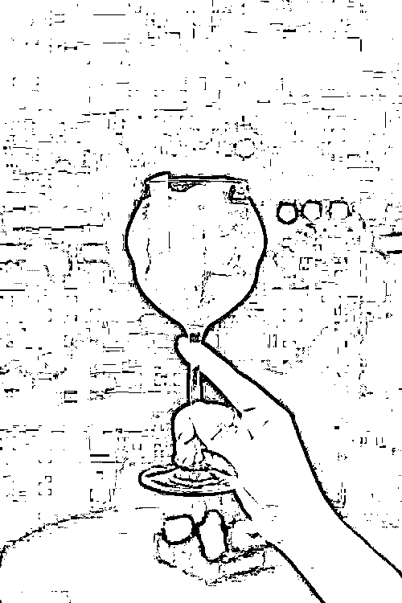

**1. 真诚**

我们刚刚走过 3 月的生活：俄乌战争还未消停，全球油价屡翻新高；新冠疫情还在传播，工作节奏走走停停；5735 航班莫名陨落，牵动心底最后脆弱。现实拿着一把尖锐的刻刀，狠狠地磨砺着生命的韧性：世事太无常，生命太渺小，我们不断积聚着生命的勇气与力量，但又不断被现实击倒在地；没有人喜欢倒地的笨拙，没有人喜欢挫败的羞愧，而就在那个“起来倒下，起来倒下”的过程中，有些时候我们就像无比坚强的战士，但有些时候却又变成愤怒的疯子。那么，每一个人会选择什么样的自己呢？面对生活，我们是做主动的选择者，还是做被动的反应者？白羊座是黄道十二星座中的第一个星座，故而，**每年的白羊座新月代表着“万物循环”的初始，也代表着“全新征程”的起点。**白羊座新月散发着令人热血沸腾的能量，驱动我们踏上全新的“英雄之旅”，迸发勇气，强化意志，誓要冲破一切阻碍，为目标而战，为自己出征！然而，此次白羊座新月的火热之中却增添了一份凝重。首先，“白羊座内四星联手”和“新月 30°天王星”两组结构带来提示：**·** 我们确实正身处现实的考验之中，挫败的羞愧感，混乱的失控感，激化着内心深处的惶恐。但如果只是不计后果地横冲直撞，“反作用力”将会引发更大的压力与损伤；

**·** 现实世界就像是正在进行重新编码的工作，而宇宙才是背后那个高级的程序员。我们要做的、能做的就是读懂宇宙的语言，参悟重新编码的原因，跟随全新世界的韵律。

此次白羊座新月的第一个关键词是**“真诚”**。我们**要对内在的恐惧说真话，要与现实的境况和解，就要放下自我的主观视角和习惯模式。**于是，接纳白羊座新月能量的“战神”火星披挂上阵，不上战场又如何解困？

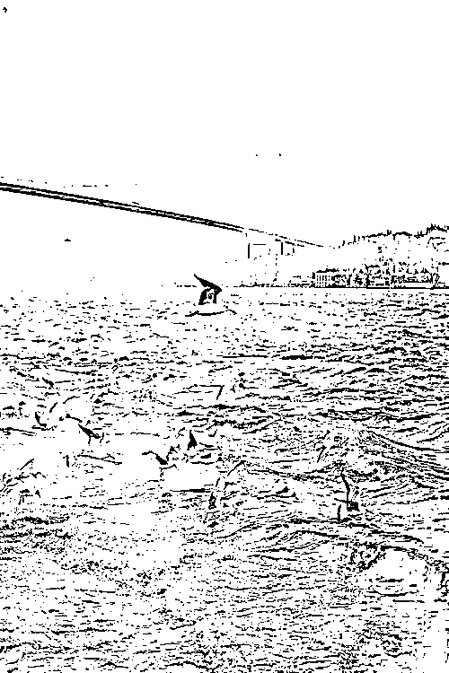

**2. 入局**

“战神”火星于水瓶座内找到土星和金星，并形成“金火土三星联手”结构共议对策。水瓶座是一个描绘**“集体与个人之间的关联”**的星座，故而，此次白羊座新月周期，我们将会看到集体层面的动作和举措，也将会体验到个人层面的变化和调整。**好消息是：****· **“谨守规则，规避错误”的土星有效降低了火星的急躁与莽撞，帮助我们在焦躁与冲动的时候面对现实并保持清醒，寻求更加成熟、更有建设性的策略；**·** 此次白羊座新月，“联结盟友，创建共赢”的水瓶座金星与“现实变革，重组结构”的金牛座天王星形成“金天互容”结构，提示我们透过资源、经济和关系几方面的全新变化，刷新价值认知，寻求共赢机制；**· **个人层面的亲密关系，也有望在这一时期进入承诺性阶段；集体层面的人事变更，也将在这一时期深入实质性进程。**坏消息是：****· **过去一年多，生存安全、经济状态、地缘政治、职场生计，这几方面的动荡并未消退，反而更加深化。人们内心深处的压力感和恐慌感似乎越积越深，而“责任与代价”也成为心头最敏感的词语；**· **土星代表着现实的规则，也对应着制定规则的权威力量。责任越大，自律更甚，但过度的严谨与压制也容易适得其反；**· **行动力大大受挫，已经决策的事情不好推进或执行不好，正在进行的事情被延误或被叫停。凡事都有责任人，故而，新月周期需要理性面对突发状况，成熟处理各种事情，以免不小心做了“背锅侠”；**· **现实困境也进一步激化了恐惧情绪，而人在恐惧时的第一反应往往是自我防御，无意识地向外甩锅或推卸责任，“都是他（她）造成的”，“他（她）就是和我过不去”，甚至导致暴力发生或冲突升级。从上述的好消息和坏消息，我们可以看出“金火土三星联手”结构可以发展出完全相反的两种可能性。问题来了！接纳白羊座新月能量的“战神”火星，入局“金火土三星联手”结构，踏入四面楚歌之地，无论如何也是要创造一些功绩的；但“金火土三星联手”结构之中，**火星却是“问题点”，金星才是“解惑点”，而土星则是“决策点”。**

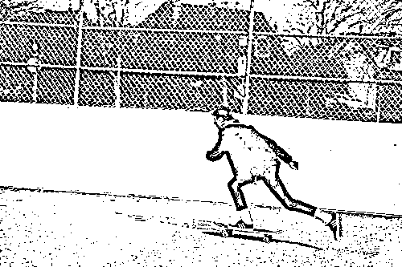

**3. 选择**

此次白羊座新月，“金火土三星联手”结构与“天蝎座南交点-金牛座北交点”轴线形成四分结构，其中：**火星接纳着天蝎座南交点的业力模式，对抗不公境遇，投射愤怒情绪；金星接纳着金牛座北交点的进化策略，回归朴实无华，携手共度难关。**但是，还不够。接纳天蝎座南交点业力模式的，还有天蝎座的另外一颗守护行星——宇宙超级大 BOSS 冥王星。自 2021 年末南北交点换座进入“天蝎座南交点-金牛座北交点”轴线开始，“揭示业力议题的摩羯座冥王星”便与“描述业力模式的天蝎座南交点”彻底捆绑在一起，以致业力功课全面显现——宇宙要我们慢下来，不只是要降速忙碌的脚步，更是要降速贪婪的野心，“只能更好”的欲望，“不进则退”的恐惧，究竟是不相信宇宙至高的能量，还是不相信自己的实力呢？此次白羊座新月，宇宙提示我们**在“破坏性的情绪”与“建设性的行为”之间做出选择**。故而，我们就要借助“金火土三星联手”结构中水瓶座土星的成熟、“金天互容”结构的智慧，帮助我们做出更有建设性的选择。

**敲黑板！划重点！**

**· **水瓶座土星和“金天互容”结构都与 2021 年重磅天象“土天四分”结构中的金牛座天王星有关。“土天四分”结构看似已经松散，但能量并未消散，并将于 2022 年 10 月再次紧密呈现。故而，**我们要为 10 月做出准备与铺垫**；

**·** “土天四分”结构的“新旧转化”进程，撼动了人类世界中“房子、票子、银子”这些根本性的东西，揭露着已经老朽的价值文明，清理着必须更新的现实序列；**·** “金天互容”结构提示我们要想创建平等共赢的全新时代，就要带着尊重的发心、谦卑的态度和协作的精神，从当下的现实点滴做起，去接近全新的地方，去搭建全新的联盟，不带任何成见。

**再次敲黑板！划重点！**

**· **此次白羊座新月，即将于 4 月 12 日到来的年度重磅天象“木海合相”结构其实已经开始发挥效应，并与“金火土三星联手”形成 30°结构； **· ** “木海合相”结构 13 年一次，但发生在双鱼座却实属罕见。这是神圣而殊胜的高光时刻，但如若没有成熟的心性和坚稳的实力，光芒也容易刺盲双眼，令人迷失心性，甚至歇斯底里——一念成佛，一念成魔；

**· **此次白羊座新月，就让我们准备好真诚、慷慨与慈悲去迎接“木海合相”双鱼座的时刻吧。

“战神”火星带着白羊座新月的使命，搭建“金火土三星联手”结构，步入整体天象的中心。宇宙借助此次白羊座新月的天象布局，提示我们——**真正的英雄，不会对战场挑三拣四，而只会躬身入局；即使四面楚歌，但凭心性与智慧，亦可转化为四方助力。**

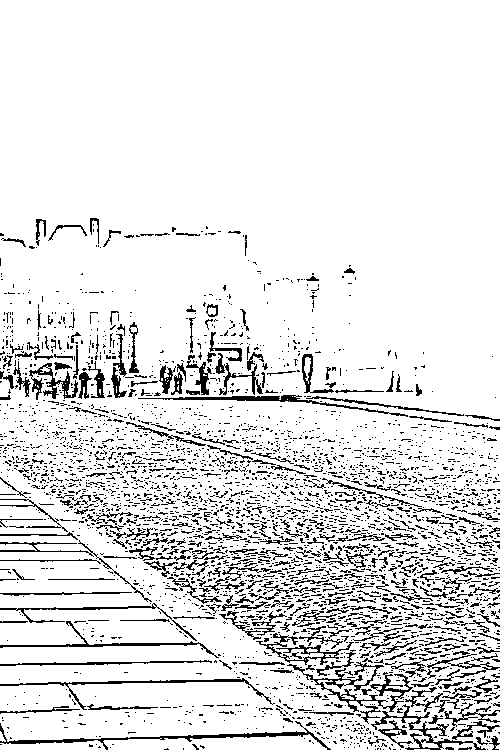

**寄语**

****

**自然的最小部分已是无穷。**

**——阿兰·德波顿《旅行的艺术》**

前两天，一位经济状况在中产水准的朋友非常郑重地决定“降级消费”。看她一本正经的样子，我问她：“你都降级消费了，你的员工跟着你能混个什么消费？”请原谅我言辞尖锐。其实她这句话，恐怕也是很多朋友当下的想法。返璞归真挺好，但宇宙让我们降低的是内在的恐惧与欲念，而不是该花的银子，而紧抓着银子不正是恐惧和欲念的驱动吗？有时，我在想，人类世界真的富有吗？这个地球上的资源似乎都被人类所得，但自然界的一个风吹草动，却能撼动人类的所有创建。自然无穷，因其没有贪欲，从不妄想占有，只是自然流动。其实生命亦是无穷，但我们往往总是关注那个“穷”字，却忽略那个“无”字——如果内心没有了“无”，便只想着“有”，但其实只是落了个“穷”。在此，向 MU5735 航班遇难的朋友们表示哀悼，这个世界将会永远记得你们，一路走好。祝福每一个生命健康，祝愿每一个灵魂安好。**新月如何许愿？****许愿时间**：2022 年 4 月 1 日北京时间 14:24 后，48 小时内有效、8 小时内最佳。 **许愿人群**：所有人。**许愿数量**：每人最多 10 个。**许愿方式**：静心冥想，身心祈祷或记录收藏。**许愿格式**：请万能的宇宙赐予我能量，我将以我的能量吸引**（什么）来到生命中……**许愿原则**：发心诚善利人。

**版权声明**：原创文章由作者授权首发于若道平台，欢迎转发，反对抄袭。友号转载请申请白名单。

****

****想阅读更多作者的文章，请在后台回复******王芝桦****** 即可。****

****王芝桦****

心理占星师，统合疗愈师，占星专栏作者

全职于个案咨询与占星教学工作 18 年

**个案预约咨询微信号**：zhihua0621 

**微信公众号**：daoxi-life

**长按打赏**

****

**学习占星学****点击下图了解课程详情**

**

**微信又双叒叕改版啦，不想错过若道君的推送？**

**就把若道设为星标吧！**

**▼**

**福利来啦**
**点击****“阅读原文”****获取最好用的免费****新月报告**

**获取免费新月报告，请点击文末“阅读原文”**

# 4 月 27 日开课| 美国占星心理学学院&若道占星双认证核心课程

> 原文：[`mp.weixin.qq.com/s?__biz=MzA5NjA0NTAxNg==&mid=2651470592&idx=2&sn=bb966e214b2fb4ee9f6836640fcfa1a5&chksm=8b4889b7bc3f00a1c2e5cccf30589c45e03069939e86275647b18bf44b70fc37c6627ec22a8c&scene=126&sessionid=1692737837#rd`](http://mp.weixin.qq.com/s?__biz=MzA5NjA0NTAxNg==&mid=2651470592&idx=2&sn=bb966e214b2fb4ee9f6836640fcfa1a5&chksm=8b4889b7bc3f00a1c2e5cccf30589c45e03069939e86275647b18bf44b70fc37c6627ec22a8c&scene=126&sessionid=1692737837#rd)

**美国占星心理学学院创办人**

**格伦·佩里**授课

**40 余年**职业占星师生涯所学精华**倾囊相授**

修完 101-205 全部课程，并通过考核的毕业生将获得

**美国占星心理学学院证书**( Academy of Astropsychology )

和**若道毕业证书**

**高含金量双证书**

跟随主讲老师学习融合**心理学体系**的**占星知识**

为星图咨询解读打下坚实的基础

**大量**的课程资料，光是课后阅读资料就**超过 60 万字**

合理的课程设计，贴心的助教服务，及时的课后测验

1

**这门课程最大的看点是什么？**

1. **两位国际占星学大师**共同授课，将合计**90 年职业占星师生涯所学精华**倾囊相授；2. 修完**全阶课程**，考试通过的毕业生将获得**美国占星心理学学院证书**（Academy of Astropsychology）和**若道毕业证书**，**高含金量双证书**；3. **116 次课程**的充分授课时间（录播课程 69 次课；直播课程 47 次课），全面而详细地讲解占星学历史、知识、技能、案例、咨询和运用；4. 跟随主讲老师学习**自成体系、逻辑严密、实用性强的占星语法、星图解读方法**；5. 学习独特的**发展年龄预测法**，从星图看对关键年龄阶段的发展及议题；6.** 大量的课程资料，光是课后阅读资料就超过 60 万字**；7. 合理的课程设计，初中阶课程，每一节都有课后测验；8. 本课程可以作为**ISAR 选修课**中的一门，再修两门就满足 ISAR 认证选修课要求；9. **18 次占星咨询技巧的培训**，为正式从事占星咨询建立基础；10. 教授重要的**心理学概念**，比如与客体关系、心理动力理论、个人神话和叙事疗法相关的一些概念，学习如何将它们整合到星图解读中；11. 了解**《精神疾病诊断与统计手册》**诊断标准，探索星图中的心理疗愈；12.  学习**叙述疗法**和**自传写作**，将之作为自我疗愈和咨询的工具。

**格伦老师致学员的信**

（向上滑动查看内容）

**亲爱的学员：**

作为占星心理学学院的校长，我的目标是帮助你顺利完成学业。

占星心理学学院的课程让你能够在经济承受范围内，灵活地学习占星学。我们的课程让你可以舒适、便捷地在家学习，不用打乱你本就繁忙的日程。我们有完善的在线学习系统，让你能在线上课、下载学习资料、进行测试并自动获得即时反馈，还可以在虚拟课堂上同你的教员和同学互动。

作为私人开业的**职业占星师**和**执业心理治疗师**，我已经**工作超过 30 年。**我还花了近 10 年的时间，在研究院里学习并获得**心理学的硕士和博士学位**。这段训练和经历是无价的，帮助我将占星学发展成为连贯的 21 世纪模式。

我们的占星学培训项目是**系统化的、清晰的、组织有序的、易学的、前沿的。**尽管有许多类似的学校可供你选择，但你不会在这些学校中看到像占星心理学学院所提供的那样有深度的或尖端的课程。

**我非常期待 2022 年再次在若道教授心理占星学核心课程。**我们重新规划和升级了本次课程体系。**新的课程包含之前完整课程的 72 个录播视频，每个视频长 2 小时；以及由我教授的 37 次直播课程，和大卫老师教授的 10 次直播课程，每次课程 2 小时。**在实时课程中，除了我提供的案例，我还会用学员的星图进行案例演示，与学员互动，阐明视频中教授的原则和方法。

**2 小时直播课程安排：**

**第一阶段 提问和讨论：**

这将在每节课开始时进行。邀请学员提出与课前提供的资料相关的具体问题。这一阶段将持续 15-30 分钟。

**第二阶段 示例：**

这一阶段会讲解与每周任务相关的具体概念，例如行星的星座位置、宫位位置以及相位的意涵。星图示例来自我认识的人，如公众人物、朋友、家人、同事或以前的客户（不显示出生信息）。同样，这一阶段也开放课堂讨论，学员可以提出自己的问题和见解。

**第三阶段 学员案例演示：**

这个阶段会从学员的具体星图来阐明概念，例如火元素行星占优势。学员案例演示不会涉及任何类型的咨询或“解读”。它们将只是简单地包含一段对话，我会在对话中分享自己对某个配置的思考，然后问这个学员可能会如何主观地（影响、信念、行为）和客观地（事件/关系）体验这个配置。其他参课学员可能也会对讨论的主题有自己的见解或问题，他们也可以参与讨论。

我对这一新的在线课程形式感到兴奋，**并期待着从 2022 年 4 月 27 日开始认识我的新学员们。**获得本学院的文凭会是你做过的最明智的投资。你不仅将占星学掌握到前所未有的深度，还将学到如何为客户提供咨询服务并建立职业占星师的职业生涯。

真诚地

**格伦·佩里 占星心理学学院校长**

**为什么要学习心理占星学？**占星心理学是一个复杂的体系，让实践者能够向客户提供真正治疗性的益处。这从根本上说来是我们学院有别于其他学校之处：**我们教授占星学，也教授心理学概念。****我们明确讨论各种心理学概念，并将其与占星学无缝衔接。结果就是更深入的、更丰富的，最终更加强大的模式。****该项目专为初学者和渴望深造的有经验的占星师而设。**我们会从跨学科的角度探讨星图解读。**通过融合荣格心理学和各种其他模型的元素，学员将熟悉作为人格理论、发展模型、原型语言和诊断工具的占星学。**

2

**课程是怎么安排的？**

**第一学年**

**共****64****次课 **43****次录播课 **21 次直播课******

**101 占星学基础 **

****共****12****次课程：******8 次 2017 年录课+4 次直播课**

**占星学**关注成长，聚焦心理。外部事件意义重大，但我们可以把它们看作是对于发展中的心理结构的共时性反映，以及未来发展的媒介和催化剂。在这个阶段的课程中，会以四种形态的几何形式介绍**占星原型：星座、行星、宫位和相位**。黄道带是人类心灵的象征性地图，其中的每个**星座**都代表一种基本的人类需求、原型人物、发展阶段和行为风格。**行星**代表心理功能，以满足其关联星座的基本需求。**宫位**提供了环境舞台，行星在其中扮演它们的角色，而**相位**是行星之间的角度关系，在主观上体验为内在对话。

**课程安排**：

**录播课****、****直播课（周三）**时长都是 2 小时

第一节**录播课**：核心概念介绍

第二节**录播课**：黄道带的结构

2022 年 4 月 27 日**直播课**：核心概念、黄道带的结构提问和讨论、知识点示例

第三节**录播课**：图例、单态星体和其他奇妙的元素

2022 年 5 月 11 日**直播课**：图例、单态星体提问和讨论、知识点示例

第四节**录播课**：星座介绍（从白羊座到处女座）

第五节**录播课**：星座介绍（从天秤座到双鱼座）

2022 年 5 月 25 日**直播课**：12 星座案例演示

第六节**录播课**：行星作为过程

第七节**录播课**：行星作为内容

第八节**录播课**：将碎片整合起来

2022 年 6 月 8 日**直播课**：整合星图时，将行星作为过程和内容案例演示

**102 行星落星座、宫位** 

****共****12****次课程：**8 次 2019 年录课+4 次直播课**

这个阶段的课程**聚焦于初步的星图整合。**

学员将学习**占星语法**，以及如何运用它们来阐释**行星的星座落点**。学员不需要强记书中的星图解读，而是学习分析基础的占星句法结构，应用这些语法规则来思考和讲述这门语言。学员们将学习如何构建精妙的句子，将动机、功能、特质、状态和事件组合起来。

此外，还将学习解读**行星宫位落点**的规则。宫位被定义为心理环境，为特定类型成长和发展提供背景。行星落在宫位中，象征着情境中的特殊状态，应对环境挑战的方式，以及通过共时性人物和事件而外化的自我部分。

学员们将探索如何将星座和宫位落点融合在一个单一、整合的陈述中，做出灵活、层次分明的解读。

**课程安排**：

第一节**录播课**：占星语法介绍

第二节**录播课**：行星星座作为行为风格

2022 年 6 月 22 日**直播课**：占星语法、行星星座作为行为风格提问和讨论、知识点示例

第三节**录播课**：思维状态和行为结果

第四节**录播课**：学习行星的星座落点

2022 年 7 月 6 日**直播课**：思维状态和行为结果、行星的星座落点提问和讨论、知识点示例

第五节**录播课**：回顾宫位的含义

第六节**录播课**：宫位中的行星过程

2022 年 7 月 20 日**直播课**：宫位的含义、宫位中的行星过程提问和讨论、知识点示例

第七节**录播课**：行星在宫位中的状态

第八节**录播课**：行星作为宫位的内容

2022 年 8 月 3 日**直播课**：行星在宫位中的状态、内容的提问和讨论、知识点示例

**103 行星相位与个人神话** 

****共****13****次课程：**9 次 2019 年录课+4 次直播课**

在这个阶段的课程中，**相位**被解释为由更大的故事结构的潜在动力构成的个人神话。

学员将学习相位是如何象征内在心理的冲突、重要的童年情感体验、主要的人生挑战和内在对话的。需要着重强调的是，相位的意涵会随着心理成熟的程度而改变。人会成长、进化，会解决内在冲突，这些不仅反映在态度和行为的改变上，而且也会表现在某人吸引的事件及其与他人的关系品质上。

学员们还将学习一些**心理学概念**，比如与客体关系、心理动力理论、个人神话和叙事疗法相关的一些概念，它们将整合到相位解读中。

**课程安排**：

第一节**录播课**：重要主题与核心冲突

第二节**录播课**：渐盈相位与渐亏相位

2022 年 8 月 17 日**直播课**：重要主题与核心冲突、渐盈相位与渐亏相位的提问和讨论、知识点示例

第三节**录播课**：主要相位的核心意义

第四节**录播课**：罗生门原则

2022 年 8 月 31 日**直播课**：主要相位的核心意义、罗生门原则的提问和讨论、知识点示例

第五节**录播课**：占星学中的认知

第六节**录播课**：心灵的控制结构

2022 年 9 月 14 日**直播课**：占星学中的认知、心灵的控制结构的提问和讨论、知识点示例

第七节**录播课**：作为认知结构的相位

第八节**录播课**：强迫性重复

第九节**录播课**：听大卫·瑞雷讲月亮交点

2022 年 10 月 12 日**直播课**：月亮交点（由大卫·瑞雷老师教授）

**104 征象星与定位星：作为进化故事的星图 **

****共****12****次课程：******8 次 2019 年录课+4 次直播课**

这个阶段的课程聚焦于**从叙事角度整合星图。**

学员们将探索**宫位征象星**和**行星定位星**如何讲述一个故事，反映一个人进化发展之旅。行星定位关系揭示了个人神话的主体构架。而这个故事的主题常常处于意识觉知和控制之外，占星学提供了一种方式，揭示、解读、改编这个神话。

我们推荐的星图整合方式是将相位和定位星关系融合成一个单一、连贯的叙事。要特别强调的是，如何活出整合程度更高的生命故事。

学员们还将了解**叙事疗法**和**自传写作**，把它们当作促进整张星图整合的一种方式。

**课程安排**：

第一节**录播课**：每张星图都讲述了一个故事

第二节**录播课**：互容与最终定位星

2022 年 10 月 26 日**直播课**：每张星图都讲述了一个故事、互容与最终定位星的提问和讨论、知识点示例

第三节**录播课**：将相位整合进流程图

第四节**录播课**：完整的故事

2022 年 11 月 9 日**直播课**：将相位整合进流程图、完整的故事的提问和讨论、知识点示例

第五节**录播课**：过渡短语

第六节**录播课**：良好定位或不良定位

2022 年 11 月 23 日**直播课**：过渡短语、良好定位或不良定位的提问和讨论、知识点示例

第七节**录播课**：发展年龄方法

第八节**录播课**：进行全面整合

2022 年 12 月 7 日**直播课**：发展年龄方法、进行全面整合的提问和讨论、知识点示例、案例演示

**105 星图中的精神病理学与疗愈 **

****共****15****次课程：******10 次 2019 年录课+5 次直播课**

在这个阶段的课程中,我们将**聚焦于十二星座(从白羊座到双鱼座）及其对应的守护星的潜在功能障碍**。

我们将学习如何识别、理解和应对每个星座的潜在挑战。我们将在各种相应的心理障碍背景下来考察占星原型，这些心理障碍表现为功能障碍、失衡的极端状态。

学员们将了解**《精神疾病诊断与统计手册》诊断标准**。我们会探讨治疗的概念，尤其是那些与整合和个性化相关的概念。我们将特别关注外行星的困难相位，以及它们与内在心理冲突、防御和症状形成的关系。

学员们将探索人的痛苦如何成为发展和实现天赋才能的催化剂。

**课程安排**：

第一节**录播课**：白羊座-火星的病理学

第二节**录播课**：金牛座/天秤座-金星的病理学

2022 年 12 月 21 日**直播课**：白羊座-火星、金牛座/天秤座-金星的病理学提问和讨论、知识点示例、案例演示

第三节**录播课**：双子座/处女座-水星的病理学

第四节**录播课**：巨蟹座-月亮的病理学

2023 年 1 月 4 日**直播课**：双子座/处女座-水星、巨蟹座-月亮的病理学提问和讨论、知识点示例、案例演示

第五节**录播课**：狮子座-太阳的病理学

第六节**录播课**：天蝎座-冥王星的病理学

2023 年 2 月 1 日**直播课**：狮子座-太阳、天蝎座-冥王星的病理学提问和讨论、知识点示例、案例演示

第七节**录播课**：射手座-木星的病理学

第八节**录播课**：摩羯座-土星的病理学

2023 年 2 月 15 日**直播课**：射手座-木星、摩羯座-土星的病理学提问和讨论、知识点示例、案例演示

第九节**录播课**：水瓶座-天王星的病理学

第十节**录播课**：双鱼座-海王星的病理学

2023 年 3 月 1 日**直播课**：水瓶座-天王星、双鱼座-海王星的病理学提问和讨论、知识点示例、案例演示

**第二学年 2023 年**

****共****52****次课 **36****次录播课 **16 次直播课********

**201 回顾占星历史 **

****共****16****次课程：******9 次 2019 年录课+7 次直播课**

在这个阶段的课程中，我们将探索**占星历史如何反映心灵的进化**。

现代之前的占星学以事件为导向，注重具体预测，偏向决定论，它反映了现代之前的主导意识模式。上世纪以来，占星学已经逐渐变得更加抽象、心理化、开放和非决定性，这似乎反映了集体意识的改变。因此，我们将在人类发展和意识进化的背景下考察占星历史。我们会谈到不同时代的星图解读和咨询技术，以此来比较和对比前现代、现代和后现代占星学。

**课程安排**：

第一节**录播课**：朝着整体占星学前进

第二节**录播课**：占星原教旨主义

2023 年 3 月 22 日**直播课**：朝着整体占星学前进、占星原教旨主义提问和讨论、知识点示例

第三节**录播课**：占星学的其他分支——大卫·瑞雷

2023 年 3 月 29 日**直播课**：占星学的其他分支提问和讨论、知识点示例（由大卫·瑞雷老师教授）

第四节**录播课**：从古代占星学到后现代占星学

第五节**录播课**：比较与批评

2023 年 4 月 5 日**直播课**：从古代占星学到后现代占星学、比较与批评、提问和讨论、知识点示例

第六节**录播课**：希腊占星学：摘录与评论

2023 年 4 月 19 日**直播课**：希腊占星学：摘录与评论提问和讨论、知识点示例

第七节**录播课**：比对图中的伴侣匹配度，古代与现代

2023 年 5 月 3 日**直播课**：比对图中的伴侣匹配度，古代与现代提问和讨论、知识点示例

第八节**录播课**：比对图——大卫·瑞雷

2023 年 5 月 10 日**直播课**：比对图提问和讨论、知识点示例、案例演示（由大卫·瑞雷老师教授）

第九节**录播课**：组合图——大卫·瑞雷

2023 年 5 月 17 日**直播课**：组合图提问和讨论、知识点示例、案例演示（由大卫·瑞雷老师教授）

**202 预测与意识演变(一) **

****共****9****次课程：******6 次 2019 年录课+3 次直播课**

作为一门艺术，**预测占星学**运用行星的运行来预测特定时期的性质、意义和持续时间。在这个阶段的课程中，我们会考察**意识进化**的概念、其基本原理及其与占星学预测部分的关系。

意识进化可以被定义为有意识地与星图中固有的进化过程合作。学员们将探索如何用**行进**和**推进**来为意识进化服务。我们不是简单描述事件的结果，而是将行星运行描述为实现先天潜能的机遇之窗。

**课程安排**：

第一节**录播课**：开始预测

第二节**录播课**：发展年龄方法

2023 年 5 月 24 日**直播课**：开始预测、发展年龄方法提问和讨论、知识点示例、案例演示

第三节**录播课**：太阳的行进

第四节**录播课**：月亮的行进与推进

2023 年 6 月 7 日**直播课**：太阳的行进、月亮的行进与推进提问和讨论、知识点示例、案例演示

第五节**录播课**：水星的行进

第六节**录播课**：金星的行进

2023 年 6 月 14 日**直播课**：水星、金星的行进提问和讨论、知识点示例、案例演示

**203 预测与意识演变(二) **

****共****15****次课程：******9 次 2019 年录课+6 次直播课**

在这个阶段的课程中，学员们会继续探索**如何将对行进、推进和其他预测方法的分析运用于个人成长**。

具体事件反映并促进了意识的改变；因此，行星运行可以帮助我们洞察成长过程的精确时机，让我们领会内在和外在现实如何同时发生、彼此反映、互相转化。

我们还将探索宏观的世界行进，考察占星格局如何在社会、政治、经济、艺术和生态层面上表现出不同的形式，却又在多样化的现象中反映单一的**原型**。

这里的挑战是去思考，我们对宇宙的这种参与式关系如何能为共同创造一个积极的、更充满希望的未来做出贡献。

**课程安排**：

第一节**录播课**：火星的行进

第二节**录播课**：木星的行进

2023 年 6 月 28 日**直播课**：火星、木星的行进提问和讨论、知识点示例、案例演示

第三节**录播课**：土星的行进

第四节**录播课**：天王星的行进

2023 年 7 月 12 日**直播课**：土星、天王星的行进提问和讨论、知识点示例、案例演示

第五节**录播课**：海王星的行进

第六节**录播课**：冥王星的行进

2023 年 7 月 26 日**直播课**：海王星、冥王星的行进提问和讨论、知识点示例、案例演示

第七节**录播课**：次限推进——大卫·瑞雷

2023 年 8 月 2 日**直播课**：次限推进提问和讨论、知识点示例、案例演示（由大卫·瑞雷老师教授）

第八节**录播课**：太阳弧——大卫·瑞雷

2023 年 8 月 9 日**直播课**：太阳弧提问和讨论、知识点示例、案例演示（由大卫·瑞雷老师教授）

第九节**录播课**：太阳返照图和月亮返照图——大卫·瑞雷

2023 年 8 月 16 日**直播课**：太阳返照图和月亮返照图提问和讨论、知识点示例、案例演示（由大卫·瑞雷老师教授）

**204 占星咨询技巧(一) **

****共****9****次课程：******6 次 2019 年录课+3 次直播课**

在这个阶段的课程中，学员们将学习**咨询技巧**，比如如何选取一段经历，询问相关问题，提出假设，进行解读，重塑冲突，预测成长机遇，深化疗愈。

我们会审视各种**咨询理论**，重点强调它们在占星学中的**运用**。学员们将学习如何处理危机，做出恰当的推荐引介。

我们强调**有效沟通**的原则、聆听技巧、言语和非言语沟通，以及占星学如何帮助我们建立共情关系。

我们会专门介绍**伦理道德**法则，因为它关系到职业责任问题、资质能力、咨询和预测。

我们会特别关注**占星师的阴影**以及我们在自卑和膨胀问题上的集体脆弱。

**课程安排**：

第一节**录播课**：导言与概述

第二节**录播课**：确定咨询范围

2023 年 8 月 30 日**直播课**：导言与概述、确定咨询范围提问和讨论、知识点示例、案例演示

第三节**录播课**：会见客户

第四节**录播课**：厘清问题(剥开占星学的洋葱)

2023 年 9 月 13 日**直播课**：会见客户、厘清问题(剥开占星学的洋葱)提问和讨论、知识点示例、案例演示

第五节**录播课**：认出生活模式(隐喻思维)

第六节**录播课**：提出假设与辨识核心信念

2023 年 9 月 27 日**直播课**：认出生活模式(隐喻思维)、提出假设与辨识核心信念提问和讨论、知识点示例、案例演示

**205 占星咨询技巧 (二) **

****共****12****次课程：******6 次 2019 年录课+6 次直播课**

在这个阶段的课程中，参与者将**继续学习咨询技巧**，包括如何选取一段经历，询问相关问题，提出假设，进行解读，重塑冲突，预测成长机遇，深化疗愈。

我们还将考察各种**电影**，考察它们与理解人们寻求帮助的共同议题的关系。我们会审视各种咨询理论，着重强调它们在占星学中的运用。学员们会学到如何处理危机，做出恰当的推荐引介。我们会强调有效沟通的原则，以及聆听技巧、言语和非言语沟通，以及占星学如何帮助我们建立共情关系。我们会专门介绍伦理道德法则，因为它关系到职业责任问题、资质能力、咨询、预测和古代术语的运用。

**课程安排**：

第一节**录播课**：检验假设

第二节**录播课**：对星图做出初步解读

2023 年 10 月 11 日**直播课**：检验假设、对星图做出初步解读提问和讨论、知识点示例、案例演示

第三节**录播课**：建设性解读星图的艺术

第四节**录播课**：洞悉客户经历的目的

2023 年 10 月 25 日**直播课**：建设性解读星图的艺术、洞悉客户经历的目的提问和讨论、知识点示例、案例演示

第五节**录播课**：提供希望和方向

第六节**录播课**：案例研究和督导

2023 年 11 月 8 日**直播课**：提供希望和方向、案例研究和督导提问和讨论、知识点示例、案例演示

2023 年 11 月 15 日**直播课**：ISAR 资质认证考试大纲和准备（由大卫·瑞雷老师教授）

2023 年 11 月 22 日**直播课**：ISAR 资质认证考试术语词汇表第一部分（由大卫·瑞雷老师教授）

2023 年 11 月 29 日**直播课**：ISAR 资质认证考试术语词汇表第二部分（由大卫·瑞雷老师教授）

**若道核心课程结业考试**

3

**导师简介**

**格伦·佩里（Glenn Perry）**

*   这位传奇的占星师，也是一名拳击和摩托车爱好者

*   他毕业于赛布鲁克学院(Saybrook Institute)，是心理/意识研究专业博士

*   也是拥有 30 余年经验的加州注册婚姻和家庭治疗师 （CAMFT）

*   美国占星心理学学院（Academy of AstroPsychology）的创办人

*   他曾任国际占星研究协会 （ISAR）以及联合占星大会董事会（UAC）副主席

*   也是 ISAR 突破性道德标准的设定者

*   康涅狄格州研究生院（the Graduate Institute of Connecticut）原型宇宙学与意识进化项目的负责人

*   共出版八本占星学著作：《心理占星学入门》《心理占星论文集》《盗取天火》《从忠诚到革命》《星图中的阴影》《占星职业议题与伦理》《出生星图深度分析》《从古代到后现代占星学》

**大卫·瑞雷（David Railey）**

*   若道联合创始人，致力于在中国教授和推广西方占星学；

*   曾任 ISAR 全球副主席，CAPISAR（ISAR 职业占星师资质认证机构）主席；

*   1976 年，通过亚特兰大职业占星师考试，成为全职占星师，随后通过 AFAN 和 ISAR 职业测试；

*   1980 年，与杰夫·焦耳一起在亚特兰大创建“每日行星”占星学中心。此后在亚特兰大占星协会担任 4 年考官，并且两次担任亚特兰大地区占星协会主席。1979-1992 年，作为占星师活跃于美国社会媒体，向不了解现代占星学变化的大众宣传专业占星学知识。在 1989-1992 年期间，他在 WRGG 电台 12 频道每周主持个人电视秀“今日占星学”，早先他还在 WRFG 的广播节目中播讲宇宙天气节目；

*   2010-2014 年，任全美占星师联盟监督委员会委员；

*   2010 年，其著作《灵魂的目标》中国版出版，和蒋颖一起创办若道占星学校和其官网 www.nodoor.com；

*   2017 年，被选为 ISAR 委员会成员。ISAR 是世界最大的国际占星机构，会员遍布 45 个国家，2017-2020 年曾任 ISAR 全球副主席、CAPISAR（ISAR 职业占星师资质认证机构）主席。

**助教简介**

**薇安**

*   全职心理占星师、ISAR 认证占星师（2016 年获得）；

*   北大心理学硕士、MBTI 国际认证施测师；

*   若道认证生时校正资质及 COAC 高阶资质毕业生；

*   连续两届担任格伦·佩里老师亲授的“美国占星心理学院&若道占星双认证核心课程”主助教；

*   2012 年至今，持续追随多位国际占星大师进行占星学的深入学习；

*   2007 年至今，持续进行精神分析及心理动力取向的理论及技巧研习；

*   致力研究心理学与占星学的整合运用。

4

**此次课程适合哪些人？**

*   对占星学感兴趣，想要入门的零基础者

*   占星学小白，但有志成为职业占星师的人

*   有一定占星学基础，但不知道该如何整合星图复杂碎片的人

*   想要师从更多殿堂级占星导师学习占星心法的人

*   走在自我探索和个人成长道路上的人

5

**选择若道学习占星学的优势**

**运用自由意志，扭转破坏性模式，绽放天赋潜能**

若道是人本主义占星学的旗手。因为我们相信，**人通过了解模式、觉察习性、积极疗愈、终将释放其潜能，与命运共舞**。

**进入国际权威职业占星师认证的快车道**

占星界的“联合国”ISAR（国际占星研究协会），是具有全世界影响力的占星教学和研究组织和职业占星师全球认证机构，认证占星师遍布 47 个国家。**在 ISAR 的 22 所附属学校中，大中华地区的附属学校只有若道一家**。在国际化的教学理念大纲标准下，**若道毕业生在 ISAR 国际认证占星师的考试通过率多次全球第一**。

**十年占星学教育中国本土化教学经验**

**根据中国学生的学习习惯不断优化占星教学体系，让学员学成后更自如地应对本土咨询市场的需求。**

学好占星学不仅仅需要邀请一两位老师教学，更需要对教学难点有充分了解，且有持续的教学跟进服务。**10 年来多次核心课程和各种专题课程的教学，让若道非常了解中国学生学习占星学的难点和卡点，合理有效地拆分、提炼课程知识点，同时也积累了丰富的国外老师和中国老师、助教紧密配合以及课程顾问密切配合教学的经验**。

若道还专门开发了有助于占星学习的“**若道**”APP，每门课程都设有答疑板块，学员能够方便快捷地提交问题，助教及时答疑解惑和批改作业。

**融入中国顶尖的职业占星师群体**

若道是中国职业占星师的“黄埔军校”。职业占星师的培养从若道开始，**进入若道，你就走进了中国顶尖的职业占星师群体，和一群志同道合的师兄师姐联谊，获得经验，共同成长**。 

**多种奖学金支持**

为了鼓励学员不因为暂时的经济困难而放弃学习，我们特意设置了各种**技能交换和奖学金**。

对于有一技之长的学员，我们推出的技能交换的项目包括**“笔译”、“笔记整理”、“平面设计”、“课本朗读”、“班级服务”**等技能交换项目；

而对于努力学习、出勤率高、完成作业率高的学员，我们设置的**土星奖、木星奖**等各种奖学金在等着你。

为了感谢帮助我们推荐学员的老学员们，我们设置了“**老学员推荐奖**”；

对于通过问卷提建议，帮助我们提高服务的学员，我们也设置了相应的奖学金。

**开启占星咨询的职业规划和支持**

若道为占星学员搭建了占星问答平台和占星咨询平台，并提供严肃占星学影响力最大的媒体平台，全力为毕业生提供宣传渠道，帮助你吸引和积累咨询生涯初期的种子客户。若道为学员开发了适用于占星学习的“若道”APP，并不断更新完善。

**①  微信平台**若道微信平台作为业内颇具影响力专业平台，为文笔好的若道毕业生提供传播占星学并免费宣传自己的机会。有的学员因为文笔获得众多粉丝喜爱，在 3 年多时间积累起 2000 多人的潜在客户。

****②  **咨询平台**若道咨询平台是我们为优秀毕业生所搭建的平台，帮助毕业生在自己的咨询拓展之外，用若道提供的平台扩展咨询客户群。自咨询平台 2017 年 8 月上线运营以来，咨询平台共入驻 65 人，收入最高者达 32 万元。

此处所列学员收入仅供参考，收入高的学员和其专业水准、努力程度密切相关。若道平台尽其所能将自己定位为辅助学员开展职业生涯的桥梁。

6

**课程价格**

**101-102 初阶**

**正价：**6800 元

**学习充值卡优惠价：5800 元**

**101-105 第一学年**

**正价：**18800 元

**学习充值卡优惠价：17000 元**

**101-205 全阶联报**

**正价：**50000 元

**转发优惠价：38000 元**

**学习充值卡优惠价：35000 元**

**咨询课程顾问**：**王老师（微信/手机：18510107057，请备注“格伦核心课”）**

**全阶段学习后，可参与若道占星毕业认证考试，考试费用为：580 元**

7

**直播课开课时间**

**2022 年 4 月 27 日（周三）20:00-22:00**

**如果直播课时间临时有调整，班班会及时通知每位同学****最终解释权归若道所有**

8

**退转课程**

**退款原则请详看《教学协议》，如有疑问请咨询课程顾问。**

9

**格伦老师视频**

** 格伦·佩里老师如何将心理学和占星学结合，如何开始教授心理占星学？**

<mpvideosnap class="js_uneditable custom_select_card channels_iframe" data-pluginname="videosnap" data-id="export/UzFfAgtgekIEAQAAAAAAHBcLpepWXQAAAAstQy6ubaLX4KHWvLEZgBPEkIMYRVhfSLT8zNPgMIs23XYw2eSgrRaPW3Dj9_BA" data-url="https://findermp.video.qq.com/251/20304/stodownload?encfilekey=S7s6ianIic0ia4PicKJSfB8EjyjpQibPUAXolnQrZwePcCZ0XffhxtFKBwL8xABabPSCrxp2TBZSdOyypmjhiabiaWTOO3EBU1J4xTc5YqicfMicRDjwKRTic0XAyGhw&amp;adaptivelytrans=0&amp;bizid=1023&amp;dotrans=0&amp;hy=SH&amp;idx=1&amp;m=&amp;scene=0&amp;token=x5Y29zUxcibDvW6kcaiah8Ercl8kTODs9WlcutHnqspJaoS4rCI8zZQ2lSdgwic54KnoDkAWPP5Y1A" data-headimgurl="http://wx.qlogo.cn/finderhead/PiajxSqBRaEJYnVsqWfEX9qA0sI6hNVKsDfyzfPZ92WZMZyBpZWU5NA/0" data-username="v2_060000231003b20faec8c4e68a1ec2d4ca07e434b07755bbf47e7053a3059defd2c9d6c68a20@finder" data-nickname="若道" data-desc="#若道核心课 如何解读一张出生星图？出生星图有哪些组成部分？星图里不同组成部分分别代表什么？" data-nonceid="7032132594947358005" data-type="video"></mpvideosnap>****2022 双证书核心课****

**授课老师：格伦·佩里、大卫·瑞雷**

**直播课开课时间：2022 年 4 月 27 日（周三）开课**

**授课方式：******网络授课，英文授课，中文翻译****

**费用：101-102 价格：**6800 元**（充值卡优惠价 5800）**，**101-105 价格**：18800 元**（充值卡优惠价 17000）**，**101-205 价格**：50000 元**（转发优惠价：38000 元，充值卡优惠价 35000）**；

**课程负责人：王老师**（微信/手机：18510107057，请备注“格伦核心课”）

长按二维码添加课程负责人咨询~

****报名直达入口****

# 要赢得白羊座新月的战斗胜利，让这份免费新月报告成为你的军师！

> 原文：[`mp.weixin.qq.com/s?__biz=MzA5NjA0NTAxNg==&mid=2651470592&idx=3&sn=75ae44e3354c83af6e373e2928ac30a1&chksm=8b4889b7bc3f00a1ed8921a23b55356ed1e535f5719fa9808fc5cb6c6824ccefe9cb2ecdcd60&scene=126&sessionid=1692737837#rd`](http://mp.weixin.qq.com/s?__biz=MzA5NjA0NTAxNg==&mid=2651470592&idx=3&sn=75ae44e3354c83af6e373e2928ac30a1&chksm=8b4889b7bc3f00a1ed8921a23b55356ed1e535f5719fa9808fc5cb6c6824ccefe9cb2ecdcd60&scene=126&sessionid=1692737837#rd)

北京时间 4 月 1 日 14:24，新月发生在白羊座 11°30′。每到新月时分，若道君都会为你奉上根据你出生星图量身打造的免费新月报告。可是新月为什么要许愿？新月报告该如何领取？让若道君来教你。　**什么是新月？**　从占星学看，新月是月亮周期的一种相位。新月是开始，又称为朔，对应中国农历初一，太阳、月亮在此时合相。此时月亮运行到太阳与地球之间时，月亮以黑暗的一面对着地球，并且与太阳同升同落，地球上看不见月亮。
本次新月时间

**4 月 1 日 14:24，新月发生在白羊座 11°30′。**

为什么新月要许愿？

新月是一个周期的开始，新月发生的时候，太阳与月亮合相，能量很强。当新月出现时，你也许会发现灵感忽现，非常适宜开启新领域、项目与行动，缔结一段新的关系或合作。许愿会加强新月的能量，也有助于你了解自己现阶段适合开启的方向。 

本次新月最佳许愿时间从新月开始到其后的 48 小时内，许愿的力量最强。**最佳许愿时间：4 月 1 日 14:24-4 月 3 日 14:24**

属于你的免费新月报告每到新月时刻，看着占星文章里写着：看看你新月的宫位，如果新月在第 X 宫，你可以许愿的方向是……是不是常常一头雾水？新月的宫位？我到底该看哪里啊？而有时，那些标注上升星座的文章也会让你忍不住想：虽然我的上升星座是这个，可是我的新月好像并不落在你说的宫位啊？你是不是写错了？

虽然这些文章都没有写错，可是好像对你而言都太不友好了。**Don't Worry！**别着急，让博学又体贴的若道君来帮你！我们推出了一份**免费**又**好用**的新月报告！而且是专门为你设计的哦，**根据你出生星图为你量身打造的，只****属于你的独家新月报告**。报告有哪些内容？**新月时间****最佳许愿时间****如何许愿 **属于你的**许愿关键词**本次新月给你的**建议**你会有怎样的**感受 ******机会****

********

如何许愿？许愿方式也很简单。你可以把愿望写下来，或者双手合十后交叉，闭上眼睛来祈祷。 报告中会为你提供**祈祷词示例**，可以多多参考哦～ 你还可以适当添加自己的语言，创造属于你自己的祈祷文！如果报告拿到手了，快对照着许愿吧！

**这份好用又暖心的报告，点击****阅读原文****即可领取！**

****

****点击“阅读原文”即可获取新月报告****

# 现代动态卜卦占星实战课 | 23 堂课，4 个月掌握卜卦技法

> 原文：[`mp.weixin.qq.com/s?__biz=MzA5NjA0NTAxNg==&mid=2651470454&idx=2&sn=1fab40e6a96447f2e040298ea25ec0f4&chksm=8b4888c1bc3f01d7ca6c38551a9420dc8d94d75af294c749e88a2da41a5dc64043556afbbfc7&scene=126&sessionid=1692737837#rd`](http://mp.weixin.qq.com/s?__biz=MzA5NjA0NTAxNg==&mid=2651470454&idx=2&sn=1fab40e6a96447f2e040298ea25ec0f4&chksm=8b4888c1bc3f01d7ca6c38551a9420dc8d94d75af294c749e88a2da41a5dc64043556afbbfc7&scene=126&sessionid=1692737837#rd)

**对现代动态卜卦占星的 7 个问题**

**1****什么是现代动态卜卦占星？**

现代动态卜卦是将有传统历史的卜卦占星和现代人本主义占星的精神结合在一起，**更适合现代社会现实状况**的卜卦占星技法。

**2****卜卦占星的特色是什么？**

**随时随地可用，**帮助你从这个卜卦星图中洞察当下你所期望了解的事情和人的现状、发展趋势、可能发生什么事情、可能的结果，及什么时候会出现什么结果。

**3****动态卜卦占星是什么意思？它重要吗？**

动态卜卦非常重要，因为事物不是静止的，而是变化的。**动态卜卦不仅会让你看到人和事物的状态，还可以让你看到其发展和变化的过程，**会碰到什么事情。

动态卜卦的美妙之处是它不是静止的一个照片，而是**描述一个故事的开始、发展和结局。**

**4****卜卦占星什么情况可以用？**

**万物万事皆可卜。**什么都可以用。1-12 宫所包含的人事百态，事业、健康、金钱投资、商务、旅游、教育、法律、生育、宠物养育等等。

卜卦占星也可以帮助我们去看某个社会事件、国际事件的发展，**可以和经世占星相结合。**

**5****它如何与人本主义占星结合？**

因为从卜卦行星可以看到参与人的**心理状态、心理过程和面临的议题**。而如果当事人愿意去调整自己的内心状态，就不再完全是被动的，而是可以以更积极主动的方式参与到事件中去；或者能够更理解目前的外部环境，选择更安然地调整内心。

**6****卜卦占星可以和人本主义的咨询相结合吗？**

当然。在课程中，老师将会仔细讲如何**把卜卦占星和出生星图及预测技术结合在一起，**给客户提供更好的服务。

**7****如何学好现代卜卦占星？**

**实践，实践，实践。**

占星学是一门必须大量实践的学问。纸上谈兵没有用，只是听课没有用。

实践是一步步来的。你不必知道所有的卜卦技法才开始实践。**从第一节课开始，你就可以进入实践。**

实践刚开始可能只是模仿。**我们有大量的真实案例，也安排了很多作业让大家练习。**也给大家拿自己的案例和老师互动的大量机会。

**授课老师**

**艾德里安·罗斯·邓肯****（Adrian Ross Duncan）**1971 年在印度游学时开始学习占星学，1985 年开始成为全职占星师，**迄今执业已超过 33 年，是人本主义占星学、卜卦占星学和经世占星学领域的知名占星师。他还开发了占星软件 AstroClock 和多款占星报告。**他在日常咨询中都会运用卜卦，咨询图（卜卦的一种运用方式，即根据客户来访时间制作星图，从星图中获得大量信息）也是他**特别擅长的领域**。艾德里安·罗斯·邓肯从 1971 年开始研习佛学，受佛学影响很深，他**相信占星学和佛学观点统一、转化的一个基础是在于对现实感知的改变**。而卜卦很容易与佛教融合，因为它只关乎当下。

| 艾德里安·罗斯·邓肯的占星学著作

作为本次课程的主讲老师，艾德里安·罗斯·邓肯如是说：

卜卦星图不仅给出了当下的能量状态，**它还包含着过去的踪迹，也蕴藏着未来的种子。**它是心理的，也是事件的。一个好的占星咨询是要把过去、现在和未来交织成一个整体。

**卜卦星图告诉客户他们当下在哪儿，他们处于的能量状态是什么，这张星图和他的过去有哪些关联，他可以怎样和这张星图一起合作去挖掘一个积极主动的未来。**这里预测的未来不是强加给他们的，这个未来是一点点揭露给他们看的。

心理占星学和卜卦占星学别无二致，所有的事件都有其心理对应。如果你的意识与世界同步，你就会看到二元统一。

行进和推进帮助我们理解如何抵御外在和内在的风暴。卜卦如同显微镜下的行进。**通过行进难以准确了解一段关系、房屋购买、工作机会等是否有益，但对卜卦来说并不难。卜卦也擅长回答与时间相关的问题，对行进和推进的标志进行微调。**

**课程形式**

**15 节录播课+8 节直播课线上网络课，英文授课，中文翻译。**

**15 节录播课为 2020 年动态现代卜卦课程的内容。8 节直播课则完全是案例教学的形式。**

这样的好处是，你可以通过 1 个半月的密集学习之内按照自己的进度学完录播课的理论和录播课中已有的案例，从学习开始就实践，然后把实践中遇到的问题拿到 8 节直播课中，和老师互动。

**在 8 节直播课中，老师也会用案例教学、和同学互动的方式帮助大家进一步掌握卜卦占星的技法。**

**授课时间**

**付费后一天即可开始看录播课程，全程有助教老师回答问题。**

**直播课程开始时间：**

2022 年 5 月 3 日，每周二 20:00-22:00

**这次课程恰逢世界在巨大的变动和不确定之中，期待这门课程能够给各位及各位的客户带来新的洞见和方向。**

**在这次 8 次直播课程中，我们将采用案例教学的方式，所有参课同学均有机会提供案例，供老师解读，且我们将组织群体的练习，用大量案例帮你掌握卜卦及如何在咨询中用卜卦。**

****

**授课内容**

***Part1***** 融合现代占星理念，整合动态占星知识**

星图如同地图，展示了人们从哪里来，现在在哪里，以及可能的去向是什么。卜卦星图虽然显示的是当下这一刻，但却是在动态当中的。所以过去的运动轨迹对应着过去所发生的，接下来的运动轨迹对应着接下来要发生的。

**在课程中你会学习到：**

*   我们如何从一张卜卦星图看到时间的流动：从过去到未来，故事如何展开

*   心理占星和事件预测如何在卜卦占星中有机结合起来

*   卜卦星图如何回答是否的问题

*   如何用卜卦星图回答分析性和指导性的问题

*   现代动态占星中事件发展的顺序：

*   确定咨询图中强调的当前事件

*   将客户与相位或行星组合相关的情感能量关联起来

*   在早期经历中找出相似的情景

*   认识到过去和现在的情感完全相同

*   辨识出过去做出的所有限制性决定

*   通过头脑风暴找出更能带来力量的方法来解决相同类型的问题

*   在想象和现实生活中重演当前和未来的事件

***Part2 *****独家【现代动态卜卦占星技术】全面教学**

哥本哈根占星学院院长艾德里安·罗斯·邓肯 Ardian Duncan 老师 50 年卜卦占星经验倾囊相授，内容包括但不限于：

**1.卜卦中的行星**

*   行星强弱及力量

*   太、月、水、金、火、木、土在庙旺落陷时的意思

*   卜卦星图中的月亮及其在 12 宫的意义

*   卜卦星图中的外行星

*   卜卦星图中的恒星

*   上升点和指征星的度数

**2.如何选择和辨识征象星**

*   当问题出现时，如何判断征象星

*   如果两个人或物由同样的征象星指代该怎么办

**3.卜卦图中的相位**

*   不同相位的意义

*   征象星之间相位的意义

*   征象星与其他行星相位的意义

**4.卜卦中的宫位**

*   12 宫位和宫位系统

*   对宫位的动态观察

*   宫主星及其互动

*   互容和定位星

**5.卜卦中的星座**

**6.传统卜卦原则（约束和限制条件条件）及其在现代动态卜卦中的应用**

**7.空亡、光线传递、完成、围困、燃烧之路等**

**8.星图中的逆行及其讲述的故事**

*   水星和计划

*   金星与依恋

*   火星与斗争

*   外行星逆行

**9.应期与时机**

*   1 度是代表多久

*   宫位的重要性

*   行星速度和逆行

*   如何综合卜卦和行进、次限分析时间问题

***Part3*****  学以致用，覆盖人生各个领域问题的卜卦解法**

希望将现代卜卦占星学的精髓传达出来，精细地讲解每一宫所代表的卜卦事物，分主题详解不同类型问题的卜卦解读思路，内容包括但不限于：

**1.爱情和关系**

*   金星的重要性

*   第一宫和第七宫以及其中的行星

*   成对行星

*   上升点、下降点及其守护星

**2.业务和工作**

*   第十宫和第六宫以及其中的行星

*   木星和土星及其相位

*   火星和水星

*   行进和中天

**3.资金和资源**

*   第二宫和第八宫以及其中的行星

*   第五宫和第十一宫

*   金星、木星和土星

*   四元素的意义

**4.家庭和大家庭**

*   第四宫和第十宫及其守护星

*   第五宫、十一宫及其守护者

*   第五宫和第十一宫的行星

*   月亮

**5.社会、法律、智性、健康、存在主义的问题**

*   第九宫和第十二宫及其中的行星

*   木星和第九宫守护星

*   第三宫 、第十一宫、第六宫和第八宫

**6.如何解读事件星图**

*   从新闻学习卜卦盘

*   如何从卜卦盘看新闻事件和世界大事的发展变化

*   我们如何去培养自己观察有预兆意义的信息、从日常事件中捕捉启迪

*   占星解读的意义

***Part4 ***** 扩展延伸择时占星技法的新认知**

在择时的时候，我们会选取征象星处于有力的时候，来规划我们的事件；避免征象星不力的时候，尤其当这个征象星代表我们自己。

**择时星图一瞥**

*   择时的艺术

*   如何在不完美的天象下取得最佳结果

*   如何做出深思熟虑的回答

*   如何为约会择时

*   如何为婚礼择时

*   如何为商业活动择时

*   如何为旅行择时

*   如何为对抗事情择时

*   虚拟和实时会议的择时

***Part5  *****如何运用卜卦占星学做一场转化性的咨询**

虽然卜卦的结果可能是不利的，但我们仍然可以从心理占星学的角度给出一些积极建议，帮助客户建立信心，有助于应对之后的人生。客户出生星图与卜卦星图的关联，这在咨询中对于心理方面的考量是非常重要的。

*   一个好的咨询有哪些特色

*   咨询星图及其应用

*   如何用卜卦星图和新客户在短暂的咨询开场白快速建立信任

*   如何综合卜卦星图、出生星图、次限图一起分析

*   如何用卜卦星图聚焦当下的问题

*   如果客户在一场咨询提出多个问题，要看多少卜卦盘

*   如何在一个充满挑战的卜卦星图中寻找客户资源、有利的时机，找到支持客户的策略

*   如何从客户故事中寻找意义

*   卜卦星图如何从事件维度和心理维度来解读

*   当看到客户不愿意看到的结果可能出现时，如何开展对话

*   改变的方法

**什么人适合参加本课程？**

*   想要系统学习现代动态卜卦占星的学员

*   想在生活中熟练使用现代卜卦占星学

*   在咨询中想帮助个案更清晰的分析解读困惑

*   想参加 ISAR 认证考试，此课程是 ISAR 选修课

*   希望通过卜卦占星帮助自己和身边人挖掘一个积极主动的未来

学习整合卜卦技巧，不仅有益于想钻研卜卦占星学这个分支的同学，对占星初学者也很有有帮助，可以让你的占星技巧加倍。

**学员评价**

**课程费用**

**课程价格：9900 元**

**老学员复训专享价：**

**2020 年参加艾德里安·罗斯·邓肯卜卦占星课程的同学：****2900 元**

**2018 年参加艾德里安·罗斯·邓肯卜卦占星课程的同学：****4900 元**

**特别优惠****：**

**分享课宣到朋友圈****保留 48 小时****（不设分组显示）截图给课程顾问可获得****400 元优惠****。**

**课程负责人：童老师（微信：nodoorDaivd），请备注“卜卦”**

长按二维码添加课程负责人咨询

**退转课程****退款原则请详看《教学协议》，如有疑问请咨询课程顾问。******现代动态卜卦占星实战课·ISAR 选修课****

**授课老师：艾德里安·罗斯·邓肯**

**授课时间：**2022 年 5 月 3 日

**授课方式：**网络课程，英文授课，中文翻译

**费用：9900 元；****2020 年老学员复训价：2900 元；2018 老学员复训价：4900 元；特别优惠，分享课宣到朋友圈保留 48 小时（不设分组显示）截图给课程顾问可再获得 400 元优惠。**

**课程负责人：**童老师（微信：nodoorDaivd），请备注“卜卦”

长按二维码添加课程负责人咨询

****报名请点击“阅读原文”****

# 1 对已婚夫妇的案例告诉你，卜卦占星学预测的精髓

> 原文：[`mp.weixin.qq.com/s?__biz=MzA5NjA0NTAxNg==&mid=2651470454&idx=1&sn=1bcb0a97871f4bd0d2b1ec60c093d065&chksm=8b4888c1bc3f01d7decb32f92f04aee84c5fa47020d1da05bfd18d69c2f746dcab743a233c20&scene=126&sessionid=1692737837#rd`](http://mp.weixin.qq.com/s?__biz=MzA5NjA0NTAxNg==&mid=2651470454&idx=1&sn=1bcb0a97871f4bd0d2b1ec60c093d065&chksm=8b4888c1bc3f01d7decb32f92f04aee84c5fa47020d1da05bfd18d69c2f746dcab743a233c20&scene=126&sessionid=1692737837#rd)

**☆****后台回复“今日”，给你一句生命态度******

作者/艾德里安·罗斯·邓肯 译者/Jun 

校对/Arrow 编辑/玫瑰 图片/pexels

作者的话

亲密关系是客户来找占星师的主要原因之一。用行进和推进之类的技巧弄清楚一段新恋情是否会发展，或者一段旧爱是否会结束，并不总是那么容易。然而，**如果占星师使用咨询星图，就容易多了**。

随着客户的到达，剧本中所有的演员都在星图中显露出自己。一旦你为这些演员指定了行星征象星，你就只需要追踪行星的移动，而且这样你能**为客户提供宝贵的建议**。若道君：艾德里安老师亲授【[现代卜卦占星学](http://mp.weixin.qq.com/s?__biz=MzA5NjA0NTAxNg==&mid=2651469648&idx=2&sn=e9af4fcb4e9708658f183442532b95e6&chksm=8b4885e7bc3f0cf181e29fb38078cc11368110940c848c7e2e17fb56cd00dad123930238a81e&scene=21#wechat_redirect)】报名中，点击链接了解更多详情吧！**透过行进和推荐了解整体状况**在没有咨询星图的情况下，用**推进仍然有可能明智地推测出一段重要关系是否会出现**，因为推进就像行星的 DNA——对你来说完全是个人的，并且与个人业力的展开紧密相连。**当推进的上升点或下降点与某个行星有相位时，案主很有可能与该行星特征所描述的人产生关系。**另一个重要关系的主要指征是个人行星（最好是金星）与上升点和下降点有关的推进。例如，当推进的金星与戴安娜王妃星图上的下降点合相时，她嫁给了查尔斯王子。

我们有理由假设，如果出生金星在第五或第六宫，它会在某一时刻到达下降点，如果此人是单身，又在适婚年龄，那么可能是结婚的时候了。

同样，当上升点的守护星或下降点的守护星在推进中互成相位，无论是积极的还是消极的相位，这指向了一段关系，或关系的改变。当然，也有其他的迹象，比如推进的金星追上推进的太阳并与之合相，但它们并不是一段关系的可靠指征。

**触发上升点和下降点的行进也预示着关系的改变，但是行进通常取决于当事人的性格和这段关系的性质。**

如果一对夫妇真的想要在一起，他们就会适应这段时间的要求——天王星的行进需要更多的空间和自由，海王星的行进需要更多的敏感性和同理心，冥王星的行进需要接受转化的情境。

然而，在三颗外行星行进时开始的关系，尤其是触发下降点的，往往随着行进开始而继续下去，但因破坏太大而难以持久。

不过也有例外。行进木星在过下降点时，往往有点太轻巧了，不能表明一个重大的关系变化，除非它是这个人上升点或下降点的守护星，但土星很可能表明一个新的长期承诺或一个承诺的终结。

**卜卦星图提供丰富细节****行进和推进可以描述整体的状况，有时也确实可以证实一种预感，但咨询中最可靠的指征是咨询开始时的卜卦星图中上升点和下降点的守护星之间的关系。**基于守护星的星座位置以及近期的相位，这张星图将提供**丰富的细节**。守护星接下来要形成的相位将显示潜在关系的进程，适用于现有的关系以及潜在的关系。这可能会变得很复杂，因为如果有不止一个人——一个伴侣和一个情人，或者一个伴侣和一个前任该怎么办？占星学会以这样或那样的方式描述情况。

例如，通常情况下，两个人在一起往往会显示为守护星和另一颗行星靠得很近或者在一起。

**在咨询星图中，金星和火星的星座位置经常会暗示很多某段关系的本质，不管它们是否守护着上升点/下降点。**当火星和金星穿越 12 个星座时，它们激活了在集体场景中展现的原型模式。

例如，回到 2011 年 5 月和 6 月，火星落入金牛座（落陷），阿诺德·施瓦辛格和多米尼克·斯特劳斯·卡恩被性丑闻弄得非常尴尬，通常如果你关注名人和新闻，你会发现男性和女性的焦点随着星座而变化。**当以这种方式使用咨询星图时，行星的状态是至关重要的。**行星的状态是由一颗行星在一个星座中有多强或有多弱来判断的，这点通常可以从以下情况辨别出来，行星是否在它自己的星座——即入庙；或落在对宫的星座——即失势；或是否曜升，如金星在双鱼座；或在对宫星座——即金星落陷在处女座（或火星落陷在巨蟹座，水星落陷在双鱼座，太阳落陷在天秤座，月亮落陷在天蝎座)。

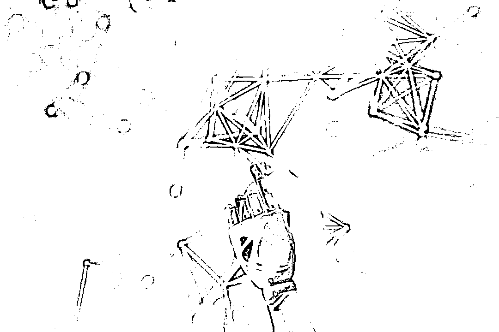

**建立好咨询星图后，你去寻找上升点和下降点的守护星**——即金星/火星、水星/木星和太阳-月亮/土星之间的**天然伙伴关系**。

天蝎座（火星）、水瓶座（土星）和双鱼座（木星）**通常使用传统的守护星**——天王星、海王星和冥王星通常代表非人类的力量。对巨蟹座来说，月亮和太阳都可以看作是它的守护星。

然而，由于太阳和月亮的天然伙伴是土星，而土星经常会带来挑战或宿命的事件，所以不能确定月亮和土星的入相位合相是否会给关系带来任何好处。**如果一个人来咨询是为了寻找爱情，那么当守护星之间有积极相位时，是一个很好的迹象，通常合相也会是很好的迹象，尽管合相会给现有的关系带来阶段性的结束。****月亮在这个过程中也有重要影响。**比如当月亮与上升点的守护星形成相位，接着继续与下降点的守护星形成相位，那么这会帮助实现一段关系。然而，如果月亮只是与下降点守护星形成和谐的相位，其本身并不是一个可靠的关系指征。这是一个很好的迹象，但这绝不是一个确定的事情。**一对已婚夫妇的案例**虽然根据卜卦星图来判断关系的原则很简单，但并不总是那么容易。下面的咨询星图说明了一个有两个孩子的已婚年轻人的情况，她的丈夫最近刚搬出去，这让她很绝望。他们从青少年时期就在一起了。

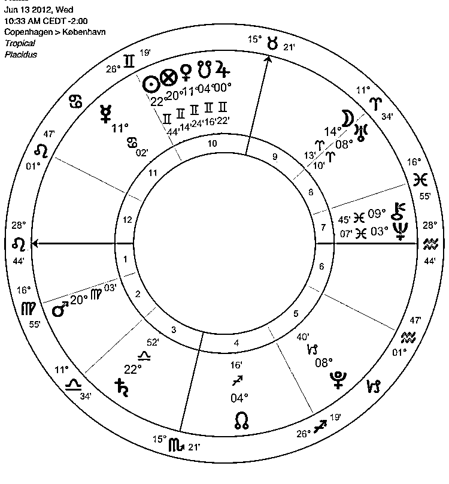

|  咨询星图：2012 年 6 月 13 日 10:33，哥本哈根这张星图看起来对人际关系真的很有利，因为上升点的守护星太阳正好三分了下降点的守护星土星。但丈夫不想再回来，分居一年后，他终于告诉她，他和另一个女人住在了一起。他之前曾声称自己只是有一个室友。回顾一下这里的问题，上升点即将进入处女座，这将使得巨蟹座的水星成为上升点的守护星（水星刚刚遇上天王星/冥王星的四分相，因此受到了创伤）。另一方面，木星刚刚进入双子座（失势状态），接着将四分海王星，海王星正合相下降点。这是他后来显露的行为的完美占星征象。在这种情况下，后一个上升点表明关系处于过渡状态，它曾经是稳定的，但现在不稳定了。对我的客户来说，这段时间的混乱与行进的海王星对分她的月亮相呼应，更明显的是推进的上升点将要合相她的天王星，在这种情况下，这表明这段关系处在结束阶段，她必须开始新的独立生活。**有时候，由于一对行星之间入相位的和谐相位，这些时期对关系来说是极其祥和的。**例如，2013 年 5 月水星进入双子座，木星已经在那里呆了好几个月了。在水星之前，金星在这个月的大部分时间也在双子座，然后在最后一刻，水星将在 5 月 26 日超过金星并合相木星（水星的天然伙伴）。在这种情况下，金星可以扮演多种角色。最初看起来，木星代表的人可能会与金星有关系，但这不会发生，因为水星会先到达木星那里。另一种可能的情况是，金星扮演了媒人的角色，为水星和木星相遇扫清了道路。如果水星或木星守护的星座正在升起（成为上升星座），那么五月底进行的咨询将以这样或那样的形式演绎出这个场景。太阳星座在双子座、处女座、射手座和双鱼座的人也很有可能在这段时间经历幸运的关系发展。水星将代表非常有天赋的人，他们知道自己在做什么，并控制着局面，而木星将代表一个因为处于弱势而筋疲力尽的人——木星自 2012 年 6 月以来一直在双子座失势。

水星和木星合相，在水星（守护双子座）的控制下形成了一段关系，然后它们都将进入了巨蟹座。这对木星来说是一个奇妙的转变——从失势到曜升，所以与水星的相遇将把木星从一个弱势的处境带入一个强大的地方。

随着水星在巨蟹座逆行，这将意味着一段建立在家庭和家人基础上的长期关系。

奇怪的是，前面提到的那位被丈夫抛弃的客户，恰恰就在这个时候安排了一次咨询。她将是那颗水星。也许她会在这个时候恢复，并再次为自己和她的两个女儿找到爱人。也许她们也会搬到一个大房子里去，木星将进入巨蟹座。

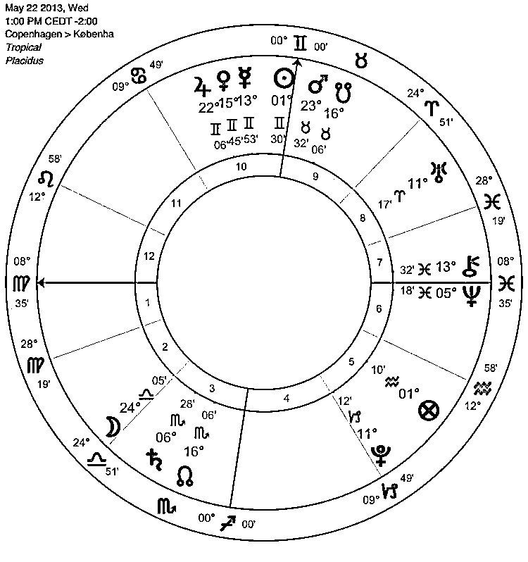

| 咨询星图：2013 年 5 月 22 日 13:30，哥本哈根由于月亮在天秤座，刚刚与水星、金星和木星的星群形成三分相，这些指征表明她的爱情生活有了可喜的发展。水星在自己的星座很强大，与中天合相，尽管这是一个相当紧张的位置，而与凯龙星的四分相显示了她带有的创伤，而水星与金星的合相几乎肯定地显示了她与两个女儿的紧密联系。如果她正在考虑一段新的关系，那么潜在的伴侣将是木星，木星是唯一能在此次会面中获益的星体。在这种情况下，她的前任伴侣很可能是金牛座的火星（他的出生星图中火星在金牛座）。水星带着金星进入与木星的合相，关系形成了，幸福的家庭生活得到了承诺，因为它们都进入了巨蟹座。当然，目前还不能确定，但对于这张即将发生的咨询星图中的有利指征，这是一种可能的解释。

**版权声明：**本文由若道翻译、整理发布，欢迎转发，反对抄袭。友号转载请申请白名单。

艾德里安·罗斯·邓肯

若道签约老师，哥本哈根占星学院院长 1985 年开始成为全职占星师，是人本主义占星、卜卦占星和经世占星学领域的知名占星师。开发了占星软件 AstroClock 和多款占星报告。**现代卜卦占星的课程内容**

**课程分为 5 部分：**

**Part1 **融合现代占星理念，整合动态占星知识**Part2**独家【现代动态卜卦占星技术】全面教学**Part3**学以致用，覆盖人生各个领域问题的卜卦解法**Part4**扩展延伸择时占星技法的新认知**Part5**如何运用卜卦占星学做一场转化性的咨询

**15 节录播课+8 节直播课线上网络课，英文授课，中文翻译。**

**15 节录播课为 2020 年动态现代卜卦课程的内容。8 节直播课则完全是案例教学的形式。**

这样的好处是，你可以通过 1 个半月的密集学习之内按照自己的进度学完录播课的理论和录播课中已有的案例，从学习开始就实践，然后把实践中遇到的问题拿到 8 节直播课中，和老师互动。

**在 8 节直播课中，老师也会用案例教学、和同学互动的方式帮助大家进一步掌握卜卦占星的技法。**

**想要学习占星学？****点击下图了解课程详情**

**

**微信又双叒叕改版啦，不想错过若道君的推送？**

**就把若道设为星标吧！**

**▼**

就是这个“在看”，戳戳戳 ☟

********报名直达入口********

# 想了解你的“前世今生” ？| 让 12 月亮交点醍醐灌顶的几个问题

> 原文：[`mp.weixin.qq.com/s?__biz=MzA5NjA0NTAxNg==&mid=2651470266&idx=1&sn=65b34017d064f0aea8f159d0f608363e&chksm=8b488b0dbc3f021b837a272ef1e705c684290acfe5d8cc4069682f5a011c2143f40b16aea941&scene=126&sessionid=1692737842#rd`](http://mp.weixin.qq.com/s?__biz=MzA5NjA0NTAxNg==&mid=2651470266&idx=1&sn=65b34017d064f0aea8f159d0f608363e&chksm=8b488b0dbc3f021b837a272ef1e705c684290acfe5d8cc4069682f5a011c2143f40b16aea941&scene=126&sessionid=1692737842#rd)

******************☆ **************后台回复“今日”，给你一句生命态度****

作者/大卫·瑞雷 ISAR 认证占星师译者/李含 校对/Arrow 编辑/玫瑰 图片/pexels 文章来源/《风度》杂志

**作者的话**

2010 年我第一次来到中国巡回售书，我与听众们分享了许多在我的书《灵魂的目标》中提到的名人轶事。我解释了这些名人的故事如何与他们出生星图中月亮交点的位置相呼应。那时，中国没有人对月亮交点有太多了解，所以我花了很多时间解释天文学和占星学中的月亮交点是什么。从一开始，我的中国听众和学生就和西方的听众和学生一样，对月亮交点和他们人生故事的核心主题表现出了同样的认同。今天，中国大多数占星爱好者都听说过月亮交点，这是月亮与地球绕太阳的轨道相交的上下两点。当然，我不是唯一一个强调月亮交点重要性的占星师。斯蒂芬·弗里斯特和他的学生们，其中许多人继而成为职业占星师，还有杰弗里·格林和他的学生们，都强调月亮交点。同样，许多人本主义和现代占星师使用月亮交点，这是丹恩·鲁伊尔对后世占星师们的影响。 我自己对这些交点的关注始于 1972 年，甚至远早于斯蒂芬·弗里斯特在其畅销书中的星图中放上月交点。 自从我 1976 年开始从事占星执业以来，我在 26000 多次咨询中和客户讨论到了月亮交点的相关内容。我的学生们都知道我有多么强调在星图解析中使用月亮交点。我总是希望在我的学生们毕业并开始占星实践后，会使用月亮交点为框架来探讨客户的星图。然而，有时我不确定他们中有多少人完全理解这些交点位置与一个人人生故事之间的紧密关联，或者与客户建立有意义的咨访关系时月交点有多大价值。那些继续成功实践占星学的毕业生们似乎明白了月亮交点在他们工作中的价值。 他们在与我交流时，经常说到自己的成功很大程度上源于他们与客户建立的关系，而基于他们对月交点的理解的咨询部分促成了这种关系的发展。试想一下。这些占星师把他们的成功归功于在客户工作中对月亮交点的运用。斯蒂芬·弗里斯特不会对此感到惊讶，我也不会。

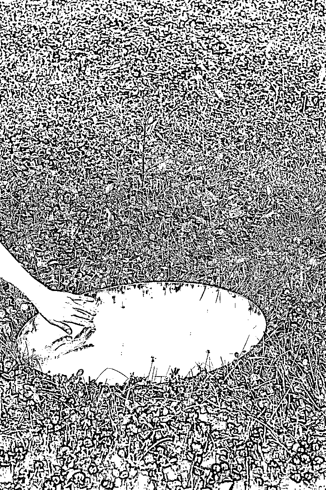

**月亮交点在 12 星座****若道君：****你可以在 app store 或者应用商店搜索“若道”下载 app，输入个人档案，查看本命盘（也可以使用其他星图软件），找到南北交点所落的星座，然后对照下文查看。****例如下图中，比尔·盖茨的南交点在双子座，北交点在射手座。**

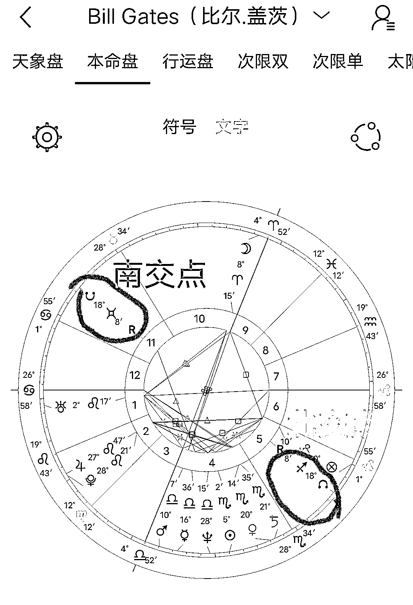

思考以下针对月亮交点在各星座的提问。**这些问题旨在进行自我反省，以帮助“你”探索你的月亮交点对宫星座的普遍议题**。然而，也可以在咨询中改写这些问题，以便与客户进行有意义的讨论。 这些问题提供了一个框架，在这个框架内可以确认和探索客户的核心人生问题。因此，这种互动和探索就构建了一种关系。这种关系构成了成功的、有成就感的占星学实践的基础。我向成千上万的客户提出了各种各样的问题。他们的反应总是会引发对其生活中的核心问题的有意义的讨论。我希望你会发现这些问题富有启发性，有助于帮助你更好地了解你自己和你的人生。

****月亮北交点白羊座（南交点天秤座）****

*   你如何有效地维护自己？
*   你是果断还是倾向于拖延？
*   你的行为通常会带来你想要的结果吗，还是说你发现自己经常与其他人发生冲突，或者感觉受到不公平的对待？
*   你是否能在不过度妥协自己生活的情况下，保持愉悦的人际关系？
*   你的故事中是否有很多在维护自己和与人合作之间的紧张拉扯？

****月亮北交点金牛座（南交点天蝎座）****

*   你容易信任别人吗？
*   你对机会怀疑吗？
*   你是否学会了在生活中更加放松？
*   你是一个有韧性的人吗？
*   你认为自己是幸存者吗？
*   你允许自己享受和拥抱生活的回报吗？
*   你是否安于舒适？
*   你会执迷于失去你所拥有的吗？
*   你害怕你无法控制的事情会破坏你的生活吗？
*   你在生活中创造了稳定吗？ 

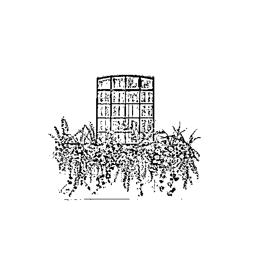

****月亮北交点双子座（南交点射手座）****

*   获得理解对你来说重要吗？
*   你想不想成为一个更好的沟通者？
*   当遭到拒绝时，你是否感觉被误解了？
*   当别人不认同你的想法或观点时，你会采取防御措施吗？
*   去远方探险对你有吸引力吗？
*   徒步旅行或冒险会给你带来幸福感吗？
*   你的观念和哲学是否获得了充分的发展？
*   你喜欢学习吗？
*   你是天生的老师或导师么？
*   你有没有认真考虑过写一本书，或者已经出版了你的大作？

****月亮北交点巨蟹座（南交点摩羯座）****

*   你是个严肃的孩子吗？
*   在某些方面，你比实际年龄更老成持重？
*   你是否重新定义了自己人生中成功的意义？
*   你年轻时是否非常勤奋，愿意做出牺牲，但随着年龄的增长，你会觉得热情不再、意兴阑珊？
*   你至少追求过两种截然不同的职业吗？
*   你能力卓越，但却选择了一种情感上更满足的生活吗？
*   你学会相信自己的感觉并接受自己的情绪了吗？

****月亮北交点狮子座（南交点水瓶座）****

*   你有没有在自信问题上挣扎过？
*   当受到威胁或感到不安全时，你是否倾向于疏离？
*   你是否依靠自己的客观或智力来重新获得一种确定感或幸福感？
*   你生命中的关键时刻是否是那些你决定掌控自己人生的时刻？
*   你有没有去探索自己到底拥有多少勇气？
*   在你的生活中，你是不是在观众角色和舞台中央之间摇摆不定？
*   在你的人生中，自信是否与日俱增？

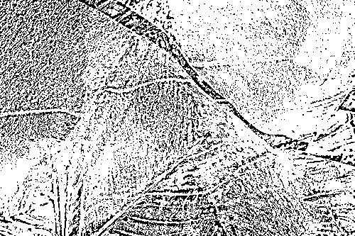

****月亮北交点处女座（南交点双鱼座）****

*   你是否通过更多的专注和练习完善了自己的技能或专业知识？
*   当你感到疲惫或者没有安全感的时候，你是否会感到不知所措？
*   当你不知所措的时候，你会暂时对生活产生幻灭吗？
*   当激励人心的灵感再次出现时，你会变得更加专注吗？
*   随着年龄的增长，你自己的生活态度十分更加务实了？
*   你认为自己是一个现实主义梦想家吗？
*   你是否在非常聚焦和没有焦点的阶段之间波动？
*   你是否曾经感觉自己像一个落入人间的天使？

****月亮北交点天秤座（南交点白羊座）****

*   是不是别人让你着迷，却经常惹恼你？
*   你是否自力更生，但也有兴趣与他人分享你的生活？
*   当你感到沮丧和不耐烦的时候，你会试着独处一段时间吗？
*   当你感到不安或愤怒时，你需要独行一段时间吗？
*   当你开始感到更安全的时候，你想和别人在一起的冲动会再次出现吗？
*   不论有多少关系问题困扰着你，你是否仍然渴望一段充实的关系？

****月亮北交点天蝎座（南交点金牛座）****

*   你渴望体验与生命更深的亲密感，这是否挑战了你同样看重的舒适感？
*   你会说自己在面对变化时很固执吗？
*   尽管你花费了时间和精力来维持生活的稳定，但你最终有没有放弃并接纳改变呢？
*   当你接纳改变的时候，你是否有时会觉得自己一开始就快死了，但后来却感觉更有活力了？
*   你的生活在稳定时期和危机时期之间波动吗？ 

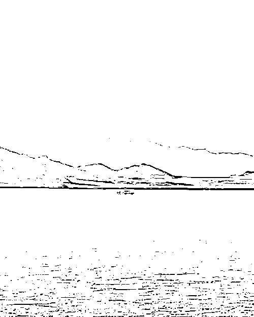

****月亮北交点射手座（南交点双子座）****

*   更自由的生活方式对你来说很重要吗，但是你有太多事情要做，有时这似乎是不可能的。
*   你是否擅长解决问题，但被日常挑战弄得心烦意乱，你开始思考“这一切是为了什么？”
*   旅行和冒险是你探索更多知识和智慧的一部分吗？
*   你觉得你可以做永远的学生，一生都在研究、阅读和学习吗？
*   当你发现一个重要的真理时，这个真理会开始指引你的生活吗？

****月亮北交点摩羯座（南交点巨蟹座）****

*   你是否觉得不管你多大年纪了，你都还没有完全成熟？
*   你孩子的那一面相信你已经是成年人了吗？
*   你是否在克服对失败的恐惧方面取得了长足的进步？
*   你是否已经学会接受失败，但仍然努力追求成功？
*   你是否对自己实现目标的能力更有信心了？
*   你现在自律能力更强了吗？
*   你是否提升了效率，去完成你将要做的事情？

****月亮北交点水瓶座（南交点狮子座）****

*   在人生中做出贡献对你来说重要吗？
*   当你是一个厉害的团队的一员，一起为你的公司或组织做出独创性贡献时，你是否体验到了成就感？
*   你有时会适应环境困难吗？
*   你是否一直在寻找合适的团队？
*   你有强大的自豪感吗？
*   你是否觉得除非你掌控一切，否则事情无法完成？
*   你学会如何授权了吗？

****月亮北交点双鱼座（南交点处女座）****

*   你学会相信自己的直觉了吗？
*   当你感到不安时，你是否会对自己和他人更加挑剔？
*   你是否依赖自己的逻辑来构建安全性？
*   然而，一旦安全了，你会开始倾听自己的感受吗？
*   在你的生活中，灵感是否在重要的方面给予你指引？
*   你是否在极度集中注意力和极度不集中注意力之间波动？
*   虽然你有担忧和疑虑，但你是否学会了对生活更有信心？

**版权声明：**本文由若道翻译发布，欢迎转发，反对抄袭。友号转载请申请白名单。

**喜欢文章请长按下方二维码打赏****给大卫老师加杯咖啡呗~****▼**

**月亮交点线上工作坊**

需求就是所有的一切。有两种人类天性的基本规则可以定义需求：**我们需要获得成就（北交点），我们需要有安全感（南北点）。**  成就感意味着我们在安全感之外渴望某些东西和某些经验，关系着我们的内心向往。安全感意味着我们感到安心，和我们已经建立的参与生活的模式协调一致，关系着我们的习惯。

人类的需求就在成就感和安全感之间来来回回，写下这一生的主题。这个主题与我们人生的发展方向和灵魂的渴望相关。

如果发展方向和灵魂渴望实现的目标了解了，变得清晰可见，那么就更容易知道做出什么样的决定，来让人生变得圆满和幸福。一些困扰的问题也会随之一一迎刃而解了。 **我们这次就跟随大卫·瑞雷一起，进行****为期两天****的寻找之旅，从星图里南北交点以及与此相关元素的解读入手，为我们人生的生命道路找到指引，**看看是朝向哪里，又是一种什么样模式和周期。于是，也会更加容易的掌握自己的命运了。

**南北交点工作坊报名中****长按二维码咨询客服了解更多**

**想要学习占星学？****点击下图了解课程详情**

**

**微信又双叒叕改版啦，不想错过若道君的推送？**
**就把若道设为星标吧！****▼**

**喜欢记得点一下在看哦☟**

**报名直达入口**

# 月亮交点线上工作坊丨和大卫·瑞雷一起，探索生命的方向与潜能

> 原文：[`mp.weixin.qq.com/s?__biz=MzA5NjA0NTAxNg==&mid=2651470266&idx=2&sn=beeaa77eed8b474846be4ef408bc2b2a&chksm=8b488b0dbc3f021bf583d8feefe794222b3993a08d22bad1f332ba44ca38673f6dbe866bab31&scene=126&sessionid=1692737842#rd`](http://mp.weixin.qq.com/s?__biz=MzA5NjA0NTAxNg==&mid=2651470266&idx=2&sn=beeaa77eed8b474846be4ef408bc2b2a&chksm=8b488b0dbc3f021bf583d8feefe794222b3993a08d22bad1f332ba44ca38673f6dbe866bab31&scene=126&sessionid=1692737842#rd)

**生命有如一条河流，有它自己的方向。这是一条从南交点开始的河流，而北交点是这条河流奔去的地方。**

**——大卫·瑞雷**

1

**课程描述**

需求就是所有的一切。有两种人类天性的基本规则可以定义需求：**我们需要获得成就（北交点），我们需要有安全感（南北点）。**  成就感意味着我们在安全感之外渴望某些东西和某些经验，关系着我们的内心向往。安全感意味着我们感到安心，和我们已经建立的参与生活的模式协调一致，关系着我们的习惯。

人类的需求就在成就感和安全感之间来来回回，写下这一生的主题。这个主题与我们人生的发展方向和灵魂的渴望相关。如果发展方向和灵魂渴望实现的目标了解了，变得清晰可见，那么就更容易知道做出什么样的决定，来让人生变得圆满和幸福。一些困扰的问题也会随之一一迎刃而解了。 **我们这次就跟随大卫·瑞雷一起，进行****为期两天****的寻找之旅，从星图里南北交点以及与此相关元素的解读入手，为我们人生的生命道路找到指引，**看看是朝向哪里，又是一种什么样模式和周期。于是，也会更加容易的掌握自己的命运了。

2

**课程目标**

*   帮助大家认识自己的**生命道路的主旋律**，知道我们的生命从哪里来、到哪里去；

*   帮助大家知道如何用占星了解**怎样获得安全感，怎样获得更大的成就感**；

*   帮助大家学会如何**就南北交点提问**，如何发掘我们未知的潜能；

*   帮助大家学会如何从**星座、宫位、相位**解读星图中的南北交点；

*   帮助大家学会如何**以南北交点为切入点**，整合星图的解读。

3

**课程内容**

1.  学习**月亮南北交点星座、宫位、相位**的关键特质。

2.  学习**以月亮南北交点为轴心**，整合星图解读的方法。

3.  从月亮南北交点看**生命周期**，解读相关交点周期。

4.  学习在**占星咨询**中如何就月亮南北交点提问。

5.  同学们可以带着**对于自己南北交点的疑问**，得到自我疗愈的解答和方法。

6.  以**学员星图**分析为例，为大家解开迷惑，做出建设性的指引。

4

**导师简介**

**大卫·瑞雷（David Railey）**

*   曾任 ISAR 全球副主席，ISAR 考试委员会前主席，若道创始人。 

*   被称为占星界的“马可·波罗”，第一位将西方严肃占星学系统教学和多位西方占星学大师引入中国的西方占星师。

*   第一位在美国用电视和广播媒体推广严肃占星学的职业占星师。

*   培养最多中国职业占星师的老师。

*   《灵魂的目标》、《一生的旅程》作者。

*   研究占星 48 年，拥有三十多年的占星咨询的执业经验，其服务客户包括学生、工人、市长、州长、议会议员、企业家、心理咨询师、工程师、艺术家、演员、知名企业家等，客户年龄跨度从襁褓婴儿到耄耋老人（大卫老师的老客户常常是一家三代人）。

*   2010 年 6 月，大卫的书《灵魂的目标》中文版出版。在 2011 年春季的北京之行期间，大卫接受了《南方周末》记者的采访。

*   2010 年，其著作《灵魂的目标》中国版出版，和蒋颖一起创办若道占星学校和其官网 www.nodoor.com。从该年开始，他工作并往返于亚特兰大和北京。目前他 80%的时间致力于在中国教授和推广西方占星学。

*   2017 年，被选为 ISAR 委员会成员（2017）。ISAR 是世界最大的国际占星机构，会员遍布 45 个国家。

**老师月亮南北交点著作介绍：**

《灵魂的目标-从南北交看你的生命道路》

本书主要研究的是占星学中的月亮交点与人生阶段、生命道路之间意味深长的联系。通过几十年来大量积累的个案，作者发掘了十二组月亮交点与人的安全感需求、天赋才华、内在渴望，以及成就感召唤之间的深层联结，并对有关职业发展、亲密关系、亲子关系、生命周期等重要议题进行了精要分析与概括总结。

作者以大量名人故事及咨询个案作具体讲解，立论建立在严谨的逻辑分析和科学实证的基础上；同时，行文又充满意趣，展现出广博的人文视野和丰富的哲学蕴涵。

5

**此次课程适合哪些人？**

*   对占星学有一定了解（L3 以上水平），希望能够深入学习月亮南北交点的知识；

*   职业占星师，希望深入学习，看到大师如何就南北交点提问，解读星图。

6

**往期学员分享**

学员 A：大卫老师的专业和敬业，他的话直指人心，能看到自己更多的可能性，非常鼓舞人心，感恩老师！特别疗愈，智慧，拥有神奇的灵感和想象力。

学员 B：大卫老师总能对占星征象与现实状况和心理模式的对应，作出我们没有想到过的解读。老师的真诚，能感受到他对占星学的投入与对学员的无限关爱，讲解细腻。

学员 C：大卫老师总是迅速在一张星图中抓住要点，然同时用清晰幽默的语言把他的思路呈现给我们。针对星图中呈现的功课，他总能提供温暖有力的治愈，既共情又突破，特别赞叹他的治愈力和感染力。

学员 D：依然是大卫老师的人本主义精神，还有就是这次大卫老师做个案时讲到的庙宇花朵种子的故事，美好又神奇。

学员 E：在职业规划方面得到了新的启迪，让我面对一些曾经想都不敢想的事情，给了自己一些信心和动力去做更有意义的事情   理解 2、6、10 宫的具体职业体现。

学员 F：对于土星、天王星行运对职业的影响有了更深入的理解工作职场的问题和童年经历的联系，让自己豁然开朗。

学员 AA：在看职业的顺序、行星行进对职业的影响方面收获很大,收获了职业占星的基本方法论和思路。

学员 AB：此次加深了几个行星与星座，宫位更深刻的理解，融会贯通，特别讲解案例，对我学习占星有更深刻体会。对职业方面的解散思路更加清晰;听到很多大卫老师的经验之谈，有所启发吧。

学员 AC：老师一步步拆解思维过程，让我了解到拿到一张盘应该如何入手；丰富的真人案例，老师的解盘能立刻与现实事件进行对照，理解更深入了。

学员 AD：看到了大卫老师精湛的占星技艺，若道团队的专业水准，南北交以主题的咨询理念和占星概念特质。在今后的解盘中要磨炼运用。

7

**课程价格**

**正价：6800 元**

**早鸟价：5800 元（4 月 20 日前） **

长按二维码添加课程负责人 Margaret 咨询~

（微信：18515059056，请备注“月亮交点”）

8

**课程时间**

2022 年 4 月 30 日-5 月 1 日   9:00-17:00

9

**退转课程**

**退款原则请详看《教学协议》，如有疑问请咨询课程顾问。**

****2022 月亮交点线上工作坊****

**授课老师：大卫·瑞雷**

**直播课开课时间：2022 年 4 月 30 日-5 月 1 日 9:00-17:00**

**授课方式：******网络授课，英文授课，中文翻译****

**费用：**6800 元**（早鸟价：5800，4 月 20 日前）**

**课程负责人：Margaret**（微信：18515059056，请备注“月亮交点”）

长按二维码添加课程负责人咨询~

****报名直达入口****

# 若道周运 3.28-4.3 丨喜提白羊座新月！宇宙这周有哪些讯息要传递？（内含 12 星座运势）

> 原文：[`mp.weixin.qq.com/s?__biz=MzA5NjA0NTAxNg==&mid=2651470232&idx=1&sn=665939e2baf2d754689896d2933476df&chksm=8b488b2fbc3f023903db64c10e465aaf4ae6853907aebfc3ad15e40663f3f00eaf0e9af3c155&scene=126&sessionid=1692737842#rd`](http://mp.weixin.qq.com/s?__biz=MzA5NjA0NTAxNg==&mid=2651470232&idx=1&sn=665939e2baf2d754689896d2933476df&chksm=8b488b2fbc3f023903db64c10e465aaf4ae6853907aebfc3ad15e40663f3f00eaf0e9af3c155&scene=126&sessionid=1692737842#rd)

******☆ ****后台回复“今日”，给你一句生命态度******

作者/朵三三三 ISAR 认证占星师
编辑/翀子 封面/书君 图片/网络 4 月第一周宇宙天气比较平稳，因为进入了白羊月，我们也可以乘势开始行动啦。12 星座如何度过本周？让我们来看文章吧！（如果着急看 12 星座运势，不妨先拉到最后哦）**整体氛围**

四月伊始，春暖花开燕归来，万物复苏，大地回阳。

**本周的宇宙天气大部平稳，可以说是风和日丽的好时节。**

若无闲事挂心头，便是人间四月天。

**周初，金星与土星合相，周中木星与海王星的合相进入容许度，周末太阳与月亮合相。**

没有四分相和对分相的天空，少了几分矛盾挣扎和针锋相对，多了几分淡然处之和融洽自持。

**月亮一路从水瓶座穿行到白羊座，从克制求稳的氛围，逐渐热烈起来。我们开始行动，开始创造。**

无论此刻的我们正身处怎样的阴霾之中，都有理由相信，**繁花似锦的春光必当如期而至。**

本周重要天象

*   **金星与土星在水瓶座合相**

*   **白羊座新月**

*   **太阳与水星在白羊座合相**

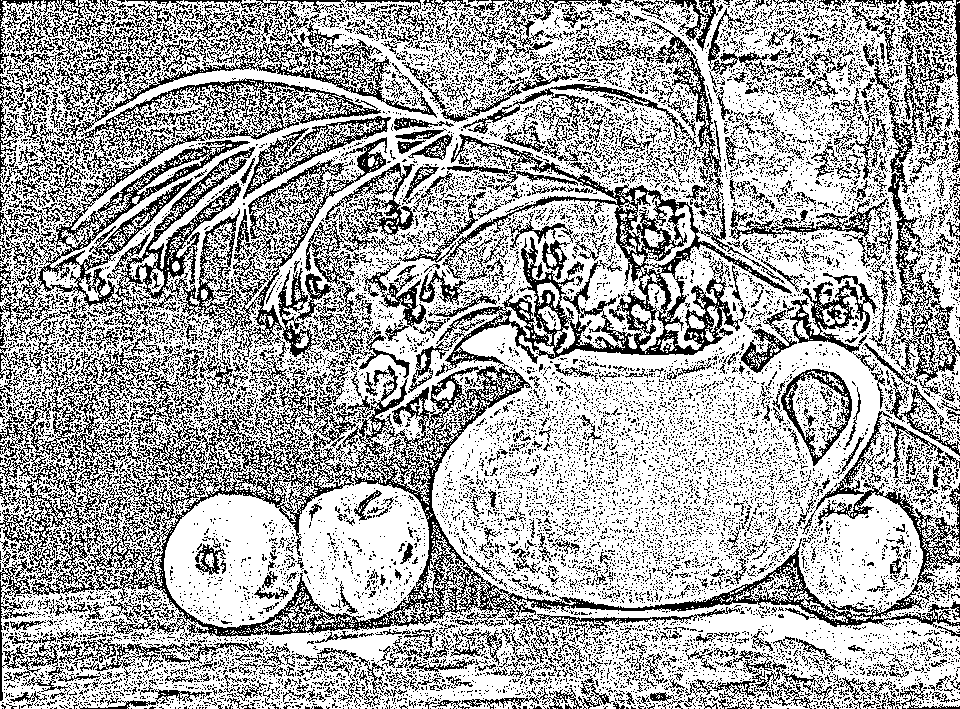

**一周乐曲**

*   **序曲：周初，群星聚集在水瓶座，水瓶座和土星的能量较强，**我们对事物的态度，更侧重于理性、疏离、求实的头脑分析。

*   **中段：随着金星远离土星，月亮来到双鱼座，与木星和海王合相****。**我们在周中的心情更加愉悦，放松，凡事更倾向于从积极乐观的角度考虑，精神生活也变得丰富多彩。

*   **终章：周末就要到来的时候，月亮进入白羊座，新月在这里发生，并与水星合相。**我们更加冲动、爱冒险，思维模式也更加直接。我们喜欢与朋友高谈阔论聊理想，沟通坦率而富有激情。

★ **理性之乐章：星期一与星期二**

曲调较为平铺直叙，音符低沉有力。

群星汇聚水瓶座，而**金星与土星合相是能量的核心。**柔和的金星与冷感的土星交融，为我们的情感或财务生活，带来了一些压力。

可能是客观的阻碍、缩减和限制，让我们无法得到自己当下想要的东西。疫情的持续，让我们不得不将带着金星色彩的社交人际圈进一步缩小，只做土星色彩的有用的事。我们内心会因此不满足，尽管我们知道理应如此。

我们不能抱紧爱的人，不能在此刻就握住对方的手。有些情侣之间的热度下降，爱意仿佛在褪色，自己也变得冷感。

我们内心深处的匮乏感被唤醒，体会到挫败、孤独和不被理解的寂寞，很多人在感情中觉得被卡住，很难接收到对方的爱意，认为对方给不了自己需要的东西。我们因此担忧自己不够爱，或者被爱的不够。

**但实际上我们需要问自己的是，我们真的接纳对方本来的样子吗？我们真正理解这段关系的意义吗？我们有没有换位思考对方表达爱的方式？我们对于情感的预设和期待是否跟现实有偏差？我们的心态有没有阻挡感情的流动？**

土星让我们回到现实之中，看清我们当下的处境。你看到前面的路断了，你似乎无路可走，并且永远抵达不了你想要去的地方，那我们目前唯一能做的事情就是安住当下，以退为进。

当我们是金星时，会感到来自土星的强硬制约，而当我们成为土星，主动承担时，反而能感受到金星带来的和谐。**我们可以主动扛起情感和人际关系中的责任，学会节制与成熟的对待欲求，我们可以静一静，退一步海阔天空。**

我们学习土星的耐心，等待命运在合适的时间揭晓答案：你不是得不到想要的，你也值得拥有最好的，只是会晚一点收到这份礼物而已。

当金星与土星映照在财务领域时，这很可能意味着，我们会在此刻极为强烈的感受到手中金钱的不足，我们觉得自己赚的钱完全不够，必须要开源节流，斩断一些欲望，和满足愉悦感的消费。

**金星与土星的合相非常有助于我们做出，对于人际、情感、财务领域贴合实际的评估和认知，我们有机会拥有更加理性的视角，得出切实可行的方案。**

★ **逐梦之乐章：星期三与星期四**

**月亮进入双鱼座之后，**气氛变得梦幻起来，曲调也开始柔和悠扬。

这时的我们，更想沉浸在自己的精神世界中，我们愿意相信美好的事物，产生牺牲奉献，舍己为人的心态。

**我们在这个天象下，会变得更加包容，愿意接纳和付出。**若前两天人际关系经历低谷期，这两天有望回暖，再度亲近起来。

我们或许敞开内心，获得一次坦诚、治愈、有助于彼此成长的对话机会。我们也可能主动分享资源，因此收获他人的慷慨和善意。

月亮与木星合相，适合朋友或家人之间的聚餐，一起享受美食，获得内在的满足感。而月亮与海王星的合相让我们有机会接触到超越日常的奇幻体验，或许通过电影、音乐、绘画、梦境获得。

这两天我们可能有些嗜睡、赖床、慵懒，那么**尽量让自己多休息放空，**惬意享受淡泊悠闲的节奏。多冥想，多捕捉灵感，读喜欢的书，看喜欢的电视剧，在美妙的精神家园中徜徉，是这两天正确的打开方式。

**当然，也有些事情需要警醒：**

*   **一是，**我们容易逃避问题，美化事物。去仔细检查那些看上去过度美好的事情，若有问题迫在眉睫、亟待解决，我们也要适时从梦境中出来面对现实。

*   **二是，**渴望奉献的心态容易被人利用，甚至欺骗，此时界限感也成为重要的课题。

*   **三是，**我们非常敏锐，很可能被他人的负面能量影响心情。保护好自己的磁场，照顾好自己的心境非常重要。

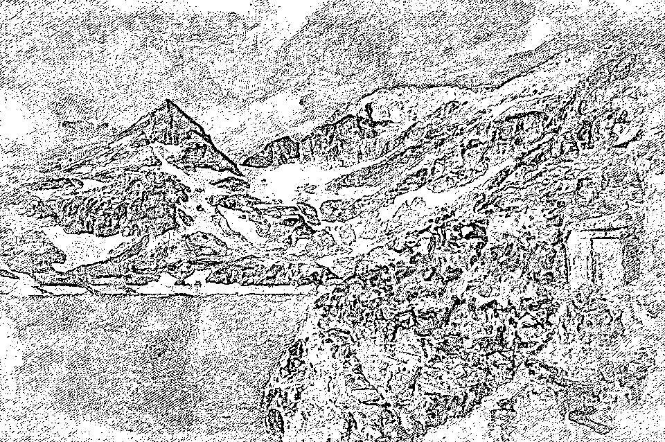

★ **冒险之乐章：星期五、星期六与星期日**

乐曲变得高亢激昂，节奏加快。

月亮来到了白羊座。4 月 1 日周五，白羊座的新月在此发生，而水星也将在 4 月 3 日周日，与太阳合相。

新月让我们想要成为屠龙的勇士。我们将不再满足于做白日梦，而是真刀真枪的拼搏一场，大展身手。

白羊的守护星火星在水瓶座行进，透露出我们想要改变世界的踌躇满志，以及不走寻常路的勇气。我们不甘于停留在原地，我们想要继续前进，我们需要做新的事情，和从未有过的冒险和尝试。

黄道第一个星座，也是第一个开创星座的白羊座能量，与新月结合在一起，**必将开启一个全新的征程。**此时很容易忘掉过往的伤感和惆怅，带着全新的眼光步入未来。

**每个人都能在不同领域感受到新的开始！**有些人认识了新朋友，有些人开始了新工作，有些人学习了新课程。

水星在此，让我们的语言扔掉了委婉和装饰，我们可能会说出，或者接收到一些带着伤害性的信息，但它的背后或许并没有恶意，只是一颗与你一样的，想要被看见的炙热心灵。

**此时的我们需求也很简单，就是初始的快乐。**新鲜、有趣、好玩，可以满足我们的好奇心，就够了。我们出发了，像孩子一样，打算去征服世界。

一切终章，皆是序曲。

**一切才刚刚开始。**

**12 星座一周运势**

**（重点参考上升星座，其次参考太阳星座）**

***白羊座***

过去一段时间，你们较为低调内敛，但从这周开始，你的整体运势开始提升了！**表达互动的欲望增强，你更容易成为人群中的焦点人物，被看见，被关注。**

人际关系方面，你更倾向于**一对一交流**，一对多的场合难免有拘束感。

周初可能对一些工作任务安排不满意，但周末前后，极有可能收到一个好消息，或者你关注的重要事项，有新的进展。

***金牛座***

周初，在事业或学业上略有挫败感，感觉付出和收获之间有落差，**也需要注意与上司、领导和权威之间的关系，**或许生出摩擦或距离感。

周中，有机会在团体中认识到对自己**有帮助的朋友**。

周末，财运开始提升，对自己金钱方面也有新的规划。**灵感不断涌现，**很可能突然就明白一些让你烦恼已久的困惑。

***双子座***

周初，可能通过**人际关系**，接触到一些新的兴趣爱好，或者某些人的一句话引起了你内心的深入思考。

周中，**工作上有一些机会**让你崭露头角，正在准备求职跳槽的人也会收获好运。

周末，**非常适合跟朋友见面聚会**，往往能触发意想不到的机遇。有些双子座进入到新的团体，组织之中，或者对于自己的交友圈有了新的想法。

***巨蟹座***

周初，可能需要处理一些比较**严肃的金钱议题**，其中牵涉到朋友或者合作关系。

本周可能有**出行计划**，或者与搬迁有关，这些事情让你快乐，对未来充满希望。

周末前后，部分巨蟹座离职或入职**，开始职业上的新生涯。**有在公众面前发表言论的机会，例如演讲，作报告。

***狮子座***

本周你**与伴侣的关系可能有些紧张**，其中涉及到一些现实层面的平衡，例如谁在感情中付出更多，或者金钱问题的分配。**有合作伙伴的狮子座**，彼此之间也会经历磨合的过程。

金钱上有好运，可能有意外进账或分红。考试、面试方面也可能收到好消息。

***处女座***

经过了一段比较繁忙的时光，**有些事情进入收尾阶段。**周初你较为疲惫，需要注意关节、骨骼方面的老旧病痛复发，也可能有些遗留事项需要你再次处理，也要耐心与人配合协作。

本周伴侣关系较为亲密，感情升温，可能度过一段浪漫时光，但临近周末的时间，对关系太在意容易引起焦虑，要**尽量放轻松对待。**

财务上有新动向，可能有新的投资、理财项目开启。

***天秤座***

过往一段时间，你的情感生活较为活跃。这周初会有一个节点，**让你去处理情感关系中较为严肃的问题，**大概率在周末有结果。

有稳定伴侣的，两人对未来有了新的规划，单身的，有迈入新感情的可能性。有些天秤座可以**落实新合作**，部分项目与远方、异地有关。

本周工作运势较为顺利，**节奏偏缓慢，**内容较清闲。

***天蝎座***

周初家中有一些事务要处理，可能是跟父母长辈之间的关系，也可能是财务方面的问题。**日常多了一些新的规划，**例如决定开始运动，也可能是养宠物。

情感方面，本周容易对恋情有比较多的幻想，也有较多创作的灵感。单身的天蝎座，可能在**聚会场合**遇见跟自己合拍的人。

***射手座***

还是学生党的射手座，可能在学业上会经历一个**严肃的选择**，或许是跟亲近的人深入沟通后的决定。

**本周比较宅，**在家里会度过一段开心的时光，可能拿出一些时间布置家居，也会买一些新的家具装饰房间。

部分射手座在本周有望开始新的恋情，有子女的，可能在孩子方面收到好消息。

***摩羯座***

周初，在财务方面会经历**短暂的压力和焦虑**，可能是一笔款项发生了延迟，或者有较大额度的支出。

本周你可以通过**多跟亲近的人聊天**来平复心情。

周末，家中或有喜事发生，可能是你在工作、个人方面的重要事项，获得了家中长辈的认可。

***水瓶座***

周初在人际、情感方面有重要决定，或者是财务金钱方面的一个决策。此时你的情绪不是非常稳定，**需要有更多的耐心等待结果。**

周中，你可能通过买买买来平复心情，在金钱上对自己很大方。

周末，你可能有出行计划，也可能是准备一些资料文件，**进入到新的工作，或学习计划中。**

***双鱼座***

周初，你依然不是特别想要社交，更喜欢独处的时光，会有一些事情，让你严肃思考人际关系中的界限感，也可能会与越界的人认真沟通，**解决相处模式中的问题。**

周中你的心情较好，能够享受爱人或者亲人的陪伴。

周末前后，**你有机会获得一笔较大的进账，**部分双鱼座可能升职加薪，得到钱财方面的鼓励和肯定。也可能是通过谈判沟通，争取到新的合作项目而得财。

**版权声明**：原创文章由作者授权首发于若道平台发布，欢迎转发，反对抄袭。友号转载请申请白名单。

****

****朵三三三****

ISAR 认证占星师

全职占星师/塔罗师/国家三级心理咨询师 

人大文学学士/德国慕尼黑大学文学硕士

**微博/微信公众号**：朵三三三

长按打赏

**学习占星学****点击下图了解课程详情**

**

**微信又双叒叕改版啦，不想错过若道君的推送？**

**就把若道设为星标吧！**

**▼**

**喜欢记得点一下在看哦☟**

**报名直达入口**

# 雷蒙德·梅里曼金融占星周运 | 4 月或将迎来上涨行情

> 原文：[`mp.weixin.qq.com/s?__biz=MzA5NjA0NTAxNg==&mid=2651470232&idx=2&sn=03b7590d27375148d23c69ca2bb199a4&chksm=8b488b2fbc3f0239bd8ac2e9bff3d8281a94597445d318d10a306d4d6e48a2b2c02019f938c0&scene=126&sessionid=1692737842#rd`](http://mp.weixin.qq.com/s?__biz=MzA5NjA0NTAxNg==&mid=2651470232&idx=2&sn=03b7590d27375148d23c69ca2bb199a4&chksm=8b488b2fbc3f0239bd8ac2e9bff3d8281a94597445d318d10a306d4d6e48a2b2c02019f938c0&scene=126&sessionid=1692737842#rd)

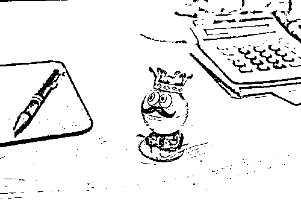

作者/雷蒙德·梅里曼 译者/Luke
编辑/玫瑰 图片/pexels

雷蒙德·梅里曼是在金融占星学界稳坐第一把交椅的占星师，同时他也是若道签约的金融占星课老师，我们引进了雷蒙德·梅里曼老师的《[上证指数月度报告](http://mp.weixin.qq.com/s?__biz=MzA5NjA0NTAxNg==&mid=2651470181&idx=1&sn=69c248709bdc518b2e58236b802e80bc&chksm=8b488bd2bc3f02c4ce70d642da1670983877d3ce09fe99911c635c8e90b0d95ab332e84ee2b9&scene=21#wechat_redirect)》及《[黄金报告](http://mp.weixin.qq.com/s?__biz=MzA5NjA0NTAxNg==&mid=2651470181&idx=1&sn=69c248709bdc518b2e58236b802e80bc&chksm=8b488bd2bc3f02c4ce70d642da1670983877d3ce09fe99911c635c8e90b0d95ab332e84ee2b9&scene=21#wechat_redirect)》。我们经老师的授权，将每周刊登梅里曼老师的周运，供大家参考和学习。于是，这是本周的周运（3.28-4.1）。

**说明：以下时间采用纽约证券交易所所在地美国东部标准时间。**

**展望与回顾**

****

**最常见的抵押贷款利率再次飙升。据《抵押贷款新闻日报》报道，上周五美国 30 年期固定抵押贷款的平均利率大幅上升至 4.95%。**

**“这是本周第二次抵押贷款利率上升，使得本周与 2013 年缩减恐慌最糟糕的一周相当，那一纪录前些天还从未受到挑战”。《抵押贷款新闻日报》的首席运营官马休·格雷厄姆如是说。**

**——黛安娜·欧利克****《本周抵押贷款利率第二次跳涨，飙升至接近 5%” 》****www.cnbc.com****2022 年 3 月 25 日****随着投资者信心增加，相信美联储提高利率能遏制通胀，同时经济能够承受乌克兰不断升级的战争，美国股市连续第二周反弹。****标准普尔 500 指数本周上升 1.8%，将过去两周的增幅扩大为 8.1%，是 2020 年末以来最强势的涨幅。****——本·艾森和安娜·赫滕斯坦****《股市创下 2020 年末以来最大的两周涨幅》****www.wsj.com****2020 年 3 月 25 日**2 月 16 日-3 月 7 日期间，金星、火星两度合相，已经证明对黄金、白银、美元或任何货币市场具有重大的意义。正是在这一时期全球大多数股票市场触底，要么在俄罗斯入侵乌克兰的 2 月 24 日到达底部，要么在 3 月 7 日到达次低点。正是在这一时期的 3 月 8 日，黄金、白银和原油触顶。

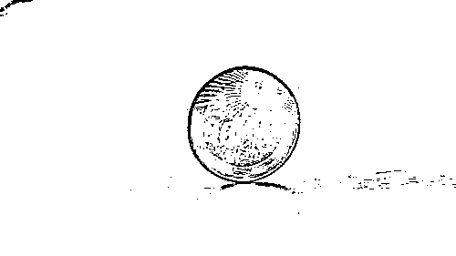

比如说，在美国，所有三个主要股票指数都于 2 月 24 日完成了基本周期、8 个月周期和 23 个月周期低点。跌幅从道琼斯工业平均指数的 12.66%到纳斯达克指数的 22.5%（标准普尔指数从 1 月初的历史高点下跌了 14.6%）。**当多个周期同时触底时，下跌幅度可能是几个月来最严重的。**我们在最近的在线讲座上预测，这次的跌幅将会大于前一次的最大跌幅，即 2020 年 10 月末的 10.46%，但不及 2020 年 3 月 23 日道琼斯工业平均指数和其他世界指数的 38%。从 2021 年 11 月（纳斯达克指数）和 2022 年 1 月（标准普尔指数和道琼斯工业指数）的历史高点下跌，是自 2020 年 3 月 23 日新冠病毒肺炎大流行低点以来，最剧烈的下跌。但是自 2022 年 2 月 24 日或 3 月 7-9 日的低点以来，大多数全球主要指数已经上涨超过 10%。那是自 2020 年末以来最强势的 2 周上涨。道琼斯工业平均指数实际上落后了，到 3 月 25 日的高点，仅上涨 8.33%。其他全球指数飙升得更高，例如日本日经指数和德国 DAX 指数，过去 2 周的涨幅分别是 14.8%和 16.09%。诸如此类较短时间内剧烈的上涨，常常发生在基本周期和长周期展开时，尤其当大量地球宇宙学征象在如此短的时间段展开时，比如 2 月 16 日-3 月 7 日。此外，上周金星和火星也四分了天王星。事实上，更多的征象正在发生。黄金、白银、原油和比特币上周也出现了可观上涨。黄金在 3 月 8 日于 2078.80 与历史高点形成双顶后，剧烈下跌（接近 200 美元），一周后在 3 月 16 日到达低点 1895.20。但是随后上周它涨回到了 1967.20。白银也从 2 月 3 日的低点 21.98 爆涨至 3 月 8 日的年度高点 27.49，涨幅 25%。它在 3 月 16 日下跌至低点 24.55，随后在 3 月 24 日周四反弹至 26.16。

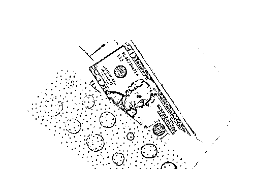

比特币更令人兴奋，在 3 月 25 日上涨至高点 45120，自 2 月 24 日的低点再次上涨 31.5%。以太坊更加令人印象深刻，在同一时期涨幅接近 40%。原油上涨了 24%，在 3 月 15 日俯冲至 93.53 后，于上周飙升至高点 116.64。**短期占星趋势和长期考量**

****

**我们人类是匹配模式的动物，占星学是宇宙中最宏大的模式匹配游戏。**

**——亚历山大·博克瑟****《天堂的计划》****美国诺顿出版公司****纽约****2020 年**自 2 月 16 日以来，金星和火星与土星和天王星之间的舞蹈，从市场分析角度来看令人印象深刻。它们与周期研究很好地对应起来。这场舞蹈将于 4 月 5 日结束。但随后一首新的小夜曲，名为**木星、海王星合相**将开始演奏。**它将持续到 4 月 30 日那场不同寻常的日食，届时金星也会在双鱼座的末段加入木星和海王星合相。****有可能全球股指会继续上涨到那个时候，**因为 14 年一次的木星-海王星的合相作为行星周期，比金星、火星与土星和天王星的相位更重要，影响力更持久，后者作为行星周期长度仅仅略超过 2 年。甚至在这场金星、火星与土星、天王星的舞蹈中，也存在一些变化可能对应了突发和剧烈的反转。2 月 24 日美国股市的绝对底部，仅仅比 2 月 16 日和 3 月 6 日两次金星-火星合相的中点早了一天。3 月 7 日的次低点，也发生在 3 月 6 日金星、火星最后一次合相的后一天。仅仅比金星和火星与冥王星三重合相晚了 2 个交易日，那时金星和火星离开摩羯座进入水瓶座，把冥王星抛在身后。上周，金星和火星随后在这出史诗歌剧/舞蹈中开始了另一首咏叹调，因为它们与天王星形成了四分相。这一场舞蹈的下一幕将在 3 月 29 日-4 月 5 日上演，届时爱神金星和战神火星将合相土星。木星和海王星于 4 月 12 日在双鱼座合相，随后金星将在 4 月的最后一周传递这两颗行星的光线，它们的合相象征灵性祝福与合作。

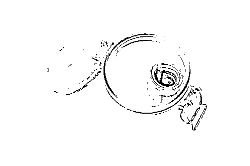

说到木星与海王星在双鱼座合相，我们之前讨论过的一个议题可能正在浮现。这个相位带来了自由的活动，对应了过去两年间许多人遭受的封锁和限制的结束。正如曾提到的，这种新的自由也与粗心行为增加相关，导致新变种病毒在全球快速传播。记住木星-海王星合相是一个宇宙天象，象征可以再次享受生命和自由。但如果不小心的话，那也是一个让人们更容易遭受另一轮感染的时期。**当非理性繁荣的感受再次袭来，享受生活，在市场中赚钱，但是也要负责保护好自己。从过去两年中的错误中学习。**爱上春天（那是木星合相海王星想要的，也是金星和火星没打架的时候想要的），享受世界各地人们和社会中涌现的团结。

**说明：以上日期基于纽约证券交易所所在的美国东部标准时间，由于存在时差，中国地区可能需要加一天。**

**版权声明：**本文由若道翻译发布，欢迎转发，反对抄袭。友号转载请申请白名单。

**雷蒙德·梅里曼（Raymond Merriman）**

若道签约老师。著名金融占星师，ISAR（国际占星研究协会）前主席，梅里曼市场分析公司的总裁。他由于“提升了占星学的职业形象”，在 1995 年国际占星大会上被授予轩辕十四奖；在 2012 年国际占星大会上，被授予轩辕十四终身成就奖。

1“中国上证指数月度报告”发售**若道推出了****中文版****的雷蒙德·梅里曼中国上证指数月度报告，并持续发行该报告！**当把金融市场的周期和占星学的周期相结合时，雷蒙德·梅里曼老师的金融占星学研究**为投资者应对金融市场的周期波动，并随之调整投资策略提供了极大的价值参考**。
**4 月中英文报告已上线！**2“黄金价格周期月度报告”发售**若道推出****中文版****的雷蒙德·梅里曼黄金价格周期月度报告！**不仅仅为广大读者在中国股市的投资出谋划策，更将视角放眼黄金市场。**每当世界经济形式不明朗的时候，有一个地方是保值的港湾，那就是****黄金**。自 1982 年雷蒙德·梅里曼出版第一本研究《地球宇宙学征象与黄金价格的关联》的著作以来，**他一直作为最重要的黄金市场时机预测者之一享誉国际**。2022 年 4 月黄金报告已上线，梅里曼老师将会告诉你他对这个关键时期如何操作的想法。也可以按照季度和一年期订阅，有更多优惠。季度和年度的好处是，你可以持续了解梅里曼老师对于不断在变化的市场的看法。即便他某一次看法和市场不一致，你也看到在下一期他如何调整自己的看法，并看到金融占星在一个长期时间段内对你把控风险的帮助。而能够长期控制风险、尽量找到安全的投资时机才是投资的长久之计。**4 月中英文报告已上线！****购买套餐**，买得越多越优惠中国上证指数月度报告套餐价

*   **单月报告**：280 元
*   **3 个月套餐**：780 元（260 元/月）
*   **12 个月套餐价**：2400 元（200 元/月）

**长按下图识别二维码****购买金融报告****套餐****▼**

黄金周期月度报告优惠

*   **双报告年度套餐更优惠（直降 900 元）**

*   **12 个月黄金报告+12 个月上证指数报告：仅需 3900 元**

**长按下图识别二维码购买黄金报告套餐**▼

3《2022 年金融预报和沙龙》1976 年以来，由雷蒙德·A·梅里曼撰写的梅里曼市场时机学院每年一次的年度预报沙龙和每年一本的《年度预报》一直在应用占星学原理为投资者们服务，提供卓越洞见，从未间断。 **雷蒙德·梅里曼《2022 年金融预报和沙龙》发售中（报告已发布）。****长按下图识别二维码了解详情**
▼

**点击阅读原文购买金融报告**

# 在激烈的火天四分相下，你在本周有哪些经历与感悟？

> 原文：[`mp.weixin.qq.com/s?__biz=MzA5NjA0NTAxNg==&mid=2651470225&idx=1&sn=c341e41b284f8f3de38dc2d3ccdcd410&chksm=8b488b26bc3f0230f970acca14df317003f8b477111d094983af263b92bdf6cdf2f1a945b9f7&scene=126&sessionid=1692737842#rd`](http://mp.weixin.qq.com/s?__biz=MzA5NjA0NTAxNg==&mid=2651470225&idx=1&sn=c341e41b284f8f3de38dc2d3ccdcd410&chksm=8b488b26bc3f0230f970acca14df317003f8b477111d094983af263b92bdf6cdf2f1a945b9f7&scene=126&sessionid=1692737842#rd)

**2022 年 3 月 27 日天象：**

*   **08:55 月亮进入水瓶座**

*   ******15:44 水星进入白羊座******

*   ******金星合相土星******

月亮一大早进入水瓶座，今天你可能希望拥有自己的独立空间与时间，想一些稀奇古怪的事情，从日常琐碎里脱离出来。金星与土星的合相，让我们在面对金钱与关系的议题时，希望回归现实。而水星，会在下午离开双鱼座、进入白羊座，并会在此停留至 4 月 11 日。这个时期的交流，人们喜欢目标明确，直奔主题。在[【本周天象】](http://mp.weixin.qq.com/s?__biz=MzA5NjA0NTAxNg==&mid=2651469769&idx=1&sn=d8b1ab16a79bb1050c5445c1979734b3&chksm=8b48857ebc3f0c68004d63775bf2848b29212e7c0c69db0118f4a3b5ebce3373fb89bd230b7d&scene=21#wechat_redirect)里，火星与天王星的四分相被凸显，你可能感受到某种焦躁，想要完全按照自己的心意做一些大胆的事；或行事冲动，没有经过深思熟虑。在激烈的火天四分相下，你经历了什么事情、又得到哪些启发呢？欢迎跟我们分享呀~此外，本周发生的坠机事件给我们带来很大震动，在双鱼座能量依然浓厚的氛围下，你一定对生活与生命本身有了更多的感悟，也欢迎留言跟我们聊一聊。周日快乐！我们明天见！**了解每日天象，可****下载“若道”APP 查看****还有更多精彩等着你哦**

# 木海合相就要来了，上证和黄金怎么走？丨梅里曼 4 月上证+黄金报告上线！

> 原文：[`mp.weixin.qq.com/s?__biz=MzA5NjA0NTAxNg==&mid=2651470181&idx=1&sn=69c248709bdc518b2e58236b802e80bc&chksm=8b488bd2bc3f02c4ce70d642da1670983877d3ce09fe99911c635c8e90b0d95ab332e84ee2b9&scene=126&sessionid=1692737842#rd`](http://mp.weixin.qq.com/s?__biz=MzA5NjA0NTAxNg==&mid=2651470181&idx=1&sn=69c248709bdc518b2e58236b802e80bc&chksm=8b488bd2bc3f02c4ce70d642da1670983877d3ce09fe99911c635c8e90b0d95ab332e84ee2b9&scene=126&sessionid=1692737842#rd)

| 上证指数日 K 线图

上证指数在过去一个月经历了最疯狂的下跌。

随后，金融工作会议的召开，让上证找到了政策的底部，因此开启了触底反弹。现在的问题是，**这个底部是不是确定了，有没有实质的支撑？**

在 3 月份的上证报告中，雷里曼老师写道：

**“当前的 13-20 周基本周期始于 11 月 10 日的低点 3448。因此 2 月 21 日开启了本轮周期的第 15 周。最近的低点，1 月 28 日的 3356，在这个周期的第 11 周出现。它跌破了开启周期的那个低点，这意味着这个周期是看跌的，也就是说最终的低点——最低的价格——将在基本周期结束时出现，它会在接下来 5 周的任何时间出现。”**

****

| 上证指数周 K 线图

这个低点 3023 出现在 3 月 16 日，13-20 周的基本周期的第 18 周，也即 3 月报告中所预测的第 4 周内出现了。

正如我们在上次所提及，**从技术角度看，今年的 3 月和 7 月都是关键月份。**3 月份的政策底部已经出现。市场还会再次试探这个底部吗？

**4 月木海合相，上证会怎么走？**

2022 年 4 月应该如何操作，金融占星大师雷蒙德·梅里曼的**《2022 年 4 月上证指数报告》已上线，**你可以听听梅里曼老师的看法。

**《2022 年 4 月黄金报告》也已上线，欢迎购买。**

**4 月上证报告上线**

**上证指数月度报告价格****单月报告**：280 元/月 **季度套餐价格**：780 元（260 元/月）**年度套餐价格**：2400 元（200 元/月）**长按下图识别二维码购买上证指数报告**
▼

“**黄金是金钱。其他的只是信贷。**

**——约翰·皮尔庞特·摩根**

”

| 黄金走势日 K 线图
黄金价格在 1 月 28 日探底 1780，在乌俄战争爆发后持续上涨到 3 月 8 日的 2018.8，2 个月上涨 13.4%，同时也和 2020 年 8 月的最高点 2089.2 形成双顶。

正如过去所说，**今年最重要的一个天象是 4 月 12 日发生的木星-海王星双鱼座合相。**这个合相通常会造成一种歇斯底里的气氛。由于大规模的货币超发，通货膨胀率在美国已经达到 40 年来的新高。战争造成石油和粮食价格高起，也进一步推动通货膨胀。而在木海合相时期，很可能成为黄金看涨的助推力。同时，美联储已经开始收紧货币政策，这将会看涨美元，对贵金属构成看跌压力。

从天象看，接下来一个月，火天、火土可能也会造成战争的升级。**而木海合相越来越近，在激烈的战事和通货膨胀阴影笼罩之下，黄金会上演最后的上涨吗？**

黄金报告已经上线，上证报告本周也将上线。欢迎了解。**也可以按照季度和 1 年期订阅，有更多优惠。**季度和年度的好处是，你可以持续了解梅里曼老师对于不断在变化的市场的看法。即便他某一次看法和市场不一致，你也看到在下一期他如何调整自己的看法，并看到金融占星在一个长期时间段内对你把控风险的帮助。**而能够长期控制风险、尽量找到安全的投资时机才是投资的长久之计。**

点击阅读原文，雷蒙德·梅里曼黄金周期 2022 年 4 月报告带来有 40 年黄金市场研究经验的世界著名金融占星大师雷蒙德·梅里曼对当前黄金市场的研究。

**也欢迎购买雷蒙德·梅里曼《2022 年金融年度预报和沙龙》，《2022 年四位占星大师天象预测》课程，这些预测都将帮助你对 2022 年的变化加深了解。**

**投资有收益，投资有风险，希望金融占星学的研究帮助你更好地评估你的投资。**

**扫描下图二维码了解详情**

▼

**2022 年 4 月黄金报告上线**

**黄金月度报告价格****单月报告**：280 元/月 **季度套餐价格**：780 元（260 元/月）**年度套餐价格**：2400 元（200 元/月）**双报告年度套餐更优惠（直降 900 元）****12 个月黄金报告+12 个月上证指数报告：仅需 3900 元****长按下图识别二维码购买黄金报告**
▼

**购买者需知**

**① **梅里曼市场时机学院《中国上证指数月度研究报告》是梅里曼市场时机学院（以下简称 MMA）的研究“预报”，而不是市场“预测”，是梅里曼老师及 MMA 金融占星分析师对人类活动周期历史与行星周期之间相关性的研究，二者在大部分情况下具有 80%或更高的相关性，而不是因果关系。报告中的研究完全存在错误的可能性。即便是非常认真的研究和几十年的研究经验，金融占星师无法总是正确地解读出各种征象在实际层面上会如何相互作用，并显化为事件结果。

所以请将报告看作一个研究参考，务必结合其他市场研究和你个人对市场的理解，根据你的自由意志做决策。

**②** 此报告一旦售出，**即不接受退款。**

**③** 上证、黄金月度报告每月固定 1 期，**并非都是在每月相同日期发布。**

**④** **我们收到英文报告的当天，即发布该英文报告。3 天后，上线报告中文版。此报告仅支持手机网页阅读，不支持电脑阅读和下载。****以上须知，请仔细阅读。一旦付款，即视为已了解并接受所有须知内容。**在过去的 40 年中，唯有梅里曼逐渐完善，并在梅里曼市场时机学院月度周期报告中阐释了将地球宇宙学与周期相结合的研究方法，以惊人的精确性预报了黄金价格发生重大变化的时间。**黄金购买 Tip**

各大银行均可购买黄金或黄金 EFT 基金，也可以在诸如天天基金或者支付宝购买黄金及黄金相关产品。不明白的可以百度搜索。

**购买后如何查看报告？**

**购买后有疑问怎么办？**请联系技术客服
**微信：nodoor201705**

**购买上证+黄金报告直达入口**

# 太阳天蝎座与 12 星座月亮丨“你的激情与深刻，因谁而释放？”

> 原文：[`mp.weixin.qq.com/s?__biz=MzA5NjA0NTAxNg==&mid=2651470116&idx=1&sn=68fb9ddee0671591ebae843cf2b38431&chksm=8b488b93bc3f02853f1cb8bcde25868c1c1500478eda9c4773dd1d3f93b3239a8a5fc956d999&scene=126&sessionid=1692737842#rd`](http://mp.weixin.qq.com/s?__biz=MzA5NjA0NTAxNg==&mid=2651470116&idx=1&sn=68fb9ddee0671591ebae843cf2b38431&chksm=8b488b93bc3f02853f1cb8bcde25868c1c1500478eda9c4773dd1d3f93b3239a8a5fc956d999&scene=126&sessionid=1692737842#rd)

☆****后台回复“今日”，给你一句生命态度****

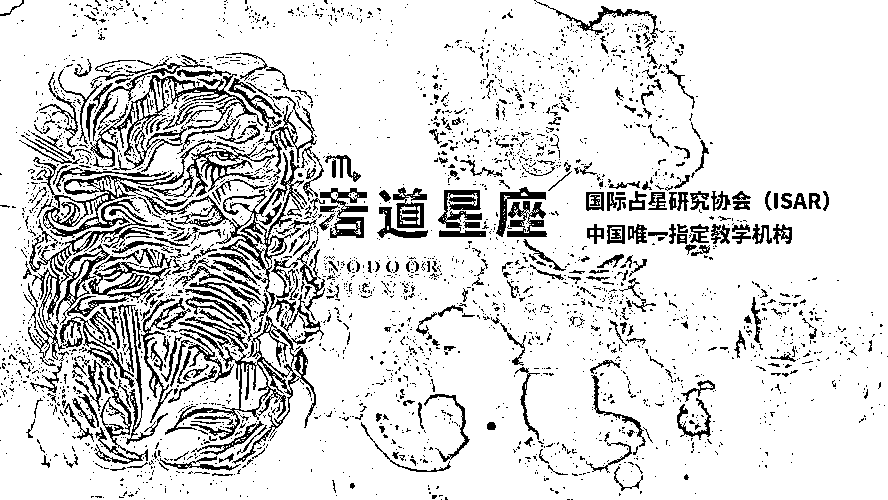

作者/诺·泰尔 译者/江艺、dogcatcher 编辑/翀子 封面/书君 图片/网络太阳是生命的伟大能量，而月亮被认为是人格中的“主导需要”，同样被重视（你可以点击[【开篇】](http://mp.weixin.qq.com/s?__biz=MzA5NjA0NTAxNg==&mid=2651463192&idx=2&sn=7ecd2012aee1f245b56e0f107bdfc19e&chksm=8b48acafbc3f25b968e9ca8cbe8acf6972dc3e418827b36ac12af7bf7c81858937657babb393&scene=21#wechat_redirect)，查看诺·泰尔老师对此部分内容的详细阐述）。当天蝎座太阳，遇见 12 星座月亮，分别有哪些表现呢？**太阳天蝎座和 12 星座月亮**

**★月亮*****白羊座***

天蝎太阳座深刻地聚焦自尊，白羊座月亮充满活力地策动自尊，**它们创造了一个现实主义的、充满生机的个性框架**。他们常忠诚于人，而非忠诚于观念想法。

这个配置的感情谱系极度宽广——从自鸣得意的胜利感到尖刻辛辣的怨恨。他们（内心和行为上）的争执感和搏斗感会激起麻烦。**在爱情和事业追求中**表现得热情、费力、虚荣又徒劳。

**他们要对他人的感受、对人际关系更加敏感**，才能改良个性，带来优雅高贵的言谈举止。 

**★月亮*****金牛座 ***

**天蝎座宽广的生命能量获得了令人惊叹的结构感**。这个配置用宏大的方式构想生活中的一切。如果个性中情感的部分没有因为强烈的企图心而失控，他们对物质世界的建构能力是令人敬畏的。**乐观和务实联姻**：能抓到老鼠就是好猫。

但如果情感的部分占得上风，金牛座的**结构感**就会跌落到野心之下，轰然塌陷之后，被急躁的自尊所遮盖。 

**★月亮*****双子座 ***

双子座的社交能力、取悦他人的天赋、幽默感、口齿伶俐和多样性，在这个配置中获得了**实质感，找到了根基**。然而，犹豫不决仍然威胁着个性的稳固，他们需要依靠专注力和计划来面对生活，而非简单的情绪反应。 

**★月亮*****巨蟹座***

吸引力，自信。他们有着**极端的敏感和情绪和情感的扩张性**；他们需要把别人吸拢过来分享自己的情绪和情感。猜忌和精明伴随着他们的情感诉求。

**倘若已经获得了安全感，有明确的生活目标，**他们对感情的接受力和理解力就能得到应用，成为难得的个性优势。但如果安全感被削弱，以上情结就会溶解为对轻微情绪的小题大做和争论不休。 

**★月亮*****狮子座***

稳固的观点、**坚定的感情和明确的目的性**是他们性格的长处。危险之处在于，个性中情感的维度（天蝎座）会随着个性发展而失控，以至于只把内心需求的一小部分引人注目地表现出来（狮子座）。

他们容易为他人**设立非常高的标准**，并苛求他人依附于自己。言行之中总是漂浮着感情用事。只有这种举止背后的复杂的人生观得到理解和调整，**放松对他人的期望，拓展自己的服务意识，**该配置的内心紧张才能得到消解。 

**★月亮*****处女座 ***

处女座精确的思维同天蝎座深刻的自我情感认知相组合，这个配置的人**对自己的观点、立场和个性一清二楚，毫不存疑**。他们往往流露出对规矩和典范的重视，却以牺牲性格的开放性成分作为代价。

**只有在自己展现智力、获得情绪安全感和自我认可的基础上，他们才能培养成就感和企图心。**

他们总**乐于改良和锻炼智力**。他们还有种试探他人是否支持自己观点的倾向，但前提是自己比对方的社会地位、级别要高一些。他们总是用自己的观点看待万物。 

**★月亮*****天秤座***

炙热的天蝎座默认大家和自己想得都一样（月天秤则代表渴求他人的欣赏）。因而在**人际关系的网络**中，常会发生堵车，受到教训。

天蝎座的自信终究学到一个**社会化的处世基调**，用批判、区分和识别来保护自尊，理想主义变得俗气不堪。

**★月亮*****天蝎座***

这个配置**聚焦了天蝎座的创造力与深刻**。在创造性的、宽广的感情表达中，或是对生命奥秘的学习中，他们有着巨大的心理能量和动物性的魅力。

**他们需要自律**，才不至于在两性关系、哲学观点和行为中表现得太有统治欲。他们的虚荣心很强，渴求欣赏与认可；个性强势而犀利，常能迅速洞悉他人的弱点，并为其感到惋惜。

传教士精神策动着他们向外界传达自己的世界观，籍此攀上纪念碑式的自我信念的顶峰。**留给他们的挑战，是去分享，而非去命令**。 

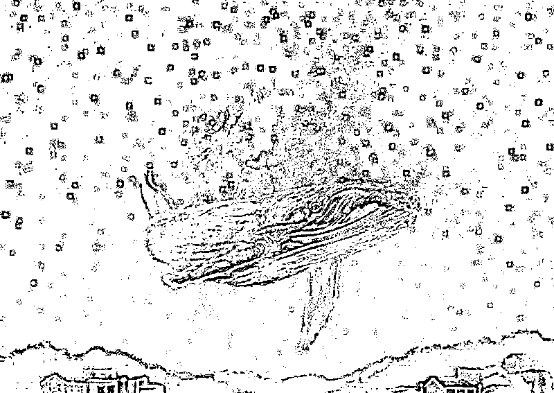

**★月亮*****射手座***

射手座月亮将天蝎座太阳理想主义的一面拔苗助长。他们的**哲学观念经常和内在情感脱钩**，因而总是有一些内心无法预期的人生困惑。他们越是自我反省，就越容易对生活现状视而不见。

荣誉感和伦理感吸引从内心最深处呼唤着他们，而有趣的是，这种对高尚的迷恋，背后的诱因却是模糊不清的。 

**★月亮*****摩羯座***

天蝎座的生命力、吸引力和动物性的机警从摩羯座月亮处获得了明确的目标和支配欲，他们因而**能谙熟自己的处世策略，并冷静无情的贯彻它**。

**权威大于一切：**谁是重要人物，就该讨谁欢心。一旦他们陷入失败的境地，自尊的“发现—战斗”机制就会被激发。他们能像权衡谋略一样去权衡自己该持什么立场。性对他们的自信心很重要。

风度与魅力只是暂时的考量，使用权力和才干完成手头的任务，才是当务之急。他们**需要一个足够高远和高尚的目标**来把手腕提升到最为优雅的形态。 

**★月亮*****水瓶座***

水瓶座的人文情怀软化了天蝎座的虚荣与高傲。他们需要掌声和喝彩，但只是在自己知道已经付出努力、完成任务的时候。

他们**有着高远的理想加上几乎清晰可见的企图心**，因而会设定很高的目标，并能深刻地认识苦难和奋斗对生活的意义。他们是爱憎分明的人，但在行动和付出中，而不是需求和索取中，爱憎分明才能流露得最可爱。

在水瓶月亮的支持下，**天蝎座在社会环境中找到了立足点**，全力以赴、坚持不懈地迈向目标。

**★月亮*****双鱼座***

**富有灵感的知性主义**。双鱼座月亮的敏感和接受性提炼、净化了天蝎座太阳情感的广度和探索欲。理性引领着他们的内心活动，在概念、感受和理念当中不断地进行区分。

他们的内心世界能够愉悦自己，并能在生活不如意的时候提供一种内在的温暖。他们**对正确和正义的事物有着本能的向往**。 

**版权声明：**本文由若道翻译发布，欢迎转发，反对抄袭。友号转载请申请白名单。

**本系列其他文章**

[太阳白羊座·12 星座月亮](http://mp.weixin.qq.com/s?__biz=MzA5NjA0NTAxNg==&mid=2651463192&idx=2&sn=7ecd2012aee1f245b56e0f107bdfc19e&chksm=8b48acafbc3f25b968e9ca8cbe8acf6972dc3e418827b36ac12af7bf7c81858937657babb393&scene=21#wechat_redirect)丨[太阳金牛座·12 星座月亮](http://mp.weixin.qq.com/s?__biz=MzA5NjA0NTAxNg==&mid=2651463523&idx=1&sn=69fa5ba9035316fecd6c3911e744f089&chksm=8b48add4bc3f24c274cd5064316982ae958debed1e9ab681b46b80d8d8ec26bb3d2036075be9&scene=21#wechat_redirect)[太阳双子座·12 星座月亮](http://mp.weixin.qq.com/s?__biz=MzA5NjA0NTAxNg==&mid=2651465406&idx=1&sn=c9bf1ba49b07f6c67740c46779200be8&chksm=8b489409bc3f1d1fdad398e34840d6338275f29a8292e9eb404df28126fcc8262c454b2cb6c5&scene=21#wechat_redirect)丨[太阳巨蟹座·12 星座月亮](http://mp.weixin.qq.com/s?__biz=MzA5NjA0NTAxNg==&mid=2651465949&idx=1&sn=9dfd930de39b2de38c761152f4b8710c&chksm=8b489a6abc3f137c5c6e96f404038de7f4261fc6c995aeb285bc37f79b96ef5a1d237dbe3af5&scene=21#wechat_redirect)[太阳狮子座·12 星座月亮](http://mp.weixin.qq.com/s?__biz=MzA5NjA0NTAxNg==&mid=2651467312&idx=1&sn=d1a81f5cc1a60b3198d9c0ba770b4ba0&chksm=8b489c87bc3f1591008c88cef7b385086eb7717d4345926de92349b071ad10ceb67099f17ed0&scene=21#wechat_redirect)丨[太阳处女座·12 星座月亮](http://mp.weixin.qq.com/s?__biz=MzA5NjA0NTAxNg==&mid=2651467590&idx=1&sn=09b8f5ba9fa46e469e0add987cbe1664&chksm=8b489df1bc3f14e7a4e6b90286394af16e05f4c097058a2e2402d38f2634a0a84b32aaa03fe3&scene=21#wechat_redirect)[太阳天秤座·12 星座月亮](http://mp.weixin.qq.com/s?__biz=MzA5NjA0NTAxNg==&mid=2651469157&idx=1&sn=c8b14b4a67b6c6ed3b7943c136d7c34c&chksm=8b4887d2bc3f0ec46e3b444c2f1ba1f331d5d0b35326aa75e77351fdde762f0fd1c6d43ada5c&scene=21#wechat_redirect) 

**诺·泰尔**

现代占星学鼻祖，世界众多著名西方占星师的占星老师。他毕业于哈佛大学社会关系专业，是当今世界上最重要的占星师之一，占星联盟协会（AFAN）的创始人及原主席。其所著的三十三本占星教科书作为占星教学的典范，引领了整整两代占星师的占星学习与教育，1998 年国际占星大会（UAC）授予其占星界最高奖项 “轩辕奖”。

**20 位来自世界各地的占星师****带来 20 场沙龙——新世界的觉醒****详情可点击下图**

**学习占星学****点击下图了解课程详情**

**

**微信又双叒叕改版啦，不想错过若道君的推送？**

**就把若道设为星标吧！**

**▼**

**就是这个“在看”，戳戳戳 ☟**

****************报名直达入口****************

# 我们学习卜卦占星学，究竟是在学习什么？

> 原文：[`mp.weixin.qq.com/s?__biz=MzA5NjA0NTAxNg==&mid=2651470116&idx=2&sn=856c343d4cb0fbba0123a0de9c95eff5&chksm=8b488b93bc3f0285c111d5bdccc50d69deb2357029545d55c6c82e5dccb52032691adeffd5cb&scene=126&sessionid=1692737842#rd`](http://mp.weixin.qq.com/s?__biz=MzA5NjA0NTAxNg==&mid=2651470116&idx=2&sn=856c343d4cb0fbba0123a0de9c95eff5&chksm=8b488b93bc3f0285c111d5bdccc50d69deb2357029545d55c6c82e5dccb52032691adeffd5cb&scene=126&sessionid=1692737842#rd)

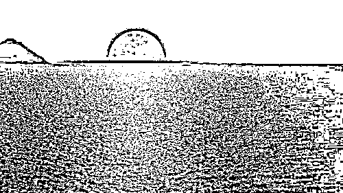

采访/若道君 

译者/李含 校对/Arrow

编辑/玫瑰 图片/pexels

**学习卜卦到底为了什么？**提到卜卦，你的脑海里首先会想到什么？——算算算——算得准不准，准不准——给我算算我丢的钥匙在哪？     ——你的钥匙大概在....——给我算算我明年是否能结婚？  ——你明年是否能结婚啊，你看你的卜卦盘上的......——给我算算......                             

——别急别急，我给你算算......

这是我们学卜卦的目标吗？

若道君觉得，不管学啥，第一要义是要弄清楚这门学问的目标是啥，比如物理学的目标是研究物质、能量的本质与性质，以及它们彼此之间相互作用；化学的目标是研究物质的性质、组成、结构、以及变化规律......一把龙泉剑，有的人用它杀猪、撬锁；有的人用它披荆斩棘；有的人用它斩妖除魔；有的人用它切断尘丝。立意不同，结果不同，道途不同。

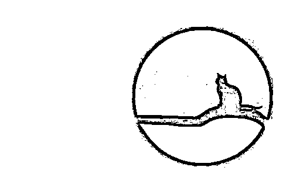

**你拿它做啥？**这是我们对哥本哈根占星学院院长、现代卜卦占星学老师艾德里安·邓肯的第一问。***问：*****我觉得，当我们看一张星图的时候，我们怎样解读取决于我们的目标，我们的意图。对您而言，在您运用卜卦占星学这么多年后，您觉得卜卦占星学最重要的目标是什么？换句话说，我们解读卜卦盘，想要从那里求得什么？****艾德里安·邓肯：**卜卦占星学是对当下发生的事情的觉知。它时刻与当下行星的运动一致。**卜卦占星学最重要的目标是活在当下，理解此时此刻如何囊括一切事物。*****问：*****卜卦占星学最重要的目标是活在当下！这真的是一个具有强烈佛学视角的观点，让我耳目一新。我记得您在一篇文章中还说转化很大程度上是基于对现实感知的改变。** **我这些年也越来越了解看见真正的现实的确是一项巨大的挑战，因为我们自以为自己看到的现实其实都是通过自己的星图的滤镜中折射过来的现实，有各种形式的幻象，而我们却信以为真！****所以我能不能这样理解，当您说卜卦占星学是对当下发生的事情的觉知，您指当我看看到这张卜卦图，它可以告诉我们清醒地看到更多现实，或者指出哪些是我们的幻觉，因为卜卦星图将我们的“当下”置于显微镜下观察？这帮助我们有更清醒的觉知，而这种觉知让我们更好的活在当下。**

**那么，你能不能举个例子，帮助我们的学员更深入地理解这一点呢？**

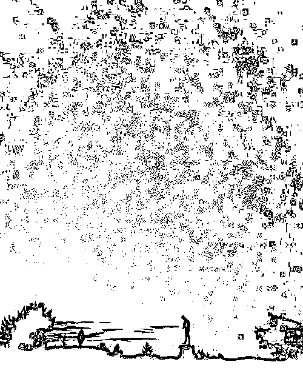

**艾德里安·邓肯：**是的 ，我就是这个意思。出生星图展现的是我们体验现实的滤镜。卜卦或者咨询星图（卜卦图的一种应用）就像是一个放大镜，显示了出生星图中哪些主题正在此时此地被激活。

举个例子。我有一位客户出生星图中木星落在第 9 宫双鱼座 24°，合相第 8 宫的双鱼座 20°太阳。而在咨询星图中，这个太阳/木星的合相重现，木星在第 9 宫，太阳则落在第 8 宫。

多么不可思议啊？一年后她再次来咨询，这次的咨询星图中太阳/木星合相在第 8 宫合了第 9 宫头！显然，这里有一个非常重要的主题。我针对这个主题深入探索。原来她在国外和一个已婚男人有染。但是追其原因，原来她小时候，父亲每年都带她去度假岛一次（太阳/木星在双鱼座），以便于他在那里和秘书偷情，而孩时的她不得不保守秘密。我的客户以前从未意识到二者的相似性，但在咨询之后，她明白了。因此，她做出了改变。

**版权声明：**原创文章由作者授权发布于若道平台，欢迎转发，反对抄袭。友号转载请申请白名单。

**现代卜卦占星的课程内容**

**课程分为 5 部分：**

**Part1 **融合现代占星理念，整合动态占星知识**Part2**独家【现代动态卜卦占星技术】全面教学**Part3**学以致用，覆盖人生各个领域问题的卜卦解法**Part4**扩展延伸择时占星技法的新认知**Part5**如何运用卜卦占星学做一场转化性的咨询

**15 节录播课+8 节直播课线上网络课，英文授课，中文翻译。**

**15 节录播课为 2020 年动态现代卜卦课程的内容。8 节直播课则完全是案例教学的形式。**

这样的好处是，你可以通过 1 个半月的密集学习之内按照自己的进度学完录播课的理论和录播课中已有的案例，从学习开始就实践，然后把实践中遇到的问题拿到 8 节直播课中，和老师互动。

**在 8 节直播课中，老师也会用案例教学、和同学互动的方式帮助大家进一步掌握卜卦占星的技法。**

******想要跟随邓肯老师学习卜卦占星学？******
**点击下图了解详情**

**学习占星学****点击下图了解课程详情** 

**

**微信又双叒叕改版啦，不想错过若道君的推送？****就把若道设为星标吧！****▼**

就是这个“在看”，戳戳戳 ☟

********报名直达入口********

# 为什么喜欢的人，是你没发现的另一个自己？（内附 12 下降星座指南）

> 原文：[`mp.weixin.qq.com/s?__biz=MzA5NjA0NTAxNg==&mid=2651470065&idx=1&sn=1b5b4205fe865b7d26bf9590f5b1d655&chksm=8b488a46bc3f035088d0834987c71037a6a6c3b2d931d7b968d54e2ad1ffdebdc44bf38f50d6&scene=126&sessionid=1692737842#rd`](http://mp.weixin.qq.com/s?__biz=MzA5NjA0NTAxNg==&mid=2651470065&idx=1&sn=1b5b4205fe865b7d26bf9590f5b1d655&chksm=8b488a46bc3f035088d0834987c71037a6a6c3b2d931d7b968d54e2ad1ffdebdc44bf38f50d6&scene=126&sessionid=1692737842#rd)

**☆****后台回复“今日”，给你一句生命态度******

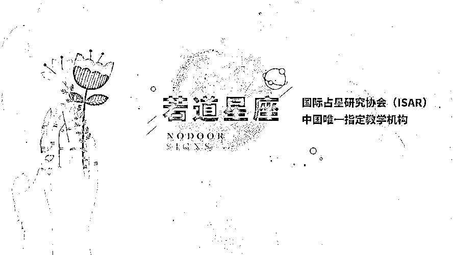

作者/妮可·高德特

译者/江艺 校对/Chang

编辑/翀子 封面/书君 图片/网络

上升星座和太阳、月亮被称为星图的“三驾马车”，而上升星座的对面是下降星座，它与第七宫关联，描绘了我们喜欢和吸引的人的类型。可你知道吗，你喜欢的人常是你没察觉的自己的另一面，而下降星座也告诉了我们，如何在自身找到平衡。**上升点的对面：下降点**

你出生星图的每个部分，都显示你自己和你生活的一些东西，每个位置表示不同的东西。

**最重要的三个部分——太阳星座(内在的自我)、月亮星座(情感的自我)和上升星座(外在的自我)——构成了你到底是什么样的一个人的基础。**

但”你不是谁”呢——至少在意识层面上你不是谁?

**与上升相对的星座被称为“下降”。它与你生活中的人相关，通常与第七宫关联。**

占星学中有 12 个宫位，每个都掌管我们生活和个性的不同部分。**第七宫通常称为关系宫，因为它显示了你拥有的关系和你吸引的伴侣类型。**

下降点和第七宫是他人导向的——它是你在别人身上、而非自己身上看到的。这并不意味着你的下降点和第七宫不存在于你的个性和生活中，只是**你倾向于将下降点和第七宫能量投射到其他人身上，直到你最终学会将其注入自身之中。**

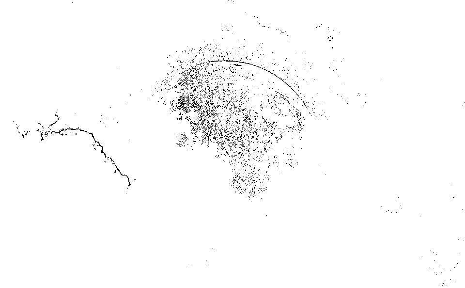

**下降点的基本知识**

所以，你现在知道了，**下降点正对着上升点。**这意味着它们位于黄道上**两个相对星座**的轴线上。

**如果你不知道相对的星座是什么，以下是列表：**

*   **白羊座与天秤座相对**

*   **金牛座与天蝎座相对**

*   **双子座与射手座相对**

*   **巨蟹座与摩羯座相对**

*   **狮子座与水瓶座相对**

*   **双鱼座与处女座相对**

**上升点或上升星座，是你外在的自我，也就是你呈现给世界的“你”，你将自己呈现给他人的方式。**你的上升星座通常与太阳星座不同（有 1 / 12 的几率它们在同一星座中），所以这就解释了为什么大多数人给人的印象和我们本来的样子不同。

**对于自己的上升点，我们是非常有意识和觉知的，因为它是我们给人的印象。**事实上，我们倾向于在上升星座表现得最好，因为我们想让别人觉得我们比实际上更好（啊，人类！）

所有这一切都意味着与上升点相对的星座——**下降点，是我们可能拒绝出现在自己内在的东西。**

它几乎是我们个性和生活的阴影面，**但当我们与他人打交道时就会显露出来。**我们有这一部分，但是，虽然我们很容易在别人身上看到这些特质，在自己身上却看不到。

**我们可能投射或反射它，**因为不想在自己身上看到这些品质，或者我们**可能欣赏别人身上的这些品质，却不敢接受它们出现在自己身上。**

因为**下降点是我们所吸引的人和我们所拥有的关系**，这就解释了为什么，吸引我们的人，常常是那些**我们认为拥有我们希望的特质的人**，或者是**拥有我们自己没有的优点的人**。这也解释了为什么，我们经常吸引那些**体现我们阴影自我的人。**

不过，这完全是一个认知和选择的问题。我们不必拒绝自己的这些特质，相反，**我们可以致力于找到一个平衡点！**

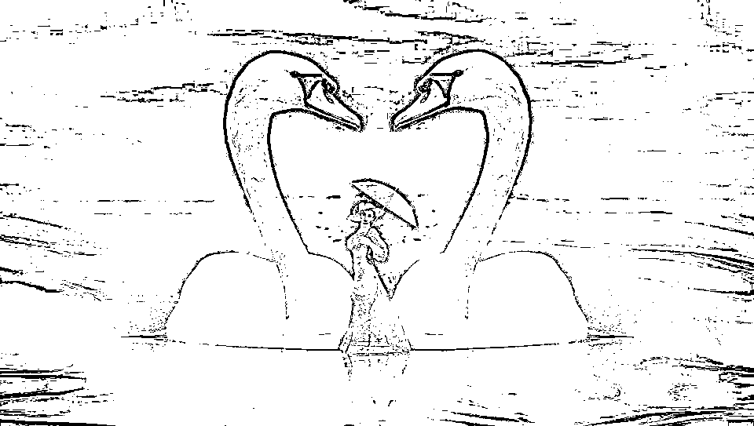

**上升和下降：平衡的轴线**

**上升和下降，是关系的轴线，与自己的关系(上升点)，与他人的关系(下降点)。**

当你看一张出生星图，有宫位，有行星，不同的落点都描绘出来，上升和下降构成的直线正好穿过你星图的正中，这意味着**这条轴线也非常关注平衡。**

当与这两个星座相关的能量失去平衡时，你的整个生活大概就失去平衡了。

因此，在你生命中的某个时刻，有意识地认识你的下降点是很重要的，就像认识你的上升点一样。**拥抱你的阴影面，看看你一直在拒绝什么。**

**你在生活中选择或吸引的伴侣有共同的特征吗？**也许这正是你所拥有但不想看到的、需要去工作的特质；或者是你想拥有但却不敢敞开怀抱，需要鼓起勇气去接纳的。

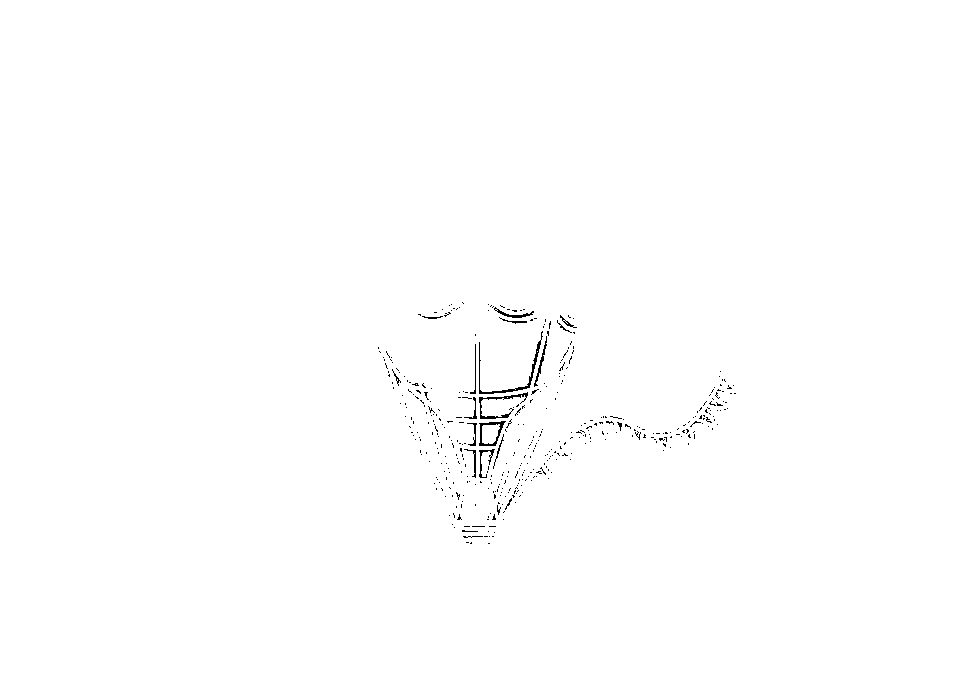

**下降点在 12 星座****★*****白羊座*****下降点**

**这意味着天秤座是上升星座，**所以你给人的印象是折中、迷人、令人愉快。

拥有白羊座下降点，**你可能会吸引那些热情、果断的人和天生的领导者。**这些都是你可以设法在自身之中利用的特质。

**认识到你自己的领导能力，在不咄咄逼人的情况下掌握主动权，并找到自己内心的激情。**

**★*****金牛座*****下降点**

**这意味着你的上升星座是天蝎座，**所以你给人的印象是神秘、深沉、严肃。

拥有金牛座下降点，你可能会吸引懒散、享受当下和实际的人。**找到你内心的这种能量，学习控制你激情能量的技巧，变得更有成效，开始活在当下。**

**★*****双子座*****下降点**

**这让你拥有射手座上升点，**所以你给人的印象是冒险、乐观、自由。

拥有双子座下降点，你可能会吸引那些与周围环境更紧密相连、好奇、参与的人。**学会稍稍缩回你的视野，更好地了解你周围正在发生的事情，并与你的日常生活建立连结。**

**★*****巨蟹座*****下降点**

**这让你有一个摩羯座上升点，**所以你给人的印象是自律、负责、成熟。

拥有巨蟹座下降点，你可能会吸引那些给人滋养、敏感、与自己情绪相协调的人。**与你的情感自我建立连结，认识到你情感中的力量。滋养自己，对自己的情感和欲望保持敏感。**

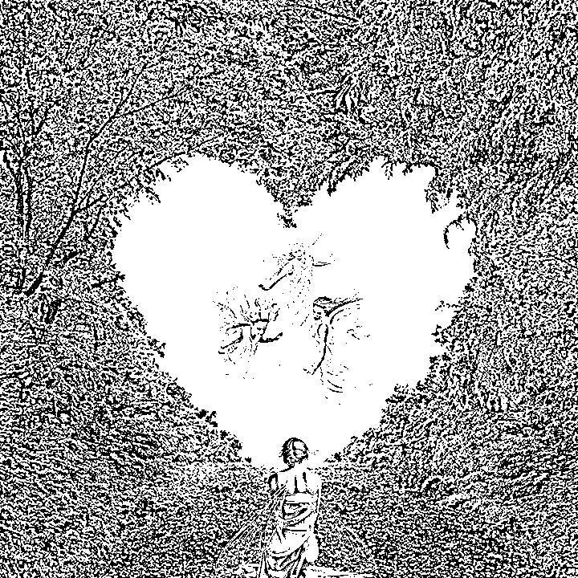

**★*****狮子座*****下降点**

**这给你一个水瓶座上升点，**所以你给人的印象是独立、愿意接受改变、富有创造力。

拥有狮子座下降点，你可能会吸引喜爱娱乐、富有创造力和深情的人。**一种强大的创造性思维可能就潜藏在你的内心，**准备好并等待被接纳，当你愿意放下屏障，与自己的内心建立连结时，这可能就会实现。

**★*****处女座*****下降点**

**这给了你双鱼座上升点，**所以你给人的印象是甜美、适应性强、直觉敏锐。

拥有处女座下降点，**你可能会吸引细致、勤奋和实际的人。**更多地拥抱这种能量，可以帮助你更好地运用你的想象力和直觉能量，**并让你更容易专注于生活。**

**★*****天秤座*****下降点**

**这给了你白羊座上升点，**所以你给人的印象是果断、精力充沛、随时准备出发。

拥有天秤座下降点，你可能会吸引公平、妥协和体贴的人。当按自己的方式做事行不通的时候，**学会如何更加妥协和体贴会对你有所帮助，你可以在关系中创造更多和谐。**

**★*****天蝎座*****下降点**

**这让你拥有金牛座上升点，**所以你给人的印象是随和、可靠、冷静。

拥有天蝎座下降点，你可能会吸引那些充满激情、善于研究、深沉的人。**对自己的激情能量感到更加舒适，并努力更深入地挖掘自己，**这样你就能以有益的方式转变，找到自己的内在力量。

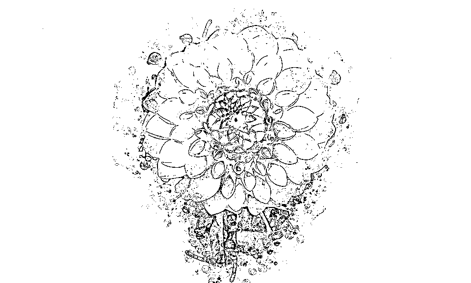

**★*****射手座*****下降点**

**这给了你双子座上升点，**所以你给人的印象是好奇、好交际、可爱。

拥有射手座下降点，你可能会吸引**冒险、勇敢和智慧**的人。**认识到你也有这样的能力，**努力获得知识，并通过生活经验将其**转化为智慧**，控制你的焦虑能量，这样你就能变得更勇敢。

**★*****摩羯座*****下降点**

**巨蟹座是上升星座，**你给人的印象是滋养、支持和理解。

拥有摩羯座下降点，你可能会吸引雄心勃勃、实际而专注的人。**与你内在的抱负建立连结，**认识到你值得和其他人一样拥有你想要的一切，**你也有能力取得成就。**

**★*****水瓶座*****下降点**

**狮子座是上升星座，**所以你给人的印象是富有创造力、戏剧性和有趣。

拥有水瓶座下降点，你可能会吸引创新、善于改变、客观的人。**学习如何退一步，以更广阔的视野看待自己的生活和未来，**并与大众联系起来，做出你想要的改变，产生你想要的影响。

**★*****双鱼座*****下降点**

**这让你有一个处女座上升点，**所以你给人的印象是务实、细节导向、有条理。

拥有双鱼座的下降点，你可能会吸引那些被直觉、想象力和同情心引导的人。**拥抱你直觉、灵性和敏感的面向。**不要害怕迷失在其中；你太实际了，不会迷失的，你肯定会保持足够落地。

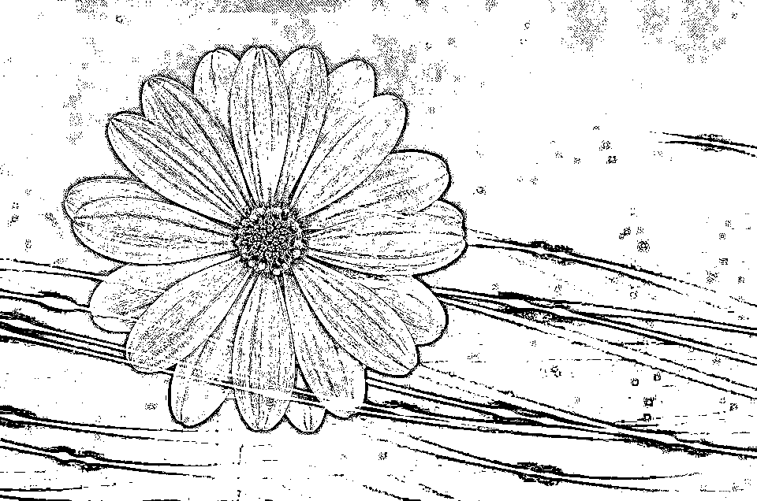

**与你的下降点保持连结**

**关注你吸引的人的主要特征，意味着你实际上看到了自己的一部分。**我们会被这样的人所吸引，他们拥有的特质是我们想要在自己身上培养的，或者我们需要在自己身上认识到这些特质，才能获得灵魂的成长。

**在你们的关系中，你灵魂的真相会浮现在你面前，**如果你把在伴侣身上看到的特质，看作是你自己的“另一面”，那么你就能够利用这些特质，**因为你也拥有它们。**

**如果你认为这些特质是消极的，找到积极的表达方式，把这种特质转化为力量。**

**现在就去运用你下降点的能量吧！**

**版权声明：**本文由若道翻译，欢迎转发，反对抄袭。友号转载请申请白名单。

**尼·高德特**

占星事业开始于 2004 年。她已经进行了数以千计的占星解读，帮助了数以千计的学生学习占星，写了十几个星座专栏，为各种出版物写了 100 多篇文章，此外还创建了《黑暗精灵占星》。她相信占星学是一种赋能工具，每个人都可以用它来帮助自己。

**国际占星日免费演讲 ****今晚学员分享第四场********20 位来自世界各地的占星师****带来 20 场沙龙——新世界的觉醒****详情可点击下图**

**除此之外，我们还有****国际占星日优惠充值活动哦~** **快扫描下图二维码抢购吧**

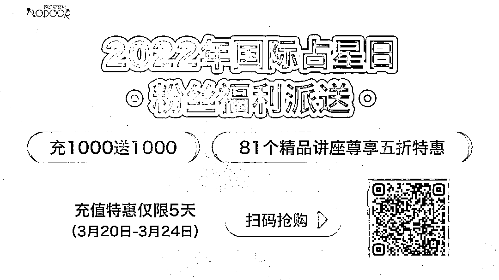

**学习占星学****点击下图了解课程详情**

****

**微信又双叒叕改版啦，不想错过若道君的推送？**
**就把若道设为星标吧！****▼**

**喜欢记得点一下在看哦☟**

**报名直达入口**

# 最后一天！丨国际占星日沙龙充值卡，83 场精品沙龙等你来看！

> 原文：[`mp.weixin.qq.com/s?__biz=MzA5NjA0NTAxNg==&mid=2651470065&idx=2&sn=1da5fb2f35320a365e3988be660c6c77&chksm=8b488a46bc3f03502e025587ccf29cc2466180053e4034eb218ec85b5fb20e2ee156af8b2565&scene=126&sessionid=1692737842#rd`](http://mp.weixin.qq.com/s?__biz=MzA5NjA0NTAxNg==&mid=2651470065&idx=2&sn=1da5fb2f35320a365e3988be660c6c77&chksm=8b488a46bc3f03502e025587ccf29cc2466180053e4034eb218ec85b5fb20e2ee156af8b2565&scene=126&sessionid=1692737842#rd)

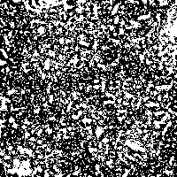

之前我们说过，在国际占星日（IAD）这一个对于占星界来说无比盛大的节日，我们将举行六场公益演讲，从**3 月 19 日一直持续到 3 月 24 日。**

**今天是最后一场演讲**

**如果这还不够满足你的话** **那么接下来这些福利你要看好了！****涵盖国内外知名占星师****83 场精品沙龙****属于国际占星日的****超级优惠****今天是最后一天！！！**

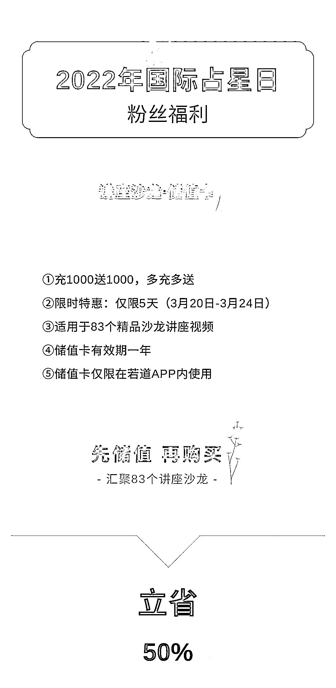

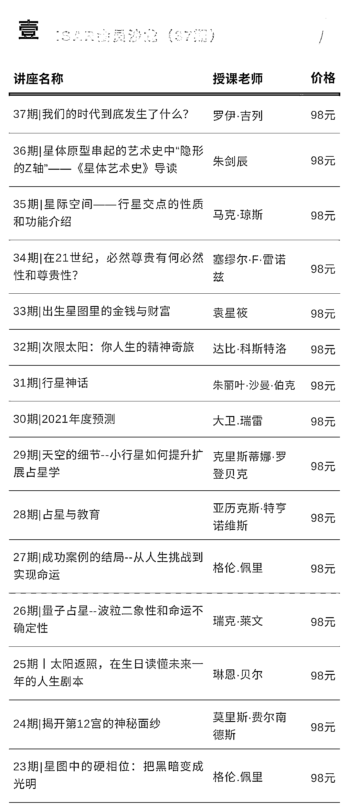

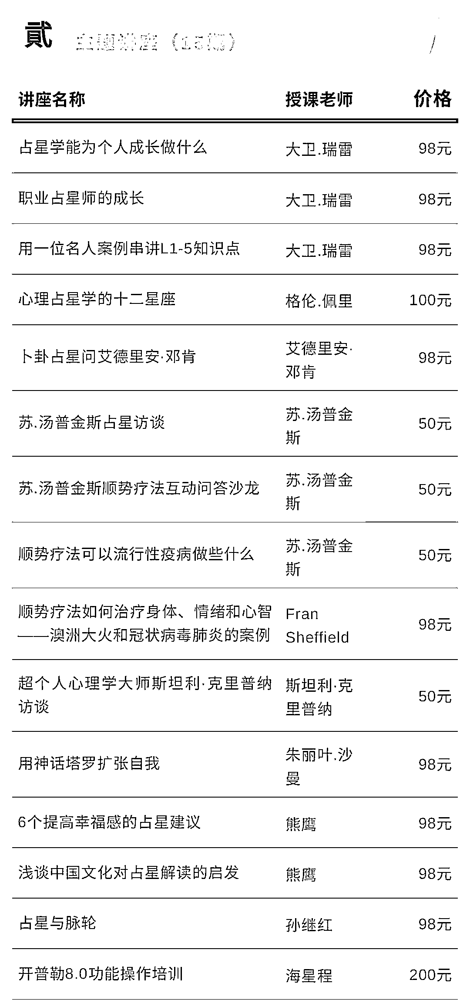

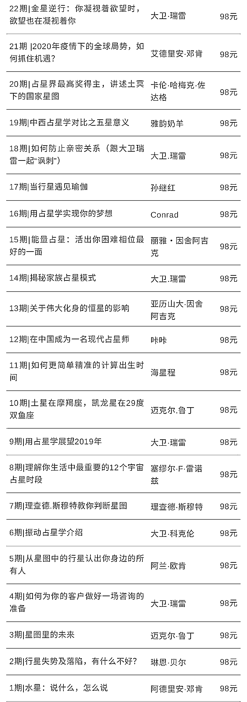

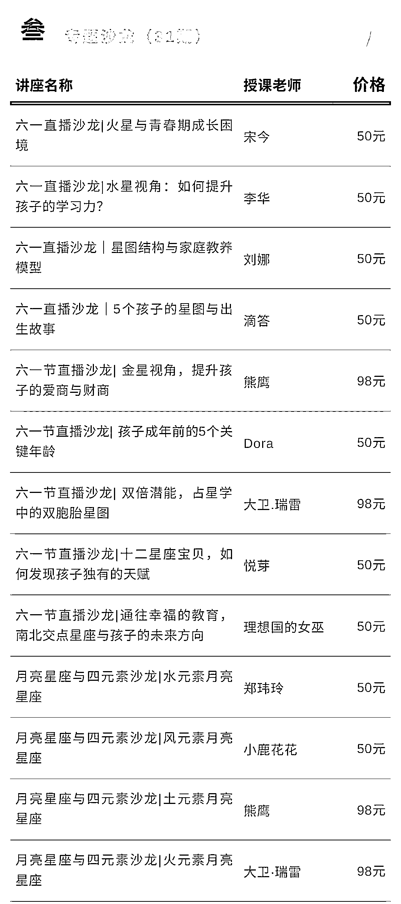

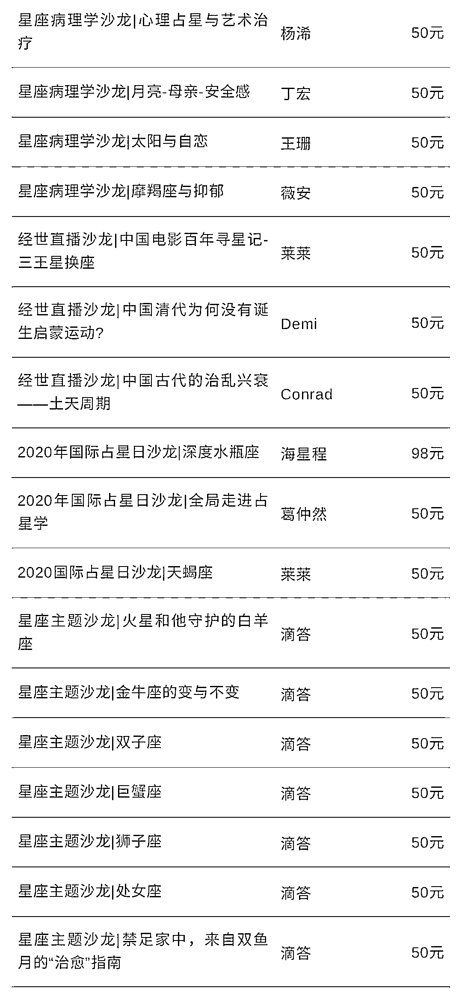

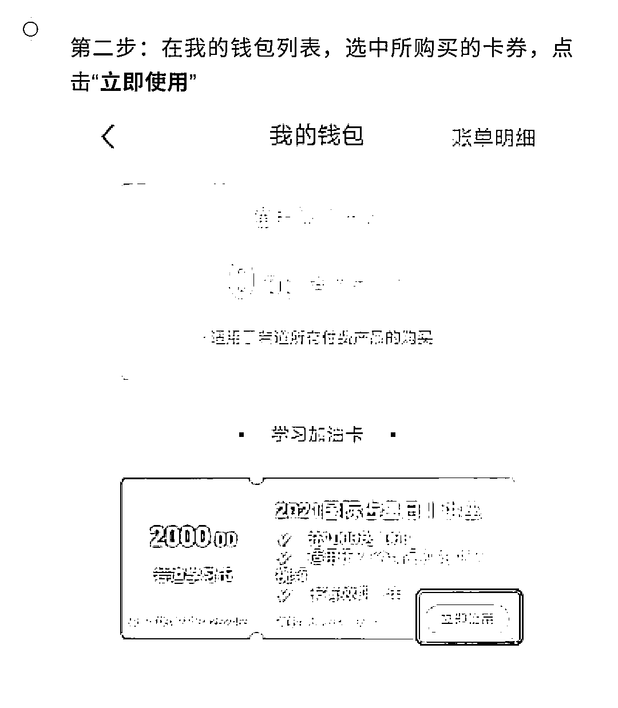

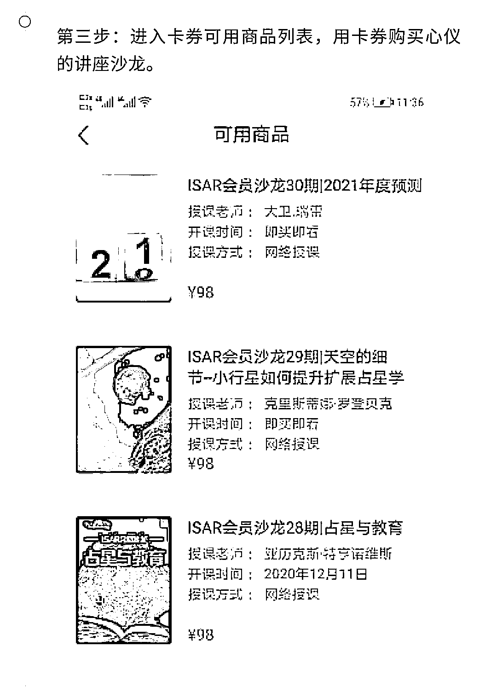

**注：卡券购买后，1 个工作日内，可在若道 app-我的钱包查看，如需协助可咨询客服（微信号：nodoor201705)**

**如何购买？****扫描下方二维码即可**

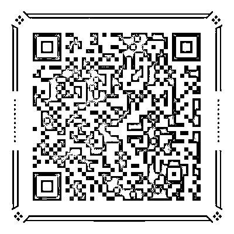

**国际占星日这一系列的活动****希望大家都能收获满满****春天快乐！(*^▽^*)**

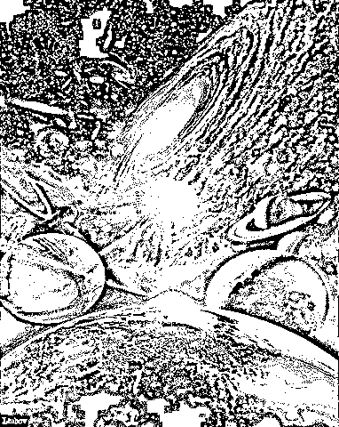

**购买直达点击原文链接**

# 4 月 27 日开课丨初阶心理占星学核心课：我们教授占星学，也教授心理学概念

> 原文：[`mp.weixin.qq.com/s?__biz=MzA5NjA0NTAxNg==&mid=2651470065&idx=3&sn=a527d377cc973521be096c5d9d3caf21&chksm=8b488a46bc3f0350d4a10eaf5b0388a3b169ad8936964471bfc6eb44ee6aa7e5deb3e64fb613&scene=126&sessionid=1692737842#rd`](http://mp.weixin.qq.com/s?__biz=MzA5NjA0NTAxNg==&mid=2651470065&idx=3&sn=a527d377cc973521be096c5d9d3caf21&chksm=8b488a46bc3f0350d4a10eaf5b0388a3b169ad8936964471bfc6eb44ee6aa7e5deb3e64fb613&scene=126&sessionid=1692737842#rd)

**美国占星心理学学院创办人**

**格伦·佩里**授课

**40 余年**职业占星师生涯所学精华**倾囊相授**

跟随主讲老师学习融合**心理学体系**的**占星知识**

为星图咨询解读打下坚实的基础

**新学员**，

以最严谨扎实的心理占星核心课程，

作为占星学习的开端；

**老学员**，

最有复训价值的核心课，

复习夯实基础知识的同时，补充心理学知识体系。

1

**这门课程最大的看点是什么？**

1. **两位国际占星学大师**共同授课，将合计**90 年职业占星师生涯所学精华**倾囊相授；2. 修完**2 年课程**，考试通过的毕业生将获得**美国占星心理学学院证书**（Academy of Astropsychology）和**若道毕业证书**，**高含金量双证书**；3. 101-102 阶段**24 次课程**的充分授课时间（录播课程 16 次课；直播课程 8 次课），全面而详细地讲解占星学知识、技能和运用；4. 跟随主讲老师学习**自成体系、逻辑严密、实用性强的占星语法、星图解读方法**；5. 学习独特的**发展年龄预测法**，从星图看对关键年龄阶段的发展及议题；6.**大量的课程资料，101-102 阶段课后阅读资料超过 14 万字；101-205 全阶段光是课后阅读资料超过 60 万字**；7. 合理的课程设计，101-205 全阶段每一节课都有课后作业和测验，实时验证学习吸收效果；8. 本课程可以作为**ISAR 选修课**中的一门，再修两门就满足 ISAR 认证选修课要求；

9. 205 阶段 **18 次占星咨询技巧的培训**，为 ISAR 口试保驾护航，也为正式从事占星咨询建立基础；

10. 教授重要的**心理学概念**，比如与客体关系、心理动力理论、个人神话和叙事疗法相关的一些概念，学习如何将它们整合到星图解读中；11. 105 阶段了解**《精神疾病诊断与统计手册》**诊断标准，探索星图中的心理疗愈；12.  第二学年学习**叙述疗法**和**自传写作**，将之作为自我疗愈和咨询的工具。

**格伦老师致学员的信**

（向上滑动查看内容）

**亲爱的学员：**

作为占星心理学学院的校长，我的目标是帮助你顺利完成学业。

占星心理学学院的课程让你能够在经济承受范围内，灵活地学习占星学。我们的课程让你可以舒适、便捷地在家学习，不用打乱你本就繁忙的日程。我们有完善的在线学习系统，让你能在线上课、下载学习资料、进行测试并自动获得即时反馈，还可以在虚拟课堂上同你的教员和同学互动。

作为私人开业的**职业占星师**和**执业心理治疗师**，我已经**工作超过 30 年。**我还花了近 10 年的时间，在研究院里学习并获得**心理学的硕士和博士学位**。这段训练和经历是无价的，帮助我将占星学发展成为连贯的 21 世纪模式。

我们的占星学培训项目是**系统化的、清晰的、组织有序的、易学的、前沿的。**尽管有许多类似的学校可供你选择，但你不会在这些学校中看到像占星心理学学院所提供的那样有深度的或尖端的课程。

**我非常期待 2022 年再次在若道教授心理占星学核心课程。**我们重新规划和升级了本次课程体系。**新的课程包含之前完整课程的 72 个录播视频，每个视频长 2 小时；以及由我教授的 37 次直播课程，和大卫老师教授的 10 次直播课程，每次课程 2 小时。**在实时课程中，除了我提供的案例，我还会用学员的星图进行案例演示，与学员互动，阐明视频中教授的原则和方法。

**2 小时直播课程安排：**

**第一阶段 提问和讨论：**

这将在每节课开始时进行。邀请学员提出与课前提供的资料相关的具体问题。这一阶段将持续 15-30 分钟。

**第二阶段 示例：**

这一阶段会讲解与每周任务相关的具体概念，例如行星的星座位置、宫位位置以及相位的意涵。星图示例来自我认识的人，如公众人物、朋友、家人、同事或以前的客户（不显示出生信息）。同样，这一阶段也开放课堂讨论，学员可以提出自己的问题和见解。

**第三阶段 学员案例演示：**

这个阶段会从学员的具体星图来阐明概念，例如火元素行星占优势。学员案例演示不会涉及任何类型的咨询或“解读”。它们将只是简单地包含一段对话，我会在对话中分享自己对某个配置的思考，然后问这个学员可能会如何主观地（影响、信念、行为）和客观地（事件/关系）体验这个配置。其他参课学员可能也会对讨论的主题有自己的见解或问题，他们也可以参与讨论。

我对这一新的在线课程形式感到兴奋，**并期待着从 2022 年 4 月 27 日开始认识我的新学员们。**获得本学院的文凭会是你做过的最明智的投资。你不仅将占星学掌握到前所未有的深度，还将学到如何为客户提供咨询服务并建立职业占星师的职业生涯。

真诚地

**格伦·佩里 占星心理学学院校长**

**为什么要学习心理占星学？**占星心理学是一个复杂的体系，让实践者能够向客户提供真正治疗性的益处。这从根本上说来是我们学院有别于其他学校之处：**我们教授占星学，也教授心理学概念。****我们明确讨论各种心理学概念，并将其与占星学无缝衔接。结果就是更深入的、更丰富的，最终更加强大的模式。****该项目专为初学者和渴望深造的有经验的占星师而设。**我们会从跨学科的角度探讨星图解读。**通过融合荣格心理学和各种其他模型的元素，学员将熟悉作为人格理论、发展模型、原型语言和诊断工具的占星学。**

2

**课程是怎么安排的？**

**101 占星学基础 **

**共 12 次课程：8 次 2017 年录播课+4 次直播课**

**占星学**关注成长，聚焦心理。外部事件意义重大，但我们可以把它们看作是对于发展中的心理结构的共时性反映，以及未来发展的媒介和催化剂。

在这个阶段的课程中，会以四种形态的几何形式介绍**占星原型：星座、行星、宫位和相位**。黄道带是人类心灵的象征性地图，其中的每个**星座**都代表一种基本的人类需求、原型人物、发展阶段和行为风格。

**行星**代表心理功能，以满足其关联星座的基本需求。**宫位**提供了环境舞台，行星在其中扮演它们的角色，而**相位**是行星之间的角度关系，在主观上体验为内在对话。

**课程安排**：

**录播课****、****直播课（周三）**时长都是 2 小时

第一节**录播课**：核心概念介绍

第二节**录播课**：黄道带的结构

2022 年 4 月 27 日**直播课**：核心概念、黄道带的结构提问和讨论、知识点示例

第三节**录播课**：图例、单态星体和其他奇妙的元素

2022 年 5 月 11 日**直播课**：图例、单态星体提问和讨论、知识点示例

第四节**录播课**：星座介绍（从白羊座到处女座）

第五节**录播课**：星座介绍（从天秤座到双鱼座）

2022 年 5 月 25 日**直播课**：12 星座案例演示

第六节**录播课**：行星作为过程

第七节**录播课**：行星作为内容

第八节**录播课**：将碎片整合起来

2022 年 6 月 8 日**直播课**：整合星图时，将行星作为过程和内容案例演示

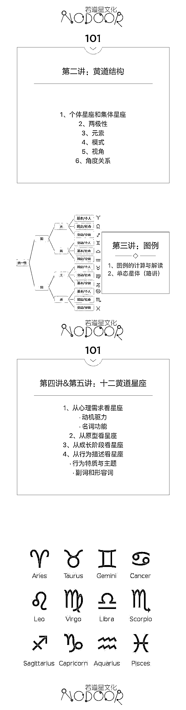

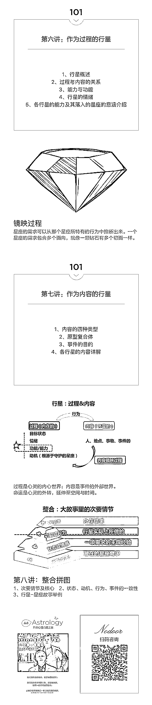

**102 行星落星座、宫位** 

****共****12****次课程：**8 次 2019 年录课+4 次直播课**

这个阶段的课程**聚焦于初步的星图整合。**

学员将学习**占星语法**，以及如何运用它们来阐释**行星的星座落点**。学员不需要强记书中的星图解读，而是学习分析基础的占星句法结构，应用这些语法规则来思考和讲述这门语言。学员们将学习如何构建精妙的句子，将动机、功能、特质、状态和事件组合起来。

此外，还将学习解读**行星宫位落点**的规则。宫位被定义为心理环境，为特定类型成长和发展提供背景。行星落在宫位中，象征着情境中的特殊状态，应对环境挑战的方式，以及通过共时性人物和事件而外化的自我部分。

学员们将探索如何将星座和宫位落点融合在一个单一、整合的陈述中，做出灵活、层次分明的解读。

**课程安排**：

第一节**录播课**：占星语法介绍

第二节**录播课**：行星星座作为行为风格

2022 年 6 月 22 日**直播课**：占星语法、行星星座作为行为风格提问和讨论、知识点示例

第三节**录播课**：思维状态和行为结果

第四节**录播课**：学习行星的星座落点

2022 年 7 月 6 日**直播课**：思维状态和行为结果、行星的星座落点提问和讨论、知识点示例

第五节**录播课**：回顾宫位的含义

第六节**录播课**：宫位中的行星过程

2022 年 7 月 20 日**直播课**：宫位的含义、宫位中的行星过程提问和讨论、知识点示例

第七节**录播课**：行星在宫位中的状态

第八节**录播课**：行星作为宫位的内容

2022 年 8 月 3 日**直播课**：行星在宫位中的状态、内容的提问和讨论、知识点示例

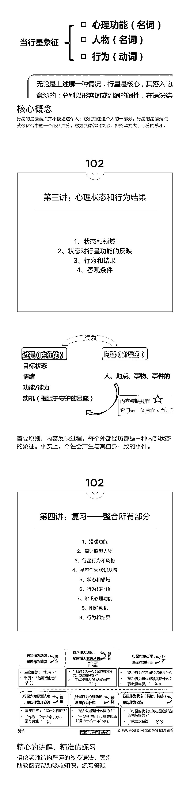

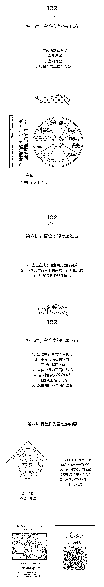

3

**导师简介**

**格伦·佩里（Glenn Perry）**

*   这位传奇的占星师，也是一名拳击和摩托车爱好者

*   他毕业于赛布鲁克学院(Saybrook Institute)，是心理/意识研究专业博士

*   也是拥有 30 余年经验的加州注册婚姻和家庭治疗师 （CAMFT）

*   美国占星心理学学院（Academy of AstroPsychology）的创办人

*   他曾任国际占星研究协会 （ISAR）以及联合占星大会董事会（UAC）副主席

*   也是 ISAR 突破性道德标准的设定者

*   康涅狄格州研究生院（the Graduate Institute of Connecticut）原型宇宙学与意识进化项目的负责人

*   共出版八本占星学著作：《心理占星学入门》《心理占星论文集》《盗取天火》《从忠诚到革命》《星图中的阴影》《占星职业议题与伦理》《出生星图深度分析》《从古代到后现代占星学》

**大卫·瑞雷（David Railey）**

*   若道联合创始人，致力于在中国教授和推广西方占星学；

*   曾任 ISAR 全球副主席，CAPISAR（ISAR 职业占星师资质认证机构）主席；

*   1976 年，通过亚特兰大职业占星师考试，成为全职占星师，随后通过 AFAN 和 ISAR 职业测试；

*   1980 年，与杰夫·焦耳一起在亚特兰大创建“每日行星”占星学中心。此后在亚特兰大占星协会担任 4 年考官，并且两次担任亚特兰大地区占星协会主席。1979-1992 年，作为占星师活跃于美国社会媒体，向不了解现代占星学变化的大众宣传专业占星学知识。在 1989-1992 年期间，他在 WRGG 电台 12 频道每周主持个人电视秀“今日占星学”，早先他还在 WRFG 的广播节目中播讲宇宙天气节目；

*   2010-2014 年，任全美占星师联盟监督委员会委员；

*   2010 年，其著作《灵魂的目标》中国版出版，和蒋颖一起创办若道占星学校和其官网 www.nodoor.com；

*   2017 年，被选为 ISAR 委员会成员。ISAR 是世界最大的国际占星机构，会员遍布 45 个国家，2017-2020 年曾任 ISAR 全球副主席、CAPISAR（ISAR 职业占星师资质认证机构）主席。

**助教简介**

**薇安**

*   全职心理占星师、ISAR 认证占星师（2016 年获得）；

*   北大心理学硕士、MBTI 国际认证施测师；

*   若道认证生时校正资质及 COAC 高阶资质毕业生；

*   连续两届担任格伦·佩里老师亲授的“美国占星心理学院&若道占星双认证核心课程”主助教；

*   2012 年至今，持续追随多位国际占星大师进行占星学的深入学习；

*   2007 年至今，持续进行精神分析及心理动力取向的理论及技巧研习；

*   致力研究心理学与占星学的整合运用。

4

**此次课程适合哪些人？**

*   对占星学感兴趣，想要入门的零基础者

*   占星学小白，但有志成为职业占星师的人

*   有一定占星学基础，但不知道该如何整合星图复杂碎片的人

*   想要师从更多殿堂级占星导师学习占星心法的人

*   走在自我探索和个人成长道路上的人

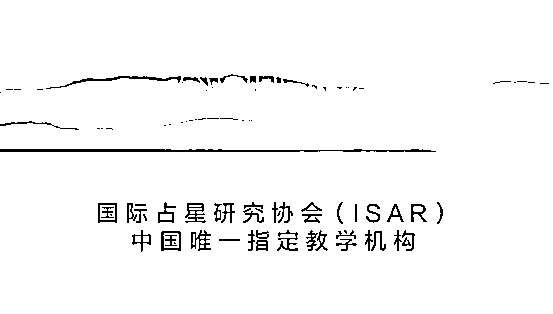

5

**选择若道学习占星学的优势**

**运用自由意志，扭转破坏性模式，绽放天赋潜能**

若道是人本主义占星学的旗手。因为我们相信，**人通过了解模式、觉察习性、积极疗愈、终将释放其潜能，与命运共舞**。

**进入国际权威职业占星师认证的快车道**

占星界的“联合国”ISAR（国际占星研究协会），是具有全世界影响力的占星教学和研究组织和职业占星师全球认证机构，认证占星师遍布 47 个国家。**在 ISAR 的 22 所附属学校中，大中华地区的附属学校只有若道一家**。在国际化的教学理念大纲标准下，**若道毕业生在 ISAR 国际认证占星师的考试通过率多次全球首位**。

**十年占星学教育中国本土化教学经验**

**根据中国学生的学习习惯不断优化占星教学体系，让学员学成后更自如地应对本土咨询市场的需求。**

学好占星学不仅仅需要邀请一两位老师教学，更需要对教学难点有充分了解，且有持续的教学跟进服务。**10 年来多次核心课程和各种专题课程的教学，让若道非常了解中国学生学习占星学的难点和卡点，合理有效地拆分、提炼课程知识点，同时也积累了丰富的国外老师和中国老师、助教紧密配合以及课程顾问密切配合教学的经验**。

若道还专门开发了有助于占星学习的“**若道**”APP，每门课程都设有答疑板块，学员能够方便快捷地提交问题，助教及时答疑解惑和批改作业。

**融入中国顶尖的职业占星师群体**

若道是中国职业占星师的“黄埔军校”。职业占星师的培养从若道开始，**进入若道，你就走进了中国顶尖的职业占星师群体，和一群志同道合的师兄师姐联谊，获得经验，共同成长**。 

**多种奖学金支持**

为了鼓励学员不因为暂时的经济困难而放弃学习，我们特意设置了各种**技能交换和奖学金**。

对于有一技之长的学员，我们推出的技能交换的项目包括**“笔译”、“笔记整理”、“平面设计”、“课本朗读”、“班级服务”**等技能交换项目；

而对于努力学习、出勤率高、完成作业率高的学员，我们设置的**土星奖、木星奖**等各种奖学金在等着你。

为了感谢帮助我们推荐学员的老学员们，我们设置了“**老学员推荐奖**”；

对于通过问卷提建议，帮助我们提高服务的学员，我们也设置了相应的奖学金。

**开启占星咨询的职业规划和支持**

若道为占星学员搭建了占星问答平台和占星咨询平台，并提供严肃占星学影响力最大的媒体平台，全力为毕业生提供宣传渠道，帮助你吸引和积累咨询生涯初期的种子客户。若道为学员开发了适用于占星学习的“若道”APP，并不断更新完善。

**①  微信平台**若道微信平台作为业内颇具影响力专业平台，为文笔好的若道毕业生提供传播占星学并免费宣传自己的机会。有的学员因为文笔获得众多粉丝喜爱，在 3 年多时间积累起 2000 多人的潜在客户。

**②  **咨询平台****若道咨询平台是我们为优秀毕业生所搭建的平台，帮助毕业生在自己的咨询拓展之外，用若道提供的平台扩展咨询客户群。自咨询平台 2017 年 8 月上线运营以来，咨询平台共入驻 65 人，收入最高者达 32 万元。

此处所列学员收入仅供参考，收入高的学员和其专业水准、努力程度密切相关。若道平台尽其所能将自己定位为辅助学员开展职业生涯的桥梁。

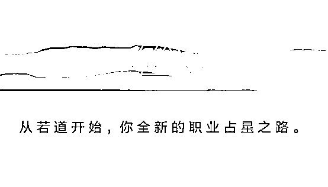

6

**课程价格**

**101-102 初阶**

**正价：**6800 元

**学习充值卡优惠价：5800 元**

**★ 其他各阶段课程单报价格，请咨询课程顾问：**

**王老师（微信/手机：18510107057，请备注“格伦核心课”）**

长按二维码添加课程负责人咨询~

**全阶段学习后，可参与若道占星毕业认证考试，考试费用为：580 元**

7

**直播课开课时间**

**2022 年 4 月 27 日（周三）20:00-22:00**

**如果直播课时间临时有调整，班班会及时通知每位同学****最终解释权归若道所有**

8

**退转课程**

**退款原则请详看《教学协议》，如有疑问请咨询课程顾问。**

9

**格伦老师教学内容试看**

**格伦·佩里老师如何将心理学和占星学结合，如何开始教授心理占星学？点击下方视频可详细了解格伦老师理念。**

<mpvideosnap class="js_uneditable custom_select_card channels_iframe" data-pluginname="videosnap" data-id="export/UzFfAgtgekIEAQAAAAAAHBcLpepWXQAAAAstQy6ubaLX4KHWvLEZgBPEkIMYRVhfSLT8zNPgMIs23XYw2eSgrRaPW3Dj9_BA" data-url="https://findermp.video.qq.com/251/20304/stodownload?encfilekey=S7s6ianIic0ia4PicKJSfB8EjyjpQibPUAXolnQrZwePcCZ0XffhxtFKBwL8xABabPSCrxp2TBZSdOyypmjhiabiaWTOO3EBU1J4xTc5YqicfMicRDjwKRTic0XAyGhw&amp;adaptivelytrans=0&amp;bizid=1023&amp;dotrans=0&amp;hy=SH&amp;idx=1&amp;m=&amp;scene=0&amp;token=AxricY7RBHdXDk6HpYh0d9Pco18Y10Pk2nRpsY9amBwj6UIOJ1WE7D2AzUtsaRQxICxmiaj8jRibI0" data-headimgurl="http://wx.qlogo.cn/finderhead/PiajxSqBRaEJYnVsqWfEX9qA0sI6hNVKsDfyzfPZ92WZMZyBpZWU5NA/0" data-username="v2_060000231003b20faec8c4e68a1ec2d4ca07e434b07755bbf47e7053a3059defd2c9d6c68a20@finder" data-nickname="若道" data-desc="#若道核心课 如何解读一张出生星图？出生星图有哪些组成部分？星图里不同组成部分分别代表什么？" data-nonceid="7032132594947358005" data-type="video"></mpvideosnap>****2022 双证书核心课 L1-2****

**授课老师：格伦·佩里、大卫·瑞雷**

**直播课开课时间：2022 年 4 月 27 日（周三）开课**

**授课方式：******网络授课，英文授课，中文翻译****

**费用：101-102 价格：**6800 元**（充值卡优惠价 5800）**

**课程负责人：王老师**（微信/手机：18510107057，请备注“格伦核心课”）

长按二维码添加课程负责人咨询~

****报名直达入口****

# 卜卦占星助教如是说：卜卦是如此容易上手且非常实用的技能

> 原文：[`mp.weixin.qq.com/s?__biz=MzA5NjA0NTAxNg==&mid=2651469930&idx=2&sn=646b7e8ab85d95ca99e79a64567e9cff&chksm=8b488addbc3f03cb99c09d7dcf3f3d67066a853eb9f1c1de277453730cef7741ea78fb9c6f94&scene=126&sessionid=1692737842#rd`](http://mp.weixin.qq.com/s?__biz=MzA5NjA0NTAxNg==&mid=2651469930&idx=2&sn=646b7e8ab85d95ca99e79a64567e9cff&chksm=8b488addbc3f03cb99c09d7dcf3f3d67066a853eb9f1c1de277453730cef7741ea78fb9c6f94&scene=126&sessionid=1692737842#rd)

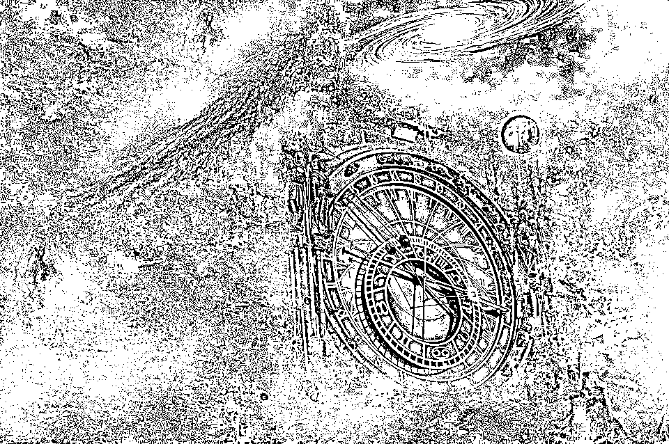

作者/王嘉祺

编辑/翀子 图片/网络

“卜卦”总透着一丝神秘，卜卦占星学是做什么的？它能帮我们解决哪些问题？它是否与人本主义占星学的理念冲突？如果你对它感兴趣，这篇文章可以解答一些你的疑问。同时，若道即将开设的卜卦占星课程将包含哪些教学内容，在本文也有体现，你也可以点击[【现代卜卦占星学】](http://mp.weixin.qq.com/s?__biz=MzA5NjA0NTAxNg==&mid=2651469648&idx=2&sn=e9af4fcb4e9708658f183442532b95e6&chksm=8b4885e7bc3f0cf181e29fb38078cc11368110940c848c7e2e17fb56cd00dad123930238a81e&scene=21#wechat_redirect)了解详情哦。

大家好，我是 Conrad，是卜卦课程的助教。今天我来给大家介绍一下什么是卜卦占星，以及卜卦占星能够做什么。

**卜卦占星可以怎么帮助我们？**

我们每一个人在某时某刻，可能会对自己的命运有一个疑问，或者是对当下生活的某一个现状有一个疑问。比如很多人会疑问自己的感情状况为什么不顺利？自己的工作发展总是并不理想？为什么自己的人际关系会突然出现问题？

当这些浮现在我们脑海当中无从解答的时候，很多朋友就会来求助于占星学。**尤其是一些具体的、微观的疑问，就非常适合卜卦占星来帮助大家做出解答。**

**卜卦的本意，就是从微观事物出发，去探索和预测这些微观问题的可能性。**

**因此，卜卦占星非常善于解决我们生活中的一些非常具体的问题。**小到东西丢了找寻失物，大到自己的职业或学业如何去做抉择，卜卦占星都能够提供明确的线索，来帮助我们做出有利于自己的决定。

作为上一次卜卦占星课程的助教，以及卜卦的实践者，我甚至在餐厅等位的时候，都会用卜卦占星来测试我大约还需要等多久，以此来练习和判断卜卦占星和它的精确性。

**所以说，卜卦占星的应用是非常的实际且广泛的。**

**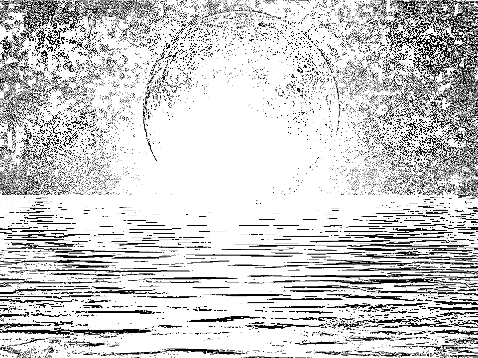**

**现代动态卜卦占星和传统卜卦占星**

**对于有些占星学基础的同学来说，卜卦占星在传统上也有着一些使用的限制。**

比如经“月亮空亡”的状态时，卜卦星图对于问题来讲是否是没有结果的。又比如当卜卦的时候，上升点位于某星座的最后三度，卜卦星图对于问题来讲是否是无效的。又或者，当天象中呈现土星位于第七宫的时候，是否不应该接洽当下的客户。

**对于此类古老的问题，在我们本次课程中，邓肯老师会以现代动态卜卦的特点加以诠释。**随着时代的变迁以及技术的发展，更重要的是历代占星师们不断积累的经验与案例，**一些古老的问题会有一些新的解释。**

动态卜卦的特点，简单来说，要意识到行星与四轴是不断运动的，就如天上的繁星与地上的人们，**一直都在不断地前行。**所以即便是考虑一些古老的问题，也需要考虑这个问题中的要素，在之前和之后的一系列变化。

**这里面既包括了在卜卦星图中，行星与四轴的变化，也包括了在现实中事物的发展变化。**

比如在刚才的问题中，假如上升点即将发生星座上的变化。那么相应的，各宫位及其守护星就会发生变化。这种变化，是否意味着在现实的状况当中也会出现一些变动的可能？

比如一位客户向你咨询感情关系的状况，当你观察到上升点即将从双子座移动到巨蟹座时，这是否意味着关系从变动的不稳定状态，将要过度到稳定的状态中呢？**当我们从动态的视角去考虑这一问题时，一个新的角度就会涌现出来。事情也就有了更多积极的可能性。**

在我个人的理解里，动态卜卦的思想，并不意味着简单地抛弃旧的思想和理念，而是从中取其精华去其糟粕，然后发展出符合当下现实状态的新方法。简单来讲，就是**我们面对的现实状况和烦恼比古代社会更加复杂了，那么答案也必将相应地更新升级。**

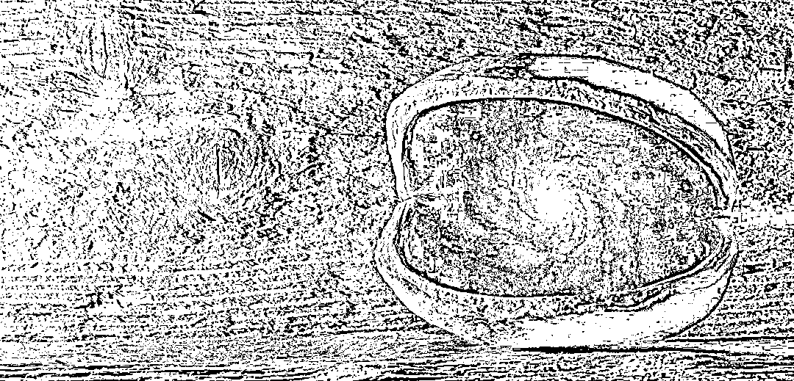

**即使只有基础知识，也能学习卜卦占星**

不过大家无需担心的是，本次卜卦占星的课程并不会很难。**即便是只有占星基础知识的同学，也可以从中获得很大的收益。**

在前几节课我们会回顾一些最基础的知识。比如行星与星座的守护关系，行星的庙旺弱陷，以及宫位和其守护星的含义等。

**本次的卜卦占星课程的学习，将会是一个由浅入深的过程。**我们会从最简单的行星、星座与宫位开始，讲到行星的周期移动，以及行星逆行的规律。从一些卜卦咨询中常见的主题的专题讲解，最后到如何面对客户展开咨询以及帮助客户进行择时。

**我们会完整的讲解卜卦占星中所涉及的每一个细节。**这里面包括如何在问题中找到解决方向、如何从多个选择中判断对自己有利的一项、如何判断一个问题中的时间长短，乃至如何面对一个真实的客户以及进行咨询。

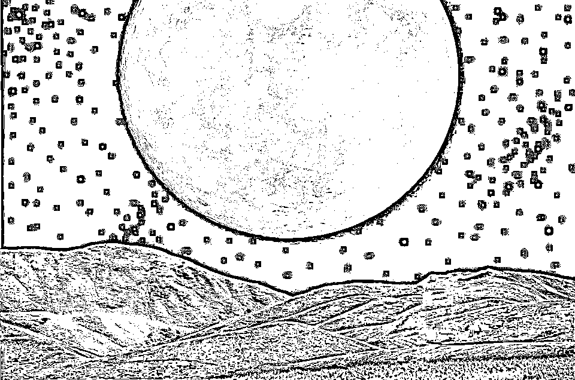

**擅长案例讲解的邓肯老师**

一个好消息是，邓肯老师非常擅长讲解案例，而学习实践卜卦占星，正是需要大量案例的。**本次的课程中，我们将看到邓肯老师生动的讲解各种类型的案例。**你的真实案例也有机会被邓肯老师选中，作为例子在课程中进行讲解。

卜卦占星英文叫做 Horary Astrology，**而 Horary 这个单词，本身就与“时间”以及“时间的计算”有关**。在占星学中，随着时间的前进，行星的位置和状态也会随着发生变化。

因此在学习和实践卜卦占星中，我的一个经验是，**熟练掌握行星的运动规律是非常重要的。**而这也是动态卜卦的核心要点。

**当我们能够的掌握行星的运动规律时，**我们在面对不同的卜卦问题时，既能较为轻松的找到问题中的征象行星，也能够较为容易的判断问题的发展走向。

比如在面对具体的人的问题时，月亮会代表当事人的情绪状态。而当面对与人无关的问题时，我们就需要判断什么事物是波动较快的要素，比如金融市场中的股价或者汇率，又或者市场中的客流量。

再比如，金星代表感情，然而金星的状态可能是不同的。在某个时间点上，金星可能是顺行，也可能是逆行，还可能接近或处于停滞点。

**行星状态的不同也代表着事物状态不同。我们需要就具体问题进行具体判断。**而这需要我们在实际过程中**不停的练习**。好在卜卦占星涉及的问题类型非常广泛，甚至可以说万事皆可盘。

要想熟练掌握卜卦占星这个技能，一个是**需要充足****的练习**，另一个是在练习中**观察事物与行星的走向**。最后，**一定要向当事人求得反馈**。这样我们才能够用最真实的信息，去复盘卜卦的过程，从而不断精进自己。

如此容易上手又非常实用的技能，相信对占星学感兴趣的你，一定不会错过！

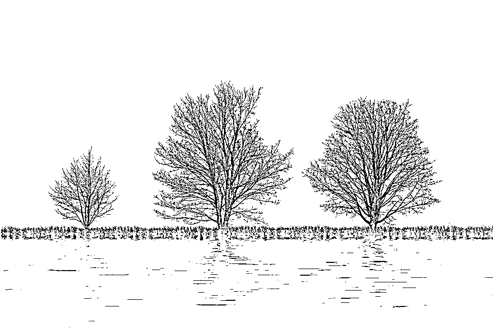

**授课老师**

**艾德里安·罗斯·邓肯****（Adrian Ross Duncan）**1971 年在印度游学时开始学习占星学，1985 年开始成为全职占星师，**迄今执业已超过 33 年，是人本主义占星学、卜卦占星学和经世占星学领域的知名占星师。他还开发了占星软件 AstroClock 和多款占星报告。**他在日常咨询中都会运用卜卦，咨询图（卜卦的一种运用方式，即根据客户来访时间制作星图，从星图中获得大量信息）也是他**特别擅长的领域**。艾德里安·罗斯·邓肯从 1971 年开始研习佛学，受佛学影响很深，他**相信占星学和佛学观点统一、转化的一个基础是在于对现实感知的改变**。而卜卦很容易与佛教融合，因为它只关乎当下。**现代卜卦占星课程内容**

**课程分为 5 部分：**

**Part1 **融合现代占星理念，整合动态占星知识**Part2**独家【现代动态卜卦占星技术】全面教学**Part3**学以致用，覆盖人生各个领域问题的卜卦解法**Part4**扩展延伸择时占星技法的新认知**Part5**如何运用卜卦占星学做一场转化性的咨询

**15 节录播课+8 节直播课线上网络课，英文授课，中文翻译。**

**15 节录播课为 2020 年动态现代卜卦课程的内容。8 节直播课则完全是案例教学的形式。**

这样的好处是，你可以通过 1 个半月的密集学习之内按照自己的进度学完录播课的理论和录播课中已有的案例，从学习开始就实践，然后把实践中遇到的问题拿到 8 节直播课中，和老师互动。

**在 8 节直播课中，老师也会用案例教学、和同学互动的方式帮助大家进一步掌握卜卦占星的技法。**

**授课时间**

**付费后一天即可开始看录播课程，全程有助教老师回答问题。**

**直播课程开始时间：**

2022 年 5 月 3 日，每周二 20:00-22:00

**这次课程恰逢世界在巨大的变动和不确定之中，期待这门课程能够给各位及各位的客户带来新的洞见和方向。**

**在这次 8 次直播课程中，我们将采用案例教学的方式，所有参课同学均有机会提供案例，供老师解读，且我们将组织群体的练习，用大量案例帮你掌握卜卦及如何在咨询中用卜卦。**

**什么人适合参加本课程？**

*   想要系统学习现代动态卜卦占星的学员

*   想在生活中熟练使用现代卜卦占星学

*   在咨询中想帮助个案更清晰的分析解读困惑

*   想参加 ISAR 认证考试，此课程是 ISAR 选修课

*   希望通过卜卦占星帮助自己和身边人挖掘一个积极主动的未来

学习整合卜卦技巧，不仅有益于想钻研卜卦占星学这个分支的同学，对占星初学者也很有有帮助，可以让你的占星技巧加倍。

**课程费用**

**课程价格：9900 元**

**老学员复训专享价：**

**2020 年参加艾德里安·罗斯·邓肯卜卦占星课程的同学：****2900 元**

**2018 年参加艾德里安·罗斯·邓肯卜卦占星课程的同学：****4900 元**

**特别优惠****：**

**分享课宣到朋友圈****保留 48 小时****（不设分组显示）截图给课程顾问可获得****400 元优惠****。**

**课程负责人：童老师（微信：nodoorDaivd），请备注“卜卦”**

长按二维码添加课程负责人咨询

**退转课程****退款原则请详看《教学协议》，如有疑问请咨询课程顾问。******现代动态卜卦占星实战课·ISAR 选修课****

**授课老师：艾德里安·罗斯·邓肯**

**授课时间：**2022 年 5 月 3 日

**授课方式：**网络课程，英文授课，中文翻译

**费用：9900 元；****2020 年老学员复训价：2900 元；2018 老学员复训价：4900 元；特别优惠，分享课宣到朋友圈保留 48 小时（不设分组显示）截图给课程顾问可再获得 400 元优惠。**

**课程负责人：**童老师（微信：nodoorDaivd），请备注“卜卦”

长按二维码添加课程负责人咨询

****报名请点击“阅读原文”****

# 卜卦占星学丨在咨询星图的 “神奇妙用”里，客户总在“正确”时间出现

> 原文：[`mp.weixin.qq.com/s?__biz=MzA5NjA0NTAxNg==&mid=2651469930&idx=1&sn=c1fb1e18de8e0538df2f181d0995df69&chksm=8b488addbc3f03cbb6b3e13a1e0c58aac15a9e80bd2aa1c28d70d9283dfe6819c223914cbc39&scene=126&sessionid=1692737842#rd`](http://mp.weixin.qq.com/s?__biz=MzA5NjA0NTAxNg==&mid=2651469930&idx=1&sn=c1fb1e18de8e0538df2f181d0995df69&chksm=8b488addbc3f03cbb6b3e13a1e0c58aac15a9e80bd2aa1c28d70d9283dfe6819c223914cbc39&scene=126&sessionid=1692737842#rd)

**☆****后台回复“今日”，给你一句生命态度******

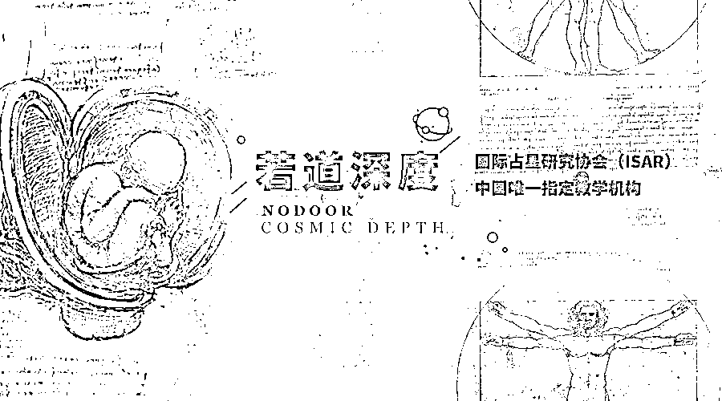

作者/艾德里安·邓肯 

译者/Leisha 校对/Arrow

编辑/翀子 封面/书君 图片/网络

**作者的话**

如果说为咨询而做的卜卦图是咨询过程中一个重要的部分，听起来可能是个革命性的说法。但是，咨询星图在整个占星学历史上都是传统的一部分。如同历史上许多其他从业者一样，威廉·利里更倾向于运用咨询图而不是出生星图，只是因为咨询图的日期和时间是确定的，而很多人的出生时间并不确定。

在印度，当出生信息的细节未知时，占星师们大量使用咨询时间来设立星图。在某些情况下，占星师不知道客户的出生时间，但是通过将客户的生时设为正午，并与咨询图结合使用，咨询仍然可以是准确的。有些情况下，比如被收养的儿童没有出生日期的记录，咨询图同样是有效的，能够为占星师提供所需要的信息。

**（若道君：作者艾德里安·邓肯老师，将再次和若道合作开设[【现代卜卦占星学】](http://mp.weixin.qq.com/s?__biz=MzA5NjA0NTAxNg==&mid=2651469648&idx=2&sn=e9af4fcb4e9708658f183442532b95e6&chksm=8b4885e7bc3f0cf181e29fb38078cc11368110940c848c7e2e17fb56cd00dad123930238a81e&scene=21#wechat_redirect)课程，此门课程还可作为 ISAR 选修课，如果你有兴趣，可以点击课程连接了解详情哦~）****预兆与征兆**

用客户到达的时间设立的星图反映了客户周围正在发生的一切。也可以对此得出一个推论，**通过研究当下或其他时刻发生在客户周围的实际情况，可以清楚地了解任何特定时刻的意义**。

这就是为什么预兆与征兆可以是准确的，而善于观察的占星师则通过意识到那一时刻正在发生的一切，为咨询提供许多信息。

与咨询共时发生的事件令人惊奇——有人来清理下水道（月亮-冥王星）、花店送来鲜花（金星-水星）、园艺中心送来堆肥蠕虫（火星-冥王星）、天花板渗漏（月亮-海王星）。

**当宇宙用这类事件提示占星师时，你就会知道自己在卜卦图中的所见是强有力的。**

**咨询图的时机**

如果你的业务繁忙，那么，你可能在某天预约了多位客户，并希望他们都能准时出现。这些人为安排的时间，而非随机的时间，并不会影响咨询图的效力。**占星师只是一面镜子，和其他人一样与宇宙调和。**

**无论你是否安排好了时间，客户总会在正确的时间出现，如果这个时间是早了或者晚了，那么咨询图就要相应调整。**很多客户不会准时到，而这些细小的差别会影响**上升点**，这可能非常重要。

如果收到电子邮件的咨询，你可以遵循一个传统规则：**当你阅读并理解了问题之后，就可以为它制作星图了。**

不要使用电子邮件发送的时间，或客户想到那个问题时记下的时间来制作星图。客户与占星师之间的互动很重要。如果你确实要回复电子邮件发来的提问，最好安排一段可以回答问题的时间，然后阅读、理解和开始回答一次完成。

重要的是，**制作星图要使用客户的所在地，而不是你自己的所在地**——这是客户的问题，不是你的。

客户也可能通过打电话或网络电话的方式联系占星师。**如果当下没有时间回答问题，就别问客户的问题是什么，安排一个你可以专心回答问题的时间，再用咨询发生的实际时间制作星图，同样还是使用客户的所在地**。

然而，如果你当下有时间回答客户的问题，那么，你会发现星图极为强有力，而且很容易给出答案。

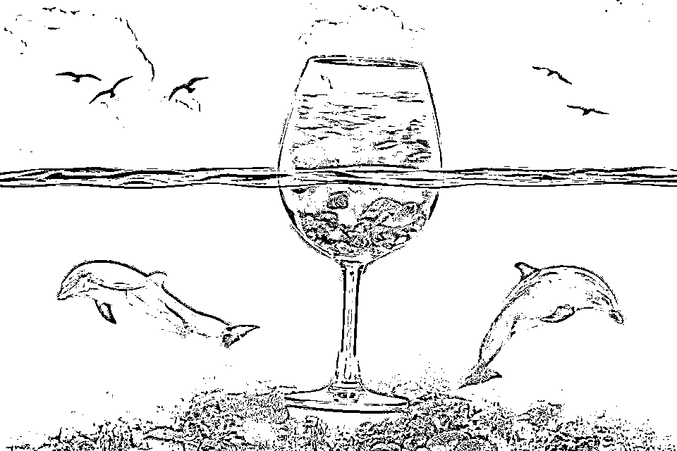**问题和回答**

**回答问题时，标准的规则始终适用**。 

*   **上升点的守护星总是代表提问者；**

*   **月亮的星座与落宫会显示出客户所有的情感能量投入在何处；**

*   **月亮可以被视为客户的共同征象星，尽管它并不像上升点的守护星那样是决定性的因素；**

*   **当与所问之事相关的宫位的守护星与上升点的守护星形成托勒密相位时，就会产生一个结果，或者与月亮形成相位时也可能如此。**

传统规则可以被视为建议，而不是限制，因为，所有的星图都可以以各种不同的方式解读。**某些行星可能像王牌一样好用**——金星代表爱，火星代表胜利，木星代表成功——它们如果与征象星形成积极的相位，这些行星根据自身属性可以带来结果。

咨询图几乎总能反映出生星图的行进和推进所显示出的当前重要主题。这就是咨询图如此有效的原因：**它能显示对客户而言最紧迫的议题，以及精确地反映议题在哪个领域体现以及如何体现。**

咨询期间提出的任何问题，通常都可以**追溯到卜卦图中的行星配置，并做出相应的答案**。

客户可能会提出很多不同而且独立的问题——工作问题、感情关系、孩子、友谊、金钱、意识，不同的行星模式会显示出事件的发展，并提供具体的答案。**一张星图可以回答许多问题。**

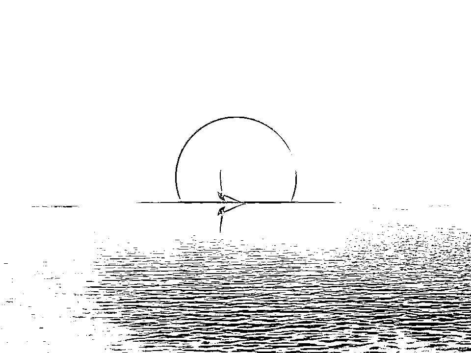

**衍生宫位**

**神奇的是，衍生宫位系统，让回答客户生命中其他人的问题成为可能。**

一个简单的例子是，**可以运用第 7 宫的守护星来描述伴侣的生活状况。**通过第 7 宫的守护星及其星座和相位，能够对客户伴侣的情况给出非常好的描述，客户经常对这种描述的准确性表示惊讶。

我记得有一次咨询，星图中下降点的守护星水星将要合相第 8 宫内的天蝎座太阳，同时四分冥王星，这让客户伴侣的经济状况看起来不怎么好。事实上，客户的伴侣拥有一家航空公司，一周后破产了。

理论上，你可以**通过“转宫”来获取与客户相关的任何人的信息。**

因此，**第 11 宫的守护星**可以描述孩子的伴侣、丈夫的婚外情，或者从另一段婚姻而来的子女；**第 10 宫的守护星**可以描述伴侣的家人，或者其本身所象征的老板；如果客户是政府官员，那么，第 10 宫的守护星就是那个政府的领导人；再比如，第 10 宫的守护星是天秤座的太阳，即将四分摩羯座的冥王星，就表明：这个政府领导人正在建立的脆弱共识即将崩塌。

**咨询图给出的信息有时令人“毛骨悚然”。**

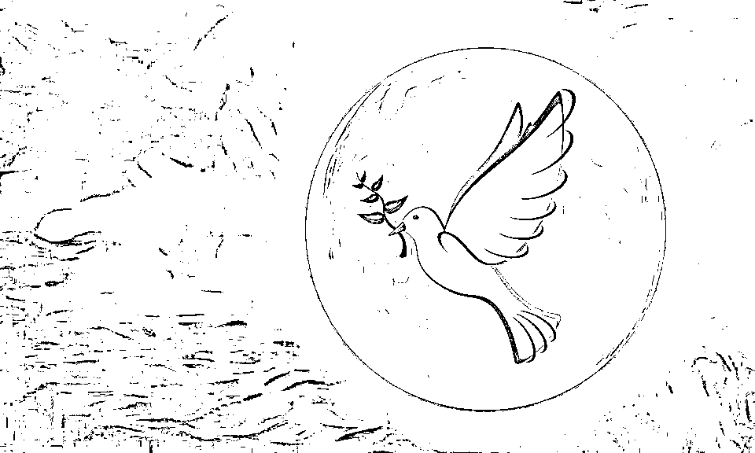**事件图与择时图**

对于有些事件，你可以进行择时，比如旅行或结婚，而有些事件，你无法为其选择时机，比如会议、求职面试等。为一个事件选择最佳时机，比如开业或婚礼，是具有挑战性的，也是一门艺术。

**在为客户选择日期和时间时，我倾向于通过打电话，或面对面的交谈来完成。**

你必须知道什么可能，什么不可能。例如，婚礼择时的范围通常可以被缩小到周六，而且提前几个月就能知道大致的时间段。这有助于占星师找出最适合的周六，最好是**月亮配置良好，金星强有力而相位和谐**的时候。

择时总是需要做出妥协，因为几乎总有一些行星配置存在问题。诀窍是**尽量减轻问题，选择一天中问题配置不占据星图主导地位的时间。**

例如，水星四分火星可能会好争论，那么，你就不要将其放在择时图中的第 1 宫或第 7 宫。

如果你为商业用途择时，最好**给木星和土星安排良好的配置，并让上升点的守护星与这两颗行星形成和谐相位**。**对于人生中的长期项目，应该选择渐盈的月相，不要太靠近新月，而且绝对不要选在接近新月的最后 45 度区间。**

择时图的关键要素是——**让上升点的守护星强而有力，良好地配置于与当前事项相关的宫位中，而且，最好与强而有力的下降点的守护星形成和谐相位**，那就皆大欢喜了。

为感情关系择时，尤其在婚礼星图中，当**所有的成对行星形成和谐相位**时最佳：**金星-火星、水星-木星、太阳/月亮-土星。**

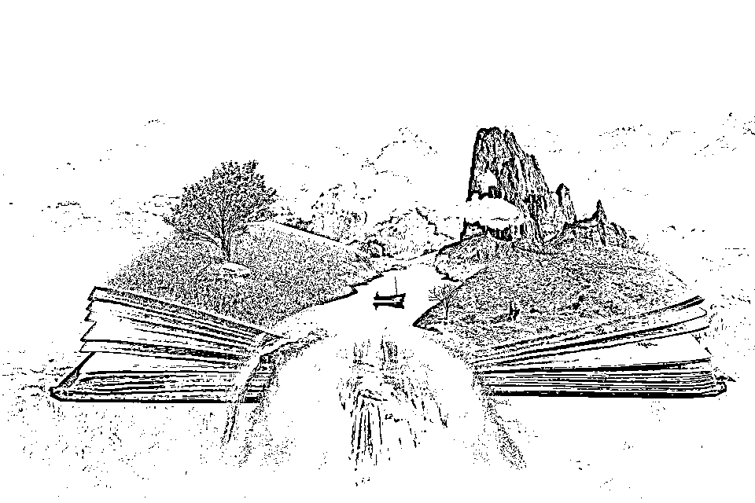

由他人定下时间的事件图稍微有些棘手。一般来说，**因为你是在指定时间到达某处的人，所以你是由上升点的守护星所代表的。**如果是重要的事件，那么，你需要**确保自己不会完全妥协**。

例如，星图中上升点落入金牛座，而你是落在第 7 宫的天蝎座金星（失势），金星还入相位四分火星-土星的合相，那你就有麻烦了。在这样的情况下，最好取消预约，并要求重新安排一个时间。

要了解**会面时将发生什么**——例如求职面试，你需要**对应地识别出参与的各方以及他们的行为**。如果你处于弱势位置，那么，试图坚持自我是没有意义的，如果你处于强势位置，那你就可以坚持自我。

求职时，面试你的人可能有好几个。**下降点守护星代表的可能是之前联系你、直接通知你来面试的人；第 10 宫的守护星代表真正的老板；第 6 宫内的行星或第 6 宫的守护星，可能代表其他在场并参与筛选求职者的同事**。

如果上升点的守护星与各位面试官的征象星之间的相位不佳或没有形成相位，那么你可能不会得到这份工作。但如果与主要征象星之间形成一个良好的相位，就可能预示求职成功。

事件图会讲述故事，也会讲述面试如何推进，随着上升点和中天的移动，也许会合相某颗行星，也许会进入下一个星座。

**最好的策略是****专注于你的长处**，例如：金星六分水星，可能代表你有与人打交道以及良好地表达自我的能力，能够在不被激怒的情况下，顺从由敌对征象星代表的面试官，并且能够与和你形成有利相位的征象星所代表的人建立亲密的关系。

怎么强调都不为过的是，运用卜卦星图和事件图的重点在于**观察星图本身所表达的内容，而不是死板地遵守先入为主的理念**。行星代表人和事，当你能够识别哪些行星对应哪些议题时，就不难看出结果。

**客户的参与对结果预测有极大的帮助，**因为客户比你更清楚什么可能，什么不可能。通过合作，你们可以一起编织可能的未来场景，因此，客户可以带着期待和满足，积极主动地为未来而努力。

**版权声明：**本文由若道翻译，欢迎转发，反对抄袭。友号转载请申请白名单。

**艾德里安·罗斯·邓肯**

若道签约老师，哥本哈根占星学院院长 1985 年开始成为全职占星师，是人本主义占星、卜卦占星和经世占星学领域的知名占星师。开发了占星软件 AstroClock 和多款占星报告。**现代卜卦占星的课程内容**

**课程分为 5 部分：**

**Part1 **融合现代占星理念，整合动态占星知识**Part2**独家【现代动态卜卦占星技术】全面教学**Part3**学以致用，覆盖人生各个领域问题的卜卦解法**Part4**扩展延伸择时占星技法的新认知**Part5**如何运用卜卦占星学做一场转化性的咨询

**15 节录播课+8 节直播课线上网络课，英文授课，中文翻译。**

**15 节录播课为 2020 年动态现代卜卦课程的内容。8 节直播课则完全是案例教学的形式。**

这样的好处是，你可以通过 1 个半月的密集学习之内按照自己的进度学完录播课的理论和录播课中已有的案例，从学习开始就实践，然后把实践中遇到的问题拿到 8 节直播课中，和老师互动。

**在 8 节直播课中，老师也会用案例教学、和同学互动的方式帮助大家进一步掌握卜卦占星的技法。**

******想要跟随邓肯老师学习卜卦占星学？******

**点击下图了解详情**

**国际占星日免费演讲 ****今晚学员分享第三场****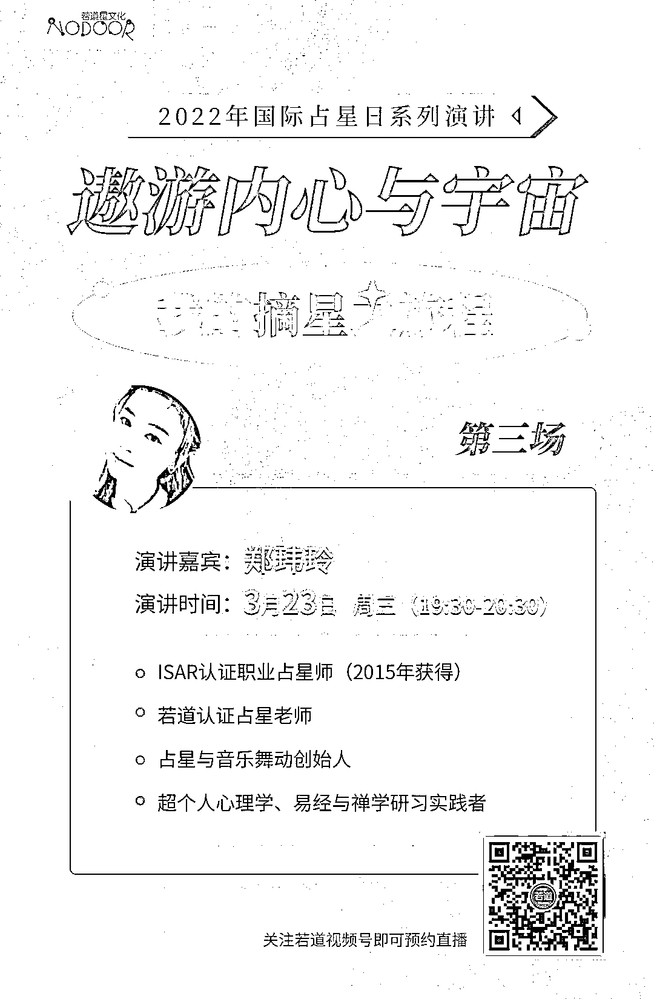****20 位来自世界各地的占星师****带来 20 场沙龙——新世界的觉醒****详情可点击下图**

**除此之外，我们还有****国际占星日优惠充值活动哦~** **快扫描下图二维码抢购吧**

**学习占星学**
**点击下图了解课程详情**

****

**喜欢记得点一下在看哦☟**

********报名直达入口********

# ISAR 星空俱乐部沙龙丨环球之星-关系和家庭系统排列

> 原文：[`mp.weixin.qq.com/s?__biz=MzA5NjA0NTAxNg==&mid=2651469854&idx=2&sn=90c1803f54b5f1e6b6f974299865ffc1&chksm=8b488aa9bc3f03bfb752e4668528918b89195ecd1d2adc8d1dd857943b99b0a1700dfd18f7b2&scene=126&sessionid=1692737842#rd`](http://mp.weixin.qq.com/s?__biz=MzA5NjA0NTAxNg==&mid=2651469854&idx=2&sn=90c1803f54b5f1e6b6f974299865ffc1&chksm=8b488aa9bc3f03bfb752e4668528918b89195ecd1d2adc8d1dd857943b99b0a1700dfd18f7b2&scene=126&sessionid=1692737842#rd)

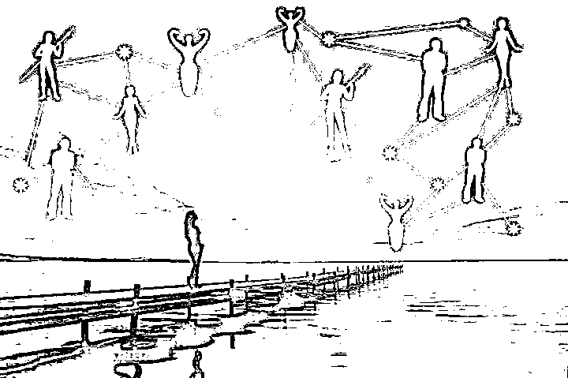

**沙龙来啦！**

**3 月 25 日星期五晚上 8 点**，国际占星研究协会（ISAR）中国星空俱乐部沙龙由**希腊占星师克里斯托·阿科斯**来一场讲座！

**沙龙主题****沙龙主题：环球之星-关系和家庭系统排列****主讲人：**克里斯托·阿科斯****

**沙龙时间：2022 年 3 月 25 日 星期五 **

**                北京时间 20:00-21:30（有英文翻译）**

**沙龙方式：线上沙龙****主讲嘉宾**

**克里斯托·阿科斯**

*   1982 年出生于雅典，他对占星学的兴趣很早就开始了。
*   在大学完成本科学习后，他又完成了咨询心理学和临床心理学的研究生学习，随后专攻认知行为疗法。
*   他在心理占星学、犹太教和人际关系方面有广泛的研究，也在他周围人的个人发展方面也进行大量工作。

**如何参加本次沙龙？**

本讲座也是本月的国际占星研究协会（ISAR）星空俱乐部讲座。**ISAR 会员可以免费收看。**请注意邮件通知，具体参与方式见邮件。

❶ 如果你**已经是 ISAR 会员**，请注意邮件通知，告知如何参加。

❷ 如果你**不是 ISAR 会员**，非 ISAR 会员价格：98 元。如有任何问题请咨询工作人员

yiyi（微信：YY18513802156）

**非 ISAR 会员报名请长按下图**

**▼**

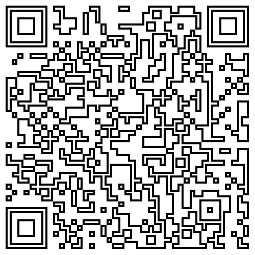

**ISAR 明星俱乐部**

2018 年，ISAR 在主席亚历山大·因舍阿吉克的带领下，成立了 ISAR 明星俱乐部，每月为全球 ISAR 会员提供在线直播讲座，邀请全球著名占星师开讲，学习和分享新的理念。讲座时长一小时，涉及占星学的不同领域、不同观点，每个会员都可以参与其中，每次讲座之后还有 20-30 分钟问答时间向老师们提问。

每一场在线讲座都会记录下来，ISAR 除了提供视频，还会提供相关的讲座资料，以及单独的问答录音，自动发送到专门的 ISAR 明星俱乐部页面存档，每位 ISAR 会员可以在 ISAR 网站上自己的会员主页俱乐部页面找到。在 2018 年最初几个月，ISAR 明星俱乐部会每月举办一场在线演讲。之后，两周举办一场演讲，最终每周举办一场演讲。

但是，过去明星俱乐部讲座只有英文沙龙，因此，中国会员只有懂英文才能受益。为了使得更多不懂英文的中国会员能够受益，我们特别和 ISAR 总部协商，今后会安排有中文翻译的明星俱乐部占星沙龙，作为给中国 ISAR 会员的福利！

**如何成为 ISAR 会员？**

**如果你也想成为 ISAR 会员，请复制链接在浏览器打开**

http://www.nodoor.com/isarcert.do?contentId=3588（仅支持网站支付）

**或直接长按下方二维码，微信购买会员：**

**ISAR 会员有什么福利？**

一年期会员仅需支付**人民币 420 元**，即可享受：

**☆ 星空俱乐部免费沙龙**

**☆每年出版 3 次的《国际占星师》（目前只有英文）；**

**☆每周电子邮件交流汇总杂志（目前只有英文）；**

**☆专项研究基金和奖学金资格；**

**☆ISAR 主办的会议和论坛的会员折扣，包括国际占星大会（UAC）、ISAR 的会议和研讨会等会员权益。**

**有疑问怎么办？**

关于 ISAR 星空会员俱乐部以及我们的讲座，如果你还有任何疑问，**请联系工作人员**：

**yiyi**

**微信：YY18513802156**

**若道 Conrad**

**微信：nodoor2016**

****非 ISAR 会员报名请点击“阅读原文”****

# 让这颗行星引爆你的 2022！

> 原文：[`mp.weixin.qq.com/s?__biz=MzA5NjA0NTAxNg==&mid=2651469854&idx=1&sn=7646e341bed4c439b8018a479d6d1273&chksm=8b488aa9bc3f03bf67f702b82484cbaae4294d37103bc1d020f406261b458c5d2c7df13b9bf9&scene=126&sessionid=1692737842#rd`](http://mp.weixin.qq.com/s?__biz=MzA5NjA0NTAxNg==&mid=2651469854&idx=1&sn=7646e341bed4c439b8018a479d6d1273&chksm=8b488aa9bc3f03bf67f702b82484cbaae4294d37103bc1d020f406261b458c5d2c7df13b9bf9&scene=126&sessionid=1692737842#rd)

☆****后台回复“今日”，给你一句生命态度****

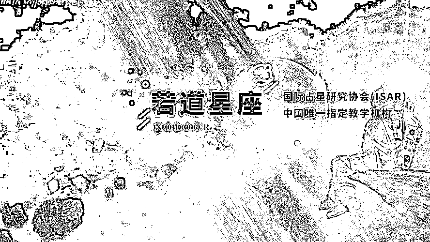

作者/莎拉·布朗利

译者/Luke 校对/江艺

编辑/翀子 封面/书君 图片/网络天王星的行进，总伴随着不可预料的事件和随之而来的“爆炸”般震动，它的目的是让我们自由并带来觉醒。2022 年 1 月 18 日天王星从逆行转为顺行，顺行将持续到 8 月 23 日。在这大半年的时间，12 星座都会在什么领域兴奋的“加足马力”？一起来看看吧！**天王星的“性格”**

**首先，天王星是一颗什么样的星？**

它是水瓶座的守护星，所以你可以预期**某些出乎意料的事，某些不同寻常的事，有一点奇怪，也有点惊奇。**

**天王星真的喜欢带来震撼，**所以最好预期在这段时间前后发生出乎意料的事情，不要有太多期待。

**适应性和灵活性是关键。**

**天王星在 2022 年 1 月 18 日在金牛座转向顺行。所以，你可能在好奇，天王星顺行到底有什么意义？**

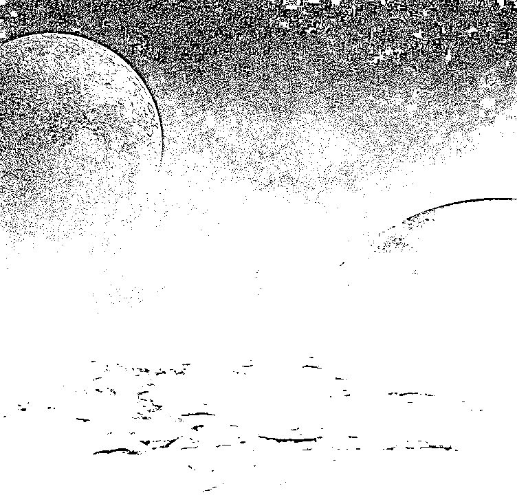

**天王星顺行的意义**

**你是否曾经有一段关系，让你感觉无法真正做自己？**

那不一定是一段浪漫关系。可能你就是感觉到无法表达真正的自我，无论是什么原因。**大多数时间，这些原因都来自于恐惧。**我们担心我们不被接纳。我们担心某人会对我们发脾气，等等。

**当天王星逆行时，会遭遇到许多这种内在的压力。天王星会做所有我们想做或想说、却又阻止自己去做的那些框架之外的事情。**

当天王星逆行时，我们把这些东西压在心里。为什么？因为我们担心。

**然而，天王星顺行给了我们需要的那轻轻一推，让一切脱口而出。这就是为什么天王星顺行是一件好事。**

你想对老板宣扬的想法？你想对爱人表明的承诺？你想和闺蜜谈论的那个问题？你心心念念想要尝试的新衣服或新发型，却一直在推迟？

**当天王星顺行，这所有的一切都会破壳而出。**

**当天王星顺行，“如果......会怎样”的答案得到揭晓，这就是为什么它是令人兴奋的。梦想确实成真了！**

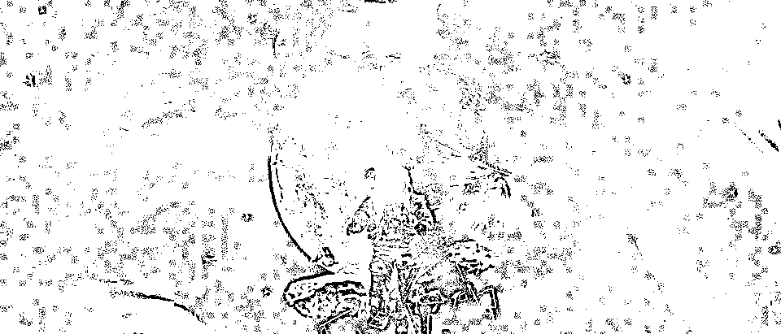

**天王星顺行，你的 2022 计划**

**必须铭记于心的是，天王星在金牛座处于“陷落”的位置。**

这也没什么好大惊小怪的。天王星充满了惊奇，然而缓慢固定的土象星座金牛座喜欢可预测的事。惊奇会让它们感到恼火。

**所以，重要的是在这两者之间找到平衡，这包括制定计划，尽可能保持稳定和脚踏实地，未雨绸缪，专注于长期计划。**

与此同时，当天王星顺行时，它带来了真相、洞见和自由，**人们会强烈渴望从虚假和缺乏真实性的事物中挣脱出来。**

换句话说，做好准备迎接塔罗牌“高塔”的时刻！

任何你使用土象金牛座能量精心搭建或设计的计划、关系或架构，都可能会经历**一两轮剧烈的震动**，如果它们被搭建在**虚假的基础之上**的话。

**天王星不能容忍虚伪。**如果你对自己不够诚实，天王星将会，无论是用这样或那样的方式，迫使你看见真相。

当出现震动时，这些震动可能会变成爆炸。**要关注自己和他人的情绪！**

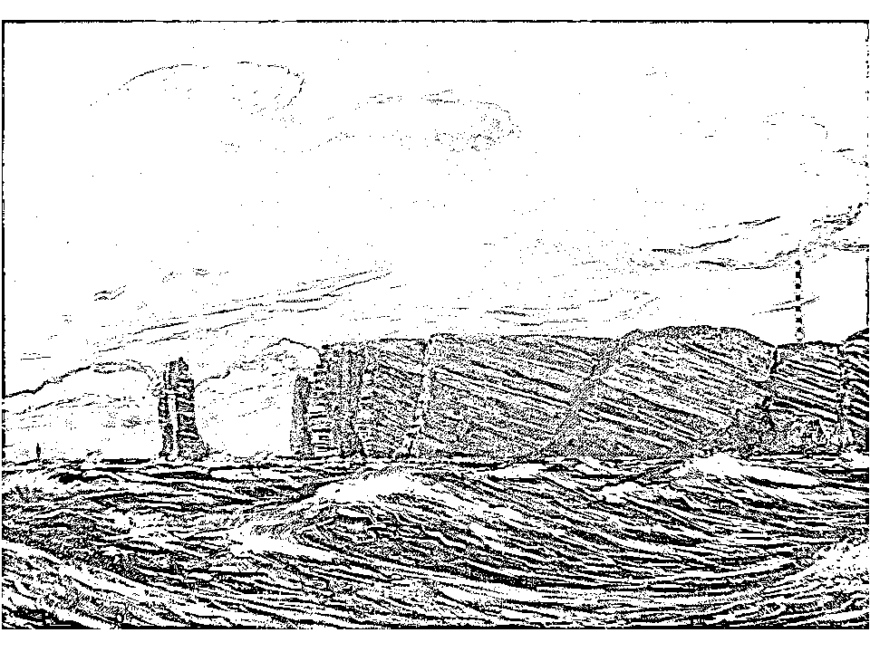

**天王星顺行对 12 星座的意义**

所以，随着 1 月 18 日天王星顺行，根据你的黄道星座，有什么建议吗？当然，要谨慎行事，但要拥抱即将到来的一切。

**天王星是反叛的，无论这些变化多么令人震惊或突然，长期来看，它们根本上都是善的，是宏大计划的一部分。**

看看天王星顺行对你的星座意味着什么！

**★*****白羊座***

大的改变正在到来，你可能发现自己陷入了紧张刺激的气氛中，让你感到火冒三丈！

但是这些时刻推动你摆脱那些阻碍你前进的事情。无论是你的关系方面，还是在职业生涯中感觉陷入泥沼。**天王星顺行带来了激烈的澄清，能够帮助你转到正确的方向。**

**是时候驾驭那内在的激情了，**但与此同时要让它受到控制，白羊座。

**★*****金牛座 ***

当天王星顺行，你的毅力会增强。然而，你需要做好准备的是，**有可能事情没有完全按照你设想的计划那样发展。**

**2022 年是巨大改变的一年，**尤其对于你的长期目标而言。继续做你一直以来所做的事，**但要接受你可能需要在这里或那里做一些调整，**才能到达你需要的地方。

**不要低估灵活的重要性，金牛座。**甚至可以说，它对于实现你的目标至关重要。

**★*****双子座 ***

旧的做事方法可能不再管用，随着出乎意料和令人不安的事件发生，**你需要做好准备，适应新鲜和不同的事物。**

你有时会陷入一成不变的生活，习惯可能成为你最大的敌人。**但你越愿意顺其自然，你成功的机会越大。**不要害怕走出你的舒适区。

必须要做的事，是一定要去做的，双子座。对于天王星顺行，这是你的课程。

**★*****巨蟹座***

尽管你想要保持原状，继续过之前的生活，但对于天王星顺行，这不是一个选择。

对你来说，未来将有大事发生，尤其在职业方面。**你可能经历职业方向的彻底改变。**危险存在于你自身之中。**在今年你有很大的潜力，推动事情的发生，**但是不安全感或拘束感可能会阻挡你的脚步。

不要让它们得逞。提醒你自己，你可以完成任何你所设定的目标，巨蟹座。

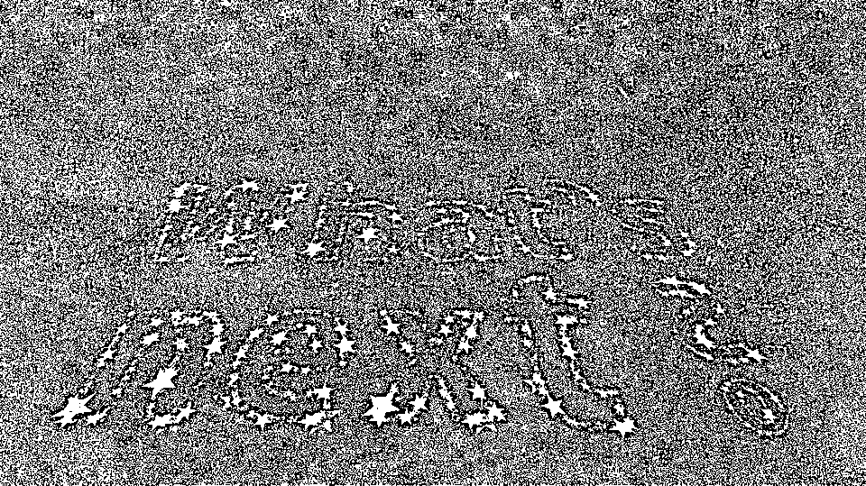

**★*****狮子座***

头脑和心灵之间的选择即将出现。有时，你感觉仿佛自己的内心在进行无休止的斗争。

天王星顺行会**震撼所有你先前的信念，**使你在深层次上质疑自己。**这是一个强烈自我反思和审查的时间。**关键是相信你自己，不断提醒自己你内在的力量比你所意识到的要强大。

**关注更大的局面，不要让小小的挫折将你打倒，狮子座。**

**★*****处女座 ***

对于天王星顺行，为出乎意料的事情做好准备，因为你可能发现事情发展不像你计划的那样！另一方面，在这一行进期间，**你额外的好处是，增进了智慧和洞察力。**

对适应持开放态度，因为你越愿意乘着改变之风前进，你就越能在接下来的努力中获得成功。

**只是要记住，处女座，变化来了又走，但是维持稳定的心态总是有益的。**关注那些来到你身边的新想法，它们可能有些特别之处！

**★*****天秤座***

这对你是一个有挑战性的行进，可能有好几项挑战和障碍挡在你的面前。

然而，**学习和灵性成长的机会尤其强大。**无论你面对什么考验，你强烈的正义感和天生的外交技巧都会帮你度过难关。

**只要记住永远忠于自己，当你知道自己的信念是正确，就不要退缩，天秤座。**

**★*****天蝎座***

相信你自己，因为你对自己越有信心，就越能在这一行进下繁荣发展。

**注意人际关系的震荡。这对你的人际关系来说，是强有力的时刻。**事情按照原先状态继续下去的可能性很小。**诚实对待自己和他人，不要让过去的问题妨碍你做你需要做的事。**

驾驭你内心的超级力量，天蝎座。

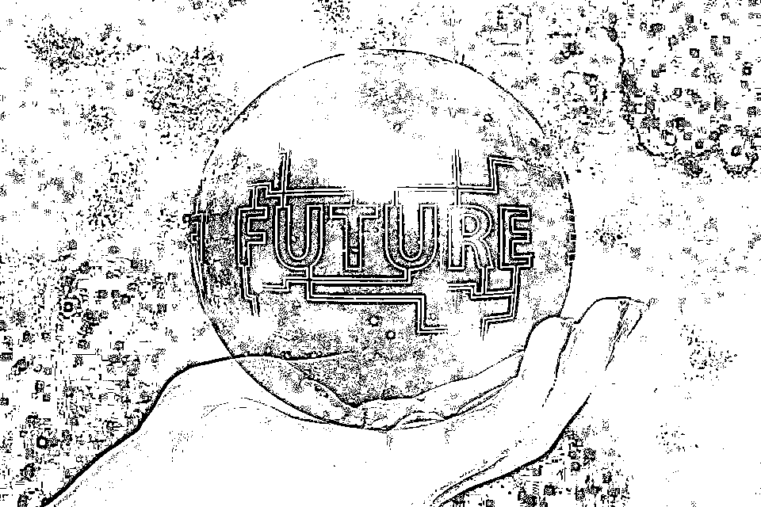

**★*****射手座***

这是强有力的转化时刻，在这一行进期间会发生很多事。

准备好迎接一些惊喜。你可能需要快速适应方向的转变。**一些事情将从地面之下升起，尽管它们可能有挑战性，却带来了快速灵性成长的机会。**

忠于你自己，并相信令人兴奋的时光就在前头，射手座。

**★*****摩羯座***

在这一行进期间，你会遇到很多事情，你已经感到了变化的到来。**一个新时代将为你开启。**

改变总是不容易的，但却是帮助你达到目标的必要条件。已经没有回头路了。改变之风已经吹起，新的黎明即将来临。

**当有需要时，不要害怕寻求别人的帮助。**在你身后有一支军队，它们会一直支持你，摩羯座。

**★*****水瓶座***

这对你来说是一个激烈的行进，你可能发现自己被抛进从未预期过的境地！

**你的关系将经历剧烈的转化，**让你有机会从老旧的方式中挣脱出来，踏上新的征程。拥抱即将到来的事情。

**你是原创者和创新者，有能力实现你的梦想，水瓶座。**

**★*****双鱼座***

尽管你想要待在你的舒适区，天王星顺行会把你扔出去，双鱼座！**但你需要在这段时间关注你的情绪，尤其是那些从内心深处泛起的情绪。**

现在，要么沉没，要么游泳。你有强大的内在力量，不仅能够游泳，还能够在海浪中翱翔和跳跃！

为你的创造性能量和抱负感到自豪。机会正在到来，但是否能抓住机会取决于你。**要有信念，相信自己，这样你就不会迷失！**

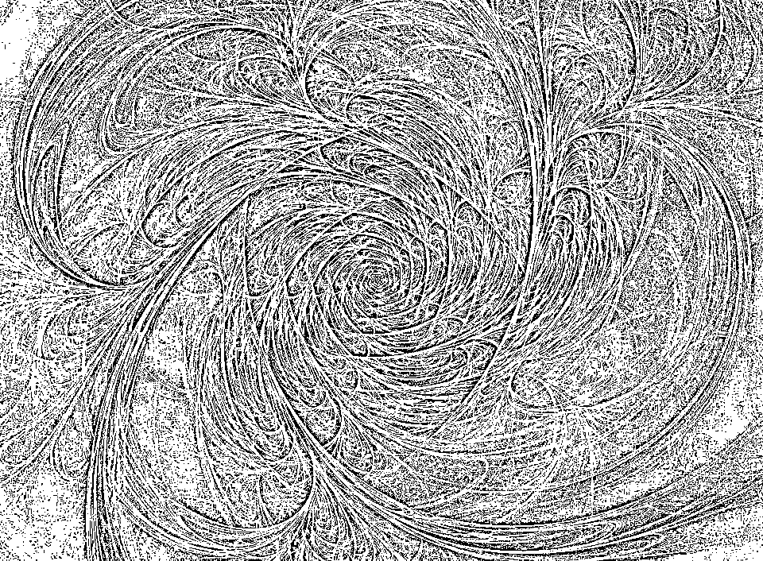

**如何迎接天王星顺行？**

**当天王星从 1 月 18 日顺行，不要再隐藏你的梦想、感受或表达。**

这是新的一年。是你崭新的一页。**你是你命运的主人。**

随着我们在 2022 年继续面对这些事情，天王星的力量和指引是最值得感激的。

**不如这样想——不可避免的变化发生了，是为了推动我们在人生中以一切可能的方式继续前进，你所面对的挑战是为了加速你的灵性成长。**

当天王星顺行时，不要再把头埋到沙子里了。是时候用勇气、力量和毅力来面对它们！

**版权声明：**本文由若道翻译发布，欢迎转发，反对抄袭。友号转载请申请白名单。

**莎拉·布朗利**

莎拉·布朗利有着和谐的天秤座太阳，纠结的天蝎座上升，属相是虎。她是一位风一样的作家，对塔罗牌和各种形式的占星学充满热情。莎拉是三部小说的作者，当前正在写作《占星学每日财运》和《中国十二生肖》以及一些文章。

**国际占星日免费演讲 ****今晚学员分享第二场****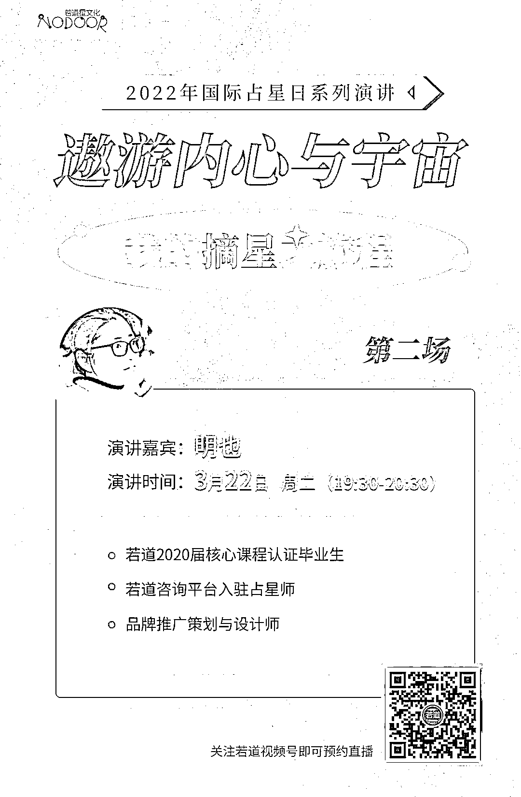****20 位来自世界各地的占星师****带来 20 场沙龙——新世界的觉醒****详情可点击下图**

**除此之外，我们还有****国际占星日优惠充值活动哦~** **快扫描下图二维码抢购吧**

**学习占星学**
**点击下图了解课程详情**

****

**微信又双叒叕改版啦，不想错过若道君的推送？**

**就把若道设为星标吧！**

**▼**

**就是这个“在看”，戳戳戳 ☟**

****************报名直达入口****************

# 若道周运 3.21-3.27 丨白羊月第一周，宇宙能量发生了哪些变化？（内含 12 星座运势）

> 原文：[`mp.weixin.qq.com/s?__biz=MzA5NjA0NTAxNg==&mid=2651469769&idx=1&sn=d8b1ab16a79bb1050c5445c1979734b3&chksm=8b48857ebc3f0c68004d63775bf2848b29212e7c0c69db0118f4a3b5ebce3373fb89bd230b7d&scene=126&sessionid=1692737842#rd`](http://mp.weixin.qq.com/s?__biz=MzA5NjA0NTAxNg==&mid=2651469769&idx=1&sn=d8b1ab16a79bb1050c5445c1979734b3&chksm=8b48857ebc3f0c68004d63775bf2848b29212e7c0c69db0118f4a3b5ebce3373fb89bd230b7d&scene=126&sessionid=1692737842#rd)

******☆ ****后台回复“今日”，给你一句生命态度******

作者/芷菱 ISAR 认证占星师
编辑/翀子 封面/书君 图片/网络白羊月第一周开始了，宇宙能量逐渐发生变化，火星四分天王星、水星进白羊座是本周的主要宇宙天气，而具体氛围是怎样的呢？12 星座又会如何度过本周？让我们来看文章吧！（如果着急看 12 星座运势，不妨先拉到最后哦）**整体氛围**

太阳进入白羊座之后的本周，宇宙能量在悄悄发生转变。**本周最值得注意的星象是 23 日的火星四分天王星，以及 27 日水星在太阳之后进入白羊座。**

**从双鱼座到白羊座的转向，白羊座能量的强化，以及火天的硬相位，**会不会带来战争的激化？或者带来个人勇气的增长，更加想要独立、冒险、大展拳脚？当然我们也要谨慎行动，防范意外。

**我们先看看本周的重点星象：**

*   **3 月 21 日 14:06 水星合相木星**

*   **3 月 23 日 04:44 火星四分天王星**

*   **3 月 24 日 01:44 水星合相海王星**

*   **3 月 26 日 18:35 水星六分冥王星**

*   **3 月 27 日 15:44 水星进白羊座**

**月亮轨迹：**

从周一开始，月亮依次经过天蝎座、射手座、摩羯座，在周日进入水瓶座。其中月亮在射手座时（23 日），会与双鱼座的群星发生四分相。

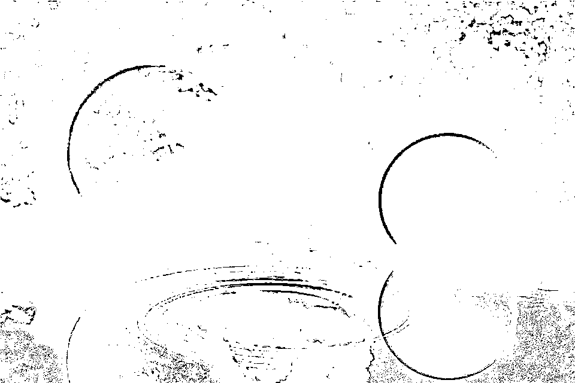

**一周重要天象**

★**白****羊座能量的增长与火天四分相**

本周是从双鱼座走向白羊座能量的转折期。**太阳在 3 月 20 日进入白羊座，本周日（3 月 27 日）水星也会进入白羊座。**

**从占星学的角度，我们迎来了一个全新的开始，而这一周就是新年的第一周。春分之后，万物复苏。**

从双鱼座到白羊座是一个加速度的过程。如果整个宇宙在双鱼月时处于静止、潜藏酝酿、没有方向的状态，**那么进入白羊座之后速度立刻变得快起来，目标也逐渐清晰。**

白羊座以急性子出名，它不要等待，只要行动。作为火象的第一个星座，也是黄道十二星座的第一个，**白羊座是当之无愧的前锋、战士、开拓者。**

我们可以预想，很多蛰伏已久的计划、梦想，此刻已经急不可待提上日程。这也会是一个让我们感到跃跃欲试的时期，有一种想要去冒险、行动、竞争、打开新局面的急切。

我们也会更有勇气，更想要独立自主，宣示我存在，我来了。

**更值得关注的是 23 日火星和天王星的四分相。**这是两个好斗行星的组合，而且成最困难的相位。如果我们放纵自己白羊座与火星冲动、不计后果的一面，那么火天四分相告诉我们，冲撞与斗争可能很难避免。

**火天四分相会带给我们强烈的冲动，想要突破束缚，反抗制度或权威，提出自己的强烈主张。**

事实上，金星也在这组相位中起作用。金火合相在水瓶座，金星先在 20 日四分天王星，然后逐渐离开，接着火星在 3 天后四分天王星。**拉长时间看，其实是金火合相，再四分天王星的一组相位。**

**金星的加入，把问题聚焦到关系与金钱层面。**就外交或人际关系而言，为了争取我方的自由、自主、胜利，我们选择和平还是斗争？以平等协商的方式是否可以达成？

先金星后火星，是否意味着关系议题未能和平解决，最终走向了以拳头和力量（火星）来决胜负，争自由？**我们需要警惕战争或地区冲突的加码，**以及防范与火、爆炸物相关的一些意外事件。

从金融市场的角度，我们已经看到 A 股经历了非常大的波动，而无论金天还是火天的硬相位，从金融占星的角度，都是市场波动的重要指征之一。

但土星一直在那里，它没有放松控制，也不会让事情脱轨太远：土星不仅在自己的强势位水瓶座，**而且金星和火星会逐渐追上土星**，金星将在下周 29 日精准合相土星。**事实上，本周火星、金星、土星三颗星在慢慢走向合相。**

因此在金天四分相、火天四分相之后，我们可能会逐渐感受到事情仍然在可控范围内。无论是人际关系，还是金融市场，某些有力的权威、或者现实因素决定了事情并不会因此彻底崩坏，**冲突过后仍将保持某种稳定。**

对个人而言同样如此，挣脱束缚的冲动，强烈的自我主张，可能造成天王式的震惊或冲突，**但最终土星仍会帮助我们回归现实。**这里土星可能是你的老板，也可能是某种现实环境的因素。

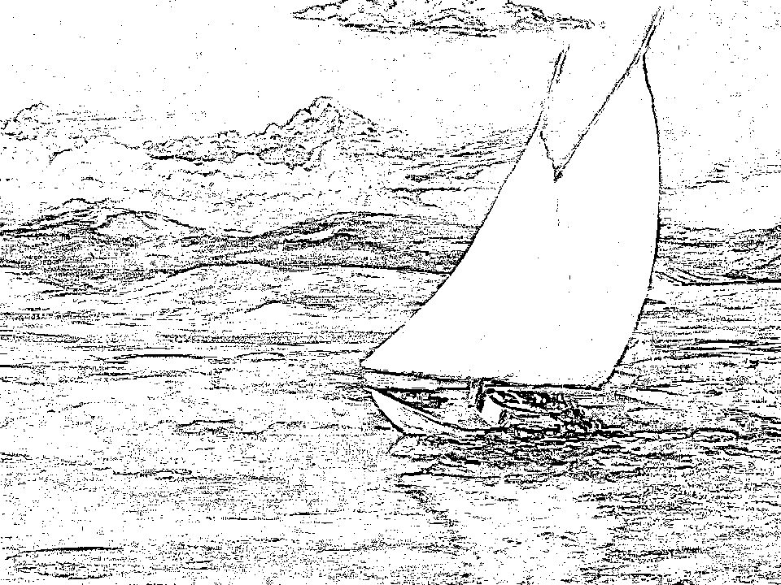

★**水星在木海之间的能量传递**

本周水星继续在双鱼座行进，直到周日换座进入白羊座。**水星在双鱼座，我们的思维、沟通、表达都会倾向于感性、直觉式、灵感的、非逻辑的。**加上本周水星将分别合相木星和海王星，这会进一步强化双鱼的灵性倾向。

今年最重要的天象就是将在**4 月 12 日发生的木海合相双鱼座。**许多占星家都诠释过这个星象可能带来的影响：**灵性的升华、慈悲与奉献精神、艺术与浪漫主义的倾向等等。**

目前木星和海王星正在逐渐靠近的过程中，而就在本周，**在双鱼座的水星将先在 21 日合相木星，接着又在 23 日追上海王星。**

水星的神话原型就是传递讯息的使者墨丘利，这一次它充分展现了信使的作用，将木星的信息带给了海王星——**注意观察，也许本周我们会提前感受到木海的能量。**

*   **也许我们会对流离失所的难民或战争受害者感到同情；**

*   **也许某些受伤害的弱势群体或小动物引发我们的悲悯之心；**

*   **也许某些给人美好理想色彩的艺术作品，或某些英雄人物、悲剧人物出现，让我们感动、心潮澎湃；**

*   **也许我们仅仅是想要放松一下，不再为每天柴米油盐的现实焦头烂额。而是放松下来，好好刷个剧，做个美梦，倾听自己内心的声音……**

水星会带来更多双鱼座气息的消息、事件、人物，来让我们变得柔软、善感，更容易为他人、为更大的集体乃至整个人类的共同议题而感动、共鸣。

**这段时间我们可以更多地倾听自己的直觉，寻找灵感，或通过冥想、艺术、梦境等追求内在的疗愈。**

因为海王星一向与病毒、传染关联，木星则与医疗有关，我们也需要思考，木海究竟会显现为木星扩大海王星（病毒）？还是指向一种彻底的治愈，或疫情缓和带来的管控放松与自由包容的状态？

**从本周看到的情况，也许可以预见 4 月木海正式合相时的状态了。**

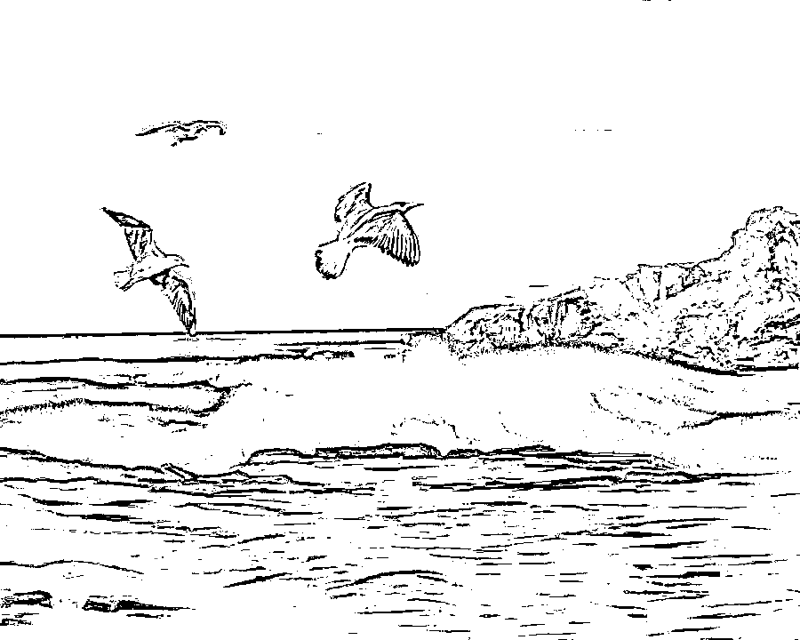

**12 星座的一周运势**

**（重点参考上升星座，其次参考太阳星座）**

***白羊座***

属于你的时刻已经到来。太阳和水星先后进入你的星座（或第 1 宫），是时候找回你的斗志与行动力，开始新的征服之旅。

“我来了，我看见，我征服”。这是你的格言，未来一个月都是施展它们的时候。**去行动，去尝试，去确认自己的自信和勇气还在，仍是从前那个少年。**

留意你的梦境和直觉，它想告诉你内心深处的终极梦想，或者需要疗愈的地方。**安顿好内心，你更可以轻装上阵，去争取属于你的荣誉。**

金星和火星在你的第 11 宫里，与天王星四分。如果你与朋友或团队发生分歧、争执，甚至发现观点立场的对立，不必因此而抛弃一切。接受这个世界有种种不同，坚持自己的独立观点，也尊重别人有自己的想法。你们终会找到一致性。

***金牛座***

关心你身边的人。**本周你有机会与身边的朋友，或团队成员有更多的情感交流，增进彼此的理解和共鸣。**你也可能会关注更多社会性的事务，战争、救助、慈善，思考一些人道主义的议题。

**太阳和水星在本周都陆续进入你的第 12 宫**，你可能感到疲劳，想要好好休息。在一段时间的满负荷工作之后，休整一下，放慢节奏，给自己充充电。

但似乎没那么快可以休息下来。金星与火星在你的第 10 宫，你仍然倍受大家关注，身上肩负着许多期待。

天王星在你的第 1 宫，需要注意与上司的关系，特别在周中的时候。**你可能很想坚持自己的想法和做法，跟领导的意见有出入。**适度坚持，也适度妥协，避免冲动行事。当金火逐渐走向土星，你会找到现实稳妥的解决方案。

***双子座***

珍视自己的梦想。水星在你的第 10 宫跟木海合相，你可以为自己画出最美丽的发展蓝图。**关键是找到自己真正想要的是什么，把你的梦想记录下来，**列出计划，或者与潜在的投资人沟通，看看有没有现实落地的可能性。

如果你从事的与身心灵相关，那么这会是灵感很强烈的一周，可能会获得很多美妙的启发。如果你从事与创意相关的行业，**这也是捕捉灵感，表达创意，打动别人的良好契机。**

太阳和水星本周进入你的第 11 宫，未来一个月你的社交生活也会变得热闹起来。可以期待更多的约会、朋友间的联络，或团队成员间的活动。

如果对人生哲学、信仰等命题感兴趣，你尽可以去阅读、学习，与人讨论。如果遇到质疑也没有必要力图说服别人，**接受这个世界的参差不齐，随缘就好。**

***巨蟹座***

走向舞台中央。太阳和水星先后进入你的第 10 宫，未来一个月你可能被委以重任，老板或同事对你投注更多的关注和期待。加油，好好表现，**注意将时间投入到具体清晰的目标上。**

你可能意识到自己需要更多的知识储备，或获得做事的智慧。水星在你的第 9 宫，**去自我学习和提升，捕捉自己的灵感和直觉，相信自己的思考能力。**

如果与朋友有金钱上的借贷往来，这周需要注意防范一些意外的损失。

问题也可能出在关系层面，朋友或团队的同事，也许原来以为牢固可靠的关系，突然发现对方某些出人意外的言行，使你无法继续信任 ta。**但你仍然需要团结身边的人，以务实理性的态度来处理，信任终能重建。**

***狮子座***

探索更大的世界。太阳和水星本周进入你的第 9 宫，**未来一段时间你可能想要学习新知识，拓展自己的视野，增长智慧。**如果条件允许，出门远行，走走看看也是很不错的拓展方式。

水星本周大部分时间还在你的第 8 宫。在金钱投资相关的事宜上你可能有很多的期待，看起来也有很多机会。**但要小心被不实的信息迷惑，注意风险，不要将投资理想化。**如果将这股能量用于探索自己的内心，接触玄学或心理学相关，也是很不错的。

金火合相在你的第 7 宫，感情关系方面很有机会，有伴侣的可能关系愉快热烈。而本周你的伴侣有可能对你忙于工作感到不满，或因为其他原因发生小摩擦。

抱怨也可能来自你重点服务的客户，他们态度的突然转变让你手忙脚乱，影响你的工作。**尽量实事求是，真诚沟通，问题终能解决。**

***处女座***

**关系的美好治愈。**这段时间是增进与伴侣或其他亲密朋友之间的深层理解、共鸣、包容的良机。你可能看到，如果放下挑剔与求完美的执念，仅仅是做一些感性的交流，去**感受对方的感受，理解对方的脆弱，都可能获得深刻的共鸣。**

如果身为咨询师，这也非常有利于对客户的深层理解与交流。

**本周太阳和水星来到你的第 8 宫，**如果身处一段关系当中，未来一个月你可能会想要情感更深刻，彼此有更深入的交流和联结。如果无关关系，那么你可能会关注自己的财务状况，考虑钱的问题。如果对心理学、玄学产生兴趣，也尽可以去学习、扩展知识。

**注意健康生活，认真对待自己的身体，**运动、新鲜食物和水可以帮助你获得更健美的身材，更好的活力。在工作中也安排好自己的时间和节奏，别在电脑前呆太久。

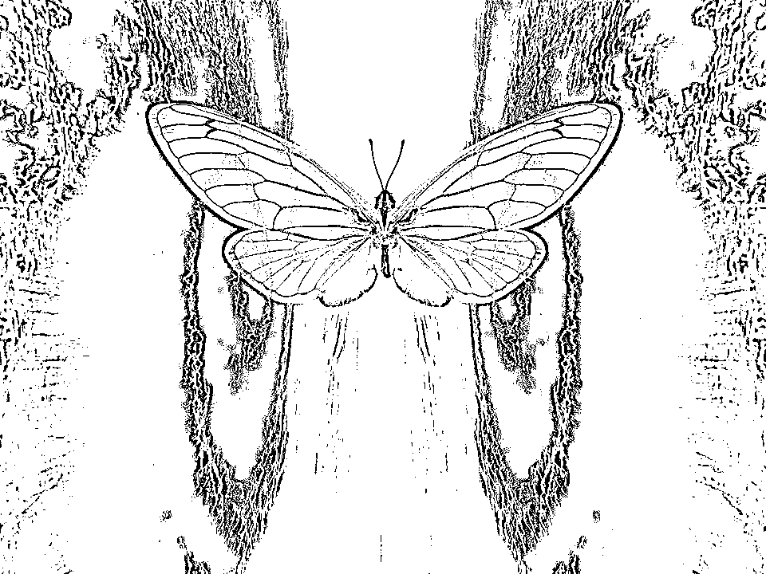

***天秤座***

社交小能手上线。太阳和水星进入你的第 7 宫。未来一个月，也许一些充满活力的新面孔会出现在你的生活里，你的伴侣也要求你更多的关注他，与他交流。

你历来擅长与人相处，**现在是展现你的同理心、平衡感、高情商的时刻了，**也许有机会结识一些重要的人物，建立一些重要的关系。感情方面也很有机会，可能很想来一场愉快的恋爱。

水星会先在你的第 6 宫里呆几天，你可能发现自己在工作中灵感爆棚，新鲜主意不断。同事关系也可能比较温柔融洽。**但需要注意分辨你收到的信息，**可能误解别人的话，或者自己没有表达清楚。也不要夸夸其谈，许下超出自己能力的诺言。

如果有钱在投资市场，需要防范突然的变化，谨慎操作。

***天蝎座***

忙碌也是一种充实。随着太阳和水星在本周先后来到你的第 6 宫，你会开始忙起来。可能有各种事需要你处理：整顿家务，运动健身，为家人烹饪美食，安排孩子的生活，等等。

工作自不必说，可能有很多事项需要你完成。你需要足够的活力和精力去应付工作。**保证你的健康和睡眠，适当运动，安排好日常作息，有助于提高工作效率。**

最近你跟家人在一起应该很愉快，不过本周有可能有一些小小的口角。也许是太忙碌，顾不上家庭事务，跟伴侣抱怨。或者跟脾气古怪的客户无法沟通而内心焦躁，想要爆发。**学习天秤座的智慧，如何换位思考，与人相处。**

**整体而言，你现在是很有灵感的阶段，可以抓住这个机会多做产出。**如果你擅长写作就多写，擅长与人沟通就多去交流，擅长说话就自制视频或直播——木海都在你的第 5 宫，**珍惜你的灵感和才华，让自己沉浸在音乐、电影、文学里面也是一种获取灵感的方式。**

***射手座***

**发挥你的才华。**最近跟家人的关系可能比较融洽。**你会发现更愿意包容和理解家人，不再计较和挑剔**。包括对孩子也一样，站在孩子的立场上思考，就不会一味只提要求，只看到不足。你们的沟通更加顺畅，饱含感情。

**随着太阳和水星先后进入你的第 5 宫，**未来一段时间你会很想要尽情释放自己，可能想要跟密友吃喝玩乐，或是想要做一些新鲜的尝试。这里也是孩子的宫位，孩子会引起你更多的关注，可以多跟孩子聊聊天，给 ta 一些启发和指导。

**你可能有很多新鲜的想法，**可以写下来，说出来，或者做成视频传播。这段时间你的表达很有感染力，想法也有创造性，也许某一段话就打动了某些人。某些想法还可能推动你工作上突破。

***摩羯座***

**抓住你的灵感。**最近你在思考、表达方面可谓是灵感爆棚。水星在你的第 3 宫合相木海，虽然摩羯座是非常理性的星座，**但此时你可以尝试着相信自己的直觉和灵感，抓住那些新鲜的想法。**

写作也好，谈判也好，你的话语会很有感染力。**学习用感性的一面去思考也对你有益。**

而随着太阳水星都进入第 4 宫，**你可能会腾出一部分精力关注家庭建设，**比如买卖房产、安排家人的生活学习，处理家庭财务等等。

目前金星与火星在你的第 2 宫，**一方面可能有不错的进账，另一方面也可能最近花钱不少，**尤其是花在孩子身上，或是一些你的业余爱好上面。如果有做理财投资，最近注意不要冲动或赌博心态去做，以免造成损失。

***水瓶座***

你是如何处理金钱的？最近水星在你的第 2 宫，**可以梳理一下自己的财务状况，**或者做个理财计划。但受双鱼座和木星、海王星的影响，**你对金钱的想法可能会有点理想化，或过度乐观，不够谨慎务实。**

最简单的办法是记账，先清楚自己的每一笔开销和收入，这是避免海王星式的模糊造成财务上混乱的基本方法。在此基础上再去做计划安排。

周末水星会跟随太阳来到你的第 3 宫。**接下来一个月左右，你可以多读书，学习感兴趣的知识，**也可以多表达，与人交流，用各种信息来刺激头脑，形成自己的观点。**这是一个充实自己的好时候。**

金星与火星在你的第 1 宫里，**你可能引人注目，魅力四射。**你也会很强调自我。但本周你可能会因为某些小事上的意见不合，跟某个家人有些小摩擦。也许你只是坚持自己的某种做法，或要求独立空间。你需要获得尊重。

***双鱼座***

你的温柔敏感被放大了。木海在你的第 1 宫里闪耀，水星本周也在这里触动它们。**你与生俱来的那些温柔、纯真、敏感、灵性的部分，现在被大大彰显。**

不要吝啬对人表达善意、理解与同情，不要羞于说出来，**你的话语可能具有治愈他人的功能，只要你充分发挥自己的悲悯与同理心。**

金星、火星和土星也在你的第 12 宫，看起来你确实可以为这个世界奉献点什么。将深藏的勇气和爱传递出去，无论通过什么形式。**亲近文学艺术、灵性、慈善等，都是适宜的。**

如果某些外界消息冲击到你的内心世界，希望你不要退却。世界不够完美，所以才需要我们去改变它。

太阳和水星本周先后进入你的第 2 宫。**在确认自己是谁之后，你可以考虑如何发挥自己的价值了。**投入到怎样的事情当中才让你内心真正满足，有成就感？未来一个月你可以思考这样的问题。

**版权声明**：原创文章由作者授权首发于若道平台发布，欢迎转发，反对抄袭。友号转载请申请白名单。

****

**芷菱**

ISAR 认证占星师/占星作者/媒体人若道 2019 届核心课程毕业生

于 2019 年通过 ISAR 考试，同年获得若道认证神话塔罗师资质

**微信公众号**：芷菱的理想国

长按打赏

**国际占星日免费演讲****学员分享第一场****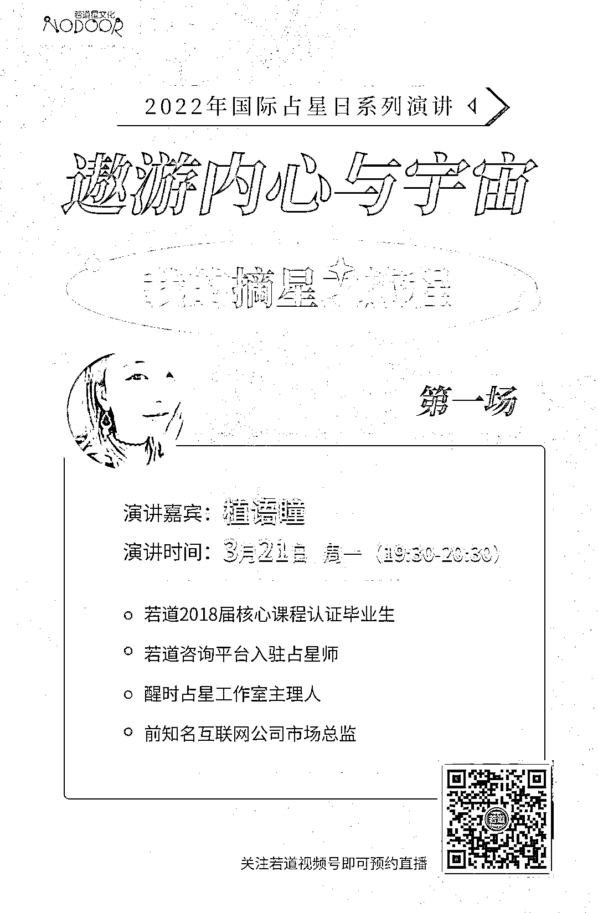****学习占星学****点击下图了解课程详情**

****

**微信又双叒叕改版啦，不想错过若道君的推送？**
**就把若道设为星标吧！****▼**

**喜欢记得点一下在看哦☟**

**报名直达入口**

# 本周重点星象丨这几天需要重点关注！

> 原文：[`mp.weixin.qq.com/s?__biz=MzA5NjA0NTAxNg==&mid=2651469769&idx=2&sn=9b0579b3879801d6bbda7d91c660bdeb&chksm=8b48857ebc3f0c68934d0531e9557a6e4f6ad613e9081887dad31eb43d81eebc32b123b9b82c&scene=126&sessionid=1692737842#rd`](http://mp.weixin.qq.com/s?__biz=MzA5NjA0NTAxNg==&mid=2651469769&idx=2&sn=9b0579b3879801d6bbda7d91c660bdeb&chksm=8b48857ebc3f0c68934d0531e9557a6e4f6ad613e9081887dad31eb43d81eebc32b123b9b82c&scene=126&sessionid=1692737842#rd)

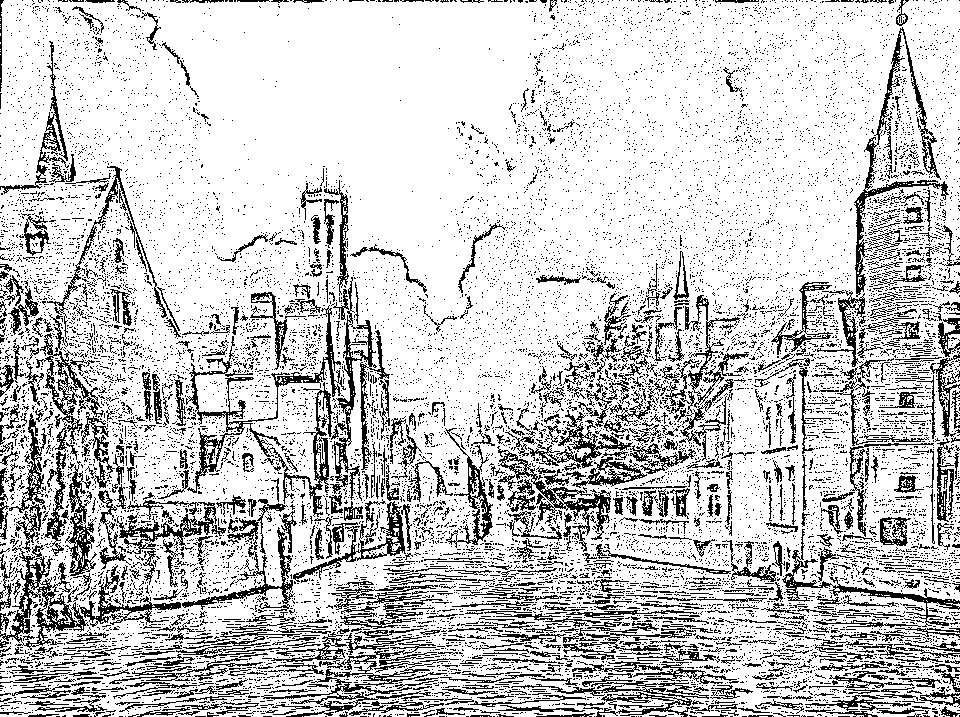

作者/芷菱 ISAR 认证占星师

编辑/翀子 图片/网络

今天头条介绍了本周宇宙天气的整体氛围，以及 12 星座的一周运势，如果你想继续了解本周的天象重点，就看看下面的内容吧！**重点关注的日子****3.21****周一**

★**水星合相木星、天蝎座月亮四分火星**

我们可能有非常多的想法要表达，或是在生活工作中需要做很多沟通、讨论、会议。

**水星和木星都在双鱼座，强化了思维和表达中的直觉、灵感、启发的作用。**珍视那些灵光闪现的时刻，也许你会获得特别的领悟。

水星与木星也是适合“想得大”的时候，**可以去思考长远和宏观的事物，**比如制订一个三年以上的远期目标，或者思考世界、人生、哲学、信仰相关的议题。

但要小心“说大话”，轻易许下难以实现的诺言，或者头脑发热定下实际上无法达到的工作 kpi。**充分考虑现实。**

月亮在天蝎座，对分天王星，四分火星。**这个 T 三角很可能带来情绪上的焦躁，**因为感受到威胁或不安全，而急于维护自己。与亲友或工作同事的沟通中，有可能因自我保护而产生争执或口角。**尽量冷静。**

**3.23****周三**

★**火星四分天王星、射手座月亮三分太阳**

火星的勇气被天王星的无拘无束放大了，**这是一个自由、叛逆、颠覆性的组合。**月亮在射手座，三分太阳白羊，也进一步加强了**大胆、乐观、冒进**的氛围。

**火天四分相作为本周最重要的星象，影响范围其实延续一整周，在 23 日前后 3 天内尤其明显。**

我们可能感受到某种焦躁，想要摆脱现实的某些束缚，完全按照自己的心意做一些大胆的事，或者彻底改变现状。**这阶段有冲动行事的倾向，缺乏耐性，**可能不经过深思熟虑，先做了再说。

火天相位可以帮助我们顶住压力，去做一些突破性的事，或者大胆地改变。**某些停滞不前、犹豫不决的事务，借助火天的力量，可以获得进展。**但也要小心负面的影响，以及注意安全，**谨防与火相关的意外事故。**

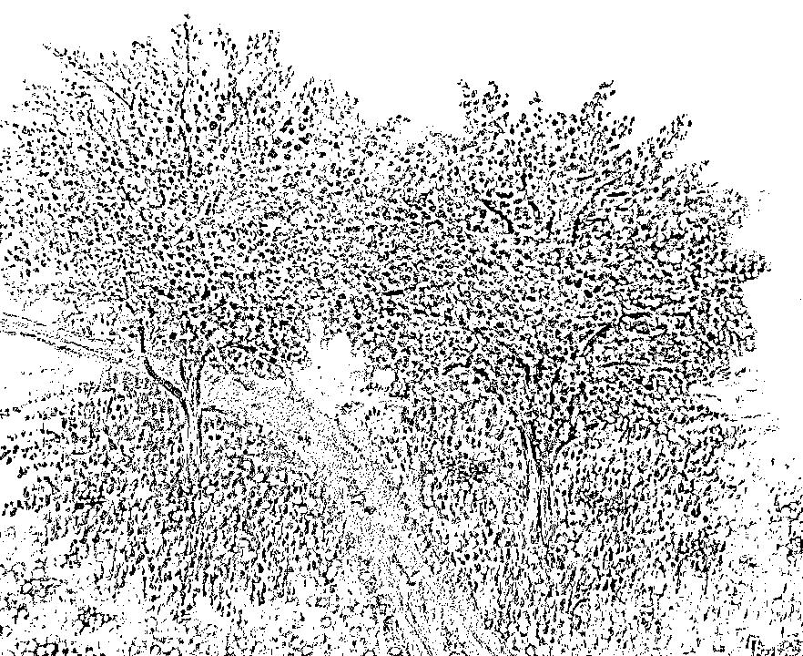

**3.24****周四**

★**水星合相海王星、射手座月亮四分水星、木星**

水海可能带来某些虚假或片面的消息，让人看不清真相，感到迷惑。**需要注意辨别，不轻率下判断。**

另一方面，水星与海王星在双鱼座，**很适合欣赏、交流艺术，**去看展览、欣赏音乐、看电影，都会有不错的收获，因为海王星会**增强我们的敏感性**，提高对作品的理解和感受力。

射手座月亮与水星、木星的相位，**也会增强我们探索智慧的愿望。**阅读身心灵相关的书，做冥想，追求某种精神领悟，也是不错的选择。**特别注意自己的直觉和灵感，可能带来不一样的启发。**

我们也可能看到一些弱势群体的新闻，对受损害的弱者产生同情心，想要去帮助他人。**海王星要我们与他人共鸣，融为一体，而不是只关注自己的利益。**

**3.27****周日**

**水星于 27 日进入白羊座，并在 4 月 3 日合相太阳，直到 4 月 11 日离开白羊座。**

当水星在白羊座，思考和说话都会变得更快，因为这是白羊座的运作方式。**白羊座水星更倾向于简单直接，有话就说，并不会“三思而后言”。**

**我们可能更倾向于直接表达，**不耐烦兜圈子，也可能遇到白羊座水星类型的交流对象，被对方的直接呛到。唇枪舌剑的争辩也会更常见。**这个阶段的交流，最好目标明确，正中主旨。**

**版权声明**：原创文章由作者授权首发于若道平台发布，欢迎转发，反对抄袭。友号转载请申请白名单。

****

**芷菱**

ISAR 认证占星师/占星作者/媒体人若道 2019 届核心课程毕业生

于 2019 年通过 ISAR 考试，同年获得若道认证神话塔罗师资质

**微信公众号**：芷菱的理想国

长按打赏

**学习占星学****点击下图了解课程详情**

****

**微信又双叒叕改版啦，不想错过若道君的推送？****就把若道设为星标吧！****▼**

**喜欢记得点一下在看哦☟**

**报名直达入口**

# 雷蒙德·梅里曼金融占星周运 | 市场或迎来重大翻转

> 原文：[`mp.weixin.qq.com/s?__biz=MzA5NjA0NTAxNg==&mid=2651469769&idx=3&sn=0180ff78a34b649c2d85ebdc1761c280&chksm=8b48857ebc3f0c68a8072aaadc63bd01fcd850a1a14eec2d166372a9d34e0c88e03d283189ce&scene=126&sessionid=1692737842#rd`](http://mp.weixin.qq.com/s?__biz=MzA5NjA0NTAxNg==&mid=2651469769&idx=3&sn=0180ff78a34b649c2d85ebdc1761c280&chksm=8b48857ebc3f0c68a8072aaadc63bd01fcd850a1a14eec2d166372a9d34e0c88e03d283189ce&scene=126&sessionid=1692737842#rd)

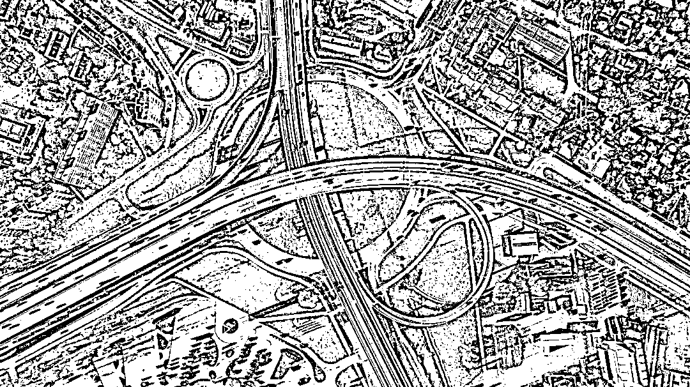

作者/雷蒙德·梅里曼 译者/Luke
编辑/玫瑰 图片/pexels

雷蒙德·梅里曼是在金融占星学界稳坐第一把交椅的占星师，同时他也是若道签约的金融占星课老师，我们引进了雷蒙德·梅里曼老师的《[上证指数月度报告](http://mp.weixin.qq.com/s?__biz=MzA5NjA0NTAxNg==&mid=2651468243&idx=2&sn=f05411adad4ddaaf1d1191605ed01684&chksm=8b488364bc3f0a7280eae0182f11965e636c566827deffb5c1fb6b5580373b55d26ae9946ad3&scene=21#wechat_redirect)》及《[黄金报告](http://mp.weixin.qq.com/s?__biz=MzA5NjA0NTAxNg==&mid=2651468243&idx=2&sn=f05411adad4ddaaf1d1191605ed01684&chksm=8b488364bc3f0a7280eae0182f11965e636c566827deffb5c1fb6b5580373b55d26ae9946ad3&scene=21#wechat_redirect)》。我们经老师的授权，将每周刊登梅里曼老师的周运，供大家参考和学习。于是，这是本周的周运（3.21-3.25）。

**说明：以下时间采用纽约证券交易所所在地美国东部标准时间。**

**展望与回顾**

****

**超低抵押贷款利率的时代已经结束。房地美周四表示，30 年固定抵押贷款的平均利率自 2019 年 5 月以来首次超越 4%。****——奥拉·麦卡弗里****《抵押贷款利率自 2019 年 5 月以来首次超过 4%》****《华尔街日报》****2022 年 3 月 18 日****美联储官员周三投票决定提高利率，在年底前再加息 6 次。这是 15 年来最积极的一次加息行动，旨在做出更大努力减缓处于 40 年来最高水平的通货膨胀。****——尼克·蒂米拉奥斯****《美联储发出再加息六次的信号》**

**《华尔街日报》**

**2022 年 3 月 17 日**由于要为周末的[上证指数、黄金和原油中国专场讲座](http://mp.weixin.qq.com/s?__biz=MzA5NjA0NTAxNg==&mid=2651469747&idx=2&sn=2fe44652bd4327070cdc88c1dd51ae81&chksm=8b488504bc3f0c1212228d25ded88cdf972b90aeb3dd97fd5c2f99dda46bb6a9a70a198fbe23&scene=21#wechat_redirect)（点击可阅读）做准备，我不能像往常那样提供对上周市场的回顾。然而，我们的三星级地球宇宙学关键反转日期 3 月 4 日-7 日，现在可以确认对应许多全球股票指数的基本周期波谷或次低点，或许还有原油和贵金属的基本周期波峰。我们会在中国专场讲座以及这周末的周度报告中更新这些市场的近况。

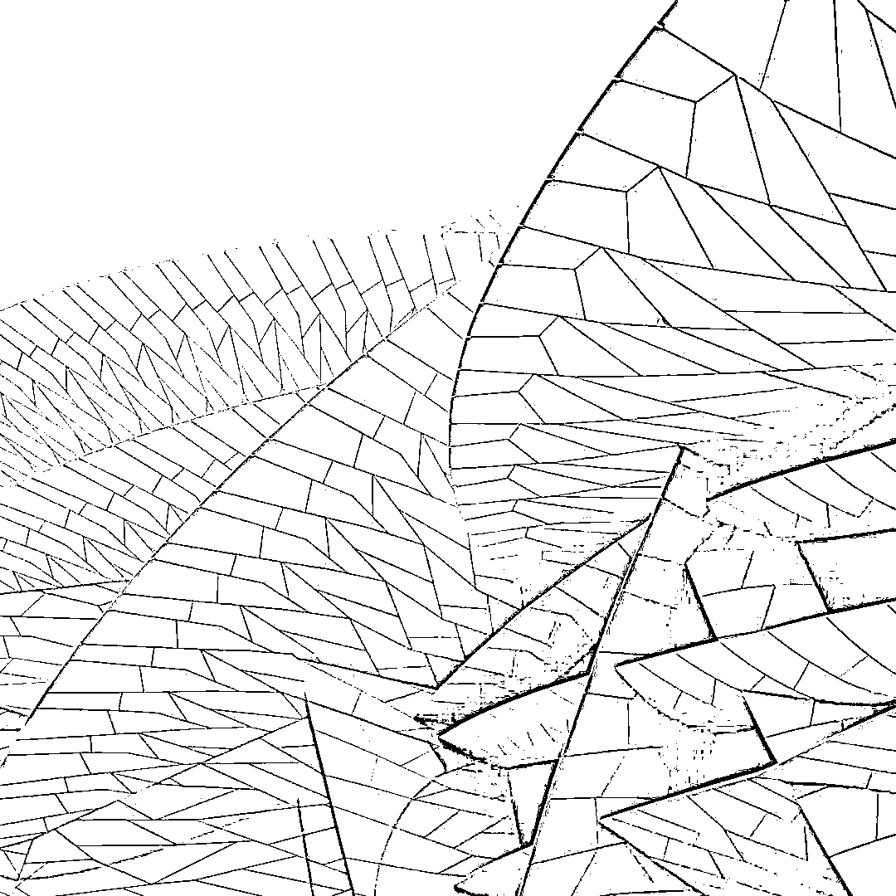

**短期占星趋势和长期考量**

****

**鲍威尔先生在新闻发布会上表示，美国经济“非常强势”。但值得注意的是，美联储智囊团在 12 月将今年的经济增长预测中位值从 4%下调到 2.8%。****美联储主席提到了好几次乌克兰战争，认为它对增长和通胀造成了风险。对于经济问题，每一位精明的美联储主席都需要找到一个“外生”的解释，而不归结为货币政策。****——《杰罗姆·鲍威尔，通货膨胀的斗士？》****《华尔街日报》社论版****2022 年 3 月 17 日****俄罗斯对乌克兰的入侵，后果波及全世界的家庭。推高了能源和食品价格，中断了贸易，进一步打压了对全球经济增长本就脆弱的信心。****——保罗·汉农****《经济合作与发展组织说，入侵使经济前景暗淡》****《华尔街日报》****2022 年 3 月 18 日**这就是土星四分天王星影响下，银行和财政政策的后果。它们过于冒进和极端，以至于可能是一个错误。但是现在银行业，甚至世界领导人们，终于采取措施纠正这些错误。问题是是否已经无足轻重或太晚。短期来看，仍然存在许多强有力的地球宇宙学征象。**3 月 18 日，在双鱼座/处女座末尾发生满月。金星和火星仍然在水瓶座彼此靠近，两者会在 3 月 19-22 日与金牛座的天王星形成四分相。**金星守护金牛座，天王星守护水瓶座，彼此落在对方守护的星座，因此它们互容，这使得这个四分相的力量翻倍了。**它在 8 个交易日内对应市场的重大反转，通常反转在 4 个交易日内发生。**

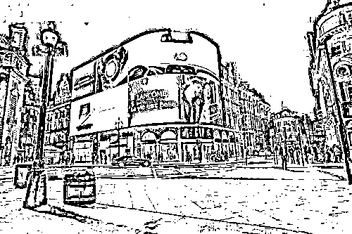

3 月 22 日，火星和天王星形成四分相。如果这个相位没有被利用来解决困难的冲突，那么它是另一个潜在的暴力指标。战争的威胁还不止如此，火星将在 4 月 4-5 日合相土星。这是另一个组合，可能显化为挫折或对其他人的潜在愤怒，因为这些人妨碍了此人完成项目。但是与此同时，木星也将在 4 月 12 日与海王星合相，这是 2022 年最长期的行星周期。它带来了希望， 因为木星-海王星与理想主义相关，不想要战争。落在双鱼座，它更多地意味着对和平的希望和暴力的终止。在金融市场上，这些行星组合中的每一个都与重大的市场运动和反转有着很强的关联。**木星-海王星尤其可能对应着中周期（50 周周期或者更大的周期）的波谷或波峰，容许度为 6 周。它对于原油尤其重要。**当前的木星-土星周期始于 2020 年 12 月 21 日的“大转变”，当时这一 20 年的会合（合相）周期发生在水瓶座。它开启了一个新的、140 年木星、土星在风象星座合相的纪元。我们现在刚刚进入这个新的木星-土星风象周期 15 个月。正如往常那样，合相时正处在一段经济繁荣的时期。现在，1-3 年之后，我们正在进入一场经济和（或）地缘政治危机。如果这一危机如历史上那样继续展开，我们将在 2024 年结束，甚至更早。但关于这一周期还涉及更多内容，我在[《2022 年金融预报》](http://mp.weixin.qq.com/s?__biz=MzA5NjA0NTAxNg==&mid=2651466824&idx=2&sn=2d33e244d106d8ae8cfb5a86e5fbb783&chksm=8b489effbc3f17e933ab731f7847f7a555cc3190dc32d407bd40b7c508a0a4c5fe2884a09cba&scene=21#wechat_redirect)（点击可阅读）中进行了详细讨论。这次木星-土星合相周期发生在风象星座。它先于 2021 年动荡不安的土星-天王星渐亏四分相发生。**土星-天王星行星周期与极端主义观点以及社会的分裂和极化相关。**木星-土星周期代表抛弃两极分裂，通过适度与平衡之道取得进展，也就是求同存异的理念（而不是像过去两年那样反着来）。木星代表“过剩”的原则，土星代表“不够”。当它们发生合相时，“恰到好处”就是非常有效的道路。它们是在集体思想和行为中，通往团结而非分裂，适度而非极端主义的关键要素。在《2022 年金融预报》中，我指出人类为什么会有希望，那是因为一场世界团结的运动，可能建立在木星-土星始入风象星座的基础上，同时 20 年来第一次大多数外行星正处于彼此的渐盈（增长）阶段。

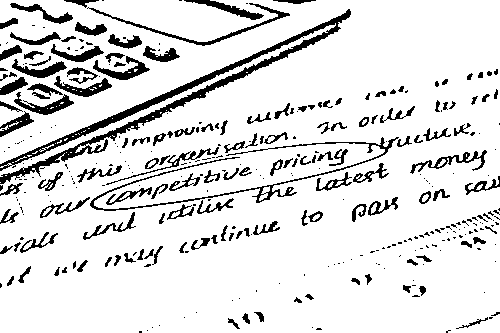

如果明智地应用这股能量，可以导致极端主义的退潮（伴随着土星-天王星渐亏四分相的出相），以及适度和平衡之道的兴起。我确实坚定地相信，占星学揭示了人类的历史挑战和机遇。正如一些人所说，这与个人判断、主观意见或缺乏客观分析无关。宇宙和宇宙法则不支持人类自我毁灭的愿望。创造性的力量对于地球上的生命是必要的。它最终比毁灭性的力量更强大、更持久。只要我们还在地球上生活，就会有创造和成长。当毁灭占据了主导，那还剩下什么？什么也没有。毁灭的最终结果是黑暗、虚无。存在于所有生命中的创造性力量不寻求虚无。它寻求与无限的合一，也寻求与它在地球上化身也就是彼此之间的合一。

**说明：以上日期基于纽约证券交易所所在的美国东部标准时间，由于存在时差，中国地区可能需要加一天。**

**版权声明：**本文由若道翻译发布，欢迎转发，反对抄袭。友号转载请申请白名单。

**雷蒙德·梅里曼（Raymond Merriman）**

若道签约老师。著名金融占星师，ISAR（国际占星研究协会）前主席，梅里曼市场分析公司的总裁。他由于“提升了占星学的职业形象”，在 1995 年国际占星大会上被授予轩辕十四奖；在 2012 年国际占星大会上，被授予轩辕十四终身成就奖。

1“中国上证指数月度报告”发售**若道推出了****中文版****的雷蒙德·梅里曼中国上证指数月度报告，并持续发行该报告！**当把金融市场的周期和占星学的周期相结合时，雷蒙德·梅里曼老师的金融占星学研究**为投资者应对金融市场的周期波动，并随之调整投资策略提供了极大的价值参考**。
**3 月中英文报告已上线！**2“黄金价格周期月度报告”发售**若道推出****中文版****的雷蒙德·梅里曼黄金价格周期月度报告！**不仅仅为广大读者在中国股市的投资出谋划策，更将视角放眼黄金市场。**每当世界经济形式不明朗的时候，有一个地方是保值的港湾，那就是****黄金**。自 1982 年雷蒙德·梅里曼出版第一本研究《地球宇宙学征象与黄金价格的关联》的著作以来，**他一直作为最重要的黄金市场时机预测者之一享誉国际**。2022 年 3 月黄金报告已上线，梅里曼老师将会告诉你他对这个关键时期如何操作的想法。也可以按照季度和一年期订阅，有更多优惠。季度和年度的好处是，你可以持续了解梅里曼老师对于不断在变化的市场的看法。即便他某一次看法和市场不一致，你也看到在下一期他如何调整自己的看法，并看到金融占星在一个长期时间段内对你把控风险的帮助。而能够长期控制风险、尽量找到安全的投资时机才是投资的长久之计。**3 月中英文报告已上线！****购买套餐**，买得越多越优惠中国上证指数月度报告套餐价

*   **单月报告**：280 元
*   **3 个月套餐**：780 元（260 元/月）
*   **12 个月套餐价**：2400 元（200 元/月）

**长按下图识别二维码****购买金融报告****套餐****▼**

黄金周期月度报告优惠

*   **双报告年度套餐更优惠（直降 900 元）**

*   **12 个月黄金报告+12 个月上证指数报告：仅需 3900 元**

**长按下图识别二维码购买黄金报告套餐**▼

3《2022 年金融预报和沙龙》1976 年以来，由雷蒙德·A·梅里曼撰写的梅里曼市场时机学院每年一次的年度预报沙龙和每年一本的《年度预报》一直在应用占星学原理为投资者们服务，提供卓越洞见，从未间断。 **雷蒙德·梅里曼《2022 年金融预报和沙龙》发售中（报告已发布）。****长按下图了解详情**
▼

**点击阅读原文购买金融报告**

# 3.20 太阳进白羊座丨 12 星座朝对的方向开足马力冲冲冲！

> 原文：[`mp.weixin.qq.com/s?__biz=MzA5NjA0NTAxNg==&mid=2651469747&idx=1&sn=829f1c07eeb8e20e9fd461c8ceda92a3&chksm=8b488504bc3f0c122ef669d7f8f16fb8ec4acc58ae7fc368789a75afbb17051dca7e30b449ab&scene=126&sessionid=1692737847#rd`](http://mp.weixin.qq.com/s?__biz=MzA5NjA0NTAxNg==&mid=2651469747&idx=1&sn=829f1c07eeb8e20e9fd461c8ceda92a3&chksm=8b488504bc3f0c122ef669d7f8f16fb8ec4acc58ae7fc368789a75afbb17051dca7e30b449ab&scene=126&sessionid=1692737847#rd)

******************☆ 后******************台******************回复“今日”，给你一句生命态度******************

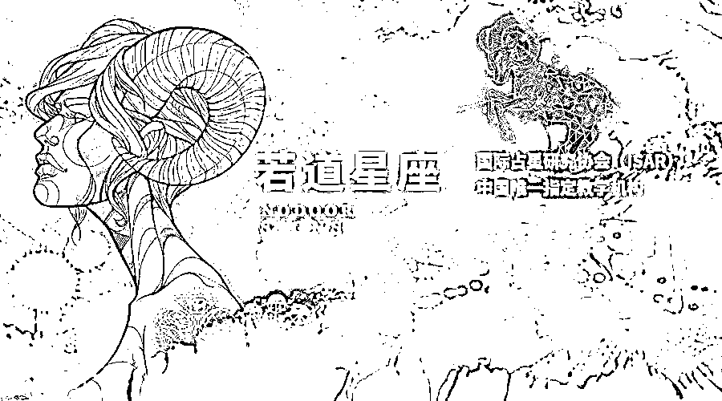

作者/郑玮玲 ISAR 认证占星师
编辑/玫瑰 图片/pexels**作者的话**北京时间 3 月 20 日 23:34，太阳进入白羊座，又一次回到黄道 0°起点。这是生命循序生长的新开始，万物随春光舞动，北半球进入茁壮、明丽之时节。每一年太阳进入白羊座 0°也是占星师和占星爱好者的节日——国际占星日。在此祝愿每一个热爱占星的人都在此时空感应天地之交会，铭记热爱星空之初心，无畏前行在星辰与真理的道路上，永保纯真热情，勇敢精进！**春分·太极**

太阳进入白羊座的同一天正是一年中最重要的节气之一：**春分**。春分日昼夜平分，太阳直射赤道并开启 90 天走向北回归线的历程，将更多的日光和温暖带给北半球，万物生机勃发。

****

**阳生于子（冬至），终于午（夏至），至卯（春分）而中分，故春为阳中，而仲月之节为春分，正阴阳适中，故昼夜无长短云。****——《月令七十二候集解》**太极生两仪（二分），两仪生四象（四季），太阳从黄道 0°开始走一圈就是一个太阳回归年，即太极。春分之物候：**一候元鸟至，二候雷乃发声，三候始电。**“元”是创始星座之力，身披黑羽的燕子将天之玄水带到人间，因而春风化雨，雷电划破混沌，天地交会，地气回温，终得春暖花开。

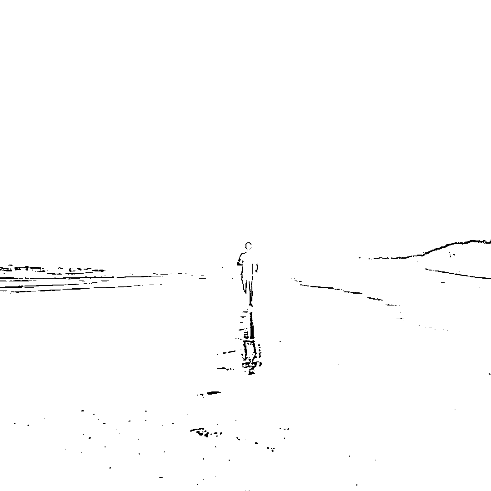

**太阳在白羊座****白羊座，火象创始星座，主动、热情、果敢、快速、率真，是勇士、战士原型，也象征战争、竞赛和运动。**火星守护白羊座，而白羊座从三月春分日开始，“March”与“Mars”同词根，“march”也指：**行军、进行曲和示威游行**之意。比如 2017 年 1 月在美国发起的声势浩大的女权示威活动“Women’s March”。 **太阳进入白羊座，自古意味着强有力的新开始。**古罗马、古波斯和现在的土耳其、伊朗、阿富汗等地都将这一天作为新年。太阳在白羊座带来了种子般的意识，如同春天应当做的事：**开启、播种**。萌动的意识在此刻落实到身体力行中。因此，太阳白羊座赋予了自由最简单明了的注解：**去行动！**白羊座的太阳也赋予了人类志向、动向与点燃新气象的精神。**直觉，尤其身体直觉是一切志向的行动开启之机。****白羊座所处的春分的时空属于天火同人卦。**此时既需要**行动来分隔、启动时空，**也意味着**实践理想的人们要遵照“君子合而不同”的原则，与共同愿景的同伴求大同，存小异，并肩前行。这就带来了走得更远的支持力。**太阳在白羊座是入旺的位置，用最强活力、生机支持全面发力和进攻。白羊座猛烈、直接的开启之力如刚劲、生发的阳气将春天绽放在人间。草长莺飞，春意渐浓之下是万物无分别的野蛮生长。白羊座以热血著称，也充满了草创蒙昧之情怀，**粗糙、扑拙是白羊座最值得玩味的品质。凭借天真质朴，摆脱精细、繁琐的约束。**春分时节对应的第二个时空卦象——**水泽节卦**则意味着：**生长的意义同在于内在的清明、节制，谨言慎行，予人甘饴，透过达成他人的满足来明见自心。**节卦的意象调节了白羊座时空的勇猛、刚劲，通过自我的观照、节制得以照见他人，回到自性圆满。木海双鱼座的背景下，白羊座的太阳犹如患难中升起的决斗力，无论我们身处何种境况，都值得用行动、拼搏、热血甚至牺牲的勇气把希望播种到生活的现实。

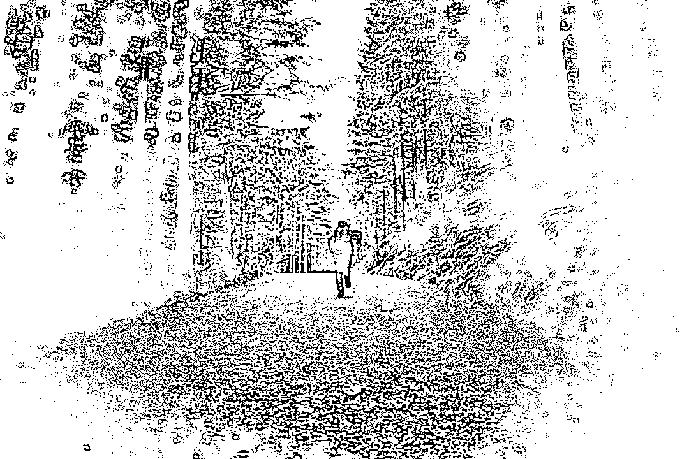

**太阳在白羊座的行进**

**太阳合相凯龙星**

**周期：3 月 31 日-4 月 4 日****重点影响人群：**有个人行星、四轴、交点位于白羊座、巨蟹座、狮子座、天秤座、射手座、摩羯座、10°-14°的人群。**凯龙星是小行星，其相位只取 2°以内的容许度。****太阳与凯龙星短暂合相几天，是开启、揭示疗愈动能和潜能的时机。**日凯合相**透过现实的伤痛感，将壮烈而激越内在的英雄与神性的挫伤联接在一起，为我们打开了疗愈的契机。**这组相位很适合从事疗愈者工作，或是准备进入疗愈工作的人**开启内在智慧，用足够的勇气和斗志去面对壮烈的复苏与自我唤醒。**

**太阳六分土星**

**周期：4 月 7 日-4 月 17 日**

**重点影响人群：**有个人行星、四轴、交点位于白羊座、巨蟹座、天秤座、摩羯座、水瓶座、金牛座、狮子座、天蝎座 17°-28°的人群。土星对充满斗志的意识提出现实、凝重的考验，在此期间，**任何充满前景的行动都会遇到瓶颈和现实的阻碍。**土星要我们付出时间和耐心，在培养稳定性和持久力的前提下，考验的是我们对信念、真理的坚韧。**白羊座的莽撞和粗暴可能带来破坏性的结果。**若遇困境、险阻，宜守初心，恒定攻坚，慎重行事，退省与冷静是为上举。水瓶座的土星提示我们，**更多的时间与空间可以稳定信念系统，行动也会更加精准、有力。**

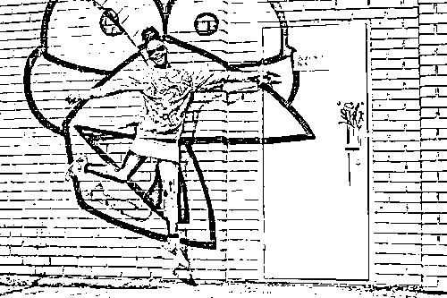

**太阳六分火星**

**周期：4 月 15 日-5 月 27 日****重点影响人群：**个人行星、四轴、交点位于白羊座、巨蟹座、天秤座、摩羯座 25°-29°和水瓶座、金牛座、狮子座、天蝎座、双鱼座、双子座、处女座、射手座所有度数区间的人群。这组相位将伴着太阳、火星接下来两次换座才会结束。行星换座的能量将复杂、变幻的动能带到现实中。日火六分的火药味最好的作用就是**促使高度专注在“作战”这件事上，支持强劲的突破、进攻与快速行动力。**太阳与白羊座的守护星火星六分，也意味着**良好的借力发挥，与外围协作者的有效合作能令我们事半功倍。**因此**4 月中旬的行动力是最为显著的，特别有助于任何真理的先行之举。****当火星进入双鱼座，太阳进入金牛座后，适度的缓慢推进是更为有力的行动；当太阳、火星进入双子座和白羊座时，又将迎来对行动有效性的调节时间。**日火六分支持我们在现实中披荆斩棘，发挥斗志，把最困难的工作交给这个春天吧。无论结果成败，只要怀揣赤诚，奋力拼搏过，终将无愧于心！

**太阳四分冥王星**

**周期：4 月 16 日-4 月 23 日**

**重点影响人群：**有个人行星、四轴、交点位于白羊座、巨蟹座、天秤座、摩羯座 28°-29°，水瓶座、金牛座、狮子座、天蝎座 0°-3°的人。在日火六分趁热打铁的背景下，日冥四分**为现实注入了激烈、紧张的氛围，预示着集体性的，不可抗力的危机显化，同时也带来了转化的机遇。**冥王星行进在摩羯座最后两度，**世界格局面临险峻、突变、重组，更多的黑暗、黑幕和让人难以承受的真相也在这进程中一层层披露，提示。**真相来时可能极度压抑、恐惧，而接受真相并穿越恐惧的人们会因此释放灵魂的自由。这轮日冥四分极可能向我们**揭示现实世界的重大危机，也由此会激发个性化的斗志，充满个人英雄主义的自我捍卫行动。****如果你在向老旧、陈腐的系统、架构宣战，那么你内在的勇气很大部分是来自于 2012-2020 天冥四分大背景之下被启发的智慧洞见。**此次日冥四分正是在天冥四分所在的星座，**度数前移意味着在原有意识的渐进生长。**冥王星会把转化的力量交到所有自我赋权的人手中，无畏黑暗的人都会握住宇宙法则，与阻挡新生，危害生命，限制意识进化的力量进行抗争。任何程度的牺牲、毁灭都将换来前景无限的壮丽新生。

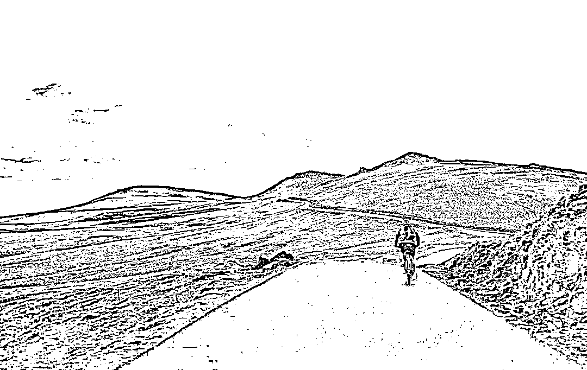

**12 上升星座运势指南**

**若道君：****你可以在 app store 或者应用商店搜索“若道”下载 app，输入个人档案，查看行运盘（也可以使用其他星图软件），找到行进太阳落在出生星图的第几宫，然后对照下文查看。**

**例如下图中，行进太阳在比尔·盖茨个人星图的第 8 宫。**

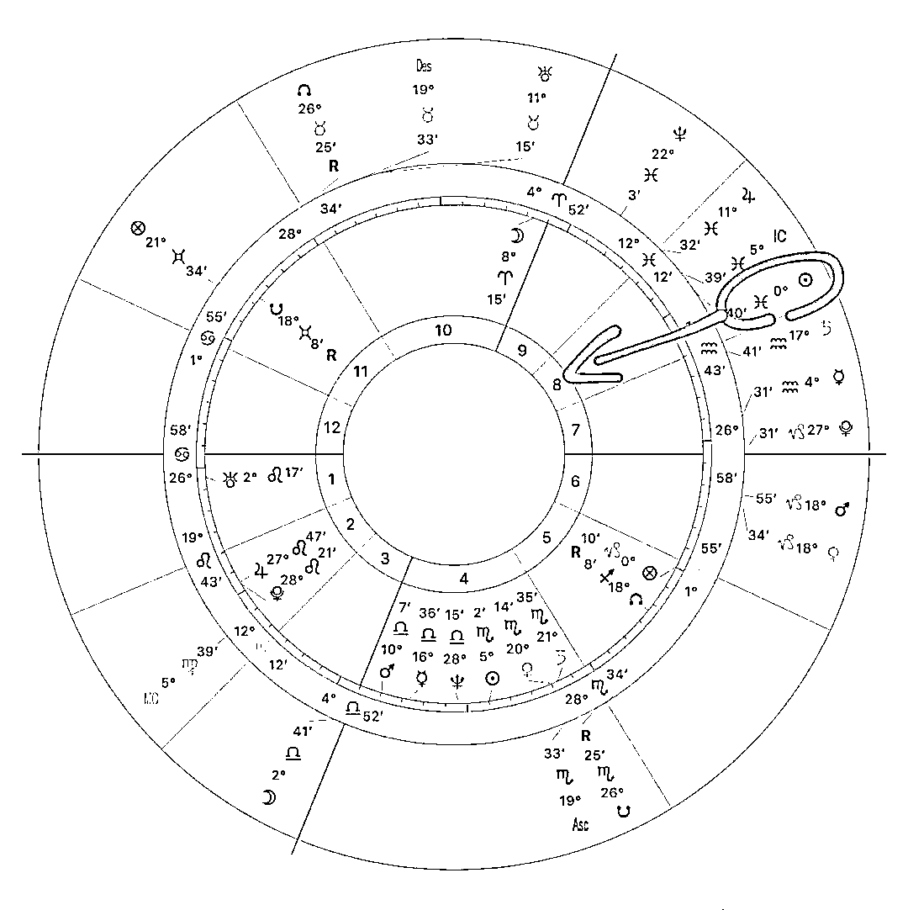

**以下内容以出生星图上升星座度数 30°范围内的上升星座为准。如你上升在 0°，可以完全参考下列内容；如你上升在 29°，则需参考下一上升星座。**

****★ 上升*********白羊座*********太阳行进在*********1 宫*****

春天把温暖和力量带到你的生活中，一定有些什么事能让你片刻专注起来，让你感受到力量与鲜活的存在感。你值得为着当下直觉去投入任何一件新的尝试，勇敢去做，去践行，以此来验证自己的信念和意志力。一段时期以来想要逃避现实的心态，集体性苦难的侵蚀，令你在心灵和灵性层面经受一次次的幻灭。困惑只能由你坚定的追求真理来消除，行动才验证现实与理想的距离或匹配。困境会再次显现，斗志没有回头路。最困难的时期也就是最能发力的时期，你值得为理想咬牙奋斗。****★ 上升*********金牛******座*********太阳行进在*********12 宫*****长时间投入到团体活动中可能令你精力透支，外界的良缘、机遇辗转交会，也为你的现实提出了抉择和清晰的要求。为了保持清醒前行，你需要短暂的退省与自修，在灵性生活、灵性教导的支持下完成内在的梳理，把宝贵的精力交还自己。

此时期适宜**建立并践行休养身心的方法。以退为进，是当下最好的行动。**

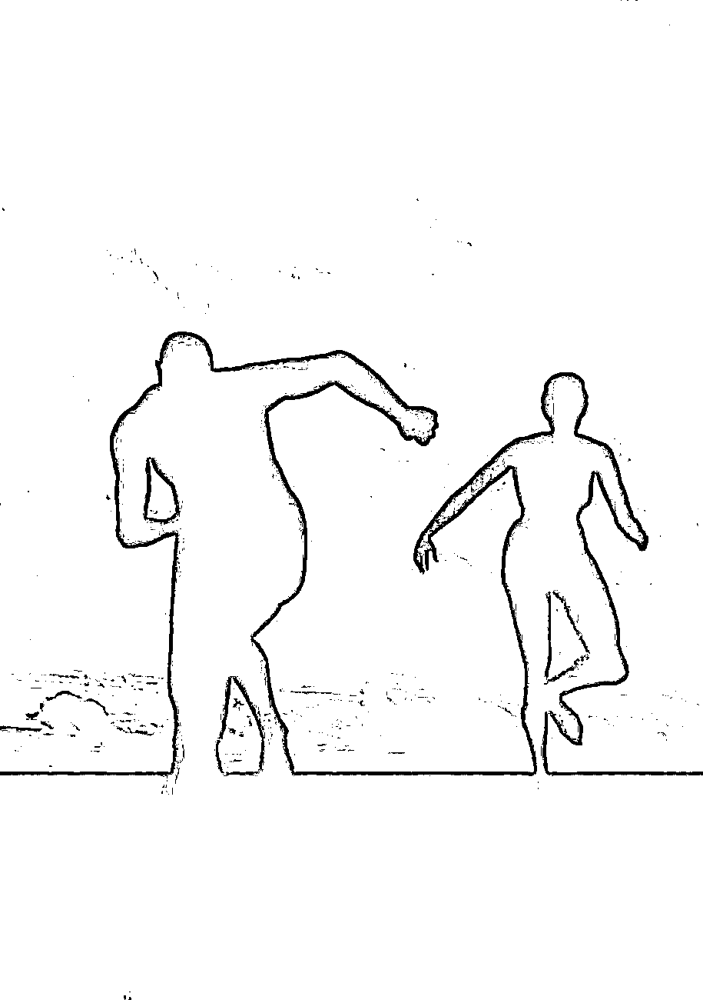

******★ 上升*********双子******座*********太阳行进在*********11 宫*******

目标和愿景还是那么高远无期？你需要关注的是当下已完成的，而不那些仍然空空如也的预期。忘了来时路上的收获才是令我们对现实失望的根本。而未来正在以一种全新，不被预测的方式展开来，去想象，就能创造你的实相。**勇敢走到你的愿景中去，那些和你同样的人会来到你生命中。**交流和行动在无形之间促成完整的目标达成，借力发挥，斩断旧有羁绊，如同从未失望过那样去投入你既定的目标吧。

****★ 上升*********巨蟹******座*********太阳行进在*********10 宫*****

理想照进现实的时期。现实中一些有助扩张的机遇即将到来，准备好心力、精力去承接你的幸运。当下最值得**为你热衷的事业拼搏一把，在精力旺盛的时节好好地做出一番成绩。**一段时期内，**家庭、情感关系也是令精力拉扯的原因，你也不得不分出一些心力去面对家事与情感问题，在职业与家庭两面权衡与分配时间精力。**

******★ 上升*********狮子******座*********太阳行进在*********9 宫*******

在经历了长期的涣散与幻灭中，你挣扎着完成了对自我信心的救赎。结束一些，重启一些，新的旅程也在脚下展开来。借助一些灵性手法，或经信任的导师指点，你已跨越旧时的意识与眼光，看到更远，更宽广的前景。

当下值得投入为意义而设立的行动中，开始做那些你曾经畏惧但现在觉得最有开拓力的事。把目标带到更广阔的意义中，去实现一轮华丽蜕变。

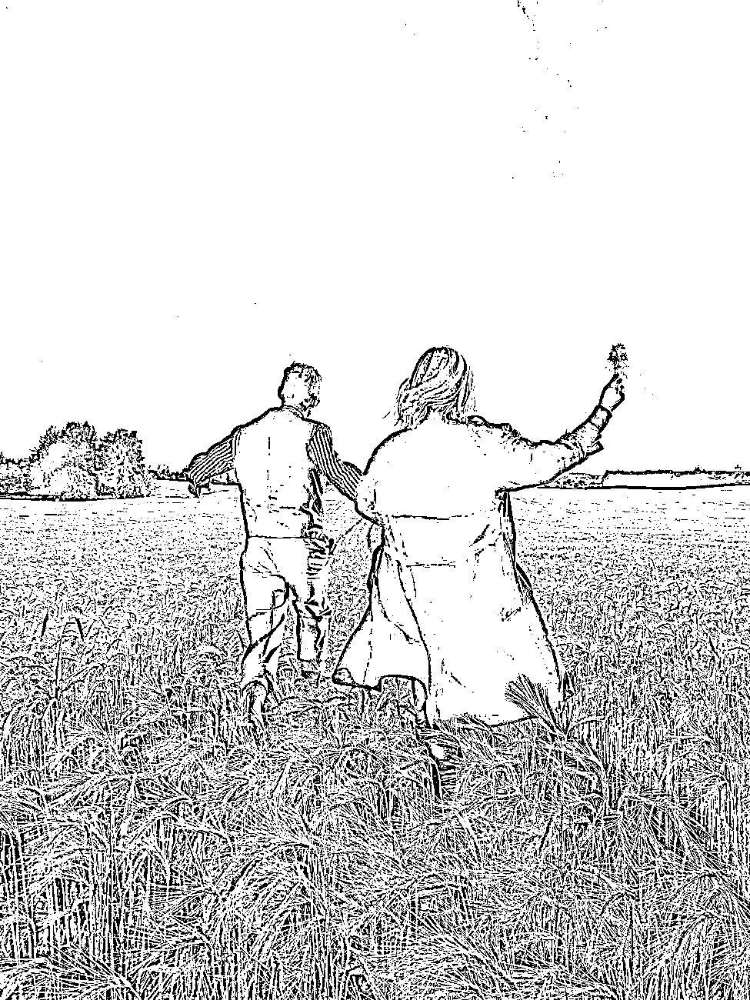

****★ 上升*********处女******座*********太阳行进在*********8 宫*****静思与冥想，沉浸在你个人的精神领地中是当下最需要的。**从沉寂、孤独、死亡与小我消失中获取的力量最能鼓舞你前行的动力。**在漫长的内在整合中，在长期的亲密关系的清晰与超越进程中，你找到了内在的灵性韵律，并能将之运用于处变的现实和自我调剂的内在工作中。**一切就按照自己的时序、感受来进行，这会为你的自我实现和创造铺垫最佳的实践之路。**

******★ 上升*********天秤******座*********太阳行进在*********7 宫*******

现在的你准备好从一段时间的自我沉浸中走到现实中，去面对新的合作，去交流，去负担新的关系中的责任。亲密关系中可能注入新的活力，和你的伴侣一起参与运动，投入共同的项目中，释放合一的热爱。此时期也会面临来自家庭的旧有、权威议题，冲突与对抗极有可能发生。**坚持自己的立场，清晰而宽容地面对你所爱的人，对现象作出谨慎的回应。********★ 上升*********天蝎******座*********太阳行进在*********6 宫*********努力工作、赚钱或是学习吧，此时期也有机会投入有益身心的运动项目中。**春天是一个郊游的好时期，带着你享乐的好心情去投入大自然的怀抱吧。**当下也会遇到一些有利于你施展个人技艺的时机，很可能是压力之下需要你作出的努力。**不用担心，你可以自信从容地面对这突然降临的重任，在某种程度上应该是你准备许久的才华展现。****★ 上升*********射手******座*********太阳行进在*********5 宫*****活力充沛无比的春天时光，你值得去尝试任何充满热情、兴致的运动、休闲和创造性活动，带上你的家人是更好的选择。现实的压力也许还是萦绕不去，在更大社会背景下的小我自由依然需要被允许和支持，给自己创造一时空来满足自己。**也许家庭的重担，孩子或父母带来的精力分散令你的个人空间压缩，但你可以尝试寻找到更为宽松、灵活的生活方式，与现实议题实现和解。**

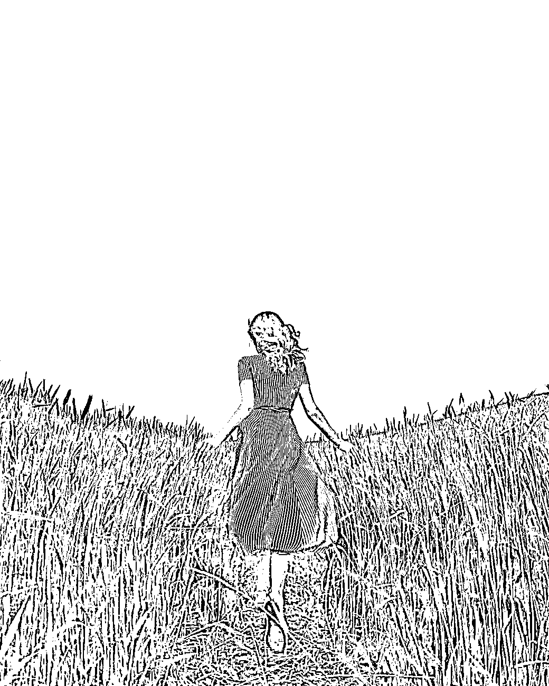

****★ 上升*********摩羯******座*********太阳行进在*********4 宫*****宅家、窝家，享受厨房和睡眠，在家的时光能最大补足你的精力，为你带来活力。在对灵性和神秘学探索的道路上，你达成了一些内在总结，因此当下正是你在生活、家庭中践行一二的开启时期。**对于建设家的信念也令你感到活力满满，带着它可以积极投入更有创造性和建设性的工作中，让赚钱、工作也成为快乐的事。********★ 上升*********水瓶******座*********太阳行进在*********3 宫*******一段时期以来的患得患失，内在不稳定感可能在近期迎向新的稳定。现阶段你会透过交流、资讯、课程学习获得一些启发与洞见，这会有利于你投入更富建设性的生活、工作目标。**但不要为了短暂热情投入过多的学习和交流中，把精力用在那些可以为你提供奋斗养料的领域中。**以你的直觉来决定最终，而不是头脑的分辨力，这样才会帮助你做出正确的选择。****★ 上升*********双鱼******座*********太阳行进在*********2 宫*****如果很难确立、保持住稳定的自我存在感，总是被消耗、消融在他人的场景、情节中，那当下就来到了一个**可以声明边界，确保现实力量的行动期。**在你身处的领域，尤其是职场上，你可以采取一些更倾向于直觉，当下的举措，这些无关他人的抉择与行动，最大程度鼓励了你的自信。你会很快看到实践带来的清晰和满足感。

**版权声明：**原创文章由作者授权首发于若道平台，欢迎转发，反对抄袭。友号转载请申请白名单。

**郑玮玲**

ISAR（国际占星研究协会）认证占星师（2016 年获得）

若道占星专栏作者

将占星咨询、教学与音乐、舞蹈相结合的疗愈者

**微信号**：zhengviolin

**新浪微博**：@郑玮玲

**微信公众号**：Sampriya-Astrology

长按打赏

**学习占星学****点击下图了解课程详情**

****

**微信又双叒叕改版啦，不想错过若道君的推送？**

**就把若道设为星标吧！**

**▼**

**就是这个“在看”，戳戳戳 ☟**

******报名直达入口******

# 今日 10:00 开讲丨重磅沙龙：金融占星大师雷蒙德·A·梅里曼 2022 年度预报

> 原文：[`mp.weixin.qq.com/s?__biz=MzA5NjA0NTAxNg==&mid=2651469747&idx=2&sn=2fe44652bd4327070cdc88c1dd51ae81&chksm=8b488504bc3f0c1212228d25ded88cdf972b90aeb3dd97fd5c2f99dda46bb6a9a70a198fbe23&scene=126&sessionid=1692737847#rd`](http://mp.weixin.qq.com/s?__biz=MzA5NjA0NTAxNg==&mid=2651469747&idx=2&sn=2fe44652bd4327070cdc88c1dd51ae81&chksm=8b488504bc3f0c1212228d25ded88cdf972b90aeb3dd97fd5c2f99dda46bb6a9a70a198fbe23&scene=126&sessionid=1692737847#rd)

**本周六上午 10 点：在世界剧变中如何保住财富——世界金融占星学大师雷蒙德·A·梅里曼 2022 年年度沙龙**

**Tips**

**1976 年以来，由雷蒙德·A·梅里曼撰写的梅里曼市场时机学院每年一次的年度预报沙龙和每年一本的《年度预报》一直在应用占星学原理为投资者们服务，提供卓越洞见，从未间断。** 

**2022 年是世界剧变之年。**

2 月 24 日开始的乌俄战争是柏林墙倒塌结束以来最重要的事件，它改变冷战以来形成的世界格局，改变一些国家的命运**，而这场战争也已经并最终对金融市场产生重大影响。**

我们在战争开始就目睹了**股票、黄金、原油、农产品、大宗商品市场**的剧烈波动，这些波动给大多数投资者的财富带来巨大的风险。

同时，战争带来的油价、农产品、大宗商品的价格变化也**让已经在通胀的世界经济可能走向更高的通胀，**侵蚀我们手中的货币存款。

**2022 年，如何在金融市场的剧烈波动中，如何应对巨大的投资的风险？**如何在通货膨胀中保有财富，对每一个人来说都是一个非常重要。

**2022 年一些行星组合**——木土合相、木海合相、土天最后一次容许度内的四分相、天王星进入金牛座的后半段；水星、金星和火星在 2022 年的逆行、木星在双鱼座（黄道最后一个星座）和白羊座（黄岛第一个星座）之间来回移动、土星/海王星的半六分相、月亮交点的换座、美国星图上冥王星的回归、土星对中国星图的金星四分火冥合相等重要行星组合，**在世界剧变中意味着什么？**

**3 月 19 日上午 10 点，金融占星大师雷蒙德·A·梅里曼的年度沙龙将告诉你他对于 2022 年投资的重要看法。**

**沙龙价格：****1380 元**

**本次沙龙和 2022 年年度预报一同发售（不单独销售）**

**扫描下图二维码购买**
▼

**购买者重要须知**

**①** 梅里曼市场时机学院每年一次的年度预报沙龙和《年度预报》是梅里曼市场时机学院的研究“预报”，而不是市场“预测”，是梅里曼老师及其金融占星分析师对人类活动周期历史与行星周期之间相关性的研究，二者在大部分情况下具有 80%或更高的相关性，而不是因果关系。沙龙中和报告中的研究完全存在错误的可能性。即便是非常认真的研究和几十年的研究经验，我们无法总是正确地解读出各种征象在实际层面上会如何相互作用，并显化为事件结果。

所以请将次沙龙和报告看作一个研究参考，务必结合其他市场研究和你个人对市场的理解，根据你的自由意志做决策。

**②** 此套餐一旦售出，**即不接受退款。**

**③** 此报告仅支持在手机网页和若道 APP 上阅读，不支持电脑阅读和下载。

**④** 讲座提供视频回放。**以上须知，请仔细阅读。一旦付款，即视为已了解并接受所有须知内容。**

**长按二维码添加客服**

▼

****购买报告直达入口****

# 国际占星日第 3 弹丨超丰厚沙龙充值卡，限时优惠 5 天（3.20-3.24）

> 原文：[`mp.weixin.qq.com/s?__biz=MzA5NjA0NTAxNg==&mid=2651469747&idx=3&sn=ebc8ac160632c1012fd8a75be9f42d15&chksm=8b488504bc3f0c12859f682f72d27e238a5ed9a7de7352bd23cf107113557e21772d4e60b85f&scene=126&sessionid=1692737847#rd`](http://mp.weixin.qq.com/s?__biz=MzA5NjA0NTAxNg==&mid=2651469747&idx=3&sn=ebc8ac160632c1012fd8a75be9f42d15&chksm=8b488504bc3f0c12859f682f72d27e238a5ed9a7de7352bd23cf107113557e21772d4e60b85f&scene=126&sessionid=1692737847#rd)

之前我们说过，在国际占星日（IAD）这一个对于占星界来说无比盛大的节日，我们将举行六场公益演讲，从**3 月 19 日一直持续到 3 月 24 日。**

将由两位大师和四位优秀的若道毕业学员倾情奉献。如果感兴趣的同学可以戳之前的文章了解（[连续六天线上演讲！国际大师与国内占星师齐聚](http://mp.weixin.qq.com/s?__biz=MzA5NjA0NTAxNg==&mid=2651469545&idx=2&sn=60f91f7402cfa884cb9130b0ed937103&chksm=8b48845ebc3f0d48d516d4146816946309c6a2b976fc3c788f7db403b502088c498e6b24d933&scene=21#wechat_redirect)）。

**上面六场演讲还不够满足你的话** **那么接下来这些福利你要看好了！****涵盖国内外知名占星师****83 场精品沙龙****属于国际占星日的****超级优惠****仅限五天！！！**

**注：卡券购买后，1 个工作日内，可在若道 app-我的钱包查看，如需协助可咨询客服（微信号：nodoor201705)**

**如何购买？****扫描下方二维码即可**

**国际占星日这一系列的活动****希望大家都能收获满满****春天快乐！(*^▽^*)**

**购买直达点击原文链接**

# 处女座满月 | 放开你离不开的东西，进入你不了解的领域

> 原文：[`mp.weixin.qq.com/s?__biz=MzA5NjA0NTAxNg==&mid=2651469648&idx=1&sn=818dc5bcd246cb2f9e4d1097c2d7e71d&chksm=8b4885e7bc3f0cf1ace66f260b817801fd5478c988b252d732e49ee4517d3561772a5cfd9294&scene=126&sessionid=1692737847#rd`](http://mp.weixin.qq.com/s?__biz=MzA5NjA0NTAxNg==&mid=2651469648&idx=1&sn=818dc5bcd246cb2f9e4d1097c2d7e71d&chksm=8b4885e7bc3f0cf1ace66f260b817801fd5478c988b252d732e49ee4517d3561772a5cfd9294&scene=126&sessionid=1692737847#rd)

**☆ 后台回复“今日”，给你一句生命态度**

作者/王芝桦 编辑/玫瑰 图片/pexels

**处女座满月****北京时间 2022 年 3 月 18 日 15:17 迎来处女座满月，双鱼座太阳与处女座月亮于 27°40′精准对分。****如果天上有双眼睛，****看着地球，****会否奇怪，****人间正在折腾什么？**确实折腾！从占星学角度而言，我们正处于 200 年一次的周期转换进程之中，怎么可能无声不痒地过渡？宇宙排兵布阵，行星集体推进，越早领会，越早解脱。只是，人间的巨轮太大了，而个体的“自我”又太强了，难免有些考验与波折。此次处女座满月，处女座为满月的月光润然上“脚踏实地，洞悉逻辑”的色彩，帮助我们看清生活的迷雾，聚焦自我的选择，只要我们愿意面对现实并勇于改变。

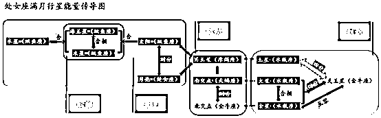

**处女座满月重点影响人群**

参考满月峰值影响期间各个行星的行进度数，以及逆行行星的轨迹影响；常规容许度，个人行星入相位 3°，出相位 1°；非个人行星入相位和出相位均为 3°。

**·** 出生星图中，有**行星、四轴、南北交点落入固定星座（金牛座、狮子座、天蝎座、水瓶座）6°-15°，17°-28°**的人群； **· **出生星图中，有**行星、四轴、南北交点落入基本星座（白羊座、巨蟹座、天秤座、摩羯座）0°-1°，25°-30°**的人群；**·** 出生星图中，有**行星、四轴、南北交点落入变动星座（双子座、射手座、处女座、双鱼座）10°-30°**的人群。

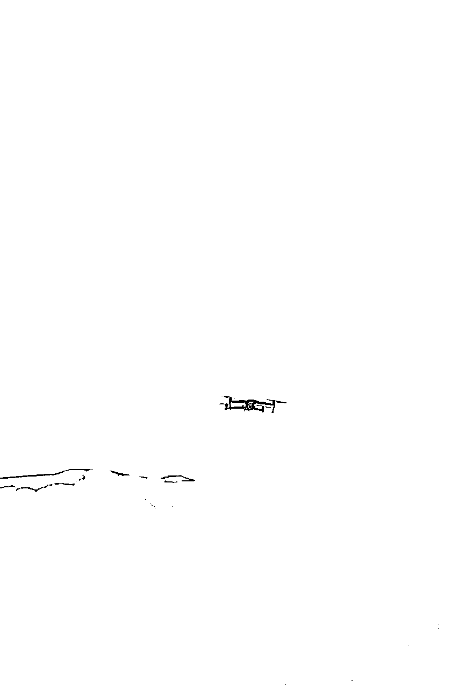

**一潭浑水，而不是一潭死水**

****

**你一定会不断挣扎，难以置信，会被现实一次次打倒，直到终于接受事实，尘埃落定。**

**——蕾秋·乔伊斯《一个人的朝圣》**

> ****天象：******· 群星汇聚双鱼座：宽泛容许度下，双鱼座水星合相双鱼座木星，双鱼座木星合相双鱼座海王星，双鱼座海王星合相双鱼座太阳。****· 冥王星介入“日月对分”轴线：摩羯座冥王星六分双鱼座太阳，三分处女座月亮。**

先来说说此次处女座满月的大背景。“木海合相”结构是 2022 年最重磅的宇宙天象，虽然每隔 13 年木星和海王星都会形成一次合相，但“木海合相”于这两颗行星共同守护的双鱼座却不是那么容易遇到。当代表“扩张能量”的木星与代表“意识通道”的海王星，合相于双鱼座“一望无垠又难以聚焦”的茫茫大海上，往往蕴藏着**变化莫测的可能性**。这个过程就像是东方智慧中的“阴阳转化”，蕴藏着此消彼长的“变局”：肉眼不可见，但皆在酝酿；肉眼可见时，已在轨道中——或许当下我们看到的是一潭浑水，但下面蕴藏的绝不是一潭死水。自进入 2022 年以来，我们时常是“懵圈”的：新冠病毒四处开花，上班下班病毒说了算；地缘政治风云变幻，股市物价跳得比炮弹还欢……什么时候是个头？未来又会何去何从？

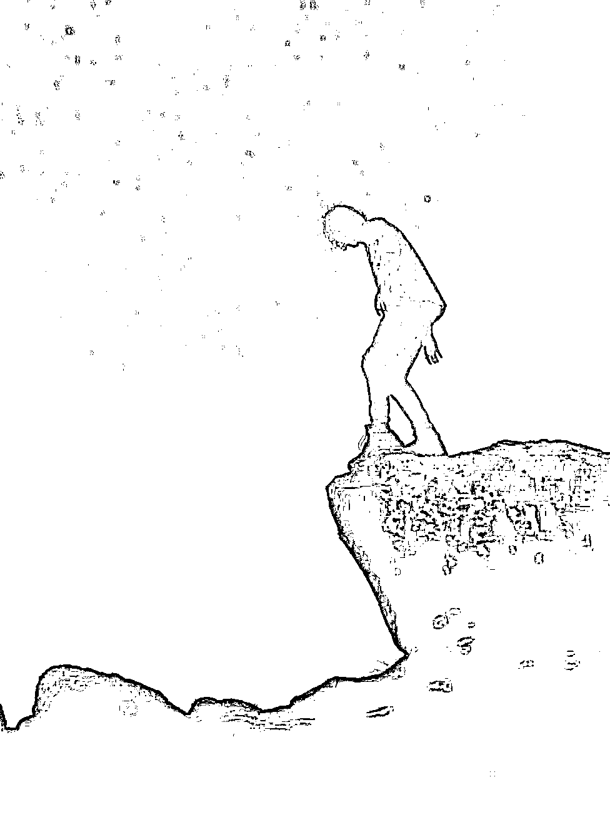

我们等啊等啊等，期待着“靴子落地”的啪嗒声，也好睡个踏实，也好有效应对。坏消息是：任你翘首期盼，管你焦虑难眠，靴子仍悬在半空；但好消息是：**从 2 月开始，内外的压力逼迫我们对“自我身份和自我定位”进入了更深的思考。**答案不好找。必须说实话，这是比较艰难的一段时间；但是，必须说真话，没有人是受害者，所有的困境也正是自我功课的显现；最后，还得说一句实话+真话，2022 年的“木海合相”是为“黑马”服务的。嗯，2022 年，我们要培养自己作为“黑马”的素养与品格，但首先要理清：**哪些内在的意识，哪些过往的模式，创造了当下的生活？价值是什么，实力有多少？精力应该投放在什么地方？****3 月 5 日，太阳和木星形成“日木合相”双鱼座结构，如果我们能在此前后三天（期间发生双鱼座新月）好好评估一下有关“自我”的议题，那么真是再好不过的事情。**因为**3 月 6 日，金星和火星的“金火合相水瓶座 0°”结构，将帮助我们看到自我的局限性和更大的可能性——每个人是自我生命的设计师，我们可以告诉自己“我是谁”，也可以告诉自己“我要往哪里去”。**当然，答案依然不好找。3 月 13 日，太阳和海王星形成“日海合相”双鱼座结构，很多朋友的生活又一次进入变幻莫测的状态；而随着此次处女座满月的时间推进，**无力把控的内在恐惧、强迫做好的紧张状态、未达理想的自我批判越来越强烈。**

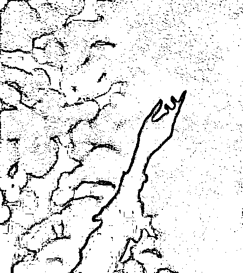

此次处女座满月，在水星、木星、海王星和太阳共同行进的“蕴藏着难以预测的可能性”的双鱼座海洋之上，倾照下来处女座“脚踏实地，洞悉逻辑”的满月月光，为我们带来一些清晰的讯息和高级的洞见；而此时介入满月“日月对分”轴线的摩羯座冥王星则带来明确的指令：**· 逃避真相将会更有压力，抱怨现实只会更加焦虑。**不断挣扎，难以置信，因为“我执”迟迟不愿接纳现实，但又会被现实一次次打倒，这是每个生命都会具有的自我执着和自我盲点。**但如果我们能够借由现实世界的人事物，觉察自我身上周而复始的业力模式，就能接纳现实并做出突破。****· 学会在“接纳现实和完善理想”之间做出一种平衡，才能不迷失在自我的理想化之中，不陷入现实的纷扰之中。**当下正是评估价值并校准航向的最佳时间，如此才能在 4 月 12 日“木海合相”结构到来的时刻，驶往更能落地现实的理想航线。此次处女座满月，靴子依然没有落地，但我们至少要努力让自己的内心尘埃落定——内心自宁静，靴子亦无声。说说现实层面的影响：**·** 集体层面，新冠疫情的国际性传播和流动性途径需要特别重视，而国际社会和权力人物的新闻也将再次迎来热议；**·** 个人层面，将会引动职场“人事变动，团队重组”的相关变化，而无论你是主动跳到圈外，还是被动划到圈外，都要相信只有你自己才能找到“成为什么样的自己”的答案。

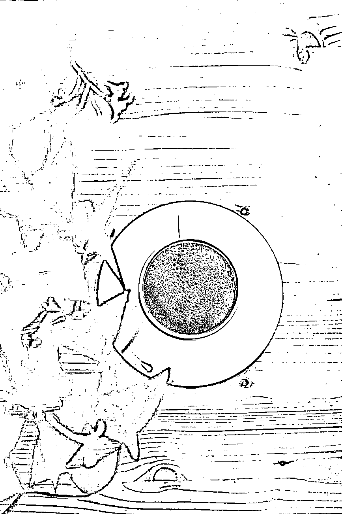

**放手与创新，离不开的都能离开**

****

**人一定要放手，要放开你离不开的东西。**

**——蕾秋·乔伊斯《一个人的朝圣》**

> ****天象：****
> 
> **· 金火合相：宽泛容许度下，金星与火星合相于水瓶座。**
> 
> **· “金火合相”四分天王星：“金火合相”与金牛座天王星形成四分结构。**

如果我们持续性地研究 2022 年的天象，便会发现自 2021 年末，揭示“业力功课和进化目标”的南北交点换座进入“南交天蝎座-北交金牛座”轴线之后，就一直与揭示“业力议题”的摩羯座冥王星联手推动着当下进程。此次处女座满月，摩羯座冥王星介入“日月对分”轴线，引领我们洞悉浑水下面悄然酝酿的可能性；而“南交天蝎座-北交金牛座”轴线则透过金星（守护金牛座）和火星（守护天蝎座）传递进化的信息。**2 月下旬-3 月初，金星和火星在摩羯座的轨道上逐步靠近摩羯座冥王星，形成“金火冥三重合相”结构。**这段时间，一些历史遗留问题开始呈现“关系纷争”，无论集体或个人，都试图保护自我立场，但也容易为达目的而撕毁承诺并不顾后果。3 月 6 日，金星和火星双双换座水瓶座并形成“金火合相水瓶座 0°”结构，将 2020 年末“木土合相水瓶座 0°”开启全新风元素周期的按键再次按下——全新的时代，需要我们带着升级的意识和创新的模式，参与到更为宏大、更有建设性的系统中来。“风元素周期”倡导平等与共赢——**只有秉持利他主义的精神和利益众生的发心，才能走向充满希望的未来之路。**这并不是说要压抑自我意识，而是指向更具广博视角的“尊重与自由”。试想，**如果我们不尊重、不允许他人，谁又会来尊重和允许我们呢？而如果我们找不到或不敢表达自己的个性，又如何不评判、不侧目他人呢？**

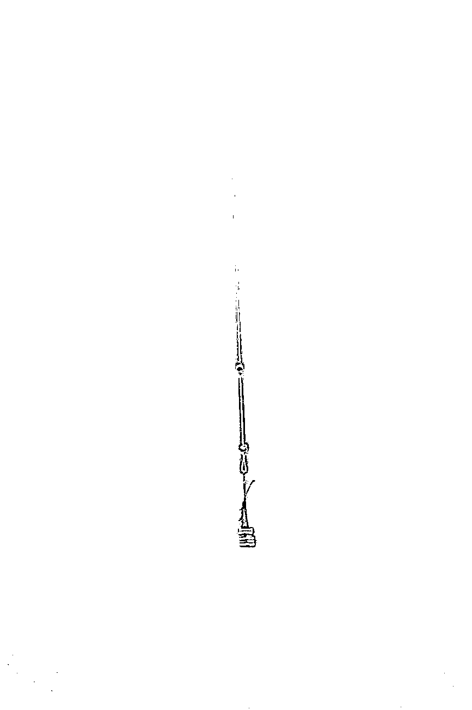

故而，宇宙安排 3 月 6 日的“金火合相水瓶座 0°”结构，引领我们再次思考**“个人-集体”之间的平衡议题**：**·** 此时接纳天蝎座南交点影响的水瓶座火星，很容易因为“执着和恐惧”而冷酷地擦枪走火；而此时接纳金牛座北交点影响的水瓶座金星，则带着“平等性的态度和变革性的视角”看待现实中的事物，努力建设全新的关系；**·** 不难看到“金火合相”水瓶座这一组结构中，水瓶座火星给水瓶座金星制造的麻烦。这就像青春期男生喜欢一个女生的时候，往往会搞出各种小动作戏弄（撩拨），求关注的他还不会正向地表达情感；**·** 但这一次水瓶座金星会占上风，因为“金火合相”结构正在被水瓶座金星与金牛座天王星组成的“金天互容”结构（金星守护金牛座，天王星守护水瓶座）定位，也就是说金牛座天王星的“变革之风”正在强势介入其中。故而，水瓶座金星（女生）会对水瓶座火星（男生）说：**你可以换一种更智慧、更朴实的表达方式。**此次处女座满月，“金火合相”与金牛座天王星的四分结构，向我们铺陈出一条创新的道路——**放手那些“离不开”的自我执念和言行模式，去接受一些你不了解的东西，去尝试一些从未体验过的方式，去相信自己可以改变一些事情。**另外，此次处女座满月的前后 5 天，“金火合相”与金牛座天王星的四分结构、群星汇聚双鱼座、即将于 4 月 12 日到来的“木海合相”结构，也指向**扑簌迷离且跌宕起伏的金融市场。**还是那些问题——你的价值是什么？你的实力又多少？你的精力应该投放在哪里？赚你能赚的钱，做你该做的事，至少没毛病。真正的高手，在谷底不慌乱，在高峰不执着，因为他（她）知道这盘棋其实是宇宙的游戏。

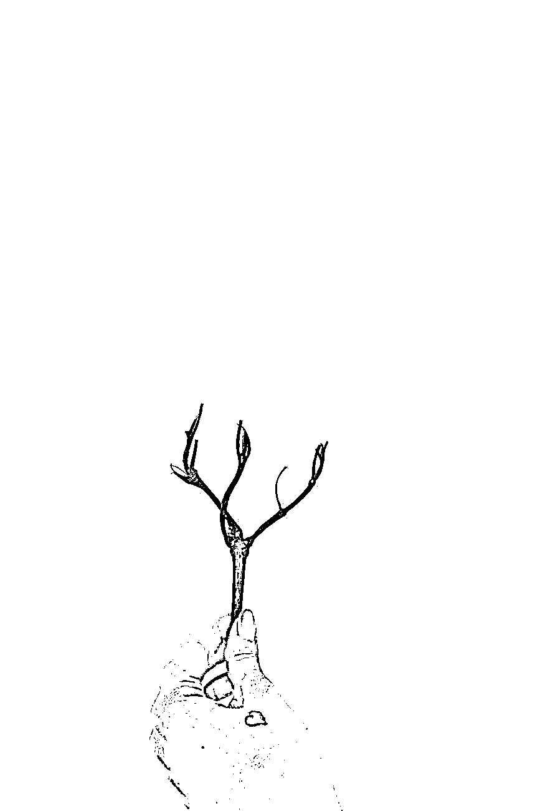

**寄语**

****

**天空和太阳一直都在，只有云去了又来。**

**——蕾秋·乔伊斯《一个人的朝圣》**

**不要过度用力，虽然我们时常认为拼命使劲很有用，但其实过度的用力都会造成损伤。**我们时常害怕自己低于他人的速度，担忧自己不被外界认同，恐惧明天的安稳没有保障，但结果是，我们的身体里储存着疲惫与病痛，睡梦里隐藏着焦虑与惶恐，眼睛里流淌着不安与迷茫。此次处女座满月，如果你感觉疲惫，那就放松下来，无论是大脑，还是身体。你看，天上的云去了又来，大家之所以喜欢看云，是因为云的随性与浪漫，根本不惧风雨雷电。我看，还是把心里的靴子换成云吧。祝愿每一个灵魂安好。

**版权声明**：原创文章由作者授权首发于若道平台，欢迎转发，反对抄袭。友号转载请申请白名单。

****

****想阅读更多作者的文章，****

****请在后台回复******王芝桦****** 即可。****

****王芝桦****

心理占星师，统合疗愈师，占星专栏作者

若道占星“新月和满月”专栏作者，腾讯视频特约占星师

全职于个案咨询与占星教学工作 18 年

**个案预约咨询微信号**：zhihua0621 

**微信公众号**：daoxi-life

**长按打赏**

****

**学习占星学****点击下图了解课程详情** 

****

**微信又双叒叕改版啦，不想错过若道君的推送？**

**就把若道设为星标吧！**

**▼**

**就是这个“在看”，戳戳戳 ☟**

******报名直达入口******

# 现代动态卜卦占星实战课 | 23 堂课，4 个月掌握卜卦技法

> 原文：[`mp.weixin.qq.com/s?__biz=MzA5NjA0NTAxNg==&mid=2651469648&idx=2&sn=e9af4fcb4e9708658f183442532b95e6&chksm=8b4885e7bc3f0cf181e29fb38078cc11368110940c848c7e2e17fb56cd00dad123930238a81e&scene=126&sessionid=1692737847#rd`](http://mp.weixin.qq.com/s?__biz=MzA5NjA0NTAxNg==&mid=2651469648&idx=2&sn=e9af4fcb4e9708658f183442532b95e6&chksm=8b4885e7bc3f0cf181e29fb38078cc11368110940c848c7e2e17fb56cd00dad123930238a81e&scene=126&sessionid=1692737847#rd)

**对现代动态卜卦占星的 7 个问题**

**1****什么是现代动态卜卦占星？**

现代动态卜卦是将有传统历史的卜卦占星和现代人本主义占星的精神结合在一起，**更适合现代社会现实状况**的卜卦占星技法。

**2****卜卦占星的特色是什么？**

**随时随地可用，**帮助你从这个卜卦星图中洞察当下你所期望了解的事情和人的现状、发展趋势、可能发生什么事情、可能的结果，及什么时候会出现什么结果。

**3****动态卜卦占星是什么意思？它重要吗？**

动态卜卦非常重要，因为事物不是静止的，而是变化的。**动态卜卦不仅会让你看到人和事物的状态，还可以让你看到其发展和变化的过程，**会碰到什么事情。

动态卜卦的美妙之处是它不是静止的一个照片，而是**描述一个故事的开始、发展和结局。**

**4****卜卦占星什么情况可以用？**

**万物万事皆可卜。**什么都可以用。1-12 宫所包含的人事百态，事业、健康、金钱投资、商务、旅游、教育、法律、生育、宠物养育等等。

卜卦占星也可以帮助我们去看某个社会事件、国际事件的发展，**可以和经世占星相结合。**

**5****它如何与人本主义占星结合？**

因为从卜卦行星可以看到参与人的**心理状态、心理过程和面临的议题**。而如果当事人愿意去调整自己的内心状态，就不再完全是被动的，而是可以以更积极主动的方式参与到事件中去；或者能够更理解目前的外部环境，选择更安然地调整内心。

**6****卜卦占星可以和人本主义的咨询相结合吗？**

当然。在课程中，老师将会仔细讲如何**把卜卦占星和出生星图及预测技术结合在一起，**给客户提供更好的服务。

**7****如何学好现代卜卦占星？**

**实践，实践，实践。**

占星学是一门必须大量实践的学问。纸上谈兵没有用，只是听课没有用。

实践是一步步来的。你不必知道所有的卜卦技法才开始实践。**从第一节课开始，你就可以进入实践。**

实践刚开始可能只是模仿。**我们有大量的真实案例，也安排了很多作业让大家练习。**也给大家拿自己的案例和老师互动的大量机会。

**授课老师**

**艾德里安·罗斯·邓肯****（Adrian Ross Duncan）**1971 年在印度游学时开始学习占星学，1985 年开始成为全职占星师，**迄今执业已超过 33 年，是人本主义占星学、卜卦占星学和经世占星学领域的知名占星师。他还开发了占星软件 AstroClock 和多款占星报告。**他在日常咨询中都会运用卜卦，咨询图（卜卦的一种运用方式，即根据客户来访时间制作星图，从星图中获得大量信息）也是他**特别擅长的领域**。艾德里安·罗斯·邓肯从 1971 年开始研习佛学，受佛学影响很深，他**相信占星学和佛学观点统一、转化的一个基础是在于对现实感知的改变**。而卜卦很容易与佛教融合，因为它只关乎当下。

| 艾德里安·罗斯·邓肯的占星学著作

作为本次课程的主讲老师，艾德里安·罗斯·邓肯如是说：

卜卦星图不仅给出了当下的能量状态，**它还包含着过去的踪迹，也蕴藏着未来的种子。**它是心理的，也是事件的。一个好的占星咨询是要把过去、现在和未来交织成一个整体。

**卜卦星图告诉客户他们当下在哪儿，他们处于的能量状态是什么，这张星图和他的过去有哪些关联，他可以怎样和这张星图一起合作去挖掘一个积极主动的未来。**这里预测的未来不是强加给他们的，这个未来是一点点揭露给他们看的。

心理占星学和卜卦占星学别无二致，所有的事件都有其心理对应。如果你的意识与世界同步，你就会看到二元统一。

行进和推进帮助我们理解如何抵御外在和内在的风暴。卜卦如同显微镜下的行进。**通过行进难以准确了解一段关系、房屋购买、工作机会等是否有益，但对卜卦来说并不难。卜卦也擅长回答与时间相关的问题，对行进和推进的标志进行微调。**

**课程形式**

**15 节录播课+8 节直播课线上网络课，英文授课，中文翻译。**

**15 节录播课为 2020 年动态现代卜卦课程的内容。8 节直播课则完全是案例教学的形式。**

这样的好处是，你可以通过 1 个半月的密集学习之内按照自己的进度学完录播课的理论和录播课中已有的案例，从学习开始就实践，然后把实践中遇到的问题拿到 8 节直播课中，和老师互动。

**在 8 节直播课中，老师也会用案例教学、和同学互动的方式帮助大家进一步掌握卜卦占星的技法。**

**授课时间**

**付费后一天即可开始看录播课程，全程有助教老师回答问题。**

**直播课程开始时间：**

2022 年 5 月 3 日，每周二 20:00-22:00

**这次课程恰逢世界在巨大的变动和不确定之中，期待这门课程能够给各位及各位的客户带来新的洞见和方向。**

**在这次 8 次直播课程中，我们将采用案例教学的方式，所有参课同学均有机会提供案例，供老师解读，且我们将组织群体的练习，用大量案例帮你掌握卜卦及如何在咨询中用卜卦。**

****

**授课内容**

***Part1***** 融合现代占星理念，整合动态占星知识**

星图如同地图，展示了人们从哪里来，现在在哪里，以及可能的去向是什么。卜卦星图虽然显示的是当下这一刻，但却是在动态当中的。所以过去的运动轨迹对应着过去所发生的，接下来的运动轨迹对应着接下来要发生的。

**在课程中你会学习到：**

*   我们如何从一张卜卦星图看到时间的流动：从过去到未来，故事如何展开

*   心理占星和事件预测如何在卜卦占星中有机结合起来

*   卜卦星图如何回答是否的问题

*   如何用卜卦星图回答分析性和指导性的问题

*   现代动态占星中事件发展的顺序：

*   确定咨询图中强调的当前事件

*   将客户与相位或行星组合相关的情感能量关联起来

*   在早期经历中找出相似的情景

*   认识到过去和现在的情感完全相同

*   辨识出过去做出的所有限制性决定

*   通过头脑风暴找出更能带来力量的方法来解决相同类型的问题

*   在想象和现实生活中重演当前和未来的事件

***Part2 *****独家【现代动态卜卦占星技术】全面教学**

哥本哈根占星学院院长艾德里安·罗斯·邓肯 Ardian Duncan 老师 50 年卜卦占星经验倾囊相授，内容包括但不限于：

**1.卜卦中的行星**

*   行星强弱及力量

*   太、月、水、金、火、木、土在庙旺落陷时的意思

*   卜卦星图中的月亮及其在 12 宫的意义

*   卜卦星图中的外行星

*   卜卦星图中的恒星

*   上升点和指征星的度数

**2.如何选择和辨识征象星**

*   当问题出现时，如何判断征象星

*   如果两个人或物由同样的征象星指代该怎么办

**3.卜卦图中的相位**

*   不同相位的意义

*   征象星之间相位的意义

*   征象星与其他行星相位的意义

**4.卜卦中的宫位**

*   12 宫位和宫位系统

*   对宫位的动态观察

*   宫主星及其互动

*   互容和定位星

**5.卜卦中的星座**

**6.传统卜卦原则（约束和限制条件条件）及其在现代动态卜卦中的应用**

**7.空亡、光线传递、完成、围困、燃烧之路等**

**8.星图中的逆行及其讲述的故事**

*   水星和计划

*   金星与依恋

*   火星与斗争

*   外行星逆行

**9.应期与时机**

*   1 度是代表多久

*   宫位的重要性

*   行星速度和逆行

*   如何综合卜卦和行进、次限分析时间问题

***Part3*****  学以致用，覆盖人生各个领域问题的卜卦解法**

希望将现代卜卦占星学的精髓传达出来，精细地讲解每一宫所代表的卜卦事物，分主题详解不同类型问题的卜卦解读思路，内容包括但不限于：

**1.爱情和关系**

*   金星的重要性

*   第一宫和第七宫以及其中的行星

*   成对行星

*   上升点、下降点及其守护星

**2.业务和工作**

*   第十宫和第六宫以及其中的行星

*   木星和土星及其相位

*   火星和水星

*   行进和中天

**3.资金和资源**

*   第二宫和第八宫以及其中的行星

*   第五宫和第十一宫

*   金星、木星和土星

*   四元素的意义

**4.家庭和大家庭**

*   第四宫和第十宫及其守护星

*   第五宫、十一宫及其守护者

*   第五宫和第十一宫的行星

*   月亮

**5.社会、法律、智性、健康、存在主义的问题**

*   第九宫和第十二宫及其中的行星

*   木星和第九宫守护星

*   第三宫 、第十一宫、第六宫和第八宫

**6.如何解读事件星图**

*   从新闻学习卜卦盘

*   如何从卜卦盘看新闻事件和世界大事的发展变化

*   我们如何去培养自己观察有预兆意义的信息、从日常事件中捕捉启迪

*   占星解读的意义

***Part4 ***** 扩展延伸择时占星技法的新认知**

在择时的时候，我们会选取征象星处于有力的时候，来规划我们的事件；避免征象星不力的时候，尤其当这个征象星代表我们自己。

**择时星图一瞥**

*   择时的艺术

*   如何在不完美的天象下取得最佳结果

*   如何做出深思熟虑的回答

*   如何为约会择时

*   如何为婚礼择时

*   如何为商业活动择时

*   如何为旅行择时

*   如何为对抗事情择时

*   虚拟和实时会议的择时

***Part5  *****如何运用卜卦占星学做一场转化性的咨询**

虽然卜卦的结果可能是不利的，但我们仍然可以从心理占星学的角度给出一些积极建议，帮助客户建立信心，有助于应对之后的人生。客户出生星图与卜卦星图的关联，这在咨询中对于心理方面的考量是非常重要的。

*   一个好的咨询有哪些特色

*   咨询星图及其应用

*   如何用卜卦星图和新客户在短暂的咨询开场白快速建立信任

*   如何综合卜卦星图、出生星图、次限图一起分析

*   如何用卜卦星图聚焦当下的问题

*   如果客户在一场咨询提出多个问题，要看多少卜卦盘

*   如何在一个充满挑战的卜卦星图中寻找客户资源、有利的时机，找到支持客户的策略

*   如何从客户故事中寻找意义

*   卜卦星图如何从事件维度和心理维度来解读

*   当看到客户不愿意看到的结果可能出现时，如何开展对话

*   改变的方法

**什么人适合参加本课程？**

*   想要系统学习现代动态卜卦占星的学员

*   想在生活中熟练使用现代卜卦占星学

*   在咨询中想帮助个案更清晰的分析解读困惑

*   想参加 ISAR 认证考试，此课程是 ISAR 选修课

*   希望通过卜卦占星帮助自己和身边人挖掘一个积极主动的未来

学习整合卜卦技巧，不仅有益于想钻研卜卦占星学这个分支的同学，对占星初学者也很有有帮助，可以让你的占星技巧加倍。

**学员评价**

**课程费用**

**课程价格：9900 元**

**老学员复训专享价：**

**2020 年参加艾德里安·罗斯·邓肯卜卦占星课程的同学：****2900 元**

**2018 年参加艾德里安·罗斯·邓肯卜卦占星课程的同学：****4900 元**

**特别优惠****：**

**分享课宣到朋友圈****保留 48 小时****（不设分组显示）截图给课程顾问可获得****400 元优惠****。**

**课程负责人：童老师（微信：nodoorDaivd），请备注“卜卦”**

长按二维码添加课程负责人咨询

**退转课程****退款原则请详看《教学协议》，如有疑问请咨询课程顾问。******现代动态卜卦占星实战课·ISAR 选修课****

**授课老师：艾德里安·罗斯·邓肯**

**授课时间：**2022 年 5 月 3 日

**授课方式：**网络课程，英文授课，中文翻译

**费用：9900 元；****2020 年老学员复训价：2900 元；2018 老学员复训价：4900 元；特别优惠，分享课宣到朋友圈保留 48 小时（不设分组显示）截图给课程顾问可再获得 400 元优惠。**

**课程负责人：**童老师（微信：nodoorDaivd），请备注“卜卦”

长按二维码添加课程负责人咨询

****报名请点击“阅读原文”****

# 今晚开讲！ISAR 星空俱乐部沙龙丨风象时代的世界，出路到底在哪里？

> 原文：[`mp.weixin.qq.com/s?__biz=MzA5NjA0NTAxNg==&mid=2651469648&idx=3&sn=dd925c17d06fa97aa253a4d0de6cfe8d&chksm=8b4885e7bc3f0cf1945f952f2d790b82f49f4297ed6f2cca3f6e71c80b74b6981ae5cfb557b4&scene=126&sessionid=1692737847#rd`](http://mp.weixin.qq.com/s?__biz=MzA5NjA0NTAxNg==&mid=2651469648&idx=3&sn=dd925c17d06fa97aa253a4d0de6cfe8d&chksm=8b4885e7bc3f0cf1945f952f2d790b82f49f4297ed6f2cca3f6e71c80b74b6981ae5cfb557b4&scene=126&sessionid=1692737847#rd)

**沙龙来啦！**

**3 月 18 日星期五晚上 8 点**，国际占星研究协会（ISAR）中国星空俱乐部沙龙由**知名英国占星师罗伊·吉列**来一场讲座！

从宏大的宇宙视角来看，占星学解释了当代短期经济/政治“解决方案”的绝望和无能为力。我们所处的时代，历经了 500 年的变迁，其程度甚至超过了新石器时代。

**罗伊将概述过去的事件标记以及探索未来的危险，因为我们正与木海合相在双鱼座的能量合作，努力走出 2021-2022 土星/天王星的四分相。**

然后他会向我们展示**木星/土星**在风象星座周期光辉前景的可能性，以及 24 世纪水瓶座时代的实际曙光。

**沙龙主题****沙龙主题：我们的时代到底发生了什么？****主讲人：罗伊·吉列**

**沙龙时间：2022 年 3 月 18 日 星期五 **

**                北京时间 20:00-21:30（有英文翻译）**

**沙龙方式：线上沙龙****主讲嘉宾**

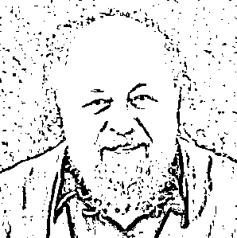

****罗伊·吉列****

*   自 1976 年以来，罗伊一直是全职占星师。他也在占星软件方面提供咨询，在多个国际会议上演讲，研究金融占星，并编辑两本 André Barbault 著作的英文译本。

*   自 1978 年以来，罗伊发表了一些经世预测，并以同情的口吻加以强调。

*   他的新书《与行星一起工作:更清楚地理解更好的决定》(2021 年) 从他 20 年的双月刊专栏中挑选了一些评论和历史参考。

他的全部六本书的详细信息和样本页见 https://crucialastrotools.co.uk/ roy.gillett@ntlworld.com

**如何参加本次沙龙？**

本讲座也是本月的国际占星研究协会（ISAR）星空俱乐部讲座。**ISAR 会员可以免费收看。**请注意邮件通知，具体参与方式见邮件。

❶ 如果你**已经是 ISAR 会员**，请注意邮件通知，告知如何参加。

❷ 如果你**不是 ISAR 会员**，非 ISAR 会员价格：98 元。如有任何问题请咨询工作人员

yiyi（微信：YY18513802156）

**非 ISAR 会员报名请长按下图**

**▼**

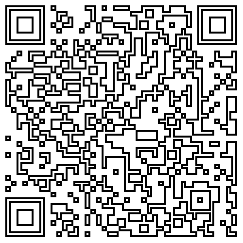

**ISAR 明星俱乐部**

2019 年，ISAR 在主席亚历山大·因舍阿吉克的带领下，成立了 ISAR 明星俱乐部，每月为全球 ISAR 会员提供在线直播讲座，邀请全球著名占星师开讲，学习和分享新的理念。讲座时长一小时，涉及占星学的不同领域、不同观点，每个会员都可以参与其中，每次讲座之后还有 20-30 分钟问答时间向老师们提问。

每一场在线讲座都会记录下来，ISAR 除了提供视频，还会提供相关的讲座资料，以及单独的问答录音，自动发送到专门的 ISAR 明星俱乐部页面存档，每位 ISAR 会员可以在 ISAR 网站上自己的会员主页俱乐部页面找到。在 2018 年最初几个月，ISAR 明星俱乐部会每月举办一场在线演讲。之后，两周举办一场演讲，最终每周举办一场演讲。

但是，过去明星俱乐部讲座只有英文沙龙，因此，中国会员只有懂英文才能受益。为了使得更多不懂英文的中国会员能够受益，我们特别和 ISAR 总部协商，今后会安排有中文翻译的明星俱乐部占星沙龙，作为给中国 ISAR 会员的福利！

**如何成为 ISAR 会员？**

**如果你也想成为 ISAR 会员，请复制链接在浏览器打开**

http://www.nodoor.com/isarcert.do?contentId=3588（仅支持网站支付）

**或直接长按下方二维码，微信购买会员：**

**ISAR 会员有什么福利？**

一年期会员仅需支付**人民币 420 元**，即可享受：

**☆ 星空俱乐部免费沙龙**

**☆每年出版 3 次的《国际占星师》（目前只有英文）；**

**☆每周电子邮件交流汇总杂志（目前只有英文）；**

**☆专项研究基金和奖学金资格；**

**☆ISAR 主办的会议和论坛的会员折扣，包括国际占星大会（UAC）、ISAR 的会议和研讨会等会员权益。**

**有疑问怎么办？**

关于 ISAR 星空会员俱乐部以及我们的讲座，如果你还有任何疑问，**请联系工作人员**：

**yiyi**

**微信：YY18513802156**

**若道 Conrad**

**微信：nodoor2016**

****非 ISAR 会员报名请点击“阅读原文”****

# 国际占星日第 2 弹丨连续六天线上演讲！国际大师与国内占星师齐聚

> 原文：[`mp.weixin.qq.com/s?__biz=MzA5NjA0NTAxNg==&mid=2651469545&idx=2&sn=60f91f7402cfa884cb9130b0ed937103&chksm=8b48845ebc3f0d48d516d4146816946309c6a2b976fc3c788f7db403b502088c498e6b24d933&scene=126&sessionid=1692737847#rd`](http://mp.weixin.qq.com/s?__biz=MzA5NjA0NTAxNg==&mid=2651469545&idx=2&sn=60f91f7402cfa884cb9130b0ed937103&chksm=8b48845ebc3f0d48d516d4146816946309c6a2b976fc3c788f7db403b502088c498e6b24d933&scene=126&sessionid=1692737847#rd)

长期关注我们的朋友都知道，对于占星学这个事情，我们是认真且严肃的。

而对于**3 月 20 日**这一天，占星学也有一个严肃的定义，即它是一个**占星年**的开始，是独属于占星界的**国际占星日**（IAD）！

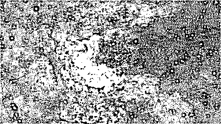

虽然这个节日的历史并不长，**它是在 1993 年，由占星联盟协会（AFAN）提议，**在之后，我们就拥有了国际占星日。对于严肃的学术界来说，我们庆祝这个节日的方式也是独树一帜，世界各地的占星师以及占星爱好者们都在这一天用各式各样的活动、讲座、晚会来庆祝。 

让我们先来了解一下**占星学**。十二星座测量了太阳视路径

可曾想过 12 星座为什么被称为太阳星座？这是因为它们测量了太阳的视路径（事实上是地球绕太阳运动的轨迹），而并不是星体！12 星座的名称源于太阳视路径上（背后）的 12 个星群，是占星学在西方发展起来时（尤其是在始于公元前 323 年的希腊化时代期间）命名的。现在公认的主要星群有 88 个，大多数已经由古巴比伦人、古埃及人和古希腊人命名。这 12 个星群被挑选出来的唯一原因是，它们为太阳的视路径提供了背景，太阳每年都穿过这 12 个星群。同样，月亮和其他行星也大致沿着这个相同的路径运行。因此这些星群变得众所周知，12 星座的名称很自然地“借用”了它们的名字。但是，我们祖先（全球范围的）重视的其实是太阳，希腊人也不例外。为了理解 12 星座为什么是太阳星座而不是星群，你首先需要认识到太阳作为古代社会的测量和组织工具，其位置非常重要。太阳和 12 星座成为了历法的基础，事实上希腊化世界的历法一直沿用至罗马帝国开端。占星学的起点

你是否曾抬头仰望清朗的夜空，感受到那么多明亮闪烁的星星的魔力，并猜想：他们的相互形成的图案也许有特殊的含义？

人类从古到今都仰望夜空，觉得其中包含着一个令人心驰神往的奥秘。远在人类发明望远镜、知道星星究竟是什么之前，人类已经认识到星星对他们很重要。他们觉得星星神奇而美丽，一定传递着一些特殊的讯息。

**人类对于星星的好奇是占星学的起点**。考古学家们在几乎每一个远古文明的废墟中都找到了占星学的记录，从古希腊到巴比伦，从中国到古罗马。占星学是这个世界上最古老的科学。

占星师观察到，绝大多数的星星似乎都在天空中一起移动。但他们也注意到，天空中有一些明亮的星星跟其他星星相比更独来独往。他们把这些移动的星星称为“漫游者”。

如今，我们称这些星星为**“行星”**。我们所居住的地球是一颗行星，每一颗行星都在圆形的轨道上围绕太阳移动，而太阳是一颗真正的恒星，太阳及其行星构成了我们的太阳系。

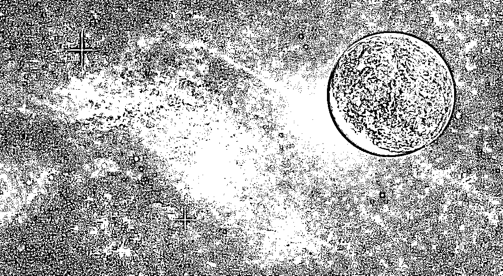

占星师们确定了 5 颗“漫游者”，这些行星直到现在依然沿用着他们古老的名字：**赫尔墨斯（水星）、维纳斯（金星）、玛尔斯（火星）、朱庇特（木星）和萨图恩（土星）**。

这些都是神明的名字，而古代的占星师们认为行星就是神明。在过去的 200 年间，又有 3 颗新的行星被发现，占星师们为它们命名时沿用了其他古代神明的名字：**乌拉诺斯（天王星）、尼普顿（海王星）和普鲁托（冥王星）**。

一些天文学家认为，在太阳系中还有另外一颗行星有待被发现。

仰望天空！除了恒星和行星，占星师还发现月亮会穿过夜空。我们如今早就知道了，这是因为月亮在自己的轨道上绕地球旋转。太阳看上去也在东升西落地移动，我们知道这是因为地球自身每 24 小时会完成一次完整的自转。面朝太阳的那一部分地球是白天，背朝太阳的那一部分地球是夜晚。占星师们记录下了所有他们所知道的关于太阳、月亮、行星运动的内容。今天，我们用大型望远镜继续这样的研究，这也就是天文学。**占星学是现代天文学真正的母亲**。现在，我们把天文学和占星学区分开。天文学家们乐于发现关于太阳系的科学事实，而现代占星师继续研究行星运动和人类生活之间的关联。古代占星师认为行星是主宰人类生活的神明。现代占星师不再这么认为，但是他们依然相信，**太阳、月亮和行星与我们每一个人的生活之间有着某种有趣而迷人的联系。**

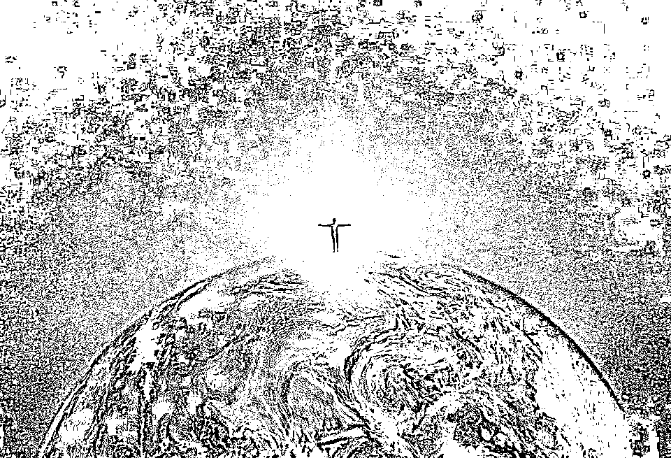

上面是可爱的活动分界线

掌握了这么多烧脑的基础知识（看不懂也没关系），接下来就到了**最激动人心的环节**！今年的国际占星日我们要怎么庆祝呢？

当当当当

我们会送上**连续六天的超精彩线上演讲****！**

**从 3 月 19-24 日，整整六天，**惊喜连连，干货满满**！**

**国际占星日·演讲主题**

在中国确立西方占星学的标准，引入世界顶级的占星大师进行教学，传播人本主义的占星学智慧，十多年来若道向市场培育和输送了大量专业人才；**今年我们为大家准备了遨游内心与宇宙的系列主题演讲直播周。**

系列主题直播将让大家更了解系统学习占星学的路径，如何成为一名优秀的占星师，占星学是如何带给我们疗愈和转化的。**关注若道视频号可以限时免费收听直播：**

**两场****大师讲座**

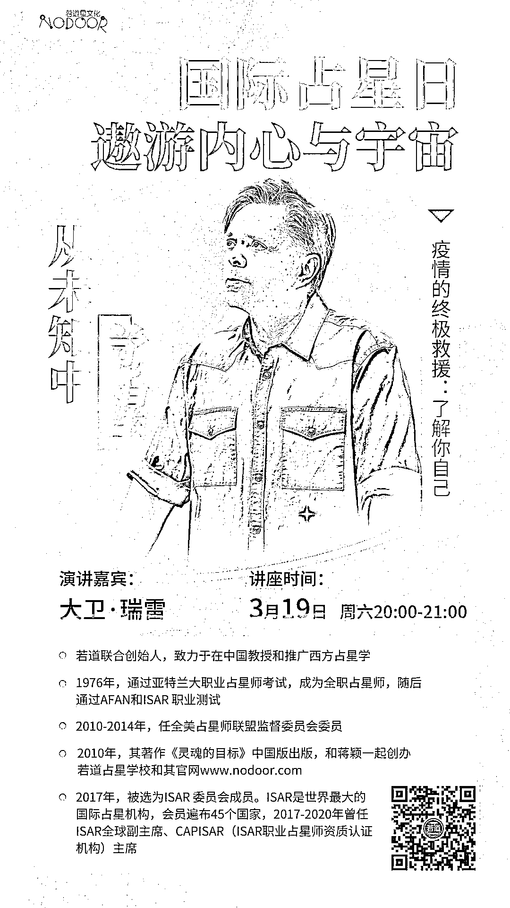

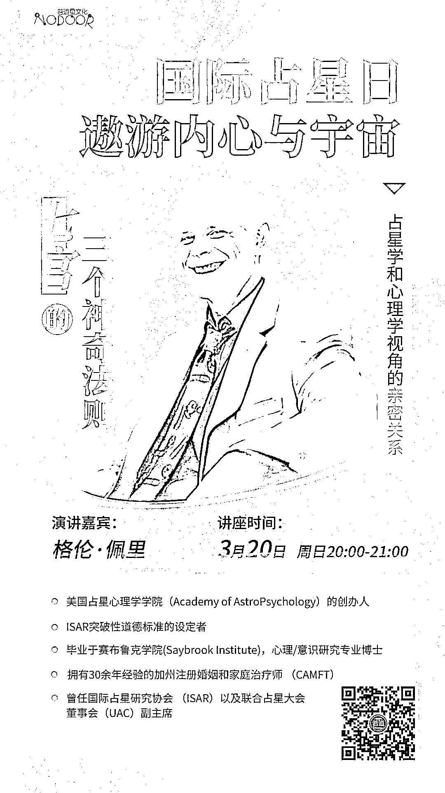

**四场****学员分享**

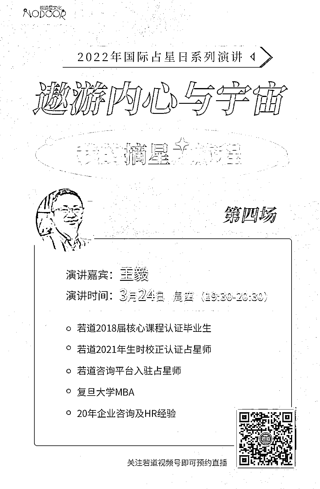

**国际占星日·如何报名？**这么精彩的线上演讲活动如何报名呢？不用着急，**长按下方二维码，关注若道视频号，即可预约精彩直播**！

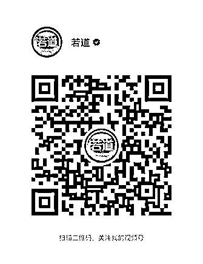

# 国际占星日第 1 弹丨 20 场演讲：为新世界的转变做好准备

> 原文：[`mp.weixin.qq.com/s?__biz=MzA5NjA0NTAxNg==&mid=2651469545&idx=1&sn=9a986fce78309cb959efa3b395346dc0&chksm=8b48845ebc3f0d48f79d1950a6add4d12067aa4f77c071e51565cbbf2604afa9794269d2b04d&scene=126&sessionid=1692737847#rd`](http://mp.weixin.qq.com/s?__biz=MzA5NjA0NTAxNg==&mid=2651469545&idx=1&sn=9a986fce78309cb959efa3b395346dc0&chksm=8b48845ebc3f0d48f79d1950a6add4d12067aa4f77c071e51565cbbf2604afa9794269d2b04d&scene=126&sessionid=1692737847#rd)

**国际占星日 ISAR 主题研讨会**

**新世界的觉醒** 

今年是世界格局大变的初始之年。 俄乌战争改变了整个世界的局面。在中国，最后一波疫情卷土重来，我们再一次看到封城上演。 同时，战争、疫情、通货膨胀都给我们带来挑战，**而我们需要用新的眼光去看这个正在激烈变化中的世界并为一个新的世界转变做好准备。 **

为此，ISAR 在今年的国际占星日为大家准备了一个为期***2******天***的研讨会***20******场******演讲***，共有邀请来自世界各地的***20******位******著名占星师***，包括我们的 ISAR 全球总监，分享他们对世界正在发生什么的见解，以及我们未来可以如何应对的建议。

**研讨会主题描述**

**“我们将探讨的一些主题：我们在未来 5 年和长期的全球范围内可以期待什么？在新冠疫情、经济、性、技术、新世界结构和国家边界相关的未来事件，我们可以预测什么？总体而言，占星师如何看待世界的未来？我们需要从更高的层面上接收到什么信息？可能的解决方案是什么？”**

**演讲结束后，若道会将本次演讲翻译为中文字幕版在演讲完成后一个月（4 月 25 日后）上线发布。**

（因为这次演讲我们需要审核内容，以便内容符合国内环境的要求。**在演讲播出 1 周内，我们会陆续上传英文内容，在演讲播出 1 个月后，我们将会陆续上传中文字幕版。**如果英文流利的同学，想要及时听到演讲建议到 ISAR 网站自行购买，英文版价格更为优惠） 

**演讲内容安排**

**第一天****2022-03-19**

**开幕式（15 分钟）**

**第一场（60 分钟）**

*   主题：待定

*   演讲人：温迪·斯泰西

**第二场（20 分钟）**

*   主题：占星师作为“心灵影响者”——新的大祭司？

*   演讲人：格雷厄姆·伊贝尔

**第三场（25 分钟）**

*   主题：波斯占星的复兴

*   演讲人：埃桑·哈泽尼

**第四场（20 分钟）**

*   主题：新冠疫情对人类精神和人类社会的影响

*   演讲人：乌苏拉·斯托克德

**第五场（20 分钟）**

*   主题：在两个相反的“宇宙发电机”之间振荡 

*   演讲人：托马斯·加齐斯

**第六场（20 分钟）**

*   主题：从占星的透镜看新冠疫情的心理后果

*   演讲人：伊莎贝尔·吉马拉斯

**第七场（20 分钟）**

*   主题：占星适合预测吗？占星作为工具的特质

*   演讲人：石冢龙一

**第八场（20 分钟）**

*   主题：重新定义结构、上师和伦理——一个灵性视角

*   演讲人：加利·萨特·普兰·利夫纳

**第九场（20 分钟）**

*   主题：冥王星在水瓶座和全球的社会实验

*   演讲人：索勒·乔奈特

**第十场（20 分钟）**

*   主题：当上帝似乎已经背弃了我们

*   演讲人：亚历克斯·特伦诺维斯

**第十一场（90 分钟）**

*   主题：占星的未来：占星能预测未来吗？

*   演讲人：里克·莱文和克里斯·布伦南

**第二天****2022-03-20**

**第一场（60 分钟）**

*   主题：波浪带来的木星-海王星合相

*   演讲人：琳恩·贝尔

**第二场（20 分钟）**

*   主题：2020 年木星、土星和冥王星的相遇，以及金钱的命运

*   演讲人：理查德·费德勒

**第三场（20 分钟）**

*   主题：金牛座和天蝎座在 2022 年和 2023 年的黄道带日食传递了什么信息

*   演讲人：杰丽娜·朱德扬

**第四场（20 分钟）**

*   主题：阿奎拉（鹰）与 2020 年大连合

*   演讲人：杜布拉夫卡奥伯赞

**第五场（20 分钟）**

*   主题：待定

*   演讲人：索尔·乔纳森

**第六场（20 分钟）**

*   主题：寻找第三条道路——在一个快速变化的世界中思考未来 5 年中国的道路

*   演讲人：蒋颖 Felicia Jiang

**第七场（20 分钟）**

*   主题：新世界崛起

*   演讲人：Paula Belluomini

**闭幕讲座（60 分钟）**

*   主题：让木星之年开始吧

*   演讲人：亚历山大·因舍阿吉克

**费用**

*   **本期演讲售价：****980 元** **（送价值 480 元的一年 ISAR 会员资格） **

*   **ISAR 会员优惠价：****680 元** **（会员购买前请联系负责人修改价格）**

负责人：若道-童童

（微信：nodoorDaivd）

请备注“国际占星日”

**ISAR 研讨会听译招募**

若道将在 ISAR 国际占星日主题研讨会结束后，组织讲座翻译。**现招募该项目听译若干**，要求如下：

1、英语听力出色

2、翻译熟练

3、文字流畅

4、时间相对充裕

感兴趣的同学，请发送简历至 tanya.tan@nodoor.com，并介绍一下自己的英语水平、占星程度、出生星图（请用若道 app 制作），谢谢！

**退转课程**

**退款原则请详看《教学协议》，如有疑问请咨询童老师。**

****报名请点击“阅读原文”****

# 群星双鱼座的梦幻季节 | 未来 1 个半月，做好 6 件事，让你享受最神奇的时光！

> 原文：[`mp.weixin.qq.com/s?__biz=MzA5NjA0NTAxNg==&mid=2651469440&idx=1&sn=913fc642610cbe85f011f183102caf38&chksm=8b488437bc3f0d2118d4634a34e304a60adf08199071c642d412ced0c7c68665c2fb488a984b&scene=126&sessionid=1692737847#rd`](http://mp.weixin.qq.com/s?__biz=MzA5NjA0NTAxNg==&mid=2651469440&idx=1&sn=913fc642610cbe85f011f183102caf38&chksm=8b488437bc3f0d2118d4634a34e304a60adf08199071c642d412ced0c7c68665c2fb488a984b&scene=126&sessionid=1692737847#rd)

**********************************☆****后台回复“今日”，给你一句生命态度**************************************

作者/里安农·利塞尔

译者/Shirley 校对/Luke

编辑/翀子 封面/书君 图片/网络

最近，你一定感受到了空气中弥漫的双鱼座气息，天上的双鱼座星群带来的如梦似幻的能量，让这个初春显得愈加朦胧。如何利用这个季节？来看文章吧！**双鱼座的季节**

我们每个月都会经历不同的占星季节，尽管占星季节的变化通常发生在一个月的后半段。**本月，我们将体验海王星守护下的双鱼座，以及它那如梦似幻的能量。**

水瓶座季节带来了个性和叛逆，**而双鱼座的季节提醒我们想象力、创造力和情感同样重要。**

今年，太阳于 2 月 19 日进入双鱼座，一直持续到 3 月 20 日。这给了我们差不多整整一个月的时间来吸收双鱼座的治愈和爱的能量！（若道君：虽然太阳将于 3 月 20 日移动到白羊座的位置上，但整个四月份还是群星双鱼座的天象）。

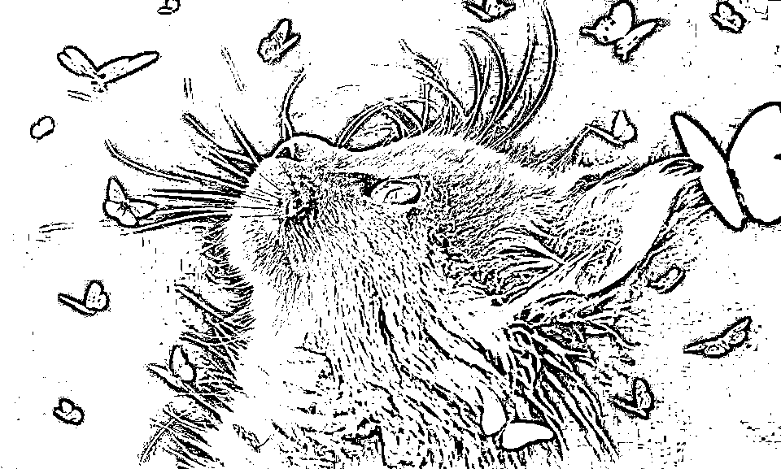

**双鱼座季节的意义****当太阳在双鱼座时，我们会感受到一股创造性和富有同情心的能量**——然而，这种同情心不同于我们在水瓶座季节所经历的人道主义能量。你看，双鱼座是一个水象星座——**一个受情绪支配并与月亮紧密相连的星座。**

这意味着，当太阳经过这个星座时，我们的情感在自由流动。

水象星座也与直觉有关，**双鱼座是一个非常有直觉力的星座。**事实上，这个星座通常与心灵能力以及与灵界的联系有关——所以本月你的本能感觉会增强。**这意味着为了得到最好的结果，你应该倾听你的直觉，跟随你的本能。**

双鱼座是占星历的最后一个星座，这意味着我们的黄道年即将结束。

这种能量鼓励你放下过去的痛苦和烦恼，让自己继续前进，走向未来。这与第 12 宫——终结宫相关，**这是为未来的占星年聚集你力量的时候。**

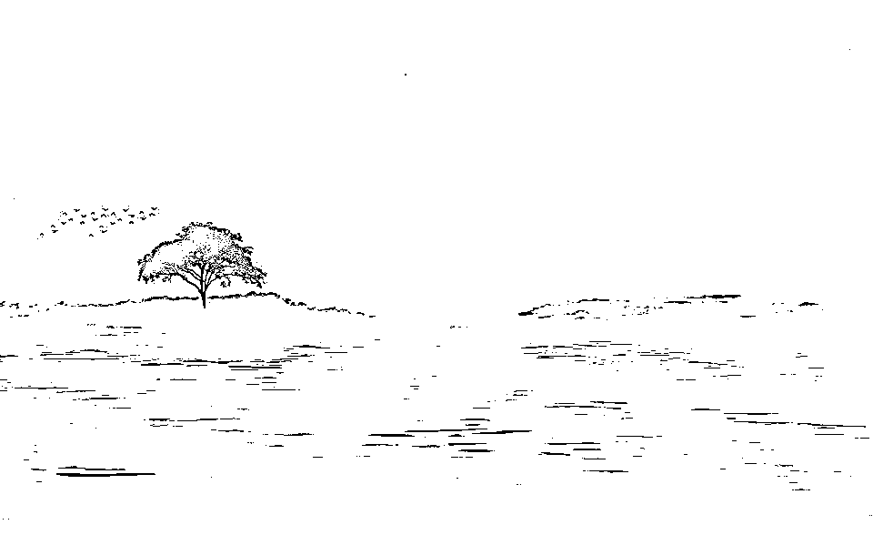

**双鱼座主题**

双鱼座代表直觉、情感、创造力以及与你所爱的人的深厚联系。

双鱼座是一个想要建立关系的星座，**建立更深的纽带并始终关心他们所爱的人。**双鱼座想要给世界注入爱、光以及和平——他们创造性的活动只是他们把奇思妙想落实到现实的方式之一。

双鱼座的守护星海王星是一个梦幻的行星，**它鼓励你做白日梦，幻想并发展你的同情心。**在双鱼座的季节里，你可能会与周围的人、他们的态度和振动更加和谐一致，并有强烈的愿望帮助他们解决他们可能面临的任何问题。

**身体上，双鱼座掌管双脚**——这种特殊的守护关系加上他们的创造力，使他们对舞蹈艺术非常精通。这意味着这个月是时候穿上你的布吉鞋，在双鱼座的季节里散步，激发你的创造力，提升自尊了！

**双鱼座季节的其他主题包括：**

*   **自我表现**

*   **幻想**

*   **显化**

*   **直觉/心灵能力**

*   **舞蹈**

*   **音乐**

*   **艺术**

*   **逃避现实**

*   **情绪**

*   **体贴**

*   **同情**

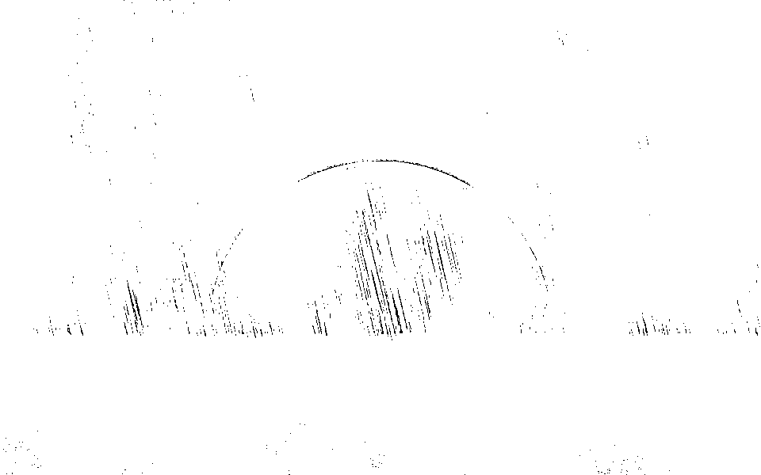

**这个季节有什么值得期待？**

双鱼座的守护星海王星给这个占星季节带来了某种梦幻的感觉，放大了你与幻想的联系。

你可能会觉得自己被鼓励用这个月的时间做白日梦，这可以帮助你确定下个月当太阳进入充满激情、雄心勃勃的白羊座季节时你想要追求什么。

**★****超凡脱俗的氛围**

当太阳穿过双鱼座时，你可能会体验到一种更强烈的渴望，**去理解你和世界的关系**，为它赋予意义，从你的人际关系到你的人生道路和未来。

由于双鱼座与第 12 宫——终结宫有关，**你可能对来世或俗世外的领域有着更深刻的关注。**

**这些能量与增强的直觉相结合**，意味着现在是使用塔罗牌、深入占星学、平衡脉轮的最佳时机。任何这类工具或疗愈方法都会帮助你进入那些空灵的双鱼座氛围，并**与宇宙的能量更深入地联系起来。**

揭开那些谜团！

**★****情绪高涨**

因为双鱼座是水象星座，所以**情绪可能会增加**。然而，根据你自己的个人星图，影响可能或多或少。

例如，那些在他们的星图中有强烈的土象和风象元素的人可能不会一下子开始哭泣。另一方面，有较强水象或者火象元素星图的人可能会让人感觉更温柔或易怒。

无论你是感受到情绪变得强烈还是敏感度的略微增加，**这仍然是每个人与你的情绪联结的好时机，**无论你是什么星座。

**★****扩大想象力**

如果你不习惯深入内心的感受，不要烦恼，因为双鱼座所支持的**创造力**和**想象力**给了你这么做的机会。

**创造性的自我表达是联结情绪的最好方式之一。**但你必须找到创造性的出口，因为双鱼座也倾向于做白日梦。

**★****逃避的需要**

双鱼座喜欢做白日梦，现实并不是他们最喜欢的地方。因此，当太阳在双鱼座时，**你可能更想逃避感受，**而不是解决它们，这通常表现为沉溺于不健康的事情，比如过度消费。

这就是为什么为这些情绪找到一个**发泄的渠道**是很重要的，这样才能确保你的身体处于最佳状态。

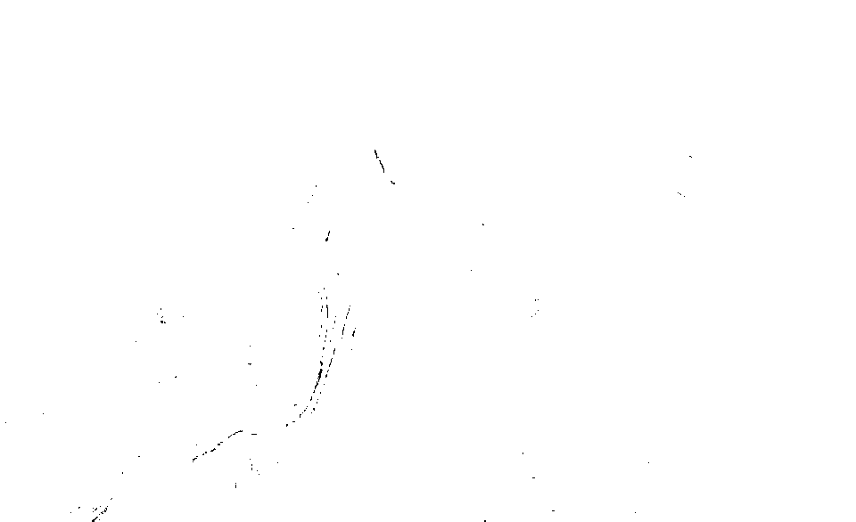

**如何充分利用梦幻的双鱼座季节？**

这里重复“梦幻”这个词是刻意的，因为双鱼座正是如此——美丽、光彩照人，甚至是恬淡柔和的。想象一下一间粉红色的房间，地板上布满了蓬松的云朵，邀请你进来做白日梦——这就是双鱼座的氛围。

如果你融入这股能量，你将拥有一生中最神奇的一个月。

**想象力、创造力和直觉的增强，将成为活出浪漫生活的完美时机。**让我们来看一些可以确保你充分利用双鱼座季节的办法。

**★****邀请直觉的能量**

无论你一生都在用你的直觉合作，还是刚刚开始聆听那些直觉，**现在都是深入挖掘并真正开始相信自己的时候。**双鱼座不仅**放大了你的直觉，**还放大了你所体验到的任何形式的超感官感知，从遥视到超感听觉。

把这当作一次课程，一个跟随你直觉的实验。

如果你觉得一个情境很危险，就换个方向。如果你感觉到一个机会能让你的生活变得更好——那就做一做研究，看一看月亮的状态——然后抓住那个机会。**不要怀疑你的直觉，尤其当这个月你能大声而清晰地听到它的声音。**

**★****发挥创造力**

本月召唤你的艺术女神吧，因为双鱼座会用异想天开的画面和美妙的曲调填满你的头脑。随身携带一个记事本，**记录那些像闪电一样击中你的创意。**即使不是每天，也要确保一周中留出许多发挥创造力的时间。

在双鱼座的季节里，当你发挥创造力时，就好像某种魔法，因为它让你为自己的情绪提供一个出口，并增强你的显化能力。**别忘了结合你的直觉**——你不必担心一定要做一些漂亮或值得注意的事情。只是创造就好了。

把创造力拿出来，让内在的星星之子，把内心迸发的星光灿烂的能量表达出来。

**★****对自己表达同理心**

听着，当太阳进入双鱼座时，你自然会感受到你对人类同胞的同情，尤其是当我们刚刚离开人道主义的水瓶座季节。所以，我们在挑战你，如何**将这种同理心延伸到你自己身上。**

双鱼座的一个鲜为人知的特点是，它非常缺乏安全感，而且有相当多的神经官能症。如果你忽视了对自己的同理心，当事情似乎不顺着你的方向发展时，你可能会开始把自己搞得支离破碎，甚至为自己感到难过。

**同理心，提升自己，保持积极的情绪，**可以帮助你优雅地面对宇宙中任何动荡的时刻。

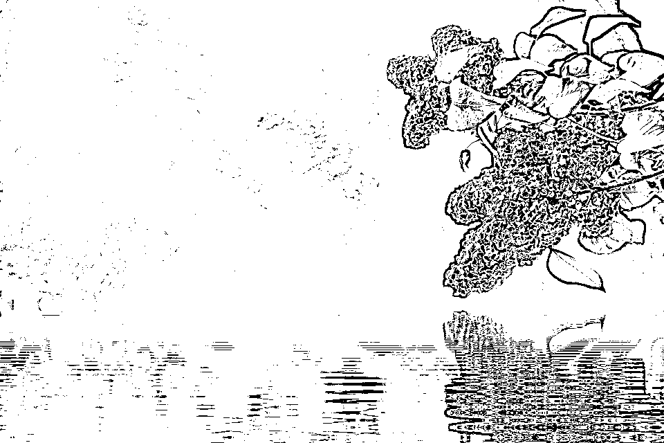

**★****练习形而上学**

在双鱼座的季节里，你的精神感官将充满喜悦，**渴望与俗世外的世界联结。**所以为那些我们经常忘记留出时间的玄学工具和实践腾出时间和空间。

拿起你的塔罗牌，清洁你的神圣空间，点上你最喜欢的香，播放你的天籁之音，**进入一个精神空间。**

这是一个转向你最信赖的工具，甚至学习新工具的好时机。

你想更深入占星学吗？或者也许你一直想进入水晶疗愈。在双鱼座的季节里，沉浸入一个新的玄学或灵性主题会让你感觉自己与宇宙相连，**成为宇宙的一部分。**

**★****显化那些梦想**

双鱼座富有想象力的精神加上海王星对幻想的热爱，意味着这个月你无论如何都会觉得自己在做白日梦，所以为什么不设定你的意图，好好利用这些白日梦呢？

**这是一年中考虑你想要表达什么，并开始设定你的意图的最佳时机之一**。因为当白羊座季节来临，是时候把这些想法付诸行动了。

梦想拼图板，未来规划表，尤其是新月仪式——3 月 3 日新月在双鱼座——在双鱼座的季节能量非常强大。

参加让你感觉舒服的显化练习，或者全部尝试！**本月你的意图是强有力的，所以确保你专注于你想要的，而不是你不想要的！**

**★****享受自我照顾**

是时候善待自己了，星星的孩子。

当然，你应该在双鱼座和任何占星季节传播善意。但本月，对他人的同情自然而然地到来，充满了同理心和同情心的能量。然而，更容易忘记的是自我照顾的重要性，尤其是如果你想与他人分享和给予他人任何能量的话。

**纵容自己。**

想想泡泡浴，黄瓜片可以让你疲惫的眼睛放松，玫瑰花瓣可以让你芳香四溢，让你感觉到很别致，听你最喜欢的放松音乐。想象一下，当你做晨练瑜伽时，悠闲地伸展身体，喝着清爽的葡萄酒。想象一个周六的早晨，你一边做自己最喜欢的早餐，一边尽情享受自己选择的播客，一边给自己修指甲。

**首先照顾好自己，才能确保你有足够的精力支持身边的人。**

**拥抱双鱼座的季节？**

如果你知道如何控制这些微妙的情绪，双鱼座的季节是一个神奇的时刻。

记住要专注于照顾自己，善待自己，以确保你不会开始感觉太脆弱或不知所措。**一定要聚焦于通过专注的意图来显化，将那些模糊的梦想带入生活！**

**版权声明：**本文由若道翻译，欢迎转发，反对抄袭。友号转载请申请白名单。

**里安农·利塞尔**

一个漂泊的射手座，热爱写作，努力帮助他人成长。她研究占星学大约 10 年，3 年来一直在写关于玄学、灵性和深奥的主题。里安农住在科罗拉多州的山区，喜欢喝咖啡和花时间看画册。

**学习占星学****点击下图了解课程详情** 

**

**微信又双叒叕改版啦，不想错过若道君的推送？**
**就把若道设为星标吧！****▼**

**喜欢记得点一下在看哦☟**

**报名直达入口**

# 案例剖析丨和梦一起工作有什么体验？那是见证奇迹发生的时刻！

> 原文：[`mp.weixin.qq.com/s?__biz=MzA5NjA0NTAxNg==&mid=2651469440&idx=2&sn=fbf8bb8b38fddcdf0b0768a0aa289540&chksm=8b488437bc3f0d2105828431292f023de1f28107a419eb4a0c3c7a43f6c42d1e9f1c56256e35&scene=126&sessionid=1692737847#rd`](http://mp.weixin.qq.com/s?__biz=MzA5NjA0NTAxNg==&mid=2651469440&idx=2&sn=fbf8bb8b38fddcdf0b0768a0aa289540&chksm=8b488437bc3f0d2105828431292f023de1f28107a419eb4a0c3c7a43f6c42d1e9f1c56256e35&scene=126&sessionid=1692737847#rd)

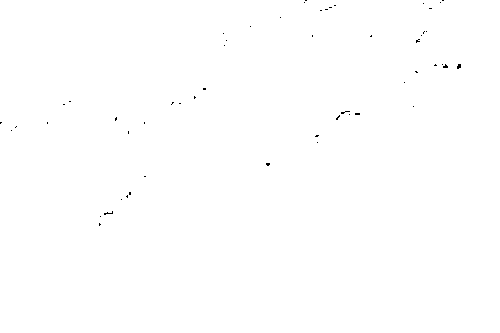

作者/格雷格·博加特

翻译/Luck 校对/江艺 

编辑/翀子 封面/书君 图片/网络

这篇关于梦境治疗的文章探讨了荣格式的梦境工作是如何进行情感治疗和个人转化的。在作者提供的几个案例中，每个人都深深地被梦境象征所反映的含义触动。你知道吗，作者格雷格·博加特老师正在若道开始[【释梦大师工作坊】](http://mp.weixin.qq.com/s?__biz=MjM5MjQwNjAyMQ==&mid=2649439168&idx=1&sn=a942f7439ba6f574daf0743d290e1684&chksm=beb954aa89ceddbcffb13414168b25d61af845856ce666512b3b94fd748fc61af3cd951f032d&scene=21#wechat_redirect)，如果你对用占星学解梦感兴趣，不妨来看看把~

**梦境工作的重要性**

梦境工作和做梦疗法是深度心理治疗的一个关键技术，使得深层无意识的象征性语言能够传递它们的洞见，并指引患者走向更大的完整。

梦境使带有情感成分的无意识材料安全而快速地进入意识层面。它们帮助找到治疗的重心，指引治疗的方向。梦境提供了重要的线索，告诉我们**客户痛苦的来源，以及哪些情绪和情结需要被检视和处理**。

梦境工作可以成为**心灵成长和行为改变的强大催化剂，它有种独特的能力，促进疗愈从内在发生**。

梦就像冰山从无意识的深水中浮现出来。有些冰山属于过去，帮助我们理解过去的创伤和未消化的回忆，因此是**回溯性**的。

**梦境有种整合的能力，**因为他们能使我们觉知和化解很多次人格之间的矛盾。

梦境也有**前瞻性或预期性**，那是来自未来的冰山，会呈现出将要发生的事情，显现出个人有可能成为的样貌。

**梦境既向后看也向前看，它的本质功能是扩展意识、觉知和身份的疆界**。

我在梦境工作中主要使用的技术，是以开放的好奇心，主动探求**梦境中每个角色、地点和行为的当下意义——每个元素都反映出梦者的心灵状态和当前的生活情境**。

被梦境所揭露的信息，往往既幽默，又充满矛盾，而且为我们打开了新视野。怀着一种敬畏的心态，我发现每个梦境都是意识海洋深处的一颗珍珠。

反思梦境的奥秘，会引发一种近乎宗教敬畏的情感，我们会惊叹于心灵描绘自身处境的能力。

**本篇文章中，我将介绍一些案例，详细讲述梦境是怎么唤起核心主题，让其成为治疗重心，从而影响治疗进程的。**

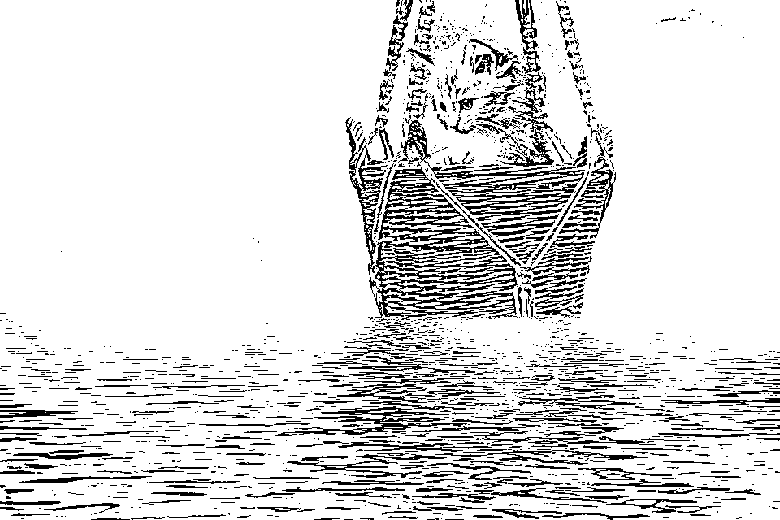

**案例 1：学习与自己相处**

比如说，鲍勃，一位四十多岁的中年男子，在一次心理治疗课中，有了这样的梦境：

“我这时 6 岁，和妈妈在一起，我们在一起打扫壁橱。”治疗师立刻意识到客户 6 岁时一定发生了有重大意义的情感事件，而且有必要把隐藏在壁橱中的东西清理出来。

**在接下来的疗程中，很多家庭秘密都从隐蔽处被揭露了。**我了解到家庭暴力和酗酒一直是被小心隐藏的家庭秘密。鲍勃在一次关系破裂后，目前正处于深度抑郁中。

随着他开始审视自己的愤怒，之前未被认出的虐待女性的倾向，他的悲伤，以及对自身孤独的接纳需求。

他梦见：“我匍匐在我的床前，将一束仙人掌载入盆中。”**仙人掌代表鲍勃多刺的个性**。当被问到仙人掌还可能有什么含义的时候，他说：“仙人掌只需极少水分，就能在沙漠里活很长时间。它在自己的身体里就能找到水分。”

**仙人掌象征他需要在自身孤独的沙漠中找到水分，或生命的活力，而不是依靠女性或关系获得刺激。鲍勃需要学习与自己相处和照料自己。匍匐在地寓意着谦卑的姿态**。

**案例 2：深刻的情感含义**

**一个简单的梦境常常蕴含深刻的情感含义。**

一位女性吉尔在她的第二次治疗课程中汇报：“我梦见我在我上班的商店里，正在数一大堆钱。有一捆钱丢失了。”

客户自己的解读是：“在梦里被偷盗使我想起我的童年是如何被偷走的。我从来没有机会当个小孩，被人关照和宠爱。我的生命是有缺失的。”

随着我们探索这个主题，吉尔对我叙述她是如何被迫当个小大人，自从六岁开始就在家里扮演成人的角色。她开始更清楚地认识到自己还背负着多少来自失落童年的悲痛和愤怒。

但梦境也有另一层含义：钱丢失了。吉尔正和严重的金钱问题做斗争。她赚得不多，她的自尊非常低。当我问她“钱丢了”令她联想到什么时，她说，“我感觉我没有任何价值。”每个梦境都是内在世界的全息图，充满了浓缩的含义。

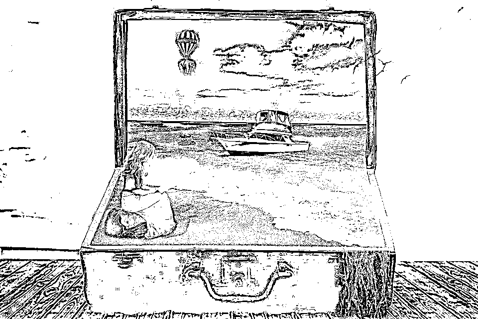

**案例 3：内在野性的苏醒**

一位名叫温迪的女士，儿童时代有着长期的受虐史。**她在表达愤怒和捍卫自身这方面有许多困难，而且经常成为别人的受害者。**

她梦见：“一些朋友带我去动物救护站，那里有野猫，山猫。他们带我们四处转悠，为我们展示如何与动物对话并驯服它们。一个大母狮子或野猫跳到我身上，爪子抓进我的腿里。我和她说话，并试着保持冷静。”

当被问到野猫让她联想到什么时，温迪说道，“那是一种很难驾驭，强有力的动物。表达愤怒和侵略性对我来说有些困难。母狮子这种动物却懂得如何亮出自己的爪子。”

**梦境暗示温迪需要援救和保护自己凶猛的，动物性的那一面**。虽然之前她像个无辜的羊羔或受害者，缺乏捍卫自己的能力，这场梦境却预示了**积极的侵略性、意志、自我防卫和自我保护能力**的出现。

一周以后，温迪报告说她在受人冤枉的时候保护了自己，写了一封信详细说明自己的委屈，并且表示受伤和愤怒。这场梦境预兆了她**内在野性的苏醒**。

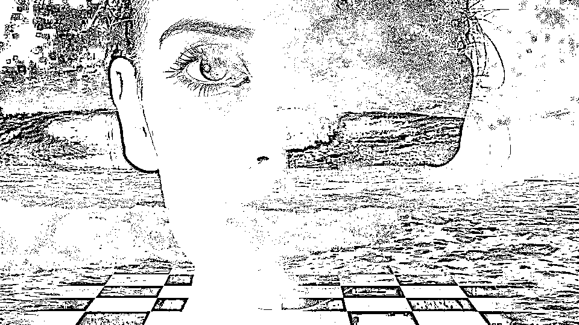

**案例 4：对性的恐惧**

塔尼娅，一位处在无性婚姻中的女性，她梦到自己家里的客厅和卧室之间，有一堵巨大的墙。**这墙象征了她对性的抗拒，以及她需要保持界限，以防止身体和情绪受伤**。

思考这幅画面，不仅对做梦者有帮助，同时也帮助她的丈夫詹姆斯第一次了解到塔尼娅对性亲密的深度恐惧。

塔尼娅认识到，她的身体是如何在恐惧中变得僵硬，对任何形式的亲密都创造了一层不可逾越的阻碍。梦境工作的价值在于塔尼娅和詹姆斯终于能够开始拆除他们之间的这堵墙。

**未完待续**

**版权声明：**本文由若道翻译，欢迎转发，反对抄袭。友号转载请申请白名单。

****

**格雷格·博加特**

占星师和心理治疗师，美国纽约人，他在加州整合学院和赛布鲁克大学读完了研究生。格雷格从 1991 年起就是执业心理治疗师（婚姻家庭治疗师资质 28276）。他是受董事会认证的职业顾问。格雷格也是国际占星研究协会（ISAR）的认证占星师，并且持有美国地球宇宙研究协会（NCGR）的 4 级证明。

**释梦工作坊报名中！**

**梦境工作和做梦疗法是深度心理治疗的一个关键技术，**使得深层无意识的象征性语言能够传递它们的洞见，并指引患者走向更大的完整。

**梦境提供了重要的线索，告诉我们客户痛苦的来源，以及哪些情绪和情结需要被检视和处理。**梦境工作可以成为心灵成长和行为改变的强大催化剂，它有种独特的能力，促进疗愈从内在发生。

**本课程将课堂讲座与动力过程工作结合起来，动力工作过程会将星图解读和梦境分析结合起来。**

每天约一半时间用于讲座，其余时间会演示占星学梦境工作方法，过程中老师会与学员进行互动。课程包括对老师解读星图和治疗性梦境工作方法的详细阐释和示范。

**我们将学习荣格解梦的基础知识和治疗性的、以过程为导向的星图解读。**我们将体验转化性原型模式在梦境和出生星图中同步显现时会发生什么。

**三次 6 小时的迷你马拉松在线梦境课程**，将会是一次提升意识、开放思想、转化生命的事件。**学员将体验占星学和解梦的融合。**

每次课程格雷格·博加特老师都会与学员互动，课程中使用的星图和梦境将由愿意分享自己梦境和星图的学员提前提供，课程期间也会开放问答以及学员互动环节。

**点击下图了解更多工作坊信息**

**学习占星学****点击下图了解课程详情** 

**

**微信又双叒叕改版啦，不想错过若道君的推送？**

**就把若道设为星标吧！**

**▼**

**喜欢记得点一下在看哦☟**

********报名直达入口********

# 第 3 讲周六来袭丨释梦占星大师工作坊：荣格、占星学与梦境

> 原文：[`mp.weixin.qq.com/s?__biz=MzA5NjA0NTAxNg==&mid=2651469440&idx=3&sn=098911dfbe94675e97809035f9f3e693&chksm=8b488437bc3f0d21c0c64932be98925e8116b2b24a2fe08f372b2bc9565e57b898144b57d085&scene=126&sessionid=1692737847#rd`](http://mp.weixin.qq.com/s?__biz=MzA5NjA0NTAxNg==&mid=2651469440&idx=3&sn=098911dfbe94675e97809035f9f3e693&chksm=8b488437bc3f0d21c0c64932be98925e8116b2b24a2fe08f372b2bc9565e57b898144b57d085&scene=126&sessionid=1692737847#rd)

****

**2022 年 3 月和 4 月木星和海王星在双鱼座合相给连接梦境与占星提供了一次绝佳的时机。**

**　　——格雷格·博加特老师**

**梦境工作和做梦疗法是深度心理治疗的一个关键技术，**使得深层无意识的象征性语言能够传递它们的洞见，并指引患者走向更大的完整。

梦境使带有情感成分的无意识材料安全而快速地进入意识层面。它们帮助找到治疗的重心，指引治疗的方向。**梦境提供了重要的线索，告诉我们客户痛苦的来源，以及哪些情绪和情结需要被检视和处理。**梦境工作可以成为心灵成长和行为改变的强大催化剂，它有种独特的能力，促进疗愈从内在发生。

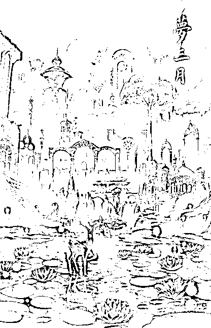

梦就像冰山从无意识的深水中浮现出来。有些冰山属于过去，帮助我们理解过去的创伤和未消化的回忆，因此是回溯性的。

**梦境有种整合的能力，**因为他们能使我们觉知和化解很多次人格之间的矛盾。**梦境也有前瞻性或预期性，**那是来自未来的冰山，会呈现出将要发生的事情，显现出个人有可能成为的样貌。**梦境既向后看也向前看**，它的本质功能是扩展意识、觉知和身份的疆界。

**我在梦境工作中主要使用的技术，是以开放的好奇心，主动探求梦境中每个角色、地点和行为的当下意义**——每个元素都反映出梦者的心灵状态和当前的生活情境。被梦境所揭露的信息，往往既幽默，又充满矛盾，而且为我们打开了新视野。

怀着一种敬畏的心态，我发现每个梦境都是意识海洋深处的一颗珍珠。反思梦境的奥秘，会引发一种近乎宗教敬畏的情感，我们会惊叹于心灵描绘自身处境的能力。

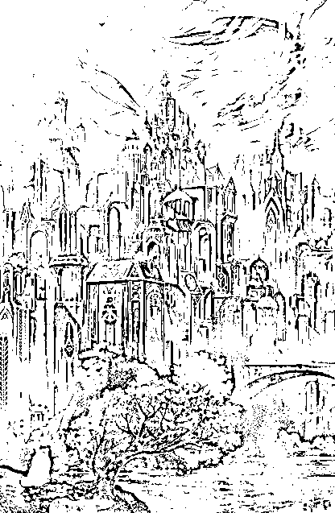

1

**课程内容**

**本课程将课堂讲座与动力过程工作结合起来，动力工作过程会将星图解读和梦境分析结合起来。**

每天约一半时间用于讲座，其余时间会演示占星学梦境工作方法，过程中老师会与学员进行互动。课程包括对老师解读星图和治疗性梦境工作方法的详细阐释和示范。

**我们将学习荣格解梦的基础知识和治疗性的、以过程为导向的星图解读。**我们将体验转化性原型模式在梦境和出生星图中同步显现时会发生什么。

**三次 6 小时的迷你马拉松在线梦境课程**，将会是一次提升意识、开放思想、转化生命的事件。**学员将体验占星学和解梦的融合。**

每次课程格雷格·博加特老师都会与学员互动，课程中使用的星图和梦境将由愿意分享自己梦境和星图的学员提前提供，课程期间也会开放问答以及学员互动环节。

2

**课程安排**

**第*****1*****讲  2022 年 3 月 5 日 **

卡尔·荣格的童年、学生时代以及投身精神病学时期的故事。《荣格自传：回忆·梦·思考》概要。弗洛伊德与荣格的关系，他们合作的破裂，荣格随后的抑郁时期，以及他借助梦、积极想象、艺术创作、曼陀罗绘画和对奥义知识（灵知）、神话和占星学的研究，转化性地面对无意识。卡尔·荣格与艾玛·荣格的占星学。

荣格的力比多（心灵能量）的概念，以及他的心灵结构地图：自我、个体无意识和集体无意识。荣格对无意识原型的描述，它们对个人神话的重要性，以及它们作为个人情结的表现。自我-自性轴线，以及自我与无意识之间不断演化的关系。

**我们将介绍荣格解梦的基础知识以及治疗性的、以过程为导向的星图解读。我们将体验转化性原型模式在梦境和出生星图中同步显现时会发生什么。**

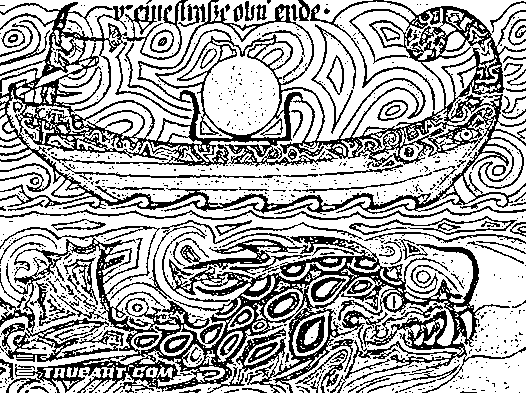

****第*****2*****讲  2022 年 3 月 12 日 ****

梦境中的个性化及其占星学时机。出生星图随时间推移展开。整合个体无意识：梦和出生星图中的人格面具与阴影。男性和女性：阿尼玛和阿尼姆斯。**梦与占星学行进**描绘建立或脱下人格面具的阶段，遭遇阴影的阶段，通**过阳性意识和阴性意识的结合发展出更统一的人格的阶段。**

**第*****3*****讲  2022 年 3 月 19 日 **

**整体性在占星学和梦境中的象征。**透过占星学符号研究梦，来深化内在生命。我们将学习占星学行进和梦境如何试图让我们意识到差异、内在冲突和极性，逐步整合对立，将人格整合成一个整体。

梦境工作和星图解读中的曼陀罗原理。荣格的心理类型理论：内向型和外向型的任务。达到思维、情感、感觉和直觉的平衡。我们还将涉及使用五因素人格理论作为星图解读和梦境分析的基础的重要性。

**我们将学习如何解读梦境，并辨别梦的象征意义所传达的有说服力的信息，因为这与出生星图和行进有直接关联。**整合占星学和梦境工作，可以带我们进入情感、关系和灵性更为一致的状态。

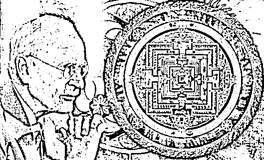

3

**授课老师**

**格雷格·博加特**

（Greg Bogart）

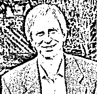

**占星师、心理治疗师**。格雷格出生于美国纽约市，就读于卫斯理大学，1986 移居旧金山湾，完成了加州整合大学和赛布鲁克大学的研究生课程。格雷格自 1991 年以来一直是一名有执照的**心理治疗师**（LMFT 28276）。**他是国际占星研究协会（ISAR）认证的占星师**，并拥有美国地球宇宙学研究协会（NCGR）的第四级认证。他还在旧金山的艾扬格瑜伽学院接受过培训，并于 1992 年毕业且获得了**瑜伽教师认证。**

格雷格是一名私人执业的心理治疗师，在索诺玛州立大学担任**心理学讲师**，他在该校教授“成人发展中的转变”、“以深度为导向的心理治疗”、“神话、梦与象征”以及“存在主义心理学与超个人心理学”等课程，他在加州整合大学、约翰·F·肯尼迪大学、多米尼加大学和超个人心理学学院教授咨询心理学和东西方心理学课程。**他的研究结合了冥想、哈他瑜伽、荣格解梦、存在主义心理疗法和精神综合，以及占星学的周期智慧和原型象征。**

**格雷格·博加特博士著作：**

*   《占星学的高八度音阶》（*Astrology’s Higher Octaves*）

*   《行星用于治疗》（*Planets in Therapy*）

*   《占星学与灵性觉醒》（*Astrology and Spiritual Awakening*）

*   《梦境工作过与自我疗愈》（*Dreamwork and Self-Healing*）

*   《梦境工作在抑郁症整体心理治疗中的应用》（*Dreamwork in Holistic Psychotherapy of Depression*）

*   《占星学与冥想：对变化的无畏沉思》（*Astrology and Meditation: The Fearless Contemplation of Change*）

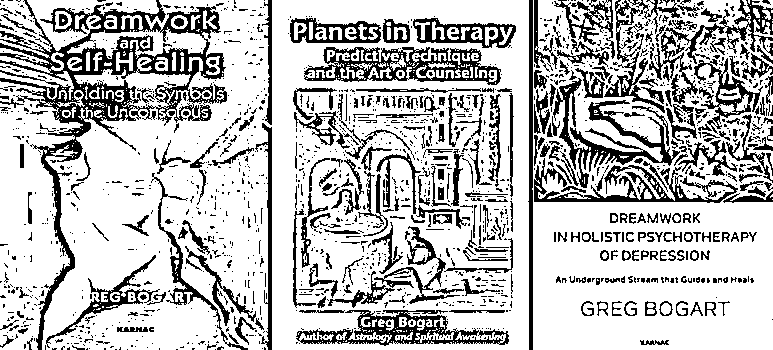

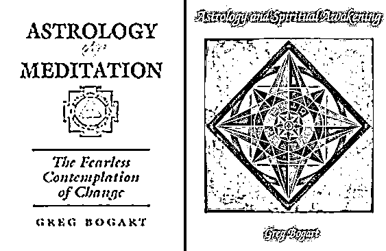

4

**课程价格**

*   **课程价格：****5800 元**

*   **课程咨询：**王老师（微信：18510107057，请备注“释梦工作坊”）

长按二维码添加王老师

5

**课程安排**

*   **课程时间：**

     **2022 年 3 月 5 日周六  8:00-14:00**

**2022 年 3 月 12 日周六  8:00-14:00**

2022 年 3 月 19 日周六  7:00-13:00

*   **授课方式：**线上直播，英文授课，中文翻译

6

**退转课程**

*   **退款原则请详看《教学协议》，如有疑问请咨询课程顾问。**

****释梦工作坊****

**授课老师：**格雷格·博加特

**授课时间：**2022 年 3 月 5 日起

**授课方式：**网络课程**，**英文授课，中文翻译

**费用：****5800 元**

**课程负责人：****王老师**（微信：18510107057，请备注“释梦工作坊”）

长按二维码添加课程负责人咨询~

****报名请点击“阅读原文”****

# 想获得最深的自我蜕变？你需要勇敢穿越冥王星的“黑暗世界”（内附行星相位指南）

> 原文：[`mp.weixin.qq.com/s?__biz=MzA5NjA0NTAxNg==&mid=2651469363&idx=1&sn=f50e929ee1758769b16db056a2d9e052&chksm=8b488484bc3f0d92d584255989ace65bbab1daaba56d9fb213890880bb33c315db8d15bbb62b&scene=126&sessionid=1692737847#rd`](http://mp.weixin.qq.com/s?__biz=MzA5NjA0NTAxNg==&mid=2651469363&idx=1&sn=f50e929ee1758769b16db056a2d9e052&chksm=8b488484bc3f0d92d584255989ace65bbab1daaba56d9fb213890880bb33c315db8d15bbb62b&scene=126&sessionid=1692737847#rd)

**☆ 后台回复“今日”，给你一句生命态度 **

作者/薇安 ISRA 认证占星师
编辑/翀子 封面/书君 图片/网络

占星学里的冥王星，承载着人们因惧怕而试图掩藏、压抑的意识内容，它不仅象征个人或集体意识的阴影面，也象征着穿透这些阴影的强烈驱力。当冥王星与个人星图上的太阳、月亮、水星、金星、火星形成重要相位时，意味着我们需要在哪些领域穿透表象获取力量呢？一起阅读吧！

**引言**

冥王星，一如它的名字，立即让人联想到黑暗的地下冥府。而这里，在许多文化中，都承载着人们因惧怕而试图掩藏、压抑的意识内容：邪恶的、丑陋的、禁忌的......以及死亡。

**心理占星学上的冥王星，不仅象征上述个人或集体意识的阴影面；更象征着穿透这些阴影的强烈驱力。**

它深知，长久被掩埋的，会滋生腐烂之疮，唯有将其清除，才能让新鲜的血肉、生命得以生长；而同时，消耗在压抑上的能量也将被释放，转化为创造力。

**出生星图中，冥王星与个人行星形成紧密相位时，后者就像个体深入“冥府”的门户。**人们可能会在与之相关的人生领域中，经历心灵暗夜，或感到要一探究竟的强烈吸引。

**当意志战胜因未知而生的恐惧，他们便会在成功穿越后，斩获深刻的自我蜕变，甚至为更大范围的集体意识带来净化的能量。**

**正如 Pluto 的希腊词源所示，幽暗的冥府之境，深藏着不惧毁灭的勇者方可探得的无穷“财富”。**

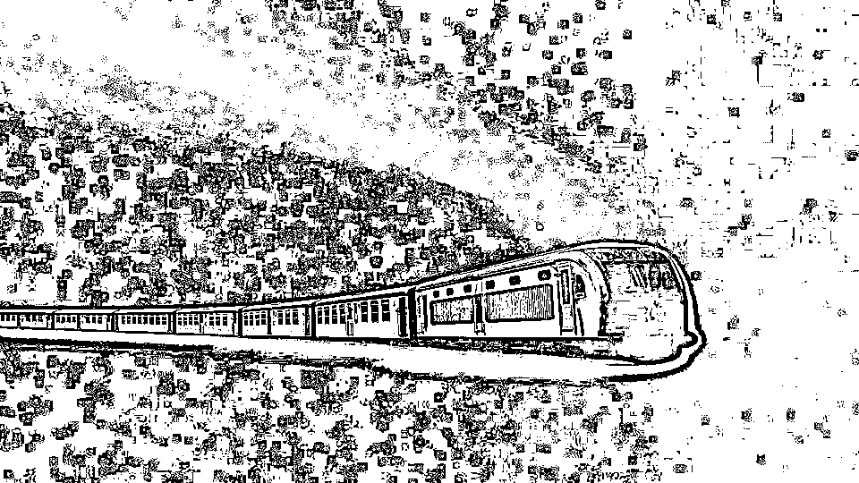

**冥王星与太阳的相位**

**太冥相位的核心动力，与如何正确运用个人意志和权力相关。**

**在人生早期，太冥人可能感到个人力量被剥夺，或很难直截了当地行使它。**例如：父亲具有极高的掌控性，严格要求按其意志行事，否则将受到强有力的警告，甚至体罚。

类似经历令他们在无意识里将**“展现自我”**与**“招致惩戒”**关联起来，同时产生了对父性权力，既恐惧又对抗的心理冲突。

成年后，在自己有机会成为焦点或拥有权力时，会感到不安或不自在，甚至“不经意”地将其破坏掉。但若始终找不到行使权力的安全地位，又会对权威人物暗中投射敌意或攻击。

**让深埋的情结浮出水面，并授权自己发展出创造潜能，太冥人才能真正掌控自己的人生。**

**在更广泛的意义上，太冥相位蕴含着强烈的自我完善与净化的驱力。**换言之，我们既会体认到自身的阴暗面而深感自卑，又有着成为杰出人物的渴望。

**太冥人需要学会同时接纳这两个面向，**并在不断整合两者的过程中，认清自己的真相，发展强大的人格力量，并将个人性的目标与社会需求联结，在自我实现的同时，也促进所处社群的转化。

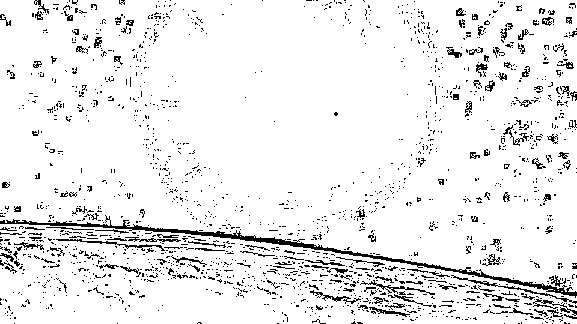

**案例**

**出生星图配置：太阳巨蟹座合相中天，冥王星天秤座合相上升点，太阳四分冥王星。（注：已获案主同意分享，为保护隐私略去个人详细信息）**

**行星合轴，使这组四分相显得更有张力，**并成为廷（化名）显著的人生主题。

自廷出生后一直在外工作的父亲，直到她上小学才回到家一起生活。**古板严苛的父亲，对她管教非常严格。**学业等方面稍有懈怠或未达到父亲期望，廷就会遭受躯体及言语暴力；这种状况一直持续到她上大学离开家。

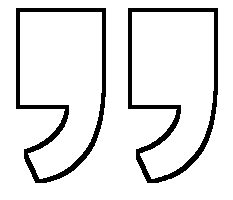

六七岁时，我常从噩梦中惊醒，并伴随严重的死亡焦虑，那些恐怖的感受至今都历历在目......成长过程中，表面上我正常地生活、学习、考大学，但内在始终如黑洞一般，几乎没有任何内源性的活力......

大学毕业，初恋男友出国留学。为争取同行机会，廷决心报考北京大学哲学系的研究生。当年为抵御难言的内在痛苦，她曾疯狂地阅读了许多哲学书籍，并产生很深的共鸣。凭借这一基础，她取得了极佳的专业成绩，却在面试中落选了。

**这次事件如同“命运扣动的扳机”，几乎将她摧毁。**

没过多久，我出现了明显的自杀倾向，**深陷生命的无意义感之中。**2000 年初，社会对抑郁症的了解比现在更匮乏。近乎求生本能的驱使下，我去看了精神科医生。

在拿着重度抑郁的诊断书和处方走出医院时，我心里突然出现了一个非常清晰的“声音”——我绝对不能一辈子靠药物来生活！”

**于是我开始寻找各种方法“自救”**，其中有两件事影响最大：一、报读了精神分析的研究生，让我非常深度地理解了自己。二、练习阿斯汤加瑜伽。

十五年来，除满月日和生理期外（注：此为阿斯汤加的传统），我每天坚持练习，身体和意识不断拓展改变。

我不会说“自己已经痊愈”，或许我也“并未生病”。人类精神世界的复杂性，无法被已知的概念囊括。**我对自己最骄傲的一点是：在所有这一切发生时，我没有逃避。**

**随着内在自我的重塑，廷的现实生活也发生着转变。**历经一次失败的婚姻后，她和现在的丈夫拥有健康良好的亲密关系；事业上，也成为承担重任、受人尊敬的管理者。

**蜕变的过程具体而缓慢，甚或心灵的痛苦也还会继续，但她的太阳终是在一次次进入地府又奋斗重生的过程中，日益光芒灿烂。**

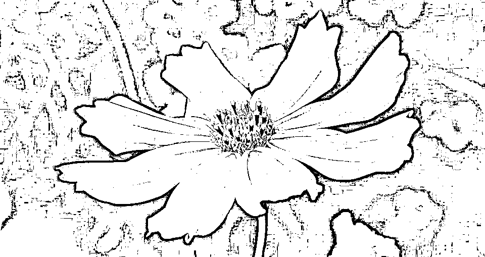

**冥王星与月亮的相位**

**冥王星深化、且锐化了月亮的感受性，它想要刺穿个人、家族、甚至集体意识最底端的“秘密”，一探究竟。**

消化和处理自身的、以及从周遭吸收进来的复杂情绪，特别是那些具有破坏性的感觉：痛苦、妒忌、恨意、羞耻......会引发淹没性的体验。

**因此，月冥人可能有“抹杀”情绪的倾向——或者想要将它们连根拔起，或者完全不去经验它们。**

然而，“对抗”会催生焦虑；“被压抑的”也会在意识之外更加活跃地寻找出口；从而使得月冥人的情绪活动容易被激惹。**也可能因难以信任他人的动机，为自保而强迫性地想要侵入对方的心理空间。**

反之，月冥人若能主动探究情绪领域，就会发现：**他们其实有着涵容和消化困难经验的突出天赋。**

**经由不断练习和掌握——揭露、理解、释放和清理情绪的技能技巧，月冥人有机会充分发展对人性及深度心理敏锐的洞察力，进而能正向运用强大的情感穿透性和掌控力，帮助自己、他人，甚至集体，释放“心理毒素”，疗愈深层创伤。**

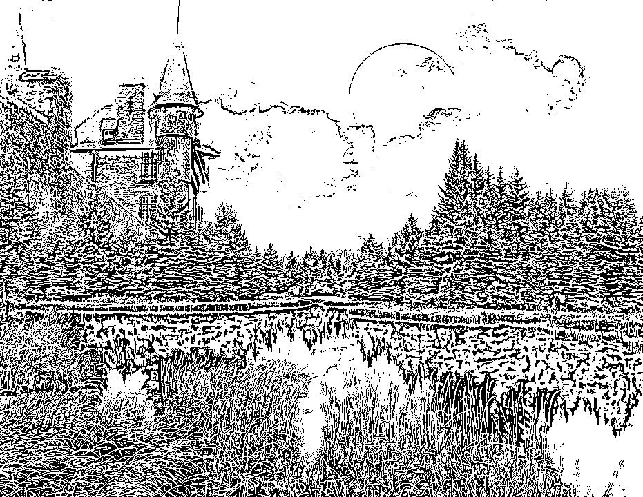

**案例**

**“青蛙公主”谷爱凌的出生星图中，处女座的太阳、金星、水星，双鱼座的火星、天王星与射手座的月亮、冥王星，以较宽的容许度组成了一个 T 三角格局；月亮与冥王星处于顶点位置。（出生日期来源：百度百科）**

赛场上，她将对身体力量最精微的掌控能力，展现得淋漓尽致。冬奥会后，她受邀在《纽约时报》上发表的文章《I Admit It. I’m in Love With Fear》，则向我们讲述了：**如何运用月冥功能，对“恐惧”进行细腻剖析，并将之转化为点燃 T 三角的张力和创造性的重要燃料。**

在我迄今 18 年人生中的后 10 年，我与恐惧谈了一场动荡不安的恋爱......**实际上，“恐惧”可以算是三种不同感觉的总称，那就是：兴奋、不确定和压力。**我发现，如果这些感觉能被识别并积极地利用，那么每一种感觉中都有一些微妙的指标可以帮助你成功，而如果其原理被忽视，那么这些感觉可能就会是你受伤的前兆。**我们并非无视恐惧，而是要培养深刻的自我意识，**并进行深思熟虑的风险评估，从而与恐惧建立起独特的关系......每一位自由式滑雪运动员的终极目的，就是要认清兴奋和不确定性之间的细微差别，这样才能在拿出最佳表现的同时，最大限度地降低受伤风险。

最后她说到：

一个人的压力体验——显然它是“恐惧”最主观的一面——会受个人经历和观念的影响......**对于埋藏在心底的、渴望“证明自己”的感觉，运动员既可能选择压制它，也可能选择强化它，这很大程度上取决于他们的自信心。**

作为一个刚刚成年的女运动员，我对于这方面还是挺自豪的。我通过增强自己的自尊，并尽量减少对外界期待的需求，从而控制因此感受的压力。

我们绝不应忽视谷爱凌在现实中付诸的巨大努力。而同样重要的是，**她切实发挥了在强烈情绪中仍然能“波澜不惊”的特质，得以对恐惧进行这般细腻地觉知、体验和释放**；也藉由对情绪的掌控，助力了火星的动力与太阳的自尊水平之间的协调合作。

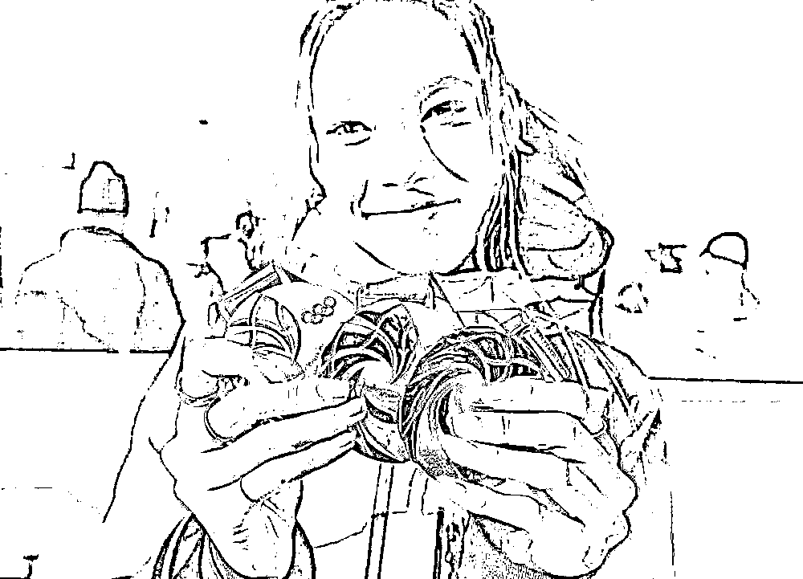

| 谷爱凌

**冥王星与水星的相位**

**冥王星与水星的组合，深化了个体对智识的需求，知识和信息宛若攸关生死般重要，让人渴望知道更多，对真相着迷。**

这组能量非常有利于研究工作。**高度的专注力、对资讯的敏锐度、同时带着质疑不断搜证查询的作风，以及一探到底的决心，会助力学术成就的斩获。**有的人则将其投注在对社会阴暗面或禁忌领域的评论和报道上。

但水冥人也可能因畏惧自己“恶毒”的想法、幻想语言对他人具有杀伤力，将水冥能量“闭锁”在个人的经验范围里。或将此畏惧投射于外，不顾一切刺探他人动机、**强迫别人改变想法；**极端情况下，还会形成**怀疑一切**的偏执思维。

水星的天性总是好奇的，它渴望充分经验和理解世界，并与他人分享我们的发现。它与冥王星携手共创的潜能是——**通过了解和揭露个体生命或集体奥秘中的禁忌、限制，促进意识的改造、转化和拓展。**

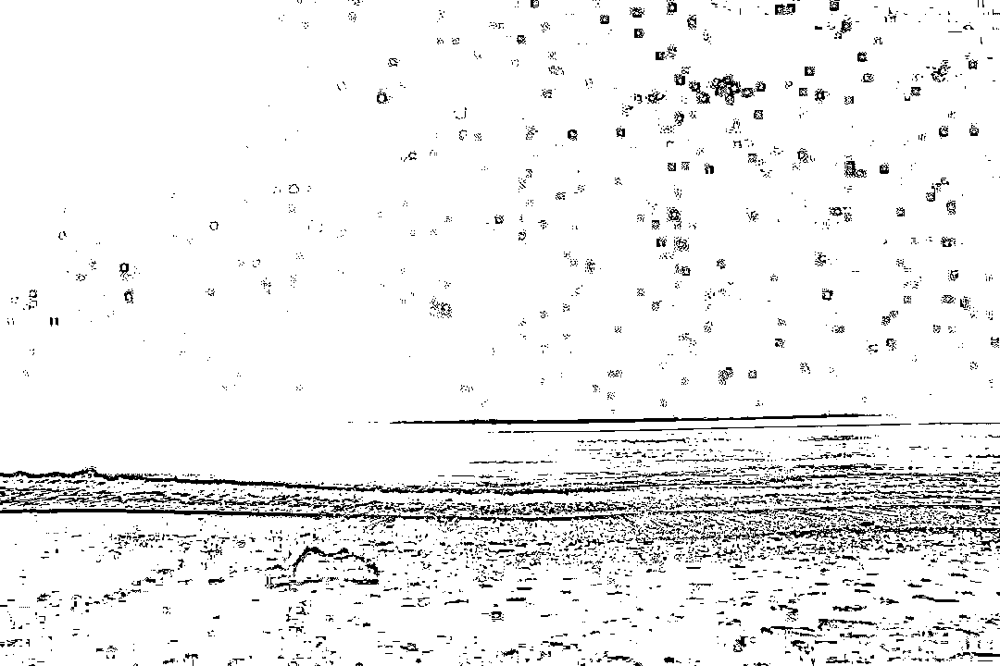

**案例**

**推理女王阿加莎·克里斯蒂（Agatha Christie），水星（与月亮合相）落九宫天秤座，三分六宫双子座冥王星。（出生日期来源：Astor Databank）**

作品总销量突破 20 亿，译本种类和传播范围仅次于《圣经》和莎士比亚的著作——创造出如此伟大成就的阿加莎·克里斯蒂，**将其水（月）冥三分的能量，作了最具升华性的表达。**

她并未受过专业的心理分析训练，却在作品中**以对人性全面、多维和精准的把握而著称。**她用冷静、干练而非恐怖血腥的笔触描写死亡，同时又不乏细腻敏感的人文关怀。

一战期间加入志愿医疗队伍习得的医药和毒品知识、与第一任丈夫环球旅行了解到的各国风土人情、跟随第二任丈夫的考古队进行工作所获得的学识见闻，无一不成为其作品的创作素材。二战期间，期盼着阅读她的连载小说，成了许多人在动乱生活中的心灵慰藉。

她的外孙在接受采访时回忆：“外祖母从没想过写作可以为自己带来财富和名望......她的自传写了 15 年，期间所有人都劝她多写一些创作心得，这样读者会感兴趣。可是，外祖母却把 90%的篇幅用于描述家长里短。她自己说过：‘与其吹嘘自己写出了伟大的作品，我宁可说说自己怎么给外孙换尿布。’”

“作为全世界最会讲故事的人，她却是我见过的最好的倾听者”——克里斯蒂亦是如此专注地去“倾听”自己的想象力、对人性的直觉、对世界的观察，并心无旁骛地、忠实地把它们记录下来，才使她成为集体意识通畅的表达管道。

真相，无论它本身多么丑陋，对于追求它的人来说总是令人好奇且美丽的。

——阿加莎·克里斯蒂

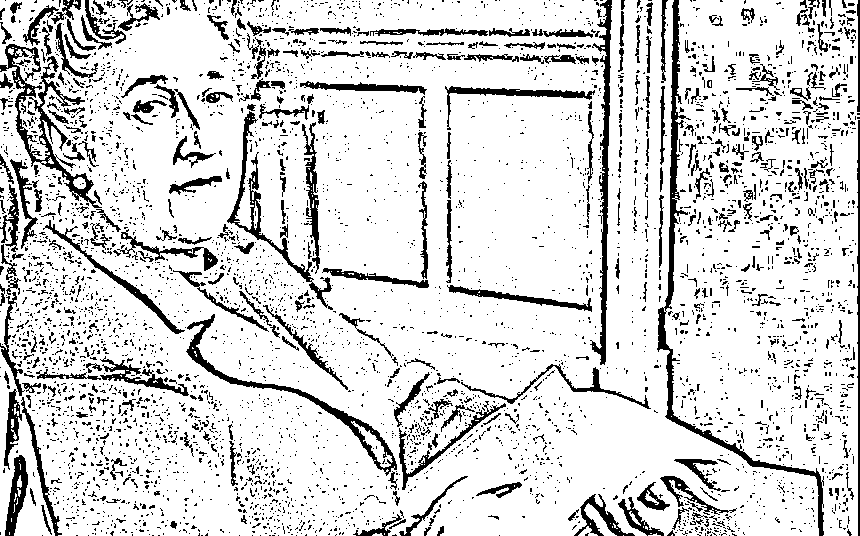

| 阿加莎·克里斯蒂

**冥王星与金星的相位**

**冥王星与金星结合，要求个体经由转化自爱的能力，进而能构建忠诚且有着茁壮生命力的关系。**

人生早期、甚至更久远的某些经历，塑造了金冥人一种消极的，甚至带有羞耻感的自我图式，因此形成**“既渴望得到足够的关爱来修复这个部分，又预期自己会遭受拒绝”**的矛盾情结。

这会驱使他们在关系中不断“制造”复杂、痛苦的剧情，以试炼它的深刻和坚韧，却又难以信任持久的承诺。

内在深层不被爱的感受，也常常激起强烈的妒忌和占有欲，并试图运用性、金钱、财物的力量来紧密地控制与他人的关系。另一极端，则因太过害怕受伤，完全避开感情议题。

总是充满情绪张力，乃至令人窒息的关系终难持久。**金冥人必须在一次次的关系危机中，弄清楚自己执着的源头。**

在金冥能量的交互中，我们需要先落实金星的驱力：**疗愈自我受创的价值感，唤醒自身爱的能力和品质。**当我们不再依赖他人来满足或达成自己的期望时，就能在关系中正向运用冥王星的能量，以一种毫不妥协的勇气和诚实的态度，促进彼此持续转化人生的局限和阻碍。

**冥王星与火星的相位**

**冥王星与火星的结合，象征着极其强大的生存意志和战斗渴望。**

这组强烈的能量，若能导向清晰的人生目标，将展现为不惧涉险的勇气、对抗外界压力的坚强意志，以及超强的坚持力，促使他们做出卓越成绩。

这一组合的挑战在于，如果火冥人内在将其经验为“火星如同被冥王星吞噬了一般”，并伴随一种**“我根本没有赢的希望，所以没必要去抗争什么”**的信念，就很难自如地展现力量追寻自己渴望的权力。

如此一来，他们可能在人际间过度强硬地按自己的方式行事，以此掩盖会被强权压迫的恐惧。或是相反，一味以妥协的方式来应对世界。**而这两种情形中，都会逐渐积累朝向自身的愤怒，“不经意”地吸引来自我破坏的暴力情景。**

通过体育运动、音乐、舞蹈，在身体和情绪的层面，将被曾被冻结的能量，痛快地释放出来，会带来很好的疗愈。更重要的，**火冥人需坚信：**

**自己永远有机会正向整合这两股能量。特别是带着爱的意图去运用它们时，生活、心理和意识，都将收获积极的转化和更新。**

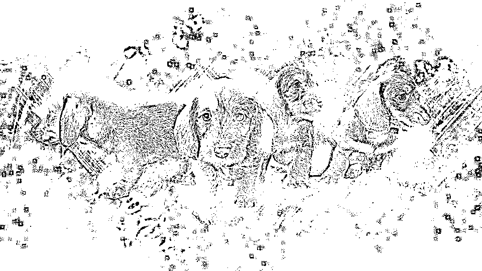

**案例**

**雪儿·海蒂（Shere Hite，美国知名性心理、行为和两性关系研究专家），太阳、金星、火星合相落天蝎座，四分狮子座冥王星。（出生日期来源：雪儿·海蒂官方网站）**

从 1976 年开始，海蒂以极具原创性的、发放问卷的方式对普罗大众展开有关性的研究调查，并将结果陆续整理发表为三部《海蒂性学报告》。

她在书中运用了大量直白、未加修饰的原始谈话记录，内容涉及男女在性问题各领域中隐私的、羞于出口的状况、体验和问题，在世界范围内引起广泛关注，被誉为惟一可以和金赛博士相抗衡的性爱学者。

尤其值得一提的是，作为性学领域中，第一位描述女性经验的女性研究者，其报告内容令当时社会“惊恐”地看到了女性在性体验中的真实感受，与过去男性研究者的描述迥然不同。

她超前所属时代，**试图唤起女性意识**——自己也可以成为男女关系中的中心；并倡导女性独立自主，摆脱男性占主导地位的思维。海蒂因此被视为女权主义先驱，不过她自己的态度是：“我不是女权主义者，至今，我仍在探索男女的真正平等。”

迄今，其作品已被翻译成 27 种语言，累计销售高达 3600 万册。但在她的整个研究生涯中，**始终伴随着大量的排斥和非议。**

保守主义者认为她的书有伤风化，讥讽她是“被性迷住的疯子”。散文式的写作风格，巨大的问卷投放与回收差距，也让调查结果招致学术界“有科学性漏洞”的指责。乃至最后，海蒂因遭受太多对她个人性的批评而放弃了美国公民身份，迁居欧洲。

**雪儿·海蒂深入社会禁忌之地，真实、直接地披露她的发现，推动着集体意识的扩展、与“阴影”的整合。**她身体力行地示现着金冥能量对自我价值和关系意义的深度转化，也向我们展示了火冥非凡的生存力和战斗意志。

而这一切，正源于她对内在召唤的忠诚回应——在哥伦比亚大学攻读西方思想史博士学位期间，“一位教授告诉我研究历史不是去寻找‘为什么’，而是追问‘是怎样的’。**这对我来说远远不够，我想知道的是人们‘为什么’这样、‘为什么’那样”。**于是，她中断学业，开始了独立研究的生涯......

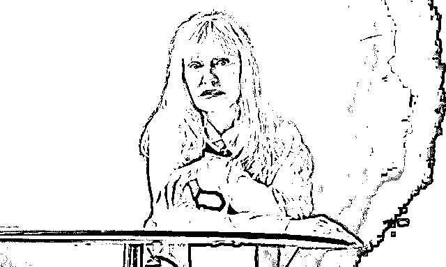

| 雪儿·海蒂

**结语**

冥王星与个人行星形成相位，好似心灵作出如是承诺——**“我选择以最激烈的转化方式来获得启蒙和洞见”**。无论过往生命曾以怎样的方式，令我们有“坠入冥府般”的体验，它同时也在召唤我们：

**穿透事物表面去洞察、探寻、并释放无意识里隐藏的动力**；**在被摧毁的部分自我（包括被视作身份认同的外在事物）的“废墟”中发现真我的本质。**

尽管人们常用“转化、死亡、再生”这类词汇来描述，但冥王星相位所象征的广度和深度，远非语言能及，必须亲身体验才能彻底认识。愿我们抱持住勇气与信任，踏上自我揭露、蜕变与整合的旅程！

**版权声明**：原创文章由作者授权首发于若道平台发布，欢迎转发，反对抄袭。

****

**薇安**

全职心理占星师、ISAR 认证占星师（2016 年获得）、若道兼职助教

北大心理学硕士、MBTI 国际认证施测师

若道认证生时校正资质及 COAC 高阶资质毕业生

**微信 ID**：weianhuilai

**公众号 ID**：Radio-for-Alice

长按打赏

**学习占星学****点击下图了解课程详情**

**

**微信又双叒叕改版啦，不想错过若道君的推送？****就把若道设为星标吧！****▼**

**就是这个“在看”，戳戳戳 ☟**

******报名直达入口******

# 父母、伴侣、孩子……他人在你的星图中扮演了什么角色？

> 原文：[`mp.weixin.qq.com/s?__biz=MzA5NjA0NTAxNg==&mid=2651469363&idx=2&sn=6669956609a79f96e7b85b2dde7b4ba5&chksm=8b488484bc3f0d9234bf1b211f657c38855143f57b910d4516f691310150c01549e448556571&scene=126&sessionid=1692737847#rd`](http://mp.weixin.qq.com/s?__biz=MzA5NjA0NTAxNg==&mid=2651469363&idx=2&sn=6669956609a79f96e7b85b2dde7b4ba5&chksm=8b488484bc3f0d9234bf1b211f657c38855143f57b910d4516f691310150c01549e448556571&scene=126&sessionid=1692737847#rd)

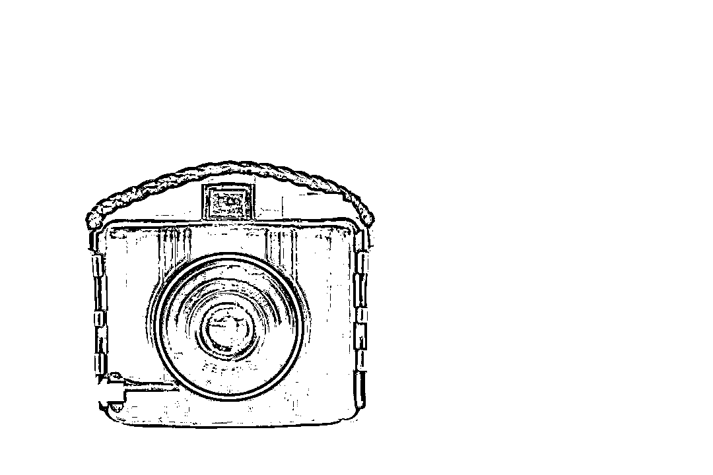

作者/格伦·佩里 译者/若道翻译团队
  编辑/玫瑰 封面/书君 图片/pexels

在[上一篇文章](http://mp.weixin.qq.com/s?__biz=MzA5NjA0NTAxNg==&mid=2651468919&idx=2&sn=60458e2abe3e6d487a2dd9ccd6e15f8b&chksm=8b4886c0bc3f0fd67a6f4e1ddcb6b83b25e5868f67dc18472dccb6dabf7d04c8831070263c7a&scene=21#wechat_redirect)里（点击可阅读），我们讨论了原型的上半部分，今天让我们一起来看看后面的内容吧。格伦老师参与授课的【[双证课程](http://mp.weixin.qq.com/s?__biz=MzA5NjA0NTAxNg==&mid=2651468070&idx=2&sn=56a909d9998c43ec042272a92705ba8d&chksm=8b488391bc3f0a8757b9a61a9025bd71b58e0ff32346a41af5c40cf624d83ce35edbd2ede446&scene=21#wechat_redirect)】报名中，点击链接了解更多详情吧~

**他人在你的星图中扮演了什么角色？**了解其他人扮演了这个人星图的哪一部分，这会有**两种诊断优势。** 首先，**你可以推断这个人在案主人生中的作用。**如果外在人物表现出一种显著的土星功能，如权威人物，那么可能会有在案主内心发展土星功能的挑战和机会。第二，**一个人与外在人物之间经历的确切性质给予了反馈，**反映出对应心理功能的整合状态，同时还刺激它进一步成长。 **一个普通的例子可能是父母在孩子生活中的角色。**似乎孩子命运的一部分就是去完成父母生命中未完成的工作，它反映在月亮（母亲）或太阳（父亲）之中。**月亮的位置不仅描述了案主与母亲人物的历史，同样也描述了她自己作为母亲角色的历史。** 孩子出生前的经验如何影响母亲，这似乎会作为一种心理遗传，继续传递给了孩子。孩子对母亲的体验被内化了，然后接连不断地在整个人生旅程中发挥作用。如果母亲抑郁，她的孩子会继承这种抑郁的倾向，这必须在她自身之中疗愈母亲留下的未解决的问题。同样的原理也适用于**太阳和孩子对父亲的体验**。太阳在星图中的位置暗示着父亲人生主题中“未解决的问题”。就像接力赛中的两个赛跑者，父亲将接力棒传给他的儿子/女儿，然后儿女的命运就变成了继续完成属于他/她的那一棒——也就是说，希望能提高分数，在他/她自己的人生中完成他父亲在自己的人生中留下的未完成的工作。这一挑战的关键细节由太阳的星座、宫位和相位揭示。孩子必须真正地去“处理”他的父亲，将他/她的太阳潜能实现到一个更高的程度；他/她必须达到更高层面上的创造性、自尊、自信以及用一颗充实、开放的心去爱的能力。当孩子自己成为父母的时候，情况可能不断自我重复，因此每个后代都必须背负家族的进化使命继续前行。

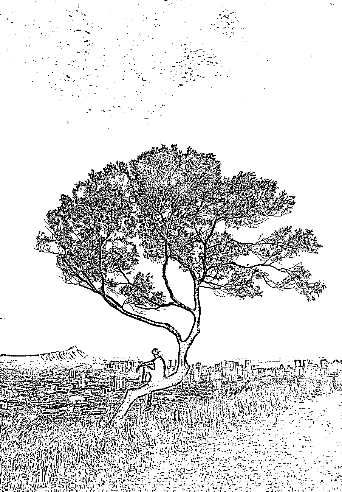

**行星需要场所让行为发生**场所是为了一个目的而预留的具有特殊性质的空间领域。**每颗行星都要满足一种目的，因为它表现的行为意在满足一种动机，达到一个目标。然而，目的需要一个场所，让适当的行为在此发生。**

*   **水星象征着学习的过程**，通常需要一所学校——学习的场所；

*   **太阳象征着创造性的冲动**，可能需要一个剧场或工作室；

*   **天王星象征着一群志同道合的人**，为了共同的原因走到一起，因此会议中心或会议大厅可能是适宜的场所。

结论是**行星原型不仅象征着执行行为的人物；它们同样代表这些行为发生的场所**，将场所与行星关联上是一个简单的观察和演绎推论。**行星原型象征怎样的场所？**如果我们知道海王星象征着超越的功能，那么我们就可以推断，海王星主宰着支持超越行为的场所，例如，救助所、静居处、修道院、冥想中心，诸如此类。接下来，我们可以测试我们的假设，通过观察海王星在星图中与其他因素的组合是否真的显示为这类场所。当然，可能有**不止一个场所与一种行星原型匹配**。然而，在每个事例中，场所都适合那种原型的一种或多种行为特征。 由于海王星同时也与逃避主义、受害者、老人和必须隐退的人有关，所以海王星还主宰着医院、酒吧、精神病院、疗养院、监狱，心理机构以及其他的人们到那里去逃避、寻找快感、恢复、改造、崩溃或结束生命的地方。

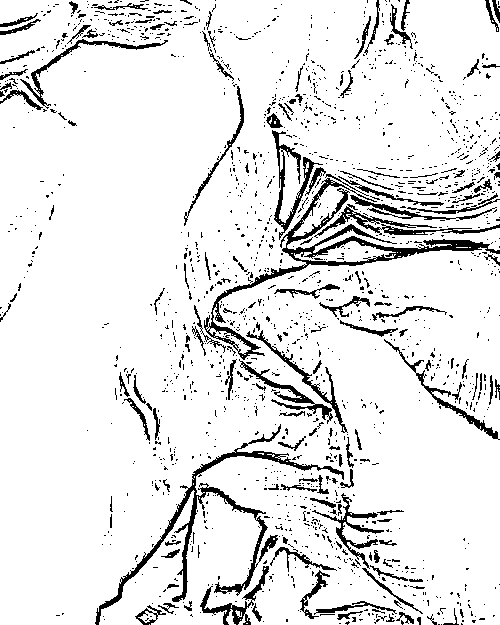

由于**行星可能并不是真的显示为一个真实的场所**，所以它在星图中的落点可能修饰宫位的环境，从而让它感觉“似乎”这个场所就在那儿：

*   海王星在第 4 宫可能让某人的家感觉就像一个隐退之所；

*   火星在第 7 宫，一个人的婚姻可能像拳击场地；

*   冥王星在第 10 宫的人，他的事业可能会发生在“秘密”的地方。

**★原型场所表**

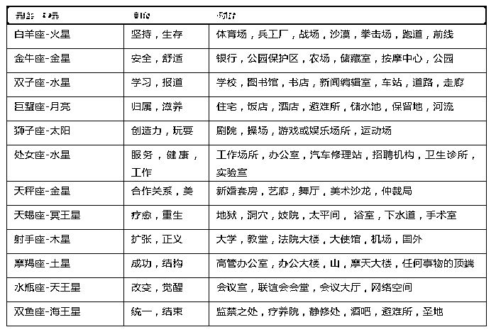

上面的表简要列举了与每个行星相关的一些目的和地点。当然，列表不可能面面俱到，但它证明了行星如何在各种场所中表述自己的目的。

**版权声明：**本文由若道翻译发布，欢迎转发，反对抄袭。友号转载请申请白名单。

**格伦·佩里**

若道签约老师，著名占星师，前 ISAR 董事会成员，共出版 8 本占星著作；心理/意识研究专业博士；占星心理学学院（Academy of AstroPsychology）的创办人；康涅狄格州研究生院（the Graduate Institute of Connecticut）原型宇宙学与意识进化项目的负责人。

**美国占星心理学学院创办人**

**格伦·佩里**授课**40 余年**职业占星师生涯所学精华**倾囊相授**修完 101-205 全部课程，并通过考核的毕业生将获得**美国占星心理学学院证书**( Academy of Astropsychology )和**若道毕业证书****高含金量双证书**跟随主讲老师学习融合**心理学体系**的**占星知识**为星图咨询解读打下坚实的基础**大量**的课程资料，光是课后阅读资料就**超过 60 万字**合理的课程设计，贴心的助教服务，及时的课后测验**美国占星心理学学院&若道占星联手打造** **两年双证书核心课程****点击图片了解详情**

**

**学习占星学****点击下图了解课程详情** 

**微信又双叒叕改版啦，不想错过若道君的推送？**
**就把若道设为星标吧！****▼**

**喜欢记得点一下在看哦☟**

**报名直达入口**

# 早鸟价最后 2 天 | 美国占星心理学学院&若道占星双认证核心课程

> 原文：[`mp.weixin.qq.com/s?__biz=MzA5NjA0NTAxNg==&mid=2651469363&idx=3&sn=12dbd3b6fc260f2e9da1ab6038df156b&chksm=8b488484bc3f0d923874d2c097d12cb1ac4afde5d0093e142bc418d6f23f8db399eb328054ff&scene=126&sessionid=1692737847#rd`](http://mp.weixin.qq.com/s?__biz=MzA5NjA0NTAxNg==&mid=2651469363&idx=3&sn=12dbd3b6fc260f2e9da1ab6038df156b&chksm=8b488484bc3f0d923874d2c097d12cb1ac4afde5d0093e142bc418d6f23f8db399eb328054ff&scene=126&sessionid=1692737847#rd)

**美国占星心理学学院创办人**

**格伦·佩里**授课

**40 余年**职业占星师生涯所学精华**倾囊相授**

修完 101-205 全部课程，并通过考核的毕业生将获得

**美国占星心理学学院证书**( Academy of Astropsychology )

和**若道毕业证书**

**高含金量双证书**

跟随主讲老师学习融合**心理学体系**的**占星知识**

为星图咨询解读打下坚实的基础

**大量**的课程资料，光是课后阅读资料就**超过 60 万字**

合理的课程设计，贴心的助教服务，及时的课后测验

1

**这门课程最大的看点是什么？**

1. **两位国际占星学大师**共同授课，将合计**90 年职业占星师生涯所学精华**倾囊相授；2. 修完**全阶课程**，考试通过的毕业生将获得**美国占星心理学学院证书**（Academy of Astropsychology）和**若道毕业证书**，**高含金量双证书**；3. **116 次课程**的充分授课时间（录播课程 69 次课；直播课程 47 次课），全面而详细地讲解占星学历史、知识、技能、案例、咨询和运用；4. 跟随主讲老师学习**自成体系、逻辑严密、实用性强的占星语法、星图解读方法**；5. 学习独特的**发展年龄预测法**，从星图看对关键年龄阶段的发展及议题；6.** 大量的课程资料，光是课后阅读资料就超过 60 万字**；7. 合理的课程设计，初中阶课程，每一节都有课后测验；8. 本课程可以作为**ISAR 选修课**中的一门，再修两门就满足 ISAR 认证选修课要求；9. **18 次占星咨询技巧的培训**，为正式从事占星咨询建立基础；10. 教授重要的**心理学概念**，比如与客体关系、心理动力理论、个人神话和叙事疗法相关的一些概念，学习如何将它们整合到星图解读中；11. 了解**《精神疾病诊断与统计手册》**诊断标准，探索星图中的心理疗愈；12.  学习**叙述疗法**和**自传写作**，将之作为自我疗愈和咨询的工具。

**格伦老师致学员的信**

（向上滑动查看内容）

**亲爱的学员：**

作为占星心理学学院的校长，我的目标是帮助你顺利完成学业。

占星心理学学院的课程让你能够在经济承受范围内，灵活地学习占星学。我们的课程让你可以舒适、便捷地在家学习，不用打乱你本就繁忙的日程。我们有完善的在线学习系统，让你能在线上课、下载学习资料、进行测试并自动获得即时反馈，还可以在虚拟课堂上同你的教员和同学互动。

作为私人开业的**职业占星师**和**执业心理治疗师**，我已经**工作超过 30 年。**我还花了近 10 年的时间，在研究院里学习并获得**心理学的硕士和博士学位**。这段训练和经历是无价的，帮助我将占星学发展成为连贯的 21 世纪模式。

我们的占星学培训项目是**系统化的、清晰的、组织有序的、易学的、前沿的。**尽管有许多类似的学校可供你选择，但你不会在这些学校中看到像占星心理学学院所提供的那样有深度的或尖端的课程。

**我非常期待 2022 年再次在若道教授心理占星学核心课程。**我们重新规划和升级了本次课程体系。**新的课程包含之前完整课程的 72 个录播视频，每个视频长 2 小时；以及由我教授的 37 次直播课程，和大卫老师教授的 10 次直播课程，每次课程 2 小时。**在实时课程中，除了我提供的案例，我还会用学员的星图进行案例演示，与学员互动，阐明视频中教授的原则和方法。

**2 小时直播课程安排：**

**第一阶段 提问和讨论：**

这将在每节课开始时进行。邀请学员提出与课前提供的资料相关的具体问题。这一阶段将持续 15-30 分钟。

**第二阶段 示例：**

这一阶段会讲解与每周任务相关的具体概念，例如行星的星座位置、宫位位置以及相位的意涵。星图示例来自我认识的人，如公众人物、朋友、家人、同事或以前的客户（不显示出生信息）。同样，这一阶段也开放课堂讨论，学员可以提出自己的问题和见解。

**第三阶段 学员案例演示：**

这个阶段会从学员的具体星图来阐明概念，例如火元素行星占优势。学员案例演示不会涉及任何类型的咨询或“解读”。它们将只是简单地包含一段对话，我会在对话中分享自己对某个配置的思考，然后问这个学员可能会如何主观地（影响、信念、行为）和客观地（事件/关系）体验这个配置。其他参课学员可能也会对讨论的主题有自己的见解或问题，他们也可以参与讨论。

我对这一新的在线课程形式感到兴奋，**并期待着从 2022 年 4 月 6 日开始认识我的新学员们。**获得本学院的文凭会是你做过的最明智的投资。你不仅将占星学掌握到前所未有的深度，还将学到如何为客户提供咨询服务并建立职业占星师的职业生涯。

真诚地

**格伦·佩里 占星心理学学院校长**

**为什么要学习心理占星学？**占星心理学是一个复杂的体系，让实践者能够向客户提供真正治疗性的益处。这从根本上说来是我们学院有别于其他学校之处：**我们教授占星学，也教授心理学概念。****我们明确讨论各种心理学概念，并将其与占星学无缝衔接。结果就是更深入的、更丰富的，最终更加强大的模式。****该项目专为初学者和渴望深造的有经验的占星师而设。**我们会从跨学科的角度探讨星图解读。**通过融合荣格心理学和各种其他模型的元素，学员将熟悉作为人格理论、发展模型、原型语言和诊断工具的占星学。**

2

**课程是怎么安排的？**

**第一学年**

**共****64****次课 **43****次录播课 **21 次直播课******

**101 占星学基础 **

****共****12****次课程：******8 次 2017 年录课+4 次直播课**

**占星学**关注成长，聚焦心理。外部事件意义重大，但我们可以把它们看作是对于发展中的心理结构的共时性反映，以及未来发展的媒介和催化剂。在这个阶段的课程中，会以四种形态的几何形式介绍**占星原型：星座、行星、宫位和相位**。黄道带是人类心灵的象征性地图，其中的每个**星座**都代表一种基本的人类需求、原型人物、发展阶段和行为风格。**行星**代表心理功能，以满足其关联星座的基本需求。**宫位**提供了环境舞台，行星在其中扮演它们的角色，而**相位**是行星之间的角度关系，在主观上体验为内在对话。

**课程安排**：

**录播课****、****直播课（周三）**时长都是 2 小时

第一节**录播课**：核心概念介绍

第二节**录播课**：黄道带的结构

2022 年 4 月 27 日**直播课**：核心概念、黄道带的结构提问和讨论、知识点示例

第三节**录播课**：图例、单态星体和其他奇妙的元素

2022 年 5 月 11 日**直播课**：图例、单态星体提问和讨论、知识点示例

第四节**录播课**：星座介绍（从白羊座到处女座）

第五节**录播课**：星座介绍（从天秤座到双鱼座）

2022 年 5 月 25 日**直播课**：12 星座案例演示

第六节**录播课**：行星作为过程

第七节**录播课**：行星作为内容

第八节**录播课**：将碎片整合起来

2022 年 6 月 8 日**直播课**：整合星图时，将行星作为过程和内容案例演示

**102 行星落星座、宫位** 

****共****12****次课程：**8 次 2019 年录课+4 次直播课**

这个阶段的课程**聚焦于初步的星图整合。**

学员将学习**占星语法**，以及如何运用它们来阐释**行星的星座落点**。学员不需要强记书中的星图解读，而是学习分析基础的占星句法结构，应用这些语法规则来思考和讲述这门语言。学员们将学习如何构建精妙的句子，将动机、功能、特质、状态和事件组合起来。

此外，还将学习解读**行星宫位落点**的规则。宫位被定义为心理环境，为特定类型成长和发展提供背景。行星落在宫位中，象征着情境中的特殊状态，应对环境挑战的方式，以及通过共时性人物和事件而外化的自我部分。

学员们将探索如何将星座和宫位落点融合在一个单一、整合的陈述中，做出灵活、层次分明的解读。

**课程安排**：

第一节**录播课**：占星语法介绍

第二节**录播课**：行星星座作为行为风格

2022 年 6 月 22 日**直播课**：占星语法、行星星座作为行为风格提问和讨论、知识点示例

第三节**录播课**：思维状态和行为结果

第四节**录播课**：学习行星的星座落点

2022 年 7 月 6 日**直播课**：思维状态和行为结果、行星的星座落点提问和讨论、知识点示例

第五节**录播课**：回顾宫位的含义

第六节**录播课**：宫位中的行星过程

2022 年 7 月 20 日**直播课**：宫位的含义、宫位中的行星过程提问和讨论、知识点示例

第七节**录播课**：行星在宫位中的状态

第八节**录播课**：行星作为宫位的内容

2022 年 8 月 3 日**直播课**：行星在宫位中的状态、内容的提问和讨论、知识点示例

**103 行星相位与个人神话** 

****共****13****次课程：**9 次 2019 年录课+4 次直播课**

在这个阶段的课程中，**相位**被解释为由更大的故事结构的潜在动力构成的个人神话。

学员将学习相位是如何象征内在心理的冲突、重要的童年情感体验、主要的人生挑战和内在对话的。需要着重强调的是，相位的意涵会随着心理成熟的程度而改变。人会成长、进化，会解决内在冲突，这些不仅反映在态度和行为的改变上，而且也会表现在某人吸引的事件及其与他人的关系品质上。

学员们还将学习一些**心理学概念**，比如与客体关系、心理动力理论、个人神话和叙事疗法相关的一些概念，它们将整合到相位解读中。

**课程安排**：

第一节**录播课**：重要主题与核心冲突

第二节**录播课**：渐盈相位与渐亏相位

2022 年 8 月 17 日**直播课**：重要主题与核心冲突、渐盈相位与渐亏相位的提问和讨论、知识点示例

第三节**录播课**：主要相位的核心意义

第四节**录播课**：罗生门原则

2022 年 8 月 31 日**直播课**：主要相位的核心意义、罗生门原则的提问和讨论、知识点示例

第五节**录播课**：占星学中的认知

第六节**录播课**：心灵的控制结构

2022 年 9 月 14 日**直播课**：占星学中的认知、心灵的控制结构的提问和讨论、知识点示例

第七节**录播课**：作为认知结构的相位

第八节**录播课**：强迫性重复

第九节**录播课**：听大卫·瑞雷讲月亮交点

2022 年 10 月 12 日**直播课**：月亮交点（由大卫·瑞雷老师教授）

**104 征象星与定位星：作为进化故事的星图 **

****共****12****次课程：******8 次 2019 年录课+4 次直播课**

这个阶段的课程聚焦于**从叙事角度整合星图。**

学员们将探索**宫位征象星**和**行星定位星**如何讲述一个故事，反映一个人进化发展之旅。行星定位关系揭示了个人神话的主体构架。而这个故事的主题常常处于意识觉知和控制之外，占星学提供了一种方式，揭示、解读、改编这个神话。

我们推荐的星图整合方式是将相位和定位星关系融合成一个单一、连贯的叙事。要特别强调的是，如何活出整合程度更高的生命故事。

学员们还将了解**叙事疗法**和**自传写作**，把它们当作促进整张星图整合的一种方式。

**课程安排**：

第一节**录播课**：每张星图都讲述了一个故事

第二节**录播课**：互容与最终定位星

2022 年 10 月 26 日**直播课**：每张星图都讲述了一个故事、互容与最终定位星的提问和讨论、知识点示例

第三节**录播课**：将相位整合进流程图

第四节**录播课**：完整的故事

2022 年 11 月 9 日**直播课**：将相位整合进流程图、完整的故事的提问和讨论、知识点示例

第五节**录播课**：过渡短语

第六节**录播课**：良好定位或不良定位

2022 年 11 月 23 日**直播课**：过渡短语、良好定位或不良定位的提问和讨论、知识点示例

第七节**录播课**：发展年龄方法

第八节**录播课**：进行全面整合

2022 年 12 月 7 日**直播课**：发展年龄方法、进行全面整合的提问和讨论、知识点示例、案例演示

**105 星图中的精神病理学与疗愈 **

****共****15****次课程：******10 次 2019 年录课+5 次直播课**

在这个阶段的课程中,我们将**聚焦于十二星座(从白羊座到双鱼座）及其对应的守护星的潜在功能障碍**。

我们将学习如何识别、理解和应对每个星座的潜在挑战。我们将在各种相应的心理障碍背景下来考察占星原型，这些心理障碍表现为功能障碍、失衡的极端状态。

学员们将了解**《精神疾病诊断与统计手册》诊断标准**。我们会探讨治疗的概念，尤其是那些与整合和个性化相关的概念。我们将特别关注外行星的困难相位，以及它们与内在心理冲突、防御和症状形成的关系。

学员们将探索人的痛苦如何成为发展和实现天赋才能的催化剂。

**课程安排**：

第一节**录播课**：白羊座-火星的病理学

第二节**录播课**：金牛座/天秤座-金星的病理学

2022 年 12 月 21 日**直播课**：白羊座-火星、金牛座/天秤座-金星的病理学提问和讨论、知识点示例、案例演示

第三节**录播课**：双子座/处女座-水星的病理学

第四节**录播课**：巨蟹座-月亮的病理学

2023 年 1 月 4 日**直播课**：双子座/处女座-水星、巨蟹座-月亮的病理学提问和讨论、知识点示例、案例演示

第五节**录播课**：狮子座-太阳的病理学

第六节**录播课**：天蝎座-冥王星的病理学

2023 年 2 月 1 日**直播课**：狮子座-太阳、天蝎座-冥王星的病理学提问和讨论、知识点示例、案例演示

第七节**录播课**：射手座-木星的病理学

第八节**录播课**：摩羯座-土星的病理学

2023 年 2 月 15 日**直播课**：射手座-木星、摩羯座-土星的病理学提问和讨论、知识点示例、案例演示

第九节**录播课**：水瓶座-天王星的病理学

第十节**录播课**：双鱼座-海王星的病理学

2023 年 3 月 1 日**直播课**：水瓶座-天王星、双鱼座-海王星的病理学提问和讨论、知识点示例、案例演示

**第二学年 2023 年**

****共****52****次课 **36****次录播课 **16 次直播课********

**201 回顾占星历史 **

****共****16****次课程：******9 次 2019 年录课+7 次直播课**

在这个阶段的课程中，我们将探索**占星历史如何反映心灵的进化**。

现代之前的占星学以事件为导向，注重具体预测，偏向决定论，它反映了现代之前的主导意识模式。上世纪以来，占星学已经逐渐变得更加抽象、心理化、开放和非决定性，这似乎反映了集体意识的改变。因此，我们将在人类发展和意识进化的背景下考察占星历史。我们会谈到不同时代的星图解读和咨询技术，以此来比较和对比前现代、现代和后现代占星学。

**课程安排**：

第一节**录播课**：朝着整体占星学前进

第二节**录播课**：占星原教旨主义

2023 年 3 月 22 日**直播课**：朝着整体占星学前进、占星原教旨主义提问和讨论、知识点示例

第三节**录播课**：占星学的其他分支——大卫·瑞雷

2023 年 3 月 29 日**直播课**：占星学的其他分支提问和讨论、知识点示例（由大卫·瑞雷老师教授）

第四节**录播课**：从古代占星学到后现代占星学

第五节**录播课**：比较与批评

2023 年 4 月 5 日**直播课**：从古代占星学到后现代占星学、比较与批评、提问和讨论、知识点示例

第六节**录播课**：希腊占星学：摘录与评论

2023 年 4 月 19 日**直播课**：希腊占星学：摘录与评论提问和讨论、知识点示例

第七节**录播课**：比对图中的伴侣匹配度，古代与现代

2023 年 5 月 3 日**直播课**：比对图中的伴侣匹配度，古代与现代提问和讨论、知识点示例

第八节**录播课**：比对图——大卫·瑞雷

2023 年 5 月 10 日**直播课**：比对图提问和讨论、知识点示例、案例演示（由大卫·瑞雷老师教授）

第九节**录播课**：组合图——大卫·瑞雷

2023 年 5 月 17 日**直播课**：组合图提问和讨论、知识点示例、案例演示（由大卫·瑞雷老师教授）

**202 预测与意识演变(一) **

****共****9****次课程：******6 次 2019 年录课+3 次直播课**

作为一门艺术，**预测占星学**运用行星的运行来预测特定时期的性质、意义和持续时间。在这个阶段的课程中，我们会考察**意识进化**的概念、其基本原理及其与占星学预测部分的关系。

意识进化可以被定义为有意识地与星图中固有的进化过程合作。学员们将探索如何用**行进**和**推进**来为意识进化服务。我们不是简单描述事件的结果，而是将行星运行描述为实现先天潜能的机遇之窗。

**课程安排**：

第一节**录播课**：开始预测

第二节**录播课**：发展年龄方法

2023 年 5 月 24 日**直播课**：开始预测、发展年龄方法提问和讨论、知识点示例、案例演示

第三节**录播课**：太阳的行进

第四节**录播课**：月亮的行进与推进

2023 年 6 月 7 日**直播课**：太阳的行进、月亮的行进与推进提问和讨论、知识点示例、案例演示

第五节**录播课**：水星的行进

第六节**录播课**：金星的行进

2023 年 6 月 14 日**直播课**：水星、金星的行进提问和讨论、知识点示例、案例演示

**203 预测与意识演变(二) **

****共****15****次课程：******9 次 2019 年录课+6 次直播课**

在这个阶段的课程中，学员们会继续探索**如何将对行进、推进和其他预测方法的分析运用于个人成长**。

具体事件反映并促进了意识的改变；因此，行星运行可以帮助我们洞察成长过程的精确时机，让我们领会内在和外在现实如何同时发生、彼此反映、互相转化。

我们还将探索宏观的世界行进，考察占星格局如何在社会、政治、经济、艺术和生态层面上表现出不同的形式，却又在多样化的现象中反映单一的**原型**。

这里的挑战是去思考，我们对宇宙的这种参与式关系如何能为共同创造一个积极的、更充满希望的未来做出贡献。

**课程安排**：

第一节**录播课**：火星的行进

第二节**录播课**：木星的行进

2023 年 6 月 28 日**直播课**：火星、木星的行进提问和讨论、知识点示例、案例演示

第三节**录播课**：土星的行进

第四节**录播课**：天王星的行进

2023 年 7 月 12 日**直播课**：土星、天王星的行进提问和讨论、知识点示例、案例演示

第五节**录播课**：海王星的行进

第六节**录播课**：冥王星的行进

2023 年 7 月 26 日**直播课**：海王星、冥王星的行进提问和讨论、知识点示例、案例演示

第七节**录播课**：次限推进——大卫·瑞雷

2023 年 8 月 2 日**直播课**：次限推进提问和讨论、知识点示例、案例演示（由大卫·瑞雷老师教授）

第八节**录播课**：太阳弧——大卫·瑞雷

2023 年 8 月 9 日**直播课**：太阳弧提问和讨论、知识点示例、案例演示（由大卫·瑞雷老师教授）

第九节**录播课**：太阳返照图和月亮返照图——大卫·瑞雷

2023 年 8 月 16 日**直播课**：太阳返照图和月亮返照图提问和讨论、知识点示例、案例演示（由大卫·瑞雷老师教授）

**204 占星咨询技巧(一) **

****共****9****次课程：******6 次 2019 年录课+3 次直播课**

在这个阶段的课程中，学员们将学习**咨询技巧**，比如如何选取一段经历，询问相关问题，提出假设，进行解读，重塑冲突，预测成长机遇，深化疗愈。

我们会审视各种**咨询理论**，重点强调它们在占星学中的**运用**。学员们将学习如何处理危机，做出恰当的推荐引介。

我们强调**有效沟通**的原则、聆听技巧、言语和非言语沟通，以及占星学如何帮助我们建立共情关系。

我们会专门介绍**伦理道德**法则，因为它关系到职业责任问题、资质能力、咨询和预测。

我们会特别关注**占星师的阴影**以及我们在自卑和膨胀问题上的集体脆弱。

**课程安排**：

第一节**录播课**：导言与概述

第二节**录播课**：确定咨询范围

2023 年 8 月 30 日**直播课**：导言与概述、确定咨询范围提问和讨论、知识点示例、案例演示

第三节**录播课**：会见客户

第四节**录播课**：厘清问题(剥开占星学的洋葱)

2023 年 9 月 13 日**直播课**：会见客户、厘清问题(剥开占星学的洋葱)提问和讨论、知识点示例、案例演示

第五节**录播课**：认出生活模式(隐喻思维)

第六节**录播课**：提出假设与辨识核心信念

2023 年 9 月 27 日**直播课**：认出生活模式(隐喻思维)、提出假设与辨识核心信念提问和讨论、知识点示例、案例演示

**205 占星咨询技巧 (二) **

****共****12****次课程：******6 次 2019 年录课+6 次直播课**

在这个阶段的课程中，参与者将**继续学习咨询技巧**，包括如何选取一段经历，询问相关问题，提出假设，进行解读，重塑冲突，预测成长机遇，深化疗愈。

我们还将考察各种**电影**，考察它们与理解人们寻求帮助的共同议题的关系。我们会审视各种咨询理论，着重强调它们在占星学中的运用。学员们会学到如何处理危机，做出恰当的推荐引介。我们会强调有效沟通的原则，以及聆听技巧、言语和非言语沟通，以及占星学如何帮助我们建立共情关系。我们会专门介绍伦理道德法则，因为它关系到职业责任问题、资质能力、咨询、预测和古代术语的运用。

**课程安排**：

第一节**录播课**：检验假设

第二节**录播课**：对星图做出初步解读

2023 年 10 月 11 日**直播课**：检验假设、对星图做出初步解读提问和讨论、知识点示例、案例演示

第三节**录播课**：建设性解读星图的艺术

第四节**录播课**：洞悉客户经历的目的

2023 年 10 月 25 日**直播课**：建设性解读星图的艺术、洞悉客户经历的目的提问和讨论、知识点示例、案例演示

第五节**录播课**：提供希望和方向

第六节**录播课**：案例研究和督导

2023 年 11 月 8 日**直播课**：提供希望和方向、案例研究和督导提问和讨论、知识点示例、案例演示

2023 年 11 月 15 日**直播课**：ISAR 资质认证考试大纲和准备（由大卫·瑞雷老师教授）

2023 年 11 月 22 日**直播课**：ISAR 资质认证考试术语词汇表第一部分（由大卫·瑞雷老师教授）

2023 年 11 月 29 日**直播课**：ISAR 资质认证考试术语词汇表第二部分（由大卫·瑞雷老师教授）

**若道核心课程结业考试**

3

**导师简介**

**格伦·佩里（Glenn Perry）**

*   这位传奇的占星师，也是一名拳击和摩托车爱好者

*   他毕业于赛布鲁克学院(Saybrook Institute)，是心理/意识研究专业博士

*   也是拥有 30 余年经验的加州注册婚姻和家庭治疗师 （CAMFT）

*   美国占星心理学学院（Academy of AstroPsychology）的创办人

*   他曾任国际占星研究协会 （ISAR）以及联合占星大会董事会（UAC）副主席

*   也是 ISAR 突破性道德标准的设定者

*   康涅狄格州研究生院（the Graduate Institute of Connecticut）原型宇宙学与意识进化项目的负责人

*   共出版八本占星学著作：《心理占星学入门》《心理占星论文集》《盗取天火》《从忠诚到革命》《星图中的阴影》《占星职业议题与伦理》《出生星图深度分析》《从古代到后现代占星学》

**大卫·瑞雷（David Railey）**

*   若道联合创始人，致力于在中国教授和推广西方占星学；

*   曾任 ISAR 全球副主席，CAPISAR（ISAR 职业占星师资质认证机构）主席；

*   1976 年，通过亚特兰大职业占星师考试，成为全职占星师，随后通过 AFAN 和 ISAR 职业测试；

*   1980 年，与杰夫·焦耳一起在亚特兰大创建“每日行星”占星学中心。此后在亚特兰大占星协会担任 4 年考官，并且两次担任亚特兰大地区占星协会主席。1979-1992 年，作为占星师活跃于美国社会媒体，向不了解现代占星学变化的大众宣传专业占星学知识。在 1989-1992 年期间，他在 WRGG 电台 12 频道每周主持个人电视秀“今日占星学”，早先他还在 WRFG 的广播节目中播讲宇宙天气节目；

*   2010-2014 年，任全美占星师联盟监督委员会委员；

*   2010 年，其著作《灵魂的目标》中国版出版，和蒋颖一起创办若道占星学校和其官网 www.nodoor.com；

*   2017 年，被选为 ISAR 委员会成员。ISAR 是世界最大的国际占星机构，会员遍布 45 个国家，2017-2020 年曾任 ISAR 全球副主席、CAPISAR（ISAR 职业占星师资质认证机构）主席。

**助教简介**

**薇安**

*   全职心理占星师、ISAR 认证占星师（2016 年获得）；

*   北大心理学硕士、MBTI 国际认证施测师；

*   若道认证生时校正资质及 COAC 高阶资质毕业生；

*   连续两届担任格伦·佩里老师亲授的“美国占星心理学院&若道占星双认证核心课程”主助教；

*   2012 年至今，持续追随多位国际占星大师进行占星学的深入学习；

*   2007 年至今，持续进行精神分析及心理动力取向的理论及技巧研习；

*   致力研究心理学与占星学的整合运用。

4

**此次课程适合哪些人？**

*   对占星学感兴趣，想要入门的零基础者

*   占星学小白，但有志成为职业占星师的人

*   有一定占星学基础，但不知道该如何整合星图复杂碎片的人

*   想要师从更多殿堂级占星导师学习占星心法的人

*   走在自我探索和个人成长道路上的人

5

**选择若道学习占星学的优势**

**运用自由意志，扭转破坏性模式，绽放天赋潜能**

若道是人本主义占星学的旗手。因为我们相信，**人通过了解模式、觉察习性、积极疗愈、终将释放其潜能，与命运共舞**。

**进入国际权威职业占星师认证的快车道**

占星界的“联合国”ISAR（国际占星研究协会），是具有全世界影响力的占星教学和研究组织和职业占星师全球认证机构，认证占星师遍布 47 个国家。**在 ISAR 的 22 所附属学校中，大中华地区的附属学校只有若道一家**。在国际化的教学理念大纲标准下，**若道毕业生在 ISAR 国际认证占星师的考试通过率多次全球第一**。

**十年占星学教育中国本土化教学经验**

**根据中国学生的学习习惯不断优化占星教学体系，让学员学成后更自如地应对本土咨询市场的需求。**

学好占星学不仅仅需要邀请一两位老师教学，更需要对教学难点有充分了解，且有持续的教学跟进服务。**10 年来多次核心课程和各种专题课程的教学，让若道非常了解中国学生学习占星学的难点和卡点，合理有效地拆分、提炼课程知识点，同时也积累了丰富的国外老师和中国老师、助教紧密配合以及课程顾问密切配合教学的经验**。

若道还专门开发了有助于占星学习的“**若道**”APP，每门课程都设有答疑板块，学员能够方便快捷地提交问题，助教及时答疑解惑和批改作业。

**融入中国顶尖的职业占星师群体**

若道是中国职业占星师的“黄埔军校”。职业占星师的培养从若道开始，**进入若道，你就走进了中国顶尖的职业占星师群体，和一群志同道合的师兄师姐联谊，获得经验，共同成长**。 

**多种奖学金支持**

为了鼓励学员不因为暂时的经济困难而放弃学习，我们特意设置了各种**技能交换和奖学金**。

对于有一技之长的学员，我们推出的技能交换的项目包括**“笔译”、“笔记整理”、“平面设计”、“课本朗读”、“班级服务”**等技能交换项目；

而对于努力学习、出勤率高、完成作业率高的学员，我们设置的**土星奖、木星奖**等各种奖学金在等着你。

为了感谢帮助我们推荐学员的老学员们，我们设置了“**老学员推荐奖**”；

对于通过问卷提建议，帮助我们提高服务的学员，我们也设置了相应的奖学金。

**开启占星咨询的职业规划和支持**

若道为占星学员搭建了占星问答平台和占星咨询平台，并提供严肃占星学影响力最大的媒体平台，全力为毕业生提供宣传渠道，帮助你吸引和积累咨询生涯初期的种子客户。若道为学员开发了适用于占星学习的“若道”APP，并不断更新完善。

**①  微信平台**若道微信平台作为业内颇具影响力专业平台，为文笔好的若道毕业生提供传播占星学并免费宣传自己的机会。有的学员因为文笔获得众多粉丝喜爱，在 3 年多时间积累起 2000 多人的潜在客户。

****②  **咨询平台**若道咨询平台是我们为优秀毕业生所搭建的平台，帮助毕业生在自己的咨询拓展之外，用若道提供的平台扩展咨询客户群。自咨询平台 2017 年 8 月上线运营以来，咨询平台共入驻 65 人，收入最高者达 32 万元。

此处所列学员收入仅供参考，收入高的学员和其专业水准、努力程度密切相关。若道平台尽其所能将自己定位为辅助学员开展职业生涯的桥梁。

6

**课程价格**

**101-102 初阶**

**正价：**6800 元

**早鸟价：****6200 元**

**早鸟价截止时间：2022 年 3 月 16 日**

**学习充值卡优惠价：5800 元**

**101-105 第一学年**

**正价：**18800 元

**早鸟价：****17600 元**

**早鸟价截止时间：2022 年 3 月 16 日**

**学习充值卡优惠价：17000 元**

**101-205 全阶联报**

**正价：**50000 元

**早鸟价：****36000 元**

**早鸟价截止时间：2022 年 3 月 16 日**

**学习充值卡优惠价：35000 元**

**咨询课程顾问**：**王老师（微信/手机：18510107057，请备注“格伦核心课”）**

**全阶段学习后，可参与若道占星毕业认证考试，考试费用为：580 元**

7

**直播课开课时间**

**2022 年 4 月 27 日（周三）20:00-22:00**

**如果直播课时间临时有调整，班班会及时通知每位同学****最终解释权归若道所有**

8

**退转课程**

**退款原则请详看《教学协议》，如有疑问请咨询课程顾问。**

9

**格伦老师视频**

** 格伦·佩里老师如何将心理学和占星学结合，如何开始教授心理占星学？**

<mpvideosnap class="js_uneditable custom_select_card channels_iframe" data-pluginname="videosnap" data-id="export/UzFfAgtgekIEAQAAAAAAHBcLpepWXQAAAAstQy6ubaLX4KHWvLEZgBPEkIMYRVhfSLT8zNPgMIs23XYw2eSgrRaPW3Dj9_BA" data-url="https://findermp.video.qq.com/251/20304/stodownload?encfilekey=S7s6ianIic0ia4PicKJSfB8EjyjpQibPUAXolnQrZwePcCZ0XffhxtFKBwL8xABabPSCrxp2TBZSdOyypmjhiabiaWTOO3EBU1J4xTc5YqicfMicRDjwKRTic0XAyGhw&amp;adaptivelytrans=0&amp;bizid=1023&amp;dotrans=0&amp;hy=SH&amp;idx=1&amp;m=&amp;scene=0&amp;token=x5Y29zUxcibDvW6kcaiah8Ercl8kTODs9WlcutHnqspJaoS4rCI8zZQ2lSdgwic54KnoDkAWPP5Y1A" data-headimgurl="http://wx.qlogo.cn/finderhead/PiajxSqBRaEJYnVsqWfEX9qA0sI6hNVKsDfyzfPZ92WZMZyBpZWU5NA/0" data-username="v2_060000231003b20faec8c4e68a1ec2d4ca07e434b07755bbf47e7053a3059defd2c9d6c68a20@finder" data-nickname="若道" data-desc="#若道核心课 如何解读一张出生星图？出生星图有哪些组成部分？星图里不同组成部分分别代表什么？" data-nonceid="7032132594947358005" data-type="video"></mpvideosnap>****2022 双证书核心课****

**授课老师：格伦·佩里、大卫·瑞雷**

**直播课开课时间：2022 年 4 月 27 日（周三）开课**

**授课方式：******网络授课，英文授课，中文翻译****

**费用：101-102 价格：**6800 元**（早鸟价 6200，2022 年 3 月 16 日截止，充值卡优惠价 5800）**，**101-105 价格**：18800 元**（早鸟价 17600，2022 年 3 月 16 日截止，充值卡优惠价 17000）**，**101-205 价格**：50000 元**（早鸟价 36000，2022 年 3 月 16 日截止，充值卡优惠价 35000）**；

**课程负责人：王老师**（微信/手机：18510107057，请备注“格伦核心课”）

长按二维码添加课程负责人咨询~

****报名直达入口****

# 若道周运丨 3.14-3.20：本月重要转换点来啦，12 星座本周有哪些机会呢？

> 原文：[`mp.weixin.qq.com/s?__biz=MzA5NjA0NTAxNg==&mid=2651469245&idx=1&sn=0381342156c65c50c079eac10a3414f4&chksm=8b48870abc3f0e1c2ba1881103634e30e5a8adbdf86cb743dbac194c0013279d8b094848277a&scene=126&sessionid=1692737847#rd`](http://mp.weixin.qq.com/s?__biz=MzA5NjA0NTAxNg==&mid=2651469245&idx=1&sn=0381342156c65c50c079eac10a3414f4&chksm=8b48870abc3f0e1c2ba1881103634e30e5a8adbdf86cb743dbac194c0013279d8b094848277a&scene=126&sessionid=1692737847#rd)

******☆ ****后台回复“今日”，给你一句生命态度******

作者/苏黎 ISAR 认证占星师
编辑/翀子 封面/书君 图片/网络新的一周开始了，双鱼座星群、处女座满月和太阳进白羊座是本周的主要宇宙天气，具体每一天是怎样的呢？12 星座又会如何度过本周？让我们来看文章吧！（如果着急看 12 星座运势，不妨先拉到最后哦）**写在开头**

我写作的当下，社会群体对女性的价值、平权运动有更多的思考和探索。众人关注重点不仅是普通女性权益，更多是深入挖掘传统文化意识对女性心理影响，女性如何对自身价值、自我身份认同困惑的深层文化意识和心理意识；不同社会女性，如何追求属于自己的幸福。

从“三八”节口号的变化，对被铁链锁住女性的关注到对被拐卖妇女儿童立法的呼吁。大家反思方式的深度更客观，理智，社会探讨的声音也更多元化。

**随着金星火星在水瓶座的行进，**我关注的一些公众号的专家都在做女性主题的课程和探讨，从占星角度，心理学角度，个人成长角度，女性创业角度等不同的层面探讨。**水瓶座对自由和平等的追求，渴望通过变革寻求社会的进步。**

大 S 的闪婚信息刷屏了自媒体的传播，金星天蝎座的爱是纯粹和浓烈的，不管外人如何评论。她用自己的姿势宣告对幸福的追求方式：一辈子那么长，未来如何谁知道呢。**当下群星在双鱼座，在生命的无常中接纳自己脆弱感，享受浪漫的美好是她的追求。**

从我个人的生活层面，我刚经历了一个心灵的历程。

敬爱的意识占星老师阿兰·欧肯老师，我这两年一直跟随他学习，从初阶段到高阶，他身心灵教导给予我道层面的领悟远远大于术，得知他走向天国消息，我一时错愕不已。我们都相信，老师回到了光的怀抱。**双鱼座的慈悲，爱与神性**在老师身上得到圆满的示现。

我们当下的世界并不太平。战争，金融大战，座山车的股票价格和市场波动，反复的疫情，战争中普通人的命运，不同立场和观点导致的网络纷争，让我们感受到命运无常，生活的脆弱和无力感。

**经历三月前期的变动，我们逐渐走向春分和白羊月。**毕竟三月是万物苏醒的时刻，穿越迷雾的光，我们需要调整好生活的节奏，拥抱新的开始。

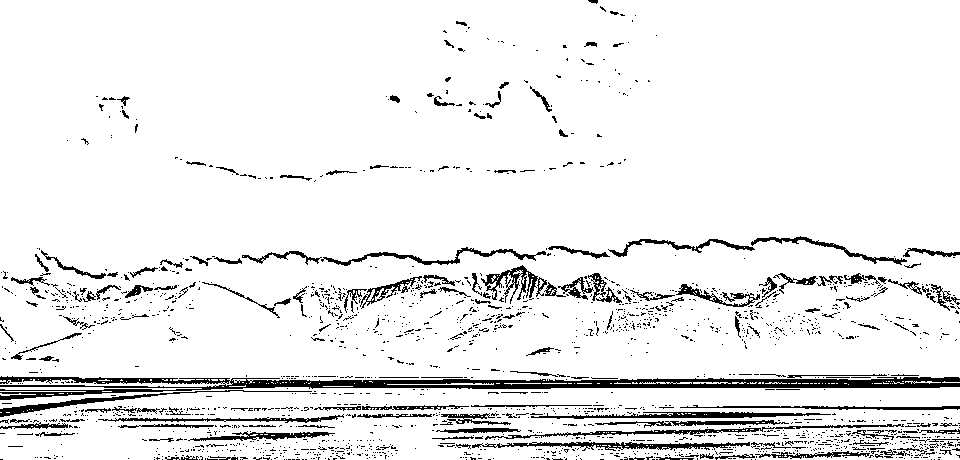

**整体氛围**

**重要天象：**

*   **太阳、水星、木星、海王星都在双鱼座，水星六分天王星；**

*   **处女座满月，月亮三分冥王星；**

*   **金星四分天王星，太阳六分冥王星；**

*   **太阳换座进入白羊座，春分。**

**这一周是月中旬的关键节点。**

**群星双鱼座**的主题是同理心、慈悲心和包容；**水星与天王星的六分相**意味着创新和共情。通过创造性、与众不同的方式表达自我，并产生深刻的共鸣。

我们对一直以来关注的女性问题，战争与和平，社会福利等主题迸发出更深刻的洞见。

从社会层面看，北京冬季残奥会在 3 月 13 日结束。我们会在这些运动员身上看到力量的光，虽然他们身体有局限，虽然传统意识对女性仍存在偏见和束缚，**但群星双鱼座和金火水瓶座的能量，**让我们看到不被生活善待的普通人身上的努力拼搏的光，看到女性团结的力量。

3 月中旬，我们曾经在情绪化和现实的无常中，渴望逃避，无法面对阴影和压力，**但处女座的满月，让我们回归现实。**我们可以从更宏观的层面看待问题，识别问题背后的真相。

**处女座的月亮**关注服务，对他人的付出，实用性和有效性，看待事物更理性和客观。**木星双鱼座**是月亮定位链的最终定位星。**月亮和冥王星组合**，我们能够觉察到自己或他人更深层的情感需求，认识到一些隐藏的情感互动的模式。

**前期我们关注的女性权益问题，也许会被满月的光揭开，也可能会用另外的方式隐藏得更深。**

**月亮与冥王星的三分相**，我们也会很好的控制自己的情绪，而不是在满月放大情绪的感受。我们需要通过调整日常生活的小事，清理空间，让家居环境更有秩序感，从日常生活健康和经验中滋养自我。

**这是一个很好的疗愈时刻，**我们需要放下紧张，幻灭，无边的思绪，对近期日常生活、财政事务、投资理财、学业发展等方面做出总结与整合，为进入白羊月累积经验和准备。

**金星和天王星的四分相，**我们在生活中的关系可能有一些突如其来事件，被某些新鲜事物吸引，产生兴奋感，但容易稍纵即逝。

我们也可能会在投资，商业合作中被某些很有魅力，与众不同能力的人吸引，但我们需要避免盲目和陷入新鲜兴奋感中，失去了理智的判断。我们需要关注投资理财方面波动。

**一周结束的最后时刻，太阳在周日晚上从双鱼座进入白羊座，标志着北半球进入春分。**春分点象征着新生与黎明的能量，在春分之后，光明的能量会重新回归到世界。

**这是一个阴消阳长的日子，万物喜悦的生长，世界将重新焕发青春的能量，我们开启创造的新旅途。**

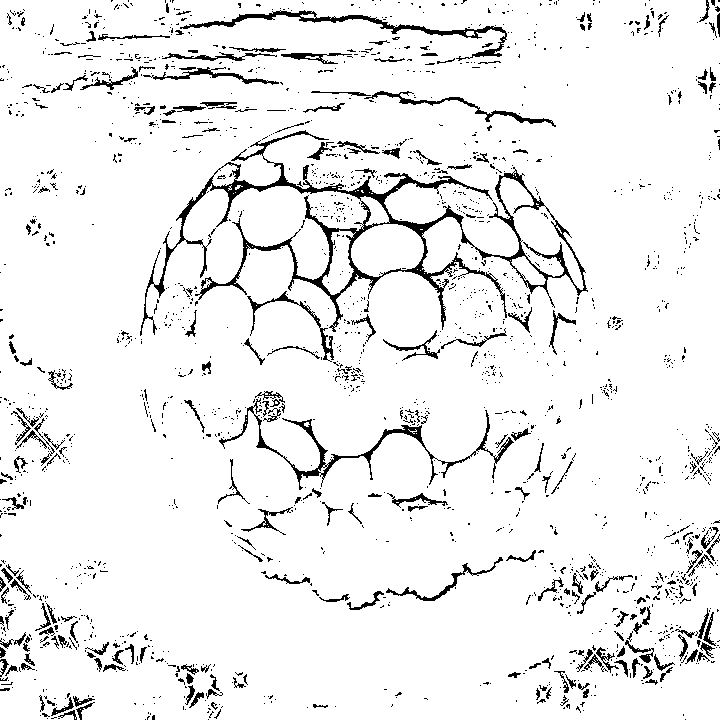

**12 星座的一周运势**

**（重点参考上升星座，其次参考太阳星座）**

***白羊座***

白羊座喜欢主动，积极面对生活，这一周你需要关注身体的健康。**处女座的满月在你的第 6 宫，**建议在春天做一个身体体检，你需要一些安静时间给自己充能。学会适当的休息很重要。

如果你在处理一些工作中项目或问题，请注意关注工作中的细节，会让你获得老板的认同。如果你现在不是最佳状态，请保持蛰伏，将感受记录下来，**等****待太阳进入白羊座再积极行动。**

***金牛座***

**金星与火星在你出生星图的第 10 宫活跃的行动，这是你事业，社交的忙碌时期。**你也在利用好时机寻求改进财务更好的机会。

处女座满月，你会和朋友们一起度过快乐的时光，如果你通过自媒体传播方式宣传自我，也会被更多人关注。

**休息日的社交**也许会让你莫名成为社交明星，但也需要关注情感是否来如风，去如风。

***双子座***

这段时期的双子座们，处于事业的高光时期，这也是考试，学习，对知识吸收和旅行最佳时机。当下疫情紧张，不太合适长途旅行，但如果是通过网络的学习很合适开启。

**处女座满月在你的第 4 宫**，合适对家居环境做一个断舍离的清理。如果你有搬家需求，希望找到理想的房子，在满月前后可以给自己达成愿望的机会，让交易更圆满达成，完成你的心愿。

满月正好是周末，你也可以和家人欢庆，或者去父母家拜访，加强情感的交流。

***巨蟹座***

3 月对巨蟹座而言非常友好。**群星双鱼座落入你的第 9 宫，**你如果有旅行，出版或通过网络授课开班的计划，这是很不错的时机。

**本次满月发生在你的第 3 宫，**你可以在周末好好打扮，或者和好友一起享受短途旅行，倾听和沟通你们共鸣的话题。

如果有合作计划，满月也是签署合同，契约的好时机。**天王星在你 11 宫行进中，**也许某个梦想或奇迹会通某种意料不到方式实现呢！

***狮子座***

这周在事业上也许有一些新的机遇出现，尤其是个人财务上。**处女座的满月在你的第 2 宫**，你会关注投资和收益方面主题。学会更理智，务实处理投资，保险或税收等主题，会让你获得一些收益。

你需要发挥狮子座创造性能量，**突破过去的思维模式**，这会让你对未来充满期待。**金星与火星在你的 7 宫行进，**请和商业伙伴，合作者，伴侣更多的互动，建立信任合作关系，这会给你带来更多新的机遇，这些机遇都可能对你财务有好的支持作用。

***处女座***

你的成功在于他人对你的支持和专业程度的认同，本周是处女座们最好的时机。**水星和天王星的六分相，**会给你带来事业合作的新项目和机遇。媒体项目，研究生项目或法律相关的事物会给你带来好信息。

处女座总忙于工作，对服务和专业度很在意，有点完美主义情结，有时对自己要求太严格。**满月合适放松度假，**将自己的真实的想法表达出来，你的声音会被更多人听到。

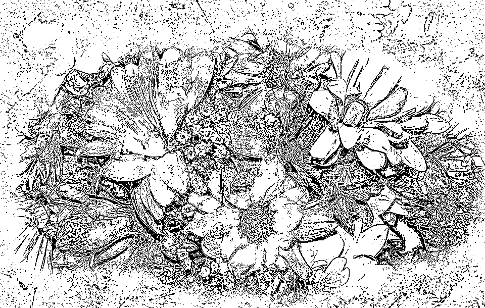

***天秤座***

也许这个月前期让你有一些混乱感受，你感觉自己在家中需要更多沟通，行动的能量。如果你是单身，**金星火星在你的 5 宫行进**，恋爱机会很多，合适社交和遇到有趣的对象。

**当群星双鱼座在你 6 宫行进时，**合适设定一个健身计划，或对健康饮食做出一些调整和改进。**处女座满月在你的第 12 宫，**这是一个很私密的、掌管潜意识的宫位。

你需要关注个人精神健康和幸福感议题，你对什么东西感受到恐惧和害怕，你是否满意自己的生活呢？如果有信任的咨询师，可以和 TA 聊聊你的困惑。

不要把自己的时间安排得太满，给自己留出一些独处空间和时间，在满月做一个冥想有助于你放松。

***天蝎座***

这个月对蝎子们而言是一个创造力展现最佳时机，如果你有生育的打算，也很合适在这个阶段将计划提上日程。**金星和火星在你第 4 宫行进中，**你计划给家居环境换一个不同的风格吗？适当投入一些金钱，行动给自己生活环境焕然一新，会给你创作的灵感。

**处女座满月在你的 11 宫，**朋友们对你的财务，事业上会有一些帮助，你也可以在群体中获得支持的动力。

***射手座***

这个月你会对事业问题更关注，你和好友会沟通更多如何处理事业，工作的议题。你也许一直忙于处理工作中项目，这段时间会给你带来一些意外的惊喜。

**处女座满月在你的第 10 宫，**有的事情会有一些完结，你努力推动的项目会给到你一些处理的结果，后期会让你得到金钱或荣誉的奖赏。

**和好友多沟通，**交流你当下困惑和烦恼，说不定可以给到你灵感的火花，在你思考工作项目中得到更多解决问题的灵感和渠道。

***摩羯座***

**群星双鱼座在你的 3 宫行进中，**你这个月是否忙于传播自己的项目，或者写作，或者接触更多新人，或接触新的社交平台推广自己呢？

**处女座的满月发生在你的第 9 宫，**这是有关出版，旅行，教育的宫位。但在现在疫情影响下，长途旅行计划不太那么容易实现，外出需要注意防疫和健康。

冥王星的相位其实需要关注，摩羯座有时过于严肃，但如果你愿意，可以让自己放轻松一些，敏锐把握财务的机遇，享受生活乐趣。

***水瓶座***

**群星双鱼座在你的 2 宫行进中，**你最近是否感受到财务上有比较好的机遇呢？你这段时间以来做自己喜欢的事情，吸引来志趣相投的伙伴，这会让你收入提升。

**处女座满月在你第 8 宫，**这个宫位掌管着银行贷款、风险投资、遗产、奖金、佣金、退税，你不能阻挡任何改变，敞开接纳任何变化，会让你获得好的合作机会。

适当参加一些聚会，确保自己在最佳状态，会让你吸引来有趣的人，不要浪费**金星火星在第 1 宫行进**机会哦！

***双鱼座***

群星双鱼座的月份，双鱼座们当然是主角的光环。你对很多事情选择比较犹豫，很多事情看上去不错，但是不知道哪个更好，更合适自己。如果你单身，有一些意外的约会或聚会邀请你，不用担心，先去参加，享受惊喜的乐趣。

**处女座满月在你的第 7 宫，**这是思考自我和他人最佳时刻。如果有人求婚，请抓住时机，这确实很梦幻。如果你寻找工作的合作伙伴，你前期沟通遇到合适的人，满月期间结束沟通，当机立断做一个决定，你会发现满月是一个人际功课完结过程，让你学会更多的成长。

**版权声明**：原创文章由作者授权首发于若道平台发布，欢迎转发，反对抄袭。友号转载请申请白名单。

****

**苏黎（Sulis）**

ISAR 国际认证占星师（2019 年获得）/塔罗咨询师

现代占星融合古典解读

20 多年跨行业领域职场经历

**咨询微信**：liuzq26

**公众号**：Sulis_1975

长按打赏

**学习占星学****点击下图了解课程详情** 

**

**微信又双叒叕改版啦，不想错过若道君的推送？**

**就把若道设为星标吧！**

**▼**

**喜欢记得点一下在看哦☟**

**报名直达入口**

# 本周每日星象丨动力满满安排一整个星期

> 原文：[`mp.weixin.qq.com/s?__biz=MzA5NjA0NTAxNg==&mid=2651469245&idx=2&sn=ee83688c1095877c8f8b79e7b1587f81&chksm=8b48870abc3f0e1c69a9b4493a55ab8682ddbe8c768c6577372a144947bbd11523a842c4dd20&scene=126&sessionid=1692737847#rd`](http://mp.weixin.qq.com/s?__biz=MzA5NjA0NTAxNg==&mid=2651469245&idx=2&sn=ee83688c1095877c8f8b79e7b1587f81&chksm=8b48870abc3f0e1c69a9b4493a55ab8682ddbe8c768c6577372a144947bbd11523a842c4dd20&scene=126&sessionid=1692737847#rd)

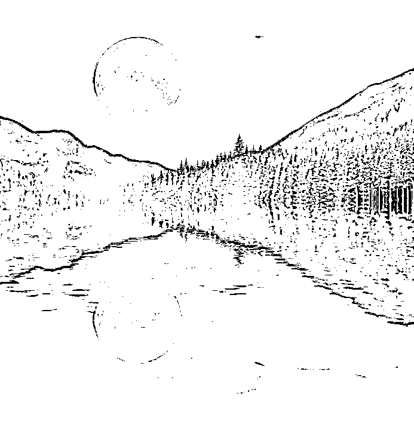

作者/苏黎 ISAR 认证占星师

编辑/翀子 封面/书君 图片/网络

今天头条介绍了本周宇宙天气的整体氛围，以及 12 星座的一周运势，如果你想继续了解每天的天象细节，就看看下面的内容吧！**每日天象****3.14****周一**

**新的一周开启，月亮进入狮子座，**创作热情高涨的时刻。月亮在狮子座行进中，渴望自由自在率真的展现自我，尽情表达。

我们需要注意，当我们过度渴望获得认同时，月亮与金星火星（水瓶座）的对分相组合。**我们在生活，工作中，在团体环境中需要注意边界感，**关注他人的感受和利益，避免过度急躁表现自我，避免关系中的冲突。

月亮狮子座会在挫败感中感受到自己的情绪，顿时会变成一只慵懒的大猫。

**3.15****周二**

**本日月亮仍在狮子座行进中。金星火星（水瓶座）三分谷神星（双子座）。**社会意识层面对女性主题的深度探讨，会让女性对自我的身份认同，对女性权益方面有更多深刻的反思。

我们在心智层面会有更多共鸣，创造性潜力被激活，对外展现行动力和效率。生活上，**这是一个高效的日子**，工作和生活中将你的知识和经验，在群体中表达出来，或更高效的反馈自己的需求是不错的时机。

**3.16****周三**

**月亮在中午进入处女座。**太阳（双鱼座）六分月亮北交点（金牛座）。太阳双鱼座具有强大直觉和梦幻感，对身体，情绪和环境都会有精细，敏锐的感受，并根据感受积极的回应。

**当太阳与北交点产生六分相时，**我们需要学习的课题是，我们在生活中需要什么样的关系，我们如何走向北交金牛的富足和丰盛？我们需要如何创造人生目标呢？我们渴望包容性，慈悲与爱的能量在生活中自然的流动和展现，但我们如何看待自己的价值呢？

**对个体而言，这是我们对自己理想和目标审视的最佳时机。**

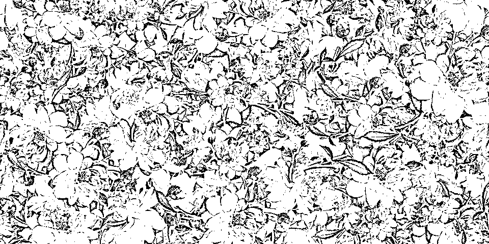

**3.17****周四**

**水星（双鱼座）六分天王星（金牛座）**，这是沟通中情感和现实的对话，**月亮在处女座行进中**，我们会更务实的思考，对当下战争，舆论纷争的表达。这也是思维创新突破的最佳时刻，无论是民族情感，战争中的经济波动，都会引发我们从新的角度思考问题。

**我们会对他人有更多感同身受的想法，触发思维上突破和创新。**在生活中，我们可能会有灵感乍现的感受，也许在和他人沟通中感受到突破思维卡点，也许在你观看电影，艺术画展，在车上聆听音乐的时候忽然对某些事情有顿悟的感受。

你可以用本子，便笺或手机记录自己灵感，你也可以通过和好友天马行空沟通聊天，获得心灵的洞见。

**3.18****周五**

处女座满月，冥王星（魔羯座）三分月亮处女座，月亮空亡后换座进入天秤座。**这是很重要的满月。**我们会更务实关注和处理财务的议题，前期的情绪，身体的议题。满月调整和释放的能量，会影响 3 月下旬的白羊月，水星逐渐会合木星的能量。

**满月象征着情绪的完结，释放，**处女座的月亮定位星是水星双鱼座，当我们分辨清晰道路方向感，我们才能从日常生活小事情中学会调整。当下的宇宙能量，触动我们内心复杂，敏感的情绪，感受到自己在现实世界阴影和挑战。

**月亮与冥王星的相位组合，**我们的直觉和情绪会更敏锐。前期发布不同版本女性事件，充满着黑暗，不详或骚动不安的暗流。随着两会的结束，会有更多促进和调整女性权益的措施发布。

对个体层面而言，我们需要理解“修正”和“秩序”的内涵，月亮处女座需要通过修正日常生活的作息，生活习惯，意识层面调整，建立安全感和秩序感，**我们需要在理想和现实中寻找到平衡，对自己学会包容而不是评判。**

当生活处于艰难时期，觉得日子给我们脆弱和无力感的时候，**这就是生活的转机。**让我们回到日常生活的一饭一蔬，客观看待我们拥有什么技能和天赋，制定切实的目标和计划，而不是为了取悦他人，为了追求成就，在坚持和妥协之间沉浮，打造虚幻的人设形象。

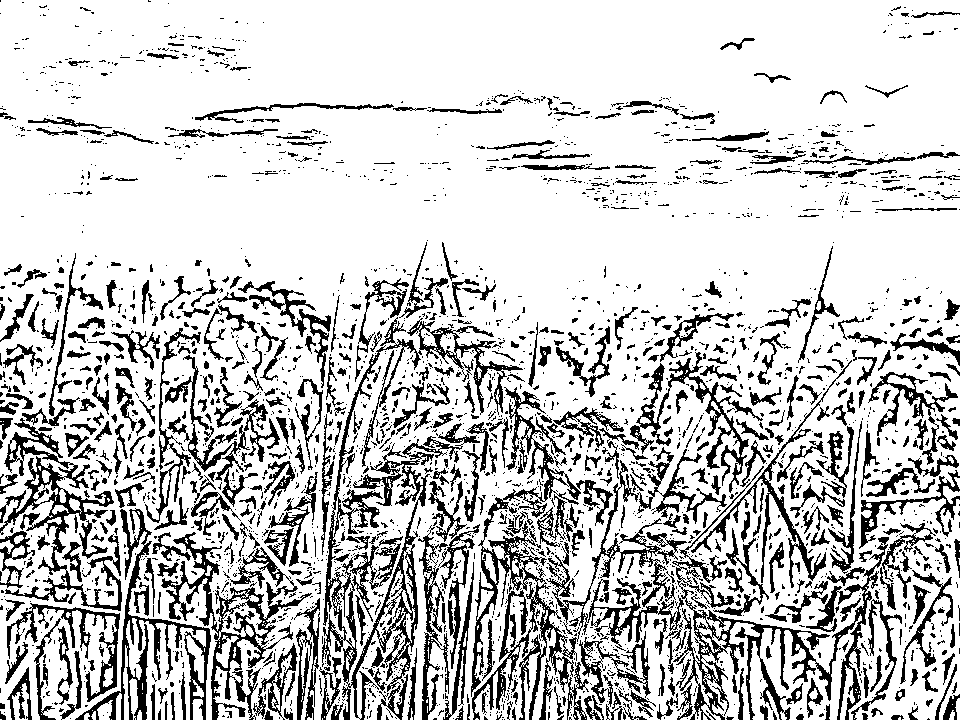

**3.19****周六**

**双休日的月亮在天秤座行进，**很合适休息日社交需求。金星（水瓶座）四分天王星（金牛座），太阳（双鱼座）六分冥王星（魔羯座），金星（水瓶座）六分凯龙星（白羊座）。

我们会可能在社交场合遇到有趣的人。生育的权益，女性的自我身份，随着社会对这些主题深入的探讨和关注，大家会逐渐形成坚定的共识，未来道路漫长且艰辛，但黑暗中追求光明的毅力和决心会更坚定。

**3.20****周日**

本日白天没太多重要相位。晚上即将结束的时候，**太阳换座进入白羊座，月亮进入天蝎座。**这是一个积极开启新能量的时刻，我们会带着更主动，创造性的热情迎接新的一周。

**版权声明**：原创文章由作者授权首发于若道平台发布，欢迎转发，反对抄袭。友号转载请申请白名单。

****

**苏黎（Sulis）**

ISAR 国际认证占星师（2019 年获得）/塔罗咨询师

现代占星融合古典解读

20 多年跨行业领域职场经历

**咨询微信**：liuzq26

**公众号**：Sulis_1975

长按打赏

**学习占星学****点击下图了解课程详情** 

****

**微信又双叒叕改版啦，不想错过若道君的推送？**

**就把若道设为星标吧！**

**▼**

**喜欢记得点一下在看哦☟**

**报名直达入口**

# 雷蒙德·梅里曼金融占星周运 | 本周或将发生反转

> 原文：[`mp.weixin.qq.com/s?__biz=MzA5NjA0NTAxNg==&mid=2651469245&idx=3&sn=805dc93cd91ad33f206c06527eacd600&chksm=8b48870abc3f0e1cf8ff1daef9b85570dc856a0e16325847fc1305df9ed4abd9094f455ac98b&scene=126&sessionid=1692737847#rd`](http://mp.weixin.qq.com/s?__biz=MzA5NjA0NTAxNg==&mid=2651469245&idx=3&sn=805dc93cd91ad33f206c06527eacd600&chksm=8b48870abc3f0e1cf8ff1daef9b85570dc856a0e16325847fc1305df9ed4abd9094f455ac98b&scene=126&sessionid=1692737847#rd)

作者/雷蒙德·梅里曼 译者/Luke
编辑/玫瑰 图片/pexels

雷蒙德·梅里曼是在金融占星学界稳坐第一把交椅的占星师，同时他也是若道签约的金融占星课老师，我们引进了雷蒙德·梅里曼老师的《[上证指数月度报告](http://mp.weixin.qq.com/s?__biz=MzA5NjA0NTAxNg==&mid=2651468243&idx=2&sn=f05411adad4ddaaf1d1191605ed01684&chksm=8b488364bc3f0a7280eae0182f11965e636c566827deffb5c1fb6b5580373b55d26ae9946ad3&scene=21#wechat_redirect)》及《[黄金报告](http://mp.weixin.qq.com/s?__biz=MzA5NjA0NTAxNg==&mid=2651468243&idx=2&sn=f05411adad4ddaaf1d1191605ed01684&chksm=8b488364bc3f0a7280eae0182f11965e636c566827deffb5c1fb6b5580373b55d26ae9946ad3&scene=21#wechat_redirect)》。我们经老师的授权，将每周刊登梅里曼老师的周运，供大家参考和学习。于是，这是本周的周运（3.14-3.18）。

**说明：以下时间采用纽约证券交易所所在地美国东部标准时间。**

**展望与回顾**

****

**2 月商品价格上涨 0.8%，是 4 个月以来涨速最快的。过去 12 个月和过去 3 个月商品价格分别上涨 7.9%和 8.4%。那对于周四发布的消费者价格指数报告是个坏消息，白宫不能为此指责弗拉基米尔·普京，尽管它在试图这么做。**

**——《乔·拜登的通货膨胀：他指责普京，但他的政策和美联储都有错》****《华尔街日报》社论****2022 年 3 月 11 日**上周见证了黄金和原油测试历史高点。我们的**三星级地球宇宙学关键反转时期 3 月 4-7 日+/-3 个交易日对应了多个金融市场的暂停，如果不是重大反转的话。**让我们继续关注重要地球宇宙学时段 2 月 16 日-3 月 6 日下的市场表现，尤其是 3 月 3 日-6 日。上周全球好几个股票指数都创下来数月来的新低，甚至年度低点。在欧洲，德国 DAX 指数于 3 月 7 日崩塌至 12438，相对于 11 月 18 日和 1 月 5 日的历史高点，跌幅达 23.6%。荷兰 AEX 指数跌至 652.80，达到年度新低，相对于 11 月 18 日的历史高点，跌幅达 21.3%。瑞士 SMI 指数和英国富时指数也于 3 月 7 日触底，相对于今年早期录下的历史高点，跌幅分别达到 16.35%和 12.2%。

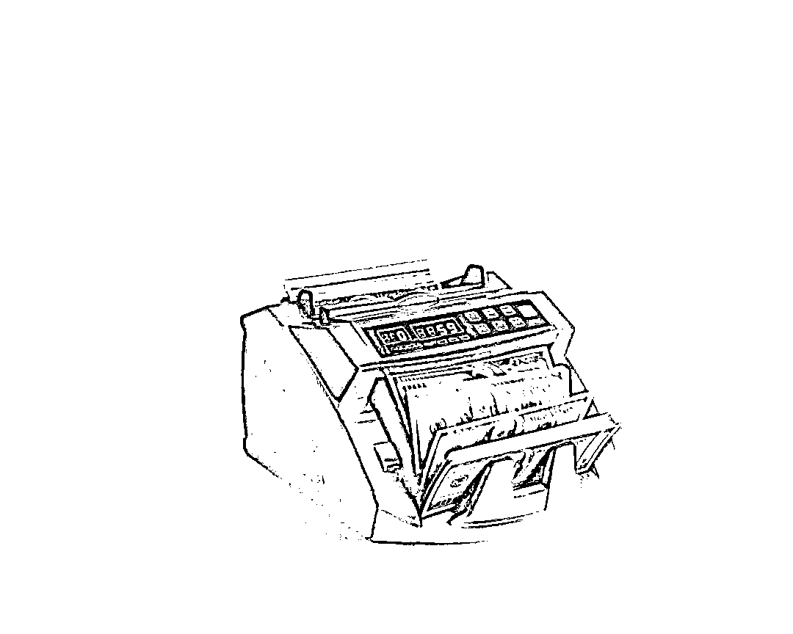

在亚洲和环太平洋地区，中国香港恒生指数如今也跌倒了近 6 年来的最低价位。日本日经指数也跌倒年度新低，相对于 2021 年 9 月 14 日的 31 年高点，跌幅达 19.85%。中国上证指数跌至 3147，是 2020 年 7 月来的最低价位，相比 2021 年 12 月 13 日的三重顶跌幅达 15.1%。印度 Nifty 指数较之 1 月 18 日的高点，下跌接近 15%。然而，在澳大利亚，情况没那么糟糕。3 月 9 日出现了一个低点，但比 2 月 24 日的低点高，2 月 24 日的低点比 1 月 27 日的低点高。不断走高的低点这种模式令人宽心。美国的指数都守住了 2 月 24 日的低点，尽管道琼斯工业平均指数、标准普尔指数和纳斯达克指数 3 月 8 日的周低点接近于打破那一低点。巴西的 Bovespa 指数仍然在接近数月高点而非低点的价位交易。商品期货市场的表现比股票市场更令人震惊。原油在关键反转日 3 月 7 日飙升至 14 年来的高点 130.50。两天后它下跌至 103.63。黄金在一天之后的 3 月 8 日飙升至 2078.80，仅比 2020 年 8 月的历史最高 2089.20 略低。三天后它下跌至 1960。白银上涨至 27.49，是 2021 年 6 月来的最高价。但是谷物市场更富有戏剧性。地球宇宙学反转日 3 月 7 日，小麦在现货市场上创下了历史高点 1425。到周五时，它录得低点 1020。考虑到接下来 10 天出现的地球宇宙学征象，这种波动性可能会继续下去。

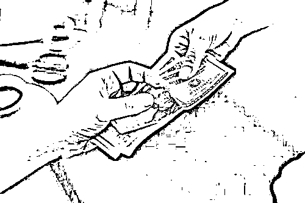

**短期占星趋势和长期考量**这将是充满强力地球宇宙学活动的另一周。**首先，太阳将在 3 月 13 日合相海王星，完成接下来 4 月 12 日木星、海王星在双鱼座合相的第一轮光线传递。****太阳-海王星合相是一级征象（一致性最高的强有力征象）。**历史上，它在 4 个交易日内，对应**突发和剧烈价格波动**的频率为 79%。此外它在 14 个交易日的时段，对应基本周期的频率也为 79%。由于太阳-海王星合相发生在双鱼座，此时要小心你相信了谁，因为人们往往过于天真，对现实有不切实际的看法。同样重要的是，**3 月 19 日-22 日，金星和火星会与天王星形成四分相。**金星守护金牛座（金钱），正在水瓶座行进。天王星守护水瓶座（混乱和动荡，事件的突然转折），正在金牛座行进。换句话说，金星和天王星各自位于对方守护的星座，这被称作互容，使得事件和行为更加显著。这是**金融市场上经典的反转征象。**历史上，**在 4 个交易日内，它对应股票市场方向的突然改变的频率为 79%。**根据当前的研究，**这可能会更加显著地影响加密货币市场，比如比特币和以太坊。****3 天后，火星随后在水瓶座与金牛座的天王星形成四分相。**这是另一股不同的能量，代表了**金融市场（可能还有世界局势）的剧烈波动**。火星是战争和侵略的神，天王星是智能武器、恐怖主义、突发事件和网络攻击的守护者。当然，不一定会发生这些事。如果相关人员能把大众的安全和福祉放在心头，它也可能成为提出创新解决方案的时间。否则的话，在当下的气氛下，我们不得不把这段时间解读为对大众和投资者来说，更可能是危险的时期。

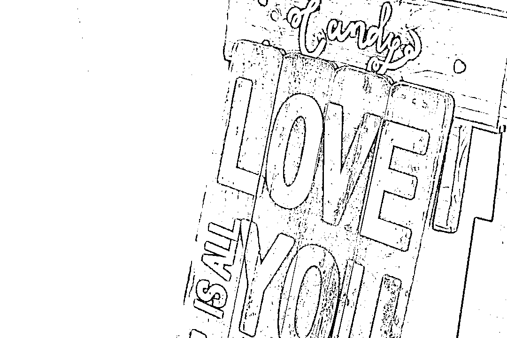

**危险甚至可能持续到 4 月 5 日，届时会形成另一个与挫折和愤怒相关的相位，那就是火星合相土星**。这也可能是**谷物市场出现长周期高点或低点——反转的时期，容许度是 1-3 周。****4 月 5 日之后，天象的主题再次切换为寻求和平的解决方案。在那之前，我们要保护好自己。**很大程度上来说，木星、海王星在双鱼座合相的主题已经很明显了。它们是**通货膨胀**的宇宙指标。它们也包含了**投机狂热**的主题，我们在黄金和原油上已经看到了这点，后者尤其如此，因为它是木星、海王星和双鱼座掌管的。**但是伴随着投机狂热而来的，是歇斯底里甚至恐慌的后果。**伴随着金星（和平）、火星（战争）3 月 6 日在水瓶座 0°合相，合相的度数同时也是进入“新时代”的宇宙度数，因为 2020 年 12 月 21 日木星、土星就在同样的水瓶座 0°合相。要么水瓶座的黎明升起，开启灿烂的文艺复兴。要么透过自满和害怕激怒其他原始人，启动一场集体的自我毁灭，一同回到黑暗时代。由于涉及所有这些固定星座，他们不会因为我们的姑息而有所改变。除非你理解“2020 年大合相”，以及随后 2021 年土星-天王星四分相的重要性，否则很容易把这视为一种夸张。这是人类的危机，同时也是把握机会的时机。

**说明：以上日期基于纽约证券交易所所在的美国东部标准时间，由于存在时差，中国地区可能需要加一天。**

**版权声明：**本文由若道翻译发布，欢迎转发，反对抄袭。友号转载请申请白名单。

**雷蒙德·梅里曼（Raymond Merriman）**

若道签约老师。著名金融占星师，ISAR（国际占星研究协会）前主席，梅里曼市场分析公司的总裁。他由于“提升了占星学的职业形象”，在 1995 年国际占星大会上被授予轩辕十四奖；在 2012 年国际占星大会上，被授予轩辕十四终身成就奖。

1“中国上证指数月度报告”发售**若道推出了****中文版****的雷蒙德·梅里曼中国上证指数月度报告，并持续发行该报告！**当把金融市场的周期和占星学的周期相结合时，雷蒙德·梅里曼老师的金融占星学研究**为投资者应对金融市场的周期波动，并随之调整投资策略提供了极大的价值参考**。
**3 月中英文报告已上线！**2“黄金价格周期月度报告”发售**若道推出****中文版****的雷蒙德·梅里曼黄金价格周期月度报告！**不仅仅为广大读者在中国股市的投资出谋划策，更将视角放眼黄金市场。**每当世界经济形式不明朗的时候，有一个地方是保值的港湾，那就是****黄金**。自 1982 年雷蒙德·梅里曼出版第一本研究《地球宇宙学征象与黄金价格的关联》的著作以来，**他一直作为最重要的黄金市场时机预测者之一享誉国际**。2022 年 3 月黄金报告已上线，梅里曼老师将会告诉你他对这个关键时期如何操作的想法。也可以按照季度和一年期订阅，有更多优惠。季度和年度的好处是，你可以持续了解梅里曼老师对于不断在变化的市场的看法。即便他某一次看法和市场不一致，你也看到在下一期他如何调整自己的看法，并看到金融占星在一个长期时间段内对你把控风险的帮助。而能够长期控制风险、尽量找到安全的投资时机才是投资的长久之计。**3 月中英文报告已上线！****购买套餐**，买得越多越优惠中国上证指数月度报告套餐价

*   **单月报告**：280 元
*   **3 个月套餐**：780 元（260 元/月）
*   **12 个月套餐价**：2400 元（200 元/月）

**长按下图识别二维码****购买金融报告****套餐****▼**

黄金周期月度报告优惠

*   **双报告年度套餐更优惠（直降 900 元）**

*   **12 个月黄金报告+12 个月上证指数报告：仅需 3900 元**

**长按下图识别二维码购买黄金报告套餐**▼

3《2022 年金融预报和沙龙》1976 年以来，由雷蒙德·A·梅里曼撰写的梅里曼市场时机学院每年一次的年度预报沙龙和每年一本的《年度预报》一直在应用占星学原理为投资者们服务，提供卓越洞见，从未间断。 **雷蒙德·梅里曼《2022 年金融预报和沙龙》发售中（报告已发布）。****长按下图了解详情**
▼

**点击阅读原文购买金融报告**

# 最近凸显的水瓶座和双鱼座气息，你对哪个更有体会？

> 原文：[`mp.weixin.qq.com/s?__biz=MzA5NjA0NTAxNg==&mid=2651469221&idx=1&sn=77db95dfcecd84c304843b314fa7e09d&chksm=8b488712bc3f0e0490d9214a524080f0eea3b010cfc680d114879852f508166e3c5f2b193d5d&scene=126&sessionid=1692737847#rd`](http://mp.weixin.qq.com/s?__biz=MzA5NjA0NTAxNg==&mid=2651469221&idx=1&sn=77db95dfcecd84c304843b314fa7e09d&chksm=8b488712bc3f0e0490d9214a524080f0eea3b010cfc680d114879852f508166e3c5f2b193d5d&scene=126&sessionid=1692737847#rd)

**2022 年 3 月 12 日天象：**

*   **月亮在巨蟹座**

*   ******太阳与海王星合相在双鱼座******

*   ******金星与火星合相在水瓶座******

今天月亮在巨蟹座，你可以宅在家里，做一些滋养自己的事情，比如做一餐好饭，和家人在一起，与亲密的朋友聊天，或者整理旧物件，以及逛超市填满你的冰箱！另外，太阳与海王星合相在双鱼座，这让空气里充满了情感与想象力的味道。让自己沉浸在艺术中，去看个电影、艺术展，或听听音乐，都是不错的享受。在这样的组合下，我们比平时更敏感、更在乎别人的直觉感受，我们想要更多关心这个世界，关心他人。

回顾[【一周天象】](http://mp.weixin.qq.com/s?__biz=MzA5NjA0NTAxNg==&mid=2651468803&idx=1&sn=5aa1f6dd2b9cac9a31b4f528fc754692&chksm=8b4886b4bc3f0fa2af57805457d875966d8ba720c3c96c06fbb7173e3abb4303adb9442ca188&scene=21#wechat_redirect)，金星与火星合相在水瓶座已一周，此外天上还弥漫着浓浓的双鱼座气息。两种截然不同的能量，你对哪个更有体会？一起来聊聊吧~

周六快乐！我们周一见！**了解每日天象，可****下载“若道”APP 查看****还有更多精彩等着你哦**

# 太阳天秤座与 12 星座月亮丨你的“和平主义天性”，因什么泛起波澜？

> 原文：[`mp.weixin.qq.com/s?__biz=MzA5NjA0NTAxNg==&mid=2651469157&idx=1&sn=c8b14b4a67b6c6ed3b7943c136d7c34c&chksm=8b4887d2bc3f0ec46e3b444c2f1ba1f331d5d0b35326aa75e77351fdde762f0fd1c6d43ada5c&scene=126&sessionid=1692737847#rd`](http://mp.weixin.qq.com/s?__biz=MzA5NjA0NTAxNg==&mid=2651469157&idx=1&sn=c8b14b4a67b6c6ed3b7943c136d7c34c&chksm=8b4887d2bc3f0ec46e3b444c2f1ba1f331d5d0b35326aa75e77351fdde762f0fd1c6d43ada5c&scene=126&sessionid=1692737847#rd)

☆****后台回复“今日”，给你一句生命态度****

作者/诺·泰尔 译者/江艺、dogcatcher 编辑/翀子 封面/书君 图片/网络太阳是生命的伟大能量，而月亮被认为是人格中的“主导需要”，同样被重视（你可以点击[【开篇】](http://mp.weixin.qq.com/s?__biz=MzA5NjA0NTAxNg==&mid=2651463192&idx=2&sn=7ecd2012aee1f245b56e0f107bdfc19e&chksm=8b48acafbc3f25b968e9ca8cbe8acf6972dc3e418827b36ac12af7bf7c81858937657babb393&scene=21#wechat_redirect)，查看诺·泰尔老师对此部分内容的详细阐述）。当天秤座太阳，遇见 12 星座月亮，分别有哪些表现呢？**太阳天秤座和 12 星座月亮**

**★月亮*****白羊座***

天秤座是太阳的落陷位置——认识到这一点很重要。太阳天秤座的生命能量，必须在凸显自尊和适应社交之间费力地作出平衡。**当月亮在白羊座时，这个 180 度配置揭示了一种将自己的独特天资外显化的性格驱力，而这种驱力会掩饰天秤座息事宁人的和平主义天性。**

他们很容易给人留下以下印象：追求轰动效应、感觉论、浮夸显眼、追求浪漫，因为它们都根植于对社会关注度的渴求。

在这个 180 度关系中，如果白羊座的个人主义占得上风，案主的个人形象就会奇异到难以预测的程度。此时，案主很少考量人际交往的安全感和平衡感，**随心所欲滑行的自尊心**会带来怪诞的行为。

**★月亮*****金牛座 ***

太阳和月亮的星座都由金星守护。他们的个性有种矜持和连贯，吸引着他人的欣赏和喜爱。这样的个性是重要的优势。他们**有很强的审美癖好**，通常表现为雅致的语言和对人性、人文的兴趣。多愁善感。 

**★月亮*****双子座 ***

**社会化的个性**，喋喋不休，爱现，口齿伶俐。他们**表达和交际时很轻松**。他们总是需要一个听众，且永远不会让听众不愉快。（太阳天秤座）个性中浪漫的维度被（月亮双子座）强调了。

**该配置的挑战，是将这种自我表达的轻松惬意同实实在在的任务与目标相联系。 **

**★月亮*****巨蟹座***

他们**借助敏感的天性培养出一种交际才能**：能够自如地调节情感态度。而如果过于渴望取悦他人，性格中的这种柔韧性和适应力可能变成一种弱点、一种肤浅。

**他们成长中的紧张任务，**是在合作关系中，将社交敏感度同清晰的目标相联系，聚焦于某种确切的职责。 

**★月亮*****狮子座***

在人际交往中，他们**能戏剧化、艺术化地表达理想主义，是高贵的浪漫者**。他们需要星图里的强硬相位来激励个性当中踏实的一面和物质诉求的发展，才不至于让天真泛滥过度。

“你记住快乐的事，忘记不快乐的——只要你学会吃一堑长一智，这种人格特质就值得称赞！”（占星师 Grant Lewi） 

**★月亮*****处女座 ***

月亮处女座的思维接管了太阳天秤大部分的社交天性。**批判、识别性的分析接管了浪漫的情感**。有计划的、循规蹈矩的细节代替了天然的交际反应。 

**★月亮*****天秤座***

**强调浪漫**。这个配置有种坚定的信仰：他人总是能够帮助我实现个人意愿！因为这种信仰，自尊向他人的领导敞开怀抱，于是，他们被奉承的时候会被迫接受不合理的要求，会因爱而受伤。

**金星在星图中格外重要。**任何事物，不管是在谈吐、剧本、行动、艺术还是爱情中，只要够不上愉快悦目的审美标准，就会被憎恨和排斥。

于是，他们**逃离真实的世界**，可能有不同寻常的玄秘领域的经历，并喜爱秘密的肉体享乐。 

**★月亮*****天蝎座***

自尊部署着交际行为，这种部署，几乎完全在**考量如何吸收和开发他人的资源**，为己所用。对他们来说，掌握遗产和馈赠，经济才能独立。

**他们对别人的行事方式、内心感受、哲学观和人生观有着深刻的认知**，并以此为根基构建自己的企图心。

他们靠算计过日子；**反叛和改革是他们敏锐的动机**。他们能快速而透彻地了解他人的现状，并能树立起一个机警、锋利、好斗的个人形象。 

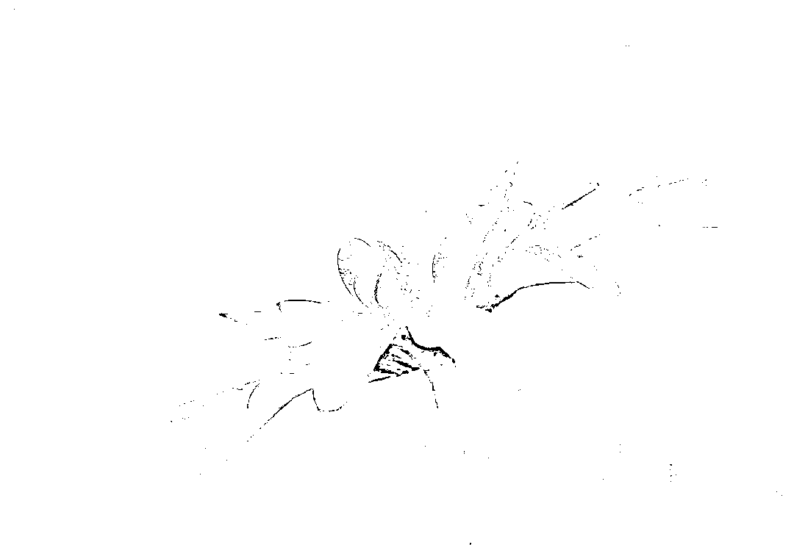

**★月亮*****射手座***

这个月亮星座**让想法、灵感、冒险和爱情得到了张扬**。他们有很强的自豪感和独立感，这些都根植于他们的个人哲学，并可能在细碎的日常生活的映衬下显得不切实际。他们体力很好，精力旺盛，爱旅行，对人际交往敏锐。

他们可能因为自己的热情和高远的理想而过于兴奋、神经紧张，**不经过细致考虑和妥善规划**，就冒险地展开行动。 

**★月亮*****摩羯座***

**通过管理他人来达到自己的目的**，甚至可能通过无情的方式。他们的手段是锐利的、精明的、细微的。他们有着险要的自尊心，可能体现为鲁莽和傲慢，也可能体现为无声无息的圆滑。

在他们达成目标的过程中，**他人的观点相当重要**。他们能透彻地理解自己要什么，平衡自己的才干来达成目标。

**他们成长中的紧张任务，**是尊重和保护他人和团队的意见，维护人际关系的和谐和自我形象的美好。 

**★月亮*****水瓶座***

他们是**浪漫者中的浪漫者**。对他们来说，**情爱欢愉不仅是身体需求，而且被默认是人生哲学的一部分**，一种勋章盾徽般的人生信仰。

“你过分强调独特的品味和教养，以至于会准许自己搞出不同寻常的冒险行为，将自己标榜为轰动效应的制造者或是其他各类人物，具体是哪类则服从于你的思想意识”（占星师 GrantLewi）。

**他们的想象力太轻易地占得上风，**艺术家的内心在面对按部就班的具体任务的时候，经常进退两难。

**★月亮*****双鱼座***

双鱼座的感受性滋养着天秤在社交方面的泰然自若与广受欢迎。他们**羞怯，易受影响，浪漫而真诚**。他们的思维能很容易地和**抽象**事物与灵感打交道，并能本能地察觉到他人的不真诚。他们因而**适合学习人性与心理。**

他们的个性像海绵般吸收一切，却从不咄咄逼人。他们常常容易获得声望和认可。 

**版权声明：**本文由若道翻译发布，欢迎转发，反对抄袭。友号转载请申请白名单。

**本系列其他文章**

[太阳白羊座·12 星座月亮](http://mp.weixin.qq.com/s?__biz=MzA5NjA0NTAxNg==&mid=2651463192&idx=2&sn=7ecd2012aee1f245b56e0f107bdfc19e&chksm=8b48acafbc3f25b968e9ca8cbe8acf6972dc3e418827b36ac12af7bf7c81858937657babb393&scene=21#wechat_redirect)丨[太阳金牛座·12 星座月亮](http://mp.weixin.qq.com/s?__biz=MzA5NjA0NTAxNg==&mid=2651463523&idx=1&sn=69fa5ba9035316fecd6c3911e744f089&chksm=8b48add4bc3f24c274cd5064316982ae958debed1e9ab681b46b80d8d8ec26bb3d2036075be9&scene=21#wechat_redirect)[太阳双子座·12 星座月亮](http://mp.weixin.qq.com/s?__biz=MzA5NjA0NTAxNg==&mid=2651465406&idx=1&sn=c9bf1ba49b07f6c67740c46779200be8&chksm=8b489409bc3f1d1fdad398e34840d6338275f29a8292e9eb404df28126fcc8262c454b2cb6c5&scene=21#wechat_redirect)丨[太阳巨蟹座·12 星座月亮](http://mp.weixin.qq.com/s?__biz=MzA5NjA0NTAxNg==&mid=2651465949&idx=1&sn=9dfd930de39b2de38c761152f4b8710c&chksm=8b489a6abc3f137c5c6e96f404038de7f4261fc6c995aeb285bc37f79b96ef5a1d237dbe3af5&scene=21#wechat_redirect)[太阳狮子座·12 星座月亮](http://mp.weixin.qq.com/s?__biz=MzA5NjA0NTAxNg==&mid=2651467312&idx=1&sn=d1a81f5cc1a60b3198d9c0ba770b4ba0&chksm=8b489c87bc3f1591008c88cef7b385086eb7717d4345926de92349b071ad10ceb67099f17ed0&scene=21#wechat_redirect)丨[太阳处女座·12 星座月亮](http://mp.weixin.qq.com/s?__biz=MzA5NjA0NTAxNg==&mid=2651467590&idx=1&sn=09b8f5ba9fa46e469e0add987cbe1664&chksm=8b489df1bc3f14e7a4e6b90286394af16e05f4c097058a2e2402d38f2634a0a84b32aaa03fe3&scene=21#wechat_redirect)

**诺·泰尔**

现代占星学鼻祖，世界众多著名西方占星师的占星老师。他毕业于哈佛大学社会关系专业，是当今世界上最重要的占星师之一，占星联盟协会（AFAN）的创始人及原主席。其所著的三十三本占星教科书作为占星教学的典范，引领了整整两代占星师的占星学习与教育，1998 年国际占星大会（UAC）授予其占星界最高奖项 “轩辕奖”。

**学习占星学****点击下图了解课程详情**

**

**微信又双叒叕改版啦，不想错过若道君的推送？**

**就把若道设为星标吧！**

**▼**

**就是这个“在看”，戳戳戳 ☟**

****************报名直达入口****************

# 春分牌阵开放预约 | 这个活力春天你的走势如何？快来预约塔罗师！

> 原文：[`mp.weixin.qq.com/s?__biz=MzA5NjA0NTAxNg==&mid=2651469157&idx=2&sn=bb62e523df47e9711119929d149052eb&chksm=8b4887d2bc3f0ec49b9781bb23c4ad346e237cefb4c391412abb258bdad61470dc10e437bd02&scene=126&sessionid=1692737847#rd`](http://mp.weixin.qq.com/s?__biz=MzA5NjA0NTAxNg==&mid=2651469157&idx=2&sn=bb62e523df47e9711119929d149052eb&chksm=8b4887d2bc3f0ec49b9781bb23c4ad346e237cefb4c391412abb258bdad61470dc10e437bd02&scene=126&sessionid=1692737847#rd)

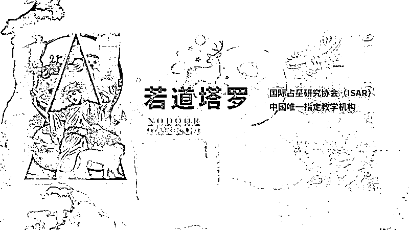

2022 年 3 月 20 日 23:29，我们将正式迎来**春分**，春分， 古时又称为——**“日中”、“日夜分”、“仲春之月”**这一天太阳进入**白羊座**

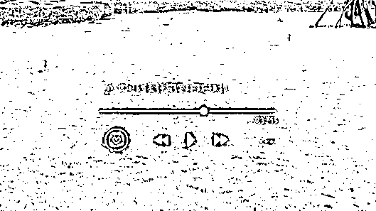

**春分**，宜踏青。日暖风和，草长莺飞，仲春荣荣的大地无一处不生长。春分万物新生，破土而发的芽苗，如同呱呱坠地的婴孩，**带给我们****希望与信念。**但没有一个新生不经历练，一颗小小的种子要忍耐多久的黑暗和冰冷，要积攒多少力量和勇气，才能叫大地为自己开裂，沐浴晨光雨露，生长欣欣然尔。步履不停，百花争俏，**所有蓄势已久的力量只为喷薄而发。**借季候之象理解白羊座，**不难抓住白羊座的原型能量**——**新生**。**在这****新生的一天，**最适合来神话塔罗 APP，抽取万众期待、应时应景的牌阵——**四季牌阵(The Four SeasonsSpread )****一年只能使用四次的牌阵**
此牌阵最早出现在塔罗师 Marcia Masino 的 一本叫《*Best Tarot Practices*》 的书中，

此牌阵只能在一年里的 4 天进行占卜：分别是**春分**、**夏至、****秋分**和**冬至**。这 4 天蕴藏着四季的秘密，小小的节气，有大大的能量。是绝佳的日子，让自己看看接下来一个季度的能量趋势。**春分牌，****展示的是****你从春分到夏至这一个季度的整体能量趋势，****TA 会告诉你当季的主题，****你的思维计划、行动决策、****人际情感、财务发展。**如果你想要获悉一个季度的整体概况，**把握事业方向**，**感情状况的走向**，**提前了解财务如何发展**，那么四季牌阵能够满足你，它会对你整体的状态有一个相对清晰的展望。当你觉得对目前的状况不甚满意，又不知道该从哪个方向入手去做改变的时候，四季牌阵也可以给你相当多的指引。

**四季牌阵会从五个方面做出能量预报：**

**感情状况、工作财务、**

**拥有的行动力量、思维计划的警示、**

**精神状态与心灵成长。**

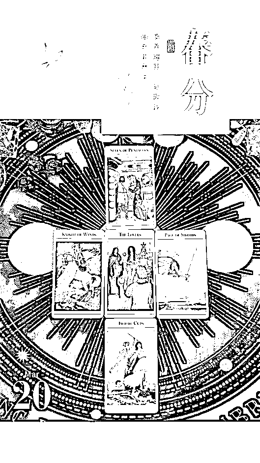

同时占星学中，这四个节气是太阳换座到四个基本星座（白羊座、巨蟹座、天秤座、摩羯座）的时间点，意义重大。因此，无论通过占星还是塔罗，都是适合做下一个季度能量趋势预报，完善中短期规划与展望的好时机。**塔罗作为直觉的能量预报与灵性指引工具，****是对占星理性逻辑的分析方法的完美补充。**用神话塔罗，让包围你的宇宙能量一目了然，对着四季塔罗冥想，让自己度过有意义的春分这一天。

**春分日 限量优惠咨询活动**

**预约靠手速，限量****30****人。**

**活动地点**

线上——**若道神话塔罗 app**

**活动主题**

“春分日—夏至日” 3 个月个人趋势的四季牌阵解读

**公益价格**

**150-300 元/四季牌阵解读**不等 

拼手速

******本次四季牌阵活动，****参与咨询的**

**塔罗师名单目录**

**（排名不分先后）**

**王小闲**

2018 年神话塔罗资质认证班毕业并获得认证证书

2019 年苏·汤普金斯若道核心占星课程学员

*****“塔罗可以带领我们去俯瞰心灵的迷宫，带领我们找到属于自己的那条路。”*****

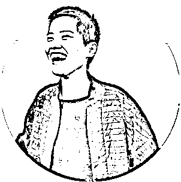

**源乐**

2018 年神话塔罗资质认证班毕业并获得认证证书

六年的塔罗之旅深度觉照、践行经历，

伴我一次又一次从更高的视野中醒来，

从我以为的“问题”中解套，领悟与道同行的喜悦。

*****“以神话塔罗阿尔卡纳之旅契入，助你拨云见日，开拓新季度新视野。”*****

* * *

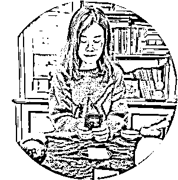

**RUO**

2018 年神话塔罗资质认证班毕业并获得认证证书

擅长处理亲密关系、职业发展、个人成长等议题。

帮助客户了解自己当下处境，理清思路。

***“透过一个个有趣的神话故事和生动鲜活的人物照见真实的自己。”***

* * *

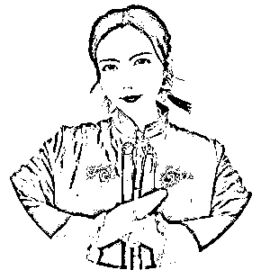

**Hazel**

2018 年神话塔罗资质认证班毕业并获得认证证书

咨询经验丰富个案过千例

擅长爱情，事业类塔罗咨询

*****“塔罗占卜的意义往往不仅仅是一个答案，我会和你一起探讨你真正的心之所想。”*****

* * *

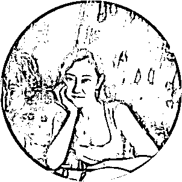

* * *

**妖妖**

2018 年神话塔罗资质认证班毕业并获得认证证书

个案类型多样，咨询与持续学习一直是正在进行时

***“神秘的塔罗与希腊神话的结合，揭示了不一样的高阶的人生秘密。”***

**Jinn**

2018 年神话塔罗资质认证班毕业并获得认证证书

ISAR 国际占星研究协会认证占星师

占星+塔罗，私人定制式咨询方案

***“******占星是逻辑的艺术，塔罗是感受的艺术、**星盘指引路的方向，牌面折射心之所在。”***

**Lisa**

2018 年神话塔罗资质认证班毕业并获得认证证书

丰富的塔罗咨询经验

帮助个案了解自己，解决困惑，

与个案一起深入分析探讨不同的人主题

***“神话塔罗，通过神话故事与个案产生共鸣，引发深思，从而照见内心，听见自己灵魂深处的声音。”***

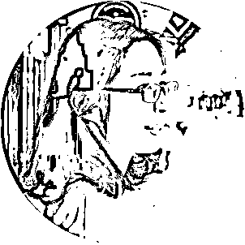

**沐恩 Moon**

2018 年神话塔罗资质认证班毕业并获得认证证书

7 年塔罗使用者

咨询风格兼具心理探索和灵性启示

***“塔罗讲述我们内心的故事，理解塔罗就是理解自己。”***

**陈漫**

瑞士库尔酒店管理硕士。

2018 年神话塔罗资质认证班毕业并获得认证证书

专注于塔罗及占星能量分析，个人成长及疗愈。

***“塔罗是一种能量语言，也是一种看待事件和人物的另一个角度。”*** 

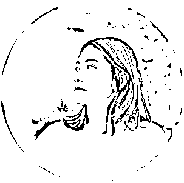

**Wenny**

2018 年神话塔罗资质认证班毕业并获得认证证书

擅长亲密关系、职业发展、个人成长等议题的解读。

***“在人生分岔路口，能用塔罗牌为我们当下的每个选择作出指引，成为更好的自己。”***

**Maggie**

2018 年神话塔罗资质认证班毕业并获得认证证书

信息传递者，表述清晰

善于帮助来访者基于塔罗提示深入挖掘背后寓意

***“神话塔罗帮助我们与潜意识对话，透由塔罗牌的寓意指引，我们能够深入探索自己并智慧的去做每一个决定。”***

* * *

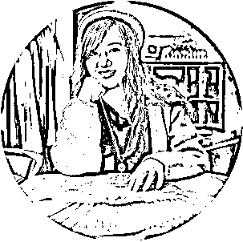

**Echo**

2018 年神话塔罗资质认证班毕业并获得认证证书

2021 年神话塔罗认证课程助教

帮你根据当下具体困惑分析下一季度的各个主题

***“神话塔罗通过神话故事投射出案主的个人神话原型，让你通过内在的声音，找到最适合你的洞见。”***

**如何预约塔罗师咨询？**最后，一起再来复习一下如何在塔罗 app 上预约咨询服务去若道塔罗 app 上找到**上述咨询师的名字**打开**“四季牌阵”**塔罗服务项目就有机会拍到优惠咨询哦~具体咨询方式如下图（轻击可放大）

最后的最后

**如何更新神话塔罗 APP？**

快去应用市场更新神话塔罗 APP，抽牌&咨询吧～ 

还没有下载或更新的小伙伴

赶紧来看看如何下载和更新吧！

**iPhone****苹果 IOS 系统下载**

**❶ ****苹果系统长按识别二维码下载**

**▼**

**❷** **或在 App Store 里搜索“神话塔罗”**

****

**Android****安卓系统下载**

**❶**** 安卓系统长按识别二维码下载**

**▼**

**❷ 或在各大应用市场里搜索“神话塔罗”**

各位亲人小伙伴，一手资讯分享就先到这里吧， 每天有事没事都可以去 app 里转转。如果感到快乐你就用用**神话塔罗 app**，如果你感到不快乐，更要使用由专业人本主义塔罗师团队全程陪伴的**神话塔罗 app**哦！**我们在春分日****与你不见不散**

# 第 2 讲周六来袭丨释梦占星大师工作坊：荣格、占星学与梦境

> 原文：[`mp.weixin.qq.com/s?__biz=MzA5NjA0NTAxNg==&mid=2651469145&idx=2&sn=20698e3040a6a03257050b260a5df90e&chksm=8b4887eebc3f0ef859706958545d2831ae8145b4fbabcf604117dab81c4c1e181efaa459a854&scene=126&sessionid=1692737847#rd`](http://mp.weixin.qq.com/s?__biz=MzA5NjA0NTAxNg==&mid=2651469145&idx=2&sn=20698e3040a6a03257050b260a5df90e&chksm=8b4887eebc3f0ef859706958545d2831ae8145b4fbabcf604117dab81c4c1e181efaa459a854&scene=126&sessionid=1692737847#rd)

****

**2022 年 3 月和 4 月木星和海王星在双鱼座合相给连接梦境与占星提供了一次绝佳的时机。**

**　　——格雷格·博加特老师**

**梦境工作和做梦疗法是深度心理治疗的一个关键技术，**使得深层无意识的象征性语言能够传递它们的洞见，并指引患者走向更大的完整。

梦境使带有情感成分的无意识材料安全而快速地进入意识层面。它们帮助找到治疗的重心，指引治疗的方向。**梦境提供了重要的线索，告诉我们客户痛苦的来源，以及哪些情绪和情结需要被检视和处理。**梦境工作可以成为心灵成长和行为改变的强大催化剂，它有种独特的能力，促进疗愈从内在发生。

梦就像冰山从无意识的深水中浮现出来。有些冰山属于过去，帮助我们理解过去的创伤和未消化的回忆，因此是回溯性的。

**梦境有种整合的能力，**因为他们能使我们觉知和化解很多次人格之间的矛盾。**梦境也有前瞻性或预期性，**那是来自未来的冰山，会呈现出将要发生的事情，显现出个人有可能成为的样貌。**梦境既向后看也向前看**，它的本质功能是扩展意识、觉知和身份的疆界。

**我在梦境工作中主要使用的技术，是以开放的好奇心，主动探求梦境中每个角色、地点和行为的当下意义**——每个元素都反映出梦者的心灵状态和当前的生活情境。被梦境所揭露的信息，往往既幽默，又充满矛盾，而且为我们打开了新视野。

怀着一种敬畏的心态，我发现每个梦境都是意识海洋深处的一颗珍珠。反思梦境的奥秘，会引发一种近乎宗教敬畏的情感，我们会惊叹于心灵描绘自身处境的能力。

1

**课程内容**

**本课程将课堂讲座与动力过程工作结合起来，动力工作过程会将星图解读和梦境分析结合起来。**

每天约一半时间用于讲座，其余时间会演示占星学梦境工作方法，过程中老师会与学员进行互动。课程包括对老师解读星图和治疗性梦境工作方法的详细阐释和示范。

**我们将学习荣格解梦的基础知识和治疗性的、以过程为导向的星图解读。**我们将体验转化性原型模式在梦境和出生星图中同步显现时会发生什么。

**三次 6 小时的迷你马拉松在线梦境课程**，将会是一次提升意识、开放思想、转化生命的事件。**学员将体验占星学和解梦的融合。**

每次课程格雷格·博加特老师都会与学员互动，课程中使用的星图和梦境将由愿意分享自己梦境和星图的学员提前提供，课程期间也会开放问答以及学员互动环节。

2

**课程安排**

**第*****1*****讲  2022 年 3 月 5 日 **

卡尔·荣格的童年、学生时代以及投身精神病学时期的故事。《荣格自传：回忆·梦·思考》概要。弗洛伊德与荣格的关系，他们合作的破裂，荣格随后的抑郁时期，以及他借助梦、积极想象、艺术创作、曼陀罗绘画和对奥义知识（灵知）、神话和占星学的研究，转化性地面对无意识。卡尔·荣格与艾玛·荣格的占星学。

荣格的力比多（心灵能量）的概念，以及他的心灵结构地图：自我、个体无意识和集体无意识。荣格对无意识原型的描述，它们对个人神话的重要性，以及它们作为个人情结的表现。自我-自性轴线，以及自我与无意识之间不断演化的关系。

**我们将介绍荣格解梦的基础知识以及治疗性的、以过程为导向的星图解读。我们将体验转化性原型模式在梦境和出生星图中同步显现时会发生什么。**

****第*****2*****讲  2022 年 3 月 12 日 ****

梦境中的个性化及其占星学时机。出生星图随时间推移展开。整合个体无意识：梦和出生星图中的人格面具与阴影。男性和女性：阿尼玛和阿尼姆斯。**梦与占星学行进**描绘建立或脱下人格面具的阶段，遭遇阴影的阶段，通**过阳性意识和阴性意识的结合发展出更统一的人格的阶段。**

**第*****3*****讲  2022 年 3 月 19 日 **

**整体性在占星学和梦境中的象征。**透过占星学符号研究梦，来深化内在生命。我们将学习占星学行进和梦境如何试图让我们意识到差异、内在冲突和极性，逐步整合对立，将人格整合成一个整体。

梦境工作和星图解读中的曼陀罗原理。荣格的心理类型理论：内向型和外向型的任务。达到思维、情感、感觉和直觉的平衡。我们还将涉及使用五因素人格理论作为星图解读和梦境分析的基础的重要性。

**我们将学习如何解读梦境，并辨别梦的象征意义所传达的有说服力的信息，因为这与出生星图和行进有直接关联。**整合占星学和梦境工作，可以带我们进入情感、关系和灵性更为一致的状态。

3

**授课老师**

**格雷格·博加特**

（Greg Bogart）

**占星师、心理治疗师**。格雷格出生于美国纽约市，就读于卫斯理大学，1986 移居旧金山湾，完成了加州整合大学和赛布鲁克大学的研究生课程。格雷格自 1991 年以来一直是一名有执照的**心理治疗师**（LMFT 28276）。**他是国际占星研究协会（ISAR）认证的占星师**，并拥有美国地球宇宙学研究协会（NCGR）的第四级认证。他还在旧金山的艾扬格瑜伽学院接受过培训，并于 1992 年毕业且获得了**瑜伽教师认证。**

格雷格是一名私人执业的心理治疗师，在索诺玛州立大学担任**心理学讲师**，他在该校教授“成人发展中的转变”、“以深度为导向的心理治疗”、“神话、梦与象征”以及“存在主义心理学与超个人心理学”等课程，他在加州整合大学、约翰·F·肯尼迪大学、多米尼加大学和超个人心理学学院教授咨询心理学和东西方心理学课程。**他的研究结合了冥想、哈他瑜伽、荣格解梦、存在主义心理疗法和精神综合，以及占星学的周期智慧和原型象征。**

**格雷格·博加特博士著作：**

*   《占星学的高八度音阶》（*Astrology’s Higher Octaves*）

*   《行星用于治疗》（*Planets in Therapy*）

*   《占星学与灵性觉醒》（*Astrology and Spiritual Awakening*）

*   《梦境工作过与自我疗愈》（*Dreamwork and Self-Healing*）

*   《梦境工作在抑郁症整体心理治疗中的应用》（*Dreamwork in Holistic Psychotherapy of Depression*）

*   《占星学与冥想：对变化的无畏沉思》（*Astrology and Meditation: The Fearless Contemplation of Change*）

4

**课程价格**

*   **课程价格：****5800 元**

*   **课程咨询：**王老师（微信：18510107057，请备注“释梦工作坊”）

长按二维码添加王老师

5

**课程安排**

*   **课程时间：**

     **2022 年 3 月 5 日周六  8:00-14:00**

**2022 年 3 月 12 日周六  8:00-14:00**

2022 年 3 月 19 日周六  7:00-13:00

*   **授课方式：**线上直播，英文授课，中文翻译

6

**退转课程**

*   **退款原则请详看《教学协议》，如有疑问请咨询课程顾问。**

****释梦工作坊****

**授课老师：**格雷格·博加特

**授课时间：**2022 年 3 月 5 日起

**授课方式：**网络课程**，**英文授课，中文翻译

**费用：****5800 元**

**课程负责人：****王老师**（微信：18510107057，请备注“释梦工作坊”）

长按二维码添加课程负责人咨询~

****报名请点击“阅读原文”****

# 大 S 再婚 | 小说都不敢写的“奇遇”，在木海合相双鱼座的时候发生了

> 原文：[`mp.weixin.qq.com/s?__biz=MzA5NjA0NTAxNg==&mid=2651469145&idx=1&sn=6db407e7f31a1696830a28d259d93669&chksm=8b4887eebc3f0ef84a67f29f769b41cd60bcf704b38423d629695d38a374f085f23ec3a0f92e&scene=126&sessionid=1692737847#rd`](http://mp.weixin.qq.com/s?__biz=MzA5NjA0NTAxNg==&mid=2651469145&idx=1&sn=6db407e7f31a1696830a28d259d93669&chksm=8b4887eebc3f0ef84a67f29f769b41cd60bcf704b38423d629695d38a374f085f23ec3a0f92e&scene=126&sessionid=1692737847#rd)

** 后台回复“今日”，给你一句生命态度 **

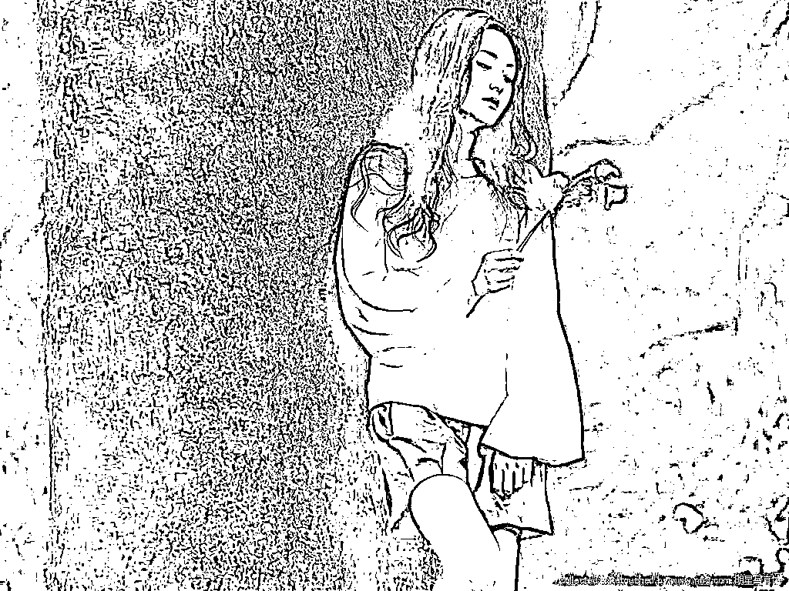

**作者/编辑/玫瑰  图片/网络**

**女王节，“女王”再婚了**
3 月 8 日，大 S（徐熙媛）官宣与韩星具俊晔结婚。

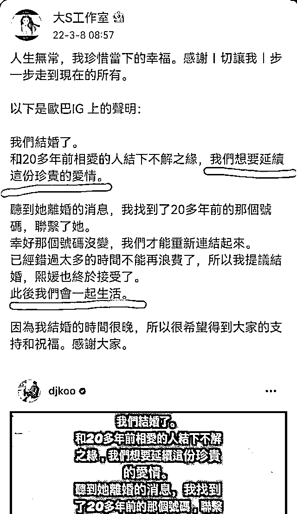

| 大 S、具俊晔官宣结婚
具俊晔（前韩国酷龙组合成员）是大 S 的初恋，24 年前二人一见钟情，后因男方始终无法公开恋情而分手。具俊晔自述，听说大 S 离婚后，重新联系上对方，二人觉得不能再浪费时间，所以决定结婚，成为一家人。10 年前闪婚，去年离婚，4 个月后又闪婚；从见面四次就想到给对方生孩子的京城四少汪小菲，到 20 几年前的初恋兜兜转转再续前缘，一时间网络哗然，网友表示，自己还没从大 S 离婚中走出来，想不到大 S 自己已经走出来了。女王节当日的这则新闻，几乎共振了所有女性的婚恋议题：**·** 婚姻并不那么幸福的女性，羡慕大 S 的敢作敢为；**·** 单身女性，欣赏大 S 再度勇敢走入婚姻的勇气；**·** 离异带娃的女性，反观自己不敢再婚的背后，到底在怕什么？**·** 理性的女性，觉得大 S 太作，太任性；**·** 谨慎的女性，认为这段婚姻背后危机重重；……

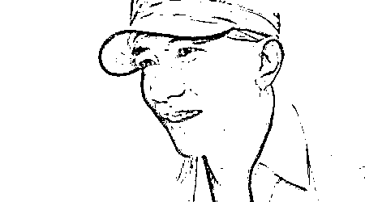

| 具俊晔纵然毁誉参半，毋庸置疑的是，敢于两次闪婚的大 S 带着她一贯的“狼性”，妥妥地成为了女性独立话题的争议人物。那么，大 S 为何会做出这样的人生选择，这则新闻在金火进入水瓶座 0°，木海正趋近合相，土天仍在四分的当下，共振了怎样的女性议题，又有着怎样的启迪？让我们再一次从星图中一探究竟。**现实版《开端》**
前阵子，《开端》热播。剧中的主角在一辆有炸弹的公交车上，一次次在公交车爆炸后循环回到爆炸之前，他们必须想出办法终结爆炸，否则自己将会被不断消耗至经历枯竭。而方法只有一个——拯救所有人，包括施暴者。

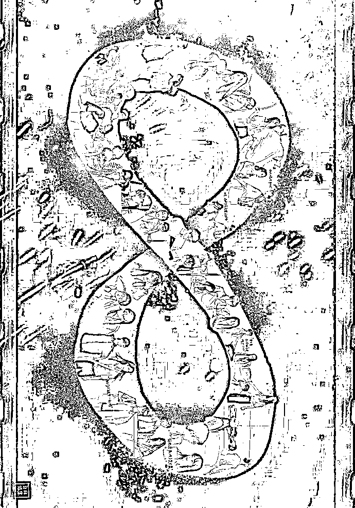

| 《开端》的循环这部剧隐喻了当下**木海双鱼座**的主旨——**双鱼座是黄道第 12 个星座，通常同螺旋、拯救、自我消耗相关。在不断的循环中，发展出智慧、善良，大爱，是双鱼座最高能量的体现。**大 S 的人生，便是这样一个循环的过程。大 S 的金星在天蝎座，北交点也在天蝎座。开往亲密关系的车上，坐着具俊晔、蓝正龙、周渝民、汪小菲、再度上车的具俊晔……不同的面孔，却有着相似的特质，甚至同一个人会两次出现在时隔多年的生命中。她将面对亲密关系的爆炸（天蝎座的涅槃重建），炸药是自我的议题，定时是一个个行进触发，而有的时候，甚至是她亲手拉动引线，将一切摧毁。**行为的背后都有决策系统，在星图中，体现为定位星链。他们就像一个个内部循环，决定了当事人如何面对和处理生命中的重要议题和事件。**大 S 的星图中有两条重要的定位星链：

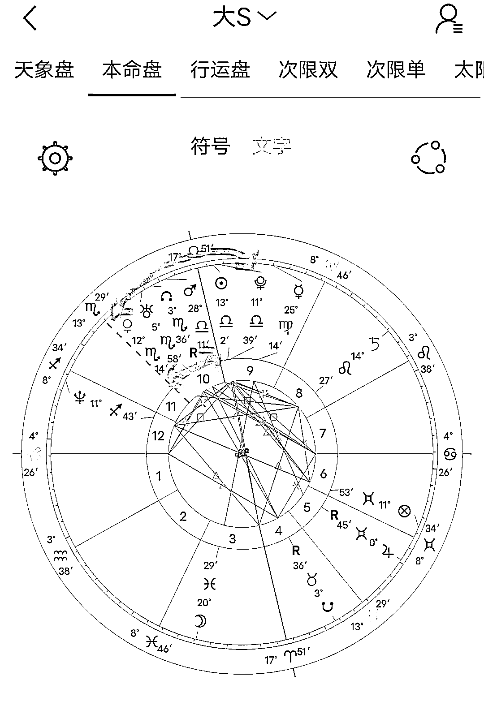

| 大 S 星图中的定位星链 1，具体时间不详，取中午 12:00**·** 土星狮子座-太阳天秤座、火星天秤座-金星天蝎座、天王星天蝎座-冥王星天秤座：**金星、冥王星互容，古典占星学中，金星、火星也是互容的。**

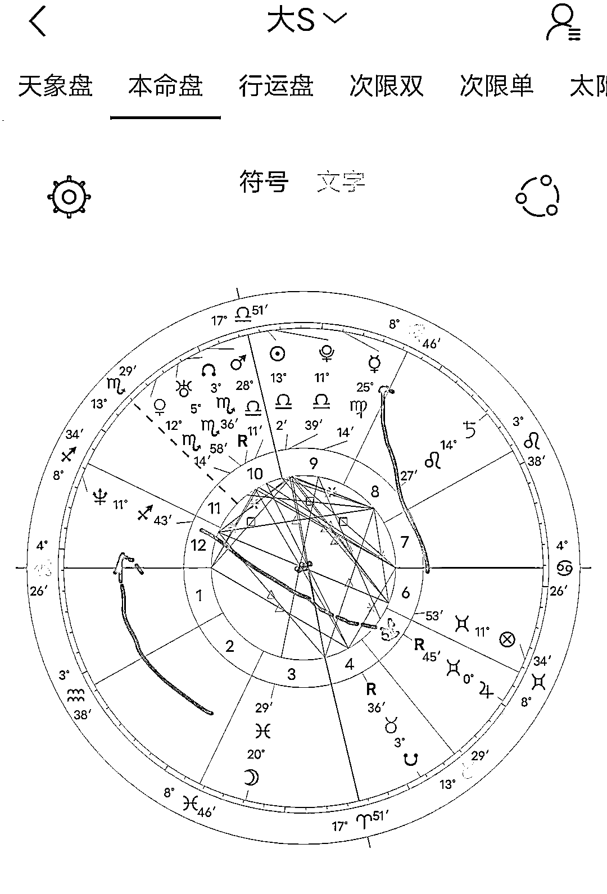

| 定位星链 2**·** 月亮双鱼座-海王星射手座-木星双子座-水星处女座：**水星为最终定位星**在这两条定位星链中，同情感直接相关的两颗行星分别具有如下的相位：**·  金星天蝎座合相天王星**——反常规的恋爱模式、距离、身份地位差异、情感中的占有欲、控制、执念与抽离、忽然的分离；**·  金星天蝎座四分土星狮子座**——不配得感、低自尊感、情感中的压抑、现实、冷漠、管理对方的企图、限制、延迟、困难、固执不愿放弃；**·  月亮双鱼座对分水星处女座**——恋爱心与理智脑，浪漫与现实，界限与消融、拯救与消耗……📹 [`v.qq.com/iframe/preview.html?width=500&height=375&auto=0&vid=i0964q2odit`](https://v.qq.com/iframe/preview.html?width=500&height=375&auto=0&vid=i0964q2odit)| 大 S 接受《鲁豫有约》采访谈及感情观在《鲁豫有约》中，大 S 对于情感的态度几乎完美诠释了她内在的定位星链循环以及月亮和金星的相位特质：**·** 大 S 姐妹三人都有着反常规的天王星情感特质：大姐同男友相恋多年却不想结婚生子；妹妹小 S 迅速结婚；曾认为三人都不婚的她感觉到“背叛”后反而觉得很轻松，因为不需要承担生育责任，可以更放飞自我（金天合相四分土星，责任与自由的张力）。而天王星的家族议题最终也让她选择了一而再，再而三地闪婚；**·** 遇到喜欢的人，大 S 会主动追求（金火互容，在情感关系中具有直白的行动力），谈感情时候非常投入（月亮双鱼座、金星天蝎座）；然而理智也会告诉她，这段关系和感情是否浪费彼此太多时间（金土四分），当一段关系让她感觉很好（月亮双鱼座），但彼此都不是对的人（水星处女座），双方都不能够成长（土星），不管心里有多痛苦，都会很理智地分手（火星）；**·** 感情轰轰烈烈，结束得斩钉截铁。不让自己回头和后悔（日冥合相）。 **大 S 形容自己是“苦行僧”（金土相位），她认为痛（冥王星）不见得是坏的感觉，可以将痛转为另外一种体会。**

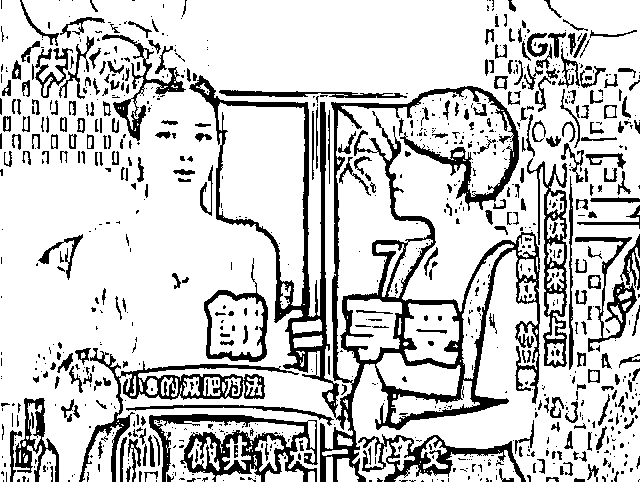

| 日冥合相的她享受饿的感觉，曾极端瘦身分手后，她会一个人痛苦很长时间，有时候痛苦到在床上打滚，姐妹会说，不要让自己痛苦啊。她擦干眼泪说：**“不行，我不能选择舒服的选择，而必须选择对的选择。”**对此，鲁豫问她：“回头看，你的选择是对的吗？如果你没有分手，也许感情会更好呢？”大 S 说：“我敢发誓，如果一个（这样的）感情到现在，绝对不会更好。”**“女大王”与“小公主”**
大 S 是一个狠人。她出的书叫《美容大王》，汪小菲称她是一匹狼，朋友们说她面对感情“够有种”（狠）。

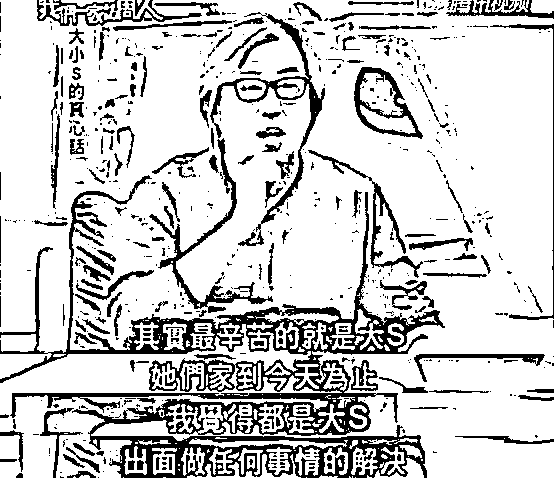

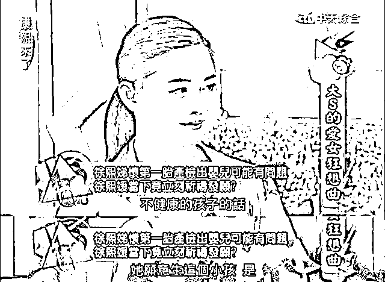

| 大 S 曾许愿，愿意替小 S 生下不健康的孩子

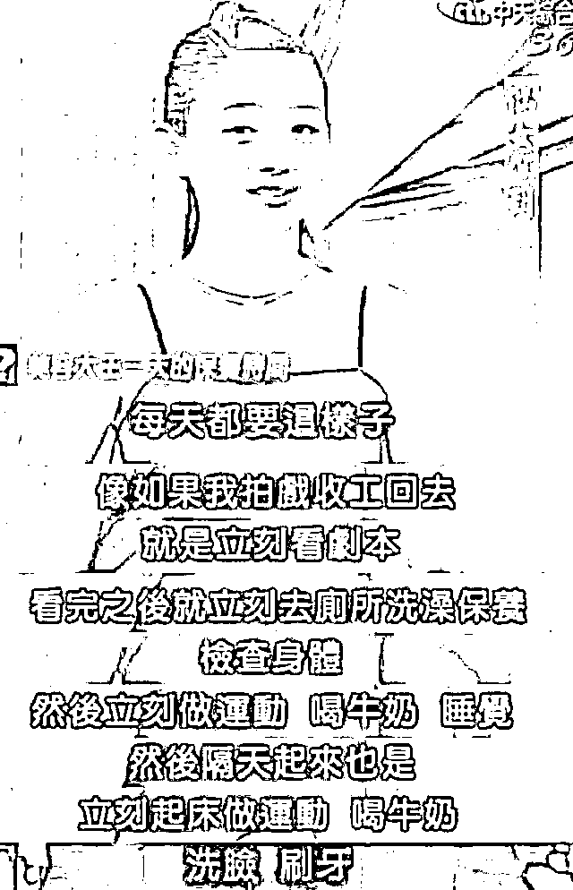

| “拼命三郎”
她多敢对自己下手呢？曾经用剪刀把自己肚脐上脐环发炎后突出来的一块肉减掉；为了减肥把自己饿到晕厥；生孩子在鬼门关走了一圈；搭档言承旭称她为“拼命三郎”；爸爸经常打骂母亲，她冲在妈妈面前保护他，一次又一次；对朋友虽然嘴毒却仗义力挺……有的时候，她甚至是在为了狠而狠，自己扯开引线，把自己燃爆，在这种翻肠搅肚的痛苦中品尝出不一样的寓意。单从她的言语表达，很难想象，这样一个狠人会是月亮双鱼座。本来需要被保护的她，却一直挺身而出在保护别人。然而，**月水对分的她，也有着太多言不由心的地方：**表示从不复合的她，却接受了 20 几年前的初恋；长年食素的她，为了生孩子忍着吐大口吃肉；很有原则的她，为了身患抑郁症的周渝民放弃了社交，并始终不离不弃；骄傲如大王的她，也曾主动向蓝正龙求婚……

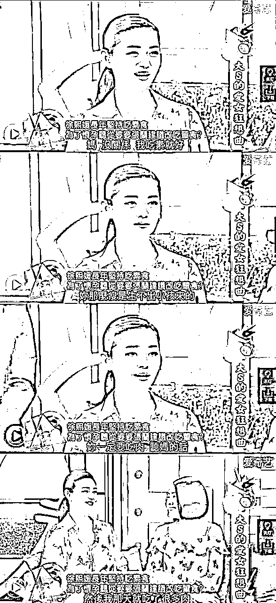

| 为了备孕开始吃肉**嘴硬，心软，说的就是她。**她没法不刚，父亲只是个工具人，看似在家却早已同母亲貌合神离，分道扬镳之后，因为“害怕”家里的女人躲到了奶奶那里住；甚至欠下巨额债款需要女儿来还。家里没有男丁，她挺身而出，独当一面，处理大事小情；出道多年，妹妹小 S 一百样事都要她来做主——她象这个家的顶梁柱，定海针，撑起了四个女人的天，还在父亲垂危之际陪他走完了最后一程。从小没有那个可以给她撑腰解围，太阳一样照着的父亲，只能自己给自己制造出一个强势、狠辣，又自作主张的父亲形象。这样的女孩子，早早就学会了同命运抗衡，一次次在痛里翻滚，再一次次扛过生命的重锤。鲁豫心疼她：姐妹不能代替你，所有的痛只有你自己扛过去啊。她笑着说，能和姐妹说，她们能理解，那就够了。

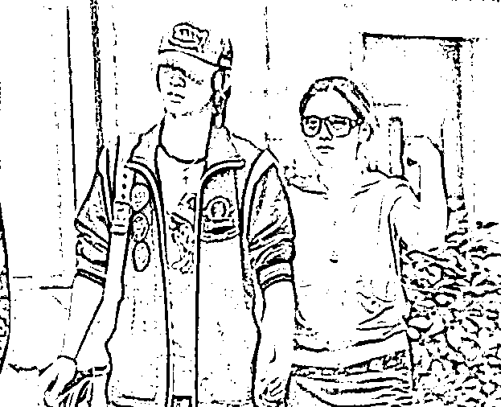

| 陪伴周渝民，多年后，周渝民在某档节目上说，非常感谢大 S 和她的家人，那些年很对不起大 S。

**她不怕痛，怕的是不理解，怕的是没人懂。****懂，是月亮双鱼座内在最深的需求。**人狠话不多的她，在汪小菲身后却那么娇柔，说话轻声细语，连发脾气都感觉不到太大力度。一起上节目的时候，会因为汪小菲骑自行车在她要求停下的时候不停而当场哭泣，会因为汪小菲的一句话怀疑他是不是后悔娶了她这个老婆，会表示，老公不给剥虾她就不吃，因为在家里都是爸爸给她剥虾……像极了拼力要宠爱的小公主。📹 [`v.qq.com/iframe/preview.html?width=500&height=375&auto=0&vid=q3219uaayxr`](https://v.qq.com/iframe/preview.html?width=500&height=375&auto=0&vid=q3219uaayxr)| 《幸福三重奏》中著名的“剥虾”片段
**循环的最初，是亲子关系。**爸爸家暴、酗酒，欠债要她来还。可月亮双鱼座的她只愿意看到那个为她剥虾的爸爸。**无论金冥互容的定位星链多么骁勇和善于驾驭对方，月亮双鱼座渴望的，始终是柔软的抚慰和心意相通。****第一段婚姻：希望他永远比我过得好**
第一段婚姻里，他们不是不努力。汪小菲 10 年飞台湾 700 多趟，平均一年 70 次，北京大老爷们儿的他忍耐了大 S 的各种“作”；大 S 曾尝试搬到北京，并努力怀孕，拼了命生下两子（土星狮子座在生育问题上可能会有一种执着的过度补偿）。汪小菲创业屡次失败，网传大 S 也没少贴钱给他，甚至离婚的时候，汪家母子还利用大 S 的热度猛吵了一波新开张的“麻六记”……

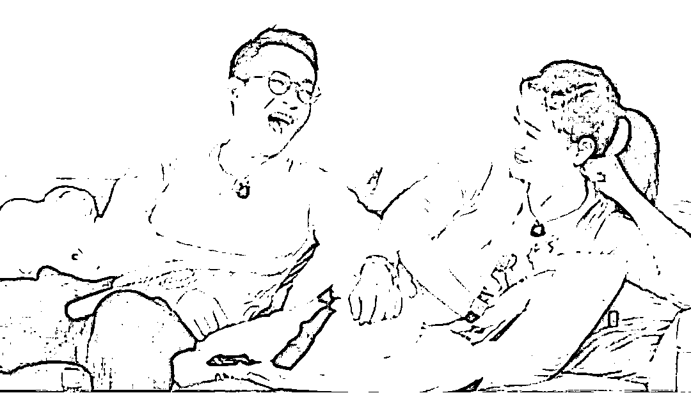

| 大 S 与汪小菲而这一切，她没有一句恶言。她说：“我希望小菲永远过得比我好。”**一直以来。看似强势的她，也是被消耗得最严重的人。**如果无论怎样努力都没办法好好地生活在一起，也许是有个人的心里反复在说着：“**我无法在真实的世界里获得简单的幸福。”**月亮双鱼座，真正对的人，似乎永远都不存在在现实中；金星天蝎座，很难获得平淡而简单的日常；金土四分相，总觉得无法企及对方足够的爱；日冥合相，被生命中男性抛弃的阴影始终如影随形。**于是，与其被对方抛弃，不如主动斩断，嘴上还会执拗着说那不是对的人。**（金天合天蝎座）**第二段婚姻：再一次循环**
大 S 的口是心非（月水对分）已经被她演绎得炉火纯青，我们几乎真的相信了她可以在全心全意投入一段关系十年后，洒脱地离开，还越活越年轻。然而，再一次的闪婚，让所有人看到了在情感的列车上，大 S 似乎又一次坐回到曾经的位置。而身边出现的，恰好是曾经的那个人。

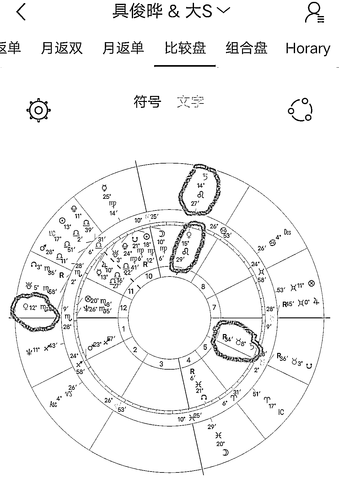

| 具俊晔同大 S 比较图，出生时间均取中午 12:00
翻看大 S 同具俊晔的星图，不由感慨：**·** 大 S 同具俊晔都有金土四分相，大 S 的土星合相了具俊晔的金星，具俊晔的土星对分了大 S 的金星；**·** 1998 年-2000 年，二人在一起的这段日子里，行进在水瓶座的天王星和行进在金牛座的土星陆续碾压过二人的金星、土星、南交点。

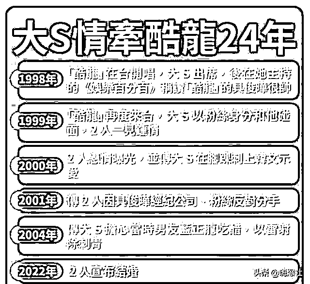

| 大 S 同具俊晔恋爱时间线很多人并不看好这段婚姻，包括我。但是，当星图里的故事一一呈现，便理解了这个向来有主见的姑娘，为什么做出如此“任性”的决定。

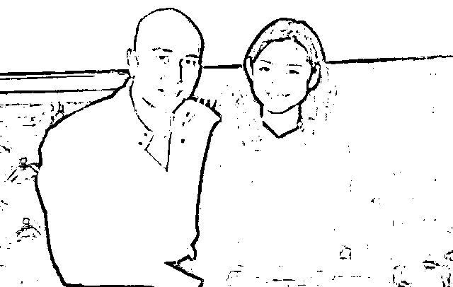

| 当年的两个人这真是一场天雷地火却又压力重重的爱情。**土星同金星的相位，激情与投入被狠狠砸在墙壁上，连个声响都没有的绝望。两个金土四分的人，彼此互相压制对方的情感，却又在漫长的岁月里无法释怀**——如同李宗盛歌中所唱：“想得不可得，你奈人生何？”你知道这个人在那里，却无法对他说一句：我想你了。她勇敢的时候，他为了光环和利益（金狮子四分土金牛）无法回应他；他追悔的时候，她的狠绝和尊严让他没有半点斡旋余地（金天蝎四分土狮子）。如果说命运的引线在当时就埋下一次伏笔，那这一次循环，又将面临怎样的触发器？

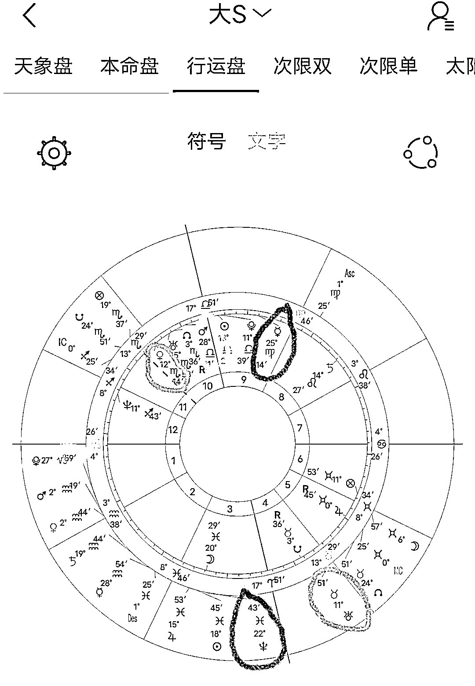

**2022 年的当下，大 S 的三颗最终定位星都被三王星触发了。**
**·** 2022 年 3 月起，行进木海合相于双鱼座，精准对分大 S 的 25°的水星处女座；**·** 2020 年-2022 年，行进天王星在金牛座对分大 S 的金星，梅花冥王星；**·** 当下，行进冥王星在摩羯座四分大 S 的火星。（从古典占星学角度，大 S 星图中金火也存在互容）三重夹击下，刚失婚的她貌似洒脱的背后，困难重重。10 年苦心经营的婚姻被天王星撬动，垮得稀碎，早已被消耗的差不多的她，不发一言，妥当安排好前夫的一切之后默默转身，流言和诋毁潮水般涌来。而忽然，曾经投注深情厚爱的旧人再度出现，他还对自己念念不忘……📹 [`v.qq.com/iframe/preview.html?width=500&height=375&auto=0&vid=z3326mzo9rt`](https://v.qq.com/iframe/preview.html?width=500&height=375&auto=0&vid=z3326mzo9rt)| 大 S 采访具俊晔片段好像梦境成真，人生仿佛又可以回到一张白纸的 1998 年，那时的她还没有一双儿女要抚养，没有足以淹没人生的鸡零狗碎。她和妹妹都一脸胶原蛋白，眼里满是对爱情和未来的憧憬。她问妹妹：“你想光头会跟我结婚吗？”妹妹说：“我觉得你只要用诚意感动他，应该是没问题的。”她满脸堆笑说：“好，我很有诚意，我希望他跟我结婚。”然而她没有和他结婚，他甚至都不肯公开承认他们的关系。**她从那时候就开始反复练习着如何熟练地亲手解决掉生命中最爱的关系。如何习惯并且学会享受这种彻骨的痛（金星天蝎座、北交天蝎座）。**后来，她又遇到了很多人。可最初让金星天蝎座的她义无反顾投入却又内伤的他，始终是一个忘不掉的疤，如同她也始终是他爱而不得的白月光。**木海合相：“奇遇”发生**

**你要爱就要像一个痴情的恋人那样去爱，像一个忘死的梦者那样去爱，视他人之疑目如盏盏鬼火，大胆去走你的夜路。**

**——**史铁生**《病隙碎笔》**

具俊晔在一档节目中说，上一次恋爱还是在 20 多年前，看过坊间关于他相亲和暧昧对象的新闻后，我更愿意相信，自那之后，他再也没有遇到过大 S 那般好的女孩子。

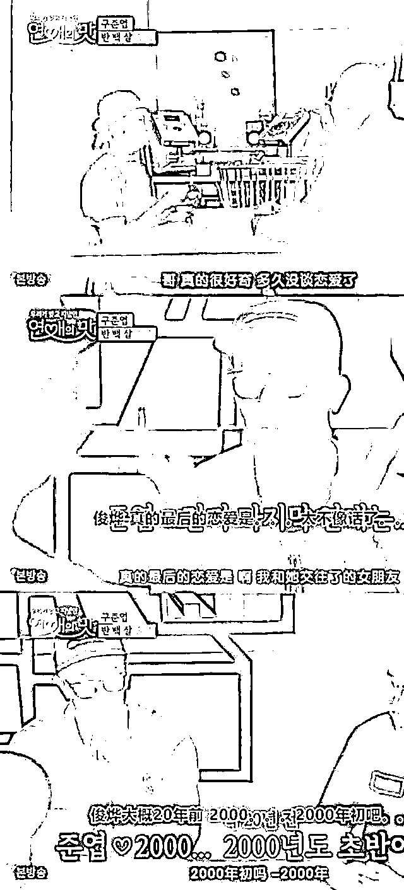

| 具俊晔在节目中坦诚上一次恋爱在 20 年前大 S 也未必真有她说的那么绝情。具俊晔的电话她还是快乐地接了，甚至在那样短的时间就同意了他的求婚。为什么如此“草率”地决定了？**·** 也许是因为，他终于懂得了她的脆弱和耗尽，在最需要的时候接住了她；（海王星）
**·** 又或是因为，他让她短暂地解除了各种身份限制，重回青葱时代的自由；（天王星）**·** 还可能因为这样多多少少能刺激打击到前任，来结束一场看不到尽头的离婚闹剧；（冥王星）**·** 更可能是因为漫长的思念和遗憾终于能以美好而浪漫的方式收场。（木海合相）于她，这几乎是浩劫后的奇迹——他曾是她情窦初开时的彼岸，竟也是她一地鸡毛后的远方。瞒着所有人，爱了他很久的她，又瞒着所有人，把余生交给了这个最初的男人。可他会是那个最终吗？也许已经不重要了。她现在什么都有了，孩子、亲人、事业、金钱，为什么不为了自己疯狂一次呢？我不知道命运的这一次循环，大 S 有没有改变一切的把握。20 多年彼此的人生空白，面都没有见就结婚，异地文化背景悬殊的差异，巨大的经济落差，以及男方“妈宝”的种种，让我怀疑，**她是否又一次重演了 10 年前闪婚的桥段？一别经年，她和对方是否真的成熟了，具备进入婚姻的分寸和准备？**

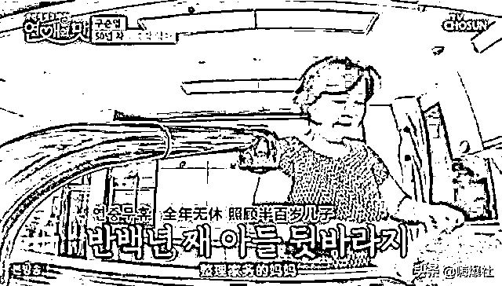

| 75 岁的母亲全年无休照顾具俊晔
在我看来，大 S 似乎并没有真的从前一段漫长的婚姻关系中走出来，而又一次沦陷在天王星的快速建立关系，和海王星的幻化对方当中。**她似乎并没有真的明白婚姻的意义，是两个真正脱离了原生家庭（土星）的个体，在足够成熟和清楚自己以及对方的前提下，做出严肃而长久的承诺。**

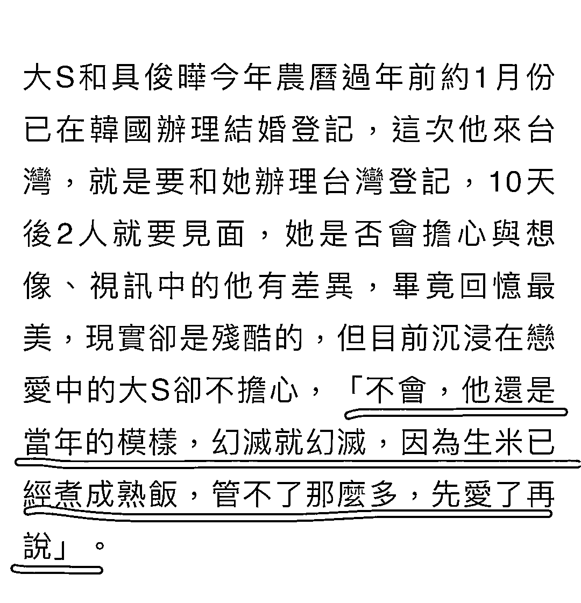

| 大 S 接受采访时说可是，何须太过苛责？苦行僧了许久，一场放纵又未尝不可？至少，在最脆弱的时候，他成为了她的那颗太阳，让她终于又有力量站起来，对这世界满心欢喜地说：“管不了那么多，先爱了再说。”而这一次，遭遇木海对分的水星处女座，失去了清晰分辨“对”与“错”的能力，反而让对面的月亮双鱼座能沉溺于幻梦成真的幸福中——**对错从来不能真正滋养双鱼座的月亮，如梦似幻，亦真亦假的境界，才是糅杂着想象与奇幻的加油站。**他们的未来会怎样？这是一个开放式结局。也许这段婚姻依旧以失败收场，又或许两个盘桓小半辈子的人这次终于懂得彼此疼惜，相守到老。**而每个人在她身上投射的，也是属于自己的那部分担忧或希望。**木海即将精准合相的当下，是一个造梦场。每个人都可能在这个时段有些奇遇，在人车的列车上，命运其实早已给了我们无数次循环的机会，当下的你，又会做出怎样的选择呢？

**参考文章**

《想瘦就瘦的大 S，真是个狠人》桃红梨白

《大 S 具俊晔闪婚背后：两人 24 年前曾秘密交往，被男方公司拆散》叶公子

**版权声明：**原创文章由作者授权首发于若道平台，欢迎转发，反对抄袭。友号转载请申请白名单。

****

**玫瑰**

英国 Cass Business School 管理学硕士

若道 2015 届核心课程毕业生，若道微信公众号兼职编辑

占星师，咨询时长超过 800 小时

**个人微信号：**stillrosy

**公众号**：一个娘娘 

长按二维码，给作者打赏

**学习占星学****点击下图了解课程详情** 

**

**微信又双叒叕改版啦，不想错过若道君的推送？****就把若道设为星标吧！****▼**

**就是这个“在看”，戳一下☟**

****直达报名通道****

# 阿兰·欧肯老师逝世丨在月亮的光辉中，我们怀念他，想念他

> 原文：[`mp.weixin.qq.com/s?__biz=MzA5NjA0NTAxNg==&mid=2651469011&idx=1&sn=c4ff8c2c3e90943ff49151359e8c849b&chksm=8b488664bc3f0f72913b5640a568a019018e703e690540aff5e7849fae989cf6bbe21377370f&scene=126&sessionid=1692737847#rd`](http://mp.weixin.qq.com/s?__biz=MzA5NjA0NTAxNg==&mid=2651469011&idx=1&sn=c4ff8c2c3e90943ff49151359e8c849b&chksm=8b488664bc3f0f72913b5640a568a019018e703e690540aff5e7849fae989cf6bbe21377370f&scene=126&sessionid=1692737847#rd)

**********************************☆****后台回复“今日”，给你一句生命态度**************************************

作者/阿兰·欧肯

译者/Arrow 校对/Christy

编辑/玫瑰 图片/pexels

北京时间 2022 年 3 月 5 日晚，敬爱的阿兰·欧肯老师在巴厘岛逝世。欧肯老师曾在若道开课，备受学员们的敬爱，他对占星学这门古老智慧的传授，让我们受益匪浅。虽然欧肯老师离开了，但我们相信，他开启了另一趟精彩的旅程。而我们，依然会在他的教导中，继续领略占星学的奇妙与精深。本篇文章是由阿兰·欧肯老师所写，我想，我们需要继承的是来自于他所教导的知识和光辉，继续传承下去。
**星图是透镜****星图也许是照见和理解过去、现在与未来的透镜。**能否窥镜而视取决于几个因素：❶  出生信息的准确性❷ 占星师的天赋和多年训练❸ 占星师对不同透镜采用的描述方法会产生不同结果和认知当占星师试图窥探某个个体生命中过去发生的事件时，会检视过去某个特定时间行星的行进、次限和日月食情况，据此揭示出关于案主过去状况和活动的大量信息。这个过程相当复杂，要一本大部头，甚至两三本，才能说得明白！显然，本文不足以涵盖这些内容。但是，通过这些文章，我能告诉读者，如何处理关于个人过去的某些一般性影响因素，尤其是心理和行为因素。这些见解会给予占星学子一定的指导，你的镜头可以因此准确聚焦于这一领域。

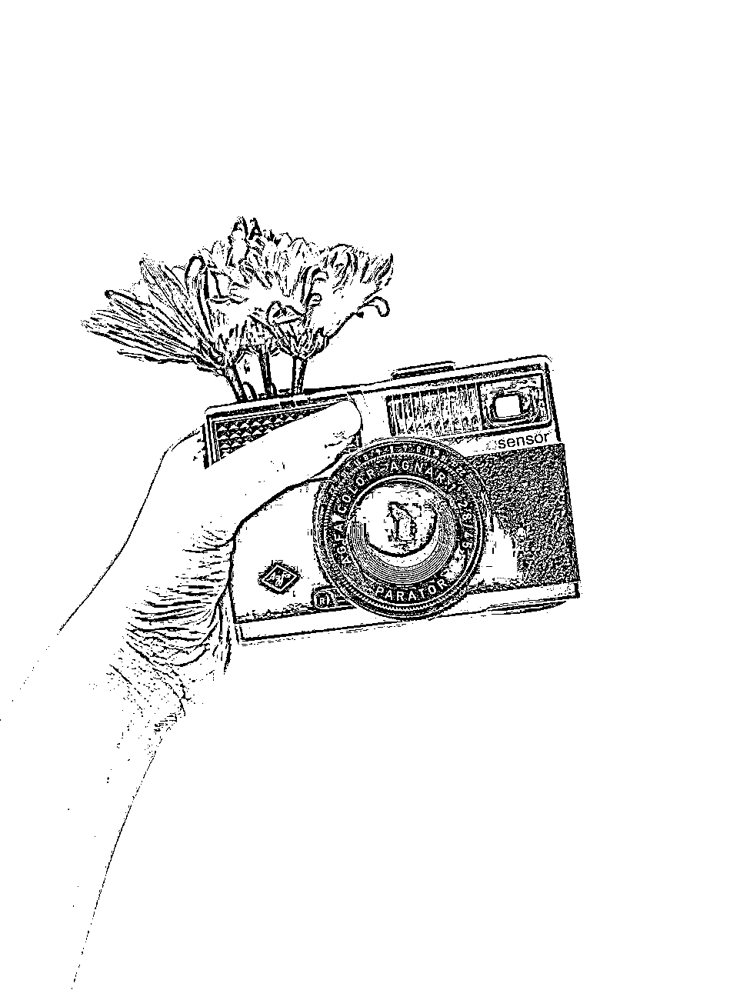

**个体过去需要关注的两个面向**我会专注个体过去的两个面向：集体和个人。

1**集体过往**

我们每个人不仅是直系血缘祖先的后代，也是人类集体的后代。在占星解读体系中，确实有一些非常结构化的描述规则。没有这些规则，占星学就不是“星星的逻辑”（astro-logical）了。占星学子必须掌握这些已经确立的技法，因为他们是占星师直觉解读的坚实基础。 我最近咨询的一位客户，第 12 宫宫头落在天蝎座，宫内落有射手座的水星、火星和木星。这 3 颗行星也三分第 8 宫内落在狮子座的天王星。这位女士过去多年来的工作一直是**国际机票预订代理**。她和客户一开始讲话，客户的行程就会浮现在她的脑海中。然后客户还没来得及说完，她已经能在电脑上查到那个行程了！她监管订票电话的上级注意到了这点，她是全球航线网络最快的订票代理，因此受到嘉奖。这位女士上的是一所天主教小学。她能够快速引用圣经的段落并回答（而且提出！）神学问题。有一天，教书的修女问她怎么做到的，她答道（那时她只有 10 岁）：**“这些章节和答案就这么出现在了我的脑海中。”**修女说她是“一个调皮的姑娘，是个骗子”，惩戒了她。那件事以后，她很快离开了教区学校，进入了公立学校。（我得说，她母亲很通情达理！）我们现在讨论的并不是一个有过目不忘记忆的个案（因为她没有），而是一位有着**“内在屏幕”**的女性，她的“内在屏幕”对于一切**旅行和宗教教义**是敞开的。我觉得没有什么比这更像**射手座**了！她在其他学科上并没有这种天赋。这个案例很好地展示出**射手式第 12 宫的集体性（她与世界旅行、世界宗教的即时接触，她能瞬间理解哲学教义）和个人生活（她周游世界，毕生都在学习各种宗教和玄学）**。但是第 8 宫的天王星三分这些行星和天蝎座的第 12 宫宫头代表什么呢？**天王星个体化其所触及的一切，在实际层面上，引导人们以不同寻常的方式表达这一领域**。**第 8 宫和天蝎座都关乎死亡**。

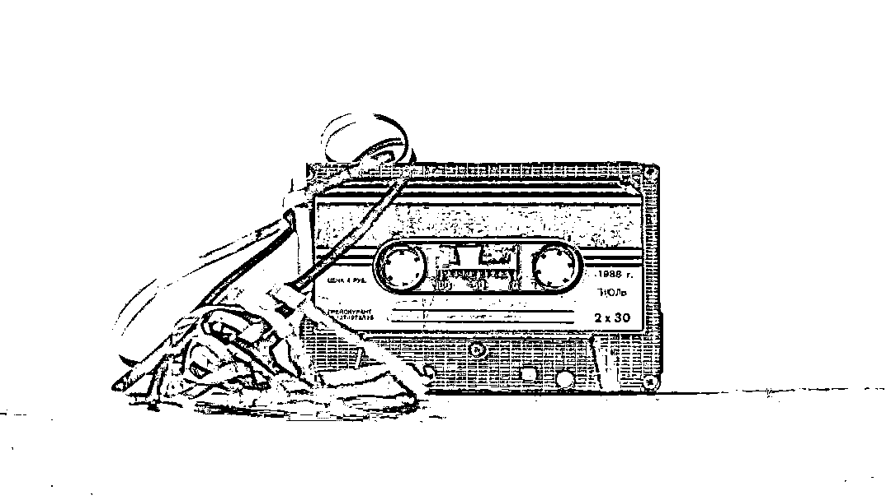

这位女士现在在**临终关怀中心**工作。她为各种信仰的人提供咨询，运用她对对方宗教的了解，加入自己对生命的普遍、整合的理解。我们体现了某些能量联结，由于没有更恰当的词汇，权且说，这些能量“经由我们流动”。这些能量模式是人类集合体的一部分，是被称为“人类王国”的实体的一部分，这个实体是复杂却又单一的多细胞体。它处于集体进化的恒常状态，而我们个人的进化会增加（或减少）它的终极完美。每次我们中的一员意识达到开悟，那个人类集体有机体中，便又有一个细胞化为一道更大的光。我们的使命是让整个人类有机体开悟。**我们星图上的第 12 宫关乎让更多（或更少）的光-爱-意识显化。本质上，透过第 12 宫，我们认识到过去有哪些东西需要通过重生（第 8 宫和第 12 宫之间的关联）和现在的肉身（出生星图中上升和太阳的位置）得到救赎**。

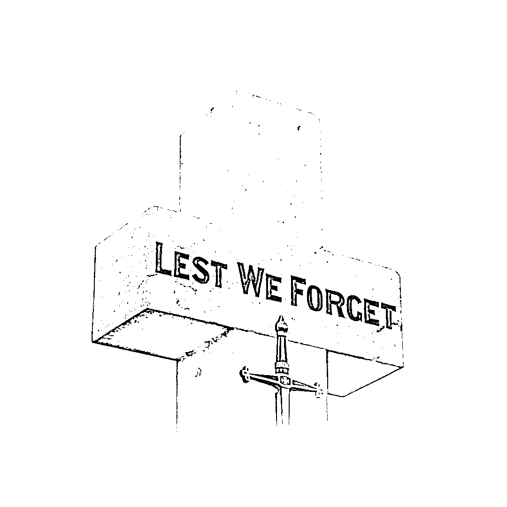

2**个人过往**

检视出生星图中代表个人过去的征象时，我们必须关注以下 6 个因素。 ❶  **月亮的星座、宫位和相位****月亮是母亲的主要征象星。它的星座描述了母亲的个性，月亮和其他行星的相位当然会大大影响她的性格。**如果月亮在天秤座，合相金星，三分木星，母亲美丽、优雅、风趣，积极向上、慷慨大方；如果月亮在天蝎座，四分冥王星，母亲心理上过于强势，难以企及她的爱，她执迷、隐秘，占有欲强；如果月亮在案主的第 1 宫，母亲（家、家人）一定会主导案主的生活；在第 11 宫，母亲如同朋友（好朋友还是坏朋友取决于相位）；在第 2 宫，母亲和案主的价值观和财务状况等密切相关。❷ **下中天/第 4 宫的宫头星座****这个星座描述了我们早期环境的影响因素。它也可以是母亲和她对我们人生影响的另一个指征。**比如，第 4 宫落入双鱼座，海王星四分月亮，可能表明母亲酗酒，或有其他药物和成瘾问题。这种征象让案主难以在心理上感到完整，暗示过去非常不稳定的家庭生活；再比如，下中天落入射手座，木星在第 9 宫三分月亮，可能表明案主幼时曾身居海外，或心理影响因素是开放的、宽广的，包容各种哲学观念。

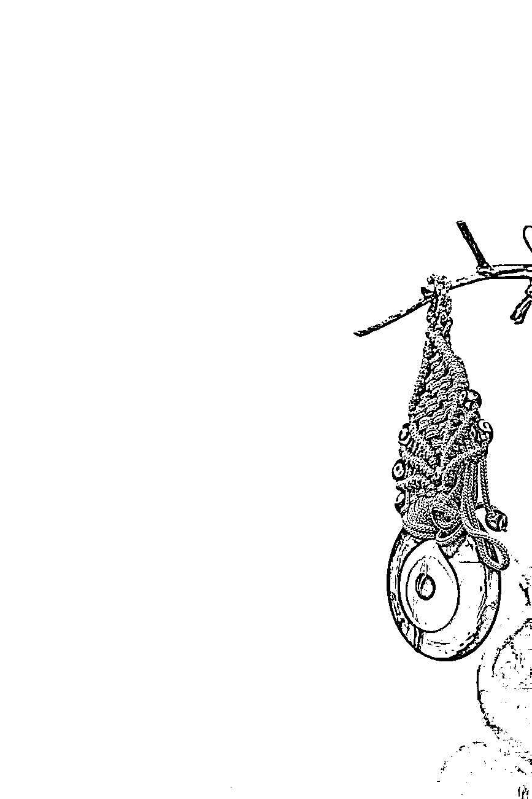

❸ **下中天守护星的性质：星座、宫位和相位****任何宫头的守护星都应该仔细探究，因为这会揭示该宫位相关情况的本质特征。关于下中天，我们所探究的是影响我们主观、心理结构的因素。这些因素影响了我们应对生活的方式和依照过去创造现在及未来的方式。**因此，下中天落入白羊座意味着需要明确划清个人领地。如果火星四分或对分海王星，那么我们倾向于采取高度防御姿态，因为潜意识在说，我们很容易被“侵犯”。火星落入巨蟹座、摩羯座、白羊座、金牛座或双鱼座的情况下尤为如此。比如，白羊座的火星落入第 4 宫，并且有困难相位，下中天落入白羊座，暗示着母亲非常好斗，可能早年家庭生活经历了暴力情境。❹ **第 4 宫守护星和月亮的关系**让我们用刚刚第 3 段中的案例（白羊座的火星落入第 4 宫，且守护第 4 宫），假设那个位置的火星四分巨蟹座的月亮。这就直接告诉占星师，客户有一个悲惨的童年，与母亲的关系缺乏心理上的安全感。如果客户是男性，他和女性的关系会饱受困扰，直到他清理了这些紧张的“母亲议题”；如果客户是女性，她会发现难以给自己的孩子和家庭生活带来凝聚力和心理上的安全感。

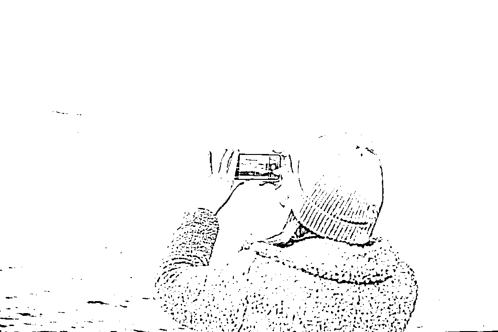

❺ **太阳和月亮之间的关系，以及判断哪个发光体更强势****总体而言，如果发光体相互形成和谐相位（三分相或六分相），那么很有可能个体的父母关系和谐；四分相或对分相，父母关系受到困扰，个体因此受到牵连**。如果太阳占主导地位，如狮子座的太阳在地平线以上，双鱼座的月亮在地平线以下，那么父亲是更有影响力的家长；同样，如果月亮占主导地位，如落在巨蟹座的月亮合相落在巨蟹座的上升点，六分落在第 2 宫处女座的太阳，母亲是两个家长中更强势的一方。❻ **土星和月亮之间的关系****这是判断案主过去的一个至关重要的因素，也是影响此人如何在此基础上构建现在的最重要的动力之一。**基本上，土星和月亮之间的困难相位（合相、四分相、对分相、梅花相）会影响个人安全感。如果处女座的月亮合相土星，客户对他/她的母亲来说永远“不够好”。此人成长过程中会感到自己有很大的不足，或者注定犯错，遭受周围人的严厉批评（甚至是整个社会）。如果两者间是六分相或三分相，这个人有明确的责任感或义务感，并且能轻松履行责任和义务。落在摩羯座的土星三分落在金牛座的月亮往往意味着此人的家庭传统和价值观给他的生命带来了力量和稳定（有时还有很多钱！）**请记住月亮的最重要含义之一是描述我们本能的反应机制。只有当我们释放了潜意识对月亮的依恋之后，才能摆脱本能的左右，更有能力做出有意识的选择。**这需要和天王星、太阳以及我们个体化的过程建立密切关系。

**版权声明：**本文由若道翻译，欢迎转发，反对抄袭。友号转载请申请白名单。

**阿兰·欧肯**

若道签约老师。1944 年出生于纽约，毕业于纽约大学罗曼语言及语言学专业。著有包括《灵魂占星》、《星图中的守护关系》、《阿兰·欧肯完全占星》等数十部著作。他还为《戴尔星运杂志》以及其他许多国内外评论与期刊撰写过数百篇文章。他是译者、老师、环球旅行家和国际导游。

**学习占星学****点击下图了解课程详情** 

**

**微信又双叒叕改版啦，不想错过若道君的推送？**
**就把若道设为星标吧！****▼**

**喜欢记得点一下在看哦☟**

**报名直达入口**

# 悼念阿兰·欧肯：感恩教导，星空再见

> 原文：[`mp.weixin.qq.com/s?__biz=MzA5NjA0NTAxNg==&mid=2651469011&idx=2&sn=ee18cab50cd97a7148d5d349172ba365&chksm=8b488664bc3f0f729e56156e73095d5d58c09023102031341e3607113aa88f41fbcf3326c5af&scene=126&sessionid=1692737847#rd`](http://mp.weixin.qq.com/s?__biz=MzA5NjA0NTAxNg==&mid=2651469011&idx=2&sn=ee18cab50cd97a7148d5d349172ba365&chksm=8b488664bc3f0f729e56156e73095d5d58c09023102031341e3607113aa88f41fbcf3326c5af&scene=126&sessionid=1692737847#rd)

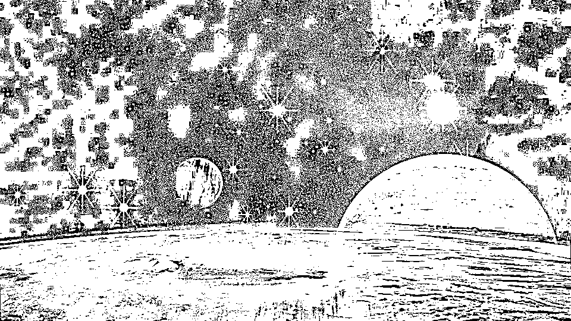

北京时间 2022 年 3 月 5 日晚，敬爱的阿兰·欧肯老师在巴厘岛逝世。欧肯老师曾在若道开课，备受学员们的敬爱，他对占星学这门古老智慧的传授，让我们受益匪浅。虽然欧肯老师离开了，但我们相信，他开启了另一趟精彩的旅程。而我们，依然会在他的教导中，继续领略占星学的奇妙与精深。大卫老师也在此寄托他的哀思。

正如你们许多人了解的那样，阿兰·奥肯（Alan Oken）于 2022 年 3 月 5 日，在与奥密克戎进行了一场勇敢但毁灭性的战斗之后，在巴厘岛去世。 

Alan 于 1944 年出生于纽约，在纽约大学主修罗曼语言和语言学。继他的畅销书第一本书《如上如下》（As Above So Below，1973 年）之后又出版了十几本书。此外，他还为美国杂志和国际评论和期刊撰写了数百篇文章。

他是一名翻译，教师，全球旅行者和国际导游，用五种语言讲课。阿兰是智慧学校（新墨西哥州圣达菲）的主任，澳大利亚意识发展研究所的联合创始人和前密教研究主任（里斯本奎龙中心）。

2012 年，在新奥尔良举行的 UAC 大会上，阿兰·奥肯接受了 Ji Yun 的采访，并在新浪网上首次被介绍到中国。阿兰的微博平台仍然存在，尽管自 2019 年以来一直处于非活跃状态。

2019 年，Alan 来北京授课，由北京若道咨询有限公司主办。他的讲座和研讨会参加人数众多，访问结束后，他继续在巴厘岛的家中进行在线教学。

下面的大部分照片都是 2019 年阿兰在北京时拍摄的，在此期间他参观了长城和其他着名景点。阿兰还与荆华合影，荆华是他学生，并在中国与线上课程担任他的翻译。

我认为阿兰既是一位受人尊敬的同事，也是一位好朋友。他知道他可以坦率而公开地与我谈论任何事情，我喜欢我们的谈话和通信。阿兰深受世界各地和中国人民的喜爱，所有受益于他的智慧和洞察力的人都会为他哀悼。

他于 1944 年 3 月 28 日晚上 11：04 出生于美国纽约布朗克斯。在双鱼座的太阳与木星合相中离世。

As many of you have already heard, Alan Oken died yesterday, March 5, 2022 in Bali, following a courageous but devastating battle with Omicron.  

Born in New York in 1944, Alan majored in Romance Languages and Linguistics at New York University. His bestselling first book As Above So Below (1973) was followed by a dozen titles. In addition he wrote hundreds of articles for US magazines and international reviews and journals. 

He was a translator, teacher, global traveler and international tour guide, who lectured in five languages.  Alan was the Director of The Wisdom School (Santa Fe, NM), co-founder of the Australian Institute for the Development of Consciousness and former Director of Esoteric Studies (Quiron Center, Lisbon).

Alan Oken was first introduced to China on Sina.com following his interview with Ji Yun in 2012 at the UAC Conference in New Orleans.  Alan's Weibo platform still exists, though inactive since 2019.  

In 2019 Alan came to Beijing to lecture and teach, hosted by Beijing Nodoor Consulting Co.His lectures and workshops were well attended, and following his visit he continued to teach online from his home in Bali.  

Most of the photos below were taken while Alan was in Beijing in 2019, during which time he visited the Great Wall and other famous sites.Alan is also pictured with Jing Hua, whom he mentored and who served as his translator both in China and online. 

I considered Alan to be both a respected colleague and a good friend.  He knew he could talk frankly and openly with me about anything, and I enjoyed our conversations and our correspondence. Alan was beloved by many and he will be mourned world wide and in China by all those who benefited from his wisdom and insights. 

He was born March 28th, 1944 at 11:04pm EWT in the Bronx, New York, USA.  He died during a Sun-Jupiter conjunction in Pisces.

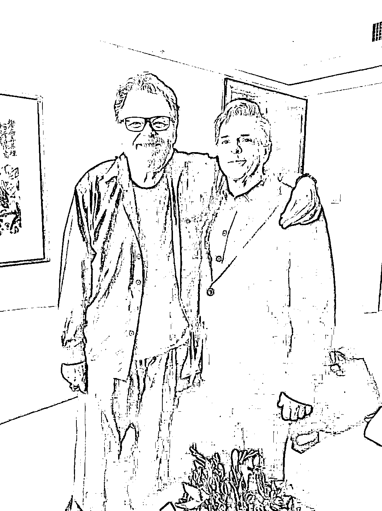

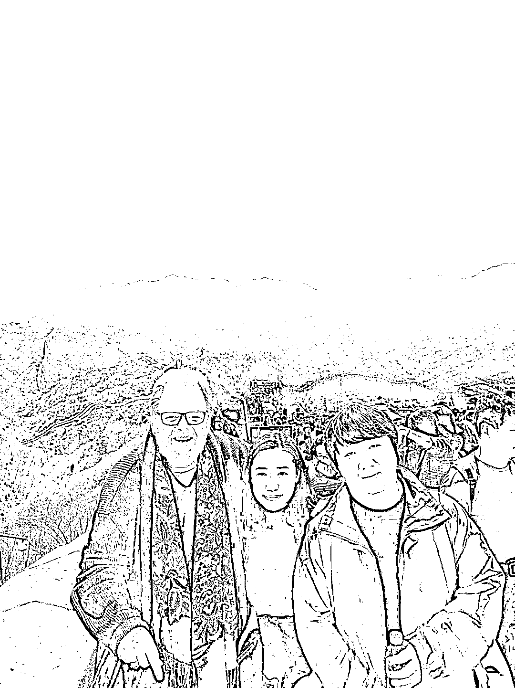

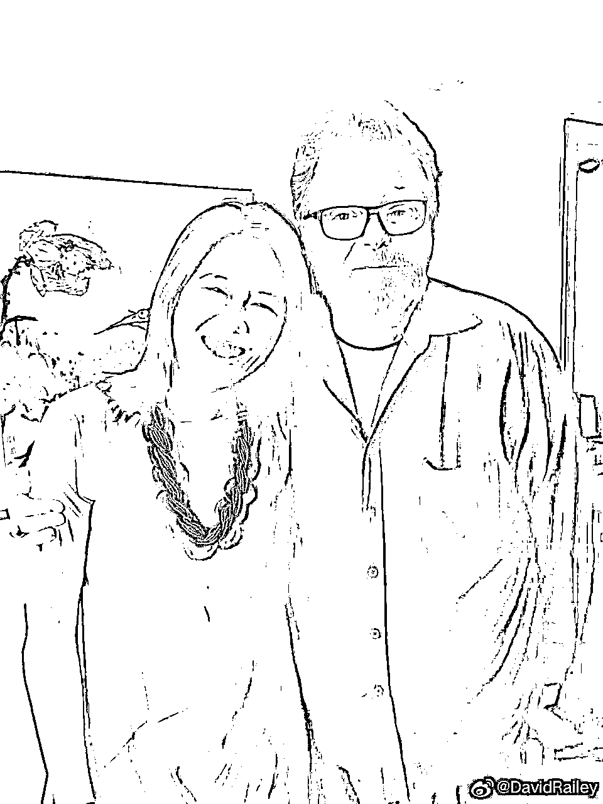

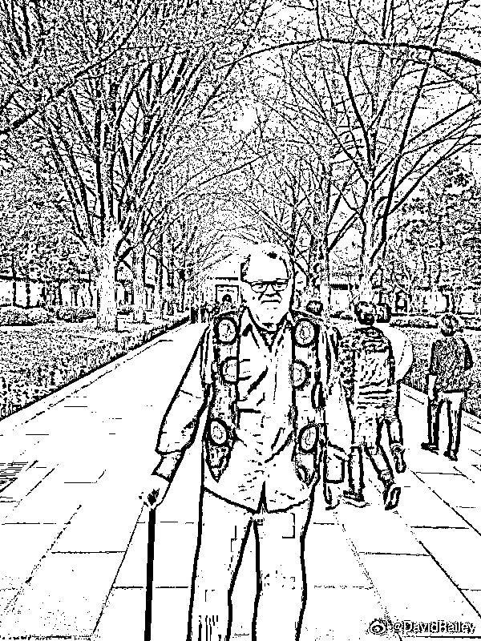

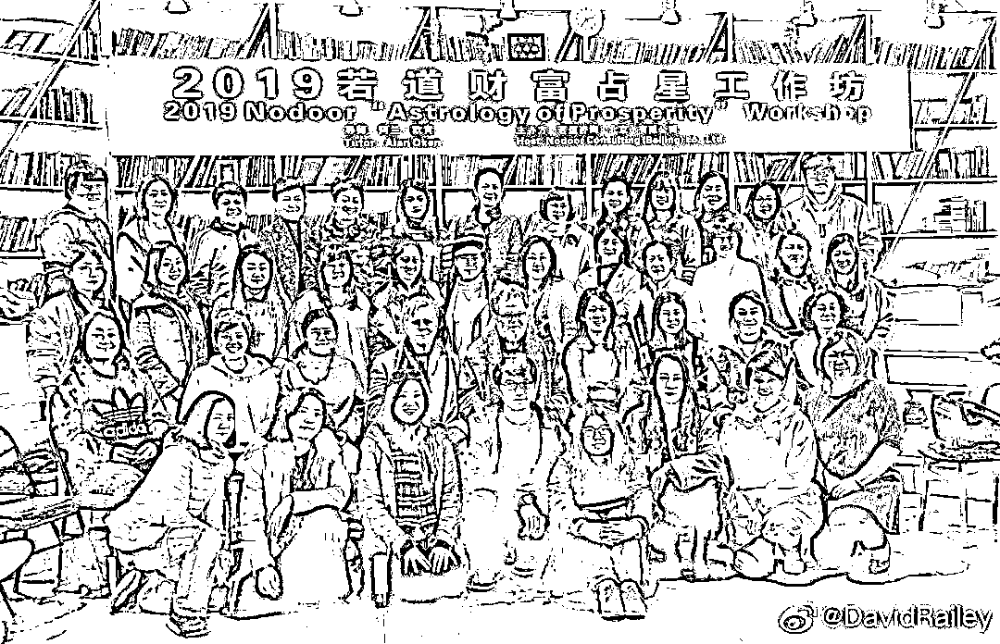

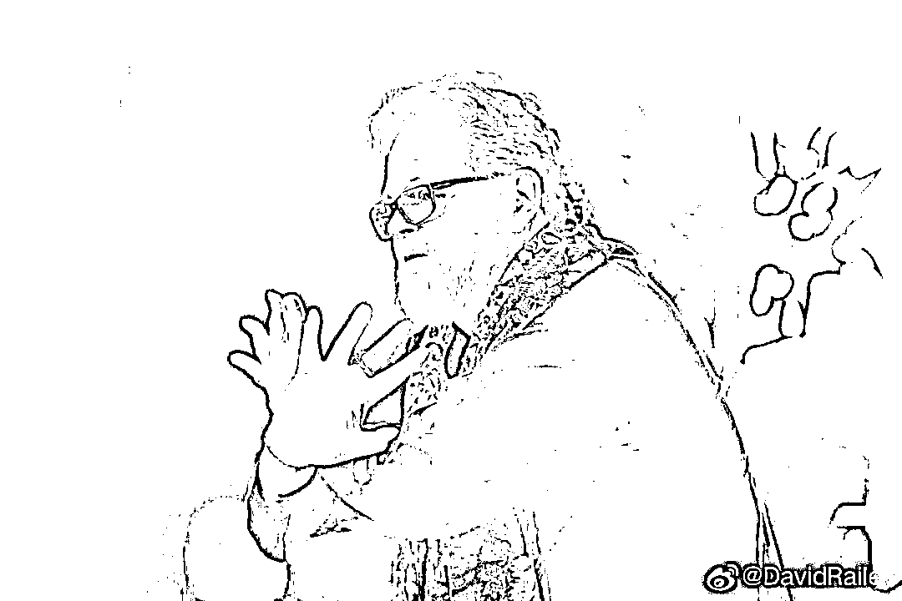

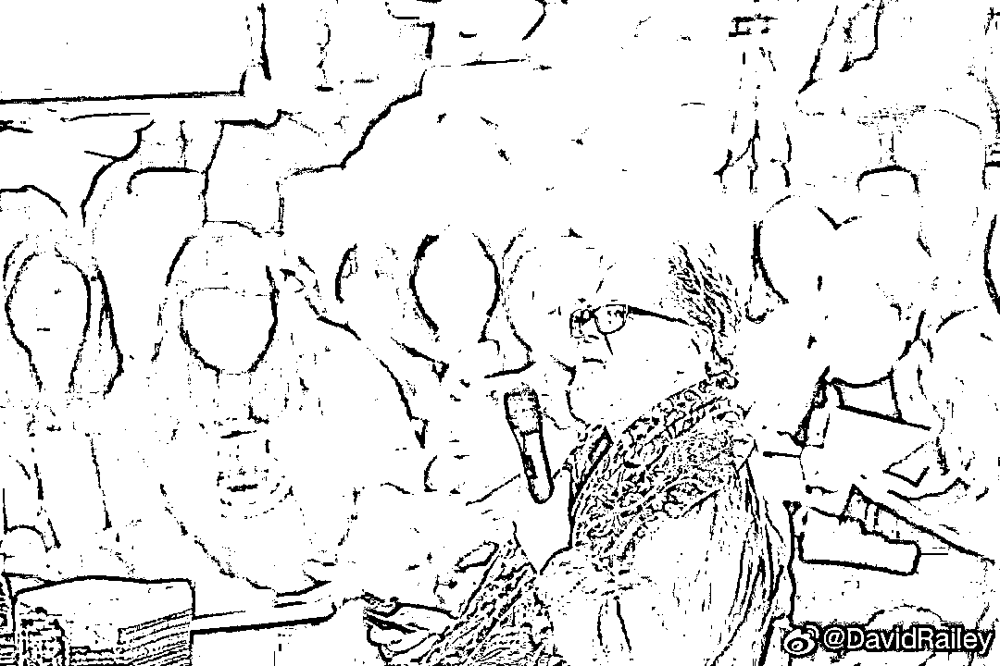

**阿兰·欧肯（Alan Oken）**

若道签约老师。1944 年出生于纽约，毕业于纽约大学罗曼语言及语言学专业。他是译者、老师、环球旅行家和国际导游。**国际占星教育中顶级权威的占星导师，神秘学大师，奥义占星大师，**智慧学院(Santa Fe, NM)主任，澳大利亚意识发展研究所的联合创始人。著有包括《灵魂占星》、《星图中的守护关系》、《阿兰·欧肯完全占星》等数十部著作。他还为《戴尔星运杂志》以及其他许多国内外评论与期刊撰写过数百篇文章。2022 年 3 月 5 日，于巴厘岛逝世。

**欧肯老师文集**

现在了解他也不晚

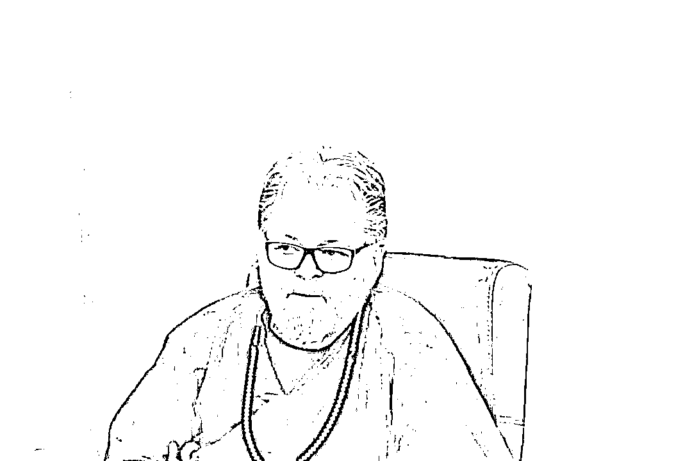**适合初阶读者阅读**

➩ [3 种天蝎座 | 有的好成天使，有的坏成魔鬼](http://mp.weixin.qq.com/s?__biz=MzA5NjA0NTAxNg==&mid=2651402140&idx=1&sn=ffdfd55bf1758eab5de60a7a16561064&chksm=8b4b9d2bbc3c143d6ae0619d697283fa484c6794b7c3c6b34795934a0ae1e0338651a614aebc&scene=21#wechat_redirect)

[➩ 如何从海王星的低阶能量走向高阶能量？](https://mp.weixin.qq.com/s?__biz=MzA5NjA0NTAxNg==&mid=2651408990&idx=1&sn=e897ada3e64779b24222a50563d70206&chksm=8b4bf8e9bc3c71ff4c3b380d50fec14f91a470b4e09988df7d0be057346b27087b232093e335&mpshare=1&scene=21&srcid=0113AjfWImaxTOUiKZvQUxVg&sharer_sharetime=1578905989984&sharer_shareid=79ff492e946a049c0745c8e806eec753&exportkey=AbnK1eYTt%20VjllUHsdj2rPc=&pass_ticket=6kHX/Mgf/UGWDnOAPmXelkwNib0UnFve%20RTaGnEb6L4=#wechat_redirect)

[➩ 奥义占星大揭秘 | 慎点！](https://mp.weixin.qq.com/s?__biz=MzA5NjA0NTAxNg==&mid=2651408646&idx=1&sn=c08681be9be3d586e8959785384c8e62&chksm=8b4bfbb1bc3c72a7f14a6c06effa114e261669a8fa623b91d2dca4afd0c712d106df2d4671d2&mpshare=1&scene=21&srcid=0113uThSoKiHxe2mD3QIu5wT&sharer_sharetime=1578905239811&sharer_shareid=79ff492e946a049c0745c8e806eec753&exportkey=AQErsamUAWlyl4NVkl9YRHg=&pass_ticket=6kHX/Mgf/UGWDnOAPmXelkwNib0UnFve%20RTaGnEb6L4=#wechat_redirect)[可能会颠覆你对月亮的认知](https://mp.weixin.qq.com/s?__biz=MzA5NjA0NTAxNg==&mid=2651408646&idx=1&sn=c08681be9be3d586e8959785384c8e62&chksm=8b4bfbb1bc3c72a7f14a6c06effa114e261669a8fa623b91d2dca4afd0c712d106df2d4671d2&mpshare=1&scene=21&srcid=0113uThSoKiHxe2mD3QIu5wT&sharer_sharetime=1578905239811&sharer_shareid=79ff492e946a049c0745c8e806eec753&exportkey=AQErsamUAWlyl4NVkl9YRHg=&pass_ticket=6kHX/Mgf/UGWDnOAPmXelkwNib0UnFve%20RTaGnEb6L4=#wechat_redirect)

[➩ 12 月亮星座超详解析 | 如何给爱人不可替代的“情感满足”？](https://mp.weixin.qq.com/s?__biz=MzA5NjA0NTAxNg==&mid=2651408679&idx=1&sn=a22395dd9e6db4986306423ab4713887&chksm=8b4bfb90bc3c7286bb420b68dcfa0b34b0c2eae6cb8d205e4744eb78d9c8be4f7f6344d2112e&mpshare=1&scene=21&srcid=0113Igz7oYnF9AT0Ocg26Gs2&sharer_sharetime=1578906055138&sharer_shareid=79ff492e946a049c0745c8e806eec753&exportkey=AQ/pPleDEdnhrmDx/WI%205eQ=&pass_ticket=6kHX/Mgf/UGWDnOAPmXelkwNib0UnFve%20RTaGnEb6L4=#wechat_redirect)

**适合中阶读者阅读**

[➩ 太阳星座有多重要？](https://mp.weixin.qq.com/s?__biz=MzA5NjA0NTAxNg==&mid=2651405638&idx=1&sn=ecd8e2b3385e6fa87d7207d4c12489cc&chksm=8b4b8ff1bc3c06e7548bfe997edf03ed9797c0a959ecf3a58fbbff66bf0cf1a783879ea73949&mpshare=1&scene=21&srcid=0113JBvo5Bqj1OLSlC8r2nyV&sharer_sharetime=1578905309909&sharer_shareid=79ff492e946a049c0745c8e806eec753&exportkey=AZsQGvCSo9PAmtc8DBEQQxU=&pass_ticket=6kHX/Mgf/UGWDnOAPmXelkwNib0UnFve%20RTaGnEb6L4=#wechat_redirect)[看看这篇文章就知道了（值得收藏）](https://mp.weixin.qq.com/s?__biz=MzA5NjA0NTAxNg==&mid=2651405638&idx=1&sn=ecd8e2b3385e6fa87d7207d4c12489cc&chksm=8b4b8ff1bc3c06e7548bfe997edf03ed9797c0a959ecf3a58fbbff66bf0cf1a783879ea73949&mpshare=1&scene=21&srcid=0113JBvo5Bqj1OLSlC8r2nyV&sharer_sharetime=1578905309909&sharer_shareid=79ff492e946a049c0745c8e806eec753&exportkey=AZsQGvCSo9PAmtc8DBEQQxU=&pass_ticket=6kHX/Mgf/UGWDnOAPmXelkwNib0UnFve%20RTaGnEb6L4=#wechat_redirect)

[➩ “30 岁后看上升？](https://mp.weixin.qq.com/s?__biz=MzA5NjA0NTAxNg==&mid=2651409382&idx=1&sn=d0e52db66919f8b18936d2b4675b96a5&chksm=8b4bf951bc3c704782282353643ff81db4f084068d970b7f9f41980d008a4114a054a6928a37&mpshare=1&scene=21&srcid=0113wQQvNik8MoeMBHOcev7D&sharer_sharetime=1578906220393&sharer_shareid=79ff492e946a049c0745c8e806eec753&exportkey=Ae7kR4jEf64P78dkiUiCz%20s=&pass_ticket=6kHX/Mgf/UGWDnOAPmXelkwNib0UnFve%20RTaGnEb6L4=#wechat_redirect)[”No！](https://mp.weixin.qq.com/s?__biz=MzA5NjA0NTAxNg==&mid=2651409382&idx=1&sn=d0e52db66919f8b18936d2b4675b96a5&chksm=8b4bf951bc3c704782282353643ff81db4f084068d970b7f9f41980d008a4114a054a6928a37&mpshare=1&scene=21&srcid=0113wQQvNik8MoeMBHOcev7D&sharer_sharetime=1578906220393&sharer_shareid=79ff492e946a049c0745c8e806eec753&exportkey=Ae7kR4jEf64P78dkiUiCz%20s=&pass_ticket=6kHX/Mgf/UGWDnOAPmXelkwNib0UnFve%20RTaGnEb6L4=#wechat_redirect)[ | 12 个上升星座超全攻略在此](https://mp.weixin.qq.com/s?__biz=MzA5NjA0NTAxNg==&mid=2651409382&idx=1&sn=d0e52db66919f8b18936d2b4675b96a5&chksm=8b4bf951bc3c704782282353643ff81db4f084068d970b7f9f41980d008a4114a054a6928a37&mpshare=1&scene=21&srcid=0113wQQvNik8MoeMBHOcev7D&sharer_sharetime=1578906220393&sharer_shareid=79ff492e946a049c0745c8e806eec753&exportkey=Ae7kR4jEf64P78dkiUiCz%20s=&pass_ticket=6kHX/Mgf/UGWDnOAPmXelkwNib0UnFve%20RTaGnEb6L4=#wechat_redirect)

[➩ 从出生星图认识过去的 6 种方法 | 原生家庭的秘密都在这儿](https://mp.weixin.qq.com/s?__biz=MzA5NjA0NTAxNg==&mid=2651405196&idx=1&sn=bb4a97f2b91a8838aea8dc7b4049f9a4&chksm=8b4b893bbc3c002db14b0d389179e6f8cd1e1a75744bcc580d368884c6f1a47df5fee91da903&mpshare=1&scene=21&srcid=0113wEhPmN0n50mvgtxq2Gtu&sharer_sharetime=1578905420502&sharer_shareid=79ff492e946a049c0745c8e806eec753&exportkey=ARkuYlla8mH%20OjVsW9T7Ows=&pass_ticket=6kHX/Mgf/UGWDnOAPmXelkwNib0UnFve%20RTaGnEb6L4=#wechat_redirect)

[➩ 12 星座落第 12 宫宫头 | 快来看看你的“隐藏技能”到底是啥？](https://mp.weixin.qq.com/s?__biz=MzA5NjA0NTAxNg==&mid=2651405077&idx=1&sn=6d780aa91ad847429193add5a672bf43&chksm=8b4b89a2bc3c00b4ee06e8a2d33854707b01a5dcf5dd5135b9b148460e2c6024e2d767aa7aaa&mpshare=1&scene=21&srcid=0113yUogShXX4VwjzaA7QPKY&sharer_sharetime=1578905846626&sharer_shareid=79ff492e946a049c0745c8e806eec753&exportkey=AXt1Wh6%20PG4pDgLbP88xbWw=&pass_ticket=6kHX/Mgf/UGWDnOAPmXelkwNib0UnFve%20RTaGnEb6L4=#wechat_redirect)

**★12 星座落在 10 大行星系列★**

➩ [10 大行星+白羊座=人生战士，星空赢家](https://mp.weixin.qq.com/s?__biz=MzA5NjA0NTAxNg==&mid=2651405769&idx=1&sn=156bc792f68f1492fa60b0a75807d02e&chksm=8b4b8f7ebc3c066829618dd0df203d10ba59debc8fc1cfc2e9570cc36cb45624bbc99f0e6cd0&mpshare=1&scene=21&srcid=01133EZysJGbikiRfDFGnpea&sharer_sharetime=1578905767656&sharer_shareid=79ff492e946a049c0745c8e806eec753&exportkey=ARw3f%20Kzqu3lPp6K6%20YSlWg=&pass_ticket=6kHX/Mgf/UGWDnOAPmXelkwNib0UnFve%20RTaGnEb6L4=#wechat_redirect)

➩ [如果你有行星落在这个星座，首先，必须学会放手！](https://mp.weixin.qq.com/s?__biz=MzA5NjA0NTAxNg==&mid=2651406747&idx=1&sn=6ab6613948b18bb20bafd9e517bce34c&chksm=8b4bf32cbc3c7a3a022b2062d11eceeb462a6e8d74cd50ab18e57c9b1f197bfbaf742d25990a&mpshare=1&scene=21&srcid=0113u3KG1Bng3op9n3s0NMJB&sharer_sharetime=1578905356884&sharer_shareid=79ff492e946a049c0745c8e806eec753&exportkey=AfUUBLMjDLra0rmo1gI7dqY=&pass_ticket=6kHX/Mgf/UGWDnOAPmXelkwNib0UnFve%20RTaGnEb6L4=#wechat_redirect)

➩ [10 大行星在双子座 | 有一种配置有着惊人的直觉力和智力](https://mp.weixin.qq.com/s?__biz=MzA5NjA0NTAxNg==&mid=2651407375&idx=1&sn=c60ba8cead10352e8dfd711797aeb20f&chksm=8b4bf6b8bc3c7faef468d681cfca00c144af1884284cf8e74bccc7d007dba878238b6967e71c&mpshare=1&scene=21&srcid=0113maWQEywbnValmOV7e3pK&sharer_sharetime=1578905120672&sharer_shareid=79ff492e946a049c0745c8e806eec753&exportkey=AbGta5gBn6IORvO/xSBhB1Y=&pass_ticket=6kHX/Mgf/UGWDnOAPmXelkwNib0UnFve%20RTaGnEb6L4=#wechat_redirect)

➩ [10 大行星系列 | 那个总爱给恋人买买买的星座，原来是……](https://mp.weixin.qq.com/s?__biz=MzA5NjA0NTAxNg==&mid=2651408958&idx=1&sn=01945300700fa406f833c7ae716cf20e&exportkey=AWVlSeoVTvjnw62R0lRYaTE=&pass_ticket=6kHX/Mgf/UGWDnOAPmXelkwNib0UnFve%20RTaGnEb6L4=&scene=21#wechat_redirect)

➩ [10 大行星落处女座 | 掌握了这种能力，你就找到了自己的天职](https://mp.weixin.qq.com/s?__biz=MzA5NjA0NTAxNg==&mid=2651409494&idx=1&sn=d2f7d831723d6f39d17f42ef39776048&chksm=8b4bfee1bc3c77f715f93a00db395d75c766be1af66bf7453992f79b21e5de9685df50f4cdbd&mpshare=1&scene=21&srcid=01130HdiPJuL25ZM4nXu4uDm&sharer_sharetime=1578905250722&sharer_shareid=79ff492e946a049c0745c8e806eec753&exportkey=AVBblTidJdZm8pvAINkRKNA=&pass_ticket=6kHX/Mgf/UGWDnOAPmXelkwNib0UnFve%20RTaGnEb6L4=#wechat_redirect)

➩ [十大行星在天秤座丨“端碗艺术家”的自我修养](https://mp.weixin.qq.com/s?__biz=MzA5NjA0NTAxNg==&mid=2651410187&idx=1&sn=e6fb258aadd84fff00ea95083a4bfbdf&chksm=8b4bfdbcbc3c74aa1a1b746bedafe2afc649e1c6ec5b52ecab7900cec83d093c6635b83ec698&mpshare=1&scene=21&srcid=0113jfrKbngqaBRopPlTqEGO&sharer_sharetime=1578905682883&sharer_shareid=79ff492e946a049c0745c8e806eec753&exportkey=Acvm5sAqZhLTn1ZhtmKI/Ro=&pass_ticket=6kHX/Mgf/UGWDnOAPmXelkwNib0UnFve%20RTaGnEb6L4=#wechat_redirect)

➩ [10 颗行星在摩羯座详解丨星图中的摩羯座在向你传达什么人生功课？](http://mp.weixin.qq.com/s?__biz=MzA5NjA0NTAxNg==&mid=2651404270&idx=1&sn=c4eceb6d763eb2b6b32904b7a33d258c&chksm=8b4b8559bc3c0c4f65fc8fae05411a4113bd8d0640e02f4eb39343a18530fe1ac0f8e94d6595&scene=21#wechat_redirect)

➩ [干货丨 10 种水瓶座，你在这个星球上并不孤单](https://mp.weixin.qq.com/s?__biz=MzA5NjA0NTAxNg==&mid=2651404992&idx=1&sn=d3d9b815a42559691760b17c27903040&chksm=8b4b8877bc3c0161d1d51ed9866ebb495de3c5369dd62f23e912bfc0e3d12220a35898bc328d&mpshare=1&scene=21&srcid=0113VWxDPIS4OlTAQBmFRSWo&sharer_sharetime=1578905539958&sharer_shareid=79ff492e946a049c0745c8e806eec753&exportkey=AYO6hMbbnuFhVQGat%20Sw53E=&pass_ticket=6kHX/Mgf/UGWDnOAPmXelkwNib0UnFve%20RTaGnEb6L4=#wechat_redirect)

➩ [10 大行星落入双鱼座 | 要么与众生相连，要么独自遨游人间](https://mp.weixin.qq.com/s?__biz=MzA5NjA0NTAxNg==&mid=2651413555&idx=1&sn=fd068d28165d0689b1c4d1861447edff&chksm=8b4bee84bc3c6792a91ab274518b90e1a1df08a84ab2af168c0d3b22fc8b15111f3574ae67b8&token=1335392712&lang=zh_CN&scene=21#wechat_redirect)
**★12 星座落在 12 个宫头系列★**[➩ 白羊座落在 12 个宫头丨别怀疑！其实人人都是白羊座](http://mp.weixin.qq.com/s?__biz=MzA5NjA0NTAxNg==&mid=2651397741&idx=1&sn=64632167a59797e9f1081d31672a1f91&chksm=8b4bacdabc3c25cc19169f3b8a982b038f60201b62a034c61ca53c54e3f94eca1de6627faa6c&scene=21#wechat_redirect)[➩ 金牛座落在 12 个宫头丨你跟物质世界的关系怎么样？](http://mp.weixin.qq.com/s?__biz=MzA5NjA0NTAxNg==&mid=2651398220&idx=1&sn=9ecb5ec6f9c1aba4357cd5229d12f21e&chksm=8b4b92fbbc3c1bed5e246a52491a24cc41fd86f27f73d0a3ca6095431e21085abbd8cd7b3693&scene=21#wechat_redirect)[➩ 双子座落在 12 个宫头丨你跟这个世界的交流方式是怎样的？](http://mp.weixin.qq.com/s?__biz=MzA5NjA0NTAxNg==&mid=2651398705&idx=1&sn=5763aa3338d2411d45192b3af8ca7ce0&chksm=8b4b9086bc3c19906fbab75cf922c829e6805175b918702f911b25a5249a177968e6f0b4ef8c&scene=21#wechat_redirect)[➩ 巨蟹座在 12 个宫头 | 你最想保护的是什么？](http://mp.weixin.qq.com/s?__biz=MzA5NjA0NTAxNg==&mid=2651399464&idx=1&sn=fce501eaae8164ddf5f12b1546b2fa27&chksm=8b4b979fbc3c1e893fba44267589423e646b4705c99c24b81a45d37aa3fa1cdbfba17d7f10de&scene=21#wechat_redirect)[➩ 狮子座在 12 个宫头 | 你最引以为傲的领域在这里！](http://mp.weixin.qq.com/s?__biz=MzA5NjA0NTAxNg==&mid=2651400166&idx=1&sn=fb05ee18af3d50942d3b46db59e8ded9&chksm=8b4b9551bc3c1c475c32b33a38a9e9e423584af43749fb54a12761283b66013126a29887b0b0&scene=21#wechat_redirect)➩ [处女座在 12 个宫头丨人人都有点“完美主义”，你在哪发挥？](http://mp.weixin.qq.com/s?__biz=MzA5NjA0NTAxNg==&mid=2651400985&idx=1&sn=fe18329c8294d28c7a0313e019d1d7d1&chksm=8b4b99aebc3c10b87ffcb7ab59d3cec3c9217f7717ec5db75adb5b68491743d6436c18fa2797&scene=21#wechat_redirect)➩ [天秤座在 12 个宫头 | 你在什么情况下必须有人陪？](http://mp.weixin.qq.com/s?__biz=MzA5NjA0NTAxNg==&mid=2651401737&idx=1&sn=b91202c841b6af9122d4fccd2f9c50f5&chksm=8b4b9cbebc3c15a80c293643914ec74c984c90447816e42c4c97a608d626c25bf29b3548f479&scene=21#wechat_redirect)➩ [天蝎座在 12 个宫头丨你的人生会在何处“向死而生”？](http://mp.weixin.qq.com/s?__biz=MzA5NjA0NTAxNg==&mid=2651402892&idx=1&sn=ac456bfdacf7094f4a4b2c60cbe9b7df&chksm=8b4b803bbc3c092d867d732089b8db08faad604c70cf7f64ca1082e904600c1800984cbf3e2d&scene=21#wechat_redirect)➩ [射手座落在 12 个宫头 | 它引领你追寻那永远不会失去的爱](https://mp.weixin.qq.com/s?__biz=MzA5NjA0NTAxNg==&mid=2651411719&idx=1&sn=1bfed57d51d1f6b922b6c3cb20ed6edd&chksm=8b4be7b0bc3c6ea6f73f440805db65430519d64bb9d9c86c2ca60e700cfef5a16ff459a1611d&mpshare=1&scene=21&srcid=01135KO0gBJbF6m8MzNRuXgy&sharer_sharetime=1578906610605&sharer_shareid=79ff492e946a049c0745c8e806eec753&exportkey=ATpTdYcIp0x8yha678/77cA=&pass_ticket=6kHX/Mgf/UGWDnOAPmXelkwNib0UnFve%20RTaGnEb6L4=#wechat_redirect)➩ [摩羯座落在 12 个宫头 | 你获得成功的关键之处在哪？](https://mp.weixin.qq.com/s?__biz=MzA5NjA0NTAxNg==&mid=2651412287&idx=1&sn=9120b9d2a2c1dd9ad2dce8f60d2e4cf6&chksm=8b4be588bc3c6c9e45cf2124d7339bba6e67c5dd7c3daca8e6170ccfdb305434be78285a010f&mpshare=1&scene=21&srcid=0113o0reWv73BQeFr3KmH0JI&sharer_sharetime=1578906290105&sharer_shareid=79ff492e946a049c0745c8e806eec753&exportkey=AYGbdR6AW62cqKE0%20cQK/ns=&pass_ticket=6kHX/Mgf/UGWDnOAPmXelkwNib0UnFve%20RTaGnEb6L4=#wechat_redirect)➩ [水瓶座落在 12 宫头 | 别人说你是“怪咖”，其实只是太超前](http://mp.weixin.qq.com/s?__biz=MzA5NjA0NTAxNg==&mid=2651415204&idx=1&sn=308109a890629ef791046478023de5af&chksm=8b4bd013bc3c59054a1511e1610b792155edf1e85b69f66e0ae5e64d98bf54c3c19f5a023513&scene=21#wechat_redirect)➩ [双鱼座在 12 个宫头丨你的“灵魂之旅”要朝哪儿走？](https://mp.weixin.qq.com/s?__biz=MzA5NjA0NTAxNg==&mid=2651405542&idx=1&sn=8dd7f497190589387b7be9a37679f12d&chksm=8b4b8e51bc3c07471f23a766f3253eecd0e44d5901d233b90d7b13a46d71ad9bd260f91b86ca&mpshare=1&scene=21&srcid=0113geSk25JmO50z2lWhXAg1&sharer_sharetime=1578905900996&sharer_shareid=79ff492e946a049c0745c8e806eec753&exportkey=AeHgdHDlvWZASzeL0C9lUVQ=&pass_ticket=6kHX/Mgf/UGWDnOAPmXelkwNib0UnFve%20RTaGnEb6L4=#wechat_redirect)**适合高阶读者阅读**

➩ [土星攻略 | 请你踏实耐劳、心无旁骛，巨大的礼物就在不远处](https://mp.weixin.qq.com/s?__biz=MzA5NjA0NTAxNg==&mid=2651412918&idx=1&sn=f28c2a6341df3314d91eaaf04b5b5181&chksm=8b4beb01bc3c6217b385a088b11c4eeb5cc714fda38cac400273663b8afddbf498e7bbecf480&token=1335392712&lang=zh_CN&scene=21#wechat_redirect)

[➩ 金星经过 12 宫 | 严肃占星学中的“桃花运”和“财运”在这里](http://mp.weixin.qq.com/s?__biz=MzA5NjA0NTAxNg==&mid=2651404516&idx=1&sn=62da09fd048dc5997a2f61211b3d2845&chksm=8b4b8a53bc3c03454b3910da5743e53f88185f8427dfb94d48967e04c05080ff95106a0a8a33&scene=21#wechat_redirect)

➩ [如何才能“打对的仗” ？| 火星在 12 个宫位行进的超全建议](http://mp.weixin.qq.com/s?__biz=MzA5NjA0NTAxNg==&mid=2651404415&idx=1&sn=6766ce4952b3a9fbb3d4f4ece60d3b54&chksm=8b4b8ac8bc3c03def421c406a1699164aedf36dd70f832c124234100de97621578994fa31beb&scene=21#wechat_redirect)

➩ [从灵魂角度看，太阳星座对人生的影响居然这么大！](https://mp.weixin.qq.com/s?__biz=MzA5NjA0NTAxNg==&mid=2651413852&idx=1&sn=b1bb174ba4438de26c34a566442ac4ef&chksm=8b4befebbc3c66fdfbf8afaef49d5a6db60aa3bc3d6c303a4aeff766f3b1b931506a03a37a38&token=1335392712&lang=zh_CN&scene=21#wechat_redirect)**欧肯老师，****感恩您的教导，我们星空再见**

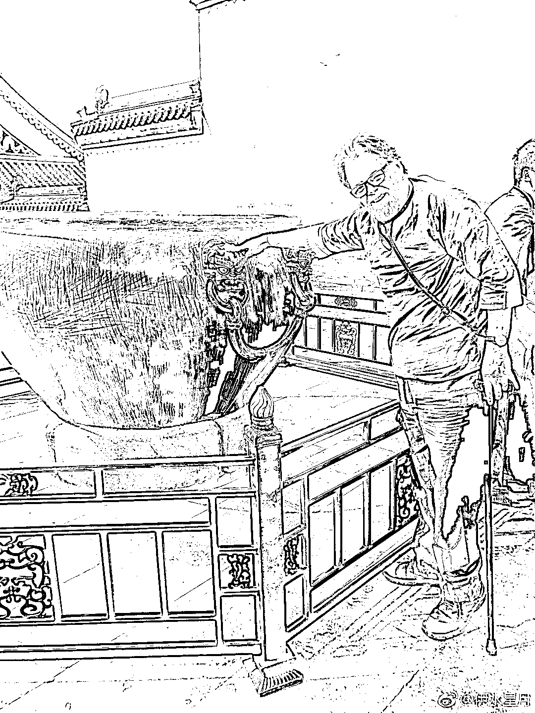

# 3.8 妇女节 | 来听一个小女孩的故事：女性力量成长的关键，先拿回你的火星能量

> 原文：[`mp.weixin.qq.com/s?__biz=MzA5NjA0NTAxNg==&mid=2651468919&idx=1&sn=40cd4e04f373301955e5cdc4fd92b8f8&chksm=8b4886c0bc3f0fd65cb6b841de43b09b262708181bd678cbd36529b0e08455760645275e9413&scene=126&sessionid=1692737852#rd`](http://mp.weixin.qq.com/s?__biz=MzA5NjA0NTAxNg==&mid=2651468919&idx=1&sn=40cd4e04f373301955e5cdc4fd92b8f8&chksm=8b4886c0bc3f0fd65cb6b841de43b09b262708181bd678cbd36529b0e08455760645275e9413&scene=126&sessionid=1692737852#rd)

******************☆ 后******************台******************回复“今日”，给你一句生命态度******************

作者/Anastasia 

编辑/玫瑰 图片/pexels

今天是 3.8 妇女节，先抛开消费主义熏陶的节日氛围，这个节日在成立最初的意涵，是为了肯定妇女在政治、经济、文化等方面做出的贡献。我们现如今，对于这个节日的感官已经离最初设立的意义越来越远。我们正处于这样的时代，男女性观念割裂，女性力量不断成长，男性力量被削弱。我们正试图不断打破性别身份带来的束缚，企图发展出更自由、更自主的人格。那么我们该如何活出来呢？《蓝色海豚岛》讲述一个家园被毁的小姑娘如何独自在孤岛生活了 18 年。这是一个充满火星能量的故事。我们得以生存下来，不光因为头脑，更是因为我们的身体，和那股纯然的生命之火——活下来，活下去。也许找到自我价值的关键，就在于这里——你，找到属于你的火星勇气了吗？**荒岛生存，光靠知识是不行的**文艺青年最爱的一个小调查是：**如果让你去一个荒岛独自生活，你会随身带上哪几本书？**这个小调查改头换面经常出现。我当时的选择是《红楼梦》和《辞海》，可能还会随机选一本当时最爱的。 那么问题来了，如果没有书呢，如果没有任何可供阅读消遣的字纸呢？如果就是孤身一人流落荒岛呢？像鲁滨逊，然而也并没有星期五给你做伴？事情会怎么发展？这在之前，对我来讲是一件根本无法想象的事情。对于一个热爱阅读和思考的人来讲，这种条件简直就是无法忍受的。我觉得，那人还不得无聊疯啊。且慢，让我们想一想**这个物质星球的生存条件到底是什么呢**？当我们从灵魂海洋中分裂、脱离、投身到这个物质星球的第一步又是什么呢？想一想我们的**第一宫**，想一想**火星**和**白羊座**。我们活下来，需要的不是钱财，也不是头脑，也不是伙伴，也不是家庭，那都是人类社会逐渐发展出来的产物。那么，我们就来聊一聊白羊座和火星。**白羊座代表着我们出生时候的身体，代表着我们赖以生存的资本，代表着最本质的自我利益，以及为之争取的勇气和行动**。处于当下的我，**白羊座是我们每个人内心的自私和自利**。阳性、火象、基本星座，带着一种**需求必须马上得到满足**的特质。**行事果断、关注当下，勇往直前，奋力拼搏**。我们可以看到很多杰出的运动员都有很强的白羊座或者火星能量。**在孤岛上独自生活了 18 年的小姑娘**

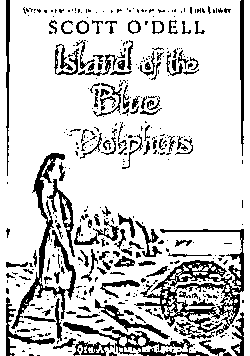

| 书名/蓝色海豚岛 作者/司各特·奥台尔（ScottO'Dell） 原版名称/Island of the Blue Dolphins《蓝色海豚岛》是我非常非常喜欢的一个故事，整本书呈现出一种洁净的（白羊座）火星能量。主人公的名字叫卡拉娜，一个土著小姑娘，她给我的感觉就是非常纯粹的白羊座（火星）的原型。故事是这样的：海豚岛是阔大汪洋中的一个孤岛，小姑娘是岛上土著头领的女儿。每年会有白人驾船来岛上猎杀海獭。姑娘的父亲在在一次和白人的冲突中死去。后来的头人找到白人，接走了剩下的族人。小姑娘为了救弟弟滞留在岛上。随后弟弟被野狗咬死，小姑娘一个人在岛上生活了 18 年，直到有船只经过海豚岛，救了她。整个故事情节惊险刺激（可以想象成上升点或者北交点在天蝎座的功课），情绪不哀不怨（月亮很稳定，有着金牛座的现实或者水瓶座的抽离），笔触生动冷静，人物对话也不多，整篇故事都是白描。这些干净线条的下面，是庞大的隐藏的意涵。你能看到哪一层，取决于你能走到哪一层。

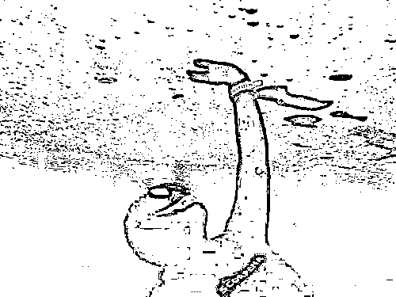

**火星赋予我们生存能力**那么，这个白羊座少女的能量是如何层层展现出来的呢？任何一个星座的能量都不是单向的，它会向外发散，体现为你遇到的人和事；也会向内延伸，体现为内心的情绪和意志。那么白羊座（火星）的能量会如何体现在一个人身上呢？ 

**向外看**

**生存的目标**：她独自一个人需要面对的现实是：只能靠自己活下来，大船不知道什么时候才能回来接她。她需要采集果腹的食物，需要编草篮子存储淡水，需要去捕鱼打猎，需要制造各种工具在岛上生存下来。**生存、自保、自利**，这些都是火星最本质的特征，是一个人得以活下来的根本。**战斗的行为**：除了大自然的狂风暴雨和四季轮转，她还要面对岛上的野狗群。野狗咬死了她的弟弟，她要报仇，也要解除自己的后顾之忧。她需要和野狗对峙的武器，镖枪，还有弓箭。这需要她计划好多天，先去狩猎海象，为了得到尖利的象牙。**运动、战斗、抗争、竞争性**，所有这些，都是火星能量的运用。

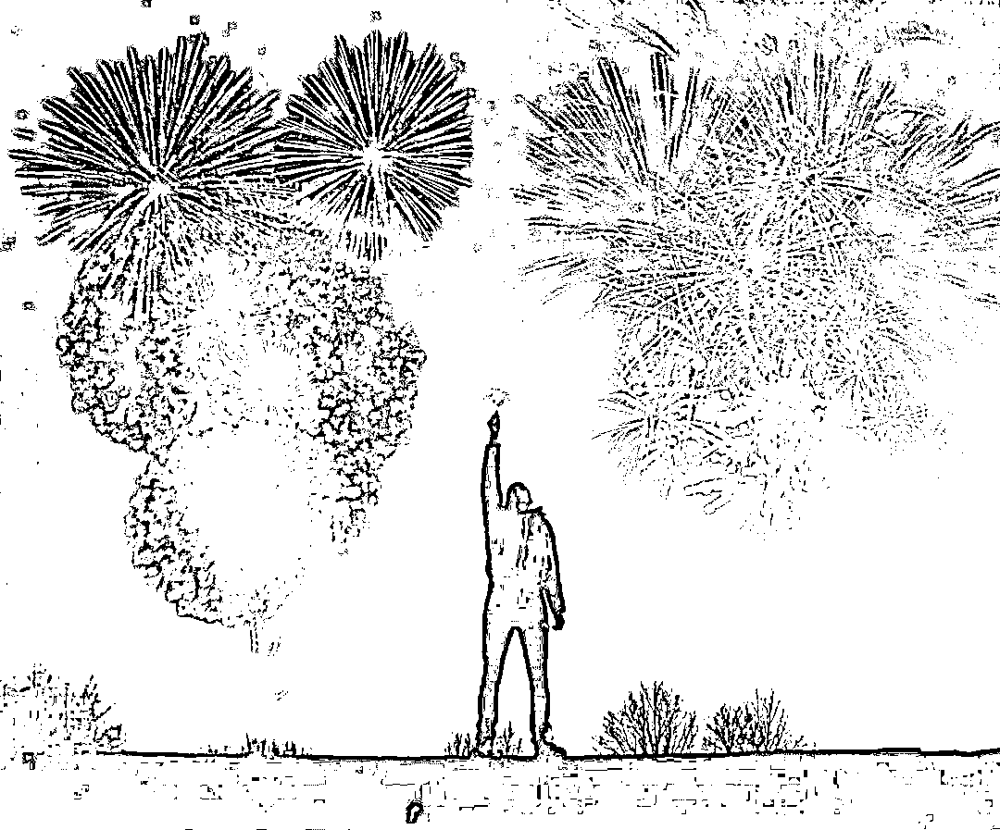

**向内看**

**自由的活力**：一个人待久了，时间就会失去意义。她要生存下去，就得靠自身源源不断地生命力。她要照顾好自己的身体，感受身体的各种变化。受伤的时候如何疗伤，如何协调身体的其他部分照顾好自己。她还驯养了一只野狗，作为自己的伙伴，让日子变得不那么孤独和寂寞。**身体的活力，生活的热情**，都来自于我们星图中的火星。**决断的能力**：遭遇突发状况，她没有犹豫迟疑的机会，必须立即得出自己的主张。发现狩猎的白人又回来的时候，她果断消除了自己生活的痕迹，搬家挪窝，挪到一个外人轻易发现不了的悬崖的山洞里。在她划着独木舟离开小岛，想要自找出路的时候，发现独木舟漏水，她也要立刻判断，是修补后继续前行，还是果断回头，重新回去海豚岛。所有的**当机立断、毫不迟疑**，都是火星能量的体现。

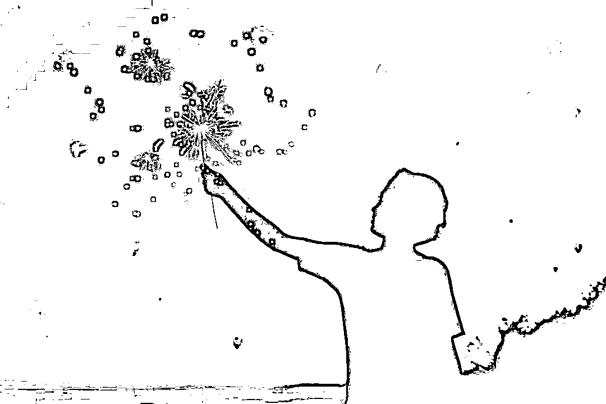

**火星的动人力量**头脑是人类赖以站在食物链顶端的利器，所以我们很容易误以为头脑就是一切，我们追求自我探索也好，追求个人成长也好，追求和谐关系也好，这些都是在我们的思维意识层面上进行的活动。**我们读书写作、交流学习、开阔眼界，却忽视了我们生存的第一要素——我们的身体，忽视了我们星图上的一切都是从上升点和第一宫展开的。****在某种程度上，一个健康、各系统运转良好的身体能够帮助我们解决心灵上的困惑。我们探索自己的身体，永远能获得更深的体验，并且看到更广大更精微的未知。**
火星照耀。故事的结尾，卡拉娜获救离开海豚岛的时候，心里想着的全是那些愉快的日子。经历了各种生死离别颠簸流离的她，从头到尾没有哭过。而看书的人，早已泪盈。那是一种火星式的愤怒，正如作者所说，**“我是从抒写愤怒开始的，那是对那些入侵我居住的山区，屠杀一切地上的走兽和空中的飞禽的狩猎者的愤怒。”**作者奥台尔的星图中，火星落在白羊座，四分南北交点，是整张星图的最终定位星。最后，祝大家妇女节快乐，愿我们都可以成长成为自己满意的独立个体。

**版权声明：**原创文章由作者授权发布于若道平台，欢迎转发，反对抄袭。友号转载请申请白名单。

**Anastasia**

职业占星师/专栏作者/策展人

于 2015 年通过 ISAR 占星能力考试

若道认证生时校正资质（2015 年获得）

**微信公众号**：KairosMoment

长按打赏

**学习占星学**

**点击下图了解课程详情** 

**

**微信又双叒叕改版啦，不想错过若道君的推送？**

**就把若道设为星标吧！**

**▼**

**就是这个“在看”，戳戳戳 ☟**

******报名直达入口******

# 银行、酒店、疗养院……12 星座和行星对应怎样的场所和原型？

> 原文：[`mp.weixin.qq.com/s?__biz=MzA5NjA0NTAxNg==&mid=2651468919&idx=2&sn=60458e2abe3e6d487a2dd9ccd6e15f8b&chksm=8b4886c0bc3f0fd67a6f4e1ddcb6b83b25e5868f67dc18472dccb6dabf7d04c8831070263c7a&scene=126&sessionid=1692737852#rd`](http://mp.weixin.qq.com/s?__biz=MzA5NjA0NTAxNg==&mid=2651468919&idx=2&sn=60458e2abe3e6d487a2dd9ccd6e15f8b&chksm=8b4886c0bc3f0fd67a6f4e1ddcb6b83b25e5868f67dc18472dccb6dabf7d04c8831070263c7a&scene=126&sessionid=1692737852#rd)

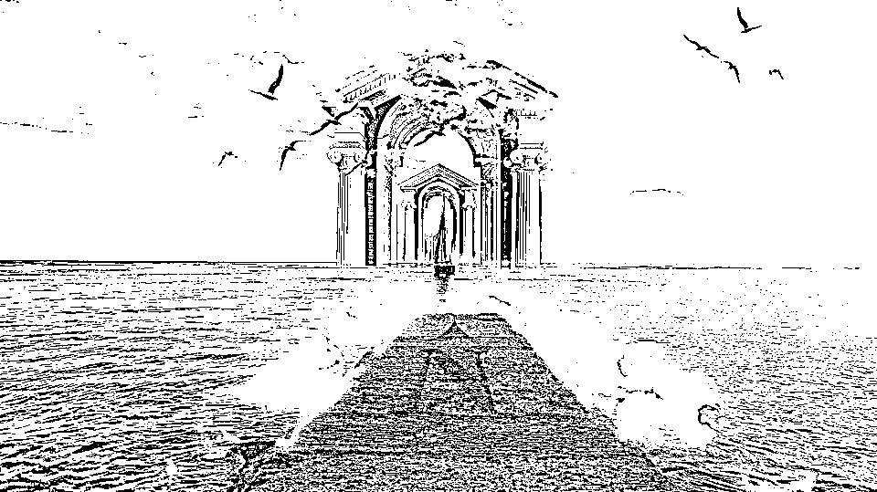

作者/格伦·佩里 译者/若道翻译团队
  编辑/玫瑰 封面/书君 图片/pexels

原型的显现多种多样，它会根据行星所在的星座、宫位、相位和整合程度有所调整。占星学中的每颗行星都同时象征内在和外在的人物，当它们要表达自己的目的时，也会以场所的方式显示出来。格伦老师参与授课的【[双证课程](http://mp.weixin.qq.com/s?__biz=MjM5MjQwNjAyMQ==&mid=2649439168&idx=2&sn=d1f22a8b4a5132bb5520ef662a08937d&chksm=beb954aa89ceddbcc6358d9bf7646b0b0337222956713b4de3270847de9f539eca056ad14219&scene=21#wechat_redirect)】报名中，点击链接了解更多详情吧~

**行星原型的显现多种多样****原型**表现为一个外在人物可以以三种不同的方式——作为一种**人格类型**（例如自我陶醉者、强迫性的），一个**角色**（如母亲、兄弟姐妹、雇员），或一种**职业**（如会计、教授）。由于我们遇见的所有人都具体表现为一种或另一种原型，因此**原型的显现没有单一的方式。**确切地说，**原型的显现方式多种多样**，根据那颗行星的星座、宫位和相位，以及那种原型在个体之中的整合程度而有所调整。**占星学中的每颗行星都同时象征着内在和外在的人物，内在人物的本性反映在外在人物之中。**内在人物通过描述不同心理状态的各种情绪、态度、内心对白、心境和冲动来表现自身。由此，这些**内在人物构成了身份或潜在人格**。而在外部世界中，这些同样的原型人物通过我们所吸引的人物的个性、角色和职业来表现自身。这些个体，**同样也反映其心理状态的特定情绪、态度和行为。**

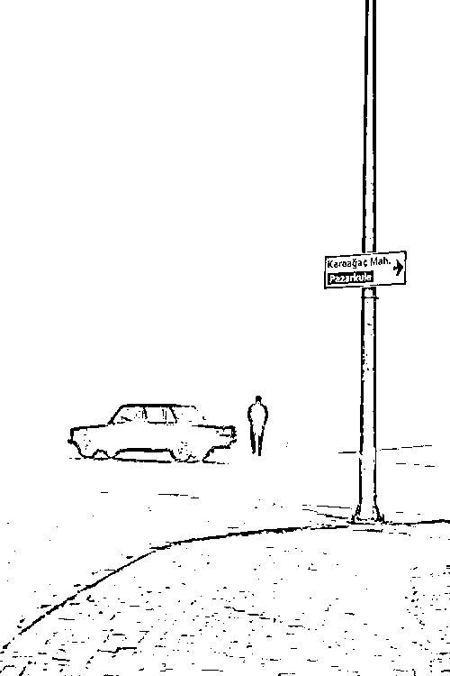

**通过原型体验星图**

占星学不同寻常的地方就在于一种行星格局**不仅准确描述了某人自身人格的某些面向，同时也同样准确地描述了外在人物的特性。**

**火星的原型**

让我们思考一下火星的原型。每当我们感觉到一股闯劲的时候，我们就被这种身份占据了。“我能做好这件事，现在没有什么可以阻挡我。”这就是火星的声音。**有一种冲动，想去战斗，去争取自由，去捍卫某人存在的权利。**从外部来看，火星的显现形式反映出它在个体内部的组合方式。外部世界的火星人，其表现方式**要么等同于案主表达火星的方式，要么是对这种方式的补偿。**如果案主对他的战士身份**感到不适**，并且害怕成为战士（过度调整的火星），那么战士的原型可能在**外部显示为一种补偿的方式**；有人会对这个人表现出侵略、自私或残忍。或者某个与案主一样缺乏自信的人可能给他造成困扰。 相反，如果火星**调整不足**，案主难以控制他的战士灵魂，那么火星**可能以一种补偿性的方式表现出来**，人们对这个人会用一种隐秘、被动或偷偷摸摸的方式来坚持。

同样可能的情况是，当火星调整不足时，另一些人会表现出原始、冲动或轻率的方式。公开的反对行为，还有不断地争吵和竞争，直到案主学会了更好地整合他战士的灵魂。 

**有行星象征的人物在这些行星落入的宫位中会尤其忙碌。**如果火星在第 6 宫，那么合作者就倾向于表现火星。然而如果火星在第 8 宫，那么此人的伴侣可能在卧室里表现火星的特质，或者表现在处理联合资产的方式上。 **无论火星落在哪里，都会出现挑起案主愤怒或坚持情绪的环境，**因此也会给予他充足的机会去**整合火星到一个更高的程度。**又一次，根据火星的整合程度和在整个星图中的组合情况，即它的星座、宫位和相位，困难的程度会相应有所不同。然而**一般来说，火星人物的表现方式要么是反映，要么是补偿此人对火星的表达方式。**火星角色相当直截了当。任何与此人竞争、挑衅 TA 去战斗、鼓励 TA 坚持、侵犯 TA 的权利，或者以某种方式威胁他生存的人，都具备一种火星的功能。

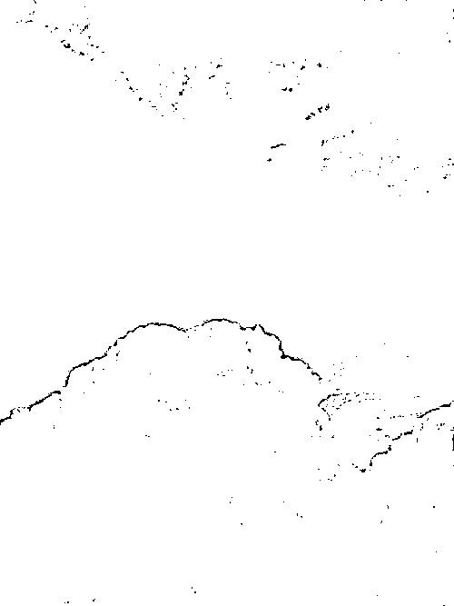

火星可能是竞争者、对手、敌手、反对者或一个好斗的人。战士的原型同样也显示为幸存者、蛮勇者、好战者、冒险者，或探险家。火星在这个人吸引的特质中越是占据主导地位，它就越可能是这个人个性中的强烈部分——或必须是这样。如果案主按照他人表达对自主、自由或生存需要的方式来抗争（表达得不是太过就是不够），那么这也显示出案主的火星具有内在的问题，对它的表达不是太少就是太多。**生活会不断提供各种机会，刺激这个人恰好就在那些出现问题的领域发展技能。**虽然我们在这里将注意力集中在火星上，但是同样也原则也适用于其他行星。**每颗行星代表一种各自的身份，意思是我们在那种原型中，通过它的眼睛来体验整个星图。**

**金星的原型**

如果环境唤醒了金星，从而金星暂时控制、占据了这个人，例如 TA 感到柔情满溢、被吸引、爱上某人，那么这个被认同为金星的人就会真的像金星一般体验他星图的其余部分。如果**金星对分土星**，TA 会开始预料到他的爱不会有回报；如果**金星四分火星**，TA 会担心 TA 爱的那个人太自私了。换句话说，**与金星形成困难相位的行星会在外部环境中以一种阻碍或抑制金星愿望的形式表现出来。** **每颗行星不仅构成了各自的身份，它同样也象征着特定的与我们相互影响的其他人。**我们可以用任意一种方式解读一颗行星——**作为自己，或作为具备那种功能的其他重要人物。**在这两种例子中，行星显现的方式与它在星图中的位置是**一致**的。

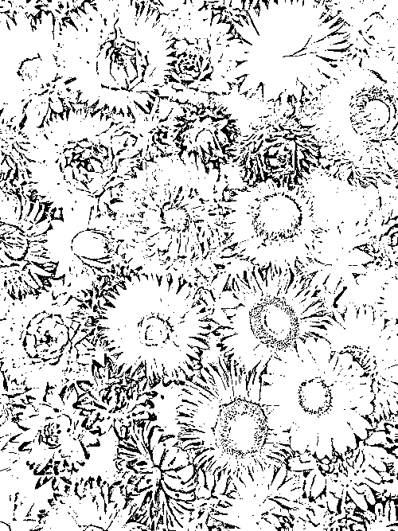

回到上面的例子中，如果出生星图中的金星对分土星，那么被金星占据的人倾向于把他人理解为吝啬和拒绝的（也就是说，太土星了）。但是请注意，这种结果只有在这个人先入为主地将自己等同为她的金星时才会发生。如果她将自己认同为她的土星功能，那么会发生与此相反的事情：她会觉得潜在的爱人太过金星了——依赖、顺从、软弱无力、故作多情等等。无论案主采取两极中的哪一端，情人都可能呈现出相反的一面，由此，这二者的行为也同样与相位的涵义一致。 同样，如果被金星占据的人出生星图中有金星四分火星，那么他的爱人喜欢表现得似乎她也有金星四分火星的相位，但是她会倾向于表现火星的一面，这金星身份的男人暂时投射的一面，例如，她可能很粗鲁、苛刻，或感觉被他对亲密的渴望束缚。 当然，会有一种争论，即这个真正具有这种相位的人会以某种方式精准地唤起别人做出他所期待的行为。**相位代表信念，信念的运作方式就像自我实现的预言。**从共时性的视角来看，这种经历的原因，至少有一部分是因为案主不自觉地**发出一种投影的召唤，寻找符合他要求的人。**而宇宙非常高兴地予以满足了。

**★****星座-行星系统相关联的原型特征表**

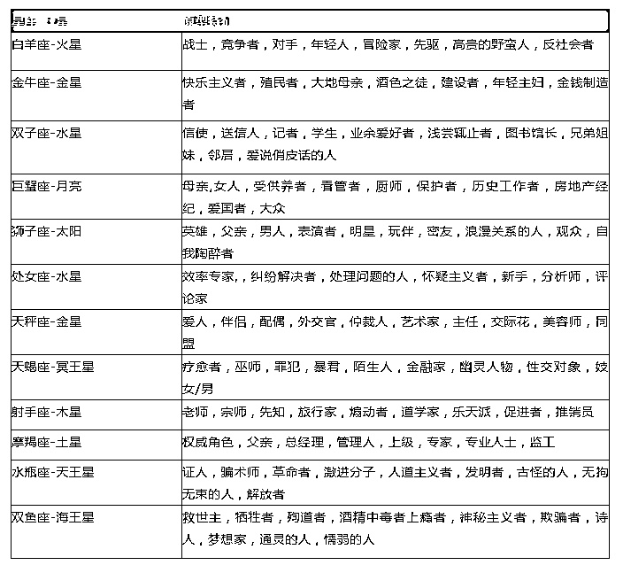

**版权声明：**本文由若道翻译发布，欢迎转发，反对抄袭。友号转载请申请白名单。

**格伦·佩里**

若道签约老师，著名占星师，前 ISAR 董事会成员，共出版 8 本占星著作；心理/意识研究专业博士；占星心理学学院（Academy of AstroPsychology）的创办人；康涅狄格州研究生院（the Graduate Institute of Connecticut）原型宇宙学与意识进化项目的负责人。

**美国占星心理学学院创办人**

**格伦·佩里**授课**40 余年**职业占星师生涯所学精华**倾囊相授**修完 101-205 全部课程，并通过考核的毕业生将获得**美国占星心理学学院证书**( Academy of Astropsychology )和**若道毕业证书****高含金量双证书**跟随主讲老师学习融合**心理学体系**的**占星知识**为星图咨询解读打下坚实的基础**大量**的课程资料，光是课后阅读资料就**超过 60 万字**合理的课程设计，贴心的助教服务，及时的课后测验**美国占星心理学学院&若道占星联手打造** **两年双证书核心课程****点击图片了解详情**

**

**学习占星学****点击下图了解课程详情**

**微信又双叒叕改版啦，不想错过若道君的推送？**
**就把若道设为星标吧！****▼**

**喜欢记得点一下在看哦☟**

**报名直达入口**

# 初阶心理占星学核心课 | 我们教授占星学，也教授心理学概念

> 原文：[`mp.weixin.qq.com/s?__biz=MzA5NjA0NTAxNg==&mid=2651468919&idx=3&sn=8ef96ecebf715d26e952338368075174&chksm=8b4886c0bc3f0fd6232a2e785db04e20091aedd0223695a80461a464c8de8a15f00dad6fb37f&scene=126&sessionid=1692737852#rd`](http://mp.weixin.qq.com/s?__biz=MzA5NjA0NTAxNg==&mid=2651468919&idx=3&sn=8ef96ecebf715d26e952338368075174&chksm=8b4886c0bc3f0fd6232a2e785db04e20091aedd0223695a80461a464c8de8a15f00dad6fb37f&scene=126&sessionid=1692737852#rd)

**美国占星心理学学院创办人**

**格伦·佩里**授课

**40 余年**职业占星师生涯所学精华**倾囊相授**

跟随主讲老师学习融合**心理学体系**的**占星知识**

为星图咨询解读打下坚实的基础

**新学员**，

以最严谨扎实的心理占星核心课程，

作为占星学习的开端；

**老学员**，

最有复训价值的核心课，

复习夯实基础知识的同时，补充心理学知识体系。

1

**这门课程最大的看点是什么？**

1. **两位国际占星学大师**共同授课，将合计**90 年职业占星师生涯所学精华**倾囊相授；2. 修完**2 年课程**，考试通过的毕业生将获得**美国占星心理学学院证书**（Academy of Astropsychology）和**若道毕业证书**，**高含金量双证书**；3. 101-102 阶段**24 次课程**的充分授课时间（录播课程 16 次课；直播课程 8 次课），全面而详细地讲解占星学知识、技能和运用；4. 跟随主讲老师学习**自成体系、逻辑严密、实用性强的占星语法、星图解读方法**；5. 学习独特的**发展年龄预测法**，从星图看对关键年龄阶段的发展及议题；6.**大量的课程资料，101-102 阶段课后阅读资料超过 14 万字；101-205 全阶段光是课后阅读资料超过 60 万字**；7. 合理的课程设计，101-205 全阶段每一节课都有课后作业和测验，实时验证学习吸收效果；8. 本课程可以作为**ISAR 选修课**中的一门，再修两门就满足 ISAR 认证选修课要求；

9. 205 阶段 **18 次占星咨询技巧的培训**，为 ISAR 口试保驾护航，也为正式从事占星咨询建立基础；

10. 教授重要的**心理学概念**，比如与客体关系、心理动力理论、个人神话和叙事疗法相关的一些概念，学习如何将它们整合到星图解读中；11. 105 阶段了解**《精神疾病诊断与统计手册》**诊断标准，探索星图中的心理疗愈；12.  第二学年学习**叙述疗法**和**自传写作**，将之作为自我疗愈和咨询的工具。

**格伦老师致学员的信**

（向上滑动查看内容）

**亲爱的学员：**

作为占星心理学学院的校长，我的目标是帮助你顺利完成学业。

占星心理学学院的课程让你能够在经济承受范围内，灵活地学习占星学。我们的课程让你可以舒适、便捷地在家学习，不用打乱你本就繁忙的日程。我们有完善的在线学习系统，让你能在线上课、下载学习资料、进行测试并自动获得即时反馈，还可以在虚拟课堂上同你的教员和同学互动。

作为私人开业的**职业占星师**和**执业心理治疗师**，我已经**工作超过 30 年。**我还花了近 10 年的时间，在研究院里学习并获得**心理学的硕士和博士学位**。这段训练和经历是无价的，帮助我将占星学发展成为连贯的 21 世纪模式。

我们的占星学培训项目是**系统化的、清晰的、组织有序的、易学的、前沿的。**尽管有许多类似的学校可供你选择，但你不会在这些学校中看到像占星心理学学院所提供的那样有深度的或尖端的课程。

**我非常期待 2022 年再次在若道教授心理占星学核心课程。**我们重新规划和升级了本次课程体系。**新的课程包含之前完整课程的 72 个录播视频，每个视频长 2 小时；以及由我教授的 37 次直播课程，和大卫老师教授的 10 次直播课程，每次课程 2 小时。**在实时课程中，除了我提供的案例，我还会用学员的星图进行案例演示，与学员互动，阐明视频中教授的原则和方法。

**2 小时直播课程安排：**

**第一阶段 提问和讨论：**

这将在每节课开始时进行。邀请学员提出与课前提供的资料相关的具体问题。这一阶段将持续 15-30 分钟。

**第二阶段 示例：**

这一阶段会讲解与每周任务相关的具体概念，例如行星的星座位置、宫位位置以及相位的意涵。星图示例来自我认识的人，如公众人物、朋友、家人、同事或以前的客户（不显示出生信息）。同样，这一阶段也开放课堂讨论，学员可以提出自己的问题和见解。

**第三阶段 学员案例演示：**

这个阶段会从学员的具体星图来阐明概念，例如火元素行星占优势。学员案例演示不会涉及任何类型的咨询或“解读”。它们将只是简单地包含一段对话，我会在对话中分享自己对某个配置的思考，然后问这个学员可能会如何主观地（影响、信念、行为）和客观地（事件/关系）体验这个配置。其他参课学员可能也会对讨论的主题有自己的见解或问题，他们也可以参与讨论。

我对这一新的在线课程形式感到兴奋，**并期待着从 2022 年 4 月 6 日开始认识我的新学员们。**获得本学院的文凭会是你做过的最明智的投资。你不仅将占星学掌握到前所未有的深度，还将学到如何为客户提供咨询服务并建立职业占星师的职业生涯。

真诚地

**格伦·佩里 占星心理学学院校长**

**为什么要学习心理占星学？**占星心理学是一个复杂的体系，让实践者能够向客户提供真正治疗性的益处。这从根本上说来是我们学院有别于其他学校之处：**我们教授占星学，也教授心理学概念。****我们明确讨论各种心理学概念，并将其与占星学无缝衔接。结果就是更深入的、更丰富的，最终更加强大的模式。****该项目专为初学者和渴望深造的有经验的占星师而设。**我们会从跨学科的角度探讨星图解读。**通过融合荣格心理学和各种其他模型的元素，学员将熟悉作为人格理论、发展模型、原型语言和诊断工具的占星学。**

2

**课程是怎么安排的？**

**101 占星学基础 **

**共 12 次课程：8 次 2017 年录播课+4 次直播课**

**占星学**关注成长，聚焦心理。外部事件意义重大，但我们可以把它们看作是对于发展中的心理结构的共时性反映，以及未来发展的媒介和催化剂。

在这个阶段的课程中，会以四种形态的几何形式介绍**占星原型：星座、行星、宫位和相位**。黄道带是人类心灵的象征性地图，其中的每个**星座**都代表一种基本的人类需求、原型人物、发展阶段和行为风格。

**行星**代表心理功能，以满足其关联星座的基本需求。**宫位**提供了环境舞台，行星在其中扮演它们的角色，而**相位**是行星之间的角度关系，在主观上体验为内在对话。

**课程安排**：

**录播课****、****直播课（周三）**时长都是 2 小时

第一节**录播课**：核心概念介绍

第二节**录播课**：黄道带的结构

2022 年 4 月 6 日**直播课**：核心概念、黄道带的结构提问和讨论、知识点示例

第三节**录播课**：图例、单态星体和其他奇妙的元素

2022 年 4 月 20 日**直播课**：图例、单态星体提问和讨论、知识点示例

第四节**录播课**：星座介绍（从白羊座到处女座）

第五节**录播课**：星座介绍（从天秤座到双鱼座）

2022 年 5 月 4 日**直播课**：12 星座案例演示

第六节**录播课**：行星作为过程

第七节**录播课**：行星作为内容

第八节**录播课**：将碎片整合起来

2022 年 5 月 18 日**直播课**：整合星图时，将行星作为过程和内容案例演示

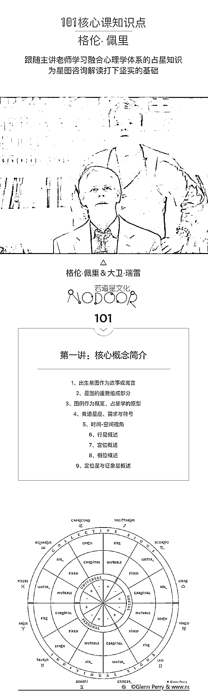

**102 行星落星座、宫位** 

****共****12****次课程：**8 次 2019 年录课+4 次直播课**

这个阶段的课程**聚焦于初步的星图整合。**

学员将学习**占星语法**，以及如何运用它们来阐释**行星的星座落点**。学员不需要强记书中的星图解读，而是学习分析基础的占星句法结构，应用这些语法规则来思考和讲述这门语言。学员们将学习如何构建精妙的句子，将动机、功能、特质、状态和事件组合起来。

此外，还将学习解读**行星宫位落点**的规则。宫位被定义为心理环境，为特定类型成长和发展提供背景。行星落在宫位中，象征着情境中的特殊状态，应对环境挑战的方式，以及通过共时性人物和事件而外化的自我部分。

学员们将探索如何将星座和宫位落点融合在一个单一、整合的陈述中，做出灵活、层次分明的解读。

**课程安排**：

第一节**录播课**：占星语法介绍

第二节**录播课**：行星星座作为行为风格

2022 年 6 月 1 日**直播课**：占星语法、行星星座作为行为风格提问和讨论、知识点示例

第三节**录播课**：思维状态和行为结果

第四节**录播课**：学习行星的星座落点

2022 年 6 月 15 日**直播课**：思维状态和行为结果、行星的星座落点提问和讨论、知识点示例

第五节**录播课**：回顾宫位的含义

第六节**录播课**：宫位中的行星过程

2022 年 6 月 29 日**直播课**：宫位的含义、宫位中的行星过程提问和讨论、知识点示例

第七节**录播课**：行星在宫位中的状态

第八节**录播课**：行星作为宫位的内容

2022 年 7 月 13 日**直播课**：行星在宫位中的状态、内容的提问和讨论、知识点示例

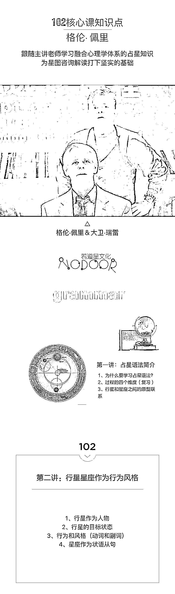

3

**导师简介**

**格伦·佩里（Glenn Perry）**

*   这位传奇的占星师，也是一名拳击和摩托车爱好者

*   他毕业于赛布鲁克学院(Saybrook Institute)，是心理/意识研究专业博士

*   也是拥有 30 余年经验的加州注册婚姻和家庭治疗师 （CAMFT）

*   美国占星心理学学院（Academy of AstroPsychology）的创办人

*   他曾任国际占星研究协会 （ISAR）以及联合占星大会董事会（UAC）副主席

*   也是 ISAR 突破性道德标准的设定者

*   康涅狄格州研究生院（the Graduate Institute of Connecticut）原型宇宙学与意识进化项目的负责人

*   共出版八本占星学著作：《心理占星学入门》《心理占星论文集》《盗取天火》《从忠诚到革命》《星图中的阴影》《占星职业议题与伦理》《出生星图深度分析》《从古代到后现代占星学》

**大卫·瑞雷（David Railey）**

*   若道联合创始人，致力于在中国教授和推广西方占星学；

*   曾任 ISAR 全球副主席，CAPISAR（ISAR 职业占星师资质认证机构）主席；

*   1976 年，通过亚特兰大职业占星师考试，成为全职占星师，随后通过 AFAN 和 ISAR 职业测试；

*   1980 年，与杰夫·焦耳一起在亚特兰大创建“每日行星”占星学中心。此后在亚特兰大占星协会担任 4 年考官，并且两次担任亚特兰大地区占星协会主席。1979-1992 年，作为占星师活跃于美国社会媒体，向不了解现代占星学变化的大众宣传专业占星学知识。在 1989-1992 年期间，他在 WRGG 电台 12 频道每周主持个人电视秀“今日占星学”，早先他还在 WRFG 的广播节目中播讲宇宙天气节目；

*   2010-2014 年，任全美占星师联盟监督委员会委员；

*   2010 年，其著作《灵魂的目标》中国版出版，和蒋颖一起创办若道占星学校和其官网 www.nodoor.com；

*   2017 年，被选为 ISAR 委员会成员。ISAR 是世界最大的国际占星机构，会员遍布 45 个国家，2017-2020 年曾任 ISAR 全球副主席、CAPISAR（ISAR 职业占星师资质认证机构）主席。

**助教简介**

**薇安**

*   全职心理占星师、ISAR 认证占星师（2016 年获得）；

*   北大心理学硕士、MBTI 国际认证施测师；

*   若道认证生时校正资质及 COAC 高阶资质毕业生；

*   连续两届担任格伦·佩里老师亲授的“美国占星心理学院&若道占星双认证核心课程”主助教；

*   2012 年至今，持续追随多位国际占星大师进行占星学的深入学习；

*   2007 年至今，持续进行精神分析及心理动力取向的理论及技巧研习；

*   致力研究心理学与占星学的整合运用。

4

**此次课程适合哪些人？**

*   对占星学感兴趣，想要入门的零基础者

*   占星学小白，但有志成为职业占星师的人

*   有一定占星学基础，但不知道该如何整合星图复杂碎片的人

*   想要师从更多殿堂级占星导师学习占星心法的人

*   走在自我探索和个人成长道路上的人

5

**选择若道学习占星学的优势**

**运用自由意志，扭转破坏性模式，绽放天赋潜能**

若道是人本主义占星学的旗手。因为我们相信，**人通过了解模式、觉察习性、积极疗愈、终将释放其潜能，与命运共舞**。

**进入国际权威职业占星师认证的快车道**

占星界的“联合国”ISAR（国际占星研究协会），是具有全世界影响力的占星教学和研究组织和职业占星师全球认证机构，认证占星师遍布 47 个国家。**在 ISAR 的 22 所附属学校中，大中华地区的附属学校只有若道一家**。在国际化的教学理念大纲标准下，**若道毕业生在 ISAR 国际认证占星师的考试通过率多次全球首位**。

**十年占星学教育中国本土化教学经验**

**根据中国学生的学习习惯不断优化占星教学体系，让学员学成后更自如地应对本土咨询市场的需求。**

学好占星学不仅仅需要邀请一两位老师教学，更需要对教学难点有充分了解，且有持续的教学跟进服务。**10 年来多次核心课程和各种专题课程的教学，让若道非常了解中国学生学习占星学的难点和卡点，合理有效地拆分、提炼课程知识点，同时也积累了丰富的国外老师和中国老师、助教紧密配合以及课程顾问密切配合教学的经验**。

若道还专门开发了有助于占星学习的“**若道**”APP，每门课程都设有答疑板块，学员能够方便快捷地提交问题，助教及时答疑解惑和批改作业。

**融入中国顶尖的职业占星师群体**

若道是中国职业占星师的“黄埔军校”。职业占星师的培养从若道开始，**进入若道，你就走进了中国顶尖的职业占星师群体，和一群志同道合的师兄师姐联谊，获得经验，共同成长**。 

**多种奖学金支持**

为了鼓励学员不因为暂时的经济困难而放弃学习，我们特意设置了各种**技能交换和奖学金**。

对于有一技之长的学员，我们推出的技能交换的项目包括**“笔译”、“笔记整理”、“平面设计”、“课本朗读”、“班级服务”**等技能交换项目；

而对于努力学习、出勤率高、完成作业率高的学员，我们设置的**土星奖、木星奖**等各种奖学金在等着你。

为了感谢帮助我们推荐学员的老学员们，我们设置了“**老学员推荐奖**”；

对于通过问卷提建议，帮助我们提高服务的学员，我们也设置了相应的奖学金。

**开启占星咨询的职业规划和支持**

若道为占星学员搭建了占星问答平台和占星咨询平台，并提供严肃占星学影响力最大的媒体平台，全力为毕业生提供宣传渠道，帮助你吸引和积累咨询生涯初期的种子客户。若道为学员开发了适用于占星学习的“若道”APP，并不断更新完善。

**①  微信平台**若道微信平台作为业内颇具影响力专业平台，为文笔好的若道毕业生提供传播占星学并免费宣传自己的机会。有的学员因为文笔获得众多粉丝喜爱，在 3 年多时间积累起 2000 多人的潜在客户。

**②  **咨询平台****若道咨询平台是我们为优秀毕业生所搭建的平台，帮助毕业生在自己的咨询拓展之外，用若道提供的平台扩展咨询客户群。自咨询平台 2017 年 8 月上线运营以来，咨询平台共入驻 65 人，收入最高者达 32 万元。

此处所列学员收入仅供参考，收入高的学员和其专业水准、努力程度密切相关。若道平台尽其所能将自己定位为辅助学员开展职业生涯的桥梁。

6

**课程价格**

**101-102 初阶**

**正价：**6800 元

**早鸟价：****6200 元**

**早鸟价截止时间：2022 年 3 月 16 日**

**学习充值卡优惠价：5800 元**

**★ 其他各阶段课程单报价格，请咨询课程顾问：**

**王老师（微信/手机：18510107057，请备注“格伦核心课”）**

长按二维码添加课程负责人咨询~

**全阶段学习后，可参与若道占星毕业认证考试，考试费用为：580 元**

7

**直播课开课时间**

**2022 年 4 月 6 日（周三）20:00-22:00**

8

**退转课程**

**退款原则请详看《教学协议》，如有疑问请咨询课程顾问。**

9

**格伦老师教学内容试看**

**格伦·佩里老师如何将心理学和占星学结合，如何开始教授心理占星学？点击下方视频可详细了解格伦老师理念。**

<mpvideosnap class="js_uneditable custom_select_card channels_iframe" data-pluginname="videosnap" data-id="export/UzFfAgtgekIEAQAAAAAAHBcLpepWXQAAAAstQy6ubaLX4KHWvLEZgBPEkIMYRVhfSLT8zNPgMIs23XYw2eSgrRaPW3Dj9_BA" data-url="https://findermp.video.qq.com/251/20304/stodownload?encfilekey=S7s6ianIic0ia4PicKJSfB8EjyjpQibPUAXolnQrZwePcCZ0XffhxtFKBwL8xABabPSCrxp2TBZSdOyypmjhiabiaWTOO3EBU1J4xTc5YqicfMicRDjwKRTic0XAyGhw&amp;adaptivelytrans=0&amp;bizid=1023&amp;dotrans=0&amp;hy=SH&amp;idx=1&amp;m=&amp;scene=0&amp;token=AxricY7RBHdXDk6HpYh0d9Pco18Y10Pk2nRpsY9amBwj6UIOJ1WE7D2AzUtsaRQxICxmiaj8jRibI0" data-headimgurl="http://wx.qlogo.cn/finderhead/PiajxSqBRaEJYnVsqWfEX9qA0sI6hNVKsDfyzfPZ92WZMZyBpZWU5NA/0" data-username="v2_060000231003b20faec8c4e68a1ec2d4ca07e434b07755bbf47e7053a3059defd2c9d6c68a20@finder" data-nickname="若道" data-desc="#若道核心课 如何解读一张出生星图？出生星图有哪些组成部分？星图里不同组成部分分别代表什么？" data-nonceid="7032132594947358005" data-type="video"></mpvideosnap>****2022 双证书核心课 L1-2****

**授课老师：格伦·佩里、大卫·瑞雷**

**直播课开课时间：2022 年 4 月 6 日（周三）开课**

**授课方式：******网络授课，英文授课，中文翻译****

**费用：101-102 价格：**6800 元**（早鸟价 6200，2022 年 3 月 16 日截止，充值卡优惠价 5800）**

**课程负责人：王老师**（微信/手机：18510107057，请备注“格伦核心课”）

长按二维码添加课程负责人咨询~

****报名直达入口****

# 若道周运 3.7-3.13 丨行星扎堆双鱼座的一周，你该如何发展直觉力？（内含 12 星座运势）

> 原文：[`mp.weixin.qq.com/s?__biz=MzA5NjA0NTAxNg==&mid=2651468803&idx=1&sn=5aa1f6dd2b9cac9a31b4f528fc754692&chksm=8b4886b4bc3f0fa2af57805457d875966d8ba720c3c96c06fbb7173e3abb4303adb9442ca188&scene=126&sessionid=1692737852#rd`](http://mp.weixin.qq.com/s?__biz=MzA5NjA0NTAxNg==&mid=2651468803&idx=1&sn=5aa1f6dd2b9cac9a31b4f528fc754692&chksm=8b4886b4bc3f0fa2af57805457d875966d8ba720c3c96c06fbb7173e3abb4303adb9442ca188&scene=126&sessionid=1692737852#rd)

******☆ ****后台回复“今日”，给你一句生命态度******

作者/Dora ISAR 认证占星师
编辑/翀子 封面/书君 图片/网络 3 月第二周，金星与火星在水瓶座持续合相、水星进入双鱼座，另外，太阳与海王星在双鱼座的合相带来最幸运的一天。12 星座如何度过本周？让我们来看文章吧！（如果着急看 12 星座运势，不妨先拉到最后哦）如果你还想了解具体每天的运势，不妨看看今日二条的内容吧！**写在前面**

深圳的很多单位实行居家办公，所以我离开自己的办公室好几天了。今天到岗，推门一看，被窗台上怒放的花儿们震撼到了! 在初春的暖阳里，她们开得如此烂漫夺目，并且旁若无人。

在这个纷纷扰扰，心绪混乱的时节，大自然的春天说来就来了，和我们慌乱的心情毫不相干，无论是性奴案的痛彻心扉，还是俄乌战争的揪心震惊，或者是身边不间断的疫情管控，大自然的一切依然如是运行，太阳升起又落，月儿圆了又缺，星星们按照自己的规律在天空漫步。

大道无情，运行日月，人类的悲欢离合，儿女私情，都不影响至高无上的规律，在纷乱的世界，我们该如何找到安宁？也许还是仰望星空，从自然的运行中寻找生命的意义和真谛吧。

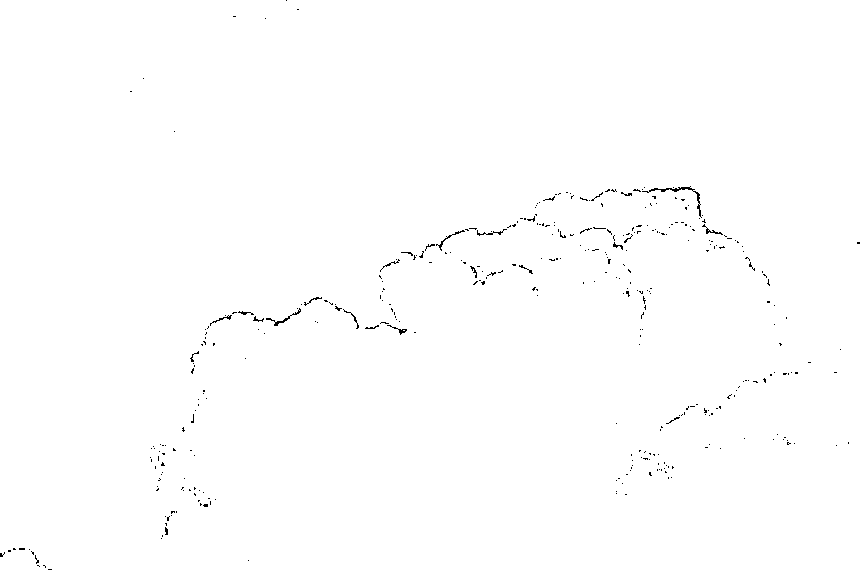

**整体氛围**

我们来看看本周重要的行运：

**★****金星火星持续合相在水瓶座**

三月的风带着双鱼迷幻的气息，各种合相让能量相互交错，相互挑战。就好像来自不同观点的信息，水火不容。哪怕在同一个家庭，同一间办公室，都可能对事件的看法完全不一致。

金星和火星，这一对平衡之星，已经持续了两周合相。维持平衡？太难了！

**金星诉说着我们的价值观，**什么是美的？什么是善的？什么是我们值得珍视的关系？**而火星就挺身而出，让我们来捍卫自己的价值观，**面对反对的声浪，我们坚持信念，战斗到底。

**价值观的冲突不仅仅是在语言和讨论里，如果它落在更为严苛的权力环境（摩羯座），并且触及冥王星，我们可能就看见一场战争。**

**3 月 6 号开始，紧密合相的金星与火星已经进入水瓶座 0 度。**

**本周金火持续在水瓶座初度紧密合相，我们期待着更明确的转折和变革，**从充满压力的摩羯座转到更具理性和人文精神的水瓶，火星也从它的强势星座（摩羯座）转入理性的风象水瓶座，**或许各方面的紧张关系可以步入谈判斡旋。**

这个转折点，也可以视作是我们人类应该向着更理想主义、更注重精神层面、更具人道主义精神价值观的逐渐转变。

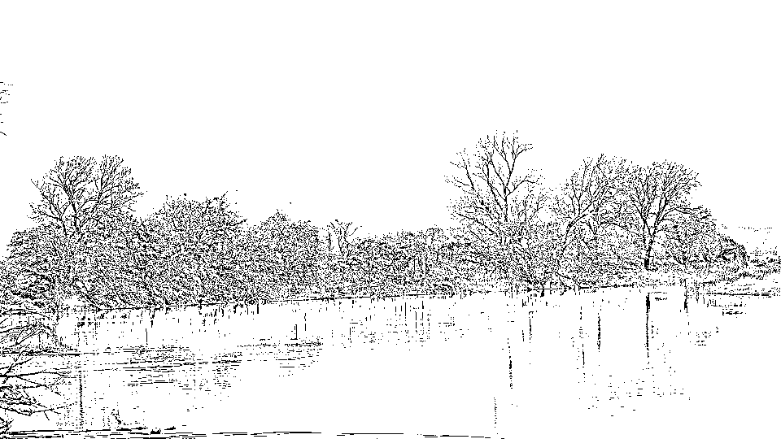

**★****水星进入双鱼座**

**3 月 10 日，水星进入双鱼座。整个三月份，水星经历三个星座，从水瓶座、双鱼座，到白羊座。**

水星代表我们的思想，表达，思考和沟通的方式。当水星在水瓶座，我们在网上搜索新的资讯，参与群体的讨论，**我们的思考模式变得特立独行，**希望自己的观点看法与众不同。

**当水星进入双鱼座**，我们从理性的思考判断中暂且走出来，**回到更多的直觉和感受**，也许我们会更加情绪化，冲动，也许我们会对他人的苦难感同身受，不再理智，变得不容易沟通。

**当水星进入白羊座之后**，人们也许就会带着饱满的情绪，**宣布自己的观点**，对，这就是我的看法，我要按照自己的想法来，不被其他人绑架，并把自己的想法告诉这个世界。

当水星进入双鱼座，**也许我们获得的信息有更多的迷雾，**我们在迷惘中摸索，看不清世界的真相，不同的阵营宣告不同的观点，我们可能会陷入谜团之中，无力自拔。

那么在一切的未知中，**回到自己的直觉和灵感，回到自己的内在，**并在内心深处和这个世界的众生联结。

世界本来就是一体，一只巴西的蝴蝶轻拍翅膀，可以导致一个月后德克萨斯的一场龙卷风，众生的苦就是我们的苦，而欢乐也来自一个根源。

当水星在双鱼座的时候，也许我们因为迷惘而颓丧，允许自己的低潮，可以通过**音乐，影视，艺术作品**来疗伤，来暂时逃离或者体验这个世界。还可以通过**冥想的练习**来强化直觉，接纳所有的到来。

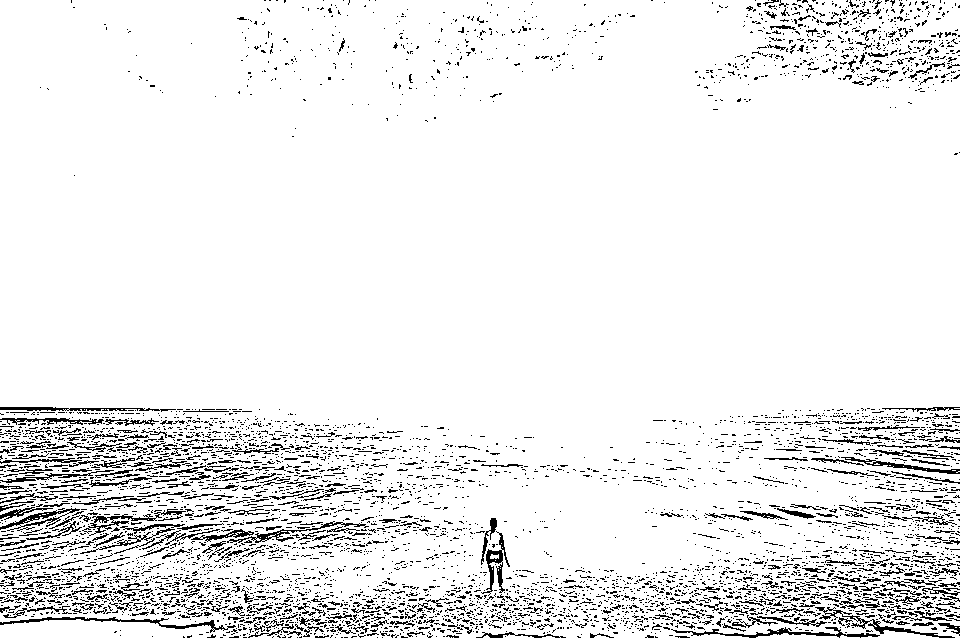

**★****太阳和海王星在双鱼座合相**

**3 月 13 日，太阳与海王星在双鱼座合相。**海王星在双鱼座是最强大的位置，太阳是我们的生命目标，是我们真正想要发光的地方。

我们会比平时更敏感，更加在乎别人的直觉感受，我们想要更多关心这个世界，关心他人，和身边的人同甘共苦，也许我们对精神和灵性的成长产生了兴趣，希望探索隐藏在表象之下的深刻真相。

也有些人此时可能希望在梦中迷失自己，或者透过酒精什么的来麻醉自己，我们渴望的幸福、和平，好像遥不可及，我们是否要在麻木和绝望中做着白日梦？**可能无条件的接收并且臣服于生命的无常，才能获得真正意义上的解脱。**

世界好像一个巨大的造梦工厂，庄周蝴蝶，到底哪一个醒着？

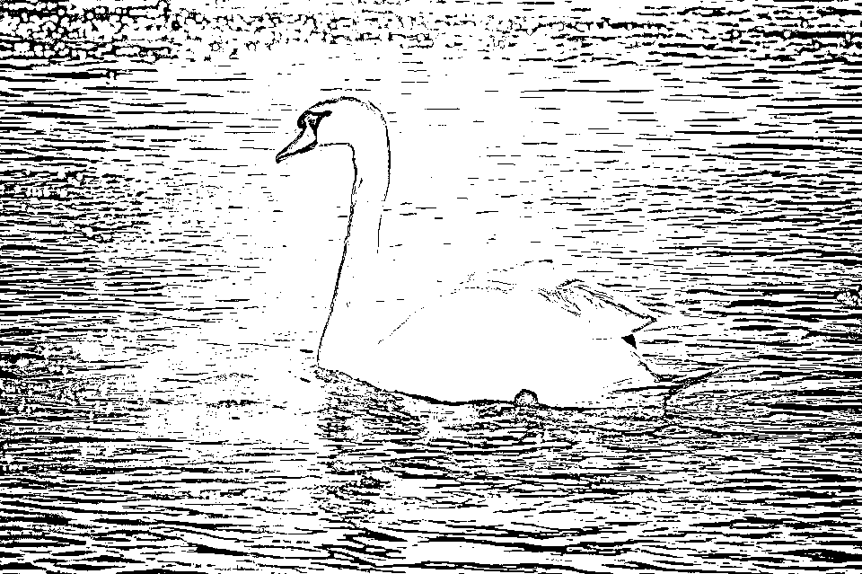

**12 星座一周运势**

**上升*****白羊座***

太阳，木星和海王星都在你的十二宫，12 宫掌管人的潜意识，是一个代表神秘，孤独，与世隔绝，想象力，灵性的宫位。

上升白羊座看起来比较直接冲动的，安安静静的十二宫可是不太匹配。好在社交也比较活跃，**可能会结识一些新的朋友，得到一些新的资讯，开拓新的机会。**

表面上的热闹繁忙，不能填补你内心的渴望，这段时间，**适合去接触一些心灵成长的课程，或者多看些好的电影，艺术作品，发挥自己的想象力。**

*****上升**金牛座***

金牛座是最懂得享受生活的星座，没有之一。务实勤勉高效的你可能在职场上获得更多的关注度，但也会意味着更多的忙碌和辛苦。

金星火星水星土星都在十宫，**在工作方面机会增加了好多**，最懂得淡定的金牛宝宝们，可以通过朋友的帮助支持，也许还可能是**网络上的资源**来协助自己在职场上打拼，虽然金牛座一直是比较低调沉稳的，但是机会来了也要抓住哦。

**上升*****双子座***

灵活多变的双子座们，本周太阳和木星都在你们事业的宫位。**之前如果有升职的计划，也许这个月就能实现了哟。**一年之计在于春，抓住机会大干一番吧。

**上升*****巨蟹座***

水瓶座的群星激活了你八宫的能量**，对自己的资源和财产可以进行一些盘点**，比如说股票，保险理财。也可以对自己的内心进行一次深度的心理咨询。找自己信任的咨询师好好聊一下，梳理一下自己的思绪。

**太阳和木星合相在你的 9 宫，提醒你从纷纷扰扰的资讯中发展出更宏观和全面的格局和看法。**也许你需要一段旅行，无论是从实质上的旅游还是心灵上的旅游，行万里路读万卷书，向着远方出发吧。

**上升*****狮子座***

狮子座们最最要紧的是得到他人的重视和关注，宝宝们需要很多很多爱。当金星火星都在你的七宫的时候，**我们会对自己的亲密关系投以更多的关注。**

任何困难或者目的都是需要沟通才能解决，沟通不是听到别人说对了什么话，而是你是否听懂了别人语言之后真实的意图。

如果亲密关系给你带来疑惑和痛苦的话，我们时刻要记住，**爱不仅仅是要得到，更多的是给予，当你开始给的时候，你就已经在爱中。**

**上升*****处女座***

处女座们这周还是认认真真的高效工作中，打工人打工魂，**在工作中你会和他人有很多的互动，但是再忙碌也要注意自己的身体健康呀！**春季肝火旺，很容易爆痘痘，千万照顾好自己，睡前泡泡脚，按摩一下脚底的涌泉穴，好的睡眠能帮助我们满血复活。

**太阳木星在我们的七宫，如果有机会和他人更近一步，就勇敢地去迈出这一步吧。**宜表白，宜结婚。

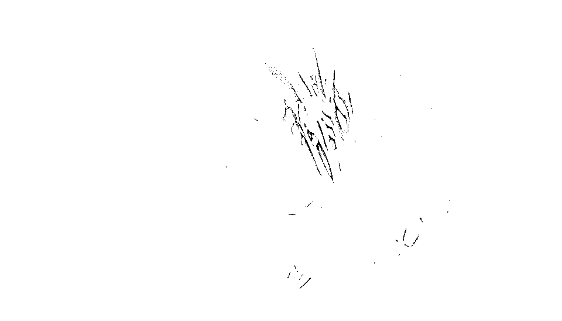

**上升*****天秤座***

天秤座特别关注人际关系的平衡，很多时候都是纠结犹豫的，但这周，**你应该好好做你自己！**五宫是自我创造力的宫位，我们有什么新的想法，新的创意，**就勇敢地去试试，**不要患得患失。这段时间备孕，计划要宝宝也是不错的哦。

春季的减肥也需要提到日程上来了，是时候列个计划清单了！**让我们用饱满的热情去拥抱这个春天吧。**

**上升*****天蝎座***

深刻通透的天蝎座们这周也许会花更多的精力在家庭事务上，**我们既要重视职业规划，更要重视人生规划，**确定家庭和事业在人生中各占多少比重，千万不要忘记在家庭陪伴和儿女教育上付出我们的精力，因为最最重要的是我们的生命质量得到提升。

**家人的帮助和支持，也会给我们带来好运，**让我们发挥出自己更大的创造力和生命力。**太阳和木星在天蝎座宝宝们的第五宫，**这段时间也可以享受谈恋爱的快乐，以及艺术方面的享受。

天蝎座们最害怕是无法掌控的危机和意外，群星在你家庭宫行进中，**好好和家人们在一起，度过一段安心的时光。**

**上升*****射手座***

对于爱思考的射手宝宝们，**本周是开展各方面学习和交流的好时机。**可以发表你的作品，开启新的课程，做些短途的旅行。开车去周边踏踏青，呼吸一下新鲜空气。春天要多注意自己的身体健康，以免出现意外的小病小灾。

多和家人聊聊天，也许给你带来新的启发和机会呢！

**上升*****摩羯座***

水瓶座群星在在摩羯座宝宝们的二宫，**如何赚钱、发财、暴富成了你们最近关注的问题，**也许在和小伙伴们的聚会中，你会了解到新的项目和新的机会，不过，无论消息是多么的吸引人，**一定要做好可行性分析，量力而行。**

自己是不是一个有价值的人是摩羯宝宝们很重视的事情，亲爱的，放轻松一点，你与生俱来就是重要的，你天性具足，是爱你的人的珍宝。你身边的人都爱你，不需要你用世俗的成就来证明这一点。

**上升*****水瓶座***

水瓶座今年土星行运在一宫，责任感倍增，可能一贯淡定的水瓶宝宝们这周也会有不淡定的时候，**要知道困难和压力不仅仅给我们带来困扰，更给我们带来成长，**在克服一个又一个困难之后，我们就长大成人了。

这周的财运挺好的，**也许有一些意外的收入进项。**如果之前有什么投资计划，那可以考虑开始实施了哦。

**上升*****双鱼座***

太阳和木星在双鱼座行进，太阳双鱼座可能正在过生日呀。生日快乐哦！上升双鱼座的宝宝们，**这是你们的幸运时分，**因为突然你的形象引起了周围的关注，好像突然变得充满活力，光彩耀目。

也许最近你非常关注心灵成长的事情，比如禅修，比如神秘学，或者你有很多梦想，那么，**请把你的关注默默坚持下来，好好地进一步发展，**也许你会发现更广阔的天空和大地。

**版权声明**：原创文章由作者授权首发于若道平台发布，欢迎转发，反对抄袭。友号转载请申请白名单。

****

****Dora****

ISAR 认证占星师、心理咨询师、塔罗咨询师

多年企业管理经验

咨询微信：AstrologerDora

公众号：Dorothy 占星文化

**长按打赏**

**学习占星学****点击下图了解课程详情** 

**

**微信又双叒叕改版啦，不想错过若道君的推送？**

**就把若道设为星标吧！**

**▼**

**喜欢记得点一下在看哦☟**

**报名直达入口**

# 本周每日星象一览丨如何符合天象安排这一周？你可以做做参考

> 原文：[`mp.weixin.qq.com/s?__biz=MzA5NjA0NTAxNg==&mid=2651468803&idx=2&sn=f156f30bc067be6e3838e55308cefd06&chksm=8b4886b4bc3f0fa2aa8e77a7814b58f9319c496600bd6ac2f636eabdc35d666ed1b1ce7b0d24&scene=126&sessionid=1692737852#rd`](http://mp.weixin.qq.com/s?__biz=MzA5NjA0NTAxNg==&mid=2651468803&idx=2&sn=f156f30bc067be6e3838e55308cefd06&chksm=8b4886b4bc3f0fa2aa8e77a7814b58f9319c496600bd6ac2f636eabdc35d666ed1b1ce7b0d24&scene=126&sessionid=1692737852#rd)

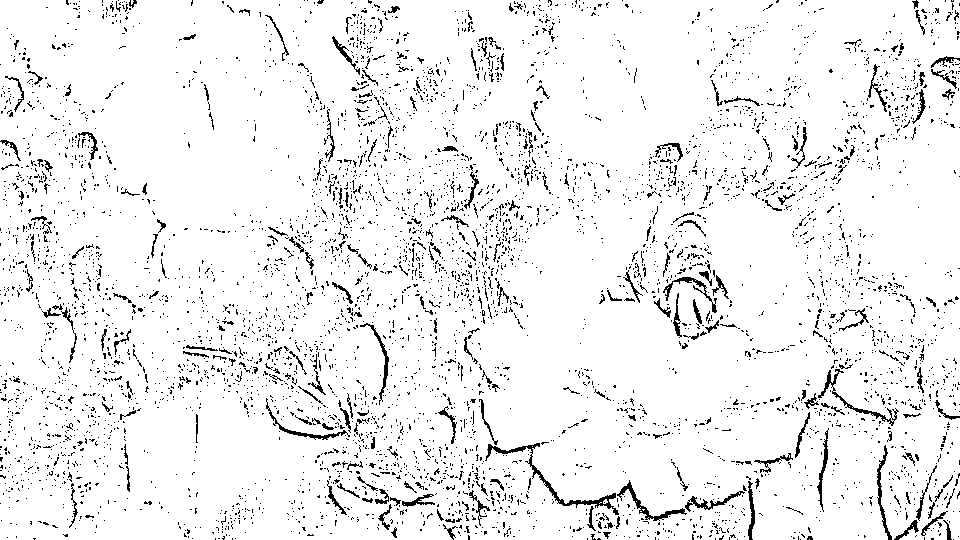

作者/Dora ISAR 认证占星师
编辑/翀子 图片/网络今天头条介绍了本周宇宙天气的整体氛围，以及 12 星座的一周运势，如果你想继续了解每天的天象细节，就看看下面的内容吧！**本周每日天象****3.7****周一**

**金星与火星还合相在水瓶座零度，天王星六分了合相在双鱼座的太阳、木星，月亮在金牛座。**

**周一也许会有些小兴奋小惊喜**， 如果你有心仪而不敢表白的人，不妨用美食，音乐， 鲜花，小小的美好的事物来传递你的心意，**生活有时候需要冒点险，对吗？**

**3.8****周二**

今天是女性的节日，女性力量的崛起，并不是有个节日，给一些形式，给一些口号，或者向女性开放一些更适合男性的体力型职业，这些都是表面的，并不是真正的平等。

女性是阴性力量，柔软，谦逊，包容，并不意味着弱势。没有大地，天空将从何处承托？作为女性，不必事事和男性一争高低，而是从心底能够自信而闪耀的发出自己的声音, 肩并肩站在一起。

女性的力量，如同太阳和月亮，金星和火星，白天需要黑夜的滋养而再生，任何战争都需要和平的谈判才能停止，这个世界需要阴性的力量来平衡。

**3.9****周三**

**月亮进双子座，在清晨 7 点到 8 点之间，月亮三分金星和火星。**

**月亮在双子座的日子里，我们更加渴望沟通，学习，进行知识分享。**我们也许会重新察觉周围环境对自己造成的影响，这个时候很容易被媒体或者他人传来的信息所刺激，我们也会担心自己处在与世隔绝的环境中，失去了对外界的联系沟通，因此情绪也比较不够稳定。

月亮双子座的人很容易因为过度关注外界的资讯和反馈而引起自身情绪覺知上的淡漠，会和家人疏离一些，**那么今天早上就来个邀约吧，和在意的人约好一个沟通交流的时光。**或许也可以打开一本新书，开启一个新的课程，加入一个志同道合的社群。

**享受心智上的交流！**

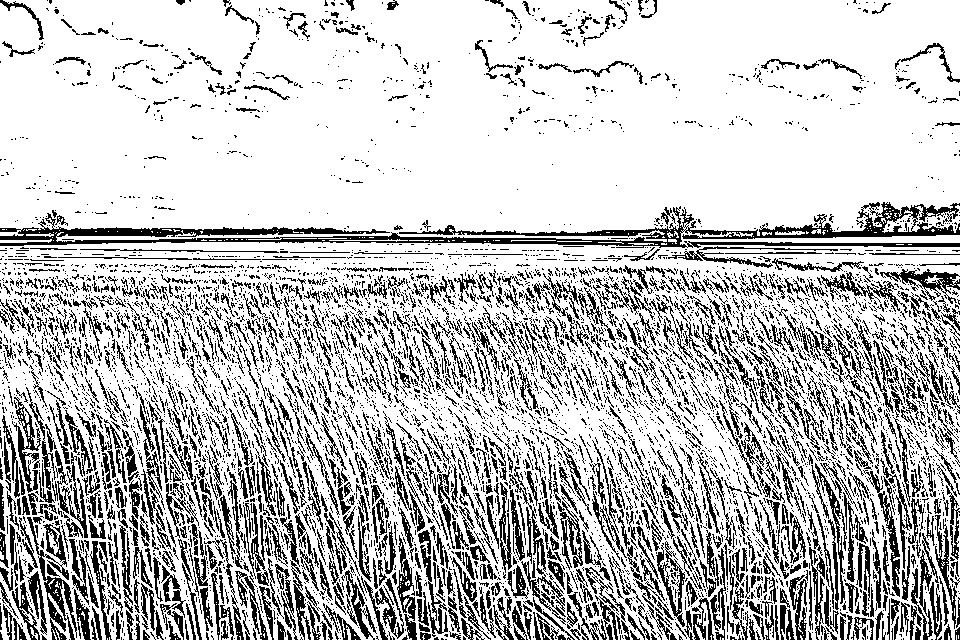

**3.10****周四**

**水星进入双鱼座，落日时分，月亮四分太阳、三分土星，月亮空亡。**

什么是事情的真相？真相永远不是网络上破碎的片言只语，断章取义。**不要轻易被碎片化的资讯所煽动。**这个世界本身就是由各种偏见形成的，我们只关心自己关心的事情，只愿意看到自己想看到的东西。

在任何时候，我们都需要不要忘记我们的初心。安定从容的去觉知，守住自己的底线。

**月亮空亡期间尽量不要做任何决定。**

**3.11****周五**

**下午 3 点半月空亡结束，月亮进入巨蟹座，晚上月亮三分水星。**

今天是周末了，月亮也进入了巨蟹座。我们特别想要一个舒适稳定的环境，这是宅家的好时光呀。月亮与水星的三分相，好好跟家人沟通聊天。记得打个电话给父母吧。

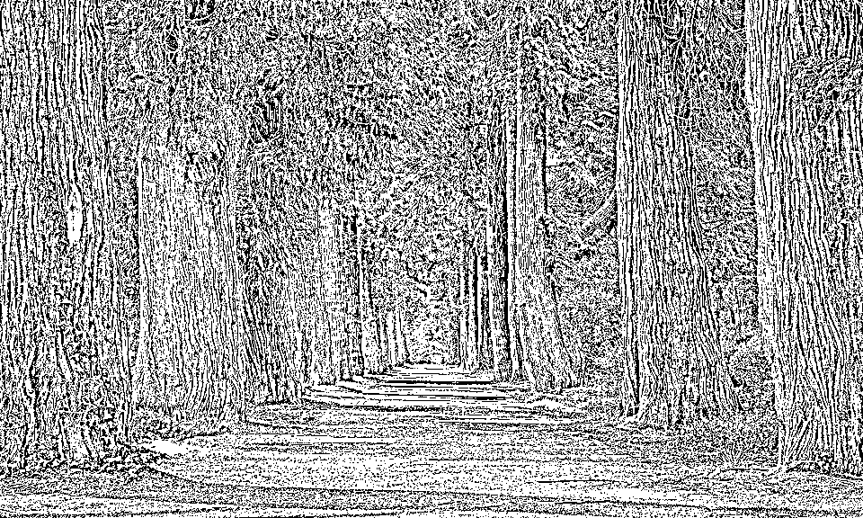

**3.12****周六**

**月亮还在巨蟹座，今天是植树节，这个节日是在提醒我们，要爱护我们的环境，滋养我们的地球母亲。**

我们可以宅在家里，做一些滋养自己和家人的事情，无论是整理清洁，还是做顿好饭，养护花儿，或者陪伴宠物。

目前天上的行星都在顺行，而且都密密匝匝的聚集在水瓶座和双鱼座，好像有一股紧张的张力，让人焦虑不安。各路事件碰撞摩擦，又特别集中，让人喘不过气来，巨蟹座的月亮可以带来一些慰藉吗？

**3.13****周日**

太阳与海王星合相在双鱼座，现在有水星、木星、太阳、海王星四颗行星在双鱼座呢，多么强大的双鱼能量！

**正好是周末，我们刚刚好可以做一些很“双鱼座”的事情：**看个电影，写首诗，画一幅画，听听音乐，和家人开一瓶存了好久的红酒。

让我们用这一段时间时光来给自己净化排毒一下吧。

**版权声明**：原创文章由作者授权首发于若道平台发布，欢迎转发，反对抄袭。友号转载请申请白名单。

****

****Dora****

ISAR 认证占星师（2019 年获得）、心理咨询师、塔罗咨询师

多年企业管理经验

咨询微信：AstrologerDora

公众号：Dorothy 占星文化

**长按打赏**

**学习占星学****点击下图了解课程详情** 

**

**微信又双叒叕改版啦，不想错过若道君的推送？**

**就把若道设为星标吧！**

**▼**

**喜欢记得点一下在看哦☟**

**报名直达入口**

# 雷蒙德·梅里曼金融占星周运 | 3 月 5 日-13 日值得关注

> 原文：[`mp.weixin.qq.com/s?__biz=MzA5NjA0NTAxNg==&mid=2651468803&idx=3&sn=dd3b5efa6d82a9b8ea0e862ef0e19214&chksm=8b4886b4bc3f0fa29718a03812109e1fd7643977960786e58010e9d4fb2ee921dc65d92acf17&scene=126&sessionid=1692737852#rd`](http://mp.weixin.qq.com/s?__biz=MzA5NjA0NTAxNg==&mid=2651468803&idx=3&sn=dd3b5efa6d82a9b8ea0e862ef0e19214&chksm=8b4886b4bc3f0fa29718a03812109e1fd7643977960786e58010e9d4fb2ee921dc65d92acf17&scene=126&sessionid=1692737852#rd)

作者/雷蒙德·梅里曼 译者/Luke
编辑/玫瑰 图片/pexels

雷蒙德·梅里曼是在金融占星学界稳坐第一把交椅的占星师，同时他也是若道签约的金融占星课老师，我们引进了雷蒙德·梅里曼老师的《[上证指数月度报告](http://mp.weixin.qq.com/s?__biz=MzA5NjA0NTAxNg==&mid=2651468243&idx=2&sn=f05411adad4ddaaf1d1191605ed01684&chksm=8b488364bc3f0a7280eae0182f11965e636c566827deffb5c1fb6b5580373b55d26ae9946ad3&scene=21#wechat_redirect)》及《[黄金报告](http://mp.weixin.qq.com/s?__biz=MzA5NjA0NTAxNg==&mid=2651468243&idx=2&sn=f05411adad4ddaaf1d1191605ed01684&chksm=8b488364bc3f0a7280eae0182f11965e636c566827deffb5c1fb6b5580373b55d26ae9946ad3&scene=21#wechat_redirect)》。我们经老师的授权，将每周刊登梅里曼老师的周运，供大家参考和学习。于是，这是本周的周运（3.7-3.11）。

**说明：以下时间采用纽约证券交易所所在地美国东部标准时间。**

**展望与回顾**

****

**2 月就业增长加速，创下 7 月以来最大的月度增长，接近新冠病毒肺炎疫情前的水平。当月非农就业人数增加了 67.8 万人，失业率为 3.8%。相比之下，先前预估的就业人数为 44 万，失业率估计为 3.9%。**

**通胀可能正在降温，迹象是本月工资几乎没有上涨，每小时仅上涨 1 美分，涨幅为 0.03%，而预计涨幅为 0.5%。**

**——杰夫·考克斯****《2 月就业增长出人意料的强劲，增长 67.8 万人》****www.cnbc.com****2022 年 3 月 4 日**尽管上周五发布了强劲的就业人数，全球股票市场上周仍然承压，因为乌克兰惨烈的战争没有缓解的迹象。当战争爆发时，很难预测金融市场的走势。每个人对经济和股市的前景都变得非常悲观，但大多数情况下，股票市场的跌幅不像大多数人预期的那样大。**更大的跌幅往往是经济危机的后果，战争通常发生在严重经济危机之后。**迄今为止，美国股市的下跌符合我们 2022 年 2 月 20 日举办的年度预测讲座以及上周发布的股市报告特刊中的观点（编者按：2 月 20 日是针对英语国家的线上讲座，中国地区双语版讲座将于 3 月 19 日举行）。但是世界上其他的股票指数遭到了更严重的打击，尤其是欧洲股指和中国恒生指数。比如说，恒生指数回到了 2020 年 3 月的低点附近。截至 3 月 4 日，多个欧洲市场接近于创下年度新低。但是亚洲、环太平洋和美国的其他股票市场，都守住了 1 月 24 日和 2 月 24 日的低点。在巴西，Bovespa 指数甚至创下 6 个月的新高。

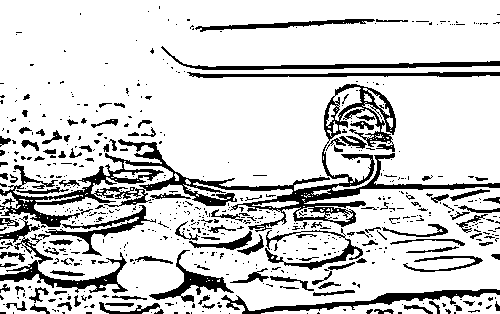

**短期占星趋势和长期考量**

****

**白宫新闻秘书詹·普萨基周日表示，呼吁美国提高自身化石燃料产量，以应对俄罗斯入侵乌克兰导致的油价上涨，是一个“错误诊断”。****——约瑟夫·崔****《普萨基说，呼吁提高美国石油产量是一种误诊》****https://thehill.com****2022 年 2 月 27 日****全速打开所有出油龙头应该是我们现在的政策。那将降低世界石油和国内汽油的价格。别忘了：天价的油价让俄罗斯独裁者获得了权力。****在 2008 年，油价每桶 150 美元，他夺取了格鲁吉亚。在 2014 年，油价每桶 100 美元，他夺取了克里米亚。去年，油价从 50 美元上涨到 100 美元，靠着 840 亿美元的利润，他入侵了乌克兰。这是冷酷无情的历史事实。****——拉里·库德洛****《美国不应该被俄罗斯天然气绑架：拜登在乌克兰危机中的失误》****www.foxbusiness.com****2022 年 3 月 1 日**原油上周再次占据了舞台的中心，在 3 月 3 日飙升至高点 116.57，是自 2008 年以来的最高价。黄金也在朝着历史新高奔跑，在周五到达 1973，那非常让人瞩目，因为美元也在朝着 100 的价位冲刺。**当美元价格上涨，黄金通常是看跌的，所以不要指望这种异常持续很长时间。****所有这一切都与木星、海王星在双鱼座合相对应的“投机狂热”意涵相关。**尽管这个相位还有一个月，才会精准合相。但是随着太阳在**3 月 5 日-13 日**“传递”这个合相的光线，我们现在已经可以见证相关事件的展开。也就是说，**太阳在 3 月 5 日与木星合相，随后在 3 月 13 日与海王星合相，那反射了 4 月 12 日木星-海王星合相的主题。**

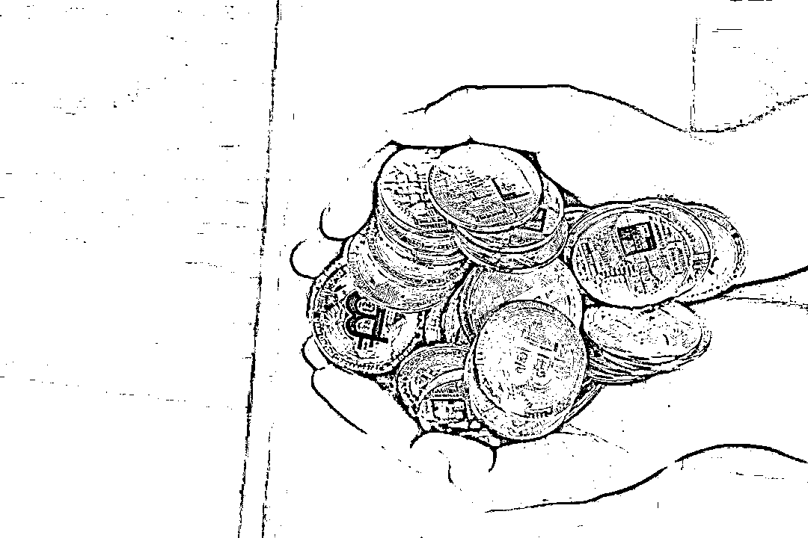

木星喜欢宏伟庞大的事情，越多越好。海王星没有意识到或者不需要界限，就和它的守护星座双鱼座一样。因此，**木星、海王星在双鱼座合相蕴藏了巨大的力量，那也是为什么我们预测“投机狂热”会持续一段时间。**那太疯狂了。这里的危险是，**如果市场在这段时间过后持续下跌，而且不发生反转，那可能反而出现急剧的崩溃。**然而，**不仅是木星和海王星在双鱼座与这种爆发性的价格上涨和通货膨胀有关。它也和天王星在金牛座有关。无论天王星在哪个星座，与之相关的社会和经济板块都会经历繁荣-萧条周期。**谷物（农业，金牛座守护的板块）将爆发性走高，尤其是小麦，在 3 月 4 日现货价格飙升至 1349，创下历史新高，超过了 2008 年 2 月的标志性价位 1334。由于限制，5 月（最近交割月）小麦期货只上涨到 1209。**木星和海王星在双鱼座也与灵性和超现实体验有关。**正如已经讨论过的，**金融市场在过去几周时间里非常不稳定和无序，未来还会出现进一步的巨大价格波动。**

**说明：以上日期基于纽约证券交易所所在的美国东部标准时间，由于存在时差，中国地区可能需要加一天。**

**版权声明：**本文由若道翻译发布，欢迎转发，反对抄袭。友号转载请申请白名单。

**雷蒙德·梅里曼（Raymond Merriman）**

若道签约老师。著名金融占星师，ISAR（国际占星研究协会）前主席，梅里曼市场分析公司的总裁。他由于“提升了占星学的职业形象”，在 1995 年国际占星大会上被授予轩辕十四奖；在 2012 年国际占星大会上，被授予轩辕十四终身成就奖。

1“中国上证指数月度报告”发售**若道推出了****中文版****的雷蒙德·梅里曼中国上证指数月度报告，并持续发行该报告！**当把金融市场的周期和占星学的周期相结合时，雷蒙德·梅里曼老师的金融占星学研究**为投资者应对金融市场的周期波动，并随之调整投资策略提供了极大的价值参考**。
**3 月中英文报告已上线！**2“黄金价格周期月度报告”发售**若道推出****中文版****的雷蒙德·梅里曼黄金价格周期月度报告！**不仅仅为广大读者在中国股市的投资出谋划策，更将视角放眼黄金市场。**每当世界经济形式不明朗的时候，有一个地方是保值的港湾，那就是****黄金**。自 1982 年雷蒙德·梅里曼出版第一本研究《地球宇宙学征象与黄金价格的关联》的著作以来，**他一直作为最重要的黄金市场时机预测者之一享誉国际**。2022 年 3 月黄金报告已上线，梅里曼老师将会告诉你他对这个关键时期如何操作的想法。也可以按照季度和一年期订阅，有更多优惠。季度和年度的好处是，你可以持续了解梅里曼老师对于不断在变化的市场的看法。即便他某一次看法和市场不一致，你也看到在下一期他如何调整自己的看法，并看到金融占星在一个长期时间段内对你把控风险的帮助。而能够长期控制风险、尽量找到安全的投资时机才是投资的长久之计。**3 月中英文报告已上线！****购买套餐**，买得越多越优惠中国上证指数月度报告套餐价

*   **单月报告**：280 元
*   **3 个月套餐**：780 元（260 元/月）
*   **12 个月套餐价**：2400 元（200 元/月）

**长按下图识别二维码****购买金融报告****套餐****▼**

黄金周期月度报告优惠

*   **双报告年度套餐更优惠（直降 900 元）**

*   **12 个月黄金报告+12 个月上证指数报告：仅需 3900 元**

**长按下图识别二维码购买黄金报告套餐**▼

3《2022 年金融预报和沙龙》1976 年以来，由雷蒙德·A·梅里曼撰写的梅里曼市场时机学院每年一次的年度预报沙龙和每年一本的《年度预报》一直在应用占星学原理为投资者们服务，提供卓越洞见，从未间断。 **雷蒙德·梅里曼《2022 年金融预报和沙龙》发售中（报告已发布）。****长按下图了解详情**
▼

**点击阅读原文购买金融报告**

# 太阳合相木星，在这个“超级幸运日”，你的梦想是什么？

> 原文：[`mp.weixin.qq.com/s?__biz=MzA5NjA0NTAxNg==&mid=2651468798&idx=1&sn=a47f8d0b94a8f4f20b3c4c4fdc62fdcf&chksm=8b488149bc3f085f651e34e9e7c7234ec69aff7a16cee24859382cddd4919359ba20de5f8912&scene=126&sessionid=1692737852#rd`](http://mp.weixin.qq.com/s?__biz=MzA5NjA0NTAxNg==&mid=2651468798&idx=1&sn=a47f8d0b94a8f4f20b3c4c4fdc62fdcf&chksm=8b488149bc3f085f651e34e9e7c7234ec69aff7a16cee24859382cddd4919359ba20de5f8912&scene=126&sessionid=1692737852#rd)

**2022 年 3 月 6 日天象：**

*   **15:59 月亮进入金牛座**

*   ******14:22 火星进入水瓶座******

*   ******14:29 金星进入水瓶座******

*   ******太阳合相木星******

*   ******金星合相火星******

今天的宇宙天气好忙碌！火星与金星携手从摩羯座跨进水瓶座，依然维持了它们的合相状态。过去的半个月里，有些人在情感上实现了飞跃，也可能是更加积极的处理亲密关系中出现的问题。两颗行星从脚踏实地重承诺的摩羯座，来到超然“爱自由”的水瓶座，又将给关系带入怎样的“兴奋剂”？（你也可以点击[【3.6 金星进水瓶座】](http://mp.weixin.qq.com/s?__biz=MzA5NjA0NTAxNg==&mid=2651468753&idx=1&sn=74e83f5ad1df8a8d7109f10401a1b83c&chksm=8b488166bc3f08705cfc1b630ce7b51d112106accf8784a8bcc14602ef45057299841e228d8c&scene=21#wechat_redirect)查看文章哦~）太阳与木星合相在双鱼座，“幸运日”来啦！3 月 3 日我们迎来[【双鱼座新月】](http://mp.weixin.qq.com/s?__biz=MzA5NjA0NTAxNg==&mid=2651468633&idx=1&sn=fee212b051f6d3261ef72d454c748041&chksm=8b4881eebc3f08f8b0c4900b7627e73a3bd57ecfd9c3d033e7ac1f74b99f76a26f2f8b07029a&scene=21#wechat_redirect)（点击查看文章），昨天太阳开始合相木星。在这个振奋人心的日子里，每个人都能近距离触摸到自己的梦想。**你的梦想是什么？你相信什么一定会发生？欢迎留言呀~**如果还没有任何想法，不如等月亮今天下午进入金牛座后，用一顿美味愉悦的饭餐来激发你的想象力，给自己描绘一幅美妙的画面。你也可以回顾自己本周的点滴，看看有哪些幸运线索已经“埋伏”在身边了呢？可以对照[【若道周运】](http://mp.weixin.qq.com/s?__biz=MzA5NjA0NTAxNg==&mid=2651468391&idx=1&sn=786e39007606113283e3dc924c8d5d78&chksm=8b4880d0bc3f09c6ff755318d493467e03c1be8d013a6f467a10cbfef92b7485ce9f55ebb063&scene=21#wechat_redirect)进行查看哦~另外，昨天是[【梦境工作坊】](http://mp.weixin.qq.com/s?__biz=MjM5MjQwNjAyMQ==&mid=2649439168&idx=1&sn=a942f7439ba6f574daf0743d290e1684&chksm=beb954aa89ceddbcffb13414168b25d61af845856ce666512b3b94fd748fc61af3cd951f032d&scene=21#wechat_redirect)开课的第一天，如果你对梦和占星学之间的关联感兴趣，也可以点击查看课程信息。周日快乐！我们明天见！**了解每日天象，可****下载“若道”APP 查看****还有更多精彩等着你哦**

# 3.6 金星进水瓶座丨终于离开摩羯座，欢迎来到“唯爱与自由不可辜负”的新世界！

> 原文：[`mp.weixin.qq.com/s?__biz=MzA5NjA0NTAxNg==&mid=2651468753&idx=1&sn=74e83f5ad1df8a8d7109f10401a1b83c&chksm=8b488166bc3f08705cfc1b630ce7b51d112106accf8784a8bcc14602ef45057299841e228d8c&scene=126&sessionid=1692737852#rd`](http://mp.weixin.qq.com/s?__biz=MzA5NjA0NTAxNg==&mid=2651468753&idx=1&sn=74e83f5ad1df8a8d7109f10401a1b83c&chksm=8b488166bc3f08705cfc1b630ce7b51d112106accf8784a8bcc14602ef45057299841e228d8c&scene=126&sessionid=1692737852#rd)

**********************☆ ****************************后台****************************回复“今日”，给你一句生命态度**********************

作者/MaryChan 玛丽

编辑/翀子 封面/书君 图片/网络

3 月 6 日 14 点 29 分，金星进入水瓶座并在此停留至 4 月 5 日。象征爱与美的金星来到水瓶座掌管的领地时，会有哪些表现？在这段日子里，又有哪些重要的宇宙天气可以助力金星的能量发挥呢？让我们一起来看文章吧~
**金星进入水瓶座**

**3 月 6 日 14:29 金星将由摩羯座进入水瓶座，结束从去年 11 月初开始的摩羯座之旅。**

土元素到风元素的转换，由经验、面对并调整生活中的结构、秩序、责任、承诺等相关议题，到让智慧灵动之光照进心中，释放关系中的旧有模式，在变化与更新中，看到厚重之沉淀与轻盈之扬升同在的美，**在对不一样可能性的理解与接纳中，重获一份舒畅的呼吸，与如释重负的自由。**

金星象征着爱与美，以及一种连接结合的阴性势能。一般它在每个星座待三周半左右，再进入下一个星座。**前段时间因涉及逆行，金星在摩羯座待了四个月之久，本次会在水瓶座待到 4 月 5 日，然后进入双鱼座。**

金星与阴性面向有关，是除了月亮（代表滋养、照料、养育）之外的另一种阴性展现。其可视形状的变化，也像是有月亮的阴晴圆缺似的，当离地球很近的时候形似月牙，离地球很远的时候形似银盘。而阴性面向正与变化有关。

在金星的每月律动中，与之持续地连接，寻求理解，邀请金星所象征的神圣美好与我们同在，有助于个体连接生命中的愉悦感，开发提升个人魅力，带来自然而然的吸引力，创造良性的人际互动，开启或维护有品质的感情，创造价值、财富与丰盛。

金星属于内行星，是“自我”的具体面向，象征着客观性、连接、存在于关系之中的彼此。有别于外行星所象征的超然面向，金星非常具有“烟火气”，与触手可及的人事物有关。**其守护星座天秤座——带来平衡、和谐与优雅；金牛座——带来自然、价值与感官享受。**

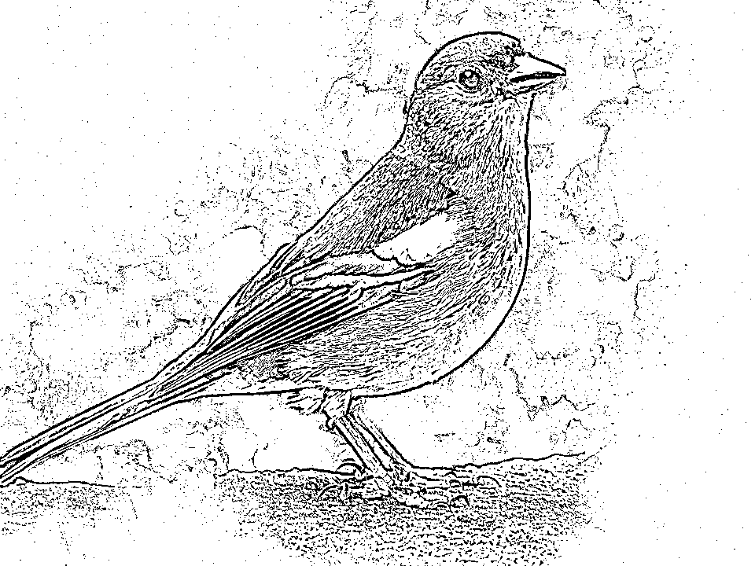

**水瓶座的法则**

水瓶座是固定的风向星座，在这里风元素维持事物并使之发展壮大。风带来气，然后平等地扩散到一个空间中，由此带来流动、灵巧和自由。

水瓶座打破前一个星座——摩羯座的某些过度倾向，僵固、死板、控制、有上下之分的权威结构，**带来冲破、释放、对话、交流。**

**水瓶座也带来高等的智慧，作为风元素星座的最后一个，象征着智性发展的最高阶段。**这给人带来看得更清楚的机会和灵感，令人站在不一样的角度或层面去理解当前的处境。于是，问题也许不是被“解决”，而是被“化解”了。

智慧带来不同的生命态度，提升个人内在的成熟度，带人来到不同的成长阶段，让原有的问题不成其为问题。就像一段楼梯，在幼儿园孩子眼中很长很高，但在小学生眼中，就很普通，没什么困难的。

水瓶座处于黄道十二宫里的第 11 宫。从白羊座到处女座，象征自我的不断开展以及完善，从天秤座到摩羯座，象征个体社会化的进程。**到了水瓶座，象征社会化的完成。**到双鱼座，终必归于无有，象征与源头合一。

**所以水瓶座与社群有关，与超越个体小我的改变有关，这就会撼动个体既有的惯性模式与安全感，以及带来不合常理的表现方式。**

水瓶座的守护星是土星与天王星，二者都是外行星（与集体意识有关），而非个人行星。天王星，是去年一整年的重磅“明星”，与种种已发生的重大改变、意外息息相关。

去年的土天四分格局，以及今年 1-2 月的天王星停滞并顺行，**强调了“新的”、不一样的蜕变**，很多人感受到碾压、冲击、震荡——在感情、婚姻、工作、事业、健康等方面。

水瓶座/天王星带来真正的改变，不是小打小闹的、修修补补的，是深入本质的改变，**只有这样强劲的力量能够让人脱离老旧的“历史包袱”，**打破个人一直“以为”的，让人洞见深刻的真相。

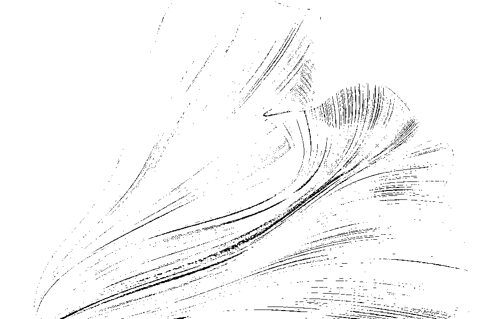

**金星在水瓶座**

金星在水瓶座运行，其实是件不容易的事。水瓶座、双鱼座、天蝎座，都有外行星作为守护星，由此带来一些非同寻常的驱动势能扰动着个体，让人面临着去理解一些在个人既有熟悉框架之外的事。

**这些与金星本身的层面不太一样，因而带来涟漪与波澜。**

**金星在水瓶座，带来前卫或不同寻常的品味。**在审美、装扮方面，不拘小节、推动奇思妙想，打开个人被封闭的观察力和敏感度，传达和诠释不一样的“美”。就像当年的视觉系摇滚乐队鼻祖之一月之海（LUNA SEA），绚丽、浓烈、悠远、锋利。

**金星在水瓶座，人们可以更加欣赏和享受不同想法、理念的交流，**放掉头脑中的预设和偏见，沟通对新兴事物、非主流、亚文化等不一样现象的看法。也可能是将曾经出现过的理念、价值，以新的形式表达出来，让创意为生活带来激发。

水瓶座提倡人人平等，并且鼓励每个人寻找自己独特的存在价值。**金星在水瓶座，利于推动个人多元化价值的发掘和实现，**从外表到处世之道，鼓励个体追求和彰显真实的、独特的一面。

**迈克尔·舒马赫，**德国一级方程式赛车车手，现代最伟大的 F1 车手之一。太阳摩羯座的他在赛场上永远尽力达到极限，**而他在水瓶座的金星，让他的生活充满与众不同。**

作为当年全世界最赚钱的运动员，他没有像其他车手那样，定居在纸醉金迷的摩纳哥，而是选择了瑞士湖畔过着云淡风轻的日子，两个孩子也在那里上着普通的公立学校。据报道，他们夫妻对奢侈品和社交晚宴也不怎么感冒。

| 迈克尔·舒马赫

**金星在水瓶座，事情变得有点难以捉摸和预测。**有时变化的情况会迅疾地来到面前，打破现有的安排。当没有那么多犹豫的时间，需要当即去因应和处理的时候，人就难以因循守旧，一成不变了。

**就这样，老旧的模式、惯有的节奏很快被打破。这时人处在有点混乱的状况中，容易焦躁不安，心境不稳。**

一般人或多或少都会抗拒改变。尽管目前的状况看起来困难重重，在既有框架下难以找到解药，但是对现状的习惯，以及对未来不确定性的恐惧，让改变有难度。

**其实，个人怕的并非未来，而是过去。**头脑中对美好的期待、想象和定义，源于个人生命过往的观念积累（家庭、社会、文化等）。也就是说，对于未来的想象来自于我们的过去和历史，个人其实很难想象自己从未经验之事物。

如同电影《骇客帝国》一般，每个人强烈地受到自己“以为”的种种想法、观念、信念的制约，从而活在一个透过滤镜看世界的状态中。

孙悟空一个筋斗十万八千里也翻不出如来的五指山。**“五指”就是头脑的框框、边界，**每个人辗转红尘，于俗世生活中难免陷入剧情而受限。有形与虚空之间的分界，并没有线性的“界”，就像“无门之门”。顶尖神话学家约瑟夫·坎贝尔写道，伊甸园的分隔之墙，是由“对立物的同时存在”构成。这句话言简意赅、颇具深意。

**金星在水瓶座，**经由一条信息、一次对话、一个邀请、一本书、一部电影抑或一个梦，令人灵光一闪，甚至茅塞顿开，哦，事情原来是这样，或者还有另外一种可能性。

**选择自己的“不常发生选项”，也许转机由此发生，生命中更多开阔的可能性由此展现。**

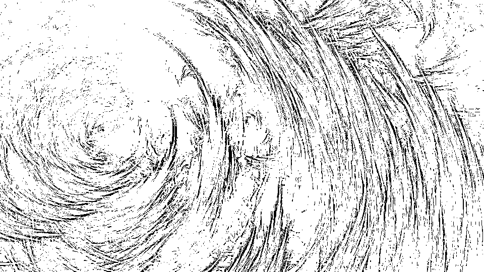

**金星在水瓶座，往往发生与关系相关的革新。**一些人发现、链接并加入一些特异独行的团体，通过团体凸显自己的与众不同。另一些人反而不太想社交，需要自我空间。还有一些人被某些独特的个体吸引。**水瓶座总与捉摸不定、出人意表有关。**

**金星在水瓶座，引领人们在关系中寻求真实的公正、宽仁和豁达。**让人思考、检视自己所处的关系中，是否存在不公，以及是否存在微妙的施舍、控制等不平等行为，反对关系中的自我中心和压榨剥削，由此可能掀起反抗，导致关系断裂或更新。

**金星在水瓶座，为关系带来更多客观的新颖的视角。**现在，许多人的生活或多或少与传统形态不同，成为别人眼中与众不同的人。他们在探索相对于陈旧模式的不同尝试，**有的还非常富有实验精神。**

但无论如何，个人很难不会受到强大传统的“反噬”。毕竟生活就是生活，很多时候存在不得不为之的尴尬，和无奈的适应。做出任何选择都会面临某种结果，这是“与众不同”的代价，很少有人能完全不在意这点，即使他表面看起来很酷。

这世界有如此多难解的问题，也有美丽的奇迹。正因为存在矛盾或困局，才需要个人敢于独立，**跳出自我的框框。这意味着成熟而独创性的思维，**不受他人，乃至世俗评判的裹挟，以及面对未知的勇气，和冷静超然的作风。

但请别忘了，在这一切的底层，是爱。爱能提供强大的承托力和滋养力，令人不至于在孤单的探索中枯竭。爱能协助个人，在看似无解的冲突中，柳暗花明又一村，看到消除彼此隔阂的希望。

**金星在水瓶座，让人在关系中，了解自己的独特面向，从而令个人发现自己的潜力。**这意味着个体以往的自我中心发生焦点转移，扩展后的新焦点让人看到更大的画面。

要做到这点，对个体有很大挑战，需要放下许多东西。在电影《姜子牙》中，姜子牙最终斩断天梯，象征着打破自己心中一直以来所认同的根深蒂固的东西。自**己的真相不是由他人来决定，而是经过探寻后的自己。**

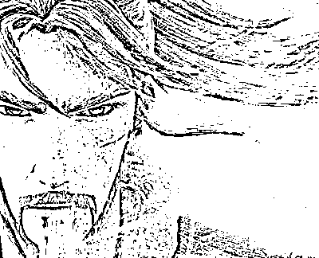

| 动画电影《姜子牙》剧照

**个人从内心极深处斩断依赖，这并不意味着排斥关系，反而是在新的层面上建立关系的开端。**如果每个人都能实现高度的个体化，以及在寻求个体认同方面的自给自足，那么关系将消除盛行的贪婪、恐惧、欺诈、利用，变得更美妙，更有创造力。

就像充满生命力的春天清晨，挂着露珠的青草散发的气息一般，充满着清新与生机。在一份关系中，双方彼此越能做真实而完整的自己，关系就越能保持活力。

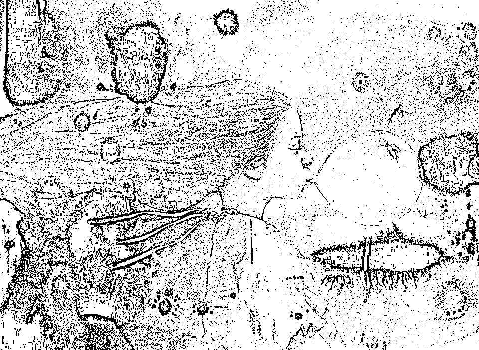

**金星在水瓶座的爱情**

**开明的爱情态度，对感情有不一样的看法和独特的理解方式。**演员靳东，太阳在摩羯座，金星在水瓶座，其爱情故事便很有特立独行的水瓶座味道。

**这时候金星所象征的需求是打破框框，自由地连接不同的人，或者重新发现熟悉之人的不同面向。**

外在的标签或光环并非绝对标准，重要的是内在是否诚实。人与人之间需要创意、空间与自由。可能吸引来一些令自己好奇的人，以及风趣幽默、有才华、独树一帜的人。

**爱情也许突然发生，让人措手不及。**表达喜爱的方式，也许特别，也许怪异。从有感到无感，可能变化迅速。也可能忽然感觉找到深刻、又强烈的爱情。

这时候可以“谈”情，但也许风元素不太适合“感知”复杂的情绪，不习惯被情绪的潮水淹没，**所以关系有时也会给人一种另类兴奋又冷淡疏离的感觉。**

**这是一段适合交朋会友的时光，**结识一些有趣的人或团体，与朋友相约去大自然中踏青，让身心流动起来，发展与这个世界不同面向的感受。

**金星在水瓶座的阴影**

隐藏的自我中心。对人对己存在矛盾之处，或双重标准。**我行我素、固执己见的同时，对他人存在欠考虑之处或冒犯。**

**过度理性，**可能导致缺乏温暖的人情味，让人觉得友善却冷漠。

想要控制外界，却没察觉自己内在的失序。

个人可能更愿意去做新的尝试，让关系更具实验性，但对既有固定关系来说，可能是喜忧参半。

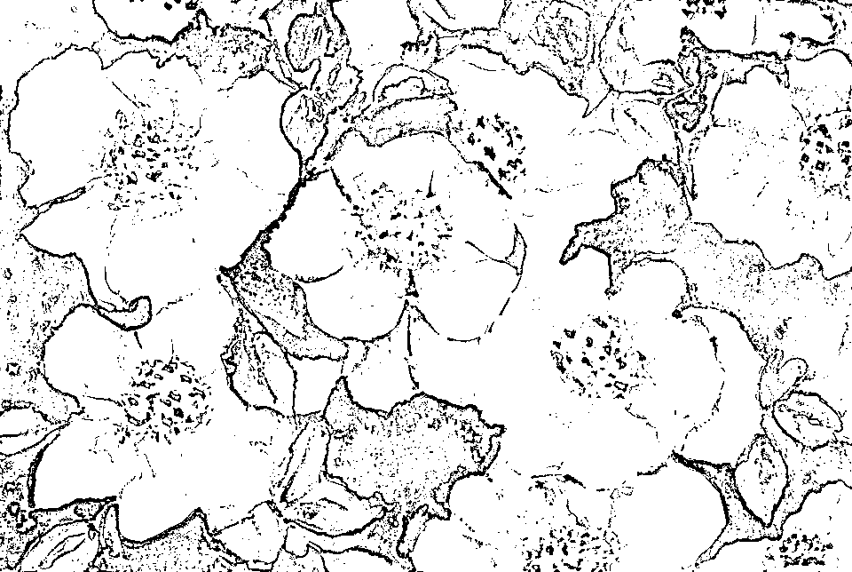

**金星在水瓶座的重要相位**

**金星在水瓶座期间与其他天象的结合以及相位（容许度 1°）：**

**★ **2 月 12 日-3 月 12 日**** **金星在摩羯座 13°-水瓶座 5°持续合相火星，象征关系的终结与重启。**

**重点影响人群：有重要行星/四轴/月亮交点落在摩羯座、巨蟹座、天秤座、白羊座、金牛座、处女座、天蝎座、双鱼座 13°-29°；水瓶座、狮子座、天蝎座、金牛座、天秤座、双子座、射手座、白羊座 0°-5°。**

其间，有两个时点更大大强化了此天象事件的影响力。

**一是 3 月 3-4 日，火星金星与代表死亡、转化与重生的冥王星合相（摩羯座 27°50′）。**

**二是 3 月 6 日，金星进入水瓶座，与火星合相在水瓶座 0°，正是 2020 年底土木合相开启 200 年风元素大循环的敏感点。**

**这是一个重要的结束与“更新”时期**，我们的各种重要关系——爱情、婚姻、家庭，以及对我们有影响力的人物，我们与自己的关系，都将不同程度地、不可避免地破碎、脱落、蜕变、重生。

**这里面也许有疼痛、悔恨、不舍、悲伤，最后终归都将在一场无声细雨中，融入满园春色。**

**★ **3 月 18-19 日 金星六分凯龙星****

**重点影响人群：有重要行星/四轴/月亮交点落在水瓶座、白羊座、狮子座、天秤座 4°-18°，以及射手座、双子座 6°-16°。**

如果在关系中感觉孤立、失望，不被理解，或难以融入，这是一个处理**遗憾，治愈伤痛的机会。发展与自己身体的链接，以及与自己直觉的链接，学习客观、冷静、清晰地表达自己内在的真实感觉，**并且与朋友或社群保持真诚的接触，感觉到自己存在的美好与价值。

★ **3 月 18-20 日 金星四分天王星，紧接着 3 月 21-23 日，火星四分天王星**

**重点影响人群：有重要行星/四轴/月亮交点落在水瓶座、金牛座、狮子座、天蝎座 5°-19°。**

**关系充满变化的张力，**个人可能感觉到外在世界的排斥或抵抗，出现挑战、考验、挫败或意外的状况。由此将出现新的提示和引导，**去改变陈旧的部分，**涉及不同的选择和决定。

**一些事情可能中断或反复无常，需要学习放手和顺其自然。**这时候也利于戒掉坏习惯，促使个人思考新的价值创造模式。

★ **3 月 28-29 日 金星合相土星**

**重点影响人群：有重要行星/四轴/月亮交点落在水瓶座、狮子座、金牛座、天蝎座、双子座、天秤座 14°-28°，以及白羊座、射手座 16°-26°。**

**一个关于承诺和决定的开端。**事务强有力的具体落实成形契机。结识成熟稳重的朋友。为一段关系许下长久的承诺，学习担负一份稳定的责任，例如结婚、孕育、签约、合作。

**也有利于为自己的空间做整理和断舍离，**在新的环境、新的心境中，发现和珍惜每一件长久陪伴自己的物件价值，及其背后蕴含的故事。

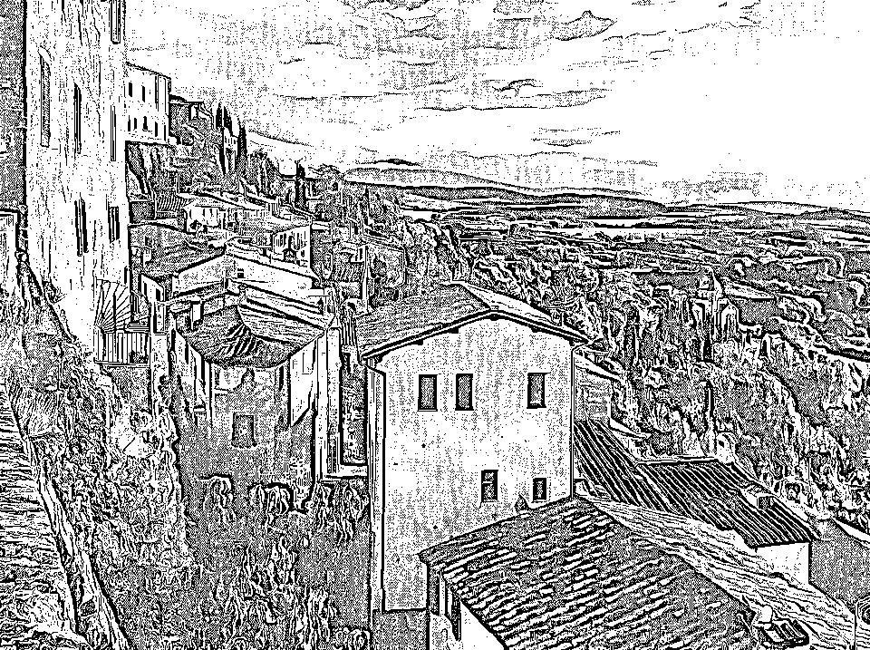

**结语**

**爱与自由。**当我们爱一个人的时候，大部分时候是从对方身上去寻找自我的影子。这是人之常情，也是在所难免。**但金星在水瓶座之爱，在较理想的发展阶段，是一份超越的爱。**

在关系中，哪一方都不会失去自我，并且支持彼此成就最独创的自我。在这里，无论你是熠熠生辉，还是普普通通，众所周知，还是默默无闻，**你都是不同凡响的存在于这世间的唯一。**

我爱你，因而不把自己的执念加诸于你，不想让挂碍限制了你，**希望你永远有做自己的自由，而我的爱会陪伴在你身边。**

**版权声明：**原创文章由作者授权首发于若道平台，欢迎转发，反对抄袭。友号转载请申请白名单。

**MaryChan 玛丽**

人本主义占星师、花精咨询师

于成都创办工作室，从事咨询、组织相关活动 8 年

咨询预约号：MaryChen336

微信公众号：ZhanXing336

长按打赏

**学习占星学****点击下图了解课程详情** 

**

**微信又双叒叕改版啦，不想错过若道君的推送？**

**就把若道设为星标吧！**

**▼**

**喜欢记得点一下在看哦☟**

****报名直达入口****

# 征集 | 这个春天，让我们听听你做过的最酷的事情！

> 原文：[`mp.weixin.qq.com/s?__biz=MzA5NjA0NTAxNg==&mid=2651468753&idx=2&sn=4119f13f411f1fb7aa9d5d0b42955c7b&chksm=8b488166bc3f0870deddff4bdd6de2df966c71e457baa6d434bc635bf88a7414be394d9b92fb&scene=126&sessionid=1692737852#rd`](http://mp.weixin.qq.com/s?__biz=MzA5NjA0NTAxNg==&mid=2651468753&idx=2&sn=4119f13f411f1fb7aa9d5d0b42955c7b&chksm=8b488166bc3f0870deddff4bdd6de2df966c71e457baa6d434bc635bf88a7414be394d9b92fb&scene=126&sessionid=1692737852#rd)

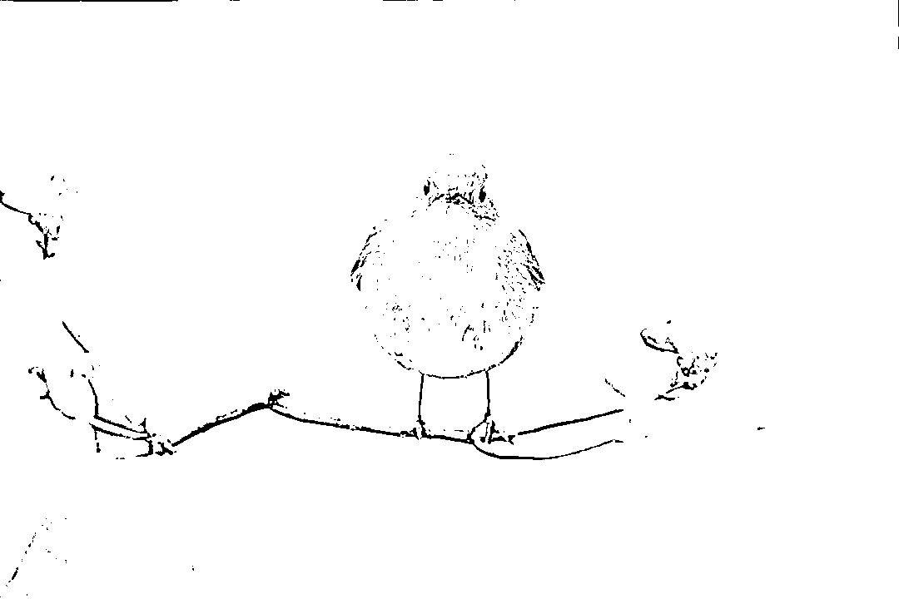

2022 年已经过去 1/6，无论世界怎么动荡和瞬息万变，春天也一如既往地来了。 在抖音看到高赞文案：**都朝春天去，别烂在过去和梦里，要肆意妄为，要志得意满。**这个春天，我们就要迎来属于妇女的节日啦！所以今天想对各位“妇女”同胞们问个问题：**到目前为止，**你们**做过的最酷的事儿是什么？**酷的定义不设限，让我们一起在这个春天里收获更多人生的可能性，来点不一样吧！**长按下图二维码填写问卷吧**

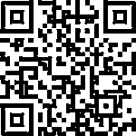

**| 往期征集文章 |**[冥王星](http://mp.weixin.qq.com/s?__biz=MzA5NjA0NTAxNg==&mid=2651464091&idx=1&sn=7f9d4f5c592a48b6dbe15987f4325c88&chksm=8b48932cbc3f1a3a50e632a6fe56853ab260f70893b6f4d2868a37bf2dc70932883fadb83d6f&scene=21#wechat_redirect) |[ 天王星](http://mp.weixin.qq.com/s?__biz=MzA5NjA0NTAxNg==&mid=2651467236&idx=1&sn=f863363054b8ff8938110edbca4ab14d&chksm=8b489f53bc3f1645100f16537ff2b4670e30da38d87f39fc6d31e28852c75531567058898964&scene=21#wechat_redirect) | [海王星](http://mp.weixin.qq.com/s?__biz=MzA5NjA0NTAxNg==&mid=2651468318&idx=1&sn=33fa9b18ce96eff58ebb10c846c27603&chksm=8b4880a9bc3f09bf05c7ece391a26157dabcbe6fd45f897be4e35e397187b13ea18754bacad3&scene=21#wechat_redirect)

# 核心课程 L3-5 | 四位国际导师授课，教你花式玩转星图，掌握各类高阶技巧！

> 原文：[`mp.weixin.qq.com/s?__biz=MzA5NjA0NTAxNg==&mid=2651468753&idx=3&sn=262d1a87180289f1b38c06723344afbd&chksm=8b488166bc3f0870c673c433d17e0d11849dfd333df88156a9c9dabc134476db535861ab956b&scene=126&sessionid=1692737852#rd`](http://mp.weixin.qq.com/s?__biz=MzA5NjA0NTAxNg==&mid=2651468753&idx=3&sn=262d1a87180289f1b38c06723344afbd&chksm=8b488166bc3f0870c673c433d17e0d11849dfd333df88156a9c9dabc134476db535861ab956b&scene=126&sessionid=1692737852#rd)

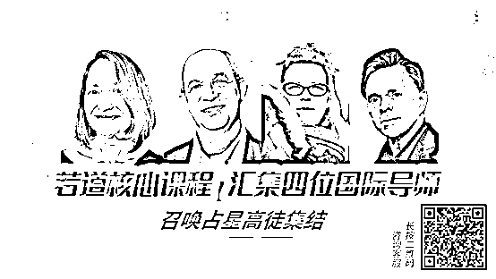

若道占星是中国职业占星师的“黄埔军校”。至 2011 年若道成立以来以培养出上百位职业占星师，**若道核心课程体系是我们根据中国学生的学习习惯不断优化占星教学体系，让学员学成后更自如地应对本土咨询市场的需求。**

教授好占星学，不仅仅需要邀请一两位老师教学，更需要对教学难点有充分了解，且有持续的教学跟进服务。**10 多年来多次核心课程和各种专题课程的教学，让若道非常了解中国学生学习占星学的难点和卡点，合理有效地拆分、提炼课程知识点，同时也积累了丰富的国外老师和中国老师、助教（均通过 ISAR 认证）紧密配合以及课程顾问密切配合教学的经验。**

 2022 年，汇集顶级占星学大师资源和教学经验，结合占星学知识体系和不同老师的教学专长，我们首次推出由四位国际导师联合授课的若道核心课程。

本次有幸邀请到全球目前**权威资深**的**四位占星导师**联合授课

本次核心课的课程内容，根据每位老师多年来在占星学研究和教学中的专长领域分工，来为学员提供最好的学习体验和收获。

L3-5 是若道中高阶课程，适合已经掌握了十二星座基础知识的学员，本期线上 106 课时，每周四晚直播，错过直播的同学次日下午 2 点后可以通过课程回放补课温习，线下 3 个主题案例演示工作坊（共计 6 天，36 课时），配合线上知识点教学部分，更加方便解盘实操。

参加若道毕业认证考试后可申请入驻若道咨询平台，执业占星咨询。

**想了解自己是否适合这期课程可参加入学测试：**

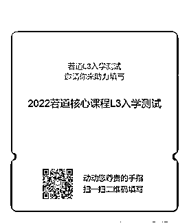

1

**是哪四位国际导师执教？**

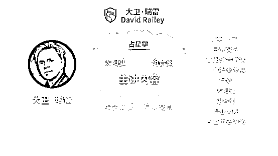

**大卫·瑞雷（David Railey）老师**是若道联合创始人，致力于在中国教授和推广西方占星学，十年来一直活跃在占星学教育前线，大卫老师深爱着他的中国占星学生们，不断根据中国学生的学习习惯优化核心课教学内容，本次课程中的**星座、行星、星图综合解读、行进、太阳弧、组合图、占星历史流派**等部分内容都是经过大卫老师不断淬炼的教学精华。

大卫老师对于**月亮交点**具有独树一帜的研究。2010 年，其著作《灵魂的目标》中文版出版，也是这个契机，大卫老师和蒋颖老师一起创办了若道占星学校。

大卫老师曾任 ISAR 全球副主席、CAPISAR（ISAR 职业占星师资质认证机构）主席，能向想要参加 ISAR 资质认证考试的占星学子传授最权威的经验。

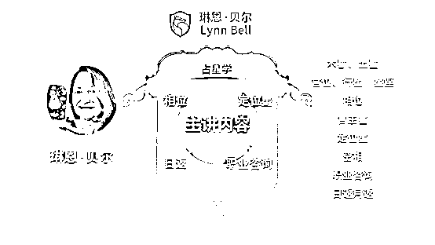

**琳恩·贝尔（Lynn Bell）**老师研究心理占星学和家族模式数十年。对于占星学中的理论知识有着深刻独到的见解和专业的研究思路。

琳恩老师是法国心理占星学协会的会长。2016 年，获得查尔斯·哈维（Charles Harvey）杰出的**占星学服务奖**。

琳恩老师本次会抽丝剥茧地教授部分占星学基础知识，作为一个从多个层面进行工作的占星咨询大师，琳恩还会教授结合了心理学的观点的**职业占星咨询工作。**

2020 年琳恩老师在若道开设的 ISAR 选修课“太阳返照”课程中，学员们根据老师的技法体系和研究思路进行了小组研究和分享，思路顿开，收获满满。本次核心课中**太阳返照、月亮返照**部分将由琳恩老师教授。

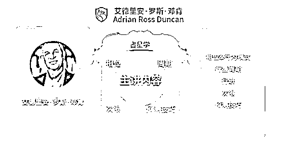

**艾德里安·罗斯·邓肯（Adrian Ross Duncan）**老师是人本主义占星学、卜卦占星学和经世占星学领域的知名占星师。作为若道两次 ISAR 选修课“卜卦占星学”的主讲老师，**相位与行为模式、行星周期、行进、推进、进阶的预测技法**是邓肯老师特别擅长的领域。

**相位**是占星学习中的一个难点，也是占星学习的一个小分水岭，有经验丰富的老师教授带领非常重要，邓肯老师教学生动具体，对于**相位与行为模式**的研究非常深入，写作了大量的相关文章。若道独有的占星师养成计划中的研究小组助教还会带领大家吃透相位，帮助大家打下扎实的基础，为后续解读出生星图以及行进、推进做好准备。

邓肯老师对于时事和占星学的结合非常有研究，课程内容中的**行星周期、行进、推进、进阶预测技法**由邓肯老师主讲教学。

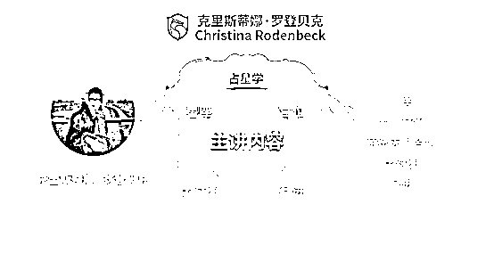

**克里斯蒂娜·罗登贝克（Christina Rodenbeck）**老师在牛津大学城生活和工作，深受周围知识和文化氛围影响，教学风格框架清晰且具有延展性。老师具有非常丰富的**亲密关系咨询**经验，在**比对图**领域也有诸多研究成果和教学经验。

现在正在授课的 ISAR 选修课“小行星”中，老师展现了对于神话学、心理学、占星学的深刻洞见，是集严谨与浪漫于一身的宝藏老师。

本次核心课程中克里斯蒂娜老师将按照她的教学理念教授**星座、宫位、行进、比对图、亲密关系咨询**等部分。

2

**在若道学习是怎样的感受？**

**来自参加课程学员的分享**

大卫老师是我最尊敬的老师，在我人生最低谷的时期，一次偶然的机会，我在网上第一次接触到了他的占星学，给了我很大的触动，那时候我没有系统的学习，但在心里种下了草，十年过去了，今年终于可以报名学习了，心里十分开心，想到明年五一左右还有线下活动，可以见到同学们和心中的神（大卫老师） ——学员 A

跟随大卫老师学习很有趣很开心，每次可以听到您的笑声。喜欢您有魔力的笑声。睿智帅气平和的老爷子。——学员 B

一丝不苟的输出和幽默的语言风格 带我打开了专业占星之门。老师的课非常生动有趣，老师也很可爱！听老师的课很轻松愉快，非常喜欢。不断地引领我走在人本主义占星学的道路上。——学员 C

林恩老师作为双子风格显著的特点，给我留下了深刻的印象，作为风象能量爆棚的我，听林恩老师的课，感受到思维风暴的洗礼，非常享受。——学员 H

首先要赞美克里斯蒂娜老师的课件配色 每次都超级美丽！她对天平座到双鱼座根据季节的讲解和配图给我留下了很深的层层递进印象，很多疑惑都能在老师的解读中豁然开朗，非常棒。——学员 R

克里斯蒂娜是水象能量明显的老师，给我很不一样的感觉，我星盘中水象能量偏少，让我看到水象能量的表达方式的不同。——学员 NX

3

**L3-L5 课程具体安排**

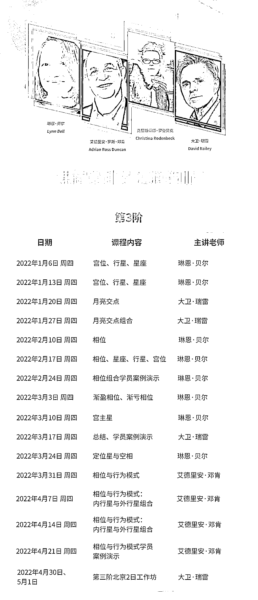

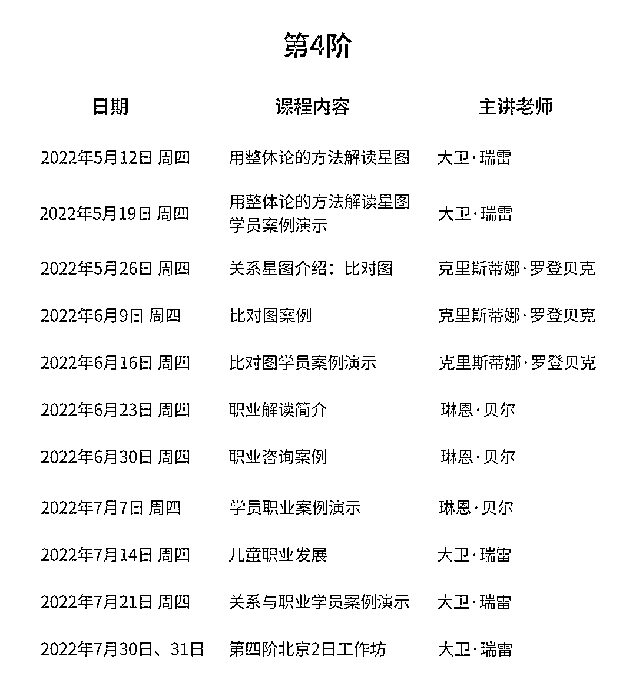

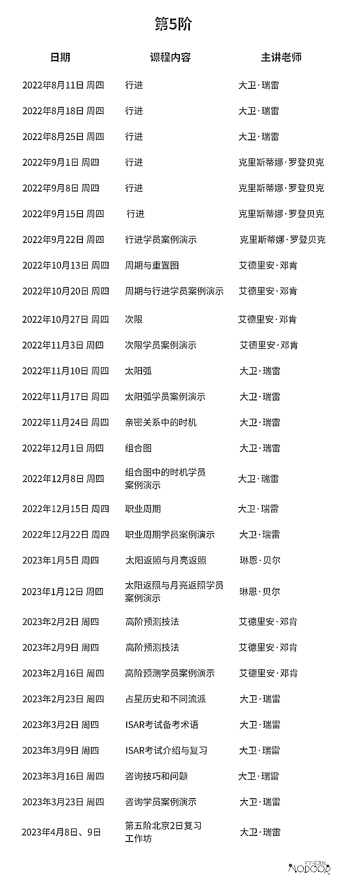

***L3 *******课程安排 直播+现场案例演示工作坊****

*   **线上直播课程：**2022 年 1 月 6 日开课，每周四晚上 20:00-22:00 上课。共 15 次课，30 课时。

*   **北京现场工作坊：**2022 年 4 月 30 日、5 月 1 日。2 天，12 课时，9:30-17:30（午休 2 小时）

***L4 *******课程安排 直播+现场案例演示工作坊****

*   **线上直播课程：**2022 年 5 月 12 日开课，每周四晚上 20:00-22:00 上课；共 10 次课，20 课时。

*   **北京现场工作坊：**2022 年 7 月 30 日、31 日，共 2 天；12 课时，9:30-17:30（午休 2 小时）。

***L5 *******课程安排 直播+现场案例演示工作坊****

*   **线上直播课程：**2022 年 8 月 11 日开课，每周四晚上 20:00-22:00 上课；共 28 次课 ，56 课时。

*   **北京现场工作坊：**2023 年 4 月 8 日、9 日，共 2 天；12 课时，9:30-17:30（午休 2 小时）。

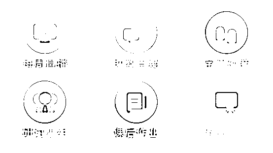

4

**课程价格**

****L3-5 价格：4**5000 元 **

**优惠价：35000 元（获取方式请添加课程顾问咨询）**

*   **温馨提示：**报名课程时请仔细查看勾选的《教学协议》，如有疑问请咨询课程顾问 Margaret 老师。

*   **联系方式：**微信添加 Nodoor233

长按二维码添加 Margaret 咨询

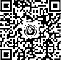

5

**退转课程**

*   **退款原则请详看《教学协议》，如有疑问请咨询课程顾问。**

****名师汇集金牌核心课程 L3-5****

**授课老师：**琳恩·贝尔、艾德里安·罗斯·邓肯、克里斯蒂娜·罗登贝克、大卫·瑞雷

**授课时间：**2022 年 1 月 6 日起

**授课方式：**网络课程**，**英文授课，中文翻译

**费用：**45000 元**（优惠价：35000 元，获取方式请添加课程顾问咨询）**

**课程负责人：****Margaret**（微信号：nodoor233，请备注“核心课”）

长按二维码添加课程负责人咨询~

****报名请点击“阅读原文”****

# 这个情绪激烈的双鱼座新月，这份免费新月报告安抚你的心

> 原文：[`mp.weixin.qq.com/s?__biz=MzA5NjA0NTAxNg==&mid=2651468633&idx=3&sn=cc70e85b0b07f3577d29c47c0efcf248&chksm=8b4881eebc3f08f851edc596ba572aef6d2aa842726e51c25f43069ac2d05e35fe9c687621ac&scene=126&sessionid=1692737852#rd`](http://mp.weixin.qq.com/s?__biz=MzA5NjA0NTAxNg==&mid=2651468633&idx=3&sn=cc70e85b0b07f3577d29c47c0efcf248&chksm=8b4881eebc3f08f851edc596ba572aef6d2aa842726e51c25f43069ac2d05e35fe9c687621ac&scene=126&sessionid=1692737852#rd)

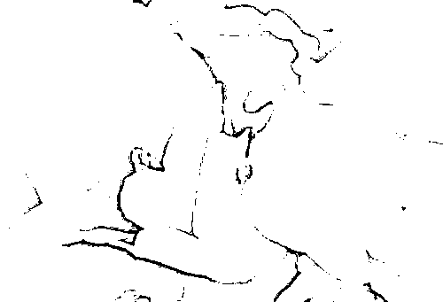

北京时间 3 月 3 日 1:34，新月发生在双鱼座 12°06′。每到新月时分，若道君都会为你奉上根据你出生星图量身打造的免费新月报告。可是新月为什么要许愿？新月报告该如何领取？让若道君来教你。　**什么是新月？**　从占星学看，新月是月亮周期的一种相位。新月是开始，又称为朔，对应中国农历初一，太阳、月亮在此时合相。此时月亮运行到太阳与地球之间时，月亮以黑暗的一面对着地球，并且与太阳同升同落，地球上看不见月亮。
本次新月时间

**3 月 3 日 1:34，新月发生在双鱼座 12°06′。**

为什么新月要许愿？

新月是一个周期的开始，新月发生的时候，太阳与月亮合相，能量很强。当新月出现时，你也许会发现灵感忽现，非常适宜开启新领域、项目与行动，缔结一段新的关系或合作。许愿会加强新月的能量，也有助于你了解自己现阶段适合开启的方向。 

本次新月最佳许愿时间从新月开始到其后的 48 小时内，许愿的力量最强。**最佳许愿时间：3 月 3 日 1:34-3 月 5 日 1:34**

属于你的免费新月报告每到新月时刻，看着占星文章里写着：看看你新月的宫位，如果新月在第 X 宫，你可以许愿的方向是……是不是常常一头雾水？新月的宫位？我到底该看哪里啊？而有时，那些标注上升星座的文章也会让你忍不住想：虽然我的上升星座是这个，可是我的新月好像并不落在你说的宫位啊？你是不是写错了？

虽然这些文章都没有写错，可是好像对你而言都太不友好了。**Don't Worry！**别着急，让博学又体贴的若道君来帮你！我们推出了一份**免费**又**好用**的新月报告！而且是专门为你设计的哦，**根据你出生星图为你量身打造的，只****属于你的独家新月报告**。报告有哪些内容？**新月时间****最佳许愿时间****如何许愿 **属于你的**许愿关键词**本次新月给你的**建议**你会有怎样的**感受 ******机会****

********

如何许愿？许愿方式也很简单。你可以把愿望写下来，或者双手合十后交叉，闭上眼睛来祈祷。 报告中会为你提供**祈祷词示例**，可以多多参考哦～ 你还可以适当添加自己的语言，创造属于你自己的祈祷文！如果报告拿到手了，快对照着许愿吧！

**这份好用又暖心的报告，点击****阅读原文****即可领取！**

****

****点击“阅读原文”即可获取新月报告****

# 初阶心理占星学核心课 | 我们教授占星学，也教授心理学概念

> 原文：[`mp.weixin.qq.com/s?__biz=MzA5NjA0NTAxNg==&mid=2651468633&idx=2&sn=b3aa2215d398da490159b735c8303045&chksm=8b4881eebc3f08f8a6b85f25291c519b640eea9c60c101c8b1cf182fee86fc7f5e40644a677d&scene=126&sessionid=1692737852#rd`](http://mp.weixin.qq.com/s?__biz=MzA5NjA0NTAxNg==&mid=2651468633&idx=2&sn=b3aa2215d398da490159b735c8303045&chksm=8b4881eebc3f08f8a6b85f25291c519b640eea9c60c101c8b1cf182fee86fc7f5e40644a677d&scene=126&sessionid=1692737852#rd)

**美国占星心理学学院创办人**

**格伦·佩里**授课

**40 余年**职业占星师生涯所学精华**倾囊相授**

跟随主讲老师学习融合**心理学体系**的**占星知识**

为星图咨询解读打下坚实的基础

**新学员**，

以最严谨扎实的心理占星核心课程，

作为占星学习的开端；

**老学员**，

最有复训价值的核心课，

复习夯实基础知识的同时，补充心理学知识体系。

1

**这门课程最大的看点是什么？**

1. **两位国际占星学大师**共同授课，将合计**90 年职业占星师生涯所学精华**倾囊相授；2. 修完**2 年课程**，考试通过的毕业生将获得**美国占星心理学学院证书**（Academy of Astropsychology）和**若道毕业证书**，**高含金量双证书**；3. 101-102 阶段**24 次课程**的充分授课时间（录播课程 16 次课；直播课程 8 次课），全面而详细地讲解占星学知识、技能和运用；4. 跟随主讲老师学习**自成体系、逻辑严密、实用性强的占星语法、星图解读方法**；5. 学习独特的**发展年龄预测法**，从星图看对关键年龄阶段的发展及议题；6.**大量的课程资料，101-102 阶段课后阅读资料超过 14 万字；101-205 全阶段光是课后阅读资料超过 60 万字**；7. 合理的课程设计，101-205 全阶段每一节课都有课后作业和测验，实时验证学习吸收效果；8. 本课程可以作为**ISAR 选修课**中的一门，再修两门就满足 ISAR 认证选修课要求；

9. 205 阶段 **18 次占星咨询技巧的培训**，为 ISAR 口试保驾护航，也为正式从事占星咨询建立基础；

10. 教授重要的**心理学概念**，比如与客体关系、心理动力理论、个人神话和叙事疗法相关的一些概念，学习如何将它们整合到星图解读中；11. 105 阶段了解**《精神疾病诊断与统计手册》**诊断标准，探索星图中的心理疗愈；12.  第二学年学习**叙述疗法**和**自传写作**，将之作为自我疗愈和咨询的工具。

**格伦老师致学员的信**

（向上滑动查看内容）

**亲爱的学员：**

作为占星心理学学院的校长，我的目标是帮助你顺利完成学业。

占星心理学学院的课程让你能够在经济承受范围内，灵活地学习占星学。我们的课程让你可以舒适、便捷地在家学习，不用打乱你本就繁忙的日程。我们有完善的在线学习系统，让你能在线上课、下载学习资料、进行测试并自动获得即时反馈，还可以在虚拟课堂上同你的教员和同学互动。

作为私人开业的**职业占星师**和**执业心理治疗师**，我已经**工作超过 30 年。**我还花了近 10 年的时间，在研究院里学习并获得**心理学的硕士和博士学位**。这段训练和经历是无价的，帮助我将占星学发展成为连贯的 21 世纪模式。

我们的占星学培训项目是**系统化的、清晰的、组织有序的、易学的、前沿的。**尽管有许多类似的学校可供你选择，但你不会在这些学校中看到像占星心理学学院所提供的那样有深度的或尖端的课程。

**我非常期待 2022 年再次在若道教授心理占星学核心课程。**我们重新规划和升级了本次课程体系。**新的课程包含之前完整课程的 72 个录播视频，每个视频长 2 小时；以及由我教授的 37 次直播课程，和大卫老师教授的 10 次直播课程，每次课程 2 小时。**在实时课程中，除了我提供的案例，我还会用学员的星图进行案例演示，与学员互动，阐明视频中教授的原则和方法。

**2 小时直播课程安排：**

**第一阶段 提问和讨论：**

这将在每节课开始时进行。邀请学员提出与课前提供的资料相关的具体问题。这一阶段将持续 15-30 分钟。

**第二阶段 示例：**

这一阶段会讲解与每周任务相关的具体概念，例如行星的星座位置、宫位位置以及相位的意涵。星图示例来自我认识的人，如公众人物、朋友、家人、同事或以前的客户（不显示出生信息）。同样，这一阶段也开放课堂讨论，学员可以提出自己的问题和见解。

**第三阶段 学员案例演示：**

这个阶段会从学员的具体星图来阐明概念，例如火元素行星占优势。学员案例演示不会涉及任何类型的咨询或“解读”。它们将只是简单地包含一段对话，我会在对话中分享自己对某个配置的思考，然后问这个学员可能会如何主观地（影响、信念、行为）和客观地（事件/关系）体验这个配置。其他参课学员可能也会对讨论的主题有自己的见解或问题，他们也可以参与讨论。

我对这一新的在线课程形式感到兴奋，**并期待着从 2022 年 4 月 6 日开始认识我的新学员们。**获得本学院的文凭会是你做过的最明智的投资。你不仅将占星学掌握到前所未有的深度，还将学到如何为客户提供咨询服务并建立职业占星师的职业生涯。

真诚地

**格伦·佩里 占星心理学学院校长**

**为什么要学习心理占星学？**占星心理学是一个复杂的体系，让实践者能够向客户提供真正治疗性的益处。这从根本上说来是我们学院有别于其他学校之处：**我们教授占星学，也教授心理学概念。****我们明确讨论各种心理学概念，并将其与占星学无缝衔接。结果就是更深入的、更丰富的，最终更加强大的模式。****该项目专为初学者和渴望深造的有经验的占星师而设。**我们会从跨学科的角度探讨星图解读。**通过融合荣格心理学和各种其他模型的元素，学员将熟悉作为人格理论、发展模型、原型语言和诊断工具的占星学。**

2

**课程是怎么安排的？**

**101 占星学基础 **

**共 12 次课程：8 次 2017 年录播课+4 次直播课**

**占星学**关注成长，聚焦心理。外部事件意义重大，但我们可以把它们看作是对于发展中的心理结构的共时性反映，以及未来发展的媒介和催化剂。

在这个阶段的课程中，会以四种形态的几何形式介绍**占星原型：星座、行星、宫位和相位**。黄道带是人类心灵的象征性地图，其中的每个**星座**都代表一种基本的人类需求、原型人物、发展阶段和行为风格。

**行星**代表心理功能，以满足其关联星座的基本需求。**宫位**提供了环境舞台，行星在其中扮演它们的角色，而**相位**是行星之间的角度关系，在主观上体验为内在对话。

**课程安排**：

**录播课****、****直播课（周三）**时长都是 2 小时

第一节**录播课**：核心概念介绍

第二节**录播课**：黄道带的结构

2022 年 4 月 6 日**直播课**：核心概念、黄道带的结构提问和讨论、知识点示例

第三节**录播课**：图例、单态星体和其他奇妙的元素

2022 年 4 月 20 日**直播课**：图例、单态星体提问和讨论、知识点示例

第四节**录播课**：星座介绍（从白羊座到处女座）

第五节**录播课**：星座介绍（从天秤座到双鱼座）

2022 年 5 月 4 日**直播课**：12 星座案例演示

第六节**录播课**：行星作为过程

第七节**录播课**：行星作为内容

第八节**录播课**：将碎片整合起来

2022 年 5 月 18 日**直播课**：整合星图时，将行星作为过程和内容案例演示

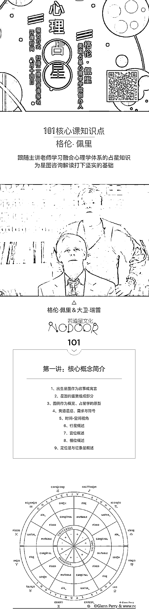

**102 行星落星座、宫位** 

****共****12****次课程：**8 次 2019 年录课+4 次直播课**

这个阶段的课程**聚焦于初步的星图整合。**

学员将学习**占星语法**，以及如何运用它们来阐释**行星的星座落点**。学员不需要强记书中的星图解读，而是学习分析基础的占星句法结构，应用这些语法规则来思考和讲述这门语言。学员们将学习如何构建精妙的句子，将动机、功能、特质、状态和事件组合起来。

此外，还将学习解读**行星宫位落点**的规则。宫位被定义为心理环境，为特定类型成长和发展提供背景。行星落在宫位中，象征着情境中的特殊状态，应对环境挑战的方式，以及通过共时性人物和事件而外化的自我部分。

学员们将探索如何将星座和宫位落点融合在一个单一、整合的陈述中，做出灵活、层次分明的解读。

**课程安排**：

第一节**录播课**：占星语法介绍

第二节**录播课**：行星星座作为行为风格

2022 年 6 月 1 日**直播课**：占星语法、行星星座作为行为风格提问和讨论、知识点示例

第三节**录播课**：思维状态和行为结果

第四节**录播课**：学习行星的星座落点

2022 年 6 月 15 日**直播课**：思维状态和行为结果、行星的星座落点提问和讨论、知识点示例

第五节**录播课**：回顾宫位的含义

第六节**录播课**：宫位中的行星过程

2022 年 6 月 29 日**直播课**：宫位的含义、宫位中的行星过程提问和讨论、知识点示例

第七节**录播课**：行星在宫位中的状态

第八节**录播课**：行星作为宫位的内容

2022 年 7 月 13 日**直播课**：行星在宫位中的状态、内容的提问和讨论、知识点示例

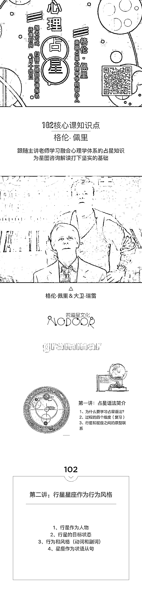

3

**导师简介**

**格伦·佩里（Glenn Perry）**

*   这位传奇的占星师，也是一名拳击和摩托车爱好者

*   他毕业于赛布鲁克学院(Saybrook Institute)，是心理/意识研究专业博士

*   也是拥有 30 余年经验的加州注册婚姻和家庭治疗师 （CAMFT）

*   美国占星心理学学院（Academy of AstroPsychology）的创办人

*   他曾任国际占星研究协会 （ISAR）以及联合占星大会董事会（UAC）副主席

*   也是 ISAR 突破性道德标准的设定者

*   康涅狄格州研究生院（the Graduate Institute of Connecticut）原型宇宙学与意识进化项目的负责人

*   共出版八本占星学著作：《心理占星学入门》《心理占星论文集》《盗取天火》《从忠诚到革命》《星图中的阴影》《占星职业议题与伦理》《出生星图深度分析》《从古代到后现代占星学》

**大卫·瑞雷（David Railey）**

*   若道联合创始人，致力于在中国教授和推广西方占星学；

*   曾任 ISAR 全球副主席，CAPISAR（ISAR 职业占星师资质认证机构）主席；

*   1976 年，通过亚特兰大职业占星师考试，成为全职占星师，随后通过 AFAN 和 ISAR 职业测试；

*   1980 年，与杰夫·焦耳一起在亚特兰大创建“每日行星”占星学中心。此后在亚特兰大占星协会担任 4 年考官，并且两次担任亚特兰大地区占星协会主席。1979-1992 年，作为占星师活跃于美国社会媒体，向不了解现代占星学变化的大众宣传专业占星学知识。在 1989-1992 年期间，他在 WRGG 电台 12 频道每周主持个人电视秀“今日占星学”，早先他还在 WRFG 的广播节目中播讲宇宙天气节目；

*   2010-2014 年，任全美占星师联盟监督委员会委员；

*   2010 年，其著作《灵魂的目标》中国版出版，和蒋颖一起创办若道占星学校和其官网 www.nodoor.com；

*   2017 年，被选为 ISAR 委员会成员。ISAR 是世界最大的国际占星机构，会员遍布 45 个国家，2017-2020 年曾任 ISAR 全球副主席、CAPISAR（ISAR 职业占星师资质认证机构）主席。

**助教简介**

**薇安**

*   全职心理占星师、ISAR 认证占星师（2016 年获得）；

*   北大心理学硕士、MBTI 国际认证施测师；

*   若道认证生时校正资质及 COAC 高阶资质毕业生；

*   连续两届担任格伦·佩里老师亲授的“美国占星心理学院&若道占星双认证核心课程”主助教；

*   2012 年至今，持续追随多位国际占星大师进行占星学的深入学习；

*   2007 年至今，持续进行精神分析及心理动力取向的理论及技巧研习；

*   致力研究心理学与占星学的整合运用。

4

**此次课程适合哪些人？**

*   对占星学感兴趣，想要入门的零基础者

*   占星学小白，但有志成为职业占星师的人

*   有一定占星学基础，但不知道该如何整合星图复杂碎片的人

*   想要师从更多殿堂级占星导师学习占星心法的人

*   走在自我探索和个人成长道路上的人

5

**选择若道学习占星学的优势**

**运用自由意志，扭转破坏性模式，绽放天赋潜能**

若道是人本主义占星学的旗手。因为我们相信，**人通过了解模式、觉察习性、积极疗愈、终将释放其潜能，与命运共舞**。

**进入国际权威职业占星师认证的快车道**

占星界的“联合国”ISAR（国际占星研究协会），是具有全世界影响力的占星教学和研究组织和职业占星师全球认证机构，认证占星师遍布 47 个国家。**在 ISAR 的 22 所附属学校中，大中华地区的附属学校只有若道一家**。在国际化的教学理念大纲标准下，**若道毕业生在 ISAR 国际认证占星师的考试通过率多次全球首位**。

**十年占星学教育中国本土化教学经验**

**根据中国学生的学习习惯不断优化占星教学体系，让学员学成后更自如地应对本土咨询市场的需求。**

学好占星学不仅仅需要邀请一两位老师教学，更需要对教学难点有充分了解，且有持续的教学跟进服务。**10 年来多次核心课程和各种专题课程的教学，让若道非常了解中国学生学习占星学的难点和卡点，合理有效地拆分、提炼课程知识点，同时也积累了丰富的国外老师和中国老师、助教紧密配合以及课程顾问密切配合教学的经验**。

若道还专门开发了有助于占星学习的“**若道**”APP，每门课程都设有答疑板块，学员能够方便快捷地提交问题，助教及时答疑解惑和批改作业。

**融入中国顶尖的职业占星师群体**

若道是中国职业占星师的“黄埔军校”。职业占星师的培养从若道开始，**进入若道，你就走进了中国顶尖的职业占星师群体，和一群志同道合的师兄师姐联谊，获得经验，共同成长**。 

**多种奖学金支持**

为了鼓励学员不因为暂时的经济困难而放弃学习，我们特意设置了各种**技能交换和奖学金**。

对于有一技之长的学员，我们推出的技能交换的项目包括**“笔译”、“笔记整理”、“平面设计”、“课本朗读”、“班级服务”**等技能交换项目；

而对于努力学习、出勤率高、完成作业率高的学员，我们设置的**土星奖、木星奖**等各种奖学金在等着你。

为了感谢帮助我们推荐学员的老学员们，我们设置了“**老学员推荐奖**”；

对于通过问卷提建议，帮助我们提高服务的学员，我们也设置了相应的奖学金。

**开启占星咨询的职业规划和支持**

若道为占星学员搭建了占星问答平台和占星咨询平台，并提供严肃占星学影响力最大的媒体平台，全力为毕业生提供宣传渠道，帮助你吸引和积累咨询生涯初期的种子客户。若道为学员开发了适用于占星学习的“若道”APP，并不断更新完善。

**①  微信平台**若道微信平台作为业内颇具影响力专业平台，为文笔好的若道毕业生提供传播占星学并免费宣传自己的机会。有的学员因为文笔获得众多粉丝喜爱，在 3 年多时间积累起 2000 多人的潜在客户。

**②  **咨询平台****若道咨询平台是我们为优秀毕业生所搭建的平台，帮助毕业生在自己的咨询拓展之外，用若道提供的平台扩展咨询客户群。自咨询平台 2017 年 8 月上线运营以来，咨询平台共入驻 65 人，收入最高者达 32 万元。

此处所列学员收入仅供参考，收入高的学员和其专业水准、努力程度密切相关。若道平台尽其所能将自己定位为辅助学员开展职业生涯的桥梁。

6

**课程价格**

**101-102 初阶**

**正价：**6800 元

**早鸟价：****6200 元**

**早鸟价截止时间：2022 年 3 月 16 日**

**学习充值卡优惠价：5800 元**

**★ 其他各阶段课程单报价格，请咨询课程顾问：**

**王老师（微信/手机：18510107057，请备注“格伦核心课”）**

长按二维码添加课程负责人咨询~

**全阶段学习后，可参与若道占星毕业认证考试，考试费用为：580 元**

7

**直播课开课时间**

**2022 年 4 月 6 日（周三）20:00-22:00**

8

**退转课程**

**退款原则请详看《教学协议》，如有疑问请咨询课程顾问。**

9

**格伦老师教学内容试看**

**格伦·佩里老师如何将心理学和占星学结合，如何开始教授心理占星学？点击下方视频可详细了解格伦老师理念。**

<mpvideosnap class="js_uneditable custom_select_card channels_iframe" data-pluginname="videosnap" data-id="export/UzFfAgtgekIEAQAAAAAAHBcLpepWXQAAAAstQy6ubaLX4KHWvLEZgBPEkIMYRVhfSLT8zNPgMIs23XYw2eSgrRaPW3Dj9_BA" data-url="https://findermp.video.qq.com/251/20304/stodownload?encfilekey=S7s6ianIic0ia4PicKJSfB8EjyjpQibPUAXolnQrZwePcCZ0XffhxtFKBwL8xABabPSCrxp2TBZSdOyypmjhiabiaWTOO3EBU1J4xTc5YqicfMicRDjwKRTic0XAyGhw&amp;adaptivelytrans=0&amp;bizid=1023&amp;dotrans=0&amp;hy=SH&amp;idx=1&amp;m=&amp;scene=0&amp;token=AxricY7RBHdXDk6HpYh0d9Pco18Y10Pk2nRpsY9amBwj6UIOJ1WE7D2AzUtsaRQxICxmiaj8jRibI0" data-headimgurl="http://wx.qlogo.cn/finderhead/PiajxSqBRaEJYnVsqWfEX9qA0sI6hNVKsDfyzfPZ92WZMZyBpZWU5NA/0" data-username="v2_060000231003b20faec8c4e68a1ec2d4ca07e434b07755bbf47e7053a3059defd2c9d6c68a20@finder" data-nickname="若道" data-desc="#若道核心课 如何解读一张出生星图？出生星图有哪些组成部分？星图里不同组成部分分别代表什么？" data-nonceid="7032132594947358005" data-type="video"></mpvideosnap>****2022 双证书核心课 L1-2****

**授课老师：格伦·佩里、大卫·瑞雷**

**直播课开课时间：2022 年 4 月 6 日（周三）开课**

**授课方式：******网络授课，英文授课，中文翻译****

**费用：101-102 价格：**6800 元**（早鸟价 6200，2022 年 3 月 16 日截止，充值卡优惠价 5800）**

**课程负责人：王老师**（微信/手机：18510107057，请备注“格伦核心课”）

长按二维码添加课程负责人咨询~

****报名直达入口****

# 双鱼座新月 | 回到生命最原初的议题中去，它是开启全新意识的钥匙！

> 原文：[`mp.weixin.qq.com/s?__biz=MzA5NjA0NTAxNg==&mid=2651468633&idx=1&sn=fee212b051f6d3261ef72d454c748041&chksm=8b4881eebc3f08f8b0c4900b7627e73a3bd57ecfd9c3d033e7ac1f74b99f76a26f2f8b07029a&scene=126&sessionid=1692737852#rd`](http://mp.weixin.qq.com/s?__biz=MzA5NjA0NTAxNg==&mid=2651468633&idx=1&sn=fee212b051f6d3261ef72d454c748041&chksm=8b4881eebc3f08f8b0c4900b7627e73a3bd57ecfd9c3d033e7ac1f74b99f76a26f2f8b07029a&scene=126&sessionid=1692737852#rd)

****☆ **后台回复“今日”，给你一句生命态度**

作者/王芝桦 编辑/玫瑰 图片/pexels

**双鱼座新月****北京时间 2022 年 3 月 3 日 1:34 迎来双鱼座新月，太阳与月亮精准合相于双鱼座 12°06′。**此次双鱼座新月，完美诠释了双鱼座象征的“无极-太极”的神秘生化——一切都在流动，一切都在转化，“外在事件”正是“内在意识”的显化，我们可以通过微调内在意识的轮盘，帮助外部事件发生转化。

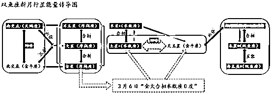

> **双鱼座新月重点影响人群**
> 
> **参考新月峰值影响期间各个行星的行进度数，以及逆行行星的轨迹影响；常规容许度，个人行星入相位 3°，出相位 1°；非个人行星入相位和出相位均为 3°。**
> 
> *   出生星图中，有**行星、四轴、南北交点**落入**固定星座（金牛座、狮子座、天蝎座、水瓶座）8°-29°**的人群。
>     
>     
> *   出生星图中，有**行星、四轴、南北交点**落入**变动星座（双子座、射手座、处女座、双鱼座）9°-25°**的人群。
>     
>     
>     
>     
> *   出生星图中，有**行星、四轴、南北交点**落入**基本星座（白羊座、巨蟹座、天秤座、摩羯座）23°-30°**的人群。

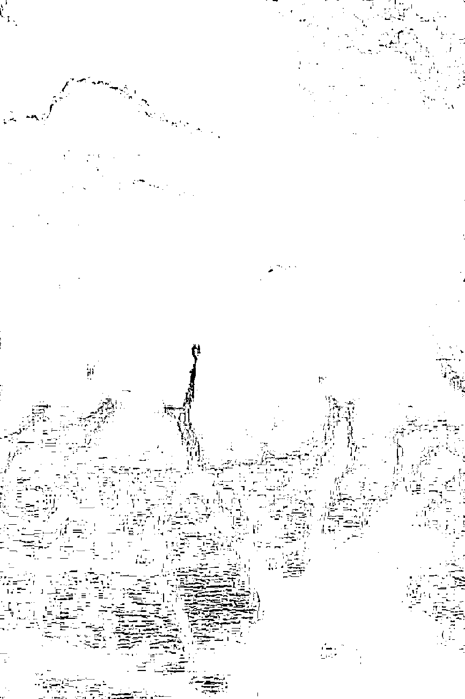

**“一念之转”决定“未来走向”**

****

**谁也无法预见，拼图一块一块组合起来的过程，最终将使我们的生活发生怎样天翻地覆的改变。**

**——马克·李维《第一日》**此次双鱼座新月的整体天象，让我想起“生命内在的七个脉轮”：**· 上下各三轮：**下三轮主导生命的根基、本能和力量，帮助我们扎根现实；上三轮主导认知、觉悟和觉知，帮助我们获得智慧。**· 中间一轮：**主导生命的自我认同和外部联结，像心脏一样起着中枢的作用，将上三轮“觉知宇宙洞见”、下三轮“落地现实生活”的能量融会贯通，保持“身心灵”一体的平衡与圆满。此次双鱼座新月，宇宙将善良、大爱、同理心注入“生命中心-中间脉轮”，引领我们敞开心轮，迎接各种能量的进入与融合，无论是理想与希望，还是恐惧与迷茫，都将被允许与包容。这是一个接纳自我情绪、共情他人伤痛的新月，也是总结现实经验、重燃未来希望的新月。**宇宙呼唤我们开启全新的意识旅程，敞开心，带着爱，驶向 4 月 12 日“木海合相”重磅天象的神圣时刻。**我们每个人都是创造未来的魔法师，那么就来看看魔法的神秘过程吧。

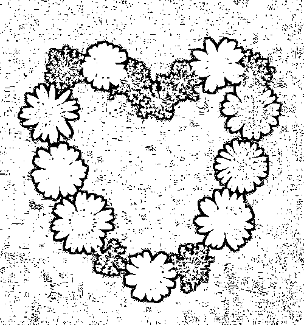

**1. 上三轮的灵性之光**

> **天象****· 新月合相木星：**双鱼座新月合相双鱼座木星。**· 木海互容：**双鱼座的两颗守护行星“木星和海王星”，于双鱼座形成能量互容。**· 新月六分天王星：**双鱼座新月与金牛座天王星形成六分结构。

此次双鱼座新月，新月的“开启能量”与木星的“扩张能量”在双鱼座的“意识海洋”之中合相交叠，而此时的双鱼座木星正与“联通最高宇宙意识”的双鱼座海王星处于“木海互容”的能量交汇之中。故而，此次双鱼座新月，宇宙赐予我们高阶能量，助力我们开启更为宏大、更有意义的理想愿景。几个重要的问题：**·** 我们是未来世界的创造者，那么，我们的“爱与慈悲”是否已经足够敞开？**· **我们是否可以敞开内心，接纳过去的伤痛，允许内在的情绪？**· **我们是否可以敞开内心，共情他人的处境，尊重他人的感受？**· **我们是否仍在关闭内心，逃避痛苦，推卸责任，隐匿在“受害者”的假相之中？此次双鱼座新月，“掀起现实震荡，唤起觉醒意识”的金牛座天王星与双鱼座新月形成六分联动，为我们的内心深处注入灵感并唤醒觉知——**想要重建未来，先要超越过去，此次双鱼座新月就是转动意识轮盘，升级意识系统的时刻。**到这里需要注意的是，木星、天王星和海王星都属于能量层级较高的行星，就像前文提到的“生命内在的七个脉轮”中主导认知、觉悟和觉知，并通往高级智慧的“上三轮”一样。那么问题来了，理想如何落地现实，智慧如何进入生活呢？这也是此次双鱼座新月需要面对和解决的问题。

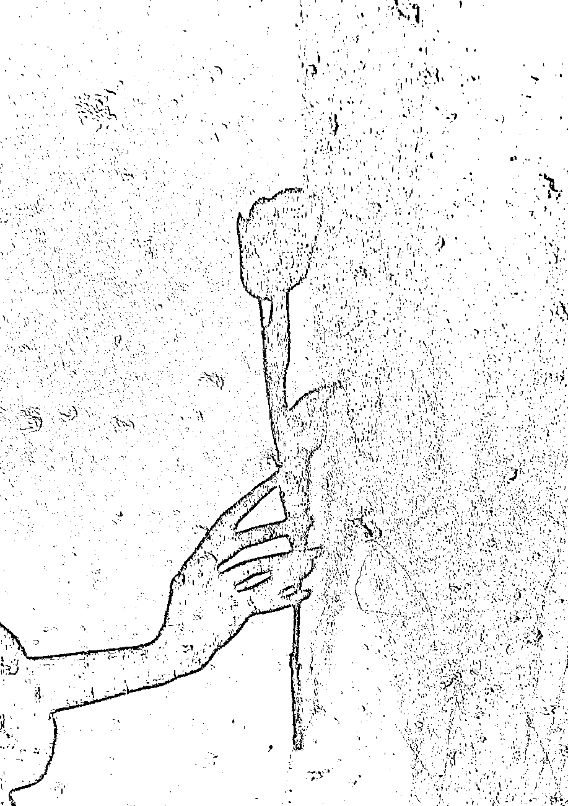

从“双鱼座行星能量传导图”中可以看出：联结宇宙意识的金牛座天王星、双鱼座新月和“木海互容”结构全部落入传导图的右侧，最近令我们焦头烂额的现实生活则全部落入传导图的左侧，而中间的联结点正是看似弱化但依然奏效的重磅天象“土天四分”结构。故而，此次双鱼座新月注定是通天通地、上下整合的一次新月。那么，我们就借助“土天四分”结构的桥梁，顺着土星的能量传导脉络，深入“下三轮”所对应的现实生活。在此之前，还是要从现实层面解读一下木星、天王星和海王星带来的影响：**·** 首先，国际社会的局势波动仍会持续发酵，这个过程将会触发各个方面的结构性变化。让我们祈祷世界和平，生灵安稳；**·** 其次，互联网可能出现炸裂性新闻，建议不要盲目跟风或肆意评判，多给敞开性的时间，多说建设性的言论，因为通过俄乌战争我们已经看到这是“网络比战场更复杂”的时代；**·** 最后，知名人物和权力组织可能出现人设崩塌的情况，将会对当下的演化和对未来的导向产生一定的影响。

**2. 下三轮的转化重生**

> **天象**
> 
> **· 金火冥三重合相：**金星、火星和冥王星合相于摩羯座。

自 2 月 17 日狮子座满月（详情点击：[狮子座满月](http://mp.weixin.qq.com/s?__biz=MzA5NjA0NTAxNg==&mid=2651467700&idx=1&sn=d0a5d51159d40ab01f9af6ebadbda3ff&chksm=8b489d03bc3f1415a3bf57344ce8e3ed218f5125e937e0e1e048bfc132ec7584ee82a034116e&scene=21#wechat_redirect)）至今的半个月时间里，发生了很多集体性的重磅事件：北京冬奥会圆满结束，冬残奥会即将开幕；香港疫情井喷式爆发，7 日方舱医院落成；八孩女子事件通报，问责处理 17 人；俄乌两国突发激战，全球线上线下忙得团团转。

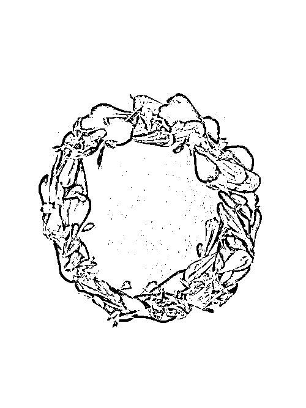

可能每一个人都在思索“这个世界怎么了”，感慨“战争都能直播”。是啊，这个“21 世纪+风元素周期”的世界，就像智商卓群但却怪异疯狂的天才一样，每天的新招层出不穷，令过去的经验难于应付，令未来的预测不敢出口。生命渺小，世事无常，我们的智商终究算不过天才的智商，不如珍惜彼此并活在当下吧。但是，我也不禁在想：这场席卷全球的新冠疫情，究竟“减速”了什么，又“加速”了什么呢？从 2 月中旬开始，金星和火星在摩羯座逐渐向冥王星靠近；2 月底到 3 月初，“金火冥三重合相”摩羯座进入紧密影响，这不由让人再次感受到**2020 年末“木土冥三重合相”摩羯座的时候，那种走在悬崖边如履薄冰的压力感和紧张感。**但不同的是：**· 当时的木星和土星：**冥王星要求做的是“洗牌”工作，也就是**重新评估和重新规划；****· 当下的金星和火星：**冥王星要求做的简直就是“粉碎”工作！因为接纳摩羯座这一组能量的土星早已进入水瓶座，并已与金牛座天王星搭建“土天四分”结构一年时间，而这组结构要做的就是——**“清算”所有拖后腿和阻挠创新的事物**！故而，**从 2 月下旬至今的这段时间，是关系、经济、价值观等方面容易发生立场纷争的时期，也是容易产生撕裂并带来破坏性的时期。**“金火冥三重合相”摩羯座这组结构中：**·** 揭示“业力执着”的冥王星，也同时接纳着天蝎座南交点的“业力课题”（冥王星守护天蝎座），可以说双管齐下地要将历史性的业力阴影翻出暗底——“只能更好，不能后退”的执着，助长着人们内心的贪婪与恐惧，制造着现实世界的罪恶与阴谋，这是彰显公平和主导共赢的“风元素周期”必须要清算的部分；**·** 接纳着金牛座北交点“进化策略”的金星，也同时接纳着金牛座天王星的“变革任务”（金星守护金牛座），两股能量指向——“返璞归真，回归平静”地活着；**·** 那么，夹在金星和冥王星中间，接纳着天蝎座南交点“业力阴影”的“战神”火星（火星守护天蝎座），又会如何行动呢？**这位英勇无比的战神被“罪恶、威胁、阴谋、死亡”包围，想要真正的突围，难免一场重生的洗礼。**

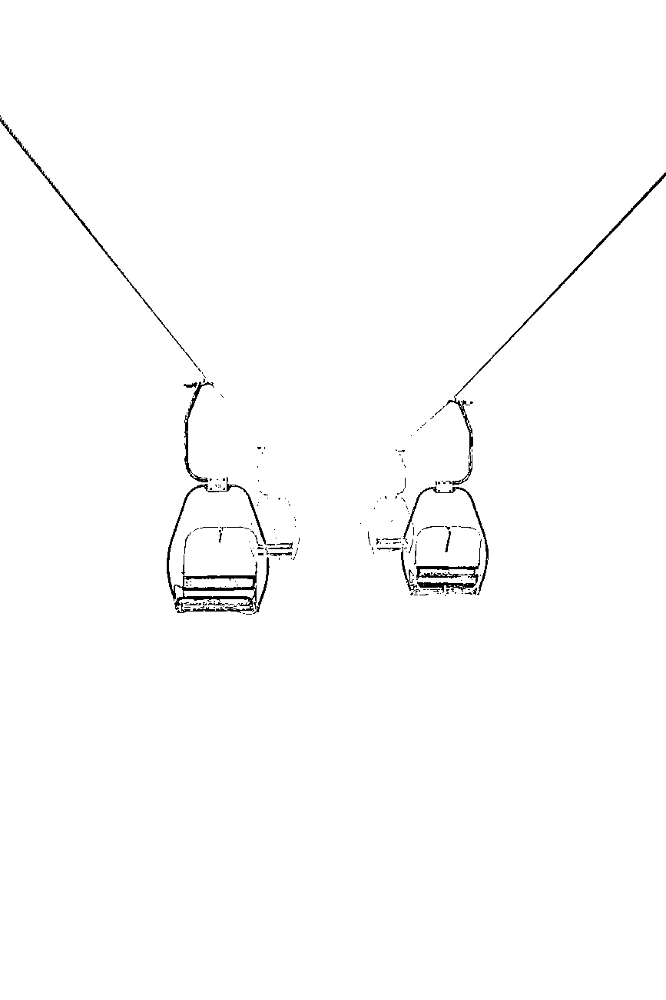

重生何其艰难。我们当下的困境，就像是“卡”在过去与未来之间，在减速与加速之间撕扯；我们当下的状态，就像两只脚分别踩在跷跷板两端的练习生，渴望突破困境并学会平衡，但技术和经验却不充足，不知道平衡的“尺度”调试到哪里最好。对，就是这个“最好”！为什么一定要最好的结果才行呢？但**“只能更好，不能后退”的内在意识已经影响了我们很多年，并且谁都不愿接受摔下来的狼狈**。于是着急、焦虑、恐惧、羞愧的情绪，扰乱着我们的心性；而越是心性不稳，结果就越是更糟。机会来了！**3 月 6 日，金星和火星双双换座进入水瓶座，并形成“金火合相水瓶座 0°”的重要天象，**引领我们再次按下 2020 年 12 月 22 日“木土星合相水瓶座 0°”开启的“风元素周期”的重启键——**我们不能再停留在“因恐惧而投射愤怒，因贪欲而不择手段”的旧有模式之中，未来的世界需要更加开放的视角和情感的温度，更多彼此的尊重和一体的共赢。**无论是国际社会，还是个人生活，希望都能被 3 月 6 日的重启能量唤醒重生之力，而此次双鱼座新月正是我们点燃这份希望的时刻——敞开心轮，迎接各种能量的进入与融合，无论是理想与希望，还是恐惧与迷茫，都应得到“接纳与尊重”，如此我们才能带着“爱与慈悲”走向 4 月 12 日“木海合相”结构的神圣之光。另外，建议朋友们**借助 3 月 6 日的重启能量，回溯 2020 年末的生活：初衷还在不在？航线偏离了多少？信念坚定多了几分？脆弱是否仍在叫嚣？**谁也无法预见，拼图一块一块组合起来的过程，最终将使我们的生活发生怎样天翻地覆的改变——敞开心轮，勇敢前行，未来必须天翻地覆，因为生命不要留在原地停滞不前。

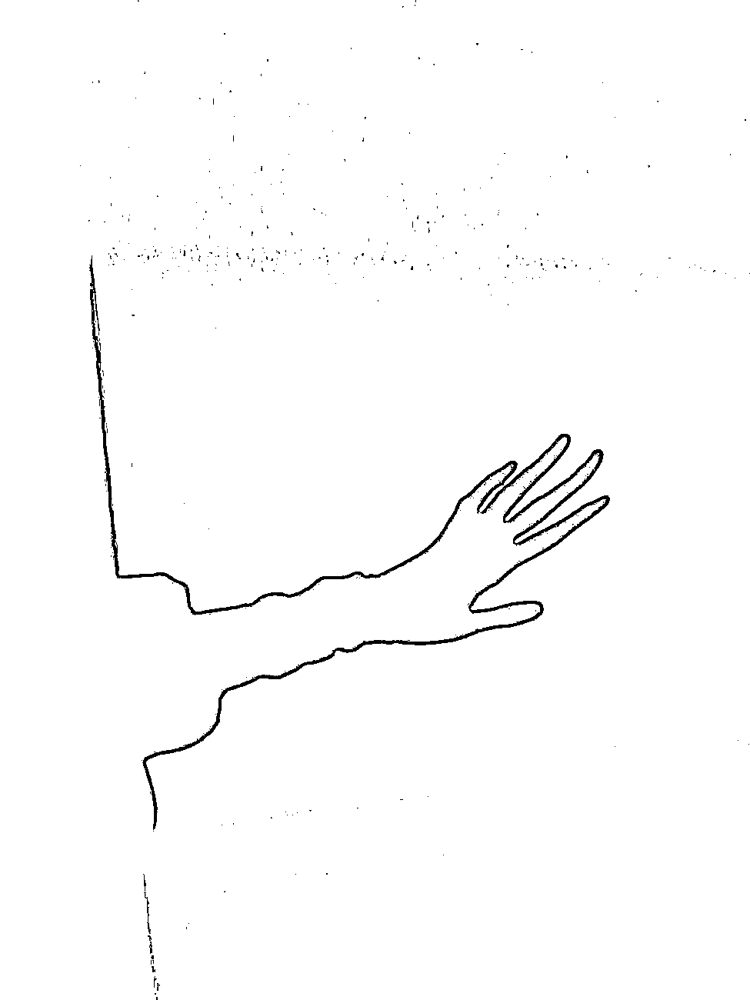

**寄语**

****

**痛楚是对抗害怕“遗忘”的唯一方式，也是记得“存在过”的唯一方式。******——马克·李维《第一日》****这篇文章，我写得很痛楚。心里什么都有，但就是词不达意。双鱼座新月真的不适合用力过猛，但我还是陷入了“金火冥三重合相”摩羯座的业力执着：这么重要的天象，我很难接受并不理想的结果，因为这无疑挑战了内心深处的“专业性和道德感”。于是，我一次次地将心轮敞开，又一次次地陷入执着，若道编辑一次次地鼓励我，我又一次次地删改。可见，有一个给与信任、提供支持、愿意包容的伙伴是多么的重要啊！但是，时间一拖再拖，心里越来越毛，这是从未有过的情况……或许**我的痛楚，正是对抗害怕“遗忘”的唯一方式——业力模式是我熟悉的存在，痛楚是我记得它存在过的唯一方式。**我怎么还对业力恋恋不舍呢？答案是，我以为那是我。于是，我敞开心轮，拥抱了业力，接受了这篇文章。我闻了闻月亮的味道，然后听到业力对我说：“你终于放手了，我快被你勒死了。”祝福每一个灵魂安好。

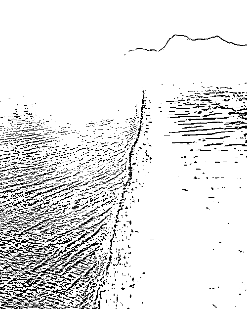

**新月如何许愿？**

**许愿时间**：2022 年 3 月 3 日北京时间 1:34 后，48 小时内有效、8 小时内最佳。 

**许愿人群**：所有人。

**许愿数量**：每人最多 10 个。

**许愿方式**：静心冥想，身心祈祷或记录收藏。

**许愿格式**：请万能的宇宙赐予我能量，我将以我的能量吸引**（什么）来到生命中……

**许愿原则**：发心诚善利人。

**版权声明**：原创文章由作者授权首发于若道平台，欢迎转发，反对抄袭。友号转载请申请白名单。

****

****想阅读更多作者的文章，请在后台回复******王芝桦****** 即可。****

****王芝桦****

心理占星师，统合疗愈师，占星专栏作者

全职于个案咨询与占星教学工作 18 年

**个案预约咨询微信号**：zhihua0621 

**微信公众号**：daoxi-life

**长按打赏**

****

**学习占星学****点击下图了解课程详情** 

**

**微信又双叒叕改版啦，不想错过若道君的推送？**

**就把若道设为星标吧！**

**▼**

**福利来啦**
**点击****“阅读原文”****获取最好用的免费****新月报告**

**获取免费新月报告，请点击文末“阅读原文”**

# 神准！12 星座会做什么样的梦？！

> 原文：[`mp.weixin.qq.com/s?__biz=MzA5NjA0NTAxNg==&mid=2651468506&idx=1&sn=2692df72f669a6f16d49d48a36324ce7&chksm=8b48806dbc3f097b93717463bf34c7ae0f5060e8e912b13f8acd2855cc7c07851ef6092ed832&scene=126&sessionid=1692737852#rd`](http://mp.weixin.qq.com/s?__biz=MzA5NjA0NTAxNg==&mid=2651468506&idx=1&sn=2692df72f669a6f16d49d48a36324ce7&chksm=8b48806dbc3f097b93717463bf34c7ae0f5060e8e912b13f8acd2855cc7c07851ef6092ed832&scene=126&sessionid=1692737852#rd)

☆****后台回复“今日”，给你一句生命态度****

作者/艾米丽·拉蒂 译者/Luke 校对/江艺

编辑/玫瑰 图片/pexels

我们经常形容一个人想得美——“做梦去吧！”也对，梦里什么都有……那么，你有没有研究过你的梦和你的星座又怎样的关联呢？这篇文章会给你简单准确的答案，若道君亲测有效！另外，【[释梦工作坊](http://mp.weixin.qq.com/s?__biz=MzA5NjA0NTAxNg==&mid=2651468318&idx=3&sn=4dde4612ccf0a8982432acf249d9c539&chksm=8b4880a9bc3f09bf71993d4b78a92d2f74d99c4198c2994d60f254ffbf32a8f6c110ddcf8ee9&scene=21#wechat_redirect)】也在报名中啦，点击链接了解更多详情吧！

**梦境的意义**梦境就像通向一个人灵魂的小窗口。甚至当你的梦境毫无意义的时候，其中仍夹杂着些许真相。能够破解我们睡梦中思维的人，是有天赋的，因为他们能够洞察梦境中的真相，而其他人做不到。

梦境可能奇特、迷惑或模糊，但它们也能帮助我们理清困难的状况、失误和清醒时无法回答的问题。**每个黄道星座睡着时都会做不一样的梦。正如你的梦可以揭示你是谁，你在想什么，所以你的黄道星座也可以说明你为什么会梦到那些事情。**

**当你经历人生中重大的事件时，梦境尤其有着重要的象征意义。**

想想上一次你面对人生中特别有压力或重大的事件——比如爱人的死亡，或者与男朋友大吵一架。你在这些时期所做的梦，可能特别有启示意义，哪怕它们曾经只是令人困惑，或者平平无奇。

你可能梦到你小时候和朋友一起玩耍，或你最后一次与近期逝去的人相处的时光。

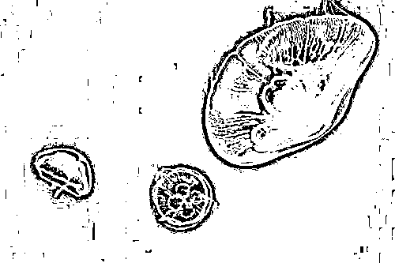

仅仅因为你的梦里也有些奇特的怪物，并不意味着其中没有更深的含义。**最生动的梦境（通常也是我们记忆最清楚的），发生在我们的 REM 睡眠中，也被称为快速眼动睡眠。**许多研究和推理可以解释我们为什么在梦中看到图像。但是大多数人倾向于认为，**我们梦境是活出我们幻想和欲望的途径，因为现实生活中我们无法实现这些幻想和欲望。**我们也有能力在梦境里学习，外在的刺激（比如闹钟）也可能出现在我们的梦境里。如果你问我，我的意见是，**梦境应该被理解为你更深入认识你的黄道星座的方式。**当你更深入了解自己的梦境，你永远也不知道自己会发现什么！

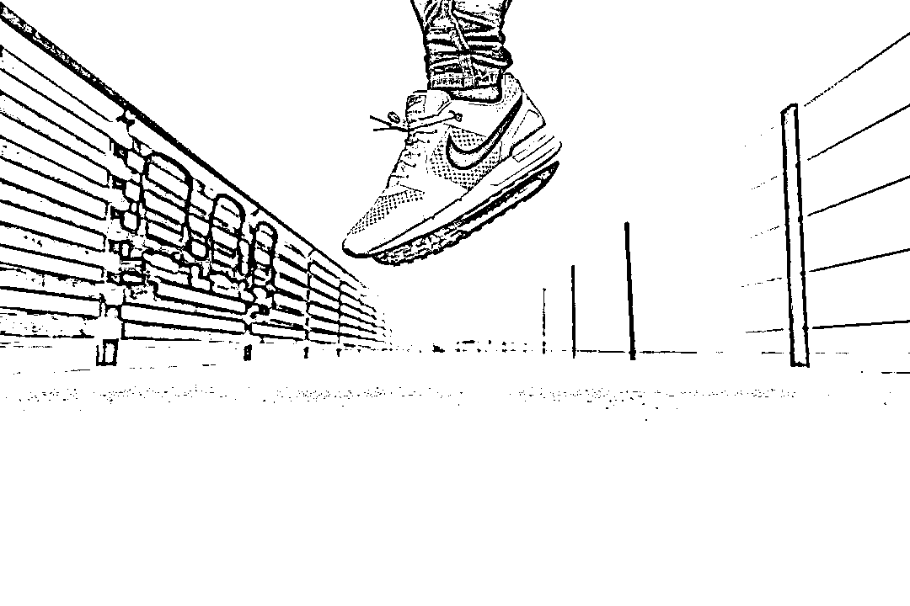

**12 星座可能梦见的**根据你的黄道星座，这是你可能梦见的事物：

***白羊座******（******3 月 21 日-4 月 19 日）***

**你的梦境生活与你的现实生活相当相似——可能冒险的成分更多。**梦境中，你常常将现实生活发生事情扩展。比如说，你可能在梦中重演那天早些时候与某人争吵或讨论的事情，或者在探索一个不同的结果，因为你仍在想着这件事。

当你的梦境不是在重演现实生活的情景时，那你可能梦到**做一些鲁莽的事情**——比如不带降落伞跳伞或探索一个你有兴趣旅游的地方。**你有很大的想象力，从某种方式来看，你的梦境生活是你尝试新鲜事物的途径。**

***金牛座******（4******月 20 日-5 月 20 日）***

**你在做梦的时候，很难彻底放飞自我。**因为当你睡着的时候，你很大程度上依然是你自己。

当你睡着时，可能梦到一些事情，比如犹豫要不要从动物园买一只长颈鹿。尽管价格很低，你也不敢在梦中尽情挥霍！我想那是因为**你在现实生活中对金钱的方式太过于现实**的缘故。

**你也会梦到和深爱的人共度美好时光。**尽管你不会总是表现出来，但你有非常情绪化的一面。**当你很想念某人时，你的想法会延续到你的梦中。**你可能**梦到你的爱人，最好的朋友，甚至一位已经离开你生活的人。**

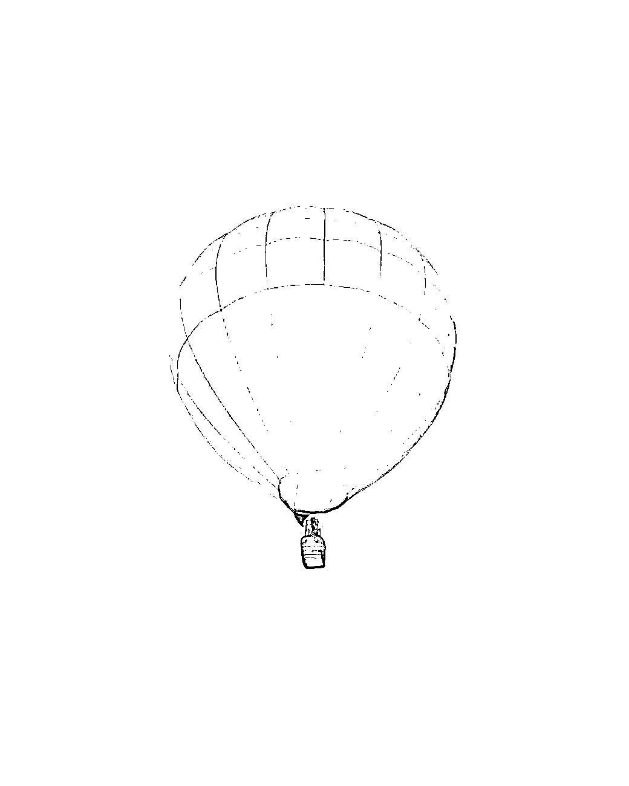

***双子座******（5******月 21 日-6 月 20 日）***

**就像清醒状态下的思想，你的梦境也常常是混乱和散乱的。**由于沟通和科技对你来说很重要，你可能做的噩梦是关于**无法联络到某人，或无法为想说的重要事项找到合适的词汇。** **你也可能梦到新恋人，或你期待的即将到来的旅行。**甚至梦到邀请你的新恋人和你一起旅行！有时你可以记住你的梦境，有时记不住，但总的来说，它们往往是你**日常生活事件的某种夸张变型。**

***巨蟹座******（6******月 21 日-7 月 22 日）***

**作为水象星座，你是非常感性和富有直觉的。**这些特性也会渗透到梦境中，并在睡眠时占据中心位置。你最常梦到的情境，是**帮助朋友或家庭成员度过艰难的时刻。**可能这也是你**现实生活中一直努力解决的问题**，不仅是一个虚构的梦。你可能也会做一些**情绪化的噩梦**，让你醒来时心跳加速，眼含泪水。尽管很难理解这类梦境的含义，它们常常试图向我们传递一些信息，所以不要完全忽略它们。由于你热爱家庭和美好的时光，你甚至可能梦到**未来和某位知名人士恋爱**，比如和小罗伯特唐尼一起做华夫饼干。

***狮子座******（7******月 23 日-8 月 22 日）***

你做的每件事都是有目的的。那意味着你的职业生活不局限于办公室，你的私人生活也不局限于醒着的世界。你的梦境通常是**参加重要的会议或谈话。有时是从你自己的视角，有时是从别人的视角。**偶尔你的梦境也会**不同寻常，与你在现实生活中的经历完全无关。**比如说，**享受历史上奢侈生活**的梦境——比如在维多利亚时代的宫殿啜饮香槟，或像埃及艳后那样尽情享用葡萄。

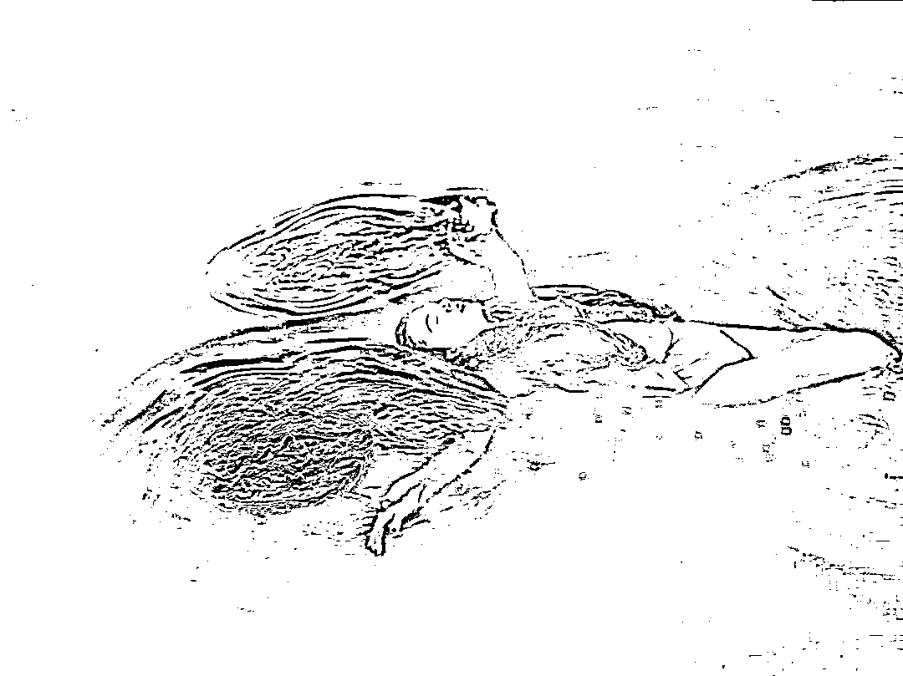

***处女座******（8******月 23 日-9 月 22 日）***

**你的梦境似乎围绕着清醒生活里的事件。**通常，它们包括**以某种方式帮助别人**，无论是分享建议解决问题，还是帮一位朋友搬家到新公寓。不用说，你乐于助人的天性，在现实世界和梦境世界里都很显著。 其他时间里，你可能做关于**混乱或脏乱环境的噩梦**，或**反复做关于完美和试图改善自己的梦**。所有这些梦，其实都是你在试图更好地理解你是谁，但它们也可能有些疯狂和令人困惑。

***天秤座******（9******月 23 日-10 月 22 日）***

**当你醒着时，很容易回避困难的谈话、冲突和艰难的决定。**但是当你睡觉时，就好像每件你想要逃避的事，都跳出来追逐你。那就是为什么你的梦境中常常出现**你不想处理的事情，只是规模更大，压力更大。**你可能梦到**和糟糕的线上约会对象结婚。**你知道，就是那个在整个约会中谈论自己脚上的水泡，还说他多么希望永远和妈妈住一起的人。是的，如果有这么一回事的话，听起来确实像一场噩梦。你可能也会梦到**不得不做现实中逃避的决定，只是醒来后并没有获得任何有用的建议……**

***天蝎座******（10******月 23 日-11 月 21 日）***

**尽管你有时对梦境感到失望，它们却能够帮助你找到答案，回答某个你已经想了一段时间的问题。**你可能不愿意去回忆上个压力重重的梦境（噩梦），但你应该把它记在心里，留待以后。 

你常常**在梦中得到现实生活中急需的答案，比如如何处理一场争论，或是否将某人从生命中割离。**你也可能做噩梦，**发现一个艰难的真相，**可能现在还难以接受，但以后会很有帮助。

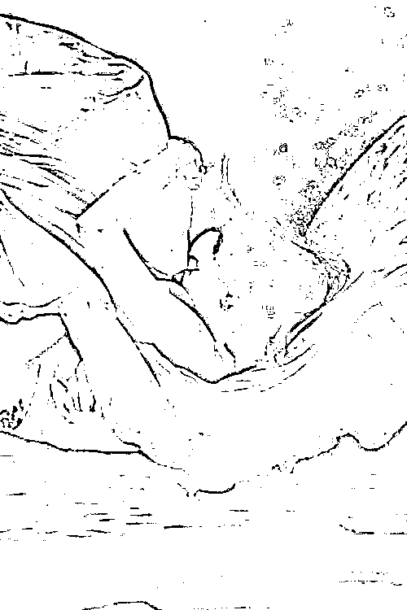

***射手座******（11******月 22 日-12 月 21 日）***

你的梦境可能**非常疯狂，有许多你难以理解的情节转折**。当然，你比任何人都清楚，梦境并不一定有明确的含义，所以你愿意顺其自然，并希望最终会有顿悟。 

你常常有爱丽丝漫游仙境那样含义深刻的梦境。**这些梦看似毫无意义，但你仔细思考的时候，就发现是有意义的。**作为哲学家和学习者，你的思维总是围绕着**有趣的问题和奇特的经历。**不去钻兔子洞的时候，你喜欢重温假期生活，与最好的朋友们在梦中聚会。你知道，就是那些轻松有趣的事情。

***摩羯座******（12******月 22 日-1 月 19 日）***

作为工作狂最困难的事情之一，是在你需要睡觉之前，通常没有太多时间放松和专注在其他事情上。所以，就你的梦境而言，常常与你**工作上所专注的事情**有关。 

你可能**在梦里回顾过去的经历或错误，试着看看如果你当时知道现在所知道的，处理方式会有什么不同。**你也可能做噩梦，梦见**有太多事情要处理，或感到精疲力竭。**那可能是你的大脑在告诉你，偶尔也要放松。嘿，如果我是你，我会听的。

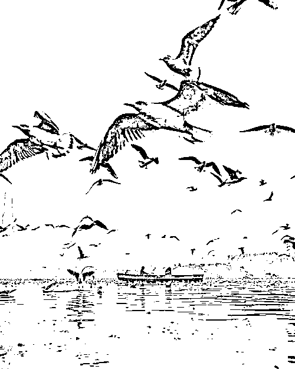

***水瓶座******（1******月 20 日-2 月 18 日）***

**你的梦境要么毫无意义，要么让人大开眼界。**我不知道你睡觉前吃了什么，但那让你的梦境变得疯狂。幸运的是，**这个黄道星座连最疯狂的梦境也能应付，因为你总是跳出框架思考。** 有时，你会做一些**荒诞不经、毫无意义**的梦。比如跑步穿越一个满是果冻的废弃商场，背后有一架 B-52 在追逐你……其他时候，你会做一些**情绪化**的梦，在梦中**处理那些现实生活中让你陌生或不舒服的情绪。**无论何种情况，当你醒来的时候，都有很多需要考虑的。

***双鱼座******（2******月 19 日-3 月 20 日）***

当你舒适地躺在床上滑入梦乡，你喜欢梦见**你梦想中的生活——也就是你渴望有一天能拥有的生活。**你的未来充斥了如此多的可能性，以至于**梦到各种你可能去做的事和可能生活的地方，是你探索未来可能性的方式。** 

没有梦见你的未来时，你常常梦到**清楚地表达自己的感受，或解决一个问题**。你是非常情绪化的，但你并不确定如何用别人能够理解的方式，表达你的想法或感受。能够在梦中练习，会帮你在现实生活中也取得成功。

**版权声明：**本文由若道翻译发布，欢迎转发，反对抄袭。友号转载请申请白名单。

**艾米丽·拉蒂**

一位住在匹兹堡的全职作家。她对环境保护和女权主义充满热情，知道只要具备合适的工具，一切皆有可能。她计划将来写一本纪实小说。

**学习占星学****点击下图了解课程详情** 

**

**微信又双叒叕改版啦，不想错过若道君的推送？**
**就把若道设为星标吧！****▼**

**喜欢记得点一下在看哦☟**

**报名直达入口**

# ISAR 星空俱乐部沙龙丨风象时代的世界，出路到底在哪里？

> 原文：[`mp.weixin.qq.com/s?__biz=MzA5NjA0NTAxNg==&mid=2651468506&idx=2&sn=58e6548a45388d85d6035459abb792d9&chksm=8b48806dbc3f097b7574840685ff47f030aa69e9fddd1baadc9d3df326bc099e7f06c58b28cb&scene=126&sessionid=1692737852#rd`](http://mp.weixin.qq.com/s?__biz=MzA5NjA0NTAxNg==&mid=2651468506&idx=2&sn=58e6548a45388d85d6035459abb792d9&chksm=8b48806dbc3f097b7574840685ff47f030aa69e9fddd1baadc9d3df326bc099e7f06c58b28cb&scene=126&sessionid=1692737852#rd)

**沙龙来啦！**

**3 月 18 日星期五晚上 8 点**，国际占星研究协会（ISAR）中国星空俱乐部沙龙由**知名英国占星师罗伊·吉列**来一场讲座！

从宏大的宇宙视角来看，占星学解释了当代短期经济/政治“解决方案”的绝望和无能为力。我们所处的时代，历经了 500 年的变迁，其程度甚至超过了新石器时代。

**罗伊将概述过去的事件标记以及探索未来的危险，因为我们正与木海合相在双鱼座的能量合作，努力走出 2021-2022 土星/天王星的四分相。**

然后他会向我们展示**木星/土星**在风象星座周期光辉前景的可能性，以及 24 世纪水瓶座时代的实际曙光。

**沙龙主题****沙龙主题：我们的时代到底发生了什么？****主讲人：罗伊·吉列**

**沙龙时间：2022 年 3 月 18 日 星期五 **

**                北京时间 20:00-21:30（有英文翻译）**

**沙龙方式：线上沙龙****主讲嘉宾**

****罗伊·吉列****

*   自 1976 年以来，罗伊一直是全职占星师。他也在占星软件方面提供咨询，在多个国际会议上演讲，研究金融占星，并编辑两本 André Barbault 著作的英文译本。

*   自 1978 年以来，罗伊发表了一些经世预测，并以同情的口吻加以强调。

*   他的新书《与行星一起工作:更清楚地理解更好的决定》(2021 年) 从他 20 年的双月刊专栏中挑选了一些评论和历史参考。

他的全部六本书的详细信息和样本页见 https://crucialastrotools.co.uk/ roy.gillett@ntlworld.com

**如何参加本次沙龙？**

本讲座也是本月的国际占星研究协会（ISAR）星空俱乐部讲座。**ISAR 会员可以免费收看。**请注意邮件通知，具体参与方式见邮件。

❶ 如果你**已经是 ISAR 会员**，请注意邮件通知，告知如何参加。

❷ 如果你**不是 ISAR 会员**，非 ISAR 会员价格：98 元。如有任何问题请咨询工作人员

yiyi（微信：YY18513802156）

**非 ISAR 会员报名请长按下图**

**▼**

**ISAR 明星俱乐部**

2019 年，ISAR 在主席亚历山大·因舍阿吉克的带领下，成立了 ISAR 明星俱乐部，每月为全球 ISAR 会员提供在线直播讲座，邀请全球著名占星师开讲，学习和分享新的理念。讲座时长一小时，涉及占星学的不同领域、不同观点，每个会员都可以参与其中，每次讲座之后还有 20-30 分钟问答时间向老师们提问。

每一场在线讲座都会记录下来，ISAR 除了提供视频，还会提供相关的讲座资料，以及单独的问答录音，自动发送到专门的 ISAR 明星俱乐部页面存档，每位 ISAR 会员可以在 ISAR 网站上自己的会员主页俱乐部页面找到。在 2018 年最初几个月，ISAR 明星俱乐部会每月举办一场在线演讲。之后，两周举办一场演讲，最终每周举办一场演讲。

但是，过去明星俱乐部讲座只有英文沙龙，因此，中国会员只有懂英文才能受益。为了使得更多不懂英文的中国会员能够受益，我们特别和 ISAR 总部协商，今后会安排有中文翻译的明星俱乐部占星沙龙，作为给中国 ISAR 会员的福利！

**如何成为 ISAR 会员？**

**如果你也想成为 ISAR 会员，请复制链接在浏览器打开**

http://www.nodoor.com/isarcert.do?contentId=3588（仅支持网站支付）

**或直接长按下方二维码，微信购买会员：**

**ISAR 会员有什么福利？**

一年期会员仅需支付**人民币 420 元**，即可享受：

**☆ 星空俱乐部免费沙龙**

**☆每年出版 3 次的《国际占星师》（目前只有英文）；**

**☆每周电子邮件交流汇总杂志（目前只有英文）；**

**☆专项研究基金和奖学金资格；**

**☆ISAR 主办的会议和论坛的会员折扣，包括国际占星大会（UAC）、ISAR 的会议和研讨会等会员权益。**

**有疑问怎么办？**

关于 ISAR 星空会员俱乐部以及我们的讲座，如果你还有任何疑问，**请联系工作人员**：

**yiyi**

**微信：YY18513802156**

**若道 Conrad**

**微信：nodoor2016**

****非 ISAR 会员报名请点击“阅读原文”****

# 本周六开课丨释梦占星大师工作坊：荣格、占星学与梦境

> 原文：[`mp.weixin.qq.com/s?__biz=MzA5NjA0NTAxNg==&mid=2651468506&idx=3&sn=479761c01110e902e475a6c6dbc07c9a&chksm=8b48806dbc3f097b2165f8729a7742595daa883480746e5816241373aadc0d9152a25a40ef5e&scene=126&sessionid=1692737852#rd`](http://mp.weixin.qq.com/s?__biz=MzA5NjA0NTAxNg==&mid=2651468506&idx=3&sn=479761c01110e902e475a6c6dbc07c9a&chksm=8b48806dbc3f097b2165f8729a7742595daa883480746e5816241373aadc0d9152a25a40ef5e&scene=126&sessionid=1692737852#rd)

****

**2022 年 3 月和 4 月木星和海王星在双鱼座合相给连接梦境与占星提供了一次绝佳的时机。**

**　　——格雷格·博加特老师**

**梦境工作和做梦疗法是深度心理治疗的一个关键技术，**使得深层无意识的象征性语言能够传递它们的洞见，并指引患者走向更大的完整。

梦境使带有情感成分的无意识材料安全而快速地进入意识层面。它们帮助找到治疗的重心，指引治疗的方向。**梦境提供了重要的线索，告诉我们客户痛苦的来源，以及哪些情绪和情结需要被检视和处理。**梦境工作可以成为心灵成长和行为改变的强大催化剂，它有种独特的能力，促进疗愈从内在发生。

梦就像冰山从无意识的深水中浮现出来。有些冰山属于过去，帮助我们理解过去的创伤和未消化的回忆，因此是回溯性的。

**梦境有种整合的能力，**因为他们能使我们觉知和化解很多次人格之间的矛盾。**梦境也有前瞻性或预期性，**那是来自未来的冰山，会呈现出将要发生的事情，显现出个人有可能成为的样貌。**梦境既向后看也向前看**，它的本质功能是扩展意识、觉知和身份的疆界。

**我在梦境工作中主要使用的技术，是以开放的好奇心，主动探求梦境中每个角色、地点和行为的当下意义**——每个元素都反映出梦者的心灵状态和当前的生活情境。被梦境所揭露的信息，往往既幽默，又充满矛盾，而且为我们打开了新视野。

怀着一种敬畏的心态，我发现每个梦境都是意识海洋深处的一颗珍珠。反思梦境的奥秘，会引发一种近乎宗教敬畏的情感，我们会惊叹于心灵描绘自身处境的能力。

1

**课程内容**

**本课程将课堂讲座与动力过程工作结合起来，动力工作过程会将星图解读和梦境分析结合起来。**

每天约一半时间用于讲座，其余时间会演示占星学梦境工作方法，过程中老师会与学员进行互动。课程包括对老师解读星图和治疗性梦境工作方法的详细阐释和示范。

**我们将学习荣格解梦的基础知识和治疗性的、以过程为导向的星图解读。**我们将体验转化性原型模式在梦境和出生星图中同步显现时会发生什么。

**三次 6 小时的迷你马拉松在线梦境课程**，将会是一次提升意识、开放思想、转化生命的事件。**学员将体验占星学和解梦的融合。**

每次课程格雷格·博加特老师都会与学员互动，课程中使用的星图和梦境将由愿意分享自己梦境和星图的学员提前提供，课程期间也会开放问答以及学员互动环节。

2

**课程安排**

**第*****1*****讲  2022 年 3 月 5 日 **

卡尔·荣格的童年、学生时代以及投身精神病学时期的故事。《荣格自传：回忆·梦·思考》概要。弗洛伊德与荣格的关系，他们合作的破裂，荣格随后的抑郁时期，以及他借助梦、积极想象、艺术创作、曼陀罗绘画和对奥义知识（灵知）、神话和占星学的研究，转化性地面对无意识。卡尔·荣格与艾玛·荣格的占星学。

荣格的力比多（心灵能量）的概念，以及他的心灵结构地图：自我、个体无意识和集体无意识。荣格对无意识原型的描述，它们对个人神话的重要性，以及它们作为个人情结的表现。自我-自性轴线，以及自我与无意识之间不断演化的关系。

**我们将介绍荣格解梦的基础知识以及治疗性的、以过程为导向的星图解读。我们将体验转化性原型模式在梦境和出生星图中同步显现时会发生什么。**

****第*****2*****讲  2022 年 3 月 12 日 ****

梦境中的个性化及其占星学时机。出生星图随时间推移展开。整合个体无意识：梦和出生星图中的人格面具与阴影。男性和女性：阿尼玛和阿尼姆斯。**梦与占星学行进**描绘建立或脱下人格面具的阶段，遭遇阴影的阶段，通**过阳性意识和阴性意识的结合发展出更统一的人格的阶段。**

**第*****3*****讲  2022 年 3 月 19 日 **

**整体性在占星学和梦境中的象征。**透过占星学符号研究梦，来深化内在生命。我们将学习占星学行进和梦境如何试图让我们意识到差异、内在冲突和极性，逐步整合对立，将人格整合成一个整体。

梦境工作和星图解读中的曼陀罗原理。荣格的心理类型理论：内向型和外向型的任务。达到思维、情感、感觉和直觉的平衡。我们还将涉及使用五因素人格理论作为星图解读和梦境分析的基础的重要性。

**我们将学习如何解读梦境，并辨别梦的象征意义所传达的有说服力的信息，因为这与出生星图和行进有直接关联。**整合占星学和梦境工作，可以带我们进入情感、关系和灵性更为一致的状态。

3

**授课老师**

**格雷格·博加特**

（Greg Bogart）

**占星师、心理治疗师**。格雷格出生于美国纽约市，就读于卫斯理大学，1986 移居旧金山湾，完成了加州整合大学和赛布鲁克大学的研究生课程。格雷格自 1991 年以来一直是一名有执照的**心理治疗师**（LMFT 28276）。**他是国际占星研究协会（ISAR）认证的占星师**，并拥有美国地球宇宙学研究协会（NCGR）的第四级认证。他还在旧金山的艾扬格瑜伽学院接受过培训，并于 1992 年毕业且获得了**瑜伽教师认证。**

格雷格是一名私人执业的心理治疗师，在索诺玛州立大学担任**心理学讲师**，他在该校教授“成人发展中的转变”、“以深度为导向的心理治疗”、“神话、梦与象征”以及“存在主义心理学与超个人心理学”等课程，他在加州整合大学、约翰·F·肯尼迪大学、多米尼加大学和超个人心理学学院教授咨询心理学和东西方心理学课程。**他的研究结合了冥想、哈他瑜伽、荣格解梦、存在主义心理疗法和精神综合，以及占星学的周期智慧和原型象征。**

**格雷格·博加特博士著作：**

*   《占星学的高八度音阶》（*Astrology’s Higher Octaves*）

*   《行星用于治疗》（*Planets in Therapy*）

*   《占星学与灵性觉醒》（*Astrology and Spiritual Awakening*）

*   《梦境工作过与自我疗愈》（*Dreamwork and Self-Healing*）

*   《梦境工作在抑郁症整体心理治疗中的应用》（*Dreamwork in Holistic Psychotherapy of Depression*）

*   《占星学与冥想：对变化的无畏沉思》（*Astrology and Meditation: The Fearless Contemplation of Change*）

4

**课程价格**

*   **课程价格：****5800 元**

*   **课程咨询：**王老师（微信：18510107057，请备注“释梦工作坊”）

长按二维码添加王老师

5

**课程安排**

*   **课程时间：**

     **2022 年 3 月 5 日周六  8:00-14:00**

**2022 年 3 月 12 日周六  8:00-14:00**

2022 年 3 月 19 日周六  7:00-13:00

*   **授课方式：**线上直播，英文授课，中文翻译

6

**退转课程**

*   **退款原则请详看《教学协议》，如有疑问请咨询课程顾问。**

****释梦工作坊****

**授课老师：**格雷格·博加特

**授课时间：**2022 年 3 月 5 日起

**授课方式：**网络课程**，**英文授课，中文翻译

**费用：****5800 元**

**课程负责人：****王老师**（微信：18510107057，请备注“释梦工作坊”）

长按二维码添加课程负责人咨询~

****报名请点击“阅读原文”****

# 3 月宇宙天气丨全年中埋下伏笔的月份，这两个幸运日你要记好！（内含 12 星座月度指南）

> 原文：[`mp.weixin.qq.com/s?__biz=MzA5NjA0NTAxNg==&mid=2651468432&idx=1&sn=83850b3de7a41a747b5155d7b5cade70&chksm=8b488027bc3f093129c0a566f0c444615d1fa13e44fe59e8f963442b4be58bb5537316d09241&scene=126&sessionid=1692737852#rd`](http://mp.weixin.qq.com/s?__biz=MzA5NjA0NTAxNg==&mid=2651468432&idx=1&sn=83850b3de7a41a747b5155d7b5cade70&chksm=8b488027bc3f093129c0a566f0c444615d1fa13e44fe59e8f963442b4be58bb5537316d09241&scene=126&sessionid=1692737852#rd)

******☆ **后台回复“今日”，给你一句生命态度****

作者/Anastasia

编辑/翀子 封面/书君 图片/网络

3 月，所有行星都在自己的轨道上稳步向前，这也是全年中难得的平和时期，太阳与木星、海王星在双鱼座合相，成为本月最幸运的时期。12 星座在这个月份有怎样的运势呢？让我们来看文章吧！

三月重点天象

*   **双鱼座 12°新月（3 月 3 日）**

*   **火星进入水瓶座（3 月 6 日）**

*   **金星进入水瓶座（3 月 6 日）**

*   **水星进入双鱼座（3 月 10 日）**

*   **处女座 27°满月（3 月 18 日）**

*   **水星进入白羊座（3 月 27 日）**

**整体氛围**

三月，春暖花开。所有的行星都在自己的轨道上各就各位，全速前进。**没有逆行行星，也没有顺逆转换的节点。**这也是全年之中能量最集中纯粹的时期。

**太阳进入双鱼座，将会依次合相木星和海王星，3 月 5 日和 3 月 13 日是这个月的幸运日。**

**进入四月之后，天象逐渐热闹非凡，不再波平浪静。**

随着冥王星开始为期半年的逆行，天空中逆行的行星会越来越多，五月水星开始今年第二次逆行，六月土星和海王星逆行，七月木星逆行，八月天王星逆行，九月第三次水星逆行，十月火星逆行，十二月我们将迎来本年度的第四次水星逆行。

在这个月表面的平静之下，也酝酿着巨大的两极能量。**整个三月份**，除了运行最快的月亮之外，其它行星都集中在从**摩羯座到金牛座**的五个星座之内。随着月亮的行进，行星分布在束型和提桶型之间切换，**能量相当集中。**

**这意味着人们的情绪感受会加剧分化，情况发展也会变得更加撕裂和极端，**各方立场和势力互相博弈，谁看谁都不顺眼。

甲之欢歌，乙之疯魔，对于鲁迅先生那句名言：**人类的悲欢并不相通，会有越来越多的感同身受。**

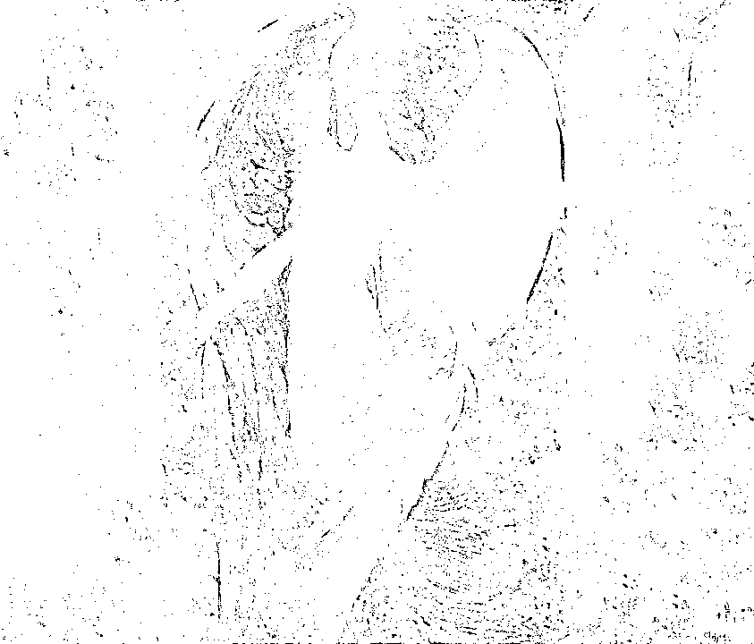

**重点天象****★****金星、火星进入水瓶座**

**金星和火星作为目前南北交点轴线的守护星，是今年天象中需要关注的重点行星。**

几乎整个二月，金星和火星都处于允许度三度之内的合相结构中。2 月 16 日，刚刚恢复顺行的金星和火星精准合相在摩羯座 16 度。

**进入三月，金星和火星依然相伴而行，**并且在摩羯座 27 度合相冥王星，将二者的能量带到一个峰值。

我们都知道大的行运往往持续好几年，而大的事情显然不会天天发生。**大事件的爆发会通过行运比较快的个人行星来触发。而金火合相就是这个触发器。**

2 月 24 日，俄乌战争爆发。金星与火星在摩羯座 22-23 度合相，这个位置就是 2020 年初土星、冥王星合相在摩羯座的位置。金星、火星再次经过这个压力点时引爆了战争。

**金星、火星作为月亮南北交点的守护星，意味着重新清理旧时的创伤（天蝎座南交点），拿回属于自己的东西（金牛座北交点）。**

随后，**金星、火星携手进入水瓶座**，3 月 6 日第三次合相在水瓶座 0°。二月中旬到下旬的金星、火星主要影响基本星座，尤其是摩羯座，而三月初的这次合相将重点影响固定星座。

生日在二月底三月初的水瓶座，留意外界事件引发的情绪波动，可能会给我们带来一些新的启示。

水瓶座 0°的萨比恩寓意是：一座红砖教堂坐落在加利福尼亚山丘的掩蔽处，看起来和它后面的群山一样古老。

**风象星座需要距离感，距离带来理性和观察。**这里，更多的指向了一种理想的具体化，能够给人们带来普遍、开放的灵性自觉。

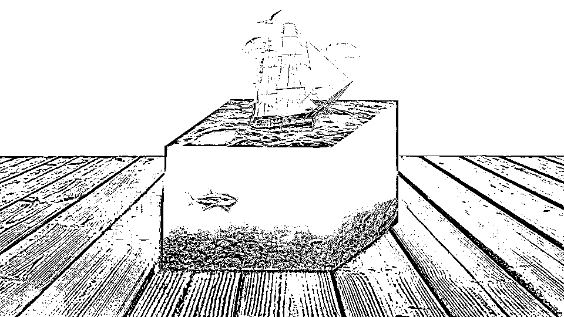

**★****水星行经三个星座**

2022 年共有四次水逆，区间位于风元素和土元素之间。**在风元素开始逆行，在土元素恢复顺行。**

具体是一月到二月的水瓶座-摩羯座逆行，五月的双子座-金牛座逆行，九月的天秤座-处女座逆行，十二月到明年一月份的摩羯座逆行。

联想到这一年半的时间，北交点都运行在金牛座，**水逆时期适合我们思考关于价值的主题**，什么对我们是最重要的，什么是需要舍弃的，什么是我们想要但其实并不适合我们的。到了 2023 年，水星将会集中在土象星座逆行，那就是另一个主题了。

2 月 25 日之后，水星恢复了正常速度，开始快速前进。**三月份，水星非常忙碌，将依次经过水瓶座、双鱼座（3 月 10 日）和白羊座（3 月 27 日）。**这也预示着社会上的热点轮换很快，一波未平一波又起。

追随热点容易导致人们精力涣散，注意力下降，感到疲惫。**这时候需要增强心的定力，专注于手边事，照顾好身边人，才能生出真正的智慧。**

**★****朔望周期**

3 月 3 日凌晨 1:35，在双鱼座 12 度发生新月，3 月 17 日在处女座 27 度发生满月，这两个月相都跟木星、海王星产生连接，并且凸显了处女座-双鱼座轴线的能量。

**处女座-双鱼座轴线关注服务与疗愈，**尤其 2022 年还有木星、海王星合相双鱼座的主题，更加强调了这个领域的事件和能量流动。

**新月期能量集中在摩羯座、水瓶座和双鱼座。**新月合相木星在双鱼座，金星、火星、冥王星精确合相在摩羯座 27 度，土星与水星合相在水瓶座。**情绪波动可能会被无限放大**，但从现实中能够得到支持却非常有限。切记谨慎许愿。

满月期是典型的提桶型分布形态，水星、木星、海王星和太阳齐聚双鱼座。圆月高挂处女座，对分双鱼座群星。处女座的月亮三分摩羯座的冥王星，**有助于人们识别真相，净化自我。**

**12 星座三月运势**

**（参考太阳星座和上升星座）**

***白羊座***

**★** **面对压力，调整身心平衡**

白羊座受到冥王星和金火合相的冲击，从年初开始，压力一直很大。好消息是，**三月中旬之后，大部分白羊座都会感觉到节奏慢了下来，**可以喘口气，好好照顾自己。

**尤其是有重要行星落在白羊座 25 度到 27 度的区间的个体，**面对持续不断的压力，更需要调整好身心之间的能量平衡。

**★ ****放慢节奏，享受私人时间**

虽然工作繁忙，社交活动众多，但三月份的白羊座**尤其需要提醒自己放慢节奏，注意休息。**工作一件接一件是做不完的；朋友聚会一场接一场也会让人精疲力尽。

白羊座脾气急，冲劲足，喜欢速战速决，但三月份的中上旬并不利于白羊座猛冲猛打，**不如等下旬太阳进入白羊座后再扬帆起航。**

***金牛座***

**★**** 汰旧换新，迎接更多生机**

随着 3 月 6 日金星与火星换座水瓶座，会有更多的变化波及到金牛座。天王星和北交点都运行在金牛座，带来的不确定性和陌生情境都容易让金牛座感到手足无措。

金牛座一定要意识到**自己来到了人生中的变轨期，变化多，生机多。**主动调整自己，迎接挑战，就会得到更多的机会和成长。

**★**** 改变自我，重塑人际关系**

对于金牛座来说，三月份也是非常忙碌的一个月。经过前两个月的准备，金牛座现在已经调整好心态，愿意积极地走出去，全身心参与到生活和工作中。

**这是一个重塑自己社交圈的好机会。**只要自我面貌发生变化，就会吸引来新的朋友和圈子。这会帮助金牛座打开视野，丰富生活。

***双子座***

**★**** 准确判断，快速落实行动**

大部分双子座在木星和海王星的影响下，感受并不太好。**过度的信息量**会给双子座带来不少麻烦。但对于头脑敏捷、思维迅速的双子座来说，这个时候反而是提高自己判断力，采取迅速行动的时期。

尤其是生日在 6 月 8 日到 16 日的双子座，三月份会变得理智和冷静，**能够从众多线索中找出遵循内心的判断，并落实到行动上。**

**★**** 打开视野，看到问题本质**

双子座擅长收集信息，分析问题，但往往止步于信息表面，浅尝即止，不愿深入去探索和研究。

三月，对于双子座来说，**是一个深入学习和探索的机会。**可能是之前困扰自己的问题，找到了新的角度和新的思路，看到了问题的本质，找到了解决办法。

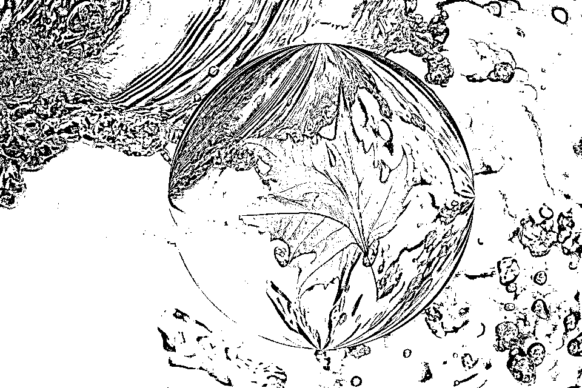

***巨蟹座***

**★**** 助人为乐，获得身心成长**

水象三宝得益于木星和海王星的好运，这一年都会比较轻松。三月份尤其利好生日在 7 月 3 日到 7 月 15 日之间的巨蟹座。不论是身体健康，还是人际关系，都会有良好的发展机会。

**巨蟹座不妨走出自己的舒适区，**扩大自己的社交圈，多和他人交流，互助互惠，一定能够获得身心成长。

**★**** 释放情绪，找到内心安宁**

巨蟹座对于情绪体验实在太熟悉了，守护星月亮善变莫测，平时没少给巨蟹座添麻烦。

三月份，提醒生日在 7 月 2 日到 7 月 9 日之间的巨蟹座注意，**一定要比平时更多地去关注自己的内心世界**，激烈的情绪变化不利于巨蟹座安排任何计划。

遇到事情，一定要学会释放情绪，可以多做深呼吸，平缓自己的内心世界。

***狮子座***

**★**** 低调行事，避免节外生枝**

狮子座最大的敌人从来都是自己。过于在乎别人的看法，过于维护自己的骄傲，多少麻烦都是因为好面子而来。

三月份，尤其需要提醒生日在 8 月 10 日到 8 月 17 日的狮子座，**保持谦逊的姿态，低调行事，**千万不要为了争强好胜，逞一时之快而给自己带来无法善后的麻烦。

**★**** 坚持原则，实现互利共赢**

作为火象元素的第二个星座，狮子座比白羊座更能关注到他人的需求，也会更在意周围人的评价和认可。

但这并不是让狮子座无条件地放弃自己的原则去妥协。而是**要在权衡利弊之后，找到一个合适的平衡点，**既可以守住自己的底线，又能够照顾到他人的利益，**加强协同合作，实现双方利益的最大化。**

***处女座***

**★**** 敞开心扉，迎接新的成长**

这几年，天王星和冥王星都运行在土象星座，从本质上来说利好处女座的成长。但所有的成长都是充满了泪水和伤痛，所谓不经历风雨，怎么见彩虹。

对于生日在 9 月 2 日到 7 日和 9 月 20 日到 23 日的处女座来说，**三月份就是这样一个苦中作乐的阶段。**建议调整好自己的心态，主动参与到命运中来，一定会有非常大的收获。

**★**** 做好计划，平衡工作生活**

对于处女座来说，最擅长的事情就是制定计划，有条不紊地平衡好各种事务。

**三月份对于处女座来说是非常忙碌和辛苦的，**需要在繁忙的日常生活中**找到重心**，提前做好计划，留出机动时间，保持好身体状态，才能从容地应对更多的人情往来活动。

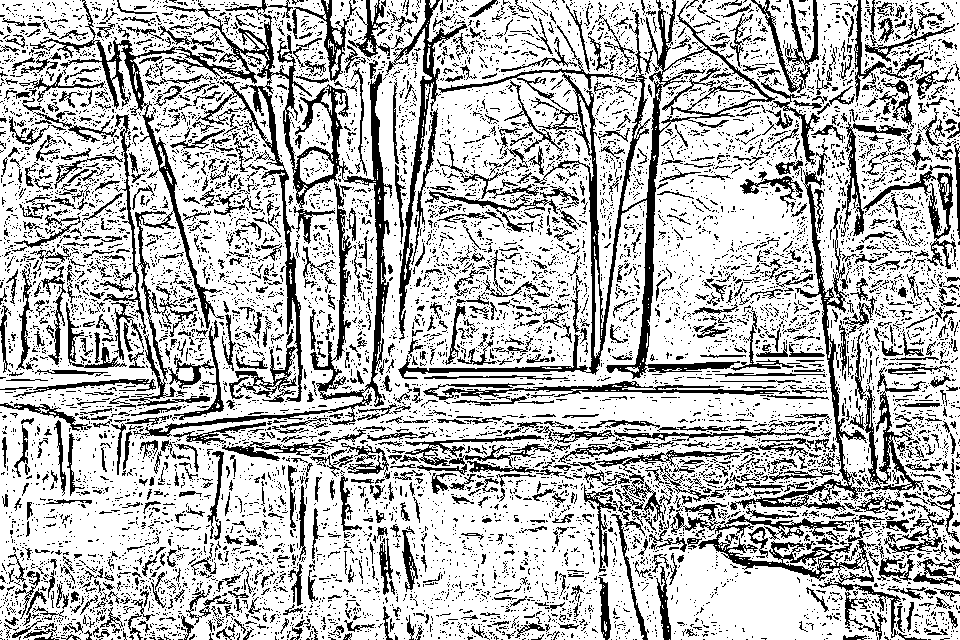

***天秤座***

**★**** 善作决策，处理重大事宜**

3 月 6 日，金星和火星双双进入水瓶座，对于天秤座来说是一个重大利好，尤其是生日在 10 月 11 日到 10 月 18 日的天秤座，更加如虎添翼。

天秤座本来就擅长处理各种关系，三月份尤其头脑清晰，判断准确，**适合处理一些重大的人际关系和事宜。**

**★**** 放松娱乐，关注亲子关系**

对于已经成年，结婚生子的天秤座，**三月份是打造亲子关系的好时机。**适合一起外出玩耍，加强对话和交流，建立起顺畅的沟通渠道，打造良好的亲子关系。

对于未婚的天秤座，**这也是活跃的社交时段，**如果有心仪或者暧昧的对象，不妨尝试主动出击，充分发挥自己的创造力，营造出适合恋爱的氛围，收获一定很大。

***天蝎座***

**★**** 取长补短，勇敢向前迈进**

天蝎座作为水象星座的第二个星座，善于处理危机，解决问题。今年还有木星、海王星和冥王星的助力，做起事情来如鱼得水。

天王星和北交点运行在对宫的金牛座，虽然是对分位置，**但如果利用好就会带来互补效应，取长补短，发现新的发展机会。**

尤其是生日在 11 月 5 日到 16 日的天蝎座，在三月份**睁大眼睛，不要放过任何机会。**

**★**** 筑牢根基，以时间换空间**

三月份的天蝎座不适宜向外打拼，而是**需要回归家庭，回归内心，回归自己的精神空间。**

磨刀不误砍柴工，天蝎座可以利用这段时间**处理一些和童年、家庭、安全感等领域的老旧议题，**释放过去的伤痛，与自己、家人和解。稳固的精神世界，才是持续向前的基础和动力，才能走得更高更远。

***射手座***

**★**** 避免干扰，做好手边事情**

射手座是火象变动星座，也是最爱学习和教育的星座。受到木星和海王星的影响，射手座会在今年感受到明显的信息干扰。

三月份，生日在 12 月 5 日到 16 日的射手座尤其需要**稳定自己的内心，相信自己的判断，不要被外界的声音带着走。**约束自己上网冲浪看热闹的闲心，能够节省不少精力和时间，做好自己手边的事情。

**★**** 增加互动，充实家庭生活**

三月份射手座将得到来自家庭的好消息，不管做什么决定，都会得到家人更多的支持。**和家人的互动会增多，也会更加关注于自己的居家生活。**

可能会花费一些金钱在自己的家里，购置大件物品，或者重新布置自己的生活空间。射手座在这个月会感受到轻松愉快的家庭氛围。

***摩羯座***

**★**** 承担责任，努力坚持到底**

较之于前两年，摩羯座今年的运势会轻松不少。但这并不意味这摩羯座可以躺平了。**三月份比二月份的节奏会放慢一些，**但摩羯座**仍需要咬紧牙关**，该抗的责任一定要抗起来。

尤其是生日在 1 月 17 日之后的摩羯座，如果想要事半功倍，就不能放松对自己的要求，而是要坚持到底，不达目的不罢休。

**★**** 积攒资本，增强自我价值**

金星和火星进入水瓶座之后，摩羯座的生活节奏也会随之放缓，需要操心的事情变少了，时间多了，**更多的关注就会放在提高自己的专业技能上。**

如果有合适的机会，可以考虑报班、听课，学习一些新的赚钱谋生技能，**进一步增强自我价值感**，为以后的生活和工作积攒一些资本。

***水瓶座***

**★**** 调整模式，描绘崭新蓝图**

**三月份的水瓶座会非常忙碌，**尤其是生日在 2 月 7 日至 2 月 13 日之间的水瓶座将迎来人生中的关键时期，可以利用这个月的时间，好好总结过去，展望未来，为自己制定切实可行的发展计划。

**不适合的模式需要扔掉，不适宜的恐惧需要释放，轻装上阵，迎接人生的新机遇和新挑战。**

**★**** 稳定心态，以不变应万变**

3 月 6 日，对于水瓶座是一个非常关键的日子。金星和火星在这一天同时换座水瓶座，**带来目不暇接的消息和变化。**当然也会伴随着不少麻烦和需要操心的事情。

**水瓶座要调整好自己的节奏，稳定心态，以不变应万变，不要过度消耗自己的精力和金钱。**

***双鱼座***

**★**** 适时冒进，抓住发展机会**

三月份最大的幸运儿是生日在 3 月 3 日到 14 日之间的双鱼座，木星将会给你们带来丰厚的好运。**不论是身体活力还是精神状态都会感觉焕然一新。**

这段时间，可以在自己实力的基础上，提高信心，做事情可以适当冒进一些，毕竟有吉星的护佑，不用白不用。

**★****深入内心，找寻更高愿景**

都说双鱼座爱做白日梦，爱幻想，内心丰富，想象力宏大，三月份就是发挥双鱼座这项潜力的好时段。梦想一定要有，万一实现了呢。

如果是从事音乐、艺术、设计、灵性疗愈等性质工作的双鱼座，**会在这个月获得更多的直觉和灵感，**创造出更好的作品，受到人们的欢迎，并且带来更大的影响力。

**版权声明：**原创文章由作者授权发布于若道平台，欢迎转发，反对抄袭。友号转载请申请白名单。

**Anastasia**

职业占星师/专栏作者/策展人

于 2015 年通过 ISAR 占星能力考试

若道认证生时校正资质（2015 年获得）

**微信公众号**：KairosMoment

长按打赏

**学习占星学****点击下图了解课程详情** 

**

****************

**微信又双叒叕改版啦，不想错过若道君的推送？**

**就把若道设为星标吧！****▼**

**就是这个“在看”，戳戳戳 ☟**

************报名直达入口************

# 心理占星学=心理学+占星学？

> 原文：[`mp.weixin.qq.com/s?__biz=MzA5NjA0NTAxNg==&mid=2651468432&idx=2&sn=165fab197688f2ecc5dad856b21a4112&chksm=8b488027bc3f09311e90bdd7fc7a6ce096ccd29122cd30553f891acc5283f25078d963d82f31&scene=126&sessionid=1692737852#rd`](http://mp.weixin.qq.com/s?__biz=MzA5NjA0NTAxNg==&mid=2651468432&idx=2&sn=165fab197688f2ecc5dad856b21a4112&chksm=8b488027bc3f09311e90bdd7fc7a6ce096ccd29122cd30553f891acc5283f25078d963d82f31&scene=126&sessionid=1692737852#rd)

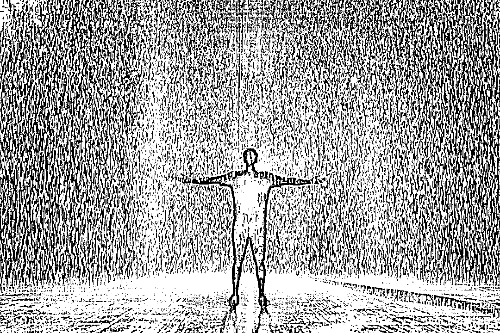

作者/格伦·佩里译者/李含 校对/江艺 esme 编辑/玫瑰 图片/pexels 提到心理学+占星学=心理占星学吗？实际上，并非如此哦。那么，心理占星学到底是什么？它是怎样发生、发展的，又对我们有怎样的用处呢？一起来看看吧。格伦老师参与授课的【[心理占星双证课程](http://mp.weixin.qq.com/s?__biz=MzA5NjA0NTAxNg==&mid=2651468070&idx=2&sn=56a909d9998c43ec042272a92705ba8d&chksm=8b488391bc3f0a8757b9a61a9025bd71b58e0ff32346a41af5c40cf624d83ce35edbd2ede446&scene=21#wechat_redirect)】报名中，点击链接可以查看详情哦。**心理占星学≠心理学+占星学**表面上看，心理占星学可以简单地被定义为心理学和占星学的综合体。但事实远非如此。每一个学科——占星学和心理学都因为彼此的结合而发生了根本的改变并获得全新的力量。事实上，跨学科融合具有非常多的关联因素和潜力，因此一个人很可能会消耗一生的时间来探索两者的关系。 在很多方面，**占星学都是心理学的前身，因为它是人类早期理解自身本性的途径之一**。它的前提是宇宙映照我们的内心，古人系统地观察到，行星的性质和周期与人类的本性和经历相一致。祖先建树卓越，但古老的占星学与我们当今的能力比起来形式过于简单。如今，我们应当强调**“能力”**一词，因为现代占星学中的一些部分仍然桎梏于古老的教条之中。古代或是中世纪的占星师执迷于所谓行星落点的“吉”与“凶”——凶星、凶相位、失势、落陷、受克，还有其他不吉的预兆。那时，**他们显然意识到人类要屈从于逐渐衰老的命运，最终走向死亡，他们很少有，或者根本就没有“进化”的观念，即个人精神与心灵的成长**。因此，占星学很大程度上受限于肤浅的特征描述，宿命的事件，各种模棱两可的吉凶运程预示。一些学者可能会申辩，当时的古代占星学与目前流传下来的相比，事实上更复杂，拥有更加丰富的技巧。但这也不能掩盖这样一个事实，即我们的祖先陷入一种宇宙宿命论和决定论的模式之中，而没有认识到，其实**生活经历，也就是命运可以充当一种催化剂，促进我们学习和改变，而学习和改变又会反过来更改我们的命运**。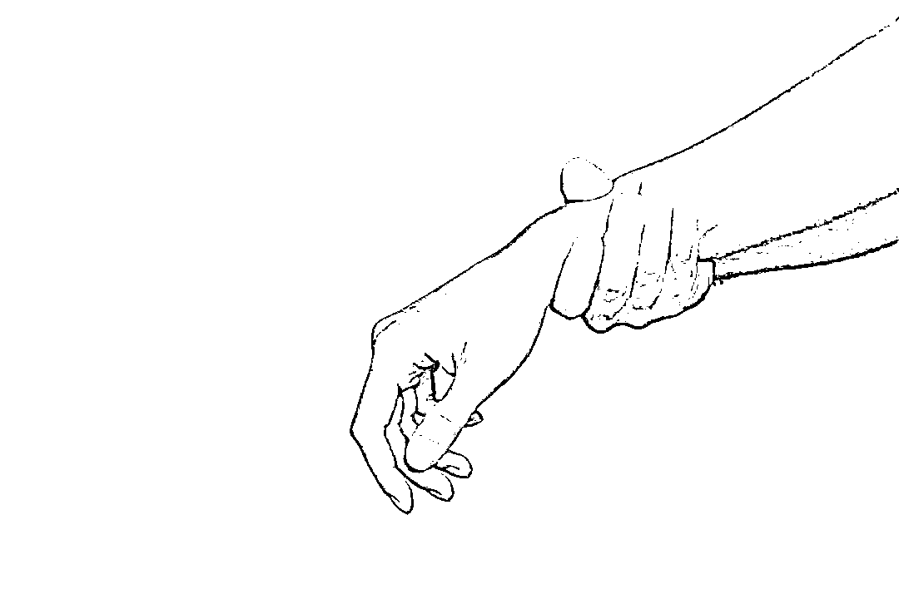**心理学的衍生和演变**17-18 世纪的科技革命让占星学备受质疑，因为现代思潮的机械论范式无法理解占星学。由于科学思想的复兴，心理学诞生了，终于取代占星学成为认知人类行为的首要工具。直到 20 世纪上半叶，达尔文和之后的弗洛伊德将心理成长和进化的概念引入大众视野。没有固定性格的预设，没有不可逾越的命运枷锁，早期的心理学家将他们的理论建立在可以观察的东西上：**人的身体与外在行为**。通过这些早期的观察，心理学家建立了人格理论。**心理学不仅仅局限于描述人格类型。它还能够阐述人们如何随着时间改变和发展**。发展心理学与精神病理学和心理治疗理论同步发展，前者关注于正常的发展为何会出现问题，而后者关注于治疗和康复的最佳方案。在这一点上，心理学开拓了占星学从未涉足的领域。到 20 世纪下半叶，占星师们开始将心理学的概念融合到他们的思考之中。职业占星师们认识到他们可以两头受益。在丹恩•鲁伊尔的领导下，人文主义占星学诞生了，在 60 年代末和 70 年代引领了占星学的复兴。

到 20 世纪末，创新者们开始探索如何**将荣格学说、精神分析、认知行为理论和其他各种模式有效统一起来，形成一个全新的混合体——心理占星学**。这个项目还在不断发展之中。

传统的占星学描述了人类行为与行星位置之间的关联性，这些描述只是局限在性格特征的表面。相反，**心理占星学着眼于内心世界，与过去相比明显具有更多细节表述**。例如，它（心理占星学）描述了占星格局所象征的**基本需求、发展阶段、心理功能、认知结构、内心对白、心灵冲突、无意识情结、防御机制、人格障碍**——这些概念在 20 世纪前甚至未曾出现。

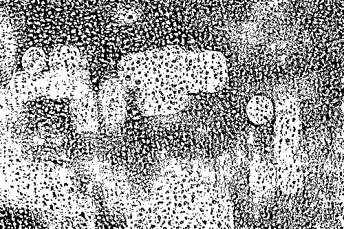

**心理占星学的本质**本质上，**心理占星学是用心理学的概念和实践重建占星学**。也许心理占星学的主要关注点就在于用心理学的方式整合出生图，从而支持人们发挥成长和改变的潜力。除了这一主要关注点以外，就没有其他标准化的方法了，尽管就定义而言，心理占星学是超个人导向的。 超个人心理学（译注：Transpersonal psychology 亦称作后人本心理学，马斯洛在晚年的时候提出了后人本心理学的概念，他既是人本心理学的奠基者之一，又是后人本心理学的奠基者之一）是心理学的一个分支。其结构中引入了灵性的概念，因此是一个更具包容性的心理学流派。亚伯拉罕•马斯洛称之为“第四势力”，是继精神分析学（psychoanalysis）、行为主义（behaviorism）及人本主义心理学（humanistic psychology）之后的“第四势力”。因此，**我们不应该将心理占星学等同于传统的心理学观念，从而剥夺了它超个人的层面。**作为一种超个人理论，心理占星学拓宽了心理学的广度和深度，将心理学转化为更具灵性的形式，将心灵和宇宙联结，并且让人类再次拾得这份神圣的遗产。

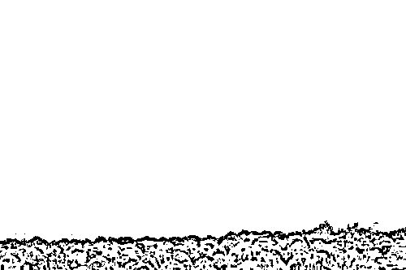

通过这种方式，它对心理学的决定性假设，即意识仅仅是其生物载体和社会环境的附带现象提出了质疑。生物决定论和社会决定论不过是古代占星学所持天体决定论的现代版本而已。决定论就是决定论，不论你认为决定命运的因素是什么。关键是，**心理占星学是承认先决因素的，但不是宿命论；而更多的，是将灵魂视为其自身的原因，是它永恒的，不可简化的本质，它自我生成，在生物和社会条件下都能够显现**。这事实上正是星图所象征的一个外化，并包含生理机能、人格和环境因素的灵魂模式。外在世界被理解为是一个固有的、预先存在的，并且在时间（可能是一生的时间）中不断进化的心理结构的共时性映射。由这种观念看来，出生时行星的位置反映出，而不是造成了一个人的心灵世界。总而言之，**心理占星学既是人格理论又是一种诊断工具**。作为一种人格理论，它揭示出心理结构和动力如何映照在外部环境之中，从而刺激心理-精神的成长。作为一种诊断工具，它提供了一种前所未有的洞见，洞察那些带来压力和伤害的潜在的或个性的问题。我们可以把星图看做一个不断展开的故事，其中命运会随着性格的发展和显露而改变。

**版权声明：**本文由若道翻译，欢迎转发，反对抄袭。友号转载请申请白名单。

**格伦·佩里**

若道签约老师。著名占星师，前 ISAR 董事会成员，共出版八本占星著作；心理/意识研究专业博士；占星心理学学院（Academy of AstroPsychology）的创办人；康涅狄格州研究生院（the Graduate Institute of Connecticut）原型宇宙学与意识进化项目的负责人。

**美国占星心理学学院创办人****格伦·佩里**授课**40 余年**职业占星师生涯所学精华**倾囊相授**修完 101-205 全部课程，并通过考核的毕业生将获得**美国占星心理学学院证书**( Academy of Astropsychology )和**若道毕业证书****高含金量双证书**跟随主讲老师学习融合**心理学体系**的**占星知识**为星图咨询解读打下坚实的基础**大量**的课程资料，光是课后阅读资料就**超过 60 万字**合理的课程设计，贴心的助教服务，及时的课后测验**美国占星心理学学院&若道占星联手打造** **两年双证书核心课程****点击图片了解详情**

****

**学习占星学****点击下图了解课程详情**

****************

**微信又双叒叕改版啦，不想错过若道君的推送？**

**就把若道设为星标吧！**

**▼**

**就是这个“在看”，戳戳戳 ☟**

********报名直达入口********

# 4 月 6 日开课丨美国占星心理学学院&若道占星双认证核心课程

> 原文：[`mp.weixin.qq.com/s?__biz=MzA5NjA0NTAxNg==&mid=2651468432&idx=3&sn=a5c979ac7c31ca174a4659040df1dc3f&chksm=8b488027bc3f093101cb2dccc797f3eebecaee7bcb691318336fccdd612dcfcb6b4d31a2e211&scene=126&sessionid=1692737852#rd`](http://mp.weixin.qq.com/s?__biz=MzA5NjA0NTAxNg==&mid=2651468432&idx=3&sn=a5c979ac7c31ca174a4659040df1dc3f&chksm=8b488027bc3f093101cb2dccc797f3eebecaee7bcb691318336fccdd612dcfcb6b4d31a2e211&scene=126&sessionid=1692737852#rd)

**美国占星心理学学院创办人**

**格伦·佩里**授课

**40 余年**职业占星师生涯所学精华**倾囊相授**

修完 101-205 全部课程，并通过考核的毕业生将获得

**美国占星心理学学院证书**( Academy of Astropsychology )

和**若道毕业证书**

**高含金量双证书**

跟随主讲老师学习融合**心理学体系**的**占星知识**

为星图咨询解读打下坚实的基础

**大量**的课程资料，光是课后阅读资料就**超过 60 万字**

合理的课程设计，贴心的助教服务，及时的课后测验

1

**这门课程最大的看点是什么？**

1. **两位国际占星学大师**共同授课，将合计**90 年职业占星师生涯所学精华**倾囊相授；2. 修完**全阶课程**，考试通过的毕业生将获得**美国占星心理学学院证书**（Academy of Astropsychology）和**若道毕业证书**，**高含金量双证书**；3. **116 次课程**的充分授课时间（录播课程 69 次课；直播课程 47 次课），全面而详细地讲解占星学历史、知识、技能、案例、咨询和运用；4. 跟随主讲老师学习**自成体系、逻辑严密、实用性强的占星语法、星图解读方法**；5. 学习独特的**发展年龄预测法**，从星图看对关键年龄阶段的发展及议题；6.** 大量的课程资料，光是课后阅读资料就超过 60 万字**；7. 合理的课程设计，初中阶课程，每一节都有课后测验；8. 本课程可以作为**ISAR 选修课**中的一门，再修两门就满足 ISAR 认证选修课要求；9. **18 次占星咨询技巧的培训**，为正式从事占星咨询建立基础；10. 教授重要的**心理学概念**，比如与客体关系、心理动力理论、个人神话和叙事疗法相关的一些概念，学习如何将它们整合到星图解读中；11. 了解**《精神疾病诊断与统计手册》**诊断标准，探索星图中的心理疗愈；12.  学习**叙述疗法**和**自传写作**，将之作为自我疗愈和咨询的工具。

**格伦老师致学员的信**

（向上滑动查看内容）

**亲爱的学员：**

作为占星心理学学院的校长，我的目标是帮助你顺利完成学业。

占星心理学学院的课程让你能够在经济承受范围内，灵活地学习占星学。我们的课程让你可以舒适、便捷地在家学习，不用打乱你本就繁忙的日程。我们有完善的在线学习系统，让你能在线上课、下载学习资料、进行测试并自动获得即时反馈，还可以在虚拟课堂上同你的教员和同学互动。

作为私人开业的**职业占星师**和**执业心理治疗师**，我已经**工作超过 30 年。**我还花了近 10 年的时间，在研究院里学习并获得**心理学的硕士和博士学位**。这段训练和经历是无价的，帮助我将占星学发展成为连贯的 21 世纪模式。

我们的占星学培训项目是**系统化的、清晰的、组织有序的、易学的、前沿的。**尽管有许多类似的学校可供你选择，但你不会在这些学校中看到像占星心理学学院所提供的那样有深度的或尖端的课程。

**我非常期待 2022 年再次在若道教授心理占星学核心课程。**我们重新规划和升级了本次课程体系。**新的课程包含之前完整课程的 72 个录播视频，每个视频长 2 小时；以及由我教授的 37 次直播课程，和大卫老师教授的 10 次直播课程，每次课程 2 小时。**在实时课程中，除了我提供的案例，我还会用学员的星图进行案例演示，与学员互动，阐明视频中教授的原则和方法。

**2 小时直播课程安排：**

**第一阶段 提问和讨论：**

这将在每节课开始时进行。邀请学员提出与课前提供的资料相关的具体问题。这一阶段将持续 15-30 分钟。

**第二阶段 示例：**

这一阶段会讲解与每周任务相关的具体概念，例如行星的星座位置、宫位位置以及相位的意涵。星图示例来自我认识的人，如公众人物、朋友、家人、同事或以前的客户（不显示出生信息）。同样，这一阶段也开放课堂讨论，学员可以提出自己的问题和见解。

**第三阶段 学员案例演示：**

这个阶段会从学员的具体星图来阐明概念，例如火元素行星占优势。学员案例演示不会涉及任何类型的咨询或“解读”。它们将只是简单地包含一段对话，我会在对话中分享自己对某个配置的思考，然后问这个学员可能会如何主观地（影响、信念、行为）和客观地（事件/关系）体验这个配置。其他参课学员可能也会对讨论的主题有自己的见解或问题，他们也可以参与讨论。

我对这一新的在线课程形式感到兴奋，**并期待着从 2022 年 4 月 6 日开始认识我的新学员们。**获得本学院的文凭会是你做过的最明智的投资。你不仅将占星学掌握到前所未有的深度，还将学到如何为客户提供咨询服务并建立职业占星师的职业生涯。

真诚地

**格伦·佩里 占星心理学学院校长**

**为什么要学习心理占星学？**占星心理学是一个复杂的体系，让实践者能够向客户提供真正治疗性的益处。这从根本上说来是我们学院有别于其他学校之处：**我们教授占星学，也教授心理学概念。****我们明确讨论各种心理学概念，并将其与占星学无缝衔接。结果就是更深入的、更丰富的，最终更加强大的模式。****该项目专为初学者和渴望深造的有经验的占星师而设。**我们会从跨学科的角度探讨星图解读。**通过融合荣格心理学和各种其他模型的元素，学员将熟悉作为人格理论、发展模型、原型语言和诊断工具的占星学。**

2

**课程是怎么安排的？**

**第一学年**

**共****64****次课 **43****次录播课 **21 次直播课******

**101 占星学基础 **

****共****12****次课程：******8 次 2017 年录课+4 次直播课**

**占星学**关注成长，聚焦心理。外部事件意义重大，但我们可以把它们看作是对于发展中的心理结构的共时性反映，以及未来发展的媒介和催化剂。在这个阶段的课程中，会以四种形态的几何形式介绍**占星原型：星座、行星、宫位和相位**。黄道带是人类心灵的象征性地图，其中的每个**星座**都代表一种基本的人类需求、原型人物、发展阶段和行为风格。**行星**代表心理功能，以满足其关联星座的基本需求。**宫位**提供了环境舞台，行星在其中扮演它们的角色，而**相位**是行星之间的角度关系，在主观上体验为内在对话。

**课程安排**：

**录播课****、****直播课（周三）**时长都是 2 小时

第一节**录播课**：核心概念介绍

第二节**录播课**：黄道带的结构

2022 年 4 月 6 日**直播课**：核心概念、黄道带的结构提问和讨论、知识点示例

第三节**录播课**：图例、单态星体和其他奇妙的元素

2022 年 4 月 20 日**直播课**：图例、单态星体提问和讨论、知识点示例

第四节**录播课**：星座介绍（从白羊座到处女座）

第五节**录播课**：星座介绍（从天秤座到双鱼座）

2022 年 5 月 4 日**直播课**：12 星座案例演示

第六节**录播课**：行星作为过程

第七节**录播课**：行星作为内容

第八节**录播课**：将碎片整合起来

2022 年 5 月 18 日**直播课**：整合星图时，将行星作为过程和内容案例演示

**102 行星落星座、宫位** 

****共****12****次课程：**8 次 2019 年录课+4 次直播课**

这个阶段的课程**聚焦于初步的星图整合。**

学员将学习**占星语法**，以及如何运用它们来阐释**行星的星座落点**。学员不需要强记书中的星图解读，而是学习分析基础的占星句法结构，应用这些语法规则来思考和讲述这门语言。学员们将学习如何构建精妙的句子，将动机、功能、特质、状态和事件组合起来。

此外，还将学习解读**行星宫位落点**的规则。宫位被定义为心理环境，为特定类型成长和发展提供背景。行星落在宫位中，象征着情境中的特殊状态，应对环境挑战的方式，以及通过共时性人物和事件而外化的自我部分。

学员们将探索如何将星座和宫位落点融合在一个单一、整合的陈述中，做出灵活、层次分明的解读。

**课程安排**：

第一节**录播课**：占星语法介绍

第二节**录播课**：行星星座作为行为风格

2022 年 6 月 1 日**直播课**：占星语法、行星星座作为行为风格提问和讨论、知识点示例

第三节**录播课**：思维状态和行为结果

第四节**录播课**：学习行星的星座落点

2022 年 6 月 15 日**直播课**：思维状态和行为结果、行星的星座落点提问和讨论、知识点示例

第五节**录播课**：回顾宫位的含义

第六节**录播课**：宫位中的行星过程

2022 年 6 月 29 日**直播课**：宫位的含义、宫位中的行星过程提问和讨论、知识点示例

第七节**录播课**：行星在宫位中的状态

第八节**录播课**：行星作为宫位的内容

2022 年 7 月 13 日**直播课**：行星在宫位中的状态、内容的提问和讨论、知识点示例

**103 行星相位与个人神话** 

****共****13****次课程：**9 次 2019 年录课+4 次直播课**

在这个阶段的课程中，**相位**被解释为由更大的故事结构的潜在动力构成的个人神话。

学员将学习相位是如何象征内在心理的冲突、重要的童年情感体验、主要的人生挑战和内在对话的。需要着重强调的是，相位的意涵会随着心理成熟的程度而改变。人会成长、进化，会解决内在冲突，这些不仅反映在态度和行为的改变上，而且也会表现在某人吸引的事件及其与他人的关系品质上。

学员们还将学习一些**心理学概念**，比如与客体关系、心理动力理论、个人神话和叙事疗法相关的一些概念，它们将整合到相位解读中。

**课程安排**：

第一节**录播课**：重要主题与核心冲突

第二节**录播课**：渐盈相位与渐亏相位

2022 年 7 月 27 日**直播课**：重要主题与核心冲突、渐盈相位与渐亏相位的提问和讨论、知识点示例

第三节**录播课**：主要相位的核心意义

第四节**录播课**：罗生门原则

2022 年 8 月 10 日**直播课**：主要相位的核心意义、罗生门原则的提问和讨论、知识点示例

第五节**录播课**：占星学中的认知

第六节**录播课**：心灵的控制结构

2022 年 8 月 24 日**直播课**：占星学中的认知、心灵的控制结构的提问和讨论、知识点示例

第七节**录播课**：作为认知结构的相位

第八节**录播课**：强迫性重复

第九节**录播课**：听大卫·瑞雷讲月亮交点

2022 年 9 月 21 日**直播课**：月亮交点（由大卫·瑞雷老师教授）

**104 征象星与定位星：作为进化故事的星图 **

****共****12****次课程：******8 次 2019 年录课+4 次直播课**

这个阶段的课程聚焦于**从叙事角度整合星图。**

学员们将探索**宫位征象星**和**行星定位星**如何讲述一个故事，反映一个人进化发展之旅。行星定位关系揭示了个人神话的主体构架。而这个故事的主题常常处于意识觉知和控制之外，占星学提供了一种方式，揭示、解读、改编这个神话。

我们推荐的星图整合方式是将相位和定位星关系融合成一个单一、连贯的叙事。要特别强调的是，如何活出整合程度更高的生命故事。

学员们还将了解**叙事疗法**和**自传写作**，把它们当作促进整张星图整合的一种方式。

**课程安排**：

第一节**录播课**：每张星图都讲述了一个故事

第二节**录播课**：互容与最终定位星

2022 年 10 月 12 日**直播课**：每张星图都讲述了一个故事、互容与最终定位星的提问和讨论、知识点示例

第三节**录播课**：将相位整合进流程图

第四节**录播课**：完整的故事

2022 年 10 月 26 日**直播课**：将相位整合进流程图、完整的故事的提问和讨论、知识点示例

第五节**录播课**：过渡短语

第六节**录播课**：良好定位或不良定位

2022 年 11 月 9 日**直播课**：过渡短语、良好定位或不良定位的提问和讨论、知识点示例

第七节**录播课**：发展年龄方法

第八节**录播课**：进行全面整合

2022 年 11 月 23 日**直播课**：发展年龄方法、进行全面整合的提问和讨论、知识点示例、案例演示

**105 星图中的精神病理学与疗愈 **

****共****15****次课程：******10 次 2019 年录课+5 次直播课**

在这个阶段的课程中,我们将**聚焦于十二星座(从白羊座到双鱼座）及其对应的守护星的潜在功能障碍**。

我们将学习如何识别、理解和应对每个星座的潜在挑战。我们将在各种相应的心理障碍背景下来考察占星原型，这些心理障碍表现为功能障碍、失衡的极端状态。

学员们将了解**《精神疾病诊断与统计手册》诊断标准**。我们会探讨治疗的概念，尤其是那些与整合和个性化相关的概念。我们将特别关注外行星的困难相位，以及它们与内在心理冲突、防御和症状形成的关系。

学员们将探索人的痛苦如何成为发展和实现天赋才能的催化剂。

**课程安排**：

第一节**录播课**：白羊座-火星的病理学

第二节**录播课**：金牛座/天秤座-金星的病理学

2022 年 12 月 7 日**直播课**：白羊座-火星、金牛座/天秤座-金星的病理学提问和讨论、知识点示例、案例演示

第三节**录播课**：双子座/处女座-水星的病理学

第四节**录播课**：巨蟹座-月亮的病理学

2022 年 12 月 21 日**直播课**：双子座/处女座-水星、巨蟹座-月亮的病理学提问和讨论、知识点示例、案例演示

第五节**录播课**：狮子座-太阳的病理学

第六节**录播课**：天蝎座-冥王星的病理学

2023 年 1 月 4 日**直播课**：狮子座-太阳、天蝎座-冥王星的病理学提问和讨论、知识点示例、案例演示

第七节**录播课**：射手座-木星的病理学

第八节**录播课**：摩羯座-土星的病理学

2023 年 1 月 18 日**直播课**：射手座-木星、摩羯座-土星的病理学提问和讨论、知识点示例、案例演示

第九节**录播课**：水瓶座-天王星的病理学

第十节**录播课**：双鱼座-海王星的病理学

2023 年 2 月 8 日**直播课**：水瓶座-天王星、双鱼座-海王星的病理学提问和讨论、知识点示例、案例演示

**第二学年 2023 年**

****共****52****次课 **36****次录播课 **16 次直播课********

**201 回顾占星历史 **

****共****16****次课程：******9 次 2019 年录课+7 次直播课**

在这个阶段的课程中，我们将探索**占星历史如何反映心灵的进化**。

现代之前的占星学以事件为导向，注重具体预测，偏向决定论，它反映了现代之前的主导意识模式。上世纪以来，占星学已经逐渐变得更加抽象、心理化、开放和非决定性，这似乎反映了集体意识的改变。因此，我们将在人类发展和意识进化的背景下考察占星历史。我们会谈到不同时代的星图解读和咨询技术，以此来比较和对比前现代、现代和后现代占星学。

**课程安排**：

第一节**录播课**：朝着整体占星学前进

第二节**录播课**：占星原教旨主义

2023 年 2 月 22 日**直播课**：朝着整体占星学前进、占星原教旨主义提问和讨论、知识点示例

第三节**录播课**：占星学的其他分支——大卫·瑞雷

2023 年 3 月 1 日**直播课**：占星学的其他分支提问和讨论、知识点示例（由大卫·瑞雷老师教授）

第四节**录播课**：从古代占星学到后现代占星学

第五节**录播课**：比较与批评

2023 年 3 月 8 日**直播课**：从古代占星学到后现代占星学、比较与批评、提问和讨论、知识点示例

第六节**录播课**：希腊占星学：摘录与评论

2023 年 3 月 22 日**直播课**：希腊占星学：摘录与评论提问和讨论、知识点示例

第七节**录播课**：比对图中的伴侣匹配度，古代与现代

2023 年 4 月 5 日**直播课**：比对图中的伴侣匹配度，古代与现代提问和讨论、知识点示例

第八节**录播课**：比对图——大卫·瑞雷

2023 年 4 月 12 日**直播课**：比对图提问和讨论、知识点示例、案例演示（由大卫·瑞雷老师教授）

第九节**录播课**：组合图——大卫·瑞雷

2023 年 4 月 26 日**直播课**：组合图提问和讨论、知识点示例、案例演示（由大卫·瑞雷老师教授）

**202 预测与意识演变(一) **

****共****9****次课程：******6 次 2019 年录课+3 次直播课**

作为一门艺术，**预测占星学**运用行星的运行来预测特定时期的性质、意义和持续时间。在这个阶段的课程中，我们会考察**意识进化**的概念、其基本原理及其与占星学预测部分的关系。

意识进化可以被定义为有意识地与星图中固有的进化过程合作。学员们将探索如何用**行进**和**推进**来为意识进化服务。我们不是简单描述事件的结果，而是将行星运行描述为实现先天潜能的机遇之窗。

**课程安排**：

第一节**录播课**：开始预测

第二节**录播课**：发展年龄方法

2023 年 5 月 3 日**直播课**：开始预测、发展年龄方法提问和讨论、知识点示例、案例演示

第三节**录播课**：太阳的行进

第四节**录播课**：月亮的行进与推进

2023 年 5 月 17 日**直播课**：太阳的行进、月亮的行进与推进提问和讨论、知识点示例、案例演示

第五节**录播课**：水星的行进

第六节**录播课**：金星的行进

2023 年 5 月 31 日**直播课**：水星、金星的行进提问和讨论、知识点示例、案例演示

**203 预测与意识演变(二) **

****共****15****次课程：******9 次 2019 年录课+6 次直播课**

在这个阶段的课程中，学员们会继续探索**如何将对行进、推进和其他预测方法的分析运用于个人成长**。

具体事件反映并促进了意识的改变；因此，行星运行可以帮助我们洞察成长过程的精确时机，让我们领会内在和外在现实如何同时发生、彼此反映、互相转化。

我们还将探索宏观的世界行进，考察占星格局如何在社会、政治、经济、艺术和生态层面上表现出不同的形式，却又在多样化的现象中反映单一的**原型**。

这里的挑战是去思考，我们对宇宙的这种参与式关系如何能为共同创造一个积极的、更充满希望的未来做出贡献。

**课程安排**：

第一节**录播课**：火星的行进

第二节**录播课**：木星的行进

2023 年 6 月 14 日**直播课**：火星、木星的行进提问和讨论、知识点示例、案例演示

第三节**录播课**：土星的行进

第四节**录播课**：天王星的行进

2023 年 6 月 28 日**直播课**：土星、天王星的行进提问和讨论、知识点示例、案例演示

第五节**录播课**：海王星的行进

第六节**录播课**：冥王星的行进

2023 年 7 月 12 日**直播课**：海王星、冥王星的行进提问和讨论、知识点示例、案例演示

第七节**录播课**：次限推进——大卫·瑞雷

2023 年 7 月 19 日**直播课**：次限推进提问和讨论、知识点示例、案例演示（由大卫·瑞雷老师教授）

第八节**录播课**：太阳弧——大卫·瑞雷

2023 年 7 月 26 日**直播课**：太阳弧提问和讨论、知识点示例、案例演示（由大卫·瑞雷老师教授）

第九节**录播课**：太阳返照图和月亮返照图——大卫·瑞雷

2023 年 8 月 9 日**直播课**：太阳返照图和月亮返照图提问和讨论、知识点示例、案例演示（由大卫·瑞雷老师教授）

**204 占星咨询技巧(一) **

****共****9****次课程：******6 次 2019 年录课+3 次直播课**

在这个阶段的课程中，学员们将学习**咨询技巧**，比如如何选取一段经历，询问相关问题，提出假设，进行解读，重塑冲突，预测成长机遇，深化疗愈。

我们会审视各种**咨询理论**，重点强调它们在占星学中的**运用**。学员们将学习如何处理危机，做出恰当的推荐引介。

我们强调**有效沟通**的原则、聆听技巧、言语和非言语沟通，以及占星学如何帮助我们建立共情关系。

我们会专门介绍**伦理道德**法则，因为它关系到职业责任问题、资质能力、咨询和预测。

我们会特别关注**占星师的阴影**以及我们在自卑和膨胀问题上的集体脆弱。

**课程安排**：

第一节**录播课**：导言与概述

第二节**录播课**：确定咨询范围

2023 年 8 月 16 日**直播课**：导言与概述、确定咨询范围提问和讨论、知识点示例、案例演示

第三节**录播课**：会见客户

第四节**录播课**：厘清问题(剥开占星学的洋葱)

2023 年 8 月 30 日**直播课**：会见客户、厘清问题(剥开占星学的洋葱)提问和讨论、知识点示例、案例演示

第五节**录播课**：认出生活模式(隐喻思维)

第六节**录播课**：提出假设与辨识核心信念

2023 年 9 月 13 日**直播课**：认出生活模式(隐喻思维)、提出假设与辨识核心信念提问和讨论、知识点示例、案例演示

**205 占星咨询技巧 (二) **

****共****12****次课程：******6 次 2019 年录课+6 次直播课**

在这个阶段的课程中，参与者将**继续学习咨询技巧**，包括如何选取一段经历，询问相关问题，提出假设，进行解读，重塑冲突，预测成长机遇，深化疗愈。

我们还将考察各种**电影**，考察它们与理解人们寻求帮助的共同议题的关系。我们会审视各种咨询理论，着重强调它们在占星学中的运用。学员们会学到如何处理危机，做出恰当的推荐引介。我们会强调有效沟通的原则，以及聆听技巧、言语和非言语沟通，以及占星学如何帮助我们建立共情关系。我们会专门介绍伦理道德法则，因为它关系到职业责任问题、资质能力、咨询、预测和古代术语的运用。

**课程安排**：

第一节**录播课**：检验假设

第二节**录播课**：对星图做出初步解读

2023 年 10 月 11 日**直播课**：检验假设、对星图做出初步解读提问和讨论、知识点示例、案例演示

第三节**录播课**：建设性解读星图的艺术

第四节**录播课**：洞悉客户经历的目的

2023 年 10 月 25 日**直播课**：建设性解读星图的艺术、洞悉客户经历的目的提问和讨论、知识点示例、案例演示

第五节**录播课**：提供希望和方向

第六节**录播课**：案例研究和督导

2023 年 11 月 8 日**直播课**：提供希望和方向、案例研究和督导提问和讨论、知识点示例、案例演示

2023 年 11 月 15 日**直播课**：ISAR 资质认证考试大纲和准备（由大卫·瑞雷老师教授）

2023 年 11 月 22 日**直播课**：ISAR 资质认证考试术语词汇表第一部分（由大卫·瑞雷老师教授）

2023 年 11 月 29 日**直播课**：ISAR 资质认证考试术语词汇表第二部分（由大卫·瑞雷老师教授）

**若道核心课程结业考试**

3

**导师简介**

**格伦·佩里（Glenn Perry）**

*   这位传奇的占星师，也是一名拳击和摩托车爱好者

*   他毕业于赛布鲁克学院(Saybrook Institute)，是心理/意识研究专业博士

*   也是拥有 30 余年经验的加州注册婚姻和家庭治疗师 （CAMFT）

*   美国占星心理学学院（Academy of AstroPsychology）的创办人

*   他曾任国际占星研究协会 （ISAR）以及联合占星大会董事会（UAC）副主席

*   也是 ISAR 突破性道德标准的设定者

*   康涅狄格州研究生院（the Graduate Institute of Connecticut）原型宇宙学与意识进化项目的负责人

*   共出版八本占星学著作：《心理占星学入门》《心理占星论文集》《盗取天火》《从忠诚到革命》《星图中的阴影》《占星职业议题与伦理》《出生星图深度分析》《从古代到后现代占星学》

**大卫·瑞雷（David Railey）**

*   若道联合创始人，致力于在中国教授和推广西方占星学；

*   曾任 ISAR 全球副主席，CAPISAR（ISAR 职业占星师资质认证机构）主席；

*   1976 年，通过亚特兰大职业占星师考试，成为全职占星师，随后通过 AFAN 和 ISAR 职业测试；

*   1980 年，与杰夫·焦耳一起在亚特兰大创建“每日行星”占星学中心。此后在亚特兰大占星协会担任 4 年考官，并且两次担任亚特兰大地区占星协会主席。1979-1992 年，作为占星师活跃于美国社会媒体，向不了解现代占星学变化的大众宣传专业占星学知识。在 1989-1992 年期间，他在 WRGG 电台 12 频道每周主持个人电视秀“今日占星学”，早先他还在 WRFG 的广播节目中播讲宇宙天气节目；

*   2010-2014 年，任全美占星师联盟监督委员会委员；

*   2010 年，其著作《灵魂的目标》中国版出版，和蒋颖一起创办若道占星学校和其官网 www.nodoor.com；

*   2017 年，被选为 ISAR 委员会成员。ISAR 是世界最大的国际占星机构，会员遍布 45 个国家，2017-2020 年曾任 ISAR 全球副主席、CAPISAR（ISAR 职业占星师资质认证机构）主席。

**助教简介**

**薇安**

*   全职心理占星师、ISAR 认证占星师（2016 年获得）；

*   北大心理学硕士、MBTI 国际认证施测师；

*   若道认证生时校正资质及 COAC 高阶资质毕业生；

*   连续两届担任格伦·佩里老师亲授的“美国占星心理学院&若道占星双认证核心课程”主助教；

*   2012 年至今，持续追随多位国际占星大师进行占星学的深入学习；

*   2007 年至今，持续进行精神分析及心理动力取向的理论及技巧研习；

*   致力研究心理学与占星学的整合运用。

4

**此次课程适合哪些人？**

*   对占星学感兴趣，想要入门的零基础者

*   占星学小白，但有志成为职业占星师的人

*   有一定占星学基础，但不知道该如何整合星图复杂碎片的人

*   想要师从更多殿堂级占星导师学习占星心法的人

*   走在自我探索和个人成长道路上的人

5

**选择若道学习占星学的优势**

**运用自由意志，扭转破坏性模式，绽放天赋潜能**

若道是人本主义占星学的旗手。因为我们相信，**人通过了解模式、觉察习性、积极疗愈、终将释放其潜能，与命运共舞**。

**进入国际权威职业占星师认证的快车道**

占星界的“联合国”ISAR（国际占星研究协会），是具有全世界影响力的占星教学和研究组织和职业占星师全球认证机构，认证占星师遍布 47 个国家。**在 ISAR 的 22 所附属学校中，大中华地区的附属学校只有若道一家**。在国际化的教学理念大纲标准下，**若道毕业生在 ISAR 国际认证占星师的考试通过率多次全球第一**。

**十年占星学教育中国本土化教学经验**

**根据中国学生的学习习惯不断优化占星教学体系，让学员学成后更自如地应对本土咨询市场的需求。**

学好占星学不仅仅需要邀请一两位老师教学，更需要对教学难点有充分了解，且有持续的教学跟进服务。**10 年来多次核心课程和各种专题课程的教学，让若道非常了解中国学生学习占星学的难点和卡点，合理有效地拆分、提炼课程知识点，同时也积累了丰富的国外老师和中国老师、助教紧密配合以及课程顾问密切配合教学的经验**。

若道还专门开发了有助于占星学习的“**若道**”APP，每门课程都设有答疑板块，学员能够方便快捷地提交问题，助教及时答疑解惑和批改作业。

**融入中国顶尖的职业占星师群体**

若道是中国职业占星师的“黄埔军校”。职业占星师的培养从若道开始，**进入若道，你就走进了中国顶尖的职业占星师群体，和一群志同道合的师兄师姐联谊，获得经验，共同成长**。 

**多种奖学金支持**

为了鼓励学员不因为暂时的经济困难而放弃学习，我们特意设置了各种**技能交换和奖学金**。

对于有一技之长的学员，我们推出的技能交换的项目包括**“笔译”、“笔记整理”、“平面设计”、“课本朗读”、“班级服务”**等技能交换项目；

而对于努力学习、出勤率高、完成作业率高的学员，我们设置的**土星奖、木星奖**等各种奖学金在等着你。

为了感谢帮助我们推荐学员的老学员们，我们设置了“**老学员推荐奖**”；

对于通过问卷提建议，帮助我们提高服务的学员，我们也设置了相应的奖学金。

**开启占星咨询的职业规划和支持**

若道为占星学员搭建了占星问答平台和占星咨询平台，并提供严肃占星学影响力最大的媒体平台，全力为毕业生提供宣传渠道，帮助你吸引和积累咨询生涯初期的种子客户。若道为学员开发了适用于占星学习的“若道”APP，并不断更新完善。

**①  微信平台**若道微信平台作为业内颇具影响力专业平台，为文笔好的若道毕业生提供传播占星学并免费宣传自己的机会。有的学员因为文笔获得众多粉丝喜爱，在 3 年多时间积累起 2000 多人的潜在客户。

**②  问答平台**若道问答平台帮助学员接触客户的实际问题，并在毕业前就进行演练答题。自问答平台 2016 年上线运营以来，学员接触到 3200 多个问题， 回答问题最多的学员在问答平台收入达 5 万多元。

**③  咨询平台**若道咨询平台是我们为优秀毕业生所搭建的平台，帮助毕业生在自己的咨询拓展之外，用若道提供的平台扩展咨询客户群。自咨询平台 2017 年 8 月上线运营以来，咨询平台共入驻 65 人，收入最高者达 32 万元。

此处所列学员收入仅供参考，收入高的学员和其专业水准、努力程度密切相关。若道平台尽其所能将自己定位为辅助学员开展职业生涯的桥梁。

6

**课程价格**

**101-102 初阶**

**正价：**6800 元

**早鸟价：****6200 元**

**早鸟价截止时间：2022 年 3 月 16 日**

**学习充值卡优惠价：5800 元**

**101-105 第一学年**

**正价：**18800 元

**早鸟价：****17600 元**

**早鸟价截止时间：2022 年 3 月 16 日**

**学习充值卡优惠价：17000 元**

**101-205 全阶联报**

**正价：**50000 元

**早鸟价：****36000 元**

**早鸟价截止时间：2022 年 3 月 16 日**

**学习充值卡优惠价：35000 元**

**咨询课程顾问**：**王老师（微信/手机：18510107057，请备注“格伦核心课”）**

**全阶段学习后，可参与若道占星毕业认证考试，考试费用为：580 元**

7

**直播课开课时间**

**2022 年 4 月 6 日（周三）20:00-22:00**

8

**退转课程**

**退款原则请详看《教学协议》，如有疑问请咨询课程顾问。**

9

**格伦老师视频**

** 格伦·佩里老师如何将心理学和占星学结合，如何开始教授心理占星学？**

<mpvideosnap class="js_uneditable custom_select_card channels_iframe" data-pluginname="videosnap" data-id="export/UzFfAgtgekIEAQAAAAAA1cQIVxHSQwAAAAstQy6ubaLX4KHWvLEZgBPEj4N8IVw_XO_8zNPgMIvIg3o5fV6DKtbopk3uCtgu" data-url="https://findermp.video.qq.com/251/20304/stodownload?encfilekey=rjD5jyTuFrIpZ2ibE8T7Ym3K77SEULgkiacqoE1uQT2gRMR7tsdLprPxw34Qibx2tX5gg3FHPSwGBA23EQANYxD29423qqiboomc3RIYLZP49cImPwmNV6LYqA&amp;adaptivelytrans=0&amp;bizid=1023&amp;dotrans=0&amp;hy=SZ&amp;idx=1&amp;m=&amp;scene=0&amp;token=AxricY7RBHdUIqHazje0cib6ddJfLKk6VpG8CrHMvAa7LnbGk6Yb742ETaJ0jJ5zewGLZSAOicbApU" data-headimgurl="http://wx.qlogo.cn/finderhead/PiajxSqBRaEJYnVsqWfEX9qA0sI6hNVKsDfyzfPZ92WZMZyBpZWU5NA/0" data-username="v2_060000231003b20faec8c4e68a1ec2d4ca07e434b07755bbf47e7053a3059defd2c9d6c68a20@finder" data-nickname="若道" data-desc="#若道核心课 格伦·佩里老师如何将心理学和占星学融合，如何开始教授心理占星学？" data-nonceid="7753154886488626177" data-type="video"></mpvideosnap>****2022 双证书核心课****

**授课老师：格伦·佩里、大卫·瑞雷**

**直播课开课时间：2022 年 4 月 6 日（周三）开课**

**授课方式：******网络授课，英文授课，中文翻译****

**费用：101-102 价格：**6800 元**（早鸟价 6200，2022 年 3 月 16 日截止，充值卡优惠价 5800）**，**101-105 价格**：18800 元**（早鸟价 17600，2022 年 3 月 16 日截止，充值卡优惠价 17000）**，**101-205 价格**：50000 元**（早鸟价 36000，2022 年 3 月 16 日截止，充值卡优惠价 35000）**；

**课程负责人：王老师**（微信/手机：18510107057，请备注“格伦核心课”）

长按二维码添加课程负责人咨询~

****报名直达入口****

# 若道周运丨 2.28-3.6：三月第一周，12 星座的梦想在哪里扬起风帆？

> 原文：[`mp.weixin.qq.com/s?__biz=MzA5NjA0NTAxNg==&mid=2651468391&idx=1&sn=786e39007606113283e3dc924c8d5d78&chksm=8b4880d0bc3f09c6ff755318d493467e03c1be8d013a6f467a10cbfef92b7485ce9f55ebb063&scene=126&sessionid=1692737852#rd`](http://mp.weixin.qq.com/s?__biz=MzA5NjA0NTAxNg==&mid=2651468391&idx=1&sn=786e39007606113283e3dc924c8d5d78&chksm=8b4880d0bc3f09c6ff755318d493467e03c1be8d013a6f467a10cbfef92b7485ce9f55ebb063&scene=126&sessionid=1692737852#rd)

******☆ ****后台回复“今日”，给你一句生命态度******

作者/朵三三三 ISAR 认证占星师
编辑/翀子 封面/书君 图片/网络 3 月第一周，我们依然处在金火合相的影响中，另外，水星与土星的合相、太阳与木星的合相让这几天成为扬起梦想风帆的好机遇。12 星座如何度过本周？让我们来看文章吧！（如果着急看 12 星座运势，不妨先拉到最后哦）**整体氛围**

这周的天空中挤满了合相，大家在一起不分你我。

有些行星在旅程中相遇，同行一段路，和谐融洽。有些行星明明水火不容，却硬要被绑在一起，充斥着压迫感和火药味，势要让彼此留下最难忘的记忆。

本周重要天象

*   金星、火星、冥王星合相在摩羯座，深度情感炼金术。

*   水星、土星合相在水瓶座，科学理性的大脑建立起防御的围墙。

*   太阳、木星合相在双鱼座，未来是爱之梦的海洋。

**金星与火星已经并肩前行了两周。**

这是情感活跃度很高的一段时光，过去的半个月里，有些人在情感上实现了质的飞跃，在火星带来的充沛能量下，或许是表白、求婚，也可能是积极处理亲密关系中的问题。

金火合相带来激情与火热，却又行进在摩羯这样冷感又理性的土相星座，所以我们并没有被热烈冲昏头脑，反而更脚踏实地，一边享受，一边规划，让浪漫之光照进生活。

**本周它们将一起遇见冥王星，由冥王星来考验你为爱搭建的城堡是否足够牢固。**

我们即将遭遇冥府使者，进入黑暗的影子中，**它带来欲念的诱惑，并检验我们心中的真相是否清晰，意志是否坚定。**这种检视一定令人不太舒服，甚至是刺痛的，然而它所携带的清理能力，却能让人在痛苦过后浴火重生。

到底有多痛苦？**取决于你对真实是否足够敞开，足够接纳。**

如果你向来最热衷于看见最犀利，甚至是黑暗的部分，那么恭喜你，这一周你有机会澄清所有迷雾，一触及底。但如果你情愿生活在幻觉中，那这一周注定不太好过。

**我们对待情感的方式容易变得极端**，我们体验不安，嫉妒，怨恨，我们因害怕失去而紧紧抓住，因恐惧改变而试图控制。

警惕一切关系中关于**权力控制**的游戏，无论你是否占据表面的主动，你与对方都只是贪嗔痴的牺牲品。

**金钱与物质也可能带来同样的感受。**

我们急不可耐要得到内心渴望的东西，甚至会觉得一切与生存相关。如果失去，我们就无法存活，如果不这样做，我们就会死掉。

我们甘愿因此承受痛苦，甚至成为一个冷酷无情的人。同样的，你也会感受到这个人世间的冰冷，和一切因现实利益而暴露的残忍。

**这个相位有时意味着冲突，甚至是危险，要警惕它们演变为暴力。**我们唯有学会放手，才能进入新的轮回，也唯有变得更加强大，才能坦然接纳关于黑暗的部分。若能够平静的接受它本来的样子，那么这一周对于我们来说，就是深入体察自己的最佳时机。

最终，一切不再合时宜的人事物都会离开，列车缓缓抵达终点。

冥王星与过去深深的连结着，往事和旧伤口再度被挖掘出来，而这次你有机会做得更好。痛苦激烈而灼热，带着清理、转化的能量，如同病毒侵入身体，**我们会感到疼痛，甚至发高烧，但煎熬过去，一切都会好转。**

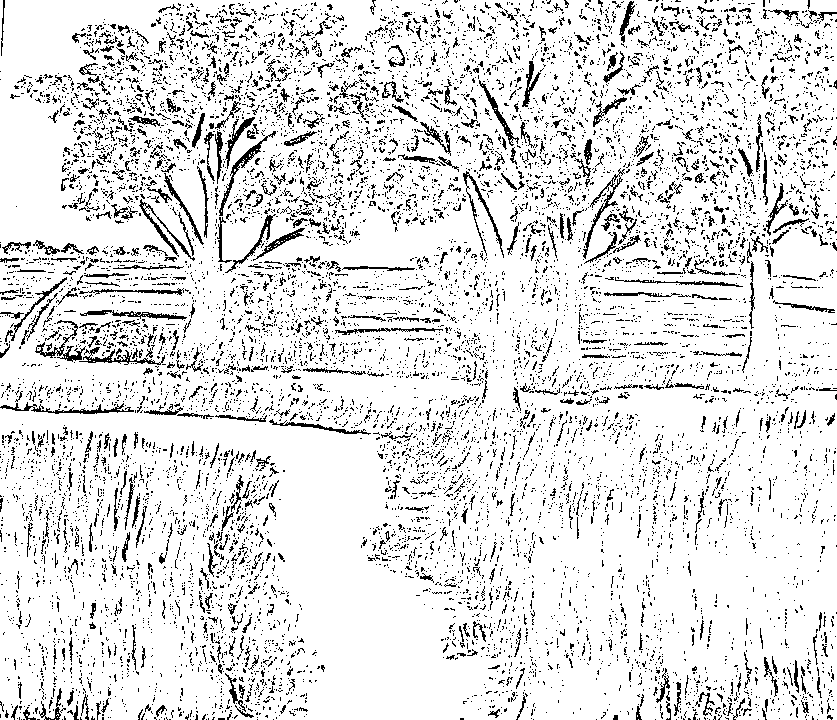

**群星摩羯座的土星能量，会让你始终明白自己失去了什么，又获得了什么。**土星这个时间之神，也能够证明，时间可以带走一切的伤痛。在辗转反侧的挣扎和无尽深渊中，天空会渐渐亮起来。

更何况，**本周我们还有水星与土星合相在水瓶座的能量，**我们可以清晰而严谨，可以超然事外，人间清醒。

当水星和土星相遇时，我们的思维方式变得更加有系统、有条理、有框架，**本周适合深入分析、谋划、思考，和一切带着专业性、技术性的严肃沟通。**

例如整理书写汇报、报告、调查，其中可能涉及到与人群、市场、互联网、科技相关的内容。

当然土星也会带来一些阻力，使得事情没有那么轻松。在这个过程中，**我们需要等待，或者需要解决一些现实障碍，再继续前进。**

涉及到学习、旅行、签约、谈判、交流时，一切都比平时更加深入，也更加缓慢而谨慎。**三思而后行**是最适合的描述，准备周全再行动，对于所有人都是最好的策略。

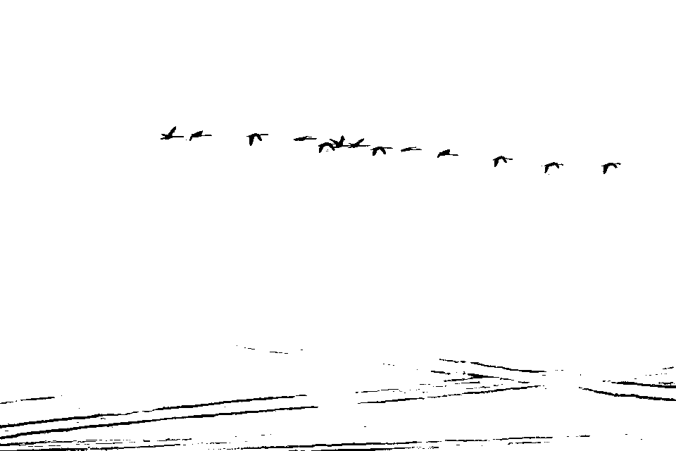

**本周的明星天象，是太阳与木星合相在双鱼座。**

这是一个绝佳的运势，**3 月 3 日，新月发生在双鱼座，****3 月 5 日，太阳合相入庙的木星**，振奋人心。每个人都会憧憬未来，近距离触摸到自己的梦想。我们可以在这段时间内，不断地问自己的内心：**你的梦想是什么？你相信什么一定会发生？**

**在这段时间里，会有很多人找到人生的方向，**就在一念之间，灵感油然而生。或许就是一种难以描述的感觉，越来越清晰，仿佛是一束光，让你身不由己的追随它前行。这就是双鱼座的能量。

我们也可能接触到艺术、宗教，从中得到启示。也有一些人，在外出、旅途中灵光乍现，如同被点化般开悟。

这段日子会成为一个源头，日后每当我们陷入泥泞和沼泽中时，我们会想起来的，有着熊熊火焰的，充满光与爱的源头。

**本周对我们的意识提升有很大的帮助，此时我们也富有创造力和执行力，**我们可以带着这样强大的力量感染他人，继而改变世界。

双鱼能量饱含着意念和直觉，你不需要怀疑自己，只需放手让生命去运作，目标明确，信念便可创造实相，最终能够让自己所想的一切成形。

**你要相信，这一周足够让非常宏大而重要的事物诞生。**而此时的星空中，能量非常和谐，水土交融，爆棚的阴性能量提供源源不断的滋养。

充沛的土象能量，确保会有足够丰沃的土壤，令你的梦想开出花朵。

当然合相也有焦伤之意，**当一切显得过于顺利，蓬勃时，我们也要从另一个角度去切入思考。**我们需要留神：太阳的阴影下有什么？我们是否被巨大的光环笼罩，在强光之下，有着我们看不到的盲区？我们是否忽略了哪些可能的危险和问题？

**自信，但不自满，信任，但不盲目。**

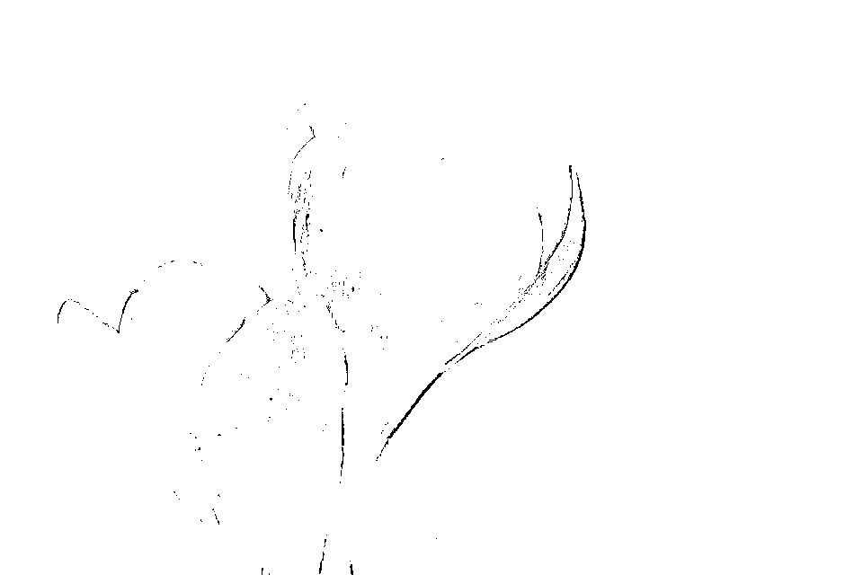

**12 星座一周运势**

**（重点参考上升星座，其次参考太阳星座）**

***白羊座***

本周内心宽容平和很多，对于很多过往无法释怀的事情，能够做到包容、放下，**用新的态度来面对。**

过去半个月里，在职场的人际关系中或许遇到了帮助自己的人，但本周注意**容易有矛盾冲突出现**，尤其是跟领导、上级相处时。也要注意可能卷入复杂的关系中，部分工作中涉及到公司财务的白羊座，需要比平时更加小心谨慎。

可能跟朋友、团体伙伴进行互动交流，或许一起讨论愿望或未来，而收获实际的启发。

***金牛座***

本周脑力活动主要集中在工作领域，需要专业性较强的严肃沟通，**适合对事业发展方向做长远、实际的规划和思考。**

**人脉资源有所扩充**，朋友圈、社群方面容易出现指引你方向的导师型人物，令你有所成长。

还在读书，或正计划出国，或与远方异地有相关项目的金牛，在本周或许遭遇一些阻力。但总体来说，**这是一段对于未来充满希望愿景的时光。**

***双子座***

可能会有旅行、出差，也或许制定新的学习计划，与异地相关的事宜都是有着明确目的、带着任务的，不是全然轻松，也需要注意别太劳累，尽可能保持身体的活力。

财务方面或许有一大笔支出，**投资方面需要更加谨慎**。事业运非常好，**很可能在本周有新项目开展**，或因出色表现受到上级或众人的赏识认可。

***巨蟹座***

人际关系、亲密关系可能遭遇一些压力，需要注意控制与信任方面的议题，**关系方面的课题容易令你身心俱疲，需要更轻松一些对待。**

近期你对保险、税务、投资方面感兴趣，但较为谨慎。

本周也适合接触身心灵、神秘学的知识，**对自己内在进行深入探索。**部分巨蟹座升起读书或继续进修的念头，还在读书的巨蟹座学业、考试方面较为顺利。

***狮子座***

职场方面，**注意与同事和下属之间的关系，**本周有机会更深入了解彼此，重新建立起新的相处模式，过程中或许经历一些激烈的事件，**但一切都是辞旧迎新的必经之路。**

这段时间适合主动表达，明确的说出自己的诉求和想法，**你比平时更容易换位思考，也能够以谨慎负责的态度赢得他人好感。**

这段时间**注意身体健康**，可能因工作的忙碌过度消耗体力，有些人会选择在这个阶段开始运动，同样建议量入为出，循序渐进。

***处女座***

**恋爱、子女方面**会成为近期令你较为苦恼和头疼的领域，取决于你的生命正处在怎样的阶段。

或许会经历刻骨铭心的一次情感波折，也可能是与孩子之间的一次冲突，令你认识到**需要崭新的看待亲子关系**，也或许是你正在考虑生育后代的问题，有些事情令你改变看法，颠覆认知。

工作方面你比平时更加谨小慎微，**有更多需要你仔细分析的工作**，你也会传递出更实用的资讯。

***天秤座***

**家庭、房屋、亲人成为你本周聚焦的课题，**或许是现实中有过往的一些未完成事务需要你处理，也可能是与亲近的人有冲突矛盾发生，从而令你深刻的意识到彼此之间早已存在的一些问题。

恋爱方面有新的进展，或许可以接到一些好消息，来自于自己早就喜欢的人，也或许是朋友邀请你出门的一条信息，一个电话。**本周你十分具有创造力，也富有玩乐精神。**

***天蝎座***

本周对你来说也是**相当快乐的一段时光**，或者说，你十分想要享受愉悦，做让自己轻松的事。你高度敞开，**活跃的心态也可能让你结识一些同样欢乐的人，**并因此邂逅一些桃花和缘分。

但真实状态是，无论外在多么想要放松，头脑从未停歇，**有些激烈的想法不断碰撞，甚至引起自我矛盾和纠结。**建议多跟家人、信任的朋友交流，你会收获到很有价值的宝贵意见。

***射手座***

**注意财务、收入上的一些改变，**可能有些需要维权，或者较为麻烦的涉及金钱方面的事件发生。这段时间，财务问题会让你感到焦虑不安，任何决定**请深思熟虑，切勿冲动**，涉及钱财方面的事项格外敏感，也容易成为你愤怒的来源。

**请谨慎观察自己，用你理性的头脑来看见自己内心的真实需求，**多在家中休养生息，多花时间陪家人，也会让你身心愉悦，重新充满希望。

***摩羯座***

**情感、财务是最近的主课题，**一些旧有问题被激发，适合深度探索、检视感情观、金钱观中有哪些亟需改变的旧模式，适合做出对金钱的规划、管理，而情感上需要处理控制与被控制，权力争斗的议题，无须对自己太过苛求，需要学会与激烈的情绪共处。

**社交更加活跃，行动力增强，**学业运、考试运佳，适合学习新知识、培训新技能，或短期外出、旅行散心。

***水瓶座***

**近期在沟通表达上变得更加谨慎，**聚焦干货，其中涉及到专业性的信息交换，也会感受到一些社交上面的障碍、困难和压力。

内心对一些事情有执念，但倾向于隐藏而非倾诉，可多去寺庙、宗教类场所，或做冥想静心练习，帮助内心恢复平和。

金钱上有好运，或许有意想不到的进账，**部分水瓶座可能换了新工作，有了新的收入方式。**

***双鱼座***

本周格外自信，对自己的未来充满期待，**很多双鱼座在本周进入了生命的新阶段，**例如新入职、新搬家，或者转换了生活环境。

好运傍身，这一周的心情大部分时间都是晴朗无云的状态。但潜意识依然活跃，容易胡思乱想，夹杂着一些对现实生活的担忧顾虑。

社交、团体、人际方面可能经历一些较为激烈的事件，与一些人关系更加紧密，跟另一些人到了说再见的时间。

**版权声明**：原创文章由作者授权首发于若道平台发布，欢迎转发，反对抄袭。友号转载请申请白名单。

****

****朵三三三****

ISAR 认证占星师

全职占星师/塔罗师/国家三级心理咨询师 

人大文学学士/德国慕尼黑大学文学硕士

**微博/微信公众号**：朵三三三

长按打赏

**学习占星学****点击下图了解课程详情** 

**

****************

**微信又双叒叕改版啦，不想错过若道君的推送？**

**就把若道设为星标吧！**

**▼**

**喜欢记得点一下在看哦☟**

**报名直达入口**

# 雷蒙德·梅里曼金融占星周运 | 战争对金融市场影响如何？

> 原文：[`mp.weixin.qq.com/s?__biz=MzA5NjA0NTAxNg==&mid=2651468391&idx=2&sn=edd59346d5d71b14188d377ce65996ec&chksm=8b4880d0bc3f09c6f7cb51a0ae114f3d437564f138b4911badb0d2bacf755c7ba0026572b118&scene=126&sessionid=1692737852#rd`](http://mp.weixin.qq.com/s?__biz=MzA5NjA0NTAxNg==&mid=2651468391&idx=2&sn=edd59346d5d71b14188d377ce65996ec&chksm=8b4880d0bc3f09c6f7cb51a0ae114f3d437564f138b4911badb0d2bacf755c7ba0026572b118&scene=126&sessionid=1692737852#rd)

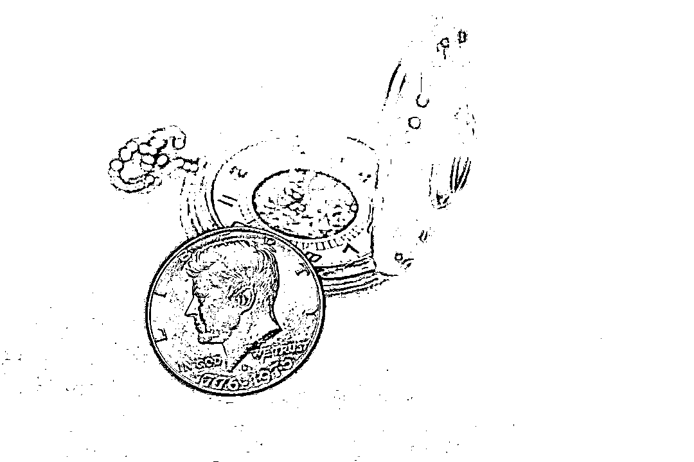

作者/雷蒙德·梅里曼 译者/Luke
编辑/玫瑰 图片/pexels

雷蒙德·梅里曼是在金融占星学界稳坐第一把交椅的占星师，同时他也是若道签约的金融占星课老师，我们引进了雷蒙德·梅里曼老师的《[上证指数月度报告](http://mp.weixin.qq.com/s?__biz=MzA5NjA0NTAxNg==&mid=2651468243&idx=2&sn=f05411adad4ddaaf1d1191605ed01684&chksm=8b488364bc3f0a7280eae0182f11965e636c566827deffb5c1fb6b5580373b55d26ae9946ad3&scene=21#wechat_redirect)》及《[黄金报告](http://mp.weixin.qq.com/s?__biz=MzA5NjA0NTAxNg==&mid=2651468243&idx=2&sn=f05411adad4ddaaf1d1191605ed01684&chksm=8b488364bc3f0a7280eae0182f11965e636c566827deffb5c1fb6b5580373b55d26ae9946ad3&scene=21#wechat_redirect)》。我们经老师的授权，将每周刊登梅里曼老师的周运，供大家参考和学习。于是，这是本周的周运（2.28-3.4）。

**说明：以下时间采用纽约证券交易所所在地美国东部标准时间。**

**展望与回顾**

****

**尽管短期价格波动很诱人……投资者应该密切注意俄罗斯的行动将加剧的长期变化，因为那可能意味着更多的通货膨胀和慢速的经济增长。**

**——詹姆斯·麦金托什****《侵略为投资者带来了长期的考验》****《华尔街日报》****2022 年 2 月 25 日**全球股票市场令人震惊的反转发生在 2 月 24 日，正好处于金星、火星 2 月 16 日-3 月 6 日两次合相的中间。自 2 月 11 日结束的复苏反弹以来，俄罗斯的入侵主导了股票市场，致使全球股指在 2 月 24 日，也就是俄罗斯于 2 月 23 日晚间发动全面军事进攻的第二天触底。那一低点代表着自 2020 年 3 月新冠病毒肺炎疫情恐慌以来，许多市场的最大跌幅。然而，一天后的周五，大多数主要指数大幅上涨，支持了我们 2 月 20 日周日讲座给出的市场时机分析。**随着上周战争的爆发，市场出现了迷你恐慌。**比如说，在美国，所有三个主要股指跌至 1 月 24 日的低点之下。道琼斯工业平均指数跌至 32274，是自 2021 年 3 月 25 日以来的最低价位。那代表自 1 月 5 日历史高点 36952 以来 12.65%的跌幅。纳斯达克综合指数近期期货的跌幅甚至更大。它跌至 13025，是自 2021 年 5 月 19 日以来的最低价位，代表自 11 月 22 日历史高点 16767 以来 22.32%的跌幅。第二天周五，道琼斯工业平均指数和纳斯达克指数期货分别上涨超过 1800 和 1150。贵金属、原油和谷物市场上的价格波动同样具有戏剧性。周三晚间/周四上午入侵的新闻发出后，黄金爆涨至 1976.50，是自 2020 年 9 月 16 日来从未见过的价位。但是一天以后，它崩塌回 1885。

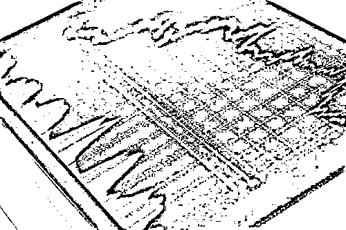

白银也在周四爆涨至数月的新高 25.67，是 2021 年 8 月 4 日以来的最高价位。到了周五，它在 24.00 之下交易。原油在周四超越了 100 美元，是自 2014 年 7 月来未曾见过的。一天之后，它测试 90.00，跌幅为 10%。鉴于这场“战争”与石油和天然气有很大关系，这种幅度的波动也不算过于剧烈。然而，在谷物市场上的波动，才是真正戏剧性的。比如说，小麦飙升至 951，是近 14 年来的最高价格。或许这也没什么奇怪的，因为乌克兰是一个小麦种植大国，而且俄罗斯也是世界上最大的小麦种植国之一。在遭到经济制裁的情况下，这些极高的能源和食物价格，很容易支撑俄罗斯的运作。但是如果这些商品期货像周五那样继续快速下跌，它们可能使俄罗斯很快破产，让民众开始反对他们的领导人。除了谷物外，大豆也飙升至高点 1765，只比其 2012 年 9 月份的历史高点 1794 略低。到了周五，这些高点之后的一天，大豆暴跌至 1585，小麦跌至 841。

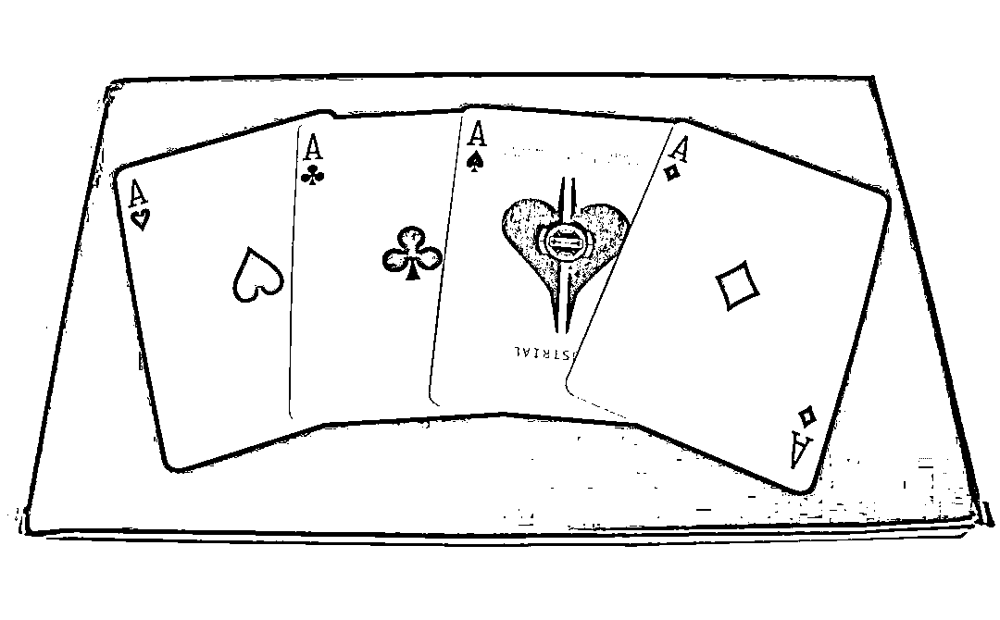

**短期占星趋势和长期考量**

****

**实际的太阳黑子数量已经连续 15 个月超过了预期。2021 年 12 月底的数值比预期高了两倍，也是 5 年来的最高。****——托尼·菲利普斯博士****《太阳周期 25 更新》****2022 年 1 月 10 日**让我们从地球宇宙学研究的角度谈论战争和市场。**金星和火星，和平和战争，正处于不同寻常的合相区间。**由于金星刚在 1 月 29 日转向顺行，从地球的视角来看，它比火星运行慢。事实上，火星在 2 月 16 日超越了金星。但是现在，截至今天，金星已经提速，即将很快在 3 月 6 日超越火星。

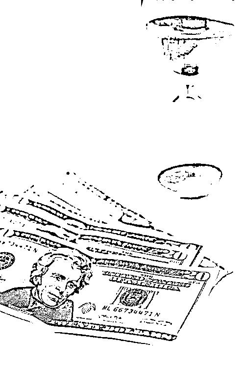

然而，更有趣的是，当 3 月 6 日金星超越火星时，两者将离开摩羯座（它们在 2 月 16 日合相的星座），进入水瓶座。
你可能还记得在**2020 年 3 月新冠病毒肺炎疫情高峰时，火星和土星都进入了水瓶座（下周金星和火星合相的同一个度数）**。在**2020 年 12 月 21 日，木星和土星均从摩羯座进入水瓶座，发生在同样的 0°**。那真的是一张星图上的**“超级能量度数”**了。因此，在占星学研究中，这是一个重大的进程，预示了人类历史进程中，“风象星座新纪元”（因为它们都来到了风象星座水瓶座）的到来。大多数评论家认为，世界正在倒车进入强有力的专制政府时期。那在当前来看可能是真，但长期来看我倾向于不同意这个观点。所有这些行星从摩羯座（专制的主题）来到水瓶座，象征着世界人民的觉醒，更加重视人权、平等和自由（水瓶座），而不是相反。它是旧周期的终点，可能会非常困难，同时抗拒改变；它同时也是新周期的开端，新事物准备出生。但是回到市场和战争上来。随着 3 月 3 日火星接近冥王星，战争之鼓高声敲响。随着金星和火星在 3 月 6 日离开摩羯座进入水瓶座，和平和暴力减少的迹象浮现。随着火星在 4 月 8 日与土星合相，协议可能被违反，或被扭曲为某种与众人理解不同的东西，导致战争之鼓再次敲响。但是随着木星在 4 月 12 日合相海王星，通往和平的另一步可能站稳脚跟。战争可能会在那时终结，情况开始稳定。然而，稳定可能不会持续很久，因为在 2022 年 5 月 10 日，木星将进入白羊座，并在明年的大部分时间待在那里，那对应着对战争机器和武器（以及生产它们的军火商）的更大需求。简单地说，**在这个木星接近海王星的时刻，会迎来投机狂热。它要么是非理性繁荣，要么是歇斯底里，如果不谨慎的话，可能导致恐慌（或两者兼而有之）。**

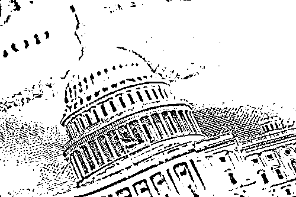

就目前而言，我们关注的焦点是**下周末 3 月 4-7 日+/-1 周**，届时金星和火星将合相冥王星，此外**3 月 18 日-21 日，金星和火星将四分天王星**。**从 2 月 16 日到 3 月 21 日，这整个时期是今年最重要的地球宇宙学时间段。**

**说明：以上日期基于纽约证券交易所所在的美国东部标准时间，由于存在时差，中国地区可能需要加一天。**

**版权声明：**本文由若道翻译发布，欢迎转发，反对抄袭。友号转载请申请白名单。

**雷蒙德·梅里曼（Raymond Merriman）**

若道签约老师。著名金融占星师，ISAR（国际占星研究协会）前主席，梅里曼市场分析公司的总裁。他由于“提升了占星学的职业形象”，在 1995 年国际占星大会上被授予轩辕十四奖；在 2012 年国际占星大会上，被授予轩辕十四终身成就奖。

1“中国上证指数月度报告”发售**若道推出了****中文版****的雷蒙德·梅里曼中国上证指数月度报告，并持续发行该报告！**当把金融市场的周期和占星学的周期相结合时，雷蒙德·梅里曼老师的金融占星学研究**为投资者应对金融市场的周期波动，并随之调整投资策略提供了极大的价值参考**。
**3 月中英文报告已上线！**2“黄金价格周期月度报告”发售**若道推出****中文版****的雷蒙德·梅里曼黄金价格周期月度报告！**不仅仅为广大读者在中国股市的投资出谋划策，更将视角放眼黄金市场。**每当世界经济形式不明朗的时候，有一个地方是保值的港湾，那就是****黄金**。自 1982 年雷蒙德·梅里曼出版第一本研究《地球宇宙学征象与黄金价格的关联》的著作以来，**他一直作为最重要的黄金市场时机预测者之一享誉国际**。2022 年 3 月黄金报告已上线，梅里曼老师将会告诉你他对这个关键时期如何操作的想法。也可以按照季度和一年期订阅，有更多优惠。季度和年度的好处是，你可以持续了解梅里曼老师对于不断在变化的市场的看法。即便他某一次看法和市场不一致，你也看到在下一期他如何调整自己的看法，并看到金融占星在一个长期时间段内对你把控风险的帮助。而能够长期控制风险、尽量找到安全的投资时机才是投资的长久之计。**3 月中英文报告已上线！****购买套餐**，买得越多越优惠中国上证指数月度报告套餐价

*   **单月报告**：280 元
*   **3 个月套餐**：780 元（260 元/月）
*   **12 个月套餐价**：2400 元（200 元/月）

**长按下图识别二维码****购买金融报告****套餐****▼**

黄金周期月度报告优惠

*   **双报告年度套餐更优惠（直降 900 元）**

*   **12 个月黄金报告+12 个月上证指数报告：仅需 3900 元**

**长按下图识别二维码购买黄金报告套餐**▼

3《2022 年金融预报和沙龙》1976 年以来，由雷蒙德·A·梅里曼撰写的梅里曼市场时机学院每年一次的年度预报沙龙和每年一本的《年度预报》一直在应用占星学原理为投资者们服务，提供卓越洞见，从未间断。 **雷蒙德·梅里曼《2022 年金融预报和沙龙》发售中（报告已发布）。****长按下图了解详情**
▼

**点击阅读原文购买金融报告**

# 月亮与金火合相在摩羯座，你最近在“爱”中有哪些体会？

> 原文：[`mp.weixin.qq.com/s?__biz=MzA5NjA0NTAxNg==&mid=2651468384&idx=1&sn=e3497e61d6dc9973a227aa5247ea427a&chksm=8b4880d7bc3f09c1f720e2010c6944ca4e918187f7e76e411187fab543379da595cc85c2d0e0&scene=126&sessionid=1692737852#rd`](http://mp.weixin.qq.com/s?__biz=MzA5NjA0NTAxNg==&mid=2651468384&idx=1&sn=e3497e61d6dc9973a227aa5247ea427a&chksm=8b4880d7bc3f09c1f720e2010c6944ca4e918187f7e76e411187fab543379da595cc85c2d0e0&scene=126&sessionid=1692737852#rd)

**2022 年 2 月 27 日天象：**

*   **月亮在摩羯座**

*   ******金星与火星合相，同时三分金牛座月亮北交点******

月亮今天依然在严肃的摩羯座，并且还会和金星、火星形成合相，组成在摩羯座的星群。摩羯座的月亮喜欢事事都在自己的计划中，但别忘了今天是周末哦~适当放下对周围环境、伴侣、家人的严格要求，尊重彼此需求，可以让周末时光不那么紧绷。金星与火星在摩羯座的合相，正好和金牛座的月亮北交点形成三分相。人生的幸福感不过是每日生活中，稳定健康的关系和内心安全感。金星与火星合相在摩羯座已经有一段时间了，你都有了哪些“爱”的体会、做了哪些“实际”工作呢？欢迎跟我们分享呀！周日快乐！我们明天见！**了解每日天象，可****下载“若道”APP 查看****还有更多精彩等着你哦**

# 冬奥会闭幕丨谷爱凌、苏翊鸣、羽生结弦……这些优秀的运动员，火星是否跟常人不一样？

> 原文：[`mp.weixin.qq.com/s?__biz=MzA5NjA0NTAxNg==&mid=2651468383&idx=1&sn=1a2e9753d6a8fd4b7bf306d2e27654ad&chksm=8b4880e8bc3f09fe4370e6e068b98e0c307ba1e5fd2603a63c3b89ddf3f911551be85c3a1230&scene=126&sessionid=1692737852#rd`](http://mp.weixin.qq.com/s?__biz=MzA5NjA0NTAxNg==&mid=2651468383&idx=1&sn=1a2e9753d6a8fd4b7bf306d2e27654ad&chksm=8b4880e8bc3f09fe4370e6e068b98e0c307ba1e5fd2603a63c3b89ddf3f911551be85c3a1230&scene=126&sessionid=1692737852#rd)

************☆********************后台回复“今日”，给你一句生命态度************

作者/芷菱 ISAR 认证占星师编辑/玫瑰 图片/pexles 今年以来，我们一直在做的一个项目是亲子访谈招募（文末有详情）。北京冬奥会上，横空出世的年轻运动员们，让我们领略了运动的绝美和新生代无穷的力量。占星学中，力量同什么行星相关呢？你是否希望你的孩子也发展出强大的力量呢？一起来看看这期研究报告吧！**冬奥会上优秀的孩子们**

谷爱凌，横空出世的 19 岁天才滑雪少女，夺得北京冬奥会两金一银；

苏翊鸣，18 岁的单板少年，冬奥会历史上最年轻的单板大跳台冠军，也是首位赢得冬奥会单板滑雪金牌的中国运动员；

羽生结弦，27 岁的日本偶像级花滑运动员，两届冬奥会冠军，在本届冬奥会上挑战最高难度的 4A 转体动作失败，但却让更多人记住了他；

武大靖、任子威、高亭宇……——冬奥会刚刚闭幕，这些年轻运动员成了新一代的偶像。除了冰雪运动真的很好看之外，最关键的是这些运动员不仅有精湛的专业技术，还有克服困难、挑战自我的勇气。看着他们的一次次冒险犯难，奋力拼搏，我们很难不被那种生命的能量打动。就像谷爱凌在自由式滑雪大跳台上挑战超高难度的转体 1620 动作，飞燕一样惊人矫健的身姿被媒体反复播放。就像羽生结弦挑战“人类不可能完成”的 4A 失败，没能进入前三，但他仍在闭幕前以极致美好的花滑表演《春来了》震撼全场。羽生认为这次冬奥会对自己意义深远，**“令我对努力与结果的意义、价值有了深深的思考……我会继续追求属于我的极致。”**他们身上展现的，是人类难能可贵的，最原初的生命力。在远古时代，非洲草原上的原始人为了生存，就必须跑得更快，让自己更强壮、更勇敢，不惧怕与猛兽或敌人对峙。**这种蕴含在我们每个人身上的生命力，对应的正是我们星图里的火星。**谷爱凌的成功，也一度引发了许多“鸡娃妈妈”的焦虑。很多人开始探究这样的年轻人是如何培养出来的。**他们勇敢，具有竞争性，不怕挑战困难，而且不断自我超越。**这些能量，都与火星密不可分。这让我很好奇，想看看他们星图中的火星长什么样子。同时我们也会分享幼儿占星研究项目中的一些访谈对象的案例，从中也许可以得到一些有益的启发。**谷爱凌、羽生结弦和苏翊鸣的火星**

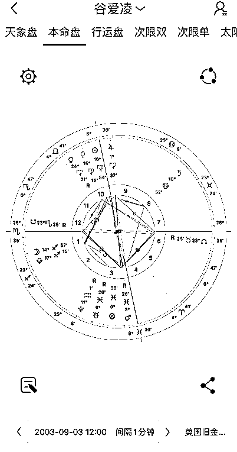

| 谷爱凌出生星图 具体时间不详，选择当日中午 12:00
在谷爱凌的星图中，火星在双鱼座，合相天王星，对分木星太阳。同时火星也以较宽的容许度三分土星，四分南北交点。这是一个很“爆炸”的火星能量配置。紧密的**火天相位**带给她**果决、顽强以及运动上的创造性独特性**。火木更是一个适合于运动的相位，**大大扩张了火星的能量，带来真正的冒险精神，同时会为自己的信念理想而战。**在大跳台决赛中，谷爱凌在第三跳时圆满完成了反向 1620 转体动作，这也是第一次有女性运动员完成反向 1620 度，四周半的空中转体。关键是这个动作她从未在比赛中试过，而且是在上场前最后五分钟才决定冒险一搏。**“我还给我妈打了电话说要做这个动作，我妈劝我别冒险，她的意见是我再做个安全动作就可以了，但我觉得如果不尝试一下的话，就不是一个完整的我，我想让自己表现出最好的一面，我更想赢我自己。无论我做这个动作最后落（成功）还是不落（失败），我都会为自己感到骄傲。****——谷爱凌”**

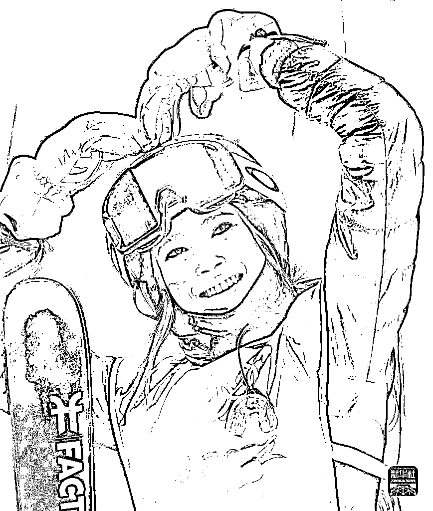

**典型的冒险精神，以及挑战欲**，这是一颗非常强旺的火星。虽然火星在双鱼座会被认为是一个相对柔和的位置，但也会**给竞争、胜利带上理想化的色彩，为梦想而战。****强大的火星，往往意味着一个强大的自我意志，而在成长过程中，这种意志能否得到尊重也是非常关键的。**谷爱凌的妈妈谷燕给女儿充分的自由去冒险。纪录片《少年志》里有一个镜头是，谷爱凌在院子里高高的树上爬来爬去，妈妈只是在房间里笑眯眯地看着。谷爱凌可以爬树、爬墙、吃冰疙瘩，妈妈都不会说什么。妈妈也从不以女性身份来束缚孩子，童年时的谷爱凌一直是滑雪队里唯一的女孩子，也曾是数学班里唯一一个打篮球的女孩。作为曾经的华尔街精英，谷燕自己就是滑雪教练，也很爱玩，所以会带孩子不设限地玩，陪着孩子一起玩。很多事让孩子自己做主。毕业于斯坦福的谷燕对女儿说：**“你不是必须上斯坦福，只要你自己特别喜欢的就可以。”**

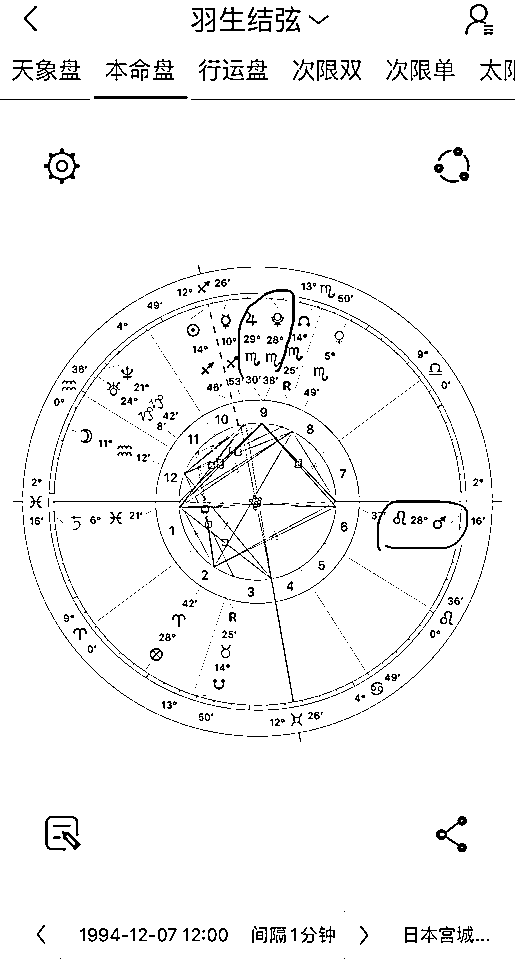

| 羽生结弦出生星图 具体时间不详，选择当日中午 12:00 羽生结弦的火星落在狮子座 28°37′，合相了位于狮子座 29°的恒星：**轩辕十四**。**这颗被命名为“狮心”的恒星，也是王者之星，象征着成功、高贵、荣耀、热情。**这意味着羽生会**以火星的方式去赢得荣耀、尊敬，以及对世人的影响力。**即使抛开火星的落座，光是火星的相位也很值得一说：**火星精准四分木星、冥王星，对分土星，形成一个 T 三角。**火木相位能量在谷爱凌星图里已经看到，相比之下，**火冥和火土相位却有更多磨练的意涵。**

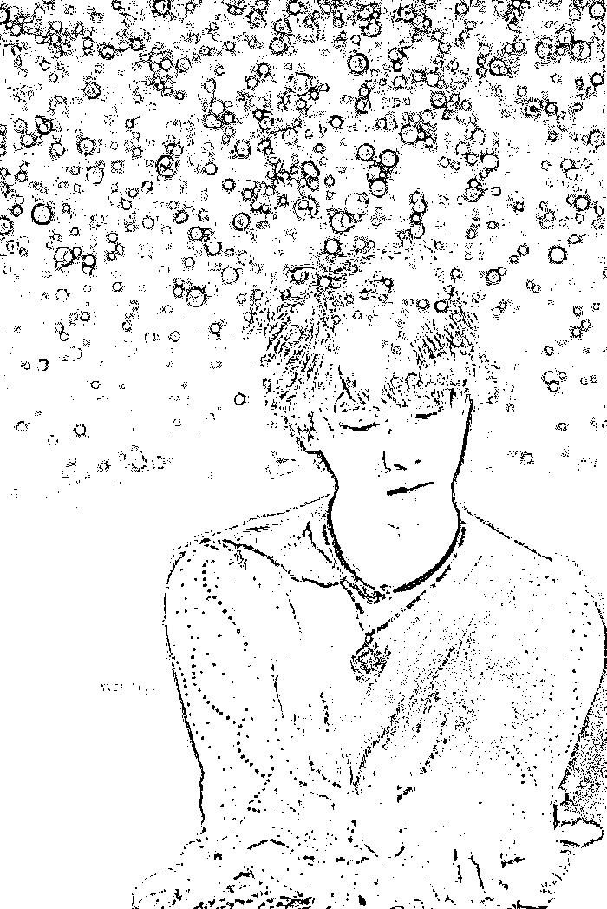

**火冥相位会促使人极端渴望胜利，因为它联结的是人类意识深层最强烈的求生本能。**羽生结弦在许多采访中都表示过一定要赢的决心。比如人们津津乐道的 2014 年世界花滑大赛的“血色魅影”事件：羽生结弦在赛前热身时不小心与中国选手闫涵撞在一起，头部撞伤下巴流血，简单包扎后带着血迹坚持上场，八次起跳五次摔倒最终完成比赛。视频中，他大吼一声“跳”即转身上场的决绝与男子气概，宛如战神。**一股“我一定会赢”的，近乎于无情的誓死一战感扑面而来，这种决绝的意志就是冥王星的典型表现。**火土相位的考验会更加困难一些，苏·汤普金斯在《占星相位研究》里说**火土相位人“会有意无意地制造出一些情况，来测试他们的力量、耐力和持久力，包括身体和情绪心理的”。****火土人一样渴望赢，但因为土星的法则，往往会有无力感或缺乏信心，自我怀疑。**这驱使他们不**断去测试自己的力量，在克服困难的过程中生出强大的耐力。****土星的磨砺，能够帮助运动员的忍耐力、耐心、决心。**速滑运动员、奥运纪录保持者武大靖的星图中有火土四分相位。谷爱凌的火星虽然被木星和天王星加持，但也有一个火土三分相，能够帮助她**在热爱的领域更有韧性和坚持。**

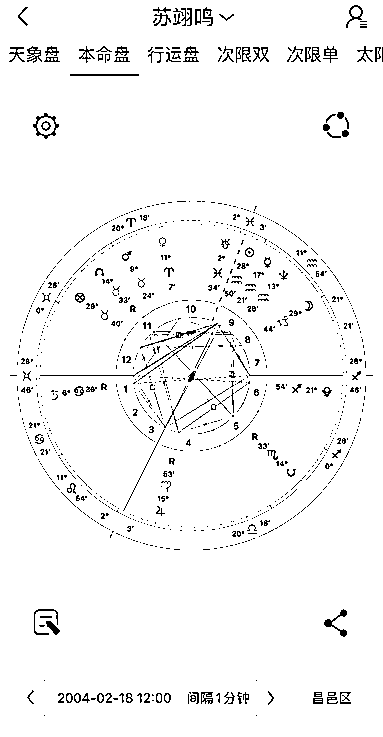

| 苏翊鸣出生星图 具体时间不详，选择当日中午 12:00 苏翊鸣的火星在金牛座，与海王星、水星四分，而且合相北交点。**火海相位也是一个英雄式运动员的典型落位。**速滑冠军高亭宇就是火海合相。占星师斯蒂芬·阿若优将火海相位与**特别有魅力的男演员或运动员**联系起来。因为**火海相位与英雄崇拜有关，特别是那些为了理想而奋斗的人。**

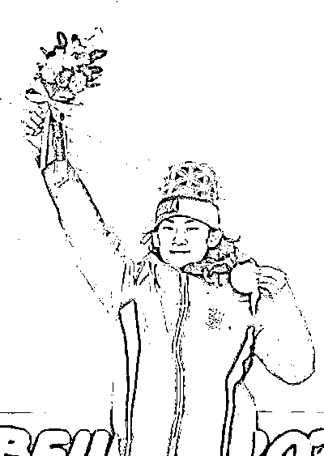

**“没有什么能够比这次冬奥会再好的了，我真的是完成了我所有梦想的目标。”**苏翊鸣在拿到金牌之后说，他最感到满足的就是可以把梦想中的一套动作去在比赛中完成，享受人生中珍贵的一刻。**火星与海王星关联，会促使人通过胜利、成功与征服，来证明自己的能力，实现自己的梦想。**而作为运动明星，他们的个人奋斗可以表达和实现社会大众的梦想，让人们感受到生命最强的力量。就像奥林匹克精神为什么永远激励我们，用作家史铁生的这段话尽可形容火星的精髓：**“奥林匹斯山上的神火为何而燃烧，那不是为了一个人把另一个人战败，而是为了有机会向诸神炫耀人类的不屈，命定的局限尽可永在，不屈的挑战却不可须臾或缺。”****除了运动，火海相位也与艺术表现有密切关联。**苏翊鸣在 10 岁的时候就扮演了徐克电影《智取威虎山》中的“小栓子”，算是“童星”出身。和谷爱凌相似的是，苏翊鸣也有一个**非常自由宽松**的家庭。他说：“我的父母从我很小的时候就带我接触单板滑雪，不管我做出什么样的决定，他们都选择毫无保留地支持我、相信我，没有他们的支持，就不可能会有今天的我。”他的父母也很爱玩，甚至在他第一场比赛的时候，父母都在外地旅游，没有到现场观战。但对儿子喜欢的事情，他们总是全力支持。**保护好孩子们的火星**

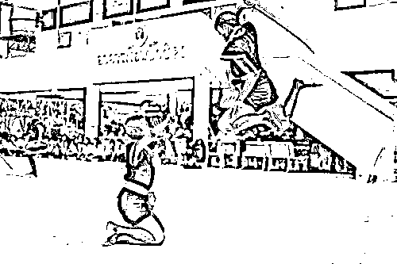

**火星代表一个人维护自我与表达欲望的方式。****火星守护白羊座与天蝎座，也对应星图的第一宫，它意味着我们的生命活力，我们的热情、勇气、欲望、行动力和竞争性，也是我们的愤怒、斗志和冲动。**少了火星，我们会软弱无力。**火星受到压抑，也会使我们无法表达愤怒、愿望、追求，无法维护自己的立场，无法确立自我，最终失去生命的活力。**那么在幼儿的星图里，火星是如何表达的呢？在“幼儿占星研究”的对象里，也有很多火星突出的孩子。

12 岁的女孩甜甜火星在天蝎座，火海紧密四分相，火星同时以比较紧密的容许度三分双鱼座的天王星、月亮和木星。

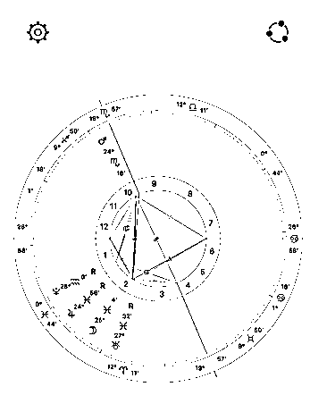

| 甜甜的出生星图

**双鱼座和海王星的影响，软化了火星天蝎座的战斗力。****甜甜是一个很害怕冲突的人，也不会主动挑战什么。**但妈妈说，她能感受到甜甜**骨子里的刚强，在实际做事时有一种非常执拗的坚持。****火海能量往往需要有理想色彩的支撑。**双鱼能量丰沛的甜甜很爱美，她 2 岁半开始接触芭蕾，就立刻喜欢上了这种美丽的舞蹈。她先天条件不好，中途也有过退缩，但妈妈对她说，这是你自己想跳的，你就要坚持下来，等你 18 岁时，你就会感受到坚持的好。

经过一番“威逼利诱”，妈妈帮助孩子坚持了下来。现在的甜甜，就算发烧都会去参加芭蕾见习，学得越来越好，也从中获得了越来越多的自信。

有一段时间，甜甜数学成绩一直掉，但并没有影响她的自信。妈妈帮她分析说，你看，你学芭蕾花了很多时间，但你没有在数学上花足够的时间，能否加一个小时的数学课？她说好，从一周一小时，到一周两小时，她坚持下来，现在变成数学优等生了。甜甜内在的坚定还有个小故事可见一斑：跳芭蕾要留长头发，甜甜又爱美，所有人都认为她会很在乎长头发。但她的头发又多又硬，吹头发时很麻烦，妈妈说等演出完再剪掉。但她忍了一周后就决定剪掉了。**在美和麻烦之间，她尊重她要的舒服。**

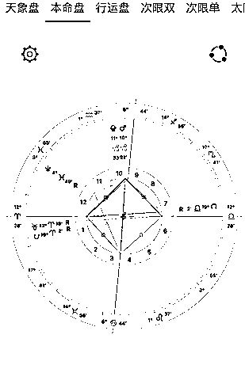

| 芽芽的出生星图

而甜甜的妹妹，7 岁芽芽的火星比姐姐更突出，个性也要大胆直接许多。**她的火星在摩羯座，紧密合相冥王星，四分天王星及南北交点。**用妈妈的话来说，芽芽**性子急，胆大心细，特别独立，极有主见**。虽然才 7 岁，但**能自己做的事情绝不找人帮忙，凡事都会想自己先试试，遇到问题也会自己去解决。甚至小时候保姆也是她自己挑的。**

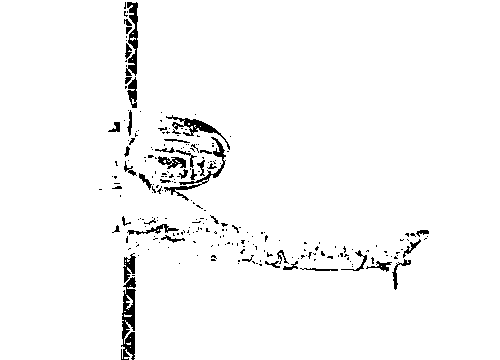

这是非常典型的火天相位的征象，**讨厌束缚，有独立甚至独特的主见和行为**。很幸运，妈妈充分尊重了芽芽的个性自我：**“她一开始就很鲜明地告诉你她做什么，不做什么，明确表达不接受你的方法。主见非常强。我也很尊重妹妹的主见，支持她的选择，只是把控大方向。”**

芽芽跟着姐姐学了一段芭蕾之后，觉得自己并不真正喜欢，决定不学了。**妈妈鼓励她为自己的选择负责，于是芽芽在结束之前坚持考了一个证，作为学习成果的证明。**

**芽芽喜欢画画，但她也选择自己喜欢的方式。**在觉得画画课没意思之后，她就在家自己画。听着音乐或故事，可以画一晚上，非常专注投入（火冥相位），画得也很好。芽芽现在还在学棒球，对于一个火冥、火天相位的孩子，可以想见，妈妈说她的表现也很好。**妈妈的宽容、尊重孩子和充分给予自由，既让芽芽的火天相位得到释放，也没有造成火冥相位的压抑阴影，因此我们看到的芽芽是正面的、强大而有活力的。**

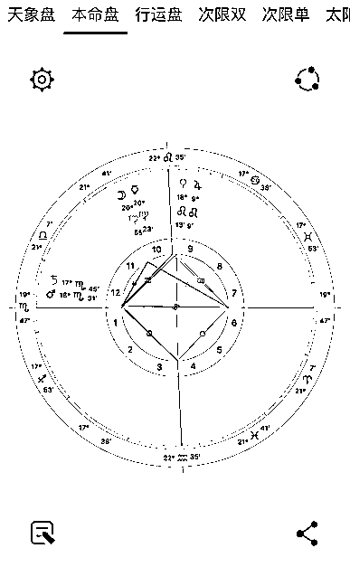

| 米米的出生星图米米小朋友的星图里，火星、土星合相上升点在天蝎座。之前讲过火土相位的困难性，尤其是困难相位（合相、对分相、四分相）。羽生结弦有一个火土对分相，武大靖有火土四分相。**火土相位人需要克服自己内心的退缩、不自信、自我怀疑，不断去测试自己的力量、勇气和耐力的边界。**然而经过充分的磨砺之后，也会**成为强大的耐力和韧性的象征，带来丰硕的果实。****而火土相位的孩子，在成长中更需要获得父母的肯定与鼓励，父母对孩子个性的尊重和包容，可以支撑他们的火星，帮助他们树立对自己的信心，对抗土星的压抑和限制。**

米米的妈妈曾经最担心她的情绪，“她情绪起来很可怕的，又激烈又持久，咬自己的手，就像世界末日一样。”

妈妈说她总感觉不理解孩子在想什么。**米米很少直接表达自己的感觉，不高兴也只会发出一些不开心的声音。**从上幼儿园开始，她很长一段时间不和外人说话，在学校也不和老师同学说话。这让妈妈很担心。她回顾生米米的时候，自己是带着**自卑感**的。那时候妈妈没有工作，没有收入，孩子带得不顺，和老人的关系也不好，就**觉得自己没有什么价值，很自卑**，**“一直停滞在那里，严重地自我怀疑”。**

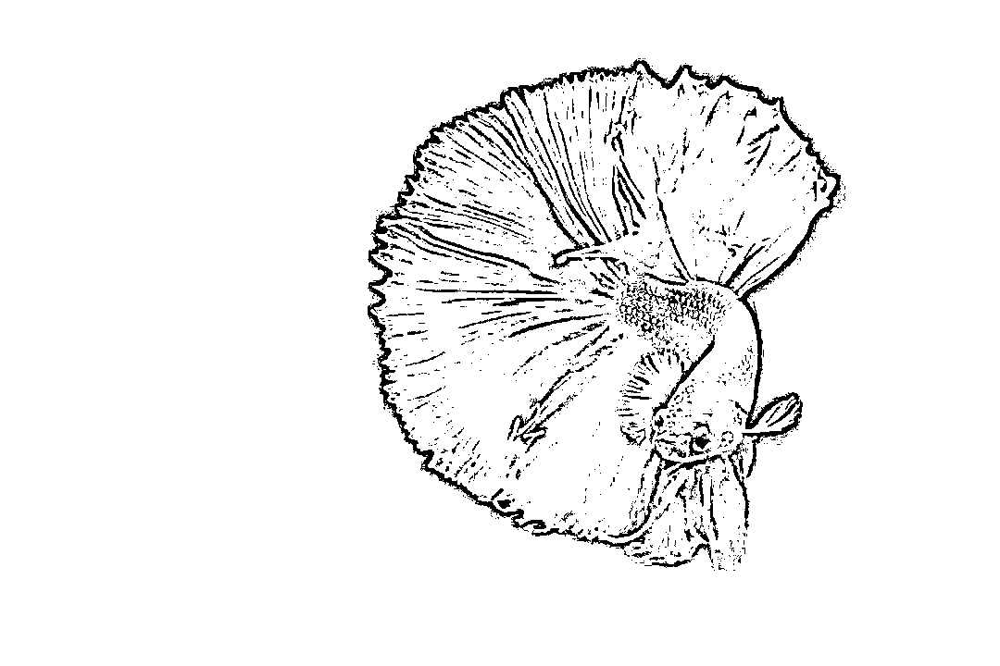

**可以感觉到妈妈的这种状态跟米米的火土合相上升点有很强的关联。**妈妈回忆在孩子小时候，因为搬家等原因，米米有时哭闹很激烈，问为什么哭，她不回答，妈妈就只好采用忽略的办法：**“我比较粗线条，感觉不到，也不想去哄她。”**这是不是米米不愿说话表达的原因之一呢？而现在，妈妈说自己成长了。米米的妹妹出生之后，妈妈买房子搞装修，并开始学习亲子、家庭方面的知识，开始忙起来也与外界接触，**“就感觉自己有价值了，整个过程中更有自信。回头看，也明白了很多东西，觉得成长很多。”**妈妈的状态越来越好，对孩子也更好。为了帮助米米，妈妈主动承担了学校家委会的很多工作，跟老师和同学搞好关系。米米在二年级突然开始说话了。**妈妈逐渐领悟到，其实很多问题是在自己身上。****“她其实是可以的，是我之前带着强烈的不信任”**，妈妈说，**“我总觉得她会很困难很辛苦，带着这个信念。后来我发现这个信念是我自己的，是我投射到她身上的。****以前我总是担心她不行。后来我就相信她，她做的事情也让我越来越惊讶了。我的孩子是来让我成长的。”**爸爸也起到了良好的作用，细心地跟米米聊天，陪米米一起玩，引导她敞开心扉，说出想法。妈妈说，米米现在已经不再像以前那么哭闹。有时候哭着哭着，自己也会发笑。**火土相位往往会压抑自己的愤怒，而压抑的后果则是爆发时象火山一样可怕。**当妈妈学会**聆听和接纳孩子的愤怒**，学会**信任孩子，鼓励孩子**，孩子就能**逐渐学会表达自己火星的力量，维护自我的立场，生长对自己的信心。**妈妈发现米米喜欢做手工，就带她去学了服装设计。老师也觉得她的手工能力很强。米米的**火土与金星还有一个四分相**，将一种物质创造的技能（火土）与艺术美感（金星）相结合，加上火土的耐力和坚持，也许米米能在这条路上收获很多成长。祝福她。

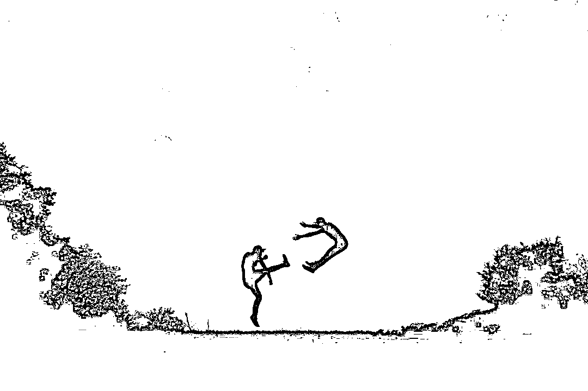

**结语**

**对于火星强旺的孩子，运动是一个非常好的出口，尤其对于火星有困难相位的孩子。**虽然我们不会都成为谷爱凌或羽生结弦，但**运动可以很好地帮助火星的能量得到释放与发展。**

占星师苏·汤普金斯认为，**火星可以帮助我们对抗外界的压力，也提供足够的精力让我们去应付内在的压力**。

比如抑郁往往有火星法则上的问题，其成因可能是**因为愤怒无法释放出来，转而向内攻击自己**。**通过运动或表达愤怒，可以帮助我们发现自己不是那么无助无力，从而走出抑郁。**

**林林的星图里，火星分别四分土星与海王星，成 T 三角。**妈妈跟我们讲述**孩子小时候老是哭个不停，大一些则常常抑郁寡欢。**

最能让林林开心的事，是打软弹枪。这能让他**变得极其有活力，参与团队作战，而且他一贯迟缓的行动也变得敏捷。**枪是典型的火星代表物，游戏里包含的**危险刺激、保护、竞争、战斗**，都是完全的火星能量。**林林在这个游戏中获得了火星能量的舒展。**与林林类似，有火土对分，火海四分相位的豆豆，火星同时合相双太阳、水星双子座。因为精力太旺盛，妈妈送他去学武术，打棒球，在比赛中得过 MVP。豆豆还想当特种兵，做英雄，妈妈说完全是个坚强活泼的体育生。这也是**火星相关的活动或运动对孩子火星困难能量的一种良好疏导。****· 火土相位**的孩子，通过运动可以疏导愤怒，表达自我，增强信心，磨练耐力；**· 火天、火木相位**的孩子，可以在运动中伸张自我意志，去探索和冒险，挑战和自我超越；**· 火海相位**的孩子，可以通过运动将想象中的美好落地，学会为理想奋斗；**· 火冥相位**的孩子可以通过运动去发展专注、极致、意志力。当然，通过其他形式的竞争、努力、挑战、奋斗，也可以获得类似的火星效果。只是运动基于我们生命的基础—身体，是更为自然，也适合孩子的方式。我们在访谈中也发现家长们越来越重视孩子运动能力的培养，这是很可喜的趋势。特别说明：为保护访谈用户的隐私，文章中的宝宝昵称均采用化名的方式。

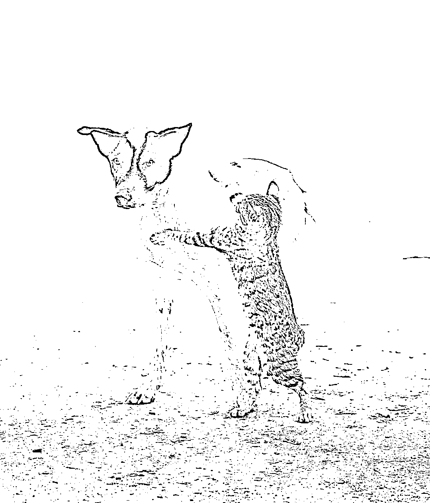

**关于亲子访谈研究**针对幼儿出生星图的访谈研究，我们会作为一项长期的研究活动来开展。
经过前三次的亲子访谈研究招募活动，已有 96 名的用户报名参加，截至 2 月底，我们研究小组已经对其中 42 名报名用户完成了亲子访谈，并会对访谈的情况，定期撰写出相应的访谈研究分析报告，分享给大家。在此，对已接受访谈的 42 名用户，在访谈过程中给予的支持和分享表示感谢；对已经报名还未接受访谈的用户，我们也会随着亲子研究的持续深入，结合亲子研究主题的需要，定期再从报名名单中筛选出合适的星图开展亲子访谈，被选中的用户我们将会一对一微信通知，感谢您的关注和耐心等待。**如果你想自己了解更多宝宝的相关信息，也可以扫描下图二维码或者点击文末“阅读原文”链接，购买一份宝宝专属的《幼儿报告》。**

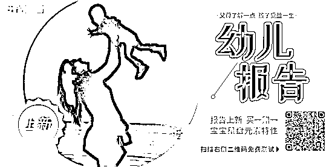

****************购买直达入口****************

# 据说，最爱你的灵魂才会伤你最深 | 关于宽恕的 23 个小故事

> 原文：[`mp.weixin.qq.com/s?__biz=MzA5NjA0NTAxNg==&mid=2651468318&idx=1&sn=33fa9b18ce96eff58ebb10c846c27603&chksm=8b4880a9bc3f09bf05c7ece391a26157dabcbe6fd45f897be4e35e397187b13ea18754bacad3&scene=126&sessionid=1692737857#rd`](http://mp.weixin.qq.com/s?__biz=MzA5NjA0NTAxNg==&mid=2651468318&idx=1&sn=33fa9b18ce96eff58ebb10c846c27603&chksm=8b4880a9bc3f09bf05c7ece391a26157dabcbe6fd45f897be4e35e397187b13ea18754bacad3&scene=126&sessionid=1692737857#rd)

**********************☆ **************后台回复“今日”，给你一句生命态度********

**********************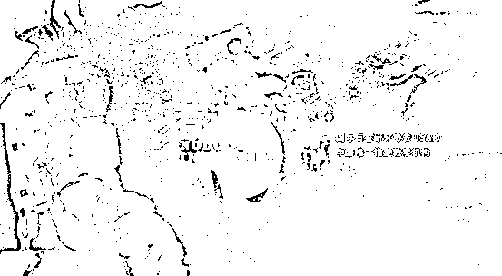**********************

采访/编辑/玫瑰 图片/pexels

**面对生命中至深的伤害，你选择了宽恕吗？**在征集的结果中， 75%的读者选择有过宽恕（原谅）的经历。25%选择没有。而答卷中出现了各种各样的词汇：**忘记、原谅、放下、宽容、逃避、无力、慈悲、放过……**这些词，都精准地指向海王星。这不由让我惊叹：我们的读者，实在是一群丰富、饱满、敏感、精微，又充满了智慧的群体。**面对伤痛，你会如何选择？**写下这篇文章的时候，木星已经在 10°容许度以内朝着海王星挺进。江苏官方也发布了**“丰县生育八孩女子”事件调查处理情况**。调查结果刺激着所有人的神经。这也是木海合相双鱼座的前奏——**拯救一个人，就是拯救全世界。**如果过去，曾经有人伤害、侮辱、镇压过我们，最难的不是走过，而是走出——**如何忘记曾经的阴影，让自己重新面对未来的人生旅程？**这就需要海王星最精微和柔软的能量，如同无形的药膏，不断地抚平深入骨髓的创伤。每个人面对生命中的伤痛，会有不同的方式和方法。每一种都有其意义，很难定义对错好坏，就像海王星这颗玄幻的行星，也很难被厘清。但是，我们要相信，**当下你所选择的方式，一定是适合你的方式**。**无需因为放不下伤害自责，也无需因为不想放下而自我怀疑。**接纳自己当下所有的选择和情绪，让宇宙带领你走完这一段旅途，最终我们都会和救赎相遇。在这里，给大家分享一些特别精彩的故事和洞见。感谢这些真诚而富有思想的读者们，你们也给了我莫大的启迪和鼓舞。（所有人名均为化名）

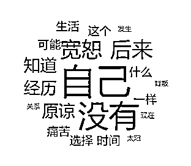

**|** 本次问卷调查出现最多的关键词

**关于宽恕和原谅的故事**

**@大森林**

初中的时候，几个同班女生下课不让我走，把我挤在墙角扇嘴巴。当时我不知道她们为什么会选择欺负我，那时还没有校园霸凌这个词。 不知道那个时候的我为什么没有反抗，只记得后来老师来了，看到她们围着我，把我们叫去了办公室，问我发生了什么，问我她们是不是欺负我。我一句话也没有说，老师说如果我不说，她们还有可能欺负我，我还是没有说，之后（老师）就让我走了。第二天，带头扇我的那个姑娘给我买了一个煎饼，跟我说：**“你很仗义，我们以后都不再欺负你了，如果以后谁欺负你，我们帮你。”**她叫祝菲，这是到目前为止初中同学中我能记住的唯一一个名字了。**自此，心里埋下了一颗种子，就是要自己变强大。**后来我想，她们欺负我，是因为我是那个年代，那个地区唯一一个家长离婚的，全校第一个单亲孩子，很多同学会指着我说：“她没爸了。”

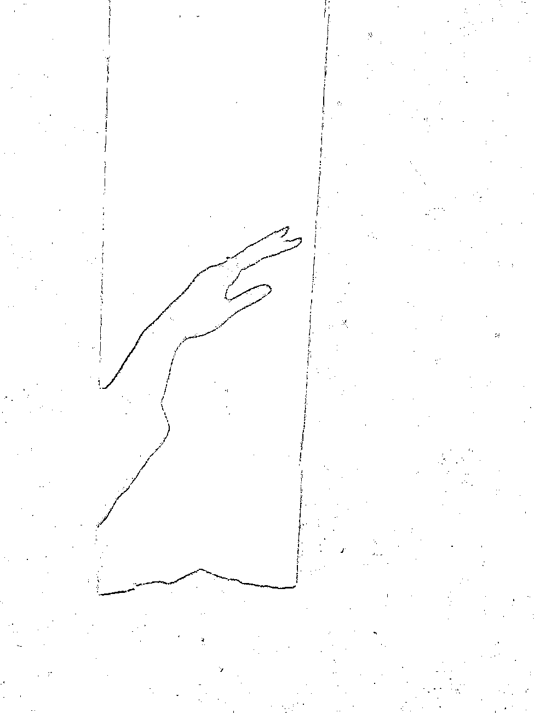

**@成为更好的 ada**

本人金冥合相天王星，在 2017 年日返金木三分，海王星（七宫主）落五宫时认识了男友，很快来电和确认关系（办公室地下恋情）。2018 年，我的日返太阳、土星、金星合相十二宫，**办公室地下恋＋异地恋**，痛并快乐着，但发现了自己**“被小三”**选择分手。然而故事没有完，2019 年男友与其女友分手，20 年年初，行进金星合相出生星图中冥王星时，我们**复合**了，后来又**被迫异地**，在冥王式的阴影下分分合合，始终无法彻底割裂关系……**地下恋、三角关系、金钱纠葛，金冥戏剧化的毁灭重生，我全经历了。****面对忠诚与信任的挑战，我选择了宽恕和原谅。**身边朋友觉得理解不了，但我很清楚，**这不是懦弱和妥协，而是坦诚面对，深度清创，拥抱阴影的天蝎式重生**，我依然相信爱情且更相信自己，**更有勇气追求和经营美好的爱情。**我尝遍了最复杂、最强烈的情感，**极端的爱与恨，嫉妒与怀疑**，好几年都在冥王星的阴影下备受折磨。我太阳摩羯座，上升处女座。是一个很有主见，现实为先，果断理性，擅长用理智控制情感的人，这个经历让我**发现了自己另外一面，**让我意识到，**尊重自己的真实情感，聆听和顺从自己的真心同样重要。**宽恕和原谅是一种放下，冥王星的课题也是**学习放手，不偏执地控制和占有**；**学习对别人忠诚，对自己也要忠诚；学习直面阴影；宽恕和原谅是重生的出口。**

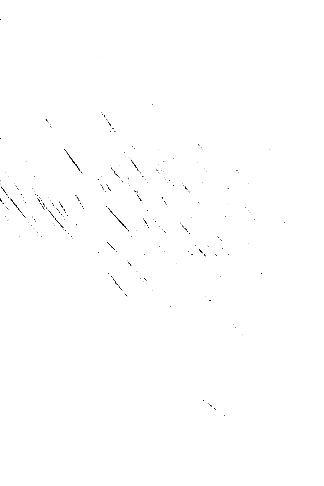

****@玉溪谷子****

2021 年底被诈骗到倾家荡产，一度感觉自己没办法生活下去，经历了心理的巨大冲击。在这个过程中开始对骗子恨到极致，希望他们不得好死。 

后来觉察到，这样也**让自己的心陷入极度的痛苦中**，为了解脱自己，主动去**听了很多疗愈的课程以及佛教大德的讲法**，慢慢明白了，**如果不是自己有贪念，又怎么会感应到这样的事情？一切皆是心境的外部显化。**也是**太过于执着于赚快钱导致了智慧被蒙蔽，被坑得很惨**。渐渐就不再用这件事情来折磨自己，反而想，**这个境遇用来修炼自己的心性吧，提升觉知和智慧，也算是有了不一样的收获。****以前做什么事情都很计较，很舍不得受到损失。**现在发现，**能量都是守恒的，你不主动去布施就会有其他的力量帮助你去受损。**切记心量要大，不要舍不得，有舍才有得，多多布施会增长智慧，不再被愚痴蒙蔽心灵。佛法说，众生皆有佛性。**我不原谅，就是让自己陷入悲苦的困境中，心境的历练更重要。**

****@丫丫****

**放掉了别人，宽恕的其实是你自己。**

**@Catherine，兴高采烈地来了**

怎样定义宽恕呢？**理解并体谅了对方，不再恨，不能称作宽恕，只能是体谅**。还不如说是**宽恕了自己，解脱了**。**人生最大的痛苦就是想不开，不放过自己。**那是距今八年前的事。过年开始海王星上头，一厢情愿地爱上了前任并毫不意外地被劈腿。**事情发生后大概三四个月，我的精神陷入了空无。**生活照旧，照旧下面是一片空白，然后是**歇斯底里的怨恨**。我恨我自己，也恨前任。很多年我都耿耿于怀。那妹子身上展现了我和我前任都没有的一切，真是傻得可爱（真的），但她**成功了**。为什么呢，前任是瞎吗？他这么需要粉丝的吗？最后我遇到了改变我命运的先生（老师），并在他的影响下决定改变。**视角开始转到自己的前途上，并且逐渐海王星消退，察觉到了事情的原貌。**

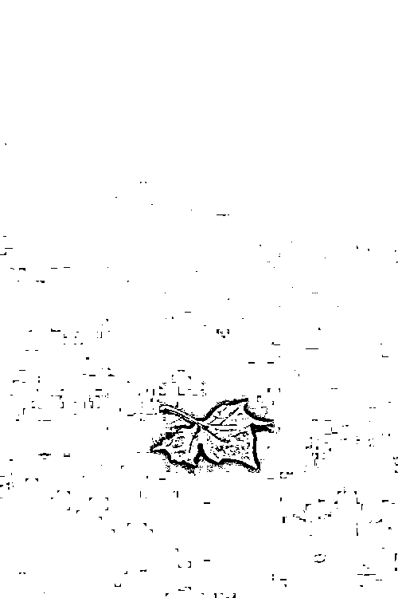

老师年少时遇到了很相似但严重得多的事情，但是他已经放下了它，宽恕了自己。我当时真的很糟，但是他**从来不就这件事安慰我**。他的做法是：告诉我“不要集中在自己身上”、“如果你能感觉到别人的痛苦，你就能得到力量”。跟随他的指引，自我真正地成长起来了。我开始**不需要依赖另一方来表达自己**。这可能是我星图中**日土相位**的一个解决途径。希望有朝一日，我自己也能成为这样有力的治疗师。说心里话，**对人生的怨恨由来已久，我的人生并不太快乐。**因此开始学占星学，纯粹是想知道**我为什么那么倒霉，并找到依据怨恨不休。**但是，自从和老师相遇以后，我心中涌出了**原谅和祈愿**。我开始**认真考虑学习占星学，为了帮助和我一样痛苦的人们**。也感谢上天终究待我不薄。**@青云**我的性格比较怂，**总怕惹上是非，不会与人争辩，嘴笨，所以基本上都是息事宁人，但极为不甘心**。特别**羡慕那些能明确表达自己情绪的人。**我总会在心里复盘事情经过，然后想象如何处理，但现实中还是那样**忍下了**。觉得自己**太憋屈，又改变不了。****怨恨和愤怒聚集在内心需要长时间消化**。**有很多邪恶的报复想法，但现实中不会有所行动**。会慢慢化解，劝自己善良。**可以前欺负我的人还会欺负。因为我自己没变。**

  **@郭红娟**

我怀孕流产，我选择放下。**因为不放下，我很痛苦。**

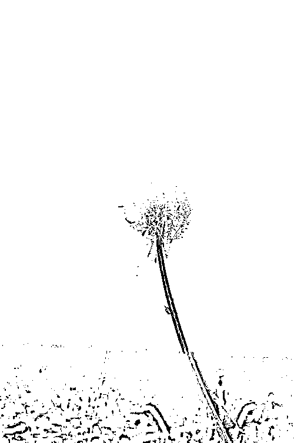

**@蜥蜴**我记得的宽恕应该是对爸妈，或是猥亵过我的人，我能明白**他们以前可能会遭遇过这些事**，但如果这些事重蹈覆辙地发生在我身上，我已经**会愤怒**，只不过这种愤怒更多也可能只是**悲鸣**。 **我变得更疏离，更想让自己保持内心平静，更审慎和沉默。****如果重来一次，我不一定会选择宽恕。**因为觉得可以改变，觉得他眼里代表的“女性”形象是孱弱、“无害”的，但我想让他明白，**他也是脆弱的，或是他惹到了一个不该惹的人。**

**@nini**

群星天蝎座的我 2019 年和前男友分手第四天，发现他和新女友晒了合照（没错，就是被劈腿了），因为工作贼忙的关系，没有时间静下来品味失恋和背叛，2020 年疫情爆发，有大把时间悲伤、痛苦和疗愈自己。后来也见面，知道他也感到很抱歉，原谅他的所作所为，没有再联系了。 分手之后就正式开始接触灵性方面，疗愈好自己的同时也有在疗愈身边有需要的朋友。现在比起之前那种“为什么会发生在我身上？”的愤怒，**遇到痛苦的事情更多是在问，所以我要从这次经历中学到什么？宇宙在给我传达什么样的信息？****@南山月**经历分离，先是恐惧，宽恕之前，切割掉这份感情。不管结果如何，一开始都是美好的相遇。**相忘于江湖，是最美好的宽恕。**我变得更慈悲，更释然，脾气不会一点就炸了。学会独处，独立了，不依赖他人了，也有能力说“不”了。重来一次，还会选择宽恕。**所有的故事不都是让你长大么？**

****@凉白开****

没有办法宽恕，但会**感到绝望，变得更加独立，也会压力很大。**

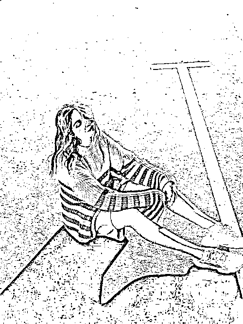

******@********玉面小飞龙******

记忆里并没有宽恕过什么人或者什么事。

**我理解的宽恕，并不是所谓“算了”**（虽然早些年我是这么认为的）。**只要回想起来，那个人（那件事）带给我的还是伤痛**（比如父母的偏心，工作上遭遇的不公），**就不算宽恕**。**如果是时间的疗愈，这是“放下”**。这些都不算“宽恕”。 

我理解的宽恕，总带有些……“居高临下”的意思，甚至“宽恕”这个词都闪耀着神的光芒。但现在**我好像并不渴望占领道德的高地，我只想做个凡人。****过去我以为委屈自己，不再向对方提起自己受到的伤害就是宽恕，但事实并非如此。**有的伤痛会随着时间被忘却，然后自愈，有的不会，一想起来，除了事情本身带来的伤害，还会觉得自己**怎么这么傻，连告诉对方自己受到伤害都不敢理直气壮**，这哪里是“宽恕”，这是**对自己的二次伤害。****明白自己没法宽恕后反而更加接纳自己吧。**其实不宽恕并没有让自己深陷伤害的泥淖中不能自拔，如果**反复复盘自己都没有做错什么，反而下次会更勇敢地说出自己的诉求和想法，避免事后懊恼，或者记得下次不要同一个坑跌两次。**我觉得我现在更**坚定和勇敢**了。**宽容自己的懦弱，看清自己的局限，也能平淡看待“世界的参差”。**受了伤，就留道疤，在我看来不宽恕只是一道疤，本身不会再痛，却能提醒你痛的感觉，督促我要变得更强，或者不要一厢情愿地付出。

******@********Pebble******

我有过一段长达两年，充斥着暴力和贬低的关系，有过许多次轻生的念头。

在离开那段关系后很长的日夜里，被曾经的经历深深折磨，我不知道自己到底做了什么伤天害理的事，为什么要被那样的对待，也在痛苦的夜里明白，我记着它们，**那些过往只会用来惩罚我，对我进行二次伤害，却不会对对方造成影响。** 

在很多年里，我都在为那段经历寻找心的救赎，期望能解决它，或遗忘也好，因为想起是一种折磨。我没想过报复，因为始终觉得自己对那段经历也有责任，那不会完全只是对方的过错。我只是弄不明白我错哪了，他错哪了。

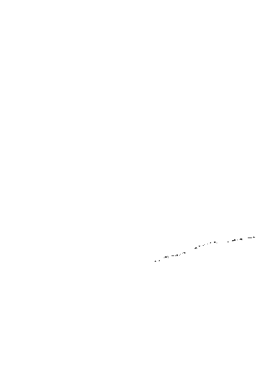

直到很多年后的一天，终于对自己承认，**也许这辈子我也解决不了那段经历的问题**，它成了心魔，无时无刻折磨着我，让我的生活陷入了危机，也许是时候搁置它了，包括我对他的怨恨。**我对自己承认，怨恨还在，问题也没有解决，可能是我现在的能力不够，等将来有能力解决这个问题后，我再把它们放出来。**我想象自己心里有个**潘多拉魔盒**，我把它们都装了进去，然后放在很深很深的角落，也对自己承认，**也许这辈子我都没能力解决这个问题，那么把它留给下辈子吧。**后来，它们就真的没有了，我一鼓作气收拾好自己一地狼藉的生活。你以为你放过的是对方，实际你放过的是自己。当我的生活变得更好以后，我发现自己可以像曾期望的那样，客观看待那个问题，看到我在那件事中所应负有的责任，也看到他在那件事里的责任，**我们甚至不带评判地一起探讨曾经的那段经历，向对方承认自己的问题，也向对方承认曾经自己的无能为力。**这对我的人生来说是非常重要的，**当我真的完全走过黑暗和泥泞，它拓展了我的方方面面，我变得更有意识，对自我有更好的觉察，它让我更理解自己，也更理解他人，它让我变得更有力量。**我**对生活和工作中的不如意有了更强的承受力和包容力**。让我的人际关系也处理的很好。事实上**我对自己和自己现在的生活都非常满意。****我想这无关宽恕，有关理解，理解自己、理解对方、理解经历。**那些至暗的经历也是上天最好的安排，它给予我的成长是巨大的。我想我们应该**学会对自己慈悲**，**心疼成长的不容易；原谅自己的能力有限；允许自己在感到疲惫后做一条咸鱼；接纳自己是个普通人。****心疼、原谅、接纳自己，对自己慈悲以后，才可能心疼、原谅、接纳别人，才可能对他人生出慈悲心。允许自己和他人是普通人，有各种不足、各种问题、各种怯懦，也是一种慈悲。**

******@********莉雯******

太阳进 7 宫时，下定决心结婚的人突然冷暴力要分手，后来发现是出轨了，痛哭 4 天时间，第 5 天起来突然间决定放下，脑中全是他的好，祝福他。从感叹命运的不公，为什么总让我受苦，到平静接受一切变化，我觉得我的心扩容了——**唯有宽容才能前进。**

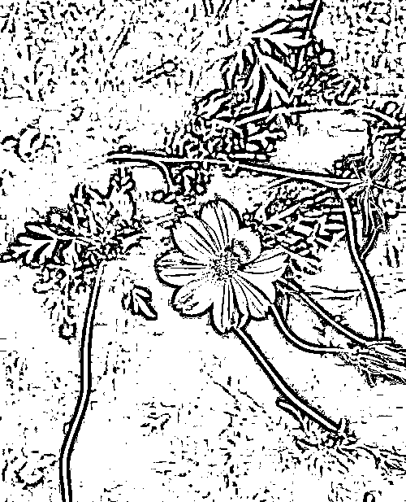

******@********Julie******

不断思考是算了放下，还是继续报复，有时候会突然心生一团火焰，长出了小恶魔的犄角，想去不断拆穿这虚伪的表象。为什么我痛苦的时候 ta 们却还能演得那么开心？心里会不平衡。 我不喜欢现在自己的心理，心态不平和。很糟糕。

******@瑶******

一直以来我妈对我都是怀疑和贬低，如果我成功了，她就会归结为运气，或者是因为有别人的帮助。一直以来我也是认同她的话语的。前段时间，当她又在微信里对我大喊大叫，说我是个失败的人时，我心里突然有一种不一样的感觉，我觉得她被自己的情绪裹挟着往前冲，就像被洪水卷入的人，嘴里发出的声音是混乱的。**那一刻，我不是愤怒，而是同情，我不知道这算不算宽恕。**事后她对我说对不起，因为**她控制不住自己。**我也像我妈一样，很容易被情绪卷走，很容易认同他人的评价。虽然我经常练习面对伤痛的冥想，但是从来没有很轻松地从伤痛的场景中剥离出来。但是这一次，我发现**在事情的当下，我能以客观地视角去看待我妈的行为，对她反而没有很大的恨意了**。

 ******@丁丁******

童年遭受到不堪的事，被一位家中理应亲的人伤害，如果你此刻猜想是不是那种事——是的。 

那个人是当时家庭的支柱，当时的我怕之后其他家人不知怎么生活。选择不说出来，表面没事发生过一样一起继续生活了十几二十年，我没有再信任过这个人，甚至拒绝交流。当面对和那个人的影子、身形、性格行为相近的人，还是有害怕的抗拒。但我庆幸自己还能生活下去，找到让自己热爱生活的事情。**@咪咪**不宽恕让我的内心变得**更不信任别人，却也会更坚韧，更固执，更不服输。更冷漠，更理性。**最难的时候想过一了百了，但是最后凭着自己的韧劲，还清了被电信诈骗的钱。得了作文竞赛一等奖，手指骨节康复，扭转命运。

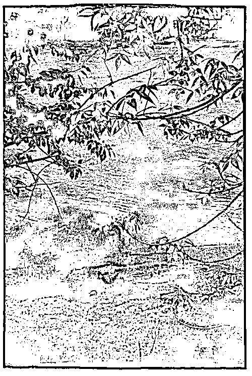

**@罗**

被朋友带去传销被诈骗三十几万，在里面认识了一个男生，彼此都很喜欢，很快就在一起了。不久，我就流产了，此后他就不一样了，一次争吵他就说了分手，后来我才知道他是**嫌弃我有这么多的债务，不愿意承担。**

分开后的日子晚上总是惊醒，刷他的朋友圈，三个月后**我把他删了，我决定放过自己，开始新的生活。** 

这对我的内心是极大的打击，我忘不了这么多个惊醒的夜晚，内心的悲伤、恐惧、还有不停的回忆，好在我够倔强，没有再找过他，后来选择了放过自己也放下他。我强烈意识到，**一次次地失去自我是换不回他人的爱的，必须自己先学会爱自己**，我也因此**把注意力放回自己身上，不再那么过度在意他人的情绪、想法，感觉轻松多了。**后来养了一只狗，带给我很多的陪伴和治愈。我又开始看自己喜欢的书、电影、综艺等等，做自己想做的，也有了未来的目标。**据说最爱你的灵魂才会伤你最深，为了让你学习到灵魂的课题。**

**@~相~** 

初恋爱上了别人，我期望的从一而终成了泡影。从怨恨到原谅，很难，但我做到了。感谢父母给了我无微不至的爱护！我长大了，成熟了。**学着不再固执地强求完美。**感谢老天眷顾。**原谅与爱能治愈一切。**

****@nn****2008 年初爱人出轨背叛，**我没有原谅，变得更为黑暗，孤独，悲伤。易怒，沉郁，生活很不顺畅。**如果重来一次，我不清楚自己是否会做出宽恕的选择。

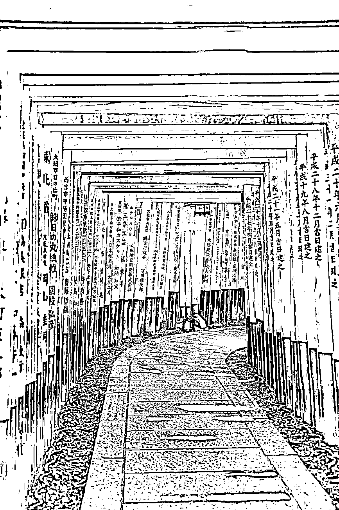

****@六六****

被太阳摩羯座、上升巨蟹座的先生在感情上背叛了，要离婚，我是太阳巨蟹座，上升巨蟹座。我并没有准备好离婚，毕竟十多年婚姻厚度还是有的。**经历了半年多的痛哭、痛苦、抑郁，至暗时刻，甚至被其他人利用欺骗。**

我没有放弃过自己，也没有放弃孩子。**最后他主动回归家庭，他居然也在努力去成长改变自己。**

**坎坷就是老天赠予的包装破烂的礼物。****我从“受害者”成为为自己负责的“成年人”。**有支持系统了，不再孤单。有咨询师，有倾听伙伴。开始跟童年的母亲和解，婆媳关系逆转，在幼年最疼爱我的人去世前，及时去探望去表达爱，亲密关系也越来越高。对自己越来越清晰越来越勇敢。**把憎恨之心投向他人，最后受伤受业的还是自己。不如利用这个机会去向内看。******@啊小白****因年少无知，迷迷糊糊结了婚，婚后他投资用了他自己和我家里所有的钱，父母还把家里房产抵押贷款，又向亲戚朋友们举债。
最后，我和我的父母还有他（孤儿）身负巨债，被各种渠道起诉，寸步难行。回想整件事，失败是必然的。我全程心不在焉，没有多想一点点。付出惨痛代价，经过几年时间，也经历了各种狗血剧情，我**在鸡飞狗跳中逐渐清醒。****首先原谅了自己，然后才有了原谅他的能力。****许多年过去，我开始反省反思，为什么我的日子会过成这样？而我应该怎么生存？**以前从未思考过的问题现在开始思考了。以前的自己虽然可以想干嘛干嘛（能力范围内的想法都可以即刻满足），但根本不是爱自己。只是**无知和任性**罢了。**这个经历让我不再张扬任性，低头做事。**会多为其他人考虑，一点点地爱别人，关心别人。我像一个漂亮无知的小公主，在天上飞着飞着，突然急剧掉落，轰一声砸到地面，还是砸进了粪池，睁不开眼睛（不知道发生了什么），无法呼吸。之后的每一步都无比艰辛，拖着沾了屎的身体和心灵一点点前进，直到开始有能力去擦掉心灵上的屎。**重来一次大概不会发生这么惨痛的教训了，我会先保持清醒和睁开眼睛。****写在最后**看过这 23 个故事，作为一个从业多年的职业占星师，我不由得感叹，生命是多么神奇而独特啊！每一个个体，生来就蕴藏着海王星能量，它会在最迷茫痛苦的时候自然地引领我们，最终走向生命的尽头。而那些充满了智慧和觉知的金句，也是在生活的泥潭中反复挣扎历练之后得出的。或许生命的意义并不在于学习多少知识，用这些知识去教育别人该如何生活，而是看到每一个平凡的灵魂背后与生俱来的智慧，彼此将这些智慧融合，便越发靠近宇宙中最大的慈悲——海王星。我们一起努力，渡人，而自渡。**如果你也有话说，留言区给我们评论吧！**

**版权声明：**原创文章由作者授权首发于若道平台，欢迎转发，反对抄袭。友号转载请申请白名单。

**往期征集文章**[冥王星](http://mp.weixin.qq.com/s?__biz=MzA5NjA0NTAxNg==&mid=2651464091&idx=1&sn=7f9d4f5c592a48b6dbe15987f4325c88&chksm=8b48932cbc3f1a3a50e632a6fe56853ab260f70893b6f4d2868a37bf2dc70932883fadb83d6f&scene=21#wechat_redirect) | [天王星](http://mp.weixin.qq.com/s?__biz=MzA5NjA0NTAxNg==&mid=2651467236&idx=1&sn=f863363054b8ff8938110edbca4ab14d&chksm=8b489f53bc3f1645100f16537ff2b4670e30da38d87f39fc6d31e28852c75531567058898964&scene=21#wechat_redirect)**学习占星学****点击下图了解课程详情** 

**

****************

**微信又双叒叕改版啦，不想错过若道君的推送？****就把若道设为星标吧！****▼**

**喜欢记得点一下在看哦☟**

********报名直达入口********

# 干货 | 超精细！12 星座的梦里出现会有好事发生呢

> 原文：[`mp.weixin.qq.com/s?__biz=MzA5NjA0NTAxNg==&mid=2651468318&idx=2&sn=bd4edb5d0f73aef26288c8c9e0d135b5&chksm=8b4880a9bc3f09bfe83d36a082c0bc52816e2fc2523b80ac98eeb612f9d46117a69870fa257f&scene=126&sessionid=1692737857#rd`](http://mp.weixin.qq.com/s?__biz=MzA5NjA0NTAxNg==&mid=2651468318&idx=2&sn=bd4edb5d0f73aef26288c8c9e0d135b5&chksm=8b4880a9bc3f09bfe83d36a082c0bc52816e2fc2523b80ac98eeb612f9d46117a69870fa257f&scene=126&sessionid=1692737857#rd)

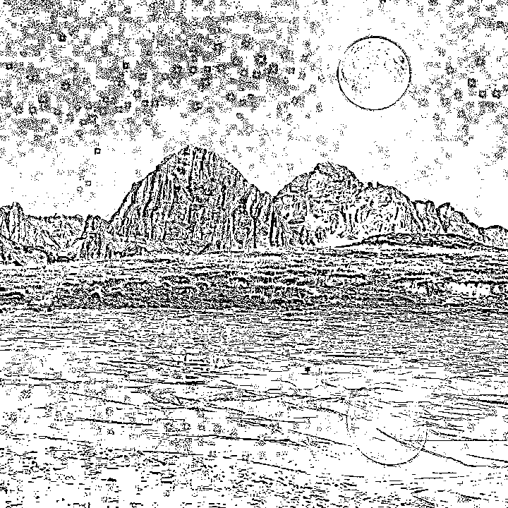

作者/玛丽·格雷斯·加里斯

译者/Shirley 校对/李含

编辑/翀子 封面/书君 图片/网络

占星学和梦境都是挖掘自我意识的方法，如果运用得当，我们可以逐步进入到更深层次的自我意识。这篇文章从占星四元素（火象星座、土象星座、风象星座、水象星座）的梦境呈现，展示了如何从占星学理解梦境。如果你想了解更多，也可以点击[【释梦大师工作坊】](http://mp.weixin.qq.com/s?__biz=MjM5MjQwNjAyMQ==&mid=2649439157&idx=4&sn=5b0c95a912ab27a182e7436c3d7d5792&chksm=beb954df89ceddc9eb53f26ae762d2dddd4a373c4345b9a500bf013050d806e72a369bca7dd0&scene=21#wechat_redirect)，了解相关课程信息哦~

**用占星学解梦**

如果你在清醒着的每一刻都在寻找占星学的联系，也许你对探索黄道带如何与你的睡眠互动感兴趣。如果是这样的话，那就来看看被称为释梦占星学的神秘释梦框架吧。

**释梦占星学是（希望它是）一种简单易懂的梦的占星学，或者是一种用你的占星学元素来释梦的方法。**

“占星学的语言不仅帮助我们了解自己，还帮助我们了解生活和梦境，因此，它可以帮助我们解析梦的含义。”

占星师、健康顾问、《解梦全书》作者斯蒂芬妮·盖林说：

**“我们的梦境帮助我们挖掘潜意识中的深层智慧，这些智慧可以为我们提供进一步的洞悉，让我们能够训练自己通过我们的出生星图了解自己。”**

**占星学和梦境实际上都是挖掘自我意识和灵魂的方法。**如果运用得当，他们可以逐步进入到更深层次的自我意识，而释梦占星学巧妙地将这两种内在工作方法结合起来。

毕竟，弗洛伊德对梦的解释是，尽管是以一种不稳定、混乱的方式，**但梦境是我们的潜意识发送关于我们欲望的信息。**

如果你的太阳星座（和上升星座，月亮星座，和所有的发光体）一直在你的脑海中，为什么它们不在你的梦中显现呢？

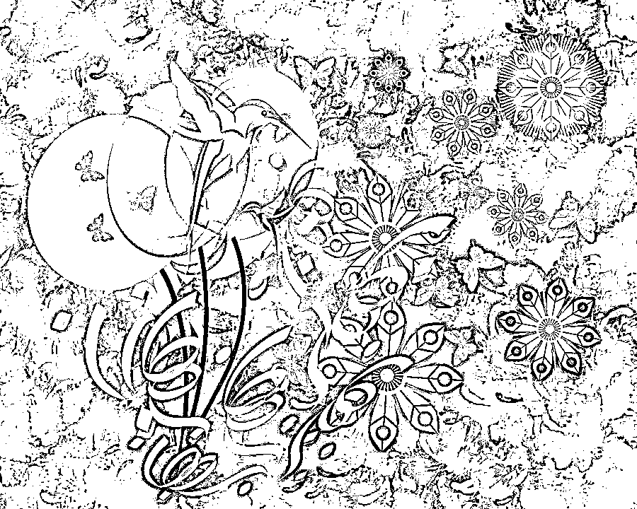

**用占星学释梦的原理**

**占星学元素基本上解释了你的气质，或者你的组成方式：**火象星座（白羊座、狮子座和射手座）、土象星座（金牛座、处女座和摩羯座）、风象星座（双子座、天秤座和水瓶座）和水象星座（巨蟹座、天蝎座和双鱼座）。

**释梦占星学包含通过元素识别与你的星座相关的象征，并理论性的将它们与梦中发生的事情匹配。**如果画面是暴力的或负面的，那么这表明你的元素可能表现出了低层面，或者你目前处在一个糟糕的状态中。

释梦占星学包含通过元素识别与你的星座相关的象征，并理论性的将它们与梦中情境匹配。

盖林有一个用占星学解释你的梦境的提示，他建议**在新月期间要特别注意你可能经历的任何梦境，因为这是一个开始全新的能量和设定意图的美妙时刻。**

“你在此刻可以种下什么样的种子呢，看看（梦）可能会带来什么样的洞见。”盖林说：**“深入了解它们所包含的内容，这些内容可能集中在你想要扩展和孕育的生活领域。”**

**四元素星座在梦境的呈现**

***火象星座*****（白羊座、狮子座、射手座）**

**火象星座想要寻找能使温度升高的东西。**如果你看到的画面能唤起温暖舒适的感觉，那就意味着你走上了正确的道路。

盖林说：“在我们的梦中，火可能以建设性的方式出现，其中包括我们正在制作食物的烤箱或炉子的画面。其他画面也可能为我们提供温暖的火。**任何反映火的滋养或炼金术性质的画面都可能是有建设性的。**”

另一方面，任何令人不安的地狱之火的画面都可能意味着火象星座的坏消息。**具有超强破坏力的火，在梦中燃烧、烧焦和毁灭可能会引起担忧。**

例如，如果你是射手座的人，对自己的工作感到不确定，那么你可能会梦见与同事一起烤棉花糖，表明如果你依靠同事，你就可以渡过难关。

但如果你梦见你的办公楼着火了，**那可能表明你过度表达了你的热情洋溢，而不是倾向于你的星座的自然滋养。**

盖林说：“如果像这样的画面是一个**反复出现的主题**，并且我们的星图中有一个**火象能量的显著提示**，这就表明我们要**注意这些过度表达的火象性质。**”

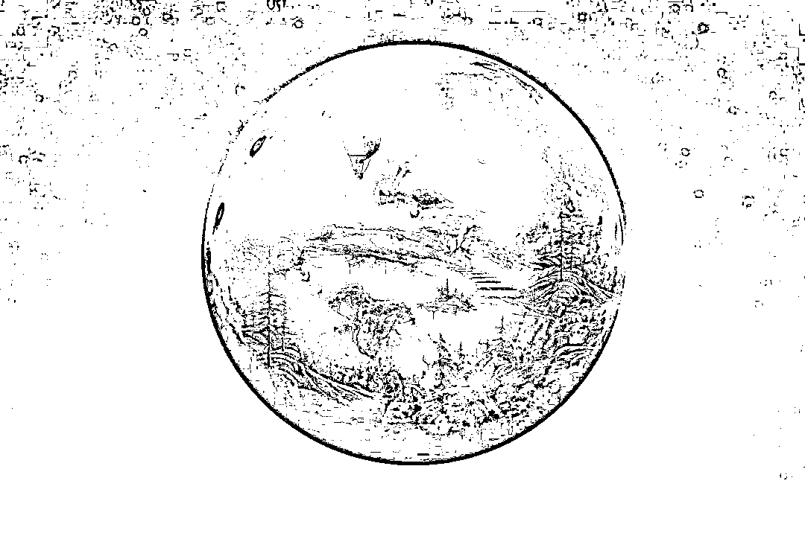

***土象星座*****（摩羯座、金牛座、处女座）**

**土象星座想要寻找与自然有关的画面。**花、树、动物、土地和任何漂亮的建筑。你也可以找到容器，陶器，土壤，任何你可以在其中播种的东西。

“土象有一种可能会让我们感到不安或害怕的出现方式，那就是土象的沉重压力。”盖林说：“这可能看起来像在一堆岩石下，我们周围的墙都围了进来，**或者感觉非常沉重，就像在重度压力之下。**”

**那么，土象的冲突是如何在梦境中表现的呢？**

假设你是金牛座，最近你挑战了自己的固有天性，搬到了一个新的城市。

当你梦见在窗台上种植有一个番茄花园，同时杰夫·高布伦（译注：一位经常扮演古怪角色的美国演员）按摩你的脚（不要评判）的时候，这意味着你在适合的空间生长。

但是如果你在同一个城市生活了五年，梦见一块巨石把你的衣服钉在地板上，这可能意味着你应该考虑克服这种恐惧，并把自己连根拔起。

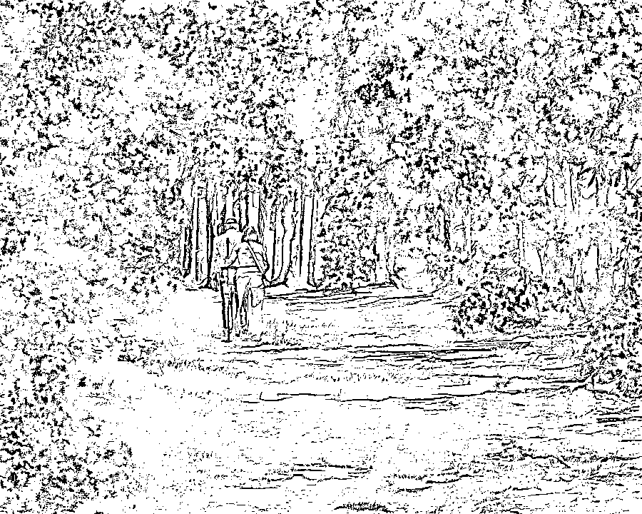

***风象星座*****（天秤座、水瓶座、双子座）**

**风象星座寻找充满趣味、活泼的能量。**

盖林说：“风象星座能够以一些建设性的方式出现在我们的梦中，包括清新的微风、空中漂浮的美丽气球、风筝的飘舞、生动且引人入胜的对话，或者一种可以毫不费力地产生重要解决方案的技术设备”

同时要小心那些让我们偏离中心的狂风、喋喋不休的对话或是有自己想法的科技设备。

比如说，假设你是双子座的人，每天晚上都在 Hinge （译注：一款约会社交应用）预定约会，试图寻找爱情或类似的东西。

如果在你的梦境中，你不是在放风筝可你就是风筝（因为梦可能会很奇怪），那么你要担心这一点。

**这可能意味着你在约会时倾向于你星座中更轻浮的特质，而不是那些更高层次、更机智、更理智的特质，这些特质才会让你找到与你真正有联结的人。**

***水象星座*****（巨蟹座、天蝎座、双鱼座）**

**水在水象星座的梦境中也有建设性的表现，**包括一个美丽的游泳池，轻松冲浪，畅饮美味的饮料，或者喝下治疗性的灵丹妙药。盖林警告说，**海啸、溺水画面、家里漏水或水龙头滴水不止**都是坏消息。

例如，假设你是巨蟹座，你对某人有些感觉。你的感情总是无处不在，所以你不能确定这个人是否适合你，还是说你应该远离他。

如果你梦见你们在一个美丽的偏僻湖泊里游泳，恭喜你们。这可能意味着你找到了你的灵魂伴侣！同时，如果你梦见自己戴着冰球面具淹死了他们……是的，这可能意味着你扼杀了一段美好恋情的机会。

但谁知道呢？当谈到占星学和梦时，一切都取决于解释，你不这么认为吗？

**版权声明：**本文由若道翻译发布，欢迎转发，反对抄袭。友号转载请申请白名单。

**玛丽·格雷斯·加里斯**

一名屡获殊荣的记者，也是生活方式作家，在性、心理健康和占星学方面充满诗意。在此之前，她曾在《Elle 杂志》、《Bustle》、《Bust 杂志》、《J-14》、《Hello Giggles》和《Audio Femme》等出版物上撰文。

**学习占星学****点击下图了解课程详情** 

**

****************

**微信又双叒叕改版啦，不想错过若道君的推送？**
**就把若道设为星标吧！****▼**

**喜欢记得点一下在看哦☟**

**报名直达入口**

# 释梦占星大师工作坊：荣格、占星学与梦境

> 原文：[`mp.weixin.qq.com/s?__biz=MzA5NjA0NTAxNg==&mid=2651468318&idx=3&sn=4dde4612ccf0a8982432acf249d9c539&chksm=8b4880a9bc3f09bf71993d4b78a92d2f74d99c4198c2994d60f254ffbf32a8f6c110ddcf8ee9&scene=126&sessionid=1692737857#rd`](http://mp.weixin.qq.com/s?__biz=MzA5NjA0NTAxNg==&mid=2651468318&idx=3&sn=4dde4612ccf0a8982432acf249d9c539&chksm=8b4880a9bc3f09bf71993d4b78a92d2f74d99c4198c2994d60f254ffbf32a8f6c110ddcf8ee9&scene=126&sessionid=1692737857#rd)

****

**2022 年 3 月和 4 月木星和海王星在双鱼座合相给连接梦境与占星提供了一次绝佳的时机。**

**　　——格雷格·博加特老师**

**梦境工作和做梦疗法是深度心理治疗的一个关键技术，**使得深层无意识的象征性语言能够传递它们的洞见，并指引患者走向更大的完整。

梦境使带有情感成分的无意识材料安全而快速地进入意识层面。它们帮助找到治疗的重心，指引治疗的方向。**梦境提供了重要的线索，告诉我们客户痛苦的来源，以及哪些情绪和情结需要被检视和处理。**梦境工作可以成为心灵成长和行为改变的强大催化剂，它有种独特的能力，促进疗愈从内在发生。

梦就像冰山从无意识的深水中浮现出来。有些冰山属于过去，帮助我们理解过去的创伤和未消化的回忆，因此是回溯性的。

**梦境有种整合的能力，**因为他们能使我们觉知和化解很多次人格之间的矛盾。**梦境也有前瞻性或预期性，**那是来自未来的冰山，会呈现出将要发生的事情，显现出个人有可能成为的样貌。**梦境既向后看也向前看**，它的本质功能是扩展意识、觉知和身份的疆界。

**我在梦境工作中主要使用的技术，是以开放的好奇心，主动探求梦境中每个角色、地点和行为的当下意义**——每个元素都反映出梦者的心灵状态和当前的生活情境。被梦境所揭露的信息，往往既幽默，又充满矛盾，而且为我们打开了新视野。

怀着一种敬畏的心态，我发现每个梦境都是意识海洋深处的一颗珍珠。反思梦境的奥秘，会引发一种近乎宗教敬畏的情感，我们会惊叹于心灵描绘自身处境的能力。

1

**课程内容**

**本课程将课堂讲座与动力过程工作结合起来，动力工作过程会将星图解读和梦境分析结合起来。**

每天约一半时间用于讲座，其余时间会演示占星学梦境工作方法，过程中老师会与学员进行互动。课程包括对老师解读星图和治疗性梦境工作方法的详细阐释和示范。

**我们将学习荣格解梦的基础知识和治疗性的、以过程为导向的星图解读。**我们将体验转化性原型模式在梦境和出生星图中同步显现时会发生什么。

**三次 6 小时的迷你马拉松在线梦境课程**，将会是一次提升意识、开放思想、转化生命的事件。**学员将体验占星学和解梦的融合。**

每次课程格雷格·博加特老师都会与学员互动，课程中使用的星图和梦境将由愿意分享自己梦境和星图的学员提前提供，课程期间也会开放问答以及学员互动环节。

2

**课程安排**

**第*****1*****讲  2022 年 3 月 5 日 **

卡尔·荣格的童年、学生时代以及投身精神病学时期的故事。《荣格自传：回忆·梦·思考》概要。弗洛伊德与荣格的关系，他们合作的破裂，荣格随后的抑郁时期，以及他借助梦、积极想象、艺术创作、曼陀罗绘画和对奥义知识（灵知）、神话和占星学的研究，转化性地面对无意识。卡尔·荣格与艾玛·荣格的占星学。

荣格的力比多（心灵能量）的概念，以及他的心灵结构地图：自我、个体无意识和集体无意识。荣格对无意识原型的描述，它们对个人神话的重要性，以及它们作为个人情结的表现。自我-自性轴线，以及自我与无意识之间不断演化的关系。

**我们将介绍荣格解梦的基础知识以及治疗性的、以过程为导向的星图解读。我们将体验转化性原型模式在梦境和出生星图中同步显现时会发生什么。**

****第*****2*****讲  2022 年 3 月 12 日 ****

梦境中的个性化及其占星学时机。出生星图随时间推移展开。整合个体无意识：梦和出生星图中的人格面具与阴影。男性和女性：阿尼玛和阿尼姆斯。**梦与占星学行进**描绘建立或脱下人格面具的阶段，遭遇阴影的阶段，通**过阳性意识和阴性意识的结合发展出更统一的人格的阶段。**

**第*****3*****讲  2022 年 3 月 19 日 **

**整体性在占星学和梦境中的象征。**透过占星学符号研究梦，来深化内在生命。我们将学习占星学行进和梦境如何试图让我们意识到差异、内在冲突和极性，逐步整合对立，将人格整合成一个整体。

梦境工作和星图解读中的曼陀罗原理。荣格的心理类型理论：内向型和外向型的任务。达到思维、情感、感觉和直觉的平衡。我们还将涉及使用五因素人格理论作为星图解读和梦境分析的基础的重要性。

**我们将学习如何解读梦境，并辨别梦的象征意义所传达的有说服力的信息，因为这与出生星图和行进有直接关联。**整合占星学和梦境工作，可以带我们进入情感、关系和灵性更为一致的状态。

3

**授课老师**

**格雷格·博加特**

（Greg Bogart）

**占星师、心理治疗师**。格雷格出生于美国纽约市，就读于卫斯理大学，1986 移居旧金山湾，完成了加州整合大学和赛布鲁克大学的研究生课程。格雷格自 1991 年以来一直是一名有执照的**心理治疗师**（LMFT 28276）。**他是国际占星研究协会（ISAR）认证的占星师**，并拥有美国地球宇宙学研究协会（NCGR）的第四级认证。他还在旧金山的艾扬格瑜伽学院接受过培训，并于 1992 年毕业且获得了**瑜伽教师认证。**

格雷格是一名私人执业的心理治疗师，在索诺玛州立大学担任**心理学讲师**，他在该校教授“成人发展中的转变”、“以深度为导向的心理治疗”、“神话、梦与象征”以及“存在主义心理学与超个人心理学”等课程，他在加州整合大学、约翰·F·肯尼迪大学、多米尼加大学和超个人心理学学院教授咨询心理学和东西方心理学课程。**他的研究结合了冥想、哈他瑜伽、荣格解梦、存在主义心理疗法和精神综合，以及占星学的周期智慧和原型象征。**

**格雷格·博加特博士著作：**

*   《占星学的高八度音阶》（*Astrology’s Higher Octaves*）

*   《行星用于治疗》（*Planets in Therapy*）

*   《占星学与灵性觉醒》（*Astrology and Spiritual Awakening*）

*   《梦境工作过与自我疗愈》（*Dreamwork and Self-Healing*）

*   《梦境工作在抑郁症整体心理治疗中的应用》（*Dreamwork in Holistic Psychotherapy of Depression*）

*   《占星学与冥想：对变化的无畏沉思》（*Astrology and Meditation: The Fearless Contemplation of Change*）

4

**课程价格**

*   **课程价格：****5800 元**

*   **课程咨询：**王老师（微信：18510107057，请备注“释梦工作坊”）

长按二维码添加王老师

5

**课程安排**

*   **课程时间：**

     **2022 年 3 月 05 日周六  8:00-14:00**

**2022 年 3 月 12 日周六  8:00-14:00**

2022 年 3 月 19 日周六  7:00-13:00

*   **授课方式：**线上直播，英文授课，中文翻译

6

**退转课程**

*   **退款原则请详看《教学协议》，如有疑问请咨询课程顾问。**

****释梦工作坊****

**授课老师：**格雷格·博加特

**授课时间：**2022 年 3 月 5 日起

**授课方式：**网络课程**，**英文授课，中文翻译

**费用：****5800 元**

**课程负责人：****王老师**（微信：18510107057，请备注“释梦工作坊”）

长按二维码添加课程负责人咨询~

****报名请点击“阅读原文”****

# 俄乌局势紧张，黄金会上涨吗？ | 梅里曼 3 月上证+黄金报告上线！

> 原文：[`mp.weixin.qq.com/s?__biz=MzA5NjA0NTAxNg==&mid=2651468243&idx=2&sn=f05411adad4ddaaf1d1191605ed01684&chksm=8b488364bc3f0a7280eae0182f11965e636c566827deffb5c1fb6b5580373b55d26ae9946ad3&scene=126&sessionid=1692737857#rd`](http://mp.weixin.qq.com/s?__biz=MzA5NjA0NTAxNg==&mid=2651468243&idx=2&sn=f05411adad4ddaaf1d1191605ed01684&chksm=8b488364bc3f0a7280eae0182f11965e636c566827deffb5c1fb6b5580373b55d26ae9946ad3&scene=126&sessionid=1692737857#rd)

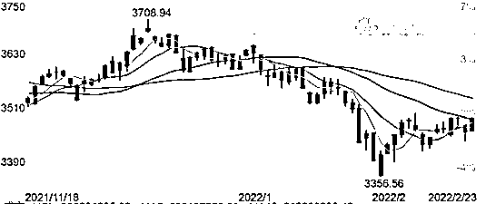

| 上证指数日 K 线图

在上证指数在 2021 年 12 月 13 日达到 3708 的波峰后，2021 年 12 月的下半月和 2022 年整个 1 月份都处于下跌状态。本次下跌和 2021 年 12 月 24 日土天四分最后一次精准成相重合。在 1 月的上证指数报告中，雷里曼老师说：**“如果上证（2021 年）12 月底无法在 3531 之上收盘，随着我们进入下一个三星级关键反转日期（2022 年）1 月 14-17 日，市场甚至可能出现更严重的下跌。****这个关键反转日期包括强有力的天王星逆行（1 月 18 日），以及满月时太阳合相冥王星，水星也转向逆行（1 月 14 日），所有这些都在 1 月 14-18 日发生。届时对于全球股票指数，包括上证综指，可能又是一轮爆炸式急剧波动的时段。”**他建议：**“我们建议，直到 12 月初，都可以按照做多来交易。但在 12 月 11 日之后，小心观察市场触顶的迹象，因为随后将出现大幅下跌。”**这些都出现了。春节后，上证指数出现了反弹。在 2 月的报告中，雷里曼老师把 2 月 7 日那一周定位关键的 3 星反转时机，因为这个时机涵盖了金星和水星转为顺行，以及金星与火星在 2 月 16 日的合相。并且建议“空仓的交易者，建议做多”。2 月 7 日，上证果然触底反弹。**根据梅里曼老师的建议，你可能在 12 月初逃脱了那个大跌，同时，在 2 月抓住了这个反弹。**从技术角度看，**今年的 3 月和 7 月都是关键月份。****借助 4 月木海合相，上证能否冲破 2021 年 3708-3731 的三重顶部阻力位？还是会再次测试 1 月 28 日的低点？**2022 年 3 月应该如何操作，金融占星大师雷蒙德·梅里曼的《2022 年 3 月上证指数报告》已上线，你可以听听梅里曼老师的看法。《2022 年 3 月黄金报告》也已上线，欢迎购买。

**3 月上证报告上线**

上证指数月度报告价格**单月报告**：280 元/月 **季度套餐价格**：780 元（260 元/月）**年度套餐价格**：2400 元（200 元/月）**长按下图识别二维码购买上证指数报告**
▼

“**黄金是金钱。其他的只是信贷。**

**——约翰·皮尔庞特·摩根**

”

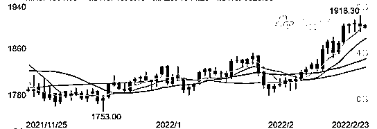

| 黄金走势日 K 线图
黄金价格在 2022 年 1 月出现了一个低点 1781.30，在 2 月份的黄金报告中，雷里曼老师认为：**“黄金现在有机会突破 1833。黄金将在完成本月的基本周期低点后重新上涨”**。他建议头寸交易者保持做多。黄金在 1 月 28 日探底 1780 后持续上涨，目前已经涨了 1 个月。正如过去所说，**今年最重要的一个天象是 4 月 12 日发生的木星-海王星双鱼座合相。**这个合相通常会造成一种**歇斯底里**的气氛。**由于各国大规模的货币超发，通货膨胀已经极其明显，而在木海合相时期，很可能成为黄金看涨的助推力。**同时，美联储已经宣布，将开始收紧货币政策，这将会看涨美元，对贵金属构成看跌压力。另外，俄罗斯在 2 月 22 日承认了乌东 2 个地区独立，俄乌危机进一步恶化。在局部战争阴影和通货膨胀向消费品蔓延的情况下，黄金会怎么样？黄金报告已经上线，上证报告也即将上线。欢迎了解。也可以按照季度和 1 年期订阅，有更多优惠。季度和年度的好处是，你可以持续了解梅里曼老师对于不断在变化的市场的看法。即便他某一次看法和市场不一致，你也看到在下一期他如何调整自己的看法，并看到金融占星在一个长期时间段内对你把控风险的帮助。而能够长期控制风险、尽量找到安全的投资时机才是投资的长久之计。

点击阅读原文，雷蒙德·梅里曼黄金周期 2022 年 3 月报告带来有 40 年黄金市场研究经验的世界著名金融占星大师雷蒙德·梅里曼对当前黄金市场的研究。

**投资有收益，投资有风险，希望金融占星学的研究帮助你更好地评估你的投资。**

**雷蒙德·梅里曼《2022 年金融年度预报和沙龙》也已经发布，关注今年金融走向的读者朋友可以购买参考。**

**长按下图了解详情**

▼

**《2022 年金融预报·直播沙龙》将于 3 月 19 日上午 9 点举行，已购买《2022 年金融预报》的用户，可以添加客服微信（nodoor201705）获取直播沙龙参与方式。**

**2022 年 3 月黄金报告上线**

**黄金月度报告价格****单月报告**：280 元/月 **季度套餐价格**：780 元（260 元/月）**年度套餐价格**：2400 元（200 元/月）**双报告年度套餐更优惠（直降 900 元）****12 个月黄金报告+12 个月上证指数报告：仅需 3900 元****长按下图识别二维码购买黄金报告**
▼

**购买者需知**

**① **梅里曼市场时机学院《中国上证指数月度研究报告》是梅里曼市场时机学院（以下简称 MMA）的研究“预报”，而不是市场“预测”，是梅里曼老师及 MMA 金融占星分析师对人类活动周期历史与行星周期之间相关性的研究，二者在大部分情况下具有 80%或更高的相关性，而不是因果关系。报告中的研究完全存在错误的可能性。即便是非常认真的研究和几十年的研究经验，金融占星师无法总是正确地解读出各种征象在实际层面上会如何相互作用，并显化为事件结果。

所以请将报告看作一个研究参考，务必结合其他市场研究和你个人对市场的理解，根据你的自由意志做决策。

**②** 此报告一旦售出，**即不接受退款。**

**③** 上证、黄金月度报告每月固定 1 期，**并非都是在每月相同日期发布。**

**④** **我们收到英文报告的当天，即发布该英文报告。3 天后，上线报告中文版。此报告仅支持手机网页阅读，不支持电脑阅读和下载。****以上须知，请仔细阅读。一旦付款，即视为已了解并接受所有须知内容。**在过去的 40 年中，唯有梅里曼逐渐完善，并在梅里曼市场时机学院月度周期报告中阐释了将地球宇宙学与周期相结合的研究方法，以惊人的精确性预报了黄金价格发生重大变化的时间。**黄金购买 Tip**

各大银行均可购买黄金或黄金 EFT 基金，也可以在诸如天天基金或者支付宝购买黄金及黄金相关产品。不明白的可以百度搜索。

**购买后如何查看报告？**

**购买后有疑问怎么办？**请联系技术客服
**微信：nodoor201705**

**购买黄金+上证报告直达入口**

# 当感觉被周围环境“困住”，你需要的解药在这颗行星里！（内含升级攻略）

> 原文：[`mp.weixin.qq.com/s?__biz=MzA5NjA0NTAxNg==&mid=2651468243&idx=1&sn=12457ef1a01b988043fd81976dbf04cb&chksm=8b488364bc3f0a72c7545cc42a54c86ffb1208f3ff6e46138ad7907c6546df373f0003d33687&scene=126&sessionid=1692737857#rd`](http://mp.weixin.qq.com/s?__biz=MzA5NjA0NTAxNg==&mid=2651468243&idx=1&sn=12457ef1a01b988043fd81976dbf04cb&chksm=8b488364bc3f0a72c7545cc42a54c86ffb1208f3ff6e46138ad7907c6546df373f0003d33687&scene=126&sessionid=1692737857#rd)

**********************☆ ******************后台回复“今日”，给你一点自我力量************

作者/曼迪·洛克利

译者/江艺 校对/王宏

编辑/翀子 封面/书君 图片/网络

土星被称为“时间老人”和“严格的老师”，它考验我们是否跟从内心活出真实自我。当行进土星和出生星图太阳形成重要相位时，我们会感到沉重和压抑，也让我们审视是否对自己的生活负起了责任。但在这些被“碾压”的日子里，我们又会获得怎样的“果实”？来看文章吧~

**跟随内心到底意味着什么？**

如果你曾对自我帮助的书籍或电影感兴趣，尤其是更贴近精神方面的书籍或电影，那么你就应该听说过**跟从内心、忠于内心、活出真实自我**的重要性。 

毫无疑问，拥有一种独特而真实的目标感是至关重要的，但是追随/跟从内心到底意味着什么呢？幸运的是，占星学提供了一些线索。

**太阳在我们的出生星图中代表我们的心脏——我们胸腔里的器官，但也适用于情感和心理的意义**。想想，我们是如何将无情的人描述为狠心或铁石心肠，将那些慷慨助人的人描述为热心或全心全意。

了解太阳落入的星座、宫位以及它与其他行星和虚点形成的相位，有助于将我们带到自己的中心，也就是我们的真心所在。我们的太阳复合体描述了我们的人生方向和目标，以及我们本应成为怎样的英雄。

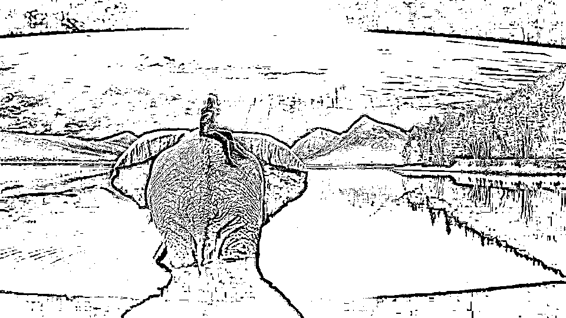

**当土星碰上太阳**

**当行进土星与你的太阳联结时，太阳会感到沉重、受限甚至抑郁。土星的挑战性行进——合相、四分相，尤其是对分相——会让你质疑你的生活结构是否支持你的内心目标，质疑你是否以内心为核心来生活**。

这个过程可能会很痛苦。**土星让我们想起我们的责任，想起生活中应该做的事，但当它与你的太阳接触时，土星也要求你考虑你对自己的责任，及其与外部世界相冲突的地方，内疚就可能产生**。

问问你自己，那个内疚的声音真是你的，还是你父母/老师/老板对你所说的话的回声。然后问自己，**如果我听从这个声音，我是否忠于我自己？忽视这些声音是自私的吗？**

的确，土星不能容忍逃避对他人的责任，也许这就是为什么土星行进触及我们的太阳会给人**严苛**的感觉。此外，它还涉及**对自己的行为、思想和言语负责**，如果你觉得自己的生活不够好，不要去责怪他人。

探索如何区分真正的责任和出于内疚的责任，或要求你变成不真实的自己或做不忠于自己的事。要继续履行对他人的真正责任，并不失风度地为他们服务。

但是，对于自己能做什么，不能做什么，**要对自己和他人诚实，重新设定你的界限，并富有同情心地执行它们**。

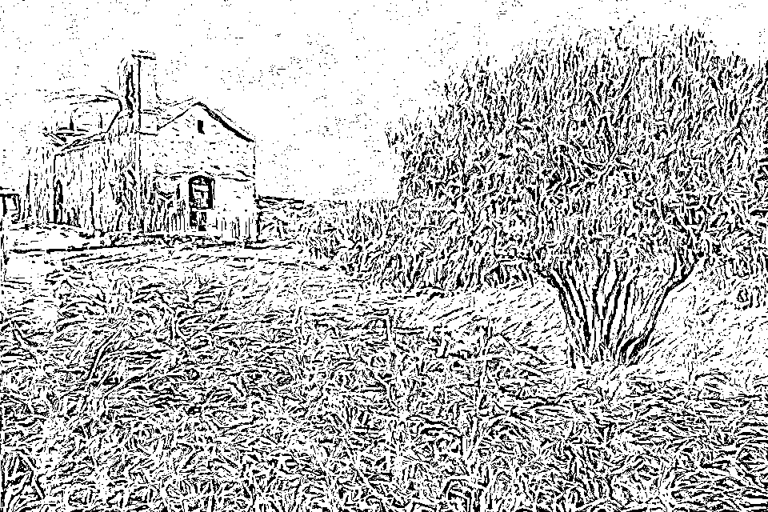

把自己放在首位——但只有真正跟从内心去做——也会有助于你与他人的需求保持一致，这是自私的反面。

换句话说，正如那句老话，**照顾者首先要照顾好自己，才能妥善地照顾他人。**

看起来也许不像，但困难的土星行进触及你的太阳提供了一个机会，让你的生活走上正轨，即使它让道路上的障碍和延误变得显而易见，令人痛苦。

然而，**如果你已经真的、真实地跟从一个真心忠于自我的轨道，土星向太阳的行进就可以带来回报**。但实际上，我们正在寻找的轨迹真的存在吗？如果我们想跟从内心生活，难道我们不用开辟自己的轨道吗？

**出生星图，包括太阳复合体，是描绘这类只是有待挖掘的潜在轨道的个人地图。**

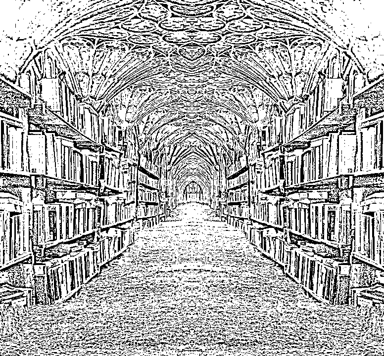

**土星的周期很重要**

思考**行进土星目前在与太阳的关系中处于周期的哪个阶段**，这是非常有益的。

**1******行进土星与出生星图太阳合相****

**如果行进土星与你的太阳合相**（影响摩羯座太阳，同时土星落入摩羯座），**这是一个新周期的开始——一个播种和计划的时期**。

限制和感觉被困、低落的情绪、不懈的努力和看似无法攀登的墙，都能帮助你看清自己所处的位置，并迈出第一步，去寻找切实可行的解决方案。 

如果你年纪到了，那就回顾一下你刚走完的 29 年周期，看看你是如何成为现在的你以及为什么会成为现在的你。

想一想你做过的决定、实现的抱负和放弃的抱负、承担的责任和逃避的责任。这一切都达到你心中的目标了吗？如果没有，你如何确保下一个周期反映真实的、独特的、忠于内心的你呢？

特别要注意这些大约**相隔 7 年**的阶段，即土星的上一次合相、渐盈的四分相、对分相和渐亏的四分相。你是怎么开始的？你遇到了什么障碍？你是如何克服的？里程碑和转折点出现在什么时候？

这次行进，和其他重要的合相行进一样，是要接受我们不能总是控制一切。但关键是要直达内心，**直达真正的你的核心，找到一种新鲜的目标感，并迎接新的挑战。**

如果 29 年前你还太年轻，无法对自己负责，并为自己做决定，那么回顾一下你的家庭发生了什么，思考这是否反映了你自己真正的内心道路，如果没有，那之后你有没有找到并追随自己的道路？

**2****行进土星与出生星图太阳成渐盈四分相**

**行进土星正与你的太阳形成渐盈的四分相（**影响天秤座太阳，而土星同时落入摩羯座）代表着一个**富有成效的阶段，在这个阶段，你积极地在你的生活中建立新的结构，基于你在大约 7 年前土星和你的太阳合相期间的发现和计划**。

这是重新回归中心的时候，将你带回自我。现在出现的障碍、拖延、怀疑、恐惧和挣扎正在考验你的决心，并要求你根据当前的现实调整计划。

就像所有四分相一样，**它需要行动，而不是思考和计划**（思考太多、行动不足可能带来担忧和焦虑）。它也需要**耐心**——正如土星一样——思考行动，着眼于长久的博弈。

**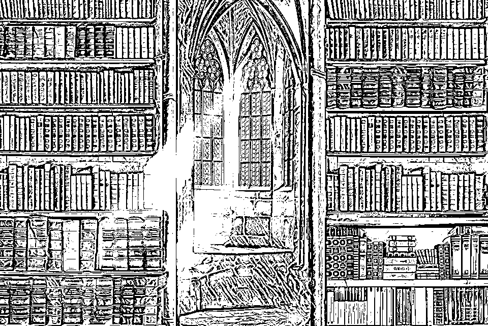**

**3******行进土星与出生星图太阳成对分相****

**行进土星对分你的太阳**（如果你的太阳在巨蟹座，这就是当前的情况）是一个时机，让你充分意识到，自从土星与你的太阳合相以来的约 14 年间，你创造了什么，展现了什么，建立了什么。

你的内心是在歌颂你所取得的成就，还是感到沉重？在过去的几年里，你是否在恐惧中行动或是停滞不前，让对安全感、舒适和熟悉的需求阻碍你的进步？

现在，一切都变得清晰。一般来说，**你的关系，尤其是你与权威人物的关系，以及你与自己的关系，都会在这段行进期间感觉受到考验或暴躁易怒**。

**4******行进土星与出生星图太阳成渐亏四分相****

**行进土星在摩羯座会与白羊座太阳形成一个渐亏的四分相**。这是一个收尾阶段。就像渐盈的四分相一样，它可能预示着**令人沮丧的障碍、拖延、怀疑、恐惧和挣扎**。

这可能感觉就像你生活中的结构正在消失，或者不再有效，但这为新结构的形成扫清了道路。回顾约 7 年前的对分相，通过回顾，你能够发现那个时期是某种顶峰。

在这段时间里，**为你生命中已经逝去的东西适度悲伤，是该过程的一个重要部分**。悲伤不仅仅是关于已经逝去的亲人，它也适用于失去的人际关系或工作、物质上的损失、青春的逝去。

**我们甚至可以为我们没有的或没有获得的事物而悲伤，为从未实现的希望和梦想而悲伤**。这是开始为 7 年多之后，土星合相你的太阳时的下一个周期的开端做准备的时候了。 

和所有土星触及你太阳的行进一样，这段时间你可能感觉自己好像失去了信心，在生活的某些领域感到气馁，害怕自己可能永远无法实现目标。

如果土星触及你太阳的行进让你有这样的感觉，这是一个信号，**你需要向内照亮一束光，重新与你核心的、你内心的自我建立联结，并采取相应的行动**。

**版权声明：**本文由若道翻译发布，欢迎转发，反对抄袭。友号转载请申请白名单。

**曼迪·洛克利**

伦敦的一位占星师、作家，曾在伦敦占星学院求学。2012 年，她出版了电子书《天蝎座土星：穿越黑暗的指南》(*Saturn in Scorpio: Your Guide Through the Dark*)，最近还以小说作家的身份出版了作品。

**学习占星学****点击下图了解课程详情** 

**

********************************

**微信又双叒叕改版啦，不想错过若道君的推送？****就把若道设为星标吧！****▼**

**喜欢记得点一下在看哦☟**

********报名直达入口********

# 干货丨带你亲临一场人本主义占星咨询！

> 原文：[`mp.weixin.qq.com/s?__biz=MzA5NjA0NTAxNg==&mid=2651468131&idx=2&sn=a79b81477f93cd7353bc1dbbeeefc4b0&chksm=8b4883d4bc3f0ac249d3696432cf7c0419747101b3a85de6e33bd6ba5a353d1f2f60bb0477d7&scene=126&sessionid=1692737857#rd`](http://mp.weixin.qq.com/s?__biz=MzA5NjA0NTAxNg==&mid=2651468131&idx=2&sn=a79b81477f93cd7353bc1dbbeeefc4b0&chksm=8b4883d4bc3f0ac249d3696432cf7c0419747101b3a85de6e33bd6ba5a353d1f2f60bb0477d7&scene=126&sessionid=1692737857#rd)

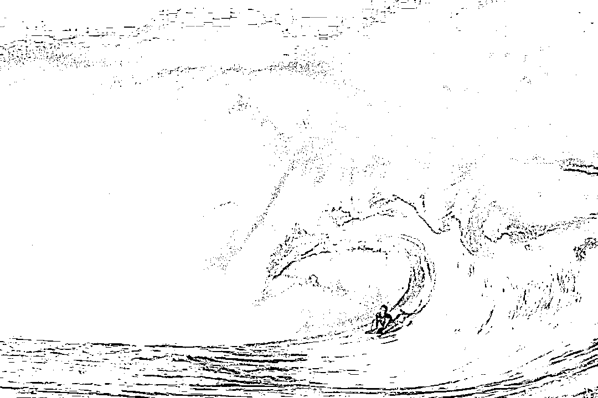

作者/大卫·瑞雷 若道占星创始人译者/若道翻译团队编辑/玫瑰 图片/pexels

在【[1](http://mp.weixin.qq.com/s?__biz=MzA5NjA0NTAxNg==&mid=2651465949&idx=2&sn=6e479c5393b524104ae9705b3bf9c77a&chksm=8b489a6abc3f137c26a7f691aea0a08e7a02ffb51a08ee3eb7f7752cd6131572a7838b16536e&scene=21#wechat_redirect)】、【[2](http://mp.weixin.qq.com/s?__biz=MzA5NjA0NTAxNg==&mid=2651466563&idx=2&sn=b50271ed6b07518a8ed498d7ad0eadbf&chksm=8b4899f4bc3f10e2b672ed67cb0832f2894a7003c79a7f59e1d4658cea3b63326e2b27255a90&scene=21#wechat_redirect)】、【[3](http://mp.weixin.qq.com/s?__biz=MzA5NjA0NTAxNg==&mid=2651467171&idx=2&sn=2f6933b622a755788b9dc2f6f86d7a8d&chksm=8b489f14bc3f1602e3829be83cafd5cc2353868cb5bb285ba59cc0365aec8ad9f7aa450c7ca5&scene=21#wechat_redirect)】、【[4](http://mp.weixin.qq.com/s?__biz=MzA5NjA0NTAxNg==&mid=2651467590&idx=2&sn=e74a113f1834c8cc87b137d161e04e8b&chksm=8b489df1bc3f14e7f32de77d50ce904ddf2a8dcb97f623d7465c7859cfc7b4665165648c95b0&scene=21#wechat_redirect)】四篇文章（点击链接可阅读）中，大卫老师详细地讲述了人本主义占星咨询同“算命”的不同。今天我们就来进一步了解一场人本主义占星咨询是如何开展的吧。另外，大卫老师参与授课的【[核心课程](http://mp.weixin.qq.com/s?__biz=MzA5NjA0NTAxNg==&mid=2651463523&idx=3&sn=019938f53a79cad4286a02eee12e56f2&chksm=8b48add4bc3f24c226dc436b0db23c55c33bb8d20c0b2ae7f1d669e5d144617206672de875b6&scene=21#wechat_redirect)】和【[双证书课程](http://mp.weixin.qq.com/s?__biz=MzA5NjA0NTAxNg==&mid=2651467034&idx=3&sn=689f3ae356f82b32acc0a7196d141619&chksm=8b489fadbc3f16bb0d74163ee098f8107c8eda43ce7c2d790b64980581003b90a4491221bff5&scene=21#wechat_redirect)】开启报名中，点击链接了解详情吧！

**评判是怎么形成的？****对客户保持一种不带评判的态度对你的占星咨询有什么帮助？**想一想。一个新客户跟我们一样，带着**不同程度的自我评价和羞耻感**进入对话。**这些“基于恐惧”的判断会使他们面临任何问题或决定变得更加困难。**基于恐惧的判断是我们对自己的一种基于情感的信念，这种信念在我们的童年和青少年时期得到了强化，我们都有。例如，假设你父母一方或双方每天检查你的家庭作业。像大多数父母一样，他们希望你在学校表现良好，期待你优异的学业带来一个安全、成功的生活。你还是个孩子的时候就习惯了。但是，每当你在作业中犯了错误，父母就会生气。也许他们试图告诉你，你做错了什么，但你仍然不明白。“你是怎么了？”你怎么这么笨？！”他们沮丧地说。你想问他们一个问题，但因为你倍感压力，所以没说清楚。“我不知道你在说什么？”他们说。“很简单！就这么做！”他们喊着，告诉你该怎么做。你不清楚他们是怎么得到这个答案的，但你知道他们认为你很蠢。他们不理解你的问题，或者更糟的是，他们忽略了你试图告诉他们的内容。所以你得到的信息是“你很蠢。我不理解你。不管你说什么都不重要。”更糟糕的是，考试时间到了！你带着一个低分回家。妈妈很生气。她非常生气，她复诵了对你的所有信念：“你是个白痴，你真的是！我真是不懂你。你明明知道答案！我给你得出了他们想要的答案！到底怎么回事？” 你睁大眼睛，惊慌失措，不知道该说什么。是的，你还记得考试时有多紧张，完全无法集中注意力——好像什么都不记得了。现在你无话可说。

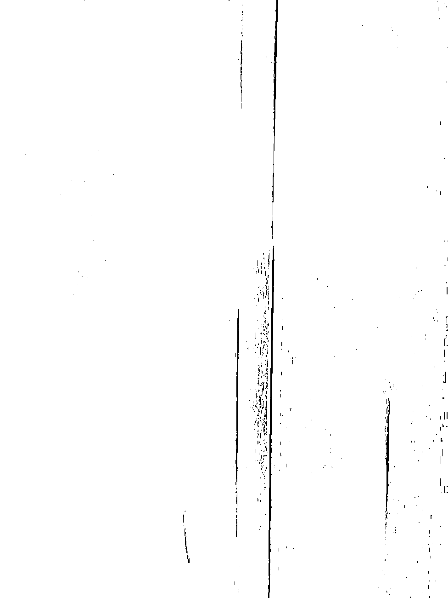

“没关系！”你妈妈说，“今晚没饭给你吃！”更糟的是，也许她或你爸爸还会打你屁股。对你来说，很可能的情感体验是“拒绝”，痛苦的拒绝伴随着惩罚而强化。想象一下，这种惯例几乎每周都重复，持续了好几年。你是如何相信自己的？我是一个白痴，没人理解我。没人对我说的话感兴趣。你的信念体系的公式是：“我会被拒绝，因为我不聪明。我会被拒绝，因为没有人能理解我。我会被拒绝，因为我没有什么有趣的东西可说。”你的焦虑根植于对拒绝的恐惧，这种拒绝是必然会发生的，因为你相信这是关于自己的真相。这只是导致心理学家所说的低自尊或低自我价值感的一个例子。然而，给自己贴上“自卑”的标签，只不过是在这个人已经对自己的评价之上加上的另一个标签。**人本主义占星咨询**现在，让我们假设——这是客户第一次来见“你”——占星师。不带评判的氛围会如何影响他们与你的咨询？让我们假设你——占星师在咨询开始前做了两件事： **·** 你已经阅读了你客户填写的信息表，上面列出了他们想要咨询你的原因。
**·** 你已经记住了客户的星图，即上升点、太阳、月亮、月亮交点的星座、宫位、度数，以及主要的相位，并研究了他们早期生活的重要趋势。(他们的星图如下。)

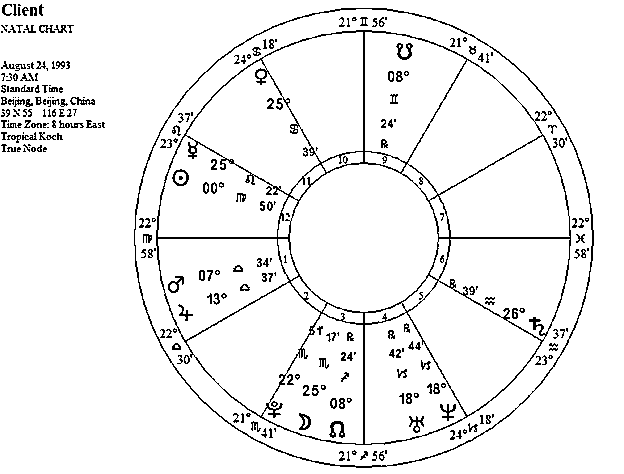

现在，当客户在你面前时，你可以看着他们，而不是反复地看他们的星图。这可以防止你躲在他们的星图后面，让你的客户知道“他们”才是你感兴趣和关注的中心。技术层面，你已经准备好了。现在放松下来。闭上眼睛，深呼吸。如果是一位新客户，请感受你的期待。你了解他们的星图，但除此之外，除了他们写下的问题和担忧，你什么都不知道。睁开你的眼睛，你准备好了。你的客户进来了，或者你打开电脑的摄像头。他们显得很紧张；这意味着这对他们很重要。他们不会因为好奇而咨询你，他们是认真的。

 也许你的客户一开始会闲聊几句。或者他们很安静，不知道该说什么。

占星师：“你在咨询表中提到，最近你的婚姻很艰难。”客户：“是的。”接着一阵沉默……

 占星师：“你的婚姻在过去的两年里是不是特别令人困惑？”（你问这个问题是因为海王星已经断断续续地行进在她的下降点快两年了。）

 客户：“是的，差不多。就好像我成了他生命中的一个鬼魂，或者他就是那个鬼魂。我不知道。”她看起来悲伤得无可救药。

 占星师：“你是否感到很幻灭？（你用了“幻灭”这个词，因为这是海王星的词，与她表现出来的整体感觉一致。)客户：“我想想？是啊，对一切都大失所望……”她看起来更沮丧了。

 占星师：“你看起来……非常悲伤。”（你是在回应她当时明显的感觉。)

 她哭起来。也许她只是哭了一会儿，也许她开始抽泣。不管怎样，你都给她空间让她放手，表达她的悲伤。你可以递给她一张纸巾，但你要耐心地、用心地等待。

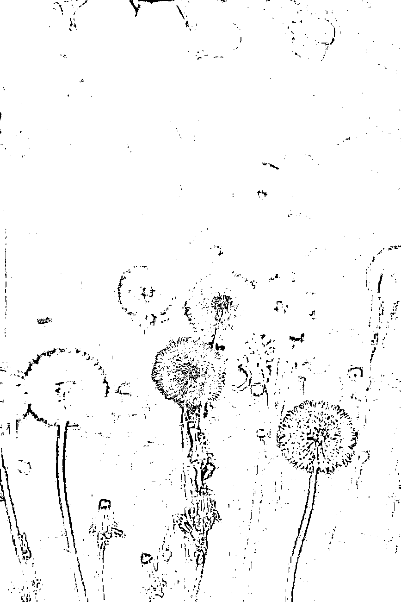

有时候，客户会抬头看着你……客户：“我很抱歉。”占星师：“没关系，不需要道歉。”客户：“那你觉得他会跟我离婚吗?”占星师：“我不知道。”（因为你真的无法确定。）“你还爱他吗？”客户：“是的……是的，我爱他。”占星师：“你还忠于你的婚姻吗？如果可以，你想让它成功吗?”客户：“是的。”占星师：“你觉得你丈夫也这么想吗？”客户：“我不知道，也许吧，我想是的。” 占星师：“好吧。你想知道你是怎么走到现在这步的吗？”客户：“我想，是的。” 占星师：“让我们看看我们能发现什么，也许会找到答案？也许答案已经在你心中，可以改变你的婚姻？这听起来像是你想知道的事情吗？”客户点点头说：“是的。” 占星师：“你今天的感觉和你最近的感觉——你以前有过类似的感觉吗？”客户：“也许没有现在那么糟。”“但是，是的，这种感觉在我的生活里，时断时续。” 占星师：“你记忆中最早的类似的感觉发生在什么时候？或许大概在 8 岁？（你知道年龄，是因为太阳弧冥王星与她本出生星图的太阳四分相，就在她的推进太阳四分她的月亮交点之后。） 客户：“是的，没错。我父亲在我七岁的时候失业了。我母亲悲痛欲绝。”**（未完待续）**

**版权声明：**原创文章由作者授权首发于若道平台，欢迎转发，反对抄袭。友号转载请申请白名单。

****想阅读更多作者的文章，请在后台回复******大卫****** 即可。****

**大卫·瑞雷**

美国占星师，若道联合创始人，致力于在中国教授和推广西方占星学；2010-2014 年，任全美占星师联盟监督委员会委员；2017 年，被选为 ISAR 委员会成员。ISAR 是世界最大的国际占星机构，会员遍布 45 个国家，2017-2020 年曾任 ISAR 全球副主席、CAPISAR（ISAR 职业占星师资质认证机构）主席。

**喜欢文章请长按下方二维码打赏****给大卫老师加杯咖啡呗~****▼**

**学习占星学****点击下图了解课程详情** 

**

********************************

**微信又双叒叕改版啦，不想错过若道君的推送？**
**就把若道设为星标吧！****▼**

**喜欢记得点一下在看哦☟**

**报名直达入口**

# 核心课程 L3-5 | 四位国际导师授课，教你花式玩转星图，掌握各类高阶技巧！

> 原文：[`mp.weixin.qq.com/s?__biz=MzA5NjA0NTAxNg==&mid=2651468131&idx=3&sn=db942097d7cf3289a035a127646eca3b&chksm=8b4883d4bc3f0ac2eb4953a9e98893747bc80a23b08291448e7d8ea35279a55adfa2a5f8bd69&scene=126&sessionid=1692737857#rd`](http://mp.weixin.qq.com/s?__biz=MzA5NjA0NTAxNg==&mid=2651468131&idx=3&sn=db942097d7cf3289a035a127646eca3b&chksm=8b4883d4bc3f0ac2eb4953a9e98893747bc80a23b08291448e7d8ea35279a55adfa2a5f8bd69&scene=126&sessionid=1692737857#rd)

若道占星是中国职业占星师的“黄埔军校”。至 2011 年若道成立以来以培养出上百位职业占星师，**若道核心课程体系是我们根据中国学生的学习习惯不断优化占星教学体系，让学员学成后更自如地应对本土咨询市场的需求。**

教授好占星学，不仅仅需要邀请一两位老师教学，更需要对教学难点有充分了解，且有持续的教学跟进服务。**10 多年来多次核心课程和各种专题课程的教学，让若道非常了解中国学生学习占星学的难点和卡点，合理有效地拆分、提炼课程知识点，同时也积累了丰富的国外老师和中国老师、助教（均通过 ISAR 认证）紧密配合以及课程顾问密切配合教学的经验。**

 2022 年，汇集顶级占星学大师资源和教学经验，结合占星学知识体系和不同老师的教学专长，我们首次推出由四位国际导师联合授课的若道核心课程。

本次有幸邀请到全球目前**权威资深**的**四位占星导师**联合授课

本次核心课的课程内容，根据每位老师多年来在占星学研究和教学中的专长领域分工，来为学员提供最好的学习体验和收获。

L3-5 是若道中高阶课程，适合已经掌握了十二星座基础知识的学员，本期线上 106 课时，每周四晚直播，错过直播的同学次日下午 2 点后可以通过课程回放补课温习，线下 3 个主题案例演示工作坊（共计 6 天，36 课时），配合线上知识点教学部分，更加方便解盘实操。

参加若道毕业认证考试后可申请入驻若道咨询平台，执业占星咨询。

**想了解自己是否适合这期课程可参加入学测试：**

1

**是哪四位国际导师执教？**

**大卫·瑞雷（David Railey）老师**是若道联合创始人，致力于在中国教授和推广西方占星学，十年来一直活跃在占星学教育前线，大卫老师深爱着他的中国占星学生们，不断根据中国学生的学习习惯优化核心课教学内容，本次课程中的**星座、行星、星图综合解读、行进、太阳弧、组合图、占星历史流派**等部分内容都是经过大卫老师不断淬炼的教学精华。

大卫老师对于**月亮交点**具有独树一帜的研究。2010 年，其著作《灵魂的目标》中文版出版，也是这个契机，大卫老师和蒋颖老师一起创办了若道占星学校。

大卫老师曾任 ISAR 全球副主席、CAPISAR（ISAR 职业占星师资质认证机构）主席，能向想要参加 ISAR 资质认证考试的占星学子传授最权威的经验。

**琳恩·贝尔（Lynn Bell）**老师研究心理占星学和家族模式数十年。对于占星学中的理论知识有着深刻独到的见解和专业的研究思路。

琳恩老师是法国心理占星学协会的会长。2016 年，获得查尔斯·哈维（Charles Harvey）杰出的**占星学服务奖**。

琳恩老师本次会抽丝剥茧地教授部分占星学基础知识，作为一个从多个层面进行工作的占星咨询大师，琳恩还会教授结合了心理学的观点的**职业占星咨询工作。**

2020 年琳恩老师在若道开设的 ISAR 选修课“太阳返照”课程中，学员们根据老师的技法体系和研究思路进行了小组研究和分享，思路顿开，收获满满。本次核心课中**太阳返照、月亮返照**部分将由琳恩老师教授。

**艾德里安·罗斯·邓肯（Adrian Ross Duncan）**老师是人本主义占星学、卜卦占星学和经世占星学领域的知名占星师。作为若道两次 ISAR 选修课“卜卦占星学”的主讲老师，**相位与行为模式、行星周期、行进、推进、进阶的预测技法**是邓肯老师特别擅长的领域。

**相位**是占星学习中的一个难点，也是占星学习的一个小分水岭，有经验丰富的老师教授带领非常重要，邓肯老师教学生动具体，对于**相位与行为模式**的研究非常深入，写作了大量的相关文章。若道独有的占星师养成计划中的研究小组助教还会带领大家吃透相位，帮助大家打下扎实的基础，为后续解读出生星图以及行进、推进做好准备。

邓肯老师对于时事和占星学的结合非常有研究，课程内容中的**行星周期、行进、推进、进阶预测技法**由邓肯老师主讲教学。

**克里斯蒂娜·罗登贝克（Christina Rodenbeck）**老师在牛津大学城生活和工作，深受周围知识和文化氛围影响，教学风格框架清晰且具有延展性。老师具有非常丰富的**亲密关系咨询**经验，在**比对图**领域也有诸多研究成果和教学经验。

现在正在授课的 ISAR 选修课“小行星”中，老师展现了对于神话学、心理学、占星学的深刻洞见，是集严谨与浪漫于一身的宝藏老师。

本次核心课程中克里斯蒂娜老师将按照她的教学理念教授**星座、宫位、行进、比对图、亲密关系咨询**等部分。

2

**在若道学习是怎样的感受？**

**来自参加课程学员的分享**

大卫老师是我最尊敬的老师，在我人生最低谷的时期，一次偶然的机会，我在网上第一次接触到了他的占星学，给了我很大的触动，那时候我没有系统的学习，但在心里种下了草，十年过去了，今年终于可以报名学习了，心里十分开心，想到明年五一左右还有线下活动，可以见到同学们和心中的神（大卫老师） ——学员 A

跟随大卫老师学习很有趣很开心，每次可以听到您的笑声。喜欢您有魔力的笑声。睿智帅气平和的老爷子。——学员 B

一丝不苟的输出和幽默的语言风格 带我打开了专业占星之门。老师的课非常生动有趣，老师也很可爱！听老师的课很轻松愉快，非常喜欢。不断地引领我走在人本主义占星学的道路上。——学员 C

林恩老师作为双子风格显著的特点，给我留下了深刻的印象，作为风象能量爆棚的我，听林恩老师的课，感受到思维风暴的洗礼，非常享受。——学员 H

首先要赞美克里斯蒂娜老师的课件配色 每次都超级美丽！她对天平座到双鱼座根据季节的讲解和配图给我留下了很深的层层递进印象，很多疑惑都能在老师的解读中豁然开朗，非常棒。——学员 R

克里斯蒂娜是水象能量明显的老师，给我很不一样的感觉，我星盘中水象能量偏少，让我看到水象能量的表达方式的不同。——学员 NX

3

**L3-L5 课程具体安排**

***L3 *******课程安排 直播+现场案例演示工作坊****

*   **线上直播课程：**2022 年 1 月 6 日开课，每周四晚上 20:00-22:00 上课。共 15 次课，30 课时。

*   **北京现场工作坊：**2022 年 4 月 30 日、5 月 1 日。2 天，12 课时，9:30-17:30（午休 2 小时）

***L4 *******课程安排 直播+现场案例演示工作坊****

*   **线上直播课程：**2022 年 5 月 12 日开课，每周四晚上 20:00-22:00 上课；共 10 次课，20 课时。

*   **北京现场工作坊：**2022 年 7 月 30 日、31 日，共 2 天；12 课时，9:30-17:30（午休 2 小时）。

***L5 *******课程安排 直播+现场案例演示工作坊****

*   **线上直播课程：**2022 年 8 月 11 日开课，每周四晚上 20:00-22:00 上课；共 28 次课 ，56 课时。

*   **北京现场工作坊：**2023 年 4 月 8 日、9 日，共 2 天；12 课时，9:30-17:30（午休 2 小时）。

4

**课程价格**

****L3-5 价格：4**5000 元 **

**优惠价：35000 元（获取方式请添加课程顾问咨询）**

*   **温馨提示：**报名课程时请仔细查看勾选的《教学协议》，如有疑问请咨询课程顾问 Margaret 老师。

*   **联系方式：**微信添加 Nodoor233

长按二维码添加 Margaret 咨询

5

**退转课程**

*   **退款原则请详看《教学协议》，如有疑问请咨询课程顾问。**

****名师汇集金牌核心课程 L3-5****

**授课老师：**琳恩·贝尔、艾德里安·罗斯·邓肯、克里斯蒂娜·罗登贝克、大卫·瑞雷

**授课时间：**2022 年 1 月 6 日起

**授课方式：**网络课程**，**英文授课，中文翻译

**费用：**45000 元**（优惠价：35000 元，获取方式请添加课程顾问咨询）**

**课程负责人：****Margaret**（微信号：nodoor233，请备注“核心课”）

长按二维码添加课程负责人咨询~

****报名请点击“阅读原文”****

# 来呀！敢让火星点燃你的激情吗？丨这五种火星式的关系，你属于哪一种？（值得收藏）

> 原文：[`mp.weixin.qq.com/s?__biz=MzA5NjA0NTAxNg==&mid=2651468131&idx=1&sn=954c44d65187bd91f8bfe769d0125a44&chksm=8b4883d4bc3f0ac2a1661d8a9bb1795aca832eb435bef6b9d2523ef4321cce35868b5d8593be&scene=126&sessionid=1692737857#rd`](http://mp.weixin.qq.com/s?__biz=MzA5NjA0NTAxNg==&mid=2651468131&idx=1&sn=954c44d65187bd91f8bfe769d0125a44&chksm=8b4883d4bc3f0ac2a1661d8a9bb1795aca832eb435bef6b9d2523ef4321cce35868b5d8593be&scene=126&sessionid=1692737857#rd)

☆****************后台回复“今日”，给你一句生命态度****************

作者/艾德里安·邓肯

译者/Luke 校对/江艺 

编辑/翀子 封面/书君 图片/网络

星图上的火星象征我们的生存能力，它点燃激情和欲望，也关乎性能量的表达，更推动我们获得成就。星图中火星与不同行星形成相位时，都代表什么意涵？这是邓肯老师撰写的一篇精彩文章，而他也是若道[【核心课】](http://mp.weixin.qq.com/s?__biz=MjM5MjQwNjAyMQ==&mid=2649439143&idx=1&sn=beb31d9a276053325cbf8bf6a6757f97&chksm=beb954cd89cedddb774f462d3b1144dd060e58145e25764b81d4f81816fb4a4e295aaca33baa&scene=21#wechat_redirect)的授课老师哦（点击查看详情）~
**火星：生存本能**

尽管内行星和太阳、月亮，代表内在的状态，它们紧密互动，构成了自我的基本能量，**火星——作为地球外的第一颗行星——是一股向外的驱力，与环境强有力地互动。**

**它与基本的生存本能有关，战斗还是逃跑，赢还是死。**火星在哪里，麻烦就跟到哪里。

**火星是纯粹的动态能量，**尽管它可以被疏导，但其本质是原始力量。既可以有建设性，也可以非常有破坏性。**它点燃了激情和欲望的火焰，并依照着适者生存的原则行动。**

**如果火星太弱，**那么这个人会回避冲突，遭遇抵抗时放弃，用扭曲的方式表达攻击性。**如果火星太强**，那么这个人会毫无顾忌地欺压别人，让每一次会面都变成冲突。

然而，**火星的能量对于成就是必须的，无论是物质还是精神成就......有效地驾驭火星是成功的秘诀。**

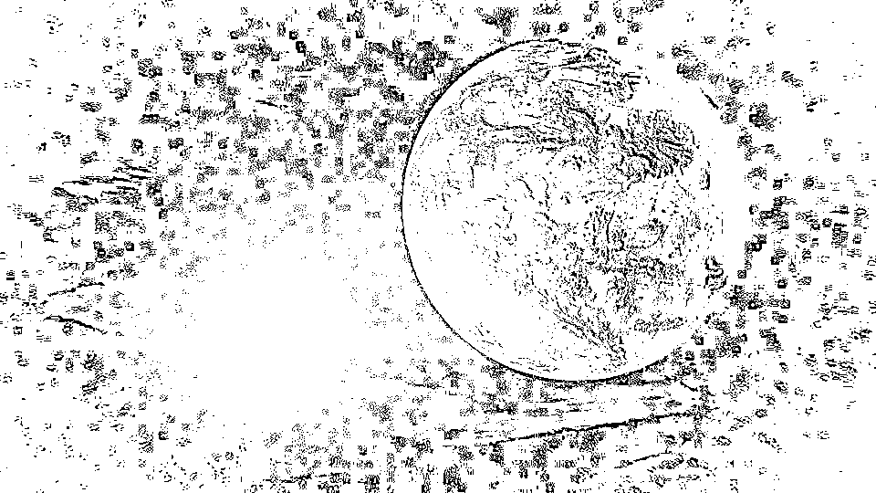

**男人的火星与女人的火星**

**对于一个男人，火星是他身份认同的核心。**最典型的时刻是他和其他男孩在学校运动场内或场外的战斗......无论是赢是输，赢了以后有什么反应，输了以后什么反应。

**火星反映了他和男性角色交往的经历，比如他的父亲，尤其他的兄弟。火星的星座和宫位反映了这些角色表现如何，以及对这个儿童的男性自我形象产生了什么影响。**

父亲是个妻管严，还是个独裁者？他会显露情绪吗......他展示的是愤怒，还是眼泪？是否有一位哥哥/弟弟？他是善良和友好的，还是残酷或嫉妒的？

**当谈到性能量的表达，火星是个关键角色，无论对男性还是女性。**如果你要在咨商中处理困难的火星相位，你就不得不谈到性的话题，往往还涉及到不少细节。否则你还不如不谈火星的话题。

即使作为一个 70%的客户为女性的男性占星师，我发现这并不像最初想象的那么困难（事实上相对于女性，男性谈论性话题更勉强）。

**火星相关的行为会导致性方面的特定后果，**当这些后果被识别出，好奇心就取代了羞怯，客户会想要知道如何改善。如果一段关系在性的方面不起作用，那么至少在中年以前，关系都存在危险。

因此，不提供帮助和建议是不负责任的。如果占星师和客户性别不同，那么就有一个提供建议的独特机会，是客户无法从其他地方得到的。

**一位坚持明确的伦理原则，不与客户牵扯不清的占星师，可以轻易地传达这些建议，并且赢得客户的信任。**

如果占星师或客户对这个话题感觉不舒服，那么也有办法在不深入探究私人细节的前提下处理这个问题，**那就是从关系的内在感受入手，**这样客户就可以保守秘密。

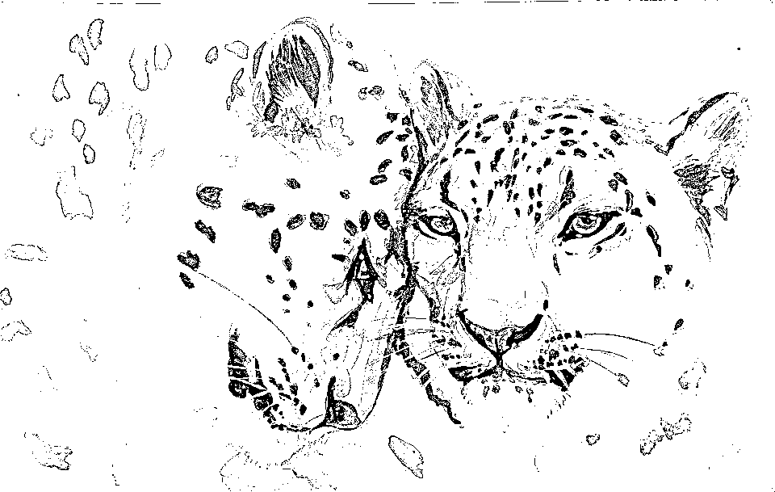

**火星的落点和相位清楚地指出性的偏好。**对于女性而言，火星也清楚地表明哪种男人有吸引力，以及与那个男人之间会有什么样的经历。

**文化的影响力意味着女性被鼓励去发展金星代表的特质**——有吸引力、可爱——**而男性被鼓励去发展火星代表的特质**——有竞争力和强硬。（有趣的是，社会在美容产业上的开销和军备开销差不多）。

因为这些文化上的成见，咨商时**可以通过男性星图中的金星看出他们和女性相处的体验，通过女性星图上的火星描述她们与男性相处的经历。**

**但是最终，男人和女人都必须平等地接纳两颗行星的能量，否则他们将无法影响性和爱的发展。**投射始终是一种盲目的形式。

随着进入 21 世纪，今天很多男人和他们火星的关系都不佳。显然生于二十世纪 40 年代至 70 年代的男人发展出了更温和的生存方式——他们对搅动越南的约翰·韦恩的刻板形象感到尴尬，又经历了 70 年代的性革命（天王星和冥王星行进天秤座）。

尽管这是政治正确的，却在随后的关系中引发了其自身的问题。在我的咨商实践中，女性客户常常抱怨男人没有给她们足够抵抗，让自己在关系中被她支配。

**与火星关系良好意味着能够划定底线，表明立场，能够坚持自己认为对的事情，以及对觉得错误的事情说不。而且不在乎是否得到对方的许可。**

**在咨询中解读火星**

咨商中处理火星是非常令人满足的体验，因为客户可轻易识别出火星的表现，也因为在心理上，转化火星能量比其他行星要简单一些。

**火星直接与行动、行为和意志有关，**因此不需要引发强烈的心理转化就能实现改变，尽管它有时也有帮助。**通常只要列出不同种类的火星行为引发的后果，就足以使客户产生改变。**

当一个有**火星-冥王星相位**的女性了解到，她的投射最终使她的男性伴侣，无论多么强壮，都变得懦弱，她就会明白改变行为是符合她的利益的。

当一个有**火星-土星**相位的男人认识到成为工作狂不利于性生活，他也就有动机去改变。**火星对训练项目的反应很好。**

**火星有关的问题是被表达为愤怒，以及必然导致的沮丧。**进一步的问题可表现为**性功能障碍**，以及倾向于在私人和职业关系中**支配别人和被别人支配**。

**对女性来说，**良好的火星表现为，她们与男性相处舒服，可以扮演女人的角色，不感到被支配。她们可以在世界上走自己的道路，拥有健康的欲望和追逐它们的能量。

**对于男人来说，**良好的火星表现为他不畏惧竞争，不抱怨，可以克服生命中的阻力而不放弃。**果断、勇气、和英勇是火星的标志。**

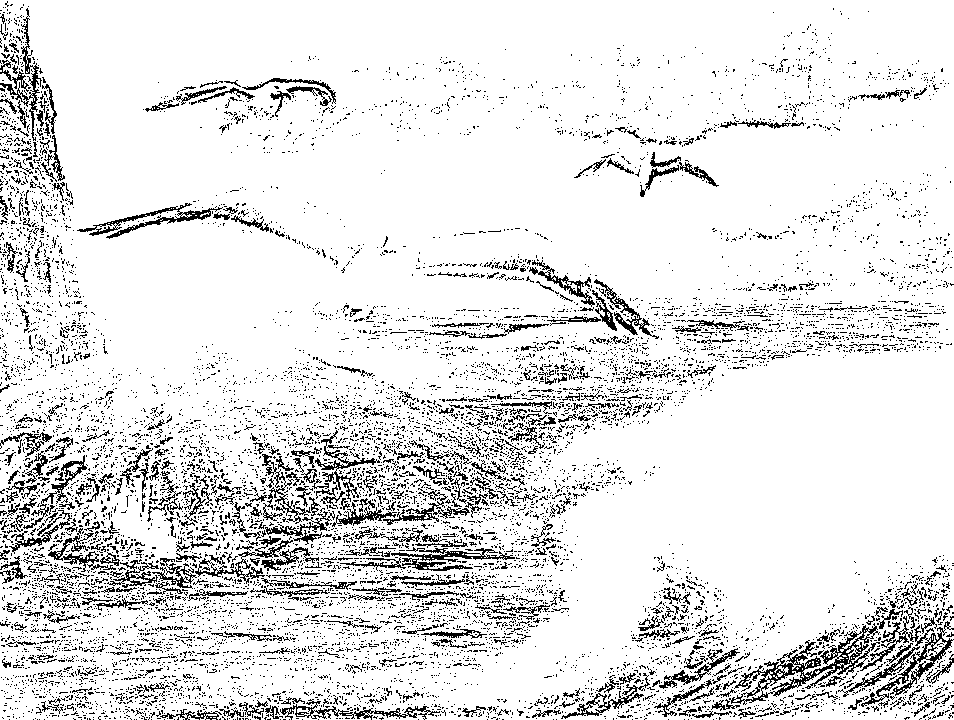

**火星与木星：学习取胜**

**这两颗行星的组合通常带来充足的男子气概，表现为渴望做到最好、追求出类拔萃，以及成为正确的一方。**

**对于四分相、对分相和合相，**求胜心占据了主导地位，常常导致自以为是的行为，需要不计代价地占据上风。他们**很少考虑他人的感受**，这是因为用于阐明观点或达成欲望的能量过于强烈，妨碍了接收对方的回应。

**火星-木星人士非常直言不讳**，他们认为这样做是在帮别人的忙。

咨商中，占星师很快就能觉察到这点，因为客户对收到的信息表现出已经非常了解的样子。尽管极其渴望了解真相，热切地追求知识和智慧，**火星-木星客户在智力上从来不愿居于人后，他们错误地假设展示无知就是展示软弱**。

他们有能力发展出强大的智慧，**但他们的弱点是，因为缺乏接受力，无法充分发挥自己的潜力。**

咨商中，他们感觉处于不利地位，因为占星师显然掌握了客户所没有的知识。他们自然的反应是想给占星师挑错，他们会寻找占星师解读出错的证据。

由于咨商的艺术是很难掌握的，占星师无知的证据很快就会浮现。他们会毫不犹豫地告知占星师出错了，并给出类似**“我就知道”“你没告诉我什么新东西”**的评论，让占星师感到非常尴尬。

当占星师发现这类行为时，关键是不要变得有防御性。**火星-木星客户的惯常做法，是将人置于不利地位**。**正是由于这个原因，必须直接面对客户。**

明智地提问，会揭露出**这些客户早年曾被万事通的哥哥、父亲或老师所打压。**父亲常常宣扬他深信的政治、社会或理性的本质。

**火星-木星儿童必须发展出同样强度的想法和信念，以在家中维护自身。**他习惯于制造尽可能强烈的印象，以传达自己的观点。他也可能通过粗野的游戏、竞争、欺压、冒险行为来夸张地表现男子气概。**赢是最重要的。**

**因此，有这个相位的男孩和女孩都会发展出过于强势的行为。**

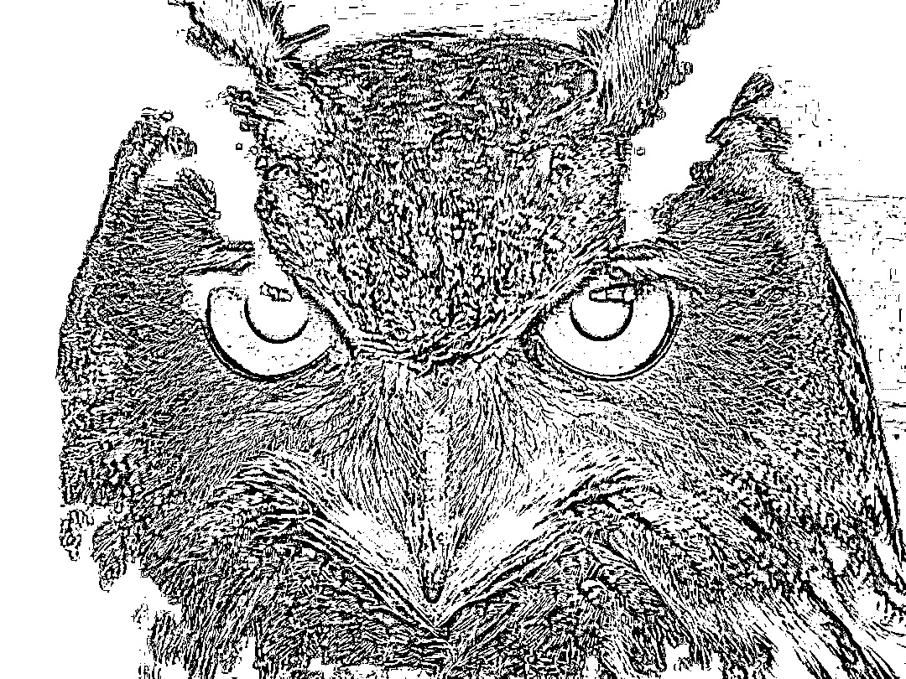

**一个有此相位的女性，倾向于受一个强势的男性吸引，**她欣赏对方的男子气概和聪明才智。然而，**随着关系发展，她会发现她厌倦了这个男人武断的作风和自以为是的态度。**

她常常向占星师抱怨他在“制定法律”，还说她不再尊重她从前钦佩的那些品质。这个男人不像她认为的那样聪明......不......事实上有证据显示她比他知道得更多；他充满了虚张声势。

从男士的角度来看，他无法理解一开始吸引她的智慧想法和强烈意见，现在似乎只让她反感。**实际上发生的事是，这位男士依然和以前一样，但是这位女士从他那里吸收了观点和意见，发展她自己的火星-木星特质。**

**这个相位通常有着相当强的性欲，**尽管没理由认为这是个问题，除非伴侣恰好是敏感和浪漫的类型，渴望诱惑的艺术。

**当一个男人的伴侣有火星-木星相位时**，他常常感到被这位女士的性欲所威胁。一些累垮的男人，会暂时失去对性的欲望。

**有这个相位的男人常常把自己当作花花公子，不只在一个伴侣那里寻找满足。**尽管人们对知识或政治问题充满了道德上的愤慨，但在性领域的道德拘束却几乎不存在。到处拈花惹草的大学教授，就是一个火星-木星的原型。

在咨商中，占星师必须准备好和客户做智力上的缠斗，否则会失去客户的尊重。然而，没有必要展开冗长的讨论 ——尽管客户喜欢那种氛围。**最好是利用客户的智慧，用于解决已经出现的问题。**

如果当前的关系，已经退化到争论和自以为是的地步，那么客户在其中起到了什么作用呢？如果客户是这样的无所不知，他/她会提出什么建议呢？**如果火星-木星能量引导不善，结果是无休止的争论。**

必须挑战客户，让他看清问题的源头，然后采取行动。

**火星-木星人士适合过一种挑战和冒险的生活，充满了竞争和智力上的挑战。让他们承认自己怀有傲慢的优越感，相信自己是正确而别人是错误的，会有宣泄作用。**

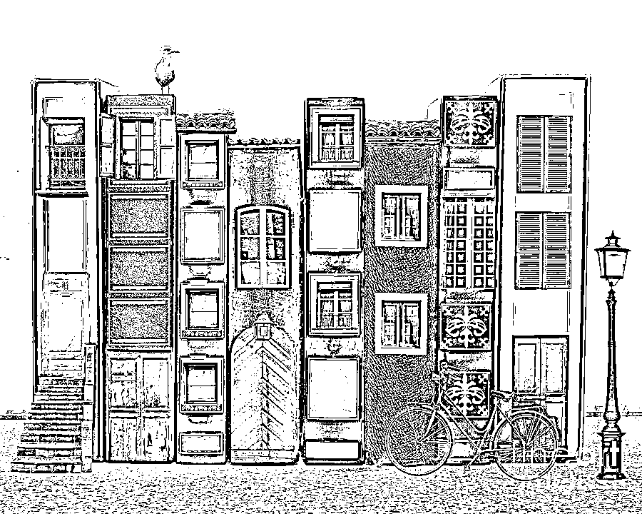

**火星与土星：艰难的跋涉**

**有这个行星组合的人通常工作努力、尽职尽责，发展出巨大的决心和意志，有着惊人的自我否定的能力。**

这就好像土星的缰绳被用来拴住火星的野马，因此激情和欲望都没有了燃料。**尽管努力追求长期目标，对成功的期望却很低。**

**火星-土星人士倾向于努力工作而非聪明地工作，**他们不明白为什么同龄人似乎如此轻易地取得成功，然而他们多年的努力却产生如此微薄的成果。

当遇到阻力——**他们常常遇到阻力，会顽强地站稳脚跟**。然而一次又一次，他们被打败。**这更增添了他们力排万难的感觉。**

**在所有行星相位中，火星-土星相位最有可能指示儿童期遭遇了实际的身体暴力。**最近的法律，比如在瑞典，规定殴打儿童是违法的。但这无法阻止其他同样残忍的拘束方法被应用。

**无论何种环境，这个孩子都可能经受某种严格的管教，通常是通过父亲，有时是哥哥或其他男性权威人士。**这些孩子早年就发展出了身体的盔甲，常常能够在心理上从身体感官中抽离出来。

他们的身体受到钢铁意志的支配，常常使得火星-土星人士在以后的人生中开始健身。**这在一定程度上加强了发展身体盔甲的需要，但至少也带来了对身体更有意识的益处。**

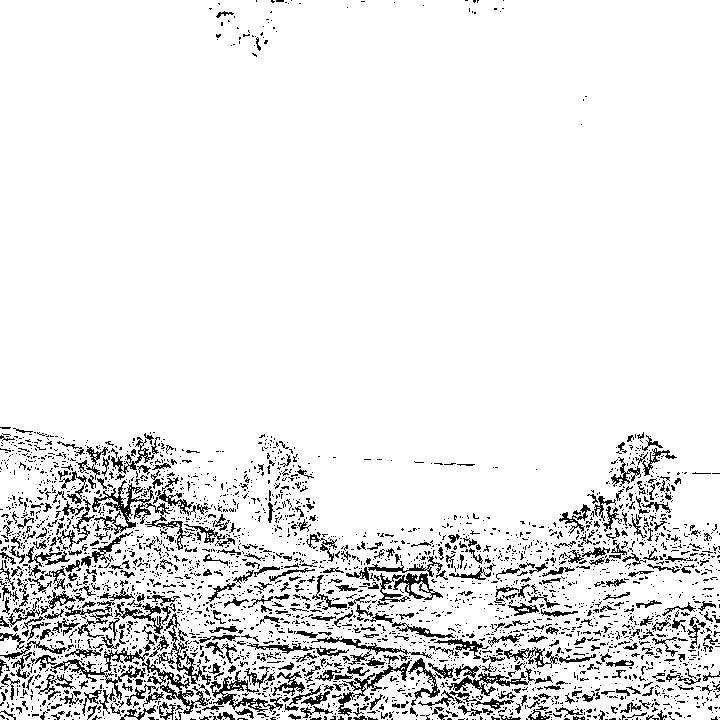

**正是与身体的这种关系，导致许多火星-土星客户抱怨性挫折**。常见的情况是，随着关系稳定下来趋于长期发展，这些客户就几乎放弃了性生活。

当被问到他们多久做爱一次时，他们常常说如果有的话，大约一个月一次。他们常常声称这是因为他们工作太努力，太劳累了，这可能是真的。

**火星-土星能量意味着性兴奋是一个缓慢的过程**，每当这个人想起过去的失败经历，这个过程往往就中止了。奇怪的是，**有这个相位的男人**可能与他们女性伴侣的性节奏更加同步，起步慢，但过程持久。不过，这个相位的男人不喜欢成为身体欲望的奴隶，更喜欢保持节制。

**有这个相位的女性，**兴奋较慢，对性欲有着复杂的感情，讨厌被男人支配，常常发现性还未真正开始就已经结束。除非她能告知和指点这个男人，关于她自身的慢节奏，以及如何使她兴奋起来，否则性挫败感会持续多年。

如果她能迈出这一步，男人将非常乐意听从她的指示。然而，有一系列因素不利于改变这个模式。在她还是女孩的时候，几乎可以肯定的是，她经历过一些男人——兄弟、父亲、德国老师——**这些男人如果不是彻头彻尾的暴力，也是无情而专制的。**

**对男性权威的恐惧和怨恨将发展起来。**一个有长期性障碍的女性必须首先自问，她是否容许这种怨恨影响随后的关系，因为在卧室中，只有她有权力去给予和保留。

在咨商中，火星-土星女性常常抱怨丈夫阳痿或对性不感兴趣。原因是，那个男性的自我不能忍受性拒绝，与其让自己遭到拒绝，这个男人宁愿更多工作，放弃房事。

**另一个因素是，身体盔甲使得来自身体的感受减弱。**很长的前戏，大量的按摩和安慰非常重要。为了恢复关系中的性满足感，关键是火星-土星女性鼓励男性伴侣相信他的吸引力，就像她也需要保证一样。

**火星-土星男性**应该克服他对表现不佳的担忧，与伴侣分享他对阳痿的恐惧，这样他们可以一起克服问题。一本好的指南比什么都强——谈论性问题是解决它们的第一步。

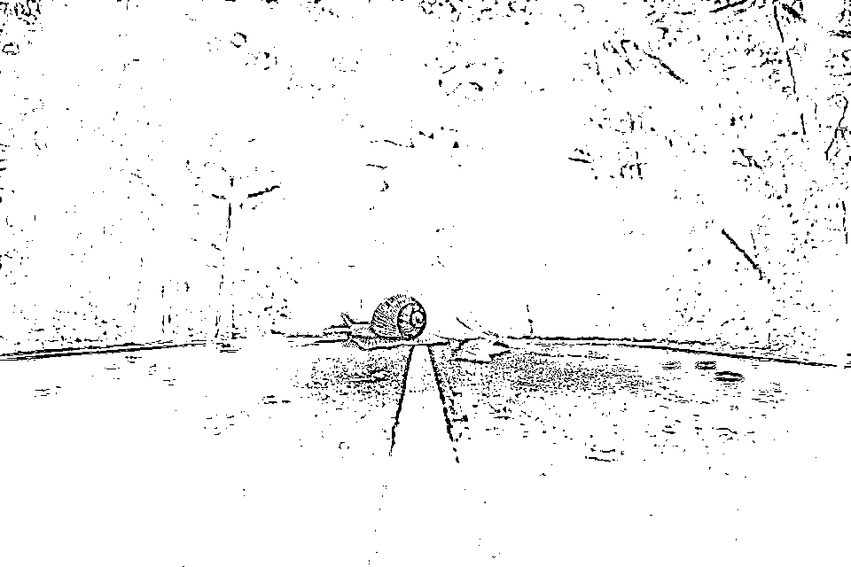

困难火星和土星相位的挑战，不只在于个人关系。**在工作中，这些人倾向于吸引那些奴役他们的工作——常常是一份非常消耗身体的工作。**

对他们来说，很难打破枷锁、去追求他们真正想要的，但这并非不可能。**他们常常处于别人对他们行使权力的境地**，这是他们真正怨恨的......而且这种怨恨会表露出来。

如果客户抱怨权威，那么他们可能在重复儿童期一个旧的剧本，他们使用的防御技巧只会使情况恶化。**如果这个剧本可以被识别出，那么当前吸引专制上级的行为就可以被改变。**

土星人士适合从事有挑战性和要求高的职位，其中需要长时间的艰苦工作。雄心壮志永远是一个主要因素。**对他们有宣泄作用的是承认自己憎恨权威，更多受到对失败的恐惧所驱动，而不是对成功渴望。**

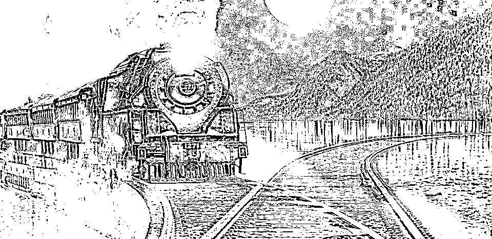

**火星与天王星：出奇制胜**

**火星与天王星之间的相位，赋予了电力和魅力十足的气场，惊人的活力，以及在极端压力下行动的能力。**

在生活单调乏味时，这些人无精打采。但是当节奏加快，他们又进入了状态。因此当需要巅峰表演时，他们进入设计师的状态。但当平淡度日时，他们变得焦躁不安和不可预测。

有种感觉，任何事都可能发生在这些人身上......你永远不能确定他们接下来会做什么。**他们的行动往往非常突然，当机会出现时，总是做好了出击的准备。**尽管他们通常情况下控制得很好，但在外表下常常潜藏着**爆发性的愤怒**，增加了他们的**不可预测性**。

**这些人喜欢按自己的方式做事，几乎不能忍受服从命令。**长远来看他们很难掩饰这点，所以如果他们处于难熬的工作或关系中，可能会忍受一段时间，但如果超过他们可承受的限度，他们就会毫无预警地离开。在这时，让他们改变主意可能已经为时已晚。

这种**危险的冲动性**，可能意味着他们的成长过程中有着太多的变动，以至于难以规划出连贯的人生道路。**他们对兴奋的需要，**常常意味着大量的长途旅行，尤其是拥有对分相的人。**他们很擅长解决问题**，但不善于行政管理。

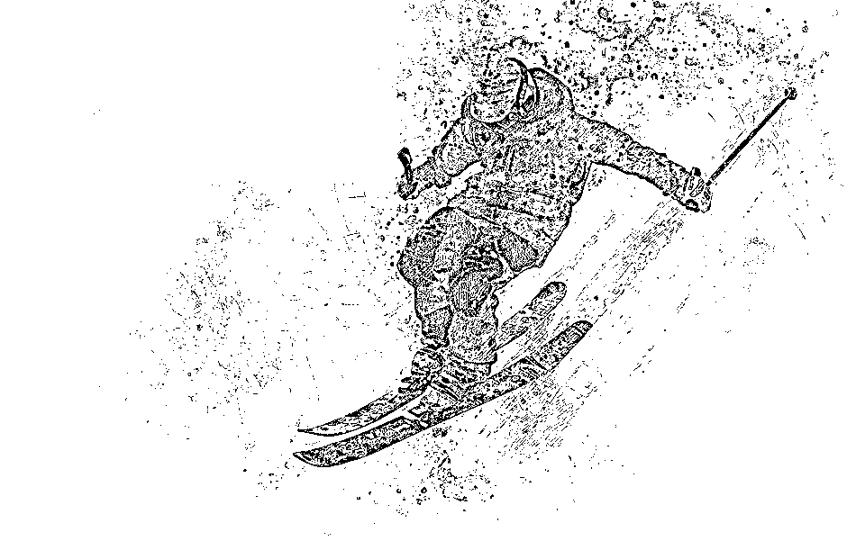

**在关系中，这种对兴奋的需求，意味着可能作出冲动的举止，动摇关系的稳定。**他们容易突然受到情欲的吸引，尤其在有异国情调的地方。

**在亲密生活中，这些人很容易兴奋，**这对于女性是有利的，她们不喜欢冗长的前戏，但对男性却不是如此。这些人有些奇怪的癖好，喜欢在不同寻常的地方发生关系，追求自发性，甚至危险的感觉。

**因为天王星带有强烈理性和抽象精神**，因此会倾向于将性从身体层面带到理论层面，赋予实验性的喜好。

**一个有此相位的女性，很少受社交圈中的传统男性吸引。**她常常会选择种族、文化、宗教等方面存在巨大的差异的关系。**这样的话，关系似乎总能保持新鲜和有挑战性。**然而，即使在这种情况下，无聊感也会悄然而至。

**火星-天王星女性**常常抱怨男性伴侣的暴力和不可预测的行为，但这常常是因为她真的很会惹事生非。如果一切看起来舒适和安定，她也会捅一捅那个男人，只为了营造一种兴奋的气氛，因为这才是关系对她的意义所在。

**因为这个相位带来近乎疯狂的无所畏惧，所以可能引发非常危险的情境。**

人们常常说，感觉火星-天王星人士随时可以展开一场说走就走的旅行。打个比方，就好像他们的手提箱总是装得满满的。**这创造了一种不确定性的气氛，不利于和谐友爱的关系。**

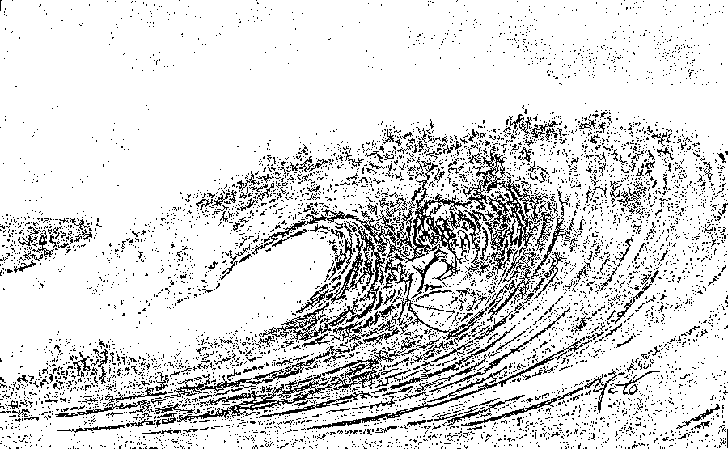

威胁是真实存在的，因为**当气氛变得紧张，火星-天王星人士的策略是起身就走，**避免当场爆发。通常这种行为可以追溯到**儿童期极其焦虑的情境**。

一位客户给我讲述了和她父亲生活在一起是什么感觉。这位父亲没有任何明显的原因就会突然冲过去打她，只是因为她之前做了某些淘气的事。**无论男性还是女性，与专横的权威人士对抗，都会在非常年幼的时候就显现出反叛的个性。**

**火星-天王星人士是非常叛逆的，**很可能与别人说的话反着来，**脱离既定和常规轨道。**

他们用挑衅回应权威人士，就好像是在说他们不害怕惩罚......这会导致他们受到相当多的惩罚。可能有其他关键事件，如突发的动荡或意外，给神经系统带来永久的冲击。

**事件的任意发展使人迷失方向，使此人懂得对任何紧急情况都需要快速反应。**

**为了在关系中获得幸福，有这个相位的女性应该认清，她们说的和做的哪些事让男性伴侣分心和愤怒，并理解其中的核心原因。**如果她们埋怨伴侣的不可预测或愤怒，那么值得重构场景，以阐明客户真实的行为。

**有这个相位的男人必须理解，他们的作风让伴侣感到紧张和害怕，不可预测性的威胁是不公正的策略。**

**火星-天王星人士适合刺激和有挑战性的工作，其中赋予他们自由和旅行的机会，并与传统的生活背道而驰。**对他们有宣泄作用的是让他们承认自己毫无必要惹是生非，他们因为不成熟的反社会行为而选择过一种局外人的生活。

**火星与海王星：欲望和悲伤**

**火星和海王星之间有相位的人，通常有很强的社会动机，想要为了更大的善而工作。**

然而，他们常常被强烈的欲望引入歧途，使得意志和道德遭到侵蚀。尽管这些欲望可能在年轻时带来了巨大的苦恼，**但随着灵性修炼的过程，之后往往发展出纯洁和克制的生活。**

事实上，这是唯一的道路。**他们很有创造性，有丰富的想象力，能够制造梦想，然后实现它们。**这些人有一种**温柔和敏感**的性格，使他们**回避争端和竞争。**

相较于其他，这个相位更可能带来**物质滥用**，无论是本人，还是亲近的家庭成员身上。当然，早期嗑药的经历，会打开知觉的大门，使火星-海王星人士**对不可言喻和充满魔力的事物深深着迷。**

同样，这也带来性方面的成瘾，像追求圣杯那样，渴望完美的性经验，致使此人卷入各种不道德的关系纠葛中。然而，**无论多少欲望得到满足，仍然存在挥之不去的不满足感**——“这就是全部了吗？” 

火星-海王星人士受色情文学和电影吸引，然而这种兴趣可能是有理由的，但同样的动力也适用......彩虹的尽头一定有魔法，但他们永远也不能抵达。

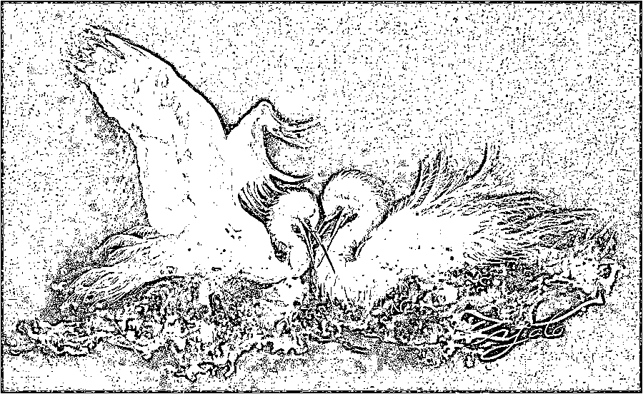

**一个有此相位的女性，**偶尔会抱怨伴侣酗酒或滥用药物。事实上，她经历的一系列关系可能都是如此。原因之一是**她们受到可以被“拯救”的男性吸引**。另一个原因是，火星-海王星的女性，**对男人抱有过高的期望，以至于不可能感到满足**。

在几个月的相处后，这个男人的魔力——他的创造力，艺术天赋，音乐能力等等——褪去了，而他的臭袜子和看似诡诈的天性接管了一切。起初的陶醉后，有种显而易见的失望，这个男人没能满足梦想。**这种失望可能引起之后行为的改变。**

比如说，这个男人知道他让伴侣失望，所以借酒浇愁。解决方案不是责备他饮酒，而是让火星-海王星女性**识别和改变那些让他确信他在她眼中是失败者的信号。**

潜在的物质滥用者其实是火星-海王星客户。对关系动力学的分析常常揭示他们**放纵的目的，是试图重现早先如梦似幻的感觉。**

另一个常见的抱怨是不忠。常常令人惊讶的是，火星-海王星女性发现，在她不知道的情况下，男人已经多年对她不忠。原因之一是性。

**火星-海王星讨厌例行公事的性，喜欢诱惑。**但是在稳定的关系中，甚至诱惑也会变成例行公事。在性关系中，火星-海王星女性所做的一系列的事，**长期来看可能引起了伴侣的不忠。**她在性行为中可能有强烈的幻想，其中却不包括这个男人。

这些幻想应该分享，否则这个男人无意识地感到被疏远。火星-海王星客户在做爱中也非常体贴，常常在她不是真的想要时也同意有性，使得性失去了魔力。**她必须在她想要时同意，不想要时坚定地拒绝。**

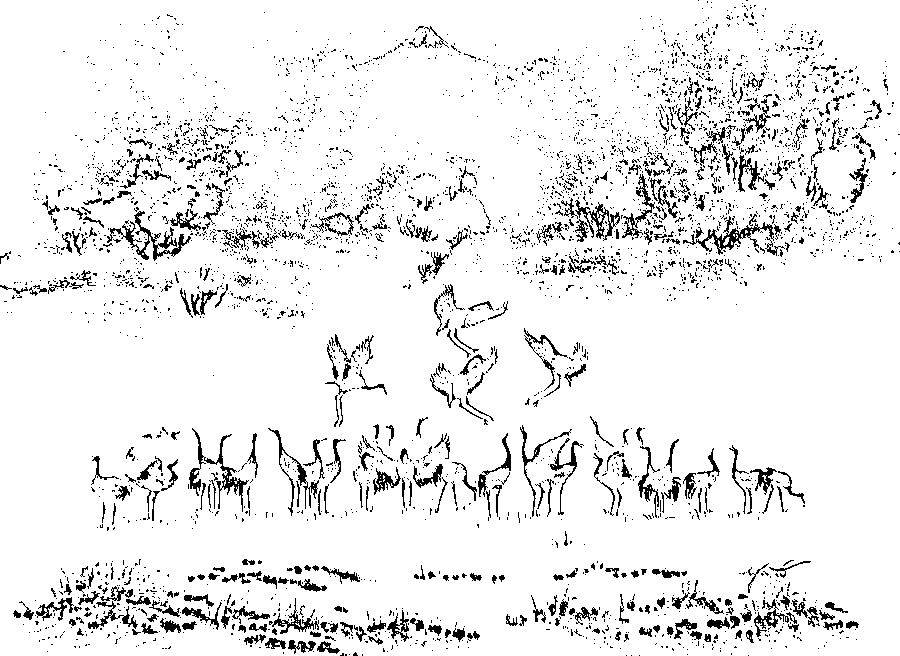

**常常发生的是，童年时一些重要的男性角色表现出某种根本性的软弱，暗中削弱了火星-海王星人士对男性和男子气概的信心。**

在占据支配地位的妻子面前，父亲常常表现出软弱。父亲与孩子分享眼泪和悲伤。父亲和孩子之间可能也分享一些不合适的个人问题，甚至是性挫折。

火星-海王星因此**习惯了这种软弱**，并期待以后也能看到它。这可以解释火星-海王星女性客户为什么常常抱怨她的伴侣是懦弱无用的。首先，她受一个**性情敏感**的男性吸引；之后，她用**完美主义**的眼光关注他，放大了他的弱点。

**火星-海王星的男性，投射要少得多；戏剧主要发生在内心。**除了纠缠不清的道德和性问题拖延了进步以外，他也发现**很难融入一个充满侵略和竞争的男性世界。**

日常工作让他疲惫，职场的快乐也捉摸不定，**除非这个男人能找到一个让他追逐理想和发挥创造力的领域。**广告业和媒体业是理想的游乐场，特别是因为这些行业所经营的无形资产，可能有也可能没有实际价值。

**火星-海王星也有真正的疗愈天赋，当应用到政治领域，可以产生关怀疾苦的社会良知。**

在咨商中，**理清性和欺骗议题、成瘾行为和道德困境**是有好处的，尤其当客户看起来在这些方面是别人的受害者。

**某种层面上，正是客户的某些行为，引发了这些不想要的结果。**这些行为——当被辨识出来——就可以被改变。

**不切实际的梦想需要被驱逐：**没有完美的男人，性永远不能把你送到天堂。没有努力和奉献，就没有通往成功的道路。

**火星-海王星人士适合从事符合他们的理想，需要发挥创造力的职业，并找到一位能够分享想象力的伴侣。让他们面对内心的肮脏、不道德的秘密幻想，对意志欲望的屈从，会有宣泄作用。**

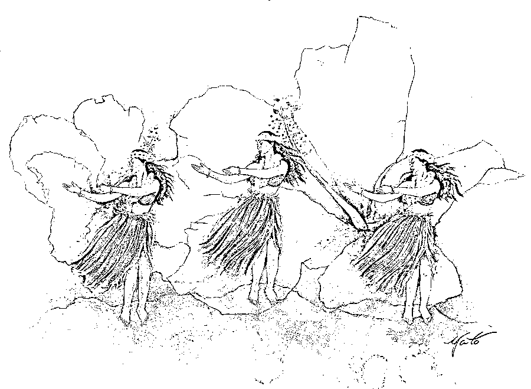

**火星与冥王星： 力量和无力**

**有这一行星组合的人，对别人有巨大的影响力，但通常自己没有察觉。**他们尊重力量，憎恨懦弱，并且有力量克服恐惧，投身长期战争，以转化那些他们相信需要改变的情境。

内心里他们臣服于许多无名的恐惧，外在他们表现得强硬和相当吓人。**他们散发出一种控制的气场，**一种黑暗的磁场，使人臣服于它的魔咒之下。

火星-冥王星客户不尊重犹豫不决和懦弱的占星师。如果遇到这种情况，**他们很快就会建立控制权**，切断了从咨商中获得益处的可能性。占星师有必要克服恐惧，作出大胆的声明，哪怕错了也没关系，而不是小心翼翼地试探信息。

**这些客户生性多疑，**想要获得你是个行家的确凿证据。**必须以力量对抗力量**。由于火星-冥王星客户有非常深的焦虑，**建立控制是让他们感到安全的一种方式。**在一对一的咨商中**他们试图强加自己的意愿。**

咨商中缺少经验的占星师会忧心忡忡地试图证明自己的价值，结果最后感到精疲力尽。火星-冥王星客户离开时心理防线没有被打破，但也没有取得任何进展。

**解决办法是，准确描述这个相位的表现及其后果，**因为它们是如此极端，以至于火星-冥王星人士可以轻易地识别，并生出改变的强烈动机。

**火星-冥王星人士害怕失去控制，**花费如此多的能量维持控制，以至于把自己弄得精疲力竭，却感觉仍然受到不可预测性的摆布。

为了生活下去你必须信任：电梯不会塌下去，你不会被抢劫，你的朋友不会诈骗你，出租车司机不会撞车。**火星-冥王星人士常常谋划生活，以至于付出的信任越少越好，然后将大量的能量花费在这种监视和控制上。**

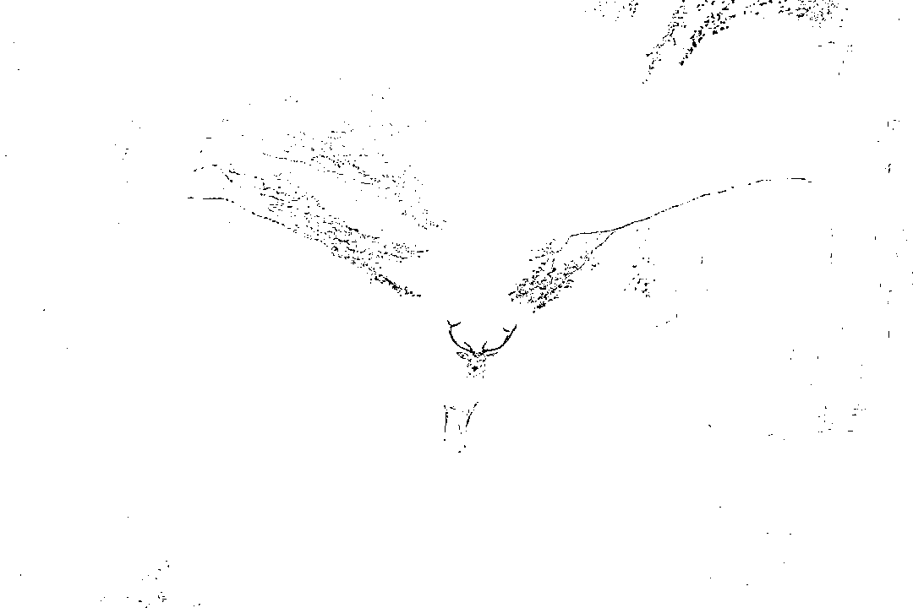

**拥有困难火星-冥王星相位的女性**一次又一次地讲述同样的故事。她受一个**神秘和有权势**的男人吸引，这个人似乎能**给她的生活提供某种保护**。

随着关系的发展，她被他暴露出来的弱点和缺陷吸引住了。**她指示他如何提高**，这样就不用那么担心他了。这是一个**左右为难的情境**。

如果他改变了，她会认为他软弱，从而失去信心。如果他不改变，她会生他的气，并在心理上折磨他（对经历这个过程的伴侣的建议是：抗拒改变——维护你的自尊！）

最终结果是一段时间后，这个女性失去了对他的尊重。她不仅视他为软弱，而且认为他可悲。他不仅要乞求她的怜悯，还得谄媚奉承（她因此恨他）。另一种可能性是，这个男人确实很强大，但是也很独裁，然后关系堕落成一长串的侮辱。

这种**对失去控制和被人支配的恐惧**，也影响了性生活。**有这个相位的男人被性驱动。**矛盾的是，对性能力的深度焦虑，驱动他们一直要求性。

一个有着强烈火星-冥王星相位的男人一天做爱三次并不罕见，还会想象他这种种马一样的行为是对伴侣梦想的回应。

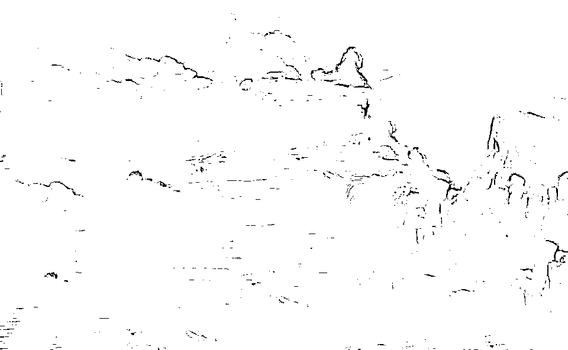

在我的实践中，有几次巧合，火星-冥王星相位的男人和他的女性伴侣都成为了我的客户。这位女性认为他伴侣的性需求是强制和令人疲惫的。更准确地说，她指出伴侣的性能力是毋庸置疑的，但性生活表现得像个机器人，让她感觉在和一个机器做爱。

**有这个相位的女性也有深度的性需求，但很难臣服于它们。**她常常发起性行为，如果事情不按计划进行，她会指导伴侣具体做什么。

这又是一个左右为难的情境，因为如果他容许自己被指导，性对她就失去了魔力。**性可能涉及某种屈辱，或有关控制的游戏。**根本问题是为了达到高潮必须要有臣服，而**臣服是火星-冥王星最恐惧的。**

性执迷必然带来的后果——**嫉妒。**火星-冥王星男人尤其充满了嫉妒，想象其他男人都跟自己一样执迷于性。**这种嫉妒完全是隐藏的，因为揭露它就等于暴露弱点。**

在极端的案例下，这个男人会跟踪伴侣，或雇人做这件事。与此同时这个男人有极其诡秘的行为，伴侣没有办法弄清楚他在花时间干什么。

有这个相位的女人常常声称她的男性伴侣充满嫉妒，在极端情况下她会被这个男人跟踪——尽管有火星-冥王星相位的并不是他！ 

**原因有三重：**首先，她不和这个男人分享自己在做什么，保持行踪隐蔽，**因此激起了他的怀疑。**

其次火星-冥王星在女性星图中，就像金星-冥王星在男性星图里一样，**不尊重人与人之间天然存在的气场空间。**她接近男人，建立身体接触，而且确实对他们有深刻的心理洞察。**这种不合适的过分亲密激发了她伴侣的疑心。**

最后，**一个嫉妒的男人也是一个可以被控制的男人。**

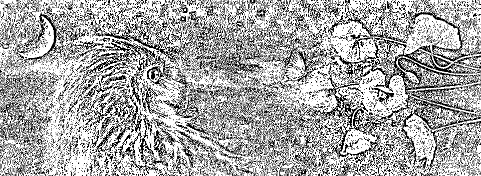

**这种对控制的需求来自哪里？在儿童期，可能存在和父亲、兄弟（如果有的话）或其他关键男性角色有关的极端情境。**

常常有同父异母或同母异父的哥哥弟弟的家庭背景，而嫉妒和他们有关。有时候一位哥哥恐吓儿童，常常还发生了侵犯性边界的事件。

这些事件可能发生在早期阶段，尤其和如厕训练有关，那里发生了意志的争战和随后的羞辱。在餐桌上也可能发生持续的争斗，父母因各种原因，试图把意志强加给儿童。

无论是什么情况，都会唤起深深的焦虑，之后火星-冥王星人士的行为仅仅是为了减轻这些焦虑。**他们决心不让任何一个人有权力控制他们，这意味着他们最后要控制别人。**

**在职业生涯中，这些人常常与千人一面的强权纠缠不清，**比如公司、工会、警察、税务机关，就好像他们被剥夺权力的最糟糕的噩梦注定要成真。他们有时可以在这些机构中推动改革，但也常常被他们碾碎。

问题是，**这些有权势的人被魔鬼化了**——结果是火星-冥王星人士在和这些强大的力量打一场注定会输的战争。

**火星-冥王星的能量是非常有转化力的——在咨商中很有机会完全改变与之关联的行为。**当客户认识到焦虑的根源在于实际发生的事件，施加控制的努力会适得其反，**行为的源头是内在的恐惧，然后他们就会想要改变。**

当他们意识到自己行为对别人的影响时，尤其在亲密关系中，他们就会感到恐惧，常常自发地改变。他们常常受心理治疗的吸引，并能从中受益。

**火星-冥王星适合从事行使实权的工作，需要冷酷无情或调查能力。让他们承认自己操纵别人，玩权力游戏，重演适者生存的原始戏码而不在乎别人的感情，会有宣泄作用。**

**版权声明：**本文由若道翻译发布，欢迎转发，反对抄袭。友号转载请申请白名单。

**艾德里安·罗斯·邓肯**

若道签约老师，哥本哈根占星学院院长 1985 年开始成为全职占星师，是人本主义占星、卜卦占星和经世占星学领域的知名占星师。开发了占星软件 AstroClock 和多款占星报告。**学习占星学****点击下图了解课程详情** 

**

********************************

**微信又双叒叕改版啦，不想错过若道君的推送？**

**就把若道设为星标吧！**

**▼**

**喜欢记得点一下在看哦☟**

************报名直达入口************

# 无法获得幸福？也许是你大脑在起“反作用力” | 认知占星学眼里的世界

> 原文：[`mp.weixin.qq.com/s?__biz=MzA5NjA0NTAxNg==&mid=2651468070&idx=1&sn=fb8b7f052d9db07b69eee2aefccf6ce2&chksm=8b488391bc3f0a87913e1e6133fdac375f5550d3aa12ace51a855112edad0fe5a8c0bc8133e7&scene=126&sessionid=1692737857#rd`](http://mp.weixin.qq.com/s?__biz=MzA5NjA0NTAxNg==&mid=2651468070&idx=1&sn=fb8b7f052d9db07b69eee2aefccf6ce2&chksm=8b488391bc3f0a87913e1e6133fdac375f5550d3aa12ace51a855112edad0fe5a8c0bc8133e7&scene=126&sessionid=1692737857#rd)

**☆ 后台回复“今日”，给你一句生命态度 **

作者/格伦·佩里 译者/若道翻译团队
  编辑/玫瑰 封面/书君 图片/pexels

你听说过认知占星学吗？这种学说认为，每种情感背后都有隐藏的认知。不仅是对现实的自发反映，也是习惯性思维模式的结果，并且通常处于无意识层面。一起来了解一下吧。另外，作者格伦老师授课的【[心理占星学双证课程](http://mp.weixin.qq.com/s?__biz=MjM5MjQwNjAyMQ==&mid=2649439143&idx=2&sn=e4ded255f749312d6b976afa517ccd5c&chksm=beb954cd89cedddbee5b95b4b2651f734281d9363aca09665b04abcf5b428a44779dd67bca0d&scene=21#wechat_redirect)】报名中，点击链接了解更多详情哦。

**认知占星学**

**每个星座都构成了一种特定的情感类型，驱使行星按照情感所传达的需求来行动。行动从情感那里获得动力，而情感传递着需求信息。**

每种情感背后都有一种隐藏的认知。20 世纪后期心理学的一大标志就是认识到**情感不仅仅是对现实的自发反映，也是习惯性思维模式的结果，并且通常处于无意识层面**。

个体体会到什么样的情感，取决于他们是如何解读事件的，而不是取决于事件本身。也就是说：**不是事件本身，而是我们解读事件的方式，决定了我们的感受。**因为**情感控制我们的行为，所以我们赋予事件的意涵直接影响着我们的行为。**

认知科学是心理学的一个分支，向我们呈现与以成长和适应为目的的信息的习得、保持和使用相关的理论。我们需要**区分“认知”的层级、形式和方式，抛弃“思考即认知”的观点，甚至抛弃认知的主要方式**。

占星学中的每颗行星都构成一种特定的认知方式——**直觉、感受、经验观察、识别、分析、美感、抽象推理、全面觉察、超能力等**。

同样，**每颗行星都擅长某一特定领域的知识**。火星了解生存、水星是语言专家、太阳懂得表演、土星知道如何按层级组织信息、海王星是梦境方面的权威。

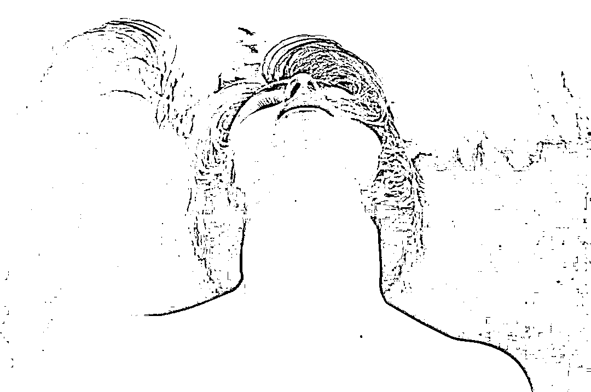

**建构主义**

虽然传统认识论的基础是，**假设有一个客观宇宙独立存在于观察者的视角之外（客观主义）**，但是，目前认知科学的思想被称为**“建构主义”**，**强调认识中的积极（参与）过程。**建构主义假定，**对现实的所有陈述在根本上都是关于观察者的陈述**。

**个人共同建构（co-constructs）现实**，这就是建构主义的核心意涵。“co-constructs”的前缀“co”（共同）意味着**可能有一个真实的客观世界，影响着我们的想法和感受，但是我们永远都不可能直接了解它**。

我们只能**通过个人现实理论的观念滤镜来了解它**。

相应地，我们**对外在现实的认知也不可避免地受到自我先入之见的影响**。建构主义认为，**各种有机的认知结构会以某种相似的方式演变**。

在每种情况下，筛选程序在反复试验中进行。**从行动中获得的经验变成假说，反过来指导进一步的行动**。在特定的环境中，虽然**有一个超越建构的世界，对于在特定环境中什么会“起作用”设定一些约束。**

比如不管我们怎么“建构”，也不可能在水上行走，但是我们有**无数种看待世界的方式，每种方式都有自己的情感、行为和体验结果。**

**“验证性偏见”（confirmatory bias），指的是为了“符合”我们的记忆、预想和期待而歪曲事实。**个体会**有选择性地关注那些能证实自我偏见的信息，忽略或扭曲那些威胁到自我偏见的信息。**

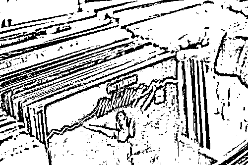

这种认知模式是一种心智特性，其主要任务是**整理感官持续吸收的大量信息**。亲身经历会帮助形成一些假设，指导进一步行动。**人类通过将熟悉的类别（图式）投射到不熟悉的具体事件中，来维持体验的秩序。**

这种习惯性的反应可以**节约时间和能量**，毕竟个体在不同的环境背景（宫位）中，比如工作、玩乐、家庭、学校、婚姻等，必须做出很多复杂行动。

我们有必要去**忽略那些和已经整理好的认知模式不符合的信息或数据，认为它们不相关，或扭曲它们，迫使它们与组织好的模式一致。**这样，**意识就不是客观现实的被动反映，相反，它会根据自己的本质去塑造外在刺激物**。

心灵是一种有机的决定性力量，可以独立改变从外部获得的信息，并将这些信息转化成熟悉的意义类别。

**人类其实是具身理论或“故事”**。爱泼斯坦（Epstein，1980 年）指出，**人们必须有一个存在的理论，否则他们就会觉得在遭遇混乱**。对现实的固有的理论指导着个体的行为，这种理论的一部分包含了**自我理论和世界理论**。

**自我理论包括对主要假设和次要假设的层级安排。**主要假设是有关自我的宽泛的、包容性的信念，比如：“我是一个好人”。从此展开，则有更低层级的假设，比如“我是一名好的占星师”，这里还包含着更低层级信念，比如“我擅长理解冥王星”。

类似地，**一世界理论包含对他人和外在条件信念的层级安排**。一个人完整的具身理论包含无数假设，与这两种理论（自我理论和世界理论）如何互动有关。

当然，**一个人对自己的看法不会与他对世界的看法脱离**。自我概念和世界概念很大程度上能互相反映。一个负面的自我观念，比如“我是没有价值的”，将会反映在相应的世界观念中，比如“人们都排斥我”。

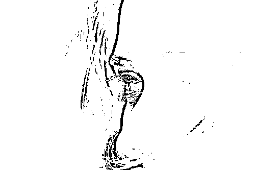

**童年的重要性**

人们固有的现实理论并不一定是有意识的。意义的建构开始于婴儿期，并持续终生，不管我们是否意识到。**在情感上对我们很重要的经历会形成一些观念，帮助我们组织和指导未来的行为。**

这些观念构成总体上的宽泛假设，并将之后的体验吸收进来。从占星学来说，**这些观念的最好象征是相位配置，它能同时描述外在体验的世界和它的内在灵性表现。**

**儿童会从强烈的情感经历中进行不恰当的归纳**。他们认为**“以后一直会发生这样的事”，或“我一无是处”，**因为他们的**概念能力有限，经历也有限。**儿童天生是**自我中心**的，所以会倾向于**认为自己需要为发生在自己身上的一切负责**。

如果一个三岁小孩的父母决定离婚，然后父亲搬出去了，孩子会想：“爸爸之所以离开是因为他不爱我”，或者“爸爸离开了，因为我一团糟。”

孩子对自己的照顾者有着天真的信任，所以问题就变得复杂。孩子认为，**他们被对待的方式就是他们值得被对待的方式**。

即使这种对待是虐待性的，孩子也倾向于相信**他们只值得被虐待**，因为至少这样，他们还有可能**通过改变自己的行为来换取其他的结果**。孩子要想感到安全，就需要**相信大人都是好人，并且相信可以通过做合宜的事情来控制大人的反应。**

对于孩子来说，认为父母只是简单地失去控制了，他们刻薄、邪恶，自己做什么也改变不了现状，这种想法是非常恐怖的。

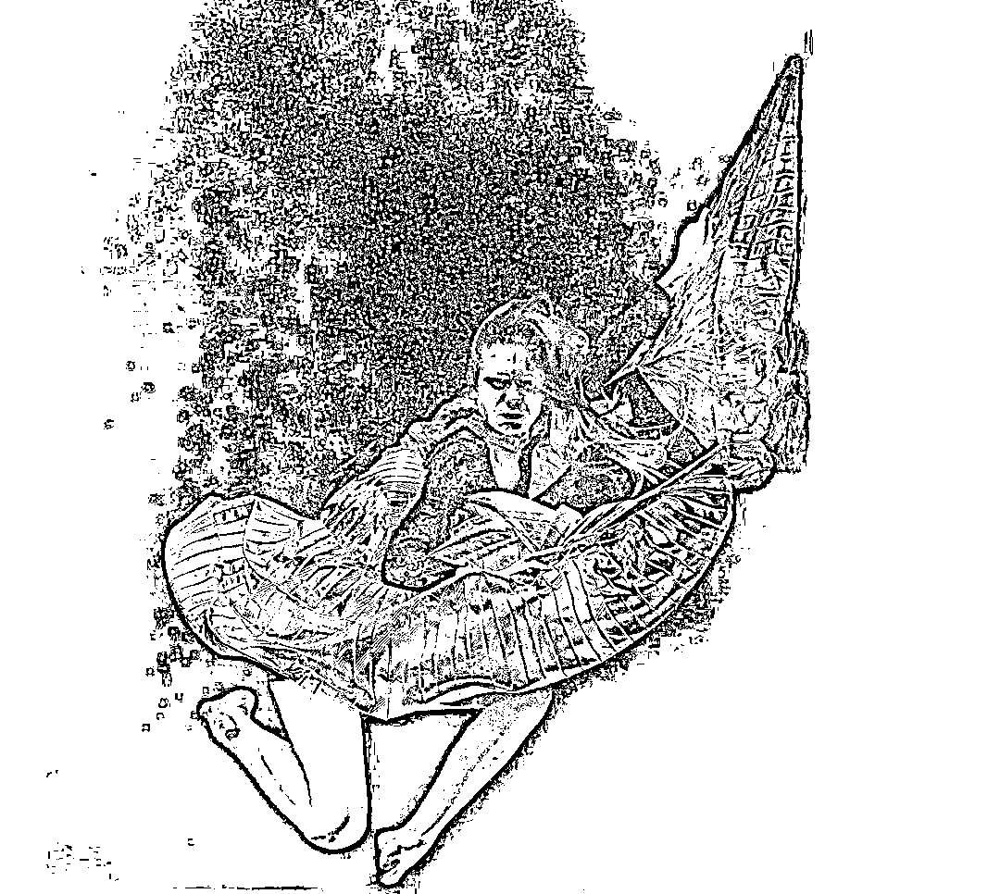

**情绪激动的经历中所产生的信念**是具有指示性的，也就是说，这些信念具有**广泛的普适性**，规定你**在未来如何行动才能获得愉悦和痛苦的最大平衡，确保获得认可，维持最佳的自尊水平。这样的信念形成得越早，隐藏的创伤越重，就越容易变得固执**。

不可避免地，孩子会以自我中心、特异的方式去理解自己的经历，因为他们不具有更为灵活、抽象的心智能力。他们倾向于将有限的经历过度泛化，因为对他们来说，这些经历并不是有限的，这就是一切。

在理想的情况中，当我们长大时，会发展出**更加灵活的规则和信念。**我们会学到，**在不同的背景下，相同的行为可能是“好”的，也可能是“坏”的**。我们会认识到，**有时候有必要去打破规则，服务于更高的原则。**

但是，**从反复出现的、创伤性的情境中发展出来的信念，仍然会倾向于保持简单、固定和原始的形式。在这些领域，存在某种发育停滞或“固著”。**

**选择性地关注某些信息来证实自己的偏见，这种倾向也被称为主动认识、前馈或偏见预期。**人们会活跃地参与到自己的知识习得中。人们不是被动地吸收相关经历，而是去**寻求预期的“具身理论”，不断地扫描环境，去获取证实预期的信息**。

这种信息就像食物或燃料，让理论继续“活着”。因为**这些理论就是一个人本身，所以，它是活着的**。个体是一个**具身的、进化的、理论的结构**，是一个**活着的故事**，**积极地吸取验证性信息的养料，以延续其存在。**

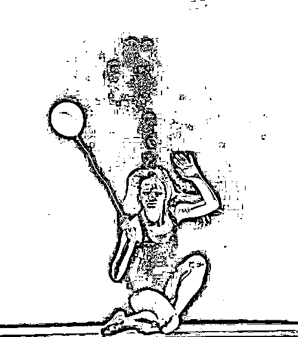

“反馈”指的是任何提供个体行为结果信息的体验，但是**“前馈”却主动地预测那些结果，渴望它们、寻求它们，最终招致了它们。**

也许月亮四分天王星的女性会无意识地相信，她所依靠的所有人最终都会翻脸不认人。这种信念如此固著，让她很难再以其他方式去看待（或者甚至是想象）自己被对待的方式。

然而，她不能完全阻止自己去渴求亲近。无意识中，她害怕自己会孤独终老，所以当她陷入感情中时，就会表现得**冷漠、疏远、被动。**

就像被车前灯照射的鹿，她在预期灾难，她在害怕她所预期的事物，而这必然会影响她的行为。

伴侣的任何行为，即使只是有一丁点符合她的预期，比如瞥了一眼别处、迟到、关注别的事情，都会被她解读成一种证据，证明她的预期即将发生：**拒绝**。所以她**切断自己的感情，在伴侣做出更多伤害之前，突然疏远他。**

客观地来看，在了解她的预期过后，她的行为很好理解：**自己在情感上依赖的人突然冰冷地中断了对自己的关怀**。因为这个核心信念是她在很小的时候理解世界的方式，所以它是具有适应性的。

但是，现在**她对拒绝的预期太强了，已经影响了伴侣的实际情况，伴侣感觉被拒绝了**。她表现得好像拒绝已经发生了，从而招致了这样的情况。

有时候这被称为**“投射性认同”**，即**在别人身上引发自己预期（投射）的行为。**她才是那个以冰冷的、突然的方式行动，并隔断情感的人。

她的伴侣认为她的行为非常不公平，觉得很受伤，所以他采取了**防御性的回应**。对于她的突然改变，伴侣感到困惑，以为她不再在乎自己。于是他**抽离**了，**实现了她最初的预期。**

**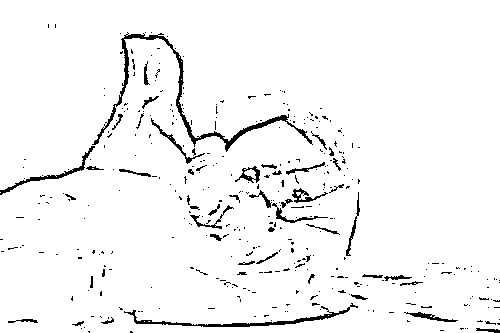**

他的行为是对她的行为的回应，而她的行为也是对他的行为的回应（还记得吗，他向别处瞥了一眼）。

在不经意间，她让自己的恐惧成了自我实现的预言。**她的回应影响了他，让他的行为方式有可能符合她的预期，让她害怕的结果更可能发生**。

最后他体会到了拒绝的冲动，但这其实是他的**防御**。因为他也有一个故事，通过他自己的行为投射出来，并导致它发生。

这样的关系系统密切交织在一起。双方的故事融入彼此熟悉的模式中，经常让我们无法分辨是谁的故事先开始，不知道是“鸡生蛋，还是蛋生鸡”。

**自我理论和世界理论合在一起，构成了一个人的个人现实理论，代表其全部的概念体系。**这个理论有 3 个基本功能：

*   吸收经验信息；

*   通过满足需求的行为方式，来保持愉悦和痛苦的适当平衡；

*   增强自尊。

为了达到这些目的，个体将有选择地关注那些能证实自己理论的信息，歪曲或忽略那些不能证实他们理论的信息。这样，人们选择了周遭环境（伴侣、老板、朋友）的某些特点，并将其融入一个预先存在的故事中，一个似乎有生命的故事。

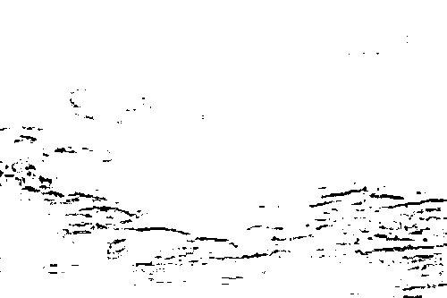

**等效性或结构决定论**

**比起环境，一个人看待环境的方式对其行为的影响更大**，这是如何发生的？需求满足的策略被心灵中的一种“主导特质”（steering property）所控制，即**等效性**。

简单来说，等效性（拉丁语 aequus，平等的；finis，结果、目标）指的是**行为的最终（final）结果基本都是相同的，或等同的，不管环境因素如何。**

这意味着，**即使外在环境不同，人们的行为方式也是一致的**。例如，一个海王星在第 7 宫的女性，连续嫁给了 3 个酗酒的丈夫，她对待他们的方式也几乎相同。虽然男士和婚姻不同，但是她的选择、行为和之后的经历都是一样的，或等同的。

等效性意味着，**不可能单纯基于初始条件（外部环境），对一个人的行为做出决定论式的预测。**系统参数比初始环境重要，输入受到了自我系统的影响而发生变化。

例如，这位海王星在第 7 宫的女性可能会嫁给一个本来清醒的男性，但却像对待酗酒者那样对待他。她甚至会鼓动他去喝酒。

因为系统是原来就是活跃的，而不仅仅是对外在刺激的反应，所以**外在刺激无法造成某种行为，只能和自主的系统合作**。这样，**相似的结果——行为，可能发生在不同的初始环境中。**

等效性意味着，**系统的一端落在思维中，它调节其内部运作。**系统最根本的目标是**简单地做自己，即保持自己的组织并存活下来**。外在行为的表现依附于更加持久的内部程序。

马图拉纳（Maturana）和瓦雷拉（Varela）（1980 年）将这描述成**“结构决定论”**。**生物系统是自主的，因为它们不是被外力“引起”或“指导”的。**

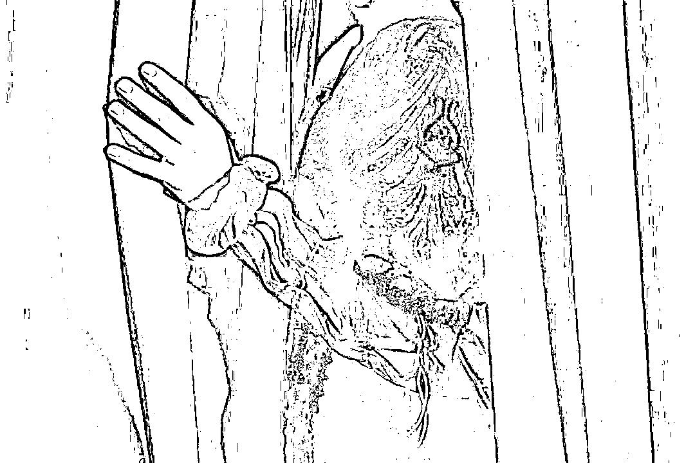

系统的结构模式决定了其本质和行为。从星图中，我们很容易看到这一点。星图中存在一个由无数相位模式构成的**动力结构**。**这个结构的组织决定了个体独立于外部环境的认知和行为。**

等效性也意味着，**不同结果可能来源自相同的初始条件**。例如，两个住在相同国家的政客，一个人的月亮在双鱼座第 9 宫，三分在巨蟹座第 1 宫的木星。

他具有深深的同情心，也对未来充满希望（比起现实主义者，他更是一个理想主义者）。他被选举出来通过政府福利项目进行扶贫，这是一个传统的自由民主党成员。散播财富！关怀人民！

另外一个政客是典型的保守派共和党人，可能有土星在金牛座第 9 宫，与第 2 宫的冥王星形成梅花相。他被选举出来减少税收，降低浪费的、不负责任的支出，而这曾造成国家预算危机。

**版权声明：**本文由若道翻译发布，欢迎转发，反对抄袭。友号转载请申请白名单。

**格伦·佩里**

若道签约老师，著名占星师，前 ISAR 董事会成员，共出版 8 本占星著作；心理/意识研究专业博士；占星心理学学院（Academy of AstroPsychology）的创办人；康涅狄格州研究生院（the Graduate Institute of Connecticut）原型宇宙学与意识进化项目的负责人。

**美国占星心理学学院创办人****格伦·佩里**授课**40 余年**职业占星师生涯所学精华**倾囊相授**修完 101-205 全部课程，并通过考核的毕业生将获得**美国占星心理学学院证书**( Academy of Astropsychology )和**若道毕业证书****高含金量双证书**跟随主讲老师学习融合**心理学体系**的**占星知识**为星图咨询解读打下坚实的基础**大量**的课程资料，光是课后阅读资料就**超过 60 万字**合理的课程设计，贴心的助教服务，及时的课后测验**美国占星心理学学院&若道占星联手打造** **两年双证书核心课程****点击图片了解详情**

**

**学习占星学****点击下图了解课程详情**

****************

**微信又双叒叕改版啦，不想错过若道君的推送？**

**就把若道设为星标吧！**

**▼**

**就是这个“在看”，戳戳戳 ☟**

********报名直达入口********

# 4 月 6 日开课丨美国占星心理学学院&若道占星双认证核心课程

> 原文：[`mp.weixin.qq.com/s?__biz=MzA5NjA0NTAxNg==&mid=2651468070&idx=2&sn=56a909d9998c43ec042272a92705ba8d&chksm=8b488391bc3f0a8757b9a61a9025bd71b58e0ff32346a41af5c40cf624d83ce35edbd2ede446&scene=126&sessionid=1692737857#rd`](http://mp.weixin.qq.com/s?__biz=MzA5NjA0NTAxNg==&mid=2651468070&idx=2&sn=56a909d9998c43ec042272a92705ba8d&chksm=8b488391bc3f0a8757b9a61a9025bd71b58e0ff32346a41af5c40cf624d83ce35edbd2ede446&scene=126&sessionid=1692737857#rd)

**美国占星心理学学院创办人**

**格伦·佩里**授课

**40 余年**职业占星师生涯所学精华**倾囊相授**

修完 101-205 全部课程，并通过考核的毕业生将获得

**美国占星心理学学院证书**( Academy of Astropsychology )

和**若道毕业证书**

**高含金量双证书**

跟随主讲老师学习融合**心理学体系**的**占星知识**

为星图咨询解读打下坚实的基础

**大量**的课程资料，光是课后阅读资料就**超过 60 万字**

合理的课程设计，贴心的助教服务，及时的课后测验

1

**这门课程最大的看点是什么？**

1. **两位国际占星学大师**共同授课，将合计**90 年职业占星师生涯所学精华**倾囊相授；2. 修完**全阶课程**，考试通过的毕业生将获得**美国占星心理学学院证书**（Academy of Astropsychology）和**若道毕业证书**，**高含金量双证书**；3. **116 次课程**的充分授课时间（录播课程 69 次课；直播课程 47 次课），全面而详细地讲解占星学历史、知识、技能、案例、咨询和运用；4. 跟随主讲老师学习**自成体系、逻辑严密、实用性强的占星语法、星图解读方法**；5. 学习独特的**发展年龄预测法**，从星图看对关键年龄阶段的发展及议题；6.** 大量的课程资料，光是课后阅读资料就超过 60 万字**；7. 合理的课程设计，初中阶课程，每一节都有课后测验；8. 本课程可以作为**ISAR 选修课**中的一门，再修两门就满足 ISAR 认证选修课要求；9. **18 次占星咨询技巧的培训**，为正式从事占星咨询建立基础；10. 教授重要的**心理学概念**，比如与客体关系、心理动力理论、个人神话和叙事疗法相关的一些概念，学习如何将它们整合到星图解读中；11. 了解**《精神疾病诊断与统计手册》**诊断标准，探索星图中的心理疗愈；12.  学习**叙述疗法**和**自传写作**，将之作为自我疗愈和咨询的工具。

**格伦老师致学员的信**

（向上滑动查看内容）

**亲爱的学员：**

作为占星心理学学院的校长，我的目标是帮助你顺利完成学业。

占星心理学学院的课程让你能够在经济承受范围内，灵活地学习占星学。我们的课程让你可以舒适、便捷地在家学习，不用打乱你本就繁忙的日程。我们有完善的在线学习系统，让你能在线上课、下载学习资料、进行测试并自动获得即时反馈，还可以在虚拟课堂上同你的教员和同学互动。

作为私人开业的**职业占星师**和**执业心理治疗师**，我已经**工作超过 30 年。**我还花了近 10 年的时间，在研究院里学习并获得**心理学的硕士和博士学位**。这段训练和经历是无价的，帮助我将占星学发展成为连贯的 21 世纪模式。

我们的占星学培训项目是**系统化的、清晰的、组织有序的、易学的、前沿的。**尽管有许多类似的学校可供你选择，但你不会在这些学校中看到像占星心理学学院所提供的那样有深度的或尖端的课程。

**我非常期待 2022 年再次在若道教授心理占星学核心课程。**我们重新规划和升级了本次课程体系。**新的课程包含之前完整课程的 72 个录播视频，每个视频长 2 小时；以及由我教授的 37 次直播课程，和大卫老师教授的 10 次直播课程，每次课程 2 小时。**在实时课程中，除了我提供的案例，我还会用学员的星图进行案例演示，与学员互动，阐明视频中教授的原则和方法。

**2 小时直播课程安排：**

**第一阶段 提问和讨论：**

这将在每节课开始时进行。邀请学员提出与课前提供的资料相关的具体问题。这一阶段将持续 15-30 分钟。

**第二阶段 示例：**

这一阶段会讲解与每周任务相关的具体概念，例如行星的星座位置、宫位位置以及相位的意涵。星图示例来自我认识的人，如公众人物、朋友、家人、同事或以前的客户（不显示出生信息）。同样，这一阶段也开放课堂讨论，学员可以提出自己的问题和见解。

**第三阶段 学员案例演示：**

这个阶段会从学员的具体星图来阐明概念，例如火元素行星占优势。学员案例演示不会涉及任何类型的咨询或“解读”。它们将只是简单地包含一段对话，我会在对话中分享自己对某个配置的思考，然后问这个学员可能会如何主观地（影响、信念、行为）和客观地（事件/关系）体验这个配置。其他参课学员可能也会对讨论的主题有自己的见解或问题，他们也可以参与讨论。

我对这一新的在线课程形式感到兴奋，**并期待着从 2022 年 4 月 6 日开始认识我的新学员们。**获得本学院的文凭会是你做过的最明智的投资。你不仅将占星学掌握到前所未有的深度，还将学到如何为客户提供咨询服务并建立职业占星师的职业生涯。

真诚地

**格伦·佩里 占星心理学学院校长**

**为什么要学习心理占星学？**占星心理学是一个复杂的体系，让实践者能够向客户提供真正治疗性的益处。这从根本上说来是我们学院有别于其他学校之处：**我们教授占星学，也教授心理学概念。****我们明确讨论各种心理学概念，并将其与占星学无缝衔接。结果就是更深入的、更丰富的，最终更加强大的模式。****该项目专为初学者和渴望深造的有经验的占星师而设。**我们会从跨学科的角度探讨星图解读。**通过融合荣格心理学和各种其他模型的元素，学员将熟悉作为人格理论、发展模型、原型语言和诊断工具的占星学。**

2

**课程是怎么安排的？**

**第一学年**

**共****64****次课 **43****次录播课 **21 次直播课******

**101 占星学基础 **

****共****12****次课程：******8 次 2017 年录课+4 次直播课**

**占星学**关注成长，聚焦心理。外部事件意义重大，但我们可以把它们看作是对于发展中的心理结构的共时性反映，以及未来发展的媒介和催化剂。在这个阶段的课程中，会以四种形态的几何形式介绍**占星原型：星座、行星、宫位和相位**。黄道带是人类心灵的象征性地图，其中的每个**星座**都代表一种基本的人类需求、原型人物、发展阶段和行为风格。**行星**代表心理功能，以满足其关联星座的基本需求。**宫位**提供了环境舞台，行星在其中扮演它们的角色，而**相位**是行星之间的角度关系，在主观上体验为内在对话。

**课程安排**：

**录播课****、****直播课（周三）**时长都是 2 小时

第一节**录播课**：核心概念介绍

第二节**录播课**：黄道带的结构

2022 年 4 月 6 日**直播课**：核心概念、黄道带的结构提问和讨论、知识点示例

第三节**录播课**：图例、单态星体和其他奇妙的元素

2022 年 4 月 20 日**直播课**：图例、单态星体提问和讨论、知识点示例

第四节**录播课**：星座介绍（从白羊座到处女座）

第五节**录播课**：星座介绍（从天秤座到双鱼座）

2022 年 5 月 4 日**直播课**：12 星座案例演示

第六节**录播课**：行星作为过程

第七节**录播课**：行星作为内容

第八节**录播课**：将碎片整合起来

2022 年 5 月 18 日**直播课**：整合星图时，将行星作为过程和内容案例演示

**102 行星落星座、宫位** 

****共****12****次课程：**8 次 2019 年录课+4 次直播课**

这个阶段的课程**聚焦于初步的星图整合。**

学员将学习**占星语法**，以及如何运用它们来阐释**行星的星座落点**。学员不需要强记书中的星图解读，而是学习分析基础的占星句法结构，应用这些语法规则来思考和讲述这门语言。学员们将学习如何构建精妙的句子，将动机、功能、特质、状态和事件组合起来。

此外，还将学习解读**行星宫位落点**的规则。宫位被定义为心理环境，为特定类型成长和发展提供背景。行星落在宫位中，象征着情境中的特殊状态，应对环境挑战的方式，以及通过共时性人物和事件而外化的自我部分。

学员们将探索如何将星座和宫位落点融合在一个单一、整合的陈述中，做出灵活、层次分明的解读。

**课程安排**：

第一节**录播课**：占星语法介绍

第二节**录播课**：行星星座作为行为风格

2022 年 6 月 1 日**直播课**：占星语法、行星星座作为行为风格提问和讨论、知识点示例

第三节**录播课**：思维状态和行为结果

第四节**录播课**：学习行星的星座落点

2022 年 6 月 15 日**直播课**：思维状态和行为结果、行星的星座落点提问和讨论、知识点示例

第五节**录播课**：回顾宫位的含义

第六节**录播课**：宫位中的行星过程

2022 年 6 月 29 日**直播课**：宫位的含义、宫位中的行星过程提问和讨论、知识点示例

第七节**录播课**：行星在宫位中的状态

第八节**录播课**：行星作为宫位的内容

2022 年 7 月 13 日**直播课**：行星在宫位中的状态、内容的提问和讨论、知识点示例

**103 行星相位与个人神话** 

****共****13****次课程：**9 次 2019 年录课+4 次直播课**

在这个阶段的课程中，**相位**被解释为由更大的故事结构的潜在动力构成的个人神话。

学员将学习相位是如何象征内在心理的冲突、重要的童年情感体验、主要的人生挑战和内在对话的。需要着重强调的是，相位的意涵会随着心理成熟的程度而改变。人会成长、进化，会解决内在冲突，这些不仅反映在态度和行为的改变上，而且也会表现在某人吸引的事件及其与他人的关系品质上。

学员们还将学习一些**心理学概念**，比如与客体关系、心理动力理论、个人神话和叙事疗法相关的一些概念，它们将整合到相位解读中。

**课程安排**：

第一节**录播课**：重要主题与核心冲突

第二节**录播课**：渐盈相位与渐亏相位

2022 年 7 月 27 日**直播课**：重要主题与核心冲突、渐盈相位与渐亏相位的提问和讨论、知识点示例

第三节**录播课**：主要相位的核心意义

第四节**录播课**：罗生门原则

2022 年 8 月 10 日**直播课**：主要相位的核心意义、罗生门原则的提问和讨论、知识点示例

第五节**录播课**：占星学中的认知

第六节**录播课**：心灵的控制结构

2022 年 8 月 24 日**直播课**：占星学中的认知、心灵的控制结构的提问和讨论、知识点示例

第七节**录播课**：作为认知结构的相位

第八节**录播课**：强迫性重复

第九节**录播课**：听大卫·瑞雷讲月亮交点

2022 年 9 月 21 日**直播课**：月亮交点（由大卫·瑞雷老师教授）

**104 征象星与定位星：作为进化故事的星图 **

****共****12****次课程：******8 次 2019 年录课+4 次直播课**

这个阶段的课程聚焦于**从叙事角度整合星图。**

学员们将探索**宫位征象星**和**行星定位星**如何讲述一个故事，反映一个人进化发展之旅。行星定位关系揭示了个人神话的主体构架。而这个故事的主题常常处于意识觉知和控制之外，占星学提供了一种方式，揭示、解读、改编这个神话。

我们推荐的星图整合方式是将相位和定位星关系融合成一个单一、连贯的叙事。要特别强调的是，如何活出整合程度更高的生命故事。

学员们还将了解**叙事疗法**和**自传写作**，把它们当作促进整张星图整合的一种方式。

**课程安排**：

第一节**录播课**：每张星图都讲述了一个故事

第二节**录播课**：互容与最终定位星

2022 年 10 月 12 日**直播课**：每张星图都讲述了一个故事、互容与最终定位星的提问和讨论、知识点示例

第三节**录播课**：将相位整合进流程图

第四节**录播课**：完整的故事

2022 年 10 月 26 日**直播课**：将相位整合进流程图、完整的故事的提问和讨论、知识点示例

第五节**录播课**：过渡短语

第六节**录播课**：良好定位或不良定位

2022 年 11 月 9 日**直播课**：过渡短语、良好定位或不良定位的提问和讨论、知识点示例

第七节**录播课**：发展年龄方法

第八节**录播课**：进行全面整合

2022 年 11 月 23 日**直播课**：发展年龄方法、进行全面整合的提问和讨论、知识点示例、案例演示

**105 星图中的精神病理学与疗愈 **

****共****15****次课程：******10 次 2019 年录课+5 次直播课**

在这个阶段的课程中,我们将**聚焦于十二星座(从白羊座到双鱼座）及其对应的守护星的潜在功能障碍**。

我们将学习如何识别、理解和应对每个星座的潜在挑战。我们将在各种相应的心理障碍背景下来考察占星原型，这些心理障碍表现为功能障碍、失衡的极端状态。

学员们将了解**《精神疾病诊断与统计手册》诊断标准**。我们会探讨治疗的概念，尤其是那些与整合和个性化相关的概念。我们将特别关注外行星的困难相位，以及它们与内在心理冲突、防御和症状形成的关系。

学员们将探索人的痛苦如何成为发展和实现天赋才能的催化剂。

**课程安排**：

第一节**录播课**：白羊座-火星的病理学

第二节**录播课**：金牛座/天秤座-金星的病理学

2022 年 12 月 7 日**直播课**：白羊座-火星、金牛座/天秤座-金星的病理学提问和讨论、知识点示例、案例演示

第三节**录播课**：双子座/处女座-水星的病理学

第四节**录播课**：巨蟹座-月亮的病理学

2022 年 12 月 21 日**直播课**：双子座/处女座-水星、巨蟹座-月亮的病理学提问和讨论、知识点示例、案例演示

第五节**录播课**：狮子座-太阳的病理学

第六节**录播课**：天蝎座-冥王星的病理学

2023 年 1 月 4 日**直播课**：狮子座-太阳、天蝎座-冥王星的病理学提问和讨论、知识点示例、案例演示

第七节**录播课**：射手座-木星的病理学

第八节**录播课**：摩羯座-土星的病理学

2023 年 1 月 18 日**直播课**：射手座-木星、摩羯座-土星的病理学提问和讨论、知识点示例、案例演示

第九节**录播课**：水瓶座-天王星的病理学

第十节**录播课**：双鱼座-海王星的病理学

2023 年 2 月 8 日**直播课**：水瓶座-天王星、双鱼座-海王星的病理学提问和讨论、知识点示例、案例演示

**第二学年 2023 年**

****共****52****次课 **36****次录播课 **16 次直播课********

**201 回顾占星历史 **

****共****16****次课程：******9 次 2019 年录课+7 次直播课**

在这个阶段的课程中，我们将探索**占星历史如何反映心灵的进化**。

现代之前的占星学以事件为导向，注重具体预测，偏向决定论，它反映了现代之前的主导意识模式。上世纪以来，占星学已经逐渐变得更加抽象、心理化、开放和非决定性，这似乎反映了集体意识的改变。因此，我们将在人类发展和意识进化的背景下考察占星历史。我们会谈到不同时代的星图解读和咨询技术，以此来比较和对比前现代、现代和后现代占星学。

**课程安排**：

第一节**录播课**：朝着整体占星学前进

第二节**录播课**：占星原教旨主义

2023 年 2 月 22 日**直播课**：朝着整体占星学前进、占星原教旨主义提问和讨论、知识点示例

第三节**录播课**：占星学的其他分支——大卫·瑞雷

2023 年 3 月 1 日**直播课**：占星学的其他分支提问和讨论、知识点示例（由大卫·瑞雷老师教授）

第四节**录播课**：从古代占星学到后现代占星学

第五节**录播课**：比较与批评

2023 年 3 月 8 日**直播课**：从古代占星学到后现代占星学、比较与批评、提问和讨论、知识点示例

第六节**录播课**：希腊占星学：摘录与评论

2023 年 3 月 22 日**直播课**：希腊占星学：摘录与评论提问和讨论、知识点示例

第七节**录播课**：比对图中的伴侣匹配度，古代与现代

2023 年 4 月 5 日**直播课**：比对图中的伴侣匹配度，古代与现代提问和讨论、知识点示例

第八节**录播课**：比对图——大卫·瑞雷

2023 年 4 月 12 日**直播课**：比对图提问和讨论、知识点示例、案例演示（由大卫·瑞雷老师教授）

第九节**录播课**：组合图——大卫·瑞雷

2023 年 4 月 26 日**直播课**：组合图提问和讨论、知识点示例、案例演示（由大卫·瑞雷老师教授）

**202 预测与意识演变(一) **

****共****9****次课程：******6 次 2019 年录课+3 次直播课**

作为一门艺术，**预测占星学**运用行星的运行来预测特定时期的性质、意义和持续时间。在这个阶段的课程中，我们会考察**意识进化**的概念、其基本原理及其与占星学预测部分的关系。

意识进化可以被定义为有意识地与星图中固有的进化过程合作。学员们将探索如何用**行进**和**推进**来为意识进化服务。我们不是简单描述事件的结果，而是将行星运行描述为实现先天潜能的机遇之窗。

**课程安排**：

第一节**录播课**：开始预测

第二节**录播课**：发展年龄方法

2023 年 5 月 3 日**直播课**：开始预测、发展年龄方法提问和讨论、知识点示例、案例演示

第三节**录播课**：太阳的行进

第四节**录播课**：月亮的行进与推进

2023 年 5 月 17 日**直播课**：太阳的行进、月亮的行进与推进提问和讨论、知识点示例、案例演示

第五节**录播课**：水星的行进

第六节**录播课**：金星的行进

2023 年 5 月 31 日**直播课**：水星、金星的行进提问和讨论、知识点示例、案例演示

**203 预测与意识演变(二) **

****共****15****次课程：******9 次 2019 年录课+6 次直播课**

在这个阶段的课程中，学员们会继续探索**如何将对行进、推进和其他预测方法的分析运用于个人成长**。

具体事件反映并促进了意识的改变；因此，行星运行可以帮助我们洞察成长过程的精确时机，让我们领会内在和外在现实如何同时发生、彼此反映、互相转化。

我们还将探索宏观的世界行进，考察占星格局如何在社会、政治、经济、艺术和生态层面上表现出不同的形式，却又在多样化的现象中反映单一的**原型**。

这里的挑战是去思考，我们对宇宙的这种参与式关系如何能为共同创造一个积极的、更充满希望的未来做出贡献。

**课程安排**：

第一节**录播课**：火星的行进

第二节**录播课**：木星的行进

2023 年 6 月 14 日**直播课**：火星、木星的行进提问和讨论、知识点示例、案例演示

第三节**录播课**：土星的行进

第四节**录播课**：天王星的行进

2023 年 6 月 28 日**直播课**：土星、天王星的行进提问和讨论、知识点示例、案例演示

第五节**录播课**：海王星的行进

第六节**录播课**：冥王星的行进

2023 年 7 月 12 日**直播课**：海王星、冥王星的行进提问和讨论、知识点示例、案例演示

第七节**录播课**：次限推进——大卫·瑞雷

2023 年 7 月 19 日**直播课**：次限推进提问和讨论、知识点示例、案例演示（由大卫·瑞雷老师教授）

第八节**录播课**：太阳弧——大卫·瑞雷

2023 年 7 月 26 日**直播课**：太阳弧提问和讨论、知识点示例、案例演示（由大卫·瑞雷老师教授）

第九节**录播课**：太阳返照图和月亮返照图——大卫·瑞雷

2023 年 8 月 9 日**直播课**：太阳返照图和月亮返照图提问和讨论、知识点示例、案例演示（由大卫·瑞雷老师教授）

**204 占星咨询技巧(一) **

****共****9****次课程：******6 次 2019 年录课+3 次直播课**

在这个阶段的课程中，学员们将学习**咨询技巧**，比如如何选取一段经历，询问相关问题，提出假设，进行解读，重塑冲突，预测成长机遇，深化疗愈。

我们会审视各种**咨询理论**，重点强调它们在占星学中的**运用**。学员们将学习如何处理危机，做出恰当的推荐引介。

我们强调**有效沟通**的原则、聆听技巧、言语和非言语沟通，以及占星学如何帮助我们建立共情关系。

我们会专门介绍**伦理道德**法则，因为它关系到职业责任问题、资质能力、咨询和预测。

我们会特别关注**占星师的阴影**以及我们在自卑和膨胀问题上的集体脆弱。

**课程安排**：

第一节**录播课**：导言与概述

第二节**录播课**：确定咨询范围

2023 年 8 月 16 日**直播课**：导言与概述、确定咨询范围提问和讨论、知识点示例、案例演示

第三节**录播课**：会见客户

第四节**录播课**：厘清问题(剥开占星学的洋葱)

2023 年 8 月 30 日**直播课**：会见客户、厘清问题(剥开占星学的洋葱)提问和讨论、知识点示例、案例演示

第五节**录播课**：认出生活模式(隐喻思维)

第六节**录播课**：提出假设与辨识核心信念

2023 年 9 月 13 日**直播课**：认出生活模式(隐喻思维)、提出假设与辨识核心信念提问和讨论、知识点示例、案例演示

**205 占星咨询技巧 (二) **

****共****12****次课程：******6 次 2019 年录课+6 次直播课**

在这个阶段的课程中，参与者将**继续学习咨询技巧**，包括如何选取一段经历，询问相关问题，提出假设，进行解读，重塑冲突，预测成长机遇，深化疗愈。

我们还将考察各种**电影**，考察它们与理解人们寻求帮助的共同议题的关系。我们会审视各种咨询理论，着重强调它们在占星学中的运用。学员们会学到如何处理危机，做出恰当的推荐引介。我们会强调有效沟通的原则，以及聆听技巧、言语和非言语沟通，以及占星学如何帮助我们建立共情关系。我们会专门介绍伦理道德法则，因为它关系到职业责任问题、资质能力、咨询、预测和古代术语的运用。

**课程安排**：

第一节**录播课**：检验假设

第二节**录播课**：对星图做出初步解读

2023 年 10 月 11 日**直播课**：检验假设、对星图做出初步解读提问和讨论、知识点示例、案例演示

第三节**录播课**：建设性解读星图的艺术

第四节**录播课**：洞悉客户经历的目的

2023 年 10 月 25 日**直播课**：建设性解读星图的艺术、洞悉客户经历的目的提问和讨论、知识点示例、案例演示

第五节**录播课**：提供希望和方向

第六节**录播课**：案例研究和督导

2023 年 11 月 8 日**直播课**：提供希望和方向、案例研究和督导提问和讨论、知识点示例、案例演示

2023 年 11 月 15 日**直播课**：ISAR 资质认证考试大纲和准备（由大卫·瑞雷老师教授）

2023 年 11 月 22 日**直播课**：ISAR 资质认证考试术语词汇表第一部分（由大卫·瑞雷老师教授）

2023 年 11 月 29 日**直播课**：ISAR 资质认证考试术语词汇表第二部分（由大卫·瑞雷老师教授）

**若道核心课程结业考试**

3

**导师简介**

**格伦·佩里（Glenn Perry）**

*   这位传奇的占星师，也是一名拳击和摩托车爱好者

*   他毕业于赛布鲁克学院(Saybrook Institute)，是心理/意识研究专业博士

*   也是拥有 30 余年经验的加州注册婚姻和家庭治疗师 （CAMFT）

*   美国占星心理学学院（Academy of AstroPsychology）的创办人

*   他曾任国际占星研究协会 （ISAR）以及联合占星大会董事会（UAC）副主席

*   也是 ISAR 突破性道德标准的设定者

*   康涅狄格州研究生院（the Graduate Institute of Connecticut）原型宇宙学与意识进化项目的负责人

*   共出版八本占星学著作：《心理占星学入门》《心理占星论文集》《盗取天火》《从忠诚到革命》《星图中的阴影》《占星职业议题与伦理》《出生星图深度分析》《从古代到后现代占星学》

**大卫·瑞雷（David Railey）**

*   若道联合创始人，致力于在中国教授和推广西方占星学；

*   曾任 ISAR 全球副主席，CAPISAR（ISAR 职业占星师资质认证机构）主席；

*   1976 年，通过亚特兰大职业占星师考试，成为全职占星师，随后通过 AFAN 和 ISAR 职业测试；

*   1980 年，与杰夫·焦耳一起在亚特兰大创建“每日行星”占星学中心。此后在亚特兰大占星协会担任 4 年考官，并且两次担任亚特兰大地区占星协会主席。1979-1992 年，作为占星师活跃于美国社会媒体，向不了解现代占星学变化的大众宣传专业占星学知识。在 1989-1992 年期间，他在 WRGG 电台 12 频道每周主持个人电视秀“今日占星学”，早先他还在 WRFG 的广播节目中播讲宇宙天气节目；

*   2010-2014 年，任全美占星师联盟监督委员会委员；

*   2010 年，其著作《灵魂的目标》中国版出版，和蒋颖一起创办若道占星学校和其官网 www.nodoor.com；

*   2017 年，被选为 ISAR 委员会成员。ISAR 是世界最大的国际占星机构，会员遍布 45 个国家，2017-2020 年曾任 ISAR 全球副主席、CAPISAR（ISAR 职业占星师资质认证机构）主席。

**助教简介**

**薇安**

*   全职心理占星师、ISAR 认证占星师（2016 年获得）；

*   北大心理学硕士、MBTI 国际认证施测师；

*   若道认证生时校正资质及 COAC 高阶资质毕业生；

*   连续两届担任格伦·佩里老师亲授的“美国占星心理学院&若道占星双认证核心课程”主助教；

*   2012 年至今，持续追随多位国际占星大师进行占星学的深入学习；

*   2007 年至今，持续进行精神分析及心理动力取向的理论及技巧研习；

*   致力研究心理学与占星学的整合运用。

4

**此次课程适合哪些人？**

*   对占星学感兴趣，想要入门的零基础者

*   占星学小白，但有志成为职业占星师的人

*   有一定占星学基础，但不知道该如何整合星图复杂碎片的人

*   想要师从更多殿堂级占星导师学习占星心法的人

*   走在自我探索和个人成长道路上的人

5

**选择若道学习占星学的优势**

**运用自由意志，扭转破坏性模式，绽放天赋潜能**

若道是人本主义占星学的旗手。因为我们相信，**人通过了解模式、觉察习性、积极疗愈、终将释放其潜能，与命运共舞**。

**进入国际权威职业占星师认证的快车道**

占星界的“联合国”ISAR（国际占星研究协会），是具有全世界影响力的占星教学和研究组织和职业占星师全球认证机构，认证占星师遍布 47 个国家。**在 ISAR 的 22 所附属学校中，大中华地区的附属学校只有若道一家**。在国际化的教学理念大纲标准下，**若道毕业生在 ISAR 国际认证占星师的考试通过率多次全球第一**。

**十年占星学教育中国本土化教学经验**

**根据中国学生的学习习惯不断优化占星教学体系，让学员学成后更自如地应对本土咨询市场的需求。**

学好占星学不仅仅需要邀请一两位老师教学，更需要对教学难点有充分了解，且有持续的教学跟进服务。**10 年来多次核心课程和各种专题课程的教学，让若道非常了解中国学生学习占星学的难点和卡点，合理有效地拆分、提炼课程知识点，同时也积累了丰富的国外老师和中国老师、助教紧密配合以及课程顾问密切配合教学的经验**。

若道还专门开发了有助于占星学习的“**若道**”APP，每门课程都设有答疑板块，学员能够方便快捷地提交问题，助教及时答疑解惑和批改作业。

**融入中国顶尖的职业占星师群体**

若道是中国职业占星师的“黄埔军校”。职业占星师的培养从若道开始，**进入若道，你就走进了中国顶尖的职业占星师群体，和一群志同道合的师兄师姐联谊，获得经验，共同成长**。 

**多种奖学金支持**

为了鼓励学员不因为暂时的经济困难而放弃学习，我们特意设置了各种**技能交换和奖学金**。

对于有一技之长的学员，我们推出的技能交换的项目包括**“笔译”、“笔记整理”、“平面设计”、“课本朗读”、“班级服务”**等技能交换项目；

而对于努力学习、出勤率高、完成作业率高的学员，我们设置的**土星奖、木星奖**等各种奖学金在等着你。

为了感谢帮助我们推荐学员的老学员们，我们设置了“**老学员推荐奖**”；

对于通过问卷提建议，帮助我们提高服务的学员，我们也设置了相应的奖学金。

**开启占星咨询的职业规划和支持**

若道为占星学员搭建了占星问答平台和占星咨询平台，并提供严肃占星学影响力最大的媒体平台，全力为毕业生提供宣传渠道，帮助你吸引和积累咨询生涯初期的种子客户。若道为学员开发了适用于占星学习的“若道”APP，并不断更新完善。

**①  微信平台**若道微信平台作为业内颇具影响力专业平台，为文笔好的若道毕业生提供传播占星学并免费宣传自己的机会。有的学员因为文笔获得众多粉丝喜爱，在 3 年多时间积累起 2000 多人的潜在客户。

**②  问答平台**若道问答平台帮助学员接触客户的实际问题，并在毕业前就进行演练答题。自问答平台 2016 年上线运营以来，学员接触到 3200 多个问题， 回答问题最多的学员在问答平台收入达 5 万多元。

**③  咨询平台**若道咨询平台是我们为优秀毕业生所搭建的平台，帮助毕业生在自己的咨询拓展之外，用若道提供的平台扩展咨询客户群。自咨询平台 2017 年 8 月上线运营以来，咨询平台共入驻 65 人，收入最高者达 32 万元。

此处所列学员收入仅供参考，收入高的学员和其专业水准、努力程度密切相关。若道平台尽其所能将自己定位为辅助学员开展职业生涯的桥梁。

6

**课程价格**

**101-102 初阶**

**正价：**6800 元

**早鸟价：****6200 元**

**早鸟价截止时间：2022 年 3 月 16 日**

**学习充值卡优惠价：5800 元**

**101-105 第一学年**

**正价：**18800 元

**早鸟价：****17600 元**

**早鸟价截止时间：2022 年 3 月 16 日**

**学习充值卡优惠价：17000 元**

**101-205 全阶联报**

**正价：**50000 元

**早鸟价：****36000 元**

**早鸟价截止时间：2022 年 3 月 16 日**

**学习充值卡优惠价：35000 元**

**咨询课程顾问**：**王老师（微信/手机：18510107057，请备注“格伦核心课”）**

**全阶段学习后，可参与若道占星毕业认证考试，考试费用为：580 元**

7

**直播课开课时间**

**2022 年 4 月 6 日（周三）20:00-22:00**

8

**退转课程**

**退款原则请详看《教学协议》，如有疑问请咨询课程顾问。**

9

**格伦老师视频**

** 格伦·佩里老师如何将心理学和占星学结合，如何开始教授心理占星学？**

<mpvideosnap class="js_uneditable custom_select_card channels_iframe" data-pluginname="videosnap" data-id="export/UzFfAgtgekIEAQAAAAAA1cQIVxHSQwAAAAstQy6ubaLX4KHWvLEZgBPEj4N8IVw_XO_8zNPgMIvIg3o5fV6DKtbopk3uCtgu" data-url="https://findermp.video.qq.com/251/20304/stodownload?encfilekey=rjD5jyTuFrIpZ2ibE8T7Ym3K77SEULgkiacqoE1uQT2gRMR7tsdLprPxw34Qibx2tX5gg3FHPSwGBA23EQANYxD29423qqiboomc3RIYLZP49cImPwmNV6LYqA&amp;adaptivelytrans=0&amp;bizid=1023&amp;dotrans=0&amp;hy=SZ&amp;idx=1&amp;m=&amp;scene=0&amp;token=AxricY7RBHdUIqHazje0cib6ddJfLKk6VpG8CrHMvAa7LnbGk6Yb742ETaJ0jJ5zewGLZSAOicbApU" data-headimgurl="http://wx.qlogo.cn/finderhead/PiajxSqBRaEJYnVsqWfEX9qA0sI6hNVKsDfyzfPZ92WZMZyBpZWU5NA/0" data-username="v2_060000231003b20faec8c4e68a1ec2d4ca07e434b07755bbf47e7053a3059defd2c9d6c68a20@finder" data-nickname="若道" data-desc="#若道核心课 格伦·佩里老师如何将心理学和占星学融合，如何开始教授心理占星学？" data-nonceid="7753154886488626177" data-type="video"></mpvideosnap>****2022 双证书核心课****

**授课老师：格伦·佩里、大卫·瑞雷**

**直播课开课时间：2022 年 4 月 6 日（周三）开课**

**授课方式：******网络授课，英文授课，中文翻译****

**费用：101-102 价格：**6800 元**（早鸟价 6200，2022 年 3 月 16 日截止，充值卡优惠价 5800）**，**101-105 价格**：18800 元**（早鸟价 17600，2022 年 3 月 16 日截止，充值卡优惠价 17000）**，**101-205 价格**：50000 元**（早鸟价 36000，2022 年 3 月 16 日截止，充值卡优惠价 35000）**；

**课程负责人：王老师**（微信/手机：18510107057，请备注“格伦核心课”）

长按二维码添加课程负责人咨询~

****报名直达入口****

# 若道周运丨 2.21-2.27：干货满满的一周，12 星座本周有哪些机会呢？

> 原文：[`mp.weixin.qq.com/s?__biz=MzA5NjA0NTAxNg==&mid=2651467999&idx=1&sn=177f942cdc863cbb02918e12204438c1&chksm=8b488268bc3f0b7e7560d4ad924e720fe664d98c9d9fbabdab327b9d64848ca1931585943829&scene=126&sessionid=1692737857#rd`](http://mp.weixin.qq.com/s?__biz=MzA5NjA0NTAxNg==&mid=2651467999&idx=1&sn=177f942cdc863cbb02918e12204438c1&chksm=8b488268bc3f0b7e7560d4ad924e720fe664d98c9d9fbabdab327b9d64848ca1931585943829&scene=126&sessionid=1692737857#rd)

******☆ ****后台回复“今日”，给你一句生命态度******

作者/苏黎 ISAR 认证占星师
编辑/翀子 封面/书君 图片/网络新的一周开始了，我们可以用“海王星之旅”形容本周的宇宙天气，具体每一天是怎样的呢？12 星座又会如何度过本周？让我们来看文章吧！（如果着急看 12 星座运势，不妨先拉到最后哦）**整体氛围**

从 2 月 4 日水星恢复顺行到未来的 4 月 29 日，宇宙星体能量都处于顺行的状态。2 月最后一周，我们会经历海王星的追梦之旅。

**2 月 19 日，太阳进入双鱼座，**我们对天气变化的感知，对人际关系的沟通，对自己热爱事物追求的行动力，都比过去更敏感、细腻，感知度更强。

**2 月的狮子座满月（具体可以查看[狮子座满月](http://mp.weixin.qq.com/s?__biz=MzA5NjA0NTAxNg==&mid=2651467700&idx=1&sn=d0a5d51159d40ab01f9af6ebadbda3ff&chksm=8b489d03bc3f1415a3bf57344ce8e3ed218f5125e937e0e1e048bfc132ec7584ee82a034116e&scene=21#wechat_redirect)文章）后，我们将从满月巨大能量释放过程中，学会洞察生活的真相，追寻自己的信念和理想，制定务实的目标。**

这周是欢乐的一周。**火星和金星（摩羯座）分别六分海王星（双鱼座）**，我们会体验海王星追梦的旅途，也会在**水星（水瓶座）四分天王星**过程中，经历沟通中的挑战，突发灵感创意。

**你有多少梦想渴望实现，愿意付出多少热情和动力？享受你当下的美好吧！**

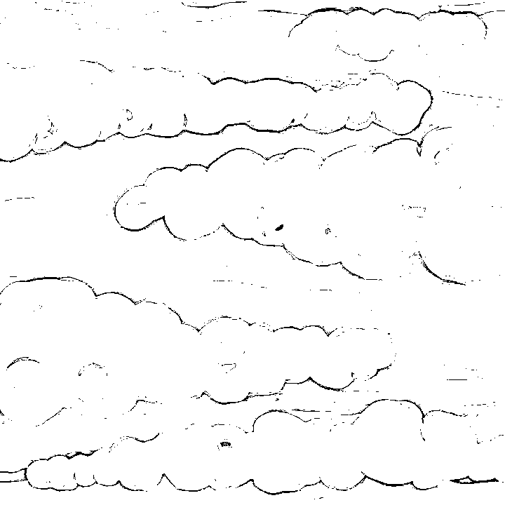

**每日天象****2.21****周一**

狮子座满月后的新的一周，我们从亏凸月相开启月亮周期。**月亮将从天秤座行进到天蝎座。**

工作的第一天，我们的内心会在意沟通中的讯息，**关系，渴望平等的沟通**和**灵活的表达**。月亮（天秤座）三分莉莉丝（双子座），我们渴望表达对事情真相的了解，月亮和莉莉丝的三分相告诉我们，**诚恳和真实的表达，**我们才会觉得自己被接纳和公平的对待。

我们内在安全感不容易得到满足，**月亮和冥王星（魔羯座）的四分相**，会让我们觉得那些隐藏的真相难以得到一个公平的答案，这种情绪化的感受会延续到傍晚。

月亮进入天蝎座（17：18），月亮逐渐和太阳形成三分相。内心的伤痛、恐惧和无法诉说的情感，在晚上我们会得到释放，**和伴侣，亲密伙伴的互动可以释放内在的情绪和感受。**

**2.22****周二**

月亮在天蝎座行进的过程，**适合和信任的伙伴在一起，**太多陌生人会让自己不舒服，感觉无法自在的敞开。月亮与水星（水瓶座）四分相，与天王星（金牛座）对分相，我们思考和学习无法专注，无法清楚表达自己的感受和理解，**被他人误解会让我们产生不信任感**。

**月亮与天王星的对分相会造成情绪的焦躁不安。**月亮天蝎座的内在情绪是激烈的，当不被信任和理解时候，会产生群体中的孤独感和局外人的感受。

天蝎座的激烈情绪不会很显化，有一股韧劲，上午的焦躁情绪到了下午上班时（14：45），情绪的张力是隐藏起来，并没有爆发，**月亮与木星（双鱼座）的三分相，**不稳定的情绪逐渐调和。

**我们可能对教育，新闻出版，传播方面的举措更关注，我们渴望获得这方面更多权益和福利。**

**2.23****周三**

月亮和土星（水瓶座）形成四分相（凌晨），我们也许在睡梦中被一些隐藏内心的压力干扰，睡眠质量不高。月亮分别与摩羯座的金星、火星形成六分相，与海王星（双鱼座）形成三分相。

**这是元气满满的一天。**我们相信自己是可以获得支持和认同的，在群体中的表现会比以往更积极，主动。月亮与海王星的三分相意味着这是内在直觉最强的时刻，**想象力丰富，**水元素的三分相意味着心随我动，关键时刻可以做出自己的判断。

月亮对分月亮北交点（金牛座），我们渴望内在获得认同和稳定的安全感，信任是天蝎座月亮的议题。当我们被当下生活的阴影面影响的时候，内心的创伤会被放大。

**月亮与冥王星（摩羯座）形成六分相，**月亮天蝎座的耐力和毅力，会克制内心情绪波动。月冥会带有一种控制性的能量，擅于化险为夷，找到职场中善用的资源，这也是生活中的机遇，善用机遇和挑战，我们才会从天蝎座月亮走向射手座的月亮（21：28）。

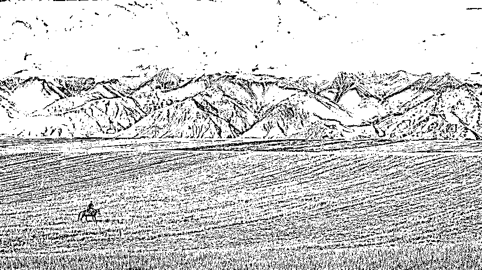

**2.24****周四**

月亮在射手座行进中，这是本周行动力最强的契机。月亮在射手座行进，适合**旅行，或通过讲座、进修等学习获得心灵的成长。**

本日最重要相位就是火星（摩羯座）六分海王星（双鱼座），你是否埋下了对未来行动目标的种子呢？**火海六分相合适将自己的理想、灵感付诸实现和落地。**如果愿意从事艺术创作，这是灵感迸发的最佳时刻。

火星摩羯座是精力充沛的战士，攻击性很强。海王星象征着梦幻，浪漫的幻想体验过程。火海的相位是真心付出与回报的关系，性与浪漫的诱惑和喜悦。火海六分相，我们会需要**发现内在灵感直觉力，有效使用自己的行动力，收获物质生活的丰盛。**

火星的欲望会因为海王星能量的美化，获得超然与升华。**如果你的出生星图有重要的行星和配置落在摩羯座/白羊座/巨蟹座/天秤座/20°-23°之间， 请关注财务，关系或家庭中的互动能量。**

射手座月亮关注大局，忽略细节，太阳（双鱼座）与月亮的四分相，**需要避免粗心大意导致无法完成目标。**生活中如果你信任的导师，你欣赏某些媒体博主的经历中的顿悟，他们发布某些观点或看法，你会获得心灵上的启发。

**月亮射手座行进，关注自己学习和探索心得是什么很重要。**水星（水瓶座）六分凯龙星（白羊座），我们内心的疗愈来自沟通中温暖的能量。

**这是本周加速度最好的时刻，**当我们愿意付出努力，向宇宙发出内心的召唤，我们会获得宇宙的祝福。

**2.25****周五**

金星（摩羯座）六分双鱼座（海王星），水星（水瓶座）四分天王星（金牛座），**这是浪漫和惊喜并存的能量。**

金海的相位组合和浪漫，美好情感期待有关。金星摩羯座是务实，不会容易掉入温柔陷阱中，求婚前需要考虑清楚是否有足够的面包和牛奶，而不是“有情饮水饱”。

在实现理想的道路上，摩羯座的金星会识别出哪些是大饼和虚假的谎言。如果确实这份工作给到我的只是金钱，缺乏长期规划蓝图，只是喊口号、喝鸡汤，倾向选择摒弃掉不适合自己的梦。

金星象征着女性的能量，传统父权能量和摩羯座的权威压制无法压制女性内在的渴望，对女性价值探索和争取的过程，路漫漫修远，追求的信念和渴望不会丧失。

在生活中，我们对自己的估价是什么？是高估还是低估自己的价值和能力呢？在关系中，需要付出奉献和爱，但不是美化和自我欺骗，这不符合金星摩羯座的需求。

**金星、火星和海王星的旅途，是我们既需要发展自己灵感和爱的能力，找到自己热爱的，追逐的目标，规划未来的目标，还需要发展出一种洞察力和识别力。**

**水星与天王星的四分相，带来的挑战是在环境中改革与追求创新的碰撞，冲击。**新政令的施行，交通事故，词不达意，或财富流动中意外都可能出现。

我们需要让自己慢下来，避免冲突和误会产生，培养适应意外和变革的思维。这个相位组合好处是，**你可关注自己是否有一些新的创意或想法，记录下来，等适当时机创作或表达出来更合适。**

**2.26****周六**

**休息日两天的月亮在摩羯座行进，**我们无法自在享受休息，金星、火星与海王星的能量，让我们对未来新的一周充满了向往。

太阳（双鱼座）与月亮呈六分相，谁说梦想只是梦呢，也许有可能实现的一天呢。太阳和月亮六分相，**我们享受休息日的同时，也可能同时在为新的月度工作加班忙碌，感觉自己很充实。**

月亮在摩羯座行进中，不善于表达自己情感，群体或团体中的氛围会影响我们的表现，但我们不会展现出来。**月亮四分凯龙星（白羊座），三分天王星（金牛座）**，孤独情感和情绪，无法被他人理解，旧日情绪和情感会让我们感受到压力，即使内心有汹涌澎拜的情绪，但仍会压抑自我。

**月亮与天王星的三分相会在生活中找到释放的出口，**天王星的反叛，创新会激活月亮的创造力，即使内心感受到压力，我们可以很好适应，敞开的信任有助于激活月摩羯行动力和实用性。

**2.27****周日**

月亮（摩羯座）与海王星（双鱼座）呈六分相，月亮合相金星、火星、冥王星（摩羯座），三分北交点（金牛座）。**这一周的追梦之旅在月亮六分海王星的过程中画下一个完美句号。**

海王星的梦是虚幻，飘渺，美好，理想化的。我们会逐渐理解和探索到，实现未来目标的伙伴，落实计划行动力的目标是什么。我们需要关注人际关系中冲动，避免让情绪主导一切。

明天就上班了，和伴侣好好享受周末，为未来的工作周积蓄能量的动力，亲密关系是幸福感的关键。人生的幸福感不过是每日生活中，稳定健康的关系和内心安全感。

**月亮合相冥王星**，我们需要尊重他人，给自己和他人构建健康的情感空间。生活就是由不确定性，危机和意外组成，魔羯座的月亮喜欢掌控感，**适当放下自己对周围环境，伴侣，家人的掌控欲，学会尊重各人真实的面向很重要。**

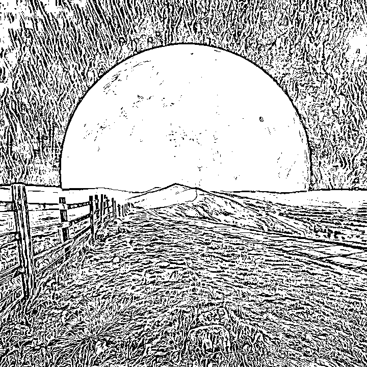

**12 上升星座的一周运势**

**上升*****白羊座***

这一周是你在事业中展现魅力和行动力的最佳时刻，象征着爱与魅力的女神金星，战争与行动力的战神火星都落入掌管事业的 10 宫。

**白羊座是勇者和战士的象征，展现你在工作中高效，务实的处理能力，你的魅力会在职场中收获关注度和目光。**

如果有邀约的合作活动，或心仪异性的约请，抓住机会哦！花一些时间享受生活吧！

**上升*****金牛座***

金牛座喜欢根据自己生活的节奏和规律安排生活，喜欢从实际经验中学习。**这周合适设定未来一段时间的理想，规划和目标。**金星与火星落入你星图的 9 宫，生活中如果你信任的导师，你欣赏某些媒体博主的经历中的顿悟，你会获得心灵上的启发。

如何在生活中创业，创建良好的关系，你会在这周有自己心得和收获。

**上升*双子座***

灵活多变的双子座们，**水星与天王星的四分相会给你的直觉带来全新的体验。**如果有考试或面试的机会，需要避免粗心大意。水星在你的 9 宫，如果出差外出，**需要避免安排事项中的意外。**

当水星发挥积极创意的时候，你会突破某些过去所学知识的局限，你会更有行动力和活力。10 宫的海王星会激活你 8 宫的金星和火星，**这是财务提升最佳时刻。**

**上升*巨蟹座***

巨蟹座的情绪总是难以捉摸，你对人际之间沟通特别敏感。当金星与火星在你 7 宫行进时，是开启人际关系钥匙最佳契机。**享受关系中的喜悦，但也要避免激情过度，如果沟通中执着自我想法，也可能导致误解，他人的不理解。**

朋友圈或粉丝群有许多不一样的讯息，有的让你觉得新鲜有趣，有的让你意外。请不要吃惊，沉淀自己的情绪，梳理好自己的感受，学会休息，**放松很重要。**

**上升*****狮子座***

这个月狮子座非常忙碌，本次狮子座满月在 1 宫，你对自己认知是否会更深刻呢？金星和火星携手在你的第 6 宫行进中，**寻找商业关系中你内心被触碰的灵感和智慧，**积极努力推动项目进展，你会获得上司的认同。

你也许对自己事业发展有一些石破天惊想法或点子，暂时沉淀一下，可以记录下来。你可能通过网络关系认识一些新鲜有趣的伙伴，**学会更客观看待与自己不同人的观点，想法，从他们身上学习，更多理解人们观点差异性很重要。**

**上升*****处女座***

2 月是处女座高效的一个月，无论是单身或是有伴侣的人，你们都会感受到被爱温暖拥抱的时刻。

金星与海王星的六分相发生在你的 5 宫和 7 宫，这是多么浪漫的时刻，请不要对未来太多设定，纠结承诺或目标，**如果有和他人相处的欢快时刻，那就先去享受吧，**人生时光短暂，**不要辜负生命中每个值得纪念的日子。**

如果有备孕需求客户可以考虑，如果没这方面需求，有计划通过平台做直播也不错，5 宫是金星喜乐的宫位呢，**投入你喜欢的社交活动是不错的选择！**

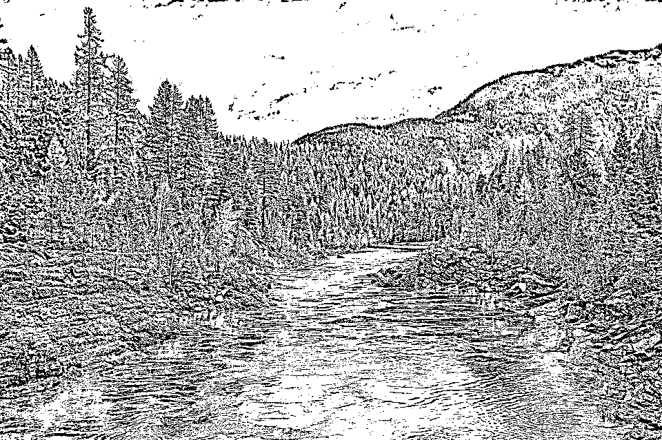

**上升*****天秤座***

你这个月会在自己家庭，居住的房子投入比较多时间和精力，过年的家庭聚会，对注重关系的天秤座们的感受是什么呢？

金星和火星是宇宙的恋人，这对恋人相遇一年次数不多。**本月金星与火星在你第 4 宫行进中**，24 日的金火六分相，你可以尝试花一些时间，与你认为重要的人，好好布置家居环境，享受一顿浪漫的晚餐，沟通一些你觉得生活中幸运或意外的小故事。

**上升*****天蝎座***

通过勤奋努力获得事业上更多认同，让生活更充实是天蝎座们 2 月的关注点。狮子座满月的几天，你在事业上的生涯会感受到自己备受关注。火星与海王星的六分相会提升你的创造力和洞察力，**如果你本身有创作欲望，这是打造作品的最佳时机。**

金星与海王星的六分相，会让你在某些群体或平台更好的展现自我。天蝎座们最害怕是无法掌控的危机和意外，水星在你家庭宫行进中，**关注家庭的沟通，不要因为小事惊慌。**

**上升*****射手座***

水星掌管你事业宫的声誉和威望，水星的顺行，让你感受对事业的规划逐渐慢慢理清，你也会更有信心面对未来。金星与火星在你的 2 宫行进中，**你会愿意为自己喜欢的事物投入金钱，开销更多。**

和好友聚会享乐，享受友谊的快乐，就算花钱也很值得，辛苦挣钱就是为了享乐阿！如果你做主播或自媒体，收获粉丝的青睐，莫名被他人误会都很正常，你心胸开阔，不会为了小事情徒增烦恼。

**上升*****摩羯座***

摩羯座群星穿越你的 1 宫，一贯以老干部著称的摩羯座们会发现自己正掌控着胜利的战车。满月的狮子座激活了你 8 宫的能量，税收，商业关系中前期的交易会让你收获结果。

**金星与海王星的合谐相位，你可以给自己放假，和爱人进行一次短途旅行享受浪漫。**你如果是自媒体创作人员，也可以在灵感迸发的刹那，创作出你得意的作品，展现强大的行动力和实力。

如果想认识新人，也不必去太远地方，**见见朋友，释放内在的压力，**呼吸新鲜的空气会让你焕然一新。

**上升*****水瓶座***

理智和客观的水瓶座们，土星行进的这一年让你们在身体，情绪层面都感受到压力。

金星与火星目前在你的 12 宫行进中，12 宫掌管人的潜意识，是一个代表神秘，孤独，与世隔绝，限制和束缚的宫位。水瓶座的外表是看不出太多的情绪，**你会把时间和精力花在考虑计划的细节，如何执行上。**如果你想和治疗师进行深层的心里沟通或治疗，也是很合适的时机。

上周的满月在你的 7 宫，你是否在和他人关系中学习到更多呢？水星与天王星的四分相**意味着，**你偶尔会展现让人吃惊的一面，你如果是创作者，无论是艺术家，作家或向外人展示方案，都给人耳目一新的感受。

**上升*****双鱼座***

木星在双鱼座行进的这几个月，是双鱼座宝宝们最幸运的时刻。象征行动力和活力能量的火星整个月都在你的 11 宫行进中，金星与海王星的六分相，火星与海王星的六分相，**你在社交上会见到很多人，你会很享受这种聚会过程。**

老友聚会，商业成功人士都有可能会遇到，你可能是通过网络沟通，也可能是见面聚会。

**这周是你梦想，机遇和幸运的时刻，**25 日正好是周末呢，不要宅在家里，给自己安排一些节目，不要浪费了在 11 宫的金火相位，机遇永远是不期然来临，不是你可以把控的。

**版权声明**：原创文章由作者授权首发于若道平台发布，欢迎转发，反对抄袭。友号转载请申请白名单。

****

**苏黎（Sulis）**

ISAR 国际认证占星师（2019 年获得）/塔罗咨询师

现代占星融合古典解读

20 多年跨行业领域职场经历

**咨询微信**：liuzq26

**公众号**：Sulis_1975

长按打赏

**学习占星学****点击下图了解课程详情** 

**

********************************

**微信又双叒叕改版啦，不想错过若道君的推送？**

**就把若道设为星标吧！**

**▼**

**喜欢记得点一下在看哦☟**

**报名直达入口**

# 太阳进双鱼座，这个月里，你打算为生活创造哪些“奇迹”？

> 原文：[`mp.weixin.qq.com/s?__biz=MzA5NjA0NTAxNg==&mid=2651467864&idx=1&sn=79ef4246489055d1d895c0b92a125e03&chksm=8b4882efbc3f0bf9b2d1005f5046d9c7ed61395a14f81a51534c88cbaebcc039d512def33c90&scene=126&sessionid=1692737857#rd`](http://mp.weixin.qq.com/s?__biz=MzA5NjA0NTAxNg==&mid=2651467864&idx=1&sn=79ef4246489055d1d895c0b92a125e03&chksm=8b4882efbc3f0bf9b2d1005f5046d9c7ed61395a14f81a51534c88cbaebcc039d512def33c90&scene=126&sessionid=1692737857#rd)

**2022 年 2 月 19 日天象：**

*   **00:42 太阳进入双鱼座**
*   ******11:50 月亮进入天秤座******
*   ******金星与火星合相******
*   ******木星六分天王星******

当我们早上一醒来，太阳已经进入双鱼座。今天也是二十四节气里的“雨水”，春风化雨，春水融动，如果刚过去的[【狮子座满月】](http://mp.weixin.qq.com/s?__biz=MzA5NjA0NTAxNg==&mid=2651467700&idx=1&sn=d0a5d51159d40ab01f9af6ebadbda3ff&chksm=8b489d03bc3f1415a3bf57344ce8e3ed218f5125e937e0e1e048bfc132ec7584ee82a034116e&scene=21#wechat_redirect)（点击查看文章）对你有些激烈，那么，在这个充满了爱、慈悲与疗愈力量的双鱼座月份，我们可以对它有哪些期待呢？不妨点击[【太阳进双鱼座】](http://mp.weixin.qq.com/s?__biz=MzA5NjA0NTAxNg==&mid=2651467765&idx=1&sn=311ac985c256a6e57c677f52af810545&chksm=8b489d42bc3f14541817a1b1b26cd48a48a6f452fb9fdc7a2cbd4671a981099a3afa23d59c4c&scene=21#wechat_redirect)看看，没准会有一些启发哦。接近中午的时候，月亮离开处女座、进入天秤座。如果你一大早就对家里进行了大扫除，不妨在午饭之后，和朋友们约一个美美的下午茶吧！月亮在天秤座，与在水瓶座初度运行的水星，形成三分相，惬意的聊天、充分的情感和思想交流，会带来令人心满意足的一天。而木星与天王星的六分相，会不会也在提醒我们“挑战不可能”呢？让心松弛并敞开，在这个双鱼月，你愿意为自己创造什么奇迹？快来跟我们分享吧！周六快乐！我们周一见！**了解每日天象，可****下载“若道”APP 查看****还有更多精彩等着你哦**

# 2.19 太阳进双鱼座丨 12 星座都会在哪些领域收获爱与疗愈？

> 原文：[`mp.weixin.qq.com/s?__biz=MzA5NjA0NTAxNg==&mid=2651467765&idx=1&sn=311ac985c256a6e57c677f52af810545&chksm=8b489d42bc3f14541817a1b1b26cd48a48a6f452fb9fdc7a2cbd4671a981099a3afa23d59c4c&scene=126&sessionid=1692737857#rd`](http://mp.weixin.qq.com/s?__biz=MzA5NjA0NTAxNg==&mid=2651467765&idx=1&sn=311ac985c256a6e57c677f52af810545&chksm=8b489d42bc3f14541817a1b1b26cd48a48a6f452fb9fdc7a2cbd4671a981099a3afa23d59c4c&scene=126&sessionid=1692737857#rd)

******************☆ 后******************台******************回复“今日”，给你一句生命态度******************

作者/郑玮玲 ISAR 认证占星师
编辑/翀子 封面/书君 图片/网络北京时间 2 月 19 日凌晨 0 点 42 分，太阳进入双鱼座。在这段旅程中，太阳将与木星、海王星形成合相，增强空气里的爱、慈悲、疗愈的力量。当太阳在双鱼座行进，我们每个人又可以将哪些礼物带入生命的进程呢？一起来看看吧！着急看 12 星座的读者朋友可以拉到文章后半部分进行阅读哦~**北京时间 2 月 19 日凌晨 0 点 42 分，太阳进入双鱼座。**此时大地还夹带着冬的寒气，万物已闻春风而萌动。太阳来到了黄道最后一个星座，并将在 3 月 20 日将这春风的接力棒交到白羊座的手中。

太阳来到双鱼座，是日光暖大地，北半球大部分地区从天寒地冻到春暖花开的时令转换之节。

**雨·水·鱼**

**太阳换座同一天也是“雨水”节气。“雨水”即是：天一生水。**

漫长的冬的蛰伏之后，生命最需水的滋泽，水利万物，水也清理万物。时令谓“雨水”，春风化雨，春水融动，是先民智慧的赐福。

**双鱼座，水象变动星座，满满的“水”之意象。**

天地之间从有形到无形之水都在双鱼座的语境之中：江河湖海，山川溪流，雨雪冰霜，云雾潮汐，湿气、蒸气、眼泪、感受、情绪和它们的波流与变形，是一生都要学习观其平静的心湖，更是意识的海洋与洪流。

**而所有意识中特属于双鱼座的必是：忧患意识。**

太阳进入双鱼座的时空对应两个卦象。水火既济，意味此时天地阴阳和合之象；雷火丰，则是盛大如雷电的天之丰盈明动，广袤大地于虚空中创造丰美。

双鱼座是二元与合一，无极生太极。太阳在此行进，北半球完成冬的结尾和春的开启，唤醒、接续生命的时序。太阳在双鱼座是万物苏醒、萌动的时空。**双鱼座是创造天地的无所不有的意识，和无所不为的能量。**

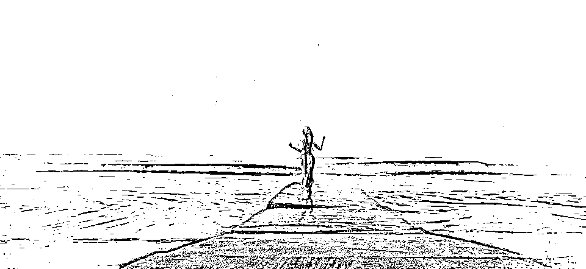

**太阳在双鱼座的行进**

**年度天象顶流——日木海**

2022 年最重要宇宙天象是由木星、海王星共同在守护的双鱼座演绎宇宙大梦。而太阳也成为这“梦中人”时，有必要带着意识去进入双鱼座的冥想之旅。

让我们先来看一下这出戏的演出时间表：

*   **日木合相：2 月 23 日—3 月 16 日，精确成相时间：3 月 5 日**

*   **日海合相：3 月 5 日—3 月 22 日，精确成相时间：3 月 13 日**

*   **木海合相：3 月 3 日—5 月 29 日，精确成相时间：4 月 12 日**

**日木合相，慈悲到春天**

木星在 2021 年 12 月 29 日进入双鱼座以来，已经用超越常规的行进速度走完了 1/3 的双鱼座。

这意味着 2022 年全年木星待在自己舒适的双鱼座的时间，比它行经任一星座的平均周期短了两个月！事实上，木星只会在 2022 年春天行进在双鱼座，待到它重回双鱼座，已临近立冬。

****

**花非花，雾非雾。夜半来，天明去。**

**来如春梦几多时？去似朝云无觅处。**

**——《花非花》******唐·白居易****

任何行星的行进最终都带来了周期，而周期即诠释了时空。这是在行星原型以外的重要讯息，对星空敏感的人们不能错过了它的重要提示。

**别忘了，双鱼座是意识的敏感，是对精微、虚空、浩瀚均有感知，并能作出理想的反应，完成复杂的作业。**

面对这一季的变幻不定与意识的洪流，我们将以何种姿态应对，我们将用来创造怎样的生活？

众神之神的宙斯、木星在双鱼座，必然有广阔的使命为人类传达，每个人都值得在这神启的意识之旅中踏上更高、更远、更宽广的信仰之路。

努力张开双臂去迎接生活的机遇，不怕每一次冒险、丧失的可能，木星鼓舞人类的信心，追寻的人无论结果如何，终不会后悔。因为这一次是为着超越的梦想——这便是日木合相双鱼座给我们最大的礼物。

双鱼座的太阳是把“信念”动词化的符号。太阳双鱼座的人因为什么而成功？是信念铺就的行动之路。**双鱼座相信奇迹，**而奇迹是行动所呈现的小概率的信念。这便是双鱼座的魔法，有幻想色彩注入，但永远参与着生活的现实。

**日木合相，意味着巨大的光耀，伟大梦想的实现，不可思议的超越，有如神助的创造。**而把这一切美好、狂喜带入生活的必是信念与行动的塑造。在你面对和坚信的道路上所有的付出，将会在春天收获所得。

木星的行进引发集体现实的更新与进化，集体的赋权在于创造一个理想共生的环境。现在请把目光投入：全球生态链，跨物种的生态平衡与普罗大众平权、平等的共生。关注当下的生态与社会环境就是现实与意识的融合，从心底深处升起自发的生态敏感，人文敏感。

**木星双鱼座的大爱是为着自然万物众生的，当我们去做疗愈自我，救赎的工作时同时也疗愈了集体和地球。**

而木星式扩张性道路在双鱼座一旦展开来，会形成蔓延之势，让我们发散型地面向各种领域去学习、证得、经验并调整意识，朝向全新的完整自我去生长吧。

重点影响人群

**个人行星、四轴、交点落在双鱼座、双子座、处女座、射手座、巨蟹座、天蝎座 4-25 度的人。**

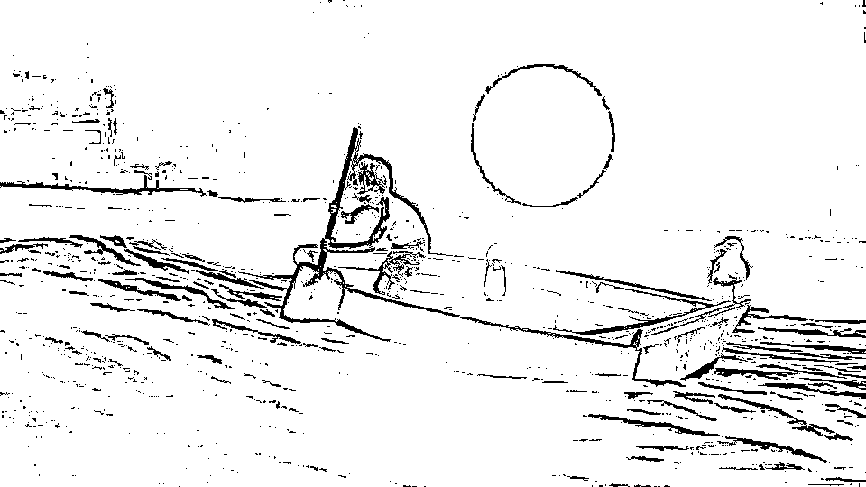

**日木海合相，忧患中超越**

双鱼座本身的无形无极无界，让太阳、木星、海王星共同卷入了空灵、混沌之界，宛如神仙斗法，想看也看不清的现实就来了。

凡海王星驾到之处，皆能升起迷团烟雾。当我们趁着日木合相的云雾进入双鱼座的冥想之道时，**海王星为我们提出了方向与边界的拷问，也向我们揭示现实的患难和救赎的指引。**

双鱼座是与苦难、悲伤、救赎、忧患相连的道路。很多女子、母亲、女儿看到被拐卖的女性，都宛如自身受苦；一个有良知的男人、父亲、儿子也会天然感受被拴铁链的女人如果是自己的亲人将如何？

**救赎的渴望一旦升起，个体都有力量演化成巨浪去清理旧有的罪恶。**

欲盖弥彰的草率调查与公布，露出了徐州、丰县权势团体的马脚和各种丧失下限的行政操作。而失去名字、身份的被拐女性不止铁链女，涉及人数之大，年代之久远，而被强奸生下的一代人又将延续怎样的人生？

木海双鱼座的背景下，谎言一个接着一个，终于令民众的愤怒连成了海潮。罪恶不连根拔除，民愤难平。

日木海共同值守双鱼座时期，每一个人都会通过集体、个体性的方式理清现实的迷雾，从微小事物中发展出警觉、质疑与反观力。我们将有机会去看见和参与有别旧有意识的现实行动。

**海王星带来的体验，魔幻也好，超越也罢，终将穿越忧患之路才能抵达清晰，找到答案与解药。**

忧患是对生之怜悯、珍惜之情，是对万物众生的照护，一个人的苦难会牵连亿万颗心灵，而集体的救赎之力也会经由渺小的个体成为未来众生的福祉。

**海王星的日木海在双鱼座时期，每个个体的意识、行动都会带来整体的移动。**

****

**学者，学其所不能学也；行者，行其所不能行也；辩者，辩其所不能辩也。知止乎其所不能知，至矣；若有不即是者，天钧败之。**

**——庄周**

我们努力分辨正因有那么多不清、无明，而我们向宇宙、向内在的求索止于无法再知悉的虚空之境，这是人类存亡的天性使然。

**日木海在双鱼座，要相信你内在的冥想与对生活的理想，这是拨云见日，无中生有的时机。**

要相信内在的指引，我们为什么对不容易听见、看见的讯息充满了主动的找寻意识，因为人类一直在迈向未知、未有、未及的道路上实现着超越的极限。

重点影响人群

**个人行星、四轴、交点落在双鱼座、双子座、处女座、射手座、巨蟹座、天蝎座 14-29 度，白羊座、巨蟹座、天秤座、摩羯座、狮子座、射手座 0-3 度的人。**

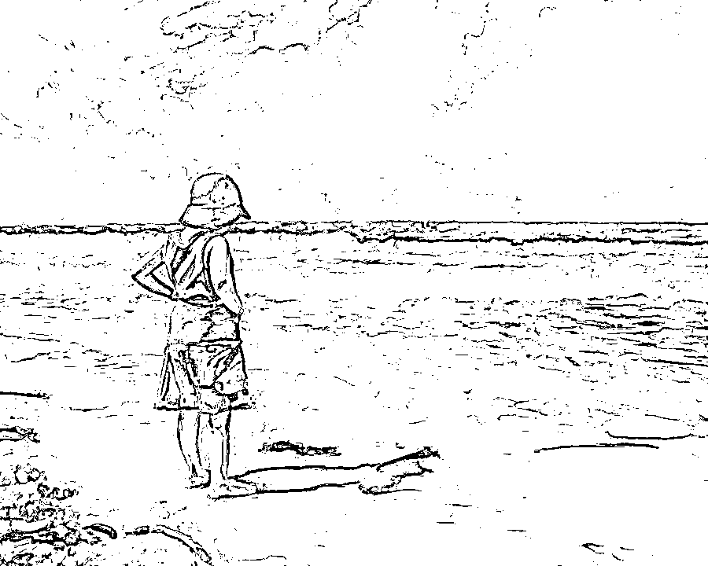

**日天六分，敢为自由故**

**成相区间：2 月 25 日—3 月 7 日，精确时间：3 月 2 日**

这是提醒我们投入有意义的灵性探索和创造性的工作，开展所有你向往却因现实原因没能做的尝试。

不愿从众的天王星在金牛座以坚定的方式催醒自由意志。天王星让人从不同的角度看，去看巨大事物的精细面，又从微小的角度窥见整体的背景；也让我们透过裂缝、断层、缺口去听见不同的声音。

**所有令人惊异的现实都会触发我们内在的不安与恐惧，但这些才是真理和自由的注解。**

当下，每个人都值得听一听不同的声音，看一看不同的观点，学会独立的思考，发展出洞见，这是天王星要求的自我更新。

正确的洞见让我们与真相、真理站在了一起，真相才会给我们自由——行动与意识的自由，更是人身的自由！

自由意味着恐惧烟消云散，你不再害怕了，所以那些控制你的人与势力也同时消亡，这才是天王星最令人激动兴奋的动能。

**当太阳与天王星六分，先锋意识，前瞻性的眼光促使个体有机会用自己的力量破除意识的迷障。**

每个深入过忧患意识的人，都有机会在日天六分进程中迈向新世界——**创造、革新、无惧黑暗，忠于心灵、直觉的行动，用未来的意识建立张弛有度的舒适精神堡垒。**

重点影响人群

**个人行星、四轴、交点落在双鱼座、双子座、处女座、射手座、金牛座、狮子座、天蝎座、水瓶座、摩羯座、巨蟹座 6-16 度的人。**

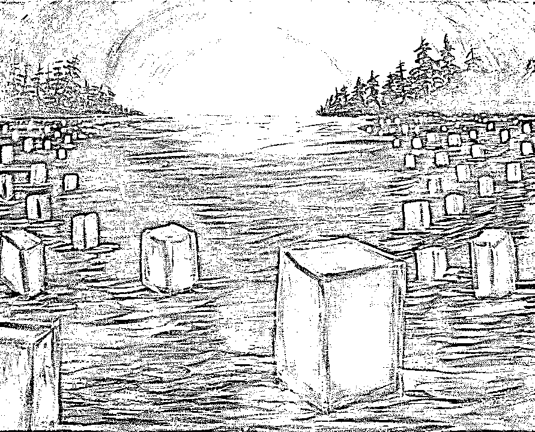

**日冥六分，唯真相救世**

**成相区间：3 月 14 日—3 月 24 日，精确时间：3 月 19 日**

冥王星总是揭露真相的，不管多黑暗，也不管我们想不想知道。日冥六分，崭新的机会准备好了，你的勇气快跟上。

冥王星行进在摩羯座的最后三度，13 个月以后它就将首次离开摩羯座进入水瓶座。**因此，冥王星对黑暗的揭露之举已进入最激烈、快速、积聚的趋势。**

对个体来说，认清真相的过程就是关乎生命安危，决定生死存亡的意识与行动。持续两年的疫情，我们看到了多少生命消逝？不被公开的隐秘计划，不可告人的贪婪与罪恶被揭示，又有多少人相信巨大的丑恶和魔幻的现实？有多少人作出过抗争、发声与疗愈的工作？

**冥王星说：你所害怕的最终都会吞没你，沉默与无视就是认同黑暗与控制。**无人能假装置身事外，每个人都在冥王星的进程中。

所幸越来越多的人走进了真相，并开始了有力的行动，用良知、正见做出对时代，对集体，对未来有意义的抗争、保护和疗愈。

**所有的相位都意味着整合，日冥相位也不例外。**黑暗与操控若是为了分裂人类，分裂人类的意识，整合的日冥相位也给了我们机会重新整合集体的意识，把每个人的光连成长城，这便是我们对自身、对生命、对集体的捍卫和疗愈。

冥王星把转化的力量交到了太阳的手中，那是你清明的精神意志，是你的慈悲与良善，是你救赎的渴望与心灵的广阔。你若相信爱能战胜黑暗，就会拥有直面黑暗，打破黑暗的勇气，说真话，看真相，信真理，用正知正见去维护个体生命的权力。

**冥王星是高八度的火星，是充满意识的激战，它将开创新世界的力量赋予有正见和有勇气的人，把生之火种传递给爱的战士。**

重点影响人群

**个人行星、四轴、交点落在双鱼座、双子座、处女座、射手座、白羊座、巨蟹座、天秤座、摩羯座、23-29 度，白羊座、巨蟹座、天秤座、摩羯座、狮子座、射手座 0-3 度的人。**

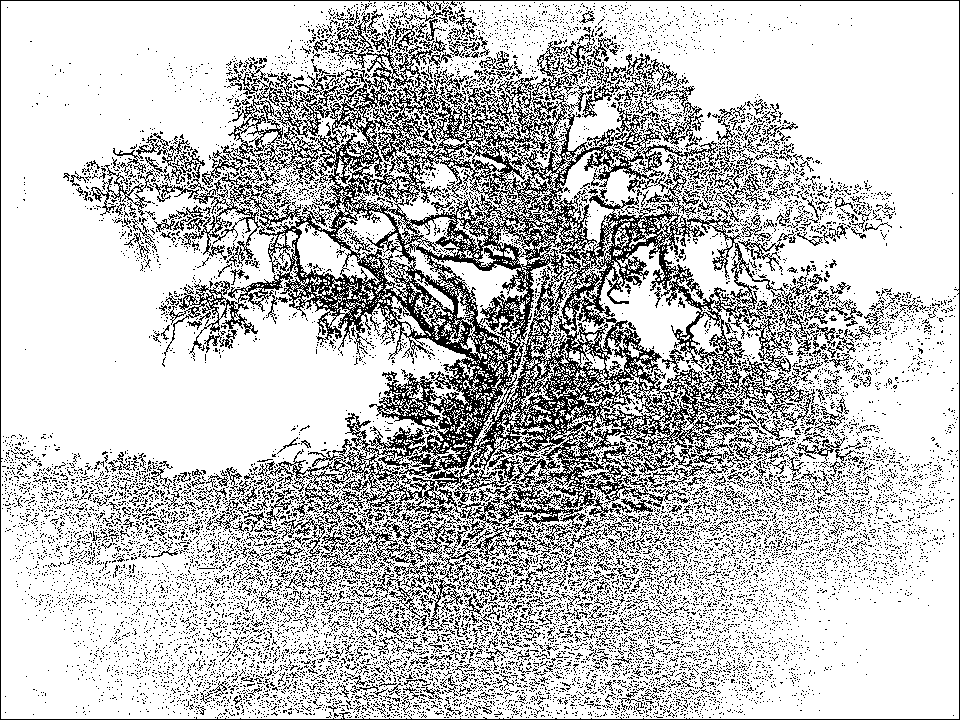

**太阳六分月亮北交点，重现的花园**

**成相时间：3 月 10 日—3 月 19 日，精确时间：3 月 15 日**

月亮交点进入北交金牛座以来，我们能感受到每一个人是多渴望拥有花园般的地球。

在月亮交点换座、一次集体祈福的冥想中，我的意识之窗向我展现了地球多地的地貌、景观，美丽的星球同时也是满目苍夷。

那个名叫“大马士革”的废墟之城曾是“上帝的花园”，饱经战火的土地只留下了侵略者的罪行。两河流域孕育了从苏美尔文明到现代的西方文明，而文明诞生的土地何日才能重现新月沃土的丰饶？

**当太阳与北交点形成六分相，集体的意识中会闪过一丝柔软明亮的光芒，**那可能是千年文明之光的穿越，也可能是每个人的智慧之光在心灵的沃土升起。

**我们都有了机会透过灵感、创造、修习去筑就现实的花园，去找到让我们获得宁静、安详的“花园”。**

我们在这通往美好丰沃的道路上，正是因为我们都努力挣扎着，我们与黑暗完成了殊死较量，重生给了我们智慧与活力，拿来做令生命喜悦的事。

重点影响人群

**个人行星、四轴、交点落在双鱼座、双子座、处女座、射手座，金牛座、狮子座、天蝎座、水瓶座 19–28 度的人。**

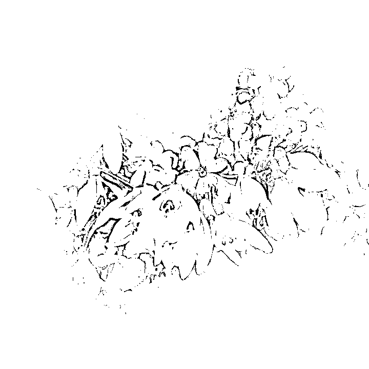

**行进太阳在 12 宫**

**若道君：****你可以在 app store 或者应用商店搜索“若道”下载 app，输入个人档案，查看行运盘（也可以使用其他星图软件），找到行运太阳落在出生星图的第几宫，然后对照下文查看。**

**例如下图中，行运太阳在比尔·盖茨个人星图的第 8 宫。**

**★上升*****白羊座  *****太阳进入*****12 宫***

此时的木星、海王星都在你的十二宫内用不同的速度行进。在这个关于无意识、信仰、宗教、梦境的宫位被双鱼座群星照耀时，**你需要小心照料你的精神与灵性世界，警惕各种层面的丧失与幻灭。**

清醒地追寻你的梦，清晰你的信念与道路，并坚持践行对保持清晰意识有益的灵性修习。避免无意识的侵扰和对现实的逃避，**此时的你必须清楚肯定自己是谁，你相信什么，要去实现什么。**这样你才能乘着梦起飞，遨游在你的圣圈中。

**★上升*****金牛座  *****太阳进入*****11 宫***

你期待什么样的人、团体来加入、支持、共创你将为之付出一切的愿景？群星双鱼座的时期点亮了梦想，也提供了巨大的机遇、良缘。**但若同时想要太多，便可能在木海合相进程后失去现有资源、机会和路径。**

**清晰和精确的目标会帮助你树立未来的基石，**好好理清现实的资源，整合进你的计划。同时也值得把关注与行动的重心投入到切实的项目中，**突破性的创举是为未来的扩展铺垫夯实的道路，**坚信你的意志可以穿越一切风暴。

**★上升*****双子座  *****太阳进入*****10 宫***

你此时的重心和关注点是你内心真正的渴望、愿景，你想成为的人，最想做的事，最想展现的舞台。群星双鱼座的时期将**用现实主义手法鉴证你曾经的努力或是盲目、逃避、放任而来的结果。**

无论现已呈现的状态如何，**只要对自我期待清晰、肯定，你都拥有机会再次扩张你的英雄梦想，**这是实现自我的大好时机。好好利用这段时间做出职业、事业上的最佳展现吧。

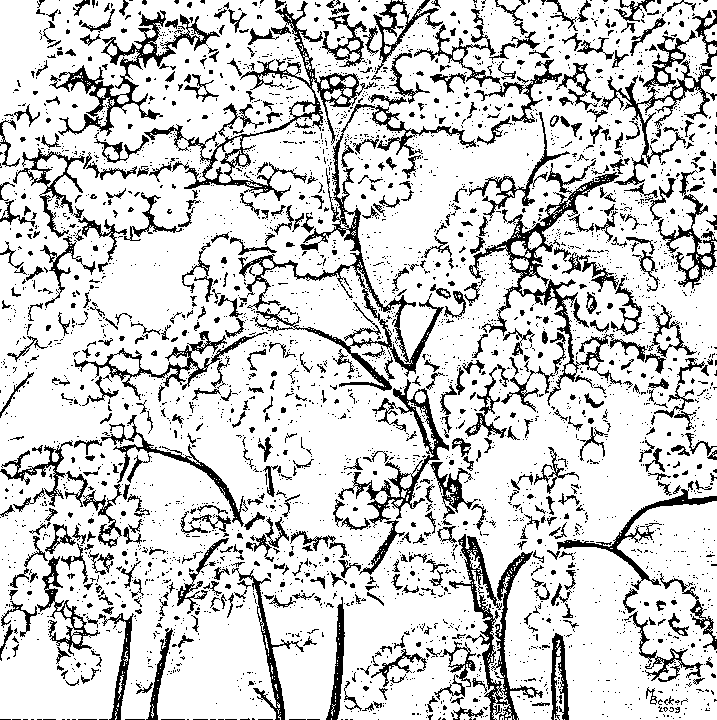

**★上升*****巨蟹座  *****太阳进入*****9 宫***

此时，远方在向你招手、呼唤，或是求学迁居，或是更高远的意识、信仰之路。也许你将要启程，也许你还在寻觅，也许你正在令人神往的福地接受意识的洗礼。

**哲学、信仰、高等教育或是总结人生经验来传播内在信仰，都将是你接下来一段路的核心意义。**去寻找吧，机遇也会在你寻找的路途中与你相遇。

**★上升*****狮子座  *****太阳进入*****8 宫***

**你需要在亲密与信任的关系中寻找清晰的答案与判定，**关系的开始与结束，延续与持久对你来说充满了困惑与疑虑。

此时需要尝试深入心灵的沟通与直觉的的判定去寻找清晰，冥想、静坐和任何灵性的探索都可以协助当下的旅程更平稳度过。**当阴影与复杂的问题浮现时，不要避而无视，看着泡沫幻灭也比活在虚假的现实中强。**

你将经历一层层内在外在的死亡，生存的危机也在潜入，对亲密与信任的考验就在此。**穿越迷雾，你便能找到心的航向。**

****★上升*****处女座  *****太阳进入*****7 宫*****

你是否已在面对和处理亲密关系、婚姻的剧烈波动？或是进入了前所未有的二元合一的蜜月期？如果是后一种是值得庆祝的。前一种就是我们需要做更深入的双鱼座功课的时期，也是你内在的灵性面将被整合的大好机遇。

此时的你或另一半对关系有更多难以满足的要求，其中一方也可能陷入多重关系的困扰。**坦诚汇通、协商之前要清晰、确定自己真正想要什么，完成肯定的取舍才能成功穿越日木海的迷雾。**

只有肯定了你对关系的定义与方向才能走向内在的飞跃性成长。

**★上升*****天秤座  *****太阳进入*****6 宫***

对健康的重视是头等大事，最好能确保目前健康没有大的隐患，为此**你需要细心照料自己的身体，**规划良好的作息，学习运用养生技法。

这也是大量时间、精力和关注都投入**职业、技艺打磨**的时期，**将你的灵感与精进整合在成长的道路上，**未来可期。

**★上升*****天蝎座  *****太阳进入*****5 宫***

想要恋爱的单身人士的恋爱机遇，也是恋爱中的人享受甜美的时期。但如果遇到太过完美无暇的人，就要谨慎退省了去想想，哪一段恋爱哪一个情侣没有瑕疵？**太过完美预示着隐藏的黑暗、阴影、苦难或是救赎的成分，**去寻找便能清晰。

**此时期也适合任何发挥创造力的工作，**把你天马行空的独特创意实践、展现出来吧，你将从中感受到生活最动人的快乐，那是来自人类对自我是完美的确实性体验。

**★上升*****射手座  *****太阳进入*****4 宫***

这段时间将是你买卖房产的最佳时期，遇到好的买家或是理想的价格。**实现家的扩张，**完成理想的家的梦想，生育的良机。在签署合同时要留意细节，避免小的错漏带来巨大的隐患。

同时也是我们展开内在旅途，灵性朝圣的好时机，**心底的灵感会越发闪耀，**吸引我们去放飞内在的梦想，去寻找、相信那些看不见的规律。

**这是一个和自我更深入相处的时机，**也许你也需要更多的睡眠与休息，对食物、烹饪也充满了兴趣，因为你在用滋养的方式开启新一轮梦的征程。

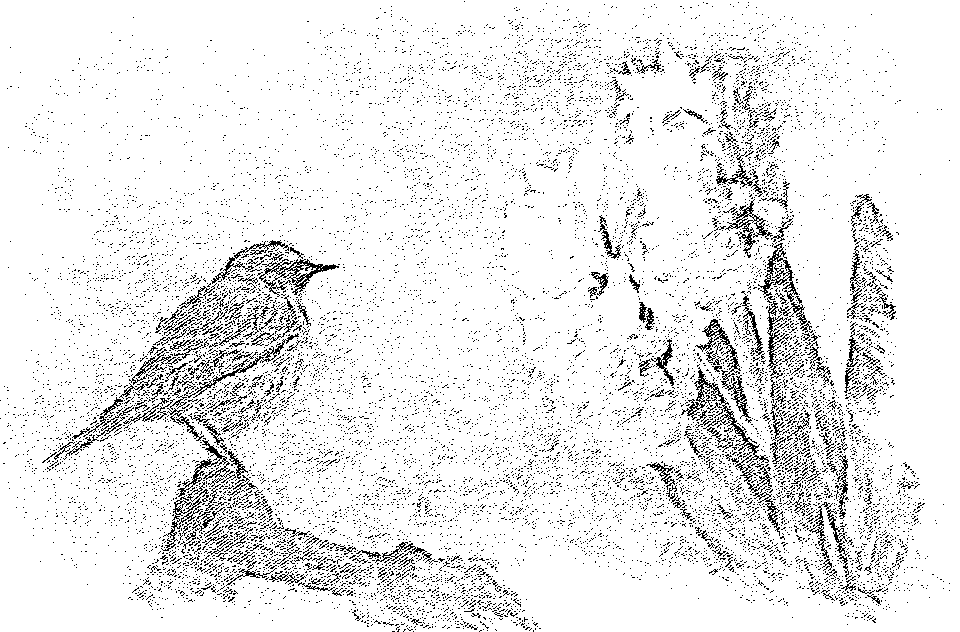

**★上升*****摩羯座  *****太阳进入*****3 宫***

**大量的学习令你头脑兴奋，也能带来阶段性的满足与成就感。**现阶段的学习很可能是对过去的总结与完成，是对旧时理想的承诺与到达，同时也是对旧有意识的清理过程。

尤其是灵性、神秘学有关的学习能帮助你超越现实与头脑的限制，**找到内心求索的答案。**但切勿陷入盲目和目的散漫的为了学习而学习的状态，那样只会消耗你的精力，陷入信息的庞杂而不得要领。

**★上升*****水瓶座  *****太阳进入*****2 宫***

你需要关注你的收支与财务状态，保持收支良好、稳定的平衡。不要陷入盲目、过度、冒险、赌博式的投资中，**人生没有暴富的常态，只有慎重与努力带来的巨大收获。**兢兢业业耕耘在自己扎根的土地上，清晰中正的价值观才会吸引来财富的机遇。

**当你清楚自己是谁，价值几何，并践行了正确的事，你便能展现自身的最大价值。**

****★上升*****双鱼座  *****太阳进入*****1 宫*****

关于你自己是谁这件事现在又要好好想想，确定一下。此刻的你只是意识长河中的一个片段，**你需要从渴望超越或是救赎的梦境中再次确认一下换新的身份感。**

把你的意识和集体的、他人的分别开来**，稳定清晰的自我身份感**才不会在木海的洪流中被冲刷，才不会在巨大的机遇面前站不住脚，失去原点。

眼下确有巨大的机遇，但它取决于你是谁，因为接下来也可能有巨大的幻灭，但也取决于你是否清晰自己如何独一无二，认清你与世界之间的关系。

**结语**

双鱼座是黄道最后的一个星座，在这里我们要结束、放手、告别和清理的是混沌、污泥和迷雾。而意识的洪流也将冲刷我们的心识，融入你的想像、灵感、直觉，相信所有看不见的光，摸不到的爱，找不到门——因为你可能已经在门里了。

**版权声明：**原创文章由作者授权首发于若道平台，欢迎转发，反对抄袭。友号转载请申请白名单。

**郑玮玲**

ISAR（国际占星研究协会）认证占星师（2016 年获得）

若道占星专栏作者

将占星咨询、教学与音乐、舞蹈相结合的疗愈者

**微信号**：zhengviolin

**新浪微博**：@郑玮玲

**微信公众号**：Sampriya-Astrology

长按打赏

**学习占星学****点击下图了解课程详情** 

**

****************

**微信又双叒叕改版啦，不想错过若道君的推送？**

**就把若道设为星标吧！****▼**

**就是这个“在看”，戳戳戳 ☟**

******报名直达入口******

# 征集 | 那些人生的至暗时刻，你选择了宽恕么？

> 原文：[`mp.weixin.qq.com/s?__biz=MzA5NjA0NTAxNg==&mid=2651467765&idx=2&sn=4f4959a66da5da9aa54de2ee0ba2f953&chksm=8b489d42bc3f1454c4457f5f81692714789d613e47133e1aa67bc55f7cbf53971bf859d9678e&scene=126&sessionid=1692749531#rd`](http://mp.weixin.qq.com/s?__biz=MzA5NjA0NTAxNg==&mid=2651467765&idx=2&sn=4f4959a66da5da9aa54de2ee0ba2f953&chksm=8b489d42bc3f1454c4457f5f81692714789d613e47133e1aa67bc55f7cbf53971bf859d9678e&scene=126&sessionid=1692749531#rd)

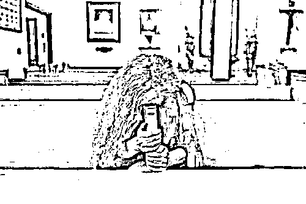

写下这个选题的时候，先回顾了自己的人生——该有的“恶心事儿”好像一样不少。 被同僚排挤、被小人构陷、被老板骂：“卷铺盖走人！”其实这些都不算什么，更严重的是，被爱人背叛、被信任的人诈骗、被最亲的人恶毒地咒骂……并不是记仇，而是有一些经历，怎么也忘记不了；可是如果一直记着，又似乎并没有让我的人生变得更好。我花了很长的时间在心里反刍，该复仇，还是该原谅？这感觉，就像别人把你的心摔在地上再踩上两脚，你还要自己捡起来，擦掉上面的污泥，重新把它装回去。那些仇恨和宽容交战的日子，心里有两个声音在对抗，无论过程多么抓狂，令人发疯，最终的结果，善良总是占据了上风。现在的我可以笑着说，是的，在最黑暗的那一刻，我也没有做出令自己后悔的事情。当然，我的决定也许是一种软弱，这个世界上有千万种活法，我们在做这个选题的时候，不想去道德评判谁，**即便你从未宽恕过，也并不代表那是不应该的。**我们只是想要了解，**当选择了宽恕的时刻，是怎样的感觉？**木星和海王星都在双鱼座的当下，让我们一起回溯过往，感受海王星、双鱼座带来的更大的力量。**爱能疗愈一切么？**如果你相信，请花上几分钟做下面的问卷调查，我们会将结果汇总发布在若道公众号上。感谢您的时间。**长按下图二维码填写问卷吧**

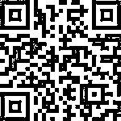

**| 往期征集文章 |**[冥王星](http://mp.weixin.qq.com/s?__biz=MzA5NjA0NTAxNg==&mid=2651464091&idx=1&sn=7f9d4f5c592a48b6dbe15987f4325c88&chksm=8b48932cbc3f1a3a50e632a6fe56853ab260f70893b6f4d2868a37bf2dc70932883fadb83d6f&scene=21#wechat_redirect) |[ 天王星](http://mp.weixin.qq.com/s?__biz=MzA5NjA0NTAxNg==&mid=2651467236&idx=1&sn=f863363054b8ff8938110edbca4ab14d&chksm=8b489f53bc3f1645100f16537ff2b4670e30da38d87f39fc6d31e28852c75531567058898964&scene=21#wechat_redirect)

# 核心课程 L3-5 | 四位国际导师授课，教你花式玩转星图，掌握各类高阶技巧！

> 原文：[`mp.weixin.qq.com/s?__biz=MzA5NjA0NTAxNg==&mid=2651467765&idx=3&sn=c6e208f0bea4b2c6e8b16226221a51fc&chksm=8b489d42bc3f1454980db81912ad58758b1ef7b2c37b951a7cfdc98c8c02f497b290c1ab3358&scene=126&sessionid=1692737857#rd`](http://mp.weixin.qq.com/s?__biz=MzA5NjA0NTAxNg==&mid=2651467765&idx=3&sn=c6e208f0bea4b2c6e8b16226221a51fc&chksm=8b489d42bc3f1454980db81912ad58758b1ef7b2c37b951a7cfdc98c8c02f497b290c1ab3358&scene=126&sessionid=1692737857#rd)

若道占星是中国职业占星师的“黄埔军校”。至 2011 年若道成立以来以培养出上百位职业占星师，**若道核心课程体系是我们根据中国学生的学习习惯不断优化占星教学体系，让学员学成后更自如地应对本土咨询市场的需求。**

教授好占星学，不仅仅需要邀请一两位老师教学，更需要对教学难点有充分了解，且有持续的教学跟进服务。**10 多年来多次核心课程和各种专题课程的教学，让若道非常了解中国学生学习占星学的难点和卡点，合理有效地拆分、提炼课程知识点，同时也积累了丰富的国外老师和中国老师、助教（均通过 ISAR 认证）紧密配合以及课程顾问密切配合教学的经验。**

 2022 年，汇集顶级占星学大师资源和教学经验，结合占星学知识体系和不同老师的教学专长，我们首次推出由四位国际导师联合授课的若道核心课程。

本次有幸邀请到全球目前**权威资深**的**四位占星导师**联合授课

本次核心课的课程内容，根据每位老师多年来在占星学研究和教学中的专长领域分工，来为学员提供最好的学习体验和收获。

L3-5 是若道中高阶课程，适合已经掌握了十二星座基础知识的学员，本期线上 106 课时，每周四晚直播，错过直播的同学次日下午 2 点后可以通过课程回放补课温习，线下 3 个主题案例演示工作坊（共计 6 天，36 课时），配合线上知识点教学部分，更加方便解盘实操。

参加若道毕业认证考试后可申请入驻若道咨询平台，执业占星咨询。

**想了解自己是否适合这期课程可参加入学测试：**

1

**是哪四位国际导师执教？**

**大卫·瑞雷（David Railey）老师**是若道联合创始人，致力于在中国教授和推广西方占星学，十年来一直活跃在占星学教育前线，大卫老师深爱着他的中国占星学生们，不断根据中国学生的学习习惯优化核心课教学内容，本次课程中的**星座、行星、星图综合解读、行进、太阳弧、组合图、占星历史流派**等部分内容都是经过大卫老师不断淬炼的教学精华。

大卫老师对于**月亮交点**具有独树一帜的研究。2010 年，其著作《灵魂的目标》中文版出版，也是这个契机，大卫老师和蒋颖老师一起创办了若道占星学校。

大卫老师曾任 ISAR 全球副主席、CAPISAR（ISAR 职业占星师资质认证机构）主席，能向想要参加 ISAR 资质认证考试的占星学子传授最权威的经验。

**琳恩·贝尔（Lynn Bell）**老师研究心理占星学和家族模式数十年。对于占星学中的理论知识有着深刻独到的见解和专业的研究思路。

琳恩老师是法国心理占星学协会的会长。2016 年，获得查尔斯·哈维（Charles Harvey）杰出的**占星学服务奖**。

琳恩老师本次会抽丝剥茧地教授部分占星学基础知识，作为一个从多个层面进行工作的占星咨询大师，琳恩还会教授结合了心理学的观点的**职业占星咨询工作。**

2020 年琳恩老师在若道开设的 ISAR 选修课“太阳返照”课程中，学员们根据老师的技法体系和研究思路进行了小组研究和分享，思路顿开，收获满满。本次核心课中**太阳返照、月亮返照**部分将由琳恩老师教授。

**艾德里安·罗斯·邓肯（Adrian Ross Duncan）**老师是人本主义占星学、卜卦占星学和经世占星学领域的知名占星师。作为若道两次 ISAR 选修课“卜卦占星学”的主讲老师，**相位与行为模式、行星周期、行进、推进、进阶的预测技法**是邓肯老师特别擅长的领域。

**相位**是占星学习中的一个难点，也是占星学习的一个小分水岭，有经验丰富的老师教授带领非常重要，邓肯老师教学生动具体，对于**相位与行为模式**的研究非常深入，写作了大量的相关文章。若道独有的占星师养成计划中的研究小组助教还会带领大家吃透相位，帮助大家打下扎实的基础，为后续解读出生星图以及行进、推进做好准备。

邓肯老师对于时事和占星学的结合非常有研究，课程内容中的**行星周期、行进、推进、进阶预测技法**由邓肯老师主讲教学。

**克里斯蒂娜·罗登贝克（Christina Rodenbeck）**老师在牛津大学城生活和工作，深受周围知识和文化氛围影响，教学风格框架清晰且具有延展性。老师具有非常丰富的**亲密关系咨询**经验，在**比对图**领域也有诸多研究成果和教学经验。

现在正在授课的 ISAR 选修课“小行星”中，老师展现了对于神话学、心理学、占星学的深刻洞见，是集严谨与浪漫于一身的宝藏老师。

本次核心课程中克里斯蒂娜老师将按照她的教学理念教授**星座、宫位、行进、比对图、亲密关系咨询**等部分。

2

**在若道学习是怎样的感受？**

**来自参加课程学员的分享**

大卫老师是我最尊敬的老师，在我人生最低谷的时期，一次偶然的机会，我在网上第一次接触到了他的占星学，给了我很大的触动，那时候我没有系统的学习，但在心里种下了草，十年过去了，今年终于可以报名学习了，心里十分开心，想到明年五一左右还有线下活动，可以见到同学们和心中的神（大卫老师） ——学员 A

跟随大卫老师学习很有趣很开心，每次可以听到您的笑声。喜欢您有魔力的笑声。睿智帅气平和的老爷子。——学员 B

一丝不苟的输出和幽默的语言风格 带我打开了专业占星之门。老师的课非常生动有趣，老师也很可爱！听老师的课很轻松愉快，非常喜欢。不断地引领我走在人本主义占星学的道路上。——学员 C

林恩老师作为双子风格显著的特点，给我留下了深刻的印象，作为风象能量爆棚的我，听林恩老师的课，感受到思维风暴的洗礼，非常享受。——学员 H

首先要赞美克里斯蒂娜老师的课件配色 每次都超级美丽！她对天平座到双鱼座根据季节的讲解和配图给我留下了很深的层层递进印象，很多疑惑都能在老师的解读中豁然开朗，非常棒。——学员 R

克里斯蒂娜是水象能量明显的老师，给我很不一样的感觉，我星盘中水象能量偏少，让我看到水象能量的表达方式的不同。——学员 NX

3

**L3-L5 课程具体安排**

***L3 *******课程安排 直播+现场案例演示工作坊****

*   **线上直播课程：**2022 年 1 月 6 日开课，每周四晚上 20:00-22:00 上课。共 15 次课，30 课时。

*   **北京现场工作坊：**2022 年 4 月 30 日、5 月 1 日。2 天，12 课时，9:30-17:30（午休 2 小时）

***L4 *******课程安排 直播+现场案例演示工作坊****

*   **线上直播课程：**2022 年 5 月 12 日开课，每周四晚上 20:00-22:00 上课；共 10 次课，20 课时。

*   **北京现场工作坊：**2022 年 7 月 30 日、31 日，共 2 天；12 课时，9:30-17:30（午休 2 小时）。

***L5 *******课程安排 直播+现场案例演示工作坊****

*   **线上直播课程：**2022 年 8 月 11 日开课，每周四晚上 20:00-22:00 上课；共 28 次课 ，56 课时。

*   **北京现场工作坊：**2023 年 4 月 8 日、9 日，共 2 天；12 课时，9:30-17:30（午休 2 小时）。

4

**课程价格**

****L3-5 价格：4**5000 元 **

**优惠价：35000 元（获取方式请添加课程顾问咨询）**

*   **温馨提示：**报名课程时请仔细查看勾选的《教学协议》，如有疑问请咨询课程顾问 Margaret 老师。

*   **联系方式：**微信添加 Nodoor233

长按二维码添加 Margaret 咨询

5

**退转课程**

*   **退款原则请详看《教学协议》，如有疑问请咨询课程顾问。**

****名师汇集金牌核心课程 L3-5****

**授课老师：**琳恩·贝尔、艾德里安·罗斯·邓肯、克里斯蒂娜·罗登贝克、大卫·瑞雷

**授课时间：**2022 年 1 月 6 日起

**授课方式：**网络课程**，**英文授课，中文翻译

**费用：**45000 元**（优惠价：35000 元，获取方式请添加课程顾问咨询）**

**课程负责人：****Margaret**（微信号：nodoor233，请备注“核心课”）

长按二维码添加课程负责人咨询~

****报名请点击“阅读原文”****

# 狮子座满月 | 度过最激烈的满月，准备迎接未来 4 年最好的运气！

> 原文：[`mp.weixin.qq.com/s?__biz=MzA5NjA0NTAxNg==&mid=2651467700&idx=1&sn=d0a5d51159d40ab01f9af6ebadbda3ff&chksm=8b489d03bc3f1415a3bf57344ce8e3ed218f5125e937e0e1e048bfc132ec7584ee82a034116e&scene=126&sessionid=1692737857#rd`](http://mp.weixin.qq.com/s?__biz=MzA5NjA0NTAxNg==&mid=2651467700&idx=1&sn=d0a5d51159d40ab01f9af6ebadbda3ff&chksm=8b489d03bc3f1415a3bf57344ce8e3ed218f5125e937e0e1e048bfc132ec7584ee82a034116e&scene=126&sessionid=1692737857#rd)

**☆ 后台回复“今日”，给你一句生命态度**

作者/王芝桦 编辑/玫瑰 图片/pexels

**狮子座满月****北京时间 2022 年 2 月 17 日 0:56 迎来狮子座满月，水瓶座太阳与狮子座月亮于 27°59′精准对分。**仅以一分之差进入 28°的狮子座满月，如果我们借用“萨比恩征象”的寓意，参考“轩辕十四”的意义，就不难看到这样一幅画面：即将走向王者之巅的雄狮，身穿铠甲，一览众小，此时圣光出现且启示响起——**如果你只会一味地展示你的力量或证明你的统治，却遗失了真挚的热爱与悲悯的心性，就只能成为暴力者，而不是王者。**就在我写这篇满月文的夜晚，“俄罗斯边境撤军，全球股市狂飙”的消息跳入眼帘，惊心动魄的世界，惊心动魄的金融，多么像此次狮子座满月“颤动的月亮”啊。那么，就祈祷此次狮子座满月的“完结”能量，帮助这个世界颤动掉那些干扰平衡的纷乱，释放掉那些迷惑心性的欲念吧。

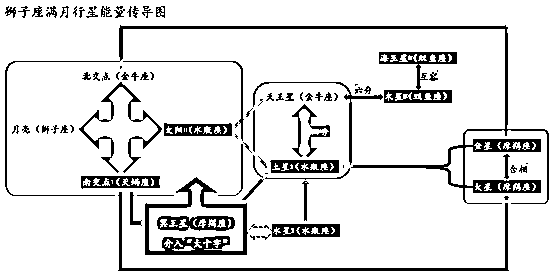

**狮子座满月重点影响人群**

参考满月峰值影响期间各个行星的行进度数，以及逆行行星的轨迹影响；常规容许度，个人行星入相位 3°，出相位 1°；非个人行星入相位和出相位均为 3°。

**·** 出生星图中，有**行星、四轴、南北交点落入固定星座（金牛座、狮子座、天蝎座、水瓶座）0°-20°，24°-30°**的人群； **· **出生星图中，有**行星、四轴、南北交点落入基本星座（白羊座、巨蟹座、天秤座、摩羯座）13°-20°，24°-30°**的人群；**·** 出生星图中，有**行星、四轴、南北交点落入变动星座（双子座、射手座、处女座、双鱼座）0°-2°，7°-14°，19**°-25****°********的人群。

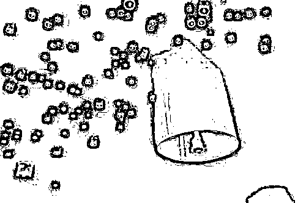

**最激烈的满月，想起《西游记》**

****

**我们必须打破镜子，审视自己，根除扭曲的心态。唯有如此，心底的一切才会纯粹而真实地呈现面前，正义才能彰显。**

**——加思·斯坦《我在雨中等你》**

> ****天象：****
> 
> **· 固定星座大十字：“水瓶座太阳-狮子座月亮”的日月对分轴线，与“天蝎座南交点-金牛座北交点”的南北交点轴线，相邻顶点彼此呈 90°，相隔顶点彼此呈 180°，形成“固定星座大十字”结构。****· 冥王星介入“固定星座大十字”：摩羯座冥王星与水瓶座太阳呈 30°结构，与狮子座月亮呈 150°梅花结构，与天蝎座南交点呈 60°结构，与金牛座北交点呈 120°结构。**

此次狮子座满月，是一次沉甸甸的满月：**·** 首先，南北交点和冥王星都与**“业力功课”**相关，揭示着**无意识的业力执着（冥王星）和业力习性（南交点）**；**·** 其次，南北交点和冥王星通过与满月的“日月对分轴线”联动，借助满月的月光将“业力功课”照见出来，提示我们**寻找“进化策略”（北交点和冥王星对应点）**。

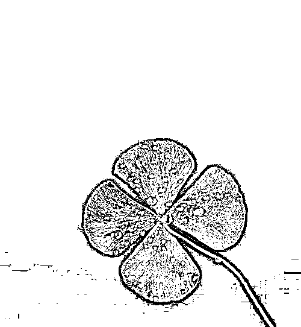

**1. “紧箍咒”照见“心魔”**

“大十字”结构犹如十字路口，四个顶点就像四个方向，互相撕扯且互不相让，令人如困围墙之中，**心生焦躁并心感慌张。** 此次狮子座满月，“固定星座大十字”四个顶点所落星座的度数相差不到 1°，再加上固定星座的顽固特性，巨大的张力和满格的压力，就像孙悟空头上的“紧箍咒”一般，令人头疼欲裂且恼恨交加。狮子座满月总是**将内心深处“认同的需求和荣耀的渴望”强化和彰显**，而此次狮子座满月的“固定星座大十字”却令我们**“卡”在四方均不买账的窘境**：当**集体环境**（水瓶座太阳）与**个人意愿**（狮子座月亮）不相符合，**个人主观**（狮子座月亮）便对**集体现实**（水瓶座太阳）**充满排斥。**而在这个**集体世界和个人生活都需要重建安全根基**（金牛座北交点）的当下时刻，任何一颗“不重要”的小石子都可能因为一阵“不自信”的业力之风，引发一场**敏感而复杂的情绪骇浪**（摩羯座冥王星和天蝎座南交点）。施主，敢问谁在念咒啊？并不是唐长老嘴里的“咒”，而是未成佛时的孙行者心底的“魔”。孙大圣尚且如此，更何况人间的你我。此次狮子座满月，正是**帮助我们释放情绪和净化心魔**的进化时刻，虽然这并不是一条坦途，但却是每颗心灵都渴望探寻的旅途，都渴望到达的彼岸。

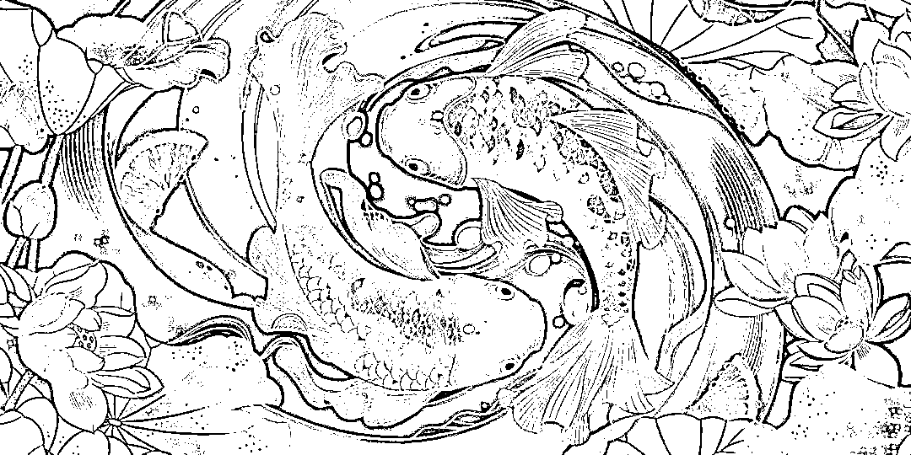

**2. 解读执着，解除魔咒**

此次狮子座满月的“固定星座大十字”结构，将我们的身（太阳）心（月亮）置于“业力进化之旅”（南北交点）的中点位置，引领我们**在前后 3 个月的两场食相（2021 年 11 月 19 日的金牛座月食和 2022 年 5 月 16 日的天蝎座月食）时间中点，做出阶段性的整顿和清理。** 

2021 年 11 月 19 日[金牛座月食](http://mp.weixin.qq.com/s?__biz=MzA5NjA0NTAxNg==&mid=2651461670&idx=1&sn=48d44052692e7cf6fc6e5146266e8a74&chksm=8b48aa91bc3f2387b8ca38bb0073b63aed347505e4ac2d7e321188081e7279eb2c45e3c4637f&scene=21#wechat_redirect)（点击可阅读）是上一轮“射手座南交点-双子座北交点”南北交点轴线的最后一次月食（下一轮相隔 18 年），带着“承上启下”的启示，提前预告了**未来一年半（2021 年 12 月 23 日-2023 年 7 月 13 日）**“天蝎座南交点-金牛座北交点”南北交点轴线的进化目标——只有在“射手座南交点-双子座北交点”轴线即将谢幕的时刻，**为意识松绑，对未来敞开；**才能在“天蝎座南交点-金牛座北交点”轴线登上舞台的时刻，**放下执着，活在当下。**回首从金牛座月食至今的 3 个月旅途：**·** 我们经历了跨年的**金星逆行摩羯座（2021 年 12 月 19 日-2022 年 1 月 29 日）**、**南北交点换座（2021 年 12 月 23 日）**、**第三次“土天四分”（2021 年 12 月 24 日）**、**木星换座双鱼座（2021 年 12 月 29 日）**、**2022 年第一波水星逆行（2022 年 1 月 14 日-2022 年 2 月 4 日）**。**·** 这是**各种“关系议题”深度演化**的一段时间，人际关系、信任真相、职场沉浮、市场风云，无论是我们自己经历的，还是从别人身上看到的，数不清的事件刷新着我们的认知并震荡着我们的情绪。**·** 这也是我们**与“真实自我”相遇**的一段时间。只是很多时候，“真实”来得那么措手不及，令没有做好“面对和接纳”准备的我们，还带着业力的执着，希望“真实自我”能够更好一些，还带着业力的习性，抗拒“真实自我”中并不理想的部分。此次狮子座满月，2021 年 11 月 19 日金牛座月食-2022 年 5 月 16 日天蝎座月食的“业力进化之旅”已经行至一半，“宇宙超级大 BOSS”摩羯座冥王星介入“固定星座大十字”之中——**揭示“历史创造当下”的现实，提供“当下创造未来”的方案。**

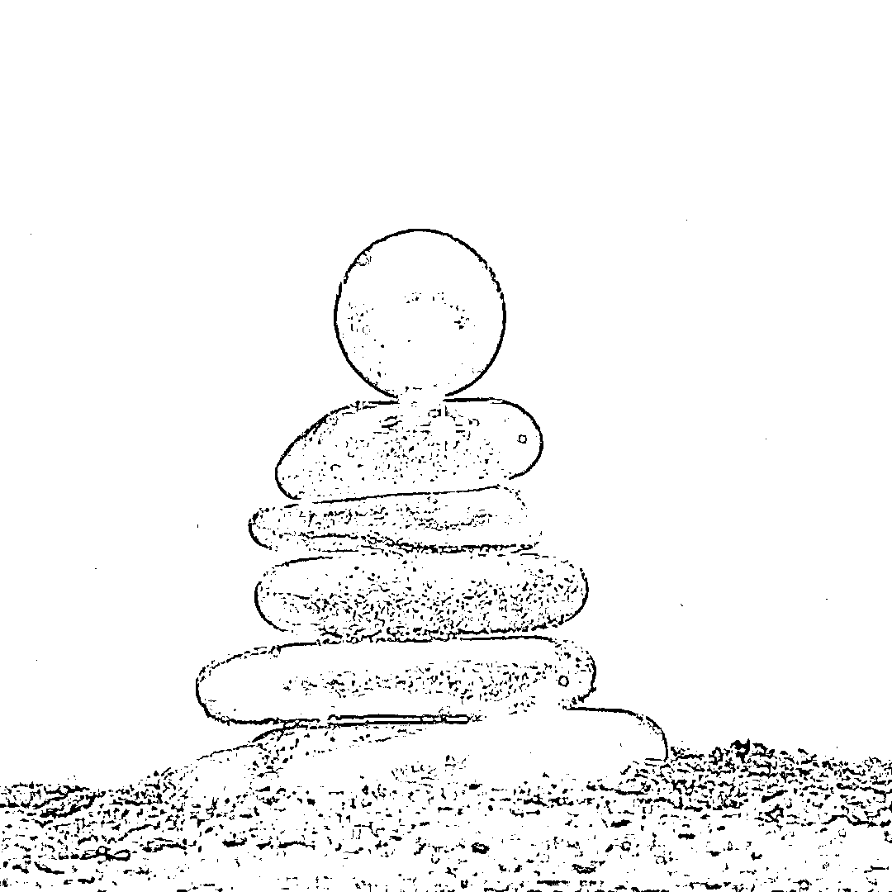

生命对自我的主观视角和主观期待，充满着与生俱来的迷恋与依赖，这是生命的现实，亦是业力的执着。这些在生命深处叨叨不停的“魔”，就像“紧箍咒”那般令人头疼不已，而此次狮子座满月正是解开魔咒的时刻——**如果你想成就自己并实现目标，就须得放下傲慢的态度并戒掉主观的任性，真诚寻求支持并勇敢创建共赢**，因为，**个人理想的达成离不开集体舞台的运作。**自信的人无需证明价值，成熟的人无需掩盖笨拙。此次狮子座满月，请给与自己爱与拥抱，无论成熟与否，无论成绩如何，我们都是自己的“超级英雄”。“超级英雄”就在生命之中，驱动我们觉察自我的局限，激励我们突破自我的极限。当我们勇敢面对并开始接纳“真实自我”的时候，就会寻获属于自己的“超级英雄”。此次狮子座满月，如果我们能**放下“更好，更优秀”的业力执着，告别“不配，不够好”的内在阴影**，就会**收获一份超越自我的宏大视角和慷慨胸怀，更加客观地看待自己，更加公平地对待别人**，就能**带着建设性的发心和共赢性的心态融入集体的舞台**，为后面 3 个月的进化之旅（至 2022 年 5 月 16 日天蝎座月食）做出有益的铺垫。

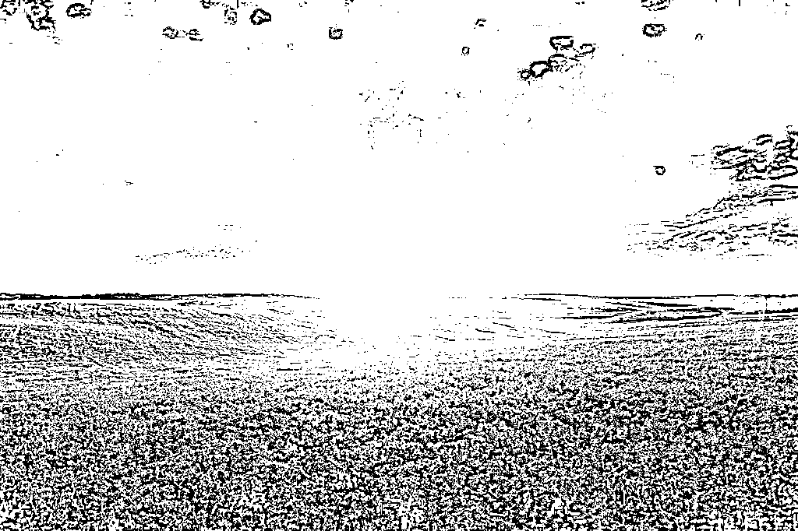

**给你半个月时间，你会往哪儿看？**

****

**你的心，决定你看见的。**

**——加思·斯坦《我在雨中等你》**

> ****天象：****
> 
> **· 金火合相：金星和火星合相于摩羯座。**
> 
> **· 木天六分：双鱼座木星六分金牛座天王星。**

宽泛容许度下，与金牛座北交点一体共振的金星（金星守护金牛座）、与天蝎座南交点一体共振的火星（火星守护天蝎座）组成的“金火合相摩羯座”结构，几乎覆盖了整个 2 月的生活。**· 2 月 17 日的狮子座满月**，“金火合相摩羯座”结构达到精准峰值，为张力巨大且剑拔弩张的满月送上一枚“激情洋溢”的礼花；**·** **3 月 3 日**，“金火合相摩羯座”结构与“宇宙超级大 BOSS”摩羯座冥王星形成“金火冥合相摩羯座”结构，“金冥合相”第 3 次能量高峰将火星拉进来做推手；**· 3 月 6 日**，金星和火星双双换座进入水瓶座，并形成“金火合相水瓶座 0°”结构。

**敲黑板！划重点！**

**未来半个月，将是相当敏感和激烈的一段时间：**
**· 2 月 17 日-3 月 3 日：**从 2021 年第四季度开始暴雷的各种“关系”议题，无论是亲密情感和人际协作，还是职场格局和市场利益，都将迎来**最终的清理与决断**。这个过程并不那么令人舒适，但对于下一阶段而言，这是必要和重要的“规整”步骤。**· 3 月 6 日：**“金火合相水瓶座 0°”结构，将会再次按下 2020 年 12 月 22 日“木土合相水瓶座 0°”并开启全新“风元素周期”的启动键——更先进的世界，更高端的文明，不能仅仅体现在智能的应用和智联的开发上，更要体现在**万物的平衡与众生的平等上**，有爱的发心才能成就共赢的世界，否则每一个生灵都会被冷漠覆盖，被私欲伤害。

**再次敲黑板！划重点！**

未来半个月，也将是我们**再次理解、再次演练“摩羯座-水瓶座”发展序列**的一段时间——**先成就自我，才能理解共赢；先做到自律，才能拥有自由；先给出承诺，才能获得尊重。**  此次狮子座满月，就是我们**对自我生活做出规整，对未来生活做出承诺**的重要时刻！两组天象也为我们提供助力并带来机遇。

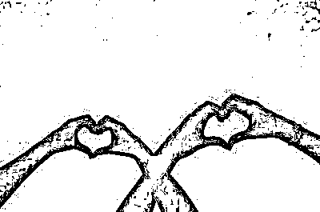

**1. 水冥合相，意识唤醒**

**2022 年第一波水星逆行发生在 1 月 14 日-2 月 4 日**，水星走了一趟“水瓶座-摩羯座-水瓶座”的旅途，并前后 3 次（**2021 年 12 月 30 日、2022 年 1 月 29 日、2022 年 2 月 12 日**）与摩羯座冥王星形成**“水冥合相”**结构，触发了**企业架构的调整和个人职场的变化**，也**制造出正常运转的阻力，带来内在思想的困扰**，但更重要的是，在这个过程中**逼迫我们对自己说真话。** 

**2 月 15 日，水星换座进入水瓶座，为拥堵的思绪敞开一扇窗，打开视角，升级认知，打通困惑，我们开始思考并探寻“与集体融入，与环境平衡”的有效策略。**这对于此次狮子座满月是相当重要的一个动作，甚至说是一种保障，可以帮助我们**避免陷入主观盲点而不自知，陷入短视主义不可自拔。**

**2. 木天六分，珍稀难遇**

这里必须郑重地说：**这是 2022 年唯一一次“木天六分”结构，也是近 4 年之中最好的一次木天相位**；而后木星和天王星的行进，要**到 2024 年才有一次喜忧参半的“木天合相”结构（金牛座）**，到**2026 年才能再次盼来喜大于忧的“木天六分”结构（巨蟹座-金牛座）**。

**故而，这一次的“木天六分”结构极其宝贵且值得珍惜。**  

古希腊神话中，木星的原型“宙斯”是第三代天神，天王星的原型“乌拉诺斯”是第一代天神，他们都具有高远的视野，引领至高的理念。故而，这是一组与**“理想和希望”**相关的结构，同时，木星行进的双鱼座和天王星行进的金牛座也提示着**“理想落地”**的重要性。这两年我们过得太紧张了，也该出现一些惊不惊喜和意不意外的时刻了。嗯，机遇来了，就笑着去拥抱它吧！**从此次狮子座满月到 3 月 6 日“金火合相水瓶座 0°”的这段时间**——关注当下时刻，看着脚下的路，让那些试图干扰你的猜疑和恐惧靠边儿站，你的眼睛将会决定你能到达的地方，故而，你的眼睛一定要看着更为重要、更为宝贵的那些事物。

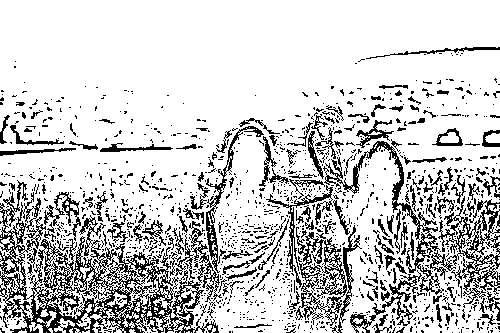

另外，如果你已经准备好理想，也要准备好迎接变化的准备。或许此刻你还看不到其中的必要性在哪里，甚至有些厌烦变化和恐惧无常，但未来你将会收获“积极应变”回馈给你的礼物。那么，属于你的意外惊喜在哪里？**打开你的出生星图，看看行进的“木天六分”落入你出生星图的宫位，那个宫位所相关的领域和发生的事件蕴藏着这份意外的惊喜。**宇宙为我们安排了宏大的篇章。此次狮子座满月，张力巨大的整体天象正在逼迫我们在“个人与集体，复杂与简单”之间寻找一种平衡，以便在 3 月 6 日“金火合相水瓶座 0°”的时候，带着升级的意识重新迈向全新的征程。**寄语**

****

**不要让已经发生的事影响正在发生的事。**

**——加思·斯坦《我在雨中等你》**就在此次狮子座满月即将到来的时刻，我所在区域终于迎来解封！19 天的居家生活，我觉得自己像一块海绵一样尽力吸收着这份不得已的闲适与安静，既然好多年已经没有真正的假期，那么就随遇而安并随缘而定吧。

但这份随遇和随缘的背后，却是太多一线人员的辛苦付出才能换得，感谢他们。

生活就是这样，很多时候，减速和加速难由自己。就像这场没完没了的新冠肺炎疫情，当我被封在防范区的时候，再次体会到“个人与集体”的一体化运作——不被加速取胜的欲念驱动，不因减速妥协而拖累他人，做好自己是对这个世界最基本的贡献。

祝愿每一个灵魂安好。祝福大家，一起加油！

**版权声明**：原创文章由作者授权首发于若道平台，欢迎转发，反对抄袭。友号转载请申请白名单。

****

****想阅读更多作者的文章，****

****请在后台回复******王芝桦****** 即可。****

****王芝桦****

心理占星师，统合疗愈师，占星专栏作者

若道占星“新月和满月”专栏作者，腾讯视频特约占星师

全职于个案咨询与占星教学工作 18 年

**个案预约咨询微信号**：zhihua0621 

**微信公众号**：daoxi-life

**长按打赏**

****

**学习占星学****点击下图了解课程详情** 

**

****************

**微信又双叒叕改版啦，不想错过若道君的推送？**

**就把若道设为星标吧！****▼**

**就是这个“在看”，戳戳戳 ☟**

******报名直达入口******

# 释梦占星大师工作坊：荣格、占星学与梦境

> 原文：[`mp.weixin.qq.com/s?__biz=MzA5NjA0NTAxNg==&mid=2651467700&idx=2&sn=6181a88fdf3ce12c2a1b81791e810b42&chksm=8b489d03bc3f1415a4c5d63fc07f4a270bcd307a12ed343db007e1113391b04ceb5418f9c997&scene=126&sessionid=1692737857#rd`](http://mp.weixin.qq.com/s?__biz=MzA5NjA0NTAxNg==&mid=2651467700&idx=2&sn=6181a88fdf3ce12c2a1b81791e810b42&chksm=8b489d03bc3f1415a4c5d63fc07f4a270bcd307a12ed343db007e1113391b04ceb5418f9c997&scene=126&sessionid=1692737857#rd)

****

**2022 年 3 月和 4 月木星和海王星在双鱼座合相给连接梦境与占星提供了一次绝佳的时机。**

**　　——格雷格·博加特老师**

**梦境工作和做梦疗法是深度心理治疗的一个关键技术，**使得深层无意识的象征性语言能够传递它们的洞见，并指引患者走向更大的完整。

梦境使带有情感成分的无意识材料安全而快速地进入意识层面。它们帮助找到治疗的重心，指引治疗的方向。**梦境提供了重要的线索，告诉我们客户痛苦的来源，以及哪些情绪和情结需要被检视和处理。**梦境工作可以成为心灵成长和行为改变的强大催化剂，它有种独特的能力，促进疗愈从内在发生。

梦就像冰山从无意识的深水中浮现出来。有些冰山属于过去，帮助我们理解过去的创伤和未消化的回忆，因此是回溯性的。

**梦境有种整合的能力，**因为他们能使我们觉知和化解很多次人格之间的矛盾。**梦境也有前瞻性或预期性，**那是来自未来的冰山，会呈现出将要发生的事情，显现出个人有可能成为的样貌。**梦境既向后看也向前看**，它的本质功能是扩展意识、觉知和身份的疆界。

**我在梦境工作中主要使用的技术，是以开放的好奇心，主动探求梦境中每个角色、地点和行为的当下意义**——每个元素都反映出梦者的心灵状态和当前的生活情境。被梦境所揭露的信息，往往既幽默，又充满矛盾，而且为我们打开了新视野。

怀着一种敬畏的心态，我发现每个梦境都是意识海洋深处的一颗珍珠。反思梦境的奥秘，会引发一种近乎宗教敬畏的情感，我们会惊叹于心灵描绘自身处境的能力。

1

**课程内容**

**本课程将课堂讲座与动力过程工作结合起来，动力工作过程会将星图解读和梦境分析结合起来。**

每天约一半时间用于讲座，其余时间会演示占星学梦境工作方法，过程中老师会与学员进行互动。课程包括对老师解读星图和治疗性梦境工作方法的详细阐释和示范。

**我们将学习荣格解梦的基础知识和治疗性的、以过程为导向的星图解读。**我们将体验转化性原型模式在梦境和出生星图中同步显现时会发生什么。

**三次 6 小时的迷你马拉松在线梦境课程**，将会是一次提升意识、开放思想、转化生命的事件。**学员将体验占星学和解梦的融合。**

每次课程格雷格·博加特老师都会与学员互动，课程中使用的星图和梦境将由愿意分享自己梦境和星图的学员提前提供，课程期间也会开放问答以及学员互动环节。

2

**课程安排**

**第*****1*****讲  2022 年 3 月 5 日 **

卡尔·荣格的童年、学生时代以及投身精神病学时期的故事。《荣格自传：回忆·梦·思考》概要。弗洛伊德与荣格的关系，他们合作的破裂，荣格随后的抑郁时期，以及他借助梦、积极想象、艺术创作、曼陀罗绘画和对奥义知识（灵知）、神话和占星学的研究，转化性地面对无意识。卡尔·荣格与艾玛·荣格的占星学。

荣格的力比多（心灵能量）的概念，以及他的心灵结构地图：自我、个体无意识和集体无意识。荣格对无意识原型的描述，它们对个人神话的重要性，以及它们作为个人情结的表现。自我-自性轴线，以及自我与无意识之间不断演化的关系。

**我们将介绍荣格解梦的基础知识以及治疗性的、以过程为导向的星图解读。我们将体验转化性原型模式在梦境和出生星图中同步显现时会发生什么。**

****第*****2*****讲  2022 年 3 月 12 日 ****

梦境中的个性化及其占星学时机。出生星图随时间推移展开。整合个体无意识：梦和出生星图中的人格面具与阴影。男性和女性：阿尼玛和阿尼姆斯。**梦与占星学行进**描绘建立或脱下人格面具的阶段，遭遇阴影的阶段，通**过阳性意识和阴性意识的结合发展出更统一的人格的阶段。**

**第*****3*****讲  2022 年 3 月 19 日 **

**整体性在占星学和梦境中的象征。**透过占星学符号研究梦，来深化内在生命。我们将学习占星学行进和梦境如何试图让我们意识到差异、内在冲突和极性，逐步整合对立，将人格整合成一个整体。

梦境工作和星图解读中的曼陀罗原理。荣格的心理类型理论：内向型和外向型的任务。达到思维、情感、感觉和直觉的平衡。我们还将涉及使用五因素人格理论作为星图解读和梦境分析的基础的重要性。

**我们将学习如何解读梦境，并辨别梦的象征意义所传达的有说服力的信息，因为这与出生星图和行进有直接关联。**整合占星学和梦境工作，可以带我们进入情感、关系和灵性更为一致的状态。

3

**授课老师**

**格雷格·博加特**

（Greg Bogart）

**占星师、心理治疗师**。格雷格出生于美国纽约市，就读于卫斯理大学，1986 移居旧金山湾，完成了加州整合大学和赛布鲁克大学的研究生课程。格雷格自 1991 年以来一直是一名有执照的**心理治疗师**（LMFT 28276）。**他是国际占星研究协会（ISAR）认证的占星师**，并拥有美国地球宇宙学研究协会（NCGR）的第四级认证。他还在旧金山的艾扬格瑜伽学院接受过培训，并于 1992 年毕业且获得了**瑜伽教师认证。**

格雷格是一名私人执业的心理治疗师，在索诺玛州立大学担任**心理学讲师**，他在该校教授“成人发展中的转变”、“以深度为导向的心理治疗”、“神话、梦与象征”以及“存在主义心理学与超个人心理学”等课程，他在加州整合大学、约翰·F·肯尼迪大学、多米尼加大学和超个人心理学学院教授咨询心理学和东西方心理学课程。**他的研究结合了冥想、哈他瑜伽、荣格解梦、存在主义心理疗法和精神综合，以及占星学的周期智慧和原型象征。**

**格雷格·博加特博士著作：**

*   《占星学的高八度音阶》（*Astrology’s Higher Octaves*）

*   《行星用于治疗》（*Planets in Therapy*）

*   《占星学与灵性觉醒》（*Astrology and Spiritual Awakening*）

*   《梦境工作过与自我疗愈》（*Dreamwork and Self-Healing*）

*   《梦境工作在抑郁症整体心理治疗中的应用》（*Dreamwork in Holistic Psychotherapy of Depression*）

*   《占星学与冥想：对变化的无畏沉思》（*Astrology and Meditation: The Fearless Contemplation of Change*）

4

**课程价格**

*   **课程价格：****5800 元**

*   **课程咨询：**王老师（微信：18510107057，请备注“释梦工作坊”）

长按二维码添加王老师

5

**课程安排**

*   **课程时间：**

     **2022 年 3 月 05 日周六  8:00-14:00**

**2022 年 3 月 12 日周六  8:00-14:00**

2022 年 3 月 19 日周六  7:00-13:00

*   **授课方式：**线上直播，英文授课，中文翻译

6

**退转课程**

*   **退款原则请详看《教学协议》，如有疑问请咨询课程顾问。**

****释梦工作坊****

**授课老师：**格雷格·博加特

**授课时间：**2022 年 3 月 5 日起

**授课方式：**网络课程**，**英文授课，中文翻译

**费用：****5800 元**

**课程负责人：****王老师**（微信：18510107057，请备注“释梦工作坊”）

长按二维码添加课程负责人咨询~

****报名请点击“阅读原文”****

# 占星咨询中，需要考验占星师“算”得准不准吗？

> 原文：[`mp.weixin.qq.com/s?__biz=MzA5NjA0NTAxNg==&mid=2651467590&idx=2&sn=e74a113f1834c8cc87b137d161e04e8b&chksm=8b489df1bc3f14e7f32de77d50ce904ddf2a8dcb97f623d7465c7859cfc7b4665165648c95b0&scene=126&sessionid=1692737857#rd`](http://mp.weixin.qq.com/s?__biz=MzA5NjA0NTAxNg==&mid=2651467590&idx=2&sn=e74a113f1834c8cc87b137d161e04e8b&chksm=8b489df1bc3f14e7f32de77d50ce904ddf2a8dcb97f623d7465c7859cfc7b4665165648c95b0&scene=126&sessionid=1692737857#rd)

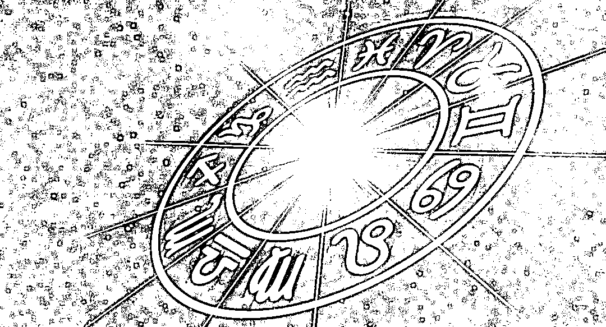

作者/大卫·瑞雷 若道占星创始人

译者/若道翻译团队编辑/玫瑰 图片/pexels

在【[1](http://mp.weixin.qq.com/s?__biz=MzA5NjA0NTAxNg==&mid=2651465949&idx=2&sn=6e479c5393b524104ae9705b3bf9c77a&chksm=8b489a6abc3f137c26a7f691aea0a08e7a02ffb51a08ee3eb7f7752cd6131572a7838b16536e&scene=21#wechat_redirect)】、【[2](http://mp.weixin.qq.com/s?__biz=MzA5NjA0NTAxNg==&mid=2651466563&idx=2&sn=b50271ed6b07518a8ed498d7ad0eadbf&chksm=8b4899f4bc3f10e2b672ed67cb0832f2894a7003c79a7f59e1d4658cea3b63326e2b27255a90&scene=21#wechat_redirect)】、【[3](http://mp.weixin.qq.com/s?__biz=MzA5NjA0NTAxNg==&mid=2651467171&idx=2&sn=2f6933b622a755788b9dc2f6f86d7a8d&chksm=8b489f14bc3f1602e3829be83cafd5cc2353868cb5bb285ba59cc0365aec8ad9f7aa450c7ca5&scene=21#wechat_redirect)】三篇文章（点击链接可阅读）中，大卫老师详细地讲述了人本主义占星咨询的价值。今天我们就来进一步了解人本主义占星咨询同算命的区别。另外，大卫老师参与授课的【[核心课程](http://mp.weixin.qq.com/s?__biz=MzA5NjA0NTAxNg==&mid=2651463523&idx=3&sn=019938f53a79cad4286a02eee12e56f2&chksm=8b48add4bc3f24c226dc436b0db23c55c33bb8d20c0b2ae7f1d669e5d144617206672de875b6&scene=21#wechat_redirect)】和【[双证书课程](http://mp.weixin.qq.com/s?__biz=MzA5NjA0NTAxNg==&mid=2651467034&idx=3&sn=689f3ae356f82b32acc0a7196d141619&chksm=8b489fadbc3f16bb0d74163ee098f8107c8eda43ce7c2d790b64980581003b90a4491221bff5&scene=21#wechat_redirect)】开启报名中，点击链接了解详情吧！

**毫无意义的“占星师测试”**上周我写了一篇关于“背景/上下文”在星图解释中的重要性的[文章](http://mp.weixin.qq.com/s?__biz=MzA5NjA0NTAxNg==&mid=2651467171&idx=2&sn=2f6933b622a755788b9dc2f6f86d7a8d&chksm=8b489f14bc3f1602e3829be83cafd5cc2353868cb5bb285ba59cc0365aec8ad9f7aa450c7ca5&scene=21#wechat_redirect)（点击可阅读）。如果你是客户，你会问：“我应该和占星师分享多少关于我自己的信息？”而且，如果你是占星师，你的问题是：“我需要多少关于客户的信息来帮助咨询？”在这一点上，你们中的一些人可能会感到困惑甚至不安。“我不会告诉占星师任何事！我为什么要这么做？ 他们应该已经知道了，对吧？”这种态度源于一种观点，即占星师“知道一切”或至少“知道足够多”，能够对你做出陈述，并预测你的未来，而你很少或没有信息输入。当你第一次去拜访一个从未见过的占星师时，你可能想要一开始就“测试”这个占星师。毕竟，你可能会想“我为什么要相信这个占星师？让我们看看他们是不是很厉害？”所以，在占星师开始分析你的星图时，你面无表情地坐在那里，双臂交叉，沉默了 10 到 20 分钟。也许占星师会对你说些有意义的话? 也许他们甚至会触及你自己知道是真的的某件事。

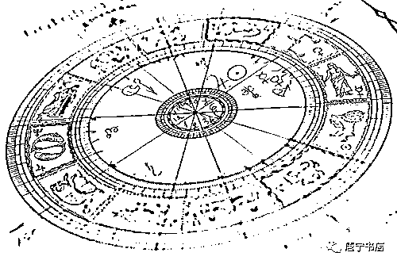

这有点像听“磁带上的占星学”，只不过在这种情况下，作者就在你面前。也许你在倾听占星师的时候学到了什么。然而，**无论是你还是占星师都没有利用你们“两者都在”这一事实，并就你的生活进行更深入的对话，从而向你揭示为自己创造更充实生活的方法。**尽管如此，你还是坚持要玩这个游戏。是的，你在和占星师玩猜谜游戏。“让我们看看这个占星师好不好？” “让我们看看他们能不能告诉我一些我认为是真的关于我自己的事？”你已经付钱给占星师了，现在你要花 60 到 90 分钟的时间和占星师交谈。所以你已经在这次“游戏”中投入了资金，你想从这游戏中获得什么？**“我想让他们告诉我一些我已经知道是真相的事。然后我想让他们预测我的未来。”**想象一下对你的医生说：“告诉我发生了什么事？”医生说：“你有什么症状？”“不，我要你告诉我，”你反驳道。医生看起来很吃惊，说：“那么，给我讲讲你的病史吧？”然后你说："我想让你给我讲讲我的病史。"沮丧的医生接着说：“如果我连你的症状都不知道，我甚至不知道该做什么检查？”然后你说：“猜猜看，来吧，医生，猜猜看。”这能让你走多远？

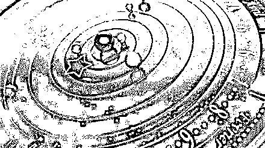

**人本主义占星学****我想说的是，这个算命的猜谜游戏是在浪费你的时间。**你可能会说：“占星师不是医生。”很明显，医生必须有多年的教育和实习才能行医。任何人都可以自称占星师。然而，在西方和越来越多的中国，职业占星师的确毕业于占星学校或受人尊敬的导师项目，并接受培训和职业认证。**一个客户在决定预约之前仔细检查占星师的证件是明智的。与职业占星师分享自己的信息的确比玩猜谜游戏更有助于咨询成果。**在写关于占星咨询价值的文章时，我一直在强调占星咨询中算命方式的问题。现在，我想将这种算命方式与西方更现代的“以人为本”的占星咨询方式进行对比。占星咨询出现在 20 世纪 60 年代末和 70 年代初，影响了此后西方的大多数专业占星师。这种以人为中心的占星学的领导者当然是丹恩·鲁伊尔，他在 1969 年 2 月创立人本主义占星学时，故意说自己从心理学中借用了“人本主义”一词。最近，我看到了占星师莫里斯·霍克（Morris Hoch）的一篇博客，它说明了占星学中以人为中心的运动是多么深刻： “人本主义占星学的主流思想见于丹恩·鲁伊尔（Dane Rudhyar）和亚历山大·鲁伯特（Alexander Ruperti）的著作；他们创造了‘以人为本的占星学’，根据卡尔·荣格的共时性和集体无意识理论及其原型，以及阿尔伯特·爱因斯坦的广义相对论及其时空连续体的贡献，对西方占星学进行了更新和修订。爱因斯坦？卡尔·荣格？鲁伊尔？（鲁伯特实际上是鲁伊尔的学徒）我必须补充的是，卡尔·罗杰斯和亚伯拉罕·马斯洛，都是人本主义心理学运动的核心创始人。所有这些思想都以这样或那样的方式对现代世界占星学的重塑做出了贡献，并对占星咨询的进行方式做出了贡献。

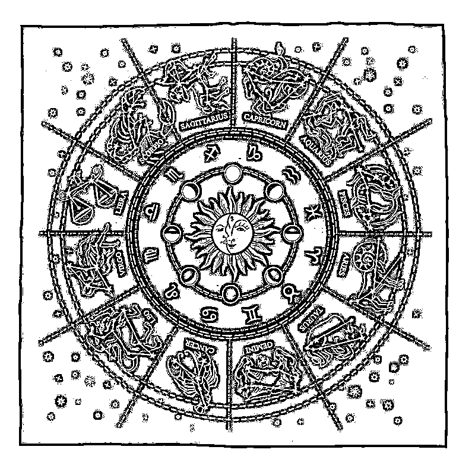

**以人为本与算命的区别**那么，这种以人为本的方法在占星咨询中是如何起作用的呢？它和算命有何不同呢？**算命的风格是将占星师置于占星咨询的中心。**占星师作为权威解读客户的星图，很少或根本不需要客户的意见。占星师的表演在舞台的中心；客户主要是一个观众。顾名思义，以人为中心的方法将人（即“客户”）置于谈话的中心。这意味着**整个咨询都是针对客户来开展。**占星师会将星图呈现在客户面前，而这些星图只作为咨询中占星师的参考框架存在。人本主义占星师在他们的训练中被鼓励无条件地积极地关注他们的客户，真正地关心和支持他们的客户的个人成长潜力。一种非评判的态度是至关重要的，以助于在安全的空间内，客户可以自由表达自己。

**版权声明：**原创文章由作者授权首发于若道平台，欢迎转发，反对抄袭。友号转载请申请白名单。

****想阅读更多作者的文章，请在后台回复******大卫****** 即可。****

**大卫·瑞雷**

美国占星师，若道联合创始人，致力于在中国教授和推广西方占星学；2010-2014 年，任全美占星师联盟监督委员会委员；2017 年，被选为 ISAR 委员会成员。ISAR 是世界最大的国际占星机构，会员遍布 45 个国家，2017-2020 年曾任 ISAR 全球副主席、CAPISAR（ISAR 职业占星师资质认证机构）主席。

**喜欢文章请长按下方二维码打赏****给大卫老师加杯咖啡呗~****▼**

**学习占星学****点击下图了解课程详情** 

**

********************************

**微信又双叒叕改版啦，不想错过若道君的推送？**
**就把若道设为星标吧！****▼**

**喜欢记得点一下在看哦☟**

**报名直达入口**

# 太阳处女座与 12 星座月亮丨你是哪类“百里挑一”的专家？

> 原文：[`mp.weixin.qq.com/s?__biz=MzA5NjA0NTAxNg==&mid=2651467590&idx=1&sn=09b8f5ba9fa46e469e0add987cbe1664&chksm=8b489df1bc3f14e7a4e6b90286394af16e05f4c097058a2e2402d38f2634a0a84b32aaa03fe3&scene=126&sessionid=1692737857#rd`](http://mp.weixin.qq.com/s?__biz=MzA5NjA0NTAxNg==&mid=2651467590&idx=1&sn=09b8f5ba9fa46e469e0add987cbe1664&chksm=8b489df1bc3f14e7a4e6b90286394af16e05f4c097058a2e2402d38f2634a0a84b32aaa03fe3&scene=126&sessionid=1692737857#rd)

☆****后台回复“今日”，给你一句生命态度****

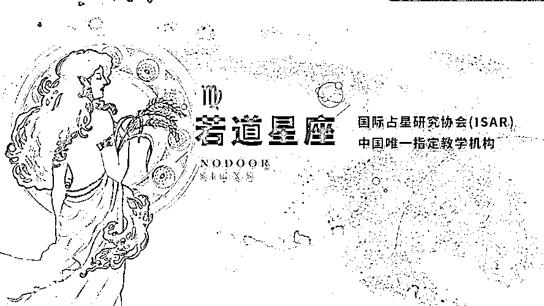

作者/诺·泰尔 译者/江艺、dogcatcher 编辑/翀子 封面/书君 图片/网络太阳是生命的伟大能量，而月亮被认为是人格中的“主导需要”，同样被重视（你可以点击【[开篇](http://mp.weixin.qq.com/s?__biz=MzA5NjA0NTAxNg==&mid=2651463192&idx=2&sn=7ecd2012aee1f245b56e0f107bdfc19e&chksm=8b48acafbc3f25b968e9ca8cbe8acf6972dc3e418827b36ac12af7bf7c81858937657babb393&scene=21#wechat_redirect)】，查看诺·泰尔老师对此部分内容的详细阐述）。当处女座太阳，遇见 12 星座月亮，分别有哪些表现呢？**太阳处女座和 12 星座月亮**

**★月亮*****白羊座***

**他们向外界表达自我的时候很自信，但内心的情感恐怕很腼腆**。（太阳处女座低调的）性格难以满足（月亮白羊座）自尊的索求，犹如小人掌权。他们**表达着高远的理想，但落实它们的行动，总是陷入到过分讲究的对细节的关注中去**。但只要调换次序，先斩后奏，该问题就能解决。

**★月亮*****金牛座 ***

他们似乎很少被物质问题所困扰，总有好运气获得舒适的生活。由此带来的**松弛状态**，能够移走成长的动力，使他们难以培养更多优点去争取更大的收获。他们总是**缺乏激发努力的迫切**，因而需要紧张相位辅助来找到成长的新途径。 

**★月亮*****双子座 ***

**思维的力量既是该配置的长处，也是短处**。分析能力可以很好地服务于思维反应，学以致用；但**过度的分析**会使自己忽略去培养生活中的感性一面。

**智力的优越感**能够带来自我启迪的机会，却也会使自己对那些创造性的实践机遇视而不见。总是在工作，不懂得玩乐。 

**★月亮*****巨蟹座***

给保守的天性增添了温情。**他们有着羞怯的天性与魅力，而这往往建立在一套详尽具体的行为习惯之上（饮食起居）**。但是他们重视人际交往中的安全感，因此也会经常调整这种行为习惯，来迎合当前所需。只是习惯终究是习惯，有了它们才能驾驭生活细节。

（在不开心的时候）他们的自我辩解是一种艺术；他们把个人卫生和健康看得比天还大，对其过于敏感；在工作环境中，如果碰到突如其来的进度更新或者接到新的任务，可能会情绪沮丧甚至发脾气。

他们很**容易沉默寡言**，但如果星图里当太阳和月亮受到强硬的相位的聚焦与辅助时，沉默寡言也会变成一种低调的优势。 

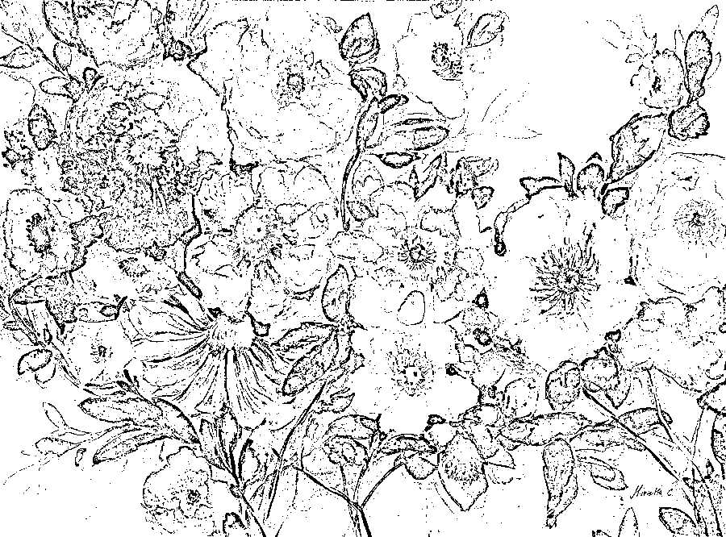

**★月亮*****狮子座***

**献身于职责**！自尊心因而容易受他人开发利用。他们的责任心有些过于被动。他们需要别人的鞭策来为一个目标尽职，而不是把工作本身当作目标。他们往往**倾向于隐藏自己的光芒**，不爱显山露水。 

**★月亮*****处女座 ***

**智力得到强调**。思维统治着生活：批判，延迟决定，可能完美主义到极点。他们有着高度的区分辨别能力，往往只青睐习俗与传统，排斥积极的改变。对他们来说，**原则和道德尊严十分重要**；保守主义往往遮蔽创新。

**该配置理想的工作方式**，是正确、精细、可信赖地支持那些有戏剧感和创新精神的人，按部就班地服从其领导。 

**★月亮*****天秤座***

他们的**理性思维支配着人际互动**。当自尊在寻找一个自己的镜像，或是在寻找一个满足自己独有标准的对象的时候，一种势利就会浮出水面。

对这个配置来说，**心平气和非常重要**，他们也经常能够通过独立思考达到心平气和。他们觉得有了宽广的社会化的希冀，人生才显得有意义。

他们也有耐心去见证这种希冀得到实现，但却要星图别处的有益征象将这此点燃，才能获得付诸实践的灵感和魄力。 

**★月亮*****天蝎座***

他们会**情绪化地向外投射自己的想法**，而天蝎座的固执则让思维与观点依附在自尊之上。他们会盲目地更新个人信条，还因此觉得值得庆祝，滋生出一种**传教士精神**。智力因此丧失了真实感，情感过于强调自尊的重要性。 

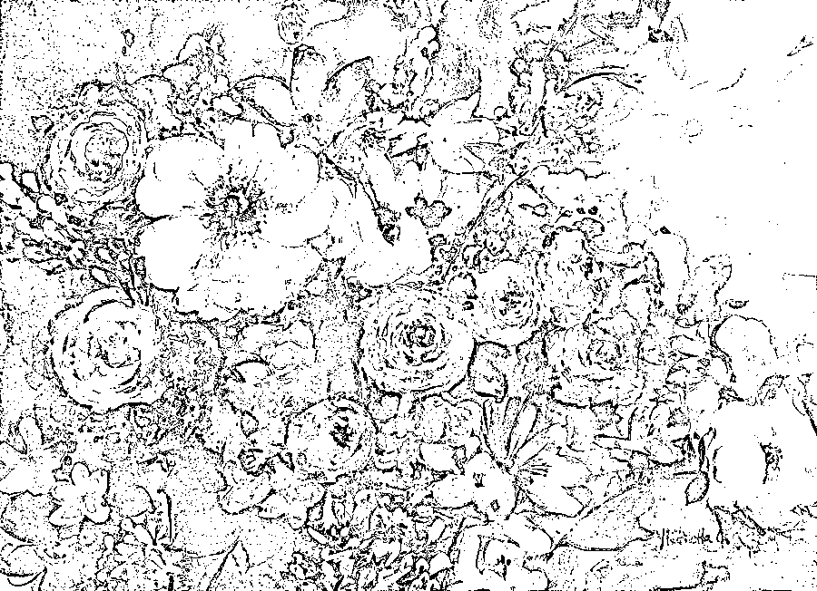

**★月亮*****射手座***

冒险，浪漫，激情，对异域的探索……都对思维拔苗助长。思维丧失了处女座惯有的朴实感。**成长的动力和个人信念互相冲突。**

**宏大的概念和常规的概念脱钩。**他们的情感会参与到想法、理念、概念中去，而不是扎根于物质现实。大脑热衷于搞哲学试验，因而太过轻易地脱离按部就班的安全感。

这个配置的挑战，是**利用天生的耐心和研究能力**，弄清宏大的新点子的底细，彻底地理解它们，并将它们合并为一个日益壮大的整体。 

**★月亮*****摩羯座***

思维把自尊带入一个具有影响力和管理能力的位置。他们**能精确地献身于目标**，因而创造成功。他们有着流利而又强大的说服力！

他们的自信允许这个配置外向得不像土象。太阳处女座的紧张感看来在这个失势的月亮星座找到了最佳释放点。

**他们慢工出细活，却又能把握时机，**能在有组织的活动中找到前途无量的学以致用的广阔天地。

**★月亮*****水瓶座***

**他们的思维和感情相互独立。**思维轻松地寻找着社会化的应用渠道，服务于理想，安静而专注地为其运作。 

**★月亮*****双鱼座***

**洞察力是伟大的天赋。**在和环境的敏感互动之中，这个配置**完善细节，等待完美**。他们的灵感润泽了思维。

但倘若灵感过量，原本和自己莫不相干的外界矛盾就会引发心理压抑。他们有深刻的同情心，经常为理想殉道，为他人的想法、感受而献身。

**其****挑战，是将这种敏感服务于个人领域之外的确定的目标**。 

**版权声明：**本文由若道翻译发布，欢迎转发，反对抄袭。友号转载请申请白名单。

**本系列其他文章**

[太阳白羊座·12 星座月亮](http://mp.weixin.qq.com/s?__biz=MzA5NjA0NTAxNg==&mid=2651463192&idx=2&sn=7ecd2012aee1f245b56e0f107bdfc19e&chksm=8b48acafbc3f25b968e9ca8cbe8acf6972dc3e418827b36ac12af7bf7c81858937657babb393&scene=21#wechat_redirect)丨[太阳金牛座·12 星座月亮](http://mp.weixin.qq.com/s?__biz=MzA5NjA0NTAxNg==&mid=2651463523&idx=1&sn=69fa5ba9035316fecd6c3911e744f089&chksm=8b48add4bc3f24c274cd5064316982ae958debed1e9ab681b46b80d8d8ec26bb3d2036075be9&scene=21#wechat_redirect)[太阳双子座·12 星座月亮](http://mp.weixin.qq.com/s?__biz=MzA5NjA0NTAxNg==&mid=2651465406&idx=1&sn=c9bf1ba49b07f6c67740c46779200be8&chksm=8b489409bc3f1d1fdad398e34840d6338275f29a8292e9eb404df28126fcc8262c454b2cb6c5&scene=21#wechat_redirect)丨[太阳巨蟹座·12 星座月亮](http://mp.weixin.qq.com/s?__biz=MzA5NjA0NTAxNg==&mid=2651465949&idx=1&sn=9dfd930de39b2de38c761152f4b8710c&chksm=8b489a6abc3f137c5c6e96f404038de7f4261fc6c995aeb285bc37f79b96ef5a1d237dbe3af5&scene=21#wechat_redirect)[太阳狮子座·12 星座月亮](http://mp.weixin.qq.com/s?__biz=MzA5NjA0NTAxNg==&mid=2651467312&idx=1&sn=d1a81f5cc1a60b3198d9c0ba770b4ba0&chksm=8b489c87bc3f1591008c88cef7b385086eb7717d4345926de92349b071ad10ceb67099f17ed0&scene=21#wechat_redirect)

**诺·泰尔**

现代占星学鼻祖，世界众多著名西方占星师的占星老师。他毕业于哈佛大学社会关系专业，是当今世界上最重要的占星师之一，占星联盟协会（AFAN）的创始人及原主席。其所著的三十三本占星教科书作为占星教学的典范，引领了整整两代占星师的占星学习与教育，1998 年国际占星大会（UAC）授予其占星界最高奖项 “轩辕奖”。

**学习占星学****点击下图了解课程详情** 

**

********************************

**微信又双叒叕改版啦，不想错过若道君的推送？**
**就把若道设为星标吧！****▼**

**喜欢记得点一下在看哦☟**

******************报名直达入口******************

# 冬奥热点丨羽生结弦：真正的勇士，敢于一腔孤勇为理想而战

> 原文：[`mp.weixin.qq.com/s?__biz=MzA5NjA0NTAxNg==&mid=2651467466&idx=1&sn=905ec29e9b8ae618e44baff618b0ebdd&chksm=8b489c7dbc3f156b5c51a21e1cd60b469d34f49fcff670b557d40f905728ff90f90074542227&scene=126&sessionid=1692737857#rd`](http://mp.weixin.qq.com/s?__biz=MzA5NjA0NTAxNg==&mid=2651467466&idx=1&sn=905ec29e9b8ae618e44baff618b0ebdd&chksm=8b489c7dbc3f156b5c51a21e1cd60b469d34f49fcff670b557d40f905728ff90f90074542227&scene=126&sessionid=1692737857#rd)

☆****后台回复“今日”，给你一句生命态度****

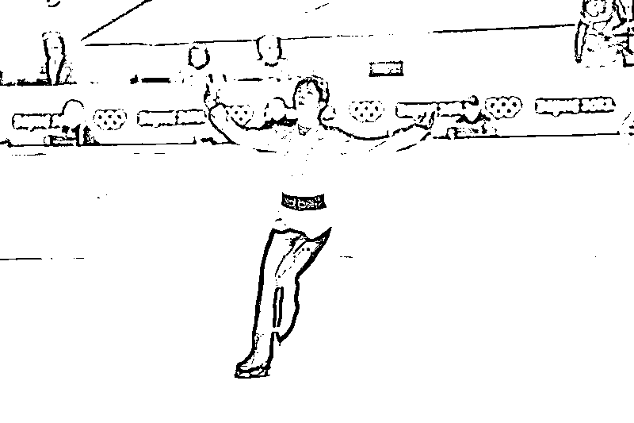

作者/芷菱 ISAR 认证占星师

编辑/翀子 图片/来自网络

学习占星学的方式之一，就是从名人案例中获得行星能量表达、重大行运表现的参考，从而扩充自己对星体和星座能量的理解。今天让我们来看看冬奥会的人气花滑选手羽生结弦的星图和他当下正在经历的行进，不知道对你有什么启发呢？**落败的“冰上王者”**

2 月 10 日，北京冬奥会会场，27 岁的羽生结弦在自由滑比赛后接受日本花滑名宿荒川静香采访时，先转过身去以头抵墙，努力控制自己的情绪，不让前辈和镜头看到他的眼泪。

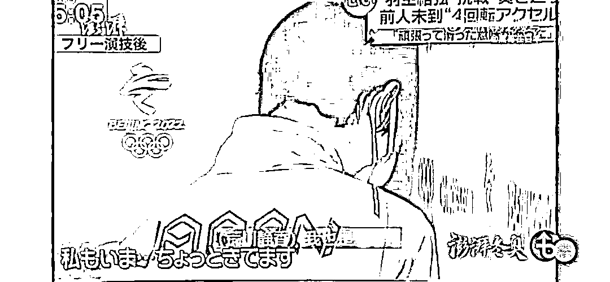

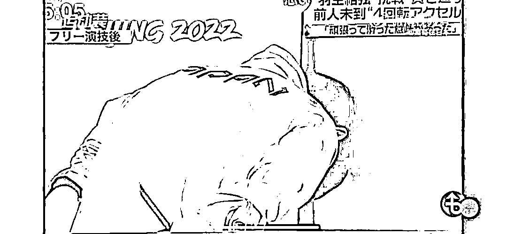

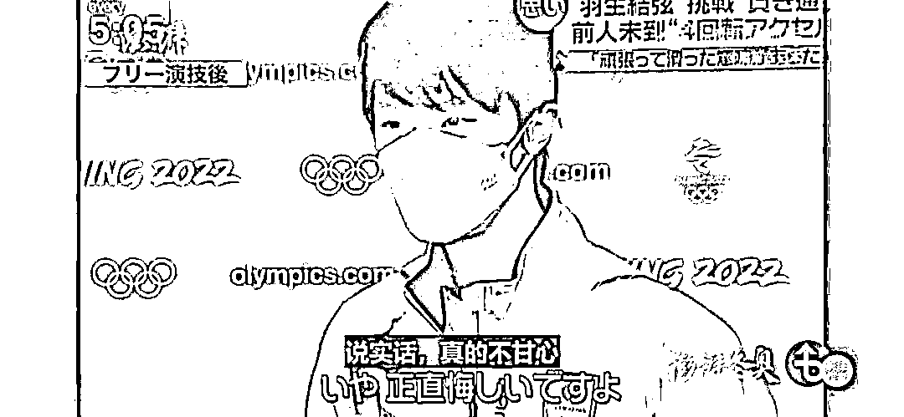

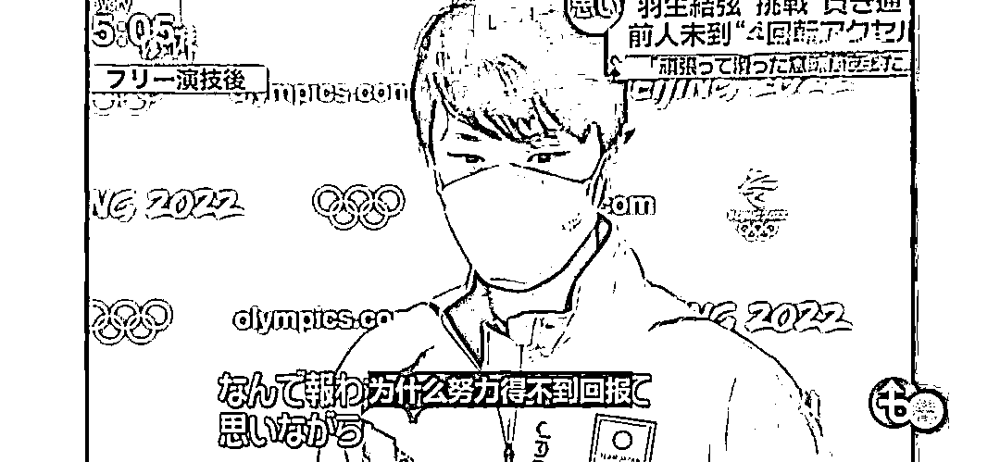

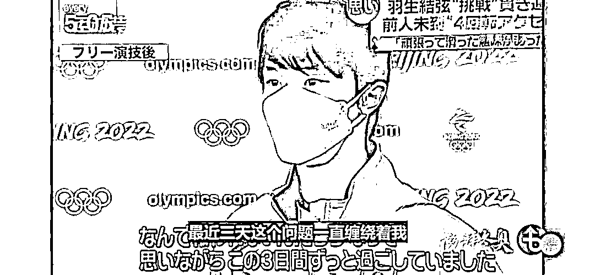

这一幕让很多他的粉丝落泪。羽生结弦从 4 岁开始学习花滑，技术精湛，冰上行云流水的唯美，蝉联两届冬奥会花滑冠军，包揽多项世界金奖，打破 19 项世界纪录，是花滑界的传奇，公认的“冰上王者”，喜欢他的人不计其数。

然而这次北京冬奥会，背负着万众期待的压力，羽生结弦挑战人类极限的 4A 高难度动作失败，两次 4 周跳摔倒，只获得了第四名，让无数人为之抱憾。

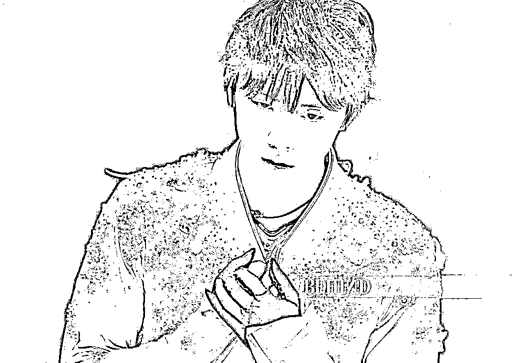

**天王星：人生的意外转折**

在查看羽生结弦的出生星图时，**我发现他正在经历重大的天王星行运。**

行运天王星目前在金牛座 11 度，合相他的月亮南交点，对分月亮北交点与金星，很大概率也四分了他的月亮（没有准确出生时间，选择了中午 12 点，全天月亮在水瓶座 4 至 17 度之间）。

**天王星的行运时间很长，**早在 2021 年 7 月至 10 月，在金牛座 14 度的天王星就精准合相了他的月亮南交点，而且因为天王星的逆行顺行，天王星行运对羽生结弦的影响还会持续未来近一年的时间。而就在冬奥比赛的 2 月 8 日到 10 日这几天，行运金星和火星在摩羯座 10 至 12 度之间合相，精准触动了天王星。也正是在这个节点上，羽生结弦的比赛意外频出。

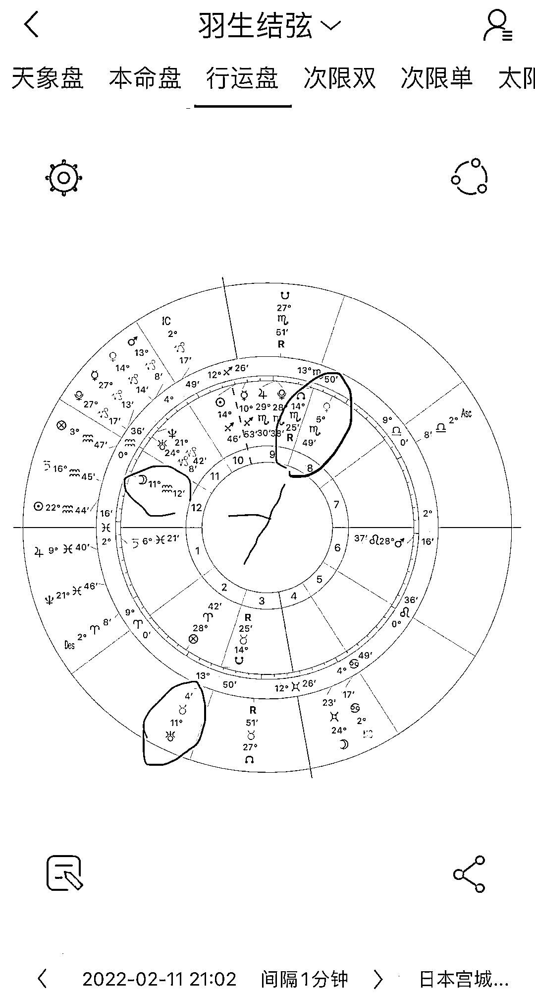

 | 行运盘，内圈为出生星图（具体出生时间不详，取中午 12 点）

**天王星的关键词是意外、“巨大的震撼”、“意料之外的状况发生”、“必须做出改变”。**而月亮交点一贯被视为生命进化的路线。

天王星碰到月亮交点，这个震动和变化是意义深远的，并不只是我们看到的表面的得失成败，更是个人生命进阶的转折点。

**我们在赛场上看到的也是一种非常天王星的表现，羽生结弦在这次比赛中一直意外状况不断：**

先是 8 号的短节目比赛，他一上场，冰刀就卡在了之前比赛的运动员划出的洞里，造成第一跳没有跳起来，得分比第一名大幅落后了十多分。

用羽生结弦事后的话说“这运气可真不好，只有全力为后面的 4A 做准备了”。但倒霉的意外接踵而至，9 号的赛前训练中，他在全力做 4A 跳练习时，落地再次扭伤了右脚脚踝，靠止痛药完成了第二天的自由滑比赛。

后在 10 号当天，羽生结弦在赛场上两次四周跳摔倒，很多粉丝形容“不敢看”，“心都要跳出来了”。赛后他在采访中也表现出巨大的挫败与脆弱感，“为什么付出没有回报，我已经尽了最大的努力了”。

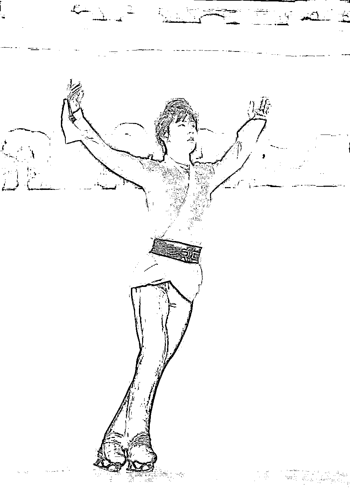

事实上，羽生结弦这个艰难的行运已经有相当一段时间了。

**从 2021 年 5 月到现在，天王星都在金牛座 11 至 14 度之间来回行进，持续不断地冲击羽生结弦出生星图里的月亮交点、金星与月亮。**

可以想见，这一年多里羽生结弦也不会过得很平静。我查阅了一些赛前的报道，发现他在去年 11 月训练时曾经摔倒，造成右脚韧带损伤，在相当一段时间里无法训练，直到冬奥会开幕前两周，才开始难度最大的 4A 跳的训练。

还有报道称，因为新冠疫情无法出国跟随教练训练，羽生结弦不得不在一年多时间里都一个人独自训练，不仅要为找场地操心，而且过得**“非常孤独”**，甚至对是否要坚持滑下去都产生了怀疑。

**发生意外、孤立无援、状态失衡，乃至这次比赛中羽生结弦执意挑战极限，不要平稳要“折腾”，这些都是天王星行运常见的表现。**

天王星带来改变和解放，但往往是以一种不愉快的经验来推进的。

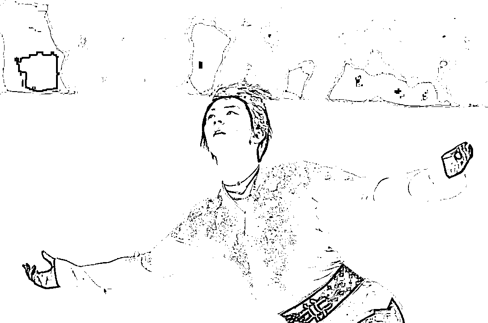

**木星：理想能否照进现实**

羽生结弦的出生星图上，太阳在射手座，月亮在水瓶座，而且木星能量突出。**这是一个会追问生命意义的配置。**我猜他常常会问自己，我生命的意义究竟是什么？为什么要坚持花滑？这样的问题。

**射手座与木星的能量，会让人富有理想主义色彩，追求更大的意义，为自己的信念而战。**加上水瓶座月亮的自由与勇敢，有一种不通俗世的天真，却也拥有劈冰破雪的单纯如一的力量。

这次北京冬奥会，羽生结弦为了挑战人类极限的 4A，不惜冒着头顶光环掉落的风险，但最终输了名次。

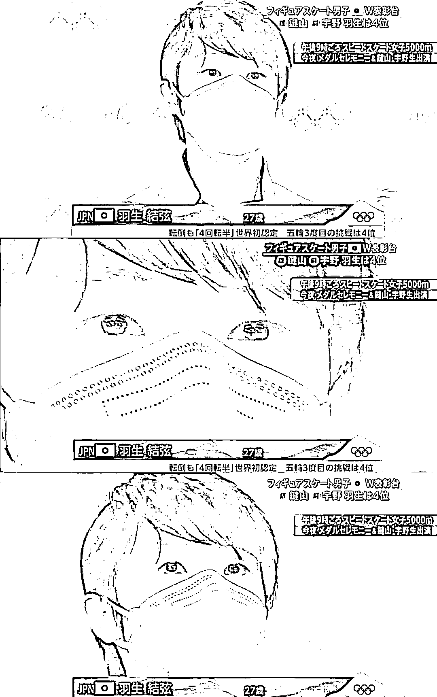

从“成熟务实”的角度看，有人可能会评论他不如保守行事，保住自己的三连冠，为退役留下一个完美的终篇。但羽生作为落败的英雄，却感动了许多人。 

**有媒体评论说，这才是真正的奥林匹克精神，即不断追求挑战极限、扩张边界、突破自我——这正是天王星与木星的深层意义。**

有人在微博评论里引用了作家史铁生的一段话来形容羽生结弦的失败：

**“奥林匹斯山上的神火为何而燃烧，那不是为了一个人把另一个人战败，而是为了有机会向诸神炫耀人类的不屈，命定的局限尽可永在，不屈的挑战却不可须臾或缺。”**

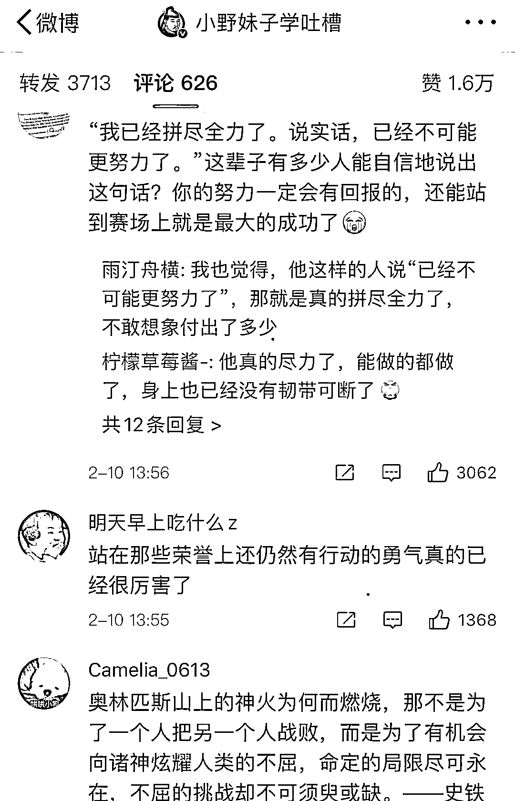

**明知不可为而为之，一腔孤勇为理想而战**——这样的羽生结弦虽然落败，却感动了很多人。理想主义者可能在现实中落败，却永远不会被遗忘，他们是这个世界的珍稀品。

**尤其在当下木星双鱼，木海即将合相的时期，这种精神力能激起很多人的共情。**

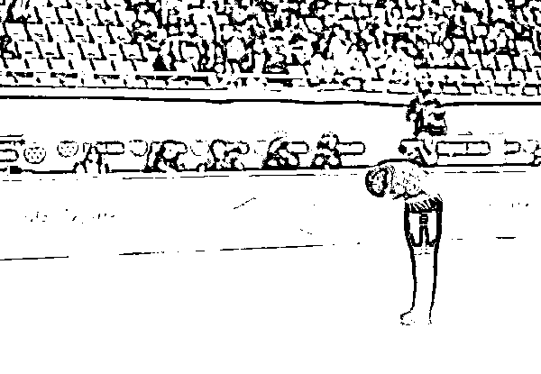

**火星：真正的勇气与决心**

我们在名人的出生星图里，经常会发现个人行星与时代行星之间的紧密联系。

在羽生结弦的出生星图里，有两个重大的时代周期相位：天王星合相海王星、木星合相冥王星，**其中天海周期长达 170 年**，也就是说，**每隔 170 年才会发生一次天王星与海王星合相的相位。木冥周期则为 12～14 年。**

这些外行星周期，对于社会、集体的发展潮流，以及时代走向的影响要大于对个人的影响。**但如果出生星图里的个人行星跟这些周期产生了紧密的相位，也往往给个人带来不一样的影响力。**

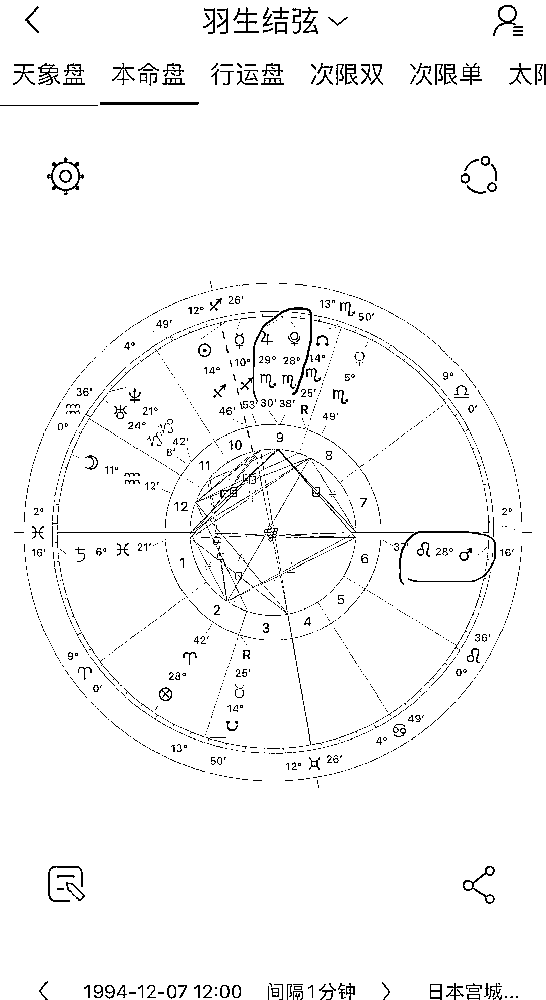

 | 具体出生时间不详，取中午 12 点

羽生结弦的火星落在狮子座，跟木星、冥王星呈紧密四分相，跟天王星、海王星呈梅花相。这象征着，**他可能会以竞争、战斗、运动（火星）的方式来传达时代的能量，而且被看到。**

我其实是在这次冬奥会才去了解羽生结弦，看了他之前的一些采访和比赛视频。对他的了解越多，越会发现羽生结弦**在清秀干净乃至纤柔感的外表之下，有一股非常坚定倔强的斗志，一个燃烧的战魂。**

比如人们津津乐道的 2014 年世界花滑大赛的“血色魅影”事件：羽生结弦在赛前热身时不小心与中国选手闫涵撞在一起，头部撞伤下巴流血，简单包扎后带着血迹坚持上场表演《歌剧魅影》。因为腿部腹部都受伤，他八次起跳五次摔倒，最终获得银牌。

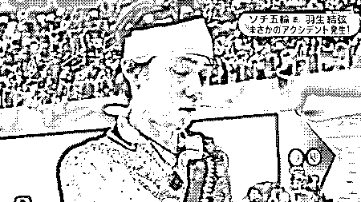

他大吼一声“跳”即转身上场的决绝与男子气概，宛如战神，跟他一贯给人的温柔腼腆印象形成了巨大反差。

在羽生结弦的出生星图里，火星与木冥、土星形成的 T 三角，可以解释这种强悍的意志力。

火星落在狮子座，一颗追求荣誉、尊严的王者之心，被木星的力量极大地加强，被冥王星赋予决绝的意志力，又被土星磨练与加固。

**冥王星是羽生结弦出生星图中另一颗很值得关注的行星。**月亮北交点在天蝎座，金星在天蝎座、合相月亮北交点，冥王星以非常紧密的度数四分火星并合相木星。

火星被木星点燃冲天的斗志，又被冥王星与土星反复捶打与试炼，这个过程的辛苦可想而知。**在希望与失望之间，在理想信念与绝望沮丧之间，最终会千锤百炼出强大的意志与决心。**

**天王星、海王星跟火星的相位，则带来他花滑表演上的艺术性和原创性。**从演出服装、音乐到动作编排，羽生结弦都自己操刀，唯美、丝滑、赏心悦目。令人惊艳的《阴阳师》就是一个典型例子。

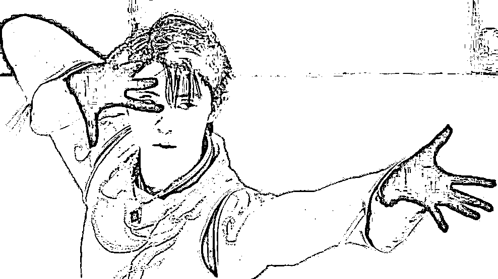

**天蝎座北交点：挫败与生命的进阶**

天王星准确击中月亮，羽生结弦情绪的挫败感之强烈可见一斑。但更值得关注的是，天王星对他月亮南北交点的冲击。他的月亮交点是南交点金牛 14 度/北交点天蝎 14 度，根据天王星的来回轨迹看，这个行运影响还将持续一年多。

**关键词：“蜕变”。**

假设他一切选择平稳，不冒险犯难，常规操作保住三连冠，那就是回应了金牛座南交点想要抓住的保守稳定、平静而满足的生命状态。

然而天王星过来合相了月亮南交点，稳住是很难的。**天王星是一股颠覆性的力量，一定会带来颠簸和震撼，不会让你四平八稳地坐在扶手椅上享受美食。**寻求变化/突破的另一边就是天蝎座北交所代表的“冒险犯难”。

**当我们出生星图里的月亮北交点落在天蝎座，我们不能一直回避生命的阴影面，装作岁月静好一切美好无恙。**

**我们需要经历一些风雨。**风险带来恐惧，害怕丧失一切的恐慌，但也会洗炼塑造出更强大的自己。四平八稳的人生有时也会很乏味，**北交点在天蝎座，要求我们去体验深刻的、极致的情感。**羽生结弦这次冒险看起来失败，实际上意义深远。

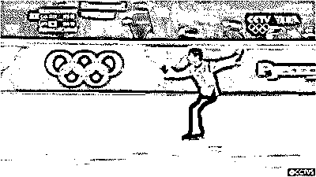

那些杀不死我们的风雨，只会让我们更强大。看到自己内心的恐惧，接纳人性中的弱点、阴暗面，这个过程可能经历挫败、震惊、沮丧，但最终我们能明白生命的实相，总是光明与阴影相伴的。

**承认它们才能获得真正的生命勇气（天蝎座与冥王星）。**

羽生结弦的理想与单纯信念遇到的挫败，让他产生了自我怀疑“为何付出没有回报？” **然而生命从来是复杂的，这个挫折也许是一个机会，推动他看清更多的生命实相。**

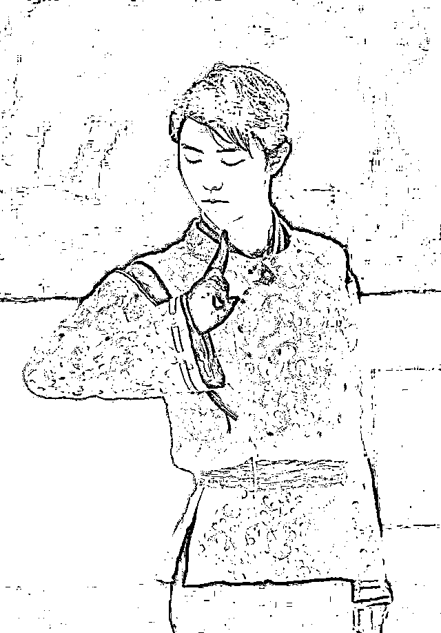

他的实力没有人怀疑，人们也永远相信他的表现，北交点的历练最终只会让他更加强大。然而就像有的粉丝表达的，希望他不要再受伤，不要再为难自己，能去享受人生。

也许这是一个契机。9 岁的羽生结弦曾经说长大以后要到奥运会拿奖，现在 27 岁的羽生结弦早已远远超越了自己儿时的目标。

过去的光环和荣誉已经成为他自身的束缚，他需要天王星式的解放，需要新的目标和人生进阶。

**天王星提醒，你需要改变了。**也许羽生结弦是时候从日复一日的冰场训练生活中跳出来，重新思考自己人生的意义（太阳射手座）。

最简单的一点，作为一个射手座+水瓶座，他有多久没有远行，自由自在地游走于自然中了？

他可能要反思自己的理想与目标，是否还要继续在这个赛台上，挑战花滑的极限？（火星与木星）

或者，去体验更深刻的情感联结，更多温暖的朋友关系、亲密关系（金星合相天蝎座北交点），体验人生最重要的课题“爱”。

或者用一颗温柔的心去照亮他人，帮助、引领更年轻的人成长？（狮子座火星、火星对分土星）

也许是时候发现更多生命的乐趣，找到更多热爱的事物……（射手座与木星）

没有人能够帮他找到答案，这是属于他自己的人生。但他有很多选择。生命是如此的丰富多彩，这也是金牛座南交点的真义“体验真正的生命之丰盛”。

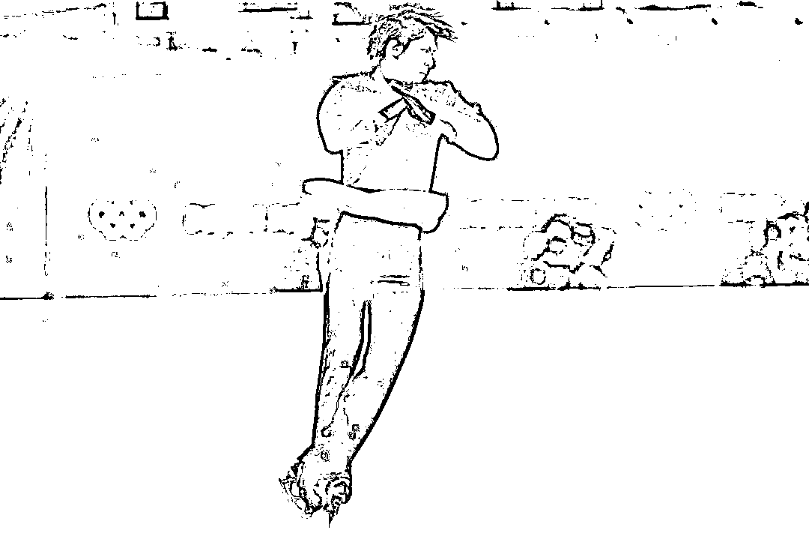

**结语**天蝎座北交点告诉我们，那些杀不死我们的风雨，只会让我们更强大。看到自己内心的恐惧，接纳人性中的弱点、阴暗面，这个过程可能经历挫败、震惊、沮丧，但最终我们会明白生命的实相，总是光明与阴影相伴的。承认它们才能获得真正的生命勇气。**有意思的是，从 2021 年 12 月 23 日开始，行运月亮交点就进入南交点天蝎座/北交点金牛座，刚好与羽生结弦的月亮交点相反。**这个行进将持续一年半的时间，直到 2023 年 7 月 13 日，我们都将持续受到这组星象的深层影响。天蝎座北交点要我们脱离舒适区，去冒险犯难，追求更极致的生命体验，就像羽生结弦的“折腾”；**金牛座北交点则要我们站稳脚跟，找到自己牢固的地基，打造物质与精神层面的安全自足。**北交点在金牛座的一年半，对于我们每个人，将是一场重建自我安全感、价值感的功课。新冠疫情已经在全球肆虐了两年，我们能否在 2022 摆脱死亡的恐惧、击败病毒找回平静安全的生活？全球经济下行已成定势，我们能否在变化的时代找到自己的立足之地，安顿好自己，实现自我价值？经历过风雨之后，我们才可能重新发现生活的宁静之美。当时代的大浪潮逐渐退去，我们不用再匆匆忙忙你追我赶，而是学会慢下来，**安住当下，感受宁静与自足的快乐，**而不是永无止境地焦虑追逐。**这也是从天蝎座到金牛座的进化之旅。**（文中图片来自网络，如有问题请联系我们删除）

**版权声明：**本文由作者授权发布于若道平台，欢迎转发，反对抄袭。友号转载请申请白名单。

**芷菱**

ISAR 认证占星师/占星作者/媒体人若道 2019 届核心课程毕业生

于 2019 年通过 ISAR 考试，同年获得若道认证神话塔罗师资质

**微信公众号**：芷菱的理想国

长按打赏

**学习占星学****点击下图了解课程详情** 

**

********************************

**微信又双叒叕改版啦，不想错过若道君的推送？**
**就把若道设为星标吧！****▼**

**喜欢记得点一下在看哦☟**

******************报名直达入口******************

# 元宵花灯春意暖，团圆佳节滋味甜

> 原文：[`mp.weixin.qq.com/s?__biz=MzA5NjA0NTAxNg==&mid=2651467466&idx=2&sn=00ae1a1b6339f75c821157bc05bdbba9&chksm=8b489c7dbc3f156b14b38a6fd8ebe5485e1022841362020123b8779b9fe8e5130bd130038967&scene=126&sessionid=1692737857#rd`](http://mp.weixin.qq.com/s?__biz=MzA5NjA0NTAxNg==&mid=2651467466&idx=2&sn=00ae1a1b6339f75c821157bc05bdbba9&chksm=8b489c7dbc3f156b14b38a6fd8ebe5485e1022841362020123b8779b9fe8e5130bd130038967&scene=126&sessionid=1692737857#rd)

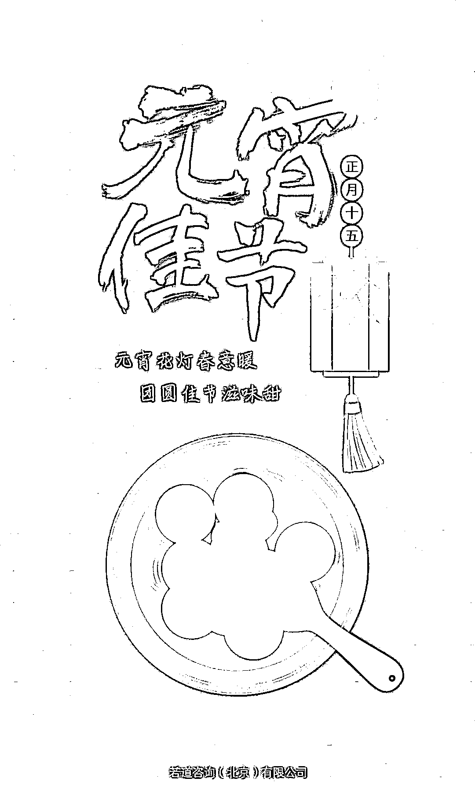

# 情人节快乐丨在这个浪漫的日子，用 12 星座的爱情箴言拥抱自己和 TA 吧！

> 原文：[`mp.weixin.qq.com/s?__biz=MzA5NjA0NTAxNg==&mid=2651467392&idx=1&sn=af7060cfc73d71a3aa599ec8d7baa230&chksm=8b489c37bc3f15219a3bdd301a49091d3a4a34e7863901f09a45f37b4308eb8547bc5225cea3&scene=126&sessionid=1692737862#rd`](http://mp.weixin.qq.com/s?__biz=MzA5NjA0NTAxNg==&mid=2651467392&idx=1&sn=af7060cfc73d71a3aa599ec8d7baa230&chksm=8b489c37bc3f15219a3bdd301a49091d3a4a34e7863901f09a45f37b4308eb8547bc5225cea3&scene=126&sessionid=1692737862#rd)

☆****后台回复“今日”，给你一句生命态度****

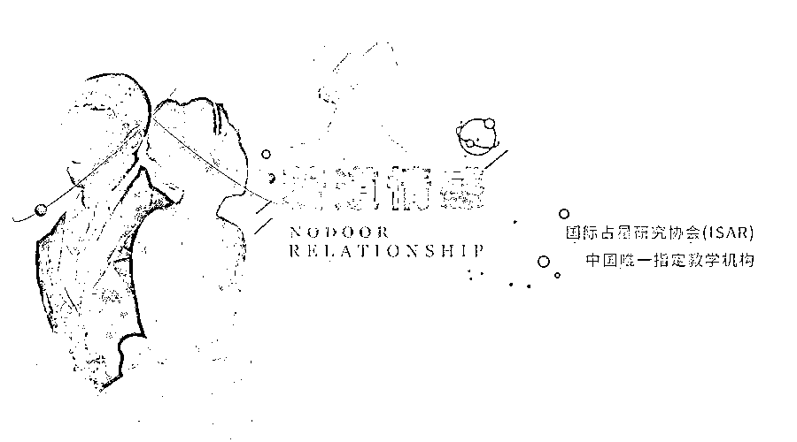

作者/大卫·瑞雷 若道占星创始人

翻译/李含 校对/Arrow

编辑/翀子 封面/书君 图片/网络

稿件来源/《风度》杂志

情人节快乐！这个充满鲜花的日子总给人带来无尽的浪漫想象，但你知道吗？爱他人始于爱自己，给自己更丰盈的爱，才能更好的爱 TA 或即将出现的 TA。12 星座的爱情箴言是什么？在今天，大声念出来吧！

2 月 14 日是情人节。众所周知，情人节是西方节日，这一天到处都在贩售鲜花和糖果，给浪漫主义者一个借口把自己变成十足的傻瓜。

**你拥有无条件的爱的能力吗？**

当然，这在很大程度上取决于你**给予和接纳无条件的爱的能力**。你甚至可能并不相信爱。不过据说“愤世嫉俗的人只是还在悲伤的浪漫主义者。”如果你不相信爱，很可能是因为你在人生中经历过一些痛苦的幻灭。

**不相信爱是一种防御，让你不会再体验到幻灭。这当然也令你无法感受到爱，也意味着你可能余生一直活在幻灭之中**。

太愤世嫉俗了，是吧？你们中的一些人可能会说，“嘿，浪漫的爱情不一定是无条件的爱，”我要说，“你说得对。”

**也许今年的情人节你并没有“坠入爱河”，但是也许会发生更加难以置信的事情。也许你会开始更爱自己，不带评判地接纳真实的自己**。这真是棒极了，对不对？哪怕你只感受到这种爱五分钟，可能会发生什么呢？

你也许会问，“具体该怎么做呢？”确实，以什么样的方式实践无条件的爱呢？我的回答是“以各种各样的方式”。

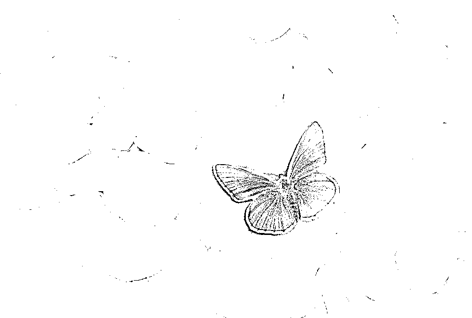

**无条件的爱助长人类社会中友善、接纳和慷慨**。

这不仅仅是给在天桥下寒风中乞讨的流浪汉几块钱，也是为年迈的夫妇撑一会门，或是一把抓住快冲到车前的学步的孩子，或是记得拐去超市为母亲买她需要的东西，或是在你的子女因为最好的朋友搬到另一座城市而失控哭泣时拥抱他们，或是在医院里日复一日夜复一夜地陪伴弥留之际的家人，因为你不愿让他们孤独地离去……

不管怎样，**以各种方式给予他人支持**。新闻中充斥着一些人的可怕行径，但是生活是由许多人的善举，而不是少数人的恶行构成的。

这些善举来源于无条件的爱，只要在这一刻接纳当下的自己，我们给予和接纳无条件的爱的能力就增强了！

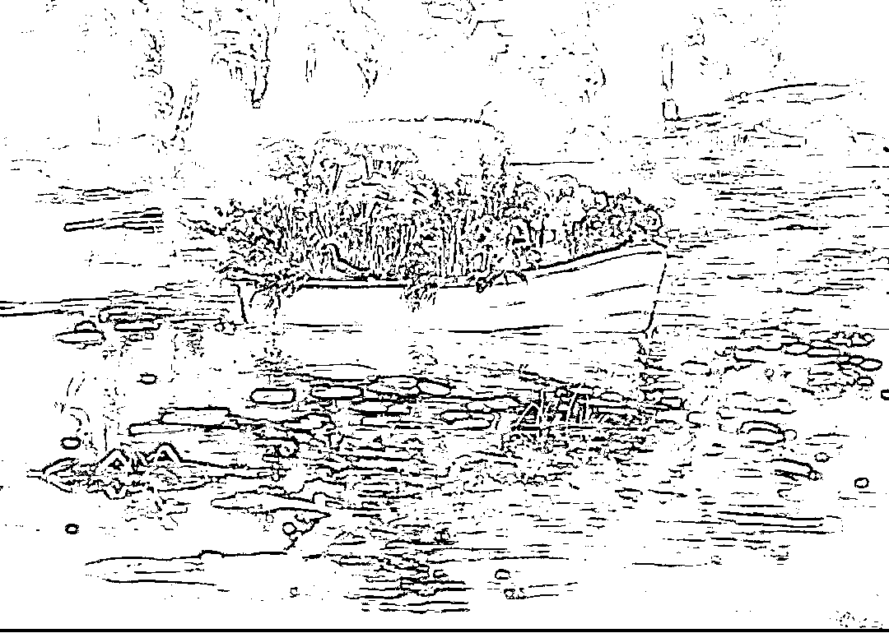

**12 星座如何体验无条件的爱**

对自己说下面这些话也许会帮到你。怎么样？利用情人节，从这一天开始，更爱自己一些！

**重复以下你的太阳星座对应的短句**。拿出一点信心，敞开怀抱去接纳。你或许会惊喜于你生活中开始发生的变化。

***白羊座***

为了奉献自我，首先必须拥有一个自我。**如果我不能支持自己，又如何支持他人？**我在学习有效地捍卫自我，这样我就可以有效地捍卫他人的自我。我热爱行动和当下，因为当下就是一切，当下我爱自己。

***金牛座***

为了分享我的丰盛，我必须创造丰盛。为了提供舒适，我必须拥有可以提供给他人的舒适之物。我已经准备好接受礼物，正如我已经准备给予回报。**我享受愉悦，享受分享愉悦。**我喜欢你能依靠我，我也能依靠你。

***双子座***

我渴望诉说和倾听。我喜欢我们的交谈，我喜欢我们短信的内容。**我最喜欢的是好奇心，以及你眼中好奇的光芒。**问我什么都可以，即使我并不知道答案。我很聪明，也许我们会一起找到答案。

***巨蟹座***

我感觉故我在。**我获得滋养，所以我也要滋养他人。**我必须先拥有一个栖身之所，才能请你来做客或留下。如果我能与自己自在相处，我也能与你自在相处。我创造安全感，于是我们会感觉安全。

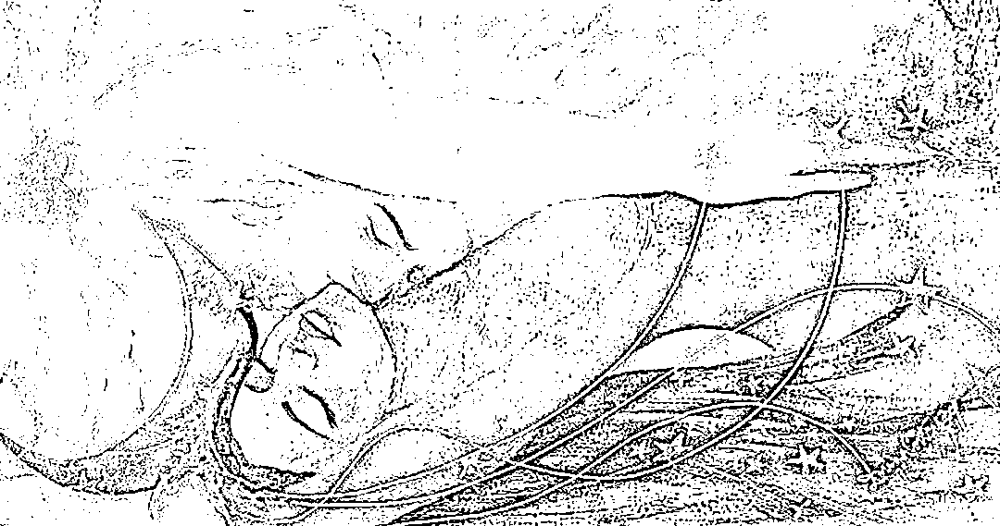

***狮子座***

我是伟大的，你也是伟大的。我会向你展示如何在人生中成为一位英雄。我树立榜样，我给你示范。我充满戏剧性，我让你快乐。**我是特别的，我让你意识到你也是特别的。**我们都是伟大的！

***处女座***

**我接近完美，你也是。**我每天进行方方面面的练习。我是有用的人，我喜欢出色地完成工作。如果我太过于井井有条，那又如何？如果我杂乱无章，那又如何？不完美就是不完美地表达完美。这样的完美，你感觉如何？

***天秤座***

我陪着你，你陪着我。我全心全意待你，你全心全意待我。我们在一起可以所向披靡。**我渴望内心的平和，就像我渴望世界和平一样。**我与世界之间有无穷多种可能的关系。

***天蝎座***

我像信任自己一样信任你。我给予你激情和更深入的人生体验。我足智多谋、坚强柔韧。我是幸存者，我会帮助你生存下来。我会在你最需要我的时候伸出援手。**我接纳自己爱的深度。**

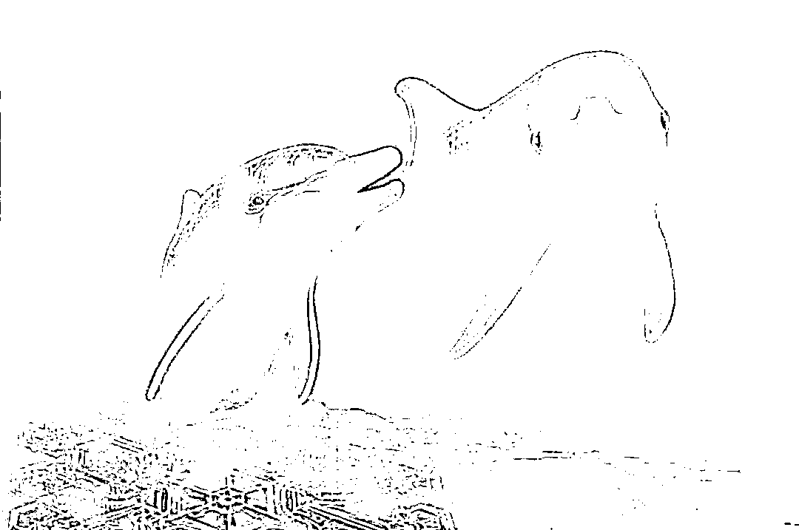

***射手座***

我学习因为我愿意学习。我教授他人正如我曾受教于人。在人生道路上，我给予你鼓励，因为我们虽然同行一程，也会有分道扬镳的一天。**我接纳自己对于自由的需求，智慧是我获得的回报。**

***摩羯座***

我接纳我多么渴望成为自己专业领域中的翘楚。有时候我会赢，有时候你会赢。有时候我们双赢。我必须确定什么是成功，将失败的痛苦只看作是我是如何定义成功的一种反馈。**我热爱竞赛，我们一起投入竞争。**

***水瓶座***

**我接纳自己的与众不同，也接纳你的与众不同。**我的眼里没有陌生人，只有当我不确定自己归属于何处时，才会感到陌生。我热爱自己的奉献之心，也爱你愿与我并肩。我们可以携手让这个世界变得更加美好。

***双鱼座***

我接纳自己的可能性，我也接纳你的可能性。我们变成了我们想象中的自己，因此我接纳自己想象的力量。我喜欢灵感启迪，我也喜欢别人的灵感启迪。**我无条件地接纳你，正如我无条件地接纳自己。**

**版权声明：**本文由作者授权首发于若道平台，欢迎转发，反对抄袭。友号转载请申请白名单。

****想阅读更多作者的文章，请在后台回复******大卫****** 即可。****

**大卫·瑞雷**

美国占星师，若道联合创始人，致力于在中国教授和推广西方占星学；2010-2014 年，任全美占星师联盟监督委员会委员；2017 年，被选为 ISAR 委员会成员。ISAR 是世界最大的国际占星机构，会员遍布 45 个国家，2017-2020 年曾任 ISAR 全球副主席、CAPISAR（ISAR 职业占星师资质认证机构）主席。

**喜欢文章请长按下方二维码打赏****给大卫老师加杯咖啡呗~****▼**

**想找到你的灵魂伴侣吗？****长按下图扫码了解我们的报告吧！**

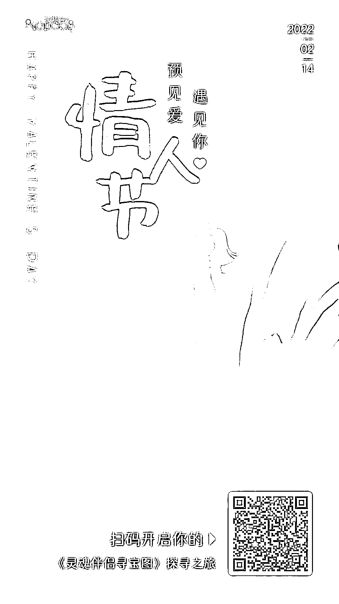

**学习占星学****点击下图了解课程详情** 

**

********************************

**微信又双叒叕改版啦，不想错过若道君的推送？**
**就把若道设为星标吧！****▼**

**喜欢记得点一下在看哦☟**

**灵魂伴侣直达入口**

# 雷蒙德·梅里曼金融占星周运 | 一个非常有趣，充满积极性的时期

> 原文：[`mp.weixin.qq.com/s?__biz=MzA5NjA0NTAxNg==&mid=2651467392&idx=2&sn=14c2f5e5af0eec96e41688a5b348d73c&chksm=8b489c37bc3f152125b0b812229abd2f30dba71c119605cecce4c60b1cf4a26049964bcc4fc0&scene=126&sessionid=1692737862#rd`](http://mp.weixin.qq.com/s?__biz=MzA5NjA0NTAxNg==&mid=2651467392&idx=2&sn=14c2f5e5af0eec96e41688a5b348d73c&chksm=8b489c37bc3f152125b0b812229abd2f30dba71c119605cecce4c60b1cf4a26049964bcc4fc0&scene=126&sessionid=1692737862#rd)

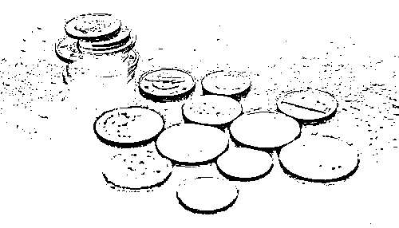

作者/雷蒙德·梅里曼 译者/Luke
编辑/玫瑰 图片/pexels

雷蒙德·梅里曼是在金融占星学界稳坐第一把交椅的占星师，同时他也是若道签约的金融占星课老师，我们引进了雷蒙德·梅里曼老师的《[上证指数月度报告](http://mp.weixin.qq.com/s?__biz=MzA5NjA0NTAxNg==&mid=2651466824&idx=1&sn=aea6214c57ff060024b22b11a997d150&chksm=8b489effbc3f17e9f0dd3a15bd8a7df2f005b34e31c7ae51168ce70a2d84b51e7bc7284f1519&scene=21#wechat_redirect)》及《[黄金报告](http://mp.weixin.qq.com/s?__biz=MzA5NjA0NTAxNg==&mid=2651466824&idx=1&sn=aea6214c57ff060024b22b11a997d150&chksm=8b489effbc3f17e9f0dd3a15bd8a7df2f005b34e31c7ae51168ce70a2d84b51e7bc7284f1519&scene=21#wechat_redirect)》。我们经老师的授权，将每周刊登梅里曼老师的周运，供大家参考和学习。于是，这是本周的周运（1.14-1.18）。

**说明：以下时间采用纽约证券交易所所在地美国东部标准时间。**

**展望与回顾**

****

**过去 12 个月期间，1 月份消费者价格飙升超过预期，表明通胀前景恶化，强化了今年加息的可能性。美国劳工部周四报告称，衡量数十种消费品成本的消费者价格指数，与一年前相比同比上涨 7.5%。**

**——杰夫·考克斯****《通货膨胀上涨 7.5%超过预期，是自 1982 年来的最高》****www.cnbc.com****2022 年 2 月 10 日****那么，美国政府在现代货币理论方面的重大实验结果如何？不太好……如果美联储在一年前撤回疫情时期的撒钱政策，（通货膨胀的）痛苦可能会减轻些。****但是华盛顿已经逐渐相信，一个无成本支出和低利率的新时代已经降临。旧的财政和货币体系不再成立，那些对通货膨胀发出警报的人被认为是来自里根时代的恐龙。****——《通货膨胀困扰着拜登经济》****《华尔街日报》****“回顾和展望”专栏****2022 年 2 月 11 日**由于月亮经过变动星座双子座的同一天发布了超级热门的通胀报告，自 1 月 24 日（水星逆行中点）低点起的近期反弹也无法持续下去了。俄罗斯以“战争演练”的名义用大熊号入侵乌克兰，也使得紧张局势升级了。

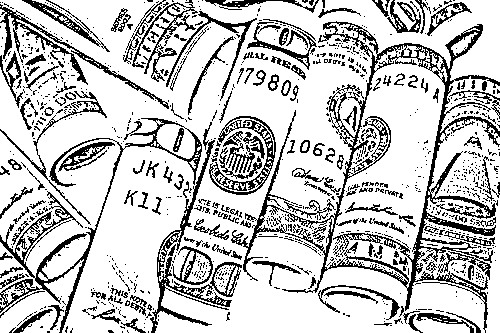

**伴随着所有这些不稳定的宇宙能量，加上木星接近海王星在双鱼座的合相，投资者在非理性繁荣和歇斯底里之间来回拉锯，导致了全球股市上周中旬的剧烈震荡。**首先，股票指数飙升至 1 月 24 日低点以来的最高价位。然后，它们突然反转，于周四和周五剧烈下跌，但这并不意味着中间没有出现一些短暂的反弹。现在的担忧是，美联储最早在下个月将提高利率，而且不是小幅的 1/4%，很可能 1/2%。尽管股市很难消化这一信息，但黄金却毫无问题。通胀上升和战争威胁的组合，使这一黄色金属在周五窜升至 1865，是自 11 月 19 日来的最高位。仅在两周前，黄金还在 1780 附近交易。对原油来说也没什么问题，因为投资者的担忧驱动原油上涨。原油在周五飙升至 94.66 的高点，是自 2014 年 8 月 22 日以来的最高位，从 12 月 2 日的基本周期低点上涨接近 50%。这进一步确认了木星在双鱼座合相海王星对应的看涨效应。所有这些地球宇宙学因素都与原油有关。比特币和以太坊走势接近股市，即在 2 月 10 日反弹至高点，随后它们在周五有一定程度的下跌。加密货币和股市面对的共同问题是，上涨是否已经结束，下一波通向数月新低的下跌是否刚刚开始，还是这次下跌仅是对过去两周上涨的修正？如果是前者，在美国联邦储备委员会改变注意，撤回接下来几个月内多次加息的意图之前，还要让美国人经历多少痛苦？

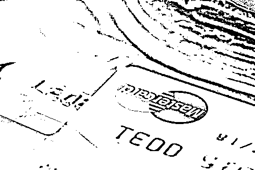

**短期占星趋势和长期考量**

****

**美国人在 2021 年的新债务比 2008-2009 年金融危机之前的任何一年还要多。受住房和汽车贷款增加的推动，去年家庭债务总额增加了 1.02 万亿美元。****——奥拉·麦卡弗里****《家庭债务在 2021 上升了 1 万亿美元》****《华尔街日报》****2022 年 2 月 9 日****一枚五分镍币已经一文不值了。****——约吉·贝拉****短期来看，在接下来三周我们将进入一个非常有趣和充满积极可能性的时期。**它首先始于**2 月 16 日满月时，金星和火星在摩羯座合相**，紧随其后的是**2 月 17 日木星和天王星形成六分相**。**随着金星和火星 3 月 6 日从摩羯座进入水瓶座，宇宙能量也将发生转换。**金星和火星合相的度数，与 2020 年 12 月 21 日的木星-土星合相的度数相同。用占星学术语来说，后者开启了“风象星座新纪元”（梅里曼市场时机学院毕业生凯特·鲍威尔发明的词组，因为它重启了在接下来 140 年中一系列木星-土星在风象星座的 20 年合相）。正如嬉皮士和花童在 20 世纪 60 年代末常说的那样，这是一个“做爱，而不是战争”的时刻。这不禁使人要问，自那以后“所有的花都去哪了？”

**说明：以上日期基于纽约证券交易所所在的美国东部标准时间，由于存在时差，中国地区可能需要加一天。**

**版权声明：**本文由若道翻译发布，欢迎转发，反对抄袭。友号转载请申请白名单。

**雷蒙德·梅里曼（Raymond Merriman）**

若道签约老师。著名金融占星师，ISAR（国际占星研究协会）前主席，梅里曼市场分析公司的总裁。他由于“提升了占星学的职业形象”，在 1995 年国际占星大会上被授予轩辕十四奖；在 2012 年国际占星大会上，被授予轩辕十四终身成就奖。

1“中国上证指数月度报告”发售**若道推出了****中文版****的雷蒙德·梅里曼中国上证指数月度报告，并持续发行该报告！**当把金融市场的周期和占星学的周期相结合时，雷蒙德·梅里曼老师的金融占星学研究**为投资者应对金融市场的周期波动，并随之调整投资策略提供了极大的价值参考**。
**2 月中英文报告已上线！**2“黄金价格周期月度报告”发售**若道推出****中文版****的雷蒙德·梅里曼黄金价格周期月度报告！**不仅仅为广大读者在中国股市的投资出谋划策，更将视角放眼黄金市场。**每当世界经济形式不明朗的时候，有一个地方是保值的港湾，那就是****黄金**。自 1982 年雷蒙德·梅里曼出版第一本研究《地球宇宙学征象与黄金价格的关联》的著作以来，**他一直作为最重要的黄金市场时机预测者之一享誉国际**。2022 年 2 月黄金报告已上线，梅里曼老师将会告诉你他对这个关键时期如何操作的想法。也可以按照季度和一年期订阅，有更多优惠。季度和年度的好处是，你可以持续了解梅里曼老师对于不断在变化的市场的看法。即便他某一次看法和市场不一致，你也看到在下一期他如何调整自己的看法，并看到金融占星在一个长期时间段内对你把控风险的帮助。而能够长期控制风险、尽量找到安全的投资时机才是投资的长久之计。**2 月中英文报告已上线！****购买套餐**，买得越多越优惠中国上证指数月度报告套餐价

*   **单月报告**：280 元
*   **3 个月套餐**：780 元（260 元/月）
*   **12 个月套餐价**：2400 元（200 元/月）

**长按下图识别二维码****购买金融报告****套餐****▼**

黄金周期月度报告优惠

*   **双报告年度套餐更优惠（直降 900 元）**

*   **12 个月黄金报告+12 个月上证指数报告：仅需 3900 元**

**长按下图识别二维码购买黄金报告套餐**▼

3《2022 年金融预报和沙龙》1976 年以来，由雷蒙德·A·梅里曼撰写的梅里曼市场时机学院每年一次的年度预报沙龙和每年一本的《年度预报》一直在应用占星学原理为投资者们服务，提供卓越洞见，从未间断。 **雷蒙德·梅里曼《2022 年金融预报和沙龙》发售中（报告已发布）。****长按下图了解详情**
▼

**点击阅读原文购买金融报告**

# 金星与火星合相，你曾在爱情中“冒险”吗？

> 原文：[`mp.weixin.qq.com/s?__biz=MzA5NjA0NTAxNg==&mid=2651467352&idx=1&sn=3117f039b9c452925fca7ca93eb854dd&chksm=8b489cefbc3f15f95efb238e65eb49041a49a9d9053c7c6a46d5c8e2c2757126999d137939b0&scene=126&sessionid=1692737862#rd`](http://mp.weixin.qq.com/s?__biz=MzA5NjA0NTAxNg==&mid=2651467352&idx=1&sn=3117f039b9c452925fca7ca93eb854dd&chksm=8b489cefbc3f15f95efb238e65eb49041a49a9d9053c7c6a46d5c8e2c2757126999d137939b0&scene=126&sessionid=1692737862#rd)

**2022 年 2 月 12 日天象：**

*   **07:26 月亮进入巨蟹座**
*   ******水星精准合相冥王星、三分北交点******
*   ******金星与火星合相******

今天一大早，月亮进入居家的巨蟹座，如果你正好有“节后综合症”，经过几天的工作感到疲累和不适应，不如趁周末让自己回归宁静的内在家园，让身心得到充分的滋养与“蓄能”，比如做几道家常小菜关爱一下自己，比如和亲密的朋友深入的聊聊假期收获、享受片刻愉悦，都是不错的放松方式。金星与火星的合相已经开始，并会持续相当长的一段时间。在占星学中，我们会用“爱情冒险家”来形容金火合相的能量，它象征爱里的竞争、三角关系、带有性渴望的爱、对美的丰沛创造力等等。在金火合相的影响下，人们很容易陷入情网，但也表现出“来得快、去得也快”的爱情特质。周一就是情人节了，金火合相的加入会不会带来一丝兴奋呢？说到冒险，你曾在爱情中冒险吗？一起来聊聊吧~周六快乐！我们周一情人节见！**了解每日天象，可****下载“若道”APP 查看****还有更多精彩等着你哦**

