# 若道 202111-202207 PT3

# 太阳狮子座与 12 星座月亮丨“你是哪一类霸道总裁？”

> 原文：[`mp.weixin.qq.com/s?__biz=MzA5NjA0NTAxNg==&mid=2651467312&idx=1&sn=d1a81f5cc1a60b3198d9c0ba770b4ba0&chksm=8b489c87bc3f1591008c88cef7b385086eb7717d4345926de92349b071ad10ceb67099f17ed0&scene=126&sessionid=1692737862#rd`](http://mp.weixin.qq.com/s?__biz=MzA5NjA0NTAxNg==&mid=2651467312&idx=1&sn=d1a81f5cc1a60b3198d9c0ba770b4ba0&chksm=8b489c87bc3f1591008c88cef7b385086eb7717d4345926de92349b071ad10ceb67099f17ed0&scene=126&sessionid=1692737862#rd)

☆****后台回复“今日”，给你一句生命态度****

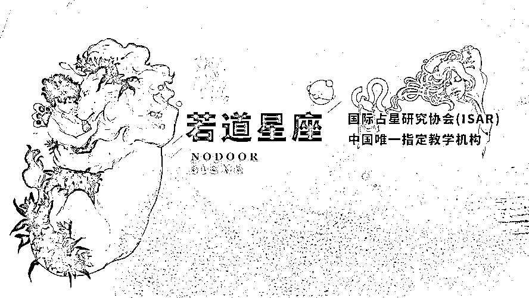

作者/诺·泰尔 译者/江艺、dogcatcher 编辑/翀子 封面/书君 图片/网络太阳是生命的伟大能量，而月亮被认为是人格中的“主导需要”，同样被重视（你可以点击[【开篇】](http://mp.weixin.qq.com/s?__biz=MzA5NjA0NTAxNg==&mid=2651463192&idx=2&sn=7ecd2012aee1f245b56e0f107bdfc19e&chksm=8b48acafbc3f25b968e9ca8cbe8acf6972dc3e418827b36ac12af7bf7c81858937657babb393&scene=21#wechat_redirect)，查看诺·泰尔老师对此部分内容的详细阐述）。当狮子座太阳，遇见 12 星座月亮，分别有哪些表现呢？**太阳狮子座和 12 星座月亮**

**★月亮*****白羊座***

杰出的勇气。狮子座的热心肠和戏剧感被自尊所掌控，并流利地表现出来。他们的**情感和身体充满活力**，能快速、轻易地推动着生活节奏。**只要能做到客观务实，**他们的领袖特质就会获得解放，带来无止境的机遇。

**★月亮*****金牛座 ***

正义感的火焰支持着性格主体。他们往往有着**引人注目的自信**，**并且伴有固执**。如果其他辅助征象能够提供一种对人际关系的注重来均衡个性这种成长中的紧张就会被分解，并聚焦到刻苦的努力中去。

除非得到充分的个人自由，除非理想已经实现，否则他们的心绪会膨胀、虚荣而又笨重。 

**★月亮*****双子座 ***

他们**行动迅捷，充满新点子**，给他人留下引人注目的印象。他们口齿伶俐、随机应变，常能轻而易举地建立起威信。他们风流浪漫，往往有多重的感情。 

**★月亮*****巨蟹座***

**同时拥有敏感和直爽的个性**——它们意气相投地把自我意识表演给外界。他们情感是经过组织的，又是强烈的；他们的自我价值感是默认的，不需要外界时常关注；他们的自尊有着精气神，有着感染力；**他们非常重视爱情浪漫和天伦之爱。 **

**★月亮*****狮子座***

这个配置个人**企图心是有力的，夸张的，又经常是成功的**。他们富有魅力的正面形象可能隐藏着严厉、强硬、居高临下的天性。谁敢蔑视或伤害我的自尊，谁就会受到快速和彻底的报复。他们有着强烈的**骄傲与虚荣心**。 

**★月亮*****处女座 ***

狮子座的戏剧感不知怎么地被削弱了，**细致的思考与学习替代了对天资的依赖**。他们的自信并不彻底，但因谨慎判断，注重常识，故而常能反败为胜。这个配置**强烈渴望取悦他人**，并且在小处总比在大处做得更成功。

**★月亮*****天秤座***

**独立的个性在人际互动中放飞理想和浪漫情怀**。热心的柔情给个性带来吸引力。虽然柔和的人生态度可能同强大的自尊不太合拍，但他们却能坚持正直与诚实，尊重传统和荣誉。他们能够酝酿宏大的计划，而如果得到有力相位的聚焦，这些计划就能被落实。 

**★月亮*****天蝎座***

他们**动物性的热情很强烈，充满生命力**；外形和气质常具有夸张的戏剧感。虽然情绪可能激增过头而失控，但却并不总是表现出来，因为**自我控制**的（天蝎座）心理成分也高度发达。

所有的事情都受个人观点和偏见的影响。早年经历可能贫困压抑，为成年生活提供了心灵驱动力与补偿机制。**成长中的挑战，是控制这种宏大的动力，并理解其诱因。 **

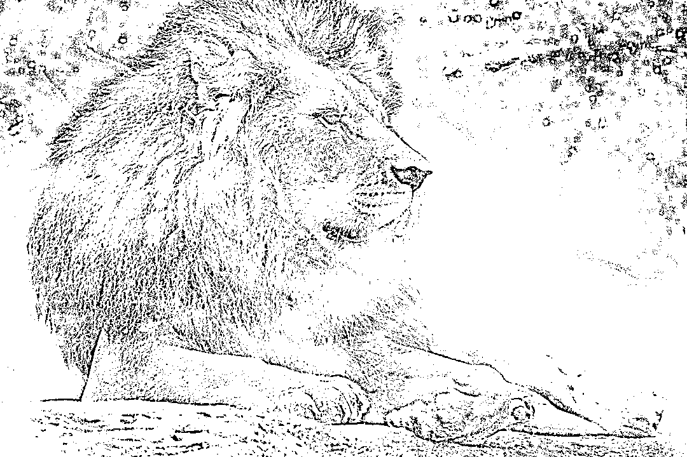

**★月亮*****射手座***

**戏剧感、鲁莽、冒险、浪漫……都通过射手座月亮得到了提升**。他们的理想火焰四溅，需要通过旅行和花样繁多的新观点来满足其欲望。

这个火象配置的能量流动得过于柔和，热情会把心灵燃料一烧而空。案主的生活**可能太轻率地骑乘在表象和欲望之上**，而不是在努力与成就之上。 

**★月亮*****摩羯座***

狮子座宏大的能量同目标与管理意识相绑定。**制定需求，并保证实现需求**！太阳和月亮之间的互动极端强势。  

**★月亮*****水瓶座***

**理想主义和浪漫情怀向社会和民主延伸**。创造性的想象掌管着个性的活力，并发展它，让它服务于人道主义事业。**戏剧感体现在人际互动之中**。他们需要他人的帮助，才能让热情得到输出和应用，表现出忠诚，从人际关系中获取感情的满足。 

**★月亮*****双鱼座***

侵略和防御性的敏感，（二者相抵）缓和了个性的流露。占星家 Grant Lewi：“你理解物质和私利的意义，但却寸步不愿离开道德议题。” **对博爱和慈善有着锐利的感觉**，犹如国王关怀他的臣民。这个配置的动机通常是最高涨的。

**版权声明：**本文由若道翻译发布，欢迎转发，反对抄袭。友号转载请申请白名单。

**本系列其他文章**

[太阳白羊座·12 星座月亮](http://mp.weixin.qq.com/s?__biz=MzA5NjA0NTAxNg==&mid=2651463192&idx=2&sn=7ecd2012aee1f245b56e0f107bdfc19e&chksm=8b48acafbc3f25b968e9ca8cbe8acf6972dc3e418827b36ac12af7bf7c81858937657babb393&scene=21#wechat_redirect)丨[太阳金牛座·12 星座月亮](http://mp.weixin.qq.com/s?__biz=MzA5NjA0NTAxNg==&mid=2651463523&idx=1&sn=69fa5ba9035316fecd6c3911e744f089&chksm=8b48add4bc3f24c274cd5064316982ae958debed1e9ab681b46b80d8d8ec26bb3d2036075be9&scene=21#wechat_redirect)

[太阳双子座·12 星座月亮](http://mp.weixin.qq.com/s?__biz=MzA5NjA0NTAxNg==&mid=2651465406&idx=1&sn=c9bf1ba49b07f6c67740c46779200be8&chksm=8b489409bc3f1d1fdad398e34840d6338275f29a8292e9eb404df28126fcc8262c454b2cb6c5&scene=21#wechat_redirect)丨[太阳巨蟹座·12 星座月亮](http://mp.weixin.qq.com/s?__biz=MzA5NjA0NTAxNg==&mid=2651465949&idx=1&sn=9dfd930de39b2de38c761152f4b8710c&chksm=8b489a6abc3f137c5c6e96f404038de7f4261fc6c995aeb285bc37f79b96ef5a1d237dbe3af5&scene=21#wechat_redirect)

**诺·泰尔**

现代占星学鼻祖，世界众多著名西方占星师的占星老师。他毕业于哈佛大学社会关系专业，是当今世界上最重要的占星师之一，占星联盟协会（AFAN）的创始人及原主席。其所著的三十三本占星教科书作为占星教学的典范，引领了整整两代占星师的占星学习与教育，1998 年国际占星大会（UAC）授予其占星界最高奖项 “轩辕奖”。

**学习占星学****点击下图了解课程详情** 

**

**微信又双叒叕改版啦，不想错过若道君的推送？**

**就把若道设为星标吧！**

**▼**

**就是这个“在看”，戳戳戳 ☟**

****************报名直达入口****************

# 你可能不知道，缝纫机的发明竟然和梦相关

> 原文：[`mp.weixin.qq.com/s?__biz=MzA5NjA0NTAxNg==&mid=2651467312&idx=2&sn=d713c6e8cdf7cbf6e2d73435e35357d4&chksm=8b489c87bc3f1591e9d49be4061e3033372562b79eb354177ef88cb97496b5ca9d71fb71eb21&scene=126&sessionid=1692737862#rd`](http://mp.weixin.qq.com/s?__biz=MzA5NjA0NTAxNg==&mid=2651467312&idx=2&sn=d713c6e8cdf7cbf6e2d73435e35357d4&chksm=8b489c87bc3f1591e9d49be4061e3033372562b79eb354177ef88cb97496b5ca9d71fb71eb21&scene=126&sessionid=1692737862#rd)

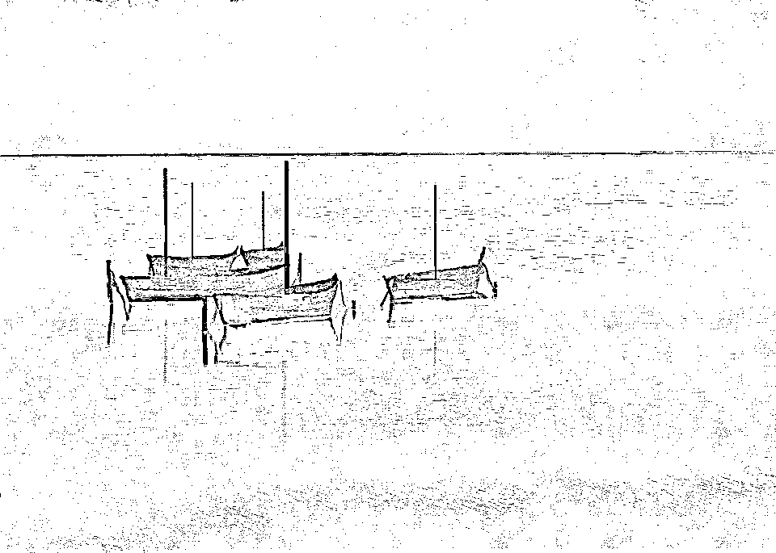

根据若道扒拉扒拉《为什么我们会反复做同一个梦？》编写

文字整理/蜗牛 编辑/翀子 图片/网络

我们一生会做各式各样的花式梦，而梦境与个人星图以及行星行进有很密切的互动。这篇文章里，若道创始人之一蒋颖老师、核心课助教咔咔老师，讲述了自己的梦境，并对自己当时的生命进程有很多思考。如果你想进一步了解释梦占星，也可以了解即将开设的[【释梦大师工作坊】](http://mp.weixin.qq.com/s?__biz=MjM5MjQwNjAyMQ==&mid=2649439109&idx=3&sn=0bfef7db51a7e2cb127dbfee87d21606&chksm=beb954ef89ceddf982f27a4b8b2861ee88edd88a0bec1fe4b1bdd7c9e8106806b955e4777e06&scene=21#wechat_redirect)（点击查看详情）哦。

**她梦见自己生了孩子**

**咔咔：**

2013 年 9 月到 11 月的时候，行进土星和北交点触发了我的火星、天王星和太阳。

8 月 9 月开始，我梦见我怀孕了；过几天我又做了一个梦，好像怀孕已经 3 个月了；又过了几天，已经开始显怀了；最后做这个梦的时候，我被推进病房手术室，甚至身体上有宫缩的存在。 

这个梦对我是非常震撼的，梦到怀孕好像是**孕育一些新的东西**。

在 9 月到 11 月，我大概做了十几次的心理咨询、心理治疗。然后我就开始有一种感觉，土星过来，好像你有什么东西，到一个结束。当时木星在巨蟹座对分我的月亮，好像是内心的什么东西要打开，要出来。

这个梦在我当时是我人生很重要的一个里程碑。做完咨询以后，我脸上的痘就都没了，也觉得从内心上有一些东西我愿意去面对，去理解了，选择不停留在过去，继续往前走了。

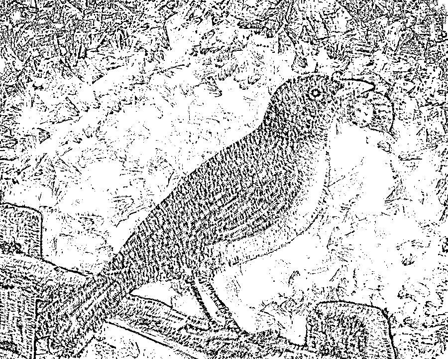

**她梦见自己找不到工作**

**蒋颖：**

我在几十年里面时间有一个重复发生的梦境：面临毕业，别人都找到工作，我没有找到工作，不知道该怎么办。

我的南交点在巨蟹座，月亮水瓶座在 9 宫。我想在社会上找到一个位置，别人找到了，我似乎没有找到。我记得比较清楚的是这种焦虑，这种相似的**不知所措的焦虑感**。

我们常说觉察，但是觉察在白天的时候事情很多，又有很多的防御机制在里面。梦境就比较诚实，虽然梦境光怪陆离，但是我个人感觉它某个方面更诚实，能够让我像一个观照者一样，等白天醒来，甚至有时候自己在梦中都能作为一个观照者。

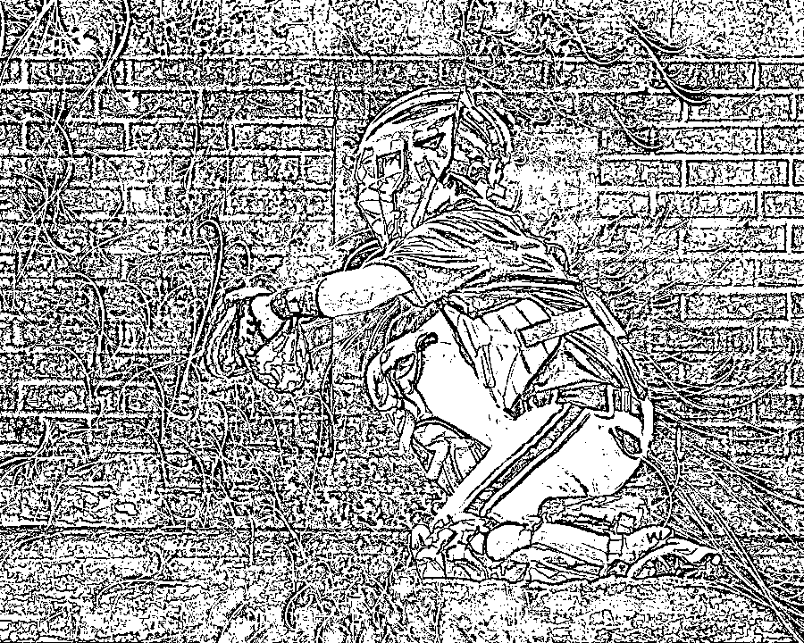

比如你连续做噩梦，在之前你可以有一些自我暗示自我安慰。

我记得另外一个人在我的工作坊里回忆了一个梦。她一直梦到一个老虎在追她，然后她做了一些工作，有一天晚上又梦到这个老虎追她，她就记着他的治疗师说：**“你去看一看这个老虎。”**

在这个梦中她站住了，转过身来去看这个老虎，老虎变成了她妈。 

在分享这个梦境的时候，我觉得很受鼓舞，这个人能够在梦境中去转化他的梦境。**很多个人成长的工作，白天我们在做，我们晚上也可以做。** 

我前几天做了一个梦，梦到一位老师，他唱了一首歌，这个歌是歌颂老师的，歌词非常长。我在梦中很开心，甚至还梦见在梦中的另外一个自己对梦中的自己说，这也许是你认同自己的老师身份了。

我的上升点是双子座，我比较认同的是自己作为一个学生，在世界范围内请大师来给我们讲课。虽然我自己也是老师，但是学生的身份跟着我的时间比我老师的一个身份跟着我的时间长的多得多，也是更让我舒适自在的一个身份。

在这个梦中，我对我的某一个部分能够认可，甚至是变成一个老师。因为我的下降点是在射手座，我的水星又在射手座，本身我是有老师这样的一个议题的。

从梦境里面，其实也反映出**我内在的自我认同有个进步了**。开始接受自己甚至是可以被大家歌颂的身份。

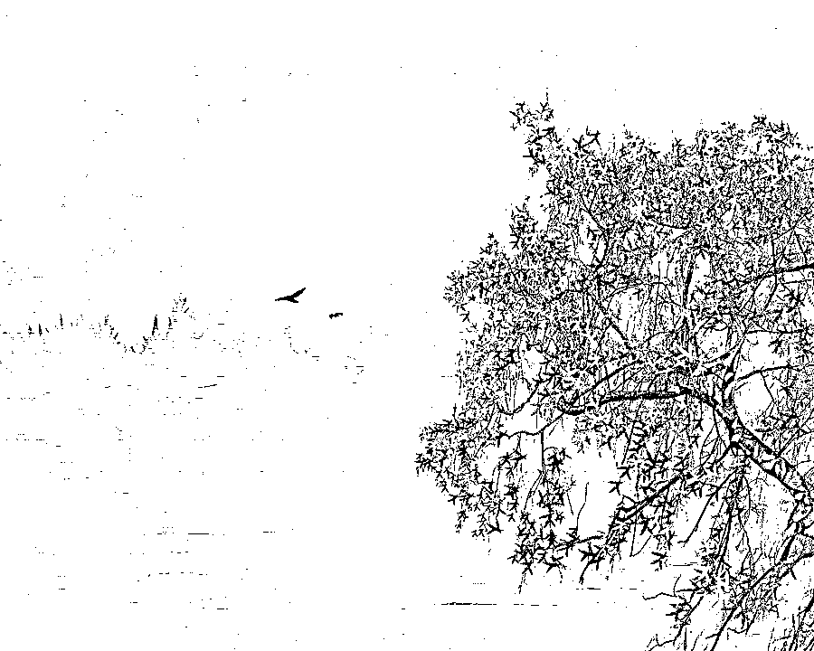

**一个很美好的梦**

**咔咔：**

我也来分享一个听上去很美好的梦。

很多年我没有打高尔夫，以前也只是在练习场练习，在梦里，教我打高尔夫球的一个朋友忽然从国外回来了，又带我去。好像是在一个农村一样的地方，周围还有很多穿梭的莫名奇妙的年轻人在玩真人 cs。

即便是在很嘈杂的情况下，我还是能很专心打球。一杆一杆练习开球。我感觉自己肌肉的力量在延展。特别好笑的是，我握住的球杆其实并不是一个正常的球杆，而是一个雨伞的伞柄。

在梦里，我很清晰地意识到，我握住这个伞柄是有多么不方便开球，即使这样，我还是很认真地握住伞柄，让自己的手挥出去。 

**我有一种掌握感，有力量感，排除了嘈杂环境的影响，冲着一个很高的目标在前进**。我对于自己在梦里表现的那种沉着和努力，那种专注是比较满意的，也反映了很向往的这种状态。

做这个梦的时候，行进月亮在对分我的天王星，土星在摩羯座六分我的太阳，天王星在对面触发了我出生星图太阳和天王星的相位。

我好像在梦里也感受到了土星要去掌控一些事情，即使球杆是个伞柄状的，你还是要把它挥出去。

从这个角度上来讲，我觉得它是一个很美的梦。确实最近也是在发生这个变化，包括生活的一些方面，增加锻炼啊，一些其他的这种，更开放的心态和更明确的目标感。

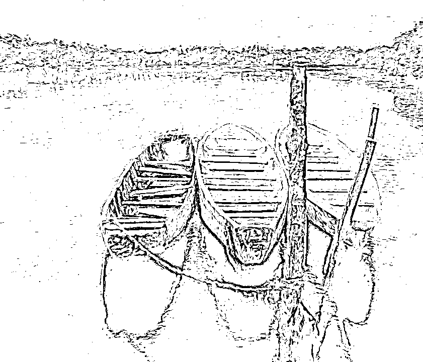

**美梦给我们资源**

当我们做一个美梦的时候，实际上，是**梦给了我们一些资源，醒来以后能把这些资源在意识中整合**。有一些伟大的科学发明都是在梦里面。 

缝纫机的发明者哈维，在很多年都想发明一个平车缝纫机，但是都没有成功。

他有一天晚上做了个梦，梦见自己被一群部落战士给抓住了。部落的酋长对他大声喊：“哈维，我命令你立刻完成这个缝纫机！”

他很害怕，就在梦里请求酋长给他仁慈，然后他在恐惧中看到了什么呢？他看见战士的矛尖上面有一个洞，突然他就醒过来了，马上就把针的模型的尖端钻了一个洞，把它放到机器上，针穿过的线就不会掉下来。缝纫机就诞生了。

无论是解自己的梦，或者帮助他人解梦，而且有好几种方法。**一个是定义法，另一个是对话法，你可以跟所有的梦里的人、物，甚至动物对话。**

你的梦传递了很多信息给你，当你想要去更好更完整地了解自己的感受和想法的时候，都可以借助你的梦境。而在即将开课的[【释梦大师工作坊】](http://mp.weixin.qq.com/s?__biz=MjM5MjQwNjAyMQ==&mid=2649439109&idx=3&sn=0bfef7db51a7e2cb127dbfee87d21606&chksm=beb954ef89ceddf982f27a4b8b2861ee88edd88a0bec1fe4b1bdd7c9e8106806b955e4777e06&scene=21#wechat_redirect)（点击查看详情）里，我们会听到更多的这样子的一些有用的方法和有用的案例。不管你有没有占星学的基础，只要你对自己有兴趣，对潜意识中非常有价值的宝藏想要去挖掘的话，都强烈推荐大家去参加这个工作坊！

**版权声明：**本文由若道整理首发于若道平台，欢迎转发，反对抄袭。友号转载请申请白名单。

**释梦工作坊报名中！**

**梦境工作和做梦疗法是深度心理治疗的一个关键技术，**使得深层无意识的象征性语言能够传递它们的洞见，并指引患者走向更大的完整。

**梦境提供了重要的线索，告诉我们客户痛苦的来源，以及哪些情绪和情结需要被检视和处理。**梦境工作可以成为心灵成长和行为改变的强大催化剂，它有种独特的能力，促进疗愈从内在发生。

**本课程将课堂讲座与动力过程工作结合起来，动力工作过程会将星图解读和梦境分析结合起来。**

每天约一半时间用于讲座，其余时间会演示占星学梦境工作方法，过程中老师会与学员进行互动。课程包括对老师解读星图和治疗性梦境工作方法的详细阐释和示范。

**我们将学习荣格解梦的基础知识和治疗性的、以过程为导向的星图解读。**我们将体验转化性原型模式在梦境和出生星图中同步显现时会发生什么。

**三次 6 小时的迷你马拉松在线梦境课程**，将会是一次提升意识、开放思想、转化生命的事件。**学员将体验占星学和解梦的融合。**

每次课程格雷格·博加特老师都会与学员互动，课程中使用的星图和梦境将由愿意分享自己梦境和星图的学员提前提供，课程期间也会开放问答以及学员互动环节。

**点击下图了解更多工作坊信息**

**学习占星学****点击下图了解课程详情** 

**

**微信又双叒叕改版啦，不想错过若道君的推送？**

**就把若道设为星标吧！**

**▼**

**喜欢记得点一下在看哦☟**

********报名直达入口********

# 2022 年重磅丨美国占星心理学学院&若道占星双认证核心课程

> 原文：[`mp.weixin.qq.com/s?__biz=MzA5NjA0NTAxNg==&mid=2651467312&idx=3&sn=9d973d6af6cb0f82f71e4aa52f9a040a&chksm=8b489c87bc3f1591c66a397c7f044974f45da80d3310b5166675597412ee875e69027ae43a86&scene=126&sessionid=1692737862#rd`](http://mp.weixin.qq.com/s?__biz=MzA5NjA0NTAxNg==&mid=2651467312&idx=3&sn=9d973d6af6cb0f82f71e4aa52f9a040a&chksm=8b489c87bc3f1591c66a397c7f044974f45da80d3310b5166675597412ee875e69027ae43a86&scene=126&sessionid=1692737862#rd)

**美国占星心理学学院创办人**

**格伦·佩里**授课

**40 余年**职业占星师生涯所学精华**倾囊相授**

修完 101-205 全部课程，并通过考核的毕业生将获得

**美国占星心理学学院证书**( Academy of Astropsychology )

和**若道毕业证书**

**高含金量双证书**

跟随主讲老师学习融合**心理学体系**的**占星知识**

为星图咨询解读打下坚实的基础

**大量**的课程资料，光是课后阅读资料就**超过 60 万字**

合理的课程设计，贴心的助教服务，及时的课后测验

1

**这门课程最大的看点是什么？**

1. **两位国际占星学大师**共同授课，将合计**90 年职业占星师生涯所学精华**倾囊相授；2. 修完**全阶课程**，考试通过的毕业生将获得**美国占星心理学学院证书**（Academy of Astropsychology）和**若道毕业证书**，**高含金量双证书**；3. **116 次课程**的充分授课时间（录播课程 69 次课；直播课程 47 次课），全面而详细地讲解占星学历史、知识、技能、案例、咨询和运用；4. 跟随主讲老师学习**自成体系、逻辑严密、实用性强的占星语法、星图解读方法**；5. 学习独特的**发展年龄预测法**，从星图看对关键年龄阶段的发展及议题；6.** 大量的课程资料，光是课后阅读资料就超过 60 万字**；7. 合理的课程设计，初中阶课程，每一节都有课后测验；8. 本课程可以作为**ISAR 选修课**中的一门，再修两门就满足 ISAR 认证选修课要求；9. **18 次占星咨询技巧的培训**，为正式从事占星咨询建立基础；10. 教授重要的**心理学概念**，比如与客体关系、心理动力理论、个人神话和叙事疗法相关的一些概念，学习如何将它们整合到星图解读中；11. 了解**《精神疾病诊断与统计手册》**诊断标准，探索星图中的心理疗愈；12.  学习**叙述疗法**和**自传写作**，将之作为自我疗愈和咨询的工具。

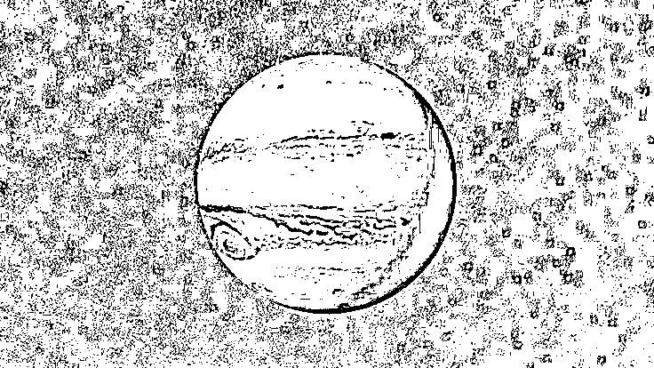

**格伦老师致学员的信**

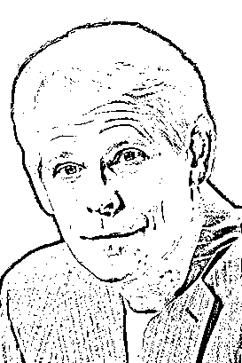

（向上滑动查看内容）

**亲爱的学员：**

作为占星心理学学院的校长，我的目标是帮助你顺利完成学业。

占星心理学学院的课程让你能够在经济承受范围内，灵活地学习占星学。我们的课程让你可以舒适、便捷地在家学习，不用打乱你本就繁忙的日程。我们有完善的在线学习系统，让你能在线上课、下载学习资料、进行测试并自动获得即时反馈，还可以在虚拟课堂上同你的教员和同学互动。

作为私人开业的**职业占星师**和**执业心理治疗师**，我已经**工作超过 30 年。**我还花了近 10 年的时间，在研究院里学习并获得**心理学的硕士和博士学位**。这段训练和经历是无价的，帮助我将占星学发展成为连贯的 21 世纪模式。

我们的占星学培训项目是**系统化的、清晰的、组织有序的、易学的、前沿的。**尽管有许多类似的学校可供你选择，但你不会在这些学校中看到像占星心理学学院所提供的那样有深度的或尖端的课程。

**我非常期待 2022 年再次在若道教授心理占星学核心课程。**我们重新规划和升级了本次课程体系。**新的课程包含之前完整课程的 72 个录播视频，每个视频长 2 小时；以及由我教授的 37 次直播课程，和大卫老师教授的 10 次直播课程，每次课程 2 小时。**在实时课程中，除了我提供的案例，我还会用学员的星图进行案例演示，与学员互动，阐明视频中教授的原则和方法。

**2 小时直播课程安排：**

**第一阶段 提问和讨论：**

这将在每节课开始时进行。邀请学员提出与课前提供的资料相关的具体问题。这一阶段将持续 15-30 分钟。

**第二阶段 示例：**

这一阶段会讲解与每周任务相关的具体概念，例如行星的星座位置、宫位位置以及相位的意涵。星图示例来自我认识的人，如公众人物、朋友、家人、同事或以前的客户（不显示出生信息）。同样，这一阶段也开放课堂讨论，学员可以提出自己的问题和见解。

**第三阶段 学员案例演示：**

这个阶段会从学员的具体星图来阐明概念，例如火元素行星占优势。学员案例演示不会涉及任何类型的咨询或“解读”。它们将只是简单地包含一段对话，我会在对话中分享自己对某个配置的思考，然后问这个学员可能会如何主观地（影响、信念、行为）和客观地（事件/关系）体验这个配置。其他参课学员可能也会对讨论的主题有自己的见解或问题，他们也可以参与讨论。

我对这一新的在线课程形式感到兴奋，**并期待着从 2022 年 4 月 6 日开始认识我的新学员们。**获得本学院的文凭会是你做过的最明智的投资。你不仅将占星学掌握到前所未有的深度，还将学到如何为客户提供咨询服务并建立职业占星师的职业生涯。

真诚地

**格伦·佩里 占星心理学学院校长**

**为什么要学习心理占星学？**占星心理学是一个复杂的体系，让实践者能够向客户提供真正治疗性的益处。这从根本上说来是我们学院有别于其他学校之处：**我们教授占星学，也教授心理学概念。****我们明确讨论各种心理学概念，并将其与占星学无缝衔接。结果就是更深入的、更丰富的，最终更加强大的模式。****该项目专为初学者和渴望深造的有经验的占星师而设。**我们会从跨学科的角度探讨星图解读。**通过融合荣格心理学和各种其他模型的元素，学员将熟悉作为人格理论、发展模型、原型语言和诊断工具的占星学。**

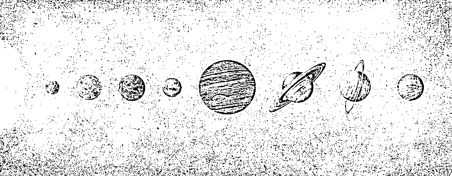

2

**课程是怎么安排的？**

**第一学年**

**共****64****次课 **43****次录播课 **21 次直播课******

**101 占星学基础 **

****共****12****次课程：******8 次 2017 年录课+4 次直播课**

**占星学**关注成长，聚焦心理。外部事件意义重大，但我们可以把它们看作是对于发展中的心理结构的共时性反映，以及未来发展的媒介和催化剂。在这个阶段的课程中，会以四种形态的几何形式介绍**占星原型：星座、行星、宫位和相位**。黄道带是人类心灵的象征性地图，其中的每个**星座**都代表一种基本的人类需求、原型人物、发展阶段和行为风格。**行星**代表心理功能，以满足其关联星座的基本需求。**宫位**提供了环境舞台，行星在其中扮演它们的角色，而**相位**是行星之间的角度关系，在主观上体验为内在对话。

**课程安排**：

**录播课****、****直播课（周三）**时长都是 2 小时

第一节**录播课**：核心概念介绍

第二节**录播课**：黄道带的结构

2022 年 4 月 6 日**直播课**：核心概念、黄道带的结构提问和讨论、知识点示例

第三节**录播课**：图例、单态星体和其他奇妙的元素

2022 年 4 月 20 日**直播课**：图例、单态星体提问和讨论、知识点示例

第四节**录播课**：星座介绍（从白羊座到处女座）

第五节**录播课**：星座介绍（从天秤座到双鱼座）

2022 年 5 月 4 日**直播课**：12 星座案例演示

第六节**录播课**：行星作为过程

第七节**录播课**：行星作为内容

第八节**录播课**：将碎片整合起来

2022 年 5 月 18 日**直播课**：整合星图时，将行星作为过程和内容案例演示

**102 行星落星座、宫位** 

****共****12****次课程：**8 次 2019 年录课+4 次直播课**

这个阶段的课程**聚焦于初步的星图整合。**

学员将学习**占星语法**，以及如何运用它们来阐释**行星的星座落点**。学员不需要强记书中的星图解读，而是学习分析基础的占星句法结构，应用这些语法规则来思考和讲述这门语言。学员们将学习如何构建精妙的句子，将动机、功能、特质、状态和事件组合起来。

此外，还将学习解读**行星宫位落点**的规则。宫位被定义为心理环境，为特定类型成长和发展提供背景。行星落在宫位中，象征着情境中的特殊状态，应对环境挑战的方式，以及通过共时性人物和事件而外化的自我部分。

学员们将探索如何将星座和宫位落点融合在一个单一、整合的陈述中，做出灵活、层次分明的解读。

**课程安排**：

第一节**录播课**：占星语法介绍

第二节**录播课**：行星星座作为行为风格

2022 年 6 月 1 日**直播课**：占星语法、行星星座作为行为风格提问和讨论、知识点示例

第三节**录播课**：思维状态和行为结果

第四节**录播课**：学习行星的星座落点

2022 年 6 月 15 日**直播课**：思维状态和行为结果、行星的星座落点提问和讨论、知识点示例

第五节**录播课**：回顾宫位的含义

第六节**录播课**：宫位中的行星过程

2022 年 6 月 29 日**直播课**：宫位的含义、宫位中的行星过程提问和讨论、知识点示例

第七节**录播课**：行星在宫位中的状态

第八节**录播课**：行星作为宫位的内容

2022 年 7 月 13 日**直播课**：行星在宫位中的状态、内容的提问和讨论、知识点示例

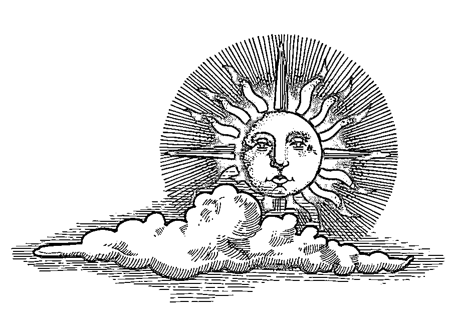

**103 行星相位与个人神话** 

****共****13****次课程：**9 次 2019 年录课+4 次直播课**

在这个阶段的课程中，**相位**被解释为由更大的故事结构的潜在动力构成的个人神话。

学员将学习相位是如何象征内在心理的冲突、重要的童年情感体验、主要的人生挑战和内在对话的。需要着重强调的是，相位的意涵会随着心理成熟的程度而改变。人会成长、进化，会解决内在冲突，这些不仅反映在态度和行为的改变上，而且也会表现在某人吸引的事件及其与他人的关系品质上。

学员们还将学习一些**心理学概念**，比如与客体关系、心理动力理论、个人神话和叙事疗法相关的一些概念，它们将整合到相位解读中。

**课程安排**：

第一节**录播课**：重要主题与核心冲突

第二节**录播课**：渐盈相位与渐亏相位

2022 年 7 月 27 日**直播课**：重要主题与核心冲突、渐盈相位与渐亏相位的提问和讨论、知识点示例

第三节**录播课**：主要相位的核心意义

第四节**录播课**：罗生门原则

2022 年 8 月 10 日**直播课**：主要相位的核心意义、罗生门原则的提问和讨论、知识点示例

第五节**录播课**：占星学中的认知

第六节**录播课**：心灵的控制结构

2022 年 8 月 24 日**直播课**：占星学中的认知、心灵的控制结构的提问和讨论、知识点示例

第七节**录播课**：作为认知结构的相位

第八节**录播课**：强迫性重复

第九节**录播课**：听大卫·瑞雷讲月亮交点

2022 年 9 月 21 日**直播课**：月亮交点（由大卫·瑞雷老师教授）

**104 征象星与定位星：作为进化故事的星图 **

****共****12****次课程：******8 次 2019 年录课+4 次直播课**

这个阶段的课程聚焦于**从叙事角度整合星图。**

学员们将探索**宫位征象星**和**行星定位星**如何讲述一个故事，反映一个人进化发展之旅。行星定位关系揭示了个人神话的主体构架。而这个故事的主题常常处于意识觉知和控制之外，占星学提供了一种方式，揭示、解读、改编这个神话。

我们推荐的星图整合方式是将相位和定位星关系融合成一个单一、连贯的叙事。要特别强调的是，如何活出整合程度更高的生命故事。

学员们还将了解**叙事疗法**和**自传写作**，把它们当作促进整张星图整合的一种方式。

**课程安排**：

第一节**录播课**：每张星图都讲述了一个故事

第二节**录播课**：互容与最终定位星

2022 年 10 月 12 日**直播课**：每张星图都讲述了一个故事、互容与最终定位星的提问和讨论、知识点示例

第三节**录播课**：将相位整合进流程图

第四节**录播课**：完整的故事

2022 年 10 月 26 日**直播课**：将相位整合进流程图、完整的故事的提问和讨论、知识点示例

第五节**录播课**：过渡短语

第六节**录播课**：良好定位或不良定位

2022 年 11 月 9 日**直播课**：过渡短语、良好定位或不良定位的提问和讨论、知识点示例

第七节**录播课**：发展年龄方法

第八节**录播课**：进行全面整合

2022 年 11 月 23 日**直播课**：发展年龄方法、进行全面整合的提问和讨论、知识点示例、案例演示

**105 星图中的精神病理学与疗愈 **

****共****15****次课程：******10 次 2019 年录课+5 次直播课**

在这个阶段的课程中,我们将**聚焦于十二星座(从白羊座到双鱼座）及其对应的守护星的潜在功能障碍**。

我们将学习如何识别、理解和应对每个星座的潜在挑战。我们将在各种相应的心理障碍背景下来考察占星原型，这些心理障碍表现为功能障碍、失衡的极端状态。

学员们将了解**《精神疾病诊断与统计手册》诊断标准**。我们会探讨治疗的概念，尤其是那些与整合和个性化相关的概念。我们将特别关注外行星的困难相位，以及它们与内在心理冲突、防御和症状形成的关系。

学员们将探索人的痛苦如何成为发展和实现天赋才能的催化剂。

**课程安排**：

第一节**录播课**：白羊座-火星的病理学

第二节**录播课**：金牛座/天秤座-金星的病理学

2022 年 12 月 7 日**直播课**：白羊座-火星、金牛座/天秤座-金星的病理学提问和讨论、知识点示例、案例演示

第三节**录播课**：双子座/处女座-水星的病理学

第四节**录播课**：巨蟹座-月亮的病理学

2022 年 12 月 21 日**直播课**：双子座/处女座-水星、巨蟹座-月亮的病理学提问和讨论、知识点示例、案例演示

第五节**录播课**：狮子座-太阳的病理学

第六节**录播课**：天蝎座-冥王星的病理学

2023 年 1 月 4 日**直播课**：狮子座-太阳、天蝎座-冥王星的病理学提问和讨论、知识点示例、案例演示

第七节**录播课**：射手座-木星的病理学

第八节**录播课**：摩羯座-土星的病理学

2023 年 1 月 18 日**直播课**：射手座-木星、摩羯座-土星的病理学提问和讨论、知识点示例、案例演示

第九节**录播课**：水瓶座-天王星的病理学

第十节**录播课**：双鱼座-海王星的病理学

2023 年 2 月 8 日**直播课**：水瓶座-天王星、双鱼座-海王星的病理学提问和讨论、知识点示例、案例演示

**第二学年 2023 年**

****共****52****次课 **36****次录播课 **16 次直播课********

**201 回顾占星历史 **

****共****16****次课程：******9 次 2019 年录课+7 次直播课**

在这个阶段的课程中，我们将探索**占星历史如何反映心灵的进化**。

现代之前的占星学以事件为导向，注重具体预测，偏向决定论，它反映了现代之前的主导意识模式。上世纪以来，占星学已经逐渐变得更加抽象、心理化、开放和非决定性，这似乎反映了集体意识的改变。因此，我们将在人类发展和意识进化的背景下考察占星历史。我们会谈到不同时代的星图解读和咨询技术，以此来比较和对比前现代、现代和后现代占星学。

**课程安排**：

第一节**录播课**：朝着整体占星学前进

第二节**录播课**：占星原教旨主义

2023 年 2 月 22 日**直播课**：朝着整体占星学前进、占星原教旨主义提问和讨论、知识点示例

第三节**录播课**：占星学的其他分支——大卫·瑞雷

2023 年 3 月 1 日**直播课**：占星学的其他分支提问和讨论、知识点示例（由大卫·瑞雷老师教授）

第四节**录播课**：从古代占星学到后现代占星学

第五节**录播课**：比较与批评

2023 年 3 月 8 日**直播课**：从古代占星学到后现代占星学、比较与批评、提问和讨论、知识点示例

第六节**录播课**：希腊占星学：摘录与评论

2023 年 3 月 22 日**直播课**：希腊占星学：摘录与评论提问和讨论、知识点示例

第七节**录播课**：比对图中的伴侣匹配度，古代与现代

2023 年 4 月 5 日**直播课**：比对图中的伴侣匹配度，古代与现代提问和讨论、知识点示例

第八节**录播课**：比对图——大卫·瑞雷

2023 年 4 月 12 日**直播课**：比对图提问和讨论、知识点示例、案例演示（由大卫·瑞雷老师教授）

第九节**录播课**：组合图——大卫·瑞雷

2023 年 4 月 26 日**直播课**：组合图提问和讨论、知识点示例、案例演示（由大卫·瑞雷老师教授）

**202 预测与意识演变(一) **

****共****9****次课程：******6 次 2019 年录课+3 次直播课**

作为一门艺术，**预测占星学**运用行星的运行来预测特定时期的性质、意义和持续时间。在这个阶段的课程中，我们会考察**意识进化**的概念、其基本原理及其与占星学预测部分的关系。

意识进化可以被定义为有意识地与星图中固有的进化过程合作。学员们将探索如何用**行进**和**推进**来为意识进化服务。我们不是简单描述事件的结果，而是将行星运行描述为实现先天潜能的机遇之窗。

**课程安排**：

第一节**录播课**：开始预测

第二节**录播课**：发展年龄方法

2023 年 5 月 3 日**直播课**：开始预测、发展年龄方法提问和讨论、知识点示例、案例演示

第三节**录播课**：太阳的行进

第四节**录播课**：月亮的行进与推进

2023 年 5 月 17 日**直播课**：太阳的行进、月亮的行进与推进提问和讨论、知识点示例、案例演示

第五节**录播课**：水星的行进

第六节**录播课**：金星的行进

2023 年 5 月 31 日**直播课**：水星、金星的行进提问和讨论、知识点示例、案例演示

**203 预测与意识演变(二) **

****共****15****次课程：******9 次 2019 年录课+6 次直播课**

在这个阶段的课程中，学员们会继续探索**如何将对行进、推进和其他预测方法的分析运用于个人成长**。

具体事件反映并促进了意识的改变；因此，行星运行可以帮助我们洞察成长过程的精确时机，让我们领会内在和外在现实如何同时发生、彼此反映、互相转化。

我们还将探索宏观的世界行进，考察占星格局如何在社会、政治、经济、艺术和生态层面上表现出不同的形式，却又在多样化的现象中反映单一的**原型**。

这里的挑战是去思考，我们对宇宙的这种参与式关系如何能为共同创造一个积极的、更充满希望的未来做出贡献。

**课程安排**：

第一节**录播课**：火星的行进

第二节**录播课**：木星的行进

2023 年 6 月 14 日**直播课**：火星、木星的行进提问和讨论、知识点示例、案例演示

第三节**录播课**：土星的行进

第四节**录播课**：天王星的行进

2023 年 6 月 28 日**直播课**：土星、天王星的行进提问和讨论、知识点示例、案例演示

第五节**录播课**：海王星的行进

第六节**录播课**：冥王星的行进

2023 年 7 月 12 日**直播课**：海王星、冥王星的行进提问和讨论、知识点示例、案例演示

第七节**录播课**：次限推进——大卫·瑞雷

2023 年 7 月 19 日**直播课**：次限推进提问和讨论、知识点示例、案例演示（由大卫·瑞雷老师教授）

第八节**录播课**：太阳弧——大卫·瑞雷

2023 年 7 月 26 日**直播课**：太阳弧提问和讨论、知识点示例、案例演示（由大卫·瑞雷老师教授）

第九节**录播课**：太阳返照图和月亮返照图——大卫·瑞雷

2023 年 8 月 9 日**直播课**：太阳返照图和月亮返照图提问和讨论、知识点示例、案例演示（由大卫·瑞雷老师教授）

**204 占星咨询技巧(一) **

****共****9****次课程：******6 次 2019 年录课+3 次直播课**

在这个阶段的课程中，学员们将学习**咨询技巧**，比如如何选取一段经历，询问相关问题，提出假设，进行解读，重塑冲突，预测成长机遇，深化疗愈。

我们会审视各种**咨询理论**，重点强调它们在占星学中的**运用**。学员们将学习如何处理危机，做出恰当的推荐引介。

我们强调**有效沟通**的原则、聆听技巧、言语和非言语沟通，以及占星学如何帮助我们建立共情关系。

我们会专门介绍**伦理道德**法则，因为它关系到职业责任问题、资质能力、咨询和预测。

我们会特别关注**占星师的阴影**以及我们在自卑和膨胀问题上的集体脆弱。

**课程安排**：

第一节**录播课**：导言与概述

第二节**录播课**：确定咨询范围

2023 年 8 月 16 日**直播课**：导言与概述、确定咨询范围提问和讨论、知识点示例、案例演示

第三节**录播课**：会见客户

第四节**录播课**：厘清问题(剥开占星学的洋葱)

2023 年 8 月 30 日**直播课**：会见客户、厘清问题(剥开占星学的洋葱)提问和讨论、知识点示例、案例演示

第五节**录播课**：认出生活模式(隐喻思维)

第六节**录播课**：提出假设与辨识核心信念

2023 年 9 月 13 日**直播课**：认出生活模式(隐喻思维)、提出假设与辨识核心信念提问和讨论、知识点示例、案例演示

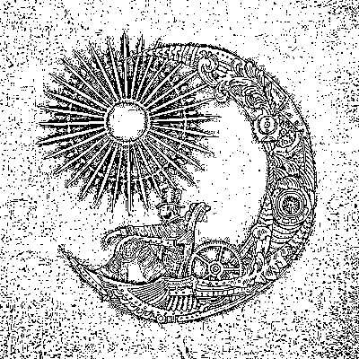

**205 占星咨询技巧 (二) **

****共****12****次课程：******6 次 2019 年录课+6 次直播课**

在这个阶段的课程中，参与者将**继续学习咨询技巧**，包括如何选取一段经历，询问相关问题，提出假设，进行解读，重塑冲突，预测成长机遇，深化疗愈。

我们还将考察各种**电影**，考察它们与理解人们寻求帮助的共同议题的关系。我们会审视各种咨询理论，着重强调它们在占星学中的运用。学员们会学到如何处理危机，做出恰当的推荐引介。我们会强调有效沟通的原则，以及聆听技巧、言语和非言语沟通，以及占星学如何帮助我们建立共情关系。我们会专门介绍伦理道德法则，因为它关系到职业责任问题、资质能力、咨询、预测和古代术语的运用。

**课程安排**：

第一节**录播课**：检验假设

第二节**录播课**：对星图做出初步解读

2023 年 10 月 11 日**直播课**：检验假设、对星图做出初步解读提问和讨论、知识点示例、案例演示

第三节**录播课**：建设性解读星图的艺术

第四节**录播课**：洞悉客户经历的目的

2023 年 10 月 25 日**直播课**：建设性解读星图的艺术、洞悉客户经历的目的提问和讨论、知识点示例、案例演示

第五节**录播课**：提供希望和方向

第六节**录播课**：案例研究和督导

2023 年 11 月 8 日**直播课**：提供希望和方向、案例研究和督导提问和讨论、知识点示例、案例演示

2023 年 11 月 15 日**直播课**：ISAR 资质认证考试大纲和准备（由大卫·瑞雷老师教授）

2023 年 11 月 22 日**直播课**：ISAR 资质认证考试术语词汇表第一部分（由大卫·瑞雷老师教授）

2023 年 11 月 29 日**直播课**：ISAR 资质认证考试术语词汇表第二部分（由大卫·瑞雷老师教授）

**若道核心课程结业考试**

3

**导师简介**

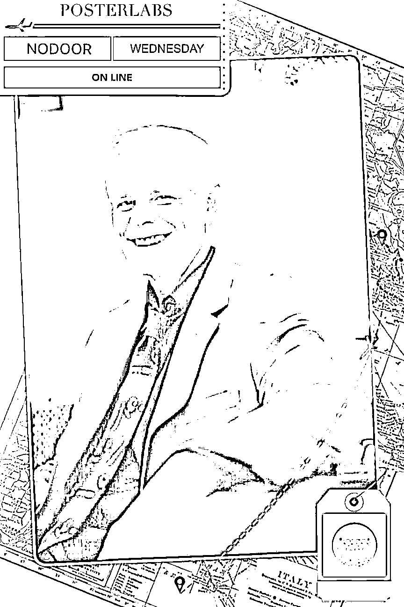

**格伦·佩里（Glenn Perry）**

*   这位传奇的占星师，也是一名拳击和摩托车爱好者

*   他毕业于赛布鲁克学院(Saybrook Institute)，是心理/意识研究专业博士

*   也是拥有 30 余年经验的加州注册婚姻和家庭治疗师 （CAMFT）

*   美国占星心理学学院（Academy of AstroPsychology）的创办人

*   他曾任国际占星研究协会 （ISAR）以及联合占星大会董事会（UAC）副主席

*   也是 ISAR 突破性道德标准的设定者

*   康涅狄格州研究生院（the Graduate Institute of Connecticut）原型宇宙学与意识进化项目的负责人

*   共出版八本占星学著作：《心理占星学入门》《心理占星论文集》《盗取天火》《从忠诚到革命》《星图中的阴影》《占星职业议题与伦理》《出生星图深度分析》《从古代到后现代占星学》

**大卫·瑞雷（David Railey）**

*   若道联合创始人，致力于在中国教授和推广西方占星学；

*   曾任 ISAR 全球副主席，CAPISAR（ISAR 职业占星师资质认证机构）主席；

*   1976 年，通过亚特兰大职业占星师考试，成为全职占星师，随后通过 AFAN 和 ISAR 职业测试；

*   1980 年，与杰夫·焦耳一起在亚特兰大创建“每日行星”占星学中心。此后在亚特兰大占星协会担任 4 年考官，并且两次担任亚特兰大地区占星协会主席。1979-1992 年，作为占星师活跃于美国社会媒体，向不了解现代占星学变化的大众宣传专业占星学知识。在 1989-1992 年期间，他在 WRGG 电台 12 频道每周主持个人电视秀“今日占星学”，早先他还在 WRFG 的广播节目中播讲宇宙天气节目；

*   2010-2014 年，任全美占星师联盟监督委员会委员；

*   2010 年，其著作《灵魂的目标》中国版出版，和蒋颖一起创办若道占星学校和其官网 www.nodoor.com；

*   2017 年，被选为 ISAR 委员会成员。ISAR 是世界最大的国际占星机构，会员遍布 45 个国家，2017-2020 年曾任 ISAR 全球副主席、CAPISAR（ISAR 职业占星师资质认证机构）主席。

**助教简介**

**薇安**

*   全职心理占星师、ISAR 认证占星师（2016 年获得）；

*   北大心理学硕士、MBTI 国际认证施测师；

*   若道认证生时校正资质及 COAC 高阶资质毕业生；

*   连续两届担任格伦·佩里老师亲授的“美国占星心理学院&若道占星双认证核心课程”主助教；

*   2012 年至今，持续追随多位国际占星大师进行占星学的深入学习；

*   2007 年至今，持续进行精神分析及心理动力取向的理论及技巧研习；

*   致力研究心理学与占星学的整合运用。

4

**此次课程适合哪些人？**

*   对占星学感兴趣，想要入门的零基础者

*   占星学小白，但有志成为职业占星师的人

*   有一定占星学基础，但不知道该如何整合星图复杂碎片的人

*   想要师从更多殿堂级占星导师学习占星心法的人

*   走在自我探索和个人成长道路上的人

5

**选择若道学习占星学的优势**

**运用自由意志，扭转破坏性模式，绽放天赋潜能**

若道是人本主义占星学的旗手。因为我们相信，**人通过了解模式、觉察习性、积极疗愈、终将释放其潜能，与命运共舞**。

**进入国际权威职业占星师认证的快车道**

占星界的“联合国”ISAR（国际占星研究协会），是具有全世界影响力的占星教学和研究组织和职业占星师全球认证机构，认证占星师遍布 47 个国家。**在 ISAR 的 22 所附属学校中，大中华地区的附属学校只有若道一家**。在国际化的教学理念大纲标准下，**若道毕业生在 ISAR 国际认证占星师的考试通过率多次全球第一**。

**十年占星学教育中国本土化教学经验**

**根据中国学生的学习习惯不断优化占星教学体系，让学员学成后更自如地应对本土咨询市场的需求。**

学好占星学不仅仅需要邀请一两位老师教学，更需要对教学难点有充分了解，且有持续的教学跟进服务。**10 年来多次核心课程和各种专题课程的教学，让若道非常了解中国学生学习占星学的难点和卡点，合理有效地拆分、提炼课程知识点，同时也积累了丰富的国外老师和中国老师、助教紧密配合以及课程顾问密切配合教学的经验**。

若道还专门开发了有助于占星学习的“**若道**”APP，每门课程都设有答疑板块，学员能够方便快捷地提交问题，助教及时答疑解惑和批改作业。

**融入中国顶尖的职业占星师群体**

若道是中国职业占星师的“黄埔军校”。职业占星师的培养从若道开始，**进入若道，你就走进了中国顶尖的职业占星师群体，和一群志同道合的师兄师姐联谊，获得经验，共同成长**。 

**多种奖学金支持**

为了鼓励学员不因为暂时的经济困难而放弃学习，我们特意设置了各种**技能交换和奖学金**。

对于有一技之长的学员，我们推出的技能交换的项目包括**“笔译”、“笔记整理”、“平面设计”、“课本朗读”、“班级服务”**等技能交换项目；

而对于努力学习、出勤率高、完成作业率高的学员，我们设置的**土星奖、木星奖**等各种奖学金在等着你。

为了感谢帮助我们推荐学员的老学员们，我们设置了“**老学员推荐奖**”；

对于通过问卷提建议，帮助我们提高服务的学员，我们也设置了相应的奖学金。

**开启占星咨询的职业规划和支持**

若道为占星学员搭建了占星问答平台和占星咨询平台，并提供严肃占星学影响力最大的媒体平台，全力为毕业生提供宣传渠道，帮助你吸引和积累咨询生涯初期的种子客户。若道为学员开发了适用于占星学习的“若道”APP，并不断更新完善。

**①  微信平台**若道微信平台作为业内颇具影响力专业平台，为文笔好的若道毕业生提供传播占星学并免费宣传自己的机会。有的学员因为文笔获得众多粉丝喜爱，在 3 年多时间积累起 2000 多人的潜在客户。

**②  问答平台**若道问答平台帮助学员接触客户的实际问题，并在毕业前就进行演练答题。自问答平台 2016 年上线运营以来，学员接触到 3200 多个问题， 回答问题最多的学员在问答平台收入达 5 万多元。

**③  咨询平台**若道咨询平台是我们为优秀毕业生所搭建的平台，帮助毕业生在自己的咨询拓展之外，用若道提供的平台扩展咨询客户群。自咨询平台 2017 年 8 月上线运营以来，咨询平台共入驻 65 人，收入最高者达 32 万元。

此处所列学员收入仅供参考，收入高的学员和其专业水准、努力程度密切相关。若道平台尽其所能将自己定位为辅助学员开展职业生涯的桥梁。

6

**课程价格**

**101-102 初阶**

**正价：**6800 元

**早鸟价：****6200 元**

**早鸟价截止时间：2022 年 3 月 16 日**

**学习充值卡优惠价：5800 元**

**101-105 第一学年**

**正价：**18800 元

**早鸟价：****17600 元**

**早鸟价截止时间：2022 年 3 月 16 日**

**学习充值卡优惠价：17000 元**

**101-205 全阶联报**

**正价：**50000 元

**早鸟价：****36000 元**

**早鸟价截止时间：2022 年 3 月 16 日**

**学习充值卡优惠价：35000 元**

**咨询课程顾问**：**王老师（微信/手机：18510107057，请备注“格伦核心课”）**

**全阶段学习后，可参与若道占星毕业认证考试，考试费用为：580 元**

7

**直播课开课时间**

**2022 年 4 月 6 日（周三）20:00-22:00**

8

**退转课程**

**退款原则请详看《教学协议》，如有疑问请咨询课程顾问。**

9

**格伦老师视频**

** 格伦·佩里老师如何将心理学和占星学结合，如何开始教授心理占星学？**

<mpvideosnap class="js_uneditable custom_select_card channels_iframe" data-pluginname="videosnap" data-id="export/UzFfAgtgekIEAQAAAAAA1cQIVxHSQwAAAAstQy6ubaLX4KHWvLEZgBPEj4N8IVw_XO_8zNPgMIvIg3o5fV6DKtbopk3uCtgu" data-url="https://findermp.video.qq.com/251/20304/stodownload?encfilekey=rjD5jyTuFrIpZ2ibE8T7Ym3K77SEULgkiacqoE1uQT2gRMR7tsdLprPxw34Qibx2tX5gg3FHPSwGBA23EQANYxD29423qqiboomc3RIYLZP49cImPwmNV6LYqA&amp;adaptivelytrans=0&amp;bizid=1023&amp;dotrans=0&amp;hy=SZ&amp;idx=1&amp;m=&amp;scene=0&amp;token=AxricY7RBHdUIqHazje0cib6ddJfLKk6VpG8CrHMvAa7LnbGk6Yb742ETaJ0jJ5zewGLZSAOicbApU" data-headimgurl="http://wx.qlogo.cn/finderhead/PiajxSqBRaEJYnVsqWfEX9qA0sI6hNVKsDfyzfPZ92WZMZyBpZWU5NA/0" data-username="v2_060000231003b20faec8c4e68a1ec2d4ca07e434b07755bbf47e7053a3059defd2c9d6c68a20@finder" data-nickname="若道" data-desc="#若道核心课 格伦·佩里老师如何将心理学和占星学融合，如何开始教授心理占星学？" data-nonceid="7753154886488626177" data-type="video"></mpvideosnap>****2022 双证书核心课****

**授课老师：格伦·佩里、大卫·瑞雷**

**直播课开课时间：2022 年 4 月 6 日（周三）开课**

**授课方式：******网络授课，英文授课，中文翻译****

**费用：101-102 价格：**6800 元**（早鸟价 6200，2022 年 3 月 16 日截止，充值卡优惠价 5800）**，**101-105 价格**：18800 元**（早鸟价 17600，2022 年 3 月 16 日截止，充值卡优惠价 17000）**，**101-205 价格**：50000 元**（早鸟价 36000，2022 年 3 月 16 日截止，充值卡优惠价 35000）**；

**课程负责人：王老师**（微信/手机：18510107057，请备注“格伦核心课”）

长按二维码添加课程负责人咨询~

****报名直达入口****

# “你不在，当我最需要爱，你却不在。” | 当你爱上天王星

> 原文：[`mp.weixin.qq.com/s?__biz=MzA5NjA0NTAxNg==&mid=2651467236&idx=1&sn=f863363054b8ff8938110edbca4ab14d&chksm=8b489f53bc3f1645100f16537ff2b4670e30da38d87f39fc6d31e28852c75531567058898964&scene=126&sessionid=1692737862#rd`](http://mp.weixin.qq.com/s?__biz=MzA5NjA0NTAxNg==&mid=2651467236&idx=1&sn=f863363054b8ff8938110edbca4ab14d&chksm=8b489f53bc3f1645100f16537ff2b4670e30da38d87f39fc6d31e28852c75531567058898964&scene=126&sessionid=1692737862#rd)

**********************☆ **************后台回复“今日”，给你一句生命态度********

********************************************

采访/编辑/玫瑰 图片/pexels

在[上一期访谈](http://mp.weixin.qq.com/s?__biz=MzA5NjA0NTAxNg==&mid=2651464091&idx=1&sn=7f9d4f5c592a48b6dbe15987f4325c88&chksm=8b48932cbc3f1a3a50e632a6fe56853ab260f70893b6f4d2868a37bf2dc70932883fadb83d6f&scene=21#wechat_redirect)（点击链接可阅读）中，我们听了很多冥王星行进的故事。今天，想和大家一起聊聊天王星。这期内容策划了很久，最终定位在了情感上。也许通过爱情来拓展人生，是当下人类能够做到的最简单的突破。听听这些天王星式爱情故事，有成长，也有挫折，有自我困顿，也有自我超越。毕竟人生只有一次，到底要过成什么样子？来点不一样的选择。**“天王星”式爱情调查**提起天王星，最容易想到的就是自由。天王星的恋爱给人带来最上头的感受，也是**通过非同寻常的情感模式，让我们在日复一日的繁琐枯燥人生中，体验到脱轨的自由感**。想象一下，循规蹈矩的生活里，忽然出现一个和你完全不一样的人，那种好奇、新鲜、刺激、不顾一切……天王星式恋情中，不一样的两个人彼此仿佛在探索另外一个世界的自己。**无论是年龄、相貌、地域，甚至性别，凡是和传统作对的关系，就是天王星最喜欢的关系。**然而，天王星最可怕的，也是这种**基于新鲜和差距，却没有现实和存续基础的断层感**。当我们被这颗外行星击中时，需要克服的是**身为一个有血有肉、有情感的人类对于稳定和陪伴的强烈需求**，随之而来的是**长时间、长距离的分离，彼此难以沟通和随之而来的矛盾不断。**最初的激情所剩无几时，还有多少人能够坚持下去呢？

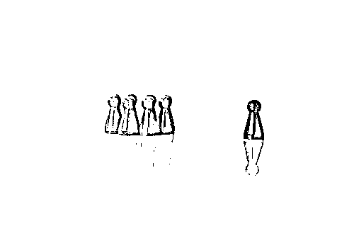

我们做了一项调查，想看看有过天王星式爱情体验的小伙伴们，他们对这样的感情是怎么看的？

在这份问卷中，回答的女性占比为 96%，受访者最低学历在本科以上，其中硕士以上占比 24%；目前单身者占比 60%。其中，24%的人没有经历过天王星式的恋情；在剩下的人群中，半数人有过在同一个国家的异地恋，24%的人有过异国恋，16%的人有过差距在 12 岁以上的忘年恋，4%的人有过同性恋经历。在这些人群中，**高达 70%的人曾遭受过身边人的反对，60%的人坚持了自己的选择**。**然而曾经坚持过的那些人，在最终也大部分都放弃了**（能够驾驭天王星的凡人的确不多啊）。但是，**所有的人都从这样的感情中得到了自我成长和感悟。**

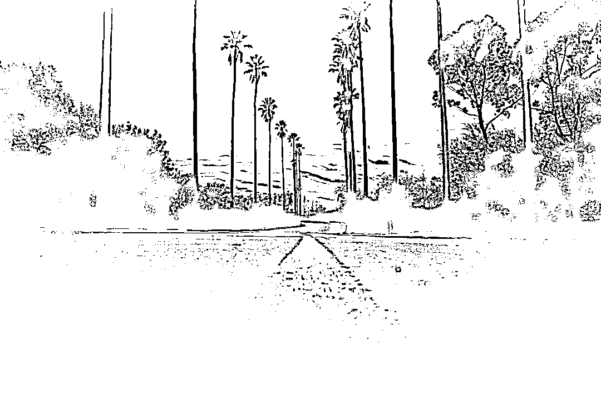

**他们的故事**我们选取了其中一些故事分享给大家。考虑到隐私，所有受访者均不公开名字。希望他们的故事对身处或者憧憬天王星式恋情的你有一定帮助。**@小 P****异地恋****投入感情的时候不顾一切，听不进任何人的劝阻。**分开后**意识到门当户对的重要性了，彼此的差距越小，需要磨合的地方也会相对少一些。**对于异地恋或异国恋，并没有觉得有何不可，每个人都有自己相处的模式，有人重视精神的交流，有人重视陪伴的感觉。**找到适合自己的方式才是最重要的。****@小 C****异地恋，忘年恋**实话说，每一段的分手都是我提的。硬要说原因的话，一是**“现阶段不需要了”**，其次是**“这人没意思了”**。其他都对我构不成影响，这件事上，从我 11 岁写爱情诗开始，我就完全遵照我自己的判断，以后结婚也是。“不需要了”这部分可能隐秘些，但我想月亮摩羯是一个原因。**得到的成长：****第一，一定是****不能过度依赖（被依赖）任何人，到了索取（或牺牲）的地步。**直到与大学里的前任分手为止，长期的受创使我无意识地需要男性，把我阳性一面的能量投到他们身上，来寻求解脱。由此而来的男性当然土星和海王星的能量都很重，并且我也得不到解脱，直到我意识到是**我自己应该面对的生命议题。****第二，沟通问题，或者说“爱的方式”的磨合。**我是个终极自我的人。爱的时候海王星罩身，付出算什么，牺牲都可以；不爱的时候说走就走，管你是谁？我很晚才意识到关系需要经营，然后我有**非常冷酷自私**的一面（典型地，金天一见钟情之后三个月，三个月之后：嗯？），**如果想维持一段亲密关系，显然不能总是这样。****第三，大概是因为自己也进入了社会，现在的感想是判定不合适就不要拖。**我海王星重，冥王星也重，以前经常出现明明知道对方对你没这个想法，拖个没完没了的事情。我现在认识到这种行为害人害己了。这个教训非常惨烈，我花了好几年才放下前任。说回来，最重要的是匹配度。比如我需要空间，需要自由，这是我的需要。**第四点比较艰难，就是勇敢。**我现在可以心平气和地说，爱一个人就是把能伤害自己的刀子递到了对方手里，但我不会退缩。某种意义上，北交天蝎座的地方，我的确走出去了一步。我不再恐惧信任的议题。前任给我的感情和自我发展造成了很大的影响。作为年长老成的摩羯座，他从始至终没有回应过我的感情（连送他生日礼物回我一句“谢谢你”也没有）。发生了很多事以后，我约他，度过了一个金星-冥王星的暗夜——我把所有的事情，我的心情，期望和完全放弃的过程，报复性地和他说了一遍，导致此人精神崩溃，把什么都和我说了。那几个小时极大地影响了我的感情观。几年来，我和不同的朋友谈过这件事：我说我赢了，但是我一点也不高兴；我说我不知道我那么自私和凉薄，没有感觉到他心里这样沉重，只是一味地倾倒任性。这一夜让我到达过天蝎座的黑暗地底。也真诚地说一句，我对他很抱歉。我真的只有任性。

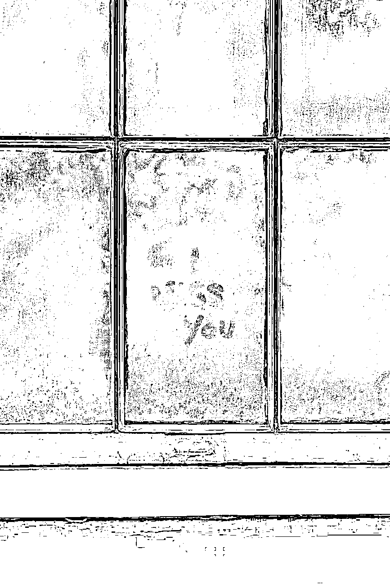

**@小 Y****异地恋****当时比较固执，认为从一人而终一身，好男人是培养出来的。**可能是月亮金牛座的固执，这段虐恋坚持了 9 年。**放弃是因为，实在是看清了现实，也在一步步的自我成长，终于修炼出离开的勇气和实力，想要追求更多的不可能。**经历过流产、生病、被三，分手各自又谈了，再度复合分手，这段关系给我带来成长。只有自己成长了，圆满了，才能遇到那个圆满的他。人生就是一场修行，在他身上我也学习到了很多，这段感情带来的教训是**任何时候，相信自己的知觉，如果错了就是立即止损，而不是耗在一段关系里，腐烂溃败。****@小 Q****异地恋****放弃原因：**对方的冷漠，感受不到爱，除了性需要才会和我聊天，其余时候都不带发信息，脾气会很暴躁。目前还陷在这段感情里。**@小 E****同性恋****坚持原因：**因为相信那种深层内在的声音。**成长：**改变了我对于爱情的看法，爱一个人并不是天天聊天问候，互相缠绵而已。而是**爱本身，爱会给一个人自由，会让自己能理解包容对方，让对方做自己想要做的事情。****@小 X****异地恋****坚持原因：**因为高中时遇到了一个特别喜欢的人，很内向寡言的我因为胆怯不自信没有表白，后来万分后悔，所以决定以后都跟随内心的声音。**教训：**不要把最真实的一面展现给他，不要太着急表白，不要太容易让他得到你，不要信任他。

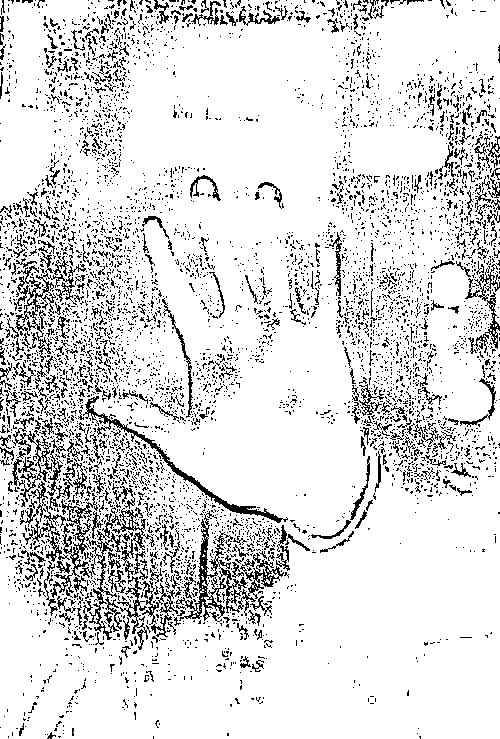

**@小 S****忘年恋****坚持是因为当初年纪小，思想还不成熟考虑不周全。**跟一位比自己大 13 岁的离异有女儿的男士谈恋爱并结婚，首先是思想上会潜移默化被影响。比如交友，他不允许我有过多的社交，甚至会左右我交朋友，后来我的朋友也确实越来越少，这几年很明显的感觉就是代沟出现了，无法逾越的不想沟通的鸿沟。其次是生活上的，他的年纪大，必然他妈妈的年纪也很大，和我奶奶差不多了，思想封建闭塞，甚至干预我和她儿子的相处方式，不尊重我的家人，我们生活在同一个屋檐下，但我已经两年没有和她说过话了，很多事都会是一辈子的伤痛。**我不后悔当初的选择，唯一无法释怀的就是觉得很对不起自己的爸妈。****@小 N****姐弟恋+异地恋+军恋**对方是军官学霸师弟，对我也不错，一开始很甜，但是越到后来越觉得**不在一个城市很难，而且有时候会长期见不了面（半年以上甚至几年）**，自己也评估了一下，发现**起初浪漫消失了，所谓的情怀和光环也比不上自己对稳定工作和安稳舒适生活的渴望。**所以自己主动放弃了，也不再联系，不过内心还是感恩的，祝福对方能过好。**教训：一段恋爱开始之前要慎重，像上面这种一开始客观要素就明显困难较多的，或许并不应该开始**。即使开始了，**发现有问题也应该及时止损，硬撑了很久但最后还是结束了，只能浪费双方时间，消耗感情，伤害对方**。**还是得更了解自己需要什么、喜欢什么、看中什么，就算不知道，也至少要知道自己最不能接受什么，排除法。****@小 Y****异地恋**西藏旅途中认识的陌生人，不知道算不算艳遇。第一次和男生牵手、拥抱、接吻都是和他，旅行结束就开始了不到半年的异地恋。**可是不靠谱啊，从认识到相恋都不靠谱。**我从小到大一直都是乖乖女，怎么也想像不到会如此不管不顾，在异地对一个认识几天的人就动心了，一点都**不符合常理**。我们都不能离开自己的家乡，所以注定没结果，只适合短时间的相恋。**教训：女孩子独自旅行的时候只享受风景就好，不要轻易涉及情感，自我保护意识一定要强。**虽然我没有受到什么伤害，但是回想起来会后怕。**第一次谈恋爱的时候难免不接地气，不要紧，感受这个过程就好。****@小 H****异地恋，异国恋****坚持原因：**也许因为喜欢，也许因为人生苦短，要活在当下。**成长：**非常明白放不下的是当时的感情，不是这个人，但经过几年依然放不下，自己折磨自己。

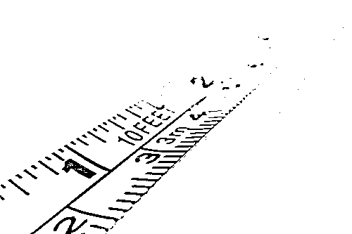

**@小 A****异地恋，异国恋****曾坚持过，但感情融合度不够，最终因现实原因分开。****异国恋需要极大的宽容和包容力，思想要足够开放。**外国人更在乎关系的平等，爱是给予和付出，是我不理解你你还可以做自己，但曾经的我都没有做到。**@小 X****姐弟恋**对方是个 89 年的男生，和我相差 6 岁。一开始很受对方吸引，后来经过一个星期的相处，敏感的我想要分手了。这段恋情走了 8 个月左右。可能是**对方成长的家庭模式和我特别不同**，我觉得对方思想比较封建，而且比较胆小，占有欲比较强。我提出四次分手，在这期间，激烈的争吵一直都有。最后一次提出分手，是我再也忍受不了这个男生的幼稚言语和行为，每每谈到分手，这个男生会一直哭，我也跟他说没事，你可以找另外一个人去结婚，毕竟我是不婚主义。可能也是我一开始没有跟这个男生说明白，我对结婚不感兴趣。他也有说到时可以不用结婚，办个结婚证就可以，我也拒绝了。对方就默默哭了起来，我也没去搭理，毕竟我所坚持的决定很少改变，而且通过相处，我自己觉得这个男生不值得让我改变什么。我不会再选择和月亮双子座的男生作为恋人，也不会**再因为男生有挽留就心软没有及时止损，而浪费在无意义的感情上。****@小 T****异国恋****我的恋爱观在朋友和家人看来是不切实际的，我不希望因为结婚而结婚，希望可以遇到那个灵魂深处有共鸣的人一起走完往后余生。**异国恋带给我的成长是，**要走入彼此的内心是需要双方共同努力的，遇到问题要勇敢表达，可以为对方考虑但是也要好好爱自己，不要为了维系一段感情一味迎合对方**。网恋加异国恋让我明白了，**虽然异国可以有很多好的方式维系感情，但一定要在十分了解对方，或者是先见到面的情况下再考虑是否要发展一段感情。****@小 A****网恋奔现的姐弟恋，对方大学生且有女装爱好。**真的太像了，双方抑郁倾向。前期如胶似漆宛若连体双生，后期一方 emo 另一个情绪肯定被影响，差点手拉手跳河。为了彼此的精神健康着想，还是分开可能会好些。但是可能再碰到一次还会中招，就是没什么成长吧（笑死）。

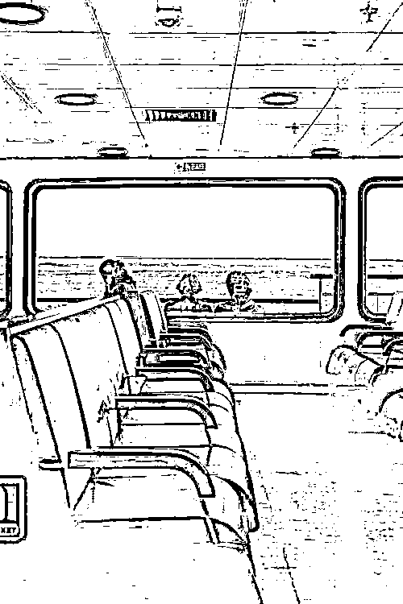

**@小 Z****异地恋，异国恋****在一起是因为爱，分开是因为欠缺考虑，头脑发热，是不行的。**我们注意到，几乎所有的受访者都或多或少表示了对于天王式恋爱的反思，例如，不要头脑发热，需要更多考虑现实因素，等等。从这些感悟中，能够明显看到土星限制和压抑的影子。**当天王星冲破土星**那么，是不是我们就**不应该选择这样不够现实的恋爱，压抑自己突破的渴望，转而去过按部就班的人生呢？**也不尽然。在这里，想和大家分享一篇天王星人如何突破土星界限，活出真正自我的故事。**@析木**作为一个上升处女座，土星在一宫的人，我给许多人留下的第一印象总是严肃、守规矩的乖乖女，在人生的大部分时间也的确是一个遵守规则，按部就班的普通人，然而接下来我要讲述的却是**冲破传统，脱轨而出的天王星人的故事。**直到 30 岁我的感情生活几乎一片空白，然而在土星回归的年纪，自我意识仿佛被唤醒，尤其是关于**我真正是谁，我想要的是什么**。当然这不仅仅是土星回归在第一宫的缘故，还因为出生星图中，太阳与天王星的合相，火星与天王星的四分相，以及行进天王星对分土星……这些星图上的指示，**解开了循规蹈矩的自我封印，突破了自我的陈旧定义，又触发了想要与众不同并为之践行与自豪的内心动力。****天王星人虽然不是必然与少数群体挂钩，但依然会由于其特立独行的思维、做派以及勇于尝试新事物而成为旁人眼中的怪人、外星人。**而我也是在小时候脾气古怪，上学后听话乖巧，到而立之年，才真正看明白自己一直是一颗看起来在既定轨道上平稳运行，但内心时刻准备着脱轨探索新世界的行星。**正是 30 岁左右，我才突然意识到我的性取向可能属于少数群体。**对于这种觉醒我并没有感到慌乱或不知所措，也没有像许多同性恋者曾经经历过的自我认知障碍，反而我用了天王星人最容易想到的方法，**试验。**我主动找到了一个交往过女朋友的女生，尝试着跟她约会，并发生了关系，我想，检验一个人性取向最直接的方式应该就是身体反应了。尤其当出生星图中，天王星的关系图里牵扯上了火星，这也是我曾经在一本占星书上看到有关火天相位的解读中所包含的，拥有**不同一般的婚姻模式**的可能性。

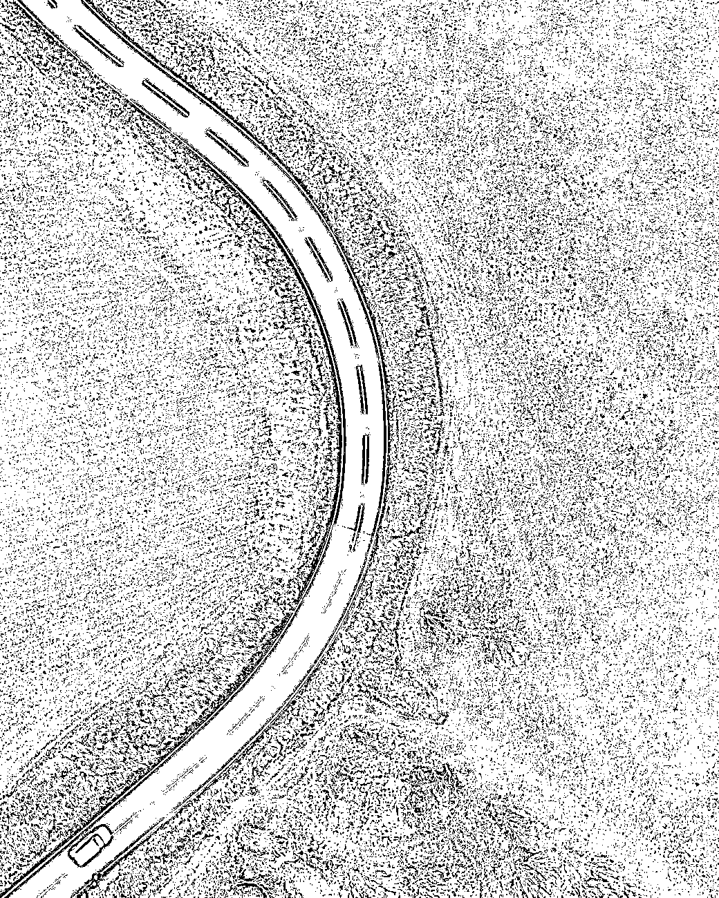

这场试验很成功，因为当我到达深层交流的时刻，内心十分明确地知道这才是我想要的，非常笃定而且清晰。其实当谜底揭晓的时候，过往人生中的点滴线索也很容易就会显现，并不是在土星回归时从石头缝里蹦出一个完全不同的我来，这个“我”一直在，只是被土星束缚、捆绑住了，当行进天王星与土星同时路过，被天王星之光照耀，松绑了而已。我的好朋友 L 应该是我对之出柜的第一人，是的，当我确定自己的性取向之后，我是开开心心，甚至有点大张旗鼓地跟我身边关系好的朋友都出柜了。当时 L 看着我那恨不得昭告天下的自豪样子，还非常语重心长地劝导我，“不以 gay 耻，不以 gay 荣”。这大概就是日天合的人常常会犯的毛病了——不希望自己是一个太过普通的人，天王星那种游离在普通人之外的，特别是对自我认同的一种方式，好像只有当发现我是不一样的，我才是我，才是我想成为的人。自我认知障碍？不存在的。害怕异样的目光？也不存在的。当然了，我也不是真的想把自己置于被孤立的境地，在外企工作的我并没有特意出柜，也没有特意深柜。当同事看到我手机屏保上跟女朋友的合影时，我都大大方方回复：“是女朋友呀。”就因为回答太顺畅太自然，反而让他们感到迟疑，都没有很当真，以为我只是随口开玩笑，我也就笑而不语，不多解释了。在经过几年深思熟虑，同时基于对父母的了解，我跟他们也出柜了，很幸运的是我的父母很开明，在经历过一段困惑不解但依然以爱我为前提的时期，渐渐地接受了我的性取向，并且跟我后来的一位同居女友相处融洽。**天王星人总是在以各种不同的方式告诉其他人，“我们不一样”，但我们依然热爱生活，希望以我们的不同融入到身边的群体之中。**

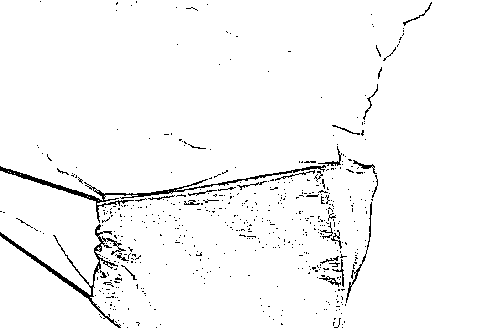

**天王星式爱情的意义**作为时代的弄潮儿，天王星人注定要打破土星的疆界。但这种打破成功前提是，**你明确地了解自己能够的阈值，以及熟练地驾驭天王星的能量。****这种能力并非凭空而生，是实验和拓展的结果。**任何爱都有代价，人生就是不断试错和体验的过程，不要害怕试错，但不要重蹈覆辙，那个**不一样的人能够帮你拓展的是你的人生领域，而放不下的，不过是自己的执念和执着。****不执，**是天王星送给我们最大的礼物。唯有不执，才有自由，云卷云舒，来去随意，愿每个人在突破自己的情感之路上，都会感谢曾经勇敢走出舒适区的自己，也从这样的经历中，更加了解你需要一个怎样的恋人。**你也有天王星式爱情故事吗？评论区等你。聪明的你也一定猜到了，本系列的第三篇便是海王星人的故事。如果你也有故事，欢迎你参与下一期的征集活动哦！**

**版权声明：**原创文章由作者整理并授权首发于若道平台，欢迎转发，反对抄袭。友号转载请申请白名单。

**学习占星学****点击下图了解课程详情** 

**

********************************

**微信又双叒叕改版啦，不想错过若道君的推送？**

**就把若道设为星标吧！**

**▼**

**喜欢记得点一下在看哦☟**

********报名直达入口********

# ISAR 选修课 | 医疗占星学：透过占星的大门，一窥身体与疾病的真相

> 原文：[`mp.weixin.qq.com/s?__biz=MzA5NjA0NTAxNg==&mid=2651467236&idx=2&sn=85228d1d7c4d4261a9ebe346524fe823&chksm=8b489f53bc3f1645bbd4ddd307a8373f0f7caaf0f387f551274eb7466730d66ab33ad4916e81&scene=126&sessionid=1692737862#rd`](http://mp.weixin.qq.com/s?__biz=MzA5NjA0NTAxNg==&mid=2651467236&idx=2&sn=85228d1d7c4d4261a9ebe346524fe823&chksm=8b489f53bc3f1645bbd4ddd307a8373f0f7caaf0f387f551274eb7466730d66ab33ad4916e81&scene=126&sessionid=1692737862#rd)

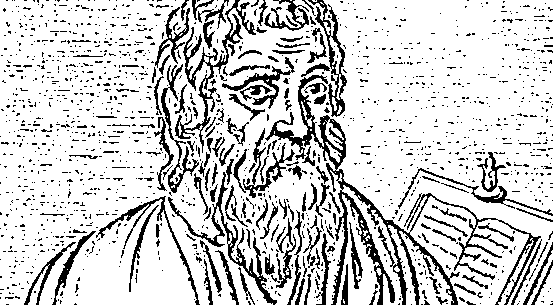

1

**占星学与疾病之间存在联系**

****

**没有占星学知识的医生不能自称为医生。**

**　　——现代医学之父希波克拉底**

占星学与疾病有什么联系呢？**世界著名的医疗占星师简·帕特里克**说：**“占星学可以精准定位需要解决的潜在问题。”**尽管有人想当然地认为占星学是令人沮丧的宿命论，但事实并非如此：

**有四个主要因素影响着我们的生活和健康：基因构成、物质环境、情绪环境，以及我们的占星配置。我们在星图中都存在患病的可能性，而预防的方法在于尽可能充分、真实和健康地生活。****——简·帕特里克**根据简·帕特里克的说法，**每个星座都有广泛的可能性**。例如，那些双鱼座的人有潜力去扮演殉道者（以他人为先）的角色，但是他们也有能力成为伟大的治疗师。

那么医疗占星咨询涉及哪些内容呢？简·帕特里克有这样的步骤：

**· **首先，会请客户提供详细的病历，以及他们出生的日期、时间和地点；

**·** 然后，绘制他们的星图，观察在他们的病情确诊之前，在占星层面和情感层面上发生过什么。

根据简·帕特里克的说法，**癌症的主要病因之一，除了有害的生活方式之外，就是未解决的情绪冲突**：她通常会在症状出现前的 18 个月至 2 年间寻找触发因素。

她曾这样说：“当我为癌症患者服务时，我的任务之一就是识别出他们生活中的‘恶性肿瘤’，并帮助患者将其消除。”

**医疗占星师还可能帮助你确定做手术的最佳时间，或是指出你每个行星位置的优缺点**：比如，阵容强大的星群落入双鱼座可能与过敏有关，而巨蟹座人则可能发觉自己泡完热水澡后会疲惫不堪。**固定星座（金牛座、狮子座、天蝎座和水瓶座）在情感和生理上都倾向于“难以放手”，这可能为恶性肿瘤的生长创造环境。所以说，他们可能倾向于沉浸在过去的伤害中，难以自拔。另一方面，这些星座也擅长在艰难的时期坚持不懈并一直持之以恒。**

　**　——简·帕特里克**

“癌症人格”中比较突出的一点通常是难以表达情绪，而且你可以从星图中看出这一点。

**客户星图中突显的土星可能表明害怕表达自己的需求，或者害怕展现真实的自己。**

**——简·帕特里克**

发现癌症的身体部位也可能给出有关根本病因的线索。

简·帕特里克曾表示：“例如，卵巢与孩童、创造力、家庭有关。所以说，如果某人患有卵巢癌，那么问题可能在于此人无法表达自己的创造力，或是无法做到滋养和关怀。”

有趣的是，母亲的癌症恰好发生在自己的孩子开始离开巢穴时。

医疗占星师可能也会查看金星在客户星图中的位置。

**金星代表使我们快乐的东西，因此如果金星得不到满足，我们就不会快乐——而不满是滋生疾病的温床。**

**——简·帕特里克**

如果金星落入双子座（前文中母亲的案例），这表明你渴望趣味、变化、沟通、心智刺激和灵性工作。在患癌之前，这位母亲就觉得自己的生活缺乏快乐和意义。理解她的灵魂渴求转变——更多的旅行、更多的学习、更多的乐趣，这可以帮助和支持到这位母亲。**简·里德·帕特里克老师说：“星图中的每个因素都为我们提供了广泛的可能性。所以说，重要的不是我们的遭遇，而是我们如何回应这些遭遇。”**

2

**医疗占星包含哪些内容？**

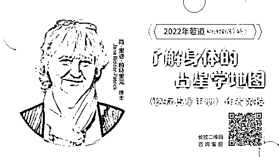

本课程既适合医疗占星学的初学者，也适合已经有一些相关经验的人。
简·里德·帕特里克老师将运用现实生活中的例子，揭示一个人的性格、症状及其星图是如何相互映照的。课程也会探讨疾病的意义以及可能的治疗方法。本课程旨在为学员提供一个运用医疗占星学的框架和方法，学员将会学到一些有价值的实用工具，在课程结束后，自己使用这些工具研究其中的关联性。**此课程可作为 ISAR 选修课。**

3

**课程安排**

**课程时间：2022 年 3 月 8 日-4 月 26 日  每周二 20:00-22:00**

**第*****1*****讲  3 月 8 日 与占星学、心理学、病症一起工作，学习**

*   医疗占星学的组成部分以及如何使用它们

*   行星的作用与相互作用

*   黄道星座人

*   宫位的重要性

*   疾病和健康是如何产生的

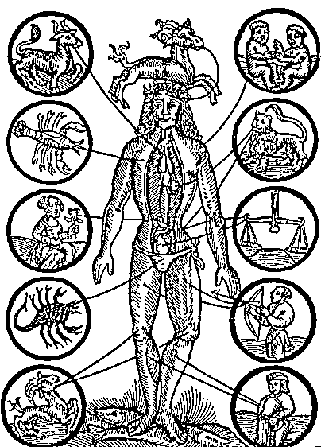

**★ 第二、三、四讲的课程内容基于星座以及它们之间的相互作用。**

**第*****2*****讲  3 月 15 日 基本星座**

学习基本大十字星座——**白羊座、巨蟹座、天秤座和摩羯座**——及其功能和相关的健康问题。**这些星座与防御、养育、结构、体内平衡和荷尔蒙控制有关。**

****第*****3*****讲  3 月 22 日 固定星座****

学习固定大十字星座——**金牛座、狮子座、天蝎座和水瓶座**——及其功能和相关的健康问题。**这些星座与习惯和反射、心脏调节、生存、循环和协调有关。**

“固定星座（金牛座、狮子座、天蝎座和水瓶座）在情感和生理上都倾向于**‘难以放手’**，这可能为恶性肿瘤的生长创造环境。所以说，他们可能倾向于沉浸在过去的伤害中，难以自拔。另一方面，这些星座也擅长在艰难的时期坚持不懈并一直**持之以恒**。”

——简·里德·帕特里克（Jane Ridder-Patrick）博士

**第*****4*****讲  3 月 29 日 变动星座**

学习变动大十字星座——**双子座、处女座、射手座和双鱼座**及其功能和相关健康问题。**这些星座与呼吸、神经系统、肠道、睡眠以及信息、情感和行动的整合有关。**

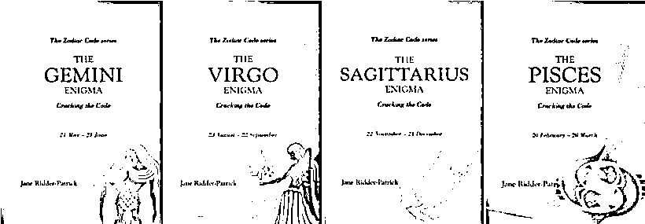

**★ 第五、六、七、八讲重点学习行星，它们在身体层面的表达、它们的相位与行进。**

**第*****5*****讲  4 月 5 日 太阳与月亮**

**太阳**掌管视觉、活力、心脏和意识，与心脏、脊柱和视觉问题相关。

**月亮**掌管人体的周期，特别是月经周期、饮食模式和体液，与情绪引起的疾病、饮食失调和胃病相关。

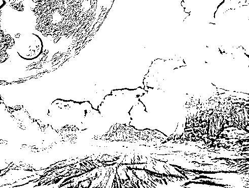

**第*****6*****讲  4 月 12 日 土星与天王星**

**土星**掌管着皮肤、骨骼、牙齿和衰老过程。它对应的疾病包括慢性疾病、耳聋、帕金森病、关节僵硬和牙齿问题。

**天王星**代表身体活动的协调，有节奏的脉动和身体的“电”。与天王星相关的疾病包括癫痫、痉挛、心律失常，以及阿斯伯格综合症和自闭症样综合症。

**第*****7*****讲  4 月 19 日 海王星与冥王星**

**海王星**掌管松果体、细胞膜渗透和右脑功能，与过敏、上瘾的病症、慢性疲劳综合症和睡眠障碍相关。

**冥王星**掌管消除和转化，其病理包括毒性、脓肿、癌症和强迫症。

**第*****8*****讲  4 月 26 日 火星**

**火星是与能量和防御相关的行星**，掌管免疫系统、肾上腺功能、肌肉活动和炎症反应。**它是许多身体和情绪障碍的核心**，如自动免疫障碍、抑郁和发烧，以及由手术或需要手术引发的问题。

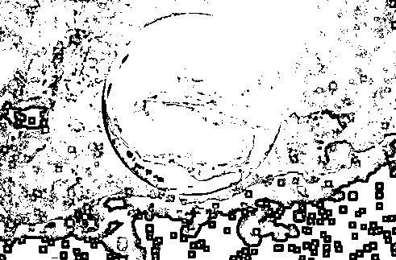

4

**此次课程适合哪些人？**

*   有一定占星学基础，若道核心课 L3 以上水平；

*   希望成为优秀的占星师，想要借鉴国际大师医疗占星解读思路并融入自己的体系的人；

*   热爱占星学、健康、养生的研究型占星学者；

*   计划考取 ISAR 认证占星师，寻觅中意选修课的学员；

*   走在自我探索和个人成长道路上的人。

**快来和简·里德·帕特里克老师学习升级版的占星学身体地图吧！**

5

**授课老师**

**简·里德·帕特里克 **博士****

（Jane Ridder-Patrick）

简接受过药剂师、理疗师、草药师、心理治疗师和历史学的专业学习，从事写作、咨询和讲学工作，在英国和全球教授占星学及其历史、当今的心理学和医学应用。她在爱丁堡执业，在爱丁堡大学获得博士学位，研究方向是 17 世纪苏格兰占星学历史。

**她最著名的出版物是《医疗占星手册》。2018 年，她因对医疗占星学的贡献而获得了著名的查尔斯·哈维占星学杰出服务奖。**

《医学占星术手册》（第二版，修订版和扩充版）

(爱丁堡，克拉布出版社，2006 年)

6

**课程价格**

*   **课程价格：****6800 元**

*   **课程咨询：**王老师（微信：18510107057，请备注“医疗占星”）

长按二维码添加王老师

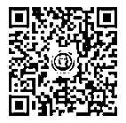

7

**课程安排**

*   **课程时间：**2022 年 3 月 8 日开始，每周二晚上 8 点，每周一次，共 8 次课。

*   **授课方式：**线上直播，英文授课，中文翻译

8

**退转课程**

*   **退款原则请详看《教学协议》，如有疑问请咨询课程顾问。**

****医疗占星****

**授课老师：**简·里德·帕特里克

**授课时间：**2022 年 3 月 8 日起

**授课方式：**网络课程**，**英文授课，中文翻译

**费用：****6800 元**

**课程负责人：****王老师**（微信：18510107057，请备注“医疗占星”）

长按二维码添加课程负责人咨询~

****报名请点击“阅读原文”****

# 你不知道的事丨什么？可以用 12 宫位关键词“锚定”年度运势？！（值得收藏）

> 原文：[`mp.weixin.qq.com/s?__biz=MzA5NjA0NTAxNg==&mid=2651467171&idx=1&sn=c9f5f9c5aaff098a2eb1320f93adf120&chksm=8b489f14bc3f1602b46d585d2c096afb8a1a1a6e58b5b88690d5adebed99355fd5d0914021a4&scene=126&sessionid=1692737862#rd`](http://mp.weixin.qq.com/s?__biz=MzA5NjA0NTAxNg==&mid=2651467171&idx=1&sn=c9f5f9c5aaff098a2eb1320f93adf120&chksm=8b489f14bc3f1602b46d585d2c096afb8a1a1a6e58b5b88690d5adebed99355fd5d0914021a4&scene=126&sessionid=1692737862#rd)

☆****后台回复“今日”，给你一句生命态度****

作者/凯莉·瑟蒂斯

译者/JUN 校对/江艺

编辑/翀子 封面/书君 图片/网络在占星学里，常用太阳返照图观察一个人的年度运势，但你知道吗？其实我们还可以运用 12 宫位的循环周期来“锚定”不同年龄的年度关键词。很好奇对不对？快来看看这篇文章吧~**引言**

根据占星学的生命之轮，**每个年龄段都有一个特殊的课题和主题。**根据你的年龄和古希腊小限法，可以找出你什么时候应该把注意力集中在金钱、家庭、健康、人际关系和事业等领域上。

占星学中最简单也是最古老的计时工具之一，被称为**“流年小限法”**，**古希腊人用此方法将你的年龄与十二宫位之一关联起来，以 12 年为周期重复。**

**要使用这种方法，你需要对十二宫位有一个基本的了解。**看一下这个宫位图，找出每个宫位的基本关键词和概念。

由于你出生星图上的**每个宫位都描述了一系列特定课题和主题**，使用流年小限法可以带给你洞察和指导，让你了解未来 12 个月需要关注的主要领域。

你的流年小限法宫位会给你提示和线索，**告诉你在生活中的哪些方面你准备好了成长、疗愈和进步。**

从下面宫位图可以看到，**你在生活中处理的所有主要课题都与十二宫位中的某个相关联。**这些关键词只是与每个宫位相关的**基本信息**；它们会让你对主要课题和普遍主题有所了解。

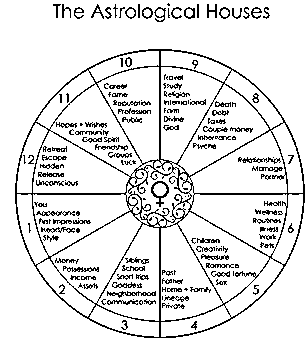

**★宫位图★**

| 宫位 | 基本课题 |
| 第 1 宫 | 你自己、外表、第一印象、头/脸部风格 |
| 第 2 宫 | 金钱、所有物、收入、资产 |
| 第 3 宫 | 兄弟姐妹、学校、短途旅行、邻居、交流 |
| 第 4 宫  | 过去、父亲、家+家庭、血统、个人隐私 |
| 第 5 宫  | 孩子、创造力、愉悦、浪漫、好运、性 |
| 第 6 宫  | 健康、养生、例行事项、疾病、工作、宠物 |
| 第 7 宫  | 关系、婚姻、伙伴 |
| 第 8 宫  | 死亡、债务、税务、伴侣的钱、遗产、心理 |
| 第 9 宫 | 旅行、学习、宗教、国际、信仰、神性、上帝 |
| 第 10 宫  | 职业、框架、声望、专业、公众 |
| 第 11 宫 | 希望+愿望、社群、良好的精神、友谊、团体、运气 |
| 第 12 宫 | 撤退、逃避、隐藏、释放、无意识  |

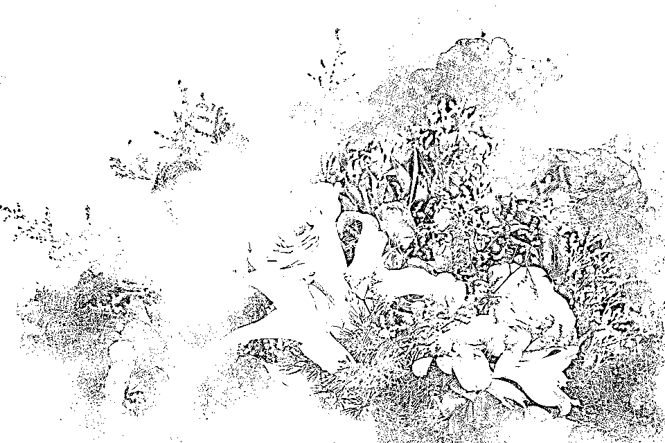

**你的生日年**

生日在占星学中特别重要。有许多计时周期都与你的年龄有关，包括太阳返照或生日星图，以及基于年龄的方法，如流年小限法。

**简单来说，你的一些计时周期和预测周期会在你的生日那天重置。这意味着当你每年庆祝生日的时候，影响你生活的能量和行星将会发生改变。**

**占星学有很多层次，越是详细，对你来说就越是具体、越是相关。**

你个人的流年小限年是以你的生日为时间节点的。我们所说的“年”，将从你的生日开始（当你长了一岁）持续 12 个月，直到你的下一个生日（当你又长了一岁）。

**重要的是要记住这个年份不是日历上的一年，而是更加个人化的一年。**

你可能认为你的生日是你个人的新年。**随着年龄的变化，你从十二宫的一个宫位循环到下一个宫位，向前迈出一步，帮助你在 12 年的时间里探索和发展生活的方方面面。**

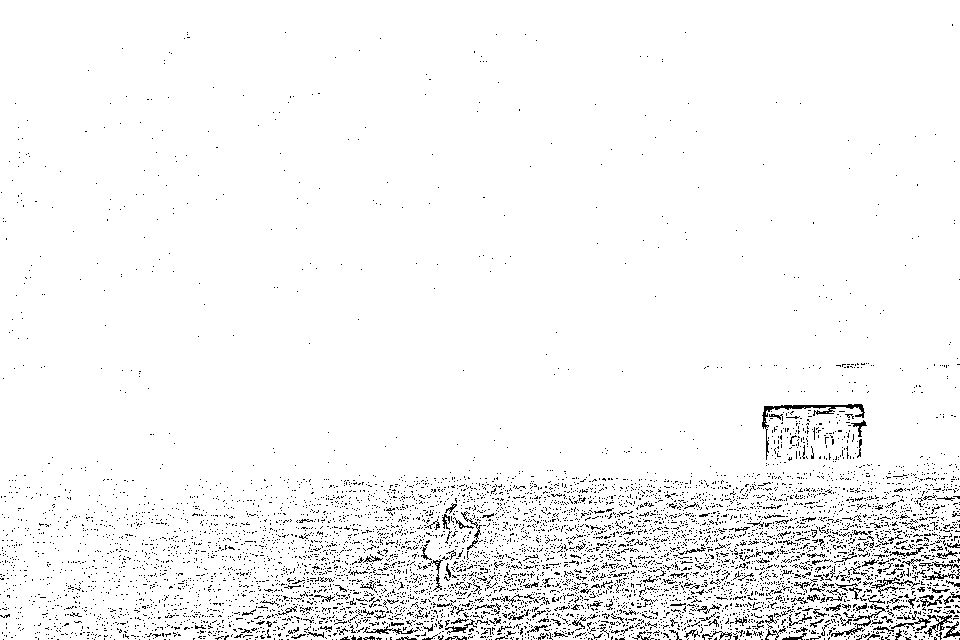

**用 12 宫位描述运势****（若道君友情提示：作者并没有将 12 宫位一一详细列出，你可以按照上文宫位图中的关键词描述，了解相关年龄里的生命发展重点。）**

**重置并重新聚焦*****第 1 宫***

由于流年小限法系统基于数字 12，**任何你年龄是 12 的倍数的生日都变得特别**，因为它标志一个新的 12 年成长周期的开始。**这包括 12 岁、24 岁、36 岁、48 岁、60 岁、72 岁、84 岁和 96 岁。**

虽然在社会上通常不会大张旗鼓地庆祝这些生日，**但在占星学中，鼓励你在这些 “第一宫”生日时，重新设定并重新聚焦注意力，为下一个周期设定新的目标、挑战和计划。**

**每一个当你的年龄是 12 的倍数的生日，都要重视你出生星图中的第一宫。**

第一宫是星图中最代表“你”的部分。在这些岁数时，几乎可以说宇宙允许你把自己放在第一位。**个人成长和自我发展被强调，**所以这些岁数都是为发现自我腾出时间的好时机。

这个主题可以像你的生日愿望一样，你可以在当年的每个星期或每个月抽出时间去探索或享受一些只属于自己的乐趣。

**健康和幸福也与第一宫联系在一起，因为星图的这部分与生命力和活力有关。**这些岁数也可以帮助你学习如何最好地**照顾你的身体**。

如果你一直忽视自己的身体健康，那么在这些岁数，你可能会采取更积极主动的方式来保持良好的饮食、锻炼和自我关爱。

***第 2 宫 *****金钱与富足**

**你的收入、现金流、储蓄和消费习惯都与第二宫有关，****在你 1 岁、13 岁、25 岁、37 岁、49 岁、61 岁、73 岁和 85 岁时****，它们都会凸显出来。**

这可能是你更新财务状况、建立健康的储蓄习惯，或者解决任何你想要偿还的债务的重要年份。第二宫的年份也是**提高收入的好年份，**也可以为了加薪或晋升而努力或寻找额外的工作，比如将爱好变成创收的副业。

在这些年份里，你可能会**处理一些被忽视的金钱问题**，或者彻底整理好你的财务文件。

**你在第二宫的年份里为改善你的整体财务状况所做的努力，可以帮助你创造持久的财务安全感。**

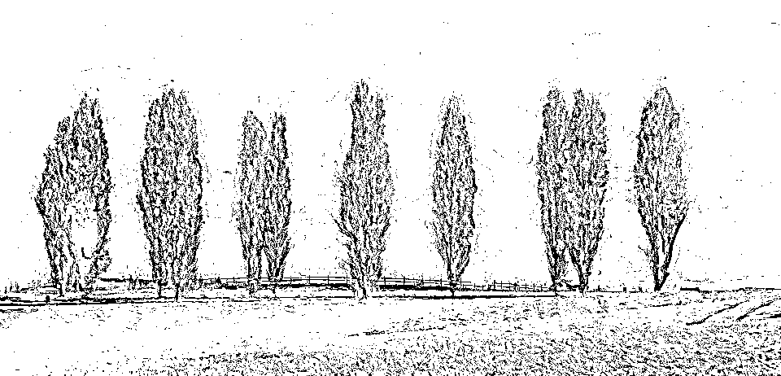

***第 4 宫 *****家与家庭**

这是你出生星图上的第四宫，它描述了**家的主题**，包括你的生活状况和家庭，从描述你的童年和原生家庭到让你感到家一般的舒适的环境类型。

**在你 3 岁、15 岁、27 岁、39 岁、51 岁、63 岁、75 岁和 87 岁的时候，**根据小限法你位于第四宫了。在这些年份，**你可能就你的家庭和生活状况做出一个重大的决定或改变**，或者经历一个与家庭有关的重大事件。这可能包括搬家或装修，或者买卖房产。

**你的注意力会被吸引到更私人的事情上，**而不是公共的事情上。你可能会发现自己远离聚光灯，甚至花更多的时间待在家里，也许会招待朋友或家人共进晚餐而不是外出。

**家庭项目**可能成为优先考虑的事情，或者你可能比平时更多地支持你的**父母或者孩子**。你的家庭生活中所有不同的部分都会在第四宫的年份凸显出来。

***第 6 宫 *****健康**

星图中有两个宫位会影响你的健康。**第一宫有关活力和幸福感，而第六宫描述的是病痛和任何可能影响你健康的身体疾病**。

当你在第一宫的年份时 (概述如上) ，你将更容易支持和改善健康和活力。**当你处于第六宫的年份时，你可能需要更多地关心你的健康，**比如防止生病，或者处理你可能有的任何持续或潜在的身体症状。

如果你一直忽视自己的身体健康，那么在这些年份，你可能会采取更积极主动的方式来**保持良好的饮食、锻炼和自我关爱。**

不是每个人都会在第六宫年份遇到健康议题，但是如果健康是你通常关注的一大领域，那么你可能会在这些年份得到必要的治疗和药物，或者你可能会经历一次医疗手术。

**在你 5 岁、17 岁、29 岁、41 岁、53 岁、65 岁、77 岁和 89 岁时，你的第六宫会凸显出来。**

在这些年份里，要对你的身体格外友好，包括避免过度工作和压力，抽出时间锻炼，保持良好饮食，这将有助于确保你将来有一个可以依靠的坚实的健康基础。

***第 7 宫 *****爱与人际关系**

**人际关系在出生星图上的主要宫位是第七宫**，日落或西方的方位。此外，代表娱乐的宫位第五宫，也是金星获得愉悦的宫位，也可以给你的生活带来浪漫和美妙的经验。

在你 4 岁、16 岁、28 岁、40 岁、52 岁、64 岁、76 岁和 88 岁时，你的第五宫将会凸显出来。**在你 6 岁、18 岁、30 岁、42 岁、54 岁、66 岁、78 岁和 90 岁时，你的第七宫关系宫会凸显出来。**

在这些年份里，你可能更有志于优先考虑**找个伴侣**，或者甚至想**和其他人合作**，比如朋友或者同事。你会希望有人陪伴而不是独自一人，**并且可能更愿意为了支持你所爱的人而妥协。**

如果你在这些年份还是单身，你会得到宇宙的支持帮助你结识新人，**所以如果你真的想结识新的伴侣，那么积极主动地改善你的爱情生活会有所帮助。**

如果你已经有伴侣了，并且在这些年份已经在一段关系中，那么重新安排你的时间、日程和其他责任，这样你就有更多的精力给你的伴侣，发展你们的关系。**培养和发展你最重要的人际关系将是你的首要任务。**

***第 10 宫 *****事业**

**你的职业宫位第十宫也与名声、成功和荣誉有关，并且描述了你星图中最公开、最能被人看见的部分。**

**在你的第十宫年份，也就是在你 9 岁、21 岁、33 岁、45 岁、57 岁、69 岁和 81 岁的时候，**你可能会成为聚光灯下的焦点，或者比平时更加引人注目。你可能会获得一个荣誉或奖励，或者发现自己正在实现一个**重要的人生或职业里程碑。**

你甚至可能因为一项成就而出现在报纸或媒体上。**你在第十宫职业生涯的年份所做的选择和经历可以带你进入一个新的 12 年职业生涯周期。**

如果你想在工作中找到一个新的方向，或者你想遇到某个知名度很高或很有地位的人，你在第十宫这年的努力可以帮助你达到目标。

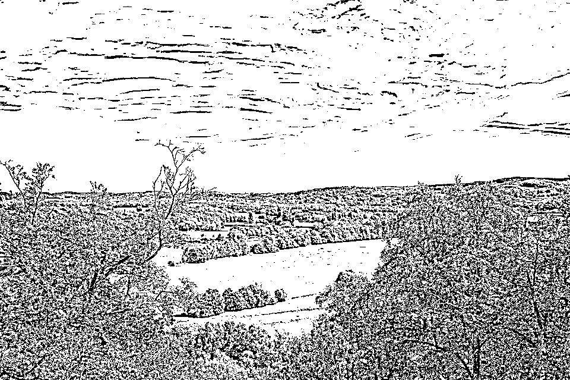

**十二年周期**

尽管每个人在同一个年纪都有相同的主题被凸显出来，但是具体发生了什么，**你是会愉快地经历这些与年龄有关的课题，还是经历压力或挑战，这些都取决于你的个人星图。**

例如，虽然每个人星图中都有第二宫，但你会有独特的星座和行星组合影响你的第二宫，这表明你对金钱、收入和现金流的体验将是独特的，与他人不同。

如果你不确定你未来的金钱或感情年会如何发展，那么回想一下之前该宫位和相关课题被强调的年纪。12 年前的事件可以提供一些线索。

此外，为了真正详细地观察你的流年小限年，**占星师也会观察你出生星图上这一宫所落星座的守护星。**

对于该生日年来说，这颗行星有个特殊的术语，称为**“时间领主”**。它在你的出生星图、太阳返照图或生日星图中的状态，将提供额外的洞见和线索，说明你在该年龄所强调的课题上的经验品质。

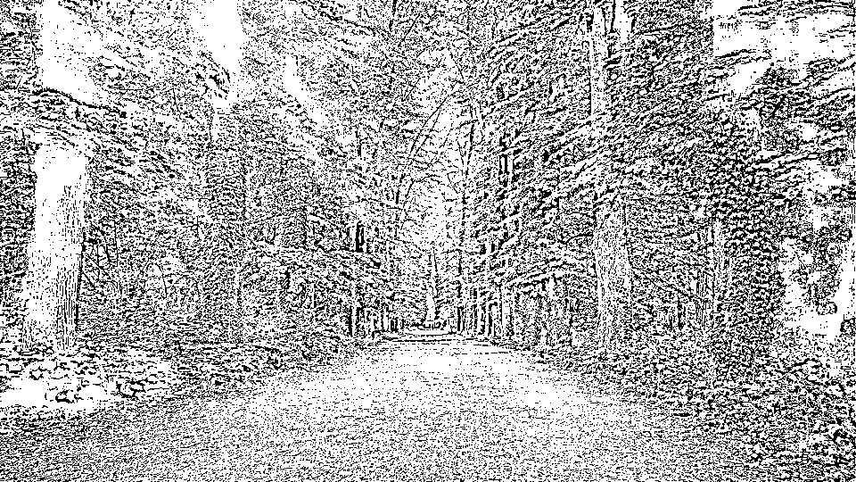

**行星的线索**

占星师也使用一系列的行星，其中一些也影响你对某些课题的经历。

例如，木星与财富和富足有关。如果你知道你的个人星图，找到木星所在的宫位。即使你的木星可能没有落在第二宫金钱宫，但是当你的年龄到了木星所在的宫位，你仍然可能会探索金钱和财富的话题。

**在大多数星图中，木星是一个积极、有益且丰盛的影响力，表明该年纪可能是你个人生活中丰裕富足的一年。**

**如果你想多花一年的时间去探索爱情和人际关系，除了上面提到的第七宫和第五宫的年份，还可以看看你金星所在的宫位**，金星是爱、情感和人际关系的行星。

当你的年龄到了你星图中金星所在的宫位，你将额外拥有特殊的 12 个月时间来提升你的爱情生活，改善你最重要关系的质量。

**结语**

占星学有很多层次，它越是详细，就越是专属于你。

**学会通过宫位来安排你的生活时间，可以帮助你获得宇宙智慧，帮助指导你的选择，并支持你以一种整体和全面的方式绽放生命。**

**版权声明：**本文由若道翻译发布，欢迎转发，反对抄袭。友号转载请申请白名单。

**凯莉·瑟蒂斯**

作家，执业占星师、老师和编辑，并定期在国际占星学会议上发表演讲，与世界各地的客户、学生和出版公司合作共事。凯莉对行星周期研究的热情具有感染力，她擅长的领域包括推进，以及对古典占星概念的融合。

**如果看了文章，****觉得有些迷惑或摸不着头绪，****也可以扫描下图二维码，****领取你的****专属年运报告****查看今年运势**

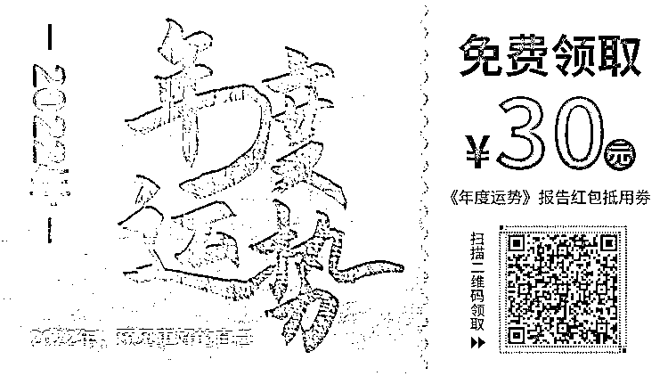

**学习占星学****点击下图了解课程详情** 

**

********************************

**微信又双叒叕改版啦，不想错过若道君的推送？**
**就把若道设为星标吧！****▼**

**喜欢记得点一下在看哦☟**

**报名直达入口**

# 如果占星师同你说：“我看到……”那你可要小心了

> 原文：[`mp.weixin.qq.com/s?__biz=MzA5NjA0NTAxNg==&mid=2651467171&idx=2&sn=2f6933b622a755788b9dc2f6f86d7a8d&chksm=8b489f14bc3f1602e3829be83cafd5cc2353868cb5bb285ba59cc0365aec8ad9f7aa450c7ca5&scene=126&sessionid=1692737862#rd`](http://mp.weixin.qq.com/s?__biz=MzA5NjA0NTAxNg==&mid=2651467171&idx=2&sn=2f6933b622a755788b9dc2f6f86d7a8d&chksm=8b489f14bc3f1602e3829be83cafd5cc2353868cb5bb285ba59cc0365aec8ad9f7aa450c7ca5&scene=126&sessionid=1692737862#rd)

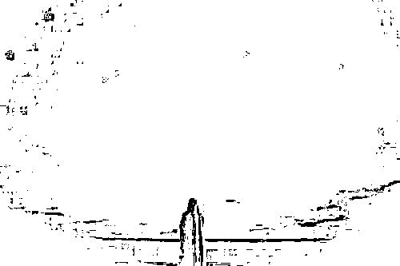

作者/大卫·瑞雷 若道占星创始人

译者/若道翻译团队编辑/玫瑰 图片/pexels

在【[1](http://mp.weixin.qq.com/s?__biz=MzA5NjA0NTAxNg==&mid=2651465949&idx=2&sn=6e479c5393b524104ae9705b3bf9c77a&chksm=8b489a6abc3f137c26a7f691aea0a08e7a02ffb51a08ee3eb7f7752cd6131572a7838b16536e&scene=21#wechat_redirect)】、【[2](http://mp.weixin.qq.com/s?__biz=MzA5NjA0NTAxNg==&mid=2651466563&idx=2&sn=b50271ed6b07518a8ed498d7ad0eadbf&chksm=8b4899f4bc3f10e2b672ed67cb0832f2894a7003c79a7f59e1d4658cea3b63326e2b27255a90&scene=21#wechat_redirect)】两篇文章（点击链接可阅读）中，大卫老师详细地讲述了人本主义占星咨询的价值。今天我们就来看看占星咨询中，关注客户心理状态有多么重要。另外，大卫老师参与授课的【[核心课程](http://mp.weixin.qq.com/s?__biz=MzA5NjA0NTAxNg==&mid=2651463523&idx=3&sn=019938f53a79cad4286a02eee12e56f2&chksm=8b48add4bc3f24c226dc436b0db23c55c33bb8d20c0b2ae7f1d669e5d144617206672de875b6&scene=21#wechat_redirect)】和【[双证书课程](http://mp.weixin.qq.com/s?__biz=MzA5NjA0NTAxNg==&mid=2651467034&idx=3&sn=689f3ae356f82b32acc0a7196d141619&chksm=8b489fadbc3f16bb0d74163ee098f8107c8eda43ce7c2d790b64980581003b90a4491221bff5&scene=21#wechat_redirect)】开启报名中，点击链接了解详情吧！

**“我看到”式占星咨询**在占星学的最初阶段，占星师似乎对客户的感受或想法并没那么感兴趣。占星师有更多的要说。占星师在他们的开场白之后给出了一个非常“安全”的普遍性预测：“在你的一生中，钱是时增时减的。”这几乎适用于任何人。也许这是占星师接下来的话：“我看到三年内你的财富会增加，然后马上就会亏损。在这次损失之后，你将在 7 年内无法获得经济保障。然后一切都会改变，你会舒服 8 年。”注意占星师是如何以**“我看到”**开头的。这是一个常见的算命风格的短语，暗示占星师看到了一些东西，也许他们看到了一个画面，或者一个幻象——就像一个灵媒。这个短语有一种神秘的性质，好像占星师有特殊的能力，使他们能够“看到未来”。这不像医生说：“我在你的 X 光片上看到了一些东西，”然后医生可以给你看并解释。不是的，这是占卜风格的一部分。**在这种情况下，占星师对得失的时间框架做出非常具体的预测，等等。**如果我们把这些年份加起来，占星师的预测大约涵盖了 18 年。大概客户可以在 18 年后给占星师发短信说：“你是对的！”也许客户会返回与占星师进行另一次咨询，假设占星师仍然在执业或依然活着。或者，如果占星师错了，客户可以找到占星师。哈！想象一下客户面对占星师。“你错了！我曾经非常成功，现在我是百万富翁了！”至少这样不会有令人信服的理由要求退款。客户最快要在三年后才能检验占星师的预测。然后，如果客户的财务状况在三年后有所改善，客户可能会回来看看他们未来七年的财务损失会有多严重。

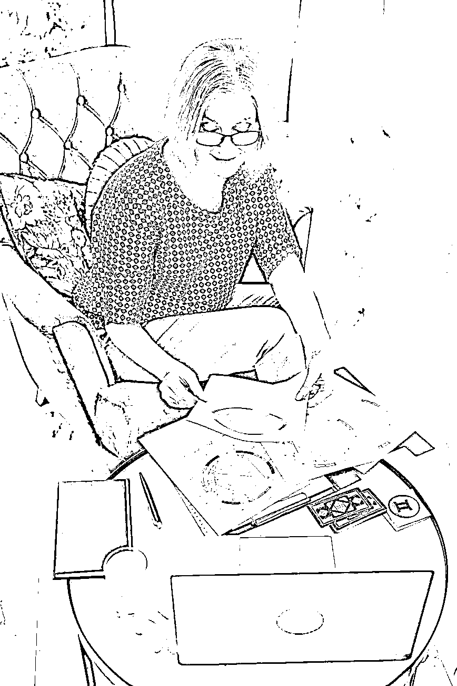

当然，客户可能会因为“你永远不会富有”的说法而感到沮丧，以至于他们认为根本没有必要再回去和占星师交谈。**这在很大程度上取决于客户在咨询时的情绪状态，以及他们个人有多容易受到影响。**那些已经对自己目前的财务状况感到沮丧和绝望的人，不太可能因为预测他们的财富在三年内会增加而受到鼓舞，尤其是考虑到预测的七年财务风险，以及“你永远不会富有”这句话仍在他们耳边回响。**占星师得了解客户的感受**我的观点很简单。病人在治疗时的情绪状态或精神状态根本没有被考虑在内。**占星师并没有试图了解他们客户的感受。**为什么这很重要? 因为客户在那里，即使“那里”意味着他们的脸在回头看微信视频上的占星师。而**占星师没有尝试以任何有意义的方式与客户交互。**客户可以把他们的问题发短信给占星师，占星师也可以写下他们的答案，或者记录下他们在客户面前所做的相同的声明。当然，一份关于占星师谈论你的星图的书面报告或录音并不是真正的占星咨询，不是吗? 只是一个报告。那么，**在一个咨询中，客户的情绪或精神状态有何重要性可言呢? 为什么占星师需要了解客户的生活呢?**

答案，有两个主要原因： **· 移情，或情感共鸣。****在咨询时，对来访者的感受或精神状态表现出一些真正的兴趣，并抱着一种不加评判的接受态度，开启占星师与来访者之间的联系。**这种联系促进了沟通，这意味着客户更有可能理解占星师所说的，并感到鼓舞来表达自己。一场自然的谈话可能会随之而来，占星师会逐渐了解客户的更多情况。**客户开始感到被听见和倾听，占星师变得更加意识到客户的出生星图是如何与客户的经历联系在一起的。****· 背景/上下文。**注意上一句末尾的短语“占星师更加意识到客户的出生星图是如何与客户的经验联系起来的。”**“关联”**这个词在这里非常重要，因为现代占星学最基本的定义是：**“对人类经验的解释是基于对天体活动的检查与关联。”**换句话说，解释需要相关性，而相关性需要语境！

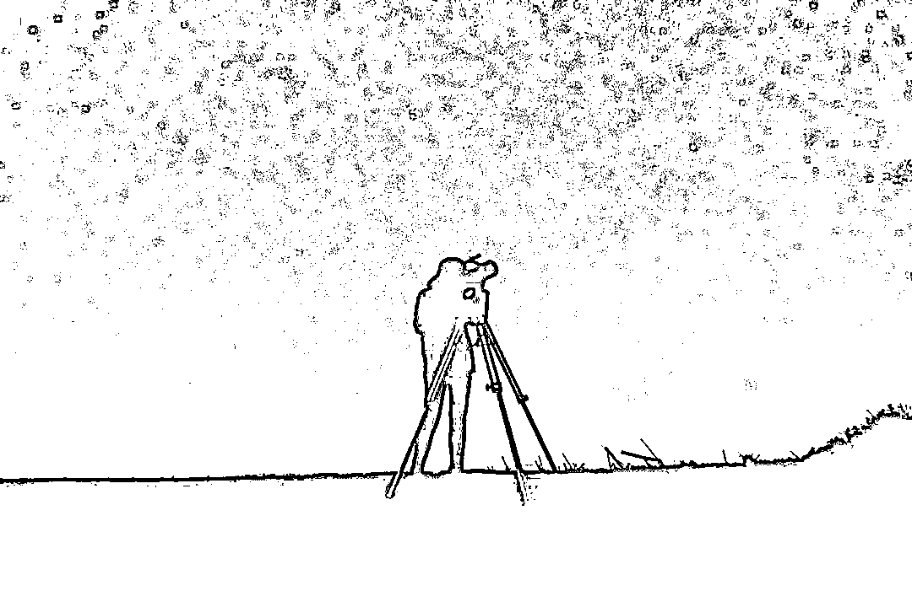

**没有上下文的占星咨询没有意义**一些人可能会问：“占星师难道不能通过单看客户的星图来判断客户的感受，或者已经知道他们的生活中发生了什么吗？”答案是：**没有上下文，就不行。**当然，这并不意味着你不能从占星书或者占星报告中了解自己。作者或作家根本不了解你，但你可能会获得关于自己的有价值的见解。然而，当你在阅读占星书或占星报告时，“你”是那个把你的生活经历与书中所写的联系起来的人。你已经有了一个你知道的背景，也就是你自己。现在我想关注“上下文”。我保证，在接下来的系列文章中，我会用大量的内容来探讨同理心和情感共鸣这一重要主题。让我们诚实地考虑一下星图的背景。你能从星图上看出这是男性还是女性吗？让我们假设星图上没有名字，没有线索，没有背景。答案是否定的。除非有人告诉你这是一个男人或女人的星图，否则你只能猜测——“一张星图”是简单的一半一半可能性的猜测。

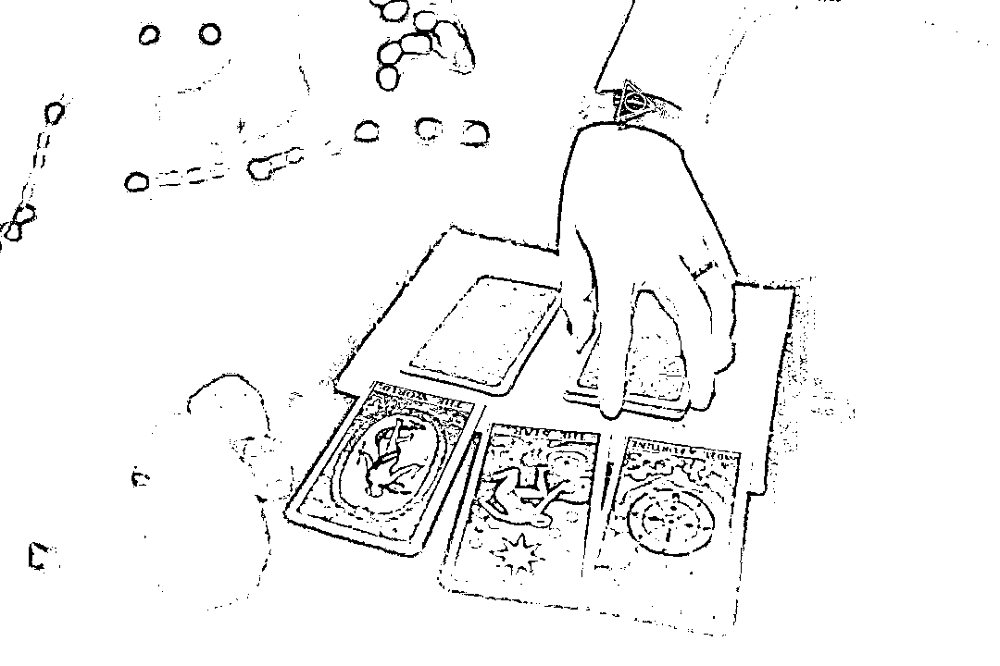

占星师能拿着一叠 100 张真实的出生星图，按性别区分吗? 不能。

占星师能拿着一堆 100 张出生星图告诉你哪些是同性恋吗? 不能。

占星师能否拿着一叠 100 张实际的出生星图，根据他们的财务状况，比如：贫穷、普通还是富裕，准确地将他们分开? 不能。

占星师能否从一堆 100 张实际的出生星图中准确识别出哪些人一直处于已婚状态，哪些人从未结过婚，哪些人结过婚又离婚了? 不能。

 一个美国占星师能拿着一堆 100 张真实的出生星图，并根据他们的政党（民主党或共和党）准确地区分它们吗？不能。

事实上，除非有人确切地告诉你，你正在看的星图是个人类的星图，它可能是一匹马的星图，一家公司的首次公开募股的星图，或者一些像一个新想法诞生时刻这样虚无缥渺的星图。这张图本身只是一个简单的星图，代表了我们的太阳系在特定的时间，从一个特定的地点，如城镇或城市的地心角度测量和观察。没有任何其他上下文，星图就没有其他相关性或重要性。

**版权声明：**原创文章由作者授权首发于若道平台，欢迎转发，反对抄袭。友号转载请申请白名单。

****想阅读更多作者的文章，请在后台回复******大卫****** 即可。****

**大卫·瑞雷**

美国占星师，若道联合创始人，致力于在中国教授和推广西方占星学；2010-2014 年，任全美占星师联盟监督委员会委员；2017 年，被选为 ISAR 委员会成员。ISAR 是世界最大的国际占星机构，会员遍布 45 个国家，2017-2020 年曾任 ISAR 全球副主席、CAPISAR（ISAR 职业占星师资质认证机构）主席。

**喜欢文章请长按下方二维码打赏****给大卫老师加杯咖啡呗~****▼**

**学习占星学****点击下图了解课程详情** 

**

********************************

**微信又双叒叕改版啦，不想错过若道君的推送？**
**就把若道设为星标吧！****▼**

**喜欢记得点一下在看哦☟**

**报名直达入口**

# 除了占星技巧，这些是做咨询的“必备技能”（值得收藏）

> 原文：[`mp.weixin.qq.com/s?__biz=MzA5NjA0NTAxNg==&mid=2651467034&idx=2&sn=f30c5d148fdbc6d269c833c08805433b&chksm=8b489fadbc3f16bbc652477d05d6b3285bb7200e7c755caeb97f3575a3d8da08e8fbf91afa20&scene=126&sessionid=1692737862#rd`](http://mp.weixin.qq.com/s?__biz=MzA5NjA0NTAxNg==&mid=2651467034&idx=2&sn=f30c5d148fdbc6d269c833c08805433b&chksm=8b489fadbc3f16bbc652477d05d6b3285bb7200e7c755caeb97f3575a3d8da08e8fbf91afa20&scene=126&sessionid=1692737862#rd)

文章来源/health24

翻译/Arrow 校对/Leisha

编辑/翀子 图片/网络

占星咨询是占星师和客户之间的会谈或对话，在咨询的过程中，占星师需要一定的沟通技巧来推进咨询。本文中的 6 个基本的沟通技巧能够帮助我们进行有效的咨询。一起来看看吧！

**1.关注**

**关注是指占星师在身体和心理上与客户“在一起”的方式。**

有效关注会向客户传达你和他们在一起，他们可以和你分享他们的世界。有效关注还能让你仔细倾听客户说的话。首字母缩写词**SOLER**可以帮助你向客户展示你内在的态度，以及你对尊重和真诚的重视。

**S（Squarely）——直接**

**直面你的客户。**采用一种显示你在与客户互动的身体姿势（对一些客户来说，身体相对倾斜可能更好，只要你关注客户）。例如，你和客户之间隔着一张桌子的话，可能会在你们之间制造心理障碍。

**O（Open）——开放**

**开放的姿势。**问问自己，你的姿势在多大程度上向客户传达了开放性和全神贯注。交叉的双腿和双臂可能会被解读为减少参与度，甚至是无法投入或疏远，而一个开放的姿势可能表明你对客户以及他/她所说的话持开放态度。

**L（Lean）——倾斜**

**在适当的时候身体向客户倾斜**，以显示你的参与和兴趣。身体向后倾斜，远离你的客户，可能会传达相反的信息。 

**E（Eye contact）——眼神接触**

**与客户保持眼神接触传达的信息是，你对客户说的话很感兴趣。**如果你发现自己经常看向别处，问问自己为什么不愿意和这个人打交道，或者为什么你在他或她面前感到如此不舒服。

**请注意，直接的眼神接触不是在所有的文化中都会被接受。**

**R（Relaxed）——放松**

**与客户相处时尽量保持轻松和自然**。不要坐立不安，也不要做出让人分心的面部表情。客户可能会开始想知道自己有什么问题让你如此紧张！放松意味着你可以很舒服地把你的身体作为个人接触和表达的载体，让客户感到自在。

**有效关注让占星师得以仔细倾听客户说出口或没说出口的话。**

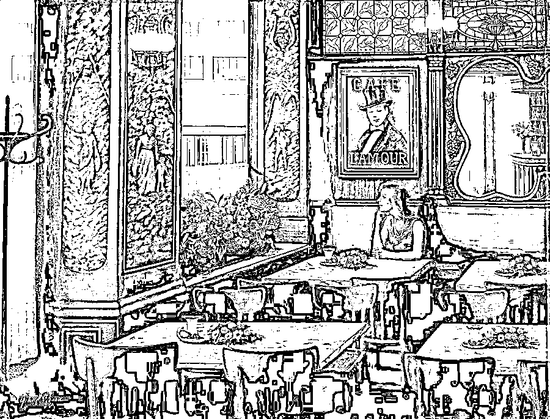

**2.倾听**

**倾听是指在客户讲述他们的故事时，占星师捕捉和理解其所传达的信息的能力，无论这些信息是通过语言或非语言方式传递的。**

**积极倾听的 4 个技巧**

**1.倾听和理解客户的口述信息**

当一个客户告诉你他或她的故事时，通常混合包括着经历(在他或她身上发生了什么)、行为(客户做了什么或没能做到什么)，以及影响(与这些经历和行为相关的感受或情绪)。

**你必须倾听客户用经历、行为和感受来描述他或她的问题状况的混合陈述。还要“听见”客户没有说出口的内容。**

**2.倾听并理解客户的非语言信息**

占星师可以学习如何倾听和解读**非语言信息**，比如：

**身体行为**（姿势、身体动作和手势）、**面部表情**（微笑、皱眉、扬眉、歪嘴）、**嗓音相关的行为**（语气、音高、音量、强度、音调变化、词语间隔长短、强调、停顿、沉默和流利度）、**可观察到的生理反应**（呼吸加快、暂时性皮疹、脸红、脸色苍白、瞳孔放大）、**总体外貌**（仪表和衣着）和**身体外貌**（身材、身高、体重、肤色）。

**学习如何在不曲解或过度解读这些信息的情况下“读懂”这些信息。**

**3.结合背景倾听和理解客户**

占星师应该在客户所处社会环境的背景下倾听一个完整的个体。

**4.带着共情倾听**

共情倾听包括关注、观察和倾听（“与之同在”），这样占星师就能建立对客户及其世界的理解。占星师应该把自己的顾虑放在一边，与他们的客户全然“在一起”。

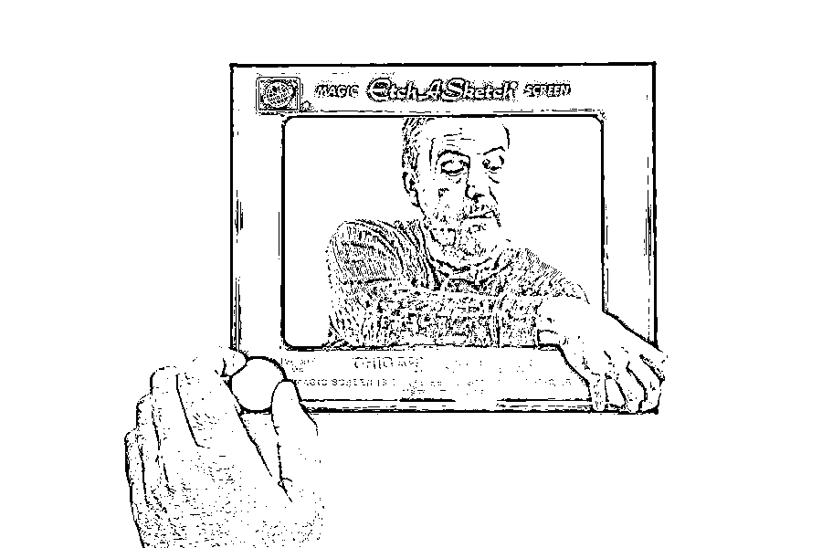

**你可能会遇到的 7 个阻碍**

然而，积极倾听并非一项容易习得的技巧。占星师应当意识到到积极倾听会遭遇以下阻碍：

**1.倾听不足**

如果一个人放任自己迷失在自己的想法中，或者开始思考自己想要回答什么，那么他很容易在别人说话时分心。占星师分心也常常是因为自己的问题、感觉不舒服，或者因为自己和客户之间的社会和文化差异。

**所有这些因素都使得倾听和理解客户变得困难。**

**2.评价性倾听**

大多数人都是评价性地倾听别人。

这意味着他们在对别人说的话做评判和贴标签，要么是对的/错的，要么是好的/坏的，要么是可接受的/不可接受的，要么是相关的/不相关的等等。然后他们也倾向于做出评价性的回应。

**3.过滤式倾听**

我们对自己、他人和周围世界的倾听往往经过带有倾向性的（通常是带有偏见的）过滤。过滤式聆听会扭曲我们对客户的理解。

**4.标签过滤**

贴标签可能阻止你真正地倾听客户。如果你把客户看成是“那个患有艾滋病的女人”，那么你共情倾听其问题的能力就会被严重扭曲和削弱。

**5.以事实为中心而非个人为中心的倾听**

只询问信息或事实问题无法解决客户的问题。倾听客户的全部背景，关注主题和核心信息。

**6.预演**

如果你在心里预演你的答案，你也没有专心倾听。仔细倾听客户故事中的主题和核心信息的占星师是知道如何回应的。回答可能并不流利、出口成章或“经验老到”，但至少是真诚和恰当的。

**7.同情倾听**

尽管同情在人际交往中有用，但在助人关系中同情的“使用”有限，因为它可能会扭曲占星师对客户故事的倾听。同情某人就是成为那个人的“同谋”。

同情传达的是怜悯，甚至是共谋，对客户的怜悯会减少你能帮助客户的程度。

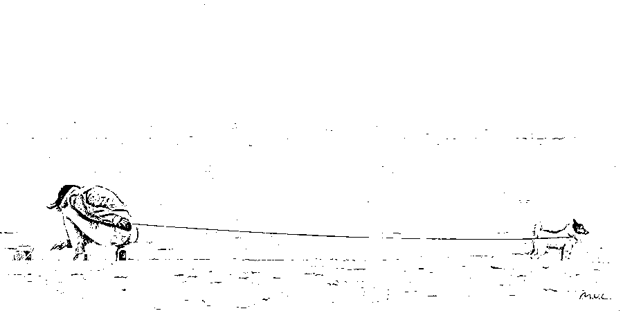

**3.基本共情**

**什么是共情？**

基本共情包括倾听客户，尽我们所能地理解他们和他们的关注点，并将这种理解传达给他们，从而他们可能会更全面地了解自己并根据他们的理解采取行动。

共情倾听意味着占星师必须暂时忘记他或她自己的参照标准，试着去看到客户的世界，以及客户看待自己的方式，就好像占星师是通过客户的眼睛来看世界一样。

因此，**共情是一种在不经历相同情感的情况下识别和认可他人感受的能力。这是一种通过暂时的****“****感同身受****”****来理解客户的世界的尝试。**

随后，占星师必须通过语言或非语言的方式与客户分享自己对客户世界的理解。

**实现有效共情，你需要注意的 7 点**

***1*****.避免分散注意力的问题**

占星师经常提出的问题是为了从客户那里获得更多信息，以达成自己的目的。他们这样做是以牺牲客户为代价的，也就是说，他们忽略了客户对自身经历所表达的感受。

***2*****.避免使用陈词滥调**

陈词滥调是空洞的，它们向客户传达的信息是，他或她的问题并不严重。避免说:“我懂你的感受”，因为你不懂。

***3*****.共情不是解读**

占星师应该回应客户的感受，不应该歪曲客户对占星师所说的内容。

***4*****.谨慎提供建议**

虽然提供建议在咨询中有一定作用，但应谨慎运用，以尊重为自己负责的价值观。

***5*****.避免机械性重复**

仅仅重复客户所说的话不是共情，而是鹦鹉学舌。机械性重复客户话语的占星师不理解客户，没有与客户“在一起”，也不尊重客户。共情总是能在谈话中增加一些东西。

***6*****.共情不等于同情**

同情客户就是表示怜悯、慰问和恻隐之心——所有这些都是善意的品质，但在咨询中没有多大帮助。

***7*****.避免与客户发生冲突和争吵**

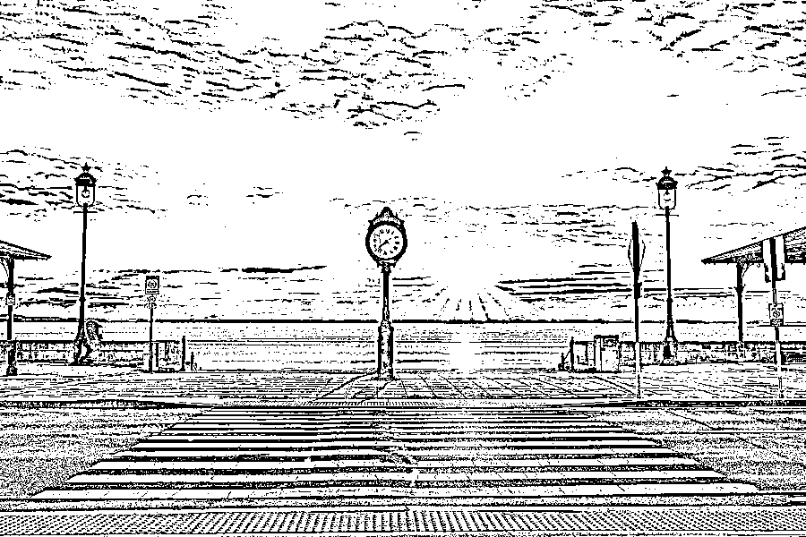

**4.探寻或提问**

探询包括占星师的陈述和问题，使客户能够更全面地探索他们生活中的所有相关议题。**探询可以采取陈述、问题、请求、单个词或短语和非语言提示的形式。**

**探寻或提问的目的：**

*   鼓励不自信或不情愿的客户讲述他们的故事。

*   帮助客户持续聚焦相关和重要的议题。

*   帮助客户找出能让他们的故事更完整的经历、行为和感受，换言之，就是填补缺失的部分。

*   帮助客户在助人过程中向前走。

*   帮助客户更全面地了解自己和他们的问题情况。

**当你使用探询或提问技巧时，记住以下几点：**

*   谨慎提问。

*   不要提太多问题，会让客户觉得自己受到了“拷问”。

*   不要问你不是真的想知道答案的问题!

*   如果你连续问两个问题，很可能是有一个问题是多余的。

*   虽然封闭式问题有其作用，但要避免问太多以“会不会”、“有没有”或“是不是”开头的封闭式问题。

*   问一些开放式问题——也就是说，不只要求简单的“是/否”答案的问题。以“怎么”、“告诉我”或“什么”开头。开放式问题不具有威胁性，而且鼓励描述。

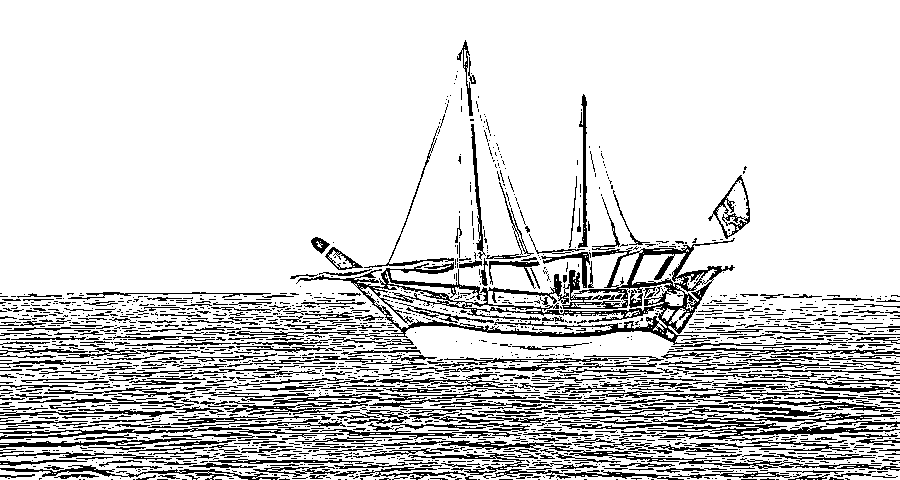

**5.总结**

**有时，占星师总结咨询中说过的话很有用，这样可以把重点放在之前讨论过的内容上，从而促使客户向前走。**

**在下列情况下，总结特别有用：**

*   在一次新咨询开始时。这个时间点做总结可以给不知道从哪里开始的客户指明方向；可以防止客户只是重复他们已经说过的话，还可以迫使客户向前走。

*   咨询似乎毫无进展时。在这种情况下，总结可能有助于关注客户。

*   当客户卡住时。在这种情况下，总结可以帮助客户向前推进，以便他或她可以探索其故事的其他部分。

**6.整合沟通技巧**

在咨询过程中应以自然的方式将沟通技巧整合起来。有经验的占星师会持续地关注和倾听，并综合运用共情和探询来帮助客户理解和应对他们的问题。

**使用哪些沟通技巧以及如何使用沟通技巧将取决于客户、客户的需求和问题情况。**

**版权声明：**本文由若道翻译发布，欢迎转发，反对抄袭。友号转载请申请白名单。

**学习占星学****点击下图了解课程详情** 

**

********************************

**微信又双叒叕改版啦，不想错过若道君的推送？**

**就把若道设为星标吧！**

**▼**

**喜欢记得点一下在看哦☟**

********报名直达入口********

# 动物与占星丨哪个它，会是你最好的“疗愈小伙伴”？

> 原文：[`mp.weixin.qq.com/s?__biz=MzA5NjA0NTAxNg==&mid=2651467034&idx=1&sn=1e686486fe2d9bd310f858aa7c0de559&chksm=8b489fadbc3f16bb789c9ff33b572473da921040c42ac9f2db9b27646303c1a7421da4312cab&scene=126&sessionid=1692737862#rd`](http://mp.weixin.qq.com/s?__biz=MzA5NjA0NTAxNg==&mid=2651467034&idx=1&sn=1e686486fe2d9bd310f858aa7c0de559&chksm=8b489fadbc3f16bb789c9ff33b572473da921040c42ac9f2db9b27646303c1a7421da4312cab&scene=126&sessionid=1692737862#rd)

******************************☆ **************后台****************************回复“今日”，给你一句生命态度****************

作者/乔纳森·凯斯

翻译/江艺 校对/Arrow

 编辑/翀子 封面/书君  图片/网络

动物不仅是大自然的恩赐，还可以成为我们灵魂的强大盟友和疗愈者。从不同的动物身上，我们可以学习到很多东西。但你知道吗，动物还可以和占星学联系在一起，从不同元素的角度看待不同动物，我们可以获得不少启发。

我喜欢在夏天的时候去奥林匹斯山，沿着长长的河床和山谷，爬上丘陵和小山。大量的降雨造就了世界上最壮丽的温带雨林之一。奥林匹斯山脉为各种动物的成长和繁荣创造了一个不可思议的环境。

当我和它们一起行走的时候，这些动物给我上了许多功课。熊教我要慢下来，更加专注。鹰教我变得更坚强，用清晰的视野看东西。

**每一种动物都以一种特定的方式，在我关注他们时启发和治愈我。**

**如果我们花时间观察它们并将它们的灵魂融入我们的心中，这些动物可以成为我们灵魂的强大盟友和疗愈者。**许多土著部落将动物看作强大的精神存在，可以教会我们很多东西。

我曾经目睹过一个来自厄瓜多尔的盖丘亚族的印第安萨满在做疗愈时呈现出美洲虎的特质。数千年来，临海的印第安人对鲸鱼怀有深深的崇敬之情。鲸鱼不仅是食物和燃料的来源，也是整个部落的精神食粮。

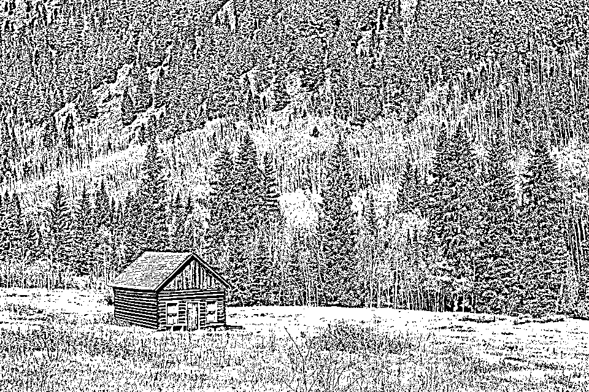

**动物与占星学的联系**

**当我花时间观察这些动物的习性时，我注意到它们天然接近我们在占星学中研究的各种元素和行星。**鸟类与风元素有很强的联系，而海豹和鲸鱼与水元素有关。

但当我们更深入地研究这些动物时，我们可**以看到它们的特征是如何与不同的行星协调一致的**。

虽然海豚可能与水元素有一种基本的类似，但它们的顽皮和交流风格将它们与水星联系在一起。虽然大蓝鹭与风元素相关，但它们优雅的威严和高大的身材显示了它们木星般的天性。

每一种环境都产生了当地多样的动物生命，而气候将有助于将动物调和到特定的性情。

干燥、阳光充足的地区，比如犹他州南部的峡谷，自然会有更多像蜥蜴和爬行动物这样的凶猛动物。刮风的平原和多风的峭壁会有与风元素相关的生物，如渡鸦、隼和鹰。

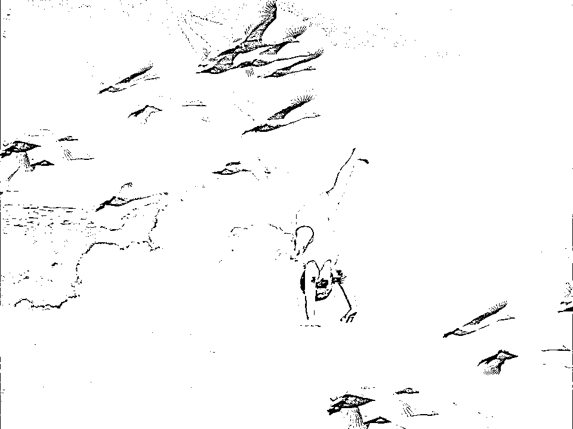

**动物与占星学如何疗愈我们？**

当我们花时间观察我们周围的野生动物时，我们可以感受到它们的力量和技能。他们的美丽和与环境的互动关系让我们着迷。通过观察和联系自然界中的动物，我们变得更能呼应自然的周期和生命的节奏。

花足够的时间研究和学习这些动物的行为方式，我们很快就会发现，我们也可以获得一些它们的技能、力量和智慧。

**当我们通过研究、观察和阅读了解一种动物时，我们就会发现它能教给我们什么。**

也许这是关于坚定和毅力的一课（野牛）；或者它们讲的是敏捷和速度（蜂鸟)。在每一种情况下，我们可以模仿他们的能力，这样我们就可以变得更强大，更聪明。

**通常，为了获得一部分这种智慧，与和我们星图关联的一种动物一起工作是有益的。**

*   如果我们的火象行星占优势，我们可能想要与火象动物一起工作，**来学习如何更好地利用我们自己的内在能量**。

*   我们也可能想要与能**平衡我们的星图，强化我们缺失元素**的动物一起工作。如果我们有很多火元素，我们可能想要与像鲸鱼或水獭这样的水象生物一起工作。

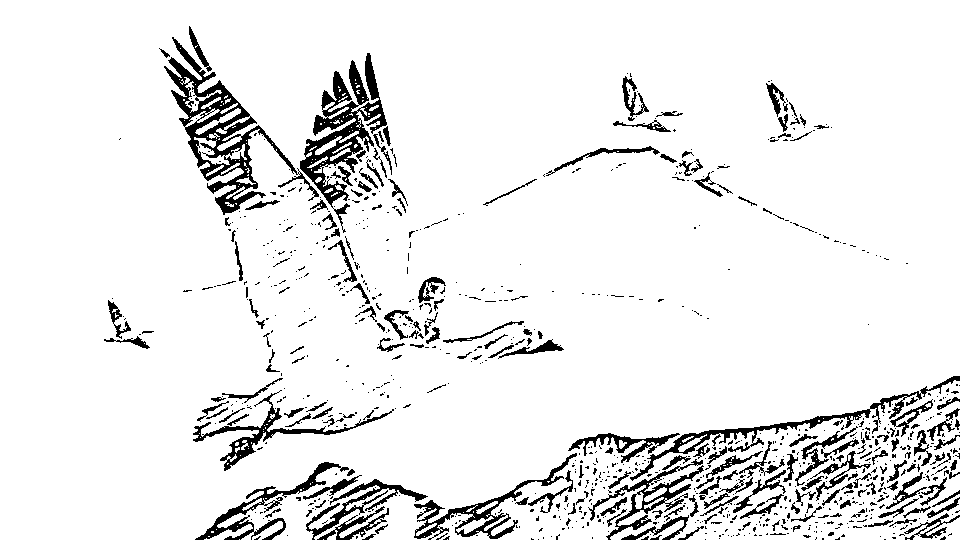

**火象动物****1****狮子 **

**与太阳关联**。这种强大的动物有很多种形态，从家养的猫到塞伦盖蒂平原的老虎。他们都拥有敏捷、优雅的技能，在必要时变得凶猛。美洲狮是强壮而隐秘的猎手，**教会我们安静、难以捉摸和高贵**。

**2****野狼 **

**与水星和天王星关联**。野狼以它们的嚎叫而闻名，它们自己捕猎或与另一只伙伴一起。他们长期以来被许多文化传统视为骗子的图腾。野狼教我们**大智若愚**。它们可以考验我们，也可以让我们开怀大笑，帮助我们在突如其来的灵光一闪中打开觉悟之门。

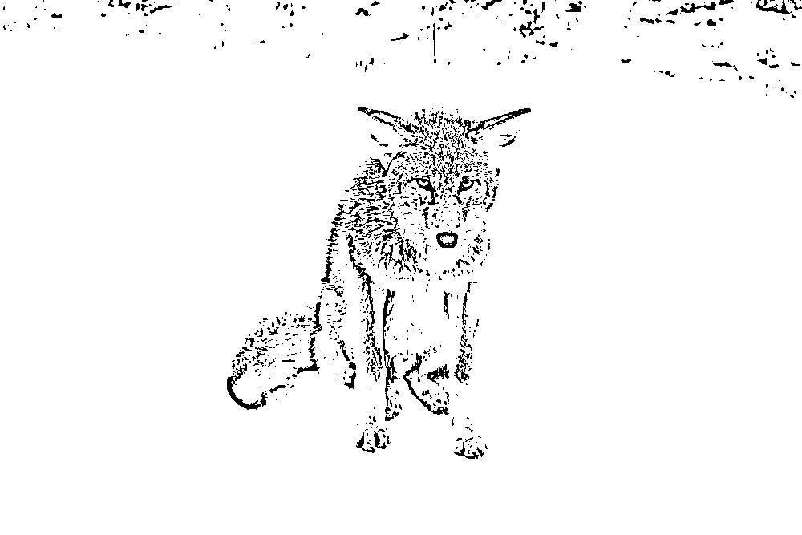

**3****蛇**

**与冥王星关联**。蛇有一种原始的力量，由于它们的速度，有时是毒牙，可以引起巨大的恐惧。这些爬行动物可以通过舌头、眼睛和身体内感受到的震动来感知周围的环境。它们每年至少会蜕皮一次。

**蛇是治疗师和药师的强大盟友，这是因为他们的很多工作都是转化性的。**最有名的治愈标志之一是双蛇杖，它描绘了两条蛇盘绕在一根手杖上。蛇教我们**变得强大、紧张和警觉。**

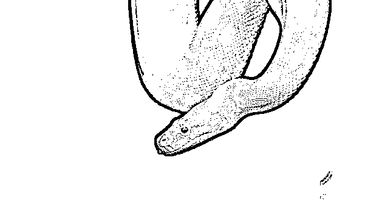

**4****蜜蜂 **

**与太阳和海王星关联。**蜂群中有多达 6 万只工蜂、一只蜂王和几百只雄蜂。它们通过采集花蜜和花粉来帮助植物和树木授粉。工蜂们用舞蹈来交流哪里可以找到花粉。

这个强大的小生物教会我们**在生活中收集甜蜜，通过服务来滋养社会共同体，用爱和性来交流**。

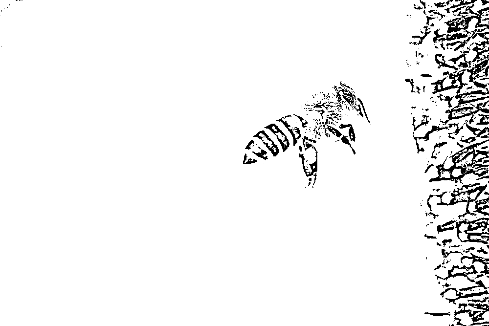

**风象动物****1****鹰 **

**与木星关联**。这种威严的猛禽经常栖息在溪流和地面上空。凭借强大的视觉，老鹰能够看到猎物，并以闪电般的速度飞向猎物。鹰教会我们**成熟和坚实的力量，清晰的视野和领导技能**。

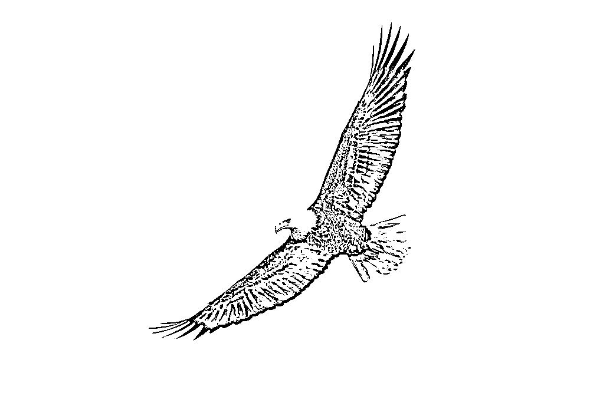

**2****山羊 **

**与土星关联**。虽然这些生物也类似于土元素，但他们的天然的活动领域是在高高的云层和刮风的薄雾山脉。山羊步伐稳健，能利用其强大的力量迅速越过巨石和峭壁。

这些生物帮助我们**更明确自己道路，在我们的行动和关系中变得清晰和踏实**。

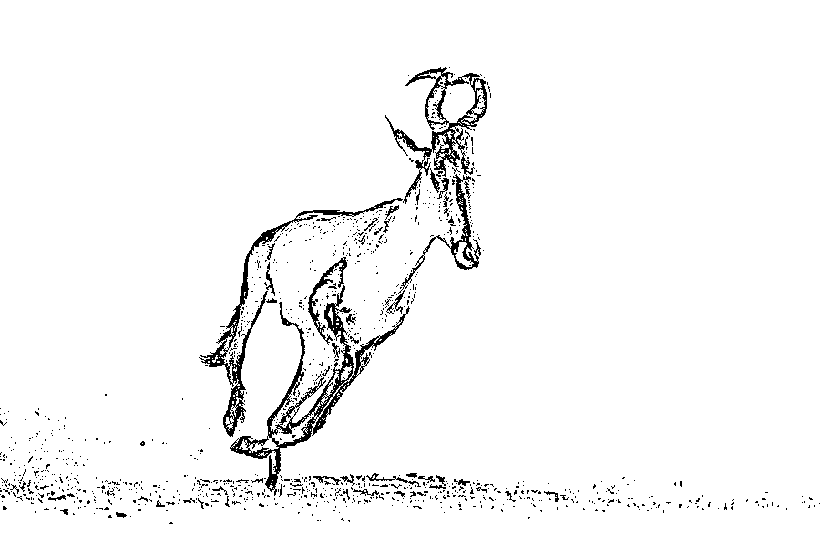

**3****燕子 **

**与水星关联**。看着它们在空中起舞、转圈，欢快地在树丛和灌木丛中相互嬉戏。这些鸟教我们**此时此刻要顽皮、欢笑、快乐**。

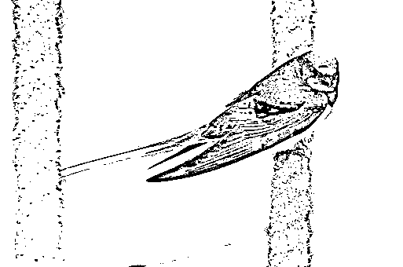

**4****乌鸦 **

**与冥王星关联**。这种强大的鸟警惕而自信。它们拥有极大的聪明才智，可以利用身边的一切，制定战略，做出决定，然后直接去追求他们想要的和需要的。

乌鸦帮助我们**大胆而诚实地行动，面对黑暗或隐藏的东西，从而以揭示真相**。

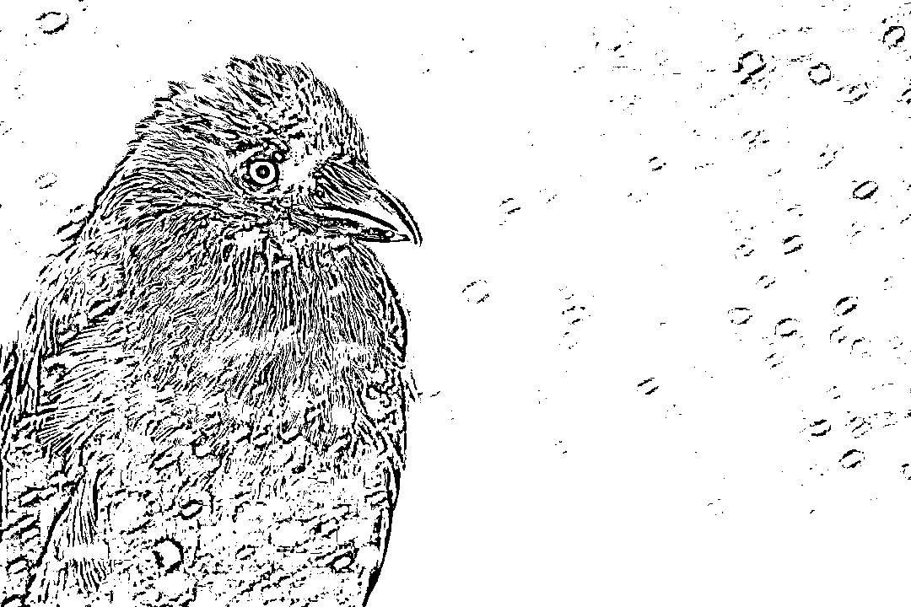

**水象动物****1****鲸鱼 **

**与海王星关联**。这种庞大的生物遍布世界各地的海洋。它是地球上最大的哺乳动物，但其浩瀚的身躯却有着惊人的优雅和美丽。鲸鱼还通过一系列复杂的哀号、鼻息和口哨声进行交流，这些声音富有表现力，令人着迷。

这种强大的生物具有很高的情商。它们有**同理心，高度敏感，能触动我们心灵的最深处**。

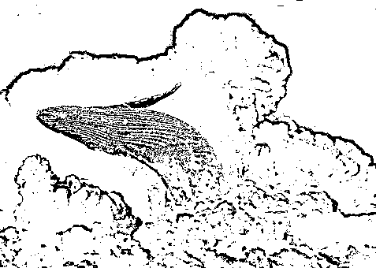

**2****海豚 **

**与水星和海王星关联**。这些哺乳动物的行为方式带有很多嬉闹和欢乐。它们喜欢用口哨声和咔哒声相互交谈。它们生活在小小的群体中，在遇到危险时互相照顾。

海豚是关于**友谊、沟通、玩耍和表达的伟大图腾动物**。

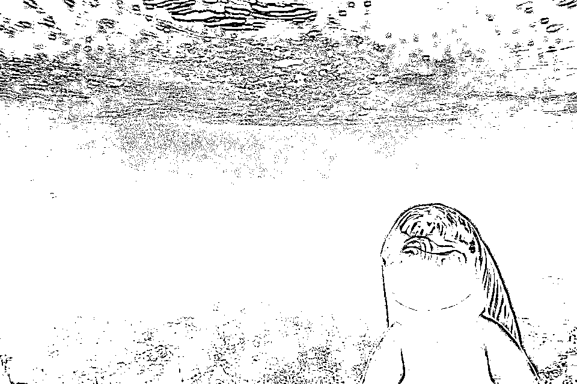

**3****水獭 **

**与海王星和水星关联**。这些圆滑而孤独的生物有一种巨大的能力，可以沿着河流和湖泊的岸边快速优雅地潜水和游泳。他们通常独自生活，花无数时间清洗自己。水獭不会一生都定居在一个地方，而是四处迁移，寻找最佳的觅食地点。

**对于那些生活中需要快速、敏捷、优雅和流动性的人来说，水獭是一个很好的盟友。**水獭也有助于我们**更快乐，更顽皮，更享受当下**。

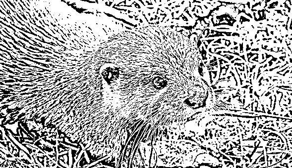

**4****鲑鱼 **

**与月亮、海王星关联**。这种强大的生物长期以来一直是美国沿海土著民族的图腾，也是许多部落力量的来源。鲑鱼一生中大部分时间生活在咸水中，然后逆流而上，在淡水中产卵，然后新生鲑鱼再次下行到海洋。

鲑鱼帮助我们**调整到自己的自然周期和节奏，并提醒要我们与环境调和一致**。鲑鱼**高度滋养身体、情感和精神层面，给我们带来力量和宁静**。

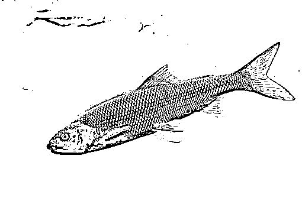

**土象动物****1****熊**

**与火星和海王星关联**。这些大型动物在森林和山脉中漫步，人们经常可以在河床附近看到它们在饮水或等着抓鱼。它们缓慢而笨拙的特质是具有欺骗性的，因为如果需要的话，它们可以以极快的速度奔跑，还能轻而易举地越过巨石和树桩。

熊通常是放松的，会花几个小时寻找浆果和健康的植物。如果受到威胁或走投无路，它们会变得凶猛，用爪子和牙齿迅速杀死对手**。**

**对于那些需要力量、信心和能量的人来说，熊是一个很好的盟友**。它们与做梦也有一种特殊的关系，因为它们大部分时间都在冬眠。

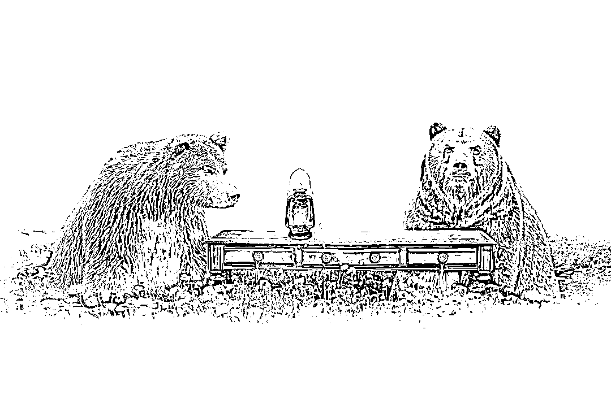

**2****野牛**

**与土星关联**。野牛曾经成群结队地在北美平原上游荡。由于被猎杀到几乎灭绝，它们的数量增长缓慢。这些动物每天大部分时间都在吃草，以喂养它们庞大的身躯。野牛长途跋涉寻找合适的觅食地。它们一直被奉为食物、衣服、住所和工具的源泉。

野牛教会我们**耐力、力量和在逆境中保持坚定和真实的力量**。

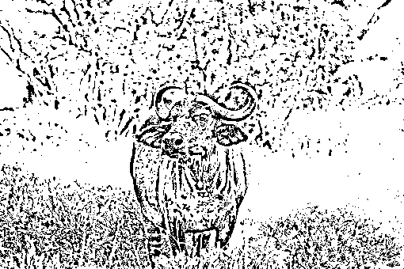

**3****獾 **

**与月亮和火星关联**。獾在它们挖的地洞里安家。它们白天喜欢呆在那里，晚上出来觅食。这些动物非常善于挖掘，很快就会挖出一个新的洞来居住。如果受到威胁，它们会变得很有攻击性，会用锋利的爪子和牙齿捕食其他小动物。

獾是**有韧性和勤劳的，在必要时变得凶猛。它们是带来保护和勇气的好盟友。**

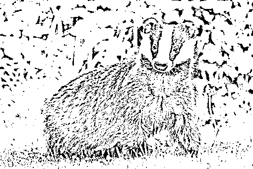

**4****麋鹿 **

**与土星关联**。这些强壮的动物喜欢独自旅行或成群穿越森林和山区。它们小心翼翼、一丝不苟地行走，但遇到危险时可以跳跃着逃跑。它们有非常敏锐的嗅觉和听觉，能够感知几百码外的动静。

对于那些需要更加脚踏实地和自信的人来说，麋鹿是一个强大的盟友。麋鹿**自豪而独立，它们的行为方式敏感而节制**。

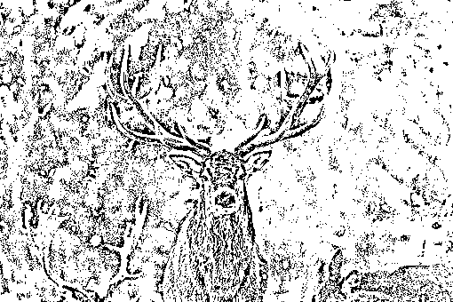

**结语**

**动物是我们可以在日常生活中召唤的力量和能量的来源。**在你的星图中找到最适合你元素构成的动物。为了帮助召唤这些生物，找一根羽毛，一根骨头，一颗牙齿，甚至一张他们的照片，把它放在一个神圣的地方，就像在祭坛上。

在你的祈祷和思想中加入动物，花些时间在它们的天然环境中观察它们。慢慢地，你与动物灵魂的关系将会发展，久而久之，你将获得一些关于那种生物的智慧。

**版权声明：**本文由若道翻译发布，欢迎转发，反对抄袭。

****

**乔纳森·凯斯**

占星师，草药医生和植物精神医学从业者，持有理科学士学位。他的作品曾发表在《大占星师》和卢埃林的许多年鉴中。乔纳森著有《自然健康指南：星图是古代治疗实践之匙》一书。

**学习占星学****点击下图了解课程详情** 

**

********************************

**微信又双叒叕改版啦，不想错过若道君的推送？****就把若道设为星标吧！****▼**

**喜欢记得点一下在看哦☟**

****报名直达入口****

# 复工快乐！重要天象指南丨面对生命中的创伤和痛苦，需要天蝎座的智慧带你通关！

> 原文：[`mp.weixin.qq.com/s?__biz=MzA5NjA0NTAxNg==&mid=2651466867&idx=1&sn=5b8732646e7bd09d7a5694f8db195fce&chksm=8b489ec4bc3f17d2a2ba7b698e21e76f90425b3ac337e4ec36ef22be65906f6a4dfe069b81e2&scene=126&sessionid=1692737862#rd`](http://mp.weixin.qq.com/s?__biz=MzA5NjA0NTAxNg==&mid=2651466867&idx=1&sn=5b8732646e7bd09d7a5694f8db195fce&chksm=8b489ec4bc3f17d2a2ba7b698e21e76f90425b3ac337e4ec36ef22be65906f6a4dfe069b81e2&scene=126&sessionid=1692737862#rd)

************☆********************后台回复“今日”，给你一句生命态度************

作者/斯蒂芬·弗里斯特 

译者/Chang 校对/江艺 

编辑/翀子 封面/书君 图片/网络

今天是初七，大家也都陆陆续续开始开工了。从假期中撤离，刚开始恢复工作，我们可能多多少少都不太适应。今天就给大家带来一点解药。我们目前正处于月亮交点行进在南交点天蝎座/北交点金牛座的阶段，这个阶段将于 2023 年 7 月才结束。也许目前你的生活正处于伤痕被揭发，情绪需要发泄的阶段，斯蒂芬老爷子用智慧的话语解答了我们的创伤：疗愈的解药除了真诚勇敢的面对，也需要拥有金牛座“简单生活”的生命智慧。

**月亮交点换座**

**月亮交点在每个星座停留大约一年半，然后就逆行进入前一个星座。**（它们一直逆行。）**12 月 22 日，北交点进入金牛座，南交点进入天蝎座。**它们自从 2020 年 6 月 4 日至今，分别位于双子座和射手座。2023 年 7 月 12 日，它们会越界进入白羊座和天秤座。

顺便要说，这些日期是就平均交点而言的，而不是所谓的真实交点。在极少的情况下平均交点和真实交点有很大区别，这时我总是发现平均交点更准确。我给出的日期也是基于美国西海岸。在这篇通讯里，我想要专注于更大的图景。

**月亮交点的意涵**

占星师迈克尔·鲁丁有一次使用了嗜酒者互诫协会的语言来阐述月亮交点的意义。他说：“北交点是戒酒会，南交点是酒瓶。”这个讲法可以说非常准确。

对于酗酒者来说，没有什么比倒上一杯更自然和熟悉的了。**这就是南交点的概貌。**就和酗酒一样，**它是一种深植的习惯，**不会给我们带来任何好处，但是常常像条件反射一样发生。如果不注意，南交点的行为几乎就会自动发生。

同时，**北交点是令人不安和不熟悉的领域——它对我们有好处，但是它很陌生并且需要付出努力。**想象一下那个酗酒者，第一次不安地来到他的戒酒会。

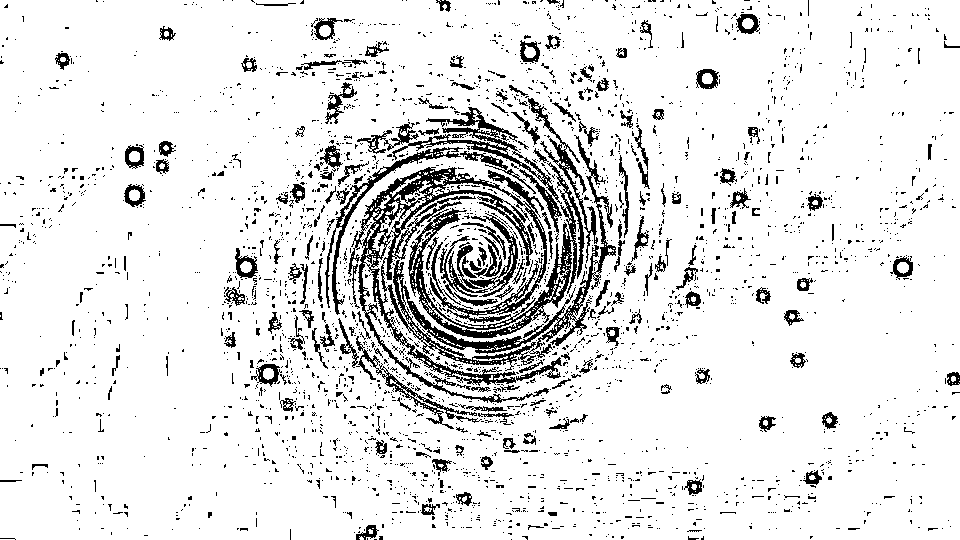

**天蝎座南交点的水域**

**自从南交点 2020 年 6 月起来到射手座**，我们便被**盲目信念**的恶魔缠绕。每个人的观点都变得热核化。人们把两三个点联系起来，在射手座黑暗面的精神下，他们便衍生出了整个宇宙学——或者是某种阴谋论。

有任何问题吗？对于集体意识的扭曲性的影响已经非常清楚了。

**随着南交点换座天蝎座，有哪些心灵鬼魅会浮现出来呢？**另一个问题是：这些不良的南交点习惯和情绪假设最初来自哪里？我们生来带着它们，这是关键信息。它们的起源早于我们的出生。

我通过假设轮回转世来理解这个谜团，**南交点是作为未解决的业力象征浮现出来，北交点则是解药——**达到那里会非常接近于你今生的终极目标。

**接下来一年半出生的孩子会有很多天蝎座的业力需要解除，而他们的疗愈解药就是金牛座能量的高级表达。**这些孩子会在这样的业力浪潮中冲浪——或者如果他们懒惰了，就会在未解决的天蝎座业力之中溺水——直至离开物质世界。

我在这篇小短文中要说的就是，**从现在直到 2023 年 7 月，我们也都在同样的浪潮中冲浪。**或者试图这样做。

关键是，**集体层面上，人类即将面对一些糟糕的天蝎座能量的爆发**——**而我们在暴风雨中导航的最大希望，在于把目光锁定金牛座的宁静港湾。**

你肯定会在个人生活中感受到这一点，但是我在这里想在普遍的层面上来讲。如果我还在南方，我会直接说“这不是只针对你，而是你们所有人。”

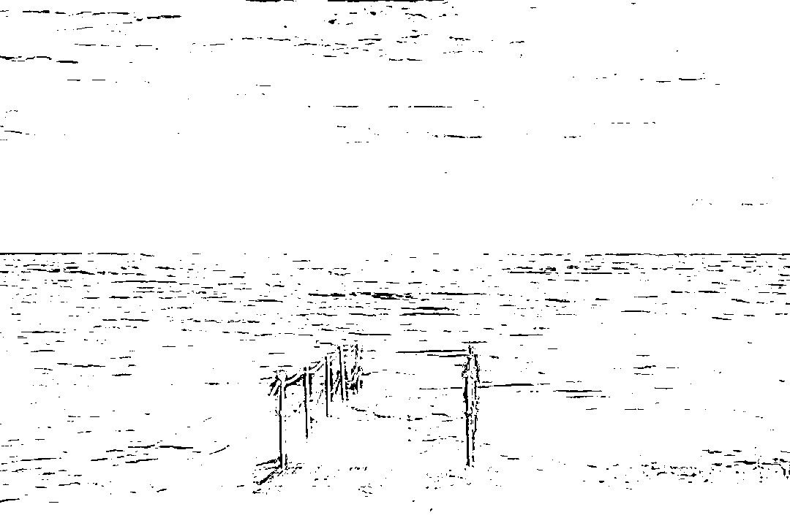

**没有解决的天蝎座的业力是什么性质？**天蝎座当然就是蝎子，一种几乎令所有人紧张的生物。死亡、痛苦、没有预料到的灾难——这是它的象征。**简而言之，天蝎座指的是人们避而不谈的那些事。**

想象一个士兵，**刚从战场归来，敏感而动摇**。想象一个傻瓜脱口而出，“嗨，战争是什么样？给我们讲讲故事。”如果你对刚才这一幕感到不快，那么你已经在理解天蝎座上取得了很大进展。**那是我们脆弱之处。**

我们大部分人都知道，有些情感界限是不应该越过的。有一些只是单纯的礼貌和习惯。更多实际上是善良与尊重。

你问朋友一个尖锐的问题，她突然变得苍白。她回答“我今天不愿意提那个，好吗？”你自然会退后。然而在内心深处，你知道她迟早要“提那个”。但是那不管你的事，那是她自己的事。

**从现在到 2023 年 7 月间，**整个人类都需要探索“那里”。**我们需要直面集体的伤痕，时候到了。**作为一个普遍准则，我们可以假设在前世，我们每一个人都遭遇过羞辱、背叛、奴役、强奸、被迫参战，或者遭受过暴力或其他伤害。**这是一些天蝎座的因果。**

为什么？因为到时候了。因为我们准备好了疗愈。我们绝不能忘记，**在月亮交点方面，这些疗愈、再生和恢复的过程，就是问题的核心。**

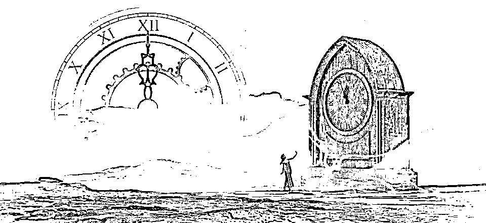

这是天蝎座包裹的一部分。还有另外一部分：**我们需要面对自己的“罪”**。当我写下这句话时意识到了“罪”是一个奇怪的词，带有很多不好的业力。比如说，有毒的宗教就试图欺骗人们认为性本身是一种罪。当然不是。

**罪，我在这里用它表达的意思是，伤害生命的另外一部分的行为——或者伤害我们自己。**并且就像耶稣基督说的那样，“你们当中谁是没有罪的人，就可以扔第一块石头。”

我们都做过不能引以为傲的事——在今生大概做过，在以前世几乎肯定做过。**那些不舒服的记忆去哪了呢？储存在哪里？占星学的答案是：“天蝎座“。**

罪恶与伤痕——归根结底是那些我们伤害过的人和伤害过我们的人。关于这一切，**是时候找到真相了**，完整的真相，并且只有真相没有其他。

因为共时性这一永恒不变的法则，所有那些魔鬼现在都在浮现。没有地方可逃，没有地方可躲。**我们需要面对那些我们伤害过和那些伤害过我们的人了。**我们彼此可能都进入了新的肉身，但是未解业力的本质仍在那里，盯着我们的脸。

正如一直以来对待月亮交点那样，我们对宇宙说：“再来一次，我要再看看。这次我想做正确的事。我想要把它纠正。”**所有这些未解决的，不舒服的情绪，现在都在浮现。**

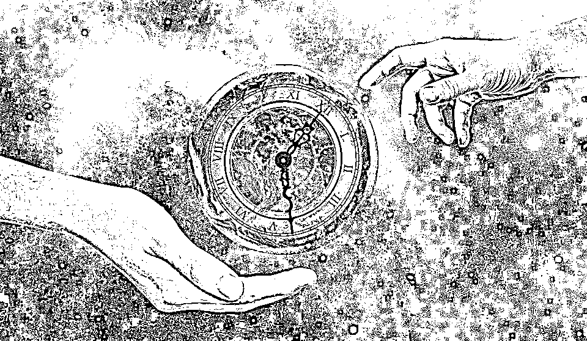

也许一个爱你的人跟你说了一个关于你的有点残酷的真相。你的防御机制大概就会开始激动——这是个自然反应。但是如果你抑制了这个反应，并且切实思考对方的话。你非常勇敢地意识到，那可能是真的。你看着朋友的眼睛说“谢谢你。”

你在天蝎座得了 A。

或者呢，也许你的防御机制赢了。你否认。你对朋友的话暴怒不已。也许你还试图伤害她。一段时间内，你都避免看到她。**这种攻击是天蝎座的黑暗面。**这些都会出现，在私人生活中和新闻头条上。

有一首兰迪·纽曼的老歌，副歌中唱道：“我只希望你像我一样受伤，我真的这样想，真的，真的”。有时候，好像这感觉就像世界的主题曲。

我的心理治疗师朋友们说：“要么你对付自己的事情，要么你的事情对付你。”有时候他们换一种说法：“那些你没有思考透彻的，你就会发泄出来”。

**这些都是天蝎座的智慧**——也是一种适时的天蝎座警告。在地球上不够有悟性的人当中，**我们会在接下来十八个月中，看到很多的“发泄”**。

**其实只是人们在表达他们的伤痛。但是他们会和它战斗——也和你战斗。**他们宁愿死也不愿承认它就在那里，不愿意承担自己在其中的角色——或者宁愿杀了提这件事的你。

好消息是，南交点进入天蝎座意味着，我们之中更有悟性的那些人准备好了接受一些认真的疗愈——**这种疗愈只有通过绝对赤裸的诚实和真诚才能达到。**这很难，但是值得。问问任何从性侵害中恢复的人。问问任何从战场上真正回家的士兵。

**归根结底，即将到来的交点行进，会给我们带来一些真正的英雄式的疗愈突破，以及一些极坏的“发泄”的行为。**

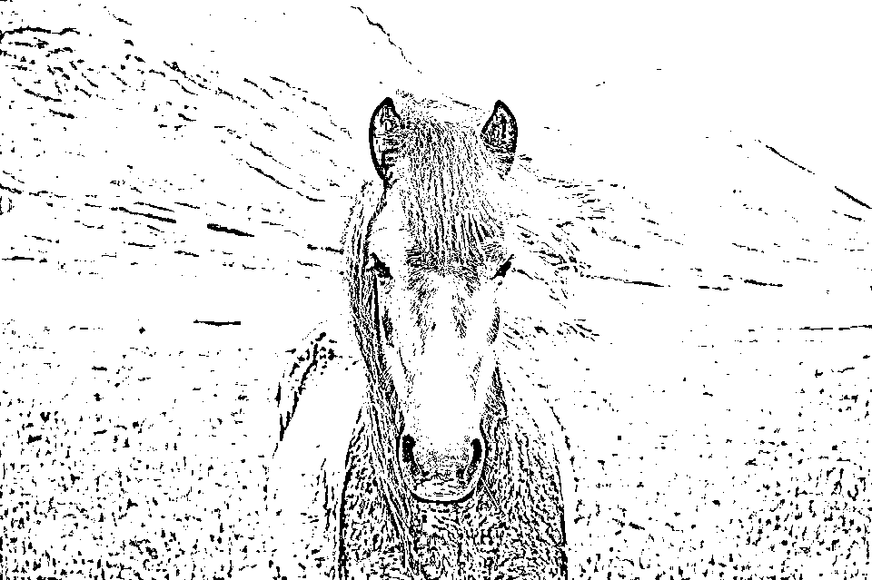

**金牛座北交点的疗愈**

**北交点呢？**要记得迈克尔·鲁丁的话——南交点是酒瓶，北交点是戒酒会。**金牛座指出了最有效的疗愈途径，对我们所有人都有效。**它就是解药——魔法弹药——帮助我们从天蝎座的引力场中挣脱出来。

**金牛座呈现给我们的问题并不是它太复杂了——而是它太简单了。**

我经常觉得，动物比人类要更加理解金牛座的进化之路。它们饿了就吃，累了就睡。**它们倾向于活在当下。它们几乎没有表现出对未来的担忧。**

它们倾听自己的身体。它们在自然中感到自在。它们喜欢呼吸新鲜空气。当它们肌肉紧张时，它们就拉伸。如果它们喜欢你，它们就会碰碰你。如果不喜欢，就走开。当死亡的时刻到来，它们就躺到一个安静的地方，闭上眼睛。没有什么戏剧性。

**生活可以如此简单。这就是金牛座的高级智慧。**

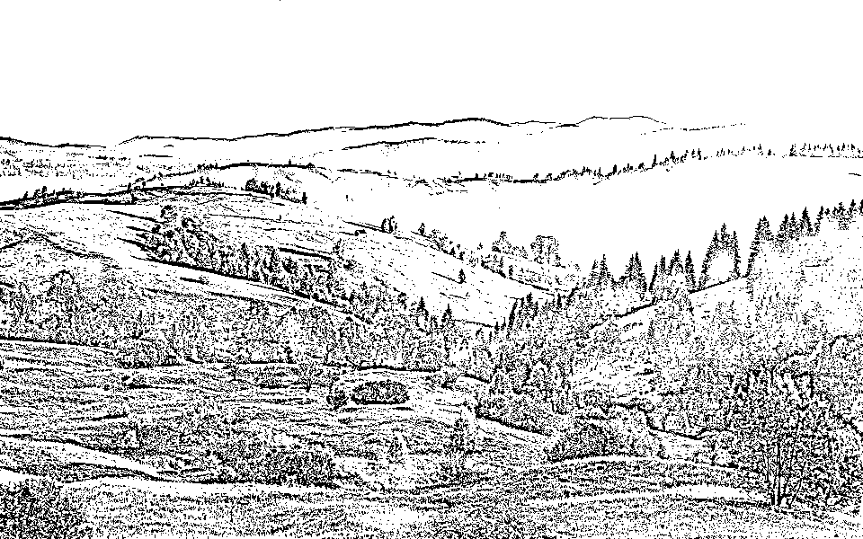

好消息是，我们其实都是动物。这种智慧就在我们内在，埋藏在一堆华丽的辞藻之下。**现在到 2023 年 7 月，感应自己内在这种原始的部分，会对你尤为助益。**

花时间沉浸于自然，沉醉于静默，相信那些令你平静的本能——**那种精神的坚实宁静，是高阶金牛座的精髓。**对我们所有人来说，**是时候把沉重的负担放下了。**

**战争结束了——我们只需要领悟这一点。**

通过一点努力，这些戏剧性不再有占据我们的能力。**还有另一种金牛座之乐：宽恕自然地升起。**不需要强迫——而只需注意到那种释放的感觉，就像体会春的第一丝气息。

就像一直那样，**相对的星座相互平衡和纠正彼此**。天蝎座的智慧很难达到。但是一旦达到，就需要从获得中恢复。

**和平治愈战争。深呼吸战胜焦虑。拥抱治愈愤怒。这就是金牛座。**

这里有一个金牛座的小练习，是一个问题，这个问题你其实永远不必回答——智慧与宁静，哪个是更大的精神美德？

再一次，秘诀是意识到并不需要回答。**没必要自寻烦恼。**只需要让风吹过你的头发。就让宁静像一块石头一样在你的内在沉淀。**只是存在着。**

**版权声明：**本文由若道翻译发布，欢迎转发，反对抄袭。友号转载请申请白名单。

**斯蒂芬·弗里斯特**

若道签约老师。进化占星学的创始人之一，当今世界最有影响力的占星大师之一；1985 年，他凭借《内在的天空》一书获得职业占星师协会奖（Professional Astrologers Incorporated Award）。他四次获得占星界最高的占星学联合协会奖（United Astrology Congress Regulus Award）提名，2018 年获得轩辕十四教育奖。

**2022 年来了****还不快领取你的****专属年运报告****？****购买有优惠，点击图片查看详情哦~**

**学习占星学****点击下图了解课程详情** 

**

********************************

**微信又双叒叕改版啦，不想错过若道君的推送？****就把若道设为星标吧！****▼**

**喜欢记得点一下在看哦☟**

****报名直达入口****

# 初四好呀！12 星座如何别样度过余下的春节时光？（还有宇宙限量红包封面送！）

> 原文：[`mp.weixin.qq.com/s?__biz=MzA5NjA0NTAxNg==&mid=2651466864&idx=1&sn=0d6fe5e08aa16da2a661d618a2756691&chksm=8b489ec7bc3f17d1a5f094a8e5219479142581984df05029c5e4dd07e03605e693b3a75cd10e&scene=126&sessionid=1692737862#rd`](http://mp.weixin.qq.com/s?__biz=MzA5NjA0NTAxNg==&mid=2651466864&idx=1&sn=0d6fe5e08aa16da2a661d618a2756691&chksm=8b489ec7bc3f17d1a5f094a8e5219479142581984df05029c5e4dd07e03605e693b3a75cd10e&scene=126&sessionid=1692737862#rd)

****后台回复“今日”，给你一句生命态度****

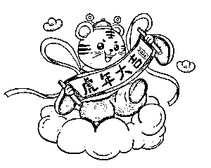

作者/编辑/玫瑰 图片/网络

恭贺新禧

一转眼，已经大年初四了。你们这个春节过得还好吗？若道君的春节还不错，与家人们的相互陪伴让春节有了很多暖意。过年的本质，不就在于一家人亲情的交流，对过去的总结以及对未来的美好祝福吗？又或许此刻，你因为政策原因，就地过年，但心里有家，是否在身边也就不那么重要了。

不管外在环境如何，还是要努力地让每个春节都过得喜乐平和，一起来看看有什么方法能够让这个春节变得不一样吧！

对了，虽然现在有点晚了，但还是请收下若道君为你们准备的**新年红包封面**！200 个限量，让你成为发红包最有宇宙氛围的那个！长按下方二维码即可领取。

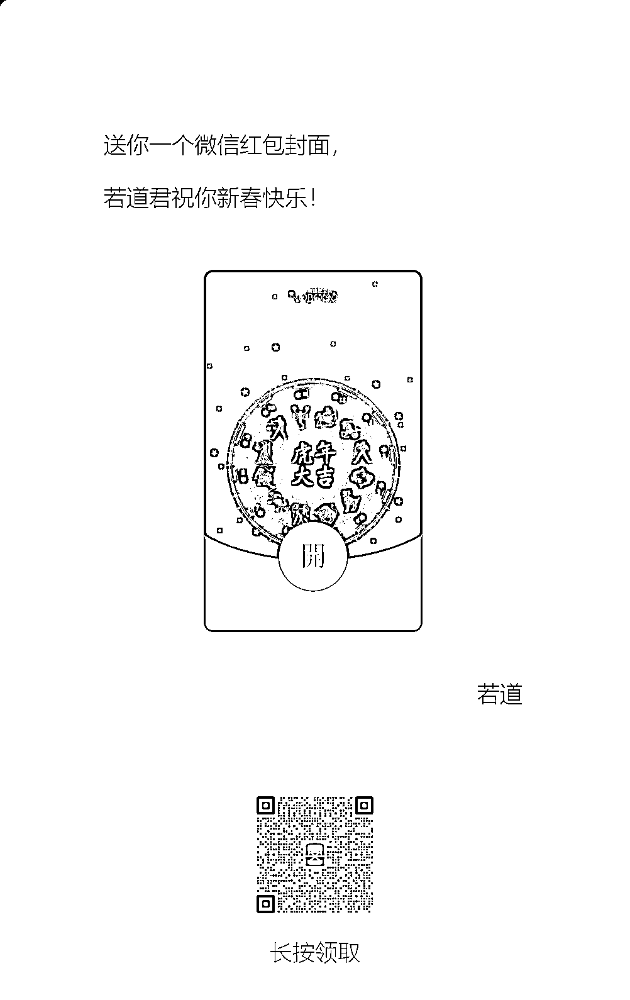

**少评判，快乐多**很多人从小到大听得最多的就是：“别人家的孩子考试多少分，你……”“别人家的孩子找了年薪 80 万的工作，你……”“别人家的孩子生了龙凤胎，你……”久而久之，但凡听到“别人家的孩子”就特别容易炸毛。仔细想，我们心中也都默默存着**“别人家的父母”**。他们脾气不急躁，讲话不难听，永远支持、接纳、包容，智慧开明又与时俱进……现实中的父母不如所愿的时候，我们也会**失望、愤怒、委屈、抱怨**。于是，两代人甚至三代人凑在一起，互相看不顺眼，都希望对方改变。这种状态在春节无缝相处的过程中特别容易产生摩擦和碰撞。其实，**生活不如意，十有八九是因为你对“理想中的生活”有预设。当现实无法满足预设的时候，便会因为落差产生情绪。**希望父母不再执着于将你改造成“别人家的孩子”，就先停止将他们改造成“别人家的父母”吧。**减少评判，接受对方本来的样子，**是处理春节可能出现的负面情绪的第一步。小妙招当你开始想：**“他怎么能这样！”**请**用手拍打大腿**。**心中默念：“当下我接受，不评判。”**这个方法很快就能让负面情绪流过。**越少评判，心情越愉悦。**

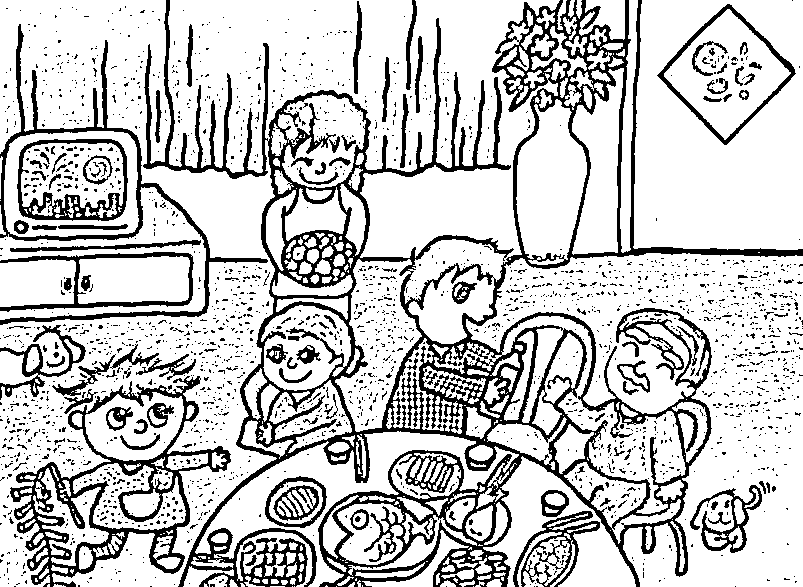

**先付出，先关爱**做了母亲后，我才明白，**父母永远无法对孩子做到淡定从容**。怀胎十月生下来的小肉团，多少个夜晚的哺育，多少个晨昏的照料，倾注了多少心血，就产生了多少担忧。怕你冷了，又怕你热了，怕你饿了，又怕你撑了……你的一个小闪失，都可能牵动父母心尖儿上的弦。
父母不懂得你的年代，只是按照自己所认为对的、好的、珍贵的，一股脑地，锲而不舍地灌输给你。这种爱过时而笨拙，甚至带有侵略性和压力，的确会令努力发展新生力量的孩子感到无所适从。可这就是亲人的爱。你是否能理解这种爱？源自于你是否能理解自己**内在冲突****的自我世界**。在亲友聚会中感到**陌生、孤独甚至排斥**时，问问自己：**“我真的愿意接纳和爱戴这些亲人么？”**你的困境，只是因为**不愿意同外界融合**。于是浑身带刺，不“顺耳”的关心都当做攻击。在网上流传着很多“如何回怼亲戚问话”的段子，如果大家都这样去做，只能让亲人离自己越发遥远。**缺乏亲人支撑的人生，就像地基不稳的空中楼阁，是很难真正稳固的。****春节是是家族议题集中爆发的时刻，也是唤醒深度家族融合的绝好时期**。这个春节，**先改变自己，付出爱和关心吧。**

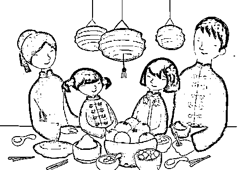

小妙招

**多倾听，多陪伴**

**爱打听、爱说教、爱管事儿**的人，内在非常**渴望被看见**。**遇到这样的父母或者亲戚，与其针锋相对地怼回去，不如沉默一笑，将话题引向她或他的生活。**如果姨妈问你：“今年怎么还没带个男朋友回家过年啊 ？看我家闺女今年都二胎了。”你可以说：“那您有没有去给她带孩子啊？外孙有很多好玩的事儿您给我说说呗……”**发自内心地倾听，而不是嘴上“嗯”，心里翻白眼。**你会发现，姨妈挺高兴，也不再催促和打探你的事情，因为她的**内心被看见**了，你们的关系就会发生改变。而你也学会了**关照和爱护别人**——对令我们舒服的人表达爱是容易的，但，对令我们感到无奈或者反感的人表达关切才是真正的成长。

**来个拥抱**

很想对父母好，可说着说着就会吵起来？总是在头脑层面去表达，最后无疑演变成谁对谁错的争锋。这个时候，你们需要的，不是你来我往的言语，而是一个**拥抱**，一个能够把你包裹进去，支撑、安抚、温暖你的怀抱。

**拥抱身边的人**。无论父母、亲戚，还是久未谋面的朋友。**两个人真正将身体贴紧，双手从背后环绕对方，将头靠在对方的肩膀上。**尝试去做，你会发现，无需语言，自身的能量就在提升。关系在改变，隔膜在消除，很多问题不需要处理就变得无影无踪。

**让别人比你“重要”**

也许有小伙伴看到这里会说：**“凭什么要我先改？”“我心里也有很多苦闷，很多没有被看见的地方呀！”**

不知道大家是否注意过，一群人在一起聊天的时候，有些人特别喜欢**插嘴、抢话**。人在抢夺话题的时候，内在的声音是：**“我的事情比较重要”**，也就是**“我比你重要”**。

认为自己更为重要的人，会在行止中显得**固执**：**我不能先让步，让步就是认输、受气，就是被欺负。**

观察到这一点，我们就能从意识深层去改变：“**我很重要，但你也很重要。我愿意真正倾听、包容、照顾你，把你的重要放在我前面**。”**让别人比自己重要，不是委屈，也不是牺牲，是真正的谦和、慈悲。**

种下这颗种子吧，它会**吸引来真正愿意真正倾听、包容、照顾你的人**。否则，你只能生活在都很自我、无法看见对方的人中。

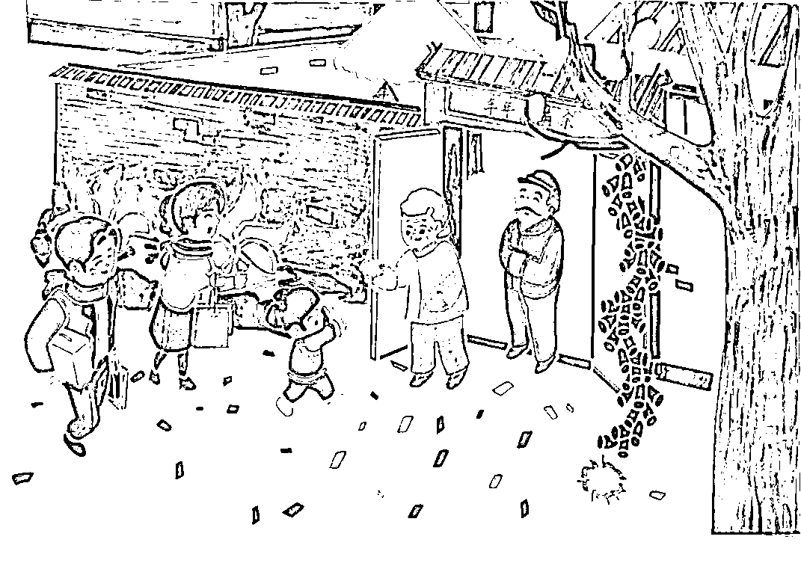

**12 星座春节活动**

大家庭和睦的一个重要因素就是**各得其乐，各取所需**。在这里，占星学就能发挥它的作用，精准定位，投其所好，达到事半功倍的效果。**家族、家庭、在家里的状态，是月亮管辖范围**。

我们可以参考**12 个月亮星座内在的需求**，来制定春节属于你自己家族量身定制的活动（还可以参考下中天所在的星座）。

我们先来**查找自己以及父母的月亮星座**，尤其是**母亲**，据我观察，只要把母亲（月亮代表的女性能量）哄开心了，一家都会相当开心……（为爸爸们叹口气）

针对下面的描述，看看哪一种方式更加适合你。**如果你的月亮星座同父母的月亮星座产生了紧张冲突（你想出去玩，而父母就想待在家里），我的建议是，先行服从父母的需求。**因为我们能够陪伴他们的时间，真的不算多。**与其非要同他们作对、拧巴，不如先臣服、接纳**。家庭序列理顺了，关系真正融洽了，“家和万事兴”，我们的一切也都会跟着顺遂起来的。 

**月亮白羊座**

这个月亮落座**勇敢、急躁而乐于挑战**。在保证疫情防控安全的前提下，可以**在室内或者短距离内游玩**，尤其是**平时没去过的地方**。

月亮白羊座的人相对自我，容易和他人产生冲突。

**·** 如果你的父母中有月亮白羊座，要注意**多让着他们；**

**·** 如果你是月亮白羊座，则要学习**站在他人的角度考虑问题**。

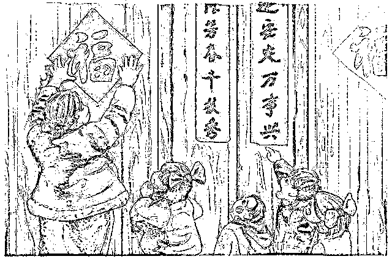

**月亮金牛座**

这个月亮落座**稳定、踏实，喜欢物质享受**。春节期间，不妨安排一些**安全稳妥**的节目，比如去**性价比高、服务好、环境优越的温泉、度假村**，**大餐享受**也非常重要。但**不要浪费**，否则可能吃力不讨好反而被念叨。

**月亮双子座**

这个月亮落座喜欢**新鲜事物、八卦**。春节期间，可以安排看**话剧、电影、演出**，或者**团团坐看综艺节目、晚会**等。

**·** 如果你的父母中有月亮双子座，要**多听少说，满足他们的倾诉欲**；

**·** 如果你是月亮双子座，则要注意自己**喜欢抬扛而引起争吵**的可能。 

**月亮巨蟹座**

这个月亮落座是月亮回到老家的感觉。春节期间，**一家人整整齐齐吃团圆饭**是必不可少的，饭后**翻看老照片，回忆小时候**也是保留节目。**·** 月亮巨蟹座的人对**安全感**需求较高，如果你有这个月亮落座的父母，就**不要安排太多刺激惊险的环节**了，也**理解他们的唠叨和碎碎念以及太多的关怀**吧；**·** 如果你是月亮巨蟹座，**宅在家里**过完春节就很好，但其他人想要外出的时候，你也可以配合一下哦。

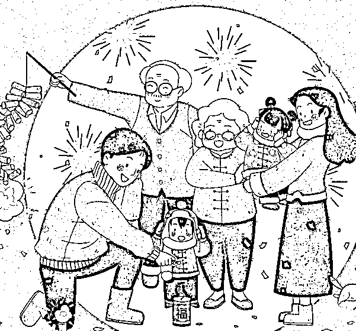

**月亮狮子座**

这个月亮落座所到之处必须**闪亮**。春节期间**，“一掷千金”到豪华会所享受或者豪华度假游**都是不错的选择。他们需要很多**夸赞**，这可能也是**最喜欢在亲戚面前“显摆”**的月亮落座了。**·** 如果你有月亮狮子座的父母，请记得要**在家族聚会中给他们争面子，也要夸奖他们，不要和他们对着干**。他们其实是**相当慷慨**的父母，一高兴很可能给你一个超大红包；**·** 如果你是月亮狮子座，则要注意**不要在聚会中抢尽风头**，留给别人一些表演的空间。

**月亮处女座**

这个月亮落座最喜欢**制定计划并且严格执行**。春节期间，无论干啥都谨记要**周密策划好，不然很可能因为焦虑而互相指责**。

**·** 如果你有月亮处女座的父母，要看到他们的**细致入微，服务意识，至于挑剔，就别计较了；**

**·** 如果你是月亮处女座，要努力**疏导焦虑情绪**，尽量轻松地度过，前文中提到的**“拍大腿”**的方法会特别适合你。

**月亮天秤座**

这个月亮落座喜欢**轻松、美好的环境，人际的和谐，讨厌竞争和压力**。春节期间，可以到**美丽又不劳累的地方旅行，又或者去优雅的酒吧、餐厅，看场文艺电影**。

**·** 如果你有月亮天秤座的父母，不妨**请他们为你的房间设计提供建议，又或者带他们去置办一套风度翩翩的行头**；**·** 如果你是月亮天秤座，相信你可以成为所有人眼中的“乖乖牌”，但你**是不是真的同其他人贴心，真心地交流？**也许你自己才知道是否有改进的地方。

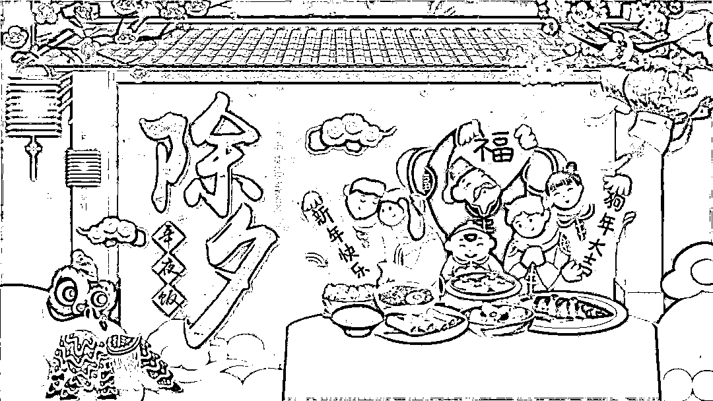

**月亮天蝎座**

这个月亮落座的家族中可能**暗流涌动，不露声色但充满冲突和激情**。春节期间，处理**对抗、愤怒、彼此控制等负面情绪，达到家庭成员的深度融合**很重要。**·** 如果你有月亮天蝎座的父母，你需要理解他们对你的**爱之深，才生惊恐**。**看见和安抚他们的情绪，多拥抱，**尽量**顺从**他们对于春节行程的安排；**·** 如果你是月亮天蝎座，要在走亲访友的过程中注意自己是否让人看起来有些**“冷漠”**，你不是和谁都能“哈拉”的人，但如果能在亲人面前**袒露自己**，也许会有完全不一样的收获。

**月亮射手座**

这个月亮落座最爱**自由和冒险，大无畏和运气并存**。春节期间，不妨安排一些**自驾游**，去**郊外、乡野，甚至具有一定“危险系数”的地方，蹦极、滑雪**等活动也十分适合。

**·** 如果你有月亮射手座的父母，也许他们会把你丢下二人世界去了……那你就继续“散养”自己吧！

**·** 如果你是月亮射手座，这个大概率原地过年的春节可能会让你感到蛮无聊的。那就多看看书吧！毕竟，身体和心灵总有一个可以在路上。

**月亮摩羯座**

这个月亮落座**缓慢、长久，注重传统文化中的等级观念**，是**不太懂得表达感情但按部就班的孝顺**。家庭在他们心中和月亮巨蟹座一样重要。春节期间，不妨安排一些**正儿八经的走亲访友**，**传统的礼数能**够让摩羯座能量强的家族感觉到**被尊重和仪式感**。**·** 如果你有月亮摩羯座的父母，记得要在亲友面前表现得**谦恭，符合辈分礼仪**；**·** 如果你是月亮摩羯座，除了给父母买礼物，默默安排行程，忙里忙外之外，多**拥抱**没坏处。

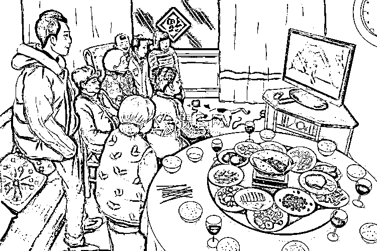

**月亮水瓶座**

这个月亮落座的家庭很大可能**不按常理出牌**，家庭序列和成员之间的关系都比较**奇特**。春节期间，**各自在各自的房间，互不打扰**的状态反而很适合。**·** 如果你有月亮水瓶座的父母，他们很需要**距离和淡定的内心空间**，尊重这种距离感，让他们感觉你**成熟而情绪稳定，并给予适度陪伴**；**·** 如果你是月亮水瓶座，要反观自己的**疏离是否会令家人受伤**，并同他们**解释得当**。

**月亮双鱼座**

这个月亮落座**缠绵而渴望融合**，通常**同妈妈之间的关系亲密而不分彼此**。

春节期间，可以**一家人散步、逛街、互相倾诉彼此的关怀，以及生活中的趣事，温和而浪漫的活动**相当适合。但**不要安排需要太多体能和刺激的运动**，因为双鱼座比较容易累。

**·** 如果你有月亮双鱼座的父母，他们十分想要同你融为一体的心情，使得你需要**花更多时间陪伴，感受他们起伏的情绪**，但是同样，他们也会给你**无条件的关怀和包容**；

**·** 如果你的月亮在双鱼座，要注意自己**容易走神，不在状态**，尤其是在重要的聚会中，这样会令人感觉你**心不在焉，而产生误会。**

最后，祝所有小伙伴们都能在这个一年一度的节日里收获真正的亲情，在家中充电满满，热情洋溢面对未来的旅程！

**版权声明：**原创文章由作者授权发布于若道平台，欢迎转发，反对抄袭。友号转载请申请白名单。

****

**玫瑰**

英国 Cass Business School 管理学硕士

若道 2015 届核心课程毕业生，若道微信公众号兼职编辑

占星师，咨询时长超过 1000 小时

**个人微信号：**stillrosy

**公众号**：still__Queen 

长按二维码，给作者打赏

**2022 年来了****还不快领取你的****专属年运报告****？****购买有优惠，点击图片查看详情哦~**

**学习占星学****点击下图了解课程详情** 

**

****************

**微信又双叒叕改版啦，不想错过若道君的推送？**

**就把若道设为星标吧！****▼**

**就是这个“在看”，戳戳戳 ☟**

******报名直达入口******

# 新年福签丨春节快乐，虎年吉祥

> 原文：[`mp.weixin.qq.com/s?__biz=MzA5NjA0NTAxNg==&mid=2651466862&idx=1&sn=8967f56e12bfc1bd45591d0acd64c467&chksm=8b489ed9bc3f17cfc80871ec258156809f85a1a10d27e9c61cf9a3653cfe2477c9fdd4351ea7&scene=126&sessionid=1692737862#rd`](http://mp.weixin.qq.com/s?__biz=MzA5NjA0NTAxNg==&mid=2651466862&idx=1&sn=8967f56e12bfc1bd45591d0acd64c467&chksm=8b489ed9bc3f17cfc80871ec258156809f85a1a10d27e9c61cf9a3653cfe2477c9fdd4351ea7&scene=126&sessionid=1692737862#rd)

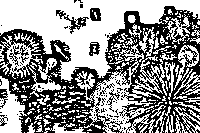

大家好呀，今天是**大年初一**在这个虎年春节吉祥的日子里若道君祝大家**春节快乐**新的一年**虎虎生威**

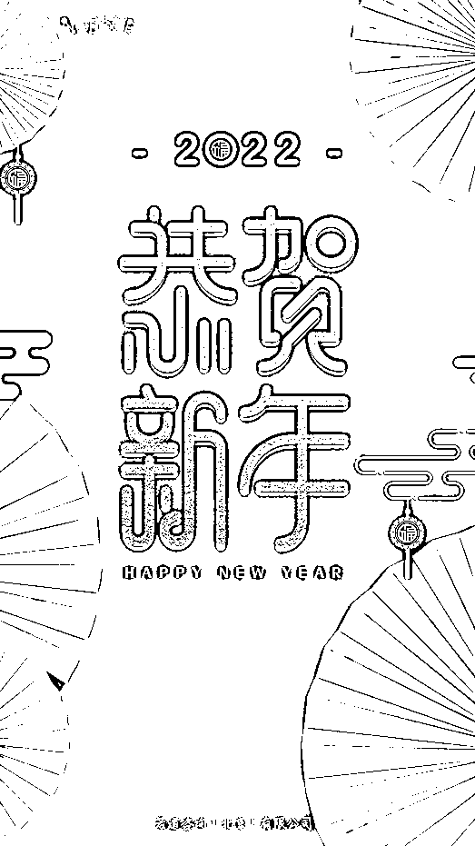

今年的**新年福签**若道君如愿以偿地抽到**“升职加薪”**

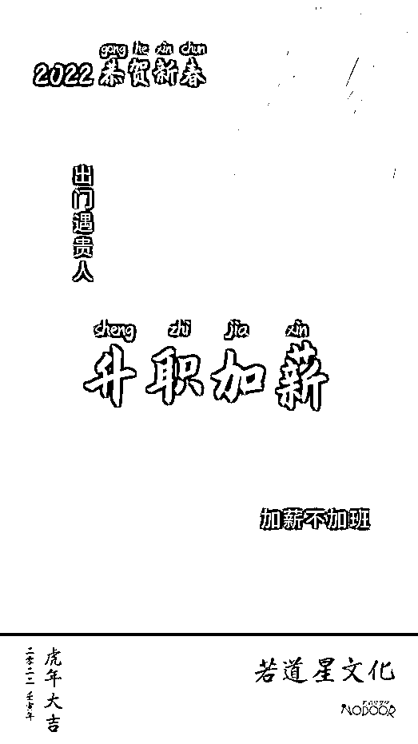

**（按捺不住心中的狂喜~~~）**

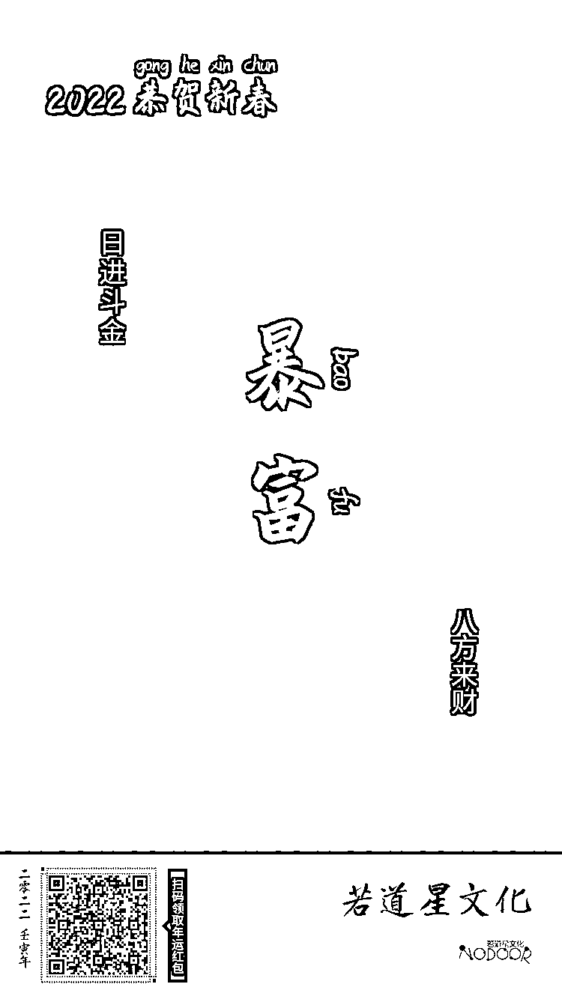

**试试看你会抽到什么****新年福签****（手机截屏试试）****G.K.切斯特顿说过****“新年的目的，****并非拥有新的一年，****而是拥有一个新的灵魂。**”希望在新的一年里你能拥有一个从里到外**全新的自我****想更深入探索内在的自我**若道君推荐可以购买一份
**大卫·瑞雷老师撰写的****《2022 年运报告》**

**更多报告内容详情和常见问题****也可以点击如下链接**[**2022 年，快来测一测你的新年关键词！（内含福利）**](http://mp.weixin.qq.com/s?__biz=MzA5NjA0NTAxNg==&mid=2651465093&idx=1&sn=ffed0dd6ae2d7c31c7eaddd006051375&chksm=8b489732bc3f1e249006de31114a228fe8bab34c4dd79957553cebee62119ceb89ebdf28de45&scene=21#wechat_redirect)

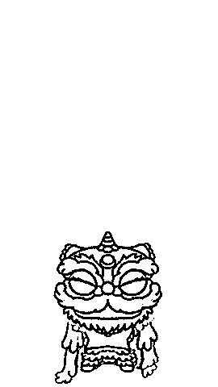

# 2 月宇宙天气丨给大家拜年了！二月份，12 星座终于可以好好歇口气

> 原文：[`mp.weixin.qq.com/s?__biz=MzA5NjA0NTAxNg==&mid=2651466857&idx=1&sn=6b09045cb0595a6e26b161e0b99a5595&chksm=8b489edebc3f17c8c9b6fdf78da78481d65dc0171ced431e78ccb8ad0f0e29c85afb44ed3cda&scene=126&sessionid=1692737862#rd`](http://mp.weixin.qq.com/s?__biz=MzA5NjA0NTAxNg==&mid=2651466857&idx=1&sn=6b09045cb0595a6e26b161e0b99a5595&chksm=8b489edebc3f17c8c9b6fdf78da78481d65dc0171ced431e78ccb8ad0f0e29c85afb44ed3cda&scene=126&sessionid=1692737862#rd)

******☆ **后台回复“今日”，给你一句生命态度****

作者/Anastasia

编辑/翀子 封面/书君 图片/网络

水瓶座新月拉开农历新年的序幕，也开启了 2022 年 2 月的旅程。今年春节虽然不是一个放松舒适的假期，但整体来看，2 月的宇宙天气能量平稳，有序向前。12 星座在这个月份有怎样的运势呢？让我们来看文章吧！

二月重点天象

*   **水瓶座新月（2 月 1 日）**

*   **水星恢复顺行（2 月 4 日）**

*   **水星进入水瓶座（2 月 15 日）**

*   **狮子座满月（2 月 17 日）**

*   **金星、火星合相在摩羯座（延续整个 2 月）**

**整体氛围**

二月就是春节假期的开始。大年初一的水瓶座新月拉开了新年的序幕。一元复始，万象更新。新月合相土星，四分天王星，同时两大守护星土星和天王星仍未完全脱离四分结构，能量非常激烈。

**这并不是一个全然放松、舒适的春节长假，暗流涌动，不可掉以轻心。**有人阖家团圆，就有人奋斗在一线。

进入二月之后，土星和天王星就开始缓慢拉开距离，影响力渐渐减弱，社会上的动荡气氛会随之缓和，直到秋季九、十月份土天四分的再次卷土重来。

水星恢复顺行后，天上再无逆行的行星。除水星和日月之外，**二月也没有其它换座的行星，整体能量平稳，有序向前。**

**另一个对整体天象有影响的是交点轴线的换座。一月下旬，交点轴线从北交双子座/南交射手座换到了北交金牛座/南交天蝎座。**

交点轴线主题与能量的平衡与整合相关。双子座/射手座轴线这一年半来，伴随着疫情的发展，人们的价值观和个人观点都呈现出极端和分裂的状态，抱团、站队，一言不合就开撕。

**观点和意识形态撕裂之后，下一步就面临资源的争抢。维护自己的舒适区，找到更多的盟友，争取更多的资源。**

我们已经感受到国家层面的动作，不管是已经开始的 RCEP，中老铁路，还是与海合组织的共同发言。我们团结一切可以团结的力量，在内循环的基础上，逐步扩张，建立外循环。打破西方国家发起的贸易战和科技封锁。

**对于个人来说，北交金牛座/南交天蝎座所落的对宫，也将经历整合和挑战。**尤其是金牛座和天蝎座，以及重要轴点和个人行星落在这两个星座的个体。可以思考、尝试突破自己的舒适圈。

**总体来说，整个二月的运势都比较缓和，起伏不大。大家可以喘口气，好好休息，整装待发。**

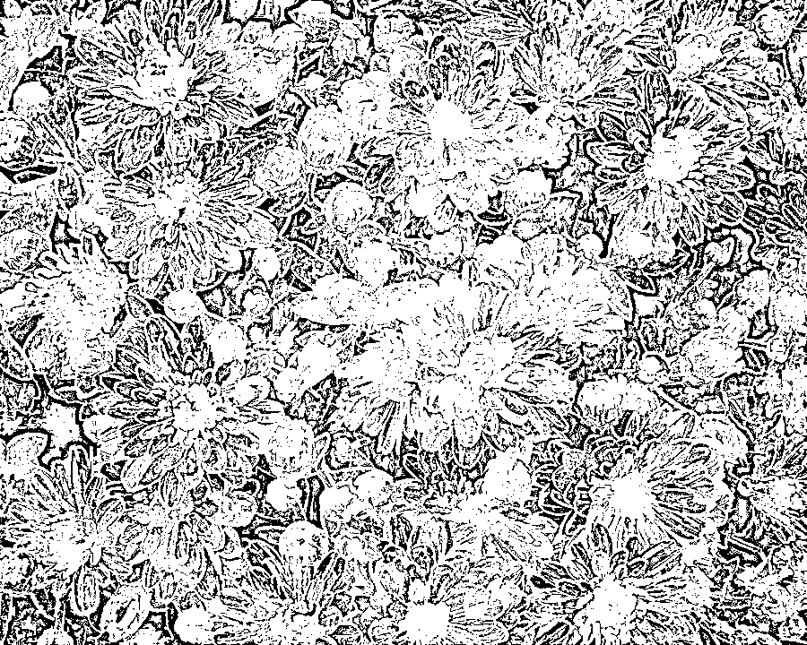

**重点天象****★****金星、火星合相摩羯座**

2 月 16 日，金星和火星精准合相在摩羯座 16 度。**几乎整个二月，金星和火星都在摩羯座结伴而行，**允许度在三度之内。

金星和火星携手，金星带来友善、柔和、讨人喜欢的一面；火星在摩羯座耀升，带来充沛和稳定的活力。**不管是人际关系还是身体健康，都处在顺畅和谐的大环境中。**特别利好摩羯座，尤其是利好二月份出生的摩羯座。

**当然也要注意金火合相带来的问题，关系中的粗鲁和冲动，消费上的大手大脚。**人际关系和购物消费都是假期中的高频事情，一定要提醒自己注意过度敏感导致的防御心态，过一个祥和、愉快的春节，避免大过节的给自己添堵。

**★****水星恢复顺行**

水星于 1 月 14 日在水瓶座 10 度开始逆行，1 月 26 日逆行回到摩羯座，将在 2 月 4 号中午 12:12 分在摩羯座 24 度恢复顺行，于 2 月 15 日凌晨 5:53 分再次进入水瓶座。

**水星恢复顺行之后，到 2 月 25 日之前，仍处于逆行后的阴影期，并不适宜加速推进任何重大的事情。**

春节假期是走亲访友活动的密集期，**固定星座（金牛座、狮子座、天蝎座、水瓶座）前三分之一时间出生和基本星座（白羊座、巨蟹座、天秤座、摩羯座）后三分之一时间出生的人群**，**是受影响最大的人群。**

不管是购物还是出行，都要考虑到水逆的影响，未雨绸缪，有备无患，多做预案。尤其需要做好应对七大姑八大姨的心理建设，在聚会聊天时注意表达方式，避免口不择言、一时冲动引发冲突和矛盾。

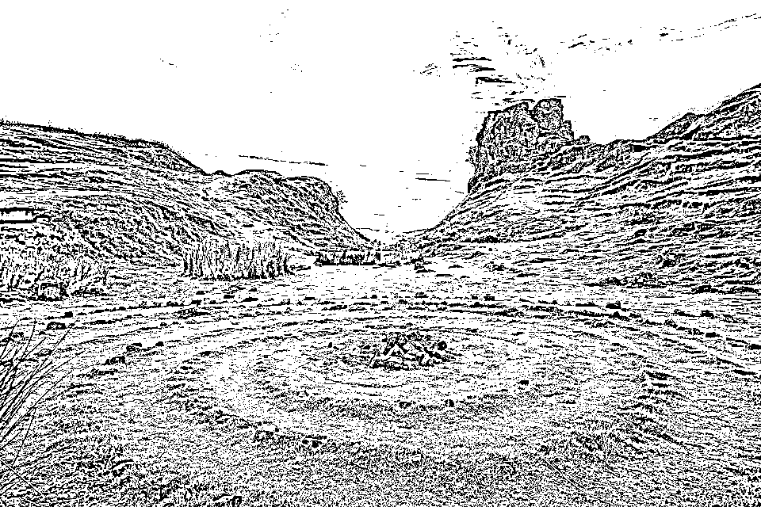

**★****水星进入水瓶座**

水星于 2 月 15 日进入水瓶座之后，还有十天左右处于水逆的后阴影期，然后逐渐恢复速度。**如果有拖延、反复的事情，节后不要着急开始推进，不妨安排在 2 月下旬之后展开，效率将大大提高。**

相较于水星在摩羯座的按部就班、不够灵活，**进入水瓶座的水星会变得真诚和开放，**能够客观地进行交流，善于汲取不同的意见和建议，对于新事物、新方法、新视角的接纳度大大提高，对于突发事件的解决办法也会有更多的灵感和创意。

**这是一年中最适合开启改革，尝试新想法的时段。**

**★****朔望周期**

2 月 1 日中午 1:45 分，在水瓶座 12 度发生新月，2 月 17 日在狮子座 28 度发生满月，这个朔望周期突出的是狮子座/水瓶座轴线的能量。

**狮子座/水瓶座轴线执着于个体与集体的关系**，如何**保持个体的独特性**，充分燃烧自己（狮子座），同时发光发热**给予所处集体最大的支持和贡献**（水瓶座），是这个新月，也是土天周期中需要去仔细思考的主题。

新月期能量集中，心流最强，适合许愿和制定月度计划。新月发生后的 48 小时之内都可以许愿，但新月开始后的 8 小时之内能量最强，一定要写下愿望。

主题可以参考水瓶座 12 度在出生图上的宫位，以及自己的实际情况，许下切实稳妥的愿望，过高估计自己和他人都是不可取的。

**12 星座二月运势**

**（参考太阳星座和上升星座）**

***白羊座***

**★** **量力而行，减少无效社交**

金星、火星合相在摩羯座，对于白羊座尤其不利。不论是财务方面，还是人际关系方面，**都要量力而为，做出取舍。**尤其是四月后出生的白羊座，最好减少无效的应酬往来，不妨将更多的精力投入到三观契合、立场一致的社交中，通过帮助同类，实现自我疗愈的目的。

**★ ****稳扎稳打，提升内在力量**

生日在 4 月 15 日之后的白羊座受到本次水逆的影响最大，再加上冥王星一整年都在摩羯座 25 度到 27 度的区间运行，更是充满内在的张力。

二月并不利于白羊座主动出击，为自己争取利益。**而是需要稳扎稳打，修炼内功，先夯实基础，再谋后续发展。**

***金牛座***

**★** **保持状态，以不变应万变**

二月，生日在 4 月 28 日到 5 月 12 日之间的金牛座受到土天四分相的影响最大，不管是天王星带来的不稳定、不可预测的突发事件，还是土星带来的现实问题，都会给保守的金牛座带来极大的心理压力和生活中的麻烦。

**所以，金牛座一定要在心态和经济上调整好自己的状态，做好心理建设，不怕麻烦，正视现实，以不变应万变。**

**★** **展示魅力，促进亲密关系**

金星、火星合相在摩羯座，将给金牛座带来旺盛的桃花运和财运，尤其是五月份出生的金牛座。**如果有想要进一步发展的亲密关系，或者是思忖良久的理财投资计划，不妨在这个时候大胆推进一下。**

但不要忘记上一条土天带来的不稳定因素，**避免盲目乐观和冒进。**

***双子座***

**★** **相信直觉，排除信息干扰**

生日在 6 月 12 日到 17 日的双子座，全年都处在海王星能量的干扰之下，很容易迷失自我，找不到前进的目标和方向。而同在双鱼座的木星会放大这些混乱。

双子座一定要**放慢速度**，不要去追求过多过杂的八卦信息和新鲜内容。**排除外界干扰，相信直觉，专注耕耘自己的内心世界。**

**★** **直面恐惧，深挖遗留问题**

二月的金火合相并不十分利好双子座，表面上看起来机会很多，实际上并不会带来多少好运，反而会造成内心的纠结和挣扎。

六月份出生的双子座一定要鼓励自己，不逃避、不退缩、不妥协，直面遇到的问题，**就事论事，坦诚相待，**反而会解决一些困扰已久的遗留问题。

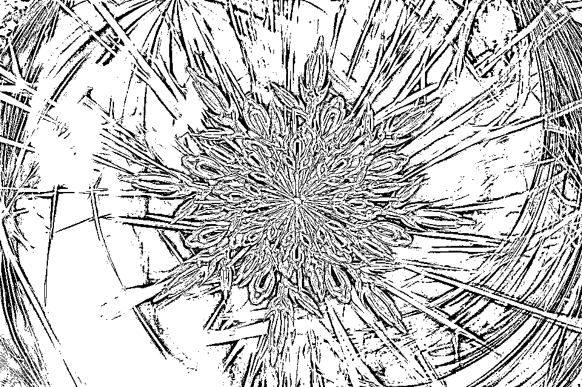

***巨蟹座***

**★** **抓住机会，提升学习能力**

二月份，木星的运行区间在双鱼座 7 度到 13 度，将会给生日在 7 月 9 日之前的巨蟹座带来一波好运。虽然凯龙星运行在白羊座，会给巨蟹座带来麻烦。木星会给巨蟹座带来信心和解决麻烦的机会。

**巨蟹座要敞开自己，提升自己的学习能力，接纳新的观点，尝试新的方法，抓住木星带来的机会。**

**★** **制定计划，平衡情感与现实**

巨蟹座是感性动物，一向喜欢情绪用事。但这个二月，一定要控制好自己的情绪。

尤其是生日在 6 月 28 日到 7 月 20 日之间的巨蟹座更多要去关注自己的人际关系，制定合适的时间计划，安排好工作和生活。**不要偏向一头，忽略另一头，匆匆忙忙反而给自己带来不必要的麻烦。**

***狮子座***

**★** **帮助他人，实现互利互惠**

二月份，生日在 8 月 7 号到 15 号的狮子座将受到土星大 Boss 的碾压，遭遇格外的现实压力。二月没有在火象星座运行的行星（忽略喜欢变脸的月亮），狮子座很难从外界找到支持性的资源，这对于张扬自我、大开大合的狮子座来说，是比较困难的一个月。

**狮子座最好把关注点放在对他人的支持上，以助人换取互惠共赢。**

**★** **控制节奏，实现身心健康**

对于狮子座，二月份是比较忙碌的一个月。社交活动增多，工作繁忙，这是狮子座非常喜欢的节奏。但今年狮子座**在人际关系方面的考验颇多**，一定要控制好节奏，不要为了面子，追求表面的人情和热闹，顾此失彼，好事变成坏事。

***处女座***

**★** **放松心态，进行调整改变**

二月份，木星运行在双鱼座的 7 度到 13 度，叠加天王星运行在金牛座的 10 度到 11 度的区间，对于生日在 8 月 31 日到 9 月 7 日的处女座来说，可以**调整好自己的心态，敞开自己，**利用木星带来的机会进行适当的调整和改变，缓解内心的焦虑和不安。

**★** **愉快玩耍，不要超越界限**

金星和火星的合相会给严肃认真的处女座带来娱乐上的好运，以及亲子关系上的愉悦。处女座不妨利用春节假期和朋友或者孩子们一起好好玩耍，小赌怡情，彻底放松，给自己放个大假。**但头脑里始终要有一根弦，提醒自己不要过于放纵而越界。**

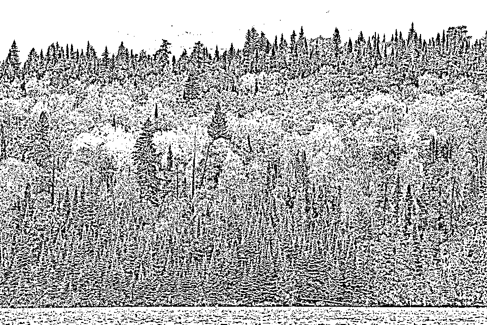

***天秤座***

**★** **保持微笑，获得正向成长**

生日在 10 月 16 日到 10 月 23 日的天秤座今年一年都不会太轻松，但二月份的时候，太阳和土星都会给天秤座足够的支持。

天秤座要**运用自己的头脑**，不管遭遇什么都保持微笑，就会得到土星带来的礼物。水星逆行会给天秤座带来一些混乱，**但只要应对得当，不但不会受其影响，反而能解决之前拖延已久的问题。**

**★** **乐于助人，关注人际关系**

对于生日在 10 月 2 日到 5 日的天秤座来说，二月份尤其要关注自己的人际关系。尤其是重要的关系，容易遭遇一些麻烦。

要提醒自己**避免急于求成**，欲速则不达。在共同目标的基础上，**帮助利益方，就是帮助自己**，不但有利于彼此关系进一步发展，还能兼顾利益，一举双得。

***天蝎座***

**★** **当机立断，获得人脉资源**

10 月 30 日到 11 月 8 日的天蝎座将在二月份得到双鱼座木星带来的好运和各种资源，身心愉悦，朋友众多，发展势头不可阻挡。木星从一月份到五月份停留在双鱼座，利好所有的水象星座。

但由于土天四分给固定星座带来的不稳定因素，天蝎座**一定要果断出手，当机立断。不要因为过于谨慎小心而错过大好的机会。**

**★** **好好学习，积累发展资源**

二月份的金火合相会让天蝎座变得非常忙碌，人来人往的交际活动增多，**这个过程中会有不少学习和提升自己的机会。**天蝎座一定要利用春节假期多和人交流，建立关系，互相学习，增长见识。为今后的发展积累资源。

***射手座***

**★** **保持冷静，避免盲目乐观**

射手座不怕困难，敢于冒险，就算遇到困难也不会受到太大的影响。海王星在 2022 年的运行区间是双鱼座 21 度到 25 度，影响最大的是生日在 13 到 18 号的射手座。同时，守护星木星进入双鱼座，虽然入庙，能量流畅，但却容易造成盲目乐观，过于膨胀。

射手座一定要提醒自己，**不要跑得太快太远，**以至于迷失了方向。

**★** **抓住机会，提升自我价值**

二月份群星聚集在摩羯座，金火合相也会给射手座带来不少机会，可能是财务上的好运，也可能是人际交往中带来的自信和自我价值的提升。

生日在 12 月 3 号到 18 号的射手座尤其会享受到这一波红利。一定要抓住时机，提高收入，**增强自己的自我价值感。**

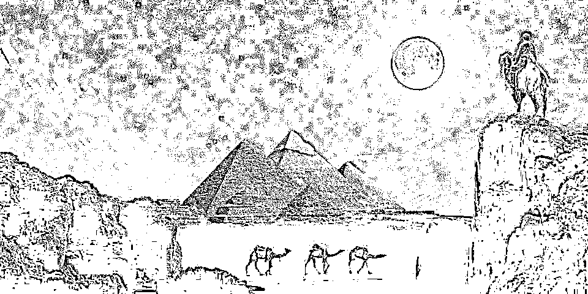

***摩羯座***

**★** **好运连连，收获努力成果**

金星和火星合相给予摩羯座很大的助力，尤其利好生日在 1 月 1 日到 16 日的摩羯座。由于冥王星的行运，摩羯座这两年可真是艰辛万分，**这个二月可以稍微放松一些。**

对于生日在 1 月 1 日到 3 日的摩羯座来说，二月份既是很好的休息机会，也是非常适宜的转化机会。**如果之前不曾放弃努力，这个阶段就会收获成长的成果。**

**★** **重新规划，提高赚钱能力**

摩羯座也是本次水逆的重灾区，容易遭遇各种状况。这个时候不要着急，**适宜根据实际情况来修订自己的发展计划和财务计划。**尤其是受到土星在水瓶座的影响，摩羯座更要留意自己的财务状况，及时发现问题。

如果有机会，**可以学习一些提升自己的实力的专业技能，**提高自己的赚钱能力。

***水瓶座***

**★** **做好决定，稳步向前发展**

二月份土星运行的区间是水瓶座 15 度到 18 度，现实的压力将迫使生日在 2 月 4 日至 2 月 10 日之间的水瓶座做出一些艰难但又至关重要的选择。这些决定对于水瓶座来说已经思考了很久，事关今后的三十年的发展方向。

**不要犹豫了，下定决心，迈出向前的一步吧。**

**★** **坚定信念，实现灵性成长**

木星进入双鱼座，金星与火星合相在摩羯座，水瓶座将在**灵性成长方面**获得很多资源，进一步提高自我认知和价值感。水瓶座会**重新构建自己的价值观**，找到提升自我的方法，变得更加自信和自重。

**水瓶座始终是时代的先锋，走在潮流的前面，如果对自己不够自信，就会缺乏足够的力量来支持自己的特立独行。**

***双鱼座***

**★** **抓住机会，实现快速发展**

由于木星的好运加持，二月份的幸运儿是生日在 2 月 25 日到 3 月 6 日之间的双鱼座。

木星十二年后再次来到了双鱼座，双鱼座今年好运连绵，尤其是上半年和年末，身体健康，工作顺利，觉得自己充满力量，如果有好的发展机会一定不要错过。幸运儿不妨在过年期间买彩票抽大奖，没准就中个奖获得好彩头。

**★****积极参与，赢得更多朋友**

金星与火星合相在摩羯座，也会给双鱼座带来不少人脉机会。双鱼座可以**多找机会参加社交活动**，不管是兴趣小组，还是志愿团队，在各种群体中双鱼座都能找到适合自己、支持自己的小伙伴，收获友谊。也可以利用这个时期，重新打造自己的社交圈。

**版权声明：**原创文章由作者授权发布于若道平台，欢迎转发，反对抄袭。友号转载请申请白名单。

**Anastasia**

职业占星师/专栏作者/策展人

于 2015 年通过 ISAR 占星能力考试

若道认证生时校正资质（2015 年获得）

**微信公众号**：KairosMoment

长按打赏

**2022 年来了****还不快领取你的****专属年运报告****？****购买有优惠，点击图片查看详情哦~**

**学习占星学****点击下图了解课程详情** 

**

********************************

**微信又双叒叕改版啦，不想错过若道君的推送？**

**就把若道设为星标吧！****▼**

**就是这个“在看”，戳戳戳 ☟**

************报名直达入口************

# 雷蒙德·梅里曼金融占星周运 | 通胀之下，中国股市走向如何？

> 原文：[`mp.weixin.qq.com/s?__biz=MzA5NjA0NTAxNg==&mid=2651466855&idx=1&sn=f5f7737764c5ee336b6bc155d3489aab&chksm=8b489ed0bc3f17c6541d71e3dc7fd2b7ab9eaa91eb60ba69edaf24524fc4f17d29d2b94c5177&scene=126&sessionid=1692737867#rd`](http://mp.weixin.qq.com/s?__biz=MzA5NjA0NTAxNg==&mid=2651466855&idx=1&sn=f5f7737764c5ee336b6bc155d3489aab&chksm=8b489ed0bc3f17c6541d71e3dc7fd2b7ab9eaa91eb60ba69edaf24524fc4f17d29d2b94c5177&scene=126&sessionid=1692737867#rd)

作者/雷蒙德·梅里曼 译者/Luke
编辑/玫瑰 图片/pexels

雷蒙德·梅里曼是在金融占星学界稳坐第一把交椅的占星师，同时他也是若道签约的金融占星课老师，我们引进了雷蒙德·梅里曼老师的《[上证指数月度报告](http://mp.weixin.qq.com/s?__biz=MzA5NjA0NTAxNg==&mid=2651466824&idx=1&sn=aea6214c57ff060024b22b11a997d150&chksm=8b489effbc3f17e9f0dd3a15bd8a7df2f005b34e31c7ae51168ce70a2d84b51e7bc7284f1519&scene=21#wechat_redirect)》及《[黄金报告](http://mp.weixin.qq.com/s?__biz=MzA5NjA0NTAxNg==&mid=2651466824&idx=1&sn=aea6214c57ff060024b22b11a997d150&chksm=8b489effbc3f17e9f0dd3a15bd8a7df2f005b34e31c7ae51168ce70a2d84b51e7bc7284f1519&scene=21#wechat_redirect)》。我们经老师的授权，将每周刊登梅里曼老师的周运，供大家参考和学习。于是，这是本周的周运（1.24-1.28）。

**说明：以下时间采用纽约证券交易所所在地美国东部标准时间。**

**展望与回顾**

****

**美国股市周五大跌，当周跌幅惨重，继续着 2022 年艰难的开端。纳斯达克综合指数周五遭到抛售最严重，使该科技股指数遭遇 2020 年来最糟糕的一周。自 2008 年以来，这是纳斯达克指数在年初 14 个交易日中最惨痛的开局。**

**——麦琪·菲茨杰拉德和皮帕·史蒂文斯****《纳斯达克指数周五下跌 2%，创下 2020 年来最糟糕一周》****2022 年 1 月 21 日**

这一点都不奇怪。毕竟，这是水星和天王星都改变运行方向的一周，同时金星也处在逆行周期的中点，都昭示着意外的发生。

正如上周专栏中评论的——

“事实是，伴随着水星逆行，月亮也在水星守护的双子座，这意味着在接下来几天甚至几周内，疯狂和诡异的交易气氛将占据主导。混乱状况的可能性，进一步被 1 月 18 日天王星结束逆行转向顺行所强调。

水星逆行已经够麻烦的了。天王星改变运行方向使情况更加不稳定，可能诱发突发的变动和出乎意料的事件。那可能是一场地震，电力中断，或计算机故障引起的混乱……”

尽管许多全球股票指数两周前创下历史新高或多年来的高点，上周整周却遭到严重打击，就好像地面都塌陷了。比特币更加不稳定。恐惧正在快速取代贪婪。在股票和加密货币投资者的心理中，危机感正在取代自满。

**当跌破支撑位（天王星和水星逆行），不确定性开始为经济的美好未来投下黑暗的阴影，非理性繁荣便让位于恐惧。****如果恐惧不迅速消退，可能很快导致歇斯底里的爆发，因为木星正在接近与海王星在双鱼座的合相。**

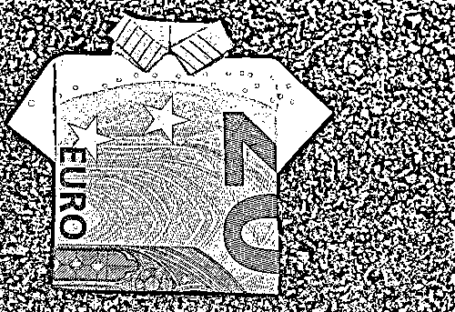

然而就像所有与木星和海王星有关的事情那样，极端的乐观或对未来的恐惧可能被过分夸大了。它不像共和党人声称的那样糟糕，也不像拜登总统宣称的那样伟大。

人们正在返回工作岗位，尽管上周申请失业救济人数确实有所上升。许多公司和银行仍在创造健康的利润，并预计未来会获得更多。但是美联储即将取消货币刺激政策，个体的股票投资组合可能在过去两周比预期下跌得更多。

比如说，纳斯达克指数，从最近的历史高点下跌 17.6%。比特币从 11 月 10 日的历史高点下跌 45.5%。

随着水星开展为期三周的逆行，许多全球股票指数跌至几个月来的最低。加上与混乱和崩塌相关的大师天王星，也在 1 月 18 日转向顺行。

在亚洲和环太平洋地区，日本的日经指数和澳大利亚 ASX 指数跌至夏天以来的最低点。上证指数也跌至两个月来的低点。在印度则没那么糟糕，NIFTY 指数只进行了修正性的下跌。在香港，恒生指数到达自 11 月 22 日以来的最高位。

在欧洲仿佛是一个平行世界。伦敦富时指数飙升至 2020 年 3 月疫情崩盘来的最高价位。但是荷兰的 AEX 指数、德国 DAX 指数和苏黎世 SMI 指数均跌向了一个月来的最低位。

仅在两周前，SMI 指数还创下了历史新高，同时 DAX 和 AEX 指数创下了相对于 11 月历史最高点的次高点。

全球市场的分裂特性也体现在美洲。美国的股票指数上周严重下跌，但是巴西的 Bovespa 指数却盘升到了新的三月高点。

所以，为什么中国香港、英国和巴西的股票市场对投资者那么有吸引力，但其他地方的股市却在下跌？我不知道。那一定与水星和金星逆行有关，但行星应该不是原因。

黄金和白银度过了很好的一周，两者都飙升到了基本周期的新高，尽管欧洲的货币在下跌。那句格言，在不确定的时候人们会涌向贵金属那样的“避风港”，可能正在起作用。

然而，正如近期专栏中提到的，我认为与 4 月木星、海王星在双鱼座合相有关的通货膨胀，才是主要原因。

上周原油再次有了明星级的表现，它与木星、海王星和双鱼座有密切的关联。它上涨到了自 2014 年 10 月以来的最高价位。在这一天象下，它还有更多上涨空间。与此同时，股票市场也有更多下跌的空间。

**短期占星趋势和长期考量**

****

**中国央行降低了基准贷款利率，以支撑因房地产市场下滑而受到拖累的经济。**

**——乔纳森·程****《中国银行下调基准利率》****《华尔街日报》**在金星逆行期间，我们期待中央银行会宣布新的政策。美联储两周前宣布，它将提前提高利率，以对抗通货膨胀。而中国则宣告了相反的做法，它在降低利率，以支撑经济。如果历史能够昭示未来，那么中国的政策应该能够支撑其股票市场，而美联储的政策显然无法支撑股票市场。两种不同的药方，来治疗两种不同的疾病。但在每种情况下，都可能导致患上对方的疾病。

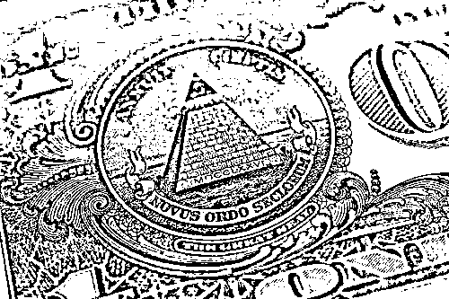

这是一个经典的两难（水星逆行）困境：当你不得不选择的时候，什么才是值得为之战斗的？说到战斗。我刚刚在欧洲的战区度过了 5 周，尤其是德国科隆和荷兰阿姆斯特丹。多么令人难忘的经历！那就像是一个战区，对抗奥米克戎变异毒株。除了我之外，我周围的每个人都感染了病毒。它传播的速度令人难以置信。我的妻子和她的女儿（她在那边生活）都感染了它，使得我们在德国科隆大部分时间都被隔离。他们的家庭成员也感染了病毒，尽管已经接种了疫苗和加强针。他们过去常常取笑我每天早上服用的维生素和补充剂（嘿！我是处女座上升！良好的健康对我很重要）。现在他们反而认为我有超能力了，因为我是唯一一个没有感染的，尽管我和他们接触的人都是一样的。为什么他们患病了，而我没有？我也接种了疫苗和加强针，原因很简单：我想要见他们，除非你接种疫苗否则不能国际旅行。此外，我认为在我的年龄感染新冠病毒肺炎（12 月 25 日时我 144 岁），比接种疫苗的后果更危险，尽管我知道许多人在接种疫苗后都有后遗症。我也认识很多在过去两年中感新型冠状病毒肺炎后去了天堂的人。这也是一个许多人不得不面对的两难处境：要么你的信念是人们有权为自己的健康做出选择，要么让自己和其他人承担感染病毒的风险。这不是一个容易做出的选择，也不是一段容易度过的时光，因为你社交和职业圈里大部分的人在这个问题上观点是分裂的，双方都声称科学站在他们那一边。但我和你分享这个经历主要出于两个原因。第一，为了告诉你我不认为疫苗能够保护我免于感染新冠病毒肺炎，因为它没有保护我的妻子和她的家庭。他们都生病了。

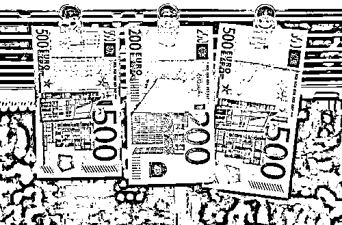

尽管我不是医生，这也不是医学建议，但我认为我的好运气仅仅是因为我摄取了维生素 C（自然之源的液体生物类黄酮）、麦特金尼斯的锌饮料、生物研究的 IAG、姜黄、牛至和其他一些保健品。第二个目的，与木星、海王星 4 月 12 日在双鱼座合相有关（它的主题已经在显化）。一方面，这一组合可能非常具有解放性，对应着从像新冠病毒肺炎疫情这样的大流行中获得自由的感觉。另一方面，它也可能表明世界人口的很大一部分患上了与这一疾病相关的症状。换句话说，我们可能看到两条轨迹：其一是疫情流行急剧褪去，另一种是急剧增长。可能这和接种了疫苗的人没遭到太多痛苦，没接种的人遭到更大痛苦有关。也可能它和接种了疫苗的人出现了后遗症，而没接种的人没事有关。当木星和海王星在双鱼座的合相持续到 5 月中旬，科学和理论之间的界限可能会加宽。海王星和双鱼座都是相当脱离现实的（幻想妄自尊大或遭到迫害）。当然，木星喜欢夸大那种幻想。擅长讲故事的人从来不吝啬使用夸张的手法。在阿姆斯特丹，这座充满了聪明、艺术和友好人群的城市，我不禁好奇地注意到，墙上的一幅涂鸦精确地描述了今日的分裂：“阴谋论只是一个理论，直到一切已经为时太晚”。

**说明：以上日期基于纽约证券交易所所在的美国东部标准时间，由于存在时差，中国地区可能需要加一天。**

**版权声明：**本文由若道翻译发布，欢迎转发，反对抄袭。友号转载请申请白名单。

**雷蒙德·梅里曼（Raymond Merriman）**

若道签约老师。著名金融占星师，ISAR（国际占星研究协会）前主席，梅里曼市场分析公司的总裁。他由于“提升了占星学的职业形象”，在 1995 年国际占星大会上被授予轩辕十四奖；在 2012 年国际占星大会上，被授予轩辕十四终身成就奖。

1“中国上证指数月度报告”发售**若道推出了****中文版****的雷蒙德·梅里曼中国上证指数月度报告，并持续发行该报告！**当把金融市场的周期和占星学的周期相结合时，雷蒙德·梅里曼老师的金融占星学研究**为投资者应对金融市场的周期波动，并随之调整投资策略提供了极大的价值参考**。
**2 月中英文报告已上线！**2“黄金价格周期月度报告”发售**若道推出****中文版****的雷蒙德·梅里曼黄金价格周期月度报告！**不仅仅为广大读者在中国股市的投资出谋划策，更将视角放眼黄金市场。**每当世界经济形式不明朗的时候，有一个地方是保值的港湾，那就是****黄金**。自 1982 年雷蒙德·梅里曼出版第一本研究《地球宇宙学征象与黄金价格的关联》的著作以来，**他一直作为最重要的黄金市场时机预测者之一享誉国际**。2022 年 2 月黄金报告已上线，梅里曼老师将会告诉你他对这个关键时期如何操作的想法。也可以按照季度和一年期订阅，有更多优惠。季度和年度的好处是，你可以持续了解梅里曼老师对于不断在变化的市场的看法。即便他某一次看法和市场不一致，你也看到在下一期他如何调整自己的看法，并看到金融占星在一个长期时间段内对你把控风险的帮助。而能够长期控制风险、尽量找到安全的投资时机才是投资的长久之计。**2 月中英文报告已上线！****购买套餐**，买得越多越优惠中国上证指数月度报告套餐价

*   **单月报告**：280 元
*   **3 个月套餐**：780 元（260 元/月）
*   **12 个月套餐价**：2400 元（200 元/月）

**长按下图识别二维码****购买金融报告****套餐****▼**

黄金周期月度报告优惠

*   **双报告年度套餐更优惠（直降 900 元）**

*   **12 个月黄金报告+12 个月上证指数报告：仅需 3900 元**

**长按下图识别二维码购买黄金报告套餐**▼

3《2022 年金融预报和沙龙》1976 年以来，由雷蒙德·A·梅里曼撰写的梅里曼市场时机学院每年一次的年度预报沙龙和每年一本的《年度预报》一直在应用占星学原理为投资者们服务，提供卓越洞见，从未间断。 **雷蒙德·梅里曼《2022 年金融预报和沙龙》发售中（报告已发布）。****长按下图了解详情**
▼

**点击阅读原文购买金融报告**

# 金星三分天王星，你打算怎样度过“惊喜一天”？（内含请假通知）

> 原文：[`mp.weixin.qq.com/s?__biz=MzA5NjA0NTAxNg==&mid=2651466825&idx=1&sn=ee8a0fcb14defb8f8a2340e7bccb83fe&chksm=8b489efebc3f17e867cf459c3fa574048726fbbf92e7e2c02e683d4423ed6b0d4d9c987c89d0&scene=126&sessionid=1692737867#rd`](http://mp.weixin.qq.com/s?__biz=MzA5NjA0NTAxNg==&mid=2651466825&idx=1&sn=ee8a0fcb14defb8f8a2340e7bccb83fe&chksm=8b489efebc3f17e867cf459c3fa574048726fbbf92e7e2c02e683d4423ed6b0d4d9c987c89d0&scene=126&sessionid=1692737867#rd)

**2022 年 1 月 23 日天象：**

*   **06:02 月亮进入天秤座**
*   ******太阳与逆行水星在水瓶座合相******
*   ******逆行金星三分天王星******

今天是周日，月亮一早来到天秤座，过个美好的周末吧！别让嘈杂烦乱的事情影响心情，让自己处在和谐优雅的氛围中~快到春节了，如果可以的话，跟朋友聚聚，或与合作伙伴把年前需要沟通的事务再聊一聊，没准有不少收获哦。水星在水瓶座逆行，今天和太阳形成合相，太适合与许久不见的老朋友们相聚啦~月亮在天秤座，或许你还想和 TA 来一场约会，而天秤座的守护星金星，与天王星形成和谐三分相，不要安排“老一套”的活动，找点新鲜乐子！如果正好要参加社交聚会，没准还能结识相谈甚欢的新朋友。还等什么，你打算如何度过这充满兴奋的一天呢？最后，若道君从明日起进入春节休假模式啦，在 2 周的假期里，会不定期掉落文章给你惊喜哦，敬请查收~在此提前祝大家新春快乐！**了解每日天象，可****下载“若道”APP 查看****还有更多精彩等着你哦**

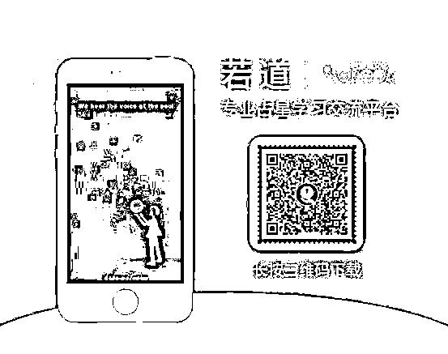

# 占星学和上证反转的关键研究 | 2 月上证指数+黄金周期报告上线！

> 原文：[`mp.weixin.qq.com/s?__biz=MzA5NjA0NTAxNg==&mid=2651466824&idx=1&sn=aea6214c57ff060024b22b11a997d150&chksm=8b489effbc3f17e9f0dd3a15bd8a7df2f005b34e31c7ae51168ce70a2d84b51e7bc7284f1519&scene=126&sessionid=1692737867#rd`](http://mp.weixin.qq.com/s?__biz=MzA5NjA0NTAxNg==&mid=2651466824&idx=1&sn=aea6214c57ff060024b22b11a997d150&chksm=8b489effbc3f17e9f0dd3a15bd8a7df2f005b34e31c7ae51168ce70a2d84b51e7bc7284f1519&scene=126&sessionid=1692737867#rd)

在 1 月份的上证报告中，雷里曼老师写道：**“我们进入下一个三星级关键反转日期 1 月 14-17 日，市场甚至可能出现更严重的下跌。这个关键反转日期包括强有力的天王星逆行（1 月 18 日），以及满月时太阳合相冥王星，水星也转向逆行（1 月 14 日），所有这些都在 1 月 14-18 日发生。”。**这个下跌就在雷里曼老师预测的这个三星反转日发生了。1 月 14 日，上证跌至 3519。

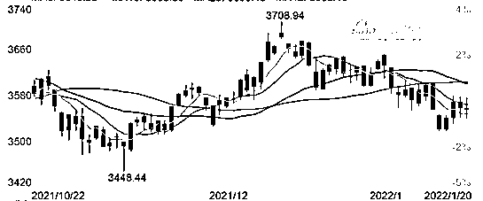

| 上证指数日 K 线图上期报告建议：“直到（2021 年）12 月初，都可以按照做多来交易。但在 12 月 11 日之后，小心观察市场触顶的迹象，因为随后将出现大幅下跌。”**本期报告中，还第一次披露了关于太阳-月亮组合星座和上证转折日的研究，这个研究涵盖了 1992 年 2 月 1 日到 2022 年 1 月 14 日，共 6801 个交易日的情况。**2022 年 2 月应该如何操作，金融占星大师雷蒙德·梅里曼的《2022 年 2 月上证指数报告》已上线，你可以听听梅里曼老师的看法。《2022 年 2 月黄金报告》也已上线，欢迎购买。

**2 月上证报告上线**

上证指数月度报告价格**单月报告**：280 元/月 **季度套餐价格**：780 元（260 元/月）**年度套餐价格**：2400 元（200 元/月）**长按下图识别二维码购买上证指数报告**
▼

“**黄金是金钱。其他的只是信贷。**

**——约翰·皮尔庞特·摩根**

”

2021 年 12 月 15 日，在贵金属市场，黄金和白银都创下重要周期低点，仅比金星逆行早了 3 个交易日。

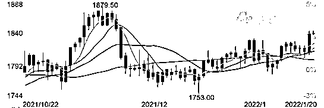

| 黄金走势日 K 线图
随后两者都大幅反弹。白银于 12 月 28 日形成高点，黄金于 2022 年 1 月 3 日形成高点，都发生在 12 月 24 日的土星-天王星四分相结束后不久。**今年最重要的一个天象是 4 月 12 日发生的木星-海王星双鱼座合相。这个合相通常会造成一种歇斯底里的气氛。**由于各国大规模的货币超发，通货膨胀已经极其明显，而在木海合相时期，很可能成为黄金看涨的助推力。同时，美联储已经宣布，将开始收紧货币政策，这将会看涨美元，从而对贵金属构成看跌压力。我们是否应该去抓住木海合相的这个周期？黄金报告已经上线，欢迎了解。也可以按照季度和 1 年期订阅，有更多优惠。季度和年度的好处是，你可以持续了解梅里曼老师对于不断在变化的市场的看法。即便他某一次看法和市场不一致，你也看到在下一期他如何调整自己的看法，并看到金融占星在一个长期时间段内对你把控风险的帮助。而能够长期控制风险、尽量找到安全的投资时机才是投资的长久之计。

点击文末阅读原文，雷蒙德·梅里曼黄金周期 2022 年 2 月报告带来有 40 年黄金市场研究经验的世界著名金融占星大师雷蒙德·梅里曼对当前黄金市场的研究。

**投资有收益，投资有风险，希望金融占星学的研究帮助你更好地评估你的投资。**

**2 月黄金报告上线**

**黄金月度报告价格****单月报告**：280 元/月 **季度套餐价格**：780 元（260 元/月）**年度套餐价格**：2400 元（200 元/月）**双报告年度套餐更优惠（直降 900 元）****12 个月黄金报告+12 个月上证指数报告：仅需 3900 元****长按下图识别二维码购买黄金报告**
▼

**购买者需知**

**① **梅里曼市场时机学院《中国上证指数月度研究报告》是梅里曼市场时机学院（以下简称 MMA）的研究“预报”，而不是市场“预测”，是梅里曼老师及 MMA 金融占星分析师对人类活动周期历史与行星周期之间相关性的研究，二者在大部分情况下具有 80%或更高的相关性，而不是因果关系。报告中的研究完全存在错误的可能性。即便是非常认真的研究和几十年的研究经验，金融占星师无法总是正确地解读出各种征象在实际层面上会如何相互作用，并显化为事件结果。

所以请将报告看作一个研究参考，务必结合其他市场研究和你个人对市场的理解，根据你的自由意志做决策。

**②** 此报告一旦售出，**即不接受退款。**

**③** 上证、黄金月度报告每月固定 1 期，**并非都是在每月相同日期发布。**

**④** **我们收到英文报告的当天，即发布该英文报告。3 天后，上线报告中文版。此报告仅支持手机网页阅读，不支持电脑阅读和下载。****以上须知，请仔细阅读。一旦付款，即视为已了解并接受所有须知内容。**在过去的 40 年中，唯有梅里曼逐渐完善，并在梅里曼市场时机学院月度周期报告中阐释了将地球宇宙学与周期相结合的研究方法，以惊人的精确性预报了黄金价格发生重大变化的时间。**黄金购买 Tip**

各大银行均可购买黄金或黄金 EFT 基金，也可以在诸如天天基金或者支付宝购买黄金及黄金相关产品。不明白的可以百度搜索。

**购买后如何查看报告？**

**购买后有疑问怎么办？**请联系技术客服
**微信：nodoor201705**

**购买黄金+上证报告直达入口**

# 金融占星学大师《2022 年金融预报》 |  你未来一年的理财手册，值得拥有

> 原文：[`mp.weixin.qq.com/s?__biz=MzA5NjA0NTAxNg==&mid=2651466824&idx=2&sn=2d33e244d106d8ae8cfb5a86e5fbb783&chksm=8b489effbc3f17e933ab731f7847f7a555cc3190dc32d407bd40b7c508a0a4c5fe2884a09cba&scene=126&sessionid=1692737867#rd`](http://mp.weixin.qq.com/s?__biz=MzA5NjA0NTAxNg==&mid=2651466824&idx=2&sn=2d33e244d106d8ae8cfb5a86e5fbb783&chksm=8b489effbc3f17e933ab731f7847f7a555cc3190dc32d407bd40b7c508a0a4c5fe2884a09cba&scene=126&sessionid=1692737867#rd)

1976 年以来，由雷蒙德·A·梅里曼撰写的梅里曼市场时机学院每年一次的年度预报沙龙和每年一本的《年度预报》一直在应用占星学原理为投资者们服务，提供卓越洞见，从未间断。

**2020 年，木星、土星和冥王星形成大合相，我们刚刚结束了一个周期和一个时代。现在我们正处于一个新时代和一个新的长期周期的早期阶段。**  

如果 2020 年我们还在手忙脚乱，不知道发生了什么；2021 年则更让我们更清楚地看到一个时代结束了——2020 年之前的时代，在新冠肺炎病毒大流行、2020 年”大合相”之前的时代，这是人类历史进程上的一个转折点。**我们所熟知的生活诸多方面在那时就结束了，现在人们仍在试图找出“正确的方式”或“最好的方式”来重建和再造世界。**2021 年，有的行业被彻底摧毁，有的行业成为新贵。2021 年对投资者是一个苦乐不均的一年。尽管美国新冠肺炎疫情未见好转，道琼斯指数仍然扶摇直上；尽管中国经济在世界经济增长中一马当先，上证指数仍然波澜不惊。在货币对标的品种中，老贵族黄金走低，新贵族比特币飞升。

我们还看到了大宗商品价格的飞涨，各种短缺开始出现。在中国，各种政府干预市场的调控在各个行业愈演愈烈。

**这种现象到底说明了什么？又预示着什么？**

2022 年我们的金融市场会受到哪些行星组合的影响呢？我们来看一看：

**·** 140 年的木星-土星合相的“风象纪元”在 2021 年刚刚拉开序幕，2022 年我们还将会看到温和主义与极端主义之间存在冲突；

**·** 土星四分天王星最后一次成相的影响：专制主义和中央政府控制与个人追求个体的权利和声音的冲突；新能源和旧能源的冲突；

**·** 天王星进入金牛座的后半段：包括美元在内的世界货币的重新估价和地位；

**·** 土星-海王星的半六分相：新冠肺炎病毒；

**·** 水星、金星和火星在 2022 年的逆行“它们对 2022 年发展和增长的影响；

**·** 木星在双鱼座（黄道最后一个星座）和白羊座（黄道第一个星座）之间来回移动：战争还是和平；谁是“第一名”的激烈竞争；

**· **木星与海王星在双鱼座合相；

**·** 冥王星在美国国家星图回归；美国的选择会对全球带来的影响；

**·** 月亮交点的换座：月亮交点周期和经济周期的对应；

**·** 木星在双鱼座期间金融市场和主要趋势的反转。

2022 年仍然是旧世界向着新世界转变的一年。

此时，金融市场的投资者和潜在投资者，都需要客观而睿智的思考，而金融占星大师雷蒙德·A·梅里曼的研究则更是无可替代的。

1976 年以来，由雷蒙德·A·梅里曼撰写的梅里曼市场时机学院每年一次的年度预报沙龙和每年一本的《年度预报》报告一直在应用占星学原理为投资者们服务，提供卓越洞见，从未间断。去年，这个 3 小时的年度预报沙龙和长达 200 页左右对金融市场的分析报告帮助许多若道的读者做出正确的投资决策，降低投资风险，并获得相当不菲的投资收益。在《2021 年金融预报》中，关于上证指数，梅里曼老师说：对于上证指数，梅里曼老师说：**“我们预计涨势将在 2020 年 12 月-2021 年 2 月之间达到波峰，然后急剧下跌至 52 周和 22 个月周期的低点，这些周期将在 2021 年 5 月之前，甚至在 3 月底之前结束。此后可能会出现另一轮反弹，可能会也可能不会在 2021 年 11 月之前形成第一个 33 个月周期的新高。”**| 上证指数 K 线图

关于黄金，梅里曼老师说：

**“黄金的 31.33 个月周期波谷将在 2021 年 9 月之前出现，理想情况是 2020 年 12 月-2021 年 6 月。价格目标是 1628+/-109 或 1768+/-76。重叠范围（理想情况）是 1692-1737。如果价格跌破这些范围，则为看涨情况中令人担忧的状况。”**

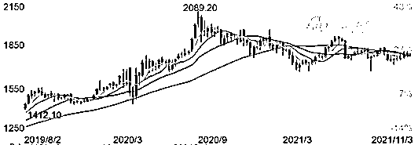| 黄金走势 K 线图

关于白银，梅里曼老师说：

**“木星和月亮交点的周期表明，白银的一个重要低点将在 2021 年出现，最有可能在 5 月 13 日之前或 7 月 28 日之后出现。这可能是 5-7 年周期的波谷，但可能会保持在 18.50 以上。收盘低于 17.00 将令人担忧。”**

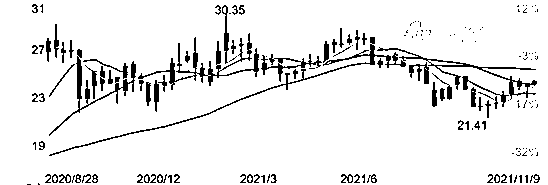

| 白银走势 K 线图

**2022 年 3 月（具体日期待定），梅里曼老师将会照样带来一场精彩的讲座，讨论 2022 年重要的宇宙天象及其对世界经济、金融形势的整体影响，还将覆盖中国上证股票市场的分析、黄金白银市场、比特币市场等投资市场。具体时间我们待确定后会通知大家。**

**2022 年度报告及沙龙预售****价格：****1380 元（报告已发布）****一份价格仅千元的顶尖金融占星大师的投资分析报告和沙龙，聪明的投资者值得拥有。****购买者重要须知**

**①** 梅里曼市场时机学院每年一次的年度预报沙龙和《年度预报》是梅里曼市场时机学院的研究“预报”，而不是市场“预测”，是梅里曼老师及其金融占星分析师对人类活动周期历史与行星周期之间相关性的研究，二者在大部分情况下具有 80%或更高的相关性，而不是因果关系。沙龙中和报告中的研究完全存在错误的可能性。即便是非常认真的研究和几十年的研究经验，我们无法总是正确地解读出各种征象在实际层面上会如何相互作用，并显化为事件结果。

所以请将次沙龙和报告看作一个研究参考，务必结合其他市场研究和你个人对市场的理解，根据你的自由意志做决策。**②** 此报告一旦售出，**即不接受退款。**

**③** 此报告仅支持在手机网页和若道 APP 上阅读，不支持电脑阅读和下载。

**④** 讲座提供视频回放。

**以上须知，请仔细阅读。一旦付款，即视为已了解并接受所有须知内容。**

**如在购买报告中遇见任何问题****可添加客服**▼

****购买报告直达入口****

# 下中天在 12 星座 | 疲惫了？那什么能让你瞬间“满血复活”？（值得收藏）

> 原文：[`mp.weixin.qq.com/s?__biz=MzA5NjA0NTAxNg==&mid=2651466793&idx=1&sn=f7cfb1abcea8c193b54b3d01c9e0643b&chksm=8b489e9ebc3f1788f432a46e06013fceac394e30ac071cbc0246df0d52d412593dde9f07eacc&scene=126&sessionid=1692737867#rd`](http://mp.weixin.qq.com/s?__biz=MzA5NjA0NTAxNg==&mid=2651466793&idx=1&sn=f7cfb1abcea8c193b54b3d01c9e0643b&chksm=8b489e9ebc3f1788f432a46e06013fceac394e30ac071cbc0246df0d52d412593dde9f07eacc&scene=126&sessionid=1692737867#rd)

******☆ ****后台回复“今日”，给你一句生命态度******

作者/布里亚娜·索西

译者/李含 校对/江艺

编辑/翀子 封面/书君 图片/网络

下中天是星图的最底端，与父母、血统、祖先、过去等议题相关，同时还指出了我们获得身心放松的最佳方式。当下中天落在 12 星座时，分别意味着有哪些休闲方式呢？成人和儿童有差异吗？又有什么值得注意？让我们来看文章吧~

**下中天的占星学概念**

**下中天 IC**是 Imum Coeli 的缩写，**有时也被称为天底**，这是一个拉丁文术语，意思是**“天空的底部”**，标志着**一个人出生时太阳在地平线下的最低点。**

不同种类的占星学强调出生图的不同方面，而下中天也是如此。**在希腊占星学中，**下中天被认为与某个特定个体的冥界有关，有时被理解为预测此人死亡的情况或主题。

**其他占星学传统将下中天与几个不同的主题相关联**，包括父母（母亲或父亲）、血统、祖先、过去、根源或童年的外部条件。

**在普拉西德分宫制（以及其他分宫制）中，下中天形成了第三宫和第四宫之间的宫头**，并且经常与我们倾向于赋予第四宫的特质相混淆。

**在整宫制中，**下中天可能会出现在第三、第四、甚至第五或第六宫中——依情况而定——事实上，这也是一些人喜欢使用普拉西德分宫制而不是整宫制的原因之一。

**下中天：让人放松的方式**

我个人对占星学的态度一直是：反复试验，看看什么是有效的。所以，当我第一次发现下中天时，我对自己感兴趣的各种可能性都进行了检验。

**我发现，对于我和我的绝大多数客户来说，下中天在占星图中首先是一个为个人提供药物的位置，特别是最能让人舒展放松和恢复活力的药物。**

以这种方式看待下中天，创造了一个我认为非常有用的即时条件，无论是在占星学内部还是外部，即认可和肯定**人们以非常不同的方式进行放松和充电。**

就我个人而言，认识到我的下中天在双子座，肯定了为什么阅读、思考、讨论想法和做手工是我喜欢的放松舒展的方式。像一个沙发土豆一样坐在电视机前看电视对我无效，但给我一本书——尤其是能让我思考的书——我就像在天堂。

**这就是我对下中天的看法——这是一个医学点，专门说明哪种类型的自我保健对我们每个人最有帮助。**

当我们使用诸如自我保健之类的术语时，很容易假设我们都指同一件事。查找有关自我保健或“放松”的图库，你就会明白我的意思：你会找到日间水疗中心、热石按摩和盐磨砂的图片。

这些事情对某些人来说可能是自我保健的好例子……但对其他人来说，一想到别人把手放在你身上给你按摩，你可能会冒冷汗。

**我们都是独一无二的，**那么为什么我们减压和放松的方式不该反映出这种独一无二呢？

**这一知识对成年人来说很重要，但我发现，对儿童以及儿童的父母和照顾者来说，了解这一点更为重要。**很多时候，特别是当我们看一个孩子的星图时，重点关注的是他们的活动：

*   **他们在这个世界上应该做什么？**

*   **什么样的能力最适合他们使用？**

*   **他们需要掌握什么知识才能在学术、社会、体育和/或艺术方面取得成功？**

我们很少会在所有的行动和兴奋中停下来问自己：是的，但是你做些什么来放松呢？**你最好的充电方式是什么？什么“药物”可以让你休息？**

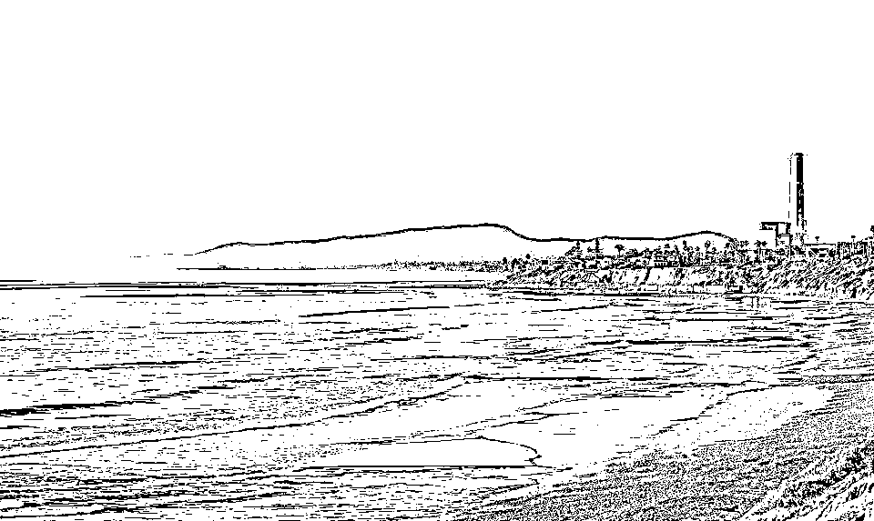

**下中天在 12 星座**

如果下中天对你来说是一个新概念，或者如果你过去没有太多关注它，那么我邀请你现在就熟悉它。还有什么比黄道十二星座更好的理解方法呢！下面列出了下中天在每个星座的工作原理，包括成人和儿童，以及在每个位置上需要注意的一些提示。

**下中天在*****白羊座***

**★成年人：**

**干劲十足的环境**让这些人感到脚踏实地和平静。**充满动作戏、鼓舞人心或军事主题**的电影和书籍可以激发他们的想象力，为他们补充能量，就像为了某一种事业或理想而参与行动主义一样。

白羊座下中天的人也会发现他们真的**很喜欢学习和实践新思想哲学和人生观**。**白羊座下中天的成人和儿童接受头部和面部按摩会特别放松。**

**★儿童：**

**白羊座下中天的孩子们发现他们最好的放松方式是运动！**这听起来可能有点矛盾，但锻炼、冒险——尤其是包含身体部件的冒险——和竞争性的努力都带来乐趣和放松，甚至对这些孩子来说是放松的源泉。

**对白羊座的孩子来说，体育运动是“放下头脑”、关注身体的好方法。**

**★注意事项：**

好东西会不会过头？在下中天的问题上，我们会，它通常表现为从感觉放松或通过某项活动充电到感觉被迫或上瘾，一次又一次地重复该活动。

在白羊座下中天的案例中，需要注意的一件事是**火星激发出无时无刻优化一切的欲望。**这是不必要的，不可能的，也不需要的，**所以一定要记住放手，不要让完美成为美好的敌人。**

**下中天在*****金牛座***

**★成年人：**

那些拥有金牛座下中天的人会发现**美食、快乐、在沙发上看 Netflix、做园艺、艺术创作会带来放松。**这些人往往是释放压力和为自己充电的专家，但他们也可能对自己所做的事情非常挑剔。

**按摩、各种各样的身体接触，以及大量的户外时间，**这些都是金牛座下中天人的基本要素。**感官体验和充足的性爱时间**也是下中天金牛座人重要的能量补充剂。

**★儿童：**

**园艺、种植室内植物、收集岩石或水晶**，从而让他们在家中布置和展示这些东西，将给下中天金牛座的孩子带来更深层次的平静和活力。**雕塑、陶艺和唱歌**也是放松和给这些小家伙充电的好活动！

**★注意事项：**

金牛座下中天的人在失去平衡的时候会变得久坐不动，过分放纵自己。**放松和休息能使我们精力充沛，但缺乏运动或活动实际上会让我们更加筋疲力尽。**对于那些星图中有此配置的人来说，要常常注意在放松和完全不活动之间进行区分。

**下中天在*****双子座***

**★成年人：**

如果你的下中天落在双子座，那么**阅读、写作、思考、学习和讨论想法**对你来说都是一种放松，**而学校可能在你眼中是一个安全的避风港！**这些人的床头柜上堆满了书，还有日记和写作笔。

**下中天双子座鼓励我们通过与他人的口头交流来充实自己**，如果我们能在这样做的同时思考一些事情或学习一些新的东西，那就更好了。

**★儿童：**

双子座下中天的孩子们**在社交环境中感到放松。**你会想要（一如既往地）考虑孩子星图中的其他关键点，以确定什么样的社会环境会让他们感到充实（例如，一个大团体与一对一的玩耍日），但与朋友在一起会让他们感到放松和充满活力。

有这种配置的人通常会发现自己**在学校很自在**，所以如果你注意到你的孩子喜欢上学，这很可能就是原因！**缝纫、编织、刺绣或演奏乐器等手工艺**也为这些儿童带来了活力。

**★注意事项：**

在他们的星图中有这个位置的人往往会觉得一直做学生十分舒服，所以他们很可能会被读了一半的书和尚未开始的课程所包围，最终导致一种**分散和缺乏纪律**的感觉。

**一次致力于一个项目并在接受新事物之前完全投入是解决这个难题的方法。**

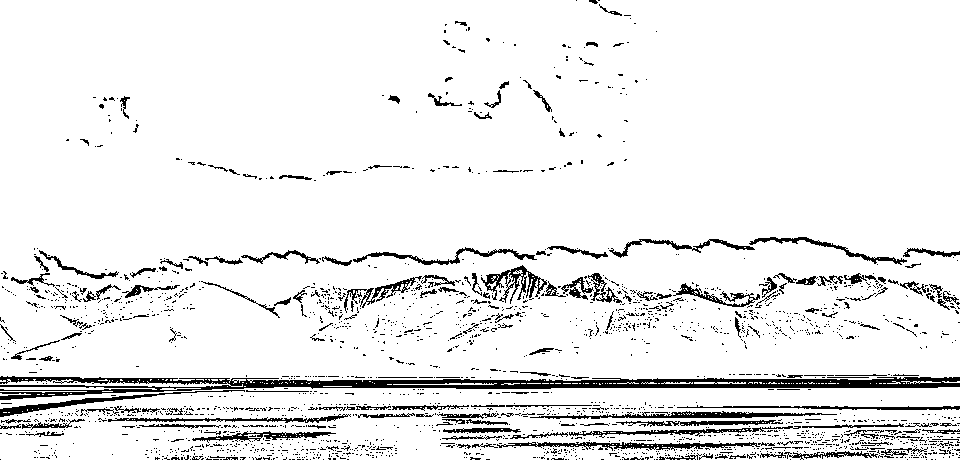

**下中天在*****巨蟹座***

**★成人：**

**下中天是巨蟹座天然守护的家园，**所以这里便是巨蟹座的故土。有这种配置的成年人发现，**灶台上的忙碌和照顾家庭**能给自己带来放松和充电。

对这些成年人来说，他们的家（尤其是卧室）是非常重要的。**烹饪**是一种很好的放松方式，就像创造新的方法来**美化家园**，让它成为一个更加遮风挡雨之所。花时间**在月光下阅读、写作或听诗歌**也是这些人渴望的一种疗愈方式。

**★儿童：**

有这样下中天的孩子**喜欢宅在家中**，他们**喜欢睡觉和休息。**他们确确实实在执行下中天的休息和减压部分。他们**喜欢低调的体验**，并且经常**喜欢在厨房里做实验**，因此确保他们能够使用厨房和厨房用品是一个好主意。

对于这些孩子来说，**阅读和背诵诗歌**是一项令人愉快的活动——也包括**谈论、思考和学习他们的梦和夜间的想象。**这些孩子对**家庭祝福等家庭仪式**也反应良好。

**★注意事项：**

如果你的下中天落在巨蟹座，你可能会注意到还有另一种，有时更危险的放松方式，那就是用尽一切方法手段让自己，你的家，你的家人，和世界更安全。

**隐私和安全是巨蟹座的重要价值观，但我们总是需要知道我们将什么锁在里面，**就像我们知道我们将什么锁在了外面。

**下中天在*****狮子座***

**★成人：**

我有时认为名人八卦杂志正是为这样配置的人制作的！了解社会名流、好莱坞明星或任何即将发生的趋势是狮子座下中天成年人的**快乐源泉**。

**制作艺术品**（越乱越好）、**尝试不同的发型**（狮子喜欢他们的鬃毛！）和**购物**也是狮子座下中天的人可以感觉放松、充电和心情舒畅的方式。狮子座下中天的人接受**心脏按摩，观看戏剧、表演和音乐会**也都会感觉很好。

**★儿童：**

**这些孩子在与其他孩子的社交、线上和线下的交往、看电影、享受个人的时尚感和奢华感中找到了放松。**用鲜艳、生动的色彩创作艺术；试着化妆；用珠宝包裹自己（因为孩子们喜欢护身法宝）；练习他们的表演技巧也是这些孩子给自己充电的方法。

**★注意事项：**

下中天落在狮子座的人喜欢购物，而且他们通常很擅长购物。然而，如果处于这种位置的个体正在经历挑战，他们**可能会尝试用购物（或表演）来摆脱困境，而不是做艰苦的工作来应对这种感觉。**

如果你有狮子座在下中天，并注意到那些曾经给你带来快乐的事情不再有效了，你可能想问问自己到底发生了什么。

**下中天在*****处女座***

**★成人：**

啊，这个处女座下中天的配置。这就是一群真正热爱工作的人——**他们的工作让他们放松**，让他们恢复活力，他们说这话的时候是认真的！处女座的人也喜欢**园艺，料理家务**，出于各种目的在各种地方建立祭坛。

这些人会**对自己的身体健康感到压力**，所以定期去看医生是让他们感到放松和安全的好方法。

**写作是一种创造性的行为，**常常为处女座下中天的人带来放松和充电。同样，拥有这种位置的人能够进入**干净整洁的空间**是非常重要的，因为凌乱的空间会让他们感到完全被耗尽。

**★儿童：**

和这一配置的成年人一样，**处女座下中天的孩子也需要干净的空间。**这些小家伙喜欢日历和计划者，而且（年轻时）口头回顾他们的每日日程安排是他们感到放松的事情，因为这让他们对即将发生的事情和期待的事情感到确定。

这些孩子通常喜欢通过**学习、写作和清洁**来放松自己。他们通常**需要一个更安静的空间**，才能感觉到真正的充电。

就像处女座下中天的成年人一样，这些小家伙经常忙于祭坛的搭建——即使他们没有意识到这是他们正在做的事情——他们一旦完成，对他们来说将是神圣的。换句话说，不要触摸！

**★注意事项：**

处女座下中天的人可能会受制于对纯洁和清洁的执着，所以一个家或者一个房间（甚至是他们自己）总是被认为不够清洁。**清洁和纯洁对处女座下中天的人来说是神圣疗愈的一部分，但是过度会走向休息和放松的反面。**

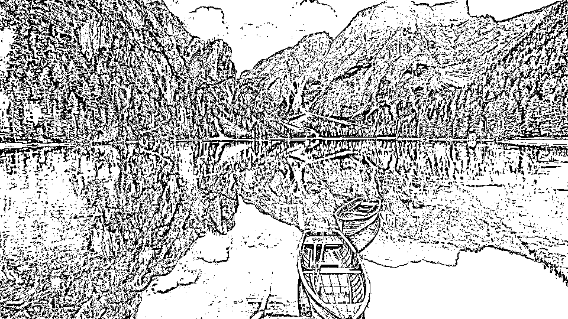

**下中天在*****天秤座***

**★成人：**

我认为这是一个温暖依偎的配置。**天秤座下中天的成年人喜欢和他们的好伙伴在一起，尤其是他们的浪漫伴侣。**他们喜欢依偎在一起，然后谈论艺术、政治或文化。这样配置的人**很容易进入一场智力辩论或争论**，并且真的发现政治讨论是有趣和活跃的。

下中天天秤座也意味着**对法律和秩序感到强烈舒适**（和偏好），并遵守规则。拥有这种配置的人会发现**社交活动和聚会让人放松**，并因为**美和文化**而获得滋养。像那些狮子座下中天的人一样，他们也可以通过购物来放松。

天秤座下中天的儿童和成人通常都对性别的流动性感到舒适，并且可能会尝试或喜欢与其他这样做的人相处。

**★儿童：**

天秤座下中天的孩子会通过与其他在智力上跟得上他们，并与他们谈论有趣话题的孩子的**社交**来获取营养。**他们在艺术博物馆或自然历史博物馆等强调美和知识的地方感到放松。**

**这些孩子通常有一个“最好的朋友”**，他们对他有强烈的偏好，当他们和那个特定的人在一起时，他们会感到最放松和滋养。随着这些孩子长大并开始约会，那个朋友通常会被另一个重要的人取代。

**★注意事项：**

**天秤座下中天的人喜欢为了争论而争论，**对于公正和公平的重要问题，他们可以保持一定的理性距离，而不参与其中。他们可能会开始激情的讨论，作为一种缓解紧张的方式，然后当他们的争吵对象对交流感到愤怒或不安时，他们会感到困惑。

那些天秤座下中天的人需要记住，**激烈的讨论并不是对所有人来说都是安慰剂。**

**下中天在*****天蝎座***

**★成人：**

**魔法、仪式和神圣艺术**都是这种配置的成年人感到自在的领域。**所有情色的、充满诱惑的和强大的东西**都能带给这些人滋养。他们**通过调查、阅读真实的犯罪小说**（或观察类似的节目）、**投资**（分配资源）以及**深入研究心理学和准心理学**来减压。

他们经常待在家里，**特别喜欢死亡、濒死、性、魔法和宗教等主题**，所以他们觉得这些主题领域为他们补充了能量。通常，**他们在黑暗中也会有补充能量的感觉，**并且会受到人工照明的影响。

**★儿童：**

**参加教堂、庙宇、清真寺或其他宗教中心的活动**对天蝎座的孩子来说是一种滋养的经历。这些小家伙**喜欢调查和学习奥秘**（而且通常很善于保守秘密）；他们被**超自然故事**所吸引，经常对**魔法和神秘之事**感兴趣。这种落点的儿童**在安静和黑暗的环境中最容易放松。**

**★注意事项：**

专注于特定的人/情况是天蝎座能量的来源，因此那些有这样配置的人**需要以一种温和的方式坚强地面对生活**，特别是避免专注于为真实（或想象）的错误复仇。

**下中天在*****射手座***

**★成人：**

当下中天在射手座时，**四处旅行是放松的关键**。那些有这种配置的人认识到，**发现新的地方、新的思想、新的文化、新的人和新的生活方式**是最令人感到慰藉和充实的活动。

如果无法旅行（看看你的 2020 年），那么**离家一日游和大量的户外时间**也可以达到目的。这些人在**学院、大学、非营利性机构或宗教机构**也常常感到很自在，可以轻松地从事教学或学习。

**★儿童：**

有这种配置的孩子**喜欢探索和学习新的地方和事物**，就像这一类成年人一样。他们通常**喜欢骑马或射箭**，可能对其中一种（或两者）的课程感兴趣，以此作为放松的方式。

这些小家伙**喜欢灵性和神话**，所以花一个下午的时间学习这些主题，然后延续到了夜晚，**让他们将自己知道的教给自己的父母或朋友，**这是他们补充知识的理想方式。另一种让他们放松的活动是**听故事**。

**★注意事项：**

在热闹、旅行和探索中找寻放松的人可能很容易变得心有余而力不足。当这种情况发生在射手座下中天的人身上时，**他们往往会抛弃我们所有人都有的内在过滤器，而且他们的言语可能会特别生硬和痛苦。**

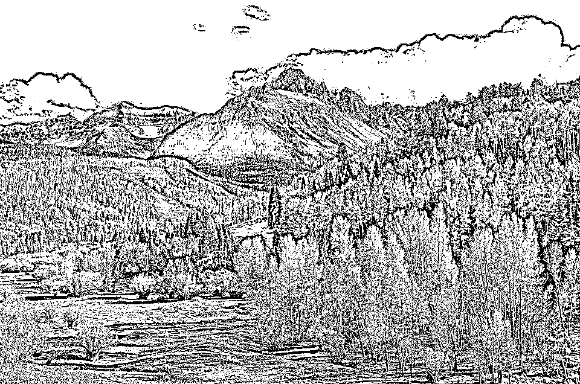

**下中天在*****摩羯座***

**★成人：**

当下中天在摩羯座时，会有一种和处女座下中天相似的氛围——这些人喜欢工作，实际上这会让他们放松。但对于摩羯座来说更为具体：**这些人热爱工作和生活中的竞争。**

**竞争和成为最优秀的人是他们找到安逸和享受的方式。**他们赞成无止境的竞争的想法。

摩羯座下中天意味着这些人**在承担困难任务并通过意志和纪律控制任务时最为舒适。**他们为困难和不舒服的东西腾出空间，因为这些东西补充了他们的灵魂。摩羯座下中天的人也经常发现**高山和高海拔**能抚慰和激励他们。

**★儿童：**

摩羯座下中天的孩子**最喜欢“扮演成年人”**。当这些孩子假装要去工作、结婚或买车时，他们会感到精神振奋和放松。

**扮演老板**可以让他们应对压力，恢复活力。他们也欣赏和**喜爱奖牌和奖杯**等闪闪发光的物品，培养技能，**着眼于外部的成功和胜利是他们的“良药”**。

这些小家伙**也需要经常待在户外**，像他们的成年同伴一样，**经常在山区**能让他们茁壮成长。

**★注意事项：**

我注意到，摩羯座下中天的人面临一个独特的挑战。**这些人认为放松的事情，在很多情况下，与关于放松和释放压力的传统智慧背道而驰。**所以，看到摩羯座下中天的人试图享受一天的假期，却遭遇了悲惨的失败和压力，这并不罕见。

**挺身而进正是这种配置的人放松的方式**；要了解这一点，并在这一知识上站稳脚跟。

**下中天在*****水瓶座***

**★成人：**

有这种配置的成年人发现，**他们可以在团体和社区中放松**，**在音乐嘈杂的场所**，**不同的艺术现场**，或者通过阅读**科幻小说**来放松。

这些人很容易让别人感到不舒服，他们经常站在游行队伍和纠察队的最前线，因为**以社会正义为名的行动主义让他们感到精神振奋。**

对于有这种配置的人来说，**科技也是良药的来源**，他们经常站在科技世界的最前沿，并且乐于连续几个小时摆弄各种各样的小玩意儿。

**★儿童：**

下中天水瓶座的孩子们发现**他们在群体中很自在**——**而且不同的人越多越好。**这些小家伙喜欢阅读，尤其是那些带有**幻想或科幻元素**的故事。他们通常也是有天赋的作家，**写作**可能是他们处理感情和想法的一种方式。

找到某个理由**叛逆**一下会让这些孩子感到舒服；他们通常在**噪音和摇滚或朋克音乐**中找到良药，对**另类文化**和**未来主义**感兴趣，并从中得到安慰。

**★注意事项：**

**对群体和社区的天然亲和力可以把水瓶座下中天的儿童和成人带到一些有趣的地方。**这一点，再加上该星座是固定星座，可能会导致有这样配置的人在群体中停留的时间比他们需要的时间更长，或者拒绝看到群体中出现的问题。

**客观性和出现一个能指出任何问题的好朋友或家人会对这种情况有帮助。**

**下中天在*****双鱼座***

**★成人：**

双鱼座下中天的成年人会**在艺术中找到放松**。演奏乐器、跳舞或从事视觉艺术可以抚慰这些人的灵魂。**参加定期的宗教或精神服务**也是这样配置的人良药的来源。

关心他们的**梦**，发展他们的**心灵能力**，参加沐浴仪式，以及**在水周围活动**都可以促进减少压力和焦虑。

**★儿童：**

这种配置的孩子们**喜欢把自己沉浸在虚构的世界中**，**“假想扮演”**是他们能做的最享受的放松和舒展的事情之一。

就像这个配置的成年人一样，这些小家伙**喜欢演奏乐器，跳舞，或者从事其他创造性和视觉艺术。**他们喜欢讲故事，也喜欢听别人讲故事给他们听。

**★注意事项：**

双鱼座下中天的人可能成为优秀的**逃避艺术家**，尽最大努力远离一切不容易、不舒服或强迫性的事情。他们可以当场辞掉工作，在没有正式分手的情况下离开关系，甚至可以在飞行旅途中顺便定居他乡。

**然而，超脱和不依附是两件不同的事情，有这种配置的人应该时刻区分二者。**

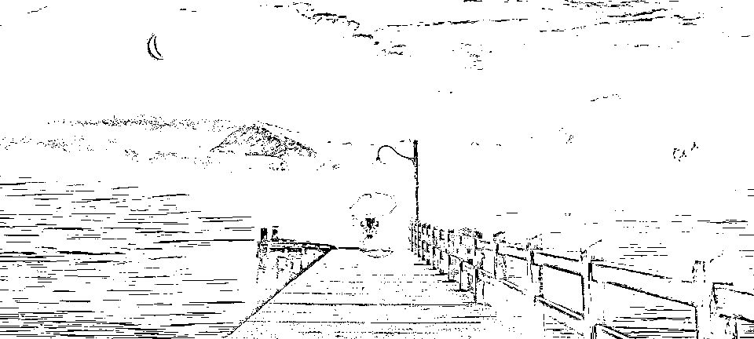

**结语**

总之，我希望你们所有人，无论大人还是孩子，都能了解你的出生星图的根，这是甜蜜的良药与补品的源泉——不可思议的下中天。

**版权声明：**本文由若道翻译发布，欢迎转发，反对抄袭。友号转载请申请白名单。

**布里亚纳·索西**

是一名老师、咨询师、讲故事的人，也是神圣艺术学院的创始人。她是《创造魔法：将日常与非凡交织在一起》和《星星与孩童：占星学快乐育儿》的作者。

**2022 年来了****还不快领取你的****专属年运报告****？****购买有优惠，点击图片查看详情哦~**

**学习占星学****点击下图了解课程详情** 

**

****************

**微信又双叒叕改版啦，不想错过若道君的推送？**

**就把若道设为星标吧！**

**▼**

**喜欢记得点一下在看哦☟**

********报名直达入口********

# ISAR 选修课 | 医疗占星学：透过占星的大门，一窥身体与疾病的真相

> 原文：[`mp.weixin.qq.com/s?__biz=MzA5NjA0NTAxNg==&mid=2651466793&idx=2&sn=e94a95a955b7adf0bb1e76b7bd317edf&chksm=8b489e9ebc3f17889ab98e8b79f04bf9094df91ef06d770ea0302a13a6303b9a622068590cef&scene=126&sessionid=1692737867#rd`](http://mp.weixin.qq.com/s?__biz=MzA5NjA0NTAxNg==&mid=2651466793&idx=2&sn=e94a95a955b7adf0bb1e76b7bd317edf&chksm=8b489e9ebc3f17889ab98e8b79f04bf9094df91ef06d770ea0302a13a6303b9a622068590cef&scene=126&sessionid=1692737867#rd)

1

**占星学与疾病之间存在联系**

****

**没有占星学知识的医生不能自称为医生。**

**　　——现代医学之父希波克拉底**

占星学与疾病有什么联系呢？**世界著名的医疗占星师简·帕特里克**说：**“占星学可以精准定位需要解决的潜在问题。”**尽管有人想当然地认为占星学是令人沮丧的宿命论，但事实并非如此：

**有四个主要因素影响着我们的生活和健康：基因构成、物质环境、情绪环境，以及我们的占星配置。我们在星图中都存在患病的可能性，而预防的方法在于尽可能充分、真实和健康地生活。****——简·帕特里克**根据简·帕特里克的说法，**每个星座都有广泛的可能性**。例如，那些双鱼座的人有潜力去扮演殉道者（以他人为先）的角色，但是他们也有能力成为伟大的治疗师。

那么医疗占星咨询涉及哪些内容呢？简·帕特里克有这样的步骤：

**· **首先，会请客户提供详细的病历，以及他们出生的日期、时间和地点；

**·** 然后，绘制他们的星图，观察在他们的病情确诊之前，在占星层面和情感层面上发生过什么。

根据简·帕特里克的说法，**癌症的主要病因之一，除了有害的生活方式之外，就是未解决的情绪冲突**：她通常会在症状出现前的 18 个月至 2 年间寻找触发因素。

她曾这样说：“当我为癌症患者服务时，我的任务之一就是识别出他们生活中的‘恶性肿瘤’，并帮助患者将其消除。”

**医疗占星师还可能帮助你确定做手术的最佳时间，或是指出你每个行星位置的优缺点**：比如，阵容强大的星群落入双鱼座可能与过敏有关，而巨蟹座人则可能发觉自己泡完热水澡后会疲惫不堪。**固定星座（金牛座、狮子座、天蝎座和水瓶座）在情感和生理上都倾向于“难以放手”，这可能为恶性肿瘤的生长创造环境。所以说，他们可能倾向于沉浸在过去的伤害中，难以自拔。另一方面，这些星座也擅长在艰难的时期坚持不懈并一直持之以恒。**

　**　——简·帕特里克**

“癌症人格”中比较突出的一点通常是难以表达情绪，而且你可以从星图中看出这一点。

**客户星图中突显的土星可能表明害怕表达自己的需求，或者害怕展现真实的自己。**

**——简·帕特里克**

发现癌症的身体部位也可能给出有关根本病因的线索。

简·帕特里克曾表示：“例如，卵巢与孩童、创造力、家庭有关。所以说，如果某人患有卵巢癌，那么问题可能在于此人无法表达自己的创造力，或是无法做到滋养和关怀。”

有趣的是，母亲的癌症恰好发生在自己的孩子开始离开巢穴时。

医疗占星师可能也会查看金星在客户星图中的位置。

**金星代表使我们快乐的东西，因此如果金星得不到满足，我们就不会快乐——而不满是滋生疾病的温床。**

**——简·帕特里克**

如果金星落入双子座（前文中母亲的案例），这表明你渴望趣味、变化、沟通、心智刺激和灵性工作。在患癌之前，这位母亲就觉得自己的生活缺乏快乐和意义。理解她的灵魂渴求转变——更多的旅行、更多的学习、更多的乐趣，这可以帮助和支持到这位母亲。**简·里德·帕特里克老师说：“星图中的每个因素都为我们提供了广泛的可能性。所以说，重要的不是我们的遭遇，而是我们如何回应这些遭遇。”**

2

**医疗占星包含哪些内容？**

本课程既适合医疗占星学的初学者，也适合已经有一些相关经验的人。
简·里德·帕特里克老师将运用现实生活中的例子，揭示一个人的性格、症状及其星图是如何相互映照的。课程也会探讨疾病的意义以及可能的治疗方法。本课程旨在为学员提供一个运用医疗占星学的框架和方法，学员将会学到一些有价值的实用工具，在课程结束后，自己使用这些工具研究其中的关联性。**此课程可作为 ISAR 选修课。**

3

**课程安排**

**课程时间：2022 年 3 月 8 日-4 月 26 日  每周二 20:00-22:00**

**第*****1*****讲  3 月 8 日 与占星学、心理学、病症一起工作，学习**

*   医疗占星学的组成部分以及如何使用它们

*   行星的作用与相互作用

*   黄道星座人

*   宫位的重要性

*   疾病和健康是如何产生的

**★ 第二、三、四讲的课程内容基于星座以及它们之间的相互作用。**

**第*****2*****讲  3 月 15 日 基本星座**

学习基本大十字星座——**白羊座、巨蟹座、天秤座和摩羯座**——及其功能和相关的健康问题。**这些星座与防御、养育、结构、体内平衡和荷尔蒙控制有关。**

****第*****3*****讲  3 月 22 日 固定星座****

学习固定大十字星座——**金牛座、狮子座、天蝎座和水瓶座**——及其功能和相关的健康问题。**这些星座与习惯和反射、心脏调节、生存、循环和协调有关。**

“固定星座（金牛座、狮子座、天蝎座和水瓶座）在情感和生理上都倾向于**‘难以放手’**，这可能为恶性肿瘤的生长创造环境。所以说，他们可能倾向于沉浸在过去的伤害中，难以自拔。另一方面，这些星座也擅长在艰难的时期坚持不懈并一直**持之以恒**。”

——简·里德·帕特里克（Jane Ridder-Patrick）博士

**第*****4*****讲  3 月 29 日 变动星座**

学习变动大十字星座——**双子座、处女座、射手座和双鱼座**及其功能和相关健康问题。**这些星座与呼吸、神经系统、肠道、睡眠以及信息、情感和行动的整合有关。**

**★ 第五、六、七、八讲重点学习行星，它们在身体层面的表达、它们的相位与行进。**

**第*****5*****讲  4 月 5 日 太阳与月亮**

**太阳**掌管视觉、活力、心脏和意识，与心脏、脊柱和视觉问题相关。

**月亮**掌管人体的周期，特别是月经周期、饮食模式和体液，与情绪引起的疾病、饮食失调和胃病相关。

**第*****6*****讲  4 月 12 日 土星与天王星**

**土星**掌管着皮肤、骨骼、牙齿和衰老过程。它对应的疾病包括慢性疾病、耳聋、帕金森病、关节僵硬和牙齿问题。

**天王星**代表身体活动的协调，有节奏的脉动和身体的“电”。与天王星相关的疾病包括癫痫、痉挛、心律失常，以及阿斯伯格综合症和自闭症样综合症。

**第*****7*****讲  4 月 19 日 海王星与冥王星**

**海王星**掌管松果体、细胞膜渗透和右脑功能，与过敏、上瘾的病症、慢性疲劳综合症和睡眠障碍相关。

**冥王星**掌管消除和转化，其病理包括毒性、脓肿、癌症和强迫症。

**第*****8*****讲  4 月 26 日 火星**

**火星是与能量和防御相关的行星**，掌管免疫系统、肾上腺功能、肌肉活动和炎症反应。**它是许多身体和情绪障碍的核心**，如自动免疫障碍、抑郁和发烧，以及由手术或需要手术引发的问题。

4

**此次课程适合哪些人？**

*   有一定占星学基础，若道核心课 L3 以上水平；

*   希望成为优秀的占星师，想要借鉴国际大师医疗占星解读思路并融入自己的体系的人；

*   热爱占星学、健康、养生的研究型占星学者；

*   计划考取 ISAR 认证占星师，寻觅中意选修课的学员；

*   走在自我探索和个人成长道路上的人。

**快来和简·里德·帕特里克老师学习升级版的占星学身体地图吧！**

5

**授课老师**

**简·里德·帕特里克 **博士****

（Jane Ridder-Patrick）

简接受过药剂师、理疗师、草药师、心理治疗师和历史学的专业学习，从事写作、咨询和讲学工作，在英国和全球教授占星学及其历史、当今的心理学和医学应用。她在爱丁堡执业，在爱丁堡大学获得博士学位，研究方向是 17 世纪苏格兰占星学历史。

**她最著名的出版物是《医疗占星手册》。2018 年，她因对医疗占星学的贡献而获得了著名的查尔斯·哈维占星学杰出服务奖。**

《医学占星术手册》（第二版，修订版和扩充版）

(爱丁堡，克拉布出版社，2006 年)

6

**课程价格**

*   **课程价格：****6800 元**

*   **早鸟价：5800 元（截止日期：2022 年 2 月 9 日）**

*   **课程咨询：**王老师（微信：18510107057，请备注“医疗占星”）

长按二维码添加王老师

7

**课程安排**

*   **课程时间：**2022 年 3 月 28 日开始，每周二晚上 8 点，每周一次，共 8 次课。

*   **授课方式：**线上直播，英文授课，中文翻译

8

**退转课程**

*   **退款原则请详看《教学协议》，如有疑问请咨询课程顾问。**

****医疗占星****

**授课老师：**简·里德·帕特里克

**授课时间：**2022 年 3 月 28 日起

**授课方式：**网络课程**，**英文授课，中文翻译

**费用：****6800 元****（早鸟价：5800 元，2022 年 2 月 9 日截止）**

**课程负责人：****王老师**（微信：18510107057，请备注“医疗占星”）

长按二维码添加课程负责人咨询~

****报名请点击“阅读原文”****

# 太阳进入水瓶座 | 他们可以友好又冷漠，这是水瓶座的关键词

> 原文：[`mp.weixin.qq.com/s?__biz=MzA5NjA0NTAxNg==&mid=2651466663&idx=1&sn=abf011a23578ac02656332b94bf1e5b4&chksm=8b489910bc3f10065e972fe8734da55cf04a4c8ef9b38575448d87d3eae544c2d10f7382652a&scene=126&sessionid=1692737867#rd`](http://mp.weixin.qq.com/s?__biz=MzA5NjA0NTAxNg==&mid=2651466663&idx=1&sn=abf011a23578ac02656332b94bf1e5b4&chksm=8b489910bc3f10065e972fe8734da55cf04a4c8ef9b38575448d87d3eae544c2d10f7382652a&scene=126&sessionid=1692737867#rd)

******************************☆ **************后台****************************回复“今日”，给你一句生命态度****************

作者/达娜·格哈特 译者/李含
 校对/江艺 编辑/玫瑰
封面/书君 图片/pexels

2022 年 1 月 20 日，太阳进入水瓶座。水瓶座很受欢迎，他们既热情又可爱，但在某个时刻，他们的温暖却又是不稳定的。这个星座给人一种忽冷忽热、忽远忽近感觉。真实的他们究竟是什么模样？

**局外人的解决之道****水瓶座与来自更高力量的馈赠有很久远的联系。**古埃及人注意到，尼罗河总是在水瓶座在日落时升起的几个星期里泛滥。他们相信奥西里斯当时正在和伊希斯做爱，这是诸神让尘世生命受孕的方式。希腊人讲述了另一个故事，但同样也认为这个星座具有让生命脱胎换骨之力量。水瓶座侍者是一个英俊的年轻人，名叫盖尼米德，宙斯招募他来为众神提供源源不断的美食。如今，我们更倾向于认为水瓶座的波浪线象形符号中是无线电波或电。这个星座更新生命的水让位于了它风象星座的身份。**水瓶座现在是灵感的闪电，让人类，至少暂时像神一样去观察，去思考。**

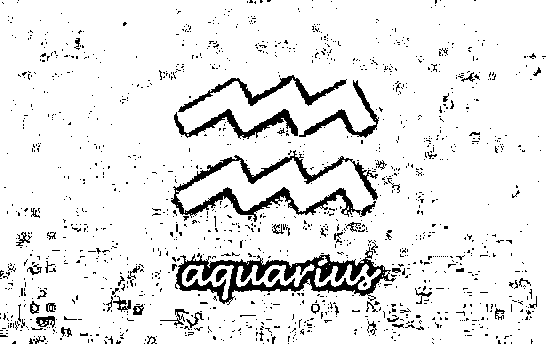

|  水瓶座的符号

**自从天王星被发现并被指定为水瓶座的现代守护星（土星是它的传统守护星）以来，这个星座逐渐与发明、创新和技术联系在一起。**没有水瓶座的创新者，我们的世界将会多么贫穷！

将托马斯·爱迪生从我们人类历史中拔除，数以千计的现代便利设施将会消失；如果富兰克林·罗斯福没有当选美国总统，那些重大的社会项目便会流产。

很可能是水瓶座太阳或月亮的人最先提出：“也许西红柿是无毒的”或“用皮革包住脚可以使走路更容易”。水瓶座的人在那么多地方、那么多时代中从根本上改变了自己所生活的社区，与小镇上的弃儿成为朋友，大声疾呼反对不平等，或仅是挑战常规的行为方式？

|  绘画中的普罗米修斯

**水瓶座是具有人道主义前瞻性思维的星座，这让它两个守护星的神话令人费解。**土星和天王星（克罗诺斯和乌拉诺斯）都是古板的天空之神，他们吃了自己的孩子来维持现状，阻碍一切改变的机会。

这可不是水瓶座！原型占星学家理查德·塔纳斯的主张令人信服，他认为至少天王星的命名有误。这颗行星应该被称为“普罗米修斯”，以这位狡猾的泰坦神命名，他用粘土创造了人类，然后为我们偷走了众神的火种，给人类带来了生命、文化和科学。

**普罗米修斯确实是一个更能呼吁水瓶座灵感的神——独立的思想，叛逆的行为，最重要的是，具有不断把我们的世界变得更好的热情。**

想要把普罗米修斯精神带入你的水瓶座宫位和众行星，请遵循赫拉克勒斯在奥革阿斯牛圈的范式——**以局外人的身份参与进来**。调查周围领土，解决问题，愿意看到新鲜事物。一旦受到灵感启发，就满怀信心地将水引来冲洗牛圈，以前所未有的方法清理陈旧腐朽的污秽。**水瓶座在解决我们今天所面临的巨大问题方面提供了一种特别好的思路**。的确，在上个世纪初，城市被马粪淹没时，只有新思想和新技术才能“拯救世界”，因为汽车取代了城市街道上的马匹。如今的街道和机构被一种更加隐蔽的粪便淹没。贫困无处不在，对生态保护的无知，贪婪的企业让污水横流。我们的星球处于众多灾难的边缘，唯一的喜讯是我们正在进入水瓶时代。愿它给我们陷入困境的世界带来所需要的伟大的普罗米修斯式的飞跃！

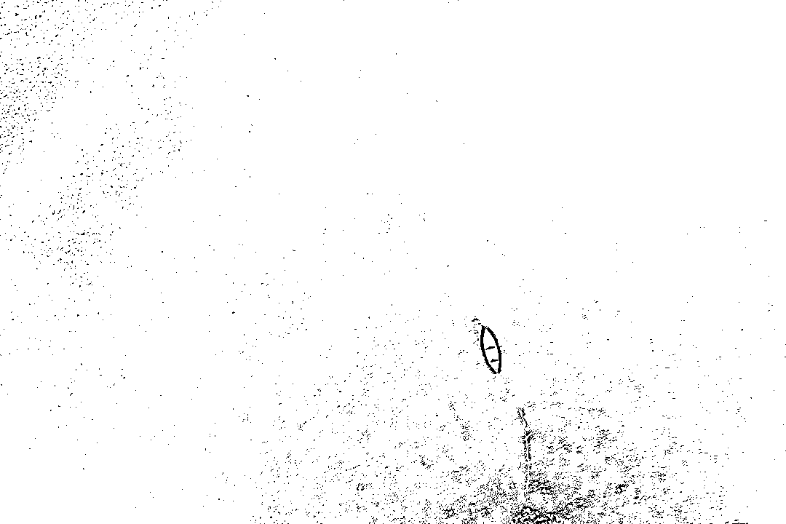

**情冷情热**

水瓶座是黄道中最可爱的星座之一。如果你走进一个满是陌生人的房间，感到尴尬和害羞，水瓶座的人很可能会打破等级秩序欢迎你，结识新朋友就像老友再见般高兴。

**这个星座有一种真诚的好奇和谦逊的态度。**难怪水瓶座人似乎认识房间里的每个人。当他们的目光转向你时，你会突然感到非常有趣。想想水瓶座脱口秀主持人奥普拉·温弗瑞，她与嘉宾和观众的融洽关系让数百万观众视她为一位老友。

然而，尽管水瓶座很受欢迎，但在某个时刻，你会发现它的温暖是不稳定的。在没有警告的情况下，它的善意可能会消失。你走近你的水瓶座朋友，她的眼睛直视着你，没有回以微笑。这与她之前的行为形成了鲜明的对比，这让痛苦加剧。你做错了什么或者说错了什么吗？令人害怕的是，你会想起有时用来描述水瓶座人的话：“**他们热爱人类，他们只是无法忍受人**。”**这个友好的星座有许多矛盾之处，其中之一就是它看起来是多么的不友好。**

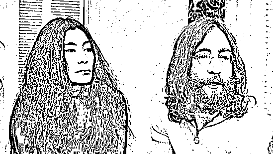

|  小野洋子和列侬

**水瓶座的人既生动有趣又冷酷无情。**小野洋子就是一个被误解的水瓶座案例。

想象一下她十二岁的时候，和她的母亲和两个弟弟妹妹蹲在东京的一个防空洞里，无数的美国 B29 轰炸机对日本城市实施了二战时最大规模的空袭，投掷的大量炮弹造成了毁灭性打击。8.3 万人死亡。

洋子和她的家人徒步逃离了燃烧的瓦砾，在数周的时间里，他们在乡下寻找食物。

洋子是一个古怪的艺术家（有些人认为她很糟糕，有些人认为她才华横溢），但她却将自己的一生献给了促进世界和平的事业。尽管如此，她最为人所知的身份还是导致披头士乐队解散的“邪恶女人”，业内人士称这一指控有失公允。甚至保罗·麦卡特尼也曾表示：“之前我觉得她是个冷酷的女人。我现在认为这是错误的。恰恰相反，我认为她只是比大多数人更坚定地做自己。”我们不会在占星解读中对水瓶座的人说“你麻木、冷漠”，但我们会对其他人这样描述他们。多年来，我一直训练自己不要把他们的冷淡当成是针对我个人的。当我的水瓶座朋友看起来很冷漠疏离的时候，我发现他们通常对自己给人的印象一无所知。尽管这个星座可以很有社交头脑，但它也可能是社交迟钝的。**也许“无辜”是一个比“冷漠”更适合的词**，他们通常不知朋友的亲密需求；不知自己可能造成的伤害；即使对于他们与社会规范不同步的古怪时刻他们也一无所知。

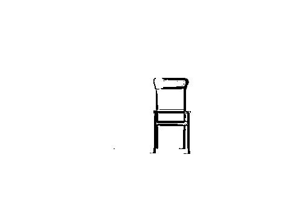

**他们可能敏锐地与更大的社会共同体保持一致，看到其他人可能错过的机会和转变，但他们往往忽视了人与人之间需求的微妙之处。**这种超然的进化优势是显而易见的。为了保持对新的可能性开放，水瓶座人必须能够像开门一样轻松地关门。这有助于他们的脚不陷入他人期望的黏胶之中。当你没有意识到这一点时，就更容易变得反传统。**但超然并不能提供保护，水瓶座的人确实会因为社交创伤而流血。**在孩提时代，我们中的许多人都经历过“部落”的拒绝；我们用这些早期经历的定义我们的天性（或被其定义）。有些人认为这个世界充满敌意，不值得信任；另一些人则认为“我并不重要”。然而，水瓶座的印记几乎似乎加深了它与部落的联系——仿佛被拒绝的痛苦掏空了一个空间，这个空间充满了对这个群体永恒的依恋和爱。根据多年来对水瓶座的解读，我学会了问这个标准的水瓶座问题：“你有没有觉得自己像个被遗弃的人？”答案总是肯定的。这种经历通常更痛苦，因为他们没有预见到它的到来。**被排斥是水瓶座的经历，最终也是人类的体验。**我们都会时而被排斥。也许我们可以向水瓶座学习，并以一种乐观的方式来回应，这种方式会增强我们的信心，而不是让我们的心变坚硬。**受伤和保持开放的能力，对局外人的同情，无疑是水瓶座被认为甚至比富有同情心的双鱼座或服务型处女座更契合于宽容、利他和人道主义目标的原因。**

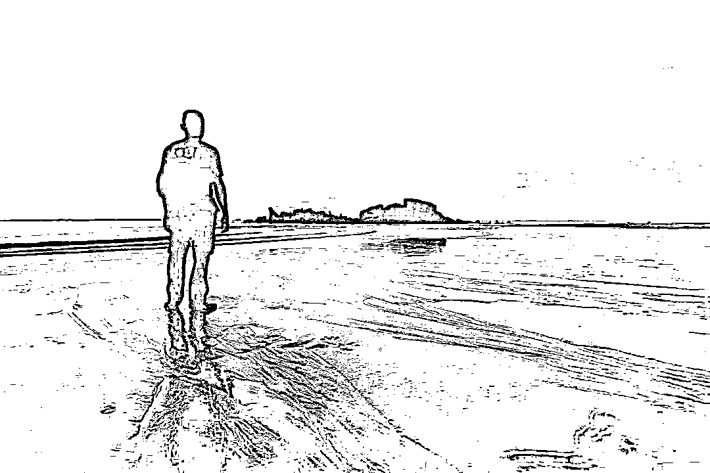

**唯一的规则：不墨守成规**当今世界需要如此多的治疗，难怪有那么多人开始称自己为“萨满”。但这个名号最初是需要努力才能获得的。你能够成为“萨满”是因为社群需要你的治疗能力。**水瓶座还必须倾听集体的需求**。这是对利他主义的一种描述，但在这一点上，我的一位水瓶座客户反抗了。“占星书籍中所写的，就好像我应该放弃我的生活去拯救鲸鱼或者喂养非洲饥饿的孩子。但我不想做那些事。”拯救鲸鱼或喂饱饥饿的人是人道主义的传统形象。尽管水瓶座的人经常是这些事业的积极分子和大力支持者，但他们绝不是传统的人。**他们的首要责任是倾听自己的梦想，追寻自己独特的激情轨迹。**

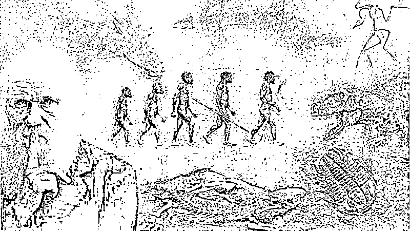

|  达尔文在他的《物种起源》中提出了进化论

水瓶座的人尤其如此。**他们的情绪和发展可能与同龄人截然不同。**当罗伯特·达尔文看着他的水瓶座儿子查尔斯时，他看到的是一个在学校懒惰，在家里惹是生非的男孩。

他确信这个学习迟钝的孩子会成为家族的耻辱。年少的查尔斯喜欢在野外玩耍和远足。他对花鸟着迷。但是作为一个年轻人，他觉得医学院太枯燥了，所以他翘了大部分的课。

达尔文更喜欢和学校里的标本制作师长时间相处，他关于南美洲雨林的故事在达尔文的梦中熠熠生辉。达尔文从医学院退学了。

他开始做牧师，但很快也厌倦了。然后他沉迷于一个新的爱好，收集甲虫。谁能料到这一连串忽冷忽热的兴趣爱好最终会走向加拉帕戈斯群岛和达尔文的进化论呢？只有当回首一段人生，天才的轨迹才会变得清晰。 

**水瓶座的人没有什么规则，只有一个例外：不要墨守成规。**水瓶座的人需要空间来适应不同的节奏。他们可能像小野洋子一样，过于前卫和富有争议，以至于很少有人理解他们。或者像查尔斯·达尔文一样，他们的研究会在他们死后一百年依然能够引发争论。也许，像詹姆斯·乔伊斯一样，他的作品将在自己的国家遭到禁止。但世界最终会让他声名鹊起。这本小说有一句最诱人的话，莫莉·布鲁姆臣服她的情人的独白——乔伊斯提出，**我们所有人可能都会臣服于我们星图中水瓶座天赋的特殊路径：是的，我说是的，我会同意**。

**版权声明：**本文由若道翻译发布，欢迎转发，反对抄袭。

**达纳·格哈特**一位国际范围内受尊敬的占星师。她为众多占星学网站和出版物讲课、写稿。她在十二宫的月亮激励她对这颗发光体进行了深刻而持久的探索研究。**2022 年来了****还不快领取你的****专属年运报告****？****购买有优惠，点击图片查看详情哦~**

**学习占星学****点击下图了解课程详情** 

**

****************

**微信又双叒叕改版啦，不想错过若道君的推送？**

**就把若道设为星标吧！****▼**

**就是这个“在看”，戳戳戳 ☟**

******报名直达入口******

# 每天花点时间做这件事，让梦境为我们服务

> 原文：[`mp.weixin.qq.com/s?__biz=MzA5NjA0NTAxNg==&mid=2651466663&idx=2&sn=0bca809ac9f011fd05c0af718603cf12&chksm=8b489910bc3f1006b710ecb2321158ace398d53899eac689ae280edab367dfbf50905165ce16&scene=126&sessionid=1692737867#rd`](http://mp.weixin.qq.com/s?__biz=MzA5NjA0NTAxNg==&mid=2651466663&idx=2&sn=0bca809ac9f011fd05c0af718603cf12&chksm=8b489910bc3f1006b710ecb2321158ace398d53899eac689ae280edab367dfbf50905165ce16&scene=126&sessionid=1692737867#rd)

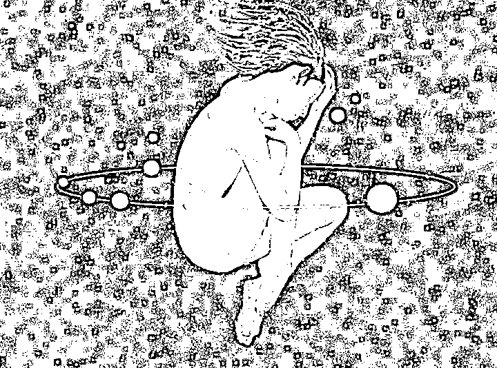

作者/特蕾西·麦克斯 译者/李含 校对/Arrow 编辑/玫瑰 图片/pexels 本文节选自《你的秘密自我》梦境于我们的意义，不是形式化地记录那么简单。梦境反应了我们当下的潜意识状况，有时候也与我们潜藏的秘密有关。而持续地记录和分析梦境，不仅能够发现我们的创伤和议题，也能够从梦境的变化佐证我们的成长。现在有个超棒的【[释梦工作坊](http://mp.weixin.qq.com/s?__biz=MzA5NjA0NTAxNg==&mid=2651465949&idx=3&sn=1c54aefda04e17141854a9ae261fe17d&chksm=8b489a6abc3f137c1b3ab1501dbe40356d4164f61cc832229b1e6da976ed9a6ed38d526a0f94&scene=21#wechat_redirect)】，点击了解详情哦。**为什么要进行梦境工作？**在 1980 年代，我越来越坚信学习如何回忆、再体验、解释梦境，利用梦境工作在自我整合和疏导第十二宫能量方面具有难以估量的价值。因为很多潜意识心智的活动并不容易进入到我们的理性意识之中，并且对后者造成威胁，**梦境中的内在意象可以作为潜意识与意识之间的可行媒介**。希腊神话中的柏修斯只能通过看到镜子里的影像才能杀死美杜莎（因为她过于强大无法直视），所以我们或许只能通过我们内在意象的隐喻媒介才能接近和整合我们原始与超个人自我的强大能量。在我们的现实社会中，梦境的过程对大部分人的吸引力有限。“我不记得我做了什么梦，”许多人会这样说，或者“梦好怪诞。我不理解这和我的生活有什么关系，”或者甚至是“我的梦让我感到很不愉快，很焦虑，我要赶紧忘掉它们。”**我们可以学习记住自己的梦，我们可以学习如何忍受某些梦境所带来的焦虑，敞开怀抱接纳令人敬畏的体验和梦境中的愉悦**，这些曾在我们面对自己的噩梦时出现过。我们可以学习如何整合我们的梦，我们可以学习如何将它们的洞见运用到我们的日常生活中。**·** 我们为何要这样做？**· **我们为何要每天额外花上 5-30 分钟，这大概是每天梦境功课所需要的时间？**·** 如果我们从没有体验过自己梦境带来的深刻洞见和改变，又如何知道这样的转变是可能发生的呢？**·** 梦境工作的真正价值是什么？

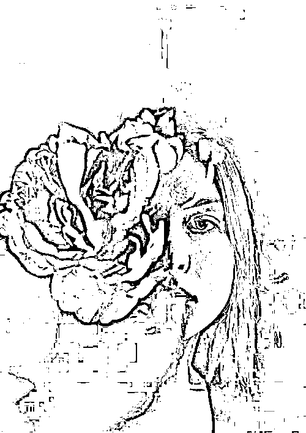

**让梦境为我们服务****首先，随着我们学习回忆和有意识地关注到自己的梦境，我们就开始架起了一座桥梁，让自身越来越多的潜意识能量流动到我们清醒的生活中。****第二，我们的梦境揭示出了我们的心理动力，或者是潜藏在我们表面意识之下的真相。****·** 你对自己，对这个世界，对他人的真实体验是什么？**·** 有怎样的预设和个人神话影响着你？**·** 你反复表演又表演的剧情类型是什么？**·** 你在外部世界中的挣扎之下实际潜藏着怎样的心理矛盾？**·** 你试图怎样解决你的问题？**·** 你在何时，会如何解决这些问题？**·** 在你冲动的表达背后蕴含着怎样的恐惧，尤其是愤怒和性的表达？**·** 有哪些童年的模式或体验到如今还影响着你，需要你去接触，然后返回到这种行为发展源头的体验中，你才能重塑它们？**·** 你真实的欲望和需求是什么？如果这些欲望和需求没有得到满足，你会做何补偿？你的梦境可以回答这些问题。你或许会回答：一位治疗师或者是我自己，可以通过反思自己的人生，或者阅读心理学书籍也可以做到呀。的确。但是**梦境的优势在于它们提供的画面和洞见源自我们内心深处**，**它们是不容置疑的**。我们借助头脑学习的内容会留在头脑内，未被整合到直觉和心灵中。其他人对我们的评价会影响到我们，但是常常并没有深入到可以引发真正的改变。

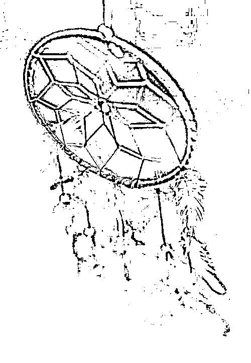

**梦境，以及梦境所产生的洞见，不需要作用于我们最深层的内心来激发具体的改变，它们就是来自最深层**。与大部分外部世界的体验相比，充分地体验和至少部分地理解我们的梦境可以更深刻地影响到我们的心理动力，因为梦境将我们与内在创造性改变的源头联结了起来。卡尔·荣格认为：**创新绝不会从天而降；它们毫无疑问来自深处，就像是树木绝不会从天空往下长，而是会从大地向上伸展。****事实上，梦境表达的是灵魂的声音，它们是我们与最深层自我，与自身内核的交流**。**只不过是通过回忆、体验、有意识地尊重我们的梦境会让我们接触到真实的自我，甚至无需释梦就会唤醒之前无法触及的创造力和活力。**思考一下我们令人不悦的梦境，阴暗的梦境或梦魇。这些会带来多少令人不适的焦虑。但是**它们同样是在释放和缓解焦虑，让我们可以更有效地运作**。通过接触常见的原始恐惧——害怕被孤立，害怕失去自我，我们的侵略性、破坏性和他人的侵略性，同样会让我们**触及潜伏在这些原始恐惧之下的自身力量源泉**。

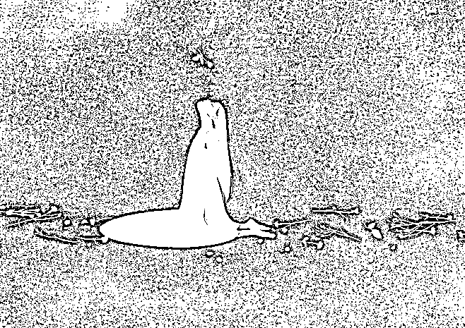

麦克斯·赛勒说：**阴影的 80%是金子。伤口本身就包含着疗愈所需要的原始材料，并从中浮现出新的方向。****创伤性的梦境，尤其是那些一再重复的主题，出现讨厌的人和事的梦境，通常都会揭露出我们内心中大量受困的创造力，它们需要获得转化**。仅是提高我们记忆和再体验梦境的能力就十分有价值。学习解释梦境，将我们所获得的深刻理解运用到日常生活中就更有价值了。这样的梦境就是仅有的几把钥匙之一，帮助我们释放和整合被压抑部分，这种压抑让我们受困于一个虚弱的模式中，阻碍我们感受到生命绽放的欢愉。当我们完全认同自己所处的位置，去体验我们内在世界所发生的一切时，改变就发生了。“**你永远不可能通过抗拒来克服任何事**。”格式塔治疗专家弗里茨·波尔斯这样写道，“**你只能通过深入其中才能战胜对方。如果你深入内心，如果你接纳那里的一切，那么改变就会自然发生**。”同样，《梦境与梦魇》一书的作者杰克·唐宁强调当我们拥抱自己梦境常会揭示出的最原始、赤子般的自我，改变与自我实现就会发生，而不是以小我的理想或精神目标为防御，拒绝那部分自我。唐宁在书中写道，“**如果我不能为那个自我雏形找到爱、同情、接纳和理解，那么我就宣判了自己的孤独**。”他告诉我们，梦境可以帮助我们拥抱自己的小我、自身的不足、自身的限制。通过对自身的怜悯同情，我们让改变成为现实，而这种改变促进了我们的进化，让我们超越单就自身缺点导致的信念，成为更好的自己。但是，**进行梦境工作不仅仅是一场与小我或自我阴影面的狭路相逢。梦境还会反映出当下生命中新的发展或即将出现的新发展**。多年以来，因为害怕愤怒，我们的梦境中总被拿着刀的壮汉追赶。最终，在治疗师的多次干预下，我们可以舒适地与自己的攻击性相处，我们会在梦中面对那个壮汉，甚至是与他成为朋友。我们的梦境证实了我们体验到的成长，使我们确信真的有进步了。它们同样还揭示出内心发生的变化，而且很快会有外部表现。

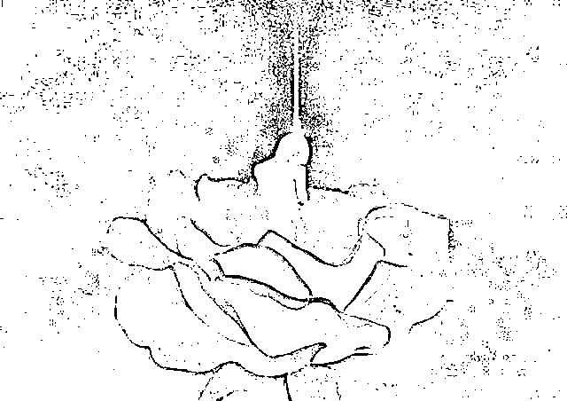

**梦境中一个孩子的出生，开始一段新冒险，成功解决了一个困扰我们多年的梦境都预示着我们将会在外在层面的自我体验到改变，给予我们信心、希望，让我们相信自己内在的能力。**有时候，尤其是在我们体验和直面自我阴影面时，我们的奖赏是经历超个人的梦境，它们从我们深刻的原型意识层面中一出现，我们立刻就知道到了。我们梦到在一片宁静的魔法森林中，一位智者承诺会保护我们，使我们不必担忧。我们梦到耶稣拥抱了我们的孩童（自我），或者我们经历了一场童话般的梦境，在梦中遇到了魔法生物，唤醒了我们从前难以企及的内在的欢乐源泉。有时候，我们只记得梦境的片段，没什么感觉；在睡醒后我们很快就忘记了。但是超个人或原型的梦境会带给我们深远的影响，它们持续数日或数月会弥漫在我们的清醒意识之中。变化始于意识的改变。引导梦境可能会转变我们的整个自我意识和我们生活的世界。但是**普通的梦境和原型梦境都会提供重要的指引**。我们梦到自己匍匐爬过一座山下的隧道时感到快要窒息了；我们走在一个恐怖的地方，在某个程度上，我们知道刚才走过的地方是自己被污染的肺部 ，我们别无选择了，最后我们准备好戒烟了。我们梦到自己的母亲催促我们在夏令营的时候要给她写信，然后梦醒来，感觉应该给母亲写封信，母亲在意外去世的前一天收到了这封充满爱的信。

**版权声明：**本文由若道翻译发布，欢迎转发，反对抄袭。友号转载请申请白名单。

**特蕾西·麦克斯**

老牌占星师，对 12 宫、梦境有深入研究。著有《如何整合你的 T 三角》、《你的秘密自我》。

**释梦工作坊报名中！**

**梦境工作和做梦疗法是深度心理治疗的一个关键技术，**使得深层无意识的象征性语言能够传递它们的洞见，并指引患者走向更大的完整。

**梦境提供了重要的线索，告诉我们客户痛苦的来源，以及哪些情绪和情结需要被检视和处理。**梦境工作可以成为心灵成长和行为改变的强大催化剂，它有种独特的能力，促进疗愈从内在发生。

**本课程将课堂讲座与动力过程工作结合起来，动力工作过程会将星图解读和梦境分析结合起来。**

每天约一半时间用于讲座，其余时间会演示占星学梦境工作方法，过程中老师会与学员进行互动。课程包括对老师解读星图和治疗性梦境工作方法的详细阐释和示范。

**我们将学习荣格解梦的基础知识和治疗性的、以过程为导向的星图解读。**我们将体验转化性原型模式在梦境和出生星图中同步显现时会发生什么。

**三次 6 小时的迷你马拉松在线梦境课程**，将会是一次提升意识、开放思想、转化生命的事件。**学员将体验占星学和解梦的融合。**

每次课程格雷格·博加特老师都会与学员互动，课程中使用的星图和梦境将由愿意分享自己梦境和星图的学员提前提供，课程期间也会开放问答以及学员互动环节。

**点击下图了解更多信息**

**2022 年来了****还不快领取你的****专属年运报告****？****购买有优惠，点击图片查看详情哦~**

**学习占星学****点击下图了解课程详情** 

**

****************

**微信又双叒叕改版啦，不想错过若道君的推送？**

**就把若道设为星标吧！****▼**

**喜欢记得点一下在看哦☟**

****报名直达入口****

# 释梦占星大师工作坊：荣格、占星学与梦境

> 原文：[`mp.weixin.qq.com/s?__biz=MzA5NjA0NTAxNg==&mid=2651466663&idx=3&sn=4026f552efea103e6179cefe3107637d&chksm=8b489910bc3f100699afeca22fc6d9f9884e616b18da31720051ad438e45c9b84d05590bfeb8&scene=126&sessionid=1692737867#rd`](http://mp.weixin.qq.com/s?__biz=MzA5NjA0NTAxNg==&mid=2651466663&idx=3&sn=4026f552efea103e6179cefe3107637d&chksm=8b489910bc3f100699afeca22fc6d9f9884e616b18da31720051ad438e45c9b84d05590bfeb8&scene=126&sessionid=1692737867#rd)

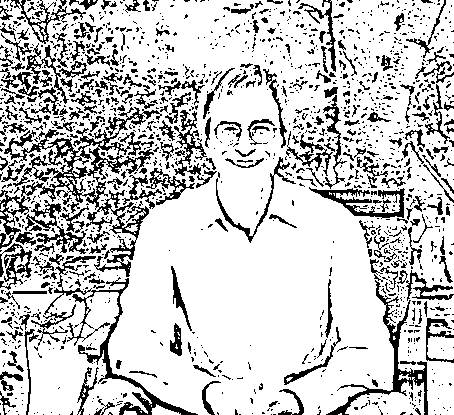

****

**2022 年 3 月和 4 月木星和海王星在双鱼座合相给连接梦境与占星提供了一次绝佳的时机。**

**　　——格雷格·博加特老师**

**梦境工作和做梦疗法是深度心理治疗的一个关键技术，**使得深层无意识的象征性语言能够传递它们的洞见，并指引患者走向更大的完整。

梦境使带有情感成分的无意识材料安全而快速地进入意识层面。它们帮助找到治疗的重心，指引治疗的方向。**梦境提供了重要的线索，告诉我们客户痛苦的来源，以及哪些情绪和情结需要被检视和处理。**梦境工作可以成为心灵成长和行为改变的强大催化剂，它有种独特的能力，促进疗愈从内在发生。

梦就像冰山从无意识的深水中浮现出来。有些冰山属于过去，帮助我们理解过去的创伤和未消化的回忆，因此是回溯性的。

**梦境有种整合的能力，**因为他们能使我们觉知和化解很多次人格之间的矛盾。**梦境也有前瞻性或预期性，**那是来自未来的冰山，会呈现出将要发生的事情，显现出个人有可能成为的样貌。**梦境既向后看也向前看**，它的本质功能是扩展意识、觉知和身份的疆界。

**我在梦境工作中主要使用的技术，是以开放的好奇心，主动探求梦境中每个角色、地点和行为的当下意义**——每个元素都反映出梦者的心灵状态和当前的生活情境。被梦境所揭露的信息，往往既幽默，又充满矛盾，而且为我们打开了新视野。

怀着一种敬畏的心态，我发现每个梦境都是意识海洋深处的一颗珍珠。反思梦境的奥秘，会引发一种近乎宗教敬畏的情感，我们会惊叹于心灵描绘自身处境的能力。

1

**课程内容**

**本课程将课堂讲座与动力过程工作结合起来，动力工作过程会将星图解读和梦境分析结合起来。**

每天约一半时间用于讲座，其余时间会演示占星学梦境工作方法，过程中老师会与学员进行互动。课程包括对老师解读星图和治疗性梦境工作方法的详细阐释和示范。

**我们将学习荣格解梦的基础知识和治疗性的、以过程为导向的星图解读。**我们将体验转化性原型模式在梦境和出生星图中同步显现时会发生什么。

**三次 6 小时的迷你马拉松在线梦境课程**，将会是一次提升意识、开放思想、转化生命的事件。**学员将体验占星学和解梦的融合。**

每次课程格雷格·博加特老师都会与学员互动，课程中使用的星图和梦境将由愿意分享自己梦境和星图的学员提前提供，课程期间也会开放问答以及学员互动环节。

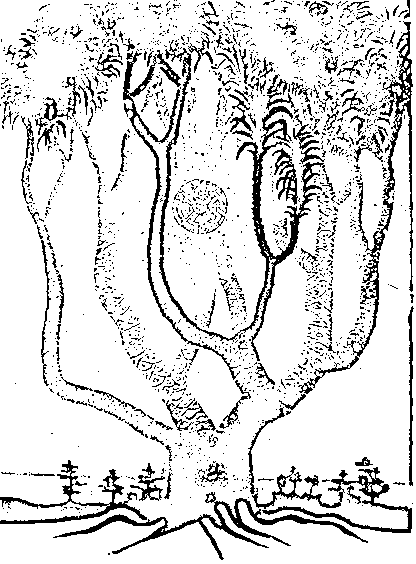

2

**课程安排**

**第*****1*****讲  2022 年 3 月 5 日 **

卡尔·荣格的童年、学生时代以及投身精神病学时期的故事。《荣格自传：回忆·梦·思考》概要。弗洛伊德与荣格的关系，他们合作的破裂，荣格随后的抑郁时期，以及他借助梦、积极想象、艺术创作、曼陀罗绘画和对奥义知识（灵知）、神话和占星学的研究，转化性地面对无意识。卡尔·荣格与艾玛·荣格的占星学。

荣格的力比多（心灵能量）的概念，以及他的心灵结构地图：自我、个体无意识和集体无意识。荣格对无意识原型的描述，它们对个人神话的重要性，以及它们作为个人情结的表现。自我-自性轴线，以及自我与无意识之间不断演化的关系。

**我们将介绍荣格解梦的基础知识以及治疗性的、以过程为导向的星图解读。我们将体验转化性原型模式在梦境和出生星图中同步显现时会发生什么。**

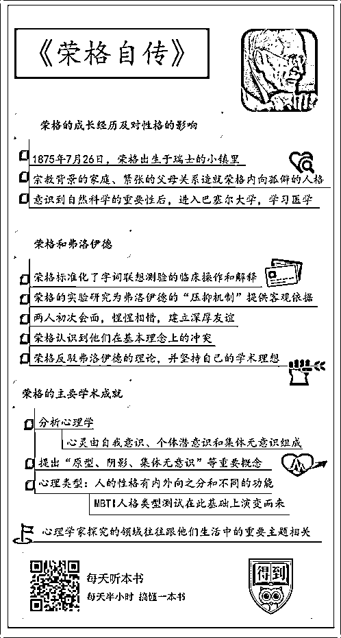

****第*****2*****讲  2022 年 3 月 12 日 ****

梦境中的个性化及其占星学时机。出生星图随时间推移展开。整合个体无意识：梦和出生星图中的人格面具与阴影。男性和女性：阿尼玛和阿尼姆斯。**梦与占星学行进**描绘建立或脱下人格面具的阶段，遭遇阴影的阶段，通**过阳性意识和阴性意识的结合发展出更统一的人格的阶段。**

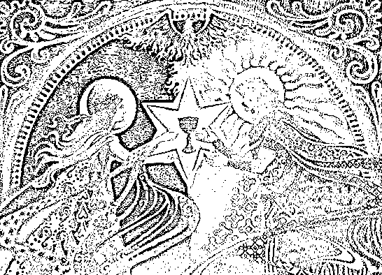

**第*****3*****讲  2022 年 3 月 19 日 **

**整体性在占星学和梦境中的象征。**透过占星学符号研究梦，来深化内在生命。我们将学习占星学行进和梦境如何试图让我们意识到差异、内在冲突和极性，逐步整合对立，将人格整合成一个整体。

梦境工作和星图解读中的曼陀罗原理。荣格的心理类型理论：内向型和外向型的任务。达到思维、情感、感觉和直觉的平衡。我们还将涉及使用五因素人格理论作为星图解读和梦境分析的基础的重要性。

**我们将学习如何解读梦境，并辨别梦的象征意义所传达的有说服力的信息，因为这与出生星图和行进有直接关联。**整合占星学和梦境工作，可以带我们进入情感、关系和灵性更为一致的状态。

3

**授课老师**

**格雷格·博加特**

（Greg Bogart）

**占星师、心理治疗师**。格雷格出生于美国纽约市，就读于卫斯理大学，1986 移居旧金山湾，完成了加州整合大学和赛布鲁克大学的研究生课程。格雷格自 1991 年以来一直是一名有执照的**心理治疗师**（LMFT 28276）。**他是国际占星研究协会（ISAR）认证的占星师**，并拥有美国地球宇宙学研究协会（NCGR）的第四级认证。他还在旧金山的艾扬格瑜伽学院接受过培训，并于 1992 年毕业且获得了**瑜伽教师认证。**

格雷格是一名私人执业的心理治疗师，在索诺玛州立大学担任**心理学讲师**，他在该校教授“成人发展中的转变”、“以深度为导向的心理治疗”、“神话、梦与象征”以及“存在主义心理学与超个人心理学”等课程，他在加州整合大学、约翰·F·肯尼迪大学、多米尼加大学和超个人心理学学院教授咨询心理学和东西方心理学课程。**他的研究结合了冥想、哈他瑜伽、荣格解梦、存在主义心理疗法和精神综合，以及占星学的周期智慧和原型象征。**

**格雷格·博加特博士著作：**

*   《占星学的高八度音阶》（*Astrology’s Higher Octaves*）

*   《行星用于治疗》（*Planets in Therapy*）

*   《占星学与灵性觉醒》（*Astrology and Spiritual Awakening*）

*   《梦境工作过与自我疗愈》（*Dreamwork and Self-Healing*）

*   《梦境工作在抑郁症整体心理治疗中的应用》（*Dreamwork in Holistic Psychotherapy of Depression*）

*   《占星学与冥想：对变化的无畏沉思》（*Astrology and Meditation: The Fearless Contemplation of Change*）

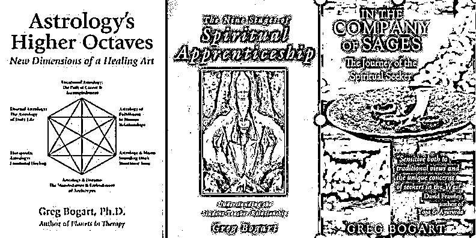

4

**课程价格**

*   **课程价格：****5800 元**

*   **早鸟价：4800 元（截止日期：2022 年 2 月 9 日）**

*   **课程咨询：**王老师（微信：18510107057，请备注“释梦工作坊”）

长按二维码添加王老师

5

**课程安排**

*   **课程时间：**

     **2022 年 3 月 05 日周六  8:00-14:00**

**2022 年 3 月 12 日周六  8:00-14:00**

2022 年 3 月 19 日周六  7:00-13:00

*   **授课方式：**线上直播，英文授课，中文翻译

6

**退转课程**

*   **退款原则请详看《教学协议》，如有疑问请咨询课程顾问。**

****释梦工作坊****

**授课老师：**格雷格·博加特

**授课时间：**2022 年 3 月 5 日起

**授课方式：**网络课程**，**英文授课，中文翻译

**费用：****5800 元****（早鸟价：4800 元，2022 年 2 月 9 日截止）**

**课程负责人：****王老师**（微信：18510107057，请备注“释梦工作坊”）

长按二维码添加课程负责人咨询~

****报名请点击“阅读原文”****

# 梦境征集 | 荣格、占星学与梦境案例征集中

> 原文：[`mp.weixin.qq.com/s?__biz=MzA5NjA0NTAxNg==&mid=2651466563&idx=3&sn=6dec6c26bee4be1b3ce3b174b2ecb6c4&chksm=8b4899f4bc3f10e241930d2dc6624c3db2727676fd84b7d0d32d64bb4dbf8af1aee8a2642809&scene=126&sessionid=1692737867#rd`](http://mp.weixin.qq.com/s?__biz=MzA5NjA0NTAxNg==&mid=2651466563&idx=3&sn=6dec6c26bee4be1b3ce3b174b2ecb6c4&chksm=8b4899f4bc3f10e241930d2dc6624c3db2727676fd84b7d0d32d64bb4dbf8af1aee8a2642809&scene=126&sessionid=1692737867#rd)

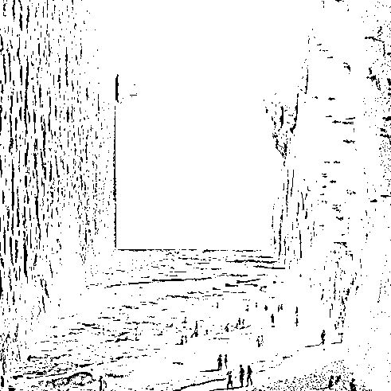

梦，既真实，又虚幻，既属于心理，又属于想象。从古至今人们一直对梦始终保持着好奇心，并假想成各种可能：· 在希区柯克的电影《爱德华大夫》中，一个心理学教授通过解析梦像找出了真正的杀人凶手；· 在大卫·林奇的电影《穆赫兰道》中，一个在好莱坞追梦的女人在梦里反转了自己的小人物生涯；· 在诺兰的电影《盗梦空间》中，梦是进入宇宙中虚拟空间的一种方法。……这些艺术家们的假想，向我们展示出一个个光怪陆离的梦境世界。也许，你也是一位像他们一样的造“梦”大师。**梦是人的潜意识给自己的提醒⏰ 不要错过梦中的自我实现的预言。****现面对《释梦占星大师工作坊：荣格、占星学与梦境》学员征集案例，****如果你已经报名或计划报名本工作坊，欢迎记录你的梦境！你将有机会被选中为工作坊现场案例，获得格雷格·博加特老师的专业释梦解读。****温馨提示：在打开问卷之前，建议编辑好梦境内容，方便复制黏贴进文字框。****长按下图识别二维码填写问卷吧！**

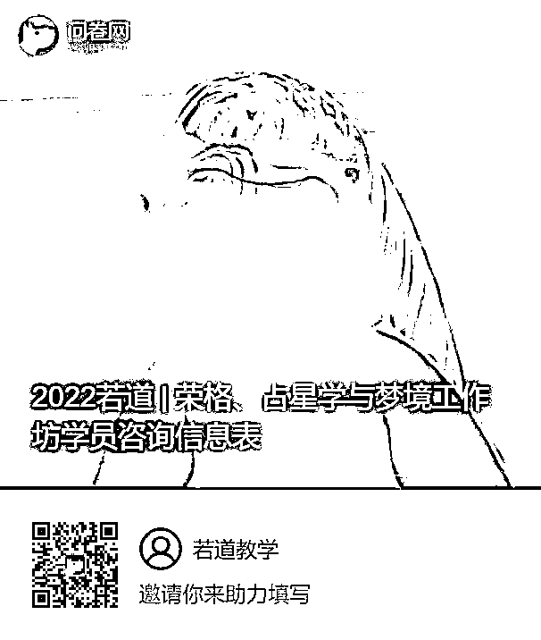

**填写好的小伙伴请****务必添加若道 Maggie 的微信哦**

长按二维码添加 Maggie 老师

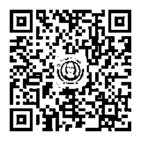

你是造“梦”大师，是“梦”的导演，是“梦”的编剧，是“梦”的演绎者。相信你也有各式各样精彩纷呈的梦，而我们的《释梦占星大师工作坊：荣格、占星学与梦境》正需要你的关于梦的故事。**点击下图了解更多详情**

****

****报名直达入口****

# 找占星师不就是用来“算命”的吗？ | 常见占星咨询误区

> 原文：[`mp.weixin.qq.com/s?__biz=MzA5NjA0NTAxNg==&mid=2651466563&idx=2&sn=b50271ed6b07518a8ed498d7ad0eadbf&chksm=8b4899f4bc3f10e2b672ed67cb0832f2894a7003c79a7f59e1d4658cea3b63326e2b27255a90&scene=126&sessionid=1692737867#rd`](http://mp.weixin.qq.com/s?__biz=MzA5NjA0NTAxNg==&mid=2651466563&idx=2&sn=b50271ed6b07518a8ed498d7ad0eadbf&chksm=8b4899f4bc3f10e2b672ed67cb0832f2894a7003c79a7f59e1d4658cea3b63326e2b27255a90&scene=126&sessionid=1692737867#rd)

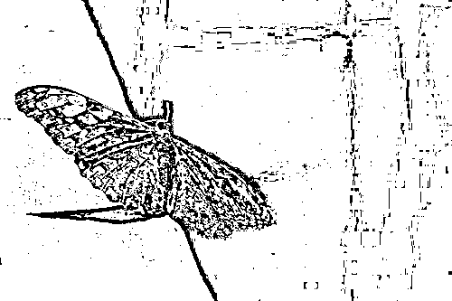

作者/大卫·瑞雷 若道占星创始人

译者/若道翻译团队编辑/玫瑰 图片/pexels

在【[上一篇文章](http://mp.weixin.qq.com/s?__biz=MzA5NjA0NTAxNg==&mid=2651465949&idx=2&sn=6e479c5393b524104ae9705b3bf9c77a&chksm=8b489a6abc3f137c26a7f691aea0a08e7a02ffb51a08ee3eb7f7752cd6131572a7838b16536e&scene=21#wechat_redirect)】（点击链接可阅读）中，咱们聊到了占星咨询的价值所在。这篇文章，大卫老师想和你聊聊“算命”式占星咨询。一起来看看吧。另外，大卫老师参与授课的【[核心课程](http://mp.weixin.qq.com/s?__biz=MzA5NjA0NTAxNg==&mid=2651463523&idx=3&sn=019938f53a79cad4286a02eee12e56f2&chksm=8b48add4bc3f24c226dc436b0db23c55c33bb8d20c0b2ae7f1d669e5d144617206672de875b6&scene=21#wechat_redirect)】和【[双证书课程](http://mp.weixin.qq.com/s?__biz=MzA5NjA0NTAxNg==&mid=2651465782&idx=2&sn=c6eafb2a0ef498e5a54ba878ceedbec2&chksm=8b489a81bc3f1397545590c6ba5722ecee5b834da58e6e527aad499de6afc92a577c01d76e04&scene=21#wechat_redirect)】开启报名中，点击链接了解详情吧！

**“算命式”占星咨询**作为一个占星咨询客户，我们来谈谈你的期望。你的期望是什么? 你也许你们中的大部分人都习惯了**算命方式的占星咨询**。当我说“算命的风格”，我指的是风格，不是指传统的中国算命师——我对他们没有什么了解或经验。我不想对我不熟悉的任何传统表示不尊重或批评。你们也不需要一个美国人来批判他所不了解的事!我对算命风格的定义是，占星师**依赖于某种形式的西方占星学**，无论是现代占星学，还是夹杂着希腊占星学、古典占星学或中世纪占星学的变体，**在他们的客户中扮演着权威的角色，客户只是一个被动的参与者。**在这种算命的例行公事中，客户是观众之一，而占星师是表演者。**这种算命的表演通常基于客户和占星师都相信宿命论或命运。**例如，客户一开始可能会问：“我将来会富有吗？”占星师可能会用一副严肃的表情盯着客户的星图，显得深思和内省。占星师说：“你从来都不善于理财。”客户肯定地点了点头。“在你的一生中，钱时增时减。我看到，三年内你的财富会增加，然后马上就会亏损。在这次损失之后，你将在 7 年内无法获得经济保障。然后一切都会改变，你会舒服 8 年。然而，你永远不会富有。”当占星师宣布他们的未来时，客户可能正在忙着做笔记，或者在他们的手机上录音。可能还会问其他问题，关于婚姻、孩子、家庭、关系、职业和健康，所有的问题都由占星师来回答，他们是关乎客户未来的权威。

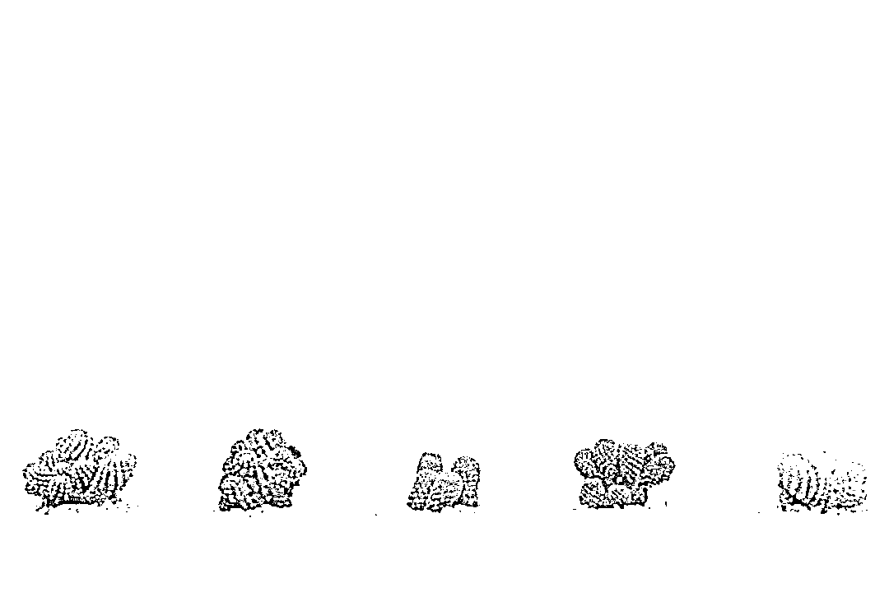

此时，你们中的一些人可能会想，**“那么，用这种算命的方式来做占星有什么问题呢？当我去找占星师时，我希望他们告诉我未来会发生什么。”**如果这是你想要的，那就别担心。有很多算命风格的占星师可供选择。不过，我有个问题要问你。**·** 如果你知道他们根本不了解你是谁，或者你的未来会是什么，你还会花钱请他们来算命吗? **·** 如果你知道他们只是根据自己的生活经历和占星技法“猜测”你和你的生活，你还会把你辛苦赚来的钱花在他们身上吗?因为，我在这里明确地说，**算命的占星师不仅不像你了解自己那样了解你，而且，即使他们真的相信自己在做什么，他们也不是关于你未来的权威**。他们可能对你和你的未来有看法，但这只是猜测。**所以你付钱让别人去猜测，去猜测一些问题，而这些问题实现可能性只是一半一半。**当然这是你的钱。你想怎么花就怎么花。相比于给你带来更大价值：**真正的占星咨询，算命式咨询其实让你低估了自己。**

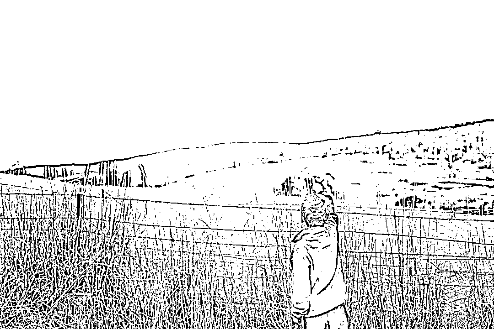

**“算命式”占星咨询剖析**让我们一起来查看对客户问题 “我会变有钱么？”算命式的回答。占星师说：“你从来都不善于理财。”这是一个明显的**评判式表达**，强调一句“一直都不好”。这是一个**绝对的陈述，至少表面上是权威的。**我们不知道是什么技法——现代的、古典的、中世纪的还是这些方法的混合，导致占星师做出这样的判断，这不重要。现在不是关于方法或系统的利弊，而是关于**“如何与客户沟通和分享星图”**。让我们假设占星师真的相信或相信他们使用的占星系统。（这太棒了！）让我们假设这位占星师非常了解他们的占星学，尽管我们知道每个人的专业水平和经验可能会有很大差异。首先，客观地说，客户是否善于理财，至少根据占星师的判断参数，他的绝对陈述有 50%的可能性是正确的。当然也有其他的可能性，客户可能已经很富有了，只是在“测试”占星师。或者，客户的收入或资金管理能力实际上处于中等水平，甚至“相当好”，因此既不完全好也不完全坏。然而，这样一个微妙的解释并没有被提供，所以我们可以假设占星师是顺畅地作出一个绝对的声明。更有可能的是，占星师之所以有信心做出这种绝对性论断，**一方面是因为他们对所使用的系统的依赖，另一方面是因为他们认为，如果大多数人已经很富有，他们就不会问这个问题。**

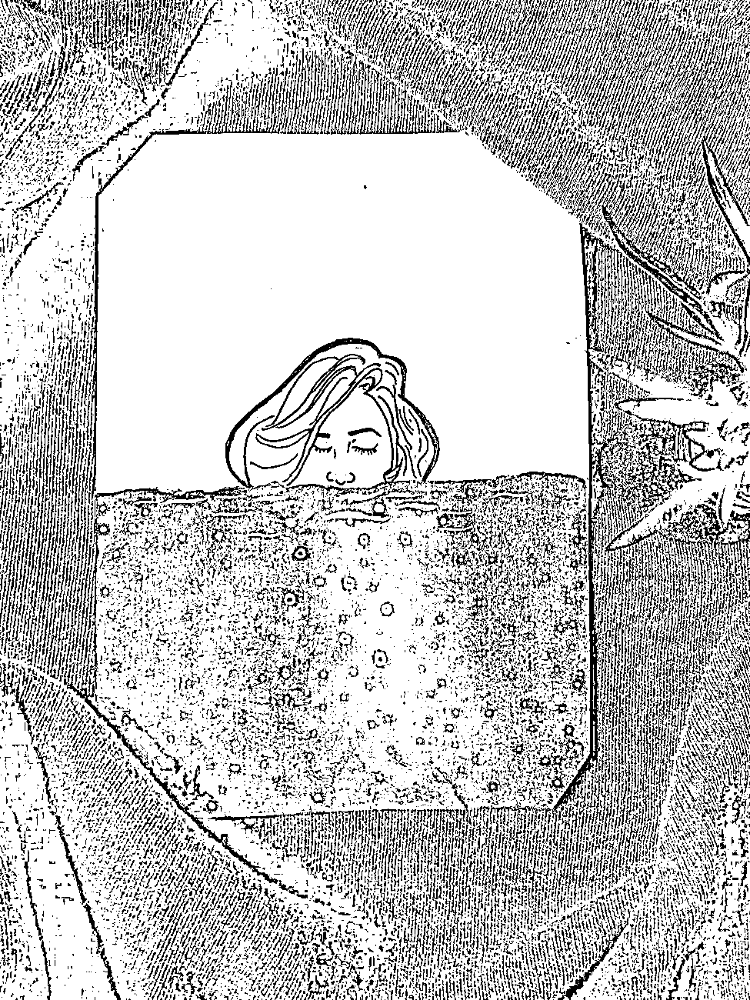

在这种情况下，占星师在客户肯定地点点头时立即得到肯定。这是假设占星师可以看到客户，无论是亲自或在线或微信，等等。如果只是通过电话或音频，我们可以假设占星师从客户那里听到了“是”或“那是真的”，或者如果客户保持沉默，至少没有否认他们的声明。立即得到客户的肯定可能会增加占星师的信心。占星师可能会大胆去作出其他论断——在这种情况下占星师肯定会这么做。但是，客户呢？他们感觉如何?？对占星师来说似乎并不重要，他继续说他的。如果客户也认同占星师的观点，“我从来不善于理财”，那么**客户对自己的负面评判就会加强。**客户的负强化现在与占星师的正强化形成对比；客户因此在不知情的情况下赋予占星师权力，这样做给占星师更多的权力和权威。我们可以假设占星师现在感觉很好，但客户呢? 我们也不确定，不是吗?

**版权声明：**原创文章由作者授权发布于若道平台，欢迎转发，反对抄袭。友号转载请申请白名单。

****想阅读更多作者的文章，请在后台回复******大卫****** 即可。****

**大卫·瑞雷**

美国占星师，若道联合创始人，致力于在中国教授和推广西方占星学；2010-2014 年，任全美占星师联盟监督委员会委员；2017 年，被选为 ISAR 委员会成员。ISAR 是世界最大的国际占星机构，会员遍布 45 个国家，2017-2020 年曾任 ISAR 全球副主席、CAPISAR（ISAR 职业占星师资质认证机构）主席。

**喜欢文章请长按下方二维码打赏****给大卫老师加杯咖啡呗~****▼**

**2022 年来了****还不快领取你的****专属年运报告****？****购买有优惠，点击图片查看详情哦~**

**学习占星学****点击下图了解课程详情** 

**

********************************

**微信又双叒叕改版啦，不想错过若道君的推送？**

**就把若道设为星标吧！**

**▼**

**喜欢记得点一下在看哦☟**

********报名直达入口********

# 2022 年丨木星双鱼座到白羊座的伟大远征：一半是海水，一半是火焰……

> 原文：[`mp.weixin.qq.com/s?__biz=MzA5NjA0NTAxNg==&mid=2651466563&idx=1&sn=55f3d27b387f411f9813536cca35ee24&chksm=8b4899f4bc3f10e20f077f8ec7f13d402a3967df20baeecc372ef576653c45267a06107cf5cd&scene=126&sessionid=1692737867#rd`](http://mp.weixin.qq.com/s?__biz=MzA5NjA0NTAxNg==&mid=2651466563&idx=1&sn=55f3d27b387f411f9813536cca35ee24&chksm=8b4899f4bc3f10e20f077f8ec7f13d402a3967df20baeecc372ef576653c45267a06107cf5cd&scene=126&sessionid=1692737867#rd)

**☆ 后台回复“今日”，给你一句生命态度**作者/蓝女巫 ISAR 认证占星师
编辑/翀子 封面/书君 图片/音乐/作者提供文中引用书摘部分：伍尔夫《到灯塔去》**引言**

在[【上半篇】](http://mp.weixin.qq.com/s?__biz=MzA5NjA0NTAxNg==&mid=2651466440&idx=1&sn=0221e6b29e36b73be59028d9fe8afe1b&chksm=8b48987fbc3f11695f0fb1dc470d107e5e2af189b032622d44c30a7c0596b3d2a85881e954e6&scene=21#wechat_redirect)（点击查看文章）揭示了灯塔，岁月，窗户，三个相关双鱼座木星的木海年的意象之后。再继续呈献半篇**"海王体"年运！**故它不是用来读的，是用来"看"的，像看电影那样......**电影从不为你提供答案，它只为你启示象征。飘飘乎不知其所止，不尽则无尽的文风，也即是 2022 年运能量本身的形态。**just absorb~ 

 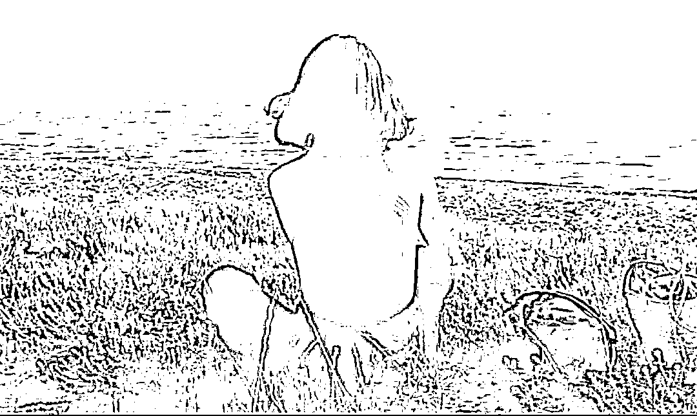**总论****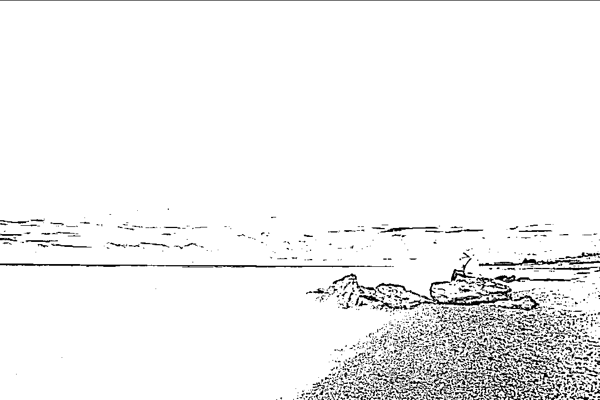**

冥王星已行至摩羯座末尾，从 2023 年将移步水瓶座。在正式企稳水瓶时代之前，无论个人或社会，都仍在与**死气沉沉的旧系统**，根深蒂固的惯性束缚，做着**最后的对决。**一切**假我灵魂，**正遭遇**最后的审判。 **

土木两星，用以观察社会文化潮流和道德风尚。去年土木合相水瓶座后，尤见其以闪电般的光速，催生人类意识进化。具象地体现在，社会政治经济都经历着结构性变革。

2022 土星强势虽将持续，但庆幸的是，**木星也要回家了！**双鱼座木星的木海一年，是否会**暖风熏得游人醉？**整个世界，似乎都应该**从外在回归内心了。理应是慢镜头的一年。但“选择权”仍留给你自己.........**

木星作为**“时代精神”**的风象标，邂逅双鱼座与海王星时，集体心理必将潜入**“深度精神”**？荣格在《红书》中说，“这个时代的精神**只注重实用和价值**，但是另外一种精神迫使我发声，要**超越实证、实用和意义。**深度精神打开了我的双眼，**我得以瞥见内在的事物、我灵魂的世界。**”

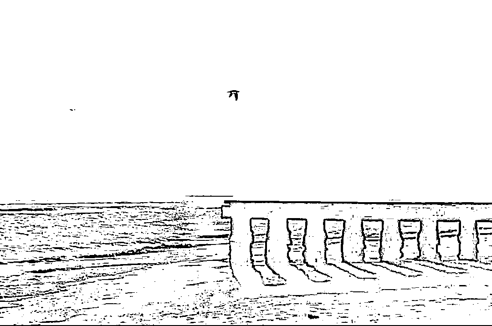

本性洒脱不羁的木星，在被摩羯座、水瓶座挟持的两年，曾不情愿地被染上了务实色彩。土星能量盛极一时的几个年头里，人人辛劳勤奋，每天当成最后一天地**活**（搞）**着**（钱）；**诗和远方**，相形见绌，显得越发单薄，甚至滑稽可笑。

而笑话的剧情开始扭转……2021 见诸社会示范。流量与**贪欲**齐飞，实力为王？物极必反！**食尽鸟投林，落得个白茫茫大地真干净......** “这是最好的时代！”许多人感到自己生得正是时候，这是一个专门为他准备的时代......

 也终有人不甘于精神贫瘠。随木星强势回归，诗和远方终于可以回来了？当疲惫的身心，升起阵阵酸楚。终于可以喘口气了？从什么都能卷，到开始好好做梦，放松肉体，滋养精神，倦鸟归林，刻不容缓。**谁说躺平就不能躺赢？有梦想就有可能，**以退为进！**人类无限艰辛，前路非常莫测......**但这一年，太值得珍惜！至少它还有**木海的麻药**......用好了，当然也是**解药**。

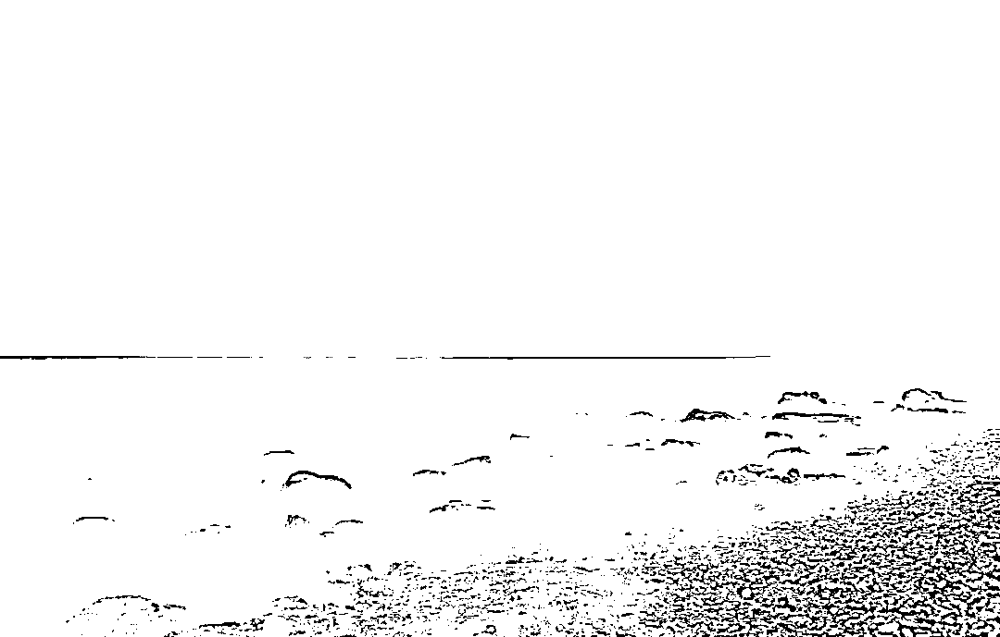

**年度关键词，皆与双鱼座/海王星有关：**慈善，疗愈，冥想，心理学，身心灵，绝对是年度主流；医药，化学，酒业，新能源，海运，都会是强悍板块；文学，艺术，影视，或迎来一场转瞬即逝的文艺复兴？为期虽短，但影响深远。它至少会像是一个开篇？**海王星进入双鱼座**的 14 年周期中，已至**最高亢的节点**。期待木海以超然无边的**浪漫主义情怀**，对人类灰尘暴土的精神贫乏现状及时洗礼。**木海双鱼座六合北交金牛座**，**双管齐下**的运势，当然会强调精神质感与审美快感的协同。

 木星是个哈哈镜，能将好与坏同时夸张。**大吉星的负面效果**见诸：泛滥无节制，过度理想化；**泡沫膨胀**，情绪洪荒，伪善横行，**鱼目混珠**；星辰大海甚至梦境，都会成了商机......心存侥幸的投机是短视的，一定要对得起良知。否则原地坐等明年土星进双鱼时的反噬。rage frome the sea......**污染“海洋”？罪不可恕**。对于疫情，双鱼座木星和木海绝对是双刃剑，代表最深远的疗愈，或失控的涟漪。我相信一定是前者！而向内回归，听上去很美，但也可以是逃避，或者精神幻灭。 

虚拟社交**元宇宙**，生最逢时！估计要上天。木海年的阴影面，必经概念爆炒。个人观点，此处我宁可追随马斯克的另一条路。**一个征途是星辰大海，一个终点是精神鸦片。一个是向内的外，一个是向外的内。你选哪一条？**当商业的意淫要强行入侵内在世界。**生活本身的意义又在哪里？绑架感官，接受欺骗？又是一个你我不得不参与的别人的游戏？福兮祸兮。**

******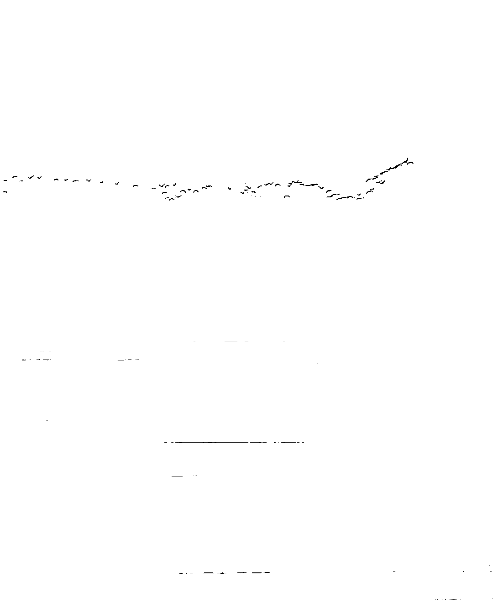******

双鱼座木星和水瓶座土星同步，重心仍是在强调**人类命运共同体**。木星在水瓶座时，关于沙子们的**社会协作**，为集体福利贡献**微薄之力**；而木星在双鱼时的**众生一体**，更像是**蝴蝶效应**。每一个无意识的扇动翅膀，都**并不存在什么偶然**......

继土天纷争乱象后，**木海提供沙土中的粘合剂**，为社会种族文化之间，**打破藩篱，消融嫌隙**。双鱼座能量的精微魔法，**润物细无声**地，修复着人类意识觉醒进程中的一切核心本质难题。

 **双鱼座木星的木海年，像适时疗慰集体创伤的一场春雨，**洗刷疾恶，释放痛苦，**鼓励圣母般的善良慈悲，示范无条件大爱**。从小我**分离**走向整体**合一**。复苏**集体无意识中的光，**去回眸象征着**无限与永恒的源头。**以深度精神的桥，去联结并照见每个人类共通的内心之神圣。**唤醒人类精神归属，回归宇宙恢弘！ **

何谓**同情**？想起昆德拉书中的定义：**“同情，是指最高境界的情感想象力，指情感的心灵感应艺术，在情感的各个境界中，这是最高级的情感。”**即能与他人分享任何情感，同甘共苦的理解力。而理解是一种可怕的粘合力，它关爱个体核心那片生命的神秘。

**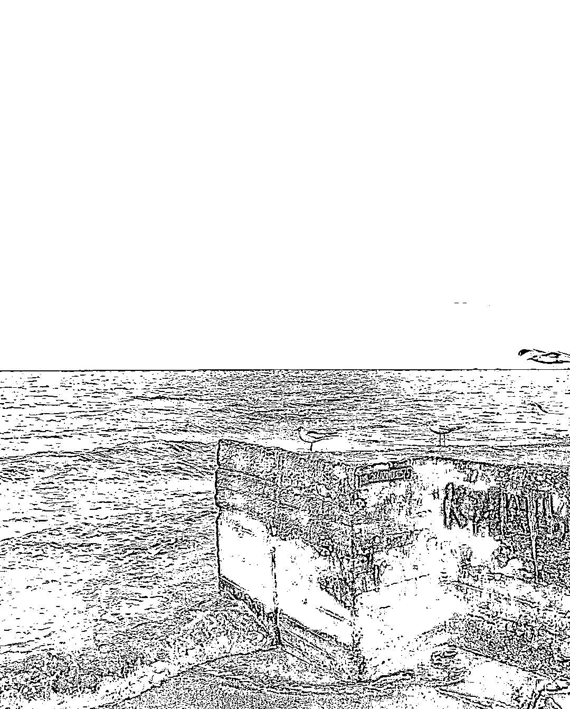**

2022 年度的**“造梦”主题，**已众所周知...... 所谓**心想事成！**故无论好与坏的念想，都易成真。须保持对种种可能性的敞开，才能尽情拥抱无限神奇。并**保持积极良性的振频**和场域，像双鱼座们那样总**允许自己去梦想**一切。而**吸引力法则，显化的前提，是信！而梦境本身，也将拥有更多非同寻常的意义。**跟随直觉，伸展触角。在共时性的宇宙心电中，成为传递治愈能量的管道。Magic is nice......

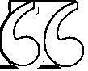

你必须和普通的日常经验处于同一水平，简简单单地感到那是一把椅子，这是一张桌子，同时，你又要感到这是一个奇迹，是一个令人销魂的情景。

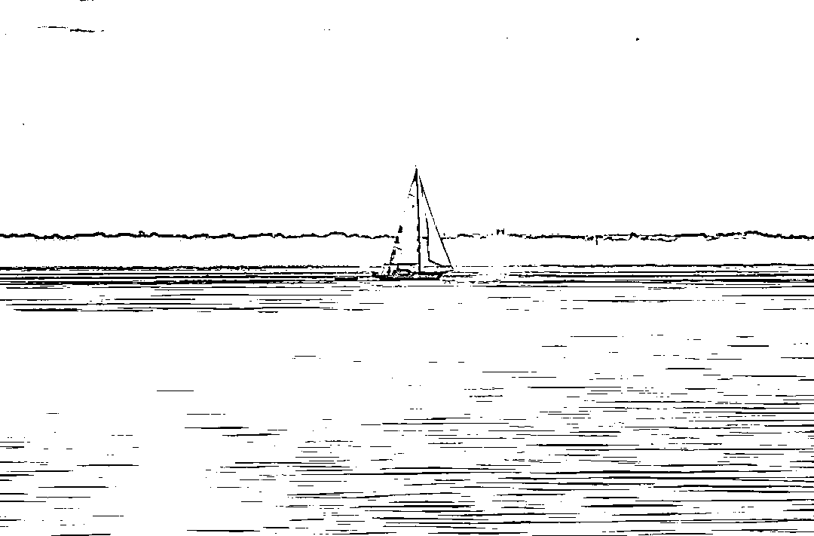**年运时间表**

下面，就以 2022 的主角木星为**主旋律，用木星周期来划分年运：**

 首先**温故而知新**。木星曾在 2021 短暂进入过双鱼座，以过往周期为鉴，回顾当时经历，发生过何种能量切换？**可视为 2022 的缩影。**

**木星入双鱼座：2021.5.14 -2021.6.20 **

短短一个月，**航海前的演习，对未来方向的初探。**或许以童话般理想化开篇。这时，往往过度乐观，纵情想象，而幻梦也常令人困乏疲惫。我清楚地记得，那时的漫天迷雾中，正有一丝丝**不满**袭来......

 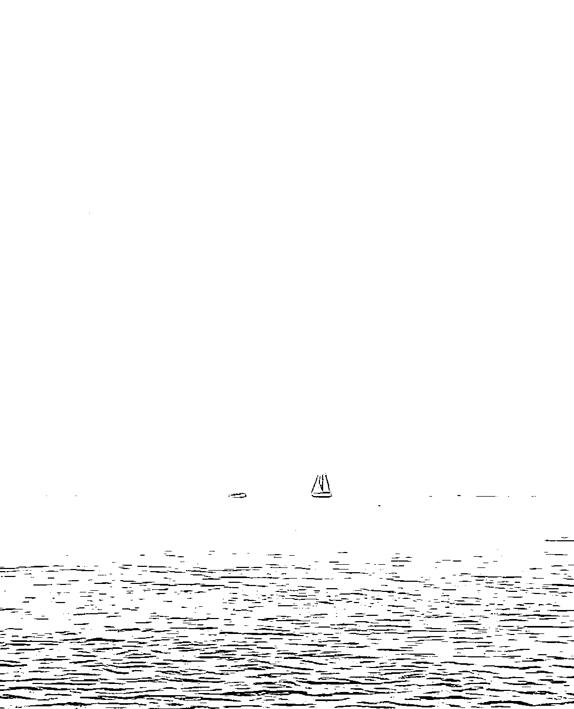**木星在双鱼座逆行：2021.6.20-2021.7.28**

**信念的试炼，**全面考验你对固有价值观的信心。不得不闭目静观心底**升起的怀疑，**独处中深深发问。短暂的航行，收起**膨胀的风帆。**种种外在限制的无力感中，**梦想触礁搁浅。**

梦游于波谷的彷徨中，已分不清是幻觉泛滥，还是心电如织。回顾时惊现自己一些**情绪极深的梦境甚至预言，**都密布于那段时间......显化之快，力不可抗。而帮客户回顾时，有人会梦到搭错了车，赶紧纠错，庆幸正途的列车，刚好还停在对面等她。

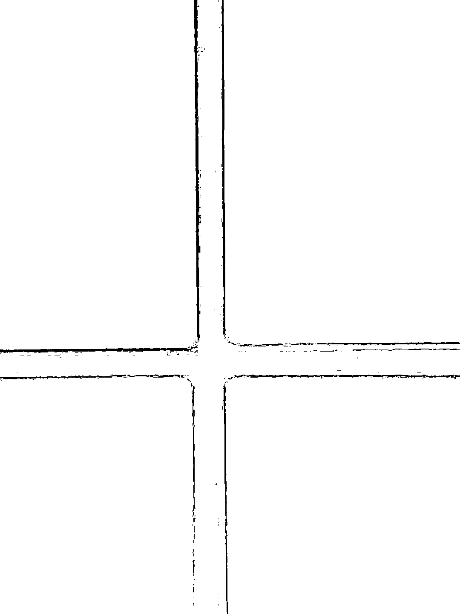

**木星逆回水瓶座：2021.7.28-2021.10.18**

那时，我个人正经历着鸡飞狗跳的天王星行运，每天都是过山车。合与分，瞬间转向；爱与恨，皆是无常。**电池电量低，请及时充电！**

 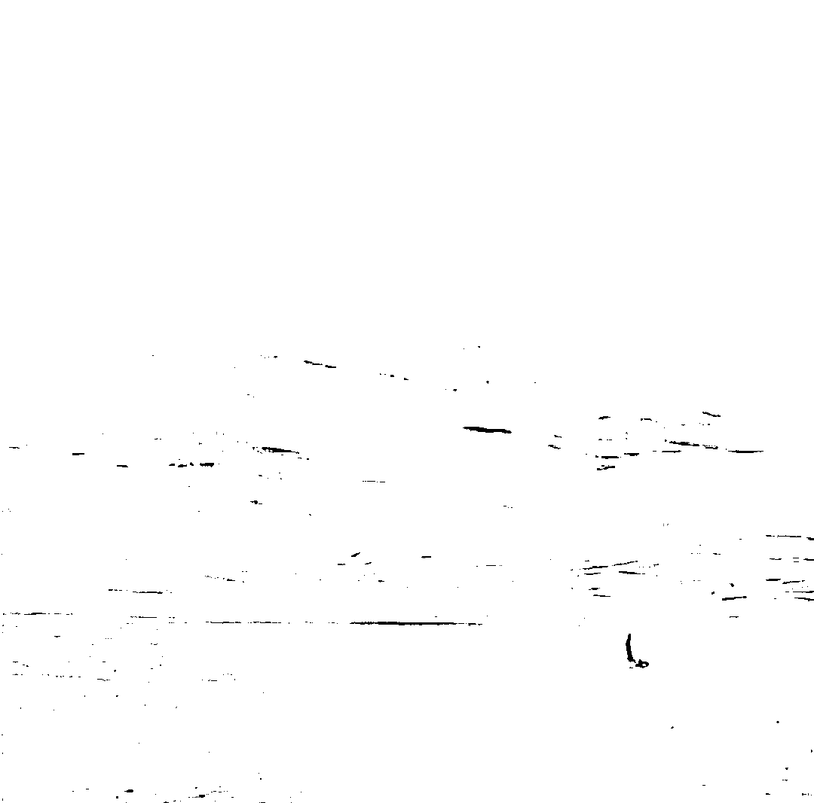**木星在水瓶座**顺行**：2021.10.18-2021.12.29**

**意识更新，旧我远去。**云在青天，水在瓶。万籁俱寂，吾丧我的“空”？分不清是孤独，还是平静。人类脑电奔腾期，愿景与火箭齐飞。

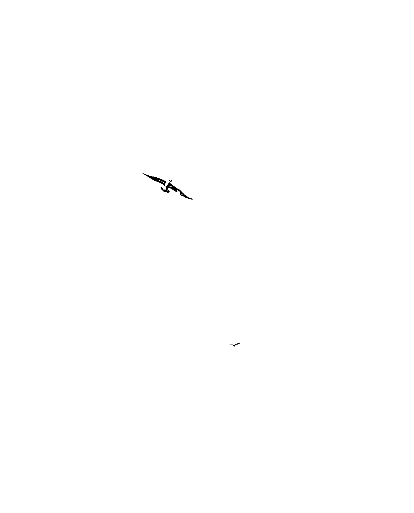**木海新年新篇章，**这才终于正式拉开了帷幕：

**木星再入双鱼座：2021.12.29 -2022.5.11**

*   1.12 火海四分

*   1.14-2.4 水星逆行，从水瓶座 10 度到摩羯座 24 度 

*   **1.19 月亮北交点入金牛座(真交点时) **

*   2.18 木星六分天王星

*   2.22 美国冥王星回归

*   3.3 火冥合相

*   3.23 火天四分

*   4 月上旬 双鱼座木星、海王星六合金牛座北交点

*   4.5 火土合相

*   4.11 土星四分金牛座北交点 

*   4**.12 木海合相在双鱼座 23 度 **

*   4.15 火星入双鱼座

*   4.30 冥王星逆行 

*   5.1 在金牛座 10 度发生日食 

*   5.4 木星六分冥王星

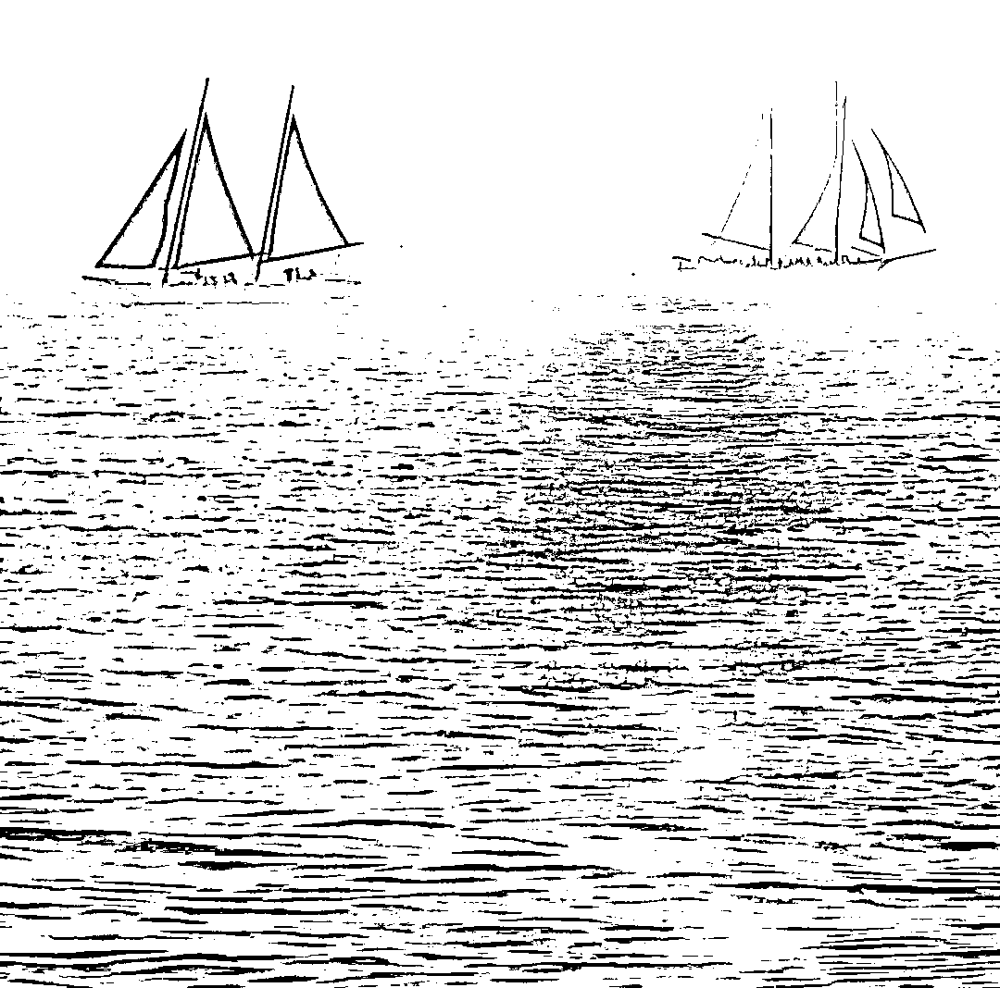

自去年的观望测试期，清除幻想后。如今**正式航行开始，主动造梦，**依旧满眼星辰。更新的信念价值观，能否成型，有待实践检验。行动吧，**视木星宫位，拉紧你的船帆。**而我的**预言梦又繁忙地开始了**......从木星进双鱼座的第一晚。 

时间很早，还没到八点。**这次远征即将举行一他们打算到灯塔去：**拉姆齐先生、凯姆和詹姆斯。

**“给灯塔看守人送些什么东西去呢？”**

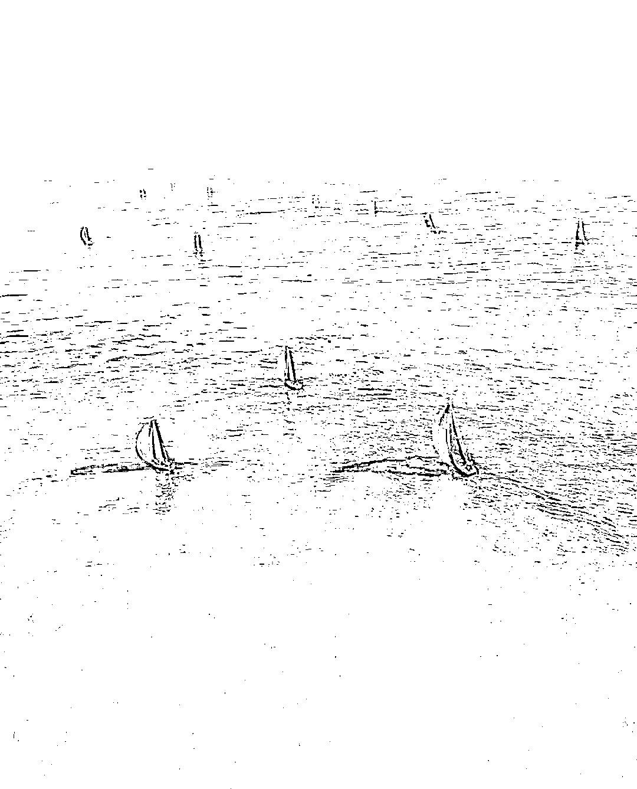

纵观五个月中，天象极尽繁杂：**深不可测，意味深长。一半是海水，一半是火焰......**

在**海湾里出现了频繁的活动，**许多小船在扬帆出海。海湾不再是空荡荡的，而是充溢着生命。她似乎深深地站在某种物质之中，在其中运动、漂浮、沉没。是的，因为**这些水域是深不可测的。已经有这么多的生命倾注到这激流中去。**

**你什么也不必说。**你**抖动一下你的船帆，**从各种事物之间滑行过去，**把它们远远地抛在后面。**

**现在他们已经曳起了帆：那些帆篷无力地飘垂、犹豫了片刻之后，现在已灌饱了风，**在深沉的静谧中扯满了，她瞅着**那条船深思熟虑地选定了它的航道**，越过了其他船只，**向着大海乘风破浪而去。**

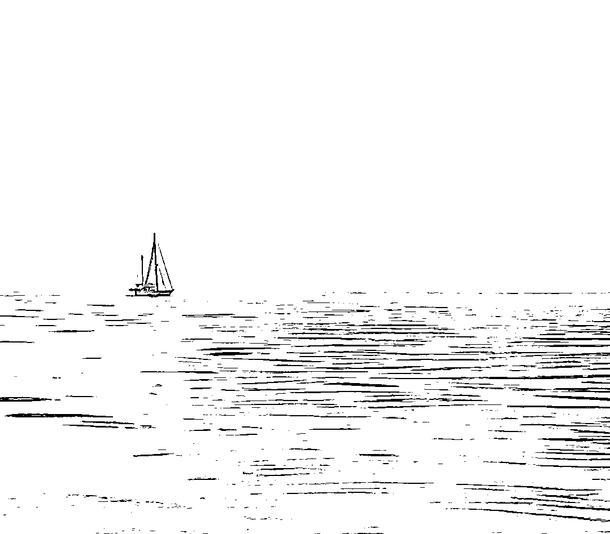

**木星入白羊座：2022.5.11 -2022.7.29**

*   5.10-6.3 水星逆行，从双子座 4 度到金牛座 26 度 

*   5.16 发生在天蝎座 25 度的月食

*   6.5 土星逆行 

*   6.28 海王星逆行   

 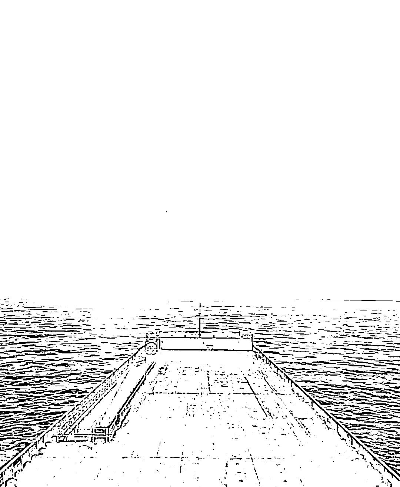

年运于此处发生了转折。从双鱼座的消融自我，到白羊座的捍卫边界。**或许木星白羊座的探索自我，才是木星双鱼座图景背后的真正主题。以梦为马，以退为进，最终还是为了重新找回自己在世间的定位。**人如何在不放弃自我本质的同时，又去同情世界。其实白羊座根本没空想那么多，做就对了！action... just do it！一句提醒，**行运短促，当心冒进。**

早春就像一个处女，她的童贞凛然不可侵犯，她的纯洁是高傲的，她玉体横陈，躺在田野里，**睁大着眼警惕地观望着，一点儿也不在乎旁观者在干些什么、想些什么。**

他们吵吵嚷嚷地沿着走廊跑来。然后，**门一下子打开了，他们涌了进来，像鲜艳的玫瑰，清醒地睁大着眼睛，**好像到饭厅里来寻找他们的早餐，是件了不得的大事情。一整天就这么过去了，直到她上楼去祝他们晚安，发现他们都钻进了放下蚊帐的小床里，就像在放满樱桃和木莓的鸟窝中的小鸟一样，还在编造一些故事，来描述一些无关紧要的事情一他们白天听到的、或者在花园里偶然看到的事情。**他们每个人都有自己小小的宝藏。**

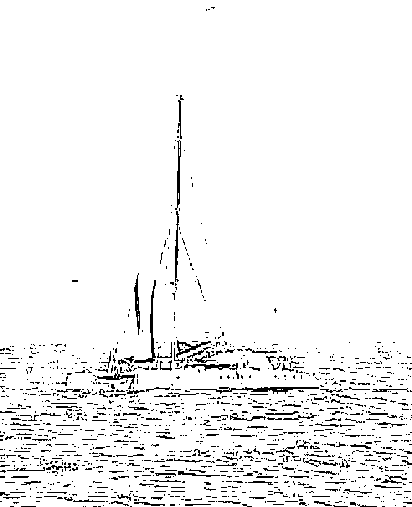

回归外部世界，周身充满活力。**勇者的弓箭，已拉满。**眼望着灯塔，信仰激越。策马扬鞭，时不我待。独行，以保持自身的本色。

于是，**他拿着棕色的纸包，穿着优质的皮鞋，跨着坚定的军人般的步伐，带头走上那条小径。**他的两个孩子尾随着他。她想，**孩子们看上去好像命运已经赋予他们某种严肃的使命，他们正在奔赴这个目标。**莉丽似乎感到她正在瞧着一支队伍前进，尽管它的步伐不齐、士气不振，**但有某种强有力的共同感吸引着他们，使他们结成一个小小的整体，**给她留下了奇特的印象。

 现在一阵风把它们的树枝尽量向上托起**（像一条船在风浪中昂起了船头）。**

**木星在白羊座逆行：2022.7.29 -2022.10.28**

*   8.1 天王星合相北交点

*   8.24 天王星逆行 

*   9.1 火星六分木星

*   9.10-10.2 水星逆行，从天秤座 8 度到处女座 24 度 

*   9.28 火土三分

*   10.9 冥王星顺行 

*   10.12 火海四分

*   10.23 土星顺行 

*   10.25 发生在天蝎座 2 度的日食

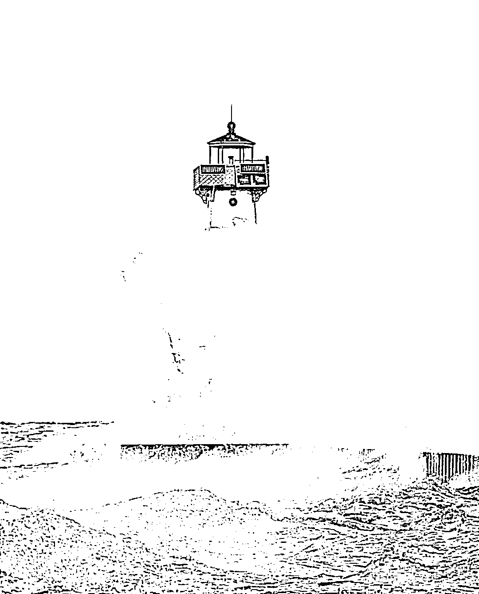

那些帆篷在他们的头顶上方**微微飘动**。水声潺潺，浪花拍打着船舷，小船在阳光下**打着瞌睡，滞留不进**。偶尔有一丝微风轻轻拂动那些帆篷，但是它们飘摆波动了一下，**风就停了。那条船完全静止不动了。拉姆齐先生坐在小船中央。**詹姆斯想，**他马上就要觉得不耐烦了：**凯姆心中也有同感。

盛夏到初秋，莽撞恣意的能量，也能坐下来片刻反省了。自我意志与顺势而为，究竟哪个重要？个体的生命，都怀有孤立的本质。**出于分离的欲望，渴望从子宫中喷薄而出。**私人的领地，如珍贵的火苗，急需**自保**，敏感于侵犯。仿佛**孤立性**一旦打破，**混淆困惑**便会让脚底摇晃，带来**一种个人主义的失败？自我与无我**正在撕裂，**阴阳性认同**两极摆荡。**或许英雄的心底，都有一个献祭海洋的梦......**每个人都将孤独地灭亡，**跌入深渊？回归母体！**

我们各自灭亡，孤独地，但我曾卷入更加汹涌的海浪，被更深的深渊所吞没。

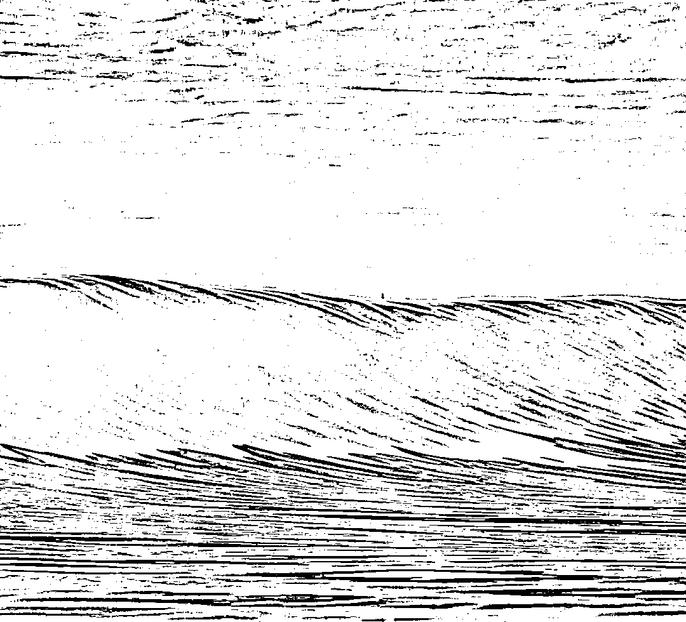

**木星在双鱼座逆行：2022.10.28-2022.11.24**

*   10.30 火星在双子座 25 度逆行 

*   11.8 发生在金牛座 16 度的月食

*   11.19 火海四分

 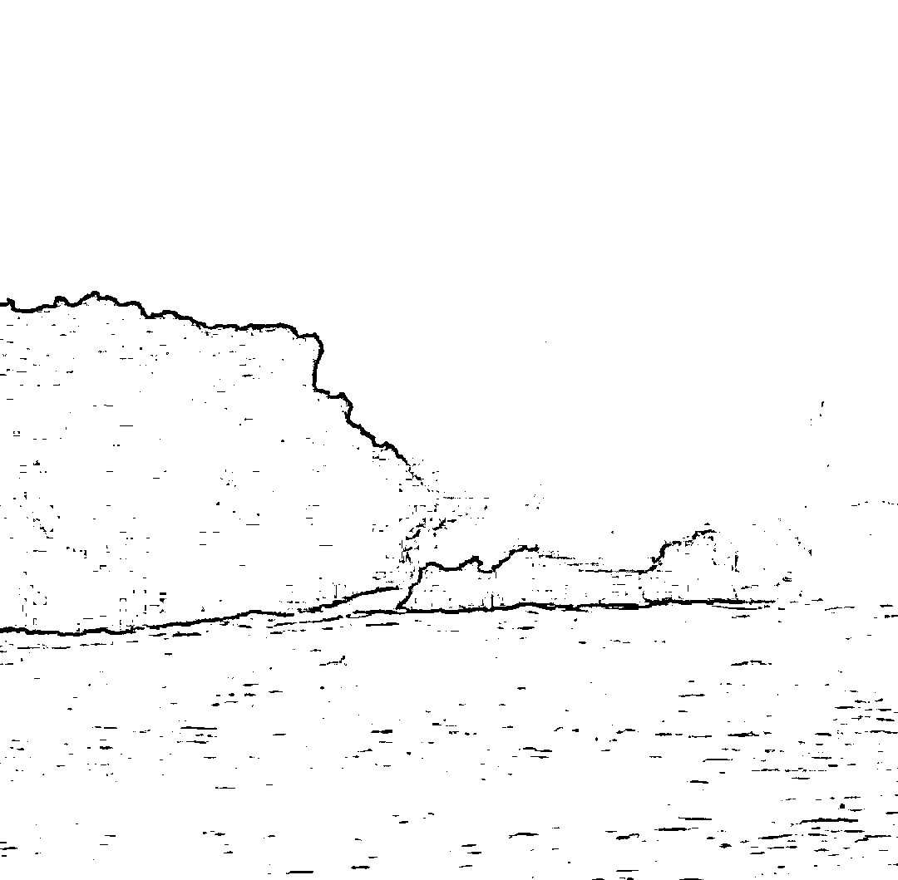

终于可以稍息片刻。来看看，新大陆的开拓冒险中，**哪些事有幸存活了......**

 

在这十一条船中，沉没了三艘。他向麦卡力斯特所指的方向望去，眼里射出骄傲的光芒；凯姆想，他是多么勇敢，他多么富于冒险精神。要是他当时在场的话，他会亲自放下那艘救生艇，他会赶到那条遇难的船只那儿去。

为了她不懂得罗盘的方位，她父亲是多么生气。

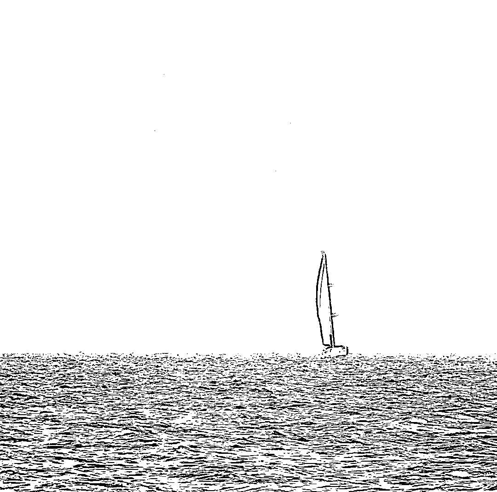

**直立的野兔，退潮的海浪，颠簸的小船。**

**航行是劳累的。**

**木星在双鱼座顺行：2022.11.24-2022.12.20**

*   11.29 火土三分

*   12.4 海王星顺行  

一年又即将结束。你收获了什么，又**想通了什么？**能眺望到你朝思暮想的灯塔了吗，还是说它看起来更像是另外的一座？**而另外一座也是真实的......**

他只说了一声“啊”，好像他自己在思忖：**那有什么可大惊小怪的？在暴风雨中自然会有人淹死，**这是显而易见的事情，**而大海的深处不过是海水而已。**

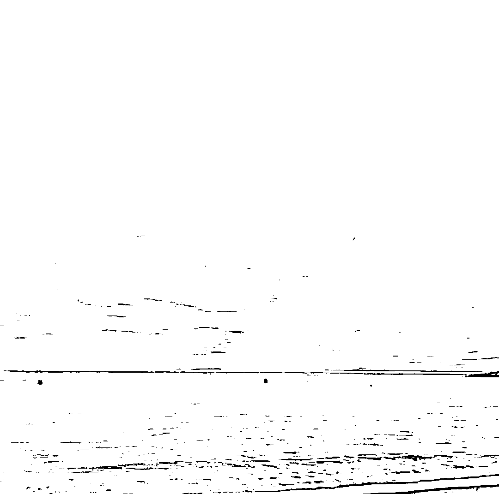

凯姆开始给自己编造一个**从沉船上死里逃生的故事**，她需要的是这种冒险的感觉。

这时，他们正在岩礁附近飞速航行，这十分令人兴奋。他们又**在一艘大船沉没之后驾着小舟在暴风雨中挣扎，逃向安全地带。**

她开始想：**船开得好快**。我们在往哪儿去啊？她被那船身的颠簸催眠了。

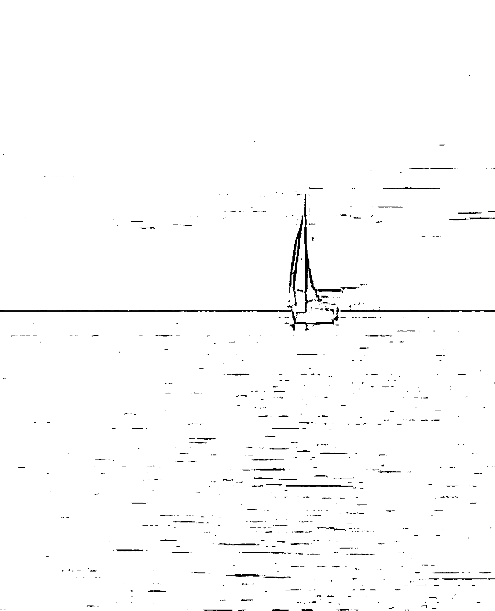

他还记得，他的父亲说道：“会下雨的。明天你不能到灯塔去。”**这就是那座朝思暮想的灯塔啰，对吗？**他们现在确实已经非常接近那座灯塔。你可以清楚地看到灯塔的窗户。詹姆斯想，**这些年来隔海相望的灯塔，原来就是这般模样；它不过是光秃秃的岩礁上的一座荒凉的孤塔罢了。**它不过如此而已。**但是它使他感到心满意足。它证实了他对于自己性格的某种模糊的感觉。**

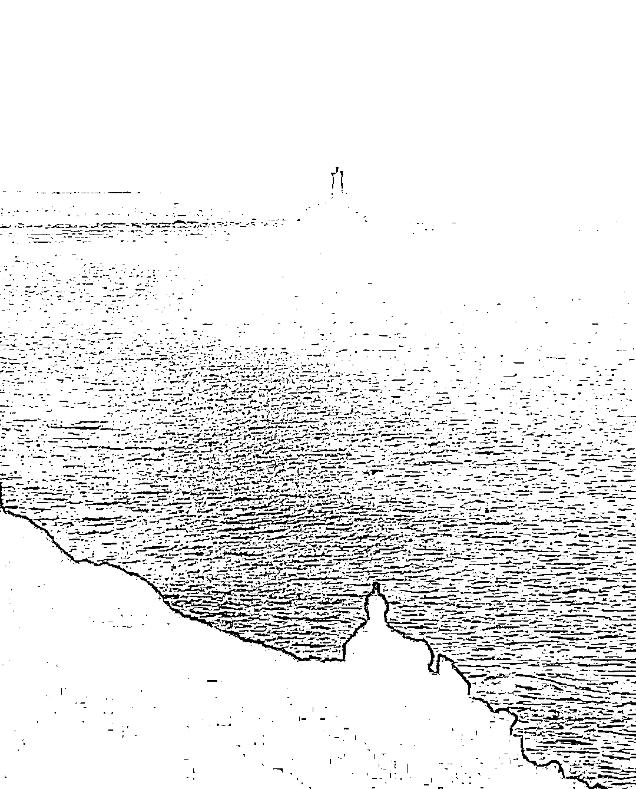 

**他们已经在逆风中调整了帆篷的方向，现在他们正在飞快地航行，排山倒海的波涛一浪又一浪地推着他们不断向前冲刺，**帆船在那暗礁旁边驶过，船身有节奏地剧烈颠簸跳跃。现在他们可以看到灯塔上有两个人在瞭望着他们，并且准备迎接他们。

**木星再入白羊座：2022.12.20**

*   12.29 水星在摩羯座 24 度逆行 

*   2023.1.13 火星在双子座 8 度顺行 

*   2023.1.18 水星在摩羯座 8 度顺行 

*   2023.1.23 天王星顺行

**征服，到灯塔去！**铭记这一年，珍藏你心中的火种。进入人类最激荡的 2023......

**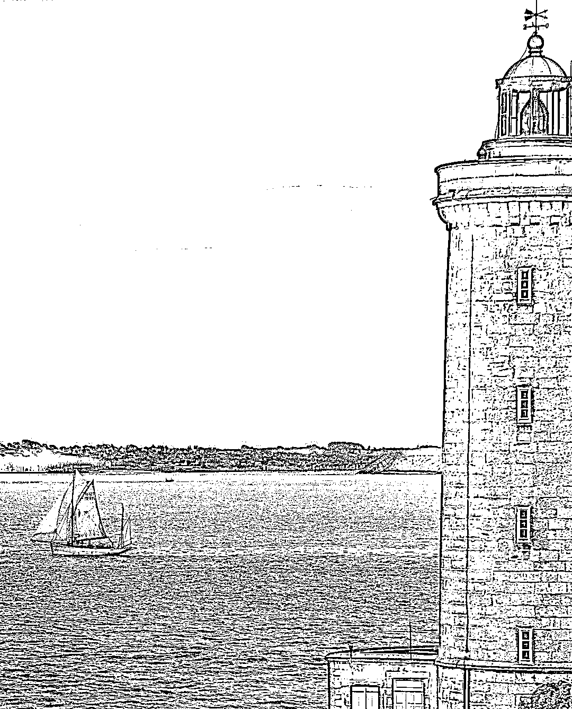**

**“瞧！那就是灯塔。咱们快到啦。” **

**现在他在想什么？他如此执著、如此专心、如此沉默地在探索什么？**他们姊弟俩瞅着他光着脑袋坐在那儿，膝盖上放着那只纸包，凝视着那缥缈的蓝色形象，它就像什么东西燃烧之后留下的一片烟雾。他坐着凝视那个岛屿，**他可能在想，我们灭亡了，各自孤独地灭亡了；或者他可能在想，我终于到达了，我终于找到它了。但是他什么也没说。 **

**“拿着那些纸包，那些给灯塔看守人的纸包。”**他立起来站在船艏，身材魁梧挺直。**詹姆斯想，他瞧上去活像他正在宣布：“根本没有上帝。”凯姆想，好像他正在向空中纵身一跃。**他拿着纸包，**像年轻人一样**轻快地一个箭步跳上岩礁，他们两个站了起来，跟着他跳上岸去。

**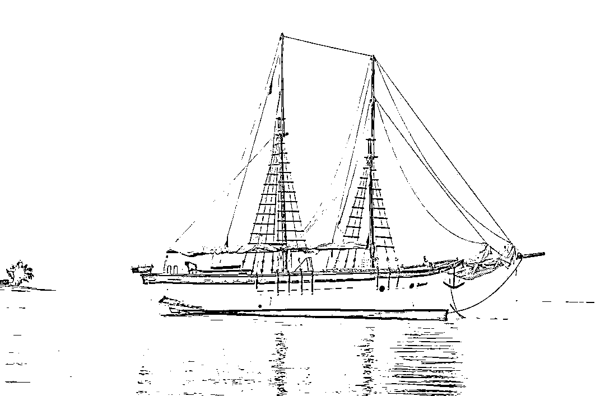**

**年运的另一条主线**

关于爱情，**揭竿而起的一年**过去了......（有没有发现水瓶时代本身的一大笑点，即众人以吃瓜为乐。当旁观者被旁观时。）灰姑娘的故事，从未被证明如此丑陋。她们振聋发聩地嚷着：你绝不会是你的王子心中那唯一！

续集中王子纷纷变回青蛙，双方瞪大了惊恐的眼睛，从各自视角遥望着对方的“恶毒”。**孰是孰非？事关人性，没有答案。人们早已忘记，“执”念，才是你我相逢的理由。**末了，连摩羯座们都不忍了……金星与冥王星合相在摩羯座的 12 月。那一刻，我笑场。转身做了一个决定。用代表自身意象的元旦海上日出， 换下了七年的朋友圈封面......

**“莎乐美，你首先要是自己！”**正如我在【[冥王星 8 宫](http://mp.weixin.qq.com/s?__biz=MzA5NjA0NTAxNg==&mid=2651461799&idx=1&sn=6449bc2646de146b034e2dbe33901b5c&chksm=8b48aa10bc3f2306791c7094ae689cc5ce52e3b92412b18cfdde538c9df2134798dc0716963a&scene=21#wechat_redirect)（上）[冥王星 8 宫](http://mp.weixin.qq.com/s?__biz=MzA5NjA0NTAxNg==&mid=2651461799&idx=2&sn=b883690fda7187c23be95654316ed956&chksm=8b48aa10bc3f2306f80d6aa61e69ffce352286487a6997f7c57fadabbf1b4a4b2ee4d1c8b947&scene=21#wechat_redirect)（中）[冥王星 8 宫](http://mp.weixin.qq.com/s?__biz=MzA5NjA0NTAxNg==&mid=2651461799&idx=3&sn=af479b5e7c89af05b3dd55500c76ff5e&chksm=8b48aa10bc3f23066ad1206298e7b342c18e251c36bd7e2a3bec81b1a81d4ec30dc072b8c7eb&scene=21#wechat_redirect)（下）】中大写的一句话。**这就是 2022 年运的另一条主线：天蝎座南交点，金牛座北交点。**（注：我的冥王星系列并不限于冥几本身，而是以冥王星为动词去挖掘该宫位的原型。且尤其适用于南交点在此宫的人们。）

所以，**这正是写给所有人的 2022 年运上篇。**而解药则恰已在【[冥王星 2 宫](http://mp.weixin.qq.com/s?__biz=MzA5NjA0NTAxNg==&mid=2651457278&idx=1&sn=7c15e5b4982c87dc687d915579145b69&chksm=8b48b449bc3f3d5f1cf9a24c857f1c249d51fd8ed0f989952c27f20ab9ffb02f697886144854&scene=21#wechat_redirect)（上）[冥王星 2 宫](http://mp.weixin.qq.com/s?__biz=MzA5NjA0NTAxNg==&mid=2651457278&idx=2&sn=dc951a366f5f2393b2d3f40571399e14&chksm=8b48b449bc3f3d5f38cabeae6b603ee51f6ad82345b4ca957d029e33cc021531300b2fa014c8&scene=21#wechat_redirect)（下）】中铺展：资本远不如一个农民更具有自我价值......这一年，每个人，无论抽象地，具象地，或许都该回归乡野，做个农民？**如何从天蝎座南交点的风声鹤唳，草木皆兵；走向金牛座北交的赤手空拳，面无惊慌。冥王星在 8 宫与冥王星在 2 宫两篇结合阅读，便是天蝎座-金牛座对宫天象的最完整地图！无法更详尽，无须再赘述。**

为什么拉姆齐夫人这样热衷于婚姻问题呢？

**“嫁一个有皮表袋的男人，那有多妙。”**

**我虚度年华，有何收获？**

**她连一个自己能够加以辨认的躯壳也没留下。她的一切都慷慨大方地贡献给他，被消耗殆尽......**

**版权声明：**本文由作者授权在若道平台发布，欢迎转发，反对抄袭。

**蓝女巫**

英国伯明翰大学 市场营销学硕士

职业占星师/专栏作者/芳疗师/珠宝设计师

中国首批 ISAR 英文认证占星师（2012 届）

**微信公众号**：cecilia_sui

长按打赏

**2022 年来了****还不快领取你的****专属年运报告****？****购买有优惠，点击图片查看详情哦~**

**学习占星学****点击下图了解课程详情** 

**

****************

**微信又双叒叕改版啦，不想错过若道君的推送？**

**就把若道设为星标吧！****▼**

**就是这个“在看”，戳戳戳 ☟**

******报名直达入口******

# 巨蟹座满月 | 混乱炸裂的时期，用规则学习经验，用经验打破规则

> 原文：[`mp.weixin.qq.com/s?__biz=MzA5NjA0NTAxNg==&mid=2651466465&idx=1&sn=b4b244ecd5beb27d4c7bb4ed0ba73407&chksm=8b489856bc3f1140eb014735ede905468e7ddf72fba4eb7eb5afb403d9d6bdf9ed933d0a99f8&scene=126&sessionid=1692737867#rd`](http://mp.weixin.qq.com/s?__biz=MzA5NjA0NTAxNg==&mid=2651466465&idx=1&sn=b4b244ecd5beb27d4c7bb4ed0ba73407&chksm=8b489856bc3f1140eb014735ede905468e7ddf72fba4eb7eb5afb403d9d6bdf9ed933d0a99f8&scene=126&sessionid=1692737867#rd)

**☆ 后台回复“今日”，给你一句生命态度**

作者/王芝桦 香香菲舞 编辑/玫瑰 图片/pexels

**巨蟹座满月****北京时间 2022 年 1 月 18 日 7:48 迎来 2022 年的第一场满月—巨蟹座满月，摩羯座太阳与巨蟹座月亮于 27°50′精准对分。**此次巨蟹座满月，“家园安全与情感归属”的内在渴望，在满月的月光之下被唤醒和照亮。现实仍然充满艰辛的考验，宇宙正通过这种并不简单的方式，历练我们真正的成熟，引领我们在情绪的骇浪之中回归内心的安宁，在现实的严冬之中等待春天的到来。

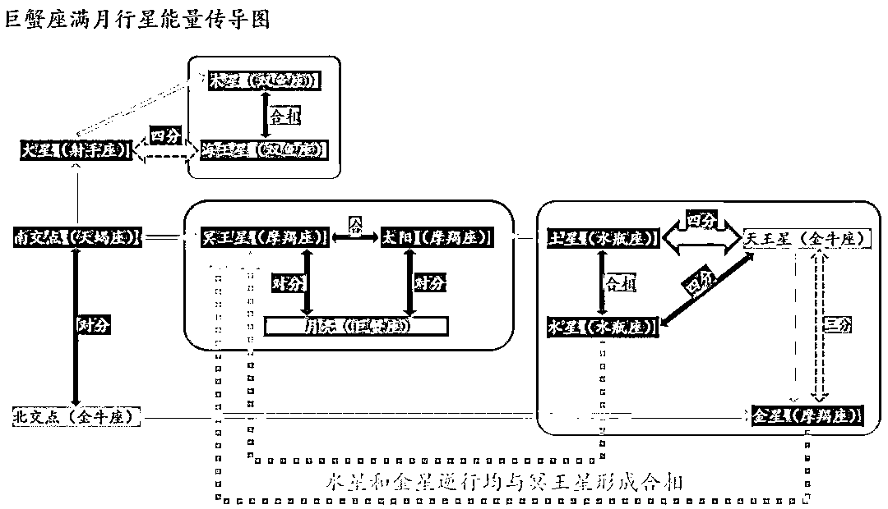

**巨蟹座满月重点影响人群**

参考满月峰值影响期间各个行星的行进度数，以及逆行行星的轨迹影响；常规容许度，个人行星入相位 3°，出相位 1°；非个人行星入相位和出相位均为 3°。

**·** 出生星图中，有**行星、四轴、南北交点落入固定星座（金牛座、狮子座、天蝎座、水瓶座）0°-17°，25°-30°**的人群； **· **出生星图中，有**行星、四轴、南北交点落入基本星座（白羊座、巨蟹座、天秤座、摩羯座）6°-30°**的人群；**·** 出生星图中，有**行星、四轴、南北交点落入变动星座（双子座、射手座、处女座、双鱼座）0°-7°，17**°-29****°********的人群。

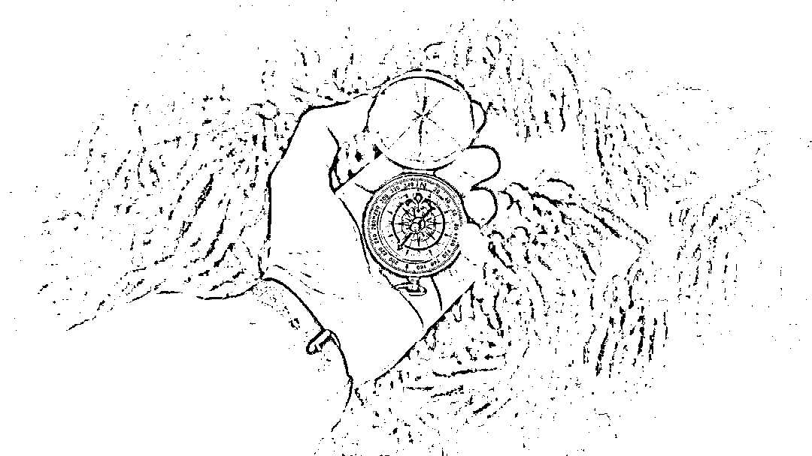

**放下执着，学会适度**

****

**如果有一天，你心底藏着一些事，一些你没有勇气说出来的事，记住，你可以信任我跟我说，我不会出卖你。**

**——马克·李维《偷影子的人》**

> ****天象：****
> 
> **· 冥王星介入“日月对分”轴线：摩羯座太阳合相摩羯座冥王星，巨蟹座月亮对分摩羯座冥王星。**

如果我们把这个世界想象成一座时钟，那么最近两年的钟摆律动就像是陷入了一场危机，毫无规律可言，甚至有点疯狂。

如果有一位时钟机械师，那么他会如何解决这一场危机呢？他肯定会进行“上紧发条并蓄满势能，放松发条并转化动能”的检测，因为发条上得太紧或放松不够，都足以令这座时钟混乱或停摆…… 

那么，这位时钟机械师是谁呢？是我们人类吗？不对，我们身处这座时钟（这个世界）之中；那么，身在时钟之外、拥有神奇之手、能够解除危机的究竟是谁呢？

在肉眼看得到的世界之外，还有更宏大和更厉害的存在——此次巨蟹座满月，“宇宙超级大 BOSS 冥王星”如是说。

**2020 年 12 月 22 日**，影响过去将近 200 年的“土元素周期”正式结束，影响未来将近 200 年的“风元素周期”正式到来——**从工业时代向科技时代迈进，从保守主义向创新精神迈进，从成功价值向共赢文明迈进。**代表宇宙终极力量的“宇宙超级大 BOSS 冥王星”，揭示着我们无意识之中的“业力执着和恐惧阴影”，他搬出一块周而复始绊倒人的大石头，说**“摔几次才能看到，但只看到还不够，必须从内在真正转化意识，从现实彻底改变模式，才可能不再跌跤”。****2008 年-2024**年“宇宙超级大 BOSS 冥王星”行进摩羯座时期，恰逢 200 年一次的“新老周期”转换进程，而摩羯座冥王星的魔法在于：无论是物质世界和经济市场，还是组织系统和科技突破，过去十几年都获得了前所未有的推进和发展。

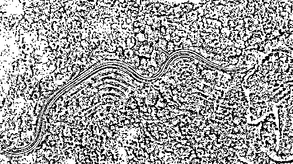

然而，这个世界越来越繁华，地球资源却越来越稀薄，只能更好的野心膨胀着功利，不进则退的恐惧驱动着欲望，过度的成功价值和结果导向，犹如过度上紧且难以放松的发条，令人机械麻木，甚至疲惫不堪，远离了内心的初衷，淡漠着彼此的关爱。“宇宙超级大 BOSS 冥王星”行进摩羯座，向我们揭示有关**“尺度与边界”**的业力议题——**适度，既需要成熟的态度，亦需要自律的品格；而越界，在喂养执着的同时，更在制造破坏性。****2021 年 12 月 23 日，南北交点平均交点换座“天蝎座南交点-金牛座北交点”轴线，**进一步强调了“宇宙超级大 BOSS 冥王星”行进摩羯座这一周期（2008 年-2024 年），在最后时刻布置出的业力功课（冥王星守护天蝎座）：**·** 过度上紧的发条，透支着我们的心力；过度膨胀的速度，破坏着现实的平衡。**·** 我们真的在危机里吗？现实的危机不过是人类意识的外在显化。**· **宇宙正以一种不得已且不美好的方式，提醒我们有意识地松下来，主动地慢下来。**· **未来一年半，将是“凝视恐惧，破除执着，返璞归真，活在当下”的一段旅途。此次巨蟹座满月，“宇宙超级大 BOSS 冥王星”介入“日月对分”轴线：一方面，来自摩羯座太阳的合相结构，再次激发着**“自我的野心”**，也同时提示我们**权衡“自我的实力”**；另一方面，来自巨蟹座月亮的对分结构，则在满月的“完结”能量之下**对那些过度和越界的事物进行惩戒与清除。**

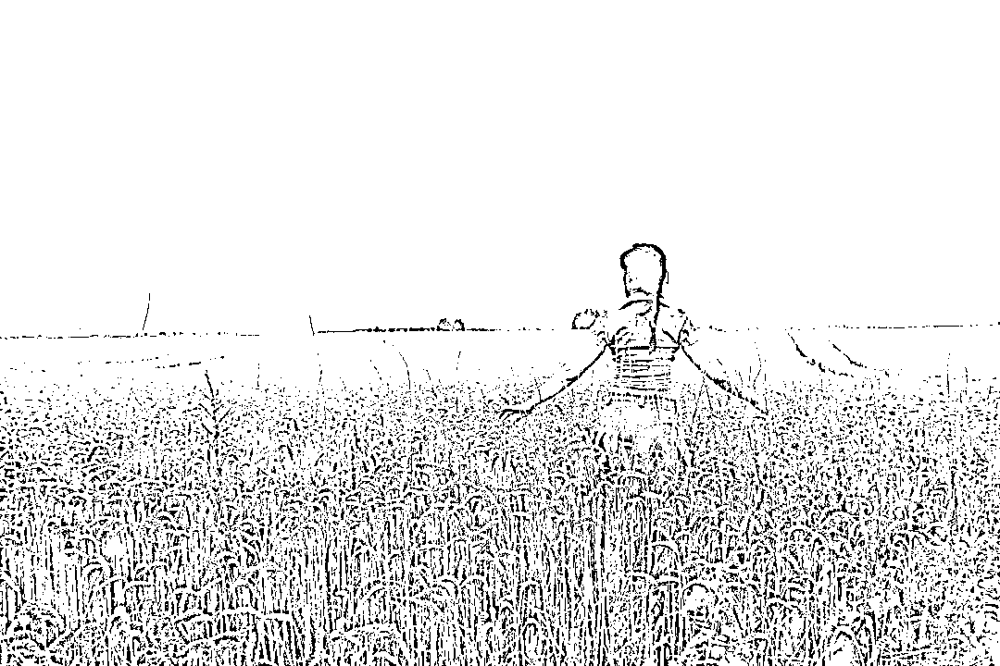

**这里需要敲黑板和划重点的是**

**· 巨蟹座与月亮是一组充满共振能量的守护关系。**此次巨蟹座满月，在“现实生活和心灵深处”之间打开一条神圣的通道，引领我们回归内心身处，疗愈内在情感，修复现实关系；
**·** 关键是，我们是否愿意化解那些与“爱”有关的议题，是否能够勇敢面对内心深处的伤痛与嫌隙，是否能够真诚表达内心深处的渴望与歉意；**·** 重要的是，一个成熟的人，Ta 真正的自尊，并不是不苟言笑或不能低头的权威外壳，而是**深知渴望和跟随爱意的柔软内心，与自我和解，与爱共行**——你想要什么，就去建设它！无论是一个温暖的家园，还是一份独属的实力！“如果有一天，你心底藏着一些事，一些你没有勇气说出来的事，记住，你可以信任我跟我说，我不会出卖你”——这个“我”，首先是自己，而后是我们渴望拥抱的人；当说出“Love 或 Sorry”的时候，没有人能够抵挡这份真挚，只要我们不再执着地自以为，不再僵硬地对抗。

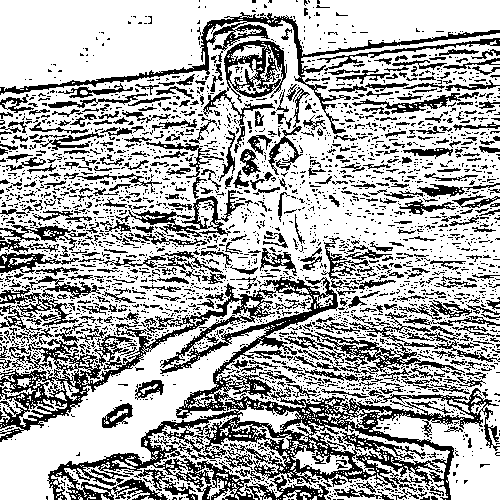

**心在一起，不怕折腾**

****

**规则，是用来让我们学会经验；而经验，则是让我们拿来打破规则。****——马克·李维《偷影子的人》**

> ****天象：****
> 
> **· 火海四分：宽泛容许度下，射手座火星四分双鱼座海王星。****· 水天四分：宽泛容许度下，逆行的水瓶座水星四分金牛座天王星。****· 金天三分：宽泛容许度下，逆行的摩羯座金星三分金牛座天王星。****· 水星逆行和天王星顺行：1 月 14 日，水星于水瓶座开始逆行；1 月 18 日，天王星于金牛座恢复顺行。**

在写这篇满月文的时候，我的家乡天津正与奥密克戎病毒进行着一场“时间争夺大战”。从 1 月 8 号开始，这个 1400 万人口的城市几乎以极速开始了 3 轮、4 轮、5 轮、6 轮的全员核酸检测。在此感谢所有在严冬一线辛苦付出的专业人员和志愿者们，祝愿所有朋友健康平安。

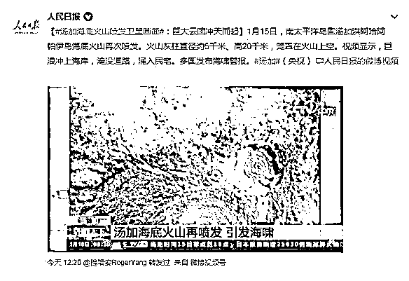

| 汤加海底火山爆发
还有一则相当重磅的新闻。1 月 15 日，南太平洋岛国汤加的海底火山喷发，导致多个太平洋沿岸国家，以及远在北半球的日本连续发布海啸预警。说实话，对占星师而言，在 2021 年 12 月 29 日，具有“扩张能量和膨胀风险”的木星换座进入双鱼座，并与掌管“海洋和地壳运动”的海王星在双鱼座的海洋之中形成了 2022 年度“木海互容”的大背景，这无疑是非常敏感的一则新闻。**1 月 12 日**，射手座火星与双鱼座海王星形成**“火海四分”**结构，制造出无序的混乱；而**1 月 14 日，**水瓶座水星开始逆行，**1 月 18 日，**满月当日的天王星恢复顺行，则注入更多**疯狂的节奏和震荡的频次**。以上几组天象变化，引动天雷地火，勾起莫名烦躁，地球和我们似乎都有些激进。2022 年第一波水星逆行的轨迹可说是相当奇特：**1 月 14 日-2 月 4 日水星逆行期间，将会从水瓶座 10°逆行回到摩羯座 24°。**故而，这一波水星“从水瓶座逆行回到摩羯座”的逆行轨迹，又一次关联了**2021-2022 的重磅天象“土天四分”结构**——土星和天王星守护水瓶座（水星开始逆行的星座），土星守护摩羯座（水星结束逆行的星座）。

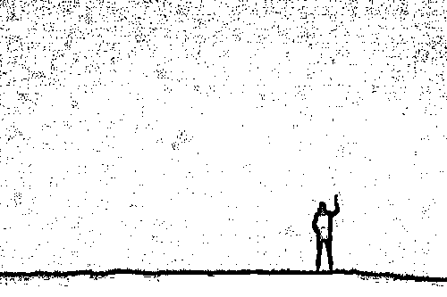

“水逆”向来是背锅侠，人们时常将一切不顺和阻碍都怪罪到“水逆”的头上，这种狡猾无比的“划水”行为，简直和水星神话原型“赫尔墨斯”的阴影面一模一样。赫尔墨斯其实就住在我们生命之内，他**时常帮助我们梳理思路并做出决定，但也时常帮助我们逃避恐惧并推卸责任。**但这一波水星逆行，赫尔墨斯却是被天王星的神话原型，也就是他的曾祖父、第一代天神乌拉诺斯，那个不按常理出牌的“疯子”给整惨了。**·** 满月当天，逆行了 5 个月之久的天王星恢复顺行，能量的转向令这个“疯子”更加疯狂了，掀起一波突发的混乱和意外的变化。**·** “疯子”是谁都按不住的，就只能跟着一起折腾：“水天四分”中刚刚逆行、流畅受阻的水瓶座水星斗它不过，“金天三分”中仍在逆行中反思、关系问题悬而未决的摩羯座金星也只能惟命是从，而 1 月 12 日，“火海四分”早已埋下的心烦意乱更是蹭蹭地冒火。**·** 此次巨蟹座满月，就像是被“疯子”按下了完结的启动键，集体环境的震荡，言辞冲动的代价，或许我们不会即刻看到影响和结果。但当**1 月 26 日**，水星逆行回到摩羯座；**1 月 29 日**，摩羯座金星恢复顺行且“金天三分”结构更加紧密的时候，组织架构的调整，职场人事的变化，关系问题的推进，金融市场的震荡，便会开始一一呈现出阶段性的结果。**·** 故而，此次巨蟹座满月，**尽量不要冲动之下做出重大的决定，一定要记得做好电子产品的管理和档案文件的备份**；另外，**切记安抚情绪并谨言慎行，不要跟风，不要添乱，能力有限做好自己就是最大的贡献，能力可以就去帮助他人施予援手。**如果将容许度开放得稍大一点，就会发现这一波水星逆行将从水瓶座 10°逆行回到摩羯座 24°，而这段逆行轨迹两端的度数分别合相了行进在水瓶座 13°的土星和行进在摩羯座 26°的冥王星——真正的始作俑者其实是“宇宙超级大 BOSS”**摩羯座冥王星**，更是“土天四分”结构中的**水瓶座土星**（土星守护摩羯座），而最后真正的大 BOSS 还是“土天四分”结构不破不立的清算进程（土星和天王星共同守护水瓶座）！**“土天四分”结构要清算什么？历史沉渣。**

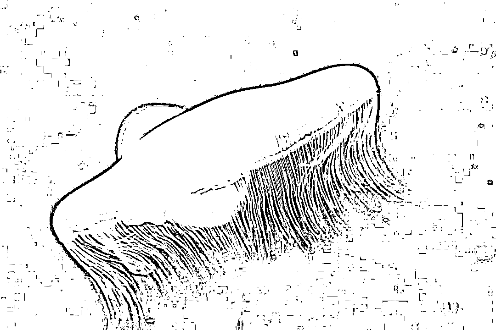

全新的“风元素周期”已经到来，我们将会迈进更加智能、更多 AI 的未来世界，故而，就需要**更加开放的视角和灵动的创意，更加尊重的意识和共赢的精神**，否则这个世界将会被数字和机器、尖锐和冰冷所覆盖。

只有众生皆爱，才能造福这个星球，共享我们的家园。

前文写过 2008 年-2024 年期间，“宇宙超级大 BOSS 冥王星”行进摩羯座周期的内容。过去十几年的快速发展，令这个世界充斥着成功学的潮流和物质的诱惑，不是不对，而是不能过度——**我们需要有志向，但不能好高骛远；我们可以有野心，但实力要撑得起才行；我们需要成就更高的自我，但需要选择“自我天性的价值”，而不是“大家眼里的价值”。**2021 年-2022 年，“土天四分”结构掀起现实的震荡，筛出那些已经陈旧的规则和无用的陋习，逼迫我们进行清算并做出改变——规则，是用来让我们学会经验；而经验，则是让我们拿来打破规则。因为，只有在去除腐朽并返璞归真之后，才能开创全新的未来并重建安全的根基。此次巨蟹座满月，或许现实生活充满着震荡与考验，但我们的心不能动摇。只要我们的心在一起，就能度过一切。

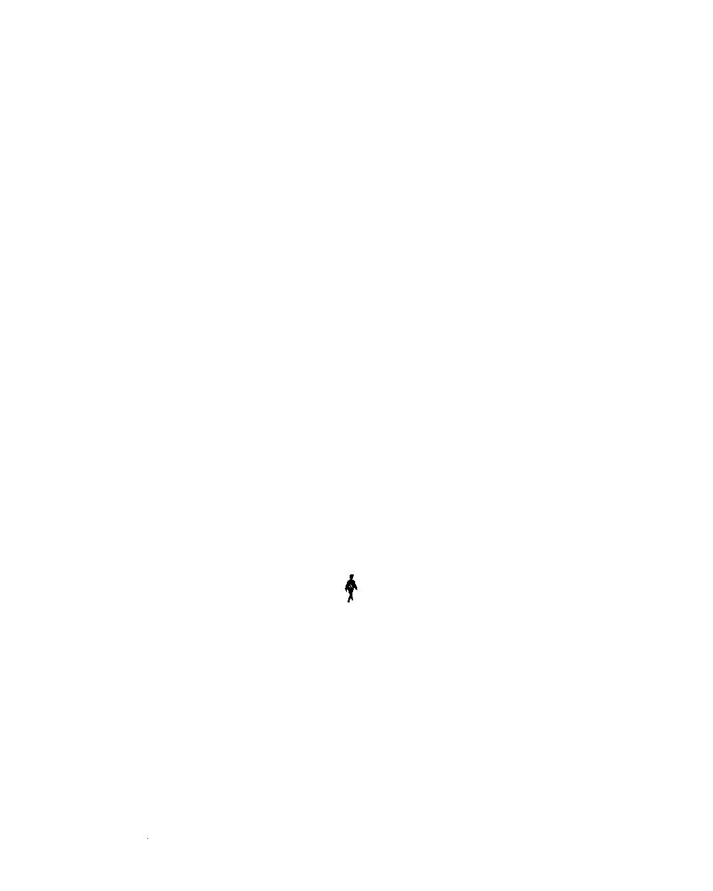

**寄语**

****

**送给爱人最好的礼物，是时间。**

**——马克·李维《偷影子的人》**天津疫情刚开始的时候，我收到几位正深陷于“关系考验”的朋友的留言，他们焦虑“被关在家里，如何在一个屋檐下相处”。过了几天，我又一次陆续收到他们的留言，大体的意思都是“平安就好”。其实，我也是。我的新工作室正在装修，停工了；我的直播间进不去，停播了。嗯，平安就好。慢下来，希望不是以这样的方式。此时的慢，是那么的被动；此时的稍事，需要那么多一线的朋友以身付出，即使天津人再乐观和逗哏儿，也心疼。我想，很多朋友和我一样，体悟到时间的珍贵，体悟到主动慢下来的重要性。我们每个人都有深爱的家人和朋友，希望未来的日子里，能用更多的时间陪伴他们，一起安享这一场相遇的时光。祝愿每一个灵魂安好。祝福大家，一起加油！

**版权声明**：原创文章由作者授权首发于若道平台，欢迎转发，反对抄袭。友号转载请申请白名单。

****

****想阅读更多作者的文章，****

****请在后台回复******王芝桦****** 即可。****

****王芝桦****

心理占星师，统合疗愈师，占星专栏作者

若道占星“新月和满月”专栏作者，腾讯视频特约占星师

全职于个案咨询与占星教学工作 18 年

**个案预约咨询微信号**：zhihua0621 

**微信公众号**：daoxi-life

**长按打赏**

****

**2022 年来了****还不快领取你的****专属年运报告****？****购买有优惠，点击图片查看详情哦~**

**学习占星学****点击下图了解课程详情** 

**

****************

**微信又双叒叕改版啦，不想错过若道君的推送？**

**就把若道设为星标吧！****▼**

**就是这个“在看”，戳戳戳 ☟**

******报名直达入口******

# 周六开课！新的一年，你可以试试拥抱大自然 | 冬日野骨一日仪式

> 原文：[`mp.weixin.qq.com/s?__biz=MzA5NjA0NTAxNg==&mid=2651466465&idx=2&sn=896366f06feb16fd179e8a75d70045f2&chksm=8b489856bc3f1140ece69333f301945a6eb1a488f228ca1735133d3300ebe6432419a28489d5&scene=126&sessionid=1692737867#rd`](http://mp.weixin.qq.com/s?__biz=MzA5NjA0NTAxNg==&mid=2651466465&idx=2&sn=896366f06feb16fd179e8a75d70045f2&chksm=8b489856bc3f1140ece69333f301945a6eb1a488f228ca1735133d3300ebe6432419a28489d5&scene=126&sessionid=1692737867#rd)

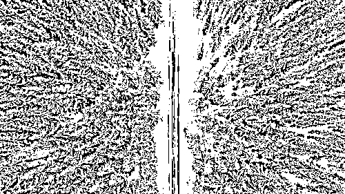

****

**与大自然的灵感力量联结，让你的内在智慧从骨头深处升起。**
**你正在寻找的东西也在寻找你。****——鲁米**这是在新的一年来临之时你可以送给自己的礼物。与另外 7 个伙伴一起，与大自然的灵力相联结，找到内在智慧和野性力量。

1

**适合对象**

**·** 希望自己的生活更有方向感**·** 正处于人生的过渡阶段，正在寻求指引**·** 已经准备好放下那些不再服务你的事物**·** 想要勇敢地联结你的野性力量**·** 想要融入自然界的安宁与美之中，为静谧的智慧留出空间

2

**课程描述**

“冬日野骨”一日工作坊，我们将一起走进大自然和寂静的冬日，在这里，你也许会感知到灵魂在召唤你进入更深的地方，去认知你生活中的转折点，或者去寻找对特定问题或者挑战的洞见与支持。 当你进入冬日时节，在霜雪寂静中，在雨水的气味中或者在自己寒冷的皮肤上，有什么样的智慧在静候着我们？也许你很好奇，那些光秃秃的树木在你的内在召唤什么？鸟儿们低缓的旋律又在如何帮助我们放慢下来？当你放弃一点点安逸，站在冬日之歌的中心时，什么会照亮你的内心深处？**冬日是一个沉思和反省的时刻，是为你自己、家人和后代带来智慧的时刻。**据说我们都是带着独特的天赋降临在这个世界上的，这就是我们灵魂的目的，但是灵魂又在哪里呢？在许多的神话、民间传说和文化当中，“骨头”被认为是灵魂的居所。**“冬日野骨”之旅将邀请我们进入荒野，去发现自己的“骨子”中深藏着什么，借此我们可以洞察到什么样的智慧想要作为我们的天赋显现。**

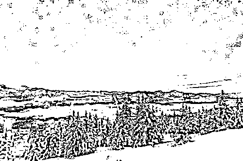

在这个“冬日野骨”一日工作坊中，我们将遵循传统仪式的三个阶段：**分离、门槛以及融合。****·** 工作坊开始时，我们将围成一圈，敞开心扉倾听，探索我们的意图；**·** 之后我们将走出这个圈，进入你自己的个人体验（分离）；**·** 跨越门槛，我们向进入神圣临界空间之前的过渡区域表达敬意，你将在那里与大地对话。**·** 穿过门槛返回到圆圈当中，分享在大自然和冬景的神秘中发现的启迪。（融合）

****

**一颗种子必须被冻结在自己的意图之中，然后才能打破冬天的桎梏，喷出绿色的火焰。****——史蒂文·福斯特**

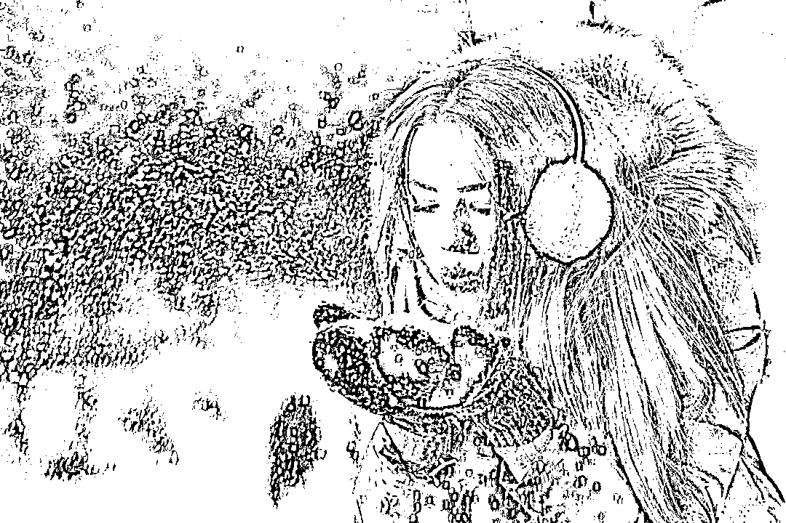

3

**时间安排**

**（建议参与者当天禁食，我们将在您报名后发送准备说明）****9:00 **开幕式，分享当天的概况以及安排（10 分钟）分享关于如何构造一个门户（20 分钟）**9:30 **在线登入，参与者介绍自己的名字和来自中国的什么地方，并分享童年时期与大自然的美好体验你今天想要探寻什么？我们会帮助大家澄清今天的意图。为了今天的探寻，你准备好放弃什么，臣服于什么，放下什么？（每人可以携带一块石头或者天然物品，例如羽毛、树叶来标记自己的意图）**11:00 **指导大家如何保持意图、如何探寻（15 分钟）**11:30 **参与者前往大自然中静谧的地方探寻（3 小时的探寻结束之后，我们会提供一些日志问题）**15:00 **参与者返回，欢迎大家归来**15:10 **参与者分享他们的自然之旅，我们会提供一些支持，帮他们澄清自己的经历和所获得的洞见**17:00 **闭幕式

4

**带领老师**

** Toni McErlane**

我来自新西兰，拥有社区和人类服务—咨询康复学士学位，是 Aminz 的注册家庭纠纷调解人，也是 NVC Aotearoa 的 NVC 培训师。

在我的生命中，我一直对真诚、充满活力、自我负责的沟通和有意识的选择充满激情。而我的人生旅程为我提供了充足的机会，让我去探索、研究、反思和完善这在沟通中是什么样的。

在我的工作坊中，我的原则和实践都是建立在非暴力沟通和正念的哲学基础之上。非暴力沟通是由美国心理学家马歇尔·卢森堡博士所开发的。马歇尔的目标是发展出一种语言，这种语言受到印度巴利语中的“非暴力主义”（Ahimsa）一词的启发，它的意思是“没有伤害”。我们怎样才能在与他人沟通时不造成伤害呢？这不仅需要非暴力沟通的技巧，还需要在训练中融入正念。正念是受小乘佛教内观传统的启发，发展觉知和接纳，关注和允许。在我们的工作坊中 ，我们将非暴力沟通和正念编织在一起。

我致力于以这种沟通和处世方式作为我日常与人互动的基础。我曾经学习了为期一年的北美非暴力沟通领导者项目，在加州湾区非暴力沟通的全年浸入式项目中做了两年协助工作，然后在索诺马县女子监狱推动非暴力沟通培训。同时，多年来我持续参加内观静修，致力于继续和发展这种实践，并把它融入自己的工作坊中。

2020 年疫情期间，我与丈夫和我们的猫在游艇上休了一年假。现在，我和丈夫还有 15 岁的侄女在新西兰南岛的达尼丁生活。我在那里从事心理咨询、冥想和生态心理疗法。我们还正在那里慢慢建立一个治疗静修中心和生态冥想社区。

过去四年，我曾两次来中国，与若道及其友好而充满活力的团队分享非暴力沟通，并参观了一些绝佳风景。我期待继续与若道合作，在网上分享我的知识和技能。

向上滑动可查看更多

5

**工作坊详情**

**精品小班工作坊，仅限 8 人参与，迎接新春。**
**工作坊时间：**1 月 22 日 9:00-17:00**工作坊价格：原价 1580 元/人，****二人同行价 1380 元/人**咨询报名请联络：李老师长按二维码添加课程负责人咨询~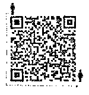****冬日野骨·荒野一日仪式****

**授课老师：**Toni McErlane

**授课时间：**2022 年 1 月 22 日

**授课方式：**网络课程**，**英文授课，中文翻译

**费用：****原价 1580 元/人，二人同行价 1380 元/人**

**课程负责人：****李老师**（请备注“冬日野骨”）

长按二维码添加课程负责人咨询~

******报名直达入口******

# 2022 木星+海王星年：人类将带着信念向灯塔之光航行

> 原文：[`mp.weixin.qq.com/s?__biz=MzA5NjA0NTAxNg==&mid=2651466440&idx=1&sn=0221e6b29e36b73be59028d9fe8afe1b&chksm=8b48987fbc3f11695f0fb1dc470d107e5e2af189b032622d44c30a7c0596b3d2a85881e954e6&scene=126&sessionid=1692737867#rd`](http://mp.weixin.qq.com/s?__biz=MzA5NjA0NTAxNg==&mid=2651466440&idx=1&sn=0221e6b29e36b73be59028d9fe8afe1b&chksm=8b48987fbc3f11695f0fb1dc470d107e5e2af189b032622d44c30a7c0596b3d2a85881e954e6&scene=126&sessionid=1692737867#rd)

**☆ 后台回复“今日”，给你一句生命态度**

作者/蓝女巫 ISAR 认证占星师
编辑/翀子 封面/书君 图片/音乐/作者提供文中引用书摘部分：伍尔夫《到灯塔去》**引言**

**木星双鱼木海年，已经启航。可是，你懂得双鱼座吗，你真的懂海吗？下文便听我娓娓道来......因为那里一直是我的家！**南交双鱼座，海王星三分上升点，12 宫木星三分月亮南交点，月木、金木的日海人，为你描绘我眼中不一样的大海（双鱼座原型）！

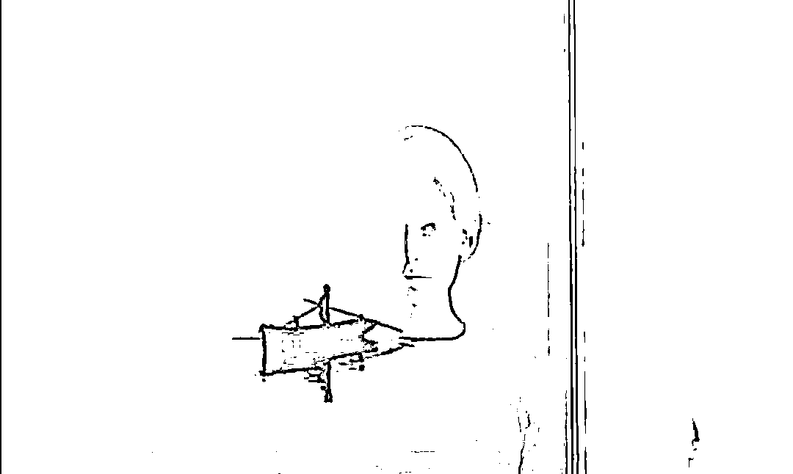

**光的传递**

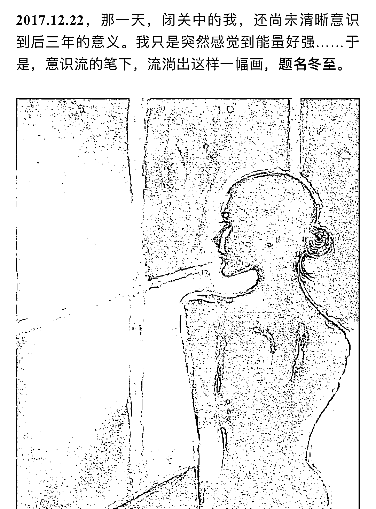

**2022 年运提笔时，我惊奇地发现了一个现象，关于“光的传递”……如神来之笔般，它始于 2017 年冬至的窗前绿光《运势｜2017-2020 两个冬至，三年严寒》。后来，那片光幻化成各种意象，在我四年来的年运中，不谋而合地接力。直到这个冬至，光的传递，似乎已到了自己这里...... 继而，我**梦见马斯克，启示了我一个词：**Hope！（希望）**

人类最强的力量和最大的弱点，都来自一种叫做**“希望”**的典型妄想。

——电影《骇客帝国》

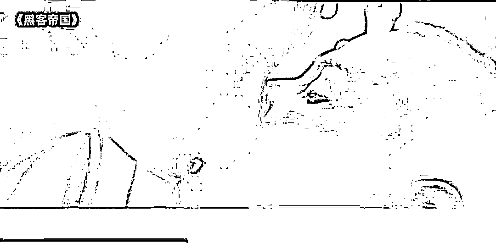

**人生从不怕困难，却就怕没有了希望。**外在世界的灯灭了，内在精神的塔，却要亮起来了。正因它属于你自己，因此它不易泯灭。究竟该如何重燃内心世界的光辉？

**12 月初，我读了一本《到灯塔去》。**奇巧的是，伍尔夫这本书架构三部曲，相关的**三个重要意象：窗户，岁月，灯塔，我竟刚好也都写过？**足见与作者灵魂间的默契："窗" vs《窗里的太平洋 | 南交双鱼,北交处女》"，关于秩序与灵感；岁月流逝 "vs[《冥 12 | 无限弃绝的舞者》](http://mp.weixin.qq.com/s?__biz=MzA5NjA0NTAxNg==&mid=2651443520&idx=1&sn=d2f1b6b4e8b41bee0ae6071dab6d280b&chksm=8b4b63f7bc3ceae154d6bf8570b7966d9f5899b5f3ea9dda47c8996168c8512a61f7688186f0&scene=21#wechat_redirect)，关于深夜的海洋；"灯塔" vs 《2022 年运｜圣母之光，到灯塔去！》，关于人类的希望！

**窗与太平洋，生动地描述着我的灵魂主线，南北交点落处女座双鱼座。而我的冥王星对应点这剂解药，正是指向 9 宫白羊！它们与 2022 年度象征的双鱼座木星和白羊座木星远征意象，是多么的吻合。用北交的窗格，构图南交的夜海，奔赴冥王星指向的灯塔......于是，我应该是最好的导游吧！第一部分，****灯塔****，概括主题；第二部分，****岁月流逝****，揭示问题；第三部分，****窗****，提供解药！**

**灯塔**

水瓶时代前夜，是个储存了大量黑暗的冬天。新旧更替，充满**不确定性的明天**。精神内耗，令人在机械疲劳的度日中，打着呵欠。偶然中的必然，以一场疫情，标志着人类精神高塔的分崩离析。

一切机器都继续运转，日新月异照常升起。意识维持着惯性，被迫将肉身卷到了临界点。**而潜意识知道答案，精神无主**的状态似没顶之灾。

**2022，这绝对是灾后（精神）重建的一年。**木海年必将带来**一场心灵的朝圣，**启迪人类焕发出全新的精神面貌。

 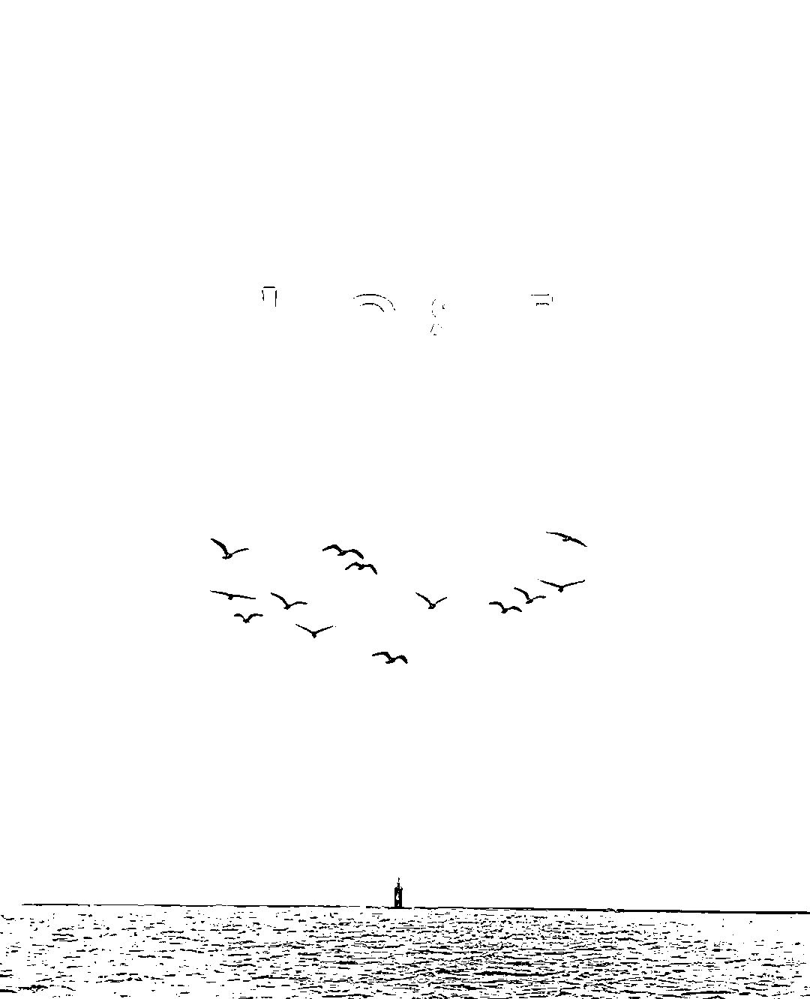

好像平时把各种东西束缚在一起的锁链被砍断了，它们就上下飘浮、四处纷飞。人生是多么漫无目标，多么混乱，多么空虚。

**眼睛**

紫罗兰和黄水仙都开花了。但是，白昼的寂静与光明和夜晚的混沌与骚动同样奇异，那些花草树木站在那儿，瞅着前方，向上仰望，却什么也没看见，没有眼睛，有多么可怕。

**当意义失去了希望，就如灯塔闭上了眼睛......**茫茫黑夜中，被无意义的湍流，吞噬覆没消解。而那些悄悄睁开眼睛的梦游人，发现了秘密：**我们正在与虚无共同欣赏一个笑话？**冥王星在摩羯座之末，给所有人都上了一课。根本没有什么不能一朝陨落的的社会地位，又还有什么爱情值得信任......

 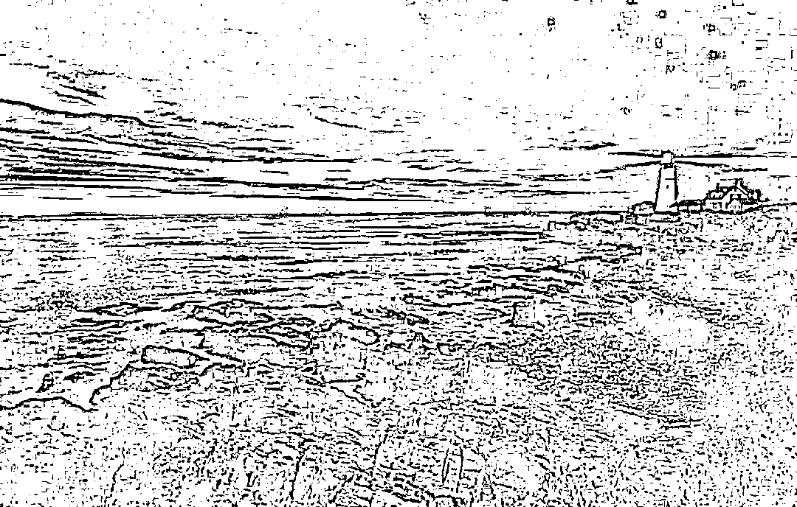

那灯塔对他说来，是一座银灰色的、神秘的宝塔，长着一只黄色的眼睛，到了黄昏时分，那眼睛就突然温柔地睁开。有时候，隔着海湾，几乎看不见它。在薄暮时分，他举目远眺，就能看到那只眼睛忽睁忽闭，那灯光似乎一直照到他们身边。

 “我们将要到灯塔去吗?” “不，明天不去；你爸爸说不能去。”她向他保证，下一次天晴就去。她想，他一辈子都会记住这件事情。因此，她对她丈夫、对她自己都很生气,因为是她自己引起了他到灯塔去的渴望。

她看见，在他的眸子里，对于那故事的兴趣消失了，某种其他的事物取而代之；那是某种犹豫不定的、苍白的东西。

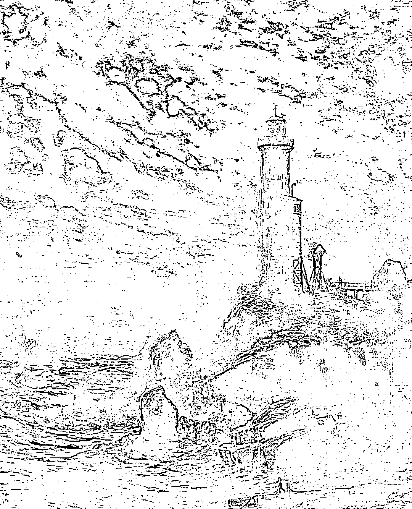**希望**

他怎么知道？她反问道。风向是经常会改变的。

他气得在石阶上跺脚。她蔑视事实，使他的孩子们把希望寄托在完全不可能发生的事情上，实际上，这就是说谎。但是，她说了些什么呢？不过说明日可能天晴罢了。可能明日就是晴天。

**与双鱼座木星和木海相位同理。作为一个木星在 12 宫的人，**肩头是落有小天使的，她们时时拍动翅膀，神奇庇护我于宇宙福荫之下。故**心态非常有别于冥王星在 12 宫**。于是，我经常听到一句话：知道吗，你是发光的！**木星是希望，海王星是相信（臣服），合在一起就是信念。**

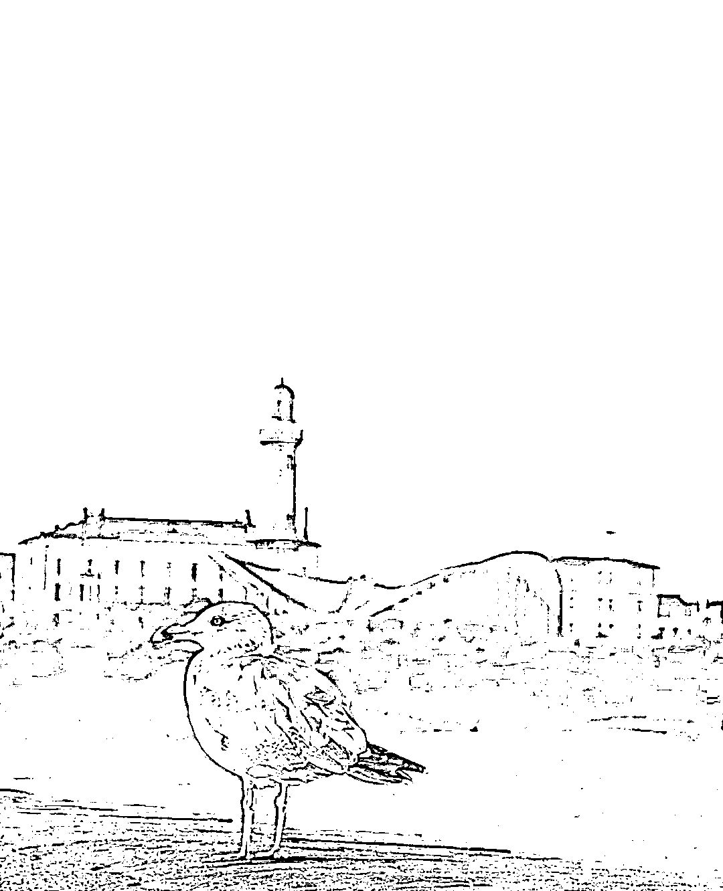

给灯塔看守人送些什么东西去呢？

我们捎信去灯塔的，**正是信念！**

**趋光性**

向往光的人，是积极的。说明心中还有**对生命的“信”**！因希望是最完美的善，和最高的能力。而**灯塔的意象，正是黑暗中的向导，她用希望引领着航路。**

人们都将各自的价值观和意义升腾于其上，神秘投射着一份属于自身的慰藉。当灯塔给漆黑汹涌的海面披上银装，哪怕那只是短暂的辉光，却传递着一种信念，相关对于生还的强烈渴望。于是，这浩瀚烟海中的一线闪光，就化作永驻心间的神奇力量，成了被黑暗深海衬托得渺小脆弱的人类哀歌中，那**永不泯灭的希望。 **

**万物都具有驱光性。而光是什么？是爱。而爱的前提，是信。**

**光与爱，**即是第 12 宫代表的源头，人类的子宫。生命母体的光芒，是**子宫中的美梦**。如灯塔般，在人类无意识记忆中闪耀不灭。木海这一年，就是去召回这片最温柔的记忆，从集体层面普遍地唤醒它。哪怕它只是一个幻境？（matrix）**母体是一场梦**though…… 

我认为 2022 的木星轨迹，对应**两个典型的原型意象**，一个是**白羊座木星的勇士**，在书中以拉姆齐先生代表；一个**是双鱼座木星的圣母**，在书中以拉姆齐夫人代表。

**白羊座木星，追光者**

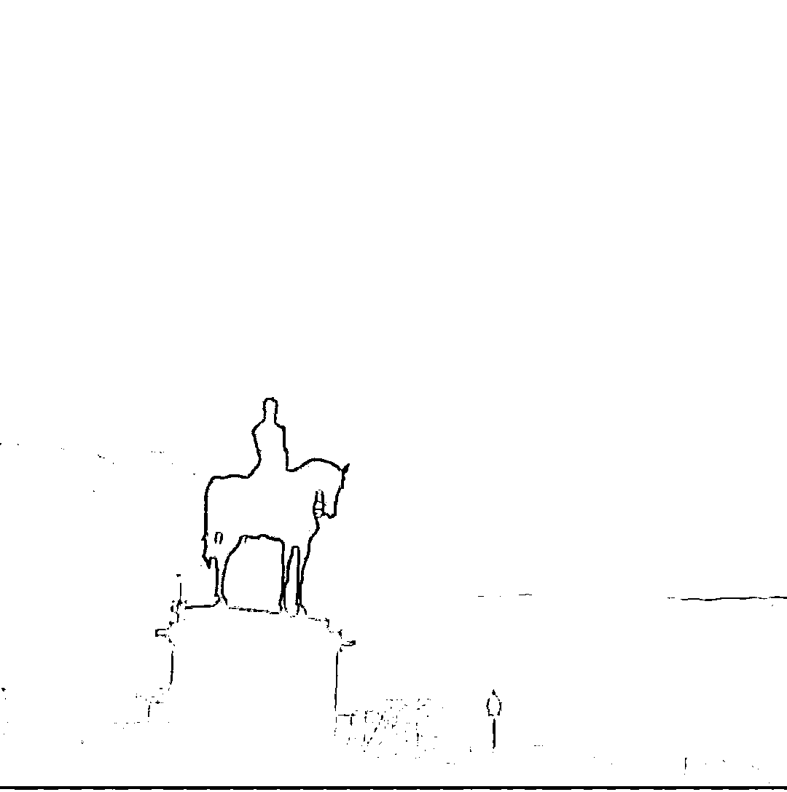

追逐光的人，是无畏的。双鱼座木星和木海合相这一年，灯塔航行鼓励我们探索的，正是**内在精神！**向灵魂深处扬帆起航。连平素理性的人们也都会被玫瑰色的木海，蒙上感性的辉光，去收获身心灵的全面成长。人类将**挂起“深度精神”更宏大的风帆，去经历“时代精神”别有洞天的冒险。**

而向着新大陆航行的途中，注定跌跌撞撞，摇摇晃晃。但我们无论如何被命运踩在脚下，只要**相信奇迹**，便总能成功反跳起来。人类终将用爱战胜死，以奋斗征服内心航程中那“岁月的流逝”……

好像他是一位高贵的西班牙绅士，正在把一朵鲜花献给在窗口的一位女士。而他衣冠不整，其貌不扬，正在吃着面包干酪；然而，他正率领着他们去进行伟大的远征，他们将要被波涛吞没，虽然这不过是幻想。

**双鱼座木星，圣母之光**

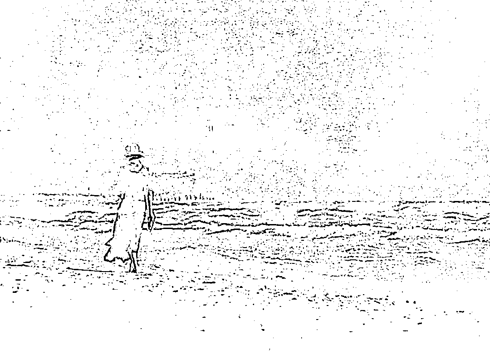

赠予光的人，是慈悲的。**圣母原型**，以充满生命力的能量之光，慷慨照亮周遭世界。挥洒博爱的母性，散播永恒之美。她化身灯塔，以温暖又坚定的目光，点亮生活冰冷的躯壳。她能涵容一切苦难，托起负重的心灵，拯救迷航的船只，陪伴孤单的旅程。为跋涉提供安全的疗愈，为疲惫补给梦想的勇气。

**暗夜之灯，亦让迷途者知返。**时刻提醒，**照见人类心灵的归路。**同时，它也象征着**每个人类的内在精神之光。**因你能看到的东西都是你自己的…… 

希望的光束，**如银辉之于海上，哪怕只是暂时的安慰。**灯塔之光在黑夜茫茫大海中，有节奏地照耀。只为**把夜晚变得井然有序，也让客观的世界反映出心灵的航向。**

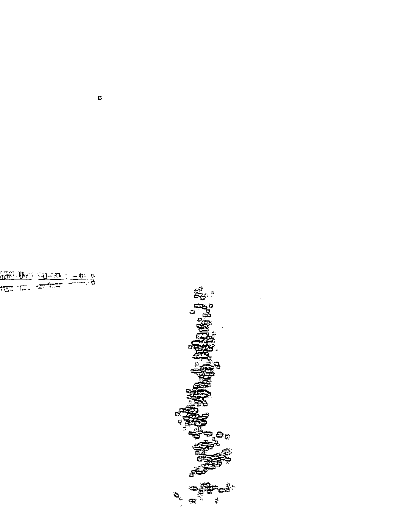

她自己坐在那里瞧着，手里干着活儿，直到她自己和她所瞧的东西——例如那灯光——化为一体。而且，她会把一些埋藏在她心底里的话，升腾到那光柱之上——她的思路在那儿停住了。

她的目光向窗外望去，遇见了灯塔的光柱，那长长的、稳定的光柱，那三次闪光中的最后一次，那就是她的闪光，因为，总是在此时此刻，在这种心情之下，她注视着这灯塔的闪光，就会情不自禁地把自己和某种东西，特别是她所看到的东西，联系在一起；而这件东西，这稳定的、长长的光柱，就是她的光柱。

她的目光离开了她手中编织的袜子，她抬头望见灯塔的第三道闪光，对她来说，这好像是她自己的目光和自己的目光相遇。她像那灯光那样严峻，那样探索，那样美丽。感觉到一种如此骚动不安的柔情，就好像是在顾影自怜，在那儿升起了——她停下手中的钢针凝目注视——在心底里卷起了一缕轻烟，在她生命之湖的水面上，飘起一层雾霭，化为一位新娘，去迎接她的爱人。 是什么使她说出那样的话：“我们将在上帝的掌握之中！”

 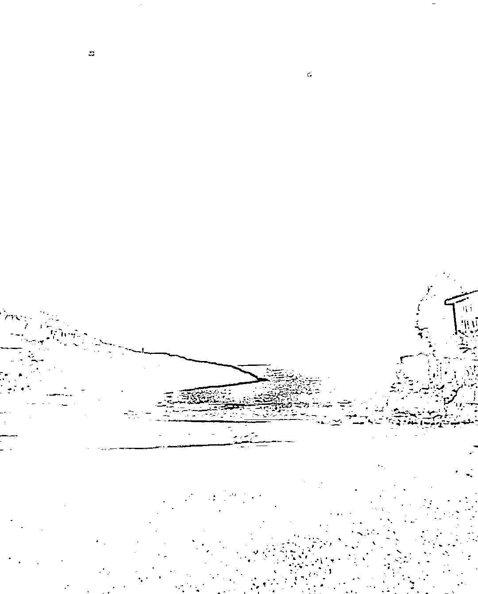**意义**

找到了光的人，拥有意义。同时，也就拥有了**爱与创造的能力。**

人生的意义是什么？那就是全部问题所在——一个简单的问题，一个随着岁月的流逝免不了会向你逼近过来的问题。

那个永远在心灵的苍穹盘桓的老问题，那个在这样的瞬间总是要把它自己详细表白一番的宏大的、普遍的问题。 

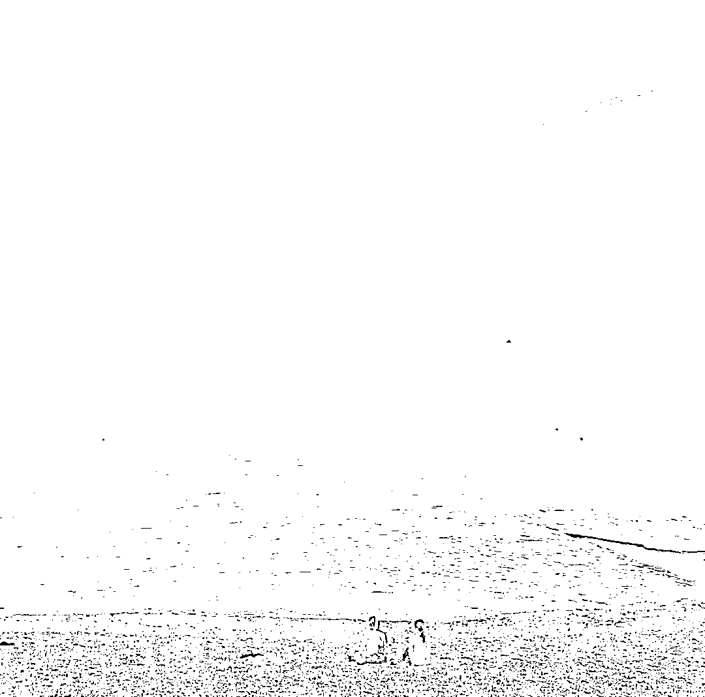

人生意义，相关一种价值驱动。关于究竟为何而活，才最能让你感受到自身的价值。无论它本身是以物质或精神的形式表达。然后，**信念是桥梁……它是喂养你的光！**能让你通往意义的道途，始终**充满力量**。虽然星图是分秒间告知你意义的捷径，但我们仍随时**需要光亮的维系。**

**生命依托意义而存续，**作为寒霜中的温暖，沙漠里的安慰。木海梦幻者们漫步于海滩，总期冀造物能突然赐予什么神秘的答案......

那个关于人生意义的伟大启示，从来没有出现。也许这伟大的启示永远也不会到来。

作为它的代替品，在日常生活中，有一些小小的奇迹和光辉，就像在黑暗中出乎意料地突然擦亮了一根火柴，使你对于人生的真谛获得一刹那的印象。

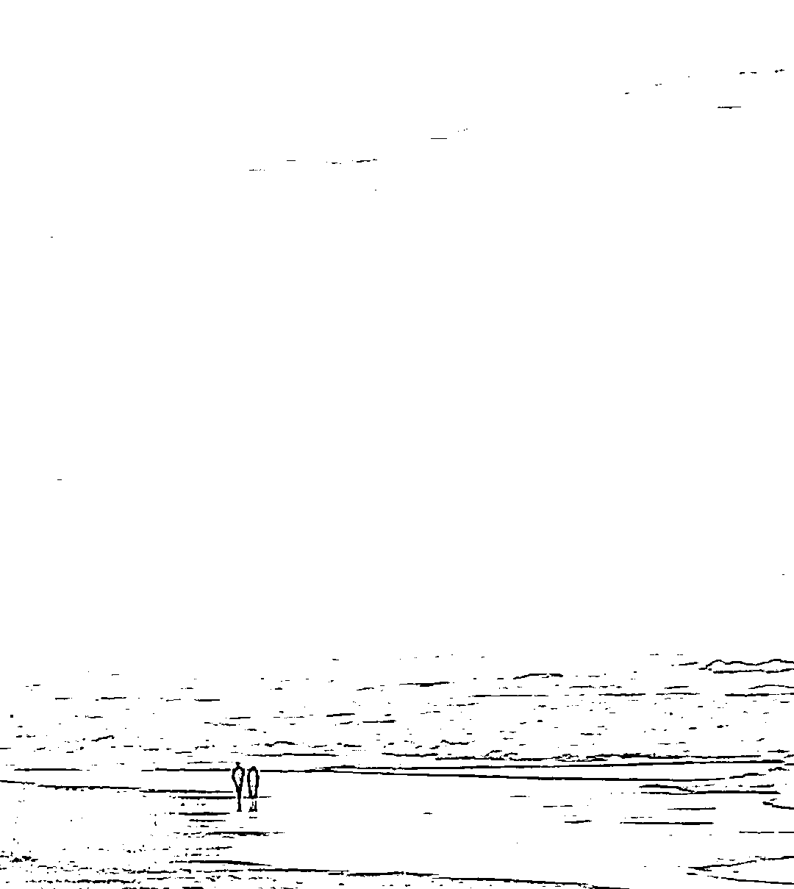

她想：它会挂在阁楼上，它会毁坏湮灭。那么把它画出来，又有什么用处呢？

此处想起木海人的双鱼座前任，最初令我心动时的那一句王尔德：Art is useless, but it will make your soul cry.....（艺术无用，却会让你的灵魂哭泣）

 如果良善的双鱼座也有嫌恶，那她可能最讨厌刻意。对方法目的论及形式主义，嗤之以鼻。真正的双鱼座之路，叫作浑然天成，即“本来就是这样的”。能在心理上让事情自然发生。像对自身生长法则一无所知的树，那样无为而为。而对宫处女座那头，则是形式化的典范，整天忙忙叨叨，活得像个机器。人人都是有为青年。很糊涂 vs 很清楚。

 人生或许正是一首没调的歌儿，很爵士很即兴。你真没法去刻意获得什么结果。这一年，让我们学会去欣赏自己真正欣赏的东西。去成为最真实的自己，而非活成优秀的别人。**无论你的人生意义是否重大？都能行之从容。**无论你的爱是否会毁坏湮灭？只为了无遗憾。无论你的画是否被束之高阁？**无用之用，它本身即是意义。通往真理的道路只向那些没有目的人开放。indeed.**

**岁月流逝**

从那空屋楼上的房间里，在一片混沌之中，只听见伴随着闪电的雷声在翻滚振荡，这时海风和波涛追逐嬉戏，就像巨大的海怪难以名状的躯体，理性之光从未穿透它们的额际，它们一层一层地叠起罗汉，猛然冲进黑夜和白昼(因为日夜和年月都无形地在一块儿飞奔)，玩着那些愚蠢的游戏，直到整个宇宙似乎都在兽性的混乱和任性的欲望中漫无目标地厮杀、翻腾。

天王星对分冥王星、又太阳合相金星的夜晚，冥王星在 12 宫，射手座的月亮和火星带我超速狂奔在通往 Pacifical 的公路上，去离海最近的地方吃晚餐。桌前挂着一面窗，窗里装满太平洋，近在咫尺的海浪迭起扑面而来，淹没了进餐的我们在窗里的镜像~错过了日落时间抹杀地平线的霞光，但我其实更爱看**深夜中的海洋**，除了白色的裙摆翻腾荡漾，便是一望无际深邃的想像，神秘似蝎子们深藏的情绪呼吸，在暗黑的永夜中对抗着绝对的疯狂。（蓝女巫 2014.9.19.SF.）

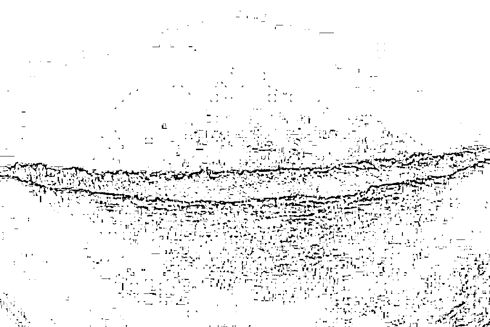

他突然**止步蓦然注视着大海，现在他又转身离去了。**他**逼近过来，又退了回去。**

**我在 12 宫的冥王星中写道：浪，是海的挣扎。**

起初，那有节奏的蓝色的浪潮涌进了海湾，使它染上了一片蓝色，**令人心旷神怡**，仿佛连躯体也在随波逐流地游泳；只是在下一个瞬间，它就被咆哮的波涛上刺眼的黑色涟漪掩盖，**令人兴味索然。**

**光明必有阴影**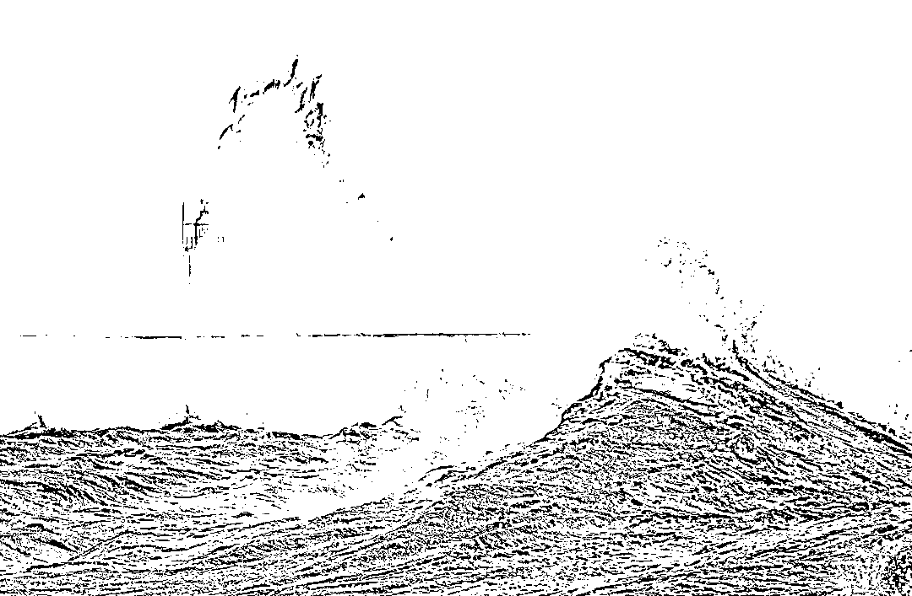

木星来到双鱼座的第二天，月亮在天蝎座，我梦见了海啸！应该是人生中梦见大海最恐怖惊心的一次。梦里我家住 2 楼。从窗外一声巨响，见海水涌上陆地，心里咯噔一声；到临危慌忙又镇定地思考，该带什么东西离开时的片刻悲凉（心中有笑声，难得开始对 2 宫有了点留恋）；到见窗外天际已挂起滑雪场般的巨浪斜坡，叹为观止的臣服；末了关上房门，准备爬楼时打算发最后一条朋友圈：“终于，我见到了我最爱的电影中那个最爱的画面！（《星际穿越》巨浪星）”

 这时，楼道中海水奇迹般退去，转为窗外的一场中雨。木星初入双鱼座的两天来，梦都异样的深刻！立体环绕的音响，牵动全身的感情，醒来总像刚走出电影院的人，心中久久不能平静……难得在梦中经历了一场无法更真实的水患……令我亲身体验了 Titanic 只差最后一步。清晰铭刻其中每个分秒的心情，整个灵魂都已**悚栗……醒来，我赶紧去翻开书中那些句子：**

巨浪落在海滩上单调的响声，在她的心目中，多半是一种有规律的、镇定的节拍，好像在她和孩子们坐在一块儿的时候，**令人安心地一遍又一遍地重复某一首古老催眠曲中的词句，那是大自然在喃喃低语：“我在保护你—一我在支持你，”**但是，有时候，特别是当她的心思从她手中正在干着的活儿稍微转移开去，突然出乎意料地，那浪潮声的含义就不那么仁慈了，它好像一阵骇人的隆隆鼓声，敲响了生命的节拍，使人想起这个海岛被冲毁了，被巨浪卷走吞没了，并且**好像在警告她：她匆匆忙忙干了这样又干那样，可是岁月在悄悄地流逝，一切都不过是转瞬即逝的彩虹罢了一一那原来被别的声音所湮没、所掩盖的浪潮声，现在突然像雷声一般在她的耳际轰鸣，使她在一阵恐惧的冲动中抬起头来。**

从没有一帆风顺的航行。混乱和寂静也常常占据上风，让一切努力皆付诸东流。当海的心情急转时，我们触目都是荒凉的空镜：崇高力量沉睡于其下的镜中幻影，漫无目的纱巾摇曳。

无孔不入的潮湿，穿着紫袍的黑夜，海风躯体分离出的空气，房屋贝壳中干燥的盐粒，自然用残酷的目光笑看凋敝...... 

时光雕刻着孤独，一切皆是它的痕迹。精神的潮水，又岂能无视肉体的限制。 对应双鱼座/海王星/12 宫原型，**大海也象征人们无意识中弥漫的不安与失控，**更抽象些，**可由岁月和时间代表。**皆象征世界背后的绝对主宰。时光流逝，一切都在无常变化中。没有什么会永垂不朽。共情着天地荒凉的愁绪，**面对人类相通的无力感，我们该如何抗衡它？哪怕只是精神上的胜利。**

**而黑暗也会有裂痕（那是光进来的地方）**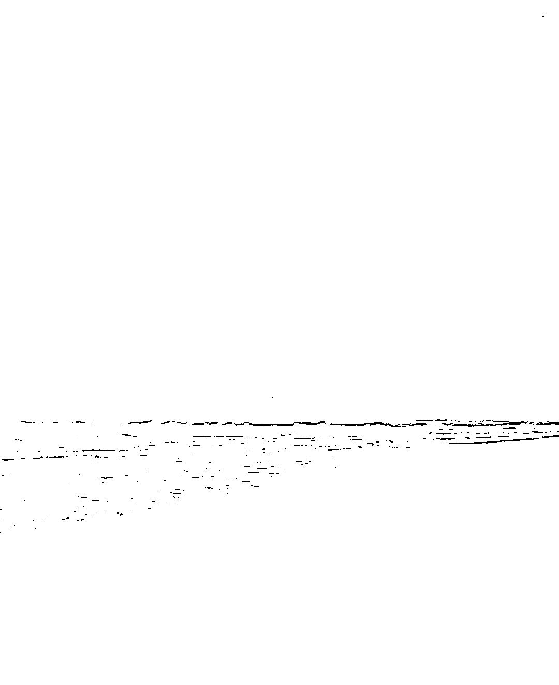

但是，一个夜晚究竟又算得了什么？不过是短短的一段时间罢了。何况黑暗的消逝是如此迅速，不久鸟就叫了，鸡也啼了......然而，黑夜的来临是周而复始、循环不休的。

如何超越时空限制？这其实取决于你对于时间概念的理解。即**对客观世界的主观印象。或许心理时间，才算是纯粹的时间。**即你主观色彩的内在真实，往往能改变时间的长度，将其像扇子般打开或折拢，令时间便不再是枯燥的程式。诸如你可以寻思，**以何种无限的价值来拓展有限的生命，来赋予它向死而生的力量。**而这恰似我们在用不同角度观察同一座灯塔，**每个人会有不同的答案。 **

一个人，为了使自己**从孤独寂寞中解脱**出来，总是**要勉强抓住某种琐碎的事物，某种声音，某种景象。 **

如何抵挡无边的黑夜？**“人生为何要如此漫长......” 我突然就秒懂了冥王星在 12 宫的人们需要的小夜灯，**以此来组织自己，以不被焦虑所吞没。既然我们渴望的长久，注定将不停破碎残缺，那索性就用永恒的破碎本身，来抵御漫无目的的黑暗吧。【[冥王星 12 宫](http://mp.weixin.qq.com/s?__biz=MzA5NjA0NTAxNg==&mid=2651443520&idx=1&sn=d2f1b6b4e8b41bee0ae6071dab6d280b&chksm=8b4b63f7bc3ceae154d6bf8570b7966d9f5899b5f3ea9dda47c8996168c8512a61f7688186f0&scene=21#wechat_redirect)（上）[冥王星 12 宫](http://mp.weixin.qq.com/s?__biz=MzA5NjA0NTAxNg==&mid=2651443520&idx=2&sn=e3bca13b228a5fd75f7715ef152871e3&chksm=8b4b63f7bc3ceae123d2088fdf65f7451dfe438b1cafb66db1d848dff9123982abfa857709c9&scene=21#wechat_redirect)（下）】

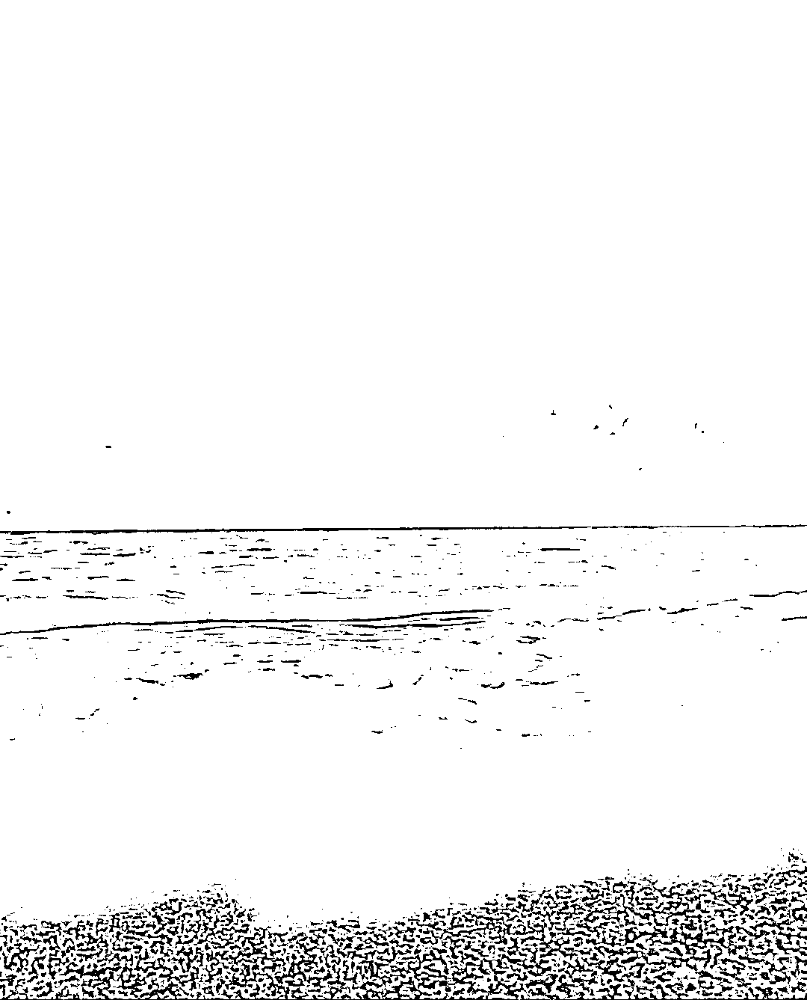

**在一片混乱之中，存在着一定的形态；这永恒的岁月流逝，被铸成了固定的东西。**生命在这儿静止不动了。拉姆齐夫人把这个瞬间铸成了某种永恒的东西。这就具有某种人生启示的性质。

她企图**用艺术来给杂乱无章、变动不居的生活创造出一个井然有序、稳定巩固的外貌。**

**书中提到了一个方法，关于时间的凝固。**留不住时间，留下记忆，也是一种完美。不妨用文艺创造为出口，让时间长存。**这时，我又看到了窗户的意象......**

**窗**

夜色被窗上的玻璃片隔绝了，透过窗上的玻璃，无法看清外面世界的确切景象，有一片涟漪，奇妙地把内外两边分隔开来：在屋里，似乎井然有序，土地干爽；在室外，映射出一片水汪汪的景象，事物在其中波动、消失。

时空的风吹散了水月镜花，难忘的却是那一窗的海洋。因为它隐喻着我的灵魂方向：从南交双鱼座过渡到北交处女座，即从想象力的灵感发展到逻辑力的理性。也许有一种方法，可以让累世的灵感浪涛不再汹涌泛滥，于是，在那一幕中，当我透过这个窗框，望见那片海水......（蓝女巫 2014.11.27）

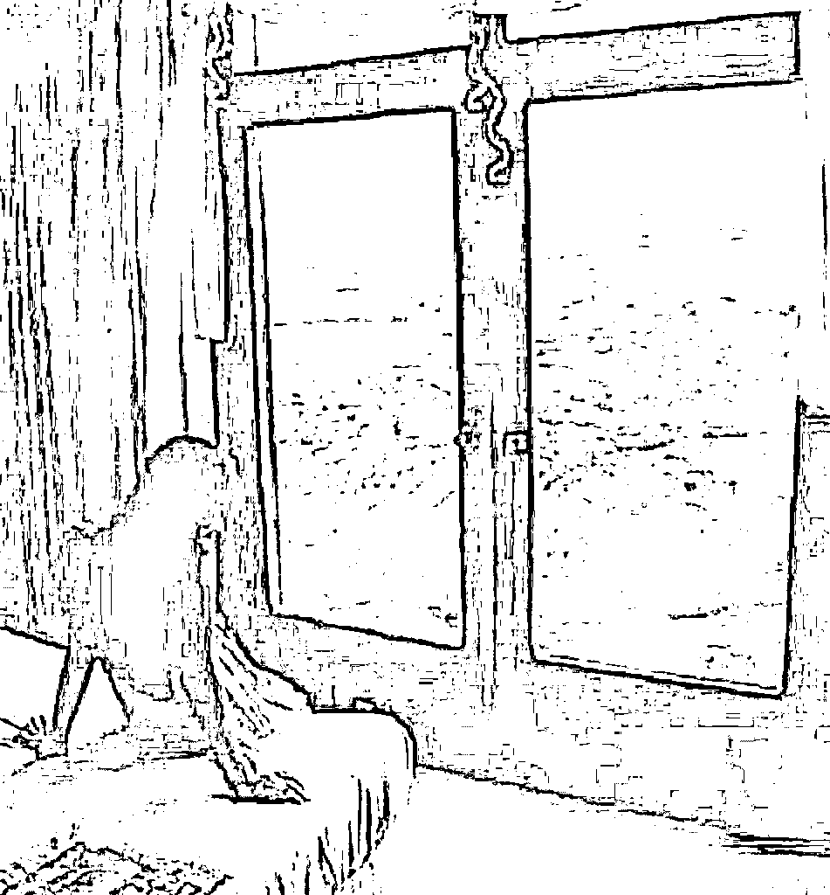

它们是盟友吗？它们是敌人吗？它们还能保存多久？ 

伍尔夫以窗为界的视角开篇，而我在旧文《窗里的太平洋》中写道：**我要用逻辑的窗户，装满灵感的海洋。把无尽的梦想揽入计划的框架，去创作出那满满的一窗大海。而非被**创造力的海水所淹没。这组极尽双鱼座、处女座对宫 6-12 的意象。 **诸如此类的对立，我能想象到的还有：黑夜与灯塔，风景与画笔。心理与表达，潜意识与意识。破碎与统一，混乱与规律。流逝的与固存的，无意义与意义......**

如何与海水共处？又如何从中脱身？如何用秩序安放瞬间的永恒？那个海啸的**梦中，我也屡屡望向窗口......**移步换景，重温了**海洋与窗的关系......**

**双鱼座，关于“拥抱”**

如果一个人孑然独处，这个人多么倾向于无生命的事物：树木、溪流、花朵；感觉到它们表达了这个人的心意；感觉到它们变成了这个人；感觉到它们了解这个人，和这个人化为一体。

双鱼座最擅长消融边界，能因模糊混淆而更具有力量？即通过消解化作混沌，来将自己与混沌的力量结合。首先来到你自己身上的太初，它通往世界的太初，让“原始母亲的孩子”在内心中诞生，以此与那远距离的存有相连，宇宙便将其内部信息，古老的智慧都传给了你。**当人在出神状态中全然忘我，因敞开而成为管道。作为物质世界中的一部分，你只须单纯地呆着，你便拥有了其中的一切。**与宇宙交汇合一，成为它的组成部分。与万物拥抱相连，化作同一条河流。因此，**人在自我消解时，才能充分领悟生命的本质，看到表象之下的内在真实。**

 **2022，绝对是更佛系更躺平的一年。从忙于外联，到探索内在，才是正途。**木星在双鱼座这段时间，最好让你的理想远离世俗成就山峰，让高速运转的机器停下来。继续滥用意志力来逼自己积极入世，更容易遭遇种种**世俗搁浅**，由此也更能促成**灵魂思乡**。是时候从外部世界的法则，回归内在感受的真诚。让内卷过度，干涸已久的精神，重获滋养。通过静默冥想深化觉知，以梦幻情绪栖息，用积极频率充电，沉浸于心流，去链接你的深层资源。在充分留白中，聆听并记录心灵深处的涌现。**独处的人，**安详宁静，**特有一种严峻的美。Just absorb......**

 尽管在拥抱深度精神时，其中也会有你**黑色的秽物**。不要害怕坠落，要先将自己托付给混乱的惶恐。**混乱无意义才是秩序和意义之母，**你不得不承认那才是永恒存在。所以，**若你走向自己的灵魂，首先便要失去意义，**不必再紧抓那自以为是的时代精神所赋予你的**错误的意义**。生命意义真正的答案，就藏在我们一直躲避的深度空间里。 在得与失的断点相连之处，在画画停停的笔触起落之间，围成了**生命节奏的负空间，**而这空间本身又构成了节奏的一部分。**作画亦如是，浪涛亦如是，人生亦如是。**正是这**波谷中的一抹绿**……令呼吸绵延。

就这样，她停留片刻，再添上一笔，停了又画，画了又停，画笔的起落形成了一种带有节奏的舞蹈动作，似乎那些停顿构成了这节奏的一部分，那些笔触又构成了它的另一部分，而这一切都是互相关联的；

在一个浪涛的波谷中，她看见第二个浪涛在她的上方越来越高地汹涌而至。还有比这一块空间更加不可轻视的东西吗？  

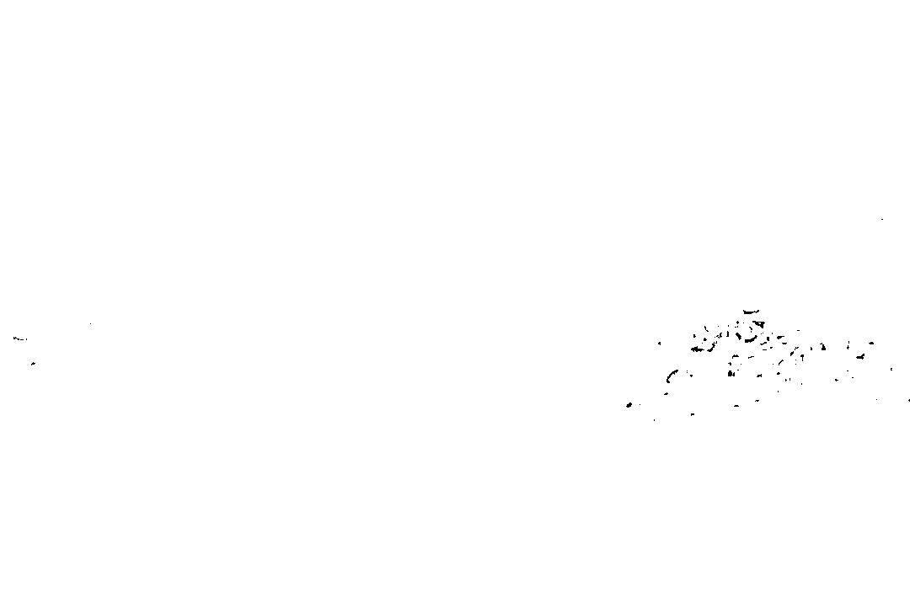

**处女座，关于“创造”**

面对木海巨浪滔天的一年，作为早以消融为习性的南交双鱼座，**反倒不必更加消融，**本能警惕地想要为自己**准备好扎实的框架**，以防没顶被冲垮。意识到虚无，才更想要紧紧抓住当下。在灵感转瞬即逝，永恒被无常消磨殆尽之前，**将美及时定格在画框里！**体会到混乱，便渴望建立秩序。让一切分散，经历重逢，复归紧凑。**并使你个人的意义栖息于其上。**

 **既然一切终将流逝，我们要选择如何面对流逝？**或是为不确定性的世界赋予意义；或是为混乱的生活建立秩序；或是通过艺术创造，**将瞬间凝固为成永恒。**而一切审美行为，都可作为去洞悉日常中所隐藏的永恒秩序之方式。

面对变动不拘，杂乱无章的世界，你仍可以简化繁杂，选取角度，创造出只属于你自己的作品。尽管每当岁月洪荒来袭，人类的创造微不足道，但它仍会是必不可缺的治愈。

 纵使生活浑然一体，无所适从，抑或浪花纷飞，琐细无数，要相信，其中终有一桩最具力量，终有一笔最有决心将自己表现出来。我们对此仍有一个选择的权力，即**自由意志。**去动用这个意志，去与那一笔偶然地邂逅。我觉得，**这就是创造吧！**而末了，你或许会发现，一切都仍是**顺其自然的刻意**...... 所以我觉得，**画布上“决定性的瞬间”那一笔，便是茫茫人生的“意义”吧。 **

 关于在混乱中辨识清晰，在混沌中把握真实。回顾贯穿全书的那些“处女座/6 宫”的象征：拉姆齐夫人一直在编织袜子；拉姆齐先生试图用理性和逻辑，从朦胧的混沌中，发现些思想的模式；莉莉手中一支画笔，是她在混乱世界中唯一可以信赖的东西。**而南交双鱼座的我，则在为这篇海王体年运，整理着每一朵浪花...... 但见宇宙在其中无限膨胀，我仍有信心，让它最终在我的“窗”中定格！**

但是，离开了画布凭空想象地筹划，和真正执笔在手抹上第一道色彩，这完全是两码事。从何处落笔？在画布的哪一点涂上第一道色彩？这可是个问题。抹在画布上的一根线条，就意味着她承担了无数的风险，作出了许多不可挽回的决定。一切在想象中似乎很简单的事情，在实践中马上变得复杂起来；尽管如此，这风险还是非冒不可；画布上终于抹上了第一道色彩…… 她又画上了第二笔，第三笔。 

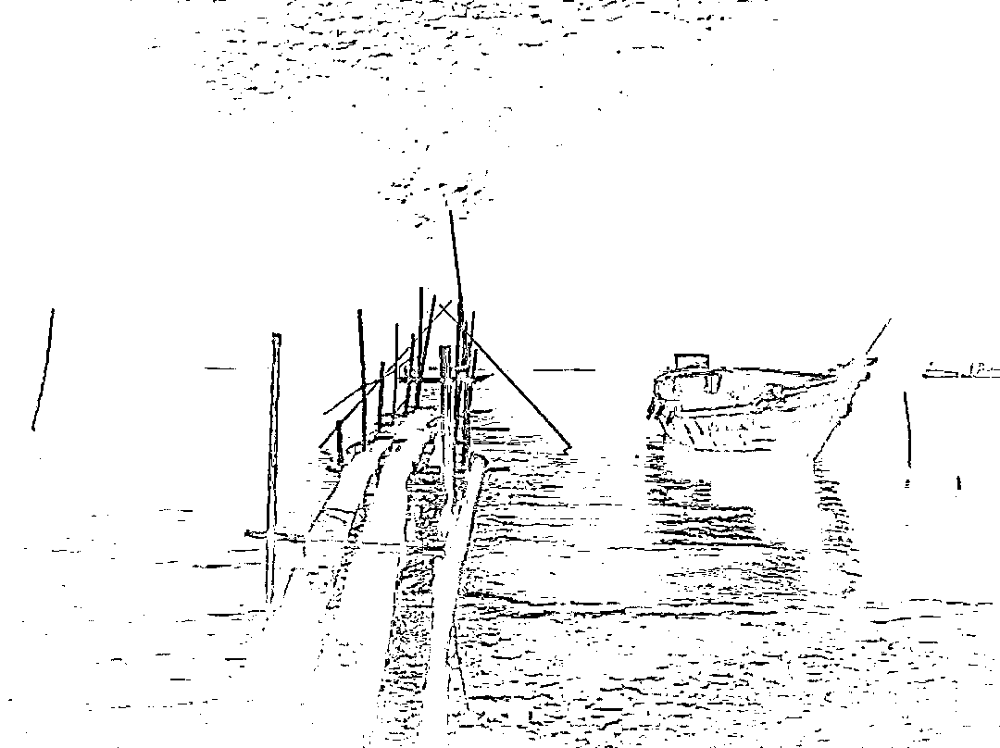**鱼处对宫，“创造是为了拥抱”**

**窗与海，它们既是盟友！它们也是敌人！它们永远共生，永远依存。**

他们之间一直在互相较量，她处于一方，生活处于另一方，而她总是尽可能地去战胜对方，就像对方要战胜她一样；有时候，他们之间也展开谈判；她记得也有妥协和解的场面；她必须承认，生活是可怕的、充满敌意的，它会迅速地向你猛扑过来，如果你让它有机可乘的话。 

浸泡在**世界的不确定性**中，首先要接纳，那就是人类的不可避免！**通过消解以拥抱宇宙（双鱼座/12 宫）？**还是去积极创造秩序（处女座/6 宫）？我们时而忙于拼凑着自己，时而又在零星片段中窥见整体。**而它们却又何曾矛盾过？**出于**对宫两极对立统一**的原理。 正如篱笆的那个缺口，可以让蓝色的海水更加湛蓝；一粒沙中可能藏着万千世界，同时也可能是空无一物。生活亦由彼此相邻的独立小事组合，形成起伏的波涛......

 是啊，**“窗”里的“太平洋”**（ 北交处女座，南交双鱼座），而它们却又何曾矛盾过？**于是，才终于有了这样一篇海景文字，既拥有缜密框架，又不乏海的本色。所谓海王体。**

好像她被某种力量驱使着，而同时她又必须抑制住自己，**她迅速地画下了那决定性的第一笔。**

因此，**当她的手带着生命颤抖着，这强有力的节奏足以支持她，使她随着它的波浪前进。毫无疑问，她正在失去对于外部事物的意识。**

而当她对于外部事物**都失去了意识的时候，一股出自内心的泉水洒满了那一片向她瞪着眼的、可怕地难以对付的、苍白的空间。**

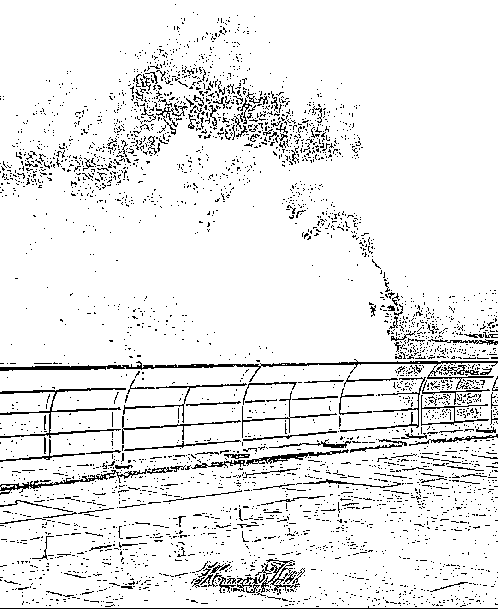

**结语**

那么，**生命的意义，究竟是什么呢？**

荣格在红书中解释了这个。当你将身上的**意义和无意义**结合起来，这种**融合产生终极意义。**即在你打开灵魂大门，让混乱暗流淹没你的一切框架时，你的秩序和混乱便结合起来，生出圣童。也就是**超越意义和无意义的终极意义。在无意义和终极意义之间的摆荡，**才是最古老和值得信任的**真理**吧。

**她为什么还要画呢？**

...... 

**然而，她扪心自问：这又有什么关系？她重新提起了画笔。**她望望窗前的石阶，**空无人影**；她看看眼前的画布，**一片模糊。带着一种突如其来的强烈冲动，好像在一刹那间她看清了眼前的景象，她在画布的中央添上了一笔。画好啦，大功告成啦。她极度疲劳地放下手中的画笔想道：我终于画出了在我心头萦回多年的幻景。**

末了，有人完成了画，有人抵达了灯塔，有人写完了这一篇年运…… 木星双鱼时分，让我们动笔，勇敢“画出”心中的幻景！祝每个人都如愿登上自己心中的那一座灯塔。随缘去解开自己**心头那个萦回多年的“结”。**

 **涨潮了......**木海年，希望大家至此**都懂得了海浪。**

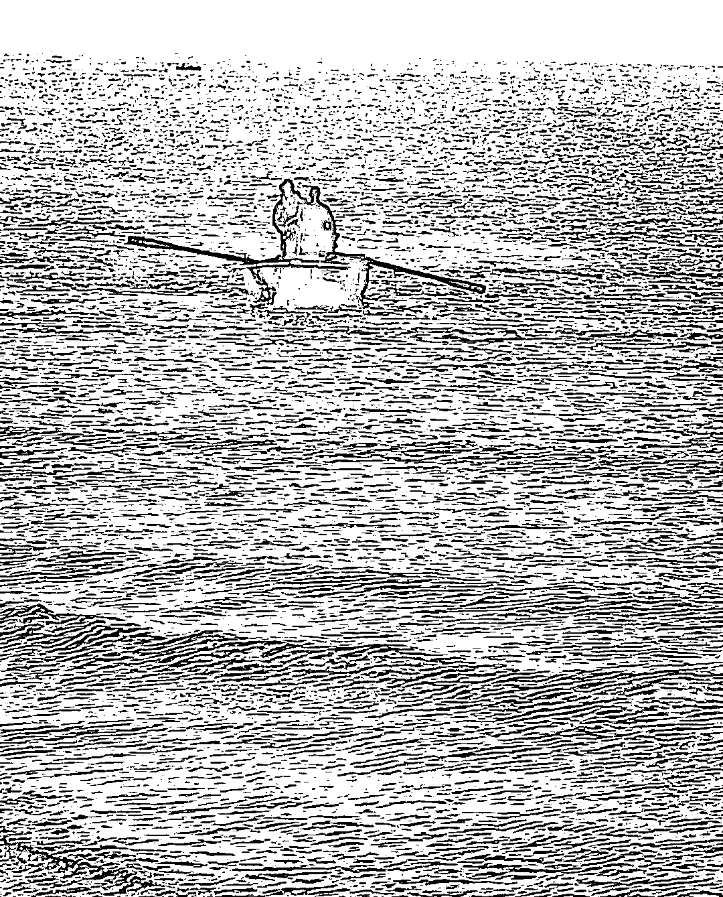

**（未完，余下敬请期待）**

**版权声明：**本文由作者授权在若道平台发布，欢迎转发，反对抄袭。

**蓝女巫**

英国伯明翰大学 市场营销学硕士

职业占星师/专栏作者/芳疗师/珠宝设计师

中国首批 ISAR 英文认证占星师（2012 届）

**微信公众号**：cecilia_sui

长按打赏

**2022 年来了****还不快领取你的****专属年运报告****？****购买有优惠，点击图片查看详情哦~**

**学习占星学****点击下图了解课程详情** 

**

****************

**微信又双叒叕改版啦，不想错过若道君的推送？**

**就把若道设为星标吧！**

**▼**

**就是这个“在看”，戳戳戳 ☟**

******报名直达入口******

# 雷蒙德·梅里曼金融占星周运 | 水逆+天王星顺行，混乱突变的一周！

> 原文：[`mp.weixin.qq.com/s?__biz=MzA5NjA0NTAxNg==&mid=2651466440&idx=2&sn=bc7ccf19b391e3a7344b266f164feed2&chksm=8b48987fbc3f116918935a7d7a1bf79076c56854c6b7e3db2971e38f4efff89bd21ebe0f6858&scene=126&sessionid=1692737867#rd`](http://mp.weixin.qq.com/s?__biz=MzA5NjA0NTAxNg==&mid=2651466440&idx=2&sn=bc7ccf19b391e3a7344b266f164feed2&chksm=8b48987fbc3f116918935a7d7a1bf79076c56854c6b7e3db2971e38f4efff89bd21ebe0f6858&scene=126&sessionid=1692737867#rd)

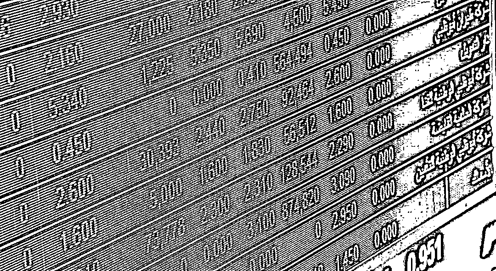

作者/雷蒙德·梅里曼 译者/Luke
编辑/玫瑰 图片/网络

雷蒙德·梅里曼是在金融占星学界稳坐第一把交椅的占星师，同时他也是若道签约的金融占星课老师，我们引进了雷蒙德·梅里曼老师的《[上证指数月度报告](http://mp.weixin.qq.com/s?__biz=MzA5NjA0NTAxNg==&mid=2651465265&idx=2&sn=1300c8aed59d3bdb14e583ce2ebce910&chksm=8b489486bc3f1d90e5768681cf881cb431e76a64e5be3b65cd99631ba7d275d79af0adf9803d&scene=21#wechat_redirect)》及《[黄金报告](http://mp.weixin.qq.com/s?__biz=MzA5NjA0NTAxNg==&mid=2651465265&idx=2&sn=1300c8aed59d3bdb14e583ce2ebce910&chksm=8b489486bc3f1d90e5768681cf881cb431e76a64e5be3b65cd99631ba7d275d79af0adf9803d&scene=21#wechat_redirect)》。我们经老师的授权，将每周刊登梅里曼老师的周运，供大家参考和学习。于是，这是本周的周运（1.17-1.22）。

**说明：以下时间采用纽约证券交易所所在地美国东部标准时间。**

**展望与回顾**

****

**去年 12 月，通货膨胀以一年来最快的速度猛增。根据劳工部数据，衡量商品成本的消费者价格指数增长了 7%。平均每月消费者价格指数增长 0.5%。这是自 1982 年 6 月以来增长最快的一年。****——杰夫·考克斯****《通货膨胀去年上涨 7%，为 1982 年以来最高》****www.cnbc.com****2022 年 1 月 12 日****批发价 12 月以破纪录的速度增长，这是最新的证据，表明通胀压力继续困扰美国经济。****——梅根·亨利****《12 月生产者价格飙升 9.7%，是有史以来的最大增幅》****www.foxbusness.com****2022 年 1 月 13 日****土耳其总统雷杰普·塔伊普·埃尔多安已承诺降低该国飙升的通货膨胀率。随着该国的通货膨胀率在 12 月达到 36%，央行正在准备下周的另一次利率会议。****——娜塔莎·图拉克****《由于中央银行储备下降，埃尔多安将土耳其货币问题归咎于“外国金融工具”》****www.cnbc.com****2022 年 1 月 13 日**

它又来了。**恶作剧者水星，将于 1 月 14 日到 2 月 4 日再次逆行。**事实是，伴随着水星逆行，月亮也在双子座，水星的守护星座，这意味着**在接下来几天甚至几周内，疯狂和诡异的交易气氛将占据主导。**

**混乱状况的可能性，进一步被 1 月 18 日天王星结束逆行转向顺行所强调。**水星逆行已经够麻烦的了。**天王星改变运行方向更加不稳定，可能诱发突发的变动和出乎意料的事件。**

**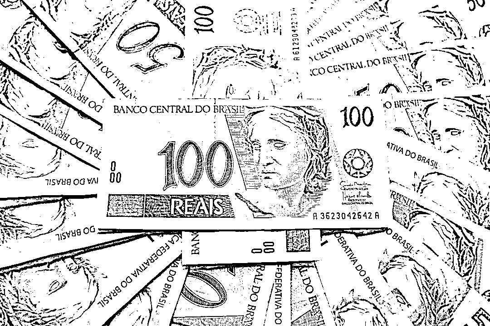**

那可能是一场地震，电力中断，或计算机故障引起的混乱（现在要小心升级软件程序，因为可能有 bug 或“恶作剧者”）。

加上金星也在逆行（12 月 19 日-1 月 29 日），这段时间世界上银行和政府的领导人很容易做出不可靠的评估和发言。可能发生很多令人费解的事件。最近发布的声明可能会被“撤回”，因为数据改变了，或显而易见地其可信度超出了常识的范围。

真相和准确的信息成了有价值的商品，但很可能非常稀缺。由于恶作剧者水星的加入，很可能放出烟雾弹，转移人们对重大问题的注意力，比如通货膨胀。截至美国上周五正午，在 1 月 3 -5 日创下历史新高或次高点后，大多数全球股票市场上周下跌。由于水星开始逆行，可能出现**短期的趋势反转**。但是随着天王星也在改变运行方向，这也可能是**价格方向性运动的加速**。恶作剧者水星及其主人天王星的危险在于，**任何支撑位或阻力位都可能遭到摧毁。**天王星鄙视任何界限，而**水星仅仅喜欢戳戳那些支撑位和阻力位，然后突然改变方向。**如果你过于沉迷于金融市场的短期运动，而不从长期视角观察它，可能遭到暴击。那就是为什么趋势分析与地球宇宙学研究结合起来，非常重要的原因。

黄金和白银从 1 月 7 日周五的低点出现了一波像样的反弹。截至 1 月 14 日中午，它们在测试今年第一周创下的新周期高点，分别在 1830 和 23.30 之上。

在 1 月 10 日短暂跌破 40000 后，比特币也显示出了一些活力。周四时，它上涨超过 10%。由于水星和天王星都在改变运行方向，值得观察比特币能否守住 40000。如果能守住，那是看涨的。如果不能，它仍处在周期的末期，常常是趋势反转的地方。要记住的是，比特币去年 6 月 22 日的最低点，发生在水星逆行，以及其他行星在一周相继改变方向的时候。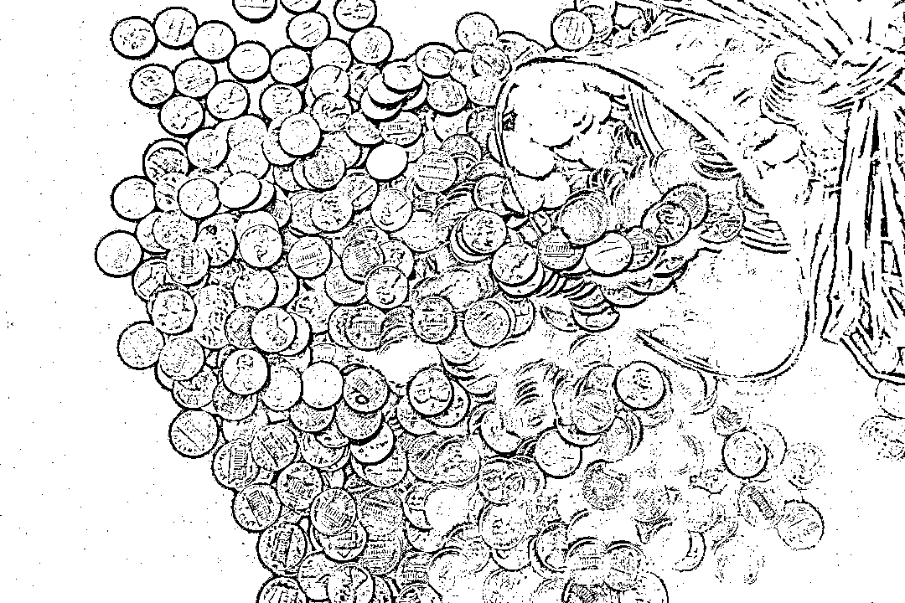原油也度过了极好的一周，于周五在 83.00 之上创下了另一个数周高点。正如所预期的那样，双鱼座木星在发挥影响力推动原油上涨，也符合原油在火星在射手座和摩羯座的历史走势。不幸的是，这些火星配置在历史上也对应着中东的军事冲突，尤其是以色列发起或遭遇的。你不得不怀疑，原油价格的上涨，可能与该地区正在升级的局势相关。**短期占星趋势和长期考量**

****

**同样值得记住的是一条铁律，即任何党派观点几乎总是谎言。****——霍尔曼·W.·詹金斯****《为什么“大谎言”将失败》**** 《华尔街日报》****2022 年 1 月 8-9 日****现在美联储预测明年的通货膨胀率将降低至 2.6%。然而美联储预期明年加息三次，将目标提高到 0.75 到 1 个百分点。****那是一个难以置信的乐观观点，以至于前任纽约美联储主席威廉·达德利称之为“超现实预测”或“爱丽丝漫游仙境一般的幻想”。****达德利认为美联储的预测肯定有一个是错的，那可能是正确的。要么通货膨胀会比预期更高，要么利率必须被大幅提高至更高水平。****——马克·莱博维特****《逆转时事通讯》****2022 年 1 月 13 日****mark.vtrader@gmail.com**有两个有趣的地球宇宙学征象正在接近，其中之一已经在发挥影响力，并与当前的政治（极端主义与适度的较量）和经济（通货膨胀）情况有关。第一个是**火星、金星将于 3 月 6 日在水瓶座 0°合相**。它很重要，因为那是一个**“超级能量”度数（水瓶座 0°）**，也就是 2020 年 12 月 21 日重要的 20 年木星-土星会合周期发生的度数。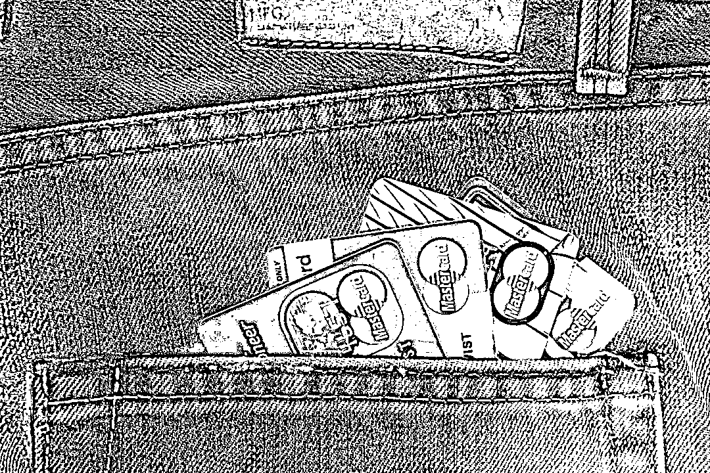它预示着**木星-土星合相有关主题的发展，即适度与极端主义的较量**。木星-土星也与法律事项有关，可能是高等法院做出决定，彰显真理和正义。即将发生的第二个重要地球宇宙学征象，是**木星-海王星将于 4 月 12 日在双鱼座合相**。这是一个与**通货膨胀**关联度非常高的组合，但也可能是利他主义的，或者充满了自大和妄想。它也可以表现为“巨大谎言”，或者严重的误判。正如《X-档案》在每集开播前宣布的，“真相就在那里”。只是不要指望接下来几周内能够真相大白。与此同时，检查与核实你和别人的沟通是个好主意。他们是否理解你的意思？你理解他们的意思吗？误解可能在这一时间段尤其显著，这也是为什么需要“撤回”（恶作剧者水星逆行时的典型运动）一些错误发布的通告。然而，这是一段有利于研究和接近真相的时间，无论如何木星-土星渐盈周期也会提供通往最佳成功的助力。

**说明：以上日期基于纽约证券交易所所在的美国东部标准时间，由于存在时差，中国地区可能需要加一天。**

**版权声明：**本文由若道翻译发布，欢迎转发，反对抄袭。友号转载请申请白名单。

**雷蒙德·梅里曼（Raymond Merriman）**

若道签约老师。著名金融占星师，ISAR（国际占星研究协会）前主席，梅里曼市场分析公司的总裁。他由于“提升了占星学的职业形象”，在 1995 年国际占星大会上被授予轩辕十四奖；在 2012 年国际占星大会上，被授予轩辕十四终身成就奖。

1“中国上证指数月度报告”发售**若道推出了****中文版****的雷蒙德·梅里曼中国上证指数月度报告，并持续发行该报告！**当把金融市场的周期和占星学的周期相结合时，雷蒙德·梅里曼老师的金融占星学研究**为投资者应对金融市场的周期波动，并随之调整投资策略提供了极大的价值参考**。
**1 月中英文报告已上线！**2“黄金价格周期月度报告”发售**若道推出****中文版****的雷蒙德·梅里曼黄金价格周期月度报告！**不仅仅为广大读者在中国股市的投资出谋划策，更将视角放眼黄金市场。**每当世界经济形式不明朗的时候，有一个地方是保值的港湾，那就是****黄金**。自 1982 年雷蒙德·梅里曼出版第一本研究《地球宇宙学征象与黄金价格的关联》的著作以来，**他一直作为最重要的黄金市场时机预测者之一享誉国际**。2022 年 1 月黄金报告已上线，梅里曼老师将会告诉你他对这个关键时期如何操作的想法。也可以按照季度和一年期订阅，有更多优惠。季度和年度的好处是，你可以持续了解梅里曼老师对于不断在变化的市场的看法。即便他某一次看法和市场不一致，你也看到在下一期他如何调整自己的看法，并看到金融占星在一个长期时间段内对你把控风险的帮助。而能够长期控制风险、尽量找到安全的投资时机才是投资的长久之计。**1 月中英文报告已上线！****购买套餐**，买得越多越优惠中国上证指数月度报告套餐价

*   **单月报告**：280 元
*   **3 个月套餐**：780 元（260 元/月）
*   **12 个月套餐价**：2400 元（200 元/月）

**长按下图识别二维码****购买金融报告****套餐****▼**

黄金周期月度报告优惠

*   **双报告年度套餐更优惠（直降 900 元）**

*   **12 个月黄金报告+12 个月上证指数报告：仅需 3900 元**

**长按下图识别二维码购买黄金报告套餐**▼

3《2022 年金融预报和沙龙》1976 年以来，由雷蒙德·A·梅里曼撰写的梅里曼市场时机学院每年一次的年度预报沙龙和每年一本的《年度预报》一直在应用占星学原理为投资者们服务，提供卓越洞见，从未间断。 **雷蒙德·梅里曼《2022 年金融预报和沙龙》发售中（报告已发布）。****长按下图了解详情**
▼

**点击阅读原文购买金融报告**

# 月亮在双子座，你打算怎样度过“水逆”后的第一天？

> 原文：[`mp.weixin.qq.com/s?__biz=MzA5NjA0NTAxNg==&mid=2651466248&idx=1&sn=7b12edf058e438a165a7259ba3740e2c&chksm=8b4898bfbc3f11a975fb64efec6c96d3a6af8a65b17e728da5d6e1933b820ad4b78efc6e31aa&scene=126&sessionid=1692737867#rd`](http://mp.weixin.qq.com/s?__biz=MzA5NjA0NTAxNg==&mid=2651466248&idx=1&sn=7b12edf058e438a165a7259ba3740e2c&chksm=8b4898bfbc3f11a975fb64efec6c96d3a6af8a65b17e728da5d6e1933b820ad4b78efc6e31aa&scene=126&sessionid=1692737867#rd)

**2022 年 1 月 15 日天象：**

*   **月亮在双子座**
*   ******太阳合相冥王星******
*   ******逆行水星四分天王星、六分凯龙星******

周六来啦！月亮在“忙碌”的双子座，你是否给自己安排了满满的一天呢？水星从昨天开始在水瓶座逆行（关于此次[【水逆】](http://mp.weixin.qq.com/s?__biz=MzA5NjA0NTAxNg==&mid=2651466174&idx=1&sn=8f902ed75fda3ccd54e4bb498763d846&chksm=8b489b09bc3f121f1381b74732927bb78db18179cdfdaa477dff66362d18409c8c27c6fe9419&scene=21#wechat_redirect)可点击查看文章），并且还四分天王星，容易出现语言沟通或出行的“混乱”情况，如果你今天有很多事情要做，最好有些充分准备，以免意外情况的发生扰乱情绪哦。若是正好进行某些课程的学习，“灵光一闪的小火花”可能带来很多启发。此外，太阳与冥王星在摩羯座合相，今天也是探进生命深处，寻找力量、展现意志力的时候。周六快乐！**了解每日天象，可****下载“若道”APP 查看****还有更多精彩等着你哦**

# 金融占星学大师《2022 年金融预报》 |  你未来一年的理财手册，值得拥有

> 原文：[`mp.weixin.qq.com/s?__biz=MzA5NjA0NTAxNg==&mid=2651466248&idx=2&sn=d86628df07b13ac781f5106967a9b768&chksm=8b4898bfbc3f11a950e0dc65f4dc1473419ad8a457e44db48eb00e39793c1742028063fb2fc4&scene=126&sessionid=1692737867#rd`](http://mp.weixin.qq.com/s?__biz=MzA5NjA0NTAxNg==&mid=2651466248&idx=2&sn=d86628df07b13ac781f5106967a9b768&chksm=8b4898bfbc3f11a950e0dc65f4dc1473419ad8a457e44db48eb00e39793c1742028063fb2fc4&scene=126&sessionid=1692737867#rd)

1976 年以来，由雷蒙德·A·梅里曼撰写的梅里曼市场时机学院每年一次的年度预报沙龙和每年一本的《年度预报》一直在应用占星学原理为投资者们服务，提供卓越洞见，从未间断。**2020 年，木星、土星和冥王星形成大合相，我们刚刚结束了一个周期和一个时代。现在我们正处于一个新时代和一个新的长期周期的早期阶段。**  如果 2020 年我们还在手忙脚乱，不知道发生了什么；2021 年则更让我们更清楚地看到一个时代结束了——2020 年之前的时代，在新冠肺炎病毒大流行、2020 年”大合相”之前的时代，这是人类历史进程上的一个转折点。**我们所熟知的生活诸多方面在那时就结束了，现在人们仍在试图找出“正确的方式”或“最好的方式”来重建和再造世界。**2021 年，有的行业被彻底摧毁，有的行业成为新贵。2021 年对投资者是一个苦乐不均的一年。尽管美国新冠肺炎疫情未见好转，道琼斯指数仍然扶摇直上；尽管中国经济在世界经济增长中一马当先，上证指数仍然波澜不惊。在货币对标的品种中，老贵族黄金走低，新贵族比特币飞升。我们还看到了大宗商品价格的飞涨，各种短缺开始出现。在中国，各种政府干预市场的调控在各个行业愈演愈烈。**这种现象到底说明了什么？又预示着什么？**2022 年我们的金融市场会受到哪些行星组合的影响呢？我们来看一看：**·** 140 年的木星-土星合相的“风象纪元”在 2021 年刚刚拉开序幕，2022 年我们还将会看到温和主义与极端主义之间存在冲突；**·** 土星四分天王星最后一次成相的影响：专制主义和中央政府控制与个人追求个体的权利和声音的冲突；新能源和旧能源的冲突；**·** 天王星进入金牛座的后半段：包括美元在内的世界货币的重新估价和地位；**·** 土星-海王星的半六分相：新冠肺炎病毒；**·** 水星、金星和火星在 2022 年的逆行“它们对 2022 年发展和增长的影响；**·** 木星在双鱼座（黄道最后一个星座）和白羊座（黄道第一个星座）之间来回移动：战争还是和平；谁是“第一名”的激烈竞争；**· **木星与海王星在双鱼座合相；**·** 冥王星在美国国家星图回归；美国的选择会对全球带来的影响；**·** 月亮交点的换座：月亮交点周期和经济周期的对应；**·** 木星在双鱼座期间金融市场和主要趋势的反转。2022 年仍然是旧世界向着新世界转变的一年。此时，金融市场的投资者和潜在投资者，都需要客观而睿智的思考，而金融占星大师雷蒙德·A·梅里曼的研究则更是无可替代的。1976 年以来，由雷蒙德·A·梅里曼撰写的梅里曼市场时机学院每年一次的年度预报沙龙和每年一本的《年度预报》报告一直在应用占星学原理为投资者们服务，提供卓越洞见，从未间断。去年，这个 3 小时的年度预报沙龙和长达 200 页左右对金融市场的分析报告帮助许多若道的读者做出正确的投资决策，降低投资风险，并获得相当不菲的投资收益。在《2021 年金融预报》中，关于上证指数，梅里曼老师说：对于上证指数，梅里曼老师说：**“我们预计涨势将在 2020 年 12 月-2021 年 2 月之间达到波峰，然后急剧下跌至 52 周和 22 个月周期的低点，这些周期将在 2021 年 5 月之前，甚至在 3 月底之前结束。此后可能会出现另一轮反弹，可能会也可能不会在 2021 年 11 月之前形成第一个 33 个月周期的新高。”**| 上证指数 K 线图关于黄金，梅里曼老师说：**“黄金的 31.33 个月周期波谷将在 2021 年 9 月之前出现，理想情况是 2020 年 12 月-2021 年 6 月。价格目标是 1628+/-109 或 1768+/-76。重叠范围（理想情况）是 1692-1737。如果价格跌破这些范围，则为看涨情况中令人担忧的状况。”**| 黄金走势 K 线图关于白银，梅里曼老师说：**“木星和月亮交点的周期表明，白银的一个重要低点将在 2021 年出现，最有可能在 5 月 13 日之前或 7 月 28 日之后出现。这可能是 5-7 年周期的波谷，但可能会保持在 18.50 以上。收盘低于 17.00 将令人担忧。”**

| 白银走势 K 线图

**2022 年 3 月（具体日期待定），梅里曼老师将会照样带来一场精彩的讲座，讨论 2022 年重要的宇宙天象及其对世界经济、金融形势的整体影响，还将覆盖中国上证股票市场的分析、黄金白银市场、比特币市场等投资市场。具体时间我们待确定后会通知大家。****2022 年度报告及沙龙预售**

**价格：****1380 元（报告已发布）**

**一份价格仅千元的顶尖金融占星大师的投资分析报告和沙龙，聪明的投资者值得拥有。****购买者重要须知****①** 梅里曼市场时机学院每年一次的年度预报沙龙和《年度预报》是梅里曼市场时机学院的研究“预报”，而不是市场“预测”，是梅里曼老师及其金融占星分析师对人类活动周期历史与行星周期之间相关性的研究，二者在大部分情况下具有 80%或更高的相关性，而不是因果关系。沙龙中和报告中的研究完全存在错误的可能性。即便是非常认真的研究和几十年的研究经验，我们无法总是正确地解读出各种征象在实际层面上会如何相互作用，并显化为事件结果。

所以请将次沙龙和报告看作一个研究参考，务必结合其他市场研究和你个人对市场的理解，根据你的自由意志做决策。

**②** 此报告一旦售出，**即不接受退款。**

**③** 此报告仅支持在手机网页和若道 APP 上阅读，不支持电脑阅读和下载。**④** 讲座提供视频回放。**以上须知，请仔细阅读。一旦付款，即视为已了解并接受所有须知内容。**

**如在购买报告中遇见任何问题**

**可添加客服**

▼

****购买报告直达入口****

# 重磅天象丨注意！2022 年第一场水逆来了！

> 原文：[`mp.weixin.qq.com/s?__biz=MzA5NjA0NTAxNg==&mid=2651466174&idx=1&sn=8f902ed75fda3ccd54e4bb498763d846&chksm=8b489b09bc3f121f1381b74732927bb78db18179cdfdaa477dff66362d18409c8c27c6fe9419&scene=126&sessionid=1692737867#rd`](http://mp.weixin.qq.com/s?__biz=MzA5NjA0NTAxNg==&mid=2651466174&idx=1&sn=8f902ed75fda3ccd54e4bb498763d846&chksm=8b489b09bc3f121f1381b74732927bb78db18179cdfdaa477dff66362d18409c8c27c6fe9419&scene=126&sessionid=1692737867#rd)

******************☆ 后******************台******************回复“今日”，给你一句生命态度******************

作者/郑玮玲 ISAR 认证占星师
编辑/翀子 封面/书君 图片/网络

北京时间 1 月 14 日 19:41，2022 年的第一次水星逆行华丽登场。此次水星从水瓶座逆行回到摩羯座，在整个“水逆”剧情里，我们会面临什么“考试”呢？来看文章吧！

**2022 年的第一次水星逆行**

**北京时间 1 月 14 日 19 点 41 分，**水星在水瓶座 10 度 20 分开始 2022 年的首度逆行，并将在三周时间内退回到摩羯座 24 度。

**此次水逆为 2022 年拉开了水逆新周期，今年水星的第二轮逆行将在双子座到金牛座、第三轮水逆将发生在天秤座到处女座。**

水逆是太阳系最常发生的逆行，缘于水星距离太阳位置最近，运行周期最短，因此在地球上形成视差的频率也就越高。**本次逆行，水星从 1 月 10 日起已经渐渐减缓了在黄道运行的速度。**

**1 月 10 日至 1 月 18 日，**水星一直处在水瓶座 8-10 度的区间，**是水逆停滞期，**在此时段我们能感受到最强水星逆行的典型事件。

**在水星恢复顺行前还有一段停滞期：1 月 30 日—2 月 9 日，**处在摩羯座 25-24 度，同样是我们需要高度重视的水逆事件聚集期。

**水星将于 2 月 4 日 12:12 在摩羯座 24 度 22 分恢复顺行，2 月 15 日它将再次进入水瓶座。**

当水星再次行至当初逆行开始的水瓶座 10 度 20 分时已是**2 月 24 日**，至此，才可以看作水星逆行的全部能量已消退。在此日期前我们仍受水星逆行后阴影波及，会遇到前期水逆事件导致的收尾和补充的工作。

本次水逆重点影响人群

**有个人行星、四轴、交点位于水瓶座、金牛座、双子座、狮子座、天秤座、天蝎座 0-13 度；摩羯座、白羊座、金牛座、巨蟹座、处女座天秤座 21—29 度的人。**

此轮水逆因为跨星座逆行，因此波及的星座较多，同时也带出更为变幻的背景和意义。

**重点影响人群不妨从水逆开始前更为深入有意识地开展水星有关的学习、传播、交流的工作，也需要对日常交通出行，资料备份，车辆检修等事宜多一份计划，用心安排，提前准备，反倒会带来事半功倍的效果。**

如若发生不可控的行程延误，讯息缺失，沟通误会等，也可借此时机总结梳理，寻找面对水逆负面影响的有效解决方案。

不必把所有的现实问题扔给水逆背锅，毕竟做事的是人，不是水星。

所有上升双子座、处女座的朋友由于命主星就是水星，因此任何一次水星逆行都需要比他人更多警惕水逆的影响。在水逆期间，宜努力发挥变动星座善于调整的优势，从外境变幻中切换思维与行事模式，透过事物变幻的本质寻找并抓住契机，获取比日常更为深刻的洞见，融入生命的经验。

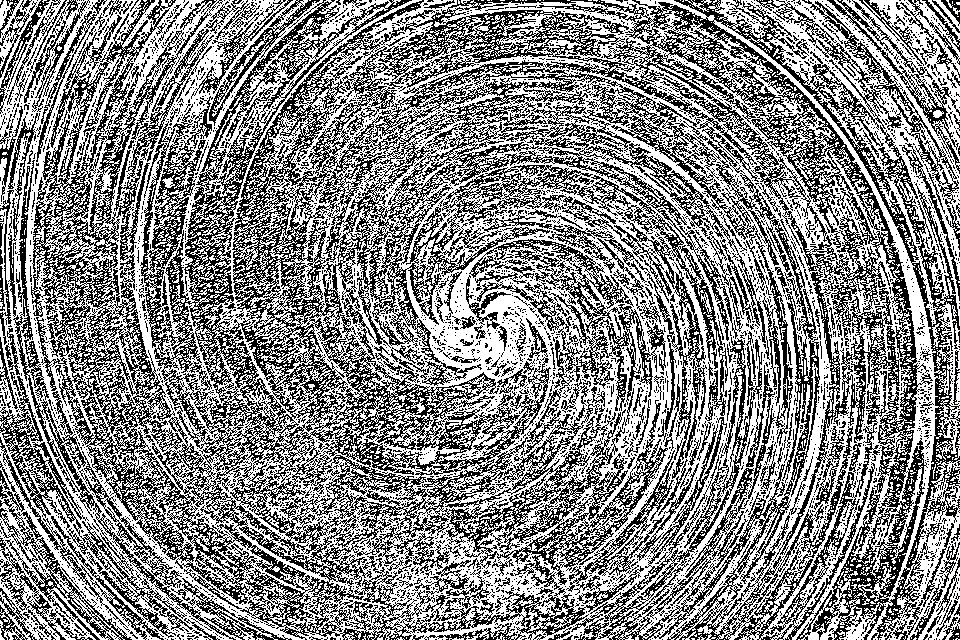

**有效面对和利用水逆**

每逢水逆，我们需要的是保持正常生活的态度，同时关注意识与行为的整合，**水星逆行的本质是帮助我们向内凝聚与回顾的力量。**

**水星逆行期间不仅是水星能量向内的时期，更是与水星有关的沟通、交通功能越发独立、强化的时期。**每当水逆发生都是一次极佳的内省、复核、总结思想的时期。无论你是否重点影响人群都可以利用水逆期间做些必要的思想整理、总结、复核的工作。

也可以趁机回顾旧时学习的知识，获取新的洞见，备份整理工作、学习资料，梳理新的内在秩序。日常工作所用电脑检修与资料备份，但凡涉及音频、视频的传播与交流工作尽可能提早准备，避免传输或存储故障。

当然，从现实经验看，水逆期间也是容易发生沟通误会和交通困扰的时期。本次水逆发生在春节前后，非常可能让我们在假期遇到航班延误，旅途交流受阻的问题。

身在异地要回家过年的朋友不妨为春运出行安排备用方案，安排宽松的时间周期，或是采用非常态的过年方式——水星逆行水瓶座也在告诉我们另类、非常态的选择。

短途出行或在家的朋友就可以利用水逆期主动检修、保养车辆，及时更换机油，轮胎检修更换，零部件更换等。

由于交通物流问题导致的订单与退货问题也是水逆期间需留意的，最好的防范自然是尽可能减少、延后网购，这样能最大程度避免订单纠纷，和钱财损失。

当我们对水逆有长期总结性经验时，便需要从经验中吸取教训，避免水逆期间的误会发生。凡事先处理情绪，摆正态度，选择温和适当的语气，至少能让沟通误会减半。

在复杂的沟通中有必要尽可能采用详细的文字、图表或肢体语言等详尽的表达方式，完善沟通的方式是为实现有效沟通的最好前提。

**学习和使用有效聆听的技巧**，每当沟通出问题，往往是我们听得不充分，缺乏换位思考导致的。水逆期间也适合更**多与自己相处，**这样我们才有机会退出喧闹的世界，深度独立思考和学习。

水逆常常让我们不经意中遇见故人或有失而复得的旧物，逆行的水星也是通过这样的方式让我们学会珍惜与怀念，让人生的感慨来得深一些、长一些。

**此次水逆的路径与意义**

**此次水星逆行开始时在水瓶座。**水瓶座是关于真理、说真话与未来意识的星座。水星是思考者，鼓励我们寻着思维的线索获得信息。此次水逆，土星作为两个星座共同的守护星也被强化了，**土星会为我们带来有效的经验性总结与稳定的架构。**

水瓶座为水星逆行提供了**真理、先锋**的背景色，在进化道路上的每个人都在水逆期间被要求成为对自己**说真话**的人，成为真理的卫道者，成为探索人类意识先锋的思考者。

水瓶座也将固定星座的稳固和自我肯定赋予每一个坚信内在道路的人，支持我们透过对现象的理解**再次巩固内在真理。**

每当想到水瓶座的水星，我们便可以参考乔布斯，他出生星图的水星在水瓶座 14 度。他研发苹果系统时就选择了与比尔·盖茨完全不同的方式：不公开自主研发的源代码，始终保持独立、不兼容。

这便带来了天王星的独立、先锋、创新、格格不入，也带来了土星的疆界、限制、保守与架构。正因为此，苹果的产品从一开始的小众、高端在市场发展进程中渐渐取代了旧时主流成为了新主流、大众消费品。因为水瓶座的意识是为未来而创造。

**此番逆行水瓶座的水星正是为着先锋、未来的思维与意识进行强有力的铺垫与塑形。但水逆的进程中，也是在提醒我们避免思维疆化、封闭带来的弊端。**

**水星逆行还将退回到摩羯座，摩羯座就为思考带来了有力的重启。**同为土星守护的摩羯座其要义是：**攀爬。**在这里没有共振水星高速的要求，有的只是目标与顶峰的必达，我们的思维要攀上一座山峰。

而水星逆行既然让头脑慢下来，停滞，正是为了让一度高速运载的头脑卸下重负，让我们可以重新消化信息。水逆亦如一次强制重启，**清理内在秩序，重建沟通传播逻辑，促使思维与意识投入更落地，更符合时宜的运转。**

水星的本质是媒介，万事万物都可能是这世间的媒介，只要能为我们传递信息。当下水逆经过两个土星守护的冷峻星座，也在某种程度上提醒着我们**打开内在的意识，用心灵的眼睛去看，去接收媒介的信息，再通过你的意识投放到相应的媒介。**

逆行给了我们很深的反思与消化的空间，我们需要明白当下世界所处的严峻趋势，并开始进入未来化的思考。**把摩羯座代表的现实与水瓶座代表的未来看作一个严密的整体，意识到我们当下每一念都足以影响、改变未来。**

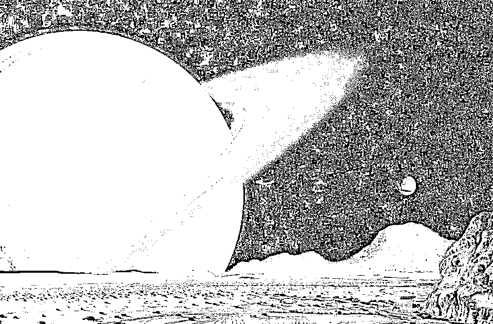

**水逆途中的相位**

**水星与土天四分相**

**水星逆行开始时是紧密参与到土天四分相的相位中的，逆行进程便将水星步步带离土天的紧张能量，同时也将土天四分的权威与革新之间的冲突带入到水逆进程中。**

土天恰是水瓶座的两颗守护星，这也再次强化了当下每个人的意识、思维、思考模式都在面对现实权威，强权限制的严峻挑战，都在面对激越革新意识的冲击。

**每个人都在迎向一种注定的未来化的革新意识的道路，**只是更多人还在缓慢的觉醒，一步步地从怀疑中挣扎出来。

树立独立清醒的全新世界观是一件不容易的事，占星学是时代与集体演化的刻度表，从符号到现象为我们展示了宇宙精微的动线。

水瓶座、天王星共同表达了集体潜意识中的精微心智的创伤，而水星作为人类个体意识的行星在引导我们去修复受损，获得完整，让潜意识的讯息来到个体意识中。

**这一切的目标通往疗愈，也将阶段性地结束一段时期以来集体性的挣扎与呐喊，让我们看到一些革新与突破的意识的果实。**

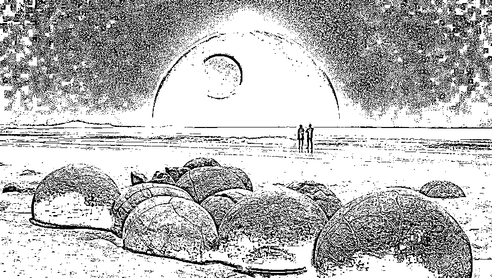

**水星与冥王星合相**

**水星在逆行过程中会再次与摩羯座的冥王星合相，合相时间是 1 月 22 日—2 月 20 日。**

**水冥合相将揭开深刻、黑暗的真相**，逆行的水星也表示重复检查、复核与回顾工作的重要性。很多现象如流水经过我们的生命，但若回头追溯，才是让我们的理性头脑慢下来，才有机会细心发现之前所不能发现的秘密。

**冥王星把秘密呈现给我们，也同时显化集体深层的危机感与恐惧氛围。**

水星逆行合相冥王星，必然要回顾上一轮水冥合相期间（2021 年 12 月 24 日—2022 年 1 月 6 日）被隐藏的讯息。但凡在冥王星的层面，就会意味着深广的集体性，水冥合相期间在世界范围内浮出的讯息重大且黑暗，涉及到全人类的未来，触碰大众对世界的认知和生存底限。

**在冥王星行进摩羯座最后几度的这些年里，人类历史上的重大黑幕、丑闻、秘密都将被层层揭开。**很多人可能还没能意识到我们已长期处在这世界极少数人的权力控制之中时，就已经目睹了由贪欲筑就的某些机构的彻底坍塌。

随着冥王星的行进，越来越多的金玉其表的黑暗势力将被揭发，并连根拔除。那些足以影响人类集体信念的小众群体终将面对冥王星的终极清理。

**水冥合相的进程，只是宇宙终极清理中的一小段进程，用回放的方式帮助我们看清现实与真相，帮助我们拿回深层意识的力量。**

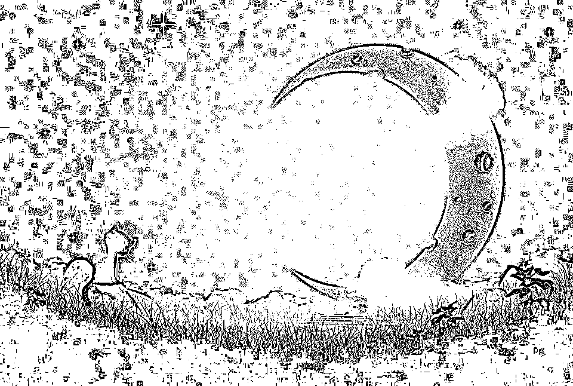

**水星逆行在 12 宫位**

水星逆行对个人带来的影响领域，**可查看水星逆行在你出生星图的第几宫。**本次水逆从水瓶座 10 度至摩羯座 24 度，若你的上升点在摩羯座 24 度，则本次水逆在你的一宫。也可能此次水逆跨了你的两个宫位，可参考两个宫位的指南。

**若道君：****你可以在 app store 或者应用商店搜索“若道”下载 app，输入个人档案，查看行运盘（也可以使用其他星图软件），找到行运水星落在出生星图的第几宫，然后对照下文查看水星逆行的影响。**

**例如下图中，行运水星在比尔·盖茨个人星图的第 7 宫。**

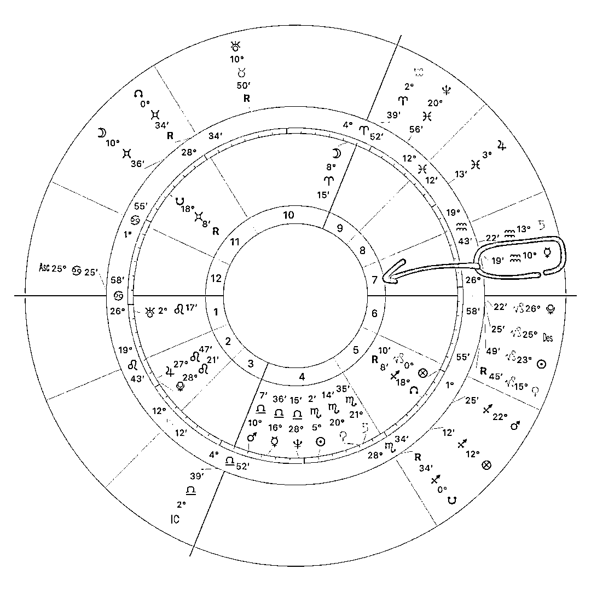

**★****水星逆行在第*****1*****宫**

此时的你需要更多关注于自身的思考，关于你的身份，身在何处，你的意愿在何方，你呈现的样貌，你如何影响着身边的人，又是如何接受世界给你的讯息。

当你梳理好这些问题，你与外在世界的紧张关系也将随之开解。**建议性地探讨自身的命题，能带来对当下更深入的立足、扎根，并能展开充满意义的未来式展望。**

**★****水星逆行在第*****2*****宫**

是时候复核一下财务收支状况，理财与投资的路上需要一点反思，弥补一段时间以来的损失。**此时也是重新定位自身价值的时期：**

你所认同的价值体系与道路是否还值得继续下去？那些来自权力的阻碍，现实的困境在向你提醒着什么？如果坚持你的理想，还需要为此做些什么？**当下会有些流动的迹象来协助、支持你的关于价值的融合。**

**★****水星逆行在第*****3*****宫**

水逆期间应尽可能避免网购，定单延迟与退换货频率极高，短途出行也极需谨慎预定，尽早计划安排时间，但尽量临近出发再作最终预定，尽可能避免选择当天最晚的航班出行。

**此时也可能需要重新复习、使用曾经学过的知识，从旧时所学中发掘新的意义与实用价值，支持到当下的发展和成长。**及时为爱车做保养检修。

**★****水星逆行在第*****4*****宫**

春节回家要留好足够的时间，航班、旅途的延误可能性较大，宜做好深度规划，接受应变的多重准备，即使是周折的旅程也可能是一段深刻的旅程。

**此时也是极佳的内在梳理的时机，在向内的省视中极有可能打开新的意识契机，**与家人之间关系的流动与将以新的模式开启。

**★****水星逆行在第*****5*****宫**

**你需要在创造性的工作中进入深度思考，去探索意识的边界，真正表达你的真理与理想。**

恋爱中的朋友要注意与恋人的沟通可能出现误会，保持聆听，减少情绪化与惯性的评判能避免误会的发生，水逆也可能把我们带到更为真实的地带，看清楚现象与本质，结束长期的误会与幻象。

**★****水星逆行在第*****6*****宫**

**这段时间要多留意照料自己的身体健康，**很可能一些健康征象已经引起你的注意与反思。我们日常如何对待自己身体的，身体便会传递对应的讯息，若能顺着身体的指引便能透过水逆重启健康机制。

这段时间也适宜重拾曾习得的技艺，从**旧有的印记中找回自己曾对生命深刻的关注与热爱。**

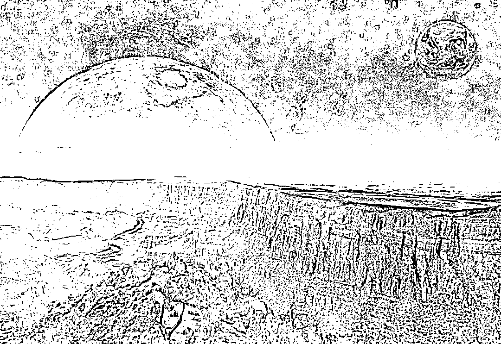

**★****水星逆行在第*****7*****宫**

**你需要更多的时间投入在与伴侣的沟通中，**长期以来亲密关系的沟通模式可能存在一些问题，关系本身也等待双方的关注与维护。同时，你也需要与一些足够亲密的朋友、同伴进行有效的沟通，在亲密的关系之外，寻找到在真理、理想上有共同创造意图的人们。

**你需要从新鲜的信息与沟通方式中获得内在的洞见，你渴望成长与突破的动力是需要鲜活的观点来激发的。**

**★****水星逆行在第*****8*****宫**

你可能陷入对生死的思考，现实的危机感也会将你引至莫名的恐惧当中。此时很适合学习、接触一些灵性、神秘学，以帮助你解答心中的疑虑。**此时我们也会需要一段时间深入的独处来清晰梳理内在的意识，**冥想与各种深度疗愈都是适合的。

也是一段适宜与家庭成员处理紧张关系的时间，**将长久以来的问题放在更为清晰的角度去探讨，也许能得到前所未有的解决。**

**★****水星逆行在第*****9*****宫**

**你对人生、哲学的思考更进了一步，对于世界，你看清了更多。**此时的你已经放下了很多的恐惧，开始走向公开的分享、发声，去表达、传播你已获得的洞见。

你有必要去到现实或梦境中的庙宇、圣殿，**在属于精神世界的场域中得到必要的开示，极可能从旧有的意识中发现一丝全新的意义，找到更新的真理。**

正准备出国留学的朋友航班可以需要尽量延后，出行计划会因水逆影响而稍有拖延。

**★****水星逆行在第*****10*****宫**

如果你这段时间忙于事业，水逆期间则需要有意识停下来反思，关于过去现在和未来，有些需要调整的方向与措施。

真正的理想在向你展开，不要惧怕当下的空白，**给自己一点喘息的空间，**接下来要面对的艰难工作在你的意识层面已经在准备。

突破的关键在于当下的清晰与梳理，做好万全的准备、备份，**把你一路的积累用全新的眼光与意识去重组，你将会在事业上拥有全新的启程。**

**★****水星逆行在第*****11*****宫**

与你的联盟、团体一起探讨未来的道理，**关于理想与真理你们还需要更进一步落地到现实。**沟通中可能产生的误会需要用共同的理想来包容，冲突的化解也需要用为真理服务的态度来牵引。

未来已来，未来却还有距离，**做好计划，顺着时序才能展开理想的蓝图。**

**★****水星逆行在第*****12*****宫**

当我们拥有了思考的深度便有了力量打开内在宝藏，这个宝藏是你的，也是集体的。

**你会思考关于更大的世界、宇宙现在究竟怎么了？**属于未来的、全新的意识如同绵密细雨融入你的心河，在虚空、无边的宇宙中，你融入了黑暗也找寻到了光亮。跨越语言和思维的讯息经由你到来，并将开启一个新的时代。

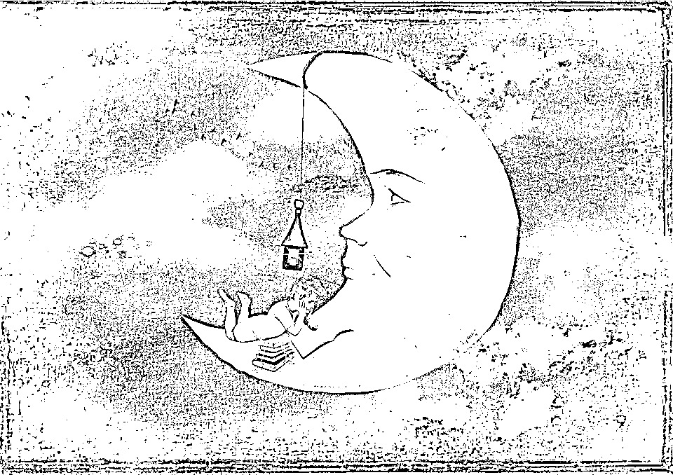

**结语**

水星作为众神的信使，历来就是负责传递信息，在神与神之间，在人与神之间建立起讯息的桥梁。

**愿 2022 年的第一轮水逆，能帮助我们获得深刻、定静的洞见，为每个人打开通往内在神圣的通道，让真理与我们生活的现实紧紧相连。**

**版权声明：**原创文章由作者授权首发于若道平台，欢迎转发，反对抄袭。友号转载请申请白名单。

**郑玮玲**

ISAR（国际占星研究协会）认证占星师（2016 年获得）

若道占星专栏作者

将占星咨询、教学与音乐、舞蹈相结合的疗愈者

**微信号**：zhengviolin

**新浪微博**：@郑玮玲

**微信公众号**：Sampriya-Astrology

长按打赏

**2022 年来了****还不快领取你的****专属年运报告****？****购买有优惠，点击图片查看详情哦~**

**学习占星学****点击下图了解课程详情** 

**

****************

**微信又双叒叕改版啦，不想错过若道君的推送？**

**就把若道设为星标吧！**

**▼**

**就是这个“在看”，戳戳戳 ☟**

******报名直达入口******

# 12 星座如何用占星学了解身体的脆弱和病灶？

> 原文：[`mp.weixin.qq.com/s?__biz=MzA5NjA0NTAxNg==&mid=2651466174&idx=2&sn=cf523c1a9d3e5e8e173823f2d8ecf94b&chksm=8b489b09bc3f121ff08cf5acec978b3962da2ed7f705d210f61bcd62fac658ba58fbe112dcb2&scene=126&sessionid=1692737867#rd`](http://mp.weixin.qq.com/s?__biz=MzA5NjA0NTAxNg==&mid=2651466174&idx=2&sn=cf523c1a9d3e5e8e173823f2d8ecf94b&chksm=8b489b09bc3f121ff08cf5acec978b3962da2ed7f705d210f61bcd62fac658ba58fbe112dcb2&scene=126&sessionid=1692737867#rd)

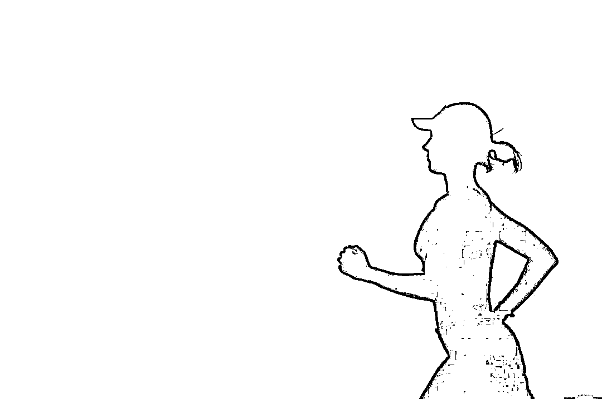

作者/简·里德尔-帕特里克 译者/黄纤越 张弛
编辑/玫瑰 图片/pexels 占星学如何作用于身体的保健和疾病的预防以及预测？这篇文章会给到你一些最基本的干货。值得收藏哦！**星座与身体部位的对应**在这张传统图片中可以看出，每个星座都会与身体的不同部位相关联。

看不明白？没有关系，我们来解释一下。**星座与身体不同部位的对应**○　白羊座：头部○　金牛座：颈部○　双子座：手臂○　巨蟹座：胃部○　狮子座：心脏○　处女座：小肠○　天秤座：肾脏○　天蝎座：性器官和大肠

○　射手座：臀部和大腿

○　摩羯座：膝盖

○　水瓶座：小腿

○　双鱼座：脚**行星掌管的身体部位**以下列表将说明行星所掌管的内容并给出部分关键词。

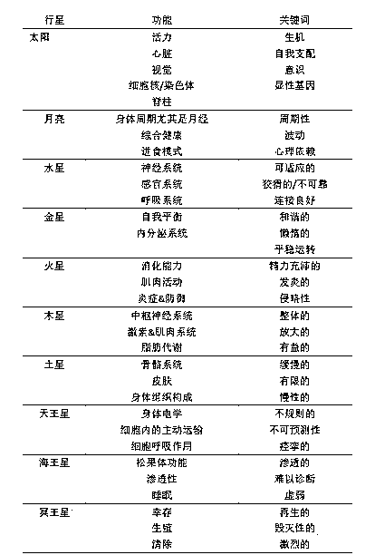

通过这一表格，你可以使用这些关键词和功能栏找出当两颗行星相互作用会给身体带来怎样的影响。○ 如果月亮与冥王星形成了一个困难相位就可能是激烈（冥王星）的月经周期（月亮）；○ 如果困难相位存在于金星与天王星之间，就有可能是内分泌系统（金星）痉挛作用（天王星）；○ 若是存在于海王星与火星之间，则可能是虚弱的（海王星）免疫系统（火星）。

**版权声明：**本文由若道翻译发布于若道平台，欢迎转发，反对抄袭。友号转载请申请白名单。

**也许你还想看下面的文章** 

[医疗占星学入门级教程，建议收藏哦](http://mp.weixin.qq.com/s?__biz=MzA5NjA0NTAxNg==&mid=2651463790&idx=2&sn=1061eef9efd098b52011f81789eb6b4c&chksm=8b4892d9bc3f1bcf574050ff61f69f03dc3f8598341291a457c4220bdb96aebda5849412dd15&scene=21#wechat_redirect)

[“身体的问题，是一次崭新面对自我和生命的机会”](http://mp.weixin.qq.com/s?__biz=MzA5NjA0NTAxNg==&mid=2651463309&idx=1&sn=8c9870b3f2d8f48d0258ca3c1c7c43bc&chksm=8b48ac3abc3f252cc8576315ac16bac18d497621382abc55fa90dd227844d3a8e7e11833c567&scene=21#wechat_redirect)

[医疗占星学干货 | 四元素在医疗占星中的分析方法](http://mp.weixin.qq.com/s?__biz=MzA5NjA0NTAxNg==&mid=2651464268&idx=2&sn=2742fe580fec87dcfe054fda3c44480a&chksm=8b4890fbbc3f19ed011cc42a4db5df71ced4c1ce5d9027b58156fa6899927c104ac6d06d47db&scene=21#wechat_redirect)

[压力太大，承受不了？| 12 星座抗压能力提升法](http://mp.weixin.qq.com/s?__biz=MzA5NjA0NTAxNg==&mid=2651464929&idx=2&sn=febc96f7c2cca508dc7381fd93d9c573&chksm=8b489656bc3f1f4098c7998f531c66002fdd5bfcac02b765dddbaeef42ad3f7bbf409ce6f003&scene=21#wechat_redirect)

**对医疗占星学有兴趣？**

**点击下图了解更多详情吧**

**

**更多好课**
**点击下图了解详情**

****

****************

**微信又双叒叕改版啦，不想错过若道君的推送？****就把若道设为星标吧！****▼**

**喜欢记得点一下在看哦☟**

****报名直达入口****

# ISAR 选修课 | 医疗占星学：透过占星的大门，一窥身体与疾病的真相

> 原文：[`mp.weixin.qq.com/s?__biz=MzA5NjA0NTAxNg==&mid=2651466174&idx=3&sn=20d17bacd9d81b3348b8d0ce59fa68d7&chksm=8b489b09bc3f121f99b78530bfe422070ac141022b18a41aca5dffd351dea2ee7c3cb86686ed&scene=126&sessionid=1692737867#rd`](http://mp.weixin.qq.com/s?__biz=MzA5NjA0NTAxNg==&mid=2651466174&idx=3&sn=20d17bacd9d81b3348b8d0ce59fa68d7&chksm=8b489b09bc3f121f99b78530bfe422070ac141022b18a41aca5dffd351dea2ee7c3cb86686ed&scene=126&sessionid=1692737867#rd)

1

**占星学与疾病之间存在联系**

****

**没有占星学知识的医生不能自称为医生。**

**　　——现代医学之父希波克拉底**

占星学与疾病有什么联系呢？**世界著名的医疗占星师简·帕特里克**说：**“占星学可以精准定位需要解决的潜在问题。”**尽管有人想当然地认为占星学是令人沮丧的宿命论，但事实并非如此：

**有四个主要因素影响着我们的生活和健康：基因构成、物质环境、情绪环境，以及我们的占星配置。我们在星图中都存在患病的可能性，而预防的方法在于尽可能充分、真实和健康地生活。****——简·帕特里克**根据简·帕特里克的说法，**每个星座都有广泛的可能性**。例如，那些双鱼座的人有潜力去扮演殉道者（以他人为先）的角色，但是他们也有能力成为伟大的治疗师。

那么医疗占星咨询涉及哪些内容呢？简·帕特里克有这样的步骤：

**· **首先，会请客户提供详细的病历，以及他们出生的日期、时间和地点；

**·** 然后，绘制他们的星图，观察在他们的病情确诊之前，在占星层面和情感层面上发生过什么。

根据简·帕特里克的说法，**癌症的主要病因之一，除了有害的生活方式之外，就是未解决的情绪冲突**：她通常会在症状出现前的 18 个月至 2 年间寻找触发因素。

她曾这样说：“当我为癌症患者服务时，我的任务之一就是识别出他们生活中的‘恶性肿瘤’，并帮助患者将其消除。”

**医疗占星师还可能帮助你确定做手术的最佳时间，或是指出你每个行星位置的优缺点**：比如，阵容强大的星群落入双鱼座可能与过敏有关，而巨蟹座人则可能发觉自己泡完热水澡后会疲惫不堪。**固定星座（金牛座、狮子座、天蝎座和水瓶座）在情感和生理上都倾向于“难以放手”，这可能为恶性肿瘤的生长创造环境。所以说，他们可能倾向于沉浸在过去的伤害中，难以自拔。另一方面，这些星座也擅长在艰难的时期坚持不懈并一直持之以恒。**

　**　——简·帕特里克**

“癌症人格”中比较突出的一点通常是难以表达情绪，而且你可以从星图中看出这一点。

**客户星图中突显的土星可能表明害怕表达自己的需求，或者害怕展现真实的自己。**

**——简·帕特里克**

发现癌症的身体部位也可能给出有关根本病因的线索。

简·帕特里克曾表示：“例如，卵巢与孩童、创造力、家庭有关。所以说，如果某人患有卵巢癌，那么问题可能在于此人无法表达自己的创造力，或是无法做到滋养和关怀。”

有趣的是，母亲的癌症恰好发生在自己的孩子开始离开巢穴时。

医疗占星师可能也会查看金星在客户星图中的位置。

**金星代表使我们快乐的东西，因此如果金星得不到满足，我们就不会快乐——而不满是滋生疾病的温床。**

**——简·帕特里克**

如果金星落入双子座（前文中母亲的案例），这表明你渴望趣味、变化、沟通、心智刺激和灵性工作。在患癌之前，这位母亲就觉得自己的生活缺乏快乐和意义。理解她的灵魂渴求转变——更多的旅行、更多的学习、更多的乐趣，这可以帮助和支持到这位母亲。**简·里德·帕特里克老师说：“星图中的每个因素都为我们提供了广泛的可能性。所以说，重要的不是我们的遭遇，而是我们如何回应这些遭遇。”**

2

**医疗占星包含哪些内容？**

本课程既适合医疗占星学的初学者，也适合已经有一些相关经验的人。
简·里德·帕特里克老师将运用现实生活中的例子，揭示一个人的性格、症状及其星图是如何相互映照的。课程也会探讨疾病的意义以及可能的治疗方法。本课程旨在为学员提供一个运用医疗占星学的框架和方法，学员将会学到一些有价值的实用工具，在课程结束后，自己使用这些工具研究其中的关联性。**此课程可作为 ISAR 选修课。**

3

**课程安排**

**课程时间：2022 年 3 月 8 日-4 月 26 日  每周二 20:00-22:00**

**第*****1*****讲  3 月 8 日 与占星学、心理学、病症一起工作，学习**

*   医疗占星学的组成部分以及如何使用它们

*   行星的作用与相互作用

*   黄道星座人

*   宫位的重要性

*   疾病和健康是如何产生的

**★ 第二、三、四讲的课程内容基于星座以及它们之间的相互作用。**

**第*****2*****讲  3 月 15 日 基本星座**

学习基本大十字星座——**白羊座、巨蟹座、天秤座和摩羯座**——及其功能和相关的健康问题。**这些星座与防御、养育、结构、体内平衡和荷尔蒙控制有关。**

****第*****3*****讲  3 月 22 日 固定星座****

学习固定大十字星座——**金牛座、狮子座、天蝎座和水瓶座**——及其功能和相关的健康问题。**这些星座与习惯和反射、心脏调节、生存、循环和协调有关。**

“固定星座（金牛座、狮子座、天蝎座和水瓶座）在情感和生理上都倾向于**‘难以放手’**，这可能为恶性肿瘤的生长创造环境。所以说，他们可能倾向于沉浸在过去的伤害中，难以自拔。另一方面，这些星座也擅长在艰难的时期坚持不懈并一直**持之以恒**。”

——简·里德·帕特里克（Jane Ridder-Patrick）博士

**第*****4*****讲  3 月 29 日 变动星座**

学习变动大十字星座——**双子座、处女座、射手座和双鱼座**及其功能和相关健康问题。**这些星座与呼吸、神经系统、肠道、睡眠以及信息、情感和行动的整合有关。**

**★ 第五、六、七、八讲重点学习行星，它们在身体层面的表达、它们的相位与行进。**

**第*****5*****讲  4 月 5 日 太阳与月亮**

**太阳**掌管视觉、活力、心脏和意识，与心脏、脊柱和视觉问题相关。

**月亮**掌管人体的周期，特别是月经周期、饮食模式和体液，与情绪引起的疾病、饮食失调和胃病相关。

**第*****6*****讲  4 月 12 日 土星与天王星**

**土星**掌管着皮肤、骨骼、牙齿和衰老过程。它对应的疾病包括慢性疾病、耳聋、帕金森病、关节僵硬和牙齿问题。

**天王星**代表身体活动的协调，有节奏的脉动和身体的“电”。与天王星相关的疾病包括癫痫、痉挛、心律失常，以及阿斯伯格综合症和自闭症样综合症。

**第*****7*****讲  4 月 19 日 海王星与冥王星**

**海王星**掌管松果体、细胞膜渗透和右脑功能，与过敏、上瘾的病症、慢性疲劳综合症和睡眠障碍相关。

**冥王星**掌管消除和转化，其病理包括毒性、脓肿、癌症和强迫症。

**第*****8*****讲  4 月 26 日 火星**

**火星是与能量和防御相关的行星**，掌管免疫系统、肾上腺功能、肌肉活动和炎症反应。**它是许多身体和情绪障碍的核心**，如自动免疫障碍、抑郁和发烧，以及由手术或需要手术引发的问题。

4

**此次课程适合哪些人？**

*   有一定占星学基础，若道核心课 L3 以上水平；

*   希望成为优秀的占星师，想要借鉴国际大师医疗占星解读思路并融入自己的体系的人；

*   热爱占星学、健康、养生的研究型占星学者；

*   计划考取 ISAR 认证占星师，寻觅中意选修课的学员；

*   走在自我探索和个人成长道路上的人。

**快来和简·里德·帕特里克老师学习升级版的占星学身体地图吧！**

5

**授课老师**

**简·里德·帕特里克 **博士****

（Jane Ridder-Patrick）

简接受过药剂师、理疗师、草药师、心理治疗师和历史学的专业学习，从事写作、咨询和讲学工作，在英国和全球教授占星学及其历史、当今的心理学和医学应用。她在爱丁堡执业，在爱丁堡大学获得博士学位，研究方向是 17 世纪苏格兰占星学历史。

**她最著名的出版物是《医疗占星手册》。2018 年，她因对医疗占星学的贡献而获得了著名的查尔斯·哈维占星学杰出服务奖。**

《医学占星术手册》（第二版，修订版和扩充版）

(爱丁堡，克拉布出版社，2006 年)

6

**课程价格**

*   **课程价格：****6800 元**

*   **早鸟价：5800 元（截止日期：2022 年 2 月 9 日）**

*   **课程咨询：**王老师（微信：18510107057，请备注“医疗占星”）

长按二维码添加王老师

7

**课程安排**

*   **课程时间：**2022 年 3 月 28 日开始，每周二晚上 8 点，每周一次，共 8 次课。

*   **授课方式：**线上直播，英文授课，中文翻译

8

**退转课程**

*   **退款原则请详看《教学协议》，如有疑问请咨询课程顾问。**

****医疗占星****

**授课老师：**简·里德·帕特里克

**授课时间：**2022 年 3 月 28 日起

**授课方式：**网络课程**，**英文授课，中文翻译

**费用：****6800 元****（早鸟价：5800 元，2022 年 2 月 9 日截止）**

**课程负责人：****王老师**（微信：18510107057，请备注“医疗占星”）

长按二维码添加课程负责人咨询~

****报名请点击“阅读原文”****

# 如果可以重来，你会如何选择？| 2 年一次的火星回归，准备好了吗？

> 原文：[`mp.weixin.qq.com/s?__biz=MzA5NjA0NTAxNg==&mid=2651466054&idx=1&sn=3f193222941e384e50876c9e95a1e1f6&chksm=8b489bf1bc3f12e76cf30ca028154335863e346358ed4315813873b144af800ac245474e2a0c&scene=126&sessionid=1692737872#rd`](http://mp.weixin.qq.com/s?__biz=MzA5NjA0NTAxNg==&mid=2651466054&idx=1&sn=3f193222941e384e50876c9e95a1e1f6&chksm=8b489bf1bc3f12e76cf30ca028154335863e346358ed4315813873b144af800ac245474e2a0c&scene=126&sessionid=1692737872#rd)

****************************** ☆ **************后台****************************回复“今日”，给你一句生命态度****************

文/塞缪尔·F.·雷诺兹 译者/Christy 

校对/王宏 编辑/玫瑰 图片/pexels

选自/《大占星师》

**作者的话：**

本文关注的是 10 年间的行星周期，这是我们第一个也是唯一一个既被认为是“小孩”，同时也被视为成人的 10 年——我们 20 多岁的时候。和大多数行星周期一样，这些周期不只发生一次。

事实上，我们从 2 岁起就一直经历火星回归，大约每两年一次。但是，我们可以在 20 岁出头时学习很多有关我们火星回归的知识，或许以此为模板，来理解我们在未来成年生活中经历的其他回归。

**19-20 岁时的你什么样？**当你 19 岁时，严格说来，你还是青少年（teenager），因为 19“nineteen”这个单词里还有个 teen。但我并没有这种感觉，或许其他人也没有。也许年龄上与青少年期靠近会让你感受到青春，但你在这个年龄段也在候车室里等待着人生的大部分旅程。你要登车了。

**19-20 岁时你：**

**·** 为你自己的人生旅程做好准备；

**·** 评估自己的性格与旅程的“适合度”；

**·** 弄清楚谁和你同行。

**两次行星“回归”**：火星回归和月亮交点回归象征着这一时期正在发生什么。

**行星回归是指，一颗行星回到你出生时其所在的确切的黄道位置上**。比如，如果不是在你生日当天，那在你生日前后，太阳也会回到你出生时它所处的位置上。

如果你出生时太阳在狮子座 13°，那么每年 8 月 4 日前后，你就会迎来我们所谓的太阳回归。月亮每月也会回归。但我们在 19-20 岁时应该关注的是火星回归。

**火星回归**火星的占星学符号**♂**和我们用来表示男人的符号相同。当然，它表达的更多的是**我们与阳刚之气的关联**，而不仅指与作为男性有关的一切。这些关联在男女当中皆存在，无论我们是否欣赏得来。用占星学的话说，**火星代表我们如何有能力去定义我们想要的并为之奋斗**。火星是原始的战士、富有进取心的人、霸气的蜜獾。它象征着我们**个人说“不”的能力**。大多数时候，我们有着看似无数种前进的可能性，但火星作为一种原则，向我们展示如何缩小这些可能性并采取行动。它是我们喜欢行动的那部分。**当我们无法行动（或不行动）时，火星可能转化为愤怒**。在你不能采取你想要的行动时，愤怒通常会爆发。或是当某人威胁你未来采取行动的能力时，或许以一种从身体上或情感上伤害你的方式，愤怒也会爆发。**如果管理好了，这种火星的愤怒可以变成强大的保护者**。这是火星的另一面。**作为保护者，火星为保护生命和我们珍视的东西而行动**。即便在我们太阳系的天文学中也是如此。火星从地球出发，远离太阳，是向外朝着太阳系边缘而行的下一颗行星。

讽刺的是，我们很多现代科幻神话都是关于来自火星的外星人攻击我们的。事实上，火星是在保护我们不受它与木星之间的小行星带的伤害。

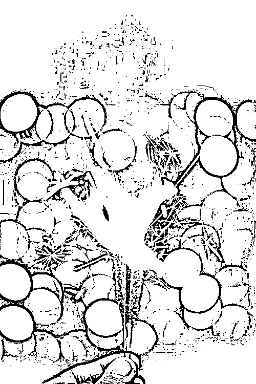

**每两年，充满能量的、独立的火星会回到它在我们出生图中的初始位置上**。如果你出生在 1987 年 12 月 9 日，那么火星就会每两年回到天蝎座 10°左右的位置上。通常，火星不会在你生日当天回归，但在它回归那年的某个时候，它会回到那个点。到你 20 岁时，你已经经历了 9 次火星回归。或许最具戏剧性且最能说明问题的火星回归是第一次回归。
**第一次火星回归发生在你两岁时，难怪会被称作“可怕的两岁”**。在这个年纪，即使是通常情况下最温顺的小孩也学会说“不”并且爱上说“不”。他是在运用他的火星。这是**设立界限**的一个重要阶段（虽然通常会惹恼父母和照料者）。对这个年龄的孩子来说，重要的是知道自己是独立的，不同于身边事物和人。她必须坚持自我。或许这个孩子害怕自己会被他人的照料和关心吞噬，这种担心是有益的。因此孩子会抵抗。而如果孩子的抵抗在照料者那里遇到了更多的阻力，愤怒就会增加。这都是火星带来的，并且常常导致商场过道里的拉锯战。在第一次回归时，**“混乱”和“火星”**似乎是可以互换的两个词。19-20 岁时，你可能不会像两岁时那样，演变成与家人在食品市场拉扯。但你会发现自己在更奇怪的地方以更奇怪的方式与人发生冲突，并且你可能体验到与早先火星回归时体验到的类似的感觉（甚至是情境）。**可能会有一些激烈的斗争，来表达你是谁以及你想从生活中得到什么**。不过，正是这种原始的火星能量在一开始就象征性地把你推进 20 岁。当然，这不会是你遇到的唯一推动力。记住，你每两年会经历一次火星回归，也就是说，你在 30 岁之前还会经历 4 次火星回归。但是，这次是你人生第二个 10 年的最后一次火星回归，也是全新冒险的开始。

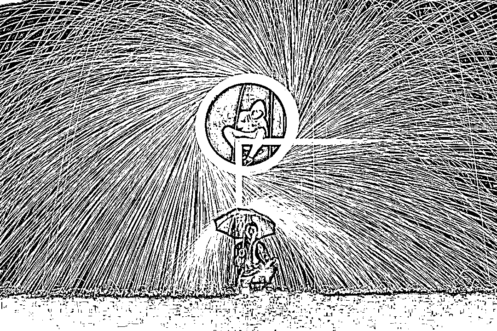

**找到你的火星**回归的情况并不唯一，大多时候取决于火星在你的星图中如何运作，而一位训练有素的占星师可以告诉你它是如何运作的。她可能会查看火星所落的星座和度数，以及这颗战士之星如何与其他行星和你出生图的其他部分联结。但要获得易于掌握的线索，了解你的火星回归会如何作用于你的人生，有一个方法是查看火星在你星图中的位置，如果你知道自己的出生时间的话。这个“位置”在占星学术语中被称作宫位。每个宫位都有与之相关的不同主题，比如婚姻、财务、旅行、群体和健康。 **怎样知道火星落在出生星图的第几宫？****若道君：****你可以在 app store 或者应用商店搜索“若道”下载 app，输入个人档案，查看本命盘（也可以使用其他星图软件），找到火星落在出生星图的第几宫，然后对照下文查看具体表现。**

**例如下图中，火星在比尔·盖茨个人星图的第 4 宫。**

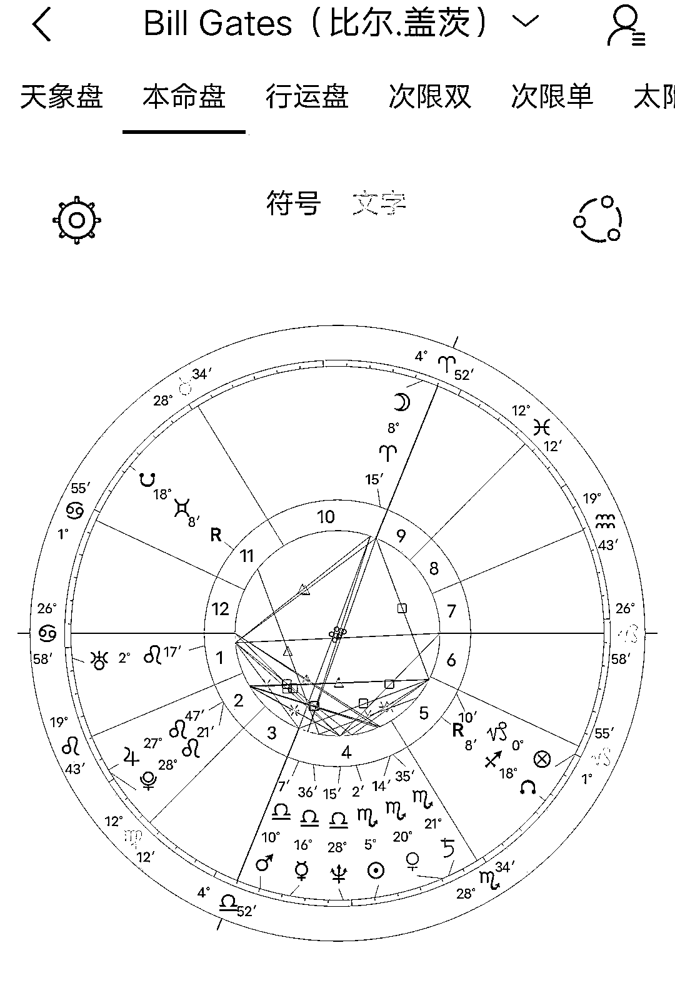

**| **上图♂符号代表火星，4 代表宫位 

**出生星图中火星在 12 个宫位的表现*****第 1 宫***
第 1 宫为你**如何完成人生旅程**定下基调。它代表你的认同感、你的身体，以及你坚持自我的能力。勇敢的火星落于此处，你更有可能寻找方式证明自己，并展示你能做些什么。**火星回归时，你倾向于寻找方式“展示”自己或变得更加自主**。小心别在给自己铺路时触怒他人，不要过于莽撞去冒不必要的风险。***第 2 宫***第 2 宫将我们的兴趣引向**金钱、财产和物质保障**。火星在这个宫位会将你的注意力引向**努力建立你的财政储备**上。对你而言，你钱包里的或银行账户里的东西会让你感到强大。你也可能冲动地花钱获得你认为会让你更强大的东西。**火星回归时，你可能开启新方式来实现更多的财务保障，或是你与他人抗争以获取更多的财务保障或避免任何钱财损失**。***第 3 宫***第 3 宫触发了**我们与身边最直接的人和事的利害关系**，比如兄弟姐妹、邻居或同事。你可能**花费很多精力与你身边的（也可能是珍视的）人和场所联系或交流**。在你追求与他人建立联系时，你有可能分散太多精力。**火星回归时，某个兄弟姐妹、邻居或同事可能带来敏感问题或者争论点**。同样，为保存精力，你可能要努力找到一个方法来驾驭你各种各样的义务、关系或兴趣。

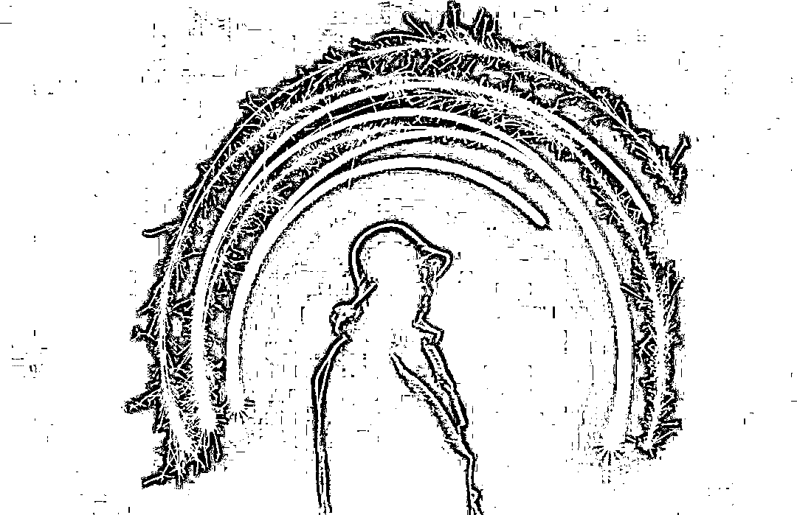

***第 4 宫***第 4 宫关乎你**家园意识、家庭、根和父母，尤其是你的父亲或某个父亲式的人物**。总之，火星通过维护自己得到归属感，你通过坚持自我得到物质和情感上的安全感。火星落在这个宫位触发你更多防御性的思考，也许还有行动。你可能固守自己的领地，难以忍受别人踏入他们没被邀请的地方。**火星回归时，你可能必须要更努力地保护或支持你的家庭、远房亲戚、家以及让你感到安全和踏实的事物**。你也可能与父母产生问题。坚持你的立场，但别因此掀起太多争吵。***第 5 宫***第五宫反映了你的**创造力和生育力**。创造力不仅限于我们常说的艺术，而是一种投射自信的能力。你可以在自己所能做的事情中倾入自我的本质，称为风格或范儿。这显然也是我们生育时所做的，我们能够把自我的本质投射到另一个人身上。火星耗费大量精力来展现范儿，有时是通过冲突。火星在这个宫位时喜欢从生理的层面表达自己，无论是通过某种运动，还是涉及金属或艰苦体力劳动的艺术技巧。**火星回归时，你可能不得不花大力气去“产出”热爱的工作、自我的某个面向或者一个新生命**。

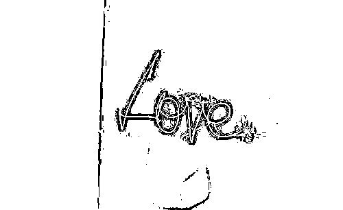

***第 6 宫***第 6 宫与**维持你健康、高效和正常运转的日常事务、人和工作**相关。火星在此清扫宫位——也许真的会发生清扫。掌控日程表令你效率大增，你享受这个把能量和秩序带入生活的机会。但得小心能量的部分，别过度投入或用力过猛，否则感受到更多的不是充满力量，而是精疲力尽。**火星回归时，你更可能感到日常事务或常规工作陷入停滞**。你很可能是对的。持续关注健康问题也很重要。任何小恙和异常变化都应该认真对待。别只是敷衍了事。***第 7 宫***第 7 宫描述的是我们**如何邂逅（业务或爱情的）伴侣和其他一对一人际关系，比如治疗师、咨询师甚至某位熟悉的敌人或竞争对手**。火星给这类关系注入热情，但这种热情是把双刃剑。的确，爱情在这里有时候会感觉像个战场。对重要他人直言不讳的需求会变得让人精疲力尽。同样，别人也可能感觉需要提出质疑和对你直接。**火星回归时，你可能会经历更多的争执，即便在最久经考验的、平时平静如水的关系中也是如此**。关键在于，学会回归火星能量的积极表达，而不是不顾一切地要成为对的一方。别带着自负反击，即便你赢了这场战役，也会输掉战争或者这段关系。

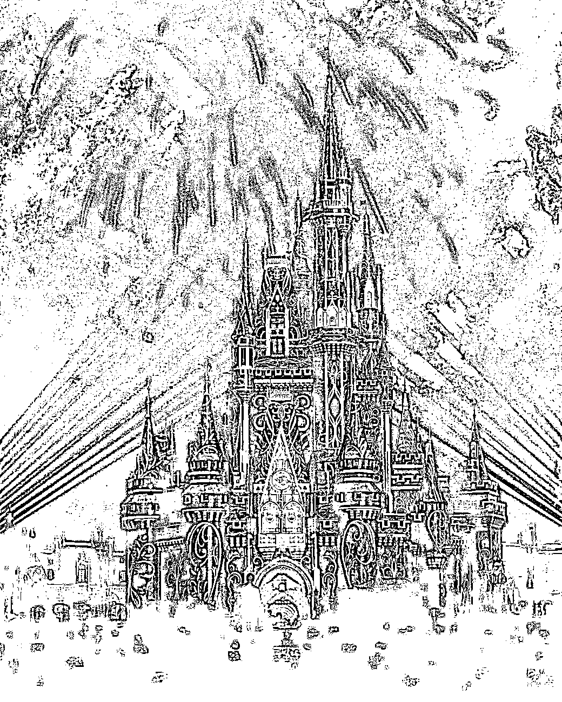

***第 8 宫***第 8 宫是我们**面临人生考验、苦难和财务责任**的地方。在这个宫位，火星有着“永不屈服”的心性，这一点有巨大的优势，也有劣势。你可能不得不忍受人生中一些艰难的情况，这些情况会赋予你十足的坚毅品格。不过你可能渐渐认识到，这种坚毅是一切事物所必须的。或许你已经变得过度关注几乎每一次遭遇蒙受的损失。但你可以相信，过去没有杀死你的，会赋予你在未来蓬勃发展的信心。**火星回归时，你可能害怕会在某个交易或某段关系中理解错误**。多想想，到底更多是恐惧作祟还是客观事实如此。记住，你有选择。你可以选择双赢局面或者转身离开。***第 9 宫***第 9 宫展示了我们如何**在精神和身体领域远途冒险，采用其他途径去思考、表达思想（比如出版图书），或远途旅行，或邂逅从远方来的人**。火星在这一宫位突出了一个真正有旅游癖的人。你有着不安的精神、身体和灵魂，那些希望看到你固着于一件事，或希望让你离家更近的人常常因此感到沮丧。你不禁感到，外面还有一整个世界等着你去学习和发现。你更倾向于在不同的兴趣之间来回切换，这也是你常常陷入困境的地方。你可能开启过多事项而没有时间完成。**火星回归时，你应该在投入学习某样东西或到某地旅行之前考虑清楚。如果感觉都对就没问题**。但同样重要的是，投入这件事是对的。比如，如果你想去一个令人着迷的异国，但不愿意学习这里的语言或尊重其习俗，那么就没有意义。***第 10 宫*****第 10 宫是星图中的最高点，就像正午的太阳**。这里反映的是你如何在你的团体或更大的世界中建立名誉和职业。它不仅关乎你的职业或工作，更关乎你想如何以最好的方式被看见或记住。火星在这里或许反映了一种在人生中功成名就的强大野心，它可以引领你走向卓越，尤其是在运动、公共服务和医疗领域，或者以军事、防卫为核心的领域，在这里你必须通过保卫自己或他人证明你的勇气。**火星回归时，是时候更专注于一个界定清晰的任务或目标了**。别逃避冲突。直面你的恐惧或他人设下的障碍是你建立信心和竞争力的方式。

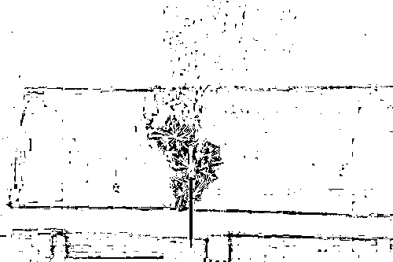

***第 11 宫***第 11 宫描述了你**如何联结他人或依赖他人的帮助实现个人或集体目标**。火星在这里必须更善于与团队合作，更多考虑他人，尤其是同事和朋友。火星在这个位置通常是个挑战。有火星在这个位置的人必须既学会如何领导他人，又学会如何听从他人。有时候很难弄清楚该做哪一个。了解这一点的智慧在于，思考哪一个有助于至善，而不是你的自我。**火星回归时，挑战将在于弄清楚如何在不疏远同事、队友和朋友的前提下分享你独特的天赋和能力**。***第 12 宫***第 12 宫传递的是**你如何体验独处，以及哪些你开始的活动超出了自己的控制**。火星在这里象征着，你的部分最佳工作可能是在幕后完成的，或者你更喜欢单独工作或低调工作。你可能默默无闻地成长起来，或者人们的关注点更多在事情上，而不是做事情的人。也许在一个受限制的环境中你也能做得很好，比如录音棚或电影制片厂，甚至拳击台。你倾向于努力工作，但过劳可能毁掉你。**火星回归时，最好是缩减你的社会责任，专注于你想要为自己或为慈善而完成的清晰任务**。

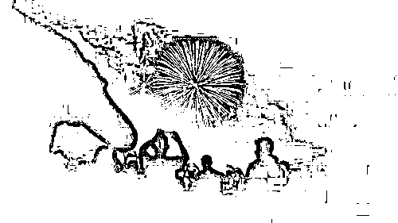

**火星回归实践清单****· 监控你的能量水平**。你是否有足够的能量来做想做的事？像个工程师一样想一想，我会说这要么是燃料的问题（需要更好或更多的卡路里），要么是传递的问题（你没有释放足够的能量到行动中）。
**· 投入系统的行动中去消耗能量**，无论是以健康、性还是精神导向的行动。 **· 反思什么让你愤怒**，你可以采取什么积极的、非侵略性的行动去表达这种愤怒。 **· 思考哪里是你不会实践自己独立性和强悍的地方**。 **· 看看你的火星回归图**，或者请人做一个。通过观察火星的宫位或相位，你可以对你的火星回归保持更密切的关注，更清晰、更有力、更强势地步入 20 岁。

**版权声明：**本文由若道翻译发布，欢迎转发，反对抄袭。友号转载请申请白名单。

塞缪尔·雷诺兹

任职于国际占星研究协会(ISAR)董事会、2018 国际占星大会(UAC)规划委员会和占星新闻播报(ANS)。曾为 Ebony.com、Tarot.com、Astrograph.com、《纽约杂志》和英国黑人女性杂志《骄傲》撰稿。

**2022 年来了****还不快领取你的****专属年运报告****？****购买有优惠，点击图片查看详情哦~**

**学习占星学****点击下图了解课程详情** 

**

****************

**微信又双叒叕改版啦，不想错过若道君的推送？**
**就把若道设为星标吧！****▼**

**喜欢记得点一下在看哦☟**

**报名直达入口**

# 征集 | 你谈过“不靠谱”的恋爱吗？

> 原文：[`mp.weixin.qq.com/s?__biz=MzA5NjA0NTAxNg==&mid=2651466054&idx=2&sn=5b99e77ece321581d3e6ea1067bd28ed&chksm=8b489bf1bc3f12e77b5dd4de16271cc718be2f956fbc74fef72c5ff0c755bdf0f8c53e28f4b5&scene=126&sessionid=1692737872#rd`](http://mp.weixin.qq.com/s?__biz=MzA5NjA0NTAxNg==&mid=2651466054&idx=2&sn=5b99e77ece321581d3e6ea1067bd28ed&chksm=8b489bf1bc3f12e77b5dd4de16271cc718be2f956fbc74fef72c5ff0c755bdf0f8c53e28f4b5&scene=126&sessionid=1692737872#rd)

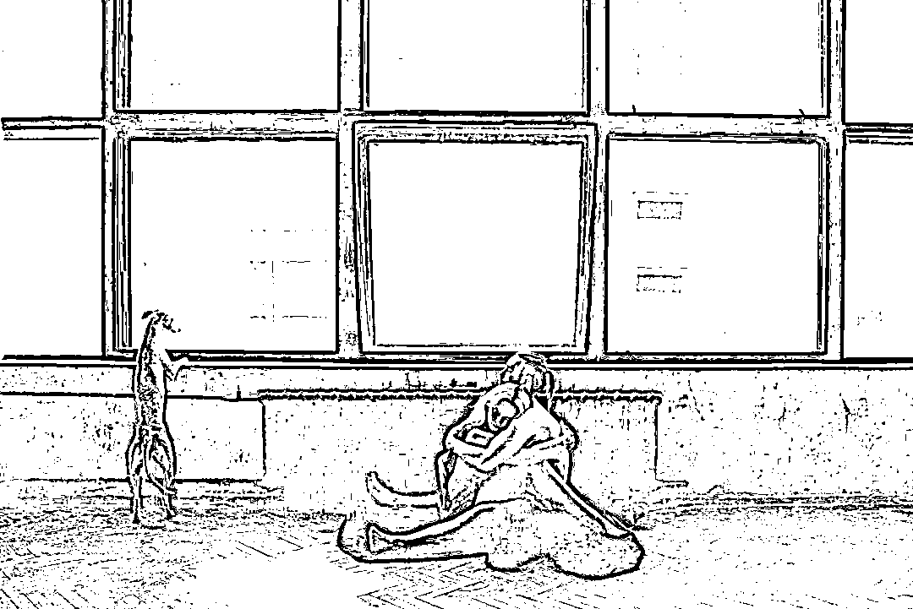

**小伙伴们大家好呀** **若道君又来征集啦****我们想做一期关于“不靠谱”恋爱的征集****人们总是说，恋爱要“门当户对”****然而也许你的心里对于爱情有独特的定义****曾经的你，是否谈过别人眼中“不靠谱”的恋爱？****异地恋、异国恋、忘年恋……****各种差异****这样的你是否因为自己和别人不同而感到为难呢？****你又是如何处理这段关系的呢？****这里有一份问卷等你来填写****我们会将征集结果汇总成文章****发布在若道公众号上哦~******长按下方二维码填写********告诉我们你的故事吧！****

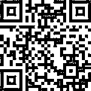

# 新的一年，你可以试试拥抱大自然 | 冬日野骨一日仪式（最后两个名额）

> 原文：[`mp.weixin.qq.com/s?__biz=MzA5NjA0NTAxNg==&mid=2651466054&idx=3&sn=389eef1e3d3077a0cf201cc04c14479a&chksm=8b489bf1bc3f12e7216df5ca4bcfd881de986c2b57a852607a68fd367090ce9972c98d9a0bca&scene=126&sessionid=1692737872#rd`](http://mp.weixin.qq.com/s?__biz=MzA5NjA0NTAxNg==&mid=2651466054&idx=3&sn=389eef1e3d3077a0cf201cc04c14479a&chksm=8b489bf1bc3f12e7216df5ca4bcfd881de986c2b57a852607a68fd367090ce9972c98d9a0bca&scene=126&sessionid=1692737872#rd)

****

**与大自然的灵感力量联结，让你的内在智慧从骨头深处升起。**
**你正在寻找的东西也在寻找你。****——鲁米**这是在新的一年来临之时你可以送给自己的礼物。与另外 7 个伙伴一起，与大自然的灵力相联结，找到内在智慧和野性力量。

1

**适合对象**

**·** 希望自己的生活更有方向感**·** 正处于人生的过渡阶段，正在寻求指引**·** 已经准备好放下那些不再服务你的事物**·** 想要勇敢地联结你的野性力量**·** 想要融入自然界的安宁与美之中，为静谧的智慧留出空间

2

**课程描述**

“冬日野骨”一日工作坊，我们将一起走进大自然和寂静的冬日，在这里，你也许会感知到灵魂在召唤你进入更深的地方，去认知你生活中的转折点，或者去寻找对特定问题或者挑战的洞见与支持。 当你进入冬日时节，在霜雪寂静中，在雨水的气味中或者在自己寒冷的皮肤上，有什么样的智慧在静候着我们？也许你很好奇，那些光秃秃的树木在你的内在召唤什么？鸟儿们低缓的旋律又在如何帮助我们放慢下来？当你放弃一点点安逸，站在冬日之歌的中心时，什么会照亮你的内心深处？**冬日是一个沉思和反省的时刻，是为你自己、家人和后代带来智慧的时刻。**据说我们都是带着独特的天赋降临在这个世界上的，这就是我们灵魂的目的，但是灵魂又在哪里呢？在许多的神话、民间传说和文化当中，“骨头”被认为是灵魂的居所。**“冬日野骨”之旅将邀请我们进入荒野，去发现自己的“骨子”中深藏着什么，借此我们可以洞察到什么样的智慧想要作为我们的天赋显现。**

在这个“冬日野骨”一日工作坊中，我们将遵循传统仪式的三个阶段：**分离、门槛以及融合。****·** 工作坊开始时，我们将围成一圈，敞开心扉倾听，探索我们的意图；**·** 之后我们将走出这个圈，进入你自己的个人体验（分离）；**·** 跨越门槛，我们向进入神圣临界空间之前的过渡区域表达敬意，你将在那里与大地对话。**·** 穿过门槛返回到圆圈当中，分享在大自然和冬景的神秘中发现的启迪。（融合）

****

**一颗种子必须被冻结在自己的意图之中，然后才能打破冬天的桎梏，喷出绿色的火焰。****——史蒂文·福斯特**

3

**时间安排**

**（建议参与者当天禁食，我们将在您报名后发送准备说明）****9:00 **开幕式，分享当天的概况以及安排（10 分钟）分享关于如何构造一个门户（20 分钟）**9:30 **在线登入，参与者介绍自己的名字和来自中国的什么地方，并分享童年时期与大自然的美好体验你今天想要探寻什么？我们会帮助大家澄清今天的意图。为了今天的探寻，你准备好放弃什么，臣服于什么，放下什么？（每人可以携带一块石头或者天然物品，例如羽毛、树叶来标记自己的意图）**11:00 **指导大家如何保持意图、如何探寻（15 分钟）**11:30 **参与者前往大自然中静谧的地方探寻（3 小时的探寻结束之后，我们会提供一些日志问题）**15:00 **参与者返回，欢迎大家归来**15:10 **参与者分享他们的自然之旅，我们会提供一些支持，帮他们澄清自己的经历和所获得的洞见**17:00 **闭幕式

4

**带领老师**

** Toni McErlane**

我来自新西兰，拥有社区和人类服务—咨询康复学士学位，是 Aminz 的注册家庭纠纷调解人，也是 NVC Aotearoa 的 NVC 培训师。

在我的生命中，我一直对真诚、充满活力、自我负责的沟通和有意识的选择充满激情。而我的人生旅程为我提供了充足的机会，让我去探索、研究、反思和完善这在沟通中是什么样的。

在我的工作坊中，我的原则和实践都是建立在非暴力沟通和正念的哲学基础之上。非暴力沟通是由美国心理学家马歇尔·卢森堡博士所开发的。马歇尔的目标是发展出一种语言，这种语言受到印度巴利语中的“非暴力主义”（Ahimsa）一词的启发，它的意思是“没有伤害”。我们怎样才能在与他人沟通时不造成伤害呢？这不仅需要非暴力沟通的技巧，还需要在训练中融入正念。正念是受小乘佛教内观传统的启发，发展觉知和接纳，关注和允许。在我们的工作坊中 ，我们将非暴力沟通和正念编织在一起。

我致力于以这种沟通和处世方式作为我日常与人互动的基础。我曾经学习了为期一年的北美非暴力沟通领导者项目，在加州湾区非暴力沟通的全年浸入式项目中做了两年协助工作，然后在索诺马县女子监狱推动非暴力沟通培训。同时，多年来我持续参加内观静修，致力于继续和发展这种实践，并把它融入自己的工作坊中。

2020 年疫情期间，我与丈夫和我们的猫在游艇上休了一年假。现在，我和丈夫还有 15 岁的侄女在新西兰南岛的达尼丁生活。我在那里从事心理咨询、冥想和生态心理疗法。我们还正在那里慢慢建立一个治疗静修中心和生态冥想社区。

过去四年，我曾两次来中国，与若道及其友好而充满活力的团队分享非暴力沟通，并参观了一些绝佳风景。我期待继续与若道合作，在网上分享我的知识和技能。

向上滑动可查看更多

5

**工作坊详情**

**精品小班工作坊，仅限 8 人参与，迎接新春。**
**工作坊时间：**1 月 22 日 9:00-17:00**工作坊价格：原价 1580 元/人，****二人同行价 1380 元/人**咨询报名请联络：李老师长按二维码添加课程负责人咨询~****冬日野骨·荒野一日仪式****

**授课老师：**Toni McErlane

**授课时间：**2022 年 1 月 22 日

**授课方式：**网络课程**，**英文授课，中文翻译

**费用：****原价 1580 元/人，二人同行价 1380 元/人**

**课程负责人：****李老师**（请备注“冬日野骨”）

长按二维码添加课程负责人咨询~

******报名直达入口******

# 释梦占星大师工作坊：荣格、占星学与梦境

> 原文：[`mp.weixin.qq.com/s?__biz=MzA5NjA0NTAxNg==&mid=2651465949&idx=3&sn=1c54aefda04e17141854a9ae261fe17d&chksm=8b489a6abc3f137c1b3ab1501dbe40356d4164f61cc832229b1e6da976ed9a6ed38d526a0f94&scene=126&sessionid=1692737872#rd`](http://mp.weixin.qq.com/s?__biz=MzA5NjA0NTAxNg==&mid=2651465949&idx=3&sn=1c54aefda04e17141854a9ae261fe17d&chksm=8b489a6abc3f137c1b3ab1501dbe40356d4164f61cc832229b1e6da976ed9a6ed38d526a0f94&scene=126&sessionid=1692737872#rd)

****

**2022 年 3 月和 4 月木星和海王星在双鱼座合相给连接梦境与占星提供了一次绝佳的时机。**

**　　——格雷格·博加特老师**

**梦境工作和做梦疗法是深度心理治疗的一个关键技术，**使得深层无意识的象征性语言能够传递它们的洞见，并指引患者走向更大的完整。

梦境使带有情感成分的无意识材料安全而快速地进入意识层面。它们帮助找到治疗的重心，指引治疗的方向。**梦境提供了重要的线索，告诉我们客户痛苦的来源，以及哪些情绪和情结需要被检视和处理。**梦境工作可以成为心灵成长和行为改变的强大催化剂，它有种独特的能力，促进疗愈从内在发生。

梦就像冰山从无意识的深水中浮现出来。有些冰山属于过去，帮助我们理解过去的创伤和未消化的回忆，因此是回溯性的。

**梦境有种整合的能力，**因为他们能使我们觉知和化解很多次人格之间的矛盾。**梦境也有前瞻性或预期性，**那是来自未来的冰山，会呈现出将要发生的事情，显现出个人有可能成为的样貌。**梦境既向后看也向前看**，它的本质功能是扩展意识、觉知和身份的疆界。

**我在梦境工作中主要使用的技术，是以开放的好奇心，主动探求梦境中每个角色、地点和行为的当下意义**——每个元素都反映出梦者的心灵状态和当前的生活情境。被梦境所揭露的信息，往往既幽默，又充满矛盾，而且为我们打开了新视野。

怀着一种敬畏的心态，我发现每个梦境都是意识海洋深处的一颗珍珠。反思梦境的奥秘，会引发一种近乎宗教敬畏的情感，我们会惊叹于心灵描绘自身处境的能力。

1

**课程内容**

**本课程将课堂讲座与动力过程工作结合起来，动力工作过程会将星图解读和梦境分析结合起来。**

每天约一半时间用于讲座，其余时间会演示占星学梦境工作方法，过程中老师会与学员进行互动。课程包括对老师解读星图和治疗性梦境工作方法的详细阐释和示范。

**我们将学习荣格解梦的基础知识和治疗性的、以过程为导向的星图解读。**我们将体验转化性原型模式在梦境和出生星图中同步显现时会发生什么。

**三次 6 小时的迷你马拉松在线梦境课程**，将会是一次提升意识、开放思想、转化生命的事件。**学员将体验占星学和解梦的融合。**

每次课程格雷格·博加特老师都会与学员互动，课程中使用的星图和梦境将由愿意分享自己梦境和星图的学员提前提供，课程期间也会开放问答以及学员互动环节。

2

**课程安排**

**第*****1*****讲  2022 年 3 月 5 日 **

卡尔·荣格的童年、学生时代以及投身精神病学时期的故事。《荣格自传：回忆·梦·思考》概要。弗洛伊德与荣格的关系，他们合作的破裂，荣格随后的抑郁时期，以及他借助梦、积极想象、艺术创作、曼陀罗绘画和对奥义知识（灵知）、神话和占星学的研究，转化性地面对无意识。卡尔·荣格与艾玛·荣格的占星学。

荣格的力比多（心灵能量）的概念，以及他的心灵结构地图：自我、个体无意识和集体无意识。荣格对无意识原型的描述，它们对个人神话的重要性，以及它们作为个人情结的表现。自我-自性轴线，以及自我与无意识之间不断演化的关系。

**我们将介绍荣格解梦的基础知识以及治疗性的、以过程为导向的星图解读。我们将体验转化性原型模式在梦境和出生星图中同步显现时会发生什么。**

****第*****2*****讲  2022 年 3 月 12 日 ****

梦境中的个性化及其占星学时机。出生星图随时间推移展开。整合个体无意识：梦和出生星图中的人格面具与阴影。男性和女性：阿尼玛和阿尼姆斯。**梦与占星学行进**描绘建立或脱下人格面具的阶段，遭遇阴影的阶段，通**过阳性意识和阴性意识的结合发展出更统一的人格的阶段。**

**第*****3*****讲  2022 年 3 月 19 日 **

**整体性在占星学和梦境中的象征。**透过占星学符号研究梦，来深化内在生命。我们将学习占星学行进和梦境如何试图让我们意识到差异、内在冲突和极性，逐步整合对立，将人格整合成一个整体。

梦境工作和星图解读中的曼陀罗原理。荣格的心理类型理论：内向型和外向型的任务。达到思维、情感、感觉和直觉的平衡。我们还将涉及使用五因素人格理论作为星图解读和梦境分析的基础的重要性。

**我们将学习如何解读梦境，并辨别梦的象征意义所传达的有说服力的信息，因为这与出生星图和行进有直接关联。**整合占星学和梦境工作，可以带我们进入情感、关系和灵性更为一致的状态。

3

**授课老师**

**格雷格·博加特**

（Greg Bogart）

**占星师、心理治疗师**。格雷格出生于美国纽约市，就读于卫斯理大学，1986 移居旧金山湾，完成了加州整合大学和赛布鲁克大学的研究生课程。格雷格自 1991 年以来一直是一名有执照的**心理治疗师**（LMFT 28276）。**他是国际占星研究协会（ISAR）认证的占星师**，并拥有美国地球宇宙学研究协会（NCGR）的第四级认证。他还在旧金山的艾扬格瑜伽学院接受过培训，并于 1992 年毕业且获得了**瑜伽教师认证。**

格雷格是一名私人执业的心理治疗师，在索诺玛州立大学担任**心理学讲师**，他在该校教授“成人发展中的转变”、“以深度为导向的心理治疗”、“神话、梦与象征”以及“存在主义心理学与超个人心理学”等课程，他在加州整合大学、约翰·F·肯尼迪大学、多米尼加大学和超个人心理学学院教授咨询心理学和东西方心理学课程。**他的研究结合了冥想、哈他瑜伽、荣格解梦、存在主义心理疗法和精神综合，以及占星学的周期智慧和原型象征。**

**格雷格·博加特博士著作：**

*   《占星学的高八度音阶》（*Astrology’s Higher Octaves*）

*   《行星用于治疗》（*Planets in Therapy*）

*   《占星学与灵性觉醒》（*Astrology and Spiritual Awakening*）

*   《梦境工作过与自我疗愈》（*Dreamwork and Self-Healing*）

*   《梦境工作在抑郁症整体心理治疗中的应用》（*Dreamwork in Holistic Psychotherapy of Depression*）

*   《占星学与冥想：对变化的无畏沉思》（*Astrology and Meditation: The Fearless Contemplation of Change*）

4

**课程价格**

*   **课程价格：****5800 元**

*   **早鸟价：4800 元（截止日期：2022 年 2 月 9 日）**

*   **课程咨询：**王老师（微信：18510107057，请备注“释梦工作坊”）

长按二维码添加王老师

5

**课程安排**

*   **课程时间：**

     **2022 年 3 月 05 日周六  8:00-14:00**

**2022 年 3 月 12 日周六  8:00-14:00**

2022 年 3 月 19 日周六  7:00-13:00

*   **授课方式：**线上直播，英文授课，中文翻译

6

**退转课程**

*   **退款原则请详看《教学协议》，如有疑问请咨询课程顾问。**

****释梦工作坊****

**授课老师：**格雷格·博加特

**授课时间：**2022 年 3 月 5 日起

**授课方式：**网络课程**，**英文授课，中文翻译

**费用：****5800 元****（早鸟价：4800 元，2022 年 2 月 9 日截止）**

**课程负责人：****王老师**（微信：18510107057，请备注“释梦工作坊”）

长按二维码添加课程负责人咨询~

****报名请点击“阅读原文”****

# 科普丨更“有价值”的占星咨询，是什么样子？

> 原文：[`mp.weixin.qq.com/s?__biz=MzA5NjA0NTAxNg==&mid=2651465949&idx=2&sn=6e479c5393b524104ae9705b3bf9c77a&chksm=8b489a6abc3f137c26a7f691aea0a08e7a02ffb51a08ee3eb7f7752cd6131572a7838b16536e&scene=126&sessionid=1692737872#rd`](http://mp.weixin.qq.com/s?__biz=MzA5NjA0NTAxNg==&mid=2651465949&idx=2&sn=6e479c5393b524104ae9705b3bf9c77a&chksm=8b489a6abc3f137c26a7f691aea0a08e7a02ffb51a08ee3eb7f7752cd6131572a7838b16536e&scene=126&sessionid=1692737872#rd)

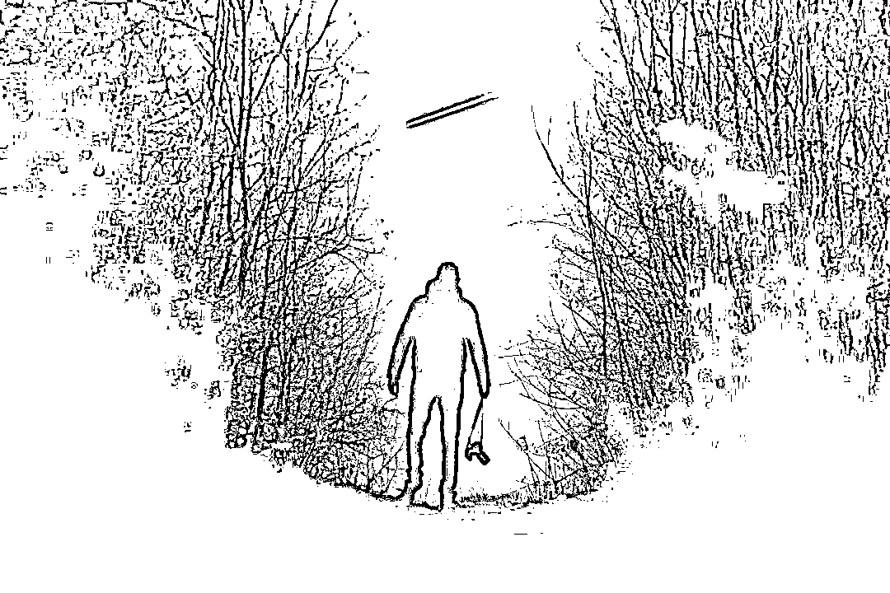

作者/大卫·瑞雷 若道占星创始人

译者/若道翻译团队编辑/玫瑰 图片/pexels

如何衡量占星学的价值呢？占星学有多少种表现形式，哪一种更“贵”？一起来看看这篇文章吧。这是大卫老师系列文章的第一篇，另外，大卫老师参与授课的【[核心课程](http://mp.weixin.qq.com/s?__biz=MzA5NjA0NTAxNg==&mid=2651463523&idx=3&sn=019938f53a79cad4286a02eee12e56f2&chksm=8b48add4bc3f24c226dc436b0db23c55c33bb8d20c0b2ae7f1d669e5d144617206672de875b6&scene=21#wechat_redirect)】和【[双证书课程](http://mp.weixin.qq.com/s?__biz=MzA5NjA0NTAxNg==&mid=2651465782&idx=2&sn=c6eafb2a0ef498e5a54ba878ceedbec2&chksm=8b489a81bc3f1397545590c6ba5722ecee5b834da58e6e527aad499de6afc92a577c01d76e04&scene=21#wechat_redirect)】开启报名中，点击链接了解详情吧！

**一块价值连城的门档**想象一下，你发现一块用来做门挡的石头价值 10 万美元，也就是 63.5 万元人民币。当然，你一直都很喜欢这块石头。30 年前，一个朋友送给你这块石头，你喜欢它伤痕累累、坑坑洼洼的表面上独特的黑色图案。它很重，甚至有一个相对平坦的一面，使它成为一个完美的门挡。但现在你发现它是一颗陨石，而且有一所大学愿意为它支付 10 万美元。你并不知道这块石头能值这么多。 事实上，这确实发生了。密歇根的一名男子 30 年来一直用一块“石头”作门挡，让他的谷仓门保持敞开。20 世纪 80 年代把房子卖给他的那个农民告诉他，这块石头是他和他父亲在 30 年代发现的一块陨石。但他没想太多，直到 2018 年 1 月，一颗炽热的陨石降落在密歇根，成为新闻，提醒他这一点。他决定把这块岩石带到中密歇根大学的地质学家莫娜·西贝斯库那里进行分析。结果它确实是颗陨石，而且是很值钱的陨石，价值超过 10 万美元。

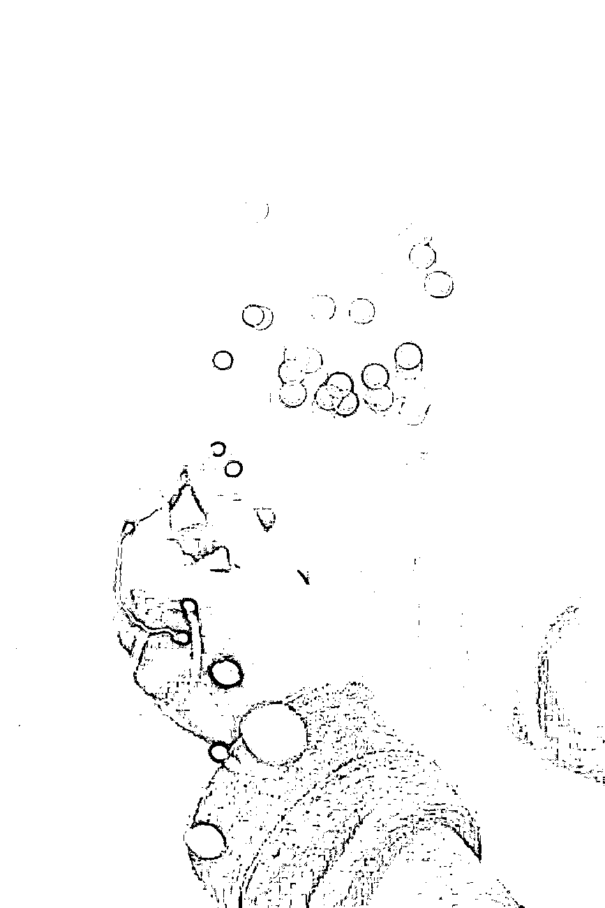

**占星到底值多少钱？**对我来说，这个故事是占星学的完美类比。就像用来支撑谷仓门的门挡一样，大多数人都不知道占星到底值多少钱，更不必说占星咨询了。
我们可以理解为什么一般人可能对占星学的潜在价值没有任何概念，但占星师往往似乎也不知道或欣赏其真正价值。**占星“专业”地应用在现代世界中有许多不同的“层次”，每个层次都有它自己的潜在意义或价值。**

**· 娱乐占星**——要么让你发笑，这没什么错，要么提供可笑的一般性质的肤浅见解，包括占星专栏等；

**· 电脑生成的占星报告**——这类报告通常是由占星师分段写的，形成电脑数据库。通常基本没有整合过程，但报告会在一定程度上提供一些对个人有意义的相关见解；

**· 个人书面报告**——这些是占星师为客户撰写的报告。与客户几乎没有互动，而这份报告是基于占星师对客户星图的想法。这样一份报告可能会提供一些对客户有意义的相关见解；

**· 个人录音报告**——这些是占星师为他们的客户所做的录音。通常很少与客户互动，这份报告是基于占星师对客户星图的想法。然而，因为占星师是在用录音和他们的客户交谈，一个有天赋的故事讲述者可能会巧妙地为他们的客户提供重要意义和重要性的见解。 

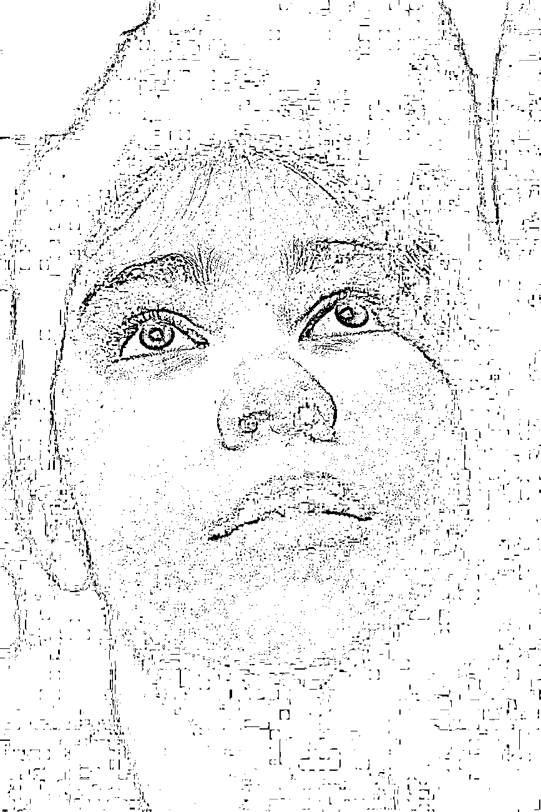

**· 占星咨询**——这些咨询可以是面对面的，线上的，也可以是通过在线音频或电话进行（发短信不算）。这些咨询通常涉及占星师和客户之间的重要互动，双方都参与了关于客户的问题和关注的有意义的讨论。
这种互动的结果可以为客户带来深刻的认识和改变生活的突破，赋予客户创造更充实生活的能力。

在我以上列出的现代社会中占星学的 5 种“职业”使用方式中，并不是有意忽视占星学的“研究”。

无论你是自学还是通过学校或老师学习占星，占星学作为自我发现和个人成长的工具都具有重要的实用价值。你不必成为专业人士或客户才能从中受益。你可以做一个终身的学生，在生活中获得见解，帮助你更好地了解自己和生活中的变化。

我认识的大多数职业占星师都认为自己是占星学的终身学生。当人们问我做占星师多久了，我通常回答“52 年的学习和 46 年的实践”。

这并不意味着总共 98 年！这意味着我还在学习，而且直到 46 年前我才开始专业实践，因此总共 52 年的学习时间。是的，我还在学习中。

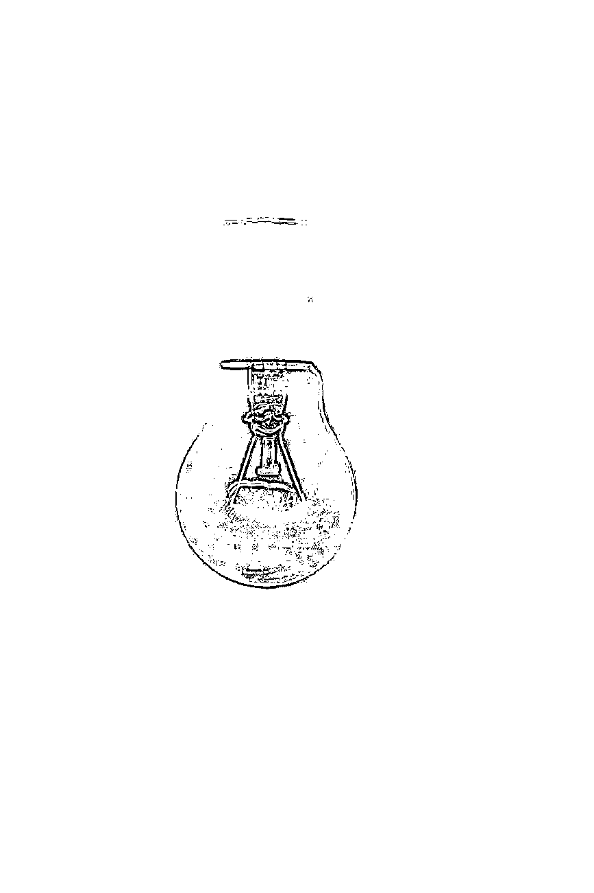

**思考一些问题**

好吧，是时候问一些有关你占星咨询经验的问题了。你曾经作为客户或占星师参与过占星咨询吗? 

我知道你们大多数人读了这个微博。回想一下，你作为客户的经历是怎样的? 在治疗过程中和治疗后你感觉如何? 你学到了什么有价值的东西吗?

作为一个客户，你是否能够将你了解到的内容运用到生活中并证明是有益的。你对自己和生活的意义有了更多的了解吗? 对于占星师，我想补充一句:“你是不是也学到了什么，更多关于生活、人性和占星学的东西?”

也许你做了一些对你有帮助且有意义的咨询，有些则无益。在积极的占星咨询中，是什么促成了你积极的体验? 占星师真的对你感兴趣吗? 他们是否倾听你的意见，并以博学又周到的方式回答你的问题和关切? 占星师问你问题了吗? 在和占星师的交流中，你觉得舒服吗? 你觉得安全吗? 随着会议的进行，你是否感觉到与占星师的融洽关系? 你觉得他们理解你的观点和你的生活经历吗? 占星师是否以客观的态度讨论你和你的处境? 在疗程结束时，你是否对自己有了信心，对自己创造更充实生活的能力有了更大的信心?

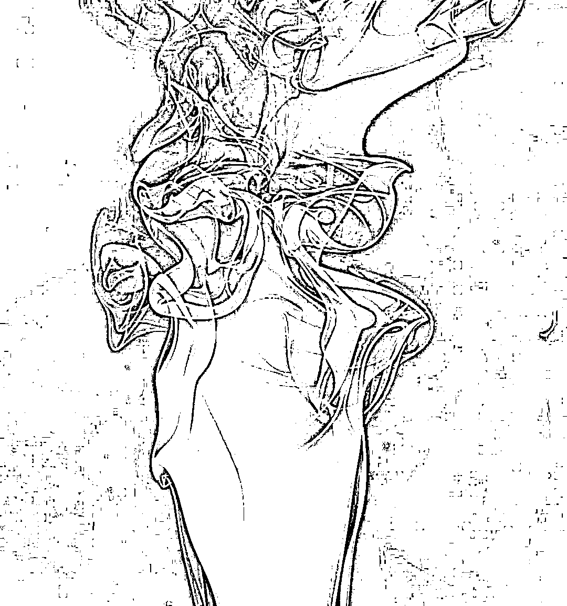

如果你接受过消极或不太积极的占星咨询，什么对你的经历有帮助? 占星师主导谈话了吗?占星师是否表现得好像他们是你和你生活的权威?占星师是否对你做出了绝对且主观的评价? 在谈话过程中，除了你提出的问题，你主要是一个被动的听众吗? 占星师是否对你和你的生活做出了绝对的预测，用“这将发生在你身上”或“这是你的命运，你对此无能为力”之类的话术?占星师声称拥有能看到未来的神秘力量吗?占星师是否告诉你该怎么做，不尊重你的选择权?在你对任何占星咨询的诚实反思中，你已经考虑了以上这些问题。当然，这在很大程度上取决于你作为客户的期望是什么?也许你们很多人可能从来没有做过这样的占星咨询，占星师会倾听你,治疗你，尊重并且积极关注，具有真正的良善,少数人会遇到这样的占星师，他们的目标是“与你一起工作”来帮助你获得你所需要的理解来应对生活中的挑战。

**版权声明：**原创文章由作者授权发布于若道平台，欢迎转发，反对抄袭。友号转载请申请白名单。

****想阅读更多作者的文章，请在后台回复******大卫****** 即可。****

**大卫·瑞雷**

美国占星师，若道联合创始人，致力于在中国教授和推广西方占星学；2010-2014 年，任全美占星师联盟监督委员会委员；2017 年，被选为 ISAR 委员会成员。ISAR 是世界最大的国际占星机构，会员遍布 45 个国家，2017-2020 年曾任 ISAR 全球副主席、CAPISAR（ISAR 职业占星师资质认证机构）主席。

**喜欢文章请长按下方二维码打赏****给大卫老师加杯咖啡呗~****▼**

**想预约占星咨询？****扫描下图二维码，找到专业的 TA**

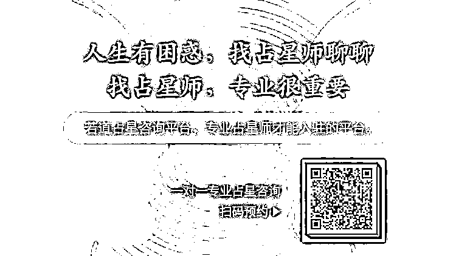

**2022 年来了**
**还不快领取你的****专属年运报告****？****购买有优惠，点击图片查看详情哦~**

**学习占星学****点击下图了解课程详情** 

**

********************************

**微信又双叒叕改版啦，不想错过若道君的推送？**

**就把若道设为星标吧！**

**▼**

**喜欢记得点一下在看哦☟**

********报名直达入口********

# 太阳巨蟹座与 12 星座月亮丨“你的柔情都给了谁？”

> 原文：[`mp.weixin.qq.com/s?__biz=MzA5NjA0NTAxNg==&mid=2651465949&idx=1&sn=9dfd930de39b2de38c761152f4b8710c&chksm=8b489a6abc3f137c5c6e96f404038de7f4261fc6c995aeb285bc37f79b96ef5a1d237dbe3af5&scene=126&sessionid=1692737872#rd`](http://mp.weixin.qq.com/s?__biz=MzA5NjA0NTAxNg==&mid=2651465949&idx=1&sn=9dfd930de39b2de38c761152f4b8710c&chksm=8b489a6abc3f137c5c6e96f404038de7f4261fc6c995aeb285bc37f79b96ef5a1d237dbe3af5&scene=126&sessionid=1692737872#rd)

☆****后台回复“今日”，给你一句生命态度****

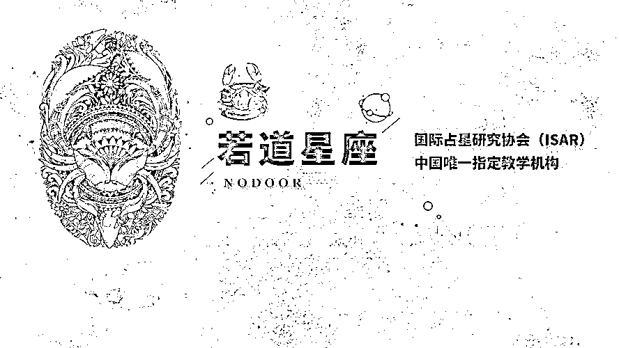

作者/诺·泰尔 译者/江艺、dogcatcher 编辑/翀子 封面/书君 图片/网络太阳是生命的伟大能量，而月亮被认为是人格中的“主导需要”，同样被重视（你可以点击[【开篇】](http://mp.weixin.qq.com/s?__biz=MzA5NjA0NTAxNg==&mid=2651463192&idx=2&sn=7ecd2012aee1f245b56e0f107bdfc19e&chksm=8b48acafbc3f25b968e9ca8cbe8acf6972dc3e418827b36ac12af7bf7c81858937657babb393&scene=21#wechat_redirect)，查看诺·泰尔老师对此部分内容的详细阐述）。当巨蟹座太阳，遇见 12 星座月亮，分别有哪些表现呢？**太阳巨蟹座和 12 星座月亮**

**★月亮*****白羊座***

他们有着**敏锐的情绪**和**保护安全感的本能**，这共同形成个性的突兀感，也是性格中优秀的核心力量。人格发展过程中的紧张几乎在形成之前就被消解了：自尊坚守着生活舞台的中央，**能够用足够的敏感争取胜利。**

**这个配置对自身的价值和能力有着敏锐的感知，**能够在不惹麻烦的前提下充分地做到自我提升。

**★月亮*****金牛座 ***

和蔼而美好。太阳巨蟹座的敏感和月亮金牛座对安逸、审美的需求联合在一起。他们的**生活目标因而是清晰的，且能柔和地开展行动**。（理想的话）他们有着魔法般的待人接物的能力，能进行一场不动声色的演出。在敏锐和安全感的组织下，他们的举止散发着丰富的原创力。 

**★月亮*****双子座 ***

**情绪敏感，神经紧张**；二者结合，带来了**适应与变通**——这既是长处也是缺点。他们敏感得过于锋利；安全感可能被侵蚀。**自我表达过于易变和反复无常**，过于感性，以至于个性难以建设性地发展；需要外界的支援。

这个配置在女性身上比男性要好。它给女性带来灵感，给男性则带来情感上的犹疑。**他们的挑战，在于酝酿专注的品质和使命感，培养对目标的忠实与诚恳。 **

**★月亮*****巨蟹座***

**这个配置强调敏感，强调自我保护。**家就是堡垒。他们的内心情感是抵抗外界伤害的防护罩。他们只能从家庭安全感中寻找高层次的情感与价值。

他们小心翼翼地尝试感情，从中慢慢地学会关怀他人；而他们奋斗的方式总是**圆滑的、不直接的。**他们为了避**免被外界所伤害**，宁可接受孤独。 

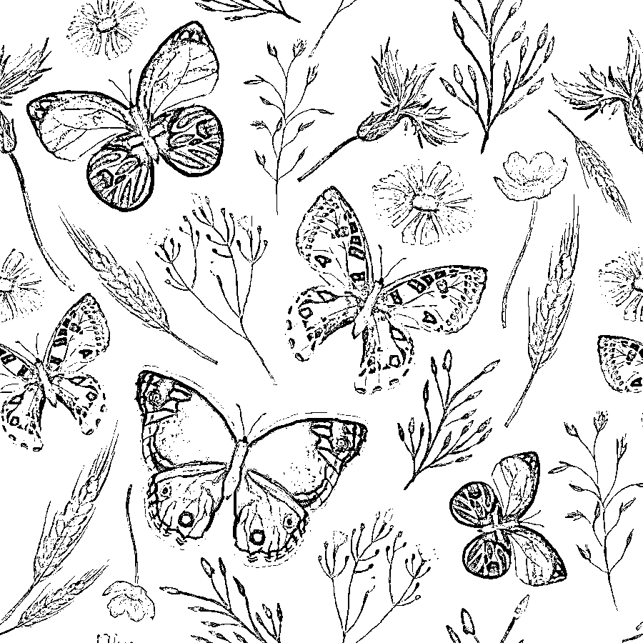

**★月亮*****狮子座***

在人际互动中，狮子座的月亮提供了的情绪和情感上的雍容和静谧。**这个配置的人容易获得他人的理解。**和上一个配置相比，自尊在面对外界的时候有了一个更安全舒适的位置。

**他们有种正义感统治着内心的感情世界**，因而能在人际互动中激发出他人身上最好的一面。**案主给别人留有充满自豪感的印象，且别人深信不疑。**

**★月亮*****处女座 ***

**他们的情感同锋利的思维绑定在一起**，造成早年性格的腼腆；个性只能随着成长强硬起来。长大后，自己的理念和需求一旦建立，个性就形成一股强大的力量：**他们追求精确**，并借此掩盖内心那些深刻的不确定感；**他们理想化地处理人际关系**；习俗就是准则。

他们必须通过工作来克服内心的脆弱，因而**需要足够的人生目标**，才能出色地驾驭这种人格力量——（在星图上）需要压力相位来聚焦。 

**★月亮*****天秤座***

太阳巨蟹座需要独立的情绪安全感，却（因为月亮天秤座）不得不依赖社会互动来满足。这体现了一种人格发展中的紧张：**他们需要远远地争取他人的陪伴，吸收他人的价值，为自身的安全感服务**。他们需要外界的奉承和表扬；会过于相信他人，并（在成长中）受到教训。

**这个配置洋溢着社交才华。**是运用感情和审美能力创造价值？还是通过人际关系建立安全感？在这两者之间，**怎样达到平衡？**这是他们要面对的课题。他们自己敏感，却常会轻易地忽视他人的敏感。

**★月亮*****天蝎座***

这个配置的唯情论倾向**太容易迈向深度和高度**。他们可能具备突出的人际吸引力，引人注目地展示自我，也可能表现为享乐过度，易受影响地沉沦于自恋的沼泽。**骄傲和嫉妒**可能变成感情资金的货币而被肆意挥霍。

**要发挥这个 120 度配置的正面效能，需要聚焦某种积极的活力**，而一旦形成这种活力，他们宽阔的情感谱系能带来同理心，能激发深邃的**情感洞察力**，甚至能控制自己和他人的感情表达。当他们的人生目标宏伟而又充满人文关怀的时候，这种对情绪互动的磁场般的控制力将变成他们非凡的天赋。 

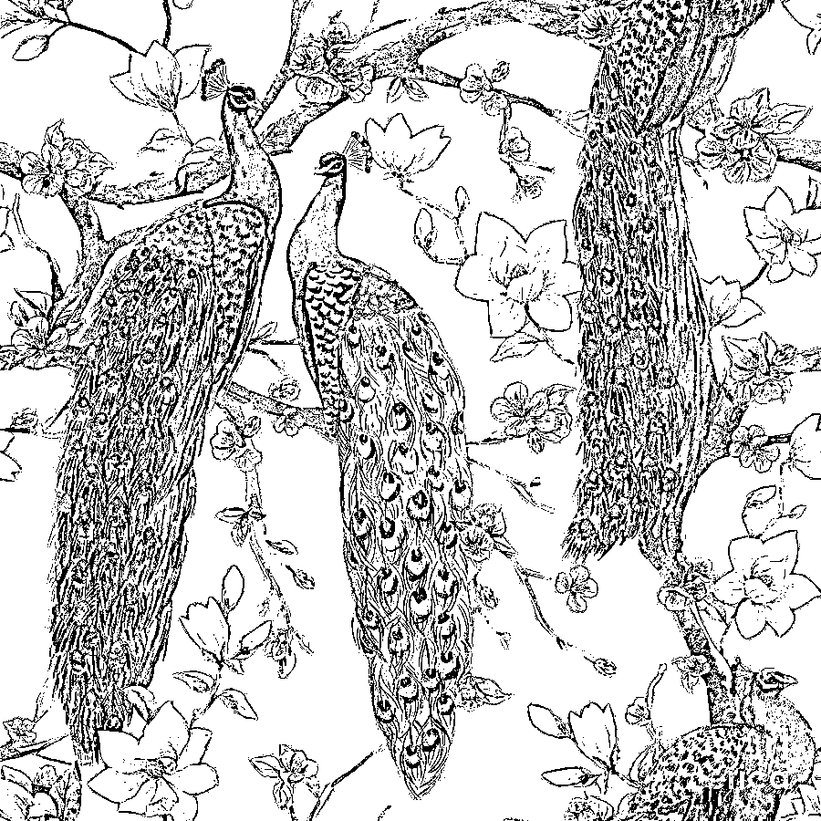

**★月亮*****射手座***

他们的**理想提升了情感**；人生目标通常定得很高。美、艺术、伦理、哲学都对他们有着很强的吸引力。（理想的）他们能用**哲学探索和思维活动**替代巨蟹座在情感上的贪得无厌，他们对安全感的规划长远、宽广而又宏大。 

**★月亮*****摩羯座***

在他们的生命中，**情感和物质现实为了抢夺生活舞台的中心而打斗**（并随着成长渐渐达成妥协）。他们总是能在不伤害他人感情的前提下完成目标。摩羯座强硬的商业精明，被巨蟹座的多情所软化，显得不那么外露。

（为了平衡两个星座的需求）他们最好能够在家办公；最好做和感情有关的工作。**他们有着深刻的自我认识。** 

**★月亮*****水瓶座***

他们的**个人感情被转化得具有社会意义**。他们经常会借助**乐观主义精神**，通过对个人企图心的创新的表达，来得到与众不同的头衔与职位。这是公众人物、贵族慈善家的日月配置。

该配置的危险是，水瓶座月亮的创新趋势如果难以控制，巨蟹座太阳就会发展出一种唯感觉论，追求情绪上的轰动效应。**案主可能在情感上，将自己和某些奇异的地下小团体认同在一块，而很难认同大众文化。**然后，情绪安全感庇护着内向的案主陷入自我陶醉之中：“我是与众不同的”。

**★月亮*****双鱼座***

占星家 Grant Lewi 写道：“你有着帆船一般的性格；你随风逐浪更换航向，调整压舱物，转换帆缆，一旦发现天气的变化，便迅速与其共谋。”**他们的情绪柔软地流动，连接起主观世界和客观世界**。

（感情的）付出和收入达成了平衡。他们的个性往往太过惬意，太过友善，太过好说话，**致使个人观点和立场模糊不清**。他们灵感高涨，常能带来成功。

这个配置**过分强调情绪的舒张与流动**，因此需要紧张相位来带来加以稳固。

**版权声明：**本文由若道翻译发布，欢迎转发，反对抄袭。友号转载请申请白名单。

**本系列其他文章**

[太阳白羊座·12 星座月亮](http://mp.weixin.qq.com/s?__biz=MzA5NjA0NTAxNg==&mid=2651463192&idx=2&sn=7ecd2012aee1f245b56e0f107bdfc19e&chksm=8b48acafbc3f25b968e9ca8cbe8acf6972dc3e418827b36ac12af7bf7c81858937657babb393&scene=21#wechat_redirect)丨[太阳金牛座·12 星座月亮](http://mp.weixin.qq.com/s?__biz=MzA5NjA0NTAxNg==&mid=2651463523&idx=1&sn=69fa5ba9035316fecd6c3911e744f089&chksm=8b48add4bc3f24c274cd5064316982ae958debed1e9ab681b46b80d8d8ec26bb3d2036075be9&scene=21#wechat_redirect)

[太阳双子座·12 星座月亮](http://mp.weixin.qq.com/s?__biz=MzA5NjA0NTAxNg==&mid=2651465406&idx=1&sn=c9bf1ba49b07f6c67740c46779200be8&chksm=8b489409bc3f1d1fdad398e34840d6338275f29a8292e9eb404df28126fcc8262c454b2cb6c5&scene=21#wechat_redirect)

**诺·泰尔**

现代占星学鼻祖，世界众多著名西方占星师的占星老师。他毕业于哈佛大学社会关系专业，是当今世界上最重要的占星师之一，占星联盟协会（AFAN）的创始人及原主席。其所著的三十三本占星教科书作为占星教学的典范，引领了整整两代占星师的占星学习与教育，1998 年国际占星大会（UAC）授予其占星界最高奖项 “轩辕奖”。

**2022 年来了****还不快领取你的****专属年运报告****？****购买有优惠，点击图片查看详情哦~**

**学习占星学****点击下图了解课程详情** 

**

****************

**微信又双叒叕改版啦，不想错过若道君的推送？**
**就把若道设为星标吧！****▼**

**喜欢记得点一下在看哦☟**

**报名直达入口**

# 2022 年重磅丨美国占星心理学学院&若道占星双认证核心课程

> 原文：[`mp.weixin.qq.com/s?__biz=MzA5NjA0NTAxNg==&mid=2651465782&idx=2&sn=c6eafb2a0ef498e5a54ba878ceedbec2&chksm=8b489a81bc3f1397545590c6ba5722ecee5b834da58e6e527aad499de6afc92a577c01d76e04&scene=126&sessionid=1692737872#rd`](http://mp.weixin.qq.com/s?__biz=MzA5NjA0NTAxNg==&mid=2651465782&idx=2&sn=c6eafb2a0ef498e5a54ba878ceedbec2&chksm=8b489a81bc3f1397545590c6ba5722ecee5b834da58e6e527aad499de6afc92a577c01d76e04&scene=126&sessionid=1692737872#rd)

**美国占星心理学学院创办人**

**格伦·佩里**授课

**40 余年**职业占星师生涯所学精华**倾囊相授**

修完 101-205 全部课程，并通过考核的毕业生将获得

**美国占星心理学学院证书**( Academy of Astropsychology )

和**若道毕业证书**

**高含金量双证书**

跟随主讲老师学习融合**心理学体系**的**占星知识**

为星图咨询解读打下坚实的基础

**大量**的课程资料，光是课后阅读资料就**超过 60 万字**

合理的课程设计，贴心的助教服务，及时的课后测验

1

**这门课程最大的看点是什么？**

1. **两位国际占星学大师**共同授课，将合计**90 年职业占星师生涯所学精华**倾囊相授；2. 修完**全阶课程**，考试通过的毕业生将获得**美国占星心理学学院证书**（Academy of Astropsychology）和**若道毕业证书**，**高含金量双证书**；3. **116 次课程**的充分授课时间（录播课程 69 次课；直播课程 47 次课），全面而详细地讲解占星学历史、知识、技能、案例、咨询和运用；4. 跟随主讲老师学习**自成体系、逻辑严密、实用性强的占星语法、星图解读方法**；5. 学习独特的**发展年龄预测法**，从星图看对关键年龄阶段的发展及议题；6.** 大量的课程资料，光是课后阅读资料就超过 60 万字**；7. 合理的课程设计，初中阶课程，每一节都有课后测验；8. 本课程可以作为**ISAR 选修课**中的一门，再修两门就满足 ISAR 认证选修课要求；9. **18 次占星咨询技巧的培训**，为正式从事占星咨询建立基础；10. 教授重要的**心理学概念**，比如与客体关系、心理动力理论、个人神话和叙事疗法相关的一些概念，学习如何将它们整合到星图解读中；11. 了解**《精神疾病诊断与统计手册》**诊断标准，探索星图中的心理疗愈；12.  学习**叙述疗法**和**自传写作**，将之作为自我疗愈和咨询的工具。

**格伦老师致学员的信**

（向上滑动查看内容）

**亲爱的学员：**

作为占星心理学学院的校长，我的目标是帮助你顺利完成学业。

占星心理学学院的课程让你能够在经济承受范围内，灵活地学习占星学。我们的课程让你可以舒适、便捷地在家学习，不用打乱你本就繁忙的日程。我们有完善的在线学习系统，让你能在线上课、下载学习资料、进行测试并自动获得即时反馈，还可以在虚拟课堂上同你的教员和同学互动。

作为私人开业的**职业占星师**和**执业心理治疗师**，我已经**工作超过 30 年。**我还花了近 10 年的时间，在研究院里学习并获得**心理学的硕士和博士学位**。这段训练和经历是无价的，帮助我将占星学发展成为连贯的 21 世纪模式。

我们的占星学培训项目是**系统化的、清晰的、组织有序的、易学的、前沿的。**尽管有许多类似的学校可供你选择，但你不会在这些学校中看到像占星心理学学院所提供的那样有深度的或尖端的课程。

**我非常期待 2022 年再次在若道教授心理占星学核心课程。**我们重新规划和升级了本次课程体系。**新的课程包含之前完整课程的 72 个录播视频，每个视频长 2 小时；以及由我教授的 37 次直播课程，和大卫老师教授的 10 次直播课程，每次课程 2 小时。**在实时课程中，除了我提供的案例，我还会用学员的星图进行案例演示，与学员互动，阐明视频中教授的原则和方法。

**2 小时直播课程安排：**

**第一阶段 提问和讨论：**

这将在每节课开始时进行。邀请学员提出与课前提供的资料相关的具体问题。这一阶段将持续 15-30 分钟。

**第二阶段 示例：**

这一阶段会讲解与每周任务相关的具体概念，例如行星的星座位置、宫位位置以及相位的意涵。星图示例来自我认识的人，如公众人物、朋友、家人、同事或以前的客户（不显示出生信息）。同样，这一阶段也开放课堂讨论，学员可以提出自己的问题和见解。

**第三阶段 学员案例演示：**

这个阶段会从学员的具体星图来阐明概念，例如火元素行星占优势。学员案例演示不会涉及任何类型的咨询或“解读”。它们将只是简单地包含一段对话，我会在对话中分享自己对某个配置的思考，然后问这个学员可能会如何主观地（影响、信念、行为）和客观地（事件/关系）体验这个配置。其他参课学员可能也会对讨论的主题有自己的见解或问题，他们也可以参与讨论。

我对这一新的在线课程形式感到兴奋，**并期待着从 2022 年 4 月 6 日开始认识我的新学员们。**获得本学院的文凭会是你做过的最明智的投资。你不仅将占星学掌握到前所未有的深度，还将学到如何为客户提供咨询服务并建立职业占星师的职业生涯。

真诚地

**格伦·佩里 占星心理学学院校长**

**为什么要学习心理占星学？**占星心理学是一个复杂的体系，让实践者能够向客户提供真正治疗性的益处。这从根本上说来是我们学院有别于其他学校之处：**我们教授占星学，也教授心理学概念。****我们明确讨论各种心理学概念，并将其与占星学无缝衔接。结果就是更深入的、更丰富的，最终更加强大的模式。****该项目专为初学者和渴望深造的有经验的占星师而设。**我们会从跨学科的角度探讨星图解读。**通过融合荣格心理学和各种其他模型的元素，学员将熟悉作为人格理论、发展模型、原型语言和诊断工具的占星学。**

2

**课程是怎么安排的？**

**第一学年**

**共****64****次课 **43****次录播课 **21 次直播课******

**101 占星学基础 **

****共****12****次课程：******8 次 2017 年录课+4 次直播课**

**占星学**关注成长，聚焦心理。外部事件意义重大，但我们可以把它们看作是对于发展中的心理结构的共时性反映，以及未来发展的媒介和催化剂。在这个阶段的课程中，会以四种形态的几何形式介绍**占星原型：星座、行星、宫位和相位**。黄道带是人类心灵的象征性地图，其中的每个**星座**都代表一种基本的人类需求、原型人物、发展阶段和行为风格。**行星**代表心理功能，以满足其关联星座的基本需求。**宫位**提供了环境舞台，行星在其中扮演它们的角色，而**相位**是行星之间的角度关系，在主观上体验为内在对话。

**课程安排**：

**录播课****、****直播课（周三）**时长都是 2 小时

第一节**录播课**：核心概念介绍

第二节**录播课**：黄道带的结构

2022 年 4 月 6 日**直播课**：核心概念、黄道带的结构提问和讨论、知识点示例

第三节**录播课**：图例、单态星体和其他奇妙的元素

2022 年 4 月 20 日**直播课**：图例、单态星体提问和讨论、知识点示例

第四节**录播课**：星座介绍（从白羊座到处女座）

第五节**录播课**：星座介绍（从天秤座到双鱼座）

2022 年 5 月 4 日**直播课**：12 星座案例演示

第六节**录播课**：行星作为过程

第七节**录播课**：行星作为内容

第八节**录播课**：将碎片整合起来

2022 年 5 月 18 日**直播课**：整合星图时，将行星作为过程和内容案例演示

**102 行星落星座、宫位** 

****共****12****次课程：**8 次 2019 年录课+4 次直播课**

这个阶段的课程**聚焦于初步的星图整合。**

学员将学习**占星语法**，以及如何运用它们来阐释**行星的星座落点**。学员不需要强记书中的星图解读，而是学习分析基础的占星句法结构，应用这些语法规则来思考和讲述这门语言。学员们将学习如何构建精妙的句子，将动机、功能、特质、状态和事件组合起来。

此外，还将学习解读**行星宫位落点**的规则。宫位被定义为心理环境，为特定类型成长和发展提供背景。行星落在宫位中，象征着情境中的特殊状态，应对环境挑战的方式，以及通过共时性人物和事件而外化的自我部分。

学员们将探索如何将星座和宫位落点融合在一个单一、整合的陈述中，做出灵活、层次分明的解读。

**课程安排**：

第一节**录播课**：占星语法介绍

第二节**录播课**：行星星座作为行为风格

2022 年 6 月 1 日**直播课**：占星语法、行星星座作为行为风格提问和讨论、知识点示例

第三节**录播课**：思维状态和行为结果

第四节**录播课**：学习行星的星座落点

2022 年 6 月 15 日**直播课**：思维状态和行为结果、行星的星座落点提问和讨论、知识点示例

第五节**录播课**：回顾宫位的含义

第六节**录播课**：宫位中的行星过程

2022 年 6 月 29 日**直播课**：宫位的含义、宫位中的行星过程提问和讨论、知识点示例

第七节**录播课**：行星在宫位中的状态

第八节**录播课**：行星作为宫位的内容

2022 年 7 月 13 日**直播课**：行星在宫位中的状态、内容的提问和讨论、知识点示例

**103 行星相位与个人神话** 

****共****13****次课程：**9 次 2019 年录课+4 次直播课**

在这个阶段的课程中，**相位**被解释为由更大的故事结构的潜在动力构成的个人神话。

学员将学习相位是如何象征内在心理的冲突、重要的童年情感体验、主要的人生挑战和内在对话的。需要着重强调的是，相位的意涵会随着心理成熟的程度而改变。人会成长、进化，会解决内在冲突，这些不仅反映在态度和行为的改变上，而且也会表现在某人吸引的事件及其与他人的关系品质上。

学员们还将学习一些**心理学概念**，比如与客体关系、心理动力理论、个人神话和叙事疗法相关的一些概念，它们将整合到相位解读中。

**课程安排**：

第一节**录播课**：重要主题与核心冲突

第二节**录播课**：渐盈相位与渐亏相位

2022 年 7 月 27 日**直播课**：重要主题与核心冲突、渐盈相位与渐亏相位的提问和讨论、知识点示例

第三节**录播课**：主要相位的核心意义

第四节**录播课**：罗生门原则

2022 年 8 月 10 日**直播课**：主要相位的核心意义、罗生门原则的提问和讨论、知识点示例

第五节**录播课**：占星学中的认知

第六节**录播课**：心灵的控制结构

2022 年 8 月 24 日**直播课**：占星学中的认知、心灵的控制结构的提问和讨论、知识点示例

第七节**录播课**：作为认知结构的相位

第八节**录播课**：强迫性重复

第九节**录播课**：听大卫·瑞雷讲月亮交点

2022 年 9 月 21 日**直播课**：月亮交点（由大卫·瑞雷老师教授）

**104 征象星与定位星：作为进化故事的星图 **

****共****12****次课程：******8 次 2019 年录课+4 次直播课**

这个阶段的课程聚焦于**从叙事角度整合星图。**

学员们将探索**宫位征象星**和**行星定位星**如何讲述一个故事，反映一个人进化发展之旅。行星定位关系揭示了个人神话的主体构架。而这个故事的主题常常处于意识觉知和控制之外，占星学提供了一种方式，揭示、解读、改编这个神话。

我们推荐的星图整合方式是将相位和定位星关系融合成一个单一、连贯的叙事。要特别强调的是，如何活出整合程度更高的生命故事。

学员们还将了解**叙事疗法**和**自传写作**，把它们当作促进整张星图整合的一种方式。

**课程安排**：

第一节**录播课**：每张星图都讲述了一个故事

第二节**录播课**：互容与最终定位星

2022 年 10 月 12 日**直播课**：每张星图都讲述了一个故事、互容与最终定位星的提问和讨论、知识点示例

第三节**录播课**：将相位整合进流程图

第四节**录播课**：完整的故事

2022 年 10 月 26 日**直播课**：将相位整合进流程图、完整的故事的提问和讨论、知识点示例

第五节**录播课**：过渡短语

第六节**录播课**：良好定位或不良定位

2022 年 11 月 9 日**直播课**：过渡短语、良好定位或不良定位的提问和讨论、知识点示例

第七节**录播课**：发展年龄方法

第八节**录播课**：进行全面整合

2022 年 11 月 23 日**直播课**：发展年龄方法、进行全面整合的提问和讨论、知识点示例、案例演示

**105 星图中的精神病理学与疗愈 **

****共****15****次课程：******10 次 2019 年录课+5 次直播课**

在这个阶段的课程中,我们将**聚焦于十二星座(从白羊座到双鱼座）及其对应的守护星的潜在功能障碍**。

我们将学习如何识别、理解和应对每个星座的潜在挑战。我们将在各种相应的心理障碍背景下来考察占星原型，这些心理障碍表现为功能障碍、失衡的极端状态。

学员们将了解**《精神疾病诊断与统计手册》诊断标准**。我们会探讨治疗的概念，尤其是那些与整合和个性化相关的概念。我们将特别关注外行星的困难相位，以及它们与内在心理冲突、防御和症状形成的关系。

学员们将探索人的痛苦如何成为发展和实现天赋才能的催化剂。在考察病因时，我们会将平常的因果关系理论与传统的命运、业力和转世观念整合起来。

**课程安排**：

第一节**录播课**：白羊座-火星的病理学

第二节**录播课**：金牛座/天秤座-金星的病理学

2022 年 12 月 7 日**直播课**：白羊座-火星、金牛座/天秤座-金星的病理学提问和讨论、知识点示例、案例演示

第三节**录播课**：双子座/处女座-水星的病理学

第四节**录播课**：巨蟹座-月亮的病理学

2022 年 12 月 21 日**直播课**：双子座/处女座-水星、巨蟹座-月亮的病理学提问和讨论、知识点示例、案例演示

第五节**录播课**：狮子座-太阳的病理学

第六节**录播课**：天蝎座-冥王星的病理学

2023 年 1 月 4 日**直播课**：狮子座-太阳、天蝎座-冥王星的病理学提问和讨论、知识点示例、案例演示

第七节**录播课**：射手座-木星的病理学

第八节**录播课**：摩羯座-土星的病理学

2023 年 1 月 18 日**直播课**：射手座-木星、摩羯座-土星的病理学提问和讨论、知识点示例、案例演示

第九节**录播课**：水瓶座-天王星的病理学

第十节**录播课**：双鱼座-海王星的病理学

2023 年 2 月 8 日**直播课**：水瓶座-天王星、双鱼座-海王星的病理学提问和讨论、知识点示例、案例演示

**第二学年 2023 年**

****共****52****次课 **36****次录播课 **16 次直播课********

**201 回顾占星历史 **

****共****16****次课程：******9 次 2019 年录课+7 次直播课**

在这个阶段的课程中，我们将探索**占星历史如何反映心灵的进化**。

现代之前的占星学以事件为导向，注重具体预测，偏向决定论，它反映了现代之前的主导意识模式。上世纪以来，占星学已经逐渐变得更加抽象、心理化、开放和非决定性，这似乎反映了集体意识的改变。因此，我们将在人类发展和意识进化的背景下考察占星历史。我们会谈到不同时代的星图解读和咨询技术，以此来比较和对比前现代、现代和后现代占星学。

**课程安排**：

第一节**录播课**：朝着整体占星学前进

第二节**录播课**：占星原教旨主义

2023 年 2 月 22 日**直播课**：朝着整体占星学前进、占星原教旨主义提问和讨论、知识点示例

第三节**录播课**：占星学的其他分支——大卫·瑞雷

2023 年 3 月 1 日**直播课**：占星学的其他分支提问和讨论、知识点示例（由大卫·瑞雷老师教授）

第四节**录播课**：从古代占星学到后现代占星学

第五节**录播课**：比较与批评

2023 年 3 月 8 日**直播课**：从古代占星学到后现代占星学、比较与批评、提问和讨论、知识点示例

第六节**录播课**：希腊占星学：摘录与评论

2023 年 3 月 22 日**直播课**：希腊占星学：摘录与评论提问和讨论、知识点示例

第七节**录播课**：比对图中的伴侣匹配度，古代与现代

2023 年 4 月 5 日**直播课**：比对图中的伴侣匹配度，古代与现代提问和讨论、知识点示例

第八节**录播课**：比对图——大卫·瑞雷

2023 年 4 月 12 日**直播课**：比对图提问和讨论、知识点示例、案例演示（由大卫·瑞雷老师教授）

第九节**录播课**：组合图——大卫·瑞雷

2023 年 4 月 26 日**直播课**：组合图提问和讨论、知识点示例、案例演示（由大卫·瑞雷老师教授）

**202 预测与意识演变(一) **

****共****9****次课程：******6 次 2019 年录课+3 次直播课**

作为一门艺术，**预测占星学**运用行星的运行来预测特定时期的性质、意义和持续时间。在这个阶段的课程中，我们会考察**意识进化**的概念、其基本原理及其与占星学预测部分的关系。

意识进化可以被定义为有意识地与星图中固有的进化过程合作。学员们将探索如何用**行进**和**推进**来为意识进化服务。我们不是简单描述事件的结果，而是将行星运行描述为实现先天潜能的机遇之窗。

**课程安排**：

第一节**录播课**：开始预测

第二节**录播课**：发展年龄方法

2023 年 5 月 3 日**直播课**：开始预测、发展年龄方法提问和讨论、知识点示例、案例演示

第三节**录播课**：太阳的行进

第四节**录播课**：月亮的行进与推进

2023 年 5 月 17 日**直播课**：太阳的行进、月亮的行进与推进提问和讨论、知识点示例、案例演示

第五节**录播课**：水星的行进

第六节**录播课**：金星的行进

2023 年 5 月 31 日**直播课**：水星、金星的行进提问和讨论、知识点示例、案例演示

**203 预测与意识演变(二) **

****共****15****次课程：******9 次 2019 年录课+6 次直播课**

在这个阶段的课程中，学员们会继续探索**如何将对行进、推进和其他预测方法的分析运用于个人成长**。

具体事件反映并促进了意识的改变；因此，行星运行可以帮助我们洞察成长过程的精确时机，让我们领会内在和外在现实如何同时发生、彼此反映、互相转化。

我们还将探索宏观的世界行进，考察占星格局如何在社会、政治、经济、艺术和生态层面上表现出不同的形式，却又在多样化的现象中反映单一的**原型**。

这里的挑战是去思考，我们对宇宙的这种参与式关系如何能为共同创造一个积极的、更充满希望的未来做出贡献。

**课程安排**：

第一节**录播课**：火星的行进

第二节**录播课**：木星的行进

2023 年 6 月 14 日**直播课**：火星、木星的行进提问和讨论、知识点示例、案例演示

第三节**录播课**：土星的行进

第四节**录播课**：天王星的行进

2023 年 6 月 28 日**直播课**：土星、天王星的行进提问和讨论、知识点示例、案例演示

第五节**录播课**：海王星的行进

第六节**录播课**：冥王星的行进

2023 年 7 月 12 日**直播课**：海王星、冥王星的行进提问和讨论、知识点示例、案例演示

第七节**录播课**：次限推进——大卫·瑞雷

2023 年 7 月 19 日**直播课**：次限推进提问和讨论、知识点示例、案例演示（由大卫·瑞雷老师教授）

第八节**录播课**：太阳弧——大卫·瑞雷

2023 年 7 月 26 日**直播课**：太阳弧提问和讨论、知识点示例、案例演示（由大卫·瑞雷老师教授）

第九节**录播课**：太阳返照图和月亮返照图——大卫·瑞雷

2023 年 8 月 9 日**直播课**：太阳返照图和月亮返照图提问和讨论、知识点示例、案例演示（由大卫·瑞雷老师教授）

**204 占星咨询技巧(一) **

****共****9****次课程：******6 次 2019 年录课+3 次直播课**

在这个阶段的课程中，学员们将学习**咨询技巧**，比如如何选取一段经历，询问相关问题，提出假设，进行解读，重塑冲突，预测成长机遇，深化疗愈。

我们会审视各种**咨询理论**，重点强调它们在占星学中的**运用**。学员们将学习如何处理危机，做出恰当的推荐引介。

我们强调**有效沟通**的原则、聆听技巧、言语和非言语沟通，以及占星学如何帮助我们建立共情关系。

我们会专门介绍**伦理道德**法则，因为它关系到职业责任问题、资质能力、咨询和预测。

我们会特别关注**占星师的阴影**以及我们在自卑和膨胀问题上的集体脆弱。

**课程安排**：

第一节**录播课**：导言与概述

第二节**录播课**：确定咨询范围

2023 年 8 月 16 日**直播课**：导言与概述、确定咨询范围提问和讨论、知识点示例、案例演示

第三节**录播课**：会见客户

第四节**录播课**：厘清问题(剥开占星学的洋葱)

2023 年 8 月 30 日**直播课**：会见客户、厘清问题(剥开占星学的洋葱)提问和讨论、知识点示例、案例演示

第五节**录播课**：认出生活模式(隐喻思维)

第六节**录播课**：提出假设与辨识核心信念

2023 年 9 月 13 日**直播课**：认出生活模式(隐喻思维)、提出假设与辨识核心信念提问和讨论、知识点示例、案例演示

**205 占星咨询技巧 (二) **

****共****12****次课程：******6 次 2019 年录课+6 次直播课**

在这个阶段的课程中，参与者将**继续学习咨询技巧**，包括如何选取一段经历，询问相关问题，提出假设，进行解读，重塑冲突，预测成长机遇，深化疗愈。

我们还将考察各种**电影**，考察它们与理解人们寻求帮助的共同议题的关系。我们会审视各种咨询理论，着重强调它们在占星学中的运用。学员们会学到如何处理危机，做出恰当的推荐引介。我们会强调有效沟通的原则，以及聆听技巧、言语和非言语沟通，以及占星学如何帮助我们建立共情关系。我们会专门介绍伦理道德法则，因为它关系到职业责任问题、资质能力、咨询、预测和古代术语的运用。

**课程安排**：

第一节**录播课**：检验假设

第二节**录播课**：对星图做出初步解读

2023 年 10 月 11 日**直播课**：检验假设、对星图做出初步解读提问和讨论、知识点示例、案例演示

第三节**录播课**：建设性解读星图的艺术

第四节**录播课**：洞悉客户经历的目的

2023 年 10 月 25 日**直播课**：建设性解读星图的艺术、洞悉客户经历的目的提问和讨论、知识点示例、案例演示

第五节**录播课**：提供希望和方向

第六节**录播课**：案例研究和督导

2023 年 11 月 8 日**直播课**：提供希望和方向、案例研究和督导提问和讨论、知识点示例、案例演示

2023 年 11 月 15 日**直播课**：ISAR 资质认证考试大纲和准备（由大卫·瑞雷老师教授）

2023 年 11 月 22 日**直播课**：ISAR 资质认证考试术语词汇表第一部分（由大卫·瑞雷老师教授）

2023 年 11 月 29 日**直播课**：ISAR 资质认证考试术语词汇表第二部分（由大卫·瑞雷老师教授）

**若道核心课程结业考试**

3

**导师简介**

**格伦·佩里（Glenn Perry）**

*   这位传奇的占星师，也是一名拳击和摩托车爱好者

*   他毕业于赛布鲁克学院(Saybrook Institute)，是心理/意识研究专业博士

*   也是拥有 30 余年经验的加州注册婚姻和家庭治疗师 （CAMFT）

*   美国占星心理学学院（Academy of AstroPsychology）的创办人

*   他曾任国际占星研究协会 （ISAR）以及联合占星大会董事会（UAC）副主席

*   也是 ISAR 突破性道德标准的设定者

*   康涅狄格州研究生院（the Graduate Institute of Connecticut）原型宇宙学与意识进化项目的负责人

*   共出版八本占星学著作：《心理占星学入门》《心理占星论文集》《盗取天火》《从忠诚到革命》《星图中的阴影》《占星职业议题与伦理》《出生星图深度分析》《从古代到后现代占星学》

**大卫·瑞雷（David Railey）**

*   若道联合创始人，致力于在中国教授和推广西方占星学；

*   曾任 ISAR 全球副主席，CAPISAR（ISAR 职业占星师资质认证机构）主席；

*   1976 年，通过亚特兰大职业占星师考试，成为全职占星师，随后通过 AFAN 和 ISAR 职业测试；

*   1980 年，与杰夫·焦耳一起在亚特兰大创建“每日行星”占星学中心。此后在亚特兰大占星协会担任 4 年考官，并且两次担任亚特兰大地区占星协会主席。1979-1992 年，作为占星师活跃于美国社会媒体，向不了解现代占星学变化的大众宣传专业占星学知识。在 1989-1992 年期间，他在 WRGG 电台 12 频道每周主持个人电视秀“今日占星学”，早先他还在 WRFG 的广播节目中播讲宇宙天气节目；

*   2010-2014 年，任全美占星师联盟监督委员会委员；

*   2010 年，其著作《灵魂的目标》中国版出版，和蒋颖一起创办若道占星学校和其官网 www.nodoor.com；

*   2017 年，被选为 ISAR 委员会成员。ISAR 是世界最大的国际占星机构，会员遍布 45 个国家，2017-2020 年曾任 ISAR 全球副主席、CAPISAR（ISAR 职业占星师资质认证机构）主席。

**助教简介**

**薇安**

*   全职心理占星师、ISAR 认证占星师（2016 年获得）；

*   北大心理学硕士、MBTI 国际认证施测师；

*   若道认证生时校正资质及 COAC 高阶资质毕业生；

*   连续两届担任格伦·佩里老师亲授的“美国占星心理学院&若道占星双认证核心课程”主助教；

*   2012 年至今，持续追随多位国际占星大师进行占星学的深入学习；

*   2007 年至今，持续进行精神分析及心理动力取向的理论及技巧研习；

*   致力研究心理学与占星学的整合运用。

4

**此次课程适合哪些人？**

*   对占星学感兴趣，想要入门的零基础者

*   占星学小白，但有志成为职业占星师的人

*   有一定占星学基础，但不知道该如何整合星图复杂碎片的人

*   想要师从更多殿堂级占星导师学习占星心法的人

*   走在自我探索和个人成长道路上的人

5

**选择若道学习占星学的优势**

**运用自由意志，扭转破坏性模式，绽放天赋潜能**

若道是人本主义占星学的旗手。因为我们相信，**人通过了解模式、觉察习性、积极疗愈、终将释放其潜能，与命运共舞**。

**进入国际权威职业占星师认证的快车道**

占星界的“联合国”ISAR（国际占星研究协会），是具有全世界影响力的占星教学和研究组织和职业占星师全球认证机构，认证占星师遍布 47 个国家。**在 ISAR 的 22 所附属学校中，大中华地区的附属学校只有若道一家**。在国际化的教学理念大纲标准下，**若道毕业生在 ISAR 国际认证占星师的考试通过率多次全球第一**。

**十年占星学教育中国本土化教学经验**

**根据中国学生的学习习惯不断优化占星教学体系，让学员学成后更自如地应对本土咨询市场的需求。**

学好占星学不仅仅需要邀请一两位老师教学，更需要对教学难点有充分了解，且有持续的教学跟进服务。**10 年来多次核心课程和各种专题课程的教学，让若道非常了解中国学生学习占星学的难点和卡点，合理有效地拆分、提炼课程知识点，同时也积累了丰富的国外老师和中国老师、助教紧密配合以及课程顾问密切配合教学的经验**。

若道还专门开发了有助于占星学习的“**若道**”APP，每门课程都设有答疑板块，学员能够方便快捷地提交问题，助教及时答疑解惑和批改作业。

**融入中国顶尖的职业占星师群体**

若道是中国职业占星师的“黄埔军校”。职业占星师的培养从若道开始，**进入若道，你就走进了中国顶尖的职业占星师群体，和一群志同道合的师兄师姐联谊，获得经验，共同成长**。 

**多种奖学金支持**

为了鼓励学员不因为暂时的经济困难而放弃学习，我们特意设置了各种**技能交换和奖学金**。

对于有一技之长的学员，我们推出的技能交换的项目包括**“笔译”、“笔记整理”、“平面设计”、“课本朗读”、“班级服务”**等技能交换项目；

而对于努力学习、出勤率高、完成作业率高的学员，我们设置的**土星奖、木星奖**等各种奖学金在等着你。

为了感谢帮助我们推荐学员的老学员们，我们设置了“**老学员推荐奖**”；

对于通过问卷提建议，帮助我们提高服务的学员，我们也设置了相应的奖学金。

**开启占星咨询的职业规划和支持**

若道为占星学员搭建了占星问答平台和占星咨询平台，并提供严肃占星学影响力最大的媒体平台，全力为毕业生提供宣传渠道，帮助你吸引和积累咨询生涯初期的种子客户。若道为学员开发了适用于占星学习的“若道”APP，并不断更新完善。

**①  微信平台**若道微信平台作为业内颇具影响力专业平台，为文笔好的若道毕业生提供传播占星学并免费宣传自己的机会。有的学员因为文笔获得众多粉丝喜爱，在 3 年多时间积累起 2000 多人的潜在客户。

**②  问答平台**若道问答平台帮助学员接触客户的实际问题，并在毕业前就进行演练答题。自问答平台 2016 年上线运营以来，学员接触到 3200 多个问题， 回答问题最多的学员在问答平台收入达 5 万多元。

**③  咨询平台**若道咨询平台是我们为优秀毕业生所搭建的平台，帮助毕业生在自己的咨询拓展之外，用若道提供的平台扩展咨询客户群。自咨询平台 2017 年 8 月上线运营以来，咨询平台共入驻 65 人，收入最高者达 32 万元。

此处所列学员收入仅供参考，收入高的学员和其专业水准、努力程度密切相关。若道平台尽其所能将自己定位为辅助学员开展职业生涯的桥梁。

6

**课程价格**

**101-102 初阶**

**正价：**6800 元

**早鸟价：****6200 元**

**早鸟价截止时间：2022 年 3 月 16 日**

**学习充值卡优惠价：5800 元**

**101-105 第一学年**

**正价：**18800 元

**早鸟价：****17600 元**

**早鸟价截止时间：2022 年 3 月 16 日**

**学习充值卡优惠价：17000 元**

**101-205 全阶联报**

**正价：**50000 元

**早鸟价：****36000 元**

**早鸟价截止时间：2022 年 3 月 16 日**

**学习充值卡优惠价：35000 元**

**咨询课程顾问**：**王老师（微信/手机：18510107057，请备注“格伦核心课”）**

**全阶段学习后，可参与若道占星毕业认证考试，考试费用为：580 元**

7

**直播课开课时间**

**2022 年 4 月 6 日（周三）20:00-22:00**

8

**退转课程**

**退款原则请详看《教学协议》，如有疑问请咨询课程顾问。**

9

**格伦老师视频**

** 格伦·佩里老师如何将心理学和占星学结合，如何开始教授心理占星学？**

<mpvideosnap class="js_uneditable custom_select_card channels_iframe" data-pluginname="videosnap" data-id="export/UzFfAgtgekIEAQAAAAAA1cQIVxHSQwAAAAstQy6ubaLX4KHWvLEZgBPEj4N8IVw_XO_8zNPgMIvIg3o5fV6DKtbopk3uCtgu" data-url="https://findermp.video.qq.com/251/20304/stodownload?encfilekey=rjD5jyTuFrIpZ2ibE8T7Ym3K77SEULgkiacqoE1uQT2gRMR7tsdLprPxw34Qibx2tX5gg3FHPSwGBA23EQANYxD29423qqiboomc3RIYLZP49cImPwmNV6LYqA&amp;adaptivelytrans=0&amp;bizid=1023&amp;dotrans=0&amp;hy=SZ&amp;idx=1&amp;m=&amp;scene=0&amp;token=AxricY7RBHdUIqHazje0cib6ddJfLKk6VpG8CrHMvAa7LnbGk6Yb742ETaJ0jJ5zewGLZSAOicbApU" data-headimgurl="http://wx.qlogo.cn/finderhead/PiajxSqBRaEJYnVsqWfEX9qA0sI6hNVKsDfyzfPZ92WZMZyBpZWU5NA/0" data-username="v2_060000231003b20faec8c4e68a1ec2d4ca07e434b07755bbf47e7053a3059defd2c9d6c68a20@finder" data-nickname="若道" data-desc="#若道核心课 格伦·佩里老师如何将心理学和占星学融合，如何开始教授心理占星学？" data-nonceid="7753154886488626177" data-type="video"></mpvideosnap>****2022 双证书核心课****

**授课老师：格伦·佩里、大卫·瑞雷**

**直播课开课时间：2022 年 4 月 6 日（周三）开课**

**授课方式：******网络授课，英文授课，中文翻译****

**费用：101-102 价格：**6800 元**（早鸟价 6200，2022 年 3 月 16 日截止，充值卡优惠价 5800）**，**101-105 价格**：18800 元**（早鸟价 17600，2022 年 3 月 16 日截止，充值卡优惠价 17000）**，**101-205 价格**：50000 元**（早鸟价 36000，2022 年 3 月 16 日截止，充值卡优惠价 35000）**；

**课程负责人：王老师**（微信/手机：18510107057，请备注“格伦核心课”）

长按二维码添加课程负责人咨询~

****报名直达入口****

# 渣男真的只是因为“三观不正”吗？心理占星学告诉你他们在想什么

> 原文：[`mp.weixin.qq.com/s?__biz=MzA5NjA0NTAxNg==&mid=2651465782&idx=1&sn=301164b181b9107a4f8170bf147214e7&chksm=8b489a81bc3f13974712f580ae8a06a66c47d227320320774c30f69b47b5a19fb60a3e8ebec5&scene=126&sessionid=1692737872#rd`](http://mp.weixin.qq.com/s?__biz=MzA5NjA0NTAxNg==&mid=2651465782&idx=1&sn=301164b181b9107a4f8170bf147214e7&chksm=8b489a81bc3f13974712f580ae8a06a66c47d227320320774c30f69b47b5a19fb60a3e8ebec5&scene=126&sessionid=1692737872#rd)

******************************☆****后台回复“今日”，给你一句生命态度**********************************

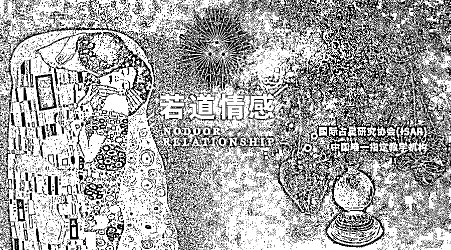

作者/格伦·佩里 译者/Arrow 校对/轩轩

编辑/玫瑰 图片/pexels

心理占星大师格伦·佩里的客户弗兰克成年之后总是介入其他女性的婚姻中，他却认为自己是在“拯救”这些女性。为何会如此？请跟随格伦老师一起通过荣格的情结概念来理解星图中的精神病理学。现在，你还有机会参与格伦·佩里亲授的【[心理占星学双认证](http://mp.weixin.qq.com/s?__biz=MzA5NjA0NTAxNg==&mid=2651465406&idx=2&sn=58e3ff85bbfdf87cdae86795dcb9c746&chksm=8b489409bc3f1d1f7e30fb26c83947d285a81619fedcda828f6e54cf15c30f1130edbd8dabe6&scene=21#wechat_redirect)】课程，快点击链接了解吧！**什么是“情结”？****“情结”**（complex）一词是由 Theodor Ziehen 于 1898 年所创，由荣格在与弗洛伊德·西格蒙德合作的时期发扬光大；是精神分析学派的一个主要概念。由荣格最早使用。他认为**情结有是有关观念、情感、意象的综合体**。他还将 complex 形容为“无意识之中的一个结”。可以将情结想成**一群无意识感觉与信念形成的结**。**这个结可以间接侦测，而表现的行为则很难理解。**只有造成有害行为的情结，荣格才视为心理疾病。荣格派理论视无害的情结为普通健康心理的多元变化。——百度百科

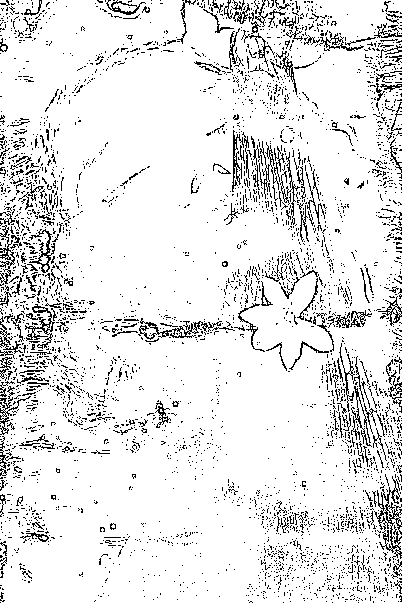

**插足别人的婚姻是为了“拯救”？**

**父母动荡的婚姻与星图中的三角关系**

我把前客户弗兰克作为情结的案例，他有 4 颗行星落在白羊座第 10 宫，对分在第 4 宫的 3 颗天秤座行星。他的白羊座行星包括太阳、木星、水星和金星，无疑由他的父亲（第 10 宫）象征，他是一个杰出的自恋主义者（太阳）、教育书刊（木星和水星）的出版商，他还是一个无所不知的百事通，带有相当凶狠的侵略性特质（白羊座）。相反，他第 4 宫的天秤座行星，包括土星和合相海王星的月亮，明显象征着他美丽、善良、极度敏感、受苦、抑郁的母亲，不时被他的父亲用智商践踏。**弗兰克所受的创伤是他在整个童年期不得不目睹对母亲的贬损。**他能对母亲的痛苦感同身受，但是无力保护她。虽然弗兰克会挑战他的父亲，保护母亲，但这只会把父亲的怒火引向弗兰克。弗兰克的父亲毫无怜悯之心，由于儿子站在母亲那边他而体罚他。当弗兰克的母亲最终离开丈夫时，弗兰克心怀愤恨，以致于 24 年中都拒绝和母亲说话。弗兰克无法拯救母亲、唤醒父亲，或者拯救双亲的婚姻，这一切都导致了巨大的愧疚。

这还是由上文提及的白羊座和天秤座行星所象征，其中的 2 颗：水星和土星与天王星形成 T 三角。**这 3 颗行星的组合似乎将弗兰克的三角关系和父母动荡的婚姻联系在了一起。**

然而，最重要的是，太阳、木星对分月亮、海王星，代表了父亲缺乏同情心，母亲沦为受害者，以及弗兰克因为无法减轻这一切的痛苦而感到愧疚。综观而言，**这个占星配置象征着一种情结——一种固定观念，表述为：女性（和下属）被迫忍受男性的支配和贬低。**

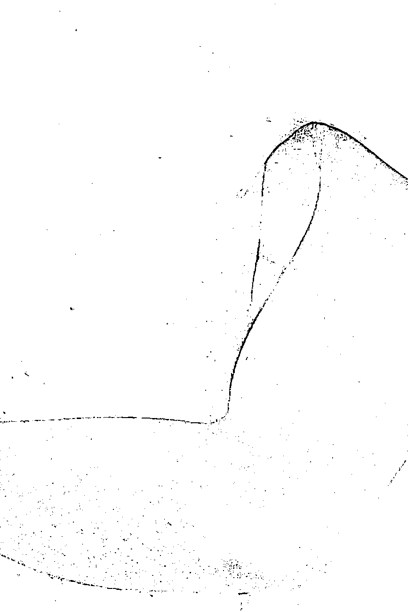

**在第三者的漩涡中沉沦**

到弗兰克成年时，他进入了一种**重复童年困境****的关系模式**。他会对同事和上级的妻子们产生强迫性兴趣。不变的是，这些婚姻都不稳定，无疑解释了为何女人们都愿意和弗兰克上床。但并不是性或爱情驱使着弗兰克，而是**重新教化妻子们的需求**，**让她们在与丈夫的关系中更敢于去主张自我**。这是他真正的强迫症。**他的情事总是演化为一种咨询式的关系，弗兰克会提供无数免费的建议**： ❶ 关于妻子如何通过勇于主张自我、勇于反抗来拯救她的婚姻。❷ 或者，如果这招没用她为何应该离开丈夫投奔他。 然而，时光流逝，结果并没有实现。弗兰克快 50 岁了，从未结婚，虽然他觉得自己一直想要婚姻和孩子。无论他在这些不幸的婚外情中如何表现，弗兰克还是一个诚实、善良、追求精神世界的人。悲剧是他由于或多或少全无意识的原因，牺牲了最好的时光。当他意识到这种牺牲时，伴随而来的是深深的悲伤和丧失感，促使他寻求治疗。最终变得清晰的是弗兰克逃避真正的关系是由于两个相互关联的原因： ❶ 自从他无意识地感到对双亲的痛苦负有责任，他就觉得自己**不值得拥有**比父亲或母亲更好的关系； ❷ 而且他害怕以父亲支配母亲的方式专横地对待女性。为了补偿后者的恐惧，他将专横跋扈的特质投射到了他所引诱的女性的丈夫身上，选择自己作为她们的**拯救者**。

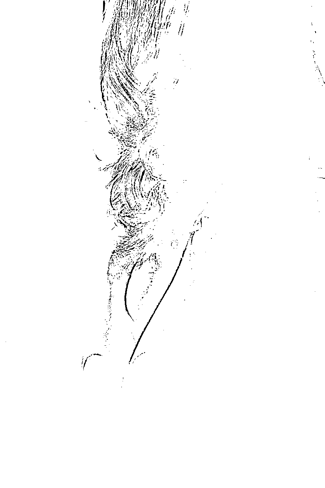

**弗兰克星图中的精神病理学**

首先，它包括了一组**原型**，由其位于白羊座和天秤座的行星以及和天王星的**T 三角**所象征。这是情结的核心要素。第二，**弗兰克和父母的早期经验是他情结的初次显化，艰难的命运用双亲的痛苦淹没了他**。注意强大、外向、阳性的行星——合相白羊座的太阳和木星——象征他的父亲（第 10 宫），对分了相对消极、敏感、阴性的行星——合相天秤座的月亮和海王星，象征了他的母亲（第 4 宫）。这组配置未整合的版本通过他**父母婚姻的原型**表现表达出来：**一个难以制服的专横的父亲，将自己敏感、精神性的一面投射给了他的妻子；一个痛苦、脆弱的母亲将她坚强、好斗的一面投射给了丈夫**。但是，弗兰克两者兼具，虽然他更有意识地认同母亲。值得注意的是，弗兰克是男性，有人可能认为他会更认同父亲；然而，如果父亲过于令人生畏、虐待成性或遭人排斥，孩子更可能有意识地认同另一方。但在无意识的层面，弗兰克仍然带有父亲的内在形象，成为一种可能在任何时间无意识演绎的情结。换言之，如同母亲一样，弗兰克将他的的白羊座行星投射了出去，这些行星象征了情结中更有问题的面向。这是他所恐惧的，也是在他人身上所斥责的——**侵略、教条和自私**。他家庭的原型情境后来通过他与朋友们的妻子的习惯性婚外情而重复上演。**通过再现童年的困境，弗兰克试图解决过去未完成的议题。**

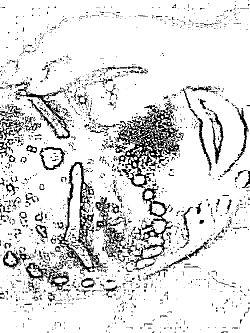

由于他对没能拯救父母的婚姻而感到愧疚，他被迫重述了童年的场景。每段婚外情，他都希望有不同的结果。也就是说，女方会觉得有力量去挺身对抗并改变丈夫。**弗兰克假设不幸婚姻的主要问题是强势的男性和消极的女性，由此投射他的情结。他潜入婚姻，通过扮演智慧而全能的顾问（太阳-木星落白羊座），再次履行了他惯常的建议者/帮助者的角色**。他没有意识到自己也表现出了某些父亲的负面特质。闯入同事的婚姻，占有妻子的爱，是**自私和侵略**，正如他的父亲一般。同时，他将自己设定为符合他母亲的角色。**当女性不愿离开她们的婚姻时，弗兰克最后会觉得被利用、不被爱，沦为受害者，正如她母亲感到被迫害一样**。意识层面上，弗兰克的意图是善良的。他想要帮忙。然而，只要他是妻子们关注的对象，弗兰克就会变成麻烦，而不是夫妻婚姻问题的解药，这样进一步巩固了他源于儿时未能帮助母亲的愧疚。这是一个恶性循环，一种诅咒，迫使他的行为违背了他的道德准则。记得**情结带有这种重复、强迫的特质，将类似的经历反复覆盖在某个核心原型之上。****对别人做过的事会发生在自己身上****起初，情结以造成精神或肉体痛苦的童年事件的模式展现**。由于我们自身的经历，我们不太会以我们明知可能带来伤害的方式对待他人。但**如果一段创伤经历造成的痛苦一直被压抑，那么可能会以两种方式无意识地展现**： ❶ 我们会将伤害性的行为投射到他人身上，继续扮演受害者；❷ 我们会远离受害者的角色，以我们被对待的方式对待他人。**在意识层面，人格会通过反向补偿来抵御这种负面的自我认知**。这可以通过一系列防御实现：**全能的控制、夸大、理想化、投射性认同、消极转积极、反向形成、分裂、贬低、否认、幻想，以及毁灭一切**，这些构成了**补偿策略**，**抵御痛苦的自我认知**。在所有情况下，痛苦的想法或感觉有意识地被相反的想法或感觉所取代。记得荣格曾强调意识和无意识的补偿本质。荣格认为，**意识层面任何极端的表现如果是真的，那么潜意识层面也同样存在截然相反的情况。****虽然这种防御策略有助于维护自尊，但是它们也阻碍了对情结所关注的功课的学习。**

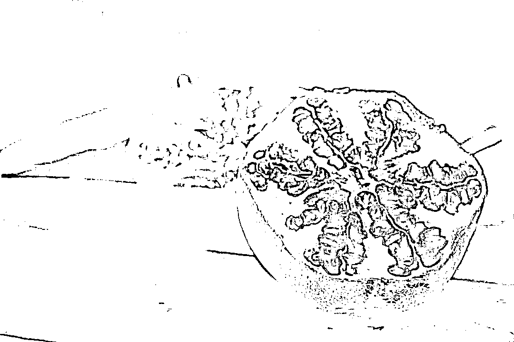

弗兰克的案例中，他通过认同相反的性格，来回应父亲的侵略；因此，他与母亲的痛苦产生共鸣，将自己视为拯救者，而不是施害者。可是用这种方式，他无法意识到自己自私、好斗的倾向。只要消极观念——病态信念依然处于无意识的状态，那么它们就会继续制造重复童年原型的经历。强迫性重复或许部分是为了赎罪。儿童容易相信他们活该遭受发生在他们身上的一切。当那种念头生根，个体会继续做出决定，吸引有类似性质的痛苦经历，希望反驳潜在的病态信念。或许，自我挫败、自我剥夺的行为会持续到个体觉得自己偿清了债为止，完成了赎罪。这也被称为**补偿法则**。**我们曾对别人做过的事，现在发生在我们自己身上。**在弗兰克的案例中，他不断遇到他视为强大、自私、麻木的父亲般的男性，和沦为男性受害者的女性。他一次又一次设计自己，再次体验童年无法从施虐的男性权威手中拯救女性受害者的失败困境，却并没有意识到他的情事正是他**自恋的权利意识**的证据。当女人们要回到她们丈夫身边时，弗兰克会觉得无能和失败，如同他在原生家庭中经历的一样。无意识中，他觉得这是自己应得的。我们可以推测弗兰克的正义的侵略及自恋的权利有关（太阳和木星在白羊座合相），其他男性似乎以他为牺牲品体现了这些特质。

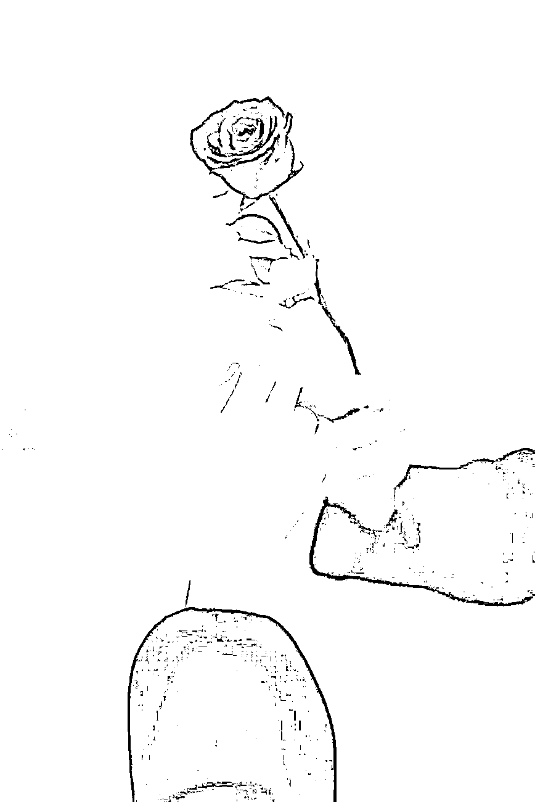

**我经历那些就是为了神的恩典**想要克服与原谅情结，为此，个**体必须对其未满足的需求所****带来的痛苦保持敞开，开始觉察病态信念，并且看到这些信念如何依次让你长期深陷心理问题中，承受随之而来的痛苦**。 每一个节点都是一个**原谅**的机会，**首先是原谅自己，然后是相关的施害者**。自我原谅最重要，因为在深层的精神层面，必须忍受痛苦确实让人感觉到悲伤。原谅需要**“让自己脱身”**，允许自己不再无休止地为家长的行为或不幸负责。而且如果我们没有责任，就可以不再寻找父母的替代品，与替代者重演这种挣扎。对弗兰克而言，这意味着驳斥导致他愧疚的两种病态信念：❶ 不能保护他的母亲；❷ 不能赢得他父亲的爱与认同。如果弗兰克可以释放这些固执的观念，他就能在情绪上体会童年的悲剧了。**一旦负面想法被驳斥，所有与之相连的痛苦也进入了意识之中**。过去被压抑的情绪终于得以释放；水闸开启，泪水泛滥，悲伤肆意，从灵魂深处涌出的情绪疗愈的洪流冲刷着此人。原谅自己能够让弗兰克不再把自私和麻木投射到其他男性身上，因为他不再需要再现童年的经历了。同样，这也意味着**允许自己拥有比父母更好的关系**。这个原谅自己的过程是神秘的，因为无法预测或强迫。我想只有本人知道何时准备好了，尽管相关行星配置的行进和次限常常会显示出是否准备就绪。原谅与康复紧密相关。关键的因素在于允许个人的痛苦和愧疚完全进入意识，但不会认同——也就是说，**放下**。这是疗愈的关键。

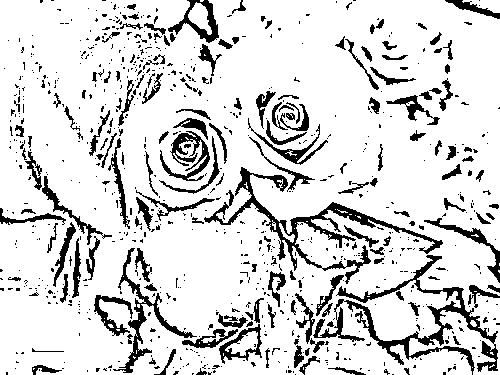

比如，弗兰克由于无法减轻母亲的苦难或赢得父亲的认同，而需要感受痛苦。通往过去的桥梁，常常是当前关系中与过去类似的痛苦。弗兰克痛苦的情史，只是他在原生家庭中经历的三角关系的延伸。**这种痛苦与自爱密不可分，因为它需要以最大的慈悲接纳个人的痛苦**。在自我关爱（月亮）之下，人们发现了普世的慈悲（海王星），现在可以被延伸到施害者身上，无论施害的是父亲、母亲、兄弟姐妹、配偶、上司。当然，**原谅不是道德上的认同**，**它并不意味着受害者免除了施害者对错误行为的责任，也不意味着我们应该继而和那个人重建关系**。更确切地说，原谅需要最基本的认知，即施害者也是普通人，有缺点、有局限，和自己一样会犯错。这样，对方不仅仅是造成痛苦的原因，也是我们救赎的管道。原谅让个体进入一种灵魂的境界，从超个人层面经历关系。关系不再仅仅属于个人，现在你可以感觉到，**“我经历那些就是为了神的恩典。”**这就是为何**海王星作为超个人的外行星象征着我们慈悲和原谅的能力。**

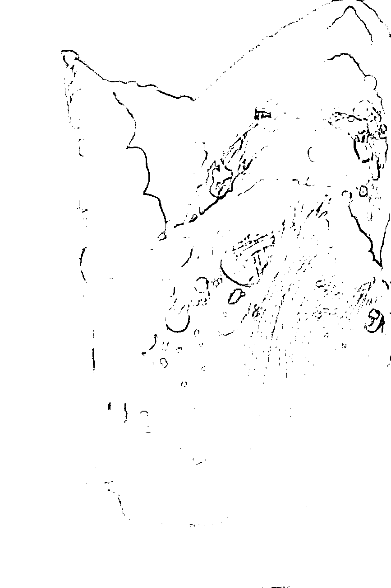

**整合星图能量后情结的变化****对施害者的同理心使得个体分裂的潜质得以恢复**。回想一下，对早期痛苦经历常见的典型回应是**应激或补偿**。我们无法对此产生同情。但是，这种不认同的过程必然需要否认部分原型——那些我们所爱的人以伤害的方式表现出的部分。比如，弗兰克不能认同父亲的自私、正义或傲慢——他的太阳与木星合相白羊座象征了这些特质。但是，**为了疗愈情结，必须柔化和破除人格的反应机制，重新吸收否定的部分**。**原谅施害者之时，我们真正地原谅了自己；原谅自己之时，我们也在原谅施害者。**两种进程不可分割。**当个体能在施害者身上找到自己的一部分，疗愈和整合就开始了**。弗兰克父亲身上最棘手的特质在弗兰克的星图上体现出来，因此，他也有这些问题，而不仅是他父亲。**疗愈情结需要有意识地认同早期创伤的经历，因为创伤的核心是原型体，包含光明与黑暗的双面潜质。**为了重见光明，我们必须面对黑暗。**虽然心理防御机制导致有意识的人格走向反向的极端，远离（无意识的）情结，疗愈却需要回到阴暗面，重新整合，但带着对破坏性潜质的全新觉知**。但是相反，自我极化所造成的情结，丧失了情结中积极的潜质。婴儿连同洗澡水一起被倒掉了。**只有臣服于自我的补偿性防御机制，个体才能有意识地接近构成情结的原型结构**。否则，它就会迫使个体走向极端。个体会出现两种情况：❶ 将情结中的负面特质投射到他人身上，自己（再次）扮演受害者的角色；❷ 无意识地认同情结，（再次）加害别人来演出情结。如果弗兰克不再将侵略、支配和麻木投射到其他男性身上，他必须首先认同自己在这方面的倾向，好像说“我也会贬低他人、毫无耐心、自私自立、武断教条、麻木不仁”等等。和星图上的所有其他部分一样，情结本来就有**积极**的潜质。弗兰克要想找回他遗失的潜质，就需要认同他的白羊座星群，与他过度发展的月亮-海王星面向达成平衡。

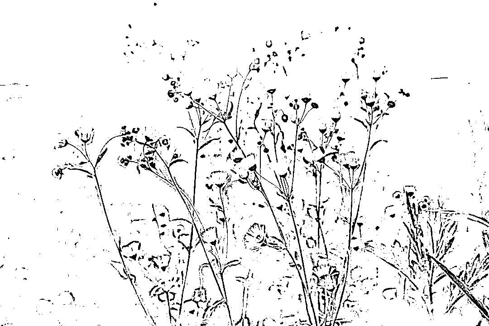

一言以蔽之，**整合是重建灵魂的平衡，通过结合对立面，让心智的两个面向都变得丰富而节制**。弗兰克的功课关乎平衡力量和优雅（AbG）、自主和亲密（AbG）、个性和归属（NbM）、意图和臣服（NbU）、教导与倾听（RbM）、正义和评判，以及谦逊和慈悲（RbU），还有其他很多由白羊座和天秤座对分相所涵盖的相关二元性。随着这些原型冲突的解决，显露出的特质得以释放。新的特性和能力诞生了，相比两边的行星和星座各自象征的特质和能力，它们具有更好的适应性。出生星图中的精神病理学可以通过荣格的情结概念来理解。这些充满情绪的灵魂实体由压抑的想法和冲动构成。情结像精神磁铁一般，吸引与个体内在固有观念一致的经历。个体在外部事件和关系的表象之下不断遭遇自己。如果想要疗愈情结，那么我们需要允许痛苦的经历最大程度地作用于意识，然后原谅自己和施害者，整合分裂的部分。

**版权声明：**原创文章由若道翻译发布，欢迎转发，反对抄袭。友号转载请申请白名单。

**格伦·佩里**

著名占星师，ISAR 董事会成员，共出版八本占星著作；心理/意识研究专业博士；占星心理学学院（Academy of AstroPsychology）的创办人；康涅狄格州研究生院（the Graduate Institute of Connecticut）原型宇宙学与意识进化项目的负责人。

**美国占星心理学学院创办人****格伦·佩里**授课**40 余年**职业占星师生涯所学精华**倾囊相授**修完 101-205 全部课程，并通过考核的毕业生将获得**美国占星心理学学院证书**( Academy of Astropsychology )和**若道毕业证书****高含金量双证书**跟随主讲老师学习融合**心理学体系**的**占星知识**为星图咨询解读打下坚实的基础**大量**的课程资料，光是课后阅读资料就**超过 60 万字**合理的课程设计，贴心的助教服务，及时的课后测验**美国占星心理学学院&若道占星联手打造** **两年双证书核心课程****点击图片了解详情**

**

**2022 年来了****还不快领取你的****专属年运报告****？****购买有优惠，点击图片查看详情哦~**

**学习占星学****点击下图了解课程详情**

****************

**微信又双叒叕改版啦，不想错过若道君的推送？**
**就把若道设为星标吧！****▼**

**喜欢记得点一下在看哦☟**

**报名直达入口**

# 深度丨这 12 种天蝎座，各有各的深邃与激情，快来看看你是哪个品种？

> 原文：[`mp.weixin.qq.com/s?__biz=MzA5NjA0NTAxNg==&mid=2651465728&idx=1&sn=3a2b6ee525b3ac9aeb9c85c534e772a6&chksm=8b489ab7bc3f13a1b30539bf132816b9769e28d5aa2130df40d78814ff1b076a5fb008a80cdc&scene=126&sessionid=1692737872#rd`](http://mp.weixin.qq.com/s?__biz=MzA5NjA0NTAxNg==&mid=2651465728&idx=1&sn=3a2b6ee525b3ac9aeb9c85c534e772a6&chksm=8b489ab7bc3f13a1b30539bf132816b9769e28d5aa2130df40d78814ff1b076a5fb008a80cdc&scene=126&sessionid=1692737872#rd)

******☆ ****后台回复“今日”，给你一句生命态度******

作者/杰夫·焦耳 译者/凤影焰

编辑/翀子 封面/书君 图片/网络

天蝎座让人又爱又恨却又欲罢不能。为什么这个星座有如此巨大的魔力呢？当天蝎座落在星图上的 12 宫位，你又会在哪里遇见它呢？来看文章吧~**天蝎座：性、死亡、权利**

**天蝎座之所以看上去黑暗，是因为它触及了太多我们排斥的东西。**

死亡召唤着我们，却在多数人否认，否认年长者的智慧、衰老和生命形态的转化。**天蝎座提醒我们，万物必然死亡，这样才会有新的生命诞生。**它让我们记起我们是肉体凡胎，终将腐朽，在死亡面前没有欺骗。 

我们需要性，结合的激情导致怀孕。**相互融合的渴望带来新的生命。**但我们被教育那是不纯洁的。

**天蝎座也代表着权力，代表情绪、感觉和金钱的交流，以及赚钱的时间**——我们称之为工作。但我们对这些交流视而不见，想要但不正视，欲求却不肯理会。

我们同样在否认两性关系，我们太过独立，追求开放的、现代的交往方式，在合理的界限内保持可以协商的伙伴关系。

**但爱的界限在哪儿，激情和灵魂的界限在哪儿？**我们分明被共同的人性捆绑在一起，而那孑然的孤立本身只是幻觉，认为我们是彼此分离的个体从根本上说是一种幻觉，那么为什么还要划清界限，彼此隔绝呢？

**天蝎座使我们惊恐，**因为我们忘记了我们并不是分离的，我们彼此相连，并且和世间万物联系在一起，不论你叫它上帝、女神、共同精神、自然还是全能的那一位都可以。

**水象的天蝎座以水侵入我们的肌骨，弥合了我们之间的裂缝，让我们醒悟，我们本为一体。**

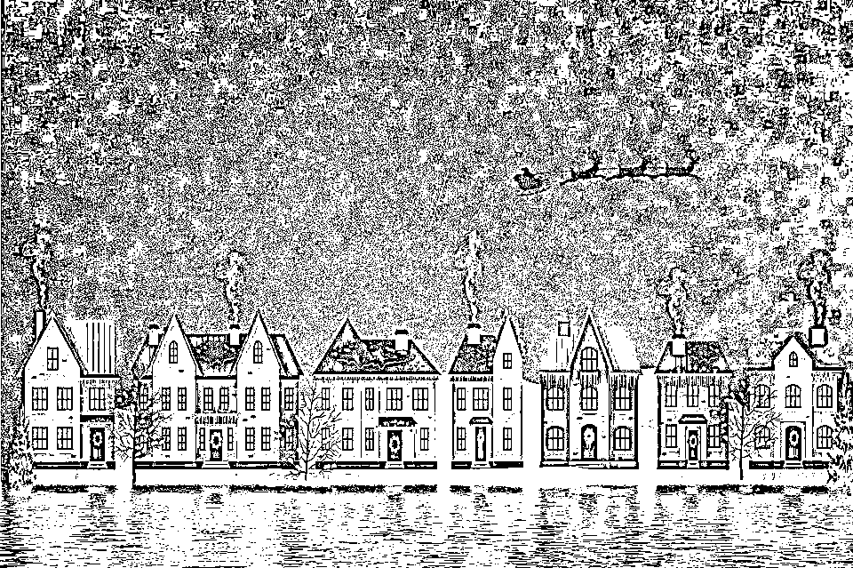

**封闭还是有力？**

描述天蝎座在某人星图或生活中的作用并不容易，原因在于**天蝎座似乎用两种截然不同的方式表达自己。**

**一种是向内的能量：**封闭、压抑的感觉，害怕自我表露和力量；

**另一种是外向的能量：**向外的天蝎座能量却是一种强大的改变之力，表现得热情而强烈。

如果我们不信任自己的能量，天蝎座的特质就会表现得迂回隐蔽，破坏性大于益处。但如果我们对自己的判断有自信并且愿意影响他人，那么能量就能自由而安全地流淌。

举个例子

掌管认识和交流的 3 宫宫头落于天蝎座，成长经历中，可能有一个可怕的父亲或母亲压抑了你的表达，他/她教你使用挖苦讽刺来代替直截了当地表达。**你可能曾体验过因说错了话而受到惩罚的恐惧。**

**天蝎座的责任意识可能过度严苛**，这是由受创伤的父母或者兄妹造成的。**因此你可能连自己的话都不相信。**你在交流中无法发挥最大潜力，你看到了很多，但是你害怕说出来。

而自信的 3 宫头天蝎座却能有意识地使用它的语言能力和他人沟通情感，他们有深刻的感知能力，却并不消极。他们专注于相互谅解的心理侦探，而不是在黑暗角落里搜寻你的犯罪证据的探员。

如果天蝎座执著于惩罚，那么能量会经由统治欲被滥用，或者内化。**压抑能量的代价是高昂的。**不仅仅让你和世界错失了天蝎座的洞察、帮助和疗愈的正面能量，而且强迫它转向内心，将它钳制于潜意识，把能量转变为毒素。

一丛丛欲望，如果在恐惧中被包藏起来，吞进潜意识的黑暗中，就可能会变成各种疾病的温床。

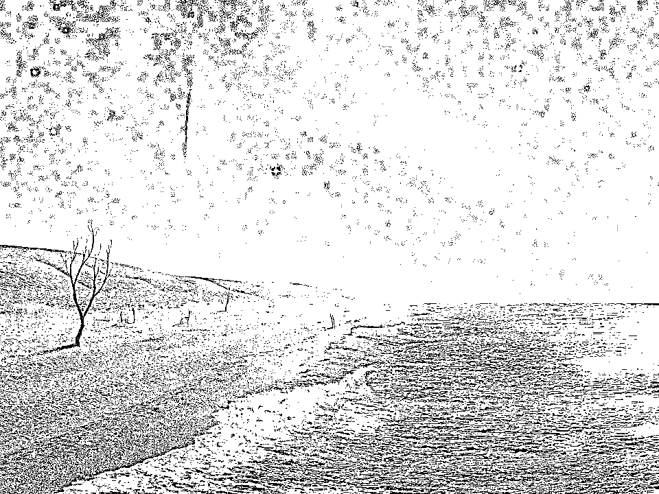

**信任是关键**

天蝎座需要仔细思考一些东西。它非常矛盾，**因为它是关于转化的固定星座。**天蝎座象征了死亡和重生，这并不是一个静止的状态。面对超越理性的欲望，我们也许会不知所措。

超越理性，真是天蝎座的美名。它的前一个星座天秤座就是关于理性的，它是平衡的思维，被亲疏之间的完美均衡所磨练的本位风象星座。**但天蝎座带我们越过了思维。**我们下沉到自己身体、情绪和原始的感受中，也就是更底层的脉轮中。

如果天秤是关于亲密关系的，天蝎座就是它的极致。结合的思想在头脑中和真正操作起来是非常不同的，天秤座为彼此之间思想上的联系打开了大门，天蝎座把这种联系深化下去，直到理性的层面之下。天秤座讲求公平，天蝎座只在乎生存；这就是狮子猎食斑马这种生存本能的力量。

生存的动力在公平这种智性的层面之下运作，它不是一种思想，**天蝎座和思想无关。它是一种生存的状态，**是在天秤座所打开的共享之门和射手座所追寻的超越个人层次的亲密关系之间的中间地带。

天蝎座更需要记住自己的纯真。如果你的 11 宫头在天蝎座，你仍然有可能身在一个团体中但不会试图操纵它。当你自信的时候，你可以和他人建立开放但有力的联系。你的欲望和恐惧不是你一个人的，而是人性交响曲中的一部分。

如果你心怀纯真，联系的通道将更畅通。你自己的故事不会影响这种动力所关联的群体潜在利益。情感还在那里，**但它没有被对权力欲望的恐惧扭曲本来面目，心门是敞开的。**

**运用天蝎座能量的关键是信任，信任你自己，信任这个世界，信任改变的过程。**正是信任，让死亡中产生出新的生命，让宇宙中有了运动。没有信任，我们看到压抑的典范，天蝎座所辖的领域将充满羞耻的秘密，而不再具有魔力。

情感被压抑，深埋于内心，在恐惧中结成冰。**而信赖外界的天蝎座充满热情，有着疗愈能力和动人的性感。**

**天蝎座在 12 宫位**

**出生星图描绘了如何敞开心门，宇宙的能量如何在地球上生存。**但星图的结构又不是那么简单，当加入宫位时，星座看上去会伸长、扩大或者收缩。

在最常见的宫位制中，一个宫中通常有两个星座。**我强烈推荐你考虑出生星图中一个宫位中存在的所有星座，这样才能获得更透彻的理解。**

比如当狮子座在 4 宫宫头，通向家庭的大门就在这个星座，但如果整个处女座都包含在 4 宫，对处女座的理解将大大拓宽对家和家庭的描绘。

**天蝎座在第*****1*****宫**

**你习惯用怀疑的眼光看世界。**权衡意味着在全身投入之前你会有所保留。你在意识的层面下观察并搜集情感信息，你的任务不是做个甜妞儿（尽管你可以做到），而是游过连接我们所有人的地下水。

你也许被教导要掩饰你的情感，但小小的气泡聚集起来会变成奔涌的岩浆，随即是势不可挡的爆发。

**你可能对自己很严厉，**清楚地觉察到掩盖在表面之下的力量，**但接纳自己的阴暗面对你是有帮助的**，不满、嫉妒和怀疑可能促使你前进，如果你接受其目的。**你有心理学天分，探索自己和你的动机比评判并拒绝它们要有益得多。**

**天蝎座在第*****2*****宫**

**你最大的天赋就是抓住资源的能力，**你不需要尽力去捍卫权力，你天生有整合零散力量、点石成金的能力，在其他人看来是赔本的生意，你却能看到商机。

好好利用你的复杂性，它不仅仅是阻碍侵扰的墙壁，更是运用你的魔力的关键。**你能够客观地分辨出哪些东西是他人必须付出的，**这样你就能帮助他人做最棒的自己。

不要太过苛刻地评判你的才华。**你需要一种良好的嗜好，从而找到实现自我价值的路径，**你能够从你的兴趣领域中抽取出那里的一切来获取它。

**天蝎座在第*3*****宫**

当其他人只看到事物表面的时候你却能察觉到隐藏的暗流。你的观察技巧可能可以追溯到儿童时代的沉默寡言，所以你通过观察比同龄的其他孩子学到更多。

你的话不是纯粹的装饰、夸夸其谈或甜言蜜语。**你想要别人像你那样聚精会神地倾听你的言语，你通过交流改变他人，帮助他们认识那些隐藏的事物。**你对声音非常敏感，就连静谧，或者声音的细微变化都能给你很多信息。

**你认为事物的深层联系比表面的事实更重要，不过记住，有时候简单的真理真的就那么简单。**

**天蝎座在第*4*****宫**

你在幼年就接触了成人世界里的性、权利和死亡。对阴暗面的本能体会可能很早就结束了你的纯真年代。最好的表现是你和你的家人在健康的基础上，彼此有很深的心理联结，**然而有时候这个位置代表了家庭中的难言隐痛。**

4 宫是星图的基础，天蝎座在这里说明了你确实非常重视自己，在**你的外表下是一颗探求事物真相与内核的心。**你的激情无法计量，但也许绝少被人察觉。冷静的外表下隐藏着你警觉的内心，但是这也是你的保护色——**你有不动声色处理危机的本领。**

**天蝎座在第*5*****宫**

**玩乐对你而言是件严肃的事儿，**你游戏的时候绝不允许分神。你的认真程度让你不打倒对手决不罢休。最理想的情况是，你为其付出你的全部。

**极富激情的行动会带你突破理性的界线，**但这本身就是天蝎座的精神。同样，**你也不会轻浮地对待爱情。**你的心决不虚弱，你的渴望也不。

你可能是个非常性感的孩子，但又会把表达自我看作羞耻的事情，所以隐藏自身欲望在这个位置并不罕见。这种力量太过强大，你抗拒将它表现出来。小心地引导你的力量让你能够发挥出创造性的影响力！**你可以把无用的材料和念头整合成新的创造。**

**天蝎座在第*6*****宫**

你充满激情地工作，你做得最好的是让你心仪的工作，似乎你离开它们就不能活了。有时候这个位置也代表工作时被逼无奈，可能是来自外界的压力过于巨大。但是，最理想的情况是，这是一份必须深入探索，引起变革或者与危机处理有关的工作。

可能会出现管理问题，因为对权利的合理利用可能成为一个重大问题。**能集中精力是你的优点，**因为要完成工作常常需要有能力处理相当不愉快的事情。健康和爱好也是第 6 宫所涉及的问题，**如果能规律性地洁净身体（就素排毒养颜吧）有很大好处，暗中的憎恨容易引发疾病。**

**天蝎座在第*7*****宫**

不管你意识到与否，**你都有一种寻求一位有力的伴侣，帮助你突破限制带来改变的欲望。**你可能会吸引个性很强并且试图改造你的伴侣，这个问题的两难之处在于你的伴侣在意念强大的同时也会非常顽固。

**你需要做的是收回自己的能量，认识到你的存在也是为了帮助他人的改变。**

亲密关系会涉及最根本的信任和控制问题。寻找一个和你一样乐意同彼此分享恐惧的人会很有帮助，只要那是改变之路上的垫脚石。**亲密关系不是为了让你有安全感，而是通过一个与你力量均衡的人的帮助，让你更加深入了解自己。**

**天蝎座在第*8*****宫**

**这里天然是天蝎座的家，所以你可能对天蝎座的核心课题——性、死亡、转化更加熟悉。**你是身体、头脑和精神的领路人。你在这里接引众人超越他们本来的限制展现出他们所有的资源。

有可能这一宫会被投射出去，你需要其他人用他们的渴望来激烈你并且带领你改变，**但你必须克服恐惧，超越舒适熟悉的已知世界。**

亲密关系中通过热烈的结合让你重新认识自己的灵魂。冷静的伴侣绝对出局。**你在他人遭遇危机时表现最出色，这对疗愈者和帮助者是良好的位置。**不伴随负面剥削的付出和给予是天蝎座在此的一个挑战。

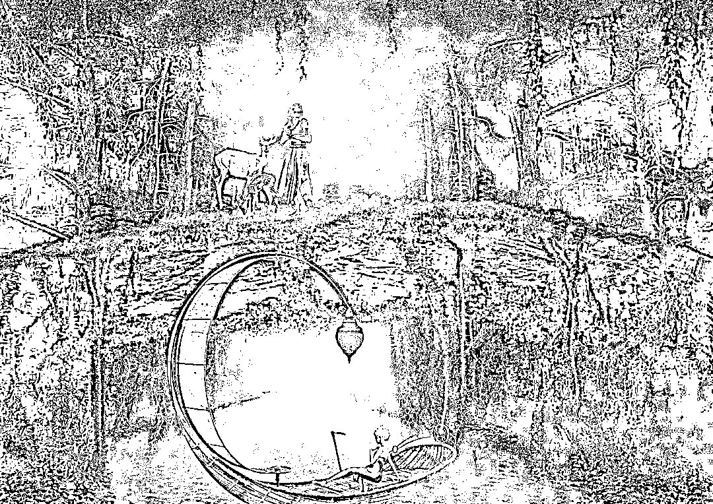

**天蝎座在第*9*****宫**

由于你对所有事物的意义都充满兴趣，因此有一点儿怀疑主义是很自然的。如果一位老师魅力超凡或者至少通过了你的标准，你就会完全成为他忠实的拥护者。

**你的信仰不是随随便便的，**也不会和你的生活选择无关。你也许在年轻的时候有过宗教狂热或审判他人的行为。

天蝎座在这一位置的人拒绝宗教的原因常常是为了之后能在一个更新和更有力的层次上重新发现信仰。**你不会游戏你的信仰，它们不仅仅是信念指导下的思想和行为，它们已经深入你的每一个细胞。**

当你教导别人的时候，你付出全部的自我。当你旅行的时候，你也不是走马观花，而是深入你所游览的地方的精髓之中。

**天蝎座在第*10*****宫**

你的职业有两种可能的选择——要么自己做主要么被人牢牢压迫。**只有将天蝎座的能量引向社会可以接受的形式，它才可以为你所用。**

**你的能量足以为你所选择职业领域带来改变。**然而没有焦点的话，这种激情会被压抑甚至转为憎恨。你适合做和治疗、危机（身体、情感、金融）和改革有关的职业。

很关键的一点是你感觉自己有权在世界上获取地位，没有这一点许可的话你的能量就不容易有效地发挥。**尽管外表淡然，你暗自衡量着公众对你行为的反应。**在重压之下你可以成为一个伟大的领导。

**选择可以打动你的挑战，为自己创造压力。**当你没有工作焦点的时候反而容易阴沟翻船。 

**天蝎座在第*11*****宫**

这可能是社会或政治狂热者的位置。**你可能是忠实的朋友、热情的同志和革命者。**你不需要被一大堆朋友围绕，因为彼此间的信任是你更看重的。

如果你很受欢迎，那么通常是因为你给团队建设带来了强烈的影响。**你不会用外表去引起别人的注意，内在的理想才是你重视的。**

你会发现自己被非主流的团体吸引，**你生来的任务就不是支持现状，而是去质疑它。**你也许有能力在理想遭到沉重打击后，又在灰烬中重生。这是典型的天蝎座特质——在无路可退的时候才最坚强。

无论如何，你最可能尊敬的人是那些为了追求成功投入一切的人。拖后腿的队友会受到你的谴责。

**天蝎座在第*12*****宫**

**认同社会边缘人**是 12 宫的特质之一，当天蝎座在这里时表现得更明显，**你有在困境中寻找力量的本领，**所以会是弱者的鼓舞。

但你可能会在公开展现力量时遇到些困难，**你更希望把它们保存起来直到最令人绝望的时刻。**但这有时候可能让你感到不舒服，如果你想要让自己看起来强大有力。即使掌握了所有筹码，你还是觉得自己像个失败者。

**天蝎座在此的另一个特征是深刻的神秘主义者，**对神秘学、疗愈和形而上学感兴趣，你对现实的看法不是传统的，会成为在两个世界之间的引路人。

**版权声明：**本文由若道翻译发布，欢迎转发，反对抄袭。友号转载请申请白名单。

**杰夫·焦耳**

国际占星大会（UAC）和全美占星师联盟（AFAN）创始人，美国著名占星网 www.stariq.com 创始人。曾任亚特兰大协会主席和亚特兰大占星考试委员会委员。4 本占星书的联合作者，在全世界的 4 个大洲开办过工作坊。2015 年逝世。

**2022 年来了****还不快领取你的****专属年运报告****？****购买有优惠，点击图片查看详情哦~**

**学习占星学****点击下图了解课程详情** 

**

********************************

**微信又双叒叕改版啦，不想错过若道君的推送？**

**就把若道设为星标吧！**

**▼**

**喜欢记得点一下在看哦☟**

********报名直达入口********

# 雷蒙德·梅里曼金融占星周运 | 金逆+水逆，市场走向如何？

> 原文：[`mp.weixin.qq.com/s?__biz=MzA5NjA0NTAxNg==&mid=2651465728&idx=2&sn=899d861311c0487771b7152c2bfb9593&chksm=8b489ab7bc3f13a1e0359fd2db437c02360db395f9375c8a419083564846832964d3049adfa7&scene=126&sessionid=1692737872#rd`](http://mp.weixin.qq.com/s?__biz=MzA5NjA0NTAxNg==&mid=2651465728&idx=2&sn=899d861311c0487771b7152c2bfb9593&chksm=8b489ab7bc3f13a1e0359fd2db437c02360db395f9375c8a419083564846832964d3049adfa7&scene=126&sessionid=1692737872#rd)

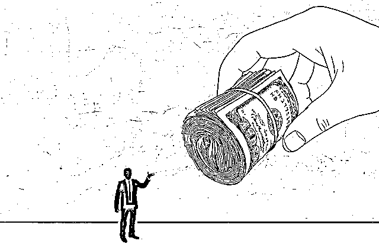

作者/雷蒙德·梅里曼 译者/Luke
编辑/玫瑰 图片/网络

雷蒙德·梅里曼是在金融占星学界稳坐第一把交椅的占星师，同时他也是若道签约的金融占星课老师，我们引进了雷蒙德·梅里曼老师的《[上证指数月度报告](http://mp.weixin.qq.com/s?__biz=MzA5NjA0NTAxNg==&mid=2651465265&idx=2&sn=1300c8aed59d3bdb14e583ce2ebce910&chksm=8b489486bc3f1d90e5768681cf881cb431e76a64e5be3b65cd99631ba7d275d79af0adf9803d&scene=21#wechat_redirect)》及《[黄金报告](http://mp.weixin.qq.com/s?__biz=MzA5NjA0NTAxNg==&mid=2651465265&idx=2&sn=1300c8aed59d3bdb14e583ce2ebce910&chksm=8b489486bc3f1d90e5768681cf881cb431e76a64e5be3b65cd99631ba7d275d79af0adf9803d&scene=21#wechat_redirect)》。我们经老师的授权，将每周刊登梅里曼老师的周运，供大家参考和学习。于是，这是本周的周运（1.10-1.14）。

**说明：以下时间采用纽约证券交易所所在地美国东部标准时间。**

**展望与回顾**

****

**投资者一直在为美联储提高利率作准备。他们也知道，央行正在削减每个月回购债务的规模。除此之外，他们还发现，缩减回购规模最终导致美联储持有的近 9 万亿资产的减少。****他们没有想到的是，这三件事同时发生。尽管这些措施旨在抑制通货膨胀，随着就业市场的回暖，美联储的三重紧缩措施依然使市场陷入困境。****——杰夫考克斯****《美联储三重紧缩政策的威胁，使市场感到恐慌》****www.cnbc.com****2022 年 1 月 6 日****美国经济十二月就业人数远远不及预期。根据劳工部数据，非农就业人口增加 199,000，同时失业率下跌至 3.9%。****与道琼斯预估的 422,000 新增就业人数和 4.1%的失业率形成对比。这些数字出现在美国经济的十字路口，因为每天都有 50 多万新冠病例发生，其中许多与奥米克戎变种有关。可能拖慢了本来有望在 2022 年加速复苏的经济。****——杰夫考克斯****《十二月就业率下降，非农就业人口仅增长 199,000 人》****www.cnbc.com****2022 年 1 月 7 日**金星逆行在 1 月 5 日冲击了全球股票市场，因为美联储董事会的货币政策变化，比预期的要鹰派得多，这使投资界大感震动。这就是传说中牛市结束时敲响的那个“钟声”吗？可能是。

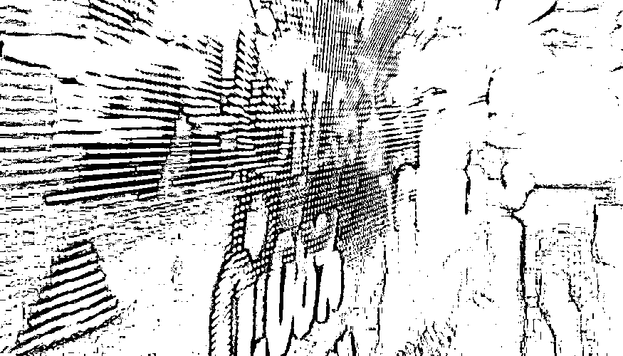

金星守护着发言权，同时美联储有着全球所有机构中最大的发言权。当美联储说话时，市场倾听。现在美联储说它希望停止通货膨胀的增长。这符合我们的预期。上周的专栏中陈述道，“我们怀疑，中央银行重要的通告，可能在金星逆行到 1 月 29 日期间发布，可能出现在这段时间的中点，也就是下周（1 月 8 日-9 日）。”这份十二月的会议纪要，发布于稍晚的 1 月 5 日，就在道琼斯工业指数和标准普尔指数创下历史新高后不久。这轮抛售是戏剧性和突发性的。它发生在金星逆行后的第 12 个交易日，和土星四分天王星后的第 7 个交易日。我们在《股票市场择时第三卷：地球宇宙学和交易周期的关联》中显示，基本周期（波峰或波谷），有超过 70%的概率出现在每个征象的 12 个交易日以内。**在去年和今年新旧交接的时刻出现了这两个强有力的征象，表示这是一个非常重要的宇宙时间。**现在，由于周五的就业报告逊于预期，美联储可能不得不收回他们的鹰派姿态，以防发生严重的市场抛售。如果经济或股票市场突然开始严重的回撤，那么加息和减少流动性可能不是最好的应对方案。**回撤这个词，也可能和行星逆行有关，比如金星。**此外，**水星（言论）将在 1 月 14 日加入金星的逆行周期。**另一方面，这种过激的手段实际上促成了通胀的加速。

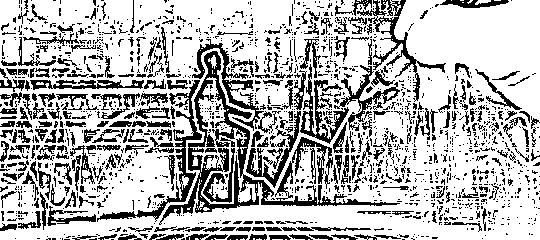

金星逆行也代表决策方面的冲突。它可以代表一段犹豫不决的时间，因为出现了看待问题的不同角度。美联储是想要冒着经济衰退的风险控制通胀，还是冒着加重通胀的风险避免经济衰退？不像金星期待的那样，这不是一个蛋糕和土豆可以兼得的问题。可能美联储让他们吃蛋糕，但不给他们土豆，对我来说都无所谓。股票市场不是上周唯一被美联储通告所冲击的市场。黄金和白银在此之前的走势也很好，黄金测试了当前基本周期的高点 1830 以上。白银接近其周期高点 23.48。周五时，黄金测试 1780，白银则跌至 22.00 以下。但两者在周五结束前都开始上涨。比特币和以太坊也遭到碾压，两者都跌至自九月份主要周期低点以来的最低位。另一方面，原油上周有明星级的表现，在 12 月 2 日跌至基本周期波谷 62.43 后上涨超过$80。为什么不呢？木星刚刚进入双鱼座，它与海王星共同守护这个星座，后者已经在那里了。木星、海王星和双鱼座都守护原油。没有人喜欢原油，但没有人能离开原油。**短期占星趋势和长期考量**几乎所有全球股票指数上周初都像火箭般窜升，随后都被美联储十二月会议上激进和大胆的言辞所打压。激进和大胆——那是火星在射手座。那就好像是一场大火，必须要被扑灭（射手座也共同守护原油）。观察美联储 1 月 24 日前后的言行会很有趣，因为届时火星进入摩羯座，合相美联储的太阳，对分冥王星，与此同时对分美国本命图的金星巨蟹座。那也是同样在摩羯座的金星（货币）结束逆行周期的前 5 天。火星从熊熊燃烧的射手座，进入冰冷和贫瘠的摩羯座，使我想到我们可能被迫从吃蛋糕变成吃土豆。火星射手座可能充满着疯狂的投机想法。通货膨胀仍然可能过度（射手座）。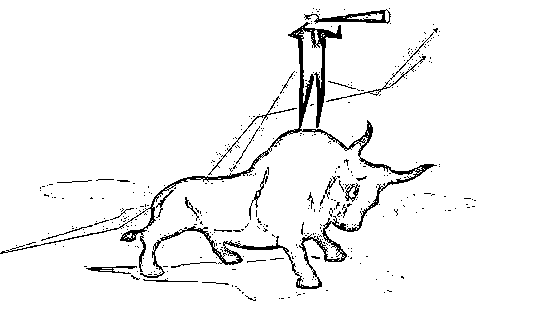但是火星在摩羯座会懂得勤俭节约，被要求（可能被迫）少花钱，所以就没有了蛋糕。我们可能在美联储和人民或政府之间爆发另一场战争。前者想要使用严格的紧缩手段治疗经济顽疾。后者不能忍受无法满足的甜品瘾头，对土豆的食谱进行反抗。在过去，对抗美联储没什么好处，因为它曾经慷慨地采用了宽松的货币政策。我怀疑现在对抗美联储仍然没有什么好处，因为它认为是时候摆脱对过去十年来宽松货币政策的瘾头了。能够戒掉糖分不是个坏主意。然而，随着木星继续接近与双鱼座海王星四月份的合相，对甜品的渴望不会就这样消失。尽管美联储用了猛药，通货膨胀依然可能会持续得更久一些。但是不要担心。我不认为美联储会长期采用这一食谱。一旦 5 月 10 日以后木星进入白羊座，另一个火象星座，我预计美联储会再次选择甜品的食谱，因为他们已经证明了自己的观点，或者感到了来自本就不想戒毒的政府的压力，尤其当时将临近中期选举。在这精神分裂的一年里，他们大多数人将开始看出中庸之道的价值，这正是木星与土星渐盈阶段所传递的信息。每个人（除了我）都想要平衡、全面的一餐，包括甜点和土豆。我认为我们会到达那里的。在木星合相土星的一年到三年后，你通常会得到一轮很好的抛售。然后三年到五年之后，你会得到一个很好的牛市。

**说明：以上日期基于纽约证券交易所所在的美国东部标准时间，由于存在时差，中国地区可能需要加一天。**

**版权声明：**本文由若道翻译发布，欢迎转发，反对抄袭。友号转载请申请白名单。

**雷蒙德·梅里曼（Raymond Merriman）**

若道签约老师。著名金融占星师，ISAR（国际占星研究协会）前主席，梅里曼市场分析公司的总裁。他由于“提升了占星学的职业形象”，在 1995 年国际占星大会上被授予轩辕十四奖；在 2012 年国际占星大会上，被授予轩辕十四终身成就奖。

1“中国上证指数月度报告”发售**若道推出了****中文版****的雷蒙德·梅里曼中国上证指数月度报告，并持续发行该报告！**当把金融市场的周期和占星学的周期相结合时，雷蒙德·梅里曼老师的金融占星学研究**为投资者应对金融市场的周期波动，并随之调整投资策略提供了极大的价值参考**。
**1 月中英文报告已上线！**2“黄金价格周期月度报告”发售**若道推出****中文版****的雷蒙德·梅里曼黄金价格周期月度报告！**不仅仅为广大读者在中国股市的投资出谋划策，更将视角放眼黄金市场。**每当世界经济形式不明朗的时候，有一个地方是保值的港湾，那就是****黄金**。自 1982 年雷蒙德·梅里曼出版第一本研究《地球宇宙学征象与黄金价格的关联》的著作以来，**他一直作为最重要的黄金市场时机预测者之一享誉国际**。2022 年 1 月黄金报告已上线，梅里曼老师将会告诉你他对这个关键时期如何操作的想法。也可以按照季度和一年期订阅，有更多优惠。季度和年度的好处是，你可以持续了解梅里曼老师对于不断在变化的市场的看法。即便他某一次看法和市场不一致，你也看到在下一期他如何调整自己的看法，并看到金融占星在一个长期时间段内对你把控风险的帮助。而能够长期控制风险、尽量找到安全的投资时机才是投资的长久之计。**1 月中英文报告已上线！****购买套餐**，买得越多越优惠中国上证指数月度报告套餐价

*   **单月报告**：280 元
*   **3 个月套餐**：780 元（260 元/月）
*   **12 个月套餐价**：2400 元（200 元/月）

**长按下图识别二维码****购买金融报告****套餐****▼**

黄金周期月度报告优惠

*   **双报告年度套餐更优惠（直降 900 元）**

*   **12 个月黄金报告+12 个月上证指数报告：仅需 3900 元**

**长按下图识别二维码购买黄金报告套餐**▼

3《2022 年金融预报和沙龙》1976 年以来，由雷蒙德·A·梅里曼撰写的梅里曼市场时机学院每年一次的年度预报沙龙和每年一本的《年度预报》一直在应用占星学原理为投资者们服务，提供卓越洞见，从未间断。 **雷蒙德·梅里曼《2022 年金融预报和沙龙》发售中（报告已发布）。****长按下图了解详情**
▼

**点击阅读原文购买金融报告**

# 精彩回顾 | 四位国际大师 2022 年天象预测课第一天实录

> 原文：[`mp.weixin.qq.com/s?__biz=MzA5NjA0NTAxNg==&mid=2651465712&idx=1&sn=1f38b2414accc4ca985020cfad0fcfb2&chksm=8b489547bc3f1c513d1b2584704bd42615b00cf0aab3a18de28c1d626fa4c5c53161475b8e4b&scene=126&sessionid=1692737872#rd`](http://mp.weixin.qq.com/s?__biz=MzA5NjA0NTAxNg==&mid=2651465712&idx=1&sn=1f38b2414accc4ca985020cfad0fcfb2&chksm=8b489547bc3f1c513d1b2584704bd42615b00cf0aab3a18de28c1d626fa4c5c53161475b8e4b&scene=126&sessionid=1692737872#rd)

昨天，由[若道核心课程](http://mp.weixin.qq.com/s?__biz=MjM5MjQwNjAyMQ==&mid=2649439084&idx=6&sn=05f14a667ecd4628596b9e19d651f127&chksm=beb9540689cedd105ce91fbe5b24e90e5be822faccca183475eaa2e89621895a7e9acbae996c&scene=21#wechat_redirect)的四位国际导师开讲的《2022 年天象预测课》开启了第一天的精彩之旅让我们一起来看看有哪些精彩的话语吧！

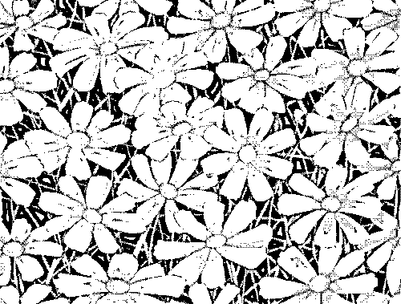

**为什么先从土星开始聊呢？因为土星是一颗可靠的行星，它最适合丈量未来。****而之所以我选择这颗行星作为开始，是希望能够帮助你们看看 2022 年有哪些可以取得的成就。****——大卫·瑞雷****土星在你的第一象限运行，你可能正在处在自我发展的时期。****——大卫·瑞雷**

**如果土星在你的一宫里，你需要看到对自己的承诺是什么；什么是让你觉得重要到可以严肃认真去做的事情。**

**另外在这段时间内，上升水瓶座的同学，土星会出现在一宫。这就意味着，你对自己的承诺，包括我是不是真的与那些让我有归属感的人在一起，是不是真的跟对的同事在一起……也就是跟自我利益有关的事情。**

**——大卫·瑞雷**

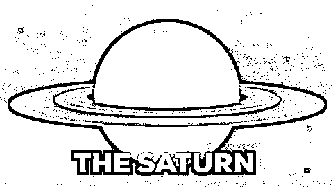

**土星在 12 宫里，代表你可能会经历悲伤，也会对生命的幻灭感。而现在给你一个机会，可以去重塑你的生活。然后也意味着，你可以探索到很深的内在，思考到底之后我想要怎样的生活。**

**——大卫·瑞雷**

**你可以看看木海合相落在你星图的宫位。因为接下来的时间，是你一生中真正可以应用生命中灵感的时间。你的灵感可能从没有这么丰富过。**

**看一下木海所落宫位的人生领域，你是不是有曾遭受过幻灭？是不是对一些新的灵感可以保持敞开呢？关键的是，你可以看看，在你的人生里经历过怎样的幻灭感？你需要去直面这种幻灭感。**

**——大卫·瑞雷**

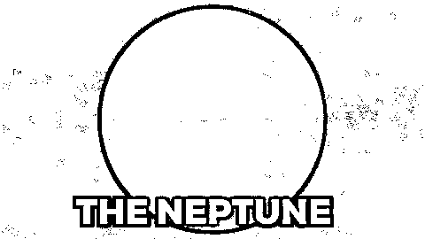

**今年的冥王星继续在摩羯座的最后几度运行。如果你的星图中有基本星座（白羊、天秤、巨蟹、摩羯）25-28 度的行星，可能会经历比较激烈的时光。随着这段激烈的时光，可能会有重生与转化的可能，可能会在你的人生发生根本性的改变。**

**在冥王星的行运下，也许你可以发现内在真正的资源。通常也意味着，你可能在某种层面要面对丧失。也许你对丧失有些恐惧，但是你需要去经历一些转化。**

**——大卫·瑞雷**

**冥王星的层面让我们存在于更真实的面向。不管我们的哪个面向在死去，同样也意味着在那个面向重生。**

**——大卫·瑞雷**

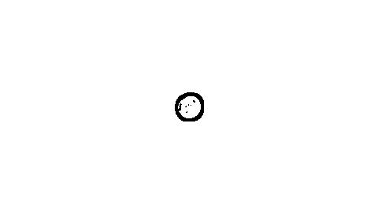

**当海王星进入双鱼座时，**智能手机的出现，**对手机的各种使用、滥用也出现了。在此之前我们可能也有这个技术，但这十年间我们每个人都用上了这个东西，我手边就有一台，你们也有，我们手边就有一个小世界。这就是魔法般的存在。**

**但这也让我们很困惑，这就如同镜之屋一般。我们也像是路易 16 一般的贵族一般，不断在镜子里看到我们的倒影，我们可以看到很华丽的自己，如现实般出现在我们眼前。**

**还有一个关于海王星在双鱼座的象征，到底什么是真的，什么是假的，什么是幻想，这一切都交织在一起。**

**——克里斯蒂娜·罗登贝克**

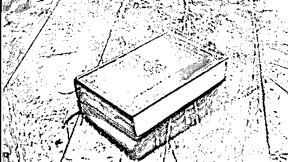

**今年海王星会在双鱼座的 20-25 度顺行和逆行，如果你有行星在此区间，会对你的影响很大。海王星的影响也会很神奇，会让我们连接到另一个世界，这是很神奇的。**

**很重要的是，不在沉迷在此，不要丢失了。关于海王星很重要的事是不要沉迷。**

**——克里斯蒂娜·罗登贝克**

**木星也来到了双鱼座，木星会做什么呢？木星会放大。它会让事情变得更大。木星在双鱼座是很有力量，海王星在双鱼座也会很有力量。这就是为什么我们对于这个合相这么兴奋，上一次合相是 160 年前，1860 年左右。而这次，这两行星还在自己的星座。**

**——克里斯蒂娜·罗登贝克**

**我们问自己，双鱼座意味着什么？双鱼座是黄道最后一个星座。它是变动星座，是水象星座。所以这个星座是跟情感、情绪、灵性有关的，与看不见的事物相关，还有魔法、看不见的联结有关；与更大的敏感性有关。所以这样一个合相是会激发这种敏感性的。**

**——克里斯蒂娜·罗登贝克**

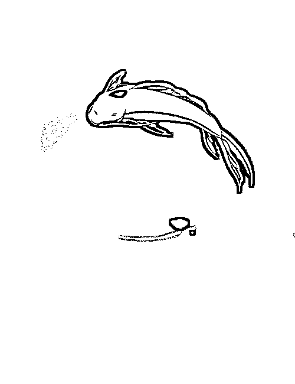

**这样一个真相运作得很好时，是很有慈悲心的。因为它就是跟集体情感的联结，并且这个真相运作得好时，也是非常有影响力的。通常我们会发现，具有很强影响力的人，在平台很有影响力的人，他们可能就有双鱼座的行星。并且双鱼座是跟视觉有关的，非常微妙的，非言语的星座。**

**——克里斯蒂娜·罗登贝克**

**我们已经进入非常有双鱼座能量的一年了。所以当你计划这一年时，你要看看有没有双鱼座的部分。**

**因为双鱼座能量如此强大，今年就是这个主题。**

**在过去的十年，我们已经拥有非常强大的海王星能量。木海的精准合相发生 4 月 12 日，几乎是双鱼座 24 度，如果你有任何行星落在这个度数，那这是很重大的。**

**——克里斯蒂娜·罗登贝克**

**在木海无边无际的能量，我们可以找到一个锚点，土星。土星在水瓶座，还是很强大的。它落在它最好的星座。这个土星的落座会给你带来常识。**

**——克里斯蒂娜·罗登贝克**

**对于 2022 年北交点在金牛座，我还有最后一点想说，在这个世界上，人们会一种感觉，人们是想要去享受他们在这个世界的感受的。因为在这个疫情，人们对世界已经很疲惫了。其实金牛座是关于享受我们的生活的，当然我们都会死去的，但我们能不能去享受美食、花朵的香味？**

**——大卫·瑞雷**

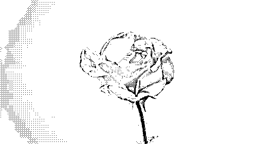

如此精彩的新年年运讲座，今天还可以报名！今天下午四点**艾德里安·邓肯老师**将着重讲述 **与冥王星合相的****金星逆行****四分海王星的****火星逆行**  **以及今年大家最关心的****水星逆行**而著名的占星师**琳恩·贝尔老师**将于下午六点半开讲重点讨论**土星-天王星四分相****月亮真实交点在****天蝎座-金牛座轴线****的影响****木星在白羊座****又会对我们的生活造成怎样的震荡**  如果感兴趣可以戳这里报名（或者直接点击阅读原文链接）[最后机会入场！4 位国际大师 2022 年天象预测课](http://mp.weixin.qq.com/s?__biz=MzA5NjA0NTAxNg==&mid=2651465560&idx=2&sn=1e6b2e82bd7c0de4ffa76ed6e9f77257&chksm=8b4895efbc3f1cf9b72383b27db08c3107dbe74dbaabb6d2be2d080492fe1d729de823b45408&scene=21#wechat_redirect)
当然，报名之后即可获得昨天内容的精彩回放 详细了解木海双鱼座的影响等你哟~

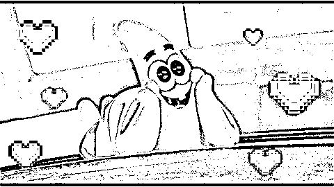

# 金融占星学大师雷蒙德·梅里曼《2022 年金融预报》开售！

> 原文：[`mp.weixin.qq.com/s?__biz=MzA5NjA0NTAxNg==&mid=2651465664&idx=2&sn=d94fe2097717e681925f5db64130db87&chksm=8b489577bc3f1c616d9b8cfa4d722408242c1d472961d27edd5805450d9e9ec192e11d0cab1c&scene=126&sessionid=1692737872#rd`](http://mp.weixin.qq.com/s?__biz=MzA5NjA0NTAxNg==&mid=2651465664&idx=2&sn=d94fe2097717e681925f5db64130db87&chksm=8b489577bc3f1c616d9b8cfa4d722408242c1d472961d27edd5805450d9e9ec192e11d0cab1c&scene=126&sessionid=1692737872#rd)

1976 年以来，由雷蒙德·A·梅里曼撰写的梅里曼市场时机学院每年一次的年度预报沙龙和每年一本的《年度预报》一直在应用占星学原理为投资者们服务，提供卓越洞见，从未间断。**2020 年，木星、土星和冥王星形成大合相，我们刚刚结束了一个周期和一个时代。现在我们正处于一个新时代和一个新的长期周期的早期阶段。**  如果 2020 年我们还在手忙脚乱，不知道发生了什么；2021 年则更让我们更清楚地看到一个时代结束了——2020 年之前的时代，在新冠肺炎病毒大流行、2020 年”大合相”之前的时代，这是人类历史进程上的一个转折点。**我们所熟知的生活诸多方面在那时就结束了，现在人们仍在试图找出“正确的方式”或“最好的方式”来重建和再造世界。**2021 年，有的行业被彻底摧毁，有的行业成为新贵。2021 年对投资者是一个苦乐不均的一年。尽管美国新冠肺炎疫情未见好转，道琼斯指数仍然扶摇直上；尽管中国经济在世界经济增长中一马当先，上证指数仍然波澜不惊。在货币对标的品种中，老贵族黄金走低，新贵族比特币飞升。我们还看到了大宗商品价格的飞涨，各种短缺开始出现。在中国，各种政府干预市场的调控在各个行业愈演愈烈。**这种现象到底说明了什么？又预示着什么？**2022 年我们的金融市场会受到哪些行星组合的影响呢？我们来看一看：**·** 140 年的木星-土星合相的“风象纪元”在 2021 年刚刚拉开序幕，2022 年我们还将会看到温和主义与极端主义之间存在冲突；**·** 土星四分天王星最后一次成相的影响：专制主义和中央政府控制与个人追求个体的权利和声音的冲突；新能源和旧能源的冲突；**·** 天王星进入金牛座的后半段：包括美元在内的世界货币的重新估价和地位；**·** 土星-海王星的半六分相：新冠肺炎病毒；**·** 水星、金星和火星在 2022 年的逆行“它们对 2022 年发展和增长的影响；**·** 木星在双鱼座（黄道最后一个星座）和白羊座（黄道第一个星座）之间来回移动：战争还是和平；谁是“第一名”的激烈竞争；**· **木星与海王星在双鱼座合相；**·** 冥王星在美国国家星图回归；美国的选择会对全球带来的影响；**·** 月亮交点的换座：月亮交点周期和经济周期的对应；**·** 木星在双鱼座期间金融市场和主要趋势的反转。2022 年仍然是旧世界向着新世界转变的一年。此时，金融市场的投资者和潜在投资者，都需要客观而睿智的思考，而金融占星大师雷蒙德·A·梅里曼的研究则更是无可替代的。1976 年以来，由雷蒙德·A·梅里曼撰写的梅里曼市场时机学院每年一次的年度预报沙龙和每年一本的《年度预报》报告一直在应用占星学原理为投资者们服务，提供卓越洞见，从未间断。去年，这个 3 小时的年度预报沙龙和长达 200 页左右对金融市场的分析报告帮助许多若道的读者做出正确的投资决策，降低投资风险，并获得相当不菲的投资收益。在《2021 年金融预报》中，关于上证指数，梅里曼老师说：对于上证指数，梅里曼老师说：**“我们预计涨势将在 2020 年 12 月-2021 年 2 月之间达到波峰，然后急剧下跌至 52 周和 22 个月周期的低点，这些周期将在 2021 年 5 月之前，甚至在 3 月底之前结束。此后可能会出现另一轮反弹，可能会也可能不会在 2021 年 11 月之前形成第一个 33 个月周期的新高。”**| 上证指数 K 线图关于黄金，梅里曼老师说：**“黄金的 31.33 个月周期波谷将在 2021 年 9 月之前出现，理想情况是 2020 年 12 月-2021 年 6 月。价格目标是 1628+/-109 或 1768+/-76。重叠范围（理想情况）是 1692-1737。如果价格跌破这些范围，则为看涨情况中令人担忧的状况。”**| 黄金走势 K 线图关于白银，梅里曼老师说：**“木星和月亮交点的周期表明，白银的一个重要低点将在 2021 年出现，最有可能在 5 月 13 日之前或 7 月 28 日之后出现。这可能是 5-7 年周期的波谷，但可能会保持在 18.50 以上。收盘低于 17.00 将令人担忧。”**

| 白银走势 K 线图

12 月底，我们将会再次发布梅里曼老师《2022 金融年报》。**2022 年初，梅里曼老师将会照样带来一场精彩的讲座，讨论 2022 年重要的宇宙天象及其对世界经济、金融形势的整体影响，还将覆盖中国上证股票市场的分析、黄金白银市场、比特币市场等投资市场。具体时间我们待确定后会通知大家。****2022 年度预报及沙龙预售**

**价格：****1380 元**

**一份价格仅千元的顶尖金融占星大师的投资分析报告和沙龙，聪明的投资者值得拥有。**

**和《2022 年四位占星大师天象预测》课程一起购买，可享受连报优惠。**

**长按下图了解详情**
▼

**购买者重要须知****①** 梅里曼市场时机学院每年一次的年度预报沙龙和《年度预报》是梅里曼市场时机学院的研究“预报”，而不是市场“预测”，是梅里曼老师及其金融占星分析师对人类活动周期历史与行星周期之间相关性的研究，二者在大部分情况下具有 80%或更高的相关性，而不是因果关系。沙龙中和报告中的研究完全存在错误的可能性。即便是非常认真的研究和几十年的研究经验，我们无法总是正确地解读出各种征象在实际层面上会如何相互作用，并显化为事件结果。

所以请将次沙龙和报告看作一个研究参考，务必结合其他市场研究和你个人对市场的理解，根据你的自由意志做决策。

**②** 此报告一旦售出，**即不接受退款。**

**③** 此报告仅支持在手机网页和若道 APP 上阅读，不支持电脑阅读和下载。**④** 讲座提供视频回放。**以上须知，请仔细阅读。一旦付款，即视为已了解并接受所有须知内容。**

**如在购买报告中遇见任何问题**

**可添加客服**

▼

****购买报告直达入口****

# 月亮进白羊座，今天要做点什么激动人心的事情呢？

> 原文：[`mp.weixin.qq.com/s?__biz=MzA5NjA0NTAxNg==&mid=2651465664&idx=1&sn=79286c894f36da004c794a4434d73202&chksm=8b489577bc3f1c61c24f75a95212946fc8e343b3ab087af024b53b8197c0193ca4f789d0863f&scene=126&sessionid=1692737872#rd`](http://mp.weixin.qq.com/s?__biz=MzA5NjA0NTAxNg==&mid=2651465664&idx=1&sn=79286c894f36da004c794a4434d73202&chksm=8b489577bc3f1c61c24f75a95212946fc8e343b3ab087af024b53b8197c0193ca4f789d0863f&scene=126&sessionid=1692737872#rd)

**2022 年 1 月 8 日天象：**

*   **13:25 月亮进白羊座**
*   ******太阳合相金星（逆行）******
*   ******火星四分海王星******

周六来啦！中午时分，月亮来到活力四射的白羊座，一别之前月亮在双鱼座时的慵懒和敏感，快快变身成为利索活力的行动派吧~运动是不错的选择，进行艺术创作、看电影、展览和音乐会也很棒。火星与海王星形成四分相，以上“项目”皆有助于释放身心，得到心灵的满足呦。所以，今天你有什么计划，打算做点什么激动人心的事情呢？一起来聊聊吧。太阳在摩羯座，和逆行的金星处于合相范围中，看起来今天也带着“严肃”呢~[【2022 年度天象大师预测课】](http://mp.weixin.qq.com/s?__biz=MjM5MjQwNjAyMQ==&mid=2649439084&idx=2&sn=7426fce2aec01213cea35520bfdc27c2&chksm=beb9540689cedd10f71515bc3872e6fbf1f41d2021d723591699b0c393c6e189c201ca42c923&scene=21#wechat_redirect)（点击查看详情）正好这个周末开讲，没准你这两天也希望自己“好好学习，天天向上”哈哈。对了，[【NVC 一日训练营】](http://mp.weixin.qq.com/s?__biz=MjM5MjQwNjAyMQ==&mid=2649439084&idx=4&sn=e79a2d1cf7b7a596fb7e8eab3bc36051&chksm=beb9540689cedd107f0d4aa2a5e232faa97afc63bc1d5824e40bb0cdd5f4463c00c95f03b13f&scene=21#wechat_redirect)（点击了解详情）将在 1 月 22 日开启，如果你想在新年对自己和自然更有链接感，不妨了解看看。周六快乐！**了解每日天象，可****下载“若道”APP 查看****还有更多精彩等着你哦**

# 原来星图早知道！你的梦境居然都藏在星图里？！

> 原文：[`mp.weixin.qq.com/s?__biz=MzA5NjA0NTAxNg==&mid=2651465560&idx=1&sn=3f6ba72688546da64b5f800a6c276a51&chksm=8b4895efbc3f1cf9070ddb791fd20c605cc0a8ea2adddc3ed90ea8a4f269fef33db3de683e9b&scene=126&sessionid=1692737872#rd`](http://mp.weixin.qq.com/s?__biz=MzA5NjA0NTAxNg==&mid=2651465560&idx=1&sn=3f6ba72688546da64b5f800a6c276a51&chksm=8b4895efbc3f1cf9070ddb791fd20c605cc0a8ea2adddc3ed90ea8a4f269fef33db3de683e9b&scene=126&sessionid=1692737872#rd)

****************☆ ****************************后台****************************回复“今日”，给你一句生命态度****************

作者/罗德·苏斯金 译者/李含 校对/江艺编辑/翀子 封面/书君 图片/网络

你对自己的梦境好奇吗？实际上，占星学有一整套工具可以用来处理梦境和破解梦境的奥秘，它不需要特殊的技巧，只需要专注的使用占星学符号。在传统和现代占星学中，我们可以从哪些角度切入梦境呢？看完文中案例，相信你可以领略其中奥妙。

我们最近也有一个关于梦境的工作坊，你也可以了解一下哦（戳：[释梦占星大师工作坊](http://mp.weixin.qq.com/s?__biz=MjM5MjQwNjAyMQ==&mid=2649439075&idx=1&sn=c88e649fdf1d72cb7662f9a89327003a&chksm=beb9540989cedd1f6403c7b5d3514f256068a60aab1f827445a94ab1bceba4edfcb66eb21363&scene=21#wechat_redirect)）

虽然当代占星师通常不认为自己是梦境分析师，但对梦的迷恋和对梦的解释的需要可以追溯到占星学最早的时代。有时令人惊讶的是，**占星学有一整套工具可以用来处理梦境和破解梦境的奥秘。**

在这篇文章中，我将介绍**传统和现代的占星解梦方法**，并向你展示如何轻松地扩展你对出生星图、行进和卜卦占星学的使用，以掌握解梦的艺术。

虽然梦的象征看起来可能有各种各样的含义，这取决于解梦人的信仰，但**占星学允许我们使用一组已知的、有限的象征符号——行星、星座和宫位——来理解它们。**

不需要特殊的技巧或要点，只需要非常**专注地使用占星学象征符号**。其他方法通常不会考虑做**梦者的潜在性格和性情**——但占星学会考虑到这一点。

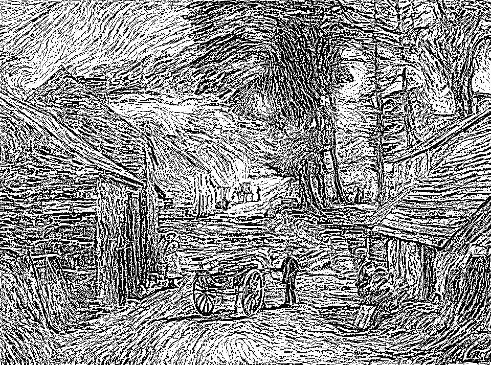

**出生星图中的梦在哪里？**

**出生星图可以帮助我们理解一个人特定的梦境语言是如何运作的。****第九宫是梦的殿堂**，**所以它的守护星和落入其中的行星都描述了个人的梦境风格。**

如果一个人在这里有强大的、积极的行星，他们通常会做一些愉快的梦或对自己有益的梦。当然，如果是困难的、麻烦的或凶恶的行星以及不尊贵的行星，情况则恰恰相反。

**塞缪尔的案例**

塞缪尔打电话给我，因为在他生日临近的几周里，他一直在做几个重复的、不舒服的梦。他终于在四月的这一天打电话，是因为他最近做的一个梦，也就是前一天晚上。

他说这在所有的梦里面很有代表性，他想知道我是否能帮助他理解他应该做什么。

这里没有显示出生星图，因为只有两颗行星是相关的。他的**第九宫守护星是水星**。

当梦境试图去表达的时候，他可能会有一种**梦境模式**，与水星的事物有关：旅行、信息、年轻人、文字和数字、交流问题。

**水星在第五宫。**他的梦可能是关于孩子、浪漫、乐趣、他喜欢的事情和他自己创造性的表达。

水星不够尊贵，掌管着一个困难的宫位，于是它可能代表一些可能会带来麻烦或有害的水星事件，会引起压力或疾病，并与吃力不讨好的任务有关。水星掌管的第六宫也会让人梦到不得不做一些吃力不讨好的工作。

**木星在第九宫也是落陷位置**，这意味着有时它也代表着一些无益的东西。也许作为第十二宫的守护星，他很容易梦到恐惧，尤其是与“自我毁灭”有关的恐惧，这是他自己最大的敌人。

（他也会从木星那里得到一些美好的灵性梦境……也许在那些时候他不觉得需要寻求帮助来解释！）

由于落陷的木星和有麻烦的水星与他的梦境相关，也许他只有在事情不顺利的时候才会做这样的梦。当他的梦与此相似时，他的潜意识里就冒出一个信息。

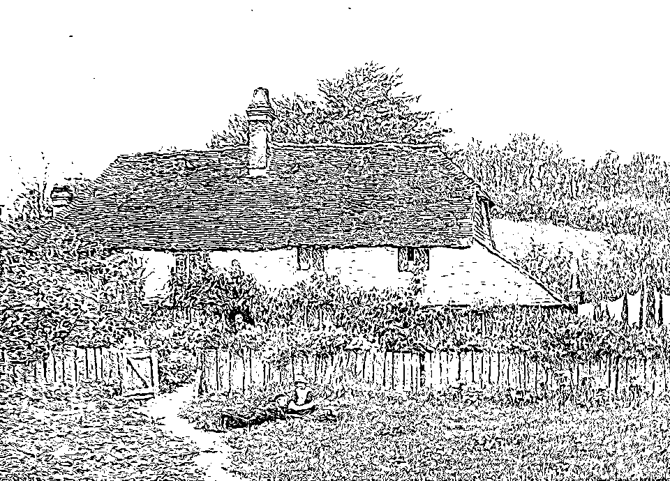

**咨询星图**

**咨询星图**是占星师熟悉的工具。我们可以利用关于梦的咨询来揭示客户现在所处的情况的意义，把他们日常生活的所有情况都联系起来，集中在一个人、一张出生星图上。

虽然用做梦的时间来绘制星图，甚至是用梦境被记住的时间来绘制星图似乎是恰当的，但第一个（时间）是不可能知道的，第二个（时间）是不可靠的。

**与所有的卜卦占星学一样，我们可以认为你被要求解梦的那一刻是有意义的，并且恰当地表示了梦境本身。**

对于**“我的梦意味着什么？”**这一问题，我们绘制了一张**卜卦星图**。我们将使用这张星图来确定梦的**关键征象**以及它们的**含义**。

不过，首先，我们将考察**梦境是如何在出生星图中被描述的，**因为我们每个人都有重复的模式和一种个人的符号语言，**我们在梦中反复使用这些符号**。

最后，我们将解梦，将这些星图与影响出生图的行进联系起来（因为梦毕竟是非常短暂的事件！）

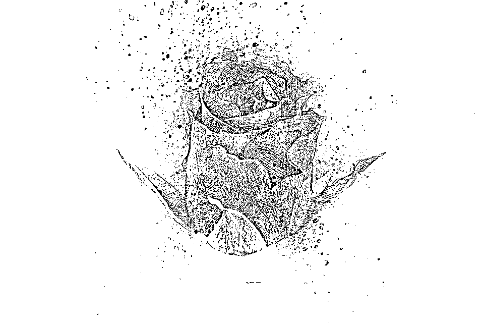

**循序渐进的梦境星图分析**

**塞缪尔前一晚达到高潮的梦的主要特征是：**

塞缪尔的梦境特征

*   他是送货员，或负责送货的人；

*   他有一辆自行车，必须在某处得到一些东西，可能是包裹或信息，但他不知道在哪里；

*   指派他送货的人是他 20 年前的雇主，他形容她是“一个非常挑剔的女人，总是在批评”他；

*   自行车的行程要穿过建筑物，更像在雨天和泥泞的条件下，穿过一片片的水层；

*   有很多湿滑的小巷和正在建造的建筑工地；

*   他最终“降落在后台的某个地方”，知道自己马上就要登上舞台，必须在许多人面前表演，但却不知道这出戏是关于什么；

*   他从来没能完成送货任务。

就像我们通常解析卜卦星图那样，我们把**第一宫的守护星**和**月亮的守护星**对应做梦的咨询者。

**梦本身对应第九宫**，虽然通常的做法是指定其**守护星**来代表梦，但是**落于第九宫的行星**通常是更好的梦的象征。

如果第九宫没有行星，萨尔指导我们按照**第十宫、第一宫、第七宫、第四宫**或**第三宫**的顺序来寻找行星。如果这些宫位中没有行星，那么这个梦的描述就是错误的，或者说是毫无意义的。

一旦你决定了**哪颗行星是梦的象征**，你就可以描绘以下信息：

*   **它掌管的宫位**显示了咨询者生活中是什么引发了做梦，例如，如果是一个可怕的梦，是什么引起了恐惧；

*   **与它成相位的行星**显示了生命中哪些领域受到梦的影响，以及如何影响。这将帮助你根据梦境给出合理的建议；

*   **如果南交点在第九宫或与梦的主要象征星合相****，**它将描绘出令人不安的梦或噩梦的特征——恐惧、危险、不愉快、被追逐、感受到威胁或类似的东西；

*   你也可以用这种方式描绘**第九宫的守护星**，以获取更多信息，或者在象征星似乎不合适的情况下尝试这种思路；

*   **每颗****行星的本质都显示了梦境的类型和一些细节**。在咨询者已经向你描述梦境之后，在星图中寻找梦的描述似乎是浪费时间，但这可以是对星图的重要确认，也可以给出比咨询者更清晰的细节——至可能有助于唤起他们的记忆。

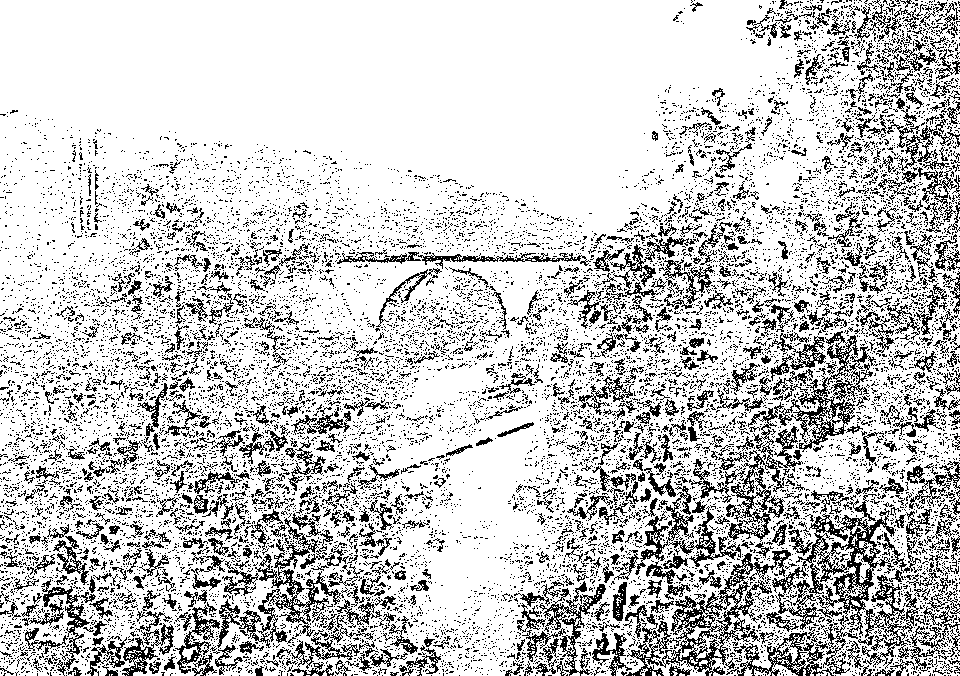

**行星与梦境内容的关联**

这些是萨尔和莉莉描述的一些传统意义，我在这些意义的基础上添加了一些对现代行星的想法：

传统行星的梦境意义

*   **月亮**：海洋、船只、航海、水、洪水、老年妇女；

*   **水星**：绘画、书籍、寺庙、旅行、学习、儿童、金融账户；

*   **金星**：性梦、女人、美丽的事物、愉快的经历、愉悦的梦；

*   **太阳**：有权势的人、财富、地位、飞翔的梦（清晰的梦？）；

*   **火星**：暴力、冲突、男人、武器、危险动物、火、狗；

*   **木星**：金钱、承认和认可、重要人物、愉快的经历、心灵方面的事情（我要加上海外长途旅行、学习）；

*   **土星**：责任、土地和挖掘、埋藏的东西（比如宝藏）、黑暗的地方、引起恐惧和惊骇的东西；

*   **北交点**：有价值和令人愉快的东西，香味，大自然；

*   **南交点**：黑暗，密谈和低语，被追逐，无法逃脱，有人试图杀死你，死亡；

**关于现代行星的建议：**

*   **天王星**：火灾、爆炸、突发事件、新事物和未知事物、意外

*   **海王星**：模糊、混乱、水、幻觉

*   **冥王星**：结局、毁灭、神秘人物、可怕的事物、危险感

这里有很大的空间可以详细阐述，但是**坚持每个行星的基本含义是很重要的，**这样就不会变得像梦本身那样开放和过度连接，这对客户没有好处。

占星师也有很多机会直接学习**行星的象征意义**，可以说是**通过倾听梦境的描述**并观察哪个行星与你所听到的内容对应。

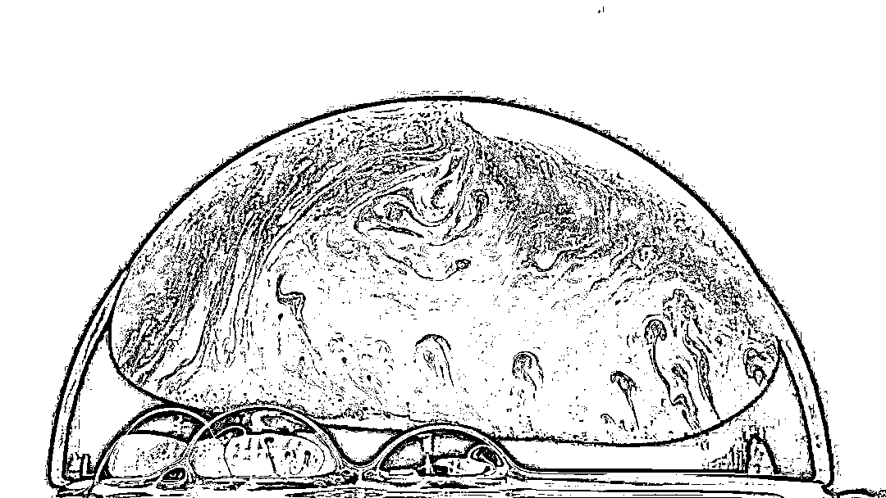

**象征星所属元素**

**象征星所落的星座是非常具有启示性的，特别是通过它所属的元素。**

萨尔在他的《论问题》（*On Question*s，戴克斯翻译）一书中特别用它们来描述噩梦的细节，我在这方面做了一些现代化的改动：

星座元素与梦境

*   **风象**：高处、悬崖，从高处坠落，被风吹向空中；

*   **土象**：被包围，掉进黑暗的地方，或在黑暗或狭窄的地方找到出路；

*   **火象**：火，有人遇难，酷热，雾气，阴暗和黑暗；

*   **水象**：溺水、淹没、溢出、洪水、海水、危险。

在其他梦中，这些元素也可以直接代表梦，通常作为象征行星的背景。如果你使用落在第九宫的一颗行星，不如通过**观察第九宫的守护星落点**来了解咨询者的生活背景。

**需要注意的**

**观察与第一宫和第九宫守护星成相位的的行星。**相位很容易让人费解和困惑，所以最重要的是要理解：

来自**金星、木星和发光体的相位**有助于咨询者。在一个危险的梦中，它们将以一种与这颗吉星所掌管宫位相关的方式提供救援。

来自**火星、土星和外行星的相位**在某种程度上造成了问题或追赶着咨询者，这与这一凶星掌管的宫位有关。（在外行星相位中，我使用非常小的容许度，因为它们没有光线，而且在相位上往往相当微妙。)

你可以从中得到关于梦的很多细节，不仅要与客户向你描述的梦境相匹配，还能清楚地解释这些梦的每一个因素意味着什么。

因为你能够看到什么是助力，障碍在哪里，你就可以给出建议，建议咨询者在处理梦的信息时应该把注意力放上生活的哪个方面。

**月亮还能提供最后一条有用的信息：**

月亮星座与梦境

*   当它处于**固定星座**时，梦会对客户的生活产生重大影响；

*   在一个**基本星座**，它会在稍后产生一些东西；

*   而在一个**变动星座**，这个梦几乎没有真正的意义。

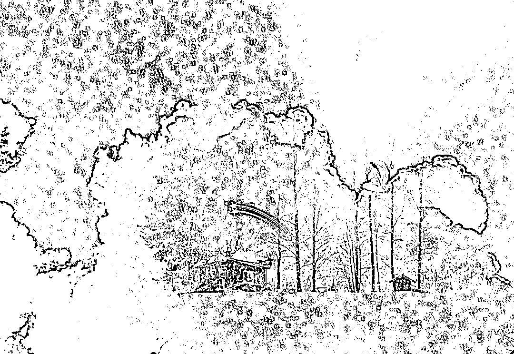

**解析塞缪尔的梦**

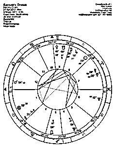

**| **塞缪尔的梦境星图

在塞缪尔**梦境星图**中我使用的时间是我在电话中**理解这个问题的时间**，处女座落于上升，所以水星象征着塞缪尔，而梦的象征星是落于第九宫的月亮。

**这些是非常恰当的象征，显示这张星图的创见性。**水星是信使，并且无疑完美象征了骑着自行车的咨询者本人。月亮代表的梦境中我们预期这是一个充满水和洪水甚至老妇的梦。

**在一个梦境的卜卦星图中，在你现在确定梦境与做梦者生活的关系之前，最好先开始解读梦本身的象征星的意义。**

所以，我们从月亮开始，月亮落在第九宫。水之星，一个土象星座，金牛座——他梦中出现了水、泥和建筑，甚至还有土象星座对应的“黑暗和狭窄的地方”。梦中过度的水性质表现在金牛座末尾入旺的月亮上，在这一区域有许多难相处的恒星。

第九宫还落入了南交点，这表明这梦境是一场关于奔跑、被追逐、不理解的噩梦。

这些象征不能从字面意思理解。虽然月亮可能准确地描绘了一个关于溺水的梦，但其含义将在星图中找到，而不是在水或溺水的想法中。

**这意味着占星师不必即兴创作，也不必有专门的梦境或心理学知识，星图是唯一需要的工具。**

**无论象征星守护哪里都指向了恐惧的根源。**月亮掌管第十一宫，这个宫位是关于团体和朋友以及工作带来的回报和金钱（第十宫后的第二宫）。

月亮似乎也描绘了一个女人在梦中，但星图让情况变得更清晰了。**第九宫的守护星是金星**，在这张星图中很突出，因为她落在离最重要的轴点第十宫只有 4 度的位置。

金星离中天如此之近，必须被视为一颗角宫的行星，而双子座似乎非常适合用水星墨丘利的词来形容，比如“难取悦”和“挑剔”。

她也是第二宫的守护星，掌管着金钱。正因为如此，似乎第十一宫也指向了金钱（工作所得）。土星就在第二宫宫头，暗示了金钱的一些限制，但十分尊贵，这让我相信塞缪尔确实在赚钱，也许只是还不够。

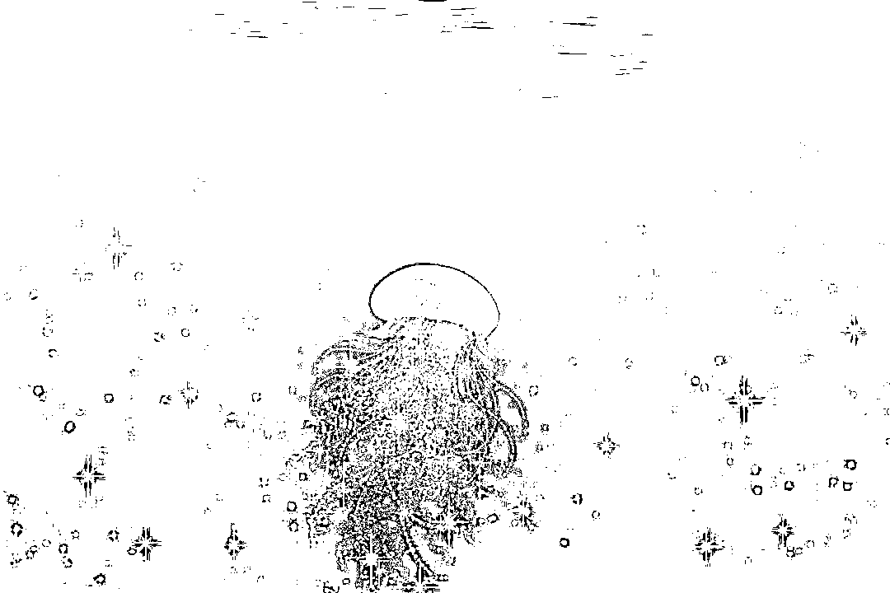

对梦中雇主的批评可能与金钱有关。尽管如此，水星实际上象征着塞缪尔，并通过处女座统治着他，我可以看出他梦中的老东家对他具体特质的看法可能与他现在如何看待自己有很大关系。

**我意识到他一定是在批评自己，可能是和工作有关。**

**水星，**象征着塞缪尔，在代表婚姻的第七宫与天王星同度合相。它也是第十宫的守护星，再次显示出对工作的忧虑，但事实上，正是在第七宫，才带来了我们正在寻找的突破。

**塞缪尔没有谈到他的婚姻，但很明显，这确实是他的担忧所在。**

**水星与天王星的合相以及与冥王星的四分相**显示了很多关于婚姻的不确定性和焦虑，更不用说字面上的情感象征，当你甚至不知道这是什么剧本，不知道你在那里做什么的时候，你也应该知道这些词。

现在，这一切开始融合在一起：他梦到一个挑剔的女人派他去送一些东西——也许是把钱带回家。

一个女人的形象很可能代表了他的妻子，他并没有想到她，因为他似乎不想把这种情况放在他真正关心的事情——他的婚姻——的背景下来看。

**在他的婚姻中，有一些他未曾言说或者不知道如何言说的恐惧。**

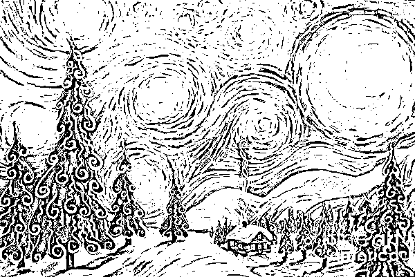

半小时后，我给塞缪尔回了电话。我询问他关于工作收入的问题，他是否觉得自己挣得不够多。他立刻同意了我的意见。

我问他，这在家庭内是不是一个问题，他是否因此受到了批评。他回答说，事实上，他的妻子赚的钱比他多得多，在这段关系中，钱根本不是问题。

你会注意到水星的守护星是火星，它也掌管着第八宫配偶的财富，而且这个宫位还落入了木星，它是第七宫（妻子）的守护星，也是财富的伟大象征。

**最后，我们有了足够的信息来理解这个梦。**塞缪尔担心他在妻子眼里赚的钱不够，以及他的妻子会因此对他有挑剔的想法。

他知道这是一种非理性的恐惧，因为他们有着亲密的关系和足够的钱，但他不自觉地对此感到焦虑，这种恐惧在梦中显现出来。

当我解释这一点时，塞缪尔体验到了占星学经常带来的令人震撼的领悟。

我可以向他保证，考虑到土星的尊贵情况，他的收入有限并不是因为他自己的失败，限制是有充分理由的。这让他可以在家工作，照顾家庭，同时为整个家庭的收入做出贡献。

也许他可以把自己的恐惧告诉他的妻子，因为他知道不管怎样，这些恐惧都是非理性的，这会帮助他不要把他们太当回事儿，以至于出现在梦中。

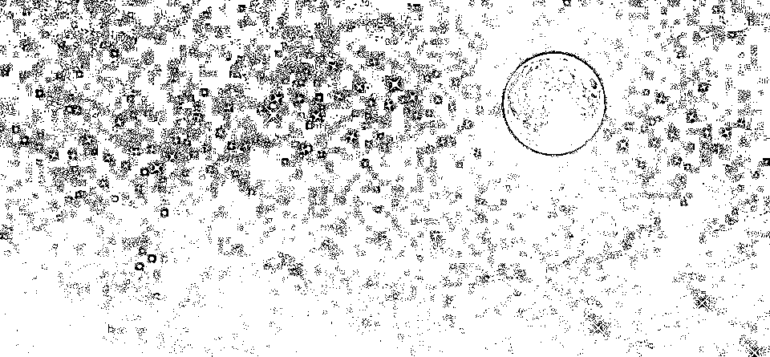

**结论**

占星学在用自己的语言而不是通过许多常用的框架（如心理学）来表达时，达到了最佳状态。

**就梦境而言，它本身可以通过各种可能的透镜投射出来，**占星学提供了一个完美的机会，用一种对个人而言既独特又普遍的象征主义来提供一种清晰连贯的方法来理解梦境。

它可以**结合个人的个性和环境**，并**提供了表达和解决由梦引起的问题的方式**，因此，它不仅是解释梦的完美载体，而且最终治愈了梦所揭示的困扰。

**版权声明：**本文由若道翻译发布，欢迎转发，反对抄袭。友号转载请申请白名单。

**罗德·苏斯金**

开普敦著名占星师，他在罗德·苏斯金占星学校的在线三年证书课程教授占星学。罗德是一系列占星学书籍的作者，并受邀为官方议会报纸撰写有关国家占星图的文章，他在国家电视台上的占星节目已播出 9 年。罗德在威尔士大学完成了文化天文学和占星学的硕士学位，专门研究宇宙学和治疗实践之间的关系。
**2022 年来了****还不快领取你的****专属年运报告****？****购买有优惠，点击图片查看详情哦~**

**学习占星学****点击下图了解课程详情** 

********************************

**

**微信又双叒叕改版啦，不想错过若道君的推送？**
**就把若道设为星标吧！****▼**

**喜欢记得点一下在看哦☟**

**报名直达入口**

# 明天开课 | 最后机会入场！4 位国际大师 2022 年天象预测课

> 原文：[`mp.weixin.qq.com/s?__biz=MzA5NjA0NTAxNg==&mid=2651465560&idx=2&sn=1e6b2e82bd7c0de4ffa76ed6e9f77257&chksm=8b4895efbc3f1cf9b72383b27db08c3107dbe74dbaabb6d2be2d080492fe1d729de823b45408&scene=126&sessionid=1692737872#rd`](http://mp.weixin.qq.com/s?__biz=MzA5NjA0NTAxNg==&mid=2651465560&idx=2&sn=1e6b2e82bd7c0de4ffa76ed6e9f77257&chksm=8b4895efbc3f1cf9b72383b27db08c3107dbe74dbaabb6d2be2d080492fe1d729de823b45408&scene=126&sessionid=1692737872#rd)

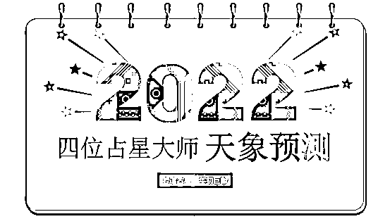

2022 年到了，忙碌的开年工作挡不住我们对今年的盼望和期许。

作为占星师，在年初跟随权威老师透彻地学习 2022 年重要天象的含义和影响，是迎接新的一年的正确姿势，仪式感满满！为新一年的自我规划和占星事业加油充电。

**若道邀请了金牌核心课中的四位国际名师再次集结，在今年 1 月 8 日、9 日带来 2022 年重大天象的深入解读：**

**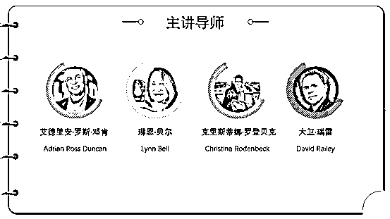****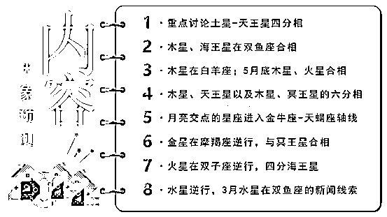**

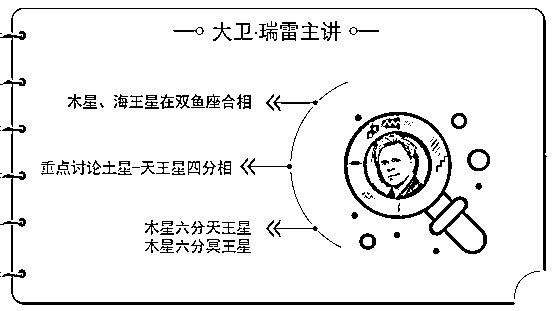

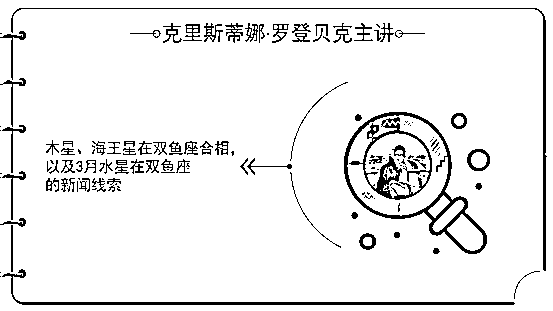

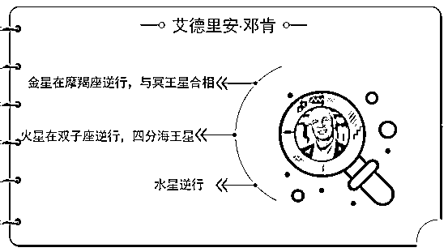

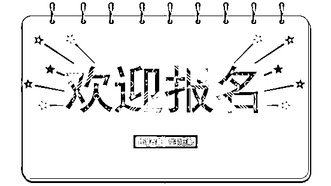

**讲师是谁？**

**琳恩·贝尔**

**（Lynn Bell）**

**· **世界最受欢迎的占星学演讲者、作家和老师之一。定居巴黎，研究心理占星学和家族模式数十年； **·** 著名的心理占星学中心（*Centre for Psychological Astrology*）的长期导师。2016 年，获得查尔斯·哈维（Charles Harvey）杰出的占星学服务奖；**· **作为一个从多个层面进行工作的占星咨询大师，琳恩的工作结合了心理学的观点。她对家族模式的兴趣首先来自与客户的合作。通过在分析领域所做的个人工作，她所受的埃里克森催眠训练将她引领至家族系统。后来，她组织研究小组在家族星图上进行了数年的研究。她写的《家族占星学》就是这项研究的结果；**· **法国心理占星学协会的会长。除了占星学，她在法国沙特尔的新沙特尔学校任教 8 年，还 5 次获得了在《纽约时报》畅销书作者卡罗琳·迈斯（Caroline Myss）的卡罗琳·迈斯教育学院（*Caroline Myss Educational Institute*）合作教学的机会。

**艾德里安·罗斯·邓肯**

**（Adrian Ross Duncan）**

**· **1971 年在印度游学时开始学习占星学，1985 年开始成为全职占星师，迄今执业已超过 33 年，是人本主义占星学、卜卦占星学和经世占星学领域的知名占星师。他还开发了占星软件 AstroClock 和多款占星报告；

**· **哥本哈根占星学院院长；

**· **他在日常咨询中经常运用卜卦，咨询图（卜卦的一种运用方式，即根据客户来访时间制作星图，从星图中获得大量信息）也是他特别擅长的领域；

**· **艾德里安·罗斯·邓肯从 1971 年开始研习佛学，受佛学影响很深，他相信占星学和佛学观点一致，转化的一个基础是在于对现实感知的改变。而卜卦很容易与佛教融合，因为它只关乎当下。

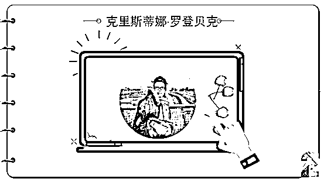

**克里斯蒂娜·罗登贝克**
**（Christina Rodenbeck）****· **克里斯蒂娜·罗登贝克（Christina Rodenbeck）是一名全职职业占星师，在牛津大学城生活和工作，深受周围知识和文化氛围影响；她拥有伦敦大学（*University of London*）的人文荣誉学位，曾在伦敦占星学馆（*Astrological Lodge of London*）、心理占星中心和占星研究学院学习；**· **作为一名占星师，在过去的 20 年里，克里斯蒂娜在她的网站“牛津占星师”上写了大量关于时事、艺术和文化的文章；她每月主持一个占星播客：“与克里斯蒂娜和萨莉一起占星”，并定期在《占星杂志》(*Astrological Journal)*上撰写时尚专栏；她定期在英国授课，并保持着蓬勃发展的专业实践。

**大卫·瑞雷**

**（David Railey）**

**· **若道联合创始人，致力于在中国教授和推广西方占星学；

**· **曾任 ISAR 全球副主席，CAPISAR（ISAR 职业占星师资质认证机构）主席；

**· **1976 年，通过亚特兰大职业占星师考试，成为全职占星师，随后通过 AFAN 和 ISAR 职业测试；

**·** 1980 年，与杰夫·焦耳一起在亚特兰大创建“每日行星”占星学中心。此后在亚特兰大占星协会担任 4 年考官，并且两次担任亚特兰大地区占星协会主席。1979-1992 年，作为占星师活跃于美国社会媒体，向不了解现代占星学变化的大众宣传专业占星学知识。在 1989-1992 年期间，他在 WRGG 电台 12 频道每周主持个人电视秀“今日占星学”，早先他还在 WRFG 的广播节目中播讲宇宙天气节目；

**· **2010-2014 年，任全美占星师联盟监督委员会委员；

**· **2010 年，其著作《灵魂的目标》中国版出版，和蒋颖一起创办若道占星学校和其官网 www.nodoor.com；

**· **2017 年，被选为 ISAR 委员会成员。ISAR 是世界最大的国际占星机构，会员遍布 45 个国家，2017-2020 年曾任 ISAR 全球副主席、CAPISAR（ISAR 职业占星师资质认证机构）主席。

**课程价格****正价**：3000 元**限量优惠价：2022 元**（前 60 名报满截止）**（联系 Maggie 老师，抢占限量优惠价）******联报套餐：《2022 年度天象预测大师课》+《2022 年金融占星预报》联报优惠价****2999 元****（限前 50 名联报）****（联系 Maggie 老师，抢占限量优惠价）**长按二维码添加 Maggie 老师获取联报优惠价**退转课程**

**· 退款原则请详看《教学协议》，如有疑问请咨询课程顾问。**

****2022 年度天象预测大师课****

**授课老师：**琳恩·贝尔、艾德里安·罗斯·邓肯、克里斯蒂娜·罗登贝克、大卫·瑞雷

**授课时间：**2022 年 1 月 8 日-9 日

**授课方式：**网络课程**，**英文授课，中文翻译

**费用：**3000 元**；****限量优惠价：2022 元（前 60 名报满截止）；****联报套餐：《2022 年度天象预测大师课》+《2022 年金融占星预报》联报优惠价：****2999 元****（****限前 50 名联报）**

**课程负责人：****Maggie 老师**（微信：18510107057，请备注“天象预测大师课”）

长按二维码添加课程负责人咨询~

****报名直达入口****

# 太阳双子座与 12 星座月亮丨你是怎样的“古灵精怪小可爱”？

> 原文：[`mp.weixin.qq.com/s?__biz=MzA5NjA0NTAxNg==&mid=2651465406&idx=1&sn=c9bf1ba49b07f6c67740c46779200be8&chksm=8b489409bc3f1d1fdad398e34840d6338275f29a8292e9eb404df28126fcc8262c454b2cb6c5&scene=126&sessionid=1692737872#rd`](http://mp.weixin.qq.com/s?__biz=MzA5NjA0NTAxNg==&mid=2651465406&idx=1&sn=c9bf1ba49b07f6c67740c46779200be8&chksm=8b489409bc3f1d1fdad398e34840d6338275f29a8292e9eb404df28126fcc8262c454b2cb6c5&scene=126&sessionid=1692737872#rd)

☆****后台回复“今日”，给你一句生命态度****

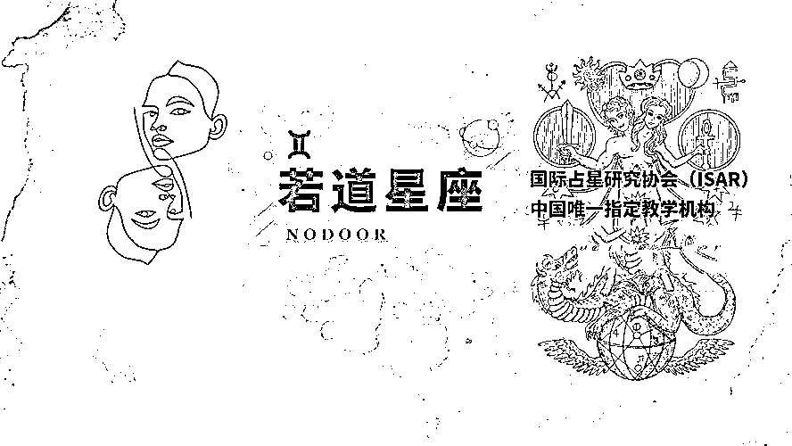

作者/诺·泰尔 译者/江艺、dogcatcher 编辑/翀子 封面/书君 图片/网络太阳是生命的伟大能量，而月亮被认为是人格中的“主导需要”，同样被重视（你可以点击【[开篇](http://mp.weixin.qq.com/s?__biz=MzA5NjA0NTAxNg==&mid=2651462070&idx=1&sn=d5cbef611d7737ded063f0f5bf9d84b1&chksm=8b48ab01bc3f22174486a56624093693138f8fd944a52f543d3ab4c9eb6f5093e798516f48d4&scene=21#wechat_redirect)】，查看诺·泰尔老师对此部分内容的详细阐述）。当双子座太阳，遇见 12 星座月亮，分别有哪些表现呢？**太阳双子座和 12 星座月亮**

**★月亮*****白羊座***

多样性；他们能**生气勃勃**、咄咄逼人地展示自己的聪颖！像猫一样迅捷！他们有小聪明，并因**身体和思维的敏捷**而容光焕发。

他们**敏锐、精打细算**，并用其凸显自尊，而一旦具备了企图心和成就动机，他们就能快速而警觉地行动。**自信洋溢在外在形象之中。 **

**★月亮*****金牛座 ***

占星家 Grant Lewi 写道：“你是你知道的人中最受欢迎的家伙之一！你的聪慧吸引着朋友，你的**务实**把他们聚在你身边。

在**双子座的流利与敏捷**的外衣下，是金牛座的坚定的心。”（对不美好的事物的）排斥与识别。他们**长久的浪漫情怀**超越了双子的肤浅。 

**★月亮*****双子座 ***

双子座的紧张和躁动在这个配置中得到巨大的强调。所有的可能性都瞬间被思考遍了；他们的内心总是对环境感到无聊，因而总是动着 10 个超前于现状的脑筋。

这个配置**强烈需要其他征象提供牢固的心灵根基**。乐观的情形：当案主**学会专注**的时候，双子座智力和天才的力量会变得十分强大。 

**★月亮*****巨蟹座***

这个配置容易受自己感官和情绪的影响！**他们的神经系统可能是所有配置中最为兴奋的**。他们特别容易通过批评（这也不好，那也不好）来为自己的聪慧与敏感找到一个栖身之所。

如果能**学会专注**，他们紧张的神经就会消停下来，强大的感知觉能力会理解和吸收更多的情感，带来回报；相反，**若缺乏智力的训练，**他们泛滥的情绪和紧张的神经就会在浑水里随波逐流。 

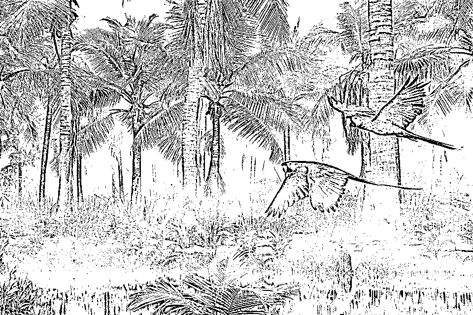

**★月亮*****狮子座***

很大程度上，狮子座月亮的雍容使得双子座太阳的犹豫不决得到了消解，**让个性更加踏实**。双子座过于活跃的神经和思维得到了狮子座月亮的支援，显得不那么躁动不安。**在历经挑剔的尝试之后，浪漫的心怀可以找到一个栖身之所。**

他们**能引人注目地展示自己的多才多艺，这常给他们带来一个领导者的形象**。但当自尊受到压迫的时候，激烈的脾气会打破双子座的和善而爆发出来。这个柔和的配置需要和压力相位结合，才能找到更多紧张的动力，更好地成长与发挥优势。 

**★月亮*****处女座 ***

吹毛求疵的批评会多到失控。这个配置总是因为**过高的理想和期待**而沮丧，感到不被理解和欣赏。他们郁郁寡欢，暴躁和喜怒无常，容易这山望着那山高。他们的犹豫不决经常让自己感到难受。

**星图其他征象提供的专注力，可以为机敏、精明、批判的智力带来成果。**但由思维编织而成的愿望，总是比兑现它们的行动力要强得多。

**在他们成长的道路上，“想”和“做”一直在相互冲突。 **

**★月亮*****天秤座***

忙碌和欢快，聪慧，受欢迎，理想和愉悦的经历……流动得都很自然。（在社交场合中）**他们对外界的反应灵动而游刃有余**，**并因此而乐观。**但他们也经常因为处事态度过于轻松随性而招致选择性困扰。

这个组合的正面特质需要得到星图中其他征象的支持，来使个性更加稳健，获得更多的成果。 

**★月亮*****天蝎座***

这个配置的**智力反应迅捷，情感富有深度，**因此可以创造强大的吸引力！感情用事、过于强调肤浅的快乐，容易将智力的积极应用一扫而空。

**他们的思维被自我意识控制，**而他人却控制着自我意识。柔韧的双子座因此太容易把他人的理想和目标带入自己的生活领域，两性关系会有较大的麻烦。 

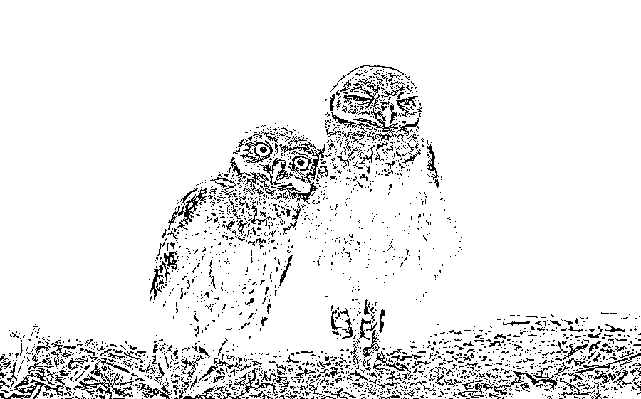

**★月亮*****射手座***

信息，旅行，冒险，想象……这一切都得到了汇集。这个配置**可以对不同级别的外界刺激都敏感地做出反应**，这就要求星图别处（给人格和心智能力的发展）提供足够的支援！

**逻辑化的智力倾向**在阐释高深抽象的哲学话题时会碰到困难，闲言碎语，漫无目的的侃侃而谈会趁虚而入。谈论目标代替了实现目标。**别人很难使他们消停下来。**

他们的大脑工作过度，并可能经常一心多用，**除非集中精力**——而如果能做到这点，案主是可能获得巨大成就的，如学术甚至精神性的领域。 

**★月亮*****摩羯座***

双子座的娱乐性、多才多艺的能量得到坚定不移的、有组织的、精明的应用。这个配置的**企图心和说服力**自然地绑定在一起。他们**分析性倾向总是胜过创造性倾向**。友好和冷静是他们生活的秩序。

这个配置的优势是，**思维可以很独立地为野心服务而不受其干扰**；但如果月亮受到不利相位的影响，就会喧宾夺主，让案主过于自私霸道地展现他的势利和精明。 

**★月亮*****水瓶座***

水瓶座的特立独行的创新气质给思维带来远见和洞见！处世智慧，尤其是**处理人际关系的天赋**，使得他们能更加流利地展现聪颖。**这是人文主义者和民主主义者的日月配置。**

这个舒适的配置需要其它压力相位带来紧张感，来聚焦志趣，获取更多的进步。**如能学以致用，他们的思维就能受到灵感与好奇心的指引，（对他人和社会）产生很大的影响力。 **

**★月亮*****双鱼座***

这个组合的**灵感与思维互动的时候非常紧张**，这是因为他们不太善于表达。他们总需要反复解释才能表达想法。这些人会觉得，对已经很明确的事情做冗长的阐释是值得的——哪怕只是为了保持逻辑的连贯和完整。**他们总是在思索如何表达才能使得别人更有效地理解自己。**

如果案主善于学以致用，有生意头脑和领导力，并且知道怎样使用逻辑推理给自己带来实际的好处，那么这个配置可以（为人生成就）带来非常大的帮助。

**版权声明：**本文由若道翻译发布，欢迎转发，反对抄袭。友号转载请申请白名单。

**本系列其他文章**
[太阳白羊座·12 星座月亮](http://mp.weixin.qq.com/s?__biz=MzA5NjA0NTAxNg==&mid=2651463192&idx=2&sn=7ecd2012aee1f245b56e0f107bdfc19e&chksm=8b48acafbc3f25b968e9ca8cbe8acf6972dc3e418827b36ac12af7bf7c81858937657babb393&scene=21#wechat_redirect)丨[太阳金牛座·12 星座月亮](http://mp.weixin.qq.com/s?__biz=MzA5NjA0NTAxNg==&mid=2651463523&idx=1&sn=69fa5ba9035316fecd6c3911e744f089&chksm=8b48add4bc3f24c274cd5064316982ae958debed1e9ab681b46b80d8d8ec26bb3d2036075be9&scene=21#wechat_redirect)

**诺·泰尔**

现代占星学鼻祖，世界众多著名西方占星师的占星老师。他毕业于哈佛大学社会关系专业，是当今世界上最重要的占星师之一，占星联盟协会（AFAN）的创始人及原主席。其所著的三十三本占星教科书作为占星教学的典范，引领了整整两代占星师的占星学习与教育，1998 年国际占星大会（UAC）授予其占星界最高奖项 “轩辕奖”。

**2022 年要来了**

**还不快领取你的****专属年运报告****？**

**购买有优惠，点击图片查看详情哦~**

**学习占星学****点击下图了解课程详情** 

********************************

**微信又双叒叕改版啦，不想错过若道君的推送？**
**就把若道设为星标吧！****▼**

**喜欢记得点一下在看哦☟**

**报名直达入口**

# 2022 年重磅首发| 美国占星心理学学院&若道占星双认证核心课程

> 原文：[`mp.weixin.qq.com/s?__biz=MzA5NjA0NTAxNg==&mid=2651465406&idx=2&sn=58e3ff85bbfdf87cdae86795dcb9c746&chksm=8b489409bc3f1d1f7e30fb26c83947d285a81619fedcda828f6e54cf15c30f1130edbd8dabe6&scene=126&sessionid=1692737872#rd`](http://mp.weixin.qq.com/s?__biz=MzA5NjA0NTAxNg==&mid=2651465406&idx=2&sn=58e3ff85bbfdf87cdae86795dcb9c746&chksm=8b489409bc3f1d1f7e30fb26c83947d285a81619fedcda828f6e54cf15c30f1130edbd8dabe6&scene=126&sessionid=1692737872#rd)

**美国占星心理学学院创办人**

**格伦·佩里**授课

**40 余年**职业占星师生涯所学精华**倾囊相授**

修完 101-205 全部课程，并通过考核的毕业生将获得

**美国占星心理学学院证书**( Academy of Astropsychology )

和**若道毕业证书**

**高含金量双证书**

跟随主讲老师学习融合**心理学体系**的**占星知识**

为星图咨询解读打下坚实的基础

**大量**的课程资料，光是课后阅读资料就**超过 60 万字**

合理的课程设计，贴心的助教服务，及时的课后测验

1

**这门课程最大的看点是什么？**

1. **两位国际占星学大师**共同授课，将合计**90 年职业占星师生涯所学精华**倾囊相授；2. 修完**全阶课程**，考试通过的毕业生将获得**美国占星心理学学院证书**（Academy of Astropsychology）和**若道毕业证书**，**高含金量双证书**；3. **116 次课程**的充分授课时间（录播课程 69 次课；直播课程 47 次课），全面而详细地讲解占星学历史、知识、技能、案例、咨询和运用；4. 跟随主讲老师学习**自成体系、逻辑严密、实用性强的占星语法、星图解读方法**；5. 学习独特的**发展年龄预测法**，从星图看对关键年龄阶段的发展及议题；6.** 大量的课程资料，光是课后阅读资料就超过 60 万字**；7. 合理的课程设计，初中阶课程，每一节都有课后测验；8. 本课程可以作为**ISAR 选修课**中的一门，再修两门就满足 ISAR 认证选修课要求；9. **18 次占星咨询技巧的培训**，为正式从事占星咨询建立基础；10. 教授重要的**心理学概念**，比如与客体关系、心理动力理论、个人神话和叙事疗法相关的一些概念，学习如何将它们整合到星图解读中；11. 了解**《精神疾病诊断与统计手册》**诊断标准，探索星图中的心理疗愈；12.  学习**叙述疗法**和**自传写作**，将之作为自我疗愈和咨询的工具。

**格伦老师致学员的信**

（向上滑动查看内容）

**亲爱的学员：**

作为占星心理学学院的校长，我的目标是帮助你顺利完成学业。

占星心理学学院的课程让你能够在经济承受范围内，灵活地学习占星学。我们的课程让你可以舒适、便捷地在家学习，不用打乱你本就繁忙的日程。我们有完善的在线学习系统，让你能在线上课、下载学习资料、进行测试并自动获得即时反馈，还可以在虚拟课堂上同你的教员和同学互动。

作为私人开业的**职业占星师**和**执业心理治疗师**，我已经**工作超过 30 年。**我还花了近 10 年的时间，在研究院里学习并获得**心理学的硕士和博士学位**。这段训练和经历是无价的，帮助我将占星学发展成为连贯的 21 世纪模式。

我们的占星学培训项目是**系统化的、清晰的、组织有序的、易学的、前沿的。**尽管有许多类似的学校可供你选择，但你不会在这些学校中看到像占星心理学学院所提供的那样有深度的或尖端的课程。

**我非常期待 2022 年再次在若道教授心理占星学核心课程。**我们重新规划和升级了本次课程体系。**新的课程包含之前完整课程的 72 个录播视频，每个视频长 2 小时；以及由我教授的 37 次直播课程，和大卫老师教授的 10 次直播课程，每次课程 2 小时。**在实时课程中，除了我提供的案例，我还会用学员的星图进行案例演示，与学员互动，阐明视频中教授的原则和方法。

**2 小时直播课程安排：**

**第一阶段 提问和讨论：**

这将在每节课开始时进行。邀请学员提出与课前提供的资料相关的具体问题。这一阶段将持续 15-30 分钟。

**第二阶段 示例：**

这一阶段会讲解与每周任务相关的具体概念，例如行星的星座位置、宫位位置以及相位的意涵。星图示例来自我认识的人，如公众人物、朋友、家人、同事或以前的客户（不显示出生信息）。同样，这一阶段也开放课堂讨论，学员可以提出自己的问题和见解。

**第三阶段 学员案例演示：**

这个阶段会从学员的具体星图来阐明概念，例如火元素行星占优势。学员案例演示不会涉及任何类型的咨询或“解读”。它们将只是简单地包含一段对话，我会在对话中分享自己对某个配置的思考，然后问这个学员可能会如何主观地（影响、信念、行为）和客观地（事件/关系）体验这个配置。其他参课学员可能也会对讨论的主题有自己的见解或问题，他们也可以参与讨论。

我对这一新的在线课程形式感到兴奋，**并期待着从 2022 年 4 月 6 日开始认识我的新学员们。**获得本学院的文凭会是你做过的最明智的投资。你不仅将占星学掌握到前所未有的深度，还将学到如何为客户提供咨询服务并建立职业占星师的职业生涯。

真诚地

**格伦·佩里 占星心理学学院校长**

**为什么要学习心理占星学？**占星心理学是一个复杂的体系，让实践者能够向客户提供真正治疗性的益处。这从根本上说来是我们学院有别于其他学校之处：**我们教授占星学，也教授心理学概念。****我们明确讨论各种心理学概念，并将其与占星学无缝衔接。结果就是更深入的、更丰富的，最终更加强大的模式。****该项目专为初学者和渴望深造的有经验的占星师而设。**我们会从跨学科的角度探讨星图解读。**通过融合荣格心理学和各种其他模型的元素，学员将熟悉作为人格理论、发展模型、原型语言和诊断工具的占星学。**

2

**课程是怎么安排的？**

**第一学年**

**共****64****次课 **43****次录播课 **21 次直播课******

**101 占星学基础 **

****共****12****次课程：******8 次 2017 年录课+4 次直播课**

**占星学**关注成长，聚焦心理。外部事件意义重大，但我们可以把它们看作是对于发展中的心理结构的共时性反映，以及未来发展的媒介和催化剂。在这个阶段的课程中，会以四种形态的几何形式介绍**占星原型：星座、行星、宫位和相位**。黄道带是人类心灵的象征性地图，其中的每个**星座**都代表一种基本的人类需求、原型人物、发展阶段和行为风格。**行星**代表心理功能，以满足其关联星座的基本需求。**宫位**提供了环境舞台，行星在其中扮演它们的角色，而**相位**是行星之间的角度关系，在主观上体验为内在对话。

**课程安排**：

**录播课****、****直播课（周三）**时长都是 2 小时

第一节**录播课**：核心概念介绍

第二节**录播课**：黄道带的结构

2022 年 4 月 6 日**直播课**：核心概念、黄道带的结构提问和讨论、知识点示例

第三节**录播课**：图例、单态星体和其他奇妙的元素

2022 年 4 月 20 日**直播课**：图例、单态星体提问和讨论、知识点示例

第四节**录播课**：星座介绍（从白羊座到处女座）

第五节**录播课**：星座介绍（从天秤座到双鱼座）

2022 年 5 月 4 日**直播课**：12 星座案例演示

第六节**录播课**：行星作为过程

第七节**录播课**：行星作为内容

第八节**录播课**：将碎片整合起来

2022 年 5 月 18 日**直播课**：整合星图时，将行星作为过程和内容案例演示

**102 行星落星座、宫位** 

****共****12****次课程：**8 次 2019 年录课+4 次直播课**

这个阶段的课程**聚焦于初步的星图整合。**

学员将学习**占星语法**，以及如何运用它们来阐释**行星的星座落点**。学员不需要强记书中的星图解读，而是学习分析基础的占星句法结构，应用这些语法规则来思考和讲述这门语言。学员们将学习如何构建精妙的句子，将动机、功能、特质、状态和事件组合起来。

此外，还将学习解读**行星宫位落点**的规则。宫位被定义为心理环境，为特定类型成长和发展提供背景。行星落在宫位中，象征着情境中的特殊状态，应对环境挑战的方式，以及通过共时性人物和事件而外化的自我部分。

学员们将探索如何将星座和宫位落点融合在一个单一、整合的陈述中，做出灵活、层次分明的解读。

**课程安排**：

第一节**录播课**：占星语法介绍

第二节**录播课**：行星星座作为行为风格

2022 年 6 月 1 日**直播课**：占星语法、行星星座作为行为风格提问和讨论、知识点示例

第三节**录播课**：思维状态和行为结果

第四节**录播课**：学习行星的星座落点

2022 年 6 月 15 日**直播课**：思维状态和行为结果、行星的星座落点提问和讨论、知识点示例

第五节**录播课**：回顾宫位的含义

第六节**录播课**：宫位中的行星过程

2022 年 6 月 29 日**直播课**：宫位的含义、宫位中的行星过程提问和讨论、知识点示例

第七节**录播课**：行星在宫位中的状态

第八节**录播课**：行星作为宫位的内容

2022 年 7 月 13 日**直播课**：行星在宫位中的状态、内容的提问和讨论、知识点示例

**103 行星相位与个人神话** 

****共****13****次课程：**9 次 2019 年录课+4 次直播课**

在这个阶段的课程中，**相位**被解释为由更大的故事结构的潜在动力构成的个人神话。

学员将学习相位是如何象征内在心理的冲突、重要的童年情感体验、主要的人生挑战和内在对话的。需要着重强调的是，相位的意涵会随着心理成熟的程度而改变。人会成长、进化，会解决内在冲突，这些不仅反映在态度和行为的改变上，而且也会表现在某人吸引的事件及其与他人的关系品质上。

学员们还将学习一些**心理学概念**，比如与客体关系、心理动力理论、个人神话和叙事疗法相关的一些概念，它们将整合到相位解读中。

**课程安排**：

第一节**录播课**：重要主题与核心冲突

第二节**录播课**：渐盈相位与渐亏相位

2022 年 7 月 27 日**直播课**：重要主题与核心冲突、渐盈相位与渐亏相位的提问和讨论、知识点示例

第三节**录播课**：主要相位的核心意义

第四节**录播课**：罗生门原则

2022 年 8 月 10 日**直播课**：主要相位的核心意义、罗生门原则的提问和讨论、知识点示例

第五节**录播课**：占星学中的认知

第六节**录播课**：心灵的控制结构

2022 年 8 月 24 日**直播课**：占星学中的认知、心灵的控制结构的提问和讨论、知识点示例

第七节**录播课**：作为认知结构的相位

第八节**录播课**：强迫性重复

第九节**录播课**：听大卫·瑞雷讲月亮交点

2022 年 9 月 21 日**直播课**：月亮交点（由大卫·瑞雷老师教授）

**104 征象星与定位星：作为进化故事的星图 **

****共****12****次课程：******8 次 2019 年录课+4 次直播课**

这个阶段的课程聚焦于**从叙事角度整合星图。**

学员们将探索**宫位征象星**和**行星定位星**如何讲述一个故事，反映一个人进化发展之旅。行星定位关系揭示了个人神话的主体构架。而这个故事的主题常常处于意识觉知和控制之外，占星学提供了一种方式，揭示、解读、改编这个神话。

我们推荐的星图整合方式是将相位和定位星关系融合成一个单一、连贯的叙事。要特别强调的是，如何活出整合程度更高的生命故事。

学员们还将了解**叙事疗法**和**自传写作**，把它们当作促进整张星图整合的一种方式。

**课程安排**：

第一节**录播课**：每张星图都讲述了一个故事

第二节**录播课**：互容与最终定位星

2022 年 10 月 12 日**直播课**：每张星图都讲述了一个故事、互容与最终定位星的提问和讨论、知识点示例

第三节**录播课**：将相位整合进流程图

第四节**录播课**：完整的故事

2022 年 10 月 26 日**直播课**：将相位整合进流程图、完整的故事的提问和讨论、知识点示例

第五节**录播课**：过渡短语

第六节**录播课**：良好定位或不良定位

2022 年 11 月 9 日**直播课**：过渡短语、良好定位或不良定位的提问和讨论、知识点示例

第七节**录播课**：发展年龄方法

第八节**录播课**：进行全面整合

2022 年 11 月 23 日**直播课**：发展年龄方法、进行全面整合的提问和讨论、知识点示例、案例演示

**105 星图中的精神病理学与疗愈 **

****共****15****次课程：******10 次 2019 年录课+5 次直播课**

在这个阶段的课程中,我们将**聚焦于十二星座(从白羊座到双鱼座）及其对应的守护星的潜在功能障碍**。

我们将学习如何识别、理解和应对每个星座的潜在挑战。我们将在各种相应的心理障碍背景下来考察占星原型，这些心理障碍表现为功能障碍、失衡的极端状态。

学员们将了解**《精神疾病诊断与统计手册》诊断标准**。我们会探讨治疗的概念，尤其是那些与整合和个性化相关的概念。我们将特别关注外行星的困难相位，以及它们与内在心理冲突、防御和症状形成的关系。

学员们将探索人的痛苦如何成为发展和实现天赋才能的催化剂。在考察病因时，我们会将平常的因果关系理论与传统的命运、业力和转世观念整合起来。

**课程安排**：

第一节**录播课**：白羊座-火星的病理学

第二节**录播课**：金牛座/天秤座-金星的病理学

2022 年 12 月 7 日**直播课**：白羊座-火星、金牛座/天秤座-金星的病理学提问和讨论、知识点示例、案例演示

第三节**录播课**：双子座/处女座-水星的病理学

第四节**录播课**：巨蟹座-月亮的病理学

2022 年 12 月 21 日**直播课**：双子座/处女座-水星、巨蟹座-月亮的病理学提问和讨论、知识点示例、案例演示

第五节**录播课**：狮子座-太阳的病理学

第六节**录播课**：天蝎座-冥王星的病理学

2023 年 1 月 4 日**直播课**：狮子座-太阳、天蝎座-冥王星的病理学提问和讨论、知识点示例、案例演示

第七节**录播课**：射手座-木星的病理学

第八节**录播课**：摩羯座-土星的病理学

2023 年 1 月 18 日**直播课**：射手座-木星、摩羯座-土星的病理学提问和讨论、知识点示例、案例演示

第九节**录播课**：水瓶座-天王星的病理学

第十节**录播课**：双鱼座-海王星的病理学

2023 年 2 月 8 日**直播课**：水瓶座-天王星、双鱼座-海王星的病理学提问和讨论、知识点示例、案例演示

**第二学年 2023 年**

****共****52****次课 **36****次录播课 **16 次直播课********

**201 回顾占星历史 **

****共****16****次课程：******9 次 2019 年录课+7 次直播课**

在这个阶段的课程中，我们将探索**占星历史如何反映心灵的进化**。

现代之前的占星学以事件为导向，注重具体预测，偏向决定论，它反映了现代之前的主导意识模式。上世纪以来，占星学已经逐渐变得更加抽象、心理化、开放和非决定性，这似乎反映了集体意识的改变。因此，我们将在人类发展和意识进化的背景下考察占星历史。我们会谈到不同时代的星图解读和咨询技术，以此来比较和对比前现代、现代和后现代占星学。

**课程安排**：

第一节**录播课**：朝着整体占星学前进

第二节**录播课**：占星原教旨主义

2023 年 2 月 22 日**直播课**：朝着整体占星学前进、占星原教旨主义提问和讨论、知识点示例

第三节**录播课**：占星学的其他分支——大卫·瑞雷

2023 年 3 月 1 日**直播课**：占星学的其他分支提问和讨论、知识点示例（由大卫·瑞雷老师教授）

第四节**录播课**：从古代占星学到后现代占星学

第五节**录播课**：比较与批评

2023 年 3 月 8 日**直播课**：从古代占星学到后现代占星学、比较与批评、提问和讨论、知识点示例

第六节**录播课**：希腊占星学：摘录与评论

2023 年 3 月 22 日**直播课**：希腊占星学：摘录与评论提问和讨论、知识点示例

第七节**录播课**：比对图中的伴侣匹配度，古代与现代

2023 年 4 月 5 日**直播课**：比对图中的伴侣匹配度，古代与现代提问和讨论、知识点示例

第八节**录播课**：比对图——大卫·瑞雷

2023 年 4 月 12 日**直播课**：比对图提问和讨论、知识点示例、案例演示（由大卫·瑞雷老师教授）

第九节**录播课**：组合图——大卫·瑞雷

2023 年 4 月 26 日**直播课**：组合图提问和讨论、知识点示例、案例演示（由大卫·瑞雷老师教授）

**202 预测与意识演变(一) **

****共****9****次课程：******6 次 2019 年录课+3 次直播课**

作为一门艺术，**预测占星学**运用行星的运行来预测特定时期的性质、意义和持续时间。在这个阶段的课程中，我们会考察**意识进化**的概念、其基本原理及其与占星学预测部分的关系。

意识进化可以被定义为有意识地与星图中固有的进化过程合作。学员们将探索如何用**行进**和**推进**来为意识进化服务。我们不是简单描述事件的结果，而是将行星运行描述为实现先天潜能的机遇之窗。

**课程安排**：

第一节**录播课**：开始预测

第二节**录播课**：发展年龄方法

2023 年 5 月 3 日**直播课**：开始预测、发展年龄方法提问和讨论、知识点示例、案例演示

第三节**录播课**：太阳的行进

第四节**录播课**：月亮的行进与推进

2023 年 5 月 17 日**直播课**：太阳的行进、月亮的行进与推进提问和讨论、知识点示例、案例演示

第五节**录播课**：水星的行进

第六节**录播课**：金星的行进

2023 年 5 月 31 日**直播课**：水星、金星的行进提问和讨论、知识点示例、案例演示

**203 预测与意识演变(二) **

****共****15****次课程：******9 次 2019 年录课+6 次直播课**

在这个阶段的课程中，学员们会继续探索**如何将对行进、推进和其他预测方法的分析运用于个人成长**。

具体事件反映并促进了意识的改变；因此，行星运行可以帮助我们洞察成长过程的精确时机，让我们领会内在和外在现实如何同时发生、彼此反映、互相转化。

我们还将探索宏观的世界行进，考察占星格局如何在社会、政治、经济、艺术和生态层面上表现出不同的形式，却又在多样化的现象中反映单一的**原型**。

这里的挑战是去思考，我们对宇宙的这种参与式关系如何能为共同创造一个积极的、更充满希望的未来做出贡献。

**课程安排**：

第一节**录播课**：火星的行进

第二节**录播课**：木星的行进

2023 年 6 月 14 日**直播课**：火星、木星的行进提问和讨论、知识点示例、案例演示

第三节**录播课**：土星的行进

第四节**录播课**：天王星的行进

2023 年 6 月 28 日**直播课**：土星、天王星的行进提问和讨论、知识点示例、案例演示

第五节**录播课**：海王星的行进

第六节**录播课**：冥王星的行进

2023 年 7 月 12 日**直播课**：海王星、冥王星的行进提问和讨论、知识点示例、案例演示

第七节**录播课**：次限推进——大卫·瑞雷

2023 年 7 月 19 日**直播课**：次限推进提问和讨论、知识点示例、案例演示（由大卫·瑞雷老师教授）

第八节**录播课**：太阳弧——大卫·瑞雷

2023 年 7 月 26 日**直播课**：太阳弧提问和讨论、知识点示例、案例演示（由大卫·瑞雷老师教授）

第九节**录播课**：太阳返照图和月亮返照图——大卫·瑞雷

2023 年 8 月 9 日**直播课**：太阳返照图和月亮返照图提问和讨论、知识点示例、案例演示（由大卫·瑞雷老师教授）

**204 占星咨询技巧(一) **

****共****9****次课程：******6 次 2019 年录课+3 次直播课**

在这个阶段的课程中，学员们将学习**咨询技巧**，比如如何选取一段经历，询问相关问题，提出假设，进行解读，重塑冲突，预测成长机遇，深化疗愈。

我们会审视各种**咨询理论**，重点强调它们在占星学中的**运用**。学员们将学习如何处理危机，做出恰当的推荐引介。

我们强调**有效沟通**的原则、聆听技巧、言语和非言语沟通，以及占星学如何帮助我们建立共情关系。

我们会专门介绍**伦理道德**法则，因为它关系到职业责任问题、资质能力、咨询和预测。

我们会特别关注**占星师的阴影**以及我们在自卑和膨胀问题上的集体脆弱。

**课程安排**：

第一节**录播课**：导言与概述

第二节**录播课**：确定咨询范围

2023 年 8 月 16 日**直播课**：导言与概述、确定咨询范围提问和讨论、知识点示例、案例演示

第三节**录播课**：会见客户

第四节**录播课**：厘清问题(剥开占星学的洋葱)

2023 年 8 月 30 日**直播课**：会见客户、厘清问题(剥开占星学的洋葱)提问和讨论、知识点示例、案例演示

第五节**录播课**：认出生活模式(隐喻思维)

第六节**录播课**：提出假设与辨识核心信念

2023 年 9 月 13 日**直播课**：认出生活模式(隐喻思维)、提出假设与辨识核心信念提问和讨论、知识点示例、案例演示

**205 占星咨询技巧 (二) **

****共****12****次课程：******6 次 2019 年录课+6 次直播课**

在这个阶段的课程中，参与者将**继续学习咨询技巧**，包括如何选取一段经历，询问相关问题，提出假设，进行解读，重塑冲突，预测成长机遇，深化疗愈。

我们还将考察各种**电影**，考察它们与理解人们寻求帮助的共同议题的关系。我们会审视各种咨询理论，着重强调它们在占星学中的运用。学员们会学到如何处理危机，做出恰当的推荐引介。我们会强调有效沟通的原则，以及聆听技巧、言语和非言语沟通，以及占星学如何帮助我们建立共情关系。我们会专门介绍伦理道德法则，因为它关系到职业责任问题、资质能力、咨询、预测和古代术语的运用。

**课程安排**：

第一节**录播课**：检验假设

第二节**录播课**：对星图做出初步解读

2023 年 10 月 11 日**直播课**：检验假设、对星图做出初步解读提问和讨论、知识点示例、案例演示

第三节**录播课**：建设性解读星图的艺术

第四节**录播课**：洞悉客户经历的目的

2023 年 10 月 25 日**直播课**：建设性解读星图的艺术、洞悉客户经历的目的提问和讨论、知识点示例、案例演示

第五节**录播课**：提供希望和方向

第六节**录播课**：案例研究和督导

2023 年 11 月 8 日**直播课**：提供希望和方向、案例研究和督导提问和讨论、知识点示例、案例演示

2023 年 11 月 15 日**直播课**：ISAR 资质认证考试大纲和准备（由大卫·瑞雷老师教授）

2023 年 11 月 22 日**直播课**：ISAR 资质认证考试术语词汇表第一部分（由大卫·瑞雷老师教授）

2023 年 11 月 29 日**直播课**：ISAR 资质认证考试术语词汇表第二部分（由大卫·瑞雷老师教授）

**若道核心课程结业考试**

3

**导师简介**

**格伦·佩里（Glenn Perry）**

*   这位传奇的占星师，也是一名拳击和摩托车爱好者

*   他毕业于赛布鲁克学院(Saybrook Institute)，是心理/意识研究专业博士

*   也是拥有 30 余年经验的加州注册婚姻和家庭治疗师 （CAMFT）

*   美国占星心理学学院（Academy of AstroPsychology）的创办人

*   他曾任国际占星研究协会 （ISAR）以及联合占星大会董事会（UAC）副主席

*   也是 ISAR 突破性道德标准的设定者

*   康涅狄格州研究生院（the Graduate Institute of Connecticut）原型宇宙学与意识进化项目的负责人

*   共出版八本占星学著作：《心理占星学入门》《心理占星论文集》《盗取天火》《从忠诚到革命》《星图中的阴影》《占星职业议题与伦理》《出生星图深度分析》《从古代到后现代占星学》

**大卫·瑞雷（David Railey）**

*   若道联合创始人，致力于在中国教授和推广西方占星学；

*   曾任 ISAR 全球副主席，CAPISAR（ISAR 职业占星师资质认证机构）主席；

*   1976 年，通过亚特兰大职业占星师考试，成为全职占星师，随后通过 AFAN 和 ISAR 职业测试；

*   1980 年，与杰夫·焦耳一起在亚特兰大创建“每日行星”占星学中心。此后在亚特兰大占星协会担任 4 年考官，并且两次担任亚特兰大地区占星协会主席。1979-1992 年，作为占星师活跃于美国社会媒体，向不了解现代占星学变化的大众宣传专业占星学知识。在 1989-1992 年期间，他在 WRGG 电台 12 频道每周主持个人电视秀“今日占星学”，早先他还在 WRFG 的广播节目中播讲宇宙天气节目；

*   2010-2014 年，任全美占星师联盟监督委员会委员；

*   2010 年，其著作《灵魂的目标》中国版出版，和蒋颖一起创办若道占星学校和其官网 www.nodoor.com；

*   2017 年，被选为 ISAR 委员会成员。ISAR 是世界最大的国际占星机构，会员遍布 45 个国家，2017-2020 年曾任 ISAR 全球副主席、CAPISAR（ISAR 职业占星师资质认证机构）主席。

**助教简介**

**薇安**

*   全职心理占星师、ISAR 认证占星师（2016 年获得）；

*   北大心理学硕士、MBTI 国际认证施测师；

*   若道认证生时校正资质及 COAC 高阶资质毕业生；

*   连续两届担任格伦·佩里老师亲授的“美国占星心理学院&若道占星双认证核心课程”主助教；

*   2012 年至今，持续追随多位国际占星大师进行占星学的深入学习；

*   2007 年至今，持续进行精神分析及心理动力取向的理论及技巧研习；

*   致力研究心理学与占星学的整合运用。

4

**此次课程适合哪些人？**

*   对占星学感兴趣，想要入门的零基础者

*   占星学小白，但有志成为职业占星师的人

*   有一定占星学基础，但不知道该如何整合星图复杂碎片的人

*   想要师从更多殿堂级占星导师学习占星心法的人

*   走在自我探索和个人成长道路上的人

5

**选择若道学习占星学的优势**

**运用自由意志，扭转破坏性模式，绽放天赋潜能**

若道是人本主义占星学的旗手。因为我们相信，**人通过了解模式、觉察习性、积极疗愈、终将释放其潜能，与命运共舞**。

**进入国际权威职业占星师认证的快车道**

占星界的“联合国”ISAR（国际占星研究协会），是具有全世界影响力的占星教学和研究组织和职业占星师全球认证机构，认证占星师遍布 47 个国家。**在 ISAR 的 22 所附属学校中，大中华地区的附属学校只有若道一家**。在国际化的教学理念大纲标准下，**若道毕业生在 ISAR 国际认证占星师的考试通过率多次全球第一**。

**十年占星学教育中国本土化教学经验**

**根据中国学生的学习习惯不断优化占星教学体系，让学员学成后更自如地应对本土咨询市场的需求。**

学好占星学不仅仅需要邀请一两位老师教学，更需要对教学难点有充分了解，且有持续的教学跟进服务。**10 年来多次核心课程和各种专题课程的教学，让若道非常了解中国学生学习占星学的难点和卡点，合理有效地拆分、提炼课程知识点，同时也积累了丰富的国外老师和中国老师、助教紧密配合以及课程顾问密切配合教学的经验**。

若道还专门开发了有助于占星学习的“**若道**”APP，每门课程都设有答疑板块，学员能够方便快捷地提交问题，助教及时答疑解惑和批改作业。

**融入中国顶尖的职业占星师群体**

若道是中国职业占星师的“黄埔军校”。职业占星师的培养从若道开始，**进入若道，你就走进了中国顶尖的职业占星师群体，和一群志同道合的师兄师姐联谊，获得经验，共同成长**。 

**多种奖学金支持**

为了鼓励学员不因为暂时的经济困难而放弃学习，我们特意设置了各种**技能交换和奖学金**。

对于有一技之长的学员，我们推出的技能交换的项目包括**“笔译”、“笔记整理”、“平面设计”、“课本朗读”、“班级服务”**等技能交换项目；

而对于努力学习、出勤率高、完成作业率高的学员，我们设置的**土星奖、木星奖**等各种奖学金在等着你。

为了感谢帮助我们推荐学员的老学员们，我们设置了“**老学员推荐奖**”；

对于通过问卷提建议，帮助我们提高服务的学员，我们也设置了相应的奖学金。

**开启占星咨询的职业规划和支持**

若道为占星学员搭建了占星问答平台和占星咨询平台，并提供严肃占星学影响力最大的媒体平台，全力为毕业生提供宣传渠道，帮助你吸引和积累咨询生涯初期的种子客户。若道为学员开发了适用于占星学习的“若道”APP，并不断更新完善。

**①  微信平台**若道微信平台作为业内颇具影响力专业平台，为文笔好的若道毕业生提供传播占星学并免费宣传自己的机会。有的学员因为文笔获得众多粉丝喜爱，在 3 年多时间积累起 2000 多人的潜在客户。

**②  问答平台**若道问答平台帮助学员接触客户的实际问题，并在毕业前就进行演练答题。自问答平台 2016 年上线运营以来，学员接触到 3200 多个问题， 回答问题最多的学员在问答平台收入达 5 万多元。

**③  咨询平台**若道咨询平台是我们为优秀毕业生所搭建的平台，帮助毕业生在自己的咨询拓展之外，用若道提供的平台扩展咨询客户群。自咨询平台 2017 年 8 月上线运营以来，咨询平台共入驻 65 人，收入最高者达 32 万元。

此处所列学员收入仅供参考，收入高的学员和其专业水准、努力程度密切相关。若道平台尽其所能将自己定位为辅助学员开展职业生涯的桥梁。

6

**课程价格**

**101-102 初阶**

**正价：**6800 元

**早鸟价：****6200 元**

**早鸟价截止时间：2022 年 3 月 16 日**

**学习充值卡优惠价：5800 元**

**101-105 第一学年**

**正价：**18800 元

**早鸟价：****17600 元**

**早鸟价截止时间：2022 年 3 月 16 日**

**学习充值卡优惠价：17000 元**

**101-205 全阶联报**

**正价：**50000 元

**早鸟价：****36000 元**

**早鸟价截止时间：2022 年 3 月 16 日**

**学习充值卡优惠价：35000 元**

**咨询课程顾问**：**王老师（微信/手机：18510107057，请备注“格伦核心课”）**

**全阶段学习后，可参与若道占星毕业认证考试，考试费用为：580 元**

7

**直播课开课时间**

**2022 年 4 月 6 日（周三）20:00-22:00**

8

**退转课程**

**退款原则请详看《教学协议》，如有疑问请咨询课程顾问。**

9

**格伦老师视频**

** 格伦·佩里老师如何将心理学和占星学结合，如何开始教授心理占星学？**

<mpvideosnap class="js_uneditable custom_select_card channels_iframe" data-pluginname="videosnap" data-id="export/UzFfAgtgekIEAQAAAAAA1cQIVxHSQwAAAAstQy6ubaLX4KHWvLEZgBPEj4N8IVw_XO_8zNPgMIvIg3o5fV6DKtbopk3uCtgu" data-url="https://findermp.video.qq.com/251/20304/stodownload?encfilekey=rjD5jyTuFrIpZ2ibE8T7Ym3K77SEULgkiacqoE1uQT2gRMR7tsdLprPxw34Qibx2tX5gg3FHPSwGBA23EQANYxD29423qqiboomc3RIYLZP49cImPwmNV6LYqA&amp;adaptivelytrans=0&amp;bizid=1023&amp;dotrans=0&amp;hy=SZ&amp;idx=1&amp;m=&amp;scene=0&amp;token=AxricY7RBHdUIqHazje0cib6ddJfLKk6VpG8CrHMvAa7LnbGk6Yb742ETaJ0jJ5zewGLZSAOicbApU" data-headimgurl="http://wx.qlogo.cn/finderhead/PiajxSqBRaEJYnVsqWfEX9qA0sI6hNVKsDfyzfPZ92WZMZyBpZWU5NA/0" data-username="v2_060000231003b20faec8c4e68a1ec2d4ca07e434b07755bbf47e7053a3059defd2c9d6c68a20@finder" data-nickname="若道" data-desc="#若道核心课 格伦·佩里老师如何将心理学和占星学融合，如何开始教授心理占星学？" data-nonceid="7753154886488626177" data-type="video"></mpvideosnap>****2022 双证书核心课****

**授课老师：格伦·佩里、大卫·瑞雷**

**直播课开课时间：2022 年 4 月 6 日（周三）开课**

**授课方式：******网络授课，英文授课，中文翻译****

**费用：101-102 价格：**6800 元**（早鸟价 6200，2022 年 3 月 16 日截止，充值卡优惠价 5800）**，**101-105 价格**：18800 元**（早鸟价 17600，2022 年 3 月 16 日截止，充值卡优惠价 17000）**，**101-205 价格**：50000 元**（早鸟价 36000，2022 年 3 月 16 日截止，充值卡优惠价 35000）**；

**课程负责人：王老师**（微信/手机：18510107057，请备注“格伦核心课”）

长按二维码添加课程负责人咨询~

****报名直达入口****

# 重磅！12 星座 2022 全年天象指南！详细到月份！（值得收藏）

> 原文：[`mp.weixin.qq.com/s?__biz=MzA5NjA0NTAxNg==&mid=2651465265&idx=1&sn=fb0d6a77a01d83d13e1dca10738ada25&chksm=8b489486bc3f1d90b99daf500103fee1020e932b9cc126caa7e71e9aeb05f4d90160f8232931&scene=126&sessionid=1692737872#rd`](http://mp.weixin.qq.com/s?__biz=MzA5NjA0NTAxNg==&mid=2651465265&idx=1&sn=fb0d6a77a01d83d13e1dca10738ada25&chksm=8b489486bc3f1d90b99daf500103fee1020e932b9cc126caa7e71e9aeb05f4d90160f8232931&scene=126&sessionid=1692737872#rd)

************☆****** ****后台回复“今日”，给你一句生命态度******

作者/查理 ISAR 认证占星师编辑/玫瑰 封面/书君 图片/网络

2022 年的天象白皮书来啦！重大天象，国家和个人的运势预测，以及 12 星座成长指南，一定是你没见过的重磅干货，必须要读完还得收藏的那种，一起来看看吧！

**木星进入双鱼座**

2021 年，我们经历了几个极为重要的天象，木星-土星合相在水瓶座，开启了风象时代，曾经的线下生活迁移到了线上进行；三次土星-天王星渐亏四分相，创新力量和保守势力的剧烈冲突，带来的时代尖叫，回荡在全球的政治、经济、商业、社会、文化、科技等各个领域。

**如果历史进程有起伏高低，我们目前正处于一个巨大的分水岭中，至少续到 2027 年。**其中的占星学依据是，**2020 年到 2027 年****的七年之****间，一共会产生六种不同的木星、土星、天王星、海王星、冥王星的合相（不算相同星体的合相）**：

**·** 2020 年的土星-冥王星合相，木星-冥王星合相，木星-土星合相；

**·** 2022 年即将迎来的木星-海王星合相；

**·** 2024 年的木星-天王星合相；

**·** 2026 年的土星-海王星合相；

天象中的木星、土星、天王星、海王星、冥王星五颗星体中，任意两颗星体的合相，一般都会开启全新的历史局面，换句话说，也是**人类“折腾”的开端。**要知道，就算是一战、二战这样的历史分水岭，外行星合相的情况也不过如此（1914 年-1921 年 7 年出现 5 次，1940 年-1948 年 8 年出现 6 次），而 2000 年-2020 年的 20 年期间一共只出现过 4 次。其余的时代，每十年能遇到三、四种合相，那个时代就已经面临巨大的动荡了。

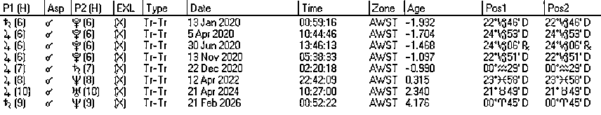

| solarfire 分析得出的 2020 年-2026 年星体合相时间所以，我们看到了**“当今世界正经历百年未有之大变局”**。如果我们站在时代的广度，对明年做年度的切片分析和展望，也许能够理解更深一些。2022 年，我们将迎来的天象除了最重要的**“木星-海王星合相”**，还包括**“木星连续换双鱼座+白羊座”、“土星-天王星渐亏四分相（最后一次）”、“南北交点换星座”。**

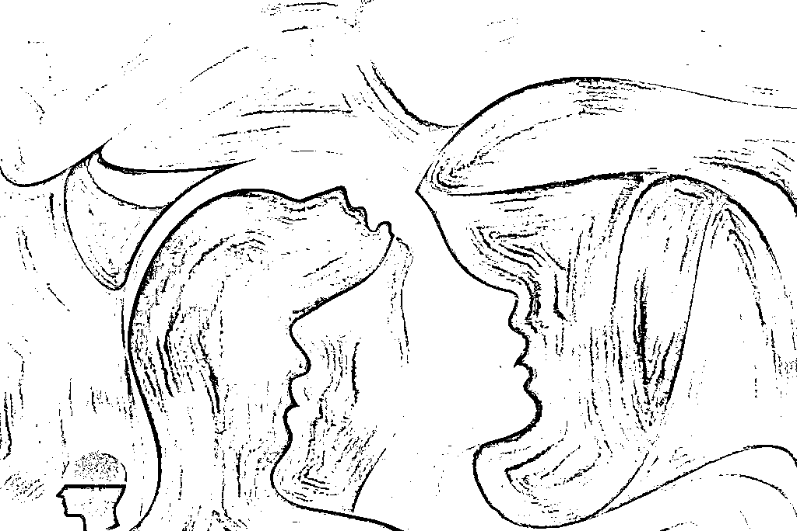

**木星的行进**

**木星进入双鱼座**

2022 年，木星轨迹会横跨两个星座。**2021 年 12 月 29 日，木星会先进入双鱼座，停留至 5 月 11 日；之后进入白羊座，再逆行；于 10 月 28 日重新回到双鱼座，并停留至 12 月 20 日，再次进入白羊座。****木星代表了扩张、风口、幸运的含义，双鱼座代表了神奇、包容、接纳、模糊、佛系的能量。**我们曾在 2021 年 5 月中旬到 7 月底期间，短暂体验到了木星进入双鱼座的神奇能量。在这短短的一个多月时间内，我的一位合伙人在抖音的粉丝量从 0 长到了 40W，作品播放量 1.8 亿。而当时木星停滞在双鱼座 1°附近，精准三分他星图中位于天蝎座 1°的中天，几乎一夜之间他在抖音全站皆知，在公司楼下吃碗猪脚饭还经常能被隔壁桌的粉丝认出来请求合影。他的抖音作品都是星座类的趣味问答形式，提问者是一位女孩，太阳落在双鱼座，整件事的始末极为巧合，几乎是无心插柳之举。当时的双鱼座木星还精准对分这兄弟的处女座太阳，就好像老天爷派了一位“小仙女”坐在他对面，“嘿哥们儿，我有几个问题想采访你一下，这是一个能火的机会”。作为十二星座队列的副班长，双鱼座的含义包罗万象、令人困惑，迷糊不清、若隐若现。

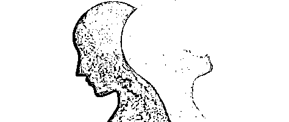

我一直想用简单明了的词来描绘这种能量，直到最近去了北京一座极负盛名的寺庙，发现菩萨面前的文字是“化去三千烦恼”，突然领会了双鱼座的一层精微的含义。前面十一个星座已经包含了太多的能量，作为黄道的最后一个星座，双鱼座的目的就是**化解这些能量，让所有的悲欢离合、爱恨情仇、功名利禄都如过眼云烟消散掉，也就是“空”。****把脑袋、身体、记忆都清空，很不容易，但很值得。**容器清空了才能够装新的东西，手机内存清空才能转载新的 APP 和照片，脑袋里的烦恼清空才能被疗愈。人类也经常为过去的经验所困，所以才需要菩萨来帮助“化去三千烦恼”。所谓求而不得，很可能是因为自己的身体和记忆装太满，老天爷想给也给不了啊。从这点来说，如果鱼真的只有七秒记忆，那真是天生的清空高手，庄子所说的“鱼之乐”似乎挺有道理。也难怪古典占星学中，木星在双鱼座“入庙”，因为**木星需要扩张，哪里最能让木星扩张呢？当然是“空”的地方。**双鱼座的各种关键词，**佛系、随缘、迷糊、疗愈、包容、接纳、想象、梦幻、逃避、隐蔽，也许归根到底就是一个“空”。**如果双鱼座的运作方式是“空”，那么明年木星进入双鱼座的时间段，老天就会把更多的机会“发放”给“空的地方”。于是更多人会被启发去“放空自己”，**打坐、冥想**当然是一种很赞的方法，**艺术、电影、疗愈也许也会有很大的市场。**对个人而言，**宫头星座是双鱼座的宫位，明年会有木星进入，也许尽快“清空”这一宫，就会在明年迎来更大机缘。**

同时，双鱼座与 12 宫是共轭关系，**当行进木星在双鱼座时，我们每个人的 12 宫都会产生共振，**无论 12 宫的宫头星座是什么，12 宫宫内星有什么，都可能会启动。

在社会层面，历史上的木星在双鱼座年份，当时社会热潮也颇为应景，也影响至今。

2010 年，乔布斯（太阳双鱼座）站在台上发布 Iphone4 的情景至今激励着很多创业者；1997 年末上映的《泰坦尼克号》至今还是诠释浪漫爱情的典范（现实生活中泰坦尼克号沉没的当天，月亮与凯龙星都落在双鱼座；1986 年上映的《西游记》已经是永恒的神话经典依旧在各大视频网站轮播。

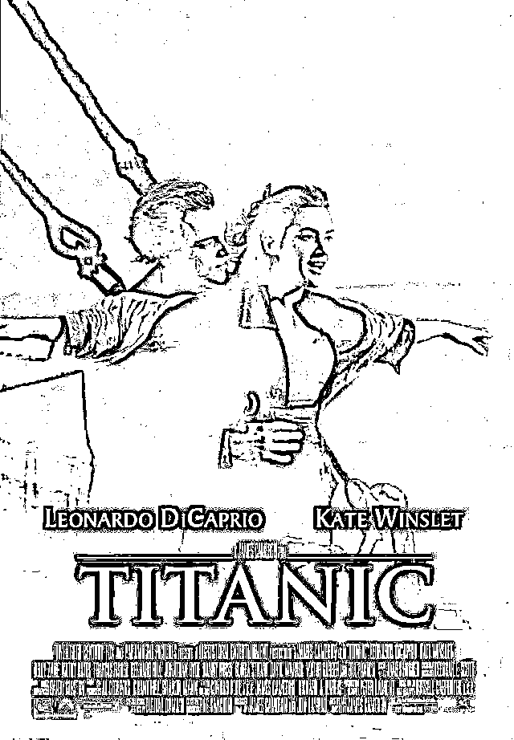

| 《泰坦尼克号》

相信 2022 年的光景里，无论在文化、科技、经济、商业中，都会充满着无穷的想象，填补我们不曾预见的空白。

**木星进入白羊座**

**2022 年 5 月 11 日-10 月 28 日，木星会在白羊座停留 5 个半月。**白羊座的能量非常直接，能简则简，绝不绕圈圈。白羊座作为火象星座+开创星座，就好比打火机的火，摩擦生热，一点就着；也好比足球队里的前锋线，临门一脚拿下就行，整不了花里胡哨的。“杠精”这个词似乎专门用来形容白羊座的能量。抖音上有位超百万粉丝的博主，给自己打的口号就是“世界抬杠冠军”，后来知道 TA 的上升星座在白羊座。

**当 5 月份木星来到白羊座后，全球层面的火爆的能量可能一触即发。**

比如 1999 年的北约对科索沃的轰炸，中国驻南联盟使馆也被导弹轰炸，人神共愤；2010 年-2011 年期间的利比亚、叙利亚、索马里、也门、苏丹的战火纷飞。**木星在白羊座的年份通常都会对应区域性的武装冲突。**

**除了武装冲突，商战也会全面爆发。**

比如，2010-2011 年木星在白羊座时，国内著名的外卖“百团大战”成为当年的焦点，现在的“美团”就是从当年的百团大战中走出来的，最终赢得了 60%的市场份额，恰好美团也是太阳在白羊座的公司。

1999 年-2000 年木星在白羊座时，香港 TVB 开播的《创世纪》也描绘了动人心魄的世纪商战。

同时，火爆能量还可能会在各个领域蔓延，比如在 1987 年春晚上，费翔因一曲《冬天里的一把火》而火遍大江南北，3 个月后，大兴安岭真的着了一场大火。

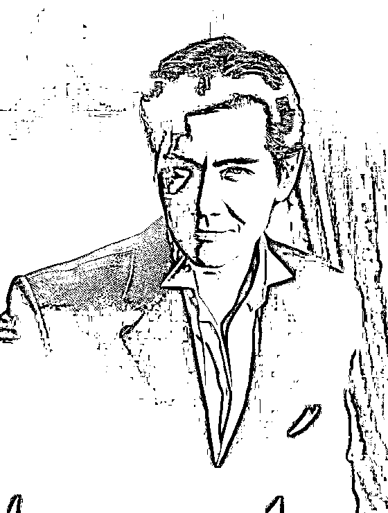

| 费翔以中国的国家星图为例，设置新中国成立时间为 1949 年 10 月 1 日，下午 3:01 于北京。那么中国国家星图的上升点在水瓶座 1°。**2022 年 1 月，行进木星在双鱼座会进入国家星图的 2 宫，2 宫对应的国家收入、财政、银行可能会在明年膨胀和扩张；5 月-10 月末，木星停留在中国的 3 宫，3 宫对应的交通运输、证券交易、商业贸易、宣传媒体、基础教育等领域可能也会有不同程度的扩张。**

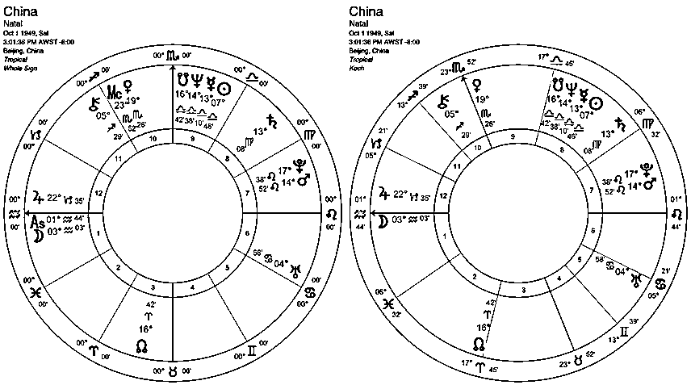

| 中国国家星图，左边整宫制，右边 KOCH 制如果以上证 A 股的星图为例，设置成立时间为 1990 年 12 月 19 日，上午 11:01（时间无法完全确认，但根据比对 A 股的特点、历史与创立星图、行进星图校准，相对准确），上证星图的上升星座是双鱼座。**2022 年木星进入双鱼座后，也会进入上证星图的一宫，木星进白羊座后，会进入上证星图的二宫，与此同时，土星在明年全年与星图中的任一星体和四轴都不发生托勒密相位。**根据比对过去 30 年的 A 股发展历史，如果木星进入 A 股星图的角宫（1、4、7、10 宫），而且土星不在角宫，并且土星没有对 A 股星图任何星体（特别是内行星和四轴）的行运，则**A 股就会有较大的涨幅。**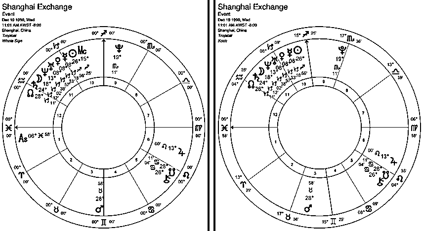
| 上证 A 股星图，左边整宫制，右边 KOCH 制对个人而言，**宫头星座是白羊座的宫位，5 月-10 月也会有木星进入，相关领域会吹响“战斗号角”。**同时，白羊座与一宫是共轭关系，当天象的木星在白羊座时，我们每个人的一宫产生共振，无论是你的一宫宫头星座是什么，一宫宫内星有什么，都可能会启动。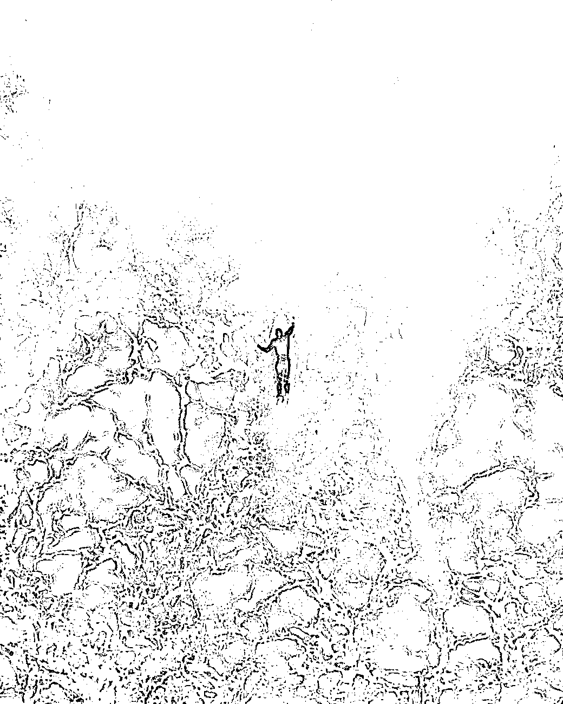**土星-天王星四分相****2021 年，土星-天王星四分是全年最重要的天象。****土星代表的垄断、特权和保守势力，天王星代表的变革、新贵和激进势力，两者在全年不断的冲突。****2021 年 12 月到 2022 年 1 月，两者会最后一次精准成相，为年度的冲突带来一个了断。**而在**2022 年 8 月到 12 月**，两者还会宽泛成相，可能意味着**冲突的余威会在这个时间范围内散布，然后才慢慢消散。**我们知道四分相有两种，渐盈四分相和渐亏相四分。**如果是渐盈四分相，会往对分相发展，意味着冲突的阶段性发展方向是土星-天王星形成势均力敌的态势。**但这次的土星-天王星形成的是渐亏四分相，它们会往合相方向发展，土星最终会往天王星靠拢。这也许意味着，**垄断、特权和保守势力，最终会逐渐消亡，并且与变革、新贵、激进势力逐渐合二为一。**

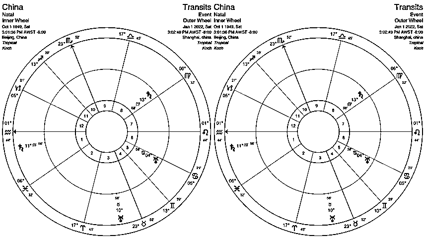

| 行进土星-天王星四分所落中国国家星图的宫位，左为整宫制，右为 K 制

对中国的国家星图而言，**行进土星和天王星分别落在国家星图的 1 宫和 4 宫**（1 宫和 4 宫是采用整宫制的情况下，如果采用 P 制或者 K 制则是 1 宫和 3 宫）。行进土星落在 1 宫的一种展现是，**国家正在被一些传统强国挤压生存空间，我们也正在遭遇前沿科技的垄断压力，比如芯片、半导体行业，“被迫”自主研发。****行进天王星在整宫 4 宫的一种表现是，对于共同富裕的改革目标，国家在房地产方面的改革。**当然，我们也可以对应分宫制下的 3 宫，展现为**今年在基础 K12 教育领域的重大变革，但核心还是与“共同富裕”的主题有关。**这组四分相在国内的表现有很多种，还表现为当科技巨头试图以互联网的方式垄断民生领域（比如买菜）时，遭遇了政策打压；互联网巨头本身的数据垄断，也被迫放开，等等。2022 年 1 月之后，这一波土天四分暂时告一段落，冲突也将阶段性趋于平稳。

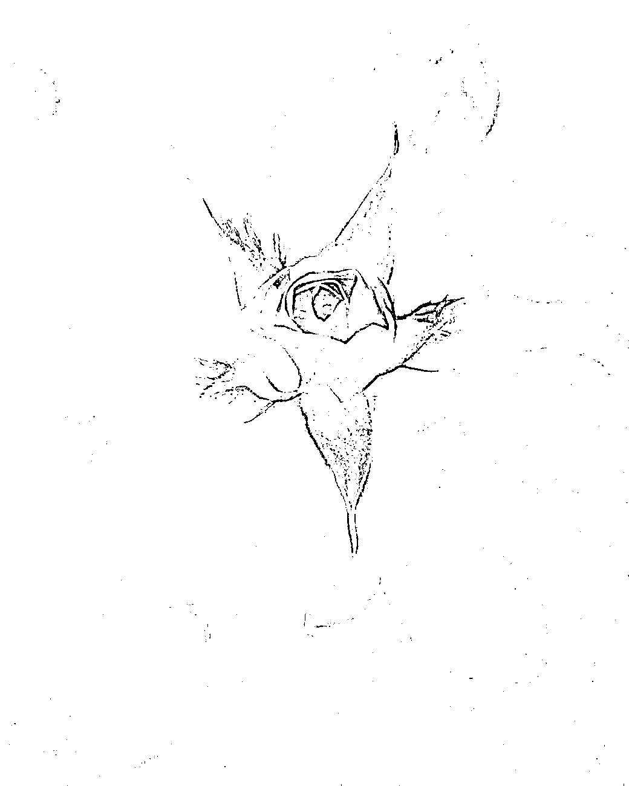

**木星-海王星合相双鱼座****2022 年 3 月到 5 月期间，木星与海王星将在双鱼座 23°附近合相，精准成相于 4 月 12 日（北京时间）。这将是 2022 全年最重要的天象，没有之一。****木星代表了社会的扩张、风口、幸运的力量，海王星代表集体的潜意识、想象、梦境、愿景、消融边界、疗愈、孵化、融合、隐藏的力量。**两种力量形成合力在双鱼座，也许**明年的 3-5 月会有巨大的愿景、疗愈、想象力诞生，当然也可能是泡沫。****电影、梦境、神话、艺术、数学、佛学、医疗、疗愈、心理学、催眠、慈善、虚拟现实、云端应用、等等领域，也许明年会成为年度主题。**当然，木海合相双鱼座也可能会对应**极端天气，特别是与洋流、大海、洪水、迷雾有关。**上一次木星海王星合相在双鱼座，还要追溯到 1856 年，那一年，心理学家西格蒙德·弗洛伊德出生，后来他出版的《梦的解析》开创了精神分析心理学。很多人了解到的第一位心理学家就是他。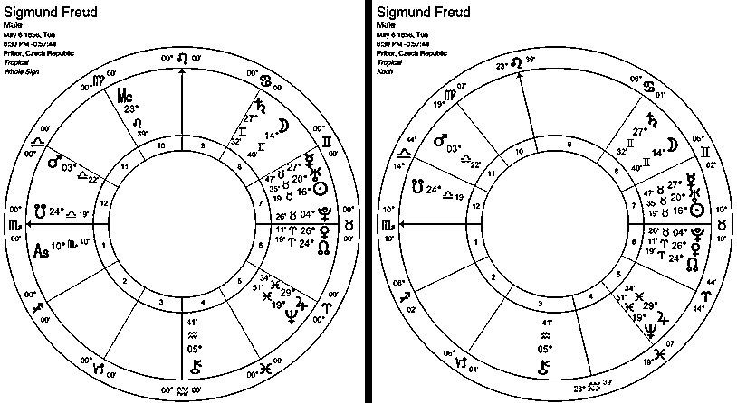| 弗洛伊德的出生星图，左边是整宫制，右边是 K 制 2022 年 4 月 12 日，木星与海王星精准合相的时间是北京时间 22:42，如果我们以这个时间点为准，描绘全球所有木星与海王星同时合相四轴的地点，并且串起来，就得到了木海合相 ACG，对应着**木海合相的全球能量地图。**这张地图可能会预示着**全球哪些区域受到木星-海王星合相力量最强。**如下图所示：**·** 穿越**中国**的那根线是**木海合相下中天（IC）线**，代表**届时，木海的影响力会自下而上，比如从下层民众开始影响到上层政府；****·** 穿越**美国**的那根线是**木海合相中天（MC）线**，代表**木海的影响力会自上而下，从政府开始影响到民众生活；****·** 穿越**太平洋**的那根线是**木海合相上升线**，代表木海的影响力从这里开始显化，也许**2022 年的太平洋环流会有很大的不同；****·** 穿越**欧洲和非洲**的那根线是**木海合相下降线**，代表**木海的影响力从地表转到地下。**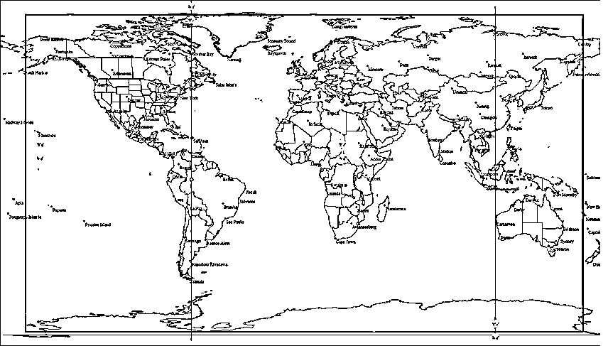

| 2022 年 4 月 12 日木海合相的 ACG 图

过去几年，疫情已经完全改变了世界，我们经历了土冥合相、木冥合相、木土合相、土天四分带来的激烈变化和创伤，也许**明年是时候接受疗愈了，把过去两年的集体经验共同消解。**

**南北交点换座****1 月 19 日，月亮真实交点从射手座-双子座轴线换到天蝎座-金牛座轴线，并持续到 2023 年 7 月。**这是一条**从“欲望”走向“平凡”**的道路，**从天生爱折腾，要死要活的“拼搏之路”，到后来折腾累了转而开始想要“稳稳的幸福”。**明年开始，社会人群可能会分为**“折腾派”和“安逸派”**两大群体。就像多年以前，流传着一句话：“铁皮汽车包裹的只是肉身，而摩托车承载的却是灵魂。”明年开始，可能人们会开始琢磨**如何既能保持“肉身”，又能滋养“灵魂”。****当行进月亮南北交点回到出生星图的月亮南北交点时，这会是一段灵魂回归、重新出发的阶段。**对所有以下时间段出生的人群而言，明年就会是这样一个的年份：**· 1966 年 2 月-1967 年 8 月；****· 1984 年 9 月到 1986 年 4 月；****· 2003 年 4 月到 2004 年 12 月。****这也将是一段新的“努力拼搏”，最终走向“稳稳幸福”的旅途，也会是寻找到灵魂归宿的年份。**

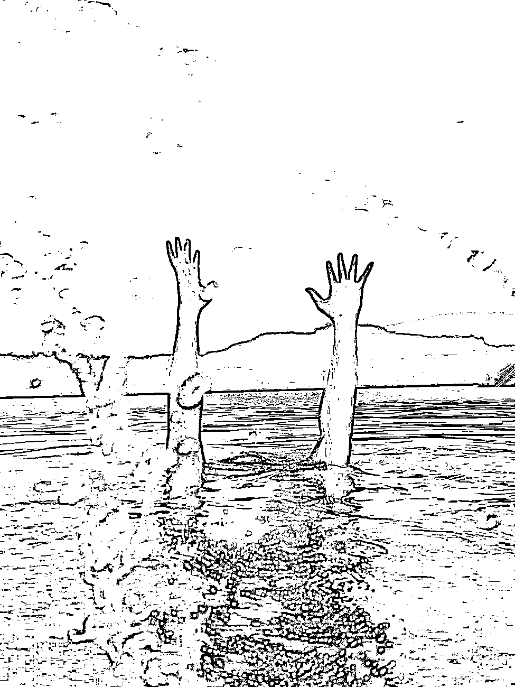

**12 上升星座的个人成长展望**最后，再一起展望 2022 年的个人成长，主要的占星学依据就是**行进木星、土星和火星明年进入的个人宫位。**之所以还加上火星，是因为从 2022 年 8 月 20 日开始，火星进入双子座，随后在 10 月 30 日火星将在双子座逆行，2023 年 1 月 13 日再重新顺行，直到 2023 年 3 月份才离开双子座。火星将在一个星座停留 7 个月时间，影响较大。根据这些天象的指引，特意为十二上升星座设计了一份“**2022 年度成长趋势展望**”（如果看不清图片可点击大图查看哦）。

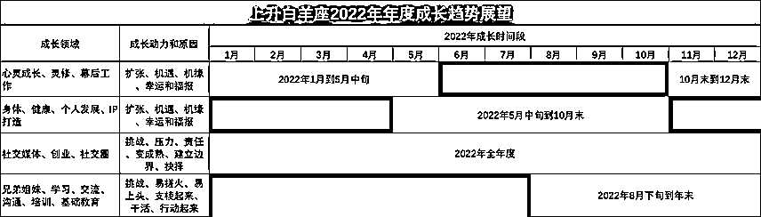

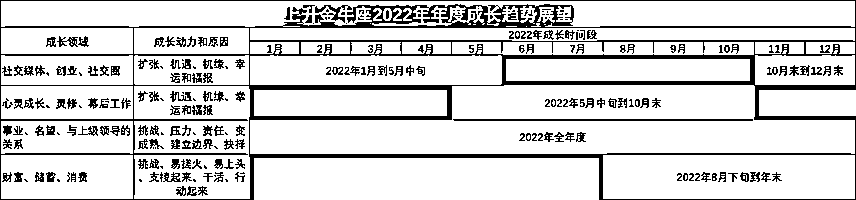

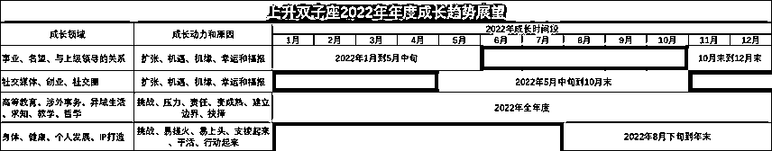

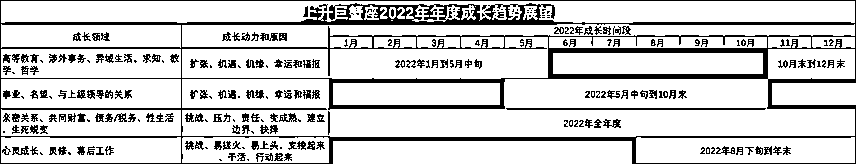

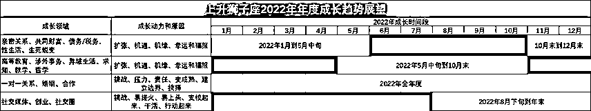

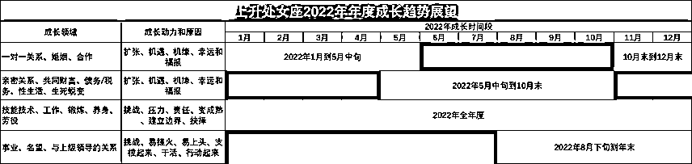

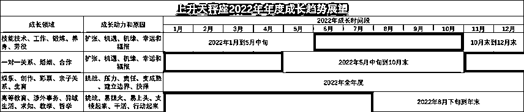

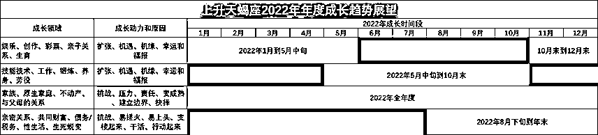

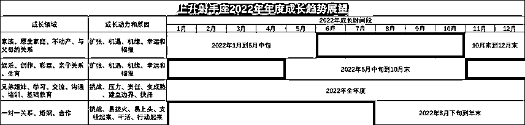

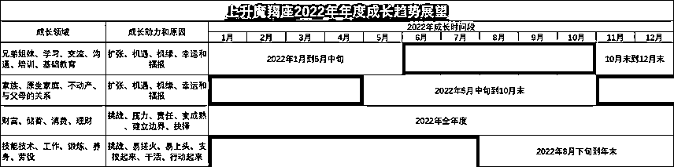

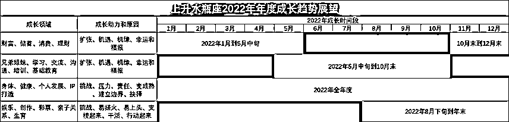

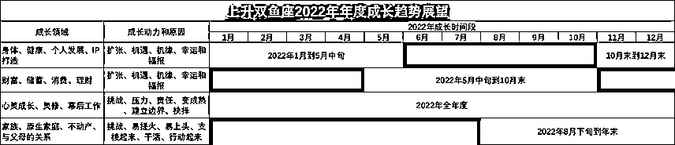

版权声明：原创文章由作者授权首发于若道平台，欢迎转发，反对抄袭。友号转载请申请白名单。

**查理**

ISAR 认证占星师（2017 年获得），全职占星师

若道 2016 届核心课程学员，5 年企业占星研究和咨询经验

13 年企业管理咨询从业经验，上海交通大学物理与天文学院毕业

**咨询微信：**qinglee821

**微信公众号**：suoyingmk

长按打赏

**2022 年要来了**

**还不快领取你的****专属年运报告****？**

**购买有优惠，点击图片查看详情哦~**

**学习占星学****点击下图了解课程详情** 

********************************

**微信又双叒叕改版啦，不想错过若道君的推送？**
**就把若道设为星标吧！****▼**

**喜欢记得点一下在看哦☟**

**报名直达入口**

# 春节前的上证怎么走？| 2022 年 1 月上证指数+黄金周期报告上线！

> 原文：[`mp.weixin.qq.com/s?__biz=MzA5NjA0NTAxNg==&mid=2651465265&idx=2&sn=1300c8aed59d3bdb14e583ce2ebce910&chksm=8b489486bc3f1d90e5768681cf881cb431e76a64e5be3b65cd99631ba7d275d79af0adf9803d&scene=126&sessionid=1692737872#rd`](http://mp.weixin.qq.com/s?__biz=MzA5NjA0NTAxNg==&mid=2651465265&idx=2&sn=1300c8aed59d3bdb14e583ce2ebce910&chksm=8b489486bc3f1d90e5768681cf881cb431e76a64e5be3b65cd99631ba7d275d79af0adf9803d&scene=126&sessionid=1692737872#rd)

2021 年的最后一天，上证拉出一根阳线。

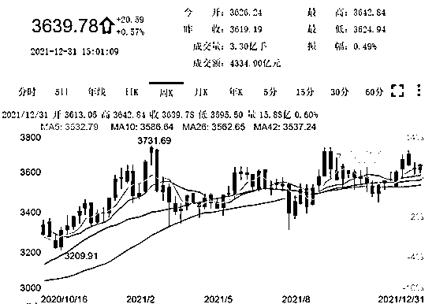

| 上证指数周 K 线

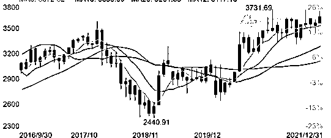

| 上证指数月 K 线

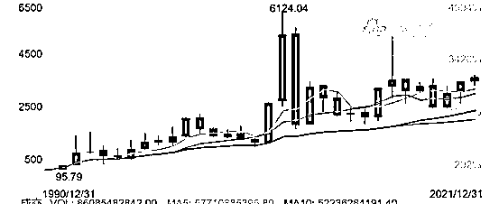

| 上证指数年 K 线

纵观 2021 年，上证综指全年是一根小阳线，涨 4.75%。在货币发行泛滥的 2021 年，上证综指和世界很多国家的指数相比，增长是比较低的，和我们的经济增长与其他国家的经济增长相比， 截然不同。这也反映了我们**比较好地控制了泡沫。****因为上证存在一个周期范围在“27-40”月的 33 月的中周期。**在梅里曼老师过去的报告中，他提到：**“上证综指要么处于 2019 年 1 月 4 日长周期低点以来的第一个 33 个月周期，要么处于 2021 年 7 月 28 日低点以来的第二个 33 个月周期的早期阶段。”****·** 如果是第一种情况，2022 年 1 月将是这个周期范围在“27-40”月的 33 月周期的第 36 个月，如果是第二种情况，2022 年 1 月将是 33 月周期的第 6 个月；

**· **如果是第一种情况，上证指数处于下跌风险之中；如果是第二种情况，则可能处于向上突破之中。

**春节前的 3 个重要占星指标是天王星逆行（1 月 18 日），满月时太阳合相冥王星，水星逆行（1 月 14 日）。**

2022 年 1 月应该如何操作，金融占星大师雷蒙德·梅里曼的《2022 年 1 月上证指数报告》已上线，你可以听听梅里曼老师的看法。

**1 月上证报告上线**

上证指数月度报告价格**单月报告**：280 元 **3 个月套餐价**：780 元（260 元/月）**12 个月套餐价**：2400 元（200 元/月） 

**长按下图识别二维码购买上证指数报告**

▼

“**黄金是金钱。其他的只是信贷。**

**——约翰·皮尔庞特·摩根**

”2021 年底，最重要的两个地球宇宙学征象是**12 月 19 日**金星逆行，以及**12 月 24 日**土星和天王星第三次，也是最后一次形成精准的渐亏四分相。**此次金星逆行尤其重要，因为它合相冥王星。****12 月 11 日和 25 日，金星与冥王星在摩羯座精准合相。**金星逆行（12 月 18 日-1 月 29 日）通常对应中央银行改变政策，导致货币市场和国债市场产生巨大波动，从而直接影响股票和贵金属的价格变动。**由于此次金星逆行还合相冥王星，而冥王星也与货币市场相关，这就好像双倍剂量的地球宇宙学能量，引发这些市场的重大波动。**

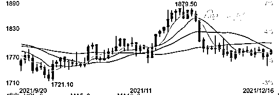

| 黄金走势日 K 线图

黄金在火星进入天蝎座后有一轮反弹，然后下跌，此时正处于基本周期波谷的时间段，**波谷将在接下来 4 周内出现。**黄金在上涨时未能到达 1920，这是一个有些令人担忧的指征。

**黄金正处于长周期非常关键的节点。**从 2015 年 12 月开始，它处于 23.5 年周期的第三个 7.83 年周期阶段。我们目前还是无法确认 31.33 个月周期的波峰是否已经出现。**黄金还有可能走得更高吗？**

黄金报告已经上线。欢迎了解。也可以按照季度和 1 年期订阅，有更多优惠。季度和年度的好处是，你可以持续了解梅里曼老师对于不断在变化的市场的看法。

即便他某一次看法和市场不一致，你也看到在下一期他如何调整自己的看法，并看到金融占星在一个长期时间段内对你把控风险的帮助。而能够长期控制风险、尽量找到安全的投资时机才是投资的长久之计。

点击阅读原文，雷蒙德·梅里曼黄金周期 2022 年 1 月报告带来有 40 年黄金市场研究经验的世界著名金融占星大师雷蒙德·梅里曼对当前黄金市场的研究。

**雷蒙德·梅里曼《2022 年金融年度预报和沙龙》开始预售，和《2022 年四位占星大师天象预测》课程一起购买，可享受连报优惠。**

**投资有收益，投资有风险，希望金融占星学的研究帮助你更好地评估你的投资。**

**长按下图了解详情**

▼

**2022 年 1 月黄金报告上线**

**黄金月度报告价格****单月报告**：280 元/月 **季度套餐价格**：780 元（260 元/月）**年度套餐价格**：2400 元（200 元/月）**双报告年度套餐更优惠（直降 900 元）****12 个月黄金报告+12 个月上证指数报告：仅需 3900 元****长按下图识别二维码购买黄金报告**
▼

**购买者需知**

**① **梅里曼市场时机学院《中国上证指数月度研究报告》是梅里曼市场时机学院（以下简称 MMA）的研究“预报”，而不是市场“预测”，是梅里曼老师及 MMA 金融占星分析师对人类活动周期历史与行星周期之间相关性的研究，二者在大部分情况下具有 80%或更高的相关性，而不是因果关系。报告中的研究完全存在错误的可能性。即便是非常认真的研究和几十年的研究经验，金融占星师无法总是正确地解读出各种征象在实际层面上会如何相互作用，并显化为事件结果。

所以请将报告看作一个研究参考，务必结合其他市场研究和你个人对市场的理解，根据你的自由意志做决策。

**②** 此报告一旦售出，**即不接受退款。**

**③** 上证、黄金月度报告每月固定 1 期，**并非都是在每月相同日期发布。**

**④** **我们收到英文报告的当天，即发布该英文报告。3 天后，上线报告中文版。此报告仅支持手机网页阅读，不支持电脑阅读和下载。****以上须知，请仔细阅读。一旦付款，即视为已了解并接受所有须知内容。**在过去的 40 年中，唯有梅里曼逐渐完善，并在梅里曼市场时机学院月度周期报告中阐释了将地球宇宙学与周期相结合的研究方法，以惊人的精确性预报了黄金价格发生重大变化的时间。**黄金购买 Tip**

各大银行均可购买黄金或黄金 EFT 基金，也可以在诸如天天基金或者支付宝购买黄金及黄金相关产品。不明白的可以百度搜索。

**购买后如何查看报告？**

**购买后有疑问怎么办？**请联系技术客服
**微信：nodoor201705**

**购买黄金+上证报告直达入口**

# 若道节气 | 小寒，未见梢头春

> 原文：[`mp.weixin.qq.com/s?__biz=MzA5NjA0NTAxNg==&mid=2651465265&idx=3&sn=97837e2a2e72d3856ff59aa696486acd&chksm=8b489486bc3f1d907067491320ba840de2e255a21aac2f5a240630c38903f3b9223e6b044807&scene=126&sessionid=1692737872#rd`](http://mp.weixin.qq.com/s?__biz=MzA5NjA0NTAxNg==&mid=2651465265&idx=3&sn=97837e2a2e72d3856ff59aa696486acd&chksm=8b489486bc3f1d907067491320ba840de2e255a21aac2f5a240630c38903f3b9223e6b044807&scene=126&sessionid=1692737872#rd)

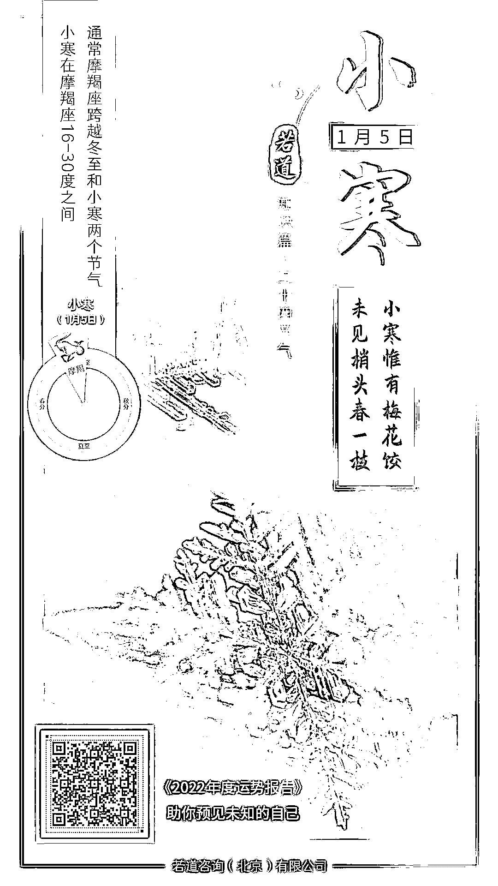

# “新的一年，怎样脱单呢？” | 12 金星星座全攻略，带你找到对的人

> 原文：[`mp.weixin.qq.com/s?__biz=MzA5NjA0NTAxNg==&mid=2651465158&idx=1&sn=8ef9f72a92f4f01e7a272a15e7257e0a&chksm=8b489771bc3f1e673bd28f96cc9a99b1f2ea79327b71b337ae190a162871c7df8233e6a75c05&scene=126&sessionid=1692737872#rd`](http://mp.weixin.qq.com/s?__biz=MzA5NjA0NTAxNg==&mid=2651465158&idx=1&sn=8ef9f72a92f4f01e7a272a15e7257e0a&chksm=8b489771bc3f1e673bd28f96cc9a99b1f2ea79327b71b337ae190a162871c7df8233e6a75c05&scene=126&sessionid=1692737872#rd)

******************☆ 后台回复“今日”，给你一句生命态度******************

作者/HIROKI NIIZATO（新里弘树）编辑/玫瑰 图片/pexels 金星守护着天秤座。在关系中互动的时候，星图中的金星会显得尤为重要。金星落在不同的星座会有怎样不同的互动方法？了解自己和对方的金星对于社交和恋爱都会有事半功倍的效果。**金星的星座和相位所揭示的**当两个或两个以上的人在任何关系中互动时，常常存在某种相互都感兴趣的东西（称为**社会客体**）：例如，如果你们一起参加占星研讨班，占星就成为了这个“社会客体”。简单来说，社会客体是一种**“共享设备”**，让人们之间的对话得以发生。 占星学上来说，金星的星座和相位可以揭示我们如何使用社会客体来互动；换言之，我们如何和他人分享体会。虽然我们必须考虑到其他行星配置的修正影响（尤其是内行星和上升点），但在此我们只讨论金星在不同星座的原型。

**金星落火象星座**

***也许还有金星和太阳或木星形成相位***社会客体可以被用来表达自我，以此激发互动的能量，并带来对自我的关注——会表现为**幽默、强烈的观点、灵感和热情**（都容易在谈话中通过笑声或兴奋点产生更多动能）。***1.*** 金星落**白羊座**时，我们注意到此处表现为检验个人魅力的风情。我们发觉一个人的**个性**比社会客体更迷人（实际上，谈论个性往往会成为社会客体）。**代表人物**：玛丽莲·梦露、乔治·克鲁尼、凯拉·奈特利。

******2. ******金星落**狮子座**时有关社会客体的**创造性**或**幽默**的自我表达（你不仅仅讲故事，而且是用你的方式去讲）能引发别人的喜爱和掌声。**代表人物**：惠特尼·休斯顿、菲尔·麦格劳博士和作家欧·亨利。 

*********3. *********金星落**射手座**可能需要教授你关于社会客体的**知识**或坚持自己的**观点**（“这是我知道的/我认为的”）。**代表人物**：约翰尼·卡森、简·方达、查尔斯·舒尔茨、罗伯特·汉德。

**金星落土象星座**

***或金星和落在土象星座的水星（金牛座、处女座、摩羯座）或土星形成相位***社会客体常常是用来**享受、工作或使用的事物**。各星座在表现这个明显的实用导向时略有差异：***1.***金星落**金牛座**可以仅仅为了带来**感官愉悦**的社会客体而感到高兴；**欢愉、享受和释放压力**可能是更喜欢的社交模式。**美食、艺术或音乐佳作**、给予或接受**按摩**——你们一起享受此类经验只是因为乐在其中。**代表人物**：汤米·希尔费格、谢尔盖·拉赫曼尼诺夫、萨尔瓦多·达利。

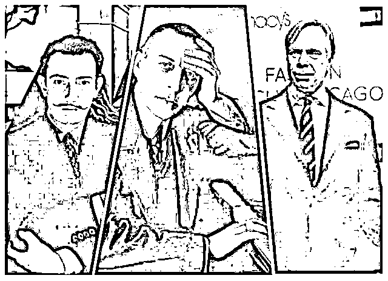

******2.******金星落**处女座**可能会通过**批判**和行动来**分析和改进**社会客体（“有更好的方法来做这件事——让我们来看看是否能解决它”）。在更世俗的层面上，**家庭杂事或项目**（例如重建等）可能成为社会客体（它既有成效又有社会性）。**代表人物**：伯尼．西格尔博士、约翰·凯奇、歌德。

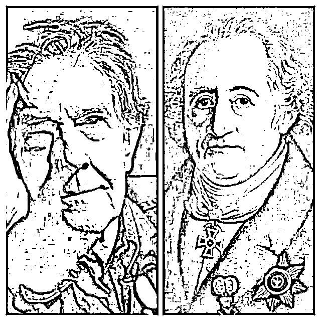

*********3.*********金星落**摩羯座**——社会客体常常可能和个人所有的**实际目标**有关；互动的用处或许比联结本身更重要。**代表人物**：巴顿将军、斯蒂夫·乔布斯（常被描述成员工的奴隶监工）、沃特·迪斯尼（据称非常冷漠、孤僻）。

**金星落风象星座**

***或金星和落在风象星座的水星（双子座、天秤座、水瓶座）或天王星成相位***天生喜欢**传达、探讨和理性研究**某一社会客体。不同于土象星座的金星，它可能自身就喜欢**有趣的对话**。 也许此金星具有的对人和事物天然的**好奇心**将让他们接触更多信息，从而知晓更多社会客体（例如你们可以聊聊各种不同的事物），产生更多关系（例如大受欢迎）等等。

***1. ***金星落**双子座**可能带着**好奇心、才华和机智**来处理社会客体。

**代表人物**：纪录片制作人肯•伯恩斯、演员比尔·考斯比和诗人加里·斯奈德。

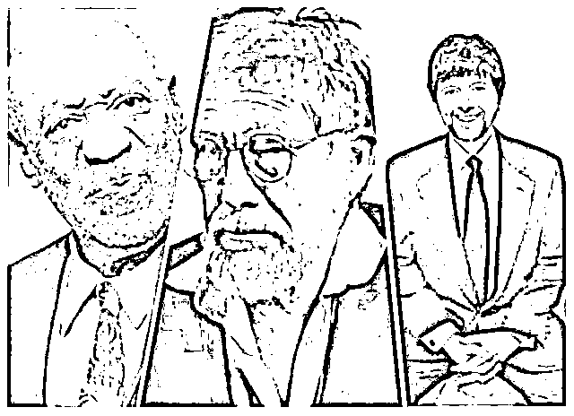

******2. ******金星落**天秤座**可能意味着**愉快、优雅、体贴**地谈论社会客体。它可能格外擅长创造**美和对称结构**（史蒂芬·阿若优指出这个位置可能对应着身体的美，虽然是**冷静**的那种）。**代表人物**：休·格兰特、查尔斯王子、艾略特。

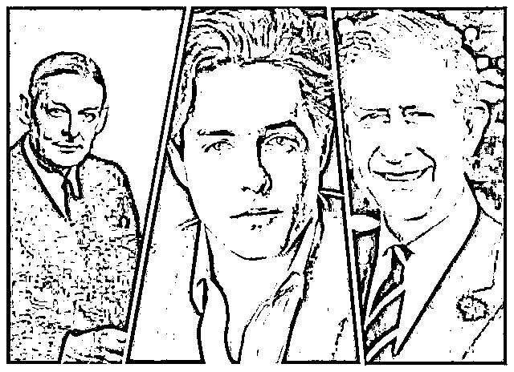

*********3. *********金星落**水瓶座**可能想要去和更多人来**分享**社会客体，也许寻求**创新**，或是想要尽可能对他人有益。**代表人物**：奥普拉·温弗瑞、詹姆斯·乔伊斯、米尔顿·艾瑞克森。

**金星落水象星座**

***或金星和月亮、冥王星或海王星形成相位***可能需要在情感上感受到交流带来的**滋养**，所以它可能会试图与他人分享或寻求社会客体相关的情感反馈。我们自然期望对共同话题出现深刻的情感反应。***1. ***金星落**巨蟹座**：可以想象此配置会有**滋养**的行为。对社会客体（共享的经验）的情绪可能成为聊天主题（“电影让你感觉怎么样？”）。它可能对自己的感情比较谨慎，除非是在非常亲密的关系中，但还是会喜欢听到别人的感情。**代表人物**：“内在小孩”治疗师约翰·布雷萧、卡尔·荣格。

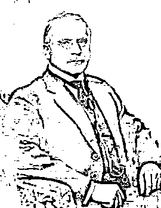

******2. ******金星落**天蝎座**常常和**深度、激情**相关（源于性或宗教激情的极致体验），有时候也和性吸引力有关。在选择的社会客体时，会表现出深层动机和深度参与。**代表人物**：比利·格雷厄姆、奥齐·奥斯本、玛丽·居里、查理·卢西安诺、安妮·莱斯（创作了《夜访吸血鬼》，后期开始写作宗教主题书籍——两者都很符合天蝎座。）

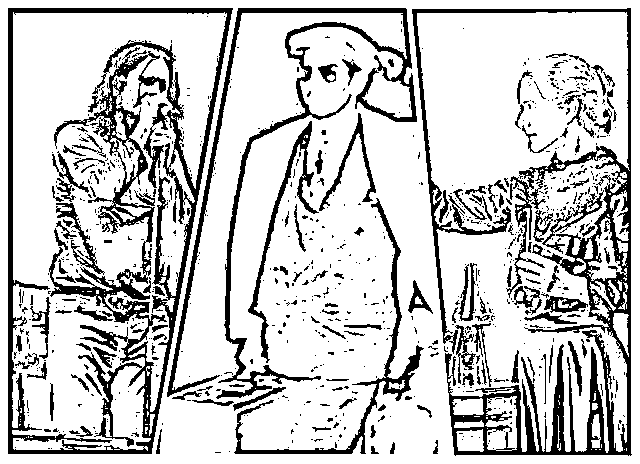

*********3. *********金星落**双鱼座**可能与社会客体进行**温柔而敏感**的互动。社会客体可能是一种载体，用以激发一个人的幻想、创造性想象或是灵性的观点和理想。**代表人物**：德鲁·巴里摩尔、比莉·哈乐黛、维克多·雨果、莎莉·麦克琳。

再次强调，我认为**太阳、月亮、水星和上升点**的修正影响也很大；你们可以根据出生图中的侧重点，在此处描述的各个不同星座中找到和你的社交风格。虽然金星和社交的原型象征，但是我们整个人都参与了互动，所以这再正常不过了。**把金星的落座和宫位结合起来看**每个行星原型都代表着一条成长之路。作为爱与美的女神，金星维纳斯通过与我们内心和对美的感受有关的事情为我们设定道路。 **金星的星座描绘出我们如何最佳地体验与他人的情感关系，它所落的宫位预示着，为了发展我们爱的能力，我们需要专注于哪些领域**。这里，我们会将用几个关键主题来归纳这些衡量方式。

**更好的自我接纳**

出生星图中金星落在**火象星座**（白羊座、狮子座、射手座）的人需要感受到自己**被接纳、被爱、被尊重**。然而为了赢得他人的爱与尊重，他们首先需要给予自己爱与接纳。与此类似，金星落在**第 1 宫**也需要努力爱自己。这种情况下，通常会有一种负面的自我形象阻碍他们获得他人的爱——所以首先必须通过**培养自我接纳和积极的自我对话**来抹去这种形象。我们有多么接纳自己、爱自己，我们就能够多么慷慨地与他人分享这种爱与接纳。

**情感疗愈**

出生星图中金星落在**水象星座**（巨蟹座、天蝎座、双鱼座）的人需要**与自己的脆弱安然相处，这样他们就能避免筑起心墙，或是在面对关系时太过害羞**。任何过去的伤害都需要被疗愈，这样他们才不会把当下的关系搞糟。金星落在**第 4 宫**需要深入地接纳自己的根。可能有**与父母亲相关的痛苦回忆**，让他们对自己的家庭感到**内疚或者羞耻**。通过**努力整合情感**，我们敞开心扉，与他人建立更亲密的关系。我们能够疗愈过往的伤痛，不再深陷其中。

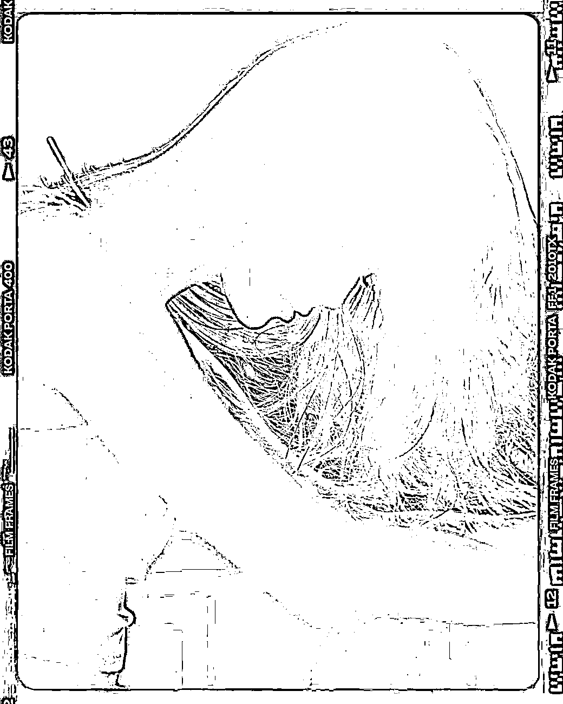

**表达赞赏**

出生星图中金星落在**风象星座**（双子座、天秤座、水瓶座）的人尤其需要**获得他人的赞赏**。然而为了获得赞赏，他们首先需要学会**表达赞赏**。这意味着更能赏识他人的兴趣、有用之才或特别之处，**养成赞赏他人贡献的习惯**。金星落在**第 7 宫或第 11 宫**的人也与此类似，他们需要学着**支持自己的伙伴和朋友，然后才能体验到互相欣赏**。培养赞赏他人的习惯会吸引到相同的回应，还会将负面、苛责的思考转化为积极、富于启迪的思考。

**实际贡献**

出生星图中金星落在**土象星座**（金牛座、处女座、摩羯座）的人尤为重视**实际的贡献**，而不是温暖的情感和深情的词藻。 不论是担负家中的财政支柱，还是修理家里的物件，或是帮助他人保持条理，**他们的贡献需要看到具体的结果才会满意**。 金星落在**第 2 宫、第 6 宫或第 10 宫**的人或多或少都需要切实地感受到他们自己的贡献。对他们来说，他们会用**财富成就**作为评估自己社会贡献的指标之一。通过**以实际的方式帮助伙伴**，我们学会用默默的努力和日复一日的贡献去表达爱。不论是通过更好的自我接纳、情感疗愈还是赞赏或贡献，我们都通过自己出生星图中金星位置预示的方式发展了我们爱的能力。我们无法取悦每一个人，只要我们继续这条心的旅程，就会有足够多“对的人”走入我们的生活，这样我们总会有可爱之人。

**版权声明：**本文由若道翻译发布，欢迎转发，反对抄袭。友号转载请申请白名单。

**HIROKI NIIZATO(新里弘树)**

美国职业占星师，诺·泰尔门下的高材生

从 2001 年开始从事职业占星咨询

**2022 年来了**

**还不快领取你的****专属年运报告****？**

**购买有优惠，点击图片查看详情哦~**

**学习占星学****点击下图了解课程详情** 

********************************

**微信又双叒叕改版啦，不想错过若道君的推送？**
**就把若道设为星标吧！****▼**

**喜欢记得点一下在看哦☟**

**报名直达入口**

# 10 个了解梦的小妙招，你都知道吗？

> 原文：[`mp.weixin.qq.com/s?__biz=MzA5NjA0NTAxNg==&mid=2651465158&idx=2&sn=37dd646a40bc171ddcc9c3109881fb5f&chksm=8b489771bc3f1e67e895581b0038d7084b9137d2ed5c07662a5967d5caa68e287ec059f91a31&scene=126&sessionid=1692737872#rd`](http://mp.weixin.qq.com/s?__biz=MzA5NjA0NTAxNg==&mid=2651465158&idx=2&sn=37dd646a40bc171ddcc9c3109881fb5f&chksm=8b489771bc3f1e67e895581b0038d7084b9137d2ed5c07662a5967d5caa68e287ec059f91a31&scene=126&sessionid=1692737872#rd)

作者/特蕾西·麦克斯

译者/江艺 校对/Arrow

编辑/翀子 图片/网络

对于梦，我们需要了解哪些要素呢？这里有 10 个小贴士供大家参考。有意思的是，梦境可以很好的与占星学相结合，而梦境的发展和进阶也和月相有着很大的关联呢。一起来看看吧。PS：若道君小安利，现在有个超棒的[【释梦占星大师工作坊】](http://mp.weixin.qq.com/s?__biz=MjM5MjQwNjAyMQ==&mid=2649439075&idx=1&sn=c88e649fdf1d72cb7662f9a89327003a&chksm=beb9540989cedd1f6403c7b5d3514f256068a60aab1f827445a94ab1bceba4edfcb66eb21363&scene=21#wechat_redirect)，点击了解详情哦。**梦境的 10 个要素**

**1**

**梦境体验非常重要**。

多次重演你的梦境。大声说出来；与他人分享。回忆每一个细节。你对梦境的体验越深刻，联结无意识和意识的通道就会打开得越充分。

**2**

**寻找梦中的情感释放（emotional charge）**。

梦的哪个部分最生动？最强烈的感受发生在什么地方？哪些影像最难以忘怀？**在梦中，行动常常代表感受；动作等同于情感**。大声说出你的梦可以释放情感和联想，这是你在其他时候难以企及的。

**3**

**自由联想梦中的象征和人物**。

探索你个人的象征体系。虽然一些梦境符号具有普遍的含义，但你梦中的大多数人和事物也很可能具有个人的含义。

**过去的经历，态度，前一天的经历，期待发生的经历等等，都可能与你的梦有关**。问问你自己，这个象征或人物的本质是什么？如果你梦见你生命中的某个人，不要立刻认定你的梦是关于那个人的。

**问问你自己：那个人的品质是什么？**比如，如果你对梦中某人的描述是：“狡猾、工于心计、不值得信任”，那么这个梦对你目前的行为有怎样的反映？

**4**

**认同你梦中的一切**。

**你就是你梦中的所有部分。**除你的梦境自我（你在梦中认同的人物角色）以外的人物，或与其相对立的人物也是你的一部分，但可能是你否认或投射出去的部分。

**你也可能将一种经历的某个侧面分裂成两个或多个符号象征**。

比如，你的丈夫善良但控制欲强，你对他的矛盾情感可能通过梦中你和一个善良的人以及一个爱控制的人的关系来展现。——他也代表你自己内心中善良但爱控制的部分。

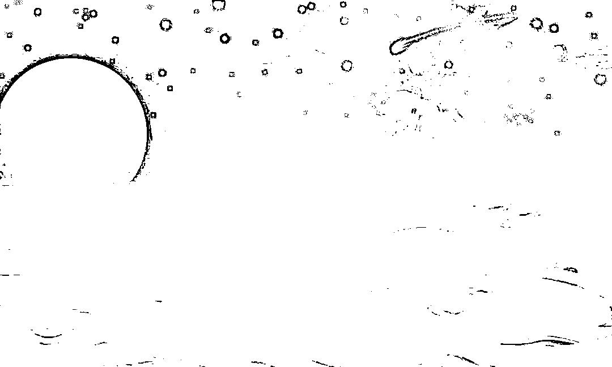

**5**

**思考你的梦境自我讲述了怎样的自我认同、态度和行为**。

你的梦境自我有多么积极或被动？多么自信、有能力或强大？多么安全、恐惧或无能？他/她在多大程度上是一个受害者？他/她在多大程度上做出明智的选择？他看起来有多大年龄？

**（较年轻的自我可能反映了当你的梦境自我经历的冲突刚刚产生时的自我。）**

你的梦境自我是否注意到这个梦的主要情节，包括这个情节的次要部分，或中心舞台？你的梦境自我在多大程度上独立于其他人物，与他们对立，或受到他们支持？他/她正在经历怎样的改变？你的梦境自我和清醒自我有多相似？

**6**

**思考你的梦境反映了怎样的情感冲突**。

你创造了梦中的障碍和冲突。你的意识可能通过制造痛苦或惩罚，用难以接受的感受、态度和行为来惩罚你。

**自我与身份(与欲望和冲动的斗争)，自我与超我（与意识的斗争），以及自我与世界（与外部障碍的斗争）的冲突通过你梦中的情节显现出来**。

你所拒绝的自己的某些部分可能出现在你的梦中，显现为威胁你梦境自我的敌人。

**7**

**当你联想梦境，开始解读它时，请聆听你的感受。追求“恍然大悟”的体验**。

**只有你知道自己梦境的含义。**当你对一种特殊的联想或含义产生了一种本能的反应时，相信它。随着时间的进程，你会与内在的共振调和一致，帮助你辨识梦境对你的意义。

**8**

**一个梦是多维度的；它有许多的含义。在解读你的梦境时，不要太早做出定论。保持开放的思想**。

当你发现了一两个联想，或将它与你生活中的某个单独事件联系起来时，不要认为你已经穷尽了这个梦境的意义。梦的语言是浓缩的；一个词或一个影像可能有多重含义。双关非常普遍。

举个例子

比如，美术课上，一个梦境人物还在捏泥土，一个朋友已经完成了她的雕塑。这个做梦者很孤独，需要陪伴；她通过学习美术（关注克利的作品）来逃避孤独；她曾经和一个叫克莱的人有过密切关系。

由于这个梦，她意识到对她朋友的竞争意识，以及她过去未发现的自己的竞争意识，其根源在于她与母亲（一位职业艺术家）的关系。

（这位女士金星落在 12 宫的摩羯座，四分落在天秤座的土星。）

再来看看科瑞恩梦中的一个片段。在科瑞恩的一个梦中，一个女人拿出一块新鲜出炉的烤面包并对她说：“只有准备好结婚的人才能吃这块面包。”科瑞恩的梦境自我回答说：“我不能吃面包，我有酵母菌感染。”

（译注：酵母菌感染，又意为宫颈感染）这么一个简短的梦可能展现了大量的联想和含义。

**9**

**给你的梦取个名字**。

当你重新体验了你的梦境，并开始解读它时，给你的梦取个名字，抓住这个梦的本质。给梦取名字可以帮助你梳理各种各样的联想，发现梦境最本质的含义。

**10**

**将你的梦看做你转变过程的一个阶段**。

恩尼斯特·罗西（Ernest Rossi）认为，梦反映了我们在当前的转变过程中正在经历的阶段。通常，梦可以被划分为：

*   **描绘成长的障碍；**

*   **表明一种新能量的产生；**

*   **反映新旧之间的冲突；**

*   **说明和证实我们正在经历新旧的整合。**

**我还发现，****这个过程与推进月亮周期以及每个行星与其自身的行进周期有关**：**新出现的合相，第一次四分相的冲突，对分相中的意识扩展，以及最后一次四分相的意识整合斗争。**

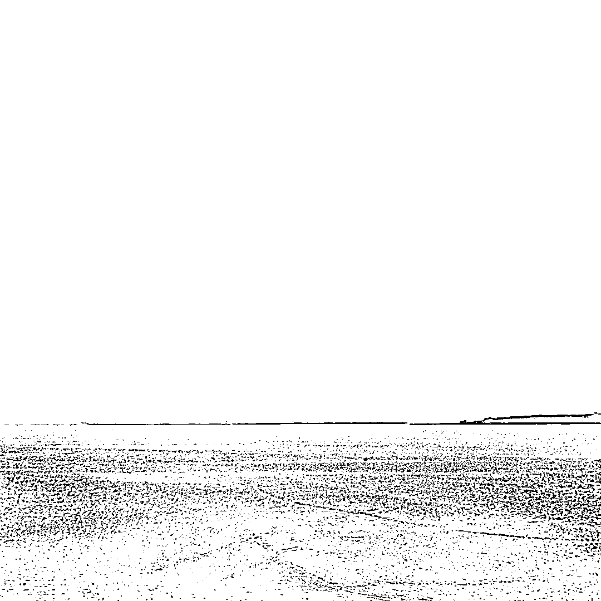

**对于梦，我们能够做这些事**

**梦境反映了我们试图在生命的极性中找到我们自身的平衡。**

我们如何塑造一个同时尊重我们真正的自性和人格面具的自我？我们如何满足对独立和依赖的需求，对自由和安全的需求，对自我主张/个性和关系的需求，对做自己和按自我意愿行事或成为自己的需求？

梦境记录了我们在这些极性之间来回变动，试图整合它们的过程。梦境同时也显示了我们与父母分离，与我们从他们那里吸收的价值/态度/行为分离，逐渐形成自己的价值/态度/行为的过程。

愤怒，甚至憎恨是这个分离过程的一部分。**梦中出现的攻击和恐惧可能既反映了我们与过去父母关联的安全感的来源分离的恐惧，同时也说明必须破坏旧有的秩序，我们才能拥抱和发展真正的自我**。

当你持续一段时间回忆和记录梦境后，你还会意识到你的梦境自我、梦中人物和梦中情节的进化发展。过去梦中的冲突会重复发生，直到他们自己获得解决；新的疗愈意象或人物会出现；平衡将会达成；然后新的冲突会占据舞台的中心。

**你越尊重你的梦并与它们合作，它们就会越清晰地反映你的转变过程，为你提供在日常生活中受益的洞见和指引**。

**版权声明：**本文由若道翻译发布，欢迎转发，反对抄袭。友号转载请申请白名单。

**特蕾西·麦克斯**

老牌占星师，对 12 宫、梦境有深入研究。著有《如何整合你的 T 三角》、《Your Secret Self》。

**快来了解【释梦占星大师工作坊吧】！**

**本课程将课堂讲座与动力过程工作结合起来，动力工作过程会将星图解读和梦境分析结合起来。**

每天约一半时间用于讲座，其余时间会演示占星学梦境工作方法，过程中老师会与学员进行互动。课程包括对老师解读星图和治疗性梦境工作方法的详细阐释和示范。

**我们将学习荣格解梦的基础知识和治疗性的、以过程为导向的星图解读。**我们将体验转化性原型模式在梦境和出生星图中同步显现时会发生什么。

**三次 6 小时的迷你马拉松在线梦境课程**，将会是一次提升意识、开放思想、转化生命的事件。**学员将体验占星学和解梦的融合。**

每次课程格雷格·博加特老师都会与学员互动，课程中使用的星图和梦境将由愿意分享自己梦境和星图的学员提前提供，课程期间也会开放问答以及学员互动环节。

**了解课程详情** 

**可以点击下面图片哦~**

**2022 年来了****还不快领取你的****专属年运报告****？****购买有优惠，点击图片查看详情哦~**

**学习占星学****点击下图了解课程详情** 

********************************

**微信又双叒叕改版啦，不想错过若道君的推送？****就把若道设为星标吧！****▼**

**就是这个“在看”，戳戳戳 ☟**

********报名直达入口********

# 释梦占星大师工作坊：荣格、占星学与梦境

> 原文：[`mp.weixin.qq.com/s?__biz=MzA5NjA0NTAxNg==&mid=2651465158&idx=3&sn=c0ce21f196a284f010ad4aa28aa3cd7b&chksm=8b489771bc3f1e679344ea8ea5e99ee8e66cdfec00b1c654b615408a3f3ab753f786851ea09e&scene=126&sessionid=1692737872#rd`](http://mp.weixin.qq.com/s?__biz=MzA5NjA0NTAxNg==&mid=2651465158&idx=3&sn=c0ce21f196a284f010ad4aa28aa3cd7b&chksm=8b489771bc3f1e679344ea8ea5e99ee8e66cdfec00b1c654b615408a3f3ab753f786851ea09e&scene=126&sessionid=1692737872#rd)

****

**2022 年 3 月和 4 月木星和海王星在双鱼座合相给连接梦境与占星提供了一次绝佳的时机。**

**　　——格雷格·博加特老师**

**梦境工作和做梦疗法是深度心理治疗的一个关键技术，**使得深层无意识的象征性语言能够传递它们的洞见，并指引患者走向更大的完整。

梦境使带有情感成分的无意识材料安全而快速地进入意识层面。它们帮助找到治疗的重心，指引治疗的方向。**梦境提供了重要的线索，告诉我们客户痛苦的来源，以及哪些情绪和情结需要被检视和处理。**梦境工作可以成为心灵成长和行为改变的强大催化剂，它有种独特的能力，促进疗愈从内在发生。

梦就像冰山从无意识的深水中浮现出来。有些冰山属于过去，帮助我们理解过去的创伤和未消化的回忆，因此是回溯性的。

**梦境有种整合的能力，**因为他们能使我们觉知和化解很多次人格之间的矛盾。**梦境也有前瞻性或预期性，**那是来自未来的冰山，会呈现出将要发生的事情，显现出个人有可能成为的样貌。**梦境既向后看也向前看**，它的本质功能是扩展意识、觉知和身份的疆界。

**我在梦境工作中主要使用的技术，是以开放的好奇心，主动探求梦境中每个角色、地点和行为的当下意义**——每个元素都反映出梦者的心灵状态和当前的生活情境。被梦境所揭露的信息，往往既幽默，又充满矛盾，而且为我们打开了新视野。

怀着一种敬畏的心态，我发现每个梦境都是意识海洋深处的一颗珍珠。反思梦境的奥秘，会引发一种近乎宗教敬畏的情感，我们会惊叹于心灵描绘自身处境的能力。

1

**课程内容**

**本课程将课堂讲座与动力过程工作结合起来，动力工作过程会将星图解读和梦境分析结合起来。**

每天约一半时间用于讲座，其余时间会演示占星学梦境工作方法，过程中老师会与学员进行互动。课程包括对老师解读星图和治疗性梦境工作方法的详细阐释和示范。

**我们将学习荣格解梦的基础知识和治疗性的、以过程为导向的星图解读。**我们将体验转化性原型模式在梦境和出生星图中同步显现时会发生什么。

**三次 6 小时的迷你马拉松在线梦境课程**，将会是一次提升意识、开放思想、转化生命的事件。**学员将体验占星学和解梦的融合。**

每次课程格雷格·博加特老师都会与学员互动，课程中使用的星图和梦境将由愿意分享自己梦境和星图的学员提前提供，课程期间也会开放问答以及学员互动环节。

2

**课程安排**

**第*****1*****讲  2022 年 3 月 5 日 **

卡尔·荣格的童年、学生时代以及投身精神病学时期的故事。《荣格自传：回忆·梦·思考》概要。弗洛伊德与荣格的关系，他们合作的破裂，荣格随后的抑郁时期，以及他借助梦、积极想象、艺术创作、曼陀罗绘画和对奥义知识（灵知）、神话和占星学的研究，转化性地面对无意识。卡尔·荣格与艾玛·荣格的占星学。

荣格的力比多（心灵能量）的概念，以及他的心灵结构地图：自我、个体无意识和集体无意识。荣格对无意识原型的描述，它们对个人神话的重要性，以及它们作为个人情结的表现。自我-自性轴线，以及自我与无意识之间不断演化的关系。

**我们将介绍荣格解梦的基础知识以及治疗性的、以过程为导向的星图解读。我们将体验转化性原型模式在梦境和出生星图中同步显现时会发生什么。**

****第*****2*****讲  2022 年 3 月 12 日 ****

梦境中的个性化及其占星学时机。出生星图随时间推移展开。整合个体无意识：梦和出生星图中的人格面具与阴影。男性和女性：阿尼玛和阿尼姆斯。**梦与占星学行进**描绘建立或脱下人格面具的阶段，遭遇阴影的阶段，通**过阳性意识和阴性意识的结合发展出更统一的人格的阶段。**

**第*****3*****讲  2022 年 3 月 19 日 **

**整体性在占星学和梦境中的象征。**透过占星学符号研究梦，来深化内在生命。我们将学习占星学行进和梦境如何试图让我们意识到差异、内在冲突和极性，逐步整合对立，将人格整合成一个整体。

梦境工作和星图解读中的曼陀罗原理。荣格的心理类型理论：内向型和外向型的任务。达到思维、情感、感觉和直觉的平衡。我们还将涉及使用五因素人格理论作为星图解读和梦境分析的基础的重要性。

**我们将学习如何解读梦境，并辨别梦的象征意义所传达的有说服力的信息，因为这与出生星图和行进有直接关联。**整合占星学和梦境工作，可以带我们进入情感、关系和灵性更为一致的状态。

3

**授课老师**

**格雷格·博加特**

（Greg Bogart）

**占星师、心理治疗师**。格雷格出生于美国纽约市，就读于卫斯理大学，1986 移居旧金山湾，完成了加州整合大学和赛布鲁克大学的研究生课程。格雷格自 1991 年以来一直是一名有执照的**心理治疗师**（LMFT 28276）。**他是国际占星研究协会（ISAR）认证的占星师**，并拥有美国地球宇宙学研究协会（NCGR）的第四级认证。他还在旧金山的艾扬格瑜伽学院接受过培训，并于 1992 年毕业且获得了**瑜伽教师认证。**

格雷格是一名私人执业的心理治疗师，在索诺玛州立大学担任**心理学讲师**，他在该校教授“成人发展中的转变”、“以深度为导向的心理治疗”、“神话、梦与象征”以及“存在主义心理学与超个人心理学”等课程，他在加州整合大学、约翰·F·肯尼迪大学、多米尼加大学和超个人心理学学院教授咨询心理学和东西方心理学课程。**他的研究结合了冥想、哈他瑜伽、荣格解梦、存在主义心理疗法和精神综合，以及占星学的周期智慧和原型象征。**

**格雷格·博加特博士著作：**

*   《占星学的高八度音阶》（*Astrology’s Higher Octaves*）

*   《行星用于治疗》（*Planets in Therapy*）

*   《占星学与灵性觉醒》（*Astrology and Spiritual Awakening*）

*   《梦境工作过与自我疗愈》（*Dreamwork and Self-Healing*）

*   《梦境工作在抑郁症整体心理治疗中的应用》（*Dreamwork in Holistic Psychotherapy of Depression*）

*   《占星学与冥想：对变化的无畏沉思》（*Astrology and Meditation: The Fearless Contemplation of Change*）

4

**课程价格**

*   **课程价格：****5800 元**

*   **早鸟价：4800 元（截止日期：2022 年 2 月 9 日）**

*   **课程咨询：**王老师（微信：18510107057，请备注“释梦工作坊”）

长按二维码添加王老师

5

**课程安排**

*   **课程时间：**

     **2022 年 3 月 05 日周六  8:00-14:00**

**2022 年 3 月 12 日周六  8:00-14:00**

2022 年 3 月 19 日周六  7:00-13:00

*   **授课方式：**线上直播，英文授课，中文翻译

6

**退转课程**

*   **退款原则请详看《教学协议》，如有疑问请咨询课程顾问。**

****释梦工作坊****

**授课老师：**格雷格·博加特

**授课时间：**2022 年 3 月 5 日起

**授课方式：**网络课程**，**英文授课，中文翻译

**费用：****5800 元****（早鸟价：4800 元，2022 年 2 月 9 日截止）**

**课程负责人：****王老师**（微信：18510107057，请备注“释梦工作坊”）

长按二维码添加课程负责人咨询~

****报名请点击“阅读原文”****

# 雷蒙德·梅里曼金融占星周运 | 还在土天四分影响范围内的一周

> 原文：[`mp.weixin.qq.com/s?__biz=MzA5NjA0NTAxNg==&mid=2651465143&idx=3&sn=9968f423c753e38700ede4e96685f14f&chksm=8b489700bc3f1e16b3fac7a211272d60dd3d963b696c3c54ac05c18b63e7f6371f9a3b0b9888&scene=126&sessionid=1692737878#rd`](http://mp.weixin.qq.com/s?__biz=MzA5NjA0NTAxNg==&mid=2651465143&idx=3&sn=9968f423c753e38700ede4e96685f14f&chksm=8b489700bc3f1e16b3fac7a211272d60dd3d963b696c3c54ac05c18b63e7f6371f9a3b0b9888&scene=126&sessionid=1692737878#rd)

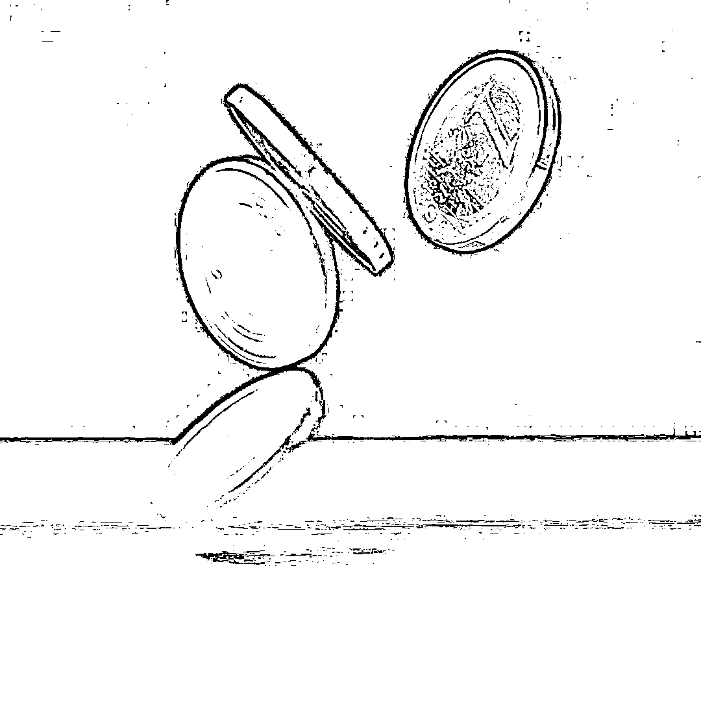

作者/雷蒙德·梅里曼 译者/Luke
编辑/玫瑰 图片/网络

雷蒙德·梅里曼是在金融占星学界稳坐第一把交椅的占星师，同时他也是若道签约的金融占星课老师，我们引进了雷蒙德·梅里曼老师的《[上证指数月度报告](http://mp.weixin.qq.com/s?__biz=MzA5NjA0NTAxNg==&mid=2651462440&idx=3&sn=1c45283342a3cb70cb06be2a0f79ab9b&chksm=8b48a99fbc3f2089cdeb7e7014fae031358fbf2824825603c7f00a56311ff43b8589902deb7f&scene=21#wechat_redirect)》及《[黄金报告](http://mp.weixin.qq.com/s?__biz=MzA5NjA0NTAxNg==&mid=2651464059&idx=2&sn=5dc133a91d4753c44646db50f3d891b8&chksm=8b4893ccbc3f1ada5ee182cfcdbd59ef4dd147503110bf7f550337609a6e2573ef98c2f3d2b4&scene=21#wechat_redirect)》。我们经老师的授权，将每周刊登梅里曼老师的周运，供大家参考和学习。于是，这是本周的周运（1.4-1.7）。

**说明：以下时间采用纽约证券交易所所在地美国东部标准时间。**

**展望与回顾**

****

**一份政府声明周四称，南非已经取消了凌晨 4 点的宵禁，相信第四波 COVID-19 奥米克戎疫情的高峰已经过去。周四举行的内阁特别会议上发表的文件声称，"所有指标都表明，在国家层面上，该国第四波疫情的波峰已经结束。"**

**—— 《南非取消宵禁，奥米克戎波峰已经过去》**

**路透社**

**2021 年 12 月 31 日**

对于全球股市而言，这周收盘的年线是个好兆头。2021 年 12 月 19 日，金星逆行后的第一个交易日，也就是 2021 年 12 月 20 日跌至数周低点后，“圣诞老人”或“年终”的反弹终于开始。在一些地区，比如美国和瑞士，股票指数创下历史新高。在英国，伦敦富时指数终于飙升至自 2020 年 3 月疫情流行崩盘以来的最高价位。在其他案例中，反弹仅达到次高点，未能创下历史新高。黄金白银也经历了非常好的一周。黄金飙升至 1828.7，是一个月来的最高位。白银在 2021 年 12 月 28 日上涨至 23.48，是 2021 年 12 月 15 日构成双底 21.41 以来的最高价，也是自 2021 年 11 月 26 日以来的最高价。原油出现了相似的价格走势，在 2021 年 12 月 20 日飙升至 77.44，是 2021 年 11 月 26 日以来的最高价，相比 2021 年 12 月 2 日的基本周期波谷 62.43 大幅上涨。随着进入 2021 年 12 月 24 日最后一次土星-天王星渐亏四分相，比特币出现了一些有希望的走势，在 2021 年 12 月 27 日达到 52,104 的高点，是自 2021 年 12 月 4 日遭抛售跌至 42,101 以来的最高价。但它随后下跌进入盘整区间 45,000-50,000。以太坊在这一个节假日却未能创新的数周高点，它在 2021 年 12 月 30 日跌到次低点 3584，反而测试了 2021 年 12 月 4 日的低点 3504。

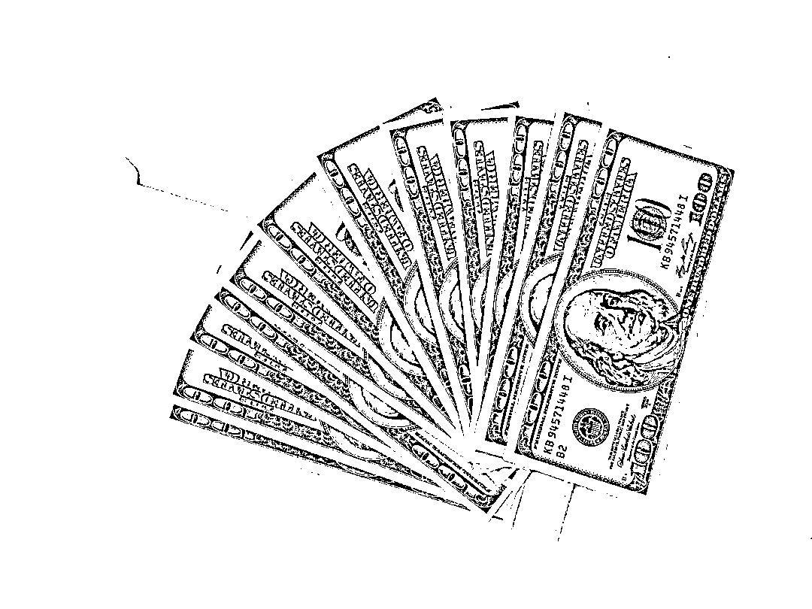

**短期占星趋势和长期考量**

****

**完全接种疫苗的特朗普，告诉福克斯新闻，他接受了 COVID-19 疫苗的加强针。对于那些仍在犹豫要不要接种疫苗的人，特朗普说：“你必须拥抱它。你不一定要接种。也不应该被强制，但你必须拥抱它。”****特朗普说让美国人接种疫苗，“实际上是一个态度问题”，而不是强制的。****——布鲁克·辛格曼****《特朗普非常高兴和惊讶，因为拜登承认他的政府在 COVID 疫苗上的成功》****www.foxnews.com****2021 年 12 月 22 日**

进入新年，通过地球宇宙学研究视角观察市场，我们不禁对全球股票指数在土星-天王星三次渐亏四分相期间的表现印象深刻。

第一次四分相发生在 2021 年 2 月 17 日，对应了中国和日本股票市场的多年高点；第二次渐亏四分相是 2021 年 6 月 14 日，也与那些股市中的基本周期波峰接近；第三次和最后一次渐亏四分相刚刚于 2021 年 12 月 24 日结束，之后股市再次上升。

**土星-天王星渐亏四分相是一个非常有挑战性的相位，是占星学研究中最有挑战性和最困难的相位之一 —— 大多数占星师认为它是看跌股市的。**

与此相反，全球股票市场在整个 2021 年 11 月期间是看涨的，那符合我们研究中不断重复表达的两条格言。

**首先，占星学相位不总是单独或直接显化在金融市场的领域。**在这一案例中，全世界在股票市场外的其他领域也遭遇了严重的挑战，比如一轮又一轮的 COVID-19 疫情，妨碍了旅行、休闲和经济的其他领域。

重要商品和材料，比如电脑芯片，其供应链遭遇严重中断，影响了汽车生产和销售，这当然也符合土星和天王星的主题。这从而导致了通货膨胀突然和出乎意料的上升。

**第二个格言是，地球宇宙学征象基本不代表看涨或看跌，而是根据行星周期的长度，在合理容许度内，代表“方向的改变”，或者“反转”。**

事实上，**许多全球股票指数在土星-天王星周期中创下历史新高，代表有很大可能性，随着土星离开与天王星的四分相，市场出现重大的反转（下跌）。**

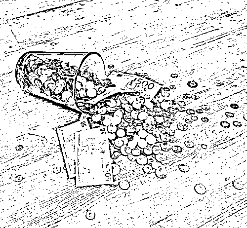

但那会立即发生吗？未必，**因为这两个行星的四分相，将在 2022 年 9 月-10 月回到一°的容许度内。**

技术上来说，它们已经完成最后一次四分相了。但在占星学中，3-°的容许度依然被认为是有影响力的。这一事项，及其含义，在《[2022 年金融预报中](http://mp.weixin.qq.com/s?__biz=MzA5NjA0NTAxNg==&mid=2651464534&idx=2&sn=bbdad226e8121f8c2da6f7ae1ca3232b&chksm=8b4891e1bc3f18f7e8e30ea2fc9dbdb605cbc378aeacd849b9ec96be01fbfd4af37b52823069&scene=21#wechat_redirect)》（点击链接了解详情）得到了详细讨论。

**我们现在正在离开 2021 年 12 月 24 日-27 日的三星级地球宇宙学反转区间，由于土星-天王星周期的长度，它拥有至少 2-周的容许度。**这一时间区间，也包含 2021 年 12 月 19 日非常重要的金星逆行。**金星逆行和土星-天王星四分相，与基本周期或次低点（高点），在 12 个交易日内有着高度的关联。**我们注意到对于大多数全球股票指数，2021 年 12 月 20 日可以成为 2021 年 12 月 3 日基本周期低点的次高点。但是上周的上涨，也可以成为 2021 年 11 月历史高点的次高点。这就是技术分析和图表形态研究非常有作用的地方。我们知道，根据占星学的原则，**重要的宇宙天象刚刚发生在 2021 年 12 月 19 日-31 日。随着木星进入双鱼座接近 4 月 12 日它与海王星的合相，通货膨胀远远没有停止。**知道这些事情是很好的。懂一些占星学是很好的。它带来了更大层面的理解力和承受力，因为地上发生的事也对应了天上发生的事。在这个充满善意和个人反思的时间，我很高兴地提醒自己，没有什么比研究星星及其与人类活动的周期，更能让我接近上帝，或有创造力的神圣智慧和秩序了。

**希望每个人都能度过一个美好和繁荣的新年。**

**说明：以上日期基于纽约证券交易所所在的美国东部标准时间，由于存在时差，中国地区可能需要加一天。**

**版权声明：**本文由若道翻译发布，欢迎转发，反对抄袭。友号转载请申请白名单。

**雷蒙德·梅里曼（Raymond Merriman）**

若道签约老师。著名金融占星师，ISAR（国际占星研究协会）前主席，梅里曼市场分析公司的总裁。他由于“提升了占星学的职业形象”，在 1995 年国际占星大会上被授予轩辕十四奖；在 2012 年国际占星大会上，被授予轩辕十四终身成就奖。

1“中国上证指数月度报告”发售**若道推出了****中文版****的雷蒙德·梅里曼中国上证指数月度报告，并持续发行该报告！**当把金融市场的周期和占星学的周期相结合时，雷蒙德·梅里曼老师的金融占星学研究**为投资者应对金融市场的周期波动，并随之调整投资策略提供了极大的价值参考**。
**2022 年 1 月中英文报告已上线！**2“黄金价格周期月度报告”发售**若道推出****中文版****的雷蒙德·梅里曼黄金价格周期月度报告！**不仅仅为广大读者在中国股市的投资出谋划策，更将视角放眼黄金市场。**每当世界经济形式不明朗的时候，有一个地方是保值的港湾，那就是****黄金**。自 1982 年雷蒙德·梅里曼出版第一本研究《地球宇宙学征象与黄金价格的关联》的著作以来，**他一直作为最重要的黄金市场时机预测者之一享誉国际**。2022 年 1 月黄金报告已上线，梅里曼老师将会告诉你他对这个关键时期如何操作的想法。也可以按照季度和一年期订阅，有更多优惠。季度和年度的好处是，你可以持续了解梅里曼老师对于不断在变化的市场的看法。即便他某一次看法和市场不一致，你也看到在下一期他如何调整自己的看法，并看到金融占星在一个长期时间段内对你把控风险的帮助。而能够长期控制风险、尽量找到安全的投资时机才是投资的长久之计。**2022 年 1 月中英文报告已上线！****购买套餐**，买得越多越优惠中国上证指数月度报告套餐价

*   **单月报告**：280 元
*   **3 个月套餐**：780 元（260 元/月）
*   **12 个月套餐价**：2400 元（200 元/月）

**长按下图识别二维码****购买金融报告****套餐****▼**

黄金周期月度报告优惠

*   **双报告年度套餐更优惠（直降 900 元）**

*   **12 个月黄金报告+12 个月上证指数报告：仅需 3900 元**

**长按下图识别二维码购买黄金报告套餐**▼

3《2022 年金融预报和沙龙》1976 年以来，由雷蒙德·A·梅里曼撰写的梅里曼市场时机学院每年一次的年度预报沙龙和每年一本的《年度预报》一直在应用占星学原理为投资者们服务，提供卓越洞见，从未间断。 **雷蒙德·梅里曼《2022 年金融预报和沙龙》开始预售中。****长按下图了解详情**
▼

**点击阅读原文购买金融报告**

# 摩羯座新月 | 2022 年第一个重量级新月，许下愿望，干就对了！

> 原文：[`mp.weixin.qq.com/s?__biz=MzA5NjA0NTAxNg==&mid=2651465143&idx=1&sn=4d4894e8a02017fdb957408868140b75&chksm=8b489700bc3f1e162d339bdd0d7f914d369982a04c640ee39dd718f41de222d09c726adc9a4a&scene=126&sessionid=1692737878#rd`](http://mp.weixin.qq.com/s?__biz=MzA5NjA0NTAxNg==&mid=2651465143&idx=1&sn=4d4894e8a02017fdb957408868140b75&chksm=8b489700bc3f1e162d339bdd0d7f914d369982a04c640ee39dd718f41de222d09c726adc9a4a&scene=126&sessionid=1692737878#rd)

****☆ **后台回复“今日”，给你一句生命态度**

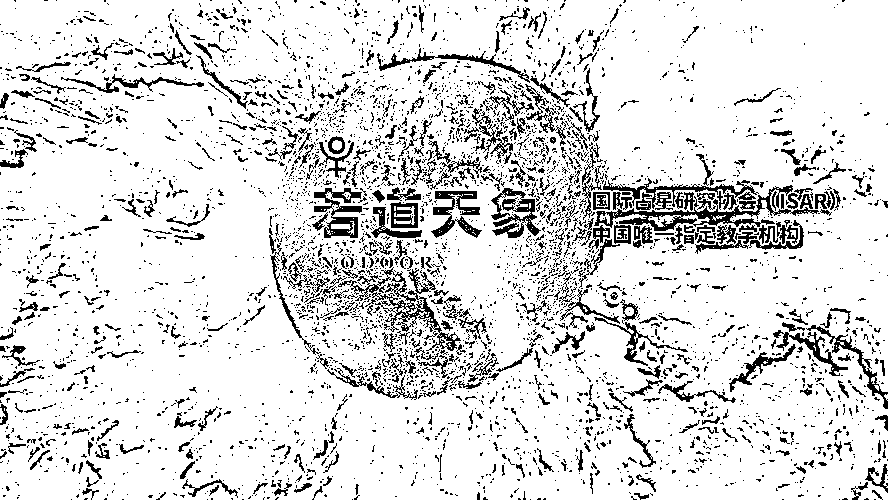

作者/王芝桦 编辑/玫瑰 图片/pexels

**摩羯座新月****北京时间 2022 年 1 月 3 日 2:33 迎来摩羯座新月，太阳与月亮精准合相于摩羯座 12°20′。**2022 年的第一场新月，“诞生于至寒冬日”的摩羯座向我们发出宣告——**春天就在不远处，现在正是做出长期规划、确立发展目标、奔向春暖花开的时刻。**在此，祝福各位读者朋友们 2022 新年快乐！一起穿越 2021 年并一路相伴 2022 年的小伙伴们，冲啊！

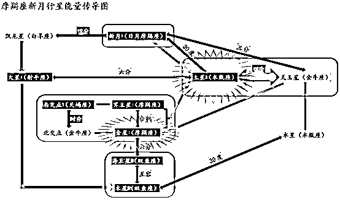

> **摩羯座新月重点影响人群**
> 
> **参考新月峰值影响期间各个行星的行进度数，以及逆行行星的轨迹影响；常规容许度，个人行星入相位 3°，出相位 1°；非个人行星入相位和出相位均为 3°。**
> 
> *   出生星图中，有**行星、四轴、南北交点**落入**固定星座（金牛座、狮子座、天蝎座、水瓶座）0°-17°，27**°-30°****的人群。
>     
>     
> *   出生星图中，有**行星、四轴、南北交点**落入**变动星座（双子座、射手座、处女座、双鱼座）0°-4°，11°-23°**的人群。
>     
>     
>     
>     
> *   出生星图中，有**行星、四轴、南北交点**落入**基本星座（白羊座、巨蟹座、天秤座、摩羯座）6°-30°**的人群。

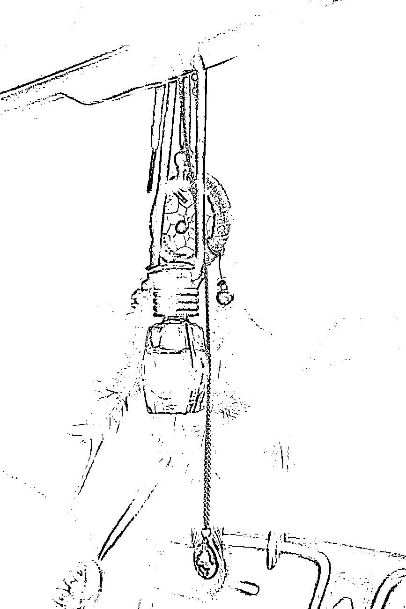

**“不朽的渴望”缔造“长久的理想”**

****

**我相信灵魂的不朽，因为我有着不朽的渴望。****——海伦·凯勒《假如给我三天光明》**

> **天象****· 新月介入“土天四分”**：摩羯座新月三分金牛座天王星，30°水瓶座土星。**· 新月四分凯龙星**：摩羯座的太阳和月亮四分白羊座凯龙星。**· 木海互容**：双鱼座木星与双鱼座海王星形成互容结构。

从 2021 年第四季度开始，各种“关系议题”就好像纷纷解除封印并破壁而出；而进入 12 月，随着一场跨年的金星逆行摩羯座（2021 年 12 月 19 日-2022 年 1 月 29 日）、两次的“金冥合相”结构更是激化出“关系议题”的虐心戏码（12 月 12 日和 12 月 25 日）。2021 年压力重重且考验不断，但 2021 年也留给每个人很多礼物。我们前行的脚步没有停住，灵魂的进化意愿永远不朽，生命的成长渴望从不停歇。2021 年 12 月 29 日，“代表精神信念，具有扩张能量”的木星正式换座进入“象征意识海洋，缔造理想梦幻”的双鱼座，并与“代表意识通道，具有疗愈能量”的海王星搭建起 2022 年“木海互容”宇宙大背景。**2022 年将是“照亮理想，迸发勇气”的一年，也是需要小心“盲目膨胀，脚不着地”的一年，**2022 年提示**“理想需要全局观，亦需要现实感”**；2022 年我们将**更加强烈地感觉到“人类命运共同体”的一体共振，而我们需要在此次摩羯座新月做出更务实、更有效的自我成长计划，才能成为共同体中贡献力量的一部分。**此次摩羯座新月，刚刚形成的“木海互容”宇宙大背景，引领我们——**带着积极乐观的态度去看待当下的自己和他人，带着善良仁慈的能量去抚慰当下的疲惫与伤痛，而这一份由己及人的“慷慨与慈悲”联通着“爱与幸福”的时刻。**新月是梦开始的地方。摩羯座新月介入年度重磅天象“土天四分”结构，同时与白羊座凯龙星形成四分结构，两组结构提示我们——**为自己开启一份具有长远意义的人生规划，确立一个可以持续努力的理想目标，并在许下愿景和开始行动之前检视——是否已经准备了足够的勇气与实力？是否能够直面过去的挫败与伤痛？**

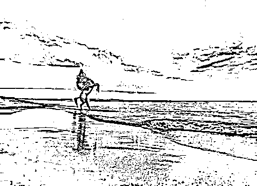

**天上人间，不是“大瓜”，而是“大动作”**

****

**既然人生的道路没有捷径可走，我就必须要在迂回曲折的小路上走好每一步。****——海伦·凯勒《假如给我三天光明》**

> **天象****· 土天四分：**水瓶座土星四分金牛座天王星。**· 金冥合相：**金星与冥王星合相于摩羯座。

此次摩羯座新月介入到“土天四分”结构之中，其中接纳“摩羯座新月+金冥合相摩羯座”两股能量的土星（土星守护摩羯座），当之无愧地站上了当下整体天象的 C 位。

**1. 土星的使命与礼物**

古希腊神话中，天神家族中的“第一代天神”是乌拉诺斯，即天王星的神话原型。**·** 乌拉诺斯掌管天空和星辰，至高无上的存在，无穷开阔的视野，令其只能接受“完美”的事物。他厌恶并嫌弃自己和“大地之母”盖亚所生的“有土味儿”的孩子们，将孩子推回到盖亚的身体之中关押起来；**·** 天王星代表宇宙的视角、至高的理念和高维的洞见，但这些存在于无意识的“高超与完美”与“充满局限，令人失望”的现实生活之间也遍布着“期待值的落差”，导致天王星能量有时会呈现出低阶的“叛逆与疯狂”。土星的神话原型是推翻了其父亲乌拉诺斯的“第二代天神”克洛诺斯。**·** 克洛诺斯很有政绩，他掌管大地、身体和物质，制定了四季的流转和万物的生灭，规划了时间的法则和现实的规则，创造了一个成熟、有序、丰富、和谐的“黄金时代”。土星代表着现实世界的规则与秩序，即在时间法则下的成熟与责任；**·** 但一切的秩序之下，自然也无可避免地携带着限制。克罗诺斯害怕自己重蹈父亲乌拉诺斯的遭遇，于是为了避免被孩子剥夺力量和终结统治的风险，便将孩子们吞到肚里。故而，土星教导我们透过现实的局限，看到内在的不自信。规则与秩序，既是时间的产物，亦是智慧的结晶；时间记载着人间的实践与沉淀，智慧遵循着道法的律动与运行。克洛诺斯（土星）来自天神家族，却肩负着掌管大地万物的责任，他要将“天上的道法”讲与“地上的人们”听——**“中间行星”土星，肩负着将“超个人行星”（天王星、海王星、冥王星）的语言转译并讲与“个人行星”（太阳、月亮、水星、金星、火星）听的使命。**

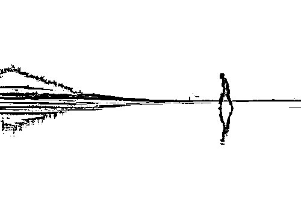

土星首先要**透过现实的挑战与困难、压力与挫败，觉察内在的不自信，突破自身的局限，**才能将作为宇宙特使、超越人间心智的“超个人行星”的能量传递给“个人行星”。故而，这是一份非常艰巨且需要实力的工作。土星是一位负责任、有担当的天神，他不会因为困难而放弃使命，也不会走捷径去做后悔的事，他总是通过持续的努力将工作圆满完成，经由严格的锤炼而获得自我的突破。故而，土星是一位带着礼物的严苛老师，当我们通关的时候，便会得到他的奖赏——一份从内而外的成熟，一份独属自己的实力。

**2. 周期转换，干就完了**

最近几年，正处于一个标志性的时代进程之中：三王星集体发威，“第三代天神”宙斯（木星）推波助澜，土星老人工作量爆棚，我们感觉“太难了”。

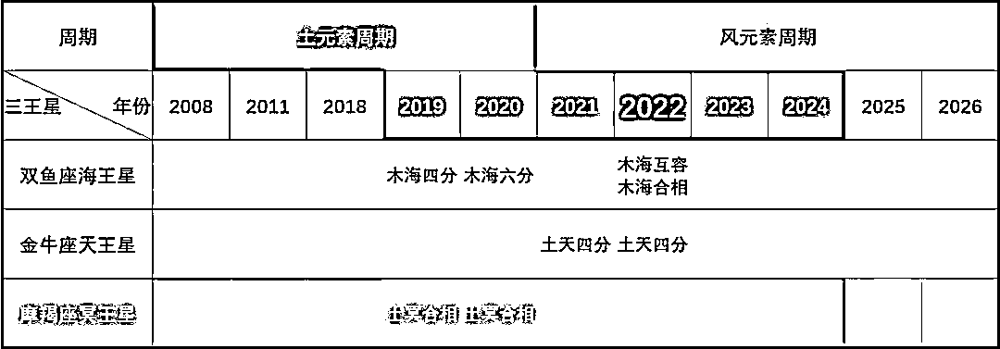

**2020 年 12 月 22 日，木星和土星合相于水瓶座，一个跨时代的重大时刻来临**——2020 年成为影响过去将近 200 年的“土元素周期”的最后一年，2021 年成为影响未来将近 200 年的“风元素周期”的初始年。**2019 年-2026 年，**海王星和冥王星在当下星座的行进即将接近尾声，天王星也精准地踩着时间点来凑个热闹，三王星集体出手，从来都不容小觑！

故而，一场“周期转化+时代变革”的巨大浪潮席卷了现实的生活——2019 年的“疯狂造梦+洗牌前奏”；2020 年的“彻底洗牌+全球疫情+旧周期结束”；2021 年的“新周期开始+新旧转换+不破不立”；2022 年……

掌管“时间法则“的土星老人，深知这一场“周期转换+时代变革”需要漫长的时间；但同时掌管“因果法则”的土星老人，更深知只有读懂过去，才能升级未来。好吧，既然人生的道路没有捷径可走，那么就让我们在迂回曲折的小路上走好每一步！土星老人教导说：**2019 年-2026 年，坚持，挺住！****闲话少说，干就完了！**

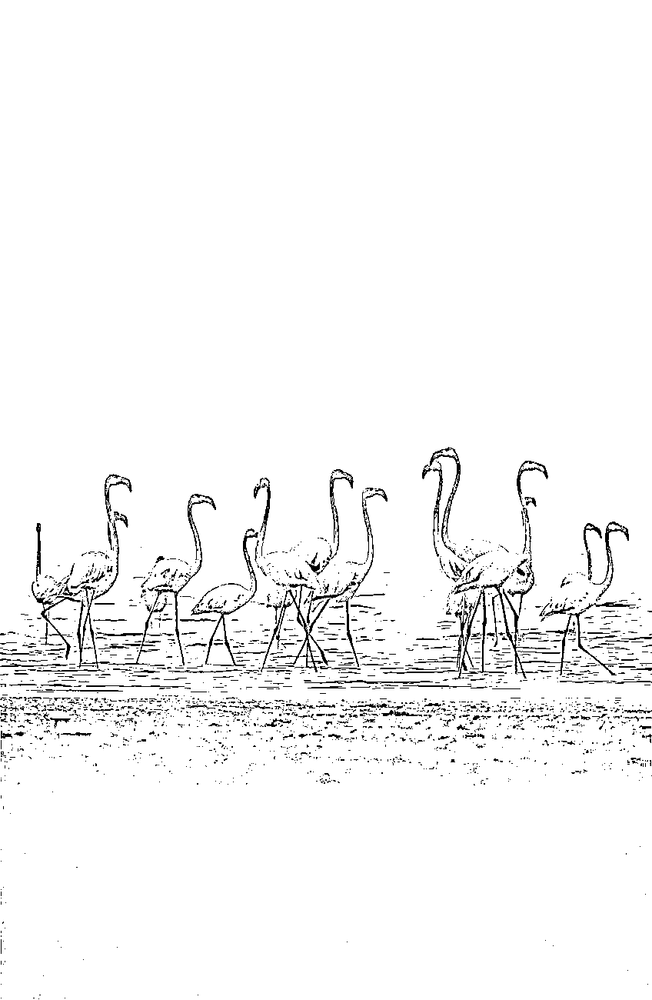

**3. 放下执着，长远规划**

2021 年度重磅天象“土天四分”结构，相当于“第二代天神”克洛诺斯（土星）和“第一代天神”乌拉诺斯（天王星）的交手。土星行进的水瓶座与天王星是一体共振的关系，这一组结构的“创新”意愿其实相当一致。**但天王星的“变革之力”要对土星的“历史积淀”动手清算，这无疑触发了土星“被剥夺过去成绩”的恐惧，产生挫败感，触发不自信。**而这才是 2021 年，我们真正遭遇的困难。土星需要时间，我们也需要时间。2021 年，“新旧转化”的进程，“传统与创新”的磨合，颇有些走三步、退两步的感觉：陈旧的经验已经不再适合于当下，全新的尝试还未拿到合格证，无论是正以全新方式打开的世界，还是正在不断做出改变的我们，都像被按在时间线上狠狠地来回摩擦。2021-2022 跨年的这一波“金星逆行+金冥合相”摩羯座，狠狠地锤向**“超边的关系和越界的模式”**，促使我们回顾历史并向内反思——**当下“真相暴露和人设倒塌”的事件揭示出过去“试图逃避和蒙混过关”的功课，“爱恨情仇”的故事中翻滚着“贪嗔痴慢疑”的执着，怎奈“出来混总是要还的”。**2021 年末，我总是想起那首叫《领悟》的歌：“啊，多么痛的领悟，你曾是我的全部”，对，就是这种感觉！深深信任的倒塌了，以为拥有的失去了，无助，孤独，枷锁，束缚，挣脱，领悟，别再受苦。**2021 年 12 月 23 日，揭示“业力功课和进化目标”的南北交点换座进入“南交天蝎座-北交金牛座”轴线，再次锤向“金冥合相”结构（冥王星守护天蝎座，金星守护金牛座），揭示出这一波“关系议题”的进化之路——与其在心魔之中执着痛苦，不如回归质朴并活在当下。**

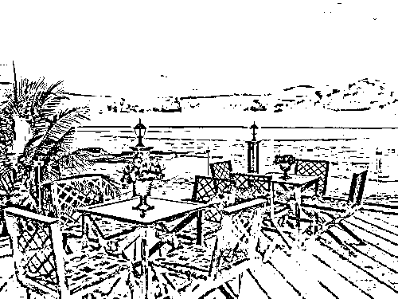

没有行星是来折磨我们的，宇宙正在帮助我们挖出腐朽并清算沉渣，以便在全新周期更好地前行。此次摩羯座新月，关系的功课也好，环境的考验也罢，都需要我们带着一份超越性的视角做出长远规划，带着一份成熟的态度制定理想目标。另外，摩羯座新月期间，双鱼座木星与水瓶座水星形成“水木 30°”结构，双鱼座海王星与摩羯座金星形成“金海六分”结构，射手座火星与水瓶座土星形成“火土六分”结构：

**几组能量触发出一波职场方面人事变换、架构调整或团队精简的动态，而市场方面也将呈现一波科技领域、医药行业和金融股市的微妙变化。**

值得注意的是：**2022 年的第一波水星逆行已于 2021 年 12 月 29 日进入逆行前影响期**，而跨年的兴奋度也令大家心生感慨并渴望相聚，**建议做好防护，尽量减少聚集，因为 1 月的这一波水星逆行依然会对“流动性”带来一定的影响。**

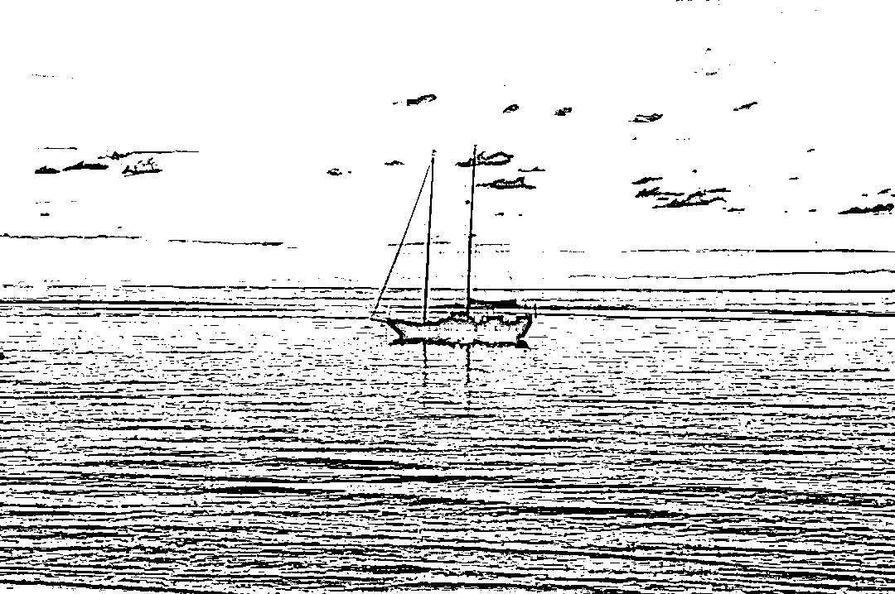

**寄语**

****

**假如给我三天光明，我最想看什么呢？我将尽可能看看那些珍爱的东西，以便在黑暗即将到来之前把它们一一记住。****——海伦·凯勒《假如给我三天光明》**最近两年，宇宙正在通过各种方式帮助这个世界、帮助我们放慢速度：跑得太快了，就要慢下来；跑得太久了，就要回顾。其实，**没有任何事物是绝对稳定和永远不变的；因为那样，只能说明没有成长。**请用发展性的眼光看待当下的进程，请用建设性的心态创新未来的生活。2022 年，对自己，对他人，对这个世界，请多一些慈悲，请尽可能地看看那些珍爱的东西，比如每一当下的健康、粮食、阳光、温暖和爱，我们正在拥有它们，而它们正在给与我们。在此，感谢每一位朋友的一路相伴与能量共振，祝福每一个灵魂安好。**新月如何许愿？**

**许愿时间**：2022 年 1 月 3 日北京时间 2:33 后，48 小时内有效、8 小时内最佳。 

**许愿人群**：所有人。

**许愿数量**：每人最多 10 个。

**许愿方式**：静心冥想，身心祈祷或记录收藏。

**许愿格式**：请万能的宇宙赐予我能量，我将以我的能量吸引**（什么）来到生命中……

**许愿原则**：发心诚善利人。

**版权声明**：原创文章由作者授权首发于若道平台，欢迎转发，反对抄袭。友号转载请申请白名单。

****

****想阅读更多作者的文章，请在后台回复******王芝桦****** 即可。****

****王芝桦****

心理占星师，统合疗愈师，占星专栏作者

全职于个案咨询与占星教学工作 18 年

**个案预约咨询微信号**：zhihua0621 

**微信公众号**：daoxi-life

**长按打赏**

****

**2022 年来了**

**还不快领取你的****专属年运报告****？**

**购买有优惠，点击图片查看详情哦~**

**学习占星学****点击下图了解课程详情** 

********************************

**微信又双叒叕改版啦，不想错过若道君的推送？**

**就把若道设为星标吧！**

**▼**

**福利来啦**
**点击****“阅读原文”****获取最好用的免费****新月报告**

**获取免费新月报告，请点击文末“阅读原文”**

# 任重道远的摩羯座新月，怎能少了这份免费新月报告的助力！

> 原文：[`mp.weixin.qq.com/s?__biz=MzA5NjA0NTAxNg==&mid=2651465143&idx=2&sn=e3763580a5d37f14212ac8521dbe8460&chksm=8b489700bc3f1e1628c805a71c76a550ac1024cc1baab942ba15f6fb9d44e52b6a1c471ae63d&scene=126&sessionid=1692737878#rd`](http://mp.weixin.qq.com/s?__biz=MzA5NjA0NTAxNg==&mid=2651465143&idx=2&sn=e3763580a5d37f14212ac8521dbe8460&chksm=8b489700bc3f1e1628c805a71c76a550ac1024cc1baab942ba15f6fb9d44e52b6a1c471ae63d&scene=126&sessionid=1692737878#rd)

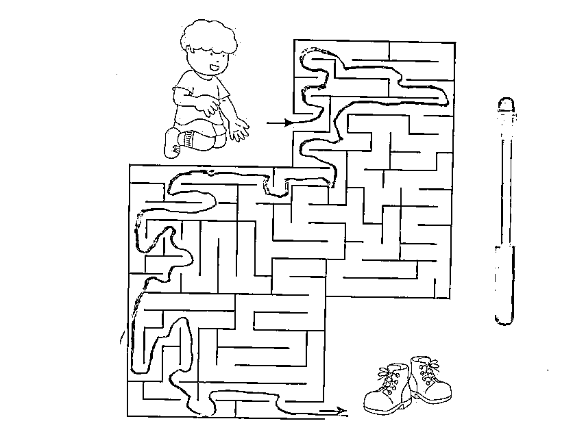

北京时间 1 月 3 日 2:33，新月发生在摩羯座 12°20′。每到新月时分，若道君都会为你奉上根据你出生星图量身打造的免费新月报告。可是新月为什么要许愿？新月报告该如何领取？让若道君来教你。　**什么是新月？**　从占星学看，新月是月亮周期的一种相位。新月是开始，又称为朔，对应中国农历初一，太阳、月亮在此时合相。此时月亮运行到太阳与地球之间时，月亮以黑暗的一面对着地球，并且与太阳同升同落，地球上看不见月亮。
本次新月时间

**1 月 3 日 2:33，新月发生在摩羯座 12°20′。**

为什么新月要许愿？

新月是一个周期的开始，新月发生的时候，太阳与月亮合相，能量很强。当新月出现时，你也许会发现灵感忽现，非常适宜开启新领域、项目与行动，缔结一段新的关系或合作。许愿会加强新月的能量，也有助于你了解自己现阶段适合开启的方向。 

本次新月最佳许愿时间从新月开始到其后的 48 小时内，许愿的力量最强。**最佳许愿时间：1 月 3 日 2:33-1 月 5 日 2:33**

属于你的免费新月报告每到新月时刻，看着占星文章里写着：看看你新月的宫位，如果新月在第 X 宫，你可以许愿的方向是……是不是常常一头雾水？新月的宫位？我到底该看哪里啊？而有时，那些标注上升星座的文章也会让你忍不住想：虽然我的上升星座是这个，可是我的新月好像并不落在你说的宫位啊？你是不是写错了？

虽然这些文章都没有写错，可是好像对你而言都太不友好了。**Don't Worry！**别着急，让博学又体贴的若道君来帮你！我们推出了一份**免费**又**好用**的新月报告！而且是专门为你设计的哦，**根据你出生星图为你量身打造的，只****属于你的独家新月报告**。报告有哪些内容？**新月时间****最佳许愿时间****如何许愿 **属于你的**许愿关键词**本次新月给你的**建议**你会有怎样的**感受 ******机会****

********

如何许愿？许愿方式也很简单。你可以把愿望写下来，或者双手合十后交叉，闭上眼睛来祈祷。 报告中会为你提供**祈祷词示例**，可以多多参考哦～ 你还可以适当添加自己的语言，创造属于你自己的祈祷文！如果报告拿到手了，快对照着许愿吧！

**这份好用又暖心的报告，点击****阅读原文****即可领取！**

****

****点击“阅读原文”即可获取新月报告****

# 2022 的第二天，快来测一测你的新年关键词！（内含福利）

> 原文：[`mp.weixin.qq.com/s?__biz=MzA5NjA0NTAxNg==&mid=2651465093&idx=1&sn=ffed0dd6ae2d7c31c7eaddd006051375&chksm=8b489732bc3f1e249006de31114a228fe8bab34c4dd79957553cebee62119ceb89ebdf28de45&scene=126&sessionid=1692737878#rd`](http://mp.weixin.qq.com/s?__biz=MzA5NjA0NTAxNg==&mid=2651465093&idx=1&sn=ffed0dd6ae2d7c31c7eaddd006051375&chksm=8b489732bc3f1e249006de31114a228fe8bab34c4dd79957553cebee62119ceb89ebdf28de45&scene=126&sessionid=1692737878#rd)

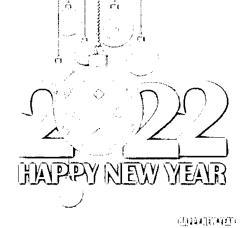

人生天地之间

如白驹过隙

**转眼 2021 年已悄然离去**

这一年

**我们发现了身边更多的好**

***家***的好

***邻里***的好

***爱人***的好

***小巷***的好

***健康***的好

***收获***的好

***守护***的好

**步入 2022 年**

**若道君希望你收获****更多的美好**

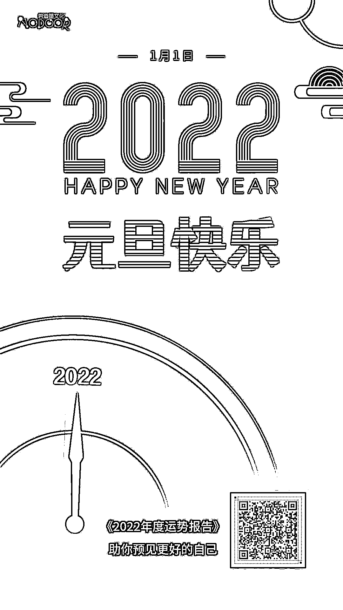

**2022 年新年“心语心愿”卡**

**若道君抽到的是****“笑纳自己”**

**很是被感动了一把**

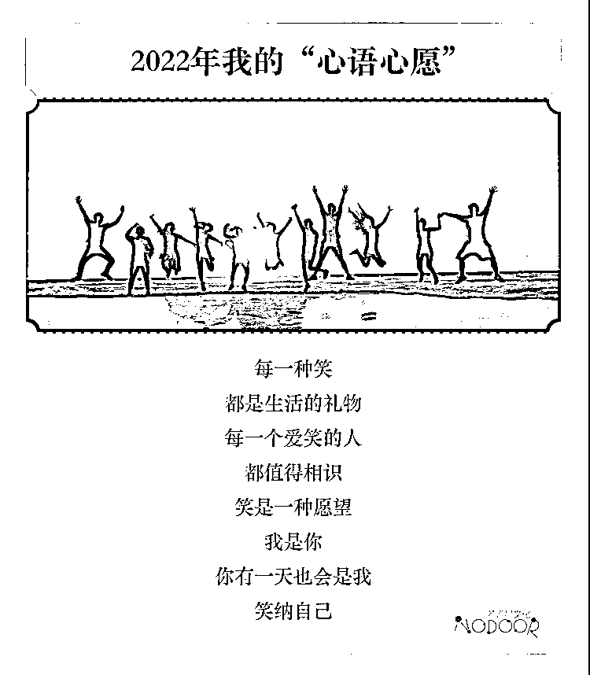

**也很期待你能抽到你自己如意的心愿卡**

**（手机截屏试试）**

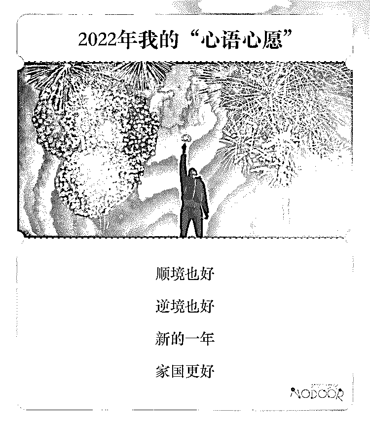

每年一到辞旧迎新的时刻

若道君也会如约与大家分享

**由****大卫·瑞雷****亲自主笔的****若道年运报告**

这一份如年俗惯例般会阅读的**幸运指南**

也深受很多粉丝朋友的青睐

**一年一度的****年终粉丝回馈**

**当然今年也不能例外**

除了**人人都有机会**领取的

**30 元****年运红包**

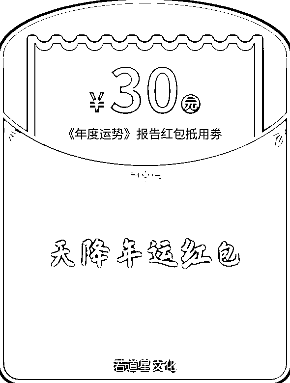

**“友福同享”****的****团购优惠****更是心意满满**

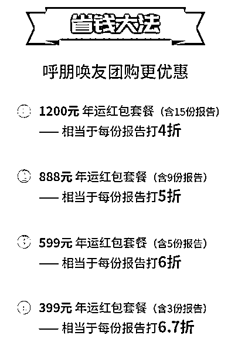

如果此时你已然心动

**那就开始行动吧！**

**扫码**即可领取**专属的年运报告**

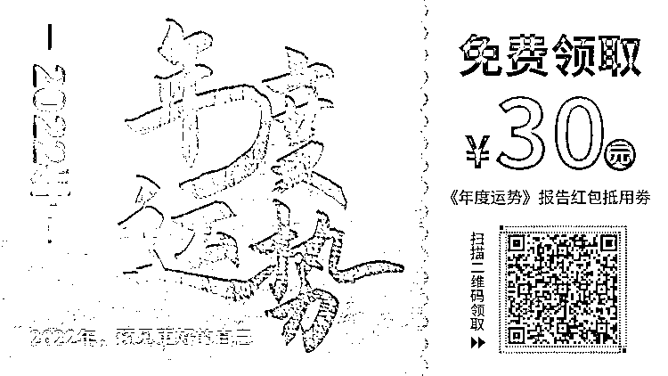

**如果你还需要一个行动的理由**

**若道君帮你梳理几点**

**一定能够帮到你**

年运购买理由

**①** ***私人定制*****，根据每人出生日期，生成独一无二的个人年度报告。**

**② 浓缩了大卫·瑞雷*****47 年*****的占星咨询实践精华，倡导以人为本，字字诚恳。**

**③*****价格惊喜*****，远远低于一次占星咨询的费用，*****还有团购*****。**

**④ 形式*****私密*****，避免了与占星师面对面的焦虑。**

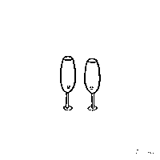

今年若道君也帮你梳理了

**关于年运报告的常见问题**

如果你已购买，**或准备购买**

都可以看看

**会对报告内容有更全面的了解**

有关报告的常见提问

**1****关于报告内容**

**① 报告都包括哪些内容呢？各方面运势都会概括到吗？**

**主要是接下来一年的天象对你的影响**，也许各方面都有涉及，但也不排除接下来一年里、你的运势主要集中在某一特定领域。**具体内容要视你个人的出生星图而定。**

**② 报告能详细到什么程度？能举些例子吗？**

**根据测试，报告大多在 5000 字以上，七八千上万字的不在少数。**具体情况，根据出生星图的不同而不同。基本结构是，按照时间顺序，把接下来一年对当事人产生较大影响的天象进行阐释和解读，提出相应的应对之策。

**③ 刚提交就能看了，这是提前写好的吗？**

是的，报告是提前写好的。虽然报告的发送不过几秒，但这背后是漫长的准备时间，且不说写作者多年的占星积累和经验，报告的写作、翻译、编排、讨论、测试以及技术开发和支持可不是几秒钟就能完成的哦。嗯，若道君认为，衡量报告的标准在于内容是否对您有帮助，而不是它抵达您的时间的长短。

**④ 没有看过每个人的星图，怎么会先写好报告呢？**

如果你懂一点占星学，会了解**预测是根据行运星图行星和出生星图的行星的比较来的。**大卫·瑞雷老师已经把各种比较的解读事先写出来了。因此，根据你的星图和行运图，一年的运势的大概就出来了。

**⑤为什么报告里会出现“在这两年”“今后两年”这类的文字，时间段明明是一年的期限啊？**

因为有的运势的影响时间**不仅仅只有一年**。有这类文字的亲是赚到了哦。

**⑥报告中有些运势影响时间范围为啥只持续 1 天？**

年运报告是周期性报告，**如果该运势刚好在您报告分析时间的开始时间结束，**那这个运势的持续时间就会只显示一天。

比如你的报告解读时间是 2022 年 1 月 1 日开始，刚好这个运势在 2022 年 1 月 1 日结束，则报告中显示该运势的持续时间就只有天，实际上该运势影响从 2022 年 1 月 1 日之前就开始了。

同理，如果年的报告解读截止时间是 2023 年 1 月 1 日，刚好有个运势在 2023 年 1 月 1 日开始，那这个持续时间也会只显示 1 天，但这个运势在 2023 年 1 月 1 日还是会持续影响的。

**⑦ 我购买了 2021 年的运势报告，在购买 2022 年的运势报告，为啥两份报告有些运势内容有重复？**

**对比两年的报告，出现重复的内容：**

*   **有些行运影响是长周期行运**，影响的时间范围会持续 1-2 年，因此，可能这个行运在 2021 年开始后，在 2022 年也会有持续的影响；

*   **有些行星会发生逆行**，当行星逆行回来的时候，这个行运也会被再次触发。这种其概况，你可以关注比对下，重复触发的行运是否对你有不同的影响。

**2****关于报告购买和查看**

**① 提交订单时，填写完出生信息后有个“行运开始时间”是指什么？**

年运报告是周期性报告，**你可以选择想了解从哪段时间开始的报告**。比如行运开始时间你选择的是 2022 年 1 月 1 日，那这份报告解读的行运周期就是从 2022 年 1 月 1 日到 2023 年 1 月 1 日（PS：如果你想超前了解往后的年份运势情况，选择相应的行运开始时间即可）。

**② 出生时间有 30 分钟左右误差的话会影响报告的准确性吗？**

会有一定影响，但如果重大天象没有经过你星图的敏感点的话，影响不会太大。

**③ 出生日期填写是的阳历还是阴历？如果是出生时间是夏令时怎么办？**

**出生日期填写是阳历的日期**，如果出生时间是夏令时，请输入出生时的钟表时间即可，系统会自动处理。

**④报告购买后，日后需要定期查阅报告内容，该怎么办？**

*   **如果你是若道已注册用户**，登录若道 APP-我的-我的已购报告即可实时查阅（手机应用市场搜索“若道“即可，下载 APP 后还可免费查阅每日运势哟）；登录”若道公众号-课程报告-个人中心-我的报告“也可以查阅；

*   **如果你尚未注册**，可以收藏下这个报告的活动链接，收藏后，点开”活动首页-已购报告“也可查阅报告内容。

**3****特惠团购和赠送亲友**

**① 如何参与团购，获得报告的团购优惠？**

**点击文末****“阅读原文”**，打开活动链接，选择**“买几份送亲友”**，即可看到团购套餐优惠，选择购买**团购套餐**，即可享受团购价优惠。

**“友福同享”团购特惠价**

***15 份*****年运报告 1200 元**

**每份只要*****80 元*****——相当于*****4 折***

***9 份*****年运报告 888 元**

**每份只要****98 元****——相当于*****5 折***

***5 份*****年运报告 599 元**

**每份只要*****120 元*****——相当于*****6 折***

***3 份*****年运报告 399 元**

**每份只要*****133 元*****——相当于*****6.7 折***

**② 团购的年运报告，如何赠送给亲友？**

团购完成后，只需选择**“分享给好友”**，然后将年运红包链接转发给好友，**好友打开链接，输入出生信息即可直接获取报告。**

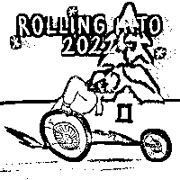

**若道君友情提醒**

**购买报告或团购问题咨询，扫码或添加客服微信（微信号：nodoor201705）。**

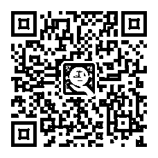

**购买报告直达入口**

# 新年快乐！月亮在射手座，你对今年有哪些展望？

> 原文：[`mp.weixin.qq.com/s?__biz=MzA5NjA0NTAxNg==&mid=2651465088&idx=1&sn=d807d8525224a572daa65f12a4732f66&chksm=8b489737bc3f1e21327e076a86600a7624ce6ac755c9a80968fe2bbc3a406015ddefe37a6ebb&scene=126&sessionid=1692737878#rd`](http://mp.weixin.qq.com/s?__biz=MzA5NjA0NTAxNg==&mid=2651465088&idx=1&sn=d807d8525224a572daa65f12a4732f66&chksm=8b489737bc3f1e21327e076a86600a7624ce6ac755c9a80968fe2bbc3a406015ddefe37a6ebb&scene=126&sessionid=1692737878#rd)

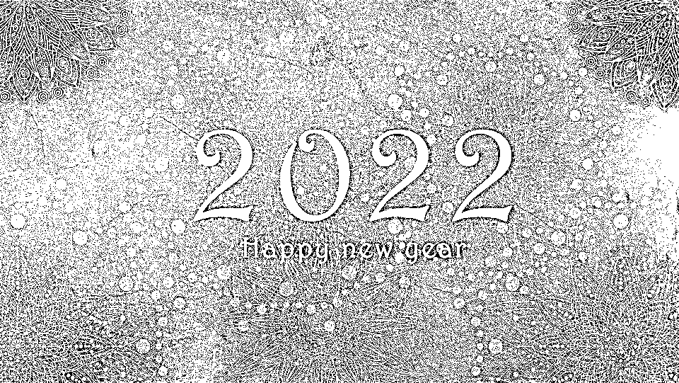

**2022 年 1 月 1 日天象：**

*   **月亮在射手座**
*   ******太阳三分天王星******
*   ******水星三分月亮北交点******

2022 年到了，大家新年快乐！月亮今天在射手座，用乐观的心态展望新一年吧！太阳三分天王星，象征着要用敞开的态度迎接新变化，自己也可以试着做出一些改变哦~另外，摩羯座水星和金牛座月亮北交点形成三分相，看来今天也很适合认真的想想新一年里可实施的计划。你们都给自己许下了怎样的新年愿望呢？有怎样的愿景、希望自己有哪些成长呢？若道君已经等不及听你们的分享啦~2021 年底，我们经历了重要的宇宙天象[【木星进双鱼座】](http://mp.weixin.qq.com/s?__biz=MzA5NjA0NTAxNg==&mid=2651464765&idx=1&sn=2a85a7202f5dfff4d2457f6bd109f166&chksm=8b48968abc3f1f9c0eac5c53ce62b1dbdaa80573b164da32656485a8726ef3e3a51d2b59af38&scene=21#wechat_redirect)（点击查看文章）、震荡的[【土天四分相】](http://mp.weixin.qq.com/s?__biz=MzA5NjA0NTAxNg==&mid=2651464442&idx=1&sn=8b8cc2c63951fc761dd43b47d1804585&chksm=8b48904dbc3f195b220cf85d000948c00c29c94897cf2c4b9fb43a9a1316a5244242c70a6300&scene=21#wechat_redirect)（点击查看文章），在金星逆行时深入了[【金冥合相】](http://mp.weixin.qq.com/s?__biz=MzA5NjA0NTAxNg==&mid=2651464534&idx=1&sn=a3620dbeb434bdf450a963bd5936100d&chksm=8b4891e1bc3f18f700cfcd12264b582f8bae686d6b05e70bcdddff0cf7fd7d1655ba9117b0d9&scene=21#wechat_redirect)（点击查看文章）的情感议题。伴随不平静的 2021 年末，我们对 2022 年可以有怎样的期待？（点击[【2022 年运】](http://mp.weixin.qq.com/s?__biz=MzA5NjA0NTAxNg==&mid=2651464694&idx=1&sn=8ebcb87cf8c00e7d10ed95b8a2869d64&chksm=8b489141bc3f18575e62dc43e5434f3f13ec4aa9f7d041de5ac67f48b946097108fce9c9b3c1&scene=21#wechat_redirect)查看文章）而在新年的第一个月、又有哪些天象值得关注呢？（点击[【2022 年 1 月运势】](http://mp.weixin.qq.com/s?__biz=MzA5NjA0NTAxNg==&mid=2651465005&idx=1&sn=59222601b927e1dc8295fc965b8a2387&chksm=8b48979abc3f1e8c1046274fd936a4d951c1765a154fe16419ac29763f1b76ea55d4eca1f84c&scene=21#wechat_redirect)查看文章）相信这些文章，都会带来启发。新年快乐！我们明天见！**了解每日天象，可****下载“若道”APP 查看****还有更多精彩等着你哦**

# 2022 年 1 月月运｜终于要迎来新年！这个 1 月有哪些值得期待的事？

> 原文：[`mp.weixin.qq.com/s?__biz=MzA5NjA0NTAxNg==&mid=2651465005&idx=1&sn=59222601b927e1dc8295fc965b8a2387&chksm=8b48979abc3f1e8c1046274fd936a4d951c1765a154fe16419ac29763f1b76ea55d4eca1f84c&scene=126&sessionid=1692737878#rd`](http://mp.weixin.qq.com/s?__biz=MzA5NjA0NTAxNg==&mid=2651465005&idx=1&sn=59222601b927e1dc8295fc965b8a2387&chksm=8b48979abc3f1e8c1046274fd936a4d951c1765a154fe16419ac29763f1b76ea55d4eca1f84c&scene=126&sessionid=1692737878#rd)

****************☆ 后台回复“今日”，给你一句生命态度****************

作者/傅莎珈 ISAR 认证占星师
编辑/翀子 封面/书君 图片/网络

作者的话

2021 年还剩最后 1 天，也是最风起云涌的月末。金星逆行、土星四分天王星、月亮南北交点换座、木星换座双鱼座。

我的生活信条之一是：闲着也是闲着，找点事做。但在这样的天象之下, 反而不太想做太多，总想晒着太阳放空。这一年过得非常快，各种事件和价值观冲击，需要花些时间理清楚。

**1 月上旬**

1 月上旬天象

**1 月 01 日 ** 

*   摩羯座太阳三分金牛座天王星

**1 月 02 日**  

*   水星换座水瓶座

**1 月 03 日**  

*   摩羯座新月

**1 月 09 日 ** 

*   逆行的金星和太阳在摩羯座合相

*   水瓶座水星六分白羊座凯龙星

**1 月上旬有 3 条线。**

**01**

太阳象征灵魂。**太阳三分天王星****，意味着灵魂意识到新的目标正在成型**；山羊在诸多山脉中找到一座今年要去攀登的山峰，新的征途，使命即将开始。

刚好是 1 月 1 日，一个开始的日子。如果你的直觉认为选择是对的，今天适合勇往直前，**做一些改变的事情。尤其是那些渴望已久的事情。**

**金星在逆行中**，继续完成有关爱和关系中的创伤净化以及学习工作，净化受伤的阴性能量。

**金星在摩羯座逆行贯穿了 1 月的大部分时间。** 尤其是 1 月 2 日，金星逆行路过土冥合相的摩羯座 22º 位置， 可能会唤起很多人从 2020 年 1 月 23 日以来出现的某些伤痛。但现在，你将找到真正发自内心的理解这些创伤体验，并且看见各种重建自信的方式。

**金星象征关系，**因此此时出现的旧人，可能会让一些遗忘的感受再度被唤醒。这些昔日重来，都是为了让你看见关系中自己曾经习惯的牺牲、过度付出、过度承担……这些姿态可能是家族中的女性们沿袭下来的规条。现在到了打破束缚的时候。

王力宏和李靓蕾的离婚故事暂告一个段落，但有关现代婚姻制度的讨论才刚开始。

**摩羯座和社会性目标，事业目标，家庭目标有关。** 有些人可能会在目标的建立过程中，被来自生命深处的无力感，失败感困扰，**质疑自己的目标**；有些人可能会非常**疲倦，孤独**，不想要进入新的道路之中；还有一些人则是非常亢奋，**仿佛突然醒过来，**非常坚定快速的走向内在感觉中的新目标。

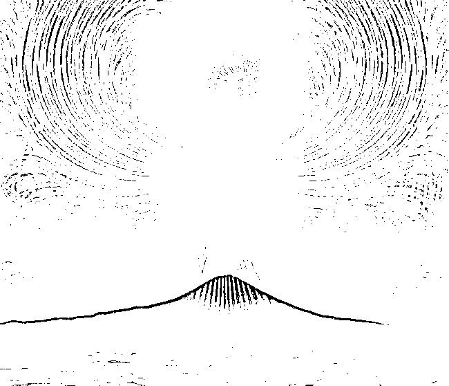

**02**

**摩羯座新月和土星形成了 30º 相位**，代表着一个新的阳性力量的法则，企业、家庭、律法、经济、政治、边界等方面的法则正在孕育生成。

**1 月 3 日的摩羯座新月**，将再度触发土天四分相，并三分天王星，提醒每个人跳出旧有生活秩序，准备构建新的生活篇章。

请对不在适合你的人事物放手。这句话 2021 年讲了一整年。**2022 年仍然是这个主题：腾出空间，让新的气象进入你的生命 。**

在个人来说，会有家庭/职场上的变动；对国家来说，要注意潜在的意识形态造成的冲突正有浮出水面的倾向———都认为自己是“正义的一方”。

传播领域会冒出来一大批新秀，自媒体和电商领域洗牌后，有些受益者逐渐崭露头角。

金融领域会出现一波结构震荡。刚刚换座的双鱼座木星让股市表现很好，新月会出现一个回调，同时让一些明年的长线发展产品浮现出来。看看能源、芯片、基础建设、社会保障、医疗等等领域。注意股市有风险，详细执行方案请和投资顾问商议。

**03**

**水星换座水瓶座****，**心智正在下载和解读这些代表未来改变的超意识信息，特别是针对集体意识中个人相对家庭/族群中的存在感创伤，帮助太阳获得更多有关灵魂成长的信息。**中旬有水星逆行，**所以水星的故事我放到中旬部分讲。

在日常生活中，多做“创意性讨论”， 无论是生活、产品、事业、情感，**需要一些打破常规的讨论**。这些讨论的本质，是在**帮助你完善“我的价值”。**

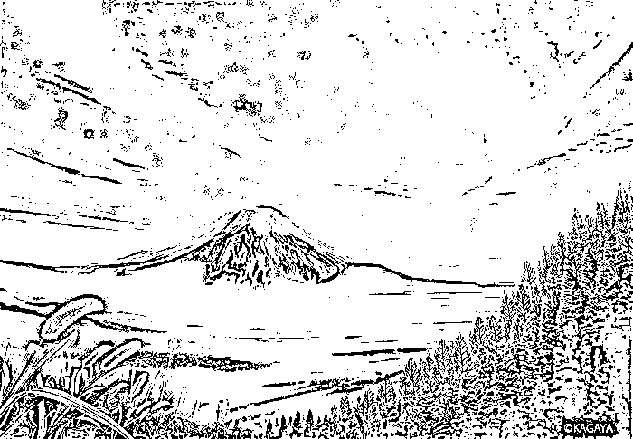

**1 月中旬**

1 月中旬天象

**1 月 11 日**  

*   摩羯座太阳六分双鱼座海王星

*   射手座火星四分双鱼座海王星

**1 月 14 日**  

*   水星在水瓶座 10º20′逆行

**1 月 17 日**  

*   太阳和冥王星在摩羯座合相

**1 月 18 日**  

*   巨蟹座满月

*   天王星在金牛座 10º49’ 顺行

*   逆行水瓶座水星六分白羊座凯龙星

**1 月 11 日**按照天使数字来说，是个非常有能量的开启指引。这天太阳和火星分别触发海王星。

摩羯座太阳和双鱼座海王星的六分相位，指引我们寻找艺术、想象力的扩展，或者在政治领域一个重要的联盟，出现新的领袖型人物；射手座火星和双鱼座海王星的触碰，则会带来一些丑闻、疫情的紧张。这段时间出差小心。

**中旬的能量比上旬激烈。水星开始本年度第一次逆行；逆行了半年的天王星开始顺行了。**

**天王星是高八度的水星，又是水瓶座的守护星。**就好像低纬度的水星为了更好的传递新的宇宙智慧，放慢了行进速度，查看信息是否理解得足够完整。如果有任何“建设性”的想法，水星逆行意味着将落地过程中的漏洞补齐。

水星和商业有关。水星进入水瓶座的逆行，是梳理消化土天四分相震荡的时期：土**星象征思维的结构，水星是信息的传播。**

年末土天四分相的最大震荡，是对直播电商们的税务大检查。水星在此时逆行，会导致一部分直播电商在税务和融资、股权方面被迫放血。

**水瓶座是一个有关大众福祉的星座，因此这次水逆的商业调整实质上是一次“均贫富” 能量的呈现。**

**水瓶座和矩阵、组织有关。**当水星在水瓶座顺行逆行，也意味着有些新的商业模式、尤其是组团出现，没有特别突出的明星，主打大众路线的一些电商机构将会涌现出一些明星团队。同时，很多社团**再次进入震荡期**，有些会加速扩张，有些会推倒重来。

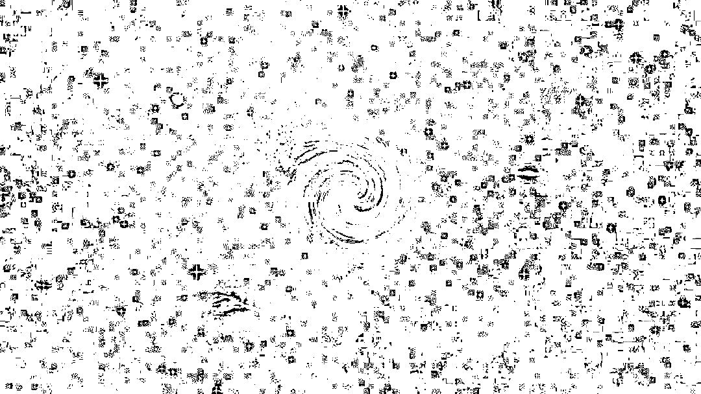

**这次水星在水瓶座的逆行，反复六分白羊座的凯龙星，**在集体意识层面，**带来个人 vs 集体的价值反思**。结合金星在摩羯座的逆行，需要每个人深入集体意识中的性别认知阴影进行思考。一些主打个人成长、集体疗愈、家族追溯型的社群，特别兴旺。

**土木换座水瓶座以来，性别文化的冲突特别厉害：**

*   **到底怎样界定性别转换者？只要宣称自己是心理上的女性，哪怕身体依然是男性躯体，就可以自由出入女性专属的场合么？如何保证不良之徒有可趁之机？JK.罗琳的观点，其实是可以再探讨的。**

*   **在社会竞争中这个族群如何归属？身体做了改造后，加入女性运动员的比赛真的合理吗？……**

*   **异性恋人群则面临重建婚姻文化的挑战，封建的女性归属制度 vs 现代的财产分割制度，在生育、财产分割、教育等方面产生巨大的冲突。**

水星在水瓶座逆行，是这些小众群体和主流舆论之间放下成见和政治正确，**敞开探讨身体和性别文化，建立新的社会规条的时期。**

**1 月 17 日太阳和冥王星在摩羯座合相。**每次太冥合相，都意味着一次重要的灵魂重生。在摩羯座的合相和阳性力量，与权威、责任、结构、秩序有关。外部世界会在商业、法律、政治领域出现这些主题的震荡性事件。

**第二天（1 月 18 日）**是巨蟹座满月，月亮对分冥王星，金星四分凯龙星，稍后天王星在金牛座顺行。物质世界里可能是有关房屋税、遗产、婚姻财产分配、生育这些领域的新律法出现。

这个满月对修行者来说会感应到强大的**阴性力量的重建**，或者连接到天地间母亲能量的支持。这些能量帮助每个人在入世的生活里，锚定自己新的成长根基。

如果社会上旧有的对女性的认知是牺牲奉献为母则刚，那么接下来的时代，女性们对于牺牲和奉献、滋养和支持的觉悟，将会跨越父权制文明的影响，逐渐创造出在基于丰盛的自我基础上，自由的连接、支持、分享和引领的家庭角色、社会角色。

**天王星顺行的度数，是它在 2021 年 5 月头上路过的位置。当时也是木星换座双鱼的时期。**想一下 2021 年 5 月-8 月期间，你在做哪些事情。此时再度开启，也是木星正式进入双鱼座的时候，这意味着你有第二次机会，把当时的活动和项目升级、深入。 

**2022 年头 5 个月，好好干。**

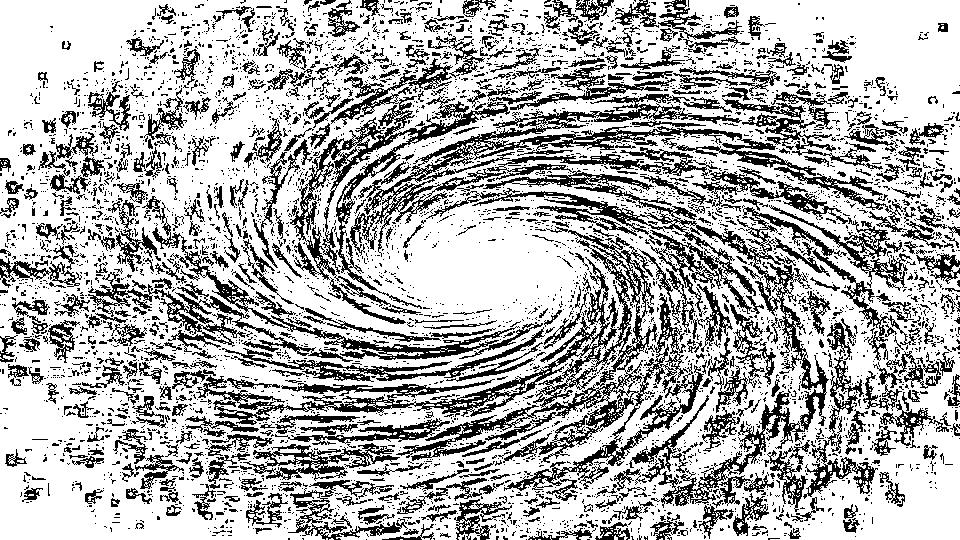

**木星在双鱼座，天王星在金牛座，会激发大量阴性文明传播。**

如果科学是非常典型的阳性文明，艺术、自然、疗愈、原住民部落文化就是阴性文明的代表。整合学派，比如超个人心理学、荣格学派、人智学、克里希穆纳提、鲁道夫·斯坦纳这些，也会成为新兴潮流。

这些潮流不仅激发人们的学习，也激发人们去大自然朝圣旅行的渴望，还会让各种非常原始的手工制作在网上流行起来。比如小红书最近流行的 Tufting Gun（簇绒枪）。说老实话，我觉得这活儿就是织一条微型地毯。

**天王星和星际有关**。2021 年 12 月底，韦伯望远镜发射成功，意味着接下来一年的太空研究将会出现重大飞跃。但它的营运经费问题将是一个迷。6 个月后能看到它是否能继续运作下去。

这次水星逆行或许会有关于它下一阶段的研究经费哪里来的消息。但另一方面，科技、航空、互联网领域，将迎来又一次的成果大爆发。

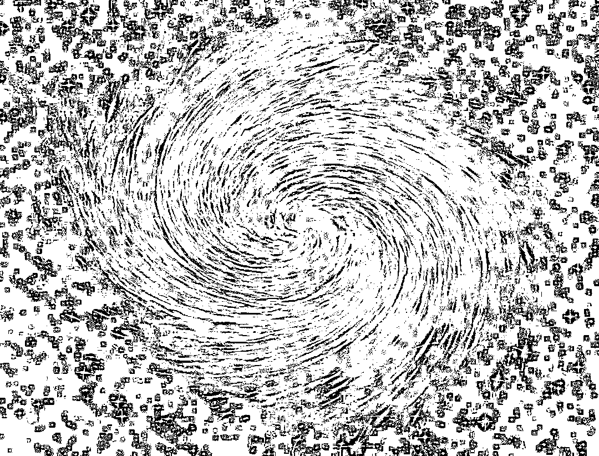

**1 月下旬**

1 月下旬天象

**1 月 20 日**  

*   太阳换座水瓶座

**1 月 23 日**  

*   逆行水星和太阳在水瓶座合相

**1 月 24 日**  

*   火星换座摩羯座

**1 月 29 日**  

*   水瓶座太阳六分凯龙星白羊座

*   逆行的水瓶座水星合相摩羯座冥王星

*   金星在摩羯座 11º04’ 顺行

**1 月 30 日**  

*   水瓶座太阳四分金牛座天王星

**1 月 20 日，太阳换座水瓶座**，人们从事业、家庭的忙碌里抬起头，开始留意这一年要过得和过去如何不同。

水瓶座的能量也有关个体独立性和群体的归属感。在这个春节，人们将会体会民俗如何被疫情再度推到变革的池子中。**不要再怀念 2018 年、2017 年，向前看。**

**1 月 23 日火星换座摩羯座**，估计这个春节很多企业要加班，或者在家工作。这个春节非常忙碌。对管理机构来说,，如何防止人们春节大流动导致疫情扩散，将是非常严峻的挑战。摩羯座火星也会产生一些不认命、一定要回家的行为。有时候适当妥协是必须的。

**1 月 23 日太阳和逆行的水星在水瓶座合相。**每次水星逆行的时候合相太阳，都会产生一些新的观念和想法，然后到水星顺行后、赶上太阳再次顺行合相，一些新的观念在生活中彻底扎根落地。

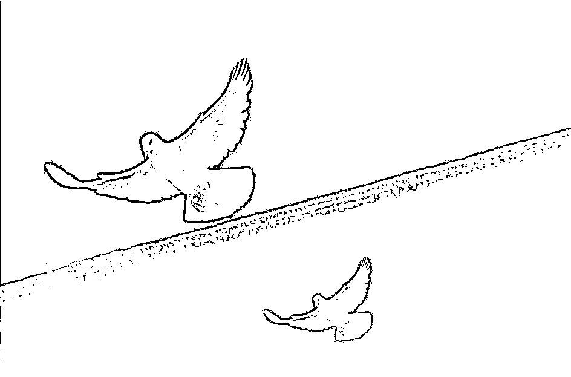

**1 月下旬中国进入过年倒计时**，往常的春运大潮估计今年会大幅度缩水。就地过年意味着不再是家族聚会，而是社群导向的庆祝活动增加了。

原本社群庆祝是集体看春晚，然后在朋友圈和微信群里吐槽抢红包。今年可能是几家人家一起聚会，**这是个从家族到社群的重大转变**。对未来的春节文化，也会产生很大影响。

**1 月 29 日金星在摩羯座顺行**，伴随着水星与冥王星的合相、太阳六分凯龙星，又是个重磅律法出台、或者有些明星/政治领域的人物出现重大新闻的时候。 

每次水星合相冥王星，都意味着**有些隐藏的秘密被发现**。在水瓶座的话，有时候是深入到灵性世界里的学习，有时候是明星、群体、电商、科技领域的秘闻。请特别留意向阳屯互联网界和汽车界，容易出事。

春节是重要的电影旺季。今年的水瓶座能量和木星换座双鱼座，可能会有些不错的科幻题材影片上映。互联网站的跨年活动，会比过往更引起大家的关注和参与。

**1 月 30 日，太阳四分天王星。**又逢除夕，正是辞旧迎新能量的最好象征，动起来。**最好的祝福是：只要你想，全宇宙都会来提供支持。**请大胆想象。

2021 年是非常 hard 的一年。2022 年可以用混沌来形容。然而神话里混沌意味着新的“一” 的诞生。万物待兴。**请带着最好的梦和最纯粹的爱，去期待和孕育。**

**尾声**

感谢大家这一年来的阅读和陪伴。2021 年 2 月-2022 年 1 月，我的月运专栏任务完成啦。这对我来说是个很新鲜的尝试。欢迎下一位继任的月运作者，今年写作顺利！

**2022 年，我们继续在占星的世界里相遇，对一切的到来说“是”。**

祝，开心！

莎珈

**本月重要天象一览表**

| **日期** | **星象** |
| **2022.1.1** | **摩羯座太阳三分金牛座天王星** |
| **2022.1.2** | **水星换座水瓶座** |
| **2022.1.3** | **摩羯座新月** |
| **2022.1.9** | **逆行的金星和太阳在摩羯座合相****水瓶座水星六分白羊座凯龙星** |
| **2022.1.11** | **摩羯座太阳六分双鱼座海王星****射手座火星四分双鱼座海王星** |
| **2022.1.14** | **水星在水瓶座 10º20′逆行** |
| **2022.1.17** | **太阳和冥王星在摩羯座合相** |
| **2022.1.18**  | **巨蟹座满月****天王星在金牛座 10º49’ 顺行****逆行水瓶座水星六分白羊座凯龙星** |
| **2022.1.20** | **太阳换座水瓶座** |
| **2022.1.23** | **逆行水星和太阳在水瓶座合相** |
| **2022.1.24** | **火星换座摩羯座** |
| **2022.1.29** | **水瓶座太阳六分凯龙星白羊座****逆行的水瓶座水星合相摩羯座冥王星****金星在摩羯座 11º04’ 顺行** |
| **2022.1.30**  | **水瓶座太阳四分金牛座天王星** |

**版权声明**：原创文章由作者授权首发于若道平台，欢迎转发，反对抄袭。友号转载请申请白名单。

****

****傅莎珈****

ISAR 认证占星师（2015 年获得）

心理占星师/内观书写带领者/冥想带领者

国际著名传播集团工作 20 年

**微信公众号**：Helloshajia

长按打赏

**2022 年来了**

**还不快领取你的****专属年运报告****？**

**购买有优惠，点击图片查看详情哦~**

**学习占星学****点击下图了解课程详情** 

********************************

**微信又双叒叕改版啦，不想错过若道君的推送？**

**就把若道设为星标吧！**

**▼**

**就是这个“在看”，戳戳戳 ☟**

********报名直达入口********

# “你正在寻找的东西也在寻找你” | 冬日野骨·荒野一日仪式招募中

> 原文：[`mp.weixin.qq.com/s?__biz=MzA5NjA0NTAxNg==&mid=2651465005&idx=2&sn=7199908ae5002dd9067cecc59c7e97fb&chksm=8b48979abc3f1e8c4214fa057a8f87c831fb5ecc7e691f72b1de8278a2b4c3cdae781fffa444&scene=126&sessionid=1692737878#rd`](http://mp.weixin.qq.com/s?__biz=MzA5NjA0NTAxNg==&mid=2651465005&idx=2&sn=7199908ae5002dd9067cecc59c7e97fb&chksm=8b48979abc3f1e8c4214fa057a8f87c831fb5ecc7e691f72b1de8278a2b4c3cdae781fffa444&scene=126&sessionid=1692737878#rd)

****

**与大自然的灵感力量联结，让你的内在智慧从骨头深处升起。**
**你正在寻找的东西也在寻找你。****——鲁米**这是在新的一年来临之时你可以送给自己的礼物。与另外 7 个伙伴一起，与大自然的灵力相联结，找到内在智慧和野性力量。

1

**适合对象**

**·** 希望自己的生活更有方向感**·** 正处于人生的过渡阶段，正在寻求指引**·** 已经准备好放下那些不再服务你的事物**·** 想要勇敢地联结你的野性力量**·** 想要融入自然界的安宁与美之中，为静谧的智慧留出空间

2

**课程描述**

“冬日野骨”一日工作坊，我们将一起走进大自然和寂静的冬日，在这里，你也许会感知到灵魂在召唤你进入更深的地方，去认知你生活中的转折点，或者去寻找对特定问题或者挑战的洞见与支持。 当你进入冬日时节，在霜雪寂静中，在雨水的气味中或者在自己寒冷的皮肤上，有什么样的智慧在静候着我们？也许你很好奇，那些光秃秃的树木在你的内在召唤什么？鸟儿们低缓的旋律又在如何帮助我们放慢下来？当你放弃一点点安逸，站在冬日之歌的中心时，什么会照亮你的内心深处？**冬日是一个沉思和反省的时刻，是为你自己、家人和后代带来智慧的时刻。**据说我们都是带着独特的天赋降临在这个世界上的，这就是我们灵魂的目的，但是灵魂又在哪里呢？在许多的神话、民间传说和文化当中，“骨头”被认为是灵魂的居所。**“冬日野骨”之旅将邀请我们进入荒野，去发现自己的“骨子”中深藏着什么，借此我们可以洞察到什么样的智慧想要作为我们的天赋显现。**

在这个“冬日野骨”一日工作坊中，我们将遵循传统仪式的三个阶段：**分离、门槛以及融合。****·** 工作坊开始时，我们将围成一圈，敞开心扉倾听，探索我们的意图；**·** 之后我们将走出这个圈，进入你自己的个人体验（分离）；**·** 跨越门槛，我们向进入神圣临界空间之前的过渡区域表达敬意，你将在那里与大地对话。**·** 穿过门槛返回到圆圈当中，分享在大自然和冬景的神秘中发现的启迪。（融合）

****

**一颗种子必须被冻结在自己的意图之中，然后才能打破冬天的桎梏，喷出绿色的火焰。****——史蒂文·福斯特**

3

**时间安排**

**（建议参与者当天禁食，我们将在您报名后发送准备说明）****9:00 **开幕式，分享当天的概况以及安排（10 分钟）分享关于如何构造一个门户（20 分钟）**9:30 **在线登入，参与者介绍自己的名字和来自中国的什么地方，并分享童年时期与大自然的美好体验你今天想要探寻什么？我们会帮助大家澄清今天的意图。为了今天的探寻，你准备好放弃什么，臣服于什么，放下什么？（每人可以携带一块石头或者天然物品，例如羽毛、树叶来标记自己的意图）**11:00 **指导大家如何保持意图、如何探寻（15 分钟）**11:30 **参与者前往大自然中静谧的地方探寻（3 小时的探寻结束之后，我们会提供一些日志问题）**15:00 **参与者返回，欢迎大家归来**15:10 **参与者分享他们的自然之旅，我们会提供一些支持，帮他们澄清自己的经历和所获得的洞见**17:00 **闭幕式

4

**带领老师**

** Toni McErlane**

我来自新西兰，拥有社区和人类服务—咨询康复学士学位，是 Aminz 的注册家庭纠纷调解人，也是 NVC Aotearoa 的 NVC 培训师。

在我的生命中，我一直对真诚、充满活力、自我负责的沟通和有意识的选择充满激情。而我的人生旅程为我提供了充足的机会，让我去探索、研究、反思和完善这在沟通中是什么样的。

在我的工作坊中，我的原则和实践都是建立在非暴力沟通和正念的哲学基础之上。非暴力沟通是由美国心理学家马歇尔·卢森堡博士所开发的。马歇尔的目标是发展出一种语言，这种语言受到印度巴利语中的“非暴力主义”（Ahimsa）一词的启发，它的意思是“没有伤害”。我们怎样才能在与他人沟通时不造成伤害呢？这不仅需要非暴力沟通的技巧，还需要在训练中融入正念。正念是受小乘佛教内观传统的启发，发展觉知和接纳，关注和允许。在我们的工作坊中 ，我们将非暴力沟通和正念编织在一起。

我致力于以这种沟通和处世方式作为我日常与人互动的基础。我曾经学习了为期一年的北美非暴力沟通领导者项目，在加州湾区非暴力沟通的全年浸入式项目中做了两年协助工作，然后在索诺马县女子监狱推动非暴力沟通培训。同时，多年来我持续参加内观静修，致力于继续和发展这种实践，并把它融入自己的工作坊中。

2020 年疫情期间，我与丈夫和我们的猫在游艇上休了一年假。现在，我和丈夫还有 15 岁的侄女在新西兰南岛的达尼丁生活。我在那里从事心理咨询、冥想和生态心理疗法。我们还正在那里慢慢建立一个治疗静修中心和生态冥想社区。

过去四年，我曾两次来中国，与若道及其友好而充满活力的团队分享非暴力沟通，并参观了一些绝佳风景。我期待继续与若道合作，在网上分享我的知识和技能。

向上滑动可查看更多

5

**工作坊详情**

**精品小班工作坊，仅限 8 人参与，迎接新春。**
**工作坊时间：**1 月 22 日 9:00-17:00**工作坊价格：原价 1580 元/人，****二人同行价 1380 元/人**咨询报名请联络：李老师长按二维码添加课程负责人咨询~****冬日野骨·荒野一日仪式****

**授课老师：**Toni McErlane

**授课时间：**2022 年 1 月 22 日

**授课方式：**网络课程**，**英文授课，中文翻译

**费用：****原价 1580 元/人，二人同行价 1380 元/人**

**课程负责人：****李老师**（请备注“冬日野骨”）

长按二维码添加课程负责人咨询~

******报名直达入口******

# 这颗“难以读懂”的行星，却注定给你带来超然的生命体验（内附行星相位指南）

> 原文：[`mp.weixin.qq.com/s?__biz=MzA5NjA0NTAxNg==&mid=2651464929&idx=1&sn=47f45cfc4be96005052a493ada67eb78&chksm=8b489656bc3f1f4050b2cd0c0a18733250fc0750056376aa962c67d5604d8989b24a1bdf5b8d&scene=126&sessionid=1692737878#rd`](http://mp.weixin.qq.com/s?__biz=MzA5NjA0NTAxNg==&mid=2651464929&idx=1&sn=47f45cfc4be96005052a493ada67eb78&chksm=8b489656bc3f1f4050b2cd0c0a18733250fc0750056376aa962c67d5604d8989b24a1bdf5b8d&scene=126&sessionid=1692737878#rd)

**☆ 后台回复“今日”，给你一句生命态度 **

作者/薇安 ISRA 认证占星师
编辑/翀子 图片/网络

占星学里的海王星，很难被清晰解释清楚，这与它神秘、富有想象力、善于欺骗也带来慈悲的特质相似。当它与个人星图上的太阳、月亮、水星、金星、火星形成重要相位时，意味着我们会在哪些领域超越现实生命的局限呢？一起阅读吧！

**引言**

**海王星，一如它象征的能量特质，最难被清晰诠释。**它是无相的、神秘的、超验的；是慈悲的、理想主义的、富想象力的；也是幻觉的、具欺骗性的、善于逃避的。

在出生星图中，当个人行星与之形成紧密相位时，其原型光谱中——**无助、被动的态度，将自己认同为受害者，容易对人或物依赖成瘾；或是极佳的共情能力，丰富的想象力和艺术天赋，慈悲的性情，理想主义情结及渴求灵性成长等特质**——都会错综地在我们身上体现出来。

而无论以何种方式与海王星相遇，**“诚实的态度，清醒的力量，自律的精神和容忍幻灭的勇气”**，都是帮助我们历经浮沉，让意识之光穿越迷雾，生发出爱的信念，进而跃身于对更高理想的追寻中，所必需的品质。

**海王星与太阳的相位**

在基本层面，这一组合带来**友善、敏感、富同情心**的特质，对精致事物有**细腻的觉知和鉴赏力**，能理解**慈悲**的重要性。**而太海人的核心发展任务，则围绕如何“活出理想自我”展开。**

**对成为独特之人、超越平庸的渴望**，会催生改善或改变的驱动力。弱疆界感及忽视现实约束的倾向，也可能作为有利特质，使太海人能捕捉到一般人不易察觉的机遇。

既能探索世界真相，又能与粗糙现实保持一些距离的**创作领域**（例如：戏剧、音乐、写作、绘画等）；或能充分表达同情，并分担他人痛苦的**治疗、救助类的工作**，尤其利于他们实现潜能。

**和谐相位的“阴影”**

和谐相位虽令人有更多的自洽体验，但易落入这样的“陷进”：**遭遇到现实与高远抱负的落差时，倾向寻找“不费力的路径”。**

他们可能扭曲事实，紧抓住对某种身份的幻觉不放；或侵入到别人的身份之中，借由他人来活出自己；也可能表现得非常容易接纳眼前的情况，否认深藏的、对改变的无力感。

但在人生的某个阶段（例如心理学定义的“中年危机”），未能得到充分发展的太阳（自我实现的意图），**会使个体心灵因为缺乏自我身份认同，而被巨大的虚无感淹没。**

**挑战相位下的“角力”**

**挑战相位，包括合相，个体在先期会更想“对抗”海王星对个人身份的消融，反而强化了个人意志的运用。他们会努力通过在某个领域获取成就，来增加自我的确立感。**

但心灵不会永远“拒绝”聆听海王星的召唤，当物质现实中的成就不能提供充分的精神意义时，这种确定感会逐渐坍塌。

**然而，这也是太海人一个绝佳的跃升时刻。**如果他们甘冒“失去个人身份”的险，愿意献身于一个更伟大的目标，生命会迸发出全新的、益加旺盛的创造力。

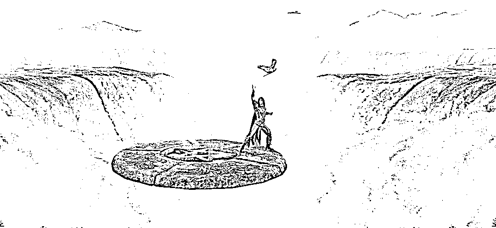

**案例**

卡尔·古斯塔夫·荣格（太阳落狮子座，精准四分海王星），在童年时期就体验到**一系列视觉的幻想**。他描述自己有两种相异的人格：

**第一人格**是那个巴塞尔的男生，他爱阅读小说；**第二人格**独自思考宗教，处于自然和宇宙合一的状态。两者的相互作用贯穿了他的一生。

早年，他认同于第一个人格，追求自然科学，进入精神病学的医学领域。和同僚依循科学研究方法设计的联想实验，为他奠定了个人声誉，30 岁便成为精神病学界一颗冉冉升起的新星。在与弗洛伊德合作期间，曾担任国际精神分析协会的首任主席。

与弗氏因强烈的观点不一致而分道扬镳后，他返回到自己思想的源头，并投入到神话的研究中。“**那时候，我好像生活在自己创造的精神病院里，游走于各种幻想的形象之间......”**（卡尔·荣格，1925 年）

1913 年末，荣格开始长达数年的有关“让心灵内容自发显现”的自我实验——在清醒状态下刻意激发一个幻觉，并进入其中，随后将它们记录下来，附上对自己心理状态的思考。

那个时期，他白天进行繁忙的学术活动，承担家庭责任，“确保我能够处在正常的状态且真实地存在着（卡尔·荣格，《回忆·梦·思考》）”，晚上持续进行自我探索。

过程中，他也承受着恐惧，“作为一名精神科医生，我很焦虑，怀疑自己是不是走在‘成为一名精神分裂症患者’的路上......”（卡尔·荣格，1952 年）

**而最终，这段深度精神探索的旅程，为其后期学术著作定下基调。**有关“集体潜意识”、“原型”等杰出思想，“积极想象”的治疗技术等，都于其中孕育。

**这段被视为荣格完成自性化进程的经典历史，可谓太阳与海王星原型整合的精彩典范。**

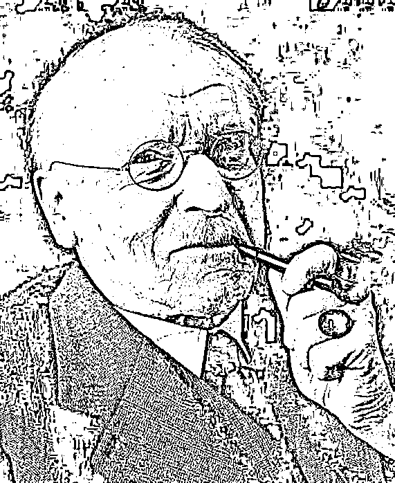

| 卡尔·古斯塔夫·荣格

**海王星与月亮的相位**

海王星与月亮相遇，好似把一个人情感感受器的强度调高了 N 倍。**月海人会像海绵一样把周遭人的感觉全部吸收进来，很难分辨它们是自己的还是别人的。**

**这种高度的敏感性是一把“双刃剑”**。一方面，这使得他们有能力创作出激起集体情绪共鸣、抚慰人心的作品；或以无私之心，投入到慈善、志愿者一类的行动中。

另一方面，这也带来与困难情绪相处的挑战。强烈的悲伤和痛苦，容易引起低能量水平的抑郁状态。月海人从生命早期开始，为免于被这类情绪淹没，必须发展出某种自保的模式。

他们可能隔离对情绪的体验；或通过遁入虚构的想象世界，逃离现实经验的扰动。（若早年生活充满动荡，或有创伤性的事件，这些自保机制会变得更加顽固。）

渐渐地，他们可能开始逃避生活中的一切困难情景，只愿意接触美好的事物；或者干脆寄生于他人的滋养照料。**在被迫面对不舒服的境况时，可能会习性地扭曲事实，幻想出能安抚自己的剧情。**而这些，都会使他们的创造性潜能受到抑制。

**月海人需要透彻地理解自己的特质及其影响，并有意识地与之“对抗”**。例如，将对受苦之人的敏感、想要保护和照顾他们的愿望，化为付诸行动的驱力。对现实产生点滴的影响和改变，都能强化自我力量。

**换言之，就是发展太阳的意志和品质，来平衡月海的被动性。**

日常生活中，**练习定义自己经验到的复杂情绪，辨识自己真正的感觉和想法，区分出来自他人的影响，**也有助于月海人清晰人我边界。

**月海人的心灵深处，向往着一个没有苦痛、充满爱的理想家园或国度。**但这个地方不在他处，需要他们勇敢投身到建造它的进程中。

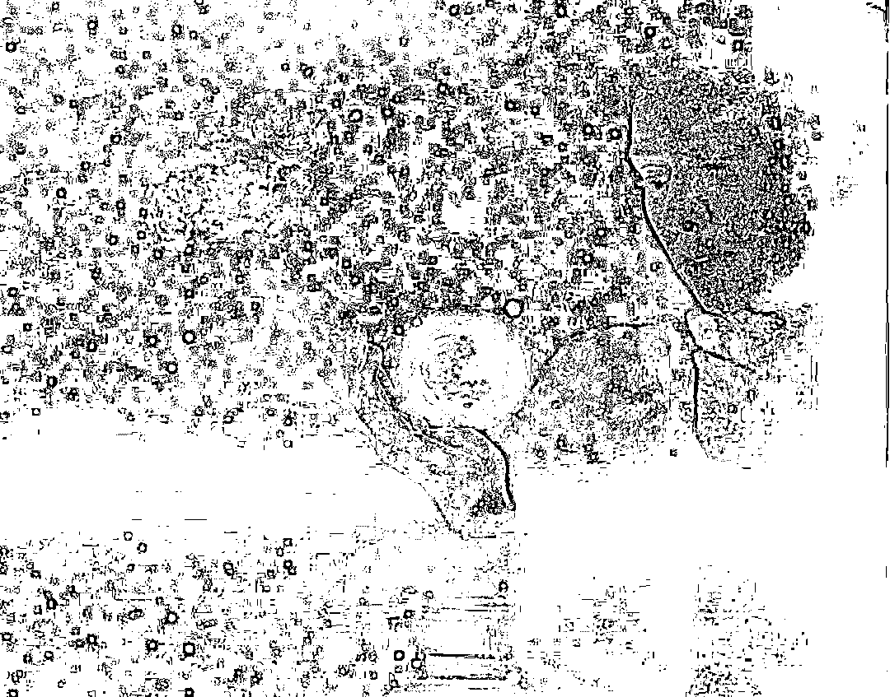

**案例**

**出生星图中的月亮，也指征着我们的重要养育者（通常是母亲）**。月海紧密相位的案主，也常见于在与母亲的关系中显化出这组原型经验。

**★案主 A：月亮、海王星精准对分。**

儿时因家道中落的变故，家庭氛围变得糟糕。父亲经常对他暴力管教，宣泄不满。他吸收着家人所有的负面情绪，体验着对人生的深沉失望。

“那个时候，我将**“拯救母亲”**的幻想，作为支撑自己的的动力。她的身体不好，我就疯狂学习各类医疗知识，但又被无力、无能的感受缠绕......大学毕业后好几年的时间，我也没有持续稳定的工作。花了许多时间在各种灵性流派中寻找解脱......”

**后来与母亲的一次深谈对他产生了颠覆性的影响。**

*   “我向母亲述说因自己而令其受苦的记忆和内疚。没想到，她一一纠正了我的印象，一再强调不是我的错”......

*   “我如大梦初醒般，看到母亲的智慧和她对我**无条件的爱**。也意识到自己一直沉浸在**‘拯救者’**的人设里，却从未真正脚踏实地地为自己的人生负起责任......”

**此后，他开始专注事业和生活的建设。**

*   “幸运地是，那段期间我也跟随不同的老师扎实地学习到许多知识。我将风水与建筑设计相结合，开始发展专业咨询服务......”

太水合相双子座落的他，也喜欢通过视频号进行分享传播；并随缘教授人们书法。“研习书法，是最能令我感到平静的事......”

**★案主 B：月海合相（包含太阳的星群落十二宫）**

她的生活和事业发展看上去都很顺利，是一位出色的年轻律师。从小和妈妈的关系非常亲密。母亲因病离世后，淹没性的哀伤反应，促使她寻求心理咨询的帮助。

与咨询师的共同工作期间，她逐渐清晰地意识到，**此前自己的许多人生选择，都是为了活出母亲的愿望。**其实母亲从未在语言上要求过她，但她仍不自觉地铭刻下母亲的一句话、一个表情，并全力回应。

因此，母亲的离世，不仅激起巨大的哀伤，也带来一种**“我也随之消失了”**的崩塌感。随着哀悼的进程，在心理意象上与母亲区分开来，她才逐步获得更清晰自我图式，能真正与母亲告别。

“母亲离开后，我好像才开始活自己，承认这一点总伴随着强烈的内疚。不过我相信，妈妈一定希望我这样做，这也是我记住她的爱最好的方式。”

**（原型被表达为具体的人生剧情时，受多维因素的影响。不过，对于有月海紧密相位的孩子来说，母亲能开放地与之讨论彼此的情绪，协助并鼓励孩子鉴别、表达自己的需求，会是极佳的发展性支持。）**

**海王星与水星的相位**

**海王星强烈影响水星时，会消融它在土星的世界里所强调的逻辑思考与客观性，并为其注入丰沛的情绪能量和想象力。**

水海人因此能极其敏锐地捕捉事物之间的联系，甚至渗透到他人的心智世界、或集体潜意识的领域中去。如能善加运用，会展现出心理学方面的才华；或在广告、宣传一类的工作中颇有建树。

不过这也意味着，**他们的头脑太过敞开，**容易被别人的思想、观念所影响；或将周遭信息全部吸收进来，难以厘清和加以组织。**把想法列成清单，或借助思维导图一类的逻辑整理的工具，能提供一定帮助。**

在语言表述时，水海人会不自觉地运用上隐喻、双关语，或用想象加工事实。也可能更喜欢运用象征符号、非语言信息来沟通表达。诗歌、小说创作、尤其是音乐，最能帮助他们抒发内在感受到的“真实”。

但这一能量的错置，也可能令他们变成惯性的撒谎者，热衷八卦和传播流言。甚至滑入自欺和妄想，全然无视现实。

**水星是将不同的心理功能进行联结的“使者”，它对个体究竟会产生怎样的影响，必须结合整体星图来理解。**

总的来说，水海人若能认清自己**“将幻想和现实混合成一种更广阔观点”的倾向**，同时有意识地辨析两者的区别，将有利于这一心智特质的正向运用。

名人案例

太阳、水星紧密合相，对分海王星（1 度容许度）的天才作曲家：沃尔夫冈·莫扎特，在短短 35 年的人生中，创作了 600 余部、几乎涵盖当时所有音乐体裁的作品，可谓以一种极致的方式诠释了：“音乐可能是水海人最了解的语言”。

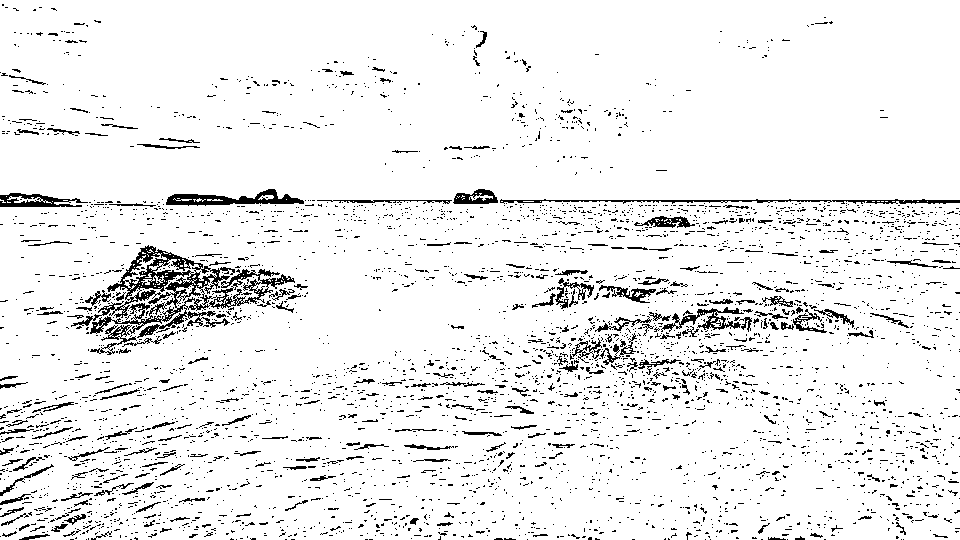

**海王星与金星的相位**

**海王星与金星联结，令人对爱与美充满细腻的感知及一种童话般的幻想。**

因此，金海人可能会把对象理想化而迅速坠入爱河，又因对方日渐呈现的“缺点”或日常生活的“乏味”而感到幻灭。

*   **编制更多幻想美化当前关系；**

*   **暗中与别人发展秘密恋情；**

*   **不断变换伴侣以期找到“理想爱人”；**

*   **在不断的失望之后，索性只活在想象的关系里....**

这些可能是他们应对幻灭感的方式。

理智上我们不难区分，童话中或荧幕上的爱情故事，只是人们的理想投射。若执着地在现实中追寻如此这般的“完美关系”，往往关联到更复杂的心理情结。

**金海人必须弄清楚自己投射其中的潜意识幻想，才能以更清醒的意识和成熟的态度，参与到真实关系的建设中。**

**另一种容易吸引金海人的感情模式则是——投身于一段救赎式的爱情中，把自己认同为唯一能理解和拯救对方的人。**

金海的能量，确实昭示着**“有能力付出无私的爱”**。但这里也可能隐含这样的动机——“我在爱情里面，就是喜欢找能够激起我同情心的对象，遇到这样的人，我马上会感到‘自己总算派上用场了’”。而一味地扮演“救赎者”，可能令伴侣感到自身价值被轻视；或者使金海人易落入被利用的陷进。

**健康、持久的成人关系，基于平衡的付出和被给予——无论金海人经历的情感剧情为何，这都是他们要学习的、有关爱的课题。**

而金海组合也预示着**极佳的艺术创造力**。若能透过作品用爱与美感染和启发他人，同时充分表达自己的浪漫情怀；或者将仁慈、同理心和“爱每一个人”的能力，发挥在利他的工作中，更利于金海人表达他们对宇宙大爱的理想。

名人案例

海王星三分金星（同时对分月亮）的玛丽莲·梦露，容颜诠释着梦幻、浪漫之美。这是祝福也似诅咒，她承载着人们投射的想象，却感到——“他们根本不在意真实的我，相反的，只是爱上一个他们幻想出来的玛丽莲·梦露”。

从未见过生父，童年寄养漂泊，不难想象她对找寻真爱的渴望，而这也成了她的灵魂之殇——“有某个人，你只需要跟他相处就够了！你可以不用有任何接触，甚至不需要言语，一种之间的感应交流，就足够让你感受到暖暖的幸福。”

如今，人们终于从更多有关她真实生平的资料中，看到其脆弱背后的力量和诗人般的才情。她仍然如象征符号般存在于世，却折射出更丰富的意义，一如她生前的个人意志——"我的上帝啊，我太想去学习、去改进、去改变这一切了"（太水合相双子座落十宫）。

**海王星与火星的相位**

**海王星与火星形成相位，会部分地消融个体在确立和主张自我时所需的内驱力和竞争性。**

**他们通常很难直接地表达愤怒，**会感觉很难抓住这种情绪，刚要表达它就消失了。

有的人则受到某种潜在信念——例如：我获益就意味着别人会受到伤害或损失——的影响，**在需要争取自我权益时，易激起内疚体验，难以付诸行动。**

由此对火海人造成的消极影响有：

*   **火星的能量被转向自身，以躯体化的方式（罹患慢性病或易感染病毒等）呈现难以对外的攻击性；**

*   **人际间一味的隐忍退让，可能吸引来频繁侵害他们利益的人；而这类情景又会让火海人责怪自身软弱，于内在自我攻击；**

*   **海王星也可能消弭了火星的方向感，令他们似乎什么都想做，却无法在特定的计划上予以坚持。也容易因此被他人的“理想计划”引诱和利用。**

在占星学的象征意义上，火星为整张星图（心理功能）提供燃料（原初动力），它尤其是发展“太阳的意志”的重要伙伴。

从这个角度讲，调控的火星功能，对火海人活出自我至关重要。他们可以：

*   **通过规律运动培养力量、耐力和竞争力，以及释放愤怒，从身体层面熟悉火星的能量；**

*   **有意识地辨识那些需要确立和捍卫自我的情景，挣脱自我怀疑或和平主义造成的心理限制，付诸必要的行动；**

*   **在更具升华性的层面，用艺术媒介表达力量美学；或参与社会工作为不幸的人抗争；坚定地去实现一些福祉他人的理想……以实现想象力、敏感性、慈悲心与个人力量的融合。**

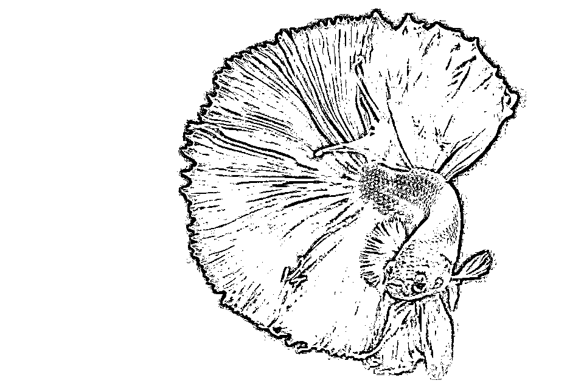

**结语**

**海王星的终极意图是消融土星象征的一切边界**，从而使我们能超越一般现实（包括各类物质形式，以及人格和自我的局限），**提升心灵，与更奥妙的次元相连。**

**但我们首先会透过与个人行星相关的面向，**经历到个人性的欲求、存在的重要性与海王星要求的忘我、消融、回归万物一体性之间的激烈冲撞。

这一心灵的冲突，不可避免地带来难言的内疚或焦虑感。而其积极意义则在于：**吸引我们的意识向内在、向深处不断扩张对生命的理解与觉知。**以在土星的秩序中所历练成熟的自我结构为重要基础，我们能更具创造性地成为表达海王星能量的管道。

**版权声明**：原创文章由作者授权首发于若道平台发布，欢迎转发，反对抄袭。

****

**薇安**

全职心理占星师、ISAR 认证占星师（2016 年获得）、若道兼职助教

北大心理学硕士、MBTI 国际认证施测师

若道认证生时校正资质及 COAC 高阶资质毕业生

**微信 ID**：weianhuilai

**公众号 ID**：Radio-for-Alice

长按打赏

**学习占星学****点击下图了解课程详情** 

********************************

**微信又双叒叕改版啦，不想错过若道君的推送？****就把若道设为星标吧！****▼**

**就是这个“在看”，戳戳戳 ☟**

******报名直达入口******

# 压力太大，承受不了？ | 12 星座抗压能力提升法

> 原文：[`mp.weixin.qq.com/s?__biz=MzA5NjA0NTAxNg==&mid=2651464929&idx=2&sn=febc96f7c2cca508dc7381fd93d9c573&chksm=8b489656bc3f1f4098c7998f531c66002fdd5bfcac02b765dddbaeef42ad3f7bbf409ce6f003&scene=126&sessionid=1692737878#rd`](http://mp.weixin.qq.com/s?__biz=MzA5NjA0NTAxNg==&mid=2651464929&idx=2&sn=febc96f7c2cca508dc7381fd93d9c573&chksm=8b489656bc3f1f4098c7998f531c66002fdd5bfcac02b765dddbaeef42ad3f7bbf409ce6f003&scene=126&sessionid=1692737878#rd)

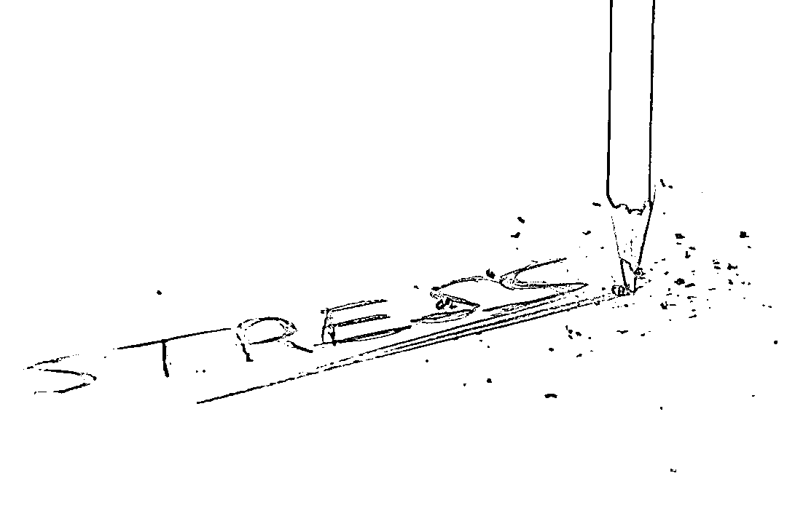

作者/ 苏·汤普金斯译者/昕心 整理/Lulu 轩轩编辑/玫瑰 图片/pexes

压力是现在一个很流行的话题，我们身边充斥着关于压力的信息。它能不能被管理呢？能不能完全避免呢？12 星座如何分辨和处理自己的压力？今天我们就来从占星学的角度谈一谈。[《医疗占星》](http://mp.weixin.qq.com/s?__biz=MjM5MjQwNjAyMQ==&mid=2649439075&idx=3&sn=38ce3cb71b17a1addb8c72afe989dc1b&chksm=beb9540989cedd1fddb3c1b1ace0e1b538191581a949acd1c2eaf81c6891dd763b66e0130ae7&scene=21#wechat_redirect)课程也在报名中，欢迎点击链接了解详情哦~

**压力的种类和成因**

“压力”在西方语言中是一个很“现代”的词，在 1926 年才第一次被瓦尔特·坎农（Walter Cannon）使用，来描述**会打乱体内平衡的外在事件**。但是第一个真正研究压力并做出定义的人是匈牙利人赛来（Hans Selye）。他在加拿大住了很久，写了数百篇关于压力的文章，让人们开始关注压力。 
我们不知道他的具体出生时间，只知道是 1907 年 1 月 26 日。他的星图上，**天王星在摩羯座 10°，海王星在巨蟹座 10°。这样的天海配置激发了他对压力的研究**。

现代生活充满了紧张的事件，如截止日期、挫败、要求、堵车等。对于人们来说，压力已经成为了生活的一部分。 

**压力可以是生理、心理、情绪和灵性上的****生理：**健康、没有地方住、太冷或太热、淋湿了、睡眠不够、工作太忙；**情绪：**悲伤、失业、失去爱人、不愉快的亲密关系。**顺势疗法中认为压力的形成有三种原因。****·** 首先是**功能性**的原因，即**基因继承；****·** 其次是**维持**的原因，比如因为婚姻不幸福而感觉不好。在解决婚姻问题前，没有任何药物能治愈你；**·** 第三是**兴奋性**的原因，就像导火索。对于小部分人来说，理发就构成一种导火索。 压力的原因多种多样，让一个人感到有压力的事，未必让别人有压力。占星师们都知道，**每个人的敏感点都不同，不同的人对不同的事情敏感。**

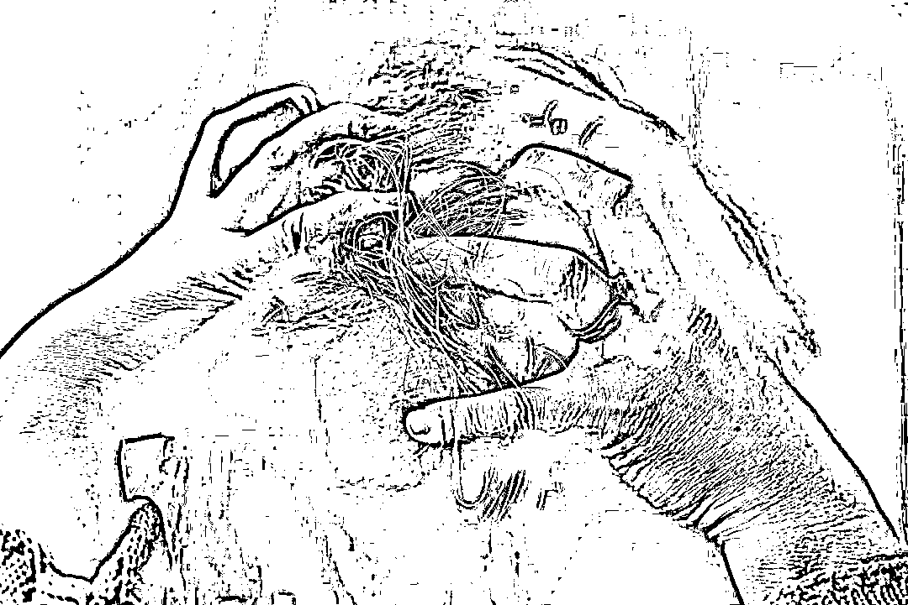

内在压力可以通过星图表现出来。 **· 内源性压力和不切实际的期待有关，是我们的期待让我们失望。**期待和**木星、海王星及射手座**有关，这些占星元素具有**夸大**的效应，包括正面和负面的夸大；**· 完美主义与处女座、火星、土星有关；****· 负面思维与水星、土星有关，但其实还有很多其他影响因素。**缺乏自信，不管面对什么任务，都觉得自己完成不了。我们中的大多数人在坚持自我的方面都有障碍，也有一些人会过度坚持自己。在这一方面，占星师可以帮助客户，毕竟有些客户需要得到允许才会去行动；**· 过度负责或不负责。**解决这些问题都需要良好地运用火星和土星的能量。 **12 星座的压力来源****白羊座：**事情进展不快的话就会觉得有压力。有人阻碍了自己也会觉得有压力。**金牛座：**不吃饭出门、搬家、改变都会给金牛带来压力。**双子座：**喜欢一边走路一边走神。没人聊天、无聊、陷在某个情境中、被困监狱中都会带来压力。**巨蟹座：**担心家庭，包括房子和钱。**狮子座：**不被欣赏、没有站在最高位、没办法完成责任都会造成压力。**处女座：**操碎了心的人，没有完成工作、没有足够的功能，没有很好地工作或完成工作，即使是别人的错。**天秤座：**孤单、被迫独立选择，看到不公平的情境和其他人的粗鲁。**天蝎座：**背叛、便秘。

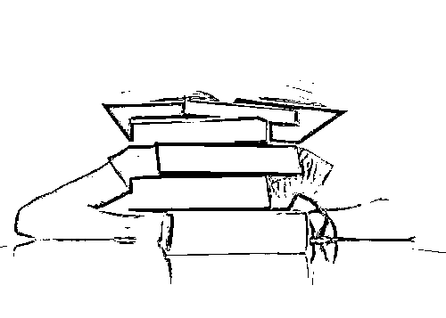

**射手座：**没有空间和自由、被困住。**摩羯座：**失败，为自己不尊重的事物工作，觉得别人不尊重自己，计划出错，没时间做计划。**水瓶座：**永远没压力的星座。与自由有关，不是很大的自由，而是不去想晚饭吃什么的小自由。没耐心。**双鱼座：**活在没有酒的世界、和心胸狭隘的人在一起。**排解压力建议源****·** 避免过度承诺、喝酒、悲观主义、完美主义、拖延症； **·** 避免同时处理多项任务，研究表明在进行多项任务时，我们并没有想象的那么有效率；**·** 避免压力大的人；花时间运动、接触大自然、简化生活，试着减轻责任，冥想、静心，固定时间休息。摩羯座总是在制定计划，细分任务，决定优先度。处女座和冥王星能量强的人都有组织计划能力。**·** 我们还需要练习正向思维、感恩，学会时间管理，让自己变得更有条理更有组织性。前文提到的研究压力的赛来，认为压力有两种类型：**好的压力和坏的压力。坏的压力**指的就是你生活在一种紧急情况下；而**好的压力**就是正向压力，能提升我们表现的功能性压力。比如考试就是正向压力，它能让你努力。 最后分享几句赛来的名言：**所有的压力都会留下不可修复的伤疤，而应对压力也会对机体造成伤害，即衰老。但是人们不应该逃避压力，就像不应该逃避爱、食物和锻炼一样。如果你有正确的态度，那就能把负面的压力转化成正面的压力。** 

**致死的原因不是压力，而是我们对压力的反应**。

**版权声明：**本文由若道翻译发布，欢迎转发，反对抄袭。友号转载请申请白名单。

**也许你还想看下面的文章** 

[医疗占星学入门级教程，建议收藏哦](http://mp.weixin.qq.com/s?__biz=MzA5NjA0NTAxNg==&mid=2651463790&idx=2&sn=1061eef9efd098b52011f81789eb6b4c&chksm=8b4892d9bc3f1bcf574050ff61f69f03dc3f8598341291a457c4220bdb96aebda5849412dd15&scene=21#wechat_redirect)

[“身体的问题，是一次崭新面对自我和生命的机会”](http://mp.weixin.qq.com/s?__biz=MzA5NjA0NTAxNg==&mid=2651463309&idx=1&sn=8c9870b3f2d8f48d0258ca3c1c7c43bc&chksm=8b48ac3abc3f252cc8576315ac16bac18d497621382abc55fa90dd227844d3a8e7e11833c567&scene=21#wechat_redirect)

[医疗占星学干货 | 四元素在医疗占星中的分析方法](http://mp.weixin.qq.com/s?__biz=MzA5NjA0NTAxNg==&mid=2651464268&idx=2&sn=2742fe580fec87dcfe054fda3c44480a&chksm=8b4890fbbc3f19ed011cc42a4db5df71ced4c1ce5d9027b58156fa6899927c104ac6d06d47db&scene=21#wechat_redirect)

**苏·汤普金斯**

若道签约老师。英国目前最资深的占星学家和咨询师之一，她拥有超过四十年的占星经验。占星学习者必备之两本圣经《当代占星研究》和《顺逆皆宜的人生》作者。苏是伦敦占星学院这所享有盛名的专业学府的创办人，曾任英国两家最著名的占星学院校长。2003 年，为表彰其卓越贡献，英国占星协会为苏·汤普金斯授予查尔斯·哈维终身成就奖。苏同时是一位接受过心理学与心理咨询训练的注册顺势疗法医师，并经常在英国、法国、挪威、瑞典、澳大利亚等地举办占星研讨会和公开演讲。

占星学与疾病有什么联系呢？**世界著名的医疗占星师简·帕特里克**说：**“占星学可以精准定位需要解决的潜在问题。”**

根据简·帕特里克的说法，**每个星座都有广泛的可能性**。例如，那些双鱼座的人有潜力去扮演殉道者（以他人为先）的角色，但是他们也有能力成为伟大的治疗师。

那么医疗占星咨询涉及哪些内容呢？简·帕特里克有这样的步骤：

**· **首先，会请客户提供详细的病历，以及他们出生的日期、时间和地点；

**· **然后，绘制他们的星图，观察在他们的病情确诊之前，在占星层面和情感层面上发生过什么。

根据简·帕特里克的说法，**癌症的主要病因之一，除了有害的生活方式之外，就是未解决的情绪冲突**：她通常会在症状出现前的 18 个月至 2 年间寻找触发因素。

她曾这样说：“当我为癌症患者服务时，我的任务之一就是识别出他们生活中的‘恶性肿瘤’，并帮助患者将其消除。”

**对医疗占星学有兴趣？**

**点击下图了解更多详情吧**

****

**更多好课**
**点击下图了解详情** 

********************************

**微信又双叒叕改版啦，不想错过若道君的推送？****就把若道设为星标吧！****▼**

**就是这个“在看”，戳戳戳 ☟**

********报名直达入口********

# ISAR 选修课 | 医疗占星学：透过占星的大门，一窥身体与疾病的真相

> 原文：[`mp.weixin.qq.com/s?__biz=MzA5NjA0NTAxNg==&mid=2651464929&idx=3&sn=5d9dee60706e19750b96fe0cc6fe7939&chksm=8b489656bc3f1f40c22663c177e59356ed0a5f94b3a4b6f8d6c9f313a2b00678bf7345149377&scene=126&sessionid=1692737878#rd`](http://mp.weixin.qq.com/s?__biz=MzA5NjA0NTAxNg==&mid=2651464929&idx=3&sn=5d9dee60706e19750b96fe0cc6fe7939&chksm=8b489656bc3f1f40c22663c177e59356ed0a5f94b3a4b6f8d6c9f313a2b00678bf7345149377&scene=126&sessionid=1692737878#rd)

1

**占星学与疾病之间存在联系**

****

**没有占星学知识的医生不能自称为医生。**

**　　——现代医学之父希波克拉底**

占星学与疾病有什么联系呢？**世界著名的医疗占星师简·帕特里克**说：**“占星学可以精准定位需要解决的潜在问题。”**尽管有人想当然地认为占星学是令人沮丧的宿命论，但事实并非如此：

**有四个主要因素影响着我们的生活和健康：基因构成、物质环境、情绪环境，以及我们的占星配置。我们在星图中都存在患病的可能性，而预防的方法在于尽可能充分、真实和健康地生活。****——简·帕特里克**根据简·帕特里克的说法，**每个星座都有广泛的可能性**。例如，那些双鱼座的人有潜力去扮演殉道者（以他人为先）的角色，但是他们也有能力成为伟大的治疗师。

那么医疗占星咨询涉及哪些内容呢？简·帕特里克有这样的步骤：

**· **首先，会请客户提供详细的病历，以及他们出生的日期、时间和地点；

**·** 然后，绘制他们的星图，观察在他们的病情确诊之前，在占星层面和情感层面上发生过什么。

根据简·帕特里克的说法，**癌症的主要病因之一，除了有害的生活方式之外，就是未解决的情绪冲突**：她通常会在症状出现前的 18 个月至 2 年间寻找触发因素。

她曾这样说：“当我为癌症患者服务时，我的任务之一就是识别出他们生活中的‘恶性肿瘤’，并帮助患者将其消除。”

**医疗占星师还可能帮助你确定做手术的最佳时间，或是指出你每个行星位置的优缺点**：比如，阵容强大的星群落入双鱼座可能与过敏有关，而巨蟹座人则可能发觉自己泡完热水澡后会疲惫不堪。**固定星座（金牛座、狮子座、天蝎座和水瓶座）在情感和生理上都倾向于“难以放手”，这可能为恶性肿瘤的生长创造环境。所以说，他们可能倾向于沉浸在过去的伤害中，难以自拔。另一方面，这些星座也擅长在艰难的时期坚持不懈并一直持之以恒。**

　**　——简·帕特里克**

“癌症人格”中比较突出的一点通常是难以表达情绪，而且你可以从星图中看出这一点。

**客户星图中突显的土星可能表明害怕表达自己的需求，或者害怕展现真实的自己。**

**——简·帕特里克**

发现癌症的身体部位也可能给出有关根本病因的线索。

简·帕特里克曾表示：“例如，卵巢与孩童、创造力、家庭有关。所以说，如果某人患有卵巢癌，那么问题可能在于此人无法表达自己的创造力，或是无法做到滋养和关怀。”

有趣的是，母亲的癌症恰好发生在自己的孩子开始离开巢穴时。

医疗占星师可能也会查看金星在客户星图中的位置。

**金星代表使我们快乐的东西，因此如果金星得不到满足，我们就不会快乐——而不满是滋生疾病的温床。**

**——简·帕特里克**

如果金星落入双子座（前文中母亲的案例），这表明你渴望趣味、变化、沟通、心智刺激和灵性工作。在患癌之前，这位母亲就觉得自己的生活缺乏快乐和意义。理解她的灵魂渴求转变——更多的旅行、更多的学习、更多的乐趣，这可以帮助和支持到这位母亲。**简·里德·帕特里克老师说：“星图中的每个因素都为我们提供了广泛的可能性。所以说，重要的不是我们的遭遇，而是我们如何回应这些遭遇。”**

2

**医疗占星包含哪些内容？**

本课程既适合医疗占星学的初学者，也适合已经有一些相关经验的人。
简·里德·帕特里克老师将运用现实生活中的例子，揭示一个人的性格、症状及其星图是如何相互映照的。课程也会探讨疾病的意义以及可能的治疗方法。本课程旨在为学员提供一个运用医疗占星学的框架和方法，学员将会学到一些有价值的实用工具，在课程结束后，自己使用这些工具研究其中的关联性。**此课程可作为 ISAR 选修课。**

3

**课程安排**

**课程时间：2022 年 3 月 8 日-4 月 26 日  每周二 20:00-22:00**

**第*****1*****讲  3 月 8 日 与占星学、心理学、病症一起工作，学习**

*   医疗占星学的组成部分以及如何使用它们

*   行星的作用与相互作用

*   黄道星座人

*   宫位的重要性

*   疾病和健康是如何产生的

**★ 第二、三、四讲的课程内容基于星座以及它们之间的相互作用。**

**第*****2*****讲  3 月 15 日 基本星座**

学习基本大十字星座——**白羊座、巨蟹座、天秤座和摩羯座**——及其功能和相关的健康问题。**这些星座与防御、养育、结构、体内平衡和荷尔蒙控制有关。**

****第*****3*****讲  3 月 22 日 固定星座****

学习固定大十字星座——**金牛座、狮子座、天蝎座和水瓶座**——及其功能和相关的健康问题。**这些星座与习惯和反射、心脏调节、生存、循环和协调有关。**

“固定星座（金牛座、狮子座、天蝎座和水瓶座）在情感和生理上都倾向于**‘难以放手’**，这可能为恶性肿瘤的生长创造环境。所以说，他们可能倾向于沉浸在过去的伤害中，难以自拔。另一方面，这些星座也擅长在艰难的时期坚持不懈并一直**持之以恒**。”

——简·里德·帕特里克（Jane Ridder-Patrick）博士

**第*****4*****讲  3 月 29 日 变动星座**

学习变动大十字星座——**双子座、处女座、射手座和双鱼座**及其功能和相关健康问题。**这些星座与呼吸、神经系统、肠道、睡眠以及信息、情感和行动的整合有关。**

**★ 第五、六、七、八讲重点学习行星，它们在身体层面的表达、它们的相位与行进。**

**第*****5*****讲  4 月 5 日 太阳与月亮**

**太阳**掌管视觉、活力、心脏和意识，与心脏、脊柱和视觉问题相关。

**月亮**掌管人体的周期，特别是月经周期、饮食模式和体液，与情绪引起的疾病、饮食失调和胃病相关。

**第*****6*****讲  4 月 12 日 土星与天王星**

**土星**掌管着皮肤、骨骼、牙齿和衰老过程。它对应的疾病包括慢性疾病、耳聋、帕金森病、关节僵硬和牙齿问题。

**天王星**代表身体活动的协调，有节奏的脉动和身体的“电”。与天王星相关的疾病包括癫痫、痉挛、心律失常，以及阿斯伯格综合症和自闭症样综合症。

**第*****7*****讲  4 月 19 日 海王星与冥王星**

**海王星**掌管松果体、细胞膜渗透和右脑功能，与过敏、上瘾的病症、慢性疲劳综合症和睡眠障碍相关。

**冥王星**掌管消除和转化，其病理包括毒性、脓肿、癌症和强迫症。

**第*****8*****讲  4 月 26 日 火星**

**火星是与能量和防御相关的行星**，掌管免疫系统、肾上腺功能、肌肉活动和炎症反应。**它是许多身体和情绪障碍的核心**，如自动免疫障碍、抑郁和发烧，以及由手术或需要手术引发的问题。

4

**此次课程适合哪些人？**

*   有一定占星学基础，若道核心课 L3 以上水平；

*   希望成为优秀的占星师，想要借鉴国际大师医疗占星解读思路并融入自己的体系的人；

*   热爱占星学、健康、养生的研究型占星学者；

*   计划考取 ISAR 认证占星师，寻觅中意选修课的学员；

*   走在自我探索和个人成长道路上的人。

**快来和简·里德·帕特里克老师学习升级版的占星学身体地图吧！**

5

**授课老师**

**简·里德·帕特里克 **博士****

（Jane Ridder-Patrick）

简接受过药剂师、理疗师、草药师、心理治疗师和历史学的专业学习，从事写作、咨询和讲学工作，在英国和全球教授占星学及其历史、当今的心理学和医学应用。她在爱丁堡执业，在爱丁堡大学获得博士学位，研究方向是 17 世纪苏格兰占星学历史。

**她最著名的出版物是《医疗占星手册》。2018 年，她因对医疗占星学的贡献而获得了著名的查尔斯·哈维占星学杰出服务奖。**

《医学占星术手册》（第二版，修订版和扩充版）

(爱丁堡，克拉布出版社，2006 年)

6

**课程价格**

*   **课程价格：****6800 元**

*   **早鸟价：5800 元（截止日期：2022 年 2 月 9 日）**

*   **课程咨询：**王老师（微信：18510107057，请备注“医疗占星”）

长按二维码添加王老师

7

**课程安排**

*   **课程时间：**2022 年 3 月 28 日开始，每周二晚上 8 点，每周一次，共 8 次课。

*   **授课方式：**线上直播，英文授课，中文翻译

8

**退转课程**

*   **退款原则请详看《教学协议》，如有疑问请咨询课程顾问。**

****医疗占星****

**授课老师：**简·里德·帕特里克

**授课时间：**2022 年 3 月 28 日起

**授课方式：**网络课程**，**英文授课，中文翻译

**费用：****6800 元****（早鸟价：5800 元，2022 年 2 月 9 日截止）**

**课程负责人：****王老师**（微信：18510107057，请备注“医疗占星”）

长按二维码添加课程负责人咨询~

****报名请点击“阅读原文”****

# 重大天象·木星进双鱼座｜2022 年，12 星座将有哪些幸运降临？！

> 原文：[`mp.weixin.qq.com/s?__biz=MzA5NjA0NTAxNg==&mid=2651464765&idx=1&sn=2a85a7202f5dfff4d2457f6bd109f166&chksm=8b48968abc3f1f9c0eac5c53ce62b1dbdaa80573b164da32656485a8726ef3e3a51d2b59af38&scene=126&sessionid=1692737878#rd`](http://mp.weixin.qq.com/s?__biz=MzA5NjA0NTAxNg==&mid=2651464765&idx=1&sn=2a85a7202f5dfff4d2457f6bd109f166&chksm=8b48968abc3f1f9c0eac5c53ce62b1dbdaa80573b164da32656485a8726ef3e3a51d2b59af38&scene=126&sessionid=1692737878#rd)

**☆ 后台回复“今日”，给你一句生命态度**

作者/Ara 爱拉（王珊珊）编辑/翀子 封面/书君 图片/网络

2021 年 12 月 29 日中午 12 点 09 分，“年度大使”木星彻底离开水瓶座，进入双鱼座。回顾本年年中木星在双鱼座的短暂两个月，我们会领悟双鱼座木星带来的启示。而木星在 2022 年穿梭在双鱼座和白羊座之间，又给 12 星座带来怎样的机遇？让我们来看文章吧！

我们最近也有一个关于 2022 天象的工作坊，你也可以了解一下（戳：[2022 年天象预测课](http://mp.weixin.qq.com/s?__biz=MzA5NjA0NTAxNg==&mid=2651464442&idx=2&sn=1ccf0bce7f1a6ff01ba0a1618891f42b&chksm=8b48904dbc3f195bb86b2028db14f0de6ae522198efbbff76a2fe7c21e4f1eec51351fadbfe7&scene=21#wechat_redirect)）

木星行进

*   **第一次进入双鱼座**：2021 年 5 月 14 日 06:35

*   **逆行回水瓶座**：2021 年 7 月 28 日 20:42

*   **第二次进入双鱼座**：2021 年 12 月 29 日 12:09

*   **第一次进入白羊座**：2022 年 5 月 11 日 07:21

*   **在白羊座逆行**：2022 年 7 月 29 日 04:37

*   **逆行回双鱼座**：2022 年 10 月 28 日 13:09

*   **在双鱼座顺行**：2022 年 11 月 24 日 07:02

*   **第二次进入白羊座**：2022 年 12 月 20 日 22:32

**序**

随着年度尾声的来临，我们的“年度大使”木星也将从水瓶座更换到一个新的环境：双鱼座。

**在今年中旬（2021 年 5 月 14 日-7 月 28 日）我们曾短暂地迎接过双鱼座木星。**还记得当时的社会大环境集体表现出的情景吗？

我们经历了一段历史般难得遇到的“缅怀多位尊敬的身负国家级功勋的老人去世”的感伤时光。集体氛围好像一下子充满了对于人生、年老、精神财富的感慨……

在那段时间，周围人最常见的表现还有“太困了”、“忽然经常做不同的奇怪的梦”、“忽然没有斗志了，每天只想躺平”、“不那么容易激动和计较了”、“开始走心而不是励志地面对很多选择了”等等……

待木星从双鱼座再次逆回水瓶座至今，我们或许才从这段躁动和纷乱中，意会到年中那段时光的意义：

**瞥见一份心灵落地的可能性，看到这个“水瓶时代”开启的同时所携带的另一面征象——放松、真实、自在、顺流。**

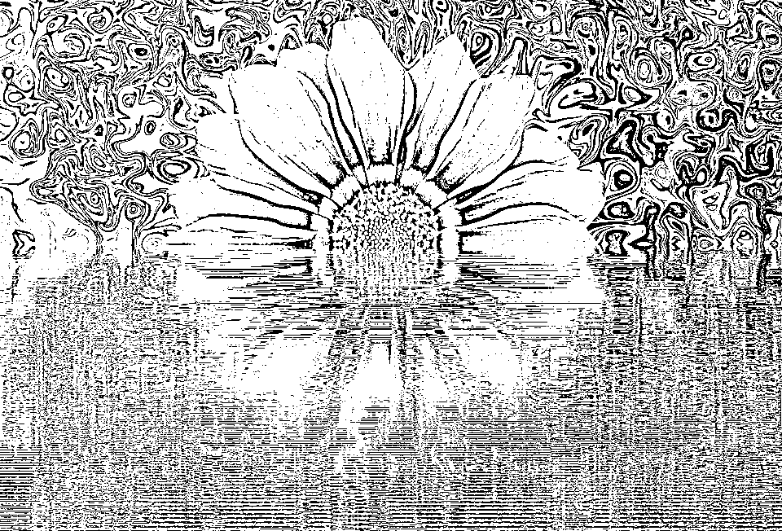

**在双鱼座和水瓶座间的穿梭**

而这次木星进入双鱼座，也是我们第二次，并且正式地经验木星双鱼座带来的“精神洗礼”。

**木星是与“集体社会目光/大众潮流/时代精神”等相关的征象星，**是我们经历了个人世界的打拼过程后，第一次把目光放长远到**“集体大众在做什么”**的更大世界里去。

尤其当我们意识到自己正是集体世界的一份子、且受着这个集体的氛围和潮流的同步性影响时——**我们关于“自我身份”的看法视角也变得更高、更大、更开阔。**

**所以每一次木星的换座和逆行，也可以看成是我们关于这个“更大自我”的身份和节奏的变化。**比如回想过往时代从理想主义年代、互联网时代、电子商务时代、网购时代等的发展变化，我们每个渺小的个体虽不一定是其中的弄潮儿，也都会有“参与和见证者”的身份感受。

如果说木星在水瓶座的时期是关于“资本圈（娱乐圈）乱象的见证和讨伐”、“社交圈子的打破和更新”、“元宇宙概念的开启和初试”、“国际关系的周旋和较量”等，**那么木星双鱼座时期则可能是关于“社会文明的违逆和思考”、“集体创伤的暴露与疗愈”、“灵性世界的探索与推崇”、“玄学文化的追根溯源”、“国家关于更大和平的战略演绎”等……**

可以说，木星从阳性+风元素的水瓶座，来到阴性+水元素的双鱼座，**是一个从外在剧烈多变的参照与互动，到内在安静自我的沉淀和摸索的过程。**

**水瓶座与双鱼座都属于“凸显集体意识、彰显大环境表现”的星座**，且这两年里各有土星、海王星的“强力坐镇”，在木星的穿梭时期，我们也串联起这两个星座之间的“合作共识”：

*   **个人层面基于内在自我滋养和完整性，而需要索取或给予的外在活力表现；**

*   **人与人之间基于各自精神与情感层次连接与共鸣，而渴望的社交互动意愿；**

*   **社会层面由于过往集体业力影响下的自然环境异常，带来的人们基于不安全感和对安居乐业的渴望，所达成的对于“圈子/协会/组织联谊与碰撞”的需求；**

*   **国家之间基于百姓生存安全和文明的演化，所需要保持的对峙与合作关系**

*   **……**

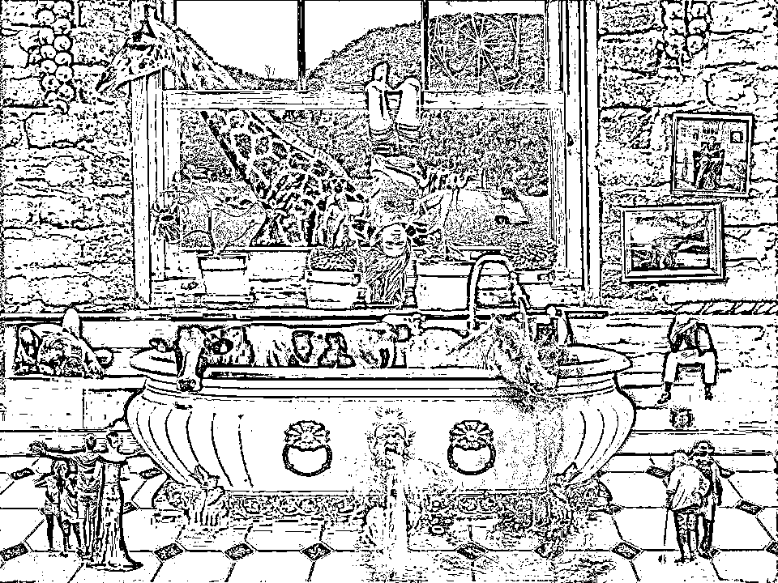

**双鱼座木星影响的 2022 年**

那么木星于 12 月 29 日再次进入双鱼座，从天象状态来看，新一年具体带给我们怎样不同的征象呢？

**这一天太阳、水星、金星与冥王星在摩羯座，月亮在天蝎座，火星在射手座被土星接纳、被木星定位……**

可以说这是一个“在残存的资本势力之中，**重燃希望的火花**，并更加确定基于我们每个人的个性优势之下、所追求和渴望造作的事儿；从而笃定且安心地投入命定的轨道，经验磨合与打拼、完成转型……”的过程。

比起**木星第一次进入双鱼座**（2021 年 5 月 14 日-7 月 28 日），我们从“观望、交流、被动接受现状、积极讨论感受”的状态，来到一个拉紧了心弦、摆正了值得前进的方向、接受并珍惜所有的感受、主动接受所有的改变和挑战的新状态。

**而 2022 年的木星步伐**，同样会有一段时间“提前进入”下一个星座白羊座，并停留 5 个多月之久。也就是说，**属于木星双鱼的时代快速而短暂。**

**我们将在木星白羊座时期（2022 年 5 月 11 日-10 月 28 日）经历这样的节奏变化：**

*   一方面按兵不动地历数自己获得的生活资源和精神充实的程度，**一方面开始“睁开眼睛”向外探寻更多可以崭露头角的机会。**

*   关于**“我是谁/我可以是谁/我能够是谁”**这个“主动扮演主人翁”的议题，将提上每个人、乃至整个年度时代的日程。

*   社会上也将重启**“英雄主义”、“献祭精神”、“活雷锋榜样”、“财富资源共享”**等的道德风范，当然也不排除另一极端的**“利己主义”、“自保旁观”、“占集体的便宜”**等事件。

**而当木星从白羊座再次逆行回到双鱼座**（2022 年 10 月 28 日），整个节奏又再次变成了：**修复情感心灵面的过度激进和孤立倾向、看到与他人交流与互动的重要性、注意到集体发展趋势的共同利益、在价值选择的递进层面的更多耐心磨合等。**

有着这样的参考，**我们认识到木星双鱼座对于我们改变节奏和获取力量的整个时期意义：**

*   **精准捕捉到自己的内在节奏、状态、情感需求、同理心，也看到与他人精神世界的共振；**

*   **通过个人于外在世界的浮沉，看清命运业力的因果和变化，更加听懂“灵魂在诉说什么？要到哪儿去？完成什么？”；**

*   **看到自身所具备的资源与能力的范围，以及它们的“有限性”所带领我们去完成的“特定方向的任务”；**

*   **知道外在变化如何去反映内在吸引、内在引力又如何去配合外在潮流；**

*   **感受到外界的社会潮流与内在的个人情绪起伏，如何共振共鸣，与交叉卸力；**

*   **掌握每个行动如何跟随这些“潮涌”而动，个人又如何通过小的顺应，影响大的潮汐……**

**12 星座如何迎来双鱼座木星？**

**那么木星进入双鱼座的 2022 年，12 星座各自的“志向追求”又会有怎样的变化和更新呢？**

**若道君：****你可以在 app store 或者应用商店搜索“若道”下载 app，输入个人档案，查看行运盘（也可以使用其他星图软件），找到行运木星落在出生星图的第几宫，然后对照下文查看木星顺行的影响。**

**例如下图中，行运木星在比尔·盖茨个人星图的第 8 宫。**

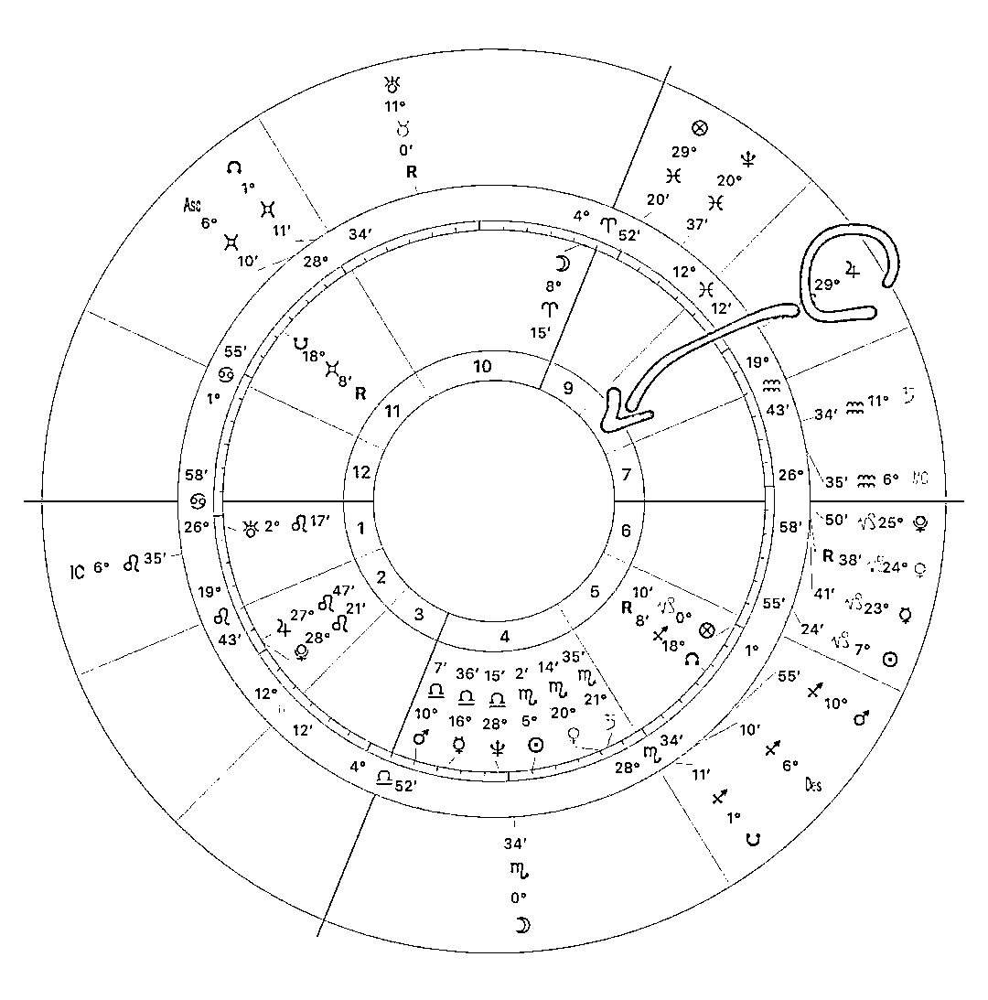

**太阳或上升在*****白羊座***

★**木星将在你们的 12 宫-1 宫之间穿梭**

也许你们已经为自己建设好了一个舒适的人际圈子，也许物质上已形成了滋润的小生活。如今你们终于不用通过莽莽撞撞地做事、或迎合他人目光与蹭社会热点来惹人注意了。

**未来一年，更加重视自己的内在体验，和所处的环境舒适度，并在适当时候站出来，勇敢崭露头角去呈现自己的“真本性”，来获得外界欣赏的目光。**

**太阳或上升在*****金牛座***

★**木星将在你们的 11 宫-12 宫之间穿梭**

也许你们已经“试炼”出自己一定的胆识、格局与心胸包容和开放度，知道自己可以“造作/伸缩”的范围有多大。如今有了真正需要你的社群圈子，你们可以较为安心和自信地在此“表演”。

**未来一年，更加重视各类生活体验、拓展人际关系。并在适当时候“激流勇退”地隐入自己的个人空间，守住独属于自己小生活里的精神财富。**

**太阳或上升在*****双子座***

**★**木星将在你们的 10 宫-11 宫之间穿梭****

也许你们已经在自己重视的人群中完成了基本的“安居乐业任务”，得到同阶层人士认可、并渐渐有了较为熟络的合作关系。如今在你们优势范围内有了一定的权威性和关注度。

**未来一年，可以更加按照计划去发展自己的事业理想，或在事业中注入自己的情感。并在适当时候自己成为组织者和带领者，发展出真正兴趣范围内的“副业”来。**

**太阳或上升在*****巨蟹座***

****★**木星将在你们的 9 宫-10 宫之间穿梭******

也许你们已经对于过往困扰你们的重要人际关系、或财务事件进行了割舍与重建，并让自己发展出更具有适应周围大环境变化的弹性和独立性。如今你们终于感受到一些自由，和爱自己、升级自己的空间。

**未来一年，可以更加去伸展自己过往压抑的热情、站在自己铺平的前进道路上徜徉梦想。并在适当时候义不容辞地站出来，使用自己的经验和智慧来到新的发展平台。**

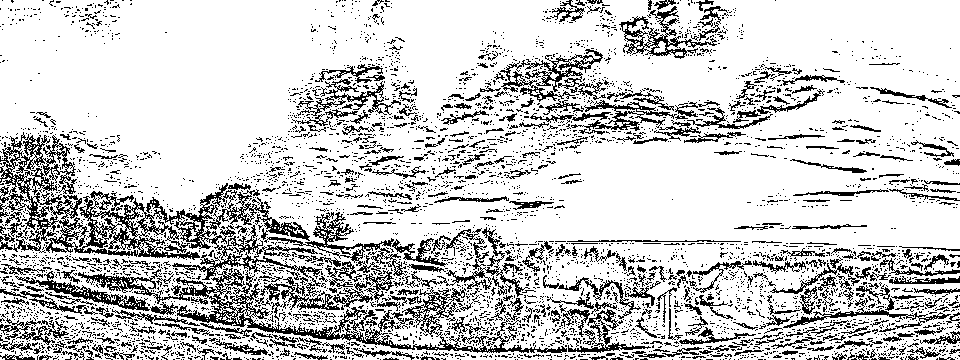

**太阳或上升在*****狮子座***

******★**木星将在你们的 8 宫-9 宫之间穿梭********

也许你们已经在重要的关系中积累了一定的能见度，被看见的同时也交集出可以“共事并肩”的有意义事务。如今你们将感受到久违的被关怀与牵挂、以及一定捆绑式同进退的连带关系。

**未来一年，可能推动你去进入更深层次的关系世界，去看到彼此背后的圈层影响，以及学会适当的示弱求助，与善巧的渡缘之法。并在适当时候带着重生的天真，站在更大的公众面前去宣告自己。**

**太阳或上升在*****处女座***

********★**木星将在你们的 7 宫-8 宫之间穿梭**********

也许你们已经将所有关于自身能力欠缺的、或杂事羁绊的问题进行过修复和铺平，可以放松和自然地面对某个特定的关系。如今你们可以无碍地进入与他人的联动合作，包括亲密关系的抱团式相处。

**未来一年，感受与亲近的伴侣或友人、以及被你们服务能力所吸引而来的追随者，发生真正走心的相处陪伴和疗愈，并在适当时候出于保护自己人，而拿出你们处理复杂人情时的杀手锏。**

**太阳或上升在*****天秤座***

**********★**木星将在你们的 6 宫-7 宫之间穿梭************

也许你们已经试过独行侠般做自己的自由时光，并发展出独属于自己可控的优势资源或机会。如今你们可以审时度势、伸缩自如地去观望真正被自己热衷的机会和人。

**未来一年，你们可能通过灵活的个性去调节与他人之间关系的远近，或者通过人情去开拓你们自己的工作任务。并在适当的时候主动出击，去争取自己想要的合作伙伴或关系对象。**

**太阳或上升在*****天蝎座***

************★**木星将在你们的 5 宫-6 宫之间穿梭**************

也许你们已经努力实现了对于安全居所和稳定关系的基本需求，并创造出可以自由释放情感需求的新空间。如今你们可以较为知足地利用所有的资源、做自己喜欢的事。

**未来一年，你们可能更加放下功利性和防御感，去放松自由地玩耍娱乐和创作，或主动吸引精神与情感上可以交流互动的伙伴。并在适当时候为自己制定更有前瞻性的发展轨道，突破和实践自己的新能力。**

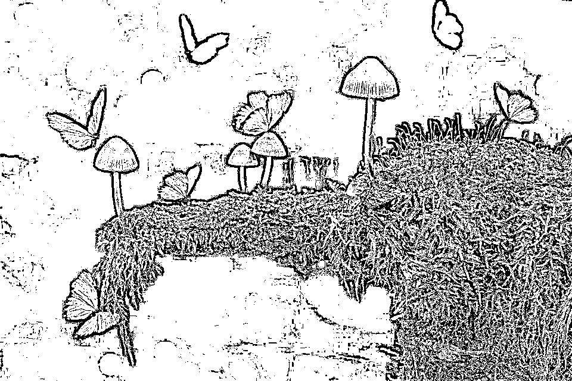

**太阳或上升在*****射手座***

**************★**木星将在你们的 4 宫-5 宫之间穿梭****************

也许你们已经通过各种方式和渠道的学习、试探与表达，得到了各类组织的接纳与同类群体的熟识。如今你们可以游弋在自己喜欢的私密而共鸣的小群体里，去获得想要的亲切感和归家般的温暖感。

**未来一年，你们可能在不同的“心灵家园”里徜徉和体验，也或是打造一个满足自己理想的温暖之家。并在适当的时候成为被家人们宠爱的孩子，或者计划孕育一个自己的孩子，来感受自己亲手创造的生命力。**

**太阳或上升在*****摩羯座***

****************★**木星将在你们的 3 宫-4 宫之间穿梭******************

也许你们经历了通过各种主业和副业来创造财富、或扩大财源的过程，为了满足自己或家人的基本生活乐趣而亲力亲为改善生活。如今你们摸索到了潮流的风向和规律，也有了更多拓展体验的渠道。

**未来一年，你们有更多的计划和创想，知道如何跟随变化的趋势和风向去做事，并乐于分享自己的经验、抒发自己的感受。在适当的时候你们也会聚集一些有识之士，共同合力发展某个社会化或者公益类项目。**

**太阳或上升在*****水瓶座***

******************★**木星将在你们的 2 宫-3 宫之间穿梭********************

也许你们已经完成了“扮演带领者”的任务，或者成为了你们所属领域里“有影响力、会带节奏”的那个人。如今你们更愿意以自己的人品和资格，去获得和享受该有的收益和福利。

**未来一年，你们更为投入地在自己的圈子里优化和升级装备，或在生活中包装自己的身份、开拓行走江湖的眼界格局。并在适当时候去关心和参与某些社会热点，或尝试某个小众的竞争比赛项目。**

**太阳或上升在*****双鱼座***

**★**木星将在你们的 1 宫-2 宫之间穿梭****

也许你们已经冷眼旁观这个世界、或自身命运的无常变化，到了一个胸有成竹的程度。与其一切看在眼里、被搅入暗中的运作，不如自己站出来成为“自己的代言人”。

**未来一年，你们更了解自己所扮演的角色影响力，可能通过自己立场的改变来左右所在行业领域的决策、或时局的变化，成为可以豁出去的弄潮儿。并在适当时候奋力一搏，精准捕获自己真正看好的资源和机会。**

**版权声明**：原创文章由作者授权首发于若道平台发布，欢迎转发，反对抄袭。

****

**关于木星进双鱼座的其它文章**[重磅天象 | 木星进入双鱼座，一年中最好运的 2 个月把握起来！](http://mp.weixin.qq.com/s?__biz=MzA5NjA0NTAxNg==&mid=2651444548&idx=1&sn=f25973610acd10926e9a7955f77dbefb&chksm=8b4b67f3bc3ceee50cce757b720a43194a531d62b63867c6575720fcae8ee26b7cb3c268df52&scene=21#wechat_redirect) [木星进入双鱼座 | 为了明年的大戏，让我们从现在学习滋养自己！](http://mp.weixin.qq.com/s?__biz=MzA5NjA0NTAxNg==&mid=2651447552&idx=1&sn=fd977908d51e1ae4ff83b02b80b33247&chksm=8b4b53b7bc3cdaa11904f48a3b6b91570e019eade57382e93d421742fb3225833aeb696aa56d&scene=21#wechat_redirect)  

**Ara 爱拉（王珊珊）**

全职占星/塔罗咨询师

《星途》《心探索》专栏作者

2013 年至今咨询个案已累计超过 2000 小时

**咨询微信号**：622005740（添加注明“咨询”）

**微信公众号**：xiaoshu_astro

长按打赏

**2022 年要来了**

**还不快领取你的****专属年运报告****？**

**购买有优惠，点击图片查看详情哦~**

**学习占星学****点击下图了解课程详情** 

****************

**微信又双叒叕改版啦，不想错过若道君的推送？**

**就把若道设为星标吧！**

**▼**

**就是这个“在看”，戳戳戳 ☟**

********报名直达入口********

# 释梦占星大师工作坊：荣格、占星学与梦境

> 原文：[`mp.weixin.qq.com/s?__biz=MzA5NjA0NTAxNg==&mid=2651464765&idx=2&sn=9d5a5419a8b3fab307754375536e8011&chksm=8b48968abc3f1f9c4fbd3ea9639c1fa25c33884addbeff4cfc7f4a3302761f7e795aa7c75b51&scene=126&sessionid=1692737878#rd`](http://mp.weixin.qq.com/s?__biz=MzA5NjA0NTAxNg==&mid=2651464765&idx=2&sn=9d5a5419a8b3fab307754375536e8011&chksm=8b48968abc3f1f9c4fbd3ea9639c1fa25c33884addbeff4cfc7f4a3302761f7e795aa7c75b51&scene=126&sessionid=1692737878#rd)

****

**2022 年 3 月和 4 月木星和海王星在双鱼座合相给连接梦境与占星提供了一次绝佳的时机。**

**　　——格雷格·博加特老师**

**梦境工作和做梦疗法是深度心理治疗的一个关键技术，**使得深层无意识的象征性语言能够传递它们的洞见，并指引患者走向更大的完整。

梦境使带有情感成分的无意识材料安全而快速地进入意识层面。它们帮助找到治疗的重心，指引治疗的方向。**梦境提供了重要的线索，告诉我们客户痛苦的来源，以及哪些情绪和情结需要被检视和处理。**梦境工作可以成为心灵成长和行为改变的强大催化剂，它有种独特的能力，促进疗愈从内在发生。

梦就像冰山从无意识的深水中浮现出来。有些冰山属于过去，帮助我们理解过去的创伤和未消化的回忆，因此是回溯性的。

**梦境有种整合的能力，**因为他们能使我们觉知和化解很多次人格之间的矛盾。**梦境也有前瞻性或预期性，**那是来自未来的冰山，会呈现出将要发生的事情，显现出个人有可能成为的样貌。**梦境既向后看也向前看**，它的本质功能是扩展意识、觉知和身份的疆界。

**我在梦境工作中主要使用的技术，是以开放的好奇心，主动探求梦境中每个角色、地点和行为的当下意义**——每个元素都反映出梦者的心灵状态和当前的生活情境。被梦境所揭露的信息，往往既幽默，又充满矛盾，而且为我们打开了新视野。

怀着一种敬畏的心态，我发现每个梦境都是意识海洋深处的一颗珍珠。反思梦境的奥秘，会引发一种近乎宗教敬畏的情感，我们会惊叹于心灵描绘自身处境的能力。

1

**课程内容**

**本课程将课堂讲座与动力过程工作结合起来，动力工作过程会将星图解读和梦境分析结合起来。**

每天约一半时间用于讲座，其余时间会演示占星学梦境工作方法，过程中老师会与学员进行互动。课程包括对老师解读星图和治疗性梦境工作方法的详细阐释和示范。

**我们将学习荣格解梦的基础知识和治疗性的、以过程为导向的星图解读。**我们将体验转化性原型模式在梦境和出生星图中同步显现时会发生什么。

**三次 6 小时的迷你马拉松在线梦境课程**，将会是一次提升意识、开放思想、转化生命的事件。**学员将体验占星学和解梦的融合。**

每次课程格雷格·博加特老师都会与学员互动，课程中使用的星图和梦境将由愿意分享自己梦境和星图的学员提前提供，课程期间也会开放问答以及学员互动环节。

2

**课程安排**

**第*****1*****讲  2022 年 3 月 5 日 **

卡尔·荣格的童年、学生时代以及投身精神病学时期的故事。《荣格自传：回忆·梦·思考》概要。弗洛伊德与荣格的关系，他们合作的破裂，荣格随后的抑郁时期，以及他借助梦、积极想象、艺术创作、曼陀罗绘画和对奥义知识（灵知）、神话和占星学的研究，转化性地面对无意识。卡尔·荣格与艾玛·荣格的占星学。

荣格的力比多（心灵能量）的概念，以及他的心灵结构地图：自我、个体无意识和集体无意识。荣格对无意识原型的描述，它们对个人神话的重要性，以及它们作为个人情结的表现。自我-自性轴线，以及自我与无意识之间不断演化的关系。

**我们将介绍荣格解梦的基础知识以及治疗性的、以过程为导向的星图解读。我们将体验转化性原型模式在梦境和出生星图中同步显现时会发生什么。**

****第*****2*****讲  2022 年 3 月 12 日 ****

梦境中的个性化及其占星学时机。出生星图随时间推移展开。整合个体无意识：梦和出生星图中的人格面具与阴影。男性和女性：阿尼玛和阿尼姆斯。**梦与占星学行进**描绘建立或脱下人格面具的阶段，遭遇阴影的阶段，通**过阳性意识和阴性意识的结合发展出更统一的人格的阶段。**

**第*****3*****讲  2022 年 3 月 19 日 **

**整体性在占星学和梦境中的象征。**透过占星学符号研究梦，来深化内在生命。我们将学习占星学行进和梦境如何试图让我们意识到差异、内在冲突和极性，逐步整合对立，将人格整合成一个整体。

梦境工作和星图解读中的曼陀罗原理。荣格的心理类型理论：内向型和外向型的任务。达到思维、情感、感觉和直觉的平衡。我们还将涉及使用五因素人格理论作为星图解读和梦境分析的基础的重要性。

**我们将学习如何解读梦境，并辨别梦的象征意义所传达的有说服力的信息，因为这与出生星图和行进有直接关联。**整合占星学和梦境工作，可以带我们进入情感、关系和灵性更为一致的状态。

3

**授课老师**

**格雷格·博加特**

（Greg Bogart）

**占星师、心理治疗师**。格雷格出生于美国纽约市，就读于卫斯理大学，1986 移居旧金山湾，完成了加州整合大学和赛布鲁克大学的研究生课程。格雷格自 1991 年以来一直是一名有执照的**心理治疗师**（LMFT 28276）。**他是国际占星研究协会（ISAR）认证的占星师**，并拥有美国地球宇宙学研究协会（NCGR）的第四级认证。他还在旧金山的艾扬格瑜伽学院接受过培训，并于 1992 年毕业且获得了**瑜伽教师认证。**

格雷格是一名私人执业的心理治疗师，在索诺玛州立大学担任**心理学讲师**，他在该校教授“成人发展中的转变”、“以深度为导向的心理治疗”、“神话、梦与象征”以及“存在主义心理学与超个人心理学”等课程，他在加州整合大学、约翰·F·肯尼迪大学、多米尼加大学和超个人心理学学院教授咨询心理学和东西方心理学课程。**他的研究结合了冥想、哈他瑜伽、荣格解梦、存在主义心理疗法和精神综合，以及占星学的周期智慧和原型象征。**

**格雷格·博加特博士著作：**

*   《占星学的高八度音阶》（*Astrology’s Higher Octaves*）

*   《行星用于治疗》（*Planets in Therapy*）

*   《占星学与灵性觉醒》（*Astrology and Spiritual Awakening*）

*   《梦境工作过与自我疗愈》（*Dreamwork and Self-Healing*）

*   《梦境工作在抑郁症整体心理治疗中的应用》（*Dreamwork in Holistic Psychotherapy of Depression*）

*   《占星学与冥想：对变化的无畏沉思》（*Astrology and Meditation: The Fearless Contemplation of Change*）

4

**课程价格**

*   **课程价格：****5800 元**

*   **早鸟价：4800 元（截止日期：2022 年 2 月 9 日）**

*   **课程咨询：**王老师（微信：18510107057，请备注“释梦工作坊”）

长按二维码添加王老师

5

**课程安排**

*   **课程时间：**

     **2022 年 3 月 05 日周六  8:00-14:00**

**2022 年 3 月 12 日周六  8:00-14:00**

2022 年 3 月 19 日周六  7:00-13:00

*   **授课方式：**线上直播，英文授课，中文翻译

6

**退转课程**

*   **退款原则请详看《教学协议》，如有疑问请咨询课程顾问。**

****释梦工作坊****

**授课老师：**格雷格·博加特

**授课时间：**2022 年 3 月 5 日起

**授课方式：**网络课程**，**英文授课，中文翻译

**费用：****5800 元****（早鸟价：4800 元，2022 年 2 月 9 日截止）**

**课程负责人：****王老师**（微信：18510107057，请备注“释梦工作坊”）

长按二维码添加课程负责人咨询~

****报名请点击“阅读原文”****

# 重磅年运丨 2022 年即将来袭，你，准备好了吗？

> 原文：[`mp.weixin.qq.com/s?__biz=MzA5NjA0NTAxNg==&mid=2651464694&idx=1&sn=8ebcb87cf8c00e7d10ed95b8a2869d64&chksm=8b489141bc3f18575e62dc43e5434f3f13ec4aa9f7d041de5ac67f48b946097108fce9c9b3c1&scene=126&sessionid=1692737878#rd`](http://mp.weixin.qq.com/s?__biz=MzA5NjA0NTAxNg==&mid=2651464694&idx=1&sn=8ebcb87cf8c00e7d10ed95b8a2869d64&chksm=8b489141bc3f18575e62dc43e5434f3f13ec4aa9f7d041de5ac67f48b946097108fce9c9b3c1&scene=126&sessionid=1692737878#rd)

******☆ ****后台回复“今日”，给你一句生命态度******

作者/Justine ISAR 认证占星师
编辑/翀子 封面/书君 图片/网络

2022 年即将到来，宇宙天气在新的一年为我们安排了怎样的大图景？其中有哪些挑战、又有哪些机遇？我们每个人如何在 2022 年过好自己的生活、并建立新的生命样貌？一起来看文章。

我们最近也有一个关于 2022 天象的工作坊，你也可以了解一下（戳：[2022 年天象预测课](http://mp.weixin.qq.com/s?__biz=MzA5NjA0NTAxNg==&mid=2651464442&idx=2&sn=1ccf0bce7f1a6ff01ba0a1618891f42b&chksm=8b48904dbc3f195bb86b2028db14f0de6ae522198efbbff76a2fe7c21e4f1eec51351fadbfe7&scene=21#wechat_redirect)）

过去的 2020 年和 2021 年是难以置信的两年，世界的根基似乎在脚下分崩离析，我们在压力中幸存。有人预测说 2022 年大流行会结束，经济会全面复苏……对于占星师而言，这象一个木海合相下的美好童话。

**2022 年的星象虽然少了一些戏剧性，但依然充满不确定和挑战，我们需要继续坚持并负重前行。**

**从 2021 年到 2022 年**

在经历 2020 年底土星与木星合相在水瓶座（进入风象 200 年）之后，我们还徘徊于新冠带来的狂风暴雨中，土星与天王星的四分相立马就席卷了整个世界。

这在人类历史上是罕见的——通常不同元素 200 年之间的转换，中间会有很长一段时间的平稳过渡，**但土天四分根本不给我们时间慢慢适应。2021 年，土象时代旧的体系，以迅雷不及掩耳之势被迅速“清算”，连根拔起。**

**在理想层面，**这让我们对正在孕育的新时代充满憧憬；**在现实层面，**工作与生活各种挑战跌宕起伏。

新冠疫情对经济的全方位冲击，国际局势进一步混乱紧张，国内加紧反垄断、加紧对资本的监管——不少行业受到很大影响，大厂都开始裁员收缩，很多人找不到满意的工作……

每个人或多或少受到大环境的影响，看不清楚趋势与方向是常态；但大家又想在这个迅速变化的时代，找到自己新的立足点生存下来，不免迷茫与焦虑。

**我们不禁会问：2022 年会发生什么？**

**占星学在诞生之初并不关于预测，而是关于宇宙能量与时机的。天空事件是描述前方能量流动的符号。当我们与宇宙和星系的能量相协调，通过正确的意识与行动，就能成为自己命运的共同创造者，创造富足与幸福。**

以下，会从 2022 年**世界行进**与**个人运势**两方面展开。宇宙天象在世界舞台上的表现，跟个人年度运势不同。**但我们可以从占星年广泛预测的原型陈述中，看看时代和社会的变化，如何跟自己的生活相关。**

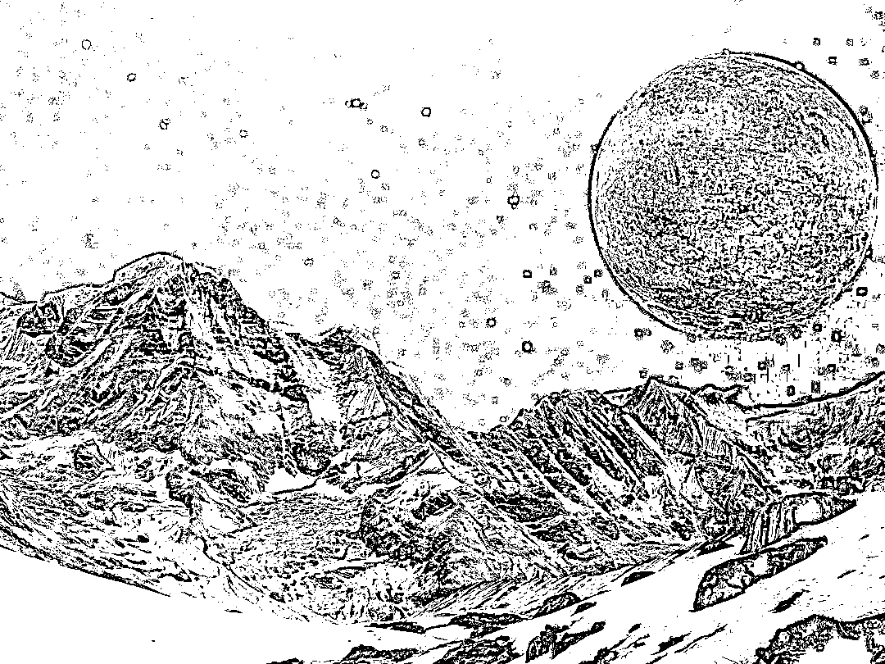

**2022 年世界行进：外行星**

外行星的行进速度缓慢，象征着时代特质以及特定群体的历史事件。2022 年外行星行进轨迹：

*   **冥王星：行进在 25-28 度摩羯座**

*   **海王星：行进在 20-25 度双鱼座**

*   **天王星：行进在 10-18 度金牛座**

*   **土星：行进在 11-25 度水瓶座**

*   **木星：会通过整个双鱼座，以及行进白羊座 0-8 度**

**2022 年几大行进主题：**

**1**

北交点移入金牛座，南交点移入天蝎座

**2022 年 1 月 19 日，月亮真实南北交点换座。宇宙把聚光灯移到在金牛座-天蝎座轴线，以及金星、火星、冥王星这三颗行星（金牛座与天蝎座的定位星）身上。**

从整体来看，宇宙能量从变动星座的灵活探索，转向固定星座的坚定极端的模式。**天蝎座的南交点（性爱、金钱、权力、价值）的议题将凸显，**并鼓励我们放下过度警惕、怀疑、内疚和操控。

**金牛座的北交点邀请我们思考：**如何在未知中，通过真实的价值观来找到安全感？即使我们仍处于新冠大流行中，如何与愉悦、喜悦和审美感联系起来？

全世界都在与一种已经导致数百万人死亡的病毒作战，这在短期内并不会结束。新冠（南交天蝎座）给整个人类带来前所未有的脆弱感。

表面上是大众所关注的公共卫生、健康安全议题，背后是一些国家阴暗政治和经济利益上的博弈，再加上全球意识形态与文化的差异，让疫情的控制与预防变得扑朔迷离。

这一次人类无法回避新冠这个巨大的天蝎座议题，这是我们集体的共业。**只有赤裸裸的诚实和真实的行动才能带来疗愈，才能走向北交金牛座的稳定与安全。**

月亮南北交点换座也会影响食相。在金牛座/天蝎座轴线上，**2022 年会发生四次日月食：**

*   **新月日全食：5 月 1 日，金牛座 10 度；10 月 25 日，天蝎座 2 度。**

*   **满月月偏食：5 月 16 日，天蝎座 25 度；11 月 8 日，金牛座 16 度。**

**这些日月食会进一步加剧金牛座/天蝎座的主题。**

考虑到天王星也行进在金牛座，我们可以期待，**北交金牛座所象征的相关领域**——金融、货币、对地球与环境的保护、对阴性能量的重视......会在 2022 年继续深化。

**2022 年，金牛座天王星会跟双鱼座木星呈六分相**，这会加快可回收与替代技术的创新，可持续资源的开发可能会成为焦点。

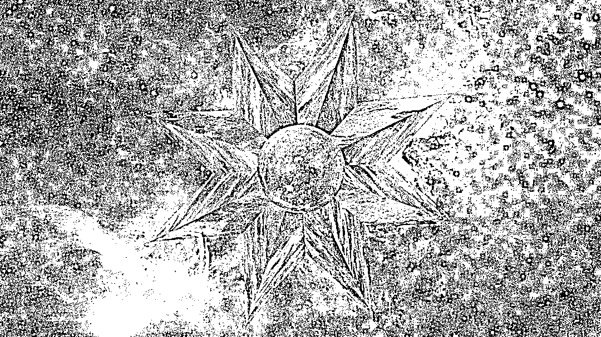

**2**

木星行进在双鱼座

**2022 年，木星回到了自己的家——双鱼座，并在 2022 年 4 月 12 日，与双鱼座的海王星合相。**这是 2022 年最重要的签名，也是我们将要到达的特殊山峰。

木星象征着和谐秩序的创造、慈善、成长和扩张。**在木星行进双鱼座的周期中，**我们会重视情感，有更多同理心、同情和敏感性；对宗教、道德、教育和政治的态度和价值观会更有远见；会重视那些并不总是在表面上显而易见的东西，包括神秘的、隐藏的、神奇的事物。

在有生之前，我们不会再遇到木星合相海王星在双鱼座（上一次木海合相双鱼座是在 150 多年前）。**我们必然有所期待**——灵性的复苏，对梦境与艺术的重视，集体无意识潜在的开放，量子力学和物理学总体上促进对替代现实、多元宇宙、平行宇宙等以及时间本身的理解……

**但木海行进双鱼会给 2022 带来平静、稳定的水域吗？**我个人对此并不乐观。因为木海合相双鱼座不都是彩虹和独角兽。

**木星带来的增长并非都是需要的，也不是令人愉快的。**木星在双鱼座过度膨胀，可能会产生理想主义，混乱、逃避、放纵、欺骗和自欺欺人。**木星的热情可能会让我们对自己的无节制视而不见。**

在木海能量影响下，很大程度上我们会看不清楚真相，不知道该相信什么……地球正处于历史转折期，**“真相”不会随时或很快出现，**可能需要到 2026 年-2028 年才能被真正揭示。

我们应该有大梦想，但需要记得：**最大的愿望也可能是最大的幻觉。**什么是真正需要的？如何让理想主义显化于世？**去打破人类思维的局限性，同时有可以显化的结构让梦想落地**——因为这会影响我们后面几代人。

有趣的是，**4 月 12 日木海精确合相在双鱼座 23 度**（灵性、宗教和情感世界），在 4 月 9 日和 10 日，**北交点抵达金牛座 23 度**（银行、商业和财富），**南交点在天蝎座 23 度**（性关系和金融/投资）。

**这看起来就像：我们的内心生活与精神追求，在 2022 年会与重大的经济转型保持一致。**

**5 月 11 日到 10 月 28 日，木星将短暂来到白羊座。**这是很长时间以来，外行星第一次进入**火相星座**。木星以成长为导向的能量，穿越大胆而任性的白羊座时，**会带来大胆思考、勇敢开启和实现信仰飞跃的好机会。**

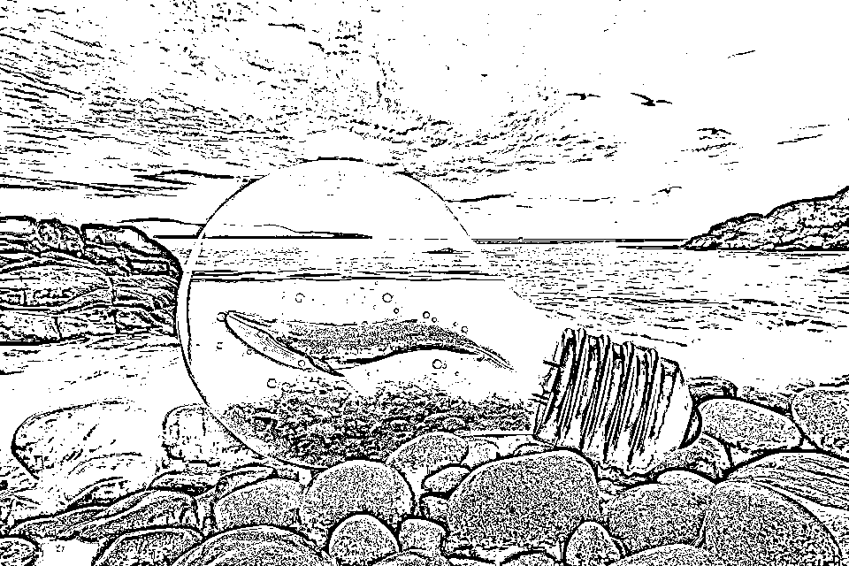

**3**

土星四分天王星

**土星代表不可动摇的边界，天王星象征无法抑制的突变**——我们已经在 2021 年看到土天四分的威力——**新旧方式之间的冲突，电闪雷鸣般的崩塌与革新。**

**2022 年，**土天四分虽然逐渐减弱，但依然在容许度范围内，**还将继续产生决定性影响。**而且，土星与天王星将与南北交点轴线、日月食互相作用，**会进一步将土天四分相复杂化。**

**4 月 11 日**，土星四分月亮北交点，这将激活土天四分。**8 月 1 日**，天王星合相月亮北交点，会带来灵感的突然爆发，以及关于未来的洞察力的闪现，引领我们朝着新的方向航行。

关于新旧方式之间的冲突，我特别喜欢 Diana Cooper（研究天使、独角兽和龙的灵性老师）的类比：

“我们现在住在一间非常破旧的平房里。**它是如此的陈旧，充满故障，因此正在被拆除，以便在这里建一座更大的新房子**。计划已经拟定好了，已获取规划权限。但我们仍然住在老地方，面对周围拆迁的混乱，最好的办法就是把精力放在美丽的新房子上。

新房子的规划和安装只需要几周的时间，而推倒一间旧平房并在那里盖新房子，则需要几个月的时间。**目前，恐惧和控制的力量正试图加强控制，这正在造成混乱。**”

Diana Cooper 说：“地球会花几十年时间从第三维度移动到第五维度的新范式，2023 年之前我们都在拆除阶段。我们已经准备好开始盖新房子了，但在开始之前必须先建好基础设施。”

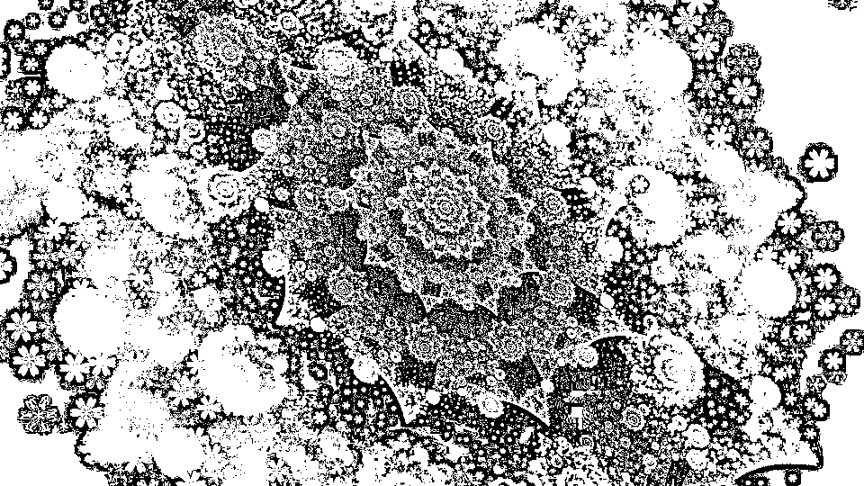

**4**

冥王星在摩羯座的最后一年

**2022 年冥王星全年在摩羯座，**随后将于 2023 年 3 月至 6 月进入水瓶座，中途短暂逆行回到摩羯座后，在 2024 年 1 月开始会在水瓶座呆 20 年。**冥王星换座是 21 世纪 20 年代最令人期待的行进之一。**

**冥王星的运作方式是清除有毒的和不再需要的。2022 年，摩羯座的通天塔和纸牌屋，会继续崩塌。**

但这一切又没有那么简单，因为水瓶座允许权力中心从下而上进行重组，而不是从上而下，这些并不是目前掌权的腐败政客和贪婪的大企业想要看到的，**这些摩羯座的旧势力一定会垂死挣扎。**

2022 年将是最后激烈的对抗。但冥王星最终会消除一切腐烂之物，**在社会层面发挥其变革的能量，为健康的成长留出空间。**

**2022 年 2 月 22 日，美国将经历其有史以来第一次冥王星回归。**这会改变这个国家的基础结构与权力动态，带来变革性的颠覆与重生吗？这将如何影响世界政治格局与经济发展？

有一点是确信的：美国将不再主导全球，**新型的连接方式（风象的时代特征）正在出现**，全球政治格局将会有新面貌——让我们拭目以待。

**2022 年的内行星逆行****1**

金星在摩羯座逆行

**我们会跟随金星逆行的脚步进入 2022 年，同期水星也将在 1 月 14 日逆行。**

**这意味着 2022 年开局缓慢，**你可能需要准备将新年决议搁置几个月再正式启动。如果一些项目在新年伊始就遇到障碍或根本无法推进，请不要沮丧。**这个期间，也不合适做关系或金钱方面的重大决策。**

**把这段时间看作视角的转换**，以获得对自己过去和将来的更多信息。好好休息，春节结束之后，一切都会步入正轨。

**2**

火星逆行

**从 2022 年 10 月 30 日到 2023 年 1 月 13 日，火星将从双子座 25 度逆行回到 8 度。**

火星是月亮南交点天蝎座的守护星，**火星逆行会将火星的能量向内引导**，性欲和野心可能会挣扎。冲动和无法识别的愤怒，会导致事故、争执和伤害。

在社会层面上，会触发人类历史上没有解决的罪恶、遗留的创伤——暴力侵犯、奴役与战争。**因此，2022 年最后一个季度，会是全年最动荡不安的时期。**

**这期间，火星与海王星会形成的紧张的四分相，木星也行进在好战的白羊座。**再加上疫情让经济不稳定，国际形势会趋于复杂。一些国家民众容易处于抗议与骚乱，某些政府会出现危机与更迭，甚至部分国家会发生内战。

**3**

水星逆行

*   **1 月 14 日-2 月 4 日：从水瓶座 10 度逆行回到摩羯座 24 度；**

*   **5 月 10 日-6 月 3 日：从双子座 4 度逆行回到金牛座 26 度；**

*   **9 月 10 日-10 月 2 日：从天秤座 8 度逆行回到处女座 24 度。**

一年三次的水星逆行，总是提醒我们慢下来，与自己的直觉与梦境联系，打开潜意识的门户。

**2022 年的水星逆行，都是从风象星座逆行回到土象星座。**水星在风象星座本身非常舒服，因此逆行时会增强能量与强度。

**水星在风象星座逆行，**强调的是心智上的回顾和反思，包括如何接收信息和表达、人际交流与互动，如何与他人建立联系并保持健康的界限，以及随着世界价值观的变化如何更新自己的观念；**而水星逆行回到土象星座，**则要把心智转化为行动，将观点落地。

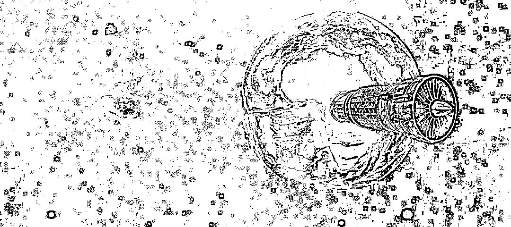

**2022 年个人指南**

下面，来聚焦 2022 年的个人运势。

***1.***

如果你有个人行星、四轴或敏感点在**开创星座（白羊座、巨蟹座、天秤座、摩羯座）24 度-29 度**，会受到**冥王星**的挑战（结合宫位看带来**深刻转化**的生命领域）。

***2.***

如果你有个人行星、四轴或敏感点在**固定星座（金牛座、狮子座、天蝎座、水瓶座）9 度-26 度**，会受到**土星或天王星**的挑战（土天没有如 2021 年如此紧密互动，但部分人依然会经历**巨大的压力或突破的渴望**，以及两者共同作用下产生的急剧拉扯）。

***3.***

如果你有个人行星、四轴或敏感点在**变动星座（双子座、处女座、射手座、双鱼座）19 度-26 度**，会受到**海王星**的挑战（海王星总是让人疲惫而敏感，容易理想主义或产生幻想，尽量不要做大决定，**顺其自然**）

***4.***

**如果你出生在 1992-1993 年，会经历第一次土星回归。**

土归会让你通过生命经验的成熟来获取智慧。你也许会面临前面三十年严酷的现实检验，通常伴随着失去、悲伤，并在磨砺中成长。这是土星回归给予你的“成人礼”，要求你为自己负责，开始计划想要长期建造的东西。

***5.***

**4 月 12 日，木星与海王星在双鱼座 23 度合相，这是每个人都要攀登的一座高峰。**

毫无疑问，会有人通过酒精、性、毒品，甚至极端的意识形态来利用这种能量，**逃避与远离现实。**但对于那些有创造力、想象力或灵性倾向的人来说，这也提供了一个**特别难得的机会来接受宇宙的恩典**——无论是通过艺术、诗歌、音乐、写作、摄影、冥想，跳舞或旅行——于是新的神话就产生了。

**因为个体出生星图和意识的不同，每个人对木海合相会有不同的体验。**如果你有一个大梦想，想完成一个大项目，那么就要提前几个月，从现在开始准备起来。

**另外，如果你的出生星图上有个人行星、四轴或敏感点位于黄道 23 度，在 4 月 12 日前后，会被南北交点（金牛座/天蝎座 23 度）、木海（双鱼座 23 度）激活，这对于你而言是一个不寻常的扩张时期。如果没有，可以看看木海合相位于你星图的哪一个宫位。**

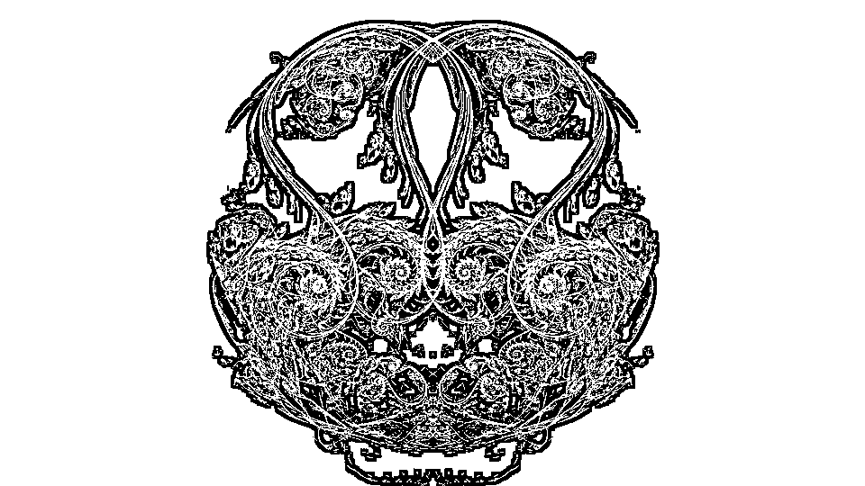

**木海合相在 12 宫位**

**若道君：****你可以在 app store 或者应用商店搜索“若道”下载 app，输入个人档案，查看出生星图（也可以使用其他星图软件），找到双鱼座 23°落在出生星图的第几宫，然后对照下文查看木海合相的影响。**

**例如下图中，比尔·盖茨的八宫头是双鱼座 12°12′，九宫头白羊座 4°52′，所以双鱼座 23°就在他个人星图的第 9 宫。**

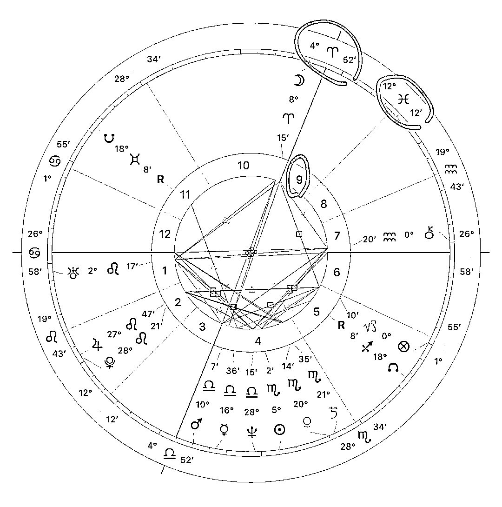

**★****木海合相在第*****1*****宫**

**以诗人/艺术家的身份展示自己。**深刻的同理心作为一种生活方式。让自己成为一个善良和乐于助人的人。倾注你的情绪与直觉，为自己创造一个新的角色。

**★****木海合相在第*****2*****宫**

**扩展你对如何赚钱以及如何花钱的看法。**进行有意义的购买。注意压倒性的支出，不要被账单淹没。向有需要的人敞开你的钱包。捐赠给你最喜欢的慈善机构，为给予留出空间。

**★****木海合相在第*****3*****宫**

关于你在社交媒体上的声音，你如何表达自己的灵性或艺术创意？写一个史诗般的奇幻故事。**将你的情绪倾注到日常对话中，心灵的对谈。**

**★****木海合相在第*****4*****宫**

寻找一个让你的灵魂宾至如归的地方。扩大你对可以称为“家”的人和事的看法。你梦想中的家是什么样的？**倾注你的情感，改善你的家庭生活。**

**★****木海合相在第*****5*****宫**

把情感与爱融入你的艺术与表达。喝酒并不是享受乐趣的唯一方式。**打开你的心，扩展什么给你带来快乐的看法。**与儿童的有意义和敏感的经历，关注孩子的灵性教育。

**★****木海合相在第*****6*****宫**

提供深刻而富有同情心的服务，处理工作与生活的界限。与同事的压倒性情绪状况。**扩展你对“工作”的看法。**整体与自然疗法。

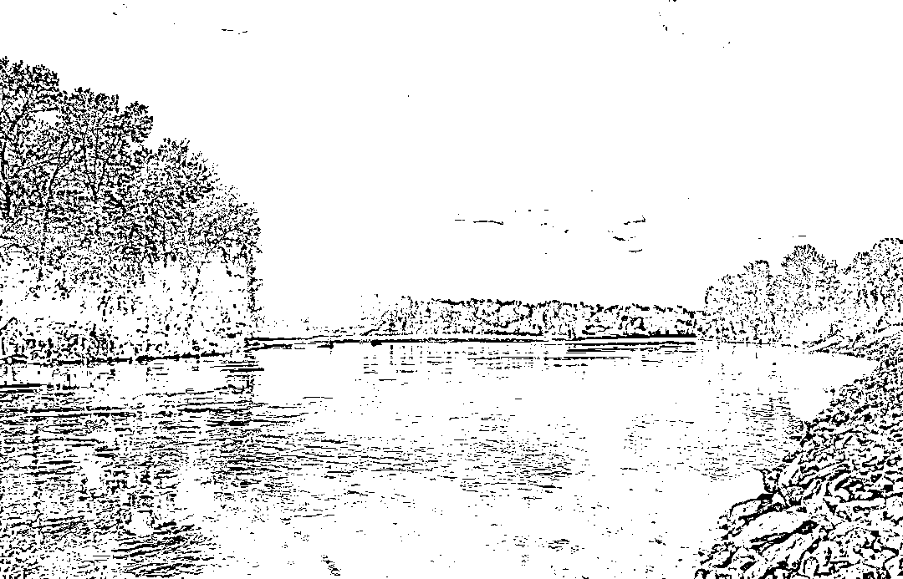

**★****木海合相在第*****7*****宫**

拯救你的伴侣。向伴侣敞开心扉，深刻而敏感的一对一关系。**扩大你的灵性视野，以提高你找到有意义的关系的机会。**与客户的压倒性情绪状况，选择你的“梦想”客户。

**★****木海合相在第*****8*****宫**

小心不要让你的债务失控。扩展你的神秘学知识，寻找你的灵性老师。与亲密伙伴的压倒性情绪状况，被悲伤淹没。思考死亡的深刻意义。**敞开心扉接受你感受得到但看不见的东西。**

**★****木海合相在第*****9*****宫**

空间或心灵的旅行，灵魂探索与扩展。获得跨文化的视野，为冒险腾出空间。**扩展你的理念，激发神圣的灵感。**

**★****木海合相在第*****10*****宫**

渴望将灵性使命与你的事业相结合。**在你的灵魂中寻找更高的召唤。**注意私人和职业生活之间的界限。扩大你的名声、影响力与声誉。

**★****木海合相在第*****11*****宫**

小心消失在群体中，不要被群体所情感绑架。推动你的组织更加富有同情心。为与他人共享的长期目标腾出空间。**受到共同理想的启发。**

**★****木海合相在第*****12*****宫**

深度的精神隐居。深刻的灵性体验。**扩展你的灵性知识，扩展对未知事物的了解，扩展你对慈悲的理解。**小心过度膨胀。不要让自己情绪低落。

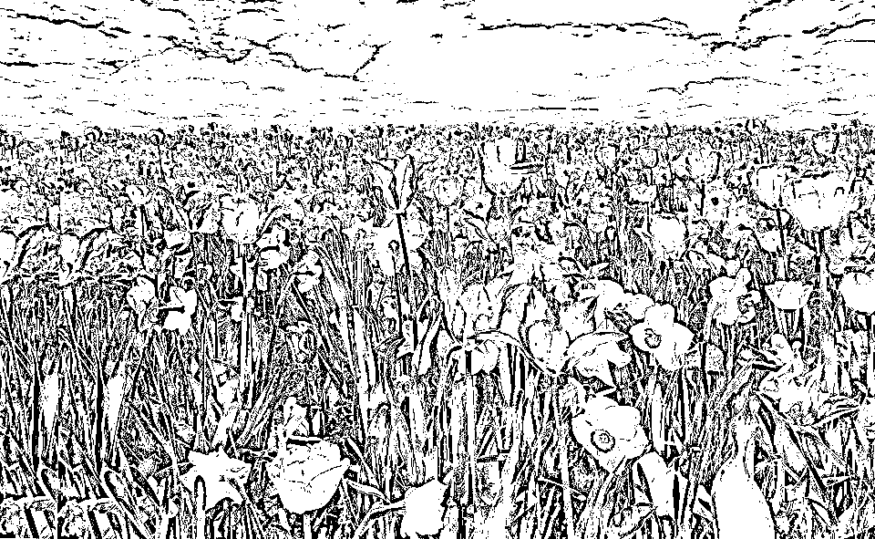

**结语**

我们正处于一个前所未有的时代，一个意识大规模转化的时代。当旧系统的解体，每个人都在切身体验某种阵痛与迷茫，难免有疲惫、抑郁和焦虑的迹象。

2022 年并不是舒服或愉悦的一年，但可以期待木海行进双鱼座，大量的新门户将会开放，**会促使我们扩大和提升意识。**

**某种意义上，2022 年是“拆除”旧模式的最后一年。**这一年，我们将继续看到火灾（火星逆行）、地震、飓风和洪水（木海双鱼座），净化所有较低能量仍潜伏淤积的区域。**2022 年之后，变化会相对平缓，事情变得容易。**

**新世界并不是自然而然的诞生的，需要大家在正确的时机做正确的事。**有些人在为未来播下积极的种子，用自己思想、言语或行动为未来创造每一块砖瓦。

**我们能做的，是在这个不确定的时代，保持自己的光，彼此链接、支持并互相鼓励。坚持下去，一起来见证美好未来的诞生——新的世界将超越每个人的期待。**

**版权声明**：原创文章由作者授权首发于若道平台发布，欢迎转发，反对抄袭。

****

**Justine**

ISAR 国际认证占星师（2014 年获得）/塔罗师

毕业于浙江大学，十年跨国企业 HR 经验

咨询时长超过 1500 个小时

**咨询微信**：Justine_JT

**公众号**：星光体

长按打赏

**2022 年要来了**

**还不快领取你的****专属年运报告****？**

**购买有优惠，点击图片查看详情哦~**

**学习占星学****点击下图了解课程详情** 

****************

**微信又双叒叕改版啦，不想错过若道君的推送？**

**就把若道设为星标吧！**

**▼**

**喜欢记得点一下在看哦☟**

**报名直达入口**

# 2022 年天象预测课 | 明年的重大天象，一一详细揭晓！（内含联报优惠）

> 原文：[`mp.weixin.qq.com/s?__biz=MzA5NjA0NTAxNg==&mid=2651464694&idx=2&sn=349940858120b5732e6aa5affdcd81c7&chksm=8b489141bc3f1857e1fc93a9eae13b1a7ad62ff2fccda4847c435dd46d6035e2a6a163b8f348&scene=126&sessionid=1692737878#rd`](http://mp.weixin.qq.com/s?__biz=MzA5NjA0NTAxNg==&mid=2651464694&idx=2&sn=349940858120b5732e6aa5affdcd81c7&chksm=8b489141bc3f1857e1fc93a9eae13b1a7ad62ff2fccda4847c435dd46d6035e2a6a163b8f348&scene=126&sessionid=1692737878#rd)

2021 年已接近尾声，忙碌的年末工作也挡不住我们对来年的盼望和期许。作为占星师，在年初跟随权威老师透彻地学习 2022 年重要天象的含义和影响，是迎接新的一年的正确姿势，仪式感满满！为新一年的自我规划和占星事业加油充电。**若道邀请了金牌核心课中的四位国际名师再次集结，在明年 1 月 8 日、9 日带来 2022 年重大天象的深入解读：**********

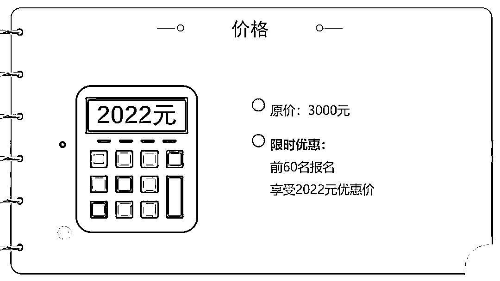

**讲师是谁？**

**琳恩·贝尔**

**（Lynn Bell）**

**· **世界最受欢迎的占星学演讲者、作家和老师之一。定居巴黎，研究心理占星学和家族模式数十年； **·** 著名的心理占星学中心（*Centre for Psychological Astrology*）的长期导师。2016 年，获得查尔斯·哈维（Charles Harvey）杰出的占星学服务奖；**· **作为一个从多个层面进行工作的占星咨询大师，琳恩的工作结合了心理学的观点。她对家族模式的兴趣首先来自与客户的合作。通过在分析领域所做的个人工作，她所受的埃里克森催眠训练将她引领至家族系统。后来，她组织研究小组在家族星图上进行了数年的研究。她写的《家族占星学》就是这项研究的结果；**· **法国心理占星学协会的会长。除了占星学，她在法国沙特尔的新沙特尔学校任教 8 年，还 5 次获得了在《纽约时报》畅销书作者卡罗琳·迈斯（Caroline Myss）的卡罗琳·迈斯教育学院（*Caroline Myss Educational Institute*）合作教学的机会。

**艾德里安·罗斯·邓肯**

**（Adrian Ross Duncan）**

**· **1971 年在印度游学时开始学习占星学，1985 年开始成为全职占星师，迄今执业已超过 33 年，是人本主义占星学、卜卦占星学和经世占星学领域的知名占星师。他还开发了占星软件 AstroClock 和多款占星报告；

**· **哥本哈根占星学院院长；

**· **他在日常咨询中经常运用卜卦，咨询图（卜卦的一种运用方式，即根据客户来访时间制作星图，从星图中获得大量信息）也是他特别擅长的领域；

**· **艾德里安·罗斯·邓肯从 1971 年开始研习佛学，受佛学影响很深，他相信占星学和佛学观点一致，转化的一个基础是在于对现实感知的改变。而卜卦很容易与佛教融合，因为它只关乎当下。

**克里斯蒂娜·罗登贝克**
**（Christina Rodenbeck）****· **克里斯蒂娜·罗登贝克（Christina Rodenbeck）是一名全职职业占星师，在牛津大学城生活和工作，深受周围知识和文化氛围影响；她拥有伦敦大学（*University of London*）的人文荣誉学位，曾在伦敦占星学馆（*Astrological Lodge of London*）、心理占星中心和占星研究学院学习；**· **作为一名占星师，在过去的 20 年里，克里斯蒂娜在她的网站“牛津占星师”上写了大量关于时事、艺术和文化的文章；她每月主持一个占星播客：“与克里斯蒂娜和萨莉一起占星”，并定期在《占星杂志》(*Astrological Journal)*上撰写时尚专栏；她定期在英国授课，并保持着蓬勃发展的专业实践。

**大卫·瑞雷**

**（David Railey）**

**· **若道联合创始人，致力于在中国教授和推广西方占星学；

**· **曾任 ISAR 全球副主席，CAPISAR（ISAR 职业占星师资质认证机构）主席；

**· **1976 年，通过亚特兰大职业占星师考试，成为全职占星师，随后通过 AFAN 和 ISAR 职业测试；

**·** 1980 年，与杰夫·焦耳一起在亚特兰大创建“每日行星”占星学中心。此后在亚特兰大占星协会担任 4 年考官，并且两次担任亚特兰大地区占星协会主席。1979-1992 年，作为占星师活跃于美国社会媒体，向不了解现代占星学变化的大众宣传专业占星学知识。在 1989-1992 年期间，他在 WRGG 电台 12 频道每周主持个人电视秀“今日占星学”，早先他还在 WRFG 的广播节目中播讲宇宙天气节目；

**· **2010-2014 年，任全美占星师联盟监督委员会委员；

**· **2010 年，其著作《灵魂的目标》中国版出版，和蒋颖一起创办若道占星学校和其官网 www.nodoor.com；

**· **2017 年，被选为 ISAR 委员会成员。ISAR 是世界最大的国际占星机构，会员遍布 45 个国家，2017-2020 年曾任 ISAR 全球副主席、CAPISAR（ISAR 职业占星师资质认证机构）主席。

**课程价格****正价**：3000 元**限量优惠价：2022 元**（前 60 名报满截止）**（联系 Maggie 老师，抢占限量优惠价）******联报套餐：《2022 年度天象预测大师课》+《2022 年金融占星预报》联报优惠价****2999 元****（限前 50 名联报）****（联系 Maggie 老师，抢占限量优惠价）**长按二维码添加 Maggie 老师获取联报优惠价**退转课程**

**· 退款原则请详看《教学协议》，如有疑问请咨询课程顾问。**

****2022 年度天象预测大师课****

**授课老师：**琳恩·贝尔、艾德里安·罗斯·邓肯、克里斯蒂娜·罗登贝克、大卫·瑞雷

**授课时间：**2022 年 1 月 8 日-9 日

**授课方式：**网络课程**，**英文授课，中文翻译

**费用：**3000 元**；****限量优惠价：2022 元（前 60 名报满截止）；****联报套餐：《2022 年度天象预测大师课》+《2022 年金融占星预报》联报优惠价：****2999 元****（****限前 50 名联报）**

**课程负责人：****Maggie 老师**（微信：18510107057，请备注“天象预测大师课”）

长按二维码添加课程负责人咨询~

****报名直达入口****

# 金融占星学大师雷蒙德·梅里曼《2022 年金融预报》开售！

> 原文：[`mp.weixin.qq.com/s?__biz=MzA5NjA0NTAxNg==&mid=2651464534&idx=2&sn=bbdad226e8121f8c2da6f7ae1ca3232b&chksm=8b4891e1bc3f18f7e8e30ea2fc9dbdb605cbc378aeacd849b9ec96be01fbfd4af37b52823069&scene=126&sessionid=1692737878#rd`](http://mp.weixin.qq.com/s?__biz=MzA5NjA0NTAxNg==&mid=2651464534&idx=2&sn=bbdad226e8121f8c2da6f7ae1ca3232b&chksm=8b4891e1bc3f18f7e8e30ea2fc9dbdb605cbc378aeacd849b9ec96be01fbfd4af37b52823069&scene=126&sessionid=1692737878#rd)

1976 年以来，由雷蒙德·A·梅里曼撰写的梅里曼市场时机学院每年一次的年度预报沙龙和每年一本的《年度预报》一直在应用占星学原理为投资者们服务，提供卓越洞见，从未间断。**2020 年，木星、土星和冥王星形成大合相，我们刚刚结束了一个周期和一个时代。现在我们正处于一个新时代和一个新的长期周期的早期阶段。**  如果 2020 年我们还在手忙脚乱，不知道发生了什么；2021 年则更让我们更清楚地看到一个时代结束了——2020 年之前的时代，在新冠肺炎病毒大流行、2020 年”大合相”之前的时代，这是人类历史进程上的一个转折点。**我们所熟知的生活诸多方面在那时就结束了，现在人们仍在试图找出“正确的方式”或“最好的方式”来重建和再造世界。**2021 年，有的行业被彻底摧毁，有的行业成为新贵。2021 年对投资者是一个苦乐不均的一年。尽管美国新冠肺炎疫情未见好转，道琼斯指数仍然扶摇直上；尽管中国经济在世界经济增长中一马当先，上证指数仍然波澜不惊。在货币对标的品种中，老贵族黄金走低，新贵族比特币飞升。我们还看到了大宗商品价格的飞涨，各种短缺开始出现。在中国，各种政府干预市场的调控在各个行业愈演愈烈。**这种现象到底说明了什么？又预示着什么？**2022 年我们的金融市场会受到哪些行星组合的影响呢？我们来看一看：**·** 140 年的木星-土星合相的“风象纪元”在 2021 年刚刚拉开序幕，2022 年我们还将会看到温和主义与极端主义之间存在冲突；**·** 土星四分天王星最后一次成相的影响：专制主义和中央政府控制与个人追求个体的权利和声音的冲突；新能源和旧能源的冲突；**·** 天王星进入金牛座的后半段：包括美元在内的世界货币的重新估价和地位；**·** 土星-海王星的半六分相：新冠肺炎病毒；**·** 水星、金星和火星在 2022 年的逆行“它们对 2022 年发展和增长的影响；**·** 木星在双鱼座（黄道最后一个星座）和白羊座（黄道第一个星座）之间来回移动：战争还是和平；谁是“第一名”的激烈竞争；**· **木星与海王星在双鱼座合相；**·** 冥王星在美国国家星图回归；美国的选择会对全球带来的影响；**·** 月亮交点的换座：月亮交点周期和经济周期的对应；**·** 木星在双鱼座期间金融市场和主要趋势的反转。2022 年仍然是旧世界向着新世界转变的一年。此时，金融市场的投资者和潜在投资者，都需要客观而睿智的思考，而金融占星大师雷蒙德·A·梅里曼的研究则更是无可替代的。1976 年以来，由雷蒙德·A·梅里曼撰写的梅里曼市场时机学院每年一次的年度预报沙龙和每年一本的《年度预报》报告一直在应用占星学原理为投资者们服务，提供卓越洞见，从未间断。去年，这个 3 小时的年度预报沙龙和长达 200 页左右对金融市场的分析报告帮助许多若道的读者做出正确的投资决策，降低投资风险，并获得相当不菲的投资收益。在《2021 年金融预报》中，关于上证指数，梅里曼老师说：对于上证指数，梅里曼老师说：**“我们预计涨势将在 2020 年 12 月-2021 年 2 月之间达到波峰，然后急剧下跌至 52 周和 22 个月周期的低点，这些周期将在 2021 年 5 月之前，甚至在 3 月底之前结束。此后可能会出现另一轮反弹，可能会也可能不会在 2021 年 11 月之前形成第一个 33 个月周期的新高。”**| 上证指数 K 线图关于黄金，梅里曼老师说：**“黄金的 31.33 个月周期波谷将在 2021 年 9 月之前出现，理想情况是 2020 年 12 月-2021 年 6 月。价格目标是 1628+/-109 或 1768+/-76。重叠范围（理想情况）是 1692-1737。如果价格跌破这些范围，则为看涨情况中令人担忧的状况。”**| 黄金走势 K 线图关于白银，梅里曼老师说：**“木星和月亮交点的周期表明，白银的一个重要低点将在 2021 年出现，最有可能在 5 月 13 日之前或 7 月 28 日之后出现。这可能是 5-7 年周期的波谷，但可能会保持在 18.50 以上。收盘低于 17.00 将令人担忧。”**

| 白银走势 K 线图

12 月底，我们将会再次发布梅里曼老师《2022 金融年报》。**2022 年初，梅里曼老师将会照样带来一场精彩的讲座，讨论 2022 年重要的宇宙天象及其对世界经济、金融形势的整体影响，还将覆盖中国上证股票市场的分析、黄金白银市场、比特币市场等投资市场。具体时间我们待确定后会通知大家。****2022 年度预报及沙龙预售**

**价格：****1380 元**

**一份价格仅千元的顶尖金融占星大师的投资分析报告和沙龙，聪明的投资者值得拥有。**

**和《2022 年四位占星大师天象预测》课程一起购买，可享受连报优惠。**

**长按下图了解详情**
▼

**购买者重要须知****①** 梅里曼市场时机学院每年一次的年度预报沙龙和《年度预报》是梅里曼市场时机学院的研究“预报”，而不是市场“预测”，是梅里曼老师及其金融占星分析师对人类活动周期历史与行星周期之间相关性的研究，二者在大部分情况下具有 80%或更高的相关性，而不是因果关系。沙龙中和报告中的研究完全存在错误的可能性。即便是非常认真的研究和几十年的研究经验，我们无法总是正确地解读出各种征象在实际层面上会如何相互作用，并显化为事件结果。

所以请将次沙龙和报告看作一个研究参考，务必结合其他市场研究和你个人对市场的理解，根据你的自由意志做决策。

**②** 此报告一旦售出，**即不接受退款。**

**③** 此报告仅支持在手机网页和若道 APP 上阅读，不支持电脑阅读和下载。**④** 讲座提供视频回放。**以上须知，请仔细阅读。一旦付款，即视为已了解并接受所有须知内容。**

**如在购买报告中遇见任何问题**

**可添加客服**

▼

****购买报告直达入口****

# 金冥合相时期丨我们对爱情的考验始终存在：“我到底该如何信任你？”

> 原文：[`mp.weixin.qq.com/s?__biz=MzA5NjA0NTAxNg==&mid=2651464534&idx=1&sn=a3620dbeb434bdf450a963bd5936100d&chksm=8b4891e1bc3f18f700cfcd12264b582f8bae686d6b05e70bcdddff0cf7fd7d1655ba9117b0d9&scene=126&sessionid=1692737878#rd`](http://mp.weixin.qq.com/s?__biz=MzA5NjA0NTAxNg==&mid=2651464534&idx=1&sn=a3620dbeb434bdf450a963bd5936100d&chksm=8b4891e1bc3f18f700cfcd12264b582f8bae686d6b05e70bcdddff0cf7fd7d1655ba9117b0d9&scene=126&sessionid=1692737878#rd)

**********************☆ **************后台回复“今日”，给你一句生命态度********
作者/杨浠 Vera ISAR 认证占星师
 编辑/翀子 封面/书君 图片/作者提供 2021 年 12 月，我们都处在金星与冥王星的合相影响中。在爱情领域，金冥合相逼着人们看到关系与爱情的本质与真相，然而在面对它们之后，该如何整合“阴影”、“修炼”爱情？

**整个 2021 年 12 月，金星与冥王星都呈紧密的合相状态，**这期间个人的生活和社会层面都会显现出这个合相所象征的事件：

**在亲密关系、金钱财务、价值观、自我价值和自爱等相关领域，有一些暗藏已久的溃烂之处已经无法再掩盖下去了，腐烂的味道已经大到让人无法忽视的地步。**

对于很多人来说，无疑这是一个艰难的时期。但如果你在风暴中心做一个深呼吸，在被焦虑和崩溃吞噬之前，先安静地从一数到十，也许你就有机会发现穿越暴风雨的路径。

《道德经》讲，“祸兮福之所倚，福兮祸之所伏”，如果你一直以来的生活状态不是目光炯炯盯着目标忙着赶路，而是有时间去观察自己和生活，就会知道，此言不虚——

**所有的危机中都暗含着超越的可能，而舒适的环境是无法成就一个进化中的心智的。**

荣格曾说，一个人的生命中突然出现某种重大的心理现象（例如疯狂地坠入爱河或心碎失恋、或遭遇重大的生活和心理危机），那就表示有**巨大的潜在无意识能量**蹿升到了意识层面。

在此人的这个生命阶段，一种新的趋势从冥王星所象征的无意识中爆发出来，**一种新的理念、新的信念，新的价值，**如果能将其整合到意识中，那就表示此人的意识状态升级成功，**但在它爆发之初往往势不可挡，甚至破坏力十足。**

**金星的象征之一是亲密关系与爱情，她与诚实到无情的冥王星合相。**所以关于爱情，你了解它的实质吗？你看清楚其中的原理了吗？你知道在浓情蜜意的背后暗藏着哪些难以启齿的欲望和动机吗？

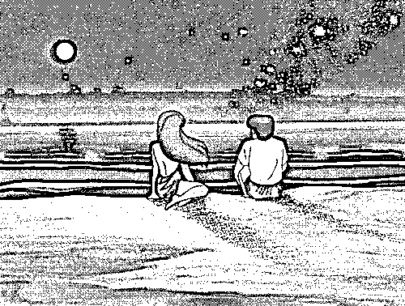

**被高估的爱情**

我曾听过一句话：爱情是被高估的。

人们对爱情的赞美和渴望无须赘述，但可怕的是，**人们会把爱情等同于爱，**似乎没有另一半的生活无论怎样都是带有缺憾的。**世俗的爱情取代了更高的精神信仰，**它成为男人和女人寻求意义、完整与狂喜的场域。

**金星象征的爱情，不只是一种“爱”的形式，而是一系列心理状态，其中有认同、有幻想、有期待。**

两个人一旦相恋，我们就相信自己已经找到了幸福的钥匙。突然间，生命充斥着满足感，别的事情都自动虚化成了它的背景，似乎这就是所谓的“真爱”。

**在这一系列心理状态中，有一个最重要的无意识要求：****我们期待我们的情人或配偶永远会为我们带来这种狂喜与炽烈的感受。**

一旦人们陷入爱情，似乎心智背后就会有一股强大的力量在作祟，它可以让一个人心醉神迷，也可以把一个人掷入深渊。它让一个人变得不再普通，在另一个人那里，TA 成为了国王、皇后……

人们如此迷恋爱情的原因之一，不过是爱情的魔法能够让灰姑娘变成公主、让青蛙变成王子，**所以真正重要的，是自恋和自我重要性的满足。**

在关于金星的神话中，阿芙洛狄特有一条她的丈夫——工匠之神赫菲斯托斯送她的金腰带，这条金色的腰带上绣有各种图案，蕴藏着爱情的全部魔法：

**魅惑、欢欲和蜜语甜言，能使聪明人完全失去智力。**

她可以迷惑天底下所有的男人，使得众天神费尽心机地追求她……

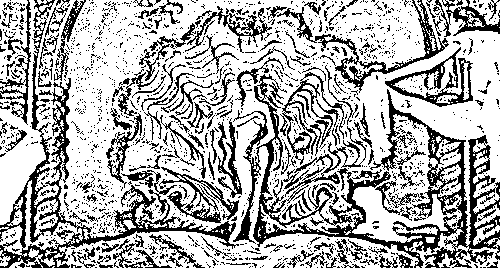

**热恋之后**

**但金星的爱情魔法并不持久，当摩羯座象征的时间让玫瑰色的眼镜脱色之后，爱的功课才真正开始。**

斯蒂芬·弗里斯特曾写道：“如果爱情要治愈我们，它有时必须先把我们带到忍耐的极限。成年人爱情的古老盟友：**诚实、勇气、谦卑、信任、宽容，必须向我们心灵中最黑暗、痛苦、窘迫的角落发射出爆炸性的强光。”**

每一个被爱情触碰过的人都知道他在说什么，这就是金星与冥王星合相的重点，不是心醉神迷的坠入爱河，而是——

**你的需求重要还是我的？我们的关系中，谁说了算？我可以完全信任你吗？你对我说谎过吗？你愿意我与你共享你的资源/金钱吗？你珍视我的价值吗？还是你只是要我满足你的需求？**

将这些问题反过来再自问一遍呢？你有勇气做出诚实的回答吗？你知道自己每一个答案背后的原因吗？

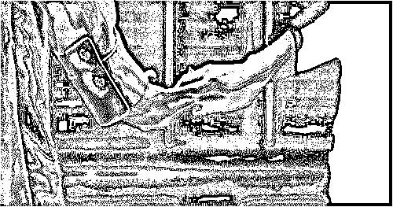

唯有有意识地活在爱情中——即，对以上问题有着清醒的认识和了解，我们才算是在意识的进化中踏出了下一步。

荣格心理学中自性化的过程意味着，人类心灵终其一生，一直在追求变得更为自知自觉的过程。**无意识心智努力想要将自身的内涵提升到意识层次。**

无意识中包含着我们家族的个性基因和家族故事脉络、我们个人所处的集体社会文化影响、从小的家庭和学校教育背景、过往的生活经历塑造的个人信念等等。

**冥王星所象征的无意识**是人类心灵的本源，所有我们显意识层面的人格表现，包括价值、思想、感情、信念及心态，都源自无意识深处。

**有一个鉴别自己目前自性化进程的小方法：**

你是否经常对生活充满困惑，是否经常对身边的朋友说：“我也不知道为什么我会这样。”如果答案是“是”，也许就说明，**你的无意识中有大量你自己并不了解和熟悉的东西。**

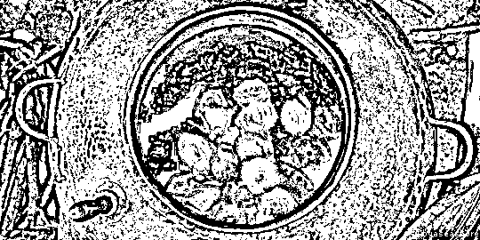

**金冥合相的社会事件**

12 月 18 日李靓蕾发文声讨王力宏——所有重大的社会事件都与集体能量相关，而**明星在成为公众人物收获名利的同时，必然伴随着接收大众无意识投射所带来的正负面影响。**

这样一个“优质偶像”的陨落，似乎也在戳穿着全体女性心目中“完美阿尼姆斯”原型（阿尼姆斯，女性内在的男性形象，象征人类心灵中与理性、逻辑、思考等相关的阳性能量）。

完美的男人是不存在，而且如果去细嗅，就会发现往往是那些看上去越是光明无暇的人设，就必然伴随着另一个巨大的阴暗面——**没有光明是能够独立于黑暗单独存在的**。

再一次，发展整体与合一的视角，而非分裂与投射。人们太习惯于给一切贴上“好”与“坏”、“对”与“错”的标签了。这种分裂的意识状态只会带来痛苦，并形成伤口。

当把另一半投射为完美伴侣，我们终将收获失望；或把自己认同为善良无害，我们终会被自己投射出去的恶所伤。**但如果能发现心灵的伤口，也就找到了通往意识的门户。**

因为，在治疗自己心灵伤口的过程中，我们将会认识自己。**如果我们真正用心去了解爱情，爱情也会成为一扇通往意识的门户。**

我猜想李靓蕾在发出那样一大篇内容的同时，她的内在也经历着痛苦却巨大的转化。年轻的女孩们总是幻想着“王子和公主从此幸福地生活在了一起”——王力宏太符合“王子”的形象了，她为自己编织了一个美丽的梦，付出了全部，却收获了幻灭。

**看上去这对她来说是一个明显的悲剧，但这个“伤口”必然会偿还她同等回报的成长与觉醒**——她即将从一个心软退缩心怀期待的少女成为一个成熟坚韧的女人。

如果说整个事件当中她做错了什么，那一定是她的幻想。是王力宏伤害了她吗？外在看来也许是的，但更重要的，她被自己的幻觉所伤。

**她的心灵整合是什么？无意识层面的幻想被推到了意识层面，无处可藏，她无法再骗自己了。**

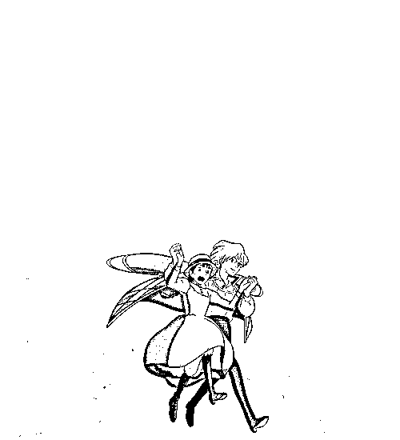

不论男人还是女人，当我们被自己投射出去的幻象所迷惑，产生一种巨大的要为之“付出一切”的冲动时，其实背后都是被自性所象征的巨大进化力量所控制（自性化可以简单理解为自我觉醒的过程）。

**这种冲突显示出无意识中的一些真相要呼之欲出，意识迫不及待地要进入一个更加清醒的阶段。**这样的自性化驱力容不下任何虚伪和阻碍，为了推动意识进入一个新的状态，原本的生活被搞得天翻地覆，因为只有这样才能催生出觉醒。

就如同每一次生产都要经历巨大的痛苦，新意识的觉醒也是一样。

**金星与冥王星合相在摩羯座——用成熟的态度诚实地审视爱情，**无论男女，这都是一趟需要勇气的旅程，强迫我们不仅要审视爱情之美及其潜在的能量，同时审视我们内在无意识层面的矛盾与幻象。

需要勇气的旅程总不免要行经黑暗的幽谷、面对艰难的冲突，但若坚持下去，意识必将获得崭新的觉醒。

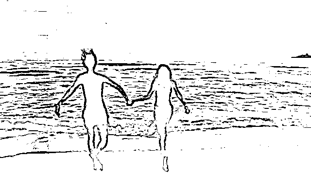

**金冥合相**

通常出生星图有金冥合相的人，都会拥有一些刻骨铭心的情感经历，或者另一种可能是：他们会出于对亲密关系的极度恐惧而不去进入任何一段关系。

因为金冥所象征的亲密关系会对要求一个人做到绝对的诚实——首先是对 TA 自己——对于 TA 内心深处所有的欲望、恐惧、不堪、软弱、自私、贪婪……保持诚实，**绝对的诚实就是冥王星的高阶能量。**

我想，冥王星之所以被称为是高八度的火星的其中一个原因，就是**当我们面对自己内心深处的阴暗面时，需要巨大的勇气**，而勇气正是火星的关键词。

**你能否对自己的阴暗面有勇气保持绝对的诚实，是金冥人能否成就一段健康满足的亲密关系的关键。**因为只有这样，你才能因着自身的赤裸而直视着对方的眼睛，让对方同样脱下 TA 所有的伪装。如此，金冥才能炼化出亲密关系至高的结晶：**坚定的信任。**

想象你和另一半做爱之后，赤身裸体地站在彼此面前，你看着 TA 的眼睛，诚挚又恳切地说：“现在我们一丝不挂，你能告诉我，你还有什么能脱的吗？你内在所有被隐藏起来的部分，请展示给我。”

如果你们双方能因着**对自己内在阴影的了解**，生出**对于人类集体人性阴暗面的深刻体察**，进而发展出一种**超越性的包容视角和态度**，并以此来接纳彼此的脆弱和不堪，那么这段关系就必然会像两块铁焊在一起一样，牢固且无法取代。

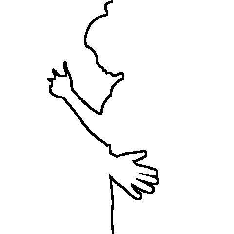

**在最近的长达一个月的金冥合相中，宇宙给了全人类一次建立深刻关系的机会。**但是这机会是为那些灵魂的勇士准备的，只有带着能够洞察真相的智慧，以及包含善恶的慈悲才能获得金冥至高的奖赏——**坦然认可自我的价值，以及去全然信任他人的能力。**

爱情是一个面具与诱饵，背后隐藏着一系列新的可能，等待整合到意识中去。识别这股驱力，并有意识地与其合作，**接受爱情这种原始的无意识能量、纷繁的欲望冲动，**以及各种可能，**将之转化成为觉察与接纳**，就是金冥合相时期我们能做的最有价值的事之一。

而这无疑是我们终其一生学习“爱”的过程中，至关重要的一课。

**去“爱”，而不只是去“恋爱”**。恋爱，轰轰烈烈、吵吵闹闹，掩盖了真正的爱。无论我们如何以爱的名义正当化我们的虚假或自私，爱的本质都不会改变。

当我们说“爱”时，并不是某个人在爱，是“爱”透过人在运作。**爱不是一种行为，是一种存在的状态——是对另一个生命的一种接纳、理解、肯定、看重另一个人做 TA 自己的力量，而不是企图透过对方来满足自我的目的。**

愿我们都能在爱情中践行出爱的品质。

**版权声明：**原创文章由作者授权首发于若道平台，欢迎转发，反对抄袭。友号转载请申请白名单。

**杨浠 Vera**

ISAR 认证占星师（2017 年获得）

全职心理占星师，若道 COAC 高阶学员（2012 届）

咨询时长已达 800 小时

**占星咨询微信号：**haloace（请注名占星咨询）

**微信公众号：**verandu

长按打赏

**学习占星学****点击下图了解课程详情** 

********************************

**微信又双叒叕改版啦，不想错过若道君的推送？****就把若道设为星标吧！****▼**

**喜欢记得点一下在看哦☟**

********报名直达入口********

# 圣诞好礼丨 2022 年要到了，快来领取你的专属年运报告吧！

> 原文：[`mp.weixin.qq.com/s?__biz=MzA5NjA0NTAxNg==&mid=2651464505&idx=1&sn=8f8f2562d18e20be4a1414b662689156&chksm=8b48918ebc3f18984bd5f0beb8de60357e41d3882576479944899b9a8d5c53374b373eb7e0b5&scene=126&sessionid=1692737878#rd`](http://mp.weixin.qq.com/s?__biz=MzA5NjA0NTAxNg==&mid=2651464505&idx=1&sn=8f8f2562d18e20be4a1414b662689156&chksm=8b48918ebc3f18984bd5f0beb8de60357e41d3882576479944899b9a8d5c53374b373eb7e0b5&scene=126&sessionid=1692737878#rd)

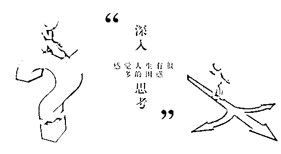

**你是否有过如下的困惑？**

每年一到年底

有很多的**星座专家**都在发布运势，

开头你也会兴冲冲地对号入座，

但久了，你开始思考：

***难道这个世界上只有 12 种运势么？***

***难道所有的白羊座的运势都是一样的吗？***

我的上升星座和太阳星座不同，

***到底是该看太阳星座还是上升星座呢？***

有的占星师说，

上升星座为主，太阳星座为辅，

有的又是倒过来，

等你辛辛苦苦

把太阳星座和上升星座的运势都看完，

发现截然相反，

**到底该信哪个？**

对此，

占星师们给到的回复是，

想要看专属于你的独家运势，请联系个人咨询。

一问咨询费，

动辄几百，甚至上千，一小时哦……

那么问题来了

**在哪里能够找到既专业，**

**又不昂贵的个人年度运势呢？**

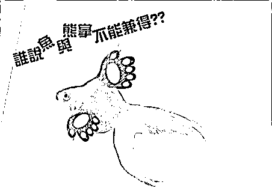

让若道君来回答你吧

**若道隆重推出年度运势报告，**

**你想要的，我们都有！**

拥有这份报告，

你将看到未来一年**重要**行运的影响：

什么时候可能有**恋爱机会**，

什么时候适合**大展宏图**，

哪段时间要注意**身体健康**，

哪段时间开车旅行得**小心**，

**这些问题，**

**在报告里都能找到答案。**

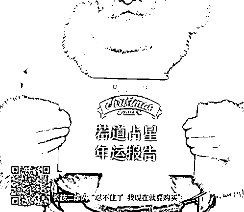

**什么？这么超值的年度运势报告，**

**只要*****198*****元！**

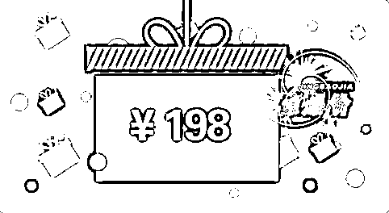

**更有惊喜圣诞红包大礼从天而降**

***30*****元红包免费送**

***168*****元你的****“专属”年运报告****即刻到手**

**如果这份诚意都还没让你下手**

**你还可以邀请你的朋友一起拼团**

**买得多，省得多，成长多！**

**2022 年运报告“友福同享”圣诞团购价**

***15 份*****年运报告 1200 元**

**每份只要*****80 元*****——相当于*****4 折***

***9 份*****年运报告 888 元**

**每份只要****98 元****——相当于*****5 折***

***5 份*****年运报告 599 元**

**每份只要*****120 元*****——相当于*****6 折***

***3 份*****年运报告 399 元**

**每份只要*****133 元*****——相当于*****6.7 折***

**赶紧来看看若道君**

**为你准备的惊喜圣诞大礼吧！**

**圣诞大礼获取指南**

***1.*****点击文末*****“阅读原文”*****进入活动首页**

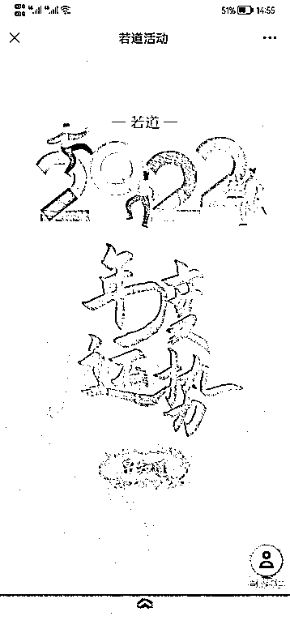

***2.*****专属订制的****“2022 年度运势报告”****可以买一份*****送自己*****，也可以买几份*****送亲友*****哦！**

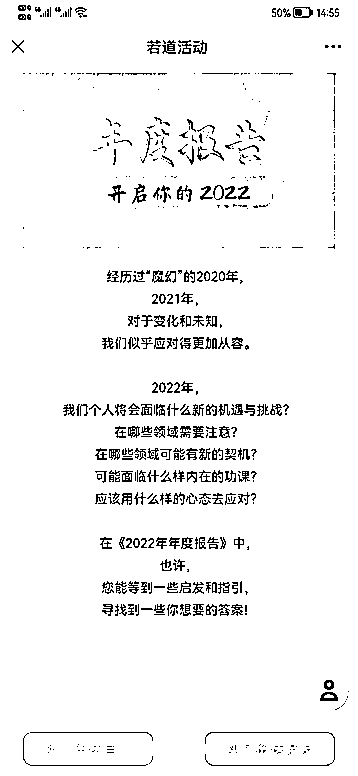

***3.*****买一份*****送自己*****，可享受 30 元天降年运*****红包*****，*****168*****元****专属年运报告****即刻到手！**

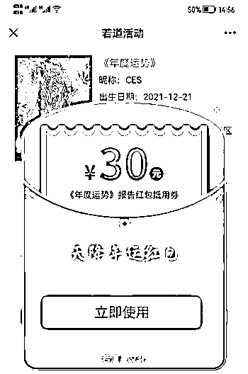

***4*****.买几份*****送亲友*****，可享受*****年运红包套餐价*****，心意送出越多越实惠哦！（套餐价内报告可以*****自己使用*****，也可以*****赠送亲友*****）**

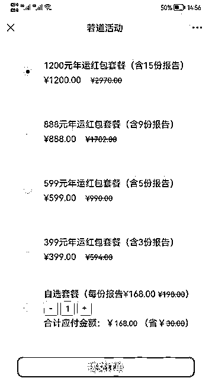

***5.*****可以到****活动首页****的****个人中心****里查看运势报告及使用赠送情况。**

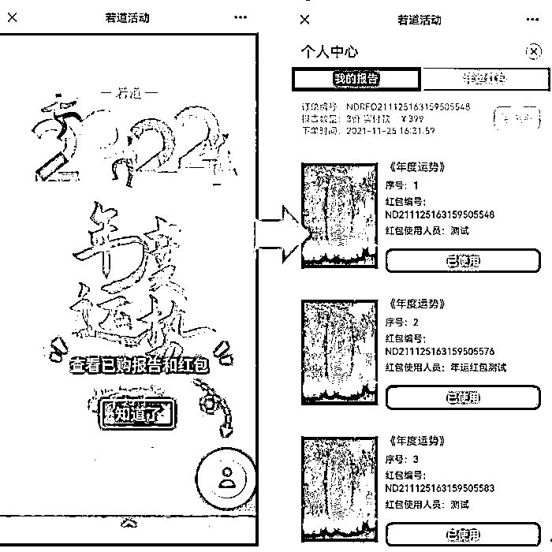

**若道君友情提醒**

**年运报告购买和使用问题，请联系客服（微信号：nodoor201705）。**

**购买报告直达入口**

# 圣诞节快乐！“高强度”天象下，你过得如何 ？

> 原文：[`mp.weixin.qq.com/s?__biz=MzA5NjA0NTAxNg==&mid=2651464505&idx=2&sn=579e9c3b4f52c819e4c10d1a502c74da&chksm=8b48918ebc3f18983143866c2784bd12a801bf1378ce19dc5408c1cc49fbfcdaefc22a8cfa2f&scene=126&sessionid=1692737878#rd`](http://mp.weixin.qq.com/s?__biz=MzA5NjA0NTAxNg==&mid=2651464505&idx=2&sn=579e9c3b4f52c819e4c10d1a502c74da&chksm=8b48918ebc3f18983143866c2784bd12a801bf1378ce19dc5408c1cc49fbfcdaefc22a8cfa2f&scene=126&sessionid=1692737878#rd)

**2021 年 12 月 25 日天象：**

*   **月亮在处女座**
*   ******水星六分海王星******
*   ******金星合相冥王星******
*   ******火星三分凯龙星******
*   ******土星四分天王星******

今天圣诞节，月亮在处女座，看上去是好好“清理”的一天呢~清洁环境、收纳整理、吃健康适量的食物、和动物朋友们享受快乐时光......井井有条，是休息日的主题。本周，我们经历了重要的宇宙天气转换。太阳进摩羯座（冬至）拉开了新一年的大幕；随之，象征人类集体意识进程的月亮交点进入“南交天蝎座/北交金牛座”（点击[【月亮交点换座】](http://mp.weixin.qq.com/s?__biz=MzA5NjA0NTAxNg==&mid=2651464382&idx=1&sn=ca5f285b0dd6039e6f88bd72f08b5c62&chksm=8b489009bc3f191f3ad708ddac6e01b6c0064a7877a3ac539f03a0bed79ab71da6ee56f7be05&scene=21#wechat_redirect)查看文章）；接着，土星与天王星在 2021 年的最后一次精准四分相震荡上演（点击[【土天四分相】](http://mp.weixin.qq.com/s?__biz=MzA5NjA0NTAxNg==&mid=2651464442&idx=1&sn=8b8cc2c63951fc761dd43b47d1804585&chksm=8b48904dbc3f195b220cf85d000948c00c29c94897cf2c4b9fb43a9a1316a5244242c70a6300&scene=21#wechat_redirect)查看文章）；另外，逆行金星与冥王星在摩羯座的持续合相，让我们在“吃瓜”的过程中，看到更深意味（点击[【王力宏事件】](http://mp.weixin.qq.com/s?__biz=MzA5NjA0NTAxNg==&mid=2651464268&idx=1&sn=db4bec9f1cf349dc0009e113cce0d79d&chksm=8b4890fbbc3f19eda7274c97f170ef116ebb77da351cf75c9e117211199ddc0755f729cf5bf9&scene=21#wechat_redirect)查看文章）。这个年底，确实不一般。那么，在持续“高强度”的宇宙天气下，你过得如何？欢迎跟我们分享呀~周六快乐！我们周一见！**了解每日天象，可****下载“若道”APP 查看****还有更多精彩等着你哦**

# 重磅天象丨年尾大戏，今年最后一次土天四分，12 星座如何完美收官 2021？

> 原文：[`mp.weixin.qq.com/s?__biz=MzA5NjA0NTAxNg==&mid=2651464442&idx=1&sn=8b8cc2c63951fc761dd43b47d1804585&chksm=8b48904dbc3f195b220cf85d000948c00c29c94897cf2c4b9fb43a9a1316a5244242c70a6300&scene=126&sessionid=1692737878#rd`](http://mp.weixin.qq.com/s?__biz=MzA5NjA0NTAxNg==&mid=2651464442&idx=1&sn=8b8cc2c63951fc761dd43b47d1804585&chksm=8b48904dbc3f195b220cf85d000948c00c29c94897cf2c4b9fb43a9a1316a5244242c70a6300&scene=126&sessionid=1692737878#rd)

******☆ **后台回复“今日”，给你一句生命态度****

作者/Anastasia

编辑/翀子 封面/书君 图片/网络

土天四分相影响下的 2021 年，充满了动荡、变化与不确定性。12 月 24 日，我们将迎来土星和天王星的最后一次精准四分相，然而这并不是故事的最终结尾。每个人要如何面对它带来的影响、敞开面对各种变化？让我们来看文章吧！**动荡的 2021 年**

如果说土冥合相魔羯座是 2019-2020 年的主旋律，那么，今年的主旋律就是水瓶座的土星四分金牛座的天王星。**对于大多数人来说，这一年都是非常动荡的一年，充满了变化和不确定性。**

**从年头到年尾，我们一共经历了三次土天四分，**分别在 2 月 18 日，6 月 15 日和 12 月 24 日。用一句话总结今年，那就是从土天四分开始，到土天四分结束。

并且，事情还没有完。**土天四分在明年十月初还有第四次，**虽然没有形成精确到分的四分相，但同在水瓶座 18 度产生交汇。

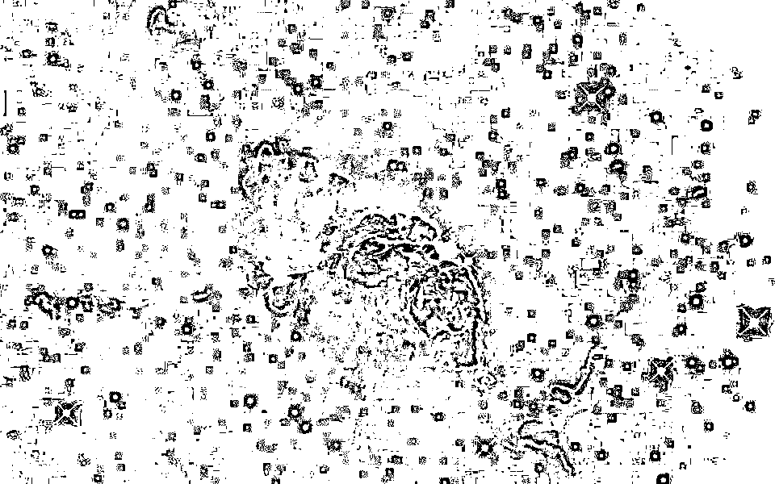

**土星与天王星的周期**

土星和天王星的合相周期是 45 年半。也就是说，**每隔 11 年零 3 个月，我们就会经历一次土天之间的冲击。**

土星坚硬、紧绷、野心勃勃、渴望最长、最持久的统治；天王星则充满变数，是无法预测的动荡和变化，突破寻常，走向极限的冒险。

**最近的一次土天相位，是 2008 年 11 月至 2009 年 9 月的土天对分。**其时，土星在处女座，天王星在双鱼座。并且，木星在 2010 年 5 月至 2011 年 3 月也加入这个相位结构，合相天王星与土星形成对峙。大部分人对这段惊心动魄的时间应该记忆犹新。

2008 年美国爆发贷危机，抵押贷款机构破产、投资基金被迫关闭、股市剧烈震荡引发金融风暴，导致**全球主要金融市场出现危机。**中国启动四万亿救市，直接导致国内房价开始暴涨。

**那是一场灾难性的系统性危机**，一场金融风暴破坏了欧美的经济稳定：希腊破产，欧元贬值。并且还伴随着**一系列异常的自然干扰和异常恶劣的天气，**如冰岛的火山爆发，导致了 95000 次航班取消等等。

**上一次的土天四分发生在 1999 年 7 月至 2000 年 5 月**，土星在金牛座，天王星在水瓶座，位置正好和今年相反。

**天王星能量和高科技相关，**那时候互联网开始蓬勃发展，即时通讯、网络社交席卷大地，带来了极大的、新的财富价值；同时也带了新的安全隐患。

1999 年爆发“西雅图风暴”以来，反全球化的声音始终不曾停歇。自然灾害方面，地球之肺亚马逊雨林遭遇大火。

**天王星能量还和航空航天、探索宇宙相关。**对我国航天事业来说，1999 年是一个里程碑式的时间点。1999 年 11 月 20 日，我国第一艘无人试验飞船“神舟一号”发射升空，是我们载人航天圆满的第一步，实现了从无到有的突破。

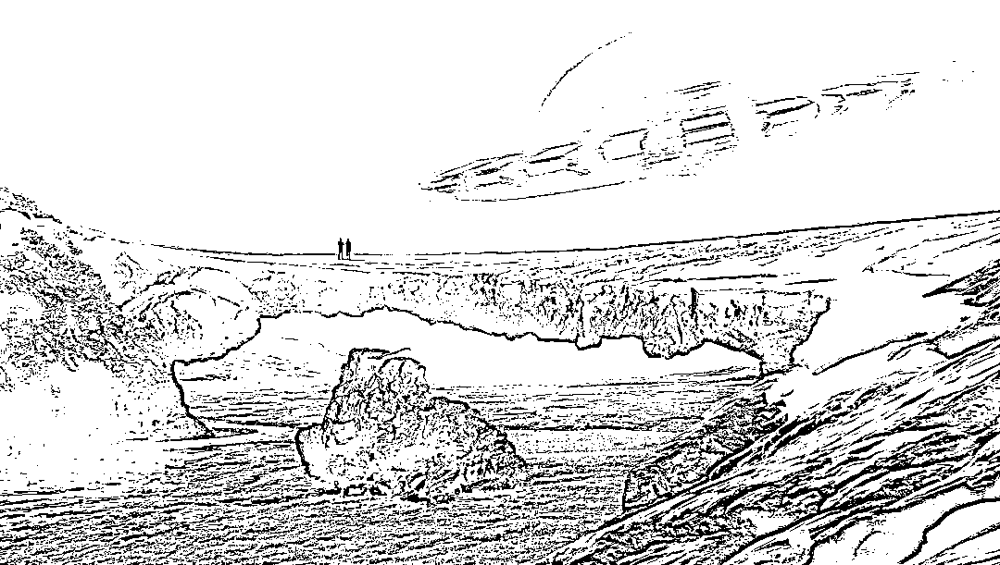

**今年的土天四分同样发生在固定星座，天王星在金牛座，土星在水瓶座。**

水瓶座（气候）和金牛座（土壤）都和自然环境相关。今年也爆发了不少极端气候，年初美国德州大停电，夏天河南山西的暴雨和洪水，最近的龙卷风，超级病毒变异奥秘克戎等等，一波未平一波又起。节能减排，保护环境成为热点。

**对于我国航天事业来说，今年又是一个大年**。中国空间站核心舱发射成功；火星探测车祝融号开始探索火星；天舟三号，神州十三号，中国空间站时代来了。冲出地球，迈向宇宙，人类的梦想始终是星辰大海。

**这周五，12 月 24 日，土天将形成今年的第三次精准四分相，**这一次是顺行的土星在水瓶座 11 度四分逆行的天王星在金牛座 11 度。

这一年来，我们已经彻底领教了土天抗衡带来的极端气候，宇宙探索，以及疫情引发的各种突发状态和不确定性。就这两天，西安封城了，常州地震了，突发事件目不暇接，一个接着一个。

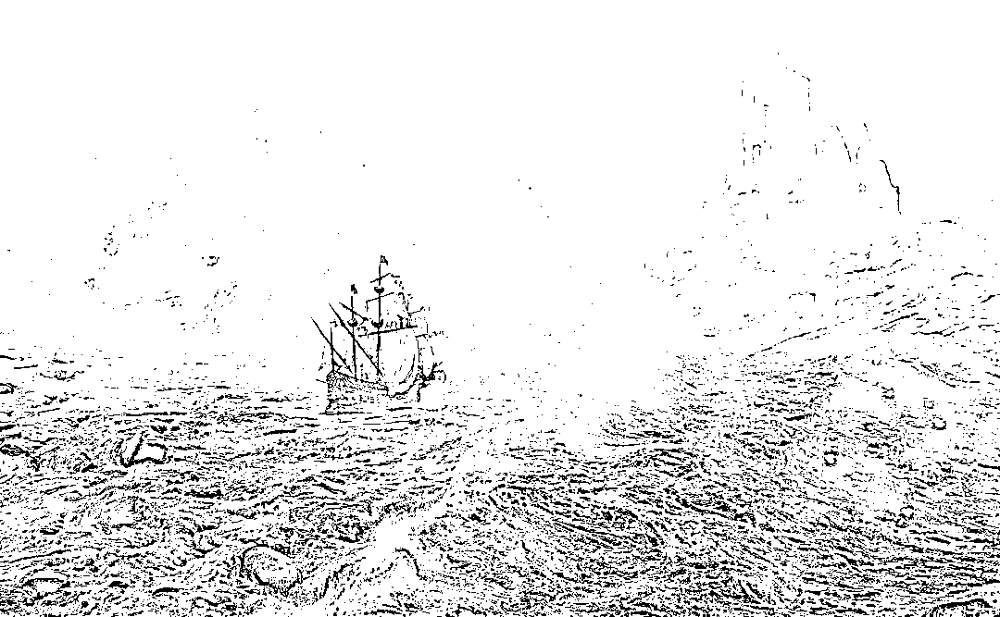

**土天四分相的意义**

**土天四分相，意味着在自由和纪律之间拉扯。**

一方执意要改，一方顽固抵抗，震荡变得更加剧烈，局势更加不可控。正面的土星负责、坚韧、不达目的不罢休，负面的土星则会带来沮丧和阴郁的情绪，以及逃避和闪躲的倾向。

疫情越演越烈，国内严格的管控（土星），将疫情风险（天王星）降至最低；相反，国外多国却持续爆发的反口罩、反疫苗，反一切的集会（天王星），持续养蛊，导致地区局势持续恶化，社会不稳（土星），给人非常无语的感觉。

**固定星座的四分相让改变变得尤其困难，**人们陷入其中，很难抽离出来，客观地去看待问题。但作为今年的主流天象，**我们必须诚实地去面对这些挑战。**

**年底这次土天四分精准成相，就是检视我们的最好机会。**

**发生什么并不重要，重要的是保持敞开。**变化不可避免，动荡也远未平息，疫情的发展仍不可控。时代的潮流会裹挟着一切向前，不管你愿不愿意，有没有准备好。

**相位结构中涉及到外行星，就意味着****某些改变和冲突在人力控制之外。**

今年土天四分第二次精确成相的时候，也就是 6 月中旬，湖北十堰发生了天然气爆炸事故，造成了 25 人死亡，30 多人重伤。这就是一起典型的土天事件，老旧失修的管道，突发意外的爆炸。

这一年来，类似的事情我们已经在周围的环境中感受到不少，突发的疫情，突如其来的隔离，极端的天气。**目前的经验提示我们，**这种大环境下，一定要当断则断，该收则收，不破不立。选择要果断，行动要迅速。这种天象下，拖延就意味着变数。

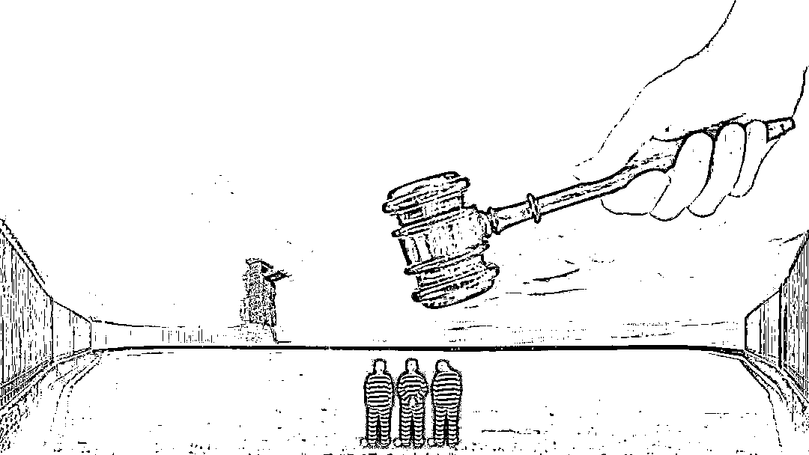

**土天目前形成的是第三次四分相**，顺行土星四分逆行天王星。经历了第一次顺行土星四分天王星，第二次逆行土星四分天王星，事情已经产生分化，**有力量的、基础好的、有准备的已经开始恢复和重建，而那些外强中干、粉饰太平的事物则会更加崩坏。**

明年第四次四分相是逆行土星四分逆行天王星，星历表上可以看到，那时逆行的土星在水瓶座 18 度停滞，马上恢复顺行，同时，天王星在金牛座 18 度刚刚开始逆行。

二者擦肩而过。时间上正好叠加十一假期，**两颗几乎停滞的行星形成撕扯，将爆发更大的冲击力。**

难以想象具体会发生什么，但无外乎反抗和压制，突破和创新。**我们每个人面对的现实问题都是原型能量在人世间的复杂映射，结果取决于我们如何应对，以及我们是怎样的人。**

**土天四分相在 12 宫位**

**持续两年的土天四分相，重点影响到的是有个人行星或者轴点落在固定星座（金牛座、狮子座、天蝎座、水瓶座）的人群。尤其是固定星座 11 度（第一次精确成相）、13 度（第二次精确成相）、11 度（第三次，也就是本次精确呈现）、18 度（明年第四次精确成相）前后三到五度区间的范围。**

查看出生图上这个区间对应的宫位，就会知道我们会在哪个领域感受到土天四分带来的冲击与冲突。我们从土星行经的宫位说起：

**若道君：****你可以在 app store 或者应用商店搜索“若道”下载 app，输入个人档案，查看行运盘（也可以使用其他星图软件），找到行运土星落在出生星图的第几宫，然后对照下文查看影响。**

**例如下图中，行运土星在比尔·盖茨个人星图的第 7 宫。**

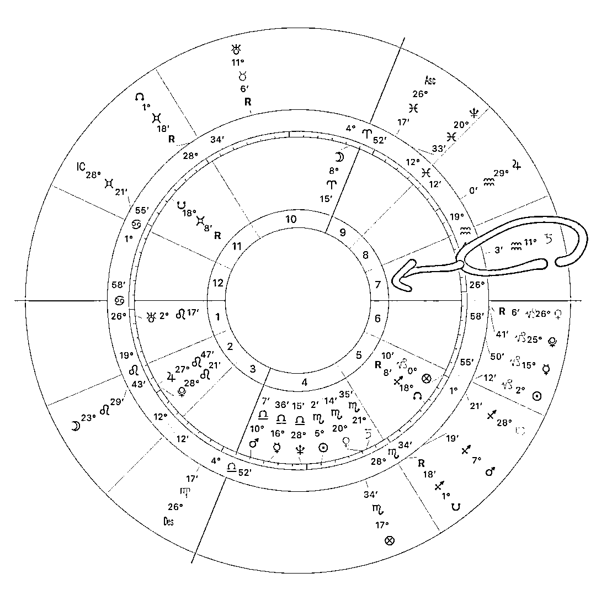

**土星行经*****第 1 宫***

**上升水瓶座，土星行经第一宫和上升点，天王星行经第四宫：**

**需要重新审视和确立自我的身份认同**，以及内在的安全感。可能会搬家或者换个城市生活，不管做出什么样的改变和决定，对今后的生活都将影响重大。

**土星行经*****第 2 宫***

**上升摩羯座，土星行经第二宫，天王星行经第五宫：**

会有一定的**经济压力**，工作收入会受到影响，入不敷出，也会对自己的能力产生怀疑。需要重新学习，掌握一些新的谋生技能，从而获得更多的自我价值感。

**土星行经*****第 3 宫***

**上升射手座，土星行经第三宫，天王星行经第六宫：**

**人际关系**面临新的考验，亲朋好友、短程旅行、沟通学习等本来很熟悉的领域都容易遇到意料之外的麻烦。我们可能会参加新的学习课程，调整生活结构，以备不时之需。

**土星行经*****第 4 宫***

**上升天蝎座，土星行经第四宫，天王星行经第七宫：**

**父母或家族的事情**会给我们带来烦恼，情绪上的压力非常大。冲突的根源可能和我们的伴侣有关，这会让事情变得更复杂，需要正视内心，鼓起勇气去面对。

**土星行经*****第 5 宫***

**上升天秤座，土星行经第五宫，天王星行经第八宫：**

也许会有突发的桃花运，但目前显然不是恋爱的好时机。我们要将更多的精力投入到**个人兴趣爱好**的培养上，而不是将注意力转移到他人身上，指望他人的滋养和帮助。

**土星行经*****第 6 宫***

**上升处女座，土星行经第六宫，天王星行经第九宫：**

第六宫关系到我们的日常生活结构，个人健康、工作和服务特质等，土星进入到六宫，我们要去**学习平衡生活和工作之间的关系**，注重身体健康。可能会因为三观上的冲突，和同事发生一些工作上的摩擦。

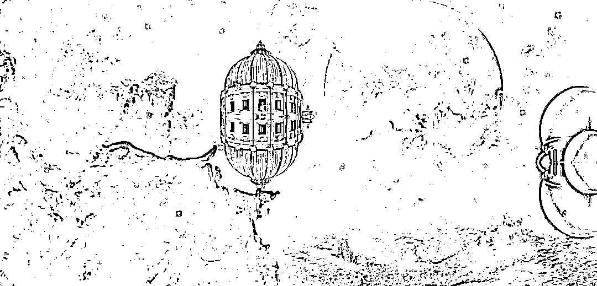

**土星行经*****第 7 宫***

**上升狮子座，土星行经第七宫，天王星行经第十宫：**

土星在这里提示我们在**关系**中可能出现危机，之前的紧张关系将面临最终的选择和结果。**工作**上的不确定性也会增多，我们要做好心理建设，可能要更换合作形式或者合伙人。

**土星行经*****第 8 宫***

**上升巨蟹座，土星行经第八宫，天王星行经第十一宫：**

这可能人生的至暗时刻，常年困扰我们的**心理和现实问题**可能会爆发，强迫我们更深入地探索内心世界，处理一些禁忌话题，深挖自己的恐惧，疗愈伤痛。

**土星行经*****第 9 宫***

**上升双子座，土星行经第九宫，天王星行经第十二宫：**

我们需要**提升信心，确定信念**，接触哲学、宗教等形而上的知识，争取更多的进修深造机会，拓展个人视野。这个阶段非常适合提升自己的眼界和格局。

**土星行经*****第 10 宫***

**上升金牛座，土星行经第十宫，天王星行经第一宫和上升点：**

土星来到星图的最高点，回到自己守护的宫位。我们的**事业、名声、地位和掌控力**将面对考验。这个时期可能面临职业转轨，行运过后，我们会更加明确人生的目的和方向。

**土星行经*****第 11 宫***

**上升白羊座，土星行经第十一宫，天王星行经第二宫：**

土星会压缩我们的**朋友圈和社交活动**，我们会调整所加入的团体或兴趣小组，重新认识和调整自我价值，**再次确认归属感**，重新找寻属于自己的集体。

**土星行经*****第 12 宫***

**上升双鱼座，土星行经第十二宫，天王星行经第三宫：**

我们会有找不到方向，不想做事，只想逃避到自己小世界里的冲动。这确实不是外出打拼的好时机，而是适合**反思、总结和归隐**。我们需要留出时间，**放松节奏**，来疗愈内心，以应对生活中突发的意外和事故。

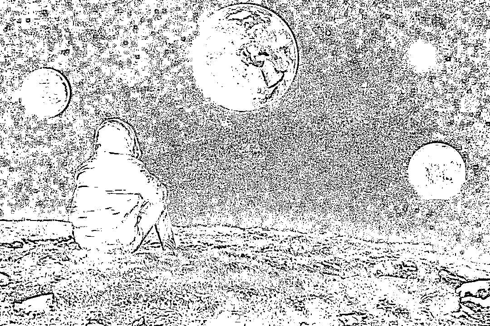

**结语**

总之，前两年的土冥合相影响的重点人群是基本星座（白羊座、巨蟹座、天秤座、摩羯座），这回土天节奏重点影响的是固定星座（金牛座、狮子座、天蝎座、水瓶座），而明年的木海合相影响的则是变动星座（双子座、处女座、射手座、双鱼座）。

十二星座谁都逃不掉命运的安排。

**不要害怕所谓坏的行运，任何行运都是机会，土天四分也不例外。**结构崩塌下的缝隙，就是一些新生力量诞生成长的机会。

如果想安稳地度过所谓坏的行运，就一定要时时刻刻保持对自我的观察，保持觉知和警觉，及时解决和修复小的问题，而不是一味躲闪逃避，等到事情不可收拾的时候，有些代价就会累积得太大，难以承受。

**土星和天王星之间的冲突，带给我们的切实感受就是不确定、不稳定，旧的结构被强力摧毁，新的秩序从头建设。**这种天象下，在心态上保持开放性，接受一定的革新和变化是必不可少的。

改变最不愿意改变的部分，对任何人来说，都是一个痛苦的过程。土星代表的权威和现实，规则和秩序，在天王星的冲击下重新洗牌、重新出发。

在天王能量的冲击下，反思自己，调整自己，在裂变中寻求新的发展机会是最好的应对之道。时代潮流不可挡，越是抗拒改变，越会被碾压颠覆。

**版权声明：**原创文章由作者授权发布于若道平台，欢迎转发，反对抄袭。友号转载请申请白名单。

**关于土天四分相，想了解更多？**
**可点击下方链接**[重磅天象 | 土星四分天王星第一次成相，大变局正在来临！！](http://mp.weixin.qq.com/s?__biz=MzA5NjA0NTAxNg==&mid=2651439115&idx=1&sn=5361a9cb24ef972d771abb3a8ebbcd1e&chksm=8b4b72bcbc3cfbaaef0fb46d56e0d594ba728d578666ce7624d0f98a05ec5227c3374720b2c2&scene=21#wechat_redirect)**** 

**Anastasia**

职业占星师/专栏作者/策展人

于 2015 年通过 ISAR 占星能力考试

若道认证生时校正资质（2015 年获得）

**微信公众号**：KairosMoment

长按打赏

**学习占星学****点击下图了解课程详情** 

****************

**微信又双叒叕改版啦，不想错过若道君的推送？**

**就把若道设为星标吧！****▼**

**就是这个“在看”，戳戳戳 ☟**

************报名直达入口************

# 2022 年天象预测课 | 明年的重大天象，一一详细揭晓！（内含联报优惠）

> 原文：[`mp.weixin.qq.com/s?__biz=MzA5NjA0NTAxNg==&mid=2651464442&idx=2&sn=1ccf0bce7f1a6ff01ba0a1618891f42b&chksm=8b48904dbc3f195bb86b2028db14f0de6ae522198efbbff76a2fe7c21e4f1eec51351fadbfe7&scene=126&sessionid=1692737878#rd`](http://mp.weixin.qq.com/s?__biz=MzA5NjA0NTAxNg==&mid=2651464442&idx=2&sn=1ccf0bce7f1a6ff01ba0a1618891f42b&chksm=8b48904dbc3f195bb86b2028db14f0de6ae522198efbbff76a2fe7c21e4f1eec51351fadbfe7&scene=126&sessionid=1692737878#rd)

2021 年已接近尾声，忙碌的年末工作也挡不住我们对来年的盼望和期许。作为占星师，在年初跟随权威老师透彻地学习 2022 年重要天象的含义和影响，是迎接新的一年的正确姿势，仪式感满满！为新一年的自我规划和占星事业加油充电。**若道邀请了金牌核心课中的四位国际名师再次集结，在明年 1 月 8 日、9 日带来 2022 年重大天象的深入解读：**********

**讲师是谁？**

**琳恩·贝尔**

**（Lynn Bell）**

**· **世界最受欢迎的占星学演讲者、作家和老师之一。定居巴黎，研究心理占星学和家族模式数十年； **·** 著名的心理占星学中心（*Centre for Psychological Astrology*）的长期导师。2016 年，获得查尔斯·哈维（Charles Harvey）杰出的占星学服务奖；**· **作为一个从多个层面进行工作的占星咨询大师，琳恩的工作结合了心理学的观点。她对家族模式的兴趣首先来自与客户的合作。通过在分析领域所做的个人工作，她所受的埃里克森催眠训练将她引领至家族系统。后来，她组织研究小组在家族星图上进行了数年的研究。她写的《家族占星学》就是这项研究的结果；**· **法国心理占星学协会的会长。除了占星学，她在法国沙特尔的新沙特尔学校任教 8 年，还 5 次获得了在《纽约时报》畅销书作者卡罗琳·迈斯（Caroline Myss）的卡罗琳·迈斯教育学院（*Caroline Myss Educational Institute*）合作教学的机会。

**艾德里安·罗斯·邓肯**

**（Adrian Ross Duncan）**

**· **1971 年在印度游学时开始学习占星学，1985 年开始成为全职占星师，迄今执业已超过 33 年，是人本主义占星学、卜卦占星学和经世占星学领域的知名占星师。他还开发了占星软件 AstroClock 和多款占星报告；

**· **哥本哈根占星学院院长；

**· **他在日常咨询中经常运用卜卦，咨询图（卜卦的一种运用方式，即根据客户来访时间制作星图，从星图中获得大量信息）也是他特别擅长的领域；

**· **艾德里安·罗斯·邓肯从 1971 年开始研习佛学，受佛学影响很深，他相信占星学和佛学观点一致，转化的一个基础是在于对现实感知的改变。而卜卦很容易与佛教融合，因为它只关乎当下。

**克里斯蒂娜·罗登贝克**
**（Christina Rodenbeck）****· **克里斯蒂娜·罗登贝克（Christina Rodenbeck）是一名全职职业占星师，在牛津大学城生活和工作，深受周围知识和文化氛围影响；她拥有伦敦大学（*University of London*）的人文荣誉学位，曾在伦敦占星学馆（*Astrological Lodge of London*）、心理占星中心和占星研究学院学习；**· **作为一名占星师，在过去的 20 年里，克里斯蒂娜在她的网站“牛津占星师”上写了大量关于时事、艺术和文化的文章；她每月主持一个占星播客：“与克里斯蒂娜和萨莉一起占星”，并定期在《占星杂志》(*Astrological Journal)*上撰写时尚专栏；她定期在英国授课，并保持着蓬勃发展的专业实践。

**大卫·瑞雷**

**（David Railey）**

**· **若道联合创始人，致力于在中国教授和推广西方占星学；

**· **曾任 ISAR 全球副主席，CAPISAR（ISAR 职业占星师资质认证机构）主席；

**· **1976 年，通过亚特兰大职业占星师考试，成为全职占星师，随后通过 AFAN 和 ISAR 职业测试；

**·** 1980 年，与杰夫·焦耳一起在亚特兰大创建“每日行星”占星学中心。此后在亚特兰大占星协会担任 4 年考官，并且两次担任亚特兰大地区占星协会主席。1979-1992 年，作为占星师活跃于美国社会媒体，向不了解现代占星学变化的大众宣传专业占星学知识。在 1989-1992 年期间，他在 WRGG 电台 12 频道每周主持个人电视秀“今日占星学”，早先他还在 WRFG 的广播节目中播讲宇宙天气节目；

**· **2010-2014 年，任全美占星师联盟监督委员会委员；

**· **2010 年，其著作《灵魂的目标》中国版出版，和蒋颖一起创办若道占星学校和其官网 www.nodoor.com；

**· **2017 年，被选为 ISAR 委员会成员。ISAR 是世界最大的国际占星机构，会员遍布 45 个国家，2017-2020 年曾任 ISAR 全球副主席、CAPISAR（ISAR 职业占星师资质认证机构）主席。

**课程价格****正价**：3000 元**限量优惠价：2022 元**（前 60 名报满截止）**（联系 Maggie 老师，抢占限量优惠价）******联报套餐：《2022 年度天象预测大师课》+《2022 年金融占星预报》联报优惠价****2999 元****（限前 50 名联报）****（联系 Maggie 老师，抢占限量优惠价）**长按二维码添加 Maggie 老师获取联报优惠价**退转课程**

**· 退款原则请详看《教学协议》，如有疑问请咨询课程顾问。**

****2022 年度天象预测大师课****

**授课老师：**琳恩·贝尔、艾德里安·罗斯·邓肯、克里斯蒂娜·罗登贝克、大卫·瑞雷

**授课时间：**2022 年 1 月 8 日-9 日

**授课方式：**网络课程**，**英文授课，中文翻译

**费用：**3000 元**；****限量优惠价：2022 元（前 60 名报满截止）；****联报套餐：《2022 年度天象预测大师课》+《2022 年金融占星预报》联报优惠价：****2999 元****（****限前 50 名联报）**

**课程负责人：****Maggie 老师**（微信：18510107057，请备注“天象预测大师课”）

长按二维码添加课程负责人咨询~

****报名直达入口****

# 重磅天象丨月亮交点换座，你知道它会带来什么样的影响吗？

> 原文：[`mp.weixin.qq.com/s?__biz=MzA5NjA0NTAxNg==&mid=2651464382&idx=1&sn=ca5f285b0dd6039e6f88bd72f08b5c62&chksm=8b489009bc3f191f3ad708ddac6e01b6c0064a7877a3ac539f03a0bed79ab71da6ee56f7be05&scene=126&sessionid=1692737883#rd`](http://mp.weixin.qq.com/s?__biz=MzA5NjA0NTAxNg==&mid=2651464382&idx=1&sn=ca5f285b0dd6039e6f88bd72f08b5c62&chksm=8b489009bc3f191f3ad708ddac6e01b6c0064a7877a3ac539f03a0bed79ab71da6ee56f7be05&scene=126&sessionid=1692737883#rd)

******************☆ 后******************台******************回复“今日”，给你一句生命态度******************

作者/郑玮玲 ISAR 认证占星师
编辑/翀子 封面/书君 图片/网络

北京时间 12 月 23 日 11:16，月亮平均交点进入北交金牛座南交天蝎座，并在此组交点停留至 2023 年 7 月 13 日。月亮交点和人类社会的集体进程有关，是每个人重新校准生命目标的机会。接下来，我们将迎来哪些挑战和机遇呢？

**月亮交点换座**

**北京时间 12 月 23 日 11:16，月亮平均交点进入了北交金牛座南交天蝎座，并将在这组交点行进至 2023 年 7 月 13 日**，届时，月亮真实交点换座会在 2023 年 7 月 18 日发生。而当下的月亮真实交点将于 2022 年 1 月 19 日凌晨 2:49 进入北交金牛座南交天蝎座 29 度 59 分。

**月亮交点在黄道上始终是逆行的，当下我们所有人正在结束过去 18 个月北交双子座南交射手座的集体进程，也将烙下新一轮的集体印记。**

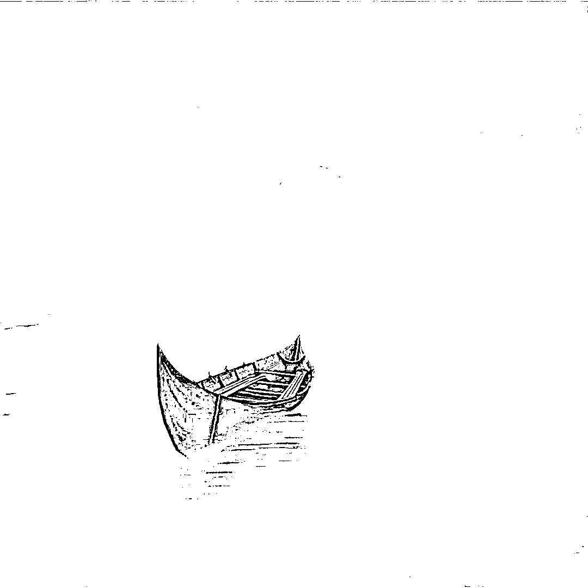

**真实交点与平均交点**

月亮交点在黄道上行进的速度并不均衡，其**真实的交点轨迹**是以进进退退的方式持续逆黄道行进的。也就是月亮真实的交点时不时会出现短暂顺行。**而月亮平均交点则取用月亮交点行进度数的匀速平均值，**这就不会出现“顺行”的情况，速度也相对均衡。

两种交点记录方式在同一时间的度数仅有微小差异，但仍会带来主观感受的不同。

占星师们对月亮真实交点和平均交点精确性、可靠性的论证、说法历来就众说纷芸，各有千秋。时至今日，大家都是从执业开始便选定一种自己认可的交点，通常不会切换使用。我使用的是月亮真实交点。

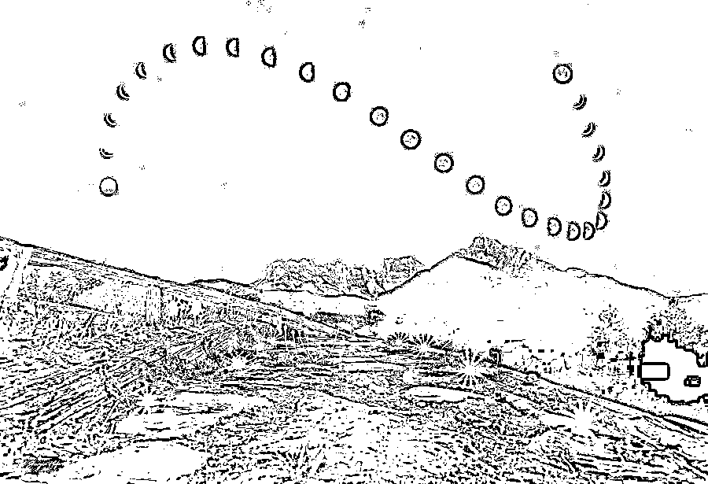

**重点影响人群**

交点回归人群

**出生于以下时间的人为北交金牛座，在未来 18 个月里将迎来你们的月亮交点回归。**

*   1947 年 8 月 2 日—1949 年 1 月 26 日

*   1966 年 2 月 20 日—1967 年 8 月 20 日

*   1984 年 9 月 12 日—1986 年 4 月 6 日

*   2003 年 4 月 14 日—2004 年 12 月 26 日

数据来自星历表月亮真实交点《*The new American ephemeris for the 20th century 1900-2000*》；《*The American ephemeris for the 21th century 2000-2050 at Midnight*》

**所有交点回归的人群将在未来 18 个月里度过一次“灵性生日”。**你们会拥有一次放飞灵魂的机会，用这珍贵的时光去完成此生重大的愿，一种极深沉的渴望会涌现在你的身体、意识和现实中。

我将此称为：**重返灵魂原点。**

这如同宇宙要给我们“系统升级”，每个生命都被设好的周期性的“闹钟”，在沉睡的黑暗中响起。**此刻的你不得不做自己命运的清道夫，去消除自己为自己设置的故障。**

同时，**这是一次重新校准灵魂目标的机会，**有短暂艰辛的重生，如同命运重锤敲击之下突然的顿悟，在漫长、波折的道路中有意识纠偏并重新上路的绝佳时机。

交点回归并不代表每个人在这段路上一定会成功或失败，而是一定有穿透灵魂的痛感，只有痛能击碎旧有的壳，让内在的光芒涌现。

若不想让这次系统升级崩溃，**你应当去校准自己的路径，那条最符合你本心的路，带你走向更深的目标。**

**此外，****对于南交金牛座北交天蝎座族群，南北交点位于狮子座水瓶座的族群，以及有任何个人行星、轴点位于固定星座的人，****此轮交点行进过程中将会有力触碰你的星图，也会将这组交点的现实意义带入你的生活中。**

**月亮交点是黄道（地球绕日轨迹）与白道（月亮绕地球轨迹）的交点。**而月亮被我们的祖先视为太阴——与太阳相对，也主宰平衡着大地苍生。

**月亮交点 18 个月更换一组星座，18.6 年为一个回归周期，于变幻的法则中，月亮交点影响并推动着人类的集体潜意识更迭。**

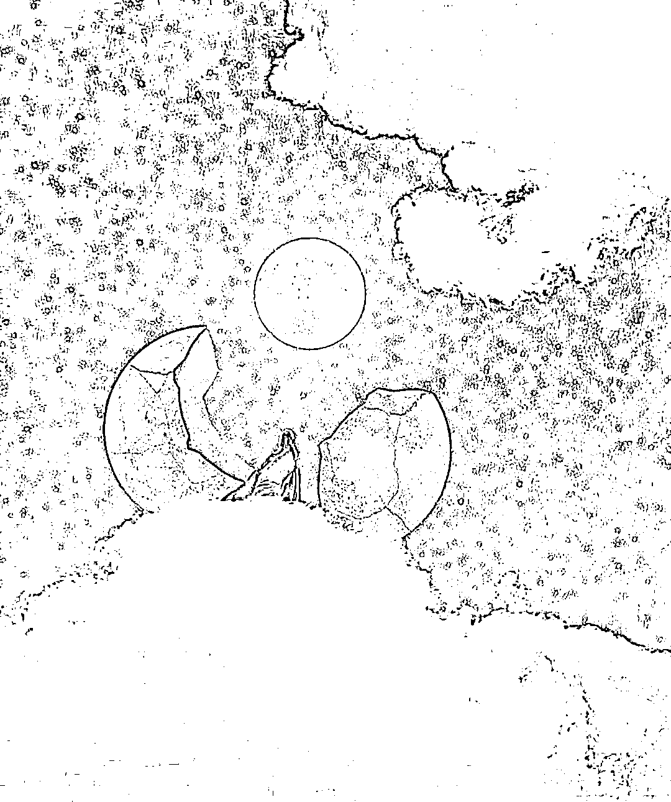

**个人与集体层面**

月亮交点的回归周期位于木星和土星周期之间，这也是告诉我们**月亮交点的影响力不仅是响彻个体灵魂的震频，更是超越个体的集体意识**，将心灵与时代、社会隐含的意义联接在一起共同成长与进化。

当我们走完一段月亮交点历程时，总能发现一些曾经隐藏的意义被知会、明了，被注入时代和生命的印记，清晰的诉求被定格，成为记忆中特定的氛围。

**从 2020 年 6 月我们进入北交双子座时期，集体潜意识更迭的风向正是从火元素到风元素的进程。**在土冥精准合相的时刻进入了全球化的疫情时代，疫情拉开了人与人之间的距离，带来流动的壁垒和阻隔。

北交双子座促使我们采取**随机、灵活**的行事方式，处在非常时期的人们依然保持对未知的好奇，在困境中的幽默风趣也疗愈了时代的伤痛。

过去的交点年，更广泛的线上交互替代了原有的工作、学习模式，维持了一切如常的生活。人们已经意识到没有什么可以阻拦相互交流、学习的愿望，生活总是要继续。**我们通过联接来感受彼此，感受到整体性。**

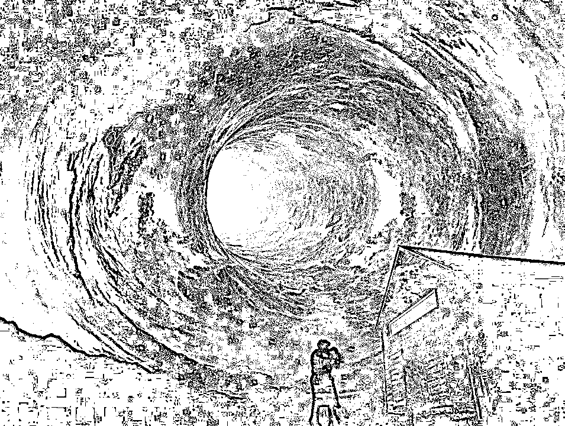

**南交天蝎座，北交金牛座**

**南交天蝎座，****恐惧是每个人内在最大的敌人、障碍和阴影。**

**在天蝎座的阴影中是奴役、虐待、罪恶、控制、丑闻、强迫性和死亡的威胁，**月亮南交点在此，道出了集体性的进化驱力，现在就是时候需要看见并面对它了。

**我们需要从一场声势浩大的“战争”中复活生之动力。**疫情之下，全球很多地区的生活、生产建设经营处在休业、停滞的状态，生机、经济有待全面的复苏。

死亡的威胁，大规模感染的数据，生存的压力和生活负担让年轻人不愿生育，曾经闪耀的明星一个个自毁在公众视野......**面对和处理集体性危机的解药正是金牛座。**

**北交金牛座是生之性味，活着的踏实**、美好将我们从恐惧阴影中解救，疗愈每一个在危机、劫难中幸存的生命。

“天有好生之德，地有载物之厚。”**金牛座是安享的智慧，是与自然相处的舒适感，**更是大地母亲、自然本身，是感官、肢体和切身感受，是嗅闻一朵花的芬芳，品味一杯香茗的甘美，赤脚踩在泥土中的落定，通过每一口呼吸纳入的山野之气。

金牛座让我们通过感官复活心灵的敏锐度，提醒着生命的丰足和价值，**每一个简单又自然的联接都能让人发出由衷的感叹：活着真好！**

**这组交点可谓真真切切的毁灭与重生之路，天蝎座是毁灭，金牛座是重生。**你如何让自己的心灵，感官复苏的？什么对你意味着生活的安稳满足？怎样才算活得自在逍遥？这是通往北交金牛座。

用金星的甜美、自爱、满足来抵御人间疾苦，疗愈冥王星留下的痛苦、危机般的记忆靠的是根植大地的生产力，是我们与土地合作的生生不息的创造力。

**南交天蝎座被冥王星守护，北交金牛是金星所守护，这条交点轴线自然也是一条金冥的进化之路，是个体灵魂和集体性的重生之繁美。**

如同冥后波塞芬妮被解救后，重回光明世界，与母亲德墨忒尔一起行走、祝福大地，要把春天带回到人间。

**交点行进会将旧有积累无法摆脱的问题完全呈现，并迫使现实给出有效解决方案。**

北交金牛座指引着未来 18 个月**值得重点关注的行业领域**，这些行业既陷入危机也将可能重生，那便是：金融、房地产业。

**此外也值得关注**：环保、园林、环境艺术、艺术品投资与展览、家居家政、医学美容、灵性疗愈、健康养身等行业。

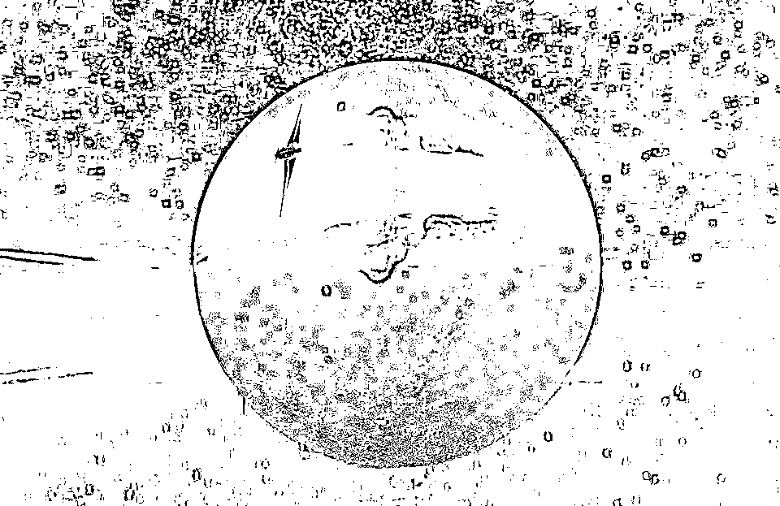

**月亮交点行进中的重要相位**

**金星与冥王星合相**

**交点换座期间，其两端的守护星金星与冥王星就在摩羯座持续合相，**合相持续 11 月 24 日到 2022 年 1 月 10 日。同时金星 12 月 19 日—2022 年 1 月 29 日期间都在逆行，**月亮平均交点和真实交点换座时期都在金星逆行期间。**

这强烈意味着复原天然的生命之爱是如此不易，**现实逼着我们向内去挖掘和修复享受快乐的本能。**若能在极暗之境找寻到内在喜悦之光，便是复原了自己最深信任的原力。

相信我们可以截获并转化冥王星的筹码，以此嘉奖自己的勇气和力量，让一切丧失、陷落的现实逆转。

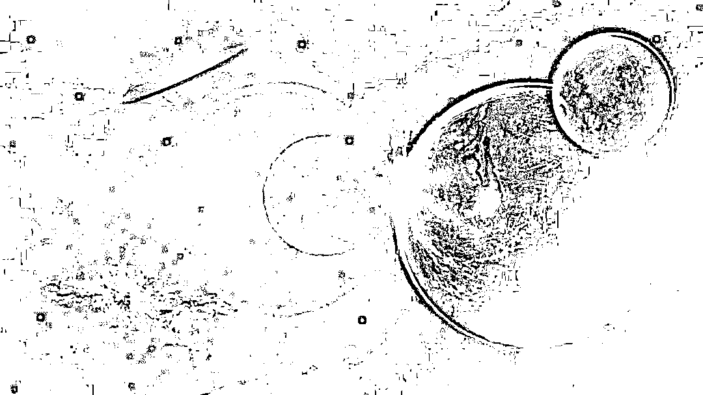

**交点与土天四分**

**月亮交点在 2022 年 2 月 28 日到 12 月 9 日，与水瓶座的土星形成漫长的四分相。**

**土天四分相在 2022 年 3—6 月期间会有短暂的松解，而天王星在 2022 年 5 月 17 日—2023 年 2 月 9 日合相月亮北交点，还将再次四分土星。**

天王星将用快速和革命性的方式带我们突破集体的困境，这会令人期待全球解封或部分地区完全开放的可能性。现实的艰难仍是漫长持续的，土星在水瓶座带来意识的疆界和壁垒。

对于未来不同的认识，不同的理想将划分个人所归属和将要经验的现实路径。信念朝向哪里，便走上怎样的路，经历相关的磨练和考验。

在个人层面土星拖延一切价值、财富的获得与满足，让成就之路变缓。这其中的屏障是每个人对自己意识的限制或过于执著的不符合当下的理念。

**我们需要投入现实去验证，用未来的、创造式的眼光去看事实，用足够的耐心、定力去期待绝对值得的变现、转换的契机。**

**对于月亮南交点带来的负面影响和错误，会遭遇天王星式突如其来的打破、切断来引入革新。**

当现实中遇见天蝎座式的危机，正因忽略掉了土星的沉重功课而造成的，对于过去长期逃避责任，违规操作，以次充好，滥用权力的情形，都将要面对土星的严厉拷问，面对法律、严规的制裁。

**土星让让一切不符集体进化的意识得以修正。**

2022 年的出生率将不容乐观。纵然未来两年年轻人的生育愿景会有所萌动，那将是北交金牛座引领对理想家庭的构想。但土星四分北交点，经济、时间、观念、精力、个人发展等问题仍然存在。

未来一年不会有婴儿潮。这组交点出生的孩子一生会有南交天蝎座对危机的高度敏感，也会在灵魂深处渴望建造生命的花园。

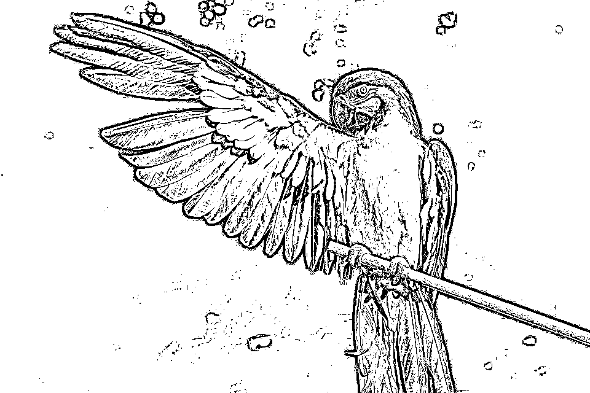

**食季**

**未来 18 个月内将发生六次食相，相较过去的北交双子座交点年密集的九次食相，**北交金牛座时期的食相有**强化中度（14-16 度）和尾度（25-29 度）**的影响力。

**凡是个人行星、轴点、交点位于金牛座、狮子座、天蝎座、水瓶座以及处女座、摩羯座、巨蟹座双鱼座的人都会与接下来的食相能量发生碰撞和交织。**

食相也会在你们的生活中显化出必要的进化议题，通过强烈、深刻的感受、压力和张力将意义带到到你的生命中。同时也推动着每一个做内在工作的人完成阶段性的情绪清理、释放，清晰你的内在目标，疏通你与更高自我联接的通道。

**食相会带来某种心理和灵性上的突破与转化，尤其在深层价值感，信任与资源交互，关系与金钱等议题上呈现出来。**

月亮交点如同人类集体灵性的导航系统，指引着集体的意识进化与更迭。**食相将这些进程划分了时段并提出了切实的目标和要求，将生命演化与世事变迁隐秘地结合起来。**

食相时间表

*   2022 年 5 月 01 日：金牛座新月，日食，金牛座 10 度 28 分；

*   2022 年 5 月 16 日：天蝎座满月，月食，金牛座天蝎座 25 度 17 分；

*   2022 年 10 月 25 日：天蝎座新月，日食，天蝎座 2 度；

*   2022 年 11 月 08 日：金牛座满月，月食，天蝎座金牛座 16 度；

*   2023 年 4 月 20 日：白羊座新月，日食，白羊座 29 度 50 分；

*   2023 年 5 月 06 日；天蝎座满月，月食，金牛座天蝎座 14 度 58 分。

2023 年下半年还会有一次金牛座月食，但该次食相是与已经进入北交白羊座的交点发生的，因此不算作北交金牛座的食季之中。

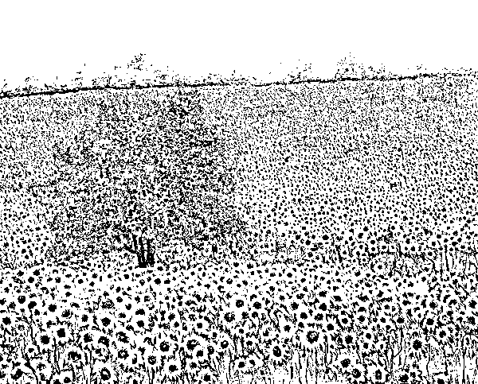

**北交点在金牛座的指南**

**身体的智慧**

北交金牛座的智慧第一重要的就是需要通过苦难、危机的转化，认识到**我们的身体是此生最重要的载体，生命的健康高于一切。**

每个人都必须用慎重、智慧的方式去对待、照护自己和家人的身体健康。

同时身体的智慧应被视作最高的智慧，**最重要的疗愈一定经由身体开始**，疗愈的终点也将由身体的感受来决定。

每一份身体的感受都应当被警觉、尊重，身体给我们制造的问题也将给到我们答案。**身体的舒适度决定人生的舒适度。**

**南交天蝎座会意味着：排毒、释放激烈的能量，转化情绪，北交金牛座让我们闭目养神，静享舒适疗法。**

积极投入养生，尤其是**天然的养生学习**是很有必要的：中医、太极、气功，或是被动治疗的按摩或任何一种身体疗法在未来会被越来越多人接受和需要。

**过正常生活**

南交天蝎座的阴影带来如避难一般的生活，和看不见的敌人，看不见的病毒作斗争，口罩成了防护日常，也遮掩了我们日常的面容。再一次，我们要认识到南交点带来了习性。

**而北交金牛座要我们改变习性了，为了重拾没有阻隔的自由呼吸，****我们需要走到大自然中**。

敞开的身心和面孔，让天地的力量换新身体的感受，让洁净的空气灌满我们的肺，让天然的草药、食物来保护、滋养身心，维养正气。

**投入人间烟火，过正常生活。**回到现实中积极投入生产、制造、创建的工作，在平常生活中感受生活的质感与温度，每一种生活的气味都足够有力把我们带离曾经的阴影。

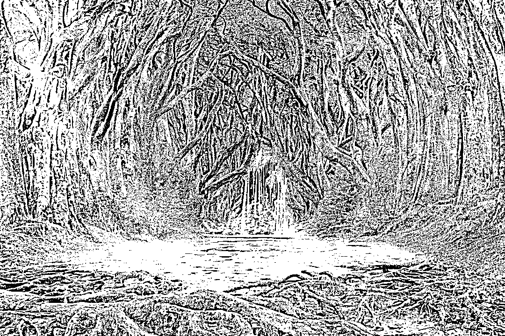

**宁静的时空**

你哪怕在最糟糕的冬日阴郁的天气出门去处理麻烦事，也值得去闻一下路过的花园飘来雨后的泥土味和掉落的枯叶味。去感受到这混杂的奇妙味道，时空就这样把你紧紧拽住，让自己沉沉地待在当下。

**每一天，每一分钟你都有机会为自己创造这样的宁静时分。**

这是生存的力量，是让简单生活变得理想化的方法。**我们需要从过去长期的紧张中解放出来，**对健康无用的讯息、声音、数据无法胜过脚边的芬芳。去意识到身处的烦恼、聒噪的世界也是宁静、喜乐、自在的世界。

**当下即解脱**

**北交金牛座的魔法咒语是：世间本无事，庸人自扰之。**

放下所有既不属于当下的奢望，又不在我们能力范畴以内的焦虑。因为这些都无法安放身心，无法让我们好好关注当下的每一片生机，每一刻的被爱被呵护，无法不为生之幸运感动。

生命是一座我们亲手栽培的花园，北交金牛座的时空，我们该坐下来享受花园的时序了。北交金牛座的道路是芬芳馥郁的宁静，在我们能力所及，触手可得之处享受片刻又何妨？

**无论我们拥有的是金子还是光阴，用稳定的舒适感来拥抱自己的脆弱，疗愈便会发生，当下即解脱。**

**拥抱你的财富**

北交金牛座也必须给自己一个怀抱，每个人都将奔向实在的、有人味的温暖怀抱，用我们的双手构建的理想现实。

我们每个人都值得在这一趟旅途中放下对自我的怀疑，生而为人应当享受的一切要去试试。**在温暖的快乐中才算不枉来人间一趟。**

**去投入美食、艺术、种植和任何一种放松的享乐，让感官苏醒在一次次的盛宴中。**每一种生活的质感，每一味快乐的良药都在为我们积攒人生的财富，那将鼓励我们去看向内在更深的宝藏，并努力去挖掘、呈现它，因为我们值得。

**穿越死亡阴影的力量将转化为财富**，“落红不是无情物，化作春泥更护花。”北交金牛座鼓励富足的心灵去见证生命的奇迹，如同败落的花叶重新转化为支撑生命的土壤。

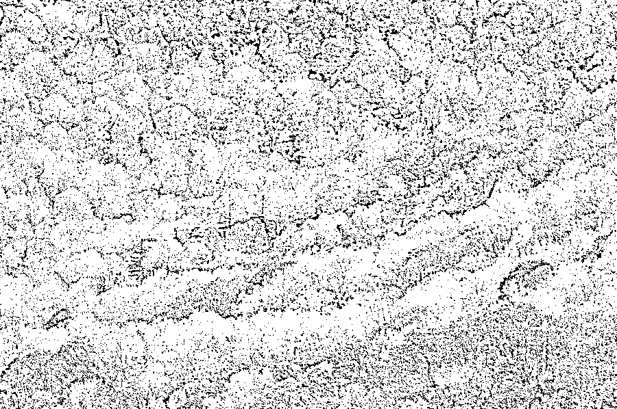

**结语**

南交天蝎座将渴望带到了当下和未来，北交金牛座要达成金星的至深宁静，我们激越的心灵才会满足，每一刻胸中涌动的激情也必将释放、转化。

**每一个相信爱的人都值得奋不顾身去投入爱，信任这生命之爱。****北交金牛座会透过金星的联接力为信仰爱的人们，筑就爱的城堡。**

唯爱永续生命。

**版权声明：**原创文章由作者授权首发于若道平台，欢迎转发，反对抄袭。友号转载请申请白名单。

**郑玮玲**

ISAR（国际占星研究协会）认证占星师（2016 年获得）

若道占星专栏作者

将占星咨询、教学与音乐、舞蹈相结合的疗愈者

**微信号**：zhengviolin

**新浪微博**：@郑玮玲

**微信公众号**：Sampriya-Astrology

长按打赏

**学习占星学****点击下图了解课程详情** 

****************

**微信又双叒叕改版啦，不想错过若道君的推送？**

**就把若道设为星标吧！**

**▼**

**就是这个“在看”，戳戳戳 ☟**

******报名直达入口******

# 每天都做梦，剧情是天王星、海王星，还是冥王星？

> 原文：[`mp.weixin.qq.com/s?__biz=MzA5NjA0NTAxNg==&mid=2651464382&idx=2&sn=be23b84909656d6a09cb081095b7b9bd&chksm=8b489009bc3f191f0e7ea3c1ba61c2e9cc129de2ae0df8bc2e8a93f248cead8654ba5e5a7c68&scene=126&sessionid=1692737883#rd`](http://mp.weixin.qq.com/s?__biz=MzA5NjA0NTAxNg==&mid=2651464382&idx=2&sn=be23b84909656d6a09cb081095b7b9bd&chksm=8b489009bc3f191f0e7ea3c1ba61c2e9cc129de2ae0df8bc2e8a93f248cead8654ba5e5a7c68&scene=126&sessionid=1692737883#rd)

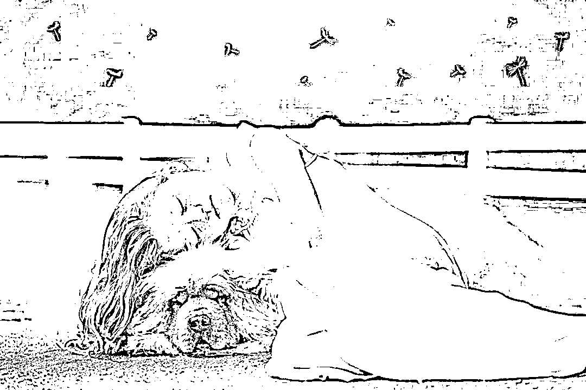

作者/丹恩·鲁伊尔
译者/江艺 校对/Arrow 编辑/玫瑰 图片/pexels

梦境是非常繁复神奇的，之所以这么说，不仅仅是因为梦境的内容稀奇古怪，在梦境华丽的外衣之下，潜藏的是我们更为复杂的潜意识世界。这篇文章会告诉你，天王星、海王星、冥王星所代表的梦境分别都是什么样子的。【[释梦工作坊](http://mp.weixin.qq.com/s?__biz=MzA5NjA0NTAxNg==&mid=2651463858&idx=2&sn=ddc957b802212846ba780b509eba1f42&chksm=8b489205bc3f1b1346e5ab03b316caaf93aedd2bc1d85fa4f15379d9fad2fcafcfc68e23281d&scene=21#wechat_redirect)】报名中，点击链接了解更多详情吧！

**有人说得清梦境么？**在人的生命中最显著的两极对立就是**清醒意识和睡眠**。在某些文明和宗教中，这种意识活动和无意识睡眠之间的交替变换被延伸扩展，包含了一种理念：**地球上有形的存在与“脱离肉体”融入到一种超越死亡的状态之间有着类似的交替。**上述提及的这种理念，常常被称为轮回学说。它很少得到充分理解；只有将它与我们所谓的睡眠相关联时，我们才能以简单的方式获得重要的认识。不幸的是，我们对睡眠的含义只具有最模糊的概念。我们懒得去追问我们为什么睡觉，虽然我们有 1/3 的生命都在睡觉；也不愿去探寻我们为什么会体验到奇特的梦境。我们认为这些是理所当然的，就像认为死亡和生病是不可避免的事情，我们必须接受，即使并不理解。宗教和哲学应该在这些基本问题上给我们启迪。但它们的解释常常给不了多少启发，常常被迷信和幻想遮盖。科学和现代心理学有许多关于睡眠和梦的理论；但它们能够阐明的也屈指可数，只不过是用一个未知事物来替代另一个。

难道就没有一种方法可以简单地展现，至少粗略勾勒出清醒状态、意识行为和无意识睡眠状态之间的关系图吗？

显然，这张蓝图必须包含梦的现象，因为梦发生在清醒意识和睡眠之间的边缘地带，以某种特殊方式参与了这两种状态。

我相信，占星学提供的工具和符号能够为我刚才陈述的这个问题提供一种大致的解释；我要说明一个简单的关键点，如果我们运用得当，将会大大观照这些常常蒙着神秘面纱的事物。

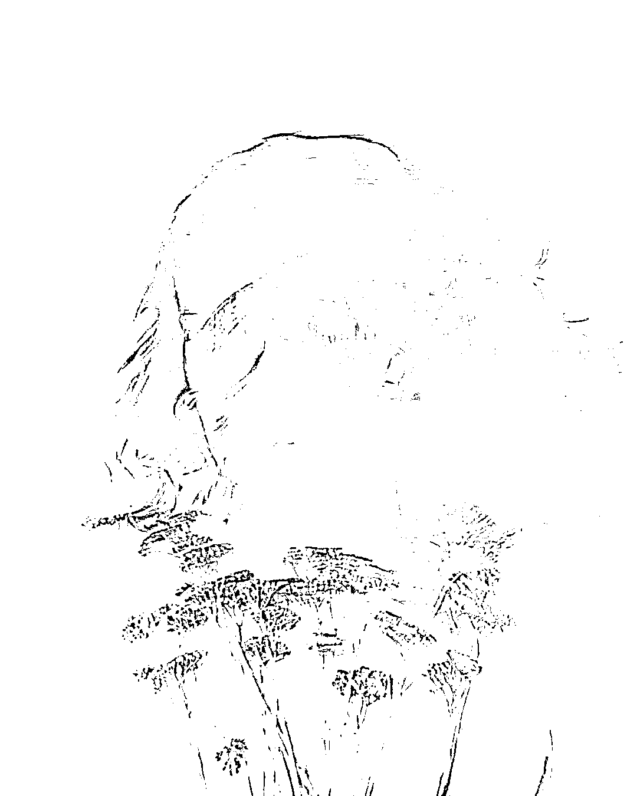

**梦的素材**

有时候，当潮水从沙滩上退却时，仍然会留下一些小水洼，尤其是在岩石突出的地方会存积水。这可能有助于读者想象一下困在其中的小鱼小虾，甚至小章鱼代表了我们的某些梦境。

有时候，一只大鲸鱼可能会搁浅在沙滩上，濒临或已经死亡。各种弃物残骸都被退却的潮水留在沙滩上，我们通常很难认出它们是什么。它们从无意识潮水的深处被冲上了意识的海岸。

梦有很多种，这种类比最多只能说明其中的一小部分；因此我们不能按字面来理解，或是将其涵盖所有的梦。事实上，最好**将梦当成无意识的反应，针对清醒状态下个人意识活动期间所发生的事件及其后果。**

正如社会对一个人的生产活动或独特行为做出的回应是给予他财富和名誉，或是在可怕的经历之后把他送进监狱。

同样，我们整体存在的无意识极点在极性转换时会立刻对我们的意识感受、思想和行为做出反应。生命在睡眠时处于掌控地位，有了发言权。**它责备我们整个存在的意识部分，甚至试图以某种方式修复我们任性的、个人主义的意识自我所造成的破坏。**如果自我意识非常坚决和成功地挑战了我们集体的传统和伦理方式，它的文化和宗教，或在更深的层面上，反对或阻碍了人类的天性和情感（比如禁欲主义）。那么到了夜晚，当个体睡觉时，其存在的集体极（社会和生命或人类本性）就会发出强烈抗议和危险警告，试图用灾难性后果的画面或不可避免的失败感和徒劳感给自我极留下深刻印象，或只是为了赢得自我的支持。发生这种情况时，集体极的某些抗议的印象会留在大脑的某些敏感区域，甚至是身体上的一些神经丛。当极点再次转换，个体极（自我）重获意识掌控时（即我们醒来），这些印象被意识当作梦境捕获。梦之所以如此难以理解有多方面原因。首先，我们存在的集体极无法用理性的语言传达它的沮丧或抗议；它只能从大脑或记忆中储藏的一些过去情境中，笨拙地抓住一些与无意识想要传达给意识的东西相似——或一致的图像。因此，这些图像具有重要的**类比或象征意义**，它们出现的顺序**并不符合意识逻辑的原则**。梦主要代表在大脑或其他神经中枢上留下印象的空间序列图像。清醒的自我意识很难在阴性或被动的睡眠状态中恢复，因此，对时间顺序的感知仅仅在清醒的自我意识试图快速扫描这些由人类有机体的一部分（即与自我意识紧密关联的神经中枢）制造的印象时才会出现。这就好像一位繁忙的行政主管早晨冲进他的办公室，看到桌上散布了一堆乱糟糟的文件；电话已经来了，他能做的就是快速扫描这些散开的文件，而大多数时候，他无法按照几位秘书在他来之前整理好的那种顺序进行浏览。有时候，**一些最重要的信息会凸现出来**。行政主管匆忙赶来是因为在家收到一条重要信息：总裁病得很严重呢；股票市场很可能在早晨崩盘；仓库起火了等等。但即使这条信息、让这位行政主管（自我意识）震惊了，但可能完全是混乱的；或许是佣人或妻子告诉他的，而他们也许并没在电话里听清真实情况，等等。

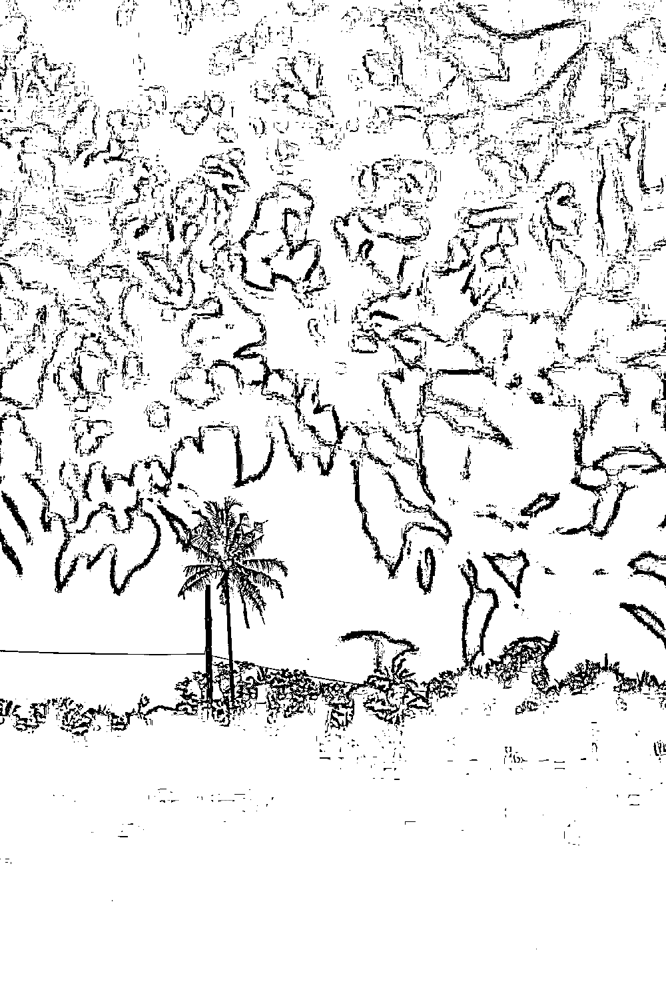

**梦的分类**当然，所有这些例证都不充足。它们只能暗示一个过程的性质，这个过程不能被准确翻译为单独的意识经验。占星学可能为我们分析梦的过程增添另一个维度，帮助我们将梦区分为三种基本类型：**天王星式的梦、海王星式的梦和冥王星式的梦。**

**天王星式的梦境**

天王星类型的梦是**对狭隘、自足的惰性、自私或冷酷的土星自我的直接挑战**。自我在本质上是一种土星的特质，因为土星代表我们**存在的个体极的结构和界限。**

当我们以一种**分离、排外、狭隘和死板的方式变得过于个性化**时，这种对土星功能的过分强调就会唤起一种**来自社会、生命或内在神性的补偿性的对立反应**。

就好像银河系将一股强大的射线射入太阳系，因为太阳系的电磁场已经变得过度绝缘，因而可能成为银河社区的“癌症系统”。

银河系的能量以天王星的方式到达太阳系。在最高阶的意义上，天王星类型的梦是**预言和启发。**它甚至可能是一个幻影、灵光一闪或精神启示，甚至出现在意识自我活动的清醒期。

比如，保罗在前往大马士革的路途中，基督的影像和话语给他带来深深的震撼，针对他盲目的传统而狂热的自我决定：迫害新神启运动中的信徒。

天王星的梦通常是**非常令人不安**的。它们表现为一个**挑战**，不容易被自我接受。**庄严的语言**可能是梦的一部分；常常有**光芒**，或有一种确切的颜色作为梦境画面的强烈元素凸显出来。

荣格所说的**“无意识原型”**常常出现在这类梦中；它们指涉一种最深层次、最普遍的人类经验。它们与普遍生命的一个基本面向或功能关联，在人类本性中发挥作用。

因此，它们常常具有一种**宗教特征**。这种梦可能在根本上**转化梦者（改变信仰）或彻底扰乱他（她）的自我满足和自我中心或偏执的理念**。

**海****王星式的梦境**

海王星式的梦是最常见的。它们是**对任何扰乱常态、个人与社会关系的平衡、个人健康、消化系统或身体本能的事物做出的反应。**

从这个意义上来说，海王星的梦是在**回应木星所执行的复杂功能所面临的任何干扰或危险，包括身体上和心灵上的。**

任何**对社会或伦理行为准则的挑战**，任何**对身体或思想的安全“饮食”的侵袭**都会产生海王星的梦，它们常常是非常奇特的。

如果夜里突然降温导致身体变得寒冷，那么醒来时你可能想起一个漫长而戏剧性的梦：在暴风雪中行走，掉入冰冷的水中，等等。

如果你强烈地渴望打破道德或社会行为规则，那么，很可能你迟早会梦见一些戏剧化的场景。

梦中的参与者们会出现在奇怪但具有象征意义的环境中，或许是改头换面的场景，使得这种情景的深层真相在起初出现时并不那么令人难以接受。

弗洛伊德的释梦体系，让现代人习惯性地去思考弗洛伊德所说的“审查者”。据说，这个审查者代表了自我个人安全的私人警卫，为他抵御任何不愉快的打扰或防止在他的地盘上革命的企图。

因此，我们存在的集体极所留下的不安印象，在有意识的个体觉察到他们之前就全部被监管、改变、歪曲或消除了。

是否真有这样的审查者值得怀疑。它所指涉的仅仅是我们存在的两个极点（个体和集体、意识和无意识、白天的行动和睡眠）之间关系的一个特殊阶段，在这个阶段，**个体尤其反叛集体，不安的自我不断感到需要得到社会的保护。**

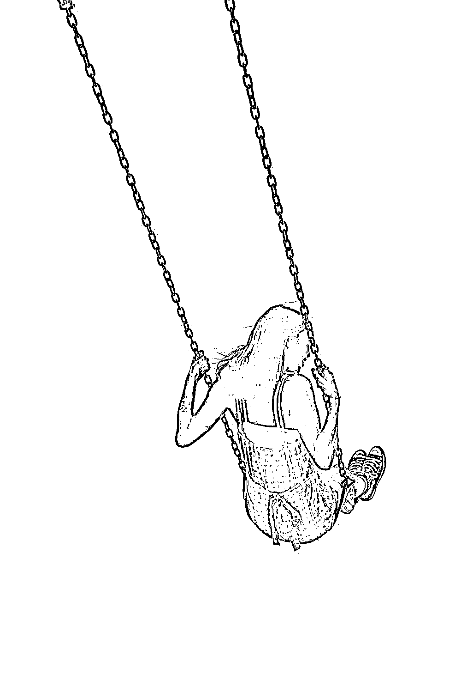

**冥****王星式的梦境**

冥王星式的梦很少见。它们可能**对整个个性的整合极具破坏性，奇怪的梦魇留下恐怖的感觉：恐惧、灾祸预示、死亡**。对于更具灵性的个体，它们可能是**对自我更新、自我本质的扩展等深刻体验的投射或象征。**

**天王星式的梦是对可能发生的情况的预告**。它们为我们展示了前路，激励我们前行，唤醒自我约束的灵魂去觉知新的可能性。

冥王星式的梦可能**反映了清醒意识真正开始内在发展和灵魂成长**，也可能是消极的，**揭示了经历失败的（至少暂时的）灵魂的痛苦和绝望，或许是前面未知的深渊和这些深渊中充斥的黑暗的存在。**

**版权声明：**本文由若道翻译发布，欢迎转发，反对抄袭。友号转载请申请白名单。

**丹恩·鲁伊尔**原名 Daniel Chenneviere，法国裔美国现代作家、现代主义作曲家和人本主义占星师。现代超个人主义占星学的先驱。**梦境工作和做梦疗法是深度心理治疗的一个关键技术，**使得深层无意识的象征性语言能够传递它们的洞见，并指引患者走向更大的完整。梦境使带有情感成分的无意识材料安全而快速地进入意识层面。它们帮助找到治疗的重心，指引治疗的方向。**梦境提供了重要的线索，告诉我们客户痛苦的来源，以及哪些情绪和情结需要被检视****和处理。**梦境工作可以成为心灵成长和行为改变的强大催化剂，它有种独特的能力，促进疗愈从内在发生。**释梦占星大师工作坊报名中，点击文末【阅读原文】就可以报名啦！****学习占星学****点击下图了解课程详情** 

****************

**微信又双叒叕改版啦，不想错过若道君的推送？****就把若道设为星标吧！****▼**

**就是这个“在看”，戳戳戳 ☟**

************报名直达入口************

# 释梦占星大师工作坊：荣格、占星学与梦境

> 原文：[`mp.weixin.qq.com/s?__biz=MzA5NjA0NTAxNg==&mid=2651464382&idx=3&sn=f2983ac97aec77082f7ffff564733a0c&chksm=8b489009bc3f191f3c52880a990217c3b493139ec682e471eabdc458393e3ab954d1c25f1f38&scene=126&sessionid=1692737883#rd`](http://mp.weixin.qq.com/s?__biz=MzA5NjA0NTAxNg==&mid=2651464382&idx=3&sn=f2983ac97aec77082f7ffff564733a0c&chksm=8b489009bc3f191f3c52880a990217c3b493139ec682e471eabdc458393e3ab954d1c25f1f38&scene=126&sessionid=1692737883#rd)

****

**2022 年 3 月和 4 月木星和海王星在双鱼座合相给连接梦境与占星提供了一次绝佳的时机。**

**　　——格雷格·博加特老师**

**梦境工作和做梦疗法是深度心理治疗的一个关键技术，**使得深层无意识的象征性语言能够传递它们的洞见，并指引患者走向更大的完整。

梦境使带有情感成分的无意识材料安全而快速地进入意识层面。它们帮助找到治疗的重心，指引治疗的方向。**梦境提供了重要的线索，告诉我们客户痛苦的来源，以及哪些情绪和情结需要被检视和处理。**梦境工作可以成为心灵成长和行为改变的强大催化剂，它有种独特的能力，促进疗愈从内在发生。

梦就像冰山从无意识的深水中浮现出来。有些冰山属于过去，帮助我们理解过去的创伤和未消化的回忆，因此是回溯性的。

**梦境有种整合的能力，**因为他们能使我们觉知和化解很多次人格之间的矛盾。**梦境也有前瞻性或预期性，**那是来自未来的冰山，会呈现出将要发生的事情，显现出个人有可能成为的样貌。**梦境既向后看也向前看**，它的本质功能是扩展意识、觉知和身份的疆界。

**我在梦境工作中主要使用的技术，是以开放的好奇心，主动探求梦境中每个角色、地点和行为的当下意义**——每个元素都反映出梦者的心灵状态和当前的生活情境。被梦境所揭露的信息，往往既幽默，又充满矛盾，而且为我们打开了新视野。

怀着一种敬畏的心态，我发现每个梦境都是意识海洋深处的一颗珍珠。反思梦境的奥秘，会引发一种近乎宗教敬畏的情感，我们会惊叹于心灵描绘自身处境的能力。

1

**课程内容**

**本课程将课堂讲座与动力过程工作结合起来，动力工作过程会将星图解读和梦境分析结合起来。**

每天约一半时间用于讲座，其余时间会演示占星学梦境工作方法，过程中老师会与学员进行互动。课程包括对老师解读星图和治疗性梦境工作方法的详细阐释和示范。

**我们将学习荣格解梦的基础知识和治疗性的、以过程为导向的星图解读。**我们将体验转化性原型模式在梦境和出生星图中同步显现时会发生什么。

**三次 6 小时的迷你马拉松在线梦境课程**，将会是一次提升意识、开放思想、转化生命的事件。**学员将体验占星学和解梦的融合。**

每次课程格雷格·博加特老师都会与学员互动，课程中使用的星图和梦境将由愿意分享自己梦境和星图的学员提前提供，课程期间也会开放问答以及学员互动环节。

2

**课程安排**

**第*****1*****讲  2022 年 3 月 5 日 **

卡尔·荣格的童年、学生时代以及投身精神病学时期的故事。《荣格自传：回忆·梦·思考》概要。弗洛伊德与荣格的关系，他们合作的破裂，荣格随后的抑郁时期，以及他借助梦、积极想象、艺术创作、曼陀罗绘画和对奥义知识（灵知）、神话和占星学的研究，转化性地面对无意识。卡尔·荣格与艾玛·荣格的占星学。

荣格的力比多（心灵能量）的概念，以及他的心灵结构地图：自我、个体无意识和集体无意识。荣格对无意识原型的描述，它们对个人神话的重要性，以及它们作为个人情结的表现。自我-自性轴线，以及自我与无意识之间不断演化的关系。

**我们将介绍荣格解梦的基础知识以及治疗性的、以过程为导向的星图解读。我们将体验转化性原型模式在梦境和出生星图中同步显现时会发生什么。**

****第*****2*****讲  2022 年 3 月 12 日 ****

梦境中的个性化及其占星学时机。出生星图随时间推移展开。整合个体无意识：梦和出生星图中的人格面具与阴影。男性和女性：阿尼玛和阿尼姆斯。**梦与占星学行进**描绘建立或脱下人格面具的阶段，遭遇阴影的阶段，通**过阳性意识和阴性意识的结合发展出更统一的人格的阶段。**

**第*****3*****讲  2022 年 3 月 19 日 **

**整体性在占星学和梦境中的象征。**透过占星学符号研究梦，来深化内在生命。我们将学习占星学行进和梦境如何试图让我们意识到差异、内在冲突和极性，逐步整合对立，将人格整合成一个整体。

梦境工作和星图解读中的曼陀罗原理。荣格的心理类型理论：内向型和外向型的任务。达到思维、情感、感觉和直觉的平衡。我们还将涉及使用五因素人格理论作为星图解读和梦境分析的基础的重要性。

**我们将学习如何解读梦境，并辨别梦的象征意义所传达的有说服力的信息，因为这与出生星图和行进有直接关联。**整合占星学和梦境工作，可以带我们进入情感、关系和灵性更为一致的状态。

3

**授课老师**

**格雷格·博加特**

（Greg Bogart）

**占星师、心理治疗师**。格雷格出生于美国纽约市，就读于卫斯理大学，1986 移居旧金山湾，完成了加州整合大学和赛布鲁克大学的研究生课程。格雷格自 1991 年以来一直是一名有执照的**心理治疗师**（LMFT 28276）。**他是国际占星研究协会（ISAR）认证的占星师**，并拥有美国地球宇宙学研究协会（NCGR）的第四级认证。他还在旧金山的艾扬格瑜伽学院接受过培训，并于 1992 年毕业且获得了**瑜伽教师认证。**

格雷格是一名私人执业的心理治疗师，在索诺玛州立大学担任**心理学讲师**，他在该校教授“成人发展中的转变”、“以深度为导向的心理治疗”、“神话、梦与象征”以及“存在主义心理学与超个人心理学”等课程，他在加州整合大学、约翰·F·肯尼迪大学、多米尼加大学和超个人心理学学院教授咨询心理学和东西方心理学课程。**他的研究结合了冥想、哈他瑜伽、荣格解梦、存在主义心理疗法和精神综合，以及占星学的周期智慧和原型象征。**

**格雷格·博加特博士著作：**

*   《占星学的高八度音阶》（*Astrology’s Higher Octaves*）

*   《行星用于治疗》（*Planets in Therapy*）

*   《占星学与灵性觉醒》（*Astrology and Spiritual Awakening*）

*   《梦境工作过与自我疗愈》（*Dreamwork and Self-Healing*）

*   《梦境工作在抑郁症整体心理治疗中的应用》（*Dreamwork in Holistic Psychotherapy of Depression*）

*   《占星学与冥想：对变化的无畏沉思》（*Astrology and Meditation: The Fearless Contemplation of Change*）

4

**课程价格**

*   **课程价格：****5800 元**

*   **早鸟价：4800 元（截止日期：2022 年 2 月 9 日）**

*   **课程咨询：**王老师（微信：18510107057，请备注“释梦工作坊”）

长按二维码添加王老师

5

**课程安排**

*   **课程时间：**

     **2022 年 3 月 05 日周六  8:00-14:00**

**2022 年 3 月 12 日周六  8:00-14:00**

2022 年 3 月 19 日周六  7:00-13:00

*   **授课方式：**线上直播，英文授课，中文翻译

6

**退转课程**

*   **退款原则请详看《教学协议》，如有疑问请咨询课程顾问。**

****释梦工作坊****

**授课老师：**格雷格·博加特

**授课时间：**2022 年 3 月 5 日起

**授课方式：**网络课程**，**英文授课，中文翻译

**费用：****5800 元****（早鸟价：4800 元，2022 年 2 月 9 日截止）**

**课程负责人：****王老师**（微信：18510107057，请备注“释梦工作坊”）

长按二维码添加课程负责人咨询~

****报名请点击“阅读原文”****

# 王力宏 vs 李靓蕾 | 土天四分+金星逆行，摧毁面具，才能得到真正的自由

> 原文：[`mp.weixin.qq.com/s?__biz=MzA5NjA0NTAxNg==&mid=2651464268&idx=1&sn=db4bec9f1cf349dc0009e113cce0d79d&chksm=8b4890fbbc3f19eda7274c97f170ef116ebb77da351cf75c9e117211199ddc0755f729cf5bf9&scene=126&sessionid=1692737883#rd`](http://mp.weixin.qq.com/s?__biz=MzA5NjA0NTAxNg==&mid=2651464268&idx=1&sn=db4bec9f1cf349dc0009e113cce0d79d&chksm=8b4890fbbc3f19eda7274c97f170ef116ebb77da351cf75c9e117211199ddc0755f729cf5bf9&scene=126&sessionid=1692737883#rd)

** 后台回复“今日”，给你一句生命态度 **

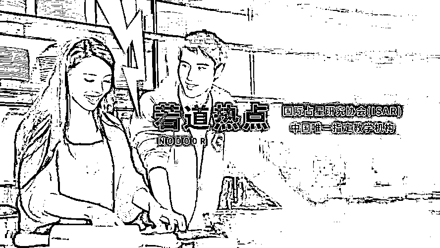

**作者/编辑/玫瑰  图片/网络**

**2021 年的“蕾神之锤”**

王力宏与李靓蕾的离婚大战燃爆互联网。

2021 年 12 月 15 日，这对结婚 8 年来堪称“完美”的夫妻，忽然由王力宏单方面官宣离婚程序启动中。而从未对丈夫置喙半句，连小 S 都称“嘴很严”的李靓蕾在不久后却发布 5000 多字的长文，控诉优质偶像王力宏召妓、出轨、对她进行羞辱、冷暴力。

这场“战斗”持续了 3 日，男方选手有王力宏、王爸爸、绯闻女友 BY2 组合中的 Yumi。女方不断发文，招招制敌，最终王力宏发表道歉声明，李靓蕾表示不再告诉，至此，二人的离婚纷争告一段落。

网友们连夜吃瓜吃到撑，纷纷表示“蕾神之锤”“宏慌之力”。不出意外，这场离婚大战，将成为 2021 年如火如荼的女性解放运动收官之战。

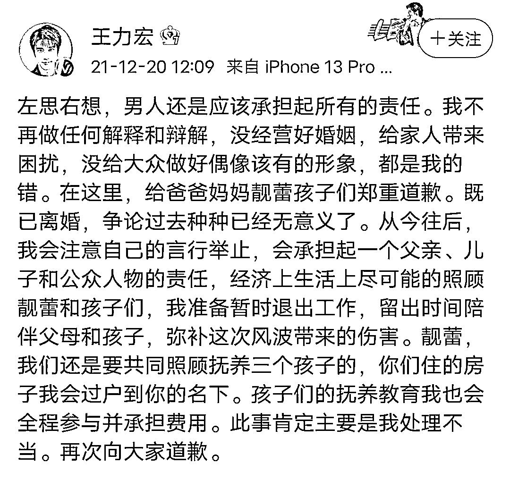

 | 王力宏的道歉声明

看到王力宏最终的道歉，坦白讲，我挺解气。而直至写稿的时候，平静下来，却感到遗憾和悲伤。

一个是承载很多人回忆的歌星，一个是著名大学毕业的高知女性，曾经有过幸福的家庭，就在这 3 天灰飞烟灭，两败俱伤。

**为什么他们会走到今天？**是我在写这篇文章之前反复思考的。

**相逢是缘，孽缘也是缘分，恶劣的人，惨烈的经历，也是自我的选择，那一定是为了让你从中学到些什么。**

将愤怒的情绪释放殆尽之后，不妨一起来打开他们的星图，其中应该能看到很多“你不知道的事”。

**金星逆行，往事重提**
所有的“突然”都能在宇宙运行中找到端倪。

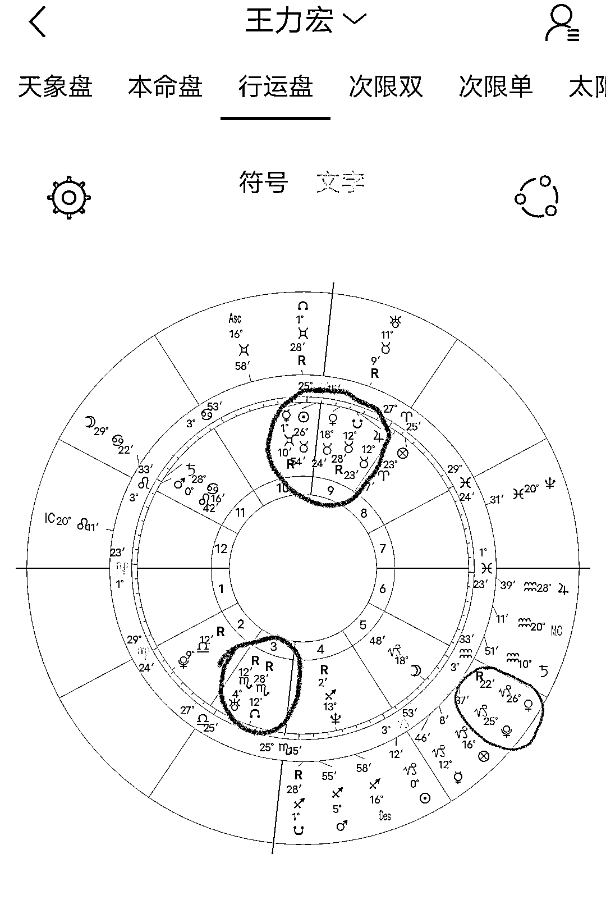

 | 王力宏当下的行进星图**王力宏的星图中，行进冥王星正在摩羯座 25°的位置入相位三分他 26°的金牛座太阳。金星也正在这个度数停滞，并于 19 日开始逆行。**金星逆行，合相摩羯座的冥王星，正是一个**将过去（金星逆行）情感、财务纠纷中的阴暗、操控，和不为人知的秘密（冥王星）公布于众，接受大众（摩羯座）审判（冥王星）**的时点。无独有偶，**这个相位也刚同李靓蕾的太阳四分，并正在六分李靓蕾位于双鱼座 27°的双鱼座水星。**

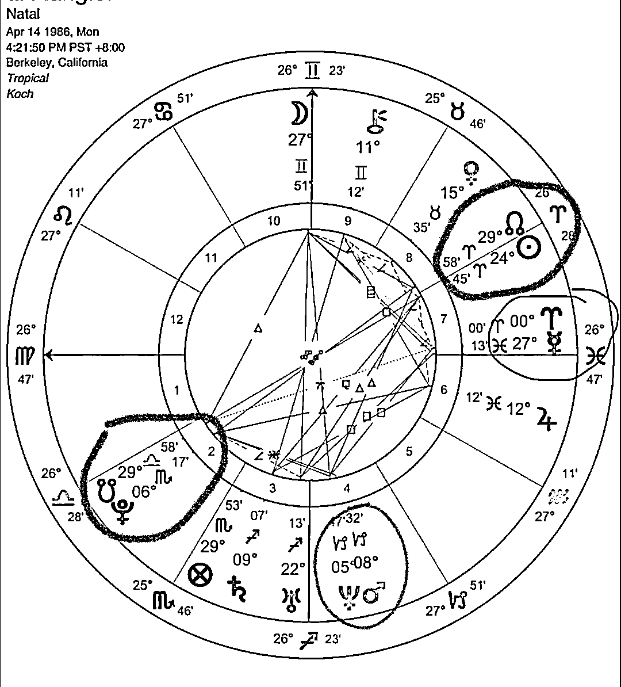

 | 李靓蕾的出生星图，考虑时间精准度，忽略宫性及月亮相位于是，王力宏代表**外在自我、意志力**的太阳和李靓蕾代表**语言、思考**的水星将同时经受金冥合相摩羯座的考验，而**金星从摩羯座 26°逆行回到摩羯座 11°，将同时触碰王力宏和李靓蕾都位于金牛座 15°-17°的金星**。这一场离婚官司的协议商讨很可能要持续到金星逆行结束。**爆料的日子在 19 日双子座满月的影响区间内。**满月通常会将人的情绪放大到极致，也会令悬而不决的事情有一个阶段性终结。**双子座-射手座轴线代表的是爆料（双子座）-道德审判（射手座）。**李靓蕾在长文中反复提到，王力宏需要道歉，因为他错了。**错了，是射手座的道德评判，也是摩羯座的责任承担。**这两个星座，特别在乎对与错，且很容易流于教条和严苛。这两股天象能量，加上 12 月 24 日土天四份第三次精准成相前影响期的强大影响，瞬间将事件推向你死我活的高度，李靓蕾的微博下清一色的支持，王力宏的微博下除了微弱的支持声，几乎全是批判。我无意替王力宏辩驳。等了几天他的回应，试图给他一个解释的机会，然而很遗憾，他的解释没有一条是真实，站得住脚的。**做了就是做了，哪怕很不堪，哪怕很肮脏，哪怕需要面对内心的阴暗面，但请你说出来。****只有说出来，承认并面对他，才有可能通过冥王星的考验。**很可惜，被冥王星三分了太阳的他，似乎仍旧**习以为常地使用惯有的伎俩**（三分相代表顺畅）。

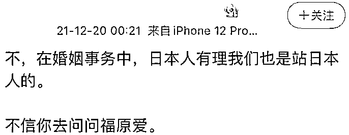

 | 大多数网友的态度以为这一次还是可以和之前的每一次那样蒙混过关，以为那个顺从的妻子还是会和每一次一样，因为他一条威胁的短信便听话地束手就擒；以为大众会因为陈词滥调污名化女性的公关手法（日本人、携子上位、捞女）而倒戈。然而这一次，他翻车了。**2021，女性意识觉醒之年**
**2020 年 12 月，土木合相水瓶座，土象时代向风向时代的剧烈转型开始。**走到摩羯座尾度的冥王星也预示着，**过去十几年，腐朽黑暗的权力架构、社会法则即将被颠覆**。2021 年是女性意识崛起的关键年份。这一年，有太多女性发声，将拥有特权却德不配位，利用权力和地位愚弄大众，欺辱女性的男人拉下马来。没有这些女性的发声，李靓蕾不会有勇气，在隐忍多年后终于出来重锤；没有这些女性的铺垫，她的发声也未必真会有人相信，而大概率迅速被污名化，淹没在网络的洪流中。让我们来看看今年最重要的一个天象——土天四分的传导链：

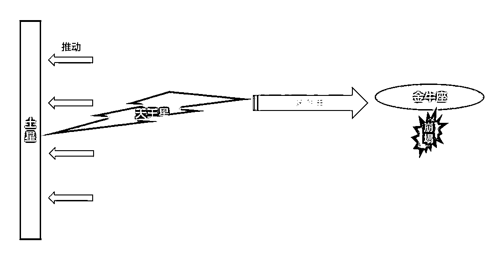

 | 土星水瓶座——>天王星金牛座（四分相）**· 土星**代表**规则。**它稳定、坚固，是经验的总结，要求一致性，不鼓励独特性，甚至镇压自由；土星的优点在于，**沿用土星的经验法则，只要遵守框架和规则，总会得到时间的奖赏。****· 天王星**代表**打破规则**。它不可预测，无经验可循，要求大众保持自我独立，追求自由和独特性；它藐视规则，总在出其不意的地方给人生带来地震般的突变；天王星的优点在于，**善用这股革新的能量，可以迅速跃升到一个新的境界，带来全然不同的体验。****土天四分时，天王星试图用无法抗拒的力量推动土星前进；而土星报残守旧的力量会镇压和阻碍天王星。**若无法撼动土星，**天王星的洪荒之力会势如破竹地朝向金牛座所代表的土地、稳定的生活，在一个完全预想不到的地方，切开大地。**我们会感到脚下的稳定忽然崩塌，整个人跌入人生莫测的深渊——像极了冥后波塞凤被冥王哈迪斯掠进地府的感受。这种毁灭很显然不是我们想要看到的。于是，**土星的顽固和守旧的世俗框架能否被推动，就成了关键点。**

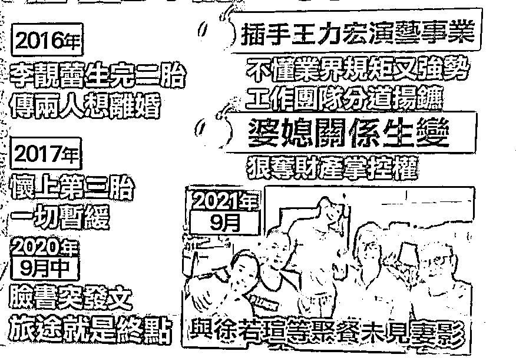

 | 事件初期，台媒直指李靓蕾“有问题”2021 年，很多代表女性解放意识（天王星金牛座）的事件，正在一点点撼动土星的传统婚恋观。然而，土星禁锢仍在作用。都美竹被说成外围女；阿里涉事女性被反告；陈露被质疑敲诈；小兰被指风评差……而李靓蕾，可以算是唯一一个**符合土星规则中女性形象的“完美受害者”**——**· 高学历****· 高知识****· 家庭清白优渥****· 肯签署婚前财产协议****· 本人无过错****· 愿意做贤妻良母，且生了三个孩子****· 婚姻期间帮扶丈夫，有自己的收入****· 愿意忍耐、牺牲、奉献****· 反复强调自己“并不要钱”**李靓蕾得到的全民支持，仍旧带着悲壮的色彩。**如果一个女性需要优秀、完美、隐忍到如此程度，仍旧无法通过正常途径得到保护，而需诉诸网络，用公布家丑的方式赢得支持，这到底是我们的幸运，还是悲哀？**但至少，李靓蕾能勇敢地站出来，做出一个最强有力的总结性发声，看到那么多的人在鼓励和支持她，理解她所承受的委屈、无助并感同身受，这仍旧让人看到未来的希望所在。

****

**感谢这些年不断的关于 PUA、生育权、性侵……的教育，让我们“能听懂她（李靓蕾）在讲什么，能理解她的经历……即便是同为女性，我们也需要非常努力，才能突破男权社会的种种规则和障眼法，真正理解自己和其他女性的处境，形成同盟。**

**——网络 佚名”**

**“锤”，是为了不锤**然而，我始终认为，冲突不是最终的目的。在李靓蕾的内心深处，她大约是万般不愿亲手将自己深爱过的丈夫，3 个孩子的父亲打入地狱的。这也正是我们需要警惕**女性解放是否会走到男女对立的另一个极端——仇男、恐男，这样的思潮，除了宣泄一时愤怒和制造对立，只能让男女权力的斗争和博弈世代相传。**我想，在万人称颂的背后，李靓蕾并不想让人夸她文笔多么优美，思路多么清晰，锤得多么到位。

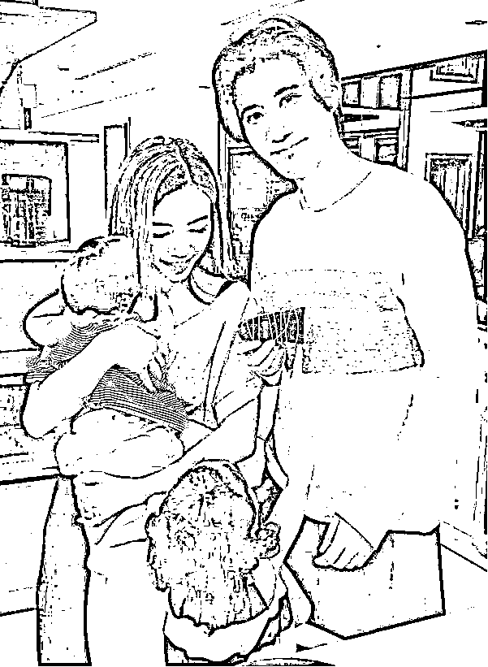

 | 昔日也有过幸福的家庭因为每一锤，都在证明她选择了一个怎样错误的人，她曾经付出了多少深情厚爱给一个完全不值得的人，他那么渣，也是她自己选的。聪慧如她，曾度过多少无法自洽、自我怀疑的日夜呢？而被激发起的愤怒是无法长久延续的，有多深的怒，就有多深的爱，短暂的亢奋之后，是否会陷入更深的抑郁？女人总是想得那么多，为了孩子，忍忍吧；为了家，忍忍吧；为了爱，忍忍吧；为了面子，忍忍吧。然而越忍，他越得寸进尺，那就手撕了他！可锤了之后，未来的路如何走？和孩子父亲一辈子无法摆脱的纠缠，如何将已经破裂的阴阳能量重新联结，以免影响到孩子的一生？

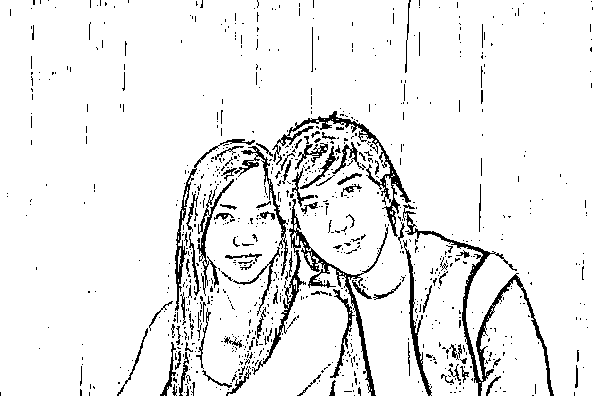

 | 曾经的两个人**如果事件能够倒回，是否能有更建设性的决定？在每一个有可能的节点上，是否有另外一种不同的选择？**回溯，是为了总结和归因，并在此刻觉醒，改变，以免重蹈覆辙。那就让我们随着金逆的脚步，一起来看看这对曾经的“金童玉女”是如何走到了今天——不粉饰，不评判地，如同看到我们每一个人曾经遗憾、曾经惨烈、曾经彼此伤害的过往。**时光倒流，你还会选择他么？**很多人不理解，李靓蕾这样一个高知女性，明知王力宏婚前就“劣迹斑斑”，却为何还要嫁给他？她是否真的另有图谋？在李靓蕾的星图中，南北交点在天秤座-白羊座的尾度，北交点合相太阳——那是她感到陌生而需要发展的地方。北交点和太阳的定位星火星落在摩羯座，合相海王星。无疑，**南交天秤座的她需要一份体面的、美好的婚姻。**为此，**她可以妥协、配合，竭尽全力营造这份美好和谐的家庭关系——哪怕只是表面。**

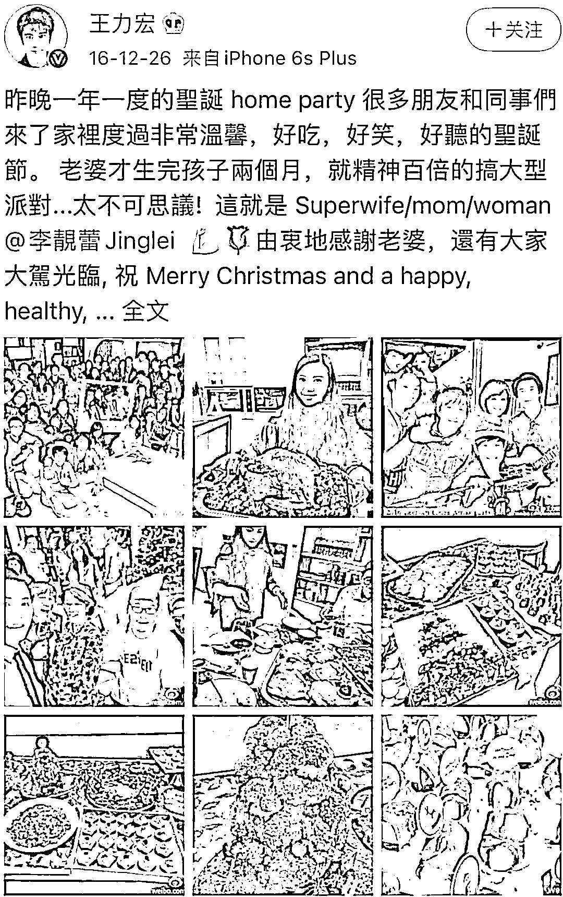

 | 王力宏发微博，称刚生育完两个月的老婆便亲力亲为搞圣诞大餐**她一直在配合丈夫。**一个人做一大桌大餐，参与名媛社交圈，为王力宏做公关策划……美好而优雅的女人，说话轻声细语——我们几乎感受不到她的白羊座能量，除了在这段婚姻的最初和最终。最初，他说：可不可以不结婚或者把孩子打掉？她表现出了勇敢和自我：我可以一个人把孩子生下来抚养；最终，她重锤那个自己爱过的人，迅速而勇猛，“杀红了眼”。**只有在感觉到亲密关系即将失衡破裂的时刻，她才能从南交点天秤座的舒适区走到白羊座北交点的捍卫自我，太阳能量也才能发挥到极致。其他的时候，她只是一个崇拜丈夫的附属品。**她无疑是**坚韧而自持**的，太阳定位星落在摩羯座是有力的位置。8 年生三娃，具有经商头脑，一手照顾家人。却又有着**浓厚的海王星情结**——**拯救王力宏，帮助他完成改变世界的梦想，奉献自己的一切。**

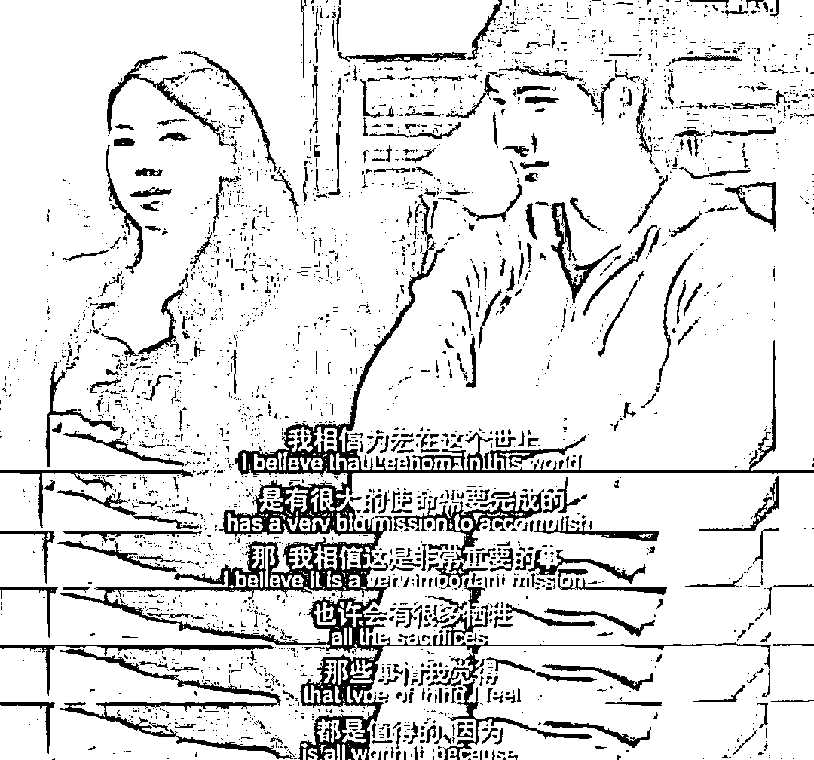

 | 访谈中，李靓蕾这样说**她需要怎样的男人呢？****热情、明亮、有活力、甚至有些自我的**（太阳白羊座）；同时是**自律、坚强、事业有成，甚至“自苦”的**（火星摩羯座），却也是**脆弱、无助，亟待保护的**（火星合相海王星）。📹 [`v.qq.com/iframe/preview.html?width=500&height=375&auto=0&vid=w0325g54ibt`](https://v.qq.com/iframe/preview.html?width=500&height=375&auto=0&vid=w0325g54ibt)** | **婚礼上的李靓蕾，眼里有光**王力宏符合她对伴侣的需要。**更何况他还是个帅气的优质明星，满足她南交天秤座“颜控”及摩羯座被认可的需求——那么多的女性“朋友”中，他只公开了她。**王子选中了她，海王星的浪漫和摩羯座的现实同时降临。那些瑕疵也许结婚后就会改吧？也许为了她，他会变，只要她不断努力，总会得到他全部的爱吧。**可惜爱不是这样啊，最终事与愿违，最开始就埋下了因果。**自虐而虐人的“优质偶像”**我无法评断王力宏就是个骗子。**群星金牛座，月亮摩羯座的他，一定渴望有稳定的家庭，能干的妻子**。然而，**天王星合相北交点天蝎座，土星巨蟹座，月亮摩羯座**的他，**对于自己是否能够拥有温情、家庭，是不自信的。**在温和美好和勤奋节俭的背面，是几乎自毁的忧郁和叛逆。**天蝎座掌管性和深度亲密关系，那是他今生需要探索的领域。不得要领的他将这股黑暗又另类的能量变成了性瘾、和见不得光的暗关系。**

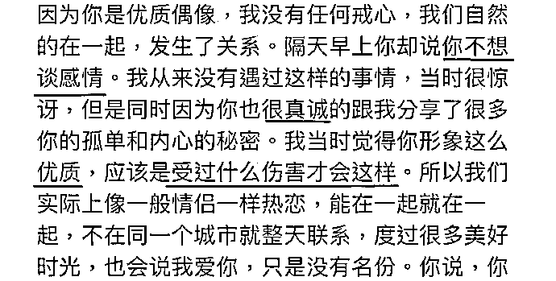

** | **“也没有跟别人在一起，只是不想谈感情。”王力宏的歌里，除了纯到齁人的爱情，也满是爱而不得的黑暗、决然的冷酷。他唱过这样的歌：
**“想的都是你，念的都是你，小小的爱在大城里好甜蜜。”**也唱过这样的歌：
**“你不知道我为什么离开你，****我坚持不肯说放任你哭泣。”**都是他，又都不是。**纯纯的爱（南交金牛座）伴随着虐到深处的痛——离开（天王星），却不给原因，任你心碎（北交天蝎座），是他自虐虐人的情感体验模式。**

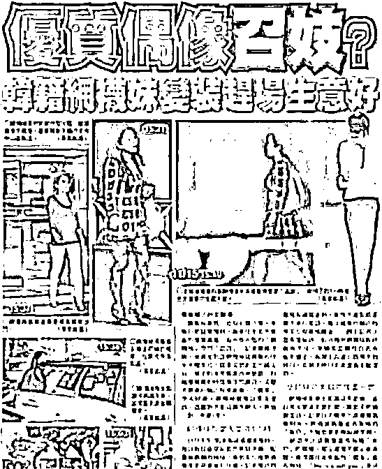

| 台媒曾爆料王力宏疑似招妓我想，那时的王力宏，是没有能力和女性进入婚姻的。他仍在天蝎座的黑洞门口徘徊，**不断更换性伴，却排斥长久承诺。****他想要，也渴望孩子，却害怕背负父亲和家庭的责任（土星巨蟹座），于是婚姻的起初便少了义无反顾和心甘情愿。**

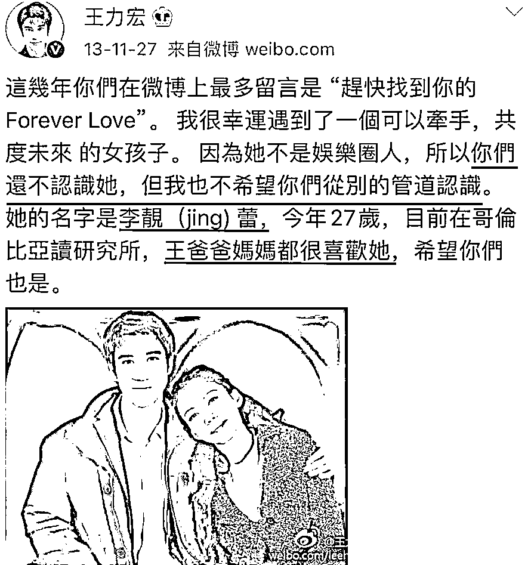

| 2013 年，王李宏在微博官宣与李靓蕾的关系。最初的官宣中，没有“我爱靓蕾”，而是“王爸爸妈妈都很喜欢她，希望你们也一样。”他开始就说谎了，爸爸妈妈并没有很喜欢她，就连他自己，也并没有义无反顾地选择她。**他需要的是一个妻子的角色，和接连不断的孩子，开始的开始，他选择了承担责任（月亮摩羯座，土星巨蟹座），最后的最后，他仍旧在左思右想后，不情愿地承担了责任。**王力宏对鲁豫说，结婚是疯狂的事。或许李靓蕾是他的一个工具，用来对抗他的庞大家族（无人支持的状态下仍旧选择结婚），用来帮助他夺回自己的自主权，用来粉饰完美的家庭，用来纵容不为世俗接受的乱性和开放关系。

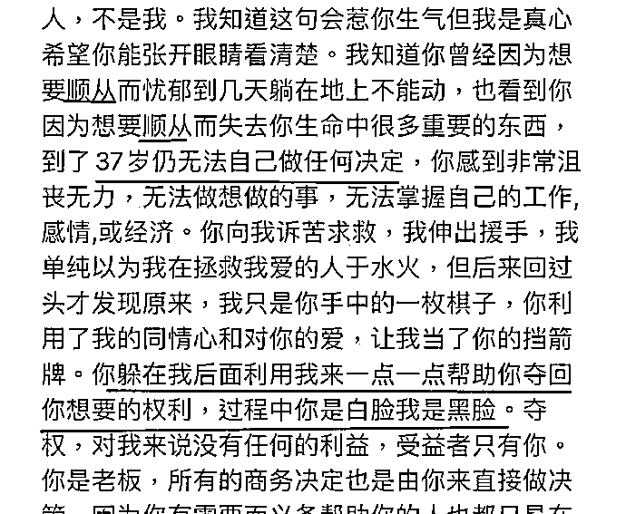

| 李靓蕾的长文**他没有把她当做人，而只是用来满足和配合他传统外表下天王星的实验性人生。天王星以冷酷和无情臭名昭著——她成了一个幌子，一个工具，一个可以利用却成本极小的物品。**给你一颗糖，再把它拿走，并说因为你不够好，所以活该如此。反复如此的过程，对方会为了得到那颗糖而丧失理性和尊严。而只有他自己知道，无论多努力，她永远得不到那份甜。

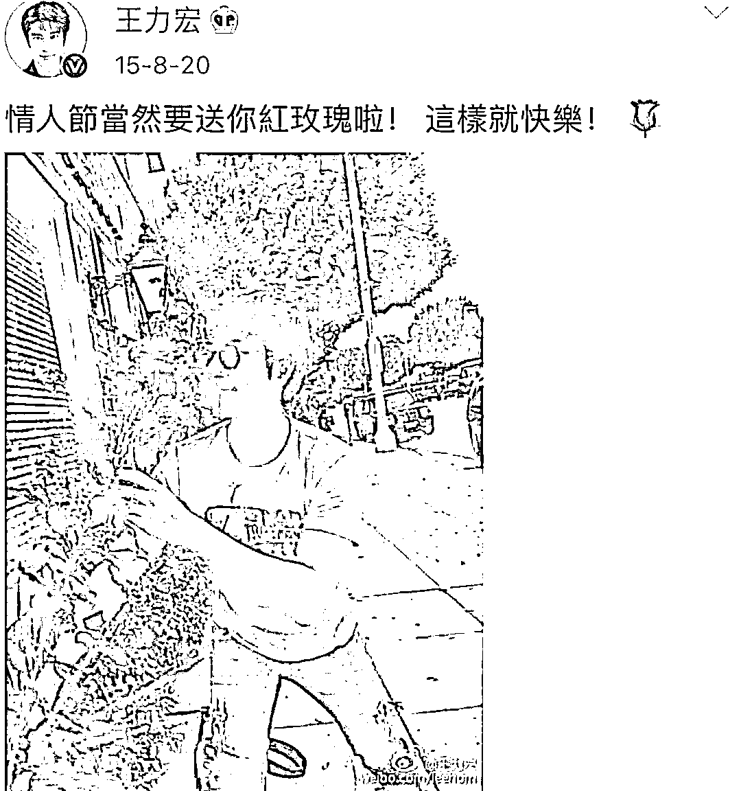

| 也曾有过“爱”的时刻**她要的爱，他给不了****对自己过高的要求和近乎严苛的节俭；渴望被全世界认可的野心；庞大而优秀到不允许瑕疵的家族；充满控制的母子关系（月冥四分），贫瘠到给不出温情的摩羯座月亮……**他好像带着面具的精致王子，全世界都感受到了他的光，阴影就理所应当地投射到了最亲的伴侣身上。李靓蕾被当做瓷娃娃，他给她包装华丽的学历，所有人的满意的人设，安排她的人生。开始的时候，他不许别人从其他地方知道她，甚至细心地给她的名字注上拼音；结束的时候，他却公然称呼她的日本名字，自作主张表示要把一套公寓过户给她，甚至在她家安装摄像头，不顾她的反对，随时随地可以真人秀一般查看她的一举一动。

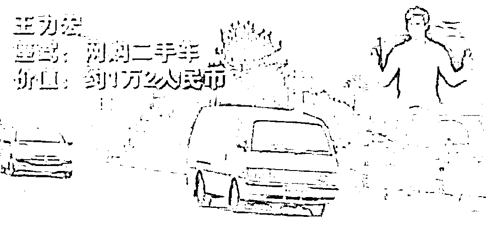

| 王力宏极近俭省，生日时给自己网购二手车并开了很多年**霸总的故事，未必都有美好的结局。**被安排的她，活成了和他一样的面具人，日复一日在各种场合晒着假面的恩爱，正常的愤怒（太阳白羊座）被拒绝情绪的他当做“神经病”（月亮摩羯座），骨子里已经腐烂生疮还要强忍……我们能指望一个对自己苛刻到极致，衣柜里全是破洞袜子的男人会对他的伴侣慷慨到什么程度呢？**他连自己都不爱，更别提爱别人了。**

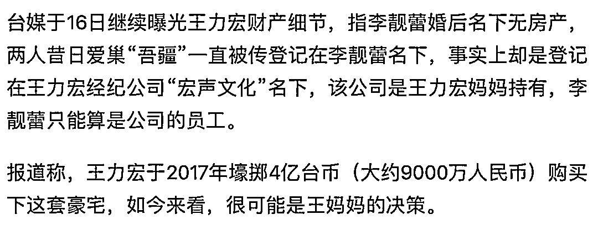

| 台媒报道财产分割细节于是离婚时，她“要钱”要遭受羞辱和白眼——**群星金牛座的世界里，她既然已经不是他的所有物，那么他的钱，自然也不必给她。****对外有多光芒四射，对内就能将亲密爱人刺得多么体无完肤。**于是她反击，发长文怒斥，打爆他的电话想要沟通（太阳白羊座），得到的是无数次拒接，以及“躺平，负责”（月亮摩羯座）。📹 [`v.qq.com/iframe/preview.html?width=500&height=375&auto=0&vid=d33145852zm`](https://v.qq.com/iframe/preview.html?width=500&height=375&auto=0&vid=d33145852zm)

| 王李宏与李靓蕾同框，李靓蕾全程尴尬抗拒；并直言在家里同王力宏说话经常被听不见。

像极了他们平日里的相处——**长期被拒绝沟通，拒绝情绪，无法被看见的妻子，最后成了歇斯底里的怨妇。可丈夫感觉到的只有逼仄，压力，和更深的自我封闭。**

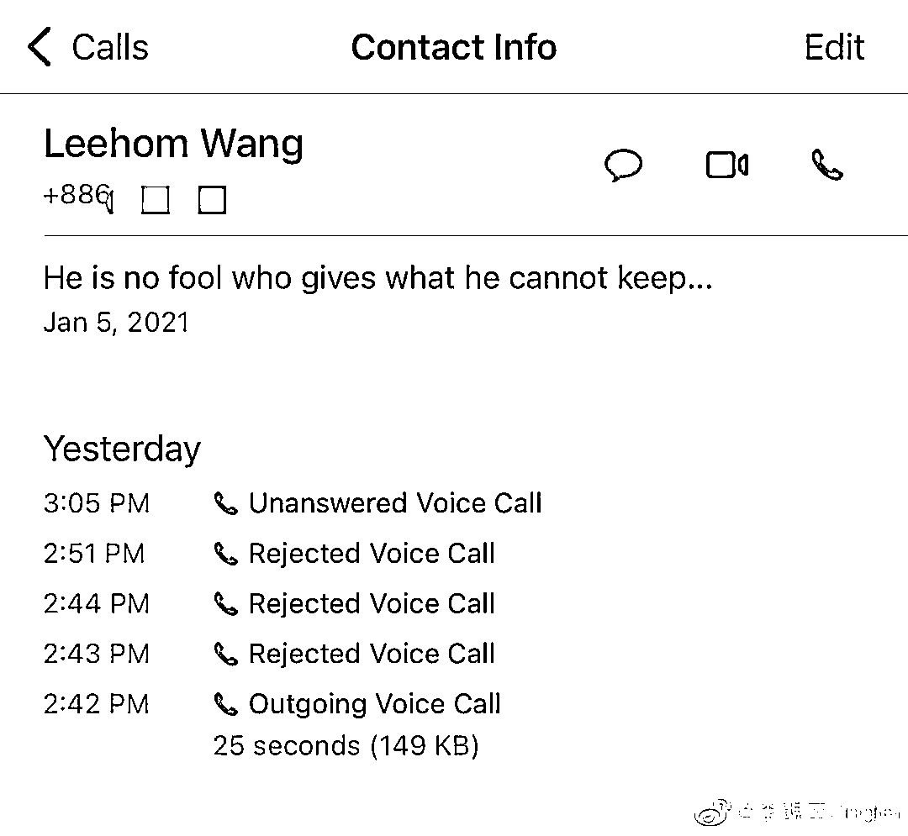

 | 李靓蕾试图沟通却得到拒绝。王力宏的月亮摩羯座启动防御机制——隔绝任何情绪。

**他要的引领，她也给不了**李靓蕾的冥王星合相王力宏的北交天蝎座，**彼此激发起对方最深的控制、恐惧**。都活在心惊胆战和悬崖边上的日子，从内在感受层面来讲，他们说的都是真的。他应该是试图向她敞开过内心的。**可他又无法真正向她敞开全部的内心，因为她不可能接纳他那些疯狂而怪异的性模式，和实验性的开放式关系。**

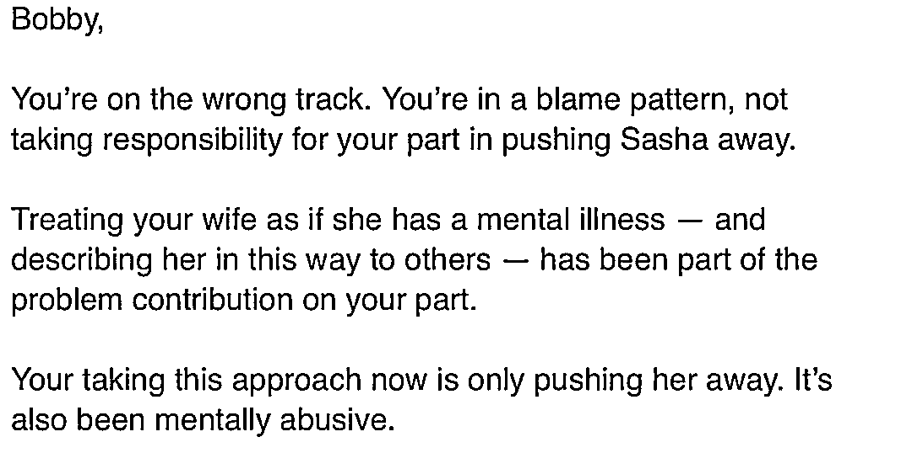

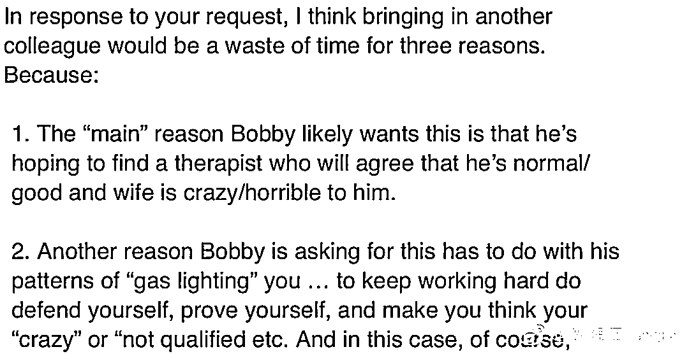

** | **李靓蕾称王力宏试图找到一个承认她有精神问题的心理医生于是他们寻找心理医生。然而就连心理医生都知道，象他这样自恋型人格+性瘾的人是难以医治的。其实这都没关系，她愿意陪着他，有哪一对伴侣不是满足了一部分需要，却又有另一部分无法调和？两个金星都在金牛座的人，可以慢慢来。可是，不应该欺骗、隐瞒，还把所有的罪责都归咎到对方身上。也许是面具戴得太久，光环闪到他以为自己无所不能，甚至教唆心理医生试图证明妻子精神有问题——他始终在拒绝向内体察，自然就谈不上成长。**直到 2019 年，行进天王星在金牛座开始对分王力宏出生星图中天蝎座的天王星——著名的中年危机时期。**那一年，他们分居了。王力宏想要一种更为开放的婚姻关系，李靓蕾妥协了，她开始不再管他。然而她不知道的是，他要的并不是“管或者不管”他。**天王星触动他更为激烈想要在天蝎座领域寻求不同的躁动，他以为自己是不满意当下的婚姻，他以为换一个伴侣可能更好，或者开放式的婚姻能让他舒服一些——这也是大多数经历天王星行进的人在体验的。**他需要的未必是很多更新鲜的人，而是一个不一样的妻子，够接纳他这些奇怪而“不道德”的想法，能够和他一起讨论实施的可能性，也能温柔而坚定地告诉他，亲爱的，我不能支持你这种想法，因为这样会让我难过。如果你执意要这么做，那么我们只能分手。**她得是个真正独立思考的女性，能够引领他，约束他，管理他，将他这股能量从癫狂而无情的状态疏导开来。****他需要对方教育他如何去爱，如何真正去关注到别人也会难过，别人也会痛。**李靓蕾做不到。**她太怕失去他，无法接受感情是缘起缘散的自由，只能继续忍耐和妥协，迁就他，让他去“乱来”。**王力宏这样一个土象能量极重，月亮摩羯座的男人，是否真的无法承担责任，无法自我约束？那么，是什么让他一而再，再而三伤害李靓蕾，却还和她生下了三个孩子？**除了月亮摩羯座需要的一段“成功”的婚姻，以及为此不断尝试“生孩子可能就好了”的努力之外，或许，就是因为李靓蕾无底线的妥协和宽容。**人就是这样奇怪，**当你表现出非常的大度，“原谅”了对方的大错，他反而会恨你，因为这种原谅，让他感觉到更多的愧疚和自我否定。****他会继续在对方不断降低的底线边缘疯狂试探，而所谓宽容的背后，其实也是不情愿，和隐藏的恨。**直到有一天，再也无法降低标准，便被狠狠反噬。**“你的十字架，我不能再替你背了”**一段充满拯救与被拯救，控制与被控制，隔绝与被隔绝，天王星、海王星、冥王星能量混杂的关系，非常困难。而这份困难的背后，总有宝贵的礼物。

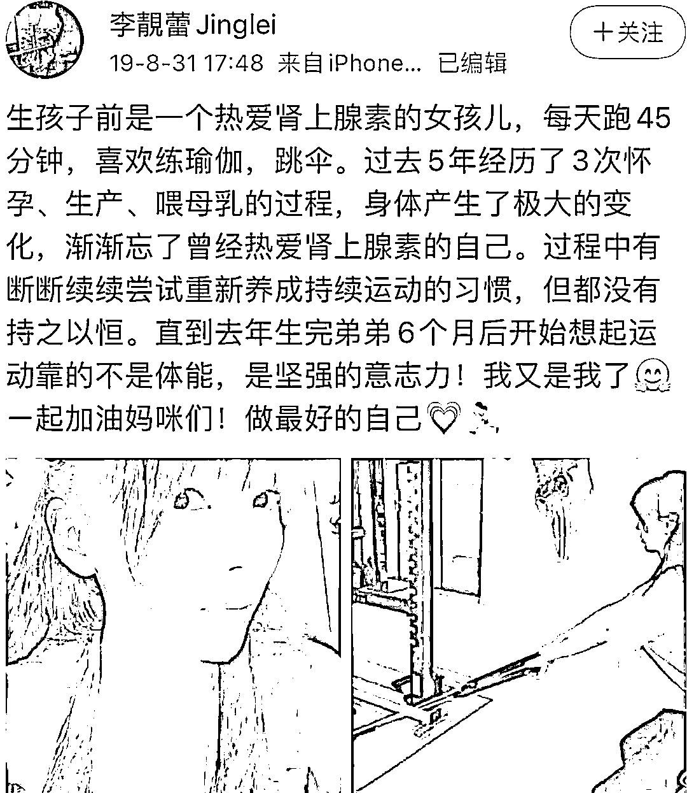

** | **2019 年 8 月 5 日，王力宏同李靓蕾分居。8 月底，李靓蕾在微博上称“我又是我了”，白羊座的自我能量是否被找回中？

漫长的折磨和心理辅导的帮助，李靓蕾渐渐意识到她所遭受的操控和暴力，她从幻梦中清醒了。这一刻，她不再顺从，不再隐忍，不再无条件无底线地配合，瞬间发展出白羊座宝贵的战斗力。这种战斗力的目的，不是为了整垮王力宏，却恰恰是李靓蕾这颗冥王星引领王力宏朝向北交点的发展之路——**冥王星的进化，总是伴随着巨大的毁灭**。**毁灭的，是外壳、面具、自欺欺人的谎言、掩耳盗铃的粉饰；揭开的，却是真实的自我、痛苦、阴暗面和喜怒哀乐。**如果说有谁能将王力宏逼到死角，揭开他戴了 40 几年的假面，那一定就是李靓蕾；如果说有谁能让李靓蕾在漫长的自我消磨、不断寻求外界认可的隐忍中爆发出真实而蓬勃的生命力，也只有王力宏。这两个摩羯座、金牛座能量都很强的人儿，有多么害怕失败和改变，就要承受和面对多么大的地震和非议。**剥离了外在的成功、光环，失去了所有的认可、赞誉之后，那个真实的自己才能露出来，才能去思考，什么才是真正的婚姻和亲密关系。****才能给彼此自由，也给自己自由。**而自由，正是水瓶座时代婚恋中最重要的元素所在。**婚姻的秘诀**我们总在各种失败的婚恋新闻，互相撕逼的瓜田里唏嘘：到底还有没有幸福的婚姻？其实，婚姻的秘诀真的很简单：**做个好人，找个好人。**好人，不是他看起来多自律、学历多高、多优秀、多成功、多有钱、多完美。这些，都是冥王星摩羯座时代物化人性的标签。你只要去感受：**他是否愿意坦诚自己的阴暗面，愿意对你诚实，不欺骗。当然，前提是你也要接纳和坦诚自己的阴暗面。**真实的人，是无可摧毁的。愿我们都拥有真实的力量，独立思考的本领，和离开失败感情的能力。行到水穷处，坐看云起时。

**版权声明：**原创文章由作者授权首发于若道平台，欢迎转发，反对抄袭。友号转载请申请白名单。

****

**玫瑰**

英国 Cass Business School 管理学硕士

若道 2015 届核心课程毕业生，若道微信公众号兼职编辑

占星师，咨询时长超过 800 小时

**个人微信号：**stillrosy

**公众号**：一个娘娘 

长按二维码，给作者打赏

**学习占星学****点击下图了解课程详情** 

****************

**微信又双叒叕改版啦，不想错过若道君的推送？**

**就把若道设为星标吧！****▼**

就是这个“在看”，戳戳戳 ☟

******报名直达入口******

# 医疗占星学干货 | 四元素在医疗占星中的分析方法

> 原文：[`mp.weixin.qq.com/s?__biz=MzA5NjA0NTAxNg==&mid=2651464268&idx=2&sn=2742fe580fec87dcfe054fda3c44480a&chksm=8b4890fbbc3f19ed011cc42a4db5df71ced4c1ce5d9027b58156fa6899927c104ac6d06d47db&scene=126&sessionid=1692737883#rd`](http://mp.weixin.qq.com/s?__biz=MzA5NjA0NTAxNg==&mid=2651464268&idx=2&sn=2742fe580fec87dcfe054fda3c44480a&chksm=8b4890fbbc3f19ed011cc42a4db5df71ced4c1ce5d9027b58156fa6899927c104ac6d06d47db&scene=126&sessionid=1692737883#rd)

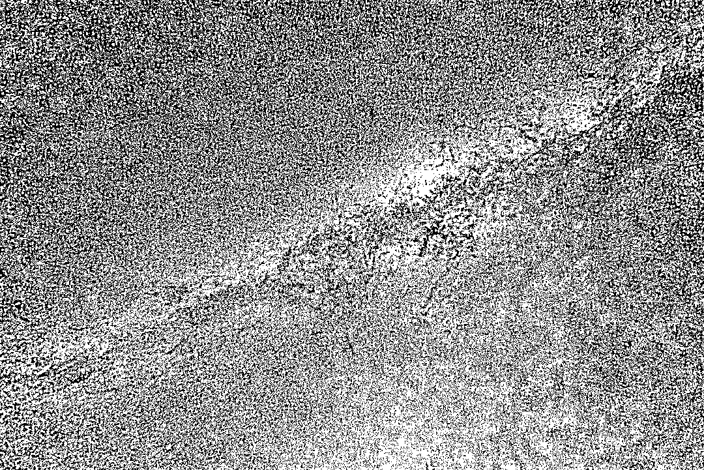

作者/简·里德尔-帕特里克 

译者/Christy 校对/Arrow

编辑/翀子 图片/网络

躯体症状的背后反映了具体的心灵含义，而通过占星学，我们能将它们之间的关联描述得非常生动。作者在这篇文章里讲述的案例，更是鲜活的展现了这一过程。《[医疗占星](http://mp.weixin.qq.com/s?__biz=MzA5NjA0NTAxNg==&mid=2651463790&idx=2&sn=1061eef9efd098b52011f81789eb6b4c&chksm=8b4892d9bc3f1bcf574050ff61f69f03dc3f8598341291a457c4220bdb96aebda5849412dd15&scene=21#wechat_redirect)》课程也在报名中，欢迎点击链接了解详情哦。**不同元素的不同分析**

在元素症状分析过程中，**第一步是土元素，处理的问题是什么？形成了什么？**——换句话说，症状是什么？这是收集事实的阶段，包括让客户列出自问题发生起的时间线以及同步的人生事件，并用自己的话尽可能详细描述症状。

客户通常反映这个过程本身就是疗愈的，有时甚至能带来精神宣泄。 

**下一步是风元素**，在这个阶段，客户被要求将病症的名称与他们用以描述症状的词汇关联起来。这个过程也能带来一些启发性瞬间。当一位患有斯蒂尔病（Still's disease）的女性意识到她需要的正是学会静下来（be still）时，不禁大笑起来。

**在水元素阶段**，我们会看疾病对患者舒适区的影响，以及疾病引发的一切情绪和行为反应。

在**火元素阶段**，我们会以疾病为背景**研究意义和自我意象**。通常我会首先专注于这四个阶段的过程，只在最后一个阶段才结合占星学。这样一来，当所有线索串联起来时，客户和我都能体验到惊奇之感。

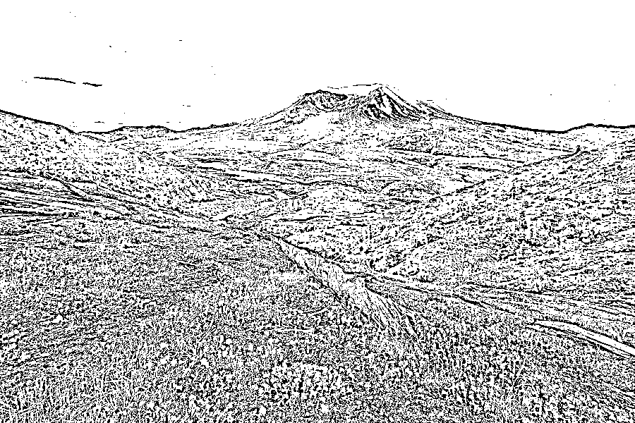

**丽塔的治疗情况**

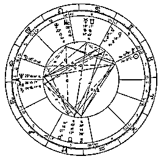

| 丽塔的出生星图

一位客户的案例显示了这一方法的有效性。

丽塔曾被诊断出甲亢和甲状腺结节，症状给她带来了巨大痛苦。她经历着心跳过速、呼吸急促、身体僵硬（尤其是腘绳肌附近），以及她称之为**“静脉中灌了铅”**似的疲惫和睡眠困难。**她还感到很紧绷，以及喉咙中有肿块，妨碍了说话。**

**她的思考质量受到影响，**常常发现自己无法完整地说出一句话。她的腹股沟是异样感最集中的地方，就好像“那里有大量电流，就像水流一样涌动，嘶嘶作响”。那段时间她还有很多十分繁重的工作面临最后期限，她正常的生活节奏被打乱了。 

她最关注的症状是喉咙中有肿块，她联想到**“黏在喉咙中的某样东西”**，即某样她不想接受或不想忍受的讨厌东西，还有“许多忍住没流下的眼泪”和“因情绪激动而喘不过气”。

**一切都被紧紧地限制在她的喉咙中，**她由此联想到，她无法将很多话说给自己的伴侣听，那个喜欢在情感上和语言上虐待操控他人的男人，她就是无法说出口。

腹股沟中的电流感并不妨碍她，她由腹股沟联想到前进，由“电流”联想到这些词语——**能量，有活力的，有生气的，当下。**

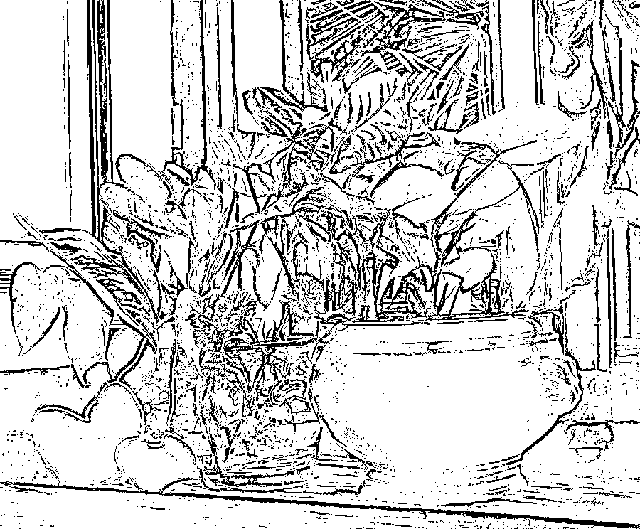

**这里已经有了很多线索指向这一疾病背后发生了什么。**一部分她因为害怕而陷入困境，另一部分在嘶嘶作响（愤怒），但却跃跃欲试，准备好向前迈进。

当触碰到情绪安全感的问题时，丽塔说她害怕去医院治疗，因为她担心一切会失衡。因此她被迫寻求另类疗法和关注自己的生活方式，在接受治疗前，她让医生给自己 3 个月时间。

一直以来她都是一个行动派，很难停下来。她很少停下来吃饭，**但她的症状让她的身体停了下来。**她唯一不做事的时候，是她陪伴长期生病的伴侣的时候，这迫使她停下来。

和他在一起迫使她放松下来，想想宁静的生活，她很喜欢这么做。她意识到，虽然这段关系很艰难，但还是存在着对她而言有价值的东西，她不愿放手。

收集信息的最后阶段关注的是自我意象以及客户如何视觉化疾病和与疾病相关的自我。

视觉化通过提供读取直觉的渠道，让灵魂畅所欲言，能够迅速直指问题核心。**客户被要求在脑中产生一幅关于其中一个症状的图像，无论出现什么图像，无论多么怪异都要接受**。

**然后就能针对这幅症状图像提问：**

*   **图像需要的是什么？**

*   **图像能为客户提供什么？**

*   **通往疗愈的第一步可能是什么？**

**这通常是研究过程最戏剧性的部分，其本身就能产生转化。**

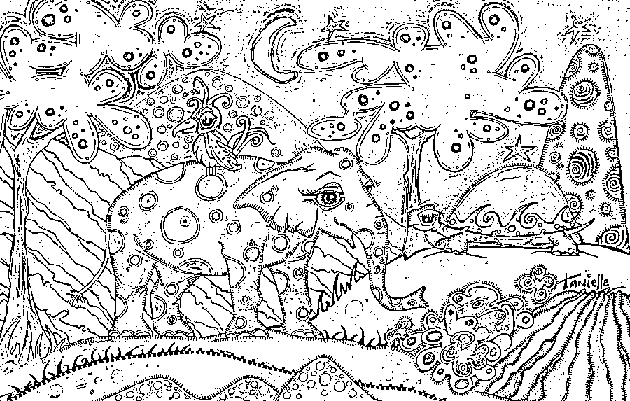

丽塔的症状图像是一个暗红棕色的跳动的心脏，像一个石环一样的环状，然后变成了一个碗。她看着这个图像时很痛苦，因为它看起来坚硬又沉重，被冻成了冰。

它给予丽塔的是一些信号，指示她何时触到极限，告诉她某件事太过了或过火了，以及向丽塔展示她正在何处碰壁。它表达的是它就像一个锅盖，锅里装着沸腾的水，在努力将压力按下去。

它需要被解冻，要做到这一点，丽塔可以变得柔软一点，温暖一点，更加接纳，更加融通。

她被告知的第一步解决办法是**放松，呼吸，静下来，想办法卸下紧绷和压力，最后说出自己的感受，放开一切而不是紧握不放**。

这么多的信息足以让她认真思索，她也的确在随后几周花了不少时间这么做。

甲状腺本身由金牛座掌管，而其分泌的激素的量是由垂体前叶控制，垂体前叶由摩羯座掌管。所以在占星学上**，甲状腺的问题可以既看基本星座又看固定星座**。

丽塔的水星在金牛座，当 2011 年 12 月她第一次注意到这个问题时，行进海王星正四分她的水星，这个相位一年前就一直存在。海王星具有消融性和渗透性，因此可以解释她为什么难以清醒地思考，以及为什么甲状腺功能不佳。

水星掌管她的第 9 宫，2011 年，她出国试图与伴侣分开一段时间，但回来以后又重新和他在一起了。冥王星和天王星开始重创她落在天秤座的月亮，月亮还四分了落在摩羯座的出生图火星。

**当行进冥王星与出生星图火星在基本星座合相时，**一个可能的显化（还有许多其他可能）是甲状腺活跃度大大增加。**加上天王星的影响**，于是就有了腹股沟功能异样和可能产生的“电流”。

由于火星是她第 7 宫的宫主星，她至少有必要检讨一下情感关系，土星又在接近上升点，就更有必要这么做了。但是因为她的出生星图月亮落在天秤座 12 宫，这件重要的事说起来容易做起来难。

**这些症状如今已经消失了**，她不必再定期去医院做检查了。她将这归功于一些生活方式的转变，比如少喝咖啡，以及我们在咨询过程中获得的洞见。她正在慢慢解开缠绕自己的关系，由于这个过程如今已变得有意识，她也不再需要症状来敲门提醒她了。

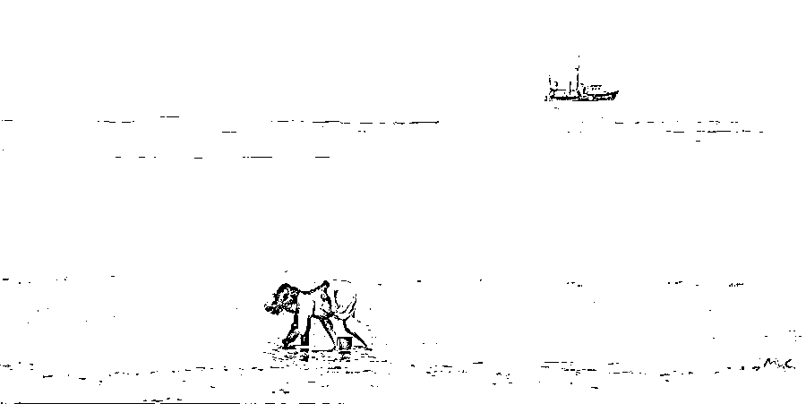

**结语**

在咨询工作中使用这 3 条研究线——**躯体占星学、心理占星学和元素症状分析，**结果是十分令人满意的。

三者的结合向我们展示了，**躯体症状背后反映出的人类心灵的含义是多么惊人的具体，**占星学对于这种关联的描述又是多么完美。不过在我看来，这种方法还尚在发展中。

**版权声明：**本文由若道翻译、整理发布，欢迎转发，反对抄袭。友号转载请申请白名单。

**也许你还想看下面的文章** 

[医疗占星学入门级教程，建议收藏哦](http://mp.weixin.qq.com/s?__biz=MzA5NjA0NTAxNg==&mid=2651463790&idx=2&sn=1061eef9efd098b52011f81789eb6b4c&chksm=8b4892d9bc3f1bcf574050ff61f69f03dc3f8598341291a457c4220bdb96aebda5849412dd15&scene=21#wechat_redirect)

[“身体的问题，是一次崭新面对自我和生命的机会”](http://mp.weixin.qq.com/s?__biz=MzA5NjA0NTAxNg==&mid=2651463309&idx=1&sn=8c9870b3f2d8f48d0258ca3c1c7c43bc&chksm=8b48ac3abc3f252cc8576315ac16bac18d497621382abc55fa90dd227844d3a8e7e11833c567&scene=21#wechat_redirect)

**简·里德尔-帕特里克**

药剂师、理疗师、草药师、心理治疗师及历史学家。在爱丁堡从业，也在那里教授占星学。持有爱丁堡大学的博士学位，出版的作品中最著名的是《医疗占星手册》。擅长医疗占星学、经验占星学和积极占星学。

占星学与疾病有什么联系呢？**世界著名的医疗占星师简·帕特里克**说：**“占星学可以精准定位需要解决的潜在问题。”**

根据简·帕特里克的说法，**每个星座都有广泛的可能性**。例如，那些双鱼座的人有潜力去扮演殉道者（以他人为先）的角色，但是他们也有能力成为伟大的治疗师。

那么医疗占星咨询涉及哪些内容呢？简·帕特里克有这样的步骤：

**· **首先，会请客户提供详细的病历，以及他们出生的日期、时间和地点；

**· **然后，绘制他们的星图，观察在他们的病情确诊之前，在占星层面和情感层面上发生过什么。

根据简·帕特里克的说法，**癌症的主要病因之一，除了有害的生活方式之外，就是未解决的情绪冲突**：她通常会在症状出现前的 18 个月至 2 年间寻找触发因素。

她曾这样说：“当我为癌症患者服务时，我的任务之一就是识别出他们生活中的‘恶性肿瘤’，并帮助患者将其消除。”

**对医疗占星学有兴趣？**

**点击下图了解更多详情吧**

****

**更多好课**
**点击下图了解详情** 

****************

**微信又双叒叕改版啦，不想错过若道君的推送？**

**就把若道设为星标吧！**

**▼**

**就是这个“在看”，戳戳戳 ☟**

********报名直达入口********

# ISAR 选修课 | 医疗占星学：透过占星的大门，一窥身体与疾病的真相

> 原文：[`mp.weixin.qq.com/s?__biz=MzA5NjA0NTAxNg==&mid=2651464268&idx=3&sn=5e409b79ff492a4698a57e26d44f9240&chksm=8b4890fbbc3f19ed02815b9ac101a27ae2ccae0a8050413c8c44f6102e816a0240f62e34c558&scene=126&sessionid=1692737883#rd`](http://mp.weixin.qq.com/s?__biz=MzA5NjA0NTAxNg==&mid=2651464268&idx=3&sn=5e409b79ff492a4698a57e26d44f9240&chksm=8b4890fbbc3f19ed02815b9ac101a27ae2ccae0a8050413c8c44f6102e816a0240f62e34c558&scene=126&sessionid=1692737883#rd)

1

**占星学与疾病之间存在联系**

****

**没有占星学知识的医生不能自称为医生。**

**　　——现代医学之父希波克拉底**

占星学与疾病有什么联系呢？**世界著名的医疗占星师简·帕特里克**说：**“占星学可以精准定位需要解决的潜在问题。”**尽管有人想当然地认为占星学是令人沮丧的宿命论，但事实并非如此：

**有四个主要因素影响着我们的生活和健康：基因构成、物质环境、情绪环境，以及我们的占星配置。我们在星图中都存在患病的可能性，而预防的方法在于尽可能充分、真实和健康地生活。****——简·帕特里克**根据简·帕特里克的说法，**每个星座都有广泛的可能性**。例如，那些双鱼座的人有潜力去扮演殉道者（以他人为先）的角色，但是他们也有能力成为伟大的治疗师。

那么医疗占星咨询涉及哪些内容呢？简·帕特里克有这样的步骤：

**· **首先，会请客户提供详细的病历，以及他们出生的日期、时间和地点；

**·** 然后，绘制他们的星图，观察在他们的病情确诊之前，在占星层面和情感层面上发生过什么。

根据简·帕特里克的说法，**癌症的主要病因之一，除了有害的生活方式之外，就是未解决的情绪冲突**：她通常会在症状出现前的 18 个月至 2 年间寻找触发因素。

她曾这样说：“当我为癌症患者服务时，我的任务之一就是识别出他们生活中的‘恶性肿瘤’，并帮助患者将其消除。”

**医疗占星师还可能帮助你确定做手术的最佳时间，或是指出你每个行星位置的优缺点**：比如，阵容强大的星群落入双鱼座可能与过敏有关，而巨蟹座人则可能发觉自己泡完热水澡后会疲惫不堪。**固定星座（金牛座、狮子座、天蝎座和水瓶座）在情感和生理上都倾向于“难以放手”，这可能为恶性肿瘤的生长创造环境。所以说，他们可能倾向于沉浸在过去的伤害中，难以自拔。另一方面，这些星座也擅长在艰难的时期坚持不懈并一直持之以恒。**

　**　——简·帕特里克**

“癌症人格”中比较突出的一点通常是难以表达情绪，而且你可以从星图中看出这一点。

**客户星图中突显的土星可能表明害怕表达自己的需求，或者害怕展现真实的自己。**

**——简·帕特里克**

发现癌症的身体部位也可能给出有关根本病因的线索。

简·帕特里克曾表示：“例如，卵巢与孩童、创造力、家庭有关。所以说，如果某人患有卵巢癌，那么问题可能在于此人无法表达自己的创造力，或是无法做到滋养和关怀。”

有趣的是，母亲的癌症恰好发生在自己的孩子开始离开巢穴时。

医疗占星师可能也会查看金星在客户星图中的位置。

**金星代表使我们快乐的东西，因此如果金星得不到满足，我们就不会快乐——而不满是滋生疾病的温床。**

**——简·帕特里克**

如果金星落入双子座（前文中母亲的案例），这表明你渴望趣味、变化、沟通、心智刺激和灵性工作。在患癌之前，这位母亲就觉得自己的生活缺乏快乐和意义。理解她的灵魂渴求转变——更多的旅行、更多的学习、更多的乐趣，这可以帮助和支持到这位母亲。**简·里德·帕特里克老师说：“星图中的每个因素都为我们提供了广泛的可能性。所以说，重要的不是我们的遭遇，而是我们如何回应这些遭遇。”**

2

**医疗占星包含哪些内容？**

本课程既适合医疗占星学的初学者，也适合已经有一些相关经验的人。
简·里德·帕特里克老师将运用现实生活中的例子，揭示一个人的性格、症状及其星图是如何相互映照的。课程也会探讨疾病的意义以及可能的治疗方法。本课程旨在为学员提供一个运用医疗占星学的框架和方法，学员将会学到一些有价值的实用工具，在课程结束后，自己使用这些工具研究其中的关联性。**此课程可作为 ISAR 选修课。**

3

**课程安排**

**课程时间：2022 年 3 月 8 日-4 月 26 日  每周二 20:00-22:00**

**第*****1*****讲  3 月 8 日 与占星学、心理学、病症一起工作，学习**

*   医疗占星学的组成部分以及如何使用它们

*   行星的作用与相互作用

*   黄道星座人

*   宫位的重要性

*   疾病和健康是如何产生的

**★ 第二、三、四讲的课程内容基于星座以及它们之间的相互作用。**

**第*****2*****讲  3 月 15 日 基本星座**

学习基本大十字星座——**白羊座、巨蟹座、天秤座和摩羯座**——及其功能和相关的健康问题。**这些星座与防御、养育、结构、体内平衡和荷尔蒙控制有关。**

****第*****3*****讲  3 月 22 日 固定星座****

学习固定大十字星座——**金牛座、狮子座、天蝎座和水瓶座**——及其功能和相关的健康问题。**这些星座与习惯和反射、心脏调节、生存、循环和协调有关。**

“固定星座（金牛座、狮子座、天蝎座和水瓶座）在情感和生理上都倾向于**‘难以放手’**，这可能为恶性肿瘤的生长创造环境。所以说，他们可能倾向于沉浸在过去的伤害中，难以自拔。另一方面，这些星座也擅长在艰难的时期坚持不懈并一直**持之以恒**。”

——简·里德·帕特里克（Jane Ridder-Patrick）博士

**第*****4*****讲  3 月 29 日 变动星座**

学习变动大十字星座——**双子座、处女座、射手座和双鱼座**及其功能和相关健康问题。**这些星座与呼吸、神经系统、肠道、睡眠以及信息、情感和行动的整合有关。**

**★ 第五、六、七、八讲重点学习行星，它们在身体层面的表达、它们的相位与行进。**

**第*****5*****讲  4 月 5 日 太阳与月亮**

**太阳**掌管视觉、活力、心脏和意识，与心脏、脊柱和视觉问题相关。

**月亮**掌管人体的周期，特别是月经周期、饮食模式和体液，与情绪引起的疾病、饮食失调和胃病相关。

**第*****6*****讲  4 月 12 日 土星与天王星**

**土星**掌管着皮肤、骨骼、牙齿和衰老过程。它对应的疾病包括慢性疾病、耳聋、帕金森病、关节僵硬和牙齿问题。

**天王星**代表身体活动的协调，有节奏的脉动和身体的“电”。与天王星相关的疾病包括癫痫、痉挛、心律失常，以及阿斯伯格综合症和自闭症样综合症。

**第*****7*****讲  4 月 19 日 海王星与冥王星**

**海王星**掌管松果体、细胞膜渗透和右脑功能，与过敏、上瘾的病症、慢性疲劳综合症和睡眠障碍相关。

**冥王星**掌管消除和转化，其病理包括毒性、脓肿、癌症和强迫症。

**第*****8*****讲  4 月 26 日 火星**

**火星是与能量和防御相关的行星**，掌管免疫系统、肾上腺功能、肌肉活动和炎症反应。**它是许多身体和情绪障碍的核心**，如自动免疫障碍、抑郁和发烧，以及由手术或需要手术引发的问题。

4

**此次课程适合哪些人？**

*   有一定占星学基础，若道核心课 L3 以上水平；

*   希望成为优秀的占星师，想要借鉴国际大师医疗占星解读思路并融入自己的体系的人；

*   热爱占星学、健康、养生的研究型占星学者；

*   计划考取 ISAR 认证占星师，寻觅中意选修课的学员；

*   走在自我探索和个人成长道路上的人。

**快来和简·里德·帕特里克老师学习升级版的占星学身体地图吧！**

5

**授课老师**

**简·里德·帕特里克 **博士****

（Jane Ridder-Patrick）

简接受过药剂师、理疗师、草药师、心理治疗师和历史学的专业学习，从事写作、咨询和讲学工作，在英国和全球教授占星学及其历史、当今的心理学和医学应用。她在爱丁堡执业，在爱丁堡大学获得博士学位，研究方向是 17 世纪苏格兰占星学历史。

**她最著名的出版物是《医疗占星手册》。2018 年，她因对医疗占星学的贡献而获得了著名的查尔斯·哈维占星学杰出服务奖。**

《医学占星术手册》（第二版，修订版和扩充版）

(爱丁堡，克拉布出版社，2006 年)

6

**课程价格**

*   **课程价格：****6800 元**

*   **早鸟价：5800 元（截止日期：2022 年 2 月 9 日）**

*   **课程咨询：**王老师（微信：18510107057，请备注“医疗占星”）

长按二维码添加王老师

7

**课程安排**

*   **课程时间：**2022 年 3 月 28 日开始，每周二晚上 8 点，每周一次，共 8 次课。

*   **授课方式：**线上直播，英文授课，中文翻译

8

**退转课程**

*   **退款原则请详看《教学协议》，如有疑问请咨询课程顾问。**

****医疗占星****

**授课老师：**简·里德·帕特里克

**授课时间：**2022 年 3 月 28 日起

**授课方式：**网络课程**，**英文授课，中文翻译

**费用：****6800 元****（早鸟价：5800 元，2022 年 2 月 9 日截止）**

**课程负责人：****王老师**（微信：18510107057，请备注“医疗占星”）

长按二维码添加课程负责人咨询~

****报名请点击“阅读原文”****

# 太阳进摩羯座丨万物收藏的冬至节气，这个星座如何练就自己？

> 原文：[`mp.weixin.qq.com/s?__biz=MzA5NjA0NTAxNg==&mid=2651464172&idx=1&sn=fa027c13d64a838d584c8d3c93e556da&chksm=8b48935bbc3f1a4d39554e2684c0460961c8744d30fdd6f3d7b69d78135d9201a922e019bfa7&scene=126&sessionid=1692737883#rd`](http://mp.weixin.qq.com/s?__biz=MzA5NjA0NTAxNg==&mid=2651464172&idx=1&sn=fa027c13d64a838d584c8d3c93e556da&chksm=8b48935bbc3f1a4d39554e2684c0460961c8744d30fdd6f3d7b69d78135d9201a922e019bfa7&scene=126&sessionid=1692737883#rd)

******☆ ****后台回复“今日”，给你一句生命态度******

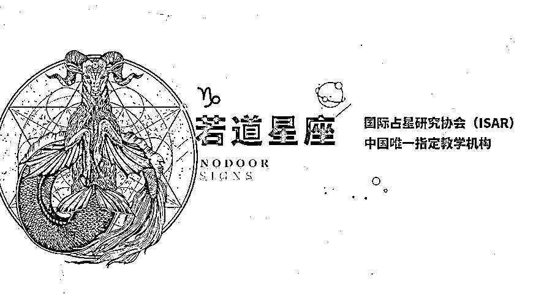

作者/蒋颖 若道创始人

编辑/翀子 封面/书君 图片/网络

2021 年 12 月 21 日 23 点 59 分，太阳进入摩羯座，对应了二十四节气中的冬至。冬至被认为是一年的开始，而占星星图也被认为是记录四季变化的日历。当我们把自然节律和星座结合起来，也能更深刻的体会该星座的特质。

**占星星图：四季的日历—节气**

今天是冬至，而太阳也踏入了摩羯座的领地。

在北半球，一年中黑夜最长的一天和冬季的第一个星座摩羯座同时到来，这难道仅仅是巧合吗？

一直以来，只是想弄明白星座、行星意义的我，始终停留在极其抽象的意义上，面对着计算机自动生成的平面图，思考那些抽象符号的抽象意义。

即便是对行星的心理学意义，我的理解也都是抽象的，**一切似乎都只是符号**。总之，我从来没有想到去深究过星图到底是怎么回事。

直到有一天，大卫对我说：**“你知道吗，星图其实是四季的日历。”**

在遥远的巨石时代，古代社会的人们就用巨石阵来观察季节的变化，了解其对生产和生活的影响，围绕季节和时间，我们最早的社会开始建立起来。

**这些巨石阵存在于不同的地域**，不同的文明，分布在世界各个地方。**而它们是围绕春分、秋分、夏至、冬至构建的**，如果你从高空俯视，会看到一个巨石构成的**圆形的日历，这才是星图的原型。**

白羊座起于春分，是春天的第一个月，而这才是星座最重要的部分。

不知怎的，这段话就像打开了一扇大门，原来被关在门外的大自然和四季，那些声音、气味穿过星图上的符号，活泼地来到我眼前。

天上的星座对我来说确实比较遥远，我的天文知识只是停留在太阳、月亮、太白金星、北斗七星，天文知识本来就少得可怜，城市的污染更让繁星遥不可及。

然而，四季对我来说却是无比亲切，**我生活在四季中，朝夕相处。**于是，就这样，占星和日常生活，春华秋实，花开花落联系在一起。

不再是神秘的天象，抽象的哲理、深刻的心理、西方的神祇，**星图就是这样普通、平凡而诗意的生活。**

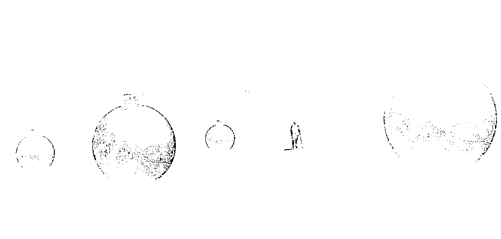

**摩羯座：冬天的开始**

**摩羯座始于冬至，是冬天的第一个星座。**

我过去想到 24 节气，总觉得冬天是立冬的开始。但是，从北半球看，如果不考虑其他影响气温的因素，只看日照时间长短对气温的影响，冬至那一天是日照时间最短的一天。

因此，**天文学上把冬至作为冬天的开始。**

而且有趣的是，我们的“数九寒天”的 “一九”是从那一天冬至算起。尽管前面气温一直下降，**但真正冬天的严寒从冬至、一九、摩羯座才开始，**而最冷的“三九”也是在摩羯座之内。

**冬天，严寒，摩羯座在冰冷刺骨的北风里走着，将整个身体都收得紧紧的。**看看那些在北风里匆匆走着的行人，大多数面无表情、不带笑容，和春天人们舒展的样子完全不同。

不是不想有表情，而是，实在太冷了，肌肉因为会寒冷而收缩起来，也因此显得严厉。

**而典型的摩羯座人，因为受到这么冷的气候的影响，从里到外都打上了“寒冬”的烙印。**

有的人不笑的面容让人觉得“肃重，庄严”，有的人让人觉得“严厉、严肃”，有的人显得“拘谨”，有的人实在被“冻得”太狠，因此从身体到心灵都会呈现出“僵硬”、“冷酷”、“苛刻”的样子。

过去一进入冬天，第一件事要想的就是家里是否已经储存好了一冬的蔬菜。因为在几个月里，大地基本不再产出，必须依赖过去的收成度过这个寒冬。

过去我们常常开玩笑，穷人最好能生在南方，比如在海南，热归热，但是即使再没有钱，树上摘个椰子，椰子水解渴，椰子肉也能当饭吃。

可是如果在北方，到了冬天，怎么办呢？离虫子都逮不着。

**因此，冬天的严苛逼得摩羯座人“懂得节俭”，“善于规划”。**不仅要顾上“冬季三个月的吃食”，还不能把“春天的种子”吃掉了。

冬季“生存”的问题，可不是哈姆雷特这样的风象知识分子的问题，不论对个人，还是对国家，都是非常**“实际”**的问题，必须**“严肃认真”**对待。

光讲道理喊口号磨嘴皮子是不行的，光有慈悲心肠、动不动就流眼泪也是不行的，只有蛮力只懂莽干也是不行的。

**所以，冬天的摩羯座非常“实际”。**这个怎么是那些无忧无虑的人们所了解的呢？

不仅人是如此，植物何尝不是。大部分植物，早早就把散发热量的树叶打发了，把全部活力集中到地下的根部，默默储蓄能量。这一等就是 3、4 个月。

**不动声色的摩羯座知道自己的目标是什么，而且他们有耐心，因为他们已经度过了无数的冬天，知道只要现在不完蛋，他们的春天总会到来。**

**版权声明：**原创文章由作者授权发布于若道平台，欢迎转发，反对抄袭。友号转载请申请白名单。

**蒋颖**

若道创始人，中国首批 ISAR 英文认证占星师（2012 届）

长江商学院 MBA，厦门大学经济学硕士，化学学士

国际占星研究协会（ISAR）中国区副主席

《灵魂的目标》译者

**学习占星学****点击下图了解课程详情** 

****************

**微信又双叒叕改版啦，不想错过若道君的推送？**

**就把若道设为星标吧！****▼**

**就是这个“在看”，戳戳戳 ☟**

****报名直达入口****

# 雷蒙德·梅里曼金融占星周运 | 金逆+土天四份，市场走向如何？

> 原文：[`mp.weixin.qq.com/s?__biz=MzA5NjA0NTAxNg==&mid=2651464091&idx=2&sn=df5c1012ae81c885cb09e68bae7b4eb5&chksm=8b48932cbc3f1a3a93e6ac850fef92124ff3f0ecfcfcb929260f37194e5add0cf790960e7be4&scene=126&sessionid=1692737883#rd`](http://mp.weixin.qq.com/s?__biz=MzA5NjA0NTAxNg==&mid=2651464091&idx=2&sn=df5c1012ae81c885cb09e68bae7b4eb5&chksm=8b48932cbc3f1a3a93e6ac850fef92124ff3f0ecfcfcb929260f37194e5add0cf790960e7be4&scene=126&sessionid=1692737883#rd)

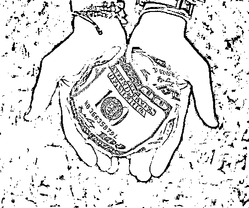

作者/雷蒙德·梅里曼 译者/Luke
编辑/玫瑰 图片/网络

雷蒙德·梅里曼是在金融占星学界稳坐第一把交椅的占星师，同时他也是若道签约的金融占星课老师，我们引进了雷蒙德·梅里曼老师的《[上证指数月度报告](http://mp.weixin.qq.com/s?__biz=MzA5NjA0NTAxNg==&mid=2651462440&idx=3&sn=1c45283342a3cb70cb06be2a0f79ab9b&chksm=8b48a99fbc3f2089cdeb7e7014fae031358fbf2824825603c7f00a56311ff43b8589902deb7f&scene=21#wechat_redirect)》及《[黄金报告](http://mp.weixin.qq.com/s?__biz=MzA5NjA0NTAxNg==&mid=2651464059&idx=2&sn=5dc133a91d4753c44646db50f3d891b8&chksm=8b4893ccbc3f1ada5ee182cfcdbd59ef4dd147503110bf7f550337609a6e2573ef98c2f3d2b4&scene=21#wechat_redirect)》。我们经老师的授权，将每周刊登梅里曼老师的周运，供大家参考和学习。于是，这是本周的周运（12.20-12.24）。因圣诞节假日，下周周运停更哦。

**说明：以下时间采用纽约证券交易所所在地美国东部标准时间。**

**展望与回顾**

****

**劳工部周二表示，11 月生产价格指数较上个月上涨 9.6%，为 2010 年有记录以来的最大增幅。**

**——加文·加尔福德**

**《11 月生产价格指数飙升》**

**《华尔街日报》**

**2021 年 12 月 15 日**

**价格总水平的变化总是能引起大众的兴趣。尽管原因未知，却能对国家的经济和社会生活造成深远和长期的影响。**

**——美联储董事会前任成员凯文·威尔士**

**引用经济学家经济学家诺特·维克塞尔 1898 年的发言**

**《美联储是通胀的主要罪魁祸首》**

**《华尔街日报》**

**2021 年 12 月 13 日**

**参议院通过了一项措施，提高政府的借贷上限至 2.5 万亿美元。****——安德鲁·杜海伦****《参议院批准提高借贷的措施》****《华尔街日报》****2021 年 12 月 15 日**上周末，展开了重要的 19 个月金星逆行周期。在 12 天的容许度内，这是与美国股票指数基本周期波峰有着最强关联之一的地球宇宙学征象。它是我们追溯 1928 年以来道琼斯工业平均指数价格波动得到的研究成果。

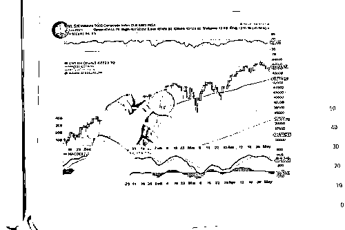

上周的股票指数表现不是很好。尽管标准普尔指数近期合约，于 12 月 16 日刚开始创下了 4752.50 的历史新高（3 月份 4743.25）。苏黎世 SMI 指数也创了历史新高。其他的市场却未能做到这点。下一个交易日，标准普尔指数下跌超过 100 点。其他市场也在上周中期创下次高点，随后却崩溃持续到周五。比如说，中国的上证指数，12 月 13 日接近 6 年来的最高点，但随后在该周剩余时间下跌。然而，黄金和白银市场上的情况却恰好相反，两者都在 12 月 15 日完成了重要的周期，创下了数周低点，随后快速上涨至周五。黄金在 1753 触底，可能是它的基本周期低点，只比金星逆行早了 3 个交易日。然后，在两天后的周五，它上涨至 1815，是 11 月 26 日以来的最高价位。白银在同一天 12 月 15 日下跌至 21.41，是 9 月 29 日基本周期起点的同等价位，也是自 2020 年 7 月来的最低价。在仅仅两天后的周五，白银到达高点 22.69。在通货膨胀如此剧烈的情况下，贵金属可能再次回归其历史上“避风港”的地位，对冲上升的消费者和生产者价格。

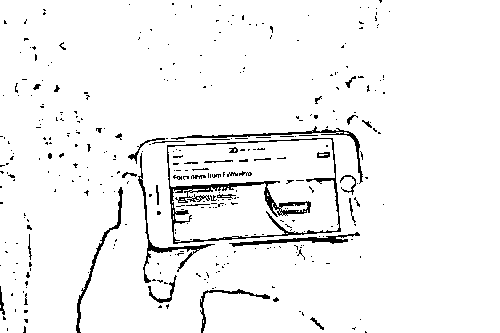

**短期占星趋势和长期考量**

****

**华莱士的工作激怒了保守派和自由派。对特朗普的采访，挫伤了这位前总统及其支持者脆弱的感情，他们指责华莱士反对特朗普。但特朗普的反对者认为华莱士是一位英雄。华莱士两者都不是。****“这太傻了”，从 2003 年开始在福克斯新闻工作的华莱士，谈到这种反应时说。“我不是在倡导某一种观点。我只是想扮演裁判的角色，数数击中了几个球，尤其是谈谈哪些事情不是真的。坦白说，我不认为这是在表达意见或评论。”****——比尔·古迪库茨****《克里斯·华莱士离开福克斯新闻转投 CNN+，那是件大事》****《亚利桑那共和报》****2021 年 12 月 15 日**这一轮的金星逆行周期，可能比往常更加重要，因为它非常接近 2021 年最长的行星周期：强有力的 11.25 年土星和天王星的四分之一周期，也被称为土星-天王星渐亏四分相，将在 12 月 24 日发生。除了这一强有力的宇宙设置外，金星也将在 12 月 11 日和 25 日精准合相冥王星。在这一宇宙天象下，金融市场不仅**随时可能反转**，像上周的标准普尔指数和贵金属市场那样，地缘政治的战略同盟也可能受到考验，因为金星既掌管金钱，也掌管合作关系。在金钱方面，在未来几周甚至几天内，经济和政府政策可能受到严肃挑战，甚至受到威胁。世界领导人能够应付这一挑战吗？在金星掌管的人际合作关系方面，我们每个人，作为个体，能否迎接挑战，将自己视为更大和更有包容性的人类种族的一员，还是我们继续被基于外形、生理结构、种族、国籍和其他差异的极端思想所分裂和剥削？

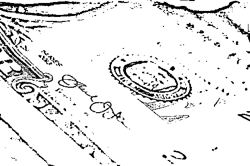

这不仅是金星逆行，也是土星（结构）四分（挑战）天王星（独特还是相同，多样性还是单一性）所带来的挑战和机会。我们每个人都是不同的，但我们作为同一族群——人类的一员，有着共同的目标，那就是认真地对待彼此和这颗星球，共同守护这颗维系我们生存的星球。每个具有常识的人都知道这点。唯一的问题是，如果你把这种常识表达出来，你可能会得到与克里斯·华莱士同样的反应，那是他在职业生涯采访中表达常识时常常遇到的。现在，让我们回到本专栏的初心，那就是分析金融市场波动与宇宙天象模式之间的关联。因为毕竟，我们工作的基础，是宇宙周期与人类活动周期的相关性原理。**金星在 12 月 19 日-1 月 29 日逆行，是与反转相关最重要的征象之一，不仅适用于金融市场，也可应用到经济和银行活动上。**在当前的情况下，我认为金星逆行，同时合相冥王星，结合土星四分天王星的最后一次精准成相，将是大众意识的觉醒。这一时期不仅是通货膨胀，而且很可能会转变成滞涨的环境：不仅经济增长减慢，同时商品价格保持在高位。与此同时，结合美联储减少流动性的新政（也就是停止每月的国债回购），这对世界经济或股票市场都不是好兆头，尽管股市在 2021 年 2 月 17 日-12 月 24 日土星四分天王星期间都飙升到了历史新高。那一宇宙周期即将结束，同时结束的可能还有宽松的货币支持（也就是大量流动性）。正是那宽松的货币政策，导致了巨大资产通货膨胀，和相伴的生产者和消费者成本的上升。我们即将离开冥王星在摩羯座的基本星座高峰的影响，当时是 2008 年，是所有的货币和经济刺激开始的年份。我们也即将迎来木**星进入双鱼座（2021 年 12 月 29 日-2022 年 5 月 10 日），并接近 2022 年 4 月 12 日的木星-海王星合相双鱼座。****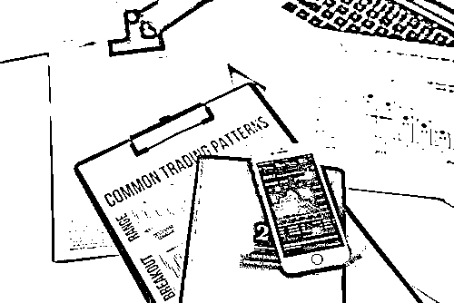**这一宇宙转变实际上始于 2021 年 5 月，当时木星首次闯入双鱼座，持续了大约 10 周。当时通货膨胀开始上升，但没人太过于关注，尤其是美联储和白宫，他们仍然声称通货膨胀是暂时的，但无法给出“暂时”结束的具体日期。这种无意义的不明确说法，就其本身是非常海王星和双鱼座的。因为你可以说每件事都是“暂时”的。比如说生命本身，也是“暂时的”。就好像金融领域的每个牛市也是暂时的。你可能以为自 2009 年来的牛市永远不会结束，但倘若那个信念在本次金星逆行合相冥王星时被打破，也不要太感到奇怪。但是，让我们回到木星入座双鱼座的话题。在那时期，**金星也会逆行，合相冥王星，而且土星与天王星形成最后一次渐亏四分相。**这是重大的宇宙天象。它们都将在接下来 12 天里发生。木星，曾在 2021 年 5 月 13 日-7 月 28 日短暂进驻双鱼座，将在 2021 年 12 月 29 日到 2022 年 5 月 10 日再次回到双鱼座。早先在 2021 年 5 月时价格 2%的通货膨胀，有可能到 2022 年春天变成两位数的通货膨胀。回顾历史，一个人不需要了解太多科学理论，也能看出剧烈上涨的商品价格，对黄金和白银那样的期货有什么影响。对于加密货币来说可能也同样如此。除了股票和国债，每件事的价格都在上涨，直到不再上涨。当上涨停止后，价格就会像上涨时那样飞速下跌。这就是木星（扩张、通胀）在双鱼座合相海王星（失去控制，只有天空才是界限）的性质。在现实中，以及在地球宇宙学研究中，地球和土星掌管界限。**只有当 2023 年土星进入双鱼座，我们可能才会看到木星和海王星的界限在哪儿。**在那之前，现在你可能会**考虑调整你的长期投资组合**。在个人层面，可能也是时候**重新评估你的个人关系，并做出必要的调整，如果那些关系妨碍了你的目标和愿望的话**。如果某一方偏离了你曾经热烈珍视的品质，可能现在是时候回到那些最初吸引你的品质上来了。如果你们双方都想让关系成功，仍然可以重新找回那些激情。

**说明：以上日期基于纽约证券交易所所在的美国东部标准时间，由于存在时差，中国地区可能需要加一天。**

**版权声明：**本文由若道翻译发布，欢迎转发，反对抄袭。友号转载请申请白名单。

**雷蒙德·梅里曼（Raymond Merriman）**

若道签约老师。著名金融占星师，ISAR（国际占星研究协会）前主席，梅里曼市场分析公司的总裁。他由于“提升了占星学的职业形象”，在 1995 年国际占星大会上被授予轩辕十四奖；在 2012 年国际占星大会上，被授予轩辕十四终身成就奖。

1“中国上证指数月度报告”发售**若道推出了****中文版****的雷蒙德·梅里曼中国上证指数月度报告，并持续发行该报告！**当把金融市场的周期和占星学的周期相结合时，雷蒙德·梅里曼老师的金融占星学研究**为投资者应对金融市场的周期波动，并随之调整投资策略提供了极大的价值参考**。
**12 月中英文报告已上线！**2“黄金价格周期月度报告”发售**若道推出****中文版****的雷蒙德·梅里曼黄金价格周期月度报告！**不仅仅为广大读者在中国股市的投资出谋划策，更将视角放眼黄金市场。**每当世界经济形式不明朗的时候，有一个地方是保值的港湾，那就是****黄金**。自 1982 年雷蒙德·梅里曼出版第一本研究《地球宇宙学征象与黄金价格的关联》的著作以来，**他一直作为最重要的黄金市场时机预测者之一享誉国际**。2022 年 1 月黄金报告已上线，梅里曼老师将会告诉你他对这个关键时期如何操作的想法。也可以按照季度和一年期订阅，有更多优惠。季度和年度的好处是，你可以持续了解梅里曼老师对于不断在变化的市场的看法。即便他某一次看法和市场不一致，你也看到在下一期他如何调整自己的看法，并看到金融占星在一个长期时间段内对你把控风险的帮助。而能够长期控制风险、尽量找到安全的投资时机才是投资的长久之计。**2022 年 1 月中英文报告已上线！****购买套餐**，买得越多越优惠中国上证指数月度报告套餐价

*   **单月报告**：280 元
*   **3 个月套餐**：780 元（260 元/月）
*   **12 个月套餐价**：2400 元（200 元/月）

**长按下图识别二维码****购买金融报告****套餐****▼**

黄金周期月度报告优惠

*   **双报告年度套餐更优惠（直降 900 元）**

*   **12 个月黄金报告+12 个月上证指数报告：仅需 3900 元**

**长按下图识别二维码购买黄金报告套餐**▼

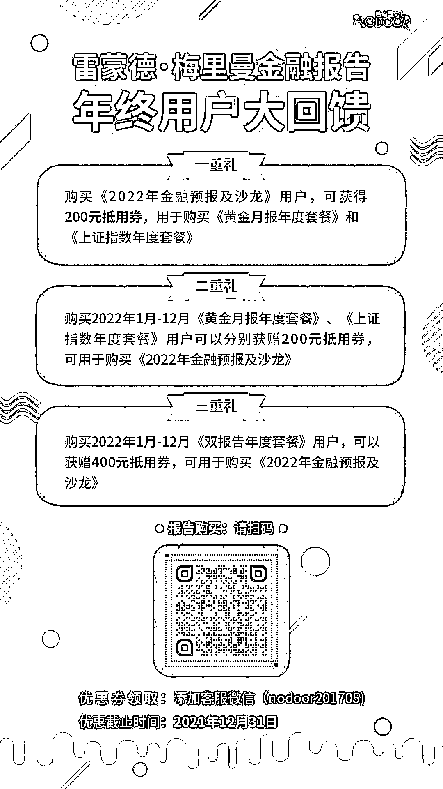

3 中国金融市场特别网络研讨讲座面对年底几个影响金融市场的重要天象，该如何把握下半年的投资，为跨年做准备？我们特意邀请雷蒙德·梅里曼老师为大家带来了**3 个小时的金融讲座——雷蒙德·梅里曼中国金融市场特别网络研讨讲座。**这场为期 3 小时的在线讲座探讨了**这些长期行星周期如何影响世界经济的长期周期和趋势，特别是如何影响上证综指和黄金市场**。并描述**在 2021 年剩下的时间里市场反转关键时间点，特别是 12 月 19 日至 25 日金星逆行，以及土星-天王星最后一次渐亏四分相、金星与冥王星合相的重要时期。****长按下图识别二维码购买讲座视频**
▼

5《2022 年金融预报和沙龙》1976 年以来，由雷蒙德·A·梅里曼撰写的梅里曼市场时机学院每年一次的年度预报沙龙和每年一本的《年度预报》一直在应用占星学原理为投资者们服务，提供卓越洞见，从未间断。 **雷蒙德·梅里曼《2022 年金融预报和沙龙》开始预售中。****长按下图了解详情**
▼

**点击阅读原文购买金融报告**

# 冥王星碾过群星摩羯座的 10 年，我明白了，没有一种觉醒不带着痛苦

> 原文：[`mp.weixin.qq.com/s?__biz=MzA5NjA0NTAxNg==&mid=2651464091&idx=1&sn=7f9d4f5c592a48b6dbe15987f4325c88&chksm=8b48932cbc3f1a3a50e632a6fe56853ab260f70893b6f4d2868a37bf2dc70932883fadb83d6f&scene=126&sessionid=1692737883#rd`](http://mp.weixin.qq.com/s?__biz=MzA5NjA0NTAxNg==&mid=2651464091&idx=1&sn=7f9d4f5c592a48b6dbe15987f4325c88&chksm=8b48932cbc3f1a3a50e632a6fe56853ab260f70893b6f4d2868a37bf2dc70932883fadb83d6f&scene=126&sessionid=1692737883#rd)

**********************☆ **************后台回复“今日”，给你一句生命态度********

********************************************

采访/编辑/玫瑰 图片/pexels

大卫老师说，很多年前，经历冥王星行进时，他赚到了当时人生中最多的一笔钱。是的，他是老师，是研习几十年占星学的大师，而我们这些普通平凡的凡夫俗子，遇到冥王星行进的时候，怎么可能有这么好的“运气”呢？然而，冥王星行进却真的是一个可以为我们带来巨大、无穷宝藏的行进。只是，这种宝藏的获得并不容易，甚至可以说“绝处逢生”。到底有多“难”？一起来看看。**冥王星行进时，会发生什么？**经历冥王星行进的时候，会发生什么呢？每一个人经历的都不尽相同，但我们总是能**在不同的事件中寻找到相同的心理层面的发展。****冥王星以极端甚至恐怖的事件，为我们带来心灵的重建，个性的颠覆，人生的重大转折。**在冥王星行进反反复复的顺行-逆行过程中，我们从最开始的**震惊、抗拒、无奈、害怕**，到**接受、探索、试错、归因，继而升起勇气，去奋力一搏。****涅槃、净化、重建，是冥王星行进的关键词。**这一切最终的目的，不是为了伤害，而是**让我们过上真正想要的，丰盛从容，惜福感恩的人生。**而在这之前，经历苦难是必须的。毕竟，只有最勇敢的人才能闯关成功，获得最巨大的宝藏。在这篇文章中，我们采访了 4 位经历过冥王星行进的人，他们和我们一样，都是普通的占星学学子，听听他们的人生故事，或许会对你有所帮助和启迪。

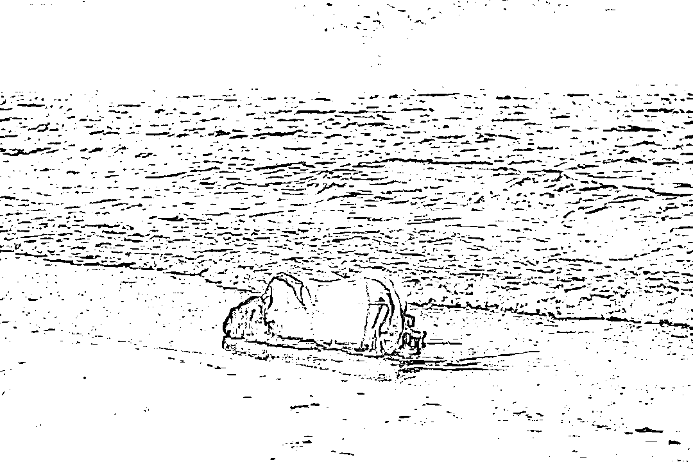

**77 的故事**

**经过冥王星洗礼，月亮 1 宫的我终于找到了自己**

最近三年，我经历了行进冥王星在摩羯座四分一宫的月亮天秤座。冥王星行进**完全改变了我和原生家庭的相处模式。**2019 年之前的我基本和爸妈没有太多沟通，即使打电话也不想和他们聊。每次听我爸说话就很烦，就会问“我妈呢”，但和我妈聊也只会聊一些家常里短，我听着附和两句……我对自己（一宫）定义完全没意识，没思想，甚至有点麻木的生活，因为不知道什么是开心。**冥王星的来临，有一股力量逼着我去改变自己。**那段时间我结束了一段隐秘的感情，我告诉他我想要掌控自己的生活……不知道为什么会说出这种话，但这确实是我真正的心声。这个过程中，我看了一本关于亲密关系方面的书，了解到所有亲密关系中情绪初始在小时候和原生家庭中出现的，所以我尝试从源头下手，慢慢尝试和家人沟通，当然这是异常难的事……这段时间，我的工作和生活也不太顺利，身边的好朋友有的离开北京，有的谈恋爱了也不能经常见面。

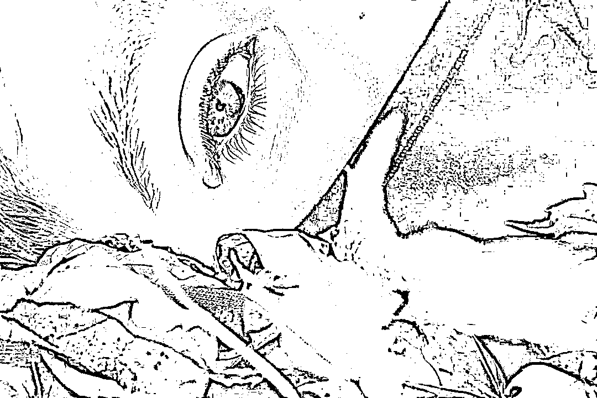

但这也促进了我和家人的联系，我学会和爸妈聊天，给他们讲我最近发生的事情，给他们说我开心和不开心，焦虑，压力大等等的情绪。发现原来父母真的也可以是最好的朋友，这是我二十多年从来没体验过的。不过这三年确实很痛苦，无数次在黑夜中痛苦，为什么这么难……

我本人群星摩羯座四宫，但不知道自己喜欢什么，没有目标，**觉得潜意识有个声音老训斥自己，强大的挫败感经常把自己逼哭。**生活充斥不开心和抑郁，这种状态下也没有精力去谈恋爱，但是自己孤独一人又很难过，觉得自己很可怜很失败。去年 11 月，偶然看到一个公司在招电话销售，因为我本人还很喜欢和陌生人聊天，去做了销售。刚开始做确实是很开心，因为和人聊天的感觉很棒，但是销售还是有业绩压力的，但是我不喜欢逼别人做不喜欢的事情，和我的原则相悖，。我满心欢喜，本以为可以在这个行业干一番事业，但是我发现销售可能不适合我，但是我可能不愿回到没有目标的状态，所以一直内心一直在纠结和拉扯……做这个决定我痛哭了一晚上，因为我想做一件成功引以为豪的事情，我不愿放弃销售是我不想承认自己失败，我想再试试。但是现实不允许我去试，可能放弃就是承认自己失败，对我来说可能要了命了。

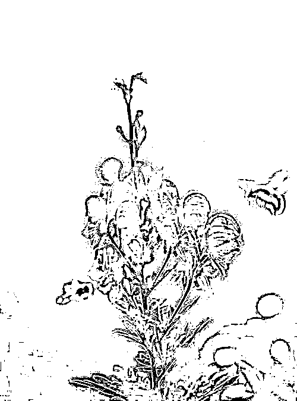

今年年初，我尝试去面试了心理咨询师助理，带着满心的对未来的恐惧和忐忑，又是一次失败……最后还是选择视频方面的工作，不过现在试带着更多同理心去工作……**我现在偶尔会写成功日记和感恩日记，也会去冥想，发现自己不再严苛要求自己什么都很完美，学会了逐渐接受自己的不完美，爱自己。**过去二十多年不开心是因为**任何事情都希望完美，一点不完美就会苛责自己和其他人，对自己更是严苛，基本把自己的情绪通道一直是堵塞状态，从未表达过感情。**冥王星的来临，让我重生了吧，以前从来不会对任何人好，从不主动，现在主动关心朋友自己会好开心，经常和爸妈说晚安，面对工作生活的不顺，会去接纳现状，不再苛责自己和他人然后大发脾气了。**船到桥头自然直是我目前的名言，好好做事，活在当下，和身边人开心，幸福。****郑玮玲的故事**

**冥王星行进后，结束了糟糕的亲密关系，找回自我复活的权力**

2016、2017 年冥王星行进中，首先是在全息呼吸工作坊里有了灵性颠峰体能，昆达里尼能量被激活，出生创伤，生育创伤都在更高维度得到了释放、疗愈。

而后开始意识到**现实中糟糕的亲密关系到了无法回避，需要做最终处理的时候。**

因为多年来在关系里**感受到压抑、受限、被忽视，却只是视为平常现实。**

但在当下，我不再能接受失衡的关系，对方的创业、经营我用尽所有的关系、资源支持；但每一次我要做自己的事，不仅得不到支持，还总被泼冷水，还没开始就被认定我会失败。

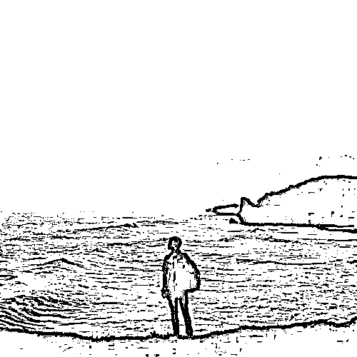

**外表是伴侣的人却打压自己的梦想成习性，在当时的我必须捍卫自己的权力。**

尝试主动沟通无果，最终我提出离婚，并痛诉对方：“我从来没有爱过你，年轻时只是因为你对我好才跟你在一起。你也知道我喜欢的不是你这种类型。可惜这些年你对我实在太糟了！”

这次冥王星行进让我明白，**没有什么是个体无法面对和解决的，即使是在长期被夺走力量之后，我们仍拥有自我复活的权力。**

一生在寻找智慧的我，注定要用困难、痛苦的方式学习爱的智慧，爱自己的智慧。

**一开始就失衡的关系必然无法带来真诚的亲密。**如果带着现在的智慧回到年轻时，我一定不会因为安全感和一个不爱的人结婚。**真正爱的关系只能与我们的身体说“是”，我们的心为之全然敞开的人建立**。即使一生遇不到一个值得爱的人，也要用全然的真诚去爱自己，陪伴自己的每个日日夜夜。同时，不要用自己的善良去衡量他人的心量，人性是复杂多变的，婚姻是特别无聊无趣无意义却值得放弃的事。在这个过程里，我意识到，最有用的帮助只能是自我帮助，自己就是自己最好的疗愈者。跨越情感和情绪议题后，在离婚过程中被身边朋友提醒发现对方超越底限的黑暗：控制隐瞒了大量婚内财产。最后通过法律手段拿回权力。**我看清楚了身边人的真面目。学会了爱自己的边界，是建立在捍卫自己最基本的生存权力之上的事。**

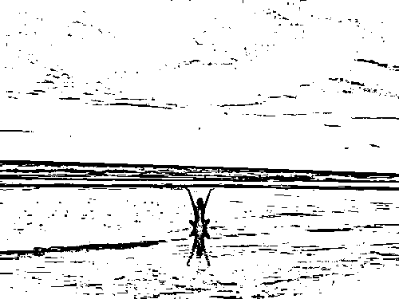

回顾从前，很想对那时的自己说：“谢谢你的倔强和任性，让我真正拥抱了生命的花园，后来的我爱自己，也对得起自己。”即使人生永不能如我们所愿，我也会保持我们的纯真勇敢去遇见风景，请你继续给我指引。**Moli 喵的故事**

**冥王星行进，为了新生命，我开始了与命运的较量**

2013 年 9 月，因连续几个月生理期异常，我在四川华西医院被确诊“多囊卵巢综合症“。这是一种生殖内分泌方面的疾病。主要的影响是患者不容易受孕。当时我已婚未育，还没有生小孩。所以确诊此病后，内心很受打击，思想压力巨大。我和老公感情一直很好，他是他家真正意义上的三代单传，我不晓得这个事会如何影响我们的婚姻。虽然他表示没有小孩无所谓，各种安慰我，但我内心还是会**恐惧**。**其实我并不是一个很喜欢孩子的人，但是在知道有这个病后，内心突然变得很希望生小孩。**医生给出的治疗方案是要一方面口服调整内分泌的药物，另一方面最重要的就是要减重。因为这个病激素不正常很容易引起发胖，只有体重减轻了，激素才能正常，才能正常排卵，自然受孕。从此，我踏上了辛苦的减肥之路。

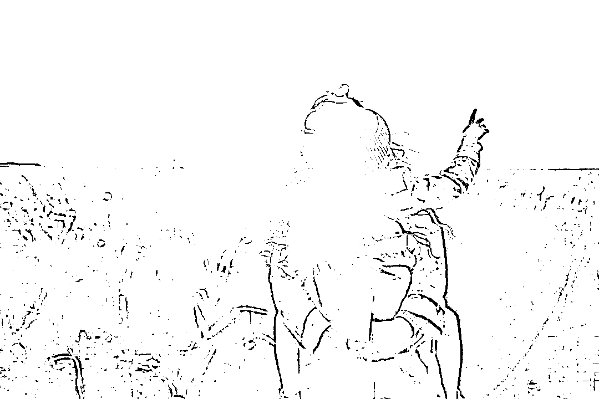

那个时侯，每天中午在单位附近健身房跑步 8-10 公里。也是在那段时间，我发现，**人的潜力和信念是巨大的，为了现实有一个孩子的目标，不论春夏秋冬，刮风下雨，风雨不改，坚守初心。**就这样一年的时间，我减重 32 斤，复诊各项指数都正常了。一年半以后，顺利自然受孕，怀了我的儿子。现在我儿子已经 6 岁多了。后来学了占星学再回顾这件事，发现**冥王星的行进就是一次挫折教育，打破那些不好的习性，逼着自己去改变，最后破茧成蝴，凤凰涅槃，重获新生，给予自己更美好的事物。****晓晨的故事**

**当冥王星逐一碾过星图中的群星摩羯座，10 年的时间，我明白，没有一种觉醒是不带着痛苦的**

**· 2010 年，行进冥王星合相出生星图中 11 宫的太阳摩羯座**

高二下学期，父母离婚，妈妈离开家庭，我跟着爸爸一起生活。爸爸经常酗酒，放学回家几乎每天都会受到骚扰，一边学习功课，一边躲藏和忍受痛苦。

**我对父母不再信任，感受到被抛弃，从此不再信任任何人。**只有自己依靠自己，任何感情都是靠不住的，自己的人生价值只能寄托在学业和未来的事业上，从此世界孤身一人。

**· 2011 年，行进冥王星合相出生星图中太阳摩羯座**我考上大学，去北京读书。**从原生家庭脱离了，感觉解脱了，再也不用担惊受怕，努力有了回报，自己的人生开始展开。****· 2015 年，行进冥王星合相出生星图中 12 宫的月亮摩羯座**这年大四，面临大学毕业的问题，考研没考上，也没找工作，选择了延期毕业，准备二战考研。**考研失败后，师兄向我介绍了禅修，打开了我灵性成长之路。**我不愿离开大学的襁褓，不愿放弃读研的梦想，同学们都毕业了，周围没有认识的同学，感到**孤独**。考研、工作与生存，坚硬的主题压在心里。**考研的决定，是我人生第一次做主，违反了家人和周围环境的主流意志。**

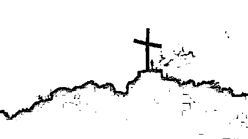

**· 2016 年，行进冥王星合相出生星图中月亮摩羯座**考研二战失败（其实是忘了报名，导火线是喜欢上了一个男生），决定三战考研，继续延期毕业。这一年，**确认了自己的性倾向（同性恋）。**人生从此大不相同，开始自我反思过往，我是谁、从哪里来、到哪里去…我是少数者，我要怎样度过我的一生呢？**完全颠覆以前对我的人生规划……没有什么是可以计划的，没有什么结构是固定不变的，我以前认为的正常的标准，都是可以批判的。****· 2017 年，行进冥王星合相出生星图中月亮摩羯座****行进冥王星合相 12 宫的天王星摩羯座****行进冥王星合相 12 宫的海王星摩羯座**大学毕业了——延迟的毕业总算来到。第三次考研没考上。这一年，我在一家 NGO 做法律实习生，开始步入社会。在多家 NGO 社群做志愿者，帮助性少数群体。在实习的时候，才理解人性和社会，才理解法律只不过是一张纸……**撰写报告，批判社会不公平的结构，倡导正义理念。也是这个时候，我开始从制度整体性转向个人权利、个人的内心。**

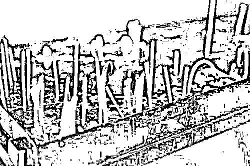

**· 2018 年，行进冥王星合相海王星摩羯座**经历多家 NGO 实习和面试，最后没有在这些地方工作。随着对该领域的了解，对社会环境万念俱灰，退出公益圈，放弃法学本专业，不找对口的工作。第四次考研也没考上。开始学习塔罗牌，走上神秘学道路。**我经历了职业生涯的颠覆，感觉到不被社会理解和接纳，找不到位置的迷茫，自我身份开始模糊，有消极避世倾向。****· 2019 年，行进冥王星对分 6 宫的火星巨蟹座 6 宫**我找到了一份图书馆的工作，终于就业了。搬家到北京郊区，一个人独居，边工作边学习和兼职神秘学工作，开始了新的生活。算是有点步入正轨了，工作、生活，在图书馆的环境也感觉挺好，生活在郊区挺享受，像是找到了一个滋养我的空间。**经历了这几年的折腾，终于可以在这里喘息休整一下了。同时也可以做自己喜欢的事，有时间探索灵性道路和自我成长。**

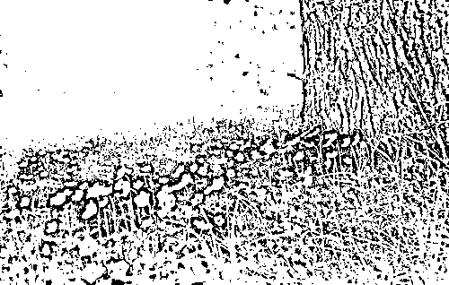

**冥王星的解药：真实**以上就是他们的故事，有没有那么一刻，让你感到心有戚戚？而我的感觉是，**一种深深的被信任，真诚的敞开，以及让人落泪的勇敢。**我想，正是因为这些能量，让他们能够坦然面对人生无法启齿的伤痛，穿越它们，并得到真正的智慧。**当你能够坦然面对心灵隐秘的角落，全世界都会接纳你，你也接纳了全部的世界。**
当我们看到冥王星行进的时候，本能的反应会是害怕和负面的揣测：也许会有什么不好的事情发生吧？而这时候，请别忘记，冥王星或许能够夺走你的爱人，却夺不走你爱的能力；它或许能否定你生育的能力，却无法剥夺你为了新生命而拼搏的勇气；它或许能镇压你的自我，却无法抵挡最原始的求生欲，如星火燎原一般的洪流，最终会让我们走过的每一片土地都生长出勃勃生机。**如果你也正在经历冥王星行进，别放弃自己，请记得，我们和你在一起。****再厉害的占星师也无法将人生的故事一一预测。生命的奇妙就在于其不可莫测。下一期，我们将分享更多人的天王星行进故事，如果你也有故事，欢迎讲给我们听。在后台回复“天王星故事”，与我们取得联系吧！**

**版权声明：**原创文章由作者授权首发于若道平台，欢迎转发，反对抄袭。友号转载请申请白名单。

**学习占星学****点击下图了解课程详情** 

****************

**微信又双叒叕改版啦，不想错过若道君的推送？**

**就把若道设为星标吧！**

**▼**

**喜欢记得点一下在看哦☟**

****报名直达入口****

# 双子座满月 | 2021 年最后一次满月，愿你和你爱的人一起成长

> 原文：[`mp.weixin.qq.com/s?__biz=MzA5NjA0NTAxNg==&mid=2651464059&idx=1&sn=dccbbdc8bd5951e392591f9abf549b61&chksm=8b4893ccbc3f1adab94bbc3ad528a26e271a71f441572c238e8be453ce7e6e27369499972fd8&scene=126&sessionid=1692737883#rd`](http://mp.weixin.qq.com/s?__biz=MzA5NjA0NTAxNg==&mid=2651464059&idx=1&sn=dccbbdc8bd5951e392591f9abf549b61&chksm=8b4893ccbc3f1adab94bbc3ad528a26e271a71f441572c238e8be453ce7e6e27369499972fd8&scene=126&sessionid=1692737883#rd)

**☆ 后台回复“今日”，给你一句生命态度**

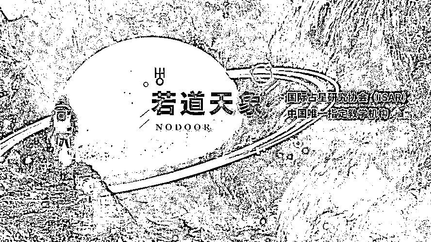

作者/王芝桦 香香菲舞

编辑/玫瑰 图片/pexels

**双子座满月****北京时间 2021 年 12 月 19 日 12:35 迎来 2021 年最后一次满月—双子座满月，射手座太阳与双子座月亮于 27°28′精准对分。**2021 年即将收官，我们又一次走到做“年度总结和年度计划”的时间。然而，2021 年 12 月在各种天象的叠加中震荡不安，我们内心也在各种情绪的变化中起伏不定。此次双子座满月，正值进入最激荡的 12 月下旬，宇宙似乎正在指挥我们拿着筛米的簸箕将细碎的沙子筛掉，而这也正是每个跨年历程需要去做的动作，尤其在这个刚刚开启全新风元素周期 1 年、正值“新旧周期转换”进程的 2021-2022 迈进时刻。

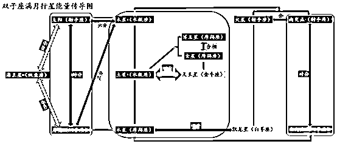

**双子座满月重点影响人群**

参考满月峰值影响期间各个行星的行进度数，以及逆行行星的轨迹影响；常规容许度，个人行星入相位 3°，出相位 1°；非个人行星入相位和出相位均为 3°。

**·** 出生星图中，有**行星、四轴、南北交点落入固定星座（金牛座、狮子座、天蝎座、水瓶座）7°-23°，25°-30°**的人群； 

**· **出生星图中，有**行星、四轴、南北交点落入基本星座（白羊座、巨蟹座、天秤座、摩羯座）5°-29°**的人群；

**·** 出生星图中，有**行星、四轴、南北交点落入变动星座（双子座、射手座、处女座、双鱼座）0°-7°，17**°-30****°********的人群。

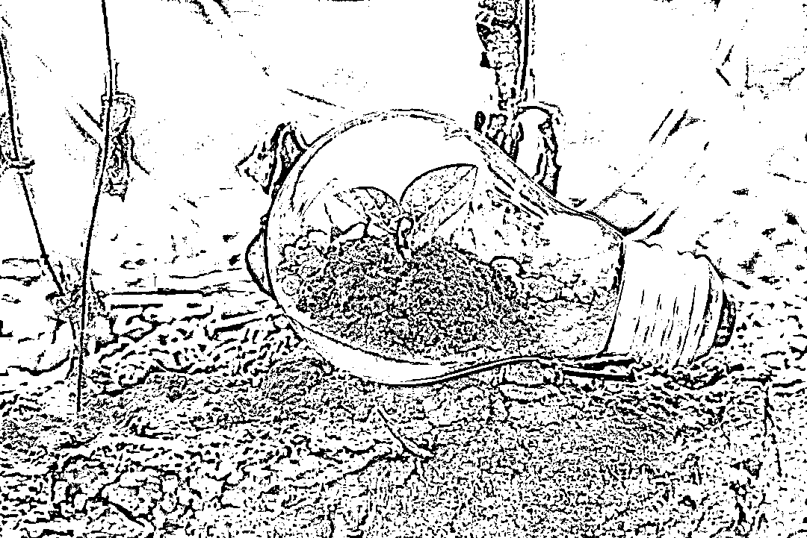

**“理想之国”必须建立“现实根基”**

****

**你会任由这个世界吃掉你，再把你吐出来，你还躺在这里纳闷，到底做错了什么。因为你总是对这个世界有所期待，而它没有那个东西，它也不希望如此。****——约翰·威廉斯《斯通纳》**

> **天象**
> 
> **· 火星介入南北交点轴线：**宽泛容许度下，射手座火星合相射手座南交点，对分双子座北交点。**· 南北交点换座：**12 月 23 日，南北交点换座进入“南交天蝎座-北交射手座”。

**12 月 13 日，火星换座进入射手座**，为“追寻更高目标”的射手月生活（11 月 22 日-12 月 21 日），注入强烈的意志力和积极的行动力，**驱动我们向外求知和向内觉悟，投入创造“超越当下”的生活。****本次火星行进射手座的时间是 2021 年 12 月 13 日-2022 年 1 月 24 日：**这似乎是非常“理想”的一段时间，驱动我们带着积极的心态确立目标，引领我们带着坚定的信念向前冲刺，充满干劲且效能提升；但凡事都有双刃剑，**“理想”也容易令人执着于“理想的结果”。**追逐理想的旅程中，并不只有“成功”这一个结果，当然也有失败的可能性。**但当我们执着于“一定要达成理想结果”的时候，就容易陷入“主观意识”的偏颇，“盲目冒险”的激进。**此次双子座满月，射手座火星仅以 4°之差合相揭示“业力议题”的射手座南交点，提示我们——**提防高高在上的理想主义，那些“我对你错”的狂妄自大，那些“应该如此”主观意识，很容易令我们偏离客观的视角和现实的轨道，从而陷入纸上谈兵和脚不着地的风险。**这里尤其强调的是，本次双子座满月之际，月亮南北交点也临近“星座换座”的重要节点！

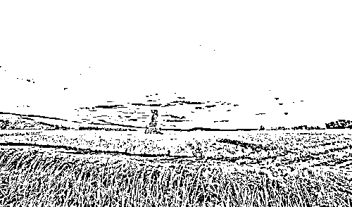

**2021 年 12 月 23 日，月亮南交点将由射手座换座到天蝎座，月亮北交点将由双子座换座到金牛座。**故而，正值南北交点换座前夕的双子座满月，射手座南交点会力争压哨一搏，在射手座火星的大力怂恿之下，激发自身业力模式走向高潮——在强烈的主观意识之下，不加理性思考，不愿客观分析，不顾一切奔赴未知的“理想之国”；我们满怀希望带着理想向世界招手，可到头来却发现，这个世界可能并不买账。但是，双子座北交点同样也在力挽狂澜——带着“冒险精神去追求理想”的初衷并无问题，但关键是在行动之前需要有意识的对“理想目标”进行检验，是否可以抛下陈旧的观念和过时的经验，是否可以敞开吸收多方面的思路、谦卑学习多元化的经验，因为“灵魂的进化”才是我们此生来到世界的目的。此次双子座满月，射手座火星合相射手座南交点，就像是对我们前面一年多的功课进行最后的检验，提示我们——**调整理想目标，调试实践方法，为下一步的进化升级做好踏实的铺垫。**人生就像一场盛大的冒险，当我们准备好的时候，那个最有意义的遇见就会到来。但是，冒险必须落地，而不是怀抱着主观化的理想对这个世界有所期待，更不是在被这个世界拒绝的时候躺在那里纳闷“到底做错了什么”，因为这个世界没有“必须回报理想结果”那个东西，它也不希望如此。

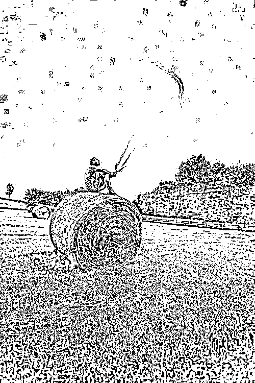

**评估与选择，2021 年最后的“瘦身”**

****

**我们必须记着自己是什么人，我们选择成为什么人，记住我们正在从事的东西的重要意义。**

**——约翰·威廉斯《斯通纳》**

> **天象****· 变动星座 T 三角：**宽泛容许度下，12 月 1 日恢复顺行的双鱼座海王星与“射手座太阳-双子座月亮”对分轴线组成“变动星座 T 三角”格局。· **木星介入“日月对分”轴线：**水瓶座木星六分射手座太阳，三分双子座月亮。**· 水凯四分：**摩羯座水星四分白羊座凯龙星。

2021 年 12 月 1 日，逆行了长达 5 个月之久的海王星于双鱼座恢复顺行。海王星 165 年行进黄道一周天，此次双子座满月，双鱼座海王星虽然已经恢复顺行 18 天，但仍处于“慢慢醒盹儿”的状态。故而，12 月至今，随着双鱼座海王星恢复顺行且慢慢醒盹儿的过程：一些朋友，模糊的意识逐渐清明，对当下的自我状态和生活状况有了清晰的觉察；一些朋友，却依然在迷茫之中不落实地，在虚幻之中逃避真实，并因为理想与现实的难以调和而陷入焦虑。海王星与双鱼座是一组守护的共振关系：**海王星代表“意识的通道”，双鱼座象征“意识的海洋”。**

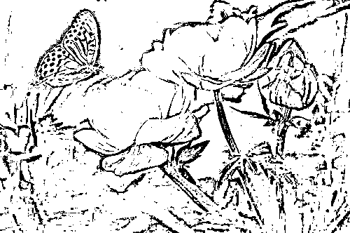

此次双子座满月，双鱼座海王星与射手座太阳和双子座月亮形成了“变动星座 T 三角”格局，虽无精准的相位驱动，但星座之间的张力依然显著，提示我们——**在此次满月期间，首先要带着一份意识的觉察，主动调试意识的频道。****·** 一方面，觉察理想目标的动心起念是否过于主观化，是否有现实可行性，是否能够落地推进。**·** 另一方面，觉察自己每天忙碌的事情，哪些紧紧围绕着理想目标，哪些已经偏离了航线？哪些行动有助于推进理想目标的实现，哪些行动正在分散消耗着我们的精力？同时，此次双子座满月，接纳射手座太阳、射手座火星和射手座南交点能量的水瓶座木星（木星守护射手座），介入“日月对分”轴线，六分射手座太阳，三分双子座月亮，为我们**强黑板！划重点！**提示出两个字——**评估！**这里，我们需要简单回溯下**木星在 2021 年的行进轨迹：****· 5 月 14 日-7 月 28 日：**木星短暂试水双鱼座，并与双鱼座海王星形成“木海互容”结构，带来“缔造理想，带来希望，遇见机会”的两个半月时光；但是，是否能够抓住理想、希望和机会，取决于每个人是否真正做好充足的准备，真正具有相当的实力。

**· 7 月 28 日-年底：**从 7 月 28 日，木星再次逆行回到水瓶座之后的下半年，不少朋友感受到了 5 月-7 月的“虚晃一枪”，新开启的目标，新投入的项目，新变化的生活，在经历了一个夏天的热情之后突然落空或打回原形——**2021 年下半年，现实的顺利和挫折，帮助我们对理想目标、自身实力重新进行“评估和校准”。**

**再次强黑板！划重点！**

**· 12 月 23 日**，南北交点换座进入“天蝎座南交点-金牛座北交点”轴线；

**· 12 月 28 日，**水瓶座木星将会四分“天蝎座南交点-金牛座北交点”轴线；

**· 12 月 29 日，**木星正式换座进入双鱼座，并与双鱼座海王星形成 2022 年重磅天象“木海互容+木海合相”大背景。

故而——此次双子座满月，木星介入“日月对分”轴线，可以说是 2021-2022 跨年进程中非常重要的一次“评估”，将会为未来一年半“天蝎座南交点-金牛座北交点”轴线的进化旅途、为 2022 年的全新起点做出关键性的铺垫。

**两方面“****评估”**

**· 理想目标：**理想目标是否考量了现实的落地性和客观性，我们自身的知识和实力是否足以支撑对理想目标的追求和实现？ **· 能量投入：**借助双子满月的“完结能量”做一次清理，做一个选择，留下那些有利于推进理想目标的事情，舍弃那些分散了精力却没有真正意义的旁枝琐碎。

**两个“关键词”**

**· 结果：**理想目标在现实世界中落地生根，我们就必须选择那些紧密围绕理想、积极向前推进、具有真正意义的事情去努力行动，懂得“为”什么，知道“选”什么。**· 过程：**结果不是一个静态的、僵固的目标，而是一个流动的、发展的过程。在这个过程之中，我们会不断地调试和完善理想目标，不断地觉察内在和成长自我，更会在不断走向现实结果的过程之中成为“更好的自己”。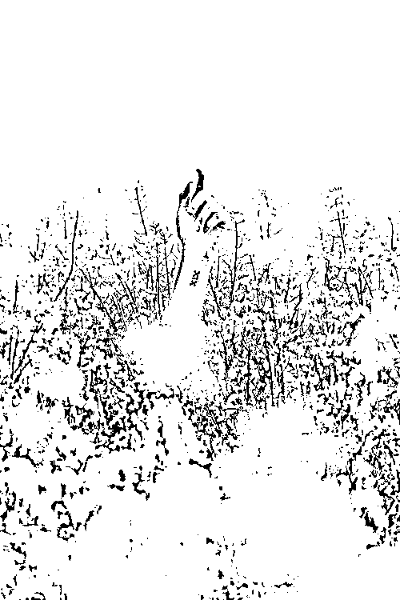此次双子座满月，接纳了双子座月亮和双子座北交点能量的摩羯座水星（水星守护双子座）四分白羊座凯龙星，再次向我们强调**“对结果的考量”和“在过程中成长”**——“我对你错”的较量证明不了价值，“恐惧挫败”的保守疗愈不了伤痛。我们需要**带着敞开的觉知和接纳的心态，听取多元的观点，参考多方的建议，扩展认知并丰富经验**，才能避免好高骛远和盲目自大的虚幻追求，降低闭门造车和偏离正轨的风险，从而将宝贵而有限的精力，投注到更有价值、更有意义的理想目标之中，不断总结经验，不断升级自我。此次双子座满月，提示我们**时刻记住自己是什么样的人，选择成为什么人，记住我们正在从事的东西的重要意义**。只有放下过往主观化的执着和毫无意义的忙碌，才能在 2022 年即将来临之际，抓住重点并拥抱更大的可能性，活在当下并重建未来的生活。**愿我们与所爱的人都在成长**

****

**你当初爱的那个人并不是你最终爱的那个人，爱不是最终目标而是一个过程，借助这个过程，一个人想去了解另一个人。****——约翰·威廉斯《斯通纳》**

> **天象****· 金星逆行：**满月当天，金星于摩羯座开始逆行。**· 金冥合相：**金星与冥王星合相于摩羯座。**· 土天四分：**水瓶座土星四分金牛座天王星。

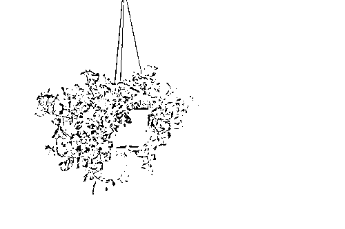

此次双子座满月当天 12 月 19 日，金星于摩羯座开始逆行。此次金星逆行的整个影响周期横跨 2021-2022 跨年的旅程，，长达将近 4 个月之久。

**· 逆行前影响期：**2021 年 11 月 18 日-2021 年 12 月 19 日。

**· 逆行期：**2021 年 12 月 19 日-2022 年 1 月 29 日。

**· 逆行后影响期：**2021 年 1 月 29 日-2021 年 3 月 2 日。

金星的整个逆行影响周期内，金星与冥王星先后 3 次于形成“金冥合相”结构，分别为：**2021 年 12 月 12 日、2021 年 12 月 25 日、2022 年 3 月 4 日。**

金星在摩羯座发生逆行，带来**“回溯历史”**的能量，旧人、旧事和旧情容易在此期间重回或重现，提示我们有些过往的功课还未完结，需要重新面对和反思。

**建议在本次金星逆行的四个月时间里，对“关系”议题保持理性的选择，对“结果”不要操之过急，避免因冲动造成关系的破损。**

3 次“金冥合相”摩羯座，那些“超边的关系和越界的模式”也将在“宇宙超级大 BOSS 冥王星”剥开表象的手术刀之下“揭露真相”，同时，**照见我们自身在关系中“贪图得到的欲望和野心，不能失去的恐惧和占有”的内在阴影。**

2021 年第四季度，很多“关系”开始暴雷，甚至濒临撕裂的边缘。

3 次的“金冥合相”结构，将会**推动再无营养的关系走向完结，引领值得信任的关系更加稳固。**

我们也将在**原有认知一再被颠覆、原有模式一再被反思**的过程中，透过**人际、金钱、市场和商业**几方面的“关系”，学会**以更诚实的视角去面对关系的考验，以更成熟的心态去拥抱自我的真实。**

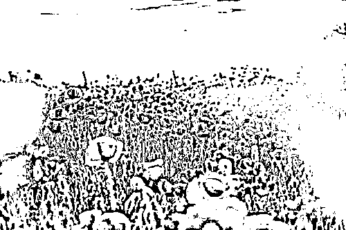

透过“行星能量传导链”，会发现“金冥合相”卷进“土天四分”不破不立的“清算”进程之中：**摩羯座金星→水瓶座土星（土星守护摩羯座）→金牛座天王星（土星和天王星共同守护水瓶座）→摩羯座金星（金星守护金牛座）**

**12 月 24 日，年度重磅天象“土天四分”结构的第三次能量峰值，借由“金冥合相”结构被彻底引动！**“新旧转化”的进程，“不破不立”的过程，“清算”在所难免。

此次双子座满月，介于第一次和第二次“金冥合相”结构之间，向我们宣告——**“清渣”进程正在进行时！**

“关系真相”正在被一一揭露，“历史沉渣”开始浮现眼前，无论人际关系还是金钱关系，无论在私人领域还是金融商海，一切虚假的设定将被撕开：

摩羯座的高阶路径将会引领我们**参与到“关系”擦净泡沫和去伪存真的过程中，找回自我的真实，面对逃避的问题，反思无意识的认知，转化不成熟的模式。**

而“土天四分”的高阶能量将会引领我们**突破原有的主观局限，解锁原有的观念束缚，去追寻更有建设性和创造性的关系模式。**

爱不是最终目标，而是一个过程。最好的爱是——**我们当初爱的那个人并不是最终爱的那个人，因为在“爱”的过程之中，我们都发生了成长与发展。**

那么，请不要期待我们爱的那个人“没有改变”，因为这意味着那个人“没有成长”！希望我们每个人，都能借助“关系”的议题和“爱”的功课，成为更好的自己。

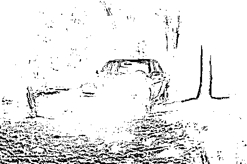

**寄语**

****

**即使不能拥有完美的生活，索性追求完整的自我。****——约翰·威廉斯《斯通纳》**身体承载着所有的记忆。僵硬、疲惫、病痛和憔悴纷纷诉说着内在的感受和岁月的忧伤。就在写这篇满月文的当天，我突患“眼疾”，眼睛红肿不堪，睁不开眼，根本无法确保这篇满月文如期完成。我只能顺势停下脚步，对自己说“宇宙强制让我休息呢”。身体突发的小问题，犹如本次天象的提示：**对于梦想与生活，需要用清晰的选择来平衡两者的关系，才能在迎接下一轮南北交点周期中，更加顺利地践行金牛座北交点的进化之旅。**没有完美的生活，有的时候，完整的自我也需要别人的帮助。故而，我用一只眼睛将这篇文章技术性的框架和分析做完，然后邀请我的学生“香香”帮助我完成这篇文章，我相信她的专业和文字。当然，这篇文章如有不尽之处，也欢迎各位朋友提出宝贵意见。祝愿每一个灵魂安好。祝福大家。

**版权声明**：原创文章由作者授权首发于若道平台，欢迎转发，反对抄袭。友号转载请申请白名单。

****

****想阅读更多作者的文章，****

****请在后台回复******王芝桦****** 即可。****

****王芝桦****

心理占星师，统合疗愈师，占星专栏作者

若道占星“新月和满月”专栏作者，腾讯视频特约占星师

全职于个案咨询与占星教学工作 17 年

**个案预约咨询微信号**：zhihua0621 

**微信公众号**：daoxi-life

**香香菲舞**

影评作者，自由撰稿人，心理占星师

**长按打赏**

****

**学习占星学****点击下图了解课程详情** 

****************

**微信又双叒叕改版啦，不想错过若道君的推送？**

**就把若道设为星标吧！**

**▼**

**喜欢记得点一下在看哦☟**

****报名直达入口****

# 金冥合相，黄金会上涨吗？丨雷蒙德·梅里曼黄金周期 2022 年 1 月报告！

> 原文：[`mp.weixin.qq.com/s?__biz=MzA5NjA0NTAxNg==&mid=2651464059&idx=2&sn=5dc133a91d4753c44646db50f3d891b8&chksm=8b4893ccbc3f1ada5ee182cfcdbd59ef4dd147503110bf7f550337609a6e2573ef98c2f3d2b4&scene=126&sessionid=1692737883#rd`](http://mp.weixin.qq.com/s?__biz=MzA5NjA0NTAxNg==&mid=2651464059&idx=2&sn=5dc133a91d4753c44646db50f3d891b8&chksm=8b4893ccbc3f1ada5ee182cfcdbd59ef4dd147503110bf7f550337609a6e2573ef98c2f3d2b4&scene=126&sessionid=1692737883#rd)

“**黄金是金钱。其他的只是信贷。****——约翰·皮尔庞特·摩根**”

2021 年底，最重要的两个地球宇宙学征象是**12 月 19 日**金星逆行，以及**12 月 24 日**土星和天王星第三次，也是最后一次形成精准的渐亏四分相。**此次金星逆行尤其重要，因为它合相冥王星。**

**12 月 11 日和 25 日，金星与冥王星在摩羯座精准合相。**金星逆行（12 月 18 日-1 月 29 日）通常对应中央银行改变政策，导致货币市场和国债市场产生巨大波动，从而直接影响股票和贵金属的价格变动。

**由于此次金星逆行还合相冥王星，而冥王星也与货币市场相关，这就好像双倍剂量的地球宇宙学能量，引发这些市场的重大波动。**

| 黄金走势日 K 线图

黄金在火星进入天蝎座后有一轮反弹，然后下跌，此时正处于基本周期波谷的时间段，**波谷将在接下来 4 周内出现。**黄金在上涨时未能到达 1920，这是一个有些令人担忧的指征。

**黄金正处于长周期非常关键的节点。**从 2015 年 12 月开始，它处于 23.5 年周期的第三个 7.83 年周期阶段。我们目前还是无法确认 31.33 个月周期的波峰是否已经出现。**黄金还有可能走得更高吗？**

黄金报告已经上线，上证报告即将上线。欢迎了解。也可以按照季度和 1 年期订阅，有更多优惠。季度和年度的好处是，你可以持续了解梅里曼老师对于不断在变化的市场的看法。即便他某一次看法和市场不一致，你也看到在下一期他如何调整自己的看法，并看到金融占星在一个长期时间段内对你把控风险的帮助。而能够长期控制风险、尽量找到安全的投资时机才是投资的长久之计。

点击阅读原文，雷蒙德·梅里曼黄金周期 2022 年 1 月报告带来有 40 年黄金市场研究经验的世界著名金融占星大师雷蒙德·梅里曼对当前黄金市场的研究。

**雷蒙德·梅里曼《2022 年金融年度预报和沙龙》开始预售，和《2022 年四位占星大师天象预测》课程一起购买，可享受连报优惠。**

**投资有收益，投资有风险，希望金融占星学的研究帮助你更好地评估你的投资。**

**长按下图了解详情**
▼

**2022 年 1 月黄金报告上线**

**黄金月度报告价格****单月报告**：280 元/月 **季度套餐价格**：780 元（260 元/月）**年度套餐价格**：2400 元（200 元/月）**双报告年度套餐更优惠（直降 900 元）****12 个月黄金报告+12 个月上证指数报告：仅需 3900 元****长按下图识别二维码购买黄金报告**
▼

**购买者需知**

**① **梅里曼市场时机学院《中国上证指数月度研究报告》是梅里曼市场时机学院（以下简称 MMA）的研究“预报”，而不是市场“预测”，是梅里曼老师及 MMA 金融占星分析师对人类活动周期历史与行星周期之间相关性的研究，二者在大部分情况下具有 80%或更高的相关性，而不是因果关系。报告中的研究完全存在错误的可能性。即便是非常认真的研究和几十年的研究经验，金融占星师无法总是正确地解读出各种征象在实际层面上会如何相互作用，并显化为事件结果。

所以请将报告看作一个研究参考，务必结合其他市场研究和你个人对市场的理解，根据你的自由意志做决策。

**②** 此报告一旦售出，**即不接受退款。**

**③** 上证、黄金月度报告每月固定 1 期，**并非都是在每月相同日期发布。**

**④** **我们收到英文报告的当天，即发布该英文报告。3 天后，上线报告中文版。此报告仅支持手机网页阅读，不支持电脑阅读和下载。****以上须知，请仔细阅读。一旦付款，即视为已了解并接受所有须知内容。**在过去的 40 年中，唯有梅里曼逐渐完善，并在梅里曼市场时机学院月度周期报告中阐释了将地球宇宙学与周期相结合的研究方法，以惊人的精确性预报了黄金价格发生重大变化的时间。**黄金购买 Tip**

各大银行均可购买黄金或黄金 EFT 基金，也可以在诸如天天基金或者支付宝购买黄金及黄金相关产品。不明白的可以百度搜索。

**购买后如何查看报告？**

**购买后有疑问怎么办？**请联系技术客服
**微信：nodoor201705**

**购买黄金+上证报告直达入口**

# 金融占星学大师雷蒙德·梅里曼《2022 年金融预报》开售！

> 原文：[`mp.weixin.qq.com/s?__biz=MzA5NjA0NTAxNg==&mid=2651464059&idx=3&sn=c0a44b7d37217e7c604c47837a556282&chksm=8b4893ccbc3f1ada2cd783619fda57bada3ec3e208dfc1859fa17a6377b9a4920807c9a88319&scene=126&sessionid=1692737883#rd`](http://mp.weixin.qq.com/s?__biz=MzA5NjA0NTAxNg==&mid=2651464059&idx=3&sn=c0a44b7d37217e7c604c47837a556282&chksm=8b4893ccbc3f1ada2cd783619fda57bada3ec3e208dfc1859fa17a6377b9a4920807c9a88319&scene=126&sessionid=1692737883#rd)

1976 年以来，由雷蒙德·A·梅里曼撰写的梅里曼市场时机学院每年一次的年度预报沙龙和每年一本的《年度预报》一直在应用占星学原理为投资者们服务，提供卓越洞见，从未间断。**2020 年，木星、土星和冥王星形成大合相，我们刚刚结束了一个周期和一个时代。现在我们正处于一个新时代和一个新的长期周期的早期阶段。**  如果 2020 年我们还在手忙脚乱，不知道发生了什么；2021 年则更让我们更清楚地看到一个时代结束了——2020 年之前的时代，在新冠肺炎病毒大流行、2020 年”大合相”之前的时代，这是人类历史进程上的一个转折点。**我们所熟知的生活诸多方面在那时就结束了，现在人们仍在试图找出“正确的方式”或“最好的方式”来重建和再造世界。**2021 年，有的行业被彻底摧毁，有的行业成为新贵。2021 年对投资者是一个苦乐不均的一年。尽管美国新冠肺炎疫情未见好转，道琼斯指数仍然扶摇直上；尽管中国经济在世界经济增长中一马当先，上证指数仍然波澜不惊。在货币对标的品种中，老贵族黄金走低，新贵族比特币飞升。我们还看到了大宗商品价格的飞涨，各种短缺开始出现。在中国，各种政府干预市场的调控在各个行业愈演愈烈。**这种现象到底说明了什么？又预示着什么？**2022 年我们的金融市场会受到哪些行星组合的影响呢？我们来看一看：**·** 140 年的木星-土星合相的“风象纪元”在 2021 年刚刚拉开序幕，2022 年我们还将会看到温和主义与极端主义之间存在冲突；**·** 土星四分天王星最后一次成相的影响：专制主义和中央政府控制与个人追求个体的权利和声音的冲突；新能源和旧能源的冲突；**·** 天王星进入金牛座的后半段：包括美元在内的世界货币的重新估价和地位；**·** 土星-海王星的半六分相：新冠肺炎病毒；**·** 水星、金星和火星在 2022 年的逆行“它们对 2022 年发展和增长的影响；**·** 木星在双鱼座（黄道最后一个星座）和白羊座（黄道第一个星座）之间来回移动：战争还是和平；谁是“第一名”的激烈竞争；**· **木星与海王星在双鱼座合相；**·** 冥王星在美国国家星图回归；美国的选择会对全球带来的影响；**·** 月亮交点的换座：月亮交点周期和经济周期的对应；**·** 木星在双鱼座期间金融市场和主要趋势的反转。2022 年仍然是旧世界向着新世界转变的一年。此时，金融市场的投资者和潜在投资者，都需要客观而睿智的思考，而金融占星大师雷蒙德·A·梅里曼的研究则更是无可替代的。1976 年以来，由雷蒙德·A·梅里曼撰写的梅里曼市场时机学院每年一次的年度预报沙龙和每年一本的《年度预报》报告一直在应用占星学原理为投资者们服务，提供卓越洞见，从未间断。去年，这个 3 小时的年度预报沙龙和长达 200 页左右对金融市场的分析报告帮助许多若道的读者做出正确的投资决策，降低投资风险，并获得相当不菲的投资收益。在《2021 年金融预报》中，关于上证指数，梅里曼老师说：对于上证指数，梅里曼老师说：**“我们预计涨势将在 2020 年 12 月-2021 年 2 月之间达到波峰，然后急剧下跌至 52 周和 22 个月周期的低点，这些周期将在 2021 年 5 月之前，甚至在 3 月底之前结束。此后可能会出现另一轮反弹，可能会也可能不会在 2021 年 11 月之前形成第一个 33 个月周期的新高。”**| 上证指数 K 线图关于黄金，梅里曼老师说：**“黄金的 31.33 个月周期波谷将在 2021 年 9 月之前出现，理想情况是 2020 年 12 月-2021 年 6 月。价格目标是 1628+/-109 或 1768+/-76。重叠范围（理想情况）是 1692-1737。如果价格跌破这些范围，则为看涨情况中令人担忧的状况。”**| 黄金走势 K 线图关于白银，梅里曼老师说：**“木星和月亮交点的周期表明，白银的一个重要低点将在 2021 年出现，最有可能在 5 月 13 日之前或 7 月 28 日之后出现。这可能是 5-7 年周期的波谷，但可能会保持在 18.50 以上。收盘低于 17.00 将令人担忧。”**

| 白银走势 K 线图

12 月底，我们将会再次发布梅里曼老师《2022 金融年报》。**2022 年初，梅里曼老师将会照样带来一场精彩的讲座，讨论 2022 年重要的宇宙天象及其对世界经济、金融形势的整体影响，还将覆盖中国上证股票市场的分析、黄金白银市场、比特币市场等投资市场。具体时间我们待确定后会通知大家。****2022 年度预报及沙龙预售**

**价格：****1380 元**

**一份价格仅千元的顶尖金融占星大师的投资分析报告和沙龙，聪明的投资者值得拥有。**

**和《2022 年四位占星大师天象预测》课程一起购买，可享受连报优惠。**

**长按下图了解详情**
▼

**购买者重要须知****①** 梅里曼市场时机学院每年一次的年度预报沙龙和《年度预报》是梅里曼市场时机学院的研究“预报”，而不是市场“预测”，是梅里曼老师及其金融占星分析师对人类活动周期历史与行星周期之间相关性的研究，二者在大部分情况下具有 80%或更高的相关性，而不是因果关系。沙龙中和报告中的研究完全存在错误的可能性。即便是非常认真的研究和几十年的研究经验，我们无法总是正确地解读出各种征象在实际层面上会如何相互作用，并显化为事件结果。

所以请将次沙龙和报告看作一个研究参考，务必结合其他市场研究和你个人对市场的理解，根据你的自由意志做决策。

**②** 此报告一旦售出，**即不接受退款。**

**③** 此报告仅支持在手机网页和若道 APP 上阅读，不支持电脑阅读和下载。**④** 讲座提供视频回放。**以上须知，请仔细阅读。一旦付款，即视为已了解并接受所有须知内容。**

**如在购买报告中遇见任何问题**

**可添加客服**

▼

****购买报告直达入口****

# 深度星座丨当这个智慧的星座陷入阴影之后……

> 原文：[`mp.weixin.qq.com/s?__biz=MzA5NjA0NTAxNg==&mid=2651463954&idx=1&sn=a1c1c1a01a2c7ecc39f9d4a0330fb056&chksm=8b4893a5bc3f1ab34f6f3b91f865f6167c3ae4c9b5e748b1b6bd5b40e4693d98bf9a65641df7&scene=126&sessionid=1692737883#rd`](http://mp.weixin.qq.com/s?__biz=MzA5NjA0NTAxNg==&mid=2651463954&idx=1&sn=a1c1c1a01a2c7ecc39f9d4a0330fb056&chksm=8b4893a5bc3f1ab34f6f3b91f865f6167c3ae4c9b5e748b1b6bd5b40e4693d98bf9a65641df7&scene=126&sessionid=1692737883#rd)

**********************☆ **************后台回复“今日”，给你一句生命态度********
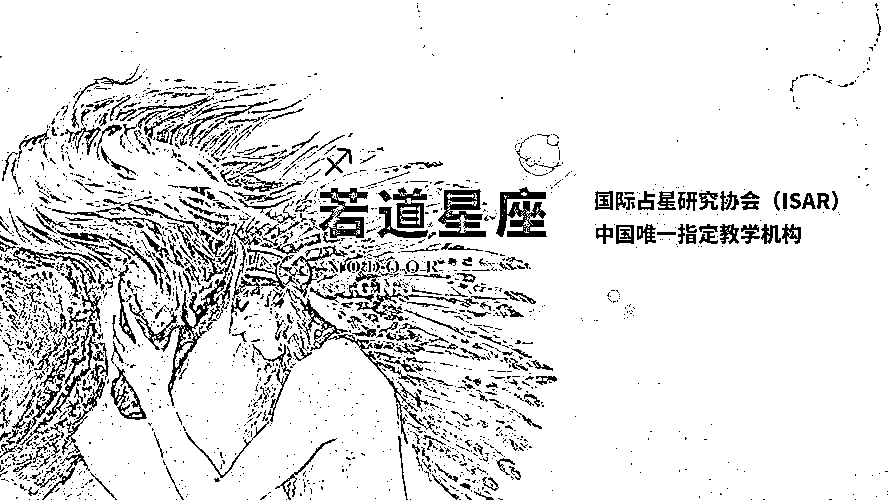作者/杨浠 Vera ISAR 认证占星师
 编辑/翀子 封面/书君 图片/电影剧照作者从电影《宗教的承继》出发，深入射手座的原型世界，探索这个星座对探索的渴望与信念的坚持，从积极层面和消极层面分别描绘了射手座的光明与黑暗，潜能与超越之路。

我从来没有看过一部影片像《教宗的承继》一样，全然纯粹地围绕着“射手座”的原型展开——它将射手座**志存高远、真诚开放、勇于探索的光明面**与其**墨守成规，固执己见、教条刻板的阴影面**完美融合，让观众以一种沉浸式的视角体验到**以宗教为媒介的射手座原型内核**。

这部电影取材自真实的事件，该片围绕 2013 年天主教教宗本笃十六世几乎史无前例的请辞退位，和第一次一位来自欧洲以外的阿根廷枢机主教方济各成为新教宗展开。百年之后回看这段教会历史，必有及其重大和深远的意义。

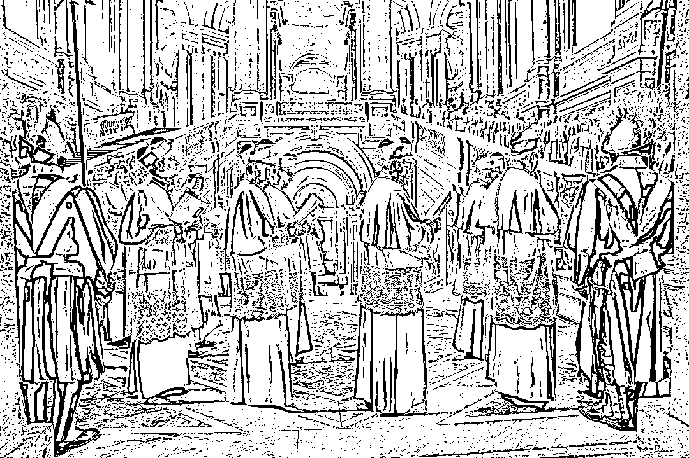

**对立的两面**

影片开始伴随着热情欢快的南美音乐，镜头游走在阿根廷混乱的闹市区，枢机主教方济各就在这样的场景中布道，他一边和民众互动，一边谈到自己最喜欢的足球队，台下的民众大喝倒彩（因为大家觉得他喜欢的球队逊毙了）。

这样一个情境奠定了主人公教宗方济各开放真实又随和慈爱的个性基调。

另一边，世界天主教的中心，富丽堂皇的梵蒂冈圣彼得大教堂，本笃十六世准备着新一轮的教宗选举。作为保守派的代表，他在堕胎、同性恋、神职人员禁欲、跨宗教对话等事项上采取了退缩和保守的态度。

这样两个个性完全相反的主人公就是该片的主角，在我看来，**他们一个代表着射手座豁达开放不拘小节的那面，另一个代表着对于坚守信仰固步自封的那面。**

正是这样两个充满张力的面向，支撑起了射手座原型的两极，**彼此对立又浑然天成地融为一体。**

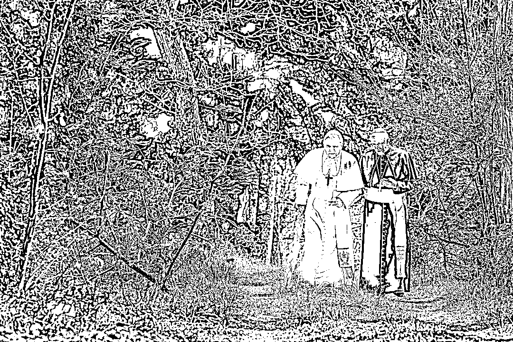

**射手座原型**

在庄严肃穆的选举仪式中，每一位枢机主教都在上帝面前宣誓，将选出符合上帝意旨的教宗。这样的画面呈现出的，**是射手座内心对于真理和信仰的崇高敬意，那是一种可以为之抛下一切去追随的信念与热忱。**

射手座想要触及上帝，在人类层面理解神性。射手座也会被类似的东西所吸引——**广阔的空间、更加美好的未来、无所不知的渴望。**射手的星座符号是抬起的十字和指向天空的箭，这是高等心智在寻求世俗行为和高尚目标的完美结合，**没有意义的生活会让射手座窒息。**

这只黄道上的半人马朝着更高的志向飞驰，超越世俗的围墙，当他用炙热的箭瞄准目标注视着宏大的画面时，他感受到生命本身。

**因此，射手座象征着目标感、进步和发展，以及远大的愿景。**这种愿景，提取自理想、原则和信念的原料。一团召唤、鼓舞、持续的火焰，这团信念之火在射手座的内在燃烧着，激发着他们的信仰之跃。

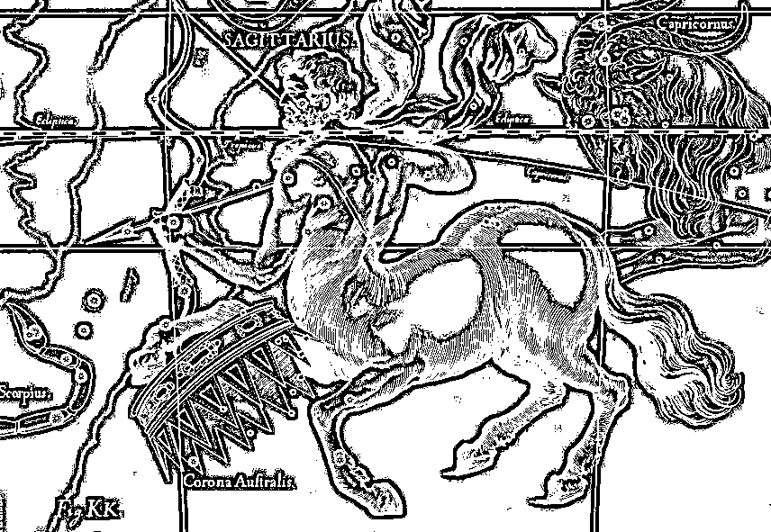

**冲突的显现**

最终本笃十六当选为下一任天主教教皇，而这也意味着，在 21 世纪的今天，天主教将依然秉持反对堕胎、同性恋、要求神职人员禁欲、不提倡跨宗教对话等保守策略。

对于主教方济各来说，这是不可理喻的，他认为天主教不应该离开民众和时代，不停地向前去进化和发展才是出路。但是对于保守派来说，这样的改革提议相当于违背原教旨。

所以主教方济各向教宗本笃十六提出辞呈，他认为如果他不能在核心的天主教内部推动改革，还不如去踏踏实实做一个福利一方百姓的普通神父。

接到主教方济各的辞呈后，本笃十六邀请他去罗马会面，而一心想要辞去枢机主教职位的方济各在受到邀请之前就定好了去罗马的机票，所以在他看来这次的会面是天父安排好的，祂在用这样的方式提醒着他，这将是一次重要的会面。

主教方济各来到罗马，**他的一举一动无不体现着射手座的随性**：与司机同坐第一排，穿着便服。当司机提醒他教宗本笃十六喜欢枢机主教穿正装会见他时，主教方济各开玩笑道：“你有多余的枢机主教帽子借我一顶吗？”**在他看来，所有形式化的东西都是多余的。**

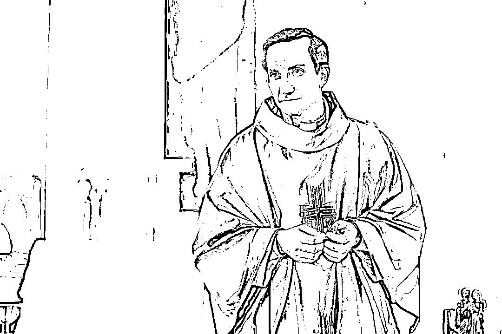

**第一次对谈**

在教宗的夏日别墅，主教方济各与本笃十六见面后，电影正式进入高潮。

本笃十六：“你公开为那些离婚的人主持圣礼”（天主教不允许离婚，而且会对离婚者在宗教方面处以惩罚——禁止所有的圣事。）

主教方济各：“我相信圣礼不是要奖赏品德高尚的人，那是给饥饿者的食物”

本笃十六：“所以你相信什么才要紧，而非教会几百年来的教义。”

主教方济各：“非也，《马尔谷福音》2 章 17 节，我是来召罪人。教会已经教了几千年了。”

本笃十六：“如果我们不画一条线……”（意思是设立界线）

主教方济各：“或建高墙以作区隔。”

本笃十六：“屋子是用墙搭出来的，坚固的墙！”

主教方济各：“耶稣有建墙吗？祂的脸是慈悲的面容，越是罪大恶极的人，就越要欢迎他们。慈悲是炸到高墙的火药。”

这段对话充分体现了双方的立场和个性特质，在保守与开放、律法与慈悲之间展开了激烈的碰撞。但这种鲜明地对立态度却有着相同的内核：**他们都在捍卫着自己所相信的真理。**

**真理是射手座的生命与道路，如果有人胆敢撼动真理，射手座会不惜一切代价与之抗争。**但如果只是“你个人认为的真理”呢？如果射手座并没有看到全貌就一意孤行呢？那将会一场令人唏嘘的灾难。

**所以不时地，射手座需要汲取必要的灵感和动力跨出舒适区，奔向更宏大的图景。**正如电影中接下来所呈现的那样……

此时，年过耄耋的本笃十六的智能手表提示他：Don’t stop now, keep moving, keep moving（要起来活动，不要在原地停留）。导演巧妙地运用一个具体的声音去象征本笃十六此时需要做的，正是在思想观念层面要继续向前，不要墨守成规。

**当信仰与已知的信息之间出现张力，射手座会何去何从？**那些固执守旧缺乏安全感的阴影面会在他耳边低语：不要听那些胡言乱语，否则你就是在背叛自己的信仰！**而更加开放乐观的光明面会跳出来说：先听听他们说了些什么！也许会有我不知道的呢？**

如果射手座需要一句铭记一生的箴言，那么这句话一定是：**不论你知道多少，真相都远不止此。**开放性是射手座永恒的解药，对差异的欣赏能够弥补射手座对确定性的上瘾。

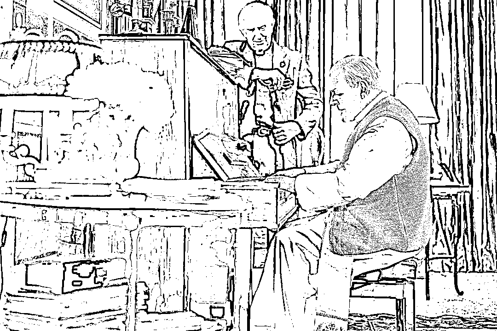

对话继续……

主教方济各：“您的上一任教皇曾经结过婚。” （天主教不允许已婚人士从事神职工作）

本笃十六：“谢谢你的提醒，我还不知道呢！”（反讽）

主教方济各：“教会到 12 世纪才要求神父禁欲；在 5 世纪之前从未有人提到过天使，突然间，天使到处都是，像鸽子一样！自然界或宇宙的事物并非静止不动，连上帝都是。”

本笃十六：“上帝没有变。”

主教方济各：“祂有，祂朝我们走来。”

本笃十六：“‘我是道路、生命、真理！’（引用圣经里的话）祂老是走来走去的话，我们上哪找祂呢？”

主教方济各：“在旅途中？”

有一条真理在很多宗教中都有提到，那就是：**唯一不变的，就是一切都在变。**佛学称之为“无常”；圣经中，所罗门王的戒指上刻着“这也是会过去的”。再一次，射手座象征的真理在他们的对话中闪现。

他们一边走一边聊天，过了一个花园门洞后，本笃十六说到：“花园这边我不熟，这是哪里？”这里导演再次藉由本笃十六对于自家花园并不熟悉的具体情境，象征出他在观念层面对于新事物的陌生，寓意着他需要了解和学习新的东西。

**射手座的原型含义就是通过收集不熟悉的体验来扩展意识，**扩展就是射手座的血液。想象一个像射出去的箭一样飞驰的人，他不断向前奔跑，追逐地平线，看到更多、更多、更多。这就是射手座的使命。**他不能停留在原地，无尽的探索和追寻就是他的生命道路。**

射手座以对未来热衷而著称，那么什么是“未来”？未来是不确定性、是未知，是无止尽的新奇与冒险。**一旦射手座觉得自己已经掌握了全部真理而停下，他就会显示出这个星座的阴暗面——固执。**

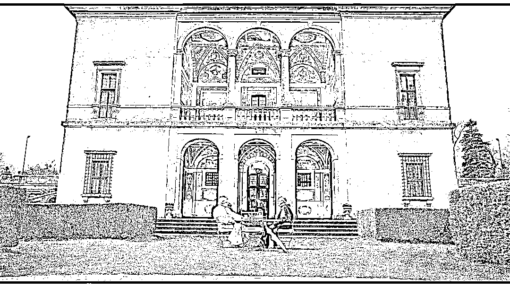

对话继续……

主教方济各：“我们这些年都在针对离婚、避孕、同性恋等议题训诫那些不同意教会立场的人，与此同时，地球正在遭到破坏、不平等如癌症般蔓延，而我们却在担心用打丁文主持弥撒是否妥当！我们筑墙困住自己，而且一直以来，自始至终，真正的危机都在内部！就在我们里面！”

本笃十六：“你在说什么？”

主教方济各：“您应该知道我在说什么。我们早知道有神父、主教，教会的重要人物侵犯儿童。我们做了什么？”（2014 年 2 月 5 日联合国方面就娈童案发表调查报告，对梵蒂冈暨罗马天主教廷进行了极为猛烈的抨击。）

本笃十六：“我们正在处理。”

主教方济各：“我们聆听他们的忏悔，将他们调到其他教区，他们在那里又重新开始。”

本笃十六：“我们相信只要他们忏悔……”

主教方济各：“我们相信这样比较有利——宁可让九个小孩受苦，也不能让九百万人因为丑闻失去信仰？！”

本笃十六：“当然不是！太可笑了！”

主教方济各：“这话是一名主教跟我说的！”

本笃十六：“你怎么回答他的？”

主教方济各：“我叫他将那神父免职，立刻举行教会审判。我不相信神父讲几句神奇的话，就能让一切恢复。”

本笃十六：“神奇的话？圣礼被你讲得无足轻重！”

主教方济各：“忏悔能净化罪人的灵魂，可是没有帮到受害者。罪过是伤口，不是污点，它需要治疗和愈合，只有赦免是不够的！”

**射手座的行动是无尽的探索和追寻，那么终点在哪里？目标呢？——真理。**不是宗教的形式与外壳，是真理本身！不是指向月亮的手指，是月亮本身！佛陀与耶稣并不想创立一个以他们为中心的教派，他们只是用生命活出真理。

一旦射手座找到了他的神，他的行为就应该像是行星绕太阳旋转的轨迹一样可以预测，但知道与做到的距离并不像看起来那么近，**并非所有的射手座都能够将自己的言行与所知的真理合二为一。**如果这事很容易，人类历史上应该会出现更多耶稣和佛陀这样的圣者。

是什么阻碍了射手座活出真理？答案也许在一个人整体的星图之中，或者说，在人性之中……

知行合一是一个老生常谈的话题，而这也影射出射手座的另一个阴影面：**活在道理和理论中**，如果再加上另一层阴影：**自以为是**——灾难就发生了——我们会看到一个说起话来头头是道的“纸上谈兵的哲学家”，但在面对真实的生活时，却漏洞百出不堪一击。

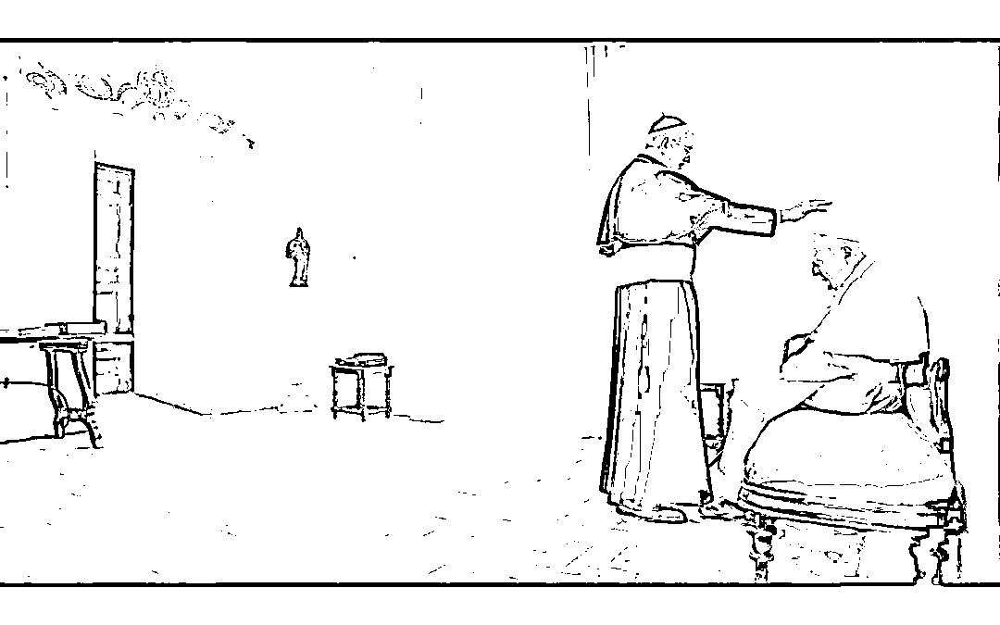

**第二次对谈**

主教方济各与本笃十六的第二次见面在梵蒂冈圣彼得大教堂的前厅，是游客可以进到的地方。导演将这两次重要的会面分别安排在本笃十六的夏宫与圣彼得大教堂的前厅似乎也别有深意——

第一次对话在本笃十六的内心（相对私密的夏日别墅）埋下种子，第二次对话他将这颗种子带给世界（众人都可以进到的大教堂的前厅）……

在空旷的圣彼得大教堂的前厅。

本笃十六：“我从没在没有任何人的时候来过这里。”

主教方济各：“如果我当教宗的话会天天来。”

本笃十六：“还有呢？”

主教方济各：“什么？”

本笃十六：“如果你当了教宗，你会做什么？”

本笃十六的固有观念开始松动了……

主教方济各：“如果是我的话，我不会独自用餐（本笃十六总是独自用餐），你知道，耶稣总是剥饼喂食民众。”

本笃十六对主教方济各说出他准备辞去教宗职位的决定，因为他觉得自己并不能胜任。并且说到，之前阻碍他辞职的一个原因，就是他担心教会会推选主教方济各做教宗。然而在他们上次会面之后，他改变了态度——

现在除非确定主教方济各能被推选为教宗，否则他不会辞职。因为教会需要改变，而主教方济各就是那股推动力。

当他们一起回溯主教方济各的过往时，主教方济各对自己所做过的贡献略感欣慰，本笃十六说道：

“我要告诉你一件小事：我们都为属灵傲慢所苦。**你一定要记住，我们不是上帝，**因为我们生活、行动、存在都在祂之内。**我们在上帝内，但我们不是上帝**。我们只是一介凡人。”

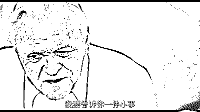

**直面阴影**

**这是射手座能说出的最动人的话，因为他看见并直视着自身的阴影——****自大与傲慢**。因着他对于真理与神性的追逐，他很容易将自己认同为神，这是射手能做的最可怕的事，**以神/真理/正义的名义去彰显自我。**想想人类历史中那些因为宗教迫害而死去和受苦的人们……

换做本笃十六忏悔时，他说道：“我有愧于你，上帝，我应该爱你胜于一切。我从小就辜负了你，因为我没勇气体验人生的滋味，而是埋首书堆苦读，我现在明白这么做，让我对世界一无所知……而世界正是教会要帮助的对象。”

再一次，**射手座对阴影面的自省：用道理取代体验，用经验取代事实**。这些都是自大的产物，由自以为是的傲慢所产生的无知与偏见。

当射手座对自己的阴影保持着时刻的觉察和绝对的诚实，那么进化的大道就会畅通无阻地在他面前铺展开来——

**对陌生的思考方式和不熟悉的体验保持敞开**，无论这与他已知的真理多么大相径庭；超越由多经广见带来的优越感，时常提醒自己，我不是全知全能的神，这世间永远有可以让我学习的东西；他清楚偏见和评判都是因为无知，所以能够耐下心来倾听他人的想法；他知道没有什么是绝对的，不同的立场和角度能够衍生出不同的结论，真相永远在人群中间，而非某个人那里……

**不断深化和修改自己对生命的看法，才能让射手座抵达他想要成为的模样：智者。**

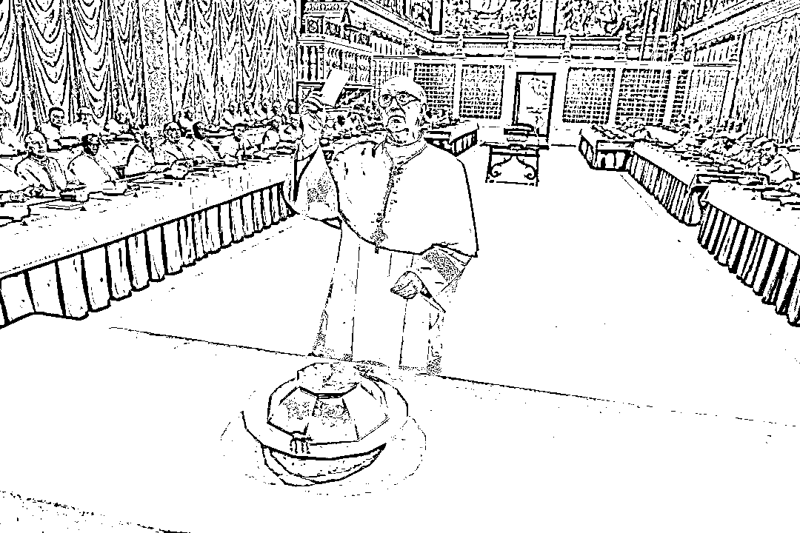

**智者**

他继续说：“打从我儿时起，我始终感受到神与我同在。我终其一生都孤家寡人，但从未觉得孤独，却在此时感到寂寞不已。但就这两天我听到了祂的声音，我怎么也想不到祂竟然用那个声音说话……你的声音。”

这时，大教堂前厅涌入了大量游客，本笃十六第一次没有保安的护送，独自走入民众中间，他在民众的欢呼和拥戴中微笑着，也许他从未像此时一样感到与上帝如此亲近……

本笃十六做到了。乍一看，也许会觉得本笃十六是一个典型的保守派，但 86 岁的他没有一意孤行，他一边抗拒着，却也一边聆听着主教方济各的每一句话。

他没有捂住耳朵回避挑战，**他直面了自身的阴影，并成功地超越了它。**这岂是一位保守者所能做出的举动？他是一位真正的勇士。

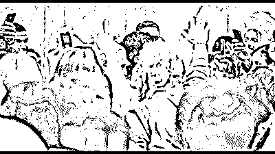

要知道，生而为人的常态是，越年长越难以改变和接受新的事物，而本笃十六能够在耄耋之年做出如此之大的自我超越，在我看来简直就是人性的奇迹！他无疑是射手座的典范和榜样。

他虽然行动不便，却没有停下进化的步伐，他勇敢地离开了舒适区，用他的话：“这不是妥协，是改变。”

当他发现自己一生都躲在学者的身份后面时，他决定从那里出来，走进人群，走进生活本身。当他听完教方济各与他相反却充满人性关怀的观点后，他做出了明智的决定，从教宗的圣座上离开，将位置让给更能胜任它的人。

**最终，他成功地完成了射手座的经典绝技：信念的飞跃。**

也许这部电影也可以被叫做：一位八十六岁老人的冒险之旅！**射手座的冒险不只是空间物理层面，更重要的是在心智和观念中，这是一种更加振奋人心的改变！**

最后，我想以本笃十六的著作《真理中的爱德》中的一句话作为这篇文章的结尾：

**真理或许至关重要，但如果没有爱，它将难以承受。**

**祝愿每一位正在寻找生命意义的人，都能够找到并将它活出。**

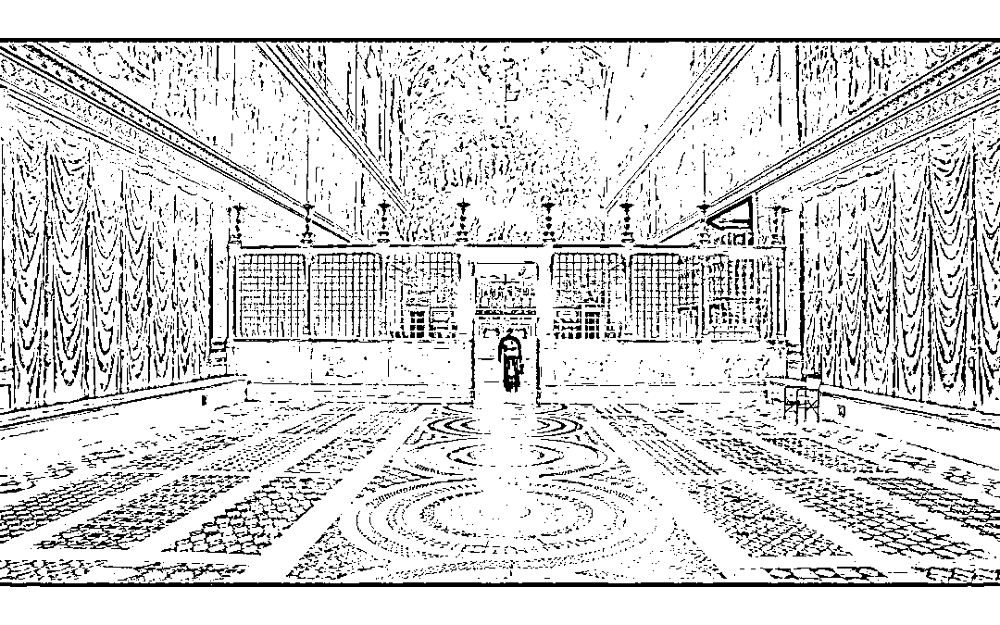

**后记**

第一次和第二次看着部电影的时候，我都全然站在主教方济各的阵营，直到最近为了写这篇文章第三次观看，我才读懂本笃十六的可贵之处。

本着天蝎座的钻研精神，我去挖掘了本片编剧安东尼·麦卡滕的简介，发现他的代表作几乎都是真实人物传记为主线，例如讲述丘吉尔与纳粹妥协历史的《至暗时刻》、讲述皇后乐队传奇主唱弗雷迪·莫库里的《波西米亚狂想曲》、讲述霍金与简的关系的《万物理论》（这部电影的编剧之一甚至就是简·霍金）。

所以我认为这部《教宗的承继》中的刻画和描写应该是很大程度还原了教宗方济各与本笃十六的真实互动经历，而这也可能正是该片引人入胜的原因之一，更不用说两大主演安东尼·霍普金斯与乔纳森·普雷斯令人叫绝的飙戏环节……

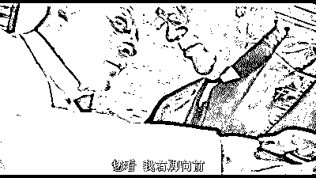

**原型永远超越一切具体的表现形式，所以这部影片显然无法覆盖到射手原型所有的面向**，例如射手座的另一个阴影：**盲目乐观和过度扩张**——容易轻信会让射手座对危险和黑暗放松警惕，没有约束会让一个射手座在狂笑中跌入悬崖。

**人性的复杂性永远难言其尽**，射手座需要用黄道中与其产生四分相的星座特质去平衡自身的盲点——双子座的开放多元、处女座的谦卑谨慎、双鱼座的无我无执。如果非要说出射手座所有的解药与制衡点，那么也许答案是：其他所有十一个星座……

**版权声明：**原创文章由作者授权首发于若道平台，欢迎转发，反对抄袭。友号转载请申请白名单。

**杨浠 Vera**

ISAR 认证占星师（2017 年获得）

全职心理占星师，若道 COAC 高阶学员（2012 届）

咨询时长已达 800 小时

**占星咨询微信号：**haloace（请注名占星咨询）

**微信公众号：**verandu

长按打赏

**学习占星学****点击下图了解课程详情** 

****************

**微信又双叒叕改版啦，不想错过若道君的推送？****就把若道设为星标吧！****▼**

**喜欢记得点一下在看哦☟**

********报名直达入口********

# “你正在寻找的东西也在寻找你” | 冬日野骨·荒野一日仪式招募中

> 原文：[`mp.weixin.qq.com/s?__biz=MzA5NjA0NTAxNg==&mid=2651463954&idx=2&sn=ecc009bbda3e4309ce4b69395725c965&chksm=8b4893a5bc3f1ab328052869d85c1bb33ce3e33864175c569775b68124e62050270a3fbaef19&scene=126&sessionid=1692737883#rd`](http://mp.weixin.qq.com/s?__biz=MzA5NjA0NTAxNg==&mid=2651463954&idx=2&sn=ecc009bbda3e4309ce4b69395725c965&chksm=8b4893a5bc3f1ab328052869d85c1bb33ce3e33864175c569775b68124e62050270a3fbaef19&scene=126&sessionid=1692737883#rd)

****

**与大自然的灵感力量联结，让你的内在智慧从骨头深处升起。**
**你正在寻找的东西也在寻找你。****——鲁米**这是在新的一年来临之时你可以送给自己的礼物。与另外 7 个伙伴一起，与大自然的灵力相联结，找到内在智慧和野性力量。

1

**适合对象**

**·** 希望自己的生活更有方向感**·** 正处于人生的过渡阶段，正在寻求指引**·** 已经准备好放下那些不再服务你的事物**·** 想要勇敢地联结你的野性力量**·** 想要融入自然界的安宁与美之中，为静谧的智慧留出空间

2

**课程描述**

“冬日野骨”一日工作坊，我们将一起走进大自然和寂静的冬日，在这里，你也许会感知到灵魂在召唤你进入更深的地方，去认知你生活中的转折点，或者去寻找对特定问题或者挑战的洞见与支持。 当你进入冬日时节，在霜雪寂静中，在雨水的气味中或者在自己寒冷的皮肤上，有什么样的智慧在静候着我们？也许你很好奇，那些光秃秃的树木在你的内在召唤什么？鸟儿们低缓的旋律又在如何帮助我们放慢下来？当你放弃一点点安逸，站在冬日之歌的中心时，什么会照亮你的内心深处？**冬日是一个沉思和反省的时刻，是为你自己、家人和后代带来智慧的时刻。**据说我们都是带着独特的天赋降临在这个世界上的，这就是我们灵魂的目的，但是灵魂又在哪里呢？在许多的神话、民间传说和文化当中，“骨头”被认为是灵魂的居所。**“冬日野骨”之旅将邀请我们进入荒野，去发现自己的“骨子”中深藏着什么，借此我们可以洞察到什么样的智慧想要作为我们的天赋显现。**

在这个“冬日野骨”一日工作坊中，我们将遵循传统仪式的三个阶段：**分离、门槛以及融合。****·** 工作坊开始时，我们将围成一圈，敞开心扉倾听，探索我们的意图；**·** 之后我们将走出这个圈，进入你自己的个人体验（分离）；**·** 跨越门槛，我们向进入神圣临界空间之前的过渡区域表达敬意，你将在那里与大地对话。**·** 穿过门槛返回到圆圈当中，分享在大自然和冬景的神秘中发现的启迪。（融合）

****

**一颗种子必须被冻结在自己的意图之中，然后才能打破冬天的桎梏，喷出绿色的火焰。****——史蒂文·福斯特**

3

**时间安排**

**（建议参与者当天禁食，我们将在您报名后发送准备说明）****9:00 **开幕式，分享当天的概况以及安排（10 分钟）分享关于如何构造一个门户（20 分钟）**9:30 **在线登入，参与者介绍自己的名字和来自中国的什么地方，并分享童年时期与大自然的美好体验你今天想要探寻什么？我们会帮助大家澄清今天的意图。为了今天的探寻，你准备好放弃什么，臣服于什么，放下什么？（每人可以携带一块石头或者天然物品，例如羽毛、树叶来标记自己的意图）**11:00 **指导大家如何保持意图、如何探寻（15 分钟）**11:30 **参与者前往大自然中静谧的地方探寻（3 小时的探寻结束之后，我们会提供一些日志问题）**15:00 **参与者返回，欢迎大家归来**15:10 **参与者分享他们的自然之旅，我们会提供一些支持，帮他们澄清自己的经历和所获得的洞见**17:00 **闭幕式

4

**带领老师**

** Toni McErlane**

我来自新西兰，拥有社区和人类服务—咨询康复学士学位，是 Aminz 的注册家庭纠纷调解人，也是 NVC Aotearoa 的 NVC 培训师。

在我的生命中，我一直对真诚、充满活力、自我负责的沟通和有意识的选择充满激情。而我的人生旅程为我提供了充足的机会，让我去探索、研究、反思和完善这在沟通中是什么样的。

在我的工作坊中，我的原则和实践都是建立在非暴力沟通和正念的哲学基础之上。非暴力沟通是由美国心理学家马歇尔·卢森堡博士所开发的。马歇尔的目标是发展出一种语言，这种语言受到印度巴利语中的“非暴力主义”（Ahimsa）一词的启发，它的意思是“没有伤害”。我们怎样才能在与他人沟通时不造成伤害呢？这不仅需要非暴力沟通的技巧，还需要在训练中融入正念。正念是受小乘佛教内观传统的启发，发展觉知和接纳，关注和允许。在我们的工作坊中 ，我们将非暴力沟通和正念编织在一起。

我致力于以这种沟通和处世方式作为我日常与人互动的基础。我曾经学习了为期一年的北美非暴力沟通领导者项目，在加州湾区非暴力沟通的全年浸入式项目中做了两年协助工作，然后在索诺马县女子监狱推动非暴力沟通培训。同时，多年来我持续参加内观静修，致力于继续和发展这种实践，并把它融入自己的工作坊中。

2020 年疫情期间，我与丈夫和我们的猫在游艇上休了一年假。现在，我和丈夫还有 15 岁的侄女在新西兰南岛的达尼丁生活。我在那里从事心理咨询、冥想和生态心理疗法。我们还正在那里慢慢建立一个治疗静修中心和生态冥想社区。

过去四年，我曾两次来中国，与若道及其友好而充满活力的团队分享非暴力沟通，并参观了一些绝佳风景。我期待继续与若道合作，在网上分享我的知识和技能。

向上滑动可查看更多

5

**工作坊详情**

**精品小班工作坊，仅限 8 人参与，迎接新春。**
**工作坊时间：**1 月 22 日 9:00-17:00**工作坊价格：原价 1580 元/人，****二人同行价 1380 元/人**咨询报名请联络：李老师长按二维码添加课程负责人咨询~****冬日野骨·荒野一日仪式****

**授课老师：**Toni McErlane

**授课时间：**2022 年 1 月 22 日

**授课方式：**网络课程**，**英文授课，中文翻译

**费用：****原价 1580 元/人，二人同行价 1380 元/人**

**课程负责人：****李老师**（请备注“冬日野骨”）

长按二维码添加课程负责人咨询~

******报名直达入口******

# 2022 年天象预测课 | 不容错过！四位国际占星大师为你详解明年天象（内含联报优惠）

> 原文：[`mp.weixin.qq.com/s?__biz=MzA5NjA0NTAxNg==&mid=2651463954&idx=3&sn=875d70aa101406d35de5ba38e46e3654&chksm=8b4893a5bc3f1ab3c75dd37a0025e17a2f371340102f10a56b0ec14f8f441a7a1d4dcb27ebb8&scene=126&sessionid=1692737883#rd`](http://mp.weixin.qq.com/s?__biz=MzA5NjA0NTAxNg==&mid=2651463954&idx=3&sn=875d70aa101406d35de5ba38e46e3654&chksm=8b4893a5bc3f1ab3c75dd37a0025e17a2f371340102f10a56b0ec14f8f441a7a1d4dcb27ebb8&scene=126&sessionid=1692737883#rd)

2021 年已接近尾声，忙碌的年末工作也挡不住我们对来年的盼望和期许。作为占星师，在年初跟随权威老师透彻地学习 2022 年重要天象的含义和影响，是迎接新的一年的正确姿势，仪式感满满！为新一年的自我规划和占星事业加油充电。**若道邀请了金牌核心课中的四位国际名师再次集结，在明年 1 月 8 日、9 日带来 2022 年重大天象的深入解读：**********

**讲师是谁？**

**琳恩·贝尔**

**（Lynn Bell）**

**· **世界最受欢迎的占星学演讲者、作家和老师之一。定居巴黎，研究心理占星学和家族模式数十年； **·** 著名的心理占星学中心（*Centre for Psychological Astrology*）的长期导师。2016 年，获得查尔斯·哈维（Charles Harvey）杰出的占星学服务奖；**· **作为一个从多个层面进行工作的占星咨询大师，琳恩的工作结合了心理学的观点。她对家族模式的兴趣首先来自与客户的合作。通过在分析领域所做的个人工作，她所受的埃里克森催眠训练将她引领至家族系统。后来，她组织研究小组在家族星图上进行了数年的研究。她写的《家族占星学》就是这项研究的结果；**· **法国心理占星学协会的会长。除了占星学，她在法国沙特尔的新沙特尔学校任教 8 年，还 5 次获得了在《纽约时报》畅销书作者卡罗琳·迈斯（Caroline Myss）的卡罗琳·迈斯教育学院（*Caroline Myss Educational Institute*）合作教学的机会。

**艾德里安·罗斯·邓肯**

**（Adrian Ross Duncan）**

**· **1971 年在印度游学时开始学习占星学，1985 年开始成为全职占星师，迄今执业已超过 33 年，是人本主义占星学、卜卦占星学和经世占星学领域的知名占星师。他还开发了占星软件 AstroClock 和多款占星报告；

**· **哥本哈根占星学院院长；

**· **他在日常咨询中经常运用卜卦，咨询图（卜卦的一种运用方式，即根据客户来访时间制作星图，从星图中获得大量信息）也是他特别擅长的领域；

**· **艾德里安·罗斯·邓肯从 1971 年开始研习佛学，受佛学影响很深，他相信占星学和佛学观点一致，转化的一个基础是在于对现实感知的改变。而卜卦很容易与佛教融合，因为它只关乎当下。

**克里斯蒂娜·罗登贝克**
**（Christina Rodenbeck）****· **克里斯蒂娜·罗登贝克（Christina Rodenbeck）是一名全职职业占星师，在牛津大学城生活和工作，深受周围知识和文化氛围影响；她拥有伦敦大学（*University of London*）的人文荣誉学位，曾在伦敦占星学馆（*Astrological Lodge of London*）、心理占星中心和占星研究学院学习；**· **作为一名占星师，在过去的 20 年里，克里斯蒂娜在她的网站“牛津占星师”上写了大量关于时事、艺术和文化的文章；她每月主持一个占星播客：“与克里斯蒂娜和萨莉一起占星”，并定期在《占星杂志》(*Astrological Journal)*上撰写时尚专栏；她定期在英国授课，并保持着蓬勃发展的专业实践。

**大卫·瑞雷**

**（David Railey）**

**· **若道联合创始人，致力于在中国教授和推广西方占星学；

**· **曾任 ISAR 全球副主席，CAPISAR（ISAR 职业占星师资质认证机构）主席；

**· **1976 年，通过亚特兰大职业占星师考试，成为全职占星师，随后通过 AFAN 和 ISAR 职业测试；

**·** 1980 年，与杰夫·焦耳一起在亚特兰大创建“每日行星”占星学中心。此后在亚特兰大占星协会担任 4 年考官，并且两次担任亚特兰大地区占星协会主席。1979-1992 年，作为占星师活跃于美国社会媒体，向不了解现代占星学变化的大众宣传专业占星学知识。在 1989-1992 年期间，他在 WRGG 电台 12 频道每周主持个人电视秀“今日占星学”，早先他还在 WRFG 的广播节目中播讲宇宙天气节目；

**· **2010-2014 年，任全美占星师联盟监督委员会委员；

**· **2010 年，其著作《灵魂的目标》中国版出版，和蒋颖一起创办若道占星学校和其官网 www.nodoor.com；

**· **2017 年，被选为 ISAR 委员会成员。ISAR 是世界最大的国际占星机构，会员遍布 45 个国家，2017-2020 年曾任 ISAR 全球副主席、CAPISAR（ISAR 职业占星师资质认证机构）主席。

**课程价格****正价**：3000 元**限量优惠价：2022 元**（前 60 名报满截止）**（联系 Maggie 老师，抢占限量优惠价）******联报套餐：《2022 年度天象预测大师课》+《2022 年金融占星预报》联报优惠价****2999 元****（限前 50 名联报）****（联系 Maggie 老师，抢占限量优惠价）**长按二维码添加 Maggie 老师获取联报优惠价**退转课程**

**· 退款原则请详看《教学协议》，如有疑问请咨询课程顾问。**

****2022 年度天象预测大师课****

**授课老师：**琳恩·贝尔、艾德里安·罗斯·邓肯、克里斯蒂娜·罗登贝克、大卫·瑞雷

**授课时间：**2022 年 1 月 8 日-9 日

**授课方式：**网络课程**，**英文授课，中文翻译

**费用：**3000 元**；****限量优惠价：2022 元（前 60 名报满截止）；****联报套餐：《2022 年度天象预测大师课》+《2022 年金融占星预报》联报优惠价：****2999 元****（****限前 50 名联报）**

**课程负责人：****Maggie 老师**（微信：18510107057，请备注“天象预测大师课”）

长按二维码添加课程负责人咨询~

****报名直达入口****

# 重磅天象丨不容忽视的金星逆行！它来了！

> 原文：[`mp.weixin.qq.com/s?__biz=MzA5NjA0NTAxNg==&mid=2651463858&idx=1&sn=5fa7d56ad7c90962c4be437ddab50bc8&chksm=8b489205bc3f1b1300112babcbd1470dbc0ceee8ed951cd4f9659a24c63b94a83636793efb51&scene=126&sessionid=1692737883#rd`](http://mp.weixin.qq.com/s?__biz=MzA5NjA0NTAxNg==&mid=2651463858&idx=1&sn=5fa7d56ad7c90962c4be437ddab50bc8&chksm=8b489205bc3f1b1300112babcbd1470dbc0ceee8ed951cd4f9659a24c63b94a83636793efb51&scene=126&sessionid=1692737883#rd)

******☆ ****后台回复“今日”，给你一句生命态度******

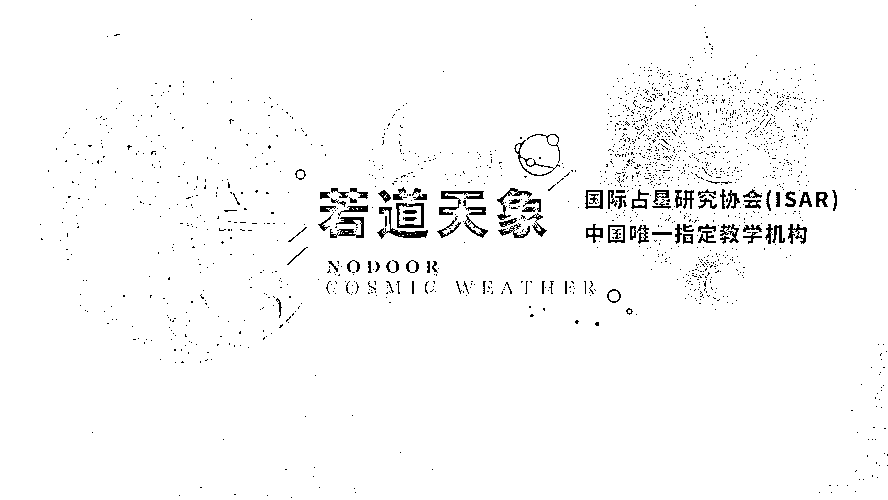

作者/Justine ISAR 认证占星师
编辑/翀子 封面/书君 图片/网络

2021 年 12 月 19 日 18 点 35 分，金星在摩羯座开始它为期 41 天的逆行，它从摩羯座 26 度逆行摩羯座 11 度，引领我们在关系与金钱领域进行认真反思，重新审视什么是“值得的”，去实现一个坚实有保障的美好未来。

在过去 200 年的土象时代，行星逆行比往常更不受人欢迎。更高、更快、更强是土象时代的典型目标——创造更多的物质价值，效率高于一切，想尽办法寻找最优解。如果需要停下来、往后看，往往是令人烦躁不安的。

**2020 年 12 月 21 日，土木合相水瓶座 0 度，开启了新的风象 200 年。**

**至此，整个世界的价值观已经开始急剧变化。**疫情让一切停滞不前，土象的“线形”思维不再如以前那般奏效。一些人开始意识到：在做某事时休息一下，是非常重要的。**风象时代注重创造力与好奇心，当一个人停下来的时候，其实依然在接受信息，而且是非常有创造力的阶段。**

在风象时代，行星逆行会不会更容易被接受？我想是的。

以这样的视角，我们来看 2021 年 12 月的摩羯座金星逆行。

**金星代表爱情、吸引力和金钱，我们的审美品味，以及对生活中人和物的价值的基本信念。**

**金星逆行大约每 18 个月发生一次，持续六周左右（40-42 天）。**无论是当下处于时代巨变的十字路口，还是个体正在经历的价值观转变，我们都亟需金星逆行带来的反思与重建。

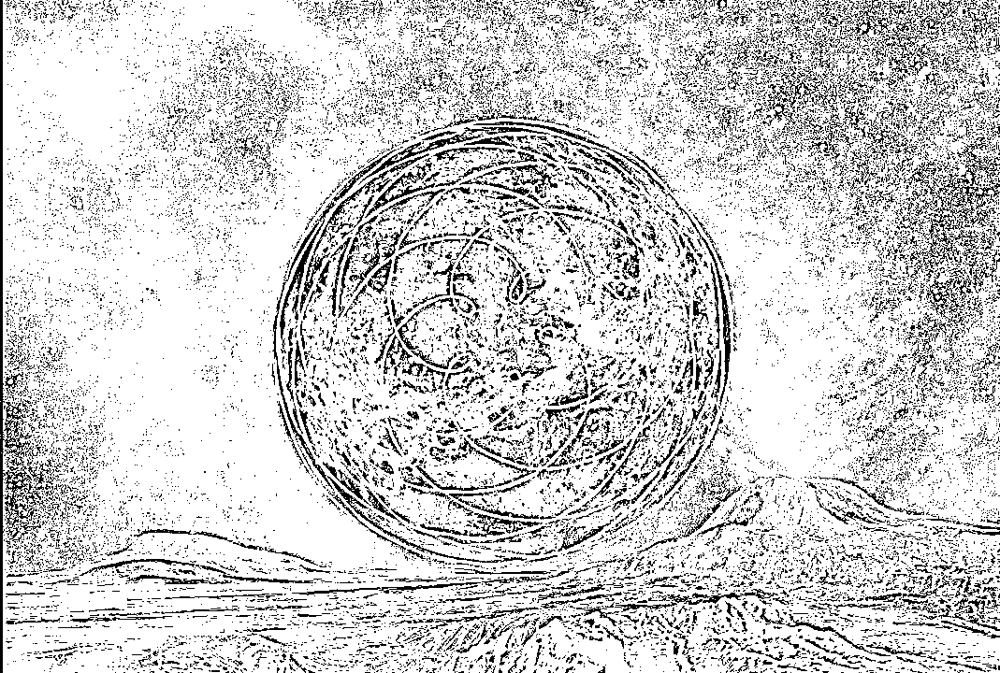

**摩羯座的金星逆行**

**这次金星逆行会持续 41 天的时间，从北京时间 2021 年 12 月 19 日 18 点 35 分，从摩羯座 26 度开始逆行，到 2022 年 1 月 29 日 16 点 45 分，在摩羯座 11 度顺行。**

摩羯座是强大而雄心勃勃的星座。它不那么懂得关系中的柔情蜜意，**对爱情没有幻想，更多擅长克制、严肃并拒绝诱惑**；在最糟糕的层面上，甚至可能出现**拒绝、痛苦、不被爱**的感觉。

**成熟的摩羯座金星，会在关系中带来承诺、誓言与自律**——“无论是顺境或是逆境，富裕或贫穷，健康或疾病，快乐或忧愁，只有死亡才能把我们分开。”

**在金钱财务的面向上，摩羯座金星非常有辨识力、训练有素。**这是一个相信“没有面包就不配有爱情”的星座。摩羯座会重视**实际与持久**的价值，去努力实现一个**坚实、有保障**的美好未来。

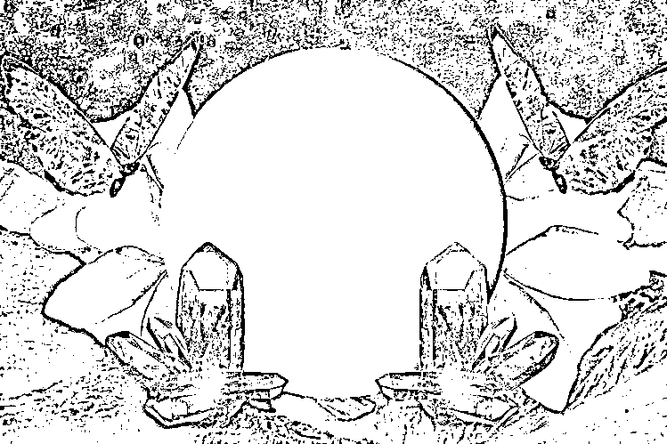

因为逆行，金星这次会在摩羯座呆长达五个月时间（2021.11-2022.3）。**这会带来哪些影响呢？**

**关系**

**这段时间内，****我们更对严肃的关系感兴趣**，比以往更看重伴侣成熟、稳重的特质，而不是外在、美貌或甜言蜜语。

某些关系会受到挑战，某些关系会有喘息的机会。**如果进入新关系，建议慎重考虑**（后面会详细展开）。

**金钱财富**

**从金钱财富的层面，摩羯座金逆会鼓励我们把金钱、资源花在经得起时间考验的地方。**

过去的一年，国家加强了对房地产、教培和互联网等行业不同程度的监管。2022 年，会进一步搓破原本泡沫化的东西，继续强调实体经济。**大家对暴力型、灰色产业、炒作营销拉动的行业的投资会更加谨慎，同时收紧不必要的花销和开支**——“赚钱更难了”会是老百姓普遍的共识。

金星摩羯座的能量，**会促使我们对投资与花销更有计划、更落地、更务实，**并根据各自情况调整资产配比与结构。

**什么是真正“值得”**

**金星逆行会让我们重新审视什么真正“值得”。**你也许会评估自己投入时间、精力、承诺和金钱的工作、项目或关系，是否给了自己带来了认为值得的回报。

金星逆行提供了极好的“反思”的契机，在关系中更是如此。金星是一面镜子——**我们在爱里的选择，其实就是我们对于价值的无意识陈述。**

在过去的一年里，你对爱情和人际关系的理解发生了怎样的变化？你哪里成熟了？你对自己（或你的伴侣）做出的新承诺是什么？

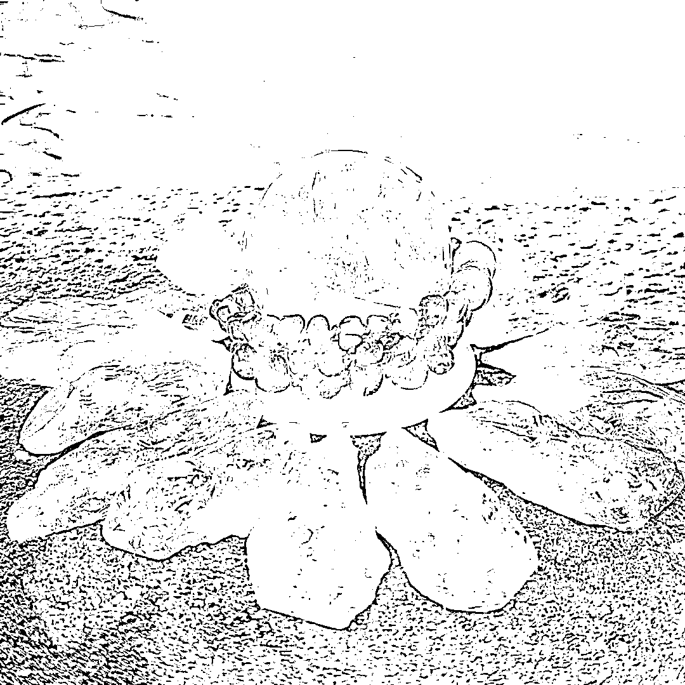

**本次金星逆行的独特之处**

金星有一个迷人而复杂、但非常可预测的 5 倍模式的逆行周期——即每 18 个月逆行一次，每 8 年重复一次。**上一次金星逆行在摩羯座是在 2013 年 12 月 22 日，**逆行始于摩羯座 28 度（每八年逆行的起点，会很有规律的往后退 2 度）。

**你可以回顾下 2013 年 12 月-2014 年 1 月的摩羯座金星逆行期间，你经历了什么？这次的金逆会促发类似的主题，特别是八年前你没有完全处理好的部分，现在有了再一次面对的机会。**

跟 2013 年相比，**本次金逆有一个明显的特点：金星与冥王星在摩羯座合相。**通常只持续三天的金冥合相，因为金星逆行，这次会持续非常长的时间。今年 12 月就有两次金冥的精确合相：12 月 11 日与 12 月 25 日。当金星逆行后顺行，还会跟冥王有最后一次合相，发生在 2022 年 3 月。

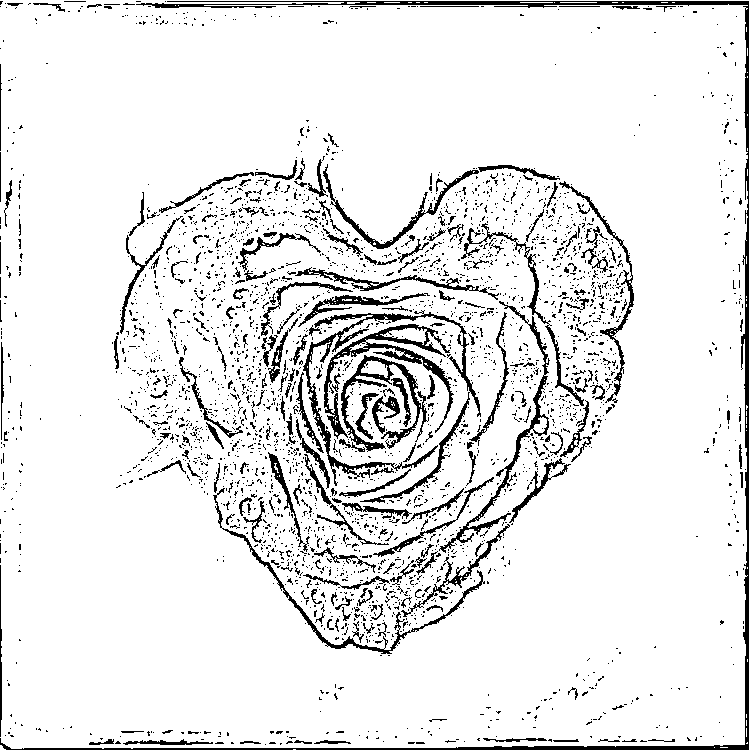

摩羯座的冥王星将带来雄心壮志，但要小心——痴迷、嫉妒、猜疑和不信任也可能成为金冥相位的主题。**高阶冥王星的秘诀是真实：你对自己和他人越诚实，就越能摆脱过去的恐惧、背叛、操控等负面情绪。**

金星逆行期间，关系中的薄弱环节容易出现紧张甚至破裂。加上金冥合相的紧逼，以前被掩盖、或避免面对的问题，**一些黑暗“金星”（关系、价值或者财务）真相，会浮出水面。**冥王星的揭示总会有些残酷，**敌意或沮丧的暗流可能会爆发成全面的冲突。**

如果某段关系一直在冒烟，金星逆行容易带来“要么成功，要么破裂”的极端局面。**无论是成功解决潜在的问题，还是做出选择结束关系，都需要直面的勇气。**

不同的是，如果某段关系刚经历了非常艰难的时期，所有的问题已经摊到台面上，但没有找到合适的解决方案。那么在金逆期间，那些问题会**“转到地下”**，关系双方会经历某种意义的“停火”，**让大家能在金星逆行的风暴之眼喘口气，做一些评估和反思。**

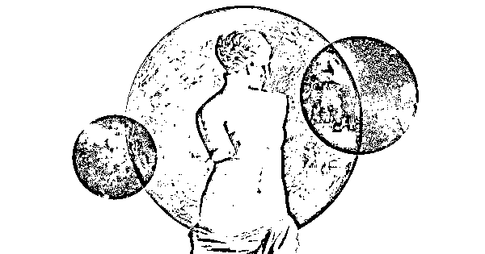

**金星逆行的神话故事**

金星逆行也是古代苏美尔人的最爱，他们年复一年忠实地将其记录下来。承载他们对这个行星独特的冥界之旅的观察的泥板，最终成为古代世界的第一本占星学书籍——金星石板。

**在不同的时代和文明里，金星有不同的女神原型**——苏美时期，是伊南娜 Innana；巴比伦时期，是伊什塔尔 Ishtar；后续是希腊的阿芙罗狄蒂 Aphrodite 与罗马的维纳斯 Venus。

金星最早的原型女神伊南娜/伊什塔尔，是美索不达米亚万神殿中最受欢迎的神祇之一。这位爱与战争女神，在武装冲突中有超凡能力，并能带来地位和财富突然变化。

**美索不达米亚将金星逆行视为伊南娜/伊什塔尔短暂下降到冥界并返回的过程，这也是金星女神最著名的神话。**

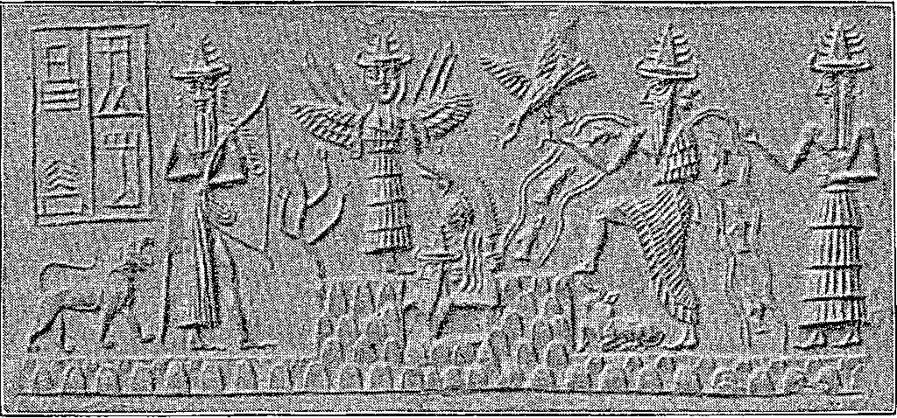

| 伊什塔尔下冥界

在这个神话中，伊什塔尔试图征服她姐姐埃雷什基加尔 Ereshkigal（冥界女王）的领土。她小心地化妆和佩戴珠宝，穿上漂亮的衣服，下降到冥界。

当伊什塔尔穿过冥界的七扇门，在每扇门前，她都会被要求脱掉一件衣服。她的姐姐相信，这会削弱伊什塔尔，因为衣服和珠宝为她提供了精神保护和力量。当伊什塔尔到达时，在姐姐面前她赤身裸体，埃雷什基加尔立即杀死了她。

她的死亡带来了可怕的后果，尘世间停止了所有的性亲密和生育。三天后，Ninshubur（伊南娜忠诚的侍女）恳求众神将伊南娜带回来，但除了智慧之神 Ea 外，其他众神都拒绝了她。Ea 派了两个无性生物来营救伊南娜，他们护送伊南娜离开冥界。

埃雷什基加尔最终允许女神伊什塔尔离开，条件是她在冥界找到替代者。当伊什塔尔被困冥界时，她瞥见自己的丈夫塔木兹，坐在她的宝座上，在进行庆祝仪式。在报复性的愤怒中，她决定让他来到冥界代替她的位置。

**神话与原型是我们深入理解占星的最佳方式。**疯狂的妹妹埃雷什基加尔，是女神伊什塔尔的阴影。**每个人都有阴影——在金星逆行期间，我们会以不同的方式，与自己价值观和欲望的阴影不期而遇。**

当我们有勇气面对，潜入地下世界（跟女神伊什塔尔一样，潜入冥界，先被剥夺了权力），这些隐藏的价值与欲望才能公开，并最终融入现实世界（然后女神上升，得比以前更强大）。

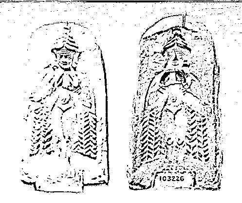

| 伊什塔尔女神

**如何利用金星逆行周期？**

金逆的**40 天周期**（实际上 40-42 天不等），是一个非常灵性、神奇的的数字，在灵性故事中反复出现：

*   **在圣经里，诺亚拯救地球之前，雨连续下了 40 昼夜，淹没了地球；**

*   **摩西被禁食 40 个昼夜后，将《十诫》刻在石头上；**

*   **耶稣被钉在十字架上，在地球上停留了 40 个昼夜；**

*   **佛陀在到达三摩地之前，在菩提树下禁食和冥想了 40 个昼夜；**

*   **古埃及人的灵性传统中，相信死者需要 40 天才能抵达另一个世界**

*   **…...**

瑜伽科学说，重新养成一个习惯需要 40 天。金星逆行的 40 天，现在被认为是进行持久改变的吉祥间隔。**你可以在金星逆行前就设定意图，承诺开启一项行动，不间断地坚持整个金星逆行期。**

这个活动无论多么微小或简单——譬如每天写感恩日记、每天在镜子前来夸奖自己，每天冥想或阅读 10 分钟……**只要你认为对自己具有战略意义，坚持在每个金星逆行日做，会为你的下一步转型奠定非常棒的基础。**

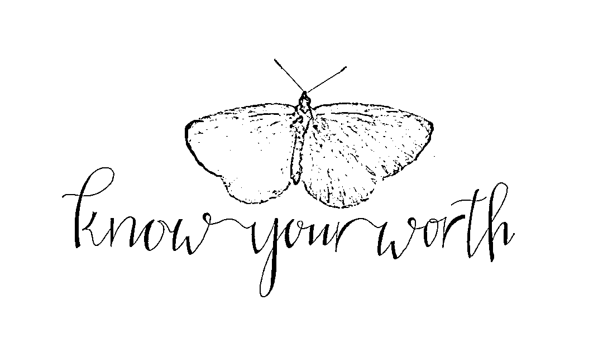

**你是此次金逆的敏感人群吗？**

**如果你的上升是金牛座或天秤座，会更强烈地感受到金星逆行的影响，因为金星是你的命主星。**

一般来说，参考金星逆行的宫位是一种普遍的方式，但不是唯一的。**要注意的是，金星从摩羯座 26 度逆行到 11 度，很可能会影响到本命星图的两个宫位，都是要参考的。**

**另一个非常有效的方式，是看金星停滞的度数——摩羯座 26 度和摩羯座 11 度。**

因为停滞点的力量是最强大的，而且**金星在这两个度数上，会停留将近 10 天**（分别是 12 月 19 日前后五天，以及 1 月 29 日前后五天）。可以说，**这两个度数，是整个金星逆行区间最被凸显的能量点。**

下面，需要占星的专业能力来进一步深入（你也可以跳过，直接看宫位解读）：

**1. 你有没有重要的行星、四轴、敏感点是落在开创星座（摩羯座、白羊座、巨蟹座、天秤座）11 度或 26 度附近的？这将跟摩羯座 11 度与 26 度这两个能量点形成合相、四分相、对分相的挑战相位。**

**2. 你有没有重要的行星、四轴、敏感点是落在处女座、金牛座、天蝎座、双鱼座的 11 度或 26 度附近的？这将跟两个能量点会形成六分相、三分相的和谐相位。**

很可能，出生星图上不止有一个行星或敏感点落入以上范畴。下面就需要结合这颗行星的特质、相位的性质、去查找星历表对应的时间区域、并结合你的出生星图，来进一步解读能量运作的方式、影响的生命领域、以及持续的时间。

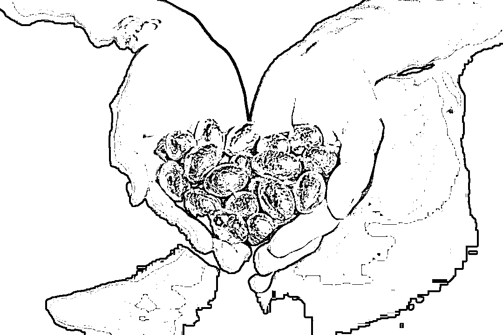

**金星逆行在 12 宫位**

如果你的出生星图上没有行星或敏感点被这两个能量点所触动，就回到金星逆行进的本命宫位上。

**若道君：****你可以在 app store 或者应用商店搜索“若道”下载 app，输入个人档案，查看行运盘（也可以使用其他星图软件），找到行运金星落在出生星图的第几宫，然后对照下文查看金星逆行的影响。**

**例如下图中，行运金星在比尔·盖茨个人星图的第 6 宫。**

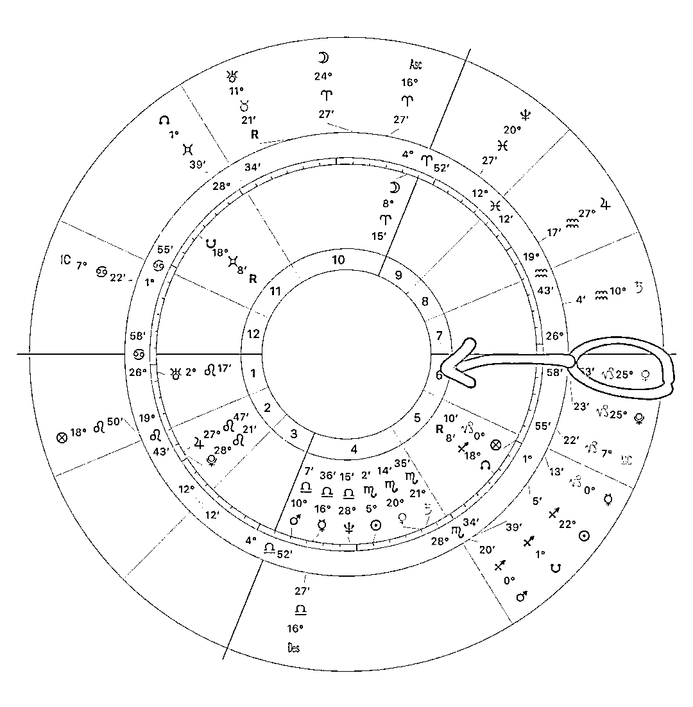

**★****金星逆行在第*****1*****宫**

*   尝试不同的外表装扮（但不要永久性地改变）；

*   深入探索自我身份，培养自爱，表达自己的独特个性。

**★****金星逆行在第*****2*****宫**

*   反思谋生的方式是否为自己带来合理的报酬和自信，并体现了自己的贡献与价值；

*   面对内在的不安全感，挖掘内在的资源。

**★****金星逆行在第*****3*****宫**

*   改善书面或口头的沟通，基于爱和理解去表达；

*   反思如何与自己最亲密的“内圈” 融洽相处。

**★****金星逆行在第*****4*****宫**

*   改善家的环境、居住的舒适度与安全性；

*   改善与家人、内在自我的关系，面对内在的阴影与童年创伤。

**★****金星逆行在第*****5*****宫**

*   反思什么能让自己由衷开心，反思自我表达、爱与孩子对自己到底有多重要；

*   如果你不确定当前的恋情，请在此期间不要鲁莽行动。

**★****金星逆行在第*****6*****宫**

*   改善与雇主、同事以及为你服务的人之间的关系

*   反思对健康的态度，包括饮食、锻炼、睡眠与自我照顾

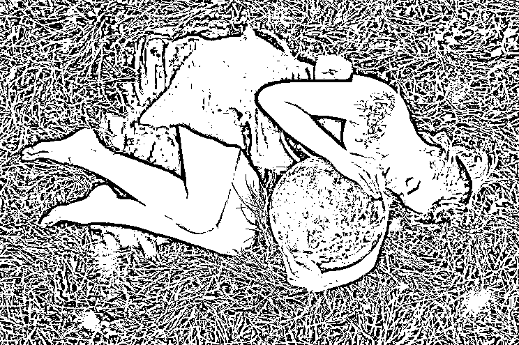

**★****金星逆行在第*****7*****宫**

*   一对一关系中会有一些反思、重新谈判与合作的机会；

*   现在不是开始或结束恋爱的合适时机，保持耐心与镇定。

**★****金星逆行在第*****8*****宫**

*   探索和评估你通过深入的关系所拥有的、所获得的和所付出的；

*   去面对一直回避的真相，关于性、死亡、内在的秘密，内在疗愈的契机。

**★****金星逆行在第*****9*****宫**

*   现在不是去旅行、尝试新哲学或信仰的好时机，等待金星顺行；

*   现在可以重新拾起以前感兴趣但没有时间学习/探索的主题。

**★****金星逆行在第*****10*****宫**

*   反思自己在职场、社会的公众形象，如何更好与公众互动；

*   如果你想改变自己的职业方向，需要缓慢、谨慎而有意识地觉察。

**★****金星逆行在第*****11*****宫**

*   探索友谊的主题，诚实看待你的社交圈，渴望与一些“值得”的老朋友重聚；

*   重新校准你的愿景与目标。

**★****金星逆行在第*****12*****宫**

*   审视需要在哪里设定界限、并倾听自己的直觉；

*   探索一直渴望解决的无意识行为和自我破坏的习惯。

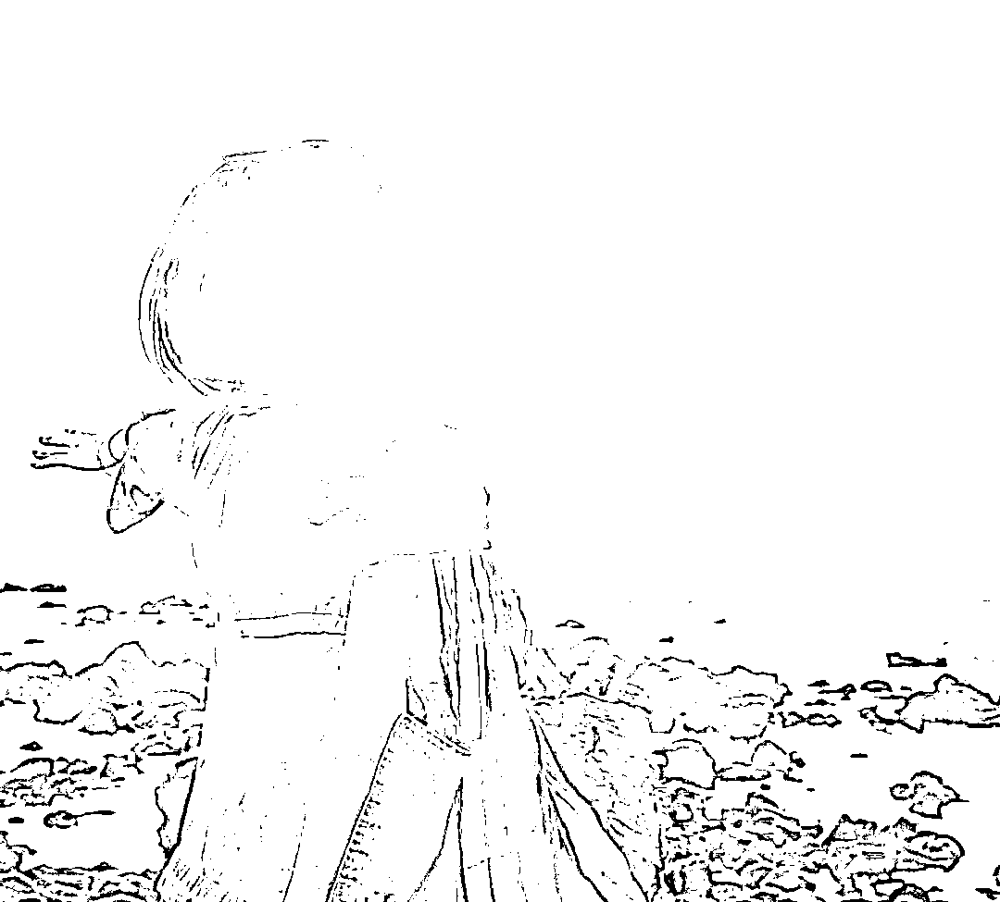

**是挑战，也是疗愈与转化的机会**

**金星逆行期间，能否很好地应对金星带来的挑战与功课，取决于你与金星原型之间的关系。**

遗憾的是，**自我价值是现代人的普遍议题。**很多人无意识地将自己的金星投射出去，不顾一切代价疯狂追求亲密关系、物质、地位、财富、灵性，或成为大家喜欢”的人，从而给自己带来间接的“价值感”认同。

我们经常能看到头条里看到，有人因为亲密关系失败、股市崩盘、创业失败而奔溃，不堪一击。你也一定遇到过那些在非常基本的层面上失去自我价值的人，那些不管拥有什么、都无法感受自信、喜悦、乐趣或轻松的人，那些不管他人多么夸奖他、都没有用的人，那些除非有人爱他们，不然自己觉得不值得的人……

**在金星逆行期间，跟金星原型“失联”的人，更容易过度沉迷于物质、性与不健康的关系中。**这是为什么金星逆行期间总是提醒大家不要购买奢侈品、不要随意进入新的亲密关系，因为金星的阴影在这个阶段会被放大。

从另一个角度，金星逆行的确带来了疗愈自我价值的最佳机会。**所有的关系议题，都是源自于跟自己的关系。**如果你能有意识地利用金星的冥界之旅，就能带来疗愈性的转化——把投射到外界的认同拿回来，拥有更强的自我价值与力量感。

**最后，在接下去四十天里，记得对周围的人温柔，因为你不知道他们在经历什么，每个人多少都会因金星逆行更加脆弱。**

**版权声明**：文章由作者授权首发于若道平台发布，欢迎转发，反对抄袭。

****

**Justine**

ISAR 国际认证占星师（2014 年获得）/塔罗师

毕业于浙江大学，十年跨国企业 HR 经验

咨询时长超过 1500 个小时

**咨询微信**：Justine_JT

**公众号**：星光体

长按打赏

**学习占星学****点击下图了解课程详情** 

****************

**微信又双叒叕改版啦，不想错过若道君的推送？**

**就把若道设为星标吧！**

**▼**

**喜欢记得点一下在看哦☟**

**报名直达入口**

# 新课首发丨释梦占星大师工作坊：荣格、占星学与梦境

> 原文：[`mp.weixin.qq.com/s?__biz=MzA5NjA0NTAxNg==&mid=2651463858&idx=2&sn=ddc957b802212846ba780b509eba1f42&chksm=8b489205bc3f1b1346e5ab03b316caaf93aedd2bc1d85fa4f15379d9fad2fcafcfc68e23281d&scene=126&sessionid=1692737883#rd`](http://mp.weixin.qq.com/s?__biz=MzA5NjA0NTAxNg==&mid=2651463858&idx=2&sn=ddc957b802212846ba780b509eba1f42&chksm=8b489205bc3f1b1346e5ab03b316caaf93aedd2bc1d85fa4f15379d9fad2fcafcfc68e23281d&scene=126&sessionid=1692737883#rd)

****

**2022 年 3 月和 4 月木星和海王星在双鱼座合相给连接梦境与占星提供了一次绝佳的时机。**

**　　——格雷格·博加特老师**

**梦境工作和做梦疗法是深度心理治疗的一个关键技术，**使得深层无意识的象征性语言能够传递它们的洞见，并指引患者走向更大的完整。

梦境使带有情感成分的无意识材料安全而快速地进入意识层面。它们帮助找到治疗的重心，指引治疗的方向。**梦境提供了重要的线索，告诉我们客户痛苦的来源，以及哪些情绪和情结需要被检视和处理。**梦境工作可以成为心灵成长和行为改变的强大催化剂，它有种独特的能力，促进疗愈从内在发生。

梦就像冰山从无意识的深水中浮现出来。有些冰山属于过去，帮助我们理解过去的创伤和未消化的回忆，因此是回溯性的。

**梦境有种整合的能力，**因为他们能使我们觉知和化解很多次人格之间的矛盾。**梦境也有前瞻性或预期性，**那是来自未来的冰山，会呈现出将要发生的事情，显现出个人有可能成为的样貌。**梦境既向后看也向前看**，它的本质功能是扩展意识、觉知和身份的疆界。

**我在梦境工作中主要使用的技术，是以开放的好奇心，主动探求梦境中每个角色、地点和行为的当下意义**——每个元素都反映出梦者的心灵状态和当前的生活情境。被梦境所揭露的信息，往往既幽默，又充满矛盾，而且为我们打开了新视野。

怀着一种敬畏的心态，我发现每个梦境都是意识海洋深处的一颗珍珠。反思梦境的奥秘，会引发一种近乎宗教敬畏的情感，我们会惊叹于心灵描绘自身处境的能力。

1

**课程内容**

**本课程将课堂讲座与动力过程工作结合起来，动力工作过程会将星图解读和梦境分析结合起来。**

每天约一半时间用于讲座，其余时间会演示占星学梦境工作方法，过程中老师会与学员进行互动。课程包括对老师解读星图和治疗性梦境工作方法的详细阐释和示范。

**我们将学习荣格解梦的基础知识和治疗性的、以过程为导向的星图解读。**我们将体验转化性原型模式在梦境和出生星图中同步显现时会发生什么。

**三次 6 小时的迷你马拉松在线梦境课程**，将会是一次提升意识、开放思想、转化生命的事件。**学员将体验占星学和解梦的融合。**

每次课程格雷格·博加特老师都会与学员互动，课程中使用的星图和梦境将由愿意分享自己梦境和星图的学员提前提供，课程期间也会开放问答以及学员互动环节。

2

**课程安排**

**第*****1*****讲  2022 年 3 月 5 日 **

卡尔·荣格的童年、学生时代以及投身精神病学时期的故事。《荣格自传：回忆·梦·思考》概要。弗洛伊德与荣格的关系，他们合作的破裂，荣格随后的抑郁时期，以及他借助梦、积极想象、艺术创作、曼陀罗绘画和对奥义知识（灵知）、神话和占星学的研究，转化性地面对无意识。卡尔·荣格与艾玛·荣格的占星学。

荣格的力比多（心灵能量）的概念，以及他的心灵结构地图：自我、个体无意识和集体无意识。荣格对无意识原型的描述，它们对个人神话的重要性，以及它们作为个人情结的表现。自我-自性轴线，以及自我与无意识之间不断演化的关系。

**我们将介绍荣格解梦的基础知识以及治疗性的、以过程为导向的星图解读。我们将体验转化性原型模式在梦境和出生星图中同步显现时会发生什么。**

****第*****2*****讲  2022 年 3 月 12 日 ****

梦境中的个性化及其占星学时机。出生星图随时间推移展开。整合个体无意识：梦和出生星图中的人格面具与阴影。男性和女性：阿尼玛和阿尼姆斯。**梦与占星学行进**描绘建立或脱下人格面具的阶段，遭遇阴影的阶段，通**过阳性意识和阴性意识的结合发展出更统一的人格的阶段。**

**第*****3*****讲  2022 年 3 月 19 日 **

**整体性在占星学和梦境中的象征。**透过占星学符号研究梦，来深化内在生命。我们将学习占星学行进和梦境如何试图让我们意识到差异、内在冲突和极性，逐步整合对立，将人格整合成一个整体。

梦境工作和星图解读中的曼陀罗原理。荣格的心理类型理论：内向型和外向型的任务。达到思维、情感、感觉和直觉的平衡。我们还将涉及使用五因素人格理论作为星图解读和梦境分析的基础的重要性。

**我们将学习如何解读梦境，并辨别梦的象征意义所传达的有说服力的信息，因为这与出生星图和行进有直接关联。**整合占星学和梦境工作，可以带我们进入情感、关系和灵性更为一致的状态。

3

**授课老师**

**格雷格·博加特**

（Greg Bogart）

**占星师、心理治疗师**。格雷格出生于美国纽约市，就读于卫斯理大学，1986 移居旧金山湾，完成了加州整合大学和赛布鲁克大学的研究生课程。格雷格自 1991 年以来一直是一名有执照的**心理治疗师**（LMFT 28276）。**他是国际占星研究协会（ISAR）认证的占星师**，并拥有美国地球宇宙学研究协会（NCGR）的第四级认证。他还在旧金山的艾扬格瑜伽学院接受过培训，并于 1992 年毕业且获得了**瑜伽教师认证。**

格雷格是一名私人执业的心理治疗师，在索诺玛州立大学担任**心理学讲师**，他在该校教授“成人发展中的转变”、“以深度为导向的心理治疗”、“神话、梦与象征”以及“存在主义心理学与超个人心理学”等课程，他在加州整合大学、约翰·F·肯尼迪大学、多米尼加大学和超个人心理学学院教授咨询心理学和东西方心理学课程。**他的研究结合了冥想、哈他瑜伽、荣格解梦、存在主义心理疗法和精神综合，以及占星学的周期智慧和原型象征。**

**格雷格·博加特博士著作：**

*   《占星学的高八度音阶》（*Astrology’s Higher Octaves*）

*   《行星用于治疗》（*Planets in Therapy*）

*   《占星学与灵性觉醒》（*Astrology and Spiritual Awakening*）

*   《梦境工作过与自我疗愈》（*Dreamwork and Self-Healing*）

*   《梦境工作在抑郁症整体心理治疗中的应用》（*Dreamwork in Holistic Psychotherapy of Depression*）

*   《占星学与冥想：对变化的无畏沉思》（*Astrology and Meditation: The Fearless Contemplation of Change*）

4

**此次课程适合哪些人？**

*   有一定占星学基础，若道核心课 L4 以上水平；

*   希望成为优秀的占星师，想要借鉴国际大师释梦占星解读思路并融入自己的体系的人；

*   热爱记录梦境、练习释梦的研究型占星学者；

*   喜欢心理学、荣格体系的学员；

*   走在自我探索和个人成长道路上的人。

5

**课程价格**

*   **课程价格：****5800 元**

*   **早鸟价：4800 元（截止日期：2022 年 2 月 9 日）**

*   **课程咨询：**王老师（微信：18510107057，请备注“释梦工作坊”）

长按二维码添加王老师

5

**课程安排**

*   **课程时间：**

     **2022 年 3 月 05 日周六  8:00-14:00**

**2022 年 3 月 12 日周六  8:00-14:00**

2022 年 3 月 19 日周六  7:00-13:00

*   **授课方式：**线上直播，英文授课，中文翻译

6

**退转课程**

*   **退款原则请详看《教学协议》，如有疑问请咨询课程顾问。**

****释梦工作坊****

**授课老师：**格雷格·博加特

**授课时间：**2022 年 3 月 5 日起

**授课方式：**网络课程**，**英文授课，中文翻译

**费用：****5800 元****（早鸟价：4800 元，2022 年 2 月 9 日截止）**

**课程负责人：****王老师**（微信：18510107057，请备注“释梦工作坊”）

长按二维码添加课程负责人咨询~

****报名请点击“阅读原文”****

# 当 12 月亮星座 emo 的时候，他们最渴望听到什么？

> 原文：[`mp.weixin.qq.com/s?__biz=MzA5NjA0NTAxNg==&mid=2651463790&idx=1&sn=f75b803687893fae4dea5948e7715ce8&chksm=8b4892d9bc3f1bcf9f0a59b5a45bb052f8ada90b089005525b927303ff29c3d97354c61a9782&scene=126&sessionid=1692737883#rd`](http://mp.weixin.qq.com/s?__biz=MzA5NjA0NTAxNg==&mid=2651463790&idx=1&sn=f75b803687893fae4dea5948e7715ce8&chksm=8b4892d9bc3f1bcf9f0a59b5a45bb052f8ada90b089005525b927303ff29c3d97354c61a9782&scene=126&sessionid=1692737883#rd)

********************☆ 后**********************台**********************回复“今日”，给你一句生命态度********************

作者/诺·泰尔 译者/李含编辑/玫瑰 图片/pexels

再坚强的月亮星座也有 emo 的时候，有效的问题可以帮助他们迅速走出低潮。一起来看看大师怎么说！

**了解月亮的主导需要**

月亮象征着我们每个人的主导需要，促使我们通过计划、行动和梦想来获得满足，星图中的月亮就是我们潜能的宝藏。这些潜能，这些无所不在的驱动力的运作决定了我们是谁，以及我们的发展时机和过程。

**在人格形成的关键时期——幼年时期，家人是否了解我们之所以成为我们的那些需求？外在的环境是否给予我们的内心以支持？**在关系中，**当我们的需求系统遇到对方的需求系统时，会发生什么：是支持、帮助、感激，还是有什么阻碍触动了防御机制的按钮，让我们不断地与挫败感做斗争？**关键是要**了解月亮所体现的主导需要。**如果我们带着“需求”的概念分析月亮所落的星座和它的重要相位带来的影响，我们就会理解这一点。我们可以通过和客户的月亮对话，与处在压力之下的客户一起来探讨这一点，让客户意识到他的主导需要，找到满足需求的方式和行为。客户们和他们的月亮都会从这种对主导需要的关注中获得了快乐与滋养。

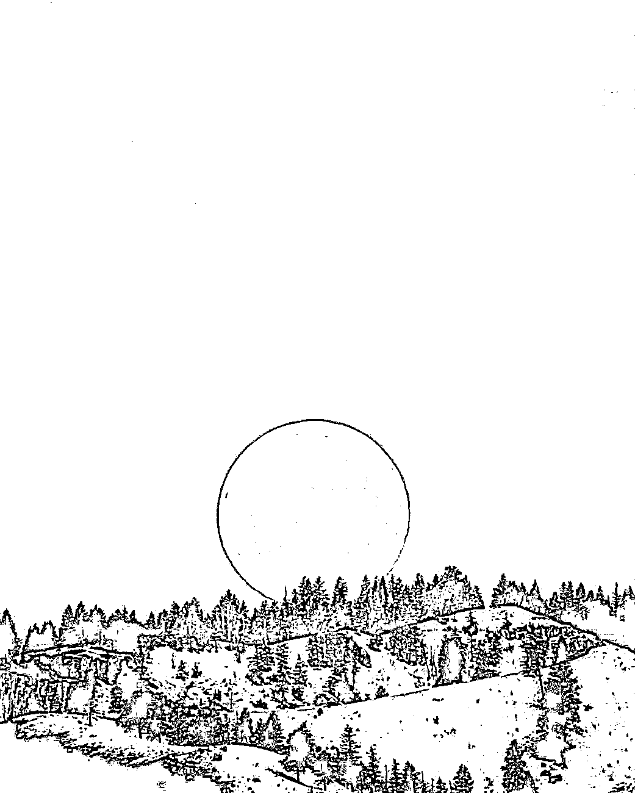

**火象月亮星座：是什么让你停滞不前？****·** 我们知道**白羊座月亮**的主导需要是**成为头号人物**，这一点毋庸置疑。压抑的相位将会阻碍需求的聚焦，挫折会变成家常便饭。客户缺乏机会，也缺乏支持去表达自己的力量。如果我们对客户说“在这种情况下，建立你的重要性是不错的选择。我们该怎么做呢？”会怎么样呢？仔细地阅读上面的对话，注意那些措辞。想一想，接下来的对话要如何展开。你允许客户去勾画蓝图，然后根据常识提出战略步骤，客户的整个状态都改变了，表达也随之发生了改变！**·** 如果是**狮子座月亮**感到表达受阻，我们可以说：“你的领导在这里十分重要：你和其他人在这方面能做些什么呢？”引入“其他人”，有种王者的慷慨，狮子座需要被需要，被接纳。你能感到月亮正在觉醒吗？**·** 对于**射手座月亮**而言，理念得到尊重绝对是主导需要中最重要的。“每个人都了解你对这件事的看法了吗？要知道，他们必须知道！我们该怎么做到这一点呢？”

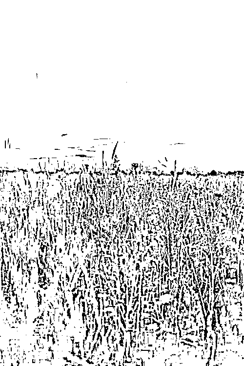

**风象月亮星座：你关注的是什么反应？**月亮在风象星座，这里的**自我驱动会少一些，我们更多的是关注社会反应。****·** 如果**天秤座月亮**没有发挥出来，治疗性的对话可以是：“在这种情况下，你怎么绽放光彩呢？我们怎么让你更有吸引力呢？”**·** 如果是**水瓶座月亮**没有发挥出来，治疗性的对话可以是：“每个人都知道你在意，有什么绝妙的点子能推动事情进一步发展呢？”**·** 如果是**双子座月亮**没有发挥出来，治疗性的对话可以是：“我知道你一直在思考这件事；你该怎么让人们知道你所掌握的情况呢？”思考月亮需求，展开简单对话，这些对话的要点揭示了我们行为的本质。**土象月亮星座：你到底应该怎么做？****·** 在土象家族中，对于没有发挥出来的**摩羯座月亮，**我们可以说“你应该最了解这件事该如何处理。具体应该做些什么呢？”的确，这就像打开了行动的电源！记住这种对话的目的，是为了给予客户成为自己的许可，很多人从来获得过这种许可。**·** 对于没有发挥出来的**金牛座月亮**，我们可以说“我们真的需要你的组织才能来处理这种情况，让一切变得井井有条。我们该怎么做呢？”慢慢地，仔细地读阅读这些字句，领会每一个词背后的含意。**·** 对于没有发挥出来的**处女座月亮**，我们可以说：“你一定非常想要掌握所有的细节。你掌握了些什么？人们在哪里出的错，怎么避免呢？”这就对了。

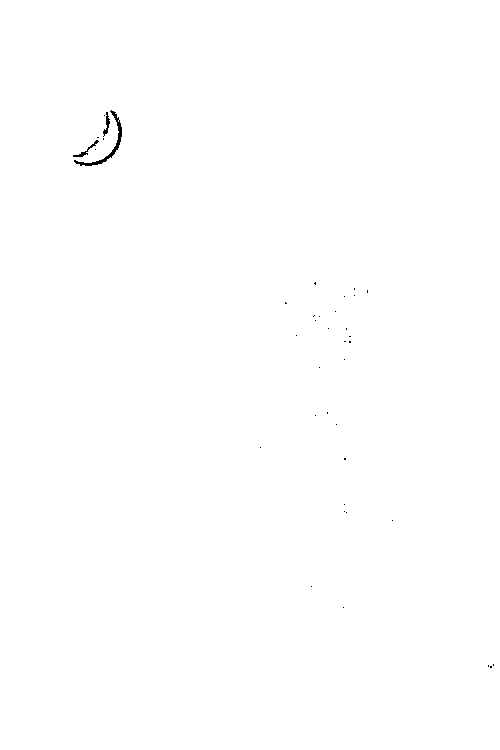

**水象月亮星座：你为什么控制不了情绪？**说到水象家族，我们面对的是**情绪管理，**这是一个可以深入探讨的话题。**·** 我们可以对**巨蟹座月亮**说：“让我们达成一致的情感价值观，然后就有了更可靠的方式让我们变得更加亲密，而不会以任何方式伤害任何人。”**·** 如果**月亮在天蝎座**，我们都知道，主导需要是掌控；如果驾驭不了，就很容易失控。这里的潜能非常巨大。当遭遇压力，或者是受到压抑时，咨询对话的开场白可以是：“想要更好地控制场面，需要些什么？你怎么才能做到？”**·** 我们可以这样启迪**双鱼座月亮**：“你对这些事情都非常敏感，我们该如何将理想融入实践，确立一个真正的目标呢？”需求促使我们生命中的事件发生。在很多人的生活中，家长就是不了解子女的需要；他们忽略了，孩子们的经历无益于成长。于是就有了防御机制。这种行为模式很容易移植到成年后的感情生活中，并影响他们孩子的成长。尊重并理解月亮所传达的讯息，并就此展开良性的对话，就能够走上自我认同的自由之路。

**版权声明：**本文由若道翻译发布，欢迎转发，反对抄袭。友号转载请申请白名单。

**诺·泰尔**现代占星学鼻祖，世界众多著名西方占星师的占星老师。当今世界上最重要的占星师之一，占星联盟协会（AFAN）的创始人及原主席。著有三十三本占星教科书，引领了整整两代占星师的占星学习与教育，1998 年国际占星大会（UAC）授予其占星界最高奖项 “轩辕奖”。诺·泰尔对于占星界的最大贡献在于发现和整理了太阳弧推运的方法。
**学习占星学****点击下图了解课程详情** 

****************

**微信又双叒叕改版啦，不想错过若道君的推送？****就把若道设为星标吧！****▼**

**就是这个“在看”，戳戳戳 ☟**

********报名直达入口********

# 医疗占星学入门级教程，建议收藏哦

> 原文：[`mp.weixin.qq.com/s?__biz=MzA5NjA0NTAxNg==&mid=2651463790&idx=2&sn=1061eef9efd098b52011f81789eb6b4c&chksm=8b4892d9bc3f1bcf574050ff61f69f03dc3f8598341291a457c4220bdb96aebda5849412dd15&scene=126&sessionid=1692737883#rd`](http://mp.weixin.qq.com/s?__biz=MzA5NjA0NTAxNg==&mid=2651463790&idx=2&sn=1061eef9efd098b52011f81789eb6b4c&chksm=8b4892d9bc3f1bcf574050ff61f69f03dc3f8598341291a457c4220bdb96aebda5849412dd15&scene=126&sessionid=1692737883#rd)

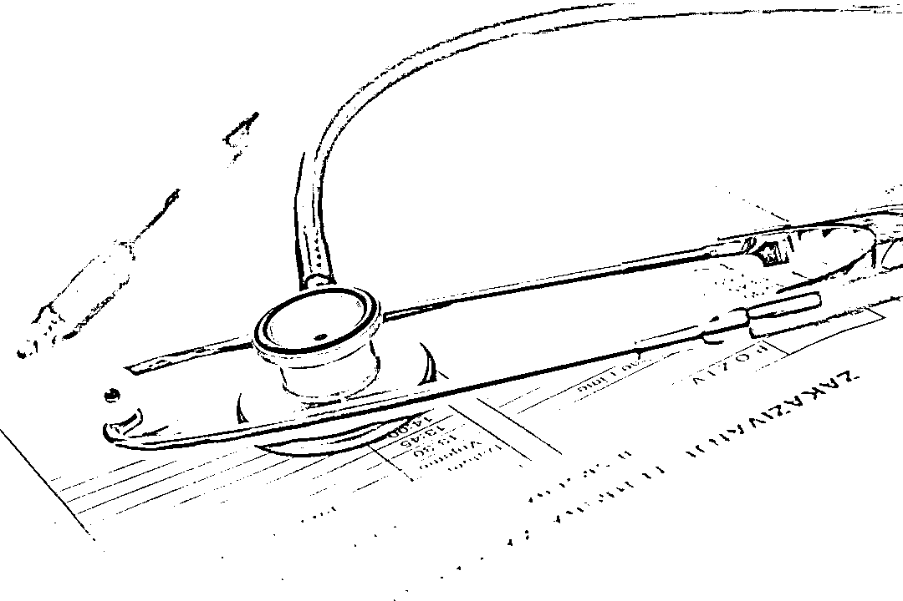

作者/简·里德尔-帕特里克 译者/黄纤越 张弛编辑/玫瑰 图片/pexels 你知道吗？占星学可以为诊断、预测以及为个体和疾病找寻有效治疗方法方面提供洞见呢（点击见[【上周文章】](http://mp.weixin.qq.com/s?__biz=MzA5NjA0NTAxNg==&mid=2651463309&idx=1&sn=8c9870b3f2d8f48d0258ca3c1c7c43bc&chksm=8b48ac3abc3f252cc8576315ac16bac18d497621382abc55fa90dd227844d3a8e7e11833c567&scene=21#wechat_redirect)）。那么占星，学能为医疗带来哪些帮助呢？一起看看吧。如果你对医疗占星学感兴趣，也可以点击[【详情】](http://mp.weixin.qq.com/s?__biz=MjM5MjQwNjAyMQ==&mid=2649439064&idx=3&sn=cbf0bb8c5e08e04ab39474f68bd16363&chksm=beb9543289cedd2458c005a45b80bf4bc57ccd9abdbaa26ee111409333b85df93cfdd89b3618&scene=21#wechat_redirect)查看课程信息哦~**占星学可以为医疗提供帮助哦**医疗占星学是占星学中的一个重要分支，主要**通过对星体特质和运行的研究帮助我们了解和改善人体健康。**在 17 世纪之前，占星学一直被广泛运用于欧洲医学系统内。**占星学可以为诊断、预测以及为个体和疾病找寻最有效治疗方法方面提供洞见。尤**其在处理一些特别个案时，占星学有着更加明显的优势。颇具影响力的加拿大医生威廉·奥斯勒爵士（Sir William Osler）曾说过，找出哪种类型的病人远比找出病人罹患哪种类型疾病更为重要。**出生星图可以明确地指出哪一类人会罹患疾病，而行进（transits）和推进（progressions）又会告诉你患病原因以及为什么会在特定时间病发。**出生星图也会反映出**个人应对压力的可能反应。**由于难以缓解的压力也是致病的重要因素之一，所以星图反映出来的这一信息也就变得尤其重要。

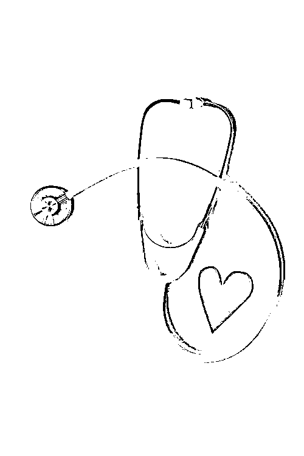

**医疗占星学能为我们做什么？**医疗占星学可以为我们做什么呢？**·** 按照潜在的占星学动力分类诊断；**·** 帮助病人找出最缓和却最有效的治疗方法，为每个人度身定制；换而言之，医疗占星学可以针对性地指出如何治疗得病的人，而非病人得的病；**·** 指出成功治疗的最佳用药时机。**行星、星座等在医疗占星学的象征****—行星—**会显示出心理驱动力以及因此导致的生理反应过程。举例来说，火星是我们坚持个人主张和保护自身的驱动力，而在身体内部则会通过消化系统、肌肉活动和免疫系统释放热能。 **—星座—**代表着行星能量是怎样展现以及在身体的哪个部分展现。举例来说，火星落在天秤座象征着肾炎的可能性。**—相位—**会显示出行星能量如何交互以及相互影响。例如，土星四分火星可以与免疫或消化系统的功能放缓（土星）相关联。**—宫位—**显示出可以影响个人健康的外界和环境因素。例如，火星落在第七宫意味着强势的另一半可能影响你的健康。**—行进—**可以显现出个人在何时更容易罹患疾病或需要为保持健康而做出的改变。

**版权声明：**本文由若道翻译发布于若道平台，欢迎转发，反对抄袭。友号转载请申请白名单。

**快来和简·里德·帕特里克老师学习升级版的占星学身体地图吧！**

**简·里德·帕特里克 **博士****

（Jane Ridder-Patrick）

简接受过药剂师、理疗师、草药师、心理治疗师和历史学的专业学习，从事写作、咨询和讲学工作，在英国和全球教授占星学及其历史、当今的心理学和医学应用。她在爱丁堡执业，在爱丁堡大学获得博士学位，研究方向是 17 世纪苏格兰占星学历史。

**她最著名的出版物是《医疗占星手册》。2018 年，她因对医疗占星学的贡献而获得了著名的查尔斯·哈维占星学杰出服务奖。**

**医疗占星包含哪些内容？**

本课程既适合医疗占星学的初学者，也适合已经有一些相关经验的人。
简·里德·帕特里克老师将运用现实生活中的例子，揭示一个人的性格、症状及其星图是如何相互映照的。课程也会探讨疾病的意义以及可能的治疗方法。本课程旨在为学员提供一个运用医疗占星学的框架和方法，学员将会学到一些有价值的实用工具，在课程结束后，自己使用这些工具研究其中的关联性。**此课程可作为 ISAR 选修课。****学习医疗占星学****点击下图了解课程详情**

**微信又双叒叕改版啦，不想错过若道君的推送？****就把若道设为星标吧！****▼**

**喜欢记得点一下在看哦☟**

****报名直达入口****

# 2022 年若道 ISAR 选修课 | 医疗占星能帮助我们什么？

> 原文：[`mp.weixin.qq.com/s?__biz=MzA5NjA0NTAxNg==&mid=2651463790&idx=3&sn=306b898bc12e1f82c73c5cb5a2ccdcc5&chksm=8b4892d9bc3f1bcf537c2a121207e254dc0f0ce018cc14a2a207351184bfba367ace71d25e20&scene=126&sessionid=1692737883#rd`](http://mp.weixin.qq.com/s?__biz=MzA5NjA0NTAxNg==&mid=2651463790&idx=3&sn=306b898bc12e1f82c73c5cb5a2ccdcc5&chksm=8b4892d9bc3f1bcf537c2a121207e254dc0f0ce018cc14a2a207351184bfba367ace71d25e20&scene=126&sessionid=1692737883#rd)

1

**占星学与疾病之间存在联系**

****

**没有占星学知识的医生不能自称为医生。**

**　　——现代医学之父希波克拉底**

占星学与疾病有什么联系呢？**世界著名的医疗占星师简·帕特里克**说：**“占星学可以精准定位需要解决的潜在问题。”**尽管有人想当然地认为占星学是令人沮丧的宿命论，但事实并非如此：

**有四个主要因素影响着我们的生活和健康：基因构成、物质环境、情绪环境，以及我们的占星配置。我们在星图中都存在患病的可能性，而预防的方法在于尽可能充分、真实和健康地生活。****——简·帕特里克**根据简·帕特里克的说法，**每个星座都有广泛的可能性**。例如，那些双鱼座的人有潜力去扮演殉道者（以他人为先）的角色，但是他们也有能力成为伟大的治疗师。

那么医疗占星咨询涉及哪些内容呢？简·帕特里克有这样的步骤：

**· **首先，会请客户提供详细的病历，以及他们出生的日期、时间和地点；

**·** 然后，绘制他们的星图，观察在他们的病情确诊之前，在占星层面和情感层面上发生过什么。

根据简·帕特里克的说法，**癌症的主要病因之一，除了有害的生活方式之外，就是未解决的情绪冲突**：她通常会在症状出现前的 18 个月至 2 年间寻找触发因素。

她曾这样说：“当我为癌症患者服务时，我的任务之一就是识别出他们生活中的‘恶性肿瘤’，并帮助患者将其消除。”

**医疗占星师还可能帮助你确定做手术的最佳时间，或是指出你每个行星位置的优缺点**：比如，阵容强大的星群落入双鱼座可能与过敏有关，而巨蟹座人则可能发觉自己泡完热水澡后会疲惫不堪。**固定星座（金牛座、狮子座、天蝎座和水瓶座）在情感和生理上都倾向于“难以放手”，这可能为恶性肿瘤的生长创造环境。所以说，他们可能倾向于沉浸在过去的伤害中，难以自拔。另一方面，这些星座也擅长在艰难的时期坚持不懈并一直持之以恒。**

　**　——简·帕特里克**

“癌症人格”中比较突出的一点通常是难以表达情绪，而且你可以从星图中看出这一点。

**客户星图中突显的土星可能表明害怕表达自己的需求，或者害怕展现真实的自己。**

**——简·帕特里克**

发现癌症的身体部位也可能给出有关根本病因的线索。

简·帕特里克曾表示：“例如，卵巢与孩童、创造力、家庭有关。所以说，如果某人患有卵巢癌，那么问题可能在于此人无法表达自己的创造力，或是无法做到滋养和关怀。”

有趣的是，母亲的癌症恰好发生在自己的孩子开始离开巢穴时。

医疗占星师可能也会查看金星在客户星图中的位置。

**金星代表使我们快乐的东西，因此如果金星得不到满足，我们就不会快乐——而不满是滋生疾病的温床。**

**——简·帕特里克**

如果金星落入双子座（前文中母亲的案例），这表明你渴望趣味、变化、沟通、心智刺激和灵性工作。在患癌之前，这位母亲就觉得自己的生活缺乏快乐和意义。理解她的灵魂渴求转变——更多的旅行、更多的学习、更多的乐趣，这可以帮助和支持到这位母亲。**简·里德·帕特里克老师说：“星图中的每个因素都为我们提供了广泛的可能性。所以说，重要的不是我们的遭遇，而是我们如何回应这些遭遇。”**

2

**医疗占星包含哪些内容？**

本课程既适合医疗占星学的初学者，也适合已经有一些相关经验的人。
简·里德·帕特里克老师将运用现实生活中的例子，揭示一个人的性格、症状及其星图是如何相互映照的。课程也会探讨疾病的意义以及可能的治疗方法。本课程旨在为学员提供一个运用医疗占星学的框架和方法，学员将会学到一些有价值的实用工具，在课程结束后，自己使用这些工具研究其中的关联性。**此课程可作为 ISAR 选修课。**

3

**课程安排**

**课程时间：2022 年 3 月 8 日-4 月 26 日  每周二 20:00-22:00**

**第*****1*****讲  3 月 8 日 与占星学、心理学、病症一起工作，学习**

*   医疗占星学的组成部分以及如何使用它们

*   行星的作用与相互作用

*   黄道星座人

*   宫位的重要性

*   疾病和健康是如何产生的

**★ 第二、三、四讲的课程内容基于星座以及它们之间的相互作用。**

**第*****2*****讲  3 月 15 日 基本星座**

学习基本大十字星座——**白羊座、巨蟹座、天秤座和摩羯座**——及其功能和相关的健康问题。**这些星座与防御、养育、结构、体内平衡和荷尔蒙控制有关。**

****第*****3*****讲  3 月 22 日 固定星座****

学习固定大十字星座——**金牛座、狮子座、天蝎座和水瓶座**——及其功能和相关的健康问题。**这些星座与习惯和反射、心脏调节、生存、循环和协调有关。**

“固定星座（金牛座、狮子座、天蝎座和水瓶座）在情感和生理上都倾向于**‘难以放手’**，这可能为恶性肿瘤的生长创造环境。所以说，他们可能倾向于沉浸在过去的伤害中，难以自拔。另一方面，这些星座也擅长在艰难的时期坚持不懈并一直**持之以恒**。”

——简·里德·帕特里克（Jane Ridder-Patrick）博士

**第*****4*****讲  3 月 29 日 变动星座**

学习变动大十字星座——**双子座、处女座、射手座和双鱼座**及其功能和相关健康问题。**这些星座与呼吸、神经系统、肠道、睡眠以及信息、情感和行动的整合有关。**

**★ 第五、六、七、八讲重点学习行星，它们在身体层面的表达、它们的相位与行进。**

**第*****5*****讲  4 月 5 日 太阳与月亮**

**太阳**掌管视觉、活力、心脏和意识，与心脏、脊柱和视觉问题相关。

**月亮**掌管人体的周期，特别是月经周期、饮食模式和体液，与情绪引起的疾病、饮食失调和胃病相关。

**第*****6*****讲  4 月 12 日 土星与天王星**

**土星**掌管着皮肤、骨骼、牙齿和衰老过程。它对应的疾病包括慢性疾病、耳聋、帕金森病、关节僵硬和牙齿问题。

**天王星**代表身体活动的协调，有节奏的脉动和身体的“电”。与天王星相关的疾病包括癫痫、痉挛、心律失常，以及阿斯伯格综合症和自闭症样综合症。

**第*****7*****讲  4 月 19 日 海王星与冥王星**

**海王星**掌管松果体、细胞膜渗透和右脑功能，与过敏、上瘾的病症、慢性疲劳综合症和睡眠障碍相关。

**冥王星**掌管消除和转化，其病理包括毒性、脓肿、癌症和强迫症。

**第*****8*****讲  4 月 26 日 火星**

**火星是与能量和防御相关的行星**，掌管免疫系统、肾上腺功能、肌肉活动和炎症反应。**它是许多身体和情绪障碍的核心**，如自动免疫障碍、抑郁和发烧，以及由手术或需要手术引发的问题。

4

**此次课程适合哪些人？**

*   有一定占星学基础，若道核心课 L3 以上水平；

*   希望成为优秀的占星师，想要借鉴国际大师医疗占星解读思路并融入自己的体系的人；

*   热爱占星学、健康、养生的研究型占星学者；

*   计划考取 ISAR 认证占星师，寻觅中意选修课的学员；

*   走在自我探索和个人成长道路上的人。

**快来和简·里德·帕特里克老师学习升级版的占星学身体地图吧！**

5

**授课老师**

**简·里德·帕特里克 **博士****

（Jane Ridder-Patrick）

简接受过药剂师、理疗师、草药师、心理治疗师和历史学的专业学习，从事写作、咨询和讲学工作，在英国和全球教授占星学及其历史、当今的心理学和医学应用。她在爱丁堡执业，在爱丁堡大学获得博士学位，研究方向是 17 世纪苏格兰占星学历史。

**她最著名的出版物是《医疗占星手册》。2018 年，她因对医疗占星学的贡献而获得了著名的查尔斯·哈维占星学杰出服务奖。**

《医学占星术手册》（第二版，修订版和扩充版）

(爱丁堡，克拉布出版社，2006 年)

6

**课程价格**

*   **课程价格：****6800 元**

*   **早鸟价：5800 元（截止日期：2022 年 2 月 9 日）**

*   **课程咨询：**王老师（微信：18510107057，请备注“医疗占星”）

长按二维码添加王老师

7

**课程安排**

*   **课程时间：**2022 年 3 月 28 日开始，每周二晚上 8 点，每周一次，共 8 次课。

*   **授课方式：**线上直播，英文授课，中文翻译

8

**退转课程**

*   **退款原则请详看《教学协议》，如有疑问请咨询课程顾问。**

****医疗占星****

**授课老师：**简·里德·帕特里克

**授课时间：**2022 年 3 月 28 日起

**授课方式：**网络课程**，**英文授课，中文翻译

**费用：****6800 元****（早鸟价：5800 元，2022 年 2 月 9 日截止）**

**课程负责人：****王老师**（微信：18510107057，请备注“医疗占星”）

长按二维码添加课程负责人咨询~

****报名请点击“阅读原文”****

# 好物推荐 | 从"麻瓜"进化成占星师的自我觉察工具（插班中）

> 原文：[`mp.weixin.qq.com/s?__biz=MzA5NjA0NTAxNg==&mid=2651463523&idx=3&sn=019938f53a79cad4286a02eee12e56f2&chksm=8b48add4bc3f24c226dc436b0db23c55c33bb8d20c0b2ae7f1d669e5d144617206672de875b6&scene=126&sessionid=1692737883#rd`](http://mp.weixin.qq.com/s?__biz=MzA5NjA0NTAxNg==&mid=2651463523&idx=3&sn=019938f53a79cad4286a02eee12e56f2&chksm=8b48add4bc3f24c226dc436b0db23c55c33bb8d20c0b2ae7f1d669e5d144617206672de875b6&scene=126&sessionid=1692737883#rd)

1

**自我觉察，是智慧的基础**

每个人都有自己的内在冰山，自我觉察能够帮助我们觉察自己的行为、情绪等，然后向内深层探索，探索自己的行为、情绪背后的深层渴望、期待。学习和应用占星学的过程，就是慢慢掌握自我觉察工具的过程，当你熟练掌握了占星学，也就具备了帮助引导他人觉察到自身生命议题的能力。**往外张望的人在做梦，向内审视的人才是清醒的。**只有真正向内看，只有当觉察开始由外向内时，改变才会发生，才能够知行合一。

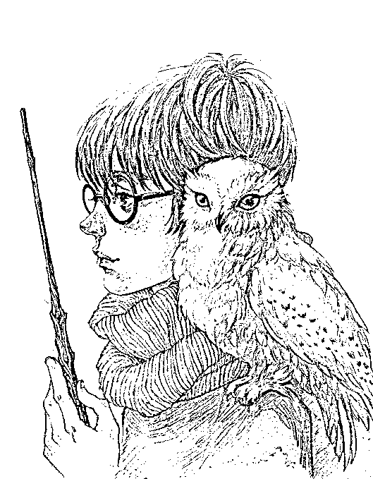

# | 插画师：古戈力

以情绪来举例说明，每个人的情况不同，觉察的程度也不同，觉察有四个层次：***1.*** **不知不觉：**没有觉察情况，当情绪来了，会被情绪控制，做出很多不计后果的事情。而且每次都是同样的状况，反反复复；***2.***** 后知后觉：**情绪过后，自己能够反应过来，自己做的对与错，但是很难避免同样的情况再次发生；***3*****. 当知当觉：**当情绪来的时候，你已经知道在这个当下，正在发生什么。当达到这个层次，你就可以自己控制情绪，从而影响后事的发展；***4*****. 先知先觉：**当事情还没发生，就可以预知它要发生了。因为你对情绪的觉察已经越来越熟练，所以情绪还没来，你就知道它要来了。所以，你也就有了更好的选择和处理方法。所以，我们要自我觉察，向内探索，觉察是为了接纳，然后做出改变，成长，迭代，升级。**那么要如何练习自我觉察，掌握先知先觉的能力呢？**

2

**每日觉察的工具推荐**

**今日天象&近期行进**

若道 APP 中的今日天象功能，罗列展示每一天的具体天象，你当天的行进和行进周期：

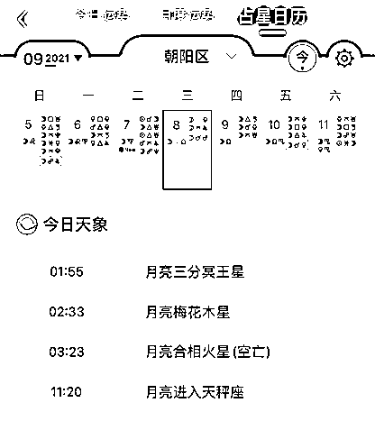

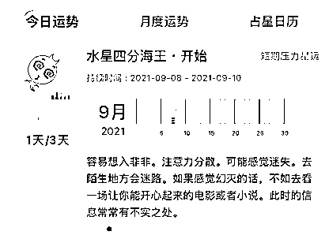

作为占星师，可以这样使用这个自我觉知工具：

**记录梦境**如果你有醒来记录梦境的习惯，每天早上看一下睡梦中的天象和行进，对应联想，你会惊喜地发现一些神奇的对应，能够更敏锐的捕捉到日常被压抑的情绪和需求。能够帮助你在白天的工作生活中先知先觉的关注身心状态。**规划生活**每月月初，周初都可以参考天象和行进进行日程规划，预估可能的助力和阻力，在对的时间做对的事，会发现平平无奇的日常也可以有不一样的色彩。根据月相的变化感知情绪的起伏，更好的自我关爱。**感知环境**当身边发生了引起你注意和好奇的事情，或者网络上层出不穷的新闻热点，都可以在天象中寻找对应的能量。从更大的格局视角去思考你的个人观点。通过环境的共振，更深入地理解自己的出生星图。以上都是很好的学习深化占星知识的方法，只需要系统掌握以下知识，就可以开始使用以上方法去提升自我觉知。**第*1*阶 黄道星座&个人行星****概要介绍占星学与星图**

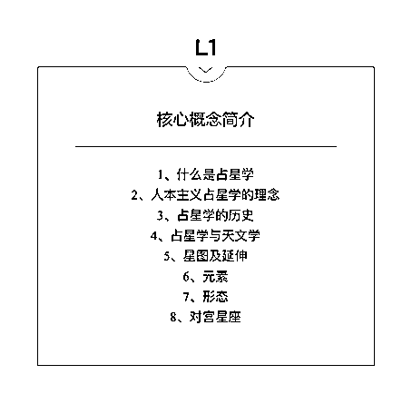

**四元素与三形态**

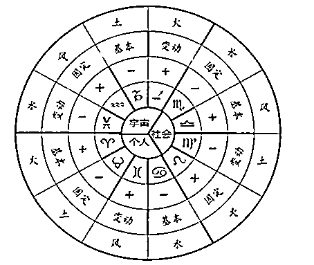

**黄道 12 星座**

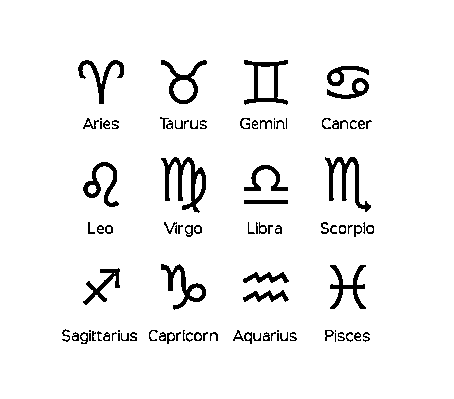

**太阳、月亮及其他个人行星**

**第*2*阶 行星&宫位****木星&土星****天王星&海王星&冥王星**

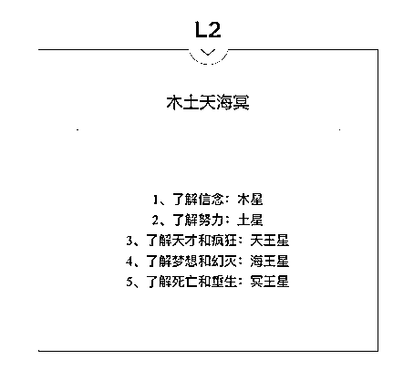

**练习组合所有行星**

**四轴**

**十二宫位**

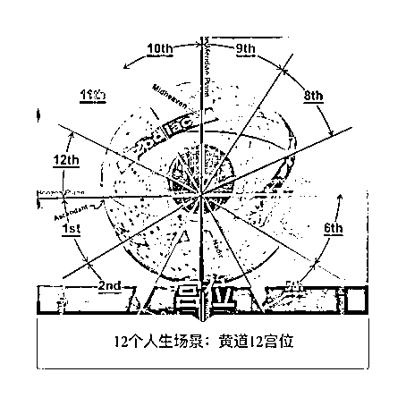

**组合宫位、行星、星座****第*3*阶 月亮交点、相位以及初步解读星图**

**了解灵魂进化的路径：月亮交点**

**相位概论**

**相位&行为模式**

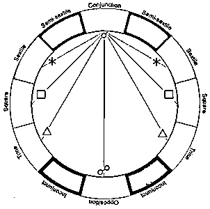

**困难相位**

**柔和相位**

**容许度，出入相位**

**渐盈渐亏相位**

**空相**

**宫主星&定位星**

**相位模式**

**组合相位、星座、行星、宫位**

**解读的基本原则，权重，失衡**

3

**课程安排是怎样的呢？**

**第*1*阶**2021 年 9 月 15 日开课，每周一天晚上 20:00-22:00 上课，共 6 次课**第*2*阶**2021 年 11 月 11 日开课，每周四晚上 20:00-22:00 上课，共 6 次课**第*3*阶**2022 年 1 月 6 日开课，每周四晚上 20:00-22:00 上课，共 15 次课 2022 年 4 月 30 日、5 月 1 日**L3 北京两日线下工作坊**

****

4

**授课老师**

**艾德里安·罗斯·邓肯**

**（AdrianRoss Duncan）**

**· **1971 年在印度游学时开始学习占星学，1985 年开始成为全职占星师，迄今执业已超过 33 年，是人本主义占星学、卜卦占星学和经世占星学领域的知名占星师。他还开发了占星软件 AstroClock 和多款占星报告；**·** 哥本哈根占星学院院长；**·** 他在日常咨询中经常运用卜卦，咨询图（卜卦的一种运用方式，即根据客户来访时间制作星图，从星图中获得大量信息）也是他特别擅长的领域；**· **艾德里安·罗斯·邓肯从 1971 年开始研习佛学，受佛学影响很深，他相信占星学和佛学观点一致，转化的一个基础是在于对现实感知的改变。而卜卦很容易与佛教融合，因为它只关乎当下。

**大卫·瑞雷**

**（David Railey）**

**·** 若道联合创始人，致力于在中国教授和推广西方占星学；**·** 曾任 ISAR 全球副主席，CAPISAR（ISAR 职业占星师资质认证机构）主席；**·** 1976 年，通过亚特兰大职业占星师考试，成为全职占星师，随后通过 AFAN 和 ISAR 职业测试；**·** 1980 年，与杰夫·焦耳一起在亚特兰大创建“每日行星”占星学中心。此后在亚特兰大占星协会担任 4 年考官，并且两次担任亚特兰大地区占星协会主席。1979-1992 年，作为占星师活跃于美国社会媒体，向不了解现代占星学变化的大众宣传专业占星学知识。在 1989-1992 年期间，他在 WRGG 电台 12 频道每周主持个人电视秀“今日占星学”，早先他还在 WRFG 的广播节目中播讲宇宙天气节目；**·** 2010-2014 年，任全美占星师联盟监督委员会委员；**·** 2010 年，其著作《灵魂的目标》中国版出版，和蒋颖一起创办若道占星学校和其官网 www.nodoor.com；**·** 2017 年，被选为 ISAR 委员会成员。ISAR 是世界最大的国际占星机构，会员遍布 45 个国家，2017-2020 年曾任 ISAR 全球副主席、CAPISAR（ISAR 职业占星师资质认证机构）主席。

**克里斯蒂娜·罗登贝克**

**（Christina Rodenbeck）**

**· **克里斯蒂娜·罗登贝克（Christina Rodenbeck）是一名全职职业占星师，在牛津大学城生活和工作，深受周围知识和文化氛围影响；她拥有伦敦大学（University of London）的人文荣誉学位，曾在伦敦占星学馆（AstrologicalLodge of London）、心理占星中心和占星研究学院学习；**·** 作为一名占星师，在过去的 20 年里，克里斯蒂娜在她的网站“牛津占星师”上写了大量关于时事、艺术和文化的文章；她每月主持一个占星播客：“与克里斯蒂娜和萨莉一起占星”，并定期在《占星杂志》(Astrological Journal)上撰写时尚专栏；她定期在英国授课，并保持着蓬勃发展的专业实践。

**琳恩·贝尔**

**（Lynn Bell）**

**·** 世界最受欢迎的占星学演讲者、作家和老师之一。定居巴黎，研究心理占星学和家族模式数十年；

**·** 著名的心理占星学中心（Centre for Psychological Astrology）的长期导师。2016 年，获得查尔斯·哈维（Charles Harvey）杰出的占星学服务奖；

**·** 作为一个从多个层面进行工作的占星咨询大师，琳恩的工作结合了心理学的观点。她对家族模式的兴趣首先来自与客户的合作。通过在分析领域所做的个人工作，她所受的埃里克森催眠训练将她引领至家族系统。后来，她组织研究小组在家族星图上进行了数年的研究。她写的《家族占星学》就是这项研究的结果；

**·** 法国心理占星学协会的会长。除了占星学，她在法国沙特尔的新沙特尔学校任教 8 年，还 5 次获得了在《纽约时报》畅销书作者卡罗琳·迈斯（Caroline Myss）的卡罗琳·迈斯教育学院（Caroline MyssEducational Institute）合作教学的机会。**课程助教：**

**熊鹰老师**

**（天空的空）**

**·** 2008 年接触严肃占星学，至此爱不释手；**·** 2013 年师从大卫·瑞雷，研习现代占星学核心课程，并于 2014 年起担任该课程的助教，之后于 2017 年与 2020 年两次与大卫老师合作讲授完整核心课程（Level 1-5）；**·** 期间也跟随格伦·佩里、诺·泰尔、理查德·塔纳斯、罗伯特·汉德、苏·汤普金斯、斯蒂芬·弗里斯特、琳恩·贝尔、艾德里安·邓肯等多位国际占星大师进行学习，进行定向占星主题研究；**·** 2014 年末，通过国际占星研究协会（ISAR）资质认证并获得证书；**· **在若道占星任职六年余，以“传播系统、专业、实效的占星学”为职业使命，执教与助教已累计超过 700 小时。在业余期间也提供占星咨询服务；**·** 目前正着眼于占星学与中国文化之互参，以当代中国人的身心成长为目标，力求落到实处。

5

**此次课程适合哪些人？**

**·** 对占星学感兴趣，想要入门的零基础者**· **占星学小白，想通过星图学习识人之术**· **有一定占星学基础，但不知道该如何整合星图复杂碎片的人**· **想要师从更多殿堂级占星导师学习占星心法的人**· **走在自我探索和个人成长道路上的人

6

**课程价格**

**L1-3 价格**：15000 元

其他各阶段课程单报价格，请咨询课程顾问：**Maggie 老师**（微信：18510107057，请备注**“核心课”**）

长按二维码添加 Maggie 老师

7

**退转课程**

****· 退款原则请详看《教学协议》，如有疑问请咨询课程顾问****

****名师汇集金牌核心课程****

**授课老师：**琳恩·贝尔、艾德里安·罗斯·邓肯、克里斯蒂娜·罗登贝克、大卫·瑞雷

**授课时间：**2021 年 9 月 15 日起

**授课方式：**网络课程**，**英文授课，中文翻译

**费用：**L1-2 价格：4800 元**；**L1-3 价格：15000 元

**课程负责人：****Maggie 老师**（微信：18510107057，请备注“核心课”）

长按二维码添加课程负责人咨询~

****报名请点击“阅读原文”****

# 12 星座自画像丨天蝎座：描绘深层灵魂的艺术家

> 原文：[`mp.weixin.qq.com/s?__biz=MzA5NjA0NTAxNg==&mid=2651463523&idx=2&sn=8993a6f00ab6ba1800125f8745c38b63&chksm=8b48add4bc3f24c2e741986d3d9468b392874f7dff5b2dae0dd893e625a761eb120d1ac58a8b&scene=126&sessionid=1692737883#rd`](http://mp.weixin.qq.com/s?__biz=MzA5NjA0NTAxNg==&mid=2651463523&idx=2&sn=8993a6f00ab6ba1800125f8745c38b63&chksm=8b48add4bc3f24c2e741986d3d9468b392874f7dff5b2dae0dd893e625a761eb120d1ac58a8b&scene=126&sessionid=1692737883#rd)

作者/克里斯蒂娜·罗登贝克

译者/亚麻林恩 校对/江艺

编辑/翀子 文章图片及注释/作者提供

本系列是克里斯蒂·罗登贝克老师撰写的艺术中的 12 星座自画像（老师同时也在若道教授[【核心课程】](http://mp.weixin.qq.com/s?__biz=MjM5MjQwNjAyMQ==&mid=2649439064&idx=6&sn=94b422e288542661dfaa480588e47583&chksm=beb9543289cedd24de66b7a87c5ba0d86b9a6a3e154b7a8bc54c61763b658d92bb8ea12b5158&scene=21#wechat_redirect)，感兴趣的同学可以点击查看详情哦），角度独特，语句生动。本文是该系列第八篇：天蝎座自画像。关于其他 12 星座的自画像可以拉到文章末尾。

别指望能轻易读懂这一堆画像。这个月我们在天蝎座，这个星座喜欢处理更深层次的真相。双子座的光鲜亮丽或天秤座的华美绚烂可不适合天蝎座。**是的，天蝎座喜欢用暗黑情绪冲击我们的双眼。**

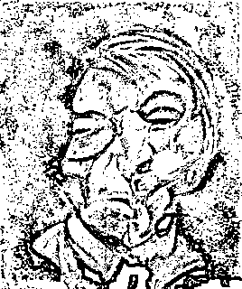

| 弗朗西斯·培根，10 月 28 日

当天蝎座照镜子的时候，揭示了什么真相呢？

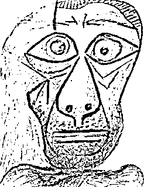

| 巴勃罗·毕加索，10 月 25 日

天蝎座看着他/她自己，看到的不仅仅是一个影像。这些是心理层面的画像。有时候，天蝎座会向我们展示镜子之外的东西，那是以图画形式**展现更深层的灵魂。**

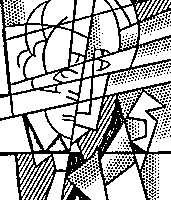

| 罗伊·利希滕斯坦，10 月 27 日

有时他甚至看到一个怪物。毕加索常常把自己画成一个人身牛头怪物，有时可怕，有时悲惨，或者只是一个普通的笨蛋。弗朗西斯·培根揭示了他饱受折磨的灵魂。画布就像是屠夫刀下的他内脏被切除。

罗伊·利希滕斯坦，因绘制诸多漫画头像说话游说而闻名，他切碎了自己的脸，说不出话来。

有时天蝎座更愿意完全离开；相当一部分非常有名的天蝎座艺术家根本没留下任何自画像。乔治亚·奥基夫似乎也没留下什么。也许部分原因是她的搭档摄影师阿尔弗雷德·斯蒂格利茨给她拍了数百张照片。但我认为这可能反映了**天蝎座对隐私的偏爱。**

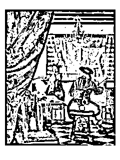

| 杨·维米尔，10 月 31 日

这里面有某种原始的魔法。如果你的脸被记录了下来，即使是被你自己，是否也会失去一些能量呢？天蝎座，当然永不放弃哪怕是一点点的控制权。

然后是缺席的肖像。这里有两个背转身去的天蝎座。

| 雷尼·马格利特，11 月 21 日

| 祖巴兰，11 月 8 日

这里，17 世纪的画家弗朗西斯科·祖巴兰也从观看者的视线中侧过身，去思索那些比他自己更重要的东西。我好奇他是怎么把自己的整个轮廓画成那样的。有趣而恰当的是，他选择画沉思着的、受苦受难的耶稣基督，而不是，比方说被圣母玛利亚喂乳。**毕竟，死亡是天蝎座的范畴。**

另一个人是威廉·霍格斯，他更愿意观众将注意力从自己的外表转移开，他的题材常常是贫民窟，这是另一个天蝎座的领域。他还画了他那条可爱的狗。但与大多数带宠物的肖像画不同的是，这幅画以小家伙为主。我喜欢他的头巾。

在海峡的另一端，他同时代的查尔丁，以华丽的静物画而闻名，为自己画了几幅自画像，画中的他也戴了一些有趣的头饰。这应该是那时的时尚，比我以为的戴上让人汗流浃背的假发要好多了。

但是看看那些天蝎座们锐利的目光。

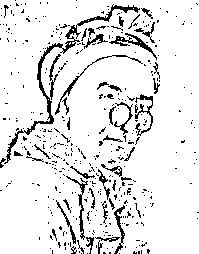

| 夏尔丹，11 月 2 日

| 霍格斯，11 月 10 日

| 安东尼奥·卡诺瓦，11 月 1 日

这是另一位天蝎座的凝视。安东尼奥·卡诺瓦以其感性的雕塑而闻名，他目不转睛地盯着自己，嘴巴微张。这真是一幅激烈异常的自画像。他好像暂时屏住了呼吸。

****版权声明：**本文由若道翻译发布，欢迎转发，反对抄袭。友号转载请申请白名单。**

****

**12 星座自画像**[白羊座](http://mp.weixin.qq.com/s?__biz=MzA5NjA0NTAxNg==&mid=2651452779&idx=2&sn=38a345623020cadc4ed4f42904d29926&chksm=8b4b47dcbc3cceca0fbf3e66149382c065ff3dbc2f61c881cdba2807e9e4c0c8f9ec71f1e245&scene=21#wechat_redirect)| [金牛座](http://mp.weixin.qq.com/s?__biz=MzA5NjA0NTAxNg==&mid=2651453849&idx=2&sn=7f5ada7b667fcd56f09c2a4bffadab67&chksm=8b4b4b2ebc3cc2386cc5ee12e45ac147964723803ce5714b7c612caf6bf0436652a82e0eaf9a&scene=21#wechat_redirect) | [双子座](http://mp.weixin.qq.com/s?__biz=MzA5NjA0NTAxNg==&mid=2651460660&idx=2&sn=a239f43ebe4aa8c8058cfa11d79028d4&chksm=8b48a683bc3f2f9539414a0d2b911b7a8f67befff92ed4dad04c4387aaa4a44ec883ab777afd&scene=21#wechat_redirect) | [巨蟹座](http://mp.weixin.qq.com/s?__biz=MzA5NjA0NTAxNg==&mid=2651461305&idx=2&sn=dffc1bb3cfeb85d7e388220b268914b8&chksm=8b48a40ebc3f2d1847a163a94ec9ca66b2722ca5754c3e8bc834e8be2377dd290bf08ae9bdfb&scene=21#wechat_redirect)[狮子座](http://mp.weixin.qq.com/s?__biz=MzA5NjA0NTAxNg==&mid=2651461947&idx=2&sn=70a6531351eda8206c0bf346a74be567&chksm=8b48ab8cbc3f229ac7d6b1b81855854a827e4512a40504f41e114e795ab3c69d4317d8cd3bba&scene=21#wechat_redirect) | [处女座](http://mp.weixin.qq.com/s?__biz=MzA5NjA0NTAxNg==&mid=2651462817&idx=2&sn=dbab080313efe24e0b2bd352b3443564&chksm=8b48ae16bc3f2700ff9e5ff9e5813e64621a86bfc949cdbbedb3d02efdbe22c8bea0adf1342e&scene=21#wechat_redirect)丨[天秤座](http://mp.weixin.qq.com/s?__biz=MzA5NjA0NTAxNg==&mid=2651463086&idx=2&sn=159842ea785585171060b39a0ef40bbc&chksm=8b48af19bc3f260f7d57487f4f3f8247b471a554c8ff7da5c0b3a64f5c980a507981254f1fac&scene=21#wechat_redirect)

**克里斯蒂娜·罗登贝克**

克里斯蒂娜·罗登贝克，若道签约老师。全职职业占星师，从业 20 余年，在其网站长期撰写时事、艺术和文化的文章；定期在英国授课，并保持蓬勃发展的专业实践。

**学习占星学****点击下图了解课程详情** 

****************

**微信又双叒叕改版啦，不想错过若道君的推送？**

**就把若道设为星标吧！**

**▼**

**喜欢记得点一下在看哦☟**

********报名直达入口********

# 太阳金牛座与 12 星座月亮丨“谁是你心里最宝贝的珍珠”？

> 原文：[`mp.weixin.qq.com/s?__biz=MzA5NjA0NTAxNg==&mid=2651463523&idx=1&sn=69fa5ba9035316fecd6c3911e744f089&chksm=8b48add4bc3f24c274cd5064316982ae958debed1e9ab681b46b80d8d8ec26bb3d2036075be9&scene=126&sessionid=1692737883#rd`](http://mp.weixin.qq.com/s?__biz=MzA5NjA0NTAxNg==&mid=2651463523&idx=1&sn=69fa5ba9035316fecd6c3911e744f089&chksm=8b48add4bc3f24c274cd5064316982ae958debed1e9ab681b46b80d8d8ec26bb3d2036075be9&scene=126&sessionid=1692737883#rd)

☆****后台回复“今日”，给你一句生命态度****

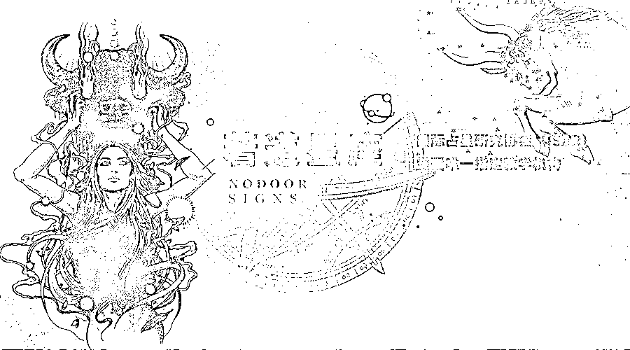

作者/诺·泰尔 译者/江艺、dogcatcher 编辑/翀子 封面/书君 图片/网络太阳是生命的伟大能量，而月亮被认为是人格中的“主导需要”，同样被重视（你可以点击[【开篇】](http://mp.weixin.qq.com/s?__biz=MzA5NjA0NTAxNg==&mid=2651463192&idx=2&sn=7ecd2012aee1f245b56e0f107bdfc19e&chksm=8b48acafbc3f25b968e9ca8cbe8acf6972dc3e418827b36ac12af7bf7c81858937657babb393&scene=21#wechat_redirect)，查看诺·泰尔老师对此部分内容的详细阐述）。当金牛座太阳，遇见 12 星座月亮，分别有哪些表现呢？**太阳金牛座和 12 星座月亮****★月亮*****白羊座 ***

**强有力的个性**：白羊座月亮的活力获得了连贯的目标和稳固的结构。他们的个性因而具有突兀感和冲劲，会命令式地向外界索取想要的东西，很可能还是无礼地。

**毛躁的外表和气质经常掩藏着深刻的动机与坚定的决心**。他们的自我表达具有很高的可信度；坚韧不拔。

**这种配置的难点，在于尊重他人的类似的个性**。他们总是认为自己能够获得渴望的东西。 

**★月亮*****金牛座 ***

自我意识（在固定星座）的聚焦。他们**能够把固执转化成决心和平易近人**。而对权威的尊敬则建立在自己变成权威的决心之上。他们的**耐心**为意志铺平了道路。

他们的**责任感**经常是默认的，而一旦被敏锐的洞察力所激活，就能建成个性之塔，树立威信。

**★月亮*****双子座 ***

他们能有条不紊地、流利而又富有批判性地将内心观点表达出来，但这种表达的井井有条可能会被私人化的不满情绪所打乱。**双子座的多样性威胁着要破坏金牛座的稳固。**

对他们来说，**好奇心和求知欲应当替代肤浅的思考**；**确凿和务实**应当拯救浮躁和犹豫的心理潜势。 

**★月亮*****巨蟹座 ***

在确认安全感和建立个人企图的过程中，他们的**情绪流动**得太过流畅，因而容易有虚荣的毛病。他们的自我认可可能是非常肤浅的。私人情感与好恶时刻准备着支持思想、影响抉择；但却**需要明确的生活目标，才能富有建设性地表达自我**。

**过多的处理人际关系的技巧**可能成为他们的缺点。如果有对分相的帮忙，上述特点会使他们的自我表达更加平滑，从而确认自己的真正需求。 

**★月亮*****狮子座 ***

这个配置能够引人注目地把自己的意愿展示出来。**支配**是个性的基调；**时刻期待着尊重**；相信本能。他们一般可以主动地组织想法，经营人际关系和制定计划，且往往有着**富有识别度的表情与气质。 **

**★月亮*****处女座 ***

表达自如，这能使他们**安详、注重常识，并具备一种好相处的独立感**。他们注重学习和精确，能串联起一个个细节，来使生活更有质感。

**这种舒畅的能量流动太容易稀释个性的发展。**星图里最好有压力相位的帮助，把个性引领到富有活力的进步当中去。 

**★月亮*****天秤座 ***

金牛座太阳的稳固和天秤座月亮的社交取向之间产生紧张。二者都被金星定位：**浪漫的维度被强调了**。他们的自我独立经常被遗忘，金牛座的规划力可能被浪费在社交和感情生活中取悦他人的行为上面。 

**★月亮*****天蝎座 ***

热情的固执。硬着头皮，自行其是。把私人财物锁得妥贴，然后再去探索新事物。做事情时有种（自我陶醉的）**戏剧感和使命感**，且很容易发展为静态气质的一部分。除非被柔和相位弥补，否则总是和自己的**内心安全感**过不去。

这种紧张容易滋生出惰性来，以至于从各个方向都难以做出努力去改变。**压力太容易被刻意伪装和掩盖起来，**个性发展的行动力被瞬间清空。 

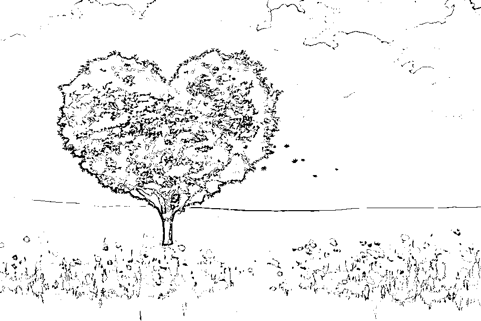

**★月亮*****射手座 ***

金牛座太阳坚固的内心被富有社交表现力的射手座月亮提升了。他们将**敏锐的道德感和社交意识**联姻，为个人计划寻找良好的实现途径。

对他们来说，**个人利益非常重要**，如果对自己有利，他人的成就会被急切地吸收。当个人利益得不到满足的时候，他们则容易站在高处批评别人。

**他们能清楚地表达自己的道德和伦理观念，**为个人野心提供一个社会化的标签。 

**★月亮*****摩羯座***

**这****是对影响力，对威望的呼唤**。理想主义和现实主义手拉手，创造一个物质化的生活结构。具备了公平美好和荣誉感，个人野心在和他人互动时顺畅地流动。**控制安全感乃是生活的目标。**

摩羯座月亮的强势能量因为和太阳星座的 120 度关系，能够输出得不那么带有破坏性，更加高尚。

**★月亮*****水瓶座 ***

随和的交际礼貌往往掩藏着他们内心的强硬态度——像毒蛇一样精明，又要像鸽子一样无害。**他们能将感情转换成具体的实务。**

**独立和优越感是个性的关键组成。**如何在同他人的新颖的合作中表达自己的核心立场？如何在自我意愿和宽宏大量之间做到平衡？**这些都提出了个性发展中的紧张课题。 **

**★月亮*****双鱼座 ***

他们往往对**潜意识领域**有一定的体验，却很少表现出来；但却可能将其转化成**创造力**！尽管渴求怜爱和同情，他们却**容易通过内省将自己和外界隔离开来。**

**这个配置的挑战，是将内心的敏感聚焦到外界的目标中去，**并为其补充艺术和感性的回应。 

**版权声明：**本文由若道翻译发布，欢迎转发，反对抄袭。友号转载请申请白名单。

**本系列其他文章**

[太阳白羊座·12 星座月亮](http://mp.weixin.qq.com/s?__biz=MzA5NjA0NTAxNg==&mid=2651463192&idx=2&sn=7ecd2012aee1f245b56e0f107bdfc19e&chksm=8b48acafbc3f25b968e9ca8cbe8acf6972dc3e418827b36ac12af7bf7c81858937657babb393&scene=21#wechat_redirect)

**诺·泰尔**

现代占星学鼻祖，世界众多著名西方占星师的占星老师。他毕业于哈佛大学社会关系专业，是当今世界上最重要的占星师之一，占星联盟协会（AFAN）的创始人及原主席。其所著的三十三本占星教科书作为占星教学的典范，引领了整整两代占星师的占星学习与教育，1998 年国际占星大会（UAC）授予其占星界最高奖项 “轩辕奖”。

**学习占星学****点击下图了解课程详情** 

****************

**微信又双叒叕改版啦，不想错过若道君的推送？**

**就把若道设为星标吧！**

**▼**

**就是这个“在看”，戳戳戳 ☟**

****************报名直达入口****************

# 雷蒙德·梅里曼金融占星周运 | 11 日-25 日，需关注

> 原文：[`mp.weixin.qq.com/s?__biz=MzA5NjA0NTAxNg==&mid=2651463492&idx=2&sn=92535df82637f7bd64650c0c964ab480&chksm=8b48adf3bc3f24e597c02a067345546d9129f8ec6b9ede9166bcf3567b96614025465497d2f8&scene=126&sessionid=1692737883#rd`](http://mp.weixin.qq.com/s?__biz=MzA5NjA0NTAxNg==&mid=2651463492&idx=2&sn=92535df82637f7bd64650c0c964ab480&chksm=8b48adf3bc3f24e597c02a067345546d9129f8ec6b9ede9166bcf3567b96614025465497d2f8&scene=126&sessionid=1692737883#rd)

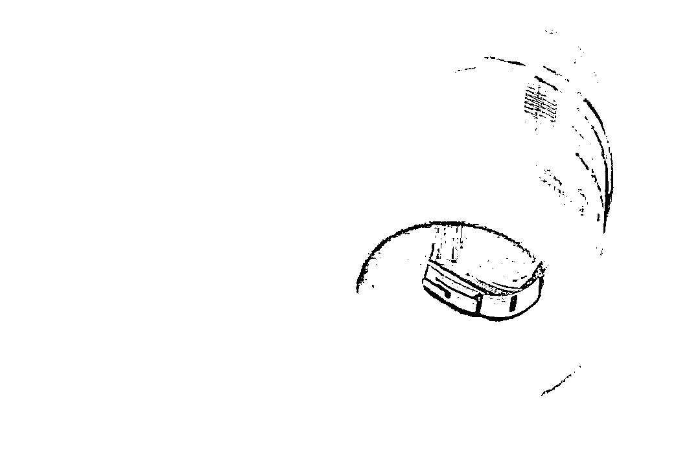

作者/雷蒙德·梅里曼 译者/Luke
编辑/玫瑰 图片/网络

雷蒙德·梅里曼是在金融占星学界稳坐第一把交椅的占星师，同时他也是若道签约的金融占星课老师，我们引进了雷蒙德·梅里曼老师的《[上证指数月度报告](http://mp.weixin.qq.com/s?__biz=MzA5NjA0NTAxNg==&mid=2651462440&idx=3&sn=1c45283342a3cb70cb06be2a0f79ab9b&chksm=8b48a99fbc3f2089cdeb7e7014fae031358fbf2824825603c7f00a56311ff43b8589902deb7f&scene=21#wechat_redirect)》及《[黄金报告](http://mp.weixin.qq.com/s?__biz=MzA5NjA0NTAxNg==&mid=2651462440&idx=3&sn=1c45283342a3cb70cb06be2a0f79ab9b&chksm=8b48a99fbc3f2089cdeb7e7014fae031358fbf2824825603c7f00a56311ff43b8589902deb7f&scene=21#wechat_redirect)》。我们经老师的授权，将每周刊登梅里曼老师的周运，供大家参考和学习。于是，这是本周的周运（12.13-12.17）。

**说明：以下时间采用纽约证券交易所所在地美国东部标准时间。**

**展望与回顾**

****

**劳工部周五表示，11 月通货膨胀正以 1892 年以来最快的步伐加速，为经济复苏带来压力，也给美联储带来风险。**

**衡量一篮子商品和服务的消费者价格指数，当月上涨 0.8%，年度同比上涨 6.8%，是自 1982 年 6 月以来的最快速率。**

**——杰夫·考克斯**

**《通货膨胀 11 月飙升 6.8%，是 1982 年来的最快》**

**www.cnbc.com**

**2021 年 12 月 10 日**

**4 月，经济学家估计当前的通货膨胀应该在大约 2.5%左右。现实是，它已经超过了 6%。即使以经济预测极其宽容的标准来看，那也是一次重大的误判……**

**与此同时，上升的通货膨胀可能通过价格和工资的调整自行变得更加严重。那么，对于这种不常见的通货膨胀，解决方案却令人痛苦地是同一个套路：更高的利率，或许是一场衰退。**

**——格雷格·伊普**

**《大量的通货膨胀，超过了旧模型的预期》**

**《华尔街日报》**

**2021 年 12 月 9 日**

**拜登总统周五称赞了上个月失业率意想不到的下降，尽管 11 月的新增就业严重低于预期，是今年创造就业最差的一个月。****——梅根·亨利****《拜登鼓吹失业率降低，尽管 11 月新增就业严重低于预期》****www.foxbusiness.com****2021 年 12 月 3 日**12 月 4 日强有力的日食后，上周市场开盘就是爆炸式的反弹。还有什么比这更能体现射手座的夸张性质吗？

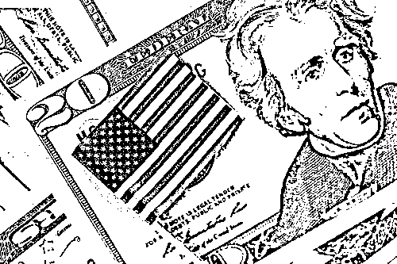

在多个全球股指承受了今年最剧烈和持久的下跌之一（如美股等股指则经历了最剧烈的下跌），持续到 12 月 3 日的低点后，大多数在上周开始了非常强势的反弹。对于许多股票指数，比如道琼斯工业平均指数，12 月 1-3 日的低点是 7-8 周内最低的价格。但在 12 月 6 日，它反弹了 646 点，接下来一天又反弹 462 点。周五又上涨了 216 点。需要指出的是，12 月 3 日的低点可能与行进火星与纽约证券交易所星图中的水星-冥王星四分相形成 T 三角有关，这一组合与美国股指的剧烈抛售和低点有着可靠的关联。随后而至的剧烈上涨，可能与火星行进后立刻出现的射手座日食有关。另一个值得注意的是股票指数是上证综合指数。在前一周 11 月 29 日创下 3526 的低点后，它在 12 月 9 日飙升至 3688，非常接近 2 月 18 日的多年高点 3731。这很重要，因为**第一次土星-天王星渐亏四分相在 2 月 17 日发生**。**第三次，也是最后一次土星-天王星渐亏四分相正在入相，将在 12 月 24 日精准成相，而上证指数看起来即将创下另一个重要的高点。**然后会怎样？在 2 月的第一个高点后，它剧烈下跌至 3 月 9 日的低点，形成今年双底第一条腿的低点。在 6 月第二次土星-天王星第二次精准成相后，当时上证指数创下了下一个基本周期波峰，随后下跌至 7 月 28 日双底第二条腿的低点。这里呈现出了一种模式。在其他市场上，白银度过了糟糕的一周，周五下跌至 21.81。仅在 3 周前，在梅里曼市场时机学院上一个二星级关键反转日，它还上涨至 25.49。好消息是，黄金的跌幅不及白银严重。它守住了前一周 12 月 2 日的低点 1762.20。

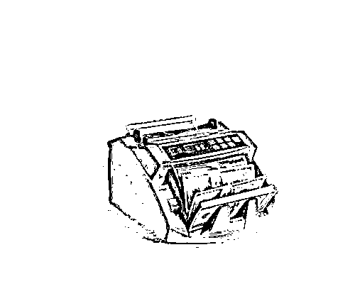

**短期占星趋势和长期考量**

****

**本周早些时候，中国人民银行声称它将放宽银行存款准备金率，为银行借贷提供更多现金。****此举违背了它几周前发出的政策信号，与此同时，中央银行和其他金融机构正在接受北京的审查，为的是遏制资本在经济中的影响。****——魏玲玲****《中国中央银行感到缰绳收紧》****《华尔街日报》****2021 年 12 月 9 日****拜登总统排除了当俄罗斯入侵其邻居（乌克兰）时美国单方面使用武力的可能性。俄罗斯入侵乌克兰将是自冷战结束以来，欧洲最大的军事行动，为欧盟、西欧大国和北约带来了安全挑战。****——凯瑟琳·露西、安·M.·西蒙斯****《如果俄罗斯入侵乌克兰，拜登排除了美国使用武力的可能性》****《华尔街日报》****2021 年 12 月 9 日**

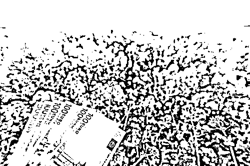

上面两则引文，正好反映出接下来几天要发生的地球宇宙学征象。**首先，金星将在 12 月 19 日逆行。**这是与基本周期有着最强关联的地球宇宙学征象之一。它不是 100%的，但是有着超过 70%的频率，是非常高的。**金星也将合相冥王星，在 12 月 11 日和 25 日精准成相。**这两个地球宇宙学征象与某些或某几个世界中央银行的政策改变有关。12 月 19 日-1 月 29 日，金星逆行，尤其与中央银行宣布出人意料的政策改变有关。金星守护与金钱和货币相关的金牛座。**当任何一颗行星逆行时，有一种可能性是那颗行星掌管的事物突然和出乎意料地发生改变。**金星，在占星学中被认为是犹豫不决的行星，是犹豫不决的星座天秤座的守护星。因此，金星逆行象征着这段时间人们常常改变他们对人际关系或财产的看法。**如果改变与中央银行的政策有关，那可能在金融市场造成巨大动荡，尤其是货币、国债和股票指数的价值。**冥王星守护金牛座对面的星座天蝎座，天蝎座也与金钱相关，尤其是债务。当冥王星与金星一起被强调时，**货币价格再一次得到强调。同样被强调的是糖和大豆的价格。**冥王星不仅与债务有关，它还可以对应**侵扰或干预的活动，从而迫使市场趋势改变，这与政策的改变相关。**

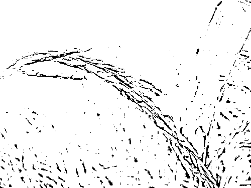

因此，中国人民银行在中国政府的要求下，宣布“撤回”先前的政策，对于理解这一关联的人来说，并不出乎意料。但对于那些不理解这一关联的人来说，可能有些出乎意外。世界上其他中央银行，是否会在接下来几周宣布突然改变货币政策，以及这些宣告对金融市场产生什么影响，还有待观察。比如说，美联储多次表示，将撤回每个月购买国债的量化宽松项目，并且迟早会开始加息。如果美联储在 12 月末或 1 月初，当木星与美联储成立星图的冥王星形成三分相，并六分美联储成立星图的太阳时，改变那一说法，也不要太感到意外。但是在那之后，如果他们事实上真的决定收紧货币政策，或许甚至比预期的还要快，也不要太感惊讶。由于木星在双鱼座，金星逆行合相冥王星，美联储可能会给出一些严重混淆的信息。我不确定市场是否能欣赏这种程度的不确定和不一致性。每个人都知道掌权的政治家不会为加息鼓掌致谢。我们期待，金星逆行对应基本周期的顶点，并开启数周甚至数月的逆势反转。第二段引文，关于俄罗斯部队在乌克兰边境集结，与 12 月 13 日-3 月 6 日的火星进入射手座和摩羯座有关。**在我数年前进行的原油价格研究中，我注意到大幅度的价格波动和频繁的反转，最常发生在火星位于射手座-摩羯座和双子座中。**进一步的研究揭示，**原油价格的剧烈波动，对应军事侵略的增加，尤其是在中东，尤其是涉及以色列时。**这不禁让人好奇，俄罗斯部队在乌克兰边境集结，是否会与伊朗或其他中东国家的类似军事行动同时发生，从而使乌克兰面临的威胁更加复杂，或分散对它的注意力。由于土星即将与天王星在 12 月 24 日最后一次形成精准的渐亏四分相（最大容许度 10 个月），加上金星转向逆行合相冥王星，在接下来 1-7 周世界可能面临一个以上的危机。考虑到金星-冥王星合相也合相美国建国（1776 年 7 月 2 日）星图中的月亮-冥王星合相，不得不担心美国是否做好了准备，同时应对多个危机。与此同时，为 12 月 11 日 -25 日做好准备，届时将出现三个强有力的地球宇宙学征象，可能会改变市场趋势和政治/央行政策。那可以是一个节日季，但也可能是一个动荡不安的节日季。宇宙大戏将在这周开始展开，一直持续到 1 月份。

**说明：以上日期基于纽约证券交易所所在的美国东部标准时间，由于存在时差，中国地区可能需要加一天。**

**版权声明：**本文由若道翻译发布，欢迎转发，反对抄袭。友号转载请申请白名单。

**雷蒙德·梅里曼（Raymond Merriman）**

若道签约老师。著名金融占星师，ISAR（国际占星研究协会）前主席，梅里曼市场分析公司的总裁。他由于“提升了占星学的职业形象”，在 1995 年国际占星大会上被授予轩辕十四奖；在 2012 年国际占星大会上，被授予轩辕十四终身成就奖。

1“中国上证指数月度报告”发售**若道推出了****中文版****的雷蒙德·梅里曼中国上证指数月度报告，并持续发行该报告！**当把金融市场的周期和占星学的周期相结合时，雷蒙德·梅里曼老师的金融占星学研究**为投资者应对金融市场的周期波动，并随之调整投资策略提供了极大的价值参考**。
**12 月中英文报告已上线！**2“黄金价格周期月度报告”发售**若道推出****中文版****的雷蒙德·梅里曼黄金价格周期月度报告！**不仅仅为广大读者在中国股市的投资出谋划策，更将视角放眼黄金市场。**每当世界经济形式不明朗的时候，有一个地方是保值的港湾，那就是****黄金**。自 1982 年雷蒙德·梅里曼出版第一本研究《地球宇宙学征象与黄金价格的关联》的著作以来，**他一直作为最重要的黄金市场时机预测者之一享誉国际**。12 月黄金报告已上线，梅里曼老师将会告诉你他对这个关键时期如何操作的想法。也可以按照季度和一年期订阅，有更多优惠。季度和年度的好处是，你可以持续了解梅里曼老师对于不断在变化的市场的看法。即便他某一次看法和市场不一致，你也看到在下一期他如何调整自己的看法，并看到金融占星在一个长期时间段内对你把控风险的帮助。而能够长期控制风险、尽量找到安全的投资时机才是投资的长久之计。**12 月中英文报告已上线！****购买套餐**，买得越多越优惠中国上证指数月度报告套餐价

*   **单月报告**：280 元
*   **3 个月套餐**：780 元（260 元/月）
*   **12 个月套餐价**：2400 元（200 元/月）

**长按下图识别二维码****购买金融报告****套餐****▼**

黄金周期月度报告优惠

*   **双报告年度套餐更优惠（直降 900 元）**

*   **12 个月黄金报告+12 个月上证指数报告：仅需 3900 元**

**长按下图识别二维码购买黄金报告套餐**▼

3 中国金融市场特别网络研讨讲座面对年底几个影响金融市场的重要天象，该如何把握下半年的投资，为跨年做准备？我们特意邀请雷蒙德·梅里曼老师为大家带来了**3 个小时的金融讲座——雷蒙德·梅里曼中国金融市场特别网络研讨讲座。**这场为期 3 小时的在线讲座探讨了**这些长期行星周期如何影响世界经济的长期周期和趋势，特别是如何影响上证综指和黄金市场**。并描述**在 2021 年剩下的时间里市场反转关键时间点，特别是 12 月 19 日至 25 日金星逆行，以及土星-天王星最后一次渐亏四分相、金星与冥王星合相的重要时期。****长按下图识别二维码购买讲座视频**
▼

5《2022 年金融预报和沙龙》1976 年以来，由雷蒙德·A·梅里曼撰写的梅里曼市场时机学院每年一次的年度预报沙龙和每年一本的《年度预报》一直在应用占星学原理为投资者们服务，提供卓越洞见，从未间断。 **雷蒙德·梅里曼《2022 年金融预报和沙龙》开始预售中。****长按下图了解详情**
▼

**点击阅读原文购买金融报告**

# 重磅丨火星进入射手座！这次它要陪我们跨越 2022！你的人生多久没有冒一次险了？

> 原文：[`mp.weixin.qq.com/s?__biz=MzA5NjA0NTAxNg==&mid=2651463492&idx=1&sn=beac9154f9fdd0aade75091aef11e04f&chksm=8b48adf3bc3f24e5e51853c31c64f3fe2fb681b6c7edbd9ee7b94fcd47cb80d1ed14e003a3aa&scene=126&sessionid=1692737883#rd`](http://mp.weixin.qq.com/s?__biz=MzA5NjA0NTAxNg==&mid=2651463492&idx=1&sn=beac9154f9fdd0aade75091aef11e04f&chksm=8b48adf3bc3f24e5e51853c31c64f3fe2fb681b6c7edbd9ee7b94fcd47cb80d1ed14e003a3aa&scene=126&sessionid=1692737883#rd)

******************☆ 后******************台******************回复“今日”，给你一句生命态度******************

作者/郑玮玲 ISAR 认证占星师
编辑/翀子 封面/书君 图片/网络

北京时间 12 月 13 日 17:52，火星进入射手座，此次火星将在射手座行进至 2022 年 1 月 24 日。跨年的射手座火星，可能会发生什么呢？一起来看看。

**火星进射手座**

**北京时间 12 月 13 日 17:52，火星离开天蝎座进入了射手座。**此次火星在射手座将行进 43 天，直到 2022 年 1 月 24 日才进入下一个星座摩羯座。

射手座是标志着远方的星座，它为人类带来了哲学、真理与信仰。在远古的占星学释义中，射手座也是流放、流浪，与故土的背离和无根的飘泊。

**代表个人力量、勇气、行动与意志力的火星犹如吉普赛人天然的流浪行程，**此时，只有来自未知远方的吸引和召唤是信念的动力、热望与真理。

**作为火象变动星座的射手座要我们投入火热的践行中**，无论探索、猎奇还是冒险、实践，都将鼓舞我们的力量与勇气。我们值得将热血与激情放在具有实验性、前瞻性和超越现有经验的活动中去。比如用脚步或双手的行动去奔向信念与未探索过的远方。

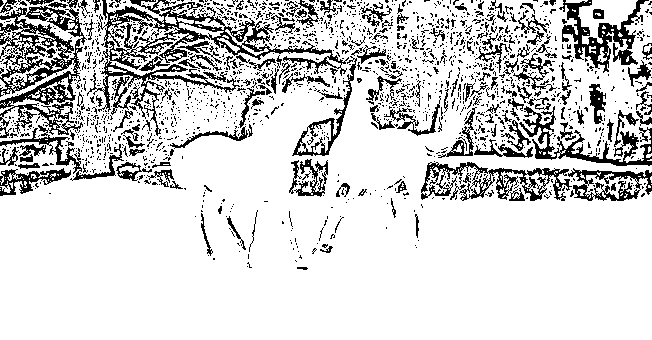

而所有这些探索里，**跨文化的实践最具鼓舞人心的力量。**对异域和异族文化的强烈认同感，是火星在射手座最令人兴奋的火种。这火种带我们见所未见，行所未行，穿越陌生新奇的疆域，我们整个身心意识都将被非原生的文化、意识、潮流所激励和鼓舞。

射手座的火星不怕文化与观念的冲突，不怕冒险与隔阂，它正是为了**穿透意识与文化的屏障**而发力，甚至带来对固有现状有力的破坏。

射手座的火星鼓励我们追求并实现乐观，抓住当下的幸运，将人生的扩张当成生命的当务之急，**势不可待地去投入有意义的冒险。**

人生需要不断探索与创新实践才能证明头脑、思想与精神、信念是否协作一致，是否既高尚又入世，既实用又有意义，既在当下成就又可持续发展。透过尝试、新鲜与猎奇的行动完成自我更新，这便是火星在当下不可阻挡的念头。

射手座的火星**在不确定性中找寻到未来的稳定构建**，从不同的经验中涉猎经验的多元性，也实践个性的扩张与变通。

**变动星座的射手座需要用从未有过的经验来完成火星的力量与意志的成长，**所有陌生的，带着意义的，具有文化冲突的，冒险的，新鲜的都会吸引、支持、鼓励我们的行动与参与精神。

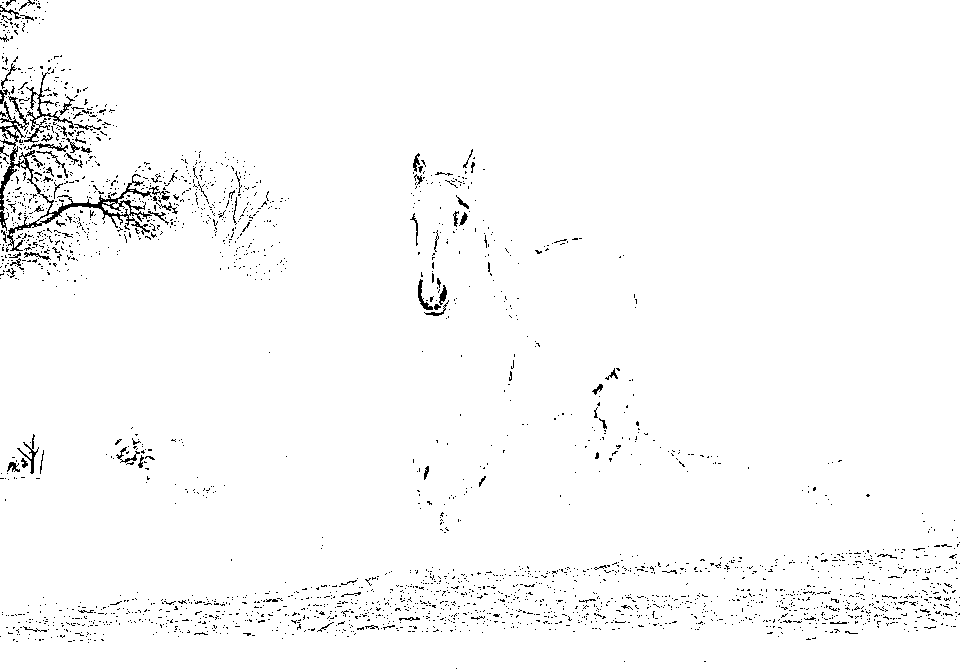

**射手座的流放与流浪**

**谈及射手座，流浪是不得不提及的词。**正因流浪、流放的创伤感，才能让“远方的意义”隐含的疗愈力。

我曾去到伊斯坦布尔，在亚洲海岸线对面有一座孤独的小岛，正是奥尔罕·帕慕克小说中写到的“王子岛”。

王子岛在书中的年代到如今都是伊斯坦布尔附近颇负胜名的观光地，岛上有很多光鲜漂亮的餐厅、马车和旅店，以及很多无人居住的别墅——这些正是贵族、帕夏、富商们的行宫、别院。

而在更久远的奥斯曼帝国时代，王子岛是用来流放不听话的王子贵族的地方。凡在政治信念上与最高权力不符，或是构成威胁的王公贵族就被流放到这与世隔绝的小岛，这就是王子岛名字的由来。

自古以来哪个国家上不曾有王公贵族被流放的故事？射手座的守护星木星代表着皇室与荣辱，射手座的流浪放逐与皇权、荣辱正有如此古老、天然的联系。

**无论浪迹何处，被流放的人心中都有永恒的故土家园——这就是射手座原生的伤痛，与熟悉家园的分离之痛。**

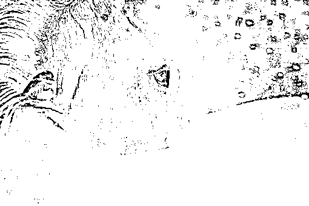

而后至今的流浪更多是人们因征战、求学、抱负、理想而远离故土与舒适生活，在别样的文化环境中去追寻、拼搏。流浪者们在年轻时为理想或某种特定的意义感踏上陌生的土地，未知和不确定的探寻就此与生命一同生长、交融着。

无论主动还是被动，都会让人在漫长和日渐粗糙的生活中经验到**典型的射手座的伤痛：放逐、流放，与熟悉的一切有着无法愈合的时空距离。**

在现代社会他们是这样的人们：建国初期支援边疆，投入三线建设的人们；改革开放下海踏浪的人们；为梦想北漂或是在陌生城市求学打工创业的人们。

**追寻路上的人们会产生这样的不确定感：**当下的道路与理想热望有着越来越远的距离；现实与最初的热望有着实质性的难以控制的差异。人们为理想未来跨地域地追寻着，同样也理想化了身在异乡的行动。

**在对热望追寻的过程中，人类释放了对命运的激情，也会开始面对深层的孤独。**生命因此安静了下来。最终我们用耐心、寂静驯化了心中的肆意的野兽，培养了安于孤独的生长力，用它来完成生命必要的构建。

**射手座的流放、流浪既是一种生命典型的创痛经验，更是一场人类对世界的终极爱恋。**

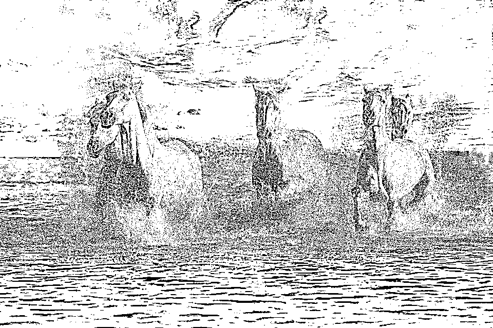

**火星在射手座适合做的事**

**冒险与机遇**

**射手座由于木星的守护，带来了机会、机遇与冒险。**

火星行进射手座时期，对机遇的高度直觉会引导我们做出值得的尝试——注意，**是“值得”而非正确与否。**这样的值得会让我们在整个过程结束后，事件、进行、计划甚至生命结束时，我们会认为自己做了值得做的事，不后悔曾经参与的激情追寻。

更没有错过任何活着的时候可以享受的快乐、幸运和机会。即使这样的机遇是需要冒险的，如果你放过了，可能就放过重要的机会。一切值得的冒险只因你的心因此跃动，你因此感受到了**生命全新的意义。**

**把确定性的结果放在理性与计划之外，去来一场为信仰、真理的华丽冒险吧。**

**哲学与真理**

火星在射手座带来了“哲学家的力量”，有助于我们具有思想的深度、力度，我们的思考有机会更多样化，多视野或更高远。

在此期间，我们值得**将直觉与行动伸向哲学和更高意识形态的领域。**当然，任何一种可称为信仰的体系，比如占星学或宗教也包括在内。

火星并不是关于思考的而是关于行动的，射手座给予了规模化、传播效应与总结性，**用你的行动去激发思想的动能，**体验、经验是最为有效的自我传播途径。

哲学与真理将放在**实践的运用**中，我们有机会透过经验再次领悟、开启更高层的智慧。**射手座也强化了热情、乐观的播洒动力，**带着真诚的欢乐去做播洒信念都会带来事半功倍之力。

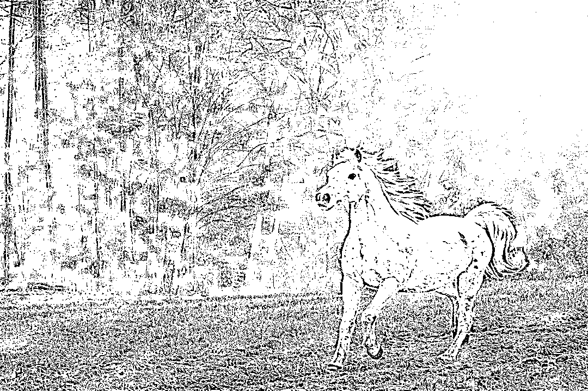

**野外与远行**

射手座有关的远方一定包括了行万里路的乐趣，跨国旅行当数其一。但目前疫情带来的国境管控实在令我们的远方梦寸步难行。**但走出家门去到大自然中探险、露营是不错的选择。**

无论你是选择当下时兴的 BC（Bush Craft）玩法还是搬家式露营，或是单纯的野外徒步攀岩探险，都是火星射手座期间不可错过的尝试。

只有投身野性自然，火星的天然动能才会深入在广阔与自由的意境中，野外的不确定性，高度的调试性与变幻性也能**激励我们投入生存训练的热情中。**野趣，更是专属于自然野性空间的馈赠，绝对无法在书本、思想与内在信念中可以找寻到。

**激情与直觉**

**火星射手座时期宇宙的引领是让我们跟随激情，跟随直觉。**

在此期间因为高度的动能、热情，我们可能会担心自己被一种冲动的激情蒙蔽、带走；我们可能在直觉的深入中失去了判断对错的能力，忽略了自由、无拘束的人生本就是合理的！人生总需要几次完全张弓才能飞向你看准的目标。

射手座的火星鼓励我们只看靶心，把身旁的一切当作背景中的和音。箭在弦上，**你需要义无反顾地冲向自己的目标。**此地不做妥协的选择可能是最佳的选择，没有令他人满意的反应也正是直觉的反应。

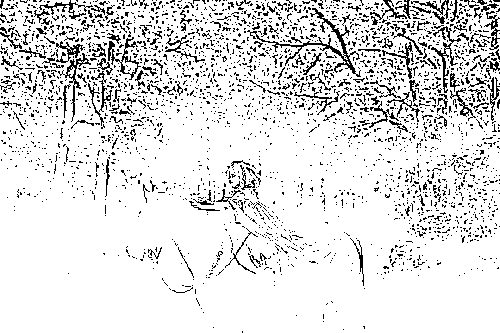

**火星射手座的人**

**Gabrielle Roth**是一位音乐家、舞蹈家，也是一位萨满。年少时的她就认定舞蹈为人生职业，始终热爱。但由于膝盖受伤她不得不结束舞蹈职业生涯。

那时正处在 60 年代，天冥合相在处女座的意识革新的正激越的时期，她来到了大苏尔，很多意识先锋聚集的伊萨兰学院。可以说太阳水瓶座的她也是那一场集体意识革命中的一员，在伊萨兰她发现了身体通过舞蹈自然疗愈了！

此后，她便在格式塔精神病学家弗里茨·珀尔斯的鼓励下，教授并开创了五韵禅舞体系，她和乐队创作并录制了大量用于出神舞蹈（Trance Dance）的音乐。人们通过她的舞蹈引领变得更有意识，她因此被称为冥想舞蹈老师。

**在所有舞蹈家的星图中我们都值得去关注那颗代表体能、力量的火星。**她的身体是如何使用的，她如何用舞蹈、动态表达自己的信念的。火星都给了我们清晰的指向。

Roth 有着射手座的火星，年幼的她就对萨满文化感兴趣，萨满、祭司都是与射手座共振的原型。

早年学习舞蹈时她受到最重要的启发便是来自吉普赛的舞蹈和来自非洲舞者的影响，这些都是真正意义上的外族文化，这让她对舞蹈，对生命经验的理解有了不同。

这让学习芭蕾舞的她拥有了要将舞蹈传播到世界各地的愿景，也最终让她在人生变幻的波澜中选择了与意识共舞。她在自己的书中说：

****

****运动的力量引领我们回到伊甸园，回到人间，完整而治愈。****

**奥斯卡·王尔德的火星也落在射手座**，这位浪漫不羁的爱尔兰作家无论在当时还是现代都如同玩世不恭的小孩，但他说的每一句话都引发心智成熟人的深思。

**人百分百确信的事从来都不会是真的。这是信仰的宿命，爱情的教训。**

**（*The things one feels absolutely certain about are never true. That is the fatality of Faith, and the lesson of Romance.*）**

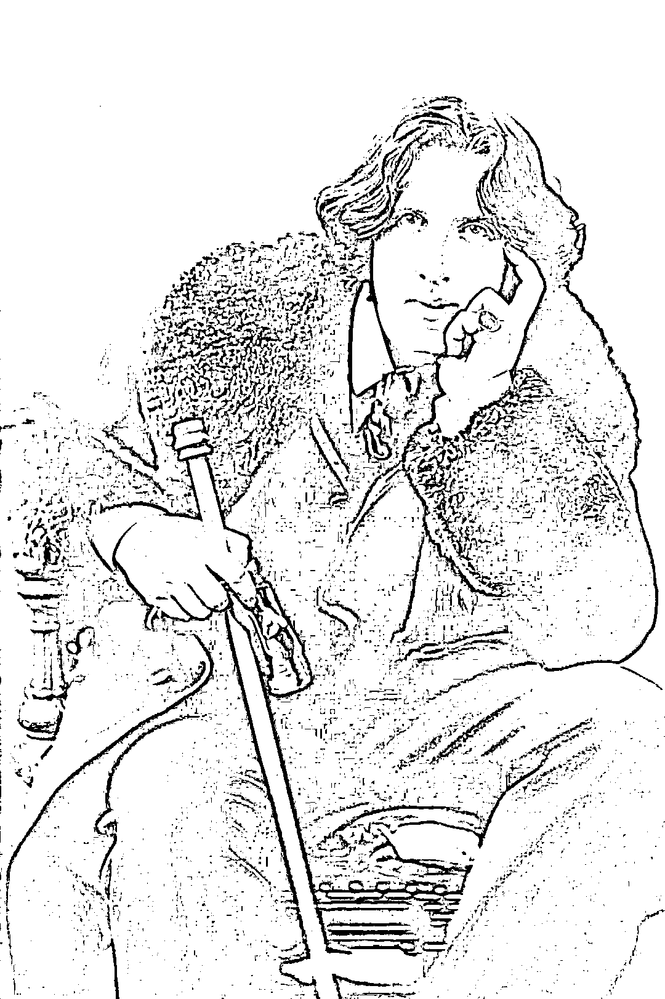

| 奥斯卡·王尔德

**火星在射手座期间的相位**

**火星四分月亮交点**

**这个相位在 12 月 2 日火星在天蝎座时已经开始形成，要持续到 12 月 25 日，并且会在火星换座进入射手座时呈现最强能量。**

**重点影响人群：有个人行星、四轴、交点位于双子座、射手座、处女座、双鱼座 0-8 度的人。**

月亮交点现在已行进至双子座、射手座初度，在火星四分月亮交点期间，月亮平均交点就已经进入下一组交点：南交天蝎座，北交金牛座。

变换的岁月里，**火星强化了信念的力量，真理的践行，鼓舞与激励之下的行动，**这些既是我们生命流畅与变通的决胜之力，也可能为个体的进化带来障碍与难题——盲目乐观或是对新鲜的过度沉浸，也可能因激情驱使犯下错误，进入困难、危险的处境中。

我们仍然要靠个人的力量为自己制造的难题解围。火星与月亮交点的四分相，强化着如何自我赋权给火星，那就是**为着生命、个性的自由而呐喊、战斗、**行使一切自我意志的权力。

而此刻我们对生命的信念是忠诚而强烈的，这种深植于现实行动的信念可以负责任地**向世界宣告我们是谁**，为怎样的道路而战，捍卫何种精神国度。

我们以此为自我明辨，向黑暗中的一切划清界限，让世界看清我们手中的火炬，以及它照亮的方向。**凭着勇敢与毅力去稳定灵魂的航向，徐徐靠近心之所属的目标。**

**火星六分木星**

**时间：12 月 13 日-12 月 19 日**

**重点影响人群：有个人行星、四轴、交点位于双子座、射手座、处女座、双鱼座 0-3 度，金牛座、狮子座、天蝎座、水瓶座 27-29 度的人。**

火星此时落在木星守护的射手座，火星与木星的六分相更是强化了真理与信念对个体意志、行动力的支持。你选择怎样的信念体系并在此扎根、深化，就能在中途中遇到充满意义的机会，遇到那些能支持你的团体、导师帮助你扩张你的志愿与真理，让你的行动结果最大化。

所以，无论你正坚持什么，**此时期最值得去深化你的信仰，去寻找到支持的力量并付诸行动。**

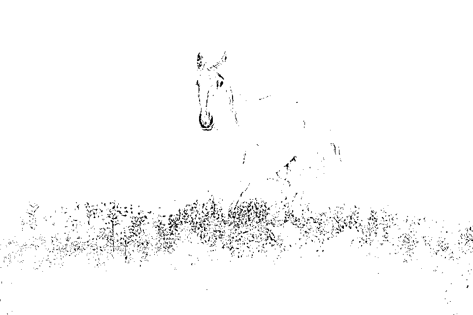

**火星六分土星**

**时间：12 月 21 日—2022 年 1 月 5 日**

**重点影响人群：有个人行星、四轴、交点位于双子座、射手座、处女座、双鱼座 5-15 度的人。**

无论是火星与木星，还是火星与土星的相位在火星天蝎座期间已经历了四分相的激烈摩擦。当下我们感受到的这“穿着紧身衣的战士”已经由天蝎座的炼狱历练出了骁勇善战的能力。

**我们已经能从过去一个多月的高压、奋战与疯狂磨练中提取到巧妙的方法与妥善行事的范本。**

**土星是时光、耐力与功夫铸就的成道之路，**眼下火星与土星的六分相是在给我们机会肯定一段时期的坚持、努力，肯定我们通过奋斗、抗争获取的力量、信念与耐心。

我们此刻可以带着近期努力而来的深刻、稳定的全新自我认知去采取新的行动，用新的思路，新的思考方式去完成接下来最具挑战的工作。

土星是负责出难题的，但这次**有利条件已经摆在面前。**遵循已走过的轨迹、规则会助我们顺利通过考验，用成就来巩固、肯定我们的信心。

**火星四分海王星**

**时间：12 月 30 日-2022 年 1 月 23 日**

**重点影响人群：有个人行星、四轴、交点位于双子座、射手座、处女座、双鱼座 12-28 度的人。**

**这是 2022 年开年的重头戏，**我们仿佛要从一场梦境中开始新的一年，并且还没有从上一个梦中醒过来。

现实困顿，每一个个体都可能感受到某些力量、意识在消融、隐入更大的集体性的背景中。我们的意志力在此刻需要高度警惕。日常的讯息不断冲刷我们的头脑，行动在各种层面受到干扰。我们可能困在众说纷芸的观点里，我们也可能因为想要实现更多而让自己陷入一团团生活的乱麻。

面对海王星的侵袭，似乎没有别的更好的方法，那就是——**让生活变得简单，让一切尽量简单。**即使我们会失去些什么，因为简单，失去也是可量化的。

**火星所代表的个人力量、意志力与界限会经由海王星的洗礼通达灵性层面的提升与振奋，**如果在此期间进行符合个人信仰、真理的灵性学习，参与任何灵性仪式都将有助我们在心灵深处获取来自宇宙的力量加持，让我们稳定在自我深信的道路中。

但这样的过程一定是自发性的，**不要因为他人的意愿而摆动、抉择。**否则在火星与海王星的四分相结束时，你将感受到力量被无形吞噬、带走，你的努力失去了方向。

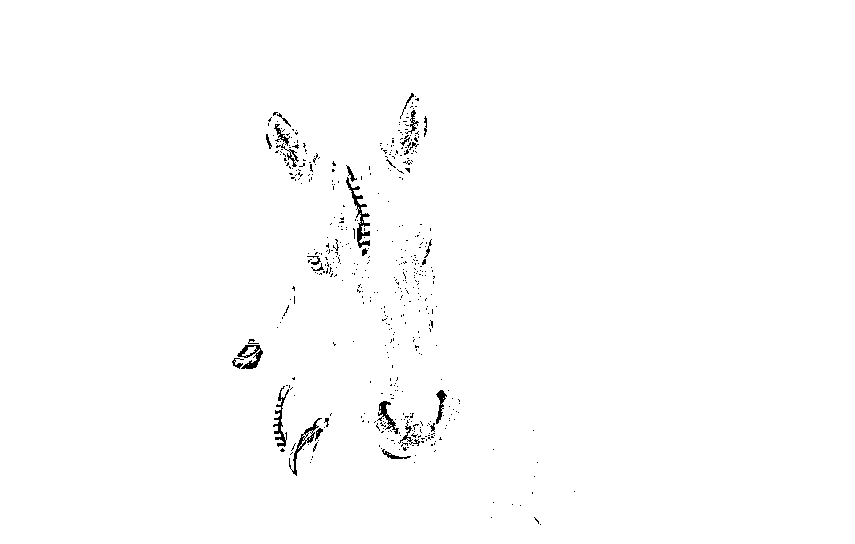**结语**

射手座显化出新鲜、不确定的吸引力，火星鼓舞我们用实践行动去探索究竟。投入精神性的冲动才会让眼界开阔，**在新年之际，不要错过每一次接触、投入新鲜事物、领域的机会。**

**带着胆量、乐观、积极去尝试，我们就会与更高的意识、更深层的意义在野性生长的道路上相遇。**

**版权声明：**原创文章由作者授权首发于若道平台，欢迎转发，反对抄袭。友号转载请申请白名单。

**郑玮玲**

ISAR（国际占星研究协会）认证占星师（2016 年获得）

若道占星专栏作者

将占星咨询、教学与音乐、舞蹈相结合的疗愈者

**微信号**：zhengviolin

**新浪微博**：@郑玮玲

**微信公众号**：Sampriya-Astrology

长按打赏

**学习占星学****点击下图了解课程详情** 

****************

**微信又双叒叕改版啦，不想错过若道君的推送？**

**就把若道设为星标吧！**

**▼**

**就是这个“在看”，戳戳戳 ☟**

******报名直达入口******

# 今天月亮在白羊座，你此刻也许正燃烧着“冬天里的一把火”

> 原文：[`mp.weixin.qq.com/s?__biz=MzA5NjA0NTAxNg==&mid=2651463452&idx=1&sn=bec8ae20c24f473af6f8cb6853167bb7&chksm=8b48adabbc3f24bddcf9abaf8e7f9c54df5cd94b368ab726b29e43b57d0c72ec540d497ffb15&scene=126&sessionid=1692737888#rd`](http://mp.weixin.qq.com/s?__biz=MzA5NjA0NTAxNg==&mid=2651463452&idx=1&sn=bec8ae20c24f473af6f8cb6853167bb7&chksm=8b48adabbc3f24bddcf9abaf8e7f9c54df5cd94b368ab726b29e43b57d0c72ec540d497ffb15&scene=126&sessionid=1692737888#rd)

**2021 年 12 月 12 日天象：**

*   **05:45 月亮进白羊座**
*   ******太阳四分海王星******
*   ******水星六分木星******
*   ******金星合相冥王星******
*   ******火星合相月亮南交点******

月亮一大早进入”有冲劲儿“的白羊座，心里有如”冬天里的一把火“的你，打算今天做些什么呢？只要不盲目急躁，相信会是热情饱满的一天！守护白羊座的火星，合相了射手座的月亮南交点，或许给自己安排了学习任务？信心满满的动起来，表达自己的想法吧！水星与木星（射手座守护星）的六分相，相当适合传播理念。如果正好和朋友有约，相信你们会度过美好的时光。当然，对选择出行的人来说，今天也是好日子哦~今天是双十二，如果你打算好好利用一下金星合相冥王星的日子，不如看看[【”双十二“若道占星大促】（点击可查看信息）](http://mp.weixin.qq.com/s?__biz=MzA5NjA0NTAxNg==&mid=2651463192&idx=1&sn=815711fdf4a871c1db8d90bab0721316&chksm=8b48acafbc3f25b91e2486381b2ec9bc5cffe993f818ed8f3f685e8ec4a60d34c29ac32e715a&scene=21#wechat_redirect)吧！今天是充值卡套餐优惠的最后一天，想满足对占星学学习的愿望、成为更理想的自己（太阳四分海王星），还等什么呢？快上车吧~周日快乐！明天火星进射手座，敬请期待文章！**了解每日天象，可****下载“若道”APP 查看****还有更多精彩等着你哦**

# 亲子访谈专栏｜当行星落在轴点会对孩子的性格产生什么影响？

> 原文：[`mp.weixin.qq.com/s?__biz=MzA5NjA0NTAxNg==&mid=2651463451&idx=1&sn=99ea1f0175349607b51b3a84ef15ac5f&chksm=8b48adacbc3f24ba7ce0b64964ecc8412d8fef1c1b41f24fde192339f45bef751e774455b098&scene=126&sessionid=1692737888#rd`](http://mp.weixin.qq.com/s?__biz=MzA5NjA0NTAxNg==&mid=2651463451&idx=1&sn=99ea1f0175349607b51b3a84ef15ac5f&chksm=8b48adacbc3f24ba7ce0b64964ecc8412d8fef1c1b41f24fde192339f45bef751e774455b098&scene=126&sessionid=1692737888#rd)

************☆********************后台回复“今日”，给你一句生命态度************

作者/Anastasia 编辑/玫瑰 图片/pexles

今年以来，我们一直在做的一个项目是亲子访谈招募（文末有详情）。在[上一篇文章](http://mp.weixin.qq.com/s?__biz=MzA5NjA0NTAxNg==&mid=2651459194&idx=1&sn=a4d7090919c7edaea5bdcd946395ab86&chksm=8b48bccdbc3f35db29afa768704d7593a1b9267d579f97213244375def9ff193d37becf7a56c&scene=21#wechat_redirect)（点击链接可阅读）中，我们根据前几期的访谈内容，整理出了天冥时代背景如何影响下一代孩子的总结报告，今天，再来看看行星落在轴点会对孩子们产生怎样的影响吧。出生星图上的四轴是四个虚点，分别是**上升点、下降点、中天和下中天**。它们虽然不是行星，没有切实运行的能量，却是出生图上四个非常重要的窗口。个体通过这四个窗口得以认识世界，和他人打交道，构建自己的精神家园，并且获得俗世中的声望。**具体来说****· 上升星座代表了：**我眼中的世界什么样？别人如何看我？**· 中天星座代表了：**我如何展示才华？我要去哪里？**· 下降星座代表了：**我如何和人相处？我会吸引谁？**· 下中天星座代表了**：我如何滋养内心？我来自哪里？对于一个陌生人，人们最先感觉到的不是他的太阳和月亮，而是他上升星座的能量；同样，如果在职场上，人们最初的印象也会来自他的中天星座能量。本期亲子调研，就抽取几个有行星合相轴点的小朋友案例。**当行星合相轴点，行星就会赋予这个轴点鲜明的行星特色。****·** 如果是水星合相上升点，这个小朋友反应很快，特别擅长语言表达；**·** 如果是火星合相上升点，则会精力十足，具有爆发力，当然脾气也会很大；**·** 如果是金星合相了上升点，就会一个善解人意的小天使，长相甜美人缘好；至于更具体的表现方式就要看行星和上升点落在了哪个星座，以及有没有重要的相位。下面，我们就来看看相关的访谈吧。特别说明：为保护访谈用户的隐私，文章中的宝宝昵称均采用化名的方式。

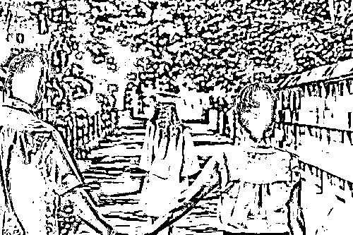

**访谈一 梦梦小朋友（太阳合上升）****梦梦小朋友是上升双子座，太阳在十二宫合相上升点。**太阳是我们的核心自我，是个人创造力和活力的源头，**太阳合相上升点，会给当事人带来强烈的意志和充沛的自我意识。**太阳会赋予上升点明确的能量。梦梦小朋友的双子座特质非常明显。他喜欢学习，兴趣爱好广泛，语言社交能力都很强。同时，他的火星也在双子座一宫，精力旺盛，喜欢运动。妈妈说梦梦是个天使宝宝，非常好带，不论是身体，还是语言、运动能力，都发展得很不错。**双子座的特点是好奇心强，但容易博而不精，广而不专。**梦梦小朋友的课外班特别多，学习的、运动的、艺术的，都有尝试。**爸爸妈妈也经常带他出门参观游玩，多走多看开阔眼界。**太阳在十二宫，对于梦梦小朋友来讲，找到自己真正喜欢的事情并不是特别容易的事情，这就需要爸爸妈妈仔细观察，多多引导，制订计划，在成长过程中找准一个方向专精下去，就会获得更大的收获。

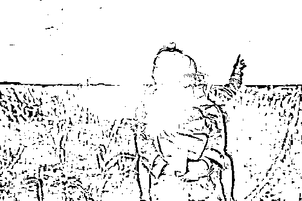

**访谈二 拓拓小朋友（月亮合上升）**

**拓拓小朋友是上升魔羯座，月亮一宫合相上升点。**

月亮在上升点，个体受到个人情绪以及童年经验的影响会非常大。他们**感受力强，情绪表达和对环境的反应就像月亮一样容易变化，琢磨不定。** 

在妈妈的描述中，拓拓小朋友**在陌生环境种很慢热，适应比较慢，不太容易融入**。但**在自己熟悉的环境中，就会很自在，有很好的朋友。**这是非常魔羯座的能量，稳定，但是缓慢。月亮在上升点为拓拓小朋友的世界增加了很多的**敏感性**，他小时候脾胃不好，容易感冒发烧，体能也不太好。平时**很安静，不太爱说话，也很少主动提出自己的需求。**妈妈和爸爸对孩子要求都很高，会参照着书本上的育儿标准来养育孩子，如果某项指标没有达标就会着急焦虑。拓拓对自己的要求也很高，在学校喜欢表现自己。但是由于标准过高，有时候会做不到，总是因此受到老师的批评。遇到困难的时候就喜欢逃避。**月亮在上升点的小朋友对于周遭环境的安全性要求会很高，需要得到足够的情绪上的支持和保护**。同时，**妈妈的情绪会对孩子产生很大的影响**。这就需要妈妈对此有足够的认知，提前处理好自己的情绪，然后给孩子提供一个安静而坚定的陪伴和支持。对于拓拓小朋友来说，是非常重要的。

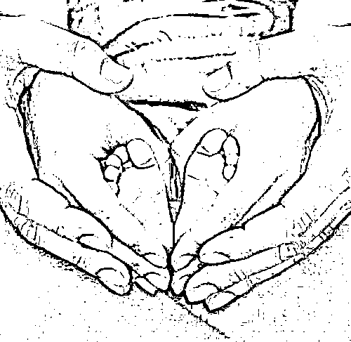

**访谈三 久久小朋友（火星、土星合上升）**

**久久小朋友是上升天蝎座，火星和土星在十二宫合相在上升点。**

**火星**在上升点会给当事人带来**强烈的竞争性和生命力**；而**土星**会赋予当事人**责任感与持久性**。二者整合起来，会具有强大的能力，**充满力量，又能提供实际的帮助。** 

**上升星座对应的是一个人的出生时刻。**所以，在十二宫靠近上升点的行星，往往会反应妈妈孕期的状态。**土星和火星合相，意味着这个孕期压力大，身体状态不好。**久久妈妈怀孕的时候孕期反应很大，孕吐也很严重。久久爸爸工作忙，久久妈妈自己照顾自己，非常辛苦，整个人备受折磨。久久出生的过程很快，但也伴随了一些风险，不过最后母子平安。这里能感受到火星天蝎座的速度和凶险。**火星和土星联结在一起，往往会带来持久的活力。**落在天蝎座，自然会带有不可避免的情绪破坏力。久久小时候脾气很大，一闹情绪就会又哭又喊，并且持续很长时间。久久妈妈说：“她情绪起来很可怕的，又激烈又持久，就像世界末日一样。”**但火土天蝎座也带来了强大的生命力。**久久小时候就随着妈妈走南闯北，但身体一直很好，适应力强，很少生病。**十二宫是集体潜意识的宫位，也和梦境相关。**由于火土都在十二宫，小时候，久久的睡眠状态一直不好，怕黑，很难入睡，睡着后也不踏实，容易醒。久久妈妈也做了很多功课，学习了很多课程。在接纳孩子的情绪方面做了很多努力，在久久哭闹的时候不去干涉他，也允许他用自己的方式来安慰自己。随着年龄的逐渐增长，久久对于自己的情绪控制也越来越好了。上升天蝎座的个体，会觉得这个世界充满危机。他们总是小心谨慎，稳扎稳打。如果给他们提供足够的安全感，整合好火土能量。就会给当事人带来持续的动力和耐力，坚忍不拔地去实现自己的目标。

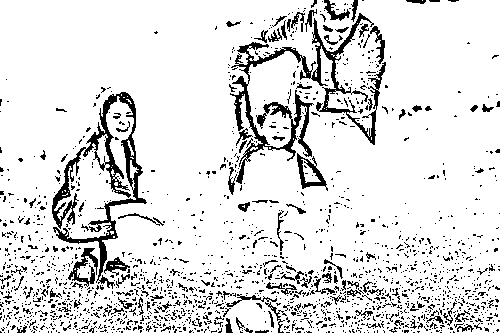

**关于亲子访谈研究**针对幼儿出生星图的访谈研究，我们会作为一项长期的研究活动来开展。经过前三次的亲子访谈研究招募活动，已有 96 名的用户报名参加，我们研究小组已经对其中 37 名的报名用户完成了亲子访谈，并会对访谈的情况，定期撰写出相应的访谈研究分析报告，分享给大家。在此，对已接受访谈的 37 名用户，在访谈过程中给予的支持和分享表示感谢；对已经报名还未接受访谈的用户，我们也会随着亲子研究的持续深入，结合亲子研究主题的需要，定期再从报名名单中筛选出合适的星盘开展亲子访谈，被选中的用户我们将会一对一微信通知，感谢您的关注和耐心等待。**如果你想自己了解更多宝宝的相关信息，也可以扫描下图二维码或者点击文末“阅读原文”链接，购买一份宝宝专属的《幼儿报告》。**

****************购买直达入口****************

# 金融占星学大师雷蒙德·梅里曼《2022 年金融预报》开售！

> 原文：[`mp.weixin.qq.com/s?__biz=MzA5NjA0NTAxNg==&mid=2651463451&idx=2&sn=e83ee40f000f2a64d917785cd28e4754&chksm=8b48adacbc3f24badc671cbdc78af2996fdd8ecd124805d05d3a52283f6a0cd421e1e3bb02fa&scene=126&sessionid=1692737888#rd`](http://mp.weixin.qq.com/s?__biz=MzA5NjA0NTAxNg==&mid=2651463451&idx=2&sn=e83ee40f000f2a64d917785cd28e4754&chksm=8b48adacbc3f24badc671cbdc78af2996fdd8ecd124805d05d3a52283f6a0cd421e1e3bb02fa&scene=126&sessionid=1692737888#rd)

1976 年以来，由雷蒙德·A·梅里曼撰写的梅里曼市场时机学院每年一次的年度预报沙龙和每年一本的《年度预报》一直在应用占星学原理为投资者们服务，提供卓越洞见，从未间断。**2020 年，木星、土星和冥王星形成大合相，我们刚刚结束了一个周期和一个时代。现在我们正处于一个新时代和一个新的长期周期的早期阶段。**  如果 2020 年我们还在手忙脚乱，不知道发生了什么；2021 年则更让我们更清楚地看到一个时代结束了——2020 年之前的时代，在新冠肺炎病毒大流行、2020 年”大合相”之前的时代，这是人类历史进程上的一个转折点。**我们所熟知的生活诸多方面在那时就结束了，现在人们仍在试图找出“正确的方式”或“最好的方式”来重建和再造世界。**2021 年，有的行业被彻底摧毁，有的行业成为新贵。2021 年对投资者是一个苦乐不均的一年。尽管美国新冠肺炎疫情未见好转，道琼斯指数仍然扶摇直上；尽管中国经济在世界经济增长中一马当先，上证指数仍然波澜不惊。在货币对标的品种中，老贵族黄金走低，新贵族比特币飞升。我们还看到了大宗商品价格的飞涨，各种短缺开始出现。在中国，各种政府干预市场的调控在各个行业愈演愈烈。**这种现象到底说明了什么？又预示着什么？**2022 年我们的金融市场会受到哪些行星组合的影响呢？我们来看一看：**·** 140 年的木星-土星合相的“风象纪元”在 2021 年刚刚拉开序幕，2022 年我们还将会看到温和主义与极端主义之间存在冲突；**·** 土星四分天王星最后一次成相的影响：专制主义和中央政府控制与个人追求个体的权利和声音的冲突；新能源和旧能源的冲突；**·** 天王星进入金牛座的后半段：包括美元在内的世界货币的重新估价和地位；**·** 土星-海王星的半六分相：新冠肺炎病毒；**·** 水星、金星和火星在 2022 年的逆行“它们对 2022 年发展和增长的影响；**·** 木星在双鱼座（黄道最后一个星座）和白羊座（黄道第一个星座）之间来回移动：战争还是和平；谁是“第一名”的激烈竞争；**· **木星与海王星在双鱼座合相；**·** 冥王星在美国国家星图回归；美国的选择会对全球带来的影响；**·** 月亮交点的换座：月亮交点周期和经济周期的对应；**·** 木星在双鱼座期间金融市场和主要趋势的反转。2022 年仍然是旧世界向着新世界转变的一年。此时，金融市场的投资者和潜在投资者，都需要客观而睿智的思考，而金融占星大师雷蒙德·A·梅里曼的研究则更是无可替代的。1976 年以来，由雷蒙德·A·梅里曼撰写的梅里曼市场时机学院每年一次的年度预报沙龙和每年一本的《年度预报》报告一直在应用占星学原理为投资者们服务，提供卓越洞见，从未间断。去年，这个 3 小时的年度预报沙龙和长达 200 页左右对金融市场的分析报告帮助许多若道的读者做出正确的投资决策，降低投资风险，并获得相当不菲的投资收益。在《2021 年金融预报》中，关于上证指数，梅里曼老师说：对于上证指数，梅里曼老师说：**“我们预计涨势将在 2020 年 12 月-2021 年 2 月之间达到波峰，然后急剧下跌至 52 周和 22 个月周期的低点，这些周期将在 2021 年 5 月之前，甚至在 3 月底之前结束。此后可能会出现另一轮反弹，可能会也可能不会在 2021 年 11 月之前形成第一个 33 个月周期的新高。”**| 上证指数 K 线图关于黄金，梅里曼老师说：**“黄金的 31.33 个月周期波谷将在 2021 年 9 月之前出现，理想情况是 2020 年 12 月-2021 年 6 月。价格目标是 1628+/-109 或 1768+/-76。重叠范围（理想情况）是 1692-1737。如果价格跌破这些范围，则为看涨情况中令人担忧的状况。”**| 黄金走势 K 线图关于白银，梅里曼老师说：**“木星和月亮交点的周期表明，白银的一个重要低点将在 2021 年出现，最有可能在 5 月 13 日之前或 7 月 28 日之后出现。这可能是 5-7 年周期的波谷，但可能会保持在 18.50 以上。收盘低于 17.00 将令人担忧。”**

| 白银走势 K 线图

12 月底，我们将会再次发布梅里曼老师《2022 金融年报》。**2022 年初，梅里曼老师将会照样带来一场精彩的讲座，讨论 2022 年重要的宇宙天象及其对世界经济、金融形势的整体影响，还将覆盖中国上证股票市场的分析、黄金白银市场、比特币市场等投资市场。具体时间我们待确定后会通知大家。****2022 年度预报及沙龙预售**

**价格：****1380 元**

**一份价格仅千元的顶尖金融占星大师的投资分析报告和沙龙，聪明的投资者值得拥有。****购买者重要须知****①** 梅里曼市场时机学院每年一次的年度预报沙龙和《年度预报》是梅里曼市场时机学院的研究“预报”，而不是市场“预测”，是梅里曼老师及其金融占星分析师对人类活动周期历史与行星周期之间相关性的研究，二者在大部分情况下具有 80%或更高的相关性，而不是因果关系。沙龙中和报告中的研究完全存在错误的可能性。即便是非常认真的研究和几十年的研究经验，我们无法总是正确地解读出各种征象在实际层面上会如何相互作用，并显化为事件结果。

所以请将次沙龙和报告看作一个研究参考，务必结合其他市场研究和你个人对市场的理解，根据你的自由意志做决策。

**②** 此报告一旦售出，**即不接受退款。**

**③** 此报告仅支持在手机网页和若道 APP 上阅读，不支持电脑阅读和下载。**④** 讲座提供视频回放。**以上须知，请仔细阅读。一旦付款，即视为已了解并接受所有须知内容。**

**如在购买报告中遇见任何问题**

**可添加客服**

▼

****购买报告直达入口****

# 真神奇！12 星座还能这么划分！快来看看这 6 种类型你是哪一种？

> 原文：[`mp.weixin.qq.com/s?__biz=MzA5NjA0NTAxNg==&mid=2651463381&idx=1&sn=f24da5cbb6469db88b506056e7c990d4&chksm=8b48ac62bc3f257414c24a9926f206eae32a61527eb80491c8b5ca316e96904f9f2c7404188c&scene=126&sessionid=1692737888#rd`](http://mp.weixin.qq.com/s?__biz=MzA5NjA0NTAxNg==&mid=2651463381&idx=1&sn=f24da5cbb6469db88b506056e7c990d4&chksm=8b48ac62bc3f257414c24a9926f206eae32a61527eb80491c8b5ca316e96904f9f2c7404188c&scene=126&sessionid=1692737888#rd)

**☆ 后台回复“今日”，给你一句生命态度 **

作者/格伦·佩里

译者/Esme 校对/沐心方 整理/轩轩

  编辑/翀子 封面/书君 图片/网络占星学中有火元素（白羊座、狮子座、射手座）、土元素（金牛座、处女座、摩羯座）、风元素（双子座、天秤座、水瓶座）和水元素（巨蟹座、天蝎座、双鱼座）四种元素能量，每张星图中都包含着不同元素的组合，对此，我们可以用不同的图像去生动表达不同组合的含义。在你的星图上，都有什么元素的组合呢？你又会给自己绘制什么样的图像？听听格伦老师如何描述吧！**四元素的相互组合**

**占星学中有火土风水四元素，**每一张星图中都包含着不同元素的组合，对此，我们可以使用不同的图像去生动地表达不同组合的含义。

**简单地来说：**

| **元素组合** | **含义** |
| **火****+****土** | **熔岩** |
| **火****+****风** | **热气球** |
| **火****+****水** | **蒸汽** |
| **土****+****风** | **沙尘**  |
| **土****+****水** | **泥泞**  |
| **风****+****水** | **雾** |

**首先让我们来看看火土组合。**

**火****+****土****  熔岩**

特质

**所有组合中最富于生产力的一组；**

**成就卓越，精明强干；**

**强大，有驱动力，推土机一样的人；**

**热情加实干等于野心；**

**自信，坚韧。**

你可以运用你的想象力，**火元素**代表行动力、热情，**土元素**非常稳固、脚踏实地，那么**火土组合可能就像推土机，强大、热情、有推动性。**

由此推想，我们还可以用不同的词去形容这个组合，**他可能是一个非常有成就的人，既热情又实际、很有野心。**

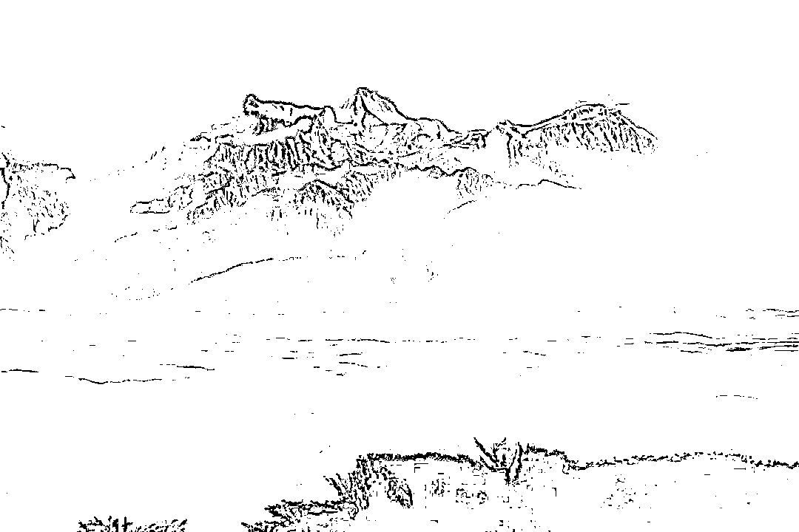

**火****+****风 ** **热气**

特质

**乐观，有魅力，外向；**

**卓越的沟通技巧，温暖迷人；**

**超级销售员；**

**把冰块卖给爱斯基摩人；**

**富于朝气和头脑；**

**对情绪感受、消极性和任何形式的限制不耐烦。**

当我们把火和风组合在一起时又是完全不同的，因为这跟土象的世界不一样。**火元素总是把它触及到的东西变得更加兴奋、快速，更加有能量，更有攻击性。**

**风元素是思考交流，火元素会让这种思考交流的功能兴奋起来，让心智更加激动。火**风型的人可能非常乐观、有魅力、外向、热情、温暖迷人、善于说服别人，但同时他可能并不实际，不那么脚踏实地。

这个组合看起来是比较正向的，但是它可能也有隐藏的难处，因为这个组合没有任何阴性元素。火**风型的人对于土象的限制或者水象的敏感非常不耐烦，他也不想让任何东西限制住他的可能性。**

这就像有一个人非常想成为一名导师，他想引领学生去某处修行，但是他又缺乏相关的训练和技巧，实际上他不能实现这个幻想。

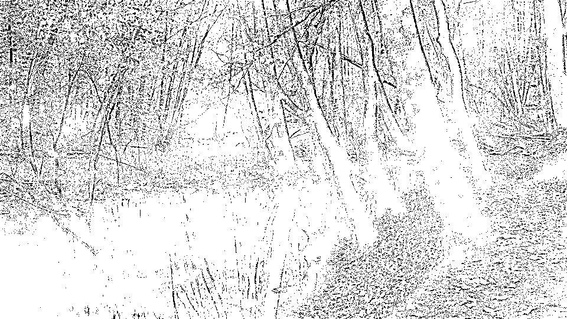

**火****+****水****  蒸汽**

特质

**积极的情感；**

**温暖，充满爱；**

**心情摇摆起伏，强烈且情绪丰富；**

**可能在感情上勇敢无畏，**

**也可能只是反覆无常；**

**呵护、投入，自发性地直接表达内在生命；**

**自发性内省；****情感外露。**

**火水的组合，蒸汽，即有能量、有热情、兴奋，有情感、关爱，并与他人有情绪连接。**

以白羊座和巨蟹座为例，这两个星座组合，形成了类似高压锅的能量，**其表现可能是过高的热量和激烈的情绪。**你可能心情摇摆起伏很大，情绪强烈、丰富，你可能非常有关爱，有伟大的梦想，想去喂饱世上所有的穷人。

**这个组合的冲突在于，**有时候你非常有同情心，有共情能力，能接纳别人，也可以去建立并维系情感的连接，但是火元素只想做事，只想向外发散**，而你需要意识到情感上的问题并不能通过简单的行动来解决，它必须要有理解和包容。**

举这样一个例子。有一个反战人士，对于战争所造成的悲剧和痛苦是非常敏感的，同时他又觉得非常生气，想要对此做一些事情，所以他就去参与反战游行或者抗议。但是他抗议的方式可能非常激进和暴力，这就和他原先的初衷完全背离。

在美国越战期间，70 年代末 80 年代初，有一个组织叫做“气象人“，他们经常去放置炸弹，去炸雕像或警车，他们以这种方式来抗议越战中的暴力。

在星图中，火象跟水象的冲突，他们的关系总是四分相、梅花相或者是十二分之一相，也就是 90 度、150 度或者 30 度。也就是白羊座跟巨蟹座是四分相 90 度，和天蝎座是梅花相位 150 度，和双鱼座是 30 度的关系。

**这是一种矛盾的能量，就像我们刚才那个反战的例子，他们通过战斗的方式去反战。**

其他元素组合，请大家同时运用左脑的思维和右脑的想象力，去理解去创造。**占星解读其实就是一个创造性的过程。**

**其他元素组合**

**土****+****风** **沙尘**

*   理性、经验主义；立足现实的思考；

*   明智，聪慧。有耐心，专注；

*   面对问题，态度客观；

*   善于解决问题，能够认识到事情的实际意义；

*   记账、研究、修理工作。

**土****+****水** **泥泞**

*   终极的大地母亲、看护者；

*   同情心与实用主义的结合；

*   以构建安全、有爱心的世界为导向，保守；

*   或许有一些严肃和压抑；

*   倾向于维持原状；非常偏爱熟悉的事物。

**风****+****水 ****雾**

*   好奇、了解内心的世界、交流感受；

*   让无意识表露出来；

*   可能是不切实际的梦想家；

*   对主观领域保持客观态度；

*   可能只是人生的旁观者；

*   将想象力与观念结合。

**版权声明：**本文由若道翻译发布，欢迎转发，反对抄袭。友号转载请申请白名单。

**格伦·佩里**

若道签约老师，著名占星师，前 ISAR 董事会成员，共出版 8 本占星著作；心理/意识研究专业博士；占星心理学学院（Academy of AstroPsychology）的创办人；康涅狄格州研究生院（the Graduate Institute of Connecticut）原型宇宙学与意识进化项目的负责人。

**学习占星学****点击下图了解课程详情** 

****************

**微信又双叒叕改版啦，不想错过若道君的推送？**

**就把若道设为星标吧！**

**▼**

**就是这个“在看”，戳戳戳 ☟**

********报名直达入口********

# “你正在寻找的东西也在寻找你” | 冬日野骨·荒野一日仪式招募中

> 原文：[`mp.weixin.qq.com/s?__biz=MzA5NjA0NTAxNg==&mid=2651463381&idx=2&sn=a6028120a629fd7f972fe1b258a44f09&chksm=8b48ac62bc3f25749261bcbe63549b19dd97fe41ef2ad36bbe3dc4700d9678f3d5ae32f74fff&scene=126&sessionid=1692737888#rd`](http://mp.weixin.qq.com/s?__biz=MzA5NjA0NTAxNg==&mid=2651463381&idx=2&sn=a6028120a629fd7f972fe1b258a44f09&chksm=8b48ac62bc3f25749261bcbe63549b19dd97fe41ef2ad36bbe3dc4700d9678f3d5ae32f74fff&scene=126&sessionid=1692737888#rd)

****

**与大自然的灵感力量联结，让你的内在智慧从骨头深处升起。**
**你正在寻找的东西也在寻找你。****——鲁米**这是在新的一年来临之时你可以送给自己的礼物。与另外 7 个伙伴一起，与大自然的灵力相联结，找到内在智慧和野性力量。

1

**适合对象**

**·** 希望自己的生活更有方向感**·** 正处于人生的过渡阶段，正在寻求指引**·** 已经准备好放下那些不再服务你的事物**·** 想要勇敢地联结你的野性力量**·** 想要融入自然界的安宁与美之中，为静谧的智慧留出空间

2

**课程描述**

“冬日野骨”一日工作坊，我们将一起走进大自然和寂静的冬日，在这里，你也许会感知到灵魂在召唤你进入更深的地方，去认知你生活中的转折点，或者去寻找对特定问题或者挑战的洞见与支持。 当你进入冬日时节，在霜雪寂静中，在雨水的气味中或者在自己寒冷的皮肤上，有什么样的智慧在静候着我们？也许你很好奇，那些光秃秃的树木在你的内在召唤什么？鸟儿们低缓的旋律又在如何帮助我们放慢下来？当你放弃一点点安逸，站在冬日之歌的中心时，什么会照亮你的内心深处？**冬日是一个沉思和反省的时刻，是为你自己、家人和后代带来智慧的时刻。**据说我们都是带着独特的天赋降临在这个世界上的，这就是我们灵魂的目的，但是灵魂又在哪里呢？在许多的神话、民间传说和文化当中，“骨头”被认为是灵魂的居所。**“冬日野骨”之旅将邀请我们进入荒野，去发现自己的“骨子”中深藏着什么，借此我们可以洞察到什么样的智慧想要作为我们的天赋显现。**

在这个“冬日野骨”一日工作坊中，我们将遵循传统仪式的三个阶段：**分离、门槛以及融合。****·** 工作坊开始时，我们将围成一圈，敞开心扉倾听，探索我们的意图；**·** 之后我们将走出这个圈，进入你自己的个人体验（分离）；**·** 跨越门槛，我们向进入神圣临界空间之前的过渡区域表达敬意，你将在那里与大地对话。**·** 穿过门槛返回到圆圈当中，分享在大自然和冬景的神秘中发现的启迪。（融合）

****

**一颗种子必须被冻结在自己的意图之中，然后才能打破冬天的桎梏，喷出绿色的火焰。****——史蒂文·福斯特**

3

**时间安排**

**（建议参与者当天禁食，我们将在您报名后发送准备说明）****9:00 **开幕式，分享当天的概况以及安排（10 分钟）分享关于如何构造一个门户（20 分钟）**9:30 **在线登入，参与者介绍自己的名字和来自中国的什么地方，并分享童年时期与大自然的美好体验你今天想要探寻什么？我们会帮助大家澄清今天的意图。为了今天的探寻，你准备好放弃什么，臣服于什么，放下什么？（每人可以携带一块石头或者天然物品，例如羽毛、树叶来标记自己的意图）**11:00 **指导大家如何保持意图、如何探寻（15 分钟）**11:30 **参与者前往大自然中静谧的地方探寻（3 小时的探寻结束之后，我们会提供一些日志问题）**15:00 **参与者返回，欢迎大家归来**15:10 **参与者分享他们的自然之旅，我们会提供一些支持，帮他们澄清自己的经历和所获得的洞见**17:00 **闭幕式

4

**带领老师**

** Toni McErlane**

我来自新西兰，拥有社区和人类服务—咨询康复学士学位，是 Aminz 的注册家庭纠纷调解人，也是 NVC Aotearoa 的 NVC 培训师。

在我的生命中，我一直对真诚、充满活力、自我负责的沟通和有意识的选择充满激情。而我的人生旅程为我提供了充足的机会，让我去探索、研究、反思和完善这在沟通中是什么样的。

在我的工作坊中，我的原则和实践都是建立在非暴力沟通和正念的哲学基础之上。非暴力沟通是由美国心理学家马歇尔·卢森堡博士所开发的。马歇尔的目标是发展出一种语言，这种语言受到印度巴利语中的“非暴力主义”（Ahimsa）一词的启发，它的意思是“没有伤害”。我们怎样才能在与他人沟通时不造成伤害呢？这不仅需要非暴力沟通的技巧，还需要在训练中融入正念。正念是受小乘佛教内观传统的启发，发展觉知和接纳，关注和允许。在我们的工作坊中 ，我们将非暴力沟通和正念编织在一起。

我致力于以这种沟通和处世方式作为我日常与人互动的基础。我曾经学习了为期一年的北美非暴力沟通领导者项目，在加州湾区非暴力沟通的全年浸入式项目中做了两年协助工作，然后在索诺马县女子监狱推动非暴力沟通培训。同时，多年来我持续参加内观静修，致力于继续和发展这种实践，并把它融入自己的工作坊中。

2020 年疫情期间，我与丈夫和我们的猫在游艇上休了一年假。现在，我和丈夫还有 15 岁的侄女在新西兰南岛的达尼丁生活。我在那里从事心理咨询、冥想和生态心理疗法。我们还正在那里慢慢建立一个治疗静修中心和生态冥想社区。

过去四年，我曾两次来中国，与若道及其友好而充满活力的团队分享非暴力沟通，并参观了一些绝佳风景。我期待继续与若道合作，在网上分享我的知识和技能。

向上滑动可查看更多

5

**工作坊详情**

**精品小班工作坊，仅限 8 人参与，迎接新春。**
**工作坊时间：**1 月 22 日 9:00-17:00**工作坊价格：原价 1580 元/人，****二人同行价 1380 元/人**咨询报名请联络：李老师长按二维码添加课程负责人咨询~****冬日野骨·荒野一日仪式****

**授课老师：**Toni McErlane

**授课时间：**2022 年 1 月 22 日

**授课方式：**网络课程**，**英文授课，中文翻译

**费用：****原价 1580 元/人，二人同行价 1380 元/人**

**课程负责人：****李老师**（请备注“冬日野骨”）

长按二维码添加课程负责人咨询~

******报名直达入口******

# 2022 年天象预测课 | 不容错过！四位国际占星大师为你详解明年天象（内含联报优惠）

> 原文：[`mp.weixin.qq.com/s?__biz=MzA5NjA0NTAxNg==&mid=2651463381&idx=3&sn=1548a753ce750a20e1c26c06e53e5f92&chksm=8b48ac62bc3f257449dfe8b1d45de4d5bb486ee371ebf51c167c85c82ef1e9ea181849614fa8&scene=126&sessionid=1692737888#rd`](http://mp.weixin.qq.com/s?__biz=MzA5NjA0NTAxNg==&mid=2651463381&idx=3&sn=1548a753ce750a20e1c26c06e53e5f92&chksm=8b48ac62bc3f257449dfe8b1d45de4d5bb486ee371ebf51c167c85c82ef1e9ea181849614fa8&scene=126&sessionid=1692737888#rd)

2021 年已接近尾声，忙碌的年末工作也挡不住我们对来年的盼望和期许。作为占星师，在年初跟随权威老师透彻地学习 2022 年重要天象的含义和影响，是迎接新的一年的正确姿势，仪式感满满！为新一年的自我规划和占星事业加油充电。**若道邀请了金牌核心课中的四位国际名师再次集结，在明年 1 月 8 日、9 日带来 2022 年重大天象的深入解读：**********

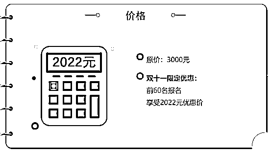

**讲师是谁？**

**琳恩·贝尔**

**（Lynn Bell）**

**· **世界最受欢迎的占星学演讲者、作家和老师之一。定居巴黎，研究心理占星学和家族模式数十年； **·** 著名的心理占星学中心（*Centre for Psychological Astrology*）的长期导师。2016 年，获得查尔斯·哈维（Charles Harvey）杰出的占星学服务奖；**· **作为一个从多个层面进行工作的占星咨询大师，琳恩的工作结合了心理学的观点。她对家族模式的兴趣首先来自与客户的合作。通过在分析领域所做的个人工作，她所受的埃里克森催眠训练将她引领至家族系统。后来，她组织研究小组在家族星图上进行了数年的研究。她写的《家族占星学》就是这项研究的结果；**· **法国心理占星学协会的会长。除了占星学，她在法国沙特尔的新沙特尔学校任教 8 年，还 5 次获得了在《纽约时报》畅销书作者卡罗琳·迈斯（Caroline Myss）的卡罗琳·迈斯教育学院（*Caroline Myss Educational Institute*）合作教学的机会。

**艾德里安·罗斯·邓肯**

**（Adrian Ross Duncan）**

**· **1971 年在印度游学时开始学习占星学，1985 年开始成为全职占星师，迄今执业已超过 33 年，是人本主义占星学、卜卦占星学和经世占星学领域的知名占星师。他还开发了占星软件 AstroClock 和多款占星报告；

**· **哥本哈根占星学院院长；

**· **他在日常咨询中经常运用卜卦，咨询图（卜卦的一种运用方式，即根据客户来访时间制作星图，从星图中获得大量信息）也是他特别擅长的领域；

**· **艾德里安·罗斯·邓肯从 1971 年开始研习佛学，受佛学影响很深，他相信占星学和佛学观点一致，转化的一个基础是在于对现实感知的改变。而卜卦很容易与佛教融合，因为它只关乎当下。

**克里斯蒂娜·罗登贝克**
**（Christina Rodenbeck）****· **克里斯蒂娜·罗登贝克（Christina Rodenbeck）是一名全职职业占星师，在牛津大学城生活和工作，深受周围知识和文化氛围影响；她拥有伦敦大学（*University of London*）的人文荣誉学位，曾在伦敦占星学馆（*Astrological Lodge of London*）、心理占星中心和占星研究学院学习；**· **作为一名占星师，在过去的 20 年里，克里斯蒂娜在她的网站“牛津占星师”上写了大量关于时事、艺术和文化的文章；她每月主持一个占星播客：“与克里斯蒂娜和萨莉一起占星”，并定期在《占星杂志》(*Astrological Journal)*上撰写时尚专栏；她定期在英国授课，并保持着蓬勃发展的专业实践。

**大卫·瑞雷**

**（David Railey）**

**· **若道联合创始人，致力于在中国教授和推广西方占星学；

**· **曾任 ISAR 全球副主席，CAPISAR（ISAR 职业占星师资质认证机构）主席；

**· **1976 年，通过亚特兰大职业占星师考试，成为全职占星师，随后通过 AFAN 和 ISAR 职业测试；

**·** 1980 年，与杰夫·焦耳一起在亚特兰大创建“每日行星”占星学中心。此后在亚特兰大占星协会担任 4 年考官，并且两次担任亚特兰大地区占星协会主席。1979-1992 年，作为占星师活跃于美国社会媒体，向不了解现代占星学变化的大众宣传专业占星学知识。在 1989-1992 年期间，他在 WRGG 电台 12 频道每周主持个人电视秀“今日占星学”，早先他还在 WRFG 的广播节目中播讲宇宙天气节目；

**· **2010-2014 年，任全美占星师联盟监督委员会委员；

**· **2010 年，其著作《灵魂的目标》中国版出版，和蒋颖一起创办若道占星学校和其官网 www.nodoor.com；

**· **2017 年，被选为 ISAR 委员会成员。ISAR 是世界最大的国际占星机构，会员遍布 45 个国家，2017-2020 年曾任 ISAR 全球副主席、CAPISAR（ISAR 职业占星师资质认证机构）主席。

**课程价格****正价**：3000 元**限量优惠价：2022 元**（前 60 名报满截止）**（联系 Maggie 老师，抢占限量优惠价）******联报套餐：《2022 年度天象预测大师课》+《2022 年金融占星预报》联报优惠价****2999 元****（限前 50 名联报）****（联系 Maggie 老师，抢占限量优惠价）**长按二维码添加 Maggie 老师获取联报优惠价**退转课程**

**· 退款原则请详看《教学协议》，如有疑问请咨询课程顾问。**

****2022 年度天象预测大师课****

**授课老师：**琳恩·贝尔、艾德里安·罗斯·邓肯、克里斯蒂娜·罗登贝克、大卫·瑞雷

**授课时间：**2022 年 1 月 8 日-9 日

**授课方式：**网络课程**，**英文授课，中文翻译

**费用：**3000 元**；****限量优惠价：2022 元（前 60 名报满截止）；****联报套餐：《2022 年度天象预测大师课》+《2022 年金融占星预报》联报优惠价：****2999 元****（****限前 50 名联报）**

**课程负责人：****Maggie 老师**（微信：18510107057，请备注“天象预测大师课”）

长按二维码添加课程负责人咨询~

****报名直达入口****

# 医疗占星学丨“身体的问题，是一次崭新面对自我和生命的机会”

> 原文：[`mp.weixin.qq.com/s?__biz=MzA5NjA0NTAxNg==&mid=2651463309&idx=1&sn=8c9870b3f2d8f48d0258ca3c1c7c43bc&chksm=8b48ac3abc3f252cc8576315ac16bac18d497621382abc55fa90dd227844d3a8e7e11833c567&scene=126&sessionid=1692737888#rd`](http://mp.weixin.qq.com/s?__biz=MzA5NjA0NTAxNg==&mid=2651463309&idx=1&sn=8c9870b3f2d8f48d0258ca3c1c7c43bc&chksm=8b48ac3abc3f252cc8576315ac16bac18d497621382abc55fa90dd227844d3a8e7e11833c567&scene=126&sessionid=1692737888#rd)

********************☆ 后**********************台**********************回复“今日”，给你一句生命态度********************

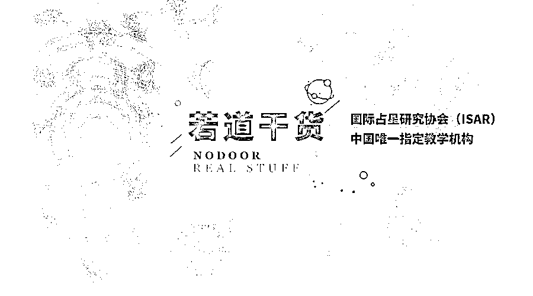

作者/简·里德尔-帕特里克

译者/Christy 校对/Arrow

编辑/翀子 封面/书君 图片/网络

每一个医学问题，包括意外事故，背后都存在身心病症因素，而医疗占星学的主要功能不是提供正统的医疗诊断，而是从占星与躯体角度的诊断，探查病症根源的意义和目的。

**升级版的占星学身体地图**

运用占星学来处理健康议题和进行疗愈的有效方式很多。**传统医疗占星学的模式是：**将星座和行星与身体各部位及其相应的疾病关联起来；也会对应疗法，通常采用的是与特定行星天然相容或者不容的草药或宝石。这些对应极其有效，我确实从中获益良多。 

事实上，在这些丰硕成果的基础上，我开始研究**占星征象与现代解剖学和生理学之间的关联**。

目前，我特别感兴趣的是**身心病症医疗占星学**——升级版的占星学身体地图，我称之为躯体占星学，和心理占星学之间搭建桥梁，通过超个人心理学工作了解客户和其症状，获取信息，并检查这些信息与传统医疗占星学采用的对应是否一致，以此检测这些对应的有效性。

采用这种方式通常可以**为个体量身定制提升健康和幸福指数的方法**。当然，这并不是医学疗法、正统疗法或其他方式的替代品，但我认为，每一个医学问题，包括意外事故，**背后都存在身心病症因素，**因此这种方式所覆盖的领域或许相当可观。

我认为，医疗占星学的主要功能不是提供正统的医疗诊断，而是占星—躯体角度的诊断，探查病症根源之意义和目的。

（我记得）著名医生威廉·戴维森（Dr.William Davidson）曾写道：**“星图是投射进身体的灵魂之歌，是激发和维持身体活力之力量的形象表现。”身体上的信号和症状可以看作是灵魂之语，这些谜语可通过占星征象来梳理和解码。**

对症状的密切关注可以**让我们听见心中平静而微弱的声音**，这个声音不断低语，告诉我们如何脱离困境，通向更完满的人生。

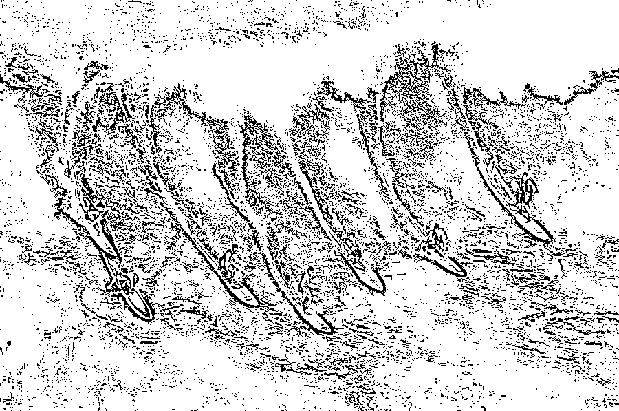

**心灵的病症身体会知道**

心灵、身体和环境以及他们所包含的一切，形成了一个统一的领域，**我们星图中的每一个特征**都可以在下面三个主要领域中展现出来：**思想、信仰和感觉组成的内在世界，事件和关系组成的外在世界，以及两个世界的交界处——身体。**

根据我粗略的经验法则，当星图中的要素被行进激活时：

*   如果我们正在**有意识**地处理一个问题，这些要素就会显现在**内在层面**；
*   如果我们还**未意识**到自我的某个部分，这些要素就会通过事件和关系显现在**外在世界**；
*   如果我们已经对问题**有了一半觉知**，但出于某种原因，我们当时害怕、不愿、不能或不知如何处理这个问题，这些要素就会显现在**身体层面**。

**身体背后的智慧似乎总是努力趋向健康，**竭尽全力避开健康路上的障碍，身体的症状可以看作是这种驱力正在作用的标志。**但也有些疾病可以看作是新的开始，**促使我们更活跃地参与生活。

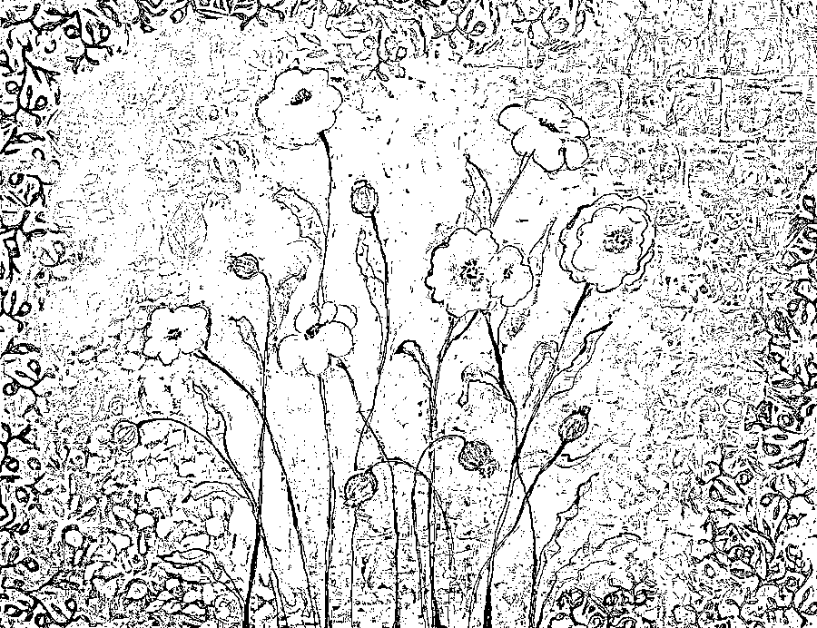

**卡尔·荣格的健康危机**

伟大的瑞士精神病学家卡尔·荣格就曾面临过这样的健康危机。      

| 荣格的出生星图

1944 年初，荣格摔断了脚，而后又因腿部无法动弹形成栓塞，导致心脏病发作。这里有个有趣的事件链。**摔断的脚与双鱼座关联，暗示了不破不立**——在荣格已有的对神性的理解和与神性的关系上潜在的突破。

**负责将血液泵回心脏的小腿在意外发生后无法动弹，小腿由水瓶座掌管**（荣格的上升星座，关系到他的人生观，也是他生命力的守护星）。 

（在身体恢复后，荣格写道：“患病之初，我感觉到我的态度出了问题。”）**血瘀导致血栓形成，堵塞了心血管，引起心脏病发作。**心脏由狮子座掌管，也是荣格的太阳星座，太阳星座与职业相关。因此，荣格对神性的理解、人生观和职业都似乎停滞不前。

**在心脏病发作期间，荣格有了一段近乎死亡的经历**，这对他造成了深远影响，让他对生与死有了全新的看法，也与之建立起全然不同的关系。

此后，他在夜晚体验着美好的幻觉，在白天遭受着抑郁的折磨，这种痛苦持续几周后，他才适应过来，重新开始生活。后来他这样描述这段经历：

**在疾病过去之后，我开始了一段多产的工作期。我的许多主要作品都是在当时完成的。那时候我所获得的洞察力让我有勇气着手新的构想。我不再试图阐明自己的观点，而是任自己顺思想之流而行。**

在荣格心脏病发作的时候，行进北交点合相了他的狮子座太阳（与职业相关的宿命性事件和关系），而带来神秘体验的海王星六分了太阳，土星对分他的出生图火星，而信使水星正经过他的上升点。

**“我不再试图阐明自己的观点。”**在行进土星对分射手座火星后，这是多么恰到好处的调整。火星也是天蝎座的中天和疾病的传统守护星，再结合行进土星对分火星，**自然就将他的职业转向了一个更意义深远、更具包容性的方向。**

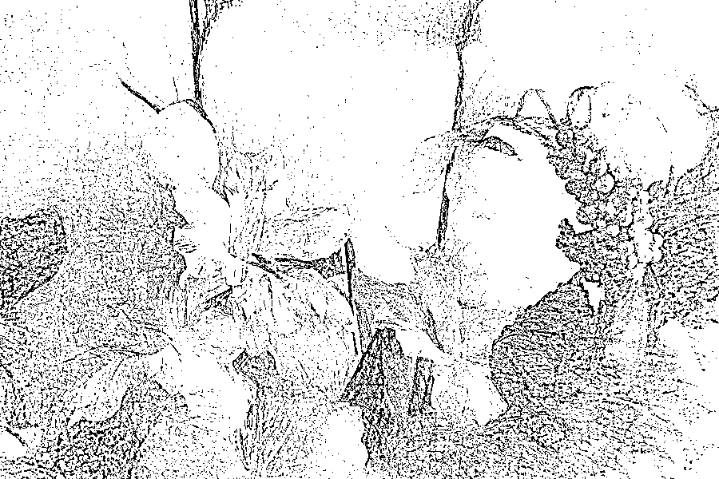

**身体的病痛是一种信号**

大量可靠的科学证据表明**，我们选择生活方式的质量、我们的思想、情绪、自我意象会对健康有或好或坏的显著影响，每一个方面又会影响到其他各方面。**

比如，垃圾食品不仅对身体的生理机能有负面影响，还会扰乱情绪和思维过程，扭曲我们的自我感知。

**负面思想带来负面情绪，负面情绪又会给身体带来有害的生理变化，创造疾病滋生的理想土壤。**或许，**自我意象**是掌控健康的最强有力的舵手。

我们想象中的自己会带领我们朝着符合这一形象的方式去表现，这一过程是不可阻挡且无意识的。

如果我们认为自己是不受欢迎的，我们就会做引起别人反感的事情，这也会关联到身体层面。好的方面是，**通过树立一个积极的自我意象，我们可以促进更积极的行为，带来更健康的结果。**

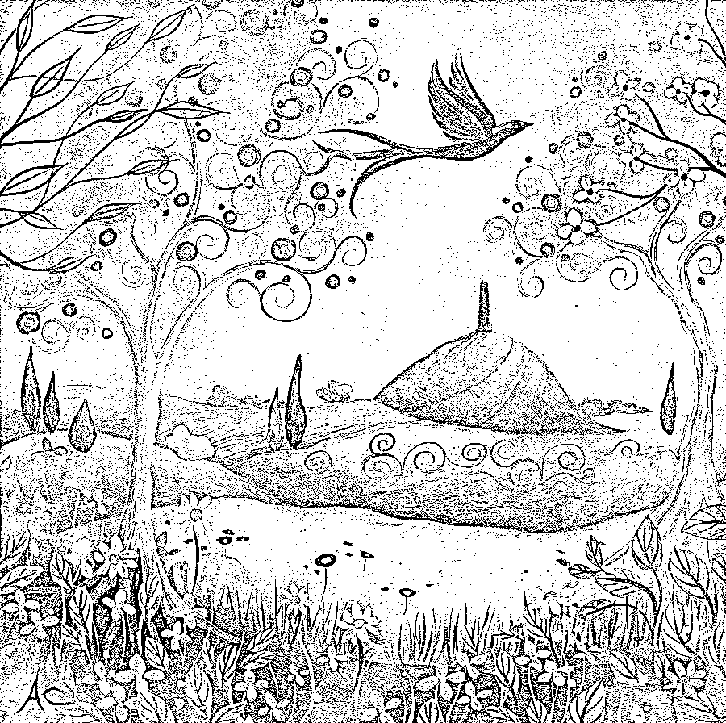

**凯思琳的例子**

凯思琳便是这样一个例子。她是我多年前的一位客户，那时候我还是一名草药师，刚刚开始成为占星师。**她来找我时列了一张可怕的疾病清单。**

她曾有过不正常的经期大出血和严重的经前紧张症，致使她在 28 岁时就做了子宫切除。三年后她切除了卵巢，使她立刻进入绝经期。所幸那时她已经有了两个孩子。由于长期的结肠炎，她的一部分肠道被切除了。

另外，她还患有骨质疏松症、视力低下、剧烈情绪波动、积水、过敏和周期性深度抑郁。**她和父母之间有很多情绪问题。**她曾经与父亲（已故）很难融洽相处，父亲是喜怒无常的酒鬼（火星落在双鱼座第 4 宫），她最记忆犹新的一幕是在 5 岁时，父亲告诉她，她永远活不出个人样。

**对于太阳摩羯座，土星在天蝎座合相上升点的她来说，忍气吞声实在太容易了。**

****

| 凯思琳的出生星图

**更糟糕的是她与母亲的关系。**凯思琳将母亲视为一个严厉苛刻的巫婆（月亮在狮子座合相冥王星），将自己视为灰姑娘，8 岁就被安排擦地，并且无时无刻不在遭到伤害和惩罚，无论她多么努力地取悦母亲，她的确拼命地在取悦（月亮四分土星，六分海王星）。

**火星双鱼座**可以与担忧和神经紧张相关联，导致肠道受到刺激（以及后来的肠道手术），**月亮—海王星**相位易导致积水和过敏，**月亮和冥王星的紧密合相**显示经期大出血以及子宫和卵巢的切除。有趣的是，她的医生告诉她，由于组织大量再生，她的卵巢似乎在重新生长。

**月亮狮子座**的人需要感到被重视，并且有一个适合站在舞台中央的角色。在我们共同完成咨询工作的 4 年里，凯思琳又进行了 3 次手术。

我终于意识到，**她常常兴高采烈地说着自己如何享受待在医院**，以及医生们说她是他们最喜欢的病人，在被麻醉前会一直给每个人带来欢乐。似乎躺在刀下，让身体的某些部分被切除，**是她找到月亮—冥王星合相狮子座渴望的关注、戏剧性和极端性的唯一方式。**

当我冒险将这个猜想告诉她时，她认同了，这是一个至关重要的时刻，就像打开了一个开关。后来就再没有过手术了，我们便开始寻求替代方案。

她一直以来都想画画，但在那之前她都太过拘谨不敢尝试，**终于她训练自己直面恐惧，不再犹豫**（过程中经历了诸多起起伏伏和磕磕绊绊）。

自那以后，她开始上起了美术班，并展览自己的作品。当她那个喜欢拈花惹草的老公离开她时，她很高兴，巴不得他早点这么做，她还与母亲建立起了恰当的界限，**开始全新的生活。**

多年后我收到一封她的信，信中说她保持得好，并且很享受能终于掌控自己的生活。正是凯思琳的例子让我意识到：

**星图的能量是多么迫切地渴望表达，以及信念和自我意象竟能产生如此强大的相应的情绪和行为，强大到能够让它们的创造者患病，有时甚至死亡，或者万幸，获得疗愈。**

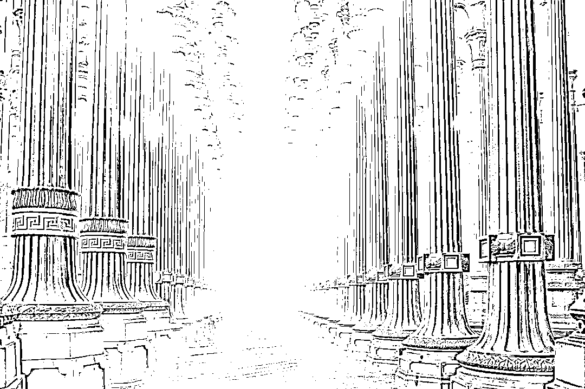

**结语**

通过理解这些对应，我们可以借助占星学找出和试验新的、更有技巧的自我呈现的方式，以及疗愈的而非伤害的思维模式。

**这里的根本前提是，通过处理存在于心智中的“上游”问题，身体会受到全方位影响。**

结合传统的医疗占星研究，我如今针对有健康问题的客户开发出一套基于 4 种元素的框架，**让那些或存在于意识之中的过程浮出水面。**

**想要了解更多？可以点击[新课首发·2022 年若道 ISAR 选修课 | 《医疗占星手册》作者亲授](http://mp.weixin.qq.com/s?__biz=MzA5NjA0NTAxNg==&mid=2651462540&idx=2&sn=0eac41c0de975b532a968e982f8f7f6d&chksm=8b48a93bbc3f202de47daaadf78856ebc6800c8779628e71ff7bfda7b22994aa02b9ab419075&scene=21#wechat_redirect)。**

**版权声明：**本文由若道翻译、整理发布，欢迎转发，反对抄袭。友号转载请申请白名单。

**简·里德尔-帕特里克**

药剂师、理疗师、草药师、心理治疗师及历史学家。在爱丁堡从业，也在那里教授占星学。持有爱丁堡大学的博士学位，出版的作品中最著名的是《医疗占星手册》。擅长医疗占星学、经验占星学和积极占星学。

**学习占星学****点击下图了解课程详情** 

****************

**微信又双叒叕改版啦，不想错过若道君的推送？**

**就把若道设为星标吧！**

**▼**

**就是这个“在看”，戳戳戳 ☟**

********报名直达入口********

# 2022 年若道 ISAR 选修课 | 医疗占星能帮助我们什么？

> 原文：[`mp.weixin.qq.com/s?__biz=MzA5NjA0NTAxNg==&mid=2651463309&idx=2&sn=2d36ef84dd7ffafba983cfcfd3af1593&chksm=8b48ac3abc3f252ce3a3772483de5506019a2a627ccf3d2c0eaf87e571fbb2c997bef67589f4&scene=126&sessionid=1692737888#rd`](http://mp.weixin.qq.com/s?__biz=MzA5NjA0NTAxNg==&mid=2651463309&idx=2&sn=2d36ef84dd7ffafba983cfcfd3af1593&chksm=8b48ac3abc3f252ce3a3772483de5506019a2a627ccf3d2c0eaf87e571fbb2c997bef67589f4&scene=126&sessionid=1692737888#rd)

1

**占星学与疾病之间存在联系**

****

**没有占星学知识的医生不能自称为医生。**

**　　——现代医学之父希波克拉底**

占星学与疾病有什么联系呢？**世界著名的医疗占星师简·帕特里克**说：**“占星学可以精准定位需要解决的潜在问题。”**尽管有人想当然地认为占星学是令人沮丧的宿命论，但事实并非如此：

**有四个主要因素影响着我们的生活和健康：基因构成、物质环境、情绪环境，以及我们的占星配置。我们在星图中都存在患病的可能性，而预防的方法在于尽可能充分、真实和健康地生活。****——简·帕特里克**根据简·帕特里克的说法，**每个星座都有广泛的可能性**。例如，那些双鱼座的人有潜力去扮演殉道者（以他人为先）的角色，但是他们也有能力成为伟大的治疗师。

那么医疗占星咨询涉及哪些内容呢？简·帕特里克有这样的步骤：

**· **首先，会请客户提供详细的病历，以及他们出生的日期、时间和地点；

**·** 然后，绘制他们的星图，观察在他们的病情确诊之前，在占星层面和情感层面上发生过什么。

根据简·帕特里克的说法，**癌症的主要病因之一，除了有害的生活方式之外，就是未解决的情绪冲突**：她通常会在症状出现前的 18 个月至 2 年间寻找触发因素。

她曾这样说：“当我为癌症患者服务时，我的任务之一就是识别出他们生活中的‘恶性肿瘤’，并帮助患者将其消除。”

**医疗占星师还可能帮助你确定做手术的最佳时间，或是指出你每个行星位置的优缺点**：比如，阵容强大的星群落入双鱼座可能与过敏有关，而巨蟹座人则可能发觉自己泡完热水澡后会疲惫不堪。**固定星座（金牛座、狮子座、天蝎座和水瓶座）在情感和生理上都倾向于“难以放手”，这可能为恶性肿瘤的生长创造环境。所以说，他们可能倾向于沉浸在过去的伤害中，难以自拔。另一方面，这些星座也擅长在艰难的时期坚持不懈并一直持之以恒。**

　**　——简·帕特里克**

“癌症人格”中比较突出的一点通常是难以表达情绪，而且你可以从星图中看出这一点。

**客户星图中突显的土星可能表明害怕表达自己的需求，或者害怕展现真实的自己。**

**——简·帕特里克**

发现癌症的身体部位也可能给出有关根本病因的线索。

简·帕特里克曾表示：“例如，卵巢与孩童、创造力、家庭有关。所以说，如果某人患有卵巢癌，那么问题可能在于此人无法表达自己的创造力，或是无法做到滋养和关怀。”

有趣的是，母亲的癌症恰好发生在自己的孩子开始离开巢穴时。

医疗占星师可能也会查看金星在客户星图中的位置。

**金星代表使我们快乐的东西，因此如果金星得不到满足，我们就不会快乐——而不满是滋生疾病的温床。**

**——简·帕特里克**

如果金星落入双子座（前文中母亲的案例），这表明你渴望趣味、变化、沟通、心智刺激和灵性工作。在患癌之前，这位母亲就觉得自己的生活缺乏快乐和意义。理解她的灵魂渴求转变——更多的旅行、更多的学习、更多的乐趣，这可以帮助和支持到这位母亲。**简·里德·帕特里克老师说：“星图中的每个因素都为我们提供了广泛的可能性。所以说，重要的不是我们的遭遇，而是我们如何回应这些遭遇。”**

2

**医疗占星包含哪些内容？**

本课程既适合医疗占星学的初学者，也适合已经有一些相关经验的人。
简·里德·帕特里克老师将运用现实生活中的例子，揭示一个人的性格、症状及其星图是如何相互映照的。课程也会探讨疾病的意义以及可能的治疗方法。本课程旨在为学员提供一个运用医疗占星学的框架和方法，学员将会学到一些有价值的实用工具，在课程结束后，自己使用这些工具研究其中的关联性。**此课程可作为 ISAR 选修课。**

3

**课程安排**

**课程时间：2022 年 3 月 8 日-4 月 26 日  每周二 20:00-22:00**

**第*****1*****讲  3 月 8 日 与占星学、心理学、病症一起工作，学习**

*   医疗占星学的组成部分以及如何使用它们

*   行星的作用与相互作用

*   黄道星座人

*   宫位的重要性

*   疾病和健康是如何产生的

**★ 第二、三、四讲的课程内容基于星座以及它们之间的相互作用。**

**第*****2*****讲  3 月 15 日 基本星座**

学习基本大十字星座——**白羊座、巨蟹座、天秤座和摩羯座**——及其功能和相关的健康问题。**这些星座与防御、养育、结构、体内平衡和荷尔蒙控制有关。**

****第*****3*****讲  3 月 22 日 固定星座****

学习固定大十字星座——**金牛座、狮子座、天蝎座和水瓶座**——及其功能和相关的健康问题。**这些星座与习惯和反射、心脏调节、生存、循环和协调有关。**

“固定星座（金牛座、狮子座、天蝎座和水瓶座）在情感和生理上都倾向于**‘难以放手’**，这可能为恶性肿瘤的生长创造环境。所以说，他们可能倾向于沉浸在过去的伤害中，难以自拔。另一方面，这些星座也擅长在艰难的时期坚持不懈并一直**持之以恒**。”

——简·里德·帕特里克（Jane Ridder-Patrick）博士

**第*****4*****讲  3 月 29 日 变动星座**

学习变动大十字星座——**双子座、处女座、射手座和双鱼座**及其功能和相关健康问题。**这些星座与呼吸、神经系统、肠道、睡眠以及信息、情感和行动的整合有关。**

**★ 第五、六、七、八讲重点学习行星，它们在身体层面的表达、它们的相位与行进。**

**第*****5*****讲  4 月 5 日 太阳与月亮**

**太阳**掌管视觉、活力、心脏和意识，与心脏、脊柱和视觉问题相关。

**月亮**掌管人体的周期，特别是月经周期、饮食模式和体液，与情绪引起的疾病、饮食失调和胃病相关。

**第*****6*****讲  4 月 12 日 土星与天王星**

**土星**掌管着皮肤、骨骼、牙齿和衰老过程。它对应的疾病包括慢性疾病、耳聋、帕金森病、关节僵硬和牙齿问题。

**天王星**代表身体活动的协调，有节奏的脉动和身体的“电”。与天王星相关的疾病包括癫痫、痉挛、心律失常，以及阿斯伯格综合症和自闭症样综合症。

**第*****7*****讲  4 月 19 日 海王星与冥王星**

**海王星**掌管松果体、细胞膜渗透和右脑功能，与过敏、上瘾的病症、慢性疲劳综合症和睡眠障碍相关。

**冥王星**掌管消除和转化，其病理包括毒性、脓肿、癌症和强迫症。

**第*****8*****讲  4 月 26 日 火星**

**火星是与能量和防御相关的行星**，掌管免疫系统、肾上腺功能、肌肉活动和炎症反应。**它是许多身体和情绪障碍的核心**，如自动免疫障碍、抑郁和发烧，以及由手术或需要手术引发的问题。

4

**此次课程适合哪些人？**

*   有一定占星学基础，若道核心课 L3 以上水平；

*   希望成为优秀的占星师，想要借鉴国际大师医疗占星解读思路并融入自己的体系的人；

*   热爱占星学、健康、养生的研究型占星学者；

*   计划考取 ISAR 认证占星师，寻觅中意选修课的学员；

*   走在自我探索和个人成长道路上的人。

**快来和简·里德·帕特里克老师学习升级版的占星学身体地图吧！**

5

**授课老师**

**简·里德·帕特里克 **博士****

（Jane Ridder-Patrick）

简接受过药剂师、理疗师、草药师、心理治疗师和历史学的专业学习，从事写作、咨询和讲学工作，在英国和全球教授占星学及其历史、当今的心理学和医学应用。她在爱丁堡执业，在爱丁堡大学获得博士学位，研究方向是 17 世纪苏格兰占星学历史。

**她最著名的出版物是《医疗占星手册》。2018 年，她因对医疗占星学的贡献而获得了著名的查尔斯·哈维占星学杰出服务奖。**

《医学占星术手册》（第二版，修订版和扩充版）

(爱丁堡，克拉布出版社，2006 年)

6

**课程价格**

*   **课程价格：****6800 元**

*   **早鸟价：5800 元（截止日期：2022 年 2 月 9 日）**

*   **课程咨询：**王老师（微信：18510107057，请备注“医疗占星”）

长按二维码添加王老师

7

**课程安排**

*   **课程时间：**2022 年 3 月 28 日开始，每周二晚上 8 点，每周一次，共 8 次课。

*   **授课方式：**线上直播，英文授课，中文翻译

8

**退转课程**

*   **退款原则请详看《教学协议》，如有疑问请咨询课程顾问。**

****医疗占星****

**授课老师：**简·里德·帕特里克

**授课时间：**2022 年 3 月 28 日起

**授课方式：**网络课程**，**英文授课，中文翻译

**费用：****6800 元****（早鸟价：5800 元，2022 年 2 月 9 日截止）**

**课程负责人：****王老师**（微信：18510107057，请备注“医疗占星”）

长按二维码添加课程负责人咨询~

****报名请点击“阅读原文”****

# “双十二”若道占星大促 | 全年最低，多充多送！

> 原文：[`mp.weixin.qq.com/s?__biz=MzA5NjA0NTAxNg==&mid=2651463192&idx=1&sn=815711fdf4a871c1db8d90bab0721316&chksm=8b48acafbc3f25b91e2486381b2ec9bc5cffe993f818ed8f3f685e8ec4a60d34c29ac32e715a&scene=126&sessionid=1692737888#rd`](http://mp.weixin.qq.com/s?__biz=MzA5NjA0NTAxNg==&mid=2651463192&idx=1&sn=815711fdf4a871c1db8d90bab0721316&chksm=8b48acafbc3f25b91e2486381b2ec9bc5cffe993f818ed8f3f685e8ec4a60d34c29ac32e715a&scene=126&sessionid=1692737888#rd)

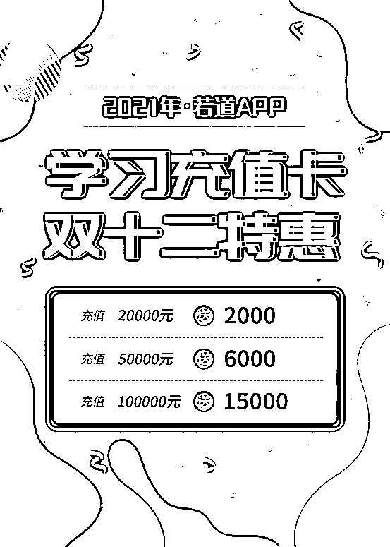

**若道占星年末巨制****双十二学习充值卡套餐****限时优惠手慢无****2021 年 12 月 1 日-12 月 12 日****三种充值面值可供选择****充值 20000 元送 2000****充值 50000 元送 6000****充值 100000 元送 15000*****29*****门课程任你选****价格直降*****800-15000*****不等**

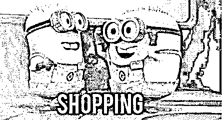

**充值卡首次适用于占星核心课、塔罗认证课****想要系统学习占星、塔罗的同学不要错过折扣机会****2022 年全新 ISAR 选修课、****往年 ISAR 经典选修课任选****计划考 ISAR 认证，需要修满 3 门选修课****如果你是某位占星大师的粉丝，****想要一口气刷完精华课程****对特定学科感兴趣，想要精进占星技法****都可以先囤好学习充值卡，冲冲冲！**

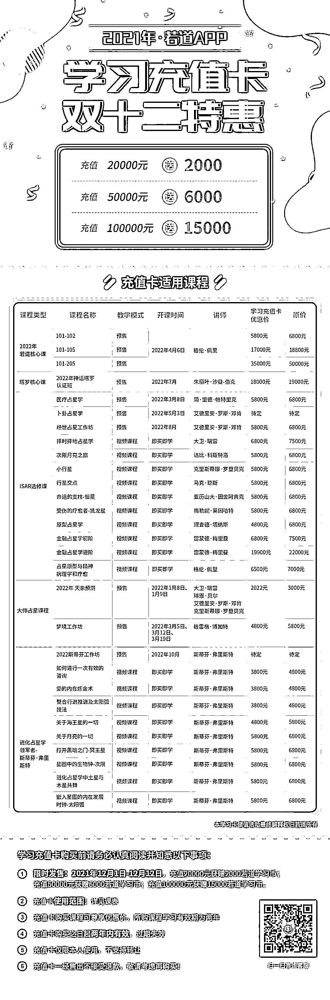

**重要！重要！重要！**
**购买学习卡之前请先****仔细阅读****下图须知****或者扫描二维码咨询客服小姐姐**

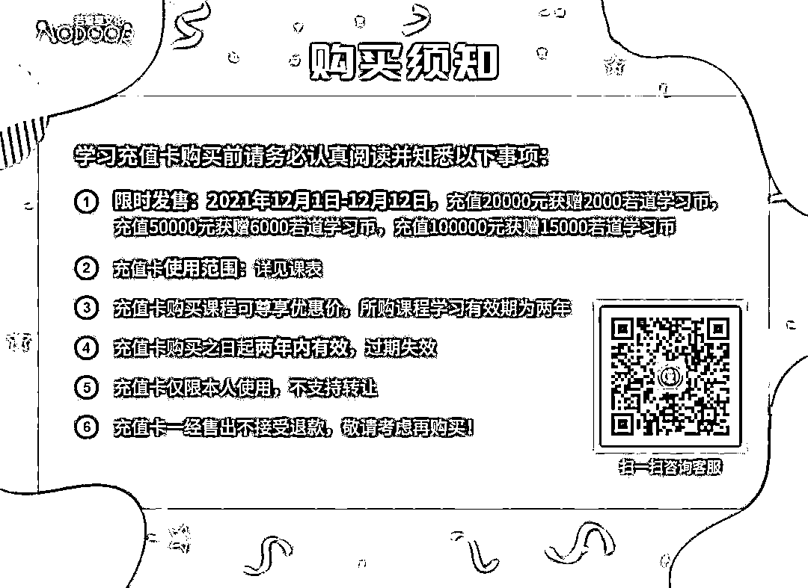

**购充值卡，听课****请先下载若道 APP****若道君：你可以在 appstore 或者应用商店搜索“若道”下载 app 或扫描下图二维码**

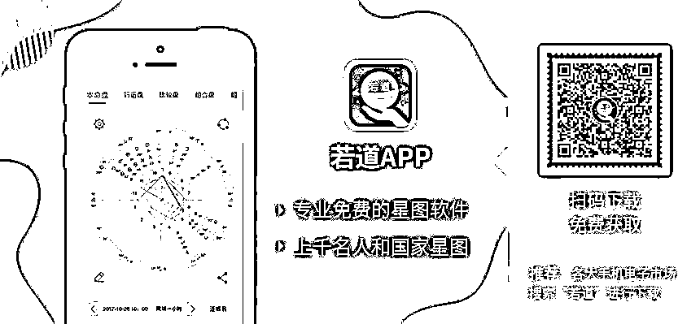

**还有别的问题？****别害羞，扫描二维码，咨询客服小姐姐吧~**

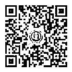

# 太阳白羊座与 12 星座月亮丨“你会为什么而战？”

> 原文：[`mp.weixin.qq.com/s?__biz=MzA5NjA0NTAxNg==&mid=2651463192&idx=2&sn=7ecd2012aee1f245b56e0f107bdfc19e&chksm=8b48acafbc3f25b968e9ca8cbe8acf6972dc3e418827b36ac12af7bf7c81858937657babb393&scene=126&sessionid=1692737888#rd`](http://mp.weixin.qq.com/s?__biz=MzA5NjA0NTAxNg==&mid=2651463192&idx=2&sn=7ecd2012aee1f245b56e0f107bdfc19e&chksm=8b48acafbc3f25b968e9ca8cbe8acf6972dc3e418827b36ac12af7bf7c81858937657babb393&scene=126&sessionid=1692737888#rd)

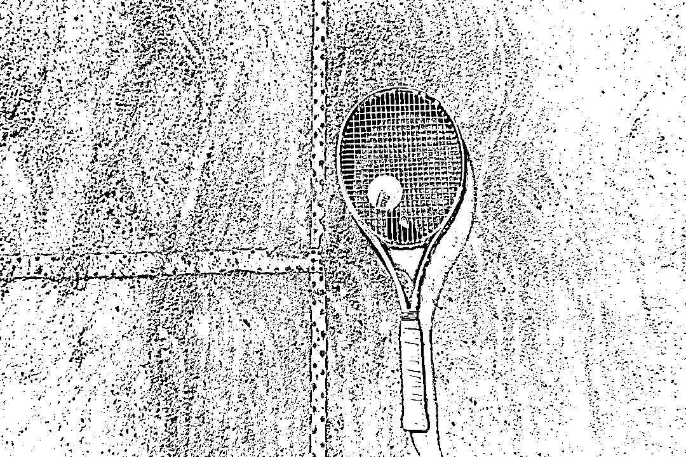

作者/诺·泰尔 译者/江艺、dagcatcher 编辑/翀子 封面/书君 图片/网络太阳是生命的伟大能量，而月亮被认为是人格中的“主导需要”同样被重视，我们的内在需要会推动外部事件的发生。不过你知道吗，星图中的太阳和月亮的星座组合一共有 144 种！今天让我们看看，当太阳在白羊座、月亮分别在 12 星座时，都会有哪些表现呢？**重要的月亮**

关于太阳，我们已谈得太多了：“你是什么星座的？你的太阳在哪儿？太阳底下无新事”等等。对于这几个问题，“无处不在”可能是一个绝妙的回答。

因为阳光普照着整个太阳系，当然也照耀着我们的生活，它无所不在。它是生命的能量，不是吗？我们只能看见被光线照亮的物体，光线赋予了它们形体、颜色和生命。

如果我们盯着太阳仔细看，那简直是想弄瞎自己的眼睛，因为我们无法承受如此巨大的能量。**太阳是伟大的，它拥有无可比拟的能量，是所有生命赖以生存的至关重要的源泉。**

但是我们却无法直接并且安全地运用它，只能通过反射太阳光（通过月亮以及太阳系里每一颗行星对太阳的反射光）来感受它的能量。

为什么是月亮呢？为什么它如此重要？月亮是地球的卫星，它绕着我们旋转。因为距离的原因，离地球近的月亮虽然比太阳小得多，但我们的角度看，它们是一样大的。我们通过月亮的反射看见太阳的光芒，如此简单，又如此深奥。

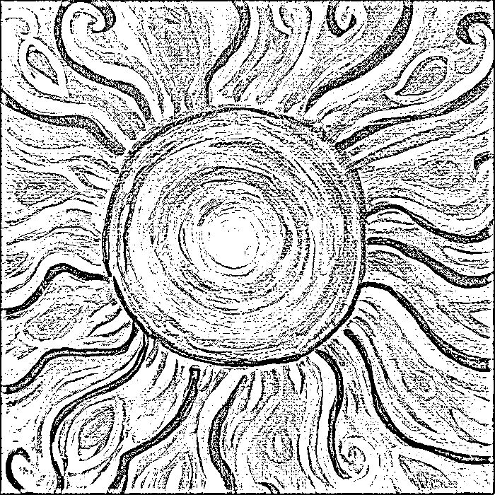

**太阳是生命能量，月亮是主导需要**

**我们可以将太阳看做生命的能量**。每一位占星师都能够用一个词或短语，完美地概括太阳位于双鱼座、摩羯座、狮子座、双子座等星座的典型特质。

**但是由于太阳的光芒太过强烈，能量太过巨大**——就像你无法探头进去检查你们公寓大楼里的采暖炉。我们得试试其他方法，比如九楼上的散热器，或者是占星图中的月亮。

当我将心理学的需要理论与占星象征体系结合起来时[见《整体占星学》(*Holistic Astrology*），在《占星综合分析与咨询》（*Synthesis& Counseling in Astrology*）中有所修订]，**我认为月亮代表了我们人格中的“主导需要”，****这一原型将太阳的能量聚焦于关注个体生存需要。**

所以如果我对你说我的太阳位于摩羯座，你就能感觉到一股能量：长于管理和落实，诸如此类。如果这股能量通过我的主导需要，也就是位于狮子座的月亮（在那里，太阳的光芒得到非常强烈地反射）得以聚焦，那么你就会知道，摩羯座能量需要获得赞赏，需要成为舞台的中心。

**在成就感和个人发展的驱使下，我们的内在需要推动事情发生，**所以你会知道一个强大的太阳摩羯座和耀眼的月亮狮子座相结合的人，会做出哪种行动。

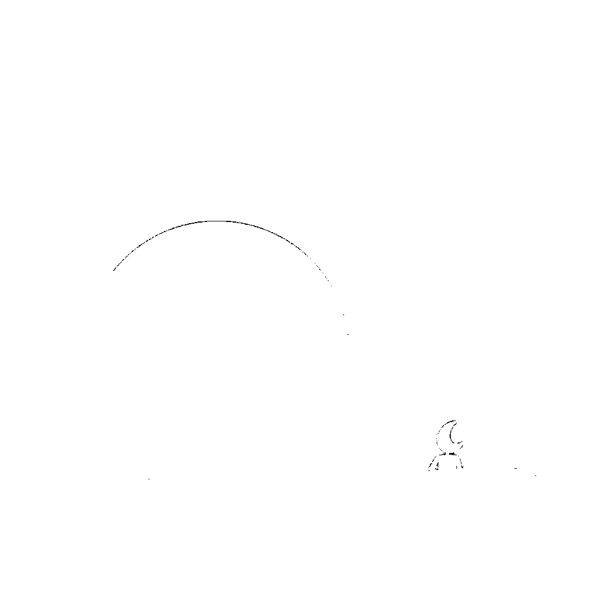

**联结太阳和月亮，走向完满人生**

太阳的相位（比如我的太阳合木星，这加强了太阳的特质，并通过第 7 宫强烈地展现给公众）告诉我们采暖炉的管道是否存在扭曲或者堵塞等问题。**月亮的相位则说明，在行动的过程中也许可以做些什么调整，来满足我们的主导需要。**

**将太阳和月亮联系起来，看做是能量和需要重点的组合，推动人生尽可能地走向完满**，可以开始讲故事了，不是么？肯定是的。你在生活中，在星图中，都能感觉到它。

**让人着迷的是，这样的日月星座组合有 144 种**，《占星综合分析与咨询》（*Synthesis& Counseling in Astrology*）上有关键提示。**这种组合是占星图的核心**，在此基础上再处理半球侧重、主要相位等。

很自然，水星象征着想出某种方法来满足这些需要；金星象征着建立某种关系来满足这些需要；火星则象征着运用某种能量来最快地满足这些需要，其他行星依此类推。

行星不会做任何事情，人却会为了满足自己的需要而做事情。**太阳通过某种方式设置了能量，月亮则将它运用到各个方面，用它去拥抱存在的潜能。**因为月亮需要这么做。

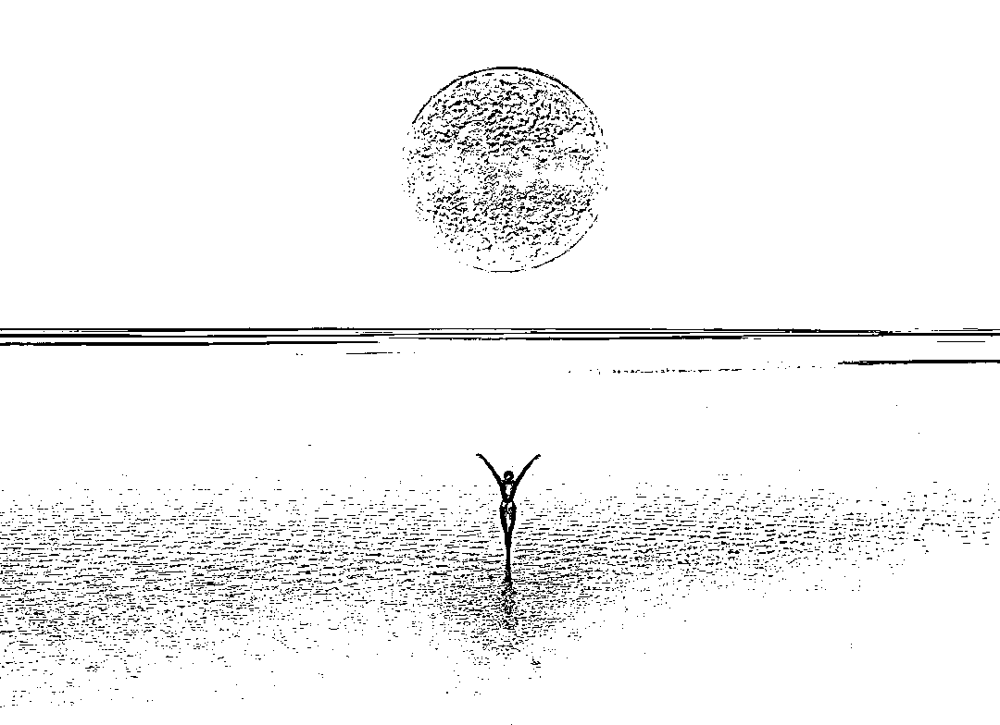

**太阳白羊座和 12 星座月亮**

**★月亮*****白羊座***

这个同星座的配置，**聚焦了活力和个性化的自我形象**。我们学过的关于白羊座的一切都会被戏剧化地强调。白羊座的守护星火星在星图中极其重要。独立，自信，自我意识。可能有着极端的个人主义倾向。他们冲动，时刻准备着表达自我；自我中心。 

**★月亮*****金牛座*** 

固定、土象星座的月亮**给白羊座的生命活力带来稳固务实的一面**，“自我感觉良好”变成一种有趣的魅力。他们做着自己想做的事，根本不回头。 

**★月亮*****双子座***

月亮在变动的风象星座，给白羊座太阳的活力**注入双子座的多变和伶牙俐齿**。他们流畅地表达着白羊座的活力，能够轻松地推销自己。他们的沟通流畅而又过量。

这个配置**需要通过强硬的压力相位来找到根基**，（否则）热络的言谈会流动得太过轻松（给人以夸夸其谈的浮夸感）。 

**★月亮*****巨蟹座***

如果日月四分，且非常精确，我们可以判断案主出生时父母不和或家庭状况比较混乱，**白羊座的冲动和巨蟹座的敏感联姻**。这个联姻**需要应用在实际生活中**。

借助其他行星和日月的相位，如果日月体现的一种需求被强调，另一个就要遭殃。这时，情绪化会代替敏感，意志畏缩不前。当情绪安全感受到威胁，独裁心理就会代替成就动机。

**而在良好的平衡下，**两个本位星座试验性的行事方式一定能和它们宏大的发展潜势相匹配。 

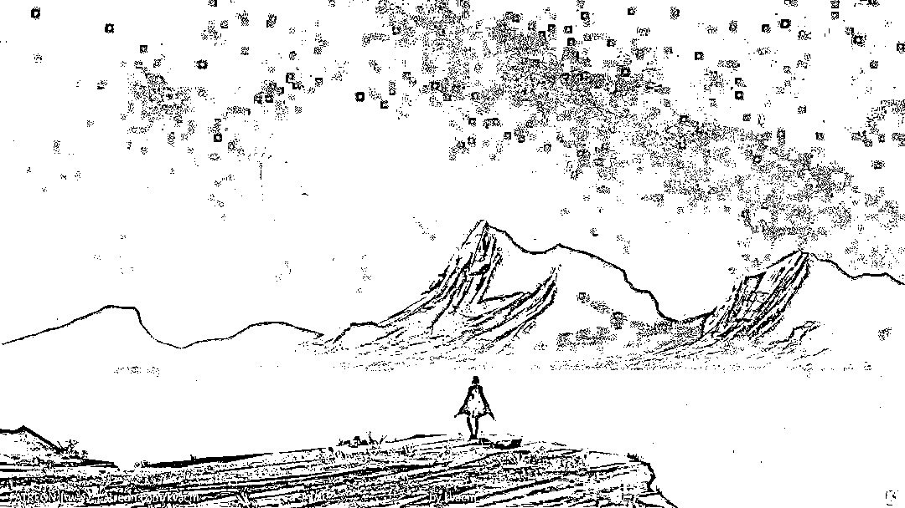

**★月亮*****狮子座***

火象 120 度，火象能量柔和流动，最自然地火花四溅。这**是浪漫主义者和冒险家的配置**，他们的言谈和表达有种戏剧化的说服力。他们能很好地取悦自尊心。（不为名，不为利）就算为了擦亮内心的自我形象，我也要获得成功！ 

**★月亮*****处女座*** 

**批判、分析性**的心智力量覆盖了白羊座对勇气的表达，**学习新事物的冲劲总是需要通过细节来落实**。他们评价事物因而非常苛刻。太阳几乎对月亮的苛刻低头道歉而丧失勇气。

**★月亮*****天秤座*** 

每个 180 度配置都很难分析。

两个本位星座，总代表两个独立分离的动机，两股力量向着不同的方向复杂地运作，却又依赖彼此；而在固定星座之间，两个结构性很强的概念有着融合的困难；变动星座间，两块抱着适应目标的疆界彼此分离，苦苦等候催化剂和契合点。

**太阳在白羊座，代表极端的个人企图心**，这种企图心强调自尊，并为之而紧张地策动（土星，野心，变得很重要）；**月亮在天秤座，依赖他人去反射自我形象**。这个配置的人往往因此难以集中注意力，喜欢做白日梦。他们的浪漫让事情变得复杂。

只有**学会尊重现实，实事求是**，方能融合日月二者的力量，把白羊座的活力带向实际应用，把天秤座的社会化的需求聚焦到合适的平衡状态之中。 

**★月亮*****天蝎座***

**通过与他人的交流来深化对自我价值的确认**。“必须让你们相信，我是坚定不移的！”生活从不退色！而在计划个人野心的时候，总是默默地孵化、沉思、保密。

**他们的人生目标坚定，静谧，不动声色**，这样的气质总是很难吸引他人的同情与关心。他们建构起一种带有神秘色彩的人生观来保护自尊不受伤害。

对他们来说，自我认可实在太过重要，太过深刻。 

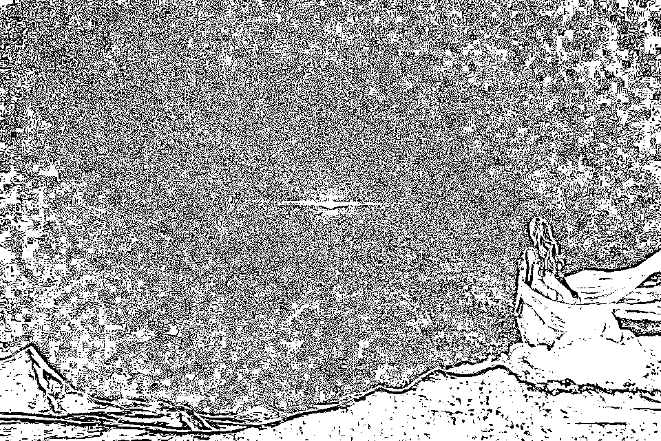

**★月亮*****射手座*** 

**借助思想、行动、演说、创意、原则，他们的独立精神蓬勃地发展起来**。真理就是一切。少量对细节的关注就会使他们的思考过程大大减速。

这个 120 度相位让**个性有些过于松弛**，肤浅的灵光一现太容易带来错误的决定。良好的智力教育方能使盘主受益，真正地放飞梦想。

（理想的）他们具备惊人的自我表达力和社交感染力，白羊座那充满活力的能量被用来影响与控制他人的想法。 

**★月亮*****摩羯座*** 

**热烈的野心和冷酷的管理意识在发展过程中形成了紧张**，这种紧张几乎永远创造成功。坚如磐石。他们有着**强有力的自我表达能力**，内心坚韧，行事可靠，注重落实。

这个配置仍然暗示出生时父母不和。父母之一（很可能是父亲）在人格发展中扮演极其重要的角色。他们自我表达的时候感情外露。他们**注重常识，乐观**。 

****★月亮*****水瓶座*****

他们真切地实践对人文和人性的兴趣：永远在路上。对他们来说，**团队工作**能很好地提升自我。他们需要在带有**浪漫和冒险色彩**的人际互动中释放自己最美的一面，需要采用不拘一格的方式张扬独立精神。

**和“对”的人们在一起，对自我认可帮助巨大。 **

**★月亮*****双鱼座*** 

月亮接近新月。对白羊座太阳来说，富有冲劲的一面被削弱了：他们**情绪不稳**，有着强势的外在表现和脾气，但**内心却很腼腆**。

对他们来说，**表达自我意识很容易，真正有效的沟通却很难，**公开发言之前往往需要一段时间独处。当白羊座的主观在交流过程中不被理解时，案主可能用内省和自怜等心理防御来应对。

对这个月亮星座来说，白羊座太阳的自尊心是高度私人化和重要的。他们**有着宏大的感受力**，却不善于将它们表现出来。 

**版权声明：**本文由若道翻译发布，欢迎转发，反对抄袭。友号转载请申请白名单。

**诺·泰尔**

现代占星学鼻祖，世界众多著名西方占星师的占星老师。他毕业于哈佛大学社会关系专业，是当今世界上最重要的占星师之一，占星联盟协会（AFAN）的创始人及原主席。其所著的三十三本占星教科书作为占星教学的典范，引领了整整两代占星师的占星学习与教育，1998 年国际占星大会（UAC）授予其占星界最高奖项 “轩辕奖”。

**学习占星学****点击下图了解课程详情** 

****************

**微信又双叒叕改版啦，不想错过若道君的推送？**

**就把若道设为星标吧！**

**▼**

**就是这个“在看”，戳戳戳 ☟**

****************报名直达入口****************

# 好物推荐 | 从"麻瓜"进化成占星师的自我觉察工具（插班中）

> 原文：[`mp.weixin.qq.com/s?__biz=MzA5NjA0NTAxNg==&mid=2651463086&idx=3&sn=8845e189df77a7e8efdeeb8267684324&chksm=8b48af19bc3f260f42bfac89b9513ac0892f938f5c4bc0e5a018967ef1d5dcbe44fe47f94b06&scene=126&sessionid=1692737888#rd`](http://mp.weixin.qq.com/s?__biz=MzA5NjA0NTAxNg==&mid=2651463086&idx=3&sn=8845e189df77a7e8efdeeb8267684324&chksm=8b48af19bc3f260f42bfac89b9513ac0892f938f5c4bc0e5a018967ef1d5dcbe44fe47f94b06&scene=126&sessionid=1692737888#rd)

1

**自我觉察，是智慧的基础**

每个人都有自己的内在冰山，自我觉察能够帮助我们觉察自己的行为、情绪等，然后向内深层探索，探索自己的行为、情绪背后的深层渴望、期待。学习和应用占星学的过程，就是慢慢掌握自我觉察工具的过程，当你熟练掌握了占星学，也就具备了帮助引导他人觉察到自身生命议题的能力。**往外张望的人在做梦，向内审视的人才是清醒的。**只有真正向内看，只有当觉察开始由外向内时，改变才会发生，才能够知行合一。

# | 插画师：古戈力

以情绪来举例说明，每个人的情况不同，觉察的程度也不同，觉察有四个层次：***1.*** **不知不觉：**没有觉察情况，当情绪来了，会被情绪控制，做出很多不计后果的事情。而且每次都是同样的状况，反反复复；***2.***** 后知后觉：**情绪过后，自己能够反应过来，自己做的对与错，但是很难避免同样的情况再次发生；***3*****. 当知当觉：**当情绪来的时候，你已经知道在这个当下，正在发生什么。当达到这个层次，你就可以自己控制情绪，从而影响后事的发展；***4*****. 先知先觉：**当事情还没发生，就可以预知它要发生了。因为你对情绪的觉察已经越来越熟练，所以情绪还没来，你就知道它要来了。所以，你也就有了更好的选择和处理方法。所以，我们要自我觉察，向内探索，觉察是为了接纳，然后做出改变，成长，迭代，升级。**那么要如何练习自我觉察，掌握先知先觉的能力呢？**

2

**每日觉察的工具推荐**

**今日天象&近期行进**

若道 APP 中的今日天象功能，罗列展示每一天的具体天象，你当天的行进和行进周期：

作为占星师，可以这样使用这个自我觉知工具：

**记录梦境**如果你有醒来记录梦境的习惯，每天早上看一下睡梦中的天象和行进，对应联想，你会惊喜地发现一些神奇的对应，能够更敏锐的捕捉到日常被压抑的情绪和需求。能够帮助你在白天的工作生活中先知先觉的关注身心状态。**规划生活**每月月初，周初都可以参考天象和行进进行日程规划，预估可能的助力和阻力，在对的时间做对的事，会发现平平无奇的日常也可以有不一样的色彩。根据月相的变化感知情绪的起伏，更好的自我关爱。**感知环境**当身边发生了引起你注意和好奇的事情，或者网络上层出不穷的新闻热点，都可以在天象中寻找对应的能量。从更大的格局视角去思考你的个人观点。通过环境的共振，更深入地理解自己的出生星图。以上都是很好的学习深化占星知识的方法，只需要系统掌握以下知识，就可以开始使用以上方法去提升自我觉知。**第*1*阶 黄道星座&个人行星****概要介绍占星学与星图**

**四元素与三形态**

**黄道 12 星座**

**太阳、月亮及其他个人行星**

**第*2*阶 行星&宫位****木星&土星****天王星&海王星&冥王星**

**练习组合所有行星**

**四轴**

**十二宫位**

**组合宫位、行星、星座****第*3*阶 月亮交点、相位以及初步解读星图**

**了解灵魂进化的路径：月亮交点**

**相位概论**

**相位&行为模式**

**困难相位**

**柔和相位**

**容许度，出入相位**

**渐盈渐亏相位**

**空相**

**宫主星&定位星**

**相位模式**

**组合相位、星座、行星、宫位**

**解读的基本原则，权重，失衡**

3

**课程安排是怎样的呢？**

**第*1*阶**2021 年 9 月 15 日开课，每周一天晚上 20:00-22:00 上课，共 6 次课**第*2*阶**2021 年 11 月 11 日开课，每周四晚上 20:00-22:00 上课，共 6 次课**第*3*阶**2022 年 1 月 6 日开课，每周四晚上 20:00-22:00 上课，共 15 次课 2022 年 4 月 30 日、5 月 1 日**L3 北京两日线下工作坊**

****

4

**授课老师**

**艾德里安·罗斯·邓肯**

**（AdrianRoss Duncan）**

**· **1971 年在印度游学时开始学习占星学，1985 年开始成为全职占星师，迄今执业已超过 33 年，是人本主义占星学、卜卦占星学和经世占星学领域的知名占星师。他还开发了占星软件 AstroClock 和多款占星报告；**·** 哥本哈根占星学院院长；**·** 他在日常咨询中经常运用卜卦，咨询图（卜卦的一种运用方式，即根据客户来访时间制作星图，从星图中获得大量信息）也是他特别擅长的领域；**· **艾德里安·罗斯·邓肯从 1971 年开始研习佛学，受佛学影响很深，他相信占星学和佛学观点一致，转化的一个基础是在于对现实感知的改变。而卜卦很容易与佛教融合，因为它只关乎当下。

**大卫·瑞雷**

**（David Railey）**

**·** 若道联合创始人，致力于在中国教授和推广西方占星学；**·** 曾任 ISAR 全球副主席，CAPISAR（ISAR 职业占星师资质认证机构）主席；**·** 1976 年，通过亚特兰大职业占星师考试，成为全职占星师，随后通过 AFAN 和 ISAR 职业测试；**·** 1980 年，与杰夫·焦耳一起在亚特兰大创建“每日行星”占星学中心。此后在亚特兰大占星协会担任 4 年考官，并且两次担任亚特兰大地区占星协会主席。1979-1992 年，作为占星师活跃于美国社会媒体，向不了解现代占星学变化的大众宣传专业占星学知识。在 1989-1992 年期间，他在 WRGG 电台 12 频道每周主持个人电视秀“今日占星学”，早先他还在 WRFG 的广播节目中播讲宇宙天气节目；**·** 2010-2014 年，任全美占星师联盟监督委员会委员；**·** 2010 年，其著作《灵魂的目标》中国版出版，和蒋颖一起创办若道占星学校和其官网 www.nodoor.com；**·** 2017 年，被选为 ISAR 委员会成员。ISAR 是世界最大的国际占星机构，会员遍布 45 个国家，2017-2020 年曾任 ISAR 全球副主席、CAPISAR（ISAR 职业占星师资质认证机构）主席。

**克里斯蒂娜·罗登贝克**

**（Christina Rodenbeck）**

**· **克里斯蒂娜·罗登贝克（Christina Rodenbeck）是一名全职职业占星师，在牛津大学城生活和工作，深受周围知识和文化氛围影响；她拥有伦敦大学（University of London）的人文荣誉学位，曾在伦敦占星学馆（AstrologicalLodge of London）、心理占星中心和占星研究学院学习；**·** 作为一名占星师，在过去的 20 年里，克里斯蒂娜在她的网站“牛津占星师”上写了大量关于时事、艺术和文化的文章；她每月主持一个占星播客：“与克里斯蒂娜和萨莉一起占星”，并定期在《占星杂志》(Astrological Journal)上撰写时尚专栏；她定期在英国授课，并保持着蓬勃发展的专业实践。

**琳恩·贝尔**

**（Lynn Bell）**

**·** 世界最受欢迎的占星学演讲者、作家和老师之一。定居巴黎，研究心理占星学和家族模式数十年；

**·** 著名的心理占星学中心（Centre for Psychological Astrology）的长期导师。2016 年，获得查尔斯·哈维（Charles Harvey）杰出的占星学服务奖；

**·** 作为一个从多个层面进行工作的占星咨询大师，琳恩的工作结合了心理学的观点。她对家族模式的兴趣首先来自与客户的合作。通过在分析领域所做的个人工作，她所受的埃里克森催眠训练将她引领至家族系统。后来，她组织研究小组在家族星图上进行了数年的研究。她写的《家族占星学》就是这项研究的结果；

**·** 法国心理占星学协会的会长。除了占星学，她在法国沙特尔的新沙特尔学校任教 8 年，还 5 次获得了在《纽约时报》畅销书作者卡罗琳·迈斯（Caroline Myss）的卡罗琳·迈斯教育学院（Caroline MyssEducational Institute）合作教学的机会。**课程助教：**

**熊鹰老师**

**（天空的空）**

**·** 2008 年接触严肃占星学，至此爱不释手；**·** 2013 年师从大卫·瑞雷，研习现代占星学核心课程，并于 2014 年起担任该课程的助教，之后于 2017 年与 2020 年两次与大卫老师合作讲授完整核心课程（Level 1-5）；**·** 期间也跟随格伦·佩里、诺·泰尔、理查德·塔纳斯、罗伯特·汉德、苏·汤普金斯、斯蒂芬·弗里斯特、琳恩·贝尔、艾德里安·邓肯等多位国际占星大师进行学习，进行定向占星主题研究；**·** 2014 年末，通过国际占星研究协会（ISAR）资质认证并获得证书；**· **在若道占星任职六年余，以“传播系统、专业、实效的占星学”为职业使命，执教与助教已累计超过 700 小时。在业余期间也提供占星咨询服务；**·** 目前正着眼于占星学与中国文化之互参，以当代中国人的身心成长为目标，力求落到实处。

5

**此次课程适合哪些人？**

**·** 对占星学感兴趣，想要入门的零基础者**· **占星学小白，想通过星图学习识人之术**· **有一定占星学基础，但不知道该如何整合星图复杂碎片的人**· **想要师从更多殿堂级占星导师学习占星心法的人**· **走在自我探索和个人成长道路上的人

6

**课程价格**

**L1-3 价格**：15000 元

其他各阶段课程单报价格，请咨询课程顾问：**Maggie 老师**（微信：18510107057，请备注**“核心课”**）

长按二维码添加 Maggie 老师

7

**退转课程**

****· 退款原则请详看《教学协议》，如有疑问请咨询课程顾问****

****名师汇集金牌核心课程****

**授课老师：**琳恩·贝尔、艾德里安·罗斯·邓肯、克里斯蒂娜·罗登贝克、大卫·瑞雷

**授课时间：**2021 年 9 月 15 日起

**授课方式：**网络课程**，**英文授课，中文翻译

**费用：**L1-2 价格：4800 元**；**L1-3 价格：12000 元

**课程负责人：****Maggie 老师**（微信：18510107057，请备注“核心课”）

长按二维码添加课程负责人咨询~

****报名请点击“阅读原文”****

# 12 星座自画像丨天秤座：谦逊的艺术家

> 原文：[`mp.weixin.qq.com/s?__biz=MzA5NjA0NTAxNg==&mid=2651463086&idx=2&sn=159842ea785585171060b39a0ef40bbc&chksm=8b48af19bc3f260f7d57487f4f3f8247b471a554c8ff7da5c0b3a64f5c980a507981254f1fac&scene=126&sessionid=1692737888#rd`](http://mp.weixin.qq.com/s?__biz=MzA5NjA0NTAxNg==&mid=2651463086&idx=2&sn=159842ea785585171060b39a0ef40bbc&chksm=8b48af19bc3f260f7d57487f4f3f8247b471a554c8ff7da5c0b3a64f5c980a507981254f1fac&scene=126&sessionid=1692737888#rd)

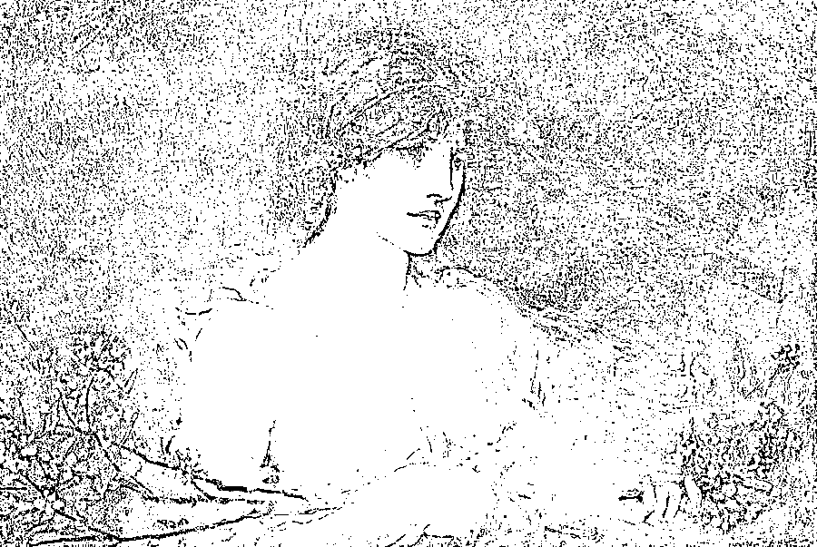

作者/克里斯蒂娜·罗登贝克

译者/亚麻林恩 校对/江艺

编辑/翀子 文章图片及注释/作者提供

本系列是克里斯蒂·罗登贝克老师撰写的艺术中的 12 星座自画像，角度独特，语句生动。本文是该系列第七篇：天秤座自画像。

从理论上讲，**没有什么比自画像更能揭示人物性格的了，**然而这个星座的艺术家们却并未直截了当的如是表现。他们的脸融入了图片的背景，成为主题的一部分。

| 苏珊娜·瓦拉顿（1865 年 9 月 23 日）

如果对比巨蟹座，其灵魂看起来不在画布上。

对于天秤座来说，会讲故事的画才完整。我怀疑这可能和**太阳（自我）在天秤座落陷**有关。这个自我不是大声或直接表达的。我不想说**天秤座的太阳是谦逊的，确切地说，他们其实往往只能在与对方（对立面）的关系中找到意义。**

奇怪的是，这些肖像画**不太关心人物个性，却沉迷于艺术行为本身。**金星（艺术）当然是守护星，但她是风象的，和智力以及社会因素有关。

苏珊娜·瓦拉顿画了很多自画像。我喜欢这幅。你越看，**越觉得它复杂和奇怪**——她的头在左上角，前方有一块醒目的蓝色。

| 皮埃尔·博纳尔（2006 年 10 月 31 日）

皮埃尔·博纳尔装饰着他的画布，**平面视角，把他们变成了一个颜色和纹理的协奏曲。**在这幅画中，他几乎没把自己看成一个人，只能在明亮背景的阴影中看到他的头的效果。

| 翁贝托·博乔尼（1882 年 10 月 19 日）

未来主义者翁贝托·博乔尼把自己画得像一张快照，也是非常平面。事实上，我猜他是根据照片画的这幅画。他似乎斜视着太阳。这幅画的大片奶油色与博纳尔的画相呼应。

| 阿尔贝托·贾科梅蒂（1901 年 10 月 10 日）

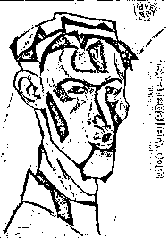

| 高迪尔·布热斯卡（1891 年 10 月 4 日）

这很有趣。两位艺术家，亨利·高迪尔·布热斯卡和阿尔贝托·贾科梅蒂首先都是雕塑家。现实生活中，贾科梅蒂和他的作品一样又瘦又结实。但在这儿我们可以看到他其实的确能做画。

如果你还未搞清（天秤座的）自画像是哪种模式，那么来看看罗伯特·劳申伯格。

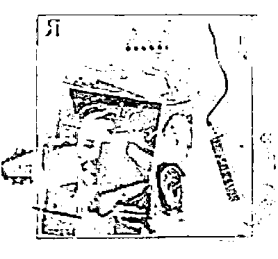

| 罗伯特·劳申伯格（1925 年 10 月 22 日）

****版权声明：**本文由若道翻译发布，欢迎转发，反对抄袭。友号转载请申请白名单。**

****

**12 星座自画像**[白羊座](http://mp.weixin.qq.com/s?__biz=MzA5NjA0NTAxNg==&mid=2651452779&idx=2&sn=38a345623020cadc4ed4f42904d29926&chksm=8b4b47dcbc3cceca0fbf3e66149382c065ff3dbc2f61c881cdba2807e9e4c0c8f9ec71f1e245&scene=21#wechat_redirect)| [金牛座](http://mp.weixin.qq.com/s?__biz=MzA5NjA0NTAxNg==&mid=2651453849&idx=2&sn=7f5ada7b667fcd56f09c2a4bffadab67&chksm=8b4b4b2ebc3cc2386cc5ee12e45ac147964723803ce5714b7c612caf6bf0436652a82e0eaf9a&scene=21#wechat_redirect) | [双子座](http://mp.weixin.qq.com/s?__biz=MzA5NjA0NTAxNg==&mid=2651460660&idx=2&sn=a239f43ebe4aa8c8058cfa11d79028d4&chksm=8b48a683bc3f2f9539414a0d2b911b7a8f67befff92ed4dad04c4387aaa4a44ec883ab777afd&scene=21#wechat_redirect) | [巨蟹座](http://mp.weixin.qq.com/s?__biz=MzA5NjA0NTAxNg==&mid=2651461305&idx=2&sn=dffc1bb3cfeb85d7e388220b268914b8&chksm=8b48a40ebc3f2d1847a163a94ec9ca66b2722ca5754c3e8bc834e8be2377dd290bf08ae9bdfb&scene=21#wechat_redirect)[狮子座](http://mp.weixin.qq.com/s?__biz=MzA5NjA0NTAxNg==&mid=2651461947&idx=2&sn=70a6531351eda8206c0bf346a74be567&chksm=8b48ab8cbc3f229ac7d6b1b81855854a827e4512a40504f41e114e795ab3c69d4317d8cd3bba&scene=21#wechat_redirect) | [处女座](http://mp.weixin.qq.com/s?__biz=MzA5NjA0NTAxNg==&mid=2651462817&idx=2&sn=dbab080313efe24e0b2bd352b3443564&chksm=8b48ae16bc3f2700ff9e5ff9e5813e64621a86bfc949cdbbedb3d02efdbe22c8bea0adf1342e&scene=21#wechat_redirect)

**克里斯蒂娜·罗登贝克**

克里斯蒂娜·罗登贝克，若道签约老师。全职职业占星师，从业 20 余年，在其网站长期撰写时事、艺术和文化的文章；定期在英国授课，并保持蓬勃发展的专业实践。

**学习占星学****点击下图了解课程详情** 

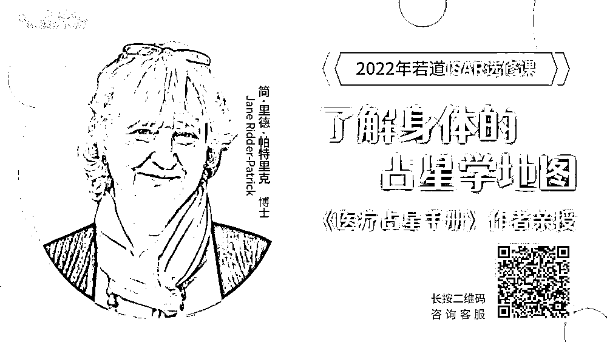](http://mp.weixin.qq.com/s?__biz=MzA5NjA0NTAxNg==&mid=2651462817&idx=3&sn=47ab2d5ea42c1d8ad51e591d6cdcb96e&chksm=8b48ae16bc3f27003f22d57d7f39fbc3d19fff36f88c632a07f090cab12051632430b74d5c67&scene=21#wechat_redirect)

****************

**微信又双叒叕改版啦，不想错过若道君的推送？****就把若道设为星标吧！****▼**

**喜欢记得点一下在看哦☟**

********报名直达入口********

# 雷蒙德·梅里曼金融占星周运 | 处于日食影响期间的一周

> 原文：[`mp.weixin.qq.com/s?__biz=MzA5NjA0NTAxNg==&mid=2651462967&idx=2&sn=8ecdc5e08298e37d3575d14388e6d04e&chksm=8b48af80bc3f2696ba538d1df52d666be8b1c4682368d7653e3820d5f6b484d01fe23f4066fb&scene=126&sessionid=1692737888#rd`](http://mp.weixin.qq.com/s?__biz=MzA5NjA0NTAxNg==&mid=2651462967&idx=2&sn=8ecdc5e08298e37d3575d14388e6d04e&chksm=8b48af80bc3f2696ba538d1df52d666be8b1c4682368d7653e3820d5f6b484d01fe23f4066fb&scene=126&sessionid=1692737888#rd)

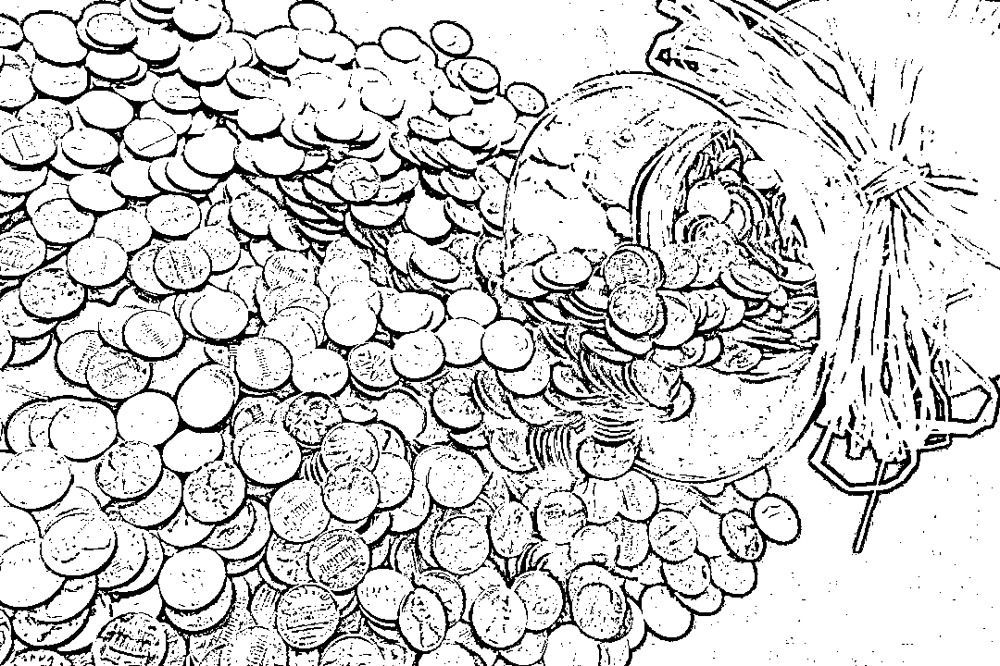

作者/雷蒙德·梅里曼 译者/Luke
编辑/玫瑰 图片/网络

雷蒙德·梅里曼是在金融占星学界稳坐第一把交椅的占星师，同时他也是若道签约的金融占星课老师，我们引进了雷蒙德·梅里曼老师的《[上证指数月度报告](http://mp.weixin.qq.com/s?__biz=MzA5NjA0NTAxNg==&mid=2651462440&idx=3&sn=1c45283342a3cb70cb06be2a0f79ab9b&chksm=8b48a99fbc3f2089cdeb7e7014fae031358fbf2824825603c7f00a56311ff43b8589902deb7f&scene=21#wechat_redirect)》及《[黄金报告](http://mp.weixin.qq.com/s?__biz=MzA5NjA0NTAxNg==&mid=2651462440&idx=3&sn=1c45283342a3cb70cb06be2a0f79ab9b&chksm=8b48a99fbc3f2089cdeb7e7014fae031358fbf2824825603c7f00a56311ff43b8589902deb7f&scene=21#wechat_redirect)》。我们经老师的授权，将每周刊登梅里曼老师的周运，供大家参考和学习。于是，这是本周的周运（12.6-12.10）。

**说明：以下时间采用纽约证券交易所所在地美国东部标准时间。**

**展望与回顾**

****

**“今天，我们得到了一个难以置信的好消息，失业率已经降到 4.2%”，拜登说。“我们正在见证有史以来失业率最急剧的下降”。****——克里斯蒂娜·威尔基****《拜登为掩饰 11 月就业增长疲软，强调低失业率》****2021 年 12 月 3 日****www.cnbc.com****拜登总统周五称赞了上个月失业率意想不到的下降，尽管 11 月的新增就业严重低于预期，是今年创造就业最差的一个月。****——梅根·亨利****《拜登鼓吹失业率降低，尽管 11 月新增就业严重低于预期》****www.foxbusiness.com****2021 年 12 月 3 日**上述引文体现了现实和构造叙事之间有意识的脱节，这就是为什么某些政府领导人支持率是如此之低。冥王星依然在摩羯座。人们想要真相，全部的故事，否则他们会自己构造叙事出你是谁和是什么，尤其当它不符合他们重新构想的那个版本的真相。

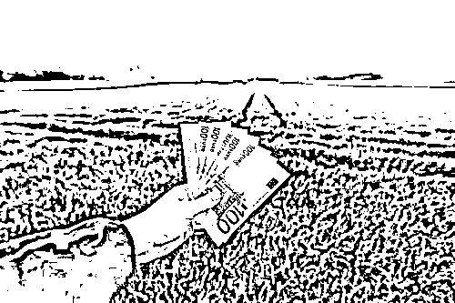

真相是什么？失业率低是因为人们正成群结队地退出劳动力市场，而不是因为正在热火朝天地招聘。**上周中旬的 12 月 1 日，海王星停滞顺行。**无论何时，**当一颗行星停滞（从地球角度看改变方向），此行星的原则会在集体行为中被强调。**正如上周讨论的，**“海王星是一颗奇怪的行星。它非常擅长在人们的头脑中创造出愉快和有说服力的图像和故事。但它常常缺乏现实主义，在压力下表现也不好。****如果全球股市在海王星行进影响下上涨，它们可以保持高位，因为投资者‘寄希望’于最好结果。****但是如果环境充满了压力，海王星时期可能对应着歇斯底里和恐慌，因为每件事都失控了，至少很多人认为事情开始走向失控。****关于海王星的一件事，是你并不真正知道，在缺乏事实数据支持的情况下，人们开始投机，有时还很疯狂，导致了恐慌。****这可能是全球金融市场下周会出现的情况。”**如果说全球股市正处在歇斯底里甚至恐慌的边缘，也不为过。新的奥密克戎病毒变种正导致疯狂的投机，从而会影响世界经济和金融市场的走向。

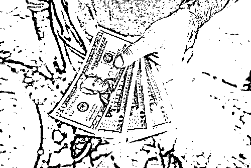

**大多数的全球股票指数都从 11 月 16-22 日的历史高点快速下跌。**在不到两周内，大多数跌去了 7%-8%。对许多股指来说，那几乎是当年最急剧的下跌，也是 9 月末 10 月初基本周期波谷以来的最低价位。尽管大众和政府领导人的心理似乎更多反映了海王星，实际的市场行为更像是土星四分天王星，将在 12 月 24 日成相。也就是说，市场的波动非常不平均，非常剧烈偏向下行。令人印象深刻的反弹是短暂的，紧随其后的是一轮又一轮的抛售，通向越来越低的价位。不仅股票市场血流成河，其他市场上更是如此。原油，由海王星联合守护，周四跌至 62.43，从五周前 10 月 25 日的多年高点 85.41 下跌 27%。黄金和白银也遭到重击。12 月 2 日，黄金跌至 1762，距 11 月 16 日基本周期波峰 1879.50 跌幅很大，比二星级地球宇宙学关键反转日期仅晚 1 天，也是自 11 月 3 日低点 1758 以来的最低位。

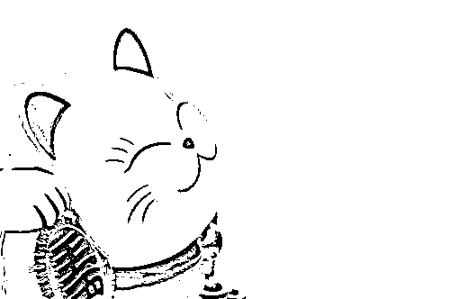

白银下跌得更厉害。从基本周期波峰 11 月 16 日的 25.49，周五跌至 22.03，跌幅 13.5%，接近年度低点 21.41。比特币周五下跌至 51.612，是 8 周来的最低价。它现在从 11 月 10 日的历史高点 69000 下跌了 25%。有趣的是，以太坊守住了前一周的低点，所以还没有恐慌。**短期占星趋势和长期考量**

****

**商务部上周表示，将把加拿大软木的平均关税从 8.99%提高到 17.9%。**

**——《拜登加入木材关税战：如何不对抗通货膨胀——提高家庭成本》**

**《华尔街日报》社论版**

**2021 年 11 月 26 日**

** 在大约三周内，木星将进入双鱼座（12 月 28 日-5 月 10 日）。在 4 月 12 日，木星将与海王星在双鱼座合相。**这两颗行星的能量会促成**通胀**。与此同时，世界领导人们往往表现出**夸大、相信错误信息，甚至严重误判**的倾向。由于海王星现在逆行，火星将在 12 月 8 日四分木星，我们得以预见接下来 4-5 个月将发生什么。除了所有那些过度和夸张外，我们现在处于 12 月 4 日射手座日食的影响力中间。射手座由木星守护，因此也有**夸大和夸张**的倾向。

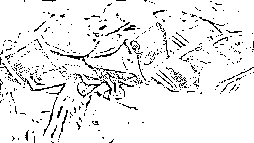

如果你是个讲故事的人，这没什么问题。但现在让我们谈谈日食，因为这是我常常被问到的话题。日食大约每 6 个月发生一次。简单来说，日食发生是当月亮，在其环绕地球的轨道中，挡在了太阳前面，从地球的视角来看，就像是月亮挡住了太阳一样。一些日食的影响力更强，取决于新月距离月亮北交点有多远。也就是说，日食总是在新月，也就是太阳和月亮合相时发生。只不过日食的时候，它也合相月亮的北交点或南交点。上周发生的是南交点日食。在我看来，南交点日食比北交点日食更具有挑战性和难处理。如果我们理解月亮代表过去，太阳象征未来，那么我们可以念诵这段唱诵“过去，穿过和道路”（是的，这又是梅里曼的原创）。月亮（过去）将很快穿过太阳，开辟新的道路或未来。换句话说，一个人现在要应对来自过去的情境（通常是情绪上的）。但是**他们可以被解决或放下。****当被解决或放下后，过去就已经过去了，面前出现了新的道路。**

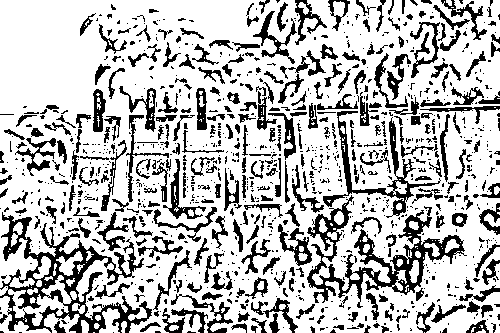

这就是为什么，当日食发生在接近一个人生日（或 6 个月后对分生日和出生星图的太阳）的时候，常常在接下来几个月会发生**事业、居住地、关系或健康上的重大改变**。实际上，我的观察显示，**重大的人生改变，可以发生在日食前 3 个月，到之后的 1 年期间。**至于人生改变是好是坏，取决于**一个人愿意让过去过去、放下或解决它，并接纳新道路的程度**。在南交点日食下尤其如此，因为南交点象征阻力最小的道路。这是一个矛盾修饰法，因为阻力最小的道路是什么也不做，在这种情况下**一个人选择不遵循新的道路，而是继续被过去的情绪包袱所累。其结果可能导致分离、失业、健康不佳和情绪困难。**因此，和所有占星学的原理一样，某个情境的结果，取决于这个人如何回应生命中这个特定时候的状况，这些状况会在天象中有所呈现。每时每刻都有着独特的性质，任何诞生于某一时间的事物，都带有那个时间的性质。这就是占星学的理论和灵性基础。当日食发生在哲学和灵性的星座射手座，这是一个思考这些事情的有利时间。也是一个放下过去和发现新道路的好时机。“过去、穿过和道路”。这周试试这则唱诵，然后看看会发生什么。

**说明：以上日期基于纽约证券交易所所在的美国东部标准时间，由于存在时差，中国地区可能需要加一天。**

**版权声明：**本文由若道翻译发布，欢迎转发，反对抄袭。友号转载请申请白名单。

**雷蒙德·梅里曼（Raymond Merriman）**

若道签约老师。著名金融占星师，ISAR（国际占星研究协会）前主席，梅里曼市场分析公司的总裁。他由于“提升了占星学的职业形象”，在 1995 年国际占星大会上被授予轩辕十四奖；在 2012 年国际占星大会上，被授予轩辕十四终身成就奖。

1“中国上证指数月度报告”发售**若道推出了****中文版****的雷蒙德·梅里曼中国上证指数月度报告，并持续发行该报告！**当把金融市场的周期和占星学的周期相结合时，雷蒙德·梅里曼老师的金融占星学研究**为投资者应对金融市场的周期波动，并随之调整投资策略提供了极大的价值参考**。
**12 月中英文报告已上线！**2“黄金价格周期月度报告”发售**若道推出****中文版****的雷蒙德·梅里曼黄金价格周期月度报告！**不仅仅为广大读者在中国股市的投资出谋划策，更将视角放眼黄金市场。**每当世界经济形式不明朗的时候，有一个地方是保值的港湾，那就是****黄金**。自 1982 年雷蒙德·梅里曼出版第一本研究《地球宇宙学征象与黄金价格的关联》的著作以来，**他一直作为最重要的黄金市场时机预测者之一享誉国际**。12 月黄金报告已上线，梅里曼老师将会告诉你他对这个关键时期如何操作的想法。也可以按照季度和一年期订阅，有更多优惠。季度和年度的好处是，你可以持续了解梅里曼老师对于不断在变化的市场的看法。即便他某一次看法和市场不一致，你也看到在下一期他如何调整自己的看法，并看到金融占星在一个长期时间段内对你把控风险的帮助。而能够长期控制风险、尽量找到安全的投资时机才是投资的长久之计。**12 月中英文报告已上线！****购买套餐**，买得越多越优惠中国上证指数月度报告套餐价

*   **单月报告**：280 元
*   **3 个月套餐**：780 元（260 元/月）
*   **12 个月套餐价**：2400 元（200 元/月）

**长按下图识别二维码****购买金融报告****套餐****▼**

黄金周期月度报告优惠

*   **双报告年度套餐更优惠（直降 900 元）**

*   **12 个月黄金报告+12 个月上证指数报告：仅需 3900 元**

**长按下图识别二维码购买黄金报告套餐**▼

3 中国金融市场特别网络研讨讲座面对年底几个影响金融市场的重要天象，该如何把握下半年的投资，为跨年做准备？我们特意邀请雷蒙德·梅里曼老师为大家带来了**3 个小时的金融讲座——雷蒙德·梅里曼中国金融市场特别网络研讨讲座。**这场为期 3 小时的在线讲座探讨了**这些长期行星周期如何影响世界经济的长期周期和趋势，特别是如何影响上证综指和黄金市场**。并描述**在 2021 年剩下的时间里市场反转关键时间点，特别是 12 月 19 日至 25 日金星逆行，以及土星-天王星最后一次渐亏四分相、金星与冥王星合相的重要时期。****长按下图识别二维码购买讲座视频**
▼

5《2022 年金融预报和沙龙》1976 年以来，由雷蒙德·A·梅里曼撰写的梅里曼市场时机学院每年一次的年度预报沙龙和每年一本的《年度预报》一直在应用占星学原理为投资者们服务，提供卓越洞见，从未间断。 **雷蒙德·梅里曼《2022 年金融预报和沙龙》开始预售中。****长按下图了解详情**
▼

**点击阅读原文购买金融报告**

# 在最糟糕的时间和错的人在一起 | 如何避免 12 星座的爱情悲剧？

> 原文：[`mp.weixin.qq.com/s?__biz=MzA5NjA0NTAxNg==&mid=2651462967&idx=1&sn=3f6048dbe1eca5b833907d47d9a9c81d&chksm=8b48af80bc3f2696e95c82fe03647e5e9ad12b82cb73e4d6827d33c93447178744665fb22c42&scene=126&sessionid=1692737888#rd`](http://mp.weixin.qq.com/s?__biz=MzA5NjA0NTAxNg==&mid=2651462967&idx=1&sn=3f6048dbe1eca5b833907d47d9a9c81d&chksm=8b48af80bc3f2696e95c82fe03647e5e9ad12b82cb73e4d6827d33c93447178744665fb22c42&scene=126&sessionid=1692737888#rd)

************☆********************后台回复“今日”，给你一句生命态度************

作者/爱丽丝·德维尔 译者/李含 校对/江艺 编辑/玫瑰 图片/pexels

今天的关注重点是“爱情怪圈。”对这个词觉得很陌生？接着往下读吧！这种情况就是一段疯狂的插曲，爱情像彗星一样疾驰而来，又疾驰而去。如何破解？出生星图能表现出你的约会风格、伴侣选择和爱情生活。行星和它们所在的宫位之间的关系，给我们提供了额外的线索。一旦你理解了自己的真正需求，就很容易收获令人满意的关系。

**亲密关系的行星和宫位**

你是否想过，为何有些人每次一转身就能遇见爱，而另一些人却数年来都与爱无缘？前者可能连续不断地吸引到许多并不适合的伴侣，而与爱情保持距离的那些人则常常避免重蹈痛苦关系的覆辙。

最佳的路径是行中道，但是要做到这点可能是一项挑战。

所有的行星都在你的人生剧情中发挥着一部分的作用。**与爱情关联最密切的是太阳、月亮、水星、金星和火星，即所谓的个人行星。**这些行星所落的宫位，尤其是落在亲密关系宫位会点燃爱情的火花。

亲密感情或关系的宫位包括**第五宫（约会和恋人）、第六宫（同事和商务接洽）、第七宫（私人和商务伙伴）、第八宫（性与亲密）**。

虽然在检视关系模式时，亲密关系的宫位非常重要，但**三个或更多个人行星落在任一宫位或星座时，会更让你因胡乱的爱情邂逅而脆弱，或当行进行星与你出生图中的行星成相时也会刺激这些状态。**

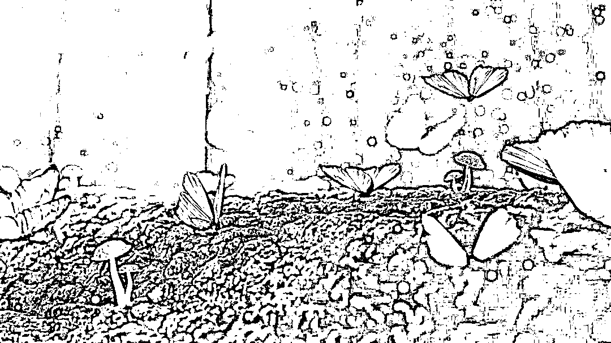

**变动星座的爱情模式****如果有许多个人行星落在变动星座（****双子座、处女座、射手座和双鱼座****），会让你的情绪和情感具有躁动不安的特质。**你们在尚未许下承诺时，常常到处拈花惹草。**即使当你处在一段稳定的关系中，有时候也可能会非常善变。**目前的兴趣和喜好带你展望前路方向。情绪驱使着你的社交偏好，认识新的人，即使星座的表现有显著的不同。因为你善于开启话题，所以交流的范围十分广泛。由于你具有轻松随和的交流风格，约会的对象会觉得你浪漫又迷人。除非你感觉到彼此联结，否则你会挥一挥衣袖，不带走一片云彩。**有时候，你会被相反的类型所吸引，对方被你的诙谐机智逗乐。**你可能常常喋喋不休说个不停，因而错过了相配的线索和肢体语言。一个人刚刚结束一段长期的感情关系时需要有人去倾诉，而不是一份新的承诺。你误认为他们的专注凝视是热情的回应。“仰慕之情”溢于言表让你心跳加速，你务实的一面希望作出现实的评估。“砰”，你的日程表翻开新的一页，你希望有新的名字出现在你日程的空白条目中。你确定这一位很有可能。

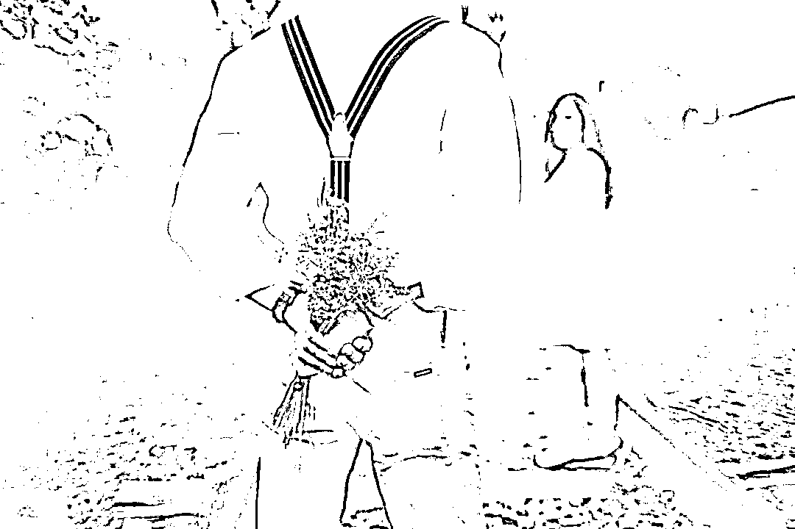

**来去匆匆的爱情，是因为什么？****海王星影响到金星和火星，或两者之一，你会对爱有幻想——不成熟的幻想。**好在你适应性强。很快你就会扪心自问，这是怎么回事？事实上，**匆忙之间坠入爱河，让你没有足够的时间去分辨你们之间是友谊还是爱情。**行星主要落在**基本星座（****白羊座、巨蟹座、天秤座和摩羯座****）**的人，当星图中众星落于**变动宫位时（第三宫、第六宫、第九宫、第十二宫）**，或落在**亲密宫位区间（第七宫和第八宫）时**，也会遭遇**来去匆匆**的爱情剧本。如果你有此模式，你会**在寻找爱情时促进活跃的社交生活。**你知道如果不走出去参与社交，就无法找到爱情。你的星座元素会因各种不同的理由吸引伴侣，受到你的吸引彬进入你生活的那个人让你着迷。你偏好**在关系中做情感的投资，或者从中摆脱。**
**破坏婚约、分居和多次婚姻都是正常的。**虽然你们中的一些人有自私的倾向，但常常在感情中付出多于所获。一旦你认识到自己的需求永远无法满足，你就会感到厌倦，然后离开。在分手后，**白羊座和天秤座****群星的人一般会很快回到约会状态，寻找一个欣赏他们真实自我的人。**他们不属于孤独心灵俱乐部；**巨蟹座和摩羯座****群星的人总是需要更多时间，来弄清楚到底哪儿出了错**。如果是你，**不要羞于重新找到合适的伴侣。但是要远离贪心的人，暂时远离婚姻的祭坛。**

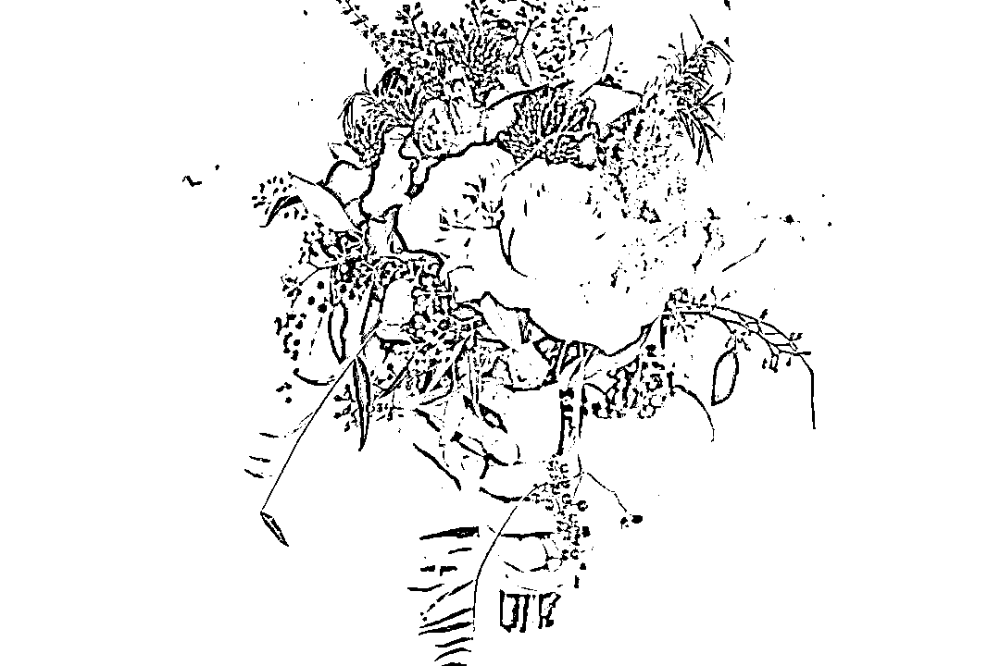

**固定星座也会遭遇快餐式爱情？**别担心，我没有忘记**固定星座（金牛座、狮子座、天蝎座和水瓶座）**，如果你们的星图上**群星在第二宫和第十一宫以及亲密关系宫位，**你们也会遭遇来去匆匆的爱情。这几天，我听到好几位有显著固定星座的客户说：“我的爱情之花再次盛开了。”这些人的爱情问题非常复杂，因为他们常常**不在乎短暂的关系。**他们的履历上写着，**在最糟糕的时机与错的人在一起**。他们中的许多人都弄不清自己是如何开始这段关系的，即使是他们主动展开的追求。有一些人会在感情结束、对方另投怀抱时心碎愤怒。**对伴侣痴迷，或让对方以恶劣的方式离开是首要的问题。**
如果你是很容易投入爱情的人，就只会让关系走向终结，是时候面对现实了。在读完本文之后，你是否认清了自己的致命伤？打破爱情破碎的周期，给自己一段疗愈期。

**版权声明：**本文由若道翻译发布，欢迎转发，反对抄袭。友号转载请申请白名单。

**学习占星学****点击下图了解课程详情** 

](http://mp.weixin.qq.com/s?__biz=MzA5NjA0NTAxNg==&mid=2651462817&idx=3&sn=47ab2d5ea42c1d8ad51e591d6cdcb96e&chksm=8b48ae16bc3f27003f22d57d7f39fbc3d19fff36f88c632a07f090cab12051632430b74d5c67&scene=21#wechat_redirect)

****************

**微信又双叒叕改版啦，不想错过若道君的推送？**

**就把若道设为星标吧！**

**▼**

**喜欢记得点一下在看哦☟**

****报名直达入口****

# 金融占星学大师雷蒙德·梅里曼《2022 年金融预报》开售！

> 原文：[`mp.weixin.qq.com/s?__biz=MzA5NjA0NTAxNg==&mid=2651462940&idx=1&sn=4361ade89c9eed95758a9b2e33f7809a&chksm=8b48afabbc3f26bd7c0ac10add95e3c7d91f7988590ee204073474648909a204397ef32c9d89&scene=126&sessionid=1692737888#rd`](http://mp.weixin.qq.com/s?__biz=MzA5NjA0NTAxNg==&mid=2651462940&idx=1&sn=4361ade89c9eed95758a9b2e33f7809a&chksm=8b48afabbc3f26bd7c0ac10add95e3c7d91f7988590ee204073474648909a204397ef32c9d89&scene=126&sessionid=1692737888#rd)

1976 年以来，由雷蒙德·A·梅里曼撰写的梅里曼市场时机学院每年一次的年度预报沙龙和每年一本的《年度预报》一直在应用占星学原理为投资者们服务，提供卓越洞见，从未间断。**2020 年，木星、土星和冥王星形成大合相，我们刚刚结束了一个周期和一个时代。现在我们正处于一个新时代和一个新的长期周期的早期阶段。**  如果 2020 年我们还在手忙脚乱，不知道发生了什么；2021 年则更让我们更清楚地看到一个时代结束了——2020 年之前的时代，在新冠肺炎病毒大流行、2020 年”大合相”之前的时代，这是人类历史进程上的一个转折点。**我们所熟知的生活诸多方面在那时就结束了，现在人们仍在试图找出“正确的方式”或“最好的方式”来重建和再造世界。**2021 年，有的行业被彻底摧毁，有的行业成为新贵。2021 年对投资者是一个苦乐不均的一年。尽管美国新冠肺炎疫情未见好转，道琼斯指数仍然扶摇直上；尽管中国经济在世界经济增长中一马当先，上证指数仍然波澜不惊。在货币对标的品种中，老贵族黄金走低，新贵族比特币飞升。我们还看到了大宗商品价格的飞涨，各种短缺开始出现。在中国，各种政府干预市场的调控在各个行业愈演愈烈。**这种现象到底说明了什么？又预示着什么？**2022 年我们的金融市场会受到哪些行星组合的影响呢？我们来看一看：**·** 140 年的木星-土星合相的“风象纪元”在 2021 年刚刚拉开序幕，2022 年我们还将会看到温和主义与极端主义之间存在冲突；**·** 土星四分天王星最后一次成相的影响：专制主义和中央政府控制与个人追求个体的权利和声音的冲突；新能源和旧能源的冲突；**·** 天王星进入金牛座的后半段：包括美元在内的世界货币的重新估价和地位；**·** 土星-海王星的半六分相：新冠肺炎病毒；**·** 水星、金星和火星在 2022 年的逆行“它们对 2022 年发展和增长的影响；**·** 木星在双鱼座（黄道最后一个星座）和白羊座（黄道第一个星座）之间来回移动：战争还是和平；谁是“第一名”的激烈竞争；**· **木星与海王星在双鱼座合相；**·** 冥王星在美国国家星图回归；美国的选择会对全球带来的影响；**·** 月亮交点的换座：月亮交点周期和经济周期的对应；**·** 木星在双鱼座期间金融市场和主要趋势的反转。2022 年仍然是旧世界向着新世界转变的一年。此时，金融市场的投资者和潜在投资者，都需要客观而睿智的思考，而金融占星大师雷蒙德·A·梅里曼的研究则更是无可替代的。1976 年以来，由雷蒙德·A·梅里曼撰写的梅里曼市场时机学院每年一次的年度预报沙龙和每年一本的《年度预报》报告一直在应用占星学原理为投资者们服务，提供卓越洞见，从未间断。去年，这个 3 小时的年度预报沙龙和长达 200 页左右对金融市场的分析报告帮助许多若道的读者做出正确的投资决策，降低投资风险，并获得相当不菲的投资收益。在《2021 年金融预报》中，关于上证指数，梅里曼老师说：对于上证指数，梅里曼老师说：**“我们预计涨势将在 2020 年 12 月-2021 年 2 月之间达到波峰，然后急剧下跌至 52 周和 22 个月周期的低点，这些周期将在 2021 年 5 月之前，甚至在 3 月底之前结束。此后可能会出现另一轮反弹，可能会也可能不会在 2021 年 11 月之前形成第一个 33 个月周期的新高。”**| 上证指数 K 线图关于黄金，梅里曼老师说：**“黄金的 31.33 个月周期波谷将在 2021 年 9 月之前出现，理想情况是 2020 年 12 月-2021 年 6 月。价格目标是 1628+/-109 或 1768+/-76。重叠范围（理想情况）是 1692-1737。如果价格跌破这些范围，则为看涨情况中令人担忧的状况。”**| 黄金走势 K 线图关于白银，梅里曼老师说：**“木星和月亮交点的周期表明，白银的一个重要低点将在 2021 年出现，最有可能在 5 月 13 日之前或 7 月 28 日之后出现。这可能是 5-7 年周期的波谷，但可能会保持在 18.50 以上。收盘低于 17.00 将令人担忧。”**

| 白银走势 K 线图

12 月底，我们将会再次发布梅里曼老师《2022 金融年报》。**2022 年初，梅里曼老师将会照样带来一场精彩的讲座，讨论 2022 年重要的宇宙天象及其对世界经济、金融形势的整体影响，还将覆盖中国上证股票市场的分析、黄金白银市场、比特币市场等投资市场。具体时间我们待确定后会通知大家。****2022 年度预报及沙龙预售**

**价格：****1380 元**

**一份价格仅千元的顶尖金融占星大师的投资分析报告和沙龙，聪明的投资者值得拥有。****购买者重要须知****①** 梅里曼市场时机学院每年一次的年度预报沙龙和《年度预报》是梅里曼市场时机学院的研究“预报”，而不是市场“预测”，是梅里曼老师及其金融占星分析师对人类活动周期历史与行星周期之间相关性的研究，二者在大部分情况下具有 80%或更高的相关性，而不是因果关系。沙龙中和报告中的研究完全存在错误的可能性。即便是非常认真的研究和几十年的研究经验，我们无法总是正确地解读出各种征象在实际层面上会如何相互作用，并显化为事件结果。

所以请将次沙龙和报告看作一个研究参考，务必结合其他市场研究和你个人对市场的理解，根据你的自由意志做决策。

**②** 此报告一旦售出，**即不接受退款。**

**③** 此报告仅支持在手机网页和若道 APP 上阅读，不支持电脑阅读和下载。**④** 讲座提供视频回放。**以上须知，请仔细阅读。一旦付款，即视为已了解并接受所有须知内容。**

**如在购买报告中遇见任何问题**

**可添加客服**

▼

****购买报告直达入口****

# 射手座日食 | 开启重大变化的日食！做自己生命的“匠人”

> 原文：[`mp.weixin.qq.com/s?__biz=MzA5NjA0NTAxNg==&mid=2651462937&idx=1&sn=d14503efbbf0b6ad4b4d2209dca0cb3f&chksm=8b48afaebc3f26b8d216d8539dc66b5b4aec7c98cbe7ca1776ea8f5575a62b61932d02c35600&scene=126&sessionid=1692737888#rd`](http://mp.weixin.qq.com/s?__biz=MzA5NjA0NTAxNg==&mid=2651462937&idx=1&sn=d14503efbbf0b6ad4b4d2209dca0cb3f&chksm=8b48afaebc3f26b8d216d8539dc66b5b4aec7c98cbe7ca1776ea8f5575a62b61932d02c35600&scene=126&sessionid=1692737888#rd)

****☆ **后台回复“今日”，给你一句生命态度**

作者/王芝桦 编辑/玫瑰 图片/pexels

**射手座日食****北京时间 2021 年 12 月 4 日 15:42 迎来射手座新月，太阳与月亮精准合相于射手座 12°22′，并以 12°之差靠近射手座南交点，形成 2021 年度最后一次食相——射手座日全食。**  南北交点每 18 年行进黄道一周天，每 18 个月行进一组对宫星座。11 月 19 日的金牛座月食和此次射手座日食，是当下一轮南北交点“射手座南交点-双子座北交点”轴线的最后一组食相；**12 月 23 日，南北交点的平均交点将会换座进入“南交天蝎座-北交金牛座”轴线。**此次射手座日食，正值 2021 年迈向 2022 年的进程之中，宣告着“结束与新生”的重大进程。

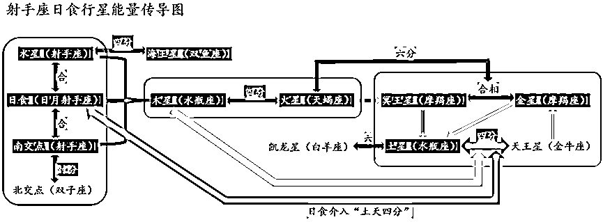

> **射手座日食重点影响人群**
> 
> **参考新月峰值影响期间各个行星的行进度数，以及逆行行星的轨迹影响；常规容许度，个人行星入相位 3°，出相位 1°；非个人行星入相位和出相位均为 3°。**
> 
> *   出生星图中，有**行星、四轴、南北交点**落入**固定星座（金牛座、狮子座、天蝎座、水瓶座）6°-17°，20°-29°**的人群。
>     
>     
> *   出生星图中，有**行星、四轴、南北交点**落入**变动星座（双子座、射手座、处女座、双鱼座）0°-23°**的人群。
>     
>     
>     
>     
> *   出生星图中，有**行星、四轴、南北交点**落入**基本星座（白羊座、巨蟹座、天秤座、摩羯座）8°-30°**的人群。

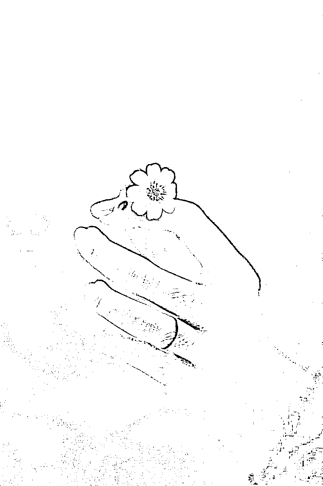

**转换的大门，重大的变化**

****

**总有一些时刻，当时看着无关紧要，而事实上却牵动了大局。****——萨克雷《名利场》****南北交点是从地球视角观测，黄道（太阳投射在天球上的运行轨迹）与白道（月亮投射在天球上的运行轨迹）的两个交点（虚点）。**占星学中，北交点象征着尊贵无比并引领前行的“龙头”，南交点则象征着拖着后腿且排出废料的“龙尾”。龙说——之所以有废料，是因为有些东西已经没有营养；而生命的尊贵在于，绝不回头去吃身后的“粪便”！南北交点揭示出“业力的功课”：**· 南交点描述着“业力的议题”：**过去业已依赖的内在执着与习惯模式，已经不再具有健康的养分，不能满足前行的意愿，反而成带来了沉重的负担，我们渴望突破束缚并获取全新营养；**· 北交点描述着“进化的路径”：**这是完全陌生且过程艰难的旅途，但业力的驱动和灵魂的渴望引领我们探索这条通往更高自我的路径；只有唤醒意识不断地觉察，坚定意志持续地努力，才能突破过去的习性，升级全新的未来。**2020 年 6 月 4 日-2021 年 12 月 23 日，**南北交点（平均交点）行进于“射手座南交点-双子座北交点”轴线。此次射手座日食是该组轴线的最后一次食相，标志着——**过去 18 个月的“业力功课”将被进行最后的检验。**

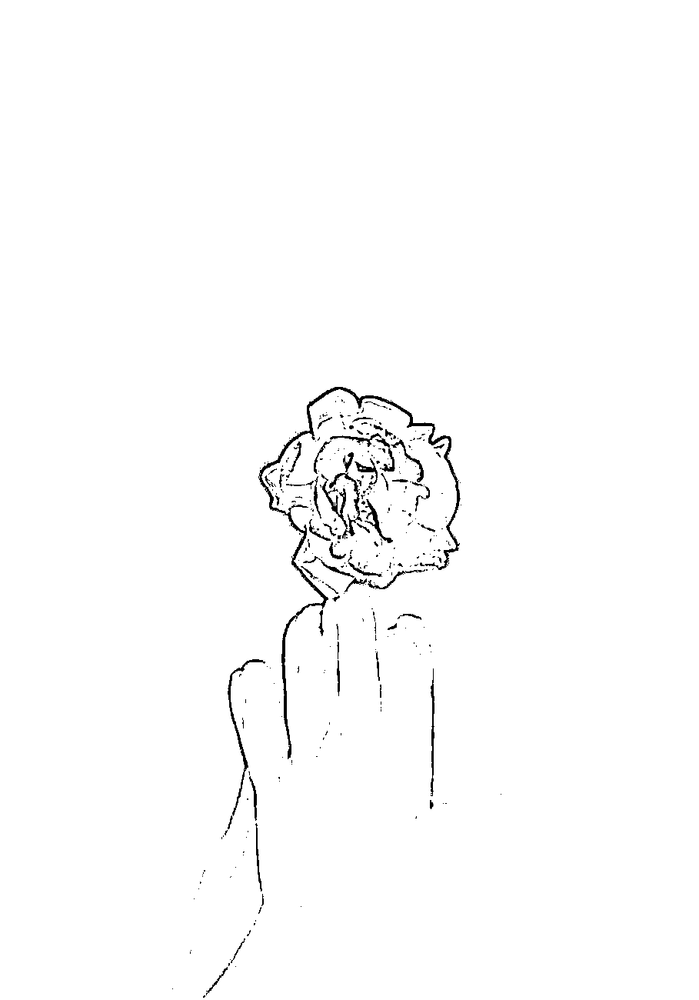

12 月 23 日，南北交点（平均交点）换座进入“天蝎座南交点-金牛座北交点”轴线，开启未来 18 个月“业力功课”的全新征程**（2021 年 12 月 23 日-2023 年 7 月 13 日）**。故而，此次射手座日食，开启了前后 18 个月的“转换大门”，标志着当下正处于“重大变化”的时刻，牵动着 2021-2022 的跨年大局——**全新的征程已经开始，历史的沉渣必须清除。****带着宇宙视角，觉知生活全貌**

****

**我过去是，现在仍然是一个探索者，但我不再占星问道，我开始倾听内心深处的低语。**

**——赫尔曼·黑塞《德米安》****此次射手座日食，除了一颗天蝎座火星之外，其他行星均行进在“射手座-双子座”的 180°范畴之内。**宇宙布下一连串的线索，等待我们破解深意。“射手座-双子座”180°范畴之内的六个星座，有着天然的内在关联和发展序列：

**射手座****探索精神觉悟，确立内在理想→**

**摩羯座****达成现实目标，发展自我成熟→**

**水瓶座****坚守自我真实，建设共赢智慧→**

**双鱼座****消融自我局限，回归心灵本源→**

**白羊座****创建自我目标，完成断奶独立→**

**金牛座****深化现实根基，安享心灵宁静→**

**双子座****敞开接纳多元，体验成长过程。**

如果我们认真品味一下，就会发现“射手座-双子座”的六个星座，其实正是**“精神觉悟→入世践行→红尘悟道→天人合一→自我开创→现实根基→学习成长”**的发展过程。

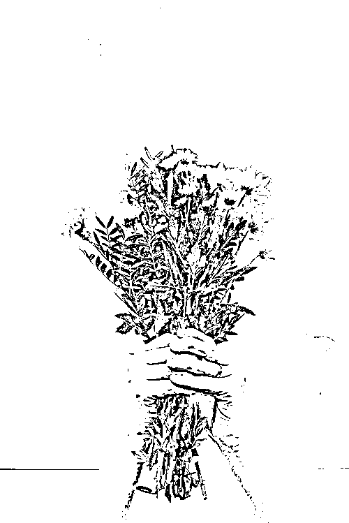

但是，每一个占星符号，也都蕴含着内在的阴影和低阶的风险；故而，这个发展过程之中也蕴含着偏离轨道的风险。比如：射手座狂妄自大且理想主义；摩羯座机械追逐着世俗结果；水瓶座冷酷理性却毫无温度；双鱼座理想幻灭的受害心理；白羊座火力分散地四处发飙；金牛座固守安全并拒绝改变；双子座停不下来而陷入焦虑。此次射手座日食，每一颗落入“射手座-双子座”这六个星座的行星，都需要我们小心分辨在生活中的能量呈现：**是正引领我们走向进化的旅程，还是正绊住我们陷入低阶的风险。**我们的分辨，并不是占星的符号，而是我们的生活。当下的整体宇宙天象，提醒我们带着一份宇宙视角去觉知当下生活的全貌，倾听内心深处的低语。**像“削铅笔”一样去“许愿”**

****

**当我终于鼓足勇气跨过门槛，听到脚步声在空空荡荡的房子里回响时，清醒地认识到自己走进了人生新的篇章。****——玛丽亚·杜埃尼亚斯《时间的针脚》**

> **天象**
> 
> **· 水星合相日食：**太阳、月亮、水星合相于射手座；
> 
> **· 水海四分：**射手座水星四分双鱼座海王星；
> 
> **· 日食介入“土天四分”**：精准合相于射手座的太阳和月亮，六分水瓶座土星，梅花金牛座天王星；
> 
> **· 火木四分**：天蝎座火星四分水瓶座木星。

此次射手座日食，新月的“开启”能量，在日食的成倍催化之下，驱动我们追寻内在的理想，开启全新的篇章。

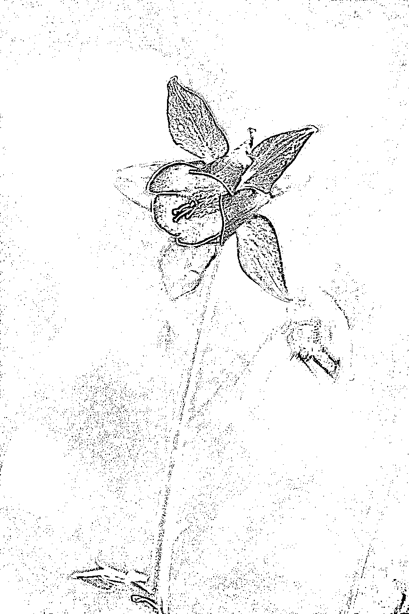

但不要忘记，这也是一次靠近南交点的日食，蕴藏着**“业力的阴影”**——**射手座“探索宏观的精神意义，追求崇高的意识觉悟”的旅途，一旦偏离“进化的轨道”，便会陷入“我对你错的狂妄自大”和“理想主义的主观视角”。**双子座北交点引领我们**倾听他人的观点，学习多元的知识，经验现实的过程**，这是帮助射手座南交点回归进化轨道、验证理想信念的必经之路。此次射手座日食，两组天象结构进一步揭示出“射手座南交点-双子座北交点”的进化之旅：接纳双子座北交点“进化指令”的射手座水星（水星守护双子座）介入日食的“日月合相”结构之中，并与 12 月 1 日刚刚恢复顺行、目前仍在“醒盹儿”的双鱼座海王星形成“水海四分”结构；唯一一颗还没有行进到“射手座-双子座”180°范畴之内的天蝎座火星，与接纳射手座南交点“业力阴影”、接纳射手座月食“开启能量”的水瓶座木星（木星守护射手座）形成“火木四分”结构。

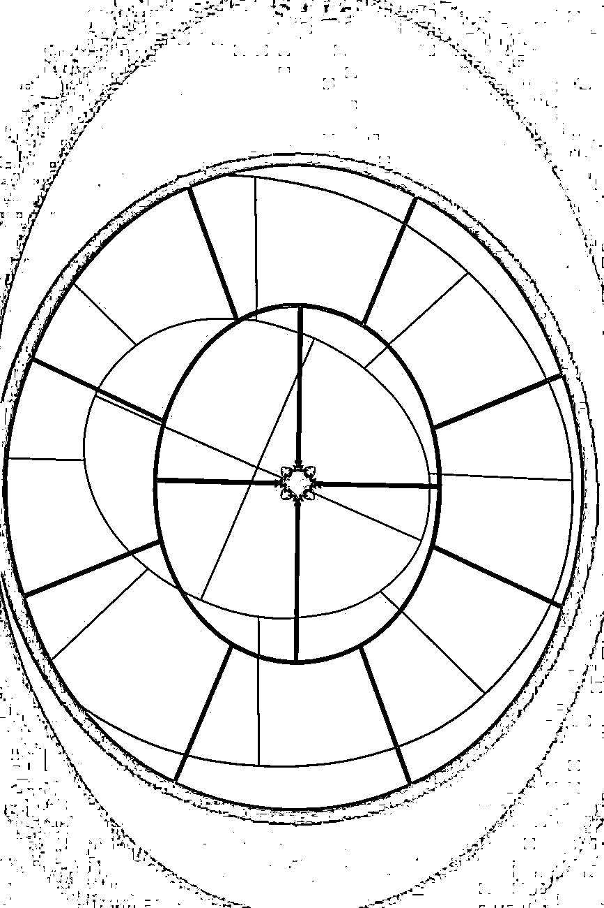

**· 站在射手座南交点看业力风险：**谎言总是“说话没边儿”，而受骗总是“听话没脑”。那些扑簌迷离的信息、网络键盘的骂战、脚不着地的想法、别有用心的洗脑，为什么会一再地出现？每个人都有自己看不见的“自我盲点”，习惯以自己的主观视角去看待事物，并且很多时候不愿承认别人的优秀与成熟，因为希望自己正确和高明一点；**· 站在双子座北交点看进化路径：**升级觉悟，只坐在山顶是不行的；追寻理想，只有主观愿景是不够的。我们必须走到山下并进入生活，多元化地学习，落地性地验证，才能觉悟理想愿景的究竟——是内在天性的呼唤，还是急于向外的证明？是不惧考验的坚实信念，还是激情澎湃的纸上谈兵？**此次射手座日食许下的理想愿景，将会随着 12 月 29 日，木星进入双鱼座并与双鱼座海王星形成“木海互容”结构、2022 年 4 月 12 日的“木海合相”两组结构向前推动。**未来 6 个月的岁月里，“理想远景”距离“内心初衷”是更正更近，还是更偏更远，这份距离取决于当下我们对“偏颇的主观视角，短视的急功近利，盲目的理想主义”这些业力阴影的检视与评估。此次射手座日食介入年度重磅天象“土天四分”结构，与水瓶座土星形成六分结构，与金牛座天王星形成 150°梅花结构，带来两种可能性：**· 低阶的风险：**金牛座天王星对现实结构的瓦解，触发了水瓶座土星对“自我权威性”的不确信，令人带着“狂妄自大和主观视角”去证明自我的实力和观念的正确，以致理想愿景背离了自心与初衷；**· 进化的助力：**水瓶座土星对“狂妄自大和主观视角”踩了一脚刹车，帮助我们以成熟的态度向内觉察“业力的伤痛，挫败的恐惧”，教导我们以负责的态度督促“目标具体化，方案落地化，行动持续化”；金牛座天王星则提示我们必须对那些顽固不化的意识观念和经验模式做出根本性的突破。

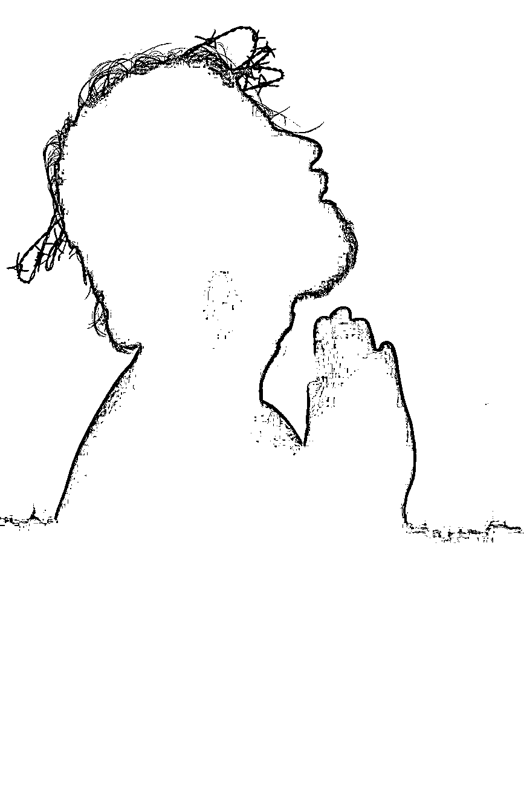

在这个本应澎湃内心激情，追寻诗和远方的射手座日食，我们最好体悟一下拿着削笔刀去削一根 2B 的铅笔的感觉：不能太大力，不能不使力，不能肆意地东一下西一下，不能自大地以为能修得多长……我们只能跟着弧度、觉察着力度、保持着尺度地自律工作，管我习不习惯，管你着不着急，2B 的铅很软，除非不珍惜或不缺钱。进化旅途并不容易，需要我们鼓足勇气跨过门槛。但是，当我们听到自己的脚步声，在从未走过的空空荡荡的房子里回响时，便会清醒地意识到自己走进了全新的人生篇章。另外，射手座日食前后 18 天，集体层面将会出现知名人物或权力机构的危机事件，尽量不要戴着主观化的滤镜盲目站队，拿着偏颇性的观点妄加评断，以免激进之下伤害他人，或被别有用心的人利用；而国际社会过度乐观的态度和过早开放的人流，可能会引发疫情的再度传播，做好个人防护，不要放松警惕。**在“清渣进程”的孤独中走向自己**

****

**宇宙借由各种途径使人变得孤独，好让我们可以走向自己。****——赫尔曼·黑塞《德米安》**

> **天象**
> 
> **· 金冥合相：**金星与冥王星合相摩羯座；**· 火星六分“金冥合相”：**天蝎座火星六分“金冥合相”结构。

2021 年 12 月 19 日-2022 年 1 月 29 日，金星逆行摩羯座，并在 2021 年 11 月-2022 年 3 月整整 4 个月的“逆行影响周期”之中，于逆行前影响期的 12 月 12 日、逆行期的 12 月 25 日、逆行后影响期的 2022 年 3 月 4 日，与摩羯座冥王星 3 次形成“金冥合相”结构。 

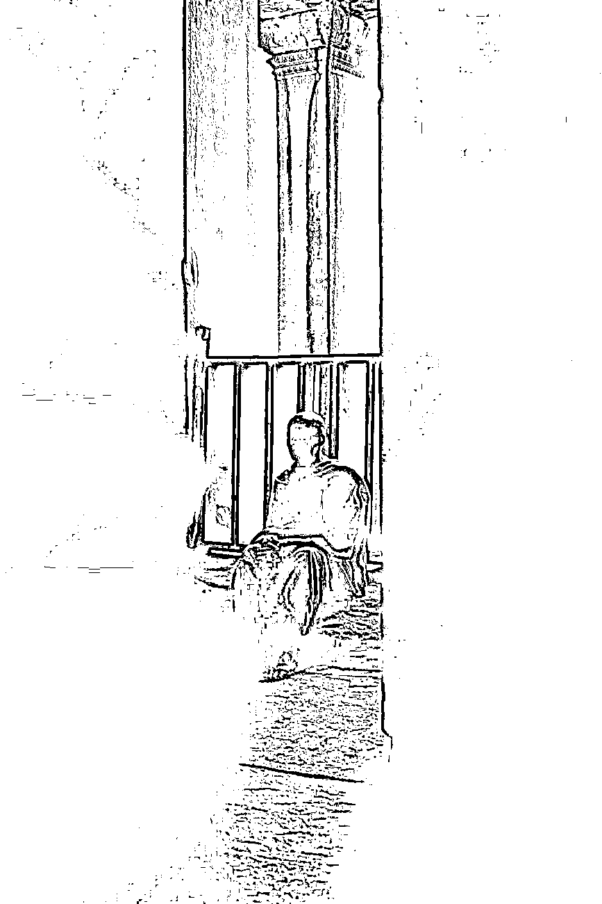

此次射手座日食的影响周期长至 6 个月之久，“金冥合相”的能量影响和现实演化亦在这段时间之中。并且，我们透过“行星能量传导链”可以看到：摩羯座金星→水瓶座土星（土星守护摩羯座）→金牛座天王星（土星和天王星共同守护水瓶座）→摩羯座金星（金星守护金牛座）。

**敲黑板！划重点！**

“金冥合相”结构卷到 2021 年度重磅天象“土天四分”结构不破不立的“清算进程”之中！而 12 月 24 日，我们即将迎来“土天四分”结构的第三次能量峰值（第一次 2 月 18 日，第二次 6 月 15 日）。 

“宇宙超级大 BOSS 冥王星”拿着剥开表象、揭露真相的“手术刀”，将超边关系和越界模式中的“历史沉渣”一一揭露；而此次射手座日食，天蝎座火星六分“金冥合相”结构，则**将隐藏在过往观念之中的深层恐惧和内在欲望一一挖出——在我们的业力执着之中，“失去”的恐惧驱动着占有的野心与贪图的欲望，导致序列的混乱，造成边界的模糊。**此次射手座日食，集体层面的国际关系、集体政策、金融市场、商业版图将会出现一波洗牌和震荡，一些虚假的“人设”被撕开，一些原有的认知被颠覆；个人层面，再无营养的消耗性关系将会走向完结，考验通关的人际关系将会更加牢固，我们也将学会以诚实的视角去面对关系的考验，以成熟的心态去确立自我的价值。**请允许我将金星逆行摩羯座的 4 个月称为“清渣进程”，而 11 月 19 日的金牛座月食和此次射手座日食正是“清渣进程”的开始。**回溯 5 月 26 日的射手座月食（详情点击：[射手座月食](http://mp.weixin.qq.com/s?__biz=MzA5NjA0NTAxNg==&mid=2651445275&idx=1&sn=7d32ae76e353544574a0c9f92dc64a75&chksm=8b4b6aacbc3ce3ba3a347f5145899be64f1282df15e9651a2a08735e799cb770b3cb95fb7cf9&scene=21#wechat_redirect)）和 6 月 10 日的双子座日食（详情点击：[双子座日食](http://mp.weixin.qq.com/s?__biz=MzA5NjA0NTAxNg==&mid=2651446709&idx=1&sn=930fda92d5f6a1e15aba110442018341&chksm=8b4b6f02bc3ce61411e5dd4cbc6f9296f3c9e1c8c3a25a122574ccc69906b994e993416176c0&scene=21#wechat_redirect)），就会在 2021 年一系列的食相中发现，**“开启与结束”皆在推动我们走向真实的自己。**

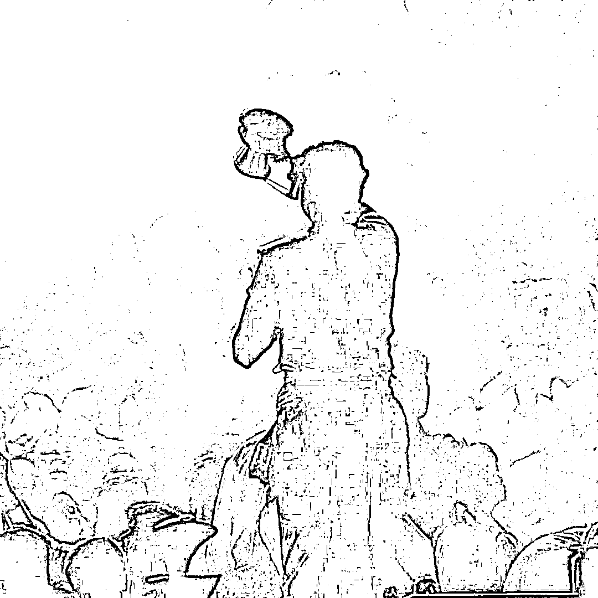

只是，行进在这个过程中的我们，常常会感到**自己所爱的人事物就像穿着厚厚的盔甲难以触及，故而内心常常陷入孤独、伤痛和恐惧的情绪之中。**但是，请相信宇宙的善意。沉渣浮现才能清算，宇宙正在借由各种途径使我们变得孤独，好让我们可以走向自己。当下的我们正在与“业力阴影”一起工作，当顺着阴影看清来源，便能觉悟宇宙之光来自何处。**寄语**

****

**你必须先有某些东西，才能明白某些道理。****——弗兰纳里·奥康纳《上升的一切必将汇合》**写了那么多，还得回归现实生活。此次射手座日食，可以许愿，但要小心许愿。**首先，分清狂热与热爱，辨析欲望与理想。**自己的 2B 铅笔就得自己一边感悟一边削，找自己的手感，摩自己的经验，别人的架势学不来，也别期待外界的认同，因为这支 2B 铅笔是自己用。然后，**确认自己下一阶段的理想愿景在哪里，有哪些具体的目标、落地的方案、有效的行动可以支撑理想愿景一步步地向前推进并走向达成。**

我们必须先有某些东西，才能明白某些道理。我们先有的东西就是生命，故而，我们能够先做的就是——**像削自己的 2B 铅笔一样，做自己生命的“匠人”。**

谁也“赌”不过宇宙，无论手里拿着什么牌。人类太渺小，宇宙太精妙，唯以谦卑，唯有臣服，放下妄念，没有捷径。

祝愿每一个灵魂安好。祝福大家。**新月如何许愿？**

**许愿时间**：北京时间 2021 年 12 月 4 日 15:42 后，48 小时内有效、8 小时内最佳。 

**许愿人群**：所有人。

**许愿数量**：每人最多 10 个。

**许愿方式**：静心冥想，身心祈祷或记录收藏。

**许愿格式**：请万能的宇宙赐予我能量，我将以我的能量吸引**（什么）来到生命中……

**许愿原则**：发心诚善利人。

**版权声明**：原创文章由作者授权首发于若道平台，欢迎转发，反对抄袭。友号转载请申请白名单。

****

****想阅读更多作者的文章，请在后台回复******王芝桦****** 即可。****

****王芝桦****

心理占星师，统合疗愈师，占星专栏作者

全职于个案咨询与占星教学工作 17 年

**个案预约咨询微信号**：zhihua0621 

**微信公众号**：daoxi-life

**长按打赏**

****

**学习占星学****点击下图了解课程详情** 

](http://mp.weixin.qq.com/s?__biz=MzA5NjA0NTAxNg==&mid=2651462540&idx=2&sn=0eac41c0de975b532a968e982f8f7f6d&chksm=8b48a93bbc3f202de47daaadf78856ebc6800c8779628e71ff7bfda7b22994aa02b9ab419075&scene=21#wechat_redirect)

****************

**微信又双叒叕改版啦，不想错过若道君的推送？****就把若道设为星标吧！****▼**

喜欢记得点一下在看哦☟

****报名直达入口****

# 开启全新人生，从这份免费的新月报告开始

> 原文：[`mp.weixin.qq.com/s?__biz=MzA5NjA0NTAxNg==&mid=2651462937&idx=2&sn=81911bb78ad16ddf3484a3d38584ebf5&chksm=8b48afaebc3f26b86a4e1d8874df4564520c379472019459238efd3029661273cca92085eb07&scene=126&sessionid=1692737888#rd`](http://mp.weixin.qq.com/s?__biz=MzA5NjA0NTAxNg==&mid=2651462937&idx=2&sn=81911bb78ad16ddf3484a3d38584ebf5&chksm=8b48afaebc3f26b86a4e1d8874df4564520c379472019459238efd3029661273cca92085eb07&scene=126&sessionid=1692737888#rd)

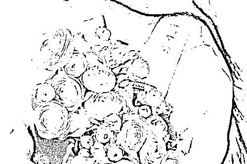

北京时间 12 月 4 日 15:42，新月日食发生在射手座 12°22′。每到新月时分，若道君都会为你奉上根据你出生星图量身打造的免费新月报告。可是新月为什么要许愿？新月报告该如何领取？让若道君来教你。　**什么是日食？**　

从占星学看，新月是月亮周期的一种相位。新月是开始，又称为朔，对应中国农历初一，太阳、月亮在此时合相。

此时月亮运行到太阳与地球之间时，月亮以黑暗的一面对着地球，并且与太阳同升同落，地球上看不见月亮。如果新月发生的位置靠近月亮交点，则称之为日食。

本次新月时间**2021 年 12 月 4 日 15:42，日食发生在射手座 12°22′。**为什么新月要许愿？

新月是一个周期的开始，新月发生的时候，太阳与月亮合相，能量很强。当新月出现时，你也许会发现灵感忽现，非常适宜开启新领域、项目与行动，缔结一段新的关系或合作。许愿会加强新月的能量，也有助于你了解自己现阶段适合开启的方向。 

本次新月最佳许愿时间从新月开始到其后的 48 小时内，许愿的力量最强。**最佳许愿时间：12 月 4 日 15:42-12 月 6 日 15:42**

属于你的免费新月报告每到新月时刻，看着占星文章里写着：看看你新月的宫位，如果新月在第 X 宫，你可以许愿的方向是……是不是常常一头雾水？新月的宫位？我到底该看哪里啊？而有时，那些标注上升星座的文章也会让你忍不住想：虽然我的上升星座是这个，可是我的新月好像并不落在你说的宫位啊？你是不是写错了？

虽然这些文章都没有写错，可是好像对你而言都太不友好了。**Don't Worry！**别着急，让博学又体贴的若道君来帮你！我们推出了一份**免费**又**好用**的新月报告！而且是专门为你设计的哦，**根据你出生星图为你量身打造的，只****属于你的独家新月报告**。报告有哪些内容？**新月时间****最佳许愿时间****如何许愿 **属于你的**许愿关键词**本次新月给你的**建议**你会有怎样的**感受 ******机会****

********

如何许愿？许愿方式也很简单。你可以把愿望写下来，或者双手合十后交叉，闭上眼睛来祈祷。 报告中会为你提供**祈祷词示例**，可以多多参考哦～ 你还可以适当添加自己的语言，创造属于你自己的祈祷文！如果报告拿到手了，快对照着许愿吧！**这份好用又暖心的报告，点击****阅读原文****即可领取！**

****

****点击“阅读原文”即可获取新月报告****

# 著名法国作家告诉你，12 星座如何活出美丽人生？

> 原文：[`mp.weixin.qq.com/s?__biz=MzA5NjA0NTAxNg==&mid=2651462817&idx=1&sn=d4c6f7405ac1aa0b6ddfb2ae0289b92e&chksm=8b48ae16bc3f270079cead485c4d2e9c831b70e414a1da7f0a6c534ffcf7a85c0e7bdf7ad643&scene=126&sessionid=1692737888#rd`](http://mp.weixin.qq.com/s?__biz=MzA5NjA0NTAxNg==&mid=2651462817&idx=1&sn=d4c6f7405ac1aa0b6ddfb2ae0289b92e&chksm=8b48ae16bc3f270079cead485c4d2e9c831b70e414a1da7f0a6c534ffcf7a85c0e7bdf7ad643&scene=126&sessionid=1692737888#rd)

******☆ **后台回复“今日”，给你一句生命态度****

作者/Anastasia 编辑/玫瑰 图片/pexels

如今的世界精彩纷呈，仿佛一场场盛大的个人秀，自拍、直播在网络上大行其道，无数人通过博客、微博、播客、主播等等平台展示自己，脱颖而出，吸引到成千上万的关注，以及财富。而你知道这位“个人秀”作家吗？看看他是如何给 12 星座建议的吧！**无法绕过的个人秀作家：蒙田**

| 米歇尔·德·蒙田

说到个人秀，有个名字无法绕过，他就是法国作家——**米歇尔·德·蒙田**。蒙田生于 1533 年，是文艺复兴时期的法国作家。1571 年，蒙田 38 岁，便回到乡下开始退隐生活，旁观世事，博览群书，思考写作，直到 1592 年逝世。在这长达 20 年的岁月中，他陆陆续续写出了 3 卷巨著《蒙田随笔集》。这是一套哲学散文集，共 3 卷 107 章。蒙田真诚、详尽地记录了自己日常生活中的所见所闻，写下了对生活、对人生、对历史的所思所想。他的关注点始终在自己身上，思考、反省、内观、写作。而这期间，他的祖国正在经历长达 30 年、连续 8 次的宗教战争期。直到他去世，战火仍旧没有熄灭。

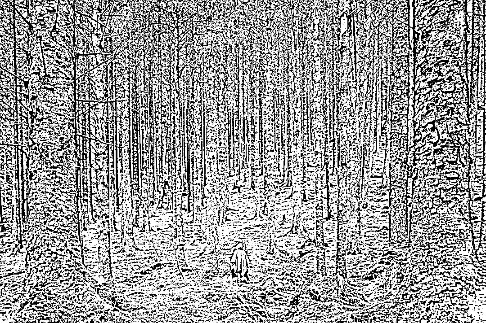

**人的一生该如何度过？**蒙田是双鱼座，他坦率、宽容、洞察人性又接纳现实。在他出生星图中，落在白羊座的凯龙星四分了合相在巨蟹座的土星和天王星。他把自己的文章称为是 Essais，在他的年代，这个词是**尝试、试验**的意思。有批评者认为他的作品条理散乱，粗鄙俚俗，并且谈论了过多的自己。在他死后，作品被封禁长达几十年。而历史证明经典不会埋没。蒙田这种责人责己、夹叙夹议、摇曳多姿跑野马似的文风，受到了后世众多百科全书式的作家和诗人的喜爱。他的作品开创了一代先河，最终成为新的文体形式，我们现在称之为随笔。蒙田认为每个人自身含有人类的全部形态，一切主义和主张都是建立在自我偏见和信仰之上；人的理智并不能抵达真理。而对自我的探索就是了解人性，思考人生的最好方式。这和我们通过星图了解自我和人生异曲同工。我一直认为，**星图形态就是从自我到人性再到时代的具体呈现，能走到哪一步，取决于我们的觉知。****觉知是什么？**蒙田如是说：**读书对于懒汉，戒酒对于酒鬼都是一椿苦事。节俭对于挥霍的人是酷刑，锻炼对于虚弱好闲的人是体罚，其他事也一样。事物本身不是那么痛苦、那么困难，但我们的软弱与怯懦使事物看来如此。要评判事物是否伟大高尚，必须有一个同样的心灵，否则我们会把它们看成是卑微的。这卑微来自我们自身，一支直的船桨在水里好像是弯的，重要的不是事物，而是如何看待事物。**我更认同他是一个哲学家，哲学的主题就是“人应该如何活”。在蒙田浩如烟海、无所不包的哲思中，始终横亘着这个主题：人的一生应该如何度过？他说，**认识自己、控制自己、保持内心自由，通过独立判断与情欲节制，人明智地实现自己的本质，这样才会使自己成为自然界“伟大光荣的杰作”。****12 星座如何活出自己的能量？**占星学的核心同样是关注怎么活出丰盛的自己。12 星座各有各的光芒和阴影面，最终，我们要过得丰盛，就需要活出我们每个人星图上特有的能量。那么，12 星座到底如何活出自己的能量？让我们从蒙田的俯仰皆是的智慧中找寻答案。

下面我根据 12 星座原型能量摘取了《随笔集》中的短句和短章，这难免挂一漏万，以偏概全。大家若感觉意犹未尽，在引句后我标注了摘录的章节和题目，可以以此为线索，进一步阅读蒙田随笔全集，一窥蒙田哲思的全貌，必定会有更多的启发。

**白羊座-天秤座轴线如何活**

这个轴线关注的是自我和他人的关系。如何表达真实自己，为自己争取权益；又如何尊重他人，建立和谐关系；是这条轴线思考的核心。蒙田说：**“我根据别人的看法约束我的行动，但根据自己的看法扩展我的行动。”**勇敢如同其他品德，都有界限；越过界限，就走上了罪恶的道路。若不知道克制，会使勇敢变成鲁莽、固执、疯狂，到了那时就难以自拔。**第 1 卷，第十五章，无理由死守阵地者必须惩处**人不应该按照自己的脾性与心意仅仅计较。我们的看家本领是懂得应付不同的局面。认定一种方式非此不可，这是存在，不是生活。最美丽的心灵是善于灵活适应的心灵。**第 3 卷，第三章，论三种交往**

**金牛座-天蝎座轴线如何活？**

这个轴线关注的是我们的**财富和欲望**。而人类最大的烦恼就来自于此，要么财富不足，要么欲求难满。伊壁鸠鲁曾说，富裕的本质不是减轻烦恼，而是变化烦恼。贤人的教诲就是不要躲避坏事与痛苦，有益的事情愈是艰难愈值得去做。“寻欢作乐、声色犬马是轻浮的伙伴，与它们为伍其实并不快活；处于逆境时坚定平静，经常更为幸福。”持家的人，大多数认为朝不保夕的生活很吓人。他们没有想到大多数人都是这样过日子的。多少老实人放着安定的生活不过，而去追求国王与财富的飘忽不定的宠幸。**第 1 卷，第十四章，善恶的观念主要取决于我们自己的看法**因软弱造成的错误，与因恶意造成的错误，中间有着巨大的差别。恶意是我们有心鼓励自己违背天性形成的礼制规则，至于软弱也不妨拿天性来自我辩护，它是造成我们不完美和缺陷的根源。**第 1 卷，第十六章，论对懦夫行为的惩罚**

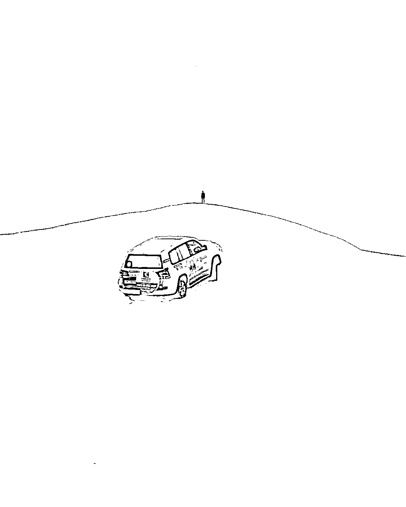

**双子座-射手座轴线如何活？**

这个轴线是**学习**的轴线，**一端是满足好奇心的探索和经历，一端是提炼抽象理论的思考和智慧**。蒙田说，真理的反面有千万张面孔和无限的范围，说的就是双射轴线的能量呈现。这条学习轴线的平衡，就在于不轻忽、不偏向任何一端。推理与学识，即使我们对这两种能力有意识地给予全部的信任，也不足以使我们增强行为的能力，除非我们心灵还经过实践的考验与培育，去面对生活的历程；不然，一旦遇上实践，我们的心灵无疑会不知所措。**第 2 卷，第六章，论身体力行**我们无法超越自己的能力与手段去遵守诺言。在这方面，结果与做法完全不为我们掌控时，我们所能掌控的就只有自己的意志了。人的一切责任与规则也就有必要建立在意志上。**第 1 卷，第七章，我们做的事要从意图去评判**

**巨蟹座-摩羯座轴线如何活？**

这个轴线连接的是星图上的中天和下中天，象征了我们人生中最主要的两个领域，**家庭和事业**。“扪心自问吧，世人对地位、职务、人间利禄的追求，不恰好是从公众那里获取个人的利益吗？”同样，家庭的滋养，也会支持我们在公众面前的表现、地位和名誉。我们的心态会影响和改变事物，我们无法知道什么是事物的实情；因为一切东西都是经过感觉的作伪和歪曲而传给我们的。**第 2 卷，第十二章，雷蒙·赛邦赞**我们需要的是妻子、孩子、财产，尤其重要的是尽量保持健康；但是不能迷恋得让我们的幸福都依赖于此。应该给自己保留一个后客厅，由自己支配，建立我们真正自由清静的隐居地。在那里我们可以进行自我之间的日常对话，私密隐蔽，连外界的消息来往都不予进入。**第 1 卷，第三十九章，论退隐**

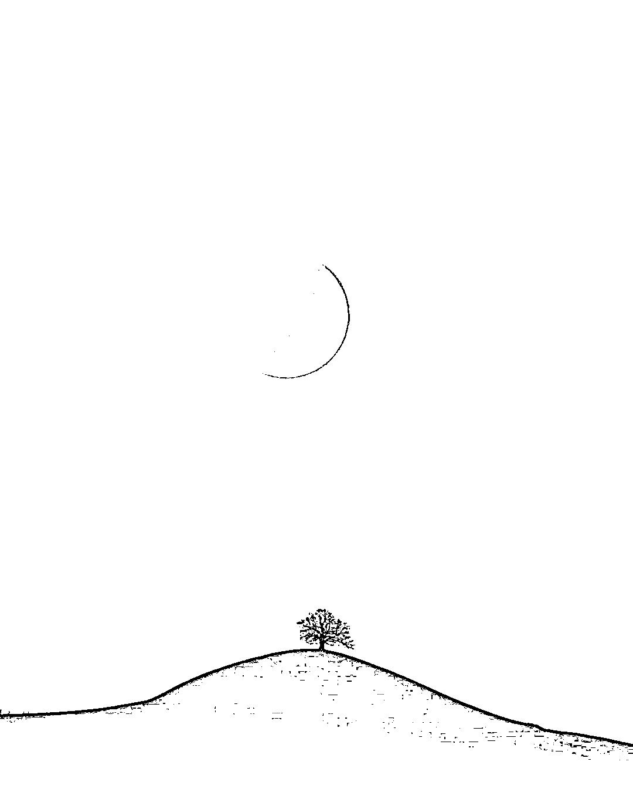

**狮子座-水瓶座轴线如何活？**

这个轴线是关于**创造和启蒙**的轴线，活出这个轴线的关键在于**责任**。我们如何看待自己作为个体，作为群族中的一员，作为时代一份子的责任呢？这关乎我们活出自我，活出创造力，启发民众，带来改变的能力。蒙田说，洞察未来的秉性不是常人所能有的，我们必须超越自己才能洞察未来。我们这个时代的人养成了浮躁，爱出风头的时候，以至不再关注善良，节制，平等，恒心和宁静无为的品质。**第 3 卷，第十章，论意志的掌控**独处一地，说真的，使我心胸更宽阔，视野更远的，当我一人时，更加关注国家大事和世界风云。**第 3 卷，第三章，论三种交往**

**处女座-双鱼座轴线怎么活？**

这个轴线是**服务和疗愈**的轴线。处女座的精益求精、追求完美是为了把美和秩序带到世界上来，最终疗愈到自己和众生。蒙田说，一个人如果不对自己的一生确定一个大致的目标，就不可能有条有理地安排自己的个别行动。一个人在头脑里没有一个总体形状，就不能把散片拼凑一起。各个心灵在自己的领土上都是王后。所以不要再事情的外在品质上找借口，责任在于我们本身。我们的善与恶也全在我们自己。烧香许愿要面向我们自己做，不必面向命运。命运对我们的品行是毫无作用的。相反，我们的品行会影响命运，会塑造命运。**第 1 卷，第五十章，论德谟克利特和赫拉克利特**我们不去追究宇宙的秩序而随波逐流，对我们反而更好。一个不抱成见的灵魂可以迅速达到宁静。**第 2 卷，第十二章，雷蒙·赛邦赞**

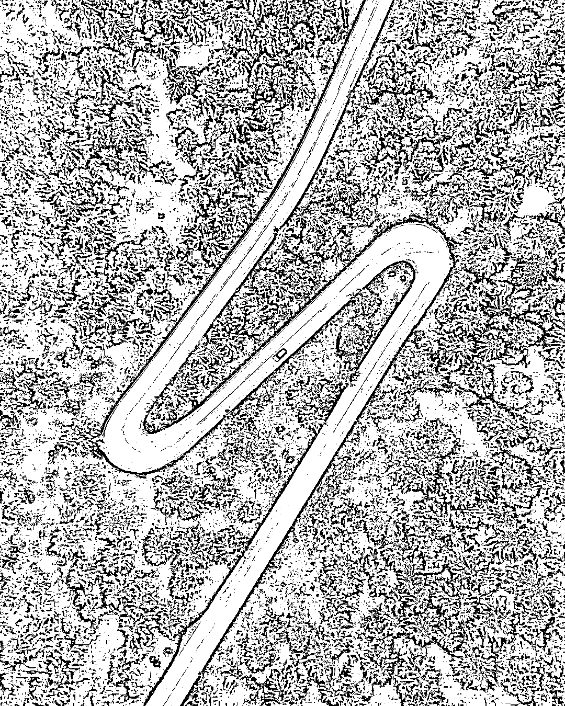

**最美丽的人生是以平凡的人性作为楷模**在全集的最后一章中，蒙田写道：“依我看，最美丽的人生是以平凡的人性作为楷模，有条有理，不求奇迹，不思荒诞。”蒙田推崇中庸，推崇安宁、低调、俭朴的人生。他人生大半是在法国 30 年宗教战争中度过，乱世混沌，战火纷飞。他虽然身负盛名，生活却朴实无华。他自认人生中最大的光荣就是安宁度过。他说：“这安宁的含义是我自己定义的。既然在哲学里找不到对大家都有用的通往安宁的共同道路，那就各找各人自己的道路吧。” 说得没错，人生长路上，我们最终要各走各路。而在这个孤独、漫长、向着死亡的前行过程中，星图犹如地图，可以帮助我们找到最佳的路径。它不一定是最短最快最轻松的，但一定是最适合我们、收获最大的。

**版权声明：**原创文章由作者授权发布于若道平台，欢迎转发，反对抄袭。友号转载请申请白名单。

**Anastasia**

职业占星师/专栏作者/策展人

于 2015 年通过 ISAR 占星能力考试

若道认证生时校正资质（2015 年获得）

**微信公众号**：KairosMoment

长按打赏

**学习占星学****点击下图了解课程详情** 

****************

**微信又双叒叕改版啦，不想错过若道君的推送？**

**就把若道设为星标吧！**

**▼**

**就是这个“在看”，戳戳戳 ☟**

************报名直达入口************

# 12 星座自画像丨处女座：精雕细琢的完美主义者

> 原文：[`mp.weixin.qq.com/s?__biz=MzA5NjA0NTAxNg==&mid=2651462817&idx=2&sn=dbab080313efe24e0b2bd352b3443564&chksm=8b48ae16bc3f2700ff9e5ff9e5813e64621a86bfc949cdbbedb3d02efdbe22c8bea0adf1342e&scene=126&sessionid=1692737888#rd`](http://mp.weixin.qq.com/s?__biz=MzA5NjA0NTAxNg==&mid=2651462817&idx=2&sn=dbab080313efe24e0b2bd352b3443564&chksm=8b48ae16bc3f2700ff9e5ff9e5813e64621a86bfc949cdbbedb3d02efdbe22c8bea0adf1342e&scene=126&sessionid=1692737888#rd)

作者/克里斯蒂娜·罗登贝克

译者/亚麻林恩 校对/江艺

编辑/翀子 文章图片及注释/作者提供

本系列是克里斯蒂·罗登贝克老师撰写的艺术中的 12 星座自画像，角度独特，语句生动。本文是该系列第六篇：处女座自画像。

毫无意外，出生在**处女座**的艺术家们的作品总是**细节考究，精雕细琢，技术精湛，极尽完美。**同样毫无意外的是，所有的这些画家都画得非常漂亮。

| 安格尔，1780 年 8 月 29 日

**雅克·路易斯·大卫**记录了法国大革命的发生，创造了这一时期标志性的形象，如马拉之死。他的视角是戏剧性的，电影式的、迷人的。他帮助制作了欧洲皇帝拿破仑的肖像。

后辈的**让·多米尼克·安格尔**，对自己的作品同样精雕细琢，但他的大部分题材都更加内敛、富于想象力。他是一个浪漫的人，为了让肖像画更完美，他还扭到了手。如果你处在 19 世纪 30 年代，又有钱的话，他肯定会是你画肖像画的不二人选。他的作品既准确又讨人喜欢。

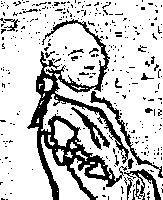

| 德·拉·图尔，1704 年 9 月 5 日

一百年前，你一定会雇佣另一个伟大的处女座肖像画家，**莫里斯·康坦·德·拉图尔**。在这个诙谐的时代，有一幅诙谐的自画像。

显然，他在宫廷中受欢迎的原因之一，是他能让他的模特看起来很聪明。

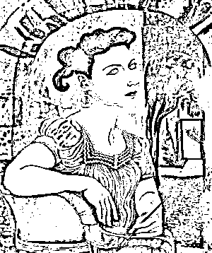

| 奥尔加·科斯塔，1913 年 8 月 28 日

| 玛丽·加布里埃尔·卡佩特，1761 年 9 月 6 日

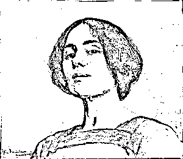

| 艾琳·丹尼尔森·甘博吉，1861 年 9 月 3 日

在英国，乔治·斯塔布斯正忙着画有钱人的马和狗。但他让自己看起来非常普通，而不是花里胡哨的法国人。另一个人看起来却像是在开玩笑——**德比郡的约瑟夫·赖特。**赖特是英国启蒙运动的首位艺术家，他创作了一个关于科学实验和讲座的系列画，特别关注试验使用的工具。我认为这显示了处女座对科技的兴趣。

| 斯塔布斯，1724 年 8 月 25 日

| 让·阿普尔顿，1911 年 9 月 13 日

| 弗里德里希，1774 年 9 月 5 日

我想找一个更认真对待自己的人。德国艺术家**卡斯帕·大卫·弗里德里希**，以其充满浪漫风景的**忧郁和阴郁**而闻名。

他也患有**严重的抑郁症**。即使他看上去在努力挤出微笑。但凝视的目光却相当激烈。

当然，**抑郁的另一面是幽默感。**

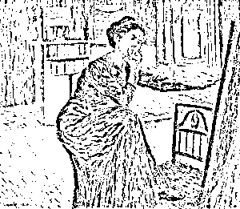

| 艾格尼斯·克里夫·乔南德，1876 年 8 月 23 日

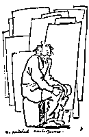

| 伯恩·琼斯，1733 年 8 月 28 日

**爱德华·伯恩·琼斯**，作为拉斐尔前派幻想中最浪漫、最多产的画家，他如何呢？哦，看在上帝的份上，他的自画像是一幅非常可爱的卡通画。更重要的是，这展现了**一个典型的处女座时刻——感觉有点小，没有价值和不知所措。如此自嘲。**

| 拉克汉姆，1867 年 9 月 19 日

另一位童话世界的插画家是**亚瑟·拉克姆**，同样的画技高超。看着这张自画像，你会认为他是一个学校的图书管理员，而不是一个**极度黑暗和浪漫的幻想家。**我猜他身后是圣保罗大教堂。

那么我们从**处女座纯粹的技巧、精湛的技艺**上看到了什么呢，**是浪漫和智慧**，我想。

| 让·阿普，1886 年 9 月 16 日

如果你认为我在开玩笑，那么看看他的同伴，帮助他建立了达达运动的**让·阿普**。

我是说真的。

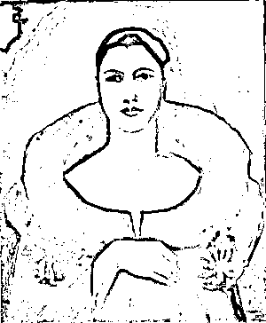

| 塔西娜·亚玛瑞，1886 年 9 月 1 日

| 莫莉·特里普，1870 年 9 月 14 日

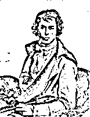

| 大卫，1738 年 8 月 30 日

****版权声明：**本文由若道翻译发布，欢迎转发，反对抄袭。友号转载请申请白名单。**

****

**12 星座自画像**[白羊座](http://mp.weixin.qq.com/s?__biz=MzA5NjA0NTAxNg==&mid=2651452779&idx=2&sn=38a345623020cadc4ed4f42904d29926&chksm=8b4b47dcbc3cceca0fbf3e66149382c065ff3dbc2f61c881cdba2807e9e4c0c8f9ec71f1e245&scene=21#wechat_redirect)| [金牛座](http://mp.weixin.qq.com/s?__biz=MzA5NjA0NTAxNg==&mid=2651453849&idx=2&sn=7f5ada7b667fcd56f09c2a4bffadab67&chksm=8b4b4b2ebc3cc2386cc5ee12e45ac147964723803ce5714b7c612caf6bf0436652a82e0eaf9a&scene=21#wechat_redirect) | [双子座](http://mp.weixin.qq.com/s?__biz=MzA5NjA0NTAxNg==&mid=2651460660&idx=2&sn=a239f43ebe4aa8c8058cfa11d79028d4&chksm=8b48a683bc3f2f9539414a0d2b911b7a8f67befff92ed4dad04c4387aaa4a44ec883ab777afd&scene=21#wechat_redirect) | [巨蟹座](http://mp.weixin.qq.com/s?__biz=MzA5NjA0NTAxNg==&mid=2651461305&idx=2&sn=dffc1bb3cfeb85d7e388220b268914b8&chksm=8b48a40ebc3f2d1847a163a94ec9ca66b2722ca5754c3e8bc834e8be2377dd290bf08ae9bdfb&scene=21#wechat_redirect)[狮子座](http://mp.weixin.qq.com/s?__biz=MzA5NjA0NTAxNg==&mid=2651461947&idx=2&sn=70a6531351eda8206c0bf346a74be567&chksm=8b48ab8cbc3f229ac7d6b1b81855854a827e4512a40504f41e114e795ab3c69d4317d8cd3bba&scene=21#wechat_redirect)

**克里斯蒂娜·罗登贝克**

克里斯蒂娜·罗登贝克，若道签约老师。全职职业占星师，从业 20 余年，在其网站长期撰写时事、艺术和文化的文章；定期在英国授课，并保持蓬勃发展的专业实践。

**学习占星学****点击下图了解课程详情** 

****************

**微信又双叒叕改版啦，不想错过若道君的推送？**

**就把若道设为星标吧！**

**▼**

**喜欢记得点一下在看哦☟**

********报名直达入口********

# 4 位大师天象预测课 | 2022 有哪些重大天象？（内含联报优惠）

> 原文：[`mp.weixin.qq.com/s?__biz=MzA5NjA0NTAxNg==&mid=2651462817&idx=3&sn=47ab2d5ea42c1d8ad51e591d6cdcb96e&chksm=8b48ae16bc3f27003f22d57d7f39fbc3d19fff36f88c632a07f090cab12051632430b74d5c67&scene=126&sessionid=1692737888#rd`](http://mp.weixin.qq.com/s?__biz=MzA5NjA0NTAxNg==&mid=2651462817&idx=3&sn=47ab2d5ea42c1d8ad51e591d6cdcb96e&chksm=8b48ae16bc3f27003f22d57d7f39fbc3d19fff36f88c632a07f090cab12051632430b74d5c67&scene=126&sessionid=1692737888#rd)

2021 年已接近尾声，忙碌的年末工作也挡不住我们对来年的盼望和期许。作为占星师，在年初跟随权威老师透彻地学习 2022 年重要天象的含义和影响，是迎接新的一年的正确姿势，仪式感满满！为新一年的自我规划和占星事业加油充电。**若道邀请了金牌核心课中的四位国际名师再次集结，在明年 1 月 8 日、9 日带来 2022 年重大天象的深入解读：**********

**讲师是谁？**

**琳恩·贝尔**

**（Lynn Bell）**

**· **世界最受欢迎的占星学演讲者、作家和老师之一。定居巴黎，研究心理占星学和家族模式数十年； **·** 著名的心理占星学中心（*Centre for Psychological Astrology*）的长期导师。2016 年，获得查尔斯·哈维（Charles Harvey）杰出的占星学服务奖；**· **作为一个从多个层面进行工作的占星咨询大师，琳恩的工作结合了心理学的观点。她对家族模式的兴趣首先来自与客户的合作。通过在分析领域所做的个人工作，她所受的埃里克森催眠训练将她引领至家族系统。后来，她组织研究小组在家族星图上进行了数年的研究。她写的《家族占星学》就是这项研究的结果；**· **法国心理占星学协会的会长。除了占星学，她在法国沙特尔的新沙特尔学校任教 8 年，还 5 次获得了在《纽约时报》畅销书作者卡罗琳·迈斯（Caroline Myss）的卡罗琳·迈斯教育学院（*Caroline Myss Educational Institute*）合作教学的机会。

**艾德里安·罗斯·邓肯**

**（Adrian Ross Duncan）**

**· **1971 年在印度游学时开始学习占星学，1985 年开始成为全职占星师，迄今执业已超过 33 年，是人本主义占星学、卜卦占星学和经世占星学领域的知名占星师。他还开发了占星软件 AstroClock 和多款占星报告；

**· **哥本哈根占星学院院长；

**· **他在日常咨询中经常运用卜卦，咨询图（卜卦的一种运用方式，即根据客户来访时间制作星图，从星图中获得大量信息）也是他特别擅长的领域；

**· **艾德里安·罗斯·邓肯从 1971 年开始研习佛学，受佛学影响很深，他相信占星学和佛学观点一致，转化的一个基础是在于对现实感知的改变。而卜卦很容易与佛教融合，因为它只关乎当下。

**克里斯蒂娜·罗登贝克**
**（Christina Rodenbeck）****· **克里斯蒂娜·罗登贝克（Christina Rodenbeck）是一名全职职业占星师，在牛津大学城生活和工作，深受周围知识和文化氛围影响；她拥有伦敦大学（*University of London*）的人文荣誉学位，曾在伦敦占星学馆（*Astrological Lodge of London*）、心理占星中心和占星研究学院学习；**· **作为一名占星师，在过去的 20 年里，克里斯蒂娜在她的网站“牛津占星师”上写了大量关于时事、艺术和文化的文章；她每月主持一个占星播客：“与克里斯蒂娜和萨莉一起占星”，并定期在《占星杂志》(*Astrological Journal)*上撰写时尚专栏；她定期在英国授课，并保持着蓬勃发展的专业实践。

**大卫·瑞雷**

**（David Railey）**

**· **若道联合创始人，致力于在中国教授和推广西方占星学；

**· **曾任 ISAR 全球副主席，CAPISAR（ISAR 职业占星师资质认证机构）主席；

**· **1976 年，通过亚特兰大职业占星师考试，成为全职占星师，随后通过 AFAN 和 ISAR 职业测试；

**·** 1980 年，与杰夫·焦耳一起在亚特兰大创建“每日行星”占星学中心。此后在亚特兰大占星协会担任 4 年考官，并且两次担任亚特兰大地区占星协会主席。1979-1992 年，作为占星师活跃于美国社会媒体，向不了解现代占星学变化的大众宣传专业占星学知识。在 1989-1992 年期间，他在 WRGG 电台 12 频道每周主持个人电视秀“今日占星学”，早先他还在 WRFG 的广播节目中播讲宇宙天气节目；

**· **2010-2014 年，任全美占星师联盟监督委员会委员；

**· **2010 年，其著作《灵魂的目标》中国版出版，和蒋颖一起创办若道占星学校和其官网 www.nodoor.com；

**· **2017 年，被选为 ISAR 委员会成员。ISAR 是世界最大的国际占星机构，会员遍布 45 个国家，2017-2020 年曾任 ISAR 全球副主席、CAPISAR（ISAR 职业占星师资质认证机构）主席。

**课程价格****正价**：3000 元**限量优惠价：2022 元**（前 60 名报满截止）**（联系 Maggie 老师，抢占限量优惠价）******联报套餐：《2022 年度天象预测大师课》+《2022 年金融占星预报》联报优惠价****2999 元****（限前 50 名联报）****（联系 Maggie 老师，抢占限量优惠价）**长按二维码添加 Maggie 老师获取联报优惠价**退转课程**

**· 退款原则请详看《教学协议》，如有疑问请咨询课程顾问。**

****2022 年度天象预测大师课****

**授课老师：**琳恩·贝尔、艾德里安·罗斯·邓肯、克里斯蒂娜·罗登贝克、大卫·瑞雷

**授课时间：**2022 年 1 月 8 日-9 日

**授课方式：**网络课程**，**英文授课，中文翻译

**费用：**3000 元**；****限量优惠价：2022 元（前 60 名报满截止）；****联报套餐：《2022 年度天象预测大师课》+《2022 年金融占星预报》联报优惠价：****2999 元****（****限前 50 名联报）**

**课程负责人：****Maggie 老师**（微信：18510107057，请备注“天象预测大师课”）

长按二维码添加课程负责人咨询~

****报名直达入口****

# 职业测试丨在你的职业中，三王星如何发挥它们的影响力？

> 原文：[`mp.weixin.qq.com/s?__biz=MzA5NjA0NTAxNg==&mid=2651462770&idx=1&sn=b2fa7384f112bf2c33cfac6c55873a0a&chksm=8b48aec5bc3f27d3028bb5e0bf57461a4e53f2199ec80988520db12745bef9e6eb5d58a5459b&scene=126&sessionid=1692737893#rd`](http://mp.weixin.qq.com/s?__biz=MzA5NjA0NTAxNg==&mid=2651462770&idx=1&sn=b2fa7384f112bf2c33cfac6c55873a0a&chksm=8b48aec5bc3f27d3028bb5e0bf57461a4e53f2199ec80988520db12745bef9e6eb5d58a5459b&scene=126&sessionid=1692737893#rd)

****************************☆ ******************后台回复“今日”，给你一句爱的箴言******************

作者/唐娜·坎宁安 翻译/李含

编辑/翀子 封面/书君 图片/网络

当天王星、海王星、冥王星在星图上被凸显，呈现出与职业相关的议题，那么本文就是值得你收藏参考的文章。你的职业受到三王星影响了吗？可以先做下面的测试，然后对照后面的文章查看。**COME ON**

**开始测试**

﹀

﹀

﹀

**5 分以下为低分，10 分以上说明影响力强，15 分以上影响力非常强（下表中天王星与水瓶座是一组，海王星对应双鱼座，冥王星对应天蝎座）**

**（海王星和冥王星的职业影响力测评也可参考下表计算）**

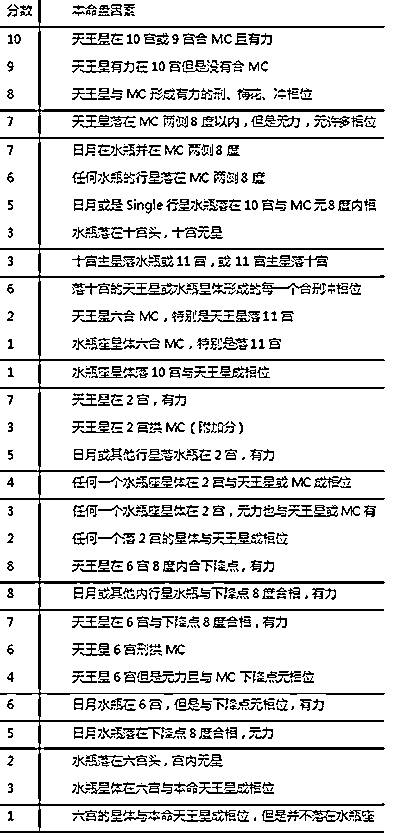

**天王星在职业宫**

天王星掌管着占星学这个行业，许多占星师有天王星或水瓶座与职业宫有关，或是与土星有相位（出生星图中土星的宫位、星座以及相位也是职业的指标因素）。**天王星预示着是表现自我独特性。**土天的相位会促使案主更注重实际运用，天海相位更有创造性，更多神秘色彩。

**★****天王星在 10 宫**

天王星在第十宫或与中天有相位在亲子关系上会受影响，比如某个双亲带有天王星人的特征，父亲的可能性比较大，不过有时双亲都带有天王星的某部分特征。**天王星的相位越紧密，影响力越大。**有时候会有个“破碎的家庭”，或者其他的不同寻常的状况，像是居无定所，父亲因工作常年不在家。

如果月天有相位，或是月亮在水瓶座，母亲会有某种天王星的特质。

**★****天王星在 2 宫**

许多倾向于心理占星学的占星师都避免将第二宫直接与财富物质联系在一起，他们比较喜欢将第二宫与自我价值联系在一起。一般认为，我们的价值体系会与我们如何掌控物质资源财富紧密联系在一起。

**第二宫与天王星或水瓶座星体联系在一起，案主的价值观会更保有自我理想信念的模式，而不是跟随社会普遍的标准，**比如用财富衡量人的价值。他们会在金钱事务上来构筑人生哲学，比如消费环保物品，确保他们的消费是有社会责任感的。

出生星图中天王星的星座和宫位相位体现了一个人的政治观点。落在第一宫的人会用穿着打扮来表现，落在第七宫会通过选择的伴侣合作者来声明政治观点，**天王星第二宫的人会通过处理财富的方式来声明政治观点。**

一般认为，天王星在二宫的人会经历财富上的大起大落，不过这种戏剧性的变化是由于案主个人的态度引发的，天王星所在的宫位预示着案主在这个领域会渴望寻求刺激。但是**并不是所有天王星二宫的人都会引发财务危机，成功人士会精明地认识到金钱的自由性。**

**★****天王星在 6 宫**

六宫有力的人往往是不可或缺的好员工，专心工作而不求荣誉，工作本身就是他们的动力。**当天王星或水瓶座落六宫有力，日常工作中的刺激会是他们的肾上腺素。**

六宫有天王星或落在水瓶座有力的人会有明显的天王星特质——**发明创造能力，独立性，前瞻眼光，质疑权威，重塑自我。**

不管六宫天王星人的受教育程度如何，他们往往视自己为工匠技工而不是企业家，**比较容易从事商业而不是专业性职业**。虽然如此，他们从事的工作也需要很强的专业技能，并且有很强的前沿性，像是网络时代的“网虫”。与六宫的特质相关，这些人也从事与服务业或者是健康服务有关的职业，但是同样会带有创造性。

虽然他们拥有智慧和天赋，但是他们自己不会把自己看作与众不同的人。

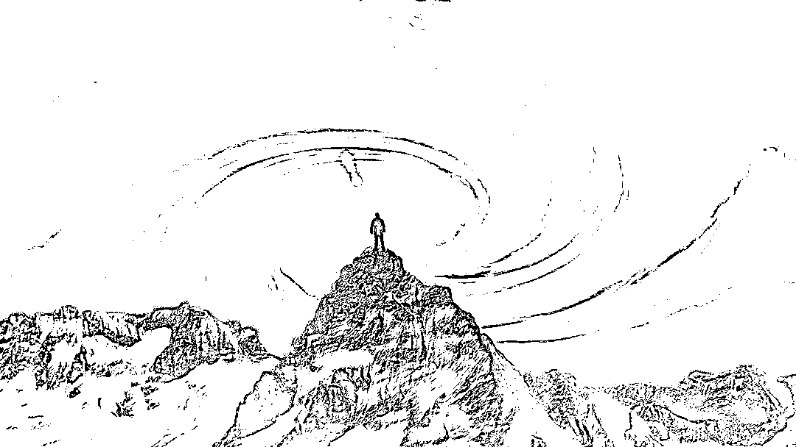

**海王星在职业宫**

在所有行星中，海王星对世俗成功的影响力是最少的，他**更关注于无形的世界，他要求我们要无私，要牺牲，为了更大的利益——而不要自负**。

海王星在出生星图中落入的宫位**是我们最不切实际，最不能脚踏实地，最理想化，也最能赋予我们灵感的领域。**海王星所落的星座宫位和相位预示着我们一生的理想蓝图。**最积极的表达方式是投入激情与创造力在真切需要的生活领域。**

如果过于夸张，这些积极的作用就会变质。想象力是很奇妙的，它建立在艺术性和创新性之上。但是过于活跃的想象力会变成易受暗示，或在幻想里，自欺欺人。**精神追求必须与实际世界相结合才能矫正这种状况。**

**★****海王星与 12 宫**

海王星是双鱼座的守护星，双鱼座带有海王星许多的特点，有利有害的方面都有。如果太阳、月亮或是群星双鱼座落在职业宫，那么双鱼座的特质将会影响到职业领域。

**海王星与双鱼座都关联 12 宫。**在心理活动的层面上，落在 12 宫的星座和行星描述了我们**隐藏的动力和情感**，同时这也代表了**隐藏的敌人或破坏性**，有时这个破坏者甚至是我们自己。

海王星或者双鱼座对于职业的影响就如同 12 宫的事务影响到了工作领域。与 12 宫有关的工作场所诸如**服务业、疗养场所、医院、修行场所、监狱等。**

**海王星对于职业的影响就是构筑一个伟大的梦想，但是梦想的实现则要依赖于强有力的土星来支持，不论是土海的吉凶相位都有益。**

海王星的不利影响是只有伟大的梦想，而无实践的行为，这样的海王星人会视自己为某种受害者的角色，对于改善自己的状况无力，可能会对某种事物的沉溺上瘾，健康问题，压倒生活的阻碍，或是自我挫败的模式，缺乏责任感。

许多在职业领域受海王星或双鱼座影响的人都有**很真诚的精神动力，有很强的服务他人，救赎他人的心态。**

实际上，海王星特质表现出的优点和缺点界定往往十分模糊，并且总在**不断的变化着**，这才有海王星魔幻的特色。

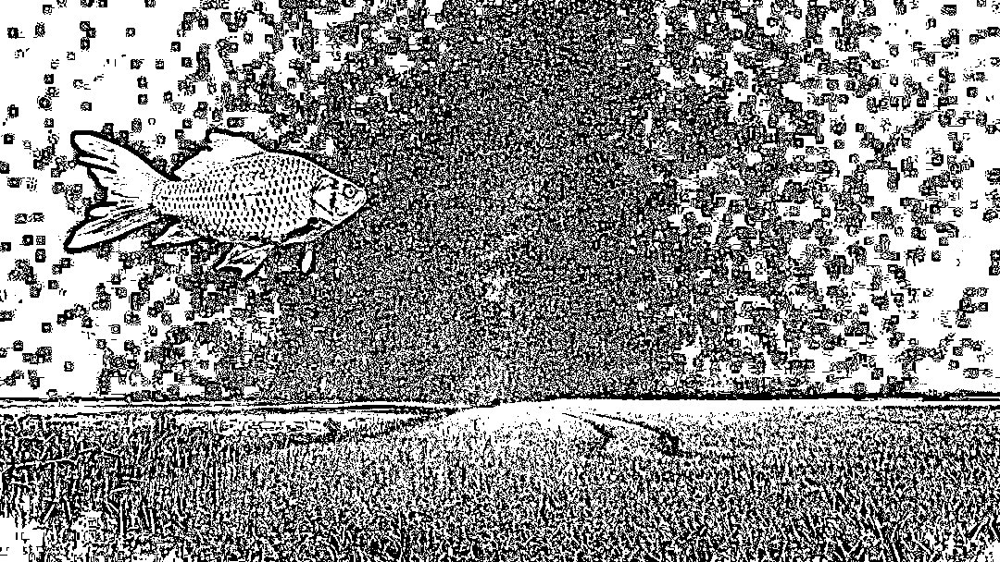

**★****海王星 10 宫**

海王星十宫会有一个矛盾的局面，**渴望投身于服务他人的事业而闪耀世界但却也有希望大隐隐于市。**例如肯尼迪总统、戴安娜王妃。

另一个海王星十宫有力的结果可能是引发丑闻。

与天王星的状况类似，海王星十宫也会有海王星特质的父母。比如父母很有才华、艺术天赋、梦想，但是因为家庭责任牺牲了，子女的成功会让他们觉得自己的牺牲很值得。海王星十宫也显示着这种模式的亲子关系，这样的子女承载着父母的梦想和期望。

**★****海王星 2 宫**

第二宫不止代表着我们取得财富的方式，也预示着我们对待金钱的态度，我们如何处理财务。海王星在第二宫会给财务管理带来很多麻烦，钱花得莫名其妙，有的是逛街购物了，如果八宫也有类似的影响，会有债务。**海王星会让案主在物质追求和管理上非常不现实。**

但是海王星二宫的人也有着**不世俗的优点**，他们的价值观不会跟随现实社会的唯利是图**，他们更看重精神领域的价值观。**他们认为一个人最重要的不是所拥有的财富，而是灵魂的神圣。但是也要注意在物质和精神领域的平衡。

海王星在二宫还会引发相互依存的情况，因为海王星所落的宫位都会引发界限模糊的症状。海王星在二宫就会引发**财务上的混乱状况。**比如，天秤座海王星在二宫，双鱼座落五宫头，预示着财务状况与子女爱情有相互依存的关系。可能一次又一次的帮助子女或爱人处理财务危机，以显示他们的爱。

**★****海王星 6 宫：圣人还是奴仆**

在三个职业宫位里，六宫是最适合海王星的落点，因为处女座和双鱼座是相对的星座，有很多共同的特征。海王星或双鱼座落在六宫的人比较不会像落在十宫和二宫那样面临物质与成功价值认知的矛盾斗争，**他们的服务精神会投入到实际的日常工作中去。**但是这个位置也会让案主特别迷恋工作，或者是在工作中受欺负，别人不愿意做的事情都推给他们，学会说“不”十分必要。

相比之下，海王星在六宫不会像十宫的人那么闪耀于人前，比如同样从事音乐艺术创作，可能会是幕后人员或乐队的成员，但是他们的工作一点都不比十宫的人逊色，同样十分重要。

因为第六宫还掌管着健康，所以当六宫有行进行星不良的影响，健康和工作的状况都会有麻烦。出生星图第六宫被强调的人，在工作不愉快的情况下，健康也会受损，特别是海王星或双鱼座在此更是如此，**他们会牺牲自己的身体健康来服务他人。**

比如医生为病人的健康忙碌，而牺牲了自己的健康。如果还有日月落在六宫，代表着父母的影响造成了他们对待工作的态度。如果不学着照顾好自己，总是缺少休息，太投入工作，在某些行进的影响下，慢性的疾病或健康隐患将爆发。

对于海王星在职业宫的人，第一次的觉醒会在行进的冥王星与出生星图的海王星成合相之时，大约在 20 多岁快 30 岁时，这时还有土星的第一次回归，推进的月亮推回到出生星图中月亮所在的位置。

**第二个变革期是 30 多岁到 40 岁初，行进的海王星四分出生星图的海王星，**这时也许会遇到理想破灭的境遇。这个时期的典型特征是案主会期望更有创造力，更有精神追求，更有服务牺牲的精神，而不仅仅是物质上的收获。

但是，案主可能会有某种无力感，觉得无力改变现状，找不到合适的奋斗方向，过去从事的工作已经无法忍受，渴望改变的愿望越来越强烈。有些人在这个时候选择重拾往日的梦想，比如返回学校。

**拥有海王星或双鱼座影响下的职业宫的人，就是将自己的心灵成长之路应用到职业追求之上。**

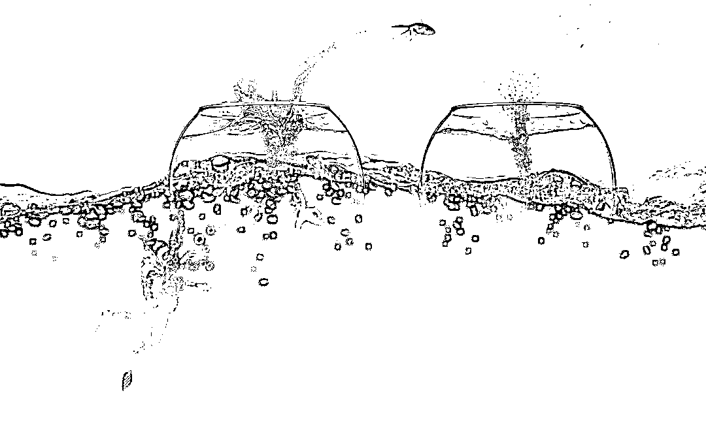

**冥王星在职业宫**

冥王星人往往有不幸的童年，与父母师长或其他类似权威人士的关系会带来痛苦的经历，可能会有走失、遗弃、背叛、虐待等事件。并不是所有的冥王星人都会把这类经历带到职场上，可能冥王星的特质会显示在生活的其他领域。但是，**如果冥王星或天蝎座有力地影响到十宫或中天，早期会经历某些磨难，最终却能获得事业上的成功。**

有时候，工作中的无力感会转变为职业潜能缺乏的感觉，可能会造成案主在工作上过度投入的状况。他们会有各种各样的策略来应对老板的权威以掌控自己的职业生活。他们与同僚的关系也会有麻烦，**早年的经历会让他们无法适应轻松、舒服的互动关系。**

**出生星图中冥王星所落的位置预示着我们会有意识地在此领域遭遇挫败、痛苦、迷惑。**在无意识层面，童年的经历会让案主认为这个领域的经历就是艰难的。可能会采取自我毁灭的行为，就像蝎子的刺。对于许多冥王星人来说，复仇比成功更重要。**对于许多冥王星在职业宫的人来说，事业失败是对父母或是其他权威人士的报复。**父母往往要求子女奋斗以取得成功，子女的失败对他们是很大的伤害。

职业宫受冥王星或天蝎座影响的人在事业上**容易遭遇戏剧化的起落，**特别是在行进的行星影响中天、职业宫位、出生星图的冥王星之时。在推进、行进影响职业宫位时，也许会有凤凰重生的事件发生。

冥王星人**往往会从事与治疗有关的工作**，治疗伤害会是防御伤害一类的工作，比如儿童保护服务、心理治疗师、反对家暴组织等，在这些工作中，他们往往很难保持客观，有过度热心的状况，但是却很有奉献精神。

特别是那些月亮或七宫同样强有力的人，不论他们的学历是否与此有关，都往往从事社工或心理治疗师一类的工作。

冥王星人还喜欢从事帮助别人**重新改造**的工作，比如修订人员、警察、假释官、或者其他的法律保护和帮助罪犯改过的工作。

因为冥**王星还掌管了财务金融领域（财富与权力）**，所以股票行业、金融不动产投资、税务官、借贷行业、注册会计师都是冥王星人可能从事的工作。冥王星**还掌管了死亡，**与死亡相关的保险业、遗产执行人、信托基金管理者、殡葬业、追债人也是冥王星人可能从事的工作。

冥王星人的工作性质都有某**种隐秘性**，可能是普通人在生活中刻意回避的话题，这也是他们工作中的麻烦之一。

有一些人得到了冥王星赐予的力量，也有人受到了冥王星的伤害，比如童年经历的伤害，以至于性格中总会下意识的去弥合这些伤口，而造成性格上的某种偏执。如果这些伤口不能愈合将给他们的生活造成很多的麻烦，比如在工作关系中，**习惯于保持疏离和孤单，可能是某种被害妄想症之类的心理模式。**但是行进的冥王星会给予案主机会去治疗这些伤口。

在寻求变革的历程中，冥王星人总能起到积极作用，给予他人力量，帮助他人成长。**他们对自己的生命目标都会有明确的意识，**有某种宿命责任感。早年的伤口可能压倒一个脆弱的灵魂，但是也能塑造一个强大的人格。

冥王星还会赋予一种带有**魔法的吸引力，**如果运用恰当将会有助于事业上的发展。比如，冥王星在第二宫，冥王星的关键词“力量”与第二宫的关键词“赚钱”结合在一起，冥王星就赋予了案主强大的赚钱能力。当然，如果这种神奇的能力运用不当，也会有毁灭性的结果。冥王星人也会一次又一次地让自己陷入困局，例如，冥王星或天蝎座落在二宫，可能会有长期剥削他人钱财的情况。

**在出生星图中冥王星所落的宫位，**我们会感到一种怨恨之情，可能是来自过去的经历影响着当下。如果冥王星或天蝎座在职业宫，这种怨恨之情就会**在职场蔓延**，长久以来的情感习惯模式让他们即使没有什么可抱怨的，也会自寻烦恼。**如果能放下这些过去的怨恨包袱，他们的职业生涯会更好。**

执着于过往的怨恨之中只会让自己继续这些伤害，遇见类似的人，遭遇类似的处境，同样的情景一再重复地发生。不幸的是，冥王星人往往更热衷于执着于怨恨而不是追求更幸福的生活。

过去的这些不幸经历提醒着冥王星人他们在权威人士面前的无力感，他们的不满会积累。例如冥王星在九宫合中天或四分六宫的行星，也许案主会因为没有受到良好的教育而无法追求理想的事业。

冥王星人容易在职场上成为别人攻击的靶子**，与十宫相关预示着与权威的冲突，**与六宫相关预示着与同僚的冲突。即使换工作，这样的局面也不会改变，新老板和旧老板并无多大差别，与童年的亲子关系模式差不多。

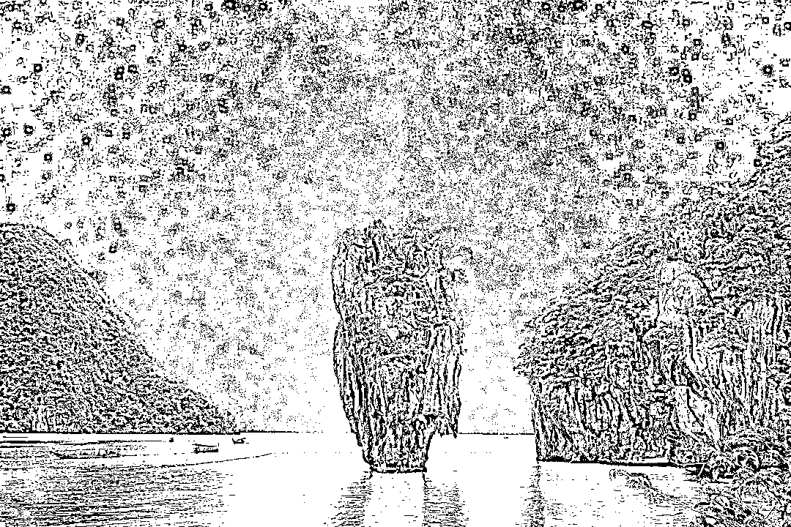

**★****冥王星 10 宫**

他们往往有冥王星式的父母，比如有权有势、权力和掌控欲比较强等。**这种互动模式还会延续到成年后在职场上与上司、老板的相处当中。**

根据荣格的理论，活在父母的阴影之下意味着他们会体现出父母否认的负面特质。人都有一种防御心理，否认自己阴暗的一面。

**在强大的父母掌控下，子女的自我意识被压制，**自我价值认知过低，自尊心受伤，可能外在表现为虚张声势，但是这种内在的自我概念会影响到他们在职场上潜力的发展。

冥王星十宫的人可能出生在父母家庭环境状况不佳的时候，比如出生时行进的冥王星正合母亲出生星图的月亮，母亲并不乐意这一次的怀孕。在母子的比对图中，子女的冥王星会合母亲的月亮，这种关系可想而知。

冥王星靠近中天还可能造成童年时失去某位双亲，这种失去至亲的伤痛感觉会像阴影一样持续到成年后。这个失去亲人的事件会引发整个家庭的变故，比如经济上需要依赖其他亲属，或者案主需要担负起已逝亲人的责任。有时候失去至亲不是因为死亡，而是因为被遗弃，那么抚养案主的双亲可能会让整个家庭充满了怨恨。

**★****冥王星 2 宫**

**冥王星或天蝎座在第二宫与群星在第八宫的状况在“共有财产（八宫掌管的领域）”**这个问题上有类似的预示。想知道这个财产是与谁共有的，就看看宫主星的情况。

比如七宫主星落在第二宫，那么伴侣与合作伙伴的财富是很重要的，案主可能有个富有的婚姻伴侣，也可能因为金钱而委屈在一段不幸的婚姻中。（金星和冥王星的相位也可能有类似情况）如果十宫宫主星或四宫宫主星落在第二宫，那么家族的财富会扮演重要角色。

**第二宫受到冥王星或天蝎座强烈影响的人，往往会在早年遭受某些与金钱有关的痛苦，**以至于形成了他们成年后的财务习惯。这些早年的经历可能是与财富相关的某个坏榜样或者不正常的处理手段。通常父母会用控制金钱的方式来控制案主，比较典型的是父母并不怎么大方慷慨，不管父母的经济状况如何。

冥王星在二宫的人有没有钱要看他们选择在这段关系中做富人还是穷人。如果选择做富人往往**喜欢用金钱来控制他人**，特别是在亲密的感情关系中，他们工作的驱动力就是金钱，他们需要用金钱来控制情感关系，或者避免自己被抛弃。

如果二宫主星落在七宫，案主会为伴侣的奢侈或合作伙伴的企业花费金钱；如果二宫主星落在五宫，案主会为子女买单，甚至在他们成年以后还是依赖着父母。

在情感关系中选择当穷人的那一部分人总是不会好好规划他们的财务问题，这样就意味着其他重要的关系人必须拯救他们。**他们放弃了他们的权利，潜意识里有种自我毁灭的意味，**这些人的财务总是有麻烦。

冥王星或天蝎座在第二宫的人和八宫有力的人一样，容易有债务麻烦，特别是在有困难行进之时，**但是这也是冥王星的特征之一**，不能长期居于优位，要有凤凰重生的机会。

**冥王星在第二宫的人可能在财务处理上有高风险的倾向。**

除非他们纠正这种冥王星式的财富处理动机和行为，否则很难避免一次又一次的卷入财务麻烦。**解除内心的怨恨，放弃情感关系中的权利斗争，对这些人来说是非**常重要的。

**★****冥王星 6 宫**

第六宫掌管的领域是工作本身，而无关于事业财富，象征着权力、财富和控制欲的冥王星在这里不如它在十宫和二宫契合。

冥王星或天蝎座在第六宫有两种情况，第一种是**工作狂人**，沉醉工作甚至伤害了健康。另一种是学历较低**技能型工作的人**，工作态度上会很有问题，比如讨厌工作，认为自己地位低下。他们从工作上得到的满足感很少，但是不得不为生计而工作。

**你的情况如何呢？**

**和大家一起来分享一下吧！**

**留言区等你哦！**

”

**版权声明：**本文由若道翻译、整理发布，欢迎转发，反对抄袭。友号转载请申请白名单。

其他测评

[月亮](http://mp.weixin.qq.com/s?__biz=MzA5NjA0NTAxNg==&mid=2651434542&idx=1&sn=8f977d6dfac18184654b372b737e41de&chksm=8b4b1c99bc3c958f8d04e5aeafe6c60a1c796fbc0063c275ad935ce7a24e10fd202f4a177bf9&scene=21#wechat_redirect)丨[水星](http://mp.weixin.qq.com/s?__biz=MzA5NjA0NTAxNg==&mid=2651433320&idx=1&sn=a62770d958fe8818b3f48c70b82a19cb&chksm=8b4b1bdfbc3c92c9d469249e04683e172f1da18db4ae421f53ae44bb055ea8ef2a0335f64a54&scene=21#wechat_redirect)丨[火星](http://mp.weixin.qq.com/s?__biz=MzA5NjA0NTAxNg==&mid=2651397880&idx=1&sn=814ad70ec136f0c8c2092da88bc61449&chksm=8b4bac4fbc3c25599d87fd4f42ba1c5ae6c148b693985aae28a06c6b6bb30c57283f3308dcba&scene=21#wechat_redirect)丨[木星](http://mp.weixin.qq.com/s?__biz=MzA5NjA0NTAxNg==&mid=2651403874&idx=1&sn=45efbc40e0e522222e2a40ef4675478c&chksm=8b4b84d5bc3c0dc3210e43270351f29b158e8a182ff1df40f464ed451fa8bf7ba155f7f147f0&scene=21#wechat_redirect)

[土星](http://mp.weixin.qq.com/s?__biz=MzA5NjA0NTAxNg==&mid=2651388022&idx=1&sn=ea3686819393fbd0aa459161ae5f8d06&chksm=8b4a4ac1bc3dc3d7cf409fca360d71f8a34e4dd1d0af47473c3ade53ec79ae3e2a240eb2506c&scene=21#wechat_redirect)丨[海王星](http://mp.weixin.qq.com/s?__biz=MzA5NjA0NTAxNg==&mid=2651392604&idx=1&sn=a0fd16fe02f0a390c00a0f0a339a5c87&chksm=8b4bb8ebbc3c31fd96ec48c4078dbcca6c3ae5d05e283f9fd07702eedf1e8fe7bba4a19192ac&scene=21#wechat_redirect)丨[冥王星](http://mp.weixin.qq.com/s?__biz=MzA5NjA0NTAxNg==&mid=2651407271&idx=1&sn=6e768c6b4d368f79ea43aaf8be21f37f&chksm=8b4bf110bc3c780691be1e96dc9cf52a723dc40eccebc9940f145b5b8e35992241eb4f52c84e&scene=21#wechat_redirect) 

**唐娜·坎宁安**

一位在国际上都广受尊敬的占星师，她已有超过 45 年的从业经验。她已撰有数十本占星著作以及上百篇占星学和其他形而上学类的文章。于 2017 年 7 月 5 日离世，享年 75 岁。

**学习占星学****点击下图了解课程详情** 

********************

**微信又双叒叕改版啦，不想错过若道君的推送？**

**就把若道设为星标吧！**

**▼**

**就是这个“在看”，戳戳戳 ☟**

********报名直达入口********

# “双十二”若道占星大促 | 全年最低，多充多送！

> 原文：[`mp.weixin.qq.com/s?__biz=MzA5NjA0NTAxNg==&mid=2651462770&idx=2&sn=a1595ce0bb770a95bc20b0066a46e8f8&chksm=8b48aec5bc3f27d38c96b4bc6bb50b6716de2ed1ddb18cb1defe038926c0dcc6af2aaf8c9e60&scene=126&sessionid=1692737893#rd`](http://mp.weixin.qq.com/s?__biz=MzA5NjA0NTAxNg==&mid=2651462770&idx=2&sn=a1595ce0bb770a95bc20b0066a46e8f8&chksm=8b48aec5bc3f27d38c96b4bc6bb50b6716de2ed1ddb18cb1defe038926c0dcc6af2aaf8c9e60&scene=126&sessionid=1692737893#rd)

**若道占星年末巨制****双十二学习充值卡套餐****限时优惠手慢无****2021 年 12 月 1 日-12 月 12 日****三种充值面值可供选择****充值 20000 元送 2000****充值 50000 元送 6000****充值 100000 元送 15000*****29*****门课程任你选****价格直降*****800-15000*****不等**

**充值卡首次适用于占星核心课、塔罗认证课****想要系统学习占星、塔罗的同学不要错过折扣机会****2022 年全新 ISAR 选修课、****往年 ISAR 经典选修课任选****计划考 ISAR 认证，需要修满 3 门选修课****如果你是某位占星大师的粉丝，****想要一口气刷完精华课程****对特定学科感兴趣，想要精进占星技法****都可以先囤好学习充值卡，冲冲冲！**

**重要！重要！重要！**
**购买学习卡之前请先****仔细阅读****下图须知****或者扫描二维码咨询客服小姐姐**

**购充值卡，听课****请先下载若道 APP****若道君：你可以在 appstore 或者应用商店搜索“若道”下载 app 或扫描下图二维码**

**还有别的问题？****别害羞，扫描二维码，咨询客服小姐姐吧~**

# 神话塔罗之大阿卡纳牌｜恶魔

> 原文：[`mp.weixin.qq.com/s?__biz=MzA5NjA0NTAxNg==&mid=2651462770&idx=3&sn=608622b0263185fcd669e69b34774975&chksm=8b48aec5bc3f27d38c648d436a413d2e9d8334ff2f99f451aa1c7f93196e1dac6956b35ed7c2&scene=126&sessionid=1692737893#rd`](http://mp.weixin.qq.com/s?__biz=MzA5NjA0NTAxNg==&mid=2651462770&idx=3&sn=608622b0263185fcd669e69b34774975&chksm=8b48aec5bc3f27d38c648d436a413d2e9d8334ff2f99f451aa1c7f93196e1dac6956b35ed7c2&scene=126&sessionid=1692737893#rd)

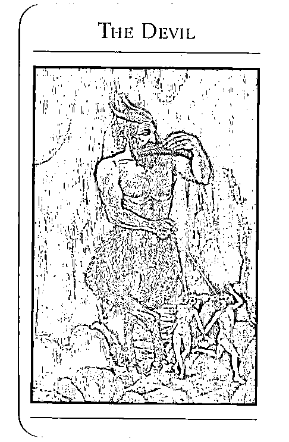

作者/朱丽叶·沙曼-伯克 丽兹·格林

译者/闫东升 编辑/玫瑰 图片/神话塔罗 网络

本文节选自《神话塔罗》

塔罗牌所承载的原型属性呈现了参与者潜意识里的力量，迄今为止我们还无法用理性去解释塔罗牌和参与者所处的人生境遇之间的关联，但呈现出来的“奇迹”却不容否认。其实每个人心中都隐藏着一个我们不愿直视却又无法躲避的恶魔。今天就来解读大阿卡纳牌——恶魔。

[🔈 神话塔罗·恶魔](https://res.wx.qq.com/voice/getvoice?mediaid=MzA5NjA0NTAxNl8yNjUxNDYyNzY5)

**｜**朗读者小巫

**书名：**

神话塔罗 

**作者：**

朱丽叶·沙曼-伯克   丽兹·格林 

**出版日期：**

2011-08-02

恶魔对应的希腊神祗 

**潘·牧神**

**牧神**恶魔牌描绘的是萨提尔（*Satyr*）族群里的潘（*Pan*），他是一个半人半（山）羊的怪物，左手拿着排箫，边吹奏边跳舞。他的右手抓着两个长绳，每个绳子的另一端都系在一个裸体人形的脖子上，人形是一男一女，头上都长着很小的角，其位置和形状和潘头上的角非常相像。尽管两个人形的手和脚都可以自由舞动，但他们都被恐惧的绳索牵引着，排箫吹奏出来的乐曲也让他们像着魔一样如痴如醉。他们四周的环境看得出是山洞里黑暗的石壁。

> **神话中山羊**：和色欲以及淫荡有关，所以它被认为是不干净和好色的动物，但是山羊也象征着代罪羔羊，也就是人们把内在的黑暗面投射到了它的身上，以此来感觉自己的纯洁和正义。所以恶魔——潘（*Pan*）是人们内在的代罪羔羊，我们喜欢把生命中的问题归责于他。**跳舞的姿态**：代表自由，如果两个人拥有足够的意愿，他们是可以解开系在脖子上的绳索的，因为他们的双手是自由的。通过绳索被恶魔奴役从根本来说是他们自愿的，因为通过意识是可以解开绳索的。**黑暗而且没有门的山洞**：暗示着潘的领域处于很难接近的潜意识领域，只有危机才能冲破石壁，进入潘的秘密空间。

**未被驯服的自然之神**在这里我们遇到了伟大的潘神，希腊神话中他被看做是伟大的万有（*the Great All*）。有的神话故事说潘是赫尔墨斯（*Hermes*）和女神戴奥比（*Dryope*）的儿子，他出生的时候非常丑陋，长着山羊的双角、胡子、双腿和尾巴，他的母亲看到后都惊骇得逃走了，赫尔墨斯把他带到奥林匹斯山（*Olympus*）供众神娱乐。潘居住在阿卡狄亚（*Arcadia*，意味着世外桃源之地）的丛林和草地中，是多产、野蛮的阳物崇拜和未被驯服的动物性的拟人化象征。他有时候也会对人们很友好，保护着羊群、牧人和蜂巢。他常常参加高山仙女们的派对，也帮助猎人找到他们的猎物。有一次，他一路追逐着贞洁的女神西林克丝（*Syrinx*）来到拉东河（*the River Ladon*），西林克丝变作一只芦苇，想要逃开潘的拥抱。潘无法从大片的芦苇丛中找到西林克丝，就随意砍伐了一些芦苇做成了一个排箫。潘的名字让我们想到它应该来自“panic（惊惶）”一词，而且潘也经常通过忽然惊吓孤单的旅人来取乐。其他的神祗都轻视他，却经常利用他的力量。太阳神阿波罗（Apollo）从潘那里骗取了预言的能力，赫尔墨斯仿造了他的排箫，却声称是自己发明的，然后卖给了阿波罗。就这样，光芒四射的太阳神用不正当的手段从丑陋的、半人半羊的、未被驯服的自然之神手中获得了音乐和预言的能力。**内心深处的原始冲动****从内在的层面来看，恶魔——潘的形象和人类的本性中最本能和天然的面向紧密相连。**因为他居住在山洞中，和恐惧为伴，所以他的意象反映出我们内在即令自己恐惧又深深为其着迷的那种原始的、不文明的和面貌丑陋的性冲动，我们把它经验成恶魔的意象，因为它有一种强迫性的特质。自从基督时代开始展露曙光以来，潘就和恶魔的形象紧密相连了，他的羊角和一脸坏笑被无限放大，追寻“灵性”的人们就像希腊神话中的阿波罗一样轻视他。普鲁塔克（*Plutarch*）曾详述过在泰比瑞亚思（*Tiberius*）大帝统治期间，一个水手在航海途中经过艾齐奈德斯（*Echinades*）群岛的时候，听到了一个非常神秘的声音向他大呼三次：“当你经过派洛德斯（*Palodes*）的时候，请宣布伟大的潘神已经死了”。这也正是基督教在犹太（*Judaea*）出现的时候。但是塔罗中的这张大阿卡纳牌说明，潘并没有死去，他只是被放逐到了潜意识的最底层中休憩，他反映着我们内心深处的恐惧、轻视和嫌弃，而且以此束缚和掌控着我们。对于身体和性冲动的羞耻感，尤其是近代心理分析领域从潜意识中洞察出来的那些关于乱伦、身体机能和排泄的幻想，都让人们觉得肮脏和邪恶、丑陋和下流，人们把这些内容人格化为恶魔——潘，然后对它投射出各种厌恶和抗拒。即使是推崇“性自由”的男女，也会以各种方式秘密地经验着对身体的羞耻感。我们或许在力量牌愤怒的狮子身上，或是战车牌狂野的战马身上看到一些高贵和浪漫的元素，但是很难在潘的身上找到它。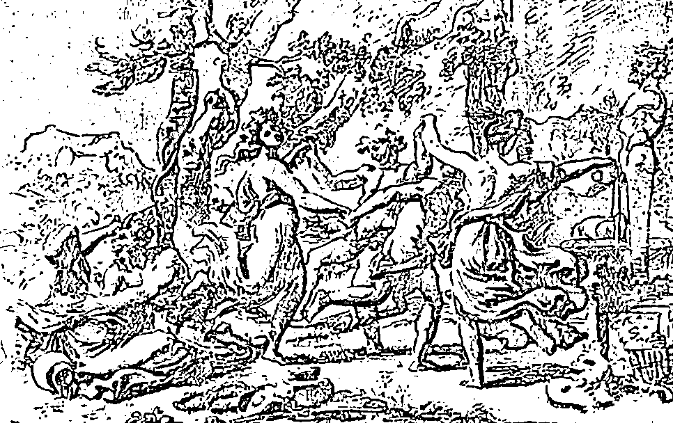然而在神话中他不是恶魔，只是呈现出未经驯化和本能的特质，而且与道德无关。对身体和性冲动的恐惧或者着迷都制造了心理问题，它导致了人们在心理或身体的某个层面陷入麻痹或瘫痪的状态。**恶魔牌暗示着阻塞和压抑，通常是在性的层面上的，其原因来自我们缺乏对潘的了解。**尽管他很丑陋，可他却是伟大的万有——意即身体本身最原始的生命力，他不符合人类的道德标准而且非常粗糙和原始，却还是一个神祗。**我们花了很多精力把潘关在山洞里，我们的人格也因此而失去这些力量，如果敢于正视他的真容，就能释放出巨大的创造力。**愚人必须学会面对自己内在最卑劣的谦卑和羞耻感，否则他就永远被自己的恐惧捆绑。如果愚人想要隐藏令自己羞耻的秘密，他就要假装出高尚和高傲，把自己内在的兽性投射到他人身上，这一定会导致偏见和偏执，甚至对其它个体或种族的进行迫害，“恶魔”就这样被投射到了外界。**恶魔，直面人性的阴暗面****从解牌的角度来看，恶魔牌暗示着当事人必须面对人格里面的阴影和羞耻感等基础的本能部分。**愚人必须通过诚实和获取相应的知识才能从潘的手中赢得自由，以谦逊的态度接受潘，他就会把恐惧和自我厌恶的绳索解开，释放出巨大的创造力。就这样，愚人来到了潘神迷宫的中心，揭开了自己身体本质中的黑暗面，其目的是成为他一直都是的“自然”。

**版权声明：**本文由《自在园》授权发布，欢迎转发，反对抄袭。友号转载请申请白名单。

**神话塔罗系列**

[开篇](http://mp.weixin.qq.com/s?__biz=MzA5NjA0NTAxNg==&mid=2651451590&idx=2&sn=41c1083542bcf098de303e29a028ff20&chksm=8b4b4271bc3ccb67d5d53c143cd5a17c24b7b60e5b1051949fa9f086f90b4ab04877976c47e5&scene=21#wechat_redirect)丨[愚人](http://mp.weixin.qq.com/s?__biz=MzA5NjA0NTAxNg==&mid=2651452189&idx=2&sn=f4cc6e768e367fbdb0f69b9c6382443d&chksm=8b4b41aabc3cc8bcdbd952d91d8408014a799224d3f67ab50bb5cbe88ee0090afc92869de1a6&scene=21#wechat_redirect)丨[魔术师](http://mp.weixin.qq.com/s?__biz=MzA5NjA0NTAxNg==&mid=2651453528&idx=2&sn=3ca9b35e1736168eef1856274635224a&chksm=8b4b4aefbc3cc3f965f2531f8c0d37da2e66a2b47139d445df1ea35eeb74bdf3b6827236741a&scene=21#wechat_redirect) | [女祭司](http://mp.weixin.qq.com/s?__biz=MzA5NjA0NTAxNg==&mid=2651455871&idx=2&sn=15ae629e1b35f1371b81868f5bfdd2aa&chksm=8b48b3c8bc3f3ade0175d0e03bfe496711801614273e7fe98b6435fafe0de5daf3a8d7c1312f&scene=21#wechat_redirect) | [皇后](http://mp.weixin.qq.com/s?__biz=MzA5NjA0NTAxNg==&mid=2651453921&idx=2&sn=4d1efea03b2b9f940be7a6aadf553dec&chksm=8b4b4b56bc3cc2405fe562b8ef48f335699f57c12d5d817e24aeeb84f6306092de2ae55becc7&scene=21#wechat_redirect)

[皇帝](http://mp.weixin.qq.com/s?__biz=MzA5NjA0NTAxNg==&mid=2651455083&idx=2&sn=d12546b67c830055f37b147f41c7641f&chksm=8b4b4cdcbc3cc5cad2def85451c3a7ddbb31ba5b9a01febb8a9fb18991d3e1263d9371ac212f&scene=21#wechat_redirect) | [导师](http://mp.weixin.qq.com/s?__biz=MzA5NjA0NTAxNg==&mid=2651456482&idx=2&sn=153b4ca2f69f6745425525773616455d&chksm=8b48b155bc3f384322115b0b94621662ba562a2a252fd244a0a3fc84a664408b2311014e8db5&scene=21#wechat_redirect)丨[恋人](http://mp.weixin.qq.com/s?__biz=MzA5NjA0NTAxNg==&mid=2651457110&idx=2&sn=b4f6a1e93475b39df8f6c80a7409c59c&chksm=8b48b4e1bc3f3df721f206e899272c01bf324355f649fe0fd0dd8363c5b58683daa38e8cf648&scene=21#wechat_redirect) | [战车](http://mp.weixin.qq.com/s?__biz=MzA5NjA0NTAxNg==&mid=2651457444&idx=2&sn=75e9cc378abfefb59ebe7f12357c1b4b&chksm=8b48b513bc3f3c051bf2bb4be018694ca47996a193c0a92d5003c47dc384a2b07f9b9f9806ed&scene=21#wechat_redirect) | [正义](http://mp.weixin.qq.com/s?__biz=MzA5NjA0NTAxNg==&mid=2651458133&idx=3&sn=e37f69e34bc33afe6c0935e32ad0b786&chksm=8b48b8e2bc3f31f465dee7a4595d44620d93e58ca37eeab785724f5a92a9ec3bbb85c3d34f17&scene=21#wechat_redirect) | [节制](http://mp.weixin.qq.com/s?__biz=MzA5NjA0NTAxNg==&mid=2651458981&idx=3&sn=8858e451980859e86b87571128e4f115&chksm=8b48bf12bc3f3604c1ef97c0a818f501fc28c84a4ef19e25521527e162d2d2c6bdded6238ea8&scene=21#wechat_redirect)

[力量](http://mp.weixin.qq.com/s?__biz=MzA5NjA0NTAxNg==&mid=2651459675&idx=3&sn=ebac312745895402e187ccd8700f3674&chksm=8b48a2ecbc3f2bfa134c6b364d828b6b0e77a4c3c05054ff44d97ccc75eec4f7958f77f92605&scene=21#wechat_redirect) | [隐士](http://mp.weixin.qq.com/s?__biz=MzA5NjA0NTAxNg==&mid=2651460114&idx=3&sn=a562cf2d91c74192ebacfa9484e0b141&chksm=8b48a0a5bc3f29b3807e6a2e49b1a3f16c82e528c54ae708ecd44e1e7e9ca5dbb1148dde5de6&scene=21#wechat_redirect)丨[命运之轮](http://mp.weixin.qq.com/s?__biz=MzA5NjA0NTAxNg==&mid=2651460960&idx=3&sn=4d85b69a6df831d4229b18a668cbcda4&chksm=8b48a7d7bc3f2ec12b54056abd2b389148daf918ee9dbb6d3c00a0327906aa78a0c7ceb433ff&scene=21#wechat_redirect) | [倒吊人](http://mp.weixin.qq.com/s?__biz=MzA5NjA0NTAxNg==&mid=2651461398&idx=2&sn=658494d65c46567cf789233df59e1409&chksm=8b48a5a1bc3f2cb7320f143d43c75c15e3e84c0759cff994066ecbfaf5522c76291548934ad5&scene=21#wechat_redirect)丨[死神](http://mp.weixin.qq.com/s?__biz=MzA5NjA0NTAxNg==&mid=2651462070&idx=2&sn=0ec10f47f9ecefa9907ab965f1dc1427&chksm=8b48ab01bc3f22175ce9227f6c3d5150cc9bcb344c4aa70be0cb68410ba424cffdc77a2f2120&scene=21#wechat_redirect)

[圣杯 1-3](http://mp.weixin.qq.com/s?__biz=MzA5NjA0NTAxNg==&mid=2651462070&idx=3&sn=e66e4b901f320d8b99070b5ac1bdb3b5&chksm=8b48ab01bc3f2217620254fde1947a99a08b514f248015d8f52a8c884cccfc5834cf3bf15ab1&scene=21#wechat_redirect)

**朱丽叶·沙曼·伯克**从 20 世纪 70 年代早期开始，就对塔罗牌产生了兴趣，并踏入了塔罗的世界。后来，在丽兹·格林的鼓励下，开始研习心理占星学和塔罗。1984 年，第一本书《塔罗全书》（The Complete Book ofTarot）出版。之后，与丽兹·格林合作设计并撰写了《神话塔罗》（The Mythic Tarot）。朱丽叶写了十本塔罗和占星学书，包括一本名为《众星的传说》（Stories from the Stars）的儿童读物，以及与丽兹·格林合著的《神话之旅》（The Mythic Journey），这是一本详细讲述如何运用神话来指导生活的书。**下载神话塔罗 APP****预约专业神话塔罗师为你解读**

**如何预约塔罗师咨询？**

**具体咨询方式如下图**

**最后的最后
如何更新神话塔罗 APP？**快去应用市场更新神话塔罗 APP，抽牌&咨询吧～还没有下载或更新的小伙伴赶紧来看看如何下载和更新吧！

**iPhone 苹果 IOS 系统下载**

****❶** **长按识别二维码下载****

******❷**** 或在 App Store 里搜索“神话塔罗”**

**安卓系统下载****❶** **长按识别二维码下载**

**❷ 或在各大应用市场里搜索“神话塔罗”**

各位亲人小伙伴，每天有事没事都可以去 app 里转转。抽取专属于你的今日塔罗如果感到快乐你就用用**神话塔罗 app**，如果你感到不快乐，更要使用由专业人本主义塔罗师团队全程陪伴的**神话塔罗 app**哦！

**微信又双叒叕改版啦，不想错过若道君的推送？**

**就把若道设为星标吧！**

**▼**

**喜欢记得点一下在看哦☟**

************报名直达入口************

# 神话塔罗之小阿卡纳牌 | 圣杯 4-6

> 原文：[`mp.weixin.qq.com/s?__biz=MzA5NjA0NTAxNg==&mid=2651462770&idx=4&sn=e2ec66da86d5fec52f72d34d5862d9bb&chksm=8b48aec5bc3f27d309af8bcf4c6d0edc0f4460a6f6fcbefc72a7382a0c578a7d23bfa272a647&scene=126&sessionid=1692737893#rd`](http://mp.weixin.qq.com/s?__biz=MzA5NjA0NTAxNg==&mid=2651462770&idx=4&sn=e2ec66da86d5fec52f72d34d5862d9bb&chksm=8b48aec5bc3f27d309af8bcf4c6d0edc0f4460a6f6fcbefc72a7382a0c578a7d23bfa272a647&scene=126&sessionid=1692737893#rd)

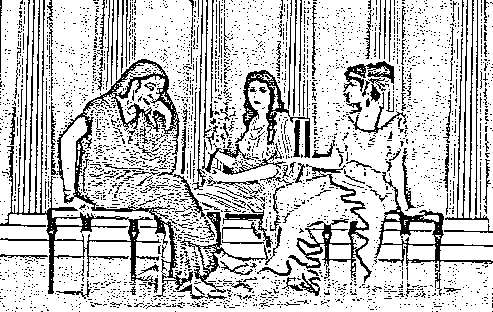

作者/朱丽叶·沙曼-伯克 丽兹·格林

译者/闫东升 编辑/玫瑰 图片/神话塔罗 网络

本文节选自《神话塔罗》

希腊哲学认为宇宙的万象都来自四个基本元素，四套小阿卡纳牌则分别呈现了生命经验的每一个面向。从某种意义上来说，小阿卡纳牌呈现的是 22 张大阿卡纳牌描绘的原型之旅的细节，相较之下它更具体、更贴近个人的生活。圣杯牌对应着水元素，据说所有的生命都源自于它。今天就让我们走近圣杯牌组的 3 张数字牌——圣杯 4-6。

**书名：**

神话塔罗 

**作者：**

朱丽叶·沙曼-伯克   丽兹·格林 

**出版日期：**

2011-08-02

**圣杯 4**

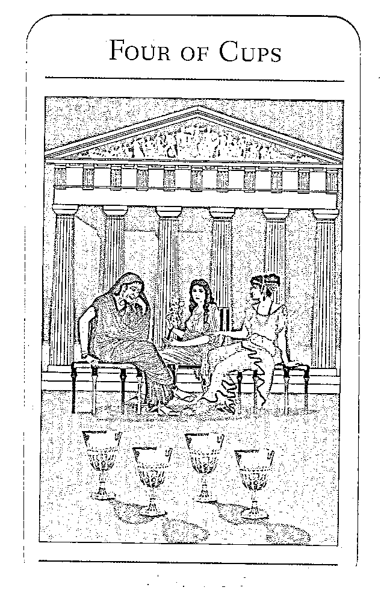

**姐妹们的挑拨**

圣杯 4 描绘的是新娘普绪克（*Psyche*）坐在厄洛斯（*Eros*，爱神）的美丽的宫殿中，透过宫殿白色的石柱，我们能看到后面的大海。普绪克的左右两侧坐着样子丑陋的姐妹，一个穿着红色的长袍，一个穿着黑色的长袍。她们和普绪克低声谈论着新郎，说他一定是一只面目狰狞的怪兽，否则不会躲开白天的日光，只有晚上才会现身。普绪克的脸上透露出不满的神情，在她们的面前有四只金色的圣杯。

**无缘无故的失望**

**小阿卡纳牌的 4 号牌隐喻着神圣的不满（*divine  discontent*）。尽管一切都看起来很快乐也很有价值，但其中仍然包含着疑惑和猜忌。圣杯 4 从情感上描绘了这种不满足。**普绪克生活得非常富足，一个深情款款和温柔体贴的丈夫每晚都来与她相会，但是她仍然感觉到不满足。样子丑陋而且没有任何魅力的姐妹对她非常妒忌，她们象征着普绪克内心的一部分，虽然她们心怀恶意、想法负面而且激发起了普绪克的疑虑之心，但是她们却说出了一个实际的问题：意即**普绪克在了解自己伴侣方面是盲目和无知的。   **因此，**圣杯 3 的满足到这里变成了失望，因为她的意识提升后就出现了新的疑虑，而且她也无法解决它。**每个人的内在都有这些丑陋的姐妹，她们是我们人格的阴影面，阴影常常带来某种恶疾，但最后会变成好事，因为它驱动着我们去**探索内心更深的领域，以更真诚的态度去面对关系。**如果普绪克一直保持在盲目和无知的赐福状态中，她就永远不会成长，她与伴侣厄洛斯的潜在力量就永远也不会开花结果。**所以圣杯 4 所象征的不满足的感觉和对情感无缘无故的失望，包含着正负两个方面的力量。**对事物的质疑是不可避免也是极其必要的，它形成了背叛的种子，也带来了改变和成长的机会。圣杯 4 还隐喻着**每个人内在都拥有一种神秘的智识驱力，它让我们知道还有未知的旅程等待我们去探索。**

**圣杯 4，神圣的不满**

从解牌的角度来看，圣杯 4 预示着**关系内出现了不满足的感受**，当事人会陷入**厌倦和沮丧**的情绪中，可能觉得**被欺骗或辜负**，其实通常情况下，**欺骗和辜负当事人的就是自己，因为他（她）拥有着并不现实的期望。**这种不满会导致**相当长一段时间内的压抑和怨恨，或者对一段关系更深入的思考**，当然这势必非常艰难，因为以前的假设和幻想正在被颠覆或者已经是岌岌可危了。**圣杯 5**

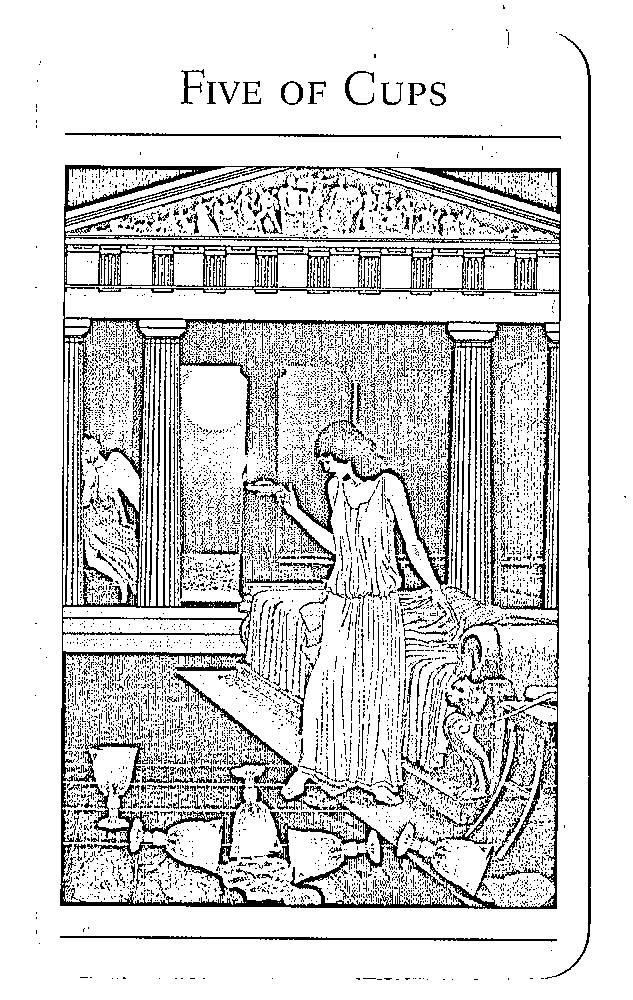

**背叛**

圣杯 5 描绘的是普绪克（*Psyche*）背叛了厄洛斯（*Eros*）的后果。姐妹们的鼓动让普绪克的恐惧和疑虑变得非常强烈，于是她打破了自己对厄洛斯的誓言，在夜里点灯偷看了他的面容。牌面上的普绪克心痛地站在空空的卧榻边，手中还举着油灯。美丽宫殿的大理石柱后面，可以隐约看到厄洛斯离去的背影。普绪克的面前散落着圣杯，其中四个都倒在地上，里面的液体流到地面，第五个圣杯在旁边屹立着，没有被打翻，还是原封不动的样子。

**关系的考验**

**圣杯 5 代表着关系中的考验期，其中的一方为过去的行为感受到了悔意或遗憾。**这里呈现出了**背叛**的议题，在圣杯系列牌的意义中，这一步会带来**必要的和潜在的创造性体验**。尽管是痛苦的，但是**背叛却打破了与他人融合之“爱”中神秘而又盲目的作茧自缚，而且背叛也意味着成为独立（自己）的状态。**普绪克的背叛不是出自于轻率或者贪婪，她是想要了解自己的伴侣，厄洛斯在这点上是错误的，他不应该拒绝妻子想要看清楚他的需求。普绪克的行为是真诚的，虽然带来了不可避免的冲突，却绝对必要的，可以说**任何的行动从某种意义上说都有自我背叛的成份。**

**反叛对方不合理的要求或期望是很难的一件事，它在彼此依赖的关系中频繁地发生。**爱人、丈夫或者妻子可能会说：“不要尝试去真正了解我，只要爱我在你心目中的样子就好了。”这当然会引发背叛，而背叛的一方会像普绪克一样遭受后续的痛苦。

但是牌面上原封不动的第五个圣杯告诉我们，**并不是所有的东西都失去了，我们还拥有着而且能够创建出更有价值的下一步。**普绪克现在知道了丈夫是谁，也知道自己还爱着他，而且爱的并不是以前对他的幻想了。没有这个仪式，她就会陷在圣杯 4 的焦虑和痛苦中无法自拔。**现在她需要忍受遗憾，但是却有更多力量驱动着她走向完整。**

**圣杯 5，对过去的懊悔**

**从解牌的角度来看，圣杯 5 预示着对于过去一些行为的遗憾或懊悔，背叛发生了，有一些事情做错了，因此痛苦和自责无法避免。**关系中的分离出现了，但是它并不意味着最后的结局。有些东西还保留着，**当事人可以在保留下来的事物上继续努力，选择面对挑战并为将来做出承诺。****圣杯 6**

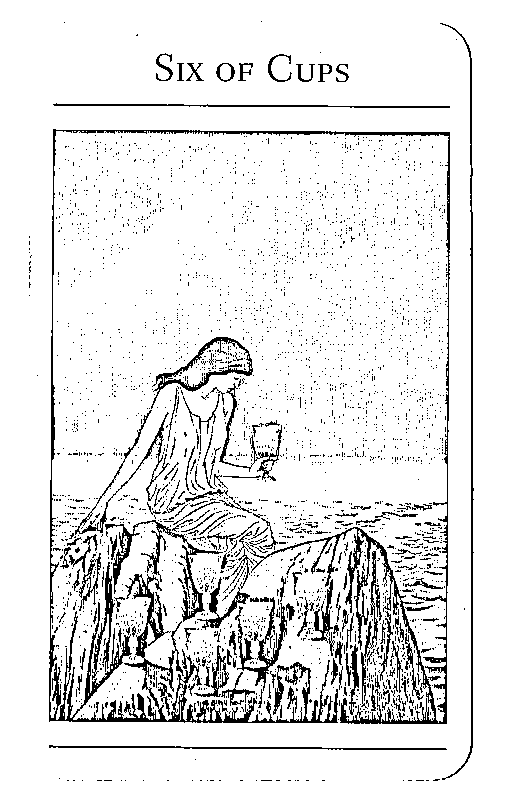

**被抛弃的妻子**

圣杯 6 描绘的是普绪克（*Psyche*）坐在礁石上，背后是平静的海面。她左手握着一只金色的圣杯，盯着它陷入了沉思。她的右手还握着结婚时捧着的白色百合花，但是已经变得脏乱。在她四周的岩石上，放着五只金色的圣杯。**圣杯 6 呈现着怀旧之情。**普绪克被抛弃了，她神秘的丈夫已经飞走，他们居住的美丽宫殿也消失不见，除了美好的回忆之外，她现在一无所有。然而，尽管大祸临头，普绪克却表现得非常平静，可见 6 号牌并不意味着悲伤。在过去的经验中，普绪克获得了许多珍贵的东西。她看到了厄洛斯（*Eros*）真正的模样，现在她知道自己爱他本人，而不是爱他所提供的舒适和快乐。因此，**尽管她失去了这一切，却变得更加了解自己，这样的状态就是 6 号牌中呈现出的和谐之美。**

**失去一切后才看清自己**

**故事的这个阶段，象征着我们在遭遇生活中某些危机之后，变得更加平静和沉着。**过去不真实的期望和幻梦通过挑战和失望的过程，结晶成了**某种稳固和真实的东西**。圣杯 5 中，普绪克经过了懊悔和自责，决定接受命运的挑战，去找回自己的挚爱，因此现在她变得非常平静。**她的爱变的更为真实，只有真实的基础才能承载其上所修建的人生。**对以往的怀旧之情常常在这个阶段冲击我们，但是真实的结晶已经形成，所以它不再是感性的幻想，而是蕴含着某些真实的、稳固的基础。**经过了圣杯 5 的自我批评之后，圣杯 6 中出现了积极的转变，普绪克开始朝着目标奋力前行了。**

**圣杯 6，怀旧之情**

**从解牌的角度来看，圣杯 6 预示着一段平静的时间，那是从过去的幻想走出来的结果。**有时候可能是**旧爱又回到身边**，或者预示着**过去某个珍贵的幻梦在不远的将来有机会实现。**“陷入爱河”的盲目现在酝酿出了某种真实的结晶，过去的事情尽管看起来很美，却不可避免会失去或幻灭，但是这并不意味着失去一切，那些经验中的某些力量会凝结成真正的基础，支撑着我们前行。**这张牌暗示着怀旧之情，但还有一个更重要的讯息，即过去能够引领出未来，从前幻想中经历过的美好将来有机会实现，而且可能就在不远的未来。**

**版权声明：**本文由《自在园》授权发布，欢迎转发，反对抄袭。友号转载请申请白名单。

**神话塔罗系列**

[开篇](http://mp.weixin.qq.com/s?__biz=MzA5NjA0NTAxNg==&mid=2651451590&idx=2&sn=41c1083542bcf098de303e29a028ff20&chksm=8b4b4271bc3ccb67d5d53c143cd5a17c24b7b60e5b1051949fa9f086f90b4ab04877976c47e5&scene=21#wechat_redirect)丨[愚人](http://mp.weixin.qq.com/s?__biz=MzA5NjA0NTAxNg==&mid=2651452189&idx=2&sn=f4cc6e768e367fbdb0f69b9c6382443d&chksm=8b4b41aabc3cc8bcdbd952d91d8408014a799224d3f67ab50bb5cbe88ee0090afc92869de1a6&scene=21#wechat_redirect)丨[魔术师](http://mp.weixin.qq.com/s?__biz=MzA5NjA0NTAxNg==&mid=2651453528&idx=2&sn=3ca9b35e1736168eef1856274635224a&chksm=8b4b4aefbc3cc3f965f2531f8c0d37da2e66a2b47139d445df1ea35eeb74bdf3b6827236741a&scene=21#wechat_redirect) | [女祭司](http://mp.weixin.qq.com/s?__biz=MzA5NjA0NTAxNg==&mid=2651455871&idx=2&sn=15ae629e1b35f1371b81868f5bfdd2aa&chksm=8b48b3c8bc3f3ade0175d0e03bfe496711801614273e7fe98b6435fafe0de5daf3a8d7c1312f&scene=21#wechat_redirect) | [皇后](http://mp.weixin.qq.com/s?__biz=MzA5NjA0NTAxNg==&mid=2651453921&idx=2&sn=4d1efea03b2b9f940be7a6aadf553dec&chksm=8b4b4b56bc3cc2405fe562b8ef48f335699f57c12d5d817e24aeeb84f6306092de2ae55becc7&scene=21#wechat_redirect)

[皇帝](http://mp.weixin.qq.com/s?__biz=MzA5NjA0NTAxNg==&mid=2651455083&idx=2&sn=d12546b67c830055f37b147f41c7641f&chksm=8b4b4cdcbc3cc5cad2def85451c3a7ddbb31ba5b9a01febb8a9fb18991d3e1263d9371ac212f&scene=21#wechat_redirect) | [导师](http://mp.weixin.qq.com/s?__biz=MzA5NjA0NTAxNg==&mid=2651456482&idx=2&sn=153b4ca2f69f6745425525773616455d&chksm=8b48b155bc3f384322115b0b94621662ba562a2a252fd244a0a3fc84a664408b2311014e8db5&scene=21#wechat_redirect)丨[恋人](http://mp.weixin.qq.com/s?__biz=MzA5NjA0NTAxNg==&mid=2651457110&idx=2&sn=b4f6a1e93475b39df8f6c80a7409c59c&chksm=8b48b4e1bc3f3df721f206e899272c01bf324355f649fe0fd0dd8363c5b58683daa38e8cf648&scene=21#wechat_redirect) | [战车](http://mp.weixin.qq.com/s?__biz=MzA5NjA0NTAxNg==&mid=2651457444&idx=2&sn=75e9cc378abfefb59ebe7f12357c1b4b&chksm=8b48b513bc3f3c051bf2bb4be018694ca47996a193c0a92d5003c47dc384a2b07f9b9f9806ed&scene=21#wechat_redirect) | [正义](http://mp.weixin.qq.com/s?__biz=MzA5NjA0NTAxNg==&mid=2651458133&idx=3&sn=e37f69e34bc33afe6c0935e32ad0b786&chksm=8b48b8e2bc3f31f465dee7a4595d44620d93e58ca37eeab785724f5a92a9ec3bbb85c3d34f17&scene=21#wechat_redirect) | [节制](http://mp.weixin.qq.com/s?__biz=MzA5NjA0NTAxNg==&mid=2651458981&idx=3&sn=8858e451980859e86b87571128e4f115&chksm=8b48bf12bc3f3604c1ef97c0a818f501fc28c84a4ef19e25521527e162d2d2c6bdded6238ea8&scene=21#wechat_redirect)

[力量](http://mp.weixin.qq.com/s?__biz=MzA5NjA0NTAxNg==&mid=2651459675&idx=3&sn=ebac312745895402e187ccd8700f3674&chksm=8b48a2ecbc3f2bfa134c6b364d828b6b0e77a4c3c05054ff44d97ccc75eec4f7958f77f92605&scene=21#wechat_redirect) | [隐士](http://mp.weixin.qq.com/s?__biz=MzA5NjA0NTAxNg==&mid=2651460114&idx=3&sn=a562cf2d91c74192ebacfa9484e0b141&chksm=8b48a0a5bc3f29b3807e6a2e49b1a3f16c82e528c54ae708ecd44e1e7e9ca5dbb1148dde5de6&scene=21#wechat_redirect)丨[命运之轮](http://mp.weixin.qq.com/s?__biz=MzA5NjA0NTAxNg==&mid=2651460960&idx=3&sn=4d85b69a6df831d4229b18a668cbcda4&chksm=8b48a7d7bc3f2ec12b54056abd2b389148daf918ee9dbb6d3c00a0327906aa78a0c7ceb433ff&scene=21#wechat_redirect) | [倒吊人](http://mp.weixin.qq.com/s?__biz=MzA5NjA0NTAxNg==&mid=2651461398&idx=2&sn=658494d65c46567cf789233df59e1409&chksm=8b48a5a1bc3f2cb7320f143d43c75c15e3e84c0759cff994066ecbfaf5522c76291548934ad5&scene=21#wechat_redirect)丨[死神](http://mp.weixin.qq.com/s?__biz=MzA5NjA0NTAxNg==&mid=2651462070&idx=2&sn=0ec10f47f9ecefa9907ab965f1dc1427&chksm=8b48ab01bc3f22175ce9227f6c3d5150cc9bcb344c4aa70be0cb68410ba424cffdc77a2f2120&scene=21#wechat_redirect)

[圣杯 1-3](http://mp.weixin.qq.com/s?__biz=MzA5NjA0NTAxNg==&mid=2651462070&idx=3&sn=e66e4b901f320d8b99070b5ac1bdb3b5&chksm=8b48ab01bc3f2217620254fde1947a99a08b514f248015d8f52a8c884cccfc5834cf3bf15ab1&scene=21#wechat_redirect)

**朱丽叶·沙曼·伯克**从 20 世纪 70 年代早期开始，就对塔罗牌产生了兴趣，并踏入了塔罗的世界。后来，在丽兹·格林的鼓励下，开始研习心理占星学和塔罗。1984 年，第一本书《塔罗全书》（The Complete Book ofTarot）出版。之后，与丽兹·格林合作设计并撰写了《神话塔罗》（The Mythic Tarot）。朱丽叶写了十本塔罗和占星学书，包括一本名为《众星的传说》（Stories from the Stars）的儿童读物，以及与丽兹·格林合著的《神话之旅》（The Mythic Journey），这是一本详细讲述如何运用神话来指导生活的书。**下载神话塔罗 APP****预约专业神话塔罗师为你解读**

**如何预约塔罗师咨询？**

**具体咨询方式如下图****最后的最后
如何更新神话塔罗 APP？**快去应用市场更新神话塔罗 APP，抽牌&咨询吧～还没有下载或更新的小伙伴赶紧来看看如何下载和更新吧！

**iPhone 苹果 IOS 系统下载**

****❶** **长按识别二维码下载****

******❷**** 或在 App Store 里搜索“神话塔罗”**

**安卓系统下载****❶** **长按识别二维码下载**

**❷ 或在各大应用市场里搜索“神话塔罗”**

各位亲人小伙伴，每天有事没事都可以去 app 里转转。抽取专属于你的今日塔罗如果感到快乐你就用用**神话塔罗 app**，如果你感到不快乐，更要使用由专业人本主义塔罗师团队全程陪伴的**神话塔罗 app**哦！

**微信又双叒叕改版啦，不想错过若道君的推送？**

**就把若道设为星标吧！**

**▼**

**喜欢记得点一下在看哦☟**

************报名直达入口************

# 好物推荐 | 从"麻瓜"进化成占星师的自我觉察工具（插班中）

> 原文：[`mp.weixin.qq.com/s?__biz=MzA5NjA0NTAxNg==&mid=2651462655&idx=3&sn=3f8ac8cef868a4185b0bf4171908d41a&chksm=8b48a948bc3f205e0614078997c26edc910b0cc6463338efa77c3c64b69b1f57106700ef13cf&scene=126&sessionid=1692737893#rd`](http://mp.weixin.qq.com/s?__biz=MzA5NjA0NTAxNg==&mid=2651462655&idx=3&sn=3f8ac8cef868a4185b0bf4171908d41a&chksm=8b48a948bc3f205e0614078997c26edc910b0cc6463338efa77c3c64b69b1f57106700ef13cf&scene=126&sessionid=1692737893#rd)

1

**自我觉察，是智慧的基础**

每个人都有自己的内在冰山，自我觉察能够帮助我们觉察自己的行为、情绪等，然后向内深层探索，探索自己的行为、情绪背后的深层渴望、期待。学习和应用占星学的过程，就是慢慢掌握自我觉察工具的过程，当你熟练掌握了占星学，也就具备了帮助引导他人觉察到自身生命议题的能力。**往外张望的人在做梦，向内审视的人才是清醒的。**只有真正向内看，只有当觉察开始由外向内时，改变才会发生，才能够知行合一。

# | 插画师：古戈力

以情绪来举例说明，每个人的情况不同，觉察的程度也不同，觉察有四个层次：***1.*** **不知不觉：**没有觉察情况，当情绪来了，会被情绪控制，做出很多不计后果的事情。而且每次都是同样的状况，反反复复；***2.***** 后知后觉：**情绪过后，自己能够反应过来，自己做的对与错，但是很难避免同样的情况再次发生；***3*****. 当知当觉：**当情绪来的时候，你已经知道在这个当下，正在发生什么。当达到这个层次，你就可以自己控制情绪，从而影响后事的发展；***4*****. 先知先觉：**当事情还没发生，就可以预知它要发生了。因为你对情绪的觉察已经越来越熟练，所以情绪还没来，你就知道它要来了。所以，你也就有了更好的选择和处理方法。所以，我们要自我觉察，向内探索，觉察是为了接纳，然后做出改变，成长，迭代，升级。**那么要如何练习自我觉察，掌握先知先觉的能力呢？**

2

**每日觉察的工具推荐**

**今日天象&近期行进**

若道 APP 中的今日天象功能，罗列展示每一天的具体天象，你当天的行进和行进周期：

作为占星师，可以这样使用这个自我觉知工具：

**记录梦境**如果你有醒来记录梦境的习惯，每天早上看一下睡梦中的天象和行进，对应联想，你会惊喜地发现一些神奇的对应，能够更敏锐的捕捉到日常被压抑的情绪和需求。能够帮助你在白天的工作生活中先知先觉的关注身心状态。**规划生活**每月月初，周初都可以参考天象和行进进行日程规划，预估可能的助力和阻力，在对的时间做对的事，会发现平平无奇的日常也可以有不一样的色彩。根据月相的变化感知情绪的起伏，更好的自我关爱。**感知环境**当身边发生了引起你注意和好奇的事情，或者网络上层出不穷的新闻热点，都可以在天象中寻找对应的能量。从更大的格局视角去思考你的个人观点。通过环境的共振，更深入地理解自己的出生星图。以上都是很好的学习深化占星知识的方法，只需要系统掌握以下知识，就可以开始使用以上方法去提升自我觉知。**第*1*阶 黄道星座&个人行星****概要介绍占星学与星图**

**四元素与三形态**

**黄道 12 星座**

**太阳、月亮及其他个人行星**

**第*2*阶 行星&宫位****木星&土星****天王星&海王星&冥王星**

**练习组合所有行星**

**四轴**

**十二宫位**

**组合宫位、行星、星座****第*3*阶 月亮交点、相位以及初步解读星图**

**了解灵魂进化的路径：月亮交点**

**相位概论**

**相位&行为模式**

**困难相位**

**柔和相位**

**容许度，出入相位**

**渐盈渐亏相位**

**空相**

**宫主星&定位星**

**相位模式**

**组合相位、星座、行星、宫位**

**解读的基本原则，权重，失衡**

3

**课程安排是怎样的呢？**

**第*1*阶**2021 年 9 月 15 日开课，每周一天晚上 20:00-22:00 上课，共 6 次课**第*2*阶**2021 年 11 月 11 日开课，每周四晚上 20:00-22:00 上课，共 6 次课**第*3*阶**2022 年 1 月 6 日开课，每周四晚上 20:00-22:00 上课，共 15 次课 2022 年 4 月 30 日、5 月 1 日**L3 北京两日线下工作坊**

****

4

**授课老师**

**艾德里安·罗斯·邓肯**

**（AdrianRoss Duncan）**

**· **1971 年在印度游学时开始学习占星学，1985 年开始成为全职占星师，迄今执业已超过 33 年，是人本主义占星学、卜卦占星学和经世占星学领域的知名占星师。他还开发了占星软件 AstroClock 和多款占星报告；**·** 哥本哈根占星学院院长；**·** 他在日常咨询中经常运用卜卦，咨询图（卜卦的一种运用方式，即根据客户来访时间制作星图，从星图中获得大量信息）也是他特别擅长的领域；**· **艾德里安·罗斯·邓肯从 1971 年开始研习佛学，受佛学影响很深，他相信占星学和佛学观点一致，转化的一个基础是在于对现实感知的改变。而卜卦很容易与佛教融合，因为它只关乎当下。

**大卫·瑞雷**

**（David Railey）**

**·** 若道联合创始人，致力于在中国教授和推广西方占星学；**·** 曾任 ISAR 全球副主席，CAPISAR（ISAR 职业占星师资质认证机构）主席；**·** 1976 年，通过亚特兰大职业占星师考试，成为全职占星师，随后通过 AFAN 和 ISAR 职业测试；**·** 1980 年，与杰夫·焦耳一起在亚特兰大创建“每日行星”占星学中心。此后在亚特兰大占星协会担任 4 年考官，并且两次担任亚特兰大地区占星协会主席。1979-1992 年，作为占星师活跃于美国社会媒体，向不了解现代占星学变化的大众宣传专业占星学知识。在 1989-1992 年期间，他在 WRGG 电台 12 频道每周主持个人电视秀“今日占星学”，早先他还在 WRFG 的广播节目中播讲宇宙天气节目；**·** 2010-2014 年，任全美占星师联盟监督委员会委员；**·** 2010 年，其著作《灵魂的目标》中国版出版，和蒋颖一起创办若道占星学校和其官网 www.nodoor.com；**·** 2017 年，被选为 ISAR 委员会成员。ISAR 是世界最大的国际占星机构，会员遍布 45 个国家，2017-2020 年曾任 ISAR 全球副主席、CAPISAR（ISAR 职业占星师资质认证机构）主席。

**克里斯蒂娜·罗登贝克**

**（Christina Rodenbeck）**

**· **克里斯蒂娜·罗登贝克（Christina Rodenbeck）是一名全职职业占星师，在牛津大学城生活和工作，深受周围知识和文化氛围影响；她拥有伦敦大学（University of London）的人文荣誉学位，曾在伦敦占星学馆（AstrologicalLodge of London）、心理占星中心和占星研究学院学习；**·** 作为一名占星师，在过去的 20 年里，克里斯蒂娜在她的网站“牛津占星师”上写了大量关于时事、艺术和文化的文章；她每月主持一个占星播客：“与克里斯蒂娜和萨莉一起占星”，并定期在《占星杂志》(Astrological Journal)上撰写时尚专栏；她定期在英国授课，并保持着蓬勃发展的专业实践。

**琳恩·贝尔**

**（Lynn Bell）**

**·** 世界最受欢迎的占星学演讲者、作家和老师之一。定居巴黎，研究心理占星学和家族模式数十年；

**·** 著名的心理占星学中心（Centre for Psychological Astrology）的长期导师。2016 年，获得查尔斯·哈维（Charles Harvey）杰出的占星学服务奖；

**·** 作为一个从多个层面进行工作的占星咨询大师，琳恩的工作结合了心理学的观点。她对家族模式的兴趣首先来自与客户的合作。通过在分析领域所做的个人工作，她所受的埃里克森催眠训练将她引领至家族系统。后来，她组织研究小组在家族星图上进行了数年的研究。她写的《家族占星学》就是这项研究的结果；

**·** 法国心理占星学协会的会长。除了占星学，她在法国沙特尔的新沙特尔学校任教 8 年，还 5 次获得了在《纽约时报》畅销书作者卡罗琳·迈斯（Caroline Myss）的卡罗琳·迈斯教育学院（Caroline MyssEducational Institute）合作教学的机会。**课程助教：**

**熊鹰老师**

**（天空的空）**

**·** 2008 年接触严肃占星学，至此爱不释手；**·** 2013 年师从大卫·瑞雷，研习现代占星学核心课程，并于 2014 年起担任该课程的助教，之后于 2017 年与 2020 年两次与大卫老师合作讲授完整核心课程（Level 1-5）；**·** 期间也跟随格伦·佩里、诺·泰尔、理查德·塔纳斯、罗伯特·汉德、苏·汤普金斯、斯蒂芬·弗里斯特、琳恩·贝尔、艾德里安·邓肯等多位国际占星大师进行学习，进行定向占星主题研究；**·** 2014 年末，通过国际占星研究协会（ISAR）资质认证并获得证书；**· **在若道占星任职六年余，以“传播系统、专业、实效的占星学”为职业使命，执教与助教已累计超过 700 小时。在业余期间也提供占星咨询服务；**·** 目前正着眼于占星学与中国文化之互参，以当代中国人的身心成长为目标，力求落到实处。

5

**此次课程适合哪些人？**

**·** 对占星学感兴趣，想要入门的零基础者**· **占星学小白，想通过星图学习识人之术**· **有一定占星学基础，但不知道该如何整合星图复杂碎片的人**· **想要师从更多殿堂级占星导师学习占星心法的人**· **走在自我探索和个人成长道路上的人

6

**课程价格**

**L1-3 价格**：15000 元

其他各阶段课程单报价格，请咨询课程顾问：**Maggie 老师**（微信：18510107057，请备注**“核心课”**）

长按二维码添加 Maggie 老师

7

**退转课程**

****· 退款原则请详看《教学协议》，如有疑问请咨询课程顾问****

****名师汇集金牌核心课程****

**授课老师：**琳恩·贝尔、艾德里安·罗斯·邓肯、克里斯蒂娜·罗登贝克、大卫·瑞雷

**授课时间：**2021 年 9 月 15 日起

**授课方式：**网络课程**，**英文授课，中文翻译

**费用：**L1-2 价格：4800 元**；**L1-3 价格：12000 元

**课程负责人：****Maggie 老师**（微信：18510107057，请备注“核心课”）

长按二维码添加课程负责人咨询~

****报名请点击“阅读原文”****

# 12 月宇宙天气 | 终于迎来 2021 最后一个月啦！年尾宇宙又憋了哪些“大招”？

> 原文：[`mp.weixin.qq.com/s?__biz=MzA5NjA0NTAxNg==&mid=2651462655&idx=1&sn=93ee4f7861671d4e645d092ab5a151e8&chksm=8b48a948bc3f205e583936c683ce7df7d7dec832ac3df5355144cefe45cc8bcb57185072ab46&scene=126&sessionid=1692737893#rd`](http://mp.weixin.qq.com/s?__biz=MzA5NjA0NTAxNg==&mid=2651462655&idx=1&sn=93ee4f7861671d4e645d092ab5a151e8&chksm=8b48a948bc3f205e583936c683ce7df7d7dec832ac3df5355144cefe45cc8bcb57185072ab46&scene=126&sessionid=1692737893#rd)

****************☆ 后台回复“今日”，给你一句生命态度****************

作者/傅莎珈 ISAR 认证占星师
编辑/翀子 封面/书君 图片/网络 2021 年的最后一个月，随着海王星顺行和木星换座双鱼座，我们即将结束一整年的旅程。在双鱼座能量空前高涨的 2022 年之前，宇宙天气将在哪些方面给予我们提示？我们又如何度过这个丰富的月份？
**酒神故事的启发**

**12 月的年度重磅是月初的海王星顺行和月尾的木星换座双鱼座。这意味着下一年的木海合相被启动。**

在海王星未被发现之前，木星守护射手座和双鱼座，**因此下一年双鱼座的能量是空前高涨的。**

说起海王星我会想起他的守护神之一：酒神狄奥尼索斯。比起官宣的海神波塞冬，我觉得狄奥尼索斯更传递了双鱼座的阴性特质，以及**重生与毁灭，超越与疯狂**的对立统一面向。

狄奥尼索斯的妈妈是凡人公主塞墨勒，被嫉妒的天后赫拉暗示要求看情人宙斯的真身，宙斯现出闪电真身，塞墨勒立刻化为灰烬。宙斯只能尽力抢救还在母亲子宫中未足月的狄奥尼索斯，把他缝进自己的小腿直到足月出生。所以狄奥尼索斯又被称作“二次出生的人”。

狄奥尼索斯执掌葡萄园和酒，他教会当时的人们种葡萄，酿酒，衍生出后来的庆祝活动：戏剧，并且专指悲剧。

他的核心特质是死而复生。**强大的复苏能力。**所以看到木星与海王星都进入双鱼座，我的第一反应是 2022 年恐怕会出现真正遏制疫情的医疗手段，结束疫情。虽然在这一年的某一些阶段反而让人感到恐惧。

其次，木星与海王星都进入双鱼座，**意味着人类的集体无意识和感知能力被打开了**。**出生星图水象能量重的人，或者 4/8/12 宫比较强的人，尤其被影响。**

很多人会感觉到大幅度的觉知提升，无意识被天地宇宙的能量引动。

一部分人被推进了人生意义的思考中，感觉迷惑和兴奋。一个上升处女座、太阳白羊座、月亮天蝎座的伙伴问我：**知道了人生意义又能如何呢？**上升射手座、木星射手座的我说：**行进中的不断反思觉察，更新每个阶段的意义。**

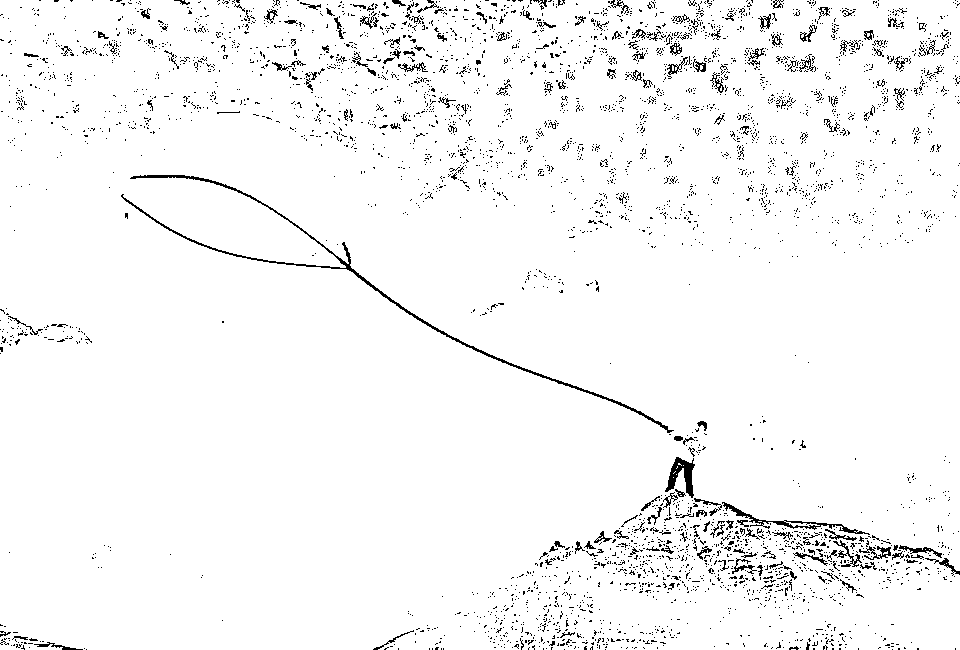

大众生活中更多人会进入到灵性探索中，那些放弃小我，全面融入的宇宙源头的活动：各种冥想、瑜伽、SRT、AC、精油、脉轮、水晶、西塔等等，以及艺术活动，都将在未来一年里风起云涌。

在外部环境上，探索太空的脚步不会停下来，**科技作为一种信仰也在加快它征伐宇宙的步伐。**并且它更可证被触摸。**科技和宗教**（神性、灵性）的对峙、竞赛一直存在。**其实她们殊途同归**。但人类历史上他俩一直在打架，偶尔握手言和。其实科技象征着阳性力量，艺术/灵性是非常典型的阴性力量，**两者的碰撞创造新世界。**

一部分人被彻底唤醒，进入到转化业力，开启新生活的创造中。丽兹·格林认为**双鱼座的关键词之一是救赎**。所以这个过程对个体来说是个沉重而充满使命感的过程：**从家族业力中走出来，进入更广大的社会服务中。**

有些人不知道自己能做什么、做了也在问做的对不对。**请学习专注做好每一件小事，发自内心诚信心意带着爱和专注的感觉去做。**

因为时代机缘（土星与冥王星合相，土星与木星合相，木星与海王星合相）的关系，**我们这几代人有机会改写家族历史、民族历史，还有什么比这个更有意义的呢？**

**双鱼座能量的反面结果残忍、毁灭。**狂热的酒神女祭司和信徒们把下令追捕酒神的国王彭透斯撕成碎片，狄奥尼索斯自己也最终被人群撕成碎片。想想最近在欧洲和美国发生的各种集体暴乱事件，只能用失智形容。直到人们清醒过来，才知道发生了什么。

对神神叨叨活动不感兴趣的大众，则在遍地开花的咖啡馆、葡萄酒馆、戏剧类游戏（剧本杀）、综艺的潮流中消耗着一波又一波的金钱、时间和精力。唯一的困惑大概是：年轻人够用么？

12 月大部分时间，**太阳在射手座，带来信念的建立以及创造世界的渴望**，顺势而为的话，可以展现出巨大的力量。**射手座的阴影面向**是抬头追逐星光，却不幸被脚下的阴沟绊倒。**请注意化翻为简，做好细节梳理。**

**水星和太阳依次进入摩羯座**。这两股落地的行星能量，时刻提醒着人们大局观、务实、落地和等待。太阳进入摩羯座是每年的冬至。黑夜最长。过完这一天，日照时间慢慢增加，更多光的进入的地球。

**12 月 23 日月亮南北交点换座天蝎座/金牛座**，共振了木海合相的“毁灭—建设”主题。经由信念引领，物质创造和个人价值都将再度建设起来。

**两年一度的金星逆行回来了。**金星逆行来回的合相摩羯座冥王星，指向不要被恐惧和欲望驱使着去追逐权益。**试着打破传统社会对两性社会身份的狭隘定义**，拓展那些被局限的部分。**这次金星逆行尤其跟 3-5 年的长远生活目标和个人的群体归属感重建有关。**

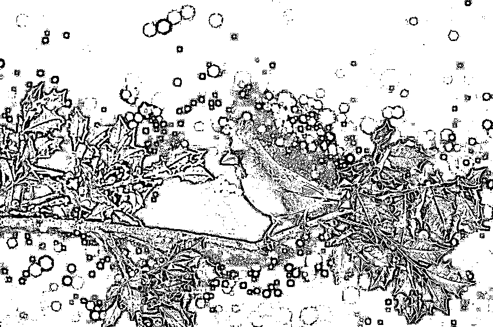

**12 月上旬**

12 月上旬天象

**12 月 01 日 ** 

*   海王星顺行

*   射手座太阳六分水瓶座土星

*   射手座太阳三分白羊座凯龙星

**12 月 04 日**  

*   射手座日食

**12 月 06 日**  

*   天蝎座火星六分摩羯座冥王星

**12 月 07 日 ** 

*   射手座水星四分双鱼座海王星

*   天蝎座火星四分水瓶座木星

月食是地球位于太阳和月亮中间。如果太阳象征未来和光明，月亮就代表着过去和记忆。**月食的时候地球阻断了象征未来的太阳之光，让过去的记忆和阴影浮现。**

这次金牛座月食是个告别能量特别强的月食，**通过对个人价值和安全感的梳理，看见过往压抑和堵塞的部分，完成重要的安全感梳理。**

很多人被推动进入家族历史上的灭族、杀戮、暴力、抛弃、伤害等阴影面的探索。这些情绪延续几代，导致家族里的人无法活出火星力量。**月食后，这个有关火星的主题进入到了转化时期。**

不要回避暴力和愤怒，更深的去理解这些人类原始本能，直到你懂得与之斡旋。**你有 18 个月的时间通过体会金星的力量，完成火星能量的重塑。**在此期间，高八度的金星——**海王星，会提供更多帮助。**

进入射手月，木星的能量浓烈起来。12 月 1 日海王星顺行，更提升了木星的能量———在古典占星中，木星同时守护射手座和双鱼座。这两个星座的共性是表达了人类不断赋予生命全新意义的本能。**射手座给予希望和智慧，双鱼座赋予救赎和慈悲。**

海王星顺行的同一天，射手座太阳六分土星、三分凯龙星，促进每个人有勇气，从创伤里找到成长的支持、引领和智慧：在生活中将会出现一些课程或者导师，**于 12 月开始进行生命意义、人生目标，自我价值等方方面面的探索。**

12 月 4 日的射手座日食，太阳、月亮、水星合相射手座，水瓶座木星和摩羯座冥王星产生连接，帮助人们通过发现现有社会体制中的不公，特别是有关权利、平等上的问题，背后关联的是资源生产和争夺。

**这个新世界理念的建立，需要人们不断进行进行各方面的沟通协调，**目的是为了达成符合大多数人的利益。但水星在射手座会导致人们过度强调自己的理念，很难真正聆听其他族群的意见。 

作为月食后的第一个新月，同时也是射手座—双子座轴线的最后一个日食，一个新的目标正在萌芽。水星和火星在射手座新月后四分冥王星、海王星、木星，**给每个人更多调试细节和方向的空间。哪些信息未被留意？哪些行为过度狂热？哪些目标需要破釜沉舟的坚持？**

上旬，慢才能更快。

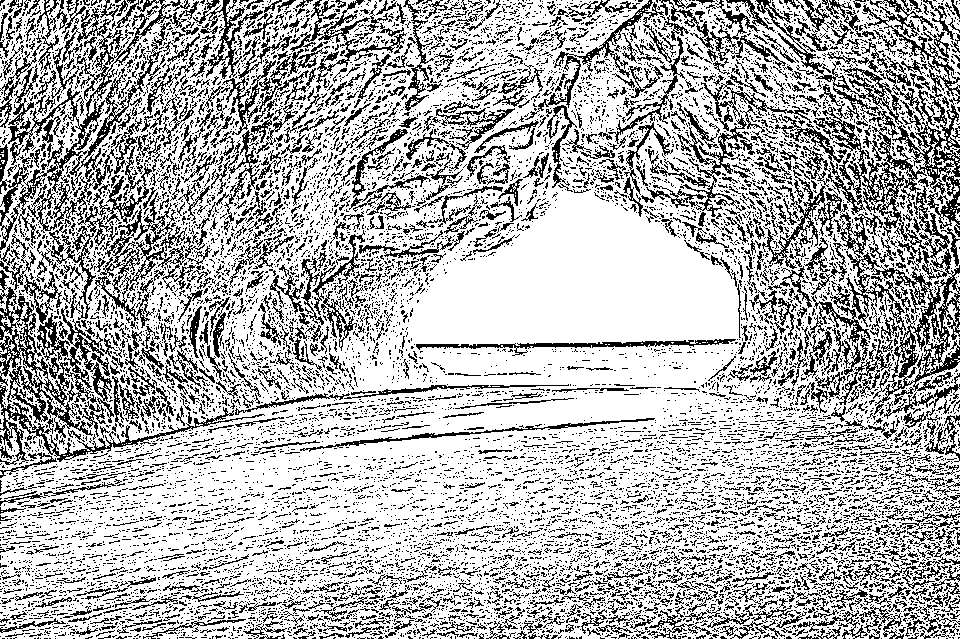

**12 月中旬**

12 月中旬天象

**12 月 11 日**  

*   射手座水星六分水瓶座木星

*   金星和冥王星在摩羯座合相

**12 月 12 日**  

*   射手座太阳四分双鱼座海王星

**12 月 13 日**  

*   火星换座射手座

**12 月 14 日**  

*   水星换座摩羯座

**12 月 15 日**  

*   火星和月亮南交点在射手座合相

**12 月 19 日**  

*   金星在摩羯座逆行

*   摩羯座水星四分白羊座凯龙星

*   双子座满月

**12 月 20 日**  

*   射手座太阳六分水瓶座木星

如果上旬的重磅是海王星顺行，下旬有木星换座、月亮南北交换座的震撼，**中旬是个重大开启：各种资源涌现，思考方式变得实际而长远，**此刻不适合快速行动，放慢速度，回到内在感受和整理出自己的真实渴望。宇宙在帮助我们打下**未来 18 个月的基础。**

**12 月 11 日**的水星六分木星，水木互融。邀请我们向内连接自己的潜意识、无意识，从自己喜好、兴趣角度，从独立、创造、前瞻的角度，从意义、使命的角度去思考自己的未来。

金星同一天合相摩羯座冥王星，提供了一个巨大的资源和机会。可能是和权威、投资商、大型机构、国家机构的接洽。如果可能，这一天安排一些重要的商务洽谈。

**12 月 19 日金星在摩羯座开始逆行，直到 1 月 29 日在摩羯座 11º 恢复顺行。**此刻已经处于逆行的阴影期。有没有发现身边无故出现了很多摩羯座、土星能量强的旧人旧友？

**火星才换座射手座就合相南交点**，如果你们的商业合作计划特别有关传播、高等教育、哲学体系的传播、网络教学，旅行，现在到了再次尝试的时候。不过要注意不要太好高骛远。

**金星在摩羯座逆行**，会以严肃、坚持、优良的管理方式，在一个目标建立起来后，展开新世界的创建准备工作：找人，找资源，建团队准备工作。特别是女性做管理者的话，发展会很好。太阳六分木星的后续相位，支持你获得更多资源成就个体灵魂的重要成长。

**双子座满月的时候水星在摩羯座。**摩羯座水星如同一双点金之手，从双子座泛滥的信息海洋中捞出真正有价值的内容，开始进行下一步规划落地。

可能有些人会觉得在新的系统里自己缺少价值感，或者要听命一个比自己小的领导。换一个角度看，你的存在是一个基础性的保证，然后在新的体系里，通过学习交流，不断适应调整，你能找到更多新的发力点。

**金星在摩羯座的逆行对亲密关系而言，意味着准备进入更严肃的承诺中。**但射手座火星可能会遇到不久将要远行的人、或者沉浸于自己的事业中，要求对方妥协配合的情况。这对摩羯座-巨蟹座能量强调伐木累（family)第一的另一半，多少有点犹豫。

人们需要反思的是：是否把对父母的某些期待投射到了另一半身上？以及，双方针对长久责任，需要各自做出怎样的调整。

**别着急，无论是事业还是情感，这只是个开始，下旬好戏连台。**

**12 月下旬**

12 月下旬天象

**12 月 21 日**  

*   摩羯座水星三分金牛座天王星（逆行）

*   太阳换座摩羯座

**12 月 23 日**  

*   月亮南北交点换座天蝎座—金牛座

**12 月 24 日**  

*   水瓶座土星四分金牛座天王星（逆行）

**12 月 25 日**  

*   逆行的金星和冥王星在摩羯座合相

*   射手座火星三分白羊座凯龙星

**12 月 29 日**  

*   木星换座双鱼座

*   水星和逆行的金星在摩羯座合相

*   射手座火星六分水瓶座土星

**12 月 30 日**  

*   摩羯座太阳四分白羊座凯龙星

*   水星和冥王星在摩羯座合相

**年度重磅终于来了：月亮南北交点换座、土星与天王星的最后一次四分相、木星换座双鱼座。**

**12 月 22 日冬**至，是一个值得被标记的日子。每年冬至都是一个从黑暗走向光的转折口：冬至这天夜最长，之后日照时间逐渐增加，大地将慢慢苏醒。**这个冬至是土冥合相出相位后的第一个冬至，地球在新的频率上苏醒。**

第二天月亮南北交点换座天蝎座-金牛座。**双子座北交点，**让我们褪下了盲目崇外的外衣，发现国内有很多好玩创新的地方，开始真正留意身旁的景色和人，开始重新学习国学、东方文化，**接受多种思维和生活状态的存在。**

**到了金牛座北交点时期**，我们将进一步回到正在复苏的大自然中，做好环境保护，晒太阳，欣赏复苏的自然，努力工作，简单朴素，不被内卷外卷的浪潮推着走，全然安住于内在的平静和喜悦之中。**懂得自己的价值在于拥有空气、水和快乐，而非更多财富与权力。**

**这个重新赋予自我价值的过程，不仅发生在每个人的内在，也会通过商业模式的改变显现出来。**很多虚高的估值被撇沫，真正优质的品牌获得更多生存空间。 

提醒一句，撇开情怀、营销，你的产品真正过硬吗？金牛座北交点是个实干家，闻一下味道，摸一下质地就知道一件货品的好坏，**双子座北交点时期的网红产品潮流，将会慢慢退潮了，请更专注的追求质量。**

月亮南北交点每 18 年回到同一个星座。**上一次**天蝎座**南交点-**金牛座**北交点是 2003 年 4 月至 2004 年 12 月。**查了一下大事记，历史总是在不断重复中推成出新：

**2003.4-2004.12**

**疫情和自然灾害：**

*   SARS 爆发 （2022 年依然有一段日子会重现这种情况，但会有真正有效的药品出现）；

*   印度洋海啸（明年木星双鱼座，还是会有和海洋有关的事件）。

**农业的发展和受灾：**

*   美国爆发疯牛病导致各国禁止进口美国牛肉；

*   亚洲禽流感；

*   中国政府全力发展农业和农村的现代化管理；

**战争阴影（南交天蝎座被火星守护）：**

*   伊拉克战争爆发，萨达姆政权被推翻。

**地区不稳定因素（南交天蝎座被火星守护）：**

*   香港市民上街游行反对基本法 23 条实施、七一大游行；

*   台湾出现局势波动。

**政治（南交天蝎座）：**

*   日本首相小泉纯一郎参拜靖国神社；

*   俄罗斯大选普京再次连任成功；

*   中国政府机构主持人和党的领袖换届。

**地区经济发展迅速（金牛座关联的钱）：**

*   东盟自由贸易区正式启动。

**太空探险（水瓶座天王星的尾声）：**

*   杨利伟成为中国第一个登上太空的宇航员；

*   美国成功登陆火星。

**本地文化/少数民族文化复兴：**

*   汉服运动从郑州开始流行很快风靡全国。

**同性恋婚姻合法化（水瓶座天王星的尾声）：**

*   各国相继承认同性恋婚姻合法；

**娱乐（北交点金牛座）：**

*   大批歌手成名于 2003，2004 年或者出现代表作：周杰伦、S.H.E、飞儿乐队、林俊杰、张韶涵、滨崎步、东方神起、第一届超级女声…..

**历史是一次次重复中的进步**，在对比这些事件的同时，相信大家能初步领略到北交金牛座的社会/经济/和文化环境，以及从水瓶座天王星，过渡到水瓶座土星，会产生的降维度、加速物质世界的法律、技术展现的转变。

**12 月 24 日，水瓶座土星和金牛座天王星最后一次四分相**。特别注意经济震荡和可能出现的自然灾害，同时有更多约束互联网发展，大力拓展农业、生产、生育养老医疗有关的信息落地，导致金融市场的大震荡。

**12 月 29 日，木星换座双鱼座，开启了 1 年的双鱼年。**这个双鱼年木星只有一半时间呆在双鱼座：2021.12.29-2022.5.11、2022.11.2-2022.12.2。

**整个 5 月到 10 月，木星都在白羊座来回穿梭。这意味着 2022 年的火星力量会比较突出**：天蝎座南交点和白羊座木星都将被火星守护。**火星所象征的阳性力量、独立、战争等事件，将成为 2022 年的一条重要分支。**另一方面，大自然也会因为这股纯阳之力，而彻底摆脱疫情困扰。

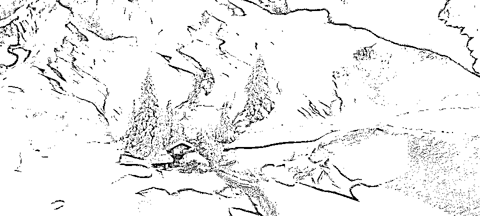

**尾声**

开篇讲过酒神狄奥尼索斯又称“第二次出生的人”。**地球和人类，在 2022 年将会同时经历疫情后的第二次出生，奔向全新世界。**

送上一首诗作为结尾，祝福每个人在这个 12 月，听见远方此起彼伏的钟声。

**平常人是一个钟，哑了，灵魂荡起来的时候，生命就响了，都是回升，传到很远的地方去。**

**——顾城**

**本月重要天象一览表**

| **日期** | **星象** |
| **2021.12.1** | **海王星顺行****射手座太阳六分水瓶座土星****射手座太阳三分白羊座凯龙星** |
| **2021.12.4** | **射手座日食** |
| **2021.12.6** | **天蝎座火星六分摩羯座冥王星** |
| **2021.12.7** | **射手座水星四分双鱼座海王星****天蝎座火星四分水瓶座木星** |
| **2021.12.11** | **射手座水星六分水瓶座木星****金星和冥王星在摩羯座合相** |
| **2021.12.12** | **射手座太阳四分双鱼座海王星** |
| **2021.12.13** | **火星换座射手座** |
| **2021.12.14**  | **水星换座摩羯座** |
| **2021.12.15** | **火星和月亮南交点在射手座合相** |
| **2021.12.19** | **金星在摩羯座逆行****摩羯座水星四分白羊座凯龙星****双子座满月** |
| **2021.12.20** | **射手座太阳六分水瓶座木星** |
| **2021.12.21**  | **摩羯座水星三分金牛座天王星（逆行）******太阳换座摩羯座**** |
| **2021.12.23** | **月亮南北交点换座天蝎座/金牛座** |
| **2021.12.24** | **水瓶座土星四分金牛座天王星（逆行）** |
| **2021.12.25** | **逆行的金星和冥王星在摩羯座合相****射手座火星三分白羊座凯龙星** |
| **2021.12.29** | **木星换座双鱼座****水星和逆行的金星在摩羯座合相****射手座火星六分水瓶座土星** |
| **2021.12.30** | **摩羯座太阳四分白羊座凯龙星****水星和冥王星在摩羯座合相** |

**版权声明**：原创文章由作者授权首发于若道平台，欢迎转发，反对抄袭。友号转载请申请白名单。

****

****傅莎珈****

ISAR 认证占星师（2015 年获得）

心理占星师/内观书写带领者/冥想带领者

国际著名传播集团工作 20 年

**微信公众号**：Helloshajia

长按打赏

**学习占星学****点击下图了解课程详情** 

********************

**微信又双叒叕改版啦，不想错过若道君的推送？**

**就把若道设为星标吧！**

**▼**

**就是这个“在看”，戳戳戳 ☟**

********报名直达入口********

# 感悟丨当土星经过八宫，请勇敢与真实共处

> 原文：[`mp.weixin.qq.com/s?__biz=MzA5NjA0NTAxNg==&mid=2651462655&idx=2&sn=02c860e6635e51d36c67bfa1b1a32252&chksm=8b48a948bc3f205e022de46fd7dd4e011458a73de2c5a040a4883e36498784e44d46d1483136&scene=126&sessionid=1692737893#rd`](http://mp.weixin.qq.com/s?__biz=MzA5NjA0NTAxNg==&mid=2651462655&idx=2&sn=02c860e6635e51d36c67bfa1b1a32252&chksm=8b48a948bc3f205e022de46fd7dd4e011458a73de2c5a040a4883e36498784e44d46d1483136&scene=126&sessionid=1692737893#rd)

作者/星星下的梅维斯 编辑/翀子 图片/网络作者的话：本文写于土星过境于我的 8 宫末尾。历经 2 年土星对 8 宫课题的实质性考验，我不由对浩瀚宇宙的力量与人类的局限有了更深一层的体认。

一个人彻悟的程度，恰等于他所受痛苦的深度。

——林语堂

**行进行星经过宫位**

**每当一颗行星过境某个宫位的时候，**我们会带着行星的特性与宫位和星座的内涵，来做一些**基本解读**，**更深一层的**，我们会考虑到相位、宫主星、定位星、整个星图的议题等等，来加深对现象的解读。 

**然而如果我们纵向的，带入案主本身的阅历、觉知程度、感知精微的能力**去重新体悟，会让我们对一个人的独特性、进化旅程和自然法则有更深的感触。

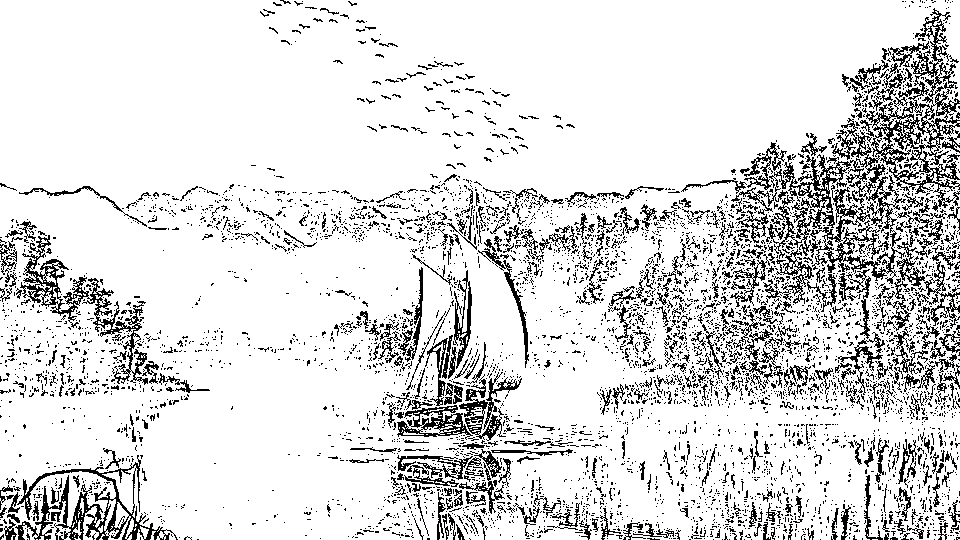

**8 宫的议题**

**8 宫是水象宫位，是无意识层面关于恐惧的面向，也是我们生命中一个最接近“黑暗”的领域。**

在现实层面，我们往往会用他人的财务、性、死亡、借贷，遗产等标签来对 8 宫进行定义，它是 7 宫一对一关系的第二个宫位，即他人的 2 宫。而我们个人星图里的 2 宫，通常定义为个人的财物、价值观、主业收入，8 宫则趋向于通过他人而产生的获得。

但从更进一步的层面来说，**8 宫蕴含着我们所没有意识到的内在情结。**正如我们对一些人的某些举动有情绪的时候，其实是没有意识到他人的举动并不是问题的来源，而我们内在发生的情绪的原由，才是我们需要去统合的关键。

荣格曾定义男性内在渴望达成的女性面向为阿尼玛，女性内在渴望达成的男性面向为阿尼姆斯，当我们无法达成内在阴阳的统合时，**就容易通过对他人的投射，即将内在未完成的渴望通过另一半或公开的敌人（7 宫议题） 来满足。**

**这也是我们与自己完全陌生的另一个自己相遇后，突破舒适区，破茧重生的地方。**

**而 8 宫就是历经了 7 宫的统合后的产物。**精神层面的提升，自会带给我们物质层面、抑或是精神层面的财富。每个人生而不同，同一件事激起的情绪千差万别，这不得不让我们回顾源自我们童年的议题。

**人际关系，尤其是亲密关系，**是我们人生中最重要的试炼场，它如镜子一般照出我们更深的内在，而在关系走入磨合期的阶段后，我们会和非己的领域产生碰撞。**期待—幻灭—防御—破环**，成为关系里一个普遍的循环。

**这些体验感多来自于我们早期依恋关系的形成模式。**父母在和幼儿互动的过程中，对一个人自我的形成和对爱的理解起到了关键的作用。

大到有过被抛弃、忽略和暴力的体验，小到饥饿时迟迟未到口的奶水，都会让我们内在的期望与实际的获得形成偏差，这让幼儿发展出为了适应人际环境而产生的不同防御性安全策略。

**也因此，我们每个人会带着不同的防御模式来到社会，将一个固有的却可升华的模式不断历经试炼。**

人生就如同斐波那契螺旋，看似是循环的圆，但我们的主观能动性总会驱使我们成长到更高更成熟的维度。**8 宫便暗藏着转化向更高层面之前的至暗时刻**——向外看是融合异己，向内观即是对现实的接纳，承认自身的局限和对事物产生抗拒感的观察。

**8 宫带来的转化与疗愈，是破除怨恨和恐惧**，这也让我们回归与原生家庭和解的议题，人不完美的自然属性与趋向追求完美的本性是一种理性与感性的冲撞。

我们自小为了“讨好”父母、老师等权威，会表现得更乖，考试努力更优秀，从而默认为会得到更多期望的爱，因为**深根内在的恐惧**告诉我们，真实的我们不值得被爱，本自对爱的匮乏深藏于潜意识。

当我们没有意识到的时候，现实意识层面会让我们产生爱的幻灭体验，自我也因为对幻灭这种“坏的感觉”（实质上是对认为自己不好的感觉）产生抗拒，从而**通过压抑，愤怒等防御机制对外产生冲突，**并将自己痛苦的来源归根于外在或他人。

每个人的降生都带有各自的议题，或者可以解读为性格，我们选择的父母是最能符合深化我们需要学习的课题的人。

我们与生俱来的天性通过历经人格形成时期父母及环境的塑造成型，以到达我们成人后在现实社会历经起落后的成长——**与自己和解，发掘内在本自具足的爱。**

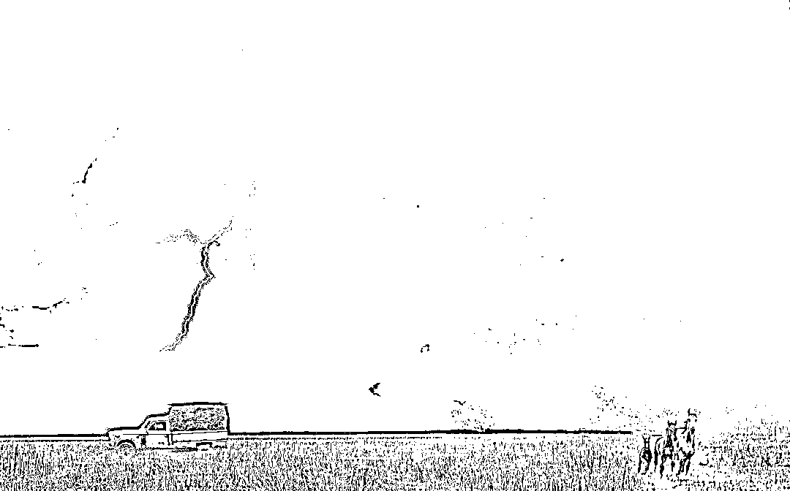

**土星在 8 宫行进**

有占星师曾有过描述：“土星行进 8 宫，是一段地狱般的体验。”外显时，会通过明显的事件发生，让我们产生强烈的情绪体验。**往往这些体验带有破执的意涵，这取决于你所执着和害怕失去的是什么。**

**土星是务实的老者，是现实世界规则和时间的代表，更是我们必将一步一个脚印面对的现实。**8 宫内的潜意识，经由土星带来的实质考验，让我们在意识层面有了觉醒。

当你意识到外在发生的一切事件，其根源并不是让你沉溺于事件本身和对自我的责难中无法自拔，**而是借由某种外显形式，回归内在一直潜伏着的情结。**

**深刻的与负面的感觉相处**，允许你曾一直抗拒的感受发生，**土星的现实就是告诉你，面对与否，它都真实的存在于你之内。**

痛苦往往不是感觉本身，而是我们用力的抗拒后，对自我某个部分的排斥和不接纳，**而土星进入 8 宫**，消除的即是人性内在的二元对立，**通过与自我的和解，来获得对生命不趋乐，不避苦的觉悟和对世界万物发自内心的谦卑。**

**版权声明**：文章由作者授权首发于若道平台发布，欢迎转发，反对抄袭。

****

**星星下的梅维斯**

心理咨询师、心理占星师、古典瑜伽老师

**联系邮箱**：mavisxu316@163.com

长按打赏

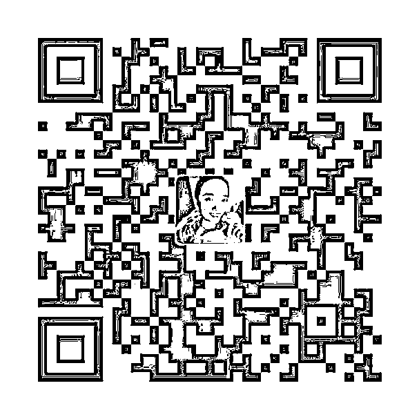

**学习占星学****点击下图了解课程详情** 

********************

**微信又双叒叕改版啦，不想错过若道君的推送？**

**就把若道设为星标吧！**

**▼**

**就是这个“在看”，戳戳戳 ☟**

********报名直达入口********

# 重大天象·海王星顺行丨未来 6 个月，12 星座准备好接受海王星的召唤吗？

> 原文：[`mp.weixin.qq.com/s?__biz=MzA5NjA0NTAxNg==&mid=2651462540&idx=1&sn=fb07dfa4dc676e6bf4fd055b70a3f0cb&chksm=8b48a93bbc3f202dbb936b5e7f8a4e29714d1f6914cae6895f6a44481385bbfa0ecd94c94a78&scene=126&sessionid=1692737893#rd`](http://mp.weixin.qq.com/s?__biz=MzA5NjA0NTAxNg==&mid=2651462540&idx=1&sn=fb07dfa4dc676e6bf4fd055b70a3f0cb&chksm=8b48a93bbc3f202dbb936b5e7f8a4e29714d1f6914cae6895f6a44481385bbfa0ecd94c94a78&scene=126&sessionid=1692737893#rd)

********************☆ 后**********************台**********************回复“今日”，给你一句生命态度********************

作者/郑玮玲 ISAR 认证占星师编辑/翀子 封面/书君 图片/网络

作者的话

**北京时间 12 月 1 日 21:22 海王星在双鱼座 20 度 24 分恢复顺行**，至此，海王星结束了 2021 年的逆行的旅程。**重新顺行的海王星将推动怎样的超越之旅，又将带来何种迷雾？**

**三王星**（注：天王星、海王星、冥王星）**每一年均有超过 5 个月的时间逆行**，相对于逆行频次更低的金星、火星，海王星的逆行更加常态化。

相对海王星的顺行和逆行本身，**更值得关注它逆行退回的度数区间，**这段被海王星强调的黄道度数正是海王星为我们揭开的宇宙天幕。由此探访，就开启了与深䆳宇宙的对话，我们便能触碰超越与不可知的一切。

**海王星：集体的梦与空**

**6 月 26 日，**海王星从双鱼座 23 度 12 分开始逆行，此行退回的区间到达了海王星在今年 3 月 5 日所在的度数。**让我们点选回看 3 月以来一些有意义的事件，**回看海王星行进的现实迹象。

*   **今年 3 月**执行首次火星探测任务的“天问一号”获得了高清火星影像图，长征七号 A 运载火箭发射成功。三星堆考古工作宣布新出土 500 多件重要文物，并在夏天展出。**这一切，都是集体荣耀的梦想在启航，**曾经消失的文明驶入了未来，过去与现在的意识在交会。

*   **4 月，**日本正式宣布将福岛核电站核污染废水排放大海，引发全球众怒。5 月 22 日，中国杂交水稻之父袁隆平逝世，举国悲恸，全民自发哀悼。**集体性的激愤、痛苦在海王星的进程中呈现。**

*   **5 月**全国第七次人口普查开始进行，三胎政策轰然降临，引发热议并引动了一系列**关于家族、生育、教育行业的根本性改变和逆转。**

*   **6 月**，云南野象集体迁徒，云南为此封闭了多个县市的道路交通。**我们不得不面对、思考生态环境引发的现实变迁。**

*   热播的真人秀节目《再见爱人》从拍摄到播出正值海王星逆行期间，这是第一个真实的离婚主题的节目，**离散、瓦解、痛苦正是海王星的要义。**节目中我们看到了心灵的**破碎、困惑、痛苦，也有眼泪、崩溃和超越，**看到女人在关系中的笃定、清晰，也看到男人在关系中缺乏爱的无力和自我放弃。

    如此真实的痛苦纪录撼动、牵扯了多少人的心，也提醒着人们**懂得回望、穿越痛苦，领悟生命的空与落，重新回到爱里。**

**海王星是梦的升起与空落**，是救赎的孤独和人生必然的痛苦，是超越也是神往，带来灵性的升华，也带来是无边的吞噬，它被称为“白色的意识之光”，也如同无意识的黑洞。

我们可能在海王星的渲染下**走进无限爱与光**，也在它的消弥中**逃避沉溺**，它令颓废的人麻木不仁，也能让迷途的人**寻回追寻路径**。它在现实中为我们提供了各种可能的**超越之道**，支持追寻梦想的芸芸众生迈向神迹。

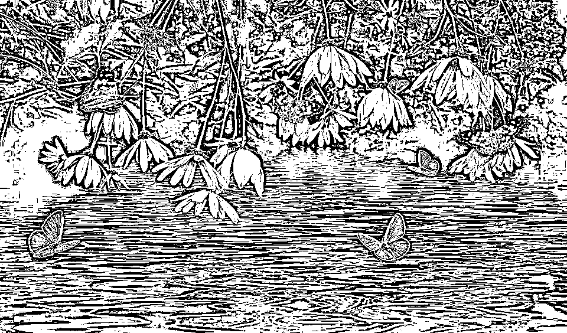

**海王星顺行重点影响人群**

**此次海王星顺行至 2022 年 6 月下一轮逆行前，它将重点影响的人群是有个人行星、四轴、月亮交点位于：****双鱼座、双子座、巨蟹座、处女座、天蝎座、射手座 19-27 度区间的人。**

逆行的海王星助推了每一个内在探索者对神圣的追寻，**过去的五个月，有更多人沉浸在孤独的困顿和深化的梦境中。**

**当海王星恢复顺行，现实的迷雾更提醒着向外整合，**世事潮流推动个体的成长或是挣扎。我们往往会在海王星逆行后停滞期于现实中触碰长久以来模糊边界的事物，**经由一段时间的梳理、自省来获得清晰。**

当我们从深刻的内在困顿与挣扎中走出来，才可能**用超越的姿态投入迷人的心灵梦想中去，**才可能在现实幻变中根除执迷，追寻无边的生命荣耀。

在人生中，无论在什么样的年龄阶段，无论我们经历过多少风霜，**在海王星侵袭的时期都会感受到无力、困惑、失落、放弃、逃避，甚至失去自我。**

一次次海王星的冲刷如同巨浪拍打着礁石、海崖峭壁，我们的身体和心灵要一次次接受时光的蚀刻，岁月的消磨，在柔软、坚挺之间把自己镌刻成生命的艺术品。

**海王星是高八度的金星，这必然意味着创造并享受生命深处的爱与美。**这深处的“爱与美”已被卸除了任何外在形式，没有具象，却融入万千实相当中，无处不在，无所不侵，那便是与生命如影相随的——痛苦。这是海王星为人类特有的层次丰富的心灵铺垫的超越与升华的道路。

**从痛苦中提炼爱与甘美，**从痛苦的体验到达生命的智慧与圆融，从痛苦中觉察到个体的渺小、无助，继而升起对他人、对众生的联接，以及对万物的护佑之心。

**真正的慈悲与爱在海王星幕帘下升起，这是不可求，却必经海王星式无边的痛苦来引领、到达。**

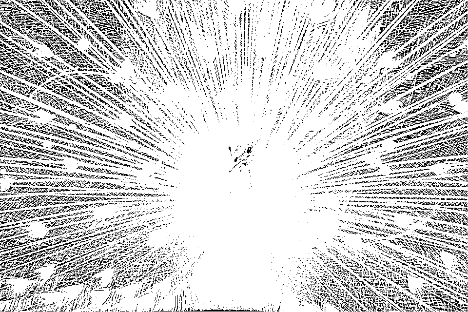

**海王星顺行期间重要相位**

★**木海合相**

**木星将于 12 月 29 日进入双鱼座，因此在 2022 年我们就将迎来年度重磅的天象：木海合相。**木海合相的精准周期是 3 月 3 日—5 月 29 日，然后在逆行期间的木海将在 10 月 15 日开始第二轮合相，一直持续到 2022 年结束。

**木海合相重点影像人群：有个人行星、四轴、交点位于双鱼座、双子座、巨蟹座、处女座、天蝎座、射手座 22-29 度的人，以及白羊座、巨蟹座、狮子座、天秤座、射手座、摩羯座 0-3 度的人。**

双鱼座是木星和海王星共同的理想居所，当两位宇宙的大神共同执掌他们的共同庙宇时，神圣的意旨将被商议、传递，**我们可以期待长久以来的集体梦想的回报，毕竟木海合相 13 年才发生一次。**

当下的时代，集体性地认知到灵性的重要性，越来越多的人投入到灵性学习、实践中去，甚至是告别旧有职业投入到灵性事业的开拓与发展中。

**木星来到双鱼座将为人类更积极、深广地探索灵性带来扩张效应。**而这扩张的结果我们难以用“好”或“不好”来界定，只能经由个体、事件的出发原点去推演，一切的努力和付出都会呈现最大化的初心和核心。

**木海合相双鱼座**会为积极投入理想、信仰实践的人们带来幸运，带来机遇，野心在此也会被支持，一切过度、盲目的行为。缺乏谨慎行事的态度在木海合相的时期却又都是充满危险的，因为丧失、瓦解和骗局随时会出现。

双鱼座强调了“我相信”，当我们把最重要最神圣的相信交付给了某个人事物时，就代表了我们的木海之路，在你踏上此行之前值得想清楚一切是否值得。

**看清前路和背景，理清内在的目标与计划，让你的梦想与信仰协同步调，不做过度的期许，但行谦卑的允诺。**

★**火海合相**

**时间：2022 年 5 月 8 日—5 月 29 日**

**重点影响人群：有个人行星、四轴、交点位于双鱼座、双子座、巨蟹座、处女座、天蝎座、射手座 16-29 度，以及白羊座、巨蟹座、狮子座、天秤座、射手座、摩羯座 0-3 度的人。**

当火星来到双鱼座会意味着为灵性、梦想、信念而战，也会令火星的力量被无形削弱、消隐，无法强劲，难以守护边界。**火海合相更强化无力、消融感，却也让精神性的力量，属于信仰、信念的力量在无形中升起。**

这段时间很可能因为外在情境激发人们守护信仰、信念的行动，也会因外在事件触发我们向内找寻自己的灵性力量，从丧失、痛苦、悲痛中重振，开始向内的生长，实现超越性的自我赋权。

★**金海合相**

**时间：2022 年 4 月 21 日—5 月 5 日**

**重点影响人群：有个人行星、四轴、交点位于双鱼座、双子座、巨蟹座、处女座、天蝎座、射手座 16-29 度，以及白羊座、巨蟹座、狮子座、天秤座、射手座、摩羯座 0-3 度的人。**

宇宙最浪漫相位发生在春天，这是鼓励人们去谈恋爱。单身渴望进入亲密关系的人们值得在明年春天去尝试新的关系，寻找亲密的伴侣。

**双鱼座的金星与海王星在力求极致的浪漫，但也要小心可能遭受的欺骗和幻灭，**在一切绚烂、激情面前值得保持清醒，避免在全然的信任中遭遇伤害。

此外，金海合相必然也鼓励着我们**投入艺术、创作和充满灵性意义的享乐中去**，我们可以为此去计划、开辟一场艺术、灵性的盛宴，也可以为自己打造一段升华生命的灵性之旅。

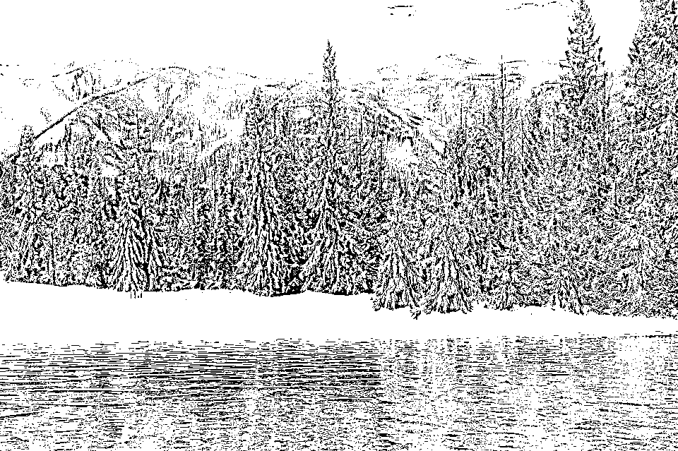

**海王星顺行在 12 宫位****若道君：****你可以在 app store 或者应用商店搜索“若道”下载 app，输入个人档案，查看行运盘（也可以使用其他星图软件），找到行运海王星落在出生星图的第几宫，然后对照下文查看海王星顺行的影响。**

**例如下图中，行运海王星在比尔·盖茨个人星图的第 9 宫。**

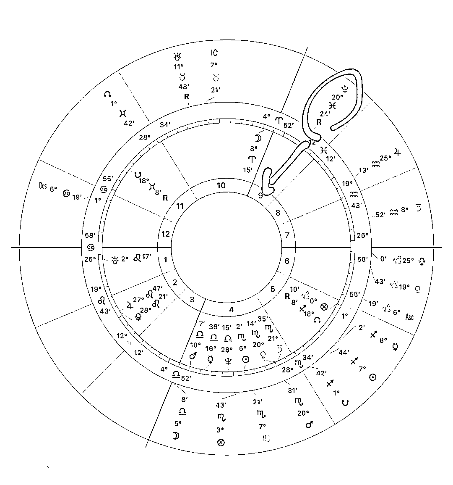

**海王星顺行在第*****1*****宫**

海王星顺行在一宫的人**大多数情况是你的上升点在双鱼座，也有少数人的上升点是落在水瓶座。**过去半年你会感觉深度的停摆或原地打转，麻木感充斥着你，海王星的顺行似乎让你来到了宿醉的黎明，**你需要再次鼓起勇气，开始追赶新的目标。**

如果海王星正在经过你的上升点，你也可能经历人生中巨大的脆弱，可能因失序的生活和现实难题而发胖，也可能面临人生重大的瓦解过程，**感到痛苦是极有可能的，但疗愈的机会也会随之到来。**

重要的是透过这层历练**学会敞开的温柔，拥抱生命的真实。**接下来半年你也需要关注身体能量的匮乏，你值得投入新的梦想，积极生活，等待和创造新的奇迹。

**海王星顺行在第*****2*****宫**

当海王星恢复顺行，**你值得去梳理、清算过去半年的财务收支，**不要让过去成为一笔糊涂帐。

如果想来年的木海大运中抓住金钱的机遇，现在你需要思考清楚自身价值，海王星行进在此提出的问题是：你如何为自己索价？**当你明白自身价值，也清楚你所拥有的一切“财富”时，外在的金钱流量才会实现对等，甚至超越期待的回报。**

海王星此番顺行会**鼓励你明白清醒，深度相信自己的价值，鼓励你所有为梦想的行动。**

**海王星顺行在第*****3*****宫**

海王星行进在三宫，**你会接触大量的讯息，**也会在此期间投入大量的学习、交流，短途旅行中。此时最好的学习当然是灵性的学习。

顺行的海王星鼓励你走向社区，你会在身边发现巨大的令人欣喜的资源和充满意义的讯息，世界会因此变得更有趣。你也会通过与人交流的过程让他人感受到你灵魂的有趣，由此摆脱一段时间以来对自己的嫌弃感。

**你会经由学习、交流重新认识自己和身处的世界，海王星协助你去找到对旧有事物新鲜的解读。**

**海王星顺行在第*****4*****宫**

海王星顺行在你的四宫，你已经在灵性道路上寻找自己的方向很长时间，**也已深化了你的信仰。**

逆行时期更多的寂静、内省，带来心灵敏感度增强，**此时需要将这些丰富、灵动的感触总结和化为现实中新的启动力、支持力。**相信自己心灵的指引，这将疗愈你和家人关系，柔软、脆弱会拉近你们之间的距离，更有机会冰释前嫌。

如果你的四宫头位于双鱼座 20-25 度，那么在未来半年你极需关注家中的水管和一切用水的家电，发现问题尽早维修、换新，避免大面积漏水的情况发生。

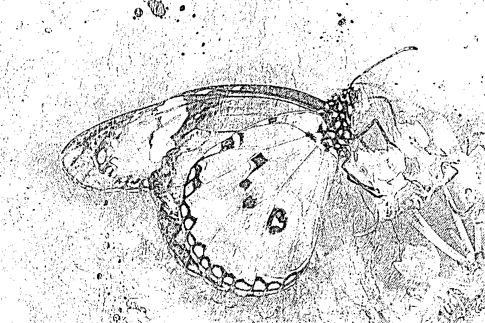

**海王星顺行在第*****5*****宫**

**这是一个值得享受生命的过程，**你也感到自己心性飘浮不定。你需要努力**让自己融入生活的烟火尘埃**，若能跟随灵感的引领去创造、显化内心的图景，海王星顺行的过程将会鼓励着你深化内在的信仰。

**你所相信的，终会点亮你独特的人生道路。**海王星所提供的自我超越是需要用信念抵达的深层目标，而灵性的法则，艺术的实践，或者二者并行都将助你轻快扬帆，创造奇迹。恋爱，当然也是在未来一年值得投入的事，你会经由爱上一个人重新认识自己，爱上自己韵味天成的品性。

**海王星顺行在第*****6*****宫**

生活、工作的作息与规律是当下值得关注、改善的事宜。海王星行进六宫是**提醒健康、节律，**也是帮助我们抛弃旧有不良生活习性的时期。若有老化、匮乏的身体症状正是提醒我们关注健康，尝试或学习一些疗愈，从根本上解除令人沮丧、消沉、无力的症状和感受。

另一方面，顺行的海王星会给在职场积极奋斗的人们带**来令人惊叹的超越与提升，**如能遇到那此信仰、观念与自己高度共频度的导师、上级将更有利于你内在的成长，有如神助。

海王星式的疗愈也在生活中无处不在地发生，在你的工作中，学习中，在你日复一日的磨练中，**你的耐心与专注会让每一个微不足道的瞬间点化为奇迹。**

**海王星顺行在第*****7*****宫**

你们双方若有全然不同的信念、真理，当海王星顺行经过你的下降点时，你人生最重要的关系可能经历瓦解。海王星提醒你是如何爱自己的？你对自己的亲密保持足够真实吗？你遇到了灵性伴侣还是感情骗局？

海王星若在你的七宫行进已久，你可能已经经历了情感中的失望，然而，**你所相信的将指引你未来的关系走向，**包括你相信你会不会有伴侣。

当海王星行进七宫，我们有了非常重要的功课是：**赋予自己内在神性。**在此期间，亲密关系纵然遭受到现实的冲刷、破坏、侵扰，作为独立的人首先要独自践行你所相信的信念和真理，无论你身边的亲密伴侣能否支持、相信你内在的信仰。而对方的相信与否正好检验你们的关系是否值得。

**海王星顺行在第*****8*****宫**

海王星行进在八宫**值得关注财产风险管理**，海王星顺行后更**值得去理清长久以来的资产帐目**，无论是个人的，公司的，合作的还是家族的。当你着手去弄清楚曾经隐藏的问题时，便会发现**积存已久需要解决的议题在浮出。**

同时，你也会被死亡的课题，灵性深度的探寻所吸引，对神秘主义全然敞开了自己的心。在当下若能意识到家族议题留下的阴影，你便能**从深信的探寻中找到生死轮回的奥义，也有机会疗愈自己久远的伤痛。**

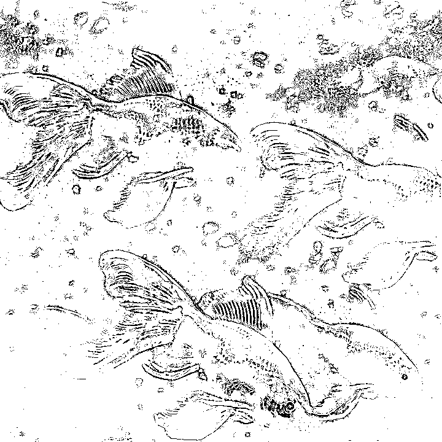

**海王星顺行在第*****9*****宫**

国外旅行、旅居、求学被搁置，你渴望的灵性庙宇，高等学府，朝圣之旅都在漫长的时光消耗之中。更换的形式带来的是无法满足和无边际的消融感。而你所相信的真理却在心海深处更加明亮，宛如灯塔照耀着你热切渴望的远方之路。

真理、哲学、信仰在此刻显得尤为神圣而珍贵，**海王星顺行带来了意识的新启迪。**追梦的历程会化为充满意义的总结，在新的一年里能**有机会分享你的梦想与真理**，在世界上去传播你的理念。放置已久的远行也可能在新的一年重新启程。

**海王星顺行在第*****10*****宫**

过去的五个月里，你付出很多努力在事业上，当下却感受一无所获。除了时光远去，激情壮志消磨殆尽。海王星犹如时光的橡皮擦正在抹去你曾经的热情与光芒，所有令人赞叹的痕迹不复存在。

**当它恢复顺行，你便拥有了机会从空白处重新起笔，勾勒出当下的生命影像，**将你的宏图愿景重新布满画布，让光芒再次绽放。

当然，你没有办法控制再一次理想的幻灭。但海王星此刻的经过是在告诉你：**变幻的法则也是成功的法则，没有归零的丧失就没有自我超越的可能。**面对生活的无奈，时代的变迁，随波逐流并不是错。沉浮在人世繁华、落寞终究也是在扬升生命的进程中，无求结果，但守真心。

**海王星顺行在第*****11*****宫**

对未来的迷茫、担忧正是海王星行进带来的影响力。逆行的时期你可能经历着层层的放手、变迁与瓦解，愿景模糊，现实困顿。与你站在一起为着共同目标努力的人们是你当下重要的梦想支持者，**借着你们共同的激情与斗志，眼前的迷雾将在最短的时间内消散殆尽。**

**团体与集体的力量能让单薄的个体获得清晰与力量，**寻找有力的支持群体，并投入到共同目标的追求与创造中，在新的一年，海王星将会支持到这充满意义的共振，**为集体的超越带来美妙的和声。**

**海王星顺行在第*****12*****宫**

集体中的个人要如何树立界限，这是面对海王星永恒的议题。海王星麻醉了我们的神经，让思维、行动力、情感、感受、直觉与精神都消融进更大的生命背景中。**我们无法掌控背景，但可以保持清醒独立的意识**，如困倦的鱼儿探出水面找寻一线光亮。

不要让麻木的感官，沉浮的际遇困扰住你，不要让丧失、无力感带走你宝贵的意识。纵然不知身在何处，如尘埃飘零，也要做那一颗笃定的微尘，落在值得的栖身之处，等待光阴的眷顾。

**海王星顺行，梦境会给你新的讯息，你所相信的宗教、信仰、导师会给你有力的支持。**

**写在最后**

**海王星如同生命的原点与归属，超然于世又融于微尘。**

寒山有诗：**“今日扬尘处，昔时为大海。”无**论爱与追寻，梦想与空落，外在形式瓦解才能显露海王星的面貌，意识之光在心灵的光亮和幽暗处。为着爱与梦想所做的一切最终都让自己更完整了，当我们努力改变自己时，也就改变身处的世界。

**爱让我们柔软，梦想让我们坚韧，****海王星让人学会俯视自己的渺小，经由卑微入尘的自我照见成为内在宇宙的主人。**

**版权声明：**原创文章由作者授权首发于若道平台，欢迎转发，反对抄袭。友号转载请申请白名单。

**郑玮玲**

ISAR（国际占星研究协会）认证占星师（2016 年获得）

若道占星专栏作者

将占星咨询、教学与音乐、舞蹈相结合的疗愈者

**微信号**：zhengviolin

**新浪微博**：@郑玮玲

**微信公众号**：Sampriya-Astrology

长按打赏

**学习占星学****点击下图了解课程详情** 

********************

**微信又双叒叕改版啦，不想错过若道君的推送？**

**就把若道设为星标吧！**

**▼**

**就是这个“在看”，戳戳戳 ☟**

********报名直达入口********