# 若道 202207-202302 PT1

# 若道 202207-202302

来源：[`mp.weixin.qq.com`](http://mp.weixin.qq.com)

# 上证会突破前期高点 3424 点吗？ | 梅里曼上证+黄金周期+铜周期 2 月报告

> 原文：[`mp.weixin.qq.com/s?__biz=MzA5NjA0NTAxNg==&mid=2651499474&idx=3&sn=a7fb4ae4d5dd36fc501fcbc176612855&chksm=8b481965bc3f9073afc04a0283dc91e66aef5e0b5a2564e9ff19351e993805cea07480c72928&scene=126&sessionid=1692737690#rd`](http://mp.weixin.qq.com/s?__biz=MzA5NjA0NTAxNg==&mid=2651499474&idx=3&sn=a7fb4ae4d5dd36fc501fcbc176612855&chksm=8b481965bc3f9073afc04a0283dc91e66aef5e0b5a2564e9ff19351e993805cea07480c72928&scene=126&sessionid=1692737690#rd)

**2 月上证报告**春节过后，股指跳空冲高，回落。

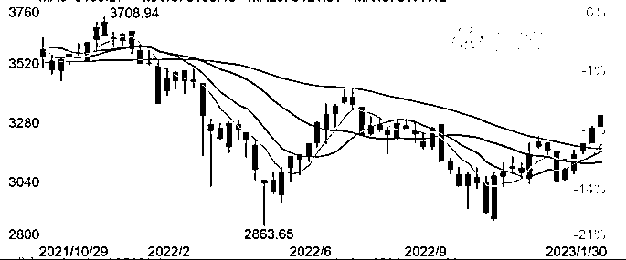

| 上证指数日 K 线图

春节期间火爆的电影市场和旅游市场给人非常乐观的期待，仿佛经济的复苏和消费的反弹是指日可待的事情。而比上证提早开盘的香港市场则出现一片火热的情景，海啸般的疫情看起来已经过去，2023 年多地将 GDP 增长目标定为 5.5%附近，这些都是积极的消息。

另外，2022 年我国居民的本外币存款同比增加 18 万亿元，与前 3 年每年增长 10 万亿相比，多出 8 万亿，增长率创下 2009 年之后的新高，而贷款同比增长则少增长 4 万亿元，创下贷款新低。净存款增长率 43.69%创下 2008 年以来的新高。

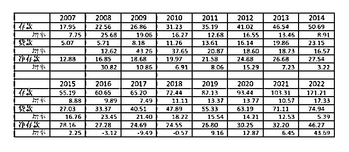

| 数据来源：人民银行

另一个数据是我国居民的财富分布：

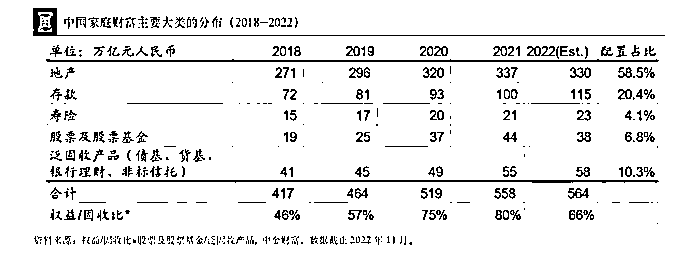

这些新增的储蓄如果不再流向地产，是将会用于消费的复苏，还是在股票市场复苏的时候流向投资？

当然，这一切取决于人们对于未来收入增长的预期。如果经济增速无法恢复，消费和投资都不会恢复。**从周期看，从 2019 年 1 月 4 日开始的上证的 5.5 年周期，到 2023 年就开始进入第 5 年，离波谷的时间越来越近了。**

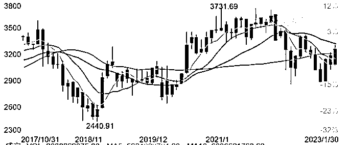

| 上证指数月 K 线图

从另一方面看，如果 2022 年 10 月的低点是从 2019 年 1 月开始的 5.5 年周期的第一个 33 个月半周期的波谷，那么在 2023 年 2 月是第二个 33 个月周期的第 4 个月；如果 2022 年 4 月是第二个 33 个月半周期的开始，那么在 7 月份的高点 3424 是第二个 33 个月周期的波峰似乎也太早了。一切都似乎显示，上证很有可能冲向 3424 的高峰。

2 月份我们会看到 2 个值得关注的天象：

**2 月 4 日周六，太阳四分天王星。接下来是 2 月 15 日-16 日，金星合相海王星，太阳合相土星。**

**在 2023 年 2 月，应该如何操作？金融占星大师雷蒙德·梅里曼的《2023 年 2 月上证指数报告》已上线，你可以听听梅里曼老师的看法。你也可以购买雷蒙德·梅里曼 2023 年预报及沙龙，将帮助你对 2023 年的整年的市场风云变化加深了解。**

投资有收益，投资有风险，希望金融占星学的研究帮助你更好地评估你的投资。

从 2018 年年末，若道引入金融占星大师雷蒙德·A·梅里曼撰写的梅里曼市场时机学院每年一次的年度预报沙龙和每年一本的《年度预报》以来，**2023 年已经是第 5 个年度了。我们简单回顾了部分 2019-2022 年金融预报的内容，**过去的经验让我们相信，你根据梅里曼老师的指导作为投资参看，你会比一般人有更大的胜算。****

**长按下图识别二维码****了解更多详情**

**2 月上证报告上线**

**上证指数月度报告价格****单月报告**：280 元/月**季度套餐价格**：780 元（260 元/月）**年度套餐价格**：2400 元（200 元/月）**双报告年度套餐更优惠（直降 900 元）****12 个月黄金报告+12 个月上证指数报告：仅需 3900 元****长按下图识别二维码购买上证指数报告**▼**2 月黄金报告**

“**黄金是金钱。其他的只是信贷。**

**——约翰·皮尔庞特·摩根**

”

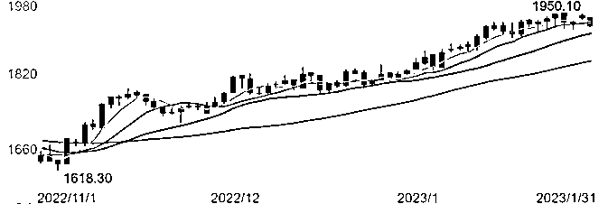

| 黄金日 K 线图

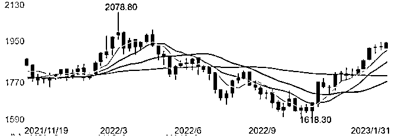

| 黄金周 K 线图

从 11 月份最低点 1618 反弹 10%以后，黄金在 12 月波澜不惊,但在 2023 年的 1 月迎来开门红，涨了 6.56%，最高点是 1950。所以，如果你从去年 11 月份的低点投资黄金且一直持有至今，迄今最高收益差不多在 16%。

我们来看梅里曼老师在 11 月、12 月、1 月《黄金报告》中给大家的投资建议：

**· 11 月的建议：“现在，平仓所有空头头寸，并且做多（价格低于 1680 时），在收盘价低于 1622.20 时止损。”** 

**· 12 月的建议：“你可以在 1720+/-25 兑现 1/3 的多头头寸。如果市场提供机会，在 1840+/-15 兑现另外 1/3 头寸。”**

**· 2023 年 1 月的建议：“现在我们将在 1720-1750 再次买入，在到达 1850+/-15 之前不卖出，甚至持有一些头寸，以备 1 月测试或突破 1900。”**

如果按照梅里曼老师的建议从 11 月开始操作，你的收益应该在 10%以上。看一下中国各个投资市场，就 3 个月而言，这不能不说是一个相当不错的投资收益。

现在，黄金已经突破了 1900。随着多项经济数据表明美国通胀正在降温，市场已经普遍预计美联储将在本周会议上把加息幅度收窄至 25 基点，并可能在今年晚些时候降息以刺激美国经济增长。在这种情况下，还可以继续投资黄金吗？

2 月份黄金报告已经上线，上证报告也已上线。欢迎了解。也可以按照季度和 1 年期订阅，有更多优惠。季度和年度的好处是，你可以持续了解梅里曼老师对于不断在变化的市场的看法。

即便他某一次看法和市场不一致，你也看到在下一期他如何调整自己的看法，并看到金融占星在一个长期时间段内对你把控风险的帮助。而能够长期控制风险、尽量找到安全的投资时机才是投资的长久之计。

点击阅读原文，雷蒙德·梅里曼黄金周期 2023 年 2 月报告带来有 40 年黄金市场研究经验的世界著名金融占星大师雷蒙德·梅里曼对当前黄金市场的研究。

**2 月黄金报告上线**

**黄金月度报告价格****单月报告**：280 元/月 **季度套餐价格**：780 元（260 元/月）**年度套餐价格**：2400 元（200 元/月）**双报告年度套餐更优惠（直降 900 元）****12 个月黄金报告+12 个月上证指数报告：仅需 3900 元****长按下图识别二维码购买黄金报告**
▼

**2 月铜周期报告**从 2023 年开始，我们将推出雷蒙德·梅里曼市场时机学院的铜周期报告。之所以推出这个报告，是因为**作为新能源发展所需的一个重要金属，铜的投资价值可能会随着新能源的发展而出现崭新机会。**铜周期报告的撰写者分析师马修·凯撒写到：**“每次经济革命都增长了这种红色金属的使用量，在电力网络和设备扩张的背景下，尤其是与绿色转型相关的电力网络和自动驾驶汽车、充电基础设施、可再生电力生产、输电等的扩张，目前铜需求的前景看起来比以往任何时候都要光明。****另一方面，铜供应既是高度集中，又受到极大限制，没有简单的方法来充分增加铜供应以满足这些加速增长的需求。因此，预计供应短缺将大幅增加，目前的情况似乎是未来 10-15 年牛市（以及可能的地缘政治紧张局势）的完美背景。”**自去年 11 月起，在一段较长的时期，铜价一直在盘整区间内缓慢攀升，形成了一个上升的三角形。中国是铜市场的一个关键驱动因素，一直在需求侧影响着投资者的情绪。动态清零政策在 12 月结束，且疫情以龙卷风般的速度过峰并趋向结束，中国经济的重新开放对 2023 年铜价有积极影响。

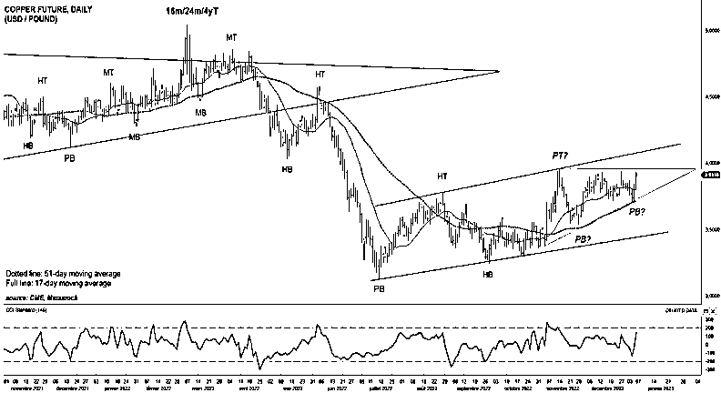

| 铜日 K 线图

**看好新能源发展的读者，这样一份报告可能帮助你提早了解铜交易市场、铜交易的价格变化，当投资机会到来时，果断出手，把握先机。**

点击阅读原文，购买雷蒙德·梅里曼铜周期 2023 年 2 月报告。**投资有收益，投资有风险，希望金融占星学的研究帮助你更好地评估你的投资。**

**2 月铜报告上线**

**铜周期月度报告价格****单月报告**：80 元/月**长按下图识别二维码购买铜报告**
▼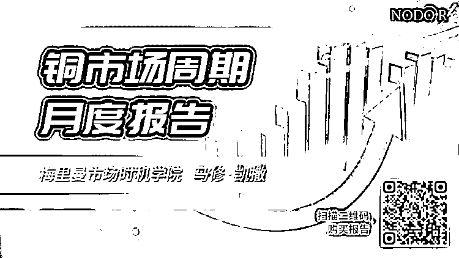

**购买者需知**

**① **梅里曼市场时机学院《中国上证指数月度研究报告》是梅里曼市场时机学院（以下简称 MMA）的研究“预报”，而不是市场“预测”，是梅里曼老师及 MMA 金融占星分析师对人类活动周期历史与行星周期之间相关性的研究，二者在大部分情况下具有 80%或更高的相关性，而不是因果关系。报告中的研究完全存在错误的可能性。即便是非常认真的研究和几十年的研究经验，金融占星师无法总是正确地解读出各种征象在实际层面上会如何相互作用，并显化为事件结果。

所以请将报告看作一个研究参考，务必结合其他市场研究和你个人对市场的理解，根据你的自由意志做决策。

**②** 此报告一旦售出，**即不接受退款。**

**③** 上证、黄金月度报告每月固定 1 期，**并非都是在每月相同日期发布。**

**④** **我们收到英文报告的当天，即发布该英文报告。3 天后，上线报告中文版。此报告仅支持手机网页阅读，不支持电脑阅读和下载。****以上须知，请仔细阅读。一旦付款，即视为已了解并接受所有须知内容。**在过去的 40 年中，唯有梅里曼逐渐完善，并在梅里曼市场时机学院月度周期报告中阐释了将地球宇宙学与周期相结合的研究方法，以惊人的精确性预报了黄金价格发生重大变化的时间。**黄金购买 Tip**

各大银行均可购买黄金或黄金 EFT 基金，也可以在诸如天天基金或者支付宝购买黄金及黄金相关产品。不明白的可以百度搜索。

**购买后如何查看报告？**

**购买后有疑问怎么办？**请联系技术客服
**微信：nodoor201705** **购买直达入口**

# 若道周运 2.6-2.12 丨激活自我创造的渴望，是本周的主题！（内含 12 星座运势）

> 原文：[`mp.weixin.qq.com/s?__biz=MzA5NjA0NTAxNg==&mid=2651499445&idx=1&sn=49bb693bee56a4544a016d7257a45ca5&chksm=8b481902bc3f9014a453cd65bcd0ab2242ea04ee8314f4e75e5a93a246b90b19c2163246c591&scene=126&sessionid=1692737690#rd`](http://mp.weixin.qq.com/s?__biz=MzA5NjA0NTAxNg==&mid=2651499445&idx=1&sn=49bb693bee56a4544a016d7257a45ca5&chksm=8b481902bc3f9014a453cd65bcd0ab2242ea04ee8314f4e75e5a93a246b90b19c2163246c591&scene=126&sessionid=1692737690#rd)

******☆ ****后台回复“今日”，给你一句生命态度******

作者/苏黎 ISAR 认证占星师
编辑/翀子 封面/书君 图片/稿定设计**整体氛围**

**群星顺行的 2 月，我们在第二周逐渐感受变革显化的能量。**

**2 月 4 日立春，**我们在貌似风平浪静的日子中，对未来的变革充满了憧憬，也对不确定性充满了恐惧和抗拒。这种内在的矛盾，如同站在命运道路中的转折点，如何使用**满月**的魔法棒，**激活自我创造的渴望是本周的主题！**

**本周的星体能量是拉开 3 月时代变化的序曲， 2022 年狮子座满月的进化主题，在本周满月再次激化和共振。**狮子座的月亮内在温暖而真实，渴望展现荣耀的光芒和智慧，本次的狮子座满月更特殊。

写作的当下，我接到月亮狮子座好友的信息。她和我分享她的故事，让我学习理解了狮子座进化的主题。

因为家庭的原因，她前段时间申请一个长程护理的险种，这是国家对年龄在 70 周岁以上，疾病或身体的原因，丧失生活自理功能老人提供的一个福利。虽然申请流程已经通过，但国家政策的初衷，并不是仅仅让老人的家属拿到补助，她还需要参与机构提供的培训护理的课程和考试。

下周一狮子座满月，她就需要去国家指定的机构参与这个培训。她很感慨地和我说，以前从没想过自己会参与学习此类课程，对她而言，尝试学习理解做护工的体验，是一个思想意识的挑战和转换。

**当月亮狮子座脱离以自我为中心的表达时，才能从灵魂层面真正理解和找到爱，自我的本身。**“月亮在这里可以温暖一颗受伤的心灵，可以唤醒迷失在情感纠葛中的人，也可以鼓励他人从眼泪中走出来。”（阿兰·欧肯）对她满月参与的课程，我期待她的感悟和分享。

**水瓶座的太阳，**代表集体意识，是人道主义的理想和愿望。当我们坚持自己的目标和身份时，需要变革的加速器，**有意识地跳脱出固定思维模式，学会集中和专注创造性的能量表达，我们才能找到真实的自我世界！**

**本周重要天象：**

*   **狮子座满月**

*   **水星六分海王星**

*   **金星六分天王星**

*   **水星进入水瓶座**

*   **火星六分凯龙星**

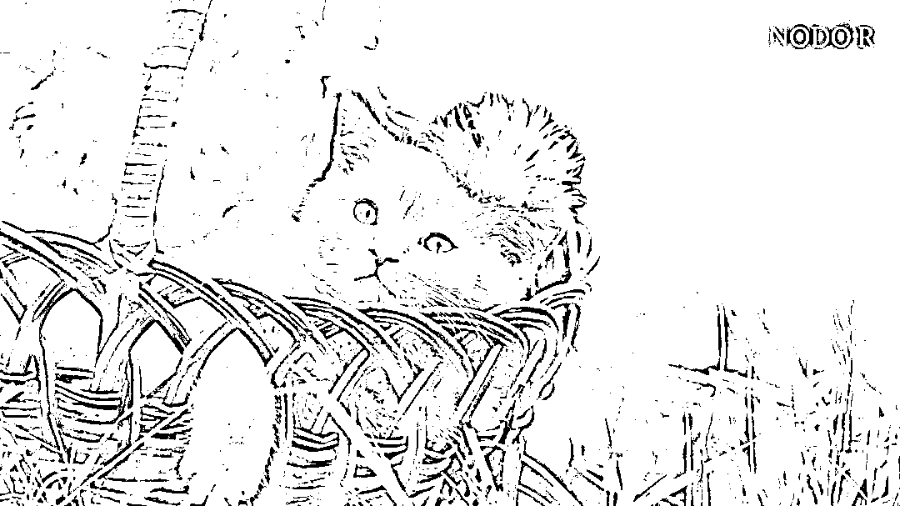

**一周重要天象****★ ****2 月 6 日，周一**

**狮子座满月**

狮子座月亮对分水瓶座太阳，逐渐对分水瓶座土星，太阳和月亮同时四分金牛座天王星；双子座火星三分水瓶座太阳、四分双鱼座金星、六分狮子座月亮；摩羯座水星会合冥王星，六分双鱼座海王星。

**这是一个充满天王星裂变能量的满月，2022 年狮子座满月主题再次浮现**。变化从来不是一蹴而就的过程，这一年来的星相能量，一直教导我们变革的功课。

外界世界动荡不安，我们渴望稳定和安全，舒适的世界，对动荡是抗拒的。这是我熟悉的生活节奏，习惯的食物，薪酬。这是我习惯的审美模式，价值观，可以保障我物质生活的金钱和资产。

**当满月与天王星形成 T 三角格局时，**个人的自我（狮子座满月）与集体（水瓶座太阳）紧张对峙时，我们会拒绝变革，害怕失去财富，爱，任何物质层面的失去，都会触发我们抵抗心理。

斯宾塞·约翰逊说过**“唯一不变的是变化本身”**。我们身体的细胞，每一分钟都在死亡，每一分钟都在诞生！低阶的金牛座排斥死亡，释放和物质层面的失去，个人的价值，物质财富和爱，观念，生活方式本身，我们渴望把这些打造成一个永久的“木乃伊”。

三年的疫情和现实世界的动荡，逼迫我们学会更理智、务实地面对现实。我们对现状不满，害怕动荡和变革引发的不安全感，情绪焦躁不安。**金星和火星的四分相**会触发情绪化的行动，也会在社会层面，引发对男性的阳性、传统父权意识与女性的阴性意识的探讨。

满月引发的思考，触动我们水星和冥王星强烈的探索意志力。著名的进化占星师斯蒂芬·弗里斯特，他在论述天王星在金牛座时，提到**“创造力和适应力是资本”**。固定星座的 T 三角缺乏弹性，不容易改变和妥协，放下和调整人生方向需要一个过程。

**从去年到今年，你学会到天王星功课了吗？我们需要足够的敏感，才能体会和培育变革的种子。**学会更灵活，理智（双子座火星）适应变革，放下骄傲的“我执”。

当我们对自己感到自信，重新认知，诚实面对真实的自我，爱与力量时，我们才能对所做的一切充满信心，将爱融汇到水瓶座的光芒智慧中！

**★****2 月 7 日，周二**

**水星（摩羯座）六分海王星（双鱼座）、月亮换座进入处女座**

满月期间的能量，是一个**整合和疗愈**过程，会激活我们内在的灵性的能量。**摩羯座的水星**带来务实，保守和组织性的能量。**双鱼座海王星**的美颜滤镜，艺术性的加持下，摩羯座的水星不会显得单调和保守。

我们在思考完成任务的过程中，灵感和想象力帮助发挥我们的直觉，人际沟通的过程中，会更有同理心。在生活层面，我们在处理生意，事业和工作的过程中，商业的警觉和直觉并存，不容易被外人带偏。

从事艺术性创作，慈善，保险事业的朋友，可以充分利用当日的星象能量**创造自己的机遇。**

周一的满月，狮子座月亮对分土星，第二天，上午月亮进入处女座。我们在满月期间经历的压抑，情绪的波涛，需要学习处女座月亮的方式解决。

成熟的狮子是高贵和有勇气的，无需向外界证明自我。真实的自我来自对阴影的接纳，理解生活中需要修复的层面。收拾屋子或杂乱的空间让能量场更干净。尝试通过针灸，艾灸等中医调理，或其他疗愈方式，让身体更舒服。只有健康的身心才能拥有变革的资本。

**解决和修复生活中的问题，我们会逐渐掌握变革的技能，找到情绪释放的加速器，拥抱人生的任何改变！**

**★****2 月 8 日，周三**

**金星（双鱼座）六分天王星（金牛座）**

这是合适**人际社交，艺术创作**的最佳时机。我们在平淡的日子里，忽然发现生活中的小确幸的存在，通过创作展现出来。生活中对爱与美浪漫的探索，感受和创造的过程，会让我们收获友谊和情感的支持。

晚上和爱人、朋友看一场电影，烛光晚餐、异想天开的旅途、一场意外的表白，会让你收获人际关系的喜悦。

**丰富的想象力是今日的礼物**，让想象力通过冥想，绘画，音乐，舞蹈和其他的方式表达出来，让世界看到你内心柔软的力量！心理层面，我们会更有同理心，关系中容易和他人产生共鸣，理解他人的价值观。生活中，我们也许会收获一份意外的礼物，意想不到的财富哦！

**★****2 月 11 日，周六**

**水星进入水瓶座**

当代表心智能量的**水星进入水瓶座时**，思维和表达能力会关注人道主义与人性精神的层面。我们对外界的评判不太关注，心智的能量很稳定，在我们心目中万物皆平等。这个配置的水星拥有“最强大脑”，看待事物的方式有创新的能量，是聪明和敏锐的，思辨能力很强。

从原则上看，水瓶座是开放和创新精神的象征。但从星座属性看，固定星座的天性是固执己见。我们在沟通交流中，需要保持真诚，**宽容和敞开的态度**去面对不同的观点。

明智的人需要从不同的思维、角度去看待同一个问题。风元素星座对情绪的控制和疏离感，也会让美好的理想只是停留在大脑层面。

社会层面，任何涉及**心智层面**的学习，阅读，逻辑分析都有利发展提升我们的技能。团体活动的分享，社群的讨论，社交网络中各种事件会成为我们的关注焦点。社会中的高新技术创新，自然科学的讨论，科幻作品等也成为社会探讨的主题。

**★****2 月 12 日，周日**

**火星（双子座）六分凯龙星（白羊座）**

休息日的月亮从天秤座逐渐进入天蝎座，这个时刻的情绪会很复杂，需要发泄隐藏的阴郁情绪，不想让外人看到。月亮的定位星就是双子座的火星，昔日被压抑、无法认同的自我、心灵的创伤，会因为某些事件被触动。

**火星的能量**是积极，灵活的，我们会更勇敢、无所畏惧地直面内在阴影和恐惧，更灵活地看待创伤的主题。

**天蝎座的月亮**有自我毁灭和痴迷的一面，也有治愈和修复的能力，这取决于情感层面是低阶还是高阶的表达。不必担心天蝎座的月亮！你可以和值得信任的朋友沟通互动，或通过阅读，写作等方式更积极地应对过去的伤痛！

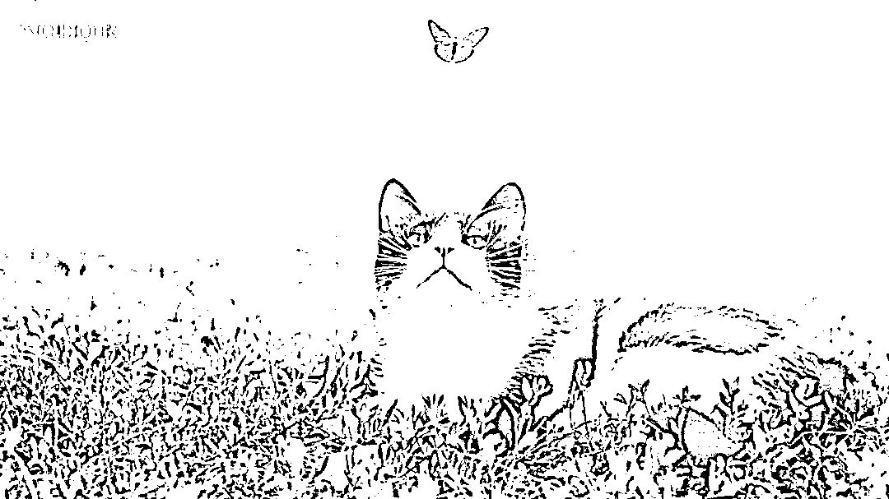

**12 星座的一周运势**

**（重点参考上升星座，其次参考太阳星座）**

***白羊座***

满月落入你星图中创造力、自我发展的宫位，你也许在集体目标和个体意识中存在矛盾。在看待生活物质财富的态度上，你面临价值观的震荡。在集体项目和合作层面，你感觉比较棘手，可能需要花费金钱，这让你感受到沟通中的障碍和脆弱，需要注意财务的动荡造成的心理压力。

水星换座，你可能会在社交圈找到解决事情的方式，在集体或者社群中，找到对你有思维启发的点子或者贵人，有助你将来建立长远的合作关系。

***金牛座***

满月落入你星图上和家庭，事业相关的轴线。有些人会搬家，更换工作，装修房子或调整办公室的布局。这个星象能量的变化，会让你情绪很激动，脾气容易暴躁。

天王星的变动是祝福还是冒险呢？取决你如何看待生活中的变化！在社群或集体中，找到人际关系的共振能量，有助缓解情绪的压力。

水星换座，这是你维护关系，推动事业沟通事项的最佳时机。你需要认真思考，你的职业方向是什么？拥抱变化，会让你明确人生事业的新目标！

***双子座***

满月落入你星图中和学习、沟通和短途旅行相关的宫位。有些人可能收到前期申请的 offer、报名某个活动，或与他人竞争某个名额。你可能处理和物流，证件相关的事宜，前期考试也有结果的呈现。本周也是你事业上展露身手、魅力展现的时机。

水星换座，你会学习将计划、目标和野心结合好，更长远的规划未来发展。本周末选择去旅游或运动，是不错的选择。

***巨蟹座***

满月落入你星图中和金钱、投资相关的宫位。对金钱的处理方式，你有自己的解决方法。相信自己很重要，学会关爱与培养自我是满月的主题。你可能会意外收到远方朋友的礼物，社交中会遇到对你有帮助的贵人。

水星换座，合适你通过发展副业，兼职赚外快。如果你有固定伴侣，合适和伴侣共同分享、交流心事。你也可能会听到某些秘密，从中窥探了解丰富的人性。

***狮子座***

满月对你是一个重大影响。工作层面，你可能在合作方面有一些事情确认，谈判合约类的事情可能进入收尾阶段。一些戏剧性的改变让你措手不及，这是衡量你智慧的时机。在集体或社群中，积极有效地拓展人脉，有助提升收入。

水星换座，自由职业者的运势好转，上班族的职场人士需要注意内部矛盾。周末合适在家庭中，和家人有更多的分享和互动，培养内在的动力，更好面对未来。

***处女座***

满月可能对你的睡眠有一些影响，你可能会失眠、多梦或睡眠不太稳定。你可能会去一些宗教场所走走，或做一些身心调整的疗愈。本周你也可能遇到某些对你有好感，想表白的人，但可能只是瞬间的心动，最后不了了之。

水星换座，工作运势开始走高。你在工作中学习用创新的态度、方法解决问题，内部会议和头脑风暴会增多。

***天秤座***

满月落入人际社交的轴线。你渴望在集体、社群中真实做自己。可能某些人的评价、长辈既定的某些“规则”惹到了你，让你很不舒服。学会正面地回应，维护自己的利益。如果面试或寻找实习机会，可能有好机会出现。

水星换座，激活想象力很重要，通过阅读，探索自己想要的生活很重要。对浪漫关系、文化教育你会有新的见解。做股票的朋友，需要后期注意投资方面的问题。

***天蝎座***

满月发生在你星图的 10 宫，这给到你事业转型的契机，为你未来的工作埋下伏笔。花时间思考你的天赋，事业的使命是什么很重要！你需要成为什么样的人，和家庭、社会要求你成为什么样的人是不同的命题。

你在关系中会为自己谋取福利，无论是解约、维权或仲裁都会给到你一个答案。某个女性朋友可能联系你，或收到一份礼物。

水星换座，你可能开始处理房屋，房产等家庭问题。周末主动外出，和朋友约会，克服阻碍你的情绪问题，在工作生活中树立信心。

***射手座***

满月在你星图和旅行、考试相关的宫位。你可能需要出差解决问题，渴望一场想走就走的旅行。某些人可能会办理签证、和旅游相关的证件、咨询法律方面的问题。满月也给一些人带来异地发展的工作机会或跨行业发展。有些人会想学习一些新知识，铺垫拓展新人脉。

水星换座，这是对智力和脑力的挑战，你会积极汲取新知识，快速行动，这符合你的天性。抓住这段时期，多阅读，和志同道合朋友集思广益，思想碰撞的火花会为你带来机遇。

***摩羯座***

满月激活你的投资财务、保险和内心意识的宫位。一些人会收到奖金分红、投资盈利，也有人找你谈合作的商业事宜。但金钱也是一个敏感的雷区，身边人的金钱问题需要谨慎。与伴侣在金钱、信任关系的问题上需要多学习，不尊重导致的金钱纠纷会让你很不愉快。

水星换座，对金钱、财富认知的主题浮现。未来有偏财和投资获利可能，但需要低调隐藏，避免意外失算。

***水瓶座***

满月在你的合作关系、伴侣的宫位，关系是满月的主题。一些人感受到关系中的对峙感，可能是无声、静默地出现，但他们敏锐感受并积极应对。这几天，可能你会完成签约、合作，推动一些文书工作的完成。工作、生活多线程并行，非常忙碌。

水星换座，你的头脑会更清醒，创新意识和创作能力爆棚。你会清晰明白自己需要什么样的社交关系。努力展现你的创造性思维，实现你的想法和计划吧！

***双鱼座***

满月在你工作、身体健康的宫位。在工作执行层面，你可能感受到压力，需要遵守执行的，并不是你真正希望的。理解打通关系的盲点，有助你推动工作事项发展。新发型、新的打扮让你焕然一新，你意外听到他人的赞美、认同，提升了自信心。可能你会得到女性好友的帮助哦！

水星换座，你可能会怀念过去的时光，如果有时间，可以尝试通过艾灸、中医等调理方式恢复身心平衡。

**版权声明**：原创文章由作者授权首发于若道平台发布，欢迎转发，反对抄袭。友号转载请申请白名单。

**END**

**苏黎（Sulis）**

ISAR 国际认证占星师（2019 年获得）/塔罗咨询师

现代占星融合古典解读

20 多年跨行业领域职场经历

**咨询微信**：liuzq26

**公众号**：Sulis_1975

长按打赏

**新的一年，来领取你的好运吧！**

**扫码**即可领取**专属的年运报告**

**学习占星学****点击下图了解课程详情**

**微信又双叒叕改版啦，不想错过若道君的推送？** 

****就把若道设为****星标****以及点点****“在看”****吧！****

**▼**

**喜欢就点一下“在看”吧！****报名直达入口**

# 中国经济的复苏会对刺激铜市场吗？ | 梅里曼铜周期+上证+黄金周期 2 月报告

> 原文：[`mp.weixin.qq.com/s?__biz=MzA5NjA0NTAxNg==&mid=2651499444&idx=2&sn=f8dd75fd749b077ba6d4c504faa1274e&chksm=8b481903bc3f901531b5db80a11b4fa1e1557678803e9ea00e9d3bea0e1d1bfa58a74dbdadc1&scene=126&sessionid=1692737690#rd`](http://mp.weixin.qq.com/s?__biz=MzA5NjA0NTAxNg==&mid=2651499444&idx=2&sn=f8dd75fd749b077ba6d4c504faa1274e&chksm=8b481903bc3f901531b5db80a11b4fa1e1557678803e9ea00e9d3bea0e1d1bfa58a74dbdadc1&scene=126&sessionid=1692737690#rd)

**2 月铜周期报告**从 2023 年开始，我们将推出雷蒙德·梅里曼市场时机学院的铜周期报告。之所以推出这个报告，是因为**作为新能源发展所需的一个重要金属，铜的投资价值可能会随着新能源的发展而出现崭新机会。**铜周期报告的撰写者分析师马修·凯撒写到：**“每次经济革命都增长了这种红色金属的使用量，在电力网络和设备扩张的背景下，尤其是与绿色转型相关的电力网络和自动驾驶汽车、充电基础设施、可再生电力生产、输电等的扩张，目前铜需求的前景看起来比以往任何时候都要光明。****另一方面，铜供应既是高度集中，又受到极大限制，没有简单的方法来充分增加铜供应以满足这些加速增长的需求。因此，预计供应短缺将大幅增加，目前的情况似乎是未来 10-15 年牛市（以及可能的地缘政治紧张局势）的完美背景。”**自去年 11 月起，在一段较长的时期，铜价一直在盘整区间内缓慢攀升，形成了一个上升的三角形。中国是铜市场的一个关键驱动因素，一直在需求侧影响着投资者的情绪。动态清零政策在 12 月结束，且疫情以龙卷风般的速度过峰并趋向结束，中国经济的重新开放对 2023 年铜价有积极影响。

| 铜日 K 线图

**看好新能源发展的读者，这样一份报告可能帮助你提早了解铜交易市场、铜交易的价格变化，当投资机会到来时，果断出手，把握先机。**

点击阅读原文，购买雷蒙德·梅里曼铜周期 2023 年 2 月报告。**投资有收益，投资有风险，希望金融占星学的研究帮助你更好地评估你的投资。**

**2 月铜报告上线**

**铜周期月度报告价格****单月报告**：80 元/月**长按下图识别二维码购买铜报告**
▼**2 月上证报告**春节过后，股指跳空冲高，回落。

| 上证指数日 K 线图

春节期间火爆的电影市场和旅游市场给人非常乐观的期待，仿佛经济的复苏和消费的反弹是指日可待的事情。而比上证提早开盘的香港市场则出现一片火热的情景，海啸般的疫情看起来已经过去，2023 年多地将 GDP 增长目标定为 5.5%附近，这些都是积极的消息。

另外，2022 年我国居民的本外币存款同比增加 18 万亿元，与前 3 年每年增长 10 万亿相比，多出 8 万亿，增长率创下 2009 年之后的新高，而贷款同比增长则少增长 4 万亿元，创下贷款新低。净存款增长率 43.69%创下 2008 年以来的新高。

| 数据来源：人民银行

另一个数据是我国居民的财富分布：

这些新增的储蓄如果不再流向地产，是将会用于消费的复苏，还是在股票市场复苏的时候流向投资？

当然，这一切取决于人们对于未来收入增长的预期。如果经济增速无法恢复，消费和投资都不会恢复。**从周期看，从 2019 年 1 月 4 日开始的上证的 5.5 年周期，到 2023 年就开始进入第 5 年，离波谷的时间越来越近了。**

| 上证指数月 K 线图

从另一方面看，如果 2022 年 10 月的低点是从 2019 年 1 月开始的 5.5 年周期的第一个 33 个月半周期的波谷，那么在 2023 年 2 月是第二个 33 个月周期的第 4 个月；如果 2022 年 4 月是第二个 33 个月半周期的开始，那么在 7 月份的高点 3424 是第二个 33 个月周期的波峰似乎也太早了。一切都似乎显示，上证很有可能冲向 3424 的高峰。

2 月份我们会看到 2 个值得关注的天象：

**2 月 4 日周六，太阳四分天王星。接下来是 2 月 15 日-16 日，金星合相海王星，太阳合相土星。**

**在 2023 年 2 月，应该如何操作？金融占星大师雷蒙德·梅里曼的《2023 年 2 月上证指数报告》已上线，你可以听听梅里曼老师的看法。你也可以购买雷蒙德·梅里曼 2023 年预报及沙龙，将帮助你对 2023 年的整年的市场风云变化加深了解。**

投资有收益，投资有风险，希望金融占星学的研究帮助你更好地评估你的投资。

从 2018 年年末，若道引入金融占星大师雷蒙德·A·梅里曼撰写的梅里曼市场时机学院每年一次的年度预报沙龙和每年一本的《年度预报》以来，**2023 年已经是第 5 个年度了。我们简单回顾了部分 2019-2022 年金融预报的内容，**过去的经验让我们相信，你根据梅里曼老师的指导作为投资参看，你会比一般人有更大的胜算。****

**长按下图识别二维码****了解更多详情**

**2 月上证报告上线**

**上证指数月度报告价格****单月报告**：280 元/月**季度套餐价格**：780 元（260 元/月）**年度套餐价格**：2400 元（200 元/月）**双报告年度套餐更优惠（直降 900 元）****12 个月黄金报告+12 个月上证指数报告：仅需 3900 元****长按下图识别二维码购买上证指数报告**▼**2 月黄金报告**

“**黄金是金钱。其他的只是信贷。**

**——约翰·皮尔庞特·摩根**

”

| 黄金日 K 线图

| 黄金周 K 线图

从 11 月份最低点 1618 反弹 10%以后，黄金在 12 月波澜不惊,但在 2023 年的 1 月迎来开门红，涨了 6.56%，最高点是 1950。所以，如果你从去年 11 月份的低点投资黄金且一直持有至今，迄今最高收益差不多在 16%。

我们来看梅里曼老师在 11 月、12 月、1 月《黄金报告》中给大家的投资建议：

**· 11 月的建议：“现在，平仓所有空头头寸，并且做多（价格低于 1680 时），在收盘价低于 1622.20 时止损。”** 

**· 12 月的建议：“你可以在 1720+/-25 兑现 1/3 的多头头寸。如果市场提供机会，在 1840+/-15 兑现另外 1/3 头寸。”**

**· 2023 年 1 月的建议：“现在我们将在 1720-1750 再次买入，在到达 1850+/-15 之前不卖出，甚至持有一些头寸，以备 1 月测试或突破 1900。”**

如果按照梅里曼老师的建议从 11 月开始操作，你的收益应该在 10%以上。看一下中国各个投资市场，就 3 个月而言，这不能不说是一个相当不错的投资收益。

现在，黄金已经突破了 1900。随着多项经济数据表明美国通胀正在降温，市场已经普遍预计美联储将在本周会议上把加息幅度收窄至 25 基点，并可能在今年晚些时候降息以刺激美国经济增长。在这种情况下，还可以继续投资黄金吗？

2 月份黄金报告已经上线，上证报告也已上线。欢迎了解。也可以按照季度和 1 年期订阅，有更多优惠。季度和年度的好处是，你可以持续了解梅里曼老师对于不断在变化的市场的看法。

即便他某一次看法和市场不一致，你也看到在下一期他如何调整自己的看法，并看到金融占星在一个长期时间段内对你把控风险的帮助。而能够长期控制风险、尽量找到安全的投资时机才是投资的长久之计。

点击阅读原文，雷蒙德·梅里曼黄金周期 2023 年 2 月报告带来有 40 年黄金市场研究经验的世界著名金融占星大师雷蒙德·梅里曼对当前黄金市场的研究。

**2 月黄金报告上线**

**黄金月度报告价格****单月报告**：280 元/月 **季度套餐价格**：780 元（260 元/月）**年度套餐价格**：2400 元（200 元/月）**双报告年度套餐更优惠（直降 900 元）****12 个月黄金报告+12 个月上证指数报告：仅需 3900 元****长按下图识别二维码购买黄金报告**
▼

**购买者需知**

**① **梅里曼市场时机学院《中国上证指数月度研究报告》是梅里曼市场时机学院（以下简称 MMA）的研究“预报”，而不是市场“预测”，是梅里曼老师及 MMA 金融占星分析师对人类活动周期历史与行星周期之间相关性的研究，二者在大部分情况下具有 80%或更高的相关性，而不是因果关系。报告中的研究完全存在错误的可能性。即便是非常认真的研究和几十年的研究经验，金融占星师无法总是正确地解读出各种征象在实际层面上会如何相互作用，并显化为事件结果。

所以请将报告看作一个研究参考，务必结合其他市场研究和你个人对市场的理解，根据你的自由意志做决策。

**②** 此报告一旦售出，**即不接受退款。**

**③** 上证、黄金月度报告每月固定 1 期，**并非都是在每月相同日期发布。**

**④** **我们收到英文报告的当天，即发布该英文报告。3 天后，上线报告中文版。此报告仅支持手机网页阅读，不支持电脑阅读和下载。****以上须知，请仔细阅读。一旦付款，即视为已了解并接受所有须知内容。**在过去的 40 年中，唯有梅里曼逐渐完善，并在梅里曼市场时机学院月度周期报告中阐释了将地球宇宙学与周期相结合的研究方法，以惊人的精确性预报了黄金价格发生重大变化的时间。**黄金购买 Tip**

各大银行均可购买黄金或黄金 EFT 基金，也可以在诸如天天基金或者支付宝购买黄金及黄金相关产品。不明白的可以百度搜索。

**购买后如何查看报告？**

**购买后有疑问怎么办？**请联系技术客服
**微信：nodoor201705** **购买直达入口**

# 周末树洞丨立春快乐！开工第一周，大家感觉如何？

> 原文：[`mp.weixin.qq.com/s?__biz=MzA5NjA0NTAxNg==&mid=2651499444&idx=1&sn=b96e04ff46222a7f541506b4251a50d4&chksm=8b481903bc3f90153e5d9cee57fed9509c099a1114b406130e280f7858cf0fab75cfb9e177a3&scene=126&sessionid=1692737690#rd`](http://mp.weixin.qq.com/s?__biz=MzA5NjA0NTAxNg==&mid=2651499444&idx=1&sn=b96e04ff46222a7f541506b4251a50d4&chksm=8b481903bc3f90153e5d9cee57fed9509c099a1114b406130e280f7858cf0fab75cfb9e177a3&scene=126&sessionid=1692737690#rd)

**2023 年 2 月 4 日天象：**

*   **16:48 月亮进狮子座**
*   ****太阳四分天王星、金星四分火星****

春节长假过去，大家陆续复工，大多数人正处在从吃喝玩乐模式中切换到工作模式的过程中，还不太适应紧张的节奏。宇宙就十分体贴的给了我们这样云淡风轻的一周，让我们有足够的时间来调整和过渡，好好整理自己，稳定心神，再迎接新一年的旅程。

今天，太阳和天王星的四分相，金星四分火星以及月亮换座，激活了天空中的能量，也为即将来临的狮子座满月（周一）拉开了序幕。一些改变正在发生，若有长久以来累积的压力，更容易感到冲击。可能你有想要冒险和豁出去的冲动，做些不同寻常的事情来证明自己，不过要警惕落入为了做而做的形式化陷阱。对他人的立场给予空间。

立春快乐！开工第一周，大家感觉如何？一起来聊聊吧！

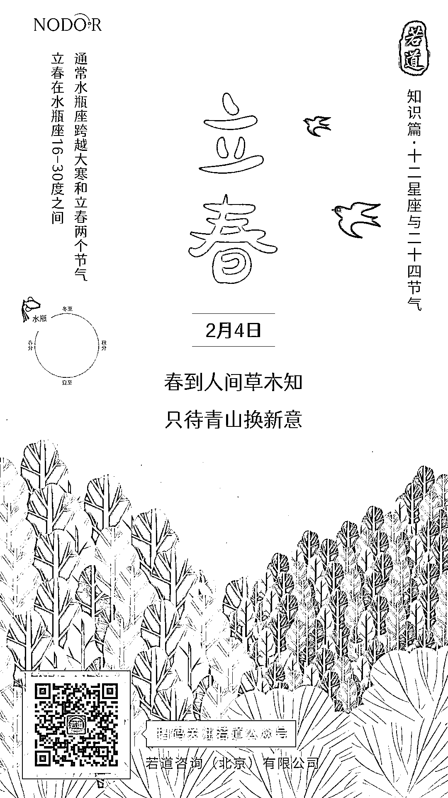

**快来领取你的 2023 年运报告吧！**

**了解每日天象，可****下载“若道”APP 查看****还有更多精彩等着你哦**

# 天蝎座好不好，取决于他信不信任

> 原文：[`mp.weixin.qq.com/s?__biz=MzA5NjA0NTAxNg==&mid=2651499367&idx=1&sn=d00a108e6b7eae46dcd1e8aaca2cdbad&chksm=8b4819d0bc3f90c639a1625d107fbcb1aa674e82de12eac56cd00829ac74b6ad6f453b9373b7&scene=126&sessionid=1692737690#rd`](http://mp.weixin.qq.com/s?__biz=MzA5NjA0NTAxNg==&mid=2651499367&idx=1&sn=d00a108e6b7eae46dcd1e8aaca2cdbad&chksm=8b4819d0bc3f90c639a1625d107fbcb1aa674e82de12eac56cd00829ac74b6ad6f453b9373b7&scene=126&sessionid=1692737690#rd)

******☆ ****后台回复“今日”，给你一句生命态度******

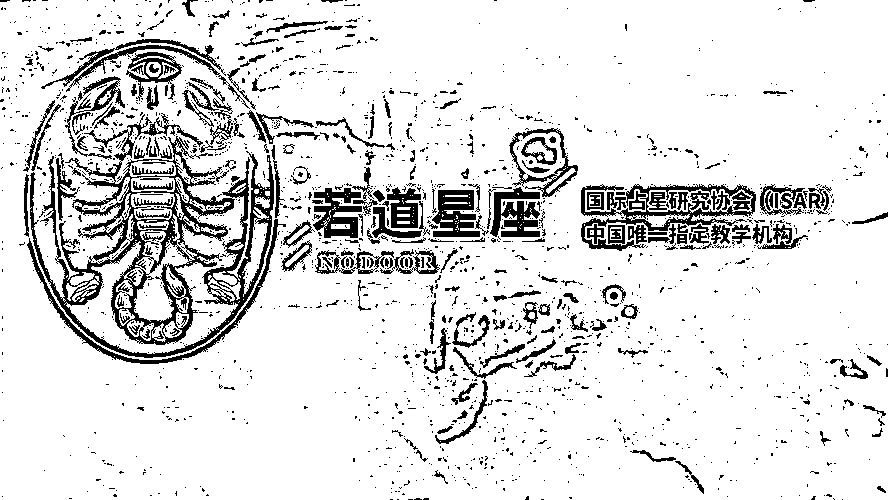

作者/杰夫•焦耳译者/凤影焰  校对/江艺  编辑/玫瑰 图片/稿定设计  文章来源/《大占星师》

天蝎座，这个带刺的星座，让人又爱又恨，欲罢不能。为什么这个星座在人群里（甚至包括不太了解占星学的人）会激起那么激烈的反应呢？一起看看吧！另外，大卫老师参与授课的【[2023 年中英双导师占星核心课 L1-5](http://mp.weixin.qq.com/s?__biz=MzA5NjA0NTAxNg==&mid=2651498482&idx=2&sn=c154d2b910c0f59a091f24a1f7381843&chksm=8b481545bc3f9c53597ce62e1a90c9fc9194ef2f50fa2eda0a9c58acec93cfbb01700ed440b6&scene=21#wechat_redirect)】报名中，点击链接了解更多详情！

**死亡、性、权利……**

天蝎座之所以看上去黑暗，是因为它触及了太多我们排斥的东西。

死亡召唤着我们，却在多数人否认，否认年长者的智慧、衰老和生命形态的转化。天蝎座提醒我们，万物必然死亡，这样才会有新的生命诞生。它让我们记起我们是肉体凡胎，终将腐朽，在死亡面前没有欺骗。 

我们需要性，结合的激情导致怀孕。相互融合的渴望带来新的生命。但我们被教育那是不纯洁的。**天蝎座也代表着权力，代表情绪、感觉和金钱的交流，以及赚钱的时间——我们称之为工作。但我们对这些交流视而不见，想要但不正视，欲求却不肯理会。**

我们同样在否认两性关系，我们太过独立，追求开放的、现代的交往方式，在合理的界限内保持可以协商的伙伴关系。但爱的界限在哪儿，激情和灵魂的界限在哪儿？我们分明被共同的人性捆绑在一起，而那孑然的孤立本身只是幻觉，认为我们是彼此分离的个体从根本上说是一种幻觉，那么为什么还要划清界限，彼此隔绝呢？天蝎座使我们惊恐，因为我们忘记了我们并不是分离的，我们彼此相连，并且和世间万物联系在一起，不论你叫它上帝、女神、共同精神、自然还是全能的那一位都可以。水象的天蝎座以水侵入我们的肌骨，弥合了我们之间的裂缝，让我们醒悟，我们本为一体。

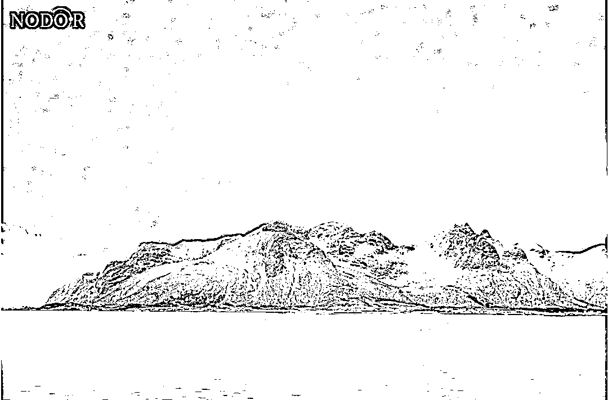

**封闭还是有力？**描述天蝎座在某人星图或生活中的作用并不容易，原因在于天蝎座似乎用两种截然不同的方式表达自己。

*   **一种是向内的能量：**封闭、压抑的感觉，害怕自我表露和力量；
*   **另一种是外向的能量**：向外的天蝎座能量却是一种强大的改变之力，表现得热情而强烈。

**如果我们不信任自己的能量，天蝎座的特质就会表现得迂回隐蔽，破坏性大于益处。但如果我们对自己的判断有自信并且愿意影响他人，那么能量就能自由而安全地流淌。**掌管认识和交流的 3 宫宫头落于天蝎座，成长经历中，可能有一个可怕的父亲或母亲压抑了你的表达，他（教）你使用挖苦讽刺来代替直截了当地表达。你可能曾体验过因说错了话而受到惩罚的恐惧。天蝎座的责任意识可能过度严苛，这是由受创伤的父母或者兄妹造成的。因此你可能连自己的话都不相信。你在交流中无法发挥最大潜力，你看到了很多，但是你害怕说出来。而自信的 3 宫头天蝎座却能有意识地使用它的语言能力和他人沟通情感，他们有深刻的感知能力，却并不消极。他们专注于相互谅解的心理侦探，而不是在黑暗角落里搜寻你的犯罪证据的探员。**如果天蝎座执著于惩罚，那么能量会经由统治欲被滥用，或者内化。**压抑能量的代价是高昂的。不仅仅让你和世界错失了天蝎座的洞察、帮助和疗愈的正面能量，而且强迫它转向内心，将它钳制于潜意识，把能量转变为毒素。**一丛丛欲望，如果在恐惧中被包藏起来，吞进潜意识的黑暗中，就可能会变成各种疾病的温床。**

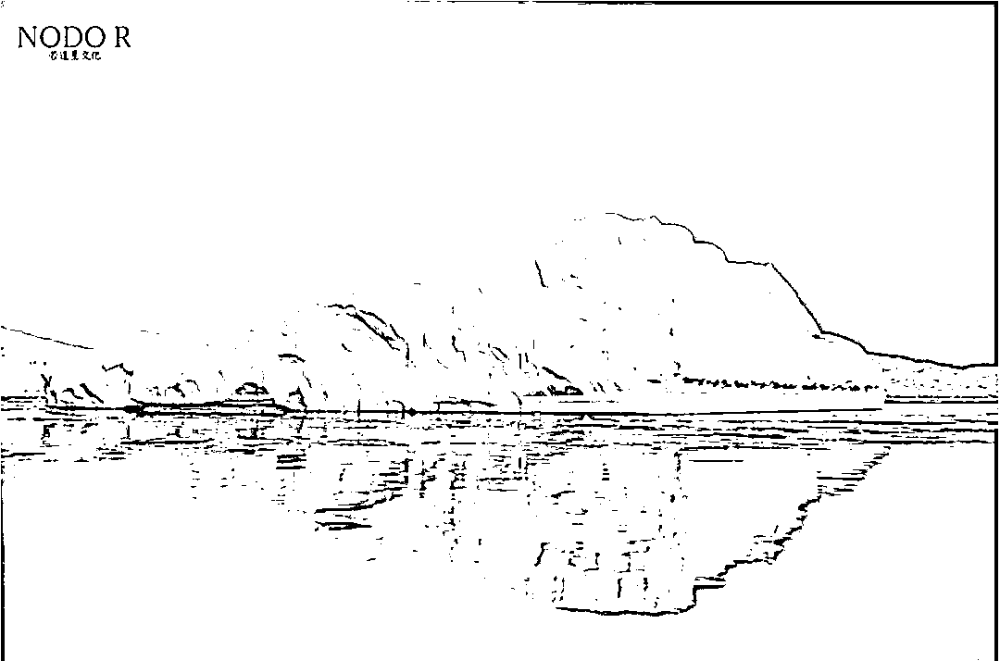

**信任是关键**天蝎座需要仔细思考一些东西。它非常矛盾，因为它是关于转化的固定星座。天蝎座象征了死亡和重生，这并不是一个静止的状态。面对超越理性的欲望，我们也许会不知所措。超越理性，真是天蝎座的美名。它的前一个星座天秤座就是关于理性的，它是平衡的思维，被亲疏之间的完美均衡所磨练的本位风象星座。但**天蝎座带我们越过了思维。我们下沉到自己身体、情绪和原始的感受中，也就是更底层的脉轮中。** **如果天秤座是关于亲密关系的，天蝎座就是它的极致。**结合的思想在头脑中和真正操作起来是非常不同的，天秤座为彼此之间思想上的联系打开了大门，天蝎座把这种联系深化下去，直到理性的层面之下。天秤座讲求公平，天蝎座只在乎生存；这就是狮子猎食斑马这种生存本能的力量。**生存的动力在公平这种智性的层面之下运作，它不是一种思想，天蝎座和思想无关。它是一种生存的状态，是在天秤座所打开的共享之门和射手座所追寻的超越个人层次的亲密关系之间的中间地带。**

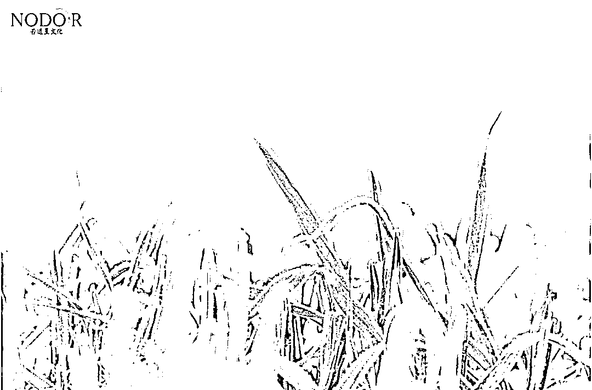

天蝎座更需要记住自己的纯真。如果你的 11 宫头在天蝎座，你仍然有可能身在一个团体中但不会试图操纵它。当你自信的时候，你可以和他人建立开放但有力的联系。你的欲望和恐惧不是你一个人的，而是人性交响曲中的一部分。如果你心怀纯真，联系的通道将更畅通。你自己的故事不会影响这种动力所关联的群体潜在利益。情感还在那里，但它没有被对权力欲望的恐惧扭曲本来面目，心门是敞开的。运用天蝎座能量的关键是信任，信任你自己，信任这个世界，信任改变的过程。正是信任，让死亡中产生出新的生命，让宇宙中有了运动。没有信任，我们看到压抑的典范，天蝎座所辖的领域将充满羞耻的秘密，而不再具有魔力。情感被压抑，深埋于内心，在恐惧中结成冰。而信赖外界的天蝎座充满热情，有着疗愈能力和动人的性感。**星图中落 12 宫的天蝎座**出生星座描绘了如何敞开心门，宇宙的能量如何在地球上生存。但星图的结构又不是那么简单，当加入宫位时，星座看上去会伸长、扩大或者收缩。在最常见的宫位制中，一个宫中通常有两个星座。我强烈推荐你考虑出生星图中一个宫位中存在的所有星座，这样才能获得更透彻的理解。比如当狮子座在 4 宫宫头，通向家庭的大门就在这个星座，但如果整个处女座都包含在 4 宫，对处女座的理解将大大拓宽对家和家庭的描绘。

***天蝎座落 1 宫***

**你习惯用怀疑的眼光看世界。权衡意味着在全身投入之前你会有所保留。**你在意识的层面下观察并搜集情感信息，你的任务不是做个甜妞儿（尽管你可以做到），而是游过连接我们所有人的地下水。你也许被教导要掩饰你的情感，但小小的气泡聚集起来会变成奔涌的岩浆，随即是势不可挡的爆发。

你可能对自己很严厉，清楚地觉察到掩盖在表面之下的力量，但接纳自己的阴暗面对你是有帮助的，不满、嫉妒和怀疑可能促使你前进，如果你接受其目的。你有心理学天分，探索自己和你的动机比评判并拒绝它们要有益得多。

***天蝎座落 2 宫***

你最大的天赋就是抓住资源的能力，你不需要尽力去捍卫权力，你天生有整合零散力量、点石成金的能力，在其他人看来是赔本的生意，你却能看到商机。好好利用你的复杂性，它不仅仅是阻碍侵扰的墙壁，更是运用你的魔力的关键。**你能够客观地分辨出哪些东西是他人必须付出的，这样你就能帮助他人做最棒的自己。**不要太过苛刻地评判你的才华。你需要一种良好的嗜好，从而找到实现自我价值的路径，你能够从你的兴趣领域中抽取出那里的一切来获取它。

***天蝎座落 3 宫***

当其他人只看到事物表面的时候你却能察觉到隐藏的暗流。你的观察技巧可能可以追溯到儿童时代的沉默寡言，所以你通过观察比同龄的其他孩子学到更多。你的话不是纯粹的装饰、夸夸其谈或甜言蜜语。你想要别人像你那样聚精会神地倾听你的言语，你通过交流改变他人，帮助他们认识那些隐藏的事物。**你对声音非常敏感，就连静谧，或者声音的细微变化都能给你很多信息。**你认为事物的深层联系比表面的事实更重要，不过记住，有时候简单的真理真的就那么简单。

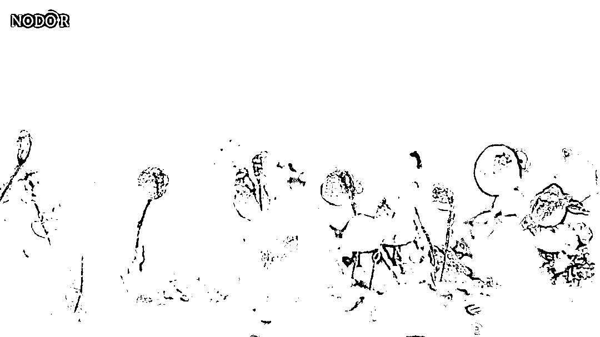

***天蝎座落 4 宫***

你在幼年就接触了成人世界里的性、权利和死亡。对阴暗面的本能体会可能很早就结束了你的纯真年代。最好的表现是你和你的家人在健康的基础上，彼此有很深的心理联结，然而有时候这个位置代表了家庭中的难言隐痛。4 宫是星图的基础，天蝎座在这里说明了你确实非常重视自己，在你的外表下是一颗探求事物真相与内核的心。**你的激情无法计量，但也许绝少被人察觉。冷静的外表下隐藏着你警觉的内心，但是这也是你的保护色——你有不动声色处理危机的本领。**

***天蝎座落 5 宫***

**玩乐对你而言是件严肃的事儿，你游戏的时候绝不允许分神。**你的认真程度让你不打倒对手决不罢休。最理想的情况是，你为其付出你的全部。极富激情的行动会带你突破理性的界线，但这本身就是天蝎座的精神。同样，你也不会轻浮地对待爱情。你的心决不虚弱，你的渴望也不。**你可能是个非常性感的孩子，但又会把表达自我看作羞耻的事情，所以隐藏自身欲望在这个位置并不罕见。**这种力量太过强大，你抗拒将它表现出来。小心地引导你的力量让你能够发挥出创造性的影响力！你可以把无用的材料和念头整合成新的创造。

***天蝎座落 6 宫***

**你充满激情地工作，你做得最好的是让你心仪的工作，似乎你离开它们就不能活了。**有时候这个位置也代表工作时被逼无奈，可能是来自外界的压力过于巨大。但是，最理想的情况是，这是一份必须深入探索，引起变革或者与危机处理有关的工作。可能会出现管理问题，因为对权利的合理利用可能成为一个重大问题。能集中精力是你的优点，因为要完成工作常常需要有能力处理相当不愉快的事情。**健康和爱好也是第 6 宫所涉及的问题，如果能规律性地洁净身体（就素排毒养颜吧）有很大好处，暗中的憎恨容易引发疾病。**

***天蝎座落 7 宫***

**不管你意识到与否，你都有一种寻求一位有力的伴侣，帮助你突破限制带来改变的欲望。**你可能会吸引个性很强并且试图改造你的伴侣，这个问题的两难之处在于你的伴侣在意念强大的同时也会非常顽固。你需要做的是**收回自己的能量，认识到你的存在也是为了帮助他人的改变。****亲密关系会涉及最根本的信任和控制问题。寻找一个和你一样乐意同彼此分享恐惧的人会很有帮助，只要那是改变之路上的垫脚石。**亲密关系不是为了让你有安全感，而是通过一个与你力量均衡的人的帮助，让你更加深入了解自己。

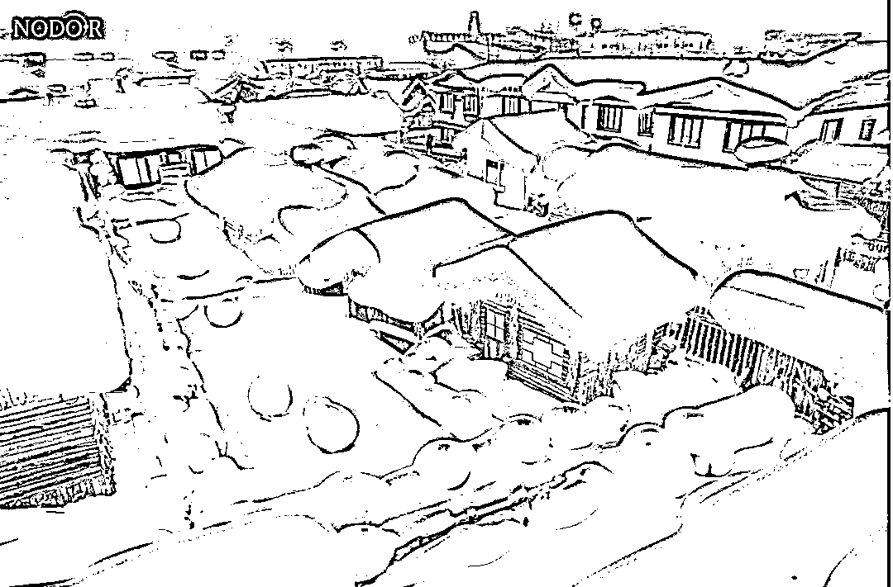

***天蝎座落 8 宫***

这里天然是天蝎座的家，所以你可能对天蝎座的核心课题——性、死亡、转化更加熟悉。你是身体、头脑和精神的领路人。你在这里接引众人超越他们本来的限制展现出他们所有的资源。有可能这一宫会被投射出去，你需要其他人用他们的渴望来激烈你并且带领你改变，但你必须克服恐惧，超越舒适熟悉的已知世界。亲密关系中通过热烈的结合让你重新认识自己的灵魂。冷静的伴侣绝对出局。**你在他人遭遇危机时表现最出色，这对疗愈者和帮助者是良好的位置。不伴随负面剥削的付出和给予是天蝎座在此的一个挑战。**

***天蝎座落 9 宫***

由于你对所有事物的意义都充满兴趣，因此有一点儿怀疑主义是很自然的。如果一位老师魅力超凡或者至少通过了你的标准，你就会完全成为他忠实的拥护者。你的信仰不是随随便便的，也不会和你的生活选择无关。你也许在年轻的时候有过宗教狂热或审判他人的行为。**天蝎座在这一位置的人拒绝宗教的原因常常是为了之后能在一个更新和更有力的层次上重新发现信仰。**你不会游戏你的信仰，它们不仅仅是信念指导下的思想和行为，它们已经深入你的每一个细胞。当你教导别人的时候，你付出全部的自我。当你旅行的时候，你也不是走马观花，而是深入你所游览的地方的精髓之中。

***天蝎座落 10 宫***

**你的职业有两种可能的选择——要么自己做主要么被人牢牢压迫。只有将天蝎座的能量引向社会可以接受的形式，它才可以为你所用。**你的能量足以为你所选择职业领域带来改变。然而没有焦点的话，这种激情会被压抑甚至转为憎恨。你适合做**和治疗、危机（身体、情感、金融）和改革有关的职业。**很关键的一点是你感觉自己有权在世界上获取地位，没有这一点许可的话你的能量就不容易有效地发挥。**尽管外表淡然，你暗自衡量着公众对你行为的反应。在重压之下你可以成为一个伟大的领导。选择可以打动你的挑战，为自己创造压力。当你没有工作焦点的时候反而容易阴沟翻船。 **

***天蝎座落 11 宫***

**这可能是社会或政治狂热者的位置。你可能是忠实的朋友、热情的同志和革命者。你不需要被一大堆朋友围绕，因为彼此间的信任是你更看重的。**如果你很受欢迎，那么通常是因为你给团队建设带来了强烈的影响。你不会用外表去引起别人的注意，内在的理想才是你重视的。**你会发现自己被非主流的团体吸引，你生来的任务就不是支持现状，而是去质疑它。**你也许有能力在理想遭到沉重打击后，又在灰烬中重生。这是典型的天蝎座特质——在无路可退的时候才最坚强。**无论如何，你最可能尊敬的人是那些为了追求成功投入一切的人。拖后腿的队友会受到你的谴责。**

***天蝎座落 12 宫***

**认同社会边缘人是 12 宫的特质之一，当天蝎座在这里时表现得更明显，你有在困境中寻找力量的本领，所以会是弱者的鼓舞。**但你可能会在公开展现力量时遇到些困难，你更希望把它们保存起来直到最令人绝望的时刻。但这有时候可能让你感到不舒服，如果你想要让自己看起来强大有力。即使掌握了所有筹码，你还是觉得自己像个失败者。**天蝎座在此的另一个特征是深刻的神秘主义者，对神秘学、疗愈和形而上学感兴趣，你对现实的看法不是传统的，会成为在两个世界之间的引路人。**

**版权声明：**本文由若道翻译，欢迎转发，反对抄袭。友号转载请申请白名单。

**END**

**新的一年，来领取你的好运吧！**

**扫码**即可领取**专属的年运报告**

**拥有 53 年占星实践经验的若道创始人** **大卫·瑞雷**

**&最懂学员的若道首位认证金牌中国老师**

**熊鹰**

**最默契的师徒二人****再度联合打造**

**2023 若道全新核心占星课程**

**课程结构****全面升级****教学内容****翻倍惊喜****补充资料****丰富多样****沉浸式互动****案例教学****以学员为案例进行课堂的占星咨询演示****职业占星师养成计划**

**点击下图了解更多课程详情** 

**学习占星学****点击下图了解课程详情**

**微信又双叒叕改版啦，不想错过若道君的推送？** 

****就把若道设为****星标****以及点点****“在看”****吧！****

**▼**

**喜欢就点一下“在看”吧！****报名直达入口**

# 初阶丨心平健康学：身心平衡的疗愈实践

> 原文：[`mp.weixin.qq.com/s?__biz=MzA5NjA0NTAxNg==&mid=2651499367&idx=2&sn=269169fb22e80b8ff467635a75d7fd3d&chksm=8b4819d0bc3f90c6d8fd4b54c48ea8eb4f2159d68e8654e313fcfe9011251364c4aca4363a4e&scene=126&sessionid=1692737690#rd`](http://mp.weixin.qq.com/s?__biz=MzA5NjA0NTAxNg==&mid=2651499367&idx=2&sn=269169fb22e80b8ff467635a75d7fd3d&chksm=8b4819d0bc3f90c6d8fd4b54c48ea8eb4f2159d68e8654e313fcfe9011251364c4aca4363a4e&scene=126&sessionid=1692737690#rd)

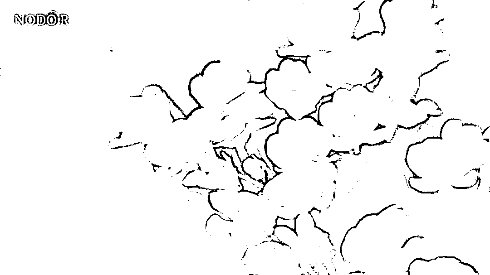

**授课内容**

**所有的疾病都是身心疾病。**

我们的祖先很早就认识到这一点。

在最早医学著作《黄帝内经》开篇《素问·上古天真论》中，就讲：“虚邪贼风，避之有时，恬淡虚无，真气从之，精神内守，病安从来”。**这是对于“内因致病”和“修心去病”最早的描述。**

在《素问·刺法论》，黄帝又问流行性疫病。他说“余闻五疫之至，皆相染易，无问大小，病状相似，不施救疗，如何可得不相移易者？”岐伯对此的回答是：“不相染者，正气存内，邪不可干。”

可见不仅对于个体性的常见疾病，哪怕对于大多数人都会感染的流行性疫病，只要“正气存内”，就可以有效预防和对治。

那么什么样的因素会导致“内心正气”的偏离呢？《大学》里说，“身有所忿懥，则不得其正。有所恐惧，则不得其正。有所好乐，则不得其正，有所忧患，则不得其正。”

《素问·阴阳应象大论》里把七情六欲和人的身心疾病对应起来，提出了我们常听到的“怒伤肝、喜伤心、思伤脾、悲伤肺、恐伤肾”等这些“不平”的心理情绪对于身体的损伤。

而《素问·平人气象论》更明白指出，“无问其病，以平为期”。“平人者，不病也”。

**中医叫健康之人为“平人”，而平人就是阴阳平衡之人，没有太过与不及。**

然而从小到大，在我们的人生经历中，我们必然经历各种各样让我们内心不能平静的事情，不论是过去，还是现在，我们都经历了各种情绪起伏，并在各种固有的、自知或不自知的情绪模式和偏颇的信念模式中。

但大多数人不知道的是，这些内在因素都会导致我们的身心失衡，最终反映在我们的心理疾病和身体疾病中。

而现代西方的身心健康研究也证明了我们祖先的智慧。**身体，就是我们心灵的显示器。身体的疾病，不仅是因为内心的失衡而产生，也可以通过内心的调整而治愈。**

**而心平健康学正是建立在中医的“内因致病”为理论基础，通过特定的方法，找到内因，调整内因以达到治愈疾病、身心的平衡的一门实践性很强的自我疗愈、疗愈他人的方法。**

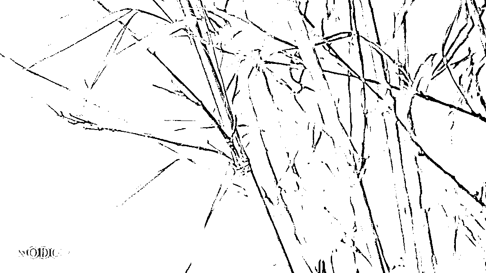

**心平健康学**

心平健康学是王中平老师从 1986 年开始，经过三十多年研究和实践，发现和总结各种身体症状和心理不平衡相对应规律，并运用这些规律调解和祛除不平衡身体症状，以达到身心同时健康的学问。

**这个学问体系以中国古老医学经典为其理论基础，以自然力（事物运行发展的法则，简称自然力）为核心，平衡论为主导。**

对于身体的不适，运用心平健康学的方法，可以找到“不平”所在。这种不平包括情绪、感受、认知、内心的想象、活动和用力、外在的语言、行为等多方面。

*   **比如生活中日积月累的不平的情绪、感受会变化成身体上不平衡的感觉；**

*   **内心中使的力、用的劲会在身体上留下痕迹（俗话叫用力过猛）；**

*   **而不辩证、不中正的认知会导致疾病的不同性质；**

*   **假设、想象中的各种不平心会影响到我们的神经系统。**

而当我们把“内因”，也就是不平衡的心理，通过特定的方法、技术调整为平衡，心在“ 平静、平衡、平等 ”的状态下，身体就会转为健康和谐，这就是“ 病由心解 ”。

**初级班学习步骤**

**★****课程前**

1.  自习（提供音频）王中平老师教授的心平健康学初级班四日音频课程

2.  读心平健康学内部学习资料《认识平衡》

**★****课程中做什么及收获什么**

1.  **学习“揉球”方法，**“揉球”是心平健康学体系中贯穿始终的在潜意识层面调治不平心理的方法、技术、工具。有自然揉球、定向揉球，（也就是有主题的揉球）、及缩减版拇指揉球。“揉球”的目标即是把不平衡的心理调整为平衡、平静。三日初级班课程，是实操课程，通过连续 18 小时的练习和实践，对“揉球”的方法不断的体会和夯实，以便课程结束后可以通过“揉球”的方法在生活中调整自己不平衡的心理及调整相应的躯体症状。

2.  **一对一个案治疗，学习治疗方法及完成治疗。**

    通过课程中自己及团体的一对一个案治疗，体会到自己在过去、现在及对未来有什么样的不平衡心理，导致了相应的躯体症状、心理疾病及不和谐的关系，并在个案中完成治疗。在自己及他人做个案的过程中体会治疗方法，以便课后可以自然应用方法。

**★****课程后**

听心平健康学讲师彦方录的音频课程：“揉球”过程中的疑惑与解答。

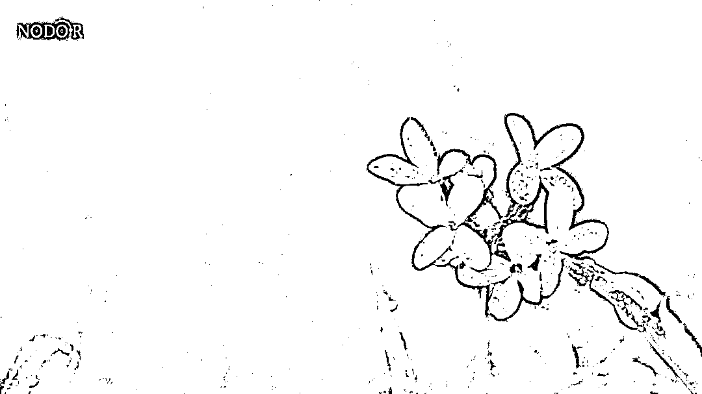

**老师介绍**

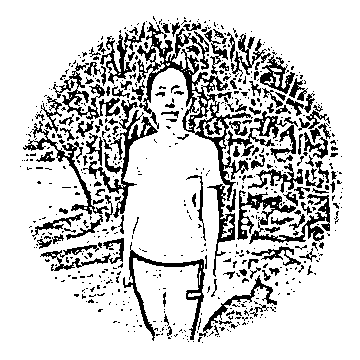

**张彦方**

硕士，心理咨询师；心平健康学初级班、综合中级班、女性健康专项中级班、亲子关系专项中级班讲师，并教授脏腑研究型课程，经典研读课程（中庸、道德经），断食课程，耐寒、耐热课程，物质平衡课程。

2017 年初教授心平健康学系列课程，累积课时 2000 小时以上，个案咨询 5000 小时以上，主要擅长通过调整不平衡的情绪、感受、认知来改善躯体症状，尤其在女性因为情绪、感受等不平衡心理所导致的乳腺增生、卵巢囊肿、月经不调等妇科疾病上有深入的研究和实践经验。在改善亲密关系和亲子关系方面有较多成功案例。

**课程推荐**

疗愈的层次，在西方讲身心灵，在东方讲形气神，其实都是在说物质、能量与信息。物质层面的治疗如现代医学，能量层面的治疗如中医针灸，而信息层面的治疗相对较少，也往往很神秘，比如西方的炼金术、灵媒，中国的祝由、道家法术等。

心平健康学是少见的既能在“神”的层次展开治疗，又十分朴实、接地气的一门技术。通过简单的肢体动作、配合起心动念的练习，就可以达到调神的效果，并借由“身心同调”的方式，从神（信息）影响形（身体）与气（能量），属于个人成长之路上的卓有实效的修行好伴侣。

——天空的空

**课程价格**

**费用：2700 元** 

**授课方式和时间安排**

**线上授课：**12 人小班制

**授课时间：**2023 年 2 月 24-26 日，上午 9:00-12:00，下午 2:00-5:00，共计三天

**咨询请添加李老师微信：cd13518140789**

长按二维码添加李老师微信

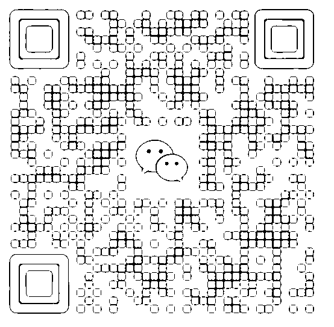

****心平健康学初级班****

**授课老师：张彦方**

**开课时间：2023 年 2 月 24 日-26 日，上午 9:00-12:00，下午 2:00-5:00，共计三天**

**授课方式：******网络授课****

**费用：2700 元**

**课程负责人：李老师**（微信：cd13518140789）

长按二维码添加课程负责人咨询

**报名直达入口**

# 这个宫位说：谦逊，才是获得亲密关系的一把钥匙（不是七宫）

> 原文：[`mp.weixin.qq.com/s?__biz=MzA5NjA0NTAxNg==&mid=2651499296&idx=1&sn=797446a9a8b0a503b4ca110cae8a694a&chksm=8b481997bc3f908177488b5396535f21f53eb9a4b7d9b7dfd1c3c9e27f71a3a364a61c10d37f&scene=126&sessionid=1692737690#rd`](http://mp.weixin.qq.com/s?__biz=MzA5NjA0NTAxNg==&mid=2651499296&idx=1&sn=797446a9a8b0a503b4ca110cae8a694a&chksm=8b481997bc3f908177488b5396535f21f53eb9a4b7d9b7dfd1c3c9e27f71a3a364a61c10d37f&scene=126&sessionid=1692737690#rd)

************☆********************后台回复“今日”，给你一句生命态度************

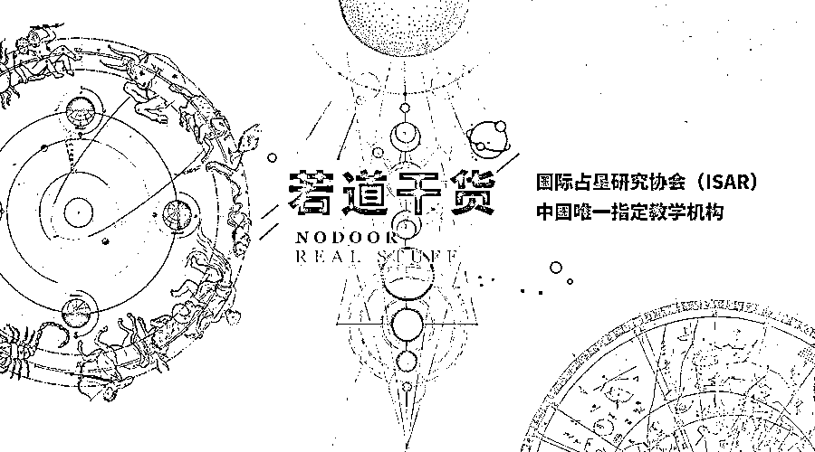作者/斯蒂芬·弗里斯特
译者/李含 校对/Chang
编辑/玫瑰 图片/稿定设计第 6 宫在亲密关系穹庐（the arc of intimacy）中似乎有些“格格不入”——这个宫位和亲密关系有什么关系呢？其实它的存在也相当重要，一起看看哦。**第 6 宫**

**传统名称：**仆役宫

**对应的星座：**处女座**关联行星：**水星**领域：**谦虚的自我评价；现实主义；接受自己和他人的不完美；良性的师承关系。**进化的过程：**接受教诲、榜样和导师；接受对关系的责任；容忍对方的过错；认识到没有人是完美的；谦逊。 **中断序列：**主导-从属的模式；一方对关系的贡献远远超过另一方；拒绝承担责任或妥协；相互批评、贬低或破坏对方。一项需要导师指导的功能发展不足。**在第 6 宫的宫头，我们正试图跨越进入成人的现实世界的这条线。**它邀请我们接受关于生活的一系列艰难的事实。许多人来到这个宫头，然后沮丧地往回走。但是当他们掉头往回时，他们就回到了青春期的意识阶段：**自我放纵，不切实际，喜欢抱怨，有一种成为受害者的感觉。**第 6 宫邀请我们去认识到，**生活中出现过的一切问题都有一个共同的源头：我们自己。**我们是问题所在。我们是难对付的、疯狂的、自私的——你能想到的尽管去罗列吧。如果有人愿意爱我们，我们应该跪在他们面前，满怀感激和惊叹。这些话听起来多么不合时宜！因文化使然，我们现在不太擅长第 6 宫。**这是谦逊的宫位。不是羞辱，那是第 6 宫的阴影特质。**但谦逊：这是诚实的另一种表达。老实说，我们都是一团糟。另一种说法是，我们都在一个有意义的宇宙中进化灵魂——这是一种更好听的修辞，但想想看：进化灵魂是因为我们需要进化。我们还没有完成。我们还不“正确”。和任何人一起生活一两年，你就会开始非常准确地看到关于他（她）不讨人喜欢的那些真相！但在第 6 宫，我们需要照镜子。如果做到这一点，就会发生两个奇迹。首先，**我们开始真正地着力于自身**，因为在认识到这一点之前，任何问题都不会得到解决。其次，我们也**学会接受对方的缺点。**我们不再寻找完美的关系，也不再因为关系的不完美而感到愤怒。我们拒绝这种徒劳无益。我们失去了高傲。

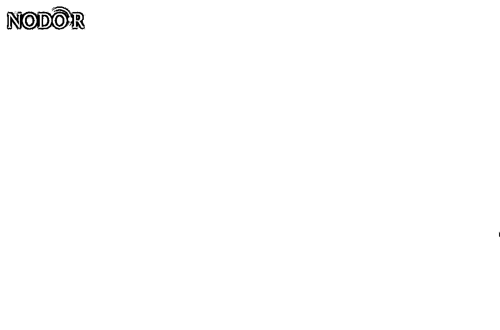

只有这样才能获得钥匙，打开通向第 7 宫和第 8 宫的锁——这是真正的婚姻宫。**如果没有第 6 宫的谦逊，我们就到不了那里。**我们就会一直渴望完美，在 3 种可能的心理状态中度过一生：**感到被伴侣困住并对其失望、“一直约会”，或纯粹的孤独。**这是一项艰苦的工作——实在太难了，以至于没有人能独自完成。这就把我们带到了第 6 宫那失落了的核心。**这里是导师的宫位。我们在这里找到自己的老师。**成为人，是一门古老的艺术。我们怎么能指望一个孩子懂得呢？我们怎么能期望任何人在没有进入意识传承的情况下知道它呢？传统占星学中你可能读到的对第 6 宫的描述中，最接近于这一项的，是它关联到**“叔叔阿姨”**。在大多数文化中，他们在自己的侄女和侄子的生活中扮演着非常具体的教育和启蒙角色。如今，我们已经失去了这一文化，但也许我们正在重塑它。无论如何，你会从自己的第 6 宫了解到有关你的导师的精确描述，以及你需要向他们学习的课程。所有这一切的背后都是一个简单而古老的真理：在缺乏指导的情况下，没有人能指望在人类爱情这样困难的事情上取得成功！在一个更加开明的世界里，我们可以推进一步，把这称为性教育的一种形式。**不同星体落入第 6 宫****太阳落入第 6 宫**

**你天然的导师是太阳式的人物。**他们生动有趣，而且有一定程度的存在感。他们教你的是，**你有生存的权利。**你有权要求得到你需要的东西。你不可能在一段亲密的关系中不暴露自己——私密的自己。这意味着你的自我意识有时会显露出来，无论是缺点还是一切。

你喜欢躲在你的支持力和责任感背后。你不需要这么“好”。事实是，这种行为会让你产生一种愤怒的反应和一种不言而喻的优越感。放下它，你就有了亲密的可能。

**虚心地认识到：**你把自己的心藏在支持力背后**要寻求的导师：**闪耀的人

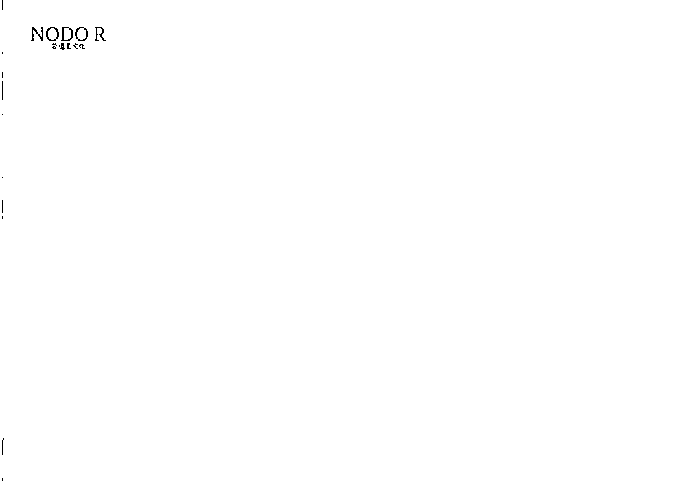

**月亮落入第 6 宫**你天然的导师是月亮式的人物。**他们以滋养和情感为导向，他们接受你进入他们自己。**他们教导你的是**情感上的接受力——如何表现出脆弱的一面，以及如何在别人身上引发这种行为**。这里的问题围绕着创造一种温暖的、除了我们之外没有别人的共鸣，在这里，**慷慨的支持是自然而然的，并且没有恐惧和筹谋的预期。****小心你的奴役倾向。不要仅仅通过行动来表达爱。通过眼神接触、触摸、肢体语言来表达亲密。****虚心地认识到：**你害怕被人看见；你害怕毫无防备。**要寻求的导师：**有一种情感存在和支持的光晕**水星落入第 6 宫****你天然的导师是善于言辞的人，他们天生善于讲故事，是健谈者。**他们**敏捷、活泼、充满好奇心，是优秀的听众**。从他们的细胞传递到你的细胞中的，最重要的是这种**真正倾听你的伴侣的能力，以及激发他人交流沟通的能力。**认识到，清楚明确、文字技巧和令人印象深刻的论证实际上可能会阻碍真正的双向关系。**虚心地认识到：**在亲密对话方面你需要一些帮助。**要寻求的导师：**让你充满了向他们倾诉一切的欲望。**金星落入第 6 宫****你天然的导师是优雅而浪漫的，他们散发着彬彬有礼的光环。**因为你需要学习，他们正在教你复杂的爱的艺术，如何保持魔法的活力，如何展现自己的魅力和诱惑力，如何用有效的交际手段处理棘手的问题，如何得到你想要的东西。文明让我们变得长寿，因此我们没有本能的基础来解决问题，比如在血液中荷尔蒙的半衰期之后保持爱情的活力。寻找这些精致艺术的导师。**虚心地认识到：**持久的两性关系是一门艺术，是一门你没有完全掌握的技艺。**要寻求的导师：**富于吸引力的人格。**火星落入第 6 宫****你天然的导师是激烈、强健、性感和充满活力的。**他们是咄咄逼人的那种人，别人要么爱他们，要么恨他们。他们在这里帮助你有效地表达自己的激情。其中一些涉及传授给你有关适当释放愤怒的技巧。其中一些是与把你的性需求坦率、清楚地摆在桌面上。很多事情可以归结为，有时难以相处是你与生俱来的权利 _ 以免你压抑自己的盛怒太久，最终冲破堤坝，淹没整个村庄。**虚心地认识到：**你往往会掩盖你“更炽热”的一面。**要寻求的导师：**有热情、有激情、够坦率。

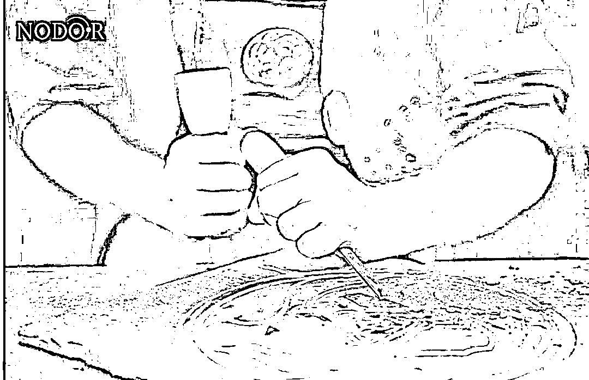

**木星落入第 6 宫****你天然的导师对自己充满信心，也对你充满信心。**他们是天生的“国王”和“女王”，无论走到哪里，都营造出一种开朗豪爽、轻松欢笑和充满希望的氛围。他们期待你做到最好，也给你最美好的祝愿，他们对你的信任是有感染力的：你可能会深受触动！这就是关键。你的自我价值感需要一剂强心剂，就像谚语所说的，你愿意把生命喝得一干二净。**虚心地认识到：**你执着于谦逊；你满足于太少。**要寻求的导师：**让他身边的每个人都对自己感觉更好了。**土星落入第 6 宫****你天然的导师是严肃认真的、有成就的、脚踏实地的。**他们已经证明了自己有能力完成伟大的工作。他们与你分享了某些积极的品质：**责任感，自律，愿意从事几乎一切对成就有存在价值的基础杂务。**但他们已经将这些能量与值得他们最高愿景的东西结合起来。**他们避免了机械的奴役，避免了单纯的“善良和成熟”。**也许他们可以激励你也这样做。**虚心地认识到：**奴隶原型试图吞噬你的灵魂，伪装成美德。**要寻求的导师：**完成了让你充满敬畏和钦佩的成就**天王星落入第 6 宫****你天然的导师是古怪疯狂的男人女人。他们是求异的思想者——从某些角度来看，他们是麻烦制造者。**从另一个角度来看，他们是**天才、革命者、范式改变者。**他们是靠冒险才走到今天。他们一直不愿妥协，即使逻辑和理性告知他们应该妥协。他们活了下来。他们绝对不会暗示你会追随他们的脚步！他们希望你走出自己的步调，希望是地球上从未见过的足迹。**虚心地认识到：**你内心的狂野男人或者狂野女人成绩不佳。**要寻求的导师：**让权威人士头疼的人**海王星落入第 6 宫****你天然的导师是神秘的、有远见的和敏感的。**他们中的许多人都是**真正的通灵者**。许多靠想象力或智慧谋生，或两者兼而有之。他们认识到，**在精神层面上，你是一颗未经雕琢的钻石——在某些方面是完全开放的，但是需要稳定、训练和“技术支持”**。**你拥有一些深奥的神秘天赋，但你不知道如何运用它们。**因为你的敏感也是脆弱的一种表现形式，它会伤害你，除非你找到能够找到老师，教授给你如何应对它。**虚心地认识到：**你有一套天赋，如果管理不好，可能会伤害你。**要寻求的导师：**静静地散发着对精神世界的亲近。**冥王星落入第 6 宫****你天然的导师是深刻的，几乎就是一位萨满教僧。**肤浅的人逃离他们，然后因为诋毁他们而暴露了自己是出于恐惧那样做。看着他们的眼睛并对他们撒谎，几乎是不可能的，而抑制住告诉他们真相的冲动也是不可能的。他们从他们的细胞传递给你们的，是一种**以这种方式存在于这个世界的正当性的感觉。你因为拥有同样的品质而感到羞耻和失望。****虚心地认识到：**你自己本能中的强烈在你的外在性格中没有得到充分的体现。**要寻求的导师：**从眼睛看透你的心，而不仅仅是看到你的眼睛

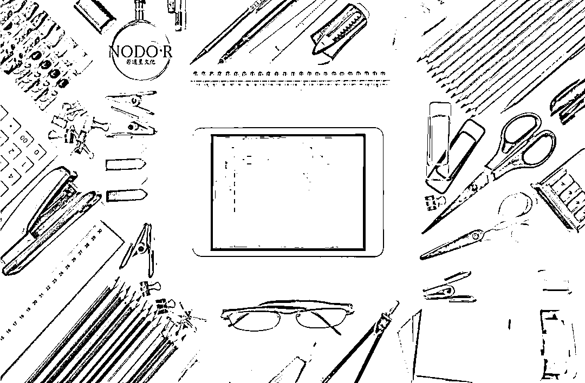

**南交点落入第 6 宫****在过去，你是师父的学徒，或者是门徒。**通过对交点星座和行星方面的分析，会发现更多的细节，但最基本的是，**现在是时候让你放下这个角色，相信你所知道的，开始更多地关注自己的内心指引，而不再关注权威人士赞成与否**。（由于月亮交点不是行星，我们不在这里描述你的导师）**北交点落入第 6 宫****服务他人，也许是指导他人，是你这一世进化意图的基本要素。**你已经“在山顶上”很久了。是时候认识到你正在变得只关注自我。这种倾向的唯一有效平衡在于巧妙而慷慨地关注他人的需求。（由于月亮交点不是行星，我们不在这里描述你的导师）

**版权声明：**本文由若道翻译发布，欢迎转发，反对抄袭。友号转载请申请白名单。

**END** 

**斯蒂芬·弗里斯特**

若道签约老师。进化占星学的创始人之一，当今世界最有影响力的占星大师之一；1985 年，他凭借《内在的天空》一书获得职业占星师协会奖（Professional Astrologers Incorporated Award）。他四次获得占星界最高的占星学联合协会奖（United Astrology Congress Regulus Award）提名，2018 年获得轩辕十四教育奖。

**新的一年，来领取你的好运吧！**

**扫码**即可领取**专属的年运报告**

**学习占星学****点击下图了解课程详情**

**微信又双叒叕改版啦，不想错过若道君的推送？** 

****就把若道设为****星标****以及点点****“在看”****吧！****

**▼**

**喜欢就点一下“在看”吧！****报名直达入口**

# 上证会突破前期高点 3424 点吗？| 梅里曼上证+黄金周期 2 月报告

> 原文：[`mp.weixin.qq.com/s?__biz=MzA5NjA0NTAxNg==&mid=2651499296&idx=2&sn=715156479aca64c293e16cede0c63830&chksm=8b481997bc3f90810895643ae3c52d3534beb965a3dc87fd5018c52e881e602168d6bd7f536b&scene=126&sessionid=1692737690#rd`](http://mp.weixin.qq.com/s?__biz=MzA5NjA0NTAxNg==&mid=2651499296&idx=2&sn=715156479aca64c293e16cede0c63830&chksm=8b481997bc3f90810895643ae3c52d3534beb965a3dc87fd5018c52e881e602168d6bd7f536b&scene=126&sessionid=1692737690#rd)

春节过后，股指跳空冲高，回落。

| 上证指数日 K 线图

春节期间火爆的电影市场和旅游市场给人非常乐观的期待，仿佛经济的复苏和消费的反弹是指日可待的事情。而比上证提早开盘的香港市场则出现一片火热的情景，海啸般的疫情看起来已经过去，2023 年多地将 GDP 增长目标定为 5.5%附近，这些都是积极的消息。

另外，2022 年我国居民的本外币存款同比增加 18 万亿元，与前 3 年每年增长 10 万亿相比，多出 8 万亿，增长率创下 2009 年之后的新高，而贷款同比增长则少增长 4 万亿元，创下贷款新低。净存款增长率 43.69%创下 2008 年以来的新高。

| 数据来源：人民银行

另一个数据是我国居民的财富分布：

这些新增的储蓄如果不再流向地产，是将会用于消费的复苏，还是在股票市场复苏的时候流向投资？

当然，这一切取决于人们对于未来收入增长的预期。如果经济增速无法恢复，消费和投资都不会恢复。**从周期看，从 2019 年 1 月 4 日开始的上证的 5.5 年周期，到 2023 年就开始进入第 5 年，离波谷的时间越来越近了。**

| 上证指数月 K 线图

从另一方面看，如果 2022 年 10 月的低点是从 2019 年 1 月开始的 5.5 年周期的第一个 33 个月半周期的波谷，那么在 2023 年 2 月是第二个 33 个月周期的第 4 个月；如果 2022 年 4 月是第二个 33 个月半周期的开始，那么在 7 月份的高点 3424 是第二个 33 个月周期的波峰似乎也太早了。一切都似乎显示，上证很有可能冲向 3424 的高峰。

2 月份我们会看到 2 个值得关注的天象：

**2 月 4 日周六，太阳四分天王星。接下来是 2 月 15 日-16 日，金星合相海王星，太阳合相土星。**

**在 2023 年 2 月，应该如何操作？金融占星大师雷蒙德·梅里曼的《2023 年 2 月上证指数报告》已上线，你可以听听梅里曼老师的看法。你也可以购买雷蒙德·梅里曼 2023 年预报及沙龙，将帮助你对 2023 年的整年的市场风云变化加深了解。**

投资有收益，投资有风险，希望金融占星学的研究帮助你更好地评估你的投资。

从 2018 年年末，若道引入金融占星大师雷蒙德·A·梅里曼撰写的梅里曼市场时机学院每年一次的年度预报沙龙和每年一本的《年度预报》以来，**2023 年已经是第 5 个年度了。我们简单回顾了部分 2019-2022 年金融预报的内容，**过去的经验让我们相信，你根据梅里曼老师的指导作为投资参看，你会比一般人有更大的胜算。****

**长按下图识别二维码****了解更多详情**

**2 月上证报告上线**

**上证指数月度报告价格****单月报告**：280 元/月**季度套餐价格**：780 元（260 元/月）**年度套餐价格**：2400 元（200 元/月）**双报告年度套餐更优惠（直降 900 元）****12 个月黄金报告+12 个月上证指数报告：仅需 3900 元****长按下图识别二维码购买上证指数报告**▼**2 月黄金报告**

“**黄金是金钱。其他的只是信贷。**

**——约翰·皮尔庞特·摩根**

”

| 黄金日 K 线图

| 黄金周 K 线图

从 11 月份最低点 1618 反弹 10%以后，黄金在 12 月波澜不惊,但在 2023 年的 1 月迎来开门红，涨了 6.56%，最高点是 1950。所以，如果你从去年 11 月份的低点投资黄金且一直持有至今，迄今最高收益差不多在 16%。

我们来看梅里曼老师在 11 月、12 月、1 月《黄金报告》中给大家的投资建议：

**· 11 月的建议：“现在，平仓所有空头头寸，并且做多（价格低于 1680 时），在收盘价低于 1622.20 时止损。”** 

**· 12 月的建议：“你可以在 1720+/-25 兑现 1/3 的多头头寸。如果市场提供机会，在 1840+/-15 兑现另外 1/3 头寸。”**

**· 2023 年 1 月的建议：“现在我们将在 1720-1750 再次买入，在到达 1850+/-15 之前不卖出，甚至持有一些头寸，以备 1 月测试或突破 1900。”**

如果按照梅里曼老师的建议从 11 月开始操作，你的收益应该在 10%以上。看一下中国各个投资市场，就 3 个月而言，这不能不说是一个相当不错的投资收益。

现在，黄金已经突破了 1900。随着多项经济数据表明美国通胀正在降温，市场已经普遍预计美联储将在本周会议上把加息幅度收窄至 25 基点，并可能在今年晚些时候降息以刺激美国经济增长。在这种情况下，还可以继续投资黄金吗？

2 月份黄金报告已经上线，上证报告也已上线。欢迎了解。也可以按照季度和 1 年期订阅，有更多优惠。季度和年度的好处是，你可以持续了解梅里曼老师对于不断在变化的市场的看法。

即便他某一次看法和市场不一致，你也看到在下一期他如何调整自己的看法，并看到金融占星在一个长期时间段内对你把控风险的帮助。而能够长期控制风险、尽量找到安全的投资时机才是投资的长久之计。

点击阅读原文，雷蒙德·梅里曼黄金周期 2023 年 2 月报告带来有 40 年黄金市场研究经验的世界著名金融占星大师雷蒙德·梅里曼对当前黄金市场的研究。

**2 月黄金报告上线**

**黄金月度报告价格****单月报告**：280 元/月 **季度套餐价格**：780 元（260 元/月）**年度套餐价格**：2400 元（200 元/月）**双报告年度套餐更优惠（直降 900 元）****12 个月黄金报告+12 个月上证指数报告：仅需 3900 元****长按下图识别二维码购买黄金报告**
▼

**购买者需知**

**① **梅里曼市场时机学院《中国上证指数月度研究报告》是梅里曼市场时机学院（以下简称 MMA）的研究“预报”，而不是市场“预测”，是梅里曼老师及 MMA 金融占星分析师对人类活动周期历史与行星周期之间相关性的研究，二者在大部分情况下具有 80%或更高的相关性，而不是因果关系。报告中的研究完全存在错误的可能性。即便是非常认真的研究和几十年的研究经验，金融占星师无法总是正确地解读出各种征象在实际层面上会如何相互作用，并显化为事件结果。

所以请将报告看作一个研究参考，务必结合其他市场研究和你个人对市场的理解，根据你的自由意志做决策。

**②** 此报告一旦售出，**即不接受退款。**

**③** 上证、黄金月度报告每月固定 1 期，**并非都是在每月相同日期发布。**

**④** **我们收到英文报告的当天，即发布该英文报告。3 天后，上线报告中文版。此报告仅支持手机网页阅读，不支持电脑阅读和下载。****以上须知，请仔细阅读。一旦付款，即视为已了解并接受所有须知内容。**在过去的 40 年中，唯有梅里曼逐渐完善，并在梅里曼市场时机学院月度周期报告中阐释了将地球宇宙学与周期相结合的研究方法，以惊人的精确性预报了黄金价格发生重大变化的时间。**黄金购买 Tip**

各大银行均可购买黄金或黄金 EFT 基金，也可以在诸如天天基金或者支付宝购买黄金及黄金相关产品。不明白的可以百度搜索。

**购买后如何查看报告？**

**购买后有疑问怎么办？**请联系技术客服
**微信：nodoor201705** **购买直达入口**

# 2 月宇宙天气丨上半月享受生活，下半月积极进取

> 原文：[`mp.weixin.qq.com/s?__biz=MzA5NjA0NTAxNg==&mid=2651499261&idx=1&sn=237feec871d9ccf287fa2221333433e0&chksm=8b48184abc3f915c6c8a8455f5f6eaa660e32052928110615827d2087dceab3b04d8d8f98604&scene=126&sessionid=1692737690#rd`](http://mp.weixin.qq.com/s?__biz=MzA5NjA0NTAxNg==&mid=2651499261&idx=1&sn=237feec871d9ccf287fa2221333433e0&chksm=8b48184abc3f915c6c8a8455f5f6eaa660e32052928110615827d2087dceab3b04d8d8f98604&scene=126&sessionid=1692737690#rd)

******☆ **后台回复“今日”，给你一句生命态度****

作者/Anastasia

编辑/玫瑰 封面/书君 图片/稿定设计

**2 月重点天象**

*   **狮子座满月（2 月 6 日）**

*   **水星进入水瓶座（2 月 11 日）**

*   **太阳进入双鱼座（2 月 19 日）**

*   **双鱼座新月（2 月 20 日）**

*   **金星进入白羊座（2 月 20 日）**

**整体氛围**往年过完春节，开工就已经是三月了。今年年早，节后开工才到二月，距离下个春节还有将近 380 天，要勤奋工作 12 个月才行。好在**二月的运势相对比较单纯，开局平缓，给后面的发挥留出了很大的空间。****二、三月份是一年当中少有的、没有行星逆行的日子。**随着 1 月 18 日水星顺行，1 月 23 日天王星顺行，目前天空中暂时没有逆行行星，混乱告一段落。**行星能量能够保持原样，没有受到过度的干扰，就不用考虑太多的变量，可以按部就班顺利地在轨道上运行。**木星和土星是对社会活动趋势影响最大的行星，它们的换座和重大相位都会极大地影响人们的生活。**上半年，我们将迎来这两颗社会行星的换座，土星在 3 月 7 日进入双鱼座，木星在 5 月 17 日进入金牛座。****本月，木星的运行区间是白羊座的 5°-11°，机会和好运会特别关照火象的白羊座、狮子座和射手座。**尤其是**生日在 3 月 26 日-4 月 5 日、7 月 28 日-8 月 8 日、11 月 27 日-12 月 7 日**的人群，你们会变得更加乐观、自信，充满前进和冒险的动力。**另外 3 个基本星座巨蟹座、天秤座和摩羯座，则要提醒自己小心冒进的风险，就算局势打好，也宁可采取保守的策略，稳扎稳打，徐以图之。****土星三月初就会换座，本月的运行区间是水瓶座的 25°-29 度。****对于水瓶座以及同为风象的双子座和天秤座来说，这是你们进一步展现自己实力的机会**。**勇于承担责任，就会获得认可和赞赏。**尤其是**生日在 2 月 14 日-19 日、6 月 16 日-21 日、10 月 18 日-24 日**的人群，不要辜负这两年多来的辛苦和努力，做出成绩，你们将会得到土星 Boss 的最后犒赏。

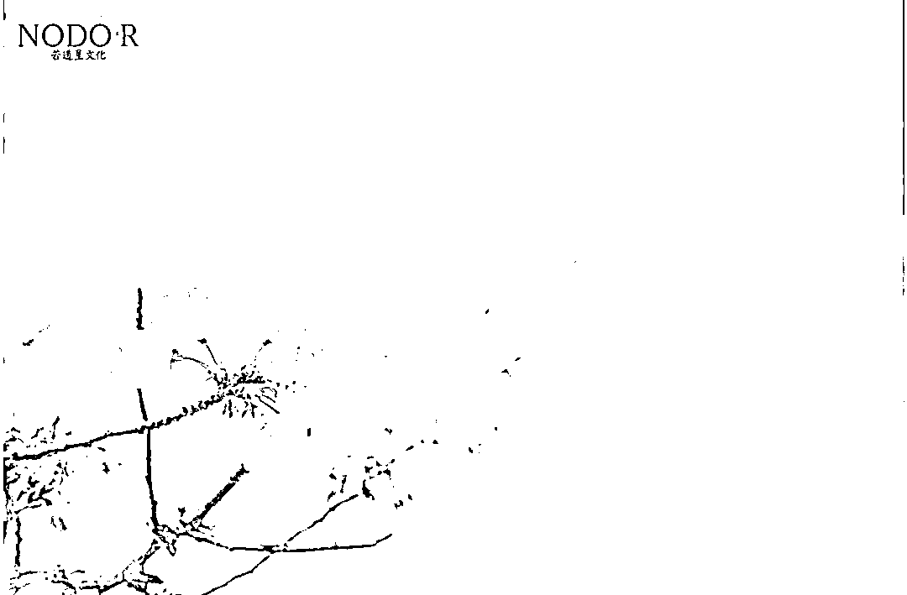

**对于固定星座金牛座、狮子座、天蝎座、水瓶座来说，经过这两年土星的碾压，你们一定会觉得不堪重负。**好在土星下个月就会离开固定星座，进入变动星座。**要牢记，坚持到底，就是胜利。尤其是狮子座和水瓶座，主观上要有完成任务的积极意识，木星会联手土星，提供助力，帮助你们取得耕耘后的收获。**由于木星换座后，将在金牛座运行一整年，直到 2024 年 5 月 26 日进入双子座。今年 9 月 4 日，木星在金牛座 15°逆行，12 月 31 日在金牛座 5°恢复顺行，这意味着**木星的整个逆行区间都在金牛座。**木星的行进将今年划分为两个阶段，上半年的木星白羊座和下半年的木星金牛座，可以保持观察，看看这两个区间的社会气氛和重大事件上会有哪些明显的区别。**大体来说，木星白羊座会在精神上给人带来兴奋和刺激，突飞猛进；木星金牛座则会在物质生活上带来繁荣和稳定，好好享受生活成为主流。**具体的表现和影响会在后续的月运中进行详细解读。**重点天象****★****水星进入水瓶座**1 月 18 日，水星在摩羯座 8°恢复顺行，直到 2 月 7 日离开摩羯座 24°，才算彻底离开逆行的后阴影期，摆脱水逆的影响。所以，**一月份的时候，人们还是会感受到一些信息和交流上的混乱，经历电器失灵、货不对板、被人误解、爆发争吵等水逆现象。**二月，水星离开阴影期会快速恢复正常运行速度，**于 2 月 11 日换座**进入水瓶座。水星守护的双子座在黄道上三分水瓶座，是天然的三分关系，古典占星学中，水星在水瓶座擢升，是非常有利的落位。**水星在水瓶座会感觉如鱼得水，行动自如。**水星追求信息交流和建立关系，非常符合风象星座的能量。从双子座到天秤座再到水瓶座，水星的功能和目标也是逐级而上。3 宫双子座的关系是“刚好遇见”，比如没得选的亲戚邻居同班同学；7 宫天秤座的关系是“你有我无”，一对一的重要关系会更多表现出一种潜意识里面的互补情结；11 宫水瓶座的关系会更进一步，追求“志同道合”的价值认同感。**人类社会于 2000 年-2050**年**这个期间，从双鱼座时代进入水瓶座时代。**变化的开端往往很难察觉，但过渡期永远是混乱动荡的，充满不同立场的撕裂、对立和冲击。尤其是最近几年，我们接连经历了木土冥合相和土天四分，今年又将经历冥王星和土星的换座。**身处大变局之中，随时有绝望，有希望以及贯穿始终的不确定性。**

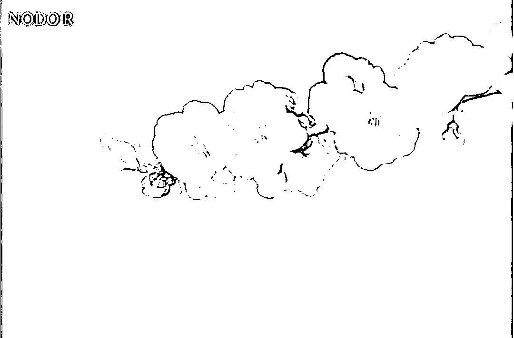

如何应对？水星在水瓶座的这段时间，或许会给我们一些启发。**· **计划永远没有所谓准备好的时候，所以就只能是：时刻准备着。在 0%-100%过程中的任意点都得有快速反应，做出选择和采取行动的意识。这也是天王星在金牛座的阶段，人们必须要有的意识。稳定是偶然，意外才是常态；**·** 面对黑暗和未知，找到同伴，报团取暖，坚定的立场和信仰会指出方向。智人能够走出原始森林，攀爬到食物链的顶端，靠的正是互帮互助的集体力量和组织力量。水瓶座和集体主义相关，也和愿景与希望相关。只有拥有了足够的认同感，面对未知的未来，我们才会选择希望。**★****金星进入白羊座****1 月 27 日，金星离开水瓶座，进入双鱼座。**金星在双鱼座擢升，**乐于帮扶弱者，传播美好价值。2 月 20 日，金星换座进入白羊座，金星在白羊座处于失势的状态，不利于关系的发展和财富的积累。**随着金星的换座，二月也可以分为两个阶段。**想要享受生活，推进关系，或者赚取金钱，决策和行动尽量安排在 20 日之前。**这段时间，大家的心情都比较放松，不论是与他人合作，还是关爱自己的身心健康，都比较容易达到目的。**20 日之后，金星进入白羊座，**讲究和谐与美的金星落入着急莽撞的白羊座，能量受阻，发挥大受影响，不如在双鱼座那么顺畅。但是**金星进入白羊座利好火象的白羊座、狮子座和射手座，尤其是白羊座，会明显感受到魅力提升，人缘变好。**金星进入白羊座之后，会逐渐靠近白羊座的木星。**金木合相带来的好运和机会容易让人头脑发昏，盲目相信自己的判断。**这时候尤其要小心过度放飞自己。虽然说“相信自己，做自己就好”，也要牢记“过犹不及”。金星落陷，叠加木星，一味地爱谁谁，很容易玩飞掉。

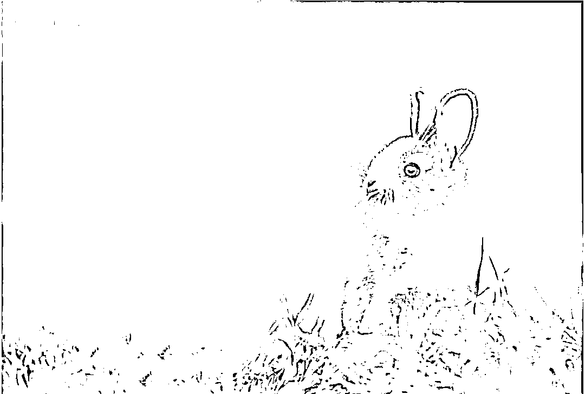

**★****朔望周期****本月的**狮子座**满月发生在 2 月 6 日，**双鱼座**新月发生在 2 月 20 日。****· 2 月 6 日-20 日是下弦月周期，身体会更倾向于清理和排毒，这时候贪吃一些无大碍，很容易将多余的营养排出体外，不容易发胖；****· 月初的 1 日-5 日，以及下旬 20 日之后是上弦月周期，身体会更注重吸收和消化，建议控制饮食，不要给肠胃添加太多太油腻的负担。**阳后体弱的人群可以利用这段时间进补。**满月和新月当天，适合断食和轻食。给身体留出清空重启的时间。****满月发生在 2 月 6 日凌晨 2:28，狮子座 16°。重点影响生日在 2 月 6 日、5 月 8 日、8 月 10 日和 11 月 10 日前后的人群。**这次满月充满不确定因素，金牛座天王星四分太阳、月亮。白羊座凯龙星三分狮子座月亮，六分水瓶座太阳；双子座火星三分水瓶座太阳，六分狮子座月亮；火凯之间形成六分相，成为能量释放的出口。**在满月带来的情绪张力下，火星双子座会格外为了自己言论的正确性去战斗。**凯龙星在白羊座，被火星定位，意味着**这种斗争的勇气和结果往往也会让自己受伤。**这时候，需要**停下来思考一下，到底如何才能荣耀自我选择的生活方式。**这里，**满月的主题指向了“我存在”，关于自我的根本认同以及实际存在于世界的方式。**我们渴望获得帮助，但又会因为过于坚持自我而无法开口向他人求助。也许人们**需要学会去区分“想要”和“需要”，通过为他人赋予力量，来获得自我的认同。****新月发生在 2 月 20 日下午 15:05，双鱼座 1°。****重点影响人群是生日在 2 月 20 日、4 月 23 日、8 月 25 日和 11 月 24 日前后的人群**，一定记得在 15:06 后的 8 小时之内，用笔写下 10 个以内的愿望。新月发生时，太阳、月亮、金星、海王星齐聚双鱼座，其它行星也全部落在从摩羯座到双子座的 135°范围之内，能量相当集中，蓄势待发。水星在水瓶座三分双子座火星，六分白羊座的木星、凯龙星，形成一个小三角相位结构。**想法很多，行动方式也很多。需要提前想好：道路千万条，你选哪一条？**新月是非常主观的，在现实中还看不清今后的发展方向，但可以相信你的直觉，向宇宙许愿，请求帮助。许愿内容请参照双鱼座 1°所落宫位象征的主题，以及双鱼座原型象征的能量，例如：**灵性成长、艺术和美的发现、关爱弱势群体等等。**

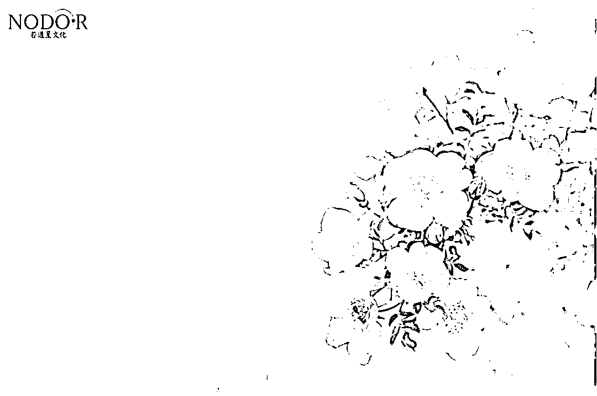

**12 星座 2 月小贴士**

**（参考太阳星座和上升星座）**

**★ ****白羊座**

*   **工作忙碌，调整沟通节奏**
*   **提升魅力，加入新的团体**

**★ ****金牛座**

*   **进修学习，提高工作技能**
*   **休息放松，总结过往经验**

**★ ****双子座** 

*   **深入思考，提炼人生哲学**
*   **工作运好，获得贵人相助**

**★ ****巨蟹座** 

*   **主动沟通，促进关系发展**
*   **打开眼界，助力事业发展**

**★ ****狮子座** 

*   **有舍有得，重新建立合作**
*   **疗愈伤痛，人生更进一步**

**★ ****处女座** 

*   **重视共赢，抓住投资好运**
*   **一张一弛，调整生活重心** 

**★** **天秤座** 

*   **脚踏实地，收获来自耕耘**
*   **合理安排，避免社交冲突**

**★ ****天蝎座**

*   **学习积累，不图一时之利**
*   **活动丰富，避免影响工作**

**★ ****射手座**

*   **客观理性，避免情绪争吵**
*   **总结经验，制订财务计划**

**★ ****摩羯座** 

*   **学会倾听，吸取合理建议**
*   **周边游玩，增进家庭感情**

**★ ****水瓶座** 

*   **身心愉悦，自我意识增强**
*   **收入提升，合理控制开销**

**★ ****双鱼座**

*   **精力充沛，关注身体健康**
*   **回归内心，关爱弱势群体**

**版权声明：**原创文章由作者授权首发于若道平台，欢迎转发，反对抄袭。友号转载请申请白名单。

**END**

**Anastasia**

职业占星师/专栏作者/策展人

ISAR 认证占星师（2016 年获得）

若道认证生时校正资质（2015 年获得）

**微信公众号**：KairosMoment

长按打赏

**新的一年，来领取你的好运吧！**

**扫码**即可领取**专属的年运报告**

**学习占星学****点击下图了解课程详情**

**微信又双叒叕改版啦，不想错过若道君的推送？** ****就把若道设为****星标****以及点点****“在看”****吧！******▼**

**喜欢就点一下“在看”吧！****报名直达入口**

# 上证会突破前期高点 3424 点吗？| 梅里曼上证 2 月报告上线啦！

> 原文：[`mp.weixin.qq.com/s?__biz=MzA5NjA0NTAxNg==&mid=2651499261&idx=2&sn=a25fab770ab5a67c32240d0d9f31c4d7&chksm=8b48184abc3f915c01348986a51f83a734b823eafc86e29f83b4c478c3da5ea10f3fc1470a78&scene=126&sessionid=1692737690#rd`](http://mp.weixin.qq.com/s?__biz=MzA5NjA0NTAxNg==&mid=2651499261&idx=2&sn=a25fab770ab5a67c32240d0d9f31c4d7&chksm=8b48184abc3f915c01348986a51f83a734b823eafc86e29f83b4c478c3da5ea10f3fc1470a78&scene=126&sessionid=1692737690#rd)

春节过后，股指跳空冲高，回落。

| 上证指数日 K 线图

春节期间火爆的电影市场和旅游市场给人非常乐观的期待，仿佛经济的复苏和消费的反弹是指日可待的事情。而比上证提早开盘的香港市场则出现一片火热的情景，海啸般的疫情看起来已经过去，2023 年多地将 GDP 增长目标定为 5.5%附近，这些都是积极的消息。

另外，2022 年我国居民的本外币存款同比增加 18 万亿元，与前 3 年每年增长 10 万亿相比，多出 8 万亿，增长率创下 2009 年之后的新高，而贷款同比增长则少增长 4 万亿元，创下贷款新低。净存款增长率 43.69%创下 2008 年以来的新高。

| 数据来源：人民银行

另一个数据是我国居民的财富分布：

这些新增的储蓄如果不再流向地产，是将会用于消费的复苏，还是在股票市场复苏的时候流向投资？

当然，这一切取决于人们对于未来收入增长的预期。如果经济增速无法恢复，消费和投资都不会恢复。**从周期看，从 2019 年 1 月 4 日开始的上证的 5.5 年周期，到 2023 年就开始进入第 5 年，离波谷的时间越来越近了。**

| 上证指数月 K 线图

从另一方面看，如果 2022 年 10 月的低点是从 2019 年 1 月开始的 5.5 年周期的第一个 33 个月半周期的波谷，那么在 2023 年 2 月是第二个 33 个月周期的第 4 个月；如果 2022 年 4 月是第二个 33 个月半周期的开始，那么在 7 月份的高点 3424 是第二个 33 个月周期的波峰似乎也太早了。一切都似乎显示，上证很有可能冲向 3424 的高峰。

2 月份我们会看到 2 个值得关注的天象：

**2 月 4 日周六，太阳四分天王星。接下来是 2 月 15 日-16 日，金星合相海王星，太阳合相土星。**

**在 2023 年 2 月，应该如何操作？金融占星大师雷蒙德·梅里曼的《2023 年 2 月上证指数报告》已上线，你可以听听梅里曼老师的看法。你也可以购买雷蒙德·梅里曼 2023 年预报及沙龙，将帮助你对 2023 年的整年的市场风云变化加深了解。**

投资有收益，投资有风险，希望金融占星学的研究帮助你更好地评估你的投资。

从 2018 年年末，若道引入金融占星大师雷蒙德·A·梅里曼撰写的梅里曼市场时机学院每年一次的年度预报沙龙和每年一本的《年度预报》以来，**2023 年已经是第 5 个年度了。我们简单回顾了部分 2019-2022 年金融预报的内容，**过去的经验让我们相信，你根据梅里曼老师的指导作为投资参看，你会比一般人有更大的胜算。****

**长按下图识别二维码****了解更多详情**

**2 月上证报告上线**

**上证指数月度报告价格****单月报告**：280 元/月**季度套餐价格**：780 元（260 元/月）**年度套餐价格**：2400 元（200 元/月）**双报告年度套餐更优惠（直降 900 元）****12 个月黄金报告+12 个月上证指数报告：仅需 3900 元****长按下图识别二维码购买上证指数报告**▼

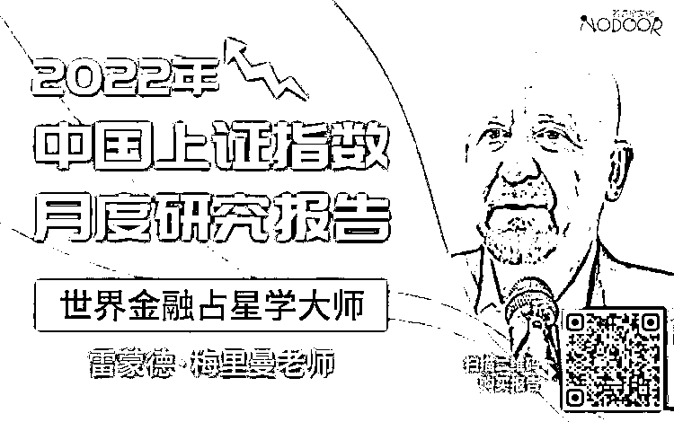

**购买者需知**

**① **梅里曼市场时机学院《中国上证指数月度研究报告》是梅里曼市场时机学院（以下简称 MMA）的研究“预报”，而不是市场“预测”，是梅里曼老师及 MMA 金融占星分析师对人类活动周期历史与行星周期之间相关性的研究，二者在大部分情况下具有 80%或更高的相关性，而不是因果关系。报告中的研究完全存在错误的可能性。即便是非常认真的研究和几十年的研究经验，金融占星师无法总是正确地解读出各种征象在实际层面上会如何相互作用，并显化为事件结果。

所以请将报告看作一个研究参考，务必结合其他市场研究和你个人对市场的理解，根据你的自由意志做决策。

**②** 此报告一旦售出，**即不接受退款。**

**③** 上证、黄金月度报告每月固定 1 期，**并非都是在每月相同日期发布。**

**④** **我们收到英文报告的当天，即发布该英文报告。3 天后，上线报告中文版。此报告仅支持手机网页阅读，不支持电脑阅读和下载。****以上须知，请仔细阅读。一旦付款，即视为已了解并接受所有须知内容。**在过去的 40 年中，唯有梅里曼逐渐完善，并在梅里曼市场时机学院月度周期报告中阐释了将地球宇宙学与周期相结合的研究方法，以惊人的精确性预报了黄金价格发生重大变化的时间。**黄金购买 Tip**

各大银行均可购买黄金或黄金 EFT 基金，也可以在诸如天天基金或者支付宝购买黄金及黄金相关产品。不明白的可以百度搜索。

**购买后如何查看报告？**

**购买后有疑问怎么办？**请联系技术客服
**微信：nodoor201705** **购买直达入口**

# 2023 年 ISAR 选修课 | 预测技法三日工作坊，了解人生重大事件

> 原文：[`mp.weixin.qq.com/s?__biz=MzA5NjA0NTAxNg==&mid=2651499261&idx=3&sn=b766f9832b1fd75d0719be348835fd30&chksm=8b48184abc3f915cd401fbdf0e8030156f832a4b828ed1cf9a9e0acf7ffd95f00b73b401445b&scene=126&sessionid=1692737690#rd`](http://mp.weixin.qq.com/s?__biz=MzA5NjA0NTAxNg==&mid=2651499261&idx=3&sn=b766f9832b1fd75d0719be348835fd30&chksm=8b48184abc3f915cd401fbdf0e8030156f832a4b828ed1cf9a9e0acf7ffd95f00b73b401445b&scene=126&sessionid=1692737690#rd)

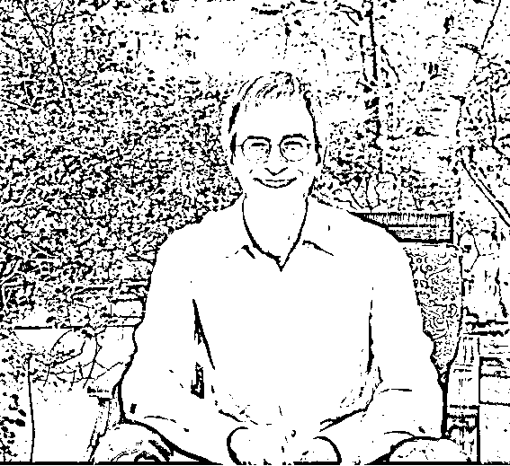

**授课内容**

 本次 3 日课程将深入学习人本主义占星师使用的 3 种预测技法。

我们将深入学习如何分析**行进**，强调对**行进的周期性**理解。我们将通过**次限**研究星图中展现的变化，并学习运用**太阳弧**来标记生命中的关键事件。虽然还有其他有用的技法，比如太阳返照和月限法等，但对**行进、次限和太阳弧**能量的谨慎回应已经提供足够的信息来指导我们的人生。

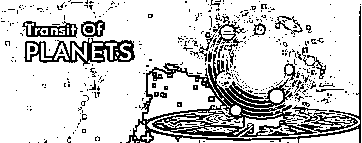

**行进（TRANSITS）** **长期趋势**分析行进的最好方法是先将长期的行进趋势列出来。顺序如下：冥王星、海王星、天王星、土星、木星、南北交点。通过将这些影响力持久的长期行进先列出来，你将能够发现在未来一年甚至更长的时间里你人生中的重大课题。**短期趋势和触发点**接下来你需要去观察那些运行得较快的星体，来判断短期趋势。不过，重要的是要清楚，这些移动较快的星体在行运中扮演着事件的“触发点”的角色，特别是当与它们形成相位的个人行星同时也与行运外行星有相位的时候！

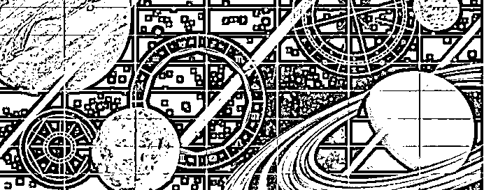

**次限推进（PROGRESSIONS）**通常也被称作“一天代表一年”推运，因为这种技术把出生后的每一天和出生后的一整年等同起来。一旦设定了这个节奏，就像定时释放的胶囊一样，这些次限推进就像某种内部的太阳系一样运转起来，和真实时间的事件、经历、情境应和。

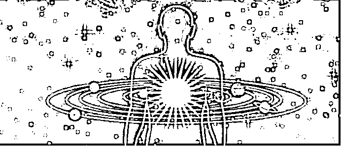

**太阳弧（SOLAR ARCS）**以太阳为核心，为众星之首，带着众星一起移动,展示人生不同阶段我们是如何体验自我、表现自我、修缮自我。此方法虽非实际星体，但却是星动推运法中准确率最高，实用性最佳的推运方法。

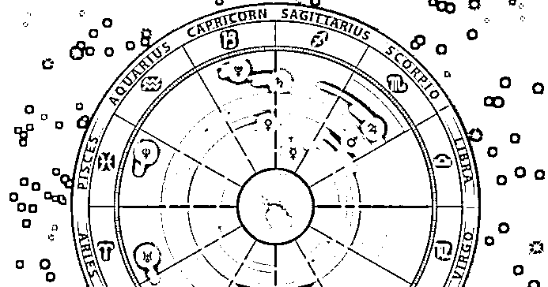

课程有两个方面的重点：**强化自我学习**，把对过去生活事件的理解作为预测未来趋势的基础；**学习有效的占星咨询技能**，以一种精准、生动、策略性和鼓舞人心的方式阐述星图。与格雷格之前开设的课程一样，这次课程会有**大量互动**，老师会与案例学员互动，同时通过学员间的讨论，互相激发，获得更多启发。如果可能，还会设置**训练环节，练习基本的预测和解读方法。**

**课程安排**

 **· 2023 年 3 月 4 日 周六  8:00-14:00
· 2023 年 3 月 11 日 周六  8:00-14:00
· 2023 年 3 月 18 日 周六  7:00-13:00**

**什么人适合学习本课程？**

 **·**占星师或渴望成为占星师的人群。  **·**本课程并非针对初学者，需具备若道核心课程 level4 及以上水平，即了解星座、行星、宫位、相位等。

**· **课程会涉及行进&推进&太阳弧解读高阶内容，不了解相关知识的同学，请提前学习相关内容。

**老师介绍**

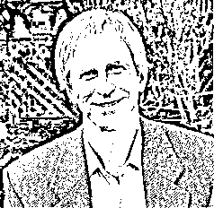
**格雷格·博加特（Greg Bogart）**

**· **占星师、心理治疗师。格雷格出生于美国纽约市，就读于卫斯理大学。1986 移居旧金山湾，完成了加州整合大学和赛布鲁克大学的研究生课程。**· **格雷格自 1991 年以来一直是一名有执照的心理治疗师（LMFT 28276）。他是国际占星研究协会（ISAR）认证的占星师，并拥有美国地球宇宙学研究协会（NCGR）的第 4 级认证。**· **他还在旧金山的艾扬格瑜伽学院接受过培训，并于 1992 年毕业且获得了瑜伽教师认证。**· **格雷格是一名私人执业的心理治疗师，在索诺玛州立大学担任心理学讲师，他在该校教授“成人发展中的转变”、“以深度为导向的心理治疗”、“神话、梦与象征”以及“存在主义心理学与超个人心理学”等课程。**· **他在加州整合大学、约翰·F.·肯尼迪大学、多米尼加大学和超个人心理学学院教授咨询心理学和东西心理学课程。**· **他的研究结合了冥想、哈他瑜伽、荣格解梦、存在主义心理疗法和精神综合，**占星学的行星周期智慧和原型象征**。

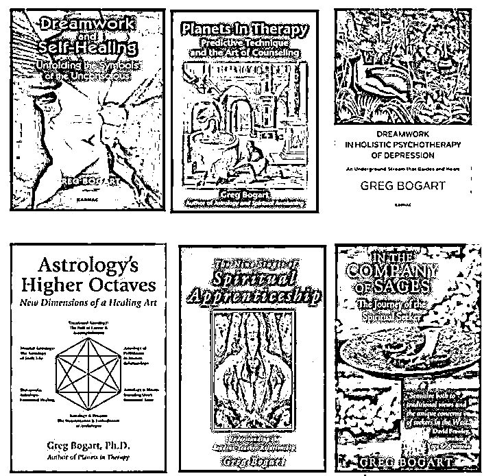

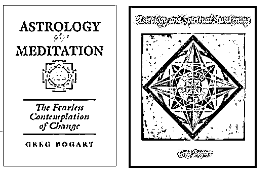

**格雷格·博加特博士著作：** 《占星学的高八度音阶》（*Astrology’s Higher Octaves*） 《行星用于治疗》（*Planets in Therapy*）《占星学与灵性觉醒》（*Astrology and Spiritual Awakening*）《梦境工作过与自我疗愈》（*Dreamwork and Self-Healing*）《梦境工作在抑郁症整体心理治疗中的应用》（*Dreamwork in Holistic Psychotherapy of Depression*）《占星学与冥想：对变化的无畏沉思》（*Astrology and Meditation: The Fearless Contemplation of Change*）

**推荐阅读：**

史蒂芬·阿若优：《生命的轨迹》

Bogart, G., Planets in Therapy; and Astrology’s Higher Octaves.

Tyl, N., Prediction in Astrology.

Ruperti, A., Cycles of Becoming. 

**课程价格**

**正价：6800 元 早鸟价：5800 元 早鸟价截止日期：2023 年 2 月 15 日**

**惊喜联报套餐！！**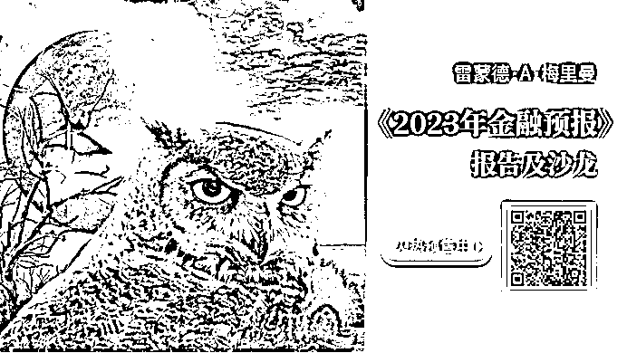**《ISAR 选修课 | 预测、预期与意识成长》+《2023 年度天象预测大师课》+《2023 年金融占星预报》****三门联报优惠价 8800 元****（联系 Maggie 老师，抢占限量优惠价）**

长按二维码添加 Maggie 老师获取联报优惠价

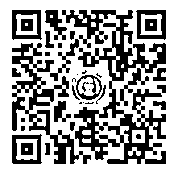

**退转课程**

退款原则请详看《教学协议》，如有疑问请咨询课程顾问。 ****2023 年 ISAR 选修课 | 预测、预期与意识成长****

**授课老师：****格雷格·博加特**

**直播课开课时间：2023 年 3 月 4 日（周六）3 月 11 日（周六）3 月 18 日（周六）**

**授课方式：******网络授课，英文/中文授课，中文翻译****

**费用：****** 正价：6800 元；早鸟价：5800 元；早鸟价截止日期：2023 年 2 月 15 日****

**课程负责人：Maggie 老师**（微信：NodoorMaggie，请备注“2023 预测课”）

长按二维码添加课程负责人咨询

**报名直达入口**

# 在金星双鱼座的浪漫气息中，感受哪种关系更能滋养你？（12 星座都可以进）

> 原文：[`mp.weixin.qq.com/s?__biz=MzA5NjA0NTAxNg==&mid=2651499226&idx=1&sn=46e0b6785a8ccfe7d1fd162f8fd3364f&chksm=8b48186dbc3f917bd71aa80363aec6ffd76e24c79e0614a683bff354bd5bc9dd689bbb6fd5f3&scene=126&sessionid=1692737690#rd`](http://mp.weixin.qq.com/s?__biz=MzA5NjA0NTAxNg==&mid=2651499226&idx=1&sn=46e0b6785a8ccfe7d1fd162f8fd3364f&chksm=8b48186dbc3f917bd71aa80363aec6ffd76e24c79e0614a683bff354bd5bc9dd689bbb6fd5f3&scene=126&sessionid=1692737690#rd)

******☆ ****后台回复“今日”，给你一句生命态度******

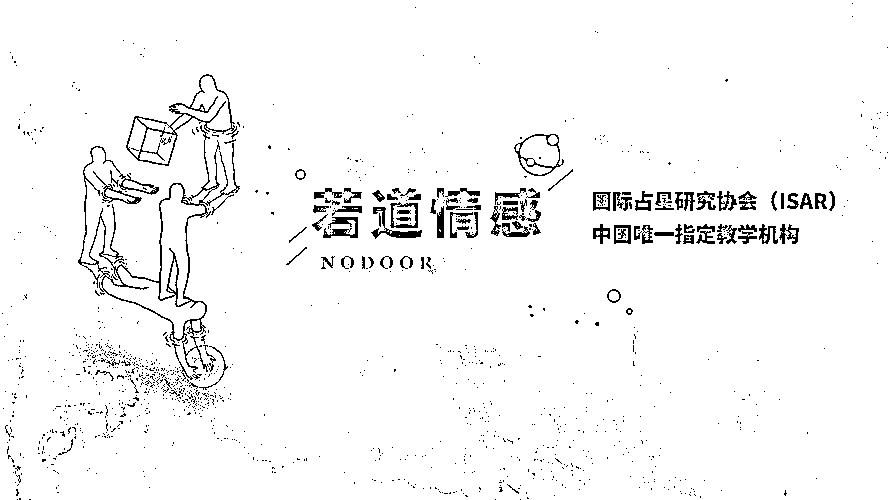作者/大卫·瑞雷 若道创始人 译者/李含 校对/江艺 编辑/玫瑰 图片/稿定设计 稿件来源/风度杂志 最近，金星进入了双鱼座，在这个会模糊掉我们感官的氛围下，很适合对爱情、关系有一些积极的畅想。不论你是否处于一段关系之中，都可以从自身星座的角度去理解我们对于爱情，或者说关系的需求。 另外，大卫老师参与授课的【[2023 年中英双导师占星核心课 L1-5](http://mp.weixin.qq.com/s?__biz=MzA5NjA0NTAxNg==&mid=2651498896&idx=3&sn=33a74e21a507e53ec9d70ff3d73a7acc&chksm=8b481b27bc3f9231c33cb8e556acf899be045af46267d4c2797ca9f5399015baf62b93afa4c6&scene=21#wechat_redirect)】报名中，点击链接了解更多详情！**伴侣幸福长久的 2 个规律**尽管存在各种各样的文化差异，世界上大部分人都在追求长久的伴侣关系或婚姻。从最现实的层面看，一种传统的长久、稳定的婚姻是家庭与社会的基石，也是抚养子女的最佳环境。那些为了有人陪伴，而不是抚养子女走入婚姻的人们，同样希望他们的关系幸福长久。

尽管成千上万的书和文章在探讨这个主题，人们依然无法找到一个万无一失的方案来保证一段幸福长久的关系。作为一名占星师，在过去四十多年帮助个人和伴侣的工作中，我发现了一个具有普遍性的规律，似乎有助于提高伴侣关系的长久满足感。

这个规律是，**伴侣双方在占星学上有 65%-75%的相似性和 35%-25%的差异性，乃至对立性，会更有可能拥有一段长久的关系**。占星学反映着生活，因此我们可以这样理解这个规律：

❶ **伴侣之间有许多共同之处**❷** 他们也有一些截然不同之处**在某种程度上，这意味着，**如果你们几乎全是相同点，那么就没有足够的对照来提供不同的视角；惰性和厌倦会渐渐破坏关系的发展。反过来，如果你们之间差异或截然相反之处过多，冲突和紧张也会阻碍关系的发展。**

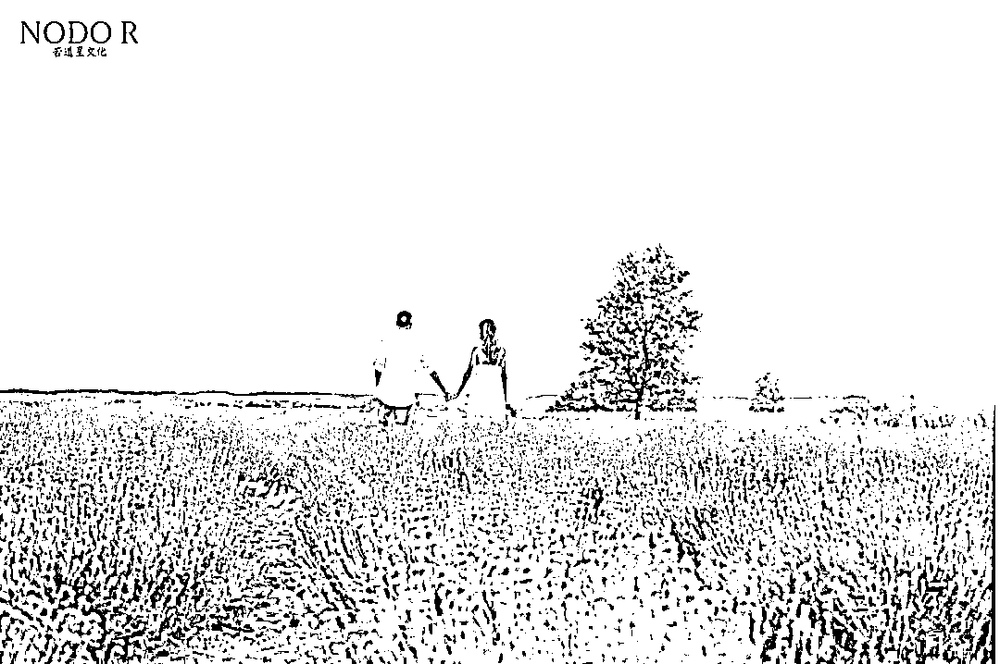

**差异是维系感情的必要因素****但性格和个性中的差异依然是维系感情的必要因素**。古话说，“异性相吸”，这在某种程度上与规律的这一部分相关，也就是**性格互补，合作解决问题**。 

例如，伴侣的一方可能急切要求做出决定、采取行动，另一方则更善于提供深思熟虑、谨慎小心的方法。那些**相同的特质能够保证差异部分不会将良好的意图损耗殆尽**。

运用这一规律，你的**太阳星座**会提供出一些维系长久关系的实际线索。 若道君：太阳星座，就是我们所说的“星座”，即是出生那一刻太阳在黄道上所落的星座。例如：小明出生在 2 月 18 日，他的太阳星座就是水瓶座。

**太****阳****白****羊****座**

首先，你希望伴侣和你一样**自立，说到做到**。行动比语言更有力，如果对方需要你解释自己的行为，那么你很可能会结束这段关系。同样，伴侣的优柔寡断也会很快令你感到泄气。尽管如此，你还是需要伴侣能够**在你太过火时提醒你，让你对自己的行为如何影响他人更有觉知**。

**太阳金牛座**

你希望伴侣令你**感觉舒服**。大体上，对方和你一样从容不迫，享受生活给予的一切美好事物。如果你们品味接近，同样喜欢享受，那就更好了。一方面，你和伴侣看起来就像一对放松、稳定的伴侣。不过，你的伴侣也需要**在你过于顽固的时候愿意与你对抗，偶尔也搅活池水，避免关系陷入刻板僵化**。

**太****阳****双****子****座**

是的，你的伴侣必须喜欢**自由地交谈**。和你一样，对方需要有广泛多样的兴趣。这让你不至于感到无聊，满足你的好奇心。在一些学习和经验领域，你的伴侣需要更博学，接受过良好的教育，尤其是那些最让你着迷的领域。你永远不会停止发问，你希望有人可以给予解答。另外，你需要**对方的思考不仅仅是针对眼下挑战的权宜之计**。

**太****阳****巨****蟹****座**

**感情融洽**非常重要。你需要对伴侣有一种一见如故的感觉，你觉得对方就是你的家人。从好的方面来说，这意味着如果你可以，你会选择对方作为自己的家人。具有情感联结意味着你无须过多解释自己的情况。同样，分享类似的生活情绪十分重要，比如共同沉醉在往事中。不过，你的伴侣需要**比你更有条理性，更自律**。**有能力驾驭长期计划，又能记得你生日**的人会是你的良伴。

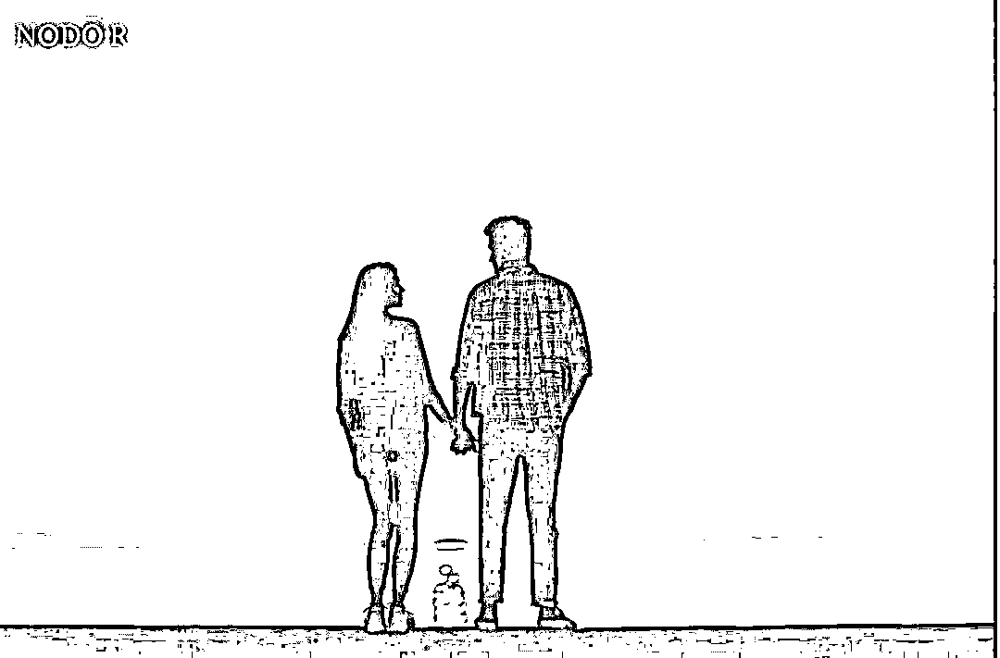

**太****阳****狮****子****座**

伴侣和你一样**热爱赞美生命**，这就是关系长久保持的关键。并不是要将婚姻或生命视作一场永远不会结束的派对，重要的是有相似的开心的感觉。如果你们的戏剧天赋不相上下，你们可能会成为一对总是令人印象深刻、大出风头的伴侣。不过，你的伴侣需要**比你更客观，就像是一位知己，在你被自我意志和骄傲蒙蔽判断时规劝你**。

**太****阳****处****女****座**

一位**务实**的伴侣是关键。如果有**相同的嗜好**也会有帮助。彼此都觉得对方对自己而言是不可或缺的存在，是你们关系建立的基础。拆解任务会比较容易，共同协作会令人更加愉悦满足。不过，你逻辑理性的一面需要伴侣的视角少一些分析和怀疑。对方**更包容、更有创意、更富有同情心**，可以帮助你避免过于狭隘的视角和过分的吹毛求疵。一个**更富有想象力**的伴侣可以拓宽你的视野。

**太****阳****天****秤****座**

遇到一位和你一样**待人友善周到**之人会让你怦然心动。你们会钦佩彼此与人相处的能力。你需要一位和你一样渴望生活安宁的伴侣，对方和你一样欣赏各种各样的美。不过，如果伴侣过于友善也会让你失去兴趣，你需要对方**更独立顽强一些**，让你能够维系自身的利益。

**太****阳****天****蝎****座**

在一定程度上，**共同的热烈**可以维持激情，这也是你想要的。一位可以处理对抗局面的伴侣能够深化你们的关系，加深彼此间的信任。一开始，其他人可能会猜测你们是否能够通过彼此的考验，但是对的伴侣会和你一样坚韧。不过，你的伴侣需要比你**更冷静**，**在你偶尔做出极端激烈的行为时不被惊扰，不觉害怕**。

**太****阳****射****手****座**

你和你的伴侣需要有相似的**幽默感**。同样，你们都需要非常独立，都是热爱自由的人，喜欢一同上路旅行，把人生的每一天都当作是一次新的冒险！合得来的哲学观、教育背景、信仰体系也会有所帮助。不过，你需要一位比你**更有常识**的伴侣，能够**分辨出什么能解决问题，什么不能**。这让你们有更多的时间去探讨人生的意义，也许是一辈子。

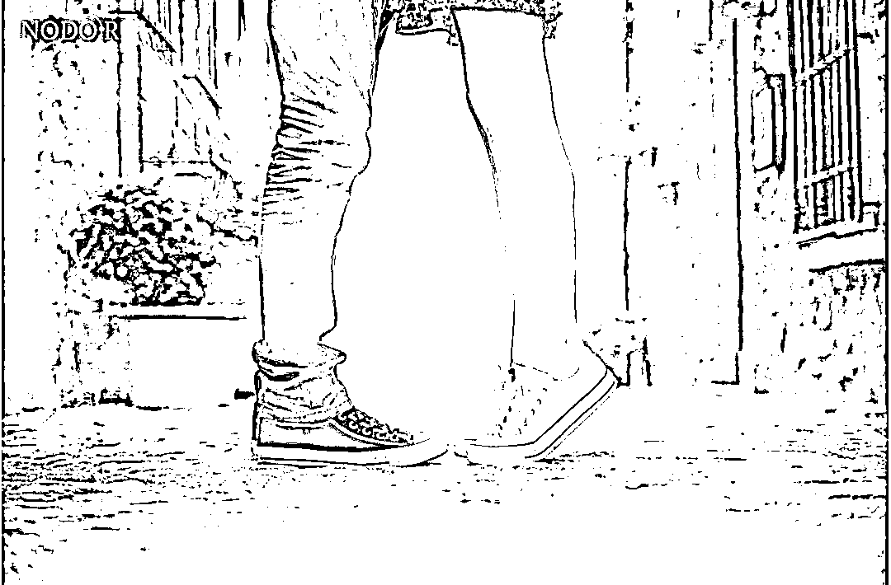

**太****阳****摩****羯****座**

你敬佩**能干、勤勉**的伴侣，更愿意与他们携手到老。共同实现目标会带给你和你抱负不凡的伴侣无限的满足感。是的，你们之间有可能存在竞争关系。你们可能会对输赢游戏过于认真。也就是说，没人能赢！这也就是为什么你需要一位愿意休息一下的伴侣，对方比你**更懂得如何滋养**，本能地理解食物和休息是人们恢复精力所必需的。

**太****阳****水****瓶****座**

找到一位和你一样**聪慧、冷静**的伴侣会是一项挑战，但是如果你找到了，你的朋友们会注意到的。如果你们有相似的冲动去做出贡献，让这个世界更美好，那就更棒了。你和你的伴侣会认为你们的关系是非传统的，并不遵循社会规范。但你依然需要伴侣**推动你更负责任地对待自己的人生**。否则，你可能会一直用各种冠冕堂皇的理由保持单身。

**太****阳****双****鱼****座**

对方和你一样**灵感丰富**，对你们的人生怀有**共同的梦想**，这就是十全十美的世界。“只有我们两人，沉浸在似乎永远都不会结束的幻想中”，起初会令人感到非常惬意，就像两位获得创意共鸣的艺术家。但如果你的伴侣不比你更专注、更务实，即使是强烈的心灵联结也不能抵抗时间的考验。是的，你需要一位**更实际**的伴侣，使你们感情关系的小船不至于说翻就翻。

**版权声明：**本文由作者授权发布于若道平台，欢迎转发，反对抄袭。友号转载请申请白名单。

**END**

****想阅读更多作者的文章，请在后台回复******大卫****** 即可。****

**大卫·瑞雷**

美国占星师，若道联合创始人，致力于在中国教授和推广西方占星学；2010-2014 年，任全美占星师联盟监督委员会委员；2017 年，被选为 ISAR 委员会成员。ISAR 是世界最大的国际占星机构，会员遍布 45 个国家，2017-2020 年曾任 ISAR 全球副主席、CAPISAR（ISAR 职业占星师资质认证机构）主席。

**新的一年，来领取你的好运吧！**

**扫码**即可领取**专属的年运报告**

**拥有 53 年占星实践经验的若道创始人** **大卫·瑞雷**

**&最懂学员的若道首位认证金牌中国老师**

**熊鹰**

**最默契的师徒二人****再度联合打造**

**2023 若道全新核心占星课程**

**课程结构****全面升级****教学内容****翻倍惊喜****补充资料****丰富多样****沉浸式互动****案例教学****以学员为案例进行课堂的占星咨询演示****职业占星师养成计划**

**点击下图了解更多课程详情** 

**学习占星学****点击下图了解课程详情**

**微信又双叒叕改版啦，不想错过若道君的推送？**
****就把若道设为****星标****以及点点****“在看”****吧！******▼**

**喜欢就点一下“在看”吧！****报名直达入口**

# 从更广阔的的生命角度来说，占星学到底是什么？

> 原文：[`mp.weixin.qq.com/s?__biz=MzA5NjA0NTAxNg==&mid=2651499226&idx=2&sn=7640f9e7785cf9ecb61a0f0cf963cdb2&chksm=8b48186dbc3f917bdd371590a32ca9820f7a3d9b7e6a9c5711afec9705faa9e67edb04cfe79c&scene=126&sessionid=1692737690#rd`](http://mp.weixin.qq.com/s?__biz=MzA5NjA0NTAxNg==&mid=2651499226&idx=2&sn=7640f9e7785cf9ecb61a0f0cf963cdb2&chksm=8b48186dbc3f917bdd371590a32ca9820f7a3d9b7e6a9c5711afec9705faa9e67edb04cfe79c&scene=126&sessionid=1692737690#rd)

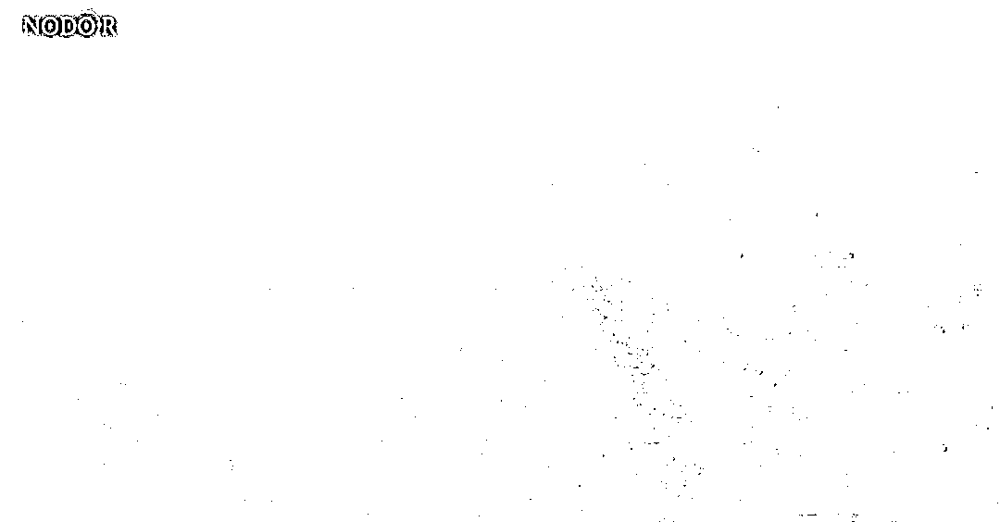

作者/亚历山德拉·卡拉寇斯塔斯 译者/Elle 校对/江艺编辑/玫瑰 图片/稿定设计当星座已经成为我们茶余饭后的谈资时，星座背后的占星学却鲜为人知。我们所谈论的太阳星座运势不过是浩翰占星学的小小一角，今天就让若道君领大家一起来看看占星学究竟是什么吧。另外，大卫老师参与授课的【[2023 年中英双导师占星核心课 L1-5](http://mp.weixin.qq.com/s?__biz=MzA5NjA0NTAxNg==&mid=2651498896&idx=3&sn=33a74e21a507e53ec9d70ff3d73a7acc&chksm=8b481b27bc3f9231c33cb8e556acf899be045af46267d4c2797ca9f5399015baf62b93afa4c6&scene=21#wechat_redirect)】报名中，点击链接了解更多详情！**占星学是什么？**占星学是什么？我常常被问到：

*   我是否**“相信”**占星学。
*   我是否认为我们拥有**“自由意志”**，还是觉得我们的**命运是注定**的。

开始回答的时候，我通常会去澄清一些可能的误解。**占星学****既不是一门宗教，也不是一个信仰。它是一门用来理解内在和外在世界象征性的、原型式的语言，是关于自然天体循环的研究**。当描述天和地，微观和宏观时，占星师们说：**“内在如是，外在亦然”**以及**“天上如是，地上亦然”**。**占星学****是通过太阳、行星和太阳系其他天体的运动，以及它们在宇宙中的位置来架构的。**简而言之，占星学是用天体的**相对位置**来镜像反映我们个体和集体表演的舞台。

**直到 17 世纪，占星学和天文学基本上都是同一门学科。**通过记录和观察行星，即“流浪的旅行者（古希腊人给它们的称呼）”的**周期性运动**，天文学家、占星师能确定并记录天上的具体模式。就这样，**他们开始把特定的模式或现象与现实生活中的特定事件相关联起来**。

最明显的周期就是每日周期：从日出开始，到日落结束。自远古以来，**最有用的周期之一是月亮的周期**，其被广泛使用于种植庄稼、开始战争、预测天气等等。事实上，月亮周期直到今天也仍然被许多人这样运用着。

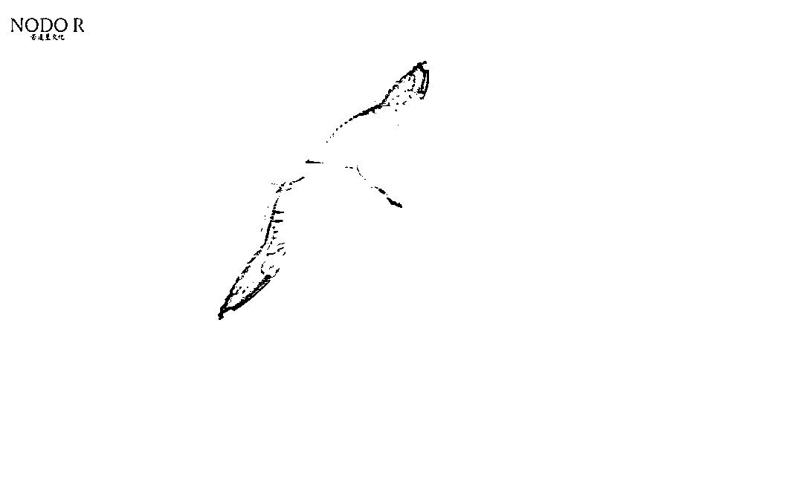

**我们真的可以自由选择命运吗？**我们每个人都是独一无二的。即使对于出生时间相差不到一分钟的**双胞胎**，他们也不可能用同样的方式经历和回应人生。**造成这些不同的关键，在于一个人的经历和对于特定事件的选择和反馈。**虽然对于双胞胎而言，一些特定事件的发生时间无疑是密切关联的，但他们每个人每时每刻的反应会决定不同的结果。重要的是，我们如何运用我们的内在品质。换言之，**我们的选择发挥了我们的潜能**。我们都得到我们需要的，而不是我们想要的，尤其是当关乎个人和集体成长的事情时！

已故的备受尊敬的哲学家、作家及现代占星之父丹恩·鲁伊尔写道：**“不是事情发生在我们身上，而是我们使得事情发生。”**虽然这个观点可能有点深奥，但他很好地把握了现代科学通过量子物理所发现的精髓。**万事万物在量子能级的联结解释了距离遥远的物体彼此影响的原因，例如一个人和一个小行星或星系相互影响的能力。**

**我们的星图并不会使我们成为我们的样子。它只是对于我们独特潜能和能力的一个反映。**使我们成为我们自己的，是基因遗传、我们的社会经济和教育背景、我们的文化和种族的根基等等。

在一张星图中，一个占星师能看出家庭模式和动力，遗传的优势和弱点。**我们如何运用这些是由我们自己决定的，而我们的权力感来源于我们的选择。**这就是为什么**意识、觉知和自我认识对于我们的命运非常重要**。

**占星学对我们有什么意义？**

**帮助我们了解自己的限制与界限**

另一句我非常喜欢的占星学格言是：“性格即是命运。”设想一个苹果籽会长成一棵橘子树是不现实的。**我们都有天生的限制和界限。**例如，作为人类，我们只能考虑如何滋养作为一个人类的自己，而不是作为其他的事物。这对于每一个个体，以及每一个国家也是同样的。任何一个实体都有其独一无二的潜质、能力和局限。我们通过选择获得权力。而占星学是帮助我们了解这些信息的工具。

**帮助我们抓住时机**

我们经常听到“时机就是一切”的说法。如果能知道当下正处于一个周期的哪个阶段，这对我们是非常有利的。**机会来来去去，除非我们伸手抓住它们，否则它们只会擦身而过。**如果我们能更充分地理解我们通往本真、成为真我的旅程，我们将获益良多。而占星学的符号语言正是帮助我们做到这一点的一个工具。

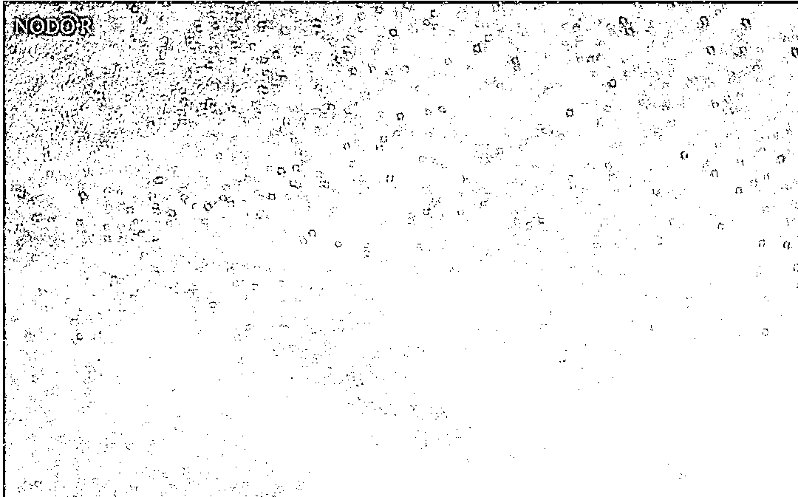

**占星学有多少种类型？**如今有很多种类的占星学。

*   **出生星图占星学**关注个人。
*   **世俗占星学**探索国家、国际和经济的周期。
*   **气象占星学**研究气候模式和灾难性事件。
*   **择时占星学**帮助我们决定开启一个项目的最佳时间。
*   **金融占星学**关注宏观和微观的经济周期。
*   **换置（择地）占星学（ACG）**帮助我们认识到，当我们去到不同的地方，我们的哪些特质会被突显。

还有一些其他类型的占星学。**同时，随着世界和宇宙的扩张，我们仍在不断发现运用这种信息和智慧载体的新方法。**

所以这对你来说意味着什么呢？你的生活里正发生着什么？**每一件事的发生都会有特定的地点和时间，同时，就像大自然一样，生命按照一定的顺序不断呈现。**

我邀请你一起来反思你生命中的周期、模式和习惯。你如何提高你的觉知，实现你创造性的潜能，改善你跟这个世界的关系？你可以通过选择的画笔来“描绘”你的人生，充分成为那个了不起的自己！

**版权声明：**本文由若道翻译发布，欢迎转发，反对抄袭。友号转载请申请白名单。

**END**

**亚历山德拉·卡拉寇斯塔斯**

生活在加州奇科市的职业占星师、老师和作家。她自 1975 年以来一直不断研习占星学。

**拥有 53 年占星实践经验的若道创始人** **大卫·瑞雷**

**&最懂学员的若道首位认证金牌中国老师**

**熊鹰**

**最默契的师徒二人****再度联合打造**

**2023 若道全新核心占星课程**

**课程结构****全面升级****教学内容****翻倍惊喜****补充资料****丰富多样****沉浸式互动****案例教学****以学员为案例进行课堂的占星咨询演示****职业占星师养成计划**

**点击下图了解更多课程详情** 

**学习占星学****点击下图了解课程详情**

**微信又双叒叕改版啦，不想错过若道君的推送？**
****就把若道设为****星标****以及点点****“在看”****吧！******▼**

**喜欢就点一下“在看”吧！****报名直达入口**

# 2023 年中英双导师占星核心课 L1-5 | 全面升级的沉浸式互动学习

> 原文：[`mp.weixin.qq.com/s?__biz=MzA5NjA0NTAxNg==&mid=2651499226&idx=3&sn=ad88ce96e1693ade9b033306e1ed4b77&chksm=8b48186dbc3f917bbd31d0fc27c115a1ac59bc27d8780a8aa2055fd1c8218da99766f9c379a5&scene=126&sessionid=1692737690#rd`](http://mp.weixin.qq.com/s?__biz=MzA5NjA0NTAxNg==&mid=2651499226&idx=3&sn=ad88ce96e1693ade9b033306e1ed4b77&chksm=8b48186dbc3f917bbd31d0fc27c115a1ac59bc27d8780a8aa2055fd1c8218da99766f9c379a5&scene=126&sessionid=1692737690#rd)

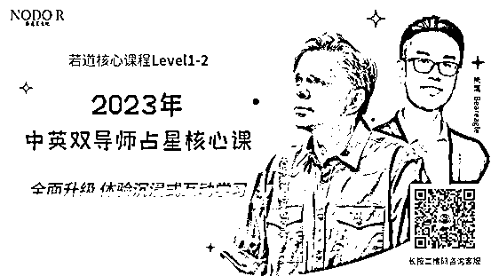

**拥有 53 年占星实践经验的若道创始人** **大卫·瑞雷****&最懂学员的若道首位认证金牌中国老师****熊鹰****最默契的师徒二人****再度联合打造****2023 若道全新核心占星课程**

**课程结构****全面升级**

**教学内容****翻倍惊喜**

**补充资料****丰富多样**

**沉浸式互动****案例教学**

**以学员为案例进行课堂的占星咨询演示****职业占星师养成计划**

**ISAR 颁发学历文凭（Diploma）**

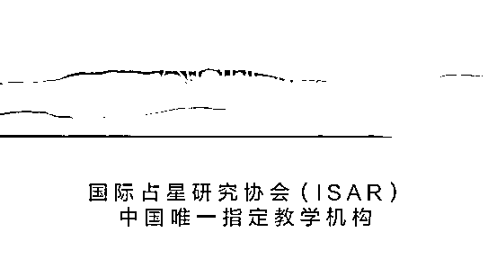**ISAR 认证职业占星师的独有培训**

目前占星学的培训市场鱼龙混杂。而 ISAR（国际占星研究协会）是一个包含了 47 个国家在内的国际占星组织，多年来致力于占星的教育和研究，提升占星教育的品质和职业占星师的能力，在国际占星领域备受尊重。

**2023 年，鉴于对若道在占星教学领域所做的持续努力和高品质的课程服务，ISAR 特别授予若道核心课程为 ISAR 文凭课程，只有在若道学习，并通过若道毕业考试的同学将获得 ISAR 颁发的学历文凭（Diploma）。**

**2023 开年****送给自己一场心动的占星学习之旅**

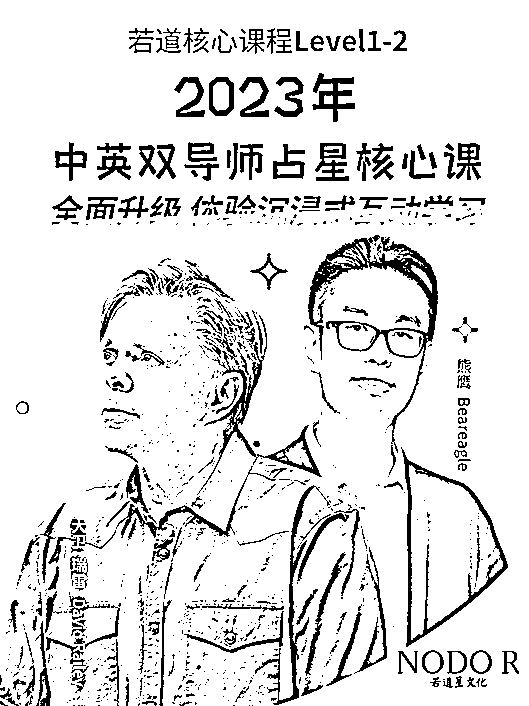

**2023 开年核心课内容大公开****1-2 阶我们要学习什么？****第一阶** **12 星座，12 种性格，12 种人生**

❶  学习占星必须准备的“心法”

❷  占星学中的火、土、风、水四元素，阴阳法则

❸  面对面的星座有故事

❹  12 星座：12 种性格详解，12 种行为模式，12 种价值观

❺  太阳和月亮：了解你的太阳，生命的发动机，让你在世界闪光的方式，生命获得力量的方法；了解你的月亮，让你获得幸福的方法

❻  了解太阳、月亮，了解你生命中已经出现的、将会出现的男性和女性

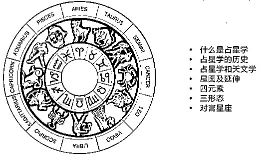

**第二阶  ****命运的线索和人生故事中的演员**

❶  命运的线索：南北交点

❷  星图三巨头：太阳、月亮、上升点的故事

❸  了解心智：水星

❹  了解金钱和关系：金星

❺  了解行动模式：火星

❻  了解信念：木星

❼  了解努力：土星

❽  了解天才和疯狂：天王星

❾  了解梦想和幻灭：海王星

❿  了解死亡和重生：冥王星

⓫  12 个人生场景：黄道 12 宫位初解

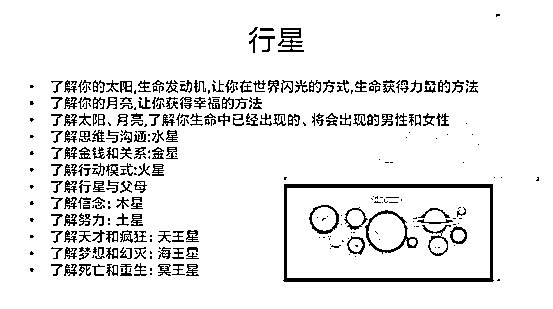

**L1-2 课程内容形式**

**形式：直播课程+录播课程**

**时长：****10 节直播课（共 20 小时）**+**10 节录播课（共 20 小时）**+**33 小时音视频资料**+**35 篇文字补充资料**

**L1-2 课程时间安排**

录播课 1：占星学简介，黄道前六个星座**2023 年 4 月 24 日直播课：班上同学星座案例+答疑（大卫老师主讲）**录播课 2：黄道星座 天秤座-双鱼座**2023 年 5 月 8 日直播课：班上同学星座案例+答疑（熊鹰老师主讲）**录播课 3：对宫星座，日月**2023 年 5 月 15 日：班上同学日月星座案例+答疑（大卫老师主讲）**录播课 4：日月金火与父母，水星，行星与星座**2023 年 5 月 22 日：班上同学水金火星座案例+答疑（熊鹰老师主讲）**录播课 5：星座与星座组合，木土**2023 年 5 月 29 日：班上同学木星土星星座案例+答疑（熊鹰老师主讲）**录播课 6：三王星：天王星、海王星、冥王星**2023 年 6 月 5 日：班上同学三王星案例+答疑（大卫老师主讲）**录播课 7：行星周期与逆行**2023 年 6 月 12 日：班上同学宫位案例+答疑（熊鹰老师主讲）**录播课 8：四轴和宫位**2023 年 6 月 19 日：班上同学宫位案例+答疑（大卫老师主讲）**录播课 9：月亮交点 1**2023 年 6 月 26 日：班上同学月亮交点案例+答疑（熊鹰老师主讲）**录播课 10：月亮交点 2**2023 年 7 月 3 日：班上同学宫位案例+综合解读+答疑（大卫老师主讲）**

**第三阶 ****宫位、相位以及初步解读星图**

**3 阶我们要学习什么？**

❶  宫位

❷  相位

❸  宫主星

❹  定位星

❺ 相位格局

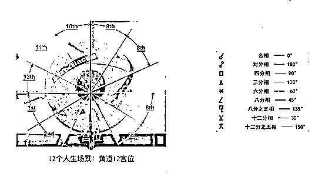

**L3 课程内容形式**

**形式：直播课程+录播课程+2 日工作坊****时长：****12 节直播课（共 24 小时）****+****10 节录播课（共 20 小时）****+****12 小时工作坊****+****27 小时音视频资料****+****44 篇文字补充资料**

❶ 12 次线上直播网络课程，每次 2 小时，堂课中依旧会使用同学们的星图作示范

❷ 10 节录播课课由熊鹰老师教授，重点通过名人星图阐释知识点

❸ 占星师养成计划开启，有专业人员带领小组研讨互动学习

❹ 重点在于如何根据星图去问问题，着重自我发现和自我探索的过程

❺ 助教将会指导练习，答疑解惑，学练结合

❻ 两日工作坊：本命星图综合解读工作坊，学生将被选中进行案例演示和互动

**L3 课程时间安排**

录播课 1：宫位复习回顾&组合解读录播课 2：组合解读（续）&相位计算**2023 年 7 月 24 日：班上同学宫位、行星、星座综合解读案例+答疑（熊鹰老师主讲）**录播课 3：相位计算（续）常用相位&相位解读录播课 4：盈亏相位，相位优先级**2023 年 7 月 31 日：班上同学相位、渐盈渐亏相位案例+答疑（熊鹰老师主讲）**录播课 5：相位解读（续）&宫主星**2023 年 8 月 7 日：班上同学宫位、行星、星座、相位综合解读案例+答疑（熊鹰老师主讲）**录播课 6：宫主星（续）&定位星**2023 年 8 月 14 日：班上同学宫主星案例+答疑（熊鹰老师主讲）**录播课 7：定位星（续）&解读行星**2023 年 8 月 28 日：班上同学相位、宫位法则、宫主星案例+答疑（大卫老师主讲）**录播课 8：南北交点**2023 年 9 月 4 日：班上同学月亮交点综合解读案例+答疑（熊鹰老师主讲）**录播课 9：相位图形**2023 年 9 月 11 日：班上同学相位格局案例+答疑（熊鹰老师主讲）**录播课 10：无托勒密相位的行星，星图布局，行星的特殊状态**2023 年 9 月 18 日：班上同学空相行星案例+答疑（熊鹰老师主讲）****2023 年 9 月 25 日：班上同学案例综合解读+答疑（大卫老师主讲）****2023 年 10 月 9 日：班上同学案例综合解读+答疑（大卫老师主讲）****2023 年 10 月 16 日：班上同学案例综合解读+答疑（大卫老师主讲）**

**L3 工作坊安排**

*   **月亮交点，串联 L3 的所有基础知识，综合解读工作坊。**

*   **学生将被选中进行案例演示和互动（免费）**

*   **时间：2023 年 11 月 21、22 日**

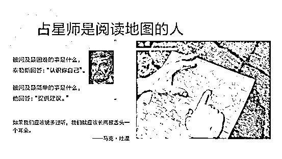

**第四阶 ****出生星图解读（进阶）以及关系与职业议题****4 阶我们要学习什么？**

❶ 行进

❷ 行星周期

❸ 综合解读

❹ 食相，逆行和停滞

❺ 职业发展解读

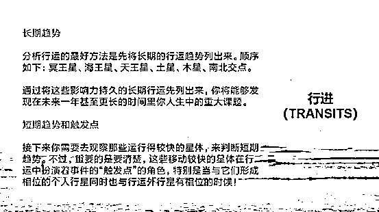

**L4 课程内容形式**

**形式：直播课程+录播课程****时长：****9 节直播课（共 18 小时）****+****8 节录播课（共 16 小时）****+****22 小时音视频资料****+****28 篇文字补充资料**

❶ 9 次线上直播网络课程，每次 2 小时，堂课中依旧会使用同学们的星图作示范

❷ 8 节录播课课由熊鹰老师教授，重点通过名人星图阐释知识点

❸ 助教将会指导练习，答疑解惑，学练结合

❹ 占星师养成计划继续，有专业人员带领小组研讨互动学习

**L4 课程时间安排**

录播课 1：回顾&切入点&星图整体视角**2023 年 11 月 6 日：班上同学星图综合解读案例+答疑（熊鹰老师主讲）**录播课 2：整体解读的思路 加料-计分表演示**2023 年 11 月 13 日：班上同学星图综合解读案例+答疑（大卫老师主讲）**录播课 3：用整体论的方法&案例解读录播课 4：行进介绍&优先级&行进的行星&触发器 加料-星历表简介&回顾重要行进**2023 年 11 月 20 日：班上同学行进解读案例+答疑（熊鹰老师主讲）**录播课 5：触发器（续），食相，逆行和停滞录播课 6：行进的相位图形&行进梳理&案例**2023 年 11 月 27 日：班上同学行进解读案例+答疑（熊鹰老师主讲）**录播课 7：周期&重置图**2023 年 12 月 4 日：班上同学行进、周期解读案例+答疑（大卫老师主讲）**录播课 8：职业发展解读**2023 年 12 月 11 日：班上同学职业占星案例+答疑（熊鹰老师主讲）****2023 年 12 月 18 日：班上同学职业占星案例+答疑（熊鹰老师主讲）****2024 年 1 月 8 日：班上同学职业占星案例+答疑（大卫老师主讲）****2024 年 1 月 15 日：班上同学职业占星案例+答疑（大卫老师主讲）**

**五阶**** 预测、关系、咨询、为执业和考试做准备****5 阶我们要学习什么？**

❶ 亲密关系发展解读

❷ 比对图&组合图

❸ 次限推进

❹ 太阳弧推进

❺ 太阳返照、月亮返照

❻ 关系趋势、周期

❼ 职业趋势、周期

❽ 高级预测技巧、咨询技巧

❾ 占星学历史

❿ 占星学流派

⓫  ISAR 考试术语和复习

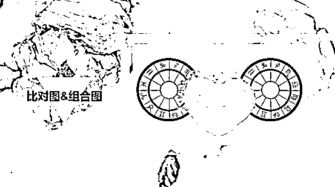

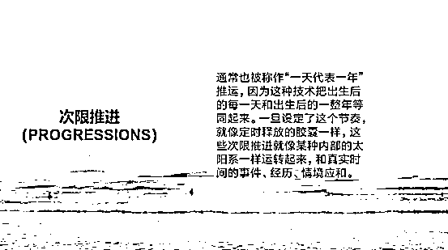

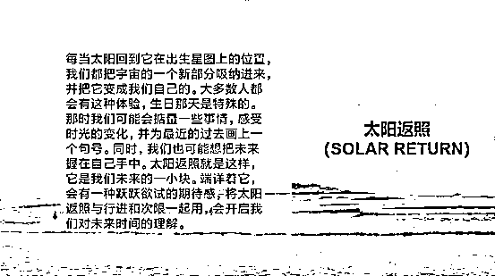

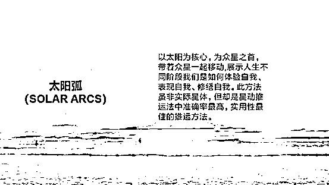

**L5 课程内容形式**

**形式：直播课程+录播课程+2 日工作坊****时长：****22 节直播课（共 44 小时）****+****16 节录播课（共 32 小时）****+****12 小时工作坊****+****30 小时音视频资料****+****81 篇文字补充资料**

❶ 22 次线上直播网络课程，每次 2 小时，堂课中依旧会使用同学们的星图作示范

❷ 16 节录播课课由熊鹰老师教授，重点通过名人星图阐释知识点

❸ 两日工作坊：亲密关系占星，学生将被选中进行案例演示和互动

❹ 助教将会指导练习，答疑解惑，学练结合

❺ 占星师养成计划继续，有专业人员带领小组研讨互动学习

**L5 课程时间安排**

录播课 1：亲密关系

**2024 年 2 月 19 日：班上同学亲密关系案例+答疑（熊鹰老师主讲）**

录播课 2：亲密关系 出生图和对比图

**2024 年 2 月 26 日：班上同学比对图案例+答疑（熊鹰老师主讲）**

录播课 3：亲密关系：组合图与综合解读

**2024 年 3 月 4 日：班上同学组合图案例+答疑（熊鹰老师主讲）**

**2024 年 3 月 11 日：班上同学亲密关系案例+答疑（大卫老师主讲）**

**2024 年 3 月 18 日：班上同学亲密关系案例+答疑（大卫老师主讲）**

录播课 4：推进：次限推进

**2024 年 3 月 25 日：班上同学次限推进案例+答疑（熊鹰老师主讲）**

**2024 年 4 月 1 日：班上同学次限推进案例+答疑（大卫老师主讲）**

录播课 5：推进：太阳弧

**2024 年 4 月 8 日：班上同学太阳弧案例+答疑（熊鹰老师主讲）**

**2024 年 4 月 15 日：班上同学太阳弧案例+答疑（大卫老师主讲）**

录播课 6：关系趋势、周期

**2024 年 4 月 22 日：班上同学关系趋势案例+答疑（熊鹰老师主讲）**

**2024 年 4 月 29 日：班上同学关系趋势案例+答疑（大卫老师主讲）**

录播课 7：职业趋势、周期

**2024 年 5 月 6 日：班上同学职业趋势案例+答疑（熊鹰老师主讲）**

**2024 年 5 月 13 日：班上同学职业趋势案例+答疑（大卫老师主讲）**

录播课 8：太阳返照

**2024 年 5 月 20 日：班上同学太阳返照、月亮返照案例+答疑（熊鹰老师主讲）**

**2024 年 5 月 27 日：班上同学太阳返照、月亮返照案例+答疑（大卫老师主讲）**

录播课 9：高级预测技巧

**2024 年 6 月 3 日：班上同学预测技巧案例+答疑（熊鹰老师主讲）**

录播课 10：ISAR 考前准备 1

**2024 年 6 月 17 日：班上同学预测技巧案例+答疑（大卫老师主讲）**

录播课 11：综合趋势解读

**2024 年 6 月 24 日：咨询技巧实践案例（熊鹰老师主讲）**

录播课 12：ISAR 考前准备 2

录播课 13：ISAR 认证相关介绍 3

**2024 年 7 月 1 日：ISAR 考试术语和复习（大卫老师主讲）**

录播课 14：咨询技巧

**2024 年 7 月 8 日：咨询技巧实践案例（熊鹰老师主讲）**

录播课 15：ISAR 备考复习 4

**2024 年 7 月 15 日：咨询技巧实践案例（大卫老师主讲）**

录播课 16：咨询技巧

**2024 年 7 月 22 日：咨询技巧实践案例（大卫老师主讲）**

**L5 工作坊安排**

*   **趋势预测（两天）占星工作坊**

*   **学生将被选中进行案例演示和互动（免费）**

*   **时间：2024 年 8 月 3、4 日**

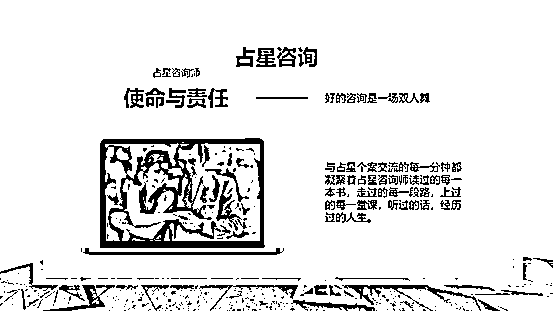

如果直播课时间临时有调整，班班会及时通知每位同学

**这两位优秀的占星学老师是谁？**

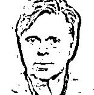

**大卫·瑞雷（David Railey）**

*   若道联合创始人，致力于在中国教授和推广西方占星学。

*   曾任 ISAR 全球副主席，CAPISAR（ISAR 职业占星师资质认证机构）主席；

*   1976 年，通过亚特兰大职业占星师考试，成为全职占星师，随后通过 AFAN 和 ISAR 职业测试；

*   1980 年，与杰夫·焦耳一起在亚特兰大创建“每日行星”占星学中心。此后在亚特兰大占星协会担任 4 年考官，并且两次担任亚特兰大地区占星协会主席。1979-1992 年，作为占星师活跃于美国社会媒体，向不了解现代占星学变化的大众宣传专业占星学知识；

*   在 1989-1992 年期间，他在 WRGG 电台 12 频道每周主持个人电视秀“今日占星学”，早先他还在 WRFG 的广播节目中播讲宇宙天气节目；

*   2010 年-2014 年，任全美占星师联盟监督委员会委员；

*   2010 年，其著作《灵魂的目标》中国版出版，和蒋颖一起创办若道占星学校和其官网 www.nodoor.com。

*   2017 年，被选为 ISAR 委员会成员。ISAR 是世界最大的国际占星机构，会员遍布 45 个国家，2017-2020 年曾任 ISAR 全球副主席、CAPISAR（ISAR 职业占星师资质认证机构）主席。

**熊鹰老师（天空的空）**

*   2008 年接触严肃占星学，至此爱不释手。

*   2013 年师从大卫·瑞雷，研习整套现代占星学核心课程，并于 2014 年起至今连续三年担任该课程的主助教。

*   期间也跟随格伦·佩里、诺·泰尔、理查德·塔纳斯、罗伯特·汉德、苏·汤普金斯、斯蒂芬·弗里斯特等多位国际顶尖占星大师进行学习，进行定向占星主题研究。

*   2015 年初，通过国际占星研究协会（ISAR）资质认证并获得证书。同年，进一步跟随大卫·瑞雷老师进修“生时校正”技术，通过最终考核并获得证书。

*   2020 年和大卫·瑞雷老师开设中英双导师联手打造 Level1-5 核心占星课，两年期间不断打磨革新教学内容，丰富职业占星师养成计划。

*   目前在若道星文化任职，将传播系统、严谨、真实的占星学作为职业使命。任专职助教期间，进行沙龙与答疑等辅助教学工作已累计超过 600 小时。

*   在业余期间也提供占星咨询与生时校正服务。目前正致力于占星学与个人成长的整合。

**什么人适合这门课程？**

*   对占星学有浓厚兴趣，想要系统学习占星学；

*   对占星学有一定基础，但不知道该如何整合星图复杂的碎片；

*   希望成为优秀的占星师，想要借鉴国际大师解读思路并融入自己的体系；

*   想学习占星学，但不擅长英文，希望有中文老师授课；

*   想结合占星学理论与咨询实践；

*   大卫·瑞雷、熊鹰的忠粉，学过占星，但就是想跟着偶像再学一遍；

*   走在自我探索和个人成长道路上的人。

**课程费用****★1-5 阶****早鸟价：33800 元（2023 年 3 月 28 日之前）****课程费用：48600 元** **★1-2 阶****早鸟价：3200 元（2023 年 3 月 28 日之前）****课程费用：4000 元****转退课程**

**退款原则请详看《教学协议》，如有疑问请咨询课程顾问。**

****2023 中英双导师核心课 Level1-5****

**授课老师：大卫·瑞雷 熊鹰**

**授课时间：**2023 年 4 月 24 日-2024 年 7 月 22 日

**授课方式：**网络课程，中英文授课，中文翻译；现场工作坊，中英文授课，中文翻译

**费用：****1-5 阶：**48600 元********（********早鸟价 33800 元，2023 年 3 月 28 日之前）******1-2 阶：40****00 元**************************（早鸟价 3200 元，2023 年 3 月 28 日之前）****************

**课程负责人：**王老师（微信：18510107057），请备注“核心课”

长按二维码添加课程负责人咨询~

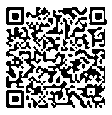

**END****报名直达入口**

# 若道周运 1.30-2.5 丨没有天象就是好天象，享受一周风平浪静的好时光吧！（内含 12 星座运势）

> 原文：[`mp.weixin.qq.com/s?__biz=MzA5NjA0NTAxNg==&mid=2651499175&idx=1&sn=ec62bc6787da754726192493bfc5879f&chksm=8b481810bc3f91067531aae1784f979be6e3d84408513dd07e8f2ea70c51d0d5ca388e3a6ddb&scene=126&sessionid=1692737690#rd`](http://mp.weixin.qq.com/s?__biz=MzA5NjA0NTAxNg==&mid=2651499175&idx=1&sn=ec62bc6787da754726192493bfc5879f&chksm=8b481810bc3f91067531aae1784f979be6e3d84408513dd07e8f2ea70c51d0d5ca388e3a6ddb&scene=126&sessionid=1692737690#rd)

******☆ ****后台回复“今日”，给你一句生命态度******

作者/朵三三三 ISAR 认证占星师
编辑/翀子 封面/书君 图片/稿定设计**整体氛围**

在行运中，往往是**外行星与内行星之间的合相、四分相、对分相最能引起我们的强烈感应和共振，也会成为引爆事件的导火索。**

但**本周星象中几乎没有这些激烈相位，也就没有什么重大变动和转折。**大部分是月亮的快速相位，持续力较弱，影响时间短，且都是和谐丝滑的能量流动。这种乏善可陈，对我们的感受层面是极友好的事。

春节长假过去，大家陆续复工，大多数人正处在从吃喝玩乐模式中切换到工作模式的过程中，还不太适应紧张的节奏。**宇宙就十分体贴的给了我们这样云淡风轻的一周，让我们有足够的时间来调整和过渡，**好好整理自己，稳定心神，再迎接新一年的旅程。

本周的天空中，**行星分布也较为均匀，风、水、火、土四大元素俱全，基本、固定、变动三大模式俱有，**没有太多躁动感，非常适合我们找到内心与外在、精神与现实之间的平衡。

唯有**临近周末时，天空开始风起云涌，有些不和谐的音符出现了。**此时也马上迎来下周一的狮子座满月，大家可以把这个周末的些许波澜，当作是满月试炼的前奏。

**本周重要天象**

★**周一 **

**金牛座月亮四分水瓶座土星、水瓶座太阳三分双子座火星、摩羯座水星三分金牛座天王星、月亮进入双子座。**

这天早晨，**月土四分相会带来一些沮丧感和挫折感**，或许是外界的一些现实阻碍和困难，激发了内在的不安全感。也或许是习以为常的模式被迫改变，让人感到孤独无助。

但很快，**上午的日火三分相和水天三分相，都会帮助我们迅速回到现实中，行动能量提升，目标明确。**我们可以通过交流，或是头脑的分析运作，展现自我追求，落实计划。可能有一些新鲜有趣的事情吸引我们的注意力，些许改变让我们感到亢奋，从而获得一些灵感和突破。

**夜晚，月亮进入双子座，**适合与熟悉的家人、朋友聊聊心事，也可以通过书写记录的方式让自己的心情更加放松。

★**周二 **

**双子座月亮四分双鱼座金星、六分白羊座木星、合相双子座火星、三分水瓶座太阳。**

今天月亮在双子座行进的过程中，会一路遇见四位朋友。

**第一个小伙伴是双鱼座金星，这个相遇发生在凌晨 1:24。**由于月亮和金星都是非常温柔的能量，所以即便成硬相位，依然不会有太多不适感。

但**四分相提醒我们要有适度的觉察，小心情感泛滥，或是纵容自己沉浸享乐。**熬夜的各位注意节制，别沉浸在美食和剧中不能自拔，在跟亲密的人聊天互动的小伙伴，注意别对他人期待过度，不然很可能感到失望，或者体会到小小的不愉快。

**第二个小伙伴是白羊座木星，它们之间是亲和元素，互动就相当愉悦了。**虽然也在凌晨成相，但这种快乐的感觉也会持续到上午。我们可能跟周遭的人进行鼓舞人心的对话，也可能是工作会谈，让自己觉得振奋而充满希望。

**第三个小伙伴是双子座火星，这个正午时分的邂逅带着些火药味，也会让人缺乏耐心。**我们的情绪可能迅速发生变化，需要迫切采取行动，实现自己的想法，也可能会出现言语上的冲撞。此时需要我们更加淡定，对自己的愤怒和负面感受更加有控制力。

**第四个小伙伴是水瓶座太阳，依然是亲和元素，会让我们从中午的躁动中平复下来，**在下午和傍晚慢慢感到宁静。或许我们跟朋友或恋人，进行了一些理性的分享，让自己重新找到方向。

★**周三 双子座月亮三分水瓶座土星**

今日无事闲，直到傍晚才有月土三分相出现。

**这个夜晚我们或许更想独处，给内在心灵留出一些空间。**此时我们是节制的，适度的，也或许会有一些回忆或者过往的重要事件浮现，让我们反思，并从中得到启发。

**我们会倾向于用客观的角度来审视外界关系，**从中获得长久稳定的支持感。

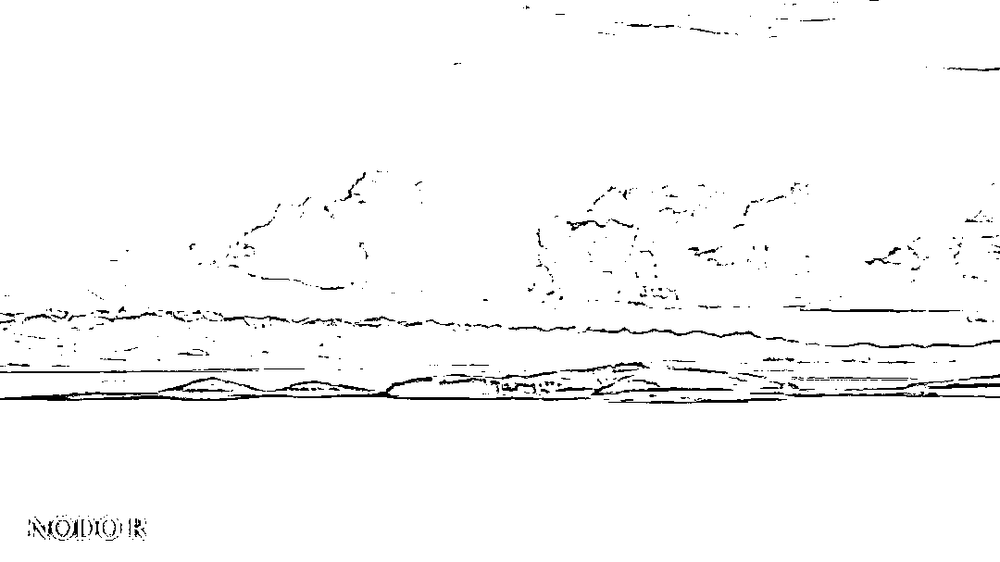

★**周四 **

**摩羯座太阳三分金牛座天王星、月亮进入巨蟹座、巨蟹座月亮四分白羊座木星、巨蟹座月亮三分双鱼座金星。**

**月亮来到了一个更加敏感、情绪饱满的星座，我们会更加渴望滋养，**从他人那里获得照顾、支持和深入的情感连接，也希望能够为他人付出。

**黄昏时，月木四分相让我们有些内心起伏，夸大此时的情绪感受。**这个相位让我们体验到当下的快乐，也可能放纵自己，比如暴饮暴食，浪费挥霍，或者因自我膨胀，产生不切实际的想法。

**夜晚的金月三分相给我们带来了温馨又快乐的时光，**十分有利于情感交流，谈情说爱，或是聚会社交。与女性的相处让我们更容易感到放松。

★**周五 巨蟹座月亮对分摩羯座水星**

依然是风平浪静的一天，直至傍晚。

**水月对分相往往让我们与他人的沟通交流出现障碍和困难。**尤其摩羯座与巨蟹座之间，更是理智与情感的一场大战，这种情况下，想要和谐交流是非常艰难的，**不如等这个小风暴过去，大家平静下来之后，再尝试对谈和复盘。**

 ★**周六 **

**水瓶座太阳四分金牛座天王星、月亮进入狮子座。**

这一天，**日天四分相和月亮换座激活了固定星座的能量，也为即将来临的狮子座满月拉开了序幕。**

尤其是星图中**水瓶座、狮子座、金牛座、天蝎座**较重的人群，更容易感到一些改变正在发生，心中有股能量在蠢蠢欲动。若有长久以来累积的压力，更容易感到在相关领域的冲击。高压锅的盖子盖不住了，开始呲呲冒气。

大家都会有些想要冒险和豁出去的冲动，**做些不同寻常的事情，来彰显自我意志或证明自己，**要警惕落入为了做而做的形式化陷阱。此时所有人都会有些叛逆之心，我们也需要对他人的意志保持敬意，给予空间。

 ★**周日 **

**狮子座月亮三分白羊座木星、双鱼座金星四分双子座火星、狮子座月亮六分双子座火星**

在火象星座发生的**月木三分相，会让我们对他人和世界更加友善**，乐于分享自己的资源，内心有足够安全感和希望，这也是一个容易给人带来好运的相位。

**月火六分相亦是如此，我们对于内心需求的把控和行动力提升，**或许主动向朋友、爱人发起邀请，组织聚会或休闲活动。双子座火星也保证了活动的多样化和有趣性，我们愿意在这个过程中坦诚布公的交流，且脑洞大开，灵感频出，尽情玩乐。

但同时，**狮子座月亮会让我们容易自以为是，或自大**。这个阴柔的月亮落在太阳守护的阳性星座，本身就包含了阴阳能量的冲突感，而接下来金火四分相的叠加，**更可能让我们经历两性之间的矛盾和不愉快，关系中凸显彼此价值观的差异，社会层面上也可能会有性别话题的争议与升级。**

作为个人来说，需要关注**自己对于愉悦感的需求，和行动力之间的平衡问题。**说白了就是你想做什么，和在做什么之间的平衡。

不过金火四分相在某种程度上来说，会**给情感生活带来兴奋感、新鲜感和刺激，**在火星的推动下，很多处在暧昧期，或者正犹豫要不要表白的，可能在这个天象下一蹴而就。

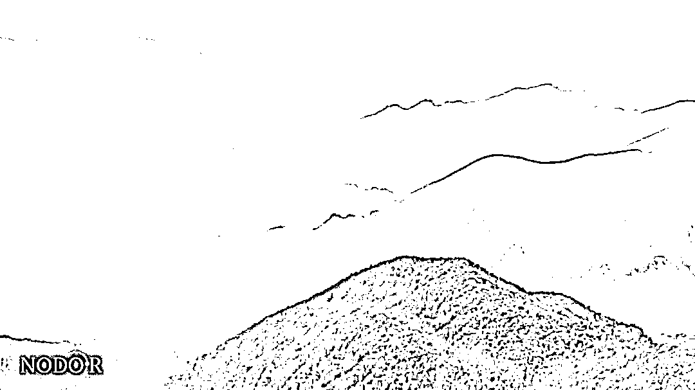

**12 星座一周运势**

**（重点参考上升星座，其次参考太阳星座）**

***白羊座***

本周前几天，你的头脑相对活跃，会有很多想法，以及沟通表达的需求。可能你会对语言变得更加敏感，也能通过交流来缓解内在的焦虑不安。

周四之后，你的情绪渐渐安定，对家人和伴侣的需求增加，可以多多在家享受这段平静的时光。

周末可能会与朋友发生一些金钱往来，另外自己内心想要独处的念头可能跟外部现实发生冲突。

***金牛座***

本周前几天，你的财务金钱流动较多，可能会有情绪性消费出现，也可能因财务方面的状况感到不安。

周四之后，你有机会通过跟朋友、挚交的聊天互动得到内心安慰，也可能会谈论起过往的回忆。

周末，可能收到跟职场工作相关的一些变动的消息，也可能因社交聚会、人情世故支出金钱。

***双子座***

本周前几天，你容易情绪化，对周遭人事物的变化相当敏感，也更容易敞开心扉与他人深入交流。更需要陪伴，渴望并需求他人及亲密关系。

周四之后，你心境渐渐稳定下来，能够享受物质生活，此时逛街、购物、做 spa 都有助于你放松下来。

周末内心又开始翻涌，会做出一些意料之外的决定，此时攻击性较强，更容易愤怒，跟他人发生矛盾。

***巨蟹座***

本周前几天，你更需要独处，不想被打扰，要静静面对消化无意识中的不安情绪，感受孤独并享受孤独。

周四之后，你重新返回到关系之中，渴望陪伴，也对他人的需求更加敏感，愿意付出并照顾对方，也希望得到同等的回馈。

周末，可能会跟朋友有一些借贷关系的互动，或是认识新的朋友。部分人想要学习、读书，却又静不下心来，内心浮躁。

***狮子座***

本周前几天，你更享受在人群中的感觉，可能是朋友的陪伴，或者参加聚会、群体活动。

周四之后，你更需要自己的的空间，一个人的时光更加安逸、舒适。

周末，职场人际关系可能发生一些变动，或者你想要在工作或社交领域中做出一些改变。财运不错有进账，但同时又会因为社交、朋友等花钱。

***处女座***

本周前几天你十分活跃，有在公共场合、职场中表现自己的机会，比如说演讲、发言，你也会更加在意外界对你的评价。

周四之后，你可能会担任起在团队、人群中照顾他人的角色，也容易感受到来自朋友、伙伴的善意。

周末，可能有因为工作临时出差、跑动的机会，部分人会因为人际关系烦恼。

***天秤座***

本周前几天你的学业运不错，可能有主动学习的愿望，也有部分人体现在跟异地有缘分，线上互动、远程沟通较多。

周四之后，可能有些工作上的事情需要你抛头露面，或担任起 leader（领导者）的角色，在这个过程中你能充分体谅并照顾到他人感受。

周末，可能因为娱乐、聚会、子女、兴趣爱好有一笔突然花销，也可能与人在网络上意见不合，发生争论。

***天蝎座***

本周前几天，你的心情有一些莫名压抑，或许不太想说话，潜意识要跟所有人保持安全距离。或在内心升起一些渴望和执着，想要拥有一些人事物。

周四之后，你能通过学习、读书，或者旅行，及接触旅行、异国相关领域来抚平内在焦虑。

周末，人际圈可能发生一些突然变化，或者你听说了震荡三观的消息。部分人在纠结要不要为了自己的兴趣爱好和愉悦感买单。

***射手座***

本周前几天，你会更加需要来自伴侣、密友的陪伴，更渴望与人交流，需要注意此时对他人的需求过多，难以被满足，从而引发不安全感。

周四之后，你的注意力会转移到自己的财务状况上，可能会购买一些自己想要的物品，通过消费抚慰情绪。

周末，日常生活可能发生一些变化，有些人开始健身，改变作息，或者决定养宠物。此时也容易跟家中的女性成员发生争吵。

***摩羯座***

本周前几天你的情绪不太稳定，可能会放大日常生活中的一些负面感受，也可能感到身体不舒服，有些紧张敏感。

周四之后，伴侣关系或者任何较为亲密的一对一关系，都能让你感到内心抚慰，获得滋养。

周末，可能有些意外消费支出，跟你的金钱规划有些冲突。部分人容易遇到攻击性强、火气大的人，即便自己足够忍让，一样会引发不愉快。

***水瓶座***

本周前几天，你会有更多玩乐的需求，也会很渴望展现自己，得到他人认可。正在恋爱中的人能够享受情感，有子女的人也格外关注孩子的状态。

周四之后，你的注意力转移到工作或日常生活细节上，比如关注养生或身体健康，也有牺牲自己服务他人的需求。

周末，可能家中有些突发事件需要处理。部分人计划了享受周末，却被一些事情打扰，感到烦躁。

***双鱼座***

本周前几天，你需要一个平静的私人领域，跟家人或亲人待在一起，比平时有更多互动交流。此时你渴望的是真正了解你的人，带给你温暖和疗愈。

周四之后，你可能会参加一些聚会，或者想要组织玩乐活动，同样也是跟自己较为熟悉的人，你也会乐于做一些关照、服务他人的事项。

周末，可能亲朋好友、手足会突然联络你，有一些事情需要你帮忙，此时也容易与家人，尤其是异性长辈发生矛盾。

**版权声明**：原创文章由作者授权首发于若道平台发布，欢迎转发，反对抄袭。友号转载请申请白名单。

**END**

****朵三三三****

ISAR 认证占星师

全职占星师/塔罗师/国家三级心理咨询师 

人大文学学士/德国慕尼黑大学文学硕士

**微博/微信公众号**：朵三三三

长按打赏

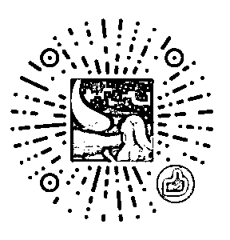

**新的一年，来领取你的好运吧！**

**扫码**即可领取**专属的年运报告**

**20 位来自世界各地的占星师**
**带来 19 场沙龙——新世界的觉醒****详情可点击下图**

**学习占星学****点击下图了解课程详情**

**微信又双叒叕改版啦，不想错过若道君的推送？**
****就把若道设为****星标****以及点点****“在看”****吧！******▼**

**喜欢就点一下“在看”吧！****报名直达入口**

# 雷蒙德·梅里曼金融占星周运 | 火星顺行后，市场行情如何？

> 原文：[`mp.weixin.qq.com/s?__biz=MzA5NjA0NTAxNg==&mid=2651499175&idx=2&sn=bcf8cc7a17f05549a8779dea4dad05b1&chksm=8b481810bc3f9106a24ec658f311006b73d31545f49954d76fefbdd3155aca3c3e39dd25409c&scene=126&sessionid=1692737690#rd`](http://mp.weixin.qq.com/s?__biz=MzA5NjA0NTAxNg==&mid=2651499175&idx=2&sn=bcf8cc7a17f05549a8779dea4dad05b1&chksm=8b481810bc3f9106a24ec658f311006b73d31545f49954d76fefbdd3155aca3c3e39dd25409c&scene=126&sessionid=1692737690#rd)

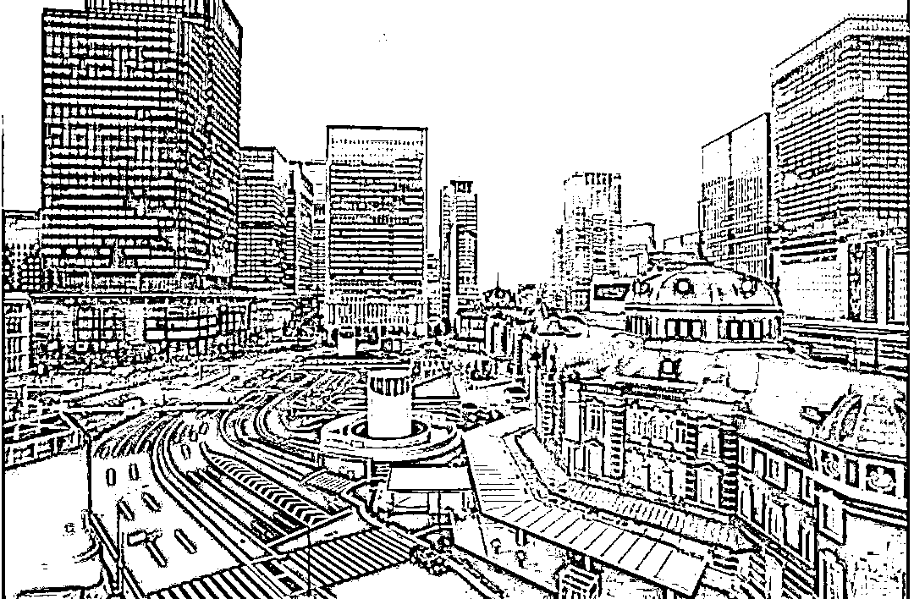作者/雷蒙德·梅里曼 译者/Luke 编辑/玫瑰 图片/稿定设计

雷蒙德·梅里曼是在金融占星学界稳坐第一把交椅的占星师，同时他也是若道签约的金融占星课老师，我们引进了雷蒙德·梅里曼老师的《[上证指数月度报告](http://mp.weixin.qq.com/s?__biz=MzA5NjA0NTAxNg==&mid=2651497687&idx=2&sn=2a13e4dfbea42b9a2750e9b103baf91c&chksm=8b481660bc3f9f7630be3c7b5b277adb253f6b8988bbecf5224f091c9aced62fe62337c6db1c&scene=21#wechat_redirect)》、《[黄金报告](http://mp.weixin.qq.com/s?__biz=MzA5NjA0NTAxNg==&mid=2651497687&idx=2&sn=2a13e4dfbea42b9a2750e9b103baf91c&chksm=8b481660bc3f9f7630be3c7b5b277adb253f6b8988bbecf5224f091c9aced62fe62337c6db1c&scene=21#wechat_redirect)》及《[铜报告](http://mp.weixin.qq.com/s?__biz=MzA5NjA0NTAxNg==&mid=2651497678&idx=2&sn=a7fc4f9b10597152da6c58d47817c3db&chksm=8b481679bc3f9f6f0be5ca81c6d500944a60537bb5a50be0c83bc0f720ba1a77e43b03d2d53b&scene=21#wechat_redirect)》。我们经老师的授权，将每周刊登梅里曼老师的周运，供大家参考和学习。于是，这是本周的周运（1.30-2.3）。

**说明：以下时间采用纽约证券交易所所在地美国东部标准时间。****展望与回顾**

****

**美国经济上个季度年化环比增长 2.9%，但上升的利率和居高不下的通货膨胀影响了需求，今年的经济增速势头有所减弱。10 月到 12 月期间，经济增长放缓，2022 年第四季度的经济同比增长 1%，大大低于 2021 年的同期增幅 5.7%。**

**——萨拉·查尼·坎邦****《美国经济增长放缓》****《华尔街日报》****2023 年 1 月 27 日****美国周四对俄罗斯私人军事组织瓦格纳组织采取行动，将其认定为重大跨国犯罪组织，因其代表弗拉基米尔·普京总统在乌克兰进行军事活动。****——孙孟奇（音译）****《瓦格纳组织被美国认定为跨国犯罪组织》****《华尔街日报》****2023 年 1 月 26 日**

上周，全球大多数股票指数表现非常好。其中几个指数创下了今年的新高，有些甚至超过了去年 12 月的高点，而其他指数则重新测试了 1 月 12 日-22 日 3 颗行星停滞期间形成的高点。因此，多头和空头之间继续围绕基本趋势交战。多头需要突破 12 月中旬的高点。空头需要更大的阻力压低价格，防止这个高点被突破。 

比特币继续数月来的上涨，在 1 月 26 日飙升至高点 23281，是去年 8 月以来的最高价。这符合我们在《[2023 年金融预报](http://mp.weixin.qq.com/s?__biz=MzA5NjA0NTAxNg==&mid=2651498786&idx=3&sn=5d94605b44b992ad269dfdca7cc4dabe&chksm=8b481b95bc3f928358fca0243847d5b65ff2d7cd112d6430553ce1ad8f8852ed764a4a36a736&scene=21#wechat_redirect)》（点击阅了解详情）以及比特币订阅报告中给出的出现长周期和中周期低点的时间段。黄金继续保持令人印象深刻的为期 2 个月的上涨趋势，但是在略低于 1950 的位置遇到了阻力。11 月初的低点是 1618.30，低点就在火星转向逆行后出现。现在，火星在 1 月 12 日转为顺行，这意味着火星逆行带来的逆势反弹可能已经结束，除非黄金的近期合约的收盘价能高于上周的高点。围绕价格趋势的战斗在这里也很激烈。

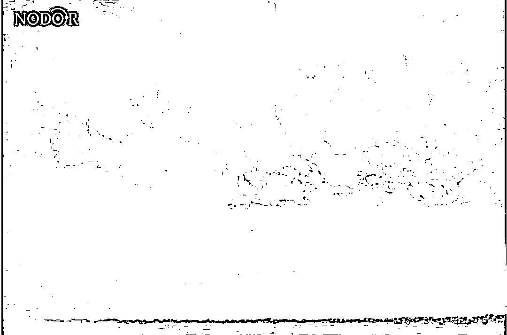

**短期宇宙征象与长期考量**

****

**在欧内斯特·海明威的《太阳照常升起》中，迈克·坎贝尔被问道他是如何破产的。 “两种方式”，他的回答非常著名，“逐渐地，然后突然地。”这是对这个国家面临的风险的一个很好的描述。****——威廉·A.·加尔斯顿****《债务上限违约将是灾难性的》****《华尔街日报》****2023 年 1 月 25 日****关键词不是“债务上限”，而是上限的巨大数字：约 31.4 万亿美元。马丁·路德·金节日演讲传统上是一个和解的机会，在这次演讲中，拜登先生称共和党人“财政失心疯”了。****这位总统是否认为 31 万亿美元的债务无关紧要，4000 亿美元的利息支出无关紧要，接近 6 万亿美元的联邦预算不重要？乔·拜登承诺回归正常。但是这些支出不正常，美国人民知道这一点。****——丹尼尔·亨宁格****《债务上限疯狂》****《华尔街日报》****2023 年 1 月 26 日****凯尔·戴维斯和 祝苏（音译）回来了。他们是总部位于新加坡的对冲基金“三箭资本”的联合创始人。去年 6 月，该基金因拖欠创世纪全球资本 2.4 亿美元的贷款而被强迫清算，但他们又给找了笔新生意。****戴维森先生和祝先生正在兜售了一个新的交易平台，用于交易股票、加密货币以及——注意了竟然是对已经破产的加密货币公司的索赔，就像去年夏天他们的公司所做的那样……****对于一家导致数十亿美元亏损的对冲基金的创始人来说，向前客户（和其他人）提供帮助弥补他们造成的损失，是一种特殊的傲慢。正像那句俗话说的，一头猪总是能找到泥。****——格雷格·欧佩尔卡****《加密货币的新破产陷阱》****《华尔街日报》****2023 年 1 月 24 日****一位年轻的银行家问一位即将退休的银行家成功的秘诀是什么，老银行家回答说：“好的判断力。”新手随后问：“如何获得好的判断力？”老银行家说：“经验。”新手问：“如何获得经验？”老银行家说：“坏的判断力。”好的判断力需要评估情况、权衡利弊和考虑替代方案。****——哈维·麦凯****《审判来了》****《亚利桑那共和报》****2023 年 1 月 16 日**看起来我的长期观点似乎比我的短期市场评论收获了更多的积极反馈。所以，为了使这些长期观点评论能在未来的日子里继续激发人们的思考，我将继续分享一些关于 2023 年 3 月到 2026 年之间宇宙巨大变化（对应全球社会、政府和金融市场的变化）有关的内容。但不是这周。

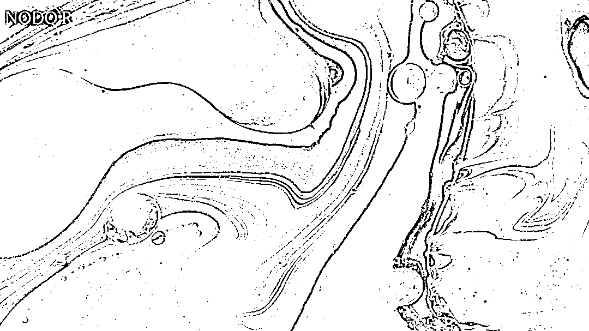

我刚刚做了第一只眼睛的晶状体置换手术。下一只眼睛将在两周后进行手术。因此我担心未来两周只能看到一些影子。我现在看得不太清楚。电脑屏幕上的一切看起来都像一片阴影。所以接下来几周，我会更多引用与今日社会、政治和经济状况有关的言论。我会更多引用其他人的想法，而我会试图休息并让自己恢复清晰。如果一切顺利（为什么不呢，逆行行星已经转为顺行），我应该比之前看得更清晰。或许我的拼写也会变得更好。但首先，我必须找到方法，避免在接下来两周里让财务和亲密计划受到干扰。你好，阴影，你好，土拨鼠！至少我不会当那头陷在泥中的猪。从 2018 年年末，若道引入金融占星大师雷蒙德·A·梅里曼撰写的梅里曼市场时机学院每年一次的年度预报沙龙和每年一本的《年度预报》以来，**2023 年已经是第 5 个年度了。我们简单回顾了部分 2019-2022 年金融预报的内容，**过去的经验让我们相信，你根据梅里曼老师的指导作为投资参看，你会比一般人有更大的胜算。******长按下图识别二维码****了解更多详情**

**说明：以上日期基于纽约证券交易所所在的美国东部标准时间，由于存在时差，中国地区可能需要加一天。**

**版权声明：**本文由若道翻译发布，欢迎转发，反对抄袭。友号转载请申请白名单。**END**

**雷蒙德·梅里曼（Raymond Merriman）**

若道签约老师。著名金融占星师，ISAR（国际占星研究协会）前主席，梅里曼市场分析公司的总裁。他由于“提升了占星学的职业形象”，在 1995 年国际占星大会上被授予轩辕十四奖；在 2012 年国际占星大会上，被授予轩辕十四终身成就奖。

1“中国上证指数月度报告”发售**若道推出了****中文版****的雷蒙德·梅里曼中国上证指数月度报告，并持续发行该报告！**当把金融市场的周期和占星学的周期相结合时，雷蒙德·梅里曼老师的金融占星学研究**为投资者应对金融市场的周期波动，并随之调整投资策略提供了极大的价值参考**。 **2 月中英文报告已上线！**2“黄金价格周期月度报告”发售**若道推出****中文版****的雷蒙德·梅里曼黄金价格周期月度报告！**不仅仅为广大读者在中国股市的投资出谋划策，更将视角放眼黄金市场。**每当世界经济形式不明朗的时候，有一个地方是保值的港湾，那就是****黄金**。自 1982 年雷蒙德·梅里曼出版第一本研究《地球宇宙学征象与黄金价格的关联》的著作以来，**他一直作为最重要的黄金市场时机预测者之一享誉国际**。2023 年 2 月黄金报告已上线，梅里曼老师将会告诉你他对这个关键时期如何操作的想法。也可以按照季度和一年期订阅，有更多优惠。季度和年度的好处是，你可以持续了解梅里曼老师对于不断在变化的市场的看法。即便他某一次看法和市场不一致，你也看到在下一期他如何调整自己的看法，并看到金融占星在一个长期时间段内对你把控风险的帮助。而能够长期控制风险、尽量找到安全的投资时机才是投资的长久之计。**2 月中英文报告已上线！** **购买套餐**，买得越多越优惠中国上证指数月度报告套餐价

*   **单月报告**：280 元
*   **3 个月套餐**：780 元（260 元/月）
*   **12 个月套餐价**：2400 元（200 元/月）

**长按下图识别二维码****购买金融报告****套餐****▼**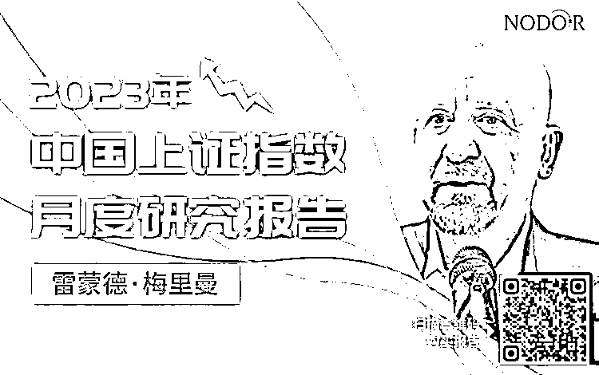黄金周期月度报告优惠

*   **双报告年度套餐更优惠（直降 900 元）**
*   **12 个月黄金报告+12 个月上证指数报告：仅需 3900 元**

**长按下图识别二维码购买黄金报告套餐**▼

3《铜市场周期月度报告》

从 2023 年开始，我们将推出雷蒙德·梅里曼市场时机学院的铜周期报告。之所以推出这个报告，是因为**作为新能源发展所需的一个重要金属，铜的投资价值可能会随着新能源的发展而出现崭新机会。**

**看好新能源发展的读者，这样一份报告可能帮助你提早了解铜交易市场、铜交易的价格变化，当投资机会到来时，果断出手，把握先机。**

**长按下图识别二维码**
**了解更多详情**▼4《2023 年金融报告及沙龙》

从 2018 年年末，若道引入金融占星大师雷蒙德·A·梅里曼撰写的梅里曼市场时机学院每年一次的年度预报沙龙和每年一本的《年度预报》以来，**2023 年已经是第 5 个年度了。我们简单回顾了部分 2019-2022 年金融预报的内容，**过去的经验让我们相信，你根据梅里曼老师的指导作为投资参看，你会比一般人有更大的胜算。****

**长按下图识别二维码****了解更多详情**

**购买直达入口**

# 周末树洞丨月亮在金牛座，开工第 1 天的你心情如何？

> 原文：[`mp.weixin.qq.com/s?__biz=MzA5NjA0NTAxNg==&mid=2651499138&idx=1&sn=65cd15db09140d61d705a646dcff1852&chksm=8b481835bc3f91233bc7724df34356132fc50b77f6a01010f3759f631d63b08102395d1a4ecf&scene=126&sessionid=1692737695#rd`](http://mp.weixin.qq.com/s?__biz=MzA5NjA0NTAxNg==&mid=2651499138&idx=1&sn=65cd15db09140d61d705a646dcff1852&chksm=8b481835bc3f91233bc7724df34356132fc50b77f6a01010f3759f631d63b08102395d1a4ecf&scene=126&sessionid=1692737695#rd)

**2023 年 1 月 28 日天象：**

*   **07:42 月亮进金牛座**
*   ****太阳三分火星、四分北交点，水星三分天王星，****

开工快乐！经过春假长假的休整，你现在的状态怎么样？今天一大早，月亮进入金牛座，或许你整个人还沉浸在假期的氛围中，懒懒的"假期综合症"爬上了身，很难一下子调整到精神抖擞的工作状态。不要紧，先不用给自己太大压力，慢慢恢复状态吧！很多时候，慢节奏反而让你更容易聚焦在重要的事情上，并且，金牛座的守护星金星昨天进入了双鱼座，在慢步调中释放想象力与创造力，没准对你更有帮助。

今天，水瓶座太阳三分双子座火星，同时四分月亮交点，摩羯座水星三分刚顺行的金牛座天王星，春节假期后的第一天，是与同事们共同畅想未来、讨论工作计划，进行头脑风暴的好日子。

月亮在丰盛的金牛座，你感觉如何？欢迎在评论区分享哦！

**快来领取你的 2023 年运报告吧！**

**了解每日天象，可****下载“若道”APP 查看****还有更多精彩等着你哦**

# 若道周运 1.23-1.29 丨群星顺行的农历新年，许下心愿勇敢出发吧！（内含 12 星座运势）

> 原文：[`mp.weixin.qq.com/s?__biz=MzA5NjA0NTAxNg==&mid=2651499137&idx=1&sn=31d4206bc60cd0adc1a5076dd7b5b68a&chksm=8b481836bc3f9120ce26154f55f0fc7a696ead3bb695b356f868ad7e90365edb6ea6c12ba758&scene=126&sessionid=1692737695#rd`](http://mp.weixin.qq.com/s?__biz=MzA5NjA0NTAxNg==&mid=2651499137&idx=1&sn=31d4206bc60cd0adc1a5076dd7b5b68a&chksm=8b481836bc3f9120ce26154f55f0fc7a696ead3bb695b356f868ad7e90365edb6ea6c12ba758&scene=126&sessionid=1692737695#rd)

******☆ ****后台回复“今日”，给你一句生命态度******

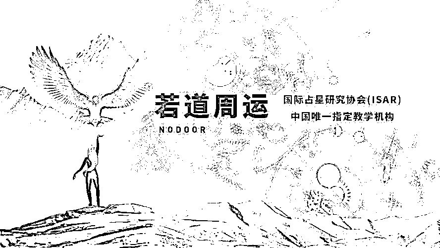

作者/Dora ISAR 认证占星师
编辑/翀子 封面/书君 图片/稿定设计**整体氛围**

拜年啦！**大年初一，太阳进入水瓶座，同时开启水瓶座新月，**浩瀚星空送来无限祝福，给人间添注新鲜自由的气象，你收到了吗？

新的一年，火星顺行了，水星顺行了，**随着今天天王星的顺行，天空中所有行星都顺行了。万象更新，新的一年！**

所有行星在一开年都顺行，其实挺难得的。因为很多时间，天空总有一两颗行星在逆行，**从去年四月冥王星开始逆行，一直到现在才出现了所有行星都顺行的局面。**

如果逆行意味着反思，回顾，那行星的顺行当然是回归正常，勇往直前的时刻，那些莫名其妙的阻碍，那些不由自主的拖延，那些到达不了的目标，整整三年的困顿，是时候烟消云散，成为过去。

在这个阖家团圆的新春佳节，请找回你的勇气和信心！

**勇敢，是无论面对怎样的未来，都有出发的勇气，去努力开启更加自由美好的岁月。**

如果你问我，天空的行星都顺行了，今年一切该变好了吗？答案是不确定的，也许会，也许不会。

在我们这个太阳系，**万事万物有自己的规律，星星们有固有的运行周期，**一个土木周期是 20 年，土天周期是 45 年，海冥周期是 492 年…...冥王星绕太阳一圈是 248 年。

**今年冥王星将换座，从摩羯座到水瓶座，从固定守旧的土象星座到自由的风象星座。土星将从水瓶座换座到双鱼座，木星将从白羊座换座到金牛座，宇宙的能量场是剧烈变动的，我们也处在一个重大的变革时期。**

你会变得更好，还是更难，很大程度取决于自己的认知，和自己所处在的生命进程。

太阳底下没有新鲜事，困扰我们的三年，人类历史上也曾经发生过很多次，人们受苦受难，迷失彷徨，但人类也一直在发展，越来越进步，越来越繁荣。成功快乐和艰难困苦总是相伴相生，是所有事物的一体两面。

加缪的《西西弗神话》描述了希腊神话的西西弗，他永远在将巨石推向山顶，而巨石又一定会滚下山来，于是又开始一次新的攀登。人生也是如此，就如同星星的运行轨迹，总在不停的巡回往复，有幸福，也有悲伤，笑中有泪，泪中有人生百般滋味。

当我们把眼光放得更长远，困难是暂时的，而幸福也会消散，不变的永远是你内心的信心和力量。

加缪写道：“那岩石的每个细粒，那黑暗笼罩的大山每道矿物的光芒，都成了他一人世界的组成部分。攀登山顶的拼搏本身足以充实一颗人心。应当想象西西弗是幸福的。”在一个无限循环的世界，我们的对生活的全力以赴便构成了生命的意义。有目标有希望，就是幸福的。

罗曼·罗兰在《米开朗琪罗》写道：“世界上只有一种真正的英雄主义，那就是在认清生活的真相后依然热爱生活。”这就是所谓的看破红尘爱红尘吧。

亲爱的你，亲爱的人间小伙伴，只要你的眼眸里住着璀璨星河，你便是浩瀚星辰中独立无二的有趣灵魂，你的勇敢和希望就是生命最大的意义。无论你身处顺境逆境，所有生命的意义，**幸福，希望，爱，就在当下，就在你追寻的过程中。**

花会开，春天会来，新春佳节，许下心愿，勇敢出发！

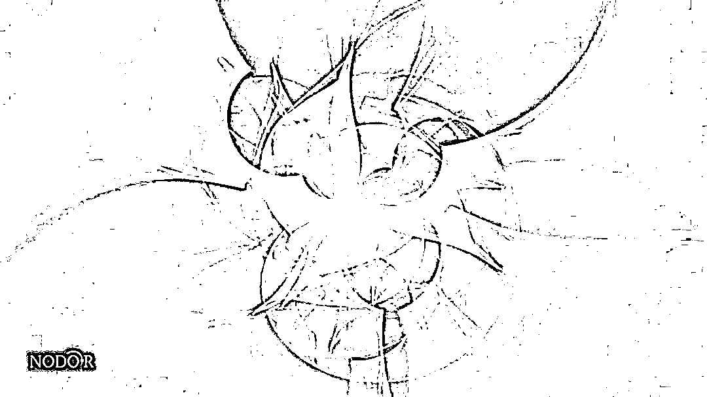

**本周重要天象**

**★ **周一****

*   ****天王星顺行****

天王星结束了为期 5 个月的逆行，今日开始停滞、恢复顺行。**天空所有的行星都在顺行**，一直到 4 月 21 日水星开始逆行，**今年有三个月的时间，我们能够享受到所有的星星都在顺行的能量场。**

天王星开拓创新，引领未来的特质，为天空注入全新的，正向的能量，这三个月会是一个发展特别迅速的时期。一年之计在于春，应抓紧**利用好这三个月**，奠定一年的主基调，打下一年的坚实基础。

从 2020 年底形成的土天四分相的格局，不断给我们的生活带来挣扎和挑战。整整三年，我们深陷困顿，一直在收和放之间徘徊，计划不如变化快，空有心愿而无法前行。**随着水瓶座新月和天王星顺行**，土天四分的结构也开始松散，心情有点像是破土而出的新芽，从泥土之中探出头来，终于看到了自由的天空，获得了能够伸展的力量。

如果我们曾经在地下存储了梦想，希望的种子，**天王星顺行后，将以突如其来，不可预料的特有方式萌芽生长，寻找新的机会。**

**天王星是水瓶座新月的现代定位星，大年初一正逢水瓶座新月，叠加今日的天王星顺行。**

天王星、水瓶座都代表着自由、创新、改革、变化的能量，他们是指向未来的，**我们期盼着天王星的顺行带来突破性的进展，不再是逆行期间各种突如其来让人跌破眼镜的种种意外，而是新思想，新理念带来源源不断的觉醒。**

我们会看见群体的力量、创造的力量，平等博爱、努力尝试、突破自我，共同迎接人类历史的崭新篇章。

**★ **周五****

*   ****金星进入双鱼座****

金星绕太阳一周是 225 天，她在每个星座愉快地停留两到三周，除非它逆行了，逆行的金星能在一个星座停留五个月。1 月 3 日，金星进入水瓶座，一扫严格管控的摩羯气息，空气变得自由而“危险”。金星在水瓶座虽然轻快流动，但并没有在家里的舒适感，像是在归家路途上的人。

**1 月 27 日周五，金星结束了在水瓶座三周的旅程，进入双鱼座，并一直会在这里停留到 2 月 20 日。**

**双鱼座是金星耀升的位置，**感觉是归家的人们已经享受到了美妙的天伦之乐，或者是甜蜜的二人世界。金星守护着情感、心、爱情及快乐之事，还包括财富、礼物、美丽、时尚和艺术。

舒适的金星给我们带来聆听音乐、品尝美食、享受芬芳、品味美酒的机会，我们可以安排美好的活动，看艺术展，去公园，去大自然，去和我们喜爱的人度过时间。在春节假期的最后一天，让我们好好享受一下生活的馈赠。

当然最美好的事情是人间的爱，记得表达你的爱，你的温暖你的共情，就像双鱼座一样，能够弥漫，包裹整个世界。你对这个世界的爱才温柔了岁月。

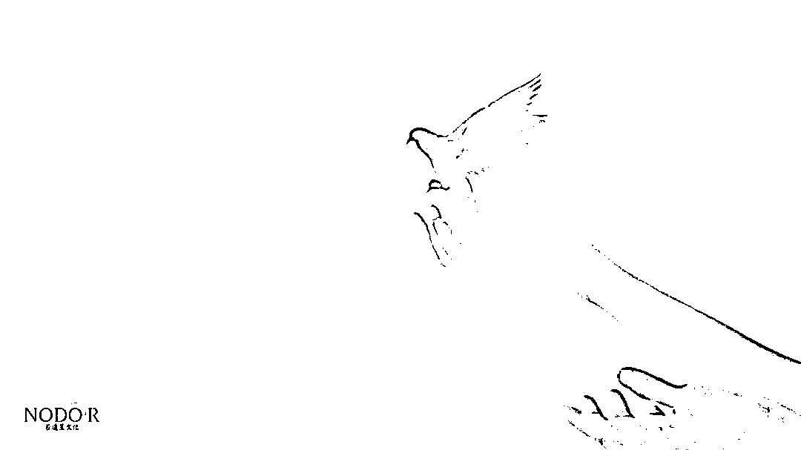

**12 星座一周运势**

**上升*****白羊座***

天王星顺行在你的第二宫，你的收入可能会有惊喜哦。去年的一些财务上的困难，也许是债务问题或者投资理财的问题，今年可以慢慢理顺了。

白羊座木星在第一宫，给你带来各方面的好运，元气满满的你可以做更多的规划，迎接新年的到来，今年上半年机会多多，要抓紧行动。

双鱼座的金星在你的十二宫，这几周可以好好在家静心养神，疗愈自己忙碌了一年的身心，充分发挥自己的想象，和大自然连接。做好计划，想清楚自己的目标和方向，谋定而后动。

*****上升**金牛座***

天王星顺行在你的第一宫，你的个人生活方面会出现哪些变化？去年就想改头换面的计划是否已经实现？也许是时候换个形象，无论是发型还是服饰，或者是你的职业。

木星仍然在十二宫，可以学习一些灵性的神秘学的知识，更好地感受这个世界真实的声音，您给自己更多的时间和空间，好好自我沉淀。

金星在十一宫，和真正的好朋友待在一起，是滋养自己的方式。去用心感受来自朋友们的爱，也好好爱你的朋友。

**上升*****双子座***

天王星顺行在你的第十二宫，最近是否有一种直觉超级强的感觉？有些事情好像突然领悟了。属于灵光乍现那种。还是要注意身体健康，保持良好的睡眠。

仍然是朋友圈的宠儿，多和朋友们联系，也许会有新的收获。收到公司的年终奖了吗？记得请客哦。

金星在十宫，是比较容易得到领导和同事喜爱的一段时间，职场魅力大大增加，多点耐心和包容，你会更加可爱的。办公室里有暗恋的人吗？试试表白？

**上升*****巨蟹座***

天王星顺行在你的第十一宫，有没有遇到一些奇怪的人，想要认识你呀？也许就莫名其妙认识了一些新的朋友，玩一些自己从来没有玩过的娱乐。新的人、新的环境，有时候会给你带来不一样的视角，我们需要更丰富的人生。

木星在你的第十宫，今年上半年考试运和工作运势非常好！春节期间做好规划，加油哦，火力全开的你一定会心想事成的。

金星在九宫，可以去考试、申请学校，也可以去旅行。海边好像是一个不错的注意，无论行万里路还是读万卷书，记得好好享受！

**上升*****狮子座***

天王星顺行在你的第十宫，去年底工作中如果存在反复解决不了的问题，本周开始有些松动了，你一定能够找到独特的解决方法的。

木星在九宫，给你带来了很好的学习考试运和旅行运。假期去哪里旅行了？一定很开心吧？

双鱼座金星在八宫，财运最近不错哦，有什么进账吗？拿到多多的压岁钱了吗？可以在假期清闲的时候，盘算一下自己的投资理财，尽早做好财务规划。

**上升*****处女座***

天王星顺行在你的第九宫，如果之前搬家，远行的计划受阻，现在可以进行下去了。学习方面可能有些突破，也许突然想换专业，换方向，换学习的兴趣，都是有可能的。

木星在第八宫停留了一段时间了，有没有意料之外的财运呢？或者最近你有没有发现更加了解自己了？

金星在七宫，桃花运增加，是好好发展关系，维护关系，修复关系的时期呢。在亲密关系中，包容理解是最重要的，我们常常要求别人多关心自己，其实自己做到才最重要。

**上升*****天秤座***

天王星顺行在你的第八宫，对万事万物突然有了更加深入细微的感受，也可能突然对心理学、占星学、神秘学特别感兴趣。也可能在投资理财，财务方面有些意料之外的进展。

木星还在第七宫，单身的人士今年出现正缘的机会较多，已婚的人士也适合和另一半理顺家庭关系，更加甜蜜幸福。

双鱼座金星在六宫，特别适合在日常生活中找到美好的仪式感，不妨利用假期好好研究厨艺，为家人制作美食。为父母亲人煮茶熏香，享受生活中的种种乐趣，有益于身心健康。

**上升*****天蝎座***

天王星顺行在你的第七宫，在亲密关系和婚姻中可能需要更多的自由空间，也许会遇到意向不到的一段关系，发生一见钟情的感情。

木星在第六宫期间，你的职场运势较好，多多规划职业发展，工作忙碌也要记得爱惜身体，养成良好的健康习惯，并且做到持之以恒吧。

双鱼座金星在五宫，快乐的源泉源源不断，一切能创造快乐，给你带来幸福感的事情都来自第五宫。有人喜欢竞技，有人喜欢投机，有人喜欢恋爱，有人喜欢孩子，也有人喜欢表演和艺术创作。这些都是五宫的衍生含义，能让你享受的事情和人即为五宫所代表的意义。

金星，同样也代表了快乐。当金星进入第五宫，我们会以各种不同的方式去获得愉悦的满足，好好享受你的快乐时光。

**上升*****射手座***

天王星顺行在你的第六宫，你的职业和生活环境有可能发生变化，也许是变得更加有趣多样，更加自由了。也许你会接触到科技、互联网、自媒体等一些新兴的行业和学科。身体状况也会有些转变，也许之前苦恼的一些小问题有了突然的好转。

木星在第五宫，因为活跃，射手做们可以结识到更多的人，恋爱运也大大增加。也特别适合改善提升亲子关系，利用假期，多陪陪孩子。

金星在四宫，是宅家享福的好日子，春节陪家人享受天伦之乐是天经地义的。为家人洗手做羹汤，给父母家种上花草。和家人在一起，去感受生活的美好吧。

**上升*****摩羯座***

天王星顺行在你的第五宫，会不会有突然的爱情运？也许突然告白又瞬间分手。有可能吸引来和自己差异比较大的对象，感情生活变得很有挑战性。

还有一种可能，最近你的创造力大为增强，有些与众不同的创作，无论是表演、艺术，还是生活中的发明，总之，最近可能你会变得比较吸引人。

木星在四宫，春节家中有喜事吗？有机会的得到父母的帮助，或者是否正在处理房产方面的事务？希望一切都顺你心愿。

金星在三宫，很愿意学习和交流。和兄弟姐妹、邻居小伙伴好好聚聚，难得大家都在一起，

**上升*****水瓶座***

水瓶座生日快乐！天王星顺行在你的第四宫，不知道最近会不会搬家呢？或者就是换个环境。家里之前有些办不成的事情，是不是突然可以办了。或者有意想不到的朋友聚会，或者朋友来访，在春节期间，也是一桩乐事吧。

聪明的水瓶座本来就学习能力强，有了木星的加持，变得更加有头脑，善于交流，口才一流，会开始新的一轮学习培训，或者深造转型。

二宫的金星加持着你的财运，你有独特的审美眼光，从来不想人云亦云，那么就把钱花在给你带来美和愉悦的事物上吧。在该花钱的地方花钱，至于如何挣钱，最近你一定能找到答案。

**上升*****双鱼座***

天王星顺行在你的第三宫，是时候来一场说走就走的旅行。你变得很有自己的主见，想法。假期正好出去走走，也可以和朋友、兄弟姐妹多多互动交流，互相启迪。

木星在二宫，好的财运持续到 5 月。这段时间请加倍努力工作吧，祝你发财，发大财。

金星在一宫的时候，有什么改变形象的计划呢？换个发型？来个微整形？金星是爱和快乐的行星，在她的加持下，自信的魅力出现在你的身上，出现在任何场合，你都非常有吸引力哦。

请把每一天当作一个新的机会，去做一些有趣和令人兴奋的事情，看看会有什么发现？

**祝大家一周平安顺遂！恭喜发财！新春大吉！**

**版权声明**：原创文章由作者授权首发于若道平台发布，欢迎转发，反对抄袭。友号转载请申请白名单。

**END**

****Dora****

若道 2017 届核心课毕业生

若道咨询平台占星师、ISAR 认证占星师

心理咨询师、塔罗咨询师、多年企业管理经验

咨询微信：AstrologerDora

公众号：Dorothy 占星文化

**长按打赏**

**新的一年，来领取你的好运吧！**

**扫码**即可领取**专属的年运报告**

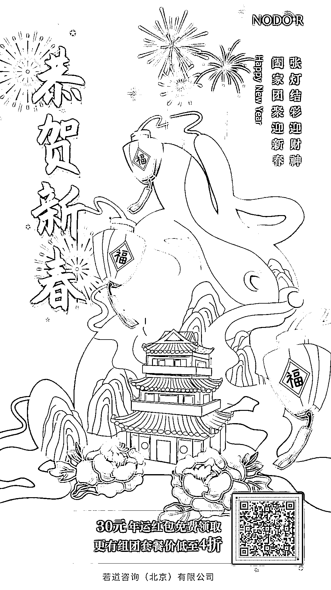

**20 位来自世界各地的占星师**
**带来 19 场沙龙——新世界的觉醒****详情可点击下图**

**学习占星学****点击下图了解课程详情**

**微信又双叒叕改版啦，不想错过若道君的推送？**
****就把若道设为****星标****以及点点****“在看”****吧！******▼**

**喜欢就点一下“在看”吧！****报名直达入口**

# 兔年大吉丨大年初一恰逢水瓶座新月，许个愿望吧！

> 原文：[`mp.weixin.qq.com/s?__biz=MzA5NjA0NTAxNg==&mid=2651499136&idx=1&sn=492c02339b3775e168c340d6941ff381&chksm=8b481837bc3f9121b66f59226f12b4c3e1ce7effd98100bc63169c677e0ce71ed2540c084182&scene=126&sessionid=1692737695#rd`](http://mp.weixin.qq.com/s?__biz=MzA5NjA0NTAxNg==&mid=2651499136&idx=1&sn=492c02339b3775e168c340d6941ff381&chksm=8b481837bc3f9121b66f59226f12b4c3e1ce7effd98100bc63169c677e0ce71ed2540c084182&scene=126&sessionid=1692737695#rd)

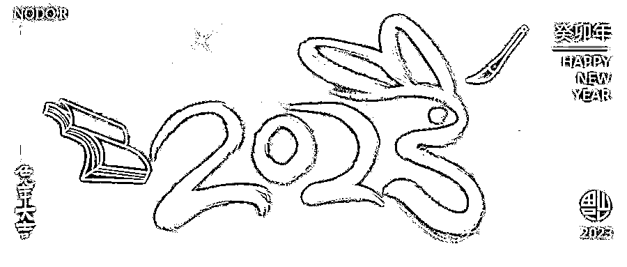

**2023 年 1 月 22 日天象：**

*   **02:28 月亮进水瓶座**
*   ****04:53 水瓶座新月****
*   ********水星三分北交点、与火星呈梅花相，金星合相土星********

4:53 迎来水瓶座新月，若道君祝大家新春吉祥。在半个月前的[【巨蟹座满月】](http://mp.weixin.qq.com/s?__biz=MzA5NjA0NTAxNg==&mid=2651498769&idx=1&sn=49f58da6ad9234efa48d1a20aa0b27a6&chksm=8b481ba6bc3f92b0b74f9ac4e6a3d33cbb01797520650a752423ded6fb7e4c42318d42ac7684&scene=21#wechat_redirect)（点击查看文章）里，作者写到：“水瓶座新月发生在水瓶座 1 度，并与行进在摩羯座 28 度的冥王星有一个宽泛的合相结构，再次预示着——**2023 年的水瓶座新月，将会开启冥王星在“摩羯座-水瓶座”之间往返穿梭 5 次、检验我们“摩羯座冥王星”业力功课完成情况的未来两年进程。**水瓶座新月发生时刻，接纳水瓶座新月能量的两颗行星：金牛座天王星（天王星守护水瓶座）将于 1 月 23 日恢复顺行，土星（土星守护水瓶座）与金星合相于水瓶座、与双鱼座海王星处于 30 度结构。故而，**建议这个春节保持相应的“人际距离”，因为当下考核的不是我们的推进速度，而是我们的管理能力**。”在这个有点“严肃”的水瓶座新月，你将如何度过？又许了什么愿望？来聊聊吧！对了，新月的老规矩，还是可以使用新月报告许愿哦~点击“**阅读原文**”获取免费的新月报告吧！

**快来领取你的 2023 年运报告吧！**

**了解每日天象，可****下载“若道”APP 查看****还有更多精彩等着你哦**

**免费新月报告直达入口**

# 除夕快乐丨辞旧迎新，祝你事事顺遂

> 原文：[`mp.weixin.qq.com/s?__biz=MzA5NjA0NTAxNg==&mid=2651499130&idx=1&sn=31c773be3f42637662708b67a1a6cc02&chksm=8b4818cdbc3f91db3c55996a1e0af9b855ca2ffee18e7f978a08dba776216ddda0fbc7b72767&scene=126&sessionid=1692737695#rd`](http://mp.weixin.qq.com/s?__biz=MzA5NjA0NTAxNg==&mid=2651499130&idx=1&sn=31c773be3f42637662708b67a1a6cc02&chksm=8b4818cdbc3f91db3c55996a1e0af9b855ca2ffee18e7f978a08dba776216ddda0fbc7b72767&scene=126&sessionid=1692737695#rd)

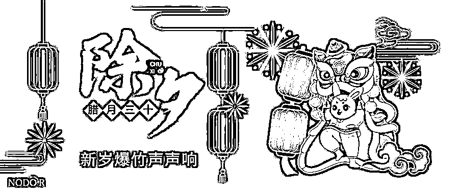

**2023 年 1 月 21 日天象：**

*   **月亮在摩羯座**
*   ****水星三分北交点、与火星呈梅花相，金星合相土星****

除夕快乐！太阳已于昨天进入水瓶座，月亮将于明天凌晨 2:28 进入水瓶座，并在凌晨 4:53 与太阳在水瓶座 1°33′形成新月。这是摩羯座星群能量凸显的除夕，月亮在摩羯座、金星合相土星，在这一天，或许很适合我们回顾过去一年自己和家人走过的历程，用脚踏实地的务实态度为新的农历年做好计划。今年对很多人来说，也是特别的春节，和家人长辈们在一起，珍惜可贵的时光。

辞旧迎新的除夕，若道君祝大家开心快乐，事事顺遂！

**快来领取你的 2023 年运报告吧！**

**了解每日天象，可****下载“若道”APP 查看****还有更多精彩等着你哦**

# 若道周运 1.16-1.22 丨农历新年即将来临！不确定，但可以充满希望（内含 12 星座运势）

> 原文：[`mp.weixin.qq.com/s?__biz=MzA5NjA0NTAxNg==&mid=2651499091&idx=1&sn=c026fb323efef796336d8f3619eababd&chksm=8b4818e4bc3f91f2f71f12e947847b9b8f7c5f4ebbc9a58e9ee182ceda0e10d3d4ff151984b0&scene=126&sessionid=1692737695#rd`](http://mp.weixin.qq.com/s?__biz=MzA5NjA0NTAxNg==&mid=2651499091&idx=1&sn=c026fb323efef796336d8f3619eababd&chksm=8b4818e4bc3f91f2f71f12e947847b9b8f7c5f4ebbc9a58e9ee182ceda0e10d3d4ff151984b0&scene=126&sessionid=1692737695#rd)

******☆ ****后台回复“今日”，给你一句生命态度******

作者/芷菱 ISAR 认证占星师
编辑/翀子 封面/书君 图片/稿定设计**整体氛围**

本周我们终于来到了中国农历年的最后一周。

回顾过去的一年不堪回首，几乎每个人都遭遇了现实和心理的各种冲击，熟悉的秩序被打碎，生活变得面目全非。**但伴随着新年和水瓶座新月的到来，我们仍可以收拾好残局，站到新的起点上，准备迎接那不确定但仍充满希望的未来。**

**本周重要星象**

*   **1 月 18 日 周三**

    水星顺行（21:12 ）、太阳合相冥王星

*   **1 月 20 日 周五**

    太阳入水瓶座（16:29 ）

*   **1 月 22 日 周日**

    水瓶座新月（04:53）

在跨过年关之际，我莫名地老想到一个词：我们似乎都是这个时代的“幸存者”。这一段时不时听到身边的老人、朋友的长辈离世的消息。几乎所有的朋友都经历了感染，阳康了。很多企业的经营，很多个人和家庭的生活都有了重大的变化。

**冥王星还在摩羯座尾度徘徊肆虐**，仍在不断清理旧秩序、传统和故人。

2023 年，冥王星会短暂地进入水瓶座待上两个月，但很快又回到摩羯座继续最后的清扫工作，直到 2024 年完全进入水瓶座，才算彻底完成。冥王星在摩羯座的时代废墟的重建还有待时日。

**然而观察当下，一切已开始缓慢地复苏之中：**

上周五，逆行长达两个半月的火星终于恢复顺行。如果过去一段你感到力量无处宣泄，行动遭遇困难阻滞，或者有过错误的精力投入，不恰当的愤怒投射，都会在火星顺行之后缓解，逐步找回行动力、能量和方向。

我们更容易感到精力恢复，找到方向，有行动力去推进生活中的重要事务。

**本周三，水星在摩羯座恢复顺行，**帮助我们找回把握现实的能力，能够更清醒、务实地理解现状，稳扎稳打地规划未来。

**下周一，也是大年初二，天王星将在金牛座顺行。**至此，天空中所有的行星都顺行了，呈现一种齐头并进的局面，不再有阻滞和反复。可以对比去年 2022 年 8 月-11 月，那时有五颗或六颗行星齐齐逆行。

再往前看，2023 上半年我们就将迎来土星、冥王星、木星的连续换座。**在我们的前方，的确可以预见到一些重大的变化和崭新的气象。**

而**回到本周，一个让我感到兴奋的星象是本周日大年初一的水瓶座新月。**

虽然每年春节的正月初一都是水瓶座新月，但这一次的不同凡响在于，它发生在水瓶座 1°32′，精准合相了中国国家星图的上升点（若道卡伦老师校正过的中国星图）。

**这可能意味着一个新的起点。**大疫三年，对我们的冲击，既是现实的社会经济层面的，也是观念的大众心理层面的。昨日已不可追，现在我们有机会重新规划未来，做出新的判断和选择。无论对集体或个人，都是如此。

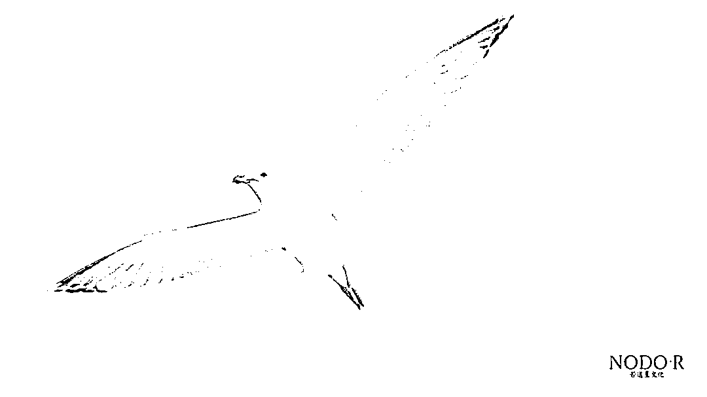

**水星顺行与日冥合相**

**周三晚上，水星在摩羯座 8°恢复顺行，同时太阳和冥王星在摩羯座 28°合相。**

水星在本周的多数时候都处于**停滞的状态**，运行非常缓慢。这意味着给我们更多的机会和时间去思考、探索。**星图中有重要行星或轴点落在开创星座（白羊座、巨蟹座、天秤座、摩羯座）8°加减 3°内的人会受到更明显的影响。**

摩羯座象征的是我们身处的现实和物质世界。**现在看来是一个“盘点”现实的时候。**

盘点我们手里的存款、未死的野心、再度出发的信念，以及抵抗病毒与虚弱的体力。看一看我们有多少牌可以打，有多少空间可以腾挪，前提是要清醒认识当下的现实环境与自己的位置。

2023 年也许并不容易，经过三年的停顿，重新起步需要更大的能量。今天刚好看到一位著名企业家说，2023 年考验可能刚刚开始。现在正是一个认清现实，不退缩不逃避，直面我们的各种真实状况，并思考解决方法的时候。

与水星顺行同时发生的**太阳与冥王星合相**，可能揭开一些底层真相，让我们看到潜藏的生存危机，让我们感到紧张。但如果放下所有逃避与焦灼，直面现实时，总会找到出路，这也是冥王星的能量：置之死地而后生，脚踩到深渊意味着接下来都是上坡路。已经预想到最糟糕的可能性，就不再瞻前顾后，可以一往无前地努力。

**冥王星可能帮助我们脱离幻想，获得一种面对现实的勇气、控制力、意志与决心。**

有趣的是，**金星和土星本周也在逐渐接近合相。**再次强调了在经济或财务方面的**“现实”**。盘点我们手里的钱，盘点企业的现金流，做出更务实、稳健保守的规划和安排。在关系层面，我们也会更看重彼此能够在现实中相互支持、依靠，看重伴侣的可靠和承诺。

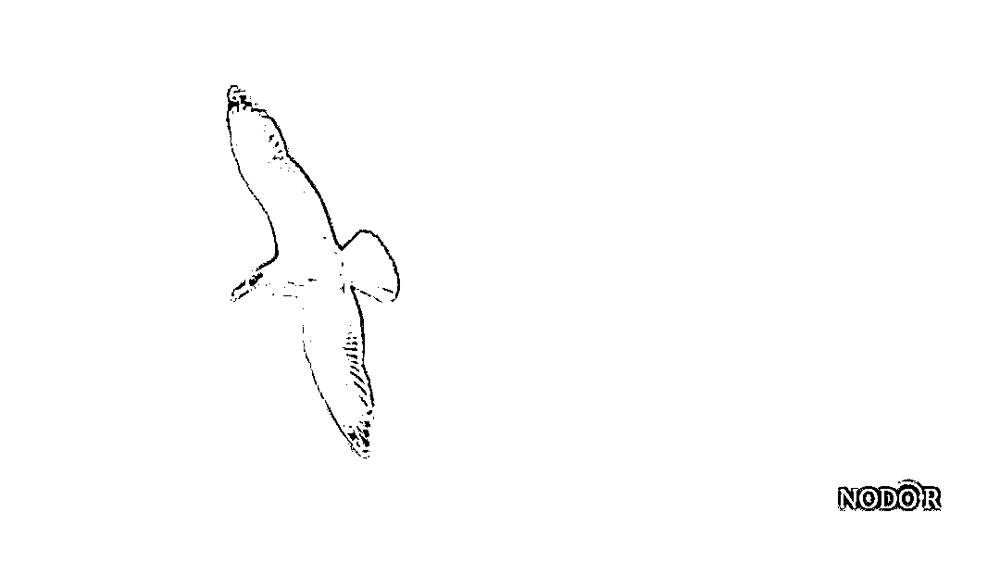

**太阳进水瓶座和水瓶座新月**

**周五，太阳进入水瓶座。周日大年初一凌晨 04:53，新月发生在水瓶座 1°32′。**

此次新月六分木星、三分火星、与冥王星跨座合相，新月的定位星天王星则与水星呈三分相。这些良性的角度，**为这次新月增添了振奋、幸运、愉悦、新鲜的感受，也预示着未来一个月值得期待。**   

可以许下关于**获得启发、看到真相、做真实自己的新月愿望**（具体许愿范围可参考下文十二星座周运）。**有重点行星或四轴落在固定星座 1°加减 3°的人，会受此次新月较深的影响。**

水瓶座是一个坚持独立、自由、个性，不循规蹈矩的星座，也自带反传统，求真理的需求，会以新方式来看旧问题。 

经历了大疫三年，我们的认知、感受都经受了一波又一波的洗礼，各种原本习以为常的观念、习惯思维，都受到了不同程度的冲击。 

在摩羯座冥王星打碎的这个世界里，站在废墟之上，**水瓶座新月可能给我们带来的一种启示，就是用一种新的眼光去重新审视周围的一切，重新衡量一切的真伪、价值。**

我们可能发现自己的很多观点已经发生了改变。我们也更有勇气说出内心想法，更想找回那个被压抑的真实自我，抛弃面子或关系的顾虑，做回真正的自己。

**水瓶座也是面向未来的星座。**这次新月精准合相国家星盘的上升点，无论集体还是个人，站在新年的起点上，现在都是一个很好的时机去为未来做出全新的规划。重新衡量和思考现实，改变循规蹈矩的旧模式，寻找新路子，新方法。

对自己诚实，是水瓶座的启示。无论如何，倾听内心的声音，尊重你真实的想法与感受，不被种种概念、立场、教化与媒体灌输的信息干扰，去发现属于自己的真理。如在其内，如在其外，当你尊重自己的真理，你也能发现世界的真理。

**做回你自己。**

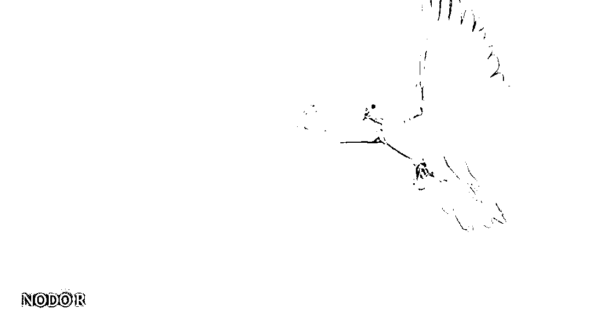

**12 星座的一周运势**

**（重点参考上升星座，其次参考太阳星座）**

***白羊座***

本周你可能在事业方面有些新想法，甚至做出某些新决定。抓住这些想法深入思考，也许能为未来种下一个种子。可以写下来，或与信赖的朋友讨论。

未来一个月，你的社交生活方面会比较活跃，可能有很多朋友的聚会活动。你有机会结识新朋友，联络旧朋友，加入比较重要的社群组织，其中可能遇到能帮助你的人。

新月时可以许下与社交关系、结识朋友相关的愿望，也适合制定未来的发展目标与计划。

***金牛座***

本周你可能有新的领悟，想通了某些事，或者纠正了过去的某想法。也许是某本书给了你启发，甚至让你产生了某种新的信念。

未来一个月，你的事业方面可能出现新机会。注意与同事或领导的关系，你可能会接受某些任务，需要做出承诺，通过努力工作显示自己值得信赖。你的成绩会被看到，加油。

新月时可以许下与事业发展、同事关系等相关的愿望，未来一段时间好好表现吧。

***双子座***

本周你可能会关注自己的财务状况。此时适合盘点你的理财和投资计划，结合现实，看看有什么需要做调整的。尽量稳健，不冒险。

未来一个月，你可能感到需要学习，提高自己的认知。多读几本经典作品，或者向有学识的人请教，也可能碰到不错的老师。你有动力去提升自我，获得成长。

新月时可以许下与学习、成长、提升认知力、思考力等相关的愿望。加油。

***巨蟹座***

本周你可能对关系有新的思考。跟伴侣或客户等的互动交流可能变多，也许涉及到钱，其中可能有一些谁说了算的意志上的较量。不必太计较，关键是认清现实情况，做出理性的回应。

未来一个月，你可能感到需要重视自己的财务安全，也许想寻找理财手段。你有机会去学习处理自己的财务或投资。注意稳健保守为上，避免冒险。

新月时可以许下与理财投资相关的愿望，并学习理财专业知识与技能。

***狮子座***

本周你可能对自己的工作或生活状态有些想法，现在适合重新思考你的工作安排，制定新的工作计划，或是职业规划。另外可以学习健康生活的知识，让自己的饮食起居更有利于健康。

未来一个月，关系可能成为你的关注重点。如果有男女朋友，现在可能想要更稳固有承诺的关系。如果单身，多参与社交活动朋友聚会，新月可能带来机会。记得做真实的自己。伴侣之间可能需要更多责任感和相互支持。

新月时，可以许下与亲密关系、合适对象、感情承诺相关的愿望。

***处女座***

本周你可能感到自己的创造力在恢复，之前卡住的一些想法现在逐渐开窍了，也许能产生很棒的创意。如果有孩子，跟孩子的沟通会改善，前提是要尊重孩子的意志，理解孩子。

未来一个月，工作或健康议题会成为你关注的重点。可能需要认真对待客户或同事关系，努力工作成为可靠的伙伴，有机会做出成绩。健康也值得重视，安排好饮食起居，学习营养或运动的科学知识，清洁环境。

新月时，可以许下与工作、健康相关的愿望，让自己更有活力和秩序。

***天秤座***

本周你可能比较关注家庭或家人的事宜。比如思考如何安排假期，给家里添置东西，为父母或孩子准备礼物等。如果与家人意见不一，只要不涉及原则可以让步，以免影响节日心情。

未来一个月，孩子或娱乐会占据你的重点。安排好这个寒假，好好与孩子相处，尊重孩子的个性和想法。也很适合尽情享受假期，与朋友欢聚或旅行。你也可能冒出很多新想法，重视这些创意的火花，把它们记下来或变成某种作品。

新月时可以许下与孩子、娱乐、恋爱、创意相关的愿望。

***天蝎座***

本周你可能感到头脑顺畅了很多，之前一些卡住的思路通了。对自己的想法也更有信心，表达写作方面会更流利。

未来一个月，家庭事务会成为你的关注重点。也许为家人安排假期生活，整理家居环境，回乡探望父母等，你需要付出和承担一些事务。当然在家人身上付出精力与金钱是值得的。也可能处理房产，租房搬家等，这段时间你可能喜欢宅家生活。

新月时可以许下与家庭、家人、房产、心理安全有关的愿望。

***射手座***

本周你可能会思考自己的金钱或个人价值的议题。现在适合去盘点你目前的消费和收入，做一些财务上的规划，包括考虑如何提升收入，减少开支。你可能也会思考自己的价值在哪里，如何体现这样的问题。

未来一个月，学习、思考和表达会成为你的关注重点。你可能感到需要学习和提升自己，或者有表达的冲动，可能写作或与朋友交流。这段时间很适合去多读书，找到自己感兴趣的问题研究。也适合与朋友或伴侣多交流，增进情感。

新月时可以许下与学习、写作、交流、提升认知相关的愿望。

***摩羯座***

本周你可能会思考我是谁，想要更深入认识自己。或者对自己的想法很自信，想要表达自己的观点、意见，说服别人。

未来一个月，金钱和价值议题会成为你的关注焦点。你可能关心自己的存款、收入保障，或是开始控制消费，想要让自己财务上更加安全。另一方面你也会考虑如何更大程度发挥自己的价值，获得更多收入。努力工作，认真探索道路，会有机会。

新月时可以许下与收入、存款、财务安全、个人价值相关的愿望。

***水瓶座***

本周你内心的敏感性可能增强了，有更多直觉或领悟。也可能对潜意识世界感兴趣，想要去学习心理学或神秘学知识。注意你的梦境，也许会有启发。

未来一个月，你会更加关注自我。可能很注意个人形象，钻研穿衣打扮，尝试不同造型，要让自己更完美、更独特地出现在众人面前。另外也会关心自己的个性和独立性，想要深入认识自己，活出自己的与众不同。在别人看来，你可能变得更自信，更吸引眼球。

新月时可以许下与个人形象、个性、自我成长、自信心相关的愿望。活出真我。

***双鱼座***

本周你可能恢复与朋友或社群的交流联络，也许计划参与一些活动。现在也是不错的时机，可以为自己的新一年做规划，制定目标和计划。

未来一个月，你可能想要独处和休养生息。这段时间适合放下工作，放慢脚步。去感受自己内心，更深入地认识自己，也认识这个世界。多阅读思考，接触灵性知识也是不错的选择。不过你还是要参与家庭事宜的，家人需要你。

新月时可以许下与内心平静、信仰寄托、灵性成长、领悟启发相关的愿望。

**版权声明**：原创文章由作者授权首发于若道平台发布，欢迎转发，反对抄袭。友号转载请申请白名单。

**END**

**芷菱**

ISAR 认证占星师/占星作者/媒体人若道 2019 届核心课程毕业生

于 2019 年通过 ISAR 考试，同年获得若道认证神话塔罗师资质

**微信公众号**：芷菱的理想国

长按打赏

**新的一年，来领取你的好运吧！**

**扫码**即可领取**专属的年运报告**

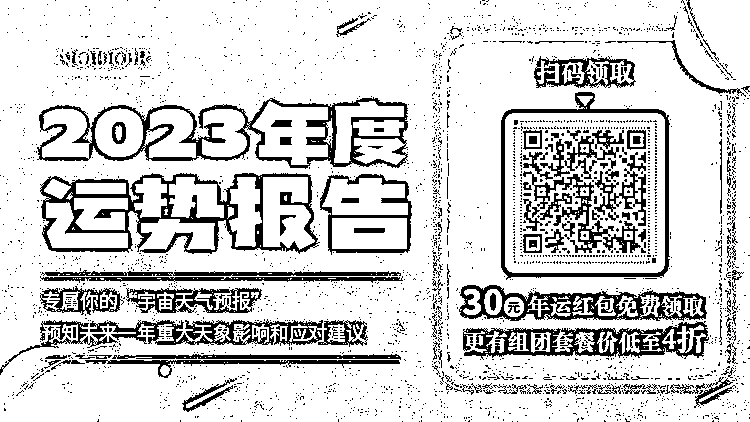

**20 位来自世界各地的占星师**
**带来 19 场沙龙——新世界的觉醒****详情可点击下图**

**学习占星学****点击下图了解课程详情**

**微信又双叒叕改版啦，不想错过若道君的推送？**
****就把若道设为****星标****以及点点****“在看”****吧！******▼**

**喜欢就点一下“在看”吧！****报名直达入**

# 春节放假通知

> 原文：[`mp.weixin.qq.com/s?__biz=MzA5NjA0NTAxNg==&mid=2651499091&idx=2&sn=5f8ba7046955d9896f098103bbe0f411&chksm=8b4818e4bc3f91f2918a7c523e0c4a546a90e326cde4a366a898b5bb815359ffaa69dd4d5e04&scene=126&sessionid=1692737695#rd`](http://mp.weixin.qq.com/s?__biz=MzA5NjA0NTAxNg==&mid=2651499091&idx=2&sn=5f8ba7046955d9896f098103bbe0f411&chksm=8b4818e4bc3f91f2918a7c523e0c4a546a90e326cde4a366a898b5bb815359ffaa69dd4d5e04&scene=126&sessionid=1692737695#rd)

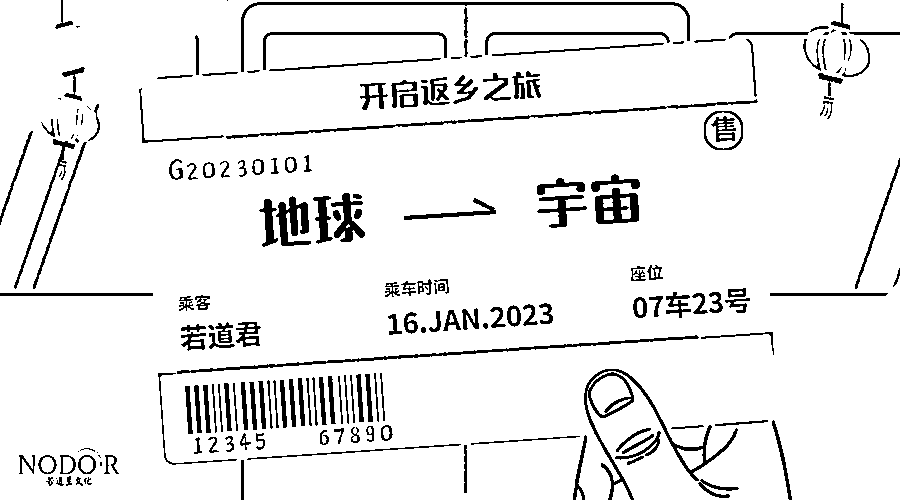

嗨嗨，大家好呀~我是即将返回宇宙的若道君~从 16 号起，我就要开启回乡之旅，去宇宙遨游了。这期间，我会时不时掉落周运以及其他内容，30 号会正式返回~提前祝大家春节愉快，拜个早年~

# 周末树洞丨过去两个半月，你都经历了哪些火逆故事？

> 原文：[`mp.weixin.qq.com/s?__biz=MzA5NjA0NTAxNg==&mid=2651499084&idx=1&sn=7a241ceb72ccea74348ccf88abe52b0d&chksm=8b4818fbbc3f91ed7ee772012ce58496868776121d268c1f06a50bcef068f4846cd4d81f1630&scene=126&sessionid=1692737695#rd`](http://mp.weixin.qq.com/s?__biz=MzA5NjA0NTAxNg==&mid=2651499084&idx=1&sn=7a241ceb72ccea74348ccf88abe52b0d&chksm=8b4818fbbc3f91ed7ee772012ce58496868776121d268c1f06a50bcef068f4846cd4d81f1630&scene=126&sessionid=1692737695#rd)

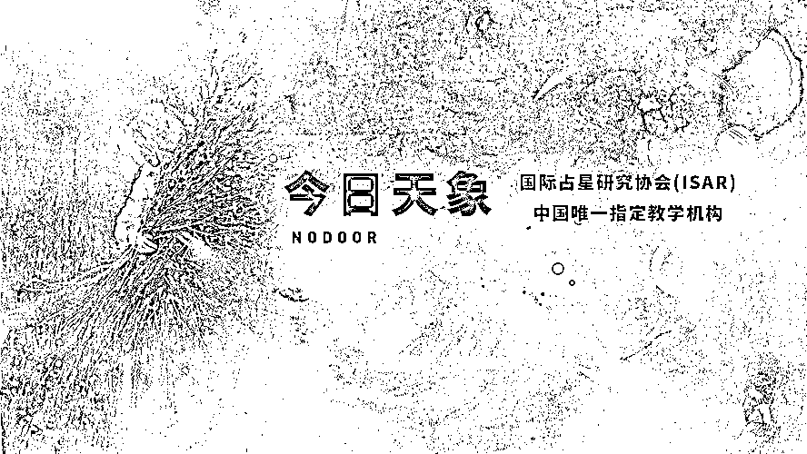

**2023 年 1 月 14 日天象：**

*   **月亮在天秤座**
*   ****太阳六分海王星、水星三分北交点、金星四分天王星****

月亮在天秤座的一天，适合安排美好的约会。太阳和海王星的六分相，这是理想和现实整合的梦幻时机，海王星柔和、敏锐而浪漫，而摩羯座的太阳是务实的，如果你想改善人际关系、推动事情落地，抓住今天的机会，发挥创造力吧！金星与天王星的四分相，没准在社交场合有意外收获，拥抱不同的可能性吧！

本周，火星在双子座恢复顺行，它将持续在双子座运行两个月、直到 3 月 25 日才离开双子座。本周顺行的火星还需要在逆行后阴影期行进，直到 3 月底，火星的速度才恢复正常。回顾此次[【火星逆行】](http://mp.weixin.qq.com/s?__biz=MzA5NjA0NTAxNg==&mid=2651492950&idx=1&sn=e9df4fa36140bec2ead75d82ea9e92a6&chksm=8b4820e1bc3fa9f72044d2286a128a1119de6a8b6711be896157800ed56d48651c18001d5d5c&scene=21#wechat_redirect)（点击查看大卫老师的文章），你都经历了哪些火逆故事，有哪些心得体会呢？欢迎跟我们分享哦~

周六快乐！另外，若道君从今天开始休假啦，我们春节后见喽~放假期间会不定期更新，欢迎大家的关注哦！

提前祝大家春节快乐！ 

**快来领取你的 2023 年运报告吧！**

**了解每日天象，可****下载“若道”APP 查看****还有更多精彩等着你哦**

# 从“双鱼座时代”到“水瓶座时代”：70 年后，人类社会将迎来哪些转变？

> 原文：[`mp.weixin.qq.com/s?__biz=MzA5NjA0NTAxNg==&mid=2651499071&idx=1&sn=7d59ca1ef797ce762e2c43656ed38879&chksm=8b481888bc3f919e4c220929f401c1016c8e602b9874889ae9b3eac322351bedd2a93c30874c&scene=126&sessionid=1692737695#rd`](http://mp.weixin.qq.com/s?__biz=MzA5NjA0NTAxNg==&mid=2651499071&idx=1&sn=7d59ca1ef797ce762e2c43656ed38879&chksm=8b481888bc3f919e4c220929f401c1016c8e602b9874889ae9b3eac322351bedd2a93c30874c&scene=126&sessionid=1692737695#rd)

**☆ 后台回复“今日”，给你一句生命态度**

作者/雷·格拉斯

翻译/Shirley 校对/李含

编辑/翀子 封面/书君 图片/稿定设计

我们正处在剧烈变化的时代，从当下的双鱼座时代，到即将跨入的水瓶座时代，人类社会将有哪些转变？作者从两个星座的原型层面出发，深入时代的变化，而处于过渡期的我们正好能从文章里获得不少启发。**我们所处的时代**

想象一下，在莎士比亚的《仲夏夜之梦》演出舞台上，有一只乱晃的蚂蚁，从它的视角来看，世界可能是什么样的。在你的身边，一场伟大的戏剧正在上演，充满了奇异的色彩、声音和复杂的情节；但由于你的视角有限，这一切的意义都被你忽略了。

你无法理解这出戏的多层次含义，也无法掌握这些不同的元素如何融入正在上演的几幕更大的叙事中。**只有通过理解这个更大的背景，你才能真正看到这些短暂的事件是如何成为一个更广泛的意义模式的组成部分，一个更大的故事的一部分。**

在某种程度上，我们自己的困境也颇为相似。**我们发现自己也在一个伟大的“舞台”上徘徊，也就是历史大舞台。**如果是随便看看，我们周围发生的事件似乎像随机发生的混乱：

一枚载有七名船员的火箭在半空中爆炸；一位世界领导人发现自己卷入了一场对外战争；一项新的计算机技术突然风靡全球。

乍看之下，几乎没有任何迹象表明这些事情具有任何意义或相互之间的关系。然而，我们的问题可能仅仅是距离过近：也许我们就是因为太接近而无法理解正在发生的事情。**如果我们的视野足够宽广，也许我们可以认识到这些孤立的事件实际上是一个更大的故事的各个方面。**

对于神秘主义者来说，打开更广阔视角的关键在于一个被称为“大时代”的概念。我们目前发现自己正跨在“行动”的门槛上，同样也是在双鱼座时代到水瓶座时代的门槛之上。

就像巨大的构造板块在集体无意识的深处移动一样，这一划时代的转变已经开始在我们整个世界表现为一系列地震般的变化，**因为旧秩序的形式让位于一种全新的秩序形式。**

即将到来的时代是否会像某些人所说的那样，是一个“和平、爱和手足情谊”的时代？还是会带来一个奥威尔式的警察国家，这里的男人和女人不过是官僚机器上的齿轮而已？

**真相几乎一如既往肯定会比我们预期的，甚至是想象的要复杂。**有必要记住，给我们带来耶稣基督的双鱼座时代也给我们带来了托克马达和宗教裁判所，更不用说传教士吉米·斯瓦格特。

**为了帮助我们理解这些正在展开的复杂性，让我们简要地看看与这两个不断变化的时代相关的一些关键符号和原型主题。**

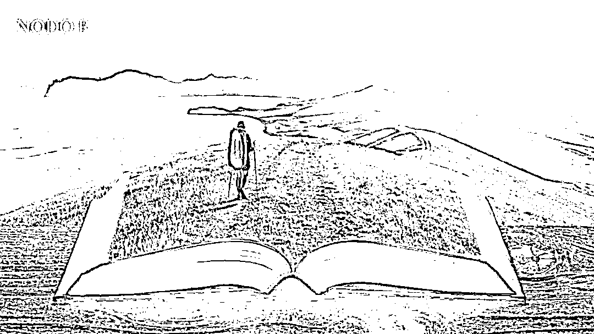

**双鱼座时代****约公元 1 年至公元 2100 年**

**两千年来，我们主要受到水象星座双鱼座的影响。**双鱼座时代的表现之一是**以水为象征核心**的全球宗教的兴起：洗礼、在水上行走、变水为酒等等。

事实上，对于研究占星学象征意义的学生来说，基督教提供了与双鱼座有关的意义源泉。例如，基督教经文中广泛提到渔夫、对社会弃儿的同情、殉道和濯足礼——**这些都是双鱼座的传统象征。**

基督传教的决定性神迹之一是用两条鱼和五个面包喂饱众人。更微妙的是，天主教徒在星期五吃鱼，有些人认为这与星期五由金星掌管有关，**金星在双鱼座被认为是 "擢升"**（即达到其最佳表现）。

这种对应关系是教会的神父们有意为之，还是它们的出现纯粹是一种共时性？甚至学者们在这一点上也有分歧，所以我们可能永远无法有确定答案。但无论如何，我们可以研究这些象征符号，因为它们**揭示了当时的原型动态。**

**从整体上看，它们告诉我们，人类正在学习通过更加感性的渗透与现实和神性进行联系。**

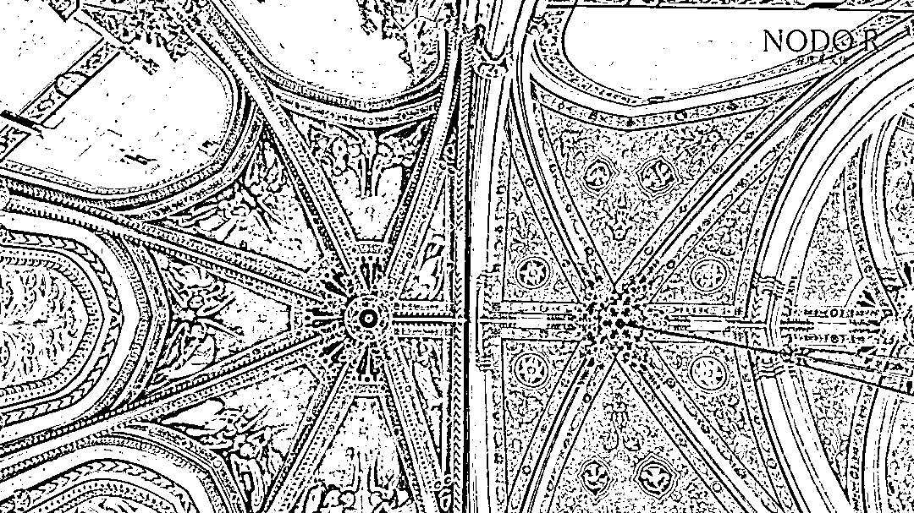

从建设性方面来看，它在社会的关键部门，尤其是在基督教世界内部，带来了新发现的**同情心**和**信仰**。动物祭祀被废除，一种精神上的感知力出现了，这种感知力表达的是“宽以相待”，而不是痛打敌人。可以说，这是一个从罗马到爱意的转变。（Roma 倒过来是 Amor)

从更消极的角度看，这种对情感的强调在新兴宗教中带来了**教条主义**和**迫害**的精神。**双鱼座强烈关注信仰问题，但如果走到极端，就会导致狂热、自以为是以及建立绝对准则供所有人遵循的冲动。**

**在最糟糕的情况下，双鱼座时代是一个宗教不宽容的时代，**当时大量的人口被期望对一个单一的信仰体系表现出绝对服从的忠诚，就像这一时期大部分基督教和伊斯兰教所表现的那样。

在基督教中发现的更引人注目的双鱼座象征之一是其中心形象：**耶稣受难**。近两千年来，西方文化在很大程度上将自己定义为一个被钉在十字架上的人的形象，他受到了最可怕的折磨，思考这一点发人深省。然而从**原型**上看，仅这一个种子形象就包含了双鱼座遗产中最好和最坏的一面。

在消极的层面上，耶稣受难表达了双鱼座的黑暗品质，如**自怜、受虐、内疚和殉道**。这些特质反映了水元素的**自我消解**原则，但以一种更具破坏性、自我否定的方式来引导。

在某些方面，双鱼座时代很可能被称为神经症的终极时代，在这个时代，许多人觉得痛苦和内疚，某种方式来说灵性的代名词。这正是当自我不健康或缺乏根基时产生的错觉，并发现自己被拉回到灵魂中更具有**危害**和**自我毁灭性**的情绪中。

但是耶稣受难也有**更积极的解释**。正如占星学家们所知，从象征意义来说，**双鱼座与超越自我和放弃个人利益服务于更高的理想有关。**

作为黄道十二宫的最后一个星座（由太阳的逆时针运动决定），双鱼座是灵魂进化的最后阶段，人格的界限已经开始消解，现在灵魂和宇宙的存在海洋融合在一起。这就是耶稣受难的最高含义：**愿意去牺牲、崇拜和深刻奉献的能力。**

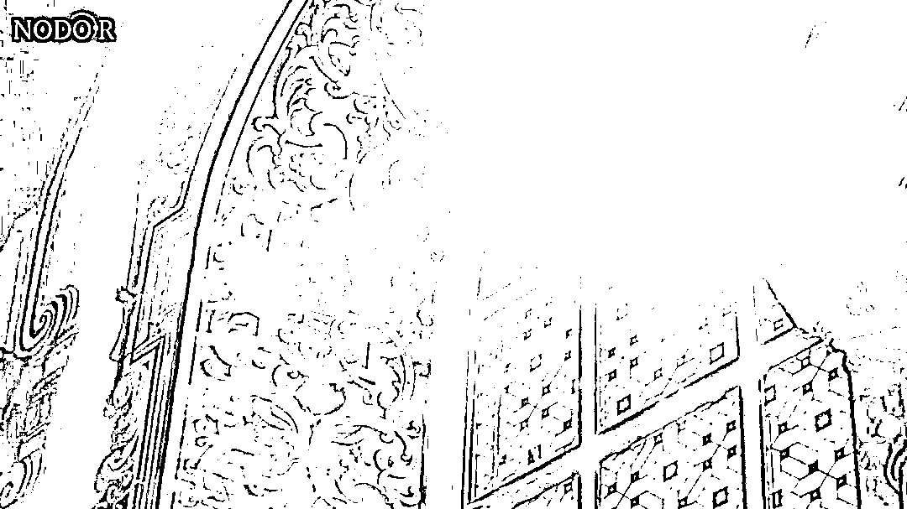

**这是水元素最高尚的部分。**

反映双鱼座这一更高层面的几则范例有圣方济各亚西西，或骑士精神和宫廷爱情的理想，以及中世纪时期出现的自我牺牲和理想主义的精神。还要注意的是，双鱼座的另一个主要宗教，伊斯兰教（Islam），翻译成英语就是“投降”的意思。

白羊座时代带来了外向型自我的觉醒，而更加阴性化的双鱼座时代则带来了一种新发现的**内在感或内向性**。在宗教方面，这体现在新兴的基督教对道德反思或良知的强调。不幸的是，这一发展的另一面是整个西方社会出现了一种新的内疚情绪。

在基督教之前，人们很少会感觉到良心或我们现在认为的 "罪 "。作为对比，早期的希腊人比我们现在更机械地从外部角度看待他们与神的关系。当人们犯罪时，人们赎罪并不是因为内心的罪恶感，而是相信自己已经积累了某种 "污点"，可以通过适当的祭祀来消除。

在另一个层面上，这种新的内在感反映在建筑特征上，如圆顶和拱门，这些特征对伊斯兰清真寺或罗马万神殿等建筑至关重要。这种内在性还明显体现在罗马时代早期在雕像眼睛中引入瞳孔；研究早期罗马人和希腊人的古代半身像，人们发现他们的眼睛是没有瞳孔的。

诸如此类的艺术转变，**象征着在早期基督教时代开启了一个新的情感世界**。这个发展，在几个世纪之后，**使后来现代心理学的诞生成为可能。**

**水瓶座时代****约公元 2100 年至公元 4200 年**

**关于水瓶座时代最常问的问题是，它何时开始？**这有点像确定黎明何时开始。是当天空中出现第一缕晨光之时吗，远在真正的日出之前？还是当太阳真正出现在地平线上时？

同样的问题也适用于理解大时代的时间。**一个时代不是在某一天或某一年开始的**，而是在许多年里逐渐展开的，像潮水一样一波一波其影响。

因此，虽然水瓶座时代可能在几个世纪后才会完全显现**（大多数估计是在公元 2100 年至 2800 年之间）**，但有许多例子表明它的**象征性**已经出现在我们的世界中。**互联网**和**民主**只是其中的两种表现形式。

双鱼座在传统上与水元素有关，**而水瓶座则与风元素有关。**从外部来看，这反映在过去两个世纪里**航空技术**和**太空旅行**的突飞猛进的发展商。

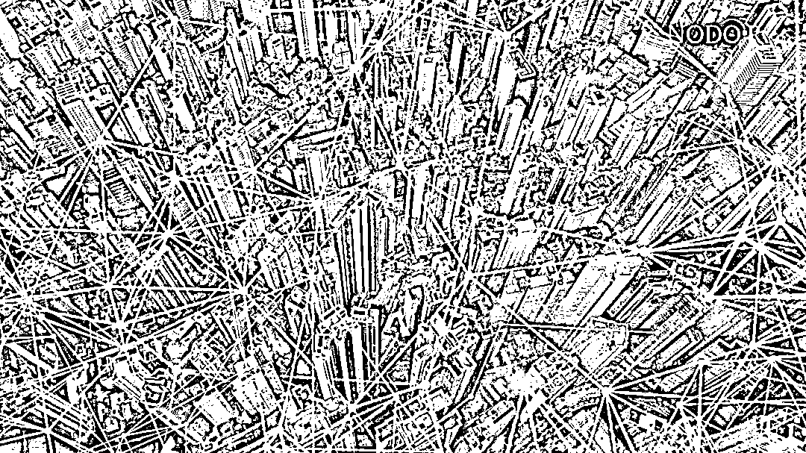

人类正在实实在在地学习掌握风象领域，不仅有航空技术，还有通过建造越来越高的建筑物，使我们能够生活在离地面更高的位置。当媒体说一个节目“开播（on the air）”，或一个广播员“上播（takes to the airwaves）”时，也采用了反映这种元素变化的隐喻。

这种外部发展只是在反映整个文化中发生内在转变，这种转变与人类进化中的思想觉醒有关。**从象征性的角度来理解，风元素是我们交流思想和观念的媒介，是与理性和思考最相关的元素。**这意味着，水瓶座时代无疑将见证**人类智力的长足发展**，毫无疑问，其复杂程度大不相同。

一个在电视机前生活的人可以说是在追求一种“精神”的存在，但与一个努力解开宇宙奥秘的科学家的存在在质量上有很大的不同。

像“信息高速公路”或“信息革命”这样的术语就是进一步示范了即将到来的水瓶座影响已经开始推动我们的世界走向更广泛的精神价值和经验模式。现代的政教分离是另一个重要的例子，说明我们的理性思维已经脱离了双鱼座时代的教条主义和情感关怀。

理解水瓶座的含义，关键在于每个不同的元素在黄道带中重复三次。换句话说，有三个土象星座、三个水象星座、三个火象星座和三个风象星座。**观察同一元素的每个版本，我们发现该元素的原则以微妙的不同方式表达自己。**

**为了说明这一点，让我们在这里重点讨论三个风象星座。双子座、天秤座和水瓶座。**

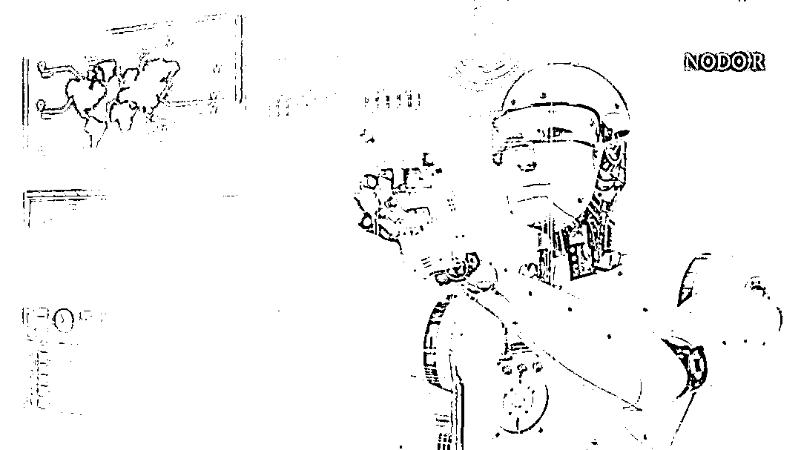

**风象的三张面孔**

**黄道带具有一种逐渐推进的性质，所以这三个星座中的每一个都可能以更广泛、更非个人化的方式反映心灵的运作，这并不令人惊讶。**

例如在**双子座**，理性以高度个人化的方式表现出来：通过日常思维的运作和普通的交流形式。在天秤座，风象元素的理性以更多的人际互动的方式表现出来，通过一种在更广泛的社会背景下与他人互动的心态。这方面的一个例子是站在教室前的老师，或与客户打交道的销售人员。

我们发现在**水瓶座**，理性的风象元素通过最非个人化的背景来表达自己——**站在大众的角度，甚至是站在宇宙本身的角度。**

**水瓶座可以被描述为宇宙理性或宇宙心智的原则，即感知和建立最抽象和宇宙排序的联系的能力。水瓶座不是简单地关注思想和理论关系；它关注的是全球或普遍性的思想和关系。**

由于这个原因，水瓶座时代很可能是一个科学而不是宗教成为主导范式的时代，其科学家是新的大祭司。科学不是把注意力集中在任何一个人的想法或感觉上，而是试图发现适用于任何地方和任何时候的规律和原则。

这种非个人化也体现在我们许多人现在通过互联网或电视等技术参与到社会联系和网络中，并延伸到很远的地方。这些技术使世界各地的人们能够相互交流，但交流的方式更偏向头脑方式。

这是我们这个时代的悖论之一，**我们发现自己与整个世界的人的联系越来越紧密，而对住在隔壁的人的了解却越来越少。**

这种向水瓶座风象的转变也是我们看到的对外太空及其探索日益着迷的原因，正如《星球大战》或《2001：太空漫游》等电影，或《星际迷航》等电视节目所反映的那样。像这样的作品捕捉到了**“对星星的渴望”的新兴精神，这是水瓶座的内在特点。**

现代人对 UFO 和地外生命的迷恋在未来几年可能会更加明显，因为人类发现自己在这些领域的猜测和幻想正在转变为残酷的现实。

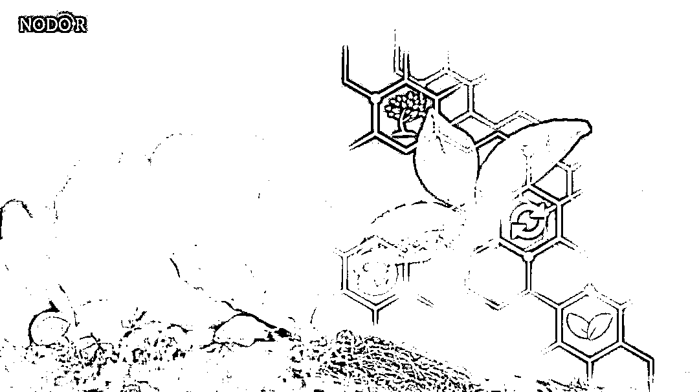

**水瓶座边缘的过渡象征**

**我们的一只脚在身后的双鱼座时代，另一只脚在眼前的水瓶座时代，**我们发现自己被夹在两个截然不同、有时甚至相互冲突的价值体系中。

如果说伟大的时代描绘了一出具有宇宙规模的莎士比亚戏剧，那么我们正是在 “两幕之间”走上舞台的，旧的道具和背景被新的道具和背景所取代。

生活在这种边缘或中间状态的一个结果是**各种过渡形式的兴起**——双鱼座和水瓶座能量的象征性混合体。以下是近来的几个例子。

**★****电视布道会**

当旧式的双鱼座基督教与水瓶座的媒体技术相遇时会发生什么？其中一个结果就是明显的现代现象——电视布道，传道人利用全球技术的成果将救赎的福音传播向比以前更多的听众。

**★****堕胎辩论**

当一个时代对抗另一个时代时，分歧双方的价值观和意识形态可能会发生激烈的冲突。

这方面的一个生动例子是现代关于堕胎的争论。一方面是主要基于基督教的“反堕胎”的倡导者，代表了双鱼座时代的价值观，反映了对无助的未出生婴儿的同情。另一方面，还有代表水瓶座力量的“支持选择”的倡导者，他们倡导个人决定自己命运的权利。

多年来，这两个阵营之间几乎没有妥协，而且看不到改变的希望，但有充分的理由。它们产生于两种根本不同的范式，两种根本不同的看待和评价世界的方式——**一种来自上一个伟大的时代，另一种来自下一个时代。**

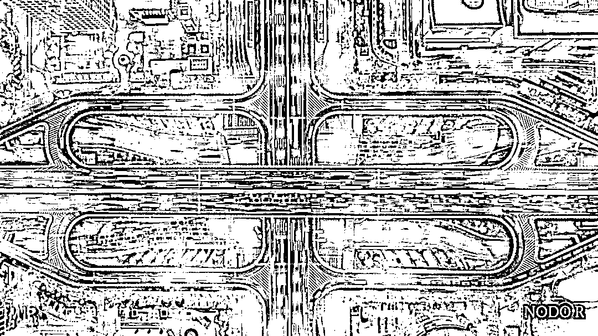

**★****巴士底狱的暴动**

**即使是历史上的单一事件，有时也可以作为时代之间过渡的象征性基准。**

最早和最戏剧性的例子之一是 1789 年 7 月 14 日攻克巴士底狱，这是法国大革命中的一个关键事件。在这一天，法国激进分子攻占并打开了这座关押政治犯的著名监狱，并释放了那些留下来的少数人。

**在占星学的象征意义上，监狱与双鱼座有关，而自由和革命的原则与水瓶座有关。监狱的开放和囚犯的释放是一个象征性的里程碑，标志着从旧的独裁秩序向更加自由的秩序转变。**

**★****匿名酗酒者协会**

**占星师认为与双鱼座相关的负面象征之一，长期以来一直是对酒精、毒品甚至化石燃料等麻醉品的沉迷！这就是双鱼座。**

像匿名酗酒者协会这样的团体提供了一个例子，即人们聚集在一起摆脱酒瘾，恰如其分地象征了为解除我们对双鱼座意识的束缚而做出的努力。

因此，匿名酗酒者协会是一个复杂的现象：一方面，它的一只脚牢牢地踩在渐渐衰退的时代价值观上，它强调向更高的力量臣服（“放手让上帝去做！”），以及它自己设定的“戒律”（“十二个步骤”）就是证明。同时，匿名酗酒者协会本质上是民主和非教派的，是与新兴时代相关的品质。

**从原型上看，匿名酗酒者协会是一个混合的创造，融合了双鱼座和水瓶座时代的价值观。**

**★****文学作品中的过渡性象征**

**向水瓶座时代的过渡也表现在现代文学的形式中**。例如，从一个时代到另一个时代的过渡，有时会以象征的形式表现出来，即描述一个英雄与前一个时代相关的生物作战。西方宗教中的一个历史例子是摩西赶走金牛，象征着从金牛座时代到白羊座时代的过渡。

在现代，类似的模式在《白鲸》等书中也有体现。在赫尔曼·麦尔维尔的这部庞大的小说中，我们看到一个风象元素的人物（亚哈）试图杀死一个海洋生物，象征着对水元素的超越（双鱼座）。

此外，如果捕鲸业被视为现代工业文明的象征（它是美国建国初期出现的第一个真正的工业），那么麦尔维尔的故事强调了从一个更感性的时代到更有技术和商业意识的水瓶座时代的转变。

在另一个层面上，可以将麦尔维尔的故事视为十年后即将撼动美国核心的大灾难——内战的预兆。在这里，我们也看到了一个时代之间的冲突正在上演，象征着自由价值观的联邦军队（由亚伯拉罕·林肯领导——他是水瓶座，与查尔斯·达尔文同一天出生），试图推翻美国南方以奴隶制为基础的世界。

虽然表面上非常不同，但在一个多世纪后，政府人员袭击德克萨斯州韦科市大卫·科雷什的宗教院落的悲惨故事中，同样的本质动力在起作用。

无论人们对这次袭击或其可能的理由有什么想法，其象征意义是明确的：世俗政府对宗教团体施加限制——**即水瓶座对双鱼座的限制**。1993 年，袭击事件正好发生在水瓶座和双鱼座的守护星天王星与海王星合相时，这一事实简洁地强调了该事件的原型意义。

**结语**

无论我们知道与否，**我们都在某种程度上被我们这个时代的需求所推动或拉动，**我们都在扮演一个更普遍剧情的必要部分。

作为一个例子，朝圣者试图逃离旧世界的宗教迫害，到新世界寻找宗教自由，这反映了从更加教条和迫害导向的双鱼座时代到自由导向的水瓶座时代的转变。

他们几乎没有意识到，他们也在为一场集体大戏搭建舞台，其影响将延伸到未来很远的地方，并影响整个地球未来几个世纪的地缘政治方向。

****版权声明：**本文由若道翻译发布，欢迎转发，反对抄袭。友号转载请申请白名单。**

**END**

**雷•格拉斯**

来自芝加哥的作家、音乐家、摄影师和占星师。他在《探索之书》和《探索》杂志做了十年编辑工作，并自 1998 年以来一直担任《大占星师》杂志的副编辑。他的讲座话题广泛，涵盖了占星学、共时性和神话学，同时他还保持着积极的占星实践，客户遍布美国国内外。

**新的一年，来领取你的好运吧！**

**扫码**即可领取**专属的年运报告**

**20 位来自世界各地的占星师**
**带来 19 场沙龙——新世界的觉醒****详情可点击下图**

**学习占星学****点击下图了解课程详情**

**微信又双叒叕改版啦，不想错过若道君的推送？**
****就把若道设为****星标****以及点点****“在看”****吧！******▼**

**喜欢就点一下“在看”吧！****报名直达入口**

# 2023 年 ISAR 选修课 | 预测技法三日工作坊，了解人生重大事件

> 原文：[`mp.weixin.qq.com/s?__biz=MzA5NjA0NTAxNg==&mid=2651499071&idx=2&sn=17ba649f3ecb894d2a77562e3eb18a13&chksm=8b481888bc3f919e443ca2c25b0230087de027868221e7bf811d8516d2819c5d09f06e3be9d1&scene=126&sessionid=1692737695#rd`](http://mp.weixin.qq.com/s?__biz=MzA5NjA0NTAxNg==&mid=2651499071&idx=2&sn=17ba649f3ecb894d2a77562e3eb18a13&chksm=8b481888bc3f919e443ca2c25b0230087de027868221e7bf811d8516d2819c5d09f06e3be9d1&scene=126&sessionid=1692737695#rd)

**授课内容**

 本次 3 日课程将深入学习人本主义占星师使用的 3 种预测技法。

我们将深入学习如何分析**行进**，强调对**行进的周期性**理解。我们将通过**次限**研究星图中展现的变化，并学习运用**太阳弧**来标记生命中的关键事件。虽然还有其他有用的技法，比如太阳返照和月限法等，但对**行进、次限和太阳弧**能量的谨慎回应已经提供足够的信息来指导我们的人生。

**行进（TRANSITS）** **长期趋势**分析行进的最好方法是先将长期的行进趋势列出来。顺序如下：冥王星、海王星、天王星、土星、木星、南北交点。通过将这些影响力持久的长期行进先列出来，你将能够发现在未来一年甚至更长的时间里你人生中的重大课题。**短期趋势和触发点**接下来你需要去观察那些运行得较快的星体，来判断短期趋势。不过，重要的是要清楚，这些移动较快的星体在行运中扮演着事件的“触发点”的角色，特别是当与它们形成相位的个人行星同时也与行运外行星有相位的时候！

**次限推进（PROGRESSIONS）**通常也被称作“一天代表一年”推运，因为这种技术把出生后的每一天和出生后的一整年等同起来。一旦设定了这个节奏，就像定时释放的胶囊一样，这些次限推进就像某种内部的太阳系一样运转起来，和真实时间的事件、经历、情境应和。

**太阳弧（SOLAR ARCS）**以太阳为核心，为众星之首，带着众星一起移动,展示人生不同阶段我们是如何体验自我、表现自我、修缮自我。此方法虽非实际星体，但却是星动推运法中准确率最高，实用性最佳的推运方法。

课程有两个方面的重点：**强化自我学习**，把对过去生活事件的理解作为预测未来趋势的基础；**学习有效的占星咨询技能**，以一种精准、生动、策略性和鼓舞人心的方式阐述星图。与格雷格之前开设的课程一样，这次课程会有**大量互动**，老师会与案例学员互动，同时通过学员间的讨论，互相激发，获得更多启发。如果可能，还会设置**训练环节，练习基本的预测和解读方法。**

**课程安排**

 **· 2023 年 3 月 4 日 周六  8:00-14:00
· 2023 年 3 月 11 日 周六  8:00-14:00
· 2023 年 3 月 18 日 周六  7:00-13:00**

**什么人适合学习本课程？**

 **·**占星师或渴望成为占星师的人群。  **·**本课程并非针对初学者，需具备若道核心课程 level4 及以上水平，即了解星座、行星、宫位、相位等。

**· **课程会涉及行进&推进&太阳弧解读高阶内容，不了解相关知识的同学，请提前学习相关内容。

**老师介绍**

**格雷格·博加特（Greg Bogart）**

**· **占星师、心理治疗师。格雷格出生于美国纽约市，就读于卫斯理大学。1986 移居旧金山湾，完成了加州整合大学和赛布鲁克大学的研究生课程。**· **格雷格自 1991 年以来一直是一名有执照的心理治疗师（LMFT 28276）。他是国际占星研究协会（ISAR）认证的占星师，并拥有美国地球宇宙学研究协会（NCGR）的第 4 级认证。**· **他还在旧金山的艾扬格瑜伽学院接受过培训，并于 1992 年毕业且获得了瑜伽教师认证。**· **格雷格是一名私人执业的心理治疗师，在索诺玛州立大学担任心理学讲师，他在该校教授“成人发展中的转变”、“以深度为导向的心理治疗”、“神话、梦与象征”以及“存在主义心理学与超个人心理学”等课程。**· **他在加州整合大学、约翰·F.·肯尼迪大学、多米尼加大学和超个人心理学学院教授咨询心理学和东西心理学课程。**· **他的研究结合了冥想、哈他瑜伽、荣格解梦、存在主义心理疗法和精神综合，**占星学的行星周期智慧和原型象征**。

**格雷格·博加特博士著作：** 《占星学的高八度音阶》（*Astrology’s Higher Octaves*） 《行星用于治疗》（*Planets in Therapy*）《占星学与灵性觉醒》（*Astrology and Spiritual Awakening*）《梦境工作过与自我疗愈》（*Dreamwork and Self-Healing*）《梦境工作在抑郁症整体心理治疗中的应用》（*Dreamwork in Holistic Psychotherapy of Depression*）《占星学与冥想：对变化的无畏沉思》（*Astrology and Meditation: The Fearless Contemplation of Change*）

**推荐阅读：**

史蒂芬·阿若优：《生命的轨迹》

Bogart, G., Planets in Therapy; and Astrology’s Higher Octaves.

Tyl, N., Prediction in Astrology.

Ruperti, A., Cycles of Becoming. 

**课程价格**

**正价：6800 元 早鸟价：5800 元 早鸟价截止日期：2023 年 2 月 15 日**

**惊喜联报套餐！！****《ISAR 选修课 | 预测、预期与意识成长》+《2023 年度天象预测大师课》+《2023 年金融占星预报》****三门联报优惠价 8800 元****（联系 Maggie 老师，抢占限量优惠价）**

长按二维码添加 Maggie 老师获取联报优惠价

**退转课程**

退款原则请详看《教学协议》，如有疑问请咨询课程顾问。 ****2023 年 ISAR 选修课 | 预测、预期与意识成长****

**授课老师：****格雷格·博加特**

**直播课开课时间：2023 年 3 月 4 日（周六）3 月 11 日（周六）3 月 18 日（周六）**

**授课方式：******网络授课，英文/中文授课，中文翻译****

**费用：****** 正价：6800 元；早鸟价：5800 元；早鸟价截止日期：2023 年 2 月 15 日****

**课程负责人：Maggie 老师**（微信：NodoorMaggie，请备注“2023 预测课”）

长按二维码添加课程负责人咨询

**报名直达入口**

# 星图上的“神秘宫位”也是职业召唤？如果你是 12 宫人，快启动你的内在创造力吧！

> 原文：[`mp.weixin.qq.com/s?__biz=MzA5NjA0NTAxNg==&mid=2651498969&idx=1&sn=b46bc998d0a9d5ed8c444c6257a3a8b7&chksm=8b481b6ebc3f92784399a8f58df987099d6784dd9347133c3e3a1fc4558aa1240d82477be1ae&scene=126&sessionid=1692737695#rd`](http://mp.weixin.qq.com/s?__biz=MzA5NjA0NTAxNg==&mid=2651498969&idx=1&sn=b46bc998d0a9d5ed8c444c6257a3a8b7&chksm=8b481b6ebc3f92784399a8f58df987099d6784dd9347133c3e3a1fc4558aa1240d82477be1ae&scene=126&sessionid=1692737695#rd)

****☆ **后台回复“今日”，给你一句生命态度**

作者/唐娜·坎宁安 译者/Luke 编辑/翀子 封面/书君 图片/稿定设计

了解占星的朋友都知道，传统的职业宫位是 2、6、10 宫，不过今天唐娜·坎宁安又发表了一个她自称“容易引起争议的”观点——12 宫也是职业宫位！那么劲爆的观点，若道君也迫不及待想要一睹为快了。另外，大卫老师参与授课的【[2023 年中英双导师占星核心课 L1-5 ](http://mp.weixin.qq.com/s?__biz=MjM5MjQwNjAyMQ==&mid=2649440592&idx=1&sn=f6173530924184998c81fb41e684c6dd&chksm=beb92e3a89cea72ce16ad05bad3c8fa816351e197266d0e299bc17faaa49fc1e90fbcedc0708&scene=21#wechat_redirect)】正在报名中，如果你对占星学感兴趣，欢迎点击链接了解更多详情！

**12 宫的职业是上天的召唤**

如果我们在 14 世纪，或那之前的一千年学习占星的话，**第 12 宫会被列为四个职业宫位之一。**在那里的行星指示了一个人的职业，取这个词最原始的含义，也就是——上天的召唤。**做选择的不是你，而是某种事业选择了你，而且到头来你会为它自愿奉献你的人生。**

当你接受到这类召唤时，你的高我会驱使你从事某种服务型工作，尽管它很具挑战性，而且会阻挠你满足自己的需求和欲望。**你可能会有一种使命感，要为受苦的人带去援助和安慰，或为陷入黑暗的人们带去光明。**

这项工作可能很难，吃力不讨好，而且薪水很少。不过即使如此，12 宫人今天的待遇也比过去好多了。

在你献身服务型事业的过程中，如果一切进展顺利，有时你会获得一种蒙受恩宠的状态：一种幸福的感觉，感到度过了充实的一生，自己对世界产生了积极的影响。如果不是我的太阳和木星合相在巨蟹座 12 宫，我是不会有这种感觉的。

我是否受到召唤？是的，而且有两次。我本来的人生计划是成为一名法语教师，所以我在大学主修的是语言。要拿到教师资格证需要进修一系列的课程，所以我开始上心理学课程。

几个月之后，召唤来了，我知道我命中注定要成为一位咨询师。我换了专业，专修心理学和社会学的课程。当我修完社会工作专业的硕士学位时，我知道我的生活开始走上轨道了。

然后，我的一位同事开始热衷于占星学。他到处为别人读琳达·古德曼 1968 年的畅销书《太阳星座》里的星座描述。我被里面巨蟹座的描述惊呆了。

这就是了——第二个召唤！几个月以后，我每周上三个晚上的占星课，周末的时候专心钻研星图。不出意外的是，我的社工学位为我成为职业占星师提供了极佳的背景。

**12 宫职业征象的配置**

**如何在出生星图中看出 12 宫的职业呢？12 宫内的行星显然是一个指征。这里，按照力量强弱列举了一些可以作为职业征象的配置。征象越多，力量越强。**

**7 个职业征象：**

●12 宫宫内星与中天形成相位，或是中天星座的守护星

●12 宫宫内星与 10、6、2 宫宫内星形成相位

●太阳在 12 宫

●处女座、摩羯座或金牛座的行星在 12 宫

●土星在 12 宫

●6 宫主或 2 宫主在 12 宫

●因为 12 宫、海王星和双鱼座是互相关联的，所以**当海王星或双鱼座的配置落在 2、6、10 宫时也会呈现相似的职业模式。**

**一些可能的服务领域包括：**

●医院职工、机构人员、疗养院职工

●牧师、修女、修道院员工

●瑜伽或冥想老师

●灵媒、占星师

●监狱工作者

●戒酒或戒毒项目的员工

●残疾人的疗养院、康复之家

**6 宫和 12 宫的配置都象征医疗领域的职业，但第 6 宫更多地代表主流医学**。一份由带有 12 宫配置的读者们参与的职业调查报告显示，这些人可能起初是主流医学的拥趸，**但不久就开始采用一系列的替代疗法。**

我的理解是 12 宫代表的健康问题通常是会使人失去活动能力的**慢性病**，包括那些由自毁行为引起的症状，比如成瘾。

因为病人或客户的治疗缺乏成效，医生们开始寻求其他种类的治疗手段，以减轻他们的痛苦。也有可能，医生自己就忍受了久治不愈的病况，因此开始研究替代疗法，再用学到的方法帮助别人。

**警告：**

**如果以不明智的方式从事服务于人的行业，对双方都没有好处。这会消耗付出者的能量和资源，同时暗地里削弱接受者的独立能力，变成一种拯救和依赖的关系。**

为了感到受需要和自我价值感，服务者常常暗中（无意识地）阻挠求助者的成长。当小我或个人利益被牵扯进来，即使最高尚的意图也会遭到扭曲。

**海王星和 12 宫是我们最容易发生否认机制的位置，小我就可以藉此伪装成灵性的傲慢（“我是整个世界上最优秀最谦卑的仆人”）。**

**内向的力量**

近 45 年的占星解读给我留下的印象是，**12 宫人大多都是内向者，他们享受和需要独处的时光。**他们经常发现其他人的陪伴或身处某一团体时，无论时间长短，都使人感到烦心和疲惫。**这种内向性格对他们的职业生涯有巨大的影响。**

我的写作需要长时间的独处和完全的静默——没有电视、电话，甚至连音乐都没有。为了深入钻研某一主题，我需要内省、沉思、放飞思绪和大胆想象。

我的星图帮我认识到无需为内向感到羞耻，它是我本性的一部分。位于 12 宫的太阳和木星告诉我，避世倾向是我的长处之一，也是我的工作中创造力的源泉。

**有一件事阻止 12 宫人自我感觉良好，那就是人们（特别是西方世界）对内向的看法。**内向被认为是适应不良的症状，需要改变。内向的人被告知应该接受心理治疗，找一个恋人，过和正常人一样的生活。

他们可能会因为与众不同而感到羞愧，感觉应该假装变得外向起来，无论演技多么笨拙。

不过我碰巧在《今日心理学》和《科学美国人》杂志上读到关于内向者的心理学研究。研究发现，**内向者在实际的工作表现上有令人惊讶的优势，尤其是那些需要注意力、集中力、长期独自进行的工作。**

如果内向者成为管理人员，他们能够倾听雇员的意见和反馈，从而提升工作场所的士气和效率。

关于这个主题，作家苏珊·凯恩写了一本重量级的书：《内向性格的力量》（皇冠出版社，2012 年）。书的简介上写道：

“世界上至少有 1/3 的人是内向者。他们相较于说话，更喜欢倾听，相较于聚会，更喜欢阅读；他们发明创造，却不喜欢自我推销；他们喜欢独立工作。虽然他们常常被贴上安静的标签，却对社会作出了巨大的贡献——从梵高的向日葵到个人电脑的发明，都是内向者的作品。”

**一个有时外向，有时内向的人被称作双向性格者。当一个人 12 宫有行星，水象星座有行星，同时又有行星或星图的四角在火象或风象星座时，这种情形就会发生。**

一位读者说：“我有一组星群包括天王星、水星、冥王星和金星在 12 宫靠近上升的位置，我喜欢拥有自己的空间（内向特质），但另一方面我的太阳和月亮又在 1 宫，人们觉得我有阳光快乐的个性，所以我认为我是双向性格者。    

**秘密及自我欺骗**

**12 宫也被认为是秘密宫。**如果你有个大秘密要藏起来，害怕别人发现秘密的恐惧和羞愧可以构成沉重的心理负担。秘密可能来自你的家庭，也可能只属于你自己。

这两种秘密也可能合二为一，因为问题家庭的孩子往往会重蹈家庭的覆辙，或是为了应对痛苦的童年，发展出了其他功能失调的行为。家庭的秘密使人感到羞愧，想要深深隐藏自己，但学着应对和治疗这些秘密，使许多人走上了助人的道路。

重要的一课是，在监视技术盛行的今天，几乎没有秘密可言。不轨行为早晚会被揭露——通常发生在行星行进至 12 宫行星时——那时人们就知道你真正的为人。问题不在于是否会发生，而是何时会发生。

**特别值得一提的是，合相上升的 12 宫行星的相关特质会对你周遭的人显露得特别明显。**这颗行星离上升越近，它就越无法成为一个秘密，所以你除了自己以外其实没有骗到任何人。12 宫行星的特质通常受到了压抑，所以你可能没意识到你有这些特质。

**仔细解读 12 宫的行星和星座可以使你了解这些能量是如何被误用、阻碍你的职业目标的。**在这个位置的行星通常代表人们注意到你身上的某种特质，但是却不便和你开口讨论它们，这种情形会在你和他人之间树起一道墙。

如果这颗 12 宫行星也是职业征象，它会直接妨害你的成功。因为精明的老板和客户可能得到你不可信的印象，因此不会雇用你。

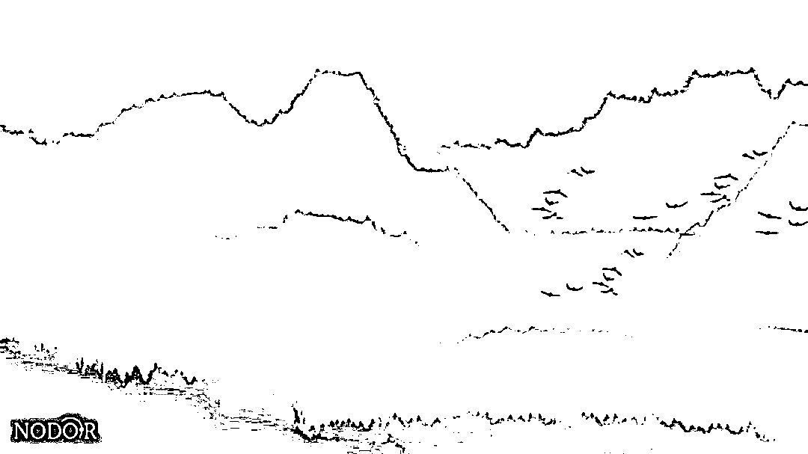 

**阻碍成功的方式**

**12 宫也被称为自我毁灭之宫。**这是搬起石头砸自己脚的旧式说法。**12 宫的职业征象可以象征你妨害自己成功的方式。**

前面说过，这些模式及其动机通常是无意识的，所以有必要了解和改变它们。如上所述，占星学可以帮你辨识它们，但还需要其他的治疗手段克服它们。

假设你的金星在 12 宫，和中天成四分相。你可能觉得对于 12 宫的职业来说，金星十分有利，会带来热心、慈悲、关爱他人的特性。这都很好。

然而，金星 12 宫的配置因秘密恋情而臭名昭著。这个位置的金星作为职业征象，在工作场所的秘密恋情可能为你的职业生涯招致严重后果，尤其当外行星行进与其成硬相位时。

金星和中天成四分相的配置可能意味着你和老板有些风流韵事，会伤害你在行业中的名誉。如果金星和 6 宫的行星成对分相，当这个配置和行进行星成硬相位时，和同事的恋情会变成一场灾难。

更糟的是，如果你在服务行业，和客户的性关系被曝光，不仅你栽了个大跟头，也会对你的客户造成巨大的伤害。因此，服务型行业，包括占星机构，有规章禁止这类关系发生。

**职业征象落 12 宫的人要学到的最重要的一课是，直到你能为你的行为负责之前（不找借口），你很可能会不断重复自我挫败的行为。觉察到这些模式是改变的开始，如果看起来近期的外行星行进会带来麻烦的话，那最好赶快开始行动。**

 

**这条路很值得**

虽然这不容易，但是 12 宫的配置，如果用得好，也可以带来很多快乐和满足。**如果你走在 12 宫的道路上，这不是诅咒，而是你的与生俱来的权利。**和许多占星师一样，我相信，在我们的灵魂回到地球以前，我们选择了何时出生，选择了自己的星图。 

继续前世今生的话题，许多在服务行业的 12 宫人的转世历史中有许多世献身宗教，在那些世，他们可能发誓保持贫穷，而这些誓言被无意识地带到此生。

他们可能对收费提供服务抱有罪恶感，甚至一点都不收费，也不愿意推销自我。如果这些描述在你内心引发共鸣，进行仪式解除贫穷的誓言会很有帮助。

另一件对你或某位忙于应付 12 宫问题的人很有帮助的事，是阅读崔西·马克写的占星自助书，《你的秘密自我：揭露十二宫的神秘》（宜必思出版社，2010 年）。这本富有洞见和充满治愈能力的书使我肃然起敬。书会教你如何体会 12 宫配置的美好和正当，以及如何摆脱这些能量的负面表达。

**12 宫不适合胆小鬼，在此宫有重要配置的人似乎是由神赐予天命。**他们通常是已经历练无数人世的老灵魂，现在踏上最具有挑战性的人生道路。可能他们的任务就是终结业力，结清生生世世的债务。

**版权声明：**本文由若道翻译发布，欢迎转发，反对抄袭。友号转载请申请白名单。

**END**

**唐娜·坎宁安**

一位在国际上都广受尊敬的占星师，她已有超过 45 年的从业经验。她已撰有数十本占星著作以及上百篇占星学和其他形而上学类的文章。

**拥有 53 年占星实践经验的若道创始人** **大卫·瑞雷****&最懂学员的若道首位认证金牌中国老师****熊鹰**

**最默契的师徒二人****再度联合打造**

**2023 若道全新核心占星课程**

**课程结构****全面升级****教学内容****翻倍惊喜****补充资料****丰富多样****沉浸式互动****案例教学****以学员为案例进行课堂的占星咨询演示****职业占星师养成计划****点击下图了解更多课程详情**

**新的一年，来领取你的好运吧！**

**扫码**即可领取**专属的年运报告**

**20 位来自世界各地的占星师**
**带来 19 场沙龙——新世界的觉醒****详情可点击下图**

**学习占星学****点击下图了解课程详情**

**微信又双叒叕改版啦，不想错过若道君的推送？**
****就把若道设为****星标****以及点点****“在看”****吧！******▼**

**喜欢就点一下“在看”吧！****报名直达入口**

# “存信号”、“消信号”、“调信号”，在心平健康学里如何影响你的生活？

> 原文：[`mp.weixin.qq.com/s?__biz=MzA5NjA0NTAxNg==&mid=2651498969&idx=2&sn=e625530b6af968eb2eff8af1ce28a0db&chksm=8b481b6ebc3f9278710d99949915cc4fc87f8ef1529e49931a05b64543cf9c7fc709f021adf6&scene=126&sessionid=1692737695#rd`](http://mp.weixin.qq.com/s?__biz=MzA5NjA0NTAxNg==&mid=2651498969&idx=2&sn=e625530b6af968eb2eff8af1ce28a0db&chksm=8b481b6ebc3f9278710d99949915cc4fc87f8ef1529e49931a05b64543cf9c7fc709f021adf6&scene=126&sessionid=1692737695#rd)

作者/彦方

编辑/翀子 图片/稿定设计

在心平健康学体系中，有一个专有名词叫“信号”，它把过去、现在、未来不平衡与不平静的心，称作信号。在成长过程中，你“存”了哪些对你现在生活产生影响的信号？如何调动它们？快来看文章吧！

**不平衡的“信号”**

在心理学的每一个体系中都有其特定的语言，比如有的心理学，会经常说到人格。**在心平健康学体系中，我们有一个专有名词叫“信号”。**

和学过心平的人一起聊天，他们经常会提到“信号”，体系外的人就听不懂他们在说什么，还以为是指手机信号或者网络信号呢！在心平健康学的体系中，**我们把过去、现在、未来不平衡不平静的心，称作信号。**

在过往的生命中，我们曾经有过很多不平静不平衡的心理，我们以为时间和事件已经过去了就消失了，实际上那些不平静不平衡的心理，还一直留在我们的身体里，**到了一定的时间，就会以身体症状的方式呈现出来。**

**我们生的那个气，如果没有调整的话，它就一直留存在我们身上，这就是现在的人们常说的细胞记忆，也就是心平体系中的种子理论。**

每一个细胞都是有记忆的，我们曾经产生的不平衡不平静的心理都留存在了细胞上，就像一颗颗小种子，某一天会发芽，可能会以疾病的方式呈现出来。

现在得病不一定是现在的不平心理导致的，有可能是十年二十年前，甚至我们很小的时候，早已忘了的那些事儿。我们以为忘了，但曾经有过的那些痛苦的感觉，现在就变成了身体上的疾病。

我曾经带过一个个案，案主经常会有“家破人亡”的感受，而这种家破人亡的感觉是源自小时候与一个布娃娃存留了不平衡的心理。可能我们都会觉得布娃娃怎么会和家破人亡的感觉扯上关系呢？但是，面对痛哭的案主，我看到那种家破人亡的感觉对她来说是那么的真实。

案主小的时候，爸妈不怎么跟她说话，自从她得到了一个小布娃娃之后，每天就跟那个布娃娃说话，把它当作自己的妹妹。实际上这就是一个小孩子需要父母的倾听而得不到，现在找到了一个倾诉对象，就把情感寄托到这个布娃娃身上了。

但是爸爸妈妈不了解孩子的心理，他们看到她整天抱着布娃娃，对着它说话，以为孩子魔怔了，不让她再抱布娃娃，还要把布娃娃给剪碎了。案主无论怎么跟父母求情都不行。

其实，父母的感受也很真实，看到孩子大白天的老抱着一布娃娃跟它说话，肯定是着了魔中了邪。最后，大人就把这个布娃娃剪碎了扔了。

对当时的案主来说，布娃娃就是她的家，好不容易自己有个家，有个妹妹听自己说话，自己好开心，结果所有一切的美好都被父母这当头一棒给毁了，那一刻对幼小的她来说，就是家破人亡的感觉。

对于一个小孩子来说，那就是她的世界，因为他们的认知跟大人比是有很大区别的。

案主长大之后，在她的小家庭中，也曾有家破人亡的感觉，**实际上那个感受就是她在七八岁的时候存留下来的，**之后虽然发生的故事不一样，对她来说，跟那个布娃娃带给她的家破人亡的感受是一样的。

**所以，过去曾经种下的那些种子以后会再次出来，这就是我们所说的，过去所存留的不平衡心理，就是信号。**

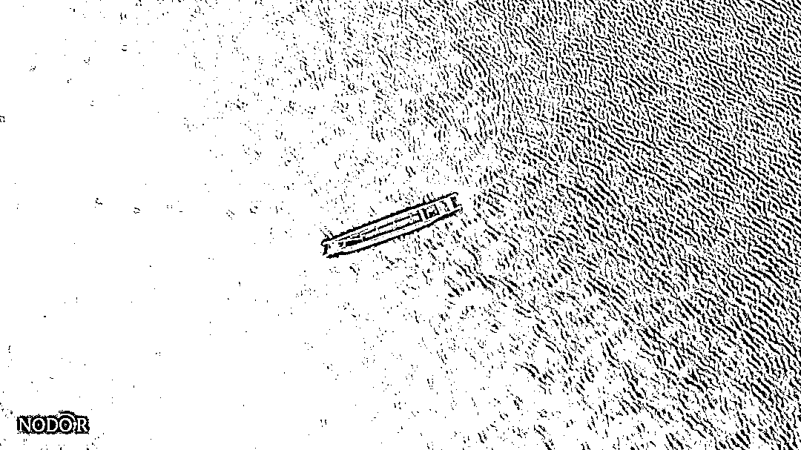

**“存信号”**

**在心平健康学中，还会经常提到的一个词叫存信号，即存留信号。**比如说你在外面跟人生气了，甚至还打了一架，气呼呼的，觉得这人太可恨了，也就是说，你跟这个人产生了**存留了不平静不平衡的心，这就叫做存信号。**

当学过心平的同学听你这样说了，会告诉你，你存信号了，赶紧去消信号吧，也就说你要**通过揉球的方法把你生气怨恨的情绪释放了，调整为平衡。**

所以说在生活中，无论以前还是现在，我们经常都在存信号，在存留各种不平静不平衡的心，那这些信号会在一定的时间和地点，有可能就会以疾病或者其它的形式来呈现。

**“调动信号”**

**心平体系中还有一个常用词叫调信号，即调动信号。具体分为主动调信号和被动调信号。**

先说什么是**被动调信号**。我们每一个人都会趋利避害，都喜欢快乐的生活，都希望自己能够顺利一些，高兴一些。但是现实生活是这样的：我们早上起床发现腰痛难忍，出门坐地铁被人踩了脚发生了口角，到了单位，可能又因为什么事跟同事产生了争执，这个时候就是我们的信号被调出来了。

**现实中出现了这些不舒服不顺利，我们会归于外因，但实际上是外因把我们的内因诱发出来了，也就是把我们的信号调出来了。**

比如早上起来腰痛，不是因为床太软，而是那个软的床把我们的信号调出来了，也就是把我们内在的不平静不平衡的心调出来了，因为我们不想要身体的不舒服，但是没办法就是出来了，我们是被动接收，所以叫被动调信号。

坐地铁跟人发生了口角，这个人说话的方式让我很生气，但可能另一个人遇到这事儿就不会生气，我生气，是这个人把我内在的生气诱发出来了，也是被动调信号。

再比如，一个人夸奖别人，被夸的每个个体感受是不一样的，有的人被夸奖觉得很开心，有的人被夸奖觉得很生气，有的人觉得无所谓，夸也行，不夸也行。所以这些感受都是别人把我们自己的信号诱发出来了。

**我们在生活中遇到什么样的人、什么样的事儿，让我们有生气的情绪了，我们不想要这个情绪，但就是被调出来了，这就是被动调信号。**

在生活中，我们时刻都在被动地调出自己的各种不平静不平衡的心理，**这些信号，有的会直接通过情绪、想法或内心的感受出来；有的会通过身体的症状出来，身体症状是我们被调出信号之后的一个呈现，不是都会变成疾病；还有的会以其它形式出来，比如心理的疾病。**

随着学习心平的深入，大家可能会有机会参加耐寒课程。

一般来说，冬天我们都会穿羽绒服御寒，但是为什么有人还要去参加课程练习耐寒，他们到底图的啥？因为在这个课程中，我们会特意少穿一些，主动调出对寒冷的信号，看身体会出来什么样不舒服的症状，然后找到背后的心理原因，把这个心理原因调整之后，再穿少的衣服就不觉得冷了。

冷了硬扛着硬挺着、单纯忍着会冻出病来的，而我们主动把信号调出来，把内心调整了，来适应这个寒冷的环境，这就叫**主动调信号。**

与前面相比，很多的疾病或是灾难的发生，都是我们不愿意要的，但是不愿意要也得接收，那是被动调信号，而练耐寒就是我们主动调来信号去消，所以叫主动调信号。

当然对于每一个练习主动调信号的同学来说，调信号一定是建立在自己能消的基础上，如果调了很多信号消不了，那就会给自己的生活带来麻烦。

所以对于新入门的同学一般不用主动调信号，因为生活中我们本来就会被动调出信号有机会让我们消。当我们消信号消到一定空度的时候，可以再主动地调一些信号来消。

**以上我们讲了什么是信号、存信号、消信号、调信号，什么是主动调信号、被动调信号，掌握了这些名词的意义，再理解心平体系的内容就方便了。**

**版权声明：**原创文章由作者授权转载于若道平台，欢迎转发，反对抄袭。

**END**

**心平健康学：身心平衡的疗愈实践**  

从小到大，在我们的人生经历中，我们必然经历各种各样让我们内心不能平静的事情，不论是过去，还是现在，我们都经历了各种情绪起伏，并在各种固有的、自知或不自知的情绪模式和偏颇的信念模式中。但大多数人不知道的是，这些内在因素都会导致我们的身心失衡，最终反映在我们的心理疾病和身体疾病中。而现代西方的身心健康研究也证明了我们祖先的智慧。**身体，就是我们心灵的显示器。身体的疾病，不仅是因为内心的失衡而产生，也可以通过内心的调整而治愈。****而心平健康学正是建立在中医的“内因致病”为理论基础，通过特定的方法，找到内因，调整内因以达到治愈疾病、身心的平衡的一门实践性很强的自我疗愈、疗愈他人的方法。******心平健康学初级班****

**授课老师：张彦方**

**开课时间：2023 年 2 月 24 日-26 日，上午 9:00-12:00，下午 2:00-5:00，共计三天**

**授课方式：******网络授课****

**费用：2700 元**

**课程负责人：李老师**（微信：cd13518140789）

长按二维码添加课程负责人咨询

**报名直达入口**

# 初阶丨心平健康学：身心平衡的疗愈实践

> 原文：[`mp.weixin.qq.com/s?__biz=MzA5NjA0NTAxNg==&mid=2651498969&idx=3&sn=920e18a5c96aef2249d06c6533db3c46&chksm=8b481b6ebc3f9278585a3f0e13a419935a13bcdcf71267ce07026bd08a0b093ab343ff0bda55&scene=126&sessionid=1692737695#rd`](http://mp.weixin.qq.com/s?__biz=MzA5NjA0NTAxNg==&mid=2651498969&idx=3&sn=920e18a5c96aef2249d06c6533db3c46&chksm=8b481b6ebc3f9278585a3f0e13a419935a13bcdcf71267ce07026bd08a0b093ab343ff0bda55&scene=126&sessionid=1692737695#rd)

**授课内容**

**所有的疾病都是身心疾病。**

我们的祖先很早就认识到这一点。

在最早医学著作《黄帝内经》开篇《素问·上古天真论》中，就讲：“虚邪贼风，避之有时，恬淡虚无，真气从之，精神内守，病安从来”。**这是对于“内因致病”和“修心去病”最早的描述。**

在《素问·刺法论》，黄帝又问流行性疫病。他说“余闻五疫之至，皆相染易，无问大小，病状相似，不施救疗，如何可得不相移易者？”岐伯对此的回答是：“不相染者，正气存内，邪不可干。”

可见不仅对于个体性的常见疾病，哪怕对于大多数人都会感染的流行性疫病，只要“正气存内”，就可以有效预防和对治。

那么什么样的因素会导致“内心正气”的偏离呢？《大学》里说，“身有所忿懥，则不得其正。有所恐惧，则不得其正。有所好乐，则不得其正，有所忧患，则不得其正。”

《素问·阴阳应象大论》里把七情六欲和人的身心疾病对应起来，提出了我们常听到的“怒伤肝、喜伤心、思伤脾、悲伤肺、恐伤肾”等这些“不平”的心理情绪对于身体的损伤。

而《素问·平人气象论》更明白指出，“无问其病，以平为期”。“平人者，不病也”。

**中医叫健康之人为“平人”，而平人就是阴阳平衡之人，没有太过与不及。**

然而从小到大，在我们的人生经历中，我们必然经历各种各样让我们内心不能平静的事情，不论是过去，还是现在，我们都经历了各种情绪起伏，并在各种固有的、自知或不自知的情绪模式和偏颇的信念模式中。

但大多数人不知道的是，这些内在因素都会导致我们的身心失衡，最终反映在我们的心理疾病和身体疾病中。

而现代西方的身心健康研究也证明了我们祖先的智慧。**身体，就是我们心灵的显示器。身体的疾病，不仅是因为内心的失衡而产生，也可以通过内心的调整而治愈。**

**而心平健康学正是建立在中医的“内因致病”为理论基础，通过特定的方法，找到内因，调整内因以达到治愈疾病、身心的平衡的一门实践性很强的自我疗愈、疗愈他人的方法。**

**心平健康学**

心平健康学是王中平老师从 1986 年开始，经过三十多年研究和实践，发现和总结各种身体症状和心理不平衡相对应规律，并运用这些规律调解和祛除不平衡身体症状，以达到身心同时健康的学问。

**这个学问体系以中国古老医学经典为其理论基础，以自然力（事物运行发展的法则，简称自然力）为核心，平衡论为主导。**

对于身体的不适，运用心平健康学的方法，可以找到“不平”所在。这种不平包括情绪、感受、认知、内心的想象、活动和用力、外在的语言、行为等多方面。

*   **比如生活中日积月累的不平的情绪、感受会变化成身体上不平衡的感觉；**

*   **内心中使的力、用的劲会在身体上留下痕迹（俗话叫用力过猛）；**

*   **而不辩证、不中正的认知会导致疾病的不同性质；**

*   **假设、想象中的各种不平心会影响到我们的神经系统。**

而当我们把“内因”，也就是不平衡的心理，通过特定的方法、技术调整为平衡，心在“ 平静、平衡、平等 ”的状态下，身体就会转为健康和谐，这就是“ 病由心解 ”。

**初级班学习步骤**

**★****课程前**

1.  自习（提供音频）王中平老师教授的心平健康学初级班四日音频课程

2.  读心平健康学内部学习资料《认识平衡》

**★****课程中做什么及收获什么**

1.  **学习“揉球”方法，**“揉球”是心平健康学体系中贯穿始终的在潜意识层面调治不平心理的方法、技术、工具。有自然揉球、定向揉球，（也就是有主题的揉球）、及缩减版拇指揉球。“揉球”的目标即是把不平衡的心理调整为平衡、平静。三日初级班课程，是实操课程，通过连续 18 小时的练习和实践，对“揉球”的方法不断的体会和夯实，以便课程结束后可以通过“揉球”的方法在生活中调整自己不平衡的心理及调整相应的躯体症状。

2.  **一对一个案治疗，学习治疗方法及完成治疗。**

    通过课程中自己及团体的一对一个案治疗，体会到自己在过去、现在及对未来有什么样的不平衡心理，导致了相应的躯体症状、心理疾病及不和谐的关系，并在个案中完成治疗。在自己及他人做个案的过程中体会治疗方法，以便课后可以自然应用方法。

**★****课程后**

听心平健康学讲师彦方录的音频课程：“揉球”过程中的疑惑与解答。

**老师介绍**

**张彦方**

硕士，心理咨询师；心平健康学初级班、综合中级班、女性健康专项中级班、亲子关系专项中级班讲师，并教授脏腑研究型课程，经典研读课程（中庸、道德经），断食课程，耐寒、耐热课程，物质平衡课程。

2017 年初教授心平健康学系列课程，累积课时 2000 小时以上，个案咨询 5000 小时以上，主要擅长通过调整不平衡的情绪、感受、认知来改善躯体症状，尤其在女性因为情绪、感受等不平衡心理所导致的乳腺增生、卵巢囊肿、月经不调等妇科疾病上有深入的研究和实践经验。在改善亲密关系和亲子关系方面有较多成功案例。

**课程推荐**

疗愈的层次，在西方讲身心灵，在东方讲形气神，其实都是在说物质、能量与信息。物质层面的治疗如现代医学，能量层面的治疗如中医针灸，而信息层面的治疗相对较少，也往往很神秘，比如西方的炼金术、灵媒，中国的祝由、道家法术等。

心平健康学是少见的既能在“神”的层次展开治疗，又十分朴实、接地气的一门技术。通过简单的肢体动作、配合起心动念的练习，就可以达到调神的效果，并借由“身心同调”的方式，从神（信息）影响形（身体）与气（能量），属于个人成长之路上的卓有实效的修行好伴侣。

——天空的空

**课程价格**

**费用：2700 元** 

**授课方式和时间安排**

**线上授课：**12 人小班制

**授课时间：**2023 年 2 月 24-26 日，上午 9:00-12:00，下午 2:00-5:00，共计三天

**咨询请添加李老师微信：cd13518140789**

长按二维码添加李老师微信

****心平健康学初级班****

**授课老师：张彦方**

**开课时间：2023 年 2 月 24 日-26 日，上午 9:00-12:00，下午 2:00-5:00，共计三天**

**授课方式：******网络授课****

**费用：2700 元**

**课程负责人：李老师**（微信：cd13518140789）

长按二维码添加课程负责人咨询

**报名直达入口**

# 星座病理学 | 太阳-狮子座的自恋人格障碍

> 原文：[`mp.weixin.qq.com/s?__biz=MzA5NjA0NTAxNg==&mid=2651498940&idx=2&sn=c2337684baa609fc70cfe04b6c4cb8d9&chksm=8b481b0bbc3f921d9728a57b14847a291202016af47472bdc5c1d3224c37b6120f645a9d11bc&scene=126&sessionid=1692737695#rd`](http://mp.weixin.qq.com/s?__biz=MzA5NjA0NTAxNg==&mid=2651498940&idx=2&sn=c2337684baa609fc70cfe04b6c4cb8d9&chksm=8b481b0bbc3f921d9728a57b14847a291202016af47472bdc5c1d3224c37b6120f645a9d11bc&scene=126&sessionid=1692737695#rd)

<mpvideosnap class="js_uneditable custom_select_card channels_iframe videosnap_video_iframe" data-pluginname="videosnap" data-id="export/UzFfAgtgekIEAQAAAAAAwPs52eHmagAAAAstQy6ubaLX4KHWvLEZgBPE2oNEYVV4UuOBzNPgMIsUcGIaQpCA8hm_E29kt_0t" data-url="https://findermp.video.qq.com/251/20304/stodownload?encfilekey=rjD5jyTuFrIpZ2ibE8T7YmwgiahniaXswqzxJ4Jd3KNXzQu9ZR07paON0TLVpnDLSoOcKruTKia46vqOHDTnxNlrJu2y9AOUcPj7YU1v1OzO5ib8tpvTcibfXrFw&amp;adaptivelytrans=0&amp;bizid=1023&amp;dotrans=0&amp;hy=SH&amp;idx=1&amp;m=&amp;scene=0&amp;token=AxricY7RBHdXwDb3BceAiaklrfmWoeyYK0es7muhoib1G6oXGSibYBUJibFYefsz9RRe7TDeOlRL6Vks" data-headimgurl="http://wx.qlogo.cn/finderhead/PiajxSqBRaEJYnVsqWfEX9qA0sI6hNVKsDfyzfPZ92WZMZyBpZWU5NA/0" data-username="v2_060000231003b20faec8c4e68a1ec2d4ca07e434b07755bbf47e7053a3059defd2c9d6c68a20@finder" data-nickname="若道" data-desc="#占星心理学 自恋型人格有什么特征，在星图里太阳-狮子座有什么的占星指针？" data-nonceid="5172058685148365134" data-type="video" data-authiconurl="https://dldir1v6.qq.com/weixin/checkresupdate/icons_filled_channels_authentication_enterprise_a2658032368245639e666fb11533a600.png" data-width="1280" data-height="720"></mpvideosnap>

**课程描述**

看过课程标题的你，也许会感到好奇和惊讶，为什么在占星学的课程中，会出现精神病理学的教学内容，这和我们有什么关系？这对占星咨询，或在自我了解与成长的过程中又有什么帮助呢？

**带着这些疑问，请你静下心来，思考以下几个问题**：

“**你/你的案主，是否曾经过度担心什么？** **你/你的案主，有没有感觉到担忧和焦虑，却不知道原因是什么？****你/你的案主，是否曾经觉得害怕什么东西，但理智上却很清楚它不会对你造成什么伤害？****你/你的案主，是否曾经通过沉迷某物，酗酒或滥用药物，自我伤害去逃避问题？****……****——节选改编自《心理学与生活》**”

如果你对上述问题其中之一，回答是。这意味着几乎每个人都曾有过心理障碍的症状（精神病理的问题）。

你看，其实“精神病理学”与人的心理有着密切的关联，再结合占星学，呈现了人内在与外在层面更加丰富和深刻的一面。**这对于学习占星学的人和占星师来说，都是一场难得的知识盛宴！**

**本课为 2 年期双证核心课程中的一部分**（AP105 阶段），其内容是过去若道所开设的核心课程从未教授的部分，特意抽出供其他学员学习，**可作为 ISAR 选修课，单独报名**。

**在正式了解本课的价值之前，先了解一下这门课程的主讲老师吧！**

**格伦·佩里（Glenn Perry）**

*   他是心理/意识研究专业博士、加州注册婚姻和家庭治疗师 （CAMFT）

*   占星心理学学院（Academy of AstroPsychology）创办人

*   康涅狄格州研究生院（the Graduate Institute of Connecticut）原型宇宙学与意识进化项目的负责人

*   共出版八本占星学著作：《心理占星学入门》、《心理占星论文集》、《盗取天火》、《从忠诚到革命》、《星图中的阴影》、《占星职业议题与伦理》、《出生星图深度分析》、《从古代到后现代占星学》

**墙裂推荐格伦老师这门课的 **

**4 大理由**

**你一定得知道的课程价值**

**价值*****1***
**明晰精神病理学的基本定义**

占星心理学学院创办人格伦·佩里老师，对**精神病理学的基本定义**就是灵魂受苦，精神就是灵魂的意思，病理就是受苦的意思，所以精神病理学研究的就是：人类各种各样受苦的方式，尤其是因为某一类的行为而引起的。

精神病理学是一个连续体，从比较轻微的，到比较严重的，这么说来，我们每个人都有一部分精神病理的问题。

**如果成为一个“人”，没有一定程度的挑战是不可能的。没有一定程度受苦，没有一定程度不平衡是不可能的。而这种不平衡就会以一种挑战和困难的姿态呈现出来。**

**价值*****2*****更懂疗愈：从不平衡到平衡**

**疗愈**是一个复杂的过程，讲的是将人从不平衡带到平衡这样的一个状态，将不同行星代表的心理功能带到一种更加平衡整合和合作的状态。

格伦老师通过研究精神病理学，发现每一颗行星，以及这颗行星所守护的星座，都和某一特定类型的病理是联结在一起的，包含了这个占星原型所涵盖的极端不平衡的情况。

举个例子，案主的第 1 宫，有很多星星在那里，和对面第 7 宫的火星形成对分相，第 1 宫白羊座或者火星白羊座的组合，和这个案主的反社会人格的病状联系在一起（这是一个星图的极端负面表现）。

“

**生活本身就是一场治疗，我们在占星的星图中去看到，人们所具有的创伤、不平衡及其产生的防御机制，最终都会在他生活中的关系和情境中呈现出来。无论他生活中处在怎样的情境之下，其实这些环境都是在为他提供恰当的环境，作为一种载体，让他去平衡和疗愈事件背后问题的根源。** 

**这样一个现象是持续不断地在发展，会让我们想到，会有一个更大的宇宙的智慧存在，它其实是在指挥和引导着我们的这些经验，让我们去经历然后进入更高层面的发展当中。生活或者“神”，就是我们所有人类的一个治疗师。**

**——格伦·佩里**

”**价值*****3*****了解诊断标准，提高咨询的专业敏感度**

如果能够对精神病理极端不平衡的情况有了解的话，你就会对它比较温和的版本更加敏感（大部分人是更温和版本的呈现）。

也许案主并没有达到某个病理所达到的层级，但是 Ta 有显示出，这个病理某一些特点或者某一些倾向。所以，我们的目标并不是去诊断案主，而是了解他在这个病理学连续体上处在一个怎样的位置。

当你拿到星图你会看到，案主不同的冲突，是体现在不同的部分上。某一个病状是体现在某一个行星，另外一个病状，是同步体现在另外一颗行星上。

当我们通过对占星原型星座和行星的病理学现象的学习后，就能看到占星学上的配置所呈现出来的，案主表现出的这些失调，并不一定都会成为一种心理临床上的诊断。有可能在案主这里呈现出一个很轻微，但是仍然在 Ta 生活中，给 Ta 造成挑战的一个点。

**价值*****4*****智力上的刺激——整合进阶**

这个课程能够让我们了解自己，了解我们的客户，了解我们的朋友，了解我们的家庭。它给我们提供一种崭新的方式，并且让我们看到占星原型的种种表达，不要局限在非此即彼、非好既坏的这样的一个概念当中，而看到它其实是一个不同程度的连续体。

当我们能够以这种方式去看的时候，你就能够将自己的生活，带入一种和谐。能够了解这是一个过程，我们的重点不是放在诊断上，而是放在整合上，因为生活，就是一种整合。

**课程内容**

**AP105 星图中的精神病理学与疗愈** 共**15 次**课程：**10 次 2019 年录播课+5 次直播课；30 课时**

在这个阶段的课程中,我们将**聚焦于十二星座(从白羊座到双鱼座）及其对应的守护星的潜在功能障碍。**

我们将学习如何识别、理解和应对每个星座的潜在挑战。我们将在各种相应的心理障碍背景下来考察占星原型，这些心理障碍表现为功能障碍、失衡的极端状态。

学员们将了解**《精神疾病诊断与统计手册》诊断标准**。我们会探讨治疗的概念，尤其是那些与整合和个性化相关的概念。我们将特别关注外行星的困难相位，以及它们与内在心理冲突、防御和症状形成的关系。

学员们将探索人的痛苦如何成为发展和实现天赋才能的催化剂。在考察病因时，我们会将平常的因果关系理论与传统的命运、业力和转世观念整合起来。

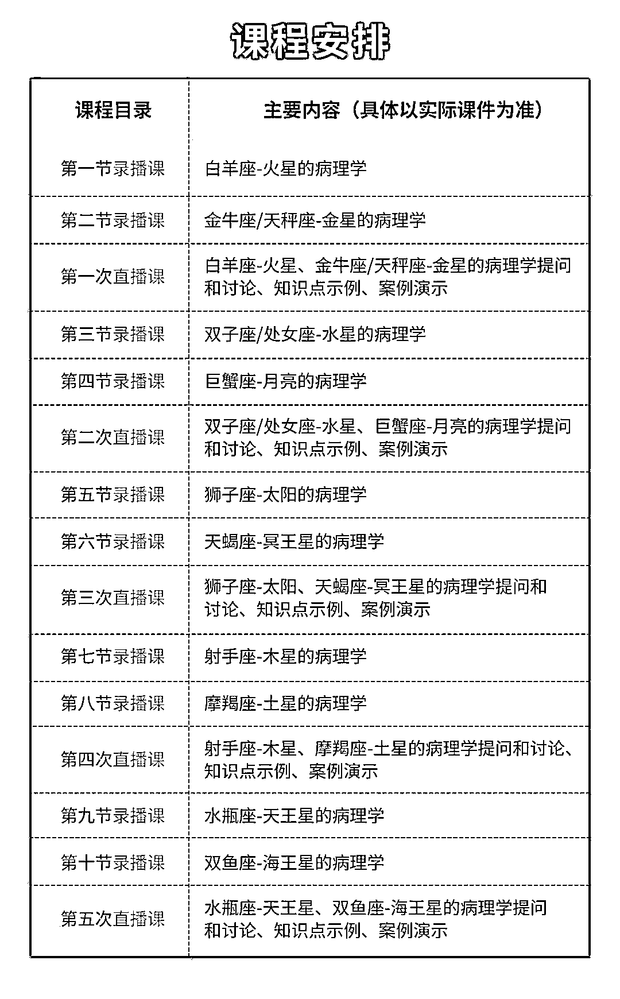

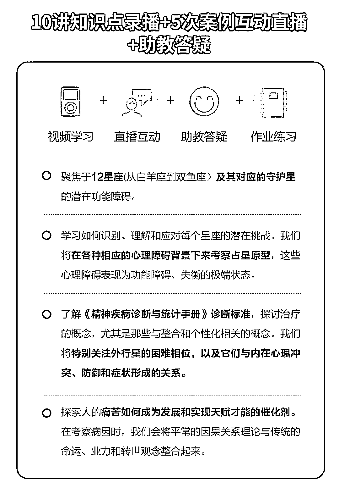

**口碑推荐**

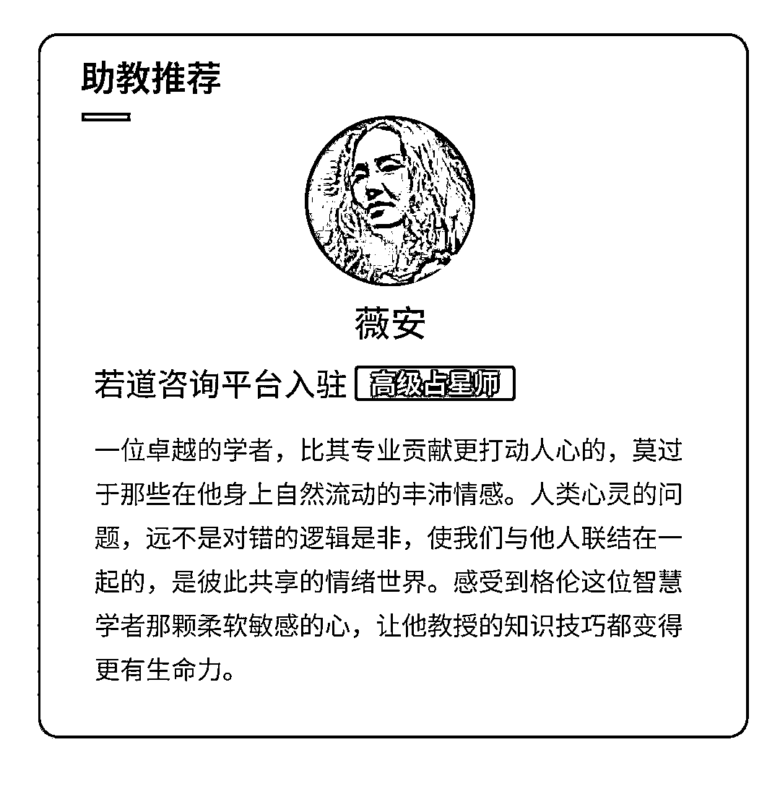

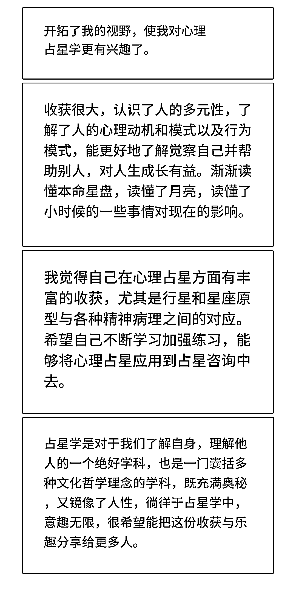

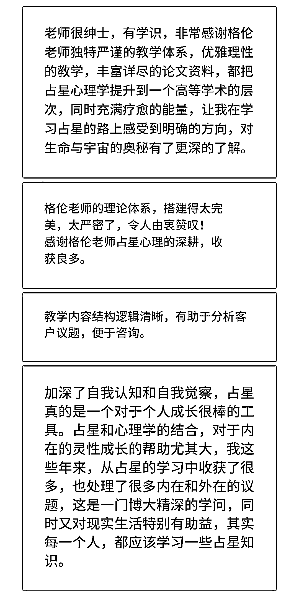

‍**‍想感受格伦老师的课堂魅力？** **一小段讲课视频让你先睹为快~**<mpvideosnap class="js_uneditable custom_select_card channels_iframe videosnap_video_iframe" data-pluginname="videosnap" data-id="export/UzFfAgtgekIEAQAAAAAAxuwL_P9LDAAAAAstQy6ubaLX4KHWvLEZgBPElYFkVBZaNrKCzNPgMIuhBCuUlaCPzDNmHFgJR5sp" data-url="https://findermp.video.qq.com/251/20304/stodownload?encfilekey=rjD5jyTuFrIpZ2ibE8T7YmwgiahniaXswqzIGcAWV11d39RRKTicEUe1lSn5e1z2jdX20ath9yg9Liaia8VPS2c4MUJibl8FlxSZs3ajlcibhlD6typd6ZeGeWj2bQ&amp;adaptivelytrans=0&amp;bizid=1023&amp;dotrans=0&amp;hy=SH&amp;idx=1&amp;m=&amp;scene=0&amp;token=AxricY7RBHdXmmhmUb1Np3Ioz3Ok0V9IBZ0eINxnxticaC9r3HjsQ8iatkwqFBLKP50ZibXDm0TiaicC4" data-headimgurl="http://wx.qlogo.cn/finderhead/PiajxSqBRaEJYnVsqWfEX9qA0sI6hNVKsDfyzfPZ92WZMZyBpZWU5NA/0" data-username="v2_060000231003b20faec8c4e68a1ec2d4ca07e434b07755bbf47e7053a3059defd2c9d6c68a20@finder" data-nickname="若道" data-desc="#ISAR 选修课  如何识别、理解和应对每个星座的潜在挑战？如何在不同的心理障碍背景下来考察占星原型？" data-nonceid="4249051256207020861" data-type="video" data-width="1024" data-height="576"></mpvideosnap>

**课程费用**

**课程价格：9000 元****课程优惠价请添加 Margartet 咨询**

课程负责人：Margaret

（微信：18515059056）

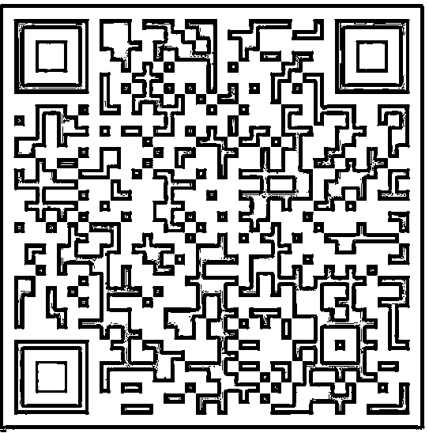

请备注“心理占星 105”

**开课时间**

**直播课开课时间：2022 年 12 月 21 日**

**退转课程**本课程包含往期视频知识点视频课程+直播案例课程+助教直播答疑；报名付款后均不受理退款转课，请慎重考虑后再确认付款。**其他相关事项请仔细查阅报名勾选时的《教学协议》，如有疑问请咨询课程顾问。****报名流程及费用支付****1. 点击阅读原文链接立即报名，填写个人姓名（身份证姓名）和相关信息，阅读并同意《教学协议》，提交报名表，直接在线支付。****2. 付款后可在网页个人中心或手机网页“我的”栏目查看报名记录。****如遇疑问请与销售人员联络******ISAR 选修·占星原型与星图中的精神病理学****

**授课老师：格伦·佩里**

**直播课开课时间：**2022 年 12 月 21 日

**授课方式：**网络课程，中英文授课，中文翻译

**费用：9000 元（获取优惠请联系客服咨询）**

**课程负责人：**Margaret（微信：18515059056 请备注“心理占星 105”）

长按二维码添加课程负责人咨询~

**报名直达入口**

# 巨蟹座是“情绪鬼”？是时候好好看看这个情感丰富的星座了！

> 原文：[`mp.weixin.qq.com/s?__biz=MzA5NjA0NTAxNg==&mid=2651498940&idx=1&sn=7a1be144d625c8f440fa9018356e569a&chksm=8b481b0bbc3f921d27b303438d006de232b6371fca6841bcd7f9bdb80bbcba5a1dbf0d226640&scene=126&sessionid=1692737695#rd`](http://mp.weixin.qq.com/s?__biz=MzA5NjA0NTAxNg==&mid=2651498940&idx=1&sn=7a1be144d625c8f440fa9018356e569a&chksm=8b481b0bbc3f921d27b303438d006de232b6371fca6841bcd7f9bdb80bbcba5a1dbf0d226640&scene=126&sessionid=1692737695#rd)

******☆ ****后台回复“今日”，给你一句生命态度******

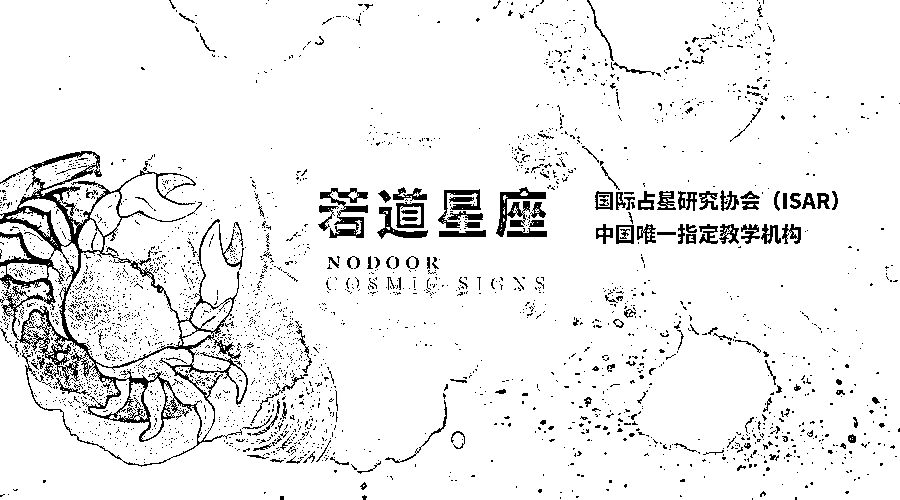

作者/大卫·瑞雷 若道创始人

翻译/若道翻译团队

编辑/翀子 封面/书君 图片/网络

本文的巨蟹座包括出生星图中任何一个巨蟹座能量（太阳、月亮、上升点等），即使你的出生星图中没有任何行星落入巨蟹座，巨蟹座也仍然是你的星图的一部分，以某种方式对你造成着影响。如果你在下文某处感受到共鸣，那就是你的巨蟹座能量所在。另外，大卫老师参与授课的【[2023 年中英双导师占星核心课 L1-5](http://mp.weixin.qq.com/s?__biz=MjM5MjQwNjAyMQ==&mid=2649440592&idx=1&sn=f6173530924184998c81fb41e684c6dd&chksm=beb92e3a89cea72ce16ad05bad3c8fa816351e197266d0e299bc17faaa49fc1e90fbcedc0708&scene=21#wechat_redirect) 】正在报名中，如果你对占星学感兴趣，欢迎点击链接了解更多详情！

**那些属于巨蟹座的关键词**

**安全感** **情绪 **

**感受 饮食**

**居住**

**巨蟹座与我们最基本的安全感，以及基于对安全感的需要而表现出的情绪和感受相关。巨蟹座会对当下的环境做出反应。他们能敏锐地感觉到环境中的情绪氛围，对那些有可能威胁到他们的安全感的事物非常关心。**

即便你的出生星图中没有行星落入巨蟹座，巨蟹座也仍是你星图的一部分，会以某种方式对你产生影响。

**巨蟹座在你的星图中所处的位置，代表了你对之怀有强烈情感的生活领域。**你如何才能在情绪上感到安全，你照料他人的动机和方式，都会通过这个领域的活动显示出来——在这里，你一会儿是照料子女的父母，一会儿又成了需要照料的孩子。

没有哪个星座会像巨蟹座这样关心**饮食和居住**。**他们有非常强烈的“筑巢本能”，会充满热情地打造一个舒适的安身之地，用心经营饮食起居。**

如人们所知道的，巨蟹座非常情绪化，一方面具有天真的孩子气，另一方面又多愁善感。**他们如潮汐般起落反复的情感是人性的最自然表达。**

想象一位母亲在前一分钟还在为乱丢在地板上的脏衣服而歇斯底里，但是下一秒她却为家人准备好了丰盛的晚餐；或者是在超市排着长队等待付款的父亲，他看起来无精打采、愁眉苦脸，但是当他冲进家门，将大包小包的“战利品”递给家人，他的眼中闪烁着满满的喜悦。

 

**我只是情绪化，不是软弱！**

**巨蟹座成分很重的那些人常会遇到这样一种情况：他们会受外界影响而觉得自己的情绪化是不好的。**

经常出现的典型情况便是兄弟姐妹或其他家庭成员对巨蟹的调侃，因为他们知道巨蟹座一定会对此有反应：“嘿，拉长脸干嘛呢？有谁偷吃了你的午餐不成？哈哈哈！”

**巨蟹座人会把情绪摆在脸上，上升巨蟹座尤甚，即便他们很努力地隐藏情绪也是徒劳。**

巨蟹座人常常被指责“**不够坚强**”，男孩比女孩更容易遭到这样的批评。当巨蟹小孩儿为死去的金鱼而伤感之时——特别是当他还从杂志上扯下一张金鱼的照片贴在空空如也的鱼缸上——父母也许会批评他太软弱、太多愁善感了。

我儿子诺亚（Noah）月亮在巨蟹座。有一次他欢天喜地地跟我去钓鱼，结果钓上一条三磅重的肥虹鳟时，他求我放了这条鱼，不要用它来做晚餐，甚至，在我放生它之前，还给它起了个名字，鲍勃（Bob）。

诺亚恳求道：“你不能杀鲍勃！”而我已经在小心翼翼地将我的晚餐从鱼钩上解下来，轻轻丢进水里，任它曳尾而去。

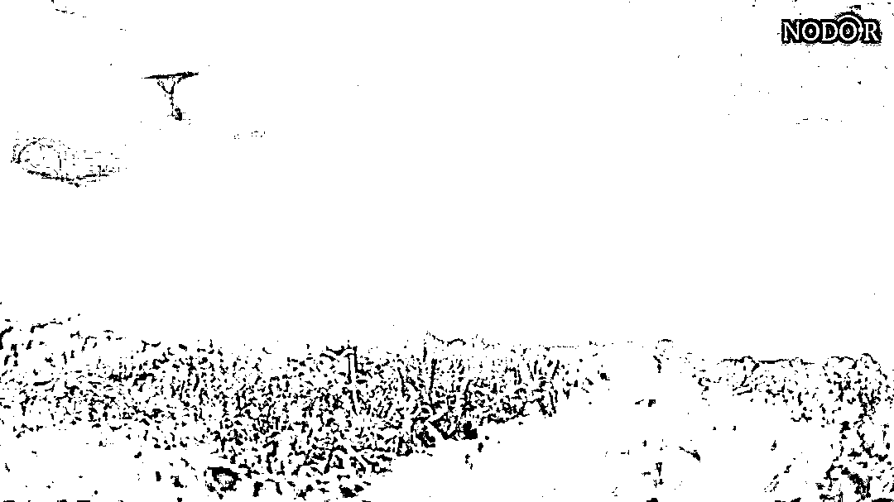

**想要巨蟹座积极起来，试试情感联结**

巨蟹座人也不会好好地遵守“纪律”，除非出生图中土星的成分比较显著。然而，**巨蟹座小孩儿和年轻的巨蟹座人可以因为针对情绪的正面调动而受到激励。巨蟹座几乎都通过“潜移默化”来学习，如同收集各种生动记忆一般吸收生活中的经验和印象。**

而巨蟹座受到惩戒时，他们根本不记得到底要“吸取什么教训”，记住的只是爸妈凶恶的神情，或是记住了“这个老师不喜欢我”。从和他们感情融洽的老师身上，他们能学到最多，而从他们害怕的老师或是责骂过他们的老师那里，学到得少之又少。

巨蟹座不是一个天生爱竞争的星座。巨蟹特质强烈的运动员需要教练每周不断地激励他们，教练得知道如何跟他们进行情感交流并让他们稳住状态，情绪不偏离轨道。

 

**巨蟹座的负面特质**

**针对自己的巨蟹座天性做出的片面的负面评价通常是以下几种：“我太多愁善感，太情绪化了”或是“太阴晴不定”之类。**然而，更糟的是，男性巨蟹座似乎更容易受到来自**父亲的负面教养方式**的影响。

我有一些太阳巨蟹座或其他行星落入巨蟹座的男性客户，他们的父亲要不就是对儿子太过严厉——这些人通常有着太阳（或火星）跟土星（或冥王星）的硬相位；要不就是干脆对儿子不管不顾——这些人通常有着太阳（或火星）和海王星的硬相位，或是太阳（或火星）位于 12 宫。

那些严厉的父亲不是过于严肃（土星）就是控制欲过强（冥王星）。冥王型的父亲会灌输的负面思想有“你太软弱了，不适合生存”或是“如果你继续这样的话，没法在这个世界生存下去的。”

暴力、虐待、恐吓，或是被抛弃、丧失亲人更会强化这些负面信息。

**举个例子**

有一个极端的例子是，一个巨蟹座太阳四分天秤座冥王星的客户小时候很害怕父亲，他父亲为了让他乖乖待在床上，晚上会在他耳边说些威胁他的话。

他说：“我还记得小时候跟父亲一起去理发店，父亲告诉我毛巾上的红斑点是血迹，有个小男孩不肯乖乖坐着理发，耳朵就被剃掉了。”此人的爸爸是一个黑帮分子，儿子 8 岁的时候他就因谋杀入狱了。

“还记得他走了之后我心里感觉是如此的轻松，但我很怕他还会回家。后来我发现有些人因为我爸是黑帮就对我刮目相看。我简直不敢相信他们会怕我，不过我喜欢这种感觉。”

后来他年纪轻轻也走上了犯罪的道路也并不令人奇怪。而他人生的转折点在于儿子的出生，他发誓要结束这种恶性循环，绝不让这个模式在儿子身上重演下去。

于是他割断了之前的所有联系，带着妻子和儿子搬家，开了一家合法餐馆，虽然当时经济并不景气。他承认自己对儿子的保护有点过头了，但“至少现在我不用保护他远离我自己、远离我过去的生活。”

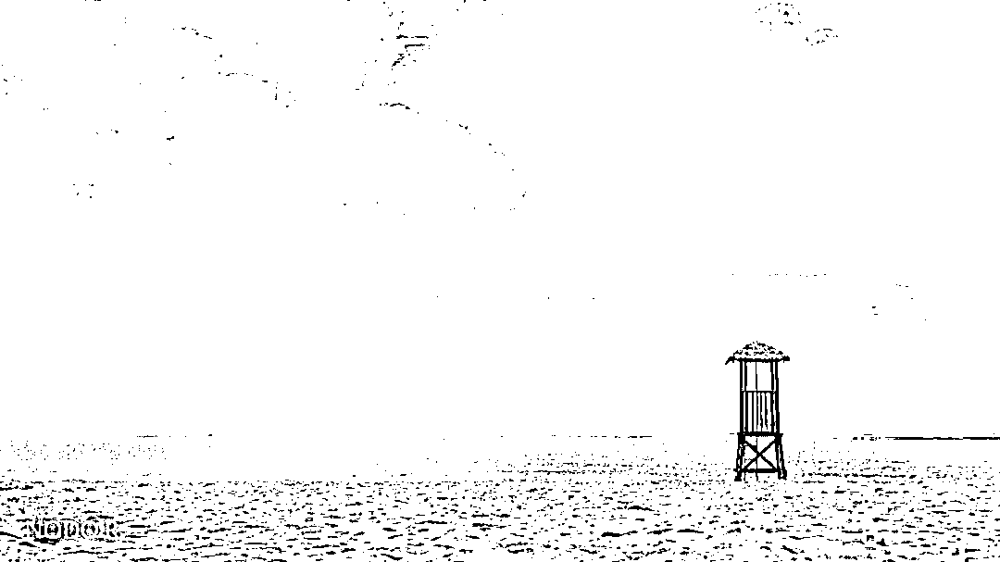

**如何处理这些负面特质？**

那些来向我咨询的巨蟹座客户，不管他们潜意识里重复着何种负面信息，这些信息都阻碍了他们在基本的生活层面感受到安全感。

**他们所感到的，不仅仅是我们人类心中普遍存在的不安全感，更是对那些针对他们的情绪所做的评判的恐惧。这些评判阻碍了他们情感的自然流动，是不安全感的根源。**

如果你的出生图中带有明显的巨蟹座特质，但当你表达自己的情感时你感到不安全，问问你自己这是为什么？

*   如果你认为家庭对你很重要，但你却不跟你的父母说话，这又是为什么？

*   如果你嘴上说想要孩子，为什么却一直膝下无子？

*   如果你一直想要一段真心实意的感情，却一直无法实现，为什么？

*   如果你只是希望待在家里时能感到安全、躺在床上能安然入眠，但你做不到……为什么呢？

不管阻碍这些基本的巨蟹座式需求被满足的是什么，根源都在于被阻塞的情感。这听来很简单，事实并非如此。**暴露这些“基于恐惧的评判”需要勇气，情绪上的勇气。**

**巨蟹座们可以从创造一个“心灵安全地带”着手，就是你内在感觉到安全的地带。**此处，没有什么能伤害到你。

你可以不管不顾地表达你自己，不会有任何负面的后果。在这个心灵安全地带你能创造出一个可以滋养你、支持你的世界。评判性的问题，例如“为什么我这么情绪化？我到底出了什么问题？”是不能达到这种效果的。

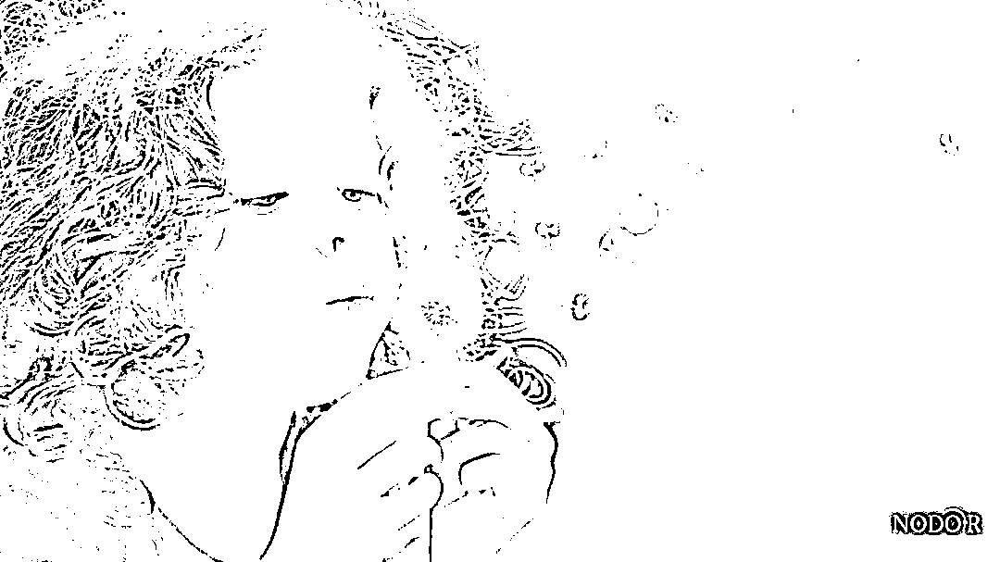 

**巨蟹座，情绪化一点怕什么？**

**如果你是一个巨蟹座人，你的星图中有很多巨蟹座的成分，你会情绪化是天经地义的！**事实上，**你应该拥有比其他人更加鲜活的情绪，丰富的情感是你的一笔财富**，其他人只有眼馋的份。

你生命中的泪水和欢笑都比别人更多。你更容易伤春悲秋，更容易怀旧。**正是认为情绪很“讨厌”这种想法剥夺了你生活的愉悦。**

下面是一首西奥多•罗特克（译者注：Theodore Roethke，美国诗人和教育家，1954 年他因诗集《苏醒》获得普利策奖)的诗《苏醒》（The Waking），在我看来很好地传达了巨蟹座的精神：

为了睡去，我醒了，慢慢醒，不着急。 

在安然的不惧怕里，我感觉到了自己的命运。

在必然的旅途中，我学会了该学的。

我们通过感受而学习。还需要知道些什么呢？

我听到自己的存在在跳舞，欢天喜地。

为了睡去，我醒了，慢慢醒，不着急。

I wake to sleep and take my waking slow.

I feel my fate in what I cannot fear.

I learn by going where I have to go.

We think by feeling.What is there to know?

I hear my being dance from ear to ear.

I wake to sleep, and take my waking slow.

**版权声明：**原创文章由作者授权首发于若道平台，欢迎转发，反对抄袭。友号转载请申请白名单。

**END**

****想阅读更多作者的文章，请在后台回复******大卫****** 即可。****

**大卫·瑞雷**

美国占星师，若道联合创始人，致力于在中国教授和推广西方占星学；2010-2014 年，任全美占星师联盟监督委员会委员；2017 年，被选为 ISAR 委员会成员。ISAR 是世界最大的国际占星机构，会员遍布 45 个国家，2017-2020 年曾任 ISAR 全球副主席、CAPISAR（ISAR 职业占星师资质认证机构）主席。

**拥有 53 年占星实践经验的若道创始人** **大卫·瑞雷****&最懂学员的若道首位认证金牌中国老师****熊鹰**

**最默契的师徒二人****再度联合打造**

**2023 若道全新核心占星课程**

**课程结构****全面升级****教学内容****翻倍惊喜****补充资料****丰富多样****沉浸式互动****案例教学****以学员为案例进行课堂的占星咨询演示****职业占星师养成计划****点击下图了解更多课程详情**

**新的一年，来领取你的好运吧！**

**扫码**即可领取**专属的年运报告**

**20 位来自世界各地的占星师**
**带来 19 场沙龙——新世界的觉醒****详情可点击下图**

**学习占星学****点击下图了解课程详情**

**微信又双叒叕改版啦，不想错过若道君的推送？**
****就把若道设为****星标****以及点点****“在看”****吧！******▼**

**喜欢就点一下“在看”吧！****报名直达入口**

# 2023 年，一起来记录情绪日记吧！

> 原文：[`mp.weixin.qq.com/s?__biz=MzA5NjA0NTAxNg==&mid=2651498896&idx=2&sn=4937ae7df48d5e6aa1029dfceef3475b&chksm=8b481b27bc3f92314af97e50f7e5b271f6a86f72969758063dbfdd41a4de72f54c0b4ee3c50a&scene=126&sessionid=1692737700#rd`](http://mp.weixin.qq.com/s?__biz=MzA5NjA0NTAxNg==&mid=2651498896&idx=2&sn=4937ae7df48d5e6aa1029dfceef3475b&chksm=8b481b27bc3f92314af97e50f7e5b271f6a86f72969758063dbfdd41a4de72f54c0b4ee3c50a&scene=126&sessionid=1692737700#rd)

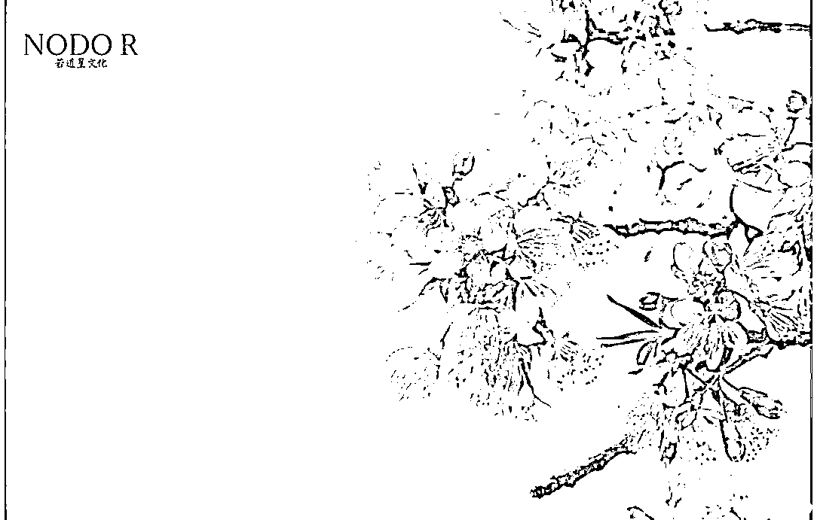

作者/杰夫·焦耳

译者/江艺 校对/李含

编辑/玫瑰 图片/稿定设计

“行星是原型，是超越我们个体人生故事的本质能量，可以为每个人所利用”。月亮是安全感所在，也象征我们的情绪情感。一起来看看吧！另外，大卫老师参与授课的【[ISAR 认证职业占星师文凭课程](http://mp.weixin.qq.com/s?__biz=MjM5MjQwNjAyMQ==&mid=2649440592&idx=1&sn=f6173530924184998c81fb41e684c6dd&chksm=beb92e3a89cea72ce16ad05bad3c8fa816351e197266d0e299bc17faaa49fc1e90fbcedc0708&scene=21#wechat_redirect)】正在插班中，如果你对占星学感兴趣，欢迎点击链接了解更多详情！

**月亮的特质****没有任何占星符号比月亮更重要。**她是母亲、家园、根基、食物、家庭需要、感受和习惯，同时也是我们对生活的无意识、直觉性的反应。**它与太阳积极的阳性能量相对，是接受性的阴性能量，**将我们与过去联结起来，并设定了现在的节奏。奇怪的是，**月亮既代表一贯性，也代表变化。**这种鲜明的对照反映在她守护的水象巨蟹座，与它的擢升星座固定的土象金牛座中，**它们一个起伏不定，一个稳固不变。**从人类经验所反映的月亮的每月周期（里克·莱文所说的“月亮的”周期）中，我们看到了恒定的变化。我们通常都是我们自己，从出生到死亡。但是在永不停息的时间进程中，我们逐渐成长、成熟，然后死亡。时间的流动在我们出生之前就存在，而且也不会因我们的死亡而终止。**月亮教导我们，恒定和变化并非互相对立的能量，而是同一块布料上交织的经纬线。**对于在生活中缺乏恒定感的个体，月亮提醒他们注意，有一种永恒的模式让他们得以真实存在。即使是最无厘头的人，在说话、走路、思考或行动方面也会有一些习惯性的方式，这便揭示了他们**生命的恒定性。**即便是不断游荡的流浪者，也总是保持着自我。另一方面，对于受困于僵化程式，缺乏情感灵动性的人，**可以通过月亮发现内在的活动。**我们可以学着去变换“情绪”（moody）——这个词也和“月亮”（moon）有着相同的词根，这里的变换情绪和抑郁的意义无关，而是包含了运动的意义。要做到这一点，有一个简单的方法：**每天记录下一至五个强烈的感觉，像这样持续记录 28 天**（一个月亮周期），这会揭露一些变化，**让我们看到情绪确实起伏不定。**意识到这个事实是打破自己的麻木迟钝的重要一步，最终会导向更为灵敏的自我呵护和滋养。

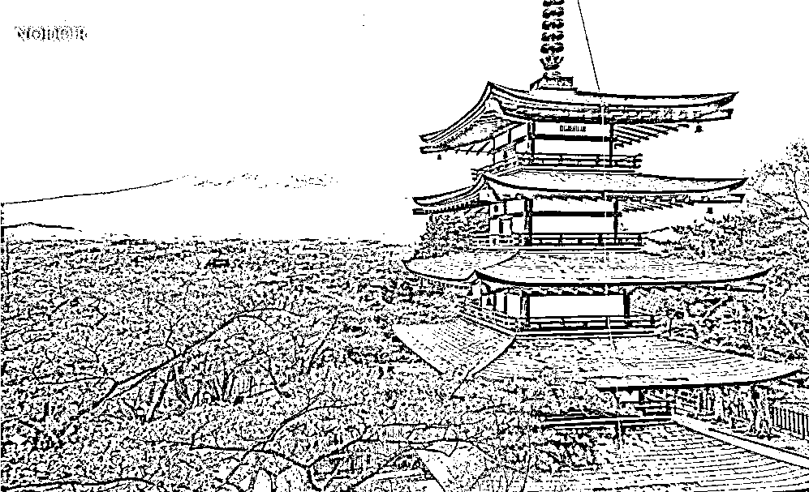

**恢复月亮的非言语面向**

占星学常常将水星与心智功能等同，这只说对了一部分。但是，**记忆却与月亮关联。**仿佛水星是相机的镜头或思想的眼睛，而月亮是记录影像的媒介。我们记忆中的过去影响着我们对现在的看法。

未解决的痛苦记忆可能在相似的环境中导致自我封闭。哈维·杰肯斯（Harvey Jackins），这位再评价咨询协会（Re-Evaluation Counseling）的创始人曾说，我们的聪明才智仅限于情绪允许的范围。**我们与感觉，或与月亮的自我意识的联结，是最大限度发挥我们智力的关键。**

当我们的大脑产生了怀疑或不相信的中断信号，有益的方法是再次核查我们的感觉，发现阻抗的根源在哪儿。**身体常常会感觉到它。**

当然，我们可能将我们的观念合理化，好像他们纯粹基于逻辑。但是，**在这个等式中加入月亮的情绪领域，**可以带来基于主观的信息，从而形成有关当前情形的更加完整的画卷，开放意识，导向更好的选择。

月亮通常不会用言语的形式对我们说话。她生活在直觉的水域，在语言的层面之下流动。在这个平面上居住的主要是意识，但是未能知晓它在我们行为中的角色也同样令人受限。

**恢复我们自身之中非言语的面向，**会带来一个主观的真相，当它与理智整合为一体时，就是**发展真正自我认知**的关键因素。作为回报，**这种联结会带给我们意义、快乐和更深厚的满足感。**

**版权声明：**本文由若道翻译，欢迎转发，反对抄袭。友号转载请申请白名单。

**END**

**杰夫·焦耳**

国际占星大会（UAC）和全美占星师联盟（AFAN）创始人，美国著名占星网 www.stariq.com 创始人。曾任亚特兰大协会主席和亚特兰大占星考试委员会委员。4 本占星书的联合作者，在全世界的 4 个大洲开办过工作坊。2015 年逝世。

**拥有 53 年占星实践经验的若道创始人** **大卫·瑞雷****&最懂学员的若道首位认证金牌中国老师****熊鹰**

**最默契的师徒二人****再度联合打造**

**2023 若道全新核心占星课程**

**课程结构****全面升级****教学内容****翻倍惊喜****补充资料****丰富多样****沉浸式互动****案例教学****以学员为案例进行课堂的占星咨询演示****职业占星师养成计划**

**ISAR 颁发学历文凭（Diploma）**

**点击下图了解更多课程详情**

**微信又双叒叕改版啦，不想错过若道君的推送？** ****就把若道设为****星标****以及点点****“在看”****吧！******▼**

**喜欢就点一下“在看”吧！****报名直达入口**

# 2023 年中英双导师占星核心课 L1-5 | 全面升级的沉浸式互动学习

> 原文：[`mp.weixin.qq.com/s?__biz=MzA5NjA0NTAxNg==&mid=2651498896&idx=3&sn=33a74e21a507e53ec9d70ff3d73a7acc&chksm=8b481b27bc3f9231c33cb8e556acf899be045af46267d4c2797ca9f5399015baf62b93afa4c6&scene=126&sessionid=1692737700#rd`](http://mp.weixin.qq.com/s?__biz=MzA5NjA0NTAxNg==&mid=2651498896&idx=3&sn=33a74e21a507e53ec9d70ff3d73a7acc&chksm=8b481b27bc3f9231c33cb8e556acf899be045af46267d4c2797ca9f5399015baf62b93afa4c6&scene=126&sessionid=1692737700#rd)

**拥有 53 年占星实践经验的若道创始人** **大卫·瑞雷****&最懂学员的若道首位认证金牌中国老师****熊鹰****最默契的师徒二人****再度联合打造****2023 若道全新核心占星课程**

**课程结构****全面升级**

**教学内容****翻倍惊喜**

**补充资料****丰富多样**

**沉浸式互动****案例教学**

**以学员为案例进行课堂的占星咨询演示****职业占星师养成计划**

**ISAR 颁发学历文凭（Diploma）**

**ISAR 认证职业占星师的独有培训**

目前占星学的培训市场鱼龙混杂。而 ISAR（国际占星研究协会）是一个包含了 47 个国家在内的国际占星组织，多年来致力于占星的教育和研究，提升占星教育的品质和职业占星师的能力，在国际占星领域备受尊重。

**2023 年，鉴于对若道在占星教学领域所做的持续努力和高品质的课程服务，ISAR 特别授予若道核心课程为 ISAR 文凭课程，只有在若道学习，并通过若道毕业考试的同学将获得 ISAR 颁发的学历文凭（Diploma）。**

**2023 开年****送给自己一场心动的占星学习之旅**

**2023 开年核心课内容大公开****1-2 阶我们要学习什么？****第一阶** **12 星座，12 种性格，12 种人生**

❶  学习占星必须准备的“心法”

❷  占星学中的火、土、风、水四元素，阴阳法则

❸  面对面的星座有故事

❹  12 星座：12 种性格详解，12 种行为模式，12 种价值观

❺  太阳和月亮：了解你的太阳，生命的发动机，让你在世界闪光的方式，生命获得力量的方法；了解你的月亮，让你获得幸福的方法

❻  了解太阳、月亮，了解你生命中已经出现的、将会出现的男性和女性

**第二阶  ****命运的线索和人生故事中的演员**

❶  命运的线索：南北交点

❷  星图三巨头：太阳、月亮、上升点的故事

❸  了解心智：水星

❹  了解金钱和关系：金星

❺  了解行动模式：火星

❻  了解信念：木星

❼  了解努力：土星

❽  了解天才和疯狂：天王星

❾  了解梦想和幻灭：海王星

❿  了解死亡和重生：冥王星

⓫  12 个人生场景：黄道 12 宫位初解

**L1-2 课程内容形式**

**形式：直播课程+录播课程**

**时长：****10 节直播课（共 20 小时）**+**10 节录播课（共 20 小时）**+**33 小时音视频资料**+**35 篇文字补充资料**

**L1-2 课程时间安排**

录播课 1：占星学简介，黄道前六个星座**2023 年 4 月 24 日直播课：班上同学星座案例+答疑（大卫老师主讲）**录播课 2：黄道星座 天秤座-双鱼座**2023 年 5 月 8 日直播课：班上同学星座案例+答疑（熊鹰老师主讲）**录播课 3：对宫星座，日月**2023 年 5 月 15 日：班上同学日月星座案例+答疑（大卫老师主讲）**录播课 4：日月金火与父母，水星，行星与星座**2023 年 5 月 22 日：班上同学水金火星座案例+答疑（熊鹰老师主讲）**录播课 5：星座与星座组合，木土**2023 年 5 月 29 日：班上同学木星土星星座案例+答疑（熊鹰老师主讲）**录播课 6：三王星：天王星、海王星、冥王星**2023 年 6 月 5 日：班上同学三王星案例+答疑（大卫老师主讲）**录播课 7：行星周期与逆行**2023 年 6 月 12 日：班上同学宫位案例+答疑（熊鹰老师主讲）**录播课 8：四轴和宫位**2023 年 6 月 19 日：班上同学宫位案例+答疑（大卫老师主讲）**录播课 9：月亮交点 1**2023 年 6 月 26 日：班上同学月亮交点案例+答疑（熊鹰老师主讲）**录播课 10：月亮交点 2**2023 年 7 月 3 日：班上同学宫位案例+综合解读+答疑（大卫老师主讲）**

**第三阶 ****宫位、相位以及初步解读星图**

**3 阶我们要学习什么？**

❶  宫位

❷  相位

❸  宫主星

❹  定位星

❺ 相位格局

**L3 课程内容形式**

**形式：直播课程+录播课程+2 日工作坊****时长：****12 节直播课（共 24 小时）****+****10 节录播课（共 20 小时）****+****12 小时工作坊****+****27 小时音视频资料****+****44 篇文字补充资料**

❶ 12 次线上直播网络课程，每次 2 小时，堂课中依旧会使用同学们的星图作示范

❷ 10 节录播课课由熊鹰老师教授，重点通过名人星图阐释知识点

❸ 占星师养成计划开启，有专业人员带领小组研讨互动学习

❹ 重点在于如何根据星图去问问题，着重自我发现和自我探索的过程

❺ 助教将会指导练习，答疑解惑，学练结合

❻ 两日工作坊：本命星图综合解读工作坊，学生将被选中进行案例演示和互动

**L3 课程时间安排**

录播课 1：宫位复习回顾&组合解读录播课 2：组合解读（续）&相位计算**2023 年 7 月 24 日：班上同学宫位、行星、星座综合解读案例+答疑（熊鹰老师主讲）**录播课 3：相位计算（续）常用相位&相位解读录播课 4：盈亏相位，相位优先级**2023 年 7 月 31 日：班上同学相位、渐盈渐亏相位案例+答疑（熊鹰老师主讲）**录播课 5：相位解读（续）&宫主星**2023 年 8 月 7 日：班上同学宫位、行星、星座、相位综合解读案例+答疑（熊鹰老师主讲）**录播课 6：宫主星（续）&定位星**2023 年 8 月 14 日：班上同学宫主星案例+答疑（熊鹰老师主讲）**录播课 7：定位星（续）&解读行星**2023 年 8 月 28 日：班上同学相位、宫位法则、宫主星案例+答疑（大卫老师主讲）**录播课 8：南北交点**2023 年 9 月 4 日：班上同学月亮交点综合解读案例+答疑（熊鹰老师主讲）**录播课 9：相位图形**2023 年 9 月 11 日：班上同学相位格局案例+答疑（熊鹰老师主讲）**录播课 10：无托勒密相位的行星，星图布局，行星的特殊状态**2023 年 9 月 18 日：班上同学空相行星案例+答疑（熊鹰老师主讲）****2023 年 9 月 25 日：班上同学案例综合解读+答疑（大卫老师主讲）****2023 年 10 月 9 日：班上同学案例综合解读+答疑（大卫老师主讲）****2023 年 10 月 16 日：班上同学案例综合解读+答疑（大卫老师主讲）**

**L3 工作坊安排**

*   **月亮交点，串联 L3 的所有基础知识，综合解读工作坊。**

*   **学生将被选中进行案例演示和互动（免费）**

*   **时间：2023 年 11 月 21、22 日**

**第四阶 ****出生星图解读（进阶）以及关系与职业议题****4 阶我们要学习什么？**

❶ 行进

❷ 行星周期

❸ 综合解读

❹ 食相，逆行和停滞

❺ 职业发展解读

**L4 课程内容形式**

**形式：直播课程+录播课程****时长：****9 节直播课（共 18 小时）****+****8 节录播课（共 16 小时）****+****22 小时音视频资料****+****28 篇文字补充资料**

❶ 9 次线上直播网络课程，每次 2 小时，堂课中依旧会使用同学们的星图作示范

❷ 8 节录播课课由熊鹰老师教授，重点通过名人星图阐释知识点

❸ 助教将会指导练习，答疑解惑，学练结合

❹ 占星师养成计划继续，有专业人员带领小组研讨互动学习

**L4 课程时间安排**

录播课 1：回顾&切入点&星图整体视角**2023 年 11 月 6 日：班上同学星图综合解读案例+答疑（熊鹰老师主讲）**录播课 2：整体解读的思路 加料-计分表演示**2023 年 11 月 13 日：班上同学星图综合解读案例+答疑（大卫老师主讲）**录播课 3：用整体论的方法&案例解读录播课 4：行进介绍&优先级&行进的行星&触发器 加料-星历表简介&回顾重要行进**2023 年 11 月 20 日：班上同学行进解读案例+答疑（熊鹰老师主讲）**录播课 5：触发器（续），食相，逆行和停滞录播课 6：行进的相位图形&行进梳理&案例**2023 年 11 月 27 日：班上同学行进解读案例+答疑（熊鹰老师主讲）**录播课 7：周期&重置图**2023 年 12 月 4 日：班上同学行进、周期解读案例+答疑（大卫老师主讲）**录播课 8：职业发展解读**2023 年 12 月 11 日：班上同学职业占星案例+答疑（熊鹰老师主讲）****2023 年 12 月 18 日：班上同学职业占星案例+答疑（熊鹰老师主讲）****2024 年 1 月 8 日：班上同学职业占星案例+答疑（大卫老师主讲）****2024 年 1 月 15 日：班上同学职业占星案例+答疑（大卫老师主讲）**

**五阶**** 预测、关系、咨询、为执业和考试做准备****5 阶我们要学习什么？**

❶ 亲密关系发展解读

❷ 比对图&组合图

❸ 次限推进

❹ 太阳弧推进

❺ 太阳返照、月亮返照

❻ 关系趋势、周期

❼ 职业趋势、周期

❽ 高级预测技巧、咨询技巧

❾ 占星学历史

❿ 占星学流派

⓫  ISAR 考试术语和复习

**L5 课程内容形式**

**形式：直播课程+录播课程+2 日工作坊****时长：****22 节直播课（共 44 小时）****+****16 节录播课（共 32 小时）****+****12 小时工作坊****+****30 小时音视频资料****+****81 篇文字补充资料**

❶ 22 次线上直播网络课程，每次 2 小时，堂课中依旧会使用同学们的星图作示范

❷ 16 节录播课课由熊鹰老师教授，重点通过名人星图阐释知识点

❸ 两日工作坊：亲密关系占星，学生将被选中进行案例演示和互动

❹ 助教将会指导练习，答疑解惑，学练结合

❺ 占星师养成计划继续，有专业人员带领小组研讨互动学习

**L5 课程时间安排**

录播课 1：亲密关系

**2024 年 2 月 19 日：班上同学亲密关系案例+答疑（熊鹰老师主讲）**

录播课 2：亲密关系 出生图和对比图

**2024 年 2 月 26 日：班上同学比对图案例+答疑（熊鹰老师主讲）**

录播课 3：亲密关系：组合图与综合解读

**2024 年 3 月 4 日：班上同学组合图案例+答疑（熊鹰老师主讲）**

**2024 年 3 月 11 日：班上同学亲密关系案例+答疑（大卫老师主讲）**

**2024 年 3 月 18 日：班上同学亲密关系案例+答疑（大卫老师主讲）**

录播课 4：推进：次限推进

**2024 年 3 月 25 日：班上同学次限推进案例+答疑（熊鹰老师主讲）**

**2024 年 4 月 1 日：班上同学次限推进案例+答疑（大卫老师主讲）**

录播课 5：推进：太阳弧

**2024 年 4 月 8 日：班上同学太阳弧案例+答疑（熊鹰老师主讲）**

**2024 年 4 月 15 日：班上同学太阳弧案例+答疑（大卫老师主讲）**

录播课 6：关系趋势、周期

**2024 年 4 月 22 日：班上同学关系趋势案例+答疑（熊鹰老师主讲）**

**2024 年 4 月 29 日：班上同学关系趋势案例+答疑（大卫老师主讲）**

录播课 7：职业趋势、周期

**2024 年 5 月 6 日：班上同学职业趋势案例+答疑（熊鹰老师主讲）**

**2024 年 5 月 13 日：班上同学职业趋势案例+答疑（大卫老师主讲）**

录播课 8：太阳返照

**2024 年 5 月 20 日：班上同学太阳返照、月亮返照案例+答疑（熊鹰老师主讲）**

**2024 年 5 月 27 日：班上同学太阳返照、月亮返照案例+答疑（大卫老师主讲）**

录播课 9：高级预测技巧

**2024 年 6 月 3 日：班上同学预测技巧案例+答疑（熊鹰老师主讲）**

录播课 10：ISAR 考前准备 1

**2024 年 6 月 17 日：班上同学预测技巧案例+答疑（大卫老师主讲）**

录播课 11：综合趋势解读

**2024 年 6 月 24 日：咨询技巧实践案例（熊鹰老师主讲）**

录播课 12：ISAR 考前准备 2

录播课 13：ISAR 认证相关介绍 3

**2024 年 7 月 1 日：ISAR 考试术语和复习（大卫老师主讲）**

录播课 14：咨询技巧

**2024 年 7 月 8 日：咨询技巧实践案例（熊鹰老师主讲）**

录播课 15：ISAR 备考复习 4

**2024 年 7 月 15 日：咨询技巧实践案例（大卫老师主讲）**

录播课 16：咨询技巧

**2024 年 7 月 22 日：咨询技巧实践案例（大卫老师主讲）**

**L5 工作坊安排**

*   **趋势预测（两天）占星工作坊**

*   **学生将被选中进行案例演示和互动（免费）**

*   **时间：2024 年 8 月 3、4 日**

如果直播课时间临时有调整，班班会及时通知每位同学

**这两位优秀的占星学老师是谁？**

**大卫·瑞雷（David Railey）**

*   若道联合创始人，致力于在中国教授和推广西方占星学。

*   曾任 ISAR 全球副主席，CAPISAR（ISAR 职业占星师资质认证机构）主席；

*   1976 年，通过亚特兰大职业占星师考试，成为全职占星师，随后通过 AFAN 和 ISAR 职业测试；

*   1980 年，与杰夫·焦耳一起在亚特兰大创建“每日行星”占星学中心。此后在亚特兰大占星协会担任 4 年考官，并且两次担任亚特兰大地区占星协会主席。1979-1992 年，作为占星师活跃于美国社会媒体，向不了解现代占星学变化的大众宣传专业占星学知识；

*   在 1989-1992 年期间，他在 WRGG 电台 12 频道每周主持个人电视秀“今日占星学”，早先他还在 WRFG 的广播节目中播讲宇宙天气节目；

*   2010 年-2014 年，任全美占星师联盟监督委员会委员；

*   2010 年，其著作《灵魂的目标》中国版出版，和蒋颖一起创办若道占星学校和其官网 www.nodoor.com。

*   2017 年，被选为 ISAR 委员会成员。ISAR 是世界最大的国际占星机构，会员遍布 45 个国家，2017-2020 年曾任 ISAR 全球副主席、CAPISAR（ISAR 职业占星师资质认证机构）主席。

**熊鹰老师（天空的空）**

*   2008 年接触严肃占星学，至此爱不释手。

*   2013 年师从大卫·瑞雷，研习整套现代占星学核心课程，并于 2014 年起至今连续三年担任该课程的主助教。

*   期间也跟随格伦·佩里、诺·泰尔、理查德·塔纳斯、罗伯特·汉德、苏·汤普金斯、斯蒂芬·弗里斯特等多位国际顶尖占星大师进行学习，进行定向占星主题研究。

*   2015 年初，通过国际占星研究协会（ISAR）资质认证并获得证书。同年，进一步跟随大卫·瑞雷老师进修“生时校正”技术，通过最终考核并获得证书。

*   2020 年和大卫·瑞雷老师开设中英双导师联手打造 Level1-5 核心占星课，两年期间不断打磨革新教学内容，丰富职业占星师养成计划。

*   目前在若道星文化任职，将传播系统、严谨、真实的占星学作为职业使命。任专职助教期间，进行沙龙与答疑等辅助教学工作已累计超过 600 小时。

*   在业余期间也提供占星咨询与生时校正服务。目前正致力于占星学与个人成长的整合。

**什么人适合这门课程？**

*   对占星学有浓厚兴趣，想要系统学习占星学；

*   对占星学有一定基础，但不知道该如何整合星图复杂的碎片；

*   希望成为优秀的占星师，想要借鉴国际大师解读思路并融入自己的体系；

*   想学习占星学，但不擅长英文，希望有中文老师授课；

*   想结合占星学理论与咨询实践；

*   大卫·瑞雷、熊鹰的忠粉，学过占星，但就是想跟着偶像再学一遍；

*   走在自我探索和个人成长道路上的人。

**课程费用****★1-5 阶****早鸟价：33800 元（2023 年 3 月 28 日之前）****课程费用：48600 元** **★1-2 阶****早鸟价：3200 元（2023 年 3 月 28 日之前）****课程费用：4000 元****转退课程**

**退款原则请详看《教学协议》，如有疑问请咨询课程顾问。**

****2023 中英双导师核心课 Level1-5****

**授课老师：大卫·瑞雷 熊鹰**

**授课时间：**2023 年 4 月 24 日-2024 年 7 月 22 日

**授课方式：**网络课程，中英文授课，中文翻译；现场工作坊，中英文授课，中文翻译

**费用：****1-5 阶：**48600 元********（********早鸟价 33800 元，2023 年 3 月 28 日之前）******1-2 阶：40****00 元**************************（早鸟价 3200 元，2023 年 3 月 28 日之前）****************

**课程负责人：**王老师（微信：18510107057），请备注“核心课”

长按二维码添加课程负责人咨询~

**END****报名直达入口**

# “每个人都是自己梦的主人”丨在黑暗的无意识世界，让梦成为你的向导

> 原文：[`mp.weixin.qq.com/s?__biz=MzA5NjA0NTAxNg==&mid=2651498896&idx=1&sn=db8f2ce59c9ea970e8b21b032b08be97&chksm=8b481b27bc3f9231f7ee4cd45c7483b462405e5582c916c22660ac3274d339f984f1f5cdca61&scene=126&sessionid=1692737700#rd`](http://mp.weixin.qq.com/s?__biz=MzA5NjA0NTAxNg==&mid=2651498896&idx=1&sn=db8f2ce59c9ea970e8b21b032b08be97&chksm=8b481b27bc3f9231f7ee4cd45c7483b462405e5582c916c22660ac3274d339f984f1f5cdca61&scene=126&sessionid=1692737700#rd)

**********************☆ **************后台回复“今日”，给你一句生命态度********

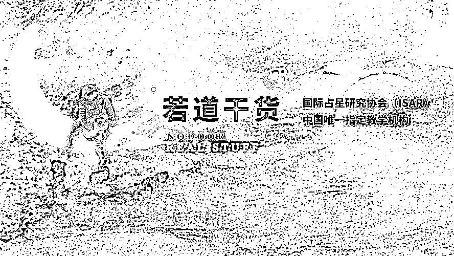

作者/杨浠 Vera ISAR 认证占星师
 编辑/翀子 封面/书君 图片/稿定设计很多心理学流派都非常重视梦，它对人的心灵成长和发展有着至关重要的启示作用，梦是意识的导航，通过它的“神秘语言”，我们可以深入自己的内心，发现关于自己的真相。**前言**

你有没有想过：人为什么会做梦？它真的只是稀松平常的自然现象吗？大部分人都不太会在意梦境反映了什么意思，充其量只是朋友吃饭聊天时的玩笑。但如果答案刚好相反呢？如果梦是内在自我使用的一种语言，用来告诉我们一些重要的事呢？

几乎所有的心理学流派都非常重视梦，因为它对于一个人心灵的成长和发展有着至关重要的启示作用，然而这个在专业领域无需赘述的事实，对于大众来说却仍旧是认知盲区，很少有非心理专业的人士了解到梦的重要性，以及其象征所表达的意涵。

**梦是意识的导航**

量子物理已经证实人类的意识决定物质现实，然而正如以色列社会学家尤瓦尔·赫拉利在《未来简史》中写的：虽然当今的科学发展已经相当先进，但科学界对于“意识”本身的了解几乎为零。

我们无形的潜意识世界是一个谜一样的存在，然而最重要的经历往往存在于黑暗与未知之中。

**每个人的内在世界——这个黑暗与未知的心灵荒野，往往是由我们远古的集体潜意识原型、个体的创伤历史、家族的烙印与模式，以及传统教育与社会规训所塑形。**当我们越是任由其处于黑暗与未知之中，我们的命运就越是以让我们一次次经验痛苦来唤醒我们，直到我们愿意带着勇气探索这片人迹罕至的心灵荒野。

但越是人迹罕至的地方，路标就越少，而梦正是这片心灵荒野上最值得信赖的向导。

丹增旺杰仁波切在《西藏的睡梦瑜伽》中写道：他的上师桑杰丹增是一位知识渊博的圆满大师，他在选徒时通过让学生报告前一晚所做的梦作为依指，确定他们是否做好了准备。一些记不住梦的学生，则被视为是有“障”的标志，需要先进性适当的净化修习，并推迟了传法时间，直到他们都做了梦。

在一战的战场上，军队的精神科医生奉行一条基本准则：如果士兵开始过多地梦到战争（通常士兵们更多梦到家乡的场景），那么他就必须退下前线。因为这说明他的心理已经对外部影响没有任何防御能力了。

这些例子都指向梦对于评估一个人的心理状态有着重要的参考价值，**在心理治疗中，治疗师也经常将梦作为诊断或预后评估的辅助工具。**

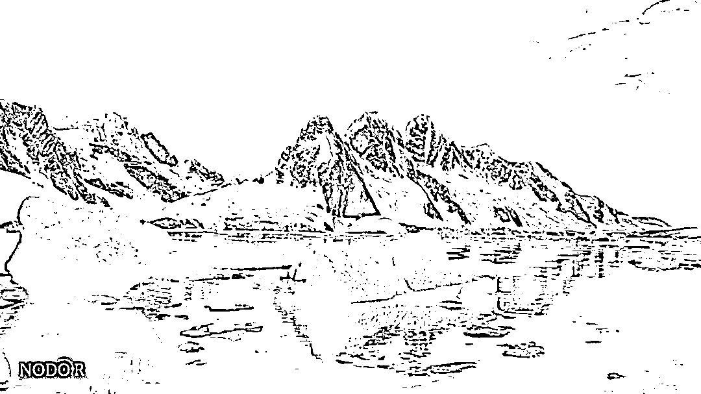

**梦的神秘语言**

梦完全不讲逻辑，它变幻莫测又暧昧不明，很多时候与梦工作都像是将头露出水面，用手在水下摸索一样困难。所以我们需要学习另一种语言——**意象与象征的语言**，它以感受和画面为媒介，传递着看似模糊却极其重要的心灵信息，帮助你打开那扇通往重要的个人与灵性成长的大门。

在探索自己内心的过程中，梦能够帮助我们多角度地理解当前所发生事件的不同面向，从而让你的觉知最大化。因为每个人最难跳出的就是自我的视角，也就是我们惯常的思维模式，**而梦境显示出的意识态度有时会与我们的显意识相反。**

荣格发现，出于某种神秘地原因，人类心灵的意识与无意识通常处于一种互补和相反的态度，例如，一件你在清醒时认为是坏的事情，梦中的潜意识可能会告诉你这件事对你是有益的。

**似乎心灵的整体性总是在试图纠正我们某些非黑即白、或者过于偏颇的意识态度，目的是为了发展更加具有弹性与容纳度的心灵空间。**

**案例 1**

几年以前我的一位长程来访告诉我一个她的梦（以下内容均已取得来访同意）：在一片萧瑟荒芜的景象中，一个衣衫褴褛的白衣少年跪在一条河边，土地下面埋葬着他的母亲，河边有一颗干枯了的树，树上飘下一条白色的绸带，飘入河中，梦中的少年非常痛苦。

这个梦让当时的我毫无头绪，也正是因为这个的原因，我记住了这个梦。直到几年之后，她重新进入咨询室，我对她提起这个几年前让我俩都无从下手的梦。虽然我并不知道这个梦的意涵，但隐约地，总感觉这个梦对她来说很重要。

我对来访说：“**每个人都是自己梦的主人**，没有人比你更了解你的梦想要诉说什么，你可以自己再去琢磨和体会一下。”

再下一次的咨询中，她和我说，当男友和她聊到关于他们未来各自离婚要在一起时的那一瞬间，她忽然明白了这个梦的含义。

这位来访很长时间以来辗转在这段婚外恋中无法自拔，但当男友忽然正式提出要不惜一切代价在一起时，她忽然意识到，其实她并不真的想与他有结果。

原来她一直以来都受母亲对于婚姻是痛苦的信念的影响（埋葬在土地下的母亲），而出于对母亲的忠诚与爱，她延续了母亲的信念，认为自己注定无法幸福（梦中短发的白衣少年，其实就是她自己），而梦中干枯的树上飘入河中的绸带，像是在对她说，**其实水源（爱与滋养）就在眼前，只要她愿意去看到生命中的幸福和美好。**

而她也终于意识到，自己的幸福并不取决于和谁在一起，她自身就拥有让自己幸福的能力。

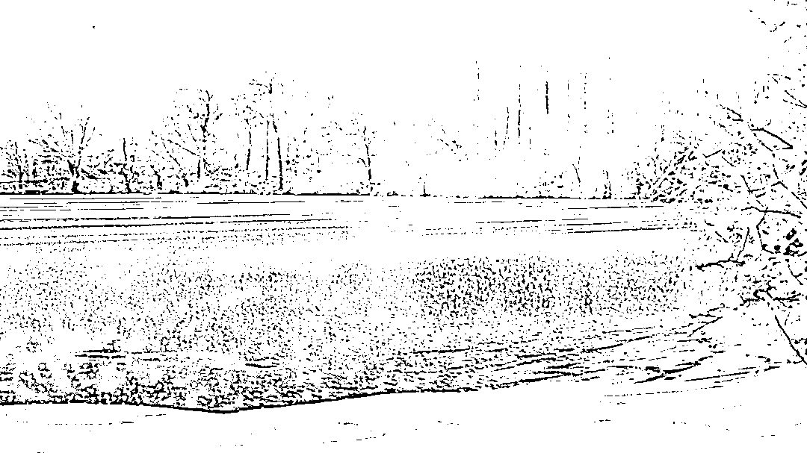

**孵梦**

此外，梦境还会让你了解自己至深的**心理情结**、帮助你**释放情绪和压力**、理**解当前生活中发生的事情，**以及给予**适时的指引**。如果你陷入麻烦，还可以通过“孵梦”的方法从梦中获得启示。

**案例 2**

几年前，有段时间我很想针对自己做很多事情都三分钟热度的这个问题做一些自我改进，然后我使用孵梦的技巧，在睡前对自己说：“请赐我一个梦，让我知道怎样可以做到持之以恒。”

然后我做了以下这个梦：我在半山腰上，和一群老太太在等巴士，巴士载着我们到了山顶，山顶上风光绝美，绵延数千里的雪山壮阔又震撼。然后我们被告知，之后每一天都要在那里等巴士，然后上山顶。梦里我想：没问题，山顶这么美，我愿意天天来！

醒后我回味这个梦，忍不住莞尔发笑：登山在象征中往往和至高的精神追寻有关，而和老太太们天天去，就是意味着每一天都要走在这条探索精神之路上，直到成为老太太。

在我自己的体验中，已经有长达数年记录和关注梦境的实践，这个过程中的收获是一点一滴地聚沙成塔，**梦总是能在关键时刻帮助我保持心灵的平衡。**

因为向内的灵性之路很多时候会有一种在走在刀刃之上的感觉，怎样在对自己绝对诚实的前提下，持有恰当的意识态度就像走钢丝一样，**要在动态中找寻平衡**——不仅不能失衡，还要持续地保持前进。

这需要极大的耐心、觉知和洞察力。在这个过程中，**梦就像是一个居住于我内心深处的年长智者，总是以出乎意料地方式向我展示出一些被我忽略的关于自己的真相。**

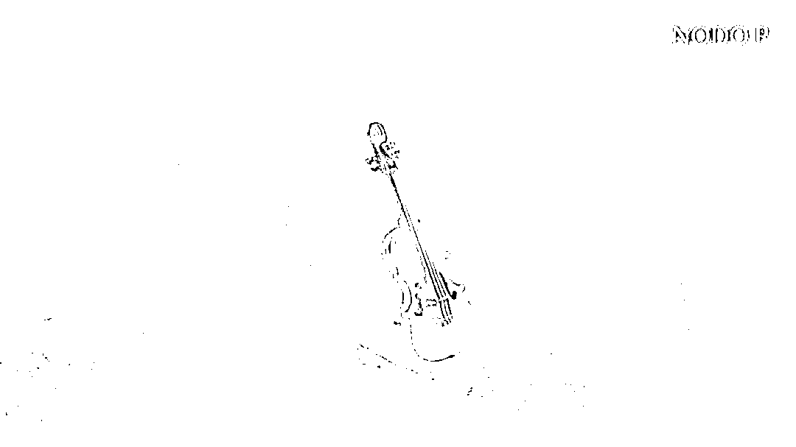

**梦境与星图**

此外，我也经常在客户和自己的梦境中看到明显的与**出生星图**相关的信息。曾经有一位**南交点在水瓶座、北交点在狮子座**的客户，做了如下的梦：

梦者与一位主持人站在舞台中央，聚光灯打在她们身上，观众席上坐满了人。主持人拿着话筒对台下的人说，梦者要发 462 万奖金给大家，金额写在纸条里大家随机抽取，抽中多少就算多少。

这位客户非常低调内敛，她通常觉得自己和人群没有太大关系（南交点水瓶座），但同时她也是一个非常有领悟力的人，当她在社群中发言时，总会让其他人对正在探讨的某个主题产生更深入的理解——这个模式就很像梦中展示的：**当她愿意站在舞台中央时（北交点狮子座），其他人会因此而受益。**

**与梦工作**

与梦工作的方式有很多种，其中最常见地就是**围绕着梦中出现的某个意象进行提问和联想**，例如，梦到鳄鱼，就可以去提问：鳄鱼会让你想到什么？你喜欢鳄鱼吗？你害怕鳄鱼吗？等等。

此外，如果梦中有**强烈的情绪**，则可以围绕着这个情绪去展开，也可以将这个强烈的情绪作为核心去理解梦本身。

但是诠释梦并不是梦能带给我们的最好的礼物，有很多在梦的专业领域颇有贡献的心理学家都主张要用体验的方式去工作梦，即在**身体感受的层面**去逐一探索梦境中的意象和人物，并且在感受中**持守梦中对立和冲突的关系**（如果有的话），以此来发展心灵的容纳度——**通过感受本身去获得直观的领悟，将梦的体验导出到生活，而不只是在头脑层面去诠释梦。**

他们提出，只是将梦转化为逻辑头脑可以理解的语言会消损掉梦本身，这一点我非常认同。

但具体的梦工作需要大量学习和实践，在此不做赘述。

**梦的价值**

**梦是心灵给予我们的礼物，是通往疗愈和自我成长的道路。**对梦有所理解，我们就会发现自我的重复性模式，从这些模式里，往往可以看见错误反复地以不同方式出现。

只要看清楚这些冲突，就可能**以一种负责任的方式采取更好的行动**。否则我们就会被自己的神经症折磨，神经症是心灵与自己作对，就像一个国家消耗性的内战。

梦能够帮助我们实现自性化的过程，发展更稳定的自我核心，把一个人带出神经症的窄径和死巷。而无论如何，自性化会一直进行，终其一生，不管心灵处于何种状态，有意识或无意识；不过，**当自我更有觉知并留心去观察心灵的运作、以负责任的态度和行动参与心灵整体的进化时，自性化就会全速前进。**

生命真正的任务是躲不掉的，人不是直接去面对，就是要迂回地去面对替代性的问题。神经症就是因恐惧而避开核心问题所产生的自我防御系统，这个防御系统只保证虚假的安全，却永远不会承诺成长和发展。

总之，在我们每个人都必须要去探索的英雄之旅中，梦将会是我们最好的向导。

**版权声明：**原创文章由作者授权首发于若道平台，欢迎转发，反对抄袭。友号转载请申请白名单。

**END**

**作者的这些文章你可能感兴趣**

[金冥合相时期丨“我到底该如何信任你？”](http://mp.weixin.qq.com/s?__biz=MzA5NjA0NTAxNg==&mid=2651464534&idx=1&sn=a3620dbeb434bdf450a963bd5936100d&chksm=8b4891e1bc3f18f700cfcd12264b582f8bae686d6b05e70bcdddff0cf7fd7d1655ba9117b0d9&scene=21#wechat_redirect)
[深度星座丨当这个智慧的星座陷入阴影之后……](http://mp.weixin.qq.com/s?__biz=MzA5NjA0NTAxNg==&mid=2651463954&idx=1&sn=a1c1c1a01a2c7ecc39f9d4a0330fb056&chksm=8b4893a5bc3f1ab34f6f3b91f865f6167c3ae4c9b5e748b1b6bd5b40e4693d98bf9a65641df7&scene=21#wechat_redirect)
[慎点！当这颗行星不再温柔，它会黑化成什么样子？](http://mp.weixin.qq.com/s?__biz=MzA5NjA0NTAxNg==&mid=2651461947&idx=1&sn=fae025acb55a3409791253c7724737b8&chksm=8b48ab8cbc3f229a45e0f4b34298ca7d3af11ed114c9223e621d51e52c2dfd897dbc475789cd&scene=21#wechat_redirect)
[“迷恋型依赖”症候群的解药在此](http://mp.weixin.qq.com/s?__biz=MzA5NjA0NTAxNg==&mid=2651434110&idx=1&sn=20eb4916128a08c926bdc57d663ac5a2&chksm=8b4b1ec9bc3c97dfbe4ce06d7679977925b970d1d815bc73c49356213fc00520819cc22ab38e&scene=21#wechat_redirect)
[无法拥有长久的亲密关系？](http://mp.weixin.qq.com/s?__biz=MzA5NjA0NTAxNg==&mid=2651407078&idx=1&sn=1ed48fe2db51eb5019835a74bd35588c&chksm=8b4bf051bc3c79474f940db9c0c35c6b18d5aac3be6070882cc3768121e17ad4b14047350b00&scene=21#wechat_redirect)

**杨晞 Vera**

ISAR 认证占星师（2017 年获得）

全职心理占星师，若道 COAC 高阶学员（2012 届）

咨询时长已达 1000 小时

**占星咨询微信号：**haloace（请注名占星咨询）

**微信公众号：**verandu

长按打赏

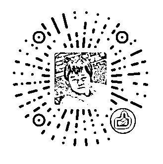

**新的一年，来领取你的好运吧！**

**扫码**即可领取**专属的年运报告**

**20 位来自世界各地的占星师**
**带来 19 场沙龙——新世界的觉醒****详情可点击下图**

**学习占星学****点击下图了解课程详情**

**微信又双叒叕改版啦，不想错过若道君的推送？**
****就把若道设为****星标****以及点点****“在看”****吧！******▼**

**喜欢就点一下“在看”吧！****报名直达入口**

# 若道周运 1.9-1.15 丨火星顺行，重新找回内在的力量吧！（内含 12 星座运势）

> 原文：[`mp.weixin.qq.com/s?__biz=MzA5NjA0NTAxNg==&mid=2651498786&idx=1&sn=e3b32bc1ff7a437656886b524bb666a5&chksm=8b481b95bc3f92830baefc70a08e2c10c263fffff49a43d3f6e7c1d6607569507fbc33015146&scene=126&sessionid=1692737700#rd`](http://mp.weixin.qq.com/s?__biz=MzA5NjA0NTAxNg==&mid=2651498786&idx=1&sn=e3b32bc1ff7a437656886b524bb666a5&chksm=8b481b95bc3f92830baefc70a08e2c10c263fffff49a43d3f6e7c1d6607569507fbc33015146&scene=126&sessionid=1692737700#rd)

******☆ ****后台回复“今日”，给你一句生命态度******

作者/苏黎 ISAR 认证占星师
编辑/翀子 封面/书君 图片/稿定设计**整体氛围**

上周，我所在的城市经历了生病感染高发时期，我也不能幸免“中招”。“阳康”的过程如同逆行的火星，反复不停，我以为自己快好了，迫不及待推动一些事情，当我着急行动时，就开始头疼，虚弱无力。

**逆行的火星**容易激发我们头脑的发热情绪，想快速行动但又陷入无力感。我家附近的药店，感冒发烧药品的货架空荡荡。我家里有几盒小柴胡冲剂，但家人身体重病过程比我严重。我日常购买的艾条，香薰等物料，无法凑齐发货。

我很渴望快点行动起来，可以做更多事情。我发现身体和头脑的意识分离，药品的紧缺，无意刷屏的焦虑感，让我心神不宁。就在这期间，《正念冥想》如同黑暗中的光亮，让我发现康复的道路不再那么漫长，带我穿越了康复过程的焦虑不安。

**本周，火星在双子座 8°07′恢复顺行，火星持续在双子座运行两个月，直到 3 月 25 日，离开双子座，进入巨蟹座。本周顺行的火星还需要在逆行后阴影期行进，直到 3 月底，火星的速度才恢复正常。**

在火星、水星逆行期间，我自己身旁的亲友，自己经历的各种事件，让我对逆行的行星、对身体和疾病有了更多的反思。

宇宙是一个神奇的生命体，万事万物皆有灵，我们的肉体不过是灵魂的载体。每个人的灵魂都是造物主的种子，但我们如果对自然万物缺乏谦卑，善念和敬意，我们就会面临大自然的灭顶之灾。

如何在时代的风暴中，重新找到内在的力量，穿越人生的痛苦和挣扎呢？我们需要理解火星的能量。

**在火星逆行期间，**我们让事情慢下来了吗？我们找到解决问题的动机和源头了吗？我们是否往后退几步，好好检视我们不良的生活习惯呢？我们被外界的喧嚣和信息裹挟失去理智了吗？

正如我在网络一下买了不同平台艾条，只要看到没发货就下单，结果发现小区附近地实体药店就有艾条购买，远比我网络下单的更实惠。那一刻，我看到了逆行的火星，水星在前方狡黠看着我微笑。

经历了上周的【[巨蟹座满月](http://mp.weixin.qq.com/s?__biz=MzA5NjA0NTAxNg==&mid=2651498769&idx=1&sn=49f58da6ad9234efa48d1a20aa0b27a6&chksm=8b481ba6bc3f92b0b74f9ac4e6a3d33cbb01797520650a752423ded6fb7e4c42318d42ac7684&scene=21#wechat_redirect)】（点击查看文章），人们对健康的探索仍在持续中。本周整体天象是行星的重组调整，我们会在火星开始顺行，但仍处在逆行后阴影期的摸索中，重新整合我们的行动的方向和动力。

**摩羯座的太阳**代表努力工作，纪律严明的权威。为了达成目标，如何和权威人物相处，更好地沟通，学习关系是本周的主题。

我们渴望推动实现生活的目标，希望事情在年底可以尽快发展，更有动力和活动。但我们需要聆听内在的声音，火星从逆行转顺行的阶段，是一个容易出错的混乱时期。

当我们格外焦躁，不安，需要**找到合适的方式，让自己回到平和镇定的状态，寻找急躁背后的原因是什么，听听内在的声音想告诉我们什么。**

让我们学会在行动中保持智慧，明智地应用我们身体的能量和精力，找回我们的力量感！

**本周重要天象：**

*   **水星三分天王星**

*   **金星三分火星**

*   **太阳六分海王星**

*   **火星恢复顺行**

*   **金星四分天王星**

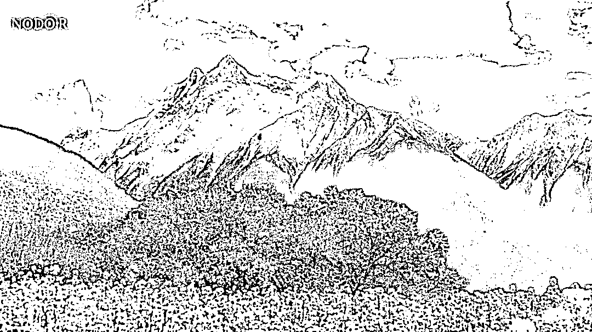

**一周重要天象****★ ****1 月 9 日，周一**

**水星（摩羯座）三分天王星（金牛座）；金星（水瓶座）三分逆行的火星（双子座）**

摩羯座的水星仍在逆行中，**当水星和天王星形成和谐三分相**，这是我们往后退一步思考，为改革和变化做铺垫的最佳时机。我们需要处理和修正前期的计划，项目推动方面的事宜。

如果前期我们在物流、项目沟通、人际关系里存在问题，今日可能有一些戏剧性的反转，我们会听到一些意外，惊喜的消息。摩羯座水星的沟通和思维是务实、谨慎的，天王星是灵光乍现的顿悟，是想象力、反传统的、不按常理出牌的特质。

我们对事物有敏锐的直觉，有独立思考的能力，面对现实的困难，愿意从不同的角度看待问题。抓住水星和天王星三分相的机遇吧，沟通、面试会让我们感受到惊喜的愉悦！

**金星和火星在风元素的三分相**，这是智能灵性迸发下，激情、爱情和灵感火花组合的神奇相位。我们在沟通中感觉更自由，毫无拘束。舒服的人际关系，有助于在社交舞台绽放情感魅力。

我们也会对过去的性别价值议题更感兴趣，某些话题引发热议。**当日的月亮在狮子座**，狮子座月亮喜欢享乐、玩耍和展现真实的自我。当日和谐的星象能量合适沟通和社交。

忙碌的周一，工作结束后，晚上合适运动健身，或与朋友一起享受生活，看一场电影，相约咖啡馆谈谈心，都是不错的选择。

**★****1 月 13 日，周五**

**火星顺行；太阳（摩羯座）六分海王星（双鱼座）；金星（水瓶座）六分凯龙星（白羊座）**

**早晨 4:56，火星在双子座 8°07′恢复顺行**。火星的定位星是水星，水星将在下周恢复顺行。我回想自己在上周故事就很想笑话自己。在网络平台毫无节制订购艾条然后取消订单，不停预约订购抗原试剂，然后失败，我对发生的事件完全是失去意识的回应。行星逆行教会我深刻的功课。

**火星恢复顺行需要一个适应修复的过程。**在生活层面，疾病恢复需要时间和耐心，我们重新找回行动的力量，需要把大脑思维和身体重新连接。

生活逐渐变得更忙碌，任何信息都需要兼听则明。在混乱的信息爆炸时代，我们会忽略真相和事实，情绪化的反应，站队和积极表态。双子座火星行动力是迅捷的，从逆行转顺行状态，外出活动、行动或沟通避免口不择言，冲动行事。**学会健康的表达自己的情绪和愤怒很重要。**

**太阳和海王星的六分相**，这是理想和现实整合的梦幻时机。海王星能量是被动的，柔和、敏锐而浪漫的，摩羯座的太阳是主动的，现实的利益和目标是出发点。

我们会对弱势群体的故事产生共鸣，个体的悲喜在此刻是相通的。**这是改善人际关系、推动事情落地、发挥创造力和想象力最佳时机。**从事艺术、自媒体工作的人可以充分利用这一天的星象能量。

从生活层面看，我们可能会在与男性的相处，与上司的关系、在身心疾病的疗愈中有所收获。

水瓶座的金星渴望自由，重视友谊和变革，不会将自己束缚在沉重的关系压力中。白羊座凯龙星的创伤来自对自我身份的认同。我们会在经验，集体中学习，脆弱感或对自我身份的质疑，可以获得疗愈。

我们渴望情感中的自由，做真实的自我，对女性议题的深思，有助我们走出情感的创伤，感觉世界温暖的大门为我们敞开。**最后一天的工作日，月亮在天秤座**，请寻找你想沟通倾诉的小伙伴吧，这是社交的绝佳时机！

**★****1 月 15 日，周日**

**金星（水瓶座）四分天王星（金牛座）**

**当日，月亮基本在天秤座行进，直到晚上换座进入天蝎座。**金星和天王星的困难相位，在关系、金钱上我们可能经历一些意外的挫败。我们可能被某些人吸引，感觉兴奋，这种与众不同的情绪是我们很少经历过的。电光火石过后，激情褪去，我们会感觉到失落。

**关系的变化**会触发我们内在的恐惧，也许是探讨春节回家，也许是某些文章触动关系中被损伤的，不被认同的价值或伤害。女性需要意识到内在真实的欲望是什么。当我们在关系中遇到障碍，我们会陷入疏离的、拒绝沟通的冷漠中。我们无法用头脑和逻辑分析爱，我们只能用我们的心。

月亮在天秤座的休息日，**关系和平衡是主题**。我们也需要学会平衡金钱的开销，避免头脑冲动意外的开销，理性消费，抵制商家的消费和促销套路。**当下水星仍是逆行状态，火星刚恢复顺行，**暧昧关系中的误解和告白，不理智的消费都是需要避免的坑。

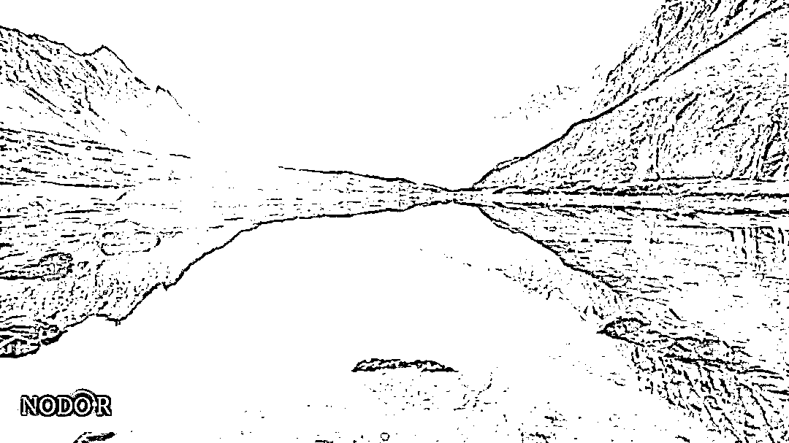

**12 星座的一周运势**

**（重点参考上升星座，其次参考太阳星座）**

***白羊座***

周一的三分相是一个很好的起点。你努力在工作中做得更好，学会更理智地表达自己的观点，让自己的付出被领导认同和看到。你会和某个朋友沟通，通过网络倾吐心中的某个话题

火星开始顺行，你的思想压力、行动的无力感逐渐缓解。你可以松一口气，不用太着急。你会在工作中找到解决问题的方式，达到你期待的目标，放松你的意识，相信你的梦想。

周日，金星和天王星的相位，你可能会被网络某些信息触动，感受到愤怒和不满，你可能在社群中感受到某些人的言论挑战你的价值观。火星恢复顺行需要适应，学会正确地表达你的情感和愤怒。

***金牛座***

这周看起来财运不错，周一的天象让你意识到事业和财务都有一些好机会。金牛座擅长稳重和保守，即使机会不错，但火星、水星仍在逆行中，做决定之前需要弄清楚环境和实际状况。

本周四，火星开始顺行，这是为新的一年筹划商业计划或赚钱想法的好时机，找到关系中合作的机会很重要。合适外出旅行，注意外出前检查细节。找到适合的学习社群，为达成自己目标吸取经验。

周日的社交活动，需要注意关系中意外挑战，可能忽然被安排加班任务，让你感觉失去自由休息的机会，对领导的安排不满，学会与领导、上司相处的社交艺术。

***双子座***

这是和远方朋友加强情感沟通联络的最佳时机，水星、火星逆行的状态，需要避免地域差异的文化误解。你的内心对世界充满了期待和憧憬。

当火星开始顺行时，你感觉如同从冬眠中苏醒过来，逐渐恢复了体力和精力。新的一年开始了，你开始为新计划积蓄能量，筹备计划。在事业中会有商业合作的机会和梦想出现，要好好把握哦！

周日，你也许会在学习阅读过程中，某些女性故事触动你内在的意识，让你对关系，自我有更深刻的理解，以往不一样的想法。你也可能会突然对某个培训课程感兴趣，忽然想报名学习。接纳任何情绪和经验的感受，相信你内在的直觉。

***巨蟹座***

在人际社交关系，商业合作中可能有一些意外的惊喜发生，你会发现前期没有推动的事项有了进展。水星逆行在在你人际关系宫位，无论发生的事情，让你惊喜还是产生自我厌恶感，请学会照顾自己的情感需求。

火星开始顺行，你对大环境的忧虑和恐惧逐渐减少，学会如何与直觉相处，让自己更强壮有力。这是培养你直觉，灵性能量的时期，学会放松很重要。你会逐渐发现和看到自己的价值和潜力，有助你在社交中达到你的梦想。

集体或社群中某些言论，或某个人的作为让你深感沮丧，产生被排斥的感受，不用太难过。水瓶座的金星就是让你保持独有的自我。

***狮子座***

周一的天象开启本周的好运。你会在关系、工作中有不错的展现，无论友谊、亲密关系、事业中的表现，都让你开启元气满满的一周。逆行的火星、水星也提醒你不要被表象的成就吸引，虚荣心是狮子座需要注意的。

火星恢复顺行，你会在社群或集体项目中，愿意更坦率，诚实地沟通，消除大环境舆论对你的社交影响。工作中的付出会得到领导的认同和信任，找到实现梦想的方式。

合作关系、伴侣关系在周末需要注意。我们需要从更客观的态度和观点，跳出自己的思维模式，学习接纳关系中的独特的自由，事业中我们无法预料的挫败。狮子座的功课就是学会跳出生活的舞台，做观众席的演员，去面对生活的挣扎。

***处女座***

你期待在工作中的付出和努力被别人注意，但又不会很主动展现出来。周一的星象能量，低调的你发现，你在工作的忙碌付出、和同事的社交中，有一些惊喜。也许某个同事给你带了一份早餐，你前期的付出忽然获得金钱的奖励。

当火星恢复顺行时，这是你开始发光、吸引众人关注度的时刻。你在事业和工作中，可以向前期和你沟通、谈判合作有意向的客户，推销你的才华和能力。这也是你追求浪漫情感、改善亲子关系、实现梦想的好时机。

周日的星象，你可能会在休息日的闲暇时光中，忽然接到同事需要帮助的信息，打破你平静的美梦。水瓶座的友谊就是给予需要帮助的人，奉献点滴力量，这体现你的专业能力，没必要烦恼。

***天秤座***

你也许会期待一场想走就走的旅行，但水星仍在逆行状态，需要认真考虑这个突如其来想法，在当下是否合适。有时，突如其来的决定带来旅途的快乐，也可能仓促带来混乱。

幸运的是，当火星在你的 9 宫恢复顺行时，你前期的突如其来的想法有实现的可能。你也可能对学习某个感兴趣的课程更有动力。家庭可以给到你更多的支持的动力，你在处理工作项目中更有想法。家庭成员的情感支持，你也会非常感恩。

一见钟情的浪漫，邂逅或创作的冲动会让你的休息日更充实。充分利用金星的能量，电光火石的激情可能只是瞬间的花火，把激情应用到创造性活动中，会让你的休息日更惬意。

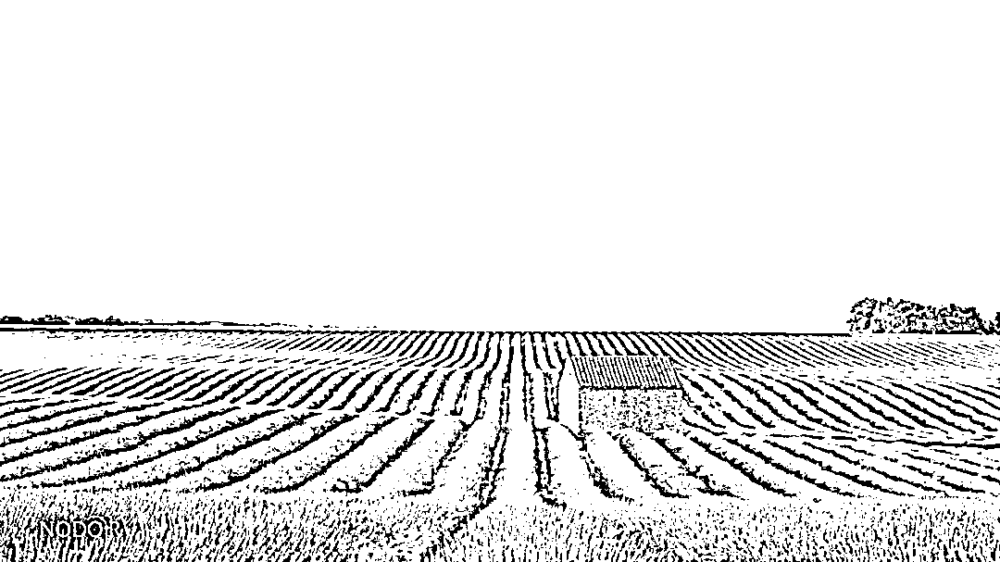

***天蝎座***

工作中和同事的相处，家族中某个成员和你的忽然联系，各种信息在你心理造成巨大冲击波，你也许会觉得被误解，也可能会觉得被他人理解和看到。

火星的顺行，让你对自己深处的困境更清晰，你会看清楚事情发展的真相，自尊会得到极大的提升，会对自己更自信。你也愿意敞开和众人分享你的看法，获得大众的关注。如果你喜欢写作、绘画，周五发布的作品会展现出你才华。

和家人的相处是你需要深入理解的主题，你需要信任和支持，家人关系中任何变化都要接纳。伴侣并不一定会理解你的内心深处，学会理解对方很重要。

***射手座***

前期沟通的事情本周一可能有一些突破，你会发现项目沟通谈判忽然很顺畅，但火星仍在逆行，需要理智判断是突如其来的好事，还只是合作谈判中的一时激情，是否可能误解对方的意图。三分相的能量是无法察觉到的畅快，射手座的乐观和粗心有时会忽略了人际关系的细节。

火星的顺行，是你人际关系真正促进、更有动力的起点。这会让你的感情生活充满了激情，带来高涨的情绪。愉悦的心情也会让你更有动力实现你的财务小目标。

周日的星象，需要注意和朋友沟通中的意外，或相约外出忽然临时改变的信息。目前信息瞬息万变，学会聆听真实的原因，接纳和理解生活中的变动。

***摩羯座***

周一，你可能对某些好玩享乐的东西产生购买欲，希望通过投资理财多元化提升收入。但需要记得自己消费的欲望要配得上钱包，外界的投资讯息等行星顺行后再做考虑。

火星的顺行，你在工作中更多有动力和责任感，学会更客观评估社会大环境对工作的影响，懂得如何在生活中找到快乐和激情。你对如何推动计划的实现更有想法，更有创造力和激情面对现实。

休息日，日常慎重的你，也许会一时兴起花钱去享受生活，购买日常很少买的东西，去尝试一些新鲜项目放松自我。有小朋友的家庭，可能会愿意满足孩子的需求。花钱一时爽，只是要注意避免过度。

***水瓶座***

家庭成员给予你稳定的支持和尊重，你会在生活中、创造性的活动中愿意积极展现自我的观点，你对待关系的平等、尊重的态度会让你收获情感中的认同。

火星的顺行，对你的感情、创造力、亲子关系都是很好的影响，你会遇到很多让你开心的事情，感觉自由的享受。你会对自己创造物质生活财富的能力更自信。

周日的星象，你和家庭成员相处的关系需要注意。他们是你情感的来源，但你更期待不被干涉，独立的空间自由。我们家庭的功课是漫长的，尊重不同家族成员不同价值观也很重要。

***双鱼座***

群体的力量是强大，有时某些社群中的信息，会给你的生活带来更多的顿悟。你会更好理解家人的想法，家族之间的故事可以通过分享收获惊喜。

周五，顺行的火星让你对之前拖延的家庭房子、财产的事情有了新的推进。当然火星在你的 4 宫，年底需要和亲戚、孩子更好的相处。太阳和海王星的相位，你的愿望和梦想有可能实现，你对社群、集体更有荣誉感。

周日，你可能需要关注睡眠，昔日某些事件的阴影让你对人际关系、金钱的变化很担心，焦虑会影响睡眠的质量。

**版权声明**：原创文章由作者授权首发于若道平台发布，欢迎转发，反对抄袭。友号转载请申请白名单。

**END**

**苏黎（Sulis）**

ISAR 国际认证占星师（2019 年获得）/塔罗咨询师

现代占星融合古典解读

20 多年跨行业领域职场经历

**咨询微信**：liuzq26

**公众号**：Sulis_1975

长按打赏

**新的一年，来领取你的好运吧！**

**扫码**即可领取**专属的年运报告**

**20 位来自世界各地的占星师****带来 19 场沙龙——新世界的觉醒****详情可点击下图**

**学习占星学****点击下图了解课程详情**

**微信又双叒叕改版啦，不想错过若道君的推送？**
****就把若道设为****星标****以及点点****“在看”****吧！******▼**

**喜欢就点一下“在看”吧！****报名直达入口**

# 雷蒙德·梅里曼金融占星周运 | 未来两周或出现反转和价格波动

> 原文：[`mp.weixin.qq.com/s?__biz=MzA5NjA0NTAxNg==&mid=2651498786&idx=2&sn=d749cfeed1121f968193aee29ff68e4a&chksm=8b481b95bc3f92838dba8f9bc555bdfd1ce24f0476a3b1b24af3f7935ee3219efc015ec8a209&scene=126&sessionid=1692737700#rd`](http://mp.weixin.qq.com/s?__biz=MzA5NjA0NTAxNg==&mid=2651498786&idx=2&sn=d749cfeed1121f968193aee29ff68e4a&chksm=8b481b95bc3f92838dba8f9bc555bdfd1ce24f0476a3b1b24af3f7935ee3219efc015ec8a209&scene=126&sessionid=1692737700#rd)

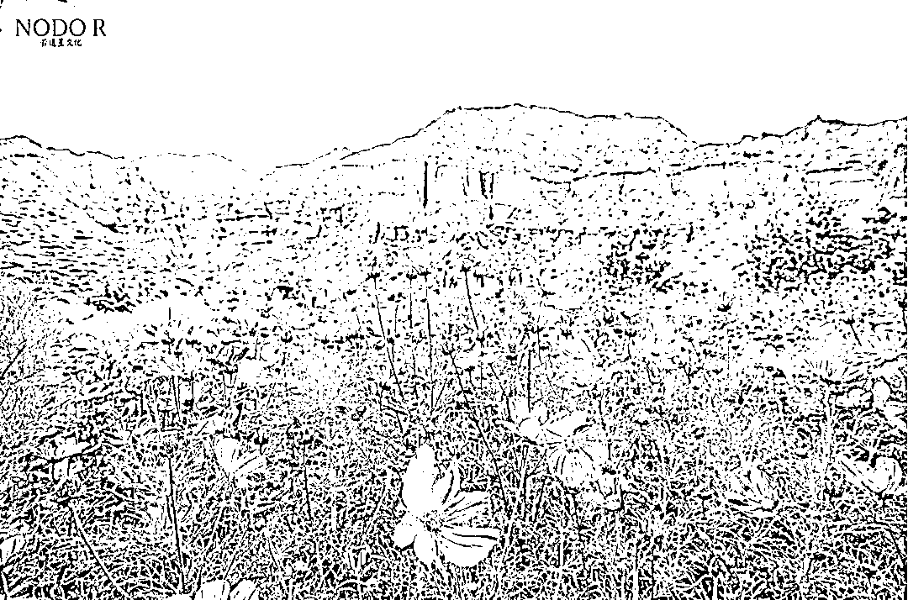作者/雷蒙德·梅里曼 译者/Luke 编辑/玫瑰 图片/稿定设计

雷蒙德·梅里曼是在金融占星学界稳坐第一把交椅的占星师，同时他也是若道签约的金融占星课老师，我们引进了雷蒙德·梅里曼老师的《[上证指数月度报告](http://mp.weixin.qq.com/s?__biz=MzA5NjA0NTAxNg==&mid=2651497687&idx=2&sn=2a13e4dfbea42b9a2750e9b103baf91c&chksm=8b481660bc3f9f7630be3c7b5b277adb253f6b8988bbecf5224f091c9aced62fe62337c6db1c&scene=21#wechat_redirect)》、《[黄金报告](http://mp.weixin.qq.com/s?__biz=MzA5NjA0NTAxNg==&mid=2651497687&idx=2&sn=2a13e4dfbea42b9a2750e9b103baf91c&chksm=8b481660bc3f9f7630be3c7b5b277adb253f6b8988bbecf5224f091c9aced62fe62337c6db1c&scene=21#wechat_redirect)》及《[铜报告](http://mp.weixin.qq.com/s?__biz=MzA5NjA0NTAxNg==&mid=2651497678&idx=2&sn=a7fc4f9b10597152da6c58d47817c3db&chksm=8b481679bc3f9f6f0be5ca81c6d500944a60537bb5a50be0c83bc0f720ba1a77e43b03d2d53b&scene=21#wechat_redirect)》。我们经老师的授权，将每周刊登梅里曼老师的周运，供大家参考和学习。于是，这是本周的周运（1.9-1.13）。

**说明：以下时间采用纽约证券交易所所在地美国东部标准时间。****展望与回顾**

****

**12 月非农就业增长放缓，但仍然好于预期。这表明尽管美联储试图放缓经济增长，劳动力市场依然保持强劲。非农就业人数当月增加 22.3 万，高于道琼斯预计的 20 万，与此同时失业率下降至 3.5%，比预期低了 0.2%。****工资增长不如预期，表明通货膨胀的压力可能在减轻。平均每小时收入当月增加 0.3%，较去年同期增长 4.6%。****——杰夫·考克斯****《12 月非农就业人数增长 22.3 万，劳动力市场表现超出预期》****www.cnbc.com****2023 年 1 月 6 日**随着新年的第一周结束，看起来恶作剧者水星正表演戏法，引发市场突然的短期反转。股票指数看起来承受压力。上周五，美国非农就业报告出炉，如预期那样表现弱势，工资增长明显比预期要少。在非农报告发布后，投资者看不出美联储在通胀背景下对加息继续保持鹰派立场的理由，所以股票市场起飞，道琼斯指数收盘价上涨 700 点，创下 12 月 22 日-23 日木星-天王星八分相低点以来的最高价位。随着非农报告的出炉，黄金也飙升至新的周期高点，一路攀升至 1875.20。仅仅 9 周前，它的波谷价位是 1618.30。另一方面，白银却无法爬升至新的周期高点。新年第一天的高点 24.77 没有被突破，上周收盘时价格仅略低于 24.00。上周二，原油也创下新周期高点，新年第一个交易日到达 81.50 的价位，然后再次遭到抛售跌向 70.00。交易员乔·拜登似乎对是否回补 3 亿桶战略石油储备感到犹豫不决，尽管价格已经下跌进入他想要的范围（他公开宣布会在那些价位回购所有他出售的石油，并买入更多）。

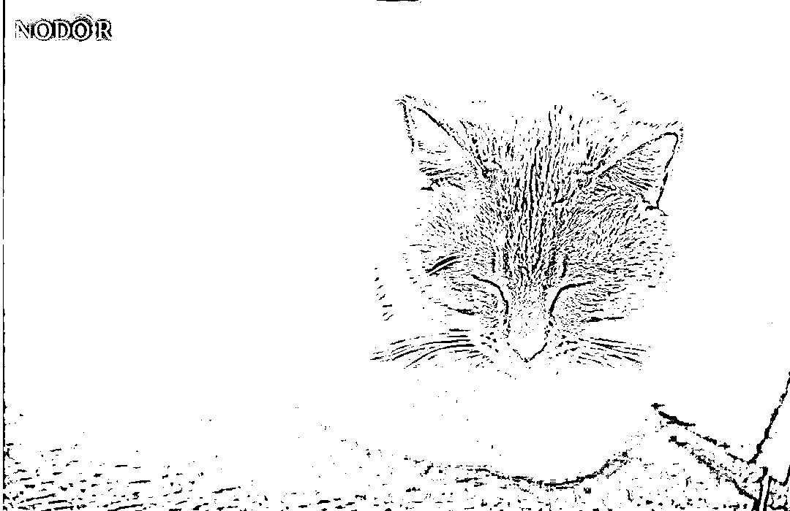

**短期宇宙征象与长期考量**

****

**有时候你需要意识到，梦想变成了一种执念。它的目标已经无法实现，因为它不存在……**

**能够辨认某件事已经结束，已经成为过去式，无法成为未来，这其实是一项关键技能；你必须有足够的见识找到下一个有建设性的领域，这可能需要时间；在此期间，你必须保持冷静和沉着……如果你为了获得一个工作，放弃了这份工作的权力，那么这份工作就没有意义了。它本身被削弱了。**

**——佩吉·努南**

**《正常的共和党人，在悬崖边缘站起来》**

**《华尔街日报》**

**2023 年 1 月 6 日**

**致那些左派人士：种族主义和歧视确实是美国社会的深深伤痛，而且永远如此，无论你雇佣了多少重视多样性、平等和包容的官员，你都无法根除人类的偏见。但是，我们在边缘化和削弱这些偏见方面，取得了非凡的进步。**

**——杰拉德·贝克****《新年可以让人谦卑，决心保持下去》****《华尔街日报》****2022 年 1 月 5 日****任何同时觉察自己阴暗和光明面的人，都能从两个方面看到自己，从而处在中间的位置。****——卡尔·****荣格****现在来到了水星（恶作剧者）逆行周期的中点。如果市场在逆行开始时（12 月 29 日+/-4 天）没有完成主要周期或更大周期，那么常常会在逆行中点做到这点，也就是现在。**这可能是黄金和股票指数在上周五强势反弹至新半周期高点的一个原因。

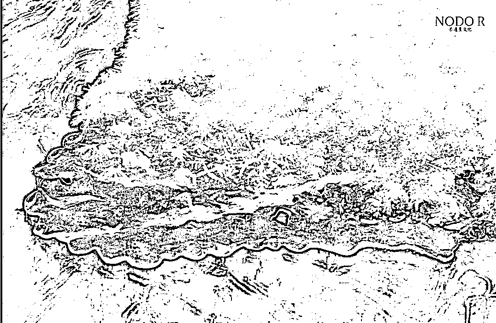

但是展望未来，一个政治和金融市场变得活跃的时期即将到来，因为**有 3 颗行星即将改变运行方向。**第一颗是火星将于 1 月 12 日在双子座转向顺行。它比 1 月 18 日的水星恢复顺行更有力量，可能与 1 月 22 日天王星改变运行方向具有同等的爆发力。**这两颗行星（火星和天王星）在 1 月 12 日-22 日期间的停滞可能会造成很大动荡。**任何接近年度高点或低点的市场，都很容易遭到突破。任何边界不安全的国家，都很容易遭到入侵或袭击。任何公司、政府或团体，当领导层遭到社会活动者们的攻击时，也很容易被接管，这些领导人可能被迫下台，或者不得不做出严重限制他们权力的让步（比如，共和党和它在众议院的领导层）。**接下来两周可能出现突然的反转和巨大的价格波动，原因是在火星和天王星的强烈影响下，商业或政治的治理系统不稳定。**

不诚实的人受到 3 样事物的吸引：金钱、权力和诚实的人。他们需要后者作为掩护，来盗取前两者。这正是政府和公司政治中极端主义运动的情况。**2023 年 3 月-2026 年，冥王星在水瓶座 0°来回穿越，土星行经双鱼座，这些极端主义运动可能会导致腐败和操控愈演愈烈，到达顶点。**

让我们尝试理解这会对金融世界产生什么影响。在那里，由于不诚实的人利用诚实的人（土星在双鱼座），隐蔽地（冥王星）盗窃，金钱似乎“凭空消失”了。

要理解冥王星在水瓶座的意义，首先要记住，在神话中，冥王星是冥界之神，而水瓶座代表集体意识及其创新精神，以期使人类受益。水瓶座还代表占星学研究，也代表志同道合的人组成社区，分享相似的兴趣，期望推进人类社会的进步。

此外，作为冥界之神，他更早的名字是哈德斯，被认为是最富有的神祇。财富和权力往往相伴而行，尽管不一定总是如此。

冥王星也是一个绑架者，他的行为带来伤害和痛苦，甚至威胁到生命。

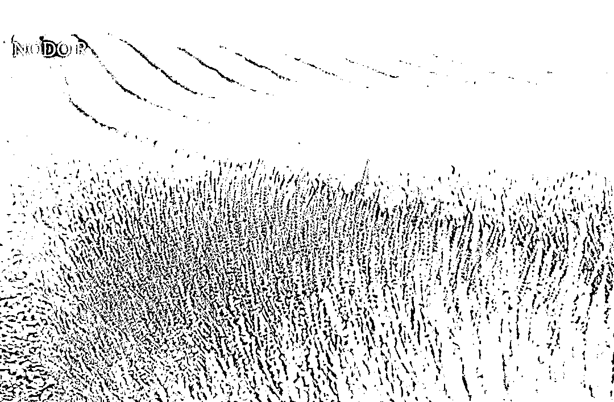

根据 https://simple.wikipedia.org 所述：“他把罗马神话中农业和丰收女神克瑞斯的女儿普洛塞庇娜带到冥界，让她成为他的妻子。普洛塞庇娜的母亲克瑞斯哭泣，不让地球上的植物生长。人们非常需要这些植物，所以朱庇特让冥王把她放了出来。

他们达成的协议是：冥王可以在 6 个月内拥有普洛塞庇娜。当普洛塞庇娜在冥界的时候，地球上的植物无法生长，这时是冬天。当普洛塞庇娜回到她母亲身边时是夏天。这也是罗马人解释季节变化的说辞。”

**这也很好地解释了冥王星的本性：通过武力或操控（从那些诚实守信的人那里）夺取不属于自己的东西，并给其他人（全世界）带来巨大的痛苦，除非能达成一项协议，限制他的部分或全部权力。你可以在当今的世界中非常清楚地看到这种情节上演。**

所以在接下来的 2 年-3 年里，我们很可能会看到越来越多的“绑架”案，或者从正在提升大众意识和福祉的团体（比如大的占星学组织）甚至国家那里，劫持领土和夺取权力。

具有讽刺意味和不诚实的是，这些篡权者会声称自己才是能够提升众人意识和福祉的人。但真相是，他们隐藏了他们真正的议程或活动。他们努力避免被揭露，因为他们实际上以水瓶座群体的愿景为掩护，掩盖自己秘密地获取权力或财富的目的。

**接下来 3 年可能会见证，财富和资金以非常不透明的方式，从一个组织转移到另一个组织那里。**例如，以“奖学金”或“财政援助”或“投资”的名义，把财富转移到受某个具有腐败的冥王星式思维的个体控制的组织和团体那里，同时这些团体伪装成仿佛根据水瓶座的愿景在做好事。

以相似的方式，董事会的选举也受到操控（作弊），例如，只推举符合某种政治或意识形态的候选人参加竞选，打压那些有道德或真正理解和支持水瓶座愿景的候选人。表面看似有着公平和诚实的选举过程，但事实上，那些致力于团队成功和促进成员、持股人和市民福祉的候选人不会被选中。

在接下来的两年里，我们能做些什么来应对这种趋势呢？能做的不多。你可以尝试跟他人达成协议，就像凯文·麦卡锡那样，以此来平息他所在党派（共和党）的少数篡权者，但在这样做的过程中，会让你失去所有权力。

或者，你可以向全世界揭露这种“绑架”的情形，让大家知道他们支持的组织的愿景、力量和财富被篡夺了，并希望这种压力能带来光，照亮掩护这些篡权者的阴影。因为毕竟，冥王星在盗取那些不属于它的东西时，不希望真相被揭露。

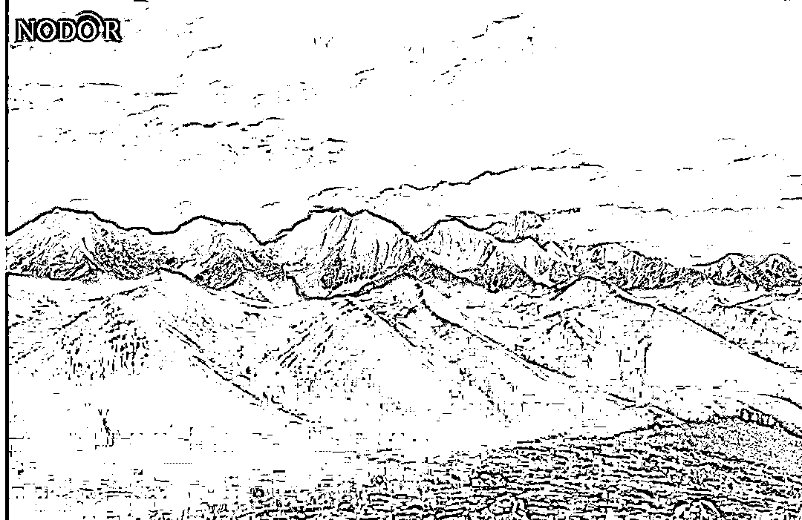

另一方面，在试图阻止权力和财富被窃取的过程中，冥王星在调查和揭露的行为中会很成功。没有人能毫发无损地从冥王星的行进中逃脱，尤其是那些在冥王星的地下世界中活动的人，他们真正的目的被揭露，也就是那些背叛先前组织确立的信任和善意，试图篡夺权力的行径。

对于接下来几年的金融界，这意味着什么？这表明，许多公司、团体和政府可能在幕后被活动分子密谋夺权，接管领导层和财产的控制权。

资金可能会消失，从那些追求水瓶座愿景的组织转移到具有冥王星倾向的组织，或者流入那些以人道主义目标为掩护，实际手段卑劣的腐败个体手中。特别要注意那些星图中水瓶座 0°显著的政府、公司和团体。他们很容易受害，甚至完全不知情。

我们需要的是能体现土星在双鱼座正面能量的领导者：承诺遵循道德和诚实的道路，而不是不透明的腐败议程和动机。我们需要那些能够同时意识到自身阴影和光明面的人，那些能从两个方面看见自己，从而处于中道的人。

换句话说，是那些意识到“适度”（木星-土星渐盈周期）的重要性的人，那些认识到进步不是某种反动极端主义行为（冥王星在水瓶座行进，经过木星-土星的超级能量度数水瓶座 0°）的人。上文引用的杰拉德·贝克的想法可作为参考。

从 2018 年年末，若道引入金融占星大师雷蒙德·A·梅里曼撰写的梅里曼市场时机学院每年一次的年度预报沙龙和每年一本的《年度预报》以来，**2023 年已经是第 5 个年度了。我们简单回顾了部分 2019-2022 年金融预报的内容，**过去的经验让我们相信，你根据梅里曼老师的指导作为投资参看，你会比一般人有更大的胜算。******长按下图识别二维码****了解更多详情**

**说明：以上日期基于纽约证券交易所所在的美国东部标准时间，由于存在时差，中国地区可能需要加一天。**

**版权声明：**本文由若道翻译发布，欢迎转发，反对抄袭。友号转载请申请白名单。**END**

**雷蒙德·梅里曼（Raymond Merriman）**

若道签约老师。著名金融占星师，ISAR（国际占星研究协会）前主席，梅里曼市场分析公司的总裁。他由于“提升了占星学的职业形象”，在 1995 年国际占星大会上被授予轩辕十四奖；在 2012 年国际占星大会上，被授予轩辕十四终身成就奖。

1“中国上证指数月度报告”发售**若道推出了****中文版****的雷蒙德·梅里曼中国上证指数月度报告，并持续发行该报告！**当把金融市场的周期和占星学的周期相结合时，雷蒙德·梅里曼老师的金融占星学研究**为投资者应对金融市场的周期波动，并随之调整投资策略提供了极大的价值参考**。
**1 月中英文报告已上线！**2“黄金价格周期月度报告”发售**若道推出****中文版****的雷蒙德·梅里曼黄金价格周期月度报告！**不仅仅为广大读者在中国股市的投资出谋划策，更将视角放眼黄金市场。**每当世界经济形式不明朗的时候，有一个地方是保值的港湾，那就是****黄金**。自 1982 年雷蒙德·梅里曼出版第一本研究《地球宇宙学征象与黄金价格的关联》的著作以来，**他一直作为最重要的黄金市场时机预测者之一享誉国际**。2023 年 1 月黄金报告已上线，梅里曼老师将会告诉你他对这个关键时期如何操作的想法。也可以按照季度和一年期订阅，有更多优惠。季度和年度的好处是，你可以持续了解梅里曼老师对于不断在变化的市场的看法。即便他某一次看法和市场不一致，你也看到在下一期他如何调整自己的看法，并看到金融占星在一个长期时间段内对你把控风险的帮助。而能够长期控制风险、尽量找到安全的投资时机才是投资的长久之计。**1 月中英文报告已上线！****购买套餐**，买得越多越优惠中国上证指数月度报告套餐价

*   **单月报告**：280 元
*   **3 个月套餐**：780 元（260 元/月）
*   **12 个月套餐价**：2400 元（200 元/月）

**长按下图识别二维码****购买金融报告****套餐****▼**黄金周期月度报告优惠

*   **双报告年度套餐更优惠（直降 900 元）**

*   **12 个月黄金报告+12 个月上证指数报告：仅需 3900 元**

**长按下图识别二维码购买黄金报告套餐**▼

3《铜市场周期月度报告》

从 2023 年开始，我们将推出雷蒙德·梅里曼市场时机学院的铜周期报告。之所以推出这个报告，是因为**作为新能源发展所需的一个重要金属，铜的投资价值可能会随着新能源的发展而出现崭新机会。**

**看好新能源发展的读者，这样一份报告可能帮助你提早了解铜交易市场、铜交易的价格变化，当投资机会到来时，果断出手，把握先机。**

**长按下图识别二维码**
**了解更多详情**▼4《2023 年金融报告及沙龙》

从 2018 年年末，若道引入金融占星大师雷蒙德·A·梅里曼撰写的梅里曼市场时机学院每年一次的年度预报沙龙和每年一本的《年度预报》以来，**2023 年已经是第 5 个年度了。我们简单回顾了部分 2019-2022 年金融预报的内容，**过去的经验让我们相信，你根据梅里曼老师的指导作为投资参看，你会比一般人有更大的胜算。****

**长按下图识别二维码****了解更多详情**

**购买直达入口**

# 金融报告丨雷蒙德·A·梅里曼 2023 年《年度预报及讲座》来啦！

> 原文：[`mp.weixin.qq.com/s?__biz=MzA5NjA0NTAxNg==&mid=2651498786&idx=3&sn=5d94605b44b992ad269dfdca7cc4dabe&chksm=8b481b95bc3f928358fca0243847d5b65ff2d7cd112d6430553ce1ad8f8852ed764a4a36a736&scene=126&sessionid=1692737700#rd`](http://mp.weixin.qq.com/s?__biz=MzA5NjA0NTAxNg==&mid=2651498786&idx=3&sn=5d94605b44b992ad269dfdca7cc4dabe&chksm=8b481b95bc3f928358fca0243847d5b65ff2d7cd112d6430553ce1ad8f8852ed764a4a36a736&scene=126&sessionid=1692737700#rd)

当梅里曼老师第一次为我们做年度报告时，还是在 2018 年。那时，上证还是处于熊市之中。黄金也才在 1200 多美元。当时，我们也处在第一次金融占星课程之中。在课程里，他告诉我们，黄金到了一个重要的低谷，而上证即将走出熊市。当时，刚开始了解金融占星的我们还是懵懵懂懂，金融占星真的可以指导投资吗？这 4 年，我们都在实践着用金融占星指导投资，并从他的智慧中受益良多。先来回顾一下他在**2019-2022 年**的**年度报告**中对于**上证指数**的投资建议吧。

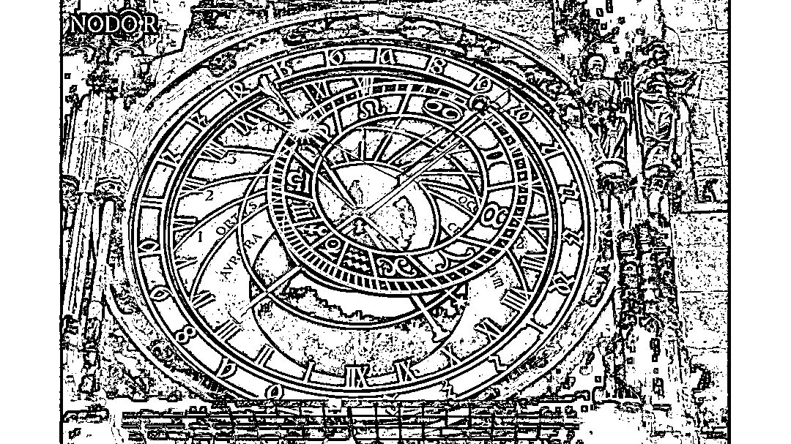

**往期金融预报回顾****2018 年底发布的《2019 年年度预报》**中上证指数的建议：

**到 2019 年 7 月之前，上证指数有三个重要长周期会出现周期低点，理想上看是在 2019 年 3 月底之前。只要指数停留在 2070-2100 点上，我们就依然不会排除 2019 年木星在射手座行进期间出现强势反弹的可能性。**

**在这一波涨势中，我们预计该指数将挑战或突破 21 个月甚至 32 个月的移动平均线，到 2018 年结束时，这两条移动平均线都将保持在 3100 左右。**

**实际状况：上证在 2019 年 1 月出现 2440.91 后，开始一个新的上涨周期。****2019 年底发布的《2020 年年度预报》**中上证指数的建议：

**周期研究表明，2020 年的反弹将超过 2019 年的高点 3288。然而，这一涨势可能会通向 5.5 年周期的波峰，随后将再次迎来一波跌势至 2021 年或更晚。**

**行进中的摩羯座星群——木星、土星和冥王星——表明在 2020 年 11 月底之前会出现一个高点，很可能在 2020 年的前六个月。建议交易者特别注意金星逆行的时期，也就是 5 月 13 日至 6 月 25 日。逆行或顺行一个月内出现的年度高点或低点可能会带来卖出机会。**

**实际状况：2020 年上证反弹最高为 3474。和 2019 年一并成为近几年难得的投资机会。****2020 年底发布的《2021 年年度预报》**中上证指数的建议：

**我们预计涨势将在 2020 年 12 月-2021 年 2 月之间达到波峰，然后急剧下跌至 52 周和 22 个月周期的低点，这些周期将在 2021 年 5 月之前，甚至在 3 月底之前结束。**

**此后可能会出现另一轮反弹，可能会也可能不会在 2021 年 11 月之前形成第一个 33 个月周期的新高，之后上证综指将下跌至 2021 年 10 月-11 月+/-6 个月的 33 个月周期波谷。这将是自 2019 年 1 月以来的最大跌幅。**

**实际状况：2021 年 2 月形成最高点 3731，达到波峰，此后，上证再也没有到达这个波峰。****2021 年底发布的《2022 年年度预报》中**上证指数建议：

**我们预期在 2022 年 5 月前，上证综指会出现急剧的下跌，进入 52 周周期和可能的 33.5 个月周期低点。地球宇宙学征象预示，这可能发生在 2022 年早期，可能在 2021 年 12 月-2022 年 2 月期间。**

**我们认为上证综指可能会重新测试 3300-3350，甚至可能下跌至 3000 区间，倘若 33. 5 个月周期并没有在 2021 年 7 月 28 日触底，而且还在展开的话。只要突破 3750 就意味着它已经在 2021 年 7 月触底了，倘若如此，上证综指可能会在 2022 年急剧上涨至下一个 33.5 个月周期的波峰，有可能会超过 4000。**

**但我们并不倾向于这样观点。我们更倾向于认为，上证综指会首先下跌，在 5 月前形成一个低点，然后上涨。这一轮上涨的幅度，将告诉我们上证综指是处在牛市，还是进入了新的熊市。如果它不能上涨超过 3750，长周期波峰可能已经出现，并且进入了新的熊市。**

**实际状况：上证在 2022 年 5 月之前出现急剧下跌。在 5 月前的 2863 为至今的波谷。**这是他 2019-2022 年为上证所做的年度预测，而**上证的预测仅是年度预测一个部分**。**2023 年 1 月 7 日早 10 点**，他会再次为你带来**他对 2023 年重要投资市场的看法**。2023 年的机会在哪里？机会在**梅里曼老师的年度预测**中。欢迎你来。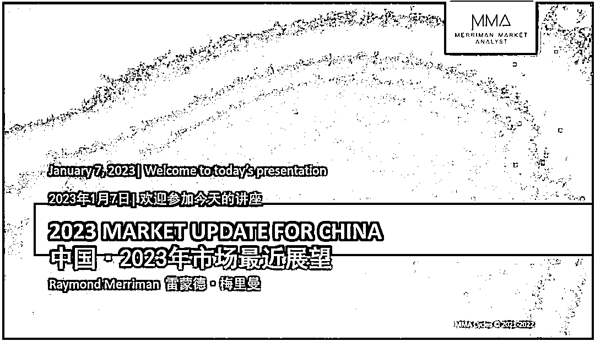

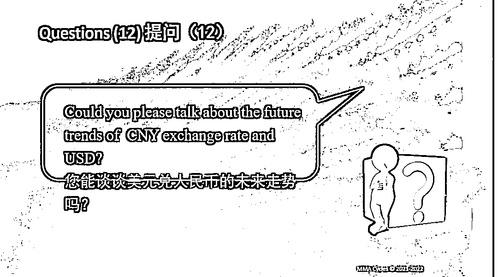

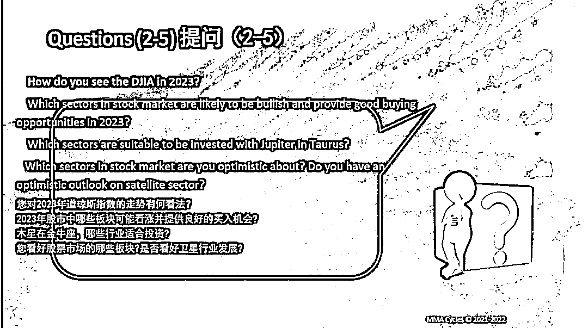

**2023 年度金融预报及沙龙**

**2023 年金融预报沙龙时间为 2023 年 1 月 7 日 10:00-13:00。**

一份价格仅千元的顶尖金融占星大师的投资分析报告和沙龙，聪明的投资者值得拥有。

**2023 年年度预报****及沙龙价格：****1380 元**

**长按下图识别二维码**

**购买报告及沙龙**

**购买者重要须知****①** 梅里曼市场时机学院每年一次的年度预报沙龙和《年度预报》是梅里曼市场时机学院的研究“预报”，而不是市场“预测”，是梅里曼老师及其金融占星分析师对人类活动周期历史与行星周期之间相关性的研究，二者在大部分情况下具有 80%或更高的相关性，而不是因果关系。沙龙中和报告中的研究完全存在错误的可能性。即便是非常认真的研究和几十年的研究经验，我们无法总是正确地解读出各种征象在实际层面上会如何相互作用，并显化为事件结果。

所以请将次沙龙和报告看作一个研究参考，务必结合其他市场研究和你个人对市场的理解，根据你的自由意志做决策。

**②** 此报告一旦售出，**即不接受退款。**

**③** 此报告仅支持在手机网页阅读，不支持电脑阅读和下载。**④** 讲座提供视频回放。**以上须知，请仔细阅读。一旦付款，即视为已了解并接受所有须知内容。**

**如在购买报告中遇见任何问题**

**可添加客服**

▼

**购买报告直达入口**

# 若道占星咨询丨 2023 年来了，如何调整前进的脚步？

> 原文：[`mp.weixin.qq.com/s?__biz=MzA5NjA0NTAxNg==&mid=2651498773&idx=1&sn=864c17bae7edb10513873c20bc9ae837&chksm=8b481ba2bc3f92b475ed1f62c2cba49a544e41fa6fd7335ddbb6860eabbd032e68bc65665721&scene=126&sessionid=1692737700#rd`](http://mp.weixin.qq.com/s?__biz=MzA5NjA0NTAxNg==&mid=2651498773&idx=1&sn=864c17bae7edb10513873c20bc9ae837&chksm=8b481ba2bc3f92b475ed1f62c2cba49a544e41fa6fd7335ddbb6860eabbd032e68bc65665721&scene=126&sessionid=1692737700#rd)

若道占星咨询平台自 2017 年运营至今，已有近 50 多位若道核心课程认证毕业生入驻。他们经过 2 年系统培训、累积完成近 150 小时的相关占星学理论学习、咨询技术的练习、通过若道认证考核后，成为职业占星师，开始开展占星咨询服务。2023 年来了，该如何调整自己适应当下的宇宙天气？又如果你对自己的出生星图充满好奇，想通过占星学这门古老的智慧并在专业咨询师的陪伴下、探索自己的生命故事和人生困惑，欢迎来若道咨询平台预约！

专业占星师在这里等你

**本期我们将为大家推荐以下占星师：**

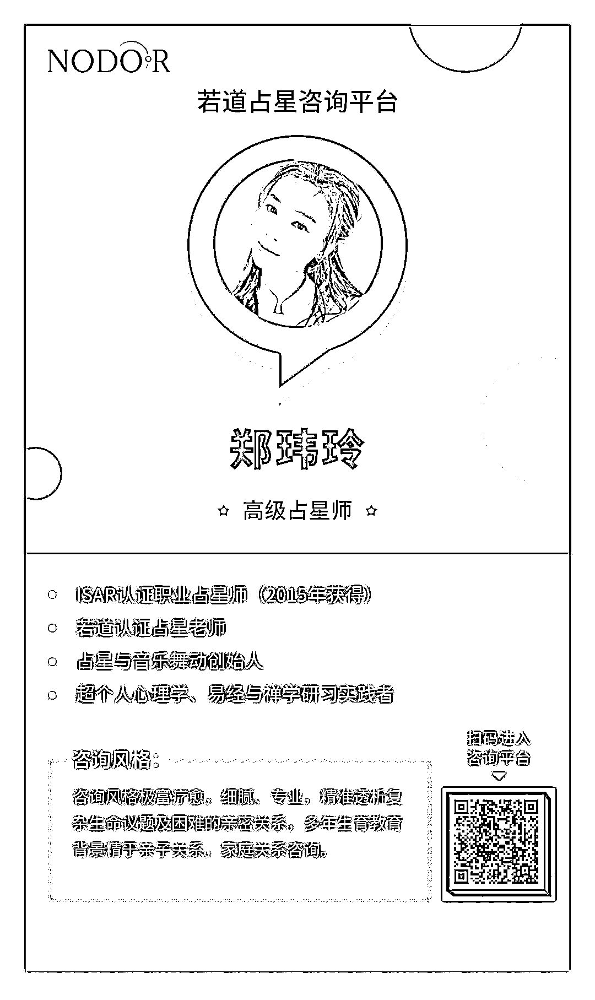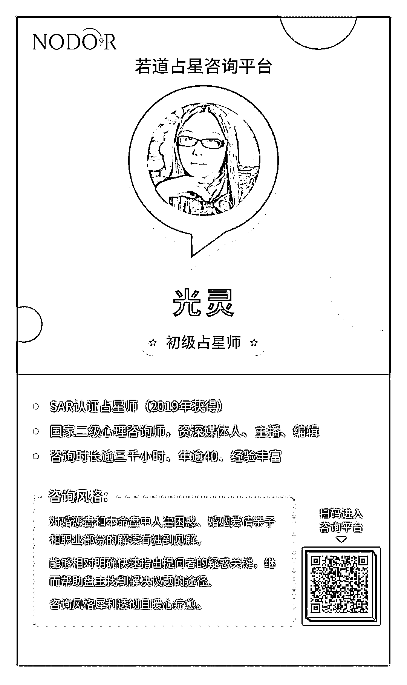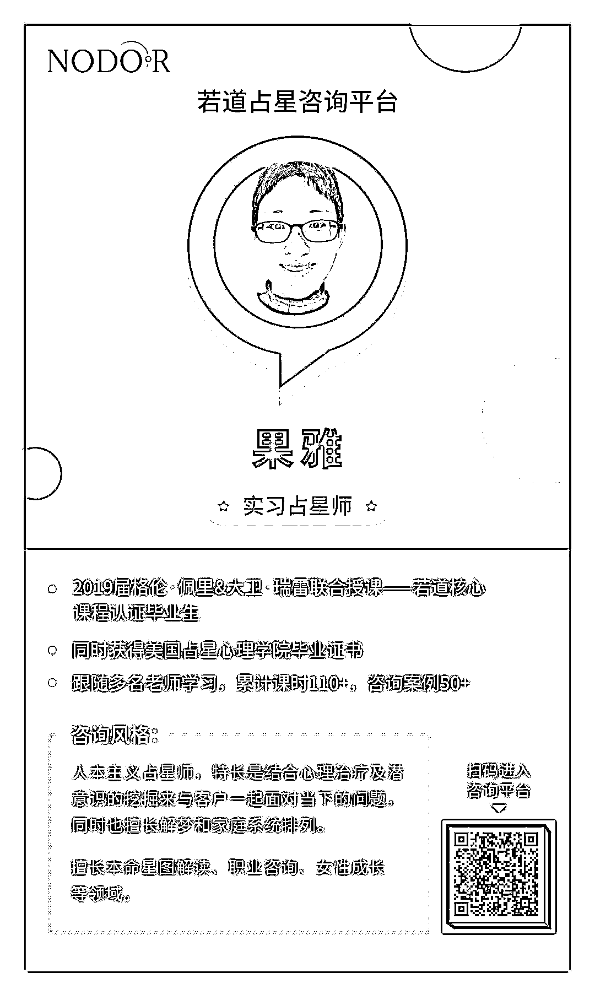

**来看看大家在咨询后的评价~**

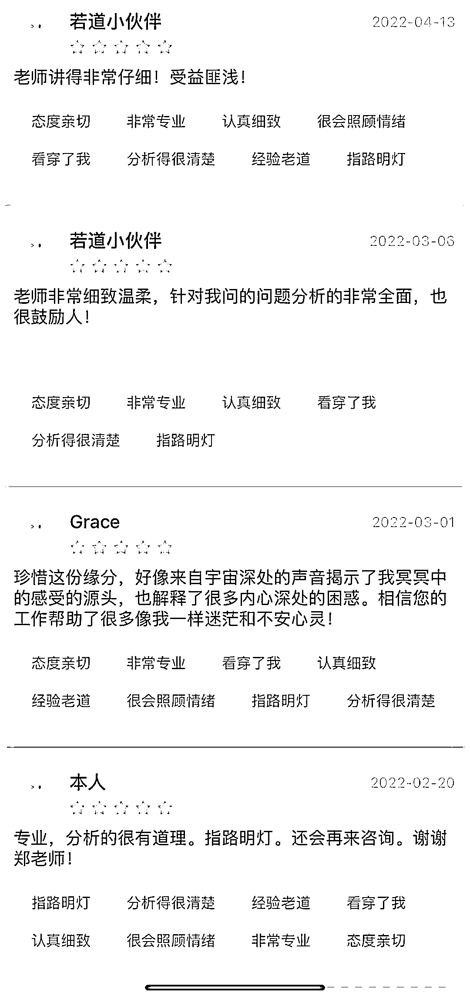

如何预约占星咨询？

**方式一：****下载若道 APP，进入占星咨询栏目可以进行预约**

****

**方式二：通过若道服务号******

**新的一年，来领取你的好运吧！**

**扫码**即可领取**专属的年运报告**

**如果你也想成为优秀的职业占星师？** 

**这里有个课程可以了解一下**

**2023 年，若道君祝大家身心愉快！**

# 今晚直播丨占星咨询师养成之心法分享

> 原文：[`mp.weixin.qq.com/s?__biz=MzA5NjA0NTAxNg==&mid=2651498773&idx=2&sn=74be20dcd7e2946819b5d1e1bc00e275&chksm=8b481ba2bc3f92b473e99f4f27db11ce840bfb0bedc019819a078c6a220937db9639eae85210&scene=126&sessionid=1692737700#rd`](http://mp.weixin.qq.com/s?__biz=MzA5NjA0NTAxNg==&mid=2651498773&idx=2&sn=74be20dcd7e2946819b5d1e1bc00e275&chksm=8b481ba2bc3f92b473e99f4f27db11ce840bfb0bedc019819a078c6a220937db9639eae85210&scene=126&sessionid=1692737700#rd)

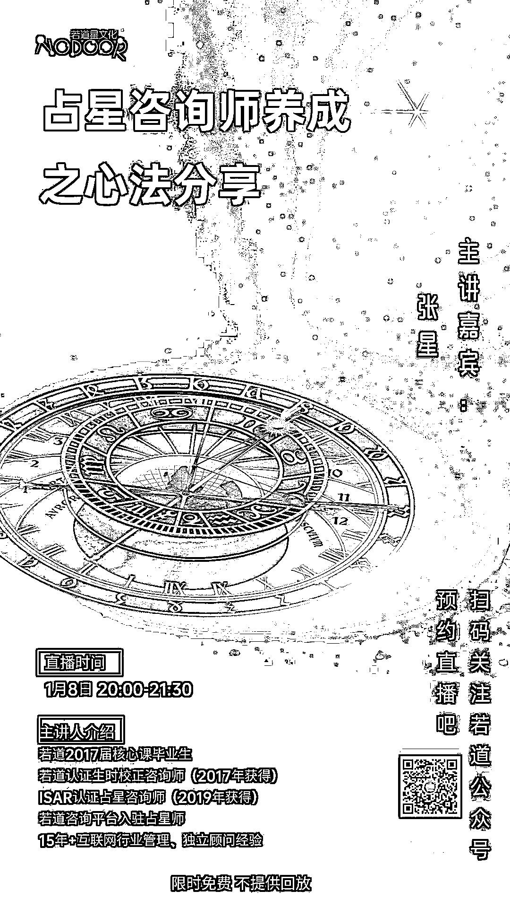

<mpvideosnap class="js_uneditable custom_select_card channels_live_iframe" data-pluginname="videosnap" data-headimgurl="https://wx.qlogo.cn/finderhead/PiajxSqBRaEJYnVsqWfEX9qA0sI6hNVKsDfyzfPZ92WZMZyBpZWU5NA/0" data-username="v2_060000231003b20faec8c4e68a1ec2d4ca07e434b07755bbf47e7053a3059defd2c9d6c68a20@finder" data-nickname="若道" data-desc="将在 01 月 08 日 20:00 直播" data-intro="占星咨询师养成 之心法分享" data-noticeid="finderlivenotice-v2_060000231003b20faec8c4e68a1ec2d4ca07e434b07755bbf47e7053a3059defd2c9d6c68a20@finder-1672369220782383-1347816861" data-type="live"></mpvideosnap>

# 巨蟹座满月丨如果最近背负了太多，请允许自己做个孩子吧！

> 原文：[`mp.weixin.qq.com/s?__biz=MzA5NjA0NTAxNg==&mid=2651498769&idx=1&sn=49f58da6ad9234efa48d1a20aa0b27a6&chksm=8b481ba6bc3f92b0b74f9ac4e6a3d33cbb01797520650a752423ded6fb7e4c42318d42ac7684&scene=126&sessionid=1692737700#rd`](http://mp.weixin.qq.com/s?__biz=MzA5NjA0NTAxNg==&mid=2651498769&idx=1&sn=49f58da6ad9234efa48d1a20aa0b27a6&chksm=8b481ba6bc3f92b0b74f9ac4e6a3d33cbb01797520650a752423ded6fb7e4c42318d42ac7684&scene=126&sessionid=1692737700#rd)

**☆ 后台回复“今日”，给你一句生命态度**

作者/王芝桦

编辑/玫瑰 图片/稿定设计

**巨蟹座满月**

北京时间**2023 年 1 月 7 日 7:07**迎来**巨蟹座满月**，**摩羯座太阳和巨蟹座月亮于 16°21′精准对分**。

此次巨蟹座满月是**2023 年度的第一个满月**，“月亮与巨蟹座”一体共振的守护关系，也令巨蟹座满月带来的感受能量极其细腻，情绪能量极度饱满。2023 年的第一个月相从满月开始，预示着全新的一年从“**释放和净化**”开始。最近一段时间，我们背负着太多的压力，也经历着太多的消耗，故而，此次巨蟹座满月，我想对各位朋友说的第一句话是：**无论性别与年纪，在这个巨蟹座满月时刻，允许自己当个宝宝吧**。

**巨蟹座满月重点影响人群**

参考满月峰值影响期间各个行星的行进度数，以及逆行行星的轨迹影响；常规容许度，个人行星入相位 3°，出相位 1°；非个人行星入相位和出相位均为 3°。

**·** 出生星图中，有**行星、四轴、南北交点落入基本星座（白羊座、巨蟹座、天秤座、摩羯座）0-30 度**的人群；**· **出生星图中，有**行星、四轴、南北交点落入固定星座（金牛座、狮子座、天蝎座、水瓶座）1-28 度**的人群；

**·** 出生星图中，有行星、四轴、南北交点落入变动星座（双子座、射手座、处女座、双鱼座）5-28 度的人群。

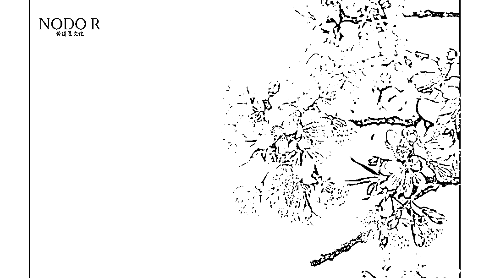

**“心”里藏着有关未来的密码**

> ****天象：****
> 
> **· 水星介入“日月对分”轴线：逆行的摩羯座水星合相摩羯座太阳，对分巨蟹座月亮。**
> 
> **·天王星介入“日月对分”轴线：逆行的金牛座天王星三分摩羯座太阳，六分巨蟹座月亮。**

2022 年最后一个多月的时间，大多数朋友都经历了一轮病毒的考验，走过的时光走不回去了，而未来的时光又充满着不确定性，虽然大家尽量地恢复了工作事务和生活繁忙，但我们的身心都有些疲惫，甚至有些“打蔫儿”。前尘仍未落定，未来已在跨进。时间步入 2023 年的新纪元与新征程，然而，太多的计划未见眉目或难以推进，太多的疲倦需要休憩却又不得不爬起来。这个世间最难的是，想“快”发现没到时候，想“慢”却被推动而行，这让人不由想起一个词——**节奏**。占星学研究的是“如在其上，如在其下”的学问，即天上行星的轨迹与地上人间的意识相互辉映。故而，“**天人合一**”阐释了生命小循环与宇宙大循环的一体共振：**两相和谐，自然运顺势好**；两相不和谐，自然运逆势衰。生命小循环只能跟随宇宙大循环“顺势而为”。这不，2022 年-2023 年的这场跨年之旅，一股“**急不得**”的宇宙大循环节奏扑面而来。半个月前的摩羯座新月文（详情点击：[摩羯座新月 | 加速未来两年的转化过程，但当下请放慢脚步！](http://mp.weixin.qq.com/s?__biz=MzA5NjA0NTAxNg==&mid=2651497604&idx=1&sn=b75a4fdd38f69979c7e1081b04da0ccd&chksm=8b481633bc3f9f25bf935521a9bff19c45b16eecee10edf330610dc6c19217c05f49e1766c50&scene=21#wechat_redirect)）中曾经写到：代表“心智运转”能量的水星于 2022 年 12 月 29 日在摩羯座发生逆行（逆行期 2022 年 12 月 29 日-2023 年 1 月 18 日），代表“行动意志”能量的火星正在双子座逆行（逆行期 2022 年 10 月 30 日-2023 年 1 月 13 日）——脑子和行动都在“倒退”，流动和行程都被“减缓”，宇宙提示我们带着“**反思的视角**”走过 2022 年-2023 年“急不得”的跨年之旅。**我们在时间之中缓慢下来，才能觉察到生命在时间的长河中缓缓流淌**；在病毒的肆虐面前，在生死的考验面前，才能感知到**生命中最珍贵的部分是什么**。此次巨蟹座满月，借助“**月亮+巨蟹座**”敏感而纯粹的能量通道，**向内感知，回归初心**，释放身心的伤痛与疲惫，感受所有的爱与时光。同时，此次巨蟹座满月**，“日月对分“轴线与金牛座天王星**的互动结构，也进一步触发了现实层面的突然变化，触发着情绪层面的大幅波动。其实，只要不是老生常谈无数次，只要不是一块石头上绊倒 N 跤，那么这种情绪的起落就是相当正常——我们正在经历从未有过的经历，我们也正在更新从未有过的更新，我们正在学习对大惊小怪不再大惊小怪。

**1、反思“摩羯座”的进化主题**

摩羯座是黄道十二星座中的第十个星座，十二星座依照顺序发展到摩羯座，可以说确实到了要演化“**现实成果**”的阶段。故而，大家都知道摩羯座务实自律且意志坚韧，讲究规则且注重结果，是个有实力且能成事的“权威”星座。但黄道这个闭环的“圆”（星图上的圆），它可是宇宙的神秘大网，每个点和每个符号之间都有着互相照见、互相补充的能量联结。比如，摩羯座和巨蟹座这一组对宫星座，摩羯座如果把巨蟹座的“心”丢了，那么就容易成为追逐外在结果的机械程序；而巨蟹座如果把摩羯座的“意志”丢了，那么就容易成为沉沦宠溺怀抱的脆弱妈宝。那么，摩羯座要成为什么样的权威呢？是符合世俗价值、取得现实成功的权威？还是符合内在天性、跟随内心初衷的权威？前者，好看，有用，但未必快乐；后者，好玩，有用，且肯定满足。当然，后者是摩羯座的高阶进化目标，而这里面其实蕴含着摩羯座的对宫星座巨蟹座的“心”，即**梦开始的地方**——**不断回归内在属地，不断校准内心初衷，才能真正实现“最高的自我”**。

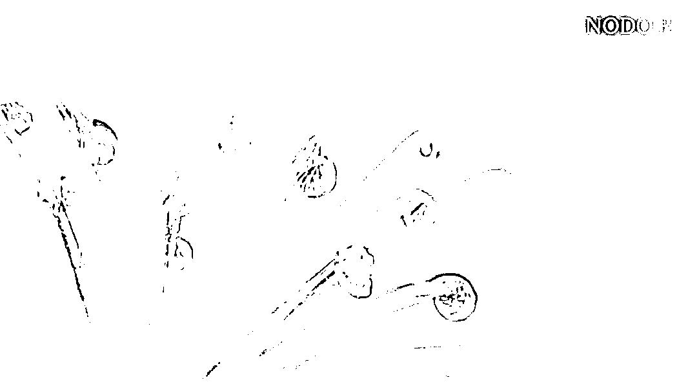

此次巨蟹座满月，**逆行的摩羯座水星介入“日月对分”轴线**，提示我们——**在“现实目标和内在初衷”之间做出检视与反思**。这里插播一下摩羯座冥王星的内容：

*   当下一轮“摩羯座冥王星”进程发生在 2008 年-2024 年，揭示“业力议题”的冥王星，在这 16 年揭示出“只能更好，不能后退”的集体性执着和时代性功课。

*   **2023-2024 两年时间，冥王星将会在“摩羯座-水瓶座”之间来来回回往返穿梭多达 5 次**，揭示出：**想要跃进到全新的风元素周期，想要进化到全新的意识文明，想要发展出自己的独特定位，必须先做完“摩羯座冥王星”的业力功课**——不再被“只能更好”的野心驱动，不再被“不能后退”的恐惧左右，不再被“世俗价值”定义自己，而是跟随自心的节奏，寻回内在的权威！

之所以插播“摩羯座冥王星”的内容，是因为这一波发生在摩羯座的水星逆行，就像是水星原型“神的信使”赫尔墨斯特意传递的神秘信件——**2023-2024 两年，“摩羯座”将是我们必须了解、必须翻越、必须进化的一座山峰**！故而，2023-2024 这两年的摩羯月生活非常值得我们关注：

*   太阳系的中心“太阳”行进在摩羯座的 30 天，我们的生活重心将充满摩羯座的心理机制和特质色彩；而在“摩羯座冥王星”的业力驱动下，也往往容易坠入过度追逐世俗价值、外在结果的风险。

*   而这两年发生在摩羯月的巨蟹座满月，正是我们借由现实生活的触发，与内在世界深度联结的时刻，回归内在属地，校准内心初衷，跟随自心的节奏，寻回内在的权威。

此次巨蟹座满月，总体而言两个策略：**一是不求太快，二是找到重点**。这两个策略的基础都需要对自我内心相当的清晰和笃定，也就是**清晰自己的生命节奏，笃定自己的价值排序**。其实，这两点也将是未来两年时间，冥王星在“摩羯座-水瓶座”之间跳着往返穿梭 5 次的舞步，慢慢调教我们并要求我们学会的品质。或许，当下的我们还要慢慢适应；然而，未来的我们终要继续前行！此次巨蟹座满月，宇宙赐予我们这一段静谧的时光，回归心灵深处，寻回内心初衷，而**这颗“心“里藏着有关未来的所有密码**。

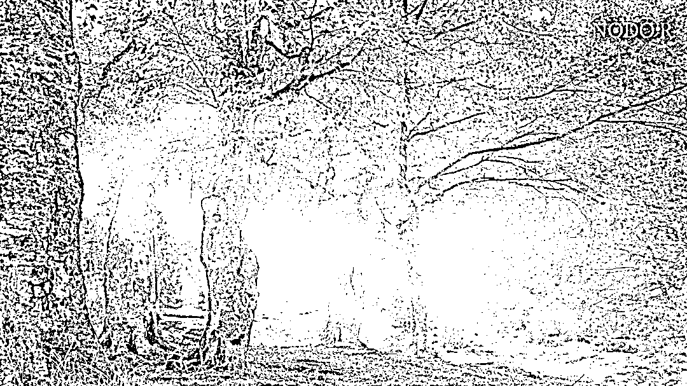

**2、现实的影响**

*   **职场：**

这对于职场而言并不是一个稳定的时期，除了一年一度的规划部署之外，很多企业和团队也将迎来组织架构、管理体系、工作流程的调整；落在个人身上，有关“层级，立场”的矛盾将会再度重现，一些朋友将会面临重新站队的情况，不得不对人、对关系、对合作、对边界重新做出审视。但在此次巨蟹座满月强烈的情绪波动之下，建议**尽量保持冷静与克制，以免情绪之下产生主观误解**。

*   **家庭：**

从 2022 年底开始，家人健康便成为每个人的首要关注，这个满月需要我们对自己、对家人、对长辈的健康及时关注，既往病史做好日常监测，恢复期避免过于劳累，不赶进度，放下焦虑。

*   **计划：**

一些朋友可能需要修正原有的计划，一些朋友可能遇见一拍即合的灵感，是被耽搁，还是遇机会，检验的是每个人的实力与沉淀。如果我们能向内深思一下欠缺的部分，谦卑学习一下他人的品质，那么当下也将会是一次带来转机的有效助力。

**3、提前的祝福**

半个月后，1 月 22 日 4:53 迎来水瓶座新月，也迎来一年一度的新春佳节。假期之内不另发新月文，故而，在此提前恭祝朋友们新春吉祥。水瓶座新月发生在水瓶座 1 度，并与行进在摩羯座 28 度的冥王星有一个宽泛的合相结构，再次预示着——**2023 年的水瓶座新月，将会开启冥王星在“摩羯座-水瓶座”之间往返穿梭 5 次、检验我们“摩羯座冥王星”业力功课完成情况的未来两年进程**。水瓶座新月发生时刻，接纳水瓶座新月能量的两颗行星：金牛座天王星（天王星守护水瓶座）将于 1 月 23 日恢复顺行，土星（土星守护水瓶座）与金星合相于水瓶座、与双鱼座海王星处于 30 度结构。故而，**建议这个春节保持相应的“人际距离”，因为当下考核的不是我们的推进速度，而是我们的管理能力**。

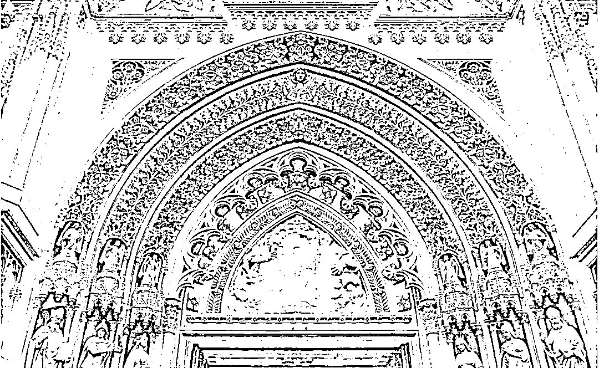

**寄语**抱歉，朋友们，写到这里只能结束了，因为身体还在恢复阶段，而今天我的感觉非常疲倦。这篇文章不尽人意，不尽之处，还望海涵。祝福每一个生命健康，每一个灵魂安好。

**版权声明**：原创文章由作者授权首发于若道平台，欢迎转发，反对抄袭。友号转载请申请白名单。

**END******想阅读更多作者的文章，********请在后台回复******王芝桦****** 即可。****

****王芝桦****

心理占星师，统合疗愈师，占星专栏作者

若道占星“新月和满月”专栏作者，腾讯视频特约占星师

全职于个案咨询与占星教学工作 19 年

**个案预约咨询微信号**：zhihua0621 

**微信公众号**：daoxi-life

**长按打赏**

********

**如何在疫情下守护好我们的心？****欢迎今晚你来观看沙龙**

<mpvideosnap class="js_uneditable custom_select_card channels_live_iframe" data-pluginname="videosnap" data-headimgurl="https://wx.qlogo.cn/finderhead/PiajxSqBRaEJYnVsqWfEX9qA0sI6hNVKsDfyzfPZ92WZMZyBpZWU5NA/0" data-username="v2_060000231003b20faec8c4e68a1ec2d4ca07e434b07755bbf47e7053a3059defd2c9d6c68a20@finder" data-nickname="若道" data-desc="将在 01 月 07 日 20:00 直播" data-intro="如何运用心平健康学在疫情下如何守护好我们的心，保持身心平衡." data-noticeid="finderlivenotice-v2_060000231003b20faec8c4e68a1ec2d4ca07e434b07755bbf47e7053a3059defd2c9d6c68a20@finder-1672298019321644-517510300" data-type="live"></mpvideosnap>

**新的一年，来领取你的好运吧！**

**扫码**即可领取**专属的年运报告**

**20 位来自世界各地的占星师****带来 19 场沙龙——新世界的觉醒****详情可点击下图**

**学习占星学****点击下图了解课程详情**

**微信又双叒叕改版啦，不想错过若道君的推送？**
****就把若道设为****星标****以及点点****“在看”****吧！******▼**

**喜欢就点一下“在看”吧！****报名直达入口**

# 今晚直播丨如何在疫情下守护好我们的心？

> 原文：[`mp.weixin.qq.com/s?__biz=MzA5NjA0NTAxNg==&mid=2651498769&idx=2&sn=f2b6aad0575830027ad94df68adc4a07&chksm=8b481ba6bc3f92b0da0af3d325a497d8e85ae193b13e8e7dcd7142e5cbe724b887605e8c3dcd&scene=126&sessionid=1692737700#rd`](http://mp.weixin.qq.com/s?__biz=MzA5NjA0NTAxNg==&mid=2651498769&idx=2&sn=f2b6aad0575830027ad94df68adc4a07&chksm=8b481ba6bc3f92b0da0af3d325a497d8e85ae193b13e8e7dcd7142e5cbe724b887605e8c3dcd&scene=126&sessionid=1692737700#rd)

<mpvideosnap class="js_uneditable custom_select_card channels_live_iframe" data-pluginname="videosnap" data-headimgurl="https://wx.qlogo.cn/finderhead/PiajxSqBRaEJYnVsqWfEX9qA0sI6hNVKsDfyzfPZ92WZMZyBpZWU5NA/0" data-username="v2_060000231003b20faec8c4e68a1ec2d4ca07e434b07755bbf47e7053a3059defd2c9d6c68a20@finder" data-nickname="若道" data-desc="将在 01 月 07 日 20:00 直播" data-intro="如何运用心平健康学在疫情下如何守护好我们的心，保持身心平衡." data-noticeid="finderlivenotice-v2_060000231003b20faec8c4e68a1ec2d4ca07e434b07755bbf47e7053a3059defd2c9d6c68a20@finder-1672298019321644-517510300" data-type="live"></mpvideosnap>

# 初阶丨心平健康学：身心平衡的疗愈实践

> 原文：[`mp.weixin.qq.com/s?__biz=MzA5NjA0NTAxNg==&mid=2651498686&idx=3&sn=fa108f32f58bb2151f32e7d264a7e5d0&chksm=8b481a09bc3f931f1ce8a13a8f2bfbc92e003fe13f18a908136b5e8692f05eeedea6d665eafa&scene=126&sessionid=1692737700#rd`](http://mp.weixin.qq.com/s?__biz=MzA5NjA0NTAxNg==&mid=2651498686&idx=3&sn=fa108f32f58bb2151f32e7d264a7e5d0&chksm=8b481a09bc3f931f1ce8a13a8f2bfbc92e003fe13f18a908136b5e8692f05eeedea6d665eafa&scene=126&sessionid=1692737700#rd)

**授课内容**

**所有的疾病都是身心疾病。**

我们的祖先很早就认识到这一点。

在最早医学著作《黄帝内经》开篇《素问·上古天真论》中，就讲：“虚邪贼风，避之有时，恬淡虚无，真气从之，精神内守，病安从来”。**这是对于“内因致病”和“修心去病”最早的描述。**

在《素问·刺法论》，黄帝又问流行性疫病。他说“余闻五疫之至，皆相染易，无问大小，病状相似，不施救疗，如何可得不相移易者？”岐伯对此的回答是：“不相染者，正气存内，邪不可干。”

可见不仅对于个体性的常见疾病，哪怕对于大多数人都会感染的流行性疫病，只要“正气存内”，就可以有效预防和对治。

那么什么样的因素会导致“内心正气”的偏离呢？《大学》里说，“身有所忿懥，则不得其正。有所恐惧，则不得其正。有所好乐，则不得其正，有所忧患，则不得其正。”

《素问·阴阳应象大论》里把七情六欲和人的身心疾病对应起来，提出了我们常听到的“怒伤肝、喜伤心、思伤脾、悲伤肺、恐伤肾”等这些“不平”的心理情绪对于身体的损伤。

而《素问·平人气象论》更明白指出，“无问其病，以平为期”。“平人者，不病也”。

**中医叫健康之人为“平人”，而平人就是阴阳平衡之人，没有太过与不及。**

然而从小到大，在我们的人生经历中，我们必然经历各种各样让我们内心不能平静的事情，不论是过去，还是现在，我们都经历了各种情绪起伏，并在各种固有的、自知或不自知的情绪模式和偏颇的信念模式中。

但大多数人不知道的是，这些内在因素都会导致我们的身心失衡，最终反映在我们的心理疾病和身体疾病中。

而现代西方的身心健康研究也证明了我们祖先的智慧。**身体，就是我们心灵的显示器。身体的疾病，不仅是因为内心的失衡而产生，也可以通过内心的调整而治愈。**

**而心平健康学正是建立在中医的“内因致病”为理论基础，通过特定的方法，找到内因，调整内因以达到治愈疾病、身心的平衡的一门实践性很强的自我疗愈、疗愈他人的方法。**

**心平健康学**

心平健康学是王中平老师从 1986 年开始，经过三十多年研究和实践，发现和总结各种身体症状和心理不平衡相对应规律，并运用这些规律调解和祛除不平衡身体症状，以达到身心同时健康的学问。

**这个学问体系以中国古老医学经典为其理论基础，以自然力（事物运行发展的法则，简称自然力）为核心，平衡论为主导。**

对于身体的不适，运用心平健康学的方法，可以找到“不平”所在。这种不平包括情绪、感受、认知、内心的想象、活动和用力、外在的语言、行为等多方面。

*   **比如生活中日积月累的不平的情绪、感受会变化成身体上不平衡的感觉；**

*   **内心中使的力、用的劲会在身体上留下痕迹（俗话叫用力过猛）；**

*   **而不辩证、不中正的认知会导致疾病的不同性质；**

*   **假设、想象中的各种不平心会影响到我们的神经系统。**

而当我们把“内因”，也就是不平衡的心理，通过特定的方法、技术调整为平衡，心在“ 平静、平衡、平等 ”的状态下，身体就会转为健康和谐，这就是“ 病由心解 ”。

**初级班学习步骤**

**★****课程前**

1.  自习（提供音频）王中平老师教授的心平健康学初级班四日音频课程

2.  读心平健康学内部学习资料《认识平衡》

3.  听心平健康学讲师彦方录的系列音频课程 ：

*   心平健康学是什么？

*   七情

*   四季与五行

*   八纲

**★****课程中做什么及收获什么**

1.  **学习“揉球”方法，**“揉球”是心平健康学体系中贯穿始终的在潜意识层面调治不平心理的方法、技术、工具。有自然揉球、定向揉球，（也就是有主题的揉球）、及缩减版拇指揉球。“揉球”的目标即是把不平衡的心理调整为平衡、平静。三日初级班课程，是实操课程，通过连续 18 小时的练习和实践，对“揉球”的方法不断的体会和夯实，以便课程结束后可以通过“揉球”的方法在生活中调整自己不平衡的心理及调整相应的躯体症状。

2.  **一对一个案治疗，学习治疗方法及完成治疗。**

    通过课程中自己及团体的一对一个案治疗，体会到自己在过去、现在及对未来有什么样的不平衡心理，导致了相应的躯体症状、心理疾病及不和谐的关系，并在个案中完成治疗。在自己及他人做个案的过程中体会治疗方法，以便课后可以自然应用方法。

**★****课程后**

听心平健康学讲师彦方录的音频课程：“揉球”过程中的疑惑与解答。

**老师介绍**

**张彦方**

硕士，心理咨询师；心平健康学初级班、综合中级班、女性健康专项中级班、亲子关系专项中级班讲师，并教授脏腑研究型课程，经典研读课程（中庸、道德经），断食课程，耐寒、耐热课程，物质平衡课程。

2017 年初教授心平健康学系列课程，累积课时 2000 小时以上，个案咨询 5000 小时以上，主要擅长通过调整不平衡的情绪、感受、认知来改善躯体症状，尤其在女性因为情绪、感受等不平衡心理所导致的乳腺增生、卵巢囊肿、月经不调等妇科疾病上有深入的研究和实践经验。在改善亲密关系和亲子关系方面有较多成功案例。

**课程推荐**

疗愈的层次，在西方讲身心灵，在东方讲形气神，其实都是在说物质、能量与信息。物质层面的治疗如现代医学，能量层面的治疗如中医针灸，而信息层面的治疗相对较少，也往往很神秘，比如西方的炼金术、灵媒，中国的祝由、道家法术等。

心平健康学是少见的既能在“神”的层次展开治疗，又十分朴实、接地气的一门技术。通过简单的肢体动作、配合起心动念的练习，就可以达到调神的效果，并借由“身心同调”的方式，从神（信息）影响形（身体）与气（能量），属于个人成长之路上的卓有实效的修行好伴侣。

——天空的空

**课程价格**

**费用：2700 元** 

**授课方式和时间安排**

**线上授课：**12 人小班制

**授课时间：**2023 年 2 月 24-26 日，上午 9:00-12:00，下午 2:00-5:00，共计三天

**咨询请添加李老师微信：cd13518140789**

长按二维码添加李老师微信

****心平健康学初级班****

**授课老师：张彦方**

**开课时间：2023 年 2 月 24 日-26 日，上午 9:00-12:00，下午 2:00-5:00，共计三天**

**授课方式：******网络授课****

**费用：2700 元**

**课程负责人：李老师**（微信：cd13518140789）

长按二维码添加课程负责人咨询

**报名直达入口**

# 今日直播 | 如何运用占星学来面对 2023 的机遇与挑战？

> 原文：[`mp.weixin.qq.com/s?__biz=MzA5NjA0NTAxNg==&mid=2651498686&idx=4&sn=9f0ca112745765d3f9b377cda067ac41&chksm=8b481a09bc3f931f8795e637c3ed0ec03826da14664713af261a043a9ee331fa43abc42c8e33&scene=126&sessionid=1692737700#rd`](http://mp.weixin.qq.com/s?__biz=MzA5NjA0NTAxNg==&mid=2651498686&idx=4&sn=9f0ca112745765d3f9b377cda067ac41&chksm=8b481a09bc3f931f8795e637c3ed0ec03826da14664713af261a043a9ee331fa43abc42c8e33&scene=126&sessionid=1692737700#rd)

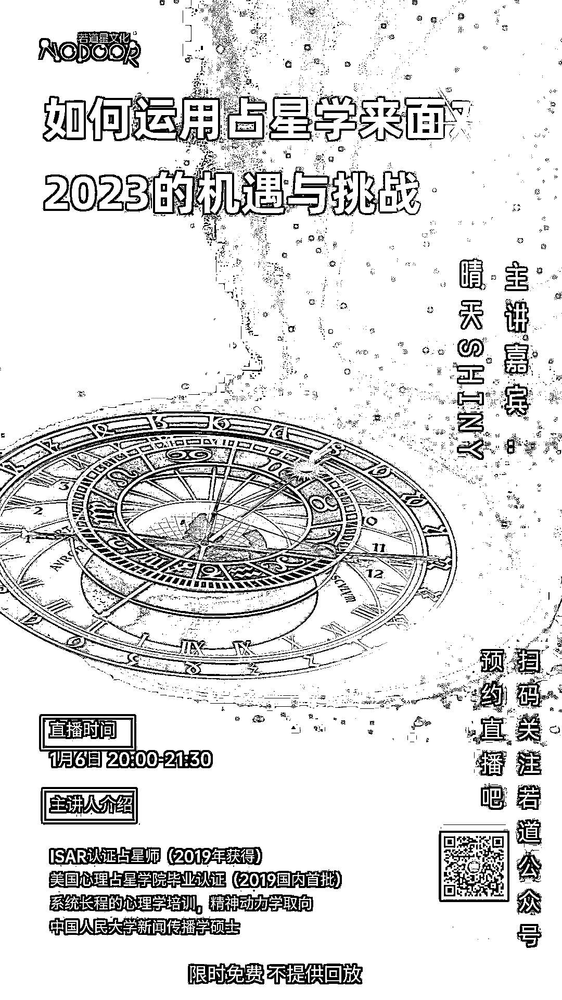

**点击可预约直播**

<mpvideosnap class="js_uneditable custom_select_card channels_live_iframe" data-pluginname="videosnap" data-headimgurl="https://wx.qlogo.cn/finderhead/PiajxSqBRaEJYnVsqWfEX9qA0sI6hNVKsDfyzfPZ92WZMZyBpZWU5NA/0" data-username="v2_060000231003b20faec8c4e68a1ec2d4ca07e434b07755bbf47e7053a3059defd2c9d6c68a20@finder" data-nickname="若道" data-desc="将在 01 月 06 日 20:00 直播" data-intro="如何运用占星学来面对 2023 的机遇与挑战" data-noticeid="finderlivenotice-v2_060000231003b20faec8c4e68a1ec2d4ca07e434b07755bbf47e7053a3059defd2c9d6c68a20@finder-1672298285119129-1148689360" data-type="live"></mpvideosnap>

# 中医“九气”，如何影响你的健康？

> 原文：[`mp.weixin.qq.com/s?__biz=MzA5NjA0NTAxNg==&mid=2651498686&idx=2&sn=932cc7b0c57b7f577e1f09edb4784c7c&chksm=8b481a09bc3f931fe59e30bbfa04d49ab3c492a36f8766dfec6f97167bba0c8e516b0018a48a&scene=126&sessionid=1692737700#rd`](http://mp.weixin.qq.com/s?__biz=MzA5NjA0NTAxNg==&mid=2651498686&idx=2&sn=932cc7b0c57b7f577e1f09edb4784c7c&chksm=8b481a09bc3f931fe59e30bbfa04d49ab3c492a36f8766dfec6f97167bba0c8e516b0018a48a&scene=126&sessionid=1692737700#rd)

作者/彦方

编辑/翀子 图片/稿定设计

中医的九气理论也是心平健康学中重要的理论基础之一。九气即为喜则气缓、怒则气上、悲则气消、思则气结、恐则气下、寒则气收、炅则气泄、劳则气耗、惊则气乱。它们都是什么意思？来看文章吧！

我们前面讲了七情，喜怒忧思悲恐惊，接下来讲九气。**中医的九气理论也是心平健康学中重要的理论基础之一。**九气即为**喜则气缓、怒则气上、悲则气消、思则气结、恐则气下、寒则气收、炅则气泄、劳则气耗、惊则气乱。**

**1****喜则气缓**

我们前面已经讲了喜伤心，说到当我们为了达到自己的需要用的力、**使的劲大了、管的太宽了，会影响心脏的功能。**当我们使劲的时候，心肌非常用力地在收缩，我们能感受到心脏跳的力度很大，速度很快、但是没多久，就会发现心脏使不上劲儿了，也就是说，使的劲大了、管的太宽了，反作用力平衡过来，反而气缓了。

**2****怒则气上**

“怒（奴）则气上”说的也是法则：人处于低点时，往往守不了低点、当不了“奴”（仿佛被别人踩在脚下），会感觉到窝囊委屈压抑。

我们在治疗的时候，一方面要释放窝囊委屈压抑的感受，一方面要从认知上放松地守着这个“奴”。真能守着人生的低点，气自然会往上走，即怒（奴）则气上。**我们越不接受低点，觉得窝囊委屈压抑，反而越会影响肝的功能。**

每个人在人生中都有比别人低的时候，有“奴”的时候，不是不该有低点，也不是“奴”错了，重点是我们如何面对。

如果我们在比别人低的时候，内心感到窝囊委屈压抑，会影响肝的功能；**而如果我们真的能放松地体会着人生的低点，体会着那个“奴”，感受着它，守着它，按照法则，气就会上，人也会从“奴”往上走。**

**3****悲则气消**

悲则气消的“悲”，就是前面讲的，想入非非的心。我们在生活中很容易就能够感受到这一点：**无论我们想的是好的还是不好的，都在消耗我们的气。**

生活中的有些人干事儿干的很少，但是他整天陷入在自己的想法中，生活在自己的想象中，我们会发现他干不了什么事儿，什么事儿没干反而人很虚，这就是因为“非心”在消耗他的气，就是悲则气消。

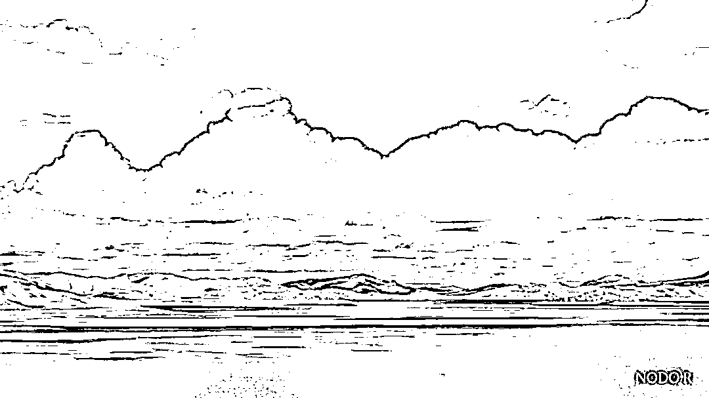

**4****思则气结**

思则气结的“思”，就是前面讲的“田心”，也就是那些被条条框框束缚的心。没有规矩不成方圆，不是规矩规则错了，而是当我们拿着规则，框自己框别人，认为就应该怎么样，就不应该怎么样，**被规则框住了，会影响脾的运化功能，这是“思伤脾”。**

**“思则气结“则是“田心”在我们身体上的另一个体现，就是结节。**如果我们仔细去摸，会发现胳膊上有很多小的结节，还有更多我们自己根本没有觉察到的。严重的结节，以甲状腺结节和乳腺结节最为常见。

这些结节是怎么形成的呢？心平研究出的心理原因就是因为**我们自己设了很多的框、很多的规则，**当现实的发生不在这个规则里，不在这个框里的时候，我们觉得不正常、不应该、不通，这样的不平心理就变成了我们身体上的结节。

乳腺结节是怎么形成的呢？**涉及到亲情和爱情的不平心理会反映在乳腺上，**在亲情爱情上的“田心”就会变成乳腺结节。我觉得 TA（他或她）应该怎样对待我，不论是爸爸妈妈、还是亲密关系中的伴侣，妈妈跟我说话就该温柔，爸爸对我就该慈祥，我们自己认为父母有一个标准，有一个框。

但什么样性格的人都会结婚生子，所以什么样的父母都有。有的父母就不怎么管孩子，有的父母对孩子要求就特别严格，而当他们的方式跟我们认为的那个不一样时，我们就觉得不应该不通，于是就导致了乳腺结节。

**因为我们觉得跟自己的框不一样的时候，那个气就结在那里了，变成了结节，就是思则气结。**

**5****恐则气下**

恐则气下的“恐”，说的还是“巩心”，就是为了达到高点使的劲儿。按照自然法则，任何事到了高点都会下来，巩就是那个高点，因为任何事物都会经历春夏秋冬、生长收藏、成住坏空。按照自然法则，夏至是一年中最阳的时候，一阴生了，而在冬至这个最阴的时候一阳生了。

我们同样可以用这个法则来理解人生，当我们在最落魄的时候，如果真能放松地体会，一阳一定会生的，因为孤阴不生孤阳不长。如果我们违背法则，不接受人生的冬至，阳就升不起来；**到了人生最高点的时候，不想下来，还要更高，就会出问题。**

不管什么事，到了最高点，按照自然的法则就会往下走，好事是这样，坏事发展到高点的时候，同样也会往下走的。**这就是恐则气下。**

**6****寒则气收**

寒则气收，讲的也是法则。在冬天大家都有这样的体会：在户外的寒风凛冽中，**你越觉得冷就会越冷，**如果这个时候你能放松地体会那个冷那个寒，气就会往里收，就会给我们补上来，身体自然就热了。

每年冬天，上完心平耐寒课程的同学都会穿很少的衣服，但他们即便只穿短袖单裤也没有感冒。王中平老师从年轻时开始练习耐寒，二十多年来，冬天穿的那么少，到现在也没有得过老寒腿之类的冬季病。我们自己也都穿单衣单裤过冬，**练习耐寒使我们在冬天反而更不容易感冒，有更强的抵抗力。**

**“寒”同样可以指人生中遇到的那些坏事，**如果我们真能放松地面对，体会着那个“寒”，把不平静不平衡的心调整为平静平衡，气就会自然地往里收，这就是“寒则气收”。当然，这些法则需要我们在生活中去实践，在没有体验的时候，这些还都只是知识。

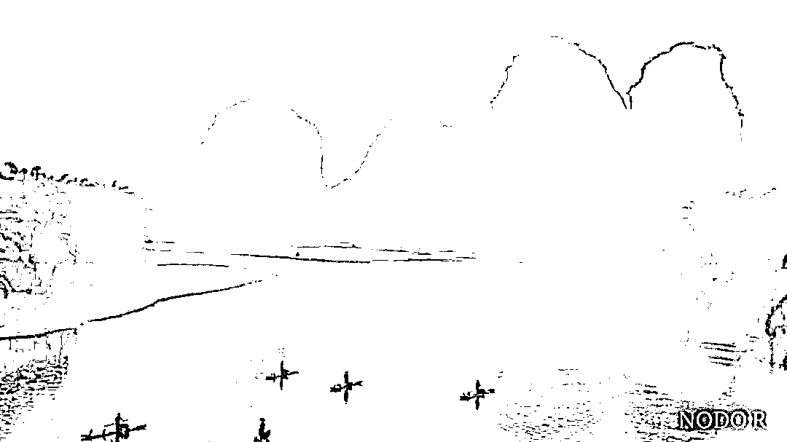

**7****炅则气泄**

炅则气泄的“炅”，是日下面一个火，好比人生处在志得意满的高点，而法则告诉我们，当一个人在炅的时候会气泄。寒则气收，说的是**体会那个寒，气就能往里收，就在补；**炅则气泄，就是人在炅的时候，太得意了，太兴奋了，在太要那个好的时候气就在泄，这也是法则。

并不是说人不能炅，人生可以有光芒四射的时候，但是我们要知道人生不可能永远在至高点，也要知道在这个时候往下走很正常。而在这个高点上的时候，**如果我们一直沉浸在那个“炅“里面兴奋着，还老是觉得自己很厉害，这个时候我们的气就已经在泄了。**

**8****劳则气耗**

劳则气耗很容易理解，我们前面也提到过，**放松地做事是不会消耗的，但我们不愿意干还得干，就会觉得很消耗。**最直接的例子就是家长带孩子出去玩，小孩子玩上一天，跑得比大人都快，还特别有精神，因为他喜欢干，但是陪玩的家长都觉得累死了，因为孩子爱玩的那些不是家长爱玩的。

我个人就特别有这样的体会，带孩子一天下来特别累，不想做还得做的事，就会气耗；但是讲一天课却觉得很轻松，因为内心是喜欢的，讲了一天也没觉得消耗，相信大家这就理解了什么是“劳则气耗”了。

**9****惊则气乱**

我们前面说到过“惊伤胆”。当人被吓了之后，存留下来、平衡过来的情绪，就是惊。被吓过之后，我们怕它再发生，就一直“惊着”。**而胆是清静之府，现在不清静了，当人的心总是悬着，害怕什么事要发生，这个时候整个人都是乱的，**所以叫惊则气乱。

**这就是我们简单地用心平解释的中医九气理论：喜则气缓，怒则气上，悲则气消，思则气结，恐则气下，寒则气收，炅则气泄，劳则气耗，惊则气乱。**

**版权声明：**原创文章由作者授权转载于若道平台，欢迎转发，反对抄袭。

**END**

**心平健康学：身心平衡的疗愈实践**  

从小到大，在我们的人生经历中，我们必然经历各种各样让我们内心不能平静的事情，不论是过去，还是现在，我们都经历了各种情绪起伏，并在各种固有的、自知或不自知的情绪模式和偏颇的信念模式中。但大多数人不知道的是，这些内在因素都会导致我们的身心失衡，最终反映在我们的心理疾病和身体疾病中。而现代西方的身心健康研究也证明了我们祖先的智慧。**身体，就是我们心灵的显示器。身体的疾病，不仅是因为内心的失衡而产生，也可以通过内心的调整而治愈。****而心平健康学正是建立在中医的“内因致病”为理论基础，通过特定的方法，找到内因，调整内因以达到治愈疾病、身心的平衡的一门实践性很强的自我疗愈、疗愈他人的方法。******心平健康学初级班****

**授课老师：张彦方**

**开课时间：2023 年 2 月 24 日-26 日，上午 9:00-12:00，下午 2:00-5:00，共计三天**

**授课方式：******网络授课****

**费用：2700 元**

**课程负责人：李老师**（微信：cd13518140789）

长按二维码添加课程负责人咨询

**报名直达入口**

# 雷蒙德·A·梅里曼 2023 年《年度预报及讲座》，1 月 7 日，讲座来啦！

> 原文：[`mp.weixin.qq.com/s?__biz=MzA5NjA0NTAxNg==&mid=2651498686&idx=1&sn=4363551bb06f95d2dbf999df1b4b68ba&chksm=8b481a09bc3f931f9942e709ae71ba80d3a17c6cf0ab7cc2a5c8ddb34fdea973bfcf612413bc&scene=126&sessionid=1692737700#rd`](http://mp.weixin.qq.com/s?__biz=MzA5NjA0NTAxNg==&mid=2651498686&idx=1&sn=4363551bb06f95d2dbf999df1b4b68ba&chksm=8b481a09bc3f931f9942e709ae71ba80d3a17c6cf0ab7cc2a5c8ddb34fdea973bfcf612413bc&scene=126&sessionid=1692737700#rd)

当梅里曼老师第一次为我们做年度报告时，还是在 2018 年。那时，上证还是处于熊市之中。黄金也才在 1200 多美元。当时，我们也处在第一次金融占星课程之中。在课程里，他告诉我们，黄金到了一个重要的低谷，而上证即将走出熊市。当时，刚开始了解金融占星的我们还是懵懵懂懂，金融占星真的可以指导投资吗？这 4 年，我们都在实践着用金融占星指导投资，并从他的智慧中受益良多。先来回顾一下他在**2019-2022 年**的**年度报告**中对于**上证指数**的投资建议吧。

**往期金融预报回顾****2018 年底发布的《2019 年年度预报》**中上证指数的建议：

**到 2019 年 7 月之前，上证指数有三个重要长周期会出现周期低点，理想上看是在 2019 年 3 月底之前。只要指数停留在 2070-2100 点上，我们就依然不会排除 2019 年木星在射手座行进期间出现强势反弹的可能性。**

**在这一波涨势中，我们预计该指数将挑战或突破 21 个月甚至 32 个月的移动平均线，到 2018 年结束时，这两条移动平均线都将保持在 3100 左右。**

**实际状况：上证在 2019 年 1 月出现 2440.91 后，开始一个新的上涨周期。****2019 年底发布的《2020 年年度预报》**中上证指数的建议：

**周期研究表明，2020 年的反弹将超过 2019 年的高点 3288。然而，这一涨势可能会通向 5.5 年周期的波峰，随后将再次迎来一波跌势至 2021 年或更晚。**

**行进中的摩羯座星群——木星、土星和冥王星——表明在 2020 年 11 月底之前会出现一个高点，很可能在 2020 年的前六个月。建议交易者特别注意金星逆行的时期，也就是 5 月 13 日至 6 月 25 日。逆行或顺行一个月内出现的年度高点或低点可能会带来卖出机会。**

**实际状况：2020 年上证反弹最高为 3474。和 2019 年一并成为近几年难得的投资机会。****2020 年底发布的《2021 年年度预报》**中上证指数的建议：

**我们预计涨势将在 2020 年 12 月-2021 年 2 月之间达到波峰，然后急剧下跌至 52 周和 22 个月周期的低点，这些周期将在 2021 年 5 月之前，甚至在 3 月底之前结束。**

**此后可能会出现另一轮反弹，可能会也可能不会在 2021 年 11 月之前形成第一个 33 个月周期的新高，之后上证综指将下跌至 2021 年 10 月-11 月+/-6 个月的 33 个月周期波谷。这将是自 2019 年 1 月以来的最大跌幅。**

**实际状况：2021 年 2 月形成最高点 3731，达到波峰，此后，上证再也没有到达这个波峰。****2021 年底发布的《2022 年年度预报》中**上证指数建议：

**我们预期在 2022 年 5 月前，上证综指会出现急剧的下跌，进入 52 周周期和可能的 33.5 个月周期低点。地球宇宙学征象预示，这可能发生在 2022 年早期，可能在 2021 年 12 月-2022 年 2 月期间。**

**我们认为上证综指可能会重新测试 3300-3350，甚至可能下跌至 3000 区间，倘若 33. 5 个月周期并没有在 2021 年 7 月 28 日触底，而且还在展开的话。只要突破 3750 就意味着它已经在 2021 年 7 月触底了，倘若如此，上证综指可能会在 2022 年急剧上涨至下一个 33.5 个月周期的波峰，有可能会超过 4000。**

**但我们并不倾向于这样观点。我们更倾向于认为，上证综指会首先下跌，在 5 月前形成一个低点，然后上涨。这一轮上涨的幅度，将告诉我们上证综指是处在牛市，还是进入了新的熊市。如果它不能上涨超过 3750，长周期波峰可能已经出现，并且进入了新的熊市。**

**实际状况：上证在 2022 年 5 月之前出现急剧下跌。在 5 月前的 2863 为至今的波谷。**这是他 2019-2022 年为上证所做的年度预测，而**上证的预测仅是年度预测一个部分**。**2023 年 1 月 7 日早 10 点**，他会再次为你带来**他对 2023 年重要投资市场的看法**。2023 年的机会在哪里？机会在**梅里曼老师的年度预测**中。欢迎你来。

**2023 年度金融预报及沙龙**

**2023 年金融预报沙龙时间为 2023 年 1 月 7 日 10:00-13:00。**

一份价格仅千元的顶尖金融占星大师的投资分析报告和沙龙，聪明的投资者值得拥有。

**2023 年年度预报****及沙龙价格：****1380 元**

**长按下图识别二维码**

**购买报告及沙龙**

**购买者重要须知****①** 梅里曼市场时机学院每年一次的年度预报沙龙和《年度预报》是梅里曼市场时机学院的研究“预报”，而不是市场“预测”，是梅里曼老师及其金融占星分析师对人类活动周期历史与行星周期之间相关性的研究，二者在大部分情况下具有 80%或更高的相关性，而不是因果关系。沙龙中和报告中的研究完全存在错误的可能性。即便是非常认真的研究和几十年的研究经验，我们无法总是正确地解读出各种征象在实际层面上会如何相互作用，并显化为事件结果。

所以请将次沙龙和报告看作一个研究参考，务必结合其他市场研究和你个人对市场的理解，根据你的自由意志做决策。

**②** 此报告一旦售出，**即不接受退款。**

**③** 此报告仅支持在手机网页阅读，不支持电脑阅读和下载。**④** 讲座提供视频回放。**以上须知，请仔细阅读。一旦付款，即视为已了解并接受所有须知内容。**

**如在购买报告中遇见任何问题**

**可添加客服**

▼

**购买报告直达入口**

# 这个“好为人师”的星座竟然也有害怕的东西？快来猜猜看！

> 原文：[`mp.weixin.qq.com/s?__biz=MzA5NjA0NTAxNg==&mid=2651498482&idx=1&sn=e987d8d539ac1c39f60457493c143ac4&chksm=8b481545bc3f9c53a0dc4edc7ff47408e849d46a55d45ee56ea83b4cb81a4206273239522a9d&scene=126&sessionid=1692737700#rd`](http://mp.weixin.qq.com/s?__biz=MzA5NjA0NTAxNg==&mid=2651498482&idx=1&sn=e987d8d539ac1c39f60457493c143ac4&chksm=8b481545bc3f9c53a0dc4edc7ff47408e849d46a55d45ee56ea83b4cb81a4206273239522a9d&scene=126&sessionid=1692737700#rd)

******☆ ****后台回复“今日”，给你一句生命态度******

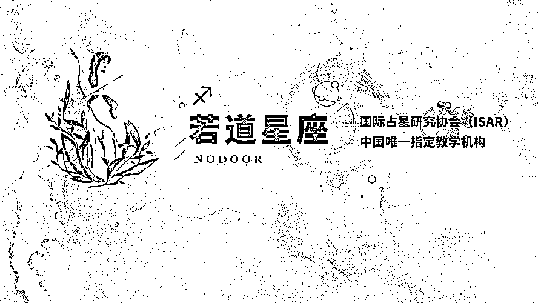

作者/大卫·瑞雷 若道创始人

翻译/轩轩 校对/esme

编辑/翀子 封面/书君 图片/稿定设计

如果刚好你的太阳、月亮、上升点或其他出生图中的重要行星落入射手座，或者是与射手座“共振”的宫位被强调，本文将适用于你。不过别忘了，即使你的出生图中没有任何行星落入射手座，它仍是你星图中的一部分，会以某种方式对你产生影响。如果你在下文某处感受到共鸣，那就是你的射手座能量所在。另外，大卫老师参与授课的【[ISAR 认证职业占星师文凭课程](http://mp.weixin.qq.com/s?__biz=MjM5MjQwNjAyMQ==&mid=2649440565&idx=5&sn=5d161dd1a6055437625fd1a67bdc4529&chksm=beb92e5f89cea7490e50e9ef66dd648b0d30b1f1c0550374de88cfecea658a9433e8c360b1a2&scene=21#wechat_redirect)】正在插班中，如果你对占星学感兴趣，欢迎点击链接了解更多详情！

**射手座一生都在追寻生命意义**

为什么大家都用**“热情”**来形容太阳、月亮或上升点落在射手座的人呢？你可以简单地回答说热情是射手座的天性，也确实是这样。

但是，如果我们把十二个黄道星座看作是始于白羊座止于双鱼座的生命阶段，**射手座是位于天蝎座之后的星座，这一点可以带来很多启示。**

就好像是射手座人兴奋地感叹：“哦！天啊！我死了，但是我仍然在这儿！”然后他又说：“怎么会这样呢？”就好像是在经历了天蝎座的转变危机之后，射手座的行为被濒死体验所影响。

**这样的人通常都会在余生试着去处理这种深刻的体验，寻找可能的解释来加深他对这种体验的理解。**

他们会去读书上课，会去旅行，会回到大学读书，甚至会去写书、授课。这些行为都非常具有射手座的特点！这种对意义的探索就是射手座乐此不疲的追求，即使这种探索是无意识的。

 

**意外损失可使射手座觉醒**

**将射手座人描绘成热爱自由是非常准确的。射手座是十二星座中最狂热而无节制的，就像正在度假的游客一样。射手座的人看起来傻傻的，也经常笑，而且他从不会想要去伤害别人。**

这就是射手座的“无意识”，仅仅是活着就让他们感觉到无比幸福，但是自己却不知道为什么。

如同射手座短暂失去了在天蝎座旅行时的记忆，像相信自己能从一切困难中存活下来一样地活着。在长城边缘跳舞时俯视那个深深的山谷，并不会让射手座人感到紧张。我的老师以前常说：**“射手座人的幸运，是因为他们需要幸运，否则他们无法生存！”**

这并不是说，射手座人能躲避不负责任造成的一切后果，也能躲开生活中遇到的所有挑战。射手座人在经历了意外损失之后，虽然依旧奔放，却开始忧伤，过去无忧无虑的射手座人可能会被深刻的绝望所笼罩，**他们一边探索答案，一边反复问自己“为什么，为什么？”**

在经历了悲剧之后，“无意识”的射手座人可能会开始觉醒。失去的记忆也开始苏醒。然后，愚钝也开始变成智慧。射手座人就这样变成了“智慧的愚者”，他可能比其他任何一个星座都更了解生存的“意义”。

然而，在通往智慧的路上，射手座人可能会做出很多鲁莽的事，就像是在用一种显化的方式测试现实。有趣的是，根据统计，在美国因为偷车兜风（短暂地偷取他人的机动车用于兜风）被捕的人当中，射手座人的比例最高。

**想要兜风的欲望，也就是想要自由的欲望，**以及像度假的游客一样，以为法律管不到他们的感觉，经常让他们被警察抓个现行。

 

**幽默是射手座智慧的出口**

**对于意义的耿耿于怀并不会减少射手座人著名的幽默感，反而会让他们的笑容变得更深沉，让他们说的话更有道理。**比如说，作家马克·吐温就是他所在时代的智者。同为射手座人的还有丘吉尔和喜剧演员电影制作人伍迪·艾伦。

伍迪·艾伦从高中就开始编写喜剧了。他的人生旅程从喜剧写作开始，之后成为单口喜剧演员，再开始拍摄史剧。这场旅行是与蛮横的人类本性和讽刺的人生搏斗的心灵之旅。

早年，艾伦可能会这样讽刺他自己的射手座旅程：“值得去了解的事物都不能被心灵理解。”可是，**这种对于知识的探索是一生的冒险。**  

我的射手座祖父以前常常开玩笑说“真相会给你自由，但是诚实却会给你和妻子的关系带来麻烦”。当然，他在面对他平凡的金牛座妻子时，总是“太过诚实”，他也会尽可能地取笑她。

**我就是来自这样一个射手座家族。**

不仅我的祖父、母亲、舅舅都是太阳射手座，我的父亲、我最大的表兄、我的姐夫，以及我的两个继子的上升点都在射手座。我侄女的太阳、月亮和上升点都在射手座。我自己是月亮与上升点落在射手座。以前，在家庭聚会上，我们的笑声响彻天际，连太空中的宇航员都能听到。

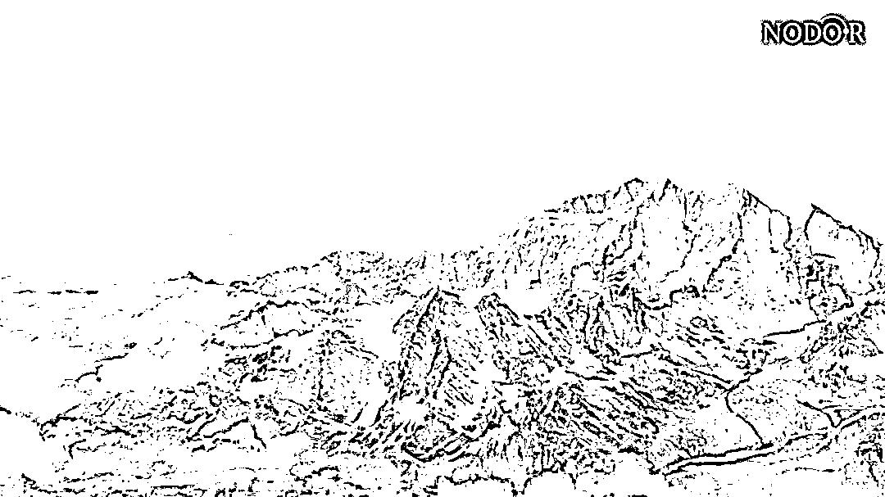 

**真相能让射手座会心一笑**

**是的，幽默和夸张是射手座的显著特征**。有学生曾经问我：“如果射手座人追求的是真理的话，那为什么他会夸大事实呢？”这样的一个问题很显然是将“真理”和“事实”等同了。

根据我们上学时学过的科学思考过程，这样的想法是再自然不过的了。所谓事实，就是 2015 年 11 月 22 日，太阳升起的时间是北京时间 7：10，但是这个事实并不能决定这一天的“意义”。

虽然经历的意义对于每个人来说都是不一样，但是有的意义是大家都赞同的，这种达成一致的意义和观点会让那些太阳、月亮或上升点在射手座的人非常兴奋。**这种热情就会造成射手座的夸张和幽默。**我们嘲笑夸张的人因为他将“如此真实”的事情表达出来了。

当射手座人看到真相在日常生活中运作的话，他们的脸上会浮现出会心一笑。在拥挤的北京地铁上，你会看到茫然的甚至忧伤的表情，但在这些人当中，你偶尔也会看到有些人“会心一笑”，也许这些人的太阳、月亮或者上升点就落在射手座。

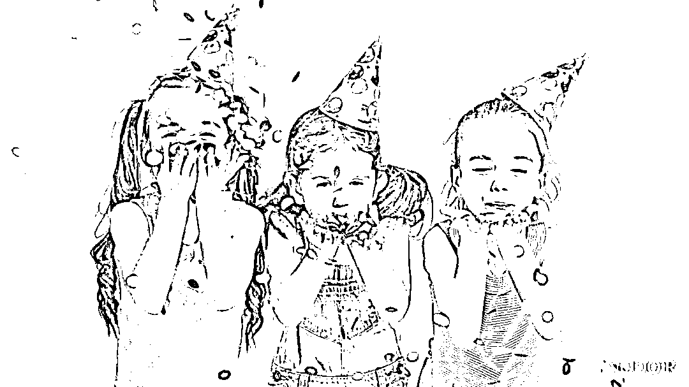

**射手座三大恐惧**

从个人发展的角度来看，射手座人是典型的奔放甚至鲁莽的年轻人，无所不知，无忧无虑。他们从错误中吸取教训。**在成为智慧老人的路上，射手座人通常会被驱使着去给别人提供意见。**

不管是在旅行还是在冒险中，还是在高等教育中，尤其是在哲学、历史、法律和宗教领域中，射手座人都在寻求真相，**所以他们可能会自以为“无所不知”，相信他们的真理就是唯一的真理。**

这种膨胀的自以为是的态度通常来源于射手座的不安全感——**害怕自己是错的！**如果射手座人发现自己深深相信的信仰是错的，那么他就会遭遇非常严重的身份危机。

**射手座人在人生这条曲折的道路上害怕的三件事是：害怕出错，害怕被误解，害怕被困住。**

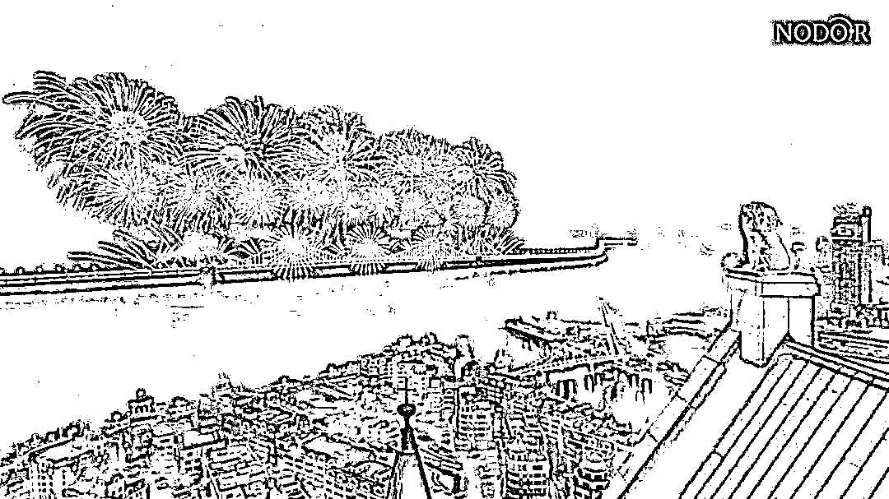

**与众不同的痛苦**

我的一名射手座客户曾经说过：“我的父母从来都不理解我。对他们来说，我就是一个怪咖，就像在葡萄园的葡萄藤上，从形状普通的葡萄中挑拣出来一串又大又饱满的葡萄。”

他的父母是农民，并不知道要怎么对待自己的儿子，因为这个儿子比别的孩子更早地学会了阅读，而且四岁的时候就在教堂弹钢琴了。到了六岁的时候，在教堂音乐指挥的教导之下，他已经能够弹奏莫扎特的曲子了，还在学校的图书馆里看莎士比亚的作品。

我记得他非常淡然地说着：“到了十岁的时候，我知道的比父母还多，他们也知道我懂的比他们多。吃饭的时候，为了打破沉默，我会编一些好玩的故事，说说学校里的孩子们，还会用幽默的语言描述平常的事物，让我们都大笑起来。只有当我们都在笑的时候，我们才观点一致，即使只是一小会儿地没有分歧。”

这名客户在 15 岁的时候上了大学，成为了一名令人敬佩的神经外科医生——大城市医院里的神经外科主治医生。此外，他还在大学里，在一些会议上公开演讲，拥有众多的追捧者。

**这名客户极为戏剧性地表现出射手座的特质。**当然，大部分射手座人并不是神童，即使他们自认为是。可是，这名客户的父母似乎完全不理解他，他们也知道或者相信自己的孩子懂得比他们多。

**这名客户因为自己懂的比身边的人多，尤其是比父母懂得多，而一直觉得自己“与众不同”。这种与众不同的感觉伴随着他的成长，让他在成人之后依旧觉得人际关系是痛苦的。**

**希望被理解的渴望**

“我在同人交往的时候，并不是一个好相处的人，”他在早期的咨询中这样说道，“我的妻子说我总是希望所有人都听从我的建议，如果别人不听我的，我就会狠狠地批判他们。”

我问他：“你为什么觉得自己是这样的呢？”“我看得出来，你跟我的妻子观点一致，”他开玩笑地说，然后他又想了一会儿，说“好吧，事实上人们会让我生气。”

我又问他：“为什么？”他说：“因为他们不听我的意见！”然后他叹了口气，好像意识到自己陷入了某种谜团中。

我问他：“为什么你需要别人听从你的意见呢？”他回答说：“我也不知道……”他似乎有点恼怒了。

所以我决定继续惹怒他。“如果他们听从你的建议，那这对你来说有什么意义呢？”他稍微振作了一下，然后说：“这意味着他们真的明白了我跟他们说的是什么。”

**“所以你就能被理解了？”“是！”**

**“那这又意味着……”“意味着我被理解了。”**

“也就是你一直期望你父母做到的事？”“是，是的，完全正确……”就在这个时候，这个高大睿智的男人开始抽泣，然后低声说道“就是这么简单，对不对？”

然后他向我讲述，很多年前，在他的父亲去世 8 个月后，他的母亲也去世了。当时，在家人和朋友们到达之前，他一个人靠在棺材旁痛哭了几个小时。

“那天唯一能让我从悲恸中走出来的是一个想法，我想，也许，只是也许，现在我的父母在另一边能够更理解我了。也许，他们真的能够看见我，能更好地理解我，甚至比我自己还理解我。”他深深地叹了口气，“我更愿意这样去相信。”

在以前的咨询中，他曾经向我描述过“别人的脑子掌握在自己手中”是什么感觉，也曾告诉过我，那些可怕的决定是在日常生活中的一部分。但是，他最终还是愿意回到他的工作中来，他和妻子的生活也越来越幸福。

**他学会了去承认自己也有可能犯错，但是在承认犯错的同时，自我也没有崩塌。他接受了他的妻子和其他人也有可能真的“理解”他，而且也发现了他们真的能理解他！他和家人的关系也给他带来了“快乐”，而这种快乐不再伴随着孤独感和被爱的人误解的感觉。**

**版权声明：**原创文章由作者授权发布于若道平台，欢迎转发，反对抄袭。友号转载请申请白名单。

**END**

****想阅读更多作者的文章，请在后台回复******大卫****** 即可。****

**大卫·瑞雷**

美国占星师，若道联合创始人，致力于在中国教授和推广西方占星学；2010-2014 年，任全美占星师联盟监督委员会委员；2017 年，被选为 ISAR 委员会成员。ISAR 是世界最大的国际占星机构，会员遍布 45 个国家，2017-2020 年曾任 ISAR 全球副主席、CAPISAR（ISAR 职业占星师资质认证机构）主席。

**拥有****51 年****占星实践经验的**

**若道创始人**

**前 ISAR 全球副主席**

**前 ISAR 全球职业占星师资质认证主席**

**大卫·瑞雷**

**和****2019 年第二届、2021 年第三届核心课中****与苏·汤普金斯老师****联合授课****的****ISAR 认证职业占星师****咔咔（Caroline）****二人合力打造****2022 年 ****若道全新核心占星课程****点击下图了解更多课程详情**

**今日小寒，来领取你的好运吧！**

**扫码**即可领取**专属的年运报告**

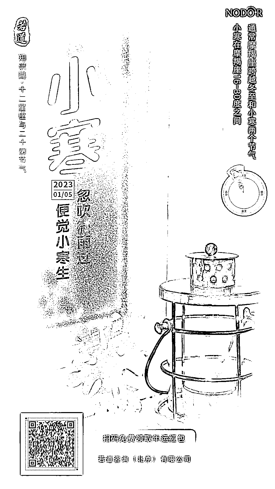

 **20 位来自世界各地的占星师****带来 19 场沙龙——新世界的觉醒****详情可点击下图**

**学习占星学****点击下图了解课程详情**

**微信又双叒叕改版啦，不想错过若道君的推送？**
****就把若道设为****星标****以及点点****“在看”****吧！******▼**

**喜欢就点一下“在看”吧！****报名直达入口**

# 2023 年中英双导师占星核心课 L1-5 | 全面升级的沉浸式互动学习

> 原文：[`mp.weixin.qq.com/s?__biz=MzA5NjA0NTAxNg==&mid=2651498482&idx=2&sn=c154d2b910c0f59a091f24a1f7381843&chksm=8b481545bc3f9c53597ce62e1a90c9fc9194ef2f50fa2eda0a9c58acec93cfbb01700ed440b6&scene=126&sessionid=1692737700#rd`](http://mp.weixin.qq.com/s?__biz=MzA5NjA0NTAxNg==&mid=2651498482&idx=2&sn=c154d2b910c0f59a091f24a1f7381843&chksm=8b481545bc3f9c53597ce62e1a90c9fc9194ef2f50fa2eda0a9c58acec93cfbb01700ed440b6&scene=126&sessionid=1692737700#rd)

**拥有 53 年占星实践经验的若道创始人** **大卫·瑞雷****&最懂学员的若道首位认证金牌中国老师****熊鹰****最默契的师徒二人****再度联合打造****2023 若道全新核心占星课程**

**课程结构****全面升级**

**教学内容****翻倍惊喜**

**补充资料****丰富多样**

**沉浸式互动****案例教学**

**以学员为案例进行课堂的占星咨询演示****职业占星师养成计划**

**ISAR 颁发学历文凭（Diploma）**

**ISAR 认证职业占星师的独有培训**

目前占星学的培训市场鱼龙混杂。而 ISAR（国际占星研究协会）是一个包含了 47 个国家在内的国际占星组织，多年来致力于占星的教育和研究，提升占星教育的品质和职业占星师的能力，在国际占星领域备受尊重。

**2023 年，鉴于对若道在占星教学领域所做的持续努力和高品质的课程服务，ISAR 特别授予若道核心课程为 ISAR 文凭课程，只有在若道学习，并通过若道毕业考试的同学将获得 ISAR 颁发的学历文凭（Diploma）。**

**2023 开年****送给自己一场心动的占星学习之旅**

**2023 开年核心课内容大公开****1-2 阶我们要学习什么？****第一阶** **12 星座，12 种性格，12 种人生**

❶  学习占星必须准备的“心法”

❷  占星学中的火、土、风、水四元素，阴阳法则

❸  面对面的星座有故事

❹  12 星座：12 种性格详解，12 种行为模式，12 种价值观

❺  太阳和月亮：了解你的太阳，生命的发动机，让你在世界闪光的方式，生命获得力量的方法；了解你的月亮，让你获得幸福的方法

❻  了解太阳、月亮，了解你生命中已经出现的、将会出现的男性和女性

**第二阶  ****命运的线索和人生故事中的演员**

❶  命运的线索：南北交点

❷  星图三巨头：太阳、月亮、上升点的故事

❸  了解心智：水星

❹  了解金钱和关系：金星

❺  了解行动模式：火星

❻  了解信念：木星

❼  了解努力：土星

❽  了解天才和疯狂：天王星

❾  了解梦想和幻灭：海王星

❿  了解死亡和重生：冥王星

⓫  12 个人生场景：黄道 12 宫位初解

**L1-2 课程内容形式**

**形式：直播课程+录播课程**

**时长：****10 节直播课（共 20 小时）**+**10 节录播课（共 20 小时）**+**33 小时音视频资料**+**35 篇文字补充资料**

**L1-2 课程时间安排**

录播课 1：占星学简介，黄道前六个星座**2023 年 4 月 24 日直播课：班上同学星座案例+答疑（大卫老师主讲）**录播课 2：黄道星座 天秤座-双鱼座**2023 年 5 月 8 日直播课：班上同学星座案例+答疑（熊鹰老师主讲）**录播课 3：对宫星座，日月**2023 年 5 月 15 日：班上同学日月星座案例+答疑（大卫老师主讲）**录播课 4：日月金火与父母，水星，行星与星座**2023 年 5 月 22 日：班上同学水金火星座案例+答疑（熊鹰老师主讲）**录播课 5：星座与星座组合，木土**2023 年 5 月 29 日：班上同学木星土星星座案例+答疑（熊鹰老师主讲）**录播课 6：三王星：天王星、海王星、冥王星**2023 年 6 月 5 日：班上同学三王星案例+答疑（大卫老师主讲）**录播课 7：行星周期与逆行**2023 年 6 月 12 日：班上同学宫位案例+答疑（熊鹰老师主讲）**录播课 8：四轴和宫位**2023 年 6 月 19 日：班上同学宫位案例+答疑（大卫老师主讲）**录播课 9：月亮交点 1**2023 年 6 月 26 日：班上同学月亮交点案例+答疑（熊鹰老师主讲）**录播课 10：月亮交点 2**2023 年 7 月 3 日：班上同学宫位案例+综合解读+答疑（大卫老师主讲）**

**第三阶 ****宫位、相位以及初步解读星图**

**3 阶我们要学习什么？**

❶  宫位

❷  相位

❸  宫主星

❹  定位星

❺ 相位格局

**L3 课程内容形式**

**形式：直播课程+录播课程+2 日工作坊****时长：****12 节直播课（共 24 小时）****+****10 节录播课（共 20 小时）****+****12 小时工作坊****+****27 小时音视频资料****+****44 篇文字补充资料**

❶ 12 次线上直播网络课程，每次 2 小时，堂课中依旧会使用同学们的星图作示范

❷ 10 节录播课课由熊鹰老师教授，重点通过名人星图阐释知识点

❸ 占星师养成计划开启，有专业人员带领小组研讨互动学习

❹ 重点在于如何根据星图去问问题，着重自我发现和自我探索的过程

❺ 助教将会指导练习，答疑解惑，学练结合

❻ 两日工作坊：本命星图综合解读工作坊，学生将被选中进行案例演示和互动

**L3 课程时间安排**

录播课 1：宫位复习回顾&组合解读录播课 2：组合解读（续）&相位计算**2023 年 7 月 24 日：班上同学宫位、行星、星座综合解读案例+答疑（熊鹰老师主讲）**录播课 3：相位计算（续）常用相位&相位解读录播课 4：盈亏相位，相位优先级**2023 年 7 月 31 日：班上同学相位、渐盈渐亏相位案例+答疑（熊鹰老师主讲）**录播课 5：相位解读（续）&宫主星**2023 年 8 月 7 日：班上同学宫位、行星、星座、相位综合解读案例+答疑（熊鹰老师主讲）**录播课 6：宫主星（续）&定位星**2023 年 8 月 14 日：班上同学宫主星案例+答疑（熊鹰老师主讲）**录播课 7：定位星（续）&解读行星**2023 年 8 月 28 日：班上同学相位、宫位法则、宫主星案例+答疑（大卫老师主讲）**录播课 8：南北交点**2023 年 9 月 4 日：班上同学月亮交点综合解读案例+答疑（熊鹰老师主讲）**录播课 9：相位图形**2023 年 9 月 11 日：班上同学相位格局案例+答疑（熊鹰老师主讲）**录播课 10：无托勒密相位的行星，星图布局，行星的特殊状态**2023 年 9 月 18 日：班上同学空相行星案例+答疑（熊鹰老师主讲）****2023 年 9 月 25 日：班上同学案例综合解读+答疑（大卫老师主讲）****2023 年 10 月 9 日：班上同学案例综合解读+答疑（大卫老师主讲）****2023 年 10 月 16 日：班上同学案例综合解读+答疑（大卫老师主讲）**

**L3 工作坊安排**

*   **月亮交点，串联 L3 的所有基础知识，综合解读工作坊。**

*   **学生将被选中进行案例演示和互动（免费）**

*   **时间：2023 年 11 月 21、22 日**

**第四阶 ****出生星图解读（进阶）以及关系与职业议题****4 阶我们要学习什么？**

❶ 行进

❷ 行星周期

❸ 综合解读

❹ 食相，逆行和停滞

❺ 职业发展解读

**L4 课程内容形式**

**形式：直播课程+录播课程****时长：****9 节直播课（共 18 小时）****+****8 节录播课（共 16 小时）****+****22 小时音视频资料****+****28 篇文字补充资料**

❶ 9 次线上直播网络课程，每次 2 小时，堂课中依旧会使用同学们的星图作示范

❷ 8 节录播课课由熊鹰老师教授，重点通过名人星图阐释知识点

❸ 助教将会指导练习，答疑解惑，学练结合

❹ 占星师养成计划继续，有专业人员带领小组研讨互动学习

**L4 课程时间安排**

录播课 1：回顾&切入点&星图整体视角**2023 年 11 月 6 日：班上同学星图综合解读案例+答疑（熊鹰老师主讲）**录播课 2：整体解读的思路 加料-计分表演示**2023 年 11 月 13 日：班上同学星图综合解读案例+答疑（大卫老师主讲）**录播课 3：用整体论的方法&案例解读录播课 4：行进介绍&优先级&行进的行星&触发器 加料-星历表简介&回顾重要行进**2023 年 11 月 20 日：班上同学行进解读案例+答疑（熊鹰老师主讲）**录播课 5：触发器（续），食相，逆行和停滞录播课 6：行进的相位图形&行进梳理&案例**2023 年 11 月 27 日：班上同学行进解读案例+答疑（熊鹰老师主讲）**录播课 7：周期&重置图**2023 年 12 月 4 日：班上同学行进、周期解读案例+答疑（大卫老师主讲）**录播课 8：职业发展解读**2023 年 12 月 11 日：班上同学职业占星案例+答疑（熊鹰老师主讲）****2023 年 12 月 18 日：班上同学职业占星案例+答疑（熊鹰老师主讲）****2024 年 1 月 8 日：班上同学职业占星案例+答疑（大卫老师主讲）****2024 年 1 月 15 日：班上同学职业占星案例+答疑（大卫老师主讲）**

**五阶**** 预测、关系、咨询、为执业和考试做准备****5 阶我们要学习什么？**

❶ 亲密关系发展解读

❷ 比对图&组合图

❸ 次限推进

❹ 太阳弧推进

❺ 太阳返照、月亮返照

❻ 关系趋势、周期

❼ 职业趋势、周期

❽ 高级预测技巧、咨询技巧

❾ 占星学历史

❿ 占星学流派

⓫  ISAR 考试术语和复习

**L5 课程内容形式**

**形式：直播课程+录播课程+2 日工作坊****时长：****22 节直播课（共 44 小时）****+****16 节录播课（共 32 小时）****+****12 小时工作坊****+****30 小时音视频资料****+****81 篇文字补充资料**

❶ 22 次线上直播网络课程，每次 2 小时，堂课中依旧会使用同学们的星图作示范

❷ 16 节录播课课由熊鹰老师教授，重点通过名人星图阐释知识点

❸ 两日工作坊：亲密关系占星，学生将被选中进行案例演示和互动

❹ 助教将会指导练习，答疑解惑，学练结合

❺ 占星师养成计划继续，有专业人员带领小组研讨互动学习

**L5 课程时间安排**

录播课 1：亲密关系

**2024 年 2 月 19 日：班上同学亲密关系案例+答疑（熊鹰老师主讲）**

录播课 2：亲密关系 出生图和对比图

**2024 年 2 月 26 日：班上同学比对图案例+答疑（熊鹰老师主讲）**

录播课 3：亲密关系：组合图与综合解读

**2024 年 3 月 4 日：班上同学组合图案例+答疑（熊鹰老师主讲）**

**2024 年 3 月 11 日：班上同学亲密关系案例+答疑（大卫老师主讲）**

**2024 年 3 月 18 日：班上同学亲密关系案例+答疑（大卫老师主讲）**

录播课 4：推进：次限推进

**2024 年 3 月 25 日：班上同学次限推进案例+答疑（熊鹰老师主讲）**

**2024 年 4 月 1 日：班上同学次限推进案例+答疑（大卫老师主讲）**

录播课 5：推进：太阳弧

**2024 年 4 月 8 日：班上同学太阳弧案例+答疑（熊鹰老师主讲）**

**2024 年 4 月 15 日：班上同学太阳弧案例+答疑（大卫老师主讲）**

录播课 6：关系趋势、周期

**2024 年 4 月 22 日：班上同学关系趋势案例+答疑（熊鹰老师主讲）**

**2024 年 4 月 29 日：班上同学关系趋势案例+答疑（大卫老师主讲）**

录播课 7：职业趋势、周期

**2024 年 5 月 6 日：班上同学职业趋势案例+答疑（熊鹰老师主讲）**

**2024 年 5 月 13 日：班上同学职业趋势案例+答疑（大卫老师主讲）**

录播课 8：太阳返照

**2024 年 5 月 20 日：班上同学太阳返照、月亮返照案例+答疑（熊鹰老师主讲）**

**2024 年 5 月 27 日：班上同学太阳返照、月亮返照案例+答疑（大卫老师主讲）**

录播课 9：高级预测技巧

**2024 年 6 月 3 日：班上同学预测技巧案例+答疑（熊鹰老师主讲）**

录播课 10：ISAR 考前准备 1

**2024 年 6 月 17 日：班上同学预测技巧案例+答疑（大卫老师主讲）**

录播课 11：综合趋势解读

**2024 年 6 月 24 日：咨询技巧实践案例（熊鹰老师主讲）**

录播课 12：ISAR 考前准备 2

录播课 13：ISAR 认证相关介绍 3

**2024 年 7 月 1 日：ISAR 考试术语和复习（大卫老师主讲）**

录播课 14：咨询技巧

**2024 年 7 月 8 日：咨询技巧实践案例（熊鹰老师主讲）**

录播课 15：ISAR 备考复习 4

**2024 年 7 月 15 日：咨询技巧实践案例（大卫老师主讲）**

录播课 16：咨询技巧

**2024 年 7 月 22 日：咨询技巧实践案例（大卫老师主讲）**

**L5 工作坊安排**

*   **趋势预测（两天）占星工作坊**

*   **学生将被选中进行案例演示和互动（免费）**

*   **时间：2024 年 8 月 3、4 日**

如果直播课时间临时有调整，班班会及时通知每位同学

**这两位优秀的占星学老师是谁？**

**大卫·瑞雷（David Railey）**

*   若道联合创始人，致力于在中国教授和推广西方占星学。

*   曾任 ISAR 全球副主席，CAPISAR（ISAR 职业占星师资质认证机构）主席；

*   1976 年，通过亚特兰大职业占星师考试，成为全职占星师，随后通过 AFAN 和 ISAR 职业测试；

*   1980 年，与杰夫·焦耳一起在亚特兰大创建“每日行星”占星学中心。此后在亚特兰大占星协会担任 4 年考官，并且两次担任亚特兰大地区占星协会主席。1979-1992 年，作为占星师活跃于美国社会媒体，向不了解现代占星学变化的大众宣传专业占星学知识；

*   在 1989-1992 年期间，他在 WRGG 电台 12 频道每周主持个人电视秀“今日占星学”，早先他还在 WRFG 的广播节目中播讲宇宙天气节目；

*   2010 年-2014 年，任全美占星师联盟监督委员会委员；

*   2010 年，其著作《灵魂的目标》中国版出版，和蒋颖一起创办若道占星学校和其官网 www.nodoor.com。

*   2017 年，被选为 ISAR 委员会成员。ISAR 是世界最大的国际占星机构，会员遍布 45 个国家，2017-2020 年曾任 ISAR 全球副主席、CAPISAR（ISAR 职业占星师资质认证机构）主席。

**熊鹰老师（天空的空）**

*   2008 年接触严肃占星学，至此爱不释手。

*   2013 年师从大卫·瑞雷，研习整套现代占星学核心课程，并于 2014 年起至今连续三年担任该课程的主助教。

*   期间也跟随格伦·佩里、诺·泰尔、理查德·塔纳斯、罗伯特·汉德、苏·汤普金斯、斯蒂芬·弗里斯特等多位国际顶尖占星大师进行学习，进行定向占星主题研究。

*   2015 年初，通过国际占星研究协会（ISAR）资质认证并获得证书。同年，进一步跟随大卫·瑞雷老师进修“生时校正”技术，通过最终考核并获得证书。

*   2020 年和大卫·瑞雷老师开设中英双导师联手打造 Level1-5 核心占星课，两年期间不断打磨革新教学内容，丰富职业占星师养成计划。

*   目前在若道星文化任职，将传播系统、严谨、真实的占星学作为职业使命。任专职助教期间，进行沙龙与答疑等辅助教学工作已累计超过 600 小时。

*   在业余期间也提供占星咨询与生时校正服务。目前正致力于占星学与个人成长的整合。

**什么人适合这门课程？**

*   对占星学有浓厚兴趣，想要系统学习占星学；

*   对占星学有一定基础，但不知道该如何整合星图复杂的碎片；

*   希望成为优秀的占星师，想要借鉴国际大师解读思路并融入自己的体系；

*   想学习占星学，但不擅长英文，希望有中文老师授课；

*   想结合占星学理论与咨询实践；

*   大卫·瑞雷、熊鹰的忠粉，学过占星，但就是想跟着偶像再学一遍；

*   走在自我探索和个人成长道路上的人。

**课程费用****★1-5 阶****早鸟价：33800 元（2023 年 3 月 28 日之前）****课程费用：48600 元** **★1-2 阶****早鸟价：3200 元（2023 年 3 月 28 日之前）****课程费用：4000 元****转退课程**

**退款原则请详看《教学协议》，如有疑问请咨询课程顾问。**

****2023 中英双导师核心课 Level1-5****

**授课老师：大卫·瑞雷 熊鹰**

**授课时间：**2023 年 4 月 24 日-2024 年 7 月 22 日

**授课方式：**网络课程，中英文授课，中文翻译；现场工作坊，中英文授课，中文翻译

**费用：****1-5 阶：**48600 元********（********早鸟价 33800 元，2023 年 3 月 28 日之前）******1-2 阶：40****00 元**************************（早鸟价 3200 元，2023 年 3 月 28 日之前）****************

**课程负责人：**王老师（微信：18510107057），请备注“核心课”

长按二维码添加课程负责人咨询~

**END****报名直达入口**

# 这些行星，每年都在为你默默地努力 | 你的 2023 年，将会发生什么？

> 原文：[`mp.weixin.qq.com/s?__biz=MzA5NjA0NTAxNg==&mid=2651498373&idx=1&sn=e55df451f18aeea90d9ecb0367cf74ba&chksm=8b481532bc3f9c248fb38009895fa511456f7f062b90fe3342039366dce978a06ef996bb3e54&scene=126&sessionid=1692737700#rd`](http://mp.weixin.qq.com/s?__biz=MzA5NjA0NTAxNg==&mid=2651498373&idx=1&sn=e55df451f18aeea90d9ecb0367cf74ba&chksm=8b481532bc3f9c248fb38009895fa511456f7f062b90fe3342039366dce978a06ef996bb3e54&scene=126&sessionid=1692737700#rd)

****************☆ 后台回复“今日”，给你一句生命态度****************

作者/萨拉·希普曼 译者/李含 校对/江艺

编辑/玫瑰 图片/稿定设计

太阳返照星图是特殊的占星学预测工具，它的作用持续一年。星图上的行星描绘出在这一年里“将要发生什么”，而行星所落宫位则告诉我们“在哪里”发生。一起来看看这个神奇的星图吧！另外，大卫老师参与授课的【[ISAR 认证职业占星师文凭课程](https://mp.weixin.qq.com/s?__biz=MjM5MjQwNjAyMQ==&mid=2649440584&idx=7&sn=a56825d5ccd316d3a63d2a79b9052a3f&scene=21#wechat_redirect)】正在插班中，点击链接了解更多详情！

**太阳返照图中的星体****太阳返照星图是我们可以运用的最好的预测占星学工具之一**。然而，因为星图是短暂的，只持续一年，所以解释太阳返照星图中太阳（和其他行星）的宫位落点将会不同于你出生星图中熟悉的意义。因此，在解释这一年的太阳返照星图时，**了解行星在太阳返照星图中的功能非常有用。**
你的太阳返照星图中的**行星描绘出“将要发生什么”**，而**宫位落点则告诉你“在哪里”**，所以这会对你解读自己的太阳返照星图很有帮助。我建议你们在分析时记下你的宫位关键词。

**若道君：你可以在 app store 或者应用商店搜索“若道”下载 app，输入个人档案，查看“日返单”（也可以使用其他星图软件）即可。**

**太阳返照星图中的*****太阳***

太阳返照星图中，你会发现自己投入了大量的精力在太阳所落的宫位，并被该宫位相关的活动所吸引，因为那将是你优先考虑的事情。所以，太阳会告诉你**这一年的重心**，也会告诉你生活中**哪些部分**是你真正需要关注的。它照亮了你需要做的事情，你可能会感到**不得不表达你的星图中太阳落点所凸显的部分**。一般来说，**太阳也象征着男性和一般意义上的男子气概**，有人认为，在女性的星图中尤其如此。我不认为宇宙有性别偏见，但可能是你星图中的太阳照亮了你生命中的男人（不管你自己是什么性别），或者点亮了你生命中需要以某种方式明显展示你**个人权威**的一个部分。

**太阳返照星图中的*****月亮***

太阳返照星图中的月亮，就像出生月亮一样，都是关于情绪反应。然而，太阳返照星图的月亮**描绘了在你的世界里一年中感觉最舒适的地方**。

这可能是一个物理位置，让你联想到一个情感问题，因为月亮也掌管着家，家庭和你深层次的情感安全感。这些事情经常要求我们处理跨越情感谱系的问题，这些问题对我们来说可能很难处理。因此，**月亮的宫位**可能会向你展示你生活中**需要学习更好地“处理”事情的领域**。

太阳返照星图的月亮会在不知不觉中把你吸引到**需要“照顾”**的地方，或者你觉得**受到照顾**的地方——双向的解释都是可能的，而且在你的太阳返照星图中尤为可能，因为月亮在其变幻无常中有其可靠性。随着月盈月亏，月亮也可能表明你的生活中处于**过渡状态的领域**。无论月亮落在哪里，你的感觉都会发挥作用。

**太阳返照星图中的*****水星***

在太阳返照星图中，水星是关于想法及其传播的。在水星翅膀降落的地方，你会在太阳返照星图对应的这一年大部分时间里（如果不是全部时间的话）**思考与该宫位相关的活动**。

而且很有可能你也会在**写作和谈论**中提到这些内容。**水星也会告诉你自己的精神状态，并描绘出你的感知是如何受到影响的。**

确切地说，你的心智状态、思想和想法如何与你生活的其他部分**关联**，如何与你的行为和情感的联系，将取决于水星与其他行星的联系，因为水星毕竟是关于连接和交流的行星。水星作为“中间人”的概念是非常重要的，因为水星依靠它的关联点让你的思维过程完全整合到一个完整的信息包中。这使你能够制定计划，做出决定，采取的行动，影响到这一年乃至你以后的生活。因此，想法、演讲、书面交流、短途旅行、调解都将是这个信息包里的一部分。为什么？因为辩论、讨论、联系和交流是水星的意义所在。水星是一个充满活力的行星，所以不断动起来吧，**无论水星在哪里，他都会让你忙个不停**。

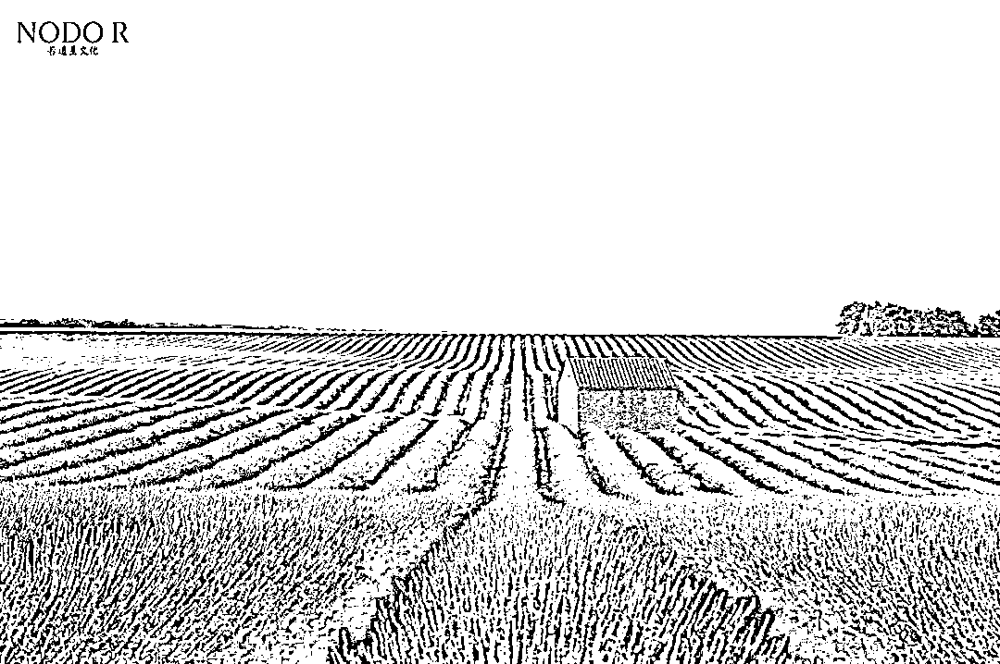

**太阳返照星图中的*****金星***

啊，金星，每个人最喜欢的行星——谁会不喜欢她呢？毕竟，她是充满爱和吸引力的行星。在你的太阳返照星图中，**金星可以象征几件事情，而且不全是关于爱情的**。金星还**象征着金钱**，因为这个行星是一位物质女孩。  在你的太阳返照星图中，在金星代表的生活部分中，你可能希望通过某种方式来进行一番改善，无论是从**审美**上还是在你自己的**价值体系**方面。  金星也是你**找到快乐和享受生活的地方**，是的，这通常涉及到花钱。然而，金星也可能显示出你可能因为过度消费而面临财务压力的地方，尽管金星可能会为你**吸引到资源**，但你也同样可能屈服于金星的欲望，**过度追求**生活中的美好事物。 |
生活中的美好事物通常是社会性和关系性的，金星象征着我们与所爱的人一起度过的时光和参与社会活动享乐的时间。她也可以被解读为**你重要的另一半**，或者象征着**其他重要的人际关系和职业关系**，因为金星会出现在家里，在商业活动中，也会在美容院。

**太阳返照星图中的*****火星***

你的太阳返照星图上的火星是关于行动的，**在火星所落的地方，你将会从起跑线上被发射出去，不得不奔跑。**如果你不能继续比赛，你会迅速变得沮丧和愤怒。很简单，火星要求你继续做它的落点告诉你做的任何事情。**这个动作可能是身体上的，心智上的，甚至是精神上的**——不管你需要做什么，对火星来说“行动”是很重要的。  因此，你的太阳返照火星可以作为一个指示器，告诉你今年你可能会在哪里感到心烦意乱，并且失去常序，但是——这是非常重要的，如果你不运用自己的火星能量去完成你生命中火星告诉你急需关注的领域的事情时，才会发生这种情况。  在太阳返照的这一年里，**与火星有关的事情将立即出现在火星所在的宫位**。所以也就是，身体动作、运动、速度、性、能量、争论、暴力、勇敢、手术、年轻男子、主动性、积极主动、红色。明白了吗？

**太阳返照星图中的*****木星***

在你的太阳返照星图中，木星作为带来好运、机会、（各种形式的）财富的使者，当然还有随之而来的无限乐观，张开双臂欢迎进入他所在的宫位是常有的事情。然而，这种欢乐是合理的吗？

正如谚语所说，你可能拥有过多的好东西，而木星同样以各种形式的过度而闻名。过度乐观，感觉全世界都欠你，过度热情和放纵，就像遥远彼岸的木星一样，带着积极的心境，你可能会忍不住去探索。

无论木星在你的太阳返照星图中落在哪里，他都以积极的和不那么积极的方式进行扩张，诀窍（如果有的话）依然是倾听木星对你说的话，**找出你的机会，然后努力工作抓住机遇**，只有那时，你才会收获木星的报酬。

“工作？”我听到你说，‘我以为那是土星的领地？’是的，的确是这样，但是**木星也要求你努力工作**——即使你不喜欢。懒惰在很大程度上是木星的特征，但是，唉，它会让你一事无成，**木星的目标是让你有所成就，让你继续前进，开阔你的眼界**。

**太阳返照星图中的*****土星***

在你的太阳返照星图中，**土星所落的地方真的要求努力工作**。土星的作用是**告诉你什么地方需要务实**，什么地方只要你再努力一点就能做得更好，什么地方你需要保持冷静的头脑，培养更成熟的态度，保持耐心，有责任心，脚踏实地。事实上，由土星落点所指示的事件将不可避免地要求你做出那样的回应。

换句话说，**土星是木星的补充——是我们努力审视自己，意识到自己需要负起责任的那一刻。**忽视土星，你将生活在恐惧中——害怕改变，害怕推动自己更进一步，事实上，你对几乎所有的事情都感到恐惧。

恐惧是土星负面能量的核心，因为正是恐惧让你陷入对自己不利的境地。记住这一点并克服它——你所需要的一切帮助土星都会给你。

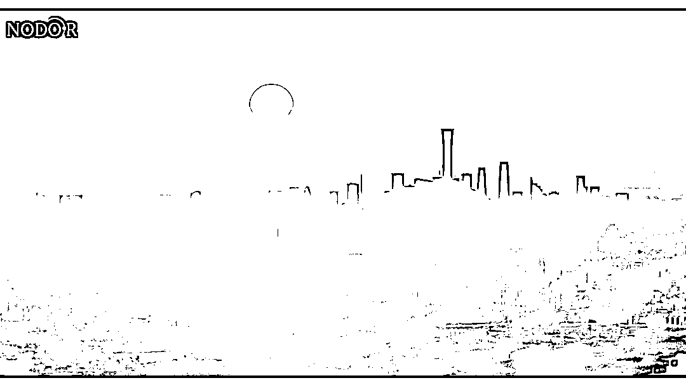

**太阳返照星图中的*****天王星***

无论天王星落在你的太阳返照星图的哪个位置，你都可以预期，天王星的出乎意料都是关于变化的，作为一个完全没有人情味的行星，天王星真的不在乎那个变化是什么，只要它是变化就行。  我们不是在这里谈论调整边界，外行星的变化是“真刀真枪”的。这听起来可能很疯狂和可怕——有时候确实如此，但是请用这个想法来安慰自己。**在你的太阳返照星图中，天王星会帮助你摆脱天王星宫位落点所显示一切陈腐桎梏。**  **天王星希望你以一种不同于以前的方式来思考问题。**天王星希望你能接受新事物的概念，有时这将需要某些不常见的、不受欢迎的或其他奇怪事物让你警觉和留心。这可能是夜深人静时“惊喜发现”的时刻！  或者你的外部生活中发生了一件意想不到的事情，让你突然停下来。或两者兼而有之。天王星是不可知的，因为你只可能经历其中一种，或者两者都经历。天王星就是这样，不可预测。

**太阳返照星图中的*****海王星***

在所有的行星中，海王星是在象征世界中运作最好的一个，在你的太阳返照星图中，海王星的象征意义突出。这样来看，海王星不再是困惑的源头，而变成了一个更有用的存在，一个指针，**指向你需要停下来的地方，深呼吸，比平常更多地反思生活**。  然而，这不仅仅是一次冥想练习。海王星掌管视野，这开辟了一个解释可能性的广阔领域。  海王星会**告诉你哪些地方你看得不够清楚**，哪些地方你可能会经历误解，哪些地方你需要更加稳扎稳打，哪些地方你可能会经历错位的事情 ——从你的情绪到你的家门钥匙。海王星也会告诉你在哪里你可以**更有创造力**，在哪里找到**灵感和内心的平静**。  永远不要怀疑海王星在不那么精神的层面上表达其象征意义的能力。在你的太阳返照星图中，就像其他行星一样，你会发现**海王星的影响力作用于许多层面**，包括世俗和物质领域。它的影响范围对应了水、石油和天然气。还有脚和眼睛。电影和舞蹈。毒品，酗酒，还有深层的睡眠。困惑？你会有的。

**太阳返照星图中的*****冥王星***

在你太阳返照星图中发现冥王星的地方，**有必要丢弃一些东西**——字面意思或隐喻意义的，因为冥王星代表着不可逆转的从一种存在状态转变到另一种存在状态。冥王星告诉你放弃那些你认为很宝贵的东西，并让新的东西取而代之。  因此，**冥王星在你的太阳返照星图中所落的宫位就是你被要求以某种方式改变生活的地方。**  这种转变可以通过要求你掌控一个你以前觉得无法维护自己的领域来实现。相反，冥王星也可以要求你放下你的防御，让自己屈服于你最大的恐惧——不管它们是什么，从而使你在这个过程中成长和更新自己。   **冥王星的主题是扔掉你生活中的垃****圾**，我们知道如果你囤积垃圾会发生什么……冥王星不希望你的生活最终成为真人秀节目中的一间房子，从地板到天花板都堆满了恶臭的垃圾。  危险在于，如果你没有定期清理垃圾（至少在隐喻上），你积累的垃圾将远远超出你的处理能力。正如你在电视上看到的那样，处理这个问题的唯一方法就是请一些认真的人来帮你收拾残局。来见见冥王星。他就是地狱来的强迫症清洁工。

**版权声明：**本文由若道翻译发布，欢迎转发，反对抄袭。友号转载请申请白名单。

**END**

莎拉·希普曼

英国牛津的一位占星师。从孩提时代起莎拉就对占星学充满兴趣，现在她已经学习和实践占星学三十多年了。莎拉·希普曼是作者的笔名和执业名。

**拥有****51 年****占星实践经验的****若道创始人****前 ISAR 全球副主席****前 ISAR 全球职业占星师资质认证主席****大卫·瑞雷**

**和**

**2019 年第二届、2021 年第三届核心课中**

**与苏·汤普金斯老师****联合授课****的**

**ISAR 认证职业占星师**

**咔咔（Caroline）**

**二人合力打造**

**2022 年 ****若道全新核心占星课程**

**点击下图了解更多课程详情** 

**

**新的一年，来领取你的好运吧！**

**扫码**即可领取**专属的年运报告**

**20 位来自世界各地的占星师****带来 19 场沙龙——新世界的觉醒****详情可点击下图**

**学习占星学****点击下图了解课程详情**

**微信又双叒叕改版啦，不想错过若道君的推送？**
****就把若道设为****星标****以及点点****“在看”****吧！******▼**

**喜欢就点一下“在看”吧！****报名直达入口**

# 星座病理学 | 分裂性人格：海王星-双鱼座的病理性

> 原文：[`mp.weixin.qq.com/s?__biz=MzA5NjA0NTAxNg==&mid=2651498373&idx=2&sn=4aa1a5f48ea0b12669806146a72a1683&chksm=8b481532bc3f9c2477cce3c289f49a447d760b119f359e9204e8fb9b04d518f3f0fe1b468657&scene=126&sessionid=1692737700#rd`](http://mp.weixin.qq.com/s?__biz=MzA5NjA0NTAxNg==&mid=2651498373&idx=2&sn=4aa1a5f48ea0b12669806146a72a1683&chksm=8b481532bc3f9c2477cce3c289f49a447d760b119f359e9204e8fb9b04d518f3f0fe1b468657&scene=126&sessionid=1692737700#rd)

<mpvideosnap class="js_uneditable custom_select_card channels_iframe videosnap_video_iframe" data-pluginname="videosnap" data-id="export/UzFfAgtgekIEAQAAAAAAIpsG4sdZxAAAAAstQy6ubaLX4KHWvLEZgBPE1oNcG3pMN-GBzNPgMItCWsuFhYBQxYHLZ8Mn7XuD" data-url="https://findermp.video.qq.com/251/20304/stodownload?encfilekey=rjD5jyTuFrIpZ2ibE8T7YmwgiahniaXswqztmSTp4qAKicAd2ib75UCVvf7Vn3kdHUtW2ISTTH7c7QvMBib8edZKx8WZG5dfavtpia8RvLzcXs54RmyQuTexxk7Vw&amp;adaptivelytrans=0&amp;bizid=1023&amp;dotrans=0&amp;hy=SH&amp;idx=1&amp;m=&amp;scene=0&amp;token=AxricY7RBHdWQeOicrXx1KPbe6qHcLdKqwPRfmmjxzh1b32ES0yOIyUicCVEtr80iaicpcC8q3Vs5DkM" data-headimgurl="http://wx.qlogo.cn/finderhead/PiajxSqBRaEJYnVsqWfEX9qA0sI6hNVKsDfyzfPZ92WZMZyBpZWU5NA/0" data-username="v2_060000231003b20faec8c4e68a1ec2d4ca07e434b07755bbf47e7053a3059defd2c9d6c68a20@finder" data-nickname="若道" data-desc="#占星心理学 分裂型人格有什么特性？在星图里海王星-双鱼座什么样的指针跟分裂型人格有关联？
" data-nonceid="9658369036095186658" data-type="video" data-authiconurl="https://dldir1v6.qq.com/weixin/checkresupdate/icons_filled_channels_authentication_enterprise_a2658032368245639e666fb11533a600.png" data-width="1280" data-height="720"></mpvideosnap>

**课程描述**

看过课程标题的你，也许会感到好奇和惊讶，为什么在占星学的课程中，会出现精神病理学的教学内容，这和我们有什么关系？这对占星咨询，或在自我了解与成长的过程中又有什么帮助呢？

**带着这些疑问，请你静下心来，思考以下几个问题**：

“**你/你的案主，是否曾经过度担心什么？** **你/你的案主，有没有感觉到担忧和焦虑，却不知道原因是什么？****你/你的案主，是否曾经觉得害怕什么东西，但理智上却很清楚它不会对你造成什么伤害？****你/你的案主，是否曾经通过沉迷某物，酗酒或滥用药物，自我伤害去逃避问题？****……****——节选改编自《心理学与生活》**”

如果你对上述问题其中之一，回答是。这意味着几乎每个人都曾有过心理障碍的症状（精神病理的问题）。

你看，其实“精神病理学”与人的心理有着密切的关联，再结合占星学，呈现了人内在与外在层面更加丰富和深刻的一面。**这对于学习占星学的人和占星师来说，都是一场难得的知识盛宴！**

**本课为 2 年期双证核心课程中的一部分**（AP105 阶段），其内容是过去若道所开设的核心课程从未教授的部分，特意抽出供其他学员学习，**可作为 ISAR 选修课，单独报名**。

**在正式了解本课的价值之前，先了解一下这门课程的主讲老师吧！**

**格伦·佩里（Glenn Perry）**

*   他是心理/意识研究专业博士、加州注册婚姻和家庭治疗师 （CAMFT）

*   占星心理学学院（Academy of AstroPsychology）创办人

*   康涅狄格州研究生院（the Graduate Institute of Connecticut）原型宇宙学与意识进化项目的负责人

*   共出版八本占星学著作：《心理占星学入门》、《心理占星论文集》、《盗取天火》、《从忠诚到革命》、《星图中的阴影》、《占星职业议题与伦理》、《出生星图深度分析》、《从古代到后现代占星学》

**墙裂推荐格伦老师这门课的 **

**4 大理由**

**你一定得知道的课程价值**

**价值*****1***
**明晰精神病理学的基本定义**

占星心理学学院创办人格伦·佩里老师，对**精神病理学的基本定义**就是灵魂受苦，精神就是灵魂的意思，病理就是受苦的意思，所以精神病理学研究的就是：人类各种各样受苦的方式，尤其是因为某一类的行为而引起的。

精神病理学是一个连续体，从比较轻微的，到比较严重的，这么说来，我们每个人都有一部分精神病理的问题。

**如果成为一个“人”，没有一定程度的挑战是不可能的。没有一定程度受苦，没有一定程度不平衡是不可能的。而这种不平衡就会以一种挑战和困难的姿态呈现出来。**

**价值*****2*****更懂疗愈：从不平衡到平衡**

**疗愈**是一个复杂的过程，讲的是将人从不平衡带到平衡这样的一个状态，将不同行星代表的心理功能带到一种更加平衡整合和合作的状态。

格伦老师通过研究精神病理学，发现每一颗行星，以及这颗行星所守护的星座，都和某一特定类型的病理是联结在一起的，包含了这个占星原型所涵盖的极端不平衡的情况。

举个例子，案主的第 1 宫，有很多星星在那里，和对面第 7 宫的火星形成对分相，第 1 宫白羊座或者火星白羊座的组合，和这个案主的反社会人格的病状联系在一起（这是一个星图的极端负面表现）。

“

**生活本身就是一场治疗，我们在占星的星图中去看到，人们所具有的创伤、不平衡及其产生的防御机制，最终都会在他生活中的关系和情境中呈现出来。无论他生活中处在怎样的情境之下，其实这些环境都是在为他提供恰当的环境，作为一种载体，让他去平衡和疗愈事件背后问题的根源。** 

**这样一个现象是持续不断地在发展，会让我们想到，会有一个更大的宇宙的智慧存在，它其实是在指挥和引导着我们的这些经验，让我们去经历然后进入更高层面的发展当中。生活或者“神”，就是我们所有人类的一个治疗师。**

**——格伦·佩里**

”**价值*****3*****了解诊断标准，提高咨询的专业敏感度**

如果能够对精神病理极端不平衡的情况有了解的话，你就会对它比较温和的版本更加敏感（大部分人是更温和版本的呈现）。

也许案主并没有达到某个病理所达到的层级，但是 Ta 有显示出，这个病理某一些特点或者某一些倾向。所以，我们的目标并不是去诊断案主，而是了解他在这个病理学连续体上处在一个怎样的位置。

当你拿到星图你会看到，案主不同的冲突，是体现在不同的部分上。某一个病状是体现在某一个行星，另外一个病状，是同步体现在另外一颗行星上。

当我们通过对占星原型星座和行星的病理学现象的学习后，就能看到占星学上的配置所呈现出来的，案主表现出的这些失调，并不一定都会成为一种心理临床上的诊断。有可能在案主这里呈现出一个很轻微，但是仍然在 Ta 生活中，给 Ta 造成挑战的一个点。

**价值*****4*****智力上的刺激——整合进阶**

这个课程能够让我们了解自己，了解我们的客户，了解我们的朋友，了解我们的家庭。它给我们提供一种崭新的方式，并且让我们看到占星原型的种种表达，不要局限在非此即彼、非好既坏的这样的一个概念当中，而看到它其实是一个不同程度的连续体。

当我们能够以这种方式去看的时候，你就能够将自己的生活，带入一种和谐。能够了解这是一个过程，我们的重点不是放在诊断上，而是放在整合上，因为生活，就是一种整合。

**课程内容**

**AP105 星图中的精神病理学与疗愈** 共**15 次**课程：**10 次 2019 年录播课+5 次直播课；30 课时**

在这个阶段的课程中,我们将**聚焦于十二星座(从白羊座到双鱼座）及其对应的守护星的潜在功能障碍。**

我们将学习如何识别、理解和应对每个星座的潜在挑战。我们将在各种相应的心理障碍背景下来考察占星原型，这些心理障碍表现为功能障碍、失衡的极端状态。

学员们将了解**《精神疾病诊断与统计手册》诊断标准**。我们会探讨治疗的概念，尤其是那些与整合和个性化相关的概念。我们将特别关注外行星的困难相位，以及它们与内在心理冲突、防御和症状形成的关系。

学员们将探索人的痛苦如何成为发展和实现天赋才能的催化剂。在考察病因时，我们会将平常的因果关系理论与传统的命运、业力和转世观念整合起来。

**口碑推荐**

‍**‍想感受格伦老师的课堂魅力？** **一小段讲课视频让你先睹为快~**<mpvideosnap class="js_uneditable custom_select_card channels_iframe videosnap_video_iframe" data-pluginname="videosnap" data-id="export/UzFfAgtgekIEAQAAAAAAxuwL_P9LDAAAAAstQy6ubaLX4KHWvLEZgBPElYFkVBZaNrKCzNPgMIuhBCuUlaCPzDNmHFgJR5sp" data-url="https://findermp.video.qq.com/251/20304/stodownload?encfilekey=rjD5jyTuFrIpZ2ibE8T7YmwgiahniaXswqzIGcAWV11d39RRKTicEUe1lSn5e1z2jdX20ath9yg9Liaia8VPS2c4MUJibl8FlxSZs3ajlcibhlD6typd6ZeGeWj2bQ&amp;adaptivelytrans=0&amp;bizid=1023&amp;dotrans=0&amp;hy=SH&amp;idx=1&amp;m=&amp;scene=0&amp;token=AxricY7RBHdXmmhmUb1Np3Ioz3Ok0V9IBZ0eINxnxticaC9r3HjsQ8iatkwqFBLKP50ZibXDm0TiaicC4" data-headimgurl="http://wx.qlogo.cn/finderhead/PiajxSqBRaEJYnVsqWfEX9qA0sI6hNVKsDfyzfPZ92WZMZyBpZWU5NA/0" data-username="v2_060000231003b20faec8c4e68a1ec2d4ca07e434b07755bbf47e7053a3059defd2c9d6c68a20@finder" data-nickname="若道" data-desc="#ISAR 选修课  如何识别、理解和应对每个星座的潜在挑战？如何在不同的心理障碍背景下来考察占星原型？" data-nonceid="4249051256207020861" data-type="video" data-width="1024" data-height="576"></mpvideosnap>

**课程费用**

**课程价格：9000 元****课程优惠价请添加 Margartet 咨询**

课程负责人：Margaret

（微信：18515059056）

请备注“心理占星 105”

**开课时间**

**直播课开课时间：2022 年 12 月 21 日**

**退转课程**本课程包含往期视频知识点视频课程+直播案例课程+助教直播答疑；报名付款后均不受理退款转课，请慎重考虑后再确认付款。**其他相关事项请仔细查阅报名勾选时的《教学协议》，如有疑问请咨询课程顾问。****报名流程及费用支付****1. 点击阅读原文链接立即报名，填写个人姓名（身份证姓名）和相关信息，阅读并同意《教学协议》，提交报名表，直接在线支付。****2. 付款后可在网页个人中心或手机网页“我的”栏目查看报名记录。****如遇疑问请与销售人员联络******ISAR 选修·占星原型与星图中的精神病理学****

**授课老师：格伦·佩里**

**直播课开课时间：**2022 年 12 月 21 日

**授课方式：**网络课程，中英文授课，中文翻译

**费用：9000 元（获取优惠请联系客服咨询）**

**课程负责人：**Margaret（微信：18515059056 请备注“心理占星 105”）

长按二维码添加课程负责人咨询~

**报名直达入口**

# 星图的双生子（上） | 音乐里的他们，灵魂如此相契，却又如此不同

> 原文：[`mp.weixin.qq.com/s?__biz=MzA5NjA0NTAxNg==&mid=2651498138&idx=1&sn=95757ec3e882709e166d425509ec86ce&chksm=8b48142dbc3f9d3b689228f0160a9c590fec7fda8f4cc8c1d08ad002c13b53428eab25c1fa03&scene=126&sessionid=1692737700#rd`](http://mp.weixin.qq.com/s?__biz=MzA5NjA0NTAxNg==&mid=2651498138&idx=1&sn=95757ec3e882709e166d425509ec86ce&chksm=8b48142dbc3f9d3b689228f0160a9c590fec7fda8f4cc8c1d08ad002c13b53428eab25c1fa03&scene=126&sessionid=1692737700#rd)

******☆ ****后台回复“今日”，给你一句生命态度******

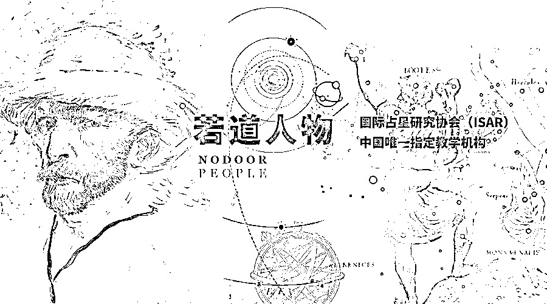

作者/大卫·瑞雷 若道创始人

翻译/Helen 文字整理/玫瑰

编辑/翀子 封面/书君 图片/网络

本文根据大卫·瑞雷 Level 3 授课内容整理

上世纪 60 年代的欧美乐坛中，有两支乐队有着举足轻重的地位，一支是英国的“披头士”，另一支是美国的“海滩男孩”。而巧合的是，两支乐队的灵魂人物——保罗·麦卡特尼和布莱恩·威尔逊的星图居然有着神奇的相似性，而两人的出生时间只间隔了两天！把他们的星图放在一起对比是什么样的呢？本文会给你启示。另外，大卫老师参与授课的【[ISAR 认证职业占星师文凭课程](http://mp.weixin.qq.com/s?__biz=MjM5MjQwNjAyMQ==&mid=2649440565&idx=5&sn=5d161dd1a6055437625fd1a67bdc4529&chksm=beb92e5f89cea7490e50e9ef66dd648b0d30b1f1c0550374de88cfecea658a9433e8c360b1a2&scene=21#wechat_redirect)】正在插班中，如果你对占星学感兴趣，欢迎点击链接了解更多详情！

**一部电影引发的好奇**

前段时间，我乘飞机从中国回美国，我在飞机上看了一部电影——《爱与慈悲》（编者注：Love & Mercy，又译“迷失巨声”，主演约翰·库萨克）。这部电影与“海滩男孩”主唱布莱恩·威尔逊相关。我看了那部电影后特别受启发，当时我在想，这部电影简直就像海王星的工具书一样，我简直等不及想要看一下他的出生星图是什么样子了。

 

布莱恩·威尔逊是美国上世纪六十年代著名的“海滩男孩”乐队的主唱和词曲创作者。“海滩男孩”和当时的“披头士”是那个年代最著名的两个乐队。

这部电影就像你跳进海王星的故事里，完全不知结尾会是什么。所以等我回到亚特兰大的家中，我又看了一遍电影。然后立即去网上搜索，找到了他的出生时间和地点。我看他星图的时候立刻发现非常强的海王星能量。

而这张星图让我感到非常熟悉，好像我以前看过这样的星图，起码看过类似的星图。这时我意识到，这个时间点难道不就是“披头士”乐队的保罗·麦卡特尼出生时间前后吗？

我把保罗的星图找出来，马上发现两人在同一年出生，出生日期仅差两天。这让我感到非常兴奋，我想把他们放进课程，看看他们星图的相似点和不同点。

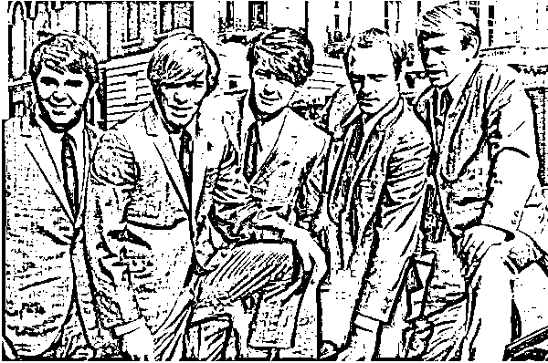

**丨**海滩男孩乐队，中间是布莱恩·威尔逊

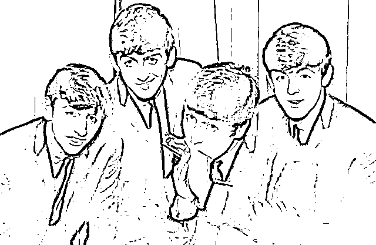 

**丨**披头士乐队，最右为保罗·麦卡特尼

**两人的照片和音乐对比**

**丨**两人年轻时的照片，左边是保罗，右边是布莱恩

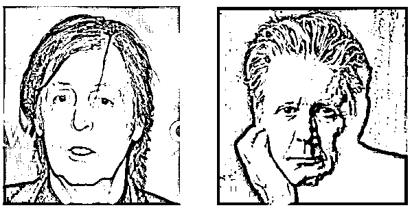 

**丨**保罗和布莱恩现在的样子  

 

这组照片是他们分别在录音棚录制音乐的照片，左边是保罗，右边是布莱恩。打扮很像是吧？但他们互相并不知道对方在录音棚的样子。

在录音棚中两人都是完美主义者，他们在创作乐曲的时候用到很多各种不同乐器的伴奏，因此创造乐曲复杂度很高。保罗更喜欢表演，他非常喜欢公众。

 

上面两张照片是他们在做演出时唯一的区别：保罗是左撇子。还有不同是，布莱恩在美国加州，而保罗在英格兰。

这里给大家放一点音乐，1966 年布莱恩创作的《只有上帝知道》，我想让大家知道一张星图就像一首歌一样。在这首歌中布莱恩有个观点：生活中如果没有爱的人，人生是没有意义的。

接下来给大家放一段保罗写的《昨日》这首歌，让大家感受一下两只歌的区别和相同的地方。

下面让我们来看看他们的星图，对照他们的人生故事，看看星座相位行星之间的关联。

**保罗的星图解析**

**布莱恩·威尔逊出生星图**

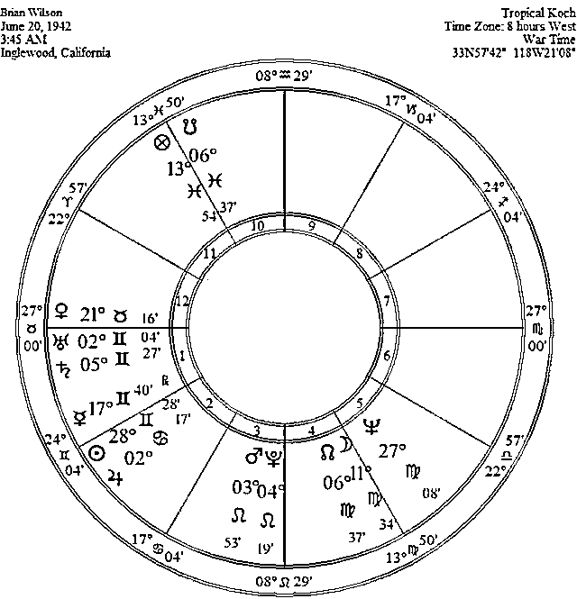

我们先从保罗的星图看。

看星图的首要步骤

**●****首先，我们在看到保罗的南交点是双鱼座的时候，马上去找海王星在星图上是否占据重要位置。**

在保罗的这张星图上，哪怕南交点不在双鱼座，他的海王星依旧是很重要的一颗行星，因为海王星和上升点有一个明显的合相。我们也看到，太阳和海王星有一个入相位的四分相，而且很精准在 1 度内。

**●****接着，再看四轴。**

发现太阳和中天合相，海王星和上升点合相。所以从优先次序，四轴来看，我们发现太阳和海王星在保罗的星图上非常显著。

 

我们并不能说所有南交点在双鱼座的人最后都会成为著名的词曲作者和电影明星，或者在很有创意的领域成功，这个人也可能会从事科研、科学方面的工作。

**但****当我们揭示很有创意的人的星图的时候，我们看到更多的南交点都是在双鱼座的人比起别的人要多得多。** 

今天我们要看的两张星图中，保罗在这两个人中显得要更有名一些。我们可以这么说，在这张星图中显示他确实有被大家所认知的这样的潜力：**太阳在第十宫，而且还合相木星。**

并不是所有太阳合相木星在十宫的人都会出名，但如果这样的能量是建设性的展现，那这样的人拥有极热情的能量能为他带来这样的认可。

我们也看到他的**北交点在处女座十二宫**，有人对我的书（编者注：《灵魂的目标》）比较了解的话应该知道北交点在十二宫是灵感方面的完美主义者。所以这样一个落点让此人拥有想要把在灵感上的完美主义和很多人分享的冲动和需求。

我们也知道**十二宫和做出贡献相关**，而他的确作出很多慈善贡方面的贡献，他也成功将完美的灵感和世界连接起来。

我们看到他也有一些狮子座能量，**火星在狮子座**拥有狮子座的戏剧性，**月亮也在狮子座**表示他在情绪上也拥有戏剧性力量。他很多歌曲都在情绪上给人很大刺激。他也以作词聪明有创意而闻名——我们在这里看到很多双子座。

**星图中的家族动力**

**如果我们从父母角度看看这张星图，月亮在狮子座，金星在金牛座，妈妈是很强悍、骄傲的。**

保罗曾这样说：“我的妈妈非常强势很骄傲，是我最好的朋友。”这就是月亮在狮子座十一宫的表述。“但我们是个工薪阶层，所以妈妈确实是为自己没有获得她想要的东西而挣扎，所以当我长大有了工作可以赚钱以后，我就很想为她购买她当时想要却没有能力购买的东西”。

这就是**金星在金牛座**。他的妈妈很喜欢也很想过舒适的生活，但出于狮子座的尊严又不想让别人知道她的需求没有达到。

他的爸爸是个音乐人，但作为音乐人却养活不了自己。他很擅长弹钢琴歌唱，但为了付账单他必须要做另外一份工，所以爸爸的野心受到了很大的伤害和挫败。

所以在这张星图上可以看到保罗父亲想成为“成功音乐人”的挣扎在星图上的印记。

**我们看到父母的动力在保罗星图上非常清晰地呈现了，保罗仰视他父亲的同时也看到父亲的挣扎挫败和幻灭感。**

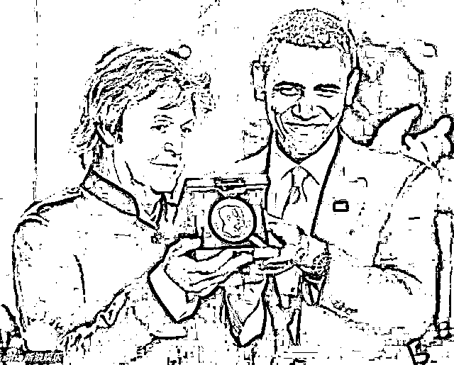

保罗小时候最爱做的事情就是和爸爸一起坐在钢琴前面弹钢琴，这对他来说印象很深刻。

在这点上有创意的一种发展就是和别的有创意的人组成乐队，我们看到十一宫被强化的狮子座能量：在“披头士”乐队之前他还有一些别的朋友一起组成乐队创造乐曲；在他的音乐里也有一种激烈性，所以我们看到的应该是火星和冥王星的能量。 

而且当他还是孩子的时候，弹钢琴后来还买了吉他一直练习，练习会变成专家（精益求精），这对于北交点在处女座的人可能是最好的解决方案。

这就是保罗的星图，我们说到的都是他早年的一些事件，我们还在中天看到水星，这给他一种能力，可以很好地创造出美妙的歌词。

**星图中的重要相位**

我们可以看到**保罗的星图有两个四分相非常紧密，一个是太阳和海王星的四分相，他的爸爸是一个很有挫败感很幻灭的音乐人；另一个是月亮和金星的四分相，代表他的母亲内在的纠结冲突——为何不能要求更好更舒适的生活。**

所以到底什么动机激励着他？他的妈妈想要更舒适的生活，爸爸想成为成功的音乐人，这个就来自这两个紧密的四分相，这个**四分相在内在推动我们前进**。所以在这里我想让大家很清楚看到四分相是给他带来动力的相位，**四分相是成功构建成功人生的基石**。

（未完待续）

**版权声明：**原创文章由作者授权首发于若道平台，欢迎转发，反对抄袭。友号转载请申请白名单。

**END**

****想阅读更多作者的文章，请在后台回复******大卫****** 即可。****

**大卫·瑞雷**

美国占星师，若道联合创始人，致力于在中国教授和推广西方占星学；2010-2014 年，任全美占星师联盟监督委员会委员；2017 年，被选为 ISAR 委员会成员。ISAR 是世界最大的国际占星机构，会员遍布 45 个国家，2017-2020 年曾任 ISAR 全球副主席、CAPISAR（ISAR 职业占星师资质认证机构）主席。

**拥有****51 年****占星实践经验的****若道创始人****前 ISAR 全球副主席****前 ISAR 全球职业占星师资质认证主席****大卫·瑞雷**

**和**

**2019 年第二届、2021 年第三届核心课中**

**与苏·汤普金斯老师****联合授课****的**

**ISAR 认证职业占星师**

**咔咔（Caroline）**

**二人合力打造**

**2022 年 ****若道全新核心占星课程**

**点击下图了解更多课程详情** 

**新的一年，来领取你的好运吧！**

**扫码**即可领取**专属的年运报告**

**20 位来自世界各地的占星师****带来 19 场沙龙——新世界的觉醒****详情可点击下图**

**学习占星学****点击下图了解课程详情**

**微信又双叒叕改版啦，不想错过若道君的推送？**
****就把若道设为****星标****以及点点****“在看”****吧！******▼**

**喜欢就点一下“在看”吧！****报名直达入口**

# 星图的双生子（下）丨成长中的差异

> 原文：[`mp.weixin.qq.com/s?__biz=MzA5NjA0NTAxNg==&mid=2651498138&idx=2&sn=d2693bc5086ede47718bfde76ac834f0&chksm=8b48142dbc3f9d3b05f04026af5cedf05d3b7681e337d580e0b1aeada4444734c2913d920bc6&scene=126&sessionid=1692737700#rd`](http://mp.weixin.qq.com/s?__biz=MzA5NjA0NTAxNg==&mid=2651498138&idx=2&sn=d2693bc5086ede47718bfde76ac834f0&chksm=8b48142dbc3f9d3b05f04026af5cedf05d3b7681e337d580e0b1aeada4444734c2913d920bc6&scene=126&sessionid=1692737700#rd)

作者/大卫·瑞雷 若道创始人

翻译/Helen 文字整理/玫瑰

编辑/翀子  图片/网络

本文根据大卫·瑞雷 Level 3 授课内容整理

上世纪 60 年代的欧美乐坛中，有两支乐队有着举足轻重的地位，一支是英国的“披头士”，另一支是美国的“海滩男孩”。而巧合的是，两支乐队的灵魂人物——保罗·麦卡特尼和布莱恩·威尔逊的星图居然有着神奇的相似性，今日头条重点为我们分析了保罗的星图，今天来重点分析布莱恩的星图。另外，大卫老师参与授课的【[ISAR 认证职业占星师文凭课程](http://mp.weixin.qq.com/s?__biz=MjM5MjQwNjAyMQ==&mid=2649440565&idx=5&sn=5d161dd1a6055437625fd1a67bdc4529&chksm=beb92e5f89cea7490e50e9ef66dd648b0d30b1f1c0550374de88cfecea658a9433e8c360b1a2&scene=21#wechat_redirect)】正在插班中，如果你对占星学感兴趣，欢迎点击链接了解更多详情！

我想让大家看到行星相位的能量是怎样在星图里运作的。

我们现在来看一下布莱恩的星图。他和保罗一样南交点都在双鱼座，太阳四分海王星。太阳和海王星的四分相是一度之内的出相位。海王星没有和上升点合相，而是一个三分相，这很有意思。南交点在双鱼座十宫，离十一宫宫头只有 7 度。

我应该说，这个南交点更多是十宫的能量，可能带了一点点十一宫的能量。**对于所有的宫头，我用的是 5 度的容许度，必须要在 5 度或 5 度以内才能进入到下一个宫位的能量带里面。**

**布莱恩的出生星图**

**** 

下面一边分析布莱恩的星图，一边对比他和保罗的星图。

**保罗的出生星图**

**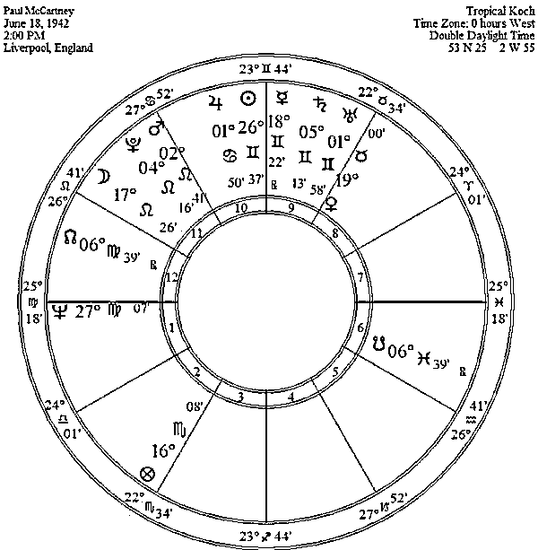** 

*   保罗的上升点是在处女座。

*   布莱恩的上升点是在金牛座。

在布莱恩的案例当中他父亲是喜欢音乐的。他父亲弹钢琴，也有一些创新的想法，但是在最开始的时候在财务上挣扎了一下，赚到的钱刚够养活自己。他们住的街区也是不错的。

布莱恩有堂兄妹，也有自己的兄弟姐妹，所以有一个大家庭。布莱恩和他的堂兄弟年纪相仿，住得很近，他们总在一起玩。这里也是有一些区别的。

*   布莱恩月亮在处女座，金星在十二宫。**布莱恩是这样形容他母亲的：“妈妈是一直在幕后的人，比较挑剔，但又属于比较弱势的一方。”**

*   而保罗的星图上，月亮是在狮子座，因此妈妈很强势，在家里占主导地位。

在布莱恩的案例里，妈妈有酗酒的问题，虽然不是特别严重，但是也由落在十二宫的金星给予了一些暗示。当然他父母都有酗酒问题。

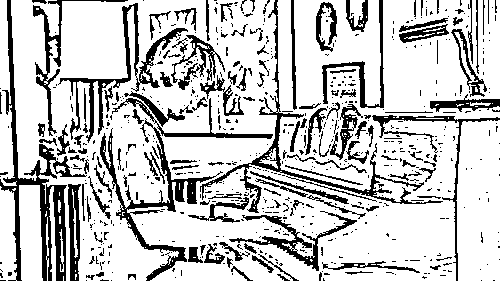

**丨**布莱恩生平电影《爱与慈悲》剧照

布莱恩在年纪很小时就显露出了音乐方面的天赋，他能坐在钢琴前弹奏几个小时。他父亲看到了他的天赋，看到了儿子挣钱的潜力（太阳和木星在第二宫）。他想，好，那我给他来点儿压力。布莱恩总是被父亲殴打，打得很厉害，导致他的右耳失聪度 90%。

**布莱恩和保罗的境遇里，有一个很大的不同，就是布莱恩的父亲会体罚孩子。**在准备这两张星图时我期待大家能提出一个问题——为什么布莱恩的父亲有倾向而保罗的父亲没有呢？

我们看到在这两张星图上，都有与暴力相关的火星和冥王星能量，这预示着这两张星图都有一个可能性，即把这种能量以破坏性的方式表达出来或者接受到这种能量，那就是来自父亲的一种体罚。

**为什么布莱恩受到了体罚而保罗没有？**

*   第一个不同是，在保罗的星图上，他母亲非常强势，而且起主导作用。月亮在狮子座，妈妈就像母狮一样，不可能容许自己的丈夫打她的孩子。另一个不同是，保罗的太阳在十宫，他的能量更加有限制性，有责任心，强调自己的义务。

*   但我认为，**最重要的不同首先是月亮的落位不同**，布莱恩在描述他的母亲的时候说，妈妈好像不在那里。他有时候会描述母亲就像一个小孩一样，她的心不在那里。而且父母都酗酒，爸爸更是有体罚倾向，可以想象布莱恩和他的兄弟们长大的环境。而且我们可以想象爸爸其实想要控制这三个孩子，我们看到冥王星和火星都在第三宫。

 

**丨**海滩男孩专辑  

所以父亲看到布莱恩在音乐上的天赋，会把他的两个兄弟拉进来，学一下电台上听到的歌，自己也写歌，然后去演唱。因为三个孩子都未成年，所以很自然的，父亲就成为了他们的经纪人，收入都是父亲掌管。随着儿子的成功，尤其是布莱恩的成功，父亲变得很富有。

这里有一个冲突，布莱恩曾说：“我成长过程中父亲对于钱是有焦虑的，他提到我们当时甚至付不出房子的贷款。”等到三兄弟成年之后，就把父亲开除，不让他当经纪人了。布莱恩成了三兄弟的领袖，很有创意地做一些关于歌曲怎么做，将来如何发展的决定。

**布莱恩自己也通过他的歌曲赚了不少钱。我们看到合相在第二宫的太阳和木星，四分了海王星。**此外我们还看到天王星合相了上升点，刚好是过了 5 度之外，因为我用的是 5 度的范围。布莱恩是很有创新精神的，他在工作上很努力而且非常自律。

上升点在金牛座，他喜欢吃。看下面的照片会发现布莱恩（右）比保罗（左）脸上稍微圆润一些，而且脖子要粗壮一些，这个就是和金牛座联系起来。

在这张图上可以更明显看到金牛座上升的沉稳气质，比较一下左边上升星座在处女座的感觉。因为保罗的上升点有一颗海王星，所以他的脸上也可以看到一些海王星的特征。有一些相似点，但还是有不同。

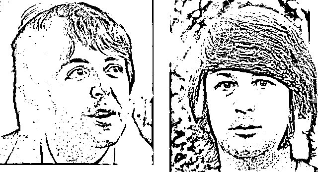

**丨**两人年轻时的照片，左边是保罗，右边是布莱恩

回到布莱恩的星图，因为布莱恩从小遭到体罚，父母酗酒，所以他的成长过程相对艰辛——所有遭到过体罚的孩子都是这样的。

电影《爱与慈悲》非常清晰地描绘了布莱恩的生平。当他小时候和兄弟在飞机上，他会有很惊恐的反应，他会躺在地上。他甚至说我再也不想和乐队一起巡回演出，我就想待在家里写歌。我们看到布莱恩和保罗不一样，他没有保罗这样强势的十宫。

*   保罗的太阳和木星都在十宫，他非常喜欢观众，非常喜欢在观众面前表演。

*   而布莱恩会说我就想回家去，在家里锤炼我的技艺和创作，让它们日臻完美。他会对他的乐队说，你就让我回家吧，我会写歌给你们带来财富，而他做到了。

很不幸地，他染上了毒瘾并且酗酒，又被误诊为患上精神分裂，被一个心理医生所控制。布莱恩的一个兄弟因为吸毒过量而死，布莱恩自己有一段时间也陷入低潮，体重急剧增加。有两年的时间他拒绝走出卧室，就在床上生活，停止了歌曲创作，整个世界都坍塌下来了。

但是这可不是最终的结局，你必须去看电影才知道最后的结局是什么，我能够告诉你结局是快乐的，非常棒的海王星故事。

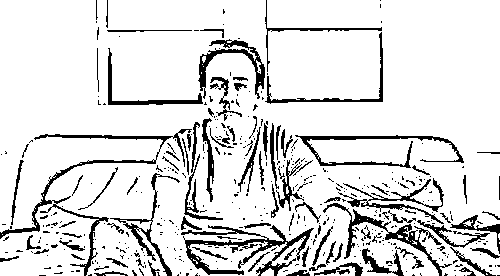 

**丨**《爱与慈悲》剧照  

再看一个区别，我们看到布莱恩的星图上，行星都在地平线以下，虽然南交点在十宫，但从行星来看只有金星勉强在地平线以上，所以我们仅仅看一眼，区别非常明显。

*   保罗大部分行星都在地平线以上。

*   布莱恩大部分行星都在地平线以下。

布莱恩因为长大过程中有父亲的体罚因而更加悲惨。所以布莱恩遭受的不光是体罚，还有心灵情绪上面的摧残。我建议大家看一下这部电影，根据布莱恩的星图看电影，你们会发现布莱恩的父亲是多么残忍，在心灵层面给他造成多么大的伤害。当然最终布莱恩的创造力回来了。

 

**丨**布莱恩获得格莱美大奖

我再给大家分享一些有意思的信息。这两个人在不同的大陆上，一个在美国，一个在英国。从 1964 年开始因为两支乐队都如此有名，他们互相知道对方的存在。

在之后的几年，布莱恩会去听保罗为“披头士”乐队创作的音乐，比如他听到一首歌会说：“哇，这首歌太棒了！”接下来他就会回到录音棚去尝试写出一首更好的歌。

而布莱恩的歌出来后，保罗也会去听，听过之后他会说：“天哪，这是我听过最好听的歌！”接下来他也会回家去写出更好的歌。这样的状况持续了好多年。

两个出生时间只差两天的词曲作者写出了那个年代最棒的歌曲，他们互相倾慕，最后他们见面了。他们彼此非常认可，都认为对方比自己好，对外界也会这样说。

两人都因为音乐创作获得了很多格莱美奖。财务方面布莱恩的收入以及生活很舒适，但比不过保罗。保罗在财务上更胜一筹，可能是得益于他月亮和金星的四分相，因为他自己也喜欢很美好的东西。

我希望每个人都能看到两张星图中的相同点和不同点。

**版权声明：**原创文章由作者授权首发于若道平台，欢迎转发，反对抄袭。友号转载请申请白名单。

**END**

****想阅读更多作者的文章，请在后台回复******大卫****** 即可。****

**大卫·瑞雷**

美国占星师，若道联合创始人，致力于在中国教授和推广西方占星学；2010-2014 年，任全美占星师联盟监督委员会委员；2017 年，被选为 ISAR 委员会成员。ISAR 是世界最大的国际占星机构，会员遍布 45 个国家，2017-2020 年曾任 ISAR 全球副主席、CAPISAR（ISAR 职业占星师资质认证机构）主席。

 **拥有****51 年****占星实践经验的****若道创始人****前 ISAR 全球副主席****前 ISAR 全球职业占星师资质认证主席****大卫·瑞雷**

**和**

**2019 年第二届、2021 年第三届核心课中**

**与苏·汤普金斯老师****联合授课****的**

**ISAR 认证职业占星师**

**咔咔（Caroline）**

**二人合力打造**

**2022 年 ****若道全新核心占星课程**

**点击下图了解更多课程详情** 

**微信又双叒叕改版啦，不想错过若道君的推送？**
****就把若道设为****星标****以及点点****“在看”****吧！******▼**

**喜欢就点一下“在看”吧！****报名直达入口**

# 职业占星师认证文凭课程插班中丨想看大卫老师是怎么做课堂演示的吗？

> 原文：[`mp.weixin.qq.com/s?__biz=MzA5NjA0NTAxNg==&mid=2651498138&idx=3&sn=3d10a175be15c3fca5debcb482c97236&chksm=8b48142dbc3f9d3be7fa0aa56fc80de6eff9fe2d63dbeb7c25d181776cf29aec2e816f3d3be6&scene=126&sessionid=1692737700#rd`](http://mp.weixin.qq.com/s?__biz=MzA5NjA0NTAxNg==&mid=2651498138&idx=3&sn=3d10a175be15c3fca5debcb482c97236&chksm=8b48142dbc3f9d3be7fa0aa56fc80de6eff9fe2d63dbeb7c25d181776cf29aec2e816f3d3be6&scene=126&sessionid=1692737700#rd)

**在若道核心课程的教学里，****以学员为案例****进行课堂的占星咨询演示，是我们课程的特色环节。**

这样的演示不仅让很多同学有亲身体验咨询的机会，而且这么多真实案例的学习，会让大家看到占星咨询到底是怎么样一个过程。毕竟，大部分人的学习都是要从模仿开始。

记得若道君当年学习占星的时候，可没有这样的机会。那时候主要是听课为主，后来，我们在多年的教学实践中，**越来越发现课堂演示的重要性**。因此，就把这个作为一个主要环节加入到课程中。

在新一期的若道核心课程中，咔咔老师和大卫老师这对组合就会把这个教学特色充分发挥出来。**熟悉中国同学思路的咔咔老师会以知识点的讲解为主，而有 50 年占星咨询经验的大卫老师，则以课堂演示为主。**

有时候，这样的课堂演示的功效是出乎意料的。

一位若道的老同学赵震宇这么写到：

2018 年，我正式开始在若道学习 L1-5。其实我一开始的心态更多的是希望得到系统化的学习来补充我的知识漏洞，以及拿到一个证书可以为自己做背书，增加自己将来转型占星师的筹码，而不是真的在期待可以从若道的学习中得到一些本质上的领悟。

事实上在初期的 L1-3 中，很多知识与课上的内容，也是我比较熟悉的领域，相对而言是驾轻就熟的。但在 L3 的工作坊中和大卫老师的接触以及模拟咨询，让我对占星的态度发生了很本质的变化。

大卫老师对我星图的分析不仅非常准确，更重要的是，他开启了我自身个人成长上的变化，从而成为了我本质上进化蜕变的一个契机。

在短短的 6 个月内，我对人生的认知、对自我的认知、对于人生看待的方式都发生了翻天覆地的质的变化。我意识到了原来跳出自己一直以来无意识间重复的模式，是一件可行、并且会给自己带来无限成长提高自己人生幸福度和质量的事情。这也让我深刻体会到了人本主义占星学的魅力，以及自己之前是多么的“无知“。

于是现在，占星学对我来说，不只是兴趣、宗教信仰、或者是可能的职业道路，而是一种激发自己和他人人生成长和蜕变的工具、一种让自己更幸福的看待世界的方式。哪怕我之后并不会以占星为生，它依然是我人生中不可或缺的一部分，就像一副隐形眼镜，影响着我与世界的互动。

而被大卫老师咨询深深影响的同学还有很多。

**这里，我们节选一些短小的试听片段，让你稍微感觉一下在若道核心课程上，大卫老师的咨询演示是怎样的一个样子。**

**片段一**

<mpvideosnap class="js_uneditable custom_select_card channels_iframe videosnap_video_iframe" data-pluginname="videosnap" data-id="export/UzFfAgtgekIEAQAAAAAAMKsWN6BUygAAAAstQy6ubaLX4KHWvLEZgBPEnoIULgMKKb-DzNPgMItC2ZEgiEDMBYjrYHv9wNsO" data-url="https://findermp.video.qq.com/251/20304/stodownload?encfilekey=rjD5jyTuFrIpZ2ibE8T7YmwgiahniaXswqzQNpbBXpPP4TxDf43veVhCBACOECUZ1gc5HaUbhk0Z3Glc94tZFe7ewRHOH9L2oUC1X3aOe13K8IHMkEou9Nkgw&amp;adaptivelytrans=0&amp;bizid=1023&amp;dotrans=0&amp;hy=SH&amp;idx=1&amp;m=&amp;scene=0&amp;token=x5Y29zUxcibCEaJsXB0hMdWnJvmNct4OnXZaaWOd32ia2edkK2LTMk7jmjOms6bDk5TDtYTqEwbOQ" data-headimgurl="http://wx.qlogo.cn/finderhead/PiajxSqBRaEJYnVsqWfEX9qA0sI6hNVKsDfyzfPZ92WZMZyBpZWU5NA/0" data-username="v2_060000231003b20faec8c4e68a1ec2d4ca07e434b07755bbf47e7053a3059defd2c9d6c68a20@finder" data-nickname="若道" data-desc="#若道核心课 大卫老师用星座、行星、宫位来探索一位同学出生星盘主题的时候，他回顾了解读星盘的优先次序" data-nonceid="7723748345640460016" data-type="video" data-width="544" data-height="344"></mpvideosnap>

**片段二**

<mpvideosnap class="js_uneditable custom_select_card channels_iframe videosnap_video_iframe" data-pluginname="videosnap" data-id="export/UzFfAgtgekIEAQAAAAAANycuUwRANAAAAAstQy6ubaLX4KHWvLEZgBPEhYJ0WjYILr-DzNPgMIvjhT14ogdLw3BWd0Tg37w0" data-url="https://findermp.video.qq.com/251/20304/stodownload?encfilekey=rjD5jyTuFrIpZ2ibE8T7YmwgiahniaXswqz3Oj8zjAwTAIicKkuWErGfL3ZtYr95eTZl2oMcAx9ibThSN3gay2CmF6o8ht96zOZHdxGiaIMmdbGNtWv9Prb3wriaA&amp;adaptivelytrans=0&amp;bizid=1023&amp;dotrans=0&amp;hy=SH&amp;idx=1&amp;m=&amp;scene=0&amp;token=AxricY7RBHdV28gAuQuwABhG0G0QgmYSkh8LH68lEdHu6yrDYj099TFZVSWWqINaQTuTQ2p1ZMF0" data-headimgurl="http://wx.qlogo.cn/finderhead/PiajxSqBRaEJYnVsqWfEX9qA0sI6hNVKsDfyzfPZ92WZMZyBpZWU5NA/0" data-username="v2_060000231003b20faec8c4e68a1ec2d4ca07e434b07755bbf47e7053a3059defd2c9d6c68a20@finder" data-nickname="若道" data-desc="#若道核心课 占星学如何反应职业选择？" data-nonceid="629392412247480278" data-type="video" data-width="544" data-height="344"></mpvideosnap>

**片段三**

<mpvideosnap class="js_uneditable custom_select_card channels_iframe videosnap_video_iframe" data-pluginname="videosnap" data-id="export/UzFfAgtgekIEAQAAAAAAl_sREJMyhwAAAAstQy6ubaLX4KHWvLEZgBPEtIIkIkRmL7-DzNPgMIsA5PpGB3ReSAYx6ZfSNfZ1" data-url="https://findermp.video.qq.com/251/20304/stodownload?encfilekey=S7s6ianIic0ia4PicKJSfB8EjyjpQibPUAXolGhicE2gfRuDzIVwyXxBFlWMzxMczGgPzOG5ja3tyfwYQrAcOUkpGicEE1j6fc9zHAjg5IF1HDBibf9k85ybbAfdqQ&amp;adaptivelytrans=0&amp;bizid=1023&amp;dotrans=0&amp;hy=SH&amp;idx=1&amp;m=&amp;scene=0&amp;token=x5Y29zUxcibCEaJsXB0hMdeqQ56SUWMj15o3Z7wyXeQ6ruia8FGLMtcPAnn3TQl6hkia66nOjynB8M" data-headimgurl="http://wx.qlogo.cn/finderhead/PiajxSqBRaEJYnVsqWfEX9qA0sI6hNVKsDfyzfPZ92WZMZyBpZWU5NA/0" data-username="v2_060000231003b20faec8c4e68a1ec2d4ca07e434b07755bbf47e7053a3059defd2c9d6c68a20@finder" data-nickname="若道" data-desc="#若道核心课 如何从出生星图的基本要素看到案主生命发展的故事和个人成长经验？
" data-nonceid="6689802853667419635" data-type="video" data-width="544" data-height="344"></mpvideosnap>

**若道新一期的核心课程在****8 月 30 日****正式开始**，如果你有很浓厚的兴趣，不仅仅是因为好奇想浅尝一下占星学，但还没有想清楚是不是要学习整个 L1-5 的课程，**那么 L1-3 可能是一个不错的选择。**

**谁是你的老师？**

**占星师咔咔（Caroline）**

2010 年师从美国占星师大卫·瑞雷学习，并得到世界名师斯蒂芬·弗里斯特、罗伯特·汉德、苏·汤普金斯传授各种占星学技法。若道首届学员，国内最早获得 ISAR 职业占星师资质的职业占星师，多次担任若道核心课程助教，2019 年第二届、2021 年第三届核心课中和苏·汤普金斯老师一起教授若道核心占星课程。

在国际知名广告公司和市场研究公司从事的市场研究和推广工作十余年，曾任职于阳狮集团、尼尔森市场研究有限公司、MTV 和《Madame Figaro》杂志。

**大卫·瑞雷（David Railey）**

*   **I****SAR 董事会成员，ISAR 全球副主席，ISAR 全球职业占星师资质认证主席，若道占星创始人**。

*   2016-2019 年，被选为国际占星协会（ISAR）考试委员会成员，国际占星协会（ISAR）是世界最大的国际占星机构，会员遍布 47 个国家。

*   2017-2020 年，被选为国际占星联盟（ISAR）考试委员会主席，理事会成员。

**助教王嘉祺 （Conrad）**

ISAR 认证占星师、若道认证生时校正资质，从 2010 年起自学占星学，2015 年开始在若道系统学习，并开始个案咨询。2018 年担任若道核心课程助教，以及卜卦占星学和太阳返照选修课助教，并带领学员进行经世占星和太阳返照方面的研究。2019 年 11 月作为演讲人之一参加了国际占星协会（ISAR）北京大会，也是 ISAR 星空俱乐部中国区第 16 期的主讲人。

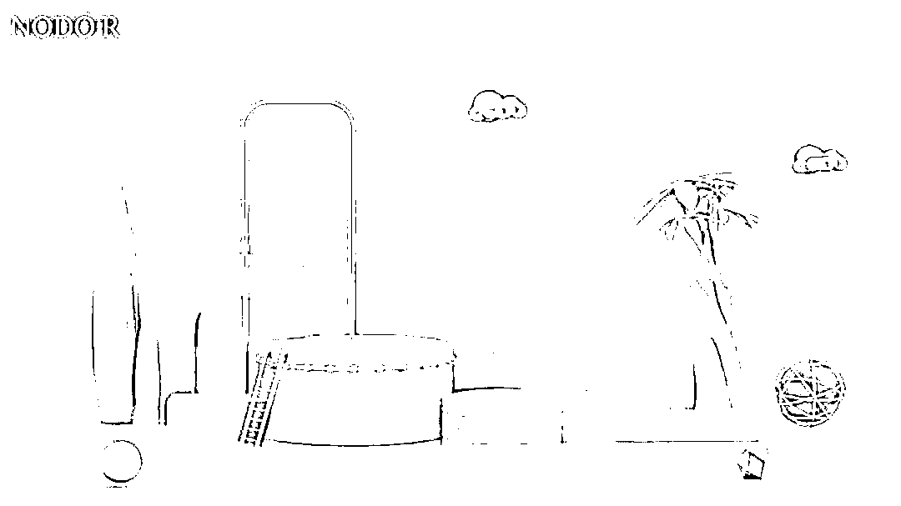

**内容是什么？**

**ISAR 认证职业占星师的独有培训**

目前占星学的培训市场鱼龙混杂。而 ISAR（国际占星研究协会）是一个包含了 47 个国家在内的国际占星组织，多年来致力于占星的教育和研究，提升占星教育的品质和职业占星师的能力，在国际占星领域备受尊重。

**2022 年，鉴于对若道在占星教学领域所做的持续努力和高品质的课程服务，ISAR 特别授予若道核心课程为 ISAR 文凭课程，所有在若道学习，并通过若道毕业考试的同学将获得 ISAR 颁发的学历文凭（Diploma）。**

如果你想更多了解 ISAR，请点击[【这里】 ](http://mp.weixin.qq.com/s?__biz=MzA5NjA0NTAxNg==&mid=2651475298&idx=1&sn=b91888b54c14e29068f8b4e2a3452f5d&chksm=8b48ffd5bc3f76c32699f20f5c99e978bbb25551e69d80c70fee361acbd930ba5970ae776cdc&scene=21#wechat_redirect)

**课程费用**

**★ 1-2 阶　****课程费用：3500 元 ****★ 1-3 阶 连报**

**课程费用：11500 元 **

**********转发优惠价：**11000 元（朋友圈转发本课宣保留 24 小时以上，并截图给课程顾问）********

**★ 1-5 阶　连报**

**课程费用：46500 元 **

****转发优惠价：34800 元，朋友圈转发本课宣保留 24 小时以上，并截图给课程顾问****

**退转课程**

**退款原则请详看《教学协议》，如有疑问请咨询课程顾问。**

****2022 L1-3 认证职业占星师文凭课程****

**授课老师：大卫·瑞雷、咔咔**

**直播课开课时间：2022 年 8 月 30 日（周二）**

**授课方式：******网络授课，英文/中文授课，中文翻译****

**费用：** ****1-2 阶**：**3500 元；****1-3 阶**：**11500 元****（****转发优惠价：**11000 元，朋友圈转发本课宣保留 24 小时以上，并截图给课程顾问）******1-5 阶连报**：46500 元**（****转发优惠价：34800 元，朋友圈转发本课宣保留 24 小时以上，并截图给课程顾问）**；**

**课程负责人：王老师**（微信/手机：18510107057，请备注“大卫核心课”）

长按二维码添加课程负责人咨询

**报名直达入口**

# 若道周运 1.2-1.8 丨新年伊始，一起来看看 2023 年的第一周天象如何？（内含 12 星座运势）

> 原文：[`mp.weixin.qq.com/s?__biz=MzA5NjA0NTAxNg==&mid=2651498136&idx=1&sn=0488ea39d4fa0f670c44f93159cb483b&chksm=8b48142fbc3f9d39c518a296e593b8ab560e5dfbe77b4257ca6da8863568c62f4e3df3ec8500&scene=126&sessionid=1692737700#rd`](http://mp.weixin.qq.com/s?__biz=MzA5NjA0NTAxNg==&mid=2651498136&idx=1&sn=0488ea39d4fa0f670c44f93159cb483b&chksm=8b48142fbc3f9d39c518a296e593b8ab560e5dfbe77b4257ca6da8863568c62f4e3df3ec8500&scene=126&sessionid=1692737700#rd)

******☆ ****后台回复“今日”，给你一句生命态度******

作者/朵三三三 ISAR 认证占星师
编辑/翀子 封面/书君 图片/稿定设计**整体氛围**

**这是 2023 年的第一周，你有什么新的愿望和计划？又在哪些方面有了新的变化？**

**群星依然运行在摩羯座，**此刻我们重点关心的还是生活的冷暖，生存的考验，以及诸多的现实问题。由土星主管的行星能量必然会持续给我们带来一些压力与沉重，限制与内缩。

**土星的关键词就是缓慢前进**，很多事情或计划可能出现延迟，比我们想象中需要的时间更长，而我们需要的就是无尽的耐心，静待寒冷的冬日过去。

**木星刚刚进入白羊座，**相信有一部分人已经感受到了自由的气息。然而对于整个社会来说，这种新生的氛围依然如小婴儿一般，尚在襁褓之中，春天的第一株新芽，第一缕微风，也同样还需要些时日才会真正到来。

星象的变换不以人间的历法为分界点，所以当新的一年到来时，从天象的角度来看，并没有出现明显焕然一新的部分。

但我们内心对于“崭新”的信念与渴望，给我们带来了继续向前的勇气，这是希望的力量，也是它支撑我们走过了 2022 年的风雨长路。

2023 年，这个世界会不会变得更好不重要，重要的是我们自己会不会变的更好。若你已然历经沧桑，可以淡然看花开花落，那么外部无论是风雨天还是艳阳高照，都不会再扰乱你的心境。

安全感和爱从来无法在外界获得，而是由我们的心田所生，当有一天你意识到自己的生命在某处不停打转时，那一刻你已经发生了变化。

当你能够跳脱出当下，看见自己的模式和惯性时，就也已经开启了新的阶段。**新的可能性，从来不会被客观环境限制，而是随时随地发生，就在此时此刻发生。**

**本周重要天象**

★**周一 摩羯座水星六分双鱼座海王星**

此时我们的思考与沟通方式，既能落地，又会带着一些灵感与想象，**有利于偏精神层面的交流，艺术、文学方面的创作，及身心灵的疗愈。**

水星在摩羯座的冷感、理性能量，被海王星的柔和、梦幻所中和，也会让我们用刚柔并济的方式来观看这个世界，获得认知上的帮助。

★**周二 金星进入水瓶座**

金星即将率先离开摩羯座星群，换座水瓶座。水瓶座由土星和天王星共同守护，天王星力量的加入带来了变革的可能性，也给我们的情感和人际关系方面带来松弛感和自由度。

**金星在水瓶座**让我们在情感和人际相处中更加需要独立空间，注重精神交流和心灵共鸣。金星在水瓶座的这三周中，**会先后四分天王星、合相土星，**此时我们容易被独特、与众不同的人吸引，可能有突如其来、意料之外，却令人惊艳的相遇。

有些人或许就此进入一段不同寻常、非世俗的关系中，但由于土星的压制，又在爱中亦步亦趋，患得患失，思虑甚多，好处是能够保持理性与客观，难受的地方在于无法直抒胸臆，心中甚苦。很可能一面疯狂沉沦，一面又分裂出疏离的自我冷眼旁观。

**接下来的这段时日，爱是癫狂，也是克制，是电光火石终邂逅，也是想触碰又收回的手。**

★**周三 水瓶座金星六分白羊座木星**

**风元素与火元素之间的和谐连结**，让这一天的星空出现了较为愉悦的能量。我们能够在情感和人际关系中保持自我，又能找到彼此之间的火花和热情。

这一天与外界的互动非常活跃，又令人舒适。**可能在不经意间就获得鼓舞与支持，或是找到认同感，自身价值能够被肯定，被发现。**

★**周五 摩羯座太阳三分金牛座天王星**

我们会出现一些**新的创意、想法、目标，**此时我们也格外需要走自己的路，做自己全心全意向往的事情，不在意他人的眼光和评判。

或许会有一些**小小的冒险**发生，我们也会留意到一些过去从未注意过的人事物，在这个过程中，我们比平时格外需要一些**独处思考的空间**，来完成转化和革新。

★**周六 巨蟹座满月**

**这个满月即将令我们的情绪进入到一个峰值，对于某些人来说，会经历到一些情感、安全感的难关。**

月亮落在巨蟹座是回到了自己的家，同时也把月亮本身起伏变化、阴晴圆缺的波浪感与不稳定推到了 MAX（极大值），**这个满月对于出生星图中月亮能量较重（重要个人星体落在巨蟹座、群星巨蟹座、月亮合四轴等）的人群影响较大。**

若你平时便有强烈的对于安全的需求，**对于私密的需求，对于关怀的需求**，而在过往的时间里，因为某些现实原因不得不将这些需求隐藏起来，因为外在的忙碌长期忽略了内在的自己，那么在这个满月，这些情绪都会被放大、照亮，无处藏匿。

但同时，由于巨蟹座饱满的疗愈性，和其情感的充沛性，我们又会在这种海浪的冲击感中得到奇妙的治愈和抚慰。一面痛苦，一面疗伤。

另外，满月是日月对分，我们容易经历到**人际关系中的困难、冲突与分离**，可能是内在情绪被放大到极致（月亮所在的巨蟹座能量），被外界现实的坚硬冷酷的部分所伤害（太阳所在的摩羯座能量）。

也或许是自己成为更加理性严苛的角色（太阳摩羯座），无法理解阴柔能量为主导的，更加敏感情绪化的对方（月亮巨蟹座）。

**每次巨蟹座满月时，都是一次柔性能量和刚性能量之间的对峙角逐，也是我们觉察体内刚柔平衡的状况，观察它们在外界中如何投射，继而重新调整分配它们比例的好机会。**

与本次满月几乎同时发生的还有水星和月亮的对分相，我们需要注意直觉与头脑之间的矛盾感，可能明明心朝着一个方向走，但想法和头脑却朝着另外一个方向。也或许会表现为我们此时很难与他人进行沟通，语言表达出现折射，对方难以接收到真实信息，于是出现鸡同鸭讲的状况。

冥王星跟月亮已经离得非常远，但依然在摩羯座星群之中，力量依然也会被此次满月激发。所以这个满月也会有压抑的感受出现，或许会有一些事情令你钻牛角尖，感受到失去，感受到内心的炼狱及情绪翻涌。

来什么就体验什么吧，不要企图逃跑。**拥抱这些情感，观察它们升起的根源，或许你会有一些过往的记忆被唤起，那就进入这些回忆，与内在感受链接。**

与情绪的海浪共处，安静的经历汹涌起伏，平和的回顾过去，然后，才能平心静气的注视当下。

**保持慈悲的心境，对自己接纳，才能对他人宽容。**

**12 星座一周运势**

**（重点参考上升星座，其次参考太阳星座）**

***白羊座***

本周职场事业方面的压力有所缓解，相关的人际关系会活跃起来，比如与客户、人群的对接上，会更加容易推进，出现和谐的氛围。

周末前后需要注意家庭事务与工作之间的平衡关系，可能会跟领导、上司、权威发生冲突，或者感到委屈、不公平，此时涉及到家人方面的事情更容易令你情绪化，但也可能通过跟家人的交流获得支持与安慰。

***金牛座***

本周开始，你在职场、公众场合更加积极、活跃，勇于展现自己，也容易备受欢迎，给大家留下好印象。

周末前后，可能在远方、异地异国、迁移、学业方面感受到一些压力，或许会放弃一些过往执着的目标和愿景，重新调整自己对未来的预期和人生规划。多跟自己信任的老友交流，能让你重新获得方向感和内在的安全感。

***双子座***

本周开始，你的迁移运和学业运飙升，有些人可能会在未来三周内有一次愉快的旅行经历，或者正在计划出行游玩中。也有部分人即将开始一段异地恋，或者从远方传来，或是学业方面收到了一些好消息。

周末前后，对于金钱物质方面较为敏感，也可能因为心情影响而消费花钱。此时可能跟伴侣或合作伙伴一起规划未来的理财投资方式，也可能因此发生冲突矛盾。不过这样的经历会让你更加清晰自己在现实部分的安全感从何而来，如何得到。

***巨蟹座***

本周你的财运开始飙升，可能通过人际关系获利，也有部分人与伴侣确认了更加深入、互相信任的关系，并非常享受这样的深度连结。

整个星期，受到满月发生在命宫的影响，你的情绪大概率都很难平稳，很容易因为人际关系、合作关系、亲密关系此类一对一的关系内心波动。你在周末前后更容易感到人际关系方面带来的压力，会根据自己内在需求做出一些重要决定。

***狮子座***

本周开始，对于你的感情运非常有利，有机会认识到比较投缘的对象，也有部分人在这段时间开启了一段新的情感。总体来说，你都容易在接下来三周内遇到对你友善、一见如故的人，无论是哪个性别，跟女性的关系都更容易相处。

周末前后，内心风浪翻滚，难以平静。可能是工作环境、同事、日常、身体健康方面带来的压力让你非常容易焦虑，甚至可能影响睡眠。此时多觉察内心深处的真正感受，你会看见发生这一切背后的原因。

***处女座***

本周开始，你更容易享受生活本身，工作方面也轻松了许多。之后或许会有一些因公出差、去远方的机会，为你带来生活中的小确幸和意外惊喜。

周末前后，可能会在恋爱关系、子女、兴趣爱好、自我表现力等领域感到焦虑或阻力障碍，此时若与他人发生冲突，往往是因为你站在了更宏观的角度、立场来思考问题，但需要耐心等待对方的理解，给对方足够的时间。

***天秤座***

本周开始，你的桃花运飙升，有机会在聚会、娱乐场合结识到自己的心动对象，之前你在家已经宅了太久，是时候出门活动活动了！

周末前后，容易感到家庭、家人给自己带来的压力和负担，或许你感到自己已经付出牺牲了很多，但对方很难理解，或不领情。你意识到，是时候调整自己与对方的相处方式了。

***天蝎座***

本周开始，你的家宅运飙升，适合装修、美化、改善家居环境，你也会更加享受跟家人在一起，或者独自宅在家中的时光。

周末前后，容易感到跟身边人相处的压力，可能是亲朋好友、也可能是伴侣，你们容易在沟通方面起争执，出现言语上的冲突矛盾。你可能觉得很难被理解、被看见，自己的信念被挑战，内心很受伤。你也可能就此离开一些重要关系，清理人际圈子。

***射手座***

本周开始，你在周遭人际关系中的互动更加愉快，你也更加享受跟他人的交流或闲聊，部分人获得不错的人脉，签订重要合同、项目，也可能是在与他人交流中得到有帮助的重要信息。

周末前后，容易对自己的财务金钱状况产生焦虑，你可能会通过调整自己的理财投资方式，让自己获得更多安全感。

***摩羯座***

本周开始，你可能会享受一段时间物质上的富足，或许是有了一笔进账，也可能是你决定犒劳自己，让自己拥有心仪已久的物品。这段时间财运也不错，适合理财投资，可能有不错的回报。

周末前后，或许会出现亲密关系、合作关系、伴侣关系上的冲突矛盾，让你深刻感受到彼此之间立场、观念的差异。同时，你也有机会被他人的温暖疗愈，也决心用更多温暖来对待世界。

***水瓶座***

本周开始，你可能会陆续收到一些好消息。接下来的美好时光，也很适合跟你觉得亲近的人共度，生活中有越来越多的小浪漫，让你感到和平与爱的氛围。部分人进入到一段令自己心动的恋情中，也有部分人开始改变发型、装扮，准备开始寻觅伴侣。

周末前后，你可能感到内心的天人交战，也可能是此刻有人指责你过于冷酷理性，累积已久的压力可能突然泄洪，你或许会用非常情绪化的方式释放出来。观察这个过程中，自己身心比平时更加敏感的变化，经此之后，你会更容易跟内在心灵深处的需求连接上。

***双鱼座***

本周开始，你可能会在情感、人际关系中感受到一些莫名的不安、焦虑，这些情绪往往来自于你过往经历的阴影，或是心灵部分的创伤。有些人在经历暗恋、单恋、地下情，情感变得模糊而难以表述，需要你更加努力去挖掘，并直面内在的问题和恐惧。

周末前后，你可能在群体、团队中面临一些问题，或许是有非常难以打交道的人出现，而你只要能够调整内心情绪状态，便能够以柔克刚地化解。

**版权声明**：原创文章由作者授权首发于若道平台发布，欢迎转发，反对抄袭。友号转载请申请白名单。

**END**

****朵三三三****

ISAR 认证占星师

全职占星师/塔罗师/国家三级心理咨询师 

人大文学学士/德国慕尼黑大学文学硕士

**微博/微信公众号**：朵三三三

长按打赏

**新年到了****不给自己一份来自占星学的礼物吗？**

**梅里曼金融报告双 12 福利来啦！****长按下图了解更多详情吧！**

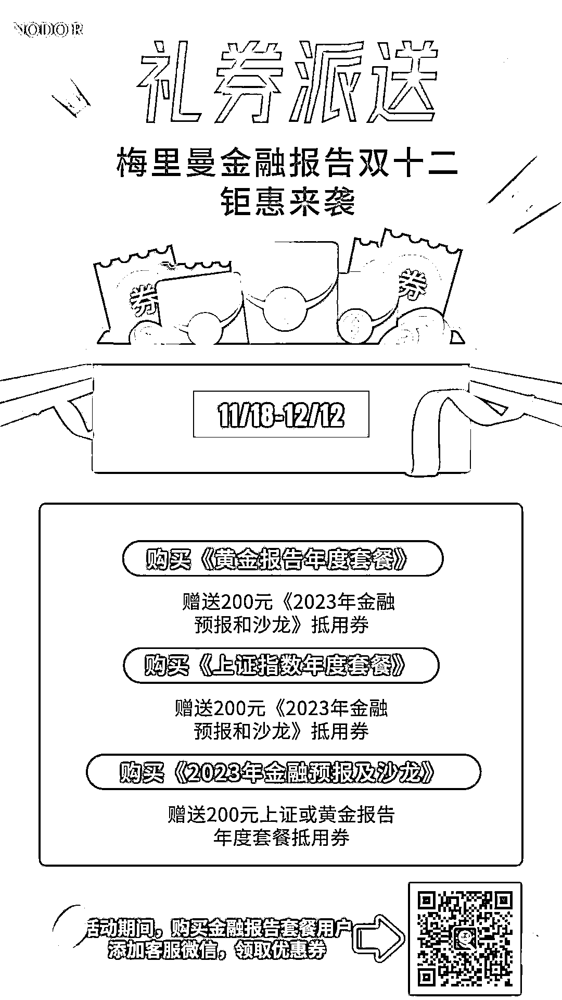

**20 位来自世界各地的占星师**
**带来 19 场沙龙——新世界的觉醒****详情可点击下图**

**学习占星学****点击下图了解课程详情**

**微信又双叒叕改版啦，不想错过若道君的推送？**
****就把若道设为****星标****以及点点****“在看”****吧！******▼**

**喜欢就点一下“在看”吧！****报名直达入口**

# 雷蒙德·梅里曼金融占星周运 | 水星逆行能否改变当下的局面？

> 原文：[`mp.weixin.qq.com/s?__biz=MzA5NjA0NTAxNg==&mid=2651498136&idx=2&sn=2978a415a2f5a80c8b5c48edc3859def&chksm=8b48142fbc3f9d39a258c6daa8a75e257a63034b1214136c193ab14ca8b144669668dc99ff00&scene=126&sessionid=1692737700#rd`](http://mp.weixin.qq.com/s?__biz=MzA5NjA0NTAxNg==&mid=2651498136&idx=2&sn=2978a415a2f5a80c8b5c48edc3859def&chksm=8b48142fbc3f9d39a258c6daa8a75e257a63034b1214136c193ab14ca8b144669668dc99ff00&scene=126&sessionid=1692737700#rd)

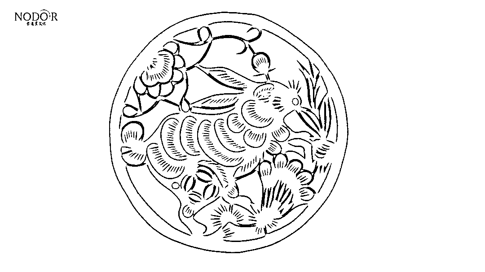作者/雷蒙德·梅里曼 译者/Luke 编辑/玫瑰 图片/稿定设计

雷蒙德·梅里曼是在金融占星学界稳坐第一把交椅的占星师，同时他也是若道签约的金融占星课老师，我们引进了雷蒙德·梅里曼老师的《[上证指数月度报告](http://mp.weixin.qq.com/s?__biz=MzA5NjA0NTAxNg==&mid=2651497687&idx=2&sn=2a13e4dfbea42b9a2750e9b103baf91c&chksm=8b481660bc3f9f7630be3c7b5b277adb253f6b8988bbecf5224f091c9aced62fe62337c6db1c&scene=21#wechat_redirect)》、《[黄金报告](http://mp.weixin.qq.com/s?__biz=MzA5NjA0NTAxNg==&mid=2651497687&idx=2&sn=2a13e4dfbea42b9a2750e9b103baf91c&chksm=8b481660bc3f9f7630be3c7b5b277adb253f6b8988bbecf5224f091c9aced62fe62337c6db1c&scene=21#wechat_redirect)》及《[铜报告](http://mp.weixin.qq.com/s?__biz=MzA5NjA0NTAxNg==&mid=2651497678&idx=2&sn=a7fc4f9b10597152da6c58d47817c3db&chksm=8b481679bc3f9f6f0be5ca81c6d500944a60537bb5a50be0c83bc0f720ba1a77e43b03d2d53b&scene=21#wechat_redirect)》。我们经老师的授权，将每周刊登梅里曼老师的周运，供大家参考和学习。于是，这是本周的周运（1.2-1.6）。

**说明：以下时间采用纽约证券交易所所在地美国东部标准时间。****展望与回顾**

****

**这是 2022 年的总结。股票在一片哭声中收盘。周五，3 大主要指数都有不同程度的下跌，结束了自 2008 年以来最糟糕的一年。标准普尔指数在这一年下跌了 19%。**

**——《美国股市结束了自 2008 年以来最糟糕的一年》**

**www.wsj.com**

**2022 年 12 月 30 日**

**一位高级政府官员周五表示，拜登政府计划开始回补战略原油储备，这标志着白宫今年早些时候为了抑制油价飙升而下令的大规模供应释放的结束……政府 10 月宣布将建立一个流程，以每桶 67 美元到 72 美元的价格，购买来自公司的原油，回补战略原油储备。**

**——本·列斐伏尔**

**《拜登政府开始回补原油储备》**

**www.politico.com**

**2022 年 12 月 16 日**

**根据能源信息管理局的数据，上周美国战略原油储备（由能源部管理的应急原油储备）降至 3.751 亿桶，这是 1983 年 12 月以来第一次低于 3.78 亿桶。根据记录，自 1983 年以来储备的最低水平在 1983 年 12 月 30 日的 3.783 亿桶。**

**——托马斯·卡特纳奇**

**《美国应急原油储备降至 1983 年以来的最低水平》**

**www.foxbusiness.com**

**2022 年 12 月 28 日**

谨代表梅里曼市场时机学院的员工，祝大家新年幸福如意！从我们的视角来看，正如新出版的[《2023 年金融预报》](http://mp.weixin.qq.com/s?__biz=MzA5NjA0NTAxNg==&mid=2651497687&idx=3&sn=03966c25653b847c09292221af16bf48&chksm=8b481660bc3f9f760536374cb23e0ad2e03e9be4a558189b75a0f1d8ead7c44f55463fb8a911&scene=21#wechat_redirect)（点击链接了解详情）所说，**看起来对于交易者和投资者来说，2023 年不像 2022 年那样具有挑战性。**我们回来了。水星也回到逆行中了。水星也被称呼为“恶作剧者”。

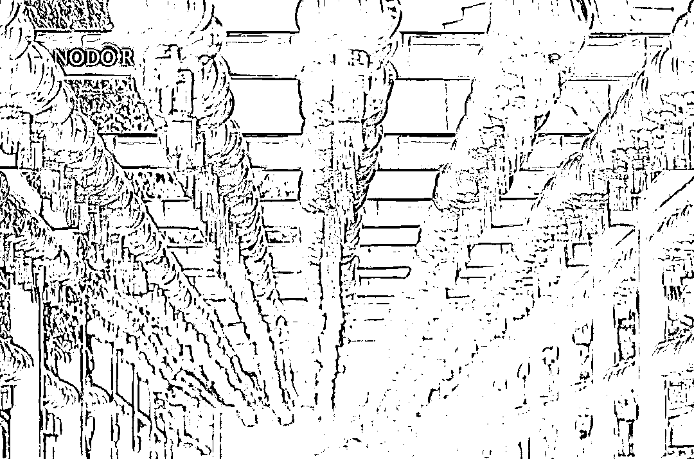

在 2022 年 9 月底到 10 月中旬（土星最后一次四分天王星）后，全球许多股市从 2022 年的低点起出现一轮令人印象深刻的反弹，到达 12 月 13 日的新周期高点。然而，之后一场剧烈的下跌开始了，直到水星于 12 月 29 日逆行。对于美国和欧洲市场来说，之前一周——12 月 19-22 日，木星与天王星第三次也是最后一次形成八分相时，出现了底部。前两次木星和天王星的八分相（2022 年 5 月中旬和 9 月底）对应了股票市场从几周前的高点起开始剧烈下跌，这一次也是一样。**现在，我们要看看水星逆行能否结束近期的下跌，并开启新的反弹。****对于恶作剧者水星，要到逆行周期的中段，你才知道会发生什么。那将在 1 月 8 日周末发生。**其他市场上，黄金和白银都迎来了不错的年终反弹。黄金在 12 月 27 日上涨至 1841.90，是自 11 月 3 日年度低点 1618.30 以来的最高水平。白银也在 12 月 27 日上涨至 24.49，略低于前一周 12 月 21 日的 8 个月高点 24.52。原油从 12 月 9 日的 70.08 的年度低点处上涨，在 12 月 27 日创下当周的高点 81.18。这不禁使人好奇：“交易员乔（·拜登）”是否像他 10 月宣布的那样，购买了 3 亿桶原油？如果是这样，为什么能源部前一周宣布原油储备继续下降到 1983 年以来的最低水平？如果你在 95 美元的价格卖掉 1.8 亿桶原油，然后买入 3 亿桶，那么价格不应该比 80 美元高得多吗？**或许这就是恶作剧者水星的杰作。或许也可能土星（政府）在双鱼座（困惑）的能量在 3 月 7 日入座前已经提前显化了。****短期宇宙征象与长期考量**

****

**“稳定增长”不仅仅是一种情绪。对民主党来说，美国经济现在被视为主要是一个公共经济，其中大多数人的福祉来自政府向个人的支付，而不是来自私人经济活动或甚至工作……这里有另外一个问题：一个“稳定”的低增长经济是非常非常无聊的。****——丹尼尔·亨宁格****《清醒过来，美国》****《华尔街日报》****2022 年 12 月 29 日****我并没有选择成为我现在的样子。这是我的业力。****——詹姆斯·卡芙尔****《幕府将军》****1975 年****上一周宇宙有大量摩羯座能量在运行。**首先，周四时水星在摩羯座 24°逆行。它将保持逆行状态直到 1 月 18 日在摩羯座 8°恢复顺行。**在摩羯座，水星变得严肃和批判。它代表一位怀疑论者或科学家的心智。**一位真正的科学家是一个怀疑论者，但是一个真正的怀疑论者不一定是一位科学家或有科学精神。**就其本身而言，这个组合不利于股票市场的上涨。**这有点像是在说，任何市场在上涨前必须证明自己，才能被认真对待。在那之前，怀疑论者对任何吹捧为积极的事物都抱着恐惧或怀疑的态度。“证明它”是水星在摩羯座的座右铭。

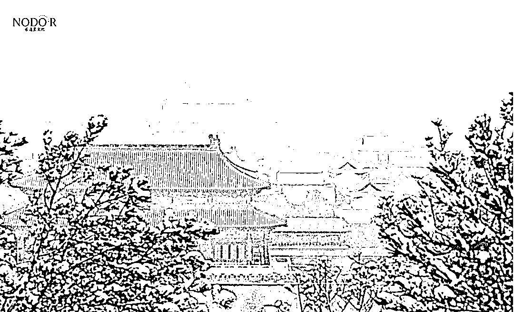

当然，现在太阳也进入摩羯座直到 1 月 20 日，就在水星结束逆行后 2 天。太阳在摩羯座（山羊或海山羊的星座）中想要攀爬。如果应用纪律和耐心，没有挑战或障碍是太高而无法克服的。摩羯座的太阳愿意接受摩羯座水星提出的“证明它”的挑战。**1 月 1 日，金星与冥王星在摩羯座 27°合相，这代表金钱和信贷（金星）与债务（冥王星）在争夺主导地位。**对于摩羯座，债务和超支消费的承诺会成为今年的主要议题。金融专家们无法理解为什么美国政府声称致力于打击通货膨胀的同时，又要启动一个 1.7 万亿美元的刺激计划。如果国会不能认真对待财政改革，美联储（一个摩羯座实体，1913 年 12 月 23 日成立）将很难在短期内降低利率。我们需要的是私营经济体带来的传统的摩羯座生产力。亨宁格（上文的引用）所说的是对的，你得不到“稳定的经济”，只能得到无聊和增长非常缓慢的经济（如果幸运的话）。这是 45 年前土星四分天王星后，吉米·卡特的那种经济再次出现。或许作为交易员，我们应该感到高兴。毕竟，那是交易员应该蓬勃发展的经济。但对于投资者来说，在能源之外的市场板块，很难找到活力或兴奋的迹象。唯有能源板块的价格在一次又一次地走高，尤其如果拜登像他 2 个月前宣布的那样，按下按钮购买 3 亿桶原油。噢，我又开始扮演水星在摩羯座的那种怀疑论者角色了。当这个行进结束后把我叫醒。等一等！**火星和天王星会在 1 月 12 日和 22 日恢复顺行，水星将在 1 月 18 日做同样的事。我想我们会有一个心跳加速的机会。或许甚至是一场爆炸。**准备一个叫醒电话。市场可能会受到冲击。政府和领导人可能也是如此。从 2018 年年末，若道引入金融占星大师雷蒙德·A·梅里曼撰写的梅里曼市场时机学院每年一次的年度预报沙龙和每年一本的《年度预报》以来，**2023 年已经是第 5 个年度了。我们简单回顾了部分 2019-2022 年金融预报的内容，**过去的经验让我们相信，你根据梅里曼老师的指导作为投资参看，你会比一般人有更大的胜算。******长按下图识别二维码****了解更多详情**

**说明：以上日期基于纽约证券交易所所在的美国东部标准时间，由于存在时差，中国地区可能需要加一天。**

**版权声明：**本文由若道翻译发布，欢迎转发，反对抄袭。友号转载请申请白名单。**END**

**雷蒙德·梅里曼（Raymond Merriman）**

若道签约老师。著名金融占星师，ISAR（国际占星研究协会）前主席，梅里曼市场分析公司的总裁。他由于“提升了占星学的职业形象”，在 1995 年国际占星大会上被授予轩辕十四奖；在 2012 年国际占星大会上，被授予轩辕十四终身成就奖。

1“中国上证指数月度报告”发售**若道推出了****中文版****的雷蒙德·梅里曼中国上证指数月度报告，并持续发行该报告！**当把金融市场的周期和占星学的周期相结合时，雷蒙德·梅里曼老师的金融占星学研究**为投资者应对金融市场的周期波动，并随之调整投资策略提供了极大的价值参考**。
**1 月中英文报告已上线！**2“黄金价格周期月度报告”发售**若道推出****中文版****的雷蒙德·梅里曼黄金价格周期月度报告！**不仅仅为广大读者在中国股市的投资出谋划策，更将视角放眼黄金市场。**每当世界经济形式不明朗的时候，有一个地方是保值的港湾，那就是****黄金**。自 1982 年雷蒙德·梅里曼出版第一本研究《地球宇宙学征象与黄金价格的关联》的著作以来，**他一直作为最重要的黄金市场时机预测者之一享誉国际**。2023 年 1 月黄金报告已上线，梅里曼老师将会告诉你他对这个关键时期如何操作的想法。也可以按照季度和一年期订阅，有更多优惠。季度和年度的好处是，你可以持续了解梅里曼老师对于不断在变化的市场的看法。即便他某一次看法和市场不一致，你也看到在下一期他如何调整自己的看法，并看到金融占星在一个长期时间段内对你把控风险的帮助。而能够长期控制风险、尽量找到安全的投资时机才是投资的长久之计。**1 月中英文报告已上线！****购买套餐**，买得越多越优惠中国上证指数月度报告套餐价

*   **单月报告**：280 元
*   **3 个月套餐**：780 元（260 元/月）
*   **12 个月套餐价**：2400 元（200 元/月）

**长按下图识别二维码****购买金融报告****套餐****▼**​黄金周期月度报告优惠

*   **双报告年度套餐更优惠（直降 900 元）**

*   **12 个月黄金报告+12 个月上证指数报告：仅需 3900 元**

**长按下图识别二维码购买黄金报告套餐**▼

3《铜市场周期月度报告》

从 2023 年开始，我们将推出雷蒙德·梅里曼市场时机学院的铜周期报告。之所以推出这个报告，是因为**作为新能源发展所需的一个重要金属，铜的投资价值可能会随着新能源的发展而出现崭新机会。**

**看好新能源发展的读者，这样一份报告可能帮助你提早了解铜交易市场、铜交易的价格变化，当投资机会到来时，果断出手，把握先机。**

**长按下图识别二维码**
**了解更多详情**▼4《2023 年金融报告及沙龙》

从 2018 年年末，若道引入金融占星大师雷蒙德·A·梅里曼撰写的梅里曼市场时机学院每年一次的年度预报沙龙和每年一本的《年度预报》以来，**2023 年已经是第 5 个年度了。我们简单回顾了部分 2019-2022 年金融预报的内容，**过去的经验让我们相信，你根据梅里曼老师的指导作为投资参看，你会比一般人有更大的胜算。****

**长按下图识别二维码****了解更多详情**

**购买直达入口**

# 金融报告丨雷蒙德·A·梅里曼 2023 年《年度预报及讲座》来啦！

> 原文：[`mp.weixin.qq.com/s?__biz=MzA5NjA0NTAxNg==&mid=2651498136&idx=3&sn=8282f3d7ecd7b34342743f33cf05ba6c&chksm=8b48142fbc3f9d397bbd791c60b5310e6658d97acf0998b4d60ef793bdc9bd1da075de545548&scene=126&sessionid=1692737700#rd`](http://mp.weixin.qq.com/s?__biz=MzA5NjA0NTAxNg==&mid=2651498136&idx=3&sn=8282f3d7ecd7b34342743f33cf05ba6c&chksm=8b48142fbc3f9d397bbd791c60b5310e6658d97acf0998b4d60ef793bdc9bd1da075de545548&scene=126&sessionid=1692737700#rd)

从 2018 年年末，若道引入金融占星大师雷蒙德·A·梅里曼撰写的梅里曼市场时机学院每年一次的年度预报沙龙和每年一本的《年度预报》以来，**2023 年已经是第 5 个年度了。**

我们简单回归一下梅里曼老师 2019 年-2022 年的《年度预报》中一些预测。

在 2019 年的年度预报中，对于上证指数，梅里曼老师写到：

2018 年末至 2019 年初，中国股市处于三个重要周期低点的时间段。紧随这一低点，将会出现一次非常大的反弹。

2019 年木星会与海王星形成三次四分相，过去，这个相位总是与惊人的强大“泡沫”同时出现，期间股价大幅飙升。

到 2019 年 7 月之前，上证指数有三个重要长周期会出现周期低点，理想上看是在 2019 年 3 月底之前。

上证的周期低点出现在 2019 年 1 月，从那时起，上证迎来了 3 年的上升。

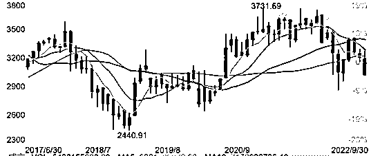

对于黄金，梅里曼老师建议：

从占星学角度来看，木星在射手座，四分在双鱼座的海王星，支撑看涨观点，因为这个组合有增加通胀的潜力。此外，木星在射手座的行星-星座组合从 1983 年起出现过三次，每次都对应到金银市场的年度高点。

无论在 2019 年何时，只要黄金保持在 1167 以上，同时跌到了任一主要周期低点附近，就要寻找买入机会。黄金可能在 2019 年涨到 1500+/- 50，甚至更高。

2019 年黄金从 1284 美元开始上涨，最高点在 1566 美元。

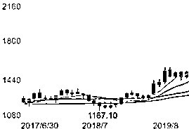

所以，如果你在 2018 年购买了《年度预报》，按照梅里曼老师的建议投资了上证指数和黄金，你会在当年取得相当不错的收益。

**对于 2020 年，在席卷全球、深刻影响了未来的疫情到来之前，梅里曼老师为 2020 年定下基调的：**

站在 2019 年的年尾，我们不知道一场深刻改变未来的风暴马上就将来临。

梅里曼老师，这位杰出的宇宙气象预报员，未卜先知，为 2020 年定下“将军”的基调。

在那一年，我们目睹了美国股市的 4 次熔断和全球经济的重置崩溃。

对于黄金，梅里曼老师是这么说的：

1391.50-1413.70 是价格最强的支撑区域。只要不跌破这个区间，黄金就能够上涨，重新测试 1566.20。如果突破了 1560-1590 的阻力区间，那么黄金就能够重新测试 1920。在那以前，黄金最有可能在 2020 年中在 1390 和 1575 之间波动。

| 黄金周 K 线图

2020 年，黄金在横盘 3 个月突破了 1560-1590 的阻力区间后，一路上涨到 9 月最高点 2089.20 美元。

对于上证指数，梅里曼老师建议：

2020 年的反弹将超过 2019 年的高点 3288。然而，这一涨势可能会通向 5.5 年周期的波峰，随后将再次迎来一波跌势至 2021 年或更晚。

行进中的摩羯座星群——木星、土星和冥王星——表明在 2020 年 11 月底之前会出现一个高点，很可能在 2020 年的前六个月。建议交易者特别注意金星逆行的时期，也就是 5 月 13 日至 6 月 25 日。逆行或顺行一个月内出现的年度高点或低点可能会带来卖出机会。

2020 年，上证指数最高达到 3474，超过了 2019 年的高点 3288。

**站在 2020 年的末尾，对于 2021 年，梅里曼老师说：**

随着 2020 年木星、土星和冥王星形成大合相，我们刚刚结束了一个周期和一个时代。此刻我们正处于一个新的时代和一个新的长周期的早期阶段。事实上，是多个长周期。

对于上证指数，梅里曼老师说：

我们预计涨势将在 2020 年 12 月-2021 年 2 月之间达到波峰，然后急剧下跌至 52 周和 22 个月周期的低点，这些周期将在 2021 年 5 月之前，甚至在 3 月底之前结束。此后可能会出现另一轮反弹，可能会也可能不会在 2021 年 11 月之前形成第一个 33 个月周期的新高。

对于黄金，梅里曼老师说：

黄金的 31.33 个月周期波谷将在 2021 年 9 月之前出现，理想情况是 2020 年 12 月-2021 年 6 月。价格目标是 1628+/-109 或 1768+/-76。重叠范围（理想情况）是 1692-1737。如果价格跌破这些范围，则为看涨情况中令人担忧的状况。

**而在 2022 年的年度预报里，我们看到：**

渐亏四分相不仅对应无法解决的冲突和分歧，土星和天王星形成的任何四分之一周期（合相、四分相和对分相）都可能在社会动荡和某地区现状受到威胁的时期出现。

在 2008-2010 年上一次四分之一周期时（对分相），世界见证了阿拉伯之春。在 1999-2000 年渐盈四分相期间，游行、抗议和直接武力冲突扰乱了西雅图世界贸易组织会议。这也标志着美国经济扩张的结束，以及由互联网泡沫破裂和 2001 年 9 月 11 日对美国世贸中心的恐怖袭击引发的衰退的开始。在此之前是 1988 年的合相，对应的事件是缅甸（Myanmar，当时的国名是 Burma）爆发了一场全国性起义，反抗尽失民心、暴力过度的军政府。数十万公民在全国范围内的暴动中抗议，这成为缅甸历史上的决定性时刻之一。

在每一个案例中，极端主义都占据主导地位，导致暴力冲突，但最终带来了“更大的益处”。它产生了建设性的结果，但在它进行的同时，世界在经历巨大的危机和暴力。”

2021 年 5 月 13 日-7 月 28 日，木星首次行经双鱼座时，这些因素表现得很明显。那时，通货膨胀开始出现，但美联储向所有人保证，这只是暂时的，他们将无限期继续推行“宽松货币”政策。他们并不担心持续的通货膨胀，这是典型的木星在双鱼座的表现，对现实的脱离或错误判断。

这两颗行星以及双鱼座也掌管原油。因此，我们可能会看到油价飙升，以及/或石油泄漏，威胁到大自然。它也可能对应着由于事故而释放的有毒气体，威胁到那些暴露其中的人的生命。

对于黄金，梅里曼老师建议：

只要黄金保持在 1670-1680 之上，仍然有极小的机会出现一轮爆炸性上涨，测试当前的历史高点（2089），甚至创下历史新高。毕竟，木星将在双鱼座合相海王星，可能预示着另一轮“投机狂热”。然而，这也可能是一个“恐慌”的征象，届时某些市场可能会崩溃。

在 1900-1980 之间存在较大的阻力，如果不能突破这个阻力，将表明黄金的熊市已经开始，新一轮的猛烈下跌可能正在准备中。只要跌破 1670 则将确认黄金 20 年的牛市结束了。

| 黄金周 K 线图

对于上证，梅里曼老师说：

我们预期在 2022 年 5 月前，上证综指会出现急剧的下跌，进入 52 周周期和可能的 33.5 个月周期低点。

我们更倾向于认为，上证综指会首先下跌，在 5 月前形成一个低点，然后上涨。这一轮上涨的幅度，将告诉我们上证综指是处在牛市，还是进入了新的熊市。如果它不能上涨超过 3750，长周期波峰可能已经出现，并且进入了新的熊市。

我们简单回顾了部分 2019-2022 年金融预报的内容，**过去的经验让我们相信，你根据梅里曼老师的指导作为投资参看，你会比一般人有更大的胜算。**

**2023 年度预报及沙龙预售**

**2023 年金融预报沙龙时间为 2023 年 1 月 7 日 10：00-13：00。**

一份价格仅千元的顶尖金融占星大师的投资分析报告和沙龙，聪明的投资者值得拥有。

**2023 年年度预报****及沙龙价格：****1380 元**

**长按下图识别二维码**

**购买报告及沙龙**

**购买者重要须知****①** 梅里曼市场时机学院每年一次的年度预报沙龙和《年度预报》是梅里曼市场时机学院的研究“预报”，而不是市场“预测”，是梅里曼老师及其金融占星分析师对人类活动周期历史与行星周期之间相关性的研究，二者在大部分情况下具有 80%或更高的相关性，而不是因果关系。沙龙中和报告中的研究完全存在错误的可能性。即便是非常认真的研究和几十年的研究经验，我们无法总是正确地解读出各种征象在实际层面上会如何相互作用，并显化为事件结果。

所以请将次沙龙和报告看作一个研究参考，务必结合其他市场研究和你个人对市场的理解，根据你的自由意志做决策。

**②** 此报告一旦售出，**即不接受退款。**

**③** 此报告仅支持在手机网页阅读，不支持电脑阅读和下载。**④** 讲座提供视频回放。**以上须知，请仔细阅读。一旦付款，即视为已了解并接受所有须知内容。**

**如在购买报告中遇见任何问题**

**可添加客服**

▼

**购买报告直达入口**

# 2023 年的第一天，快来领取你的专属年运报告吧！

> 原文：[`mp.weixin.qq.com/s?__biz=MzA5NjA0NTAxNg==&mid=2651498128&idx=1&sn=edb7dc0973650a2cdba9356a19f71756&chksm=8b481427bc3f9d316f753b9459e34db3c5a05b05815981acd3fcb0b2d70b50e7a34e6a22a802&scene=126&sessionid=1692737700#rd`](http://mp.weixin.qq.com/s?__biz=MzA5NjA0NTAxNg==&mid=2651498128&idx=1&sn=edb7dc0973650a2cdba9356a19f71756&chksm=8b481427bc3f9d316f753b9459e34db3c5a05b05815981acd3fcb0b2d70b50e7a34e6a22a802&scene=126&sessionid=1692737700#rd)

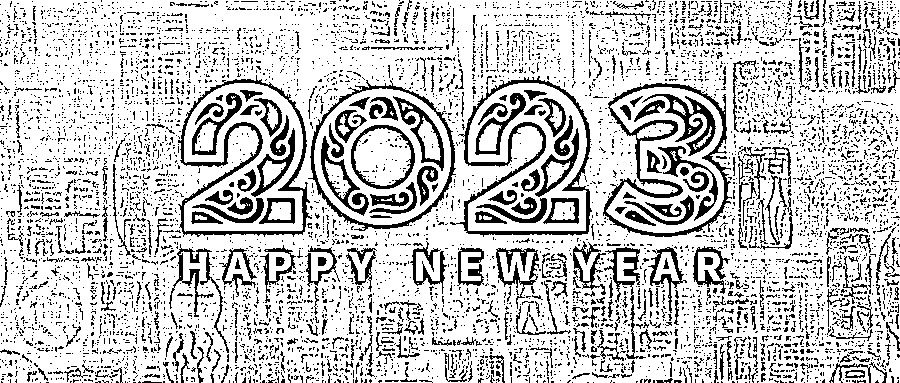

人生天地之间

如白驹过隙

**转眼 2022 年已悄然离去**

这一年

**我们发现了身边更多的好**

***家***的好

***邻里***的好

***爱人***的好

***小巷***的好

***健康***的好

***收获***的好

***守护***的好

**步入 2023 年**

**若道君希望你收获****更多的美好**

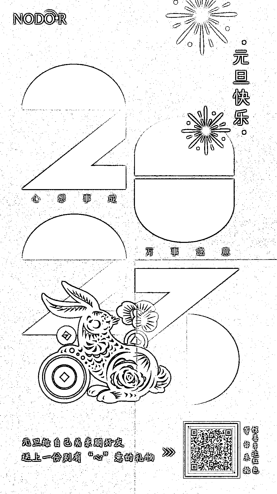

每年一到辞旧迎新的时刻

若道君也会如约与大家分享

**由****大卫·瑞雷****亲自主笔的****若道年运报告**

这一份如年俗惯例般会阅读的**幸运指南**

也深受很多粉丝朋友的青睐

**一年一度的****年终粉丝回馈**

**当然今年也不能例外**

除了**人人都有机会**领取的

**30 元****年运红包**

**“友福同享”****的****团购优惠****更是心意满满**

如果此时你已然心动

**那就开始行动吧！**

**扫码**即可领取**专属的年运报告**

**如果你还需要一个行动的理由**

**若道君帮你梳理几点**

**一定能够帮到你**

年运购买理由

**①** ***私人定制*****，根据每人出生日期，生成独一无二的个人年度报告。**

**② 浓缩了大卫·瑞雷*****48 年*****的占星咨询实践精华，倡导以人为本，字字诚恳。**

**③*****价格惊喜*****，远远低于一次占星咨询的费用，*****还有团购*****。**

**④ 形式*****私密*****，避免了与占星师面对面的焦虑。**

今年若道君也帮你梳理了

**关于年运报告的常见问题**

如果你已购买，**或准备购买**

都可以看看

**会对报告内容有更全面的了解**

有关报告的常见提问

**1****关于报告内容**

**① 报告都包括哪些内容呢？各方面运势都会概括到吗？**

**主要是接下来一年的天象对你的影响**，也许各方面都有涉及，但也不排除接下来一年里、你的运势主要集中在某一特定领域。**具体内容要视你个人的出生星图而定。**

**② 报告能详细到什么程度？能举些例子吗？**

**根据测试，报告大多在 5000 字以上，七八千上万字的不在少数。**具体情况，根据出生星图的不同而不同。基本结构是，按照时间顺序，把接下来一年对当事人产生较大影响的天象进行阐释和解读，提出相应的应对之策。

**③ 刚提交就能看了，这是提前写好的吗？**

是的，报告是提前写好的。虽然报告的发送不过几秒，但这背后是漫长的准备时间，且不说写作者多年的占星积累和经验，报告的写作、翻译、编排、讨论、测试以及技术开发和支持可不是几秒钟就能完成的哦。嗯，若道君认为，衡量报告的标准在于内容是否对您有帮助，而不是它抵达您的时间的长短。

**④ 没有看过每个人的星图，怎么会先写好报告呢？**

如果你懂一点占星学，会了解**预测是根据行运星图行星和出生星图的行星的比较来的。**大卫·瑞雷老师已经把各种比较的解读事先写出来了。因此，根据你的星图和行运图，一年的运势的大概就出来了。

**⑤为什么报告里会出现“在这两年”“今后两年”这类的文字，时间段明明是一年的期限啊？**

因为有的运势的影响时间**不仅仅只有一年**。有这类文字的亲是赚到了哦。

**⑥报告中有些运势影响时间范围为啥只持续 1 天？**

年运报告是周期性报告，**如果该运势刚好在您报告分析时间的开始时间结束，**那这个运势的持续时间就会只显示一天。

比如你的报告解读时间是 2023 年 1 月 1 日开始，刚好这个运势在 2023 年 1 月 1 日结束，则报告中显示该运势的持续时间就只有天，实际上该运势影响从 2023 年 1 月 1 日之前就开始了。

同理，如果年的报告解读截止时间是 2024 年 1 月 1 日，刚好有个运势在 2024 年 1 月 1 日开始，那这个持续时间也会只显示 1 天，但这个运势在 2024 年 1 月 1 日还是会持续影响的。

**⑦ 我购买了 2022 年的运势报告，再购买 2023 年的运势报告，为啥两份报告有些运势内容有重复？**

**对比两年的报告，出现重复的内容：**

*   **有些行运影响是长周期行运**，影响的时间范围会持续 1-2 年，因此，可能这个行运在 2022 年开始后，在 2023 年也会有持续的影响；

*   **有些行星会发生逆行**，当行星逆行回来的时候，这个行运也会被再次触发。这种其概况，你可以关注比对下，重复触发的行运是否对你有不同的影响。

**2****关于报告购买和查看**

**① 提交订单时，填写完出生信息后有个“行运开始时间”是指什么？**

年运报告是周期性报告，**你可以选择想了解从哪段时间开始的报告**。比如行运开始时间你选择的是 2023 年 1 月 1 日，那这份报告解读的行运周期就是从 2023 年 1 月 1 日到 2024 年 1 月 1 日（PS：如果你想超前了解往后的年份运势情况，选择相应的行运开始时间即可）。

**② 出生时间有 30 分钟左右误差的话会影响报告的准确性吗？**

会有一定影响，但如果重大天象没有经过你星图的敏感点的话，影响不会太大。

**③ 出生日期填写是的阳历还是阴历？如果是出生时间是夏令时怎么办？**

**出生日期填写是阳历的日期**，如果出生时间是夏令时，请输入出生时的钟表时间即可，系统会自动处理。

**④报告购买后，日后需要定期查阅报告内容，该怎么办？**

*   **如果你是若道已注册用户**，登录若道 APP-我的-我的已购报告即可实时查阅（手机应用市场搜索“若道“即可，下载 APP 后还可免费查阅每日运势哟）；登录”若道公众号-课程报告-个人中心-我的报告“也可以查阅；

*   **如果你尚未注册**，可以收藏下这个报告的活动链接，收藏后，点开”活动首页-已购报告“也可查阅报告内容。

**3****特惠团购和赠送亲友**

**① 如何参与团购，获得报告的团购优惠？**

**点击文末****“阅读原文”**，打开活动链接，选择**“买几份送亲友”**，即可看到团购套餐优惠，选择购买**团购套餐**，即可享受团购价优惠。

**“友福同享”团购特惠价**

***15 份*****年运报告 1200 元**

**每份只要*****80 元*****——相当于*****4 折***

***9 份*****年运报告 888 元**

**每份只要****98 元****——相当于*****5 折***

***5 份*****年运报告 599 元**

**每份只要*****120 元*****——相当于*****6 折***

***3 份*****年运报告 399 元**

**每份只要*****133 元*****——相当于*****6.7 折***

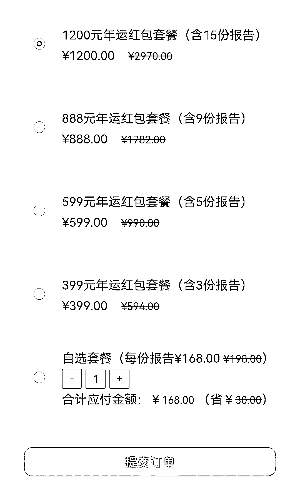

**② 团购的年运报告，如何赠送给亲友？**

团购完成后，只需选择**“分享给好友”**，然后将年运红包链接转发给好友，**好友打开链接，输入出生信息即可直接获取报告。**

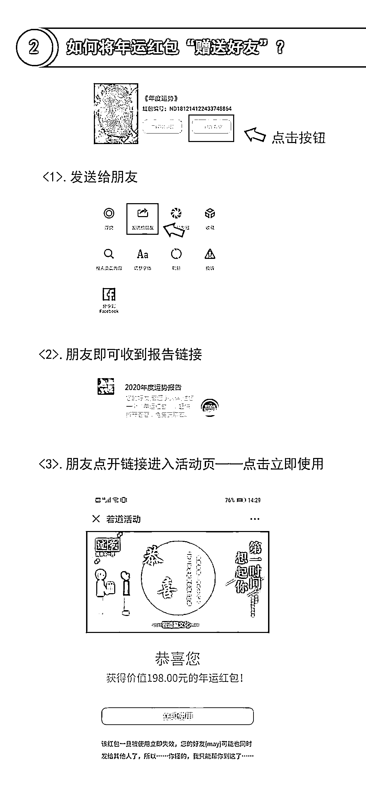

**可以到****活动首页****的****个人中心****里查看运势报告及使用赠送情况。**

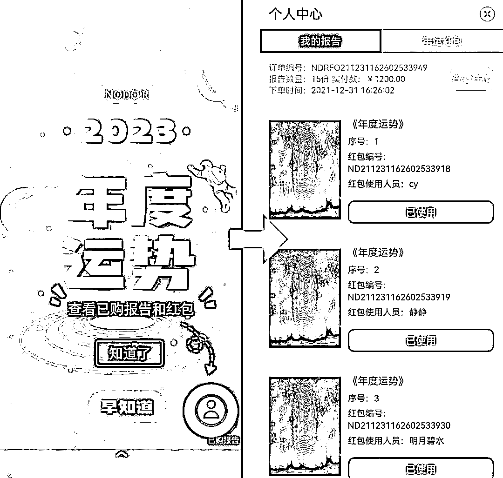

**若道君友情提醒**

**购买报告或团购问题咨询，扫码或添加客服微信（微信号：nodoor201705）。**

**购买报告直达入口**

# 新年树洞丨月亮在丰盛的金牛座，你怎么度过 2023 年的第 1 天？

> 原文：[`mp.weixin.qq.com/s?__biz=MzA5NjA0NTAxNg==&mid=2651498128&idx=2&sn=339f849c17995f23c3e6c7a96cc7f028&chksm=8b481427bc3f9d31a978f0d88d53565912fc05d6e7103ad43fed30ab98586b33ee19b29c191c&scene=126&sessionid=1692737700#rd`](http://mp.weixin.qq.com/s?__biz=MzA5NjA0NTAxNg==&mid=2651498128&idx=2&sn=339f849c17995f23c3e6c7a96cc7f028&chksm=8b481427bc3f9d31a978f0d88d53565912fc05d6e7103ad43fed30ab98586b33ee19b29c191c&scene=126&sessionid=1692737700#rd)

**2023 年 1 月 1 日天象：**

*   **01:08 月亮进金牛座**
*   ****太阳三分北交点、水星六分海王星、金星合相冥王星****

新年快乐！2023 年的第一天，月亮来到金牛座，让自己好好休息与放松吧！没有什么比享受生活更好的事情了！给身体做个按摩，好好关爱自己的健康，或者为自己和家人朋友做一顿美餐，让今天成为丰盛的一天吧。

把过去留在 2022 年，今天是崭新的开始，摩羯座太阳和金牛座北交点呈三分相，逆行水星和海王星的六分相，或许你可以在今天给 2023 年做一个计划，从对去年的总结与回顾中，获得对未来的灵感，而金星与冥王星的合相告诉我们，珍惜生命中的每一天，所有的美好，只在当下。

月亮在丰盛的金牛座，你怎么度过 2023 年的第 1 天？

新年快乐！

**快来领取你的 2023 年运报告吧！**

**了解每日天象，可****下载“若道”APP 查看****还有更多精彩等着你哦**

# 1 月宇宙天气丨所有行星各就各位！迈开大步向前奔跑吧！

> 原文：[`mp.weixin.qq.com/s?__biz=MzA5NjA0NTAxNg==&mid=2651498125&idx=1&sn=a650084a4df0482f79b30c9646f0ec62&chksm=8b48143abc3f9d2c4b6d5e567930b157c34886508ee96f1f7f6c3f111742e6283fe07bfdeffd&scene=126&sessionid=1692737705#rd`](http://mp.weixin.qq.com/s?__biz=MzA5NjA0NTAxNg==&mid=2651498125&idx=1&sn=a650084a4df0482f79b30c9646f0ec62&chksm=8b48143abc3f9d2c4b6d5e567930b157c34886508ee96f1f7f6c3f111742e6283fe07bfdeffd&scene=126&sessionid=1692737705#rd)

******☆ **后台回复“今日”，给你一句生命态度****

作者/Anastasia

编辑/翀子 封面/书君 图片/稿定设计

**1 月重点天象**

*   **金星进入水瓶座（1 月 3 日）**

*   **巨蟹座满月（1 月 7 日）**

*   **火星顺行（1 月 13 日）**

*   **水星顺行（1 月 18 日）**

*   **太阳进入水瓶座（1 月 20 日）**

*   **水瓶座新月（1 月 22 日）**

*   **天王星顺行（1 月 23 日）**

*   **金星进入双鱼座（1 月 27 日）**

**整体氛围**

2023 年来了，先给大家道个新年祝福。犹记得过去的 2022 年，从年初的俄乌战争，直到年末的疫情，土天四分相带来的震荡，涟漪由大及小，猝不及防地波及到每个人身边。身处大变局之中，每个人都无法幸免。

**2023 年呢？迎接我们的又将是什么？今年我们将有两大业力之星和交点轴线的换座，以及金星在狮子座的逆行。**

**三月，土星和冥王星先后换座，土星离开水瓶座进入双鱼座，**开始考验双鱼座象征的生命领域：影视、艺术、医疗、慈善、灵性成长等等，赏罚分明。

在土星大棒的打击下，那些根基不牢、急功近利、充满虚幻泡沫的领域将会依次现形，露出真实的本色；而之前稳扎稳打、厚积薄发、讲究实效的领域，则会通过考验，迎来大发展。

**冥王星离开摩羯座进入水瓶座，**更是重量级的换座。冥王星在一个星座停留二三十年，它的换座，将给社会带来深远的影响，其带来的心理危机在当下很难觉察，现实后果往往要多年之后才能看得分明。

这就像是涟漪效应，外行星这种巨石落下的时候，身处其中的人们感觉尚不会很明显。只有当巨石入水后的涟漪一圈圈荡开，敏感的人才会开始有所意识。占星学就可以帮助我们提高敏感度，及时调整身心状态，为渡过危机做好准备。

**3 月 23 日，冥王星离开摩羯座，进入水瓶座，固定星座初度的人群将迎来头一波冲击。5 月，冥王星开始逆行；6 月，逆行进入摩羯座，继续对基本星座末度进行清理和净化；10 月，冥王星恢复顺行，24 年 1 月，再次进入水瓶座。**

**今年，冥王星的运行区间是：**

*   **3 月 23 日，冥王星进入水瓶座**

*   **5 月 2 日，冥王星在水瓶座 0°开始逆行**

*   **6 月 11 日，冥王星逆行回到摩羯座**

*   **10 月 11 日，冥王星在摩羯座 27 度恢复顺行**

*   **24 年 1 月 21 日，冥王星再次进入水瓶座**

**2024 年 9 月，冥王星将最后一次逆行回到摩羯座，2024 年 11 月彻底进入水瓶座，**再次回到摩羯座就是二百多年之后的事情了。也就是说，冥王星将用两年时间在土象的摩羯座和风象的水瓶座之间摆荡、过渡，为水瓶时代的意识提升酝酿风气。

同时，**今年的月亮交点轴线也将于 7 月换座，北交点来到了白羊座，从现在的金牛座/天蝎座轴线换到白座羊/天秤座轴线。**从向内聚集的土水能量切换到了向外发散的火风能量。

2000 年-2050 年，是大时代从双鱼座时代过渡到水瓶座时代的时间区间。2020 年年底的时候，木星进入水瓶座合相土星，接下来的好几十年，木土合相都会发生在风象星座，2040 年 10 月在天秤座，2060 年 4 月在双子座。

**我们正在经历的，是快速发展、激烈震荡、求新求变的时代精神，今年的感觉将更加明显。**稳定成为奢求，秩序遭到破坏、观点对立不可避免，但新的觉醒也将从其中诞生。唯有变化和震荡才能将新的意识带入到我们的社会中。

水瓶时代中，由意识形态和集体理念（天王星）带来的压力和限制（土星）势必与个体发展（太阳）之间产生激烈的冲突。如果只是平平淡淡，这世界上怎么还会有成长和超越这些事情呢？

**本月，群星顺行，能量向前看，不要错过大年初一的水瓶座新月。从自己的出生星图中，汲取更深刻的知识，帮助自己在内在旅程中获得更深层的进展。**

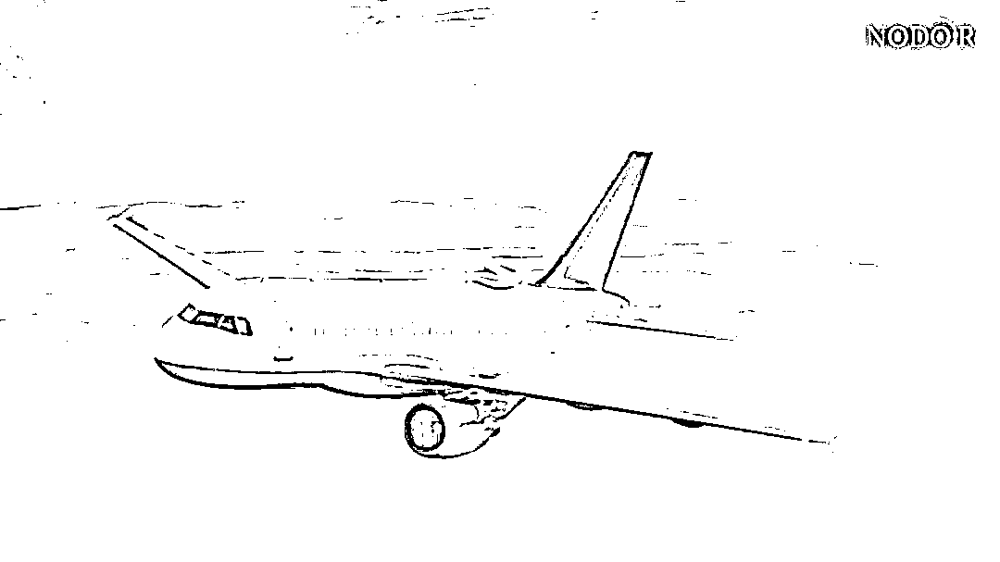

**重点天象****★****火星恢复顺行**

新的一年，新的气象，就从火星顺行开始。**1 月 13 日，火星在双子座 8°恢复顺行，接下来还要在双子座运行两个月，直到 3 月 25 日，离开双子座，**进入巨蟹座。火星几乎差不多也要到**3 月下旬**才能算彻底脱离逆行的后阴影期，恢复正常速度。

火星是我们的立身之本，火星的状态直接决定了我们的活力和意志力，决定了我们是否能够果断下决心，做决定，快速采取行动。火星顺行后，可以尝试问自己几个问题：

*   **我对自己的身体是否足够关爱？**

*   **我是否允许自己合理表达愤怒？**

*   **在为自己争取权益的时候，我是否尊重了他人的边界？**

联想到火逆期间遭遇到的人和事，如果所有问题的答案都是肯定的。恭喜你，顺利通过了火星双子座的考验。如果这期间遭遇到了麻烦和问题，也不用担心。火星的后阴影期将持续到 3 月下旬，**还有足够的时间来熟悉自己的火星能量，修正心态和行为模式。**

**★****水星恢复顺行**

火星顺行后不久，**水星也在 1 月 18 日恢复顺行**，本次水逆从 12 月 29 日开始，逆行区间是摩羯座 24°到 8°，**直到 2 月 7 日才算离开后阴影期，正式脱离水逆的影响。**

大年初一，水星虽然已经恢复了顺行，但仍处于后阴影期，适合联络旧友，重叙旧情，也算是水逆的正向力量。但一定要提醒自己注意消息传递间的清晰和明确，避免发生误解，或者产生不必要的纠缠。

**2023 年，水星还会有三次逆行，4 月 21 日-5 月 15 日，水星在金牛座逆行；8 月 24 日-9 月 16 日，水星在处女座逆行；12 月 13 日-2024 年 1 月 2 日，水星在摩羯座和射手座逆行。**

接下来的两次逆行，水星仍是逆行在土象星座，提醒我们继续深耕土象星座的功课。**身体健康和物质基础，仍是今年，尤其是上半年，人们关注和思考的重点。**

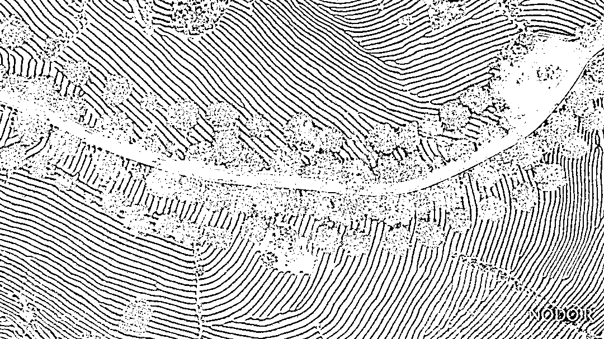

**★****天王星恢复顺行**

**1 月 23 日，天王星恢复顺行。这也是本月第三颗恢复顺行的行星。**至此，天空中已经没有了逆行的行星，**所有行星各就各位，在自己的轨道上迈开大步向前跑。**所谓，一年之初，万象更新。

天王星是去年 8 月 24 日从金牛座 18°开始逆行的，现在在金牛座 14°恢复顺行，重点影响到生日在固定星座（金牛座、狮子座、天蝎座和水瓶座）的人群，尤其是生日在 2 月 4-8 日、5 月 6-10 日、8 月 8-12 日、11 月 8-12 日的个体是重点影响人群。

天王星恢复顺行后，将再次通过这群人的太阳，提醒他们之前的事情还没有结束，变化和震荡仍在发生，仍需要集中精力，不能放松躺平，并且保持敞开的心态，顺势而为，迎接再次到来的改变和冲击。

**应对土星的压力可以咬牙坚持，以不变应万变；但面对天王星的冲击，就只能改变自己，主动求新求变。抱残守缺只会故步自封，让事情发展更加恶化。**

**★****朔望周期**

**本月的满月发生在 1 月 7 日巨蟹座，新月发生在 1 月 22 日大年初一的水瓶座。**1 月 7 日到 22 日这半个月是下弦月周期，身体会更倾向于清理和排毒，这时候多吃一些，不容易发胖。1 月 1-7 日，以及 23 日之后是上弦月周期，身体会更注重吸收和消化，建议控制饮食，体弱的可以适当进补。

从月相角度来看，春节前半个月是适合大吃大喝的，而从大年初一开始，就要适当约束自己的嘴，不要给肠胃添加太多太油腻的负担。尤其是满月和新月当天，适合断食和轻食。从年俗来说，大年初一不开火也是很有养生道理的。

**满月发生在 1 月 7 日的早上 7:08，巨蟹座 16°。重点影响人群是生日在 1 月 7 日、3 月 7 日、7 月 9 日和 10 月 10 日前后的个体。**

这次满月，所有行星都集中在 120°的范围之内，**能量集中，更显张力。**满月对分逆行的水星在摩羯座，四分白羊座的凯龙星，构成一个 T 三角的相位结构。

这是一个受伤的满月，信息和决策无法给人们带来清晰的判断和坚定的信心，反而会加剧情绪上的波动。凯龙星作为 T 三角结构的顶点星，会暴露出我们的之前的伤口，心态上很难承受。

建议这期间静息养神，远离网络，减少交流和活动，**从自己的内在找寻指引，从自己的生活经验中找到智慧。**凯龙星带来的伤口会给我们指出疗愈的道路，这条路能够结合土星着眼的过去，和天王星象征的眼界、远见和潜能。

**新月发生在 1 月 22 日凌晨 4:54，水瓶座 1°。重点影响人群是生日在 1 月 22 日、3 月 23 日、6 月 24 日和 9 月 25 日前后的个体，**一定记得在新月发生后八小时之内许愿，愿力最强，效果最好。

新月发生时，正值农历大年初一，太阳、月亮、金星、火星、土星都在水瓶座，日月三分双子座的火星，风象能量充沛，视野开阔，思维活跃，**非常适合许一个清晰有力量的愿望，**新年新气象，回首来路，展望未来，再振信心。

许愿内容请参照**水瓶座 1°**所落宫位象征的主题。写下清晰、具体的愿望，将更有助于愿望实现。

**12 星座 1 月小贴士**

**（参考太阳星座和上升星座）**

**★ ****白羊座**

*   **忙于社交，频繁走亲访友**

*   **旧雨新知，建立新的关系**

**★ ****金牛座**

*   **意识提升，重塑自我价值**

*   **工作有序，找到新的方向**

**★ ****双子座** 

*   **关爱身体，重视健康养生**

*   **打开眼界，开始新的学习**

**★ ****巨蟹座** 

*   **安住内心，获得灵性成长**

*   **直面恐惧，疗愈往日伤口**

**★ ****狮子座** 

*   **筛选朋友，旧的去新的来**

*   **抓住机会，促进重要关系**

**★ ****处女座** 

*   **压力增大，调整工作节奏**

*   **学会放松，不去钻牛角尖**

**★ ****天秤座** 

*   **适当进修，追求更高目标**

*   **创意十足，发展兴趣爱好**

**★ ****天蝎座**

*   **探索禁忌，进入新的世界**

*   **关注亲情，获得家庭支持**

**★ ****射手座**

*   **学会倾听，避免矛盾冲突**

*   **参观游览，获取新的资讯**

**★ ****摩羯座** 

*   **调整状态，生活压力增大**

*   **发掘潜力，掌握新的技能**

**★ ****水瓶座** 

*   **生活充实，社交活动繁忙**

*   **关心健康，提升身体活力**

**★ ****双鱼座**

*   **及时交流，不要累积问题**

*   **冥想静坐，链接宇宙智慧**

**版权声明：**原创文章由作者授权首发于若道平台，欢迎转发，反对抄袭。友号转载请申请白名单。

**END**

**Anastasia**

职业占星师/专栏作者/策展人

ISAR 认证占星师（2016 年获得）

若道认证生时校正资质（2015 年获得）

**微信公众号**：KairosMoment

长按打赏

**给自己买一份专属于你的“运势报告”吧****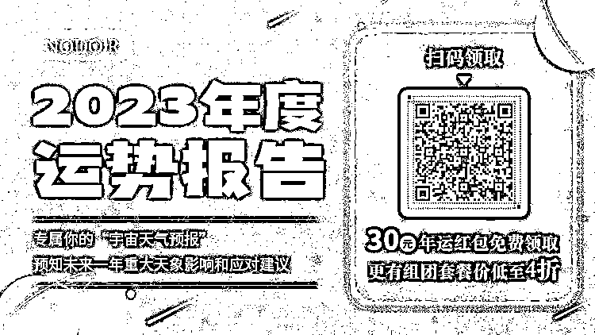****快年底了****不给自己一份来自占星学的礼物吗？**

**梅里曼金融报告双 12 福利来啦！****长按下图了解更多详情吧！**

**20 位来自世界各地的占星师**
**带来 19 场沙龙——新世界的觉醒****详情可点击下图**

**学习占星学****点击下图了解课程详情**

**微信又双叒叕改版啦，不想错过若道君的推送？**
****就把若道设为****星标****以及点点****“在看”****吧！******▼**

**喜欢就点一下“在看”吧！****报名直达入口**

# “喜怒忧思悲恐惊”，中医里的七情与健康

> 原文：[`mp.weixin.qq.com/s?__biz=MzA5NjA0NTAxNg==&mid=2651498081&idx=2&sn=72e5b9fb3badfdce19e664f1ec35d6bf&chksm=8b4814d6bc3f9dc01ab55c575d9571a8e64be5db28076524346402d631bda58e00a1242da230&scene=126&sessionid=1692737705#rd`](http://mp.weixin.qq.com/s?__biz=MzA5NjA0NTAxNg==&mid=2651498081&idx=2&sn=72e5b9fb3badfdce19e664f1ec35d6bf&chksm=8b4814d6bc3f9dc01ab55c575d9571a8e64be5db28076524346402d631bda58e00a1242da230&scene=126&sessionid=1692737705#rd)

作者/彦方

编辑/翀子 图片/稿定设计

中医认为，人的不同情绪会对不同器官产生影响，并将之总结为“七情”。七情都包括什么？又会如何影响我们的生活？来看文章吧！（因为目前关于“忧”的实践案例比较少，还在积累阶段，所以文中没有关于忧的内容）

**中医里的“七情”**

中医认为，人的不同情绪会对不同器官产生影响，并将之总结为“七情”。

在讲七情之前，我们先讲讲气血，中医认为血里面有气，当血液在血管中运行时，需要气的推动。人的生命特征用气血来体现，就是一看呼吸、二看心脏跳不跳，没有腿还能活，但是气没了血不流动了，这人就没有生命特征了。

在心平的体系中，我们认为**血对应物质上的需要，代表形而下的，有形的需要；气对应精神的需要，是形而上的，无形的需要。**

人活在世间，需要吃饭穿衣、需要房子、需要交通工具，这些都是有形的，属于物质层面；同时，我们也需要爱，需要有价值感、成就感、被人尊重等等，这些都是没有具体量化的无形需求，是精神层面的。

心平的研究发现，一个人在精神方面的不足不够，就会变成气虚；在物质层面上感到不足不够，就会变成血虚。心脏的作用是通过心肌的收缩，把血液运到全身各处，也就是给我们的身体供应能量的，供应我们需要的各种各样物质，这里面也有氧气，有精神方面的供应。

人们在生活中做事的时候，背后会有一个需要在推动着，我们去做这些事，是为了达到某种需要。

**1****“喜伤心”**

七情中的“喜伤心”，单从字面上理解，就是开心会影响心的功能，最典型的例子就是范进，落第二十多次后，五十多岁中举，喜极而疯。

但心平健康学是这样理解的，当一个人开心和快乐的时候，如果能体会到那个开心和快乐的感觉，实际上是一个治疗，在得到满足的同时，会发现身体很放松，身体内的气血是通畅的。

《黄帝内经》灵兰秘典中，把人体比喻成一个国家，把十二脏腑比喻成各司其职的十二官，首先提到的就是：心者，君主之官，神明出焉。在这个国家中，心是皇帝、是老大、是总统、是君主之官。所以皇帝的职能不是所有的事都管，是定大的方向、方针。

喜伤心的“喜”字，上面是一个吉，下面是一个口，仿佛一个人张着大口，为了那个需要使着劲。大家在生活中也会有这样的感受，当我们在为什么事情特别着急特别使劲的时候，心肌收缩的力度就会变大，我们会发现心脏咚咚咚跳得特别用力，会感觉到心跳的速度特别快。

**人本身有需要很正常，我们为了这些需要去使劲，把需要变成了欲望，非常用力去达到的时候，就会影响到心脏的功能，这就是喜伤心。**

其次，君主之官，神明出焉，还有另外一层含义：就是“心”作为人身体中的君主，身为皇帝，要做什么事是从正觉里出来的，只需问一下神明，便会“神明出焉“，而不是有很多的自我在做主。

神明就是我们中国人常讲的“头顶三尺有神明”的那个神明，可以理解为我们每个人都有的正觉。

当我们不问神明，而靠着很多的自我想什么都管，像那个张着的大口，管的范围特别宽，或者不是问完神明就交给相傅之官的肺，或者传导之官的大肠等等各个部门去管理，**皇帝管的特别宽，这时候也会影响到心脏，造成“喜伤心“。**

**简单的总结一下“喜伤心“，首先是我们要的劲大了，导致心肌收缩的力大了，其次是要而又没得着心理不平衡，会影响到心脏的功能，最后是我们管的范围太宽了，也会影响到我们心脏的功能。**

**2****“怒伤肝”**

我们再来看七情中的“怒伤肝”，从字面上理解，好像是生气会影响到肝的功能。

心平的研究中是这样理解的：“怒伤肝”中的“怒”字上面是一个“奴”，下面是一个是“心”，不是“怒”而是“奴心”影响肝的功能，也就是一个人觉得自己地位低，像奴一样，是委屈的窝囊的压抑的，才会影响肝的功能。

有一位同学虽然刚开始上初级班，就能很快从生活经验中理解到“奴心”伤肝这一点，因为他的父亲就是肝硬化离开的。父亲生前在外面是个老好人，在家里就是个受气包，他的母亲是一个特别能宣泄的人，每天有什么情绪都会发出来，而且大部分宣泄到他父亲身上了。

他的母亲也上过初级班，老太太 70 多岁，声音洪亮，而老头在旁边什么情绪都不敢发出来，很窝囊压抑。**所以是委屈窝囊压抑影响肝的功能，相反，当我们真能把那个气、那个火发出来，体会着发出来的感受，对于肝来说是一种治疗。**

当然随着学习心平理论我们会知道，把火发到别人身上，宣泄到别人身上的那些力，仍然会回到我们这里来，因为我们让别人不舒服了。我们可以用揉球的方法把那个生气释放出来，而不是压着。

在我做治疗的时候，会看到有人脾气很好，他总是觉得自己很委屈，但委屈只是表面的一层。当他把委屈宣泄了之后，会发现下面还有生气和愤怒，甚至是怨恨，因为他没法去表达他的生气愤怒，他就先通过委屈来表达。

黄帝内经中讲：肝者，将军之官，谋虑出焉。**肝在中医是主生发的、是往上的，对应着春天，代表万物复苏，生机勃勃。**将军当然也一定是挺着的，可是委屈窝囊压抑都是往下的，跟肝的特性正好是相反，所以会影响肝的功能。

通过学习心平我们理解到，有委屈、窝囊、压抑，我们得去把它释放了；同时，我们也能理解到，社会上那些老好人、委屈窝囊的人，他为什么会得肝病，他不是真的想开了，想明白了而当好人，真想开想明白了当好人，肝是没有问题的；想不开又惹不起别人，就得压抑着、委屈着、窝囊着，那就会影响到肝的功能。

**所以我们用揉球的方法，让那个生气愤怒和那个火发出来，对肝来说才能起到一个疏泄的作用，从而完成治疗。**

**3****“思伤脾”**

对“思伤脾”，有人说，就是想太多了，影响脾的功能。在心平体系中发现，是“田心”影响脾的功能。中医认为脾主运化，是消化系统中非常重要的一个脏腑。

我在带瘦身课程时，看到很多人的胖是因为脾的运化功能有问题，吃了同样的东西，为什么有的人就不胖，有的人吃了一点就消化不了。

那么，**运化不了是什么心理呢？又是如何影响到脾的功能的？**原因就是这个“田心”，也就是说**一个人有很多的规则、概念、条条框框，“田”字就是由一个一个的框组成的。**

比如说父母养育孩子，孩子说话声音大了不行，他们认为没礼貌，说话声小了也不行，觉得没有底气，孩子无论怎样，父母都觉得不对。

比如说有人觉得吃饭的时候就不应该说话，别人一说话他就觉得浑身难受，社会中有规则是没有问题的，只是我们在规则方面存留了不平衡的心理。

又比如，有人觉得婚姻中，就应该是男的赚钱比女的多，但是现在的社会中很多家庭中就是女性赚钱多，正好赶上这个时代，女人赚的多，那就接受，不要被这个框框给框住而产生了内心的不平衡。

所以“田心”就是自己有很多框框、规则、教条，来束缚自己、束缚别人，这就会影响到脾的运化，因为当你去框的时候，觉得这样不正常、不能这样做、不该那样做，就影响了脾的功能，不是规则框框有问题，是我们因规则框框而心不平了。

**所以思伤脾并不是想的多了会影响脾的功能，而是自己被太多的框框条框规则束缚了。**在瘦身课程中，我看到的那些小时候在家庭里被框着被束缚而内心不平衡，他们的这些不平心理就会变成身体的胖，就是因为脾的运化功能失衡导致的。

**4****“悲伤肺”**

正如前面所说，思伤脾并不是“想太多”影响脾的功能，那么“想太多”会影响什么呢？这就是七情中所讲的 “悲伤肺”。“悲”就是“非心”，想入非非的“非”。

这里说的“想入非非”有几种情况，首先就是想美事儿，比如我在没学心平之前，就很容易有这样的心理，小时候就想着长大了以后能做的特别美好的事情，自己还很美；其次，另有些人“想入非非”，是总觉得有什么不好的事情发生，会陷入不好的想法里，典型的代表人物非林黛玉莫属了。

别人无意中说的一件事一句话，她都会联想到自己身上，觉得全是针对她的，回去就开始自寻烦恼，自怨自艾了，所以她得的是肺病；还有的人是想了很多，想得很美，把什么都想的特别好，到做事儿的时候就没有行动力了，这是因为“悲则气消”，他都想完了，把能量都消耗了，所以这些人就是开始想的特别美特别好，想完了之后却一事无成。

中医认为肺是主气的，身体里的气是由肺来管理和负责的，当**我们想入非非时，无论想的是美好的，自己瞎开心，还是想不好的，自己吓唬自己，都会消耗我们的气，也就是“悲则气消”。**

另一方面，当我们想到那些不好的事而哭，如果真能不陷入到情绪中，带着体会哭，让情绪释放了宣泄了，哭出来对于我们来说就是治疗。

心理学中无论是心平、精神分析，还是其它流派的治疗方法，哭在治疗过程中都是经常发生的。有人哭完了觉得很痛快，同时身体也舒畅了。**所以带着体会、觉察哭，把情绪宣泄出来，是有治疗作用的。**

中医中讲到七情，不只是悲伤肺，而是“悲忧伤肺”。肺在中医四季理论中对应的是秋天，我们在生活中，秋天容易秋燥，这个时候我们要吃些银耳汤等润肺的食物。

秋天是收获的季节，如果到了秋天没得到果实，就会产生“秋心“，就是”愁“，**当我们存了愁的心理，平衡过来就变成忧。**

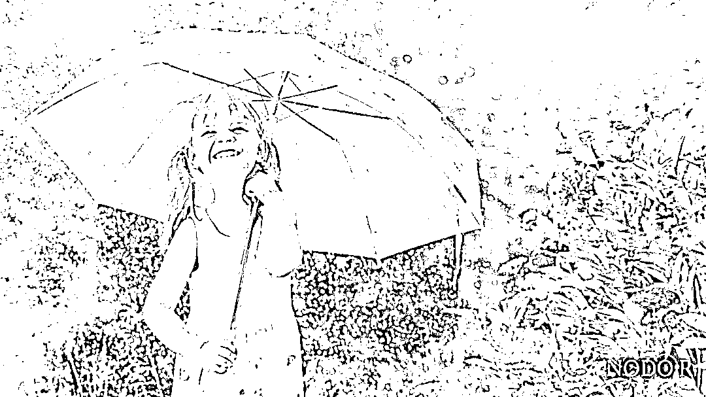

**5****“恐伤肾”**

“恐伤肾”，从字面上似乎可以认为是恐惧害怕影响肾的功能，但在心平体系中仍然要将“恐”字拆开来理解，是“巩心”影响肾的功能。

巩固中，巩是在高点，固是在低点。“巩心”伤肾，**就是为了到达高点和目标使的劲大了，影响到肾的功能。**

肾在中医认为是主冬藏的，对应的是冬天。养生的人知道冬天是养肾的时期，到了冬至前后最阴的那几天，甚至要在家里呆着静心冥想，这就是养生里讲的“冬藏”。

**“冬藏”的意思引申到我们的生活中，看一个人是否能冬藏，就是看他是否能够在生活、工作中守住人生的低点，而不是违背法则，没到春天非得把苗子从地里拔出来。**

在无论是事业还是生活的低谷、冬天的时候，我们真能放松地体会冬藏守着冬藏，就等于在补肾，在积蓄能量。所以“巩心”伤肾，就是在人生的冬天，本来是符合自然运行法则，在积蓄能量，为春天做准备时，硬要把地下的小幼苗拔出来，让它到高点，这就影响到肾的功能了。

再结合前面我们讲的，有人就得强，就要达到一个什么目标，并不是说要强错了，而是**当他要强的劲大了，就把肾给拔虚了，就会影响肾的功能。**

**6****“惊伤胆”**

七情中的最后一个是“惊伤胆”。这里的惊，是竖心旁，和前面说的那些“横心”，怒（奴心）伤肝、思（田心）伤脾、悲（非心）伤肺、恐（巩心）伤肾有区别。

竖心旁的字表示的是我们存留的心理又反过来平衡我们，比如惊是我们被吓了一跳之后，又平衡过来，我们受惊之后，总觉得有什么在那里是不安稳的，而胆在中医认为是清静之府，**我们被吓了之后不能清静了，就影响到胆的功能了。**

**版权声明：**原创文章由作者授权转载于若道平台，欢迎转发，反对抄袭。

**END**

**1 月 7 日线上公益讲座**

**欢迎预约~**

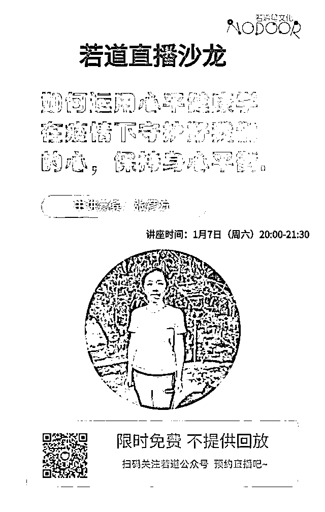

<mpvideosnap class="js_uneditable custom_select_card channels_live_iframe" data-pluginname="videosnap" data-headimgurl="https://wx.qlogo.cn/finderhead/PiajxSqBRaEJYnVsqWfEX9qA0sI6hNVKsDfyzfPZ92WZMZyBpZWU5NA/0" data-username="v2_060000231003b20faec8c4e68a1ec2d4ca07e434b07755bbf47e7053a3059defd2c9d6c68a20@finder" data-nickname="若道" data-desc="将在 2023 年 01 月 07 日 20:00 直播" data-intro="如何运用心平健康学在疫情下如何守护好我们的心，保持身心平衡." data-noticeid="finderlivenotice-v2_060000231003b20faec8c4e68a1ec2d4ca07e434b07755bbf47e7053a3059defd2c9d6c68a20@finder-1672298019321644-517510300" data-type="live"></mpvideosnap>

**心平健康学：身心平衡的疗愈实践**  

从小到大，在我们的人生经历中，我们必然经历各种各样让我们内心不能平静的事情，不论是过去，还是现在，我们都经历了各种情绪起伏，并在各种固有的、自知或不自知的情绪模式和偏颇的信念模式中。但大多数人不知道的是，这些内在因素都会导致我们的身心失衡，最终反映在我们的心理疾病和身体疾病中。而现代西方的身心健康研究也证明了我们祖先的智慧。**身体，就是我们心灵的显示器。身体的疾病，不仅是因为内心的失衡而产生，也可以通过内心的调整而治愈。****而心平健康学正是建立在中医的“内因致病”为理论基础，通过特定的方法，找到内因，调整内因以达到治愈疾病、身心的平衡的一门实践性很强的自我疗愈、疗愈他人的方法。******心平健康学初级班****

**授课老师：张彦方**

**开课时间：2023 年 2 月 24 日-26 日，上午 9:00-12:00，下午 2:00-5:00，共计三天**

**授课方式：******网络授课****

**费用：2700 元**

**课程负责人：李老师**（微信：cd13518140789）

长按二维码添加课程负责人咨询

**报名直达入口**

# 初阶丨心平健康学：身心平衡的疗愈实践

> 原文：[`mp.weixin.qq.com/s?__biz=MzA5NjA0NTAxNg==&mid=2651498081&idx=3&sn=e4d0165b94fbe2ee0b1c94ab77a71f1b&chksm=8b4814d6bc3f9dc0d4222d8e85b9eeb95c59c95ad213db904fcdb8130e395393475b171495c9&scene=126&sessionid=1692737705#rd`](http://mp.weixin.qq.com/s?__biz=MzA5NjA0NTAxNg==&mid=2651498081&idx=3&sn=e4d0165b94fbe2ee0b1c94ab77a71f1b&chksm=8b4814d6bc3f9dc0d4222d8e85b9eeb95c59c95ad213db904fcdb8130e395393475b171495c9&scene=126&sessionid=1692737705#rd)

**授课内容**

**所有的疾病都是身心疾病。**

我们的祖先很早就认识到这一点。

在最早医学著作《黄帝内经》开篇《素问·上古天真论》中，就讲：“虚邪贼风，避之有时，恬淡虚无，真气从之，精神内守，病安从来”。**这是对于“内因致病”和“修心去病”最早的描述。**

在《素问·刺法论》，黄帝又问流行性疫病。他说“余闻五疫之至，皆相染易，无问大小，病状相似，不施救疗，如何可得不相移易者？”岐伯对此的回答是：“不相染者，正气存内，邪不可干。”

可见不仅对于个体性的常见疾病，哪怕对于大多数人都会感染的流行性疫病，只要“正气存内”，就可以有效预防和对治。

那么什么样的因素会导致“内心正气”的偏离呢？《大学》里说，“身有所忿懥，则不得其正。有所恐惧，则不得其正。有所好乐，则不得其正，有所忧患，则不得其正。”

《素问·阴阳应象大论》里把七情六欲和人的身心疾病对应起来，提出了我们常听到的“怒伤肝、喜伤心、思伤脾、悲伤肺、恐伤肾”等这些“不平”的心理情绪对于身体的损伤。

而《素问·平人气象论》更明白指出，“无问其病，以平为期”。“平人者，不病也”。

**中医叫健康之人为“平人”，而平人就是阴阳平衡之人，没有太过与不及。**

然而从小到大，在我们的人生经历中，我们必然经历各种各样让我们内心不能平静的事情，不论是过去，还是现在，我们都经历了各种情绪起伏，并在各种固有的、自知或不自知的情绪模式和偏颇的信念模式中。

但大多数人不知道的是，这些内在因素都会导致我们的身心失衡，最终反映在我们的心理疾病和身体疾病中。

而现代西方的身心健康研究也证明了我们祖先的智慧。**身体，就是我们心灵的显示器。身体的疾病，不仅是因为内心的失衡而产生，也可以通过内心的调整而治愈。**

**而心平健康学正是建立在中医的“内因致病”为理论基础，通过特定的方法，找到内因，调整内因以达到治愈疾病、身心的平衡的一门实践性很强的自我疗愈、疗愈他人的方法。**

**心平健康学**

心平健康学是王中平老师从 1986 年开始，经过三十多年研究和实践，发现和总结各种身体症状和心理不平衡相对应规律，并运用这些规律调解和祛除不平衡身体症状，以达到身心同时健康的学问。

**这个学问体系以中国古老医学经典为其理论基础，以自然力（事物运行发展的法则，简称自然力）为核心，平衡论为主导。**

对于身体的不适，运用心平健康学的方法，可以找到“不平”所在。这种不平包括情绪、感受、认知、内心的想象、活动和用力、外在的语言、行为等多方面。

*   **比如生活中日积月累的不平的情绪、感受会变化成身体上不平衡的感觉；**

*   **内心中使的力、用的劲会在身体上留下痕迹（俗话叫用力过猛）；**

*   **而不辩证、不中正的认知会导致疾病的不同性质；**

*   **假设、想象中的各种不平心会影响到我们的神经系统。**

而当我们把“内因”，也就是不平衡的心理，通过特定的方法、技术调整为平衡，心在“ 平静、平衡、平等 ”的状态下，身体就会转为健康和谐，这就是“ 病由心解 ”。

**初级班学习步骤**

**★****课程前**

1.  自习（提供音频）王中平老师教授的心平健康学初级班四日音频课程

2.  读心平健康学内部学习资料《认识平衡》

3.  听心平健康学讲师彦方录的系列音频课程 ：

*   心平健康学是什么？

*   七情

*   四季与五行

*   八纲

**★****课程中做什么及收获什么**

1.  **学习“揉球”方法，**“揉球”是心平健康学体系中贯穿始终的在潜意识层面调治不平心理的方法、技术、工具。有自然揉球、定向揉球，（也就是有主题的揉球）、及缩减版拇指揉球。“揉球”的目标即是把不平衡的心理调整为平衡、平静。三日初级班课程，是实操课程，通过连续 18 小时的练习和实践，对“揉球”的方法不断的体会和夯实，以便课程结束后可以通过“揉球”的方法在生活中调整自己不平衡的心理及调整相应的躯体症状。

2.  **一对一个案治疗，学习治疗方法及完成治疗。**

    通过课程中自己及团体的一对一个案治疗，体会到自己在过去、现在及对未来有什么样的不平衡心理，导致了相应的躯体症状、心理疾病及不和谐的关系，并在个案中完成治疗。在自己及他人做个案的过程中体会治疗方法，以便课后可以自然应用方法。

**★****课程后**

听心平健康学讲师彦方录的音频课程：“揉球”过程中的疑惑与解答。

**老师介绍**

**张彦方**

硕士，心理咨询师；心平健康学初级班、综合中级班、女性健康专项中级班、亲子关系专项中级班讲师，并教授脏腑研究型课程，经典研读课程（中庸、道德经），断食课程，耐寒、耐热课程，物质平衡课程。

2017 年初教授心平健康学系列课程，累积课时 2000 小时以上，个案咨询 5000 小时以上，主要擅长通过调整不平衡的情绪、感受、认知来改善躯体症状，尤其在女性因为情绪、感受等不平衡心理所导致的乳腺增生、卵巢囊肿、月经不调等妇科疾病上有深入的研究和实践经验。在改善亲密关系和亲子关系方面有较多成功案例。

**课程推荐**

疗愈的层次，在西方讲身心灵，在东方讲形气神，其实都是在说物质、能量与信息。物质层面的治疗如现代医学，能量层面的治疗如中医针灸，而信息层面的治疗相对较少，也往往很神秘，比如西方的炼金术、灵媒，中国的祝由、道家法术等。

心平健康学是少见的既能在“神”的层次展开治疗，又十分朴实、接地气的一门技术。通过简单的肢体动作、配合起心动念的练习，就可以达到调神的效果，并借由“身心同调”的方式，从神（信息）影响形（身体）与气（能量），属于个人成长之路上的卓有实效的修行好伴侣。

——天空的空

**课程价格**

**费用：2700 元** 

**授课方式和时间安排**

**线上授课：**12 人小班制

**授课时间：**2023 年 2 月 24-26 日，上午 9:00-12:00，下午 2:00-5:00，共计三天

**咨询请添加李老师微信：cd13518140789**

长按二维码添加李老师微信

****心平健康学初级班****

**授课老师：张彦方**

**开课时间：2023 年 2 月 24 日-26 日，上午 9:00-12:00，下午 2:00-5:00，共计三天**

**授课方式：******网络授课****

**费用：2700 元**

**课程负责人：李老师**（微信：cd13518140789）

长按二维码添加课程负责人咨询

**报名直达入口**

# 跨年天象｜2022 年的最后一次水星逆行来了！

> 原文：[`mp.weixin.qq.com/s?__biz=MzA5NjA0NTAxNg==&mid=2651497996&idx=1&sn=68faf4fd532ad1afe7379554c61a974b&chksm=8b4814bbbc3f9dad43abc9bc7b0e46a20362fc1054be82686260bc7eba0daae0b97af630de82&scene=126&sessionid=1692737705#rd`](http://mp.weixin.qq.com/s?__biz=MzA5NjA0NTAxNg==&mid=2651497996&idx=1&sn=68faf4fd532ad1afe7379554c61a974b&chksm=8b4814bbbc3f9dad43abc9bc7b0e46a20362fc1054be82686260bc7eba0daae0b97af630de82&scene=126&sessionid=1692737705#rd)

**☆ 后台回复“今日”，给你一句生命态度**

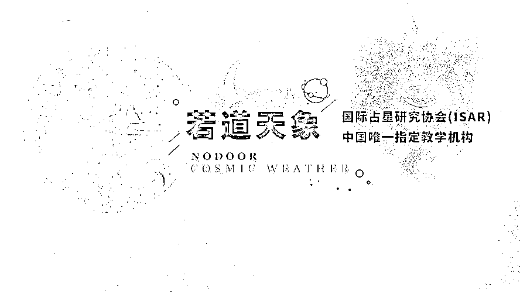

作者/Ara 爱拉（王珊珊）编辑/翀子 封面/书君 图片/稿定设计在这跨年前的最后一个摩羯座月份，我们迎来了水星逆行。北京时间 2022 年 12 月 29 日 17:31，水星在摩羯座 24°21’逆行，并于 2023 年 1 月 18 日 21:11 于摩羯座 8°8’结束逆行。此次水星逆行，让我们每个人看清自己和世界的哪些面向？又给 12 星座带来怎样的机遇？来看文章吧！**水星逆行**

这是一个“有温度”的冬天。当全国人民沉浸在疫情开放后第一波“如火如荼的”发烧发热中，“生病”成为我们这个时期最主要应对的困难任务。

生病就像内在次元的工作，总是以它最具技巧的手段，能让我们在晕头转向之下，仿佛转换时空。一霎那时间节奏错乱、姿态心态改变，甚至人格变化、信念变化……恢复后不由得重新认识自己、认识这个世界来。

在这场“全民遭疫”的时期，灾难也许带来洗礼，迫使我们对生命和健康更加重视，然而灾难就是灾难。最初是谁导致了这一切，我们或许慢慢忘却，只在每一次的痛苦中呻吟中，忍不住回骂它几句。然后继续在反省中，顾好自己，上路前行。

仍然，**在这跨年前的最后一个摩羯座月份，我们迎来本年度最后一次水星逆行。**

**北京时间 2022 年 12 月 29 日 17:31，水星在摩羯座 24°21’逆行，并于 2023 年 1 月 18 日 21:11 于摩羯座 8°8’结束逆行。顺行后再次行进到逆行之前度数的时间为 2023 年 2 月 7 日 13:12。**

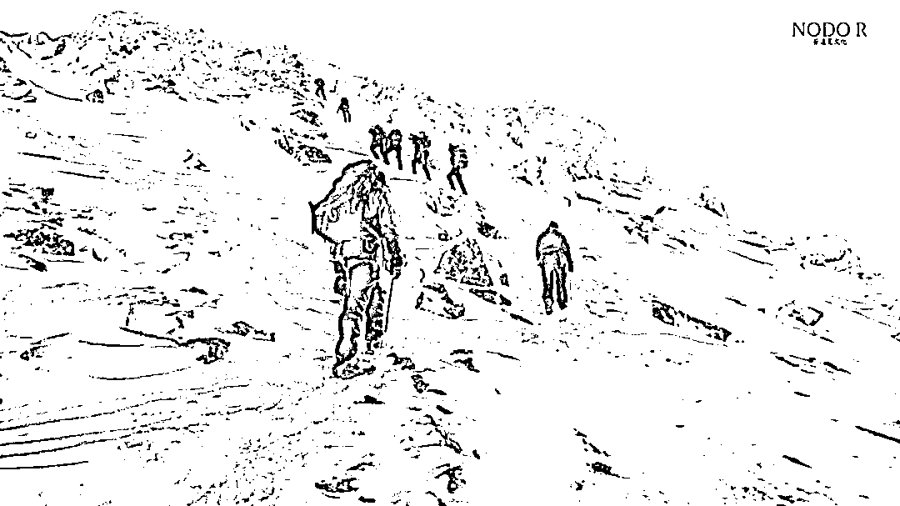

**当前天象**

**太阳、金星、水星、冥王星齐聚摩羯座。**就像每年这个时期我们感受到强大的“保卫、守护、落地、务实”等效应。也好比终于来到现实客观领域，或终于爬到了平凡生活之大局观的顶层视角——**去看清楚我们到底在面对什么。**

**同时在双鱼座的海王星、在白羊座的木星也支持到这股摩羯座的力量，**既意味着某种情绪氛围的弥漫扩散，也意味着关于摩羯座自我管理、独立可控、坚强理性等的一面，会在木星“活出生命力”特质的激发下，很容易带有一种强迫性，在维护自己的利益和势力方面变得一触即发。

此时期木星被逆行的火星定位，火星又被水星定位并达成互容。而**水星的逆行**好比给我们本就“摸不着头脑、不太敢嚣张”的火星进一步的“刹车”：**到底什么可信、什么不可信，值得不值得、有效还是无效、真实还是虚假……都需要停下来商榷。**

就像前段时期还有关于新冠感冒的各种用药治疗建议，有的甚至充满了前后矛盾互不兼容，这个时期，各种“专家建议”已经被网友们攻击和“辟谣”，太多的信息已经让人越来越不知道该相信什么了——权威们自身的迷茫无力，首先被揭开面具。

如果再加上逆行发生时期的整个天象时刻，我们更会看到：

**这是一个站在较高处观望着这个“个人与集体共享现实困境”的时期，时刻去警惕什么是安全与可信的，同时在人与人之间的互动中也慢下来，发现到我们可能无法凭借“个人”去表达和发声。每个人都是宏大的信息潮流中、无助的一分子。**

直至 1 月 18 日，水星在摩羯座 8°恢复顺行。届时太阳合相冥王星在摩羯座、金星合相土星——**是一个我们真正使自己“扮演自己人生中的父母、负责每一个选择和决定”的时刻。**

**再看摩羯座 24°的萨比恩象征：**

The convent lies between gnarled old trees as a very picture of peace and a woman approaches this sure haven. 

**建在古树间的修道院如同一幅非常平和的画，一个女人靠近了它，她把它当作可靠的避难所。**

**这一条似乎在提醒我们关于寻求“内在避难所”的倾向。**

此次水星逆行的影响和建议

*   与人在信息沟通、交流表达中的不畅（需要耐心、理解和解决方式）；

*   对官方说法、专家建议等信息的依赖、怀疑和挣扎（需要多多观望与求证）；

*   对生活、命运、家庭事业以及其中不可控的部分的思考（可以扩展目光进行梳理思考）；

*   在工作事业上的进程有磕绊、社会声誉方面的负面效应等；

*   对未确定的方案，先不要去实行；

*   回退表达、沉默不语、抑郁不快等倾向（可自我重视并寻求疗愈）

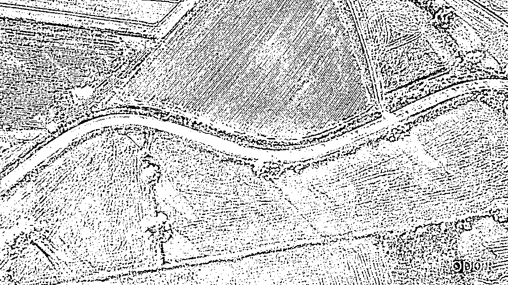

水星逆行对 12 星座的影响

**太阳或上升在*****白羊座***

原本已经定下的计划、分配的精力在此时期可能重新考虑自己的“力所能及之程度”，是被迫增强还是压缩，都会有突然变化的可能。另外对外发言需要注意分寸，避免滥用权威。

**太阳或上升在*****金牛座***

一些原本持续很多年的人生观、价值观，类似于人应该怎样生活、怎样过好这一生……这时期可能要受到干预，并重新审视和调整，从严肃到诙谐。另外可能仍有一些公共事务或私人安排上需要外出的情况，尽量照顾好自己。

**太阳或上升在*****双子座***

之前若有一些奔波冒险或者较为大胆的行动，此时期可能“如期”迎接到后果，变得保守紧缩。在人际关系上可能有信息沟通上的“权威比拼”，尽可能求同存异。另外注意亲密关系中的现实问题，尽量客观沟通。

**太阳或上升在*****巨蟹座***

之前若有与他人互动时的“被无意中攻击/洗脑/控制”等情况，此时期则需要面对解释、反击、修复、化解等情况。看到自己的弱点的同时也看到他人的“无辜无助”一面。另外注意情绪引发的健康问题。

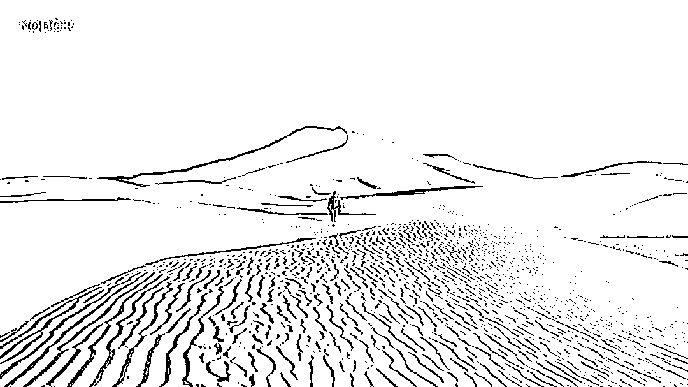

**太阳或上升在*****狮子座***

主要是工作和健康方面，可能有一些意外的任务反复的情况会引发你的焦虑担忧，需要根据自己需要来重新调整。可在饮食上多一些讲究、个人养生和保健方面更深入一些。另外可以多做些游戏、阅读等放松的事务。

**太阳或上升在*****处女座***

关于个人威望、个人存在感等方面可能有被人质疑与低估的情况。这时期需要检查在人情世故中未尽责尽善的地方，以及遵从本心，重新发出自己明确的态度声音。注意工作中的要点而非细节。

**太阳或上升在*****天秤座***

这时期对你的家庭和团队方面可能有些依赖的倾向，可能也因此给自己带来相应的责任和压力。需要在公平和力所能及的前提下去接手一些事务。另外注意调节精神心理上的压力问题。

**太阳或上升在*****天蝎座***

可能对信息和资讯的过多关注带来忧虑，影响到对生活方方面面的习惯的调整。建议制定一些日常安全出行的小 tips，并放松心态关注当下健康和舒适度。另外注意居家房子安全等问题。

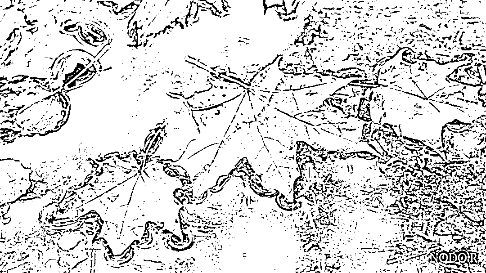

**太阳或上升在*****射手座***

在日常生活的经营中可能感受到不自由与不便利，或者生活中出现一些需要与人来往交易、互助合作类的事件。可以调整为对你来说更安全保守的方式。另外注意言语态度的问题。

**太阳或上升在*****摩羯座***

之前可能让自己承担背负了太多责任和压力，而使得有些事件计划没有完成。这时期可能需要慢慢卸下来，或者调整进度慢慢来。革命尚未成功所以暂时要继续当好“主事人”。另外注意财物清点问题。

**太阳或上升在*****水瓶座***

可能有一些不清不楚引发人情矛盾的事件，自己也感觉莫名其妙。此时期耐心复盘审思还是可以究出一二。可能有理说不清，或者对很多事只能保持沉默观察。注意实际行动胜于一切。 

**太阳或上升在*****双鱼座***

在群众中可能有一些被孤立的情况，去看一看是因为哪些地方的“与众不同”，或确实过于关注自我而失去民心。此时期不再是秀技能的时候，需要看清局势，以大局为主要引导。另外注意一些风向已经变了。

**版权声明**：原创文章由作者授权首发于若道平台发布，欢迎转发，反对抄袭。

**END**

**Ara 爱拉（王珊珊）**

全职占星/塔罗咨询师

《星途》《心探索》专栏作者

2013 年至今咨询个案已累计超过 2000 小时

**咨询微信号**：622005740（添加注明“咨询”）

**微信公众号**：xiaoshu_astro

长按打赏

**快年底了****不给自己一份来自占星学的礼物吗？**

**梅里曼金融报告双 12 福利来啦！****长按下图了解更多详情吧！**

**20 位来自世界各地的占星师**
**带来 19 场沙龙——新世界的觉醒****详情可点击下图**

**学习占星学****点击下图了解课程详情**

**微信又双叒叕改版啦，不想错过若道君的推送？**
****就把若道设为****星标****以及点点****“在看”****吧！******▼**

**喜欢就点一下“在看”吧！****报名直达入口**

# 该如何面对“水逆”，以及出生星图上的“行星逆行”？

> 原文：[`mp.weixin.qq.com/s?__biz=MzA5NjA0NTAxNg==&mid=2651497996&idx=2&sn=19fd55159e96426cbb76bff7f4fd11aa&chksm=8b4814bbbc3f9dad133d85722a73dd09c45ccc2e465ede911255b26fd48a6e39d14fe0426bbf&scene=126&sessionid=1692737705#rd`](http://mp.weixin.qq.com/s?__biz=MzA5NjA0NTAxNg==&mid=2651497996&idx=2&sn=19fd55159e96426cbb76bff7f4fd11aa&chksm=8b4814bbbc3f9dad133d85722a73dd09c45ccc2e465ede911255b26fd48a6e39d14fe0426bbf&scene=126&sessionid=1692737705#rd)

作者/HIROKI NIIZATO（新里弘树）

译者/李含 校对/Arrow

编辑/翀子 封面/书君 图片/稿定设计

今天的头条文章，是关于 2022 年底的水星逆行。如果在你的出生星图上，水星逆行，它代表什么意思？什么是“第二动机”？其它行星逆行又象征着什么呢？如果你对占星学感兴趣，大卫老师参与授课的【[ISAR 认证职业占星师文凭课程](http://mp.weixin.qq.com/s?__biz=MjM5MjQwNjAyMQ==&mid=2649440584&idx=7&sn=a56825d5ccd316d3a63d2a79b9052a3f&chksm=beb92e2289cea7348a01f6a2fe675ee76047b6655b4a0e81af5aac76866d3293a6a50423d83a&scene=21#wechat_redirect)】正在插班中，欢迎点击链接了解更多详情！

**水逆需要注意的事情**

水星逆行期间，交通、通讯、文书、沟通、谈判、电子产品等都会受到影响，数据易丢失，思维易脱线，误解增多，事件也容易有延迟。

**水逆的启示**

这段时间会是**自省**或**重新处理过去遗留问题**的好时候。我们与外在世界的沟通虽然似乎变得困难，但内在却可能有**新的领悟和重要的觉醒升起。**

**冷知识：出生时水逆会怎样？**

自从“水逆”一词的普及程度极大地扩散之后，水逆就成了宇宙背锅侠。现代青年们，感情不顺怪水逆，事业不顺怪水逆，东西丢了怪水逆……但凡有点啥事都能把水逆怪一怪。水逆通常一年会有三次，有时候是四次。如果啥都怪水逆，一年那么多次水逆那可怎么办哟？

水逆其实并没有那么可怕，也不会让我们一遇到水逆就各种“倒霉”。甚至行星逆行，也并不天然预示着阻碍。

**如果你出生的时候发生水逆，**也就是你的出生星图中水星逆行，你知道会发生什么吗？这可就不是短短数月的影响了，而是**对你整个人生进程都有着不可磨灭的意义。**

提到行星逆行，我们需要先了解一下下面这个概念。

“第二动机”

美国著名占星师诺·泰尔在谈到行星处于逆行时，提到了一个**“第二动机”**的概念：

**在行星的表达中，可能会同时存在两种动机或主题。**

**水星逆行，在表面的交流之下可能隐藏着第二动机**——蒂姆·伯顿的星图中水星逆行，他除了是一位电影制作的天才（这是第一个主题-创意交流），我们还会好奇他为什么如此痴迷可怕的东西。

蒂姆·伯顿被誉为好莱坞的鬼才导演，谈到他总是避不开他的哥特风格，他对死亡和荒诞元素有着别样的痴迷，甚至在他的电影里，哥特式中饱含死亡气息，以至于死亡引诱的元素导致他的部分电影与大荧幕无缘（如《文森特》）。

他的作品中怪诞恐怖的外表包裹着一颗亲切温柔的内心，看似遥远的童话故事实则是贴近现实的成长议题，因此伯顿的电影也被称为成人童话。 

影片中的僵尸、外星人、机器人等超人类形象迥异于常人的视角，破除了旧的创作理念和普通人的惯性思维。

也许这种创意的交流是他内心恶魔的一种宣泄——**因此在他的沟通交流背后存在着两种动机**（当然，这只是一种猜测，但这是第二议程的一个典型例子。）

另一个例子是，**你可能看到过一个人听起来很不情愿地在交流**（可能表现为交流中不透明，音量低，或者不一致的肢体语言）。两个动机（“我想要交流，但我不想受伤”，等等）在这个案例中互相对抗。**问题就变成了，为什么清晰的交流会关联上伤害？**

**出生星图上有行星逆行，会怎样？**

除了水星，其他行星也会发生逆行（太阳和月亮不会逆行）。**金星、火星、木星、土星，在你出生星图中逆行会发生些什么呢？**现在，就让我们继续探讨出生星图中从金星到土星的逆行吧。

（不考虑天王星、海王星和冥王星，因为它们移动缓慢。）

**★****金星逆行**

**金星逆行，预示着类似的第二动机出现在关系领域。**一个例子是，有个男人与超过 2000 位女人发生过关系——高度亢奋的性关系（一个动机）和完全缺乏情感参与（第二个动机）。杰克·尼科尔森的星图中有逆行的金星，他可能有点接近于这个例子。

杰克·尼科尔森，美国著名男演员、导演、制片人和编剧，也被普遍认为是电影史上最优秀的男演员之一，以 12 次奥斯卡表演奖提名保持着男演员的最高记录。他塑造过许许多多极具挑战性的角色，其中包括大量偏执甚至神经质之类有精神类病症的正/反面角色。

他的私人生活也与他在影坛上创造的众多人物一样丰富多彩，因为绯闻众多，被公认为好莱坞第一风流种，曾有媒体爆料他与上千个女人上过床。

**“我想要建立关系，但我不想变得脆弱”，**这样两种动机会在关系中制造混乱与挫折，那么问题又变成了，**为什么建立关系会被视为一种威胁。追溯到早期家庭中存在着怎样的关系模式呢？**

**★****火星逆行**

火星逆行，**能量在向外释放前会转而向内**：对攻击性能量存在审查制度——**愤怒会以一种被动攻击的方式表达，或者完全就是压抑的。**为什么必须这样？愤怒与什么关联？

**★****木星逆行**

木星逆行，诺·泰尔认为这**赋予了你独处的能力**，在我看来，这棒极了。我读到其他的解释是，**热情会被抑制，而不是表达，**后者预示着信念和乐观（还有热情）会因为某种原因接受检查。

**★****土星逆行**

**土星逆行，这常常暗示着消失的父亲，父亲可能是消极的、缺席的、专横的，所以无法给予孩子所需要的权威式的爱和指引。**工作、责任和世俗成功的概念是如何内化的？这可能产生出一种强烈的独立感，和/或导致自卑情结，感觉自己不被权威人士所喜爱。

我们有必要认识到逆行**并不是天然预示着阻碍**——它只是指出在行星的表达中存在着一种特殊的发展，需要占星师一探究竟。

**有时候行星表达上的困境会在之后转化为超常发展。**例如，我曾听过一些职业发言人的例子，他们小时候曾有口吃的情况。在克服语言障碍的过程中，他们成为了专业的沟通者！这个过程不会只有行星逆行一个因素，但是很可能与逆行的行星有强关联。

**版权声明：**本文由若道翻译发布，欢迎转发，反对抄袭。友号转载请申请白名单。

**END**

**HIROKI NIIZATO(新里弘树)**

诺·泰尔门下的高材生

从 2001 年开始从事职业占星咨询

**拥有****51 年****占星实践经验的****若道创始人****前 ISAR 全球副主席****前 ISAR 全球职业占星师资质认证主席****大卫·瑞雷**

**和**

**2019 年第二届、2021 年第三届核心课中**

**与苏·汤普金斯老师****联合授课****的**

**ISAR 认证职业占星师**

**咔咔（Caroline）**

**二人合力打造**

**2022 年 ****若道全新核心占星课程**

**点击下图了解更多课程详情** 

**

**微信又双叒叕改版啦，不想错过若道君的推送？**
****就把若道设为****星标****以及点点****“在看”****吧！******▼**

**喜欢就点一下“在看”吧！****报名直达入口**

# 2023 年 ISAR 选修课 | 预测技法三日工作坊，了解人生重大事件

> 原文：[`mp.weixin.qq.com/s?__biz=MzA5NjA0NTAxNg==&mid=2651497996&idx=3&sn=ec6050d1a5ec4530ea67b3e1f5ebae67&chksm=8b4814bbbc3f9dad0dee92e73ec53c1cfa586a87974abe5a2766d2df5f1e516f0363176cf046&scene=126&sessionid=1692737705#rd`](http://mp.weixin.qq.com/s?__biz=MzA5NjA0NTAxNg==&mid=2651497996&idx=3&sn=ec6050d1a5ec4530ea67b3e1f5ebae67&chksm=8b4814bbbc3f9dad0dee92e73ec53c1cfa586a87974abe5a2766d2df5f1e516f0363176cf046&scene=126&sessionid=1692737705#rd)

**授课内容**

 本次 3 日课程将深入学习人本主义占星师使用的 3 种预测技法。

我们将深入学习如何分析**行进**，强调对**行进的周期性**理解。我们将通过**次限**研究星图中展现的变化，并学习运用**太阳弧**来标记生命中的关键事件。虽然还有其他有用的技法，比如太阳返照和月限法等，但对**行进、次限和太阳弧**能量的谨慎回应已经提供足够的信息来指导我们的人生。

**行进（TRANSITS）** **长期趋势**分析行进的最好方法是先将长期的行进趋势列出来。顺序如下：冥王星、海王星、天王星、土星、木星、南北交点。通过将这些影响力持久的长期行进先列出来，你将能够发现在未来一年甚至更长的时间里你人生中的重大课题。**短期趋势和触发点**接下来你需要去观察那些运行得较快的星体，来判断短期趋势。不过，重要的是要清楚，这些移动较快的星体在行运中扮演着事件的“触发点”的角色，特别是当与它们形成相位的个人行星同时也与行运外行星有相位的时候！

**次限推进（PROGRESSIONS）**通常也被称作“一天代表一年”推运，因为这种技术把出生后的每一天和出生后的一整年等同起来。一旦设定了这个节奏，就像定时释放的胶囊一样，这些次限推进就像某种内部的太阳系一样运转起来，和真实时间的事件、经历、情境应和。

**太阳弧（SOLAR ARCS）**以太阳为核心，为众星之首，带着众星一起移动,展示人生不同阶段我们是如何体验自我、表现自我、修缮自我。此方法虽非实际星体，但却是星动推运法中准确率最高，实用性最佳的推运方法。

课程有两个方面的重点：**强化自我学习**，把对过去生活事件的理解作为预测未来趋势的基础；**学习有效的占星咨询技能**，以一种精准、生动、策略性和鼓舞人心的方式阐述星图。与格雷格之前开设的课程一样，这次课程会有**大量互动**，老师会与案例学员互动，同时通过学员间的讨论，互相激发，获得更多启发。如果可能，还会设置**训练环节，练习基本的预测和解读方法。**

**课程安排**

 **· 2023 年 3 月 4 日 周六  8:00-14:00
· 2023 年 3 月 11 日 周六  8:00-14:00
· 2023 年 3 月 18 日 周六  7:00-13:00**

**什么人适合学习本课程？**

 **·**占星师或渴望成为占星师的人群。  **·**本课程并非针对初学者，需具备若道核心课程 level4 及以上水平，即了解星座、行星、宫位、相位等。

**· **课程会涉及行进&推进&太阳弧解读高阶内容，不了解相关知识的同学，请提前学习相关内容。

**老师介绍**

**格雷格·博加特（Greg Bogart）**

**· **占星师、心理治疗师。格雷格出生于美国纽约市，就读于卫斯理大学。1986 移居旧金山湾，完成了加州整合大学和赛布鲁克大学的研究生课程。**· **格雷格自 1991 年以来一直是一名有执照的心理治疗师（LMFT 28276）。他是国际占星研究协会（ISAR）认证的占星师，并拥有美国地球宇宙学研究协会（NCGR）的第 4 级认证。**· **他还在旧金山的艾扬格瑜伽学院接受过培训，并于 1992 年毕业且获得了瑜伽教师认证。**· **格雷格是一名私人执业的心理治疗师，在索诺玛州立大学担任心理学讲师，他在该校教授“成人发展中的转变”、“以深度为导向的心理治疗”、“神话、梦与象征”以及“存在主义心理学与超个人心理学”等课程。**· **他在加州整合大学、约翰·F.·肯尼迪大学、多米尼加大学和超个人心理学学院教授咨询心理学和东西心理学课程。**· **他的研究结合了冥想、哈他瑜伽、荣格解梦、存在主义心理疗法和精神综合，**占星学的行星周期智慧和原型象征**。

**格雷格·博加特博士著作：** 《占星学的高八度音阶》（*Astrology’s Higher Octaves*） 《行星用于治疗》（*Planets in Therapy*）《占星学与灵性觉醒》（*Astrology and Spiritual Awakening*）《梦境工作过与自我疗愈》（*Dreamwork and Self-Healing*）《梦境工作在抑郁症整体心理治疗中的应用》（*Dreamwork in Holistic Psychotherapy of Depression*）《占星学与冥想：对变化的无畏沉思》（*Astrology and Meditation: The Fearless Contemplation of Change*）

**推荐阅读：**

史蒂芬·阿若优：《生命的轨迹》

Bogart, G., Planets in Therapy; and Astrology’s Higher Octaves.

Tyl, N., Prediction in Astrology.

Ruperti, A., Cycles of Becoming. 

**课程价格**

**正价：6800 元 早鸟价：5800 元 早鸟价截止日期：2023 年 2 月 15 日**

**惊喜联报套餐！！****《ISAR 选修课 | 预测、预期与意识成长》+《2023 年度天象预测大师课》+《2023 年金融占星预报》****三门联报优惠价 8800 元****（联系 Maggie 老师，抢占限量优惠价）**

长按二维码添加 Maggie 老师获取联报优惠价

**退转课程**

退款原则请详看《教学协议》，如有疑问请咨询课程顾问。 ****2023 年 ISAR 选修课 | 预测、预期与意识成长****

**授课老师：****格雷格·博加特**

**直播课开课时间：2023 年 3 月 4 日（周六）3 月 11 日（周六）3 月 18 日（周六）**

**授课方式：******网络授课，英文/中文授课，中文翻译****

**费用：****** 正价：6800 元；早鸟价：5800 元；早鸟价截止日期：2023 年 2 月 15 日****

**课程负责人：Maggie 老师**（微信：NodoorMaggie，请备注“2023 预测课”）

长按二维码添加课程负责人咨询

**报名直达入口**

# 金星在 12 星座丨情感关系里，“对的人”从何处走进你的生活？

> 原文：[`mp.weixin.qq.com/s?__biz=MzA5NjA0NTAxNg==&mid=2651497957&idx=1&sn=220c67f68ba3578da0bf626e219fbd12&chksm=8b481752bc3f9e44c1fe60c382ef2fe2f4e354e981dd47eb4bcc46824454d39455ec1dda3699&scene=126&sessionid=1692737705#rd`](http://mp.weixin.qq.com/s?__biz=MzA5NjA0NTAxNg==&mid=2651497957&idx=1&sn=220c67f68ba3578da0bf626e219fbd12&chksm=8b481752bc3f9e44c1fe60c382ef2fe2f4e354e981dd47eb4bcc46824454d39455ec1dda3699&scene=126&sessionid=1692737705#rd)

****************☆ 后台回复“今日”，给你一句生命态度****************

作者/HIROKI NIIZATO（新里弘树）

编辑/翀子 封面/书君 图片/稿定设计

金星守护着天秤座，现在太阳在天秤座，咱们来聊聊关系。在关系中互动的时候，星图中的金星会显得尤为重要。金星落在不同的星座会有怎样不同的互动方法？这也是极少数将金星的星座和宫位结合在一起描述的文章。另外，大卫老师参与授课的【[ISAR 认证职业占星师文凭课程](http://mp.weixin.qq.com/s?__biz=MjM5MjQwNjAyMQ==&mid=2649440584&idx=7&sn=a56825d5ccd316d3a63d2a79b9052a3f&chksm=beb92e2289cea7348a01f6a2fe675ee76047b6655b4a0e81af5aac76866d3293a6a50423d83a&scene=21#wechat_redirect)】报名中，点击链接了解更多详情！**金星的星座和相位所揭示的**

当两个或两个以上的人在任何关系中互动时，常常存在某种相互都感兴趣的东西（称为**社会客体**）：例如，如果你们一起参加占星研讨班，占星就成为了这个“社会客体”。简单来说，社会客体是一种**“共享设备”**，让人们之间的对话得以发生。 

占星学上来说，金星的星座和相位可以揭示我们如何使用社会客体来互动；换言之，我们如何和他人分享体会。虽然我们必须考虑到其他行星配置的修正影响（尤其是内行星和上升点），但在此我们只讨论金星在不同星座的原型。

**金星落*****火象星座***

***也许还有金星和太阳或木星形成相位***

社会客体可以被用来表达自我，以此激发互动的能量，并带来对自我的关注——会表现为**幽默、强烈的观点、灵感和热情**（都容易在谈话中通过笑声或兴奋点产生更多动能）。

***1.*** 金星落***白羊座***时，我们注意到此处表现为检验个人魅力的风情。我们发觉一个人的**个性**比社会客体更迷人（实际上，谈论个性往往会成为社会客体）。

**代表人物**：玛丽莲·梦露、乔治·克鲁尼、凯拉·奈特利。

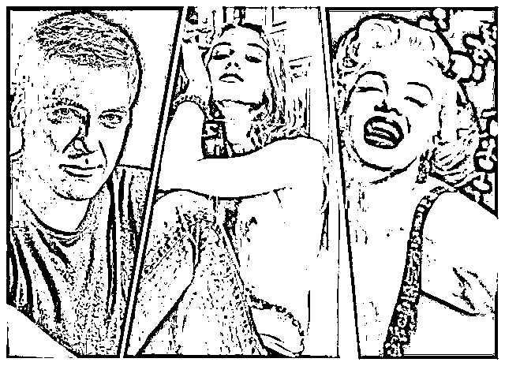

***2. ***金星落***狮子座***时有关社会客体的**创造性**或**幽默**的自我表达（你不仅仅讲故事，而且是用你的方式去讲）能引发别人的喜爱和掌声。

**代表人物**：惠特尼·休斯顿、菲尔·麦格劳博士和作家欧·亨利。

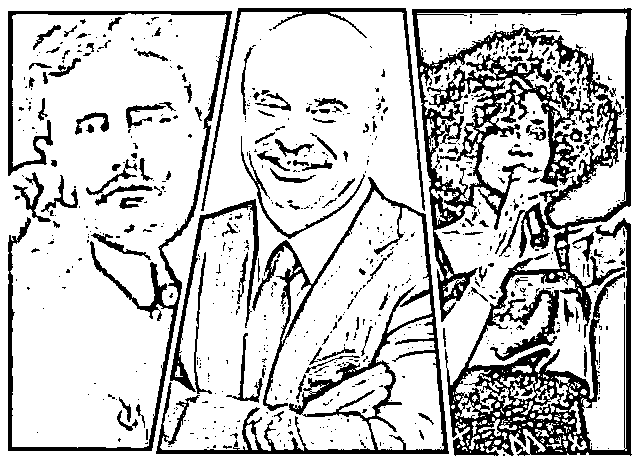

***3. ***金星落***射手座***可能需要教授你关于社会客体的**知识**或坚持自己的**观点**（“这是我知道的/我认为的”）。

**代表人物**：约翰尼·卡森、简·方达、查尔斯·舒尔茨、罗伯特·汉德。

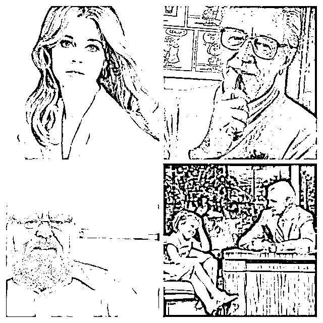

**金星落*****土象星座***

***或金星和落在土象星座的水星（金牛座、处女座、摩羯座）或土星形成相位***

社会客体常常是用来**享受、工作或使用的事物**。各星座在表现这个明显的实用导向时略有差异：

***1. ***金星落***金牛座***可以仅仅为了带来**感官愉悦**的社会客体而感到高兴；**欢愉、享受和释放压力**可能是更喜欢的社交模式。**美食、艺术或音乐佳作**、给予或接受**按摩**——你们一起享受此类经验只是因为乐在其中。

**代表人物**：汤米·希尔费格、谢尔盖·拉赫曼尼诺夫、萨尔瓦多·达利。

***2. ***金星落***处女座***可能会通过**批判**和行动来**分析和改进**社会客体（“有更好的方法来做这件事——让我们来看看是否能解决它”）。在更世俗的层面上，**家庭杂事或项目**（例如重建等）可能成为社会客体（它既有成效又有社会性）。

**代表人物**：伯尼．西格尔博士、约翰·凯奇、歌德。

***3. ***金星落***摩羯座***——社会客体常常可能和个人所有的**实际目标**有关；互动的用处或许比联结本身更重要。

**代表人物**：巴顿将军、斯蒂夫·乔布斯（常被描述成员工的奴隶监工）、沃特·迪斯尼（据称非常冷漠、孤僻）。

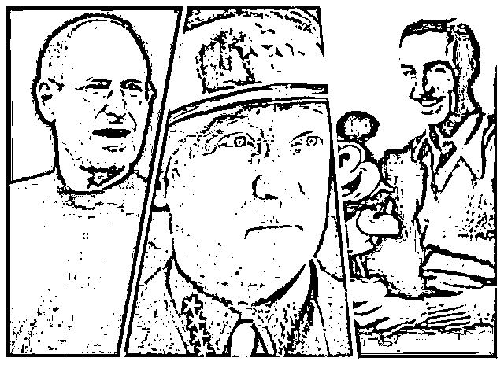

**金星落*****风象星座***

***或金星和落在风象星座的水星（双子座、天秤座、水瓶座）或天王星成相位*** 

天生喜欢**传达、探讨和理性研究**某一社会客体。不同于土象星座的金星，它可能自身就喜欢**有趣的对话**。也许此金星具有的对人和事物天然的**好奇心**将让他们接触更多信息，从而知晓更多社会客体（例如你们可以聊聊各种不同的事物），产生更多关系（例如大受欢迎）等等。

***1. ***金星落***双子座***可能带着**好奇心、才华和机智**来处理社会客体。

**代表人物**：纪录片制作人肯•伯恩斯、演员比尔·考斯比和诗人加里·斯奈德。

***2. ***金星落***天秤座***可能意味着**愉快、优雅、体贴**地谈论社会客体。它可能格外擅长创造**美和对称结构**（史蒂芬·阿若优指出这个位置可能对应着身体的美，虽然是**冷静**的那种）。

**代表人物**：休·格兰特、查尔斯王子、艾略特。

***3. ***金星落***水瓶座***可能想要去和更多人来**分享**社会客体，也许寻求**创新**，或是想要尽可能对他人有益。

**代表人物**：奥普拉·温弗瑞、詹姆斯·乔伊斯、米尔顿·艾瑞克森。

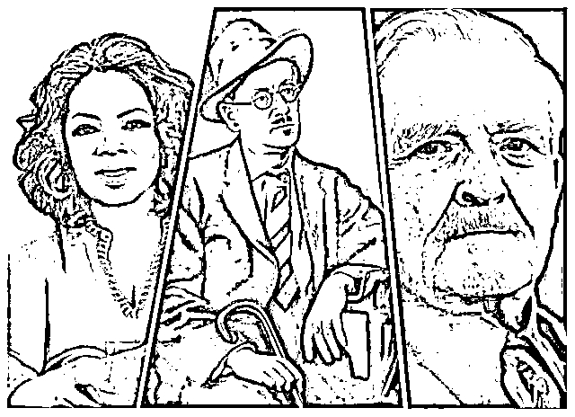

**金星落*****水象星座***

***或金星和月亮、冥王星或海王星形成相位***

可能需要在情感上感受到交流带来的**滋养**，所以它可能会试图与他人分享或寻求社会客体相关的情感反馈。我们自然期望对共同话题出现深刻的情感反应。

***1. ***金星落***巨蟹座***：可以想象此配置会有**滋养**的行为。对社会客体（共享的经验）的情绪可能成为聊天主题（“电影让你感觉怎么样？”）。它可能对自己的感情比较谨慎，除非是在非常亲密的关系中，但还是会喜欢听到别人的感情。

**代表人物**：“内在小孩”治疗师约翰·布雷萧、卡尔·荣格。

***2\.*** 金星落***天蝎座***常常和**深度、激情**相关（源于性或宗教激情的极致体验），有时候也和性吸引力有关。在选择的社会客体时，会表现出深层动机和深度参与。

**代表人物**：比利·格雷厄姆、奥齐·奥斯本、玛丽·居里、查理·卢西安诺、安妮·莱斯（创作了《夜访吸血鬼》，后期开始写作宗教主题书籍——两者都很符合天蝎座。）

***3. ***金星落***双鱼座***可能与社会客体进行**温柔而敏感**的互动。社会客体可能是一种载体，用以激发一个人的幻想、创造性想象或是灵性的观点和理想。

**代表人物**：德鲁·巴里摩尔、比莉·哈乐黛、维克多·雨果、莎莉·麦克琳。

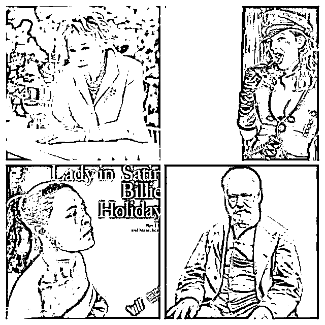

再次强调，我认为**太阳、月亮、水星和上升点**的修正影响也很大；你们可以根据出生图中的侧重点，在此处描述的各个不同星座中找到和你的社交风格。虽然金星和社交的原型象征，但是我们整个人都参与了互动，所以这再正常不过了。

**把金星的落座和宫位结合起来看**

每个行星原型都代表着一条成长之路。作为爱与美的女神，金星维纳斯通过与我们内心和对美的感受有关的事情为我们设定道路。 

**金星的星座描绘出我们如何最佳地体验与他人的情感关系，它所落的宫位预示着，为了发展我们爱的能力，我们需要专注于哪些领域**。这里，我们会将用几个关键主题来归纳这些衡量方式。

**更好的自我接纳**

出生星图中金星落在**火象星座**（白羊座、狮子座、射手座）的人需要感受到自己**被接纳、被爱、被尊重**。然而为了赢得他人的爱与尊重，他们首先需要给予自己爱与接纳。

与此类似，金星落在**第 1 宫**也需要努力爱自己。这种情况下，通常会有一种负面的自我形象阻碍他们获得他人的爱——所以首先必须通过**培养自我接纳和积极的自我对话**来抹去这种形象。

我们有多么接纳自己、爱自己，我们就能够多么慷慨地与他人分享这种爱与接纳。

**情感疗愈**

出生星图中金星落在**水象星座**（巨蟹座、天蝎座、双鱼座）的人需要**与自己的脆弱安然相处，这样他们就能避免筑起心墙，或是在面对关系时太过害羞**。任何过去的伤害都需要被疗愈，这样他们才不会把当下的关系搞糟。

金星落在**第 4 宫**需要深入地接纳自己的根。可能有**与父母亲相关的痛苦回忆**，让他们对自己的家庭感到**内疚或者羞耻**。

通过**努力整合情感**，我们敞开心扉，与他人建立更亲密的关系。我们能够疗愈过往的伤痛，不再深陷其中。

**表达赞赏**

出生星图中金星落在**风象星座**（双子座、天秤座、水瓶座）的人尤其需要**获得他人的赞赏**。然而为了获得赞赏，他们首先需要学会**表达赞赏**。这意味着更能赏识他人的兴趣、有用之才或特别之处，**养成赞赏他人贡献的习惯**。

金星落在**第 7 宫或第 11 宫**的人也与此类似，他们需要学着**支持自己的伙伴和朋友，然后才能体验到互相欣赏**。

培养赞赏他人的习惯会吸引到相同的回应，还会将负面、苛责的思考转化为积极、富于启迪的思考。

**实际贡献**

出生星图中金星落在**土象星座**（金牛座、处女座、摩羯座）的人尤为重视**实际的贡献**，而不是温暖的情感和深情的词藻。不论是担负家中的财政支柱，还是修理家里的物件，或是帮助他人保持条理，**他们的贡献需要看到具体的结果才会满意**。 

金星落在**第 2 宫、第 6 宫或第 10 宫**的人或多或少都需要切实地感受到他们自己的贡献。对他们来说，他们会用**财富成就**作为评估自己社会贡献的指标之一。

通过**以实际的方式帮助伙伴**，我们学会用默默的努力和日复一日的贡献去表达爱。

不论是通过更好的自我接纳、情感疗愈还是赞赏或贡献，我们都通过自己出生星图中金星位置预示的方式发展了我们爱的能力。我们无法取悦每一个人，只要我们继续这条心的旅程，就会有足够多“对的人”走入我们的生活，这样我们总会有可爱之人。

**版权声明：**本文由若道翻译发布，欢迎转发，反对抄袭。友号转载请申请白名单。

**END**

**HIROKI NIIZATO(新里弘树)**

美国职业占星师，诺·泰尔门下的高材生

从 2001 年开始从事职业占星咨询

**拥有****51 年****占星实践经验的****若道创始人****前 ISAR 全球副主席****前 ISAR 全球职业占星师资质认证主席****大卫·瑞雷**

**和**

**2019 年第二届、2021 年第三届核心课中**

**与苏·汤普金斯老师****联合授课****的**

**ISAR 认证职业占星师**

**咔咔（Caroline）**

**二人合力打造**

**2022 年 ****若道全新核心占星课程**

**点击下图了解更多课程详情** 

**快年底了****不给自己一份来自占星学的礼物吗？**

**梅里曼金融报告双 12 福利来啦！****长按下图了解更多详情吧！**

**20 位来自世界各地的占星师**
**带来 19 场沙龙——新世界的觉醒****详情可点击下图**

**学习占星学****点击下图了解课程详情**

**微信又双叒叕改版啦，不想错过若道君的推送？**
****就把若道设为****星标****以及点点****“在看”****吧！******▼**

**喜欢就点一下“在看”吧！****报名直达入口**

# 童年的潜移默化，如何让你不断实现“自我预言”？

> 原文：[`mp.weixin.qq.com/s?__biz=MzA5NjA0NTAxNg==&mid=2651497957&idx=2&sn=8039f81275deda10d9b7e1dcfef26497&chksm=8b481752bc3f9e447f43704a05dce722003c0fa3db32e1bea3b401dc4decb6a66a9a3e66cd91&scene=126&sessionid=1692737705#rd`](http://mp.weixin.qq.com/s?__biz=MzA5NjA0NTAxNg==&mid=2651497957&idx=2&sn=8039f81275deda10d9b7e1dcfef26497&chksm=8b481752bc3f9e447f43704a05dce722003c0fa3db32e1bea3b401dc4decb6a66a9a3e66cd91&scene=126&sessionid=1692737705#rd)

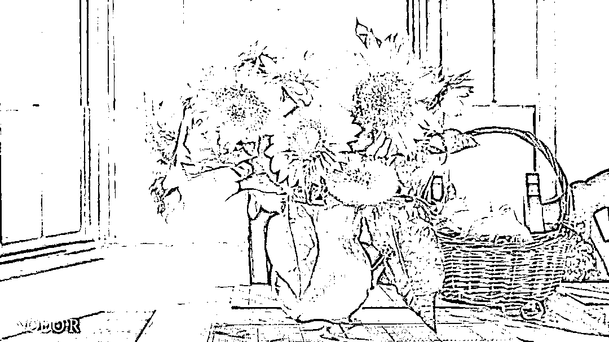

作者/格伦·佩里

编辑/薇安 翀子 图片/稿定设计

童年在很大程度上影响了我们的成年后的认知及生活，这些影响大多是潜移默化的，藏着我们很深的意识里，等待着我们将其挖掘出来。我们有时还会把这些影响说成是“命运”，可实际上，这些往往都是我们不断地把事情推到我们预期的那一步。如果你想更多了解心理占星学，这里有一门格伦·佩里老师亲授的[【占星原型与星图中的精神病理学】](http://mp.weixin.qq.com/s?__biz=MjM5MjQwNjAyMQ==&mid=2649440584&idx=4&sn=b8dd16c802b799ce57845220ab6aaa8c&chksm=beb92e2289cea734fb8e0a85d62bad503cc39bda6fb3b8a792634480205acfdb8cbfb0c0be5a&scene=21#wechat_redirect)，点击链接了解更多详情吧！

曾经有人说过，**每种情绪背后都有一种隐藏的认知**。20 世纪后期心理学发展的一大标志，就是认识到了**情绪不仅仅是对现实的自发反应，也是习惯性思维模式的结果，并且通常处于无意识层面**。

个体体会到什么样的情绪，取决于他们是如何阐释事件的，而不是取决于事件本身。也就是说：**不是事件本身，而是我们解释事件的方式，决定了我们的感受**。

**占星学与建构主义**

当前，认知科学的思想被称为“**建构主义**”，强调认识中的积极（参与）过程。“建构主义”（constructivism）一词起源于拉丁语中的 construere，意思是“去诠释”。

它的重点在于个体积极“建构”经验的特定意义。个人共同建构（co-constructs）现实，这就是建构主义的核心含义。

“co-constructs”的前缀“co”（共同）意味着可能有一个真实的客观世界，影响着我们的想法和感受，但是我们永远都不可能直接了解它。我们只能通过个人现实理论的观念滤镜来了解到它。

相应地，**我们对外在现实的认知也不可避免地受到自我先入为主的观念的影响。个体是个人现实的“共同创造者”，因为内在和外在条件之间存在一种交互性的相互依赖**。

从这里我们可以看到该理论和占星学的对应——不同的行星配置会建构不同的现实。比如，行星的宫位不仅描述了认知该宫位现象的方式，也描绘了我们可能在此处获得的经验的本质。

**举个例子**

假设有一位女性，火星在第二宫，早年，她发现如果她想要什么东西的话，她就必须要积极主动地去争取，没有时间去等待或储蓄，因为想要的商品供应短缺，很快就会消失。

这就是她的经验。这个人因而会倾向于冲动消费。相应的信念就是：“现在就拿到它，否则你永远都得不到。”

相反地，土星在第二宫的人可能会“建构”一个完全不同的现实。

对于她来说，值得拥有的事物也值得为之储蓄，她的兴趣在于品质，而不在于合算。耐心和节俭是她的操作策略，她只有在经过长时间仔细考虑之后，确定该商品是最物美价廉的，才会去花钱。

在每种情况中，个体认知到一种符合她实用目标的第二宫现实：及时拥有（火星），或者仔细挑选最好的产品（土星）。相应地，建构主义的目标不是认识现实，而仅仅是**努力去理解那些服务于不同实用目标的模型是如何建构起来的**。

建构主义认为，人和环境时紧紧联系在一起的，难分难解。我们如何认知，我们体验到的是什么，这些构成了一个封闭的系统，在这个体系中，“如何”（内在）和“什么”（外在）并不是完全区分开来的。建构主义哲学家保罗·瓦兹拉威克（Paul Watzlawick）（1976 年）说道：

**我们对于现实的日常、传统的观点是一种错觉，在生活中的大部分时间中，我们都在努力撑下去，甚至会冒着巨大的风险，试图强迫事实符合我们对现实的定义，而不是反过来。而最危险的一种错觉就是，只有一种现实。实际上，存在着很多不同版本的现实，有些版本是相互矛盾的，但这所有的版本都是沟通（communication）的结果，而不是对永恒、客观真相的反映。**

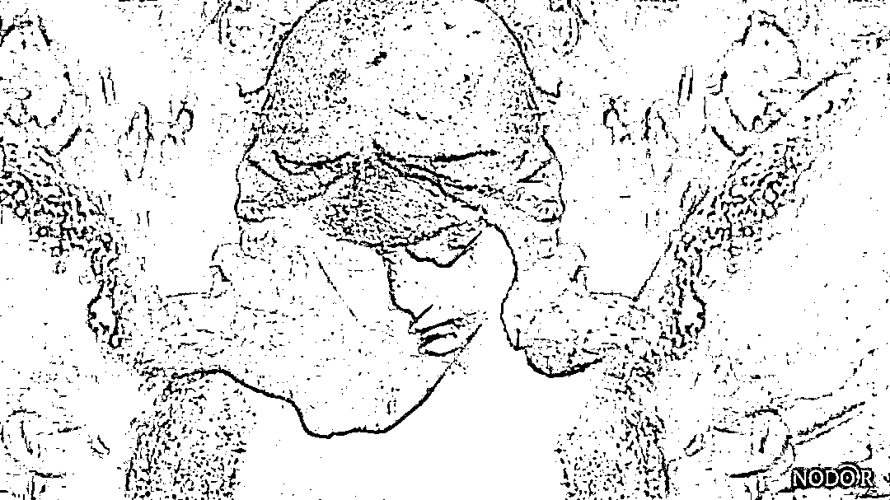

**建构的行为，始于童年**

我们需要承认，人们固有的现实理论并不一定是有意识的。意义的建构开始于婴儿期，并持续终生，不管我们是否意识到。在情感上对我们很重要的经历会形成一些概念，帮助我们组织和指导未来的行为。这些概念构成总体上的宽泛假设，并将之后的体验吸收进来。

从占星学上来说，这些概念的最好象征就是**相位格局**，它能同时描述外在经验的世界和它的内在灵性表现。

举个例子

比如，一个太阳四分土星的男孩可能会有一个完美主义、爱评判、吝于赞赏的父亲。最终，这个孩子会开始相信自己不值得被肯定或赞扬。

这种他对于自我发展出来的概念——“**我不值得被赞赏**”，是父亲不认可自己的外在经历所造成的结果。

当他长大后，他会期待从上级那里获得相同的对待。他对上级行为的诠释将符合自己的预期，而且他的行为会招致他预先期待的结果。

比如，因为害怕失败他可能会去拖延，或者通过过度补偿来避免自己预期的批评。这些都会在无意识的层面被激发，因为他的信念的本质会引起焦虑，所以必须被压抑。

**儿童会从强烈的情感经历中进行不恰当的归纳。他们认为“以后一直会发生这样的事”，或“我一无是处”，因为他们的概念能力有限，经验也有限。**

**儿童天生是自我中心的，所以会倾向于将发生在自己身上的一切都认为是自己的责任**。

如果一个三岁小孩的父母决定离婚，然后父亲搬出去了，孩子就会去想：“爸爸之所以离开是因为他不爱我”，或者“爸爸离开了，因为我一团糟。”简而言之，儿童认为发生在自己身上所有事都是因为他们。

情绪激烈的经历中所产生的信念具有广泛的普适性，规定你在未来如何行动才能获得欢愉和痛苦的最大平衡，确保获得认可，维持自尊的最佳水平。

**这样的信念形成得越早，隐藏的创伤越重，就越容易变得固执**。

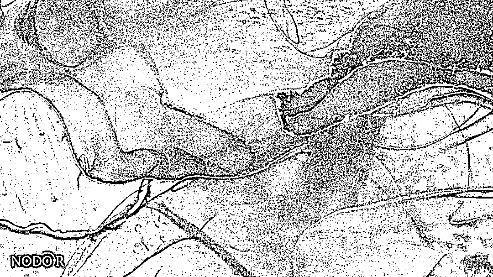

举个例子

比如，想象一下，有个女孩月亮在第二宫白羊座，四分第十一宫的天王星。在她两岁的时候，她母亲选择了一份全职工作，当环境保护的游说者，所以把她交给一个玩忽职守的保姆。

一开始，这个孩子习惯于期待一位至少对她有点反应的母亲，但却被一种出乎意料的照顾的改变所震惊。

突然，她意识到她可能会饥饿、湿透、疲劳、害怕，但是不管她如何努力去表达她的苦痛，都没有人会来。这样的情况持续了三年。到她开始上学的时候，她心中形成的对自我和世界的理论会是这样的：

“我个人的、情感的需求是不重要的，没有人会特别关心我需要什么才能感到安全。因为别人都会忽视我的感觉，所以我最好也忽略他们。不然我就会感到持续痛苦。世界上充满了冰冷的、漠不关心的人，他们一会儿爱你，一会儿拒绝你。所以不要依赖任何人。让这个世界见鬼去吧。唯一真正的安全感只有你自己能给自己。”

作为一个孩子，这个人形成的有关自我和世界的理论，和她的月亮配置是相符合的。在三岁时，她不可能像上面这样说出自己的“故事”，但是，这却隐含在她的行为中。

如果她没有意识到自己行为中暗含的这种预先假设，她就会一直持续遇到月亮/第二宫的经历，这一切看起来像是被一种她无力抵抗的外在命运所控制。可是，这种命运在很大程度上是被她自己控制的，她需要保证这个世界是熟悉的，符合她个人的现实理论。

**换句话来说，她的月天四分相所展现出来的认知结构将会以自我实现的预言方式运作。她会无意识地寻求并创造相关经历，来证实她的偏见。**

也许月天四分的女性会无意识地相信，**她所依靠的所有人最终都会翻脸不认人**。这种信念如此固着，让她很难再以其他方式去看待（或者甚至是想象）自己被对待的方式。

然而，她不能完全阻止自己去渴求亲密。无意识中，她害怕自己会孤独终老，所以当她陷入感情中时，就会表现得**冷漠、疏远、被动**。就像被车前灯照射的鹿，她在预期灾难，她在害怕她所预期的事物，而这必然会影响她的行为。

伴侣的任何行动，即使只是有一丁点符合她的预期，比如瞥了一眼别处、迟到、关注别的事情，都会被她解释成一种证据，证明了她的预期即将发生：**拒绝**。所以她切断了自己的感情，在伴侣做出更多伤害之前，突然疏远了他。

客观地来看，在了解了她的预期过后，她的行为很好理解——**自己在情感上依赖的人突然冰冷地中断了对自己的关怀**。因为这个核心信念是她在很小的时候理解世界的方式，所以它是具有适应性的。

但是，现在她对拒绝的预期太强了，已经影响到了伴侣的实际情况，伴侣感觉到被拒绝了。她表现得好像拒绝已经发生了，从而招致了这样的情况。

有时候这被称为“**投射性认同**”，**即在别人身上引发自己的预期（投射）的行为**。**这不是发生在她身上的事情，她才是那个以冰冷的、突然的方式行动，并隔断情感的人。**

她的伴侣认为她的行为非常不公平，觉得很受伤，所以他采取了防御性的回应。对于她的突然改变，伴侣感到困惑，以为她不再在乎自己。于是他抽离了，实现了她最初的预期。他的行为是对她的行为的反应，而她的行为也是对他的行为的反应（还记得吗，他向别处瞥了一眼）。

**在不经意间，她让自己的恐惧成为了自我实现的预言**。她的反应影响了他，让他的行为方式有可能符合自己的预期，让自己害怕的结果更可能发生。最后他体会到了拒绝的冲动，但这其实是他的防御。

因为他也有一个故事，通过他自己的行为投射出来，并导致其发生。这样的关系系统密切交织在一起。双方的故事融入到彼此熟悉的模式中，经常让我们无法分辨是谁的故事先开始了，不知道是“鸡生蛋，还是蛋生鸡”。

现在对这部分做出总结。人类在日常生活中，会像科学家那样采取行动。在潜意识中，他们持续地做出假定，验证假定。

**这种自我概念是个体无意识地发展出来的自我理论，因为他们需要以此来确保自己活下去**。这种个人故事开始于童年，在理想的条件下，当我们成人时，会发展出成更加整合的版本。

自我理论和世界理论合在一起，构成了一个人的个人现实理论，代表其全部的概念体系。这个理论有三个基本功能：

**❶**** 吸收经验数据；**

**❷**** 通过满足需求的行为方式，来保持欢愉和痛苦适当平衡；**

**❸**** 增强自尊。**

为了达到这些目的，个体将有选择地关注那些能证实自己理论的数据，歪曲或忽略那些不能证实他们理论的数据。这样，人们选择了身边环境（伴侣、老板、朋友）的某些特点，并将其融入到一个预先存在的故事中，一个似乎有生命的故事。

**版权声明：**原创文章由若道翻译发布，欢迎转发，反对抄袭。友号转载请申请白名单。

**END**

**格伦·佩里**

著名占星师，前 ISAR 董事会成员，共出版八本占星著作；心理/意识研究专业博士；占星心理学学院（Academy of AstroPsychology）的创办人；康涅狄格州研究生院（the Graduate Institute of Connecticut）原型宇宙学与意识进化项目的负责人。

# ****占星原型与星图中的精神病理学****

**为什么在占星学的课程中，会出现精神病理学的教学内容，这和我们有什么关系？这对占星咨询，或在自我了解与成长的过程中又有什么帮助呢？**

****带着这些疑问，请你静下心来，思考以下几个问题**：**

**“******你/你的案主，是否曾经过度担心什么？**** ****你/你的案主，有没有感觉到担忧和焦虑，却不知道原因是什么？********你/你的案主，是否曾经觉得害怕什么东西，但理智上却很清楚它不会对你造成什么伤害？********你/你的案主，是否曾经通过沉迷某物，酗酒或滥用药物，自我伤害去逃避问题？********……********——节选改编自《心理学与生活》******”**

**如果你对上述问题其中之一，回答是。这意味着几乎每个人都曾有过心理障碍的症状（精神病理的问题）。**

**你看，其实“精神病理学”与人的心理有着密切的关联，再结合占星学，呈现了人内在与外在层面更加丰富和深刻的一面。**这对于学习占星学的人和占星师来说，都是一场难得的知识盛宴！****

****本课为 2 年期双证核心课程中的一部分**（AP105 阶段），其内容是过去若道所开设的核心课程从未教授的部分，特意抽出供其他学员学习，******可作为 ISAR 选修课，单独报名。****

****点击下方图片了解详情****

**

****微信又双叒叕改版啦，不想错过若道君的推送？**** ******就把若道设为****星标****以及点点****“在看”****吧！**********▼****

****

**喜欢就点一下“在看”吧！****报名直达入口**

# 星座病理学 | 水瓶座-天王星与分裂性人格障碍

> 原文：[`mp.weixin.qq.com/s?__biz=MzA5NjA0NTAxNg==&mid=2651497957&idx=3&sn=540d5a6f1f799e90873cac16d0b2d87a&chksm=8b481752bc3f9e44957e55a14895355050315987c72bff64fdf2b3b03851ede993289de01985&scene=126&sessionid=1692737705#rd`](http://mp.weixin.qq.com/s?__biz=MzA5NjA0NTAxNg==&mid=2651497957&idx=3&sn=540d5a6f1f799e90873cac16d0b2d87a&chksm=8b481752bc3f9e44957e55a14895355050315987c72bff64fdf2b3b03851ede993289de01985&scene=126&sessionid=1692737705#rd)

<mpvideosnap class="js_uneditable custom_select_card channels_iframe videosnap_video_iframe" data-pluginname="videosnap" data-id="export/UzFfAgtgekIEAQAAAAAA30ABIQ0xywAAAAstQy6ubaLX4KHWvLEZgBPEwoNoJCgRVJiCzNPgMIvCpVSOfVFDhzaRC4tfgTro" data-url="https://findermp.video.qq.com/251/20304/stodownload?encfilekey=rjD5jyTuFrIpZ2ibE8T7YmwgiahniaXswqzFSu3Tolniay8IqP6Mib02FHFsyNSHhyh4OFFIjNW5Fia1edLvPLCPLSBVvjcPsKhlfLRl0nqWXed6M8KrHPvnFqzA&amp;adaptivelytrans=0&amp;bizid=1023&amp;dotrans=0&amp;hy=SH&amp;idx=1&amp;m=&amp;scene=0&amp;token=AxricY7RBHdUHwCUs8icpN4jydH7ib1sQib5nRiaXYZ0AkticPGrusLapRWheiaIOfib3bX9ibqcibOLjdcG4" data-headimgurl="http://wx.qlogo.cn/finderhead/PiajxSqBRaEJYnVsqWfEX9qA0sI6hNVKsDfyzfPZ92WZMZyBpZWU5NA/0" data-username="v2_060000231003b20faec8c4e68a1ec2d4ca07e434b07755bbf47e7053a3059defd2c9d6c68a20@finder" data-nickname="若道" data-desc="#占星心理学  天王星、水瓶座和分裂性人格障碍有什么关联？分裂性人格障碍有什么样的星盘元素指针？" data-nonceid="11104297122761329598" data-type="video" data-authiconurl="https://dldir1v6.qq.com/weixin/checkresupdate/icons_filled_channels_authentication_enterprise_a2658032368245639e666fb11533a600.png" data-width="1280" data-height="720"></mpvideosnap>

**课程描述**

看过课程标题的你，也许会感到好奇和惊讶，为什么在占星学的课程中，会出现精神病理学的教学内容，这和我们有什么关系？这对占星咨询，或在自我了解与成长的过程中又有什么帮助呢？

**带着这些疑问，请你静下心来，思考以下几个问题**：

“**你/你的案主，是否曾经过度担心什么？** **你/你的案主，有没有感觉到担忧和焦虑，却不知道原因是什么？****你/你的案主，是否曾经觉得害怕什么东西，但理智上却很清楚它不会对你造成什么伤害？****你/你的案主，是否曾经通过沉迷某物，酗酒或滥用药物，自我伤害去逃避问题？****……****——节选改编自《心理学与生活》**”

如果你对上述问题其中之一，回答是。这意味着几乎每个人都曾有过心理障碍的症状（精神病理的问题）。

你看，其实“精神病理学”与人的心理有着密切的关联，再结合占星学，呈现了人内在与外在层面更加丰富和深刻的一面。**这对于学习占星学的人和占星师来说，都是一场难得的知识盛宴！**

**本课为 2 年期双证核心课程中的一部分**（AP105 阶段），其内容是过去若道所开设的核心课程从未教授的部分，特意抽出供其他学员学习，**可作为 ISAR 选修课，单独报名**。

**在正式了解本课的价值之前，先了解一下这门课程的主讲老师吧！**

**格伦·佩里（Glenn Perry）**

*   他是心理/意识研究专业博士、加州注册婚姻和家庭治疗师 （CAMFT）

*   占星心理学学院（Academy of AstroPsychology）创办人

*   康涅狄格州研究生院（the Graduate Institute of Connecticut）原型宇宙学与意识进化项目的负责人

*   共出版八本占星学著作：《心理占星学入门》、《心理占星论文集》、《盗取天火》、《从忠诚到革命》、《星图中的阴影》、《占星职业议题与伦理》、《出生星图深度分析》、《从古代到后现代占星学》

**墙裂推荐格伦老师这门课的 **

**4 大理由**

**你一定得知道的课程价值**

**价值*****1***
**明晰精神病理学的基本定义**

占星心理学学院创办人格伦·佩里老师，对**精神病理学的基本定义**就是灵魂受苦，精神就是灵魂的意思，病理就是受苦的意思，所以精神病理学研究的就是：人类各种各样受苦的方式，尤其是因为某一类的行为而引起的。

精神病理学是一个连续体，从比较轻微的，到比较严重的，这么说来，我们每个人都有一部分精神病理的问题。

**如果成为一个“人”，没有一定程度的挑战是不可能的。没有一定程度受苦，没有一定程度不平衡是不可能的。而这种不平衡就会以一种挑战和困难的姿态呈现出来。**

**价值*****2*****更懂疗愈：从不平衡到平衡**

**疗愈**是一个复杂的过程，讲的是将人从不平衡带到平衡这样的一个状态，将不同行星代表的心理功能带到一种更加平衡整合和合作的状态。

格伦老师通过研究精神病理学，发现每一颗行星，以及这颗行星所守护的星座，都和某一特定类型的病理是联结在一起的，包含了这个占星原型所涵盖的极端不平衡的情况。

举个例子，案主的第 1 宫，有很多星星在那里，和对面第 7 宫的火星形成对分相，第 1 宫白羊座或者火星白羊座的组合，和这个案主的反社会人格的病状联系在一起（这是一个星图的极端负面表现）。

“

**生活本身就是一场治疗，我们在占星的星图中去看到，人们所具有的创伤、不平衡及其产生的防御机制，最终都会在他生活中的关系和情境中呈现出来。无论他生活中处在怎样的情境之下，其实这些环境都是在为他提供恰当的环境，作为一种载体，让他去平衡和疗愈事件背后问题的根源。** 

**这样一个现象是持续不断地在发展，会让我们想到，会有一个更大的宇宙的智慧存在，它其实是在指挥和引导着我们的这些经验，让我们去经历然后进入更高层面的发展当中。生活或者“神”，就是我们所有人类的一个治疗师。**

**——格伦·佩里**

”**价值*****3*****了解诊断标准，提高咨询的专业敏感度**

如果能够对精神病理极端不平衡的情况有了解的话，你就会对它比较温和的版本更加敏感（大部分人是更温和版本的呈现）。

也许案主并没有达到某个病理所达到的层级，但是 Ta 有显示出，这个病理某一些特点或者某一些倾向。所以，我们的目标并不是去诊断案主，而是了解他在这个病理学连续体上处在一个怎样的位置。

当你拿到星图你会看到，案主不同的冲突，是体现在不同的部分上。某一个病状是体现在某一个行星，另外一个病状，是同步体现在另外一颗行星上。

当我们通过对占星原型星座和行星的病理学现象的学习后，就能看到占星学上的配置所呈现出来的，案主表现出的这些失调，并不一定都会成为一种心理临床上的诊断。有可能在案主这里呈现出一个很轻微，但是仍然在 Ta 生活中，给 Ta 造成挑战的一个点。

**价值*****4*****智力上的刺激——整合进阶**

这个课程能够让我们了解自己，了解我们的客户，了解我们的朋友，了解我们的家庭。它给我们提供一种崭新的方式，并且让我们看到占星原型的种种表达，不要局限在非此即彼、非好既坏的这样的一个概念当中，而看到它其实是一个不同程度的连续体。

当我们能够以这种方式去看的时候，你就能够将自己的生活，带入一种和谐。能够了解这是一个过程，我们的重点不是放在诊断上，而是放在整合上，因为生活，就是一种整合。

**课程内容**

**AP105 星图中的精神病理学与疗愈** 共**15 次**课程：**10 次 2019 年录播课+5 次直播课；30 课时**

在这个阶段的课程中,我们将**聚焦于十二星座(从白羊座到双鱼座）及其对应的守护星的潜在功能障碍。**

我们将学习如何识别、理解和应对每个星座的潜在挑战。我们将在各种相应的心理障碍背景下来考察占星原型，这些心理障碍表现为功能障碍、失衡的极端状态。

学员们将了解**《精神疾病诊断与统计手册》诊断标准**。我们会探讨治疗的概念，尤其是那些与整合和个性化相关的概念。我们将特别关注外行星的困难相位，以及它们与内在心理冲突、防御和症状形成的关系。

学员们将探索人的痛苦如何成为发展和实现天赋才能的催化剂。在考察病因时，我们会将平常的因果关系理论与传统的命运、业力和转世观念整合起来。

**口碑推荐**

‍**‍想感受格伦老师的课堂魅力？** **一小段讲课视频让你先睹为快~**<mpvideosnap class="js_uneditable custom_select_card channels_iframe videosnap_video_iframe" data-pluginname="videosnap" data-id="export/UzFfAgtgekIEAQAAAAAAxuwL_P9LDAAAAAstQy6ubaLX4KHWvLEZgBPElYFkVBZaNrKCzNPgMIuhBCuUlaCPzDNmHFgJR5sp" data-url="https://findermp.video.qq.com/251/20304/stodownload?encfilekey=rjD5jyTuFrIpZ2ibE8T7YmwgiahniaXswqzIGcAWV11d39RRKTicEUe1lSn5e1z2jdX20ath9yg9Liaia8VPS2c4MUJibl8FlxSZs3ajlcibhlD6typd6ZeGeWj2bQ&amp;adaptivelytrans=0&amp;bizid=1023&amp;dotrans=0&amp;hy=SH&amp;idx=1&amp;m=&amp;scene=0&amp;token=AxricY7RBHdXmmhmUb1Np3Ioz3Ok0V9IBZ0eINxnxticaC9r3HjsQ8iatkwqFBLKP50ZibXDm0TiaicC4" data-headimgurl="http://wx.qlogo.cn/finderhead/PiajxSqBRaEJYnVsqWfEX9qA0sI6hNVKsDfyzfPZ92WZMZyBpZWU5NA/0" data-username="v2_060000231003b20faec8c4e68a1ec2d4ca07e434b07755bbf47e7053a3059defd2c9d6c68a20@finder" data-nickname="若道" data-desc="#ISAR 选修课  如何识别、理解和应对每个星座的潜在挑战？如何在不同的心理障碍背景下来考察占星原型？" data-nonceid="4249051256207020861" data-type="video" data-width="1024" data-height="576"></mpvideosnap>

**课程费用**

**课程价格：9000 元****课程优惠价请添加 Margartet 咨询**

课程负责人：Margaret

（微信：18515059056）

请备注“心理占星 105”

**开课时间**

**直播课开课时间：2022 年 12 月 21 日**

**退转课程**本课程包含往期视频知识点视频课程+直播案例课程+助教直播答疑；报名付款后均不受理退款转课，请慎重考虑后再确认付款。**其他相关事项请仔细查阅报名勾选时的《教学协议》，如有疑问请咨询课程顾问。****报名流程及费用支付****1. 点击阅读原文链接立即报名，填写个人姓名（身份证姓名）和相关信息，阅读并同意《教学协议》，提交报名表，直接在线支付。****2. 付款后可在网页个人中心或手机网页“我的”栏目查看报名记录。****如遇疑问请与销售人员联络******ISAR 选修·占星原型与星图中的精神病理学****

**授课老师：格伦·佩里**

**直播课开课时间：**2022 年 12 月 21 日

**授课方式：**网络课程，中英文授课，中文翻译

**费用：9000 元（获取优惠请联系客服咨询）**

**课程负责人：**Margaret（微信：18515059056 请备注“心理占星 105”）

长按二维码添加课程负责人咨询~

**报名直达入口**

# 冥王星即将换座水瓶座！先随这个星座感受一下文明与疯癫

> 原文：[`mp.weixin.qq.com/s?__biz=MzA5NjA0NTAxNg==&mid=2651497865&idx=1&sn=76d53bbf46436ad5647f734fbcabd69f&chksm=8b48173ebc3f9e28779338e910c0a52113f928ddd793f044260752b18ca66d53904ca7c6f82a&scene=126&sessionid=1692737705#rd`](http://mp.weixin.qq.com/s?__biz=MzA5NjA0NTAxNg==&mid=2651497865&idx=1&sn=76d53bbf46436ad5647f734fbcabd69f&chksm=8b48173ebc3f9e28779338e910c0a52113f928ddd793f044260752b18ca66d53904ca7c6f82a&scene=126&sessionid=1692737705#rd)

**☆ 后台回复“今日”，给你一句生命态度**

作者/蓝女巫 ISAR 认证占星师

编辑/翀子 封面/书君 图片/稿定设计

作者引言

本文适合本命与行运冥王星 11 宫人，及所有**水瓶座**，**水瓶座与天蝎座合体**。**狮子座/水瓶座对宫**必读，尤其**南交水瓶座/北交狮子座**。也以这一篇**代替年运送给所有人。**2023**冥王星进入水瓶座**，水瓶时代真正启稳。读懂这篇最完整的冥王星在 11 宫，**看懂了水瓶座，也就懂了世代**......

每当谈及水瓶时代的趋之若鹜时，总会有画外音响起：水瓶座难道不是特立独行的吗？终于有机会成文来揭开**水瓶座不为人知的一面**，刻画水瓶座原型**高阶与低阶的全貌**。**尚未觉知自身独特性的水瓶，必然会在本能地模仿**...... 一起来观看，**特立独行 vs 泯然众人，硬币的两面，你在哪面？**

**冥 11，你在恐惧什么？**

**愚人船**

**冥 11，最贴切的一个氛围**：在福柯笔下的愚人船中。

在文艺复兴时期的想像图景上出现了一种新东西；这种东西很快就占据了一个特殊位置。**这就是“愚人船”**。这种奇异的“醉汉之舟”沿着平静的莱茵河和佛兰芒运河巡游。**这种船载着那些神经错乱的乘客**从一个城镇航行到另一个城镇。疯人因此便过着一种轻松自在的流浪生活。**城镇将他们驱逐。**--福柯《疯癫与文明》

灵魂记忆中，也许你曾在愚人船上漂泊异乡，被放逐在疯人的水域，被社会排拒于边缘的外围；或者，比如你的梦中，总能看见被群体排拒的小沙弥，也是同理。**驱逐与归属，是你灵魂最深处的伤。**今生你是否会因**与众不同**而产生罪恶感？呼应了你曾因疯癫而被当作文明的异己，获赐了难以磨灭的严惩。正常人井井有条的世界，你被禁止入内。被迫接受健康标准的治疗，从呼喊到沉寂。你残存的**社恐**，归因于**抗拒被社会规训**时所产生的疼痛。从此，观看者与被观看者的视角，理性与非理性的站队，开始在你脑海中狂乱地对峙！

在中世纪结束时，麻疯病从西方世界消失了。在社会群落的边缘，在各个城市的入口，展现着一片片废墟旷野。多少世纪以来，这些地方就属于**“非人”世界**。从 14 世纪到 17 世纪，**它们将用一种奇异的魔法召唤出一种新的疾病、另一种狰狞的鬼脸，等待着清洗和排斥的习俗卷土重来。**

在麻疯病院被闲置多年之后，**有些东西无疑比麻疯病存留得更长久，而且还将延续存在。这就是附着于麻疯病人形象上的价值观和意象，排斥麻疯病人的意义**，即那种触目惊心的可怕形象的社会意义。这种形象必须首先划入一个神圣的圈子里，然后才能加以排斥。/疯劲儿不会偃旗息鼓，力量扩散开来，对整个围墙之外的世界产生腐蚀性的影响。**好像疯狂再也关不住了...... **--福柯《疯癫与文明》

**疯狂，是一种瓦解的力量。**它并非来自另一个世界的诡异，**恰是来自于人的本性深处，**终究难被驯服的动物性。**理性则惯于压制否认自己身上这个兽性的深渊**，用训诫来驾驭那另一种真理之张狂。规范最大的力量在于，提供了一种日常心理保障，令众人心照不宣地维护着相濡以沫的安全感。规范视特例为威胁。与大家不同，就让你枯萎。理性对待疯狂手段曾是，**对话，隔离与治疗**。**最终以精神病院彻底驯服了疯狂**。**将疯人置于别人监督的目光下，时时处处审视自己**……疯人开始失去表达自己的权利和能力，被吸纳进社会秩序**变成理性的附庸**，**永远陷入沉默**。

**疯狂，其实是一种更为强大的知识。**它更加完整无缺，包罗万象。虽不正统，却**是绝对的奥秘**。疯狂自己就能表达自己，展现真谛，无须理性的框架。疯狂不是呓语，却是**坚定的思索者**。敢于****给出截然不同的判断**，与理性世界针锋相对。疯狂，根本毫不边缘**，它就盘踞在理性的最核心处。**激情与谵妄，本是一体两面。**没有激情，身心就无法连接，而灵肉合一便造就了疯癫。但激情的多变不安，会令**理性偏离正常的轨道**，因此便成了被禁止的智慧。直到疯狂越发无法被人听懂，只好转向艺术表达自己。**不疯癫也是另一种形式的疯癫。**所以，梵高疯了，还是世人疯了？**“我千百次地举起灯笼，寻觅，在那正午时分…”**

**“你觉得我疯了吗？**”但和他相处久了之后我才意识到，这个问题是他提给自己的，而不是提给我的。我的回答其实并不重要。**马斯克其实是渴望知道我是否值得信任，他望着我的眼睛，做出了最后的判断。**

如果马斯克所说的一些事情听起来很荒唐，我只能说，那是因为在某个种程度上的确如此。举例来说，马斯克的助手递给他一些上面沾了奶油冰激凌的饼干，**当他一边吃饼干一边谈论着如何拯救人类时，嘴角下方还沾着一些饼干屑。**--《硅谷钢铁侠》

**局外人**

**冥 11，最贴切的一个形象：**让我想到了加缪笔下的《局外人》，主人公默尔索，**沉默而思索。**默尔索式的孤独，也正是**冥 11 们的孤独**。**这是一个为真实而死的人的故事，尽管他没有一点英雄的态度。**从水瓶的原型，**他对应着一个小人物**：

日子过起来长，这是没有疑问的，**但它居然长到一天接一天。它们丧失了各自的名称。**对我来说，唯一还有点意义的词是“昨天”和“明天”。

如果让我住在一棵枯树干里,除了抬头看看天上的流云之外，**无事可干。久而久之，我也会习惯的。**何况，认真想想，我并不在一棵枯树干里。还有比我更不幸的人。妈妈**常这么自宽自解，说到头来，人什么都能习惯。**

这份差事可以使我生活在巴黎，每年还可以旅行旅行。“你正年轻，我觉得这样的生活你会喜欢的。”我回答说，**的确如此，不过对我来说，实在是可有可无。**于是，他就问我是否不大愿意改变改变生活，我回答说，**生活是无法改变的，什么样的生活都差不多，而我在这儿的生活并不使我不高兴。**老板显得有些扫兴，他说我经常是答非所问，而且缺乏雄心天志。我本想不扫他的兴，**但我实在看不出有什么理由要改变我的生活。**当我念大学的时候，有过不少这类雄心大志。**但之后很快就懂得了，这一切实际上并不重要。**

现在我面对着这个充满了星光与默示的夜，**第一次向这个冷漠的世界敬开了我的心雇。我体验到这个世界如此像我，如此友爱融洽。**--加缪《局外人》

而冥 11 的基因，又让他成了**一个不同寻常的小人物**。整本书都像在讲**一个冷笑话**，而这正是水瓶原型所独具的温度与气质。

我只觉得**铙钹似的太阳扣在我的头上，那把刺眼的刀锋总是隐隐约约地对着我。滚烫的刀尖穿过我的睫毛,挖着我的痛苦的眼睛。**就在这时，一切都摇晃了。大海呼出一口沉闷而炽热的气息，我觉得天门洞开向下倾泻着大火。

**我知道我打破了这一天的平衡，打破了海滩上不寻常的寂静。**而在那里我曾是幸福的。子弹打进去也看不出什么来，**然而那却好像是我在苦难之门上短短地扣了四下。”**

**问他是否对罪行感到遗憾？他说与其说感到遗憾，他更觉得厌烦。**就这一点细微的差别就送了他的命。--《局外人》

默尔索是一个办公室的小职员，**每一天都是普通的一天，态度是怎么样都行，在哪都没有区别。**没那么好，也没那么糟，**习惯就好**。他倒并不是不爱生活，他会饶有兴致地观察人间烟火的热闹。**只不过它试图在普通环境中寻找生活，可最终找到的却是陌生的荒谬感？**他的思索总始于**生活中的平常事，却总是极为深刻的思索。**

**对峙的孤独：普遍与个别**

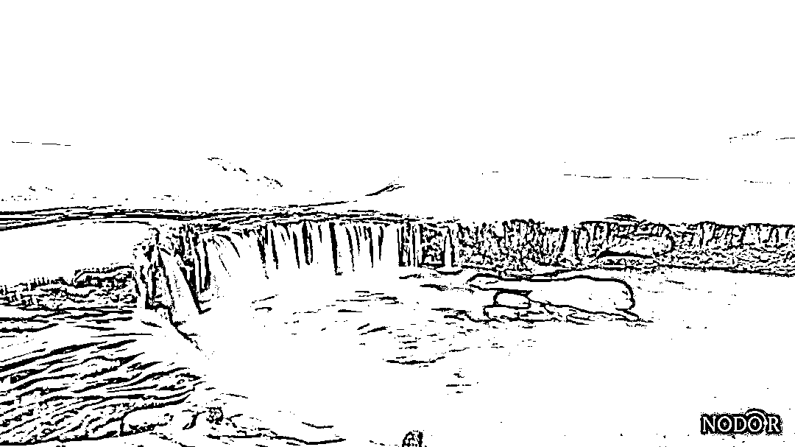

巨大的电扇依旧搅动着大厅里**浑浊的空气**，陪审员手里**五颜六色的小扇子都朝着一个方向摇动。**--《局外人》

无论是愚人船上被排拒的边缘人，还是局外人中被孤立的默尔索。他们共有的**最深层恐惧，是孤独**，**被整体世界无情抛弃的永失**归属感**的孤独**。当孤独由水瓶原型折射出时，总带有一种**抽离之伤与被排拒之痛**。当你身处熟悉的家乡，却感到自己是**异乡人**；当你成了主流文化的叛逆者，**被这个整体彻底踢了出去**。在一场“**排斥我，将我化为乌有”**的闹剧中，你被审判。当**惩罚只取决于意识形态对你生活方式的看法**。仅仅因为**没有参加众人的游戏，**而死于世俗观念的荒诞。一边是格格不入的“我”，一边是拥有相同看法的所有人。冷冷地对峙！

即使是坐在被告席上，**听那么多人谈论自己，也不失为一件有意思的事。**在检察官与律师进行辩论时，谈论我比谈论我的罪行更多。**但双方的辩词，果真有那么大的区别吗？律师举起胳臂，承认我有罪，但认为情有可原。检察官伸出双手，宣称我有罪，而且认为罪不可赦。使我隐隐约约感到不安的是一个东西，那便是我有罪。**虽然我顾虑重重，我有时仍想插进去讲一讲，但律师说:“**别做声**，这样对您的案子更有利。”**我的命运由他们决定，而根本不征求我的意见。时不时，我真想打断大家的话说，“归根到底，究竟谁是被告？被告才是至关重要的。我本人有话要说！”但经过考虑，我又没有什么要说了。**

每次谈到我这个被告时，他都自称为“我”。我认为这仍然是把我这个人排斥出审判过程，从某种意义上说，**他取代了我。一个被置之度外的我。真实的我是律师所陈述的我的反面。我不止一次感觉离这一切都很远。**--《局外人》

可是，听局外人冷静地驳斥着，我们的人生价值就在于说服他人，使尽浑身解数让双方**走向一致，**成就我们所谓的**虚假的英雄梦想**...... 此时倒是令我**警惕起了他清寒的视角。**

我看到了一种绿色，它有毒？绿，此处作为一种局外人旁观的色彩。不再是生机，而是**怪诞**。是一种格格不入的**外星感，**一种被抛弃了的异样感。仿佛**事物没有呆在自己的位置上而产生的幽怨**，赛博朋克的绿，反乌托邦的绿，一切都好似冰冷的幻觉，流淌着不愉悦的颓丧。

而我看到这背后却是**迎合社会的矛盾渴望**。认为自己不过是局外人而已。这份上帝视角本身，或许才是最大的傲慢？无情且充满防御。**绝世独立的你，仍是很想被世界所接纳吧**！与主流社会保持距离，**却为什么忍不住一直盯着它看？像是一种难解的思乡之愁......**

每个人都渴望被人注视。米兰昆德拉，将人们追求的不同的目光类型分成四类。其中第一类，我觉得就是水瓶：他需要被“众人”看到。冥 11，对世人的厌恶与对世人的渴望同样强烈，强迫式维持独处的自由，却又极度渴望来自人类同伴的陪伴。就像坐在咖啡店里那样，去与世界保持一种美妙的距离。  

与社会脱节，听上去很酷？却怎么总有一种**深深的失控感**？当冥王在 11 宫中深深自问，全有还是全无？**入流，不入流**，that is a question（这是一个问题）。**事关安全感！**你必然为站队问题而焦虑，在统一和个体差异之间摇摆。你总会为社交失败而痛苦，却又嫌弃说那不过是一种外在的热闹。其实你心中默许的是，**呼朋引伴是一种能力，而孤独的人是可耻的**。矛盾的成因或许是，**你眼望着超凡出尘的远方，脚下却仍是世俗的土地。**踏空，一再踏空......因为你的那片归属感，风雨飘摇，没有根。源自儿时就被群体排斥的孤绝感。

**可你真的确定你就那么有个性吗？**这真是个属于冥 11 的千古悬疑。**最憎恶共性者，却其实并非最具有个性者。或许刚好相反呢……**

**所以，一提到水瓶座，就绝世独立？**我会使劲摇摇头。水瓶座也分为土星态与天王星态。见后文...... 总之，“无论作为水瓶座你自认有多么与众不同”，而与怀揣赤诚真心的“狮子座高阶的那种与众不同”……**还是很不同。**我想试问你：**心是什么？爱是什么？太阳是什么？**

**所以，自认为最与众不同的人，却会被“另一种共性”吞没**？嗯，这很冥 11！

而她加入了一个抗议示威活动，**惊奇的发现自己无法响应高呼的口号跟别人一同呼喊，只待了几分钟便离开了。** 她想说在一些入侵和占领之下，**掩盖着另一种更为本质更为普遍的恶， 便是结队游行的人们挥舞手臂异口同声地呼喊着同样的口号。她觉得尴尬。**

她说过，**媚俗就是她自己一生的敌人，但是在她的内心深处难道就不媚俗吗? **

**它就像人类的任何一个弱点一样令人心动，**因为我们没有一个是超人，不可能完全摆脱媚俗。**媚俗总是人类境况的组成部分，媚俗的根源就是对生命的绝对认同。**

--《生命不能承受之轻》

“**对生命的绝对认同！**”一个狮子座说。这非常好！

**抽离的代价**

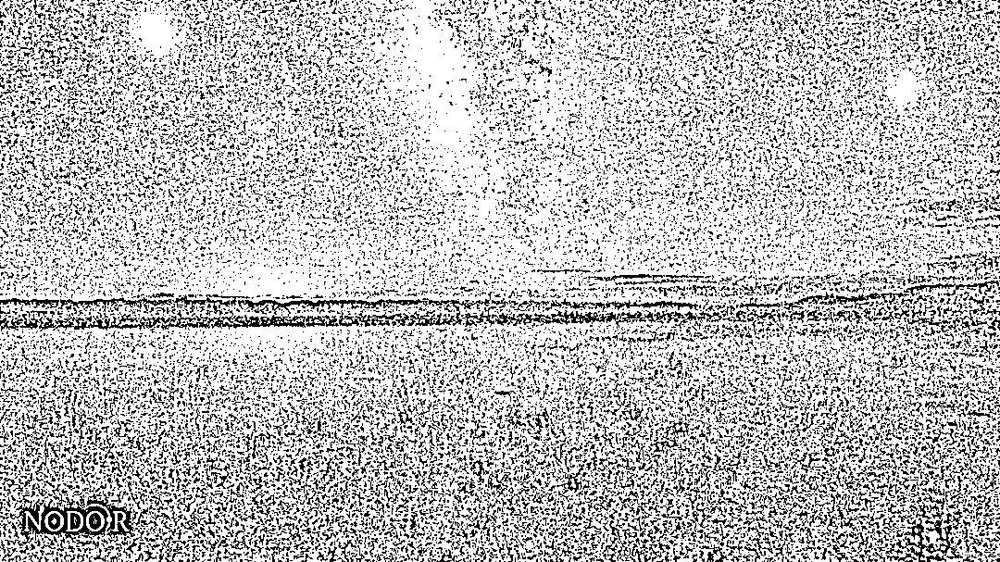

狮子座是演员，水瓶座是观众。冥 11，则拥有**比观众还要抽离的视角，仿佛是站在放映室向下看。**你独具**客观抽离的态度，甚至能从超越时空的层次，站在人类活动的边缘，远距离观看自他**。可能冥 11 却**不那么安于观看**，似乎**还想要掌控些什么**？

下面，先来研究一下**水瓶座原型**的抽离：****“******她天生内向，不可能再多说一个字******。****”****

螳螂捕蝉，黄雀在后。他观察世人，我观察他。**局外人们****兴趣空乏**，索然无味。**不快乐的根源究竟出自于哪里？**

我发现，他的问题，是**过于**理性和客观了。**瓶子没有心，中空而透明****。**空，来自于对情绪的隔离。这与冥想同理：你看清了情绪的产生过程，也就找到了情绪的解决之道。只任戏法自生自灭去表演。然后做一个观察者，以不参与不评判的态度，**无动于衷。哦，不动心？又如何快乐！**这份被你珍视为生命般的**客观，又是不是多余的？生命，难道不恰恰是为了卷入？**

为什么水瓶座**非常**擅长不欢而散？

**人类，不失为他们的重要“同伴”，**仅此而已。难怪，他们与人们相处的关系，不那么和谐。**他们是爱人类的，却不会特别爱某个人**。问他们为什么面对亲密关系会天然尴尬，断电跑走。**因为不相信人和人之间的关系真的可以那么近。**认为感情的本质，不需要经过任何语言的粉饰。于是，**我想到了 AI。缺乏个人性**，对人性和心充满排斥，**于是就很难有洒脱的爱的体验吧**。如果局外人的客观，**只是用来去证明，爱是多么容易得到消解**......孤独，又何尝不是你自己的选择。

虽说抽离常可以让你免除选择？但**回避也会维持你对某类情境的永久恐惧**……水瓶座最擅长的瑜珈，是**鸵鸟式，**假装自己不在场，于是问题就不存在。对付焦虑场景的本能策略是，**认知回避，身心解离**，分散精力，“不予理睬”！却不知**自身的旧时阴影，才是始作俑者。**你预期的灾难化结果其实并不会出现。自以为是逃离当下，躲进未来？不，你只是被困在了可怕的过去…… 那么，**你的过去，究竟发生了什么痛苦？**

“**缄默**，是更有效更聪明的谴责方式。你一个人在那说好了，我们就坐在旁边听着，静静地看着你。看起来是给你极大的自由，只有这个自由难道带来的不是一种根本的孤独吗？一种被整个世界遗弃的孤立的感觉吗？这谴责和审判,更有效更刺痛？”**这便是愚人船中制服了所有疯人的终极绝杀神器……精神病院如是说。**

可是，这怎么让我联想到了水瓶座渣男的**冷暴力？**继而，我听到一个声音：**请陪我一起孤独！这动机……够残酷吧？若非亲历，又怎生娴熟？反之亦然，自己没得到过的，也就给不出**……冷清对热闹的本能防御，可能就是出于**太想要平等了**！这又何尝不是**水瓶对自身孤绝感的投射？**所以说，**爱的对面，不是恨，而是冷漠**。并没有人会天生憎恨爱，唯一的可能是因为不习惯。**回避型本色吧，渴望却推开……**

局外人钟情于不会留下阴影的太阳？却不知你过度执迷于的客观意识，已然造成了对太阳的抵触。太阳喻示爱，活着，生命力。且太阳必须有阴影……这是狮子座荣格《红书》的灵魂核心！所以，太阳，并不是一种 “去成为”的品质。有的自然有， Spontaneous！它就在我们每个人的核心。而心与脑的距离，是世间最遥远的距离...... 可惜，水瓶座的你们都在脑那边。抽离因觉得一切都荒谬无意义？讽刺的是，**你最缺乏的正是，去激情地卷入！**

**Drama（戏）与 Dharma（佛）**的界限真的需要那么泾渭分明吗？我指，有时候，有些事……

或许，**我宁可用后者来规避痛苦，而不是用它来掠夺快乐**。如果说浪漫虚幻，通往戏剧；而平淡无奇，还不是依然通往了荒诞…… 那么，你宁可选哪个？**幻，也不必然都是陷阱……那又未尝不是活着。**主体的主观成见，确实妨碍了接近世界真相。客体的客观清醒，却非常妨碍你游戏人生。爱，不满足于客观性事实；爱，需要有主观性解释。活得太客观，当然找不到兴趣。**爱与人间清醒，总是矛盾的。**

**客观是一种很科研的态度**，然而，它适用于一切场合吗？绝对不！总有那么些时候，我们**需要的是绝对的卷入**！不惜纠缠与冲撞。是以全然的拥抱进入彼此，用尽整个生命来凝望，成就两片鲜活，而非冰冷的对峙。比如，**面对爱，面对信念，面对兴趣时**。疏远的观察，注定丧失美感。这些时刻皆与脑无关，而是心的乐园！**不是佛心，而是狮子座的心那种。“空与爱融合为一的体验，才是你那叛逆佛心的觉醒。当你把两者结合，所得到的体验，将会超乎其中任何一者。”**

他领悟到不管是从前在**宫中的自我放纵**，或是如今在**森林中的禁欲之苦，都不是真正的解脱之道。**两者都是极端，而执着于**任何一个极端都会造成障碍。真实的道路就在两者之间。**领悟到这一点，他已准备好**百尺竿头的最后一跃**，它在一棵枝叶茂密的大树下，以绿草为垫坐了下来。然后对自己许下一个诺言：**除非了知此心与世界的真谛，否则绝不起身。**

--《叛逆的佛陀》

**11 宫的真相：**

不论怎样，我觉得这个店客有点咎由自取，**人生在世，永远也不该演戏作假。**

这就是他的信念，如果他对此也持怀疑态度的话，那么他的生活也就失去意义了。他嚷道：**“您难道要使我的生活失去意义吗？”在我看来，这是他自己的事，与我无关。**

对于什么是我真正感兴趣的事，我可能不是确有把握，但对于什么是我不感兴趣的事，我是确有把握的。

--《局外人》

**11 宫的冥王星，代表你要去追求一种真相。它是什么？**

首先，对于普通人，你需要在人群中拥有独立思考的能力。像局外人那样。**他诚实，**甚至说，是**过于诚实。他怎么想就怎么说，只听从真实的需要。说伟大的真话，或以不说话的方式来说真话**。他拒绝撒谎。不参其它人类的游戏。他也拒绝言过其实，为自己的情感戴上种种面具。他的冷漠，总能散发出尖锐的清醒。**在麻木不仁的表象下却涌动着一种深度的激情？那是基于绝对和真实之上的激情，一种具有否定性的真实。**

其次，对于觉醒者，**是超越个人戏法，转化为本人实相的过程**。冥 11 也代表**对超验真理的无限渴求。**即超越主观，移除表象的宇宙终极真理。那些对生命本质的思考，而非滞留于概念上的思考。科学家解开外在世界的奥秘，探索世界的本质。佛陀解开内在世界的奥秘，征服自身的蒙昧。占星学家抽象地研究宇宙，依然可以迎向殊途同归的终极真理。

**他们的共性是，内心都住着一个叛逆者。**永不满足于片面的真理，含糊的答案，惯性追问常人不去问的事，拒绝因袭陋规，试图看穿遮蔽。无论是社会层面为争取自由与正义而抗争的叛逆者，还是心灵道路上打磨自身觉醒之心的叛逆者。他们的共同潜力，就是觉醒，通过智慧作为舟船。而智慧本身赤裸无饰。言语道断，心行处灭。即最真实的东西，总是难以言说的。

冥 11 群像诸如，标新立异，特立独行，站在社会边缘扔石头的人；洞穿世间丑恶，对人类心怀弃绝，不再愿与之为伍的人；看尽众生之苦，决定寻求终极解脱，认为已完成了人道工作的人；仍在操劳忙碌着利他式社会活动的人。还有像马斯克那样，以高阶的水瓶使命感，推进人类文明进步的人。

**总之，**在 11 宫中追求真实，你就获得了疗愈。你要先疗愈自己，然后去疗愈他人。或者说，看清世界，也看清自己。**去找到与你的真心相联系的热爱。以求真，作为一切自我征服的起点。**

然而，当局外人默尔索说，拯救只是人类虚假的英雄主义梦想。结果呢？他的结论是“无事可干，久而久之，我也会习惯的”。无论如何，这很消极。这肯定不属于水瓶座原型的高阶版。

在我看来，**局外人虽然很清醒，但他不够快乐。**或因他没有找到一种能让情绪流动起来的**生动的兴趣**。如何做到活在世间，保持抽离却仍可以快乐？为什么不去用觉醒的心，来做相关于自我真相的事业？既来之，则安之。找到你属于世间的那个最真实的角色，去践行去创造。与其超然地弃绝，不如认认真真地发疯。故看懂了冥 11 的出离冷静后，该来研究如何去全然投入了？在水瓶座/11 宫高阶议题上，佛陀是在教你如何解脱，但是马斯克在教你如何参与。二者其实毫不违和，只不过显示为更偏水瓶座还是更偏狮子座罢了？Fight or flight？不过是一种选择。无所谓与无所畏惧……我似乎看到了默尔索的抽离与马斯克眼望星辰的距离。核心在于参与感！

冥 11 的目标，需要是冥王星式的。即成长进化中，要优先面对自身真相，**为内心最深层渴望做出承诺。**这比与众人相处友好，虚假客套更重要。

**在科技发达的世俗时代，我们同样渴望英雄和神话，依旧需要信仰和意义。其实英雄的意义不仅仅是拯救世界。**更让我们**超凡出尘**。人类不仅有生存层面的需求，更有**自我超越，自我实现的需求**。当人们举目凝视星空并试图触摸无限时，便将自己**从凡尘中升华出来，变得与神同在。人类的精神世界中永远需要一个彼岸，而火星正是科技时代新的彼岸，太空则成为我们新的信仰。**

--《硅谷钢铁侠》

**（未完待续，见今日二条）**

**版权声明：**本文由作者授权在若道平台发布，欢迎转发，反对抄袭。

**END**

**蓝女巫**

英国伯明翰大学 市场营销学硕士

职业占星师/专栏作者/芳疗师/珠宝设计师

中国首批 ISAR 英文认证占星师（2012 届）

**微信公众号**：cecilia_sui

长按打赏

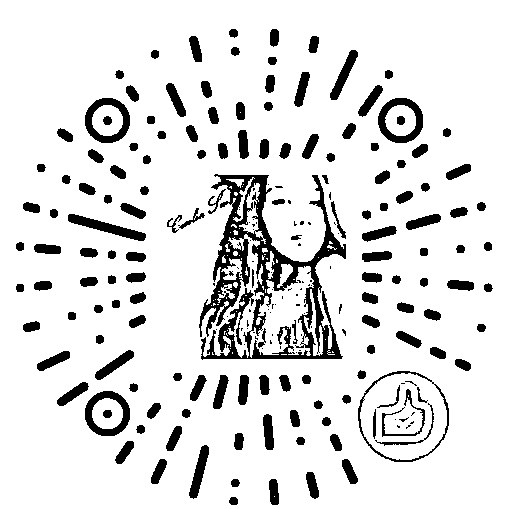

**快年底了****不给自己一份来自占星学的礼物吗？**

**梅里曼金融报告双 12 福利来啦！****长按下图了解更多详情吧！**

**20 位来自世界各地的占星师**
**带来 19 场沙龙——新世界的觉醒****详情可点击下图**

**学习占星学****点击下图了解课程详情**

**微信又双叒叕改版啦，不想错过若道君的推送？**
****就把若道设为****星标****以及点点****“在看”****吧！******▼**

**喜欢就点一下“在看”吧！****报名直达入口**

# 冥王星在 11 宫（下）丨关于愿景与同盟，我们从马斯克身上学到的……

> 原文：[`mp.weixin.qq.com/s?__biz=MzA5NjA0NTAxNg==&mid=2651497865&idx=2&sn=144ba0a1308119a64d7fe7138efdc877&chksm=8b48173ebc3f9e2816b524edf33c902fa340467b33876fcfbb453ddb174cc0ae6df7f8949231&scene=126&sessionid=1692737705#rd`](http://mp.weixin.qq.com/s?__biz=MzA5NjA0NTAxNg==&mid=2651497865&idx=2&sn=144ba0a1308119a64d7fe7138efdc877&chksm=8b48173ebc3f9e2816b524edf33c902fa340467b33876fcfbb453ddb174cc0ae6df7f8949231&scene=126&sessionid=1692737705#rd)

作者/蓝女巫 ISAR 认证占星师

编辑/翀子  图片/稿定设计

**（接今日头条）**

**冥 11，你在补偿什么？**

**关于未来**

与水瓶座原型同理，**冥 11，是未来导向的**。他们富有先知力，有预判趋势的全局眼光，还擅长发明与创造。此处整合了海德格尔在《存在与时间》中的几个概念，用以说明未来之于冥 11 的意义。

人都应该作为**独立的个体**而存在。但我们每个人从生命的绝对起点都始于**沉沦。被抛进**了这个世界的人海，身陷与他人为伍的凡常。并被庸常习规以标准的平均状态和默认的生活范式无微不至地同化着。**常人的统治**，最惧怕的是一种孤独者，因他们即将觉醒，敢于违背规范，准备在世界中重新发现与众不同的自己。

这便是一种**领会**。领会之前叫**沉沦**，领会之后叫**本真**。**领会**是关于反思自己以自我关切，承担自己以自我创造。从世界的网中分离，逃离受他人掌控的轨迹。即**成为你自己！**但你必须要有具体方法来实现这个能力，即**能在**。能在是一种让你去筹划自己，领会自己，回归到最**本真自我**的能力。它不具备平均化的答案，须由你去独特地展开你自己的生命。

比如，读马斯克自传时，我就深深地看到了这种能力。而能在的核心就是**筹划**，而筹划总是指向**未来**的！即此处**关于冥 11 的目标**。**沉沦**的时间性是**活在当下**。常人对当下与过往最具有权力。会在其中对你施展规训，剥夺你看到未来的可能性。摆脱控制的唯一出路，便是**从时间维度上突破，即朝向未来去筹划！**这是常人统治力不能及之处。而这很水瓶座/天王星/11 宫，所以它们都象征着**未来主义。**故**只有从未来着手，你才能真正发现自己生命的真相，去证明你是独一无二的个体。**

**关于愿景**

在没有任何征兆的情况下，马斯克会突然说起他的志向，说他希望用一生去完成一些有意义的，永恒的事情。--《硅谷钢铁侠》

愿景，这绝对是一个能汇聚冥 11 们眼神光的话题……高阶的冥 11，是个听从良知召唤，拥有与时俱进的视野，又有着向死而生执行力的人类。

冥 11 代表人物本杰明·富兰克林，是马斯克的偶像。同频相吸吧，二者都心系人类，为大我的使命感而生。（马斯克的星图缺少具体出生时间。区别于全网流传的上升水瓶，读他自传时，我独家发现了一种可以非常自洽的可能性：上升天蝎座，合相木海的冥 11，有待未来分解～）总之，他是我认为当今世上为数不多的有趣之人了。

高阶冥 11，极具团体领导天赋，能赢得公众信任，易被人群拥簇，作为精神领袖，担负社会使命。能揭示社会运作模式，洞察群体需求。擅长为群体赋能，从人性底层激发人心。且能展望趋势，放眼未来。能为行业扮演革新工具，创造崭社会范式，服务于大众。渴望以大我目标超越小我的人生意义。会升起永垂不朽的宏愿，带领追随者，为自由而冒险，不断测试目标极限，开创前所未有的征途，让人类见未曾见！会经由团体激发出巨大潜能，以超越自己，超越世界。

他们或是去倡导一场心灵的变革，带领平凡的众生，寻找自由解脱之道；或是带动一波波崭新的风潮，科技改变生活，促进人类进步。或小到置身于 11 宫的任何一个集体，当行业领袖。比如引领一个心灵成长的社群，指挥一个交响或摇滚乐团，服务于 NGO，贡献于人道主义事业，组织社会互助团体，致力于社会制度改革，或领潮粉丝圈......

希腊神话中，普罗米修斯反抗众神，为造福人类而盗取火种；希伯来圣经中，诺亚服膺神意，在洪水灾难中建造方舟而救渡众生。马斯克也许二者兼而有之，既期望把先进的未来生活带入现世，又希望在地球的危局中拯救世界。

马斯克充满着末世论的生存危机感，他认为人类只有通过能源的多样化，并成为多星球栖居的物种，才能建造起一艘方舟，以规避“单点失效风险。使人类这束微弱的“生命与智慧之光”，在无尽黑暗的宇宙中能够永不熄灭。

--《硅谷钢铁侠》

**目标与僧团**

他永远要求同事们去考虑“实现路径”，而不是争论“是否可行”。实际上，他的思维模式是站在未来的远景看待眼前的处境，具有某种超越性。

--《硅谷钢铁侠》

11 宫相关人生愿景，目标志向。冥 11 的人生策略，是去对能反映你核心价值与独有真相的生命目标，作出长程的承诺，展开持续性的努力。需要以终为始，确立实现长远规划的优先级，跟随趋势去思考每一步怎么走，以此导航你的生命。而选择做什么比做得好更重要！筛选那些你真正擅长并有长久价值的事。明确了西天取经的目标后，你总无法独身实现它，这时你总是有伙伴助力的。“如果舍弃团体，一个孤独的天才，可能会创造出经典的文学艺术作品，却不能创造出整个产业。”

因此你要去招募僧团，引导大家来共同推进目标。去遇见那些可以并肩同行的人类友伴，与之结成联盟，共同成长。即有什么样的目标，就去与哪类人整天混在一起。目标不清晰，则会影响择友。以目标筛选朋友，留下呼应个人发展目的。听着有些功利，但冥 11 的确如此，人际朋友宫会反映其核心价值与目标本质。或如亚里士多德在尼伦中倡导的，友爱，其实是德性上相似的人之间发生的。在不同的自我之间互相促进，才能真正实现自己的人生。是与我们灵魂真正契合的那些人。所选朋友并非是功利性的，而是互惠互爱的，彼此抱有善意，相互促进共赢。

故你积极的目标也会吸来正向有力者。这种联盟的成员并不强调亲密性，哪怕只是点头之交，但必须是志同道合之道友，承诺彼此团结协作的。冥 11，终要以僧团的力量，去实现改变社会结构的愿景。

SpaceX 和马斯克似乎激发了一种不同寻常的忠诚。马斯克在他的队伍中成功唤起了乔布斯式的狂热。他的愿景是那么的清晰，他几乎可以催眠你，赋予你同样疯狂的愿景，比如：没错，我们可以去火星。

几乎所有人，包括那些被解雇的员工，都无一例外地崇拜着马斯克，他们像谈论超级英雄或者神灵一样谈论着他。

--《硅谷钢铁侠》

**关于目标**

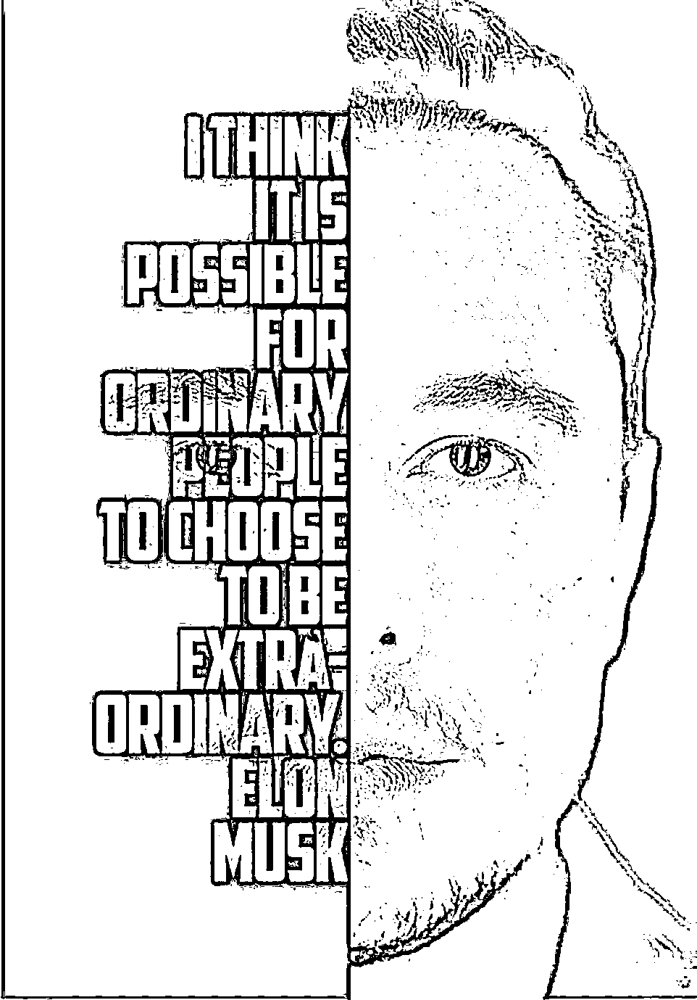

少年马斯克就已经做出了自己的超逻辑使命宣言。“唯一有意义的事情就是去为人类争取更大的集体启蒙。一个男孩幻想着太空和正邪之战不足为奇，可如果这个男孩严肃认真地对待这些幻想，就太让人不可思议了。他相信自己是有能力改变世界的那个人。马斯克总是赌这些自己一定能赢的事情。我当然不会设定不可能完成的目标。那会让人变得消极。你不会让人们通过用头撞墙的方法来穿过一道墙。他有对梦想无拘无束的态度和长期追求的决心。他随心所欲地做他想做的事，并为之不懈努力。这就是埃隆的世界，而我们其他所有人都与之息息相关。你能够做成任何事情，你只需要做出决定，然后放手去做。

我们需要评估不同的模式，了解如何制定长期规划，并将不同的技术领域加以整合。马斯克为这一目标设置了近乎疯狂的时间表。一般情况下你的确需要有一个时间表，根据你所知道的列出所有事项。这个时间表其实是个未知数，你只是朝着那个目标努力。 在完工时间方面，他是个彻头彻尾的疯子。他会假设一切顺利，制定出他能想到的最激进的时间表，然后假设每个人都可以更加勤奋地工作，以便加快生产进度。在很长一段时间里，马斯克保持了一如既往的专注。一旦埃隆想了解某个事物，他会投入比别人多得多的精力。这是埃隆和其他人的不同之处。梦想可以再疯狂些，再疯狂些，再疯狂些……只要你是认认真真的。

在他的人生中，有一些真正伟大的想法一直根植在脑海中。我的确在大学期间就开始思考这些事情，这不是事后编造出来的故事。我不想被看作一个新手，我不喜欢跟风和投机。我不是投资者。我喜欢把那些对于未来真正重要和有价值的技术，以某些方式变成现实。驱使这样的实业家推动世界进步的，通常不是名利，而是强烈的使命感和充满个人英雄主义色彩的梦想和愿望，以及在极少数人身上可贵地伴随终生的好奇心。长期以来，他一直想让世界知道，他和硅谷那些作坊式的创业者是不一样的。他并不是在顺应潮流，也不是为了发财，他是在追求一个整体的计划。他想用工业发明和公司组织来表达他的价值观，而不仅仅追求商业成功。

尽管“把人类送上火星”的言论给人愚不可及的感觉，但却赋予马斯克的工业帝国一句独特的战斗口号。这三家公司的员工都深知这一点，他们日复一日地努力，就是为了实现这个看似不可能的目标。所以马斯克提出不切实际的目标，拼命压榨员工，并对他们恶语相向，某种程度上来说，这是火星使命的一部分。有些员工喜欢他这一点。其他人即使讨厌他，也因敬佩和认同他的动机和使命而对他忠心耿耿。马斯克所具备的世界观，同时也是硅谷很多创业者所缺乏的。他是拥有远大抱负的天才。与其说他是追求财富的 CEO，不如说他是指挥军队取得胜利的将军。

--《硅谷钢铁侠》

**关于僧团**

马斯克在宾夕法尼亚大学更加如鱼得水，并且和那些学物理的同学相处甚欢。大学很适合马斯克。他找到了一群尊重他学识的同道中人。大学同学更不会嘲笑他在能源、太空和其他感兴趣领域的独到见解。马斯克发现，这里的人们对于他的雄心壮志会给出积极的回应，而不是讥讽。

在宾州，他能够遇到跟他想法相似的人，那里有一些书呆子。他很享受与他们相处的时光。

但同样，马斯克并没有跟其他专业的学生交上朋友。

读报纸，为的是从中找出有趣的人并和他们见面。他们会直接打电话给这些人，问他们愿不愿意一起共事。

他似乎知道自己在做什么，经过一次又一次的会议，他淘汰了那些唱反调的人，最终留下了一群志同道合的精英工程师。

马斯克和航空学会的第一次互动是和一群不拘一格的太空爱好者见面，他们来自非营利组织，火星学会。这一组织致力于火星探索和火星定居。

马斯克退出了火星学会的董事会，并成立了自己的组织——火星生命基金会。

SpaceX 形成了一种特有的团队氛围，就像一个亲密的大家庭，一起抵御别人的质疑。我们总是会遇到一些看似无法克服的挑战，我们只能团结起来把它打败。/对于埃隆而言，没有什么是不可能的，而他也期望身边的每一个人都抱持相同的态度。

--《硅谷钢铁侠》

**三种团体关系**

可以观察到不同灵魂进化阶段的冥 11，对团体类型的选择非常不同，对团体问题的立场与反应模式也不同： 

*   合群阶段，会追随社会主流团体。围绕自我中心世俗层面，捍卫传统局限的社会共同观点。

*   个体化阶段，会加入非主流独立团体，会独树一帜，惊世骇俗地发声。

*   灵性阶段，会引领更小众的个性团体，心灵觉醒，视野更加超脱。

所以，一提到水瓶座，就立刻想到绝世独立，特立独行？其实不然，水瓶座们也要分三种：

**土星模式：**

认同主流团体，为捍卫传统而战。基于普遍社会价值，同化所有个体，使集体利益至高无上。就算自认为与众不同，却害怕越界，拒绝成为他自己。宁可追求在集团中的正常态，以获归属，迎合众人认同。没有想过去脱离群体束缚。因须紧抓普遍法则，获得个人意义。个人目标价值，是团体规范的延伸。一条水瓶的平凡之路。

**天王星模式：**

脱离主流社会，颠覆传统习俗，反抗被束缚限定。认同边缘团体，威胁主流意识。却常并不归属于任何。奇人异象，可能没朋友，不拘一格降人才。追求自由，无羁创造，大爆冷门。头脑先锋，领潮时代，极难融入现有社会。无惧周围人看法，与道德准则格格不入。甚至 Anti-social，极端破坏，愤世嫉俗。须自检是否在为了叛逆而叛逆？如一道活脱脱的闪电，划破长空。

**土天合体模式：**

紧抓过往，愿意跟着组织走，却终究自觉与众不同。激烈的两极化，摆荡于极端反叛与捍卫传统的态度。执着于现有制度的改变与否，犹如对自身独立渴望的矛盾挣扎。对独特个体的差异性，或激进追求或绝望压抑。我观察，身边大多数占星师似乎在这个范畴。

**冥 11，你将在何处崩塌？**

**目标变革**

那些成功发射火箭的公司可能也是一路捡着残骸挺过来的。

在直接体验了进入轨道有多难之后，我对那些坚持制造火箭的人充满了敬佩之情，他们是当今太空发射事业的中流砥柱。

SpaceX 将继续努力，无论上天入地，不成功誓不罢休。

埃隆不仅生存了下来，而且拥有在危机之下依旧专注工作的能力。他变得更加理性，依旧能够做出清晰并且有远见的决定。压力越大，他做得就越好。我从未见过比他更坚毅的人。

--《硅谷钢铁侠》

冥 11，对待目标是相当坚毅的！会兼具清醒的头脑与强大的意志。一路排除万难，百折不挠。而冥王星也保证了你的目标方向，注定遭遇巨大变革。须在不断地告别旧我中，调整方向，转换主题：“别问我是谁，也别要求我一成不变”。

总会有脱胎换骨的内在冲动，想要去实验新理想；但冥王顽固的安全感，又会激烈抗拒必要的改变。二者周期性撕扯，都是为了促成内在转化。想法过时却不及时更新，会招致愿景的垮台失败。须阶段性进行客观抽离的审视，目标不合时宜就诚实转向，切断对既有现实的依附。不要去坚持错误，而是坚定地求真。要始终站在时代的最前沿，质疑并超越一切限制自由和成长的路障。应只对真相保持坚定。而目标改变后，伙伴也会随之改变……

而最严重的错误，就是告诉马斯克他的要求是无法实现的。

面对巨大的操作困境,团队屡次劝说马斯克放弃这个想法。但马斯克不为所动，毫不妥协。“我知道我们一定能够做到，只是花多少时间和精力的问题。”最后的结果证明他是对的。

当时就像是要完蛋了，一切都要被毁灭了。

这对我来说是很大的伤害，让我严重怀疑自己的生活过不下去了，汽车做不下去了，自己正在经历离婚诉讼以及所有的这一切。我感觉自己一无是处。我觉得我们撑不下去。我觉得说不定一切都完了。

发射成功后，每个人都流出了激动的泪水，那是我人生中最激动人心的一天。命运不会总和我们作对，第四次总该成功，不是吗？

你无法全身而退，将他人弃之不顾。而当战争结束时，所有人都感到激动而开心。

事实证明，我做到了我承诺的所有事情。”

好的点子在被实现之前，人们总觉得那很疯狂。”

--《硅谷钢铁侠》

**朋友圈颠覆**

而埃隆与学校里的同学相处得却不尽如人意。“他们是一群疯子,”马斯克被这群恶霸无休止地纠缠了三四年的时间。他们竟然殴打马斯克最好的一个朋友，直到那个孩子答应不再跟马斯克一起玩才收手。“他们还利用我最好的朋友，引我出来，这样他们就可以打我。这太伤我心了。”当讲述这段往事的时候,马斯克的眼睛湿润了，声音在颤抖。

“出于某种原因，他们决定无休止地纠缠我。这让我在成长过程中饱尝艰辛。那些年，我根本没有喘息的机会。这群人不停地纠缠，每次都把我打得狼狈不堪，然后我回到家里，但家里的氛围也同样可怕。这种恐惧似乎永无止境。

--《硅谷钢铁侠》

戏剧化情感震撼，常来自朋友圈子和人际关系中。社交压迫恐惧，常始于校园霸凌的童年阴影。冥 11 的同龄团体常强势可怕，难以融入而阻挡了归属感。朋友与团体，易具有冥王星色彩。为你提供巨大能量资源，却也充满权力斗争，利益纠纷。友谊深厚浓烈，难以肤浅。也可能是没朋友。因你秉承深交或全无的绝对标准。不断经由团体激起冥王式复杂心境。要明白，人际危机，友情决裂时，都是为了切断你对众人的过度依赖，学会自己掌舵命运，不因他人而自我设限。可适时检视交友动机，切断那些阻碍成长的关系。友人都能改变你的人生，促进你的心理转化成长。

他不太善于交朋友，但他对已有的朋友很忠诚。

他们还对自己独来独往的生活方式津津乐道。“我们都是那种即使在派对上孤身一人，也不会感到局促不安的人，我们对自己的社交障碍感到心安理得。

--《硅谷钢铁侠》

**权力斗争**

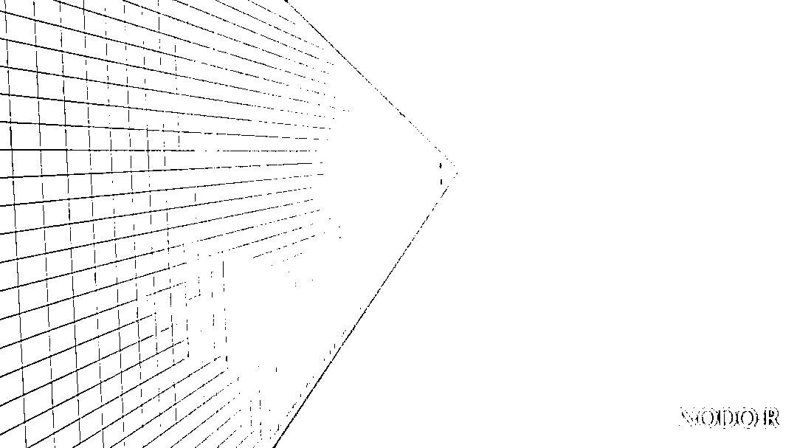

11 宫内充满宫斗与反转剧情。水可载舟，亦可覆舟。支持与背叛，反复无常。时而执掌大权，时而被彻底孤立。你在团体中会权欲彰显，总要为安全感与权力而战。深感若不操控团体，就会被团体所操控。安全感来自对团体的全全控制，不然会对团体感到抽离。即居于权力中心，或去另起炉灶。你会加入反映自身价值的群体以延伸自我。并以团体间差异，来感受自他差异，上演派系斗争。也很懂得利用群体资源。

过往有太多团体经验的恐惧，比如诚实表达观点时，曾招敌意被排挤。受到孤立，而心生怨恨。故总担心被团体毁灭，经常与群体决裂。有严重的团体归属感问题。易扮演团体阴影，被群体中的破坏力投射，充当替罪羊。显化团体中被否认压抑的负面情绪。或是目睹个人深层复杂情结，在团体中披露。

冥 11 的敏感点，会应激于群体中涌动的情绪暗流，擅长对团队危机去预感与转化。会警觉去发现对集体不利之人事，强迫性地要赶走害群之马，因担忧团队被负能量控制，影响了大家的价值观。痛恨损害集体利益者，也擅长操控舆论，用群体力量攻击个人。且站在大家的利益上时，就会变得很勇敢正义，毕竟底层是群体价值观和利他基础。其实，如此敏感于团体的稳定安全，多出于个人深层防御意识。因个人身份认同与集体绑定。团体的迭代与更新，皆可以照见你不停变革的内在冲动。你会被团体社群彻底改变，通过团体获得心理转化。

**群体冲刷**

一个人单是加入群体这个事实，就使他在文明的阶梯上倒退了好几级。在独立时，他可能是个有教养的人；在群体中，他成了受本能支配的野蛮人。他不仅身不由己、残暴而狂，而且表现出原始人的热情和英勇。与原始人更为相似的是，他易于被词语和形象打动，并做出同他最明显的利益和最熟悉的习惯截然相反的举动。群体中的个人犹如一粒沙子，只会和其他沙粒一样随风飘落。

--《乌合之众》

我们前方的水瓶时代，群体意识淹没个体意识，将成为时代的主要特征。比如像此刻那样，沦为"阳"群中的一只羊......在群体的共性影响下，个体意识消失，情感思想定向趋同，彼此变得非常类似。出于人类协作依赖，为得到群体之爱。个人倾向出于自保，顺应大势，向集体意愿妥协。弃绝个人主见，抹杀个性才智，任异质性淹没于同质性中。而群体总难拥有批判精神，即辨别真伪和准确判断的能力。故不超出群体水平，你就难以形成个人独特见解。

其实，他们只是将每个人具有的平庸特征汇合起来而已。群体汇集的不是智慧而是愚蠢。整个世界并不比伏尔泰睿智。如果整个世界代表一个群体，伏尔泰肯定比整个世界睿智。

--《乌合之众》

群体在智力上是低于孤立个人的，一切取决于所受暗示的方式，是外界刺激的玩物。群体是非常容易被操纵的，懂得操纵群体的人，只要找到蛊惑力的形象语言，催眠影响群体想象，用强烈的情感去传染，便可让个体利益为集体利益去牺牲，并冲刷你驶向那些非真心所向的路，而倍感空洞。尤当群体力量被滥用时，曾一度成为了法西斯操纵或信仰暗示的绝佳对象。冥 11 的一大隐密，不恶之人被群体冲刷走，犯下平庸之恶。你过去世就可能被群体冲刷严重伤害过！遭受团体迫害，或被负面阴影卷入，在集体中变疯狂。有待学会保护自己不受疯狂世界影响，也避免自己再去制造更多疯狂。

冥 11，应选择活出 11 宫中的冥王星高阶之路。否则低阶呈现，就会吸来对你不利的圈层，结交有危害的朋友。或受到集体意识的毒害。

观念只有具有十分简单的形式才能为群体理解，因此必须要经过一番彻底的改造才能成为大众观念。当涉及那些略显高深的哲学或科学观念时，我们看到为适应群体的水平，就有必要逐步对它们进行多么深刻的改造，呈现出低俗和简化的趋势。当一种观念深入群体并发挥作用时，不管最初多么恢宏或多么真实，它基本上已经失去所有那些使之高深和恢宏的成分。

--《乌合之众》

**模仿**

其实，有时你自以为的发现真我，却也只是在被庸常所拟定的模板中，发现了自我罢了。你的那些看似朝向未来的筹划，也仍是被规范所筹划。日出日落，推磨搬砖。主题却是安于世俗常规价值观的奔忙，在无聊确定的体系中沉沦，从未脱离他人指定的跑道。这与“能在”的核心相去甚远。你的生活，仍不是真正的生活。 

那么，思考一个问题，什么样的人，最容易被群体冲刷，被带跑？当然是空洞之物，才更易被席卷。只有当“我”不够强大时，才需要依赖众人。看大家怎么享乐，你就怎么享乐。看什么被认可，你就马上蜂拥鱼贯。仿效他人，而非自发创造。但不属于你的自由，无论你以何方式去复制，结果都会是不自由的。

过于受群体价值观影响的人，便会极易被时代大环境鼓噪，随声附和。也正因内心的空洞，才急需向外寻求认同。遍尝歧路的空虚，却始终无缘于“生命真正的魔法”。仿效他人，死路一条。自发创造，才有心。水瓶时代的群魔乱舞，为什么不好看？因为任何事但凡少了心，都必然永失高贵！只有对自己足够真诚的人，才敢于不跟风。所以，真狮子不需要凡尔赛。它本身就是光源。有心，就没有匮乏感。

这是一个模仿被最大化鼓励的时代。人人都在“不务正业”，抄袭模仿别人的路，做不适合他们自己的事。为了活着......人云亦云，趋之若鹜，同质化却不以为耻。这真让狮子们忍不住发指。虽然说模仿是最大的恭维。模仿，倒也是一种绝杀的武器！去淹没别人，让别人也跟自己一样，没有个性了。这实与群体冲刷的动机无异。空城计可以藏拙，模仿可以齐物，都可以迂回地实现矮化他人的目的，这是我发现低阶水瓶座的两大法宝。

所以，很多水瓶，自认与众不同，标榜特立独行，为什么却仍在出于本能地模仿？只因他们尚未觉知自身独特性..... 于是，你不曾有一刻，摆脱过他人对你的影响！直到你能真正找到属于自己的那颗真心，像高阶狮子那样！此处的心，指生命力，非指佛心的觉醒，后者你已经够多了。水瓶时代，即使是每一粒沙子，都应该有自己的光！而非一张张没有个性的脸，机械地卷起星球的负荷。

至此我想问，特立独行 vs 泯然众人…...硬币的两面。你在哪面？

**冥 11，你将回归于何处？**

**未来 vs 当下，共性 vs 个性**

**冥 11 的对应点**在 5 宫中，**狮子座原型仍是你灵魂的解药**。

冥王星的欲壑难填，在 11 宫可表现为**对未来可能性的永不餍足**。当心因**过度放眼未来**，却忽略了**当下的参与感和付诸行动**。**而没有行动，便会持续不满。继续躲进未来，恶性循环。**只有目标践行实现了，你那黑洞方可填满。

如何**在 11 宫的社会需求框架中，完成第 5 宫的创造性目的。**找到让自我转化同步于人类社会进化的完美契合点。

你是否会就社会问题，强迫式地激进**追求着一个又一个有待抗争的目标**？留意这**背后的动机，**莫在**吃瓜中忘记了关注自己的心**。或许你**正在用大我目标，掩饰自身目标缺失的深层恐惧**。**你是否会因不满于社会而疯狂扔石头？**或许你应该先**培养出个人的生命目标**。去掌握自己的命运，而非完全托身于众人。应**切断对众人的依赖，学习靠自己而非他人来达成满足**。

我们都是社会动物。但那**并不该抹杀你的根本属性**。众生平等的前提，是个体的**自我负责**。当活生生的个体不假思索地被吸纳进普遍的体系中，无异于对自我的谋杀。**最反主流的行动不是抵制潮流，而是在潮流中不丢弃自己的独立思考。**每个人都应被归还思想的权力，坚守不同立场。你首先要让自己活过来，成为**一个“人”**，追求真我，找到自己独特的位置，和你真正想要的生活。 

冥 11，可通过社会关系去觉知自他差异。**自我的力量，正是来自于你的与众不同**。要有能力在他人之中发现你自己。然后再将鲜活的自己，代入到集体中。这时你便能发现人类集体中，那些同样鲜活的个体所创造的价值与留给世人的印记。所谓“在世”，即与他人一起分享世界， 却不失为一个独立个体，影响他人，奉献社会。去成为他人奔赴愿景途中的一道风景，让孤独的灵魂之间相互问候鼓舞，alone together......

“热闹是他们的，我什么也没有”？那只能怪你选择**不卷入，不参与！**每当水瓶笑话狮子们在感动自己时，狮子也笑笑说：你连自己都感动不了，又怎么去感动世界？ 

当你个人的生命热情都不稳定，又如何去引领人类？比如贡献集体时，是否常常会深感**被掏空**，感到**不享受**？因你**只交付了脑，却没有心的投入，于是感受不到那份由衷的快乐**。你缺失了一种东西……叫**生命力**！所以，**独乐乐还是众乐乐？**与其在迎合众人过程中，深感分裂，不如先找到你自己的“心”。 **于是，你又何必焦虑于是否需要迎合世界？有真心者，感动自己的同时，就自然感动了世界。**比如梵高在疯狂作画时，也并没有想过后来...... **如何不被众人卷走，却将自身卷入？**答案太简单，这只是一个**关于心与脑的抉择**……

**结论：你有心吗？**

**如何让人道主义的集体目标，与突兀的自我感，结合得毫不违和？**马斯克做到了，像惊世骇俗地一道闪电。**南交点狮子座/北交点水瓶座的他，带着小我，驶向大我，活得无懈可击！**所以，个人觉得，**或许你在真正长出 ego 之前......别先去急着去抹杀它。**

**人类方向**

**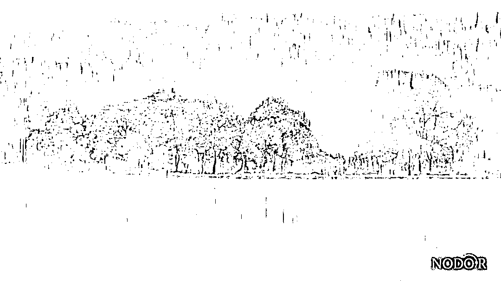**

“我们想要会飞的汽车，而不是 140 个字符。”在一篇名为《未来发生了什么》的文章中，彼得蒂尔和他的同伴描述了 Twitter 这 140 个字符的产品，以及类似的发明是如何让公众失望的。他认为，那些曾经为未来高唱赞歌的科幻小说，已经变得反乌托邦，因为人们不再乐观地相信技术可以改变世界。

--《从 0 到 1》

刚出现的热门公司 Facebook，Twitter 并不像他们的前辈那样，制造实体产品,能够在生产过程中雇用上万人。在接下来的几年，人们的目标已经从冒险创造全新的行业和伟大想法，变成通过取悦消费者，以及批量生产简单应用和广告来赚快钱。“我们这代人中最聪明的大脑，都在思考如何让人们点击广告，这太糟糕了。”硅谷越来越像好莱坞。与此同时，那些消费者已逐渐转向内心世界，醉心于自己的虚拟人生。

--《硅谷钢铁侠》

当全面数字化主宰着人类前进的方向，生活本身的意义已迷失良久。人人都在急功近利地研究“HOW”，却不再关心“WHAT”，因为早已没有“WHY”了吧。推荐算法导致的信息茧房仅凭点击率等来评价内容，却无视内容之于人的情感产生何种影响。恰恰折射出了这个时代的灵魂……因为注意力经济，才是其根本目标吧。只希望你用得越多越久就越能证明其成功。由此，我联想到了这与情感吸血鬼，水瓶座理工男的爱情手段，如出一辙。只管去不断地调动你的情绪与操纵你的好奇心，却从不顾及你的悲喜。因一切只是为了留住你！而已。爱上一个没有心的人，与身处没有灵魂的时代，同样悲凉。难怪荣格说，科学令人跛足，科学把人变成侏儒。站在水瓶时代两千年的门前，没有人不尴尬，事实胜于雄辩。当它的方向完全背离狮子而去，我们注定失去了快乐（多巴胺）...... 《[冥 5 狮子系列 1/4 | 快乐，玫瑰花香的南风](http://mp.weixin.qq.com/s?__biz=MzA5NjU3NzQwMg==&mid=2649272799&idx=1&sn=c57d1acbdb68ab8a83c9e98b7633402a&chksm=88b1e3cabfc66adcc3fa54085f57f9036ce07972384aba3b553c7953181ec057c555326264d4&scene=21#wechat_redirect)》

我发现，没有情感（心）的人，更喜欢读些干枯的理论，以及堆砌形式美的技巧。而那都总会离“真”很远很远，甚至背道而驰，无论是真情，还是真理。于是，激情竟会惊扰他们。而凡是有迷人的生动闪现之处，必须有生命力的辉光在流淌。世间总有些东西是永远难以被量化的。比如，灵魂就是有机的，Organic……难怪不具备人类情感的 AI 难有自由意志。难怪马斯克有眼神光，扎克伯格却没有。因为他们选择了本质上根本不同的路。人格魅力，是狮心的本能。没有心的人，才终将被机器迅速取代。而这也正是水瓶时代，众望所归的吧？假做真时真亦假！

人类的未来在哪里？我觉得未来社会真正的勇士，不是你敢于做什么，而是你勇于不做什么。真实使命的初衷，从不会仅仅是为名为利。

当扎克伯格希望帮助你分享宝宝照片的时候，马斯克则是希望将人类从自我毁灭和意外灾难中拯救出来。

正如他所说的，他在皇后大学和宾夕法尼亚大学经常思考未来世界的可能性，最后得出下面这个结论，他认为互联网、可再生能源和太空探索这三个领域正在发生巨变，并且自己可以在这些领域有所作为。他郑重其事地说要同时进军这些领域。

马斯克开始反思儿时关于火箭飞船和太空旅行的梦想，并认为这是比设计互联网服务更加伟大的使命。

马斯克把人类在宇宙的征程看作个人的使命。如果人类必须寻找更加清洁的能源或者建造宇宙飞船去拓展人类的生存空间,那就去做吧。马斯克千方百计地想要让这些事情变成现实。“可能是因为我小时候看了太多漫画的缘故吧，”马斯克说，“在漫画里，英雄必须要拯救世界，必须让世界更美好，因为相反的做法没有任何意义。

“我只是考虑‘对于我需要掌握的科目,我应该取得什么样的成绩’。有一些必修科目,比如南非荷兰语，我完全不明白学它有什么意义。但有些科目，比如物理和计算机，我会尽我所能取得最好的成绩。取得的每一个成绩都是有原因的。我宁愿玩计算机游戏、写代码和读书，也不愿意去获得那些没有意义的 A 等。

“我真的很喜欢电脑游戏，但即使我做出了非常出色的电脑游戏，这又会给世界带来多大影响呢？虽然我发自内心地热爱游戏，但我不会把它当作我的职业。”

佩奇把马斯克作为榜样，希望其他人也能向他学习，在这个商人和政治家都只注重短期的无关紧要的目标的时代，应该多一些像马斯克这样的人物。“

正如蒂尔所说，马斯克将给人类带来希望，恢复他们对技术改变人类生活的信仰。

--《硅谷钢铁侠》

****

来到 SpaceX 总部的访客会看到通往马斯克办公室的走廊墙壁上挂着两幅巨型火星海报。左边海报上的图案是现在的火星地貌——寒冷荒芜的红色星球；右边海报上的火星地貌却是一片生机勃勃的景象，广阔的绿色陆地被海洋环绕着——这个星球上的温度升高了并且变得适合人类居住。移民火星是马斯克坚定不移的人生目标，他全力以赴要把它变为现实。

“我始终相信,如果我们能解决再生能源的问题，并一步步把人类打造成跨星球的物种，在另一个星球上建立能够自给自足的文明，防止可能发生的人类灭绝危险，人类就会有一个光明的未来，那么，”他顿了一下说，“这样就太棒了。”

这只是未来许多计划中的第一步.…….我不知道你们今晚如何庆祝，不过我要举办一场盛大的派对……."

马斯克提到他的生活由 10%的花花公子和 90%的工程师组成。

--《硅谷钢铁侠》

**我觉得这是南交狮子座，北交水瓶座，最理想的比例哦。夸父追日，精卫填海，狮子座/水瓶座对宫的他，一面追逐太阳，一面征服网络。竟然在一个北交水瓶座身上，我才看到了如此这般的**水瓶座高阶！****

**结语**

戏剧性的风险将一直伴随着马斯克正在做的每一件事。如果马斯克纵情于此，他将一直伴随着这些风险，牺牲大多数人珍惜的一切。“我希望死在火星上，”他说，“我想去那里参观一下，然后回来一阵子，等到我大概 70 岁的时候再去，这样我就能一直住在那儿了。如果顺利的话，一切就会这样发展下去。”

--《硅谷钢铁侠》

**当**南交狮子座的马斯克说**：“**好久没为爱鼓掌了”……****

****

**版权声明：**本文由作者授权在若道平台发布，欢迎转发，反对抄袭。

**END**

**来自作者的其它冥王星文章**

[冥王星 1 宫](http://mp.weixin.qq.com/s?__biz=MzA5NjA0NTAxNg==&mid=2651492437&idx=1&sn=5162de0b373dcacaad73aa9b7be9df44&chksm=8b4822e2bc3fabf4b137c956524964742c10d906ee7bcc5767c41051586c36219ce39c3076c2&scene=21#wechat_redirect)（上）丨[冥王星 1 宫](http://mp.weixin.qq.com/s?__biz=MzA5NjA0NTAxNg==&mid=2651492437&idx=2&sn=e2ca14657e09b0af936ab6b6afb912a4&chksm=8b4822e2bc3fabf4d23ea1e1724ede4d2ca3ea9844056cdfeeb28062aea3fd8a353ca6598766&scene=21#wechat_redirect)（下）

[冥王星 2 宫](http://mp.weixin.qq.com/s?__biz=MzA5NjA0NTAxNg==&mid=2651457278&idx=1&sn=7c15e5b4982c87dc687d915579145b69&chksm=8b48b449bc3f3d5f1cf9a24c857f1c249d51fd8ed0f989952c27f20ab9ffb02f697886144854&scene=21#wechat_redirect)（上）丨[冥王星 2 宫](http://mp.weixin.qq.com/s?__biz=MzA5NjA0NTAxNg==&mid=2651457278&idx=2&sn=dc951a366f5f2393b2d3f40571399e14&chksm=8b48b449bc3f3d5f38cabeae6b603ee51f6ad82345b4ca957d029e33cc021531300b2fa014c8&scene=21#wechat_redirect)（下）

[冥王星 4 宫](http://mp.weixin.qq.com/s?__biz=MzA5NjA0NTAxNg==&mid=2651430468&idx=1&sn=1c785ed2023d1b0f50e66364bbf29e13&chksm=8b4b2cf3bc3ca5e526e87f041575af18bf825df47e0cb60bbdbfc537b9ac536cfa54a134e74f&scene=21#wechat_redirect)（上）丨[冥王星 4 宫](http://mp.weixin.qq.com/s?__biz=MzA5NjA0NTAxNg==&mid=2651430468&idx=2&sn=a902f973afba98106792f92c3f503285&chksm=8b4b2cf3bc3ca5e51ef8b2e9ac2647916e7a859721d06b398016e5f00ff02046931d543d354d&scene=21#wechat_redirect)（下）

[冥王星 5 宫](http://mp.weixin.qq.com/s?__biz=MzA5NjA0NTAxNg==&mid=2651424933&idx=2&sn=2e60c0253f46f1f995c923abb14eec45&chksm=8b4b3a12bc3cb304ec3cd3757251af7e62c4b0b92cd119c24c067af1548bb1aa01da071d66a9&scene=21#wechat_redirect)丨[冥王星 6 宫](http://mp.weixin.qq.com/s?__biz=MzA5NjA0NTAxNg==&mid=2651453130&idx=1&sn=7a1f4956aca064e20d6dd35a12dcb966&chksm=8b4b447dbc3ccd6bd06e06aec73c625820caf753697c2bc13e48d07041da3aa555d07aacfcb2&scene=21#wechat_redirect)丨[冥王星 10 宫](http://mp.weixin.qq.com/s?__biz=MzA5NjA0NTAxNg==&mid=2651412808&idx=1&sn=57012d1806a6776cc8556b7c79f0e30b&chksm=8b4bebffbc3c62e9a33bfbdcd736cf91077048ac889936318ba4cf575de4a7d4409eeca1373f&scene=21#wechat_redirect)

[冥王星 8 宫](http://mp.weixin.qq.com/s?__biz=MzA5NjA0NTAxNg==&mid=2651461799&idx=1&sn=6449bc2646de146b034e2dbe33901b5c&chksm=8b48aa10bc3f2306791c7094ae689cc5ce52e3b92412b18cfdde538c9df2134798dc0716963a&scene=21#wechat_redirect)（上）丨[冥王星 8 宫](http://mp.weixin.qq.com/s?__biz=MzA5NjA0NTAxNg==&mid=2651461799&idx=2&sn=b883690fda7187c23be95654316ed956&chksm=8b48aa10bc3f2306f80d6aa61e69ffce352286487a6997f7c57fadabbf1b4a4b2ee4d1c8b947&scene=21#wechat_redirect)（中）丨[冥王星 8 宫](http://mp.weixin.qq.com/s?__biz=MzA5NjA0NTAxNg==&mid=2651461799&idx=3&sn=af479b5e7c89af05b3dd55500c76ff5e&chksm=8b48aa10bc3f23066ad1206298e7b342c18e251c36bd7e2a3bec81b1a81d4ec30dc072b8c7eb&scene=21#wechat_redirect)（下）

[冥王星 12 宫](http://mp.weixin.qq.com/s?__biz=MzA5NjA0NTAxNg==&mid=2651443520&idx=1&sn=d2f1b6b4e8b41bee0ae6071dab6d280b&chksm=8b4b63f7bc3ceae154d6bf8570b7966d9f5899b5f3ea9dda47c8996168c8512a61f7688186f0&scene=21#wechat_redirect)（上）丨[冥王星 12 宫](http://mp.weixin.qq.com/s?__biz=MzA5NjA0NTAxNg==&mid=2651443520&idx=2&sn=e3bca13b228a5fd75f7715ef152871e3&chksm=8b4b63f7bc3ceae123d2088fdf65f7451dfe438b1cafb66db1d848dff9123982abfa857709c9&scene=21#wechat_redirect)（下）

**蓝女巫**

英国伯明翰大学 市场营销学硕士

职业占星师/专栏作者/芳疗师/珠宝设计师

中国首批 ISAR 英文认证占星师（2012 届）

**微信公众号**：cecilia_sui

长按打赏

**快年底了****不给自己一份来自占星学的礼物吗？**

**梅里曼金融报告双 12 福利来啦！****长按下图了解更多详情吧！**

**20 位来自世界各地的占星师**
**带来 19 场沙龙——新世界的觉醒****详情可点击下图**

**学习占星学****点击下图了解课程详情**

**微信又双叒叕改版啦，不想错过若道君的推送？**
****就把若道设为****星标****以及点点****“在看”****吧！******▼**

**喜欢就点一下“在看”吧！****报名直达入口**

# 职业占星师认证文凭课程插班中丨想看大卫老师是怎么做课堂演示的吗？

> 原文：[`mp.weixin.qq.com/s?__biz=MzA5NjA0NTAxNg==&mid=2651497865&idx=3&sn=a7af4452dbba616ed8e25165a721a790&chksm=8b48173ebc3f9e28463eea6d5d9a2d2dd55ab27373667b64cf92bccff4df9c2a800774a331e2&scene=126&sessionid=1692737705#rd`](http://mp.weixin.qq.com/s?__biz=MzA5NjA0NTAxNg==&mid=2651497865&idx=3&sn=a7af4452dbba616ed8e25165a721a790&chksm=8b48173ebc3f9e28463eea6d5d9a2d2dd55ab27373667b64cf92bccff4df9c2a800774a331e2&scene=126&sessionid=1692737705#rd)

**在若道核心课程的教学里，****以学员为案例****进行课堂的占星咨询演示，是我们课程的特色环节。**

这样的演示不仅让很多同学有亲身体验咨询的机会，而且这么多真实案例的学习，会让大家看到占星咨询到底是怎么样一个过程。毕竟，大部分人的学习都是要从模仿开始。

记得若道君当年学习占星的时候，可没有这样的机会。那时候主要是听课为主，后来，我们在多年的教学实践中，**越来越发现课堂演示的重要性**。因此，就把这个作为一个主要环节加入到课程中。

在新一期的若道核心课程中，咔咔老师和大卫老师这对组合就会把这个教学特色充分发挥出来。**熟悉中国同学思路的咔咔老师会以知识点的讲解为主，而有 50 年占星咨询经验的大卫老师，则以课堂演示为主。**

有时候，这样的课堂演示的功效是出乎意料的。

一位若道的老同学赵震宇这么写到：

2018 年，我正式开始在若道学习 L1-5。其实我一开始的心态更多的是希望得到系统化的学习来补充我的知识漏洞，以及拿到一个证书可以为自己做背书，增加自己将来转型占星师的筹码，而不是真的在期待可以从若道的学习中得到一些本质上的领悟。

事实上在初期的 L1-3 中，很多知识与课上的内容，也是我比较熟悉的领域，相对而言是驾轻就熟的。但在 L3 的工作坊中和大卫老师的接触以及模拟咨询，让我对占星的态度发生了很本质的变化。

大卫老师对我星图的分析不仅非常准确，更重要的是，他开启了我自身个人成长上的变化，从而成为了我本质上进化蜕变的一个契机。

在短短的 6 个月内，我对人生的认知、对自我的认知、对于人生看待的方式都发生了翻天覆地的质的变化。我意识到了原来跳出自己一直以来无意识间重复的模式，是一件可行、并且会给自己带来无限成长提高自己人生幸福度和质量的事情。这也让我深刻体会到了人本主义占星学的魅力，以及自己之前是多么的“无知“。

于是现在，占星学对我来说，不只是兴趣、宗教信仰、或者是可能的职业道路，而是一种激发自己和他人人生成长和蜕变的工具、一种让自己更幸福的看待世界的方式。哪怕我之后并不会以占星为生，它依然是我人生中不可或缺的一部分，就像一副隐形眼镜，影响着我与世界的互动。

而被大卫老师咨询深深影响的同学还有很多。

**这里，我们节选一些短小的试听片段，让你稍微感觉一下在若道核心课程上，大卫老师的咨询演示是怎样的一个样子。**

**片段一**

<mpvideosnap class="js_uneditable custom_select_card channels_iframe videosnap_video_iframe" data-pluginname="videosnap" data-id="export/UzFfAgtgekIEAQAAAAAAMKsWN6BUygAAAAstQy6ubaLX4KHWvLEZgBPEnoIULgMKKb-DzNPgMItC2ZEgiEDMBYjrYHv9wNsO" data-url="https://findermp.video.qq.com/251/20304/stodownload?encfilekey=rjD5jyTuFrIpZ2ibE8T7YmwgiahniaXswqzQNpbBXpPP4TxDf43veVhCBACOECUZ1gc5HaUbhk0Z3Glc94tZFe7ewRHOH9L2oUC1X3aOe13K8IHMkEou9Nkgw&amp;adaptivelytrans=0&amp;bizid=1023&amp;dotrans=0&amp;hy=SH&amp;idx=1&amp;m=&amp;scene=0&amp;token=x5Y29zUxcibCEaJsXB0hMdWnJvmNct4OnXZaaWOd32ia2edkK2LTMk7jmjOms6bDk5TDtYTqEwbOQ" data-headimgurl="http://wx.qlogo.cn/finderhead/PiajxSqBRaEJYnVsqWfEX9qA0sI6hNVKsDfyzfPZ92WZMZyBpZWU5NA/0" data-username="v2_060000231003b20faec8c4e68a1ec2d4ca07e434b07755bbf47e7053a3059defd2c9d6c68a20@finder" data-nickname="若道" data-desc="#若道核心课 大卫老师用星座、行星、宫位来探索一位同学出生星盘主题的时候，他回顾了解读星盘的优先次序" data-nonceid="7723748345640460016" data-type="video" data-width="544" data-height="344"></mpvideosnap>

**片段二**

<mpvideosnap class="js_uneditable custom_select_card channels_iframe videosnap_video_iframe" data-pluginname="videosnap" data-id="export/UzFfAgtgekIEAQAAAAAANycuUwRANAAAAAstQy6ubaLX4KHWvLEZgBPEhYJ0WjYILr-DzNPgMIvjhT14ogdLw3BWd0Tg37w0" data-url="https://findermp.video.qq.com/251/20304/stodownload?encfilekey=rjD5jyTuFrIpZ2ibE8T7YmwgiahniaXswqz3Oj8zjAwTAIicKkuWErGfL3ZtYr95eTZl2oMcAx9ibThSN3gay2CmF6o8ht96zOZHdxGiaIMmdbGNtWv9Prb3wriaA&amp;adaptivelytrans=0&amp;bizid=1023&amp;dotrans=0&amp;hy=SH&amp;idx=1&amp;m=&amp;scene=0&amp;token=AxricY7RBHdV28gAuQuwABhG0G0QgmYSkh8LH68lEdHu6yrDYj099TFZVSWWqINaQTuTQ2p1ZMF0" data-headimgurl="http://wx.qlogo.cn/finderhead/PiajxSqBRaEJYnVsqWfEX9qA0sI6hNVKsDfyzfPZ92WZMZyBpZWU5NA/0" data-username="v2_060000231003b20faec8c4e68a1ec2d4ca07e434b07755bbf47e7053a3059defd2c9d6c68a20@finder" data-nickname="若道" data-desc="#若道核心课 占星学如何反应职业选择？" data-nonceid="629392412247480278" data-type="video" data-width="544" data-height="344"></mpvideosnap>

**片段三**

<mpvideosnap class="js_uneditable custom_select_card channels_iframe videosnap_video_iframe" data-pluginname="videosnap" data-id="export/UzFfAgtgekIEAQAAAAAAl_sREJMyhwAAAAstQy6ubaLX4KHWvLEZgBPEtIIkIkRmL7-DzNPgMIsA5PpGB3ReSAYx6ZfSNfZ1" data-url="https://findermp.video.qq.com/251/20304/stodownload?encfilekey=S7s6ianIic0ia4PicKJSfB8EjyjpQibPUAXolGhicE2gfRuDzIVwyXxBFlWMzxMczGgPzOG5ja3tyfwYQrAcOUkpGicEE1j6fc9zHAjg5IF1HDBibf9k85ybbAfdqQ&amp;adaptivelytrans=0&amp;bizid=1023&amp;dotrans=0&amp;hy=SH&amp;idx=1&amp;m=&amp;scene=0&amp;token=x5Y29zUxcibCEaJsXB0hMdeqQ56SUWMj15o3Z7wyXeQ6ruia8FGLMtcPAnn3TQl6hkia66nOjynB8M" data-headimgurl="http://wx.qlogo.cn/finderhead/PiajxSqBRaEJYnVsqWfEX9qA0sI6hNVKsDfyzfPZ92WZMZyBpZWU5NA/0" data-username="v2_060000231003b20faec8c4e68a1ec2d4ca07e434b07755bbf47e7053a3059defd2c9d6c68a20@finder" data-nickname="若道" data-desc="#若道核心课 如何从出生星图的基本要素看到案主生命发展的故事和个人成长经验？
" data-nonceid="6689802853667419635" data-type="video" data-width="544" data-height="344"></mpvideosnap>

**若道新一期的核心课程在****8 月 30 日****正式开始**，如果你有很浓厚的兴趣，不仅仅是因为好奇想浅尝一下占星学，但还没有想清楚是不是要学习整个 L1-5 的课程，**那么 L1-3 可能是一个不错的选择。**

**谁是你的老师？**

**占星师咔咔（Caroline）**

2010 年师从美国占星师大卫·瑞雷学习，并得到世界名师斯蒂芬·弗里斯特、罗伯特·汉德、苏·汤普金斯传授各种占星学技法。若道首届学员，国内最早获得 ISAR 职业占星师资质的职业占星师，多次担任若道核心课程助教，2019 年第二届、2021 年第三届核心课中和苏·汤普金斯老师一起教授若道核心占星课程。

在国际知名广告公司和市场研究公司从事的市场研究和推广工作十余年，曾任职于阳狮集团、尼尔森市场研究有限公司、MTV 和《Madame Figaro》杂志。

**大卫·瑞雷（David Railey）**

*   **I****SAR 董事会成员，ISAR 全球副主席，ISAR 全球职业占星师资质认证主席，若道占星创始人**。

*   2016-2019 年，被选为国际占星协会（ISAR）考试委员会成员，国际占星协会（ISAR）是世界最大的国际占星机构，会员遍布 47 个国家。

*   2017-2020 年，被选为国际占星联盟（ISAR）考试委员会主席，理事会成员。

**助教王嘉祺 （Conrad）**

ISAR 认证占星师、若道认证生时校正资质，从 2010 年起自学占星学，2015 年开始在若道系统学习，并开始个案咨询。2018 年担任若道核心课程助教，以及卜卦占星学和太阳返照选修课助教，并带领学员进行经世占星和太阳返照方面的研究。2019 年 11 月作为演讲人之一参加了国际占星协会（ISAR）北京大会，也是 ISAR 星空俱乐部中国区第 16 期的主讲人。

**内容是什么？**

**ISAR 认证职业占星师的独有培训**

目前占星学的培训市场鱼龙混杂。而 ISAR（国际占星研究协会）是一个包含了 47 个国家在内的国际占星组织，多年来致力于占星的教育和研究，提升占星教育的品质和职业占星师的能力，在国际占星领域备受尊重。

**2022 年，鉴于对若道在占星教学领域所做的持续努力和高品质的课程服务，ISAR 特别授予若道核心课程为 ISAR 文凭课程，所有在若道学习，并通过若道毕业考试的同学将获得 ISAR 颁发的学历文凭（Diploma）。**

如果你想更多了解 ISAR，请点击[【这里】 ](http://mp.weixin.qq.com/s?__biz=MzA5NjA0NTAxNg==&mid=2651475298&idx=1&sn=b91888b54c14e29068f8b4e2a3452f5d&chksm=8b48ffd5bc3f76c32699f20f5c99e978bbb25551e69d80c70fee361acbd930ba5970ae776cdc&scene=21#wechat_redirect)

**课程费用**

**★ 1-2 阶　****课程费用：3500 元 ****★ 1-3 阶 连报**

**课程费用：11500 元 **

**********转发优惠价：**11000 元（朋友圈转发本课宣保留 24 小时以上，并截图给课程顾问）********

**★ 1-5 阶　连报**

**课程费用：46500 元 **

****转发优惠价：34800 元，朋友圈转发本课宣保留 24 小时以上，并截图给课程顾问****

**退转课程**

**退款原则请详看《教学协议》，如有疑问请咨询课程顾问。**

****2022 L1-3 认证职业占星师文凭课程****

**授课老师：大卫·瑞雷、咔咔**

**直播课开课时间：2022 年 8 月 30 日（周二）**

**授课方式：******网络授课，英文/中文授课，中文翻译****

**费用：** ****1-2 阶**：**3500 元；****1-3 阶**：**11500 元****（****转发优惠价：**11000 元，朋友圈转发本课宣保留 24 小时以上，并截图给课程顾问）******1-5 阶连报**：46500 元**（****转发优惠价：34800 元，朋友圈转发本课宣保留 24 小时以上，并截图给课程顾问）**；**

**课程负责人：王老师**（微信/手机：18510107057，请备注“大卫核心课”）

长按二维码添加课程负责人咨询

**报名直达入口**

# 现在的下跌是不是加仓的机会？| 梅里曼上证+黄金周期 2023 年 1 月报告

> 原文：[`mp.weixin.qq.com/s?__biz=MzA5NjA0NTAxNg==&mid=2651497687&idx=2&sn=2a13e4dfbea42b9a2750e9b103baf91c&chksm=8b481660bc3f9f7630be3c7b5b277adb253f6b8988bbecf5224f091c9aced62fe62337c6db1c&scene=126&sessionid=1692737705#rd`](http://mp.weixin.qq.com/s?__biz=MzA5NjA0NTAxNg==&mid=2651497687&idx=2&sn=2a13e4dfbea42b9a2750e9b103baf91c&chksm=8b481660bc3f9f7630be3c7b5b277adb253f6b8988bbecf5224f091c9aced62fe62337c6db1c&scene=126&sessionid=1692737705#rd)

  

自 11 月 16 日发布的上一份报告以来，上证综合指数（SSE）于 12 月 7 日反弹至 3276 点，创 3 个月新高。

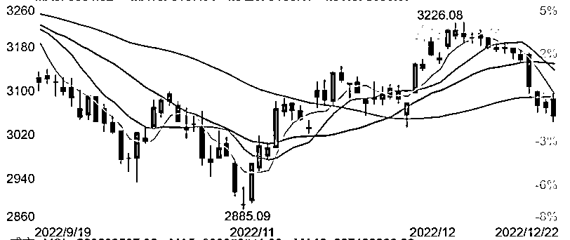  

| 上证指数日 K 线图

12 月是过山车的月份，从开始的封控到后来的开放。而从 12 月 7 日以后，上证指数一路下行。

回顾上证之前的走势，10 月 31 日，火星逆行日，上证跌到低点 2885，与 4 月份的低点 2863 形成双底。而 1 月 13 日，火星开始顺行，18 日，水星顺行，23 日，天王星顺行。

从 2019 年 1 月 4 日开始的上证的 5.5 年周期，到 2023 年就开始进入第五年，也就是说，离 2023 年 8 月-2025 年 7 月的波谷的时间段越来越近了。**迄今为之，这个周期的最高点还在 2021 年 2 月 18 日形成的 3731 点，当时正是土天第一次四分相。**

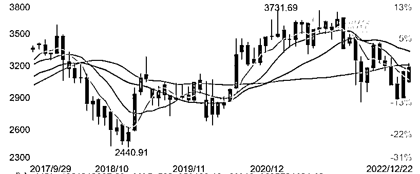

| 上证指数月 K 线图

而如果 2022 年 4 月的低点或者 2022 年 10 月的低点是第一个 33 个月半周期的波谷，那么在 2023 年 1 月是第二个 33 个月周期的开始不久的时候。即便 2022 年 4 月是第二个 33 个月半周期的开始，那么在 7 月份的高点 3424 是第二个 33 个月周期的波峰似乎也太早了。

**所以，在 2023 年 1 月，上证是不是可能在调整后向上？现在是不是大胆加仓的时候？**金融占星大师雷蒙德·梅里曼的《2023 年 1 月上证指数报告》已上线，你可以听听梅里曼老师的看法。《2023 年 1 月黄金报告》也已上线，欢迎购买。

**此外，雷蒙德·梅里曼 2023 年预报及沙龙已开始双 12 优惠预售，将帮助你对 2023 年的市场风云变化加深了解。**

投资有收益，投资有风险，希望金融占星学的研究帮助你更好地评估你的投资。

从 2018 年年末，若道引入金融占星大师雷蒙德·A·梅里曼撰写的梅里曼市场时机学院每年一次的年度预报沙龙和每年一本的《年度预报》以来，**2023 年已经是第 5 个年度了。我们简单回顾了部分 2019-2022 年金融预报的内容，**过去的经验让我们相信，你根据梅里曼老师的指导作为投资参看，你会比一般人有更大的胜算。****

**长按下图识别二维码****了解更多详情**

**1 月上证报告上线**

**上证指数月度报告价格****单月报告**：280 元/月**季度套餐价格**：780 元（260 元/月）**年度套餐价格**：2400 元（200 元/月）**双报告年度套餐更优惠（直降 900 元）****12 个月黄金报告+12 个月上证指数报告：仅需 3900 元****长按下图识别二维码购买上证指数报告**▼

**1 月黄金报告**

“**黄金是金钱。其他的只是信贷。**

**——约翰·皮尔庞特·摩根**

”

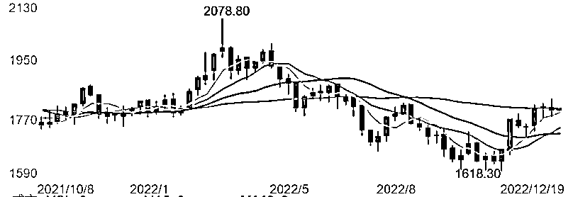

| 黄金周 K 线图

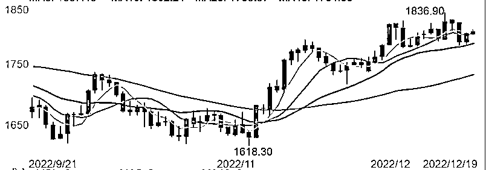  

| 黄金日 K 线图

从 9 月份最低点反弹 10%以后，黄金在 12 月波澜不惊。黄金的 31.33 个月周期的半周期——16 个月周期已经在 11 月 3 日 1618 触底，因此目前我们是在一个新的 16 个月的半周期内。

在过去的黄金月报里，梅里曼老师预测，“我们期待黄金出现 2-5 个月的反弹，上涨 200-300 美元。”截至 12 月 5 日，黄金价格已经反弹 200 美元以上。美联储 12 月 14 日批准将利率上调 0.5 个百分点，并暗示计划到明年春季都会加息，以抗击高通胀。这是美联储今年连续第七次加息。

**黄金会在 2023 年经过调整继续反弹吗？还是反弹会到此止住？**1 月份黄金报告已经上线，上证报告也已上线。欢迎了解。也可以按照季度和 1 年期订阅，有更多优惠。季度和年度的好处是，你可以持续了解梅里曼老师对于不断在变化的市场的看法。即便他某一次看法和市场不一致，你也看到在下一期他如何调整自己的看法，并看到金融占星在一个长期时间段内对你把控风险的帮助。而能够长期控制风险、尽量找到安全的投资时机才是投资的长久之计。点击阅读原文，雷蒙德·梅里曼黄金周期 2022 年 11 月报告带来有 40 年黄金市场研究经验的世界著名金融占星大师雷蒙德·梅里曼对当前黄金市场的研究。

**1 月黄金报告上线**

**黄金月度报告价格****单月报告**：280 元/月 **季度套餐价格**：780 元（260 元/月）**年度套餐价格**：2400 元（200 元/月）**双报告年度套餐更优惠（直降 900 元）****12 个月黄金报告+12 个月上证指数报告：仅需 3900 元****长按下图识别二维码购买黄金报告**
▼

**梅里曼金融报告双 12 福利来啦！****长按下图了解更多详情吧！**

**1 月铜周期报告**

从 2023 年开始，我们将推出雷蒙德·梅里曼市场时机学院的铜周期报告。之所以推出这个报告，是因为**作为新能源发展所需的一个重要金属，铜的投资价值可能会随着新能源的发展而出现崭新机会。**

铜周期报告的撰写者分析师马修·凯撒写到：

**铜会成为 21 世纪的石油吗？每次经济革命都增长了这种红色金属的使用量，因此作为全球活动的可靠风向标，它被戏称为“铜博士”。**

**在电力网络和设备扩张的背景下，尤其是与绿色转型相关的电力网络和设备（脱碳、电动汽车和自动驾驶汽车、充电基础设施、可再生电力生产、输电等）的扩张，目前铜需求的前景看起来比以往任何时候都要光明。** 

**倘若 2050 年前实现完全零碳排放的雄心勃勃的承诺得以实现，预期对铜的需求会在 2035 年前大幅度飙升，因为推出这些高度耗铜的技术，只会使现存经济中对铜的稳固需求进一步扩大。即使“绿色化”经济的承诺被削弱或放弃，其他新科技和需求也会增加未来几年对铜的需求（比如建筑、农业和健康）。****另一方面，铜供应既是高度集中，又受到极大限制，没有简单的方法来充分增加铜供应以满足这些加速增长的需求。因此，预计供应短缺将大幅增加，目前的情况似乎是未来 10-15 年牛市（以及可能的地缘政治紧张局势）的完美背景。**

| 铜周 K 线图

**看好新能源发展的读者，这样一份报告可能帮助你提早了解铜交易市场、铜交易的价格变化，当投资机会到来时，果断出手，把握先机。**

点击阅读原文，购买雷蒙德·梅里曼铜周期 2023 年 1 月报告。**投资有收益，投资有风险，希望金融占星学的研究帮助你更好地评估你的投资。**

**1 月铜报告上线**

**铜周期月度报告价格****单月报告**：80 元/月**长按下图识别二维码购买铜报告**
▼

**购买者需知**

**① **梅里曼市场时机学院《中国上证指数月度研究报告》是梅里曼市场时机学院（以下简称 MMA）的研究“预报”，而不是市场“预测”，是梅里曼老师及 MMA 金融占星分析师对人类活动周期历史与行星周期之间相关性的研究，二者在大部分情况下具有 80%或更高的相关性，而不是因果关系。报告中的研究完全存在错误的可能性。即便是非常认真的研究和几十年的研究经验，金融占星师无法总是正确地解读出各种征象在实际层面上会如何相互作用，并显化为事件结果。

所以请将报告看作一个研究参考，务必结合其他市场研究和你个人对市场的理解，根据你的自由意志做决策。

**②** 此报告一旦售出，**即不接受退款。**

**③** 上证、黄金月度报告每月固定 1 期，**并非都是在每月相同日期发布。**

**④** **我们收到英文报告的当天，即发布该英文报告。3 天后，上线报告中文版。此报告仅支持手机网页阅读，不支持电脑阅读和下载。****以上须知，请仔细阅读。一旦付款，即视为已了解并接受所有须知内容。**在过去的 40 年中，唯有梅里曼逐渐完善，并在梅里曼市场时机学院月度周期报告中阐释了将地球宇宙学与周期相结合的研究方法，以惊人的精确性预报了黄金价格发生重大变化的时间。**黄金购买 Tip**

各大银行均可购买黄金或黄金 EFT 基金，也可以在诸如天天基金或者支付宝购买黄金及黄金相关产品。不明白的可以百度搜索。

**购买后如何查看报告？**

**购买后有疑问怎么办？**请联系技术客服
**微信：nodoor201705** **购买直达入口**

# 金融报告丨雷蒙德·A·梅里曼 2023 年《年度预报及讲座》来啦！

> 原文：[`mp.weixin.qq.com/s?__biz=MzA5NjA0NTAxNg==&mid=2651497687&idx=3&sn=03966c25653b847c09292221af16bf48&chksm=8b481660bc3f9f760536374cb23e0ad2e03e9be4a558189b75a0f1d8ead7c44f55463fb8a911&scene=126&sessionid=1692737705#rd`](http://mp.weixin.qq.com/s?__biz=MzA5NjA0NTAxNg==&mid=2651497687&idx=3&sn=03966c25653b847c09292221af16bf48&chksm=8b481660bc3f9f760536374cb23e0ad2e03e9be4a558189b75a0f1d8ead7c44f55463fb8a911&scene=126&sessionid=1692737705#rd)

从 2018 年年末，若道引入金融占星大师雷蒙德·A·梅里曼撰写的梅里曼市场时机学院每年一次的年度预报沙龙和每年一本的《年度预报》以来，**2023 年已经是第 5 个年度了。**

我们简单回归一下梅里曼老师 2019 年-2022 年的《年度预报》中一些预测。

在 2019 年的年度预报中，对于上证指数，梅里曼老师写到：

2018 年末至 2019 年初，中国股市处于三个重要周期低点的时间段。紧随这一低点，将会出现一次非常大的反弹。

2019 年木星会与海王星形成三次四分相，过去，这个相位总是与惊人的强大“泡沫”同时出现，期间股价大幅飙升。

到 2019 年 7 月之前，上证指数有三个重要长周期会出现周期低点，理想上看是在 2019 年 3 月底之前。

上证的周期低点出现在 2019 年 1 月，从那时起，上证迎来了 3 年的上升。

对于黄金，梅里曼老师建议：

从占星学角度来看，木星在射手座，四分在双鱼座的海王星，支撑看涨观点，因为这个组合有增加通胀的潜力。此外，木星在射手座的行星-星座组合从 1983 年起出现过三次，每次都对应到金银市场的年度高点。

无论在 2019 年何时，只要黄金保持在 1167 以上，同时跌到了任一主要周期低点附近，就要寻找买入机会。黄金可能在 2019 年涨到 1500+/- 50，甚至更高。

2019 年黄金从 1284 美元开始上涨，最高点在 1566 美元。

所以，如果你在 2018 年购买了《年度预报》，按照梅里曼老师的建议投资了上证指数和黄金，你会在当年取得相当不错的收益。

**对于 2020 年，在席卷全球、深刻影响了未来的疫情到来之前，梅里曼老师为 2020 年定下基调的：**

站在 2019 年的年尾，我们不知道一场深刻改变未来的风暴马上就将来临。

梅里曼老师，这位杰出的宇宙气象预报员，未卜先知，为 2020 年定下“将军”的基调。

在那一年，我们目睹了美国股市的 4 次熔断和全球经济的重置崩溃。

对于黄金，梅里曼老师是这么说的：

1391.50-1413.70 是价格最强的支撑区域。只要不跌破这个区间，黄金就能够上涨，重新测试 1566.20。如果突破了 1560-1590 的阻力区间，那么黄金就能够重新测试 1920。在那以前，黄金最有可能在 2020 年中在 1390 和 1575 之间波动。

| 黄金周 K 线图

2020 年，黄金在横盘 3 个月突破了 1560-1590 的阻力区间后，一路上涨到 9 月最高点 2089.20 美元。

对于上证指数，梅里曼老师建议：

2020 年的反弹将超过 2019 年的高点 3288。然而，这一涨势可能会通向 5.5 年周期的波峰，随后将再次迎来一波跌势至 2021 年或更晚。

行进中的摩羯座星群——木星、土星和冥王星——表明在 2020 年 11 月底之前会出现一个高点，很可能在 2020 年的前六个月。建议交易者特别注意金星逆行的时期，也就是 5 月 13 日至 6 月 25 日。逆行或顺行一个月内出现的年度高点或低点可能会带来卖出机会。

2020 年，上证指数最高达到 3474，超过了 2019 年的高点 3288。

**站在 2020 年的末尾，对于 2021 年，梅里曼老师说：**

随着 2020 年木星、土星和冥王星形成大合相，我们刚刚结束了一个周期和一个时代。此刻我们正处于一个新的时代和一个新的长周期的早期阶段。事实上，是多个长周期。

对于上证指数，梅里曼老师说：

我们预计涨势将在 2020 年 12 月-2021 年 2 月之间达到波峰，然后急剧下跌至 52 周和 22 个月周期的低点，这些周期将在 2021 年 5 月之前，甚至在 3 月底之前结束。此后可能会出现另一轮反弹，可能会也可能不会在 2021 年 11 月之前形成第一个 33 个月周期的新高。

对于黄金，梅里曼老师说：

黄金的 31.33 个月周期波谷将在 2021 年 9 月之前出现，理想情况是 2020 年 12 月-2021 年 6 月。价格目标是 1628+/-109 或 1768+/-76。重叠范围（理想情况）是 1692-1737。如果价格跌破这些范围，则为看涨情况中令人担忧的状况。

**而在 2022 年的年度预报里，我们看到：**

渐亏四分相不仅对应无法解决的冲突和分歧，土星和天王星形成的任何四分之一周期（合相、四分相和对分相）都可能在社会动荡和某地区现状受到威胁的时期出现。

在 2008-2010 年上一次四分之一周期时（对分相），世界见证了阿拉伯之春。在 1999-2000 年渐盈四分相期间，游行、抗议和直接武力冲突扰乱了西雅图世界贸易组织会议。这也标志着美国经济扩张的结束，以及由互联网泡沫破裂和 2001 年 9 月 11 日对美国世贸中心的恐怖袭击引发的衰退的开始。在此之前是 1988 年的合相，对应的事件是缅甸（Myanmar，当时的国名是 Burma）爆发了一场全国性起义，反抗尽失民心、暴力过度的军政府。数十万公民在全国范围内的暴动中抗议，这成为缅甸历史上的决定性时刻之一。

在每一个案例中，极端主义都占据主导地位，导致暴力冲突，但最终带来了“更大的益处”。它产生了建设性的结果，但在它进行的同时，世界在经历巨大的危机和暴力。”

2021 年 5 月 13 日-7 月 28 日，木星首次行经双鱼座时，这些因素表现得很明显。那时，通货膨胀开始出现，但美联储向所有人保证，这只是暂时的，他们将无限期继续推行“宽松货币”政策。他们并不担心持续的通货膨胀，这是典型的木星在双鱼座的表现，对现实的脱离或错误判断。

这两颗行星以及双鱼座也掌管原油。因此，我们可能会看到油价飙升，以及/或石油泄漏，威胁到大自然。它也可能对应着由于事故而释放的有毒气体，威胁到那些暴露其中的人的生命。

对于黄金，梅里曼老师建议：

只要黄金保持在 1670-1680 之上，仍然有极小的机会出现一轮爆炸性上涨，测试当前的历史高点（2089），甚至创下历史新高。毕竟，木星将在双鱼座合相海王星，可能预示着另一轮“投机狂热”。然而，这也可能是一个“恐慌”的征象，届时某些市场可能会崩溃。

在 1900-1980 之间存在较大的阻力，如果不能突破这个阻力，将表明黄金的熊市已经开始，新一轮的猛烈下跌可能正在准备中。只要跌破 1670 则将确认黄金 20 年的牛市结束了。

| 黄金周 K 线图

对于上证，梅里曼老师说：

我们预期在 2022 年 5 月前，上证综指会出现急剧的下跌，进入 52 周周期和可能的 33.5 个月周期低点。

我们更倾向于认为，上证综指会首先下跌，在 5 月前形成一个低点，然后上涨。这一轮上涨的幅度，将告诉我们上证综指是处在牛市，还是进入了新的熊市。如果它不能上涨超过 3750，长周期波峰可能已经出现，并且进入了新的熊市。

我们简单回顾了部分 2019-2022 年金融预报的内容，**过去的经验让我们相信，你根据梅里曼老师的指导作为投资参看，你会比一般人有更大的胜算。**

**2023 年度预报及沙龙预售**

**2023 年金融预报沙龙时间为 2023 年 1 月 7 日 10：00-13：00。**

一份价格仅千元的顶尖金融占星大师的投资分析报告和沙龙，聪明的投资者值得拥有。

**2023 年年度预报****及沙龙价格：****1380 元**

**长按下图识别二维码**

**购买报告及沙龙**

**购买者重要须知****①** 梅里曼市场时机学院每年一次的年度预报沙龙和《年度预报》是梅里曼市场时机学院的研究“预报”，而不是市场“预测”，是梅里曼老师及其金融占星分析师对人类活动周期历史与行星周期之间相关性的研究，二者在大部分情况下具有 80%或更高的相关性，而不是因果关系。沙龙中和报告中的研究完全存在错误的可能性。即便是非常认真的研究和几十年的研究经验，我们无法总是正确地解读出各种征象在实际层面上会如何相互作用，并显化为事件结果。

所以请将次沙龙和报告看作一个研究参考，务必结合其他市场研究和你个人对市场的理解，根据你的自由意志做决策。

**②** 此报告一旦售出，**即不接受退款。**

**③** 此报告仅支持在手机网页阅读，不支持电脑阅读和下载。**④** 讲座提供视频回放。**以上须知，请仔细阅读。一旦付款，即视为已了解并接受所有须知内容。**

**如在购买报告中遇见任何问题**

**可添加客服**

▼

**购买报告直达入口**

# 若道周运 12.26-1.1 丨 2022 最后一个星期来了，迎接 2023 年吧！（内含 12 星座运势）

> 原文：[`mp.weixin.qq.com/s?__biz=MzA5NjA0NTAxNg==&mid=2651497687&idx=1&sn=a0a3c75c8b00a5bbf76c2c6af6e50ced&chksm=8b481660bc3f9f7661c89a748637b561b810591d551365acc17a7236fbde18c9059d0dd4deda&scene=126&sessionid=1692737705#rd`](http://mp.weixin.qq.com/s?__biz=MzA5NjA0NTAxNg==&mid=2651497687&idx=1&sn=a0a3c75c8b00a5bbf76c2c6af6e50ced&chksm=8b481660bc3f9f7661c89a748637b561b810591d551365acc17a7236fbde18c9059d0dd4deda&scene=126&sessionid=1692737705#rd)

******☆ ****后台回复“今日”，给你一句生命态度******

作者/Dora ISAR 认证占星师
编辑/翀子 封面/书君 图片/稿定设计**整体氛围**

上周发生的木星进入白羊座以及摩羯座新月，天空给我们带来了希望和勇气，是否点燃了你对新年的热情遐想？

对我而言，随着身边亲友纷纷加入“羊”群，新年的滋味还没品味到，葱姜水的滋味倒是很熟悉了。政策调整带来的猝不及防的大面积损兵折将。

也难怪，木星刚进入白羊座，就四分了摩羯座的太阳，就好像刚刚因为解封而焕发的热情，迎面就碰上了严峻的疫情现实，摩羯座群星好似一桶凉水，当头一棒：这回终究是你自愿乖乖在家了。

激动的岁末狂欢？哦不，你需要慢下来，需要谨慎小心，需要隔离防控，需要守规则，需要戴好口罩......摩羯座的金星、水星、冥王星全都在严肃地提醒着你呢！

**火星还在双子座逆行，本周的重大事件是：周四开始，水星又要逆行了！（12 月 29 日至 1 月 18 日）。**

水星是关于思考、沟通、旅行的行星。火星也是在双子座这个关于沟通和交流的星座逆行（也是水星在管事儿）。

行星的逆行，都是对当下议题的强调和反复思考，**因此，本周的重点话题词就是：总结、思考。**

这会儿大家都在写年终总结和新年计划吧？这是多么应景的行星逆行啊。

好好回顾今年所发生的一切，这三年的疫情让我们一切行动放缓，好多计划不能实现，但我们内心的成长并没有放缓，不是说穷人的孩子早当家吗？挫折让人成长。**那么，今年我们都经历了什么样的成长呢？而对于这周将要来临的 2023 年，我们又有怎样的心愿？**

摩羯座是长期主义者，善于规划未来，当水星在摩羯座逆行的时候，正是做好来年，甚至更长久规划的时刻。也许，年底也是换工作的时间，你是否已经主动或者被动地需要更换赛道？无论如何，摩羯座的词语就是坚忍不拔，通过反思和规划，我们终将登上山顶。

水逆永远是各种大脑短路事件的背锅侠。很多问题明明是自己准备不足造成的，怎么能甩锅给水星呢？

**当行星逆行的时候，正是对这颗行星所代表的议题进行回顾和反思：**

*   金星的逆行让我们重新思考我们的价值观。我是否真正的爱 TA？究竟是什么能给我带来真正的快乐？

*   木星的逆行让我们重新审视我们的信念。我们所为之奋斗的一切是否真的值得？

*   土星的逆行让我们反思局限自己的条条框框，究竟是否合理？那些给我们带来压力的，我们所恐惧的事情，是否真的能够限制我们？

水星的逆行，给我们重新思考一切的机会（分析、写作、演、交流）。除了新年的火锅大餐和棋牌大赛，确实还有好多好多需要我们思考的事情：我们所爱的人；我们所珍惜的一切；那些让我们继续努力前行的信念。

写到这里突然想到，也许在水逆期间，正是因为我们过度沉迷于思考，所以会经常忘记这个，忽略那个，以至于在沟通交流中出现突然状况吧? 脑子短路是不是就是思维塞车呢？因此水逆期间，提醒我们做事情要反复核实确认，以免忙中出错。

**在 2022 年离我们远去的时刻，我们可以花点时间思考明年的计划，更重要的是反思过去一年的经历，我们从这十二个月学习到了什么？我们遇见了谁？我们经历了什么？我们在期待什么？**

**当 2023 年的钟声敲响的时候，我祝愿你和世界上的每一个人：新年快乐！**

**本周重要天象**

**★ **周三 ****

*   ****金星六分海王星****

临近元旦了，我们对未来有玫瑰色的想象，也对“爱”和“富足”有更高的需求度和敏感度，同时我们需要布置家居，用艺术品味创造美好的生活环境。

在大多数家庭有病人需要照顾的情况下，我们难免心烦气盛，那么今天我们给家人一些浪漫和包容。

**月亮也正在双鱼座**，让人懒洋洋，乏力，没有什么事情是需要特别着急去完成的，善待自己的身体，该休息就好好休息，听听音乐，喝杯红酒，看个好片子，犒劳辛苦了一年的自己。

**★ **周四 ****

*   ****水星逆行、水星合相金星****

水星逆行，在今年已经是第 4 波了。1 月、5 月、9 月、12 月，好像也和病毒带上节奏，1 月严重，5 月好转，9 月西北又起，12 月全国蔓延，好在这波逆行 22 天，春节前就转为顺行了。相信过完春节，情况就会慢慢好转的。

最近一段时间，大家思想过度活跃，朋友圈、微信群交流无比热烈，不要让过多的信息轰炸疲乏的大脑，暂时丢开手机，地球也不会毁灭。得一时清净，以养神智。

**金星与水星合相在摩羯座，让我们的思考和语言更有价值。**

**★****周日**

*   **金星合相冥王星**

周日是元旦假期，新的一年来到了，**月亮也从白羊座来到金牛座**，好好享受假期的小美好，无论是朋友欢聚，还是穿上新衣美美地去祈福，都祝你所见皆喜乐安康！

**今日金星和冥王星合相在摩羯座**，这可是一个颇为紧张的相位，无论是对感情，对物质财富，或者任何你在这个世界珍惜的事物，比如他人的重视和尊重、坚持的观点、爱好等等，我们都会有执着。执念一起，六根难断。

一旦陷入执念，难免分分合合，难免纠缠撕扯，在新年的第一天，我们是如此渴望获得，那也可能会遭遇更大的失望。

**金冥合相是来提醒我们，学习放下。**这世界是在不断变化的，我们需要顺应，抓不住时间的沙，也留不下不爱你的人，不可能所有人都认同你，你的想法也会随着成长不断变化。所有的美好，只在当下。

从今天开始，珍惜生命中的每一天，得之坦然，失之淡然。放下才能记起，有多少美好曾经流过我们，只是当时惘然。

**12 星座一周运势**

**上升*****白羊座***

木星进白羊座，来到了你的 1 宫，如果今年过的很不容易，大部分时间都在修复身心，那么恭喜你：本周开始，木星已经来到了你的 1 宫，就像吹来一阵春凤，提振了士气，照亮了你，也让你的价值开始呈现，明年你会有更多的机会的。

同时，太阳进摩羯座，正好在你的第 10 宫，也代表忙碌来临，工作得到重用，或者求职成功的机率大增。

本周水逆也发生在 10 宫，要避免忙中出乱，任何文件都要仔细确认核实。对于自己的事业，要合理评估，放弃那些不切实际的幻想，找到更加适合自己的方向。

*****上升**金牛座***

木星再次回到你的 12 宫，不知道你有没有中招在家休养呢？不管如何，你现在需要给自己更多的时间和空间，精简你的人际关系，好好自我沉淀。

太阳进入你的第 9 宫，有可能对有关哲学，法律，玄学等方面的知识感兴趣，学习也是自我成长。或者是时候规划你的学业，或者长途旅行，参加培训，出国留学。

水逆也发生在你的第 9 宫，有关学习，旅行，法律等事物是你本周的关注重点，仔细理顺你的计划，不要因为给自己太多的选择，而迷失了方向。

**上升*****双子座***

木星来到你的第 11 宫，木星扩张你的朋友圈，你的社交生活又如同今年大部分时间那么忙碌了，你可能遇到更多的朋友，贵人，加入更好的组织、团体，年底活动多，不要拒绝社交，也许就有机会得到新的资讯和启迪。

太阳进入第 8 宫，可能会引发财务，保险等方面的一些问题，记得要仔细整理一下自己的财务状况，做好还款，并把积蓄投入稳定可靠的理财产品。如果社保有些手续没有办妥，这周就应该去将其完善。

水逆也发生在第 8 宫，利于修复和另一半的关系，两人需要开诚布公，深入交流，彼此的信任非常重要。水逆期也有可能再续前缘，遇到前任。

**上升*****巨蟹座***

木星在你的第 10 宫将一直呆到明年 5 月，今年你考试进步了吗？升职了吗？这是你一直努力的成果，终于迎来了闪闪发光的时刻。如果今年还在找工作，申请学校，未来几个月成功的概率是比较高的。

太阳进入第 7 宫，人际关系变得活跃，也许会出现好的合作伙伴，也可能有强大的竞争对手。个人亲密关系的互动也增加了，有对象的朋友是否在筹备新年的婚礼呢？单身的朋友桃花运也增加，年底活动多，也许就有可能遇到合适的另一半。

水星在你的第 7 宫逆行，可能会遇到以前的朋友，前任，修复一些关系。

健康方面注意头痛，咽喉肿痛，睡眠问题。

**上升*****狮子座***

木星重新进入 9 宫，这是它非常有利的宫位，今年你的学习旅行运都很不错，是否又在开始做计划远行了呢？读万卷书，行万里路。未来半年你有机会去远行、深造、再培训、出国留学，都会有不错的机会。

太阳在第 6 宫，本周是年底最为忙碌的时期，作为天选打工人，在万分忙碌的同时，需要好好照顾自己的身体。水逆发生在第 6 宫，要注意日常起居，做好防疫保护，过分辛苦可能会免疫力下降，也许家里已经有人需要你的照顾，也许你正在康复。祝你和家人健康！

**上升*****处女座***

木星在第 8 宫，这是一段深入自己的内在开发潜能的时期，你会更深入的走向自己内心，听清内在渴望。从财运上来说，8 宫的木星可能带给你一些理财上的好运，也许会有一些意外的收入，比如早就放弃了的借款居然回来了。当然近期人情方面的开销也会增加。

太阳进入第 5 宫，封控结束了，你有更多的机会出门庆祝，去参加一些娱乐活动或者有创造力的活动。亲子互动增加，怀孕几率增加，恋爱运也大大增加，享受你的欢愉时刻。

水星也在第 5 宫逆行，谨慎的处女座们会反思很多的人际关系，亲子关系也好，恋爱关系也好，朋友关系也好，记得在付出关心的同时，也要关心自己的感受。

**上升*****天秤座***

木星重新回到你的关系宫位，第 7 宫，前一阵子可能倍感孤独，现在又可以感受到和他人的亲密互动了。如果有合适的对象出现，是一个向前一步的时期。已婚人士和另一半的互动也增加，可以更好地理顺家庭关系，规划一下小家庭的未来。

太阳进入你的 4 宫，父母需要你回家看看，也许有什么事情需要联系。要买房，租房搬家的伙伴，最近也有不少可能性，群星在 4 宫的时候，可以多关注家里的事务，尤其当水星在第 4 宫逆行，更多需要关注长辈的健康，改善家居环境，或者，改善自我内心的环境。

**上升*****天蝎座***

木星来到你的第 6 宫，这是工作和日常生活的位置。如果要重新换工作，可以开始规划了。当然，在单位也变得忙碌，压力变大，但升职和得到上级青睐的机会也会增加。经过疫情，会越来越重视健康养生，也许已经留心了许多健康养生的方法，记得用起来并且持之以恒。

太阳进入你的第 3 宫，是一个思维极度活跃的时期，各种学习考试，会议谈判，文章写作，出差旅行，让你应接不暇。

水星也将在 3 宫逆行，反复的思考确认尤为重要。相信在年末，你会做出非常优秀的年终总结。

**上升*****射手座***

木星在上升射手座的创造宫位，第 5 宫，今年是活得比较出彩的一年，病毒似乎并没有限制到你们表现自己。勇敢的上升射手座们在有限的条件下也活出了自己的光芒，而这股气势也将延续到明年 5 月。勇敢去做自己喜欢的事情好了，因为活跃，你们可以结识到更多的人，恋爱运也大大增加。

太阳在射手座的第 2 宫，摩羯座的土元素让射手座们现实起来，更加关注自己的财务收入，年终奖到底能不能到手？自己的账单是否都已经还清？也可以多了解一些新的理财方式，增加自己的收入。           

水星本周开始在 2 宫逆行，再一次提醒你，重新审视自己的财富观念，希望射手座们心在远方的同时，能够脚踏实地，既能抬头看见月亮，也能捡起地上的六便士。

**上升*****摩羯座***

摩羯座的宝宝们生日快乐啊！木星回到了你的第 4 宫，家族中会有更多的喜事。你也有机会的得到父母的帮助，后者也有房产方面的好消息。如果正在处理房产事务，这几个月顺利的机会较大。

太阳进入你的第 1 宫，提振了精神，元气满满的你会更加有信心和活力，也会被他人欣赏和喜爱。这段时间非常适合为来年的计划做好准备。

水星也将在你的 1 宫逆行，这是关于自我的宫位，如果有一段时间，你迷失了自己，现在是寻找回来的时候，通过这一段时间，你会变得更加自信，目标更加坚定。

**上升*****水瓶座***

水瓶座会开始新的一轮学习培训，因为木星进入了你的第 3 宫，会有更多的交流、深造、转型的机会，也许和兄弟姐妹，邻里之间的互动也会增加。非常有利于考试的一段时期，有什么拿证的计划，不妨抓紧报名。

太阳在你的 12 宫，更是一个修行，学习的宫位，把喜欢和朋友厮混的心情收拾一下，安静下来，无论是业务知识的训练，还是个人内心的修炼都是最好的时期。

在 12 宫逆行的摩羯座水星也在提醒你，独处内省，是成长的必经之路。

**上升*****双鱼座***

前一段时间木星一直在双鱼座，鱼儿们有没有感受到自己的视野开阔了？最近木星离开你的第 1 宫，来到了第 2 宫，那么，努力赚钱，创造收入的机会来临。你的财运会持续到明年 5 月。这段时间请加倍努力工作吧。

摩羯座太阳带领群星照耀你的第 11 宫，年底“聚会大人”就是你，最近收到的邀约是不是特别的多呢？能参加就去参加吧，毕竟朋友是我们的财富，我们在人际互动中也会获得更多的资源。

水星本周将会在你的 11 宫逆行，可能会得到很久没有联系的老朋友的消息。同时，也许会认真思考，究竟什么样的朋友值得交？究竟什么样的集体活动值得参加？上网时间大幅度增加，要记得不要过度沉迷网络哦。

**祝大家一周平安顺遂！新年快乐！**

**版权声明**：原创文章由作者授权首发于若道平台发布，欢迎转发，反对抄袭。友号转载请申请白名单。

**END**

****Dora****

若道 2017 届核心课毕业生

若道咨询平台占星师、ISAR 认证占星师

心理咨询师、塔罗咨询师、多年企业管理经验

咨询微信：AstrologerDora

公众号：Dorothy 占星文化

**长按打赏**

**快年底了****不给自己一份来自占星学的礼物吗？**

**梅里曼金融报告双 12 福利来啦！****长按下图了解更多详情吧！**

**20 位来自世界各地的占星师**
**带来 19 场沙龙——新世界的觉醒****详情可点击下图**

**学习占星学****点击下图了解课程详情**

**微信又双叒叕改版啦，不想错过若道君的推送？**
****就把若道设为****星标****以及点点****“在看”****吧！******▼**

**喜欢就点一下“在看”吧！****报名直达入口****微信又双叒叕改版啦，不想错过若道君的推送？**
****就把若道设为****星标****以及点点****“在看”****吧！******▼**

**喜欢就点一下“在看”吧！****报名直达入口**

# 圣诞大礼丨 2023 年，好运从领取这份年运报告开始！

> 原文：[`mp.weixin.qq.com/s?__biz=MzA5NjA0NTAxNg==&mid=2651497678&idx=1&sn=52460174999d1681be1d623be493f446&chksm=8b481679bc3f9f6f3758087e440d92d0942405f290fece35ecaeee1e27891bdb01b5b14ce524&scene=126&sessionid=1692737705#rd`](http://mp.weixin.qq.com/s?__biz=MzA5NjA0NTAxNg==&mid=2651497678&idx=1&sn=52460174999d1681be1d623be493f446&chksm=8b481679bc3f9f6f3758087e440d92d0942405f290fece35ecaeee1e27891bdb01b5b14ce524&scene=126&sessionid=1692737705#rd)

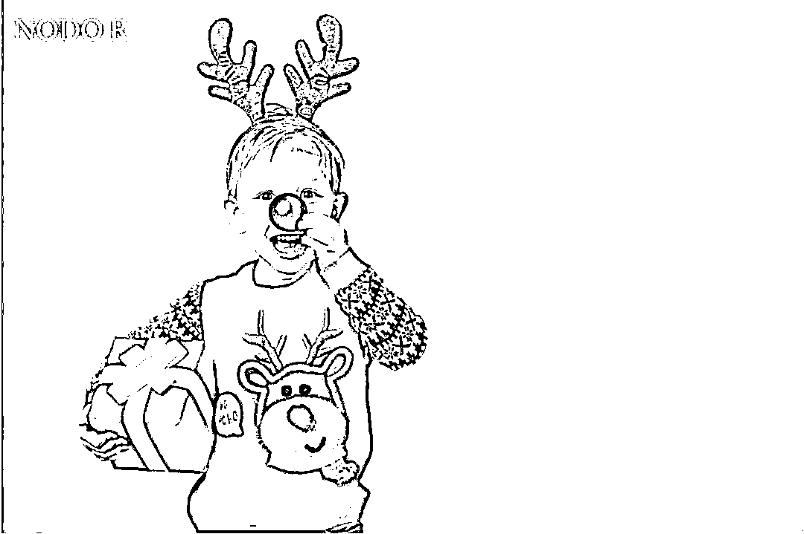

**你是否有过如下的困惑？**

每年一到年底

有很多的**星座专家**都在发布运势，

开头你也会兴冲冲地对号入座，

但久了，你开始思考：

***难道这个世界上只有 12 种运势么？***

***难道所有的白羊座的运势都是一样的吗？***

我的上升星座和太阳星座不同，

***到底是该看太阳星座还是上升星座呢？***

有的占星师说，

上升星座为主，太阳星座为辅，

有的又是倒过来，

等你辛辛苦苦

把太阳星座和上升星座的运势都看完，

发现截然相反，

**到底该信哪个？**

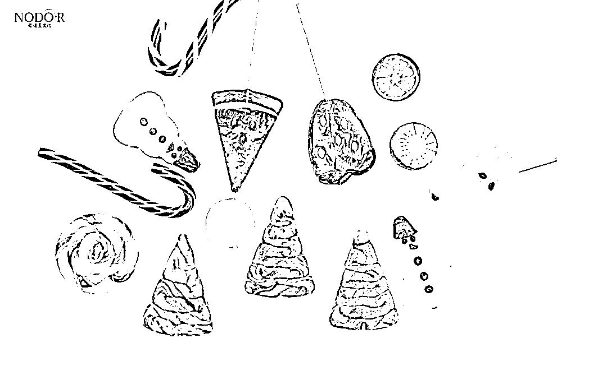

对此，

占星师们给到的回复是，

想要看专属于你的独家运势，请联系个人咨询。

一问咨询费，

动辄几百，甚至上千，一小时哦……

那么问题来了

**在哪里能够找到既专业，**

**又不昂贵的个人年度运势呢？**

让若道君来回答你吧

**若道隆重推出年度运势报告，**

**你想要的，我们都有！**

拥有这份报告，

你将看到未来一年**重要**行运的影响：

什么时候可能有**恋爱机会**，

什么时候适合**大展宏图**，

哪段时间要注意**身体健康**，

哪段时间开车旅行得**小心**，

**这些问题，**

**在报告里都能找到答案。**

**什么？这么超值的年度运势报告，**

**只要*****198*****元！**

**更有惊喜圣诞红包大礼从天而降**

***30*****元红包免费送**

***168*****元你的****“专属”年运报告****即刻到手**

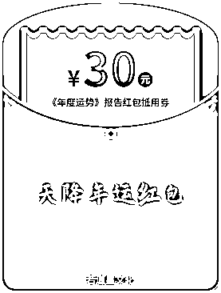

**如果这份诚意都还没让你下手**

**你还可以邀请你的朋友一起拼团**

**买得多，省得多，成长多！**

**2023 年运报告“友福同享”圣诞团购价**

***15 份*****年运报告 1200 元**

**每份只要*****80 元*****——相当于*****4 折***

***9 份*****年运报告 888 元**

**每份只要****98 元****——相当于*****5 折***

***5 份*****年运报告 599 元**

**每份只要*****120 元*****——相当于*****6 折***

***3 份*****年运报告 399 元**

**每份只要*****133 元*****——相当于*****6.7 折***

**赶紧来看看若道君**

**为你准备的惊喜圣诞大礼吧！**

**圣诞大礼获取指南**

***1.*****点击文末*****“阅读原文”*****进入活动首页** 

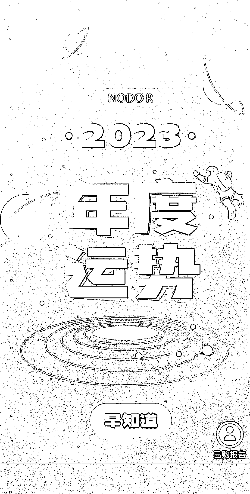

***2.*****专属订制的****“2023 年度运势报告”****可以买一份*****送自己*****，也可以买几份*****送亲友*****哦！**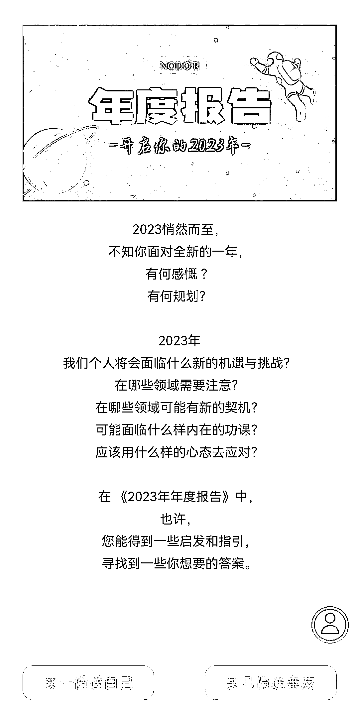

***3.*****买一份*****送自己*****，可享受 30 元天降年运*****红包*****，*****168*****元****专属年运报告****即刻到手！**

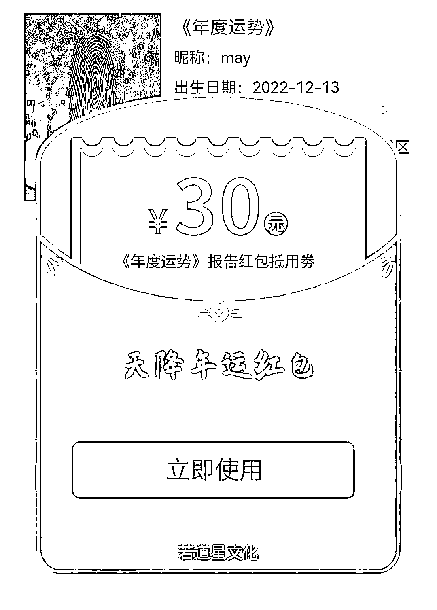

***4*****.买几份*****送亲友*****，可享受*****年运红包套餐价*****，心意送出越多越实惠哦！（套餐价内报告可以*****自己使用*****，也可以*****赠送亲友*****）**

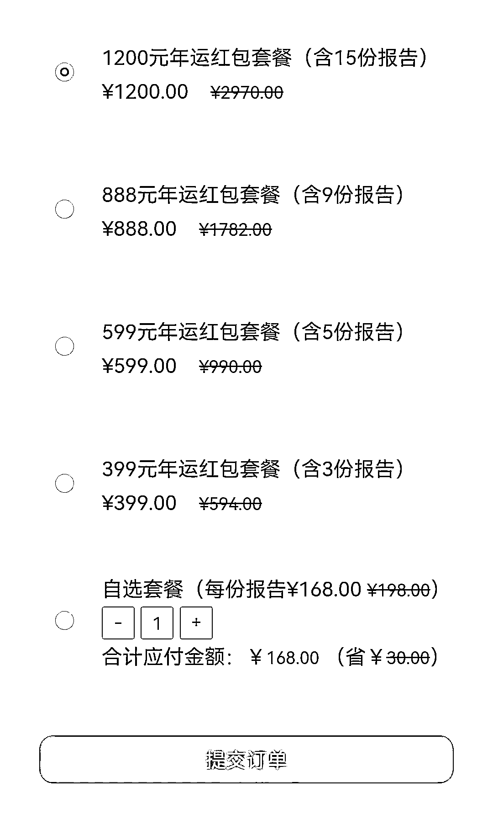

***5.*****可以到****活动首页****的****个人中心****里查看运势报告及使用赠送情况。**

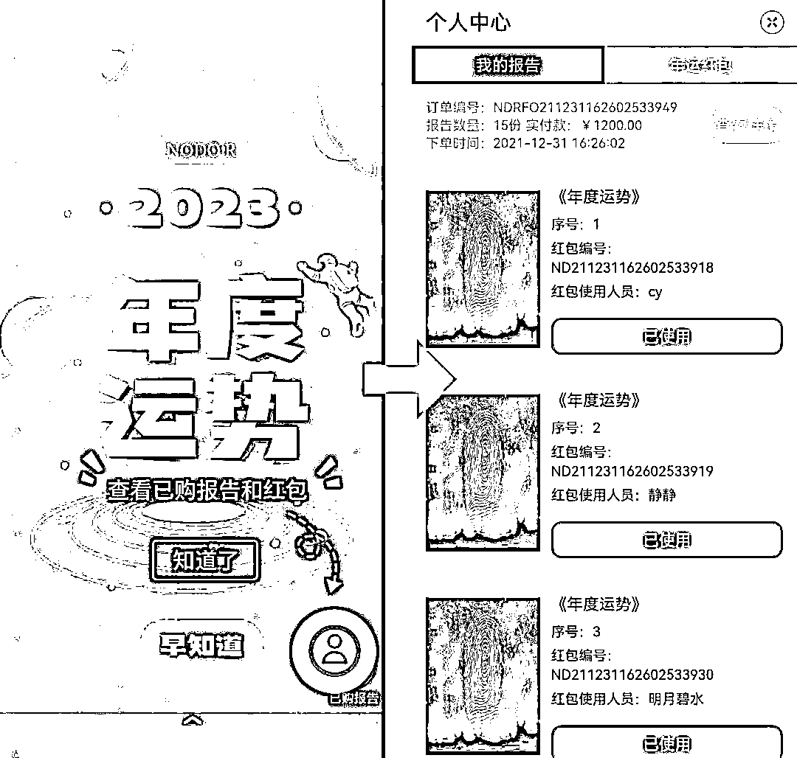

**若道君友情提醒**

**年运报告购买和使用问题，请联系客服（微信号：nodoor201705）。**

**购买报告直达入口**

# 铜会成为 21 世纪的石油吗？雷蒙德·梅里曼市场时机学院铜周期 2023 年 1 月报告

> 原文：[`mp.weixin.qq.com/s?__biz=MzA5NjA0NTAxNg==&mid=2651497678&idx=2&sn=a7fc4f9b10597152da6c58d47817c3db&chksm=8b481679bc3f9f6f0be5ca81c6d500944a60537bb5a50be0c83bc0f720ba1a77e43b03d2d53b&scene=126&sessionid=1692737705#rd`](http://mp.weixin.qq.com/s?__biz=MzA5NjA0NTAxNg==&mid=2651497678&idx=2&sn=a7fc4f9b10597152da6c58d47817c3db&chksm=8b481679bc3f9f6f0be5ca81c6d500944a60537bb5a50be0c83bc0f720ba1a77e43b03d2d53b&scene=126&sessionid=1692737705#rd)

  

**1 月铜周期报告**

从 2023 年开始，我们将推出雷蒙德·梅里曼市场时机学院的铜周期报告。之所以推出这个报告，是因为**作为新能源发展所需的一个重要金属，铜的投资价值可能会随着新能源的发展而出现崭新机会。**

铜周期报告的撰写者分析师马修·凯撒写到：

**铜会成为 21 世纪的石油吗？每次经济革命都增长了这种红色金属的使用量，因此作为全球活动的可靠风向标，它被戏称为“铜博士”。**

**在电力网络和设备扩张的背景下，尤其是与绿色转型相关的电力网络和设备（脱碳、电动汽车和自动驾驶汽车、充电基础设施、可再生电力生产、输电等）的扩张，目前铜需求的前景看起来比以往任何时候都要光明。** 

**倘若 2050 年前实现完全零碳排放的雄心勃勃的承诺得以实现，预期对铜的需求会在 2035 年前大幅度飙升，因为推出这些高度耗铜的技术，只会使现存经济中对铜的稳固需求进一步扩大。即使“绿色化”经济的承诺被削弱或放弃，其他新科技和需求也会增加未来几年对铜的需求（比如建筑、农业和健康）。****另一方面，铜供应既是高度集中，又受到极大限制，没有简单的方法来充分增加铜供应以满足这些加速增长的需求。因此，预计供应短缺将大幅增加，目前的情况似乎是未来 10-15 年牛市（以及可能的地缘政治紧张局势）的完美背景。**

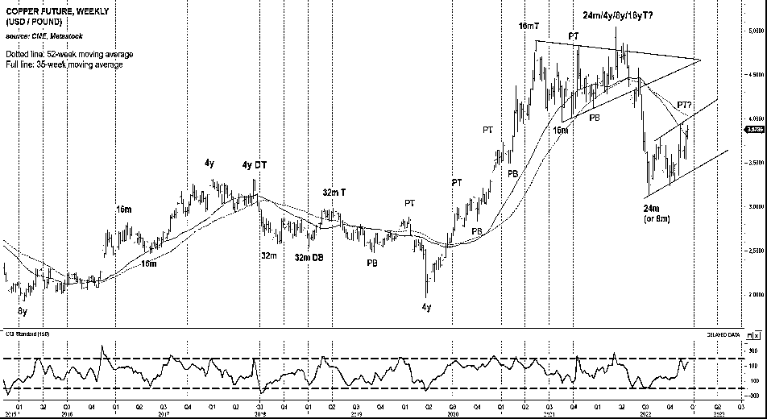

| 铜周 K 线图

**看好新能源发展的读者，这样一份报告可能帮助你提早了解铜交易市场、铜交易的价格变化，当投资机会到来时，果断出手，把握先机。**

点击阅读原文，购买雷蒙德·梅里曼铜周期 2023 年 1 月报告。**投资有收益，投资有风险，希望金融占星学的研究帮助你更好地评估你的投资。**

**1 月铜报告上线**

**铜周期月度报告价格****单月报告**：80 元/月**长按下图识别二维码购买铜报告**
▼

**购买者需知**

**① **梅里曼市场时机学院《中国上证指数月度研究报告》是梅里曼市场时机学院（以下简称 MMA）的研究“预报”，而不是市场“预测”，是梅里曼老师及 MMA 金融占星分析师对人类活动周期历史与行星周期之间相关性的研究，二者在大部分情况下具有 80%或更高的相关性，而不是因果关系。报告中的研究完全存在错误的可能性。即便是非常认真的研究和几十年的研究经验，金融占星师无法总是正确地解读出各种征象在实际层面上会如何相互作用，并显化为事件结果。

所以请将报告看作一个研究参考，务必结合其他市场研究和你个人对市场的理解，根据你的自由意志做决策。

**②** 此报告一旦售出，**即不接受退款。**

**③** 上证、黄金月度报告每月固定 1 期，**并非都是在每月相同日期发布。**

**④** **我们收到英文报告的当天，即发布该英文报告。3 天后，上线报告中文版。此报告仅支持手机网页阅读，不支持电脑阅读和下载。****以上须知，请仔细阅读。一旦付款，即视为已了解并接受所有须知内容。**在过去的 40 年中，唯有梅里曼逐渐完善，并在梅里曼市场时机学院月度周期报告中阐释了将地球宇宙学与周期相结合的研究方法，以惊人的精确性预报了黄金价格发生重大变化的时间。**黄金购买 Tip**

各大银行均可购买黄金或黄金 EFT 基金，也可以在诸如天天基金或者支付宝购买黄金及黄金相关产品。不明白的可以百度搜索。

**购买后如何查看报告？**

**购买后有疑问怎么办？**请联系技术客服
**微信：nodoor201705** **购买直达入口**

# 若道占星·双 12 | 任选折扣继续 年底充能好时机

> 原文：[`mp.weixin.qq.com/s?__biz=MzA5NjA0NTAxNg==&mid=2651497662&idx=1&sn=c2609a4a97e7b29c08c6e51683db01ce&chksm=8b481609bc3f9f1f3d5d3db119c615efd897edd120e7169bebc12452e878252aff3576778f7a&scene=126&sessionid=1692737705#rd`](http://mp.weixin.qq.com/s?__biz=MzA5NjA0NTAxNg==&mid=2651497662&idx=1&sn=c2609a4a97e7b29c08c6e51683db01ce&chksm=8b481609bc3f9f1f3d5d3db119c615efd897edd120e7169bebc12452e878252aff3576778f7a&scene=126&sessionid=1692737705#rd)

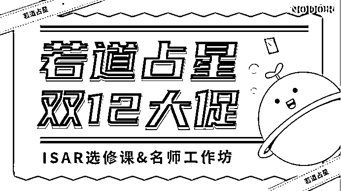

想一次优惠购齐三门 ISAR 选修课？

往年工作忙，错过了感兴趣的课程？

是某位老师的忠实粉丝，想集齐老师的课程？

**双 12，若道为大家精选出了 12 门 ISAR 选修课，15 门名师工作坊，**

**任选多门一次性购买可以享受不同折扣，**快去占星知识的海洋里挑选心仪的课程吧！

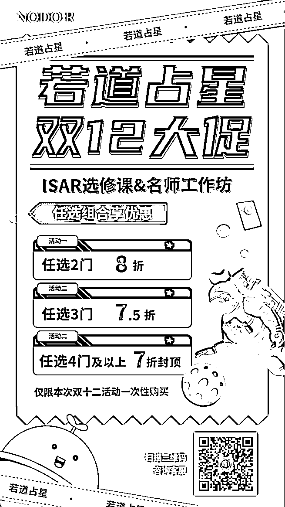

**参加活动的 12 门 ISAR 选修课**

 下滑可查看全部课程内容，以下皆是

**家族占星学网络课**

**原价 6800 元**

**课程内容简介**

这是一门特别适合中国占星学子的课程。因为我们是世界上最重视家族和家庭的国度，而家族和家庭又对我们和我们的后代影响至深。你的命运可能会被你素未谋面的祖父母、曾祖父母以及他们的祖先所影响，被家族中被遗忘的人所影响，也通过你向下传递给你的孩子们。

这种无意识的传承故事是我们命运的背景和暗流，而家族占星学就是照亮这个背景和暗流的镜子。我们的祖先从未真的死去，他们通过我们活着，由我们重复他们的荣耀、失败、屈辱和悲伤，直到我们真的看见他们，一切才会变为祝福。和琳恩·贝尔老师一起，用星图来探索隐秘的家族故事，并把它变成祝福你的力量。在这门课程中，欢迎大家提供自己的家族星图供探索。此课程可作为 ISAR 选修课。每次课程时长 2 小时，共 8 次课，安排如下：**占星实践中的家族模式**

我们第 1 次经由童年的巨大主导力量——我们的父母，来体验我们**太阳和月亮**、**土星和金星**。我们用他们给我们的暗示来解读这个世界，而他们的回应反过来又受到大家庭的影响，我们常常发现祖先的成功和失败、怪癖和才干经常在我们自己的生活和我们的星图中重复。

越仔细观察，我们就越能发现日期的神秘重复、平行事件，镜像先辈故事的我们自己命运的奇怪扭转。

**在课程中，我们将识别这些模式并与之合作，看看我们如何能够尊重过去，同时在生活中走自己的路。**更重要的是，我们如何面对我们祖先未活出的能量，而这些能量似乎在我们自己的人生经历中再次升起？在我们前进的道路上，昔日的先人向我们提出的问题是什么呢？

**父亲与孩子**

我们将看看**父亲的原型，以及它如何在出生星图中反映出来**。我们的父亲（或缺位的父亲）如何影响心灵结构？无论是缺席还是在身边，无论是亲生父亲还是“养父”，父亲的角色都会影响我们的基本认同和亲密关系，以及我们进入更大世界的能力。

虽然**土星和太阳**是父亲的传统指征，但它们很少被描述为漫游者、梦想家或一块“滚石”。父亲过去是法律和权威的承载者。随着文化的发展和婚姻的重新定义，父亲的原型也随之改变。**母亲与孩子**我们的**第 1 个养育者（或她的替代者），给予我们生命的人**，经常通过星图中的**月亮和它的相位**来指征。但是**其他行星**也可以描述她，其他人可以扮演她的角色。不论在星图上是哪些征象来体现这种基本关系，都在我们的一生中，留下了深刻的情感烙印。我们现实生活中的养育者如何与出生星图中的母亲形象相对应？我们如何将过去的力量整合到我们的成人生活中？**家族价值观****在每个家族中，都有 1 个主导价值，你需要认同它才能成为这个“部落”的真正成员。**它可能是力量，或智慧，或能干成事情的能力。对某些家族来说，这个主导价值是金钱；而对另一些家族来说，则是亲密和爱。崇尚运动的家族可能会嘲笑爱读书的孩子，赶走爱做梦的人。我们对家族的忠诚可能会阻止我们追随自己的天赋。那个离经叛道的孩子会怎样？**第 2 宫-第 8 宫轴线和金星的相位将为我们提供这些问题的线索。**有内在的价值观，也有文化和家庭强加的价值观。我们将探讨家庭价值观和对我们最重要的价值观部分之间的交集。我们该如何尊重灵魂，并且仍然对那些养育我们，使我们充满希望和梦想的人保持信心？**成功、家族压力、负债和牺牲**家族中的一个孩子，通常是最年长的，承载着家族成功的需求。但是，当这个孩子是女性，或者和家族传统的性情不同时，会发生什么呢？当个人需求和家族需求之间存在紧张关系，孩子可能会牺牲自己的天赋，而这会影响下一代人。一个拥有强大外行星的人可能会发现很难像以往那样简单地继续下去，而这也会动摇家族的自我认知。他们也可能是那个冲破家族一直以来的挣扎的人。一个孩子可以救赎数代人的失望。这些议题会由出生星图的哪些征象体现出来呢？我们将看**第 4 宫和第 10 宫，第 2 宫的价值观和第 12 宫的牺牲**。**当前关系中的过去模式**继续探索家族模式，密切关注过去对当前关系的影响。我们的原生家庭和先辈是如何定义爱的？如果爱是奴役的一种形式，我们可能需要找到自由，或者重新定义服务。如果我们的某个孩子让我们想起自己害怕和憎恨的父母，或者我们最不喜欢的兄弟姐妹或表亲时，会发生什么？

即使那些似乎完全与过去决裂以逃避“家族遗产”的人，也可能在一个困难的工作环境、一个特别难相处的老板或他们自己孩子的生活中重新遇到它，因为失落的爱的幽灵和没有被活出的故事往往会跳过一两代人重新出现。**家族的无意识带着某种印记，邀请我们再试一次，为一个旧故事找到新的结局。**

**家族秘密与家族创伤**

**许多藏在家族“壁柜”里的秘密通常在第 8 宫显现，或者由冥王星相位显露出来。**有些东西是隐藏的，因为它们很危险；另一些是因为它们太珍贵了，不能分享，比如失去的爱，或是被收养的孩子。

秘密可能涉及小的轻率行为，或大的背叛。他们可能隐藏痛苦、欲望或可怕的创伤。这些被锁住的能量经常隐藏在我们身上，带来焦虑。轻柔地将它们带到光明中，有助于释放和转化家族中内疚和羞耻的力量。

**太阳返照技法**

**原价 6800 元**

“每当太阳回到它在出生星图上的位置，我们都把宇宙的一个新部分吸纳进来，并把它变成我们自己的。大多数人都会有这种体验，生日那天是特殊的。那时我们可能会掂量一些事情，感受时光的变化，并为最近的过去画上一个句号。同时，我们也可能想把未来握在自己手中。太阳返照就是这样，它是我们未来的一小块。端详着它，会有一种跃跃欲试的期待感，将太阳返照与行进和次限一起用，会开启我们对未来时间的理解。黄道的每一个度数都带着某个太阳能量的特别印记，这是一种支撑着我们核心自我意识的独特品质。当太阳回归到那个度数，甚至分和秒都准确地回归到我们出生星图中的分秒时，这种至关重要的光就会被重新充满，每一颗行星都会与太阳形成新的关系。在这门课程中，我们将学习如何解读太阳返照图，并理解它对未来一年传达的信息，理解在未来的一年里会发生什么？我们在整个课程中都会研究案例。学员们也将研究自己过去和未来的太阳返照图。”——琳恩·贝尔 Lynn Bell**课程学习目标**跟随太阳返照技法顶流名师系统学习，熟练掌握太阳返照单盘、双盘解读。学习掌握太阳返照解读延伸出的占星知识：太阳返照择时、小限法等。更好地解读每一年宇宙给予你的生日礼物，规划未来一年，活出生命的荣耀。更清晰地洞察每一年的人生功课，更从容地迎接祝福、挑战、潜力和困难。以人生目标管理的方式应用太阳返照盘，制定人生的 3 年、5 年、10 年计划。太阳返照为 ISAR 考试知识点，适合计划获得 ISAR 认证学员系统学习。整合太阳返照等多种技法，在咨询中开设新项目《生日年运解读》。此课程可作为 ISAR 选修课。

**课程内容简介**

每次课程时长 2 小时，共 8 次课，安排如下：

**第 1 课**

❶ 什么是太阳返照

❷ 如何解读太阳返照

❸ 一张太阳返照图解读两遍

❹ 为期 19 年的默冬周期预测与意识

❺ 出生地与迁徙地的返照图

❻ 不是所有的年份的太阳返照都一样 

**第 2 课**

❶ 月亮在太阳返照中的至关重要性及其元素周期

❷ 月亮落入火元素星座、土元素星座、风元素星座、水元素星座的解读

❸ 食相、满月和新月

❹ 月亮在太阳返照中的相位 

**第 3 课**

❶ 继续月亮的相位

❷ 太阳照亮各宫位

❸ 通过太阳所在宫位解释太阳返照

❹ 在太阳返照中太阳的相位

**第 4 课**

❶ 太阳返照中的合轴行星

❷ 太阳返照中的合轴行星为未来一年添彩，并成为来年的主导者

❸ 重要的星图模式❹ 精确紧密的相位❺ 行星力量 **第 5 课**

❶ 太阳返照与出生星图的关系

❷ 识别模式

❸ 太阳返照中行星作为出生星图的解释

❹ 逆行行星和共振相位❺ 出生上升点经过各宫位

**第 6 课**

❶ 太阳返照中的择时❷ 利用月亮择时❸ 整合行进❹ 太阳经过各宫位❺ 中天推进❻ 小限法 **第 7 课**❶ 特殊的太阳返照年❷ 太阳返照与金星周期❸ 中天经过各元素❹ 最好和最坏的年份

 ** 第 8 课 **

❶ 与未来合作❷ 技巧的整合❸ 预测与心理学❹ 如何处理两难困境

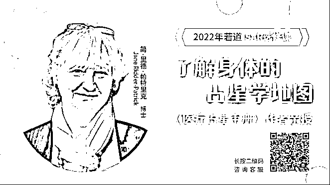

**医疗占星学网络课**

**原价 6800 元**

有 4 个主要因素影响着我们的生活和健康：基因构成、物质环境、情绪环境，以及我们的占星配置。我们在星图中都存在患病的可能性，而预防的方法在于尽可能充分、真实和健康地生活。
　　——简·里德·帕特里克（Jane Ridder-Patrick）博士占星学就像心灵的 X 光片。它可以描述个人对世界的看法和反应。我们越不了解自己的天性，面对生活中的挑战，我们就会有越少的选择。“占星学可以精准定位需要解决的潜在问题。”医疗占星学是一个强大的工具，同时洞察的身体和心理过程，通过更多的自我认知照顾和关爱自我和身边的人。本课程既适合医疗占星学的初学者，也适合已经有一些相关经验的人。简·里德·帕特里克老师将运用现实生活中的例子，揭示一个人的性格、症状及其星图是如何相互映照的。课程也会探讨疾病的意义以及可能的治疗方法。本课程旨在为学员提供一个运用医疗占星学的框架和方法，学员将会学到一些有价值的实用工具，在课程结束后，自己使用这些工具研究其中的关联性。此课程可作为 ISAR 选修课。

**课程内容简介**

每次课程时长 2 小时，共 8 次课，安排如下：**第 1 讲  与占星****学、心理****学、病症一起工作**医疗占星学的组成部分以及如何使用它们行星的作用与相互作用黄道星座人宫位的重要性疾病和健康是如何产生的★ 第 2、3、4 讲的课程内容基于星座以及它们之间的相互作用。

**第 2 讲  基本星座**

学习基本大十字星座——白羊座、巨蟹座、天秤座和摩羯座及其功能和相关的健康问题。这些星座与防御、养育、结构、体内平衡和荷尔蒙控制有关。

**第 3 讲  固定星座**

学习固定大十字星座——金牛座、狮子座、天蝎座和水瓶座及其功能和相关的健康问题。这些星座与习惯和反射、心脏调节、生存、循环和协调有关。**第 4 讲 变动星座**学习变动大十字星座——双子座、处女座、射手座和双鱼座及其功能和相关健康问题。这些星座与呼吸、神经系统、肠道、睡眠以及信息、情感和行动的整合有关。★ 第 5、6、7、8 讲重点学习行星，它们在身体层面的表达、它们的相位与行进。**第 5 讲 太阳与月亮**太阳掌管视觉、活力、心脏和意识，与心脏、脊柱和视觉问题相关。月亮掌管人体的周期，特别是月经周期、饮食模式和体液，与情绪引起的疾病、饮食失调和胃病相关。

**第 6 讲 土星与天王星**

土星掌管着皮肤、骨骼、牙齿和衰老过程。它对应的疾病包括慢性疾病、耳聋、帕金森病、关节僵硬和牙齿问题。天王星代表身体活动的协调，有节奏的脉动和身体的“电”。与天王星相关的疾病包括癫痫、痉挛、心律失常，以及阿斯伯格综合症和自闭症样综合症。

**第 7 讲 海王星与冥王星**海王星掌管松果体、细胞膜渗透和右脑功能，与过敏、上瘾的病症、慢性疲劳综合症和睡眠障碍相关。冥王星掌管消除和转化，其病理包括毒性、脓肿、癌症和强迫症。**第 8 讲 火星**火星是与能量和防御相关的行星，掌管免疫系统、肾上腺功能、肌肉活动和炎症反应。它是许多身体和情绪障碍的核心，如自动免疫障碍、抑郁和发烧，以及由手术或需要手术引发的问题。

**古占和现占的结合**

**原价 6800 元**

跟随当今最博学的占星学者，学习原汁原味的古典占星学，回归占星学最古朴、传统的面向，从中汲取新的智慧。"罗伯特.汉德不但是一名优秀的占星师，更是一名伟大的占星学者。他在古典占星学领域做出的研究与贡献几乎无人能及。他积极推动了古典文献的翻译与传播，引领了古典占星学在当代的复兴风潮，让现代占星师得以接触到失落或埋没的古老智慧，并从中获取新的洞见。在本次课程中，罗伯特将为大家介绍中世纪、阿拉伯及拉丁占星学的入门知识，带领大家踏入古典占星学的大门。罗伯特.汉德是我们占星学界的百科全书，他丰厚的学识总让人敬佩不已。"——杰夫.焦耳"罗伯特.汉德是我认识的最聪明的人。他是一个传奇。"——斯蒂芬.弗里斯特此课程可作为 ISAR 选修课。

**课程内容简介**

****每次课程时长 2 小时，共 8 次课，安排如下：****

**主题 1：复习古典占星学的概念**

一、大体介绍课程的总体安排以及如何选择学员星图作为案例

1. 上课形式更为灵活。这里提到的课程安排可能会在上课过程中根据需要进行调整。

2. 如何挑选课程中作为案例的学员星图。除了这部分之外，课程中用到的星图都会是学员的星图。我们不可能逐一分析每个人的星图，因此会挑选部分星图作为案例。 

二、运用的方法、工具和基本概念对于只学习过一般占星学知识的人，可能会有一些不太熟悉的术语和概念，比如：⑴ 行星的先天秉赋表及其运用。⑵ 对于现代行星（天王星、海王星和冥王星）、小行星和其他所有已知或未知的行进星体的应用，以及这些星体与古典行星在用法上的区别。⑶ 整宫制：什么是整宫制，它与常用的分宫制有什么区别。⑷ 胜利星：包括单一胜利星和复合胜利星。⑸ 点宫制：从福点和精神点算起的分宫制，它们的用途，它们给占星学带来了什么。⑹ 如何处理中天：因为第 1 宫是从上升星座算起，所以可以在第 10 个星座之外的星座中发现中天。这种情况如何处理？ 在这一部分会用到一些名人的星图作为例子，但在之后的课程会使用学员的星图为例。主题 2：用古典占星学解读学员星图 1. 距离上升点、中天、下降点和下中天 7.5°以内的行星重要程度依次递减（上升点和中天的重要程度几乎相当）。2. 寻找相位异常多的行星，尤其是与太阳、月亮、中天或上升点形成相位的行星。3. 被强调的星座，有四颗或四颗以上的行星，加上中天或上升点。4. 太阳星座、月亮星座和上升星座的关系，它们的特质是类似的还是不同的？5. 上升星座的守护星或上升星座的胜利星，它落在什么星座、什么宫位？它所在星座是否与上升所在的星座形成相位？这些知识都将通过学员的星图来学习、展示。主题 3：通过学员星图分析其个性、健康、疾病 1.行星或其他星图征象可能影响的因素。介绍：⑴ 体型、体态和外貌。⑵ 心智特性。⑶ 性格和个性。⑷ 与环境的互动。⑸ 本我。2.哪些因素对体型、体态和外貌影响最大？⑴ 遗传和种族血统。不要把一个人的血统不太可能有的身体特质强加到这个人身上。然而，在现代化妆品的帮助下，人们对自身外表所做出的改变可能实际上将他们带到传统占星学所暗示的方向上。⑵ 太阳、月亮和上升星座。⑶ 任何被众多因素集中强调的星座。⑷ 任何接近上升点或中天（士 7.5°）的行星。任何与上升点或中天形成非常紧密的（士 2-3°）主要相位的行星也有一定的影响。⑸ 星图中任何与上升点、太阳或月亮有关的其他常见重复主题。⑹ 疾病。补充：在这部分星图分析的讨论中，星图被选中的学员附上电子照片效果会更好。主题 4：现代和古典之比较，分别解析个性、性格和心智这一主题一直是 20 世纪占星学最为重要的关注点之一。然而，却有着两种极为不同的切入方法。⑴ 现代方法，基于上面所提到的分析外形类型所运用的方法。⑵ 中世纪方法。（简化版，老师会在必要和适当的时候介绍其更为复杂的面向。）完全取决于星图中与心智功能特定征象星有守护关系的行星。主要是那些围绕星图中 4 个关键点的行星，以及关键点所在星座的守护星和与关键点形成相位的行星。① 植物的生长灵魂：主要象征是上升点及其守护星。② 感性灵魂或动物的灵魂：主要象征星是月亮及其守护星。③ 智性灵魂或理智的灵魂：主要象征星是水星及其守护星。④ 这些都受到任何与主要象征星成相位的行星的影响。主题 5：情感关系（家人、爱人、朋友）尽管在传统上，每 1 宫所赋予的主题似乎通常可以表明该宫位是否主要是个人宫位，是否与人际关系有关，或完全是外界环境层面的；但实际上，每组象征符号和星图都可以也确实体现了所有这 3 个层面。不过，此次课程余下的时间我们将主要讨论人际关系和纯环境因素。情感关系：⑴ 父母和原生家庭，也包括本人（就是你）可能拥有的自己的家庭。该主题下还包含与权威人士的关系。⑵ 兄弟姐妹和堂表亲，也包括叔叔/舅舅、阿姨/姑姑。⑶ 亲密的一对一关系。⑷ 朋友和一对多的关系。⑸ 敌人。主题 6：财富、投资、职业⑴ 金钱、财富，理财观念。⑵ 个人工作或职业的日常活动。⑶ 职业和社会地位，毕生的追求以及谋生之道。主题 7：移民、旅行、学习⑴ 旅行和与其他国家的交流互动。⑵ 学习其他文化。⑶ 移民倾向

**凯龙星**

**原价 6800 元**

凯龙星发现于 1977 年，是占星学研究的前沿。有一位老师，因为不可思议的因缘，与凯龙星研究相伴几十年，最终出版《凯龙星》专著，成为占星领域少有的凯龙星大师。她就是出生于肯尼亚的梅勒妮·莱因哈特，从瘫痪到不用西方医学治疗的经历让她在生命早年就走向包含身体、精神、神性以及个人灵性的进化之路。凯龙星，正是星图上的“受伤的疗愈者”。它向你揭示你生命中的创伤及疗愈历程，揭示痛苦和疗愈的本质。我们有这样一个难得的机会，向这位国际凯龙星权威学习凯龙星的研究精华。此课程可作为 ISAR 选修课。  **课程内容简介****首先，我们将了解实际的天文学和神话中隐含的象征和意涵，学习去“看透”象征的世界，这对理解“凯龙星意识”至关重要。****每次课程时长 2 小时，共 8 次课，安排如下：****✦ 天文学和神话中的凯龙星含义****天文学部分：**带你探索凯龙星发现以来的“天空之旅”——从不明星体到多次被重新归类凯龙星的由来凯龙星发现的时代背景凯龙星与冥王星之间的关系从宇宙论理解凯龙星的象征意义**神话部分：**凯龙星原型的象征和研究**了解凯龙星的背景之后，我们将重点学习个人星图中的凯龙星，以及行进凯龙星。****个人星图中的凯龙星：**个人星图中的凯龙星如何解读凯龙星在星图中的落点，在生活中是如何表达其主题？**行进中的凯龙星：**凯龙星在行进中被触发如何解读？行进中的凯龙星如何解读？**有关业力的部分：**凯龙星与祖先领地和祖先业力的关系如何通过凯龙星看“家族集体疗愈”？从家族星图的凯龙星看你此生的“疗愈任务”**体验凯龙星疗愈之旅：**引导冥想，感受凯龙星的疗愈之旅如果你是一个致力于个人疗愈的占星学子或者致力于帮助他人疗愈的占星师，学习、了解凯龙星是你必不可少的一门必修课。

**小行星**

**原价 6800 元**

对于占星师来说，巨大的小行星带中有成千上万的滚落岩石在太空中呼啸而过，这似乎是一次令人生畏的雪崩，蕴含着潜在的新信息。因此，当你将它们整合到你的工作中时，辨别并正确理解每一颗小行星的意义是很重要的。包括选择小行星在星图的解读，增加微妙的细微差别和令人惊讶的细节是无法从任何其他占星工具中获得的。理解小行星带所蕴藏的神圣女性力量的流动将帮助你在占星实践中创造更多的和谐与平衡。小行星为你的解读带来细节、精确性和深度，同时也使你能够研究和阐释那些被忽视或低估的生命领域。我们将讨论主要的女神小行星，并学习如何与之合作。我们将借助大量现实生活中的例子，深入探讨它们的象征意义。你会真正了解这些重要的占星元素，从而拓展自己的实践。此课程可作为 ISAR 选修课。

**课程内容简介**

每次课程时长 2 小时，共 8 次课，安排如下：
**第 1 讲 小行星简介**小行星概述，小行星的发现、科学以及一些占星学历史。**第 2 讲 谷神星，丰饶女神**母神、农业女神，但其影响力远不止如此。这是我们所知的最大的小行星，也是最重要的小行星。她掌管养育、滋养、救助、管理等方面。**第 3 讲 婚神星，婚姻女神 **荣誉、伙伴关系、契约和婚姻：众神中的女王是正直的女主人。她在出生星图和行进中有什么意涵？她与“丈夫”木星朱庇特是什么关系？**第 4 讲 智神星，智慧女神**战地记者、棋手和占星师有什么共同之处？来自智慧、策略、洞察力和远见女神的帮助。**第 5 讲  灶神星，壁炉女神**掌管神圣的火焰、家庭生活、厨房灶台、家人、遗产的女神：这颗关键的小行星被严重误解了。她可以给你一把钥匙，让你了解家庭关系、你的祖先和你的目标意图。**第 6 讲   健神星，健康女神**在我们应对全球疫情的过程中，掌管健康和福祉女神目前显得尤为重要。她能提供如何应对新型冠状病毒肺炎的线索吗？她在出生星图中的意涵是什么？幸福原来蕴含着相当广泛的含义。**第 7 讲 灵神星，灵魂女神**灵神星是唯一一位以人类身份开始生命的女神，她代表着人类的灵魂。这颗小行星与爱情故事、童话故事和灵魂之旅有关。**第 8 讲 综合应用，展望未来**你们刚刚开启探索使用小行星可能性的旅程。我们会探索评估某些理论有效性的方法，以及在实践中检验这些理论的重要性，我们还会探索其他数百万小行星中的一些。这堂课既有提醒告诫，也鼓励你深化自己的占星实践，并拓展你对象征的理解。

**次限月亮**

**原价 6800 元**

星图中的月亮描述了我们在婴幼儿期和童年早期如何接收母亲的能量。我们从出生开始就通过月亮的反射来体验母亲，正如月亮反射太阳的光一样。月亮也会描述一些我们可能会称之为灵魂的事物：我们的人生经历在时间和永恒之间的内在反射物。次限月亮通常被视为用于预测以及为事件择时的因素，但实际上它的内涵远远不止如此，要更为深刻和微妙。次限推进月亮（Secondary Progressed Moon）：用次限推进，也即一天即一年的推进法时的推进月亮。次限推进月亮平均每月移动 1°，虽然速度并非恒定。次限推进：托勒密时期，2000 年前发明。当次限月亮在我们星图上的星座和宫位推进时，它会以唤起我们个体本质以及人性的方式，反映我们成长和发展的经历。对于那些同时开展内在和外在生活的人来说，次限月亮可以成为一个向导，照亮自我反思和内在滋养的面向。在 8 周的课程中，我们将学习次限月亮是如何像镜子一样映照出我们最深的本质的。此课程可作为 ISAR 选修课。

**课程内容简介**

每次课程时长 2 小时，共 8 次课，安排如下：**第 1 讲 出生星图中的月亮与它在童年的推进**我们将学习出生星图中月亮的象征意义，以及它如何反映你的母亲以及你童年的家庭生活。我们将从元素的角度观察月亮，并研究从出生起你是如何得到母亲的关注的，我们将观察出生后几年的月亮的推进。**第 2 讲 从 7 岁到 14 岁：从自己到他人**次限月亮与出生星图中月亮的第 1 个四分相在 7 岁左右出现。我们将学习在这个关键时间点我们是如何开始意识到自己是独立存在的个体，以及它如何让我们向家庭以外的其他人寻求滋养和生命。**第 3 讲 从 14 岁到 28 岁：从别人到自己**从 16/17 岁到 28 岁左右第 1 次次限月亮回归，我们完成了与他人和与自己的月亮的灵魂之旅。从次限月亮回归开始，我们就开始对自己的情感生活以及我和其他人之间所发生的负责。**第 4 讲 从 14 岁到 28 岁：从别人到自己**当次限月亮描述我们内心的旅程时，土星的行进描述了我们与周围世界的联系，以及作为社会发展中的个体，世界对我们的要求。在我们生命的头 30 年里，它们几乎以相同的速度运行。**第 5 讲 次限月亮与其他行星的相位**我们将从次限月亮的旅程中抽身出来，看看它与各种不同人的星图的其他行星产生有趣而特别的相位时发生了什么，这样我们来了解次限月亮触及我们星图中的这些行星时会发生什么，以及我们该如何为自己的生命导航。**第 6 讲 30-60 岁的次限月亮推进**当月亮再次绕着出生星图运行时，我们有机会将意识带到我们的情绪反应中，并开始引导我们的内在本性，而不是对发生在我们身上的事情束手无策。**第 7 讲 60 岁以后的次限月亮之旅**在当今时代，60 岁以后过着积极生活的人比历史上任何时候都多。有的人在 70 多岁的时候坠入爱河并第一次结婚。我们将在这一讲探讨如何在我们生命的最后几十年里对自己和他人有用，这样我们就可以体验到生命的丰富多彩。**第 8 讲 次限月亮与次限太阳的关系**最后，我们来研究次限月亮绕着星图运行时与次限太阳推进的关系。我们将通过星图案例来进行探讨。

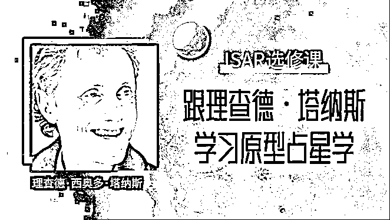

**原型占星学**

**原价 6800 元**

占星学的基本原则是，每颗行星都代表了特定的原型力量或法则，影响着人类的世界。天上行星形成的模式和地上人们生活的模式息息相关。对于每个个体来说，其出生时的时间和地点反映了他们人生和性格中的基本原型模式。

占星学使人们有机会更加了解自己的生命。它的周期、高潮与低谷、危机和突破、重大变化和转化的时期，都写在行进星图上。行进指的是相对于出生时行星的位置，当下天空中的行星位置构成的特定几何图形。这些图形的特性所涉及的行星及其位置，几乎总是与当时人生体验的原型特性一致。

因此了解原型对透彻理解和运用占星学格外重要。那么，什么是原型？什么是原型占星学呢？它在我们的生活中是如何运作的呢？西方著名文化历史学家、研究原型占星学 30 年余年的理查德·塔纳斯将为我们打开原型占星学的大门。你关于原型占星的诸多疑问都将得到解答。在这门课上，我们不仅会学到理论知识，还会在各种示例中感受到原型的力量和它的运作，音乐、视频、图像也会是这些示例的一部分。此课程可作为 ISAR 选修课。

**课程内容简介**

每次课程时长 2 小时，共 8 次课，安排如下：

**授课重点**

☆ 原型占星学的基础

☆ 实际应用（用于自我认知、从容生活、情感关系、心理治疗）

☆ 更大的意涵（哲学的、宇宙的、历史的）

**知识点**

☆ 一致性的基本形式：出生星图、个人行进、世界行进

☆ 占星学如何运作，共时性的角色

☆ 占星学中的命运和自由意志问题

☆ 原型的本质/基本特征

☆ 行星的意义以及它们的组合

☆ 主要相位

☆ 如何把握一张出生星图最重要的主题

☆ 评估个人行进

☆ 评估世界行进

☆ 重要的是认识到原型的多元性，以及在共同创造性地展现我们出生星图和行进的潜能的过程中我们所扮演的角色、所具有的力量和所肩负的责任。

**第 1 课：开课欢迎致辞**

介绍我们将在该课程中涵盖的内容

占星学和心理学如何互相启发，互相增强

我的占星学之旅

是什么让原型占星学与众不同

课堂讨论，提问与回答

**第 2 课：原型占星学的基本概念框架**

运作方式：因果关系和共时性的议题

命运和自由意志

理解原型

**第 3 课：行星的意义，从发光体太阳、月亮开始，到水星、金星、火星、木星、土星**

**第 4 课：外行星天王星、海王星、冥王星：“银河使者”**

**第 5 课：观察运转中的行星，第一部分：艺术、音乐、电影、喜剧（指定的电影）中的示例**

**第 6 课：观察运转中的行星，第二部分：艺术（指定的电影）中的更多示例**

**第 7 课：个人行进，以及如何带着占星学的觉知投入到生活之中**

**第 8 课：世界行进，以及以占星学更宏大的哲学意涵来理解我们在历史上所处的时刻**

**恒星**

**原价 6800 元**

灵魂深处，无意识深处，宇宙深处……细微的火花闪耀着被遗忘的事件、古老的神话和遥远的恒星之光。正如所有这些恒星都不再位于我们上一次看到它们所处的地方一样，每一个神话对星座的描述都代表着我们不停经历的相对现实，因为在每个生命的最深处，都蕴含着神话代码的无意识法则。这个指引人在命途中前进的代码被称为命运。每个现实都由 3 部分组成，恒星描述的部分是人类现实中最深刻和一成不变的，或者说这个部分引领带着相同故事和扮演相同角色的灵魂穿越世代，穿越由这个神话所连接的各个轮回转世，穿越人的基因遗传。太阳掌管意识，月亮代表潜意识和做梦，而且正如你可能会猜想的那样，恒星象征深刻的境界、无梦的睡眠和无意识。每个层次的现实有自己的光，层次越深，光线越暗，命运就越不可避免。然而，越接近这些构成天文星座的恒星，我们可以看到的光就比我们的小太阳更多，因为每一颗恒星都代表着一个人内心深处的巨大太阳，它拥有自己的生命和围绕自己旋转的行星。正如由于无意识的神话代码，每个人都代表着他们自己的宇宙一样。恒星代表命运的特定支柱，因为它们是从存在的无意识层面运作的。恒星以非常独特的方式反映了人类命运的主要神话。面对如此浩瀚的宇宙恒星课题，我们邀请到了恒星课题研究的先驱专家、ISAR 主席：亚历山大·因舍阿吉克老师，他深入研究恒星在占星学中的应用并出版了 600 页的相关著作《命运的支柱-占星学中的恒星》，亚历山大老师创办的约翰尼斯·开普勒占星学院，开设成熟专业的恒星课程，若道占星首次邀请亚历山大老师给中国占星学子亲授本次恒星课程。此课程可作为 ISAR 选修课。

**课程内容简介**

每次课程时长 2 小时，共 8 次课，安排如下：**第 1 讲：导论与主要天文星座**存在的层面我们的存在有 3 个关键层面，占星学的影响也有 3 个主要层面。其中之一就是恒星的影响层面。神话编码恒星星座或星团代表着神秘的丝线所编织的网，它们创造了我们的集体命运，也创造了个人的命运。其基石是由融入集体无意识的存在或本质中的原始神话组成的，因此代表了人类的基本编码。天文星座所赋予的神话是现实的基本框架，也是案主在实现神话或部分神话的道路上内在所承载的命运的深层编码。恒星、天文星座和占星学星座我们应该一直谨记黄道占星星座和黄道天文星座之间的重大区别。恒星和天文星座所使用的容许度恒星对不同的行星和四轴的影响力不同，其容许度取决于好几个因素。恒星影响的传导物行星和宫头主要的天文星座天龙座、英仙座、武仙座示例，案例研究**第 2 讲：皇室天文星座**组成“皇室”的天文星座主宰着北方天空，主要包括埃塞俄比亚国王和王后（仙王座和仙后座）以及他们的女儿仙女座。示例，案例研究**第 3 讲：一等星**每颗星等小于 1.5 的恒星都是一等星。这些恒星的总共有 20 颗，最大的是天狼星(大犬座α)，-1.46 星等。即使天狼星和其他恒星的星等为负数，在占星学的意义上，它们也被称为一等星。一等星是最大的恒星，由于它们的体积最大，它们的影响力也最大。它们除了具有特定的性质外，还能增强案主的生命力和力量，因此能提升案主的潜能。**第 4 讲：黄道天文星座 1（白羊座到巨蟹座）**黄道天文星座与黄道占星星座类似。黄道占星星座是根据黄道天文星座来命名的，这是它们之间的所有关联，在回归黄道占星学和恒星黄道占星学中都是如此。我们还要了解的是，有 13 个黄道天文星座和 12 个黄道占星星座。尽管黄道天文星座和黄道占星星座在占星学意义上并无联系，但是它们是相关的，通过了解黄道天文星座的性质，我们可以增进对黄道占星星座性质的理解，而这正是回归黄道占星学和恒星黄道占星学的基础。因此，我们会将黄道天文星座分成几个小组来讨论。前 4 个黄道天文星座中的恒星（白羊座、金牛座、双子座、巨蟹座）示例，案例研究**第 5 讲：黄道天文星座 2（狮子座到天蝎座）**中间 4 个黄道天文星座中的恒星（狮子座、处女座、天秤座、天蝎座）示例，案例研究**第 6 讲：黄道天文星座 3（蛇夫座到双鱼座）**黄道天文星座中的恒星（蛇夫座、射手座、摩羯座、水瓶座、双鱼座）示例，案例研究第 7 讲：剖析天文星座恒星象征存在的无意识部分，因此恒星和天文星座主要描述物理现实。剖析天文星座与解剖人体密切对应。因此，代表人类天文星座（有时是动物天文星座）身体部位的恒星与人体的部位相关，这些部位要么特别敏感，要么被强调或以其他方式与和这个恒星天文星座相关的神话的特定部分相关。此外，恒星所属的天文星座中的每一部分都有自己的象征性关联。**第 8 讲：业力占星学中的恒星**理解恒星在业力占星学中的影响，有助于我们看到灵魂的路径，以及我们当下的任务。因此，恒星让我们能够清楚地看到业力与业力之间的关联，这本身就代表完整整合的一个重要部分。

**行星交点**

**原价 6800 元**

马克老师首先会讲解基础知识，介绍行星交点是什么、行星交点运转的动力（包括日心视角和地心视角），然后他会论述丹恩·鲁伊尔晚期工作中关于月亮交点和行星交点重要性的洞见，以及它们如何在个人生活和事件中创造一个动态的意义轴，超越个人出生星图的静态画面。马克老师还将简要介绍自己的一些开创性研究，并通过精选一些反映我们共同的集体进化的现代历史事件，分享他最近的著作《行星交点与集体进化》中的洞见。我们将学习木星往外的行星交点，看到木星交点如何向我们揭示文化和宗教意识形态的集体历史进化，正如我们的文明结构所表现出来的那样。例如，土星和冥王星的交点也在摩羯座，清楚地描绘了我们所有人在这个时期试图进化所面临的挑战，因为在我们生活的世界根本结构的变化中，游戏规则正在升级。我们还将学习近期历史中行星交点的影响，包括最近木星、土星和冥王星在摩羯座的大合相，开始真正意识到当前这个时期在文明进化本身中的集体重要性。理解这些盛衰周期，我们至少可以在这些困难时期仍然抱有希望：我们不会失去一切！在整个课程中，马克老师将通过多个历史案例动态地研究这些强有力的交点配置可能如何运作。此课程可作为 ISAR 选修课。

**课程内容简介**

每次课程时长 2 小时，共 8 次课，安排如下：**第 1 讲 介绍行星交点**我们将学习行星周期如何形成行星交点，并了解日心视角和地心视角之间的区别。**第 2 讲 什么是行星交点**我们将深入学习丹恩·鲁伊尔的成熟思想，这是启发马克老师研究行星交点的灵感之源，也是他最近出版的《行星交点与集体进化》一书的灵感来源。**第 3 讲 双子座-射手座的天王星交点**我们将学习人类认知和技术如何通过天王星交点的透镜进化。**第 4 讲 巨蟹座-摩羯座行星交点**我们将进一步学习行星交点对社会和文化的影响，深入探讨落在摩羯座-巨蟹座的木星、土星和冥王星交点，并了解它们在过去 1000 年里对我们的全球社会、政治和文化思潮起着怎样至关重要的影响。**第 5 讲 海王星及其狮子座-水瓶座交点**我们将学习落在狮子座-水瓶座的海王星交点影响的不同显化，及其在疗愈中的作用；灵性意识形态的发展，及其促使事件结束的倾向。**第 6 讲 作家案例**通过原创研究，我们将学习行星交点如何影响了世界上一些最伟大的作家的人生。**第 7 讲 研究 2020 年**我们将了解 2020 年的重要意义。**第 8 讲 回顾**我们将回顾前面的课程，并探索如何通过行星交点的意涵理解月亮交点。

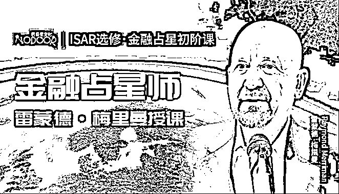

**金融占星初阶课**

**原价 7500 元**

在金融投资市场上，最重要的就是对于周期的了解。当你在错误的周期进入市场，就好像在逆风下开船，即便你是老练的水手，也可能会遭到船倾覆的结果。如果你在正确的周期进入市场，你就会有很多助力。本门课程中所介绍的技术适合于所有金融市场，不论你是个人投资者，还是职业投资者，都可以从这门课程收益。雷蒙德·A·梅里曼为世界最知名的金融占星师，也多次出任 ISAR 主席，我们很荣幸请到他为大家开设这门金融占星课程。此课程可作为 ISAR 选修课。

**课程内容简介**

每次课程时长 2 小时，共 8 次课，安排如下：**第 1 讲 与金融市场相关的周期研究中会用到的术语**周期周期性容许度范围如何估量市场周期：波峰与波谷扭曲失真平移：左、右、涨、跌 **第 2 讲 行星动力及其与经济占星学、金融占星学和世俗占星学的关联**逆行阶段和停滞阶段金融占星学和世俗占星学中的“入座”日心水星（射手座）相位：作为市场时机因素的主要相位和标准相位月节律：与股票和黄金走势的关联**第 3 讲 市场周期的结构**模式阶段子周期市场周期的牛市、熊市分别包含的 3 个基本模式**第 4 讲 趋势分析**牛市趋势的 5 个基本特征熊市趋势的 5 个基本特征占星学及其在趋势逆转中的作用介绍关键反转日期（CRD）介绍**第 5 讲 股指的长期周期**它们的阶段与子周期美国股市与英国股市（它们历史悠久）案例**第 6 讲 股指的长期周期（续）**4 年周期及其阶段占星征象与股市长期周期的关联冥王星在不同星座海王星在不同星座**第 7 讲股指的长期周期（续）**天王星在不同星座和黄道区间土星在不同星座和黄道区间北交点黄道区间**第 8 讲 行星相位及其与长期市场周期的关联**长期市场周期与长期行星周期的重叠展望未来

**金融占星进阶课程**

**原价 22000 元**

课程内容简介金融占星进阶课程以金融占星初级课程为基础，我们将回顾各种主要金融市场的长期周期及其阶段。在此框架内，将详细探讨这些周期、阶段和长期行星相位征象的关联，并指向长期投资。此课程分为两个阶段，两种授课方式：第一阶段：网络视频课第一阶段课程为 10 次网络课程，由雷蒙德·梅里曼老师及其他 4 位老师授课。每次课程时长 2 小时，共 10 次课。（1）计算金融市场的价格目标（2）原油市场周期分析与木星-海王星相位（3）成对行星周期及其与股票市场长期周期的相关性对下一次股市危机的探讨（4）木星及外行星周期与股市中期周期相关性（5）英镑长期周期与外行星周期及其相关性（6）大豆、玉米和小麦的长期周期和外行星的相关性（7）黄金和白银价格和黄金价格的长期周期与占星周期的相关性（8）恒生长期周期和中国股票市场（9）美元长期周期和地球宇宙学的相关性（10） 美国国债长期周期和地球宇宙学的相关性第二阶段：工作坊录播视频课程工作坊 1：地球宇宙学征象与交易周期的关联本阶段的课程针对短线交易者，帮助他们了解持仓 3 天到 6 个月的交易买入和卖出的最佳时机。该工作坊课程将回顾和详细说明各种金融市场的基本周期。课程将定义和演示基本周期的各个阶段，包括半基本周期、主要周期和短期交易周期，用于市场时机选择和发展交易技能。它将指导那些喜欢短线持仓 3 天到 6 个月的投资者，如何将这些行星周期用作短线交易策略之一。老师会指导大家在黄金、白银、中国和美国股指等市场中使用这些技巧。这门课程会涵盖以下主题：（1）基本周期作为金融交易市场的主要焦点（2） 基本周期的各个阶段，包括　　· 半基本周期　　· 主要周期　　· 交易周期　　· 阿尔法-贝塔周期（3）与交易周期反转一致的关键技术研究关于周期完成确认信号的关键技术研究（4） 在不同的金融市场上，某些行星在某些特定星座时，往往与牛市或熊市趋势相关。这可以根据地心或日心的位置来判断。（5） 行星在以地球为中心的运动中，转向逆行或顺行（停滞）时，某些行星停滞与不同金融市场中的基本周期有更高或更低的相关性。（6） 在不同的金融市场中，与其他行星相比，某些行星的相位与基本周期有更高或更低的相关性。（7） 如何计算大部分金融市场中的地球宇宙学征象关键反转日期，容许度在三个交易日内。（8）将地球宇宙学关键反转日期与基本周期、半基本周期或主要周期波谷或波峰的时间段重叠，从而增加市场反转的可能性，以此预示一个周期的完结。（9）通过使用特定市场的星图，然后确定行星行进与这些“出生星图”行星形成相位的时间，来提升识别金融市场反转的技巧。这些“出生星图”包括美国股市的“梧桐树协议星图”和中国上证指数的“首个交易日星图”。（10）根据对周期和地球宇宙学征象研究，一旦市场进入周期高点和/或反转的时间段，制定出一个考虑最佳风险回报参数的交易计划（当设定触发时该怎么办)。在课程的学习中，你需要一份至少可以追溯 20 年的《星历表》，其中要列出相位信息，和（或）一个能按照时间顺序列出地球宇宙学征象的占星软件。银河交易者的 FAR 软件也会有用，你可以通过其中的“梅里曼市场分析研究”功能帮助快速计算关键反转日期。本课程内容主要来自梅里曼老师的《股票市场时机终极手册第 3 卷：地球宇宙学征象与交易周期的关联》，部分涉及到《第 1 卷：指数中的周期与模式》、《第 5 卷：技术分析和价格目标》工作坊 2：太阳-月亮组合与短期市场反转的关联这是针对短线交易员的课程！！！如果你是一名短线交易者，并且想知道每个月基于太阳-月亮星座交易的最佳时间，那么这就是你不应该错过的课程！这是你在任何其他地方都学不到的课程。本课程会涵盖以下内容：**·** 月亮在各星座的行进，以及它与股票市场、贵金属和比特币价格活动的对应关系**·** 检视当日星图，查看月亮的位置（以及它与股票、贵金属和比特币价格活动的常态关系）**·** 回顾衡量太阳-月亮组合与金融市场短线交易反转（波峰与波谷）相关性的有效研究**·** 评估重要性：1 星、2 星、3 星类型**·** 重要的太阳-月亮组合与股市的关联**·** 重要的太阳-月亮组合与黄金白银市场的关联**·** 与比特币相关的重要月亮星座**·** 理解交易设置，以最优方式利用太阳-月亮的反转**·** 利用当日星图（60 分钟、30 分钟和 5 分钟星图）提升对时机的把握本课程所讨论的短线交易是指持仓（一天中的）数小时至 3 周。

**课程内容简介**

**若道金融占星学第 3 阶课程**10 节网络课，2 场 2 天的工作坊，每天 6 小时，安排如下：地球宇宙学征象与交易周期的关联本阶段的课程针对短线交易者，帮助他们了解持仓 3 天到 6 个月的交易买入和卖出的最佳时机。第 3 阶课程将回顾和详细说明各种金融市场的基本周期。课程将定义和演示基本周期的各个阶段，包括半基本周期、主要周期和短期交易周期，用于市场时机选择和发展交易技能。它将指导那些喜欢短线持仓 3 天到 6 个月的投资者，如何将这些行星周期用作短线交易策略之一。老师会指导大家在黄金、白银、中国和美国股指等市场中使用这些技巧。**这门课程会涵盖以下主题：**① 基本周期作为金融交易市场的主要焦点。② 基本周期的各个阶段，包括：半基本周期；主要周期；交易周期；阿尔法-贝塔周期。③ 与交易周期反转一致的关键技术研究。④ 关于周期完成确认信号的关键技术研究。⑤ 在不同的金融市场上，某些行星在某些特定星座时，往往与牛市或熊市趋势相关。这可以根据地心或日心的位置来判断。⑥ 行星在以地球为中心的运动中，转向逆行或顺行（停滞）时，某些行星停滞与不同金融市场中的基本周期有更高或更低的相关性。⑦ 在不同的金融市场中，与其他行星相比，某些行星的相位与基本周期有更高或更低的相关性。⑧ 如何计算大部分金融市场中的地球宇宙学征象关键反转日期，容许度在 3 个交易日内。⑨ 将地球宇宙学关键反转日期与基本周期、半基本周期或主要周期波谷或波峰的时间段重叠，从而增加市场反转的可能性，以此预示一个周期的完结。⑩ 通过使用特定市场的星图，然后确定行星行进与这些“出生星图”行星形成相位的时间，来提升识别金融市场反转的技巧。这些“出生星图”包括美国股市的“梧桐树协议星图”和中国上证指数的“首个交易日星图”。⑪ 根据对周期和地球宇宙学征象研究，一旦市场进入周期高点和/或反转的时间段，制定出一个考虑最佳风险回报参数的交易计划（当设定触发时该怎么办)。**若道金融占星学第 4 阶课程**太阳-月亮组合与短期市场反转的关联这是针对短线交易员的课程。如果你是一名短线交易者，并且想知道每个月基于太阳-月亮星座交易的最佳时间，那么这就是你不应该错过的课程！这是你在任何其他地方都学不到的课程。**本课程会涵盖以下内容：**① 月亮在各星座的行进，以及它与股票市场、贵金属和比特币价格活动的对应关系。② 检视当日星图，查看月亮的位置（以及它与股票、贵金属和比特币价格活动的常态关系）。③ 回顾衡量太阳-月亮组合与金融市场短线交易反转（波峰与波谷）相关性的有效研究。④ 评估重要性：1 星、2 星、3 星类型。⑤ 重要的太阳-月亮组合与股市的关联。⑥ 重要的太阳-月亮组合与黄金白银市场的关联。⑦ 与比特币相关的重要月亮星座。⑧ 理解交易设置，以最优方式利用太阳-月亮的反转。⑨ 利用当日星图（60 分钟、30 分钟和 5 分钟星图）提升对时机的把握。**4 门阿兰·欧肯老师的经典课程**

**奥义占星学网络课**

**原价 6800 元**

学习古老智慧教诲的首要原则做个寻求灵魂的占星师意识层面的新觉醒正在扩展和转化我们。阅读到这些词语的你们现在正在参与我们进化发展这个激动人心的阶段。这种生活潮流正在给我们的生活带来新的危机和紧张、快乐和发现。然而，对于我们中的许多人来说，直到最近这种转变才成为我们考量的一部分，或者至少，只是我们精神和情感层面上的抽象概念。奥义占星学，这个以灵魂为中心的占星学致力于应对这些状况，它打开了一扇用其他透镜解读出生星图之门。穿过这扇门会带给你更多的直觉和对生活的理解。这个占星学透镜的焦点是通过观察人格，或自我与灵魂之间的关系来支持我们的成长。奥义占星学系列网络课程的目的向你展示以灵魂为中心的占星学体系中核心部分的一些最重要的法则和原则。这需要你学习新的词汇表，这个词汇表基于你已经学习到的对传统心理占星学语言的理解。本系列网络课程将通过详细展开奥义占星学内在的核心教诲，来教授这些概念及其词汇。

**课程内容简介**

**奥义占星学系列网络课程的目的**向你展示以灵魂为中心的占星学体系中核心部分的一些最重要的法则和原则。这需要你学习新的词汇表，这个词汇表基于你已经学习到的对传统心理占星学语言的理解。本系列网络课程将通过详细展开奥义占星学内在的核心教诲，来教授这些概念及其词汇。**第 1 讲 什么是以灵魂为中心的占星学？**这一方法解读出生星图与传统的心理占星学及以事件为导向的占星学有什么区别？灵魂、人格和“彩虹桥”的结构是什么？意识和创造力的 7 个层面 7. Physical 身体 6. Astral 星芒  5. Mental 心智  (Lower) （低阶）4. Mental 心智  (Higher)（高阶）      3. Intuitional 直觉       2. Atmic 阿特密          1. Monadic 一元内化、进化和我们内在因此过程而存在的特殊张力之间的关系**第 2 讲 古老智慧教诲的 10 大法则和原则，及其在以灵魂为中心的占星学中的应用**介绍 7 道光**第 3 讲 7 道光：3 道主要光和 4 道次要光**意志、爱和智慧的光精神、灵魂、人格和 7 道光**第 4 讲 7 道光和 12 星座**7 道光和行星介绍在以灵魂为中心的占星学中两颗额外的行星：地球和火神星神圣行星，透过灵魂运作，水星、金星、木星、土星、天王星、海王星、火神星非神圣行星，透过人格运作，太阳、月亮、火星、冥王星、地球第 1 道光，意志与力量大的光，白羊座、狮子座、摩羯座；冥王星、火神星第 2 道光，爱与智慧的光，双子座、处女座、双鱼座；太阳、木星第 3 道光，积极的智力的光，巨蟹座、天秤座、摩羯座；地球、土星第 4 道光，通过冲突的和谐的光，金牛座、天蝎座、射手座；月亮、水星第 5 道光，科学技术之光，狮子座、射手座、水瓶座；金星第 6 道光，宗教、奉献、意识形态，处女座、射手座、双鱼座；火星、海王星第 7 道光，仪式性秩序之光，架构、阶级，白羊座、巨蟹座、摩羯座；天王星**第 5 讲 通过奥义之眼看出生星图是奥义占星学解读的第 1 步**12 星座的奥义守护星与传统守护星的比较**第 6 讲：上升点、太阳和月亮在以灵魂为中心的占星学中的意义**光、行星和星座的综合影响，第一部分**第 7 讲：光、行星和星座的综合影响，第二部分**在出生星图中寻找灵魂目的的公式**第 8 讲：以灵魂为中心的奥义占星学中宫位的意义**以灵魂为中心的占星学解读的第 1 步：将奥义和传统结合起来

**天王星网络课**

**原价 6800 元**

一旦从土星轨道向外走，我们就要来到 3 颗"高 8 度"的行星面前。简单说明下，在天王星，海王星和冥王星的振荡频率中蕴含的能量展现的是那些通常来说能够影响全人类的力量，但这些并不一定会在渺小的人类个体生命之中体现出来。——阿兰.欧肯老师这门天王星网络课程是阿兰·欧肯老师为中国学生量身定制的课程体系。在老师看来，生长生活在社会主义国家的我们，个体化的意识发展尤为重要，作为个体我们是谁？我们如何尝试和实现独特的个人道路？如何让个人道路更好的为集体服务？天王星会是一个绝妙的”镜头“，从这个独特的视角唤起我们的觉知。天王星：生命的觉醒、心灵的直觉才能天王星展示了个体从个性的束缚中得到解放的方式，在这个意义上，个人的启迪可以通过有意识将生命合并到一种被称为”集体人“的实体意识中去实现。这种连接最终会通向更高层次且无边无际的意识王国。

**课程内容简介**

**第 1 讲：受时间限制和不受时间限制的心智（第一部分）**天王星的真正意涵是什么？它在我们生活中的目的是什么？天王星在希腊神话中的起源如何通过这个神话理解人类意识的现实和发展？天王星和土星，天王星、土星以及月亮和你的自我感**第 2 讲：受时间限制和不受时间限制的心智（第二部分）**延续第 1 讲探讨的主题运用学员自愿提供的星图作为讲解这些原理的案例**第 3 讲：个人与集体，一段重要关系的旅程（初步讲解）**天王星在金牛座和天蝎座天王星在狮子座和水瓶座天王星和太阳认识和发展个体化自我的过程学员星图案例**第 4 讲：什么是“原型”？**天王星和水星将心智客观化以产生真正的直觉的能力占星学是“原型的科学”天王星是行星原型中的父亲开放的心灵、直觉、天王星与太阳之间的关系**第 5 讲：找到我们内在的外星人，让他成为有益的朋友。（个人可以如何为集体服务，进一步讲解）**天王星是什么类型的“革命英雄”？你是什么类型的“革命英雄”？你会在出生星图中的什么地方会发现自己的个人革命你作为个人如何成功地表达这一能量？以学员的星图为例**第 6 讲：天王星及其对关系和性的影响**星图中金星与天王星的关系天秤座和水瓶座的关系第 7 宫和第 11 宫的关系天王星在天蝎座擢升，在金牛座落陷，个人、非个人和集体层面的人际关系**第 7 讲：天王星的行进**经历激烈的个人反叛和革命的时期成为我们自己的过程白羊座天王星四分摩羯座冥王星的世代：当今的孩童（2011-2017 年出生）**第 8 讲：2019 年和 2020 年天王星向世界传递的信息**讨论当前土星和冥王星在摩羯座行进，相对于天王星在金牛座行进的意义，因为这会影响我们所有人分享一些非常具体的观察，关于 1988 年至 1995 年出生的这一代人声音的觉醒

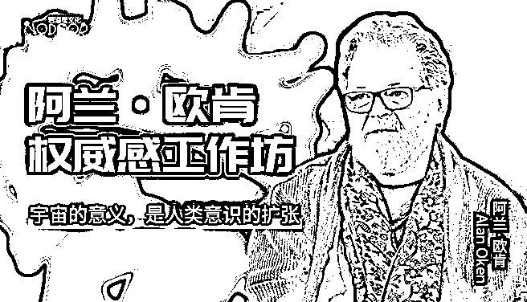

**权威感工作坊**

**原价 5800 元**

**课程内容简介**

通过深入研究出生星图，分享精妙的占星学解读，阿兰·欧肯将与我们分享如何发现自己和他人的创造力，以及如何充分利用这些天赋和才能。2 天工作坊，每天 6 小时。我们将会讨论下面这些主题：☆ 如何判断出生星图中最强和最弱的行星，以及如何正确运用意志。☆ 月亮的真正意义，以及我们如何与它合作来克服恐惧，提升月亮滋养你天赋和资源的能力？☆ 如何整合第 5 宫的创造力能量和第十宫获取成就的能量？☆如何充分利用危机和丧失的时期：勇敢地面对天蝎座、冥王星和第 8 宫！☆ 如何利用占星学来判断自己最强大的力量来源以及最可能遭遇的陷阱？

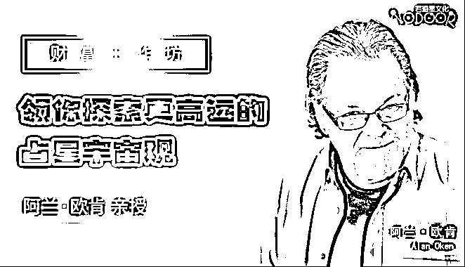

**财富工作坊**

**原价 5800 元**

**课程内容简介**

2 天工作坊，每天 6 小时。

工作坊将会重点关注出生星图中的占星元素和征象，揭示这些问题的答案。

占星大师阿兰·欧肯将带领你探索出生星图中关于富足（与贫穷！）的法则和原理。通过大师的指引，收获一把创造富足人生的钥匙~让你运用这些知识更好地在咨询中帮助个案解读跟钱相关的议题，也更好地经营自己的财富人生！**10 门斯蒂芬工作坊**

**探寻组合图永恒的三角**

**原价 6800 元**

**课程内容简介**

**组合图描述了如何才能使两个人的关系一直充满活力。**这句话中隐含的意思是假设一段关系有一种区别于这两个个体的独立的生命。有时我们喜欢和一对伴侣共度时光，却从没想过单独见他们其中一人。 我们从这对伴侣身上感觉到的 "频率"是对他们组合图能量的直接体验。在某种程度上，可以简单地理解为：**正如每个人都有自己的星图一样，每对伴侣也有他们的星图。** 从简单的描述层面上讲，这就是组合图的意涵。记住，我们可以将这一技法用于任何一种关系：**父母和子女、商业伙伴、朋友。**作为进化占星师，我们的目标要比单纯描述走得更深。解读组合图时，可以着眼于帮助人们，而不仅仅是使他们感到惊奇。 对于个体来说，出生星图代表了一条正确的人生道路，一条承诺意义、活力、灵性目标的道路。组合图亦然，只不过它将一段关系看成一个独立的个体，而不是两个人。关系也有进化的路径：人们走到一起是为了学习和成长。 个体如果没有领会自己出生星图的要点，会变得疲惫而沮丧。两个人也是如此，**如果没有抓住组合图的要点，我们就会对对方感到厌烦。这段关系似乎也会失去动力。** 伴侣常常意见不一，陷入困境，看不到前进的方向。3 是一个更有动力的数字。3 个人投票，2 个人以多数票击败一个人，推动事情继续发展。 **这实际上解释了这次工作坊的主题：永恒的三角。** **每对伴侣其实都是一个 3 人组：你、我以及我们。**组合图所代表的那个看不见的 "第 3 人"经常会"投出打破僵局的一票"，使关系得以发展。 **· **但是如果组合图总是同意一个人的意见，而不同意另一个人的意见，怎么办呢？（这被称为"封建制度"） **· **如果两个人都安静而保守，但他们的组合图却要求狂野的冒险呢？（这是 "文化冲击"） **· **如果它同时均衡地反映了两个人的情况呢？我们可以称之为 "民主"，但我们仍可以区分出一个人天然的智慧比另一个人更强的领域，让擅长的人负责擅长的事，这会促进关系蓬勃发展。 换句话说，我们开始看到这个技法的咨询维度了。我们将在这个工作坊中探讨这些内容。

 两个人究竟为什么会走到一起？**在严肃、复杂的关系中，我们可以假设两个人之间有一些未解决的业力。**如果他们在今生是恋人，但在前世中，一个是父母，一个是孩子呢？也许那些直觉和假设仍可以感受得到，极为错综复杂地使得他们在今生想要成为情侣。

 **这些疑问将我们引向组合图的月亮交点，在那里我们往往能发现当今人类任何伙伴关系问题的真正核心。**

 **从理论上讲，组合图是基于中点的。**如果我的出生星图里太阳在摩羯座中段，而你的太阳在双鱼座中段，我们组合图的太阳就在水瓶座中段。换句话说，**在你和我的太阳的中间位置。****其他行星、月亮交点和中天也是如此。**其他宫头的位置，包括上升点则存在一些争议。通常的做法是仍然使用中点，但斯蒂芬老师将会解释他认为这样做存在的技术方面的问题。他更倾向于**使用关系最初开始的地点绘制星图，就像我们使用出生地来绘制出生星图一样。** **组合图也像出生星图一样有行进。**在工作坊中， 我们将**探讨一些特殊的技法和考量，来帮助伴侣们应对生活中的挑战和机遇。**组合图的推进会出现一些看似难以解决的复杂问题，斯蒂芬老师创造了一种解决这些问题的技法。他将在工作坊中阐述相关细节，基本的问题是：如你所知，要了解一个人 30 岁生日的推进，我们要看这个人出生后 30 天的行星位置。 问题是，组合图与我们在占星学实践中使用的其他星图不同，组合图并不代表某一天的天空。记住，它是基于中点的。**那么我们如何从一个不存在的日期开始 "向下数 30 天"呢？斯蒂芬老师将为我们提供一个行之有效的答案。** 并非所有的人都处于伴侣关系中，但**作为人类，就需要与其他的灵魂共舞。占星学能够极大地帮助人们驾驭复杂的关系。**了解我的星图如何与你的星图通过相位和宫位的交互而产生互动，是非常有帮助的。组合图包含了这些技法，提醒我们，整体总是大于各个部分之和，而又与之不同。

**如何进行一场深入人心的占星咨询**

**原价 4800 元**

**课程内容简介**

如果你听过斯蒂芬·弗里斯特的占星咨询，你会看到客户被他润物细无声的咨询所打动，又感到自己被他深沉的慈悲所懂得。那些娓娓道来的故事在客户面前展开生命时空的画卷，在咨询结束时，又充满希望的力量。在斯蒂芬到中国教学 10 年后，他将第 1 次与所有热爱他的学员分享如何做好一场占星咨询。在这个网络课程中，占星大师斯蒂芬·弗里斯特将会和你分享他几十年来一对一面对面的占星咨询经验；他也会分享如何提前规划好接近客户心灵的占星技巧。客户个人星图为我们提供一个最迅速，也最可依赖地建立信任和自然连接的地图，他还会分享如何运用个人星图建立这个连接。

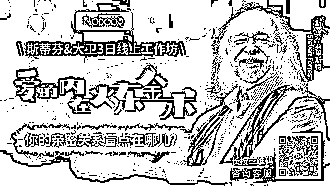

**爱的内在炼金术**

**原价 4800 元**

**课程内容简介**

关于自己的本性，你不希望了解的是什么?什么会让别人爱你变得困难?在哪些方面，你的创伤和文化状况影响了你的智慧判断，关于谁才是真正适合你的人?
**关系占星学：比对图**通常集中于两张出生星图的比较。“直接用这种方式来看待感情，就像还没上高中就开始上大学一样。”所以斯蒂芬老师还会着眼于个人星图。
个人星图上的 3 个关键区域
在这个工作坊中，斯蒂芬老师将会关注于个人星图上的 3 个关键区域。首先，我们考虑你的灵魂对于亲密关系的独特要求。你正在学习什么？激情？和平？信任？还是独立呢？其次，我们来破译你星图上关于任何可能阻碍你正确完成任务的警告信息。最后,我们来探讨星图如何描述了你的天生伴侣——也就是说, 如何在编织在你出生星图的象征符号中, 找到与你享有灵魂契约之人的描述—— 在你出生呼吸第一口空气时，这个人可能甚至还没出生。“伙伴”和“伴侣”这些词总让我们想到配偶关系，但我们在这个工作坊中探索的许多原则也适用于人类的另一杰作：亲爱的朋友之间的灵魂纽带。 我们当然会尊重所有的性别差异，因为男人和女人努力爱着对方和他们自己，无论他们的灵魂穿着何种肉体的伪装。

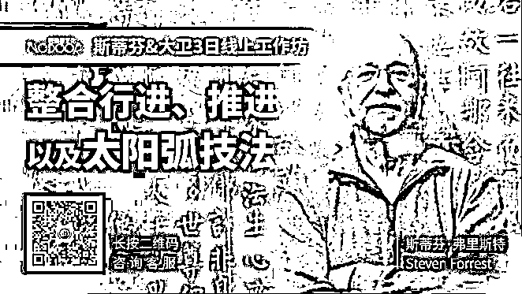

**整合行进、推进以及太阳弧技法**

**原价 4800 元**

**课程内容简介**

斯蒂芬老师总结 3 大最实用占星预测技法：行进、次限推进、太阳弧推进

整合这 3 种技法能够宏观和微观预测一个人的运势起伏和重要节点**行进（TRANSITS）**长期趋势分析行进的最好方法是先将长期的行进趋势列出来。顺序如下：冥王星、海王星、天王星、土星、木星、南北交点。通过将这些影响力持久的长期行进先列出来，你将能够发现在未来一年甚至更长的时间里你人生中的重大课题。短期趋势和触发点接下来你需要去观察那些运行得较快的星体，来判断短期趋势。不过，重要的是要清楚，这些移动较快的星体在行运中扮演着事件的“触发点”的角色，特别是当与它们形成相位的个人行星同时也与行运外行星有相位的时候！**次限推进（PROGRESSIONS）**通常也被称作“一天代表一年”推运，因为这种技术把出生后的每一天和出生后的一整年等同起来。一旦设定了这个节奏，就像定时释放的胶囊一样，这些次限推进就像某种内部的太阳系一样运转起来，和真实时间的事件、经历、情境应和。**太阳弧（SOLAR ARCS）**以太阳为核心，为众星之首，带着众星一起移动,展示人生不同阶段我们是如何体验自我、表现自我、修缮自我。此方法虽非实际星体，但却是星动推运法中准确率最高，实用性最佳的推运方法。综合以上技法我们该描述什么，该从哪里入手？如此庞杂的信息，究竟有什么是我们可以放心地忽略呢?系统的解读步骤来帮助你把焦点对准需要聚焦的地方，哪些是至关重要的？如何培养与占星符号间宝贵的直觉联系，将行进、次限推进、太阳弧推进融会贯通？

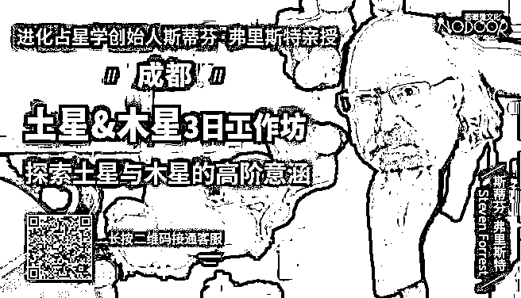

**土星&木星工作坊**

**原价 6800 元**

**课程内容简介**

进化占星学比传统心理学走得更远，比当代占星学更加深入。它的核心是——星图既代表出生时灵魂的进化条件，又代表灵魂在此生的进化目的。 

① 对于出生星图的木星和土星这 2 颗行星的深入介绍，把之前学习到的庞杂的知识信息，通过进化占星学的思路厘清：· 原型内涵· 高阶意涵· 潜在陷阱② 通过土星-木星再次学习星图的整体解读③ 土星-木星在行进、二次限、太阳弧中的深入解读④ 2020 年的土木合相、土木冥合相的重要意义及其影响

**太阳弧工作坊**

**原价 6800 元**

**课程内容简介**

成功运用太阳弧技法的关键是：因为太阳弧与太阳相关，所以太阳弧具有“太阳”的性质。这意味着太阳弧与人生明显的现实大事记直接相关。换句话说，太阳弧“运作”的方式很具体，虽然它欠缺一些推进所具有的心理深度。在实践中，**太阳弧、行进和推进组成了占星学预测的 3 大核心技法。**

在这个工作坊中，我们将**介绍太阳弧的理论，然后单独研究每颗行星和星图的四轴**。我们会特别关注**月亮交点轴线的所有重要太阳弧**，因为它们标记着打破你生命中“业力之波”的时期。 太阳弧推进中各星体的基本含义：

太阳：光亮、显扬
水星：思想
金星：优雅、爱情
火星：能量、信念
木星：提升、改进
土星：严肃、挑战
天王星：个性的增强、当前状态的颠覆、新点子
海王星：迷惑、忽视、自我抹杀、可能带来幻想和灵感
冥王星：洞察力、巨大的改变、力量

太阳弧推运的基本原则如下：

 ❶ 推进星体与出生星图中的星体成相位时，仅硬相位（合相、对分相、四分相、八分相、补八分相等，一般只用前三者）有效。几种硬相位在推进中的影响力没有分别。

❷ 重视四轴（上升、下降、中天、下中天），重视外行星，重视月亮交点。影响力较大的太阳弧主要是外行星和四轴产生的太阳弧。

冥王星带来人生观的巨大改变，及各种意义上的改变和颠覆。如果个案还是小孩，则此太阳弧的影响可能表现在父母身上，比如巨大的家庭变故、搬家去较远的地方、家庭成员的死亡、父母人生观的重大改变等等。 

海王星代表着迷惑、消沉、削弱，同时也代表想象、幻想、灵感。 天王星是围绕个人状况的不和谐音，经常和失败的计划有关，获得或失去，自立或退却等等，最重要的影响力在于人生观和价值观的变化和新生。 土星代表野心、志向、受到控制下的策略、结构上的重组，或是可能影响到人生规划的死亡事件。 木星代表“拓展力”。它既可以扩充你的智慧，也可以扩展你的腰围。这是因为木星的影响力不止于心智和灵魂，它也能让你暴饮暴食。 中天和下中天主要代表儿童时期的父母，另外中天代表自己的职业（包括改行、晋升、创业、成为创业动机的对公司的不满），下中天与家庭和住所有关（包括搬家、不动产及家具买卖、以及“新的开始”）。 上升和下降代表着自我以及对自我的认识，也代表着健康和儿童时期的父母状况。要注意的是上升和下降是联动的，所以所有与个人有关的状况都会影响到与自己亲密的人，配偶、合作伙伴等。 进化占星学比传统心理学走得更远，比当代占星学更加深入。它的核心是：星图既代表出生时灵魂的进化条件，又代表灵魂在此生的进化目的。月亮交点一直是斯蒂芬老师进化占星学里的核心元素，月亮交点如何在太阳弧技法中运用相信也会是本次工作坊中的知识亮点。 ❸ 太阳弧用于确定大致时间段，用行进和次限确定具体时间。太阳弧的影响力大致在一年左右，前六个月的力量大于后六个月。核心事件的精确激发往往是由运行较快的参数完成的，比如次限月亮和行进星体。 ❹  太阳弧推进与出生星图中形成不止一个相位时，往往代表重大事件的发生。 当工作坊结束时，你将掌握太阳弧技法的实用知识，并将它运用到你自己或你的朋友和客户的星图解读中去。

**次限推进工作坊**

**原价 6800 元**

**课程内容简介**

3 天工作坊，每天 6 小时。预测技术中，斯蒂芬老师认为，推进是和行进一样重要的技术！！！重要的话讲三遍。他们都能描绘出我们灵魂进化和心理发展的时间轴，展现我们的生平故事。行进或许“更有意义”，因为它们指的是天空中真实发生的运动，但不要被这个简单的事实误导了。推进就像是你出生时设定好的生物钟，它完全与行进一样有力。可以这样思考：一对夫妇生了一个孩子，他们请我“做一些预测”。我说：“在接下来的 18 年左右，她每天都会长高，之后她会变得更丰满。30 岁左右，我们会开始看见她有些白头发了。”大家可能会笑，但这都是非常靠谱的描述。这些生理进程像生物钟一样与我们的机体紧密相连。推进也是这样运作的，它们是你出生星图的 DNA，预测进化主题发生的时间，有时是进化危机发生的时间。行进是集体共有的，因为我们都在同一片天空下生活，而推进纯粹是个人的，是独特的、内在的。但和行进一样，推进也只是围绕出生星图移动的一些点，形成相位，触发成长，促使事件发生。预测时仅使用行进，就像吃鸡蛋不放盐一样，缺少了一些基本要素。占星师们常对推进感到畏惧，但推进的使用并不比行进复杂。在本次工作坊中，斯蒂芬老师将介绍推进的理论和实践。我们将深入研究推进的太阳、月亮、水星、金星、火星、上升和中天，理解它们的内在含义、共时性关联和潜在的功能障碍。（由于其他行星的推进过于缓慢，它们不是实用的工具。）正如一直以来运用进化占星学的目的，不是为了让人们惊愕，而是帮助人们。我们可以明智或愚蠢地应对推进。我们不是被推进操控的木偶。相反，推进为我们提供更高的洞见，以及抵达那儿的方法。

**冥王星工作坊**

**原价 6800 元**

**课程内容简介**

3 天工作坊，每天 6 小时。进化占星学比传统心理学走得更远，比当代占星学更加深入。它的核心是——星图既代表出生时灵魂的进化条件，又代表灵魂在此生的进化目的。在神话中，冥王星是地府的主人。在你的意识结构中，它也扮演着类似的角色。我们每个人内心都有一处“地府”，用来存放我们在生活中体验过的所有创伤经历。也许我们遭到了背叛，也许父母让我们失望了，也许有人欺骗了我们。有时，这些创伤经历如此极端，我们只能将其完全压抑起来。也有时，我们将其安全地归为“铭记”，但用一种不会威胁到自我和自我防御的方式去合理化和解释它们。在心理上，这些做法都是必要的，我们无需感到羞耻；但有时，当我们达到生命的某个阶段时，我们会变得足够强大来面对这些内在的创伤，取回被困在其中的能量和创造力。而代表这一时机到来的占星学征象总是涵括冥王星，我们不仅可以在星图，也可以在生活中看到这样的信号。这些冥王星式的创伤有时也神秘地植根于遥远的过去：那些前世未解决的伤害。比如，如果你有一世是奴隶，也许这一世我们会看见你在为一个让人十分不快的老板打工，并且想弄清楚为什么这个工作拴住了你。冥王星在出生星图的位置，加上南交点，为理解这些深层创伤的本质提供了巨大的洞见。更重要和珍贵的是，它能指引我们如何疗愈这些创伤。与此同时，冥王星的行进“打开了黑暗之门”，让我们知道开启“地府之旅”，取回灵魂的时机到了。这样的说法也适用于其他任何触发出生星图冥王星的重大行进和推进。在本次工作坊录制视频中，我们将探索这些技术背后的理论。并通过两个学员实际的案例，解读如何将所学的知识应用于星图中冥王星元素的解读。

**海王星**

**原价 5800 元**

**课程内容简介**

3 天工作坊。

✦ 海王星代表的能量能够将我们提升至最高的意识状态，也可以让我们突然坠入自己制造的幻觉地狱。它虚构的心灵敏感性可以让我们听见天使的低语，也可以让我们对自己的愚蠢和妄念制造的痛苦高度敏感。要正确运用海王星，我们必须有目的地踏上某种灵性道路。✦ 你的道路在哪里？如果海王星在第 10 宫，可能会涉及某些俗世的使命，潜在的陷阱是你可能会因灵性而“出名”。海王星落在第 12 宫，你的道路可能是完全隐匿而隐秘的。如果海王星合金星，你无法独自上路。换言之，出生星图中的海王星配置指出了你灵性意图中最实际、最有效、最个人化的方向。✦ 海王星会让我们警惕哪些愚蠢行为呢？人们被自己的敏感性所吞没，落入陷阱之中。占星学警示我们过量饮酒的危险。的确如此，但还有许多其他海王星的囚牢。你的星图将它们全都描绘出来了。 ✦ 进一步来看，我们该如何做好准备，以最佳方式善用强大的海王星行进、推进、太阳弧阶段呢？如同我们所看到的，有时候，真正的智慧之路在于全然无为地等待愿景出现。✦ 在 3 天的强化工作坊中，斯蒂芬老师将以一种切实、个人化、赋予力量的方式，来引领我们深入了解海王星的各个面向，探讨海王星的种种细微差别。

**月亮工作坊**

**原价 5800 元**

**课程内容简介**

1. 深入而专业地从星座、宫位和相位的角度来认识月亮

✔次限月亮在 12 星座✔次限月亮在 12 宫位 2. 深入探讨已被遗忘的奥秘——月亮的 8 个阶段（八相）✔出生星图月相✔次限月相 3. 重拾重要而常常被忽视的占星谜题碎片✔阴性法则✔月亮的速度✔赤纬✔越界月亮 4. 月亮在星图中的综合解读

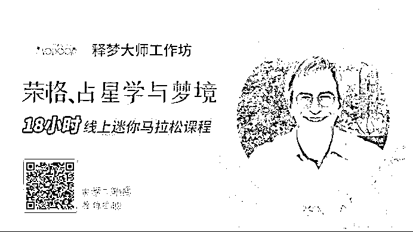

**格雷格·博加特大师工作坊****‍**

**课程内容简介**

梦境工作和做梦疗法是深度心理治疗的一个关键技术，使得深层无意识的象征性语言能够传递它们的洞见，并指引患者走向更大的完整。 梦境使带有情感成分的无意识材料安全而快速地进入意识层面。它们帮助找到治疗的重心，指引治疗的方向。梦境提供了重要的线索，告诉我们客户痛苦的来源，以及哪些情绪和情结需要被检视和处理。梦境工作可以成为心灵成长和行为改变的强大催化剂，它有种独特的能力，促进疗愈从内在发生。梦就像冰山从无意识的深水中浮现出来。有些冰山属于过去，帮助我们理解过去的创伤和未消化的回忆，因此是回溯性的。梦境有种整合的能力，因为他们能使我们觉知和化解很多次人格之间的矛盾。梦境也有前瞻性或预期性，那是来自未来的冰山，会呈现出将要发生的事情，显现出个人有可能成为的样貌。梦境既向后看也向前看，它的本质功能是扩展意识、觉知和身份的疆界。我在梦境工作中主要使用的技术，是以开放的好奇心，主动探求梦境中每个角色、地点和行为的当下意义——每个元素都反映出梦者的心灵状态和当前的生活情境。被梦境所揭露的信息，往往既幽默，又充满矛盾，而且为我们打开了新视野。怀着一种敬畏的心态，我发现每个梦境都是意识海洋深处的一颗珍珠。反思梦境的奥秘，会引发一种近乎宗教敬畏的情感，我们会惊叹于心灵描绘自身处境的能力。**第一部分：**卡尔·荣格的童年、学生时代以及投身精神病学时期的故事。《荣格自传：回忆·梦·思考》概要。弗洛伊德与荣格的关系，他们合作的破裂，荣格随后的抑郁时期，以及他借助梦、积极想象、艺术创作、曼陀罗绘画和对奥义知识（灵知）、神话和占星学的研究，转化性地面对无意识。卡尔·荣格与艾玛·荣格的占星学。荣格的力比多（心灵能量）的概念，以及他的心灵结构地图：自我、个体无意识和集体无意识。荣格对无意识原型的描述，它们对个人神话的重要性，以及它们作为个人情结的表现。自我-自性轴线，以及自我与无意识之间不断演化的关系。我们将介绍荣格解梦的基础知识以及治疗性的、以过程为导向的星图解读。我们将体验转化性原型模式在梦境和出生星图中同步显现时会发生什么。**第二部分：**梦境中的个性化及其占星学时机。出生星图随时间推移展开。整合个体无意识：梦和出生星图中的人格面具与阴影。男性和女性：阿尼玛和阿尼姆斯。梦与占星学行进描绘建立或脱下人格面具的阶段，遭遇阴影的阶段，通过阳性意识和阴性意识的结合发展出更统一的人格的阶段。**第三部分：**整体性在占星学和梦境中的象征。透过占星学符号研究梦，来深化内在生命。我们将学习占星学行进和梦境如何试图让我们意识到差异、内在冲突和极性，逐步整合对立，将人格整合成一个整体。梦境工作和星图解读中的曼陀罗原理。荣格的心理类型理论：内向型和外向型的任务。达到思维、情感、感觉和直觉的平衡。我们还将涉及使用五因素人格理论作为星图解读和梦境分析的基础的重要性。我们将学习如何解读梦境，并辨别梦的象征意义所传达的有说服力的信息，因为这与出生星图和行进有直接关联。整合占星学和梦境工作，可以带我们进入情感、关系和灵性更为一致的状态。想要进一步了解感兴趣的课程，咨询任选组合价格请添加若道 Maggie 咨询

长按二维码添加课程负责人咨询~

**报名入口**

# 周末树洞丨在这个适合“岁末总结”的摩羯座新月，你想对自己说什么？

> 原文：[`mp.weixin.qq.com/s?__biz=MzA5NjA0NTAxNg==&mid=2651497662&idx=2&sn=a9ea3d83a8d42aa2df013d97eee7d29c&chksm=8b481609bc3f9f1f42d69f616519e68faa2608fafef4b13fccbcae0f178edba5c6af4b186e6a&scene=126&sessionid=1692737705#rd`](http://mp.weixin.qq.com/s?__biz=MzA5NjA0NTAxNg==&mid=2651497662&idx=2&sn=a9ea3d83a8d42aa2df013d97eee7d29c&chksm=8b481609bc3f9f1f42d69f616519e68faa2608fafef4b13fccbcae0f178edba5c6af4b186e6a&scene=126&sessionid=1692737705#rd)

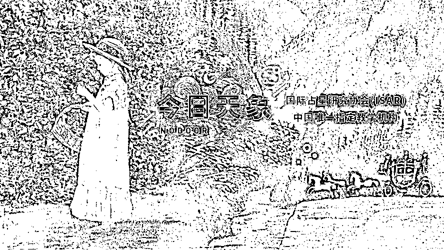

**2022 年 12 月 24 日天象：**

*   **月亮在摩羯座**
*   ****水星六分海王星****

今本周我们快步进入了宇宙的快速转变气。不仅[【太阳进入摩羯座】](http://mp.weixin.qq.com/s?__biz=MzA5NjA0NTAxNg==&mid=2651497505&idx=1&sn=2a9947ad99badda2d1fbee858f86b7da&chksm=8b481696bc3f9f803b3bf2f246f791207b8509801ae7a74b834943759562a78f6e1fa876fbca&scene=21#wechat_redirect)（点击查看文章）、木星正式进入白羊座，同时也迎来了[【摩羯座新月】](http://mp.weixin.qq.com/s?__biz=MzA5NjA0NTAxNg==&mid=2651497604&idx=1&sn=b75a4fdd38f69979c7e1081b04da0ccd&chksm=8b481633bc3f9f25bf935521a9bff19c45b16eecee10edf330610dc6c19217c05f49e1766c50&scene=21#wechat_redirect)（点击查看文章）。冬至已过，我们来到了一个新起点**，**宇宙在召唤我们拿出压抑已久的勇气和活力，为明天开辟一些新的东西。

但更为重要的是，此次摩羯座新月不单是 2022 年度最后的一次新月，也是未来两年周期性大趋势的重要起点。不过此次新月，要我们关注摩羯座相应的“过去”，这更是一场“唯有检视过去，才能解读未来”的时机。同时，年底到了，摩羯座新月也是一次很好的“年度总结”吧。

摩羯座新月，你想对 2022 年的自己说什么呢？又如何建造未来？欢迎聊聊~ 

周六快乐！

**快来领取你的 2023 年运报告吧！**

**了解每日天象，可****下载“若道”APP 查看****还有更多精彩等着你哦**

# 摩羯座新月 | 加速未来两年的转化过程，但当下请放慢脚步！

> 原文：[`mp.weixin.qq.com/s?__biz=MzA5NjA0NTAxNg==&mid=2651497604&idx=1&sn=b75a4fdd38f69979c7e1081b04da0ccd&chksm=8b481633bc3f9f25bf935521a9bff19c45b16eecee10edf330610dc6c19217c05f49e1766c50&scene=126&sessionid=1692737705#rd`](http://mp.weixin.qq.com/s?__biz=MzA5NjA0NTAxNg==&mid=2651497604&idx=1&sn=b75a4fdd38f69979c7e1081b04da0ccd&chksm=8b481633bc3f9f25bf935521a9bff19c45b16eecee10edf330610dc6c19217c05f49e1766c50&scene=126&sessionid=1692737705#rd)

****☆ **后台回复“今日”，给你一句生命态度**

作者/王芝桦 编辑/玫瑰 图片/稿定设计

**摩羯座新月**

**北京时间 2022 年 12 月 23 日 18:16 迎来摩羯座新月，太阳与月亮精准合相于摩羯座 1°32′。 **

写这篇文章的当天，我的抗原检测呈现阳性。因为没有高烧，所以最近几天一直以为只是小感冒，直到前几天出现了“宝娟嗓”才有了一些警觉。如此健康状态写下的这篇新月文章，对我而言是很遗憾的一件事，因为此次摩羯座新月不单是 2022 年度最后的一次新月，更是未来两年周期性大趋势的重要起点。我不知道自己是否有能力将此次新月的意义阐释清楚，如有不尽之处，还望大家海涵。

> **摩羯座新月重点影响人群****参考新月峰值影响期间各个行星的行进度数，以及逆行行星的轨迹影响；常规容许度，个人行星入相位 3°，出相位 1°；非个人行星入相位和出相位均为 3°。**
> 
> *   出生星图中，有**行星、四轴、南北交点**落入**基本星座（白羊座、巨蟹座、天秤座、摩羯座）0°-15**°，13**°-****30°**的人群。
> *   出生星图中，有**行星、四轴、南北交点**落入**固定星座（金牛**座、狮子座、天蝎座、水瓶座）**7°-28**°****的人群。
>     
>     
> *   出生星图中，有**行星、四轴、南北交点**落入********变动星座（双子座、处女座、射手座、双鱼座）******5°-28°**的人群。

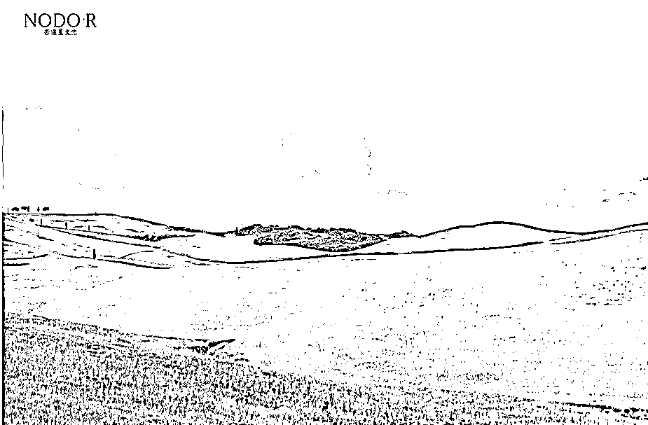

**唯有检视过去，才能解读未来**

人类是感官依赖的存在。故而，月亮隐没暗处的新月夜晚，随着“肉眼”可见能力的减弱，“心眼”的敏锐直觉便向内无限伸展，聆听内心的神圣呼唤，跟随内心的音韵舞蹈，开启理想并许下愿景。 

新月的确是适合许愿的时间，而许愿也是我们最喜欢的事情，因为许愿通往未来。但是，2022 年度最后一次的摩羯座新月，在开启 2023 年度全新征程的时刻，却提示我们——**不止要关注新月开启的“未来”，更要关注摩羯座相应的“过去”，这是一场“唯有检视过去，才能解读未来”的新月。****1****反思视角的跨年之旅**

> **天象**
> 
> **·双星逆行：摩羯座水星和双子座火星双双跨年逆行。****·水土海小三角：摩羯座水星、水瓶座土星、双鱼座海王星形成小三角结构。**

再过一周，我们就要从 2022 年跨入 2023 年了。然而当下，**代表“心智运转”能量的水星即将在 12 月 29 日于摩羯座开始逆行（逆行期 2022 年 12 月 29 日-2023 年 1 月 18 日），代表“行动意志”能量的火星正在双子座逆行（逆行期 2022 年 10 月 30 日-2023 年 1 月 13 日）。**故而，虽然每个人都巴望着艰难困顿的 2022 年快点过去，但即使 2023 年近在眼前，我们的脑和腿却未必做好了准备：**· 脑（摩羯座水星）**：我们正处于什么样的历史节点上？为什么这两年每走一步都是那么的艰难无措？现实生活的因果脉络，我们是否已经理清？从 12 月 12 日以来（此次水逆的前阴影期起始时间），我们的每一个决策和行动，又将对未来产生什么样的影响？**· 腿（双子座火星）**：从 9 月 4 日开始（此次火逆的前阴影期起始时间），我们的每一个言行举止都像骑在模棱两可的墙头上，并不知道后果如何；而前两次的“火海四分”结构（10 月 12 日，11 月 19 日），更是在敞开一些可能性的同时，拿走了一些其他的可能性。没看明白，没想清楚，不适合跑得太快。另外，此次摩羯座新月发生时刻，已于 12 月 12 日进入逆行前阴影期、即将于 12 月 29 日开始逆行的摩羯座水星，介入了覆盖 2022 年度大部分时间的“土海 30°”结构，与水瓶座土星形成 30°相位，与双鱼座海王星形成六分相位，构成“水土海小三角”结构。这里需要特别关注“土海”的近年轨迹：**· 2022 年：**行进水瓶座的土星与行进双鱼座的海王星，大部分时间处于“土海 30**°**”结构；**· 2023 年：**3 月 7 日，土星正式换座进入双鱼座；**· 2025 年：**3 月 30 日，海王星换座进入白羊座试水，10 月 22 日逆行回到双鱼座；5 月 25 日，土星换座进入白羊座试水， 9 月 1 日逆行回到双鱼座；**· 2026 年：**1 月 27 日，海王星正式换座进入白羊座，2 月 14 日，土星正式换座进入白羊座，2 月 21 日，“土海合相白羊座”结构形成。

**从 2022 年“土海 30°”到 2026 年“土海合相白羊座”的 4 年旅程，既是理想与现实的磨合之路，亦是有限与无限的魔法之旅。**我们将在这场新冠疫情的大背景下，经历意识形态的更新与变化，经历现实规则的溶解与重建，一些历史将会带着局限性离我们而去，一些全新的可能性也从无限之中悄然升起。

而此次摩羯座新月的“水土海小三角”结构，宇宙借由这颗处于逆行周期的摩羯座水星，其实已在提前 4 年的时刻向我们发出提示：

**· **此次摩羯座新月到来之际，2022 年-2023 的跨年前夕，集体也好，个人也罢，无论我们多想快速跨越这个不讨喜的现实阶段，都需要小心陷入“越忙越乱”陷阱泥沼，停止盲目急躁，梳理因果脉络，检视并反思“疫情时代下的意识形态和处理能力”；

**· **重新梳理当下需要的现实保障是什么，重新计划如何满足这些现实需求，我们不能被动地在这场时间长河中听任命运的拨弄，而是要为自己、为身边的人、为这个时代负起责任！如此才能避免在 2023 年 3 月 7 日代表“时间法则”的土星进入双鱼座、2023 年 3 月 15 日第三次“火海四分”结构来临的时候，对拉不回来的时光缰绳后知后觉。

每个人都喜欢许愿，因为许愿通往未来；但是，只有真正检视并反思过去，才能真正解读并解构未来。

**2‍****“非凡的梦想”勿忘“平凡的身躯”**

> **天象****·新月四分木星：摩羯座新月四分白羊座木星。**

这里首先回溯一下 2022 年木星试水白羊座的 5 个月时间：5 月 11 日木星换座进入白羊座试水的时刻，10 月 28 日木星逆行回到双鱼座之前的几天，这两个时间点，木星曾经先后两次碰触白羊座 0°，强烈激发出我们的“内在需求”。 

**白羊座 0°是基本星座开创点，带着超级强劲的开创性和领导力，带来非同一般的能量与意义。**木星行进白羊座 0°，木星的“扩张”能量将白羊座的“求胜意志和英雄主义”彻底激发——困顿无措的 2022 年，拼了！

然而，当时势必是木星试水白羊座的一段旅程，没准备好的英雄，也难免陷于无力。于是乎，有志不能伸的英雄，便借由 10 月 12 日和 11 月 19 日的两次“火海四分”结构（火星守护白羊座）骑在模棱两可的墙头上“拼了”，没有章法地越忙越乱，没看清楚地不知后果。

此次摩羯座新月发生在摩羯座 1°，并与 12 月 20 日正式进入白羊座、第三次碰触白羊座 0°的木星形成四分结构——**木星再次“扩张”了白羊座的“英雄主义”，但同时也“膨胀”了摩羯座的“野心需求”：**

**· **无论集体层面的国际纷争和职场波动，还是个人层面的现实保障和关系竞争，我们都将会看到“权力，观念”的激烈碰撞；

**· **然而，这个世界不再属于执着强大、执着成功的人，因为那些执着只会制造自以为是的执拗，只会降低顺势而为的弹性；在这个颇像“末位淘汰”的现实进程中，未来世界将会属于那些乐观自信、勇敢坚定的人，因为那份积极的品格将会引领适者生存并战到最后！

好，暂停一下，还是要再次强调：**此次的新月，即将的跨年，不适合跑得太快。**

在这里，引申一下这颗白羊座木星的内容：2022 年 12 月 20 日-2023 年 5 月 16 日木星行进白羊座，期间 2023 年 3 月 2 日，木星和凯龙星将于白羊座形成“木凯合相”结构，这是宙斯（木星神话原型）和喀戎（凯龙星神话原型）双神合体的时间，而这次双神合体的寓意在于——“非凡的神”亦有“平凡的阴影”。

**· 喀戎的阴影：**“半神”喀戎既是智慧的先知，亦是慷慨的医者，但喀戎却因半人半马的形象被母嫌弃而天然蒙羞，并因属于马（物质）的部位受伤而难以自治，最终只能代替普罗米修斯受难死去才获得永生；

**· 宙斯的阴影：**第三代天神宙斯在母亲的帮助下推翻了父亲的统治，在妻子天后赫拉的辅助下巩固权威，但这份得助于母亲和妻子的至上权力，对于“众神之神”宙斯而言，也携带着“被掌控”的耻辱感。故而，宙斯就用千古风流的方式不断对抗着阴性能量的桎梏，但既然不断对抗也说明从未真正逃脱过。

喀戎死后被升到天空化为射手座，而射手座的守护行星正是木星，宙斯即为木星的神话原型。故而，我们看到凯龙星和木星之间的内在联系——喀戎和宙斯这两位神，亦有自己内在的阴影。

凯龙星的阴影就像是一个人的“心理情结”，天然的羞愧，过去的创痛，隐身于生命角落，化身为“内在的小孩”，一旦触碰，如刺锥心；木星的阴影就像是一个人“膨胀的欲念”，千方百计，不计后果。

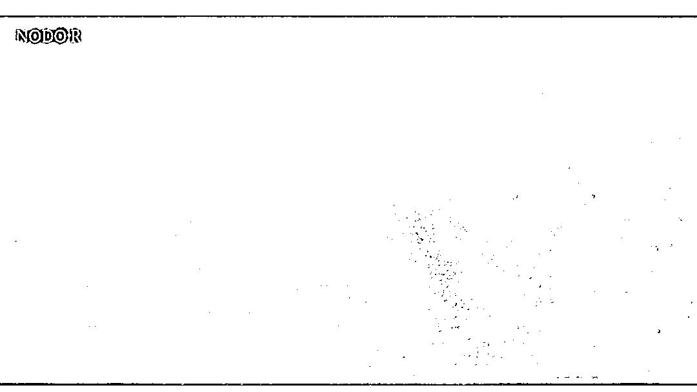

**敲黑板！划重点！ **

**· **2023 年 3 月 2 日的“木凯合相”白羊座，将会触动每个人内心深处“英雄主义”的情结与创痛；而此次摩羯座新月与白羊座木星的四分结构，是通往 2023 年 3 月 12 日“木凯合相”白羊座的一个预示点；

**· **现实环境下，面对考验时的乐观自信，超越困境时的勇敢无畏，都是非常宝贵的精神品格；但我们也必须知道，生命亦有“肉体凡胎”的平凡与有限，只有在保证身体健康的前提下，理想愿景才有机会扎根现实；

· 故而，**从此次摩羯座新月开始的未来 3 个月时间，需要我们带着“评估”的意识，觉察野心，慈悲身体，才能更成熟、更智慧、更长远地构建未来！**

现实生活确实非常紧迫，加速恢复似乎已经迫在眉睫；然而，**此次摩羯座新月也同时加速了未来两年“业力转化”的进程（2023 年-2024 年）。**

**3****未来两年的阶段性起点**

说到“业力转化”，就必须说到“宇宙超级大 BOSS”冥王星。

2008 年-2024 年冥王星行进摩羯座时期，正是影响过去将近 200 年的“土元素周期”的收尾阶段；随着 2020 年 12 月 22 日“木土合相水瓶座 0°”，影响未来将近 200 年的全新“风元素周期”已经拉开序幕。

冥王星行进摩羯座的十几年，将过去“土元素周期”一百多年的工业革命、资本主义、金融体系的发展进程推向极致，并透过 2020 年至今的这场疫情揭露出“过度发展之下的信用危机”。

这个世界似乎已经停不下来，“只能更好”的执着野心，“不能后退”的恐惧阴影，在危机重重的现实考验下变得更加歇斯底里。然而，揭示“业力核心”的冥王星是一定要促使我们做“业力功课”的，并且一定要“落地转化”方肯罢休。

2023 年 3 月 23 日，冥王星将会换座进入水瓶座，似乎标志着“摩羯座冥王星”阶段的结束；然而，这一次的冥王星换座，发生在将近 200 年才有一次的周期转换进程之中，当然就没有那么容易。

· 2023 年-2024 两年期间，随着“顺行-逆行-顺行”的脚步，冥王星将会往返穿梭“摩羯座-水瓶座”之间达 5 次之多！

· 每一次冥王星顺行进入水瓶座的时刻，每一次冥王星逆行回到摩羯座之前，冥王星都会触碰水瓶座 0°位置，而每一次的碰触都会再次敲响全新“风元素周期”的钟声；

· 2023 年-2024 两年期间，全新“风元素周期”的钟声将被来来回回敲响 5 次，反复提示——**只有完成“摩羯座冥王星”阶段的业力功课，才能进入“水瓶座冥王星”的全新进程。**

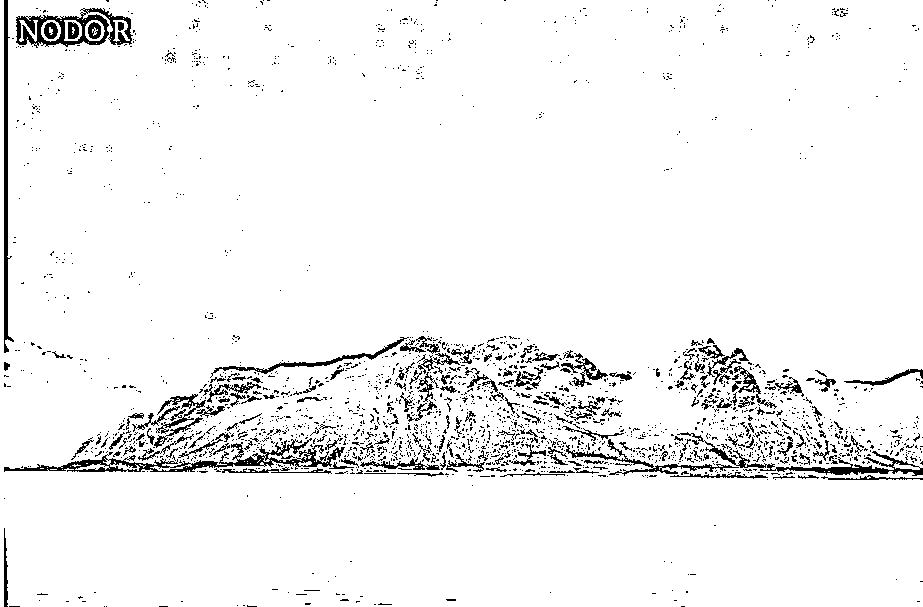

**敲黑板！划重点！ **

此次摩羯座新月是冥王星即将开始穿梭“摩羯座-水瓶座”轨迹之前的最后一次摩羯座新月，开启了未来两年转化“摩羯座冥王星”业力功课的收尾进程——

**放下“只能更好，不能后退”的业力执着，不再以世俗的价值界定自我的价值，不再以狭隘的结果界定自我的成功，如此才能联结内在的感受，才能重拾内在的天性，才能奔赴“水瓶座冥王星”的全新旅程。**

其实，写到这里，我们不难发现此次摩羯座新月可真是并不简单：一方面给出“唯有检视过去，才能解读未来”的提示，另一方面给出未来 3 个月需要有意识“评估”、未来两年必须转化“业力功课”的预示。

故而，虽然每个人都喜欢许愿，因为许愿通往未来；但是，**此次摩羯座新月，我们首先需要“评估”一下，什么才是对未来真正有效、具有建设性的策略。**

**寄语**

最近一周让我感到难过的是，窗前时常呼啸而过的 120 声音，在这个即将跨年的冬日显得那么的无情与紧张。每个家庭都难以承受爱的离去，那是时间难以抚平的遗憾与创伤。

还有一些令我触动和眼眶湿润的事，发生在我的朋友和我的学生身上：我的朋友开了两家门店，转阳发烧两天，退烧后的她立即恢复了工作，她说“成本太高歇不起”；我的学生有两个宝宝，家里陆续转阳的时候，她一方面要全力以赴地照顾家人，另一方面要拼命地喝汤泡脚让自己出汗，她说“责任太重倒不起”。

感觉心疼，也感觉无力，但当我看见她们很努力地适应、很积极地坚持的时候，我又倍感振奋与震撼，同时觉得自己有些脆弱和矫情。我们都是凡人，有时并不是我们想当英雄，而是当不起不当英雄。

在此，祈祷所有生命安然无恙，祝福每一个生命健康，每一个灵魂安好。

**新月如何许愿？****许愿时间**：2022 年 12 月 23 日北京时间 18:16 后，48 小时内有效、8 小时内最佳。 **许愿人群**：所有人。**许愿数量**：每人最多 10 个。**许愿方式**：静心冥想，身心祈祷或记录收藏。**许愿格式**：请万能的宇宙赐予我能量，我将以我的能量吸引**（什么）来到生命中……**许愿原则**：发心诚善利人。

**版权声明**：原创文章由作者授权首发于若道平台，欢迎转发，反对抄袭。友号转载请申请白名单。

**END**

****想阅读更多作者的文章，请在后台回复******王芝桦****** 即可。****

****王芝桦****

心理占星师，统合疗愈师，占星专栏作者

全职于个案咨询与占星教学工作 18 年

**个案预约咨询微信号**：zhihua0621 

**微信公众号**：daoxi-life

**长按打赏**

****

**快年底了****不给自己一份来自占星学的礼物吗？**

**梅里曼金融报告双 12 福利来啦！****长按下图了解更多详情吧！**

**20 位来自世界各地的占星师**
**带来 19 场沙龙——新世界的觉醒****详情可点击下图**

**学习占星学****点击下图了解课程详情**

**福利来啦**
**点击****“阅读原文”****获取最好用的免费****新月报告****微信又双叒叕改版啦，不想错过若道君的推送？**
****就把若道设为****星标****以及点点****“在看”****吧！******▼**

**喜欢就点一下“在看”吧！****免费新月报告直达入口**

# 黄金会在 2023 年 1 月迎来开门红吗？| 雷蒙德·梅里曼黄金周期 2023 年 1 月报告

> 原文：[`mp.weixin.qq.com/s?__biz=MzA5NjA0NTAxNg==&mid=2651497604&idx=2&sn=e5384c0186cfa62038e509cc1c7a33d0&chksm=8b481633bc3f9f25a0298d14ac6fe79dee497f37b9b913d18f2678de3703033f286ff6378993&scene=126&sessionid=1692737705#rd`](http://mp.weixin.qq.com/s?__biz=MzA5NjA0NTAxNg==&mid=2651497604&idx=2&sn=e5384c0186cfa62038e509cc1c7a33d0&chksm=8b481633bc3f9f25a0298d14ac6fe79dee497f37b9b913d18f2678de3703033f286ff6378993&scene=126&sessionid=1692737705#rd)

  

**1 月黄金报告**

“**黄金是金钱。其他的只是信贷。**

**——约翰·皮尔庞特·摩根**

”

| 黄金周 K 线图

  

| 黄金日 K 线图

从 9 月份最低点反弹 10%以后，黄金在 12 月波澜不惊。黄金的 31.33 个月周期的半周期——16 个月周期已经在 11 月 3 日 1618 触底，因此目前我们是在一个新的 16 个月的半周期内。

在过去的黄金月报里，梅里曼老师预测，“我们期待黄金出现 2-5 个月的反弹，上涨 200-300 美元。”截至 12 月 5 日，黄金价格已经反弹 200 美元以上。美联储 12 月 14 日批准将利率上调 0.5 个百分点，并暗示计划到明年春季都会加息，以抗击高通胀。这是美联储今年连续第七次加息。

**黄金会在 2023 年经过调整继续反弹吗？还是反弹会到此止住？**1 月份黄金报告已经上线，上证报告也已上线。欢迎了解。也可以按照季度和 1 年期订阅，有更多优惠。季度和年度的好处是，你可以持续了解梅里曼老师对于不断在变化的市场的看法。即便他某一次看法和市场不一致，你也看到在下一期他如何调整自己的看法，并看到金融占星在一个长期时间段内对你把控风险的帮助。而能够长期控制风险、尽量找到安全的投资时机才是投资的长久之计。点击阅读原文，雷蒙德·梅里曼黄金周期 2022 年 11 月报告带来有 40 年黄金市场研究经验的世界著名金融占星大师雷蒙德·梅里曼对当前黄金市场的研究。**此外，雷蒙德·梅里曼 2023 年预报及沙龙已开始双 12 优惠预售，将帮助你对 2023 年的市场风云变化加深了解。**投资有收益，投资有风险，希望金融占星学的研究帮助你更好地评估你的投资。从 2018 年年末，若道引入金融占星大师雷蒙德·A·梅里曼撰写的梅里曼市场时机学院每年一次的年度预报沙龙和每年一本的《年度预报》以来，**2023 年已经是第 5 个年度了。我们简单回顾了部分 2019-2022 年金融预报的内容，**过去的经验让我们相信，你根据梅里曼老师的指导作为投资参看，你会比一般人有更大的胜算。******长按下图识别二维码****了解更多详情**

**1 月黄金报告上线**

**黄金月度报告价格****单月报告**：280 元/月 **季度套餐价格**：780 元（260 元/月）**年度套餐价格**：2400 元（200 元/月）**双报告年度套餐更优惠（直降 900 元）****12 个月黄金报告+12 个月上证指数报告：仅需 3900 元****长按下图识别二维码购买黄金报告**
▼

**梅里曼金融报告双 12 福利来啦！****长按下图了解更多详情吧！**

**购买者需知**

**① **梅里曼市场时机学院《中国上证指数月度研究报告》是梅里曼市场时机学院（以下简称 MMA）的研究“预报”，而不是市场“预测”，是梅里曼老师及 MMA 金融占星分析师对人类活动周期历史与行星周期之间相关性的研究，二者在大部分情况下具有 80%或更高的相关性，而不是因果关系。报告中的研究完全存在错误的可能性。即便是非常认真的研究和几十年的研究经验，金融占星师无法总是正确地解读出各种征象在实际层面上会如何相互作用，并显化为事件结果。

所以请将报告看作一个研究参考，务必结合其他市场研究和你个人对市场的理解，根据你的自由意志做决策。

**②** 此报告一旦售出，**即不接受退款。**

**③** 上证、黄金月度报告每月固定 1 期，**并非都是在每月相同日期发布。**

**④** **我们收到英文报告的当天，即发布该英文报告。3 天后，上线报告中文版。此报告仅支持手机网页阅读，不支持电脑阅读和下载。****以上须知，请仔细阅读。一旦付款，即视为已了解并接受所有须知内容。**在过去的 40 年中，唯有梅里曼逐渐完善，并在梅里曼市场时机学院月度周期报告中阐释了将地球宇宙学与周期相结合的研究方法，以惊人的精确性预报了黄金价格发生重大变化的时间。**黄金购买 Tip**

各大银行均可购买黄金或黄金 EFT 基金，也可以在诸如天天基金或者支付宝购买黄金及黄金相关产品。不明白的可以百度搜索。

**购买后如何查看报告？**

**购买后有疑问怎么办？**请联系技术客服
**微信：nodoor201705** **购买直达入口**

# 2023 年 ISAR 选修课 | 预测技法三日工作坊，了解人生重大事件

> 原文：[`mp.weixin.qq.com/s?__biz=MzA5NjA0NTAxNg==&mid=2651497604&idx=3&sn=6cf4ef4813197a5a2aa21ef76dbc6746&chksm=8b481633bc3f9f25e9929decc5f35470dd849b31b1f3230eb534978c190f69f2160f4e083a01&scene=126&sessionid=1692737705#rd`](http://mp.weixin.qq.com/s?__biz=MzA5NjA0NTAxNg==&mid=2651497604&idx=3&sn=6cf4ef4813197a5a2aa21ef76dbc6746&chksm=8b481633bc3f9f25e9929decc5f35470dd849b31b1f3230eb534978c190f69f2160f4e083a01&scene=126&sessionid=1692737705#rd)

**授课内容**

 本次 3 日课程将深入学习人本主义占星师使用的 3 种预测技法。

我们将深入学习如何分析**行进**，强调对**行进的周期性**理解。我们将通过**次限**研究星图中展现的变化，并学习运用**太阳弧**来标记生命中的关键事件。虽然还有其他有用的技法，比如太阳返照和月限法等，但对**行进、次限和太阳弧**能量的谨慎回应已经提供足够的信息来指导我们的人生。

**行进（TRANSITS）** **长期趋势**分析行进的最好方法是先将长期的行进趋势列出来。顺序如下：冥王星、海王星、天王星、土星、木星、南北交点。通过将这些影响力持久的长期行进先列出来，你将能够发现在未来一年甚至更长的时间里你人生中的重大课题。**短期趋势和触发点**接下来你需要去观察那些运行得较快的星体，来判断短期趋势。不过，重要的是要清楚，这些移动较快的星体在行运中扮演着事件的“触发点”的角色，特别是当与它们形成相位的个人行星同时也与行运外行星有相位的时候！

**次限推进（PROGRESSIONS）**通常也被称作“一天代表一年”推运，因为这种技术把出生后的每一天和出生后的一整年等同起来。一旦设定了这个节奏，就像定时释放的胶囊一样，这些次限推进就像某种内部的太阳系一样运转起来，和真实时间的事件、经历、情境应和。

**太阳弧（SOLAR ARCS）**以太阳为核心，为众星之首，带着众星一起移动,展示人生不同阶段我们是如何体验自我、表现自我、修缮自我。此方法虽非实际星体，但却是星动推运法中准确率最高，实用性最佳的推运方法。

课程有两个方面的重点：**强化自我学习**，把对过去生活事件的理解作为预测未来趋势的基础；**学习有效的占星咨询技能**，以一种精准、生动、策略性和鼓舞人心的方式阐述星图。与格雷格之前开设的课程一样，这次课程会有**大量互动**，老师会与案例学员互动，同时通过学员间的讨论，互相激发，获得更多启发。如果可能，还会设置**训练环节，练习基本的预测和解读方法。**

**课程安排**

 **· 2023 年 3 月 4 日 周六  8:00-14:00
· 2023 年 3 月 11 日 周六  8:00-14:00
· 2023 年 3 月 18 日 周六  7:00-13:00**

**什么人适合学习本课程？**

 **·**占星师或渴望成为占星师的人群。  **·**本课程并非针对初学者，需具备若道核心课程 level4 及以上水平，即了解星座、行星、宫位、相位等。

**· **课程会涉及行进&推进&太阳弧解读高阶内容，不了解相关知识的同学，请提前学习相关内容。

**老师介绍**

**格雷格·博加特（Greg Bogart）**

**· **占星师、心理治疗师。格雷格出生于美国纽约市，就读于卫斯理大学。1986 移居旧金山湾，完成了加州整合大学和赛布鲁克大学的研究生课程。**· **格雷格自 1991 年以来一直是一名有执照的心理治疗师（LMFT 28276）。他是国际占星研究协会（ISAR）认证的占星师，并拥有美国地球宇宙学研究协会（NCGR）的第 4 级认证。**· **他还在旧金山的艾扬格瑜伽学院接受过培训，并于 1992 年毕业且获得了瑜伽教师认证。**· **格雷格是一名私人执业的心理治疗师，在索诺玛州立大学担任心理学讲师，他在该校教授“成人发展中的转变”、“以深度为导向的心理治疗”、“神话、梦与象征”以及“存在主义心理学与超个人心理学”等课程。**· **他在加州整合大学、约翰·F.·肯尼迪大学、多米尼加大学和超个人心理学学院教授咨询心理学和东西心理学课程。**· **他的研究结合了冥想、哈他瑜伽、荣格解梦、存在主义心理疗法和精神综合，**占星学的行星周期智慧和原型象征**。

**格雷格·博加特博士著作：** 《占星学的高八度音阶》（*Astrology’s Higher Octaves*） 《行星用于治疗》（*Planets in Therapy*）《占星学与灵性觉醒》（*Astrology and Spiritual Awakening*）《梦境工作过与自我疗愈》（*Dreamwork and Self-Healing*）《梦境工作在抑郁症整体心理治疗中的应用》（*Dreamwork in Holistic Psychotherapy of Depression*）《占星学与冥想：对变化的无畏沉思》（*Astrology and Meditation: The Fearless Contemplation of Change*）

**推荐阅读：**

史蒂芬·阿若优：《生命的轨迹》

Bogart, G., Planets in Therapy; and Astrology’s Higher Octaves.

Tyl, N., Prediction in Astrology.

Ruperti, A., Cycles of Becoming. 

**课程价格**

**正价：6800 元 早鸟价：5800 元 早鸟价截止日期：2023 年 2 月 15 日**

**惊喜联报套餐！！****《ISAR 选修课 | 预测、预期与意识成长》+《2023 年度天象预测大师课》+《2023 年金融占星预报》****三门联报优惠价 8000 元****（限前 50 名联报）（联系 Maggie 老师，抢占限量优惠价）**

长按二维码添加 Maggie 老师获取联报优惠价

**退转课程**

退款原则请详看《教学协议》，如有疑问请咨询课程顾问。 ****2023 年 ISAR 选修课 | 预测、预期与意识成长****

**授课老师：****格雷格·博加特**

**直播课开课时间：2023 年 3 月 4 日（周六）3 月 11 日（周六）3 月 18 日（周六）**

**授课方式：******网络授课，英文/中文授课，中文翻译****

**费用：****** 正价：6800 元；早鸟价：5800 元；早鸟价截止日期：2023 年 2 月 15 日****

**课程负责人：Maggie 老师**（微信：NodoorMaggie，请备注“2023 预测课”）

长按二维码添加课程负责人咨询

**报名直达入口**

# 摩羯座新月 | 稳扎稳打，循序渐进，这份年费的新月报告给你安心

> 原文：[`mp.weixin.qq.com/s?__biz=MzA5NjA0NTAxNg==&mid=2651497604&idx=4&sn=267a446a1b0679e15b7a29a55738769a&chksm=8b481633bc3f9f25eb68986e6fa6026a6faf88db50a9908bc63e35a4e686af3908042da8ec88&scene=126&sessionid=1692737705#rd`](http://mp.weixin.qq.com/s?__biz=MzA5NjA0NTAxNg==&mid=2651497604&idx=4&sn=267a446a1b0679e15b7a29a55738769a&chksm=8b481633bc3f9f25eb68986e6fa6026a6faf88db50a9908bc63e35a4e686af3908042da8ec88&scene=126&sessionid=1692737705#rd)

北京时间 12 月 23 日 18:16，新月发生在摩羯座 1°32′。每到新月时分，若道君都会为你奉上根据你出生星图量身打造的免费新月报告。可是新月为什么要许愿？新月报告该如何领取？让若道君来教你。

　**什么是新月？**　

从占星学看，新月是月亮周期的一种相位。新月是开始，又称为朔，对应中国农历初一，太阳、月亮在此时合相。此时月亮运行到太阳与地球之间时，月亮以黑暗的一面对着地球，并且与太阳同升同落，地球上看不见月亮。

本次新月时间

**12 月 23 日 18:16，新月发生在摩羯座 1°32′。**

为什么新月要许愿？

新月是一个周期的开始，新月发生的时候，太阳与月亮合相，能量很强。当新月出现时，你也许会发现灵感忽现，非常适宜开启新领域、项目与行动，缔结一段新的关系或合作。许愿会加强新月的能量，也有助于你了解自己现阶段适合开启的方向。 

本次新月最佳许愿时间从新月开始到其后的 48 小时内，许愿的力量最强。**最佳许愿时间：12 月 23 日 18:16-12 月 25 日 18:16‍‍‍**

属于你的免费新月报告每到新月时刻，看着占星文章里写着：看看你新月的宫位，如果新月在第 X 宫，你可以许愿的方向是……是不是常常一头雾水？新月的宫位？我到底该看哪里啊？而有时，那些标注上升星座的文章也会让你忍不住想：虽然我的上升星座是这个，可是我的新月好像并不落在你说的宫位啊？你是不是写错了？

虽然这些文章都没有写错，可是好像对你而言都太不友好了。**Don't Worry！**别着急，让博学又体贴的若道君来帮你！我们推出了一份**免费**又**好用**的新月报告！而且是专门为你设计的哦，**根据你出生星图为你量身打造的，只****属于你的独家新月报告**。报告有哪些内容？**新月时间****最佳许愿时间****如何许愿 **属于你的**许愿关键词**本次新月给你的**建议**你会有怎样的**感受 ******机会****

********

如何许愿？许愿方式也很简单。你可以把愿望写下来，或者双手合十后交叉，闭上眼睛来祈祷。 报告中会为你提供**祈祷词示例**，可以多多参考哦～ 你还可以适当添加自己的语言，创造属于你自己的祈祷文！如果报告拿到手了，快对照着许愿吧！

**这份好用又暖心的报告，点击****阅读原文****即可领取！**

**END****新月报告获取入口**

# 太阳进入摩羯座 | 12 上升星座将在何处励精图治，种下希望？

> 原文：[`mp.weixin.qq.com/s?__biz=MzA5NjA0NTAxNg==&mid=2651497505&idx=1&sn=2a9947ad99badda2d1fbee858f86b7da&chksm=8b481696bc3f9f803b3bf2f246f791207b8509801ae7a74b834943759562a78f6e1fa876fbca&scene=126&sessionid=1692737705#rd`](http://mp.weixin.qq.com/s?__biz=MzA5NjA0NTAxNg==&mid=2651497505&idx=1&sn=2a9947ad99badda2d1fbee858f86b7da&chksm=8b481696bc3f9f803b3bf2f246f791207b8509801ae7a74b834943759562a78f6e1fa876fbca&scene=126&sessionid=1692737705#rd)

********************☆ 后**********************台**********************回复“今日”，给你一句生命态度********************

作者/郑玮玲 ISAR 认证占星师编辑/玫瑰 封面/书君 图片/稿定设计 12 月 22 日 5:48，太阳进入摩羯座，接下来的一个月，12 星座将会面临肉眼可见的蜕变，我们需要为此作出怎样的准备呢？一起看看吧。**冬至****12 月 22 日凌晨 5:48，太阳进入摩羯座。**这一天是冬至，阴极之至，一阳来复。冬至的太阳直射在南回归线，次日便回由南向北一度一度北归。英文里的“the Tropic of Capricorn”南回归线和“the Tropic of Cancer”北回归线，非常清晰地表达了太阳在黄道上的位置与地球季节变化的折返时空。而在我国古代历法演变中，冬至才是最初的岁首，民间至今流传“冬至大如年”的说法。上古的冬至节最初是进行祭祀仪式，用来祈求风调雨顺，人寿年丰，疫疾消散。汉代以后逐渐形成了官方仪式，有了官方的冬至假期进行拜冬、贺冬，先民们借此来添置冬装，储备食物，祭祖，拜谢高堂、师者，还有宛如我们现在过春节一样的家族聚餐。冬至三候为：一候蚯蚓结，二候麋角解，三候水泉动。鹿角向前，为阳，麋角向后，为阴，夏至一阴生，鹿角解，冬至一阳生，则麋角解。祖先总结的这个有趣现象，再结合英文里南北回归线的名称，我们便能更好的理解巨蟹座与摩羯座这一组创始星座表达着二元一体的阴阳能量。**当太阳行到摩羯，自然是天地时序重启之节点。**冬至的时空卦为坤卦、复卦。**坤卦意味着阴气到达极致，厚德载物，人们在此时应修身闭藏静养。复卦则为一阳来复，休憩之后的复苏之意。**我们的文化是养生修德的文化，照顾好身体才能支撑更高、更精进的修为，筑就身心合一生活品质和人生成就。**太阳在摩羯座‍‍****摩羯座，坚若磐石的颠峰星座，象征着艰苦的征程与世俗的成就。**作为土象星座的摩羯座必然是需要努力实干和长久的积淀来攀上顶峰的。
太阳来到摩羯座，都是一年中最严寒阶段，是我们用一年的辛苦付出去迎来收获、成就的时空。与此同时，一年当中最险峻、艰难考验也会在太阳摩羯座的当下到来。无论是大自然的植物、动物还是人类，都需要在这严寒的季节里学习、照料自身，生命的脆弱与坚挺都在同一时刻展现出来。自然界优胜劣汰，而人类社会何尝不是？土星守护摩羯座常被我们认为无情，冷酷，因为每个人都能望向颠峰，却不是每个人都能抵达。**但摩羯座的太阳则意味着每个人心中的顶尖、典范，无论我们身处何处，总有一个令自己仰望的高度在提示自己要用毅力、耐心去攀登。**在这个过程中，我们的精神不断地自勉、顽强，最终能够肩负起一个可以超越个体的世界。摩羯座的太阳，最终，是把隐忍而厚重的爱透过时光打磨留给生命。‍

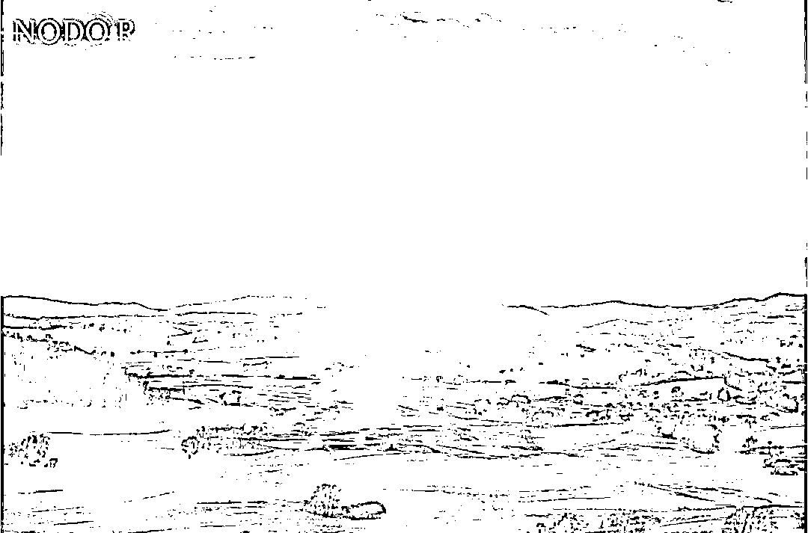

**太阳在摩羯座的重要行进****日木四分**

**12 月 22 日—12 月 30 日**

**重点影响人群：有人个行星、四轴、交点位于摩羯座、白羊座、金牛座、巨蟹座、狮子座、处女座、天秤座、射手座 0**°**-8**°**的人。**

**木星于 12 月 20 日进入了白羊座，木海合相的能量也随着木星的换座得到了释放与疏解，很快这相位的影响力就将减退。**国内放开疫情带来的第一轮的感染趋势会伴随着人们意识、行为的调整转换而得到缓解。疫情放开对各行业的影响也将在经历了首轮感染后进入调整、调试，重新上步期。木海合相尾段，便迎来了日木四分。这似乎提示着我们，**在此轮疫情中展现的个体意志力是足以影响生命、大局的。****太阳象征着我们的精神、志愿，摩羯座的太阳意味着攻坚的困难。摩羯座也意味着：自律、严苛、传承、架构与规则。**对于个人而言，当下势必要遵循祖先养生文化去学习、重建生活规律与习性，从饮食起居，到行为意识都追求天人相应的自然规律，以身体健康为重、为首。学习中医养生文化，用我们的文化筑起一道坚实、无形的防卫，让自身处在一个平衡有序的架构中，是长久维持中正、健康的首选生活方式。

木星在白羊座能为我们打开充满生机、活力的信念之门。而信念，正是那些因深信而指引了生活前行的精神力量。此刻的你信仰什么，追寻什么呢？

**白羊座的木星提示着我们内心的指引可能是全新、涌动在严寒暗夜中的灵感，可能是经由牺牲、流血、受伤，付出过代价而得来的珍贵礼物。**时代的激荡，集体的转化催生着个体精神、意志必须在短时间内生长得更为强壮，否则我们会不敌现实的狂流。木星也可能让我们盲目、大意的，因此，我们要**时刻保持意识的警惕，不要有侥幸心理，也要从自身情况出发，做出切实的健康捍卫行动。**木星要给我们更多，但四分相的摩擦中，我们需要**在骤变的节奏快速学习如何给予、护持自身更多。**无论何种情形下，在生活中保持积极、乐观、正念，从恐惧中走出来，用有效行动去捍卫健康。即使被感染，也借此过程去攀爬精神的颠峰——去明白自己为何经历身体的痛苦，以及在这过程之中宇宙给予你的礼物是什么。总有一些收获藏在痛苦之后。

**太阳三分北交点并三分天王星‍‍**

**周期：12 月 26 日-2023 年 1 月 13 日****重点影响人群：有人个行星、四轴、交点位于摩羯座、白羊座、金牛座、巨蟹座、处女座、天秤座 4****°****-22****°****的人。**这一年，生活的安稳如常对很多人来说已是难能可贵。在疫情的冲击下，多少人的生活根基遭受了撼动，眼下的我们更是身处患难危机之中。没有过不去的长夜，黎明总归会来到。太阳与北交点的三分相指引了一条生命的疗愈之道。**我们的精神、意志力会来源于那些充满生机的食物、植物，来自于所有在默默支持生命生长的大地万物。**无论人间多少变数、风波，土地永远在给予、付出和默默守护生命。天王星用非凡的画风切断一些规则、计划和模板，让我们无法按照既定的方案去行事。不稳定、不受约束的作风足以让我们在这场艰苦卓绝的危机中寻找到创造性的力量。面对生活我们其实可以做更多，而不经由一些猝不及防的打破、碎裂，我们不知道自己有勇气去重新创造。**这个天象也意味着 2023 年的 1 月，集体的能量可能面临一次全新的意识升级，或者我们将此叫作“觉醒”的过程。**此时的太阳将再次经过 3 年前疫情开始时，土星、冥王星以及土、冥的南交点共同合相的摩羯座 22°。当太阳再次经过这个深沉的带有揭示意味的度数，并且与开启智慧的天王星三分，我们应当**在心灵层面准备好，去完成过去，从患难、痛苦中长出新时代的力量，去重新认识我们身处的世界和心灵的世界。**

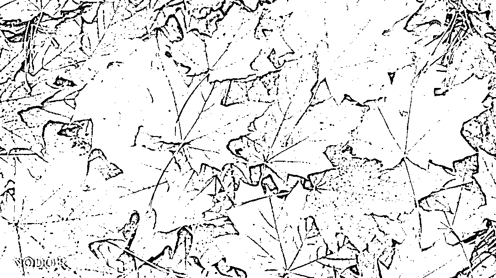

**太阳六分海王星**

**周期：2023 年 1 月 9 日-1 月 19 日****重点影响人群：****有人个行星、四轴、交点位于摩羯座、白羊座、巨蟹座、天秤座、天蝎座、双鱼座 18**°**–28**°**的人。**当摩羯座遇到双鱼座，是我们最应该相信的世间奇迹与成就的组合。这两个星座都包含了鱼尾，会将灵感交互、输送，所有的奇迹便可能幻化成真，所有的超越也将搭上灵感的飞车。**日海六分的当下，我们可以最大限度地去展开对生活的想像力，即使在受困、受限的当下，不要忘记了梦想的力量是支持我们超越现实的。**海王星的另一面可能让我们迷惑、灰心、无助、无力，失去斗志，主动选择退缩，退避。短暂的休息、内省，减少消耗也可视为一个调整期。但此刻的休息却需要为了更长远的目标和计划，让身体休息，但得让你的意识生长得更为精进。海王星与太阳的六分相很可能是给予精神不停歇的人们一趟云霄飞车，直接穿越现实的迷雾，抵达心灵的颠峰。**保持你日常的灵性修习，有可能去学习新的灵性功课，采用更有效的灵性方法，看看会不会带来质的提升。**

**太阳合相冥王星‍**

**周期：2023 年 1 月 11 日-1 月 26 日****重点影响人群：****有人个行星、四轴、交点位于摩羯座、白羊座、金牛座、巨蟹座、处女座、天秤座 20****°****–29****°****，以及水瓶座、金牛座、双子座、狮子座、天秤座、天蝎座 0****°****-5****°****的人。**

当日冥合相紧接着日天三分发生时，我们完全有理由相信：**那些把意识交给内在智慧的人，那些在艰难中仍然在积极创造的人，那些愿意放弃旧有习性，去展开全新学习、尝试的人，此刻正在绽放心灵的花朵。**冥王星是一种重生之力，日冥合相，让太阳的光照耀着重生，温暖了寒冷与病痛。

冥王星在摩羯座最后的里程似乎越发肆虐，而经历了各种碾压的人们也终能展现历练的勇气和决绝的抗争力。**日冥合相是一个点燃意志力的绝佳时期，无论你面对的是何种生死之境，只要不言放弃，就能从死亡的熔炉中淬练出智慧、财富、力量，以及生之活力。**

**太阳在摩羯座对 12 上升星座的影响****注：以出生星图上升星座度数 30°范围内的上升星座为准。如你上升在 0°，可以完全参考下列内容；如你上升在 29°，则需参考下一上升星座。****若道君：****你可以在 app store 或者应用商店搜索“若道”下载 app，输入个人档案，查看行运盘（也可以使用其他星图软件），找到行进太阳落在出生星图的第几宫，然后对照下文查看。****例如下图中，比尔·盖茨上升在巨蟹座，行进太阳在个人星图的第 6 宫。**

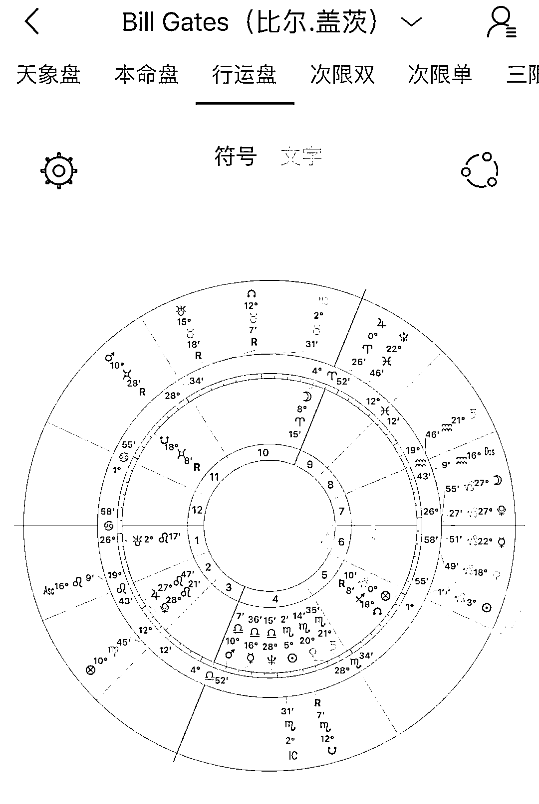

**上升****摩羯座****，太阳行进在*****1*****宫**

**接下来一个月，你可以感受到信心与热情的灌注。若能撇开嘈杂、混乱的外境干扰，凭借心中激情与信念砥砺前行，你一定能在这尖峰时刻登上心中神圣的山峰。**
**当下的你也会陷入习惯性的严肃与谨慎，现实生存环境让人不得轻松。**而在你有所准备的地方总能感受到游刃有余，周密的计划与准备总能抵挡不测与寒凉。**学习感谢生命中的艰难与困苦，很快你会明白你已从中收获良多，这些养份足以滋养未来的生命，也能用来支持你所肩负的事业、众望与理想。**

**上升****射手座****，太阳行进在*****2*****宫**

**当下的你有机会去重新思考自身价值，并透过内心崭新的信念去调整对现实资源的分配、使用。这样的调整周期能让你更加中正、客观地重新权衡自身价值，并最大化去变现自身价值和财富。**

如果你当下正在经历经济、财务方面的困境，你可要主动去抓住一些机会——在你信念的土壤上会开出花朵。不管未来会绽放怎样的花朵，你只要坚定去相信、跟随内在信念的道路就会看到转化的奇迹。

**上升****天蝎座****，太阳行进在*****3*****宫**

**也许当下的你正投入一种近乎疯狂、痴迷的学习。**当下的危机让人历练很多，现实的生活也是我们最好的学习路径。身体力行的学习对你来说也是最为受用的，可以完成最为深刻的转化与成长。

**你要跟随的信念是绝对属于身体的智慧道路，学习让身体来做主，让身体来决定我们生活本身的样貌。**这是你能让自己更加健康、有活力的必然途径。

**上升****天秤座****，太阳行进在*****4*****宫**

你是否感受到了心中神圣使命的召唤，感受到了一种对家的人职责、担当以及厚重的爱？**这份爱让你更加坚定当前的决定、位置与行动，你也会将关于健康的信念透过行动传递给你所爱的人。**

与此同时，**你可能在工作中遇到一新新的挑战性的机遇，也可能与你的伴侣展开一些富有挑战的讨论。**在此时期，个体的意志与周围人的想法难免有矛盾难以协调，而向来爱妥协的你不知这一轮会否更加主动表达自我的意见呢？

**上升****处女座****，太阳行进在*****5*****宫**

**你可能需要面对的是家庭、伴侣、情感关系中的一些抉择问题，在难以达成一致的前提前，你也可能习惯性的选择牺牲自己的利益。**奉献对你来说是习性，却也容易让自我的真实意愿被忽视、掩藏。

当下的你需要**从信念、信仰中找寻一些新的成长建议，从你内在智慧来的指引可以帮助你做更好的选择，用更有建设性的方式去创造新的家庭、情感互动模式。**

**上升****狮子座****，太阳行进在*****6*****宫**

你可以更多地投入令自己专注的工作或创造性的事务中。当下的你最需要**从专注中获取精神性的满足，并能发展出更为深刻的洞见，解决长久以来未能解决的一些障碍、议题。**

一些新的启示会透过你的专注与投入在你心灵深处打昭然若揭，你会由此明白信念的力量是如此的令人信服，在精神层面更加乐于自我鼓舞和激励，这是你攀越颠峰最有力的助力。

**上升****巨蟹座****，太阳行进在*****7*****宫**

**你可能需要从一段时间的疲劳、养病、休养的状态中慢慢走出来了，去分享一些爱与滋养给你身边的人，尤其是你的伴侣，也许对方正在等待你的援助与支持。**

你对自身的要求在当下也开始有意识提高，因为工作、事业上将要开始一轮新的冒险、冲击。**你需要相信自己的力量，用更富自我决断力的方式去行动吧，你会拥有全新的体验和收获。**

**上升****双子座****，太阳行进在*****8*****宫**

**当下的你对灵性世界的焦点会更为单纯而统一，你所关注的深层问题将透过你的现实历练、观察得到总结性的答案。**同时，如果你在经历海王星行进的话，面对疾病感染的过程也是一个自我修习和检测的进程，去信任这个进程，你将得到超越性的成长。

**你的信念已经完全换新，并且，你有力量带领着你和你的族群，在信念的护航下通往共同的未来。**

**上升****金牛座****，太阳行进在*****9*****宫**

当下若是经历一次生病、感染，都可以视为整个身心的更新过程。你有机会借助身体的体验完成一次从内到外的蜕变了，尽管，这样的蜕变在你自身可以控制的情况下是不可能发生的。而**当下的一些失控恰是你需要的学习、成长。**

更新的自我自然也需要经历了些创痛，在温柔与强烈间的碰撞一些新的能量会被催醒，新的信念便也跟随着到来。

**上升****白羊座****，太阳行进在*****10*****宫**

**当下的你是否正奔走在事业的火线上？如若不是，你需要问问自己过去经年的努力是否走错了方向，或是用错了方法。**而你的信念会在此刻更加强烈地燃烧、指引着暗夜的方向。

在你一直努力的地方，正在积极聚集着能量，去绽放出你一直期待的花朵。你能从自己真正投入、奉献的领域中感受到生命极大的荣耀。

**上升****双鱼座****，太阳行进在*****11*****宫**

当下的你是否已经在为来年春天做准备工作了？更长远的计划都可以经由你亲手设计而一步步展开来，也要相信所有你相信的都会实现。

**当下的你会将一切的信念受制于财务状况。**如果你正在经历，或已经经历过疫情带来的财务紧缩、减退的话，值得更加谨慎去对未来进行规划。**一方面要相信自己有再创造、实现价值的能力，另一方面也需要关注到环境的变迁，不可孤注一掷，或投入太多。**

**上升****水瓶座****，太阳行进在*****12*****宫**

**当下的你要做好准备去迎接极其挑战的一个月，甚至一年。近期可能是最好的时机让自己好好休息，养精蓄锐的阶段了。**你心中的想法可能需要等待时机成熟才能向世界展现了，不如现在让自己彻底休息好，再等待时机呈现。

允许自己尝试休息或放手，才能将更为激烈的冥王星式的转化纳入信念的道路。在不久的未来，也许每个人都将经受一些执著的消逝，你对未来的信念也将在这个过程中经历一番转化与洗礼。而真正的信念一定经得起时光、危机的锤炼。

在这声声势浩大的危机进程中，每个人都在冬的寒冷中抱持心中的太阳，并期许着春天的步履。愿我们守住心中火光，温暖自身、自心，并能让春天的芬芳经由梦的密语、传讯，离我们更近一些，让转化来得更快一些，也温柔一些。

**版权声明：**原创文章由作者授权首发于若道平台，欢迎转发，反对抄袭。友号转载请申请白名单。

**END**

**郑玮玲**

ISAR（国际占星研究协会）认证占星师（2016 年获得）

若道占星专栏作者

将占星咨询、教学与音乐、舞蹈相结合的疗愈者

**微信号**：zhengviolin

**新浪微博**：@郑玮玲

**微信公众号**：Sampriya-Astrology

长按打赏

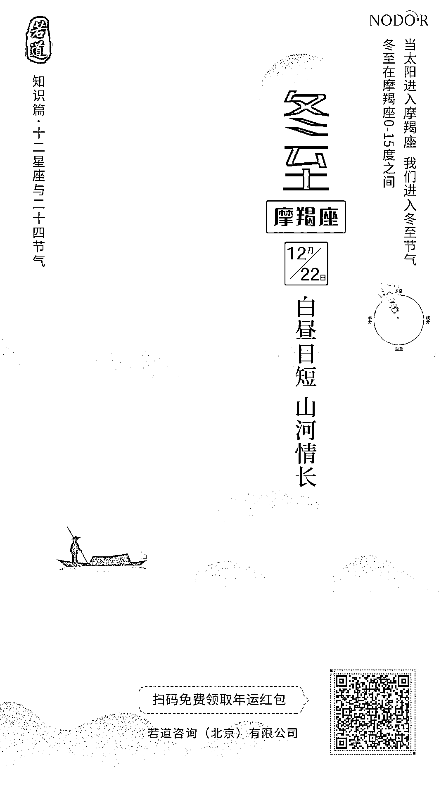

**快年底了****不给自己一份来自占星学的礼物吗？**

**梅里曼金融报告双 12 福利来啦！****长按下图了解更多详情吧！**

**20 位来自世界各地的占星师**
**带来 19 场沙龙——新世界的觉醒****详情可点击下图**

**学习占星学****点击下图了解课程详情**

**微信又双叒叕改版啦，不想错过若道君的推送？**
****就把若道设为****星标****以及点点****“在看”****吧！******▼**

**喜欢就点一下“在看”吧！****报名直达入口**

# 神话塔罗 H5 福利丨“冬至牌阵”咨询开放预约啦！

> 原文：[`mp.weixin.qq.com/s?__biz=MzA5NjA0NTAxNg==&mid=2651497505&idx=2&sn=103751a2e695d69827ca8769c4ea6573&chksm=8b481696bc3f9f80ac763660491d029733b37d4df77635bb9e053f0423690bd5385dbaed506a&scene=126&sessionid=1692737705#rd`](http://mp.weixin.qq.com/s?__biz=MzA5NjA0NTAxNg==&mid=2651497505&idx=2&sn=103751a2e695d69827ca8769c4ea6573&chksm=8b481696bc3f9f80ac763660491d029733b37d4df77635bb9e053f0423690bd5385dbaed506a&scene=126&sessionid=1692737705#rd)

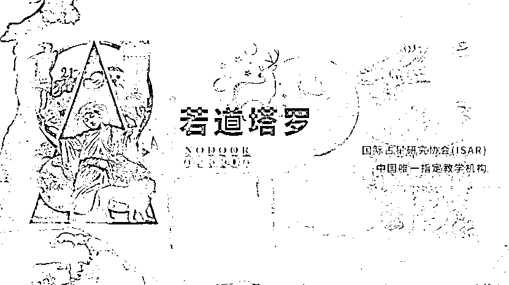

2022 年 12 月 22 日我们将正式迎来**冬至**，

这一天太阳进入**摩羯座**

进入摩羯月的同时我们会开启四季牌阵中的冬至牌阵，

这一天最适合来神话塔罗 H5，

抽取万众期待、应时应景的牌阵——

**四季牌阵(The Four Seasons Spread )**

结合摩羯座的特质开启新一年运势占卜

**一年只能使用 4 次的牌阵**

四季牌阵最早出现在塔罗师 Marcia Masino 的

一本叫《*Best Tarot Practices*》的书中，

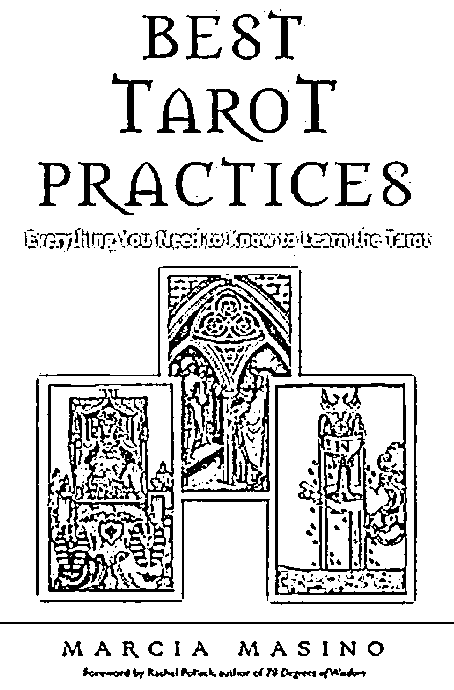

此牌阵只能在一年里的 4 天进行占卜：

分别是**春分**、**夏至**、**秋分**和**冬至**。

这 4 天蕴藏着四季秘密，

小小的节气，有大大的能量。

是绝佳的日子，

让自己看看接下来一个季度的能量趋势。

**冬至牌，展示的是你从冬至到春分这一个季度的整体能量趋势，TA 会告诉你当季的主题，你的思维计划、行动决策、人际情感、财务发展。**

如果你想要获悉一个季度的整体概况，

**把握事业方向**，

**感情状况的走向**，

**提前了解财务如何发展**，

那么四季牌阵能够满足你，

它会对你整体的状态有一个相对清晰的展望。

当你觉得对目前的状况不甚满意，

又不知道该从哪个方向入手去做改变的时候，

四季牌阵也可以给你相当多的指引。

**四季牌阵会从 5 个方面做出能量预报：**

**感情状况、工作财务、**

**拥有的行动力量、思维计划的警示、**

**精神状态与心灵成长。**

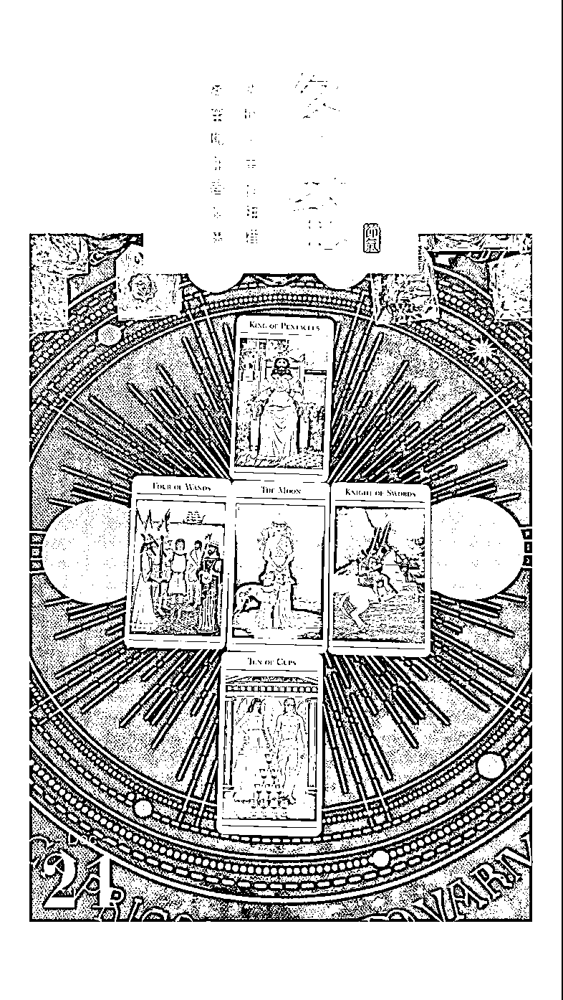

同时占星学中，

这 4 个节气是太阳换座到

4 个基本星座（白羊座、巨蟹座、天秤座、**摩羯座**）的时间点，意义重大。

因此，无论通过占星还是塔罗，

都是适合做下一个季度能量趋势预报，

完善中短期规划与展望的好时机。

**塔罗作为直觉的能量预报与灵性指引工具，**

**是对占星理性逻辑的分析方法的完美补充。**

用神话塔罗，让包围你的宇宙能量一目了然，

对着四季塔罗冥想，让自己度过有意义的冬至这一天。

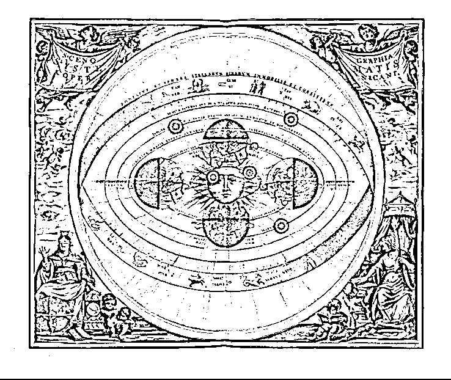  

**冬至日限量优惠咨询活动**

**预约从速，限量 30 人。**

**活动地点**

线上——**若道神话塔罗 H5**

**活动主题**

“冬至日—春分日” 3 个月个人趋势的四季牌阵解读

**公益价格**

**150-500 元**不等

拼手速

**如何预约塔罗师咨询？**

扫码二维码进入若道塔罗 H5

预约**“四季牌阵”**塔罗服务项目

就有机会拍到优惠咨询哦~

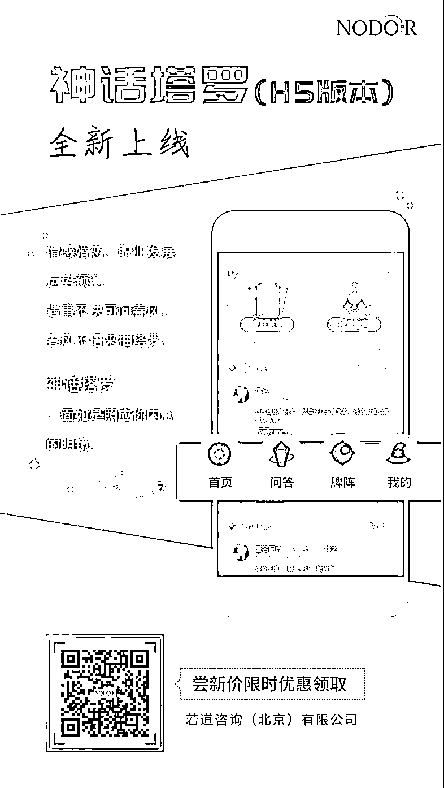  

**我们在冬至日**

**与你不见不散**

# 中医的阴阳法则之下，“寒热”、“虚实”都是什么意思？

> 原文：[`mp.weixin.qq.com/s?__biz=MzA5NjA0NTAxNg==&mid=2651497505&idx=3&sn=b32dead5411ca8b884b323633002be4c&chksm=8b481696bc3f9f8096ea6eac67b0a076ee46dfcb711805faf0110ff6a76d0db8d94fe8328f0f&scene=126&sessionid=1692737705#rd`](http://mp.weixin.qq.com/s?__biz=MzA5NjA0NTAxNg==&mid=2651497505&idx=3&sn=b32dead5411ca8b884b323633002be4c&chksm=8b481696bc3f9f8096ea6eac67b0a076ee46dfcb711805faf0110ff6a76d0db8d94fe8328f0f&scene=126&sessionid=1692737705#rd)

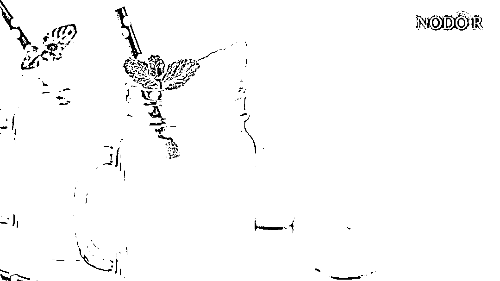

作者/彦方

编辑/翀子 图片/稿定设计

中医治疗的总则是八纲，即阴阳、寒热、虚实、表里，它们以阴阳为总纲，目的是让人的身心恢复平衡。本文介绍了寒热、虚实的概念，它们不仅和身体有关，还被我们的心理因素影响。快来看文章吧！

**中医里的“八纲”**

**中医治疗的总则是八纲，即阴阳、寒热、虚实、表里，前两个字阴阳是八纲中的总纲。**心平健康学旨在通过调整心理来治疗身体的疾病，同时让大家来理解我们生活中的平衡法则，就是以总纲-阴阳平衡论作为理论基础的，简称**平衡论。**

《黄帝内经》中讲到：阴阳，天地之道也；万物之纲纪，变化之父母，生杀之本始。说的是，**天地万物都是按照阴阳平衡法则在运行。**这是自然法则，是百分之百成立的，而我们在心平研究中找到的规律不是百分之百成立，是概率、只能作为参考。

比如，心平的研究发现，一个人得高血压，是因为他在生活中设立了一个高的标准，为了达到这个高标准而产生压力，那种使劲控制着的心理导致的。这是我们在临床中总结出来的规律，但是另一个人的高血压可能就不是这个心理了。

我们所总结出来的规律，可能是 60%患有高血压的人是因为这个心理，也就是说这个规律适用于一些人，而不是全部。

**因为每一个个体都有差异性，而且一个疾病可能是几种不同的心理原因所导致的，很可能有些心理原因是我们之前并没有见到过，所以对于这些规律，我们不能生搬硬套，一定要根据当时这个人的情况来看。**

因此，心平研究总结出来的身心规律是供我们来参考，要灵活应用。

**在任何情况下，阴阳平衡法则都是百分之百成立的，**对每一个人，无论是中国人还是外国人都适用，因为这个法则是万物之纲纪。也就是说，道生一，一生二，二生三，三生万物，万事万物都是从阴阳当中演化而生的。

在这个阴阳平衡法则中，**平衡可以发生在一个人自己身上，可以发生在一个家庭内，也可以发生在一个家族系统内，平衡的范围可大可小，平衡的方式也是多种多样的。**

我在治疗中发现，有些人的拖延症，是因为着急产生的。因为他之前太着急了，现在平衡过来就是拖延；还有的人看上去很拖延，心里却很着急，平衡过来在行为上变成了拖延。

我还发现，现在常见的精神类疾病”抑躁”本身就是一个平衡，也就是说，有抑郁症的人就会有躁狂症，只是在不同的时间和地点的不同呈现而已。我做抑躁个案的时候看到案主的情绪低落，在他的生活中常有 “我不行、我什么都干不了、我很无能” 的心理。

西医治疗时，会说春天是抑躁症的多发季节。这和中医上有些相通，而中医会用调肝的方法来治抑郁，因为**春天对于五脏中的肝，肝也是主生发的**，但是他觉得我不行，我不能，所以就变成了我无能，变成了抑郁。另一方面，**这样的心理平衡过来之后，另一个他就是我要行、我要能。**

我在带个案时，确实能感受到这样的状态：抑郁的时候一句话不说，觉得自己什么都不行；躁狂的时候，思维高速运转，觉得自己很厉害，就是我要行，我要能，我天下无敌。这就是一对平衡。

所以说，**不平衡就是太过或者不及，**躁狂就是太过，抑郁就是不及，太过和不及都是不平，而我们把太过和不及释放了，它会自然地回到平衡。前面讲的，着急也是太过，拖延也是不及，把着急和拖延都释放了，自然就平衡，这就是阴阳平衡法则。

其实，就是用药物、或是针灸推拿治疗，仍然遵循着阴阳平衡的法则。**而用心理治疗也是遵循这个法则，看我们曾经有什么不平衡，看我们怎么被平衡的，把它释放，做调整。**

综上，总纲阴阳平衡法则不受制于任何条件的限制，百分之百成立，而我们所讲的规律是知识，只在一个层面一个角度才成立，不是百分之百成立，可能到某个个体上就跟规律不一样，**因为个体是有差异的，但是阴阳平衡法则一定是百分之百成立。**

**1****“寒热”**

**八纲中的“寒热”很好理解，就是人产生了分辨心，对事物分了好坏，觉得这个好、那个坏，而且觉得那些坏的不正常，就容易产生寒症。**

在这个世界上如果人能分得清好坏，但没有觉得坏不正常，没有不平衡的心理，就没问题，因为分不清好坏就变成贪嗔痴的痴了。但是，**如果分了好坏，又产生了贪心、嗔心，觉得坏就不正常的心理，就会变成身体上的寒症。**

在心平的耐寒课程重点就是调整身体上的寒症。**当我们把内心那些不好的、坏的不平心理调整了之后，对于外在仍然是寒冷的环境，我们便不会一冻就生病，**这在中医中叫做 “正气内存，邪不可干”。

当我们正气足的时候，外面的寒冷是进不来的，是不会影响到我们的；而之所以能影响我们，是因为我们内心有漏洞，**里面的正气不足了，才会被外因把内在的不平衡心理诱发出来。**

心平从不否认外因的存在，无论是中医讲的**风、寒、暑、湿、燥、火**这些环境因素，还是我们吃了什么不该吃的东西，**这些仅仅是诱因。**

为什么不同的人吃了不卫生的食物，有的人就没事，为什么在同样寒冷的环境下，有的人就不生病，因为他们内在是平衡的，内在没有漏洞，就不会诱发出疾病来。这就是正气内存，邪不可干。

我们内心那些关于坏的、不好的感受和心理定位，会变成我们身体上的寒症。那么热症是什么呢？夏天为什么有人一热就满头大汗，有人在同样的环境下就不觉得那么热？**这是因为我们内心要好的心理，会产生身体上的热症。**

比如，我要讲一个课，特别想把这个课讲好，那时候就发现自己浑身发热了，甚至都出汗了，这就是内心要好的心理。有时候上台讲话前，我们也许觉得心里没那么想着要好，就是去讲讲话嘛，但是当身体开始发热时，说明潜意识中那个要好的心显现出来了。

**所以说，我们那种希望好、盼望好、要好的心理，就会变成身体上的热症。**

碰到事总是往坏的方面想，心里很自卑、很消极的人就很怕冷；干什么事都特别要好的人，在热的环境中就很容易出汗或者热得呆不住，这是身体内的热症出来了。**有人怕冷不怕热，有人怕热不怕冷，这些反应一定是跟他的内在心理相通的。**

**2****“虚实”**

**八纲中的“虚实”就是中医中常讲到的虚症和实症。**心平认为，不足不够的心理会变成虚症，**物质层面上不足不够的心理会变成血虚，精神层面不足不够的心理会变成气虚。**

我们会觉得什么不足不够呢？不就是自己想要的、需要的吗？没人会觉得被别人骂的不够，只会觉得别人对我们的关心或者认可还不够。**所以我们对觉得好的、想要的东西，很容易会有不足不够的心理。**

虚症是觉得想要的不够，**那实症就是不想要的、坏的多了。**如果身体上的肉特别结实，捏都捏不起来，就是实症的一种表现。在我们的生命中发生了很多坏事，是我们定位的坏事，是我们不想要的，但还是发生了，当我们觉得“多了”，就变成了实症。

最明显的例子就是很多人后肩后背上的肉很结实，捏都捏不起来，这就是生活中有很多的重担责任不想扛，但还得扛着的心理造成的。

上有老下有小，家庭里有家庭的责任，工作中有工作的责任，我们得扛着，但是我们不想扛、不想要，觉得太多了，这就变成了实症；又因为跟责任和承担有关，就变成了肩部的实症。

**版权声明：**原创文章由作者授权转载于若道平台，欢迎转发，反对抄袭。

**END**

**心平健康学：身心平衡的疗愈实践**  

从小到大，在我们的人生经历中，我们必然经历各种各样让我们内心不能平静的事情，不论是过去，还是现在，我们都经历了各种情绪起伏，并在各种固有的、自知或不自知的情绪模式和偏颇的信念模式中。但大多数人不知道的是，这些内在因素都会导致我们的身心失衡，最终反映在我们的心理疾病和身体疾病中。而现代西方的身心健康研究也证明了我们祖先的智慧。**身体，就是我们心灵的显示器。身体的疾病，不仅是因为内心的失衡而产生，也可以通过内心的调整而治愈。****而心平健康学正是建立在中医的“内因致病”为理论基础，通过特定的方法，找到内因，调整内因以达到治愈疾病、身心的平衡的一门实践性很强的自我疗愈、疗愈他人的方法。******心平健康学初级班****

**授课老师：张彦方**

**开课时间：2023 年 2 月 24 日-26 日，上午 9:00-12:00，下午 2:00-5:00，共计三天**

**授课方式：******网络授课****

**费用：2700 元**

**课程负责人：李老师**（微信：cd13518140789）

长按二维码添加课程负责人咨询

**报名直达入口**

# 初阶丨心平健康学：身心平衡的疗愈实践

> 原文：[`mp.weixin.qq.com/s?__biz=MzA5NjA0NTAxNg==&mid=2651497505&idx=4&sn=e55c37b67aaa93b26a76e3ac199680eb&chksm=8b481696bc3f9f8059c8afad0c1e6450429b13f0788ac6ee9d4d196e9ddc7b59ade4bf1652fa&scene=126&sessionid=1692737705#rd`](http://mp.weixin.qq.com/s?__biz=MzA5NjA0NTAxNg==&mid=2651497505&idx=4&sn=e55c37b67aaa93b26a76e3ac199680eb&chksm=8b481696bc3f9f8059c8afad0c1e6450429b13f0788ac6ee9d4d196e9ddc7b59ade4bf1652fa&scene=126&sessionid=1692737705#rd)

**授课内容**

**所有的疾病都是身心疾病。**

我们的祖先很早就认识到这一点。

在最早医学著作《黄帝内经》开篇《素问·上古天真论》中，就讲：“虚邪贼风，避之有时，恬淡虚无，真气从之，精神内守，病安从来”。**这是对于“内因致病”和“修心去病”最早的描述。**

在《素问·刺法论》，黄帝又问流行性疫病。他说“余闻五疫之至，皆相染易，无问大小，病状相似，不施救疗，如何可得不相移易者？”岐伯对此的回答是：“不相染者，正气存内，邪不可干。”

可见不仅对于个体性的常见疾病，哪怕对于大多数人都会感染的流行性疫病，只要“正气存内”，就可以有效预防和对治。

那么什么样的因素会导致“内心正气”的偏离呢？《大学》里说，“身有所忿懥，则不得其正。有所恐惧，则不得其正。有所好乐，则不得其正，有所忧患，则不得其正。”

《素问·阴阳应象大论》里把七情六欲和人的身心疾病对应起来，提出了我们常听到的“怒伤肝、喜伤心、思伤脾、悲伤肺、恐伤肾”等这些“不平”的心理情绪对于身体的损伤。

而《素问·平人气象论》更明白指出，“无问其病，以平为期”。“平人者，不病也”。

**中医叫健康之人为“平人”，而平人就是阴阳平衡之人，没有太过与不及。**

然而从小到大，在我们的人生经历中，我们必然经历各种各样让我们内心不能平静的事情，不论是过去，还是现在，我们都经历了各种情绪起伏，并在各种固有的、自知或不自知的情绪模式和偏颇的信念模式中。

但大多数人不知道的是，这些内在因素都会导致我们的身心失衡，最终反映在我们的心理疾病和身体疾病中。

而现代西方的身心健康研究也证明了我们祖先的智慧。**身体，就是我们心灵的显示器。身体的疾病，不仅是因为内心的失衡而产生，也可以通过内心的调整而治愈。**

**而心平健康学正是建立在中医的“内因致病”为理论基础，通过特定的方法，找到内因，调整内因以达到治愈疾病、身心的平衡的一门实践性很强的自我疗愈、疗愈他人的方法。**

**心平健康学**

心平健康学是王中平老师从 1986 年开始，经过三十多年研究和实践，发现和总结各种身体症状和心理不平衡相对应规律，并运用这些规律调解和祛除不平衡身体症状，以达到身心同时健康的学问。

**这个学问体系以中国古老医学经典为其理论基础，以自然力（事物运行发展的法则，简称自然力）为核心，平衡论为主导。**

对于身体的不适，运用心平健康学的方法，可以找到“不平”所在。这种不平包括情绪、感受、认知、内心的想象、活动和用力、外在的语言、行为等多方面。

*   **比如生活中日积月累的不平的情绪、感受会变化成身体上不平衡的感觉；**

*   **内心中使的力、用的劲会在身体上留下痕迹（俗话叫用力过猛）；**

*   **而不辩证、不中正的认知会导致疾病的不同性质；**

*   **假设、想象中的各种不平心会影响到我们的神经系统。**

而当我们把“内因”，也就是不平衡的心理，通过特定的方法、技术调整为平衡，心在“ 平静、平衡、平等 ”的状态下，身体就会转为健康和谐，这就是“ 病由心解 ”。

**初级班学习步骤**

**★****课程前**

1.  自习（提供音频）王中平老师教授的心平健康学初级班四日音频课程

2.  读心平健康学内部学习资料《认识平衡》

3.  听心平健康学讲师彦方录的系列音频课程 ：

*   心平健康学是什么？

*   七情

*   四季与五行

*   八纲

**★****课程中做什么及收获什么**

1.  **学习“揉球”方法，**“揉球”是心平健康学体系中贯穿始终的在潜意识层面调治不平心理的方法、技术、工具。有自然揉球、定向揉球，（也就是有主题的揉球）、及缩减版拇指揉球。“揉球”的目标即是把不平衡的心理调整为平衡、平静。三日初级班课程，是实操课程，通过连续 18 小时的练习和实践，对“揉球”的方法不断的体会和夯实，以便课程结束后可以通过“揉球”的方法在生活中调整自己不平衡的心理及调整相应的躯体症状。

2.  **一对一个案治疗，学习治疗方法及完成治疗。**

    通过课程中自己及团体的一对一个案治疗，体会到自己在过去、现在及对未来有什么样的不平衡心理，导致了相应的躯体症状、心理疾病及不和谐的关系，并在个案中完成治疗。在自己及他人做个案的过程中体会治疗方法，以便课后可以自然应用方法。

**★****课程后**

听心平健康学讲师彦方录的音频课程：“揉球”过程中的疑惑与解答。

**老师介绍**

**张彦方**

硕士，心理咨询师；心平健康学初级班、综合中级班、女性健康专项中级班、亲子关系专项中级班讲师，并教授脏腑研究型课程，经典研读课程（中庸、道德经），断食课程，耐寒、耐热课程，物质平衡课程。

2017 年初教授心平健康学系列课程，累积课时 2000 小时以上，个案咨询 5000 小时以上，主要擅长通过调整不平衡的情绪、感受、认知来改善躯体症状，尤其在女性因为情绪、感受等不平衡心理所导致的乳腺增生、卵巢囊肿、月经不调等妇科疾病上有深入的研究和实践经验。在改善亲密关系和亲子关系方面有较多成功案例。

**课程推荐**

疗愈的层次，在西方讲身心灵，在东方讲形气神，其实都是在说物质、能量与信息。物质层面的治疗如现代医学，能量层面的治疗如中医针灸，而信息层面的治疗相对较少，也往往很神秘，比如西方的炼金术、灵媒，中国的祝由、道家法术等。

心平健康学是少见的既能在“神”的层次展开治疗，又十分朴实、接地气的一门技术。通过简单的肢体动作、配合起心动念的练习，就可以达到调神的效果，并借由“身心同调”的方式，从神（信息）影响形（身体）与气（能量），属于个人成长之路上的卓有实效的修行好伴侣。

——天空的空

**课程价格**

**费用：2700 元** 

**授课方式和时间安排**

**线上授课：**12 人小班制

**授课时间：**2023 年 2 月 24-26 日，上午 9:00-12:00，下午 2:00-5:00，共计三天

**咨询请添加李老师微信：cd13518140789**

长按二维码添加李老师微信

****心平健康学初级班****

**授课老师：张彦方**

**开课时间：2023 年 2 月 24 日-26 日，上午 9:00-12:00，下午 2:00-5:00，共计三天**

**授课方式：******网络授课****

**费用：2700 元**

**课程负责人：李老师**（微信：cd13518140789）

长按二维码添加课程负责人咨询

**报名直达入口**

# 加缪的一生，是太阳和土星的博弈

> 原文：[`mp.weixin.qq.com/s?__biz=MzA5NjA0NTAxNg==&mid=2651497380&idx=2&sn=998867eda4ad340b8f8889bf5ceb564a&chksm=8b481113bc3f9805083a9f5cd4d14a9262a0ef2cfd5d5a27fe4d893bcde5d679bab779fcad9d&scene=126&sessionid=1692737710#rd`](http://mp.weixin.qq.com/s?__biz=MzA5NjA0NTAxNg==&mid=2651497380&idx=2&sn=998867eda4ad340b8f8889bf5ceb564a&chksm=8b481113bc3f9805083a9f5cd4d14a9262a0ef2cfd5d5a27fe4d893bcde5d679bab779fcad9d&scene=126&sessionid=1692737710#rd)

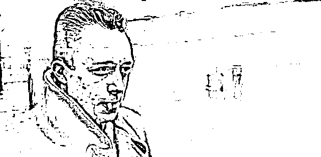

作者/格伦·佩里 翻译/三三 校对/Jun
编辑/翀子 图片/网络、稿定设计

承接今天头条，本文为下篇，格伦老师继续给大家带来超级精彩的加缪上帝之指格局的案例分析。如果你对格伦老师的研究很感兴趣，这里有一门格伦·佩里老师亲授的【[占星原型与星图中的精神病理学](http://mp.weixin.qq.com/s?__biz=MzA5NjA0NTAxNg==&mid=2651493004&idx=2&sn=038b40a4c73ce929da0d5c64de0eac85&chksm=8b48203bbc3fa92d3922f679f3aa4a5525d2776cd477717d7daef4d44bbb863c001bd3281960&scene=21#wechat_redirect)】，点击链接了解更多详情吧！

**日土的斗争****处女座式的渐盈梅花相位**

加缪的**太阳落在第二宫的天蝎座，与土星形成了渐盈的梅花相位**，为与镰刀死神的终生战斗提供第二战场。**渐盈的梅花相位有着处女座式的暗示，产生相位的两个行星不得不解决各自行星彼此间存在的问题。**

因为太阳与木星的六分相，加缪被看作是追求真理、正义和意义的人。这没问题，当然，太阳作为上帝之指中的一个支柱，注定要与该相位结构的顶点同时落入第九宫的土星进行永久的斗争。

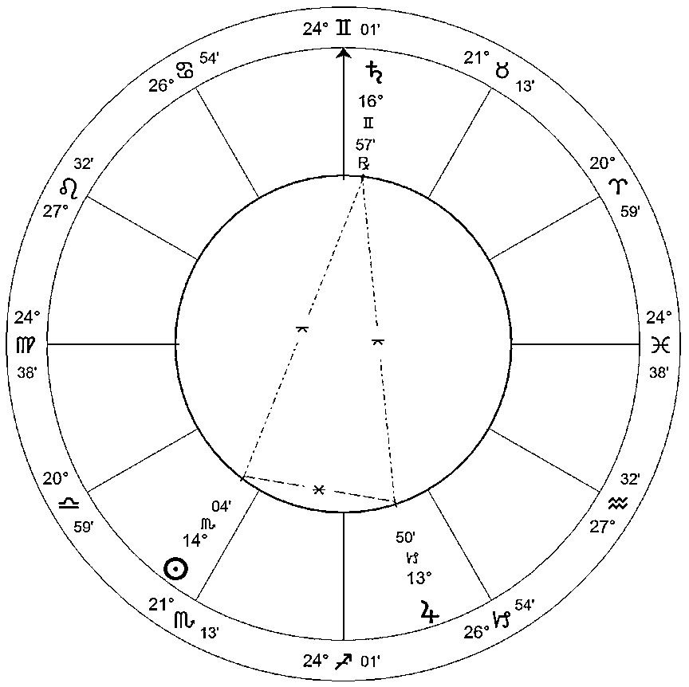

|  阿尔贝·加缪：1913 年 11 月 7 日，上午 2 点，蒙多维，阿尔及利亚

应该注意的是，加缪的太阳和木星仅仅与土星（梅花相位），还有彼此间（六分相）存在相位。**木星与土星的梅花相位反映了加缪整体哲学思想，而太阳的梅花相位则更多地与他的身份认同和创造性作品有关，尤其是他的自由（自由意志），使他有所成就**。

太阳与木星的六分相位证实了加缪视自己为一个有能力创造丰富人生的个体，但是两个梅花相位对第九宫土星的夹击，暗示他在理解更广阔的含义，哲学意义上会遇到极大的困难。

这种困难在加缪于 1942 年里程碑式的著作《西西弗斯神话》（The Myth of Sisyphus）中最为突出。**加缪恰好在他 29 岁，即土星回归的时，完成并出版了他的标志性作品，这凸显了加缪试图解决自己内在宿命般张力的重要性。**

**对应荒诞的 3 种方式**

加缪用西西弗斯神话的形式，正式并充分地明确阐述了他最著名的思想——**荒诞的概念**。这种“加缪式荒诞哲学”是两种现实的致命碰撞所导致：**一方面是人类对意义和明晰的渴望，另一方面是静默、冰冷的宇宙**。

换句话说，面对一个没有上帝或者说没有永恒真理与价值的，令人难以理解的世界，**荒诞意味着无法避免地同时又是徒劳地寻找意义**。恰恰因为人类的这种能力，使他们在虚空、冷漠的“宇宙的寂静静默”中感到疏离与孤独。

**加缪提出了三种应对荒诞的方式：自杀、宗教与接受。**他以一句具有挑衅意味的话开始了他的论述：“真正严肃地哲学问题只有一个，那就是自杀。”（《反抗者》）

加缪如此重视自我毁灭的冲动，要么是在暗示饱受战争摧残的法国人民处于绝望的沮丧中，要么是加缪自己抑郁了。因为在加缪写这本书时正值他的土星回归，我猜是后者，或许两者都是。

**1****自杀**

加缪理由充分地说道，如果我们认为生活没有内在的目的或意义，并不值得活下去，那么我们就会自杀。他冷漠地注意到，“我倒看到许多人自寻短见，因为他们觉得生命不值一活。”

最后，他拒绝视自杀为解决问题的可行办法，称其为对生命懦弱的逃避，而自杀本身就是荒诞的。这点无疑对他的读者来说是一种解脱，事实上也保证了他们可以读完全部的四章。

然而，**加缪奉劝读者不要自杀，表明了他自己对自杀持有审慎的态度，并有充分的理由反对它**。

**2****宗教**

加缪对荒诞的第二个回应是宗教，他称之为“信仰之跃”（a leap of faith）。

信仰之跃意味着盲目相信无形的东西，比如上帝、超越、救赎和不朽。但是这也是加缪所拒绝的，因为信仰之跃超越了生命的证据，更喜欢抽象（木星）而不是具体的个人经验（双子座土星）。

土星作为现实生活的原则，战胜了加缪去相信代表超自然的木星能力。

**加缪视宗教为“哲学上的自杀”，这也是一个符合天蝎式/渐亏梅花相位的短语**，因为宗教信仰用幻想代替残酷的现实，以此来逃避荒诞的问题。拥有宗教信仰就等于毁灭理性，加缪认为，这就是哲学上的自杀。

加缪一次又一次告诫读者要远离希望，就好像希望只能引导我们远离冰冷、阴郁的生存真理。他对信仰的彻底否定，就像对无法给予他明确答案的空虚所发出的一声蔑视叫嚷，闯入拒绝给予他所需求的最终答案的虚空中。

他认为其他哲学家之所以没有达到真理，是因为他们愿意相信——上帝的存在，超自然的真实——加缪个人对信仰的否定，是评判其他哲学家的终极标准。

**加缪的无神论反映了他的信念除了那些基于证据的合理理解之外，宇宙没意义与目的，对他来说，信仰就等同于自我毁灭。这也揭露了他的太阳与木星的六分相，极力反对任何土星规则在第九宫运用的有效性。**

因此，加缪的这些构想仍然是极度负面、片面与不平衡的，就像集权主义的意识形态，如法西斯主义，甚至类似于基督教与伊斯兰教这样更加严格、教条且过度非理性的正统宗教。

**3****接受**

**产生梅花相位的行星所处的星座毫无共同之处——无论是极性、模式、元素还是视角。它们之间本质上的不协调恰恰是形成问题、危机的原因，而解决这些问题、危机的方法往往包含着矛盾的逻辑。**

在一次著名的循环论证中证明了土星与太阳和木星产生的梅花相位，加缪断言了他的第三个对于荒诞的回应，并且他认为**这是解决荒诞问题唯一有效的方法：完全的、毫不畏缩的、勇敢的接受**。

矛盾的是，“如果没有意义，生活将会更好”，这样人类就真正自由了，得以从宗教审判以及它们严苛的道德准则的囚禁中解脱。“人享有遵守共同规范的自由”，没有希望的生活，使得人们不再去追求永生。

接受没有目标的生活，人们就可以拥抱生活所提供的一切。因为生活没有意义，没有价值尺度，没有内在道德。“**重要的不是活得最好，而是活着本身**。”

简而言之，**加缪对生活无意义的解决方法是一种怀有激情的、无关道德的享乐主义（太阳落入天蝎座第二宫）**。自我可以自由地做任何想做的事情，可以激情地追求世俗的快乐，可以反抗传统信仰所构建的道德准则。

加缪在这方面的推崇榜样是唐璜，一个通过性征服生活的连环引诱者，唐璜认为：“**没有高尚的爱，唯有认识到人生苦短，及时行乐**。”

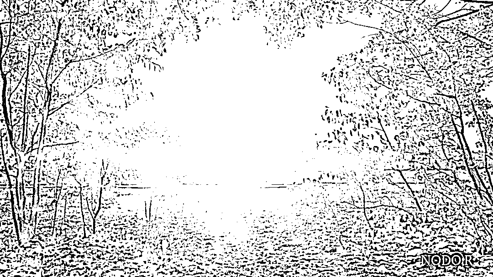

**此生此世，足矣**

实际上，**加缪对荒诞问题的最终解决方法是太阳与木星携手对抗土星的约束，这可能适合于还未整合的上帝之指格局**。

加缪重视反抗的概念。他说，在毫无意义的世界中寻求意义的矛盾，需要人类永恒地对峙和反抗。即便已经接受生命没有内在的意义，个人也应该通过大胆地持续探索和对意义的追寻来拥抱人生的荒诞。

加缪宣称他不相信上帝，而是相信人本身，人能创造自己的意义。如果这一切开始听起来令人困惑且逻辑上前后相悖，欢迎来到梅花相位的世界。

比起能找到一种拥抱第九宫土星的道路，这条道路最终可能会产生一种坚实的、明智的哲学，不排除希望和意义。加缪最终选择了反抗，选择了不抱有“虚假希望”的方式生活。

他建议他人也如此。因为到那时，人类将可以自由地追寻尘世间的快乐，沉醉于一种狂欢的原始主义，只崇拜能带来即时真实感受的事物。

第二宫代表着身体感官，有形的物质享受（财产、资源），以及地球本身的自然领域（农业、花园），因此加缪过度强调这个领域的内容来逃避土星的绝望也就不足为奇。

你可以想象天蝎座的太阳在恐惧中推开土星，然后贪婪的强烈反弹到第二宫。

辛普森回应了这个观点，他写道，加缪是天生的异教徒，更是一个太阳崇拜者和自然爱好者，而不是以虔诚的宗教信仰而闻名的人。

“没有救赎，加缪争辩道，没有超越；只有对意识和自然的享受。一生一世，此生此世，足矣。”天空与海洋、山川和荒漠，都有它们都有自己的美好与壮丽，构成了一个充分的天堂。

显然，**加缪的神（如果你可以这样称呼它的话）并不是住在第九宫，而是存在于第二宫和第四宫**，在那里太阳与木星快乐而热情的居住着，它们拒绝去相信更高级的土星力量。

最佳生活可能是第九宫的土星，而真正的生活却是被木星影响放大的，落入第二宫的天蝎座太阳。

为了避免有人认为是第九宫的土星处于困难相位下，所导致加缪无神论的世界观，我们只需要查一查那些有相同立场的其他哲学家和宗教领袖。土星落入第九宫的困难相位可能暗示着信仰的挣扎，但不会直接导致对宗教的排斥。

哲学家路德维希·维特根斯坦（Ludwig Wittgenstein）就是一个很好的例子。尽管他在早期有过怀疑，但最终还是与基督教建立了真诚而忠诚的关系。

美国的自然主义者、哲学家约翰·缪尔（John Muir）同样存在第九宫的土星与太阳形成梅花相位。但他与加缪不同，他在自然界中看到的是上帝的杰作。

名单还在继续——基督教的杰里·福尔韦尔（Jerry Falwell），以及有道教倾向的马丁·海德格尔（Martin Heidegger）都有承受困难相位压力的第九宫土星，但他们也都声称对现实怀有圣神信仰。

因此，我们必须断定，加缪所宣称的解决荒诞的方法根本算不上是一种解决。相反，**它是心理学家所称的一种妥协作用——通过保持一种妥协让步的行为方式来回避令人惧怕的状态**。

需求之间的竞争往往会导致冲突产生恐惧，恐惧当满足任何一种需求会对另一种需求产生负面影响。如果加缪追求摩羯座土星所需要的有关形而上真理（第九宫）的完美事实性知识（双子座），他的结论——生命是没有意义的——可以确保太阳处于绝望状态。

然而，如果加缪追求狮子座太阳所需的对短暂欢愉（第二宫） 的激情享受（天蝎座），他便放弃了实现清晰的更高意义和目的的生活，也就是他土星的责任。

因此，加缪的妥协是虚构出一种哲学，声称生命没有内在的意义和目的，但人类可以自由地反抗自己所处的荒诞。他们可以构建属于自己的意义，在对荒诞的公开蔑视中热情地生活，并追求幸福。

这是一个绝妙的合理化，但也让人怀疑，它能带来的快乐终究有限。

加缪自己也说过同样的话。“没有太阳就没有阴影，而且有必要去认识夜晚。”他不断强调，快乐必然与绝望交织在一起，死亡的必然性带来了强烈的体验，也带来了一生之中对快乐欣喜若狂的庆祝。

**“没有轻蔑战胜不了的命运”**

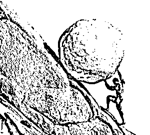

加缪最终塑造的荒诞英雄是科林斯国王西西弗斯（Sisyphus），一位希腊神话中的人物。他被诸神惩罚，要永远重复毫无意义的任务：将巨石推上山顶，却只见它在到达山顶之前又滚了下来。

对西西福斯永恒的惩罚是因为他不尊重、甚至蔑视众神，特别是对死神桑纳托斯（Thanatos）。当死神来临时，作为国王的西西弗斯戏弄了他，给他戴上枷锁，这样国王便永远不死。

当然，在西西弗斯的密室里，带着镣铐的死神正在日渐衰弱，这也意味着大家都不会死去。冥王普鲁托（Pluto）对此很生气，因为这使自然变得紊乱，因此他派遣战神把死神从西西弗斯的锁链下解放出来。

西西弗斯是一位将自己塑造成太阳（自我）形象的国王。这位国王的罪行深重，因为从一开始就定下基调，他否认有关死亡的任何目的、意义与价值，他将肉体的欲望凌驾于一切精神与道德。

荷马告诉我们，西西弗斯担有骗子、说谎者和诡计者的恶名，甚至欺骗死神和背叛众神。他也是世界上最狡猾的无赖，过着放荡的生活，无休止地追求眼前的快乐。结果，这位国王堕落了。

最终，西西弗斯的轻率使他受到惩罚，他被拉下地狱接受惩罚。

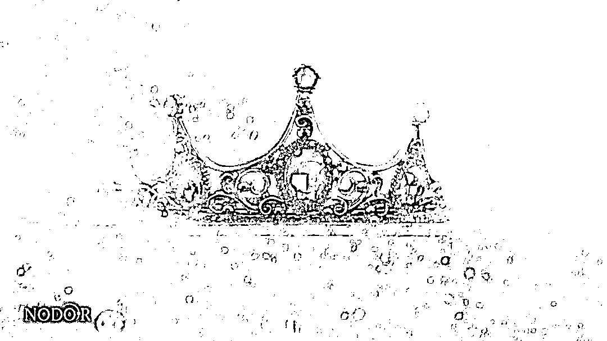

但加缪认为西西弗斯是终极的荒诞英雄。“他对众神的蔑视，对死亡的憎恨，以及对生命的热情，让他遭受这种无法言说的严厉惩罚，使他整个生命都付诸于无望的工作中。这是为这个世界的激情所必须付出的代价。”

**正如人类为了生存注定要从事毫无意义的工作，因此加缪在西西弗斯身上看到了人类生存的本质。**但加缪更为深入，他视西西弗斯为英雄。

他认为西西弗斯是英雄，**因为西西弗斯充分意识到了自己永恒的折磨，同时仍旧履行自己的任务**，至少加缪是这么认为的。

西西弗斯没有任何幻想。他是清醒的。但是！加缪说：“**正是清晰的认识造成了他的折磨，同时也为他的胜利加冕。没有轻蔑战胜不了的命运**。”

如此提及“轻蔑”是有意义的，因为它揭示了一种内在的痛苦，并不是西西弗斯身上的，而是加缪身上的。对加缪来说，西西弗斯仅仅是一个方便投射的掩护。

显然**，加缪对众神的蔑视反映了他对土星权威的太阳式（自我）恐惧，更确切地说，是对宗教权威（第九宫）的恐惧**。

一位死去的国王，被众神宣判了永无止境的任务——将巨石推上山顶，却永远徒劳，还有什么比这样的国王形象更能表现天蝎座太阳与第九宫的土星形成梅花相位呢？

加缪想象西西弗斯不仅在悲伤中，更在喜悦中回到落下的巨石喜悦中边，这喜悦来自他完全接受自己无意义的困境。对加缪来说，这是对众神的蔑视，因为“它把带着不满并且偏爱无谓的痛苦而来的神祗逐出了这个世界。”

加缪说，遭受苦难并没有理由，也没有目的，至少没有所谓神圣的起源。因为我们所经历的一切完全是人类的起源，没有超越人类的意义。

但是，如果我们英勇地忍受苦难，反抗生活的绝望，放弃无用的希望，即通过我们的努力，终有一日我们会得救赎。也只有到那时，我们才有一点点机会获得适度的幸福。

加缪想象西西弗斯再次站在塔尔塔罗斯（地狱深渊）的山脚下，他给出了这样的总结：“**攀登高峰的奋斗本身足以填满一个人的心灵。我们必须想象西西弗斯是快乐的**。”

但这个结论听起来很空洞。加缪明确表示，对他来说，幸福是一种太阳式的行动，反抗无止境的绝望——讽刺的是，这种绝望却是他自己的土星未能整合的后果。

换句话说，**这种幸福是一种补偿，是一种对抗焦虑状态的反应形式**，而这种焦虑的心理状态是加缪的世界观不可避免的衍生品。

回顾一下，不良状态的木星向落入第九宫的土星寻求意义，但是土星落入了一个反对意义的星座（双子座），与木星所在的星座（摩羯座）成梅花相位。

**因此土星剥夺了木星所寻求的意义**。它说，“你对意义的所有努力导致了这样一个结论：人类的存在是毫无意义的。”

知道了这一点，我们就能够对加缪的困境表示同情，但并不能改变这样的一个事实，即**加缪的哲学与其说是对人类状况的陈述，不如说是对他自身的陈述**。

当加缪描述西西弗斯从斜坡上无功而返时，他很欣赏他想象中的西西弗斯那种冷酷、阴郁的态度。西西弗斯冷酷无情，毫不自怨自艾，铁石心肠地对待这个无意义的残酷现实，周而复始地努力。

“每当他离开高地，逐渐走向神的藏身之处，他都超越了自己的命运。他比他所推的巨石更强大。”**这就是加缪的幸福准则：一个英雄（太阳）反抗的选择。**

**但在我看来，这是对合理痛苦的否认，就像一个为了避开难以忍受的痛苦而歇斯底里大笑的人。**如果想象西西弗斯除了沮丧外，悲惨地臣服于他绝望的困境中，同样也违反常识。这就是西西弗斯神话的全部内涵。

**违反自然规则，后果自负**

|  加缪与妻子弗兰辛妮·福莱

加缪文笔优美，但我们不应该将他这样优美的笔触与思想的崇高混为一谈。他对西西弗斯神话的解释，并不是一本“幸福手册”。相反，西西弗斯的故事是一个道德寓言，给我们上了简单的一课：**违反自然规则，后果自负**。

有什么比这个更清楚？西西弗斯把死神锁在了密室；也就是说，逃避了死亡对我们不可避免的转化。这也是对冥王普鲁托本人极大的羞辱，因为死神是他的盟友和仆人。

**死神、镰刀收割者，代表了土星，它提醒我们，我们的时间有限，我们应该负责任地努力活在法则中，适当自我约束，并且我们应该认识到，等时候到了，我们将会被更高权力审判，适当的后果随之而来。**

我们现代人的感性可能会嘲笑这种观念；它不是科学的，也不能被验证。加缪当然也会赞同这点。然而，世俗中的罪孽会由天道解决，这是一种原型，它以各种形式出现于几乎所有的信仰中。

这也暗含在土星的意义里。由于加缪不相信上帝（或诸神），他认为西西弗斯的罪行除了反映他自己对宗教的蔑视以外没有任何意义。

但是我把西西弗斯的巨石看作是土星本身的象征，象征着使身心趋于完美的有责任心和耐心的努力，这正是西西弗斯在生活中逃避的。因此他被捆绑在土星的巨石上直到死亡。

人们自然会产生疑问，加缪是否在西西弗斯放荡的罪行中看见自己的某些东西。有人会认为他有。

一方面，加缪格外有责任感，在道德上亦非常严肃，因此他荣获了诺贝尔文学奖，表彰他“阐明我们这个时代人类良知的问题”的不懈努力。在他个人与创造生活中皆体现了一种荣耀，“英勇的反抗或抵制一切压迫人类的态度”。

**虽然与土星的战斗肯定激发了加缪最伟大的成就，但也带来其他后果。**

|  加缪与玛丽亚·卡萨雷斯

> 例如，加缪以与女人的风流韵事而闻名。他的第一次婚姻由于双方不忠而结束，而第二次婚姻同样也因公共丑闻和外遇而破裂。
> 
> 虽然加缪坚持申称爱自己的妻子，但他也强烈反对婚姻制度，他认为婚姻是不近人情的，是一种“狭隘的、过时的制度”。
> 
> 再次出现了土星。
> 
> 甚至在加缪的妻子生下双胞胎后，他还继续与朋友玩笑说自己不适合结婚。他持续着许多风流韵事，其中包括与西班牙裔女演员玛丽亚·卡萨雷斯（Maria Casares）的公开恋情。
> 
> 考虑到法国人的风俗习惯，也许我们不应该过于侧重这些。加缪享受着与巴黎精英们一起的刺激生活，结果呢？1960 年，加缪的好友出版商米歇尔·伽利玛（Michel Gallimard）驾驶他那辆名贵的跑车失控，一头撞在树上，加缪因此丧命。
> 
> 那是一场可怕的车祸，从当时照片上看，这辆车直到后轴处都面目全非。加缪破窗飞出，折断了脖子，当场死亡。
> 
> 年仅 46 岁的加缪，口袋中有一张火车票。圣诞假期后，他本打算和妻儿一起坐火车回巴黎，但最后一刻他却决定和伽利玛一起旅行。没有人知道其中确切的原因。

这场意外死亡有什么意义吗？加缪可能会给出否定的答案，无论是生活还是死亡，都没有意义。

但是身为占星师，我们不能轻率地给予否定结果。我们知道加缪拒绝用自杀来解决生活中的绝望。他相信人必须活着，而反抗荒诞是最好的理由。尽情生活，憎恶死亡！然而，加缪的生命在他的巅峰时刻被偷走了，死神比预期来得早。

**土星控制着一切**，我们知道加缪反对土星的控制，认为这是压迫性的、限制性的。**土星也掌管障碍**。伽利玛失去了控制，他的车撞上了障碍物。当然，加缪并不是司机，所以说他对自己的死亡负有任何责任似乎有些不厚道。

但在原型的世界中，责任的意义并不如此局限。我们所回避的部分可能会以极其意想不到的方式让我们自食其果。我们很容易猜测，正如西西弗斯遇到了他的巨石，加缪也遇到了他的树。**土星与加缪，最终致命地相拥在一起。**

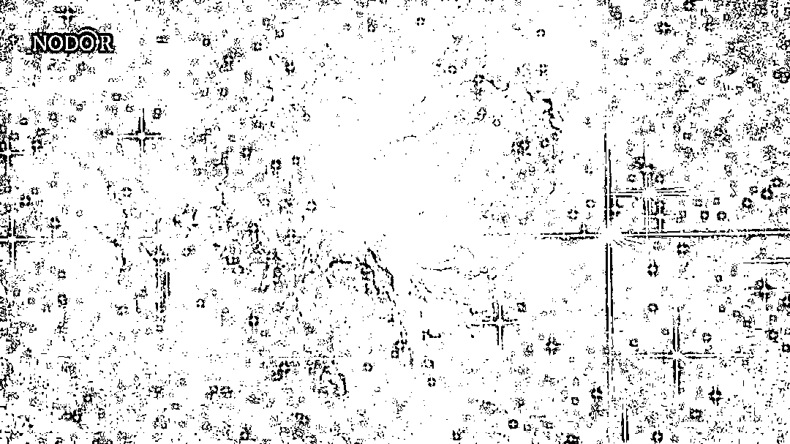

**占星学是照亮我们黑暗面的光**

我们已经看到，**持久的心理状态是性格的表现，这是由出生星图和它的整合程度所象征。长期状态在主导行星的深度、核心信念中体现。**

尚未解决的精神冲突往往产生有害的信念，并伴随焦虑的状态；相反，在行星相位整合的过程中，建设性的信念产生了。

这些反过来又会产生积极的状态，这些状态将在人们生活中的几乎各方面得到证明：情绪、态度、自我对话、肢体语言、面部表情、外部行为和生活经历。

加缪的上帝之指格局就是一个例子，即太阳与木星呈六分相，而这两颗行星都与土星形成梅花相位。虽然加缪的非凡成就表明了上帝之指格局的高度整合，但也有可能，至少在一定程度上，是他与土星未解决的斗争之产物。

一种无意义和沮丧的感觉折磨着加缪。他的无神论等同于他的无政府主义，因为两者都引发了对第九宫的土星权威的反抗；两者都带有轻蔑的怀疑，一种针对对宗教，另一种针对政府——或者，至少是针对传统意义上的等级制政府。这都是对绝望的反应。

也许，我们能从加缪的人生和出生星图中得到的最重要教训是是：**他对人类状况的深思、他的哲学及其对世界的影响，与其说教会我们生命的意义，不如说教会我们如何驱除心中的魔鬼**。

加缪在《西西弗斯神话》中所阐述的无神论世界观是对他的心理结构及其整合程度的自画像。

毫无疑问，这对我们所有努力描述这个世界的人来说都是正确的。**我们每个人都用一块个人的透镜来看待生活，这块透镜由出生星图所象征**，像我们看到的加缪一样，透过玻璃阴沉地看待生活。

**如果说占星学有价值，那就是他能让我们意识到我们所构建的故事，并洞察它们潜在的心理网络。占星学是照亮我们黑暗面的光。**因此，如果加缪还活着，我想他也会怀有希望。

**版权声明：**本文由若道翻译发布，欢迎转发，反对抄袭。友号转载请申请白名单。

**END**

**格伦·佩里**

著名占星师，ISAR 董事会成员，共出版 8 本占星著作；心理/意识研究专业博士；占星心理学学院（Academy of AstroPsychology）的创办人；康涅狄格州研究生院（the Graduate Institute of Connecticut）原型宇宙学与意识进化项目的负责人。

# ****占星原型与星图中的精神病理学****

**为什么在占星学的课程中，会出现精神病理学的教学内容，这和我们有什么关系？这对占星咨询，或在自我了解与成长的过程中又有什么帮助呢？**

****带着这些疑问，请你静下心来，思考以下几个问题**：**

**“******你/你的案主，是否曾经过度担心什么？**** ****你/你的案主，有没有感觉到担忧和焦虑，却不知道原因是什么？********你/你的案主，是否曾经觉得害怕什么东西，但理智上却很清楚它不会对你造成什么伤害？********你/你的案主，是否曾经通过沉迷某物，酗酒或滥用药物，自我伤害去逃避问题？********……********——节选改编自《心理学与生活》******”**

**如果你对上述问题其中之一，回答是。这意味着几乎每个人都曾有过心理障碍的症状（精神病理的问题）。**

**你看，其实“精神病理学”与人的心理有着密切的关联，再结合占星学，呈现了人内在与外在层面更加丰富和深刻的一面。**这对于学习占星学的人和占星师来说，都是一场难得的知识盛宴！****

****本课为 2 年期双证核心课程中的一部分**（AP105 阶段），其内容是过去若道所开设的核心课程从未教授的部分，特意抽出供其他学员学习，******可作为 ISAR 选修课，单独报名。****

****点击下方图片了解详情****

**

****微信又双叒叕改版啦，不想错过若道君的推送？**** ******就把若道设为****星标****以及点点****“在看”****吧！**********▼****

****

**喜欢就点一下“在看”吧！****报名直达入口**

# 星座病理学 | 双向心理障碍的占星指标

> 原文：[`mp.weixin.qq.com/s?__biz=MzA5NjA0NTAxNg==&mid=2651497380&idx=3&sn=ea3c5ca02aaa9cec10d36ba581126e26&chksm=8b481113bc3f9805da08cdc29e6754c1a4f2685b116be291fecd3d14245bba574bf77677c097&scene=126&sessionid=1692737710#rd`](http://mp.weixin.qq.com/s?__biz=MzA5NjA0NTAxNg==&mid=2651497380&idx=3&sn=ea3c5ca02aaa9cec10d36ba581126e26&chksm=8b481113bc3f9805da08cdc29e6754c1a4f2685b116be291fecd3d14245bba574bf77677c097&scene=126&sessionid=1692737710#rd)

<mpvideosnap class="js_uneditable custom_select_card channels_iframe videosnap_video_iframe" data-pluginname="videosnap" data-id="export/UzFfAgtgekIEAQAAAAAA_k83ru63WAAAAAstQy6ubaLX4KHWvLEZgBPE5IEgNAVNfJ-CzNPgMIvbfPq5GTdyhWFYjUGy8nSK" data-url="https://findermp.video.qq.com/251/20304/stodownload?encfilekey=rjD5jyTuFrIpZ2ibE8T7YmwgiahniaXswqzRRWnh8yZEicPruGnAm4rAngOla58uaabBiaaX67TkbNefNCgdrWLtx9s50iaa33x1jQibnhjygcDdibzC9ECYFQAAjQ&amp;adaptivelytrans=0&amp;bizid=1023&amp;dotrans=0&amp;hy=SH&amp;idx=1&amp;m=&amp;scene=0&amp;token=x5Y29zUxcibAibn8QxyNG1UlVCp1UtuBGMQOZh0DZp3pbGvrC2LzIhESnTWeknER66mYWLAovGrro" data-headimgurl="http://wx.qlogo.cn/finderhead/PiajxSqBRaEJYnVsqWfEX9qA0sI6hNVKsDfyzfPZ92WZMZyBpZWU5NA/0" data-username="v2_060000231003b20faec8c4e68a1ec2d4ca07e434b07755bbf47e7053a3059defd2c9d6c68a20@finder" data-nickname="若道" data-desc="#心理占星学  双向人格障碍有什么样的占星指征？如何结合星图案例寻找相应的占星指征？" data-nonceid="1247863255151714306" data-type="video" data-authiconurl="https://dldir1v6.qq.com/weixin/checkresupdate/icons_filled_channels_authentication_enterprise_a2658032368245639e666fb11533a600.png" data-width="1280" data-height="720"></mpvideosnap>

**课程描述**

看过课程标题的你，也许会感到好奇和惊讶，为什么在占星学的课程中，会出现精神病理学的教学内容，这和我们有什么关系？这对占星咨询，或在自我了解与成长的过程中又有什么帮助呢？

**带着这些疑问，请你静下心来，思考以下几个问题**：

“**你/你的案主，是否曾经过度担心什么？** **你/你的案主，有没有感觉到担忧和焦虑，却不知道原因是什么？****你/你的案主，是否曾经觉得害怕什么东西，但理智上却很清楚它不会对你造成什么伤害？****你/你的案主，是否曾经通过沉迷某物，酗酒或滥用药物，自我伤害去逃避问题？****……****——节选改编自《心理学与生活》**”

如果你对上述问题其中之一，回答是。这意味着几乎每个人都曾有过心理障碍的症状（精神病理的问题）。

你看，其实“精神病理学”与人的心理有着密切的关联，再结合占星学，呈现了人内在与外在层面更加丰富和深刻的一面。**这对于学习占星学的人和占星师来说，都是一场难得的知识盛宴！**

**本课为 2 年期双证核心课程中的一部分**（AP105 阶段），其内容是过去若道所开设的核心课程从未教授的部分，特意抽出供其他学员学习，**可作为 ISAR 选修课，单独报名**。

**在正式了解本课的价值之前，先了解一下这门课程的主讲老师吧！**

**格伦·佩里（Glenn Perry）**

*   他是心理/意识研究专业博士、加州注册婚姻和家庭治疗师 （CAMFT）

*   占星心理学学院（Academy of AstroPsychology）创办人

*   康涅狄格州研究生院（the Graduate Institute of Connecticut）原型宇宙学与意识进化项目的负责人

*   共出版八本占星学著作：《心理占星学入门》、《心理占星论文集》、《盗取天火》、《从忠诚到革命》、《星图中的阴影》、《占星职业议题与伦理》、《出生星图深度分析》、《从古代到后现代占星学》

**墙裂推荐格伦老师这门课的 **

**4 大理由**

**你一定得知道的课程价值**

**价值*****1***
**明晰精神病理学的基本定义**

占星心理学学院创办人格伦·佩里老师，对**精神病理学的基本定义**就是灵魂受苦，精神就是灵魂的意思，病理就是受苦的意思，所以精神病理学研究的就是：人类各种各样受苦的方式，尤其是因为某一类的行为而引起的。

精神病理学是一个连续体，从比较轻微的，到比较严重的，这么说来，我们每个人都有一部分精神病理的问题。

**如果成为一个“人”，没有一定程度的挑战是不可能的。没有一定程度受苦，没有一定程度不平衡是不可能的。而这种不平衡就会以一种挑战和困难的姿态呈现出来。**

**价值*****2*****更懂疗愈：从不平衡到平衡**

**疗愈**是一个复杂的过程，讲的是将人从不平衡带到平衡这样的一个状态，将不同行星代表的心理功能带到一种更加平衡整合和合作的状态。

格伦老师通过研究精神病理学，发现每一颗行星，以及这颗行星所守护的星座，都和某一特定类型的病理是联结在一起的，包含了这个占星原型所涵盖的极端不平衡的情况。

举个例子，案主的第 1 宫，有很多星星在那里，和对面第 7 宫的火星形成对分相，第 1 宫白羊座或者火星白羊座的组合，和这个案主的反社会人格的病状联系在一起（这是一个星图的极端负面表现）。

“

**生活本身就是一场治疗，我们在占星的星图中去看到，人们所具有的创伤、不平衡及其产生的防御机制，最终都会在他生活中的关系和情境中呈现出来。无论他生活中处在怎样的情境之下，其实这些环境都是在为他提供恰当的环境，作为一种载体，让他去平衡和疗愈事件背后问题的根源。** 

**这样一个现象是持续不断地在发展，会让我们想到，会有一个更大的宇宙的智慧存在，它其实是在指挥和引导着我们的这些经验，让我们去经历然后进入更高层面的发展当中。生活或者“神”，就是我们所有人类的一个治疗师。**

**——格伦·佩里**

”**价值*****3*****了解诊断标准，提高咨询的专业敏感度**

如果能够对精神病理极端不平衡的情况有了解的话，你就会对它比较温和的版本更加敏感（大部分人是更温和版本的呈现）。

也许案主并没有达到某个病理所达到的层级，但是 Ta 有显示出，这个病理某一些特点或者某一些倾向。所以，我们的目标并不是去诊断案主，而是了解他在这个病理学连续体上处在一个怎样的位置。

当你拿到星图你会看到，案主不同的冲突，是体现在不同的部分上。某一个病状是体现在某一个行星，另外一个病状，是同步体现在另外一颗行星上。

当我们通过对占星原型星座和行星的病理学现象的学习后，就能看到占星学上的配置所呈现出来的，案主表现出的这些失调，并不一定都会成为一种心理临床上的诊断。有可能在案主这里呈现出一个很轻微，但是仍然在 Ta 生活中，给 Ta 造成挑战的一个点。

**价值*****4*****智力上的刺激——整合进阶**

这个课程能够让我们了解自己，了解我们的客户，了解我们的朋友，了解我们的家庭。它给我们提供一种崭新的方式，并且让我们看到占星原型的种种表达，不要局限在非此即彼、非好既坏的这样的一个概念当中，而看到它其实是一个不同程度的连续体。

当我们能够以这种方式去看的时候，你就能够将自己的生活，带入一种和谐。能够了解这是一个过程，我们的重点不是放在诊断上，而是放在整合上，因为生活，就是一种整合。

**课程内容**

**AP105 星图中的精神病理学与疗愈** 共**15 次**课程：**10 次 2019 年录播课+5 次直播课；30 课时**

在这个阶段的课程中,我们将**聚焦于十二星座(从白羊座到双鱼座）及其对应的守护星的潜在功能障碍。**

我们将学习如何识别、理解和应对每个星座的潜在挑战。我们将在各种相应的心理障碍背景下来考察占星原型，这些心理障碍表现为功能障碍、失衡的极端状态。

学员们将了解**《精神疾病诊断与统计手册》诊断标准**。我们会探讨治疗的概念，尤其是那些与整合和个性化相关的概念。我们将特别关注外行星的困难相位，以及它们与内在心理冲突、防御和症状形成的关系。

学员们将探索人的痛苦如何成为发展和实现天赋才能的催化剂。在考察病因时，我们会将平常的因果关系理论与传统的命运、业力和转世观念整合起来。

**口碑推荐**

‍**‍想感受格伦老师的课堂魅力？** **一小段讲课视频让你先睹为快~**<mpvideosnap class="js_uneditable custom_select_card channels_iframe videosnap_video_iframe" data-pluginname="videosnap" data-id="export/UzFfAgtgekIEAQAAAAAAxuwL_P9LDAAAAAstQy6ubaLX4KHWvLEZgBPElYFkVBZaNrKCzNPgMIuhBCuUlaCPzDNmHFgJR5sp" data-url="https://findermp.video.qq.com/251/20304/stodownload?encfilekey=rjD5jyTuFrIpZ2ibE8T7YmwgiahniaXswqzIGcAWV11d39RRKTicEUe1lSn5e1z2jdX20ath9yg9Liaia8VPS2c4MUJibl8FlxSZs3ajlcibhlD6typd6ZeGeWj2bQ&amp;adaptivelytrans=0&amp;bizid=1023&amp;dotrans=0&amp;hy=SH&amp;idx=1&amp;m=&amp;scene=0&amp;token=AxricY7RBHdXmmhmUb1Np3Ioz3Ok0V9IBZ0eINxnxticaC9r3HjsQ8iatkwqFBLKP50ZibXDm0TiaicC4" data-headimgurl="http://wx.qlogo.cn/finderhead/PiajxSqBRaEJYnVsqWfEX9qA0sI6hNVKsDfyzfPZ92WZMZyBpZWU5NA/0" data-username="v2_060000231003b20faec8c4e68a1ec2d4ca07e434b07755bbf47e7053a3059defd2c9d6c68a20@finder" data-nickname="若道" data-desc="#ISAR 选修课  如何识别、理解和应对每个星座的潜在挑战？如何在不同的心理障碍背景下来考察占星原型？" data-nonceid="4249051256207020861" data-type="video" data-width="1024" data-height="576"></mpvideosnap>

**课程费用**

**课程价格：9000 元****课程优惠价请添加 Margartet 咨询**

课程负责人：Margaret

（微信：18515059056）

请备注“心理占星 105”

**开课时间**

**直播课开课时间：2022 年 12 月 21 日**

**退转课程**本课程包含往期视频知识点视频课程+直播案例课程+助教直播答疑；报名付款后均不受理退款转课，请慎重考虑后再确认付款。**其他相关事项请仔细查阅报名勾选时的《教学协议》，如有疑问请咨询课程顾问。****报名流程及费用支付****1. 点击阅读原文链接立即报名，填写个人姓名（身份证姓名）和相关信息，阅读并同意《教学协议》，提交报名表，直接在线支付。****2. 付款后可在网页个人中心或手机网页“我的”栏目查看报名记录。****如遇疑问请与销售人员联络******ISAR 选修·占星原型与星图中的精神病理学****

**授课老师：格伦·佩里**

**直播课开课时间：**2022 年 12 月 21 日

**授课方式：**网络课程，中英文授课，中文翻译

**费用：9000 元（获取优惠请联系客服咨询）**

**课程负责人：**Margaret（微信：18515059056 请备注“心理占星 105”）

长按二维码添加课程负责人咨询~

**报名直达入口**

# 深度干货丨当这颗行星的“抑郁”和“成功”遇见渴望闪耀的太阳，我们如何自处？

> 原文：[`mp.weixin.qq.com/s?__biz=MzA5NjA0NTAxNg==&mid=2651497380&idx=1&sn=076da4866ad27159c141e932a2d4ed65&chksm=8b481113bc3f9805aa08633d74dbf5c0854c2718846ddaacc968ac1442d12ec16e7002c53df2&scene=126&sessionid=1692737710#rd`](http://mp.weixin.qq.com/s?__biz=MzA5NjA0NTAxNg==&mid=2651497380&idx=1&sn=076da4866ad27159c141e932a2d4ed65&chksm=8b481113bc3f9805aa08633d74dbf5c0854c2718846ddaacc968ac1442d12ec16e7002c53df2&scene=126&sessionid=1692737710#rd)

******************************☆ **************后台****************************回复“今日”，给你一句生命态度****************

作者/格伦·佩里 翻译/三三 校对/Jun
编辑/翀子 封面/书君 图片/稿定设计、网络

**作者的话**

在这篇文章中，我们将探索二十世纪中期法国负有盛名的小说家、剧作家、哲学家**阿尔贝·加缪的生活与出生星图**，他也是 1957 年诺贝尔文学奖的获得者。我们的目的是展示加缪的主要关注点，也就是在**他作品里反复出现的主题、斗争与信念，是如何通过他的关键行星配置展现出他内心冲突的**。

首先，我们**将行星视为心理状态来考察**。鉴于**每个行星都象征着一系列的心理状态**，而行星之间的**相位表现了形成与持续一种特殊状态的核心理念**。我们主要的例子是**加缪的土星、太阳与木星形成的“上帝之指”格局**，这种配置贯穿加缪最著名的思想：**他对荒诞的洞见**。

**注：本文很长，分为上下两篇，全文干货满满，宜收藏，反复阅读**

（若道君：如果你对本文作者格伦·佩里老师的文字感兴趣，这里还有一门他亲授的[【占星原型与星图中的精神病理学】](http://mp.weixin.qq.com/s?__biz=MjM5MjQwNjAyMQ==&mid=2649440463&idx=3&sn=da9178b810923f6f8fe4b862bcfe1511&chksm=beb92fa589cea6b3ba15b9c1c8ef4b3f4af2aec8d55361d6a8f9450f6e0f1d02347918835996&scene=21#wechat_redirect)，点击链接了解更多详情吧！     ）    

**行星作为心理状态**

**每一个星座-行星系统都有一个目标状态，或者说是一种首选感觉，与之相背离的是一个变化的参考信号。当事件对目标状态造成干扰时，由此产生的负面情绪表明当事人需要采取矫正行为。**

> 例如，一场侮辱会被太阳狮子座的系统视为“自尊心受挫”。这反过来又激起一系列行为，这些精心计算的行为是为了恢复自尊所期望的太阳状态。一个人可能会通过反击来捍卫自己的荣耀，或者恭敬地面对冒犯者，或者干脆躲开那个人。

**行星不仅象征着特殊事件诱发的一系列反应，还代表一种持续的心理状态。**

心理状态比瞬间起伏的感受（反应）更稳定；它可能是长期的，无论好坏。心理状态的特征反映在反复出现的情绪、态度、内在语言、面部表情、姿势、声调以及个人的言行模式上。

换句话说，**心理状态本质上反映在一个人各方面的内在生活和可观察到的行为上。**

**心理状态是大多数人所共有的必需情感**，包括焦虑、愤怒、内疚、悲伤、羞耻、性兴奋、惊讶和快乐。然而，**心理状态比其情绪成分更复杂，它还包含一种潜在的动机、相关的信念和自我对话(内部言语)**，所有这些都可以用“**态度**”这个词来概括。

**态度是一种稳定的思考、感受和行动方式，它与特定的话题有关，如政治、战争或宗教。**

例如，一个人可能憎恶政客，崇尚战争，或者怀疑宗教。**一个人的主导态度，或多或少是状态的同义词，是人格结构的表现，并且反应在出生星图的行星配置中。**

**土星，一种持久的状态**

**在占星心理学中，每个星座-行星系统都与一系列的状态相关。**记住，**状态是以反复出现的信念、情绪、内部对话和行为模式为特征的。其中，信念是首要，其他一切以它为基础而产生。**

**无论土星在星图的什么位置，我们都有一种达到高标准严要求的动力，也可以称之为尽善尽美——摩羯座的核心动机。**

由此衍生出结构、秩序以及成功的摩羯座附属需求。根据土星的相位，以及它的整合程度，案主会有些相信自己有能力满足摩羯座的需求，而这样一种信念会产生相应的土星状态。

> 如果一位记者的土星落在第三宫，并受到困难相位的压力，他则会因为相信自己的写作技巧差劲而遭遇创作瓶颈。这反过来也会产生一种持续消极的抑郁情绪和自我对话，“我没有达到（合格）记者的标准”。这位记者会认为自己缺乏必要的能力，导致在做导致必须的工作时拖延。注意，他的沮丧情绪、消极的自我对话，以及随后的拖延行为都来自于这个根本信念。

**土星的完美主义可以表现为从自杀式抑郁到极度成功的一系列状态。**

*   **从积极到消极，****土星的一系列状态包括**：**成功的、有组织的、专注的、有抱负的、坚定的、严肃的、沉重的、有压力的、焦虑的、自卑的、渴望的、不充分的、悲观的、失败的、忧郁的、孤独的、内疚的、绝望的。**

**因为完美代表了一种永远无法达到的纯粹，如果走极端，就会导致永久的负罪感**。

然而，有土星的与海王星两种类型的负罪感。**土星式**的不同后果是由于一个人认为自己不能履行职责或尽义务，简而言之就是认为自己不足以胜任手头的任务。由此带来的土星式情绪是阴郁的、悲观的以及绝望的。

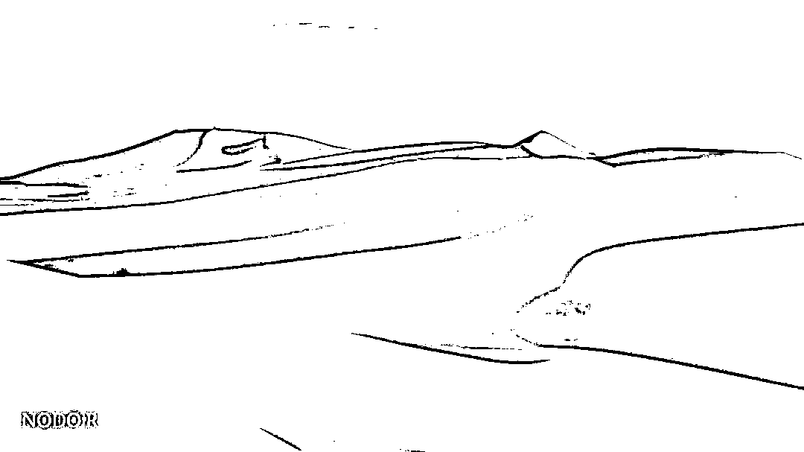

**当土星遇上太阳**

**消极的土星态度通常是由一种恐惧（信念）产生的，即一个人永远不会足够好。**

我们会问，什么方面足够好呢？恰好土星涉及的任何领域。为了确定细节，我们不得不着眼于土星的星座、宫位与相位。

**如果它与太阳有相位，那么个人同一性将会与土星有着密切的关系。因此土星的状态将会强烈影响一个人的意向性、自我表达、娱乐、创造力、表演。**浪漫和自尊的能力，而这些是太阳的主要功能。

当然，太阳也有着它自己的（狮子座）的需求要完成，包括认可、赞同与自尊。**只要太阳处于功能正常的程度，由此带来的状态就时积极的；如果太阳功能失调，随之的状态便是消极的。**

*   **就像其他行星一样，****太阳的状态也是一系列的**：**自豪的、自信的、自我肯定的、确定的、开心的、好玩的、有价值的、浪漫的、任性的、固执的、防御性的、轻蔑的、不确定的、没有价值的、羞愧的、羞耻的。**

**未整合的日土相位**

**当太阳与土星产生相位，它们的结合将反映出相位角度的本质以及整合程度**。

一种可能是，**太阳与土星的困难相位**（四分相、对分相以及梅花相位）代表会有自卑情结、对不足的恐惧、对失败的预期、抑郁倾向，诸如此类都**与个人身份统一性和创造性自我表达的太阳核心议题有关**。

这让我想起了加缪的一句名言，他也拥有梅花相位：“**我应该自杀还是去喝一杯咖啡？**”加缪挣扎于一个问题——**如果人类注定要在一个毫无意义的世界中永远绝望，那么是否还值得活下去？**

如果有困难相位，人们的内在对话往往会贬低自己，预言自己会失败。“我没有那种（成功的）能力。太难了，我要让自己难堪了。”诸如此类。

**★牺牲土星认同太阳**

当一个人**在土星面前捍卫自己的太阳身份时，就容易产生对权威的恐惧**，这种恐惧可能来源于父母（通常是父亲），其后延伸至对任何土星形象的恐惧——老板、上级、政府等等。

这可能是一种轻蔑的、充满敌意的或者挫败的态度：“他们在拖我后腿。尝试又有什么意义呢？”这种消极态度加重了抑郁情绪。当然，不管怎样，这是太阳-土星表现它们自身常见的一种方式。

**★牺牲太阳认同土星**

**同样，案主会走向另一种极端，牺牲太阳来认同土星，从而大器晚成。**

通过结合纪律、毅力和努力工作，土星主宰的人将自己推到所处领域的顶端。无论给予他多大的地位和荣誉，他都不会满足。因为人永远无法达到完美，所以他永远也不会停止追求卓越、超越自我、成为完美。

土星的情绪是紧张的、有压力的、有动力的；它的态度是有雄心的且坚定的，“**我必须是最好的**”。自我对话的重点是设定下一个目标，制定计划，并迫使自己提升：“你本应该获得晋升的；你可以做得更好。”

★**两者都难以带来持久的满足感**

当一个人牺牲土星认同太阳时，或者反之亦然，这种矛盾往往共存且摇摆不定。先有一个行星占优势，然后是另一个。

**在这两种情况下，土星都运转过度，无法整合。在第一个场景（牺牲土星来认同太阳）中，对失败的恐惧会产生一种失败主义的态度；在第二场景（牺牲太阳来认同土星）会产生一种补偿性奋发图强的态度**。

虽然占星学家还不能确定一个相位将如何表达，但内在信念的本质将决定推论的态度主要是积极的还是消极的。

在上面的两个例子中，内在信念是一样的：

**一种个人不足感和即将失败的预感**。**虽然主观情绪和外在行为是不同的，但是无论是失败主义的状态还是奋发图强的状态都不会带来持久的满足感。**

**如何整合我们的太阳与土星？**

**当太阳与土星以平衡、和谐的方式运行时，个人在追求目标时会更加放松、有耐心且灵活。**他或她尊重极限范围，尊崇权威，较少有紧迫感，更能获得和享受成功。

每颗行星都加强了彼此的功能。工作和娱乐变得协调，责任和创造力融合。内在信念变得更加积极，并且**太阳和土星各自的行星功能被有效地利用，来实现两种目标状态，即土星的掌控和太阳的自尊**。

所有这些都会反映在一个人的情绪（认真却不失风趣）、态度（有自信和有权威的）、内在对话（“我享受规划成功和追求成功”）、面部表情（满意/专注的）和声调上（沉着自信的）。外在行为的特点是凭借有纪律的创造力来实现长期目标。

**当一个人已经整合了他或她的太阳与土星相位，这样的状态就是恒定的**。此外，尽管柔和相位暗示两者的行星能力之间有轻松和谐的流动，但整合不仅仅是通过观察星图就能确定的。

当然**困难相位之间的整合需要持续的努力，但是所带来的回报往往也会超过和谐相位**。

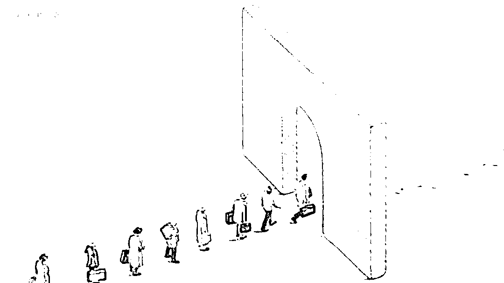

**一个亿万富翁的例子**

亿万富翁奥普拉·温弗瑞就是一个很好的例子，她的**太阳与土星成四分相**。

奥普拉是演员、导演、制片人、艺人、媒体大亨、脱口秀主持人、慈善家，她成就清单太长了，可能需要几页纸才能全部列出。可以说，她是世界上极其成功、有影响力的女性之一。

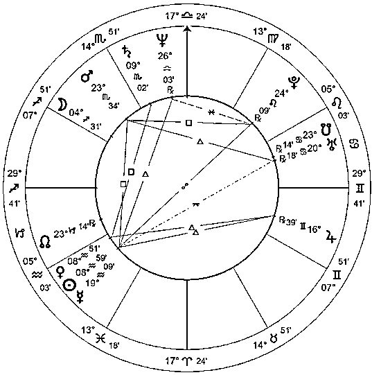

|  奥普拉·温弗瑞：1954 年 1 月 29 日，上午 4:30，科修斯科，美国密西西比州

**正如太阳与土星精确的四分相位显示，无论如何，奥普拉的崛起离不开她的奋斗。**

她出生在美国南方腹地的一个贫穷的未婚少女家庭，在 9 岁时遭受了强奸，在接下来的 5 年中，她不断遭受多名亲戚的性侵。奥普拉在 14 岁时怀孕了，被送去和分居的父亲一起生活。她的孩子在出生两周后死于早产并发症。

在奥普拉剩下的青少年时期，最明显的是不断的屈辱与反抗。奥普拉被她的祖母、母亲和父亲相互推脱，没人要她。尽管困难重重，奥普拉·温弗瑞还是取得了非凡的成就，并因克服逆境成为他人的榜样和慈善者而受到褒奖。

|  奥普拉·温弗瑞

**加缪的土星情结**

|  阿尔贝·加缪

另一个更典型的例子是之前提到的阿尔贝·加缪，他**既体现了土星的抑郁，也体现了土星的成功主题**。

加缪生活在二十世纪四五十年代饱受战争摧残的法国，应运而生成为了国际公认的小说家、剧作家、政治记者、哲学评论家以及自由斗士。他大量的著作为土星作为持久的状态和心理综合体提供了一个独特的视角。

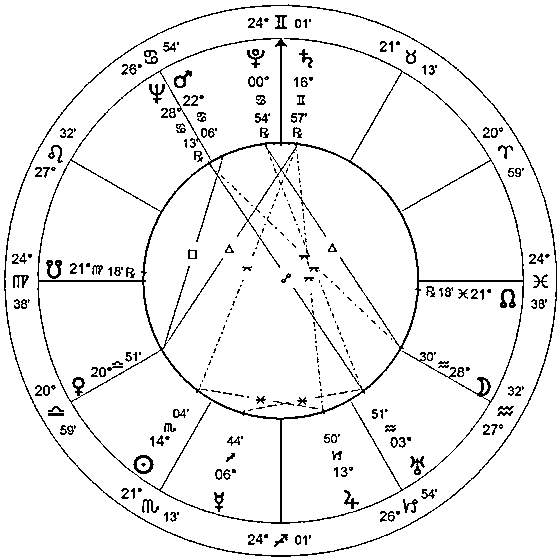

|  阿尔贝·加缪：1913 年 11 月 7 日，上午 2 点，蒙多维，阿尔及利亚

星图中，加缪的土星落入双子座第九宫，与落在第二宫的天蝎座太阳形成渐盈梅花相位。土星同样与落在第四宫的摩羯座木星形成渐亏梅花相位。而太阳与木星形成六分相，使得土星与太阳和木星形成一个土星为顶点的**上帝之指格局**。

特别重要的一点是摩羯座的木星与其定位星土星形成困难的梅花相位，而土星也落入木星守护的第九宫。**因此木星和土星由于星座、宫位和相位被三倍力量捆绑着，这也强调了两者联系的重要性以及合作的困难。**

可以说**加缪太阳-木星的六分相是对土星的双重攻击，土星是它们共同的对手**。

他的太阳通过创造性的作品（虚构小说和戏剧）发起进攻，试图解决土星带来的问题，然而木星的攻击则是通过非虚构类作品、政治报道、哲学文章来揭露土星泛滥的黑暗面。我们将首先研究木星与土星的关系。

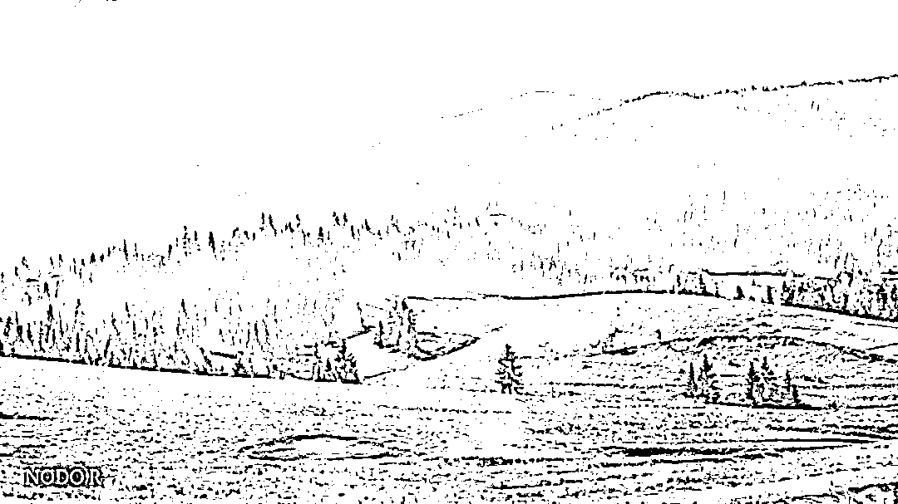

**土木的困局****定位水星的摩羯座木星**

虽然加缪在存在主义传统中被视为哲学家，但他把自己仅仅描述为“**作家**”。

由于水星守护了象征事业的第十宫，并掌管代表交流的第三宫，大卫·辛普森在哲学百科网中写加缪的内容值得注意：“用加缪自己的话来说，他首先把自己描述成一个作家——深思熟虑之后加上‘哲学的’一词修饰，使其更精确且明确。” 

当然，这完全符合加缪的出生星图。**水星不仅意味着他的作家生涯，落在射手座的位置进一步证明了加缪的写作本质是哲学性的。**

但是，我们可能会问，是什么样的哲学？**作为水星的定位星，木星流露出了加缪的哲学、政治和宗教信仰的本质**。

加缪从不承认自己是哲学家，他并不倾向于抽象的理论化，也没有形成一个连贯的、严谨的学说。辛普森认为加缪的思想关注时事，“**始终立足于实际的道德与政治的现实**”。

这当然**符合木星落在摩羯座的状态，说明了一种以实际问题出发而不是抽象的、形而上推测的道德**。此外，**落入加缪第四宫的水星使他想要为他所属的国家寻求一种政治与经济上的公正**——他的出生地阿尔及利亚以及第二故乡法国。

**天蝎座式的渐亏梅花相位**

如前所述，**落在摩羯座的木星与它的定位星（土星）形成一个渐亏的梅花相位**。这说明**木星必须依赖土星来实现它的目标**。然而，**渐亏的梅花相位暗示着一种适得其反的依赖**。

在占星心理学中，我们会说这样的木星是“不健康的”。因为土星非但没有支持木星的目标，反而积极抵抗它们，甚至构成危险。至少从木星的角度来看，这种危险的本质很容易来自土星的一种极端、具有破坏性的表达。

客观地说，这种破坏性表达表现为加缪对极权主义政治意识形态的关注，他认为这些是对真理、正义和道德的威胁。

从主观上和行为上来说，**土星悲观和绝望的状态冲击着木星希望和信仰的核心价值观**，这使得加缪的著作成为对主流观点——宗教、哲学和意识形态——的威胁。土星和木星之间持续的紧张关系在加缪的所有作品中体现得很明显。

一个相位的含义来自于其依据的黄道星座，所以**渐亏的梅花相位是天蝎座式的**。**两个行星——木星与土星，即便两者处于相互影响的状态中，却怀着对彼此的不信任和敌意**。

其中的一方或另一方很可能受到投射并被扔进阴影中，因此整个相位将以与天蝎座一致的方式爆发——**充满激情、极端和充满潜在的破坏性，直到危机被解决**。

实际上，**渐亏的梅花相位是一种需要治愈的伤口**。因为这伤口是一种投射，所以它表现为一种令人惊恐的情况或困境。

**落入第九宫的双子座土星**

另外，加缪的**土星落在第九宫**，也是木星天然守护的宫位。此外，尽管土星与木星处于不和谐的关系，它们也依旧牢牢捆在一起。

土星不仅代表着加缪处理第九宫领域的方式，而且也显示了那个领域产出的有形成果——事物、人物和事件。第九宫与追寻真理（哲学、意识形态、宗教）和追求正义（法律、伦理、道德）有关。

**双子座的土星落入第九宫也暗示了加缪想要达到完美，也暗示了他形而上学领域的事实知识**。

然而，这个领域的本质是抽象的，与思辨和推论有关。因此，落入双子座的土星可能会沮丧地得出某种结论：确凿的真理是无处可寻的。

辛普森写道，加缪成熟的哲学不仅仅是一种天真的无神论，而是一种深度反思和批判的无宗教信仰。这种哲学是自负的、绝望的悲观主义，并没有以一种驳论与傲慢的方式展现。

它同样是坚定的、冷静的、坚决地怀疑的。加缪的哲学宽容并尊重世界的宗教信条，同时亦毫不近人情地对待它们。

最终，加缪以一种接受和认可的积极哲学观，以他自己的方式祝福我们终有一死的命运以及我们与世界的根本孤立。

没有一位占星学者可以写出比此更好的关于土星双子座落入第九宫的总结，至少写不出像加缪所经历的那样。**一个相位可以用多种方式表达**，这一点如何强调都不为过。

**在更高层次的整合中，不管相位有多么困难，它都会以一种方式允许行星满足各自必须满足的需求**。

然而，如上所述，加缪在他短暂的一生中并不能满足射手座和木星对信仰、希望以及意义的需求。事实上，他与之背道而驰。

加缪关注的无疑是政治形态，这代替了任何真正的宗教信仰，而且土星守护的就是政府。此外，**加缪专注于苛政的统治（土星）对司法公正的阻碍（木星）**。

在第二次世界大战纳粹战胜法国时，因为纳粹残酷的征收和严苛的司法系统加缪在道德上被激怒了。然而，同样的事实是，加缪自己的怀疑主义削弱了他的信仰能力，而且正如我将要讨论的，这也限制了他看到更广阔、更包容的真理。

不久，我们将看到加缪悲观的无神论是如何导致这种影响真正产生的。

**当两颗行星因为困难相位冲突时，通常运行更慢的星体会占主导。**土星以其硬核的现实主义和持续的怀疑而闻名，这可能会挫败木星对于真理、意义和公正的追求，或者至少让木星仅因一点点的满足而勤奋工作。

这在加缪的政治信念中体现最为明显。加缪不信任土星的权威和对于权力的潜在滥用，他 30 多岁时参加法国无政府主义运动，为其出版物撰稿，并在一生中始终支持无政府主义的运动。

无政府主义作为一种政治形态，是土星的对立面，它提倡自治、等级自由、无国籍社会，并且认为外部的、政府的等级形式是不可取的、多余且有害的。

**加缪对官僚机构愤世嫉俗的不信任与不良状态下的木星相一致**，因为他担心政府的集体冲动，无论多么崇高与充满善意，都可能产生事与愿违的后果，与人民为敌。这是加缪在纳粹占领法国时的直接经验。

除了无政府主义的观点，他还积极投身于 1944 年至 1947 年的反抗运动，并担任《战斗报》（Combat）的主编。**加缪上帝之指与顶端土星的关系体现得最明显之处便是他写道**：

“我们正遭遇恐怖统治，因为人类的价值观已经被对他人的蔑视、对效率的崇拜所取代，对自由的渴望被对统治的渴求所取代。使我们正义的不再是公正与慷慨，而是成功。”

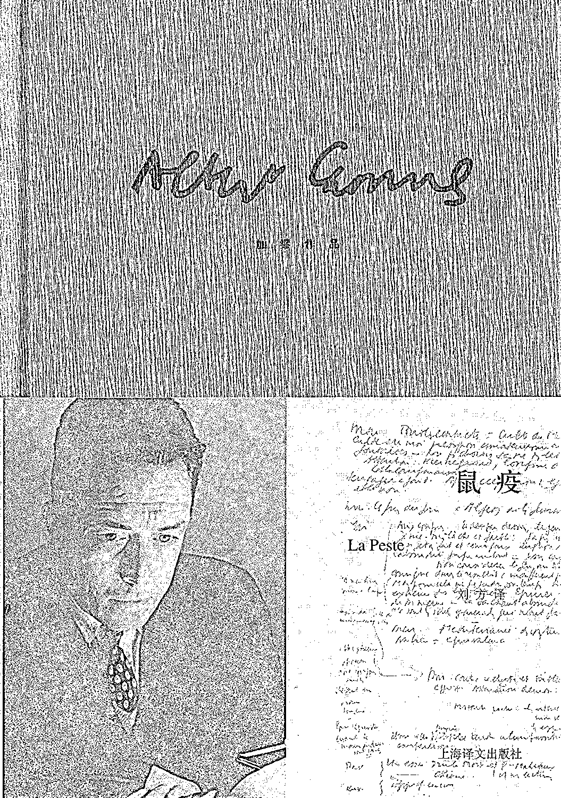

1947 年，正值 34 岁的加缪出版了一本讽刺小说《鼠疫》（The Plague），书中描述了法西斯将原本自由、思想独立的人变成没有灵魂、压迫人民的官僚，如同老鼠一般用死亡和传染病折磨着人类。

事实上，法西斯主义通过其罪恶的种族政策、死亡集中营、残忍的优生理论、强制绝育和强迫的安乐死，确实不仅与其自己的人民为敌，也与其征服国家的居民为敌。

此外，**与天蝎座式/渐亏梅花相位一致的是加缪的戏剧《戒严令》（State of Siege）**，该剧把一个爱管闲事、耀武扬威的法西斯独裁者的秘书，描绘为中世纪死神在现代官僚中的转世。

这仿佛是**对土星落入双子座的致**敬，这部剧明显的关注点是将搬弄是非（双子座）用于极权主义的目的，用扭曲的、重新定义的语言为权力的阴谋服务，或是由于国家对媒体的控制，所有的言论集体沉默。

**（未完待续，下篇在今日二条，**

**加缪案例精彩分析继续）**

**版权声明：**本文由若道翻译发布，欢迎转发，反对抄袭。友号转载请申请白名单。

**END**

**格伦·佩里**

著名占星师，ISAR 董事会成员，共出版 8 本占星著作；心理/意识研究专业博士；占星心理学学院（Academy of AstroPsychology）的创办人；康涅狄格州研究生院（the Graduate Institute of Connecticut）原型宇宙学与意识进化项目的负责人。

# ****占星原型与星图中的精神病理学****

**为什么在占星学的课程中，会出现精神病理学的教学内容，这和我们有什么关系？这对占星咨询，或在自我了解与成长的过程中又有什么帮助呢？**

****带着这些疑问，请你静下心来，思考以下几个问题**：**

**“******你/你的案主，是否曾经过度担心什么？**** ****你/你的案主，有没有感觉到担忧和焦虑，却不知道原因是什么？********你/你的案主，是否曾经觉得害怕什么东西，但理智上却很清楚它不会对你造成什么伤害？********你/你的案主，是否曾经通过沉迷某物，酗酒或滥用药物，自我伤害去逃避问题？********……********——节选改编自《心理学与生活》******”**

**如果你对上述问题其中之一，回答是。这意味着几乎每个人都曾有过心理障碍的症状（精神病理的问题）。**

**你看，其实“精神病理学”与人的心理有着密切的关联，再结合占星学，呈现了人内在与外在层面更加丰富和深刻的一面。**这对于学习占星学的人和占星师来说，都是一场难得的知识盛宴！****

****本课为 2 年期双证核心课程中的一部分**（AP105 阶段），其内容是过去若道所开设的核心课程从未教授的部分，特意抽出供其他学员学习，******可作为 ISAR 选修课，单独报名。****

****点击下方图片了解详情****

**

**快年底了****不给自己一份来自占星学的礼物吗？**

**梅里曼金融报告双 12 福利来啦！****长按下图了解更多详情吧！**

**快来领取你的 2023 年运报告吧！**

**20 位来自世界各地的占星师****带来 19 场沙龙——新世界的觉醒****详情可点击下图**

**学习占星学****点击下图了解课程详情**

**微信又双叒叕改版啦，不想错过若道君的推送？******就把若道设为****星标****以及点点****“在看”****吧！******▼**

**喜欢就点一下“在看”吧！****报名直达入口**

# 职业占星师认证文凭课程插班中丨想看大卫老师是怎么做课堂演示的吗？

> 原文：[`mp.weixin.qq.com/s?__biz=MzA5NjA0NTAxNg==&mid=2651497215&idx=3&sn=8f1acae971aff060910be2fbe5c02f9a&chksm=8b481048bc3f995e48b007672d3ce99d6f7f7be945fc5e0a7919f7f344ce7679901d384f39f7&scene=126&sessionid=1692737710#rd`](http://mp.weixin.qq.com/s?__biz=MzA5NjA0NTAxNg==&mid=2651497215&idx=3&sn=8f1acae971aff060910be2fbe5c02f9a&chksm=8b481048bc3f995e48b007672d3ce99d6f7f7be945fc5e0a7919f7f344ce7679901d384f39f7&scene=126&sessionid=1692737710#rd)

**在若道核心课程的教学里，****以学员为案例****进行课堂的占星咨询演示，是我们课程的特色环节。**

这样的演示不仅让很多同学有亲身体验咨询的机会，而且这么多真实案例的学习，会让大家看到占星咨询到底是怎么样一个过程。毕竟，大部分人的学习都是要从模仿开始。

记得若道君当年学习占星的时候，可没有这样的机会。那时候主要是听课为主，后来，我们在多年的教学实践中，**越来越发现课堂演示的重要性**。因此，就把这个作为一个主要环节加入到课程中。

在新一期的若道核心课程中，咔咔老师和大卫老师这对组合就会把这个教学特色充分发挥出来。**熟悉中国同学思路的咔咔老师会以知识点的讲解为主，而有 50 年占星咨询经验的大卫老师，则以课堂演示为主。**

有时候，这样的课堂演示的功效是出乎意料的。

一位若道的老同学赵震宇这么写到：

2018 年，我正式开始在若道学习 L1-5。其实我一开始的心态更多的是希望得到系统化的学习来补充我的知识漏洞，以及拿到一个证书可以为自己做背书，增加自己将来转型占星师的筹码，而不是真的在期待可以从若道的学习中得到一些本质上的领悟。

事实上在初期的 L1-3 中，很多知识与课上的内容，也是我比较熟悉的领域，相对而言是驾轻就熟的。但在 L3 的工作坊中和大卫老师的接触以及模拟咨询，让我对占星的态度发生了很本质的变化。

大卫老师对我星图的分析不仅非常准确，更重要的是，他开启了我自身个人成长上的变化，从而成为了我本质上进化蜕变的一个契机。

在短短的 6 个月内，我对人生的认知、对自我的认知、对于人生看待的方式都发生了翻天覆地的质的变化。我意识到了原来跳出自己一直以来无意识间重复的模式，是一件可行、并且会给自己带来无限成长提高自己人生幸福度和质量的事情。这也让我深刻体会到了人本主义占星学的魅力，以及自己之前是多么的“无知“。

于是现在，占星学对我来说，不只是兴趣、宗教信仰、或者是可能的职业道路，而是一种激发自己和他人人生成长和蜕变的工具、一种让自己更幸福的看待世界的方式。哪怕我之后并不会以占星为生，它依然是我人生中不可或缺的一部分，就像一副隐形眼镜，影响着我与世界的互动。

而被大卫老师咨询深深影响的同学还有很多。

**这里，我们节选一些短小的试听片段，让你稍微感觉一下在若道核心课程上，大卫老师的咨询演示是怎样的一个样子。**

**片段一**

<mpvideosnap class="js_uneditable custom_select_card channels_iframe videosnap_video_iframe" data-pluginname="videosnap" data-id="export/UzFfAgtgekIEAQAAAAAAMKsWN6BUygAAAAstQy6ubaLX4KHWvLEZgBPEnoIULgMKKb-DzNPgMItC2ZEgiEDMBYjrYHv9wNsO" data-url="https://findermp.video.qq.com/251/20304/stodownload?encfilekey=rjD5jyTuFrIpZ2ibE8T7YmwgiahniaXswqzQNpbBXpPP4TxDf43veVhCBACOECUZ1gc5HaUbhk0Z3Glc94tZFe7ewRHOH9L2oUC1X3aOe13K8IHMkEou9Nkgw&amp;adaptivelytrans=0&amp;bizid=1023&amp;dotrans=0&amp;hy=SH&amp;idx=1&amp;m=&amp;scene=0&amp;token=x5Y29zUxcibCEaJsXB0hMdWnJvmNct4OnXZaaWOd32ia2edkK2LTMk7jmjOms6bDk5TDtYTqEwbOQ" data-headimgurl="http://wx.qlogo.cn/finderhead/PiajxSqBRaEJYnVsqWfEX9qA0sI6hNVKsDfyzfPZ92WZMZyBpZWU5NA/0" data-username="v2_060000231003b20faec8c4e68a1ec2d4ca07e434b07755bbf47e7053a3059defd2c9d6c68a20@finder" data-nickname="若道" data-desc="#若道核心课 大卫老师用星座、行星、宫位来探索一位同学出生星盘主题的时候，他回顾了解读星盘的优先次序" data-nonceid="7723748345640460016" data-type="video" data-width="544" data-height="344"></mpvideosnap>

**片段二**

<mpvideosnap class="js_uneditable custom_select_card channels_iframe videosnap_video_iframe" data-pluginname="videosnap" data-id="export/UzFfAgtgekIEAQAAAAAANycuUwRANAAAAAstQy6ubaLX4KHWvLEZgBPEhYJ0WjYILr-DzNPgMIvjhT14ogdLw3BWd0Tg37w0" data-url="https://findermp.video.qq.com/251/20304/stodownload?encfilekey=rjD5jyTuFrIpZ2ibE8T7YmwgiahniaXswqz3Oj8zjAwTAIicKkuWErGfL3ZtYr95eTZl2oMcAx9ibThSN3gay2CmF6o8ht96zOZHdxGiaIMmdbGNtWv9Prb3wriaA&amp;adaptivelytrans=0&amp;bizid=1023&amp;dotrans=0&amp;hy=SH&amp;idx=1&amp;m=&amp;scene=0&amp;token=AxricY7RBHdV28gAuQuwABhG0G0QgmYSkh8LH68lEdHu6yrDYj099TFZVSWWqINaQTuTQ2p1ZMF0" data-headimgurl="http://wx.qlogo.cn/finderhead/PiajxSqBRaEJYnVsqWfEX9qA0sI6hNVKsDfyzfPZ92WZMZyBpZWU5NA/0" data-username="v2_060000231003b20faec8c4e68a1ec2d4ca07e434b07755bbf47e7053a3059defd2c9d6c68a20@finder" data-nickname="若道" data-desc="#若道核心课 占星学如何反应职业选择？" data-nonceid="629392412247480278" data-type="video" data-width="544" data-height="344"></mpvideosnap>

**片段三**

<mpvideosnap class="js_uneditable custom_select_card channels_iframe videosnap_video_iframe" data-pluginname="videosnap" data-id="export/UzFfAgtgekIEAQAAAAAAl_sREJMyhwAAAAstQy6ubaLX4KHWvLEZgBPEtIIkIkRmL7-DzNPgMIsA5PpGB3ReSAYx6ZfSNfZ1" data-url="https://findermp.video.qq.com/251/20304/stodownload?encfilekey=S7s6ianIic0ia4PicKJSfB8EjyjpQibPUAXolGhicE2gfRuDzIVwyXxBFlWMzxMczGgPzOG5ja3tyfwYQrAcOUkpGicEE1j6fc9zHAjg5IF1HDBibf9k85ybbAfdqQ&amp;adaptivelytrans=0&amp;bizid=1023&amp;dotrans=0&amp;hy=SH&amp;idx=1&amp;m=&amp;scene=0&amp;token=x5Y29zUxcibCEaJsXB0hMdeqQ56SUWMj15o3Z7wyXeQ6ruia8FGLMtcPAnn3TQl6hkia66nOjynB8M" data-headimgurl="http://wx.qlogo.cn/finderhead/PiajxSqBRaEJYnVsqWfEX9qA0sI6hNVKsDfyzfPZ92WZMZyBpZWU5NA/0" data-username="v2_060000231003b20faec8c4e68a1ec2d4ca07e434b07755bbf47e7053a3059defd2c9d6c68a20@finder" data-nickname="若道" data-desc="#若道核心课 如何从出生星图的基本要素看到案主生命发展的故事和个人成长经验？
" data-nonceid="6689802853667419635" data-type="video" data-width="544" data-height="344"></mpvideosnap>

**若道新一期的核心课程在****8 月 30 日****正式开始**，如果你有很浓厚的兴趣，不仅仅是因为好奇想浅尝一下占星学，但还没有想清楚是不是要学习整个 L1-5 的课程，**那么 L1-3 可能是一个不错的选择。**

**谁是你的老师？**

**占星师咔咔（Caroline）**

2010 年师从美国占星师大卫·瑞雷学习，并得到世界名师斯蒂芬·弗里斯特、罗伯特·汉德、苏·汤普金斯传授各种占星学技法。若道首届学员，国内最早获得 ISAR 职业占星师资质的职业占星师，多次担任若道核心课程助教，2019 年第二届、2021 年第三届核心课中和苏·汤普金斯老师一起教授若道核心占星课程。

在国际知名广告公司和市场研究公司从事的市场研究和推广工作十余年，曾任职于阳狮集团、尼尔森市场研究有限公司、MTV 和《Madame Figaro》杂志。

**大卫·瑞雷（David Railey）**

*   **I****SAR 董事会成员，ISAR 全球副主席，ISAR 全球职业占星师资质认证主席，若道占星创始人**。

*   2016-2019 年，被选为国际占星协会（ISAR）考试委员会成员，国际占星协会（ISAR）是世界最大的国际占星机构，会员遍布 47 个国家。

*   2017-2020 年，被选为国际占星联盟（ISAR）考试委员会主席，理事会成员。

**助教王嘉祺 （Conrad）**

ISAR 认证占星师、若道认证生时校正资质，从 2010 年起自学占星学，2015 年开始在若道系统学习，并开始个案咨询。2018 年担任若道核心课程助教，以及卜卦占星学和太阳返照选修课助教，并带领学员进行经世占星和太阳返照方面的研究。2019 年 11 月作为演讲人之一参加了国际占星协会（ISAR）北京大会，也是 ISAR 星空俱乐部中国区第 16 期的主讲人。

**内容是什么？**

**ISAR 认证职业占星师的独有培训**

目前占星学的培训市场鱼龙混杂。而 ISAR（国际占星研究协会）是一个包含了 47 个国家在内的国际占星组织，多年来致力于占星的教育和研究，提升占星教育的品质和职业占星师的能力，在国际占星领域备受尊重。

**2022 年，鉴于对若道在占星教学领域所做的持续努力和高品质的课程服务，ISAR 特别授予若道核心课程为 ISAR 文凭课程，所有在若道学习，并通过若道毕业考试的同学将获得 ISAR 颁发的学历文凭（Diploma）。**

如果你想更多了解 ISAR，请点击[【这里】 ](http://mp.weixin.qq.com/s?__biz=MzA5NjA0NTAxNg==&mid=2651475298&idx=1&sn=b91888b54c14e29068f8b4e2a3452f5d&chksm=8b48ffd5bc3f76c32699f20f5c99e978bbb25551e69d80c70fee361acbd930ba5970ae776cdc&scene=21#wechat_redirect)

**课程费用**

**★ 1-2 阶　****课程费用：3500 元 ****★ 1-3 阶 连报**

**课程费用：11500 元 **

**********转发优惠价：**11000 元（朋友圈转发本课宣保留 24 小时以上，并截图给课程顾问）********

**★ 1-5 阶　连报**

**课程费用：46500 元 **

****转发优惠价：34800 元，朋友圈转发本课宣保留 24 小时以上，并截图给课程顾问****

**退转课程**

**退款原则请详看《教学协议》，如有疑问请咨询课程顾问。**

****2022 L1-3 认证职业占星师文凭课程****

**授课老师：大卫·瑞雷、咔咔**

**直播课开课时间：2022 年 8 月 30 日（周二）**

**授课方式：******网络授课，英文/中文授课，中文翻译****

**费用：** ****1-2 阶**：**3500 元；****1-3 阶**：**11500 元****（****转发优惠价：**11000 元，朋友圈转发本课宣保留 24 小时以上，并截图给课程顾问）******1-5 阶连报**：46500 元**（****转发优惠价：34800 元，朋友圈转发本课宣保留 24 小时以上，并截图给课程顾问）**；**

**课程负责人：王老师**（微信/手机：18510107057，请备注“大卫核心课”）

长按二维码添加课程负责人咨询

**报名直达入口**

# 12 星座如何平衡“面子”和“里子”？

> 原文：[`mp.weixin.qq.com/s?__biz=MzA5NjA0NTAxNg==&mid=2651497215&idx=1&sn=5a4ff924d9048041b5f9a9ba77510a57&chksm=8b481048bc3f995e8e6f5d31ef8fb93cc3752d451375ba9bfa25ad9634f072319b07e6d0a94d&scene=126&sessionid=1692737710#rd`](http://mp.weixin.qq.com/s?__biz=MzA5NjA0NTAxNg==&mid=2651497215&idx=1&sn=5a4ff924d9048041b5f9a9ba77510a57&chksm=8b481048bc3f995e8e6f5d31ef8fb93cc3752d451375ba9bfa25ad9634f072319b07e6d0a94d&scene=126&sessionid=1692737710#rd)

******☆ **后台回复“今日”，给你一句生命态度****

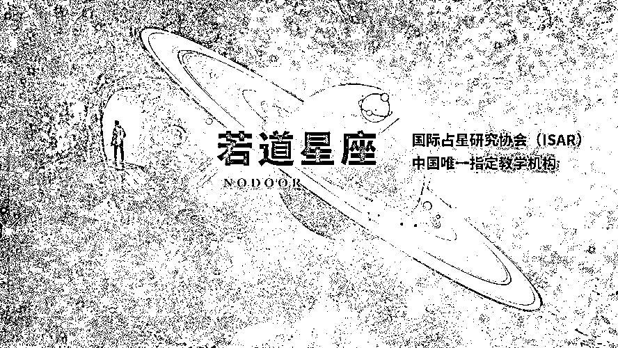

作者/Anastasia

编辑/玫瑰 封面/书君 图片/稿定设计

**什么是“要面子”？**日常生活中，人们经常会说某某要面子，做事体面；也会说某某最大的问题就是好面子。听起来有褒有贬。那么，面子到底是什么？

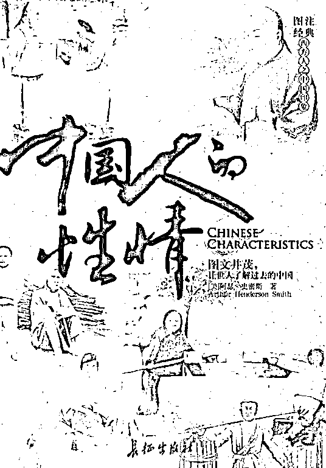

| 《中国人的性情》在《中国人的性情》一书中，美国传教士阿瑟·史密斯写道：**“‘面子’这个词本身就是一把打开中国人许多重要特性之锁的钥匙，大部分中国人都很要面子，要了解中国人的性情，就得弄清楚他们那种要面子的心理。”**中国古代就有一则关于死要面子活受罪的笑话：说有个读书人家穷，脸皮薄又死要面子，天天在外面装模作样摆阔气，终于招来了小偷。小偷晚上去他家翻箱倒柜，发现一样值钱的东西都没有，气得直骂娘。读书人被吵醒了，不起来抓小偷，反而将身上仅有的几文钱塞给小偷，“把这钱拿去，在外面千万不要说我家穷！”鲁迅的《且介亭杂文》中也有一片《谈“面子”》的文章，里面说到：**“每有一种身份，就有一种‘面子’，也就是所谓‘脸’。这‘脸’有一条界线，如果落到这线的下面去了，即失了面子，也叫作‘丢脸’。不怕‘丢脸’，便是‘不要脸’。但倘使做了超出这线以上的事，就‘有面子’，或曰‘露脸’。”**每个人都有自己的底线，都希望向外营造出一个好的人设。面子就是一个人为自己打造的人设，反应出内心希望他人看待自己的样子。而“丢脸”之道，就会因人而不同。有人希望塑造“好人”人设，不惜牺牲自己、甚至是家人的合理需求，以满足他人为优先；有人渴望打造“专家”的人设，专横霸道，听不进去任何外界的建议和意见；有人则喜欢“明星”光环，渴求他人羡慕，不顾自身的条件和基础，省吃俭用，宁可贷款负债，也要出入高消费场合，用奢侈品装扮自己。不管外在的表现如何不同，究其根本，造成好面子的因素主要有两个：**· 对外渴求关注，爱慕虚荣****· 对内信心不足，面子来凑**俗话说得好，一个大牌包咬咬牙就买了，可大牌包背后的生活却是假装不出来的。有实力的人自带面子，没有实力的人各有各的虚荣。从占星学角度来讲，**黄道星座中第五个星座，火象固定星座，狮子座，最容易出现爱惜羽毛、好面子的倾向。****太阳是个体的核心自我，也是出生星图中的核心元素。**每颗行星都要从太阳那里汲取能量，并且为实现太阳的目标同心协力，贡献力量。**太阳守护的狮子座本身就充满自信，善于也乐于表现自己。但物极必反，过犹不及，狮子座也因此容易变得自大自傲，独断专行，过于好面子。**

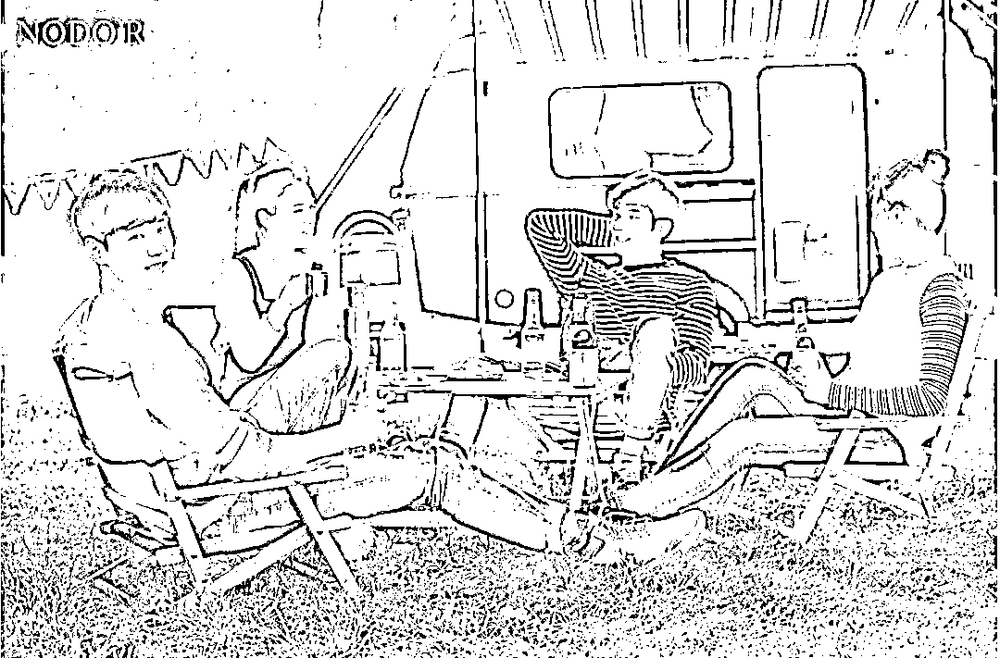

狮子座要明白一点，真正的强大不是来自于别人的夸赞和掌声，也不是强迫别人都听自己的，而是接纳真实的自己，承认个体的不足，并充分考虑他人的意见和集体的利益，甚至甘愿被误解和批评，这样产生的凝聚力和向心力，才能去实现更大的目标，追求生命最高的理想。相对于挥洒自如的狮子座，对于其它星座来说，如何自在地表现自己，不骄不躁，不卑不亢，可能都是一个大难题。为什么会为了面子勉强自己去做一些违心的事情？为什么总是在重要的场合手忙脚乱掉链子？12 星座该如何展示出自己的力量，不虚荣、不怯场、从而展现出真实的体面？很多时候，这种能力不是天生的，而是需要通过学习、训练、实践才能拥有的。**12 星座的面子来自何处？****★ ****火象星座：面子来自于真实的内在力量**
**白羊座的面子来自于用平静、自信并且充满智慧的态度对待自己和他人。**白羊座的自信来自于关系中正向的反馈，在和他人的互动中充分体验当下，看见自己的每一种感受和情绪，不急不躁，学会放松，才能拥有真实属于自己的内在力量和面子。和狮子座的感觉良好有些类似，射手座也是拥有谜之自信的典范。很多内在力量不足的射手座会因此用高高在上，充满偏见，喜欢说教来武装自己。**真正自信的射手座会将目光放在自己身上，看见内在的脆弱和不足，接纳低沉的情绪和散乱的心智，而不是用瞧不起他人，他人不理解自己来保护自己的面子。****★ ****土象星座：面子来自于接纳不完美的自己**金牛座的核心是要生存，所以他们在乎自己拥有的一切资源，但有的时候也会过度在意这些东西，钻进牛角尖。**金牛座的面子首先来自于自己的身体。**了解自己的身体，爱惜自己的身体，不管它有多么不完美。身体是人类生存和繁衍的基础，一个健康的身体会给金牛座带来足够的力量和信心，学会与他人平等地付出和接受。处女座对他人高标准，对自己也非常挑剔，这已经是众所周知的特点了，也是他们最容易被外界诟病的地方。**处女座的面子来自于坦然承认自己的小缺点和不完美，允许自己犯错，也允许他人犯错。**处女座最要紧的就是学会放松，对这个世界再宽容一些，这样的处女座会变得特别有面儿，非常受欢迎。摩羯座作为土象星座的最后一个，中天最高点，也是最渴望世俗成功，最惧怕现实失败的星座。**摩羯座的面子来自于对自己目标的认可，发自心底的相信自己可以。**能力越大，贡献越大，在实现自己个人目标的同时，去帮助更多的人，而不是去斤斤计较个人的成败。一个人成功的关键往往不是地位或事业，而是获得他人的尊重和善意。

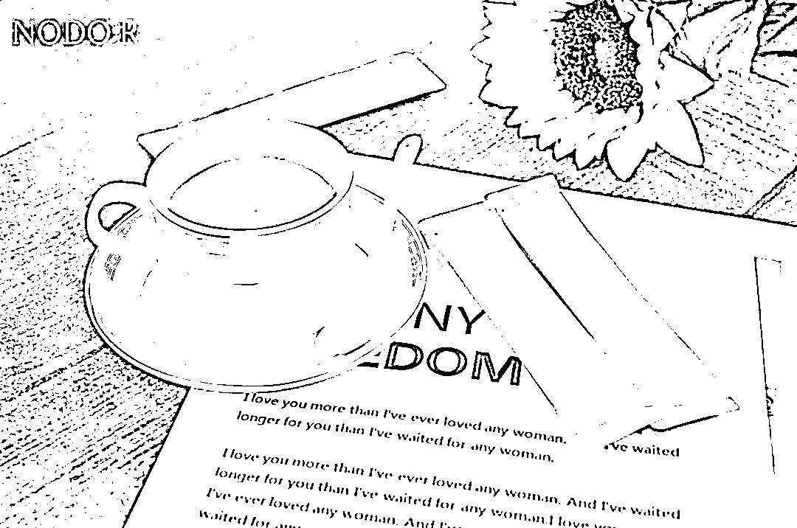

**★ ****风象星座：面子来自于识别自我的价值**双子座依靠自己的头脑闯世界，他们往往善于察言观色，捕捉他人观点。有意见产生分歧时，就容易产生自我怀疑。**双子座的面子来自于识别并坚定自我的价值。**他们要学会从复杂、繁多的信息中找到自己的观点，从误解、伤害和错误的互动中汲取经验，而不是从虚假的信息中，盲目地交朋友和建立关系。天秤座非常看重与他人的关系，对于他们来说，有时候自己的面子是依附在他人的认可上，这个基础是非常不牢靠的。建立在别人身上的自信始终容易动摇，令人不安。天**秤座要学会摘下自己的社交面具，找到对自己最重要的价值，明确自己的处事原则和底线，才能在关系中立于不败之地，获得真正的自信与面子。**水瓶座是 12 星座中最特立独行的一个，在人群中看起来很酷，又高冷，又有才华，但过于非主流、不合群也会带来很大心理压力。**水瓶座的面子来自于坚持自我的底线和价值，不会因为和主流价值观不同而产生自我怀疑。**水瓶座要学会自我沉淀、调整思维、了解自己的心路发展历程和成长经历，找到拥有共同人生体验和目标的朋友，生活就会焕然一新。**★ ****水象星座：面子来自于做自己情绪的主人**巨蟹座的敏感和情绪化容易给自己带来胆怯，不断为了顾全大局而委屈自己。不断压缩自我的价值和空间，会导致越来越怀疑自己的能力，失去理性，被情绪裹挟一切，不再相信自己。**巨蟹座的面子来自于正确识别自己的情绪，分清哪些是他人的情绪，哪些是自己的情绪，学会控制和疏导自己的情绪，了解真正的自我价值。**天蝎座的洞察力会让他们透过表象直抵人性的阴暗面，所以才想掌控一切。当他们觉得对外界失去控制的时候，就会产生危机感，容易为了保全自己的面子而走极端。天**蝎座要明白，真正的力量并不是去掌控一切，而是来自于对自我力量的控制。**要知道，对于获得人心，控制世界的走向，理解的力量比强迫的力量有效得多。双鱼座容易沉浸在自己的世界里面，包容万事万物，渴望每个人都被这个世界温柔对待。**双鱼座的面子来自于从善如流的内外祥和，而不是用逃避换来的虚假繁荣。**双鱼座要明白正常的人生都是高高低低、起起伏伏，不是只有梦和美好。能够心平气和地与世界上的丑陋以及不快乐的自己和平相处，能获得真正的自信和面子。每个人的自我都是由四个区域组成的：**· 开放自我：**所有人都看得见的区域；**· 盲目自我：**自己看不到，他人却一目了然的区域；**· 隐藏自我：**只有自己知道，对外封闭的区域；**· 未知自我：**无人可探触的区域，谁都看不到。第一个区域很容易了解；第二个区域，我们会通过关系来学会；占星学会帮助我们深入探索第三和第四个区域，去更好地认识自己，整合好这几个区域，就拥有了真实的力量和面子。

**版权声明：**原创文章由作者授权首发于若道平台，欢迎转发，反对抄袭。友号转载请申请白名单。

**END**

**Anastasia**

职业占星师/专栏作者/策展人

ISAR 认证占星师（2016 年获得）

若道认证生时校正资质（2015 年获得）

**微信公众号**：KairosMoment

长按打赏

**快年底了****不给自己一份来自占星学的礼物吗？**

**梅里曼金融报告双 12 福利来啦！****长按下图了解更多详情吧！**

**快来领取你的 2023 年运报告吧！**

**20 位来自世界各地的占星师****带来 19 场沙龙——新世界的觉醒****详情可点击下图**

**学习占星学****点击下图了解课程详情**

**微信又双叒叕改版啦，不想错过若道君的推送？**
****就把若道设为****星标****以及点点****“在看”****吧！******▼**

**喜欢就点一下“在看”吧！****报名直达入口**

# 诚实面对金星的黑暗面，让爱的“恶魔”进化

> 原文：[`mp.weixin.qq.com/s?__biz=MzA5NjA0NTAxNg==&mid=2651497215&idx=2&sn=d9edb63042580705d9f34f0d552c5069&chksm=8b481048bc3f995ecc7eed6254b08acc3feb21136c57076fa8e1b8e8b4e29797103f11466a2a&scene=126&sessionid=1692737710#rd`](http://mp.weixin.qq.com/s?__biz=MzA5NjA0NTAxNg==&mid=2651497215&idx=2&sn=d9edb63042580705d9f34f0d552c5069&chksm=8b481048bc3f995ecc7eed6254b08acc3feb21136c57076fa8e1b8e8b4e29797103f11466a2a&scene=126&sessionid=1692737710#rd)

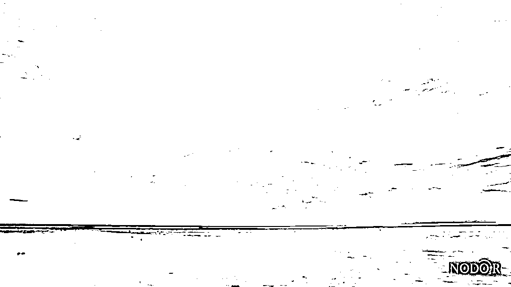

作者/斯蒂芬·弗里斯特

译者/逸月  校对/神婆阿丘

编辑/翀子 图片/稿定设计

金星会带来麻烦、痛苦、困惑，也会带给我们这个尘世中最有意义的东西——那就是人的情感、人与人之间的联结和爱。在爱中，我们需要让金星的功能健康运作，了解彼此真实的需求，让情感更真诚的流动。如果你对占星学感兴趣，大卫老师参与授课的【[ISAR 认证职业占星师文凭课程](http://mp.weixin.qq.com/s?__biz=MjM5MjQwNjAyMQ==&mid=2649440485&idx=6&sn=80963407efb8515e5ac252f847b77b34&chksm=beb92f8f89cea699d7ec70c8e2e5b44a55552f17e70dc42b5a681d82dfc1b38f436ae419aeb5&scene=21#wechat_redirect)】正在插班中，欢迎点击链接了解更多详情！

 **金星带来的都是美好吗？**

人们常常说金星是一颗吉星，我对此付之一笑。我当然不会否认，金星可以非常甜蜜，但当我们年龄渐长，再回顾人生的时候，我们常常会思考：**我们遇到某个人，开始某段关系到底是好事还是坏事？**

我提出这种看法之后，我想大多数人都会认识到，**金星会带来麻烦、痛苦、困惑，然而金星也会带给我们这个尘世中最有意义的东西——那就是人的情感、人与人之间的联结和爱。**

为了与星图中的金星建立正常的关系，让她健康运作，我们需要有非常深的自我了解。我想非常深入和精准地分析金星的功能，让我们了解她不单单只有浪漫的面向。

 **你需要了解的金星黑暗面**

金星最基本的功能是建立人与人之间的情感联结，以及维护这种联结，实际上这是一个在人与人之间搭建桥梁的过程。当我们这么做的时候，我们在创造和谐以及和平。我们在自我和他人之间创造了一种理解和共情的震动及能量。

汽车销售人员在这个领域非常有技巧，但是你可以想想他们使用的不道德的手段：告诉别人他想听到的话，这样的行为当然隐含了**操控、不诚实和利用对方的企图。这就是金星最黑暗的一面。** 

想象一下我们被某人吸引，我们想要和那个人更亲近，目的可以是浪漫的也可以是很动物性的。这时我们会展现自己性格里最具吸引力的一面给对方。

**而当我们发现对方说了某些话做了某些事不让我们那么舒服的时候，我们仍然是把这些放在一边，也不表达自己的情绪，我们表面上点头微笑，因为我们带着与别人建立联结和搭建桥梁的目的，以便满足自己的需求。**

而这个过程中我们会把自己的一些特质扔到一边，也不会向对方呈现我们的真实面目，因为我们有那么强烈的意愿想要和对方建立关系，感受那种融合、那种合二为一。

**所以我们会无意地或无意识地操控别人喜欢上我们。我们可能非常善于这么做，会很成功。反过来说，别人肯定曾经也对你这么做过。** 

当有人在欺骗你、伤害你、利用你时，他们可能会侥幸成功，但当你有过受伤受骗经历时，再遇到别人在骗你的情况，你可能会有所察觉。

或许是他们闪烁的眼神这一类的信号，告诉你应该更小心一些。但如果对方无意识地去“欺骗”你，那将更具有诱惑力。因为那些像是闪躲的眼神这类我们熟知的信号，可能都不会出现。没有意识到自己在撒谎的人就不是骗子。

再次说明，**当我们受到金星恶魔的一面的操控时，我们会感到非常饥渴地想和对方建立关系，以至于我们自己的真正面向都被掩藏了。**

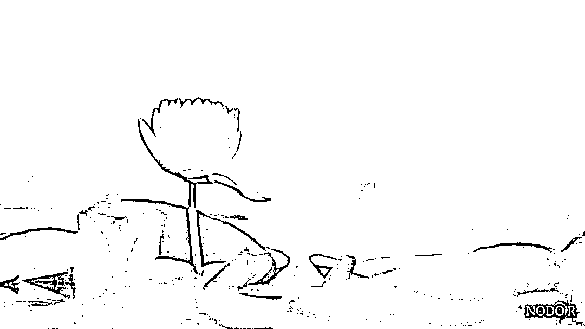 **诚实是应对金星黑暗面最好的方法**

我前面所讲的，都是金星的阴影面、黑暗面以及可怕的一面。重要的是，我们每个人都需要知道那个面向，在我们建立关系的过程中，我们需要进入金星的高阶学校，学习如何正确地去建立关系。

在诸多方法中，最核心的一点是，**面对对方的时候，非常直接真实地告诉对方你是谁，你的需求是什么。**

严谨地专注于你自己的需求，然后非常明白地把这个需求传达给对方。就像是做真实的广告一样**：**

**这是我，我的需求是什么，你这样做我会开心，哪些行为会让我不高兴。如果你能满足我的这些需求，我将很高兴，也许我也能够满足你的需求，然后我们将可以快乐的生活下去。**

爱情是可以这样运作的，爱情可以绝对真实，并且可能成为我们生命中最生动的现实，而这样的现实基于一种品质——**诚实**。

而**金星并非基于诚实而运作，金星的基础是建立关系，金星关心的是要满足我们对亲密关系的需要。**

所以，当我们把金星对等于爱情的时候，千万不要忘记了金星那些黑暗的面相，为了建立关系，以及性（人性中的基本需求）。为了获得性需求的满足，人们会像疯子一样欺骗自己，胡乱表达自己。

归根到底，我们需要了解金星的心灵之路，也就是了解我们自己的需求，然后把这种真实的需求诚实地展现给对方。这样，我们才能将金星的正向能量完整地发挥出来，拥有一段健康的爱情。

**版权声明：**本文由若道翻译发布，欢迎转发，反对抄袭。友号转载请申请白名单。

**END**

**斯蒂芬·弗里斯特**

若道签约老师。进化占星学的创始人之一，当今世界最有影响力的占星大师之一；1985 年，他凭借《内在的天空》一书获得职业占星师协会奖（Professional Astrologers Incorporated Award）。他四次获得占星界最高的占星学联合协会奖（United Astrology Congress Regulus Award）提名，2018 年获得轩辕十四教育奖。

**拥有****51 年****占星实践经验的****若道创始人****前 ISAR 全球副主席****前 ISAR 全球职业占星师资质认证主席****大卫·瑞雷**

**和**

**2019 年第二届、2021 年第三届核心课中**

**与苏·汤普金斯老师****联合授课****的**

**ISAR 认证职业占星师**

**咔咔（Caroline）**

**二人合力打造**

**2022 年 ****若道全新核心占星课程**

**点击下图了解更多课程详情** 

**

**微信又双叒叕改版啦，不想错过若道君的推送？**
****就把若道设为****星标****以及点点****“在看”****吧！******▼**

**喜欢就点一下“在看”吧！****报名直达入口**

# 雷蒙德·梅里曼金融占星周运 | 本周是一段疯狂的时期

> 原文：[`mp.weixin.qq.com/s?__biz=MzA5NjA0NTAxNg==&mid=2651497148&idx=2&sn=81455e803ef7b14df25cb3d9489a1804&chksm=8b48100bbc3f991d4fd6deff10ceff11b3d1847484720c06bc78fa6a228fb5d4e3cf6fee08ee&scene=126&sessionid=1692737710#rd`](http://mp.weixin.qq.com/s?__biz=MzA5NjA0NTAxNg==&mid=2651497148&idx=2&sn=81455e803ef7b14df25cb3d9489a1804&chksm=8b48100bbc3f991d4fd6deff10ceff11b3d1847484720c06bc78fa6a228fb5d4e3cf6fee08ee&scene=126&sessionid=1692737710#rd)

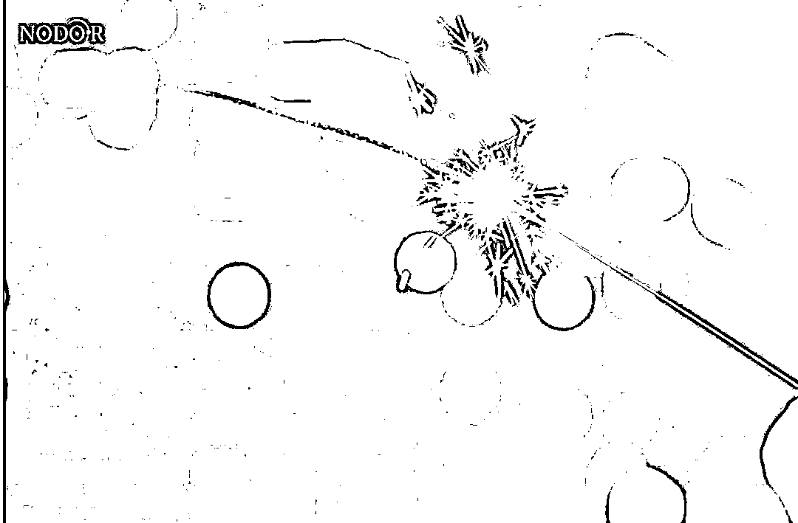作者/雷蒙德·梅里曼 译者/Luke 编辑/玫瑰 图片/稿定设计 

雷蒙德·梅里曼是在金融占星学界稳坐第一把交椅的占星师，同时他也是若道签约的金融占星课老师，我们引进了雷蒙德·梅里曼老师的《[上证指数月度报告](http://mp.weixin.qq.com/s?__biz=MzA5NjA0NTAxNg==&mid=2651494377&idx=2&sn=12afe330afef4b876307c2963b795b56&chksm=8b48255ebc3fac48d8ea2c82dd7b085ed1bcf50d7b480800f1e6a1d63aadb3cb275863e20df7&scene=21#wechat_redirect)》及《[黄金报告](http://mp.weixin.qq.com/s?__biz=MzA5NjA0NTAxNg==&mid=2651494377&idx=2&sn=12afe330afef4b876307c2963b795b56&chksm=8b48255ebc3fac48d8ea2c82dd7b085ed1bcf50d7b480800f1e6a1d63aadb3cb275863e20df7&scene=21#wechat_redirect)》。我们经老师的授权，将每周刊登梅里曼老师的周运，供大家参考和学习。于是，这是本周的周运（12.19-12.23）。

**说明：以下时间采用纽约证券交易所所在地美国东部标准时间。****展望与回顾**

****

**周五，道琼斯工业平均指数再次俯冲下跌，这是因为美联储再次决定提高利率。** 

**——乔·托普****《美联储提高利率，道琼斯指数再次下跌，交易员持续抛售》****www.foxbusiness.com****2022 年 12 月 16 日****太阳-海王星四分相与道琼斯工业平均指数趋势的反转有很强的关联，容许度是 4 个交易日。就像所有海王星的相位一样，这次的相位也可能对应着人们对未来股票价格的希望和愿望。****然而，如果它对应的是 12 月 1-2 日波峰的一个次高点，可能导致一轮剧烈的下跌，持续到 12 月 23 日木星-天王星八分相时，甚至之后。****——上周的专栏**确实，美国和世界其他地区的股票指数于上周的 12 月 13 日-14 日到达顶部，开始一轮俯冲下降，因为**宇宙的气氛从海王星的“非理性繁荣”转变为更加混沌的木星-天王星主题，它将在下周到达顶峰。**例如，道琼斯工业平均指数在 12 月 13 日到达 34712 的峰值，是 4 月来的最高价位，相比于 10 月 13 日的年度低点 28660 上涨 21%。到了周五，仅仅 3 个交易日后，它下跌至低点 32654，下跌超过 2000 点，跌幅接近 6%。这符合《股票市场择时手册第三卷：地球宇宙学与交易周期相关性》的研究。那些研究显示，有 78%的几率，在太阳-海王星渐亏四分相的 4 个交易日内，道琼斯指数发生 4%或更大幅度的反转。周一将是第 4 天。有趣的是，美联储主席鲍威尔 12 月 14 日发表讲话期间，行进火星逆行合相美联储星图在双子座 13°的土星，对分美联储星图在射手座 13°的水星。美联储确实处于那个相位带来的困境之中。也就是说，如果它行动太激进（火星），就冒着受伤或意外的风险。如果它表现得太保守（土星），就要冒着因行动太慢被批评的风险。火星-土星是一个与挫败相关的相位，因为你不能轻易地想做什么就做什么。如果你用力过猛，它代表着延迟和危险。所以，美联储确实将加息幅度从之前的 0.75%回落到了 0.5%。但随后又警告称，未来还会有更多加息。感到沮丧的投资界突然声称，这些加息会使得美国（和全世界）陷入衰退。

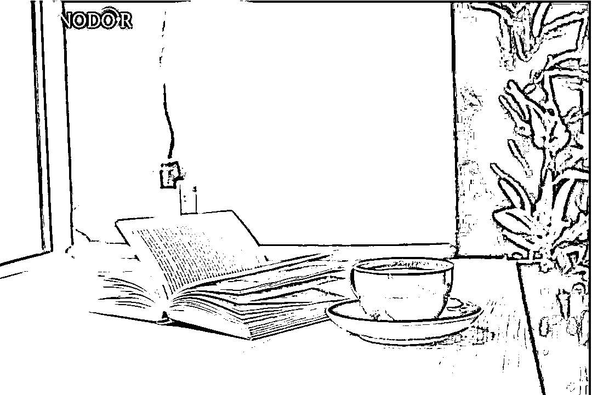

当然，在海王星奇幻世界的迷雾作用下，许多分析师声称未来不会有衰退。这又是典型地笼罩在海王星雾气中的一周，也是美联储遭遇典型火星-土星挫折的一周，因为他们似乎不能把通货膨胀的势头迅速压下去。通货膨胀持续越久，就越有可能引向一场衰退，或者更糟。或许直到火星与美联储星图中的土星完成第三次和最后一次精准相位之前，那将是 2023 年的情人节，我们都不能看到这场加息隧道尽头的亮光了。或者，要等到 3 月下旬，火星在接下里两年进驻双子座后。黄金和白银从近期上涨的高点处，也出现了突发和剧烈的反转。12 月 13 日，黄金飙升至新周期高点 1836.90，这是 11 月 3 日完成 16 个月周期波谷后，今年最大幅度的上涨。白银更加引人注目，12 月 13 日上升至 24.39，相对于 9 月 1 日的年度低点 17.40 大幅上涨。但随后两者都剧烈下跌，周五黄金跌至 1782，白银跌至 22.73。比特币也遵循了同样的模式。它在 12 月 14 日到达 5 周新高 18370。但到了周五，它已经跌至低点 16744。比特币长周期低点可能会再次被测试。总之，我们可以说宇宙气候是混乱，让人困惑的。**我们正从困惑（海王星）走向混乱（天王星）。可能还要花几周时间理清头绪。**但首先，在地平线不远处，**我们即将迎来另一轮恶作剧者水星的逆行。****短期宇宙征象与长期考量**

****

**鲍威尔先生周三发表鹰派言论后，金融市场得到的信息是，全球货币政策即将显著收紧。主要的例外是日本央行，它已经绝望，或者是英格兰央行，它已经无能为力……所有这些都预示着将来全球金融状况将会变得更紧，这无疑导致周四股市的急剧抛售。**

**——《货币趋向紧缩的世界》****《华尔街日报》编辑****2022 年 12 月 16 日****科学家周二宣布，他们第一次在聚变反应中产生了比点燃它所消耗的更多的能量，这是几十年来获取太阳能源过程的重大突破……与其他核反应不同，它不会产生放射性废物。****——马修·戴利、迈克尔·菲利斯、詹妮弗·麦克德莫特和玛迪·布拉科夫****《聚变突破性成果可能会改变游戏规则》****美联社****2022 年 12 月 14 日**现在是岁末的假期季。然而，宇宙并没有休假，为我们准备了一系列有趣的行星征象。**在 12 月 20 日，木星会结束这一轮周期最后的双鱼座行进，开始进入白羊座，直到 5 月 16 日。**随后它在接下来的一年里进入与丰饶肥沃相关的金牛座。12 月 21 日冬至，太阳进入摩羯座，这总是一个深刻思考的时间，比如“我们在做什么？我们要去哪里？我们想在明年做些什么不同的事情？”

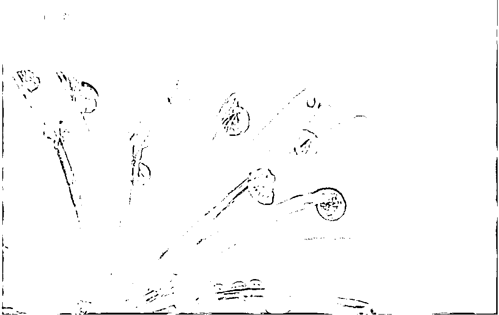

接下来的两天太阳四分木星，金星三分天王星，同时木星八分天王星。正是与混乱相关的天王星与夸大相关的木星形成八分相驱动着这一周的市场。这两颗行星在一起，就有能力**通过夸张的波动打破支撑位和（或）阻力位。****当恶作剧者水星逆行于 12 月 29 日-1 月 18 日回归时，市场无视支撑位和阻力位的问题将进一步恶化。**就**在水星转向顺行的前 6 天，火星也会在 1 月 12 日结束逆行运动，之后天王星会在 1 月 22 日结束逆行。**对于金融市场，**这注定是一段疯狂的时期，很可能是一段市场剧烈反转的时间，无论当时是何种趋势。**然而，12 月 22 日-1 月 22 日即将到来的天王星征象令人兴奋，当冥王星于 3 月 23 日进入水瓶座（天王星守护的星座）后更为如此。上周公布的关于聚变能源的突破，已经让我们察觉到了一点预兆。我们之前已经说过，我们再说一遍：当天王星进入双子座并于 2025 年-2026 年三分在水瓶座的冥王星，同时土星和海王星进入白羊座，并六分天王星和冥王星时，**世界有机会开启一次文艺复兴，一场推动人类进入美好新未来的通信革命**。这可能是人类对化石燃料的依赖与新型替代能源应用的出现之间的交叉点，这些应用将以各种我们今天无法想象的方式对环境和人类有益。是的，正如我们上周和《[2023 年金融预报](http://mp.weixin.qq.com/s?__biz=MzA5NjA0NTAxNg==&mid=2651497141&idx=1&sn=c8b1724edbf27cb752d6d860e73b9e77&chksm=8b481002bc3f9914d0f14dc55e92fb364228e1c4031ad1e885b91be9564adb5b25d6e47f5c37&scene=21#wechat_redirect)》（点击链接可阅读）中所讨论的，我们将会在两条平行范式上前进，一条是战争和毁灭的范式，另一条是创新、新科学发现和创造力的范式。其中一个范式很可能唤起对另一个范式的迫切需求。从 2018 年年末，若道引入金融占星大师雷蒙德·A·梅里曼撰写的梅里曼市场时机学院每年一次的年度预报沙龙和每年一本的《年度预报》以来，**2023 年已经是第 5 个年度了。我们简单回顾了部分 2019-2022 年金融预报的内容，**过去的经验让我们相信，你根据梅里曼老师的指导作为投资参看，你会比一般人有更大的胜算。******长按下图识别二维码****了解更多详情**

**说明：以上日期基于纽约证券交易所所在的美国东部标准时间，由于存在时差，中国地区可能需要加一天。**

**版权声明：**本文由若道翻译发布，欢迎转发，反对抄袭。友号转载请申请白名单。**END**

**雷蒙德·梅里曼（Raymond Merriman）**

若道签约老师。著名金融占星师，ISAR（国际占星研究协会）前主席，梅里曼市场分析公司的总裁。他由于“提升了占星学的职业形象”，在 1995 年国际占星大会上被授予轩辕十四奖；在 2012 年国际占星大会上，被授予轩辕十四终身成就奖。

1“中国上证指数月度报告”发售**若道推出了****中文版****的雷蒙德·梅里曼中国上证指数月度报告，并持续发行该报告！**当把金融市场的周期和占星学的周期相结合时，雷蒙德·梅里曼老师的金融占星学研究**为投资者应对金融市场的周期波动，并随之调整投资策略提供了极大的价值参考**。
**12 月中英文报告已上线！**2“黄金价格周期月度报告”发售**若道推出****中文版****的雷蒙德·梅里曼黄金价格周期月度报告！**不仅仅为广大读者在中国股市的投资出谋划策，更将视角放眼黄金市场。**每当世界经济形式不明朗的时候，有一个地方是保值的港湾，那就是****黄金**。自 1982 年雷蒙德·梅里曼出版第一本研究《地球宇宙学征象与黄金价格的关联》的著作以来，**他一直作为最重要的黄金市场时机预测者之一享誉国际**。2022 年 12 月黄金报告已上线，梅里曼老师将会告诉你他对这个关键时期如何操作的想法。也可以按照季度和一年期订阅，有更多优惠。季度和年度的好处是，你可以持续了解梅里曼老师对于不断在变化的市场的看法。即便他某一次看法和市场不一致，你也看到在下一期他如何调整自己的看法，并看到金融占星在一个长期时间段内对你把控风险的帮助。而能够长期控制风险、尽量找到安全的投资时机才是投资的长久之计。**12 月中英文报告已上线！****购买套餐**，买得越多越优惠中国上证指数月度报告套餐价

*   **单月报告**：280 元
*   **3 个月套餐**：780 元（260 元/月）
*   **12 个月套餐价**：2400 元（200 元/月）

**长按下图识别二维码****购买金融报告****套餐****▼**

黄金周期月度报告优惠

*   **双报告年度套餐更优惠（直降 900 元）**

*   **12 个月黄金报告+12 个月上证指数报告：仅需 3900 元**

**长按下图识别二维码购买黄金报告套餐**▼

3《2023 年金融报告及沙龙》

从 2018 年年末，若道引入金融占星大师雷蒙德·A·梅里曼撰写的梅里曼市场时机学院每年一次的年度预报沙龙和每年一本的《年度预报》以来，**2023 年已经是第 5 个年度了。我们简单回顾了部分 2019-2022 年金融预报的内容，**过去的经验让我们相信，你根据梅里曼老师的指导作为投资参看，你会比一般人有更大的胜算。****

**长按下图识别二维码****了解更多详情**

**购买直达入口**

# 若道周运 12.19-12.25 丨宇宙能量“大变盘”，拿出你的勇气与活力（内含 12 星座运势）

> 原文：[`mp.weixin.qq.com/s?__biz=MzA5NjA0NTAxNg==&mid=2651497148&idx=1&sn=0d98ad7980118fca0cd8da76d2b5dfb8&chksm=8b48100bbc3f991d3fc016a1fc3916da108f94dac2803d79ef2b12eb5576fdacb3d01b3acc86&scene=126&sessionid=1692737710#rd`](http://mp.weixin.qq.com/s?__biz=MzA5NjA0NTAxNg==&mid=2651497148&idx=1&sn=0d98ad7980118fca0cd8da76d2b5dfb8&chksm=8b48100bbc3f991d3fc016a1fc3916da108f94dac2803d79ef2b12eb5576fdacb3d01b3acc86&scene=126&sessionid=1692737710#rd)

******☆ ****后台回复“今日”，给你一句生命态度******

作者/芷菱 ISAR 认证占星师
编辑/翀子 封面/书君 图片/稿定设计**整体氛围**

**本周重要星象**

*   **12 月 20 日 周二  **

    木星入白羊座（22:32 ）

*   **12 月 22 日 周四  **

    太阳入摩羯座（05:48 ）、太阳四分木星、金星三分天王星

*   **12 月 23 日 周五 **

    摩羯座新月（18:16）、新月四分木星

经过上周“日海四分相”带来的混乱或无力感，本周我们快步进入了宇宙的变盘时刻。木星将在本周二正式进入白羊座，同时周四将迎来摩羯座新月。**白羊座木星与新月，我们来到了一个新的起点，**宇宙在召唤我们拿出压抑已久的勇气和活力，为明天开辟一些新的东西。

**木星进入白羊座**

**12 月 20 日 22:32，木星正式进入白羊座。**这是今年木星第二次来这里，上一次它在白羊座的时间是 5 月 11 日-10 月 27 日，之后它逆行回到了双鱼座。

这次木星将在白羊座运行 5 个多月，并于 2023 年 5 月 17 日进入金牛座。

**木星入白羊座会带来什么？我们可以回顾上一次木星在白羊座的时期，也就是今年 5 月-10 月间，生活中发生的变化，也许能从中找到关于未来的一些线索。**

就当下大家关注的疫情而言，木星离开双鱼座，对疫情的控制或许是个好消息。今年 4 月木海在双鱼座合相，我们看到上海疫情失控。10 月底，木星逆行回双鱼座之后，又出现广州疫情。双鱼座和海王星能量的过度，往往与细菌或病毒感染、无边际地弥散、抵抗力脆弱、过敏等有密切的关联。

也许在木星进入白羊之后，我们会逐渐看到疫情局面得到扭转。**白羊座的勇气与活力，本身就是强旺生命力的象征。**

举个例，5 月木星第一次入白羊座后有个热点新闻就是刘畊宏夫妇《本草纲目》健身操的流行。还有一个是《孤勇者》的全面大火。“孤勇者”这三个字不正是对白羊座最传神的描述吗？

发生在本周的摩羯座新月也提示了类似的信息：摩羯座所代表的自律、强健、耐力与我们身体的抵抗力息息相关。另外摩羯座代表的身体部位是皮肤和骨骼，而皮肤正是身体抵御外界风险的第一道坚固屏障。

我们都需要保证睡眠和营养，运动锻炼，照顾好自己的身体，保持良好的免疫状态，准备好去迎接解封之后的第一波疫情冲击。保护好我们的身体，让自己更强健，更能对抗外部风险，这也是来自白羊座的启示。

作为黄道第一个星座，白羊座是新生，是先锋，也是开创新世界的象征。**木星来到这里，也意味着我们久违的勇气、信心、渴望可能再次被唤起。**

疫情三年，太多的压抑、艰难、委屈、不甘，考验着我们的身心。而现在，崭新的希望正在前方闪耀。

如果我们将观察的视线拉长一些，1 个月后（2023 年 1 月）长期逆行的火星、天王星都将恢复顺行，届时天空中群星齐头并进，没有一颗拖后腿（逆行）。而眼下，木星进白羊座就像打响第一枪，昭告全世界：大展拳脚开创新世界的时候很快要到来了。

随着疫情政策的松绑，我们已经看到社会经济复苏的强烈渴望，大 A 股在解封的第一时间就用快速上涨做出了反应。整个社会面临重整旗鼓，恢复发展的重要课题。**白羊座所象征的披荆斩棘，开辟新事业新世界的冲动和勇气，那种强健的开创精神，正是当下最需要的。**

对于我们每个人，现在也是鼓起勇气，去重新看到自己内心的热情和渴望的时候。如果过去我们困于失望之中，生活中的美好期待似乎都成了可笑的“奢望”，不敢再对未来有什么期许。那么现在，**木星在召唤我们重新燃起信念和勇气。**

不要害怕做那个孤勇者，不要害怕去冒险、尝试。始终记得，去看到并忠于我们内心真正的渴望。

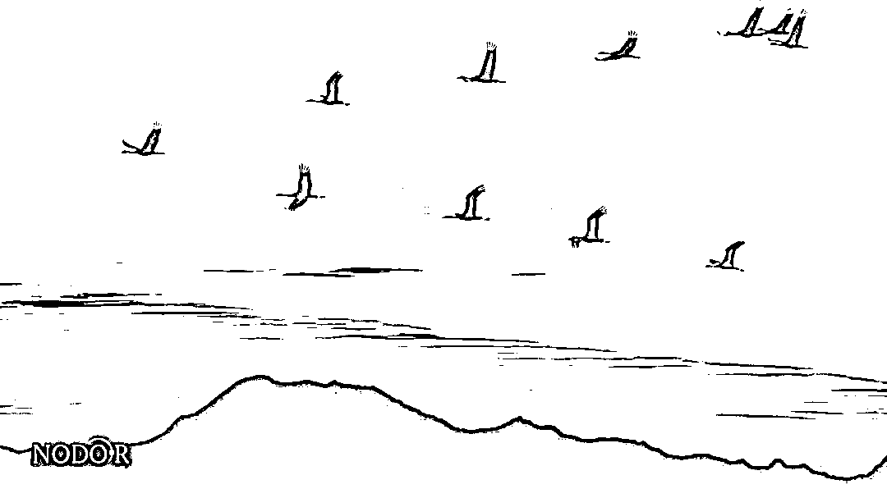

**金星三分天王星**

周四下午，金星与天王星在摩羯座/金牛座 15°21′形成精准的三分相。在白羊座木星和摩羯座新月的背景下，注意观察经济金融领域，也许我们会看到一些良性的调整，出现新的经济刺激政策、新的经济方向变化等。

**对我们每个人，则需要重新审视金钱保障议题，**评估我们的存款、消费、安全感、价值观。我们也许需要做一些调整和改变，制订新的财务计划，更适应未来的经济形势。

另外，金天三分相也可能显现为**外交、人际关系**方面的调整变动。改善你和重要伙伴的关系，可能需要遵循金天相位的特点：保持彼此的独立、平等、自由与相互尊重。给彼此空间，更利于关系的融洽。

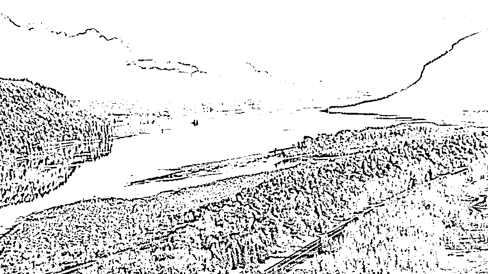

**摩羯座新月**

**12 月 22 日，周四凌晨 05:48，太阳进入摩羯座。随后在 12 月 23 日，周五 18:16 发生摩羯座新月，**日月合相在摩羯座 1°32′。而且，一共有五颗星，包括太阳、月亮、金星、水星、冥王星都聚集在摩羯座。

回顾上一次新月，是 11 月 24 日发生在射手座，当时新月还三分了刚恢复顺行的木星。这个强烈的带有自由、乐观意味的信号出现后不久，疫情管控措施发生大转弯，各地快速解封，社会经济松绑和恢复流动。我们重新感受到了射手座所象征的“自由、宽松”的空气。

**本周的新月发生在以务实、保守著称的摩羯座。但有意思的是，新月紧密地四分了刚刚进入白羊座的木星。**

这是一组发生在开创星座的四分相。摩羯座也代表着成功的野心，在这一点上它跟白羊座不谋而合。它们都希望赢得胜利，只不过白羊座的木星召唤勇气和开拓精神，摩羯座的新月则鼓励脚踏实地的行动，将燃烧的激情落地。

想像一群古老的拓荒者，来到一片肥沃但杂草丛生的处女地。他们被这片土地的巨大潜力吸引，内心燃起了开荒的热情。同时他们也知道需要付出艰苦的长期的劳动，才有可能将荆棘荒原转变为硕果累累的田野。

光靠勇气和激情不足以帮助我们走得长远，摩羯座新月引导我们加上另一半翅膀：严谨、努力、负责。

宇宙召唤我们真正地成熟起来，为自己负责。在疫情中，我们可能意识到需要认真地对待身体，提高抵抗力，为自己的健康负起责任。我们也可能想要更严谨地审视自己的热情和目标，并务实地计划和行动。

摆脱依赖心理，做一个大写的“人”，对自己的身心发展负责，对自己的当下和未来负责。当然也包括对身边的人负责，对所在的群体和社会负责。

**当责任与热情能够结合起来，我们在这个世界上就近乎势不可挡，没有什么困难不可克服，没有什么远方不可到达。**

另一方面需要注意的是，摩羯座新月的能量可能被木星放大。积极的一面，在于强化了自律、务实和耐心。我们可能有足够的意志、决心去承受短期压力。

消极的一面，则是过度担忧。因为恐惧而固步自封，对现实束手无策，害怕失败害怕风险，不敢去尝试。希望白羊座的木星带给我们的更多是前者，我们也应该努力不被恐惧所控制。

加油。

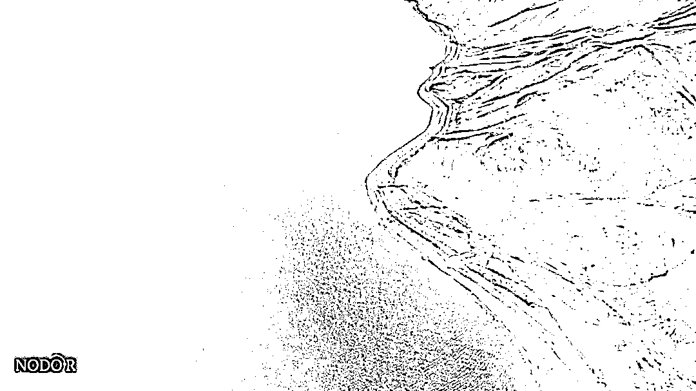

**12 星座的一周运势**

**（重点参考上升星座，其次参考太阳星座）**

***白羊座***

新月发生在 10 宫，木星进入 1 宫，对你而言现在是一个非常重要的转折时刻。你可能会感到更自信、更有热情，渴望去成就一些什么，重新定义自己，尤其在你的事业领域。

新月时可以为事业发展许愿，现在很适合去规划你的事业方向、目标、下一步的计划等。不过要注意避免冲动行事，你需要先考虑现实条件，审视目标是否实际。不要太急于看到结果，对过程保持耐心。

金星在 10 宫，与 2 宫的天王星互动。事业上的进展可能帮助你调整自我价值感，或在收入上有所变化。

***金牛座***

新月发生在 9 宫，可以许关于考试、长途旅行或海外相关的愿望，并给自己做相应的计划。这是不错的适合学习考试的时段，头脑可能比较灵光，但注意专注，不要杂念太多。也适于阅读思考，列一个书单，读喜欢的书。

木星进入 12 宫，你可能感到想要慢下来，在头脑里回顾一下最近的生活。这将是一段适合做阅读、思考、冥想，倾听内心、沉淀打磨的时期。

金星在 9 宫，与 1 宫的天王星互动。也许会跟远方的朋友突然有联络。现阶段你可能在意自己的独立空间，远方的朋友或网络联络比较适合你。

***双子座***

新月发生在 8 宫，可以许财务方面的愿望，比如顺利解决债务、税务，或投资理财等事宜。现在适合梳理你的财务状况，并为未来制定下一步的财务计划。注意安全、稳妥为上，避免高风险操作。如果有人找你借钱，需要谨慎评估。

木星进入 11 宫，你的社交活动可能会逐渐热闹起来，跟很多新老朋友产生联系。有一些来往可能与金钱议题有关。

金星在 8 宫，与 12 宫的天王星互动。在金钱或关系方面，你可能需要更冷静一些，先看清自己真正的需求。

***巨蟹座***

新月发生在 7 宫，可以许关系方面的愿望。比如遇到靠谱的对象，与爱人的关系更进一步，与重要的伙伴建立合作等。群星聚集 7 宫，你可能感到关系方面有很多需要考虑和处理的，值得花功夫去建设。

木星进入 10 宫，你的事业领域可能出现新的机会、赏识你的上司，或者遇到不错的合作者。

金星在 7 宫，与 11 宫的天王星的互动，朋友可能给你带来很多快乐和情感安慰。跟伴侣之间的关系如果多一些朋友般的理解，相互独立彼此包容，有助于增进情感。

***狮子座***

新月发生在 6 宫，可以许有关工作和健康的愿望，比如更好的工作机会、同事关系，更好的健康状态等。现在适合对你的职业发展进行规划。另外新月也要求你关注自己的健康状态，改善生活作息，包括运动饮食睡眠。

木星进入 9 宫，你可能因为工作的需要，想要提升自己的专业或学习新技能。这是一段适合加强学习思考，并运用于实际工作的阶段。

金星在 6 宫，与 10 宫的天王星互动。可能有新同事或团队的调整变动，同事关系看起来比较愉快。

***处女座***

新月发生在 5 宫，可以许与孩子或恋爱相关的愿望。如果在搞创作，也可以许愿自己有好的灵感和创造力。此时也适合去规划孩子的发展培养计划，或自己的创作计划。

木星进入 8 宫，对你的偏财运来说是好事，你更容易顺利处理财务议题，也许有机会通过理财投资等获得额外收益。但要避免高风险的投资，如果有人借钱要谨慎评估。

金星在 5 宫，与 9 宫的天王星互动。也许跟外地或网络上的朋友交流很愉快，甚至有发展关系的可能。读喜欢的书，学新知识，会让你愉悦。

***天秤座***

新月发生在 4 宫，可以许与家庭或房屋有关的愿望。比如顺利买卖或租赁房屋，搬家，改善家庭关系或家人健康等。现在可以去计划未来家庭建设的事宜。

木星进入 7 宫，你在人际关系方面可能有更多机会，比如出现优质情感对象，或是好的合作伙伴，有机会结识一些重要的人，也许是通过家人介绍。有伴侣的人，伴侣可能状态不错，感到自信热情。

金星在 4 宫，与 8 宫的天王星互动。有可能涉及到一些家庭财务方面的安排，或看到新的投资机会。尽量从安全稳妥的角度考虑问题，先保障家庭财务的稳健。

***天蝎座***

新月发生在 3 宫，可以许学习、交流或写作相关的愿望。比如更有写作灵感，更好的学习状态，头脑更灵光，读更多书等等。现在也很适合去规划未来的学习或写作计划。

木星进入 6 宫，可能带来工作领域的顺利，如更好的工作状态和同事关系。学习也可以转化为生产力，带动你的工作。另外现在也是改善健康的良机，生病也能较快康复。多运动多吃新鲜蔬果，早睡早起，提高抵抗力。

金星在 3 宫，与 7 宫的天王星互动。可能与老同学老朋友有愉快的交流，互通信息，相互支持。也可以跟伴侣一起学习，共同进步。

***射手座***

新月发生在 2 宫，可以许收入、自我价值相关的愿望。你可能会考虑如何提升收入，如何更好地在工作里实现你的价值。现在也适合去写下自己的财富计划，或重新评估自我价值的议题。

木星进入 5 宫，孩子或恋爱可能给你带来很多欢乐，你想要自由自在地充分享受生活。如果你有什么创作计划，现在也是灵感或创意比较强的时期，适合去搞创作。

金星在 2 宫，与 6 宫的天王星互动。可能一些工作上的变化，会带来收入的变动。也注意自己的健康，好的身体状态会提升你的自我感受。

***摩羯座***

新月发生在 1 宫，可以许与自我形象、定位、自信等相关的愿望。比如外形更美更有气质，更加自信，更了解自己等。可以去认真想一想自己想要成为什么样的人，包括外形和内在，尝试去接近那个理想的形象。

木星进入 4 宫，可能带来家庭事务方面的顺利。比如买卖房屋、租赁、搬家等，木星会推动事情顺利进行。也可能有机会扩大居所，改善家居环境。

金星在 1 宫，与 5 宫的天王星互动。你可能更加自信，心态更加轻松愉悦，能够享受生活，甚至遇到美好的感情。

***水瓶座***

新月发生在 12 宫，可以许关于内心平静、灵性成长相关的愿望。可以在未来一个月，学会放慢脚步，关注内在世界。多冥想打坐，阅读灵性相关的文字，让自己能够更有灵感和直觉力，获得精神的启发。

木星进入 3 宫，可能会扩大对知识和信息的渴求。多读书，多思考，与周围的人多交流，都可以扩大自己的视野，开动头脑。这也是有利于学习和表达的一段时间，可能头脑比较灵光，学习效果很好，或表达力很强。

金星在 12 宫，与 4 宫的天王星互动。可以通过接触灵性领域，找到内心的安宁与平静。

***双鱼座***

新月发生在 11 宫，可以许与朋友、社交圈子有关的愿望。比如结识重要人物，增加人脉资源，或加入某些团体等。这段时间的社交生活可能比较丰富，而且有收获。

木星进入 2 宫，你有机会提升自己的收入或自信心。思考如何做能让自己的价值得到更充分地体现。但也要小心木星可能让你过于乐观，花钱大手大脚。注意量入为出。

金星在 11 宫，与 3 宫的天王星互动。注意调整你的表达沟通方式，一些小技巧可能增进你跟朋友的关系，或让你在社交中更受欢迎。

**版权声明**：原创文章由作者授权首发于若道平台发布，欢迎转发，反对抄袭。友号转载请申请白名单。

**END**

**芷菱**

ISAR 认证占星师/占星作者/媒体人若道 2019 届核心课程毕业生

于 2019 年通过 ISAR 考试，同年获得若道认证神话塔罗师资质

**微信公众号**：芷菱的理想国

长按打赏

**快年底了****不给自己一份来自占星学的礼物吗？**

**梅里曼金融报告双 12 福利来啦！****长按下图了解更多详情吧！**

**快来领取你的 2023 年运报告吧！**

**学习占星学****点击下图了解课程详情**

**微信又双叒叕改版啦，不想错过若道君的推送？**
****就把若道设为****星标****以及点点****“在看”****吧！******▼**

**喜欢就点一下“在看”吧！****报名直达入口**

# 金融报告丨雷蒙德·A·梅里曼 2023 年《年度预报及讲座》来啦！

> 原文：[`mp.weixin.qq.com/s?__biz=MzA5NjA0NTAxNg==&mid=2651497141&idx=1&sn=c8b1724edbf27cb752d6d860e73b9e77&chksm=8b481002bc3f9914d0f14dc55e92fb364228e1c4031ad1e885b91be9564adb5b25d6e47f5c37&scene=126&sessionid=1692737710#rd`](http://mp.weixin.qq.com/s?__biz=MzA5NjA0NTAxNg==&mid=2651497141&idx=1&sn=c8b1724edbf27cb752d6d860e73b9e77&chksm=8b481002bc3f9914d0f14dc55e92fb364228e1c4031ad1e885b91be9564adb5b25d6e47f5c37&scene=126&sessionid=1692737710#rd)

从 2018 年年末，若道引入金融占星大师雷蒙德·A·梅里曼撰写的梅里曼市场时机学院每年一次的年度预报沙龙和每年一本的《年度预报》以来，**2023 年已经是第 5 个年度了。**

我们简单回归一下梅里曼老师 2019 年-2022 年的《年度预报》中一些预测。

在 2019 年的年度预报中，对于上证指数，梅里曼老师写到：

2018 年末至 2019 年初，中国股市处于三个重要周期低点的时间段。紧随这一低点，将会出现一次非常大的反弹。

2019 年木星会与海王星形成三次四分相，过去，这个相位总是与惊人的强大“泡沫”同时出现，期间股价大幅飙升。

到 2019 年 7 月之前，上证指数有三个重要长周期会出现周期低点，理想上看是在 2019 年 3 月底之前。

上证的周期低点出现在 2019 年 1 月，从那时起，上证迎来了 3 年的上升。

对于黄金，梅里曼老师建议：

从占星学角度来看，木星在射手座，四分在双鱼座的海王星，支撑看涨观点，因为这个组合有增加通胀的潜力。此外，木星在射手座的行星-星座组合从 1983 年起出现过三次，每次都对应到金银市场的年度高点。

无论在 2019 年何时，只要黄金保持在 1167 以上，同时跌到了任一主要周期低点附近，就要寻找买入机会。黄金可能在 2019 年涨到 1500+/- 50，甚至更高。

2019 年黄金从 1284 美元开始上涨，最高点在 1566 美元。

所以，如果你在 2018 年购买了《年度预报》，按照梅里曼老师的建议投资了上证指数和黄金，你会在当年取得相当不错的收益。

**对于 2020 年，在席卷全球、深刻影响了未来的疫情到来之前，梅里曼老师为 2020 年定下基调的：**

站在 2019 年的年尾，我们不知道一场深刻改变未来的风暴马上就将来临。

梅里曼老师，这位杰出的宇宙气象预报员，未卜先知，为 2020 年定下“将军”的基调。

在那一年，我们目睹了美国股市的 4 次熔断和全球经济的重置崩溃。

对于黄金，梅里曼老师是这么说的：

1391.50-1413.70 是价格最强的支撑区域。只要不跌破这个区间，黄金就能够上涨，重新测试 1566.20。如果突破了 1560-1590 的阻力区间，那么黄金就能够重新测试 1920。在那以前，黄金最有可能在 2020 年中在 1390 和 1575 之间波动。

| 黄金周 K 线图

2020 年，黄金在横盘 3 个月突破了 1560-1590 的阻力区间后，一路上涨到 9 月最高点 2089.20 美元。

对于上证指数，梅里曼老师建议：

2020 年的反弹将超过 2019 年的高点 3288。然而，这一涨势可能会通向 5.5 年周期的波峰，随后将再次迎来一波跌势至 2021 年或更晚。

行进中的摩羯座星群——木星、土星和冥王星——表明在 2020 年 11 月底之前会出现一个高点，很可能在 2020 年的前六个月。建议交易者特别注意金星逆行的时期，也就是 5 月 13 日至 6 月 25 日。逆行或顺行一个月内出现的年度高点或低点可能会带来卖出机会。

2020 年，上证指数最高达到 3474，超过了 2019 年的高点 3288。

**站在 2020 年的末尾，对于 2021 年，梅里曼老师说：**

随着 2020 年木星、土星和冥王星形成大合相，我们刚刚结束了一个周期和一个时代。此刻我们正处于一个新的时代和一个新的长周期的早期阶段。事实上，是多个长周期。

对于上证指数，梅里曼老师说：

我们预计涨势将在 2020 年 12 月-2021 年 2 月之间达到波峰，然后急剧下跌至 52 周和 22 个月周期的低点，这些周期将在 2021 年 5 月之前，甚至在 3 月底之前结束。此后可能会出现另一轮反弹，可能会也可能不会在 2021 年 11 月之前形成第一个 33 个月周期的新高。

对于黄金，梅里曼老师说：

黄金的 31.33 个月周期波谷将在 2021 年 9 月之前出现，理想情况是 2020 年 12 月-2021 年 6 月。价格目标是 1628+/-109 或 1768+/-76。重叠范围（理想情况）是 1692-1737。如果价格跌破这些范围，则为看涨情况中令人担忧的状况。

**而在 2022 年的年度预报里，我们看到：**

渐亏四分相不仅对应无法解决的冲突和分歧，土星和天王星形成的任何四分之一周期（合相、四分相和对分相）都可能在社会动荡和某地区现状受到威胁的时期出现。

在 2008-2010 年上一次四分之一周期时（对分相），世界见证了阿拉伯之春。在 1999-2000 年渐盈四分相期间，游行、抗议和直接武力冲突扰乱了西雅图世界贸易组织会议。这也标志着美国经济扩张的结束，以及由互联网泡沫破裂和 2001 年 9 月 11 日对美国世贸中心的恐怖袭击引发的衰退的开始。在此之前是 1988 年的合相，对应的事件是缅甸（Myanmar，当时的国名是 Burma）爆发了一场全国性起义，反抗尽失民心、暴力过度的军政府。数十万公民在全国范围内的暴动中抗议，这成为缅甸历史上的决定性时刻之一。

在每一个案例中，极端主义都占据主导地位，导致暴力冲突，但最终带来了“更大的益处”。它产生了建设性的结果，但在它进行的同时，世界在经历巨大的危机和暴力。”

2021 年 5 月 13 日-7 月 28 日，木星首次行经双鱼座时，这些因素表现得很明显。那时，通货膨胀开始出现，但美联储向所有人保证，这只是暂时的，他们将无限期继续推行“宽松货币”政策。他们并不担心持续的通货膨胀，这是典型的木星在双鱼座的表现，对现实的脱离或错误判断。

这两颗行星以及双鱼座也掌管原油。因此，我们可能会看到油价飙升，以及/或石油泄漏，威胁到大自然。它也可能对应着由于事故而释放的有毒气体，威胁到那些暴露其中的人的生命。

对于黄金，梅里曼老师建议：

只要黄金保持在 1670-1680 之上，仍然有极小的机会出现一轮爆炸性上涨，测试当前的历史高点（2089），甚至创下历史新高。毕竟，木星将在双鱼座合相海王星，可能预示着另一轮“投机狂热”。然而，这也可能是一个“恐慌”的征象，届时某些市场可能会崩溃。

在 1900-1980 之间存在较大的阻力，如果不能突破这个阻力，将表明黄金的熊市已经开始，新一轮的猛烈下跌可能正在准备中。只要跌破 1670 则将确认黄金 20 年的牛市结束了。

| 黄金周 K 线图

对于上证，梅里曼老师说：

我们预期在 2022 年 5 月前，上证综指会出现急剧的下跌，进入 52 周周期和可能的 33.5 个月周期低点。

我们更倾向于认为，上证综指会首先下跌，在 5 月前形成一个低点，然后上涨。这一轮上涨的幅度，将告诉我们上证综指是处在牛市，还是进入了新的熊市。如果它不能上涨超过 3750，长周期波峰可能已经出现，并且进入了新的熊市。

我们简单回顾了部分 2019-2022 年金融预报的内容，**过去的经验让我们相信，你根据梅里曼老师的指导作为投资参看，你会比一般人有更大的胜算。**

**2023 年度预报及沙龙预售**

**2023 年金融预报沙龙时间为 2023 年 1 月 7 日 10：00-13：00。**

一份价格仅千元的顶尖金融占星大师的投资分析报告和沙龙，聪明的投资者值得拥有。

**2023 年年度预报****及沙龙价格：****1380 元**

**长按下图识别二维码**

**购买报告及沙龙**

**购买者重要须知****①** 梅里曼市场时机学院每年一次的年度预报沙龙和《年度预报》是梅里曼市场时机学院的研究“预报”，而不是市场“预测”，是梅里曼老师及其金融占星分析师对人类活动周期历史与行星周期之间相关性的研究，二者在大部分情况下具有 80%或更高的相关性，而不是因果关系。沙龙中和报告中的研究完全存在错误的可能性。即便是非常认真的研究和几十年的研究经验，我们无法总是正确地解读出各种征象在实际层面上会如何相互作用，并显化为事件结果。

所以请将次沙龙和报告看作一个研究参考，务必结合其他市场研究和你个人对市场的理解，根据你的自由意志做决策。

**②** 此报告一旦售出，**即不接受退款。**

**③** 此报告仅支持在手机网页阅读，不支持电脑阅读和下载。**④** 讲座提供视频回放。**以上须知，请仔细阅读。一旦付款，即视为已了解并接受所有须知内容。**

**如在购买报告中遇见任何问题**

**可添加客服**

▼

**购买报告直达入口**

# 初阶丨心平健康学：身心平衡的疗愈实践

> 原文：[`mp.weixin.qq.com/s?__biz=MzA5NjA0NTAxNg==&mid=2651497141&idx=2&sn=debc245c3ba69b0e1910e1b828e54eb1&chksm=8b481002bc3f9914f1afda882b59b24ee088d153b59e957c1a569a8a16e08291a78b727bded0&scene=126&sessionid=1692737710#rd`](http://mp.weixin.qq.com/s?__biz=MzA5NjA0NTAxNg==&mid=2651497141&idx=2&sn=debc245c3ba69b0e1910e1b828e54eb1&chksm=8b481002bc3f9914f1afda882b59b24ee088d153b59e957c1a569a8a16e08291a78b727bded0&scene=126&sessionid=1692737710#rd)

**授课内容**

**所有的疾病都是身心疾病。**

我们的祖先很早就认识到这一点。

在最早医学著作《黄帝内经》开篇《素问·上古天真论》中，就讲：“虚邪贼风，避之有时，恬淡虚无，真气从之，精神内守，病安从来”。**这是对于“内因致病”和“修心去病”最早的描述。**

在《素问·刺法论》，黄帝又问流行性疫病。他说“余闻五疫之至，皆相染易，无问大小，病状相似，不施救疗，如何可得不相移易者？”岐伯对此的回答是：“不相染者，正气存内，邪不可干。”

可见不仅对于个体性的常见疾病，哪怕对于大多数人都会感染的流行性疫病，只要“正气存内”，就可以有效预防和对治。

那么什么样的因素会导致“内心正气”的偏离呢？《大学》里说，“身有所忿懥，则不得其正。有所恐惧，则不得其正。有所好乐，则不得其正，有所忧患，则不得其正。”

《素问·阴阳应象大论》里把七情六欲和人的身心疾病对应起来，提出了我们常听到的“怒伤肝、喜伤心、思伤脾、悲伤肺、恐伤肾”等这些“不平”的心理情绪对于身体的损伤。

而《素问·平人气象论》更明白指出，“无问其病，以平为期”。“平人者，不病也”。

**中医叫健康之人为“平人”，而平人就是阴阳平衡之人，没有太过与不及。**

然而从小到大，在我们的人生经历中，我们必然经历各种各样让我们内心不能平静的事情，不论是过去，还是现在，我们都经历了各种情绪起伏，并在各种固有的、自知或不自知的情绪模式和偏颇的信念模式中。

但大多数人不知道的是，这些内在因素都会导致我们的身心失衡，最终反映在我们的心理疾病和身体疾病中。

而现代西方的身心健康研究也证明了我们祖先的智慧。**身体，就是我们心灵的显示器。身体的疾病，不仅是因为内心的失衡而产生，也可以通过内心的调整而治愈。**

**而心平健康学正是建立在中医的“内因致病”为理论基础，通过特定的方法，找到内因，调整内因以达到治愈疾病、身心的平衡的一门实践性很强的自我疗愈、疗愈他人的方法。**

**心平健康学**

心平健康学是王中平老师从 1986 年开始，经过三十多年研究和实践，发现和总结各种身体症状和心理不平衡相对应规律，并运用这些规律调解和祛除不平衡身体症状，以达到身心同时健康的学问。

**这个学问体系以中国古老医学经典为其理论基础，以自然力（事物运行发展的法则，简称自然力）为核心，平衡论为主导。**

对于身体的不适，运用心平健康学的方法，可以找到“不平”所在。这种不平包括情绪、感受、认知、内心的想象、活动和用力、外在的语言、行为等多方面。

*   **比如生活中日积月累的不平的情绪、感受会变化成身体上不平衡的感觉；**

*   **内心中使的力、用的劲会在身体上留下痕迹（俗话叫用力过猛）；**

*   **而不辩证、不中正的认知会导致疾病的不同性质；**

*   **假设、想象中的各种不平心会影响到我们的神经系统。**

而当我们把“内因”，也就是不平衡的心理，通过特定的方法、技术调整为平衡，心在“ 平静、平衡、平等 ”的状态下，身体就会转为健康和谐，这就是“ 病由心解 ”。

**初级班学习步骤**

**★****课程前**

1.  自习（提供音频）王中平老师教授的心平健康学初级班四日音频课程

2.  读心平健康学内部学习资料《认识平衡》

3.  听心平健康学讲师彦方录的系列音频课程 ：

*   心平健康学是什么？

*   七情

*   四季与五行

*   八纲

**★****课程中做什么及收获什么**

1.  **学习“揉球”方法，**“揉球”是心平健康学体系中贯穿始终的在潜意识层面调治不平心理的方法、技术、工具。有自然揉球、定向揉球，（也就是有主题的揉球）、及缩减版拇指揉球。“揉球”的目标即是把不平衡的心理调整为平衡、平静。三日初级班课程，是实操课程，通过连续 18 小时的练习和实践，对“揉球”的方法不断的体会和夯实，以便课程结束后可以通过“揉球”的方法在生活中调整自己不平衡的心理及调整相应的躯体症状。

2.  **一对一个案治疗，学习治疗方法及完成治疗。**

    通过课程中自己及团体的一对一个案治疗，体会到自己在过去、现在及对未来有什么样的不平衡心理，导致了相应的躯体症状、心理疾病及不和谐的关系，并在个案中完成治疗。在自己及他人做个案的过程中体会治疗方法，以便课后可以自然应用方法。

**★****课程后**

听心平健康学讲师彦方录的音频课程：“揉球”过程中的疑惑与解答。

**老师介绍**

**张彦方**

硕士，心理咨询师；心平健康学初级班、综合中级班、女性健康专项中级班、亲子关系专项中级班讲师，并教授脏腑研究型课程，经典研读课程（中庸、道德经），断食课程，耐寒、耐热课程，物质平衡课程。

2017 年初教授心平健康学系列课程，累积课时 2000 小时以上，个案咨询 5000 小时以上，主要擅长通过调整不平衡的情绪、感受、认知来改善躯体症状，尤其在女性因为情绪、感受等不平衡心理所导致的乳腺增生、卵巢囊肿、月经不调等妇科疾病上有深入的研究和实践经验。在改善亲密关系和亲子关系方面有较多成功案例。

**课程推荐**

疗愈的层次，在西方讲身心灵，在东方讲形气神，其实都是在说物质、能量与信息。物质层面的治疗如现代医学，能量层面的治疗如中医针灸，而信息层面的治疗相对较少，也往往很神秘，比如西方的炼金术、灵媒，中国的祝由、道家法术等。

心平健康学是少见的既能在“神”的层次展开治疗，又十分朴实、接地气的一门技术。通过简单的肢体动作、配合起心动念的练习，就可以达到调神的效果，并借由“身心同调”的方式，从神（信息）影响形（身体）与气（能量），属于个人成长之路上的卓有实效的修行好伴侣。

——天空的空

**课程价格**

**费用：2700 元** 

**授课方式和时间安排**

**线上授课：**12 人小班制

**授课时间：**2023 年 2 月 24-26 日，上午 9:00-12:00，下午 2:00-5:00，共计三天

**咨询请添加李老师微信：cd13518140789**

长按二维码添加李老师微信

****心平健康学初级班****

**授课老师：张彦方**

**开课时间：2023 年 2 月 24 日-26 日，上午 9:00-12:00，下午 2:00-5:00，共计三天**

**授课方式：******网络授课****

**费用：2700 元**

**课程负责人：李老师**（微信：cd13518140789）

长按二维码添加课程负责人咨询

**报名直达入口**

# 周末树洞丨最近很多朋友身体抱恙，大家都还好吗？你又是如何疗愈自己的呢？

> 原文：[`mp.weixin.qq.com/s?__biz=MzA5NjA0NTAxNg==&mid=2651497086&idx=1&sn=3cd162833544b4385c2ba09ff449a124&chksm=8b4810c9bc3f99dfdf0e2e41eca14f2da694c7392dbd154de510252ae8a6a77aa568d2d9afe7&scene=126&sessionid=1692737710#rd`](http://mp.weixin.qq.com/s?__biz=MzA5NjA0NTAxNg==&mid=2651497086&idx=1&sn=3cd162833544b4385c2ba09ff449a124&chksm=8b4810c9bc3f99dfdf0e2e41eca14f2da694c7392dbd154de510252ae8a6a77aa568d2d9afe7&scene=126&sessionid=1692737710#rd)

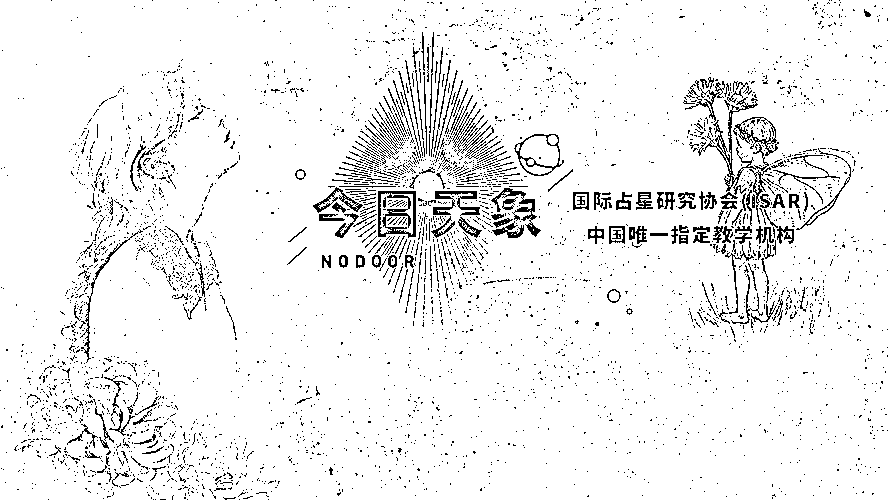

**2022 年 12 月 17 日天象：**

*   **03:48 月亮进天秤座**
*   ****水星三分天王星、金星三分北交点、火星六分凯龙星****

今天月亮在天秤座，金星三分北交点，我们渴望与人沟通，分享自己的观点，可以在关系的互动中获得支持与疗愈，享受彻底放松的一天。水星三分天王星，代表了活跃的心智能量，在分享中，我们脑海中会灵光乍现，展现出绝妙的点子和想法，既务实，又有令人兴奋的新鲜感。

最近很多朋友身体抱恙，你们都还好吗？在金星能量很强的日子，不如来聊聊，你是如何关爱自己的身体健康的呢？又是通过什么方法疗愈自己？ 

**快来领取你的 2023 年运报告吧！**

**了解每日天象，可****下载“若道”APP 查看****还有更多精彩等着你哦**

# 深度丨“占星师可以预见未来吗？”恐怕你想的太简单了！

> 原文：[`mp.weixin.qq.com/s?__biz=MzA5NjA0NTAxNg==&mid=2651497009&idx=1&sn=8d988b4cdd5e5da21341a5d831b327d6&chksm=8b481086bc3f9990d68051e884ec53bbb17e15fb8291be469f0947b13d98c18cf1090551772e&scene=126&sessionid=1692737710#rd`](http://mp.weixin.qq.com/s?__biz=MzA5NjA0NTAxNg==&mid=2651497009&idx=1&sn=8d988b4cdd5e5da21341a5d831b327d6&chksm=8b481086bc3f9990d68051e884ec53bbb17e15fb8291be469f0947b13d98c18cf1090551772e&scene=126&sessionid=1692737710#rd)

********************************☆ 后台回复“今日”，给你一句生命态度********************************

******************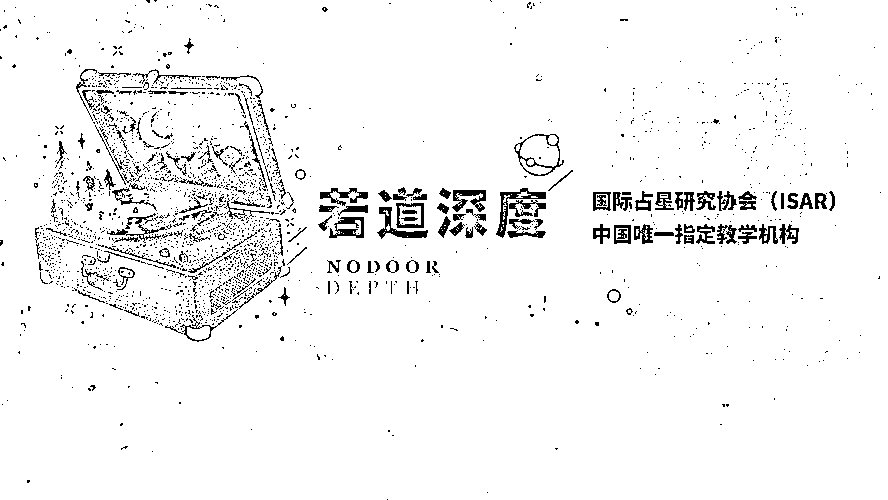******************

作者/斯蒂芬·弗里斯特

翻译/Arrow 校对/Leisha

编辑/翀子 封面/书君 图片/稿定设计

占星预测到底会带来怎么样的危险？我们应该如何正确地理解占星预测？让进化占星学创始人斯蒂芬·弗里斯特来告诉你吧。另外，若道开设的【[2023 年 ISAR 选修课 | 预测技法三日工作坊](http://mp.weixin.qq.com/s?__biz=MjM5MjQwNjAyMQ==&mid=2649440574&idx=5&sn=005f35b35db4536acdb1aa258f59ce95&chksm=beb92e5489cea74275867031aa7696f67a9313f27768525991fd06a01966b170ec478a0834e0&scene=21#wechat_redirect)】正在报名中，点击链接了解更多详情！

**占星预测有什么危险？**

2016 年 10 月，一组有经验的占星师在美国的占星座谈会中预测谁会赢得美国总统大选。没人选特朗普，他们齐齐预测希拉里会获胜，正如大部分民意调查的结果一样。俗话说：“接下来的事大家都知道了”。那些占星师们，还有大部分民意调查，都错了。 

后来发现，找不到希拉里可靠、经验证的出生时间。这的确是个严重的技术问题，导致本次座谈会的错误预测。但是，这更像是用来解释失败的说词。虽然，座谈会小组里有一个占星师的预测非常接近事实，说希拉里赢了选举，但没就职。

是的，希拉里是在公投中多赢了三百万张选票，当然也没有就职。不过，我认为可以公平地说一句“很接近，但没说中”。预测和实际发生的事有相似之处，但也逼近了底线：小组中每个占星师都预测错了。

就像这个小组座谈所证明的：**“预测”都有“后果”——往往是严重后果**。对于我们的行业而言，这是不那么光彩的一天。

网上有篇刻薄的文章鼓吹道：“占星师对 2016 年总统大选的预测都是错的，严重怀疑他们的预测能力”，文章开头写道：“占星学就是胡说八道。但不知道为什么，很多美国人仍然相信占星师有预测未来的能力”。剩下的内容大概你可以想象到了。

我也在脸书（Facebook）上转发了这篇恶劣的文章，评论如下：

**我认为‘占星师可以预见未来’的想法对于我们毫无益处，只有危害，我们无法预见未来！但，未来的可能性可以预测——所以我们的预测也经常是正确的。问题和议题，当然也能预测——这是我们技术的核心。可是预测美国总统大选结果这个想法本身就是错的，占星思维模式现在该经历一个重要的转变了。 **

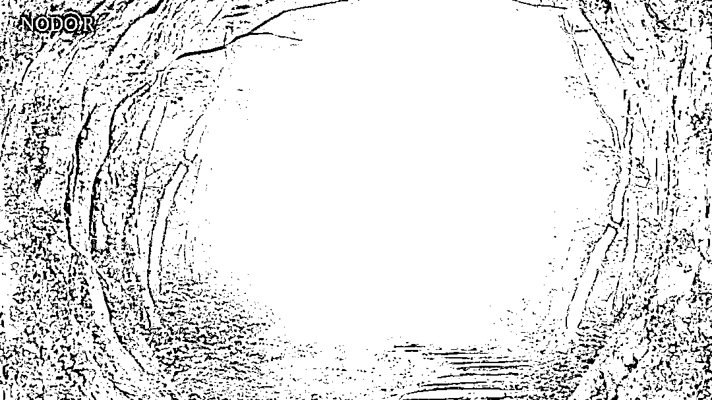

写下这些文字，完全是出自对占星群体的忠诚，希望承担一些责任，提升占星在现代社会中的地位。说出这样的批评之时，我更由衷地希望看到，**比起现在，健康的占星形式将提高更多人的精神安康和总体幸福**。

这个有价值的目标面临诸多障碍：基于恐惧并想控制一切的宗教和教条主义的科学都是显而易见的反对者。但我认为，一半的问题在于我们占星师自己。我们许下无法兑现的承诺。我们每一次食言，都会失去公信力。 

头号的虚假承诺就是我们可以预见未来，这个错误的信念对占星的玷污和歪曲已经超越了每半年就出现一次“星座是错的”的愚蠢论调。更糟的是，是我们占星师让这个谎言永垂不朽。 

**象征主义并非全然写实，占星是一种象征语言。如果我们可以真正接受这个基本原则，就都能成为更好的占星师。 **

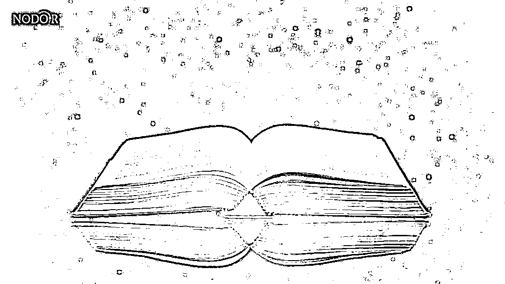

**占星预测到底应该预测什么？**

凝视占星学的水晶球时，我们实际看到了什么？**可能性是一个不错的答案**。我认为还有个更好的答案，我们很快就会讲到。但现在先想一下“**预见可能性**”这个概念。 

比如你在计划十天后的野餐。你查了长期天气预报。预报有雨，你信吗？你会取消野餐吗？当然不。气象学家也经常预测错误第二天的天气，更不要说超过未来一周了。 

刻板的、非黑即白的占星预测可靠度差不多，理由也类似。气象学家用统计模型工作，占星师并不完全如此。更好的说法是，预测占星学的传统从本质上就是通过几千年的观察积累而来的“民间统计数据”，一只眼观察天空，一只眼关注人类活动。

所以，这些传统常常有效——而且当然就现实而言，糟糕的天气预报可能确实意味着你野餐时**很大几率**会下雨。但你不会指望它。

同样，**如果天王星行进到你的婚姻宫（第七宫），你的重要关系有很大可能会出现重大变化。但要是任何占星师对你言辞凿凿地说：“你会离婚”，那就是在侮辱占星学，也在侮辱你。 **

**刚才我问：“凝视占星学的水晶球时，我们实际看到了什么？”，我说有个不错的答案是：“可能性”。**

**而更好的答案是什么？问题、可能性、潜力、警告。 **

**在我看来，最好的答案是：你的道路、道法、大道、神的意志。** 

在我脸书的帖子里，我提出**占星急需思维模式上的转变**。正如大部分真正的模式转变一样，将最重要的前提简化成寥寥数语并不难。但寥寥数语会改变一切：地球不是平的，是圆的；行星绕着太阳转；同性恋不是病；时空不是绝对的；男女平等。

**占星学的寥寥数语是什么呢？****你的星图预测了问题，而不是答案。** 

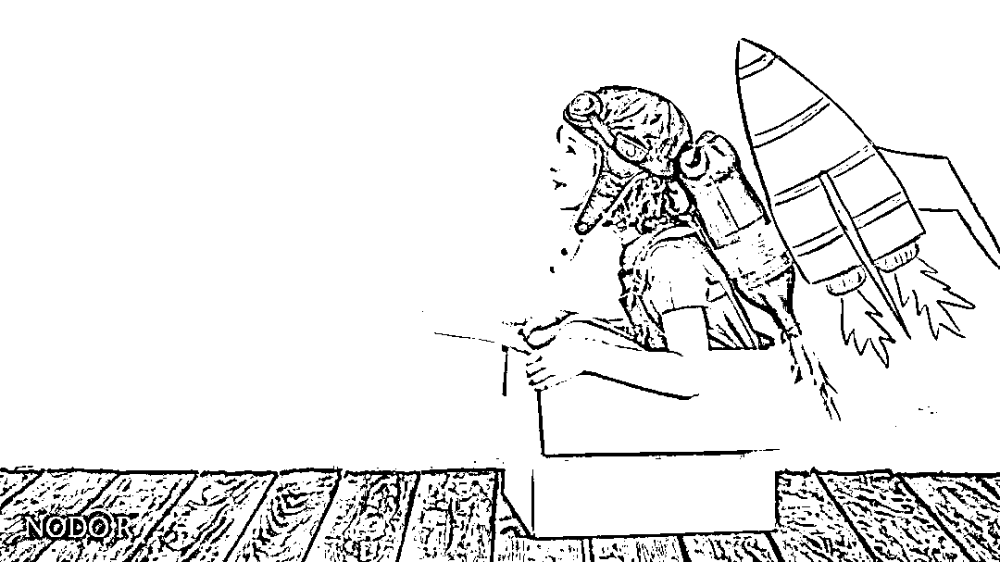

**非黑即白的预测，本身就是个“错误”！**

20 世纪前，科学家描述了一个由定律和逻辑掌管的宇宙。然后有了相对论和量子力学。詹姆斯·秦斯（英国物理学家、天文学家、数学家）的名言如是：“宇宙现在看来更像一种伟大的思想，而不是一台伟大的机器。”

**量子力学的基本概念是，世界不是由不变的力学定律主宰，而是被可能性主宰。**

一个成熟的苹果非常可能掉下来，但也有统计学的概率，它会“掉上去”。而且，在量子理论中，观察者的意识会与每个实验产生相互作用。意识本身无法与我们对一切物理过程的理解分离。 

**对我来说，这才是占星学通往未来的桥梁。我们人类是占星方程式中“不可预知的量子”，我们的命运是在特定的时间面对某些特定的问题和可能性，我们回应这些的方式是由意识掌管，而不是由星体掌管**。

就像加里·朱卡夫在《物理之舞》中写道，量子力学“已经解释了一切，从亚原子粒子到电晶体到恒星能量。从未失效，无出其右。”

如果我们的行业想躲开迫近的陷阱，避免最终沦为被完全摒弃的过时神话，占星师只需抛弃 19 世纪物理学家们拔河式的思维枷锁，进入量子宇宙。

**从占星的技术领域抽身，像“路人甲”一样思考，对我们的行业没有任何帮助。在我看来，占星师预测出错遭到抨击不是由于“错误的预测”，而是源于非黑即白的****预测本身**。

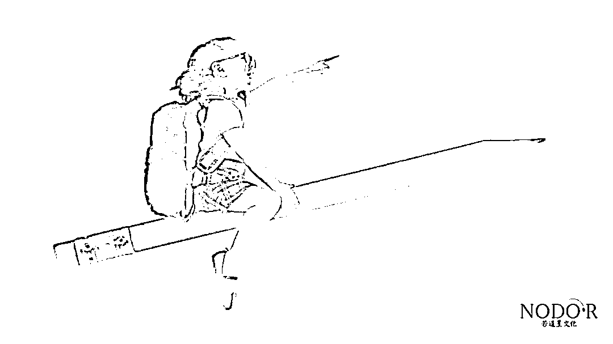

**占星预测的正确打开方式**

我们不可能在忽略人类自由意志的同时，还能准确地运用占星学。如果这个座谈换个话题，讨论“预测问题”呢？如果邀请一些智慧而又见多识广的占星师来“询问星星”以下问题呢？ 

• 我们称之为“美利坚合众国”的集体，当前的灵魂道路是什么？ 

• 这个国家需要学习什么？ 

• 让这个国家获得最大福祉的方向是什么？ 

• 它现在面对的阴影和黑暗面是什么？ 

• 你可以提供什么智慧的指引？

• 可能出现哪些共时性现象，与当前这些行星能量呼应？ 

• 哪个候选人的出生星图看似最符合这些理想？ 

• 最后，猜猜谁可能获胜？ 

这就是我的答案：**这些才是占星学真正可以回答的问题**。

我脸书上的帖子里有句话：“我们无法预见未来！但，未来的可能性可以预测——所以我们的预测也经常是正确的”。一位经验丰富的占星师具备一些常识，往往可以基于当前的星相有根据地推测出**最有可能的发展**。

这个预测系统很多时候都管用。但记住：**最难发现的错误就是你通常可以侥幸避免的错误**。就像诊断计算机程序中间歇性出现的小故障。或像这种想法：“我不系安全带开了十五年车，从没出过事”。 

**预测就是这样，你经常是正确的，而且“正确”会让你上瘾，尤其是加上反馈推波助澜，再来一句“你太神了”。而且，人们渴望觉得自己可以对未来有所掌控。预测满足了一部分这种冲动，或至少承诺可以满足。 **

大家都知道，罗伯特·汉德和其他一些占星师成功预测了 911 袭击，向他们致敬。大约四十年前，连我也在一本名为《太阳》的杂志里预测了前苏联的解体，预测有时就会奏效。**但所有那些成功并不是重点**。

为了保持正直的原则，我们也必须承认，我们的预测也错了不少。我们正确的时候，当然并非纯属偶然，这是批评者的论调。

我们占星师正确的时候太多了，不可能全用“运气好”来解释。但当我们预测对了，不是因为宇宙是机械的，我们是其中的木偶。而是因为我们对最有可能的结果下了注。有经验的占星师可以精于此道。不过，也会错失良多。 

占星师们容易被这种“正确”引诱。我自己的第一位灵性导师玛丽安·斯达尼斯曾教育我：“每位真正的先知都希望自己的预测被证明是错的”。

她的话乍一听很奇怪，但我从未忘记。作为占星师，我们有时可以看见困难迫近。触及其核心，你总是可以找到穿过困难的道路，这条路通常避开了毫无意义的危险和空洞的闹剧，虽然可能不易。

我常给客户做出传统的预测，然后说“证明我错了。”**客户越懒，就越可能让“预测”成真**。 

**举个例子**

之前我提到天王星行进到第七宫。我不记得有多少次，在别的占星师基于这个行进预测客户会离婚之后，我必须再澄清这个解读。这当然可以意味着离婚，但也可以是更新和其他可能。

这是一个重大话题，必须整体考量一个人的星图，但可以把它归结为一个我们**可以稳妥预测的问题，比如：“你可以怎样重新构建你的重要关系，使其不会妨碍你新兴个性的表达？” **

这才是其中的本质。这个问题可以激发创造性的、明确的想法。**通常，提出****正确问题****才是有效解答的第一步。**占星肯定可以做到这点，因此会带来真正的帮助。

我觉得**占星师们应该坚守占星这门神性语言给我们发送的真正讯息——问题甚至建议，但绝不是宿命般地宣告不可避免、无法改变的未来。  **

我祈祷我们**占星师群体可以抓住机会，带着对意识力量的尊重，重构我们的技术，不再沉迷于预测的妄想，这种妄想令我们困在一个衰弱而沾沾自喜的群体中，越发孤立**。

**版权声明：**本文由若道翻译发布，欢迎转发，反对抄袭。友号转载请申请白名单。

**END**

**斯蒂芬·弗里斯特**

若道签约老师。进化占星学的创始人之一，当今世界最有影响力的占星大师之一；1985 年，他凭借《内在的天空》一书获得职业占星师协会奖（Professional Astrologers Incorporated Award）。他四次获得占星界最高的占星学联合协会奖（United Astrology Congress Regulus Award）提名，2018 年获得轩辕十四教育奖。

**预测技法工作坊**

 本次 3 日课程将深入学习人本主义占星师使用的 3 种预测技法。
我们将深入学习如何分析**行进**，强调对**行进的周期性**理解。我们将通过**次限**研究星图中展现的变化，并学习运用**太阳弧**来标记生命中的关键事件。虽然还有其他有用的技法，比如太阳返照和月限法等，但对**行进、次限和太阳弧**能量的谨慎回应已经提供足够的信息来指导我们的人生。

# **本次工作坊可作为 ISAR 选修课。**

**点击下图了解更多课程详情** 

**今晚的直播，****快来预约吧**

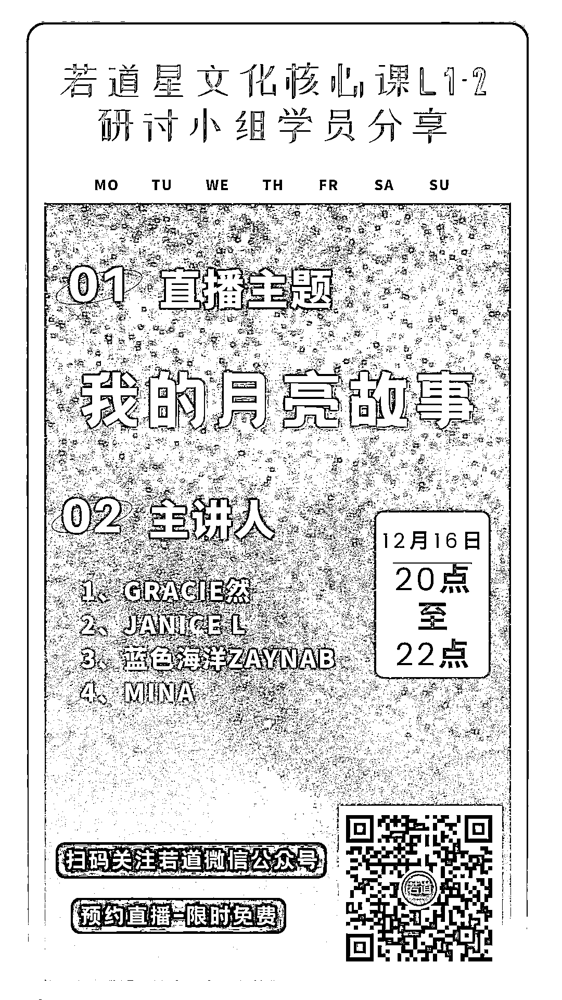

<mpvideosnap class="js_uneditable custom_select_card channels_live_iframe" data-pluginname="videosnap" data-headimgurl="https://wx.qlogo.cn/finderhead/PiajxSqBRaEJYnVsqWfEX9qA0sI6hNVKsDfyzfPZ92WZMZyBpZWU5NA/0" data-username="v2_060000231003b20faec8c4e68a1ec2d4ca07e434b07755bbf47e7053a3059defd2c9d6c68a20@finder" data-nickname="若道" data-desc="将在 12 月 16 日 20:00 直播" data-intro="若道核心课程 L1-2 学员研讨小组分享第五场 我的月亮故事" data-noticeid="finderlivenotice-v2_060000231003b20faec8c4e68a1ec2d4ca07e434b07755bbf47e7053a3059defd2c9d6c68a20@finder-1670222787989239-1436855127" data-type="live"></mpvideosnap>**快年底了****不给自己一份来自占星学的礼物吗？**

**梅里曼金融报告双 12 福利来啦！****长按下图了解更多详情吧！**

**快来领取你的 2023 年运报告吧！**

**20 位来自世界各地的占星师****带来 19 场沙龙——新世界的觉醒****详情可点击下图**

**学习占星学****点击下图了解课程详情**

**微信又双叒叕改版啦，不想错过若道君的推送？**
****就把若道设为****星标****以及点点****“在看”****吧！******▼**

**喜欢就点一下“在看”吧！****报名直达入口**

# 2023 年 ISAR 选修课 | 预测技法三日工作坊，了解人生重大事件

> 原文：[`mp.weixin.qq.com/s?__biz=MzA5NjA0NTAxNg==&mid=2651497009&idx=2&sn=2157387bc1500cc911c78c63c91e5db2&chksm=8b481086bc3f9990493fca8890e1b1604a67236f92c3d63dd98faa7d7c864bee0f12f6be5352&scene=126&sessionid=1692737710#rd`](http://mp.weixin.qq.com/s?__biz=MzA5NjA0NTAxNg==&mid=2651497009&idx=2&sn=2157387bc1500cc911c78c63c91e5db2&chksm=8b481086bc3f9990493fca8890e1b1604a67236f92c3d63dd98faa7d7c864bee0f12f6be5352&scene=126&sessionid=1692737710#rd)

**授课内容**

 本次 3 日课程将深入学习人本主义占星师使用的 3 种预测技法。

我们将深入学习如何分析**行进**，强调对**行进的周期性**理解。我们将通过**次限**研究星图中展现的变化，并学习运用**太阳弧**来标记生命中的关键事件。虽然还有其他有用的技法，比如太阳返照和月限法等，但对**行进、次限和太阳弧**能量的谨慎回应已经提供足够的信息来指导我们的人生。

**行进（TRANSITS）** **长期趋势**分析行进的最好方法是先将长期的行进趋势列出来。顺序如下：冥王星、海王星、天王星、土星、木星、南北交点。通过将这些影响力持久的长期行进先列出来，你将能够发现在未来一年甚至更长的时间里你人生中的重大课题。**短期趋势和触发点**接下来你需要去观察那些运行得较快的星体，来判断短期趋势。不过，重要的是要清楚，这些移动较快的星体在行运中扮演着事件的“触发点”的角色，特别是当与它们形成相位的个人行星同时也与行运外行星有相位的时候！

**次限推进（PROGRESSIONS）**通常也被称作“一天代表一年”推运，因为这种技术把出生后的每一天和出生后的一整年等同起来。一旦设定了这个节奏，就像定时释放的胶囊一样，这些次限推进就像某种内部的太阳系一样运转起来，和真实时间的事件、经历、情境应和。

**太阳弧（SOLAR ARCS）**以太阳为核心，为众星之首，带着众星一起移动,展示人生不同阶段我们是如何体验自我、表现自我、修缮自我。此方法虽非实际星体，但却是星动推运法中准确率最高，实用性最佳的推运方法。

课程有两个方面的重点：**强化自我学习**，把对过去生活事件的理解作为预测未来趋势的基础；**学习有效的占星咨询技能**，以一种精准、生动、策略性和鼓舞人心的方式阐述星图。与格雷格之前开设的课程一样，这次课程会有**大量互动**，老师会与案例学员互动，同时通过学员间的讨论，互相激发，获得更多启发。如果可能，还会设置**训练环节，练习基本的预测和解读方法。**

**课程安排**

 **· 2023 年 3 月 4 日 周六  8:00-14:00
· 2023 年 3 月 11 日 周六  8:00-14:00
· 2023 年 3 月 18 日 周六  7:00-13:00**

**什么人适合学习本课程？**

 **·**占星师或渴望成为占星师的人群。  **·**本课程并非针对初学者，需具备若道核心课程 level4 及以上水平，即了解星座、行星、宫位、相位等。

**· **课程会涉及行进&推进&太阳弧解读高阶内容，不了解相关知识的同学，请提前学习相关内容。

**老师介绍**

**格雷格·博加特（Greg Bogart）**

**· **占星师、心理治疗师。格雷格出生于美国纽约市，就读于卫斯理大学。1986 移居旧金山湾，完成了加州整合大学和赛布鲁克大学的研究生课程。**· **格雷格自 1991 年以来一直是一名有执照的心理治疗师（LMFT 28276）。他是国际占星研究协会（ISAR）认证的占星师，并拥有美国地球宇宙学研究协会（NCGR）的第 4 级认证。**· **他还在旧金山的艾扬格瑜伽学院接受过培训，并于 1992 年毕业且获得了瑜伽教师认证。**· **格雷格是一名私人执业的心理治疗师，在索诺玛州立大学担任心理学讲师，他在该校教授“成人发展中的转变”、“以深度为导向的心理治疗”、“神话、梦与象征”以及“存在主义心理学与超个人心理学”等课程。**· **他在加州整合大学、约翰·F.·肯尼迪大学、多米尼加大学和超个人心理学学院教授咨询心理学和东西心理学课程。**· **他的研究结合了冥想、哈他瑜伽、荣格解梦、存在主义心理疗法和精神综合，**占星学的行星周期智慧和原型象征**。

**格雷格·博加特博士著作：** 《占星学的高八度音阶》（*Astrology’s Higher Octaves*） 《行星用于治疗》（*Planets in Therapy*）《占星学与灵性觉醒》（*Astrology and Spiritual Awakening*）《梦境工作过与自我疗愈》（*Dreamwork and Self-Healing*）《梦境工作在抑郁症整体心理治疗中的应用》（*Dreamwork in Holistic Psychotherapy of Depression*）《占星学与冥想：对变化的无畏沉思》（*Astrology and Meditation: The Fearless Contemplation of Change*）

**推荐阅读：**

史蒂芬·阿若优：《生命的轨迹》

Bogart, G., Planets in Therapy; and Astrology’s Higher Octaves.

Tyl, N., Prediction in Astrology.

Ruperti, A., Cycles of Becoming. 

**课程价格**

**正价：6800 元 早鸟价：5800 元 早鸟价截止日期：2023 年 2 月 15 日**

**惊喜联报套餐！！****《ISAR 选修课 | 预测、预期与意识成长》+《2023 年度天象预测大师课》+《2023 年金融占星预报》****三门联报优惠价 8000 元****（限前 50 名联报）（联系 Maggie 老师，抢占限量优惠价）**

长按二维码添加 Maggie 老师获取联报优惠价

**退转课程**

退款原则请详看《教学协议》，如有疑问请咨询课程顾问。 ****2023 年 ISAR 选修课 | 预测、预期与意识成长****

**授课老师：****格雷格·博加特**

**直播课开课时间：2023 年 3 月 4 日（周六）3 月 11 日（周六）3 月 18 日（周六）**

**授课方式：******网络授课，英文/中文授课，中文翻译****

**费用：****** 正价：6800 元；早鸟价：5800 元；早鸟价截止日期：2023 年 2 月 15 日****

**课程负责人：Maggie 老师**（微信：NodoorMaggie，请备注“2023 预测课”）

长按二维码添加课程负责人咨询

**报名直达入口**

# 今晚直播：我的月亮故事

> 原文：[`mp.weixin.qq.com/s?__biz=MzA5NjA0NTAxNg==&mid=2651497009&idx=3&sn=1d8a04f05d6571a6a9d8bd7ce5f6c08f&chksm=8b481086bc3f99905269422e2d7bc78fc9d3ecdf32ce1eb1defac820a7fa4d517896df7292fc&scene=126&sessionid=1692737710#rd`](http://mp.weixin.qq.com/s?__biz=MzA5NjA0NTAxNg==&mid=2651497009&idx=3&sn=1d8a04f05d6571a6a9d8bd7ce5f6c08f&chksm=8b481086bc3f99905269422e2d7bc78fc9d3ecdf32ce1eb1defac820a7fa4d517896df7292fc&scene=126&sessionid=1692737710#rd)

<mpvideosnap class="js_uneditable custom_select_card channels_live_iframe" data-pluginname="videosnap" data-headimgurl="https://wx.qlogo.cn/finderhead/PiajxSqBRaEJYnVsqWfEX9qA0sI6hNVKsDfyzfPZ92WZMZyBpZWU5NA/0" data-username="v2_060000231003b20faec8c4e68a1ec2d4ca07e434b07755bbf47e7053a3059defd2c9d6c68a20@finder" data-nickname="若道" data-desc="将在 12 月 16 日 20:00 直播" data-intro="若道核心课程 L1-2 学员研讨小组分享第五场 我的月亮故事" data-noticeid="finderlivenotice-v2_060000231003b20faec8c4e68a1ec2d4ca07e434b07755bbf47e7053a3059defd2c9d6c68a20@finder-1670222787989239-1436855127" data-type="live"></mpvideosnap>

# 今晚直播：月亮星座，读懂你的内在

> 原文：[`mp.weixin.qq.com/s?__biz=MzA5NjA0NTAxNg==&mid=2651496950&idx=3&sn=997c7958054ef364c5f2d3b55db083d5&chksm=8b481341bc3f9a57ad525572cf98f9a11b352a0a356477ed858bb4c6b3034a0bf0f70df28af1&scene=126&sessionid=1692737710#rd`](http://mp.weixin.qq.com/s?__biz=MzA5NjA0NTAxNg==&mid=2651496950&idx=3&sn=997c7958054ef364c5f2d3b55db083d5&chksm=8b481341bc3f9a57ad525572cf98f9a11b352a0a356477ed858bb4c6b3034a0bf0f70df28af1&scene=126&sessionid=1692737710#rd)

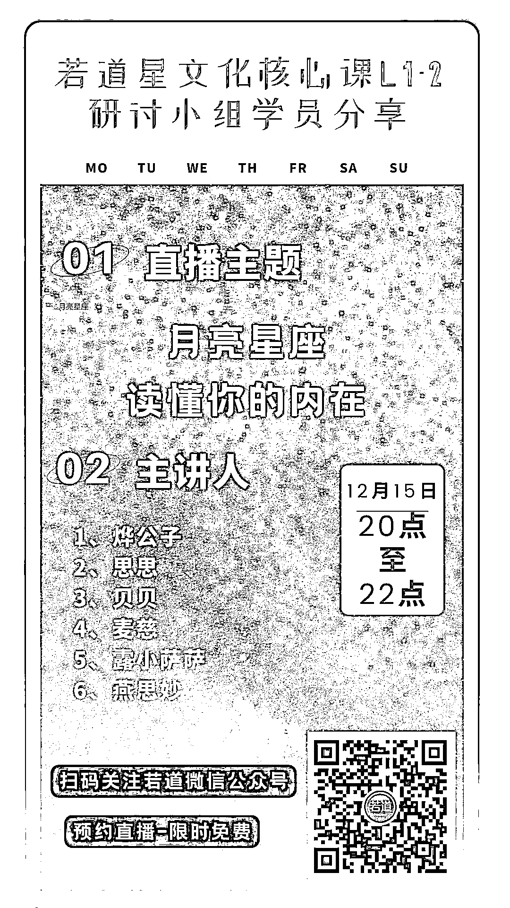

<mpvideosnap class="js_uneditable custom_select_card channels_live_iframe" data-pluginname="videosnap" data-headimgurl="https://wx.qlogo.cn/finderhead/PiajxSqBRaEJYnVsqWfEX9qA0sI6hNVKsDfyzfPZ92WZMZyBpZWU5NA/0" data-username="v2_060000231003b20faec8c4e68a1ec2d4ca07e434b07755bbf47e7053a3059defd2c9d6c68a20@finder" data-nickname="若道" data-desc="将在 12 月 15 日 20:00 直播" data-intro="若道核心课程 L1-2 学员研讨小组分享第 4 场 月亮星座-读懂你的内在" data-noticeid="finderlivenotice-v2_060000231003b20faec8c4e68a1ec2d4ca07e434b07755bbf47e7053a3059defd2c9d6c68a20@finder-1670222853257737-1986784773" data-type="live"></mpvideosnap>

# 星座病理学 | 处女座“强迫症”的案例演示

> 原文：[`mp.weixin.qq.com/s?__biz=MzA5NjA0NTAxNg==&mid=2651496950&idx=2&sn=de376bce32b0cac3e2029a6236a7d4a5&chksm=8b481341bc3f9a576f336d5885f39ffe0c2b26ae97a89fe7de247109435d0868c087d07cd018&scene=126&sessionid=1692737710#rd`](http://mp.weixin.qq.com/s?__biz=MzA5NjA0NTAxNg==&mid=2651496950&idx=2&sn=de376bce32b0cac3e2029a6236a7d4a5&chksm=8b481341bc3f9a576f336d5885f39ffe0c2b26ae97a89fe7de247109435d0868c087d07cd018&scene=126&sessionid=1692737710#rd)

<mpvideosnap class="js_uneditable custom_select_card channels_iframe videosnap_video_iframe" data-pluginname="videosnap" data-id="export/UzFfAgtgekIEAQAAAAAAu94qVMtCYQAAAAstQy6ubaLX4KHWvLEZgBPEj4E8fHlwOouCzNPgMIspBPawqpcsAIEYP_7bXAgB" data-url="https://findermp.video.qq.com/251/20304/stodownload?encfilekey=rjD5jyTuFrIpZ2ibE8T7YmwgiahniaXswqzLQzDhq3BaRPdXxFFaRSB3ZOfRiaW2GQPbJuvBwcGInybWzwllDibp562Bp3a7yG3V2xXjUcHvEWs5scic1Oq4dKdw&amp;adaptivelytrans=0&amp;bizid=1023&amp;dotrans=0&amp;hy=SH&amp;idx=1&amp;m=&amp;scene=0&amp;token=x5Y29zUxcibClaoh1yHkhD8WhGGJLGxzsnXazpP39SyhLKkgR8hB7f0yibNaQx7cgWicjwNq2rtrlc" data-headimgurl="http://wx.qlogo.cn/finderhead/PiajxSqBRaEJYnVsqWfEX9qA0sI6hNVKsDfyzfPZ92WZMZyBpZWU5NA/0" data-username="v2_060000231003b20faec8c4e68a1ec2d4ca07e434b07755bbf47e7053a3059defd2c9d6c68a20@finder" data-nickname="若道" data-desc="#占星心理学 处女座的强迫症会有什么样的表现，通过 2 个案例了解一下……" data-nonceid="8405148842104274623" data-type="video" data-authiconurl="https://dldir1v6.qq.com/weixin/checkresupdate/icons_filled_channels_authentication_enterprise_a2658032368245639e666fb11533a600.png" data-width="1280" data-height="720"></mpvideosnap>

**课程描述**

也许你会有疑问，为什么在占星学的课程中，会出现精神病理学的教学内容，这和我们有什么关系？这对占星咨询，或在自我了解与成长的过程中又有什么帮助呢？

**带着这些疑问，请你静下心来，思考以下几个问题**：

“**你/你的案主，是否曾经过度担心什么？** **你/你的案主，有没有感觉到担忧和焦虑，却不知道原因是什么？****你/你的案主，是否曾经觉得害怕什么东西，但理智上却很清楚它不会对你造成什么伤害？****你/你的案主，是否曾经通过沉迷某物，酗酒或滥用药物，自我伤害去逃避问题？****……****——节选改编自《心理学与生活》**”

如果你对上述问题其中之一，回答是。这意味着几乎每个人都曾有过心理障碍的症状（精神病理的问题）。

你看，其实“精神病理学”与人的心理有着密切的关联，再结合占星学，呈现了人内在与外在层面更加丰富和深刻的一面。**这对于学习占星学的人和占星师来说，都是一场难得的知识盛宴！**

**本课为 2 年期双证核心课程中的一部分**（AP105 阶段），其内容是过去若道所开设的核心课程从未教授的部分，特意抽出供其他学员学习，**可作为 ISAR 选修课，单独报名**。

**在正式了解本课的价值之前，先了解一下这门课程的主讲老师吧！**

**格伦·佩里（Glenn Perry）**

*   他是心理/意识研究专业博士、加州注册婚姻和家庭治疗师 （CAMFT）

*   占星心理学学院（Academy of AstroPsychology）创办人

*   康涅狄格州研究生院（the Graduate Institute of Connecticut）原型宇宙学与意识进化项目的负责人

*   共出版八本占星学著作：《心理占星学入门》、《心理占星论文集》、《盗取天火》、《从忠诚到革命》、《星图中的阴影》、《占星职业议题与伦理》、《出生星图深度分析》、《从古代到后现代占星学》

**墙裂推荐格伦老师这门课的 **

**4 大理由**

**你一定得知道的课程价值**

**价值*****1***
**明晰精神病理学的基本定义**

占星心理学学院创办人格伦·佩里老师，对**精神病理学的基本定义**就是灵魂受苦，精神就是灵魂的意思，病理就是受苦的意思，所以精神病理学研究的就是：人类各种各样受苦的方式，尤其是因为某一类的行为而引起的。

精神病理学是一个连续体，从比较轻微的，到比较严重的，这么说来，我们每个人都有一部分精神病理的问题。

**如果成为一个“人”，没有一定程度的挑战是不可能的。没有一定程度受苦，没有一定程度不平衡是不可能的。而这种不平衡就会以一种挑战和困难的姿态呈现出来。**

**价值*****2*****更懂疗愈：从不平衡到平衡**

**疗愈**是一个复杂的过程，讲的是将人从不平衡带到平衡这样的一个状态，将不同行星代表的心理功能带到一种更加平衡整合和合作的状态。

格伦老师通过研究精神病理学，发现每一颗行星，以及这颗行星所守护的星座，都和某一特定类型的病理是联结在一起的，包含了这个占星原型所涵盖的极端不平衡的情况。

举个例子，案主的第 1 宫，有很多星星在那里，和对面第 7 宫的火星形成对分相，第 1 宫白羊座或者火星白羊座的组合，和这个案主的反社会人格的病状联系在一起（这是一个星图的极端负面表现）。

“

**生活本身就是一场治疗，我们在占星的星图中去看到，人们所具有的创伤、不平衡及其产生的防御机制，最终都会在他生活中的关系和情境中呈现出来。无论他生活中处在怎样的情境之下，其实这些环境都是在为他提供恰当的环境，作为一种载体，让他去平衡和疗愈事件背后问题的根源。** 

**这样一个现象是持续不断地在发展，会让我们想到，会有一个更大的宇宙的智慧存在，它其实是在指挥和引导着我们的这些经验，让我们去经历然后进入更高层面的发展当中。生活或者“神”，就是我们所有人类的一个治疗师。**

**——格伦·佩里**

”**价值*****3*****了解诊断标准，提高咨询的专业敏感度**

如果能够对精神病理极端不平衡的情况有了解的话，你就会对它比较温和的版本更加敏感（大部分人是更温和版本的呈现）。

也许案主并没有达到某个病理所达到的层级，但是 Ta 有显示出，这个病理某一些特点或者某一些倾向。所以，我们的目标并不是去诊断案主，而是了解他在这个病理学连续体上处在一个怎样的位置。

当你拿到星图你会看到，案主不同的冲突，是体现在不同的部分上。某一个病状是体现在某一个行星，另外一个病状，是同步体现在另外一颗行星上。

当我们通过对占星原型星座和行星的病理学现象的学习后，就能看到占星学上的配置所呈现出来的，案主表现出的这些失调，并不一定都会成为一种心理临床上的诊断。有可能在案主这里呈现出一个很轻微，但是仍然在 Ta 生活中，给 Ta 造成挑战的一个点。

**价值*****4*****智力上的刺激——整合进阶**

这个课程能够让我们了解自己，了解我们的客户，了解我们的朋友，了解我们的家庭。它给我们提供一种崭新的方式，并且让我们看到占星原型的种种表达，不要局限在非此即彼、非好既坏的这样的一个概念当中，而看到它其实是一个不同程度的连续体。

当我们能够以这种方式去看的时候，你就能够将自己的生活，带入一种和谐。能够了解这是一个过程，我们的重点不是放在诊断上，而是放在整合上，因为生活，就是一种整合。

**课程内容**

**AP105 星图中的精神病理学与疗愈** 共**15 次**课程：**10 次 2019 年录播课+5 次直播课；30 课时**

在这个阶段的课程中,我们将**聚焦于十二星座(从白羊座到双鱼座）及其对应的守护星的潜在功能障碍。**

我们将学习如何识别、理解和应对每个星座的潜在挑战。我们将在各种相应的心理障碍背景下来考察占星原型，这些心理障碍表现为功能障碍、失衡的极端状态。

学员们将了解**《精神疾病诊断与统计手册》诊断标准**。我们会探讨治疗的概念，尤其是那些与整合和个性化相关的概念。我们将特别关注外行星的困难相位，以及它们与内在心理冲突、防御和症状形成的关系。

学员们将探索人的痛苦如何成为发展和实现天赋才能的催化剂。在考察病因时，我们会将平常的因果关系理论与传统的命运、业力和转世观念整合起来。

**口碑推荐**

**想感受格伦老师的课堂魅力？** **一小段讲课视频让你先睹为快~**

**课程费用**

**课程价格：9000 元****课程优惠价请添加 Margartet 咨询**

课程负责人：Margaret

（微信：18515059056）

请备注“心理占星 105”

**开课时间**

**直播课开课时间：2022 年 12 月 21 日**

**退转课程**本课程包含往期视频知识点视频课程+直播案例课程+助教直播答疑；报名付款后均不受理退款转课，请慎重考虑后再确认付款。**其他相关事项请仔细查阅报名勾选时的《教学协议》，如有疑问请咨询课程顾问。****报名流程及费用支付****1. 点击阅读原文链接立即报名，填写个人姓名（身份证姓名）和相关信息，阅读并同意《教学协议》，提交报名表，直接在线支付。****2. 付款后可在网页个人中心或手机网页“我的”栏目查看报名记录。****如遇疑问请与销售人员联络******ISAR 选修·占星原型与星图中的精神病理学****

**授课老师：格伦·佩里**

**直播课开课时间：**2022 年 12 月 21 日

**授课方式：**网络课程，中英文授课，中文翻译

**费用：9000 元（获取优惠请联系客服咨询）**

**课程负责人：**Margaret（微信：18515059056 请备注“心理占星 105”）

长按二维码添加课程负责人咨询~

**报名直达入口**

# 你曾经历过什么，才会把这样痛的爱情当选择？

> 原文：[`mp.weixin.qq.com/s?__biz=MzA5NjA0NTAxNg==&mid=2651496950&idx=1&sn=a68c04779c42965631c43523084b6d9e&chksm=8b481341bc3f9a57152cae4616abaf1716db9d5ce2ec75cd5ee483487f4d6553eb5049e96e1c&scene=126&sessionid=1692737710#rd`](http://mp.weixin.qq.com/s?__biz=MzA5NjA0NTAxNg==&mid=2651496950&idx=1&sn=a68c04779c42965631c43523084b6d9e&chksm=8b481341bc3f9a57152cae4616abaf1716db9d5ce2ec75cd5ee483487f4d6553eb5049e96e1c&scene=126&sessionid=1692737710#rd)

********************☆ 后**********************台**********************回复“今日”，给你一句生命态度********************

作者/格伦·佩里 译者/Arrow 校对/轩轩

编辑/玫瑰 图片/稿定设计

心理占星大师格伦·佩里的客户弗兰克成年之后总是介入其他女性的婚姻中，他却认为自己是在“拯救”这些女性。为何会如此？请跟随格伦老师一起通过荣格的情结概念来理解星图中的精神病理学。另外，格伦老师主讲的【[ISAR 选修丨占星原型与星图中的精神病理学](http://mp.weixin.qq.com/s?__biz=MjM5MjQwNjAyMQ==&mid=2649440565&idx=3&sn=859e54086e26f907771b03a4ffbfefd0&chksm=beb92e5f89cea749aa71d292df743d2dfcc247593f491be8fe3506e8056b5d136c2ef6631810&scene=21#wechat_redirect)】报名中，点击链接了解一下咯~**什么是“情结”？****“情结”**（complex）一词是由 Theodor Ziehen 于 1898 年所创，由荣格在与弗洛伊德·西格蒙德合作的时期发扬光大；是精神分析学派的一个主要概念。由荣格最早使用。他认为**情结有是有关观念、情感、意象的综合体**。他还将 complex 形容为“无意识之中的一个结”。可以将情结想成**一群无意识感觉与信念形成的结**。**这个结可以间接侦测，而表现的行为则很难理解。**只有造成有害行为的情结，荣格才视为心理疾病。荣格派理论视无害的情结为普通健康心理的多元变化。——百度百科**插足别人的婚姻是为了“拯救”？**

**父母动荡的婚姻与星图中的三角关系**

我把前客户弗兰克作为情结的案例，他有 4 颗行星落在白羊座第 10 宫，对分在第 4 宫的 3 颗天秤座行星。他的白羊座行星包括太阳、木星、水星和金星，无疑由他的父亲（第 10 宫）象征，他是一个杰出的自恋主义者（太阳）、教育书刊（木星和水星）的出版商，他还是一个无所不知的百事通，带有相当凶狠的侵略性特质（白羊座）。相反，他第 4 宫的天秤座行星，包括土星和合相海王星的月亮，明显象征着他美丽、善良、极度敏感、受苦、抑郁的母亲，不时被他的父亲用智商践踏。

**弗兰克所受的创伤是他在整个童年期不得不目睹对母亲的贬损。**他能对母亲的痛苦感同身受，但是无力保护她。虽然弗兰克会挑战他的父亲，保护母亲，但这只会把父亲的怒火引向弗兰克。弗兰克的父亲毫无怜悯之心，由于儿子站在母亲那边他而体罚他。

当弗兰克的母亲最终离开丈夫时，弗兰克心怀愤恨，以致于 24 年中都拒绝和母亲说话。弗兰克无法拯救母亲、唤醒父亲，或者拯救双亲的婚姻，这一切都导致了巨大的愧疚。

这还是由上文提及的白羊座和天秤座行星所象征，其中的 2 颗：水星和土星与天王星形成 T 三角。**这 3 颗行星的组合似乎将弗兰克的三角关系和父母动荡的婚姻联系在了一起。**然而，最重要的是，太阳、木星对分月亮、海王星，代表了父亲缺乏同情心，母亲沦为受害者，以及弗兰克因为无法减轻这一切的痛苦而感到愧疚。综观而言，**这个占星配置象征着一种情结——一种固定观念，表述为：女性（和下属）被迫忍受男性的支配和贬低。**

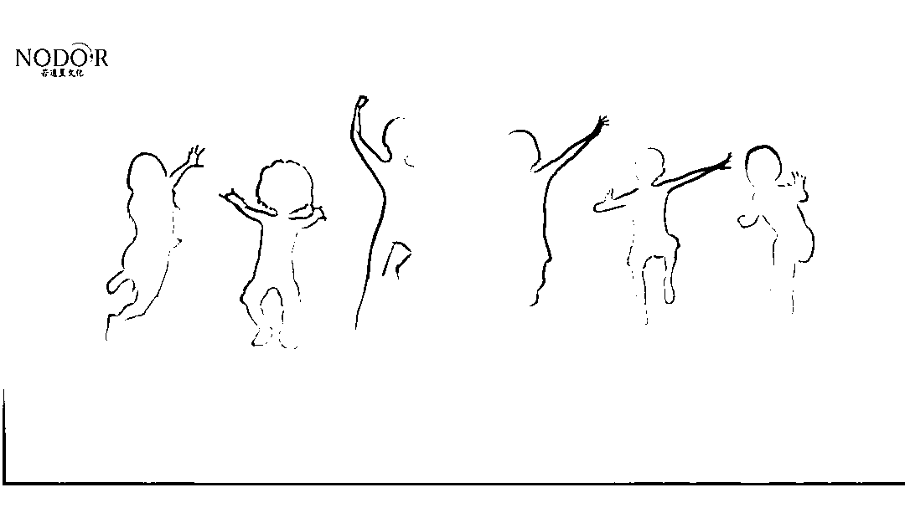

**在第三者的漩涡中沉沦**

到弗兰克成年时，他进入了一种**重复童年困境****的关系模式**。他会对同事和上级的妻子们产生强迫性兴趣。不变的是，这些婚姻都不稳定，无疑解释了为何女人们都愿意和弗兰克上床。但并不是性或爱情驱使着弗兰克，而是**重新教化妻子们的需求**，**让她们在与丈夫的关系中更敢于去主张自我**。这是他真正的强迫症。**他的情事总是演化为一种咨询式的关系，弗兰克会提供无数免费的建议**： ❶ 关于妻子如何通过勇于主张自我、勇于反抗来拯救她的婚姻。❷ 或者，如果这招没用她为何应该离开丈夫投奔他。 然而，时光流逝，结果并没有实现。

弗兰克快 50 岁了，从未结婚，虽然他觉得自己一直想要婚姻和孩子。无论他在这些不幸的婚外情中如何表现，弗兰克还是一个诚实、善良、追求精神世界的人。悲剧是他由于或多或少全无意识的原因，牺牲了最好的时光。当他意识到这种牺牲时，伴随而来的是深深的悲伤和丧失感，促使他寻求治疗。

最终变得清晰的是弗兰克逃避真正的关系是由于两个相互关联的原因： ❶ 自从他无意识地感到对双亲的痛苦负有责任，他就觉得自己**不值得拥有**比父亲或母亲更好的关系； ❷ 而且他害怕以父亲支配母亲的方式专横地对待女性。为了补偿后者的恐惧，他将专横跋扈的特质投射到了他所引诱的女性的丈夫身上，选择自己作为她们的**拯救者**。

**弗兰克星图中的精神病理学**

首先，它包括了一组**原型**，由其位于白羊座和天秤座的行星以及和天王星的**T 三角**所象征。这是情结的核心要素。第二，**弗兰克和父母的早期经验是他情结的初次显化，艰难的命运用双亲的痛苦淹没了他**。注意强大、外向、阳性的行星——合相白羊座的太阳和木星象征他的父亲（第 10 宫），对分了相对消极、敏感、阴性的行星——合相天秤座的月亮和海王星，象征了他的母亲（第 4 宫）。

这组配置未整合的版本通过他**父母婚姻的原型**表现表达出来：**一个难以制服的专横的父亲，将自己敏感、精神性的一面投射给了他的妻子；一个痛苦、脆弱的母亲将她坚强、好斗的一面投射给了丈夫**。

但是，弗兰克两者兼具，虽然他更有意识地认同母亲。值得注意的是，弗兰克是男性，有人可能认为他会更认同父亲；然而，如果父亲过于令人生畏、虐待成性或遭人排斥，孩子更可能有意识地认同另一方。

但在无意识的层面，弗兰克仍然带有父亲的内在形象，成为一种可能在任何时间无意识演绎的情结。换言之，如同母亲一样，弗兰克将他的的白羊座行星投射了出去，这些行星象征了情结中更有问题的面向。这是他所恐惧的，也是在他人身上所斥责的——**侵略、教条和自私**。

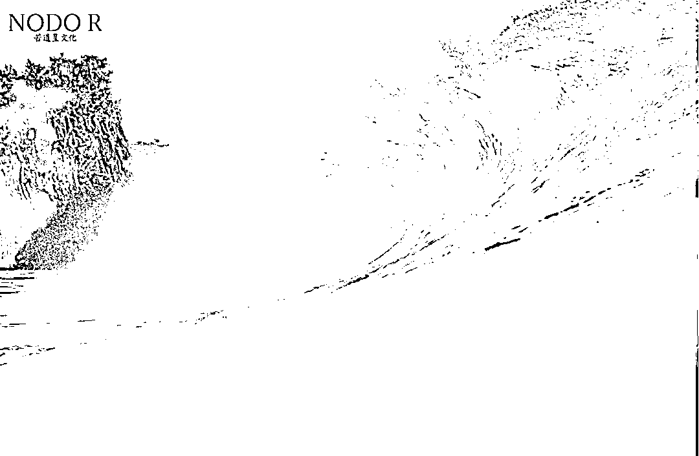

他家庭的原型情境后来通过他与朋友们的妻子的习惯性婚外情而重复上演。**通过再现童年的困境，弗兰克试图解决过去未完成的议题。**由于他对没能拯救父母的婚姻而感到愧疚，他被迫重述了童年的场景。每段婚外情，他都希望有不同的结果。也就是说，女方会觉得有力量去挺身对抗并改变丈夫。

**弗兰克假设不幸婚姻的主要问题是强势的男性和消极的女性，由此投射他的情结。他潜入婚姻，通过扮演智慧而全能的顾问（太阳-木星落白羊座），再次履行了他惯常的建议者/帮助者的角色**。他没有意识到自己也表现出了某些父亲的负面特质。

闯入同事的婚姻，占有妻子的爱，是**自私和侵略**，正如他的父亲一般。同时，他将自己设定为符合他母亲的角色。**当女性不愿离开她们的婚姻时，弗兰克最后会觉得被利用、不被爱，沦为受害者，正如她母亲感到被迫害一样**。意识层面上，弗兰克的意图是善良的。他想要帮忙。然而，只要他是妻子们关注的对象，弗兰克就会变成麻烦，而不是夫妻婚姻问题的解药，这样进一步巩固了他源于儿时未能帮助母亲的愧疚。这是一个恶性循环，一种诅咒，迫使他的行为违背了他的道德准则。记得**情结带有这种重复、强迫的特质，将类似的经历反复覆盖在某个核心原型之上。****曾对别人做过的事会发生在自己身上****起初，情结以造成精神或肉体痛苦的童年事件的模式展现**。由于我们自身的经历，我们不太会以我们明知可能带来伤害的方式对待他人。但**如果一段创伤经历造成的痛苦一直被压抑，那么可能会以两种方式无意识地展现**： ❶ 我们会将伤害性的行为投射到他人身上，继续扮演受害者；❷ 我们会远离受害者的角色，以我们被对待的方式对待他人。**在意识层面，人格会通过反向补偿来抵御这种负面的自我认知**。这可以通过一系列防御实现：**全能的控制、夸大、理想化、投射性认同、消极转积极、反向形成、分裂、贬低、否认、幻想，以及毁灭一切**，这些构成了**补偿策略**，**抵御痛苦的自我认知**。

在所有情况下，痛苦的想法或感觉有意识地被相反的想法或感觉所取代。记得荣格曾强调意识和无意识的补偿本质。荣格认为，**意识层面任何极端的表现如果是真的，那么潜意识层面也同样存在截然相反的情况。**

**虽然这种防御策略有助于维护自尊，但是它们也阻碍了对情结所关注的功课的学习。**弗兰克的案例中，他通过认同相反的性格，来回应父亲的侵略；因此，他与母亲的痛苦产生共鸣，将自己视为拯救者，而不是施害者。可是用这种方式，他无法意识到自己自私、好斗的倾向。

只要消极观念——病态信念依然处于无意识的状态，那么它们就会继续制造重复童年原型的经历。强迫性重复或许部分是为了赎罪。儿童容易相信他们活该遭受发生在他们身上的一切。当那种念头生根，个体会继续做出决定，吸引有类似性质的痛苦经历，希望反驳潜在的病态信念。或许，自我挫败、自我剥夺的行为会持续到个体觉得自己偿清了债为止，完成了赎罪。这也被称为**补偿法则**。**我们曾对别人做过的事，现在发生在我们自己身上。**

在弗兰克的案例中，他不断遇到他视为强大、自私、麻木的父亲般的男性，和沦为男性受害者的女性。他一次又一次设计自己，再次体验童年无法从施虐的男性权威手中拯救女性受害者的失败困境，却并没有意识到他的情事正是他**自恋的权利意识**的证据。

当女人们要回到她们丈夫身边时，弗兰克会觉得无能和失败，如同他在原生家庭中经历的一样。无意识中，他觉得这是自己应得的。我们可以推测弗兰克的正义的侵略及自恋的权利有关（太阳和木星在白羊座合相），其他男性似乎以他为牺牲品体现了这些特质。

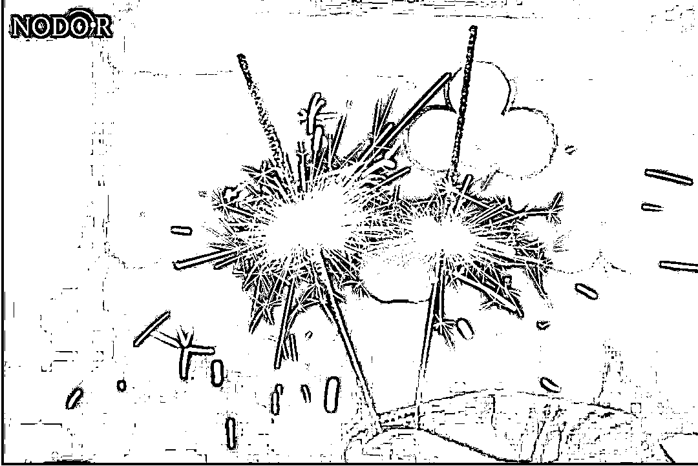

**我经历那些就是为了神的恩典**

想要克服与原谅情结，为此，个体必须**对其未满足的需求所带来的痛苦保持敞开，开始觉察病态信念，并且看到这些信念如何依次让你长期深陷心理问题中，承受随之而来的痛苦。** 
每个节点都是一个**原谅**的机会，**首先是原谅自己，然后是相关的施害者**。自我原谅最重要，因为在深层的精神层面，必须忍受痛苦确实让人感觉到悲伤。原谅需要**“让自己脱身”**，允许自己不再无休止地为家长的行为或不幸负责。而且如果我们没有责任，就可以不再寻找父母的替代品，与替代者重演这种挣扎。

对弗兰克而言，这意味着驳斥导致他愧疚的两种病态信念： ❶ 不能保护他的母亲；❷ 不能赢得他父亲的爱与认同。如果弗兰克可以释放这些固执的观念，他就能在情绪上体会童年的悲剧了。**一旦负面想法被驳斥，所有与之相连的痛苦也进入了意识之中**。过去被压抑的情绪终于得以释放；水闸开启，泪水泛滥，悲伤肆意，从灵魂深处涌出的情绪疗愈的洪流冲刷着此人。原谅自己能够让弗兰克不再把自私和麻木投射到其他男性身上，因为他不再需要再现童年的经历了。同样，这也意味着**允许自己拥有比父母更好的关系**。

这个原谅自己的过程是神秘的，因为无法预测或强迫。我想只有本人知道何时准备好了，尽管相关行星配置的行进和次限常常会显示出是否准备就绪。原谅与康复紧密相关。关键的因素在于允许个人的痛苦和愧疚完全进入意识，但不会认同——也就是说，**放下**。这是疗愈的关键。

比如，弗兰克由于无法减轻母亲的苦难或赢得父亲的认同，而需要感受痛苦。通往过去的桥梁，常常是当前关系中与过去类似的痛苦。弗兰克痛苦的情史，只是他在原生家庭中经历的三角关系的延伸。

**这种痛苦与自爱密不可分，因为它需要以最大的慈悲接纳个人的痛苦**。在自我关爱（月亮）之下，人们发现了普世的慈悲（海王星），现在可以被延伸到施害者身上，无论施害的是父亲、母亲、兄弟姐妹、配偶、上司。

当然，**原谅不是道德上的认同**，**它并不意味着受害者免除了施害者对错误行为的责任，也不意味着我们应该继而和那个人重建关系**。更确切地说，原谅需要最基本的认知，即施害者也是普通人，有缺点、有局限，和自己一样会犯错。这样，对方不仅仅是造成痛苦的原因，也是我们救赎的管道。原谅让个体进入一种灵魂的境界，从超个人层面经历关系。关系不再仅仅属于个人，现在你可以感觉到，**“我经历那些就是为了神的恩典。”**这就是为何**海王星作为超个人的外行星象征着我们慈悲和原谅的能力。**

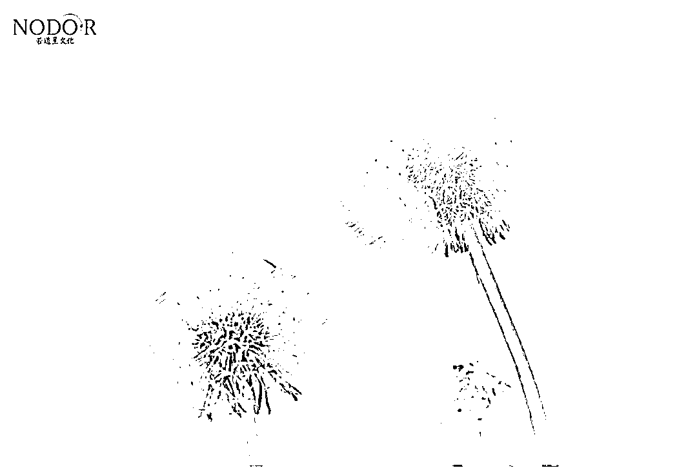

**情结在整合星图能量后开始积极起来****对施害者的同理心使得个体分裂的潜质得以恢复**。回想一下，对早期痛苦经历常见的典型回应是**应激或补偿**。我们无法对此产生同情。但是，这种不认同的过程必然需要否认部分原型——那些我们所爱的人以伤害的方式表现出的部分。比如，弗兰克不能认同父亲的自私、正义或傲慢——他的太阳与木星合相白羊座象征了这些特质。但是，**为了疗愈情结，必须柔化和破除人格的反应机制，重新吸收否定的部分**。**原谅施害者之时，我们真正地原谅了自己；原谅自己之时，我们也在原谅施害者。**两种进程不可分割。**当个体能在施害者身上找到自己的一部分，疗愈和整合就开始了**。弗兰克父亲身上最棘手的特质在弗兰克的星图上体现出来，因此，他也有这些问题，而不仅是他父亲。

**疗愈情结需要有意识地认同早期创伤的经历，因为创伤的核心是原型体，包含光明与黑暗的双面潜质。**为了重见光明，我们必须面对黑暗。**虽然心理防御机制导致有意识的人格走向反向的极端，远离（无意识的）情结，疗愈却需要回到阴暗面，重新整合，但带着对破坏性潜质的全新觉知**。

但是相反，自我极化所造成的情结，丧失了情结中积极的潜质。婴儿连同洗澡水一起被倒掉了。**只有臣服于自我的补偿性防御机制，个体才能有意识地接近构成情结的原型结构**。否则，它就会迫使个体走向极端。个体会出现两种情况：❶ 将情结中的负面特质投射到他人身上，自己（再次）扮演受害者的角色；❷ 无意识地认同情结，（再次）加害别人来演出情结。如果弗兰克不再将侵略、支配和麻木投射到其他男性身上，他必须首先认同自己在这方面的倾向，好像说“我也会贬低他人、毫无耐心、自私自立、武断教条、麻木不仁”等等。

和星图上的所有其他部分一样，情结本来就有**积极**的潜质。弗兰克要想找回他遗失的潜质，就需要认同他的白羊座星群，与他过度发展的月亮-海王星面向达成平衡。一言以蔽之，**整合是重建灵魂的平衡，通过结合对立面，让心智的两个面向都变得丰富而节制**。

弗兰克的功课关乎平衡力量和优雅（AbG）、自主和亲密（AbG）、个性和归属（NbM）、意图和臣服（NbU）、教导与倾听（RbM）、正义和评判，以及谦逊和慈悲（RbU），还有其他很多由白羊座和天秤座对分相所涵盖的相关二元性。随着这些原型冲突的解决，显露出的特质得以释放。新的特性和能力诞生了，相比两边的行星和星座各自象征的特质和能力，它们具有更好的适应性。出生星图中的精神病理学可以通过荣格的情结概念来理解。这些充满情绪的灵魂实体由压抑的想法和冲动构成。情结像精神磁铁一般，吸引与个体内在固有观念一致的经历。个体在外部事件和关系的表象之下不断遭遇自己。如果想要疗愈情结，那么我们需要允许痛苦的经历最大程度地作用于意识，然后原谅自己和施害者，整合分裂的部分。

**版权声明：**原创文章由若道翻译发布，欢迎转发，反对抄袭。友号转载请申请白名单。

**END****格伦·佩里**著名占星师，ISAR 董事会成员，共出版八本占星著作；心理/意识研究专业博士；占星心理学学院（Academy of AstroPsychology）的创办人；康涅狄格州研究生院（the Graduate Institute of Connecticut）原型宇宙学与意识进化项目的负责人。

# ****占星原型与星图中的精神病理学****

**为什么在占星学的课程中，会出现精神病理学的教学内容，这和我们有什么关系？这对占星咨询，或在自我了解与成长的过程中又有什么帮助呢？**

****带着这些疑问，请你静下心来，思考以下几个问题**：**

**“******你/你的案主，是否曾经过度担心什么？**** ****你/你的案主，有没有感觉到担忧和焦虑，却不知道原因是什么？********你/你的案主，是否曾经觉得害怕什么东西，但理智上却很清楚它不会对你造成什么伤害？********你/你的案主，是否曾经通过沉迷某物，酗酒或滥用药物，自我伤害去逃避问题？********……********——节选改编自《心理学与生活》******”**

**如果你对上述问题其中之一，回答是。这意味着几乎每个人都曾有过心理障碍的症状（精神病理的问题）。**

**你看，其实“精神病理学”与人的心理有着密切的关联，再结合占星学，呈现了人内在与外在层面更加丰富和深刻的一面。**这对于学习占星学的人和占星师来说，都是一场难得的知识盛宴！****

****本课为 2 年期双证核心课程中的一部分**（AP105 阶段），其内容是过去若道所开设的核心课程从未教授的部分，特意抽出供其他学员学习，******可作为 ISAR 选修课，单独报名。****

****点击下方图片了解详情****

**

**今晚的直播，****快来预约吧**

<mpvideosnap class="js_uneditable custom_select_card channels_live_iframe" data-pluginname="videosnap" data-headimgurl="https://wx.qlogo.cn/finderhead/PiajxSqBRaEJYnVsqWfEX9qA0sI6hNVKsDfyzfPZ92WZMZyBpZWU5NA/0" data-username="v2_060000231003b20faec8c4e68a1ec2d4ca07e434b07755bbf47e7053a3059defd2c9d6c68a20@finder" data-nickname="若道" data-desc="将在 12 月 15 日 20:00 直播" data-intro="若道核心课程 L1-2 学员研讨小组分享第 4 场 月亮星座-读懂你的内在" data-noticeid="finderlivenotice-v2_060000231003b20faec8c4e68a1ec2d4ca07e434b07755bbf47e7053a3059defd2c9d6c68a20@finder-1670222853257737-1986784773" data-type="live"></mpvideosnap>**快年底了****不给自己一份来自占星学的礼物吗？**

**梅里曼金融报告双 12 福利来啦！****长按下图了解更多详情吧！**

**快来领取你的 2023 年运报告吧！**

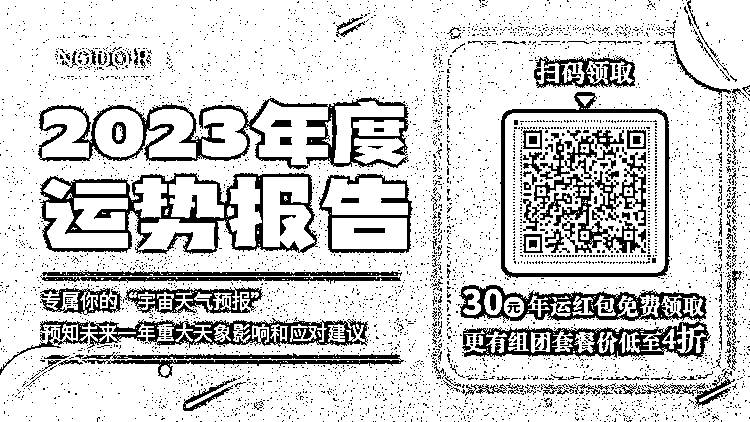

**20 位来自世界各地的占星师****带来 19 场沙龙——新世界的觉醒****详情可点击下图**

**学习占星学****点击下图了解课程详情**

**微信又双叒叕改版啦，不想错过若道君的推送？**
****就把若道设为****星标****以及点点****“在看”****吧！******▼**

**喜欢就点一下“在看”吧！****报名直达入口**

# 周五开讲丨 2023 天象预测大师课 ：宇宙都将发生哪些大事？

> 原文：[`mp.weixin.qq.com/s?__biz=MzA5NjA0NTAxNg==&mid=2651496884&idx=2&sn=805aa1c61af3f1c90dd37b03c16fa6bd&chksm=8b481303bc3f9a15160a706a6978701ef151eea8571d2608463be463feaa197888e3fc01faf5&scene=126&sessionid=1692737710#rd`](http://mp.weixin.qq.com/s?__biz=MzA5NjA0NTAxNg==&mid=2651496884&idx=2&sn=805aa1c61af3f1c90dd37b03c16fa6bd&chksm=8b481303bc3f9a15160a706a6978701ef151eea8571d2608463be463feaa197888e3fc01faf5&scene=126&sessionid=1692737710#rd)

2022 年已接近尾声，忙碌的年末工作也挡不住我们对来年的盼望和期许。

作为占星师，在年初跟随权威老师透彻的学习 2023 年重要天象的含义和影响是迎接新的一年的正确姿势，仪式感满满！

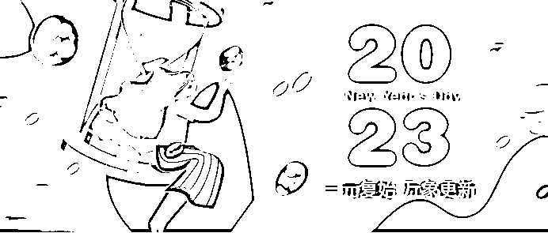

若道邀请了金牌核心课中的 4 位国际名师再次集结，在**2022 年 12 月 16 日-18 日**带来**2023 年重大天象的深入解读：从冥王星、土星、木星换座；金星逆行；土星在双鱼座等角度切入，洞悉大环境的变换趋势、时事格局，为新一年的自我规划和占星事业加油充电。**

**课程时间安排**

**2022 年 12 月 16 日 周五**

**20:00-22:00 ****克里斯蒂娜·罗登贝克****2022 年 12 月 17 日 周六****16:00-18:00 ****艾德里安·邓肯**（休息 30 分钟）**18:30-20:30 ****大卫·瑞雷****2022 年 12 月 18 日 周日****18:30-20:30 ****琳恩·贝尔****课程内容安排**

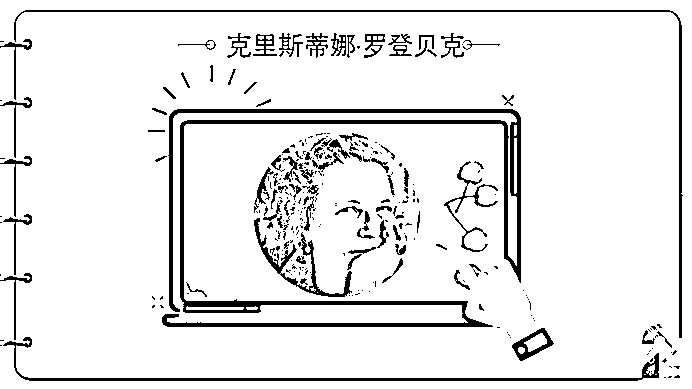

**12 月 16 日 周五**

**20:00-22:00** **宇宙的舞者：****2023 年的冥王星、土星和木星**

**2023 年是这 10 年中最重要的年份之一，标志着一个时代开始落幕。**冥界的黑暗之主冥王星自 2008 年以来一直在摩羯座行进，它将在 2023 年离开摩羯座，能量会发生重大转变。

**在接下来的 20 年里，冥王星会在下一个星座水瓶座行进，影响整个时代。**但对于冥王星来说，进入水瓶座并不容易，或者说并不顺利。**在接下来的 2 年，冥王星会 2 次重返摩羯座，2023 年 6 月它将首次重回摩羯座。**这看起来在个人层面和全球层面都会是**动荡和调整的混乱时期。** 
就在冥王星首次换座的同一个月，**另一颗强大的行星土星也会离开自己的家园，进入没有边界的双鱼座，结束在水瓶座为期 2 年的限制和制定规则时期**。与此同时，**木星这颗与扩张和幸运相关的行星，也会在 2023 年春天换座，从火热的白羊座跃入金牛座更坚实的土地之上。**2023 年有望成为与重大改变相关的一年，这就是为什么了解这些重大行星事件的时间对于规划未来一年至关重要的原因。

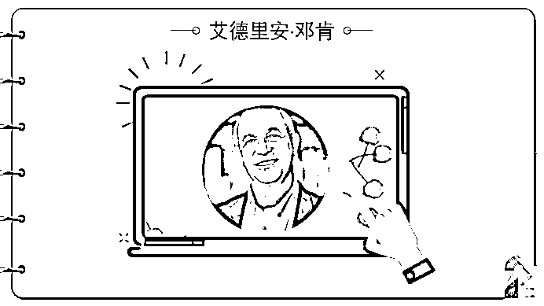

**12 月 17 日 周六**

**16:00-18:00 2023 年的爱与戏剧性**如果男人来自火星，女人来自金星，那么我们应该能通过密切关注 2023 年金星和火星之间的相位来见证它们的热烈拥抱。当金星和地球围绕太阳相对运行时，金星会表演一场华丽的舞蹈，在 8 年的时间里形成 5 个逆行环路，在天空中勾勒出了一朵完美的玫瑰花。每 1 片或 5 片花瓣的尖端按顺序以几乎完全相同的度数在这 5 个星座中出现：双鱼座、天秤座、双子座、摩羯座，以及——在 2023 年落在狮子座。**2023 年将会是充满戏剧性和浪漫的一年。**

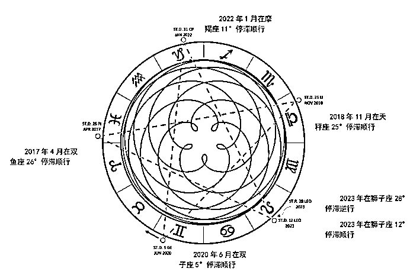

在此次课程中，我们将跟随**金星和火星在 2023 年的运行**，特别是**6 月 5 日，金星进入狮子座，7 月 23 日在狮子座 28°逆行，到 10 月 9 日才离开狮子座这段时间。**这是漫长的 4 个月。**火星会在 5 月 20 日进入狮子座，7 月 10 日离开。** 
由于金星的运行速度通常是火星的 2 倍，你会期待它们在狮子座形成一次重要合相。但金星会逆行，与火星的浪漫相遇不会有一个愉快的结局。**在 2023 年夏天，金星和火星会给我们讲述一个什么样的爱与关系的故事呢？**  还有一个更复杂的天象。**3 月 23 日，冥王星进入水瓶座，在 1°左右徘徊，直到 6 月 11 日。**这是自 245 年前的 1778 年 6 月-8 月以来，首次先是火星，然后是金星在狮子座对分冥王星，而 245 年前美国正处于独立战争时期。

2023 年冥王星进入水瓶座，接下来的 20 年里，每当金星与冥王星形成相位时，都会改变浪漫的本质。最后，因为金星在狮子座逆行，在狮子座来来回回移动，所以它会与在金牛座的天王星形成三次四分相，与刚刚进入金牛座的木星形成三次四分相。

**这些征象与高度特权、富有和极端独立自主的行为相关。**我们都可以在 2023 年期待激动人心的浪漫爱情，但对于那些金星和火星强大的人来说，将会有盛大的烟花表演！

**12 月 17 日 周六  18:30-20:30 大卫· 瑞雷分析新一年的时事趋势**  **涵盖的趋势和主题包括：**

**· 火星在双子座逆行**——最后一次四分海王星！2023 年前 3 个月，信息战继续升温；谁在欺骗谁？世界上武装冲突的噪音。

**· 冥王星进入水瓶座**——改变“一与多”之间的关系。由贡献和参与定义身份，以及排斥和包容的副作用。权力和资源的重新分配，以及世界面临的挑战。

**· ****土星在双鱼座**——以不可能的方式将想象变成现实； **· 再谈木星在白羊座**——谁从武装冲突中受益？ **· 木星进入金牛座，四分冥王星**——面对贫富差距，然后在狮子座的金星在逆行期间三次四分木星；

· **火星-冥王星相位**——对分冥王星，三分冥王星，四分冥王星· **情人节那天，金星入相位合相海王星**——这是宇宙天气和文化传统之间一次罕见的一致

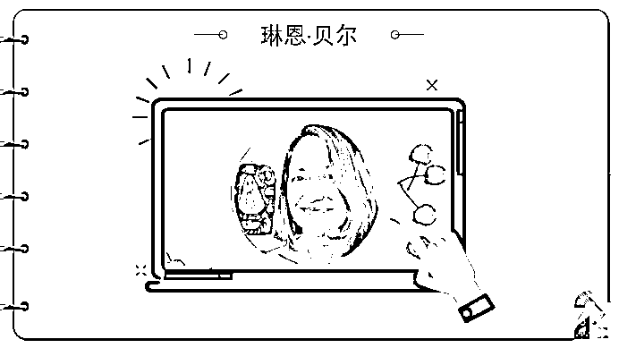

**12 月 18 日 周日 18:30 – 20:30 土星在双鱼座：消融边界**

过去 5 年，土星一直在它的“家园”摩羯座和水瓶座中行进。2023 年 3 月 7 日，它将进入双鱼座这片湿滑之地，加速旧边界的消融，改变我们对世界的看法。

**土星在双鱼座需要对看不见的东西有信心，并且经常要求我们放下曾经看起来坚实可靠的东西。旧的确定性受到挑战，可能需要做出牺牲。** 
土星在双鱼座帮助我们**放下过时的依恋，意识到那些并不支持我们的东西。**它能给我们勇气，让我们头朝下跳入水中。一旦土星越过星座边界，它会在双鱼座逗留到 2025 年 5 月。我们会看一看这段旅程的馈赠，同时也看一看它可能存在的隐患。

土星换座后不久，冥王星会进入水瓶座，仅仅在 2023 年开始后 8 周的时间。**冥王星换座会带来全球范围内权力分配的变化。它可能是技术进步的先兆。**这个时期，集体的需求可能比个人的需求更强烈。一个新的世界正在崛起，一个旧的世界正沉没到波涛之下。 **讲师是谁？**

**克里斯蒂娜·罗登贝克（Christina Rodenbeck）**

· 全职职业占星师，在牛津大学城生活和工作，深受周围知识和文化氛围影响；她拥有伦敦大学（University of London）的人文荣誉学位，曾在伦敦占星学馆（Astrological Lodge of London）、心理占星中心和占星研究学院学习。  **· **作为一名占星师，在过去的 20 年里，克里斯蒂娜在她的网站“牛津占星师”上写了大量关于时事、艺术和文化的文章；她每月主持一个占星播客：“与克里斯蒂娜和萨莉一起占星”，并定期在《占星杂志》(Astrological Journal)上撰写时尚专栏；她定期在英国授课，并保持着蓬勃发展的专业实践。
**艾德里安·罗斯·邓肯（Adrian Ross Duncan）****· **1971 年在印度游学时开始学习占星学，1985 年开始成为全职占星师，迄今执业已超过 33 年，是人本主义占星学、卜卦占星学和经世占星学领域的知名占星师。他还开发了占星软件 AstroClock 和多款占星报告。**· **他在日常咨询中经常运用卜卦，咨询图（卜卦的一种运用方式，即根据客户来访时间制作星图，从星图中获得大量信息）也是他特别擅长的领域。**· **从 1971 年开始研习佛学，受佛学影响很深，他相信占星学和佛学观点一致，转化的一个基础是在于对现实感知的改变。而卜卦很容易与佛教融合，因为它只关乎当下。

**大卫·瑞雷（David Railey）**

**· **若道联合创始人，致力于在中国教授和推广西方占星学。**· **曾任 ISAR 全球副主席，CAPISAR（ISAR 职业占星师资质认证机构）主席；**· **1976 年，通过亚特兰大职业占星师考试，成为全职占星师，随后通过 AFAN 和 ISAR 职业测试；**· **1980 年，与杰夫·焦耳一起在亚特兰大创建“每日行星”占星学中心。此后在亚特兰大占星协会担任 4 年考官，并且两次担任亚特兰大地区占星协会主席。1979-1992 年，作为占星师活跃于美国社会媒体，向不了解现代占星学变化的大众宣传专业占星学知识。

在 1989-1992 年期间，他在 WRGG 电台 12 频道每周主持个人电视秀“今日占星学”，早先他还在 WRFG 的广播节目中播讲宇宙天气节目；

**· **2010 年-2014 年，任全美占星师联盟监督委员会委员；

**· **2010 年，其著作《灵魂的目标》中国版出版，和蒋颖一起创办若道占星学校和其官网 www.nodoor.com。

**· **2017 年，被选为 ISAR 委员会成员。ISAR 是世界最大的国际占星机构，会员遍布 45 个国家，2017-2020 年曾任 ISAR 全球副主席、CAPISAR（ISAR 职业占星师资质认证机构）主席。

**琳恩·贝尔（Lynn Bell）**

**· **世界受欢迎的占星学演讲者、作家和老师之一。定居巴黎，研究心理占星学和家族模式数十年。**·** 著名的心理占星学中心（*Centre for Psychological Astrology*）的长期导师。2016 年，获得查尔斯·哈维（Charles Harvey）杰出的占星学服务奖。**· **作为一个从多个层面进行工作的占星咨询大师，琳恩的工作结合了心理学的观点。她对家族模式的兴趣首先来自与客户的合作。通过在分析领域所做的个人工作，她所受的埃里克森催眠训练将她引领至家族系统。后来，她组织研究小组在家族星图上进行了数年的研究。她写的《家族占星学》就是这项研究的结果。**· **法国心理占星学协会会长。除了占星学，她在法国沙特尔的新沙特尔学校任教 8 年，还 5 次获得了在《纽约时报》畅销书作者卡罗琳·迈斯（Caroline Myss）的卡罗琳·迈斯教育学院（*Caroline Myss Educational Institute*）合作教学的机会。**课程价格**

**正价：3000 元 限量优惠价：2023 元（前 60 名报满截止）** 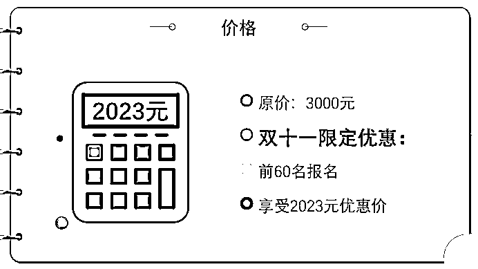

**惊喜联报套餐！！**

**《ISAR 选修课 | 预测、预期与意识成长》+《2023 年度天象预测大师课》+《2023 年金融占星预报》****三门联报优惠价 8000 元****（限前 50 名联报）（联系 Maggie 老师，抢占限量优惠价）**

长按二维码添加 Maggie 老师获取联报优惠价

**退转课程**

**退款原则请详看《教学协议》，如有疑问请咨询课程顾问**

****2023 年度天象预测名师课****

**授课老师：****克里斯蒂娜·罗登贝克 艾德里安·邓肯 大卫·瑞雷 琳恩·贝尔**

**直播课开课时间：**2022 年 12 月 16 日-18 日

**授课方式：**网络课程，中英文授课，中文翻译

**费用：****正价 3000 元 限量优惠价 2023 元（前 60 名报满截止）**

**课程负责人：**Maggie（微信：NodoorMaggie 请备注“2023 天象预测名师课”）

长按二维码添加课程负责人咨询~

**报名直达入口**

# 今晚直播：我的太阳故事

> 原文：[`mp.weixin.qq.com/s?__biz=MzA5NjA0NTAxNg==&mid=2651496884&idx=3&sn=880a3783561b63a1c6b13af38c432cbd&chksm=8b481303bc3f9a15ed0db76a45b14ab4550ed3af14b82cd84f9e5eb332a4be6da7143287b1f7&scene=126&sessionid=1692737710#rd`](http://mp.weixin.qq.com/s?__biz=MzA5NjA0NTAxNg==&mid=2651496884&idx=3&sn=880a3783561b63a1c6b13af38c432cbd&chksm=8b481303bc3f9a15ed0db76a45b14ab4550ed3af14b82cd84f9e5eb332a4be6da7143287b1f7&scene=126&sessionid=1692737710#rd)

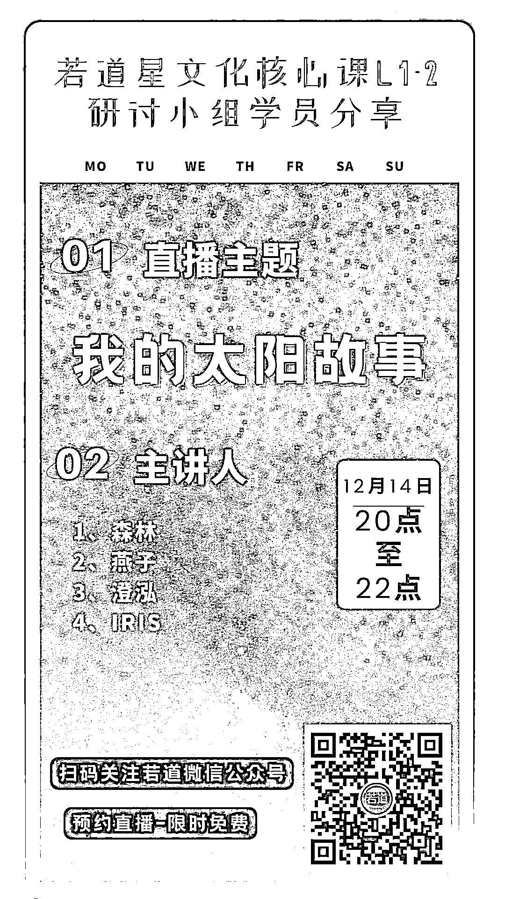

<mpvideosnap class="js_uneditable custom_select_card channels_live_iframe" data-pluginname="videosnap" data-headimgurl="https://wx.qlogo.cn/finderhead/PiajxSqBRaEJYnVsqWfEX9qA0sI6hNVKsDfyzfPZ92WZMZyBpZWU5NA/0" data-username="v2_060000231003b20faec8c4e68a1ec2d4ca07e434b07755bbf47e7053a3059defd2c9d6c68a20@finder" data-nickname="若道" data-desc="将在 12 月 14 日 20:00 直播" data-intro="若道核心课程 L1-2 学员研讨分享 第三场  我的太阳故事" data-noticeid="finderlivenotice-v2_060000231003b20faec8c4e68a1ec2d4ca07e434b07755bbf47e7053a3059defd2c9d6c68a20@finder-1670222711600302-2078202358" data-type="live"></mpvideosnap>

# “什么时候会好起来？”丨站在 2022 年的最后一个月，让我们共同展望前路

> 原文：[`mp.weixin.qq.com/s?__biz=MzA5NjA0NTAxNg==&mid=2651496884&idx=1&sn=39a7cbc2f77142d6d9ec0afaed7e63bf&chksm=8b481303bc3f9a15b4687a68518bb599e21685bade932733f8beb588d177f3ad90e7ef78671e&scene=126&sessionid=1692737710#rd`](http://mp.weixin.qq.com/s?__biz=MzA5NjA0NTAxNg==&mid=2651496884&idx=1&sn=39a7cbc2f77142d6d9ec0afaed7e63bf&chksm=8b481303bc3f9a15b4687a68518bb599e21685bade932733f8beb588d177f3ad90e7ef78671e&scene=126&sessionid=1692737710#rd)

******☆ ****后台回复“今日”，给你一句生命态度******

作者/朵三三三 ISAR 认证占星师
编辑/翀子 封面/书君 图片/稿定设计 2022 年的年末，我们迎来不少变化。在回顾让人印象深刻的 2022 年时，我们对 2023 年可以有哪些展望？随着木星、土星、冥王星在 2023 年的运行脚步，我们又能遇见怎样的生机？来看文章吧！**近期天象回顾**

在 12 月 8 日，双子座满月和日火对分发生的前一天，“新十条”发布，三年疫情防控的长跑终于抵达了终点。

而所有的终点亦是起点，于是，我们又开始进入到新一轮挑战中，从怕被封控的恐惧，变成了怕感染的焦虑。但凡是变化，皆为希望，“一切无可回避的痛苦，都是改变的开始。”

跟我们人生中的困顿起伏一样无穷无尽，这一关结束，马上又有下一关等着。但重要的是，我们从来不会在原地打转，因为没有一次苦难完全相同。时间是条单行道，我们能做的就是一直向前走，不要回头。

**火星在双子座逆行带来的混乱终于在这个 12 月达到了峰值，**政策的 180 度大转弯，全面放开，并急速猛冲与它有关，世界的忙碌与无序，焦灼与躁动也与它有关。

**双子座的能量让我们出现被信息轰炸的可能，**不停想要关注最新状况，与朋友和家人互通有无。各路小道消息也会层出不穷，比如关于“阳了”的段子，完全没有创作瓶颈期，有人说又到了段子手们的高光时刻，场面之大堪比春晚。

而我的感受是，真好，大家又有能量自我调侃了，终于又能笑出来了。我们终于走出密不透风的压抑，和汹涌澎湃的愤怒，又开始了苦中作乐的优良传统。

中国人民从来不缺乏笑对苦难的乐观和大智慧，我们也一直是讲究“天人合一、道法自然”的民族，关于接纳和共存这件事情，我们完全有能力做到最好。当下需要的只是一段时日，去渐渐过渡到心平气和，波澜不惊的状态。

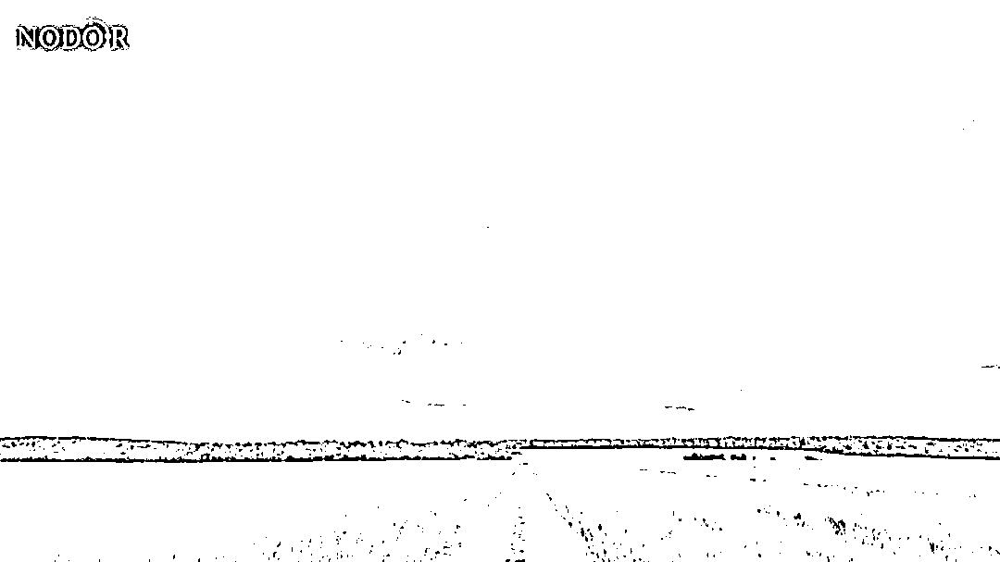

**木星进白羊座**

首先，**木星在 12 月 20 日进入白羊座。**社会大环境方面，结束了木星在双鱼座时的发散、无边界和迷茫感，变得更加有目标感和行动力。

对应到疫情来说，人们会从慌乱无措的情绪中走出来，不再盲目囤药，或相信大大小小的偏方，而是能够从第一波阳性感染者的经历中总结出宝贵经验，有针对性地进行防护和治疗。

木星总是代表着我们相信什么，在白羊座时，也会出现更加**乐观向上**的氛围，尽管现实状况依然严峻，**但心态和精神层面上，大家都能感到更加轻松，积极，有希望。**

白羊座木星也有望再度掀起一股全民健身热潮，尤其是在疫情即将席卷全国的情形下，所有人都会自然重视起运动锻炼这件事。

木星受到双子座火星的定位，到时，媒体宣传口径或许发生转向，也会有很多人开始摒弃掉，在双鱼座木星时期形成的对于药物的心理依赖，而是选择动起来，提升自身免疫力。

**火星的行进**

其次，**火星将在 2023 年 1 月中旬于双子座恢复顺行，**会逐渐暴露出一波在火星逆行期间存在的漏洞和问题。**2、3 月份，火星逐步靠近与海王星的四分相时，**大约会出现更大规模的病毒传播。

双子座火星也刚好对应了肺部、呼吸系统的上火和炎症，所以等到火星 3 月底离开双子座、进入巨蟹座之后，可能有明显好转，病毒的传播速度有望大幅度降低，感染人数也会逐步下降。

而在这之前漫长的双子座火星时期，即便没有身处病中，相信大家依然能对这种干渴、煎熬感同身受。我们都在生命的不同领域中接受着考验，而这种正折磨着每个人的灼烧感，便是我们注定要穿越的一道火线。唯有如此，才能到达彼岸。

面对已经发生、存在、无法改变的困苦，除了接纳，没有任何更好的办法。

真实的人生亦然，若我们一直想方设法回避、屏蔽那些痛苦的感觉，企图与之隔离，确实可以麻木自己，拖延一些时日。但这样做只会陷入自我禁锢的境地，能量开始凝滞、僵化、不再流动，我们也只能画地为牢，失去成长的可能性。

**而唯有敢于看见它，承认它，直面它，敞开胸怀拥抱它，生命才会前往下一个自由之地。**

如同现在，我们共患难，共历劫，也勇敢承担起我们的共业。我们完全可以预期一个全新的未来：渡过这片烈焰海峡，抵达水草丰美之地。

**木星进入金牛座**

**2023 年 5 月中旬，木星进入金牛座，**便是这样一片水草丰美之地。这是一个值得期待的富饶天象：金牛座是衣食住行，是一蔬一饭，是物质与金钱，也是踏实和安稳。

**木星换座金牛座，对于疫情时代后的经济复苏有着重要意义。**

它对于跟金牛座直接相关的农业、金融理财行业、房地产行业、餐饮业都极其有利，对于满足人们日常生活需求的服务行业、以及满足人们审美价值需求的艺术类行业也十分友好，这些领域很可能会重现欣欣向荣的姿态，整体财经状况也有望持续成长。另外，金牛能量是非常接地气的，实实在在的，大家也会更偏好于看得见摸得着的事物，所以线下实体经济也很可能因此回暖，市井生活重现街头，城市恢复繁华景象。

只是，金牛座的节奏总是缓慢的，保守的，所以木星换座之后，不会立即出现迅猛的改变，而是步履稳健，脚踏实地的慢慢发芽开花。

疫情三年让很多人物欲降低，真正学会了断舍离，给生命做减法。我们逐渐懂得了“少即是多”，不再一直看向那些得不到的，而是转而珍惜当下拥有的。因为真正的丰盛从不取决于我们拥有多少，而在于我们的内在有多知足。

相信等木星进入金牛座之后，在一日三餐，炊烟袅袅的红尘之中，我们更能体会到什么是幸福，什么是富有，什么是真正的满足感。

**土星进入双鱼座**

最后，**2023 年 3 月的土星换座双鱼座**，对于我们国家来说也至关重要。

国家星图的上升点位于水瓶座初度，自 2020 年初土星进入水瓶座以来，大家一起渡过了重重难关。对于这样的一个人口大国来说，应对疫情多出了许多艰难之处，和需要额外考量的因素。所以，土星换座水瓶座时，这场在全世界范围内发生的疫情，对于我们国家来说，变成了一个难度翻倍的题目。

过去两年多的时光中，我们一同艰难跋涉，走过这段晦暗岁月。**当土星进入双鱼座时**，土星的约束与边界，对于双鱼座蕴含的蔓延、扩散这种与传染病相关的能量，可以起到扼制作用，非常可能成为整体疫情走势的重要转折点。这也意味着，我们就快完成一个重要课题，接下来即将迈入新的征程，开启新的篇章。

在国家星图中，大部分重要行星均落在基本星座和固定星座，所以当土星进入双鱼座（变动星座）时，我们受到的冲击力相对较轻，这个严厉的土星导师对这片刚经受过暴风雨的土地也会更加温柔一些。

只是宇宙不会让大家轻松太久，**2023 年 4 月，冥王星也离开了自己运行了 15 年的摩羯座，**来到水瓶座初度。冥王星导师的必修课可一点不比土爹的课轻松，我们注定会迎来一场新的风暴与蜕变重生。

别怕失去，那是清理，别怕哀痛，那是生机。

让我们继续向前吧，接受命运的洗礼！

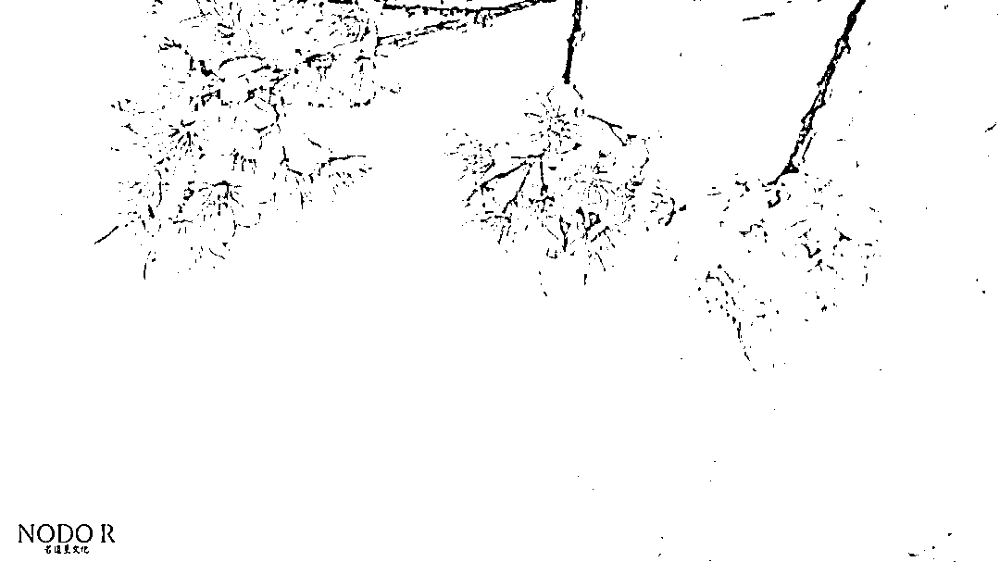

**写在最后**

近日来，大约与走木星和土星的行运有关，我总在想，要如何承担起自己的使命感和责任感？世界需要我做些什么，而我又能为这个世界做些什么？

适逢双子座火星逆行在 1 宫，在每日的工作中，我一刻不停地书写着自己的内心，也努力用文字照亮他人，让我们彼此看见，让你们知道自己绝不是一个人。

在这个人间，我们总有经历不完的伤痛，无休无止的苦楚，那么就不要再去想尽头，一如这个世界没有尽头。

**但我们总有勇气比身边的阴影更亮一些，即便身处黑暗，却心体澄澈。我绝不是黑暗本身，也不会被黑暗吞没。**

在火星的逆行期，宇宙能量整体是不稳定的。我们很容易陷入忙碌之中，不停赶进度，越想要完成、追赶一些什么，却会发现任务越来越多，越难完成。安住于当下这一刻，是关键解法。不去想未来要做什么，也不去想过去完成了多少，我们只专心致志，投入在此时此地。

**水星和火星之间的联结也会扰乱我们的思绪，**内在无法安宁，很容易只停留在头脑层面、意识层面，而很难与心灵和潜意识层面做链接。我们需要时不时的与世界断开，与真真假假的信息断开，不让自己湮没其中。

失去耐心时，向内去探索愤怒的源头，一直问自己为什么，直到看见它为止。

我们可以在这个时期多做冥想，多做正念练习，多打坐。只要你愿意，便可以随时回归内在的那片心湖，那里永远是宁静的，平和的，天青水蓝。

如同塔罗里的倒吊人一样，即便在煎熬和苦难中，依然能够安宁而坦然地去看这个世界。他是耶稣，是佛陀，是我们最初降临人间时携带的伤痛，也是我们最终离开尘世时的归宿。

我也始终在情绪翻涌中寻找着自己的路，每个人都是这样，孤独又跌跌撞撞地走着。

身体与心灵，总有一个在受苦，有的时候，是同时。

**而最终能拯救我们的，唯有信念。**对于个体来说，相信所有苦难皆有其独特的意义，便不再需要对任何他者或世界有信心。便能清晰地照见，要舍去什么，要顺从什么，要接受什么，要获得什么。

**要信任内在逐光的能量，会引领我们突破命运的限制，走向终极的自由。**

**版权声明**：原创文章由作者授权首发于若道平台发布，欢迎转发，反对抄袭。友号转载请申请白名单。

**END**

****朵三三三****

ISAR 认证占星师

全职占星师/塔罗师/国家三级心理咨询师 

人大文学学士/德国慕尼黑大学文学硕士

**微博/微信公众号**：朵三三三

长按打赏

**今晚直播，****快来预约吧**

、

<mpvideosnap class="js_uneditable custom_select_card channels_live_iframe" data-pluginname="videosnap" data-headimgurl="https://wx.qlogo.cn/finderhead/PiajxSqBRaEJYnVsqWfEX9qA0sI6hNVKsDfyzfPZ92WZMZyBpZWU5NA/0" data-username="v2_060000231003b20faec8c4e68a1ec2d4ca07e434b07755bbf47e7053a3059defd2c9d6c68a20@finder" data-nickname="若道" data-desc="将在 12 月 14 日 20:00 直播" data-intro="若道核心课程 L1-2 学员研讨分享 第三场  我的太阳故事" data-noticeid="finderlivenotice-v2_060000231003b20faec8c4e68a1ec2d4ca07e434b07755bbf47e7053a3059defd2c9d6c68a20@finder-1670222711600302-2078202358" data-type="live"></mpvideosnap>**快年底了****不给自己一份来自占星学的礼物吗？**

**梅里曼金融报告双 12 福利来啦！****长按下图了解更多详情吧！**

**快来领取你的 2023 年运报告吧！**

**20 位来自世界各地的占星师****带来 19 场沙龙——新世界的觉醒****详情可点击下图**

、

**学习占星学****点击下图了解课程详情**

**微信又双叒叕改版啦，不想错过若道君的推送？**
****就把若道设为****星标****以及点点****“在看”****吧！******▼**

**喜欢就点一下“在看”吧！****报名直达入口**

# 火逆这 7 个月，天天吵架真糟心！ | 和 12 星座好好说话的秘诀

> 原文：[`mp.weixin.qq.com/s?__biz=MzA5NjA0NTAxNg==&mid=2651496812&idx=1&sn=2d3a8732adfc4109c8c87c29e97ab309&chksm=8b4813dbbc3f9acd8a25a9c77c20137a492791d8cdcc0f591f6e3bd2a2e306c0da6c45f06700&scene=126&sessionid=1692737710#rd`](http://mp.weixin.qq.com/s?__biz=MzA5NjA0NTAxNg==&mid=2651496812&idx=1&sn=2d3a8732adfc4109c8c87c29e97ab309&chksm=8b4813dbbc3f9acd8a25a9c77c20137a492791d8cdcc0f591f6e3bd2a2e306c0da6c45f06700&scene=126&sessionid=1692737710#rd)

******☆ **后台回复“今日”，给你一句生命态度****

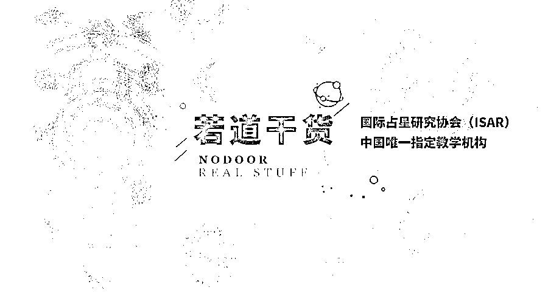

作者/Anastasia

编辑/玫瑰 封面/书君 图片/稿定设计

**火星逆行，纷争升级**近期，想必大家都吃了些情绪冲突的苦。立场对立，争吵不断，关系撕裂……人人都处在风口浪尖里，我们占星学子对此应该早有心理准备，毕竟**火星正在双子座逆行。****这次火星逆行从 10 月 30 日开始，将一直持续到 2023 年 1 月 13 日，逆行区间从双子座的 25°到 8°。因为顺逆转换的缘故，火星在双子座要停留将近 7 个月的时间，从 2022 年的 8 月 20 日直到 2023 年 3 月 25 日。**火星行经双子座，**人们的言语可能会充满攻击性，他们用不加控制的行动直接表达他们的想法，发泄情绪**。他们口无遮拦，充满狡诈，也不会考虑什么道德规章的约束。至于这种行为会带来什么样的冲突和后果，那并不是火星双子座要去考虑的事情。大部分人都不喜欢冲突，冲突会引发人们强烈的情绪，不管是愤怒、委屈、沮丧等等，这些情绪都给我们敲响了警铃，提醒我们一件重要的东西正在受到威胁。通常，人们不会想那么多，只会觉得自我受到了限制和侵犯，而任由情绪驱动行为，以至于犯下错误。有些人足够冷静和理性，他们常常能注意到情绪的升起，及时控制它，不让事态发酵。事后再找机会去消解掉。但长期压抑自己的情绪，往往会侵蚀我们的身心健康。情绪是坏事吗？有时候是的，否则也不会有“冲动是魔鬼”这句话。但情绪真的是坏的吗？**从本质上来说，情绪象征了一部分被压抑的自己。我们可以说，被情绪控制和驱动是坏事，但有情绪是好事。探索情绪，可以帮助我们看清情绪背后隐藏的真是欲望和需求。****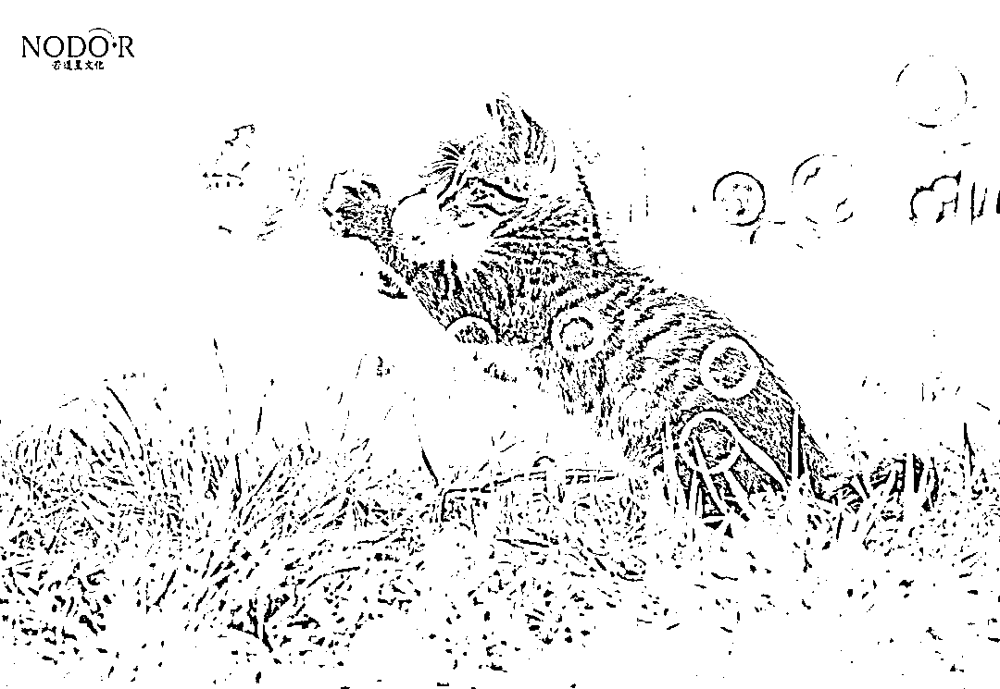**换句话说，暴露冲突比隐藏冲突更利于身心的健康。但情绪上头，立场不同就很难理性交流，大家只想证明自己是对的，抛开事实不谈，就会撕裂关系，颇有一些群魔乱舞的气象。当冲突发生的时候，如何表达自己才能实现有效的沟通，而不是给自己惹上麻烦呢？积极的办法是先观察分歧发生的领域：**·** 事情的真实性，我们是在争论对错吗？**· **事情的意义，我们是在争论彼此的偏好和价值观吗？**· **事情如何执行，我们是在争论如何去做吗？举个例子，水瓶座女友过生日，狮子座男友精挑细选了一条裙子，满心欢喜送给她。她却有了些小情绪，冷着脸，别别扭扭闹脾气。男友觉得自己花心思花钱却不被理解，很生气。女友心里却想，为什么要送一件我不喜欢的礼物，分明是没有把我放心上。这其中，男方的关注点在第一层，女方的关注点却在第二层，二者发生了错位，如果不能及时好好交流沟通，矛盾就很容易产生。再举个例子，白羊座女朋友钱包被偷了，她就骂小偷出门被车撞死，外带全家都不得好死。天秤座男友说骂两句消消气就行了，不必用那么恶毒的诅咒。女友说：我知道你烦我了，是男人就大大方方说出来，别像个娘们儿拐弯抹角，真没劲。大家可以判断一下，这里面的落差发生在哪里呢？ **12 星座的对话方式** 那么，当分歧已经产生，冲突一触即发，12 星座如何在看似走投无路的情况下，做到好好说话，保持开放性的对话呢？**★****白羊座**白羊座是 12 星座中最冲动的星座，白羊座的守护星火星目前正处于纷争的漩涡中心，在遇到冲突的时候，白羊座千万不要自以为是，一定要先问自己，事实重要，观点重要，还是面子重要？**控制情绪是白羊座最大的盲点，一定要让头脑先冷静下来，看到情绪的起火点，保持谨言慎行，否则战火烧到自己身上，两败俱伤，得不偿失。****★****金牛座****金牛座的逆鳞在于始终坚持自己的价值观不动摇。**面对冲突，要先好好思考一下：原则和底线是否可以让步，让步的边界又在哪里？金牛座一定要有意识地提醒自己，对话中的分歧能够帮自己看清思维模式中的盲点，指出考虑问题的漏洞。**如果能够及时换位思考，站在对方的立场上进行分析，可以帮助金牛座拓宽眼界，完善自己的游戏规则。**
**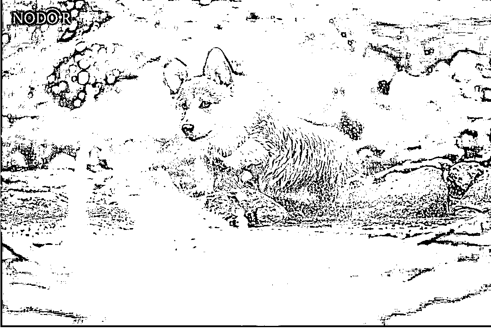****★****双子座**火星正在你们的领域兴风作浪，如何处理对话中的分歧和关系里的矛盾，将是你们生活中的重中之重。双子座要牢记实事求是这个原则，既不是一味地坚持自我，也不是事事妥协让步。前者会让对方着急上火，加剧矛盾；后者会让自己内心受伤，持续焦虑。**双子座要针对具体事情具体分析，先把自己抽离出来，心平气和地倾听，冷静理性地分析，更容易达成共识。**  **★****巨蟹座**巨蟹座是敏感、情绪化的星座，遇到有人和自己作对，就很容易受伤。对于巨蟹座来说，走出自己的情绪舒适区，是很重要的事情。**要更多去看到事实，而不是情绪。**很多矛盾的产生，并不是因为对方和自己作对，故意为难自己，而是表达的方式不对，或者表达的时机不好，没有照顾到巨蟹座的情绪。**抛开情绪不谈，紧紧把握事实，就能化解很多矛盾。****★****狮子座**狮子座是天生的王者，充满个人魅力，是人群中的霸气的存在，负面却是**好大喜功、刚愎自用的优越感。**在沟通和对话中，狮子座一定要提醒自己抽离出来，修正过于自我的视角，意识到自己也是人群中的一员，并没有什么不一样的特权。**如果能放低姿态，走出主观的视角，主动倾听对方的声音，而不是把自己的观点强塞给对方，就能够好好和周围人相处。**  **★****处女座**处女座对自己要求很高，做人  面面俱到，做事精益求精，是公认的完美主义者。凡事过犹不及，过于自律就会精神紧张，焦虑不安；对别人要求高就容易吹毛求疵，失去朋友。**在面对冲突的时候，**处女座**一定要提醒自己保持弹性，允许自己犯错，也允许对方犯错，犯错才是人生的常态，放过自己，善待他人，就能化解矛盾。**
**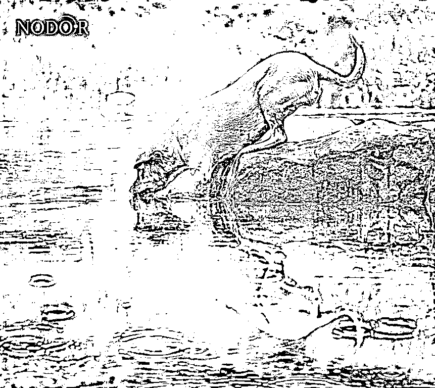****★****天秤座**天秤座是人群中的外交官，一向善于化解各方矛盾，追求关系中的公平和公正。和谐的关系对于天秤座来说，既是矛，也是盾。冲突发生的时候，一定要提醒自己，不要被关系绑架。**当自己的原则和底线受到挑战的时候，要勇于站出来，清晰地表达观点和态度，而不是一味和稀泥，打和平球，这反而会模糊矛盾的本质，埋下长久的祸根。****★****天蝎座**天蝎座具有敏锐的洞察力，心思缜密，深谙人性，是 12 星座最善于处理危机的星座。当冲突发生的时候，天蝎座往往不会一点就着，而是会察言观色，伺机而动。这往往容易给人留下神秘、不好琢磨的印象。**如果认为关系值得维护和经营，天蝎座需要稍微冒一点风险，在沟通时，敢于敞开自己的内心，说出自己的心里话。**
**★****射手座**射手座给人的印象通常是快乐乐观，遇事大大咧咧，过后就忘，不容易往心里去。但在核心问题上，射手座一向有自己的主见和坚持。三观一致是射手座挑选亲密朋友的基石。**如果冲突的发生是因为对重大事情的立场有分歧，射手座一定要表明自己的做事原则和立场，不要让对方猜，也不要装作无事发生，否则后面烦恼无穷。** **★****摩羯座**摩羯座做事坚韧不拔，目标明确，不达目的誓不罢休。这种态度用来做事情是极好的，但对于人际关系往往会找不到发力点，很让摩羯座产生挫败感。人与人的交往更多是在讲情，而不是讲理。**遭遇冲突的时候，摩羯座一定要时刻提醒自己，情大于理，人大于事。提高自己的情商，多关注对方的情绪，才有机会找到问题的核心，避免进一步的冲突。**
**★****水瓶座**水瓶座客观冷静，很少有人在关系中能控制住，是 12 星座中最特立独行的星座。当冲突发生时，水瓶座习惯置之不理，一走了之，绝不会委屈自己，也很少考虑对方的感受。如果水瓶座想要关系持续深入发展，就需要**审视内心，保持真诚，提供一个有效的沟通渠道给对方，及时破冰。要避免让小矛盾积攒成大问题，最后一发不可收拾。**
**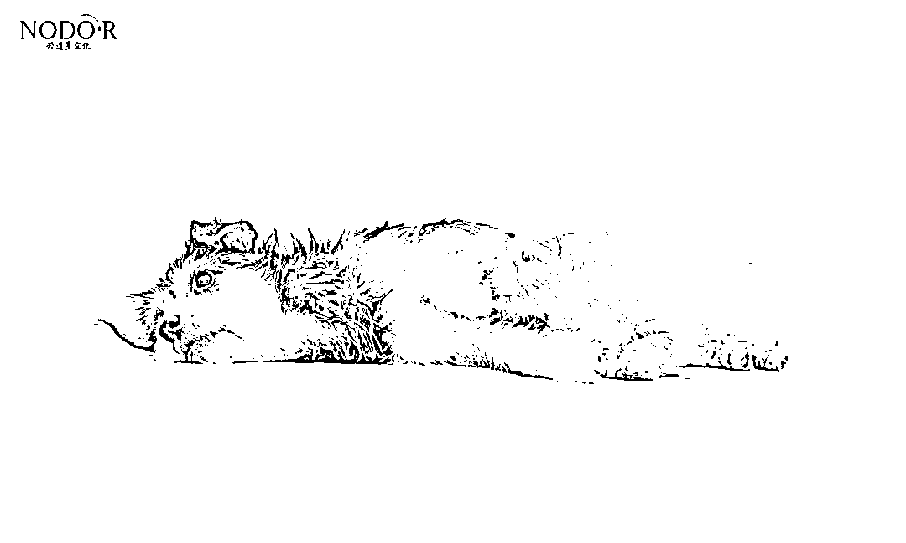****★****双鱼座**双鱼座是 12 星座中最复杂莫测的星座，集合了前面 11 个星座未完成的特质，是百变大魔王，可以应付任何人，也总有一种幻觉，觉得可以把所有问题都扛在自己身上。双鱼座是最不容易发生冲突的星座，要么隐忍到极限，要么就直接逃走。要想彻底解决冲突，就必须**划出自己的明确的防守界限，什么可以做，什么不可以做。说得明明白白，就是解决问题的第一步。**

好了，让我们回到前面的 3 个问题，当我们能够意识到分歧和冲突发生的层面，我们可以继续问自己下面 3 个问题：

**· 真实。**如果我们在争论对错，那是否有双方都信任的信息来源？

**· 意义。**为什么这件事情对我如此重要，在过去曾经发生过类似的事情吗？

**· 执行。**如果我们什么都不做，会发生什么？

答案是什么并不重要，光是意识到此事就足以避开时机不对或不恰当的冲突，或者也可以选择让它顺势爆发出来，消除积怨。

**火星行进往往指出了灵魂目前最渴望的演化焦点。**火星在双子座，意味着对于人们来说，话语成为了攻击或防守的武器。**如何表达自己，如何分辨及吸收信息，如何与他人分享和沟通，都是这 7 个月人们关注的焦点。**

火星逆行更进一步**提示我们，面对欲望，必须有意识地经过考虑再行动，不能冲动行事。**逆行意味着火星的能量不再向外，而是回到自我的核心。我们必须学会聆听内心深处超越自我的声音，找到需求和欲望的源头。

在出生图上火星行进所落的宫位，会显示出这个驱力在哪个生命领域中呈现出来。那个领域就是我们需要去看见事实，实事求是，学习和提高的地方。祝大家平安度过本次火逆，以及长达 7 个月的火星在双子座之旅，并且能够有所收获。

**版权声明：**原创文章由作者授权首发于若道平台，欢迎转发，反对抄袭。友号转载请申请白名单。

**END**

**Anastasia**

职业占星师/专栏作者/策展人

ISAR 认证占星师（2016 年获得）

若道认证生时校正资质（2015 年获得）

**微信公众号**：KairosMoment

长按打赏

**快年底了****不给自己一份来自占星学的礼物吗？**

**梅里曼金融报告双 12 福利来啦！****长按下图了解更多详情吧！**

**20 位来自世界各地的占星师****带来 19 场沙龙——新世界的觉醒****详情可点击下图**

**学习占星学****点击下图了解课程详情**

**微信又双叒叕改版啦，不想错过若道君的推送？**
****就把若道设为****星标****以及点点****“在看”****吧！******▼**

**喜欢就点一下“在看”吧！****报名直达入口**

# 海王星的“职业漩涡”，也可以让你离成功更近

> 原文：[`mp.weixin.qq.com/s?__biz=MzA5NjA0NTAxNg==&mid=2651496812&idx=2&sn=a849a36c1a6cf50a728ec2c889351f31&chksm=8b4813dbbc3f9acd027ef041f99c9858ee3ef834321715c5b7ac901af538bb06bf040832513c&scene=126&sessionid=1692737710#rd`](http://mp.weixin.qq.com/s?__biz=MzA5NjA0NTAxNg==&mid=2651496812&idx=2&sn=a849a36c1a6cf50a728ec2c889351f31&chksm=8b4813dbbc3f9acd027ef041f99c9858ee3ef834321715c5b7ac901af538bb06bf040832513c&scene=126&sessionid=1692737710#rd)

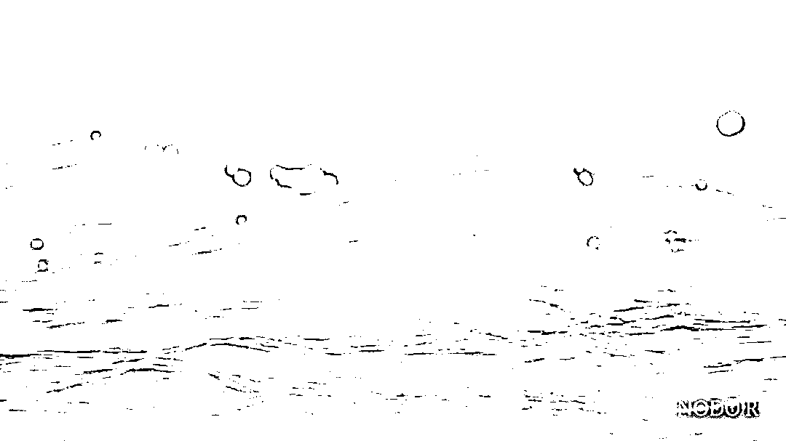

作者/唐娜·坎宁安 译者/Arrow 校对/轩轩

编辑/翀子 图片/稿定设计

海王星这颗拥有复杂需求、带有迷惑性的行星，遇上了代表我们职业生涯、欲望和职业特质的中天，会如何影响我们的职业生活呢？是否我们就容易被卷进海王星的陷阱，无法获得解脱？别着急，本文会给你启示。另外，大卫老师参与授课的【[ISAR 认证职业占星师文凭课程](http://mp.weixin.qq.com/s?__biz=MjM5MjQwNjAyMQ==&mid=2649440565&idx=5&sn=5d161dd1a6055437625fd1a67bdc4529&chksm=beb92e5f89cea7490e50e9ef66dd648b0d30b1f1c0550374de88cfecea658a9433e8c360b1a2&scene=21#wechat_redirect)】正在插班中，如果你对占星学感兴趣，欢迎点击链接了解更多详情！

**行星与中天形成四分相**

中天的相位体现了当我们必须将某颗行星的需求、欲望和特质整合进职业生涯中时，可以有哪些方法。**任何一张星图上都可能有多颗行星与中天形成相位，每个相位都为此生找到合适职业的这个复杂任务增添了难度，或者多了一个让人分心的选择。**

让我们检视下海王星和中天形成的相位，这些相位代表了**创造力、灵性和服务的渴望**——这是缺乏同情心、愈发被财务状况所驱使的经济环境下急需的品质。

然而，当我们缺乏智慧、常识和应对现实的能力，就去追寻海王星的理想时，海王星升华的面向也代表了自我欺骗或沦为受害者/殉道者对职业生涯所造成的破坏。

海王星难以捉摸且形态多变，它的影响难以一言蔽之，但是海王星可能在四个不同宫位形成与中天的四分相，每个四分相都体现了该宫位和世俗成功之间一种特有的紧张关系。

四分相可以代表困难，然而，外行星和中天形成四分相的名流大有人在，所以这种冲突并非无法克服。事实上，**带有困难相位的人往往比那些柔和相位的人更渴求成功**，后者可能觉得事情太轻而易举，没有特别的紧迫性或挑战。

**海王星四分中天**

**海王星落*****第 1 宫*****四分中天**

这些人的外表，以及他们投射出来的梦幻、迷糊、不切实际、模糊不清的形象，在竞争激烈的商场会妨碍成功，对偏艺术类的领域却很适合。

这些人可能魅力四射，比如吉娜·戴维斯（演员）、克劳蒂亚·雪佛（超模），然而他们俊美的外貌可能将他们置于众目睽睽之下，深感不安。

**丨**左（吉娜·戴维斯），右（克劳迪娅·雪佛）

第一宫是健康的宫位之一，海王星在此可能代表每种身体上的虚弱或挑战，会导致无法从事要求体力的职业，比如史提夫·汪达（歌手），或者不容忽视的成瘾问题（比尔·克林顿的性瘾）。

.jpg").jpg")

**丨**左（史提夫·旺达），右（比尔·克林顿）

**海王星落*****第 12 宫*****四分中天**

海王星的能量类似第十二宫的能量，所以渴望隐退或逃避世俗世界会造就注重隐私、甚至隐世之人（比如哈里森·福特，演员），此外比起需要高度专注的事业，更有可能**从事需要安静、深思的职业**。

成瘾或无意识的情绪、动机会破坏职业目标，秘密也是如此。然而，八卦专栏作家罗娜·巴雷特也有这个配置，却非常善于搜获他人的秘密。

第十二宫很适合服务、灵性等领域（比如演员戴拉·里斯），也适用于创造性的艺术形式，比如写作和绘画，这些不需要迎合大众的需求。或许有此相位的人也将某种事业或理想置于物质成功之上（比如，20 世纪 60 年代活动家杰瑞·鲁宾）。

.jpg")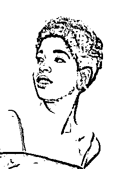

**丨**左（哈里森·福特），右（戴拉·里斯）

**海王星落*****第 7 宫*****四分中天**

**尤其是海王星在天秤座或天蝎座时，伴侣的需求优先于案主自己的目标。**

伴侣患有成瘾症或严重的精神或身体疾病，相互依赖的关系会耗尽案主工作上的能量。伴侣遭受低自尊之苦，暗中破坏了案主的职业生涯。还有些情况下，案主可能非常仰慕伴侣的才华，他或她觉得没有必要工作，而成为了一个辅助的角色。

由于第七宫也显示了业务伙伴，这一配置是个警告，因为业务伙伴可能并不可靠，带有欺骗性或无能，破坏了事业的成功。

**海王星落*****第 6 宫*****四分中天**

恍惚昏沉、杂乱无序、变化无常的工作习惯，以及在白日梦中逃逸，可能让这些人不会去设置和实现现实目标。感到受迫害，并扮演受害者，妨碍了他们凭借自身力量成为权威；反而，他们可能表现得像垫脚石。

这一配置非常有利于**服务工作**，但是案主可能成为强迫性的拯救者和某一事业的殉道者，因此牺牲了他们的健康。当工作不再匹配他们对人生目标的期待时（很可能是创造性或灵性的目标），他们可能会生病来强迫改变发生。

再举个例子，冥王星对情绪的触发包括了运用和滥用权力，所以第七宫的冥王星四分中天，代表当案主开始享受成功时，爱人或合伙人可能表现出需要主导和控制。

无论和中天的相位为何，冥王星人纠结于关系，诱使他们远离对此生职业的关注。

比如，冥王星对分中天可能意味着成年以后，此人陷入复杂的家庭关系——尤其是和父母，这妨碍了他/她的职业进展。他们可能一起从事家族生意，案主得到的报酬不如在外部公司的薪水，但是家长利用内疚感并明确指出案主无法独自生存而操控他/她留下。

**版权声明：**本文由若道翻译，欢迎转发，反对抄袭。友号转载请申请白名单。

**END**

**唐娜·坎宁安**

一位在国际上都广受尊敬的占星师，她已有超过 45 年的从业经验。她已撰有数十本占星著作以及上百篇占星学和其他形而上学类的文章。于 2017 年 7 月 5 日离世，享年 75 岁。

**拥有****51 年****占星实践经验的****若道创始人****前 ISAR 全球副主席****前 ISAR 全球职业占星师资质认证主席****大卫·瑞雷**

**和**

**2019 年第二届、2021 年第三届核心课中**

**与苏·汤普金斯老师****联合授课****的**

**ISAR 认证职业占星师**

**咔咔（Caroline）**

**二人合力打造**

**2022 年 ****若道全新核心占星课程**

**点击下图了解更多课程详情** 

**

**微信又双叒叕改版啦，不想错过若道君的推送？**
****就把若道设为****星标****以及点点****“在看”****吧！******▼**

**喜欢就点一下“在看”吧！****报名直达入口**

# 职业占星师认证文凭课程插班中丨想看大卫老师是怎么做课堂演示的吗？

> 原文：[`mp.weixin.qq.com/s?__biz=MzA5NjA0NTAxNg==&mid=2651496812&idx=3&sn=df7b784ac3cc7209a3569bdd0cbfd8ca&chksm=8b4813dbbc3f9acd5c1b13d5a4cefc892e3b61a7b71b3db37cc80d21ce2ab7122536de5c306b&scene=126&sessionid=1692737710#rd`](http://mp.weixin.qq.com/s?__biz=MzA5NjA0NTAxNg==&mid=2651496812&idx=3&sn=df7b784ac3cc7209a3569bdd0cbfd8ca&chksm=8b4813dbbc3f9acd5c1b13d5a4cefc892e3b61a7b71b3db37cc80d21ce2ab7122536de5c306b&scene=126&sessionid=1692737710#rd)

**在若道核心课程的教学里，****以学员为案例****进行课堂的占星咨询演示，是我们课程的特色环节。**

这样的演示不仅让很多同学有亲身体验咨询的机会，而且这么多真实案例的学习，会让大家看到占星咨询到底是怎么样一个过程。毕竟，大部分人的学习都是要从模仿开始。

记得若道君当年学习占星的时候，可没有这样的机会。那时候主要是听课为主，后来，我们在多年的教学实践中，**越来越发现课堂演示的重要性**。因此，就把这个作为一个主要环节加入到课程中。

在新一期的若道核心课程中，咔咔老师和大卫老师这对组合就会把这个教学特色充分发挥出来。**熟悉中国同学思路的咔咔老师会以知识点的讲解为主，而有 50 年占星咨询经验的大卫老师，则以课堂演示为主。**

有时候，这样的课堂演示的功效是出乎意料的。

一位若道的老同学赵震宇这么写到：

2018 年，我正式开始在若道学习 L1-5。其实我一开始的心态更多的是希望得到系统化的学习来补充我的知识漏洞，以及拿到一个证书可以为自己做背书，增加自己将来转型占星师的筹码，而不是真的在期待可以从若道的学习中得到一些本质上的领悟。

事实上在初期的 L1-3 中，很多知识与课上的内容，也是我比较熟悉的领域，相对而言是驾轻就熟的。但在 L3 的工作坊中和大卫老师的接触以及模拟咨询，让我对占星的态度发生了很本质的变化。

大卫老师对我星图的分析不仅非常准确，更重要的是，他开启了我自身个人成长上的变化，从而成为了我本质上进化蜕变的一个契机。

在短短的 6 个月内，我对人生的认知、对自我的认知、对于人生看待的方式都发生了翻天覆地的质的变化。我意识到了原来跳出自己一直以来无意识间重复的模式，是一件可行、并且会给自己带来无限成长提高自己人生幸福度和质量的事情。这也让我深刻体会到了人本主义占星学的魅力，以及自己之前是多么的“无知“。

于是现在，占星学对我来说，不只是兴趣、宗教信仰、或者是可能的职业道路，而是一种激发自己和他人人生成长和蜕变的工具、一种让自己更幸福的看待世界的方式。哪怕我之后并不会以占星为生，它依然是我人生中不可或缺的一部分，就像一副隐形眼镜，影响着我与世界的互动。

而被大卫老师咨询深深影响的同学还有很多。

**这里，我们节选一些短小的试听片段，让你稍微感觉一下在若道核心课程上，大卫老师的咨询演示是怎样的一个样子。**

**片段一**

<mpvideosnap class="js_uneditable custom_select_card channels_iframe videosnap_video_iframe" data-pluginname="videosnap" data-id="export/UzFfAgtgekIEAQAAAAAAMKsWN6BUygAAAAstQy6ubaLX4KHWvLEZgBPEnoIULgMKKb-DzNPgMItC2ZEgiEDMBYjrYHv9wNsO" data-url="https://findermp.video.qq.com/251/20304/stodownload?encfilekey=rjD5jyTuFrIpZ2ibE8T7YmwgiahniaXswqzQNpbBXpPP4TxDf43veVhCBACOECUZ1gc5HaUbhk0Z3Glc94tZFe7ewRHOH9L2oUC1X3aOe13K8IHMkEou9Nkgw&amp;adaptivelytrans=0&amp;bizid=1023&amp;dotrans=0&amp;hy=SH&amp;idx=1&amp;m=&amp;scene=0&amp;token=x5Y29zUxcibCEaJsXB0hMdWnJvmNct4OnXZaaWOd32ia2edkK2LTMk7jmjOms6bDk5TDtYTqEwbOQ" data-headimgurl="http://wx.qlogo.cn/finderhead/PiajxSqBRaEJYnVsqWfEX9qA0sI6hNVKsDfyzfPZ92WZMZyBpZWU5NA/0" data-username="v2_060000231003b20faec8c4e68a1ec2d4ca07e434b07755bbf47e7053a3059defd2c9d6c68a20@finder" data-nickname="若道" data-desc="#若道核心课 大卫老师用星座、行星、宫位来探索一位同学出生星盘主题的时候，他回顾了解读星盘的优先次序" data-nonceid="7723748345640460016" data-type="video" data-width="544" data-height="344"></mpvideosnap>

**片段二**

<mpvideosnap class="js_uneditable custom_select_card channels_iframe videosnap_video_iframe" data-pluginname="videosnap" data-id="export/UzFfAgtgekIEAQAAAAAANycuUwRANAAAAAstQy6ubaLX4KHWvLEZgBPEhYJ0WjYILr-DzNPgMIvjhT14ogdLw3BWd0Tg37w0" data-url="https://findermp.video.qq.com/251/20304/stodownload?encfilekey=rjD5jyTuFrIpZ2ibE8T7YmwgiahniaXswqz3Oj8zjAwTAIicKkuWErGfL3ZtYr95eTZl2oMcAx9ibThSN3gay2CmF6o8ht96zOZHdxGiaIMmdbGNtWv9Prb3wriaA&amp;adaptivelytrans=0&amp;bizid=1023&amp;dotrans=0&amp;hy=SH&amp;idx=1&amp;m=&amp;scene=0&amp;token=AxricY7RBHdV28gAuQuwABhG0G0QgmYSkh8LH68lEdHu6yrDYj099TFZVSWWqINaQTuTQ2p1ZMF0" data-headimgurl="http://wx.qlogo.cn/finderhead/PiajxSqBRaEJYnVsqWfEX9qA0sI6hNVKsDfyzfPZ92WZMZyBpZWU5NA/0" data-username="v2_060000231003b20faec8c4e68a1ec2d4ca07e434b07755bbf47e7053a3059defd2c9d6c68a20@finder" data-nickname="若道" data-desc="#若道核心课 占星学如何反应职业选择？" data-nonceid="629392412247480278" data-type="video" data-width="544" data-height="344"></mpvideosnap>

**片段三**

<mpvideosnap class="js_uneditable custom_select_card channels_iframe videosnap_video_iframe" data-pluginname="videosnap" data-id="export/UzFfAgtgekIEAQAAAAAAl_sREJMyhwAAAAstQy6ubaLX4KHWvLEZgBPEtIIkIkRmL7-DzNPgMIsA5PpGB3ReSAYx6ZfSNfZ1" data-url="https://findermp.video.qq.com/251/20304/stodownload?encfilekey=S7s6ianIic0ia4PicKJSfB8EjyjpQibPUAXolGhicE2gfRuDzIVwyXxBFlWMzxMczGgPzOG5ja3tyfwYQrAcOUkpGicEE1j6fc9zHAjg5IF1HDBibf9k85ybbAfdqQ&amp;adaptivelytrans=0&amp;bizid=1023&amp;dotrans=0&amp;hy=SH&amp;idx=1&amp;m=&amp;scene=0&amp;token=x5Y29zUxcibCEaJsXB0hMdeqQ56SUWMj15o3Z7wyXeQ6ruia8FGLMtcPAnn3TQl6hkia66nOjynB8M" data-headimgurl="http://wx.qlogo.cn/finderhead/PiajxSqBRaEJYnVsqWfEX9qA0sI6hNVKsDfyzfPZ92WZMZyBpZWU5NA/0" data-username="v2_060000231003b20faec8c4e68a1ec2d4ca07e434b07755bbf47e7053a3059defd2c9d6c68a20@finder" data-nickname="若道" data-desc="#若道核心课 如何从出生星图的基本要素看到案主生命发展的故事和个人成长经验？
" data-nonceid="6689802853667419635" data-type="video" data-width="544" data-height="344"></mpvideosnap>

**若道新一期的核心课程在****8 月 30 日****正式开始**，如果你有很浓厚的兴趣，不仅仅是因为好奇想浅尝一下占星学，但还没有想清楚是不是要学习整个 L1-5 的课程，**那么 L1-3 可能是一个不错的选择。**

**谁是你的老师？**

**占星师咔咔（Caroline）**

2010 年师从美国占星师大卫·瑞雷学习，并得到世界名师斯蒂芬·弗里斯特、罗伯特·汉德、苏·汤普金斯传授各种占星学技法。若道首届学员，国内最早获得 ISAR 职业占星师资质的职业占星师，多次担任若道核心课程助教，2019 年第二届、2021 年第三届核心课中和苏·汤普金斯老师一起教授若道核心占星课程。

在国际知名广告公司和市场研究公司从事的市场研究和推广工作十余年，曾任职于阳狮集团、尼尔森市场研究有限公司、MTV 和《Madame Figaro》杂志。

**大卫·瑞雷（David Railey）**

*   **I****SAR 董事会成员，ISAR 全球副主席，ISAR 全球职业占星师资质认证主席，若道占星创始人**。

*   2016-2019 年，被选为国际占星协会（ISAR）考试委员会成员，国际占星协会（ISAR）是世界最大的国际占星机构，会员遍布 47 个国家。

*   2017-2020 年，被选为国际占星联盟（ISAR）考试委员会主席，理事会成员。

**助教王嘉祺 （Conrad）**

ISAR 认证占星师、若道认证生时校正资质，从 2010 年起自学占星学，2015 年开始在若道系统学习，并开始个案咨询。2018 年担任若道核心课程助教，以及卜卦占星学和太阳返照选修课助教，并带领学员进行经世占星和太阳返照方面的研究。2019 年 11 月作为演讲人之一参加了国际占星协会（ISAR）北京大会，也是 ISAR 星空俱乐部中国区第 16 期的主讲人。

**内容是什么？**

**ISAR 认证职业占星师的独有培训**

目前占星学的培训市场鱼龙混杂。而 ISAR（国际占星研究协会）是一个包含了 47 个国家在内的国际占星组织，多年来致力于占星的教育和研究，提升占星教育的品质和职业占星师的能力，在国际占星领域备受尊重。

**2022 年，鉴于对若道在占星教学领域所做的持续努力和高品质的课程服务，ISAR 特别授予若道核心课程为 ISAR 文凭课程，所有在若道学习，并通过若道毕业考试的同学将获得 ISAR 颁发的学历文凭（Diploma）。**

如果你想更多了解 ISAR，请点击[【这里】 ](http://mp.weixin.qq.com/s?__biz=MzA5NjA0NTAxNg==&mid=2651475298&idx=1&sn=b91888b54c14e29068f8b4e2a3452f5d&chksm=8b48ffd5bc3f76c32699f20f5c99e978bbb25551e69d80c70fee361acbd930ba5970ae776cdc&scene=21#wechat_redirect)

**课程费用**

**★ 1-2 阶　****课程费用：3500 元 ****★ 1-3 阶 连报**

**课程费用：11500 元 **

**********转发优惠价：**11000 元（朋友圈转发本课宣保留 24 小时以上，并截图给课程顾问）********

**★ 1-5 阶　连报**

**课程费用：46500 元 **

****转发优惠价：34800 元，朋友圈转发本课宣保留 24 小时以上，并截图给课程顾问****

**退转课程**

**退款原则请详看《教学协议》，如有疑问请咨询课程顾问。**

****2022 L1-3 认证职业占星师文凭课程****

**授课老师：大卫·瑞雷、咔咔**

**直播课开课时间：2022 年 8 月 30 日（周二）**

**授课方式：******网络授课，英文/中文授课，中文翻译****

**费用：** ****1-2 阶**：**3500 元；****1-3 阶**：**11500 元****（****转发优惠价：**11000 元，朋友圈转发本课宣保留 24 小时以上，并截图给课程顾问）******1-5 阶连报**：46500 元**（****转发优惠价：34800 元，朋友圈转发本课宣保留 24 小时以上，并截图给课程顾问）**；**

**课程负责人：王老师**（微信/手机：18510107057，请备注“大卫核心课”）

长按二维码添加课程负责人咨询

**报名直达入口**

# 若道周运 12.12-12.18 丨平稳一周，是时候回归内心的稳态了（内含 12 星座运势）

> 原文：[`mp.weixin.qq.com/s?__biz=MzA5NjA0NTAxNg==&mid=2651496693&idx=1&sn=4cef2fbd9a6ad1a27f92d9d2fca85b43&chksm=8b481242bc3f9b54bda33a28eb3ba9ac9e07095413f7a482e583de32444d0049fe9ca360c9ff&scene=126&sessionid=1692737710#rd`](http://mp.weixin.qq.com/s?__biz=MzA5NjA0NTAxNg==&mid=2651496693&idx=1&sn=4cef2fbd9a6ad1a27f92d9d2fca85b43&chksm=8b481242bc3f9b54bda33a28eb3ba9ac9e07095413f7a482e583de32444d0049fe9ca360c9ff&scene=126&sessionid=1692737710#rd)

******☆ ****后台回复“今日”，给你一句生命态度******

作者/苏黎 ISAR 认证占星师
编辑/翀子 封面/书君 图片/稿定设计**整体氛围**

苏利亚克里亚瑜伽的课堂上，在准备做正式体式前，有一个动作，导师让我们闭上眼睛，平稳呼吸，脑袋观想动作，然后再起身进入正式的体式动作。当时，我不太理解这种观想动作对练习有什么特殊的意义和作用。

后来，老师教导我们说，如果你觉得四肢无力酸胀，确实无法做体式动作时可以尝试用这个来做瑜伽。你们坐在瑜伽垫上，认真在头脑中重复这套动作时，你们就已经在做瑜伽练习了。

某日，我的手臂确实无法做任何动作，我开始学习坐在垫子上，一遍遍在脑海重复瑜伽的动作。神奇事情发生了，我感觉到我身体似乎已经做完了一套瑜伽运动，即使我在静止的状态。

当我学会转向头脑的练习时，这日瑜伽练习效果特别不同。这套方法很神奇，我也曾和一些瑜伽爱好者，感觉肢体僵硬，或曾经历过运动伤害的朋友分享。

我为什么忽然想到这点呢？因为**本****周，摩羯座的水星逐渐进入逆行前阴影期，但同时也处于越界的状态（行星赤维度数超过了南纬或北纬 23°28′）**。转向内在的思考和调整用一种很不同的方式，**尝试用一种新的水星摩羯座思考方式面对生活，在生活中实践。**

这如同我的老师教导我的，请先在垫子上平稳呼吸，头脑观想等会的全套动作，在脑海中认真过一遍，然后再进入正式的动作中练习。**这是一段逐渐走向调整、修复和学习的时期。**

**经历了上周的[【双子座满月】](http://mp.weixin.qq.com/s?__biz=MzA5NjA0NTAxNg==&mid=2651496530&idx=1&sn=781592eaa76def904096442d983ead0e&chksm=8b4812e5bc3f9bf3d6930d0540e0faf5e8a0a781b42ef0eb5ca059e1d1ce64230405251d7bbe&scene=21#wechat_redirect)后**（点击查看文章）**，本周的天象逐渐趋于平缓。**这段时间，天象能量让我们对未来会有迷茫和不确定感，感觉真实的梦要走向实现是如此遥远。**我们会在生命的无常中，发现问题，学习面对生命的挑战，更务实地去改变和创新，理解生命的意义和主题。**

**本周重要天象：**

*   **太阳六分土星、四分海王星**

*   **水星三分天王星**

**一周重要天象****★ ****12 月 13 日，周二**

**太阳（射手座）六分土星（水瓶座）**

**慎重而高效的目标**

**太阳和土星的六分相，是实现目标的最佳时机。**这让我想到神话故事或英雄之旅的导师，如邓布利多校长的引领，可以让我们对未来目标更清晰，逐步达成我们的抱负。

射手座太阳的理想和信念是热情的，积极的，但如何引导射手座的弓箭更聚焦呢？这需要土星的指引。**水瓶座土星的创新，集体力量有助于聚焦射手座太阳对未来的规划、信念和理想。**

我们在一个巨大的集体意识环境中，需要遵守社会的规矩，权威人物的引导并和限制的能量并存。这些都会影响我们对现实的选择，**学会调整和适应现实很重要。**

“生活本身就是方法，生活本身也是目的”（朱光潜），适当地调整目的和方法，**我们会在限制的能量中找到生命的支点，获得生命的成长。**

换个角度看，无需认定土星是严肃古板的，有智识的领导和权威的引导，可以帮助我们更好的成长，高效地达成我们设定的目标。

**★****12 月 15 日，周四**

**太阳（射手座）四分海王星（双鱼座）**

**花非花雾非雾**

当行星与海王星形成四分相时，我们容易迷失自我，如同在沙漠中行走的旅人，朝着海市蜃楼走去，以为自己找到了绿洲和天堂住所，但一切都是梦幻泡影。上周刚恢复顺行的海王星（点击[【海王星顺行】](http://mp.weixin.qq.com/s?__biz=MzA5NjA0NTAxNg==&mid=2651496363&idx=1&sn=2cf7c1775b2358408f206304cd334a9b&chksm=8b482d1cbc3fa40a2929ce86ee62cbb5238a5e380c81cf2aa86e821cecadbed1a995ecc8b79c&scene=21#wechat_redirect)查看文章），需要一个适应修复期。正如我们当下的社会舆论大环境，似梦非梦，充满希望，但又很迷茫。

在生活层面，我们需要避免好高骛远，高估自己的能力和重要性，过度付出，“拯救者”或“被迫害”情结很容易导致我们产生意识的盲点。**我们需要避免卷入集体意识的风暴，被煽动站队，或悲观失落、选择逃避现实。**

我们需要学会从迷茫中发展出真知灼见，发挥海王星的高阶表达。如果觉得身心疲惫，可以释放放松，不必给自己太大压力。可以发呆、晒太阳、接触与艺术、疗愈、哲学有关的事情，**让身心放松。**

**★****12 月 18 日，周日**

**水星（摩羯座）三分天王星（金牛座）**

**活跃的心智能量**

水星和天王星在土元素的三分相，意味着**务实创新**的能量、**灵感**的顿悟、**原创**的能量。

**周日的月亮在天秤座**，我们考虑事情会倾向客观、冷静，在社交场合愿意和他人沟通，分享自己的观点。在分享中，我们脑海中会灵光乍现，展现出绝妙的点子和想法。心灵与智性的发展，带有土元素的务实和天王星的原创性。

我们也许想外出短途休闲、旅游或散心，突发奇想报名感兴趣的课程，或在自媒体上表达自己的想法。摆弄感兴趣的电子设备，做一些脑筋急转弯的趣味小游戏，有利于我们打发休闲时光。

**12 星座的一周运势**

**（重点参考上升星座，其次参考太阳星座）**

***白羊座***

本周是你展现创造力、制定计划、为将来事业做准备的最佳时机。火星逆行期，你努力想在财务上有更多突破的动力和决心，请放慢脚步。

本周你的魅力和创造力爆棚，如果你想外出旅游，需要关注细节。你这周在社交上会获得众人的关注，在团队集体中，你会获得领导的支持，群体的互动性有助你达成目标。

本周四，你需要避免过度理想主义导致的幻灭感。我们无法按照自己的期待、理想预期去处理事情、达成目标。面对现实吧，可以做梦，但也请先暂时给自己放空大脑，静坐冥想有助提升你的直觉。

周末，水星和天王星的三分相，你会在公众场合表达你的观点、看法，让更多人看到你的实力和价值，也许后期在工作中会有更多人理解你！

***金牛座***

如果你怀疑自己、或对自己的能力犹豫不决，本周的星象能量，让你逐渐放下怀疑，展现你的才能。你对自己的目标逐渐清晰，领导的认同和支持会增强你的自信，放下对自己的质疑。

本周四，你可能会被舆论的大环境影响，动摇稳定的目标感，群体中的某个人让你失望，或舆情影响了你的判断。休息日，水星和天王星的三分相，你可能对某个资格考试感兴趣，或想去进修某个课程，整体提升自己的实力。这是拓展你知识面的好时机。

***双子座***

双子座对任何新鲜事物都有好奇心，喜欢浪漫的关系。本周，你的表达欲望很强烈，伴侣关系、合作关系有新的突破。你可能认识不同文化领域的人，与他们合作，达成工作的目标。

双子座的变动能量需要务实，脚踏实地很重要。本周四，你需要理清关系中的边界感和目标。无论是朋友、伴侣、合作者或客户，你不要混肴边界，对自己保持信任很重要。

休息日，水星和天王星的互动，你会用新的方式理解过去的创伤，某些在关系和金钱中挥之不去的不信任感，会促进你走出心灵的创伤，学会放手。

***巨蟹座***

关注情绪安全感的巨蟹座，很容易被大环境或家庭影响。本周，你的自我价值感逐渐提升，开始接纳自我。你在事业工作中展现出实力，在心理中感受到被支持和认同。土星并不仅仅是严苛，温和的导师可以让自己获益匪浅。

周四，外人对你的评判、质疑可能导致你对自己的信念产生不确定感。你对自己在工作中的付出和收获产生困惑，请保持坚定的信念。休息日，你和朋友、伴侣的互动很和谐。社交媒体的信息给你新的灵感动力，你会用创意的表达来创造和谐的关系。

***狮子座***

本周是自信满满的积极时期。一段浪漫的关系趋于稳定，你会更自信的展现才华，让客户、伴侣对你印象深刻。但狮子座又是容易被自己的心理阴影打败。外界太多诱惑，你不懂如何正确展现自己的亮点，你渴望的浪漫关系是否只是虚幻呢？周四请避免在投资、股票上的不恰当操作。

休息日，你对工作有新的想法，可能加班中出现的创造性点子落地，你渴望工作做得更快更好。如果你是自由职业者，休息日是你创造的高峰期。你需要关注身心休息，可以尝试一些不一样的休闲方式，让自己的大脑更轻松。

***处女座***

对处理事情注重高效、质量、身心疗愈的处女座，这周很合适你们在社群展现自我，在家庭中发挥领导力、带领家人们关注健康主题。你会从身心健康长远考虑，在家庭中科普健康，根据专家意见和自己判断，让全家人积极参与到提升身心健康的计划中。工作中，你们获得领导的提携和帮助，这让你对自己更自信。

需要关注周四的星象，与家人的关系避免互相指责，有时沟通不畅会导致家庭成员之间的敏感，对自我产生质疑。期待一下休息日吧！你可以和孩子们一起远行，或去博物馆看展览，这有助你突破界限，更好的规划前景！

***天秤座***

本周是在社群和朋友互动中找到关系满足感的一周。你在社群和平台中渴望获得认同。如果你是自由职业者，这是很合适在自媒体里吸引粉丝的时刻。

周初，工作会给你满足感。但你在本周四的困难相位中，你发现推动的事情、渴望达成的协议会放缓，这不是合适做重大决定的时刻。

休息日很合适在家庭中与家人沟通、商量未来的投资情况。对未来的目标，你习惯权衡现实中的利弊，找出最合适目标实现的方法。和家人互动，你内心的灵感会被唤醒，懂得如何创建和谐的家庭关系。

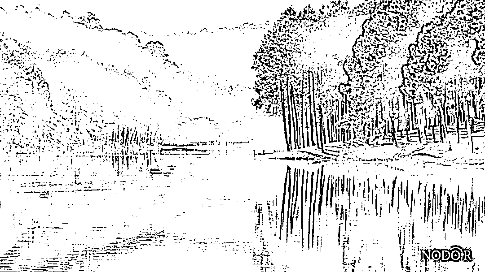

***天蝎座***

本周是你在财务上学习的时刻。这也许和你的家庭事务、内心的安全感有关。你会在收支问题上做出正确的决定，寻求合适的交易时机。理解自己在物质世界中，不信任安全感的来源很重要。

本周四，对有关财务上的决定，最好保持慎重态度，咨询专家的指导意见，不要被表面信息困扰，如果可以的话，稍作等待再做决定，保持耐心。

本周日，你和伴侣、好友分享梦想和看法，他们也许会对你的决定大吃一惊。原来你对自己工作，生活有如此丰富、不同常人的思路和想法。

***射手座***

本周是你提升自我、完成计划的一周。太阳和土星的和谐相位，你在推动计划、沟通事项上更容易，你的专业素养和能力，帮助你完成既定计划。但你可能在本周四为家庭成员的健康分心，或需要处理繁琐的家庭事务，你感觉到心情郁闷，产生倦怠感。

本周日，你可能会意外收到工作方面的消息。你前期沟通的项目收到不错的讯息，似乎看到曙光和前景，下周可以顺利完成。你也可能突然奇想，周末尝试某个新鲜的健康养生项目，放松紧张疲惫的身心。

***摩羯座***

本周你会从繁忙的生活中学会休憩，在梦境中得到一些提醒，某些困惑已久的心里阴影将获得缓解。周二，你意识到自己的努力付出和认真是人生富足的动力，你心理压力减缓，思想逐渐放开。

周四，你需要注意工作计划、信息传播方面的虚实真假，不要夸大事实，保持简明扼要，切中要点的沟通很重要，避免产生误解。周日，你可以和友人或孩子一起参与派对活动，享受你的休息日欢愉时光吧！

***水瓶座***

本周是你扩大社交圈的好时机。你会比平时更容易找到志同道合的朋友，在社群、团队项目中，你的专业性获得众人认同和支持。但也要注意，社会舆情的信息和新朋友的话并不需要过度重视，放在心上。

周四，太阳和海王星的四分相，你会很容易受到这些人的影响，在财务上，这些人的建议可以倾听，但要坚持自己的想法和立场。我们在动荡中很容易被外面信息干扰，对自我价值失去信心。

休息日，你会发现自己的灵感和洞见来源是家族的历史，你的创造力和想象力会展现更丰富。

***双鱼座***

你在本周感受到职场上的动力和信念，你需要通过工作的成就证明自我。朋友的暗中支持和帮助在无形中，推动你在事业和工作中的积极性。你被认同和关注。

但不要被表象迷惑，当下是年底，很多信息不清楚，随着人们在职场上的变动，当下你不合适在职场中仓促地为将来做决定。

周日，把你的工作事情暂放一边，抽出时间与朋友、家人亲戚，如很久不见的兄弟姐妹聚会。毕竟这是一个愉快的水星和天王星的和谐互动，也许会你遇到意外惊喜哦！

**版权声明**：原创文章由作者授权首发于若道平台发布，欢迎转发，反对抄袭。友号转载请申请白名单。

**END**

**苏黎（Sulis）**

ISAR 国际认证占星师（2019 年获得）/塔罗咨询师

现代占星融合古典解读

20 多年跨行业领域职场经历

**咨询微信**：liuzq26

**公众号**：Sulis_1975

长按打赏

**快年底了****不给自己一份来自占星学的礼物吗？**

**梅里曼金融报告双 12 福利来啦！****长按下图了解更多详情吧！**

**20 位来自世界各地的占星师****带来 19 场沙龙——新世界的觉醒****详情可点击下图**

**学习占星学****点击下图了解课程详情**

**微信又双叒叕改版啦，不想错过若道君的推送？**
****就把若道设为****星标****以及点点****“在看”****吧！******▼**

**喜欢就点一下“在看”吧！****报名直达入口**

# 雷蒙德·梅里曼金融占星周运 | 保持警惕，小心剧烈下跌

> 原文：[`mp.weixin.qq.com/s?__biz=MzA5NjA0NTAxNg==&mid=2651496693&idx=2&sn=901e69c8544174f6af6581004f22d521&chksm=8b481242bc3f9b54521612cd85f513cb93e04e588ce8dd52abbfc7b1c02fd00084161becf40a&scene=126&sessionid=1692737710#rd`](http://mp.weixin.qq.com/s?__biz=MzA5NjA0NTAxNg==&mid=2651496693&idx=2&sn=901e69c8544174f6af6581004f22d521&chksm=8b481242bc3f9b54521612cd85f513cb93e04e588ce8dd52abbfc7b1c02fd00084161becf40a&scene=126&sessionid=1692737710#rd)

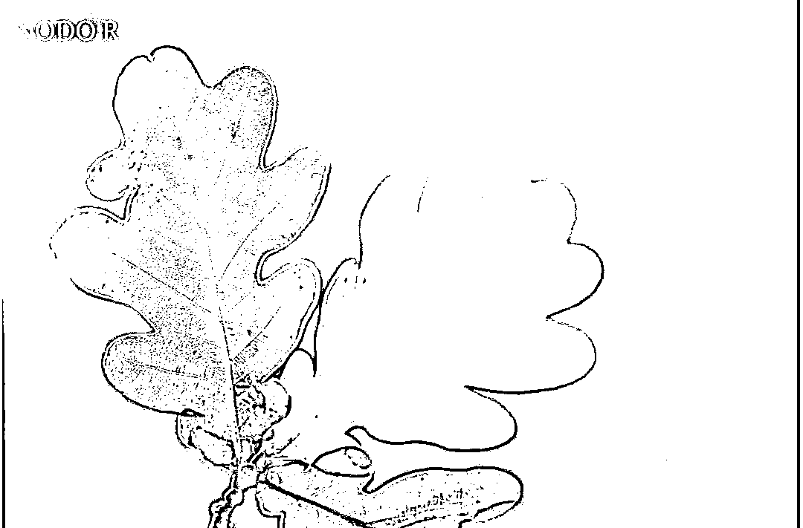作者/雷蒙德·梅里曼 译者/Luke 编辑/玫瑰 图片/稿定设计

雷蒙德·梅里曼是在金融占星学界稳坐第一把交椅的占星师，同时他也是若道签约的金融占星课老师，我们引进了雷蒙德·梅里曼老师的《[上证指数月度报告](http://mp.weixin.qq.com/s?__biz=MzA5NjA0NTAxNg==&mid=2651494377&idx=2&sn=12afe330afef4b876307c2963b795b56&chksm=8b48255ebc3fac48d8ea2c82dd7b085ed1bcf50d7b480800f1e6a1d63aadb3cb275863e20df7&scene=21#wechat_redirect)》及《[黄金报告](http://mp.weixin.qq.com/s?__biz=MzA5NjA0NTAxNg==&mid=2651494377&idx=2&sn=12afe330afef4b876307c2963b795b56&chksm=8b48255ebc3fac48d8ea2c82dd7b085ed1bcf50d7b480800f1e6a1d63aadb3cb275863e20df7&scene=21#wechat_redirect)》。我们经老师的授权，将每周刊登梅里曼老师的周运，供大家参考和学习。于是，这是本周的周运（12.12-12.16）。

**说明：以下时间采用纽约证券交易所所在地美国东部标准时间。****展望与回顾**

****

**昨天的美国单位劳动力成本数据可能会在未来被修订，但它显示非金融公司利润增长比劳动力成本增长更快。事实上，在过去 8 个季度的 7 个季度中，利润增长比劳动力成本增长更快，同时价格增长比劳动力成本增长更快。今天的通货膨胀更多的是利润增长，而不是劳动力成本。**

**——保罗·多诺万博士****《利润推高价格》****瑞银早间音频评论****2022 年 12 月 8 日****在 2023 年，美联储很可能继续将利率保持在高位，打消了华尔街对 2023 年下半年降息的希望，并几乎保证了一场衰退。****——梅根·亨尼****《美联储打算明年都保持高利率，使得一场衰退的可能性变高：调查》****2022 年 12 月 9 日****www.foxbusiness.com****“当唐纳德·特朗普在 2016 年获胜时，他说我们会如此地厌倦获胜，以至于求他停止继续获胜”，克里斯蒂对共和党州长们说，但指出共和党在 2018 年失去了众议院席位，在 2020 年失去了白宫，在 2022 年失去了本可以获胜的参议院席位。“我厌倦了失败”，克里斯蒂补充说。**
**——布雷特·萨缪尔斯****《共和党厌倦了失败》****《山丘》****2022 年 11 月 18 日**上周的金融市场是一场拉锯战，12 月 7 日-8 日满月合相火星（是一次掩星，月食遮掩了火星）带有攻击性的能量，12 月 3 日，被动的海王星转向顺行，12 月 4 日，金星与它成四分相，12 月 14 日，太阳与它成四分相。换句话说，市场想要做点什么——去某个地方，但不太清楚该做什么和该去哪里。市场正在寻找一个上涨的理由，因为价格通常在美国总统任期的第三年上涨。但人们也担心衰退即将到来，这是因为为抑制通胀，利率正在上升，而且收益率曲线倒挂在预测衰退方面往往是可靠的。倘若即将发生一场衰退，失业率开始上升，市场怎么能够上涨呢？但是迄今为止，失业率还不是一个问题，尽管美联储“加息-加息-再加息”的政策旨在让失业率成为问题，从而解决通货膨胀的问题。为了解决旧问题，需要制造一个新的问题，没有清晰的解决方案。这就是在火星的攻击下，海王星的回应。最近的选举结果中也存在一种拉锯的困境。特朗普支持的候选人再次在上周的佐治亚州参议院淘汰赛中败北。现在，参议院的民主党的优势为+2。另一方面，众议院的共和党优势为+6。这是一个僵局，表明几乎没有什么事情会被做到，这实际上可能是有利于股票市场的。但另一方面，这可能导致无法通过任何预算提案，可能导致政府关门，这可能导致政府工作人员裁员，但会给美联储更多的筹码，来停止加息。

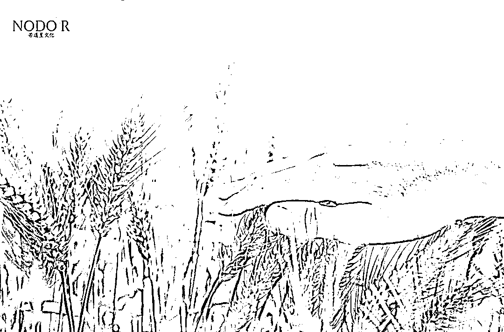

在 12 月 1 日-2 日，随着海王星转向顺行，全球大多数股票市场创下周期高点，随后下跌至 12 月 7 日-8 日满月合相火星期间。周五，道琼斯工业指数、伦敦富时指数和印度 Nifty 指数出现另一轮抛售。其他市场上，白银在周五上涨至 4 月以来的最高价位，同时原油终于下跌至 70.00 区间。这是“交易员乔·拜登”为了回补战略原油储备，“承诺买入”的区间 67-72。他之前曾抛售原油，试图在中期选举前拉低油价。但现在还看不到大额买入的迹象出现。上周的美国中期国债也很有意思，它于 12 月 7 日上涨至 9 月以来的最高水平，然后价格回落至周五。这符合双子座满月合相火星对应的反弹和之后的抛售。对于大多数投资者来说，当股票和国债都下跌时，处境困难。但 2022 年大部分时间都是如此。**短期宇宙征象与长期考量**

****

**行动是知识的开始。接下来是耐心。耐心非常重要。坚强的人都是有耐心的人。耐心意味着克服你的 7 种情绪：憎恨、崇拜、喜悦、焦虑、愤怒、悲伤、恐惧。如果你不屈服于这些情绪，你就是有耐心的，然后很快就能理解所有事物，并与永恒和谐相处。****——詹姆斯·克拉维尔****《幕府》****德拉克利出版社****1975 年 美国****美国心理学协会认为（精神病理）是一种不顾他人权利的慢性疾病，表现包括剥削、欺骗、无视规范和法律、冲动和鲁莽，最重要的是缺乏内疚、悔恨和共情……我们需要更好的良知。如果我们拥有了它们，我们就会有更少的精神病患者。****——佩吉·努南****《高管中的精神病患者》****《华尔街日报》****2022 年 12 月 1 日****他说，现在是凌晨三点，太吵了****你们这些人难道永远不想睡觉吗？****就因为你感觉很好，就要****把我逼疯****我说，嘿（嘿），你（你） 离开我的云朵****——米克·贾格尔、基思·理查兹****《离开我的云朵》****镜花水月音乐国际****1965 年****由于本周最突出的行星相位，是 12 月 14 日太阳与海王星成四分相，因此海王星的迷雾会继续蒙蔽投资者的视线。**12 月 14 日是美国发布下一轮消费者物价指数（通胀）报告后的第二天，这次的数据很可能终于使市场摆脱云朵（或迷雾）。**太阳-海王星四分相与道琼斯工业平均指数趋势的反转有很强的关联，容许度是 4 个交易日。**就像所有海王星的相位一样，这次的相位也可能对应着人们对未来股票价格的希望和愿望。然而，**如果它对应的是 12 月 1 日-2 日波峰的一个次高点，可能导致一轮剧烈的下跌，持续到 12 月 23 日木星-天王星八分相时，甚至之后。**

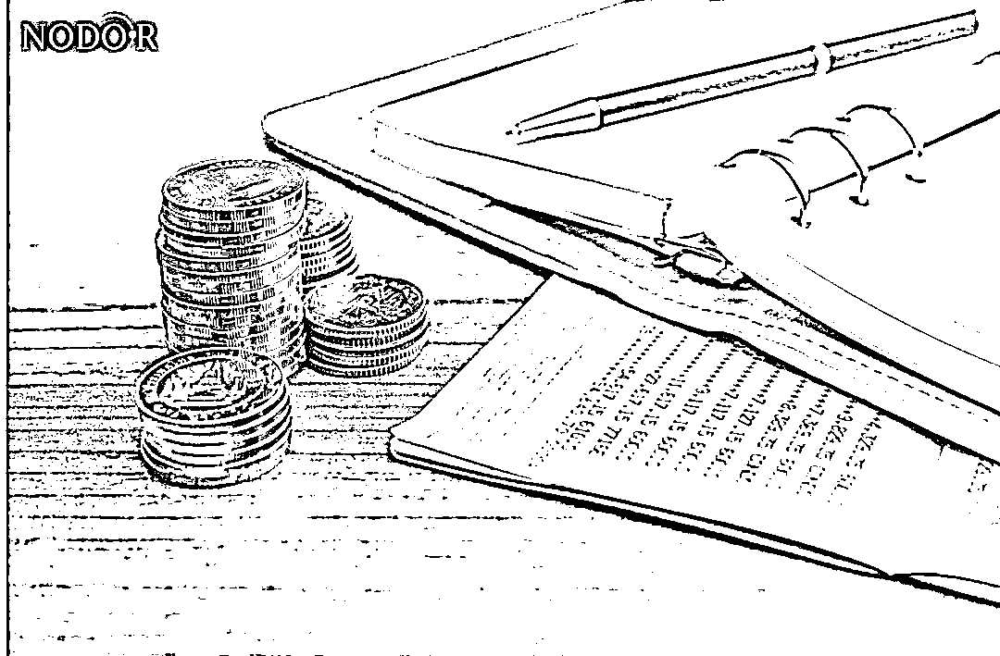

木星-天王星八分相前两次精准成相（5 月 11 日和 9 月 28 日）期间，全球股票市场经历了剧烈的下跌。可能这次由于火星也在逆行（10 月 31 日-1 月 12 日），会有所不同。但**明智之举是保持警惕，以防它第三次发生。**1 月的火星逆行结束后，我们的关注焦点转向 2023 年 3 月。**届时土星将进入双鱼座（3 月 7 日），冥王星进入水瓶座（3 月 23 日）。**行星在星座中的位置代表心理状态、态度，甚至可能是信念系统。在心理学研究中，有很多术语来自土星及其守护的摩羯座和水瓶座，以及有关海王星及其守护的双鱼座。例如，**土星在双鱼座中可能象征着偏执狂，尤其是迫害幻想的患者，容易陷入受害者的陷阱。**或者，它也可以代表**灵性（双鱼座）的大师（土星）**。一切都取决于人们如何训练自己的心智。就经济层面而言，**土星倾向于压低它守护板块或期货的价格，或导致对应商品的供应枯竭。在这个组合中，双鱼座与通货膨胀有关，因此通货膨胀很可能会下降**。双鱼座也与原油有关，因此**原油价格可能会下降，或者供应会再次枯竭。**就像美国的战略石油储备目前的情况一样，除非总统同意再次补充这些去年耗尽的供应，否则倘若遭遇战争，美国就会处在地缘局势的风险中。冥王星进入水瓶座可能会**加剧战争的威胁**，特别是考虑到冥王星上一次行经水瓶座期间（1777 年-1797 年），对应全球的重大革命，包括美国和法国的革命。此外，水瓶座是与分离和疏远相关的星座，**如果被过度推向极端，它会表现出精神病理行为。**另一方面，水瓶座也是与**发明、发现**相关的星座，以及**与大众的“兄弟情谊”或“姐妹情谊”**。随着冥王星在 2026 年与在双子座的天王星（水瓶座的守护星）形成三分相，这种意识的强化和发明能力的升级，可能带来**沟通、科学和艺术方面的文艺复兴。**

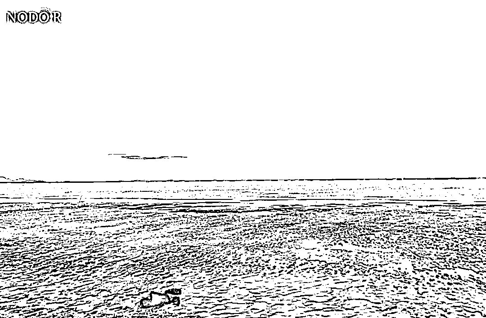

因此，在接下来的 3 年中，人类面临着两种并行而互相竞争的范式。挑战在于，如何识别那些有利他主义倾向的人，和那些患有妄想症善于欺诈的人。在我们之中这两种人都有，甚至可能就在我们身边。在 2023 年-2024 年，冥王星会来回穿越水瓶座 0°5 次。你可能记得，那个度数是“风象星座新纪元”的“超级能量度数”。在 2020 年冬至（12 月 21 日）时，木星和土星在这个度数合相，开始了 20 年的会合周期。至于这会如何影响金融市场，考虑到冥王星代表事物的终结，那可能带来**当前能源形式的转化和新能源形式的发现（水瓶座）**。此外还有**其他投资机会的涌现，比如人工智能、太空探索和电动汽车。**对于冥王星，没有中间地带和绥靖。没有胜利是不带着风险的。对于冥王星，你要么全赢，要么全输，2023 年-2026 年就是如此。要么选择一条发明和创造的道路，要么是一条毁灭的道路。到最后，创造总是会战胜毁灭。从 2018 年年末，若道引入金融占星大师雷蒙德·A·梅里曼撰写的梅里曼市场时机学院每年一次的年度预报沙龙和每年一本的《年度预报》以来，**2023 年已经是第 5 个年度了。我们简单回顾了部分 2019-2022 年金融预报的内容，**过去的经验让我们相信，你根据梅里曼老师的指导作为投资参看，你会比一般人有更大的胜算。******长按下图识别二维码****了解更多详情**

**说明：以上日期基于纽约证券交易所所在的美国东部标准时间，由于存在时差，中国地区可能需要加一天。**

**版权声明：**本文由若道翻译发布，欢迎转发，反对抄袭。友号转载请申请白名单。**END**

**雷蒙德·梅里曼（Raymond Merriman）**

若道签约老师。著名金融占星师，ISAR（国际占星研究协会）前主席，梅里曼市场分析公司的总裁。他由于“提升了占星学的职业形象”，在 1995 年国际占星大会上被授予轩辕十四奖；在 2012 年国际占星大会上，被授予轩辕十四终身成就奖。

**梅里曼金融报告双 12 福利来啦！****长按下图了解更多详情吧！**

1“中国上证指数月度报告”发售**若道推出了****中文版****的雷蒙德·梅里曼中国上证指数月度报告，并持续发行该报告！**当把金融市场的周期和占星学的周期相结合时，雷蒙德·梅里曼老师的金融占星学研究**为投资者应对金融市场的周期波动，并随之调整投资策略提供了极大的价值参考**。
**12 月中英文报告已上线！**2“黄金价格周期月度报告”发售**若道推出****中文版****的雷蒙德·梅里曼黄金价格周期月度报告！**不仅仅为广大读者在中国股市的投资出谋划策，更将视角放眼黄金市场。**每当世界经济形式不明朗的时候，有一个地方是保值的港湾，那就是****黄金**。自 1982 年雷蒙德·梅里曼出版第一本研究《地球宇宙学征象与黄金价格的关联》的著作以来，**他一直作为最重要的黄金市场时机预测者之一享誉国际**。2022 年 12 月黄金报告已上线，梅里曼老师将会告诉你他对这个关键时期如何操作的想法。也可以按照季度和一年期订阅，有更多优惠。季度和年度的好处是，你可以持续了解梅里曼老师对于不断在变化的市场的看法。即便他某一次看法和市场不一致，你也看到在下一期他如何调整自己的看法，并看到金融占星在一个长期时间段内对你把控风险的帮助。而能够长期控制风险、尽量找到安全的投资时机才是投资的长久之计。**12 月中英文报告已上线！****购买套餐**，买得越多越优惠中国上证指数月度报告套餐价

*   **单月报告**：280 元
*   **3 个月套餐**：780 元（260 元/月）
*   **12 个月套餐价**：2400 元（200 元/月）

**长按下图识别二维码****购买金融报告****套餐****▼**

黄金周期月度报告优惠

*   **双报告年度套餐更优惠（直降 900 元）**

*   **12 个月黄金报告+12 个月上证指数报告：仅需 3900 元**

**长按下图识别二维码购买黄金报告套餐**▼

3《2023 年金融报告及沙龙》

从 2018 年年末，若道引入金融占星大师雷蒙德·A·梅里曼撰写的梅里曼市场时机学院每年一次的年度预报沙龙和每年一本的《年度预报》以来，**2023 年已经是第 5 个年度了。我们简单回顾了部分 2019-2022 年金融预报的内容，**过去的经验让我们相信，你根据梅里曼老师的指导作为投资参看，你会比一般人有更大的胜算。****

**长按下图识别二维码****了解更多详情**

**购买直达入口**

# 《2023 年金融预报》预售中！梅里曼 12 月上证+黄金报告上线！

> 原文：[`mp.weixin.qq.com/s?__biz=MzA5NjA0NTAxNg==&mid=2651496693&idx=3&sn=a69b68aea6efaac90ac8cdc45297bd94&chksm=8b481242bc3f9b5439784f5d3e6c719e42c62413056628aa9bfcc660c906108f8631e4f3e64d&scene=126&sessionid=1692737710#rd`](http://mp.weixin.qq.com/s?__biz=MzA5NjA0NTAxNg==&mid=2651496693&idx=3&sn=a69b68aea6efaac90ac8cdc45297bd94&chksm=8b481242bc3f9b5439784f5d3e6c719e42c62413056628aa9bfcc660c906108f8631e4f3e64d&scene=126&sessionid=1692737710#rd)

  

**《2023 年金融预报》**从 2018 年年末，若道引入金融占星大师雷蒙德·A·梅里曼撰写的梅里曼市场时机学院每年一次的年度预报沙龙和每年一本的《年度预报》以来，**2023 年已经是第 5 个年度了。**

我们简单回归一下梅里曼老师 2019 年-2022 年的《年度预报》中一些预测。

在 2019 年的年度预报中，对于上证指数，梅里曼老师写到：

2018 年末至 2019 年初，中国股市处于三个重要周期低点的时间段。紧随这一低点，将会出现一次非常大的反弹。

2019 年木星会与海王星形成三次四分相，过去，这个相位总是与惊人的强大“泡沫”同时出现，期间股价大幅飙升。

到 2019 年 7 月之前，上证指数有三个重要长周期会出现周期低点，理想上看是在 2019 年 3 月底之前。

上证的周期低点出现在 2019 年 1 月，从那时起，上证迎来了 3 年的上升。

对于黄金，梅里曼老师建议：

从占星学角度来看，木星在射手座，四分在双鱼座的海王星，支撑看涨观点，因为这个组合有增加通胀的潜力。此外，木星在射手座的行星-星座组合从 1983 年起出现过三次，每次都对应到金银市场的年度高点。

无论在 2019 年何时，只要黄金保持在 1167 以上，同时跌到了任一主要周期低点附近，就要寻找买入机会。黄金可能在 2019 年涨到 1500+/- 50，甚至更高。

2019 年黄金从 1284 美元开始上涨，最高点在 1566 美元。

所以，如果你在 2018 年购买了《年度预报》，按照梅里曼老师的建议投资了上证指数和黄金，你会在当年取得相当不错的收益。

**对于 2020 年，在席卷全球、深刻影响了未来的疫情到来之前，梅里曼老师为 2020 年定下基调的：**

站在 2019 年的年尾，我们不知道一场深刻改变未来的风暴马上就将来临。

梅里曼老师，这位杰出的宇宙气象预报员，未卜先知，为 2020 年定下“将军”的基调。

在那一年，我们目睹了美国股市的 4 次熔断和全球经济的重置崩溃。

对于黄金，梅里曼老师是这么说的：

1391.50-1413.70 是价格最强的支撑区域。只要不跌破这个区间，黄金就能够上涨，重新测试 1566.20。如果突破了 1560-1590 的阻力区间，那么黄金就能够重新测试 1920。在那以前，黄金最有可能在 2020 年中在 1390 和 1575 之间波动。

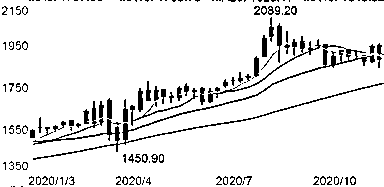

| 黄金周 K 线图

2020 年，黄金在横盘 3 个月突破了 1560-1590 的阻力区间后，一路上涨到 9 月最高点 2089.20 美元。

对于上证指数，梅里曼老师建议：

2020 年的反弹将超过 2019 年的高点 3288。然而，这一涨势可能会通向 5.5 年周期的波峰，随后将再次迎来一波跌势至 2021 年或更晚。

行进中的摩羯座星群——木星、土星和冥王星——表明在 2020 年 11 月底之前会出现一个高点，很可能在 2020 年的前六个月。建议交易者特别注意金星逆行的时期，也就是 5 月 13 日至 6 月 25 日。逆行或顺行一个月内出现的年度高点或低点可能会带来卖出机会。

2020 年，上证指数最高达到 3474，超过了 2019 年的高点 3288。

**站在 2020 年的末尾，对于 2021 年，梅里曼老师说：**

随着 2020 年木星、土星和冥王星形成大合相，我们刚刚结束了一个周期和一个时代。此刻我们正处于一个新的时代和一个新的长周期的早期阶段。事实上，是多个长周期。

对于上证指数，梅里曼老师说：

我们预计涨势将在 2020 年 12 月-2021 年 2 月之间达到波峰，然后急剧下跌至 52 周和 22 个月周期的低点，这些周期将在 2021 年 5 月之前，甚至在 3 月底之前结束。此后可能会出现另一轮反弹，可能会也可能不会在 2021 年 11 月之前形成第一个 33 个月周期的新高。

对于黄金，梅里曼老师说：

黄金的 31.33 个月周期波谷将在 2021 年 9 月之前出现，理想情况是 2020 年 12 月-2021 年 6 月。价格目标是 1628+/-109 或 1768+/-76。重叠范围（理想情况）是 1692-1737。如果价格跌破这些范围，则为看涨情况中令人担忧的状况。

**而在 2022 年的年度预报里，我们看到：**

渐亏四分相不仅对应无法解决的冲突和分歧，土星和天王星形成的任何四分之一周期（合相、四分相和对分相）都可能在社会动荡和某地区现状受到威胁的时期出现。

在 2008-2010 年上一次四分之一周期时（对分相），世界见证了阿拉伯之春。在 1999-2000 年渐盈四分相期间，游行、抗议和直接武力冲突扰乱了西雅图世界贸易组织会议。这也标志着美国经济扩张的结束，以及由互联网泡沫破裂和 2001 年 9 月 11 日对美国世贸中心的恐怖袭击引发的衰退的开始。在此之前是 1988 年的合相，对应的事件是缅甸（Myanmar，当时的国名是 Burma）爆发了一场全国性起义，反抗尽失民心、暴力过度的军政府。数十万公民在全国范围内的暴动中抗议，这成为缅甸历史上的决定性时刻之一。

在每一个案例中，极端主义都占据主导地位，导致暴力冲突，但最终带来了“更大的益处”。它产生了建设性的结果，但在它进行的同时，世界在经历巨大的危机和暴力。”

2021 年 5 月 13 日-7 月 28 日，木星首次行经双鱼座时，这些因素表现得很明显。那时，通货膨胀开始出现，但美联储向所有人保证，这只是暂时的，他们将无限期继续推行“宽松货币”政策。他们并不担心持续的通货膨胀，这是典型的木星在双鱼座的表现，对现实的脱离或错误判断。

这两颗行星以及双鱼座也掌管原油。因此，我们可能会看到油价飙升，以及/或石油泄漏，威胁到大自然。它也可能对应着由于事故而释放的有毒气体，威胁到那些暴露其中的人的生命。

对于黄金，梅里曼老师建议：

只要黄金保持在 1670-1680 之上，仍然有极小的机会出现一轮爆炸性上涨，测试当前的历史高点（2089），甚至创下历史新高。毕竟，木星将在双鱼座合相海王星，可能预示着另一轮“投机狂热”。然而，这也可能是一个“恐慌”的征象，届时某些市场可能会崩溃。

在 1900-1980 之间存在较大的阻力，如果不能突破这个阻力，将表明黄金的熊市已经开始，新一轮的猛烈下跌可能正在准备中。只要跌破 1670 则将确认黄金 20 年的牛市结束了。

| 黄金周 K 线图

对于上证，梅里曼老师说：

我们预期在 2022 年 5 月前，上证综指会出现急剧的下跌，进入 52 周周期和可能的 33.5 个月周期低点。

我们更倾向于认为，上证综指会首先下跌，在 5 月前形成一个低点，然后上涨。这一轮上涨的幅度，将告诉我们上证综指是处在牛市，还是进入了新的熊市。如果它不能上涨超过 3750，长周期波峰可能已经出现，并且进入了新的熊市。

我们简单回顾了部分 2019-2022 年金融预报的内容，**过去的经验让我们相信，你根据梅里曼老师的指导作为投资参看，你会比一般人有更大的胜算。**

**2023 年度预报及沙龙预售**

**2023 年金融预报沙龙时间为 2023 年 1 月 7 日 10：00-13：00。**

一份价格仅千元的顶尖金融占星大师的投资分析报告和沙龙，聪明的投资者值得拥有。

**2023 年年度预报****及沙龙价格：****1380 元**

**长按下图识别二维码**

**购买报告及沙龙**

**梅里曼金融报告双 12 福利来啦！****长按下图了解更多详情吧！**

**购买者重要须知****①** 梅里曼市场时机学院每年一次的年度预报沙龙和《年度预报》是梅里曼市场时机学院的研究“预报”，而不是市场“预测”，是梅里曼老师及其金融占星分析师对人类活动周期历史与行星周期之间相关性的研究，二者在大部分情况下具有 80%或更高的相关性，而不是因果关系。沙龙中和报告中的研究完全存在错误的可能性。即便是非常认真的研究和几十年的研究经验，我们无法总是正确地解读出各种征象在实际层面上会如何相互作用，并显化为事件结果。

所以请将次沙龙和报告看作一个研究参考，务必结合其他市场研究和你个人对市场的理解，根据你的自由意志做决策。

**②** 此报告一旦售出，**即不接受退款。**

**③** 此报告仅支持在手机网页阅读，不支持电脑阅读和下载。**④** 讲座提供视频回放。**以上须知，请仔细阅读。一旦付款，即视为已了解并接受所有须知内容。**

**如在购买报告中遇见任何问题**

**可添加客服**

▼

**12 月上证报告**11 月份报告发出的时候是 10 月 19 日，在此一周前的 10 月 12 日，上证跌到了 2934，重新测试了在 4 月 27 日形成的 2022 年年度低点 2863，然后开始反弹。**10 月 12 日这一低点是位于梅里曼老师一直提到的今年下半年最重要的天象——土天四分、木星在土天四分中点的天象的范围之内。**

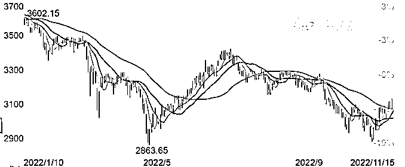

| 上证指数日 K 线图当时，梅里曼老师提到，一方面，10 月 12 日的低点是在土天四分这个最重要的天象之下，市场完全可能出现反转，如果 10 月 12 日的低点是从 4 月低点 2863 开始的一个拉长的基本周期的第 23 周，那么，站在 10 月 19 日，一个新的 13-20 周的基本周期刚刚开始，当时仅仅是第一周。这个基本周期完全可能开始一波上升行情。另一方面，10 月 23 日，土星恢复顺行，10 月 31 日，火星开始逆行，金星和太阳都将进入天蝎座，而且将在 11 月 5 日-11 日和土星、天王星形成 T 三角。如果基本周期不是从 10 月 12 日开始，而是从 8 月 2 日-4 日的低点开始算，上证完全可能跌向更深的低点。上证跌向更低的低点。10 月 31 日，火星逆行日，上证跌到 2885，与 4 月份的低点 2863 形成双底，然后开始反弹。从宏观层面来说，美国的通货膨胀似乎见顶，美元的加息可能缓和下来；而国内似乎要走向新冠疫情防控的政策的逐渐放开，这对于经济是利好。

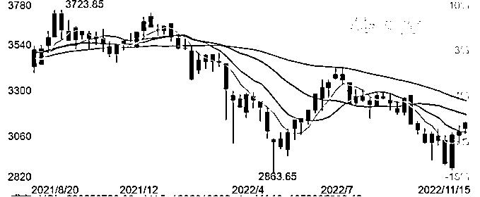

| 上证指数周 K 线图

本年度激烈的天象似乎都已结束。现在是不是大胆加仓的时候？金融占星大师雷蒙德·梅里曼的《2022 年 12 月上证指数报告》已上线，你可以听听梅里曼老师的看法。《2022 年 12 月黄金报告》也已上线，欢迎购买。另外，本期我们还将免费为所有读者送上一期铜周期的报告。法国巴黎的投资组合经理，也是梅里曼市场时机学院最优秀的毕业生之一——马修·凯撒（Matthieu Kaiser）在过去两年间对铜价格与地球宇宙学周期的关联进行了出色的研究。我们希望分享这位杰出研究者的发现，因此将其纳入梅里曼市场时机学院周期报告的金属报告行列。

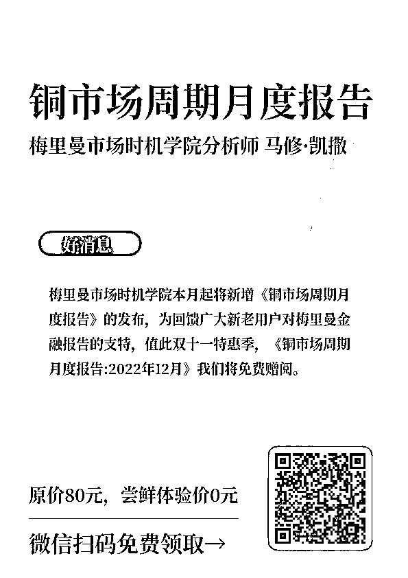

这里还有两场讲座，对你的财富管理也有一定的帮助。

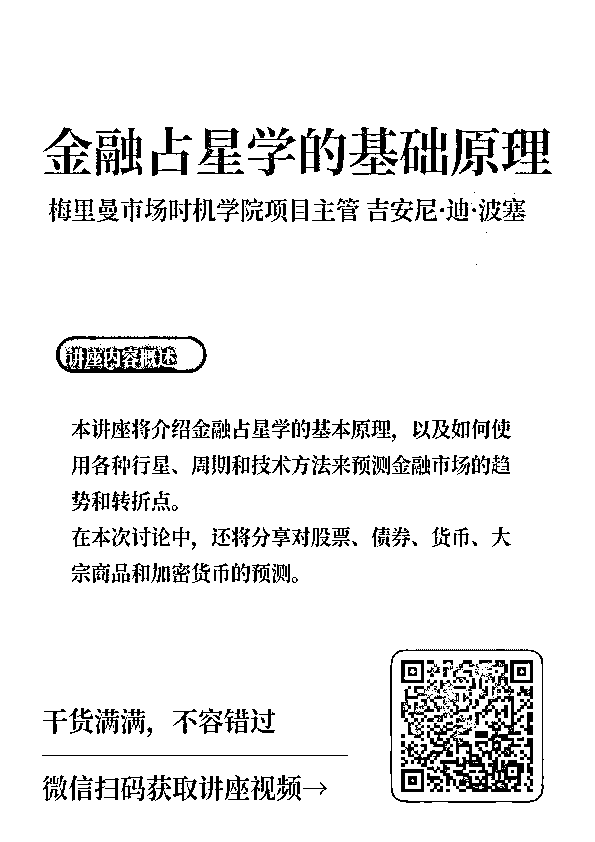

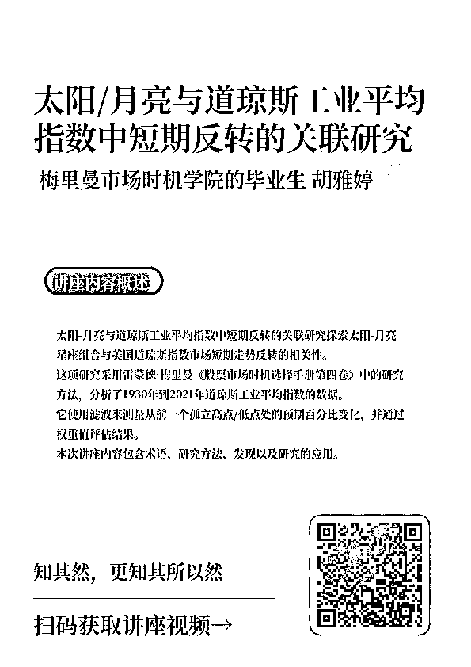

**12 月上证报告上线**

**上证指数月度报告价格****单月报告**：280 元/月 **季度套餐价格**：780 元（260 元/月）**年度套餐价格**：2400 元（200 元/月）**双报告年度套餐更优惠（直降 900 元）****12 个月黄金报告+12 个月上证指数报告：仅需 3900 元****长按下图识别二维码购买上证指数报告**
▼

**12 月黄金报告**

“**黄金是金钱。其他的只是信贷。**

**——约翰·皮尔庞特·摩根**

”

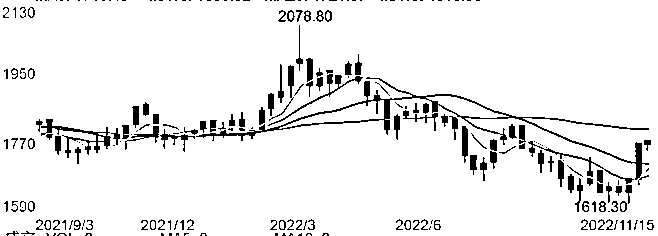

| 黄金周 K 线图

我们经历了 2 年的土天四分正在成为过去式。虽然其影响还会持续。

在上个月，我们提出了一个问题，9 月 28 日的低点 1622 是黄金 2 年来的低点，那么从这个低点，黄金会开始一轮反弹吗？毕竟，黄金有一个 31.33 个月的周期，而半周期是 16 个月，其容许度在 13-19 个月之间。上个周期低点是 2021 年 3 月的低点 1673，而 10 月是第 19 个月，正是在半周期低点的容许度内。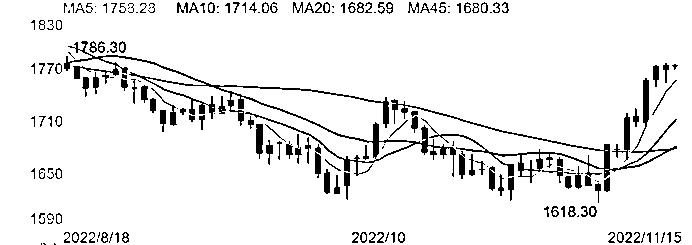|黄金日 K 线图  从现在看，答案很明显，黄金在 10 月 21 日和 11 月 3 日再次测试 1622 低点后，这 3 个低点有可能形成了 16 个月周期的三重底。随后，黄金开始了一轮反弹。目前已经反弹了 10%。黄金会继续反弹吗？此外还有白银。在上期报告中，梅里曼老师提示了关于白银的投资机会。  12 月份黄金报告已经上线，欢迎了解。也可以按照季度和 1 年期订阅，有更多优惠。季度和年度的好处是，你可以持续了解梅里曼老师对于不断在变化的市场的看法。  即便他某一次看法和市场不一致，你也看到在下一期他如何调整自己的看法，并看到金融占星在一个长期时间段内对你把控风险的帮助。而能够长期控制风险、尽量找到安全的投资时机才是投资的长久之计。  点击阅读原文，雷蒙德·梅里曼黄金周期 2022 年 12 月报告带来有 40 年黄金市场研究经验的世界著名金融占星大师雷蒙德·梅里曼对当前黄金市场的研究。投资有收益，投资有风险，希望金融占星学的研究帮助你更好地评估你的投资。

**12 月黄金报告上线**

**黄金月度报告价格****单月报告**：280 元/月 **季度套餐价格**：780 元（260 元/月）**年度套餐价格**：2400 元（200 元/月）**双报告年度套餐更优惠（直降 900 元）****12 个月黄金报告+12 个月上证指数报告：仅需 3900 元****长按下图识别二维码购买黄金报告**
▼

**购买者需知**

**① **梅里曼市场时机学院《中国上证指数月度研究报告》是梅里曼市场时机学院（以下简称 MMA）的研究“预报”，而不是市场“预测”，是梅里曼老师及 MMA 金融占星分析师对人类活动周期历史与行星周期之间相关性的研究，二者在大部分情况下具有 80%或更高的相关性，而不是因果关系。报告中的研究完全存在错误的可能性。即便是非常认真的研究和几十年的研究经验，金融占星师无法总是正确地解读出各种征象在实际层面上会如何相互作用，并显化为事件结果。

所以请将报告看作一个研究参考，务必结合其他市场研究和你个人对市场的理解，根据你的自由意志做决策。

**②** 此报告一旦售出，**即不接受退款。**

**③** 上证、黄金月度报告每月固定 1 期，**并非都是在每月相同日期发布。**

**④** **我们收到英文报告的当天，即发布该英文报告。3 天后，上线报告中文版。此报告仅支持手机网页阅读，不支持电脑阅读和下载。****以上须知，请仔细阅读。一旦付款，即视为已了解并接受所有须知内容。**在过去的 40 年中，唯有梅里曼逐渐完善，并在梅里曼市场时机学院月度周期报告中阐释了将地球宇宙学与周期相结合的研究方法，以惊人的精确性预报了黄金价格发生重大变化的时间。**黄金购买 Tip**

各大银行均可购买黄金或黄金 EFT 基金，也可以在诸如天天基金或者支付宝购买黄金及黄金相关产品。不明白的可以百度搜索。

**购买后如何查看报告？**

**购买后有疑问怎么办？**请联系技术客服
**微信：nodoor201705** **购买直达入口**

# 若道占星·双 12 | 任选折扣继续 年底充能好时机

> 原文：[`mp.weixin.qq.com/s?__biz=MzA5NjA0NTAxNg==&mid=2651496684&idx=1&sn=fbad0cf974555776a5164edd0246c997&chksm=8b48125bbc3f9b4d50a269b9cdc3d1b70c646c6a675c462cd3c651c04e75c8b1cdb7168a9517&scene=126&sessionid=1692737715#rd`](http://mp.weixin.qq.com/s?__biz=MzA5NjA0NTAxNg==&mid=2651496684&idx=1&sn=fbad0cf974555776a5164edd0246c997&chksm=8b48125bbc3f9b4d50a269b9cdc3d1b70c646c6a675c462cd3c651c04e75c8b1cdb7168a9517&scene=126&sessionid=1692737715#rd)

想一次优惠购齐三门 ISAR 选修课？

往年工作忙，错过了感兴趣的课程？

是某位老师的忠实粉丝，想集齐老师的课程？

**双 12，若道为大家精选出了 12 门 ISAR 选修课，15 门名师工作坊，**

**任选多门一次性购买可以享受不同折扣，**快去占星知识的海洋里挑选心仪的课程吧！

**参加活动的 12 门 ISAR 选修课**

 下滑可查看全部课程内容，以下皆是

**家族占星学网络课**

**原价 6800 元**

**课程内容简介**

这是一门特别适合中国占星学子的课程。因为我们是世界上最重视家族和家庭的国度，而家族和家庭又对我们和我们的后代影响至深。你的命运可能会被你素未谋面的祖父母、曾祖父母以及他们的祖先所影响，被家族中被遗忘的人所影响，也通过你向下传递给你的孩子们。

这种无意识的传承故事是我们命运的背景和暗流，而家族占星学就是照亮这个背景和暗流的镜子。我们的祖先从未真的死去，他们通过我们活着，由我们重复他们的荣耀、失败、屈辱和悲伤，直到我们真的看见他们，一切才会变为祝福。和琳恩·贝尔老师一起，用星图来探索隐秘的家族故事，并把它变成祝福你的力量。在这门课程中，欢迎大家提供自己的家族星图供探索。此课程可作为 ISAR 选修课。每次课程时长 2 小时，共 8 次课，安排如下：**占星实践中的家族模式**

我们第 1 次经由童年的巨大主导力量——我们的父母，来体验我们**太阳和月亮**、**土星和金星**。我们用他们给我们的暗示来解读这个世界，而他们的回应反过来又受到大家庭的影响，我们常常发现祖先的成功和失败、怪癖和才干经常在我们自己的生活和我们的星图中重复。

越仔细观察，我们就越能发现日期的神秘重复、平行事件，镜像先辈故事的我们自己命运的奇怪扭转。

**在课程中，我们将识别这些模式并与之合作，看看我们如何能够尊重过去，同时在生活中走自己的路。**更重要的是，我们如何面对我们祖先未活出的能量，而这些能量似乎在我们自己的人生经历中再次升起？在我们前进的道路上，昔日的先人向我们提出的问题是什么呢？

**父亲与孩子**

我们将看看**父亲的原型，以及它如何在出生星图中反映出来**。我们的父亲（或缺位的父亲）如何影响心灵结构？无论是缺席还是在身边，无论是亲生父亲还是“养父”，父亲的角色都会影响我们的基本认同和亲密关系，以及我们进入更大世界的能力。

虽然**土星和太阳**是父亲的传统指征，但它们很少被描述为漫游者、梦想家或一块“滚石”。父亲过去是法律和权威的承载者。随着文化的发展和婚姻的重新定义，父亲的原型也随之改变。**母亲与孩子**我们的**第 1 个养育者（或她的替代者），给予我们生命的人**，经常通过星图中的**月亮和它的相位**来指征。但是**其他行星**也可以描述她，其他人可以扮演她的角色。不论在星图上是哪些征象来体现这种基本关系，都在我们的一生中，留下了深刻的情感烙印。我们现实生活中的养育者如何与出生星图中的母亲形象相对应？我们如何将过去的力量整合到我们的成人生活中？**家族价值观****在每个家族中，都有 1 个主导价值，你需要认同它才能成为这个“部落”的真正成员。**它可能是力量，或智慧，或能干成事情的能力。对某些家族来说，这个主导价值是金钱；而对另一些家族来说，则是亲密和爱。崇尚运动的家族可能会嘲笑爱读书的孩子，赶走爱做梦的人。我们对家族的忠诚可能会阻止我们追随自己的天赋。那个离经叛道的孩子会怎样？**第 2 宫-第 8 宫轴线和金星的相位将为我们提供这些问题的线索。**有内在的价值观，也有文化和家庭强加的价值观。我们将探讨家庭价值观和对我们最重要的价值观部分之间的交集。我们该如何尊重灵魂，并且仍然对那些养育我们，使我们充满希望和梦想的人保持信心？**成功、家族压力、负债和牺牲**家族中的一个孩子，通常是最年长的，承载着家族成功的需求。但是，当这个孩子是女性，或者和家族传统的性情不同时，会发生什么呢？当个人需求和家族需求之间存在紧张关系，孩子可能会牺牲自己的天赋，而这会影响下一代人。一个拥有强大外行星的人可能会发现很难像以往那样简单地继续下去，而这也会动摇家族的自我认知。他们也可能是那个冲破家族一直以来的挣扎的人。一个孩子可以救赎数代人的失望。这些议题会由出生星图的哪些征象体现出来呢？我们将看**第 4 宫和第 10 宫，第 2 宫的价值观和第 12 宫的牺牲**。**当前关系中的过去模式**继续探索家族模式，密切关注过去对当前关系的影响。我们的原生家庭和先辈是如何定义爱的？如果爱是奴役的一种形式，我们可能需要找到自由，或者重新定义服务。如果我们的某个孩子让我们想起自己害怕和憎恨的父母，或者我们最不喜欢的兄弟姐妹或表亲时，会发生什么？

即使那些似乎完全与过去决裂以逃避“家族遗产”的人，也可能在一个困难的工作环境、一个特别难相处的老板或他们自己孩子的生活中重新遇到它，因为失落的爱的幽灵和没有被活出的故事往往会跳过一两代人重新出现。**家族的无意识带着某种印记，邀请我们再试一次，为一个旧故事找到新的结局。**

**家族秘密与家族创伤**

**许多藏在家族“壁柜”里的秘密通常在第 8 宫显现，或者由冥王星相位显露出来。**有些东西是隐藏的，因为它们很危险；另一些是因为它们太珍贵了，不能分享，比如失去的爱，或是被收养的孩子。

秘密可能涉及小的轻率行为，或大的背叛。他们可能隐藏痛苦、欲望或可怕的创伤。这些被锁住的能量经常隐藏在我们身上，带来焦虑。轻柔地将它们带到光明中，有助于释放和转化家族中内疚和羞耻的力量。

**太阳返照技法**

**原价 6800 元**

“每当太阳回到它在出生星图上的位置，我们都把宇宙的一个新部分吸纳进来，并把它变成我们自己的。大多数人都会有这种体验，生日那天是特殊的。那时我们可能会掂量一些事情，感受时光的变化，并为最近的过去画上一个句号。同时，我们也可能想把未来握在自己手中。太阳返照就是这样，它是我们未来的一小块。端详着它，会有一种跃跃欲试的期待感，将太阳返照与行进和次限一起用，会开启我们对未来时间的理解。黄道的每一个度数都带着某个太阳能量的特别印记，这是一种支撑着我们核心自我意识的独特品质。当太阳回归到那个度数，甚至分和秒都准确地回归到我们出生星图中的分秒时，这种至关重要的光就会被重新充满，每一颗行星都会与太阳形成新的关系。在这门课程中，我们将学习如何解读太阳返照图，并理解它对未来一年传达的信息，理解在未来的一年里会发生什么？我们在整个课程中都会研究案例。学员们也将研究自己过去和未来的太阳返照图。”——琳恩·贝尔 Lynn Bell**课程学习目标**跟随太阳返照技法顶流名师系统学习，熟练掌握太阳返照单盘、双盘解读。学习掌握太阳返照解读延伸出的占星知识：太阳返照择时、小限法等。更好地解读每一年宇宙给予你的生日礼物，规划未来一年，活出生命的荣耀。更清晰地洞察每一年的人生功课，更从容地迎接祝福、挑战、潜力和困难。以人生目标管理的方式应用太阳返照盘，制定人生的 3 年、5 年、10 年计划。太阳返照为 ISAR 考试知识点，适合计划获得 ISAR 认证学员系统学习。整合太阳返照等多种技法，在咨询中开设新项目《生日年运解读》。此课程可作为 ISAR 选修课。

**课程内容简介**

每次课程时长 2 小时，共 8 次课，安排如下：

**第 1 课**

❶ 什么是太阳返照

❷ 如何解读太阳返照

❸ 一张太阳返照图解读两遍

❹ 为期 19 年的默冬周期预测与意识

❺ 出生地与迁徙地的返照图

❻ 不是所有的年份的太阳返照都一样 

**第 2 课**

❶ 月亮在太阳返照中的至关重要性及其元素周期

❷ 月亮落入火元素星座、土元素星座、风元素星座、水元素星座的解读

❸ 食相、满月和新月

❹ 月亮在太阳返照中的相位 

**第 3 课**

❶ 继续月亮的相位

❷ 太阳照亮各宫位

❸ 通过太阳所在宫位解释太阳返照

❹ 在太阳返照中太阳的相位

**第 4 课**

❶ 太阳返照中的合轴行星

❷ 太阳返照中的合轴行星为未来一年添彩，并成为来年的主导者

❸ 重要的星图模式❹ 精确紧密的相位❺ 行星力量 **第 5 课**

❶ 太阳返照与出生星图的关系

❷ 识别模式

❸ 太阳返照中行星作为出生星图的解释

❹ 逆行行星和共振相位❺ 出生上升点经过各宫位

**第 6 课**

❶ 太阳返照中的择时❷ 利用月亮择时❸ 整合行进❹ 太阳经过各宫位❺ 中天推进❻ 小限法 **第 7 课**❶ 特殊的太阳返照年❷ 太阳返照与金星周期❸ 中天经过各元素❹ 最好和最坏的年份

 ** 第 8 课 **

❶ 与未来合作❷ 技巧的整合❸ 预测与心理学❹ 如何处理两难困境

**医疗占星学网络课**

**原价 6800 元**

有 4 个主要因素影响着我们的生活和健康：基因构成、物质环境、情绪环境，以及我们的占星配置。我们在星图中都存在患病的可能性，而预防的方法在于尽可能充分、真实和健康地生活。
　　——简·里德·帕特里克（Jane Ridder-Patrick）博士占星学就像心灵的 X 光片。它可以描述个人对世界的看法和反应。我们越不了解自己的天性，面对生活中的挑战，我们就会有越少的选择。“占星学可以精准定位需要解决的潜在问题。”医疗占星学是一个强大的工具，同时洞察的身体和心理过程，通过更多的自我认知照顾和关爱自我和身边的人。本课程既适合医疗占星学的初学者，也适合已经有一些相关经验的人。简·里德·帕特里克老师将运用现实生活中的例子，揭示一个人的性格、症状及其星图是如何相互映照的。课程也会探讨疾病的意义以及可能的治疗方法。本课程旨在为学员提供一个运用医疗占星学的框架和方法，学员将会学到一些有价值的实用工具，在课程结束后，自己使用这些工具研究其中的关联性。此课程可作为 ISAR 选修课。

**课程内容简介**

每次课程时长 2 小时，共 8 次课，安排如下：**第 1 讲  与占星****学、心理****学、病症一起工作**医疗占星学的组成部分以及如何使用它们行星的作用与相互作用黄道星座人宫位的重要性疾病和健康是如何产生的★ 第 2、3、4 讲的课程内容基于星座以及它们之间的相互作用。

**第 2 讲  基本星座**

学习基本大十字星座——白羊座、巨蟹座、天秤座和摩羯座及其功能和相关的健康问题。这些星座与防御、养育、结构、体内平衡和荷尔蒙控制有关。

**第 3 讲  固定星座**

学习固定大十字星座——金牛座、狮子座、天蝎座和水瓶座及其功能和相关的健康问题。这些星座与习惯和反射、心脏调节、生存、循环和协调有关。**第 4 讲 变动星座**学习变动大十字星座——双子座、处女座、射手座和双鱼座及其功能和相关健康问题。这些星座与呼吸、神经系统、肠道、睡眠以及信息、情感和行动的整合有关。★ 第 5、6、7、8 讲重点学习行星，它们在身体层面的表达、它们的相位与行进。**第 5 讲 太阳与月亮**太阳掌管视觉、活力、心脏和意识，与心脏、脊柱和视觉问题相关。月亮掌管人体的周期，特别是月经周期、饮食模式和体液，与情绪引起的疾病、饮食失调和胃病相关。

**第 6 讲 土星与天王星**

土星掌管着皮肤、骨骼、牙齿和衰老过程。它对应的疾病包括慢性疾病、耳聋、帕金森病、关节僵硬和牙齿问题。天王星代表身体活动的协调，有节奏的脉动和身体的“电”。与天王星相关的疾病包括癫痫、痉挛、心律失常，以及阿斯伯格综合症和自闭症样综合症。

**第 7 讲 海王星与冥王星**海王星掌管松果体、细胞膜渗透和右脑功能，与过敏、上瘾的病症、慢性疲劳综合症和睡眠障碍相关。冥王星掌管消除和转化，其病理包括毒性、脓肿、癌症和强迫症。**第 8 讲 火星**火星是与能量和防御相关的行星，掌管免疫系统、肾上腺功能、肌肉活动和炎症反应。它是许多身体和情绪障碍的核心，如自动免疫障碍、抑郁和发烧，以及由手术或需要手术引发的问题。

**古占和现占的结合**

**原价 6800 元**

跟随当今最博学的占星学者，学习原汁原味的古典占星学，回归占星学最古朴、传统的面向，从中汲取新的智慧。"罗伯特.汉德不但是一名优秀的占星师，更是一名伟大的占星学者。他在古典占星学领域做出的研究与贡献几乎无人能及。他积极推动了古典文献的翻译与传播，引领了古典占星学在当代的复兴风潮，让现代占星师得以接触到失落或埋没的古老智慧，并从中获取新的洞见。在本次课程中，罗伯特将为大家介绍中世纪、阿拉伯及拉丁占星学的入门知识，带领大家踏入古典占星学的大门。罗伯特.汉德是我们占星学界的百科全书，他丰厚的学识总让人敬佩不已。"——杰夫.焦耳"罗伯特.汉德是我认识的最聪明的人。他是一个传奇。"——斯蒂芬.弗里斯特此课程可作为 ISAR 选修课。

**课程内容简介**

****每次课程时长 2 小时，共 8 次课，安排如下：****

**主题 1：复习古典占星学的概念**

一、大体介绍课程的总体安排以及如何选择学员星图作为案例

1. 上课形式更为灵活。这里提到的课程安排可能会在上课过程中根据需要进行调整。

2. 如何挑选课程中作为案例的学员星图。除了这部分之外，课程中用到的星图都会是学员的星图。我们不可能逐一分析每个人的星图，因此会挑选部分星图作为案例。 

二、运用的方法、工具和基本概念对于只学习过一般占星学知识的人，可能会有一些不太熟悉的术语和概念，比如：⑴ 行星的先天秉赋表及其运用。⑵ 对于现代行星（天王星、海王星和冥王星）、小行星和其他所有已知或未知的行进星体的应用，以及这些星体与古典行星在用法上的区别。⑶ 整宫制：什么是整宫制，它与常用的分宫制有什么区别。⑷ 胜利星：包括单一胜利星和复合胜利星。⑸ 点宫制：从福点和精神点算起的分宫制，它们的用途，它们给占星学带来了什么。⑹ 如何处理中天：因为第 1 宫是从上升星座算起，所以可以在第 10 个星座之外的星座中发现中天。这种情况如何处理？ 在这一部分会用到一些名人的星图作为例子，但在之后的课程会使用学员的星图为例。主题 2：用古典占星学解读学员星图 1. 距离上升点、中天、下降点和下中天 7.5°以内的行星重要程度依次递减（上升点和中天的重要程度几乎相当）。2. 寻找相位异常多的行星，尤其是与太阳、月亮、中天或上升点形成相位的行星。3. 被强调的星座，有四颗或四颗以上的行星，加上中天或上升点。4. 太阳星座、月亮星座和上升星座的关系，它们的特质是类似的还是不同的？5. 上升星座的守护星或上升星座的胜利星，它落在什么星座、什么宫位？它所在星座是否与上升所在的星座形成相位？这些知识都将通过学员的星图来学习、展示。主题 3：通过学员星图分析其个性、健康、疾病 1.行星或其他星图征象可能影响的因素。介绍：⑴ 体型、体态和外貌。⑵ 心智特性。⑶ 性格和个性。⑷ 与环境的互动。⑸ 本我。2.哪些因素对体型、体态和外貌影响最大？⑴ 遗传和种族血统。不要把一个人的血统不太可能有的身体特质强加到这个人身上。然而，在现代化妆品的帮助下，人们对自身外表所做出的改变可能实际上将他们带到传统占星学所暗示的方向上。⑵ 太阳、月亮和上升星座。⑶ 任何被众多因素集中强调的星座。⑷ 任何接近上升点或中天（士 7.5°）的行星。任何与上升点或中天形成非常紧密的（士 2-3°）主要相位的行星也有一定的影响。⑸ 星图中任何与上升点、太阳或月亮有关的其他常见重复主题。⑹ 疾病。补充：在这部分星图分析的讨论中，星图被选中的学员附上电子照片效果会更好。主题 4：现代和古典之比较，分别解析个性、性格和心智这一主题一直是 20 世纪占星学最为重要的关注点之一。然而，却有着两种极为不同的切入方法。⑴ 现代方法，基于上面所提到的分析外形类型所运用的方法。⑵ 中世纪方法。（简化版，老师会在必要和适当的时候介绍其更为复杂的面向。）完全取决于星图中与心智功能特定征象星有守护关系的行星。主要是那些围绕星图中 4 个关键点的行星，以及关键点所在星座的守护星和与关键点形成相位的行星。① 植物的生长灵魂：主要象征是上升点及其守护星。② 感性灵魂或动物的灵魂：主要象征星是月亮及其守护星。③ 智性灵魂或理智的灵魂：主要象征星是水星及其守护星。④ 这些都受到任何与主要象征星成相位的行星的影响。主题 5：情感关系（家人、爱人、朋友）尽管在传统上，每 1 宫所赋予的主题似乎通常可以表明该宫位是否主要是个人宫位，是否与人际关系有关，或完全是外界环境层面的；但实际上，每组象征符号和星图都可以也确实体现了所有这 3 个层面。不过，此次课程余下的时间我们将主要讨论人际关系和纯环境因素。情感关系：⑴ 父母和原生家庭，也包括本人（就是你）可能拥有的自己的家庭。该主题下还包含与权威人士的关系。⑵ 兄弟姐妹和堂表亲，也包括叔叔/舅舅、阿姨/姑姑。⑶ 亲密的一对一关系。⑷ 朋友和一对多的关系。⑸ 敌人。主题 6：财富、投资、职业⑴ 金钱、财富，理财观念。⑵ 个人工作或职业的日常活动。⑶ 职业和社会地位，毕生的追求以及谋生之道。主题 7：移民、旅行、学习⑴ 旅行和与其他国家的交流互动。⑵ 学习其他文化。⑶ 移民倾向

**凯龙星**

**原价 6800 元**

凯龙星发现于 1977 年，是占星学研究的前沿。有一位老师，因为不可思议的因缘，与凯龙星研究相伴几十年，最终出版《凯龙星》专著，成为占星领域少有的凯龙星大师。她就是出生于肯尼亚的梅勒妮·莱因哈特，从瘫痪到不用西方医学治疗的经历让她在生命早年就走向包含身体、精神、神性以及个人灵性的进化之路。凯龙星，正是星图上的“受伤的疗愈者”。它向你揭示你生命中的创伤及疗愈历程，揭示痛苦和疗愈的本质。我们有这样一个难得的机会，向这位国际凯龙星权威学习凯龙星的研究精华。此课程可作为 ISAR 选修课。  **课程内容简介****首先，我们将了解实际的天文学和神话中隐含的象征和意涵，学习去“看透”象征的世界，这对理解“凯龙星意识”至关重要。****每次课程时长 2 小时，共 8 次课，安排如下：****✦ 天文学和神话中的凯龙星含义****天文学部分：**带你探索凯龙星发现以来的“天空之旅”——从不明星体到多次被重新归类凯龙星的由来凯龙星发现的时代背景凯龙星与冥王星之间的关系从宇宙论理解凯龙星的象征意义**神话部分：**凯龙星原型的象征和研究**了解凯龙星的背景之后，我们将重点学习个人星图中的凯龙星，以及行进凯龙星。****个人星图中的凯龙星：**个人星图中的凯龙星如何解读凯龙星在星图中的落点，在生活中是如何表达其主题？**行进中的凯龙星：**凯龙星在行进中被触发如何解读？行进中的凯龙星如何解读？**有关业力的部分：**凯龙星与祖先领地和祖先业力的关系如何通过凯龙星看“家族集体疗愈”？从家族星图的凯龙星看你此生的“疗愈任务”**体验凯龙星疗愈之旅：**引导冥想，感受凯龙星的疗愈之旅如果你是一个致力于个人疗愈的占星学子或者致力于帮助他人疗愈的占星师，学习、了解凯龙星是你必不可少的一门必修课。

**小行星**

**原价 6800 元**

对于占星师来说，巨大的小行星带中有成千上万的滚落岩石在太空中呼啸而过，这似乎是一次令人生畏的雪崩，蕴含着潜在的新信息。因此，当你将它们整合到你的工作中时，辨别并正确理解每一颗小行星的意义是很重要的。包括选择小行星在星图的解读，增加微妙的细微差别和令人惊讶的细节是无法从任何其他占星工具中获得的。理解小行星带所蕴藏的神圣女性力量的流动将帮助你在占星实践中创造更多的和谐与平衡。小行星为你的解读带来细节、精确性和深度，同时也使你能够研究和阐释那些被忽视或低估的生命领域。我们将讨论主要的女神小行星，并学习如何与之合作。我们将借助大量现实生活中的例子，深入探讨它们的象征意义。你会真正了解这些重要的占星元素，从而拓展自己的实践。此课程可作为 ISAR 选修课。

**课程内容简介**

每次课程时长 2 小时，共 8 次课，安排如下：
**第 1 讲 小行星简介**小行星概述，小行星的发现、科学以及一些占星学历史。**第 2 讲 谷神星，丰饶女神**母神、农业女神，但其影响力远不止如此。这是我们所知的最大的小行星，也是最重要的小行星。她掌管养育、滋养、救助、管理等方面。**第 3 讲 婚神星，婚姻女神 **荣誉、伙伴关系、契约和婚姻：众神中的女王是正直的女主人。她在出生星图和行进中有什么意涵？她与“丈夫”木星朱庇特是什么关系？**第 4 讲 智神星，智慧女神**战地记者、棋手和占星师有什么共同之处？来自智慧、策略、洞察力和远见女神的帮助。**第 5 讲  灶神星，壁炉女神**掌管神圣的火焰、家庭生活、厨房灶台、家人、遗产的女神：这颗关键的小行星被严重误解了。她可以给你一把钥匙，让你了解家庭关系、你的祖先和你的目标意图。**第 6 讲   健神星，健康女神**在我们应对全球疫情的过程中，掌管健康和福祉女神目前显得尤为重要。她能提供如何应对新型冠状病毒肺炎的线索吗？她在出生星图中的意涵是什么？幸福原来蕴含着相当广泛的含义。**第 7 讲 灵神星，灵魂女神**灵神星是唯一一位以人类身份开始生命的女神，她代表着人类的灵魂。这颗小行星与爱情故事、童话故事和灵魂之旅有关。**第 8 讲 综合应用，展望未来**你们刚刚开启探索使用小行星可能性的旅程。我们会探索评估某些理论有效性的方法，以及在实践中检验这些理论的重要性，我们还会探索其他数百万小行星中的一些。这堂课既有提醒告诫，也鼓励你深化自己的占星实践，并拓展你对象征的理解。

**次限月亮**

**原价 6800 元**

星图中的月亮描述了我们在婴幼儿期和童年早期如何接收母亲的能量。我们从出生开始就通过月亮的反射来体验母亲，正如月亮反射太阳的光一样。月亮也会描述一些我们可能会称之为灵魂的事物：我们的人生经历在时间和永恒之间的内在反射物。次限月亮通常被视为用于预测以及为事件择时的因素，但实际上它的内涵远远不止如此，要更为深刻和微妙。次限推进月亮（Secondary Progressed Moon）：用次限推进，也即一天即一年的推进法时的推进月亮。次限推进月亮平均每月移动 1°，虽然速度并非恒定。次限推进：托勒密时期，2000 年前发明。当次限月亮在我们星图上的星座和宫位推进时，它会以唤起我们个体本质以及人性的方式，反映我们成长和发展的经历。对于那些同时开展内在和外在生活的人来说，次限月亮可以成为一个向导，照亮自我反思和内在滋养的面向。在 8 周的课程中，我们将学习次限月亮是如何像镜子一样映照出我们最深的本质的。此课程可作为 ISAR 选修课。

**课程内容简介**

每次课程时长 2 小时，共 8 次课，安排如下：**第 1 讲 出生星图中的月亮与它在童年的推进**我们将学习出生星图中月亮的象征意义，以及它如何反映你的母亲以及你童年的家庭生活。我们将从元素的角度观察月亮，并研究从出生起你是如何得到母亲的关注的，我们将观察出生后几年的月亮的推进。**第 2 讲 从 7 岁到 14 岁：从自己到他人**次限月亮与出生星图中月亮的第 1 个四分相在 7 岁左右出现。我们将学习在这个关键时间点我们是如何开始意识到自己是独立存在的个体，以及它如何让我们向家庭以外的其他人寻求滋养和生命。**第 3 讲 从 14 岁到 28 岁：从别人到自己**从 16/17 岁到 28 岁左右第 1 次次限月亮回归，我们完成了与他人和与自己的月亮的灵魂之旅。从次限月亮回归开始，我们就开始对自己的情感生活以及我和其他人之间所发生的负责。**第 4 讲 从 14 岁到 28 岁：从别人到自己**当次限月亮描述我们内心的旅程时，土星的行进描述了我们与周围世界的联系，以及作为社会发展中的个体，世界对我们的要求。在我们生命的头 30 年里，它们几乎以相同的速度运行。**第 5 讲 次限月亮与其他行星的相位**我们将从次限月亮的旅程中抽身出来，看看它与各种不同人的星图的其他行星产生有趣而特别的相位时发生了什么，这样我们来了解次限月亮触及我们星图中的这些行星时会发生什么，以及我们该如何为自己的生命导航。**第 6 讲 30-60 岁的次限月亮推进**当月亮再次绕着出生星图运行时，我们有机会将意识带到我们的情绪反应中，并开始引导我们的内在本性，而不是对发生在我们身上的事情束手无策。**第 7 讲 60 岁以后的次限月亮之旅**在当今时代，60 岁以后过着积极生活的人比历史上任何时候都多。有的人在 70 多岁的时候坠入爱河并第一次结婚。我们将在这一讲探讨如何在我们生命的最后几十年里对自己和他人有用，这样我们就可以体验到生命的丰富多彩。**第 8 讲 次限月亮与次限太阳的关系**最后，我们来研究次限月亮绕着星图运行时与次限太阳推进的关系。我们将通过星图案例来进行探讨。

**原型占星学**

**原价 6800 元**

占星学的基本原则是，每颗行星都代表了特定的原型力量或法则，影响着人类的世界。天上行星形成的模式和地上人们生活的模式息息相关。对于每个个体来说，其出生时的时间和地点反映了他们人生和性格中的基本原型模式。

占星学使人们有机会更加了解自己的生命。它的周期、高潮与低谷、危机和突破、重大变化和转化的时期，都写在行进星图上。行进指的是相对于出生时行星的位置，当下天空中的行星位置构成的特定几何图形。这些图形的特性所涉及的行星及其位置，几乎总是与当时人生体验的原型特性一致。

因此了解原型对透彻理解和运用占星学格外重要。那么，什么是原型？什么是原型占星学呢？它在我们的生活中是如何运作的呢？西方著名文化历史学家、研究原型占星学 30 年余年的理查德·塔纳斯将为我们打开原型占星学的大门。你关于原型占星的诸多疑问都将得到解答。在这门课上，我们不仅会学到理论知识，还会在各种示例中感受到原型的力量和它的运作，音乐、视频、图像也会是这些示例的一部分。此课程可作为 ISAR 选修课。

**课程内容简介**

每次课程时长 2 小时，共 8 次课，安排如下：

**授课重点**

☆ 原型占星学的基础

☆ 实际应用（用于自我认知、从容生活、情感关系、心理治疗）

☆ 更大的意涵（哲学的、宇宙的、历史的）

**知识点**

☆ 一致性的基本形式：出生星图、个人行进、世界行进

☆ 占星学如何运作，共时性的角色

☆ 占星学中的命运和自由意志问题

☆ 原型的本质/基本特征

☆ 行星的意义以及它们的组合

☆ 主要相位

☆ 如何把握一张出生星图最重要的主题

☆ 评估个人行进

☆ 评估世界行进

☆ 重要的是认识到原型的多元性，以及在共同创造性地展现我们出生星图和行进的潜能的过程中我们所扮演的角色、所具有的力量和所肩负的责任。

**第 1 课：开课欢迎致辞**

介绍我们将在该课程中涵盖的内容

占星学和心理学如何互相启发，互相增强

我的占星学之旅

是什么让原型占星学与众不同

课堂讨论，提问与回答

**第 2 课：原型占星学的基本概念框架**

运作方式：因果关系和共时性的议题

命运和自由意志

理解原型

**第 3 课：行星的意义，从发光体太阳、月亮开始，到水星、金星、火星、木星、土星**

**第 4 课：外行星天王星、海王星、冥王星：“银河使者”**

**第 5 课：观察运转中的行星，第一部分：艺术、音乐、电影、喜剧（指定的电影）中的示例**

**第 6 课：观察运转中的行星，第二部分：艺术（指定的电影）中的更多示例**

**第 7 课：个人行进，以及如何带着占星学的觉知投入到生活之中**

**第 8 课：世界行进，以及以占星学更宏大的哲学意涵来理解我们在历史上所处的时刻**

**恒星**

**原价 6800 元**

灵魂深处，无意识深处，宇宙深处……细微的火花闪耀着被遗忘的事件、古老的神话和遥远的恒星之光。正如所有这些恒星都不再位于我们上一次看到它们所处的地方一样，每一个神话对星座的描述都代表着我们不停经历的相对现实，因为在每个生命的最深处，都蕴含着神话代码的无意识法则。这个指引人在命途中前进的代码被称为命运。每个现实都由 3 部分组成，恒星描述的部分是人类现实中最深刻和一成不变的，或者说这个部分引领带着相同故事和扮演相同角色的灵魂穿越世代，穿越由这个神话所连接的各个轮回转世，穿越人的基因遗传。太阳掌管意识，月亮代表潜意识和做梦，而且正如你可能会猜想的那样，恒星象征深刻的境界、无梦的睡眠和无意识。每个层次的现实有自己的光，层次越深，光线越暗，命运就越不可避免。然而，越接近这些构成天文星座的恒星，我们可以看到的光就比我们的小太阳更多，因为每一颗恒星都代表着一个人内心深处的巨大太阳，它拥有自己的生命和围绕自己旋转的行星。正如由于无意识的神话代码，每个人都代表着他们自己的宇宙一样。恒星代表命运的特定支柱，因为它们是从存在的无意识层面运作的。恒星以非常独特的方式反映了人类命运的主要神话。面对如此浩瀚的宇宙恒星课题，我们邀请到了恒星课题研究的先驱专家、ISAR 主席：亚历山大·因舍阿吉克老师，他深入研究恒星在占星学中的应用并出版了 600 页的相关著作《命运的支柱-占星学中的恒星》，亚历山大老师创办的约翰尼斯·开普勒占星学院，开设成熟专业的恒星课程，若道占星首次邀请亚历山大老师给中国占星学子亲授本次恒星课程。此课程可作为 ISAR 选修课。

**课程内容简介**

每次课程时长 2 小时，共 8 次课，安排如下：**第 1 讲：导论与主要天文星座**存在的层面我们的存在有 3 个关键层面，占星学的影响也有 3 个主要层面。其中之一就是恒星的影响层面。神话编码恒星星座或星团代表着神秘的丝线所编织的网，它们创造了我们的集体命运，也创造了个人的命运。其基石是由融入集体无意识的存在或本质中的原始神话组成的，因此代表了人类的基本编码。天文星座所赋予的神话是现实的基本框架，也是案主在实现神话或部分神话的道路上内在所承载的命运的深层编码。恒星、天文星座和占星学星座我们应该一直谨记黄道占星星座和黄道天文星座之间的重大区别。恒星和天文星座所使用的容许度恒星对不同的行星和四轴的影响力不同，其容许度取决于好几个因素。恒星影响的传导物行星和宫头主要的天文星座天龙座、英仙座、武仙座示例，案例研究**第 2 讲：皇室天文星座**组成“皇室”的天文星座主宰着北方天空，主要包括埃塞俄比亚国王和王后（仙王座和仙后座）以及他们的女儿仙女座。示例，案例研究**第 3 讲：一等星**每颗星等小于 1.5 的恒星都是一等星。这些恒星的总共有 20 颗，最大的是天狼星(大犬座α)，-1.46 星等。即使天狼星和其他恒星的星等为负数，在占星学的意义上，它们也被称为一等星。一等星是最大的恒星，由于它们的体积最大，它们的影响力也最大。它们除了具有特定的性质外，还能增强案主的生命力和力量，因此能提升案主的潜能。**第 4 讲：黄道天文星座 1（白羊座到巨蟹座）**黄道天文星座与黄道占星星座类似。黄道占星星座是根据黄道天文星座来命名的，这是它们之间的所有关联，在回归黄道占星学和恒星黄道占星学中都是如此。我们还要了解的是，有 13 个黄道天文星座和 12 个黄道占星星座。尽管黄道天文星座和黄道占星星座在占星学意义上并无联系，但是它们是相关的，通过了解黄道天文星座的性质，我们可以增进对黄道占星星座性质的理解，而这正是回归黄道占星学和恒星黄道占星学的基础。因此，我们会将黄道天文星座分成几个小组来讨论。前 4 个黄道天文星座中的恒星（白羊座、金牛座、双子座、巨蟹座）示例，案例研究**第 5 讲：黄道天文星座 2（狮子座到天蝎座）**中间 4 个黄道天文星座中的恒星（狮子座、处女座、天秤座、天蝎座）示例，案例研究**第 6 讲：黄道天文星座 3（蛇夫座到双鱼座）**黄道天文星座中的恒星（蛇夫座、射手座、摩羯座、水瓶座、双鱼座）示例，案例研究第 7 讲：剖析天文星座恒星象征存在的无意识部分，因此恒星和天文星座主要描述物理现实。剖析天文星座与解剖人体密切对应。因此，代表人类天文星座（有时是动物天文星座）身体部位的恒星与人体的部位相关，这些部位要么特别敏感，要么被强调或以其他方式与和这个恒星天文星座相关的神话的特定部分相关。此外，恒星所属的天文星座中的每一部分都有自己的象征性关联。**第 8 讲：业力占星学中的恒星**理解恒星在业力占星学中的影响，有助于我们看到灵魂的路径，以及我们当下的任务。因此，恒星让我们能够清楚地看到业力与业力之间的关联，这本身就代表完整整合的一个重要部分。

**行星交点**

**原价 6800 元**

马克老师首先会讲解基础知识，介绍行星交点是什么、行星交点运转的动力（包括日心视角和地心视角），然后他会论述丹恩·鲁伊尔晚期工作中关于月亮交点和行星交点重要性的洞见，以及它们如何在个人生活和事件中创造一个动态的意义轴，超越个人出生星图的静态画面。马克老师还将简要介绍自己的一些开创性研究，并通过精选一些反映我们共同的集体进化的现代历史事件，分享他最近的著作《行星交点与集体进化》中的洞见。我们将学习木星往外的行星交点，看到木星交点如何向我们揭示文化和宗教意识形态的集体历史进化，正如我们的文明结构所表现出来的那样。例如，土星和冥王星的交点也在摩羯座，清楚地描绘了我们所有人在这个时期试图进化所面临的挑战，因为在我们生活的世界根本结构的变化中，游戏规则正在升级。我们还将学习近期历史中行星交点的影响，包括最近木星、土星和冥王星在摩羯座的大合相，开始真正意识到当前这个时期在文明进化本身中的集体重要性。理解这些盛衰周期，我们至少可以在这些困难时期仍然抱有希望：我们不会失去一切！在整个课程中，马克老师将通过多个历史案例动态地研究这些强有力的交点配置可能如何运作。此课程可作为 ISAR 选修课。

**课程内容简介**

每次课程时长 2 小时，共 8 次课，安排如下：**第 1 讲 介绍行星交点**我们将学习行星周期如何形成行星交点，并了解日心视角和地心视角之间的区别。**第 2 讲 什么是行星交点**我们将深入学习丹恩·鲁伊尔的成熟思想，这是启发马克老师研究行星交点的灵感之源，也是他最近出版的《行星交点与集体进化》一书的灵感来源。**第 3 讲 双子座-射手座的天王星交点**我们将学习人类认知和技术如何通过天王星交点的透镜进化。**第 4 讲 巨蟹座-摩羯座行星交点**我们将进一步学习行星交点对社会和文化的影响，深入探讨落在摩羯座-巨蟹座的木星、土星和冥王星交点，并了解它们在过去 1000 年里对我们的全球社会、政治和文化思潮起着怎样至关重要的影响。**第 5 讲 海王星及其狮子座-水瓶座交点**我们将学习落在狮子座-水瓶座的海王星交点影响的不同显化，及其在疗愈中的作用；灵性意识形态的发展，及其促使事件结束的倾向。**第 6 讲 作家案例**通过原创研究，我们将学习行星交点如何影响了世界上一些最伟大的作家的人生。**第 7 讲 研究 2020 年**我们将了解 2020 年的重要意义。**第 8 讲 回顾**我们将回顾前面的课程，并探索如何通过行星交点的意涵理解月亮交点。

**金融占星初阶课**

**原价 7500 元**

在金融投资市场上，最重要的就是对于周期的了解。当你在错误的周期进入市场，就好像在逆风下开船，即便你是老练的水手，也可能会遭到船倾覆的结果。如果你在正确的周期进入市场，你就会有很多助力。本门课程中所介绍的技术适合于所有金融市场，不论你是个人投资者，还是职业投资者，都可以从这门课程收益。雷蒙德·A·梅里曼为世界最知名的金融占星师，也多次出任 ISAR 主席，我们很荣幸请到他为大家开设这门金融占星课程。此课程可作为 ISAR 选修课。

**课程内容简介**

每次课程时长 2 小时，共 8 次课，安排如下：**第 1 讲 与金融市场相关的周期研究中会用到的术语**周期周期性容许度范围如何估量市场周期：波峰与波谷扭曲失真平移：左、右、涨、跌 **第 2 讲 行星动力及其与经济占星学、金融占星学和世俗占星学的关联**逆行阶段和停滞阶段金融占星学和世俗占星学中的“入座”日心水星（射手座）相位：作为市场时机因素的主要相位和标准相位月节律：与股票和黄金走势的关联**第 3 讲 市场周期的结构**模式阶段子周期市场周期的牛市、熊市分别包含的 3 个基本模式**第 4 讲 趋势分析**牛市趋势的 5 个基本特征熊市趋势的 5 个基本特征占星学及其在趋势逆转中的作用介绍关键反转日期（CRD）介绍**第 5 讲 股指的长期周期**它们的阶段与子周期美国股市与英国股市（它们历史悠久）案例**第 6 讲 股指的长期周期（续）**4 年周期及其阶段占星征象与股市长期周期的关联冥王星在不同星座海王星在不同星座**第 7 讲股指的长期周期（续）**天王星在不同星座和黄道区间土星在不同星座和黄道区间北交点黄道区间**第 8 讲 行星相位及其与长期市场周期的关联**长期市场周期与长期行星周期的重叠展望未来

**金融占星进阶课程**

**原价 22000 元**

课程内容简介金融占星进阶课程以金融占星初级课程为基础，我们将回顾各种主要金融市场的长期周期及其阶段。在此框架内，将详细探讨这些周期、阶段和长期行星相位征象的关联，并指向长期投资。此课程分为两个阶段，两种授课方式：第一阶段：网络视频课第一阶段课程为 10 次网络课程，由雷蒙德·梅里曼老师及其他 4 位老师授课。每次课程时长 2 小时，共 10 次课。（1）计算金融市场的价格目标（2）原油市场周期分析与木星-海王星相位（3）成对行星周期及其与股票市场长期周期的相关性对下一次股市危机的探讨（4）木星及外行星周期与股市中期周期相关性（5）英镑长期周期与外行星周期及其相关性（6）大豆、玉米和小麦的长期周期和外行星的相关性（7）黄金和白银价格和黄金价格的长期周期与占星周期的相关性（8）恒生长期周期和中国股票市场（9）美元长期周期和地球宇宙学的相关性（10） 美国国债长期周期和地球宇宙学的相关性第二阶段：工作坊录播视频课程工作坊 1：地球宇宙学征象与交易周期的关联本阶段的课程针对短线交易者，帮助他们了解持仓 3 天到 6 个月的交易买入和卖出的最佳时机。该工作坊课程将回顾和详细说明各种金融市场的基本周期。课程将定义和演示基本周期的各个阶段，包括半基本周期、主要周期和短期交易周期，用于市场时机选择和发展交易技能。它将指导那些喜欢短线持仓 3 天到 6 个月的投资者，如何将这些行星周期用作短线交易策略之一。老师会指导大家在黄金、白银、中国和美国股指等市场中使用这些技巧。这门课程会涵盖以下主题：（1）基本周期作为金融交易市场的主要焦点（2） 基本周期的各个阶段，包括　　· 半基本周期　　· 主要周期　　· 交易周期　　· 阿尔法-贝塔周期（3）与交易周期反转一致的关键技术研究关于周期完成确认信号的关键技术研究（4） 在不同的金融市场上，某些行星在某些特定星座时，往往与牛市或熊市趋势相关。这可以根据地心或日心的位置来判断。（5） 行星在以地球为中心的运动中，转向逆行或顺行（停滞）时，某些行星停滞与不同金融市场中的基本周期有更高或更低的相关性。（6） 在不同的金融市场中，与其他行星相比，某些行星的相位与基本周期有更高或更低的相关性。（7） 如何计算大部分金融市场中的地球宇宙学征象关键反转日期，容许度在三个交易日内。（8）将地球宇宙学关键反转日期与基本周期、半基本周期或主要周期波谷或波峰的时间段重叠，从而增加市场反转的可能性，以此预示一个周期的完结。（9）通过使用特定市场的星图，然后确定行星行进与这些“出生星图”行星形成相位的时间，来提升识别金融市场反转的技巧。这些“出生星图”包括美国股市的“梧桐树协议星图”和中国上证指数的“首个交易日星图”。（10）根据对周期和地球宇宙学征象研究，一旦市场进入周期高点和/或反转的时间段，制定出一个考虑最佳风险回报参数的交易计划（当设定触发时该怎么办)。在课程的学习中，你需要一份至少可以追溯 20 年的《星历表》，其中要列出相位信息，和（或）一个能按照时间顺序列出地球宇宙学征象的占星软件。银河交易者的 FAR 软件也会有用，你可以通过其中的“梅里曼市场分析研究”功能帮助快速计算关键反转日期。本课程内容主要来自梅里曼老师的《股票市场时机终极手册第 3 卷：地球宇宙学征象与交易周期的关联》，部分涉及到《第 1 卷：指数中的周期与模式》、《第 5 卷：技术分析和价格目标》工作坊 2：太阳-月亮组合与短期市场反转的关联这是针对短线交易员的课程！！！如果你是一名短线交易者，并且想知道每个月基于太阳-月亮星座交易的最佳时间，那么这就是你不应该错过的课程！这是你在任何其他地方都学不到的课程。本课程会涵盖以下内容：**·** 月亮在各星座的行进，以及它与股票市场、贵金属和比特币价格活动的对应关系**·** 检视当日星图，查看月亮的位置（以及它与股票、贵金属和比特币价格活动的常态关系）**·** 回顾衡量太阳-月亮组合与金融市场短线交易反转（波峰与波谷）相关性的有效研究**·** 评估重要性：1 星、2 星、3 星类型**·** 重要的太阳-月亮组合与股市的关联**·** 重要的太阳-月亮组合与黄金白银市场的关联**·** 与比特币相关的重要月亮星座**·** 理解交易设置，以最优方式利用太阳-月亮的反转**·** 利用当日星图（60 分钟、30 分钟和 5 分钟星图）提升对时机的把握本课程所讨论的短线交易是指持仓（一天中的）数小时至 3 周。

**课程内容简介**

**若道金融占星学第 3 阶课程**10 节网络课，2 场 2 天的工作坊，每天 6 小时，安排如下：地球宇宙学征象与交易周期的关联本阶段的课程针对短线交易者，帮助他们了解持仓 3 天到 6 个月的交易买入和卖出的最佳时机。第 3 阶课程将回顾和详细说明各种金融市场的基本周期。课程将定义和演示基本周期的各个阶段，包括半基本周期、主要周期和短期交易周期，用于市场时机选择和发展交易技能。它将指导那些喜欢短线持仓 3 天到 6 个月的投资者，如何将这些行星周期用作短线交易策略之一。老师会指导大家在黄金、白银、中国和美国股指等市场中使用这些技巧。**这门课程会涵盖以下主题：**① 基本周期作为金融交易市场的主要焦点。② 基本周期的各个阶段，包括：半基本周期；主要周期；交易周期；阿尔法-贝塔周期。③ 与交易周期反转一致的关键技术研究。④ 关于周期完成确认信号的关键技术研究。⑤ 在不同的金融市场上，某些行星在某些特定星座时，往往与牛市或熊市趋势相关。这可以根据地心或日心的位置来判断。⑥ 行星在以地球为中心的运动中，转向逆行或顺行（停滞）时，某些行星停滞与不同金融市场中的基本周期有更高或更低的相关性。⑦ 在不同的金融市场中，与其他行星相比，某些行星的相位与基本周期有更高或更低的相关性。⑧ 如何计算大部分金融市场中的地球宇宙学征象关键反转日期，容许度在 3 个交易日内。⑨ 将地球宇宙学关键反转日期与基本周期、半基本周期或主要周期波谷或波峰的时间段重叠，从而增加市场反转的可能性，以此预示一个周期的完结。⑩ 通过使用特定市场的星图，然后确定行星行进与这些“出生星图”行星形成相位的时间，来提升识别金融市场反转的技巧。这些“出生星图”包括美国股市的“梧桐树协议星图”和中国上证指数的“首个交易日星图”。⑪ 根据对周期和地球宇宙学征象研究，一旦市场进入周期高点和/或反转的时间段，制定出一个考虑最佳风险回报参数的交易计划（当设定触发时该怎么办)。**若道金融占星学第 4 阶课程**太阳-月亮组合与短期市场反转的关联这是针对短线交易员的课程。如果你是一名短线交易者，并且想知道每个月基于太阳-月亮星座交易的最佳时间，那么这就是你不应该错过的课程！这是你在任何其他地方都学不到的课程。**本课程会涵盖以下内容：**① 月亮在各星座的行进，以及它与股票市场、贵金属和比特币价格活动的对应关系。② 检视当日星图，查看月亮的位置（以及它与股票、贵金属和比特币价格活动的常态关系）。③ 回顾衡量太阳-月亮组合与金融市场短线交易反转（波峰与波谷）相关性的有效研究。④ 评估重要性：1 星、2 星、3 星类型。⑤ 重要的太阳-月亮组合与股市的关联。⑥ 重要的太阳-月亮组合与黄金白银市场的关联。⑦ 与比特币相关的重要月亮星座。⑧ 理解交易设置，以最优方式利用太阳-月亮的反转。⑨ 利用当日星图（60 分钟、30 分钟和 5 分钟星图）提升对时机的把握。**4 门阿兰·欧肯老师的经典课程**

**奥义占星学网络课**

**原价 6800 元**

学习古老智慧教诲的首要原则做个寻求灵魂的占星师意识层面的新觉醒正在扩展和转化我们。阅读到这些词语的你们现在正在参与我们进化发展这个激动人心的阶段。这种生活潮流正在给我们的生活带来新的危机和紧张、快乐和发现。然而，对于我们中的许多人来说，直到最近这种转变才成为我们考量的一部分，或者至少，只是我们精神和情感层面上的抽象概念。奥义占星学，这个以灵魂为中心的占星学致力于应对这些状况，它打开了一扇用其他透镜解读出生星图之门。穿过这扇门会带给你更多的直觉和对生活的理解。这个占星学透镜的焦点是通过观察人格，或自我与灵魂之间的关系来支持我们的成长。奥义占星学系列网络课程的目的向你展示以灵魂为中心的占星学体系中核心部分的一些最重要的法则和原则。这需要你学习新的词汇表，这个词汇表基于你已经学习到的对传统心理占星学语言的理解。本系列网络课程将通过详细展开奥义占星学内在的核心教诲，来教授这些概念及其词汇。

**课程内容简介**

**奥义占星学系列网络课程的目的**向你展示以灵魂为中心的占星学体系中核心部分的一些最重要的法则和原则。这需要你学习新的词汇表，这个词汇表基于你已经学习到的对传统心理占星学语言的理解。本系列网络课程将通过详细展开奥义占星学内在的核心教诲，来教授这些概念及其词汇。**第 1 讲 什么是以灵魂为中心的占星学？**这一方法解读出生星图与传统的心理占星学及以事件为导向的占星学有什么区别？灵魂、人格和“彩虹桥”的结构是什么？意识和创造力的 7 个层面 7. Physical 身体 6. Astral 星芒  5. Mental 心智  (Lower) （低阶）4. Mental 心智  (Higher)（高阶）      3. Intuitional 直觉       2. Atmic 阿特密          1. Monadic 一元内化、进化和我们内在因此过程而存在的特殊张力之间的关系**第 2 讲 古老智慧教诲的 10 大法则和原则，及其在以灵魂为中心的占星学中的应用**介绍 7 道光**第 3 讲 7 道光：3 道主要光和 4 道次要光**意志、爱和智慧的光精神、灵魂、人格和 7 道光**第 4 讲 7 道光和 12 星座**7 道光和行星介绍在以灵魂为中心的占星学中两颗额外的行星：地球和火神星神圣行星，透过灵魂运作，水星、金星、木星、土星、天王星、海王星、火神星非神圣行星，透过人格运作，太阳、月亮、火星、冥王星、地球第 1 道光，意志与力量大的光，白羊座、狮子座、摩羯座；冥王星、火神星第 2 道光，爱与智慧的光，双子座、处女座、双鱼座；太阳、木星第 3 道光，积极的智力的光，巨蟹座、天秤座、摩羯座；地球、土星第 4 道光，通过冲突的和谐的光，金牛座、天蝎座、射手座；月亮、水星第 5 道光，科学技术之光，狮子座、射手座、水瓶座；金星第 6 道光，宗教、奉献、意识形态，处女座、射手座、双鱼座；火星、海王星第 7 道光，仪式性秩序之光，架构、阶级，白羊座、巨蟹座、摩羯座；天王星**第 5 讲 通过奥义之眼看出生星图是奥义占星学解读的第 1 步**12 星座的奥义守护星与传统守护星的比较**第 6 讲：上升点、太阳和月亮在以灵魂为中心的占星学中的意义**光、行星和星座的综合影响，第一部分**第 7 讲：光、行星和星座的综合影响，第二部分**在出生星图中寻找灵魂目的的公式**第 8 讲：以灵魂为中心的奥义占星学中宫位的意义**以灵魂为中心的占星学解读的第 1 步：将奥义和传统结合起来

**天王星网络课**

**原价 6800 元**

一旦从土星轨道向外走，我们就要来到 3 颗"高 8 度"的行星面前。简单说明下，在天王星，海王星和冥王星的振荡频率中蕴含的能量展现的是那些通常来说能够影响全人类的力量，但这些并不一定会在渺小的人类个体生命之中体现出来。——阿兰.欧肯老师这门天王星网络课程是阿兰·欧肯老师为中国学生量身定制的课程体系。在老师看来，生长生活在社会主义国家的我们，个体化的意识发展尤为重要，作为个体我们是谁？我们如何尝试和实现独特的个人道路？如何让个人道路更好的为集体服务？天王星会是一个绝妙的”镜头“，从这个独特的视角唤起我们的觉知。天王星：生命的觉醒、心灵的直觉才能天王星展示了个体从个性的束缚中得到解放的方式，在这个意义上，个人的启迪可以通过有意识将生命合并到一种被称为”集体人“的实体意识中去实现。这种连接最终会通向更高层次且无边无际的意识王国。

**课程内容简介**

**第 1 讲：受时间限制和不受时间限制的心智（第一部分）**天王星的真正意涵是什么？它在我们生活中的目的是什么？天王星在希腊神话中的起源如何通过这个神话理解人类意识的现实和发展？天王星和土星，天王星、土星以及月亮和你的自我感**第 2 讲：受时间限制和不受时间限制的心智（第二部分）**延续第 1 讲探讨的主题运用学员自愿提供的星图作为讲解这些原理的案例**第 3 讲：个人与集体，一段重要关系的旅程（初步讲解）**天王星在金牛座和天蝎座天王星在狮子座和水瓶座天王星和太阳认识和发展个体化自我的过程学员星图案例**第 4 讲：什么是“原型”？**天王星和水星将心智客观化以产生真正的直觉的能力占星学是“原型的科学”天王星是行星原型中的父亲开放的心灵、直觉、天王星与太阳之间的关系**第 5 讲：找到我们内在的外星人，让他成为有益的朋友。（个人可以如何为集体服务，进一步讲解）**天王星是什么类型的“革命英雄”？你是什么类型的“革命英雄”？你会在出生星图中的什么地方会发现自己的个人革命你作为个人如何成功地表达这一能量？以学员的星图为例**第 6 讲：天王星及其对关系和性的影响**星图中金星与天王星的关系天秤座和水瓶座的关系第 7 宫和第 11 宫的关系天王星在天蝎座擢升，在金牛座落陷，个人、非个人和集体层面的人际关系**第 7 讲：天王星的行进**经历激烈的个人反叛和革命的时期成为我们自己的过程白羊座天王星四分摩羯座冥王星的世代：当今的孩童（2011-2017 年出生）**第 8 讲：2019 年和 2020 年天王星向世界传递的信息**讨论当前土星和冥王星在摩羯座行进，相对于天王星在金牛座行进的意义，因为这会影响我们所有人分享一些非常具体的观察，关于 1988 年至 1995 年出生的这一代人声音的觉醒

**权威感工作坊**

**原价 5800 元**

**课程内容简介**

通过深入研究出生星图，分享精妙的占星学解读，阿兰·欧肯将与我们分享如何发现自己和他人的创造力，以及如何充分利用这些天赋和才能。2 天工作坊，每天 6 小时。我们将会讨论下面这些主题：☆ 如何判断出生星图中最强和最弱的行星，以及如何正确运用意志。☆ 月亮的真正意义，以及我们如何与它合作来克服恐惧，提升月亮滋养你天赋和资源的能力？☆ 如何整合第 5 宫的创造力能量和第十宫获取成就的能量？☆如何充分利用危机和丧失的时期：勇敢地面对天蝎座、冥王星和第 8 宫！☆ 如何利用占星学来判断自己最强大的力量来源以及最可能遭遇的陷阱？

**财富工作坊**

**原价 5800 元**

**课程内容简介**

2 天工作坊，每天 6 小时。

工作坊将会重点关注出生星图中的占星元素和征象，揭示这些问题的答案。

占星大师阿兰·欧肯将带领你探索出生星图中关于富足（与贫穷！）的法则和原理。通过大师的指引，收获一把创造富足人生的钥匙~让你运用这些知识更好地在咨询中帮助个案解读跟钱相关的议题，也更好地经营自己的财富人生！**10 门斯蒂芬工作坊**

**探寻组合图永恒的三角**

**原价 6800 元**

**课程内容简介**

**组合图描述了如何才能使两个人的关系一直充满活力。**这句话中隐含的意思是假设一段关系有一种区别于这两个个体的独立的生命。有时我们喜欢和一对伴侣共度时光，却从没想过单独见他们其中一人。 我们从这对伴侣身上感觉到的 "频率"是对他们组合图能量的直接体验。在某种程度上，可以简单地理解为：**正如每个人都有自己的星图一样，每对伴侣也有他们的星图。** 从简单的描述层面上讲，这就是组合图的意涵。记住，我们可以将这一技法用于任何一种关系：**父母和子女、商业伙伴、朋友。**作为进化占星师，我们的目标要比单纯描述走得更深。解读组合图时，可以着眼于帮助人们，而不仅仅是使他们感到惊奇。 对于个体来说，出生星图代表了一条正确的人生道路，一条承诺意义、活力、灵性目标的道路。组合图亦然，只不过它将一段关系看成一个独立的个体，而不是两个人。关系也有进化的路径：人们走到一起是为了学习和成长。 个体如果没有领会自己出生星图的要点，会变得疲惫而沮丧。两个人也是如此，**如果没有抓住组合图的要点，我们就会对对方感到厌烦。这段关系似乎也会失去动力。** 伴侣常常意见不一，陷入困境，看不到前进的方向。3 是一个更有动力的数字。3 个人投票，2 个人以多数票击败一个人，推动事情继续发展。 **这实际上解释了这次工作坊的主题：永恒的三角。** **每对伴侣其实都是一个 3 人组：你、我以及我们。**组合图所代表的那个看不见的 "第 3 人"经常会"投出打破僵局的一票"，使关系得以发展。 **· **但是如果组合图总是同意一个人的意见，而不同意另一个人的意见，怎么办呢？（这被称为"封建制度"） **· **如果两个人都安静而保守，但他们的组合图却要求狂野的冒险呢？（这是 "文化冲击"） **· **如果它同时均衡地反映了两个人的情况呢？我们可以称之为 "民主"，但我们仍可以区分出一个人天然的智慧比另一个人更强的领域，让擅长的人负责擅长的事，这会促进关系蓬勃发展。 换句话说，我们开始看到这个技法的咨询维度了。我们将在这个工作坊中探讨这些内容。

 两个人究竟为什么会走到一起？**在严肃、复杂的关系中，我们可以假设两个人之间有一些未解决的业力。**如果他们在今生是恋人，但在前世中，一个是父母，一个是孩子呢？也许那些直觉和假设仍可以感受得到，极为错综复杂地使得他们在今生想要成为情侣。

 **这些疑问将我们引向组合图的月亮交点，在那里我们往往能发现当今人类任何伙伴关系问题的真正核心。**

 **从理论上讲，组合图是基于中点的。**如果我的出生星图里太阳在摩羯座中段，而你的太阳在双鱼座中段，我们组合图的太阳就在水瓶座中段。换句话说，**在你和我的太阳的中间位置。****其他行星、月亮交点和中天也是如此。**其他宫头的位置，包括上升点则存在一些争议。通常的做法是仍然使用中点，但斯蒂芬老师将会解释他认为这样做存在的技术方面的问题。他更倾向于**使用关系最初开始的地点绘制星图，就像我们使用出生地来绘制出生星图一样。** **组合图也像出生星图一样有行进。**在工作坊中， 我们将**探讨一些特殊的技法和考量，来帮助伴侣们应对生活中的挑战和机遇。**组合图的推进会出现一些看似难以解决的复杂问题，斯蒂芬老师创造了一种解决这些问题的技法。他将在工作坊中阐述相关细节，基本的问题是：如你所知，要了解一个人 30 岁生日的推进，我们要看这个人出生后 30 天的行星位置。 问题是，组合图与我们在占星学实践中使用的其他星图不同，组合图并不代表某一天的天空。记住，它是基于中点的。**那么我们如何从一个不存在的日期开始 "向下数 30 天"呢？斯蒂芬老师将为我们提供一个行之有效的答案。** 并非所有的人都处于伴侣关系中，但**作为人类，就需要与其他的灵魂共舞。占星学能够极大地帮助人们驾驭复杂的关系。**了解我的星图如何与你的星图通过相位和宫位的交互而产生互动，是非常有帮助的。组合图包含了这些技法，提醒我们，整体总是大于各个部分之和，而又与之不同。

**如何进行一场深入人心的占星咨询**

**原价 4800 元**

**课程内容简介**

如果你听过斯蒂芬·弗里斯特的占星咨询，你会看到客户被他润物细无声的咨询所打动，又感到自己被他深沉的慈悲所懂得。那些娓娓道来的故事在客户面前展开生命时空的画卷，在咨询结束时，又充满希望的力量。在斯蒂芬到中国教学 10 年后，他将第 1 次与所有热爱他的学员分享如何做好一场占星咨询。在这个网络课程中，占星大师斯蒂芬·弗里斯特将会和你分享他几十年来一对一面对面的占星咨询经验；他也会分享如何提前规划好接近客户心灵的占星技巧。客户个人星图为我们提供一个最迅速，也最可依赖地建立信任和自然连接的地图，他还会分享如何运用个人星图建立这个连接。

**爱的内在炼金术**

**原价 4800 元**

**课程内容简介**

关于自己的本性，你不希望了解的是什么?什么会让别人爱你变得困难?在哪些方面，你的创伤和文化状况影响了你的智慧判断，关于谁才是真正适合你的人?
**关系占星学：比对图**通常集中于两张出生星图的比较。“直接用这种方式来看待感情，就像还没上高中就开始上大学一样。”所以斯蒂芬老师还会着眼于个人星图。
个人星图上的 3 个关键区域
在这个工作坊中，斯蒂芬老师将会关注于个人星图上的 3 个关键区域。首先，我们考虑你的灵魂对于亲密关系的独特要求。你正在学习什么？激情？和平？信任？还是独立呢？其次，我们来破译你星图上关于任何可能阻碍你正确完成任务的警告信息。最后,我们来探讨星图如何描述了你的天生伴侣——也就是说, 如何在编织在你出生星图的象征符号中, 找到与你享有灵魂契约之人的描述—— 在你出生呼吸第一口空气时，这个人可能甚至还没出生。“伙伴”和“伴侣”这些词总让我们想到配偶关系，但我们在这个工作坊中探索的许多原则也适用于人类的另一杰作：亲爱的朋友之间的灵魂纽带。 我们当然会尊重所有的性别差异，因为男人和女人努力爱着对方和他们自己，无论他们的灵魂穿着何种肉体的伪装。

**整合行进、推进以及太阳弧技法**

**原价 4800 元**

**课程内容简介**

斯蒂芬老师总结 3 大最实用占星预测技法：行进、次限推进、太阳弧推进

整合这 3 种技法能够宏观和微观预测一个人的运势起伏和重要节点**行进（TRANSITS）**长期趋势分析行进的最好方法是先将长期的行进趋势列出来。顺序如下：冥王星、海王星、天王星、土星、木星、南北交点。通过将这些影响力持久的长期行进先列出来，你将能够发现在未来一年甚至更长的时间里你人生中的重大课题。短期趋势和触发点接下来你需要去观察那些运行得较快的星体，来判断短期趋势。不过，重要的是要清楚，这些移动较快的星体在行运中扮演着事件的“触发点”的角色，特别是当与它们形成相位的个人行星同时也与行运外行星有相位的时候！**次限推进（PROGRESSIONS）**通常也被称作“一天代表一年”推运，因为这种技术把出生后的每一天和出生后的一整年等同起来。一旦设定了这个节奏，就像定时释放的胶囊一样，这些次限推进就像某种内部的太阳系一样运转起来，和真实时间的事件、经历、情境应和。**太阳弧（SOLAR ARCS）**以太阳为核心，为众星之首，带着众星一起移动,展示人生不同阶段我们是如何体验自我、表现自我、修缮自我。此方法虽非实际星体，但却是星动推运法中准确率最高，实用性最佳的推运方法。综合以上技法我们该描述什么，该从哪里入手？如此庞杂的信息，究竟有什么是我们可以放心地忽略呢?系统的解读步骤来帮助你把焦点对准需要聚焦的地方，哪些是至关重要的？如何培养与占星符号间宝贵的直觉联系，将行进、次限推进、太阳弧推进融会贯通？

**土星&木星工作坊**

**原价 6800 元**

**课程内容简介**

进化占星学比传统心理学走得更远，比当代占星学更加深入。它的核心是——星图既代表出生时灵魂的进化条件，又代表灵魂在此生的进化目的。 

① 对于出生星图的木星和土星这 2 颗行星的深入介绍，把之前学习到的庞杂的知识信息，通过进化占星学的思路厘清：· 原型内涵· 高阶意涵· 潜在陷阱② 通过土星-木星再次学习星图的整体解读③ 土星-木星在行进、二次限、太阳弧中的深入解读④ 2020 年的土木合相、土木冥合相的重要意义及其影响

**太阳弧工作坊**

**原价 6800 元**

**课程内容简介**

成功运用太阳弧技法的关键是：因为太阳弧与太阳相关，所以太阳弧具有“太阳”的性质。这意味着太阳弧与人生明显的现实大事记直接相关。换句话说，太阳弧“运作”的方式很具体，虽然它欠缺一些推进所具有的心理深度。在实践中，**太阳弧、行进和推进组成了占星学预测的 3 大核心技法。**

在这个工作坊中，我们将**介绍太阳弧的理论，然后单独研究每颗行星和星图的四轴**。我们会特别关注**月亮交点轴线的所有重要太阳弧**，因为它们标记着打破你生命中“业力之波”的时期。 太阳弧推进中各星体的基本含义：

太阳：光亮、显扬
水星：思想
金星：优雅、爱情
火星：能量、信念
木星：提升、改进
土星：严肃、挑战
天王星：个性的增强、当前状态的颠覆、新点子
海王星：迷惑、忽视、自我抹杀、可能带来幻想和灵感
冥王星：洞察力、巨大的改变、力量

太阳弧推运的基本原则如下：

 ❶ 推进星体与出生星图中的星体成相位时，仅硬相位（合相、对分相、四分相、八分相、补八分相等，一般只用前三者）有效。几种硬相位在推进中的影响力没有分别。

❷ 重视四轴（上升、下降、中天、下中天），重视外行星，重视月亮交点。影响力较大的太阳弧主要是外行星和四轴产生的太阳弧。

冥王星带来人生观的巨大改变，及各种意义上的改变和颠覆。如果个案还是小孩，则此太阳弧的影响可能表现在父母身上，比如巨大的家庭变故、搬家去较远的地方、家庭成员的死亡、父母人生观的重大改变等等。 

海王星代表着迷惑、消沉、削弱，同时也代表想象、幻想、灵感。 天王星是围绕个人状况的不和谐音，经常和失败的计划有关，获得或失去，自立或退却等等，最重要的影响力在于人生观和价值观的变化和新生。 土星代表野心、志向、受到控制下的策略、结构上的重组，或是可能影响到人生规划的死亡事件。 木星代表“拓展力”。它既可以扩充你的智慧，也可以扩展你的腰围。这是因为木星的影响力不止于心智和灵魂，它也能让你暴饮暴食。 中天和下中天主要代表儿童时期的父母，另外中天代表自己的职业（包括改行、晋升、创业、成为创业动机的对公司的不满），下中天与家庭和住所有关（包括搬家、不动产及家具买卖、以及“新的开始”）。 上升和下降代表着自我以及对自我的认识，也代表着健康和儿童时期的父母状况。要注意的是上升和下降是联动的，所以所有与个人有关的状况都会影响到与自己亲密的人，配偶、合作伙伴等。 进化占星学比传统心理学走得更远，比当代占星学更加深入。它的核心是：星图既代表出生时灵魂的进化条件，又代表灵魂在此生的进化目的。月亮交点一直是斯蒂芬老师进化占星学里的核心元素，月亮交点如何在太阳弧技法中运用相信也会是本次工作坊中的知识亮点。 ❸ 太阳弧用于确定大致时间段，用行进和次限确定具体时间。太阳弧的影响力大致在一年左右，前六个月的力量大于后六个月。核心事件的精确激发往往是由运行较快的参数完成的，比如次限月亮和行进星体。 ❹  太阳弧推进与出生星图中形成不止一个相位时，往往代表重大事件的发生。 当工作坊结束时，你将掌握太阳弧技法的实用知识，并将它运用到你自己或你的朋友和客户的星图解读中去。

**次限推进工作坊**

**原价 6800 元**

**课程内容简介**

3 天工作坊，每天 6 小时。预测技术中，斯蒂芬老师认为，推进是和行进一样重要的技术！！！重要的话讲三遍。他们都能描绘出我们灵魂进化和心理发展的时间轴，展现我们的生平故事。行进或许“更有意义”，因为它们指的是天空中真实发生的运动，但不要被这个简单的事实误导了。推进就像是你出生时设定好的生物钟，它完全与行进一样有力。可以这样思考：一对夫妇生了一个孩子，他们请我“做一些预测”。我说：“在接下来的 18 年左右，她每天都会长高，之后她会变得更丰满。30 岁左右，我们会开始看见她有些白头发了。”大家可能会笑，但这都是非常靠谱的描述。这些生理进程像生物钟一样与我们的机体紧密相连。推进也是这样运作的，它们是你出生星图的 DNA，预测进化主题发生的时间，有时是进化危机发生的时间。行进是集体共有的，因为我们都在同一片天空下生活，而推进纯粹是个人的，是独特的、内在的。但和行进一样，推进也只是围绕出生星图移动的一些点，形成相位，触发成长，促使事件发生。预测时仅使用行进，就像吃鸡蛋不放盐一样，缺少了一些基本要素。占星师们常对推进感到畏惧，但推进的使用并不比行进复杂。在本次工作坊中，斯蒂芬老师将介绍推进的理论和实践。我们将深入研究推进的太阳、月亮、水星、金星、火星、上升和中天，理解它们的内在含义、共时性关联和潜在的功能障碍。（由于其他行星的推进过于缓慢，它们不是实用的工具。）正如一直以来运用进化占星学的目的，不是为了让人们惊愕，而是帮助人们。我们可以明智或愚蠢地应对推进。我们不是被推进操控的木偶。相反，推进为我们提供更高的洞见，以及抵达那儿的方法。

**冥王星工作坊**

**原价 6800 元**

**课程内容简介**

3 天工作坊，每天 6 小时。进化占星学比传统心理学走得更远，比当代占星学更加深入。它的核心是——星图既代表出生时灵魂的进化条件，又代表灵魂在此生的进化目的。在神话中，冥王星是地府的主人。在你的意识结构中，它也扮演着类似的角色。我们每个人内心都有一处“地府”，用来存放我们在生活中体验过的所有创伤经历。也许我们遭到了背叛，也许父母让我们失望了，也许有人欺骗了我们。有时，这些创伤经历如此极端，我们只能将其完全压抑起来。也有时，我们将其安全地归为“铭记”，但用一种不会威胁到自我和自我防御的方式去合理化和解释它们。在心理上，这些做法都是必要的，我们无需感到羞耻；但有时，当我们达到生命的某个阶段时，我们会变得足够强大来面对这些内在的创伤，取回被困在其中的能量和创造力。而代表这一时机到来的占星学征象总是涵括冥王星，我们不仅可以在星图，也可以在生活中看到这样的信号。这些冥王星式的创伤有时也神秘地植根于遥远的过去：那些前世未解决的伤害。比如，如果你有一世是奴隶，也许这一世我们会看见你在为一个让人十分不快的老板打工，并且想弄清楚为什么这个工作拴住了你。冥王星在出生星图的位置，加上南交点，为理解这些深层创伤的本质提供了巨大的洞见。更重要和珍贵的是，它能指引我们如何疗愈这些创伤。与此同时，冥王星的行进“打开了黑暗之门”，让我们知道开启“地府之旅”，取回灵魂的时机到了。这样的说法也适用于其他任何触发出生星图冥王星的重大行进和推进。在本次工作坊录制视频中，我们将探索这些技术背后的理论。并通过两个学员实际的案例，解读如何将所学的知识应用于星图中冥王星元素的解读。

**海王星**

**原价 5800 元**

**课程内容简介**

3 天工作坊。

✦ 海王星代表的能量能够将我们提升至最高的意识状态，也可以让我们突然坠入自己制造的幻觉地狱。它虚构的心灵敏感性可以让我们听见天使的低语，也可以让我们对自己的愚蠢和妄念制造的痛苦高度敏感。要正确运用海王星，我们必须有目的地踏上某种灵性道路。✦ 你的道路在哪里？如果海王星在第 10 宫，可能会涉及某些俗世的使命，潜在的陷阱是你可能会因灵性而“出名”。海王星落在第 12 宫，你的道路可能是完全隐匿而隐秘的。如果海王星合金星，你无法独自上路。换言之，出生星图中的海王星配置指出了你灵性意图中最实际、最有效、最个人化的方向。✦ 海王星会让我们警惕哪些愚蠢行为呢？人们被自己的敏感性所吞没，落入陷阱之中。占星学警示我们过量饮酒的危险。的确如此，但还有许多其他海王星的囚牢。你的星图将它们全都描绘出来了。 ✦ 进一步来看，我们该如何做好准备，以最佳方式善用强大的海王星行进、推进、太阳弧阶段呢？如同我们所看到的，有时候，真正的智慧之路在于全然无为地等待愿景出现。✦ 在 3 天的强化工作坊中，斯蒂芬老师将以一种切实、个人化、赋予力量的方式，来引领我们深入了解海王星的各个面向，探讨海王星的种种细微差别。

**月亮工作坊**

**原价 5800 元**

**课程内容简介**

1. 深入而专业地从星座、宫位和相位的角度来认识月亮

✔次限月亮在 12 星座✔次限月亮在 12 宫位 2. 深入探讨已被遗忘的奥秘——月亮的 8 个阶段（八相）✔出生星图月相✔次限月相 3. 重拾重要而常常被忽视的占星谜题碎片✔阴性法则✔月亮的速度✔赤纬✔越界月亮 4. 月亮在星图中的综合解读

**格雷格·博加特大师工作坊****‍**

**课程内容简介**

梦境工作和做梦疗法是深度心理治疗的一个关键技术，使得深层无意识的象征性语言能够传递它们的洞见，并指引患者走向更大的完整。 梦境使带有情感成分的无意识材料安全而快速地进入意识层面。它们帮助找到治疗的重心，指引治疗的方向。梦境提供了重要的线索，告诉我们客户痛苦的来源，以及哪些情绪和情结需要被检视和处理。梦境工作可以成为心灵成长和行为改变的强大催化剂，它有种独特的能力，促进疗愈从内在发生。梦就像冰山从无意识的深水中浮现出来。有些冰山属于过去，帮助我们理解过去的创伤和未消化的回忆，因此是回溯性的。梦境有种整合的能力，因为他们能使我们觉知和化解很多次人格之间的矛盾。梦境也有前瞻性或预期性，那是来自未来的冰山，会呈现出将要发生的事情，显现出个人有可能成为的样貌。梦境既向后看也向前看，它的本质功能是扩展意识、觉知和身份的疆界。我在梦境工作中主要使用的技术，是以开放的好奇心，主动探求梦境中每个角色、地点和行为的当下意义——每个元素都反映出梦者的心灵状态和当前的生活情境。被梦境所揭露的信息，往往既幽默，又充满矛盾，而且为我们打开了新视野。怀着一种敬畏的心态，我发现每个梦境都是意识海洋深处的一颗珍珠。反思梦境的奥秘，会引发一种近乎宗教敬畏的情感，我们会惊叹于心灵描绘自身处境的能力。**第一部分：**卡尔·荣格的童年、学生时代以及投身精神病学时期的故事。《荣格自传：回忆·梦·思考》概要。弗洛伊德与荣格的关系，他们合作的破裂，荣格随后的抑郁时期，以及他借助梦、积极想象、艺术创作、曼陀罗绘画和对奥义知识（灵知）、神话和占星学的研究，转化性地面对无意识。卡尔·荣格与艾玛·荣格的占星学。荣格的力比多（心灵能量）的概念，以及他的心灵结构地图：自我、个体无意识和集体无意识。荣格对无意识原型的描述，它们对个人神话的重要性，以及它们作为个人情结的表现。自我-自性轴线，以及自我与无意识之间不断演化的关系。我们将介绍荣格解梦的基础知识以及治疗性的、以过程为导向的星图解读。我们将体验转化性原型模式在梦境和出生星图中同步显现时会发生什么。**第二部分：**梦境中的个性化及其占星学时机。出生星图随时间推移展开。整合个体无意识：梦和出生星图中的人格面具与阴影。男性和女性：阿尼玛和阿尼姆斯。梦与占星学行进描绘建立或脱下人格面具的阶段，遭遇阴影的阶段，通过阳性意识和阴性意识的结合发展出更统一的人格的阶段。**第三部分：**整体性在占星学和梦境中的象征。透过占星学符号研究梦，来深化内在生命。我们将学习占星学行进和梦境如何试图让我们意识到差异、内在冲突和极性，逐步整合对立，将人格整合成一个整体。梦境工作和星图解读中的曼陀罗原理。荣格的心理类型理论：内向型和外向型的任务。达到思维、情感、感觉和直觉的平衡。我们还将涉及使用五因素人格理论作为星图解读和梦境分析的基础的重要性。我们将学习如何解读梦境，并辨别梦的象征意义所传达的有说服力的信息，因为这与出生星图和行进有直接关联。整合占星学和梦境工作，可以带我们进入情感、关系和灵性更为一致的状态。想要进一步了解感兴趣的课程，咨询任选组合价格请添加若道 Maggie 咨询

长按二维码添加课程负责人咨询~

**报名入口**

# 周末树洞丨本周震荡过后，你想给自己建造怎样的现实 生活？

> 原文：[`mp.weixin.qq.com/s?__biz=MzA5NjA0NTAxNg==&mid=2651496648&idx=1&sn=4e61919f2a567ea02cbf665d8b44465a&chksm=8b48127fbc3f9b69cb1e9d047c71eed3a2ab61a6b6df919c80e19ca604f0d0bf108ebadfd0bf&scene=126&sessionid=1692737715#rd`](http://mp.weixin.qq.com/s?__biz=MzA5NjA0NTAxNg==&mid=2651496648&idx=1&sn=4e61919f2a567ea02cbf665d8b44465a&chksm=8b48127fbc3f9b69cb1e9d047c71eed3a2ab61a6b6df919c80e19ca604f0d0bf108ebadfd0bf&scene=126&sessionid=1692737715#rd)

**2022 年 12 月 10 日天象：**

*   **月亮在巨蟹座**
*   ****11:54 金星进摩羯座****
*   ******太阳六分土星、金星四分木星 ******

本周是个重要的转折点，[【海王星顺行】](http://mp.weixin.qq.com/s?__biz=MzA5NjA0NTAxNg==&mid=2651496363&idx=1&sn=2cf7c1775b2358408f206304cd334a9b&chksm=8b482d1cbc3fa40a2929ce86ee62cbb5238a5e380c81cf2aa86e821cecadbed1a995ecc8b79c&scene=21#wechat_redirect)和[【双子座满月】](http://mp.weixin.qq.com/s?__biz=MzA5NjA0NTAxNg==&mid=2651496530&idx=1&sn=781592eaa76def904096442d983ead0e&chksm=8b4812e5bc3f9bf3d6930d0540e0faf5e8a0a781b42ef0eb5ca059e1d1ce64230405251d7bbe&scene=21#wechat_redirect)（点击查看文章）引发的震动与变革，将在我们的生活中发生，哪怕你完全不关注这个世界在发生着什么，一样能感觉到氛围的变化。有些东西已经在内部开启了分崩离析的过程。对分相是两股相反力量的对抗，无论你站在哪边，都无法独善其身。你诉求什么，便会在哪里遭到回击，但这只会令你愈发勇敢。在水星进入摩羯座之后，今天中午，金星也来到摩羯座（点击[【摩羯座金星】](http://mp.weixin.qq.com/s?__biz=MzA5NjA0NTAxNg==&mid=2651496633&idx=1&sn=c71b4a3bf554412907db4ff392eeca7f&chksm=8b48120ebc3f9b18a5b49f1bd14945a3d5d3fbee24b61e7e162a0fcbec6fa7e0c47f198df842&scene=21#wechat_redirect)查看文章）。我们回到自己的生活中，开始思考，我们在现实中最需要的东西是什么，我们该如何一砖一瓦地，让自己的生活变得更加坚固，更有防御力。这便是摩羯座的能量。月亮今天在巨蟹座，正好适合我们选择一个安静的空间，进入内心，找到自己的坚实基础。在满月的震动之后，你的内在有哪些变化？想给自己建造什么样的基础？欢迎跟我们分享哦~**了解每日天象，可****下载“若道”APP 查看****还有更多精彩等着你哦**

# 面对火逆带来的不安，是时候学习它的功课了！

> 原文：[`mp.weixin.qq.com/s?__biz=MzA5NjA0NTAxNg==&mid=2651496633&idx=2&sn=931ccc5ab1a2c79988bbc8fbbdc1cf64&chksm=8b48120ebc3f9b187a9fdc9e874cea83e6f58c9a97fe055d0f699e2d89ea2d3c9ddb930e31f3&scene=126&sessionid=1692737715#rd`](http://mp.weixin.qq.com/s?__biz=MzA5NjA0NTAxNg==&mid=2651496633&idx=2&sn=931ccc5ab1a2c79988bbc8fbbdc1cf64&chksm=8b48120ebc3f9b187a9fdc9e874cea83e6f58c9a97fe055d0f699e2d89ea2d3c9ddb930e31f3&scene=126&sessionid=1692737715#rd)

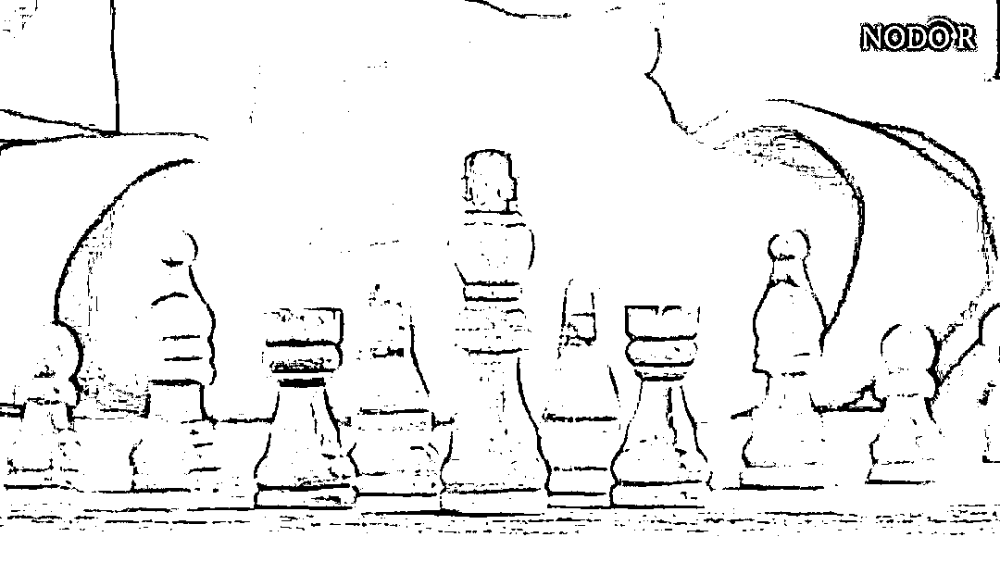

作者/杰西卡·穆雷译者/Ella 校对/李含 编辑/翀子 封面/书君 图片/稿定设计 

火星现在正在双子座逆行中，提到火星，就不得不提到它的“坏名声”。如果不能充分理解行进火星的意义，就无法学到“火星事件”试图教给我们的东西。这篇关于火星行进的文章值得细细品味。另外，如果你想深入学习占星学，大卫老师参与授课的【[ISAR 认证职业占星师文凭课程](http://mp.weixin.qq.com/s?__biz=MzA5NjA0NTAxNg==&mid=2651495693&idx=3&sn=8ddbbdca370c85d21cffd6af1967ab36&chksm=8b482fbabc3fa6ac951b6a0719b315aca273eab768edb76344c7f9993a6ded38ff186c8228e0&scene=21#wechat_redirect)】正在插班中，点击链接了解更多详情！

**火星的坏名声**

火星与其他的行星一样具有更深层的意义，但火星的意义容易被人忽略。**火星比其他任何行星都更容易与真实的事件同时发生，因此火星也有了会造成外部事件发生，预示外部力量的坏名声**。

火星行动的舞台布景常常就是我们大部分时间最关注的现实物质世界。火星的诉求于我们现实层面的认同，火星带来的经验学习是通过一些发生在我们身上的事件，而不是我们发起的事件来实现。

问题在于，如果不能更充分理解行进火星的意义，就无法学到他试图教给我们的东西。对大部分人来说，外部事件和内在事件的性质非常不同。外部事件显得更真实。我发现很多占星师会轻蔑地对待行星征象的现实性。

**与内在事件不同，外部事件对我们来说更容易归咎于非自身责任的力量。**

在过去的两千年中，占星学更多是作为一个算命工具而不是一个认知工具。追踪火星行进的目的，就是为了避免“有害的”事件。就好像火星在制定一个邪恶计谋，想要与我们作对，而提前获悉让我们可以战胜它。 

如今，行进越来越多被放在心灵投射的背景下理解，而那种将某颗行星解读为凶星的言论越来越站不住脚。然而，从总体上看，**火星在“行进”占星学中仍然被视为一个外部触发器。**

我在这里加引号是因为，就像在词组“传统医学”中，被称作传统的内容取决于这个人所指的传统到底是什么，以及他想要追溯的历史有多久远。

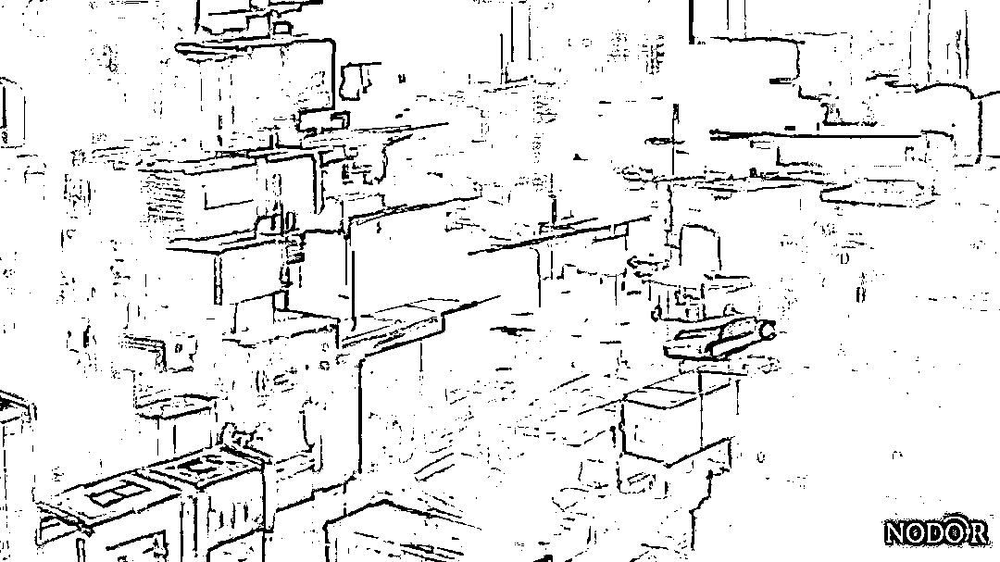

**火星行进会发生什么？**

把火星行进看成是一件糟糕的事情，一件需要与其作斗争的事情，是基于这样的一种假设：**人生的内在领域和外在领域是相互隔绝，并且有时是相互对立的**。

如果我们在火星行进中，在高速公路上遇到一个鲁莽的司机，我们会把这看成一个跟我们自己无关的不幸事件。意味着火星在经过我们星图的时候让这件事情发生。

在事件的层面，我们很容易从这个角度去看。当然，主流社会的世界观也会鼓励我们这样看。就像汽车保险杠上的招贴写的那样：倒霉事时有发生。

但如果作为占星师，我们重视理论的连续性，最好仔细考虑关于“行进运作”的基本信念，以及是否将这些信念应用于一些案例中，而在其他情况下则将其抛在脑后。

虽然我们不断会听到说：“没有一件事情是意外发生的”，尤其是从占星发烧友那里听说，但火星的行进似乎是个例外。不知为何，**火星总让人感觉是“我创造了我的现实”这个规则的特例。**

这并不让人觉得意外。作为西方人，我们从学校教育和文化范式中吸收到的是一种机械唯物论的假设。关于现实的非形而上模式有一条不容置疑的公理，就是——**事件接受者在整个事件中没有任何决定权**。

我们解读星图时会用共时性原则来向不懂占星的人解释行进，但是我们也和其他人一样，都被教育成用牛顿定律来认识存在。虽然我们渴望能超越因果关系，但文化预设非常顽固。

因此，乍一看，**火星似乎是意外事件、疾病和争执的导火线；而当事人也仍然陷于倒霉的受害者的角色中。**

 在地震和犯罪攻击等灾难的例子中（此时我们会看到星图中的其他因素被激活，尤其外行星；而不仅仅是火星），如果我们假定当事人是行动的参与者尤其说不通。

**占星师将这样的创伤归咎于当事人，会让她自己面临责难受害者的指控。**当然，也有人认为，**这些现象完全和当事人的意愿无关**。**一个人将会，或可能会“选择”对自己产生重大伤害的事件，这种看法是对当事人所受伤害的极大侮辱。**

**把火星事件混过去就行了吗？**

造成这一窘境的原因，是语言的局限以及传统的方式和形而上的方式对于理解意志这一点上缺乏共同的假设。问题是：哪一个层面的自我被认为在做“选择”？

荣格提出，**我们每个人都有一个自我（一个有意识的自我身份）；一个超我（一个灵性的超个人的身份），这个超我不是意识层面的，甚至不是无意识的，而是超意识的。**

大部分现代占星师认为，**超我也可以称为灵魂身份，有其自身神秘的业力目的，并能够实实在在地“选择”什么事情会发生在自己身上。**

对于很多人来说，理解这一点的阻碍似乎在于**责任**的概念。我相信这里面有一个潜意识的逻辑在起作用，使我们错误地推断认为，**讨厌的事件一定要不就是行星的责任，要不就是我们自己的责任**；而**把行星看成罪魁祸首的角色，这样会让我们少些痛苦**。

但是，在这样的调查中，其实并没有谁该负责任这个说法。**更高的超我并不惩罚我们。**行星，只是一个时间的工具，也不惩罚我们。责任只是一个人类的自以为是。 

从业力的角度来看，把火星事件当做命运的无常而随便混过去会阻碍成长，因为**这样做，否认了灵魂想要从这个行进中学习的意图**。从一个实用主义的角度来看，**这样做也增加了我们经历不愉快事件的可能性。**

用精神灵性的占星学方法在解释**火星与战斗、意外事件和疾病的相关性**时，认为有时，**当事人通过积累内在的焦虑、压抑易变的情绪，或没有完全表达的独特自我个性来吸引了这些事件**。

关于行进火星四分出生星图的天王星，罗伯特·汉德在其《行星行进》的文章中写到：“一个意外事件产生的原因可能是沮丧的自我意志能量转变成了破坏性的能量。” 

**如果在之前的火星周期中已经发泄掉了很多抑制的能量和情绪，那我们的日子就会好过一些。**如果没有，如果能严肃地认识到这一行进，也能改变它给我们带来的体验。

一个火星事件，例如遇到一个好斗的人，被看成是我们自身意志的延伸，只是想让我们有一个机会来认识到我们是如何运用自己的力量，以及我们有多真诚地坚持自己的主张。

那么，我们很可能会**将这个挑战视为环境与我们的一种合作，为我们提供了关于自身勇气和坦率的一个合理而及时的测试。**

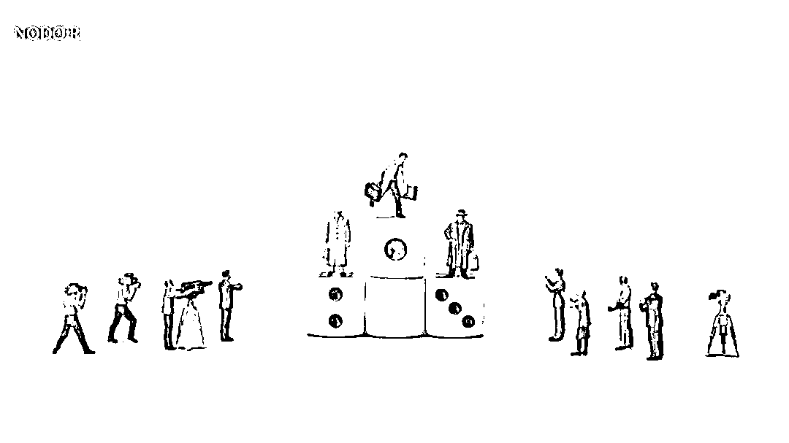**正确应对火星行进的方法**

行进火星经过下降点的时候，我们尤其很可能会遇到一个对手。但这仅仅是因为对于当事人来说，**到了合适的时机来学习如何应对反对意见**。

一个害怕冲突的人更容易害怕这样的对峙，因此可能会**过度反应或力度不够**。而这两种反应都很可能会**激起更多的冲突**（在当时，或是当火星下一次形成困难相位时）。

我们将这种情况和一个经历行进时**对冲突没有恐惧**的人做对比。他（她）在遇到对手时，会带着这样的认识：**现在是他（她）完善自我坚定能力的时候**。

这不仅会让当事人**更接近更高的自我所想要真正教会此人的意图**，而且，作为一种福利，也会**使得结果更有建设性**。

若能认识到**外在是内在的一面镜子，即使是在让人紧张和恐慌的情境下，我们也能更有创造性地做出回应，而不是疲于应对。**

 当然，解读行进的所有意义，在于**提前知道我们做要做的功课，从而能使我们调整好心态或安排好活动，以创造性的方式适应这些象征意义。**

比如，如果我们在经历行进火星合相下降点时，安排一场网球比赛，就可以在玩乐中经历这个必不可少的对分相。

简而言之，行进之所以会发生，是因为到了该学习点什么的时候。如果一个男人根据行进的日期来生活，可以让你与自认为男性化的特质配合。

功课内容可能是关于如何培养男性能量或如何避免男性能量的耗尽。如果你在行进达到峰值的那天遇到一只狂吠不已的狗，请记得这个象征含义。

无论是通过**角色示范或是预设**，**外部世界中在你身上发生的火星事件反映出你自身愤怒和敌意的状态**。如果这样看，我们就能保有这些能量。**如果将火星事件视为神明的反复无常，则将这些能量拱手相让。**

每一颗行星都与**心灵中需要屈伸的某个肌肉系统**相对应，每一颗行星有自己独特的方式来唤醒我们。**所有由行星定时的功课都由灵魂所认定的超我所设定，试图展示给自我，帮助我们更好地认识我们到底是谁。**

火星之所以在所有行进中如此抢戏，一定是因为这颗红色的行星，就像当头一棒这么直接，非常善于吸引我们的注意力。

并且，和头疼一样，我们可以用两种方式来应对：或者跑来跑去试图找到药丸来缓解症状，或者问问我们自己头疼是哪里来的，以及为什么会现在发生。

**版权声明：**本文由若道翻译发布，欢迎转发，反对抄袭。友号转载请申请白名单。

**END**

**扫描下图二维码，获取你的火逆报告**

**拥有****51 年****占星实践经验的****若道创始人****前 ISAR 全球副主席****前 ISAR 全球职业占星师资质认证主席****大卫·瑞雷**

**和**

**2019 年第二届、2021 年第三届核心课中**

**与苏·汤普金斯老师****联合授课****的**

**ISAR 认证职业占星师**

**咔咔（Caroline）**

**二人合力打造**

**2022 年 ****若道全新核心占星课程**

**点击下图了解课程信息******报名直达入口**

# 2023 年 ISAR 选修课 | 预测技法三日工作坊，了解人生重大事件

> 原文：[`mp.weixin.qq.com/s?__biz=MzA5NjA0NTAxNg==&mid=2651496633&idx=3&sn=900131cb139eddc8230bb83269ac4ea1&chksm=8b48120ebc3f9b1847dbc52fb4f5c51859086770d2bfcc664b4974829584cbd569626ab8f4dc&scene=126&sessionid=1692737715#rd`](http://mp.weixin.qq.com/s?__biz=MzA5NjA0NTAxNg==&mid=2651496633&idx=3&sn=900131cb139eddc8230bb83269ac4ea1&chksm=8b48120ebc3f9b1847dbc52fb4f5c51859086770d2bfcc664b4974829584cbd569626ab8f4dc&scene=126&sessionid=1692737715#rd)

**授课内容**

 本次 3 日课程将深入学习人本主义占星师使用的 3 种预测技法。

我们将深入学习如何分析**行进**，强调对**行进的周期性**理解。我们将通过**次限**研究星图中展现的变化，并学习运用**太阳弧**来标记生命中的关键事件。虽然还有其他有用的技法，比如太阳返照和月限法等，但对**行进、次限和太阳弧**能量的谨慎回应已经提供足够的信息来指导我们的人生。

**行进（TRANSITS）** **长期趋势**分析行进的最好方法是先将长期的行进趋势列出来。顺序如下：冥王星、海王星、天王星、土星、木星、南北交点。通过将这些影响力持久的长期行进先列出来，你将能够发现在未来一年甚至更长的时间里你人生中的重大课题。**短期趋势和触发点**接下来你需要去观察那些运行得较快的星体，来判断短期趋势。不过，重要的是要清楚，这些移动较快的星体在行运中扮演着事件的“触发点”的角色，特别是当与它们形成相位的个人行星同时也与行运外行星有相位的时候！

**次限推进（PROGRESSIONS）**通常也被称作“一天代表一年”推运，因为这种技术把出生后的每一天和出生后的一整年等同起来。一旦设定了这个节奏，就像定时释放的胶囊一样，这些次限推进就像某种内部的太阳系一样运转起来，和真实时间的事件、经历、情境应和。

**太阳弧（SOLAR ARCS）**以太阳为核心，为众星之首，带着众星一起移动,展示人生不同阶段我们是如何体验自我、表现自我、修缮自我。此方法虽非实际星体，但却是星动推运法中准确率最高，实用性最佳的推运方法。

课程有两个方面的重点：**强化自我学习**，把对过去生活事件的理解作为预测未来趋势的基础；**学习有效的占星咨询技能**，以一种精准、生动、策略性和鼓舞人心的方式阐述星图。与格雷格之前开设的课程一样，这次课程会有**大量互动**，老师会与案例学员互动，同时通过学员间的讨论，互相激发，获得更多启发。如果可能，还会设置**训练环节，练习基本的预测和解读方法。**

**课程安排**

 **· 2023 年 3 月 4 日 周六  8:00-14:00
· 2023 年 3 月 11 日 周六  8:00-14:00
· 2023 年 3 月 18 日 周六  7:00-13:00**

**什么人适合学习本课程？**

 **·**占星师或渴望成为占星师的人群。  **·**本课程并非针对初学者，需具备若道核心课程 level4 及以上水平，即了解星座、行星、宫位、相位等。

**· **课程会涉及行进&推进&太阳弧解读高阶内容，不了解相关知识的同学，请提前学习相关内容。

**老师介绍**

**格雷格·博加特（Greg Bogart）**

**· **占星师、心理治疗师。格雷格出生于美国纽约市，就读于卫斯理大学。1986 移居旧金山湾，完成了加州整合大学和赛布鲁克大学的研究生课程。**· **格雷格自 1991 年以来一直是一名有执照的心理治疗师（LMFT 28276）。他是国际占星研究协会（ISAR）认证的占星师，并拥有美国地球宇宙学研究协会（NCGR）的第 4 级认证。**· **他还在旧金山的艾扬格瑜伽学院接受过培训，并于 1992 年毕业且获得了瑜伽教师认证。**· **格雷格是一名私人执业的心理治疗师，在索诺玛州立大学担任心理学讲师，他在该校教授“成人发展中的转变”、“以深度为导向的心理治疗”、“神话、梦与象征”以及“存在主义心理学与超个人心理学”等课程。**· **他在加州整合大学、约翰·F.·肯尼迪大学、多米尼加大学和超个人心理学学院教授咨询心理学和东西心理学课程。**· **他的研究结合了冥想、哈他瑜伽、荣格解梦、存在主义心理疗法和精神综合，**占星学的行星周期智慧和原型象征**。

**格雷格·博加特博士著作：** 《占星学的高八度音阶》（*Astrology’s Higher Octaves*） 《行星用于治疗》（*Planets in Therapy*）《占星学与灵性觉醒》（*Astrology and Spiritual Awakening*）《梦境工作过与自我疗愈》（*Dreamwork and Self-Healing*）《梦境工作在抑郁症整体心理治疗中的应用》（*Dreamwork in Holistic Psychotherapy of Depression*）《占星学与冥想：对变化的无畏沉思》（*Astrology and Meditation: The Fearless Contemplation of Change*）

**推荐阅读：**

史蒂芬·阿若优：《生命的轨迹》

Bogart, G., Planets in Therapy; and Astrology’s Higher Octaves.

Tyl, N., Prediction in Astrology.

Ruperti, A., Cycles of Becoming. 

**课程价格**

**正价：6800 元 早鸟价：5800 元 早鸟价截止日期：2023 年 2 月 15 日**

**惊喜联报套餐！！****《ISAR 选修课 | 预测、预期与意识成长》+《2023 年度天象预测大师课》+《2023 年金融占星预报》****三门联报优惠价 8000 元****（限前 50 名联报）（联系 Maggie 老师，抢占限量优惠价）**

长按二维码添加 Maggie 老师获取联报优惠价

**退转课程**

退款原则请详看《教学协议》，如有疑问请咨询课程顾问。 ****2023 年 ISAR 选修课 | 预测、预期与意识成长****

**授课老师：****格雷格·博加特**

**直播课开课时间：2023 年 3 月 4 日（周六）3 月 11 日（周六）3 月 18 日（周六）**

**授课方式：******网络授课，英文/中文授课，中文翻译****

**费用：****** 正价：6800 元；早鸟价：5800 元；早鸟价截止日期：2023 年 2 月 15 日****

**课程负责人：Maggie 老师**（微信：NodoorMaggie，请备注“2023 预测课”）

长按二维码添加课程负责人咨询

**报名直达入口**

# 金星进入摩羯座 | 你会喜欢信守结婚誓言的人吗？

> 原文：[`mp.weixin.qq.com/s?__biz=MzA5NjA0NTAxNg==&mid=2651496633&idx=1&sn=c71b4a3bf554412907db4ff392eeca7f&chksm=8b48120ebc3f9b18a5b49f1bd14945a3d5d3fbee24b61e7e162a0fcbec6fa7e0c47f198df842&scene=126&sessionid=1692737715#rd`](http://mp.weixin.qq.com/s?__biz=MzA5NjA0NTAxNg==&mid=2651496633&idx=1&sn=c71b4a3bf554412907db4ff392eeca7f&chksm=8b48120ebc3f9b18a5b49f1bd14945a3d5d3fbee24b61e7e162a0fcbec6fa7e0c47f198df842&scene=126&sessionid=1692737715#rd)

**********☆****************后台回复“今日”，给你一句生命态度**********

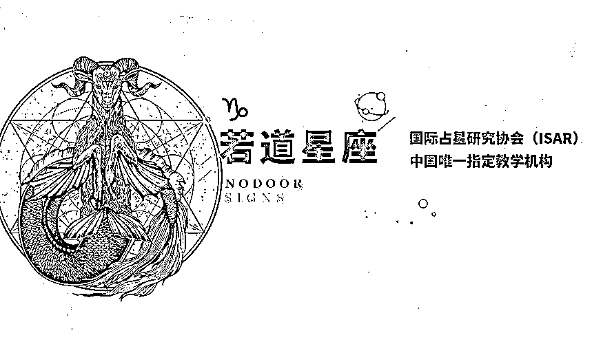

作者/斯蒂芬·弗里斯特 朱迪·弗里斯特 
译者/李含 编辑/玫瑰 图片来源/稿定设计本文摘自《天空的伴侣 I：爱、性和进化占星学》12 月 10 日，金星进入摩羯座啦！离开了金星射手座的自由奔放，未来一个月的时间我们需要追求的是更加踏实、稳妥的情感体验，这也是适合缔结誓言和婚约的时期哦。那些太阳、月亮、金星或上升落在摩羯座，爱起来会是什么样子的？一起看看吧！另外，大卫老师参与授课的【[ISAR 认证职业占星师文凭课程](http://mp.weixin.qq.com/s?__biz=MjM5MjQwNjAyMQ==&mid=2649440558&idx=7&sn=b041699d5f41c4a024ad9ed019fcc13f&chksm=beb92e4489cea7527b5d33c569159e39ebfb5eb2404385c2104a0daccf39f6ef078aaf9eea3d&scene=21#wechat_redirect)】报名中，点击链接了解更多详情！  **摩羯座****原型**  

**隐士和独居修道士** **父亲**

**首相 权威 战略家 长者**

发展目标

众所周知，要保持心理的健康，我们必须关注自身的感受。但如果仅仅是简单的关注，而不去试图保持平衡呢？想象一下蓄意伤害的罪行：旷工旷课、闯红灯、儿童流行病、杀人犯。

摩羯座反映的是这枚硬币的另一面。**并不是忽略感受，而是更加关注和发展情感的平衡：正直、坚忍、爱惜名誉、个人荣誉、坚持不懈、延迟快乐到来的能力、抵御诱惑的能力。**任何被摩羯座能量影响的行星，都会踏上一段进化的旅程，**不断地努力去追求卓越。**就像爱尔兰诗人叶芝（William Butler Yeats）的诗句：

**“崎岖艰险的山，让攀登者痴迷。”**

玄学里认为，摩羯座人的前世**尝尽了失败之苦**。**这种延续并未升华，他们的灵魂依旧感到羞愧和内疚。**这一世，他们决定**坚守钢铁般的意志力，不论付出多少代价，誓要取得成功。**

策略和资源**为了成长，摩羯座人要付出艰辛的努力，某些努力的方式让摩羯座人限制了自身的潜能。**他们必须**抗争并且坚持，内在外在都必须与魔鬼做殊死搏斗。**简单的占星学观点总是将摩羯座贴上野心的标签。

的确，摩羯座人努力工作，追求职业上的成就，但这不是唯一的可能。摩羯座人可能只驾一艘小船就横渡大洋，或者可能健康愉快地在居民区享受家庭生活，并成为作家。他们也可能在内陆的蒙大拿州安家，精通一门乐器。

**摩羯座的中心思想是循着他们的目标前行，而不是跟着感觉走，特别是环境中还充斥着恐惧、屈服和挫败。**

阴影为了不断地追求目标，摩羯座人必须**管理、控制自己的情绪**。恐怖的是，他们可能**完全压抑自己的情感。**这种极端的压抑可能导致摩羯座人**最终走向崩溃**。甚至生命的火花闪现，摩羯座依旧坚持自己的方向。这是福是祸呢？问题是，并不仅仅只有摩羯座忽略了自身的感受，更有可能，**其他所有人也会忽略了摩羯座人的感受。**摩羯座人发现自己**被锁定在权威角色的固有形象里**了，**完美无缺**。同时，摩羯座人也**自愿接受了这种禁锢**。往这个方向探索下去，我们发现摩羯座人**对于他人的控制也在膨胀**。这种控制欲的根源可能是**恐惧**。**摩羯座人对自身的本能需求、内心的冲动和自我的领土有着不正常的恐惧。**

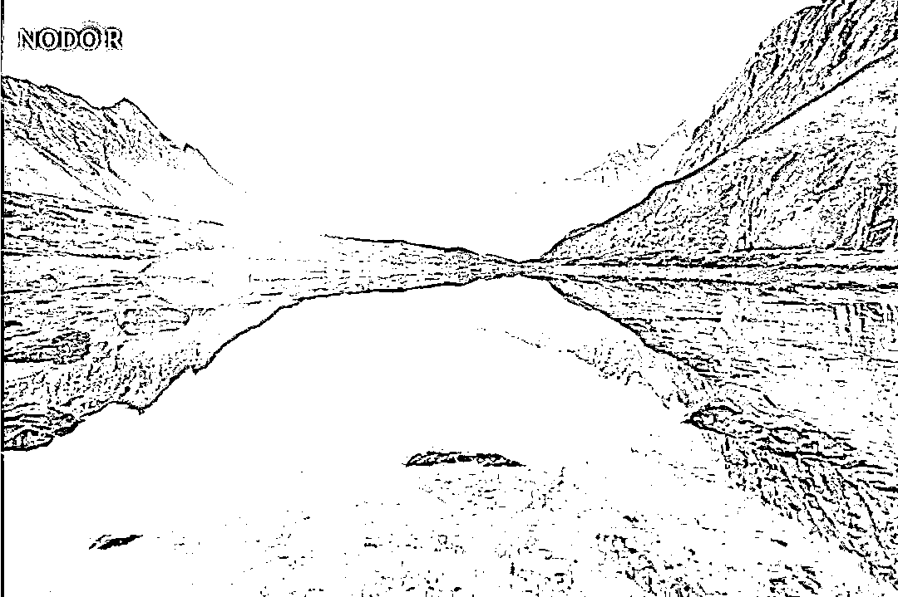

**摩羯座的爱情****金星摩羯座的爱情****进化的意图是建立基于诚信、承诺和成熟的成人关系，以此回应前世动力中本质上由于一方或双方的不成熟而导致的失败和抛弃。****这些人以摩羯式的策略和效率引起你的兴趣。他们投射出一种克制的光环，以静水流深的方式让你着迷。**他们**喜欢独处，对过度依赖的人反应不大**。金星在摩羯座欣赏**责任感、务实、成熟、自控力和正直的品质**，倾心于那些让他觉得多年后会成为智慧老人的人。土星守护摩羯座，也是在物质世界中形式表现的守护者。这个金星星座会被那些**对物质世界、地位或名誉有一定掌握**的人所吸引。除非星图的其他部分有强烈的其他暗示，否则这个金星星座通常**不会对承诺感到恐惧，无论当前的文化习俗如何。**

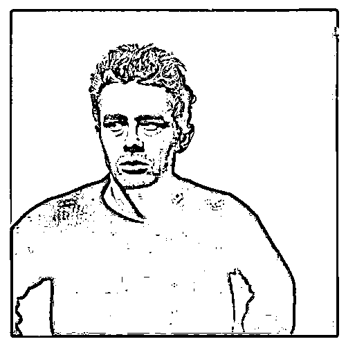

| 詹姆斯·迪恩

演员詹姆斯·迪恩（James Dean）和安东尼·霍普金斯（Anthony Hopkins）的金星在摩羯座，作家路易莎·梅·阿尔科特（Louisa May Alcott）、罗伯特·布莱（Robert Bly）和托尼·莫里森（Toni Morrison）也是如此。太阳摩羯座的爱情

许下承诺对摩羯座人来说并不是难事，**承诺**就是他们突出的个性。但是，这份亲密关系所承诺的内容却**让人沮丧**。要经营好爱情关系，并从中获得满足感，摩羯座人要学会**练习表达自己的情感。**摩羯座人必须学会**为自己要求**。否则，太阳摩羯座的人可能陷入**“责任”**的泥潭，身边的人会习以为常，在爱情中忍受种种约束，却毫无益处。

比较明显的是，太阳摩羯座的人通常**欣赏可靠、理性的伴侣：可信赖、自给自足、冷静的头脑**。不太明显的是，太阳摩羯座的人需要一位**与之不同**的伴侣：**能够轻松地表达自己的感情，富于生命火花的人**。

从阴影方面来看，摩羯座人如果在冰冷的道路上渐行渐远，**完全地自给自足，“成熟”地压抑自我的需要和冲动**，之后我们会看到一片混乱：**让摩羯座人神魂颠倒的人恰好具有他们所缺失的特征。**这意味着，在感情关系中呈现了一种**“亲子”关系的互动方式**。摩羯座人**为了信守承诺而永远地忍受这个错误。**

月亮摩羯座的爱情月亮摩羯座人会呈现一种**心境上的孤独隐居状态**。这和孤独、寂寞的情怀不同！他们只是**比普通人更需要独处的时光。**月亮摩羯座的人在情绪上更倾向于**让他人沮丧的巨大而荒芜的空间：独居、写小说、获得博士学位**。他们的潜意识里，**每个人最终都是孤独的。**因此，月亮摩羯座的人需要学习**与人结合的技巧、分享的技巧**，这样才能将爱延续。否则，伴侣很快就会**觉得自己被疏远了，被隔绝在外。**另一方面，月亮摩羯座的男女**需要一个伴侣**，**对方不会因为发现即使被爱着，最终也会被抛弃的这种宿命而感到非常震撼。**从摩羯座的星座特质上看，它与**现实主义的生存**有关。对于月亮摩羯座的人来说，这就变成了条件反射式的本能，**小心谨慎到了夸张的地步，还有恐惧也是如此。**

如果到了这个阶段，月亮摩羯座的人将被阴影吞噬，呈现出一种**强迫性的控制欲，想要控制所有的事情：生命的课题、财富、社交、家庭和伴侣。**

在家庭生活中，月亮摩羯座的要求是：**井井有条、有效率、有责任感**，即便月亮摩羯座的人公务繁忙，职责众多，根本无暇顾及家务。

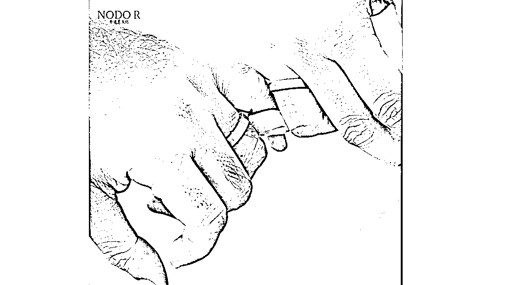

上升摩羯座的爱情上升摩羯座的人表现出了一种**世故、圆融**的姿态，**能干谨慎，能够凭借直觉理解社会的游戏规则。**他们或许看起来有**都市气息，甚至是着装打扮颇为昂贵**。但有少部分上升摩羯座的人，他们看起来像扑克赌桌上的玩家，冷冷的目光紧盯着桌上的每一个人。为了让爱延续，上升摩羯座的人迟早要触及更深层的本质，经历一番彻底的改变。对于一些人来说，他们的变革来得很快，甚至并不费什么力气，只要顺势而为。对于另一些人来说，这个变革也许永远不会发展。上升摩羯的面具背后是什么呢？看看星图中的其他因素是解开谜底的唯一方式。

**版权声明：**本文由若道翻译发布，欢迎转发，反对抄袭。友号转载请申请白名单。

**END**

斯蒂芬·弗里斯特

若道签约老师。进化占星学的创始人之一，当今世界最有影响力的占星大师之一；1985 年，他凭借《内在的天空》一书获得职业占星师协会奖（Professional Astrologers Incorporated Award）。他四次获得占星界最高的占星学联合协会奖（United Astrology Congress Regulus Award）提名，2018 年获得轩辕十四教育奖。

**拥有****51 年****占星实践经验的****若道创始人****前 ISAR 全球副主席****前 ISAR 全球职业占星师资质认证主席****大卫·瑞雷**

**和**

**2019 年第二届、2021 年第三届核心课中**

**与苏·汤普金斯老师****联合授课****的**

**ISAR 认证职业占星师**

**咔咔（Caroline）**

**二人合力打造**

**2022 年 ****若道全新核心占星课程**

**点击下图了解更多课程详情** 

**快年底了****不给自己一份来自占星学的礼物吗？**

**20 位来自世界各地的占星师****带来 19 场沙龙——新世界的觉醒****详情可点击下图**

**学习占星学****点击下图了解课程详情**

**微信又双叒叕改版啦，不想错过若道君的推送？**
****就把若道设为****星标****以及点点****“在看”****吧！******▼**

**喜欢就点一下“在看”吧！****报名直达入口**

# 心理占星学和心理治疗的区别是什么？

> 原文：[`mp.weixin.qq.com/s?__biz=MzA5NjA0NTAxNg==&mid=2651496530&idx=2&sn=1e09b412fdac5b981939292c91603317&chksm=8b4812e5bc3f9bf33ea12eb2286d8c16baf8622bf3314a3876dfccb18aeee89d45f507cb3765&scene=126&sessionid=1692737715#rd`](http://mp.weixin.qq.com/s?__biz=MzA5NjA0NTAxNg==&mid=2651496530&idx=2&sn=1e09b412fdac5b981939292c91603317&chksm=8b4812e5bc3f9bf33ea12eb2286d8c16baf8622bf3314a3876dfccb18aeee89d45f507cb3765&scene=126&sessionid=1692737715#rd)

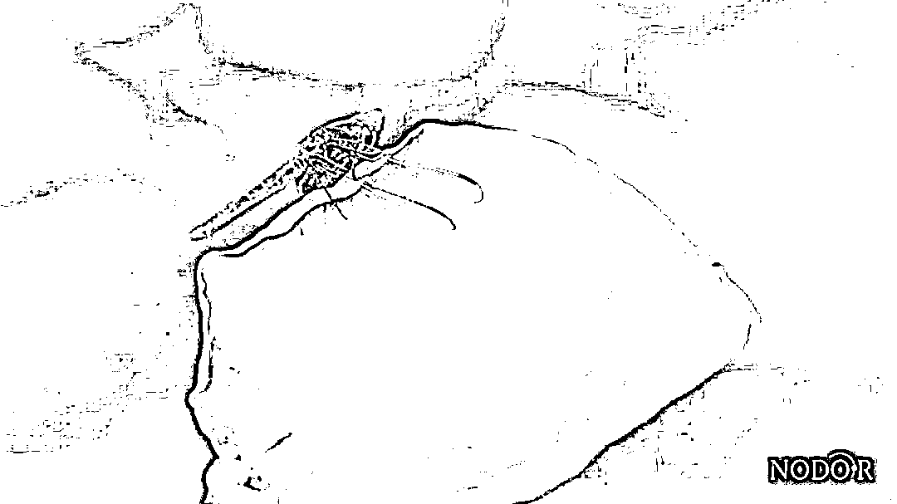

作者/格伦·佩里

译者/王宏 校对/李含 esme

编辑/翀子 图片/稿定设计

**作者的话**

占星咨询是一个广义的词汇，涵盖大多数种类的占星学；而**心理占星学则是一个专业化的分支领域，只侧重于与人格成长与满足相关的事件。**这类占星学通常只限于一次性的咨询，可以依据心理治疗连续进行的特质而与其区分开来。

然而，心理占星学和心理治疗有一个**显著的共同点**，那就是两者都有着共同的目标，并可能会用到相似的技巧。当然，两者间也有**重大的差异**。没有接受过心理治疗训练的占星师在被客户要求做持续咨询时，可能发觉自己处于道德困境之中。

（若道君：如果你想更多了解心理占星学，这里有一门格伦·佩里老师亲授的[【占星原型与星图中的精神病理学】](http://mp.weixin.qq.com/s?__biz=MzA5NjA0NTAxNg==&mid=2651495982&idx=3&sn=ae883a91c9b4f64cd9d20c288fee73d9&chksm=8b482c99bc3fa58f53a21f9a097fa9ccaa36fef8d9ad8720a8c5474ee3c97adb8f2a13f22d36&scene=21#wechat_redirect)，点击链接了解更多详情吧！）**什么是占星咨询？**

**在 ISAR（国际占星研究协会）道德规范的“D”部分，对占星咨询定义如下**：

 占星咨询师提供以下服务，讨论星图，以便：

❶ 帮助他人认识到自身的长处和天赋；

❷ 提供有关生活问题的见解；

❸ 阐明成长与发展的模式；

❹ 确认自我认知；

❺ 指明生活目的；

❻ 告知危机与机会对应的时期；

❼ 探明特定经历或生活阶段的意义；

❽ 针对特定行为的时间安排或决定给出指导建议。

根据定义可知，当占星师面对个人或一对伴侣的客户，阐述以上问题时，他们是在做咨询，或是顾问。而有些占星师试图将咨询与顾问区分开来，但与我们目标的差异却是模糊不清的。

根据我的字典，**咨询师是“提供专家或专业意见的人”，而顾问被定义为“给出顾问建议的人，或劝告者”**。

但是，顾问往往与心理咨询领域关联，像是“婚姻顾问”。这样看来，“顾问”比“咨询”更适合心理学。即便如此，**在占星学和本文的撰写中，这两个词并没有太大区别，会视作同义词**。

尽管有些占星师可能会将自己局限于写作和研究，或者专注于财务、商业或其他分支学科，但说**大多数专业占星师至少会做一些咨询或顾问工作**也是可以的。例如，他们进行“解读”，并提供这样、那样的意见和指导。如此说来，他们就是占星顾问。

上述条款的最后一条指出，咨询占星师“针对特定行为的时间安排或决定给出指导建议”。这在定义上包括卜卦占星学、择日占星学、金融占星学、商业占星学、择地占学星，以及几乎任何其他种类的占星。

相应地，一个人所认可的占星派别，无论是心理占星学、预测占星学、印度占星学、汉堡学派占星学，或其他种类的占星学，并不影响他成为一位占星顾问。

**任何同客户坐在一起，为其“解读”星图的人都在进行咨询活动，因此都是在为客户提供建议。** 

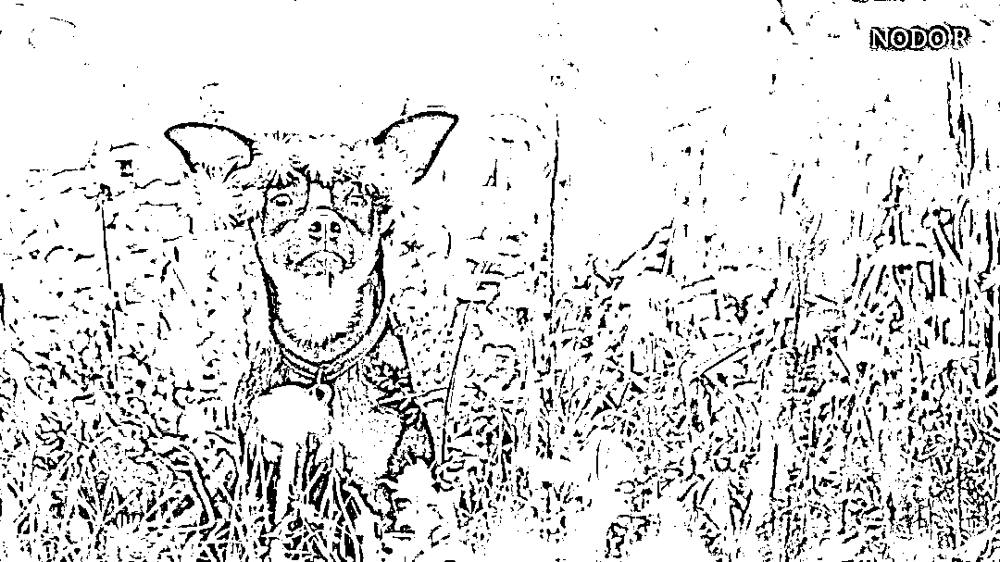

**咨询占星学 vs 心理占星学**

综前所述，我们可以得出如下结论：**“****咨询占星学****”是涵盖各种各样占星术的概括性词汇**。由于一个人无需成为特定类别的占星师，就可以成为占星顾问，问题就产生了：**特意进行心理占星学意味着什么？**

**想要回答这个问题，区分“咨询心理学”和“临床心理学”将会有所帮助。后者与“心理治疗”同义，但又有着略微不同的学术和职业侧重。** **咨询心理学****可以被定义为，交换意见和想法，以有效解决个人日常生活中的问题。**这些可能与其情感、认知或行为问题有关，亦或他们可能只是关心眼下的境遇，例如是否应该换工作。治疗的长度可能各有不同，从一次治疗到十二次或更多次治疗。

另一方面，**心理治疗****是如下一种治疗方式：临床大夫与个人建立起长期关系，以便修正自我挫败的行为模式，并促进积极个性的成长与发展。**治疗往往是长期的，而非短期的，也就是说，心理治疗可能需要每周一次、持续数月的治疗期，乃以每周两到三次、持续数年的治疗期。

**临床心理医生（即心理治疗师）提供咨询服务，但他们也**

❶ 治疗受困扰更严重的人群；

❷ 接受深度、潜意识过程（心理动力论）的培训；

❸ 主要专注于个人成长与改变。

相反地，**心理咨询师**

❶ 治疗相对健康、病征微弱的人群；

❷ 进行更多的事业和职业测评；

❸ 主要关注解决实际的当务之急。 

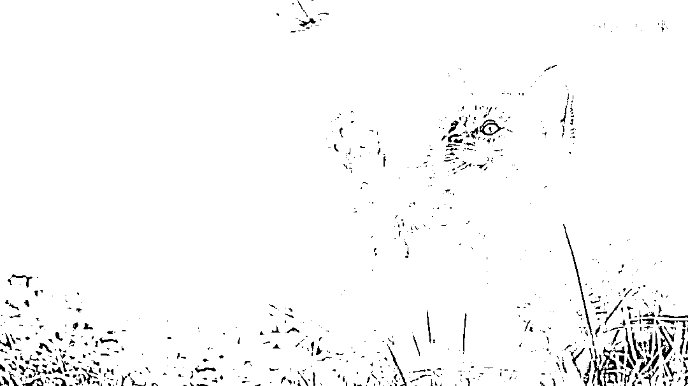

由于**咨询更多的是解决问题，心理治疗则程度更深，其目的是自我认知和自我改造。**在咨询里，要解决的问题就是问题。大多数人进行咨询是因为他们想要解决诸如人际关系冲突或职场问题等当务之急。

相反地，在心理治疗中，要解决的问题是人。人们求助于治疗是因为过去对他们有效的防御不再有效，所以他们在防御措施整体运行方式上寻求更为普遍深入的改变。

因此，**心理治疗对于外在问题的关注仅仅是因为外在问题是探求内在的心理脉络的途径。**

读者可能总结出，**咨询占星学与咨询心理学相似，因此心理占星学也与心理治疗相似。**

而咨询（或顾问）占星学是一个广义词汇，因为实际上所有解读星图的占星师都在进行咨询。另一方面，**心理占星学是咨询占星学的一个分支，因此其关注点更明确，也更窄。或许****心理占星学****的定义属性在于其对出生图综合关注，以此来支撑人类对于成长和改变的潜能。** 

**咨询占星师****为个人问题和日常生活问题提供实际的指导。更多关注于教育性、支持性，并以意识为导向，指向有限的实际目标。**

对于卜卦占星师来说，这可能意味着回答有关爱情的一个具体问题。预测占星师可能针对度假的最佳时机为客户提供建议。择时占星师可以针对开创新事业的理想时机提供建议。股市走势是金融占星师的领域，而商业占星师则给出有关员工、人事建议、扩张市场份额等的建议。

另一方面，**心理占星师****感兴趣的是深奥、无意识的过程，以及促进人格的治愈和转变。**实际上，心理占星学与有时所说的“治疗占星学”含义相同。从心理占星学中衍生出来的是一系列相关学科，包括**发展心理学**和**精神病理学**。

两者都是占星学心理化的衍生，具体体现在：

❶ 两者都与心理学手段相关；

❷ 两者都可以与占星概念和实践结合起来。由此可以设想，心理占星师至少接受过培训，并熟悉这些学科。

**心理占星通常需要一到三次会面。**然而，即使是一次会面，其目的也是进行阐释，以定义并说明心理情结、阴影问题、伤害、防卫，以及客户可能都没有意识到的问题。

**正如心理治疗师一样，心理占星师也做咨询，即提供建议、方向和指导。然而，他们仍不仅仅局限于此。**

**心理占星师对于星图如何描述个人的心理结构和过程格外感兴趣。**这就是“精神动力学”一词含义的由来，它指的是潜在的驱动力、情绪和信念，这几点的相互作用引发显著的行为和事件。

心理占星师不那么关注结果——显著的行为和事件，他们探寻结果是如何从深层的无意识心理领域中衍生出来的（精神动力学）。行为不会用所谓的占星学原因来解释。

**占星符号被用来理解和解释那些被看成是行为和事件真正原因的心理过程。**

**心理占星学认为个人要对自己的人生经历负责，而不是假定这一切是由行星所导致。目标是让客户对自己吸引和创造的事物负起责任。心理治疗强调的核心是促进客户朝着最佳状态成长和发展。**

**心理占星学 vs 心理治疗**

**心理占星学和心理治疗的差别更多的是程度的问题，而非类别的问题。两者都有着相似的目标，可能利用相似的技巧。**

例如，洞察无意识和不良的信念是两者实践中的典型问题，两者都依赖于对诊法和艺术化的阐述解决问题。此外，两者都蕴含着促进个性成长和治愈的意义。

甚至可以说，仅从微观上来说，一次心理占星可以涵盖心理治疗的整个过程。仅在一次占星咨询中就至少可能整合引发问题的想法、释放情绪，随后将被否认的部分融合进来。

**两者最明显的差异是过程中所花费的时间**。在大多数占星案例中，仅需与客户会面一次，尽管多次会面也不少见。可即便如此，与客户会面超过三四次也相对少见。对于星图或事件可说的也就那么多，再多就难免拖沓冗繁。

另一方面，心理治疗通常需要持续数月到数年，更多地着重于支持客户内在探索和发现的过程。

这突显出了心理占星师和心理治疗师的一个重要差异。前者利用占星来阐明心理事件和冲突，后者利用心理治疗技巧来解决心理问题和冲突。

**心理占星学是诊断的最佳工具，可以迅速阐明客户没有意识到的、造成问题的原因。**尽管这可能会有即刻的治疗效果，但在大多数案例中，真正的成长和治愈源于对未发现事件更为缓慢、更为透彻的探寻。

在典型的占星咨询中，并没有足够的时间来完成这一过程。就像依地图行进的人一样，占星师可以指出旅行者行进途中可能遇到的各种挑战、困难和障碍。占星师甚至可能就如何最好地完成旅途提供一些有用的建议。

而在实际旅途中陪伴探索者，对于每一步提供帮助、意见和支持的则是心理治疗师。

**占星师最大的价值是他们有能力加速意图的揭示过程。**客户在纠结于个人困难时经常会寻求咨询。这样的困难通常源于心理冲突，这是心灵所固有的，并通过星图体现出来。

心理冲突表现为不良的想法和自我挫败的行为。外在问题和斗争同步体现在心灵/星图中，为解决内部冲突提供了媒介。

**占星咨询的优点在于，它可以迅速揭示内在和外在因素是如何联系在一起的。**像是太阳四分冥王星这样的天象可以代表内在冲突、作为结果的不良想法，以及同时产生的后续事件。

所有这些都在指向治愈的方向——运动前的热身或是大戏上演的前奏。心理占星师认识到，个性会随着时间而进化，一个人的命运也会相应改变。转变不会自动依照占星揭示的结果而出现。

大多数人可能会同意，持续的改变需要花费时间、耐心和不断的努力。最理想的状态是将人生视为不断变化的过程。在这一过程中，占星的角色主要是诊断和预报。

也就是说，**一次好的占星咨询可以让客户深入了解自身困难的本质，同时带来希望并为未来做出改变指明方向。**

**治愈的机会存在于日常经历中，心理治疗可以辅助，甚至加速成长过程，特别是处于压力或危机之中时。这和心理占星学的区别在于，其侧重点是自我探寻和情绪释放。**

在**占星咨询中**，更多地关注阐释的过程——展示过去与现在的关联，暴露出有问题的想法，同时也反映在外部体验之中。然而，**心理治疗中**的首要任务就不再是解释，而转变为促进探索和自我发现。

现在，客户需要担负起责任，参与到自省的过程中。客户的主要关注点在于探寻情绪——担忧、关心、冲突——并遵循情绪的指引。这必然需要心理治疗师给予更多支持和接纳，心理治疗师不能过早的干预，给予解释，或是尝试快速修复。

如果一切进行顺利的话，客户渐渐地会充满安全感，以便回顾压抑的记忆，那些记忆可能太过于痛苦或可怕，让人不敢面对。伴随这些记忆的是与受伤经历相关的压抑感觉，以及随后形成的可怕的问题观念。

这类发现与从占星咨询中得到的认识有显著差别。它更为全面、立体，带有情感成分，以便深入理解、整合个性并真正治愈。毫无疑问，**在治疗方法中处理这类资料需要相当程度的训练和专业知识。** 

**道德方面的考虑**

**占星学和心理治疗之间存在细微但重要的差异，因此各种道德规范中都有有关“资质界限”的部分。**

当占星客户要求在一段时间内多次与占星师会面时，道德问题便会随之产生。他们对于寻求帮助的动机可能源自对正规咨询的恐惧和心理治疗可能带来的耻辱，或误解以为占星师对于所有问题都有答案的误解。

然而，**一旦帮助的过程延伸到解读客户的星图之外，占星师可能会在无意间进入心理治疗的领域。除非占星师至少接受过一些该领域的培训，否则对客户最有利的做法就可能是将其推荐给精通客户所关心的领域的专业治疗师。**

对于可能患有临床抑郁症、创伤后压力综合症、严重婚姻不和谐、边缘性人格障碍，或其他疾病困扰的客户来说，接受过测评、诊断和治疗等专业培训的从业者可以为其提供最好的服务。

心理占星师在理想状态下确实对客户有治疗上的影响。然而，这需要在整个占星咨询过程中不断的区分可能揭露出的心理问题和忧虑区分开来。

这些问题在占星工作的过程中出现，某种程度上来说，它需要占星师的理解和支持并敏锐的作出回应。然而，除非他们也接受过心理治疗技巧的培训（最好是注册心理治疗师），对于占星师来说，在一段时间内持续为客户服务可能是不道德的。 **★****相应地，在 APA（心理占星协会）道德规范 D.2.a 部分中有如下说明**：
**a.资格界限**
咨询占星师只能在其能力范围内从业。除非他们接受过相应的培训、监督和认证，否则不得进行持续的心理治疗。

再次说明，两者最明显的区别在于过程持续的时间。占星工作很少超过一次，很少需要三次，而心理治疗可能持续数月，甚至十年或更多年。

两者也有其他的差别。占星工作可能有时会脱离星图，同客户进入敏感、情感化的领域，但也总是会回到星图上，将其作为传达概念的主要途径。

相反地，即使对于运用占星学的心理治疗师来说，他们也很少同客户实际谈论星图，占星被用作诊断工具，以便加速认识，加深移情关系。客户逐渐认识到星图是治疗师的辅助工具，客户间接受益于此。

提到星图（的内容）通常并不必要，因为这可能会有风险，干扰客户内在探寻和将重点转移至兴奋、理智的领域。

如果占星师承担着对客户进行持续治疗的责任，问题不在于他们不会起到帮助的作用，而在于，没有经过必需的评测和诊断培训，可能很难区分他们能完成和无法完成的案例。想要精通于诊断需要花费数年的教育和数千小时的指导。实际的客户心理测评和诊断是持续的过程。

如果客户是被骚扰的孩子，并患有边缘性人格障碍，对于训练有素的心理治疗师来说，他们即使知道占星学，也需要在数月的治疗后才能完成测评和诊断。

此外，恰当的诊断是适当治疗的关键。真正帮助到这样的客户可能需要数年大量、辛苦的工作。同样的客户可能会要求其占星师“帮助”解决自己自信缺乏和人际关系混乱的问题。

她要求持续会面。如果占星师同意她的请求，他就会进入黑暗的绝地，他很难在不伤害客户、他自己，抑或两者的同时，全身而退。

关键点在于，即使客户有此要求，也不能说为自己可能无法提供的“帮助”而接受付款是合理的。占星师打开了与客户定期多次会面进行治疗的大门，他便会承担过后发觉自己因提供资格界限之外服务而接收付费的风险。

一旦意识到这一点，已经为时过晚，因为已经造成了损失。客户在金钱和精神健康方面都不如从前。本该需要进行恰当的转诊。人们很容易相信，占星师无所不能，但我们不是。

**占星是一种极为有力的工具，占星师必须始终保持警惕，避免利用这样的工具可能引发的傲慢情绪。**

**确切来说，由于占星咨询和心理治疗之间存在模糊的重叠部分，有必要严令禁止占星师进行心理治疗。**这样的禁令不会禁止占星师的治疗性、敏感性、移情性、洞察力等等。

这仅仅是确定，一个人除非接受过适当的培训，否则不得进行“持续的”心理治疗。此处的关键词是“持续的”。只要从心理角度出发的占星师同客户进行有效工作，他们就可能接受超于自身资格界限范围的额外服务的报酬。

利益、不想拒绝客户或让客户失望、自我满足以及其他各种因素都可能成为确立该领域明显界限的困难因素。 

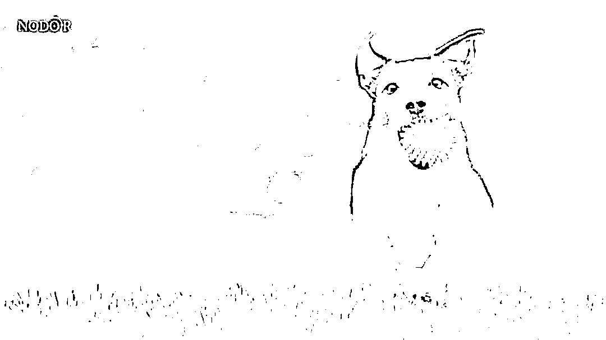

**占星学在心理治疗中的作用不可估量**

**咨询占星学**是一个一般性词汇，实际上涵盖了各种形式的客户咨询。通常焦点在于为处理日常和关注的问题提供意见。**心理占星学**是咨询占星学的分支，力求更深层次地理解个人问题和心理创伤。

关注点从表面转移到了深处，从明显之处转移到了暗藏之处，涉及到揭示在现有问题之下的无意识冲突和想法。尽管咨询占星学提供教育和指引，心理占星学则程度更深，为治愈和转变提供平台。

治愈的实际工作最好由**心理治疗**师来完成，他们可以提供持续改变所需的支持、结构和时间。

**尽管三种模式之间存在根本差异，它们也有重叠的相似之处。它们处理不同程度的心理问题，都致力于帮助客户应对日常生活中的挑战。**

占星学在心理治疗过程中有着不可估量的价值，因为它可以加速诊断过程，增强移情作用，并揭示治愈的步骤。确切说来，正是占星学作为治疗工具的价值吸引占星师为客户做持续的心理治疗，而与之相伴的是提供无效、甚至有害治疗的风险。

因此，**有必要让占星师仅在其资格界限之内进行工作，除非他们接受过适当的培训、指导和认证，否则不可尝试提供持续的心理治疗。**

**版权声明：**本文由若道翻译发布，欢迎转发，反对抄袭。友号转载请申请白名单。

**END**

**格伦·佩里**

若道签约老师，著名占星师，前 ISAR 董事会成员，共出版 8 本占星著作；心理/意识研究专业博士；占星心理学学院（Academy of AstroPsychology）的创办人；康涅狄格州研究生院（the Graduate Institute of Connecticut）原型宇宙学与意识进化项目的负责人。

# ****占星原型与星图中的精神病理学****

**为什么在占星学的课程中，会出现精神病理学的教学内容，这和我们有什么关系？这对占星咨询，或在自我了解与成长的过程中又有什么帮助呢？**

****带着这些疑问，请你静下心来，思考以下几个问题**：**

**“******你/你的案主，是否曾经过度担心什么？**** ****你/你的案主，有没有感觉到担忧和焦虑，却不知道原因是什么？********你/你的案主，是否曾经觉得害怕什么东西，但理智上却很清楚它不会对你造成什么伤害？********你/你的案主，是否曾经通过沉迷某物，酗酒或滥用药物，自我伤害去逃避问题？********……********——节选改编自《心理学与生活》******”**

**如果你对上述问题其中之一，回答是。这意味着几乎每个人都曾有过心理障碍的症状（精神病理的问题）。**

**你看，其实“精神病理学”与人的心理有着密切的关联，再结合占星学，呈现了人内在与外在层面更加丰富和深刻的一面。**这对于学习占星学的人和占星师来说，都是一场难得的知识盛宴！****

****本课为 2 年期双证核心课程中的一部分**（AP105 阶段），其内容是过去若道所开设的核心课程从未教授的部分，特意抽出供其他学员学习，******可作为 ISAR 选修课，单独报名。****

****点击下方图片了解详情****

**

****微信又双叒叕改版啦，不想错过若道君的推送？**** ******就把若道设为****星标****以及点点****“在看”****吧！**********▼****

****

**喜欢就点一下“在看”吧！****报名直达入口**

# 星座病理学 | 失衡的水星：双子座几种极端状态

> 原文：[`mp.weixin.qq.com/s?__biz=MzA5NjA0NTAxNg==&mid=2651496530&idx=3&sn=8e664bb55737395ceb2a2b176e3c4c43&chksm=8b4812e5bc3f9bf3b71005bb541fd25bfa4137bed96db6da6b7fafb1f74e3406d7ccea04b5e8&scene=126&sessionid=1692737715#rd`](http://mp.weixin.qq.com/s?__biz=MzA5NjA0NTAxNg==&mid=2651496530&idx=3&sn=8e664bb55737395ceb2a2b176e3c4c43&chksm=8b4812e5bc3f9bf3b71005bb541fd25bfa4137bed96db6da6b7fafb1f74e3406d7ccea04b5e8&scene=126&sessionid=1692737715#rd)

<mpvideosnap class="js_uneditable custom_select_card channels_iframe videosnap_video_iframe" data-pluginname="videosnap" data-id="export/UzFfAgtgekIEAQAAAAAA_FEFqeTaPAAAAAstQy6ubaLX4KHWvLEZgBPEjYF4RXVcAYiCzNPgMItrr1x9c34hhT_taoVo0kBU" data-url="https://findermp.video.qq.com/251/20304/stodownload?encfilekey=rjD5jyTuFrIpZ2ibE8T7YmwgiahniaXswqzQVLHyyiby09ibmRib7aSeQ7DiaeZUdeUPiaO18Lbia5qbuYiahcvZ9YxhjhJnAhAiaKoyuoyqNLLp04h4oWJIqezicSXjOA&amp;adaptivelytrans=0&amp;bizid=1023&amp;dotrans=0&amp;hy=SH&amp;idx=1&amp;m=&amp;scene=0&amp;token=AxricY7RBHdUgWGBMiczEVx6bibuykicea76UdABCASf1mC6NBibdKwG3YtJs0vdUSqSewRNmufbDslQ" data-headimgurl="http://wx.qlogo.cn/finderhead/PiajxSqBRaEJYnVsqWfEX9qA0sI6hNVKsDfyzfPZ92WZMZyBpZWU5NA/0" data-username="v2_060000231003b20faec8c4e68a1ec2d4ca07e434b07755bbf47e7053a3059defd2c9d6c68a20@finder" data-nickname="若道" data-desc="#占星心理学 如果出生星图里水星-双子座失衡可能会有什么样的极端表现？
" data-nonceid="2363715567786283600" data-type="video" data-authiconurl="https://dldir1v6.qq.com/weixin/checkresupdate/icons_filled_channels_authentication_enterprise_a2658032368245639e666fb11533a600.png" data-width="1280" data-height="720"></mpvideosnap>

**课程描述**

看过课程标题的你，也许会感到好奇和惊讶，为什么在占星学的课程中，会出现精神病理学的教学内容，这和我们有什么关系？这对占星咨询，或在自我了解与成长的过程中又有什么帮助呢？

**带着这些疑问，请你静下心来，思考以下几个问题**：

“**你/你的案主，是否曾经过度担心什么？** **你/你的案主，有没有感觉到担忧和焦虑，却不知道原因是什么？****你/你的案主，是否曾经觉得害怕什么东西，但理智上却很清楚它不会对你造成什么伤害？****你/你的案主，是否曾经通过沉迷某物，酗酒或滥用药物，自我伤害去逃避问题？****……****——节选改编自《心理学与生活》**”

如果你对上述问题其中之一，回答是。这意味着几乎每个人都曾有过心理障碍的症状（精神病理的问题）。

你看，其实“精神病理学”与人的心理有着密切的关联，再结合占星学，呈现了人内在与外在层面更加丰富和深刻的一面。**这对于学习占星学的人和占星师来说，都是一场难得的知识盛宴！**

**本课为 2 年期双证核心课程中的一部分**（AP105 阶段），其内容是过去若道所开设的核心课程从未教授的部分，特意抽出供其他学员学习，**可作为 ISAR 选修课，单独报名**。

**在正式了解本课的价值之前，先了解一下这门课程的主讲老师吧！**

**格伦·佩里（Glenn Perry）**

*   他是心理/意识研究专业博士、加州注册婚姻和家庭治疗师 （CAMFT）

*   占星心理学学院（Academy of AstroPsychology）创办人

*   康涅狄格州研究生院（the Graduate Institute of Connecticut）原型宇宙学与意识进化项目的负责人

*   共出版八本占星学著作：《心理占星学入门》、《心理占星论文集》、《盗取天火》、《从忠诚到革命》、《星图中的阴影》、《占星职业议题与伦理》、《出生星图深度分析》、《从古代到后现代占星学》

**墙裂推荐格伦老师这门课的 **

**4 大理由**

**你一定得知道的课程价值**

**价值*****1***
**明晰精神病理学的基本定义**

占星心理学学院创办人格伦·佩里老师，对**精神病理学的基本定义**就是灵魂受苦，精神就是灵魂的意思，病理就是受苦的意思，所以精神病理学研究的就是：人类各种各样受苦的方式，尤其是因为某一类的行为而引起的。

精神病理学是一个连续体，从比较轻微的，到比较严重的，这么说来，我们每个人都有一部分精神病理的问题。

**如果成为一个“人”，没有一定程度的挑战是不可能的。没有一定程度受苦，没有一定程度不平衡是不可能的。而这种不平衡就会以一种挑战和困难的姿态呈现出来。**

**价值*****2*****更懂疗愈：从不平衡到平衡**

**疗愈**是一个复杂的过程，讲的是将人从不平衡带到平衡这样的一个状态，将不同行星代表的心理功能带到一种更加平衡整合和合作的状态。

格伦老师通过研究精神病理学，发现每一颗行星，以及这颗行星所守护的星座，都和某一特定类型的病理是联结在一起的，包含了这个占星原型所涵盖的极端不平衡的情况。

举个例子，案主的第 1 宫，有很多星星在那里，和对面第 7 宫的火星形成对分相，第 1 宫白羊座或者火星白羊座的组合，和这个案主的反社会人格的病状联系在一起（这是一个星图的极端负面表现）。

“

**生活本身就是一场治疗，我们在占星的星图中去看到，人们所具有的创伤、不平衡及其产生的防御机制，最终都会在他生活中的关系和情境中呈现出来。无论他生活中处在怎样的情境之下，其实这些环境都是在为他提供恰当的环境，作为一种载体，让他去平衡和疗愈事件背后问题的根源。** 

**这样一个现象是持续不断地在发展，会让我们想到，会有一个更大的宇宙的智慧存在，它其实是在指挥和引导着我们的这些经验，让我们去经历然后进入更高层面的发展当中。生活或者“神”，就是我们所有人类的一个治疗师。**

**——格伦·佩里**

”**价值*****3*****了解诊断标准，提高咨询的专业敏感度**

如果能够对精神病理极端不平衡的情况有了解的话，你就会对它比较温和的版本更加敏感（大部分人是更温和版本的呈现）。

也许案主并没有达到某个病理所达到的层级，但是 Ta 有显示出，这个病理某一些特点或者某一些倾向。所以，我们的目标并不是去诊断案主，而是了解他在这个病理学连续体上处在一个怎样的位置。

当你拿到星图你会看到，案主不同的冲突，是体现在不同的部分上。某一个病状是体现在某一个行星，另外一个病状，是同步体现在另外一颗行星上。

当我们通过对占星原型星座和行星的病理学现象的学习后，就能看到占星学上的配置所呈现出来的，案主表现出的这些失调，并不一定都会成为一种心理临床上的诊断。有可能在案主这里呈现出一个很轻微，但是仍然在 Ta 生活中，给 Ta 造成挑战的一个点。

**价值*****4*****智力上的刺激——整合进阶**

这个课程能够让我们了解自己，了解我们的客户，了解我们的朋友，了解我们的家庭。它给我们提供一种崭新的方式，并且让我们看到占星原型的种种表达，不要局限在非此即彼、非好既坏的这样的一个概念当中，而看到它其实是一个不同程度的连续体。

当我们能够以这种方式去看的时候，你就能够将自己的生活，带入一种和谐。能够了解这是一个过程，我们的重点不是放在诊断上，而是放在整合上，因为生活，就是一种整合。

**课程内容**

**AP105 星图中的精神病理学与疗愈** 共**15 次**课程：**10 次 2019 年录播课+5 次直播课；30 课时**

在这个阶段的课程中,我们将**聚焦于十二星座(从白羊座到双鱼座）及其对应的守护星的潜在功能障碍。**

我们将学习如何识别、理解和应对每个星座的潜在挑战。我们将在各种相应的心理障碍背景下来考察占星原型，这些心理障碍表现为功能障碍、失衡的极端状态。

学员们将了解**《精神疾病诊断与统计手册》诊断标准**。我们会探讨治疗的概念，尤其是那些与整合和个性化相关的概念。我们将特别关注外行星的困难相位，以及它们与内在心理冲突、防御和症状形成的关系。

学员们将探索人的痛苦如何成为发展和实现天赋才能的催化剂。在考察病因时，我们会将平常的因果关系理论与传统的命运、业力和转世观念整合起来。

**口碑推荐**

**想感受格伦老师的课堂魅力？** **一小段讲课视频让你先睹为快~**

**课程费用**

**课程价格：9000 元****课程优惠价请添加 Margartet 咨询**

课程负责人：Margaret

（微信：18515059056）

请备注“心理占星 105”

**开课时间**

**直播课开课时间：2022 年 12 月 21 日**

**退转课程**本课程包含往期视频知识点视频课程+直播案例课程+助教直播答疑；报名付款后均不受理退款转课，请慎重考虑后再确认付款。**其他相关事项请仔细查阅报名勾选时的《教学协议》，如有疑问请咨询课程顾问。****报名流程及费用支付****1. 点击阅读原文链接立即报名，填写个人姓名（身份证姓名）和相关信息，阅读并同意《教学协议》，提交报名表，直接在线支付。****2. 付款后可在网页个人中心或手机网页“我的”栏目查看报名记录。****如遇疑问请与销售人员联络******ISAR 选修·占星原型与星图中的精神病理学****

**授课老师：格伦·佩里**

**直播课开课时间：**2022 年 12 月 21 日

**授课方式：**网络课程，中英文授课，中文翻译

**费用：9000 元（获取优惠请联系客服咨询）**

**课程负责人：**Margaret（微信：18515059056 请备注“心理占星 105”）

长按二维码添加课程负责人咨询~

**报名直达入口**

# 双子座满月 | 2022 年最后一次满月，承上启下，非常重要！

> 原文：[`mp.weixin.qq.com/s?__biz=MzA5NjA0NTAxNg==&mid=2651496530&idx=1&sn=781592eaa76def904096442d983ead0e&chksm=8b4812e5bc3f9bf3d6930d0540e0faf5e8a0a781b42ef0eb5ca059e1d1ce64230405251d7bbe&scene=126&sessionid=1692737715#rd`](http://mp.weixin.qq.com/s?__biz=MzA5NjA0NTAxNg==&mid=2651496530&idx=1&sn=781592eaa76def904096442d983ead0e&chksm=8b4812e5bc3f9bf3d6930d0540e0faf5e8a0a781b42ef0eb5ca059e1d1ce64230405251d7bbe&scene=126&sessionid=1692737715#rd)

**☆ 后台回复“今日”，给你一句生命态度**

作者/王芝桦

编辑/玫瑰 图片/稿定设计

**双子座满月****北京时间 2022 年 12 月 8 日 12:08 迎来双子座满月，射手座太阳和双子座月亮于 16°01′精准对分。**  走过疫情 3 年，终于迎来防控方案的全新转化，然而这并不是按下“换挡键”就万事大吉的机械动作，而是逐步过度和重建秩序的全新阶段。故而，在这个“生活不止眼前的苟且，还有诗和远方”的射手月生活里（11 月 22 日-12 月 21 日），我们一边坐在山顶之上眺望远方并向往未来，一边却又行走山脚之下衣食住行并细碎过活。  这种一上一下、一远一近的差异，很像“射手座-双子座”这组对宫星座所揭示的张力：山顶看远方，山脚过生活，谁不向往山顶的视野，而谁又能逃过山脚的现实呢？  而处在此次双子座满月天象影响之下的我，也在画这篇“双子座满月行星能量传导图”的时候，陷入了这组对宫星座的撕扯：整体天象趋势那么的清晰，而细节天象结构却又那么的琐碎，以致构图过程中难以眷顾全部，总有画不进一张图内的缺憾。  怎么办？我只能跟随此次双子座满月的指引——接纳缺憾并评估重点，然后才能选择出此次双子座满月的重点脉络！这个过程意味着我必须放弃一些天象环节，即使它们也很重要，即使我很舍不得，但必须破除以往惯有的解构模式，让那些“重要的细节”给“更重要的脉络”让路！ 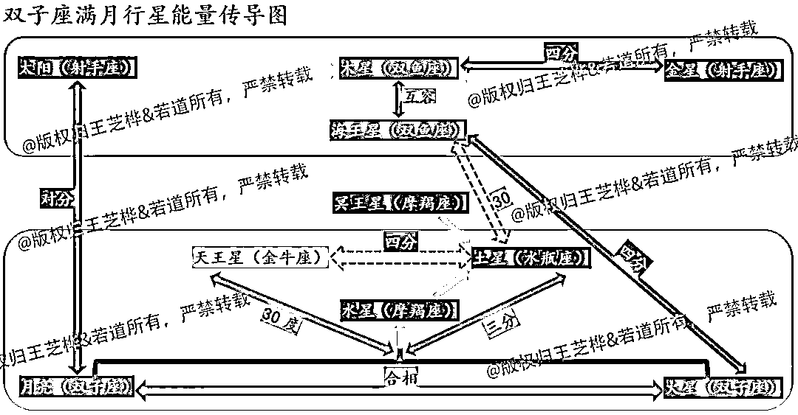

**双子座满月重点影响人群**

参考满月峰值影响期间各个行星的行进度数，以及逆行行星的轨迹影响；常规容许度，个人行星入相位 3°，出相位 1°；非个人行星入相位和出相位均为 3°。

**·** 出生星图中，有**行星、四轴、南北交点落入****变动星座（双子座、射手座、处女座、双鱼座）13°-30°******的人群；

**· **出生星图中，有**行星、四轴、南北交点落入****基本星座（白羊座、巨蟹座、天秤座、摩羯座）0°-8°，23°-30°******的人群；

**·** 出生星图中，有**行星、四轴、南北交点落入******固定星座（金牛座、狮子座、天蝎座、水瓶座）8°-28°********的人群。

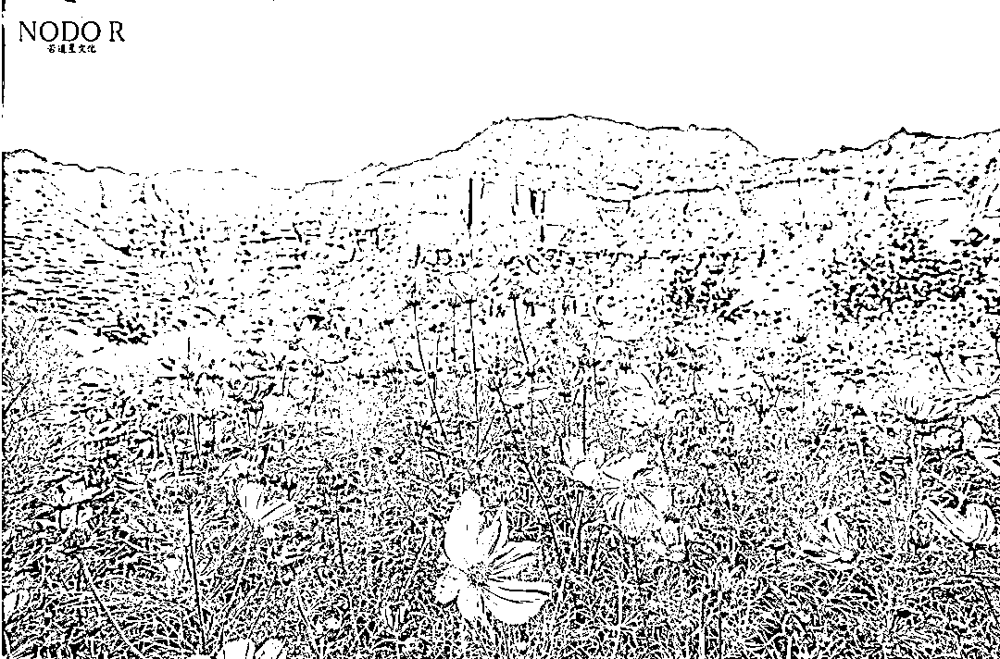

**激烈的满月能量，繁杂中做出选择**

> ****天象：****
> 
> **· 木海互容：双鱼座木星和双鱼座海王星形成能量互容大背景。**
> 
> **· 金木四分：射手座金星四分双鱼座木星。****· 火海四分：双子座火星四分双鱼座海王星。**

从 10 月开始，一年一度的“群星逆行”状态，开始随着行星们一一恢复顺行的脚步而进入尾声。 **10 月 28 日，木星从白羊座逆行回到双鱼座，旋即与双鱼座海王星形成 2022 年度第二阶段的“木海能量互容”结构。**第一阶段的“木海能量互容”结构发生在 1 月-4 月，那时的木星还没有进入白羊座试水，而木星和海王星也未开始今年的逆行。11 月 22 日-12 月 21 日的射手月生活中，先是**11 月 24 日，木星于双鱼座恢复顺行，后是 12 月 4 日，海王星于双鱼座恢复顺行。**至此，2022 年度第二阶段的“木海能量互容”结构，终于恢复到与第一阶段“木海能量互容”结构同样的能量状态，只是这时的木星和海王星都已沧桑了许多。**·** 木星试水白羊座 5 个月之久，就像经历了一场青春的豪赌，激进过，澎湃过，挣扎过，挫败过，而当再次回归双鱼座的时候，眼里的繁星已然落入大海的幽深之中；**·** 海王星逆行 5 个月之久，就像喝下一壶令人沉沦的美酒，看不清的更加看不清，看得清的也权当看不清，只是恢复顺行后的清醒时刻，总要戳破醉梦时的虚伪荒唐。我可没要写言情小说，但浪子回头总是好的。**2022 年度第二阶段的“木海能量互容”结构，从 11 月底开始确实有些浪子回头的味道，年初的魔幻似乎又回来了。**确实，2022 年度第二阶段“木海能量互容”结构的浪子回头并不好过：**·** 12 月 2 日，射手座水星与双鱼座海王星形成“水海四分”结构；**·** 12 月 4 日，射手座金星与双鱼座海王星形成“金海四分”结构；**·** 12 月 9 日，射手座金星与双鱼座木星形成“金木四分”结构；**·** 而 12 月 8 日的此次双子座满月，我们依然处于“火海四分”结构的笼罩之下（2022 年 10 月 12 日，2022 年 11 月 19 日，2023 年 3 月 15 日）。**敲黑板！划重点！****·** 2022 年射手月的大部分时间，水星、金星、火星集体处于“越界”状态，甩开射手座太阳的管制之手，向着“木海能量互容”结构一一开炮；**·** 此次双子座满月的前后一周，正是这 3 颗“失控”行星大肆作妖的时间；而它们作妖选择的搭档，却是刚刚浪子回头、习惯过度自信、喜欢夸大希望的“木海能量互容”结构！**这段时间，消息、流动、人际、商务、金融，无论哪一个方面的波动，都足以震裂我们的下巴！ **此次双子座满月，定位射手座太阳能量的正是双鱼座木星，提示我们**“带着包容性去评估”当下的一切，凡事并不是非黑即白的二元论，很多时候必须走出一段路才能知道这里是不是要找的风景。****好在，12 月 7 日，水星换座进入摩羯座（水星守护双子座，接纳双子座满月能量），12 月 10 日，金星换座进入摩羯座，一股务实、沉稳、成熟的气息让我们冷静下来看待当下的现实。**但即便如此，也不得不提醒，此次双子座满月也只是一个开端而已：2022 年 12 月 22 日太阳换座摩羯座，迎来为期 30 天的摩羯月生活；而期间的 2022 年 12 月 29 日-2023 年 1 月 18 日，水星将于摩羯座逆行，意味着我们将要对 12 月上旬的选择和决策做出修正。如果能够前瞻性地“站在未来看当下”，那么将是多么幸运的一件事。我们试着略看一二。

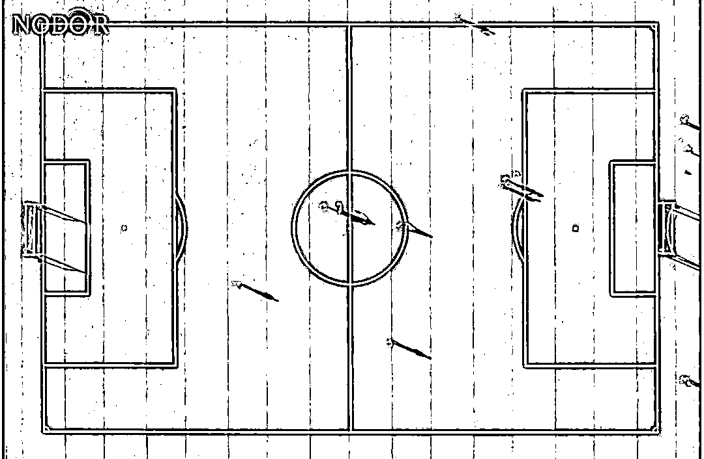

**利弊二选一**

> ****天象：******· 月火合相：双子座月亮合相双子座火星。** **· 日火对分：射手座太阳对分双子座火星。**

此次双子座满月发生时刻，“射手座太阳-双子座月亮”这一组日月对分轴线，介入了“火海四分”结构。

“火海四分”结构，就像是英勇善战的“战神”火星遇见了逃避责任的“海王”——打仗，既需要明确的目标，亦需要精准的探报；然而，“海王”真的可以将目标和探报“渣掉”，令“战神”火星目标不清且信息混乱，打起仗来毫无章法且虎头蛇尾；当然，“战神”火星今次所穿的双子座“好奇牌”便装也得承担一定责任，自己不着调，不被渣都难。此次双子座满月的“月火合相”和“日火对分”两组结构，就像是有利有弊的触发器：**· 弊端：**射手座太阳携带着“自以为是的傲慢”，双子座月亮携带着“焦躁的情绪”，这两方面的阴影令已经被渣得一塌糊涂的“战神”火星，更加急于证明“我比你高级”。故而，也就容易在“情绪吞没理智”的情况下，失去重点，火力分散，东招西惹，冲突升级；**· 利端：**如果“战神”火星能够有意识地联结双子座月亮“敞开内心，积极接纳”、射手座太阳“超越偏见，追寻意义”的高阶能量，那么就能借势而动，校准目标并集中火力，升级视野并重定战略，缓解情绪并突破僵局。

火星这颗行星，代表着精力投注的地方；而精力投注的地方，取决于一个人的价值排序。故而，与其说外部的人事物左右事态并令人生厌，不如说自己的价值目标不够明确和欠缺笃定。

关键是，我们将“战神”火星的能量向着哪种可能性引导。**借助此次双子座满月的完结能量，将那些带有消耗性的认知、模式、情绪做个升级，重新寻回敞开学习的状态，全然投入更有意义的事物。 **

**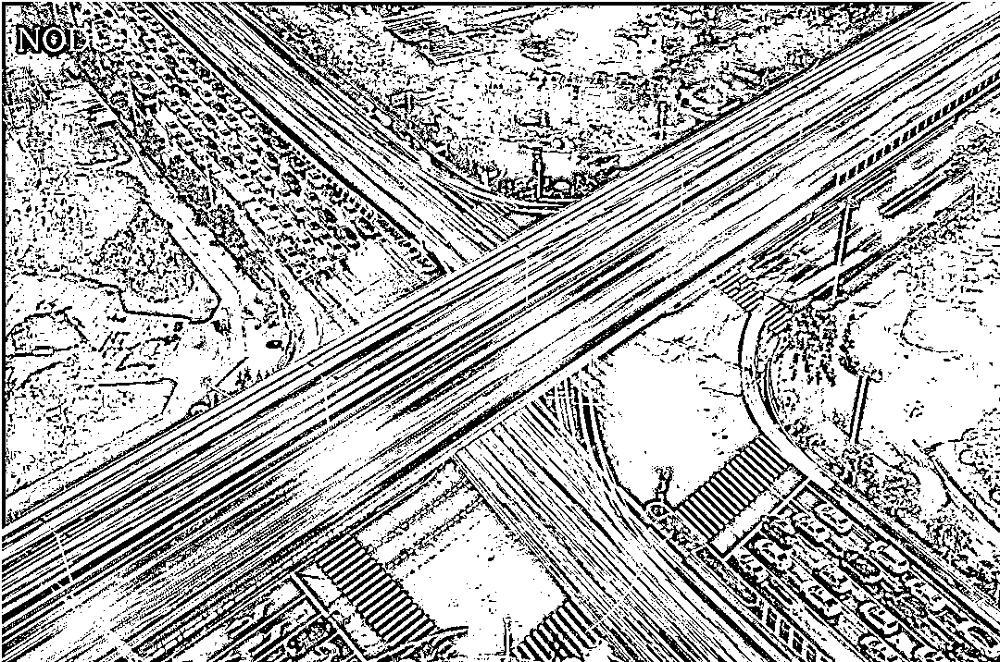**

**不破不立，一场成熟**

> ****天象：****
> 
> **· 月天 30°：双子座月亮与金牛座天王星形成 30°结构。****· 月土三分：宽泛容许度下，双子座月亮三分水瓶座土星。**

此次双子座满月，双子座月亮也同时介入了“土天四分”结构这一宇宙大背景。“土天四分”结构贯穿 2021 全年，虽在 2022 年度稍有缓解，但依然在 2022 年 10 月上旬再次形成紧密呈相，至今我们仍然笼罩在“土天四分”结构的能量余韵之中。水瓶座土星和金牛座天王星组成的“土天四分”结构，就像是“地上的时间和天上的时间”的一场磨合，地上的时间是时代和历史，天上的时间是周期和天启。故而，**“土天四分”结构是一场“不破不立”的征程，清算并突破那些已经没有营养的陈旧，创新并重建更符合天道自然和人类文明的未来。**此次双子座满月，“月天 30°”结构中的金牛座天王星带来现实的突变能量，这无疑会**加重我们内心的焦虑与不安**。之所以焦虑与不安，是因为恐惧未知和不敢信任。但是，金牛座天王星亦在提示——**稳定和安全从来都不在我们手上，而是在“跟随宇宙韵律”的过程中，即“生命小循环和宇宙大循环”的和谐与共振。**“月土三分”结构可以说是宇宙的馈赠，**水瓶座土星帮助我们提炼人生的智慧并沉淀内在的成熟，同时提示我们寻回敞开的热情并迎接全新的磨练。**更为重要的是，**2023 年 1 月 6 日，水瓶座土星将与双鱼座海王星再次精准形成“土海 30 度”结构。**2022 这一年，我们之所以在“木海互容+木海合相”超级魔幻的能量笼罩之下，还能抓住现实的绳索，全是有赖于从年初到年尾的“土海 30°”结构——**水瓶座土星帮助“局中”的我们辨别真假，甚至一次次借由现实的残酷敲醒我们混沌的意识。**此次双子座满月与“土天四分”结构的联动，将会再一次引领我们看向焦虑的内心，提示我们**寻回双子座敞开学习的态度，帮助“战神”火星校准有价值的目标**，而这正是“不破不立”的变革进程所要奔赴的“超越过去的全新意识，扎根现实的全新未来”。2021 年-2022 两年，“不破不立”的征程，是为一场生命的成熟。待到 2023 年-2024 两年，冥王星来回穿梭“摩羯座-水瓶座”之间，并将 2020 年底开启的“全新风元素”周期推进全新轨道之时，我们定会知道今天的一切皆值得。 

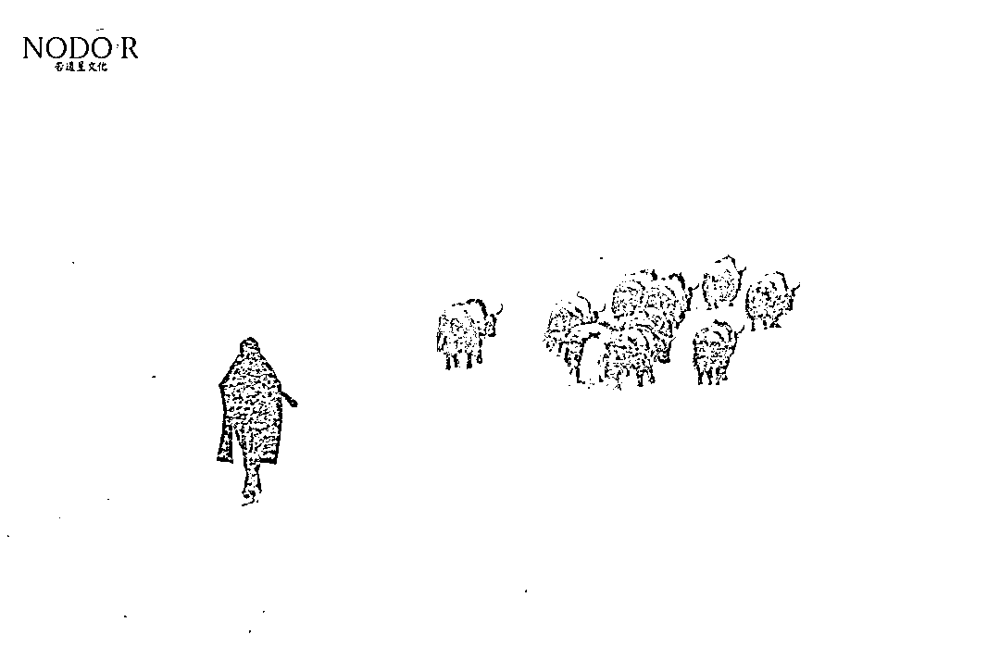

**寄语**这篇文章太难写了，琐碎，凌乱，还有脑海里偶尔蹦出来的文艺情怀，还有肚子里偶尔响起的饥饿肠鸣……然而，我却在这一切的纷乱之中感受到了时间的流淌。
过去已然过去，未来还在未来，唯有带着信念奋力前行，为那些曾经的爱与时光，也为那些未来的希望与可能。

**版权声明**：原创文章由作者授权首发于若道平台，欢迎转发，反对抄袭。友号转载请申请白名单。

**END******想阅读更多作者的文章，********请在后台回复******王芝桦****** 即可。****

****王芝桦****

心理占星师，统合疗愈师，占星专栏作者

若道占星“新月和满月”专栏作者，腾讯视频特约占星师

全职于个案咨询与占星教学工作 18 年

**个案预约咨询微信号**：zhihua0621 

**微信公众号**：daoxi-life

**长按打赏**

********

**快年底了****不给自己一份来自占星学的礼物吗？**

**梅里曼金融报告双 12 福利来啦！****长按下图了解更多详情吧！**

**20 位来自世界各地的占星师****带来 19 场沙龙——新世界的觉醒****详情可点击下图**

**学习占星学****点击下图了解课程详情**

**微信又双叒叕改版啦，不想错过若道君的推送？**
****就把若道设为****星标****以及点点****“在看”****吧！******▼**

**喜欢就点一下“在看”吧！****报名直达入口**

# 年底天象丨海王星顺行，你将在生命何处接通“自我救赎”的疗愈管道？

> 原文：[`mp.weixin.qq.com/s?__biz=MzA5NjA0NTAxNg==&mid=2651496363&idx=1&sn=2cf7c1775b2358408f206304cd334a9b&chksm=8b482d1cbc3fa40a2929ce86ee62cbb5238a5e380c81cf2aa86e821cecadbed1a995ecc8b79c&scene=126&sessionid=1692737715#rd`](http://mp.weixin.qq.com/s?__biz=MzA5NjA0NTAxNg==&mid=2651496363&idx=1&sn=2cf7c1775b2358408f206304cd334a9b&chksm=8b482d1cbc3fa40a2929ce86ee62cbb5238a5e380c81cf2aa86e821cecadbed1a995ecc8b79c&scene=126&sessionid=1692737715#rd)

********************☆ 后**********************台**********************回复“今日”，给你一句生命态度********************

作者/郑玮玲 ISAR 认证占星师编辑/翀子 封面/书君 图片/稿定设计 12 月 4 日 8:15，海王星在双鱼座 22°38′恢复顺行，随着海王星的顺行，我们的生命中有一些被瓦解，也有一些更为清晰，你将在生命何处遇见海王星的“礼物”？一起来看文章吧。**海王星顺行**

北京时间 12 月 4 日 8:15，海王星已经在双鱼座 22°38′恢复了顺行。此次顺行的海王星将在双鱼座持续行进至 27°，顺行期将结束于 2023 年 7 月 1 日。

**随着海王星的顺行，我们值得去重审一番生命中的幻觉与世界性的迷雾，看清楚了海王星的面貌，方能有意识地走向超越，而非无意识地消亡、瓦解。**

**海王星的疗愈与超越**

2022 年，海王星的逆行是从 6 月 29 日在双鱼座 25°26′开始的，而每一年海王星的逆行时长都是大约 5 个月、三度区间。对于每年规律、长时间逆行的海王星来说，逆行区间度数便是我们开解海王星迷题的钥匙、地图。

**但凡逆行，就带来了回顾、强化、反复的能量，这种能量既能让我们被卷入海王星迷一般的旋涡，又能让人在痛苦、迷离中的失界、失控加强、加深，直抵心灵和宇宙的边界，从而实现非凡的疗愈。**

所谓“超越”之于海王星，便是疗愈那些深不可及，不可知的创伤。我们都在烟火人间演绎个性化的剧本，而剧中的我们都需要经受住海王星从浑浊到清明的洗礼。生命在灵性层面的意义既是跨越乌云迷雾，与天际之外，意识深海之中的“存有”连接。

海王星似是那个“管道”，却显化为无形、无时、无处。我们失去边界的时候会滑入那条神往之路，若非疗愈，便是疯狂、涣散与混乱。

超越与疗愈是海王星显化的目的，而海王星的核心动力其实是个体对于内在神性的救赎——**一种来自于心灵最原初、恒定的与万有之源相连，回归宇宙母亲子宫的深切渴望。**当这种渴望游走在无意识频段时，我们只能经由各种扭曲、疯狂的行为被迫表达这深海中的剧烈能量。

当我们透过原型视野做出进化占星学诠释时，海王星便被称为“白色意识之光”。**意识的清透、纯净成为了海王星自我救赎的必然道路，而不仅仅只是完成无意识的救赎。**

所以，在海王星的境遇里，意识是如此重要，它可以透过心灵共频的伴侣、团体共同经历，可以通过艺术的提炼、表达来升华，可以在任何灵性实践的道路中获得完整，它也可以是一条无我、奉献的道路。但一定是沐浴在白色意识之光中的个性化选择，而非无意识、自动化的结果。

**在原型层面看待三王星中的任何一颗，我们都需要意识到集体层面的能量。**每个人在个体的世界里都在创造自己的命运，铸造个体化的经历。而个体始终在集体的海洋中，如微尘、如水滴，一个永恒整体没有片刻不在变幻、变动，而每一个微小个体的举动也都会影响到整体，这便是集体层面的海王星。

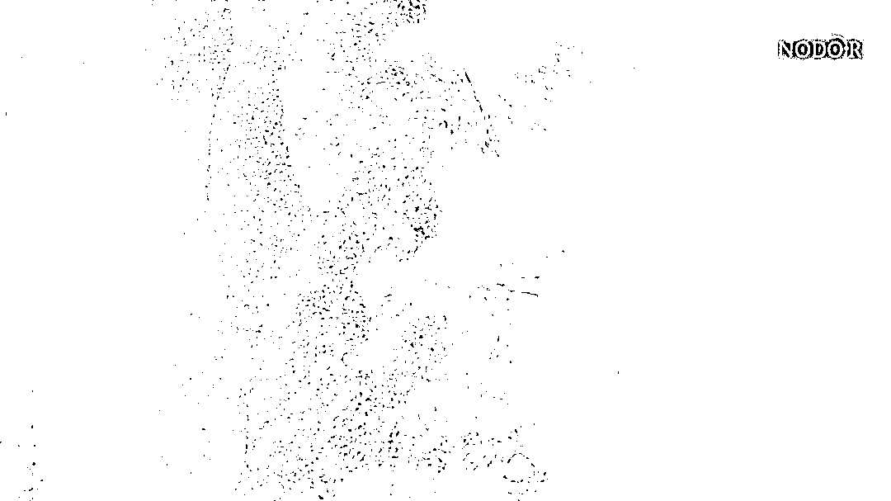

**海王星顺行期间的影响**

海王星的行进虽慢，但在顺逆转换期我们仍能看出短暂的停滞期。此前，**逆行中的海王星从 11 月 15 日起就进入了停滞期，**而这段逆行前的停滞期就带来了最强烈的海王星式的影响：混乱、失序、茫然、无力、无助、如在梦中。

同样的，**在海王星顺行之后，也有一段停滞期直到 12 月 24 日才会恢复常态的行进速度。**

在当下，我们倍受海王星能量的侵袭，更何况它在自己守护的双鱼座，这会让集体的脆弱感、敏感性瞬间提升。由此带来的现状便是：**我们对痛苦的感受更为强烈**，一些处在长期压力与挣扎中的人们很可能只差“一根稻草”了。

大家都说成年人的崩溃都是在一瞬间，而这个瞬间在占星学的语义里，便是海王星的侵蚀。

或许是坚持太久需要休息，或许是苦难在无形中蔓延到无法挽回，创痛的现实会让某些个体短暂失去理性与斗志。而若能在这番风雨飘摇中认清痛苦的本源——**心灵原初的救赎、回归渴望，便能从海王星的水域里拿回生活的力量。**

另一方面，海王星停滞期，**边界感的消融、坍塌**也是猝不及防的，当我们感知的自我界限薄弱、丧失的时候可能为时已晚。边界丧失在以往，我们可能更多去谈论个体性的敏感差异，从环境、氛围、他人情绪而来的侵扰与交织，**保持自我意识和不间断的清理便能独善其身。**

而当下的停滞期，我们见证了新冠三年的阶段性的“结束”，随着核酸企业黑幕被公诸于众，各城市防疫管控措施急速调整，很多人准备“躺平”，其实意味着更多隐藏、难以觉察的感染、大规模才开始浮现。

之前的密集封闭与检测阶段已经过去，但病毒尚在，双鱼座的海王星对于病毒的隐藏性、传染性都有极强的助推力。意识的松懈与轻视在当下是最危险的。

眼下对于个体而言，正确有效的个人防护显得非常必要了。当我们不再面临紧密的核酸、隔离措施，并不意味着病毒无害了。真正的防疫是用有效的行动、保健、疗愈的方法保护生命安全。

**双鱼座的海王星既带来了各种微小不可见的感染途径，也预示着许多我们稍不留心就会错过的疗愈机会。任何一种因时制宜的学习与疗愈都将会让我们建立有效的防护盾。**

放下数据、检测之后，要有意识拿起自然疗法为工具，如果每个人懂得一点疗愈、与预防，我们就能用意识连成一道墙，在集体层面形成无形的阻隔与防护。这是海王星顺行期间传递给我们的课题和讯息。

**海王星顺行后的重点影响人群：有个人行星、四轴、交点位于双鱼座、双子座、巨蟹座、处女座、天蝎座、射手座 21-29 度区间的人。**

对于海王星而言，**梦境**也是不可忽略的途径。

我常常在海王星顺逆转换、停滞期做一些奇异、印象深刻的梦，这些梦总归关于爱，关于亲密，关于生命的遗迹或对未来的某种确定的预示。

在我经年对梦的观察后我会认为，有意识的海王星是渴望来疗愈我们的，它有着无与伦比的疗愈力，但必须在我们的意识完全放松，完全允许的时候，我们会随着海王星的指引抵达某种自然的超越。在彼时，现实中纵有种种缺憾与困境，都能透过灵性的光芒圆融我们的精神世界。

当我再回到现实中，一切的旧有面貌，一切现实不可更动的迹象就发生了质的“变化”，这变化在于内心对客观事物、历史事件的感知、理解有了微妙的不同。而未来的某些发生便会再现一次美丽的梦境，如果你相信。

约瑟夫·坎贝尔说过：“梦是私人的神话。”

**但愿你们都以记得海王星顺行带来的好梦，并让梦的种子散播到生活中。**

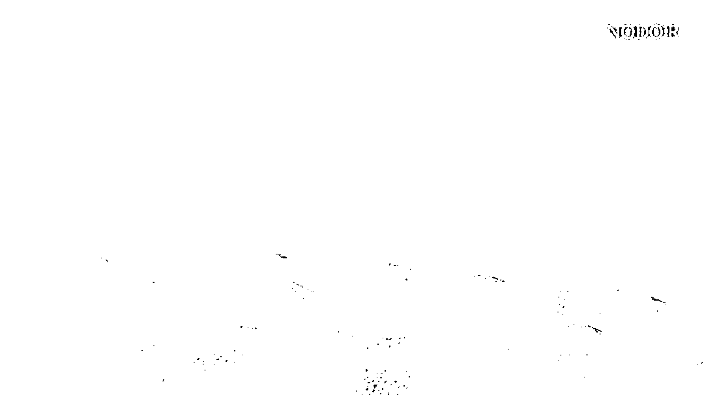

**海王星顺行后的重点相位**

**火星四分海王星**

这是自 10 月中旬持续到 12 月上旬的充满危险的变动星座四分相。期间伴随着火星逆行，木星、海王星相继顺行，可谓是 2022 第四季度的宇宙燃点，将现实中种种幻觉烧成了灰烬。**这把火清理了一些残存于能量罅隙间的恶瘤，也难以避免地毁掉了一些个体生活中不够牢靠的理想、美梦。**

海王星顺行后不久，这组相位的能量也会快速消解。接下来，**2023 年 2 月 22 日开**始，火星会在顺行后再次与海王星形成极富张力与变幻的四分相，直到**4 月 2 日**火星在巨蟹座时才结束。

**这组相位重点影响人群是有个人行星、四轴、交点位于双鱼座、双子座、巨蟹座、处女座、天蝎座、射手座 16-29 度，以及巨蟹座、天秤座、天蝎座、摩羯座、双鱼座、白羊座 0-3 度的人。**

由于火星与海王星的前一次四分相是从海王星顺行开始的，因此下一次火海四分相将非常强烈的带出前期逆行火星四分海王星时所展现的力量衰减、削弱感，某些强烈的、关于**自我救赎**的议题会激烈呈现出来，供我们去完成自我之力的更新与重建。

**海王星将透过患难、疾病、痛苦、无助、丧失等方式把属于个体生命的权力与力量交还给你，而保持一种不畏惧脆弱，也无惧险境与痛苦的心态的人，都会顺利获得宇宙的礼物。**

**海王星顺行在 12 宫位****注：以出生星图上升星座度数 30°范围内的上升星座为准。如你上升在 0°，可以完全参考下列内容；如你上升在 29°，则需参考下一上升星座。****若道君：****你可以在 app store 或者应用商店搜索“若道”下载 app，输入个人档案，查看行运盘（也可以使用其他星图软件），找到行进海王星落在出生星图的第几宫，然后对照下文查看。******例如下图中，比尔·盖茨上升在巨蟹座，行进海王星在个人星图的第 9 宫。****

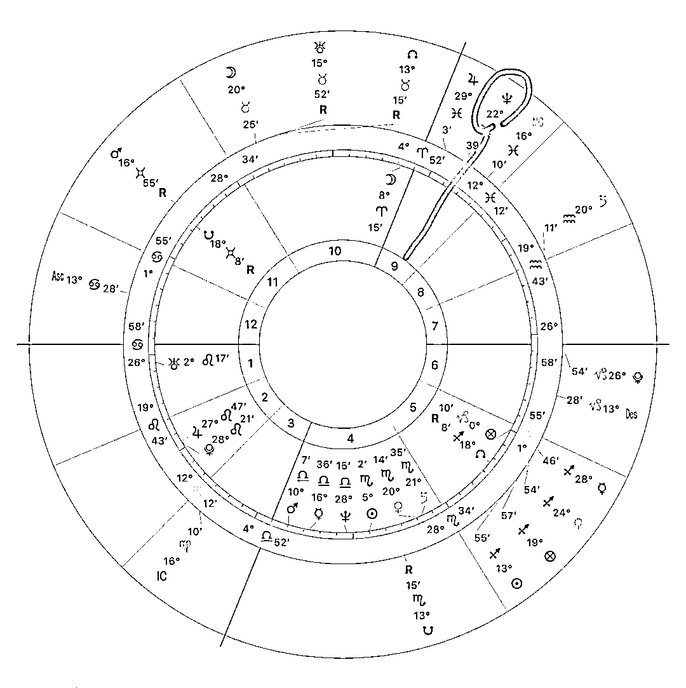

**海王星在*****1*****宫顺行**

**如果你的上升点位于双鱼座 22-27 度，那么这一轮海王星的顺行便将划过你的上升点。**你可以想像一支水份饱满的画笔将你的上升点抹去，而你，其实可以选择用什么样的笔，什么样的颜色，以及让这划过的线条更粗还是更线，是曲线还是直线。

我们不得不正视海王星经过上升点带来强烈的幻灭、丧失与消亡感，很多时候它所消亡的部分会波及对面的七宫——**你的亲密关系。**

事实上，比起海王星经过下降点带来的关系消亡的可能性不相上下。这其中很大的原因是由于**个体无意识**造成的，当我们对心灵的敏感，对灵性的世界缺乏觉察时，海王星的能量会完全交由无意识通道接管——被迫面对关系坍塌就会发生。

而当我们对心灵的敏感性充满觉察与意识时，**海王星经过上升点、一宫时，我们就有必要进行个体化的灵性建设了。**因为敏感性让我们感受到某种自我边界的消失，经由身体、身份感等方式让我们步入某种崩溃的边缘。

当我们意识到灵性的力量在我们之内渴望被唤醒、使用时，疗愈与超越便会到来。**海王星在一宫的行进让我们相信什么，便能超越什么。**

当然这一步并非一蹴而就，海王星行经一个宫位大约要 14 年，一生中，行进的海王星只能走到我们出生星图的半圈。且把每一年的海王星行进视作成长的标尺，看看对自己的心灵有多少深入的觉察，和增长了多少将觉察整合进现实的能力。

**寻找并确认一条灵性生活的道路，放弃不切实际的幻想，检视真实自我与理想的可行性，是当下海王星顺行的必须要求。**

**海王星在*****2*****宫顺行**

海王星的顺行会带来理想的加速感——我们对于理想的期盼更为直接而渴望投入现实。**但海王星在二宫常常带出的问题是：我们不清楚自己身价几何，我们要面对很多的糊涂帐。**

所以，随着海王星顺行，你需要开始去面对过往的不清晰，包括：**金钱、价值、帐目上的各种不清晰，**经由这些项目的梳理才能够与理想搭上线。你的灵性将要得到飞升的喜悦，得先经由价值的自我清晰与肯定。

二宫所关心的“金钱”议题，其实也是一个非常有灵性意义的议题。当我们不能清晰处理我们与金钱的关系时，也就是我们不清楚我们的金星——爱的关系。当然，二宫所给予的是爱自己的能力，这里是我们去表达如何爱自己，有多爱自己的实力的地方。

**海王星顺行在此，我们应当好好去爱自己了，放开那些顽固封闭的阀门，或者守护好那些一直疏漏的敞口。**

是堵还是疏取决于你和你的现状。总之，是让给予和接收获得一种积极的平衡。你可以用任何方式取悦自己，满足自己，金钱的流动是必然的实现方式。而在金钱的流动中去觉察自己心灵的敏感性，保持一种流动却悠游自如的方式，这便是海王星的态度了。

**海王星在*****3*****宫顺行**

三宫提醒了我们**环境与变动**的敏感性，而一切的超越与疗愈都会经由**交流、学习与切换的路线**发生。海王星行进三宫的人会处在一种高频率、忙碌的学习中，讯息传播，知识的积累会成铺就一条自我超越的道路。**所以，选择接收、传递什么样的讯息，选择学习什么就变得尤其重要。**

海王星在此行进也是让我们把视野和焦点投放在除我们自身之外的地方——社区、邻里与族亲。如果我们在寻求某种疗愈与超越，**如果我们的学习必须超越某种瓶颈，与他人的互动就成为了必须。**

海王星在此，似乎是透过平凡生活向我们揭示“大道”。无所不在的能量与可能就藏在我们意想不到的细微处，**在每个看似不起眼的地方都有着值得留心去学习、体验的珍贵。**

**海王星在*****4*****宫顺行**

**如果你的下中天位于双鱼座 22-27 度，海王星必然将擦过你的轴线。相较于上升点，海王星经过这里会更加隐匿，也更少有人能觉察你内心的波涛汹涌。**不过在一切发生之前，请记得将你家的下水道，水闸全部检修一遍。

海王星这颗蓝色星球毕竟还是与海洋、水有着千丝万缕的联系，不少人在经历海王星行进下中天时都会面临家里水漫金山的情境。

当然了，海王星的白色意识之光需要我们通过**自我精进**的努力修炼去迎见，如果你渴望并实践任何一种疗愈之道，当下的行进会助你一臂之力。静坐、瑜伽、太极、唱诵、中医、八段锦、金刚功，任何一种能为你流入精神、灵性养料的修行、疗愈法都是通达灵性殿堂的道路。

海王星行进在哪里都可能带来一种不可用蛮力、意志力去抗衡的消融感，一切只能顺势而为，哪怕是暂时性的“瘫”。尤其海王星行进四宫，**内在的“瘫痪”感**可能如黑洞般时常吞噬、淹没自己。**而我们要允许自己时不时被某种无形消融，但不可忘记我们内在的白色意识之光的指引。**烦恼即菩提，苦难即开悟。

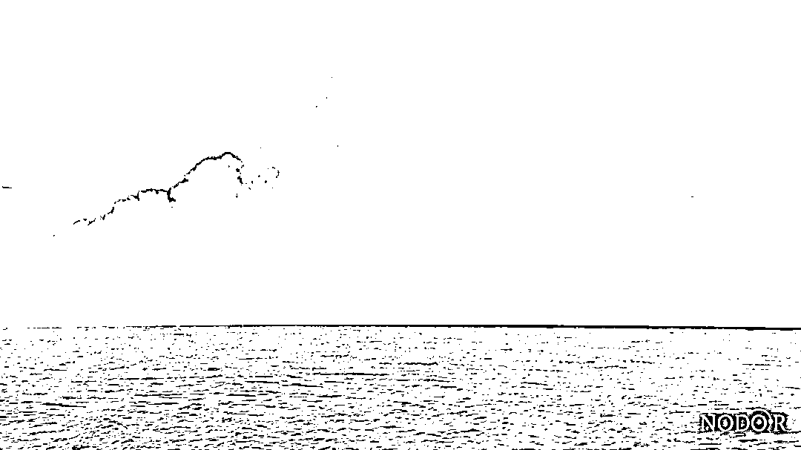

**海王星在*****5*****宫顺行**

当海王星行经享乐与创造的领地，它也得尊重生命活力与快乐的存在，但痛苦与心灵的敏感性也会经由寻找快乐的过程溢出心灵的城池。

在这漫长而充满落差的行进中，我们需要与海王星进行积极的合作，**允许所有的灵感与创造性透过生命、自身去表达，让意识之光去点亮生活的平庸与暗夜。也许我们要表达痛苦的呐喊，但可以用让自己感到快乐、愉悦而尽情的方式。**

就像罗大佑写在《爱的箴言》里的那样：“爱是欢笑、泪珠飘落的过程。”

海王星在此的行进是鼓励我们**去创造、去表达**，哪怕短暂的失控，让自己与自己所创造的东西融为一体也未尝不可。**投入去爱，快乐与悲伤也会失去边界，但重要的是我们能让自己充分投入、活在爱里。**

这样的行进也可能让你与看走眼的渣男谈一场声势浩大的恋爱，最终经历美梦破碎的痛苦。可是，在海王星的境遇里，渣男也是被允许的，也预示着被宇宙祝福的自由的道路。透过渣男，你还是获得了爱——你内心深处的爱，生命永恒不变的爱，此生必定追寻的爱。

在海王星的清洗之后，你会明白：渣男只是养育爱的花朵的肥料而已，你还是你，爱是你，你是爱，渣男只是渣。**而爱会成就你所有的创造，包括全新的你自己。**

**海王星在*****6*****宫顺行**

**海王星在此的行进揭示出一些慢性、长期累积的健康问题，并且我们需要面对、处理的健康问题也需要长期的调整和改善。**

现代整合疗愈体系一致认可诸多心理性疾病的生理表达，在海王星行进六宫的时候其实给予了我们足够长的时间和精微度去观察自己的生活起居，心理状态。**我们的习性在造就我们健康和未来生活的样本，而我们的心灵本来的样貌就是我们身体健康的蓝本。**

随着海王星的顺行，你非常值得去深度投入身心整合疗愈的工作，重点是让一切观察与疗愈与现实生活习性相结合。海王星所能带来的超越与疗愈一定是在生活中某个隐微的点发生质的飞跃的。

当然，你很可能处在长期的疲劳、无力感、消沉与幻觉中，而六宫恰恰给予了海王星一个可以落定的生活实相——投入我们繁忙的日常生活与工作，**在正确的节律中让能量流转起来**。因此，建立一个正常、符合自身的生活节奏也是必要的，这可以帮助我们抵御外界的侵扰。

**海王星在*****7*****宫顺行**

**如果你的下降点位于双鱼座 22-27 度，接下来也将是海王星划过你轴点的时期。**

强大的消融、瓦解感可能将你包围，如果你处在长期的灵性成长与学习中，疗愈和超越自然也会到来。无论如何不要让自己飘得太高，也不要让自己完全陷入低沉频段。面对海王星，我们最需要做的一件事就是保持简单生活，跟随简单清晰的内在声音去行动。

当然很多人在海王星行经七宫时都需要面对亲密关系的议题，但这里的复杂性并不仅仅限于离婚、分手、换一个人等。**七宫宛如一面镜子，我们需要看清楚对方是谁，在此之前更要先看清楚自己是谁。**

**人此生最重要的亲密关系其实是与自己的关系，**当我们对自我的认知不清晰时，便不会遇到一个清晰、正确的伴侣。

当我们清晰自己的内心、轮廓，也不再恐惧、畏缩时，七宫的扭曲才会消除，现实中的关系议题才谈得上让海王星来侵蚀。而在此之前，请让自己投入内在冥想的道路，在你灵性的海洋里勇敢地掌舵。

**海王星在*****8*****宫顺行**

八宫的亲密让我们比七宫更深入一步，超越婚姻，甚至也超越生死、神圣。海王星给了我们一条通往无我、融合的路径，八宫何尝不是。但不同的是海王星集纳了万有的能量，而八宫是关于两个个体的。

当海王星顺行在此，我们确实是在向人类的亲密发起最艰难的挑战，**在各种幻与失界中寻找二元合一的力量。**神秘次元揭示出一些成长的航向，深度心灵的结合也召唤着勇敢的尝试。

信任无非是此时极为深重的课题，而海王星也自然将欺骗、谎言带到了现实中。这样的行进对于人性是极致的考虑，也可能带来检为珍贵的礼物。

宛如在大海中打捞珍珠，我们可能只是打捞了一场空，一捧月光。而海王星已经用超越性的力量推动了灵性的成长，在看不见的地方，白色意识之光照亮了心灵的幽暗。

**海王星在此行进，让我们拥有信任的勇气，灵性的光芒从幽暗处点亮。**

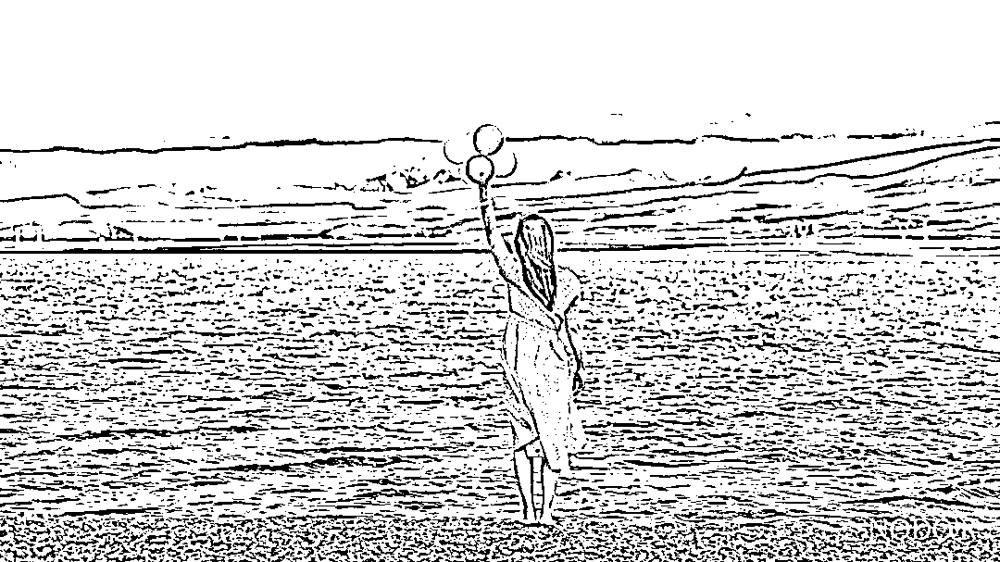

**海王星在*****9*****宫顺行**

你的朝圣之路指向了文化、文明、信仰的求索，在漫长的时光里你可以用各种可能的方式去寻找远方的声音、光亮，意识的启迪也可能在任何微小不经意的时空发生。世界对你而言正是一个有待开启的潘多拉宝盒，其中的梦与幻，惊奇与非凡是需要用脚步去丈量、体证的。

此时顺行带来了理清你的目标的必要性，我们可能迷失在众多意识的旅程中，很多的线路交织，很多的洞见、真理，让人的心智投入而疯狂，以至于我们忘记了因何而出发。

**当我们正视海王星的幻影，就是去清理追寻路途中的各种干扰，经由我们的初心去挑选真正正确的道路，真正符合当下心灵的道路。**

而九宫既是行远路，更是总结我们所走过的路。你的经验不会让你迷失，你身后的路也可能为世界打开新的梦想之路。在迷雾中前行，也总结迷雾中的经过，海王星的梦想也会照进现实。

**海王星在*****10*****宫顺行**

如果说海王星让我们在梦里迷失，当它再次顺行时，我们便可以从那个迷失中出离，重回真正的现实或梦境中来。无论你觉得自己身处何处，这可视为一种重启梦想与航向的时刻了。

**如果你的中天位于双鱼座 22-27 度，也会将经历海王星擦过中天的情境，**这个没有边界的行星真的会抹杀掉你过去所有的功过，那些你认为光芒的过去也不复存在。一切都像是空白。

事实上，十宫的海王星让我们学习放手，不执著，没有什么是能够被我们抓住、控制并持久的。是的，没有什么是永恒不变的。这就是海王星在十宫要拿走的意义。

**因为十宫意味着生命的高处，维系着我们生命的尊严、高度，是生命最繁华的梦境，这里都可以空落无依，我们还有什么需要执著的呢？**

沉浮变迁也是成长的助力，海王星拿走一些，也赋予我们对生命全新的信任。**有结束，也有开始，海王星消融的一切将重组成新的生命高度。**

**海王星在*****11*****宫顺行**

十一宫宛如我们生命的远景和成熟未到的未来，我们把愿景与理想放在这里，因为我们总是相信明天会更好——这就是海王星在此的意义。

但同时海王星在十一宫行进也把各种迷惘带到了现实中，我们也很可能在团体中迷失了自我的目标，甚至感受到身份的消解，梦想的消融，或是现实的不真实。

在海王星的镜子魔法里每个人都很难看清楚自身的境况，何况在十一宫这种群体交杂的氛围里，**每一个人的观点、意识、理念都在相互影响着彼此。**在此我们要寻求的只能是团体的整合与清晰，一个清晰的愿景实现的时候，为愿景付出的每一个也将透过愿景重回自我的真实。

**但在十一宫的道路上，我们只能为着集体性的目标前行，在迷雾、困顿、涣散与苦难中抱团、合作，只有为目标的投入才有共同的超越。**

**海王星在*****12*****宫顺行**

海王星在此的氛围是：海王星，双鱼座，十二宫，可谓宇宙完美的三重奏。而此时的意义便是：如果我们对世界，对他人是麻木不仁的，我们的心灵便不会更好，我们的创伤也无法得到疗愈，更不会有梦想、个体的超越了。

我们都需要了解双鱼座的海王星在十二宫所展现的集体性、庞大无边、无限的连接力，再一次我们需要明白**每一个个体都是大海中的一滴水，**都是空气中飘浮的尘埃——因此我们**每一个人就是宇宙本身的组成部分。**

若你能想像我们的身体乃至心灵都是经由宇宙几千万年前碎裂的星辰所组成时，你对这个世界会有一丝不同的感动、感受吗？

让我们告别麻木的危险，去投入一种纯属心灵、敏感与包容的频率，这个频率可能是 432Hz，它叫地球，也是爱。

**海王星在十二宫存在着最原始、本能的疗愈力，但需要我们拆解掉封闭的自我，强大的心理防御，**在梦境、诗意、柔软、脆弱甚至痛苦、疾病的侵蚀下充分地绽放心灵的花朵。臣服并跟随你心灵的指引，唯有柔软能让人成长并坚强。

**版权声明：**原创文章由作者授权首发于若道平台，欢迎转发，反对抄袭。友号转载请申请白名单。

**END**

**郑玮玲**

ISAR（国际占星研究协会）认证占星师（2016 年获得）

若道占星专栏作者

将占星咨询、教学与音乐、舞蹈相结合的疗愈者

**微信号**：zhengviolin

**新浪微博**：@郑玮玲

**微信公众号**：Sampriya-Astrology

长按打赏

**点击预约****来听直播分享吧**<mpvideosnap class="js_uneditable custom_select_card channels_live_iframe" data-pluginname="videosnap" data-headimgurl="https://wx.qlogo.cn/finderhead/PiajxSqBRaEJYnVsqWfEX9qA0sI6hNVKsDfyzfPZ92WZMZyBpZWU5NA/0" data-username="v2_060000231003b20faec8c4e68a1ec2d4ca07e434b07755bbf47e7053a3059defd2c9d6c68a20@finder" data-nickname="若道" data-desc="将在 12 月 07 日 20:00 直播" data-intro="若道核心课程 L1-2 研讨小组学员分享 第一场 我的太阳故事" data-noticeid="finderlivenotice-v2_060000231003b20faec8c4e68a1ec2d4ca07e434b07755bbf47e7053a3059defd2c9d6c68a20@finder-1670222621020342-963328150" data-type="live"></mpvideosnap>

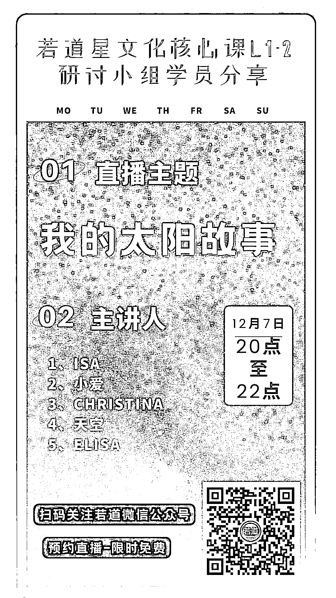

**快年底了****不给自己一份来自占星学的礼物吗？**

**梅里曼金融报告双 12 福利来啦！****长按下图了解更多详情吧！**

**20 位来自世界各地的占星师****带来 19 场沙龙——新世界的觉醒****详情可点击下图**

**学习占星学****点击下图了解课程详情**

**微信又双叒叕改版啦，不想错过若道君的推送？**
****就把若道设为****星标****以及点点****“在看”****吧！******▼**

**喜欢就点一下“在看”吧！****报名直达入口**

# 2023 天象预测大师课 | 2023 年，宇宙都将发生哪些大事？

> 原文：[`mp.weixin.qq.com/s?__biz=MzA5NjA0NTAxNg==&mid=2651496363&idx=2&sn=9f586fd82f360976b12fcf13e0c267eb&chksm=8b482d1cbc3fa40aa62879f05a05aa21ae19c0085727341a9bf7f8f6cd6e9533996d28ec6d59&scene=126&sessionid=1692737715#rd`](http://mp.weixin.qq.com/s?__biz=MzA5NjA0NTAxNg==&mid=2651496363&idx=2&sn=9f586fd82f360976b12fcf13e0c267eb&chksm=8b482d1cbc3fa40aa62879f05a05aa21ae19c0085727341a9bf7f8f6cd6e9533996d28ec6d59&scene=126&sessionid=1692737715#rd)

2022 年已接近尾声，忙碌的年末工作也挡不住我们对来年的盼望和期许。

作为占星师，在年初跟随权威老师透彻的学习 2023 年重要天象的含义和影响是迎接新的一年的正确姿势，仪式感满满！

若道邀请了金牌核心课中的 4 位国际名师再次集结，在**2022 年 12 月 16 日-18 日**带来**2023 年重大天象的深入解读：从冥王星、土星、木星换座；金星逆行；土星在双鱼座等角度切入，洞悉大环境的变换趋势、时事格局，为新一年的自我规划和占星事业加油充电。**

**课程时间安排**

**2022 年 12 月 16 日 周五**

**20:00-22:00 ****克里斯蒂娜·罗登贝克****2022 年 12 月 17 日 周六****16:00-18:00 ****艾德里安·邓肯**（休息 30 分钟）**18:30-20:30 ****大卫·瑞雷****2022 年 12 月 18 日 周日****18:30-20:30 ****琳恩·贝尔****课程内容安排**

**12 月 16 日 周五**

**20:00-22:00** **宇宙的舞者：****2023 年的冥王星、土星和木星**

**2023 年是这 10 年中最重要的年份之一，标志着一个时代开始落幕。**冥界的黑暗之主冥王星自 2008 年以来一直在摩羯座行进，它将在 2023 年离开摩羯座，能量会发生重大转变。

**在接下来的 20 年里，冥王星会在下一个星座水瓶座行进，影响整个时代。**但对于冥王星来说，进入水瓶座并不容易，或者说并不顺利。**在接下来的 2 年，冥王星会 2 次重返摩羯座，2023 年 6 月它将首次重回摩羯座。**这看起来在个人层面和全球层面都会是**动荡和调整的混乱时期。** 
就在冥王星首次换座的同一个月，**另一颗强大的行星土星也会离开自己的家园，进入没有边界的双鱼座，结束在水瓶座为期 2 年的限制和制定规则时期**。与此同时，**木星这颗与扩张和幸运相关的行星，也会在 2023 年春天换座，从火热的白羊座跃入金牛座更坚实的土地之上。**2023 年有望成为与重大改变相关的一年，这就是为什么了解这些重大行星事件的时间对于规划未来一年至关重要的原因。

**12 月 17 日 周六**

**16:00-18:00 2023 年的爱与戏剧性**如果男人来自火星，女人来自金星，那么我们应该能通过密切关注 2023 年金星和火星之间的相位来见证它们的热烈拥抱。当金星和地球围绕太阳相对运行时，金星会表演一场华丽的舞蹈，在 8 年的时间里形成 5 个逆行环路，在天空中勾勒出了一朵完美的玫瑰花。每 1 片或 5 片花瓣的尖端按顺序以几乎完全相同的度数在这 5 个星座中出现：双鱼座、天秤座、双子座、摩羯座，以及——在 2023 年落在狮子座。**2023 年将会是充满戏剧性和浪漫的一年。**

在此次课程中，我们将跟随**金星和火星在 2023 年的运行**，特别是**6 月 5 日，金星进入狮子座，7 月 23 日在狮子座 28°逆行，到 10 月 9 日才离开狮子座这段时间。**这是漫长的 4 个月。**火星会在 5 月 20 日进入狮子座，7 月 10 日离开。** 
由于金星的运行速度通常是火星的 2 倍，你会期待它们在狮子座形成一次重要合相。但金星会逆行，与火星的浪漫相遇不会有一个愉快的结局。**在 2023 年夏天，金星和火星会给我们讲述一个什么样的爱与关系的故事呢？**  还有一个更复杂的天象。**3 月 23 日，冥王星进入水瓶座，在 1°左右徘徊，直到 6 月 11 日。**这是自 245 年前的 1778 年 6 月-8 月以来，首次先是火星，然后是金星在狮子座对分冥王星，而 245 年前美国正处于独立战争时期。

2023 年冥王星进入水瓶座，接下来的 20 年里，每当金星与冥王星形成相位时，都会改变浪漫的本质。最后，因为金星在狮子座逆行，在狮子座来来回回移动，所以它会与在金牛座的天王星形成三次四分相，与刚刚进入金牛座的木星形成三次四分相。

**这些征象与高度特权、富有和极端独立自主的行为相关。**我们都可以在 2023 年期待激动人心的浪漫爱情，但对于那些金星和火星强大的人来说，将会有盛大的烟花表演！

**12 月 17 日 周六  18:30-20:30 大卫· 瑞雷分析新一年的时事趋势**  **涵盖的趋势和主题包括：**

**· 火星在双子座逆行**——最后一次四分海王星！2023 年前 3 个月，信息战继续升温；谁在欺骗谁？世界上武装冲突的噪音。

**· 冥王星进入水瓶座**——改变“一与多”之间的关系。由贡献和参与定义身份，以及排斥和包容的副作用。权力和资源的重新分配，以及世界面临的挑战。

**· ****土星在双鱼座**——以不可能的方式将想象变成现实； **· 再谈木星在白羊座**——谁从武装冲突中受益？ **· 木星进入金牛座，四分冥王星**——面对贫富差距，然后在狮子座的金星在逆行期间三次四分木星；

· **火星-冥王星相位**——对分冥王星，三分冥王星，四分冥王星· **情人节那天，金星入相位合相海王星**——这是宇宙天气和文化传统之间一次罕见的一致

**12 月 18 日 周日 18:30 – 20:30 土星在双鱼座：消融边界**

过去 5 年，土星一直在它的“家园”摩羯座和水瓶座中行进。2023 年 3 月 7 日，它将进入双鱼座这片湿滑之地，加速旧边界的消融，改变我们对世界的看法。

**土星在双鱼座需要对看不见的东西有信心，并且经常要求我们放下曾经看起来坚实可靠的东西。旧的确定性受到挑战，可能需要做出牺牲。** 
土星在双鱼座帮助我们**放下过时的依恋，意识到那些并不支持我们的东西。**它能给我们勇气，让我们头朝下跳入水中。一旦土星越过星座边界，它会在双鱼座逗留到 2025 年 5 月。我们会看一看这段旅程的馈赠，同时也看一看它可能存在的隐患。

土星换座后不久，冥王星会进入水瓶座，仅仅在 2023 年开始后 8 周的时间。**冥王星换座会带来全球范围内权力分配的变化。它可能是技术进步的先兆。**这个时期，集体的需求可能比个人的需求更强烈。一个新的世界正在崛起，一个旧的世界正沉没到波涛之下。 **讲师是谁？**

**克里斯蒂娜·罗登贝克（Christina Rodenbeck）**

· 全职职业占星师，在牛津大学城生活和工作，深受周围知识和文化氛围影响；她拥有伦敦大学（University of London）的人文荣誉学位，曾在伦敦占星学馆（Astrological Lodge of London）、心理占星中心和占星研究学院学习。  **· **作为一名占星师，在过去的 20 年里，克里斯蒂娜在她的网站“牛津占星师”上写了大量关于时事、艺术和文化的文章；她每月主持一个占星播客：“与克里斯蒂娜和萨莉一起占星”，并定期在《占星杂志》(Astrological Journal)上撰写时尚专栏；她定期在英国授课，并保持着蓬勃发展的专业实践。
**艾德里安·罗斯·邓肯（Adrian Ross Duncan）****· **1971 年在印度游学时开始学习占星学，1985 年开始成为全职占星师，迄今执业已超过 33 年，是人本主义占星学、卜卦占星学和经世占星学领域的知名占星师。他还开发了占星软件 AstroClock 和多款占星报告。**· **他在日常咨询中经常运用卜卦，咨询图（卜卦的一种运用方式，即根据客户来访时间制作星图，从星图中获得大量信息）也是他特别擅长的领域。**· **从 1971 年开始研习佛学，受佛学影响很深，他相信占星学和佛学观点一致，转化的一个基础是在于对现实感知的改变。而卜卦很容易与佛教融合，因为它只关乎当下。

**大卫·瑞雷（David Railey）**

**· **若道联合创始人，致力于在中国教授和推广西方占星学。**· **曾任 ISAR 全球副主席，CAPISAR（ISAR 职业占星师资质认证机构）主席；**· **1976 年，通过亚特兰大职业占星师考试，成为全职占星师，随后通过 AFAN 和 ISAR 职业测试；**· **1980 年，与杰夫·焦耳一起在亚特兰大创建“每日行星”占星学中心。此后在亚特兰大占星协会担任 4 年考官，并且两次担任亚特兰大地区占星协会主席。1979-1992 年，作为占星师活跃于美国社会媒体，向不了解现代占星学变化的大众宣传专业占星学知识。

在 1989-1992 年期间，他在 WRGG 电台 12 频道每周主持个人电视秀“今日占星学”，早先他还在 WRFG 的广播节目中播讲宇宙天气节目；

**· **2010 年-2014 年，任全美占星师联盟监督委员会委员；

**· **2010 年，其著作《灵魂的目标》中国版出版，和蒋颖一起创办若道占星学校和其官网 www.nodoor.com。

**· **2017 年，被选为 ISAR 委员会成员。ISAR 是世界最大的国际占星机构，会员遍布 45 个国家，2017-2020 年曾任 ISAR 全球副主席、CAPISAR（ISAR 职业占星师资质认证机构）主席。

**琳恩·贝尔（Lynn Bell）**

**· **世界受欢迎的占星学演讲者、作家和老师之一。定居巴黎，研究心理占星学和家族模式数十年。**·** 著名的心理占星学中心（*Centre for Psychological Astrology*）的长期导师。2016 年，获得查尔斯·哈维（Charles Harvey）杰出的占星学服务奖。**· **作为一个从多个层面进行工作的占星咨询大师，琳恩的工作结合了心理学的观点。她对家族模式的兴趣首先来自与客户的合作。通过在分析领域所做的个人工作，她所受的埃里克森催眠训练将她引领至家族系统。后来，她组织研究小组在家族星图上进行了数年的研究。她写的《家族占星学》就是这项研究的结果。**· **法国心理占星学协会会长。除了占星学，她在法国沙特尔的新沙特尔学校任教 8 年，还 5 次获得了在《纽约时报》畅销书作者卡罗琳·迈斯（Caroline Myss）的卡罗琳·迈斯教育学院（*Caroline Myss Educational Institute*）合作教学的机会。**课程价格**

**正价：3000 元 限量优惠价：2023 元（前 60 名报满截止）** 

**惊喜联报套餐！！**

**《ISAR 选修课 | 预测、预期与意识成长》+《2023 年度天象预测大师课》+《2023 年金融占星预报》****三门联报优惠价 8000 元****（限前 50 名联报）（联系 Maggie 老师，抢占限量优惠价）**

长按二维码添加 Maggie 老师获取联报优惠价

**退转课程**

**退款原则请详看《教学协议》，如有疑问请咨询课程顾问**

****2023 年度天象预测名师课****

**授课老师：****克里斯蒂娜·罗登贝克 艾德里安·邓肯 大卫·瑞雷 琳恩·贝尔**

**直播课开课时间：**2022 年 12 月 16 日-18 日

**授课方式：**网络课程，中英文授课，中文翻译

**费用：****正价 3000 元 限量优惠价 2023 元（前 60 名报满截止）**

**课程负责人：**Maggie（微信：NodoorMaggie 请备注“2023 天象预测名师课”）

长按二维码添加课程负责人咨询~

**报名直达入口**

# 今晚直播 | 核心课 Level 1-2 学员分享：我的太阳故事

> 原文：[`mp.weixin.qq.com/s?__biz=MzA5NjA0NTAxNg==&mid=2651496363&idx=3&sn=28c38c2d11c24523a082579c7752ddb3&chksm=8b482d1cbc3fa40a04d4c1691807d06b3dfbb6b81b6f8edebd5d7f04d661af2dbea07b896dd1&scene=126&sessionid=1692737715#rd`](http://mp.weixin.qq.com/s?__biz=MzA5NjA0NTAxNg==&mid=2651496363&idx=3&sn=28c38c2d11c24523a082579c7752ddb3&chksm=8b482d1cbc3fa40a04d4c1691807d06b3dfbb6b81b6f8edebd5d7f04d661af2dbea07b896dd1&scene=126&sessionid=1692737715#rd)

**点击预约**
**来听直播分享吧**<mpvideosnap class="js_uneditable custom_select_card channels_live_iframe" data-pluginname="videosnap" data-headimgurl="https://wx.qlogo.cn/finderhead/PiajxSqBRaEJYnVsqWfEX9qA0sI6hNVKsDfyzfPZ92WZMZyBpZWU5NA/0" data-username="v2_060000231003b20faec8c4e68a1ec2d4ca07e434b07755bbf47e7053a3059defd2c9d6c68a20@finder" data-nickname="若道" data-desc="将在 12 月 07 日 20:00 直播" data-intro="若道核心课程 L1-2 研讨小组学员分享 第一场 我的太阳故事" data-noticeid="finderlivenotice-v2_060000231003b20faec8c4e68a1ec2d4ca07e434b07755bbf47e7053a3059defd2c9d6c68a20@finder-1670222621020342-963328150" data-type="live"></mpvideosnap>

# 若道周运 12.5-12.11 丨改变和告别在所难免，继续勇敢往前走吧！（内含 12 星座运势）

> 原文：[`mp.weixin.qq.com/s?__biz=MzA5NjA0NTAxNg==&mid=2651496129&idx=1&sn=c4db160a9ff0979ecfc69d7c77345f29&chksm=8b482c76bc3fa560a5e019847743dd1c9c6614861e21dbd7c93843baee4eaa6580f16fe5c6a7&scene=126&sessionid=1692737715#rd`](http://mp.weixin.qq.com/s?__biz=MzA5NjA0NTAxNg==&mid=2651496129&idx=1&sn=c4db160a9ff0979ecfc69d7c77345f29&chksm=8b482c76bc3fa560a5e019847743dd1c9c6614861e21dbd7c93843baee4eaa6580f16fe5c6a7&scene=126&sessionid=1692737715#rd)

******☆ ****后台回复“今日”，给你一句生命态度******

作者/朵三三三 ISAR 认证占星师
编辑/翀子 封面/书君 图片/稿定设计**整体氛围**

上周，水星、金星先后经历了与逆行火星的对分相，我们可能与他人争吵、对立，看见了彼此之间认知、思维方式、立场、价值观的差异。在大大小小、或明或暗的战斗中，**我们将在本周四迎来这个系列的高潮：太阳对分火星+双子座满月。**

**它一定是个重要的转折点，哪怕你完全不关注这个世界在发生着什么，一样能感觉到氛围的变化。**有些东西已经在内部开启了分崩离析的过程。对分相是两股相反力量的对抗，无论你站在哪边，都无法独善其身。你诉求什么，便会在哪里遭到回击，但这只会令你愈发勇敢。

**震动与变革将在我们的生活中发生，改变和告别在所难免，对抗和冲突也会继续均等的降临在每个人的生命里。**程度虽有差别，却没有人能从这场战役中逃离。

无须害怕，也不必抗拒，虽然人们总是渴望着和平，但有时，表面的和平不过是虚伪的遮羞布，而矛盾让我们有机会看清真相，成为推动进展的催化剂。

在射手月，我们抱着无数期待，朝着爱与自由进军，“一切都会好起来的”，确实如此。但生活从来不是我们躺着不动就会好起来，也不是什么都不做就会好起来。成长总要有代价，就像变革也需要流血牺牲。

在这段大动荡的时间里，一定会有旧伤疤被反复揭开，它或许是你花了多年悉心埋藏起的伤痛，也可能是默默忍耐多年，独自吞下的苦涩，甚至是你以为你早已忘记的一切，突然又都回来了。

**火星逆行时，许多伤害会“昨日重现”，你以为不会再遭遇的情境又重演，一切又回到了最初的起点。**但它们重新现世的原因只有一个：我们从未真正痊愈。

宇宙正在想方设法提醒你：**那些伤口，那些愤怒只是被化了妆，甚至早已溃烂。它们不会消失，只是改头换面，隐藏在了我们的生活中。**

千变万化的痛苦根源或许只有一个，这一次我们**看见它，抓住它，就不要再放过它。**很多人正处于开膛破肚手术的过程中，请信任宇宙，所有的鲜血淋漓只是为了治愈你。**爆发是好的，厮杀也是好的，只有我们看得见源头，才有机会做出真正的改变。**

**本周开始，射手座能量正在转化为摩羯座能量，一个季节在悄然崩解，萧瑟中孕育着新生。**新的冬天正在来的路上，**一些新的规则也正建立起来，**我们试图在情绪的翻涌中杀出一条血路，我们努力在废墟中摸索着，想要建造一个更好的世界。

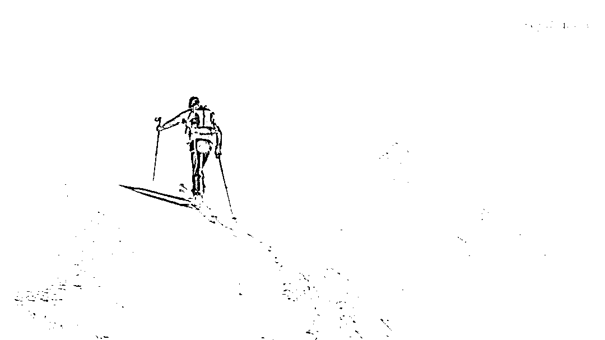

**本周重要天象**

★**周四：双子座满月、太阳对分火星**

满月的同时，逆行的双子座火星合相月亮、对分太阳，真是炸裂般的天象。满月的光芒会让我们彻底看清那些积怨已久的愤怒，而月亮和火星的合相让我们有机会一吐为快。

双子座能量是以语言、文字、沟通呈现的，此时我们有机会通过口诛笔伐、直抒胸臆拿回自己的力量，保护自己的权益，去反击，去战斗。**我们要做好准备，去直面自己与他人的愤怒，**这种碰撞或许会非常惨烈，但不破不立，或许我们可以就此借力，冲进一个新次元。

双子座满月也是双子座能量达到巅峰的时刻，双子座的发散性会最大幅度、最大范围地扫荡每个角落，从个人层面到社会层面，不同形态、不同性质的战役遍地开花。

这时，每个人都想说话，都想发出自己的声音，却很可能被淹没在一片喧嚣的世界中。所以，**在自己想说话时，也记得留出时间，去倾听对方的声音，哪怕只是片刻安静。**

射手座与双子座的对立，也永远是意义与表达的冲突。这一刻，我们或许只想说有意义的话，做有意义的事，我们想知道当下的一切放在更宏大的角度中，又意味着什么。

但还有另一些人，他们不再关心说话可以改变什么，实现什么，他们只在意当下这一刻的表达：发声无须有意义，发声本身就是意义。**无论你选择站在哪个群体之中，尊重对方总是最好的选择。**

满月总会有一些关系死去，只是这次的告别，或许样子没那么好看。**学会接纳所有告别的方式，因为那就是它原本的样子。我们之所以感到遗憾，只是我们“认为”它不够完满而已。**

**注意爆炸、事故、恶性暴力事件的可能性，保护好自己的人身安全。**

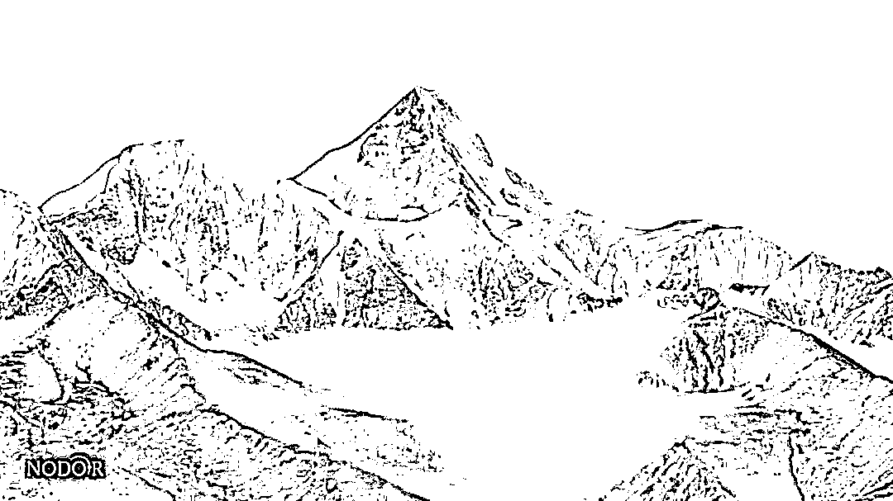

02

★**周三 水星进入摩羯座**

★**周六 金星进入摩羯座**

**群星从射手座陆续移位摩羯座，意味着一年之中最寒冷的时间也即将来临。**张扬狂欢的射手座氛围过去，庆典落幕，我们回到自己的生活中，开始思考，**我们在现实中最需要的东西是什么，我们该如何一砖一瓦地，让自己的生活变得更加坚固，更有防御力。**这便是摩羯座的能量。

摩羯座跟天蝎座一样都有着浓重的危机感，不同的是，天蝎座总在担心失去，而摩羯座是因为感到匮乏，所以珍惜。接下来我们可能都会体验到这种匮乏感，所以会试图通过得到更多，来保护自己，应对困境。

**从射手座的发散到摩羯座的建构，我们会为自己建立更强大的边界感，无论是身体、心灵还是日常，我们都需要这样的边界感，来明确自己的领地。**

我们不再像射手月时，肆意与外界连结，向外投放无穷无尽的能量，因为我们需要在寒冬中，好好储备体能和资源，秋收冬藏，才能更好地渡过当下的时节。

带着火星的愤怒，从本周开始，我们不会再只谈理想，而是脚踏实地，未雨绸缪：我们该如何更快、更高效地达到自己的目标。

我们的语言表达逐渐谨慎，对于人际关系、情感从更实际、理性的角度出发、考量。我们更多考虑这段关系能为我带来什么，我又能用这些资源为自己创造些什么？我们希望获得，也给出权威、专业、有帮助的意见，实现真正有价值的交流。

**这一次，我们需要的是带着细节的、深入的、具体的改变，我们开始有了明确的诉求。**

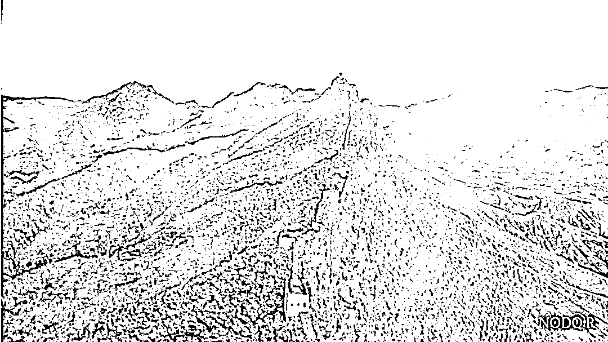

**12 星座一周运势**

**（重点参考上升星座，其次参考太阳星座）**

***白羊座***

本周你在语言上格外没有耐心，喜欢直接爽快的表达，也容易在日常交谈中流露出情绪和攻击性，你可能很容易跟身边的人吵起来。尤其是涉及到事业、未来方向的领域，你不喜欢被干涉，也会很坚持自己的意见。

职场上，你会开始严肃思考未来发展，以及如何更好地利用自己的人脉资源。周四前后，要格外注意交通安全、行车安全。

***金牛座***

本周你在金钱方面格外没有安全感，可能会因为情绪而冲动消费，或是因为一些意外情况支出金钱。也有部分人是由于在学习、迁移、出行方面的长期打算而花钱。

接下来的星象变化对你的学业运、迁移运更加有利，你会更加严肃思考自己是否要在这些领域投入精力，此时能够理性分析利弊，也适合做出长期规划。

***双子座***

本周你很容易被触怒，各种各样的小事都可能点燃你的愤怒。归根结底，是自己无法再继续过往的隐忍和妥协。现在你终于变身铠甲勇士，捍卫自己的利益和边界。你会对于人际关系中的界限感非常敏锐，也更容易直接表达对他人的不满。有理有据，不卑不亢的态度，会让对方更容易接纳。

接下来你对于金钱、资源共享方面会进行深入思考，也可能考虑跟他人进行长期合作。

***巨蟹座***

本周你的睡眠状态可能出现问题，失眠、入睡困难、梦多。这是由于你内在的能量场受到干扰，神经系统过度紧张、活跃造成的。对工作、日常的焦虑都可能引起你心态的崩塌，若你长期忽视内在的愤怒，会很容易在某个节点失控、爆发。

你需要找到足够信任、亲密的人沟通、倾诉你的烦恼，不然对方就可能成为承载你愤怒的对象。

接下来，你对于合作关系、婚恋情感方面会进行深入严肃的思考，有些人决定改变与他人的相处模式，有的人决定跟对方步入一个新的阶段。

***狮子座***

本周你容易因为团体、团队、集体事件引发愤怒，或许最初是工作、日常的具体事情引发不合，但也可能继续上升到自我价值感的层面。你可能会感到自己不被尊重，或自我意志、能力在当下环境中受限。

接下来你会重新审视自己所处的职场环境、日常生活，有些人也会因为这个契机离开所在的平台、集体。另一些人可能是在恋爱、感情中经历类似的事件，选择在这个时间点告别一段关系。

***处女座***

本周你容易跟领导、上级、老板发生矛盾，也可能是父母。你遇到的权威人士容易使你感受到原生家庭的阴影，回到过往熟悉的冲突感之中。

这段时间，你非常需要自己被这些人尊重，需要自己的创意被认可，才华被看见。接下来你也会很重视内心的意愿，包括兴趣爱好，会尽可能把它们跟自己的工作、生活做结合。

你的桃花运正在上升，部分人会在慎重考虑后，开始一段严肃的恋情。

***天秤座***

本周你可能容易在网络上与人发生矛盾，可能越是面对陌生人，自己不熟悉的群体时，你越能感受到要战斗的情绪，越能直白的说出自己的想法。此时你的观点也会相对激进，注意周四前后，会有一个较大的爆发。

而跟家人、亲人相处时你会回归到相对平和、理性的状态，也会花时间精力去提升家庭环境或生活质量。多与亲密的人在一起，互相陪伴，能够让你的内心安静下来。

***天蝎座***

本周你可能会因为利益分割、金钱方面的问题与他人发生矛盾，在涉及到现实层面的事情时，你会格外敏感，据理力争，绝不退让。你对于这其中的原则、规则都能够理性分析，但表达方式上可能会咄咄逼人。

有些人可能经历一些财产损失，类似于基金、股票、投资方面的亏损，需要处理相关事项。

接下来，你跟好朋友或身边熟悉的人聊天、互动增多，也能够在对方那里收获帮助。

***射手座***

本周你容易被卷入人际关系的纷争中，你可能感觉周围的人似乎都满腔怒气，一点就炸，只能小心翼翼相处。但到周四前后，你自己也很难按捺住情绪，可能跟他人发生争执。对方可能觉得你很自我，而你感觉对方非常情绪化，难以沟通。

接下来你会对自己的财务方面更加关注，做出理性客观的规划和思考，也可能更多跟人讨论金钱问题，出现不错的想法。接下来财运还不错，可能会有意外收获。

***摩羯座***

本周你对于工作、日常中的琐事格外不耐烦，也会因此牵动出负面情绪，你可能已经忙碌了很长时间，也承担了职责外的工作。周四前后，会是你想要宣泄这些愤怒、委屈、不甘的时间点。

接下来，你会花更多时间在自身规划和成长上，你可能会制定出详细的执行计划，也会让自己逐步落实。

可以尝试花更多时间装扮自己，或改变发型、装束，会让你更加受欢迎。

***水瓶座***

本周在恋爱中的人，很容易跟对象吵架，甚至有可能经历严重冲突而分手，有孩子的人，可能对子女格外没耐心，会冲孩子发火，注意周四前后，是容易火大失控的时刻。

接下来，你需要多给自己独处的时间，你会很快清晰觉察到自己当下的状态，也会积极自省，通过读书、娱乐、运动恢复内在的平和。

***双鱼座***

本周容易跟家人发生冲突和争吵，也会宣泄出很多积压已久的负面情绪。也有部分人，是家中突然非常忙碌，被很多事情牵绊住，不得不努力平衡工作与家庭之间的关系。

接下来，你可能会认真考量你所在的群体、平台及周遭大环境，是否符合你对于自身发展的规划，也会跟朋友进行有启发的讨论，也可能在这期间结识到对你有帮助的新朋友。

**版权声明**：原创文章由作者授权首发于若道平台发布，欢迎转发，反对抄袭。友号转载请申请白名单。

**END**

****朵三三三****

ISAR 认证占星师

全职占星师/塔罗师/国家三级心理咨询师 

人大文学学士/德国慕尼黑大学文学硕士

**微博/微信公众号**：朵三三三

长按打赏

**快年底了****不给自己一份来自占星学的礼物吗？**

**梅里曼金融报告双 12 福利来啦！****长按下图了解更多详情吧！**

**20 位来自世界各地的占星师****带来 19 场沙龙——新世界的觉醒****详情可点击下图**

**学习占星学****点击下图了解课程详情**

**微信又双叒叕改版啦，不想错过若道君的推送？**
****就把若道设为****星标****以及点点****“在看”****吧！******▼**

**喜欢就点一下“在看”吧！****报名直达入口**

# 雷蒙德·梅里曼金融占星周运 | 本周可能经历巨大的市场波动

> 原文：[`mp.weixin.qq.com/s?__biz=MzA5NjA0NTAxNg==&mid=2651496129&idx=2&sn=1f03231aab110b881f5aa6cc8d0450a2&chksm=8b482c76bc3fa5600c1a720a9406dfe377356f135099837ebfe490610e919ec09196b1e747e5&scene=126&sessionid=1692737715#rd`](http://mp.weixin.qq.com/s?__biz=MzA5NjA0NTAxNg==&mid=2651496129&idx=2&sn=1f03231aab110b881f5aa6cc8d0450a2&chksm=8b482c76bc3fa5600c1a720a9406dfe377356f135099837ebfe490610e919ec09196b1e747e5&scene=126&sessionid=1692737715#rd)

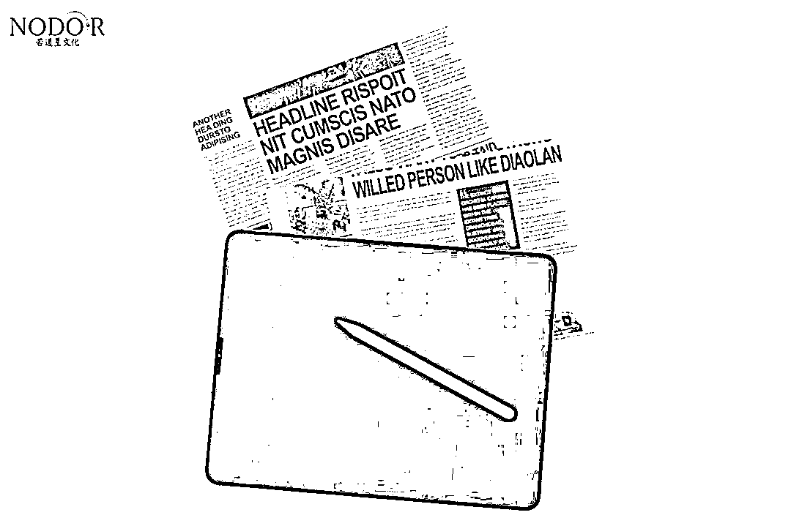作者/雷蒙德·梅里曼 译者/Luke 编辑/玫瑰 图片/稿定设计 

雷蒙德·梅里曼是在金融占星学界稳坐第一把交椅的占星师，同时他也是若道签约的金融占星课老师，我们引进了雷蒙德·梅里曼老师的《[上证指数月度报告](http://mp.weixin.qq.com/s?__biz=MzA5NjA0NTAxNg==&mid=2651494377&idx=2&sn=12afe330afef4b876307c2963b795b56&chksm=8b48255ebc3fac48d8ea2c82dd7b085ed1bcf50d7b480800f1e6a1d63aadb3cb275863e20df7&scene=21#wechat_redirect)》及《[黄金报告](http://mp.weixin.qq.com/s?__biz=MzA5NjA0NTAxNg==&mid=2651494377&idx=2&sn=12afe330afef4b876307c2963b795b56&chksm=8b48255ebc3fac48d8ea2c82dd7b085ed1bcf50d7b480800f1e6a1d63aadb3cb275863e20df7&scene=21#wechat_redirect)》。我们经老师的授权，将每周刊登梅里曼老师的周运，供大家参考和学习。于是，这是本周的周运（12.5-12.9）。

**说明：以下时间采用纽约证券交易所所在地美国东部标准时间。****展望与回顾**

****

**尽管美联储积极努力抑制劳动力市场和通货膨胀，11 月就业增长大幅好于预期。当月非农就业人数增加 26.3 万人，失业率为 3.7%。美联储反通胀的努力再次受到挫败，本月每小时收入跳涨 0.6%，是道琼斯估计的两倍。工资同比增长 5.1%，也远高于 4.6%的预期。****——杰夫·考克斯****《非农就业和工资增长大幅好于预期》****www.cnbc.com****2022 年 12 月 2 日****长期国债的收益率下跌低于短期国债收益率，差值为几十年来最大，这个迹象表明，投资者认为美联储即将赢得通货膨胀的战斗，无论经济活动要付出什么代价。短期国债收益率超过长期国债收益率的情景在华尔街被称为收益率曲线倒挂，常常被视为衰退即将到来的警报。****——萨姆·戈德法布****《收益率曲线倒挂至 1981 年来的最深水平》****《华尔街日报》****2022 年 11 月 30 日**美联储主席鲍威尔上周三发表言论称，加息不会停止，但会减缓加息的节奏，之后全球股市继续欢腾鼓舞。新闻播出后，大多数全球股票指数在 12 月 1 日-2 日创下新周期高点，其中一些超越了 8 月中旬创下的上一个基本周期高点。在欧洲，我们追踪的所有 4 个指数都突破了 8 月的高点，除了荷兰 AEX 指数还差一个多点。在亚洲和环太平洋地区，所有市场上周都上涨了，只有澳大利亚 ASX 指数和印度 Nifty 指数突破了 7 月-8 月的高点。Nifty 指数尤为出色，周五飙升至历史新高。中国的上证指数和香港股市也上涨至 9 月来的最高价位，但是日本日经指数却未能突破前一周的高点，在那个区域形成市场间背离。在美国，道琼斯指数猛涨至 34595，为 4 月以来的最高价位。标准普尔指数和纳斯达克指数上周四创下新周期高点，但仍然远远低于 8 月中旬创下的前一个基本周期波峰。这也形成了市场间看跌背离。贵金属市场有着出色的表现，黄金上周五飙升至 1818.70，相对于一个月前 11 月 3 日的年度低点 1618.30 上涨了 200 美元。它的上一个基本周期波峰是 8 月 10 日的 1824.60。白银也于周五飙升至 23.47，是 4 月以来的最高价位。比特币也经历了温和的反弹，在 11 月 21 日创下年度低点 15479 后，于周四上涨至高点 17276。

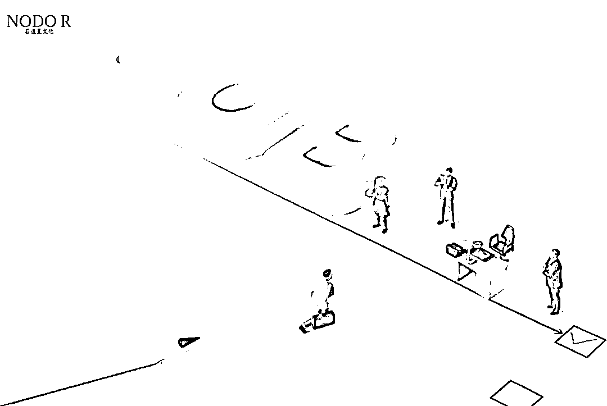

**如我们在每周和每日报告中描述的那样，比特币依然不安全。**原油的表现也很有趣，在 11 月 28 日下跌至新周期低点 73.60，非常接近“交易员乔·拜登”公开声称要补充国家战略原油储备的价格目标 67-72 美元。到了周五，原油反弹回到 83.34 美元。他错过这笔订单了吗？或者在市场到达他的目标价位前，他就已经买入了？**总的来说，上周金融市场的走势是多颗行星落在乐观的射手座时典型的表现。但是接下来两周宇宙天象上有一些地雷，可能带来一些拉锯。****短期宇宙征象与长期考量**

****

**一封由 15 个团体代表签名的信中写道：“专项拨款是国会历史上最腐败、最不公平和最浪费的做法之一。**

**2011 年，共和党宣誓放弃用于调查以外目的的专项拨款。但是当 2021 年民主党国会宣布恢复专项拨款时，共和党支持者迫不及待地签字……正如众议院共和党本周再次证明的那样，自我觉察并不是现代共和党的强项之一。**

**——金伯利·斯特拉塞尔**

**《共和党在支出方面装模作样》**

**《华尔街日报》**

**2022 年 12 月 1 日**

**无论在文化和个人层面，我们应该逐渐调整自己的方向，追求道德卓越、公正、韧性和慈悲，认识到受害不是一种美德。****——印第安纳大学医学博士理查德·冈德曼****《本周推特》****《亚利桑那共和报》****2022 年 11 月 26 日****很长时间以来，拜登总统试图绕过宪法，通过自己的权力，为每个借款者提供最高 2 万美元的赦免。国会没有赋予行政部门这样的权力，就连拜登总统自己之前也说过。但大选在即，民主党人似乎陷入了困境。****8 月，总统宣布这是有史以来最大的一次买票活动。如果一位总统能够在法律依据不足，没有国会同意的情况下，给纳税人带来 4200 亿美元的负担，我们就回到国王的统治下了，这正是美国建国者撰写宪法来避免的。****——《拜登的贷款减免账目》****《华尔街日报》社论版****2022 年 12 月 2 日**正如上周讨论的那样，我们已经离开了有多个有利木星相位的时间段，但仍处在射手座（木星守护的星座）的影响力下。木星和射手座喜欢宏大的事物，有着乐观的思想和行为，但也倾向于夸大事情多么好，实际上并没有那么积极。但是，嘿，谁想要消极呢？显然不是木星和射手座。如果你是悲观主义者，离开射手座的房子！请去隔壁的天蝎座或摩羯座。**当你在接下来两周带来海王星和火星会发生什么？海王星上周末顺行，之后金星和太阳分别在 12 月 4 日和 14 日与它形成四分相。在这一时期的中段（12 月 8 日-9 日），双子座满月合相逆行的火星。**海王星是被动的，火星是主动的。太阳和金星在射手座是夸大的。这应该是一个很有趣的组合，很难辨识真相和清晰，事实很稀缺，但谎言、谣言和逃避责任的行为到处都是。**在这种地球宇宙学环境下，市场可能经历剧烈的价格波动。股票价格上周在周期高点，但是地球宇宙学征象表示本周的任何时间可能出现剧烈的回撤。**说到海王星爱欺骗和误导的天性，请注意上面引用的金伯利·斯特拉塞尔在《华尔街日报》发表的文章，上面提到尽管政客承诺要在财务上负责，但后来他们却迫不及待地重新捡起为账单兑水的行径，放弃了信托责任，与此同时通货膨胀仍然在加剧。

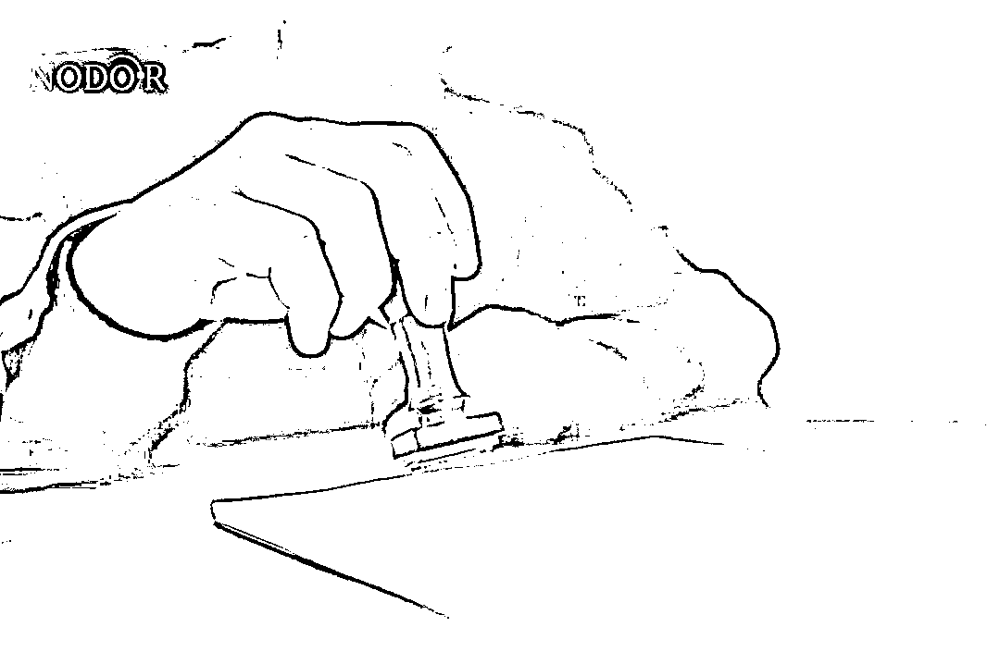

说到信托责任……通过纳税人资助的国家财政提供大学贷款减免是个很好的姿态。然而，美国拥有巨额的负债，带动通货膨胀历史性地上涨，人们不禁要问，为什么美国领导人认为免除任何一部分人口的个人贷款是一个好主意。

这对于其他的负债者来说公平吗，至少大学生是自愿同意偿还贷款的。如果有人能免除贷款的话，难道这些贷款不应该由过去几年里把学费增长到如此惊人地步赚取庞大利润的大学来偿还或免除吗？

我的一个孙女（是的，我有几个即将上大学的孙女）刚刚被一所优秀而有名望的大学录取。猜猜这所大学每年的学费是多少？一年 8 万多美元。不到 12 年前，我的两个孩子每年只需要付 1-2 万美元的学费。这是如何发生的？

拜登赦免学生贷款的单方面行政决定（未经国会同意）是否合法，将由最高法院决定。但我真正想指出的一点是：负债的实体，是否应该通过免除对自愿承担债务的其他人的债务，而进一步负债？谁真正有能力免除债务的问题，是冥王星-海王星的主题。如果任何人有能力免除债务，或许那应该是美联储，行进冥王星正对分其海王星。它通过凭空印钞票，借给一个粗心大意的国会来消费，从而为国家债务增加了可观的数额。现代货币理论的概念就好像一个过度活跃的海王星梦境。这场梦境最终要有人付出代价，因为……钱不是凭空而来的。

我认为从 2023 年 3 月 23 日到 2024 年 11 月 19 日期间，冥王星来回 5 次穿越水瓶座时，我们可以讨论这个话题。毕竟，水瓶座 0°是开启了“风象星座新纪元”的“超级能量度数”。

**2020 年 12 月 21 日，那个度数上启动了 20 年的木星-土星会合周期，开启了一段 140 年的木星-土星在风象星座合相的周期，这是大约 800 年才发生一次的事件。**

木星和土星代表教育的新方向。在水瓶座，各个层面的教育都是免费的，因为水瓶座想要学习的自由，也想要从压迫和债务中解脱，它们是彼此紧密关联的。正如我们在《2023 年金融预报》中解释的，这场复兴的种子在 2023 年到 2026 年间种下。

从 2018 年年末，若道引入金融占星大师雷蒙德·A·梅里曼撰写的梅里曼市场时机学院每年一次的年度预报沙龙和每年一本的《年度预报》以来，**2023 年已经是第 5 个年度了。我们简单回顾了部分 2019-2022 年金融预报的内容，**过去的经验让我们相信，你根据梅里曼老师的指导作为投资参看，你会比一般人有更大的胜算。******长按下图识别二维码****了解更多详情**

**说明：以上日期基于纽约证券交易所所在的美国东部标准时间，由于存在时差，中国地区可能需要加一天。**

**版权声明：**本文由若道翻译发布，欢迎转发，反对抄袭。友号转载请申请白名单。**END**

**雷蒙德·梅里曼（Raymond Merriman）**

若道签约老师。著名金融占星师，ISAR（国际占星研究协会）前主席，梅里曼市场分析公司的总裁。他由于“提升了占星学的职业形象”，在 1995 年国际占星大会上被授予轩辕十四奖；在 2012 年国际占星大会上，被授予轩辕十四终身成就奖。

**梅里曼金融报告双 12 福利来啦！****长按下图了解更多详情吧！**

1“中国上证指数月度报告”发售**若道推出了****中文版****的雷蒙德·梅里曼中国上证指数月度报告，并持续发行该报告！**当把金融市场的周期和占星学的周期相结合时，雷蒙德·梅里曼老师的金融占星学研究**为投资者应对金融市场的周期波动，并随之调整投资策略提供了极大的价值参考**。
**12 月中英文报告已上线！**2“黄金价格周期月度报告”发售**若道推出****中文版****的雷蒙德·梅里曼黄金价格周期月度报告！**不仅仅为广大读者在中国股市的投资出谋划策，更将视角放眼黄金市场。**每当世界经济形式不明朗的时候，有一个地方是保值的港湾，那就是****黄金**。自 1982 年雷蒙德·梅里曼出版第一本研究《地球宇宙学征象与黄金价格的关联》的著作以来，**他一直作为最重要的黄金市场时机预测者之一享誉国际**。2022 年 12 月黄金报告已上线，梅里曼老师将会告诉你他对这个关键时期如何操作的想法。也可以按照季度和一年期订阅，有更多优惠。季度和年度的好处是，你可以持续了解梅里曼老师对于不断在变化的市场的看法。即便他某一次看法和市场不一致，你也看到在下一期他如何调整自己的看法，并看到金融占星在一个长期时间段内对你把控风险的帮助。而能够长期控制风险、尽量找到安全的投资时机才是投资的长久之计。**12 月中英文报告已上线！****购买套餐**，买得越多越优惠中国上证指数月度报告套餐价

*   **单月报告**：280 元
*   **3 个月套餐**：780 元（260 元/月）
*   **12 个月套餐价**：2400 元（200 元/月）

**长按下图识别二维码****购买金融报告****套餐****▼**

黄金周期月度报告优惠

*   **双报告年度套餐更优惠（直降 900 元）**

*   **12 个月黄金报告+12 个月上证指数报告：仅需 3900 元**

**长按下图识别二维码购买黄金报告套餐**▼

3《2023 年金融报告及沙龙》

从 2018 年年末，若道引入金融占星大师雷蒙德·A·梅里曼撰写的梅里曼市场时机学院每年一次的年度预报沙龙和每年一本的《年度预报》以来，**2023 年已经是第 5 个年度了。我们简单回顾了部分 2019-2022 年金融预报的内容，**过去的经验让我们相信，你根据梅里曼老师的指导作为投资参看，你会比一般人有更大的胜算。****

**长按下图识别二维码****了解更多详情**

**购买直达入口**

# 《2023 年金融预报》预售中！梅里曼 12 月上证+黄金报告上线！

> 原文：[`mp.weixin.qq.com/s?__biz=MzA5NjA0NTAxNg==&mid=2651496129&idx=3&sn=37d5cd7524476f5d6bfb060b95934542&chksm=8b482c76bc3fa5601e397667824b1d205922f995775f63dbde04821271c38932e9596c0cb204&scene=126&sessionid=1692737715#rd`](http://mp.weixin.qq.com/s?__biz=MzA5NjA0NTAxNg==&mid=2651496129&idx=3&sn=37d5cd7524476f5d6bfb060b95934542&chksm=8b482c76bc3fa5601e397667824b1d205922f995775f63dbde04821271c38932e9596c0cb204&scene=126&sessionid=1692737715#rd)

  

**《2023 年金融预报》**从 2018 年年末，若道引入金融占星大师雷蒙德·A·梅里曼撰写的梅里曼市场时机学院每年一次的年度预报沙龙和每年一本的《年度预报》以来，**2023 年已经是第 5 个年度了。**

我们简单回归一下梅里曼老师 2019 年-2022 年的《年度预报》中一些预测。

在 2019 年的年度预报中，对于上证指数，梅里曼老师写到：

2018 年末至 2019 年初，中国股市处于三个重要周期低点的时间段。紧随这一低点，将会出现一次非常大的反弹。

2019 年木星会与海王星形成三次四分相，过去，这个相位总是与惊人的强大“泡沫”同时出现，期间股价大幅飙升。

到 2019 年 7 月之前，上证指数有三个重要长周期会出现周期低点，理想上看是在 2019 年 3 月底之前。

上证的周期低点出现在 2019 年 1 月，从那时起，上证迎来了 3 年的上升。

对于黄金，梅里曼老师建议：

从占星学角度来看，木星在射手座，四分在双鱼座的海王星，支撑看涨观点，因为这个组合有增加通胀的潜力。此外，木星在射手座的行星-星座组合从 1983 年起出现过三次，每次都对应到金银市场的年度高点。

无论在 2019 年何时，只要黄金保持在 1167 以上，同时跌到了任一主要周期低点附近，就要寻找买入机会。黄金可能在 2019 年涨到 1500+/- 50，甚至更高。

2019 年黄金从 1284 美元开始上涨，最高点在 1566 美元。

所以，如果你在 2018 年购买了《年度预报》，按照梅里曼老师的建议投资了上证指数和黄金，你会在当年取得相当不错的收益。

**对于 2020 年，在席卷全球、深刻影响了未来的疫情到来之前，梅里曼老师为 2020 年定下基调的：**

站在 2019 年的年尾，我们不知道一场深刻改变未来的风暴马上就将来临。

梅里曼老师，这位杰出的宇宙气象预报员，未卜先知，为 2020 年定下“将军”的基调。

在那一年，我们目睹了美国股市的 4 次熔断和全球经济的重置崩溃。

对于黄金，梅里曼老师是这么说的：

1391.50-1413.70 是价格最强的支撑区域。只要不跌破这个区间，黄金就能够上涨，重新测试 1566.20。如果突破了 1560-1590 的阻力区间，那么黄金就能够重新测试 1920。在那以前，黄金最有可能在 2020 年中在 1390 和 1575 之间波动。

| 黄金周 K 线图

2020 年，黄金在横盘 3 个月突破了 1560-1590 的阻力区间后，一路上涨到 9 月最高点 2089.20 美元。

对于上证指数，梅里曼老师建议：

2020 年的反弹将超过 2019 年的高点 3288。然而，这一涨势可能会通向 5.5 年周期的波峰，随后将再次迎来一波跌势至 2021 年或更晚。

行进中的摩羯座星群——木星、土星和冥王星——表明在 2020 年 11 月底之前会出现一个高点，很可能在 2020 年的前六个月。建议交易者特别注意金星逆行的时期，也就是 5 月 13 日至 6 月 25 日。逆行或顺行一个月内出现的年度高点或低点可能会带来卖出机会。

2020 年，上证指数最高达到 3474，超过了 2019 年的高点 3288。

**站在 2020 年的末尾，对于 2021 年，梅里曼老师说：**

随着 2020 年木星、土星和冥王星形成大合相，我们刚刚结束了一个周期和一个时代。此刻我们正处于一个新的时代和一个新的长周期的早期阶段。事实上，是多个长周期。

对于上证指数，梅里曼老师说：

我们预计涨势将在 2020 年 12 月-2021 年 2 月之间达到波峰，然后急剧下跌至 52 周和 22 个月周期的低点，这些周期将在 2021 年 5 月之前，甚至在 3 月底之前结束。此后可能会出现另一轮反弹，可能会也可能不会在 2021 年 11 月之前形成第一个 33 个月周期的新高。

对于黄金，梅里曼老师说：

黄金的 31.33 个月周期波谷将在 2021 年 9 月之前出现，理想情况是 2020 年 12 月-2021 年 6 月。价格目标是 1628+/-109 或 1768+/-76。重叠范围（理想情况）是 1692-1737。如果价格跌破这些范围，则为看涨情况中令人担忧的状况。

**而在 2022 年的年度预报里，我们看到：**

渐亏四分相不仅对应无法解决的冲突和分歧，土星和天王星形成的任何四分之一周期（合相、四分相和对分相）都可能在社会动荡和某地区现状受到威胁的时期出现。

在 2008-2010 年上一次四分之一周期时（对分相），世界见证了阿拉伯之春。在 1999-2000 年渐盈四分相期间，游行、抗议和直接武力冲突扰乱了西雅图世界贸易组织会议。这也标志着美国经济扩张的结束，以及由互联网泡沫破裂和 2001 年 9 月 11 日对美国世贸中心的恐怖袭击引发的衰退的开始。在此之前是 1988 年的合相，对应的事件是缅甸（Myanmar，当时的国名是 Burma）爆发了一场全国性起义，反抗尽失民心、暴力过度的军政府。数十万公民在全国范围内的暴动中抗议，这成为缅甸历史上的决定性时刻之一。

在每一个案例中，极端主义都占据主导地位，导致暴力冲突，但最终带来了“更大的益处”。它产生了建设性的结果，但在它进行的同时，世界在经历巨大的危机和暴力。”

2021 年 5 月 13 日-7 月 28 日，木星首次行经双鱼座时，这些因素表现得很明显。那时，通货膨胀开始出现，但美联储向所有人保证，这只是暂时的，他们将无限期继续推行“宽松货币”政策。他们并不担心持续的通货膨胀，这是典型的木星在双鱼座的表现，对现实的脱离或错误判断。

这两颗行星以及双鱼座也掌管原油。因此，我们可能会看到油价飙升，以及/或石油泄漏，威胁到大自然。它也可能对应着由于事故而释放的有毒气体，威胁到那些暴露其中的人的生命。

对于黄金，梅里曼老师建议：

只要黄金保持在 1670-1680 之上，仍然有极小的机会出现一轮爆炸性上涨，测试当前的历史高点（2089），甚至创下历史新高。毕竟，木星将在双鱼座合相海王星，可能预示着另一轮“投机狂热”。然而，这也可能是一个“恐慌”的征象，届时某些市场可能会崩溃。

在 1900-1980 之间存在较大的阻力，如果不能突破这个阻力，将表明黄金的熊市已经开始，新一轮的猛烈下跌可能正在准备中。只要跌破 1670 则将确认黄金 20 年的牛市结束了。

| 黄金周 K 线图

对于上证，梅里曼老师说：

我们预期在 2022 年 5 月前，上证综指会出现急剧的下跌，进入 52 周周期和可能的 33.5 个月周期低点。

我们更倾向于认为，上证综指会首先下跌，在 5 月前形成一个低点，然后上涨。这一轮上涨的幅度，将告诉我们上证综指是处在牛市，还是进入了新的熊市。如果它不能上涨超过 3750，长周期波峰可能已经出现，并且进入了新的熊市。

我们简单回顾了部分 2019-2022 年金融预报的内容，**过去的经验让我们相信，你根据梅里曼老师的指导作为投资参看，你会比一般人有更大的胜算。**

**2023 年度预报及沙龙预售**

**2023 年金融预报沙龙时间为 2023 年 1 月 7 日 10：00-13：00。**

一份价格仅千元的顶尖金融占星大师的投资分析报告和沙龙，聪明的投资者值得拥有。

**2023 年年度预报****及沙龙价格：****1380 元**

**长按下图识别二维码**

**购买报告及沙龙**

**梅里曼金融报告双 12 福利来啦！****长按下图了解更多详情吧！**

**购买者重要须知****①** 梅里曼市场时机学院每年一次的年度预报沙龙和《年度预报》是梅里曼市场时机学院的研究“预报”，而不是市场“预测”，是梅里曼老师及其金融占星分析师对人类活动周期历史与行星周期之间相关性的研究，二者在大部分情况下具有 80%或更高的相关性，而不是因果关系。沙龙中和报告中的研究完全存在错误的可能性。即便是非常认真的研究和几十年的研究经验，我们无法总是正确地解读出各种征象在实际层面上会如何相互作用，并显化为事件结果。

所以请将次沙龙和报告看作一个研究参考，务必结合其他市场研究和你个人对市场的理解，根据你的自由意志做决策。

**②** 此报告一旦售出，**即不接受退款。**

**③** 此报告仅支持在手机网页阅读，不支持电脑阅读和下载。**④** 讲座提供视频回放。**以上须知，请仔细阅读。一旦付款，即视为已了解并接受所有须知内容。**

**如在购买报告中遇见任何问题**

**可添加客服**

▼

**12 月上证报告**11 月份报告发出的时候是 10 月 19 日，在此一周前的 10 月 12 日，上证跌到了 2934，重新测试了在 4 月 27 日形成的 2022 年年度低点 2863，然后开始反弹。**10 月 12 日这一低点是位于梅里曼老师一直提到的今年下半年最重要的天象——土天四分、木星在土天四分中点的天象的范围之内。**

| 上证指数日 K 线图当时，梅里曼老师提到，一方面，10 月 12 日的低点是在土天四分这个最重要的天象之下，市场完全可能出现反转，如果 10 月 12 日的低点是从 4 月低点 2863 开始的一个拉长的基本周期的第 23 周，那么，站在 10 月 19 日，一个新的 13-20 周的基本周期刚刚开始，当时仅仅是第一周。这个基本周期完全可能开始一波上升行情。另一方面，10 月 23 日，土星恢复顺行，10 月 31 日，火星开始逆行，金星和太阳都将进入天蝎座，而且将在 11 月 5 日-11 日和土星、天王星形成 T 三角。如果基本周期不是从 10 月 12 日开始，而是从 8 月 2 日-4 日的低点开始算，上证完全可能跌向更深的低点。上证跌向更低的低点。10 月 31 日，火星逆行日，上证跌到 2885，与 4 月份的低点 2863 形成双底，然后开始反弹。从宏观层面来说，美国的通货膨胀似乎见顶，美元的加息可能缓和下来；而国内似乎要走向新冠疫情防控的政策的逐渐放开，这对于经济是利好。

| 上证指数周 K 线图

本年度激烈的天象似乎都已结束。现在是不是大胆加仓的时候？金融占星大师雷蒙德·梅里曼的《2022 年 12 月上证指数报告》已上线，你可以听听梅里曼老师的看法。《2022 年 12 月黄金报告》也已上线，欢迎购买。另外，本期我们还将免费为所有读者送上一期铜周期的报告。法国巴黎的投资组合经理，也是梅里曼市场时机学院最优秀的毕业生之一——马修·凯撒（Matthieu Kaiser）在过去两年间对铜价格与地球宇宙学周期的关联进行了出色的研究。我们希望分享这位杰出研究者的发现，因此将其纳入梅里曼市场时机学院周期报告的金属报告行列。

这里还有两场讲座，对你的财富管理也有一定的帮助。

**12 月上证报告上线**

**上证指数月度报告价格****单月报告**：280 元/月 **季度套餐价格**：780 元（260 元/月）**年度套餐价格**：2400 元（200 元/月）**双报告年度套餐更优惠（直降 900 元）****12 个月黄金报告+12 个月上证指数报告：仅需 3900 元****长按下图识别二维码购买上证指数报告**
▼

**12 月黄金报告**

“**黄金是金钱。其他的只是信贷。**

**——约翰·皮尔庞特·摩根**

”

| 黄金周 K 线图

我们经历了 2 年的土天四分正在成为过去式。虽然其影响还会持续。

在上个月，我们提出了一个问题，9 月 28 日的低点 1622 是黄金 2 年来的低点，那么从这个低点，黄金会开始一轮反弹吗？毕竟，黄金有一个 31.33 个月的周期，而半周期是 16 个月，其容许度在 13-19 个月之间。上个周期低点是 2021 年 3 月的低点 1673，而 10 月是第 19 个月，正是在半周期低点的容许度内。|黄金日 K 线图  从现在看，答案很明显，黄金在 10 月 21 日和 11 月 3 日再次测试 1622 低点后，这 3 个低点有可能形成了 16 个月周期的三重底。随后，黄金开始了一轮反弹。目前已经反弹了 10%。黄金会继续反弹吗？此外还有白银。在上期报告中，梅里曼老师提示了关于白银的投资机会。  12 月份黄金报告已经上线，欢迎了解。也可以按照季度和 1 年期订阅，有更多优惠。季度和年度的好处是，你可以持续了解梅里曼老师对于不断在变化的市场的看法。  即便他某一次看法和市场不一致，你也看到在下一期他如何调整自己的看法，并看到金融占星在一个长期时间段内对你把控风险的帮助。而能够长期控制风险、尽量找到安全的投资时机才是投资的长久之计。  点击阅读原文，雷蒙德·梅里曼黄金周期 2022 年 12 月报告带来有 40 年黄金市场研究经验的世界著名金融占星大师雷蒙德·梅里曼对当前黄金市场的研究。投资有收益，投资有风险，希望金融占星学的研究帮助你更好地评估你的投资。

**12 月黄金报告上线**

**黄金月度报告价格****单月报告**：280 元/月 **季度套餐价格**：780 元（260 元/月）**年度套餐价格**：2400 元（200 元/月）**双报告年度套餐更优惠（直降 900 元）****12 个月黄金报告+12 个月上证指数报告：仅需 3900 元****长按下图识别二维码购买黄金报告**
▼

**购买者需知**

**① **梅里曼市场时机学院《中国上证指数月度研究报告》是梅里曼市场时机学院（以下简称 MMA）的研究“预报”，而不是市场“预测”，是梅里曼老师及 MMA 金融占星分析师对人类活动周期历史与行星周期之间相关性的研究，二者在大部分情况下具有 80%或更高的相关性，而不是因果关系。报告中的研究完全存在错误的可能性。即便是非常认真的研究和几十年的研究经验，金融占星师无法总是正确地解读出各种征象在实际层面上会如何相互作用，并显化为事件结果。

所以请将报告看作一个研究参考，务必结合其他市场研究和你个人对市场的理解，根据你的自由意志做决策。

**②** 此报告一旦售出，**即不接受退款。**

**③** 上证、黄金月度报告每月固定 1 期，**并非都是在每月相同日期发布。**

**④** **我们收到英文报告的当天，即发布该英文报告。3 天后，上线报告中文版。此报告仅支持手机网页阅读，不支持电脑阅读和下载。****以上须知，请仔细阅读。一旦付款，即视为已了解并接受所有须知内容。**在过去的 40 年中，唯有梅里曼逐渐完善，并在梅里曼市场时机学院月度周期报告中阐释了将地球宇宙学与周期相结合的研究方法，以惊人的精确性预报了黄金价格发生重大变化的时间。**黄金购买 Tip**

各大银行均可购买黄金或黄金 EFT 基金，也可以在诸如天天基金或者支付宝购买黄金及黄金相关产品。不明白的可以百度搜索。

**购买后如何查看报告？**

**购买后有疑问怎么办？**请联系技术客服
**微信：nodoor201705** **购买直达入口**

# 周末树洞丨海王星顺行，你在过去 5 个月“海”了吗？

> 原文：[`mp.weixin.qq.com/s?__biz=MzA5NjA0NTAxNg==&mid=2651496121&idx=1&sn=d5ee5f7ebf0934fda2dfc043b4ca6b86&chksm=8b482c0ebc3fa518f1028206f7995084d1eeaed9cb9b07b5add8c443421df07b7b616b34da20&scene=126&sessionid=1692737715#rd`](http://mp.weixin.qq.com/s?__biz=MzA5NjA0NTAxNg==&mid=2651496121&idx=1&sn=d5ee5f7ebf0934fda2dfc043b4ca6b86&chksm=8b482c0ebc3fa518f1028206f7995084d1eeaed9cb9b07b5add8c443421df07b7b616b34da20&scene=126&sessionid=1692737715#rd)

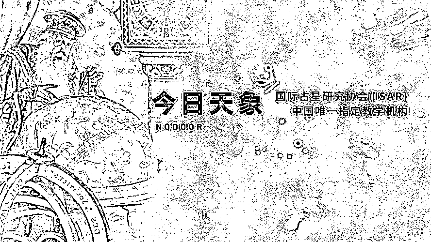

**2022 年 12 月 4 日天象：**

*   **08:15 海王星顺行**
*   ****19:37 月亮进金牛座****
*   ******金星四分海王星******

今天一早，从 6 月 28 日开始逆行的海王星顺行了（点击【[海王星逆行](http://mp.weixin.qq.com/s?__biz=MzA5NjA0NTAxNg==&mid=2651478579&idx=1&sn=c1c55351ebf0eb5aaae35d665c9a19e2&chksm=8b48e884bc3f6192fce986b04fa7a43991c84cc4901c33ec19ee239ccf7819139fa7b993fe90&scene=21#wechat_redirect)】查看文章）！过去五个多月的逆行，让大家都体验到了迷茫、失去方向的无力感。而当海王星开始顺行，它的正面影响会慢慢发挥出来。是时候打开自己的心，明白自己真正的感受，明白自己和这个世界的联系。如果用我们的理性分析还找不到解决问题的答案，那就用我们的直觉吧，放下你的逻辑，放下你的自我限制，告别画地为牢的羁绊，让你的心随着顺行的双鱼座海王星和双鱼座木星，顺着宇宙之爱的洪流，踏上救赎的旅程。在金星与海王星呈四分相的日子里，除了用心去感受，还需要我们看到憧憬和愿景之下的现实，用爱去引领，用脚踏实地来践行。不管怎样，在这个射手月，我们都需要保有梦想，相信任何的停滞都是在积蓄新生的力量，让信念带来行动的力量，去坚持，去成长。海王星顺行，你在过去 5 个月“海”了吗？欢迎跟我们交流哦~另外，关于海王星顺行的文章，我们将在下周三发布，敬请期待。周日快乐！我们明天见！**了解每日天象，可****下载“若道”APP 查看****还有更多精彩等着你哦**

# 若道占星·双 12 | 任选折扣继续，年底充能好时机

> 原文：[`mp.weixin.qq.com/s?__biz=MzA5NjA0NTAxNg==&mid=2651496100&idx=1&sn=21aadc0a665dcc76a2b6ba840fa6d5c1&chksm=8b482c13bc3fa5055e368792a532ba55ce06bc99cb316ec5e7d218700f3a2da42a145f06c51a&scene=126&sessionid=1692737715#rd`](http://mp.weixin.qq.com/s?__biz=MzA5NjA0NTAxNg==&mid=2651496100&idx=1&sn=21aadc0a665dcc76a2b6ba840fa6d5c1&chksm=8b482c13bc3fa5055e368792a532ba55ce06bc99cb316ec5e7d218700f3a2da42a145f06c51a&scene=126&sessionid=1692737715#rd)

想一次优惠购齐三门 ISAR 选修课？

往年工作忙，错过了感兴趣的课程？

是某位老师的忠实粉丝，想集齐老师的课程？

**双 12，若道为大家精选出了 12 门 ISAR 选修课，15 门名师工作坊，**

**任选多门一次性购买可以享受不同折扣，**快去占星知识的海洋里挑选心仪的课程吧！

**参加活动的 12 门 ISAR 选修课**

 下滑可查看全部课程内容，以下皆是

**家族占星学网络课**

**原价 6800 元**

**课程内容简介**

这是一门特别适合中国占星学子的课程。因为我们是世界上最重视家族和家庭的国度，而家族和家庭又对我们和我们的后代影响至深。你的命运可能会被你素未谋面的祖父母、曾祖父母以及他们的祖先所影响，被家族中被遗忘的人所影响，也通过你向下传递给你的孩子们。

这种无意识的传承故事是我们命运的背景和暗流，而家族占星学就是照亮这个背景和暗流的镜子。我们的祖先从未真的死去，他们通过我们活着，由我们重复他们的荣耀、失败、屈辱和悲伤，直到我们真的看见他们，一切才会变为祝福。和琳恩·贝尔老师一起，用星图来探索隐秘的家族故事，并把它变成祝福你的力量。在这门课程中，欢迎大家提供自己的家族星图供探索。此课程可作为 ISAR 选修课。每次课程时长 2 小时，共 8 次课，安排如下：**占星实践中的家族模式**

我们第 1 次经由童年的巨大主导力量——我们的父母，来体验我们**太阳和月亮**、**土星和金星**。我们用他们给我们的暗示来解读这个世界，而他们的回应反过来又受到大家庭的影响，我们常常发现祖先的成功和失败、怪癖和才干经常在我们自己的生活和我们的星图中重复。

越仔细观察，我们就越能发现日期的神秘重复、平行事件，镜像先辈故事的我们自己命运的奇怪扭转。

**在课程中，我们将识别这些模式并与之合作，看看我们如何能够尊重过去，同时在生活中走自己的路。**更重要的是，我们如何面对我们祖先未活出的能量，而这些能量似乎在我们自己的人生经历中再次升起？在我们前进的道路上，昔日的先人向我们提出的问题是什么呢？

**父亲与孩子**

我们将看看**父亲的原型，以及它如何在出生星图中反映出来**。我们的父亲（或缺位的父亲）如何影响心灵结构？无论是缺席还是在身边，无论是亲生父亲还是“养父”，父亲的角色都会影响我们的基本认同和亲密关系，以及我们进入更大世界的能力。

虽然**土星和太阳**是父亲的传统指征，但它们很少被描述为漫游者、梦想家或一块“滚石”。父亲过去是法律和权威的承载者。随着文化的发展和婚姻的重新定义，父亲的原型也随之改变。**母亲与孩子**我们的**第 1 个养育者（或她的替代者），给予我们生命的人**，经常通过星图中的**月亮和它的相位**来指征。但是**其他行星**也可以描述她，其他人可以扮演她的角色。不论在星图上是哪些征象来体现这种基本关系，都在我们的一生中，留下了深刻的情感烙印。我们现实生活中的养育者如何与出生星图中的母亲形象相对应？我们如何将过去的力量整合到我们的成人生活中？**家族价值观****在每个家族中，都有 1 个主导价值，你需要认同它才能成为这个“部落”的真正成员。**它可能是力量，或智慧，或能干成事情的能力。对某些家族来说，这个主导价值是金钱；而对另一些家族来说，则是亲密和爱。崇尚运动的家族可能会嘲笑爱读书的孩子，赶走爱做梦的人。我们对家族的忠诚可能会阻止我们追随自己的天赋。那个离经叛道的孩子会怎样？**第 2 宫-第 8 宫轴线和金星的相位将为我们提供这些问题的线索。**有内在的价值观，也有文化和家庭强加的价值观。我们将探讨家庭价值观和对我们最重要的价值观部分之间的交集。我们该如何尊重灵魂，并且仍然对那些养育我们，使我们充满希望和梦想的人保持信心？**成功、家族压力、负债和牺牲**家族中的一个孩子，通常是最年长的，承载着家族成功的需求。但是，当这个孩子是女性，或者和家族传统的性情不同时，会发生什么呢？当个人需求和家族需求之间存在紧张关系，孩子可能会牺牲自己的天赋，而这会影响下一代人。一个拥有强大外行星的人可能会发现很难像以往那样简单地继续下去，而这也会动摇家族的自我认知。他们也可能是那个冲破家族一直以来的挣扎的人。一个孩子可以救赎数代人的失望。这些议题会由出生星图的哪些征象体现出来呢？我们将看**第 4 宫和第 10 宫，第 2 宫的价值观和第 12 宫的牺牲**。**当前关系中的过去模式**继续探索家族模式，密切关注过去对当前关系的影响。我们的原生家庭和先辈是如何定义爱的？如果爱是奴役的一种形式，我们可能需要找到自由，或者重新定义服务。如果我们的某个孩子让我们想起自己害怕和憎恨的父母，或者我们最不喜欢的兄弟姐妹或表亲时，会发生什么？

即使那些似乎完全与过去决裂以逃避“家族遗产”的人，也可能在一个困难的工作环境、一个特别难相处的老板或他们自己孩子的生活中重新遇到它，因为失落的爱的幽灵和没有被活出的故事往往会跳过一两代人重新出现。**家族的无意识带着某种印记，邀请我们再试一次，为一个旧故事找到新的结局。**

**家族秘密与家族创伤**

**许多藏在家族“壁柜”里的秘密通常在第 8 宫显现，或者由冥王星相位显露出来。**有些东西是隐藏的，因为它们很危险；另一些是因为它们太珍贵了，不能分享，比如失去的爱，或是被收养的孩子。

秘密可能涉及小的轻率行为，或大的背叛。他们可能隐藏痛苦、欲望或可怕的创伤。这些被锁住的能量经常隐藏在我们身上，带来焦虑。轻柔地将它们带到光明中，有助于释放和转化家族中内疚和羞耻的力量。

**太阳返照技法**

**原价 6800 元**

“每当太阳回到它在出生星图上的位置，我们都把宇宙的一个新部分吸纳进来，并把它变成我们自己的。大多数人都会有这种体验，生日那天是特殊的。那时我们可能会掂量一些事情，感受时光的变化，并为最近的过去画上一个句号。同时，我们也可能想把未来握在自己手中。太阳返照就是这样，它是我们未来的一小块。端详着它，会有一种跃跃欲试的期待感，将太阳返照与行进和次限一起用，会开启我们对未来时间的理解。黄道的每一个度数都带着某个太阳能量的特别印记，这是一种支撑着我们核心自我意识的独特品质。当太阳回归到那个度数，甚至分和秒都准确地回归到我们出生星图中的分秒时，这种至关重要的光就会被重新充满，每一颗行星都会与太阳形成新的关系。在这门课程中，我们将学习如何解读太阳返照图，并理解它对未来一年传达的信息，理解在未来的一年里会发生什么？我们在整个课程中都会研究案例。学员们也将研究自己过去和未来的太阳返照图。”——琳恩·贝尔 Lynn Bell**课程学习目标**跟随太阳返照技法顶流名师系统学习，熟练掌握太阳返照单盘、双盘解读。学习掌握太阳返照解读延伸出的占星知识：太阳返照择时、小限法等。更好地解读每一年宇宙给予你的生日礼物，规划未来一年，活出生命的荣耀。更清晰地洞察每一年的人生功课，更从容地迎接祝福、挑战、潜力和困难。以人生目标管理的方式应用太阳返照盘，制定人生的 3 年、5 年、10 年计划。太阳返照为 ISAR 考试知识点，适合计划获得 ISAR 认证学员系统学习。整合太阳返照等多种技法，在咨询中开设新项目《生日年运解读》。此课程可作为 ISAR 选修课。

**课程内容简介**

每次课程时长 2 小时，共 8 次课，安排如下：

**第 1 课**

❶ 什么是太阳返照

❷ 如何解读太阳返照

❸ 一张太阳返照图解读两遍

❹ 为期 19 年的默冬周期预测与意识

❺ 出生地与迁徙地的返照图

❻ 不是所有的年份的太阳返照都一样 

**第 2 课**

❶ 月亮在太阳返照中的至关重要性及其元素周期

❷ 月亮落入火元素星座、土元素星座、风元素星座、水元素星座的解读

❸ 食相、满月和新月

❹ 月亮在太阳返照中的相位 

**第 3 课**

❶ 继续月亮的相位

❷ 太阳照亮各宫位

❸ 通过太阳所在宫位解释太阳返照

❹ 在太阳返照中太阳的相位

**第 4 课**

❶ 太阳返照中的合轴行星

❷ 太阳返照中的合轴行星为未来一年添彩，并成为来年的主导者

❸ 重要的星图模式❹ 精确紧密的相位❺ 行星力量 **第 5 课**

❶ 太阳返照与出生星图的关系

❷ 识别模式

❸ 太阳返照中行星作为出生星图的解释

❹ 逆行行星和共振相位❺ 出生上升点经过各宫位

**第 6 课**

❶ 太阳返照中的择时❷ 利用月亮择时❸ 整合行进❹ 太阳经过各宫位❺ 中天推进❻ 小限法 **第 7 课**❶ 特殊的太阳返照年❷ 太阳返照与金星周期❸ 中天经过各元素❹ 最好和最坏的年份

 ** 第 8 课 **

❶ 与未来合作❷ 技巧的整合❸ 预测与心理学❹ 如何处理两难困境

**医疗占星学网络课**

**原价 6800 元**

有 4 个主要因素影响着我们的生活和健康：基因构成、物质环境、情绪环境，以及我们的占星配置。我们在星图中都存在患病的可能性，而预防的方法在于尽可能充分、真实和健康地生活。
　　——简·里德·帕特里克（Jane Ridder-Patrick）博士占星学就像心灵的 X 光片。它可以描述个人对世界的看法和反应。我们越不了解自己的天性，面对生活中的挑战，我们就会有越少的选择。“占星学可以精准定位需要解决的潜在问题。”医疗占星学是一个强大的工具，同时洞察的身体和心理过程，通过更多的自我认知照顾和关爱自我和身边的人。本课程既适合医疗占星学的初学者，也适合已经有一些相关经验的人。简·里德·帕特里克老师将运用现实生活中的例子，揭示一个人的性格、症状及其星图是如何相互映照的。课程也会探讨疾病的意义以及可能的治疗方法。本课程旨在为学员提供一个运用医疗占星学的框架和方法，学员将会学到一些有价值的实用工具，在课程结束后，自己使用这些工具研究其中的关联性。此课程可作为 ISAR 选修课。

**课程内容简介**

每次课程时长 2 小时，共 8 次课，安排如下：**第 1 讲  与占星****学、心理****学、病症一起工作**医疗占星学的组成部分以及如何使用它们行星的作用与相互作用黄道星座人宫位的重要性疾病和健康是如何产生的★ 第 2、3、4 讲的课程内容基于星座以及它们之间的相互作用。

**第 2 讲  基本星座**

学习基本大十字星座——白羊座、巨蟹座、天秤座和摩羯座及其功能和相关的健康问题。这些星座与防御、养育、结构、体内平衡和荷尔蒙控制有关。

**第 3 讲  固定星座**

学习固定大十字星座——金牛座、狮子座、天蝎座和水瓶座及其功能和相关的健康问题。这些星座与习惯和反射、心脏调节、生存、循环和协调有关。**第 4 讲 变动星座**学习变动大十字星座——双子座、处女座、射手座和双鱼座及其功能和相关健康问题。这些星座与呼吸、神经系统、肠道、睡眠以及信息、情感和行动的整合有关。★ 第 5、6、7、8 讲重点学习行星，它们在身体层面的表达、它们的相位与行进。**第 5 讲 太阳与月亮**太阳掌管视觉、活力、心脏和意识，与心脏、脊柱和视觉问题相关。月亮掌管人体的周期，特别是月经周期、饮食模式和体液，与情绪引起的疾病、饮食失调和胃病相关。

**第 6 讲 土星与天王星**

土星掌管着皮肤、骨骼、牙齿和衰老过程。它对应的疾病包括慢性疾病、耳聋、帕金森病、关节僵硬和牙齿问题。天王星代表身体活动的协调，有节奏的脉动和身体的“电”。与天王星相关的疾病包括癫痫、痉挛、心律失常，以及阿斯伯格综合症和自闭症样综合症。

**第 7 讲 海王星与冥王星**海王星掌管松果体、细胞膜渗透和右脑功能，与过敏、上瘾的病症、慢性疲劳综合症和睡眠障碍相关。冥王星掌管消除和转化，其病理包括毒性、脓肿、癌症和强迫症。**第 8 讲 火星**火星是与能量和防御相关的行星，掌管免疫系统、肾上腺功能、肌肉活动和炎症反应。它是许多身体和情绪障碍的核心，如自动免疫障碍、抑郁和发烧，以及由手术或需要手术引发的问题。

**古占和现占的结合**

**原价 6800 元**

跟随当今最博学的占星学者，学习原汁原味的古典占星学，回归占星学最古朴、传统的面向，从中汲取新的智慧。"罗伯特.汉德不但是一名优秀的占星师，更是一名伟大的占星学者。他在古典占星学领域做出的研究与贡献几乎无人能及。他积极推动了古典文献的翻译与传播，引领了古典占星学在当代的复兴风潮，让现代占星师得以接触到失落或埋没的古老智慧，并从中获取新的洞见。在本次课程中，罗伯特将为大家介绍中世纪、阿拉伯及拉丁占星学的入门知识，带领大家踏入古典占星学的大门。罗伯特.汉德是我们占星学界的百科全书，他丰厚的学识总让人敬佩不已。"——杰夫.焦耳"罗伯特.汉德是我认识的最聪明的人。他是一个传奇。"——斯蒂芬.弗里斯特此课程可作为 ISAR 选修课。

**课程内容简介**

****每次课程时长 2 小时，共 8 次课，安排如下：****

**主题 1：复习古典占星学的概念**

一、大体介绍课程的总体安排以及如何选择学员星图作为案例

1. 上课形式更为灵活。这里提到的课程安排可能会在上课过程中根据需要进行调整。

2. 如何挑选课程中作为案例的学员星图。除了这部分之外，课程中用到的星图都会是学员的星图。我们不可能逐一分析每个人的星图，因此会挑选部分星图作为案例。 

二、运用的方法、工具和基本概念对于只学习过一般占星学知识的人，可能会有一些不太熟悉的术语和概念，比如：⑴ 行星的先天秉赋表及其运用。⑵ 对于现代行星（天王星、海王星和冥王星）、小行星和其他所有已知或未知的行进星体的应用，以及这些星体与古典行星在用法上的区别。⑶ 整宫制：什么是整宫制，它与常用的分宫制有什么区别。⑷ 胜利星：包括单一胜利星和复合胜利星。⑸ 点宫制：从福点和精神点算起的分宫制，它们的用途，它们给占星学带来了什么。⑹ 如何处理中天：因为第 1 宫是从上升星座算起，所以可以在第 10 个星座之外的星座中发现中天。这种情况如何处理？ 在这一部分会用到一些名人的星图作为例子，但在之后的课程会使用学员的星图为例。主题 2：用古典占星学解读学员星图 1. 距离上升点、中天、下降点和下中天 7.5°以内的行星重要程度依次递减（上升点和中天的重要程度几乎相当）。2. 寻找相位异常多的行星，尤其是与太阳、月亮、中天或上升点形成相位的行星。3. 被强调的星座，有四颗或四颗以上的行星，加上中天或上升点。4. 太阳星座、月亮星座和上升星座的关系，它们的特质是类似的还是不同的？5. 上升星座的守护星或上升星座的胜利星，它落在什么星座、什么宫位？它所在星座是否与上升所在的星座形成相位？这些知识都将通过学员的星图来学习、展示。主题 3：通过学员星图分析其个性、健康、疾病 1.行星或其他星图征象可能影响的因素。介绍：⑴ 体型、体态和外貌。⑵ 心智特性。⑶ 性格和个性。⑷ 与环境的互动。⑸ 本我。2.哪些因素对体型、体态和外貌影响最大？⑴ 遗传和种族血统。不要把一个人的血统不太可能有的身体特质强加到这个人身上。然而，在现代化妆品的帮助下，人们对自身外表所做出的改变可能实际上将他们带到传统占星学所暗示的方向上。⑵ 太阳、月亮和上升星座。⑶ 任何被众多因素集中强调的星座。⑷ 任何接近上升点或中天（士 7.5°）的行星。任何与上升点或中天形成非常紧密的（士 2-3°）主要相位的行星也有一定的影响。⑸ 星图中任何与上升点、太阳或月亮有关的其他常见重复主题。⑹ 疾病。补充：在这部分星图分析的讨论中，星图被选中的学员附上电子照片效果会更好。主题 4：现代和古典之比较，分别解析个性、性格和心智这一主题一直是 20 世纪占星学最为重要的关注点之一。然而，却有着两种极为不同的切入方法。⑴ 现代方法，基于上面所提到的分析外形类型所运用的方法。⑵ 中世纪方法。（简化版，老师会在必要和适当的时候介绍其更为复杂的面向。）完全取决于星图中与心智功能特定征象星有守护关系的行星。主要是那些围绕星图中 4 个关键点的行星，以及关键点所在星座的守护星和与关键点形成相位的行星。① 植物的生长灵魂：主要象征是上升点及其守护星。② 感性灵魂或动物的灵魂：主要象征星是月亮及其守护星。③ 智性灵魂或理智的灵魂：主要象征星是水星及其守护星。④ 这些都受到任何与主要象征星成相位的行星的影响。主题 5：情感关系（家人、爱人、朋友）尽管在传统上，每 1 宫所赋予的主题似乎通常可以表明该宫位是否主要是个人宫位，是否与人际关系有关，或完全是外界环境层面的；但实际上，每组象征符号和星图都可以也确实体现了所有这 3 个层面。不过，此次课程余下的时间我们将主要讨论人际关系和纯环境因素。情感关系：⑴ 父母和原生家庭，也包括本人（就是你）可能拥有的自己的家庭。该主题下还包含与权威人士的关系。⑵ 兄弟姐妹和堂表亲，也包括叔叔/舅舅、阿姨/姑姑。⑶ 亲密的一对一关系。⑷ 朋友和一对多的关系。⑸ 敌人。主题 6：财富、投资、职业⑴ 金钱、财富，理财观念。⑵ 个人工作或职业的日常活动。⑶ 职业和社会地位，毕生的追求以及谋生之道。主题 7：移民、旅行、学习⑴ 旅行和与其他国家的交流互动。⑵ 学习其他文化。⑶ 移民倾向

**凯龙星**

**原价 6800 元**

凯龙星发现于 1977 年，是占星学研究的前沿。有一位老师，因为不可思议的因缘，与凯龙星研究相伴几十年，最终出版《凯龙星》专著，成为占星领域少有的凯龙星大师。她就是出生于肯尼亚的梅勒妮·莱因哈特，从瘫痪到不用西方医学治疗的经历让她在生命早年就走向包含身体、精神、神性以及个人灵性的进化之路。凯龙星，正是星图上的“受伤的疗愈者”。它向你揭示你生命中的创伤及疗愈历程，揭示痛苦和疗愈的本质。我们有这样一个难得的机会，向这位国际凯龙星权威学习凯龙星的研究精华。此课程可作为 ISAR 选修课。  **课程内容简介****首先，我们将了解实际的天文学和神话中隐含的象征和意涵，学习去“看透”象征的世界，这对理解“凯龙星意识”至关重要。****每次课程时长 2 小时，共 8 次课，安排如下：****✦ 天文学和神话中的凯龙星含义****天文学部分：**带你探索凯龙星发现以来的“天空之旅”——从不明星体到多次被重新归类凯龙星的由来凯龙星发现的时代背景凯龙星与冥王星之间的关系从宇宙论理解凯龙星的象征意义**神话部分：**凯龙星原型的象征和研究**了解凯龙星的背景之后，我们将重点学习个人星图中的凯龙星，以及行进凯龙星。****个人星图中的凯龙星：**个人星图中的凯龙星如何解读凯龙星在星图中的落点，在生活中是如何表达其主题？**行进中的凯龙星：**凯龙星在行进中被触发如何解读？行进中的凯龙星如何解读？**有关业力的部分：**凯龙星与祖先领地和祖先业力的关系如何通过凯龙星看“家族集体疗愈”？从家族星图的凯龙星看你此生的“疗愈任务”**体验凯龙星疗愈之旅：**引导冥想，感受凯龙星的疗愈之旅如果你是一个致力于个人疗愈的占星学子或者致力于帮助他人疗愈的占星师，学习、了解凯龙星是你必不可少的一门必修课。

**小行星**

**原价 6800 元**

对于占星师来说，巨大的小行星带中有成千上万的滚落岩石在太空中呼啸而过，这似乎是一次令人生畏的雪崩，蕴含着潜在的新信息。因此，当你将它们整合到你的工作中时，辨别并正确理解每一颗小行星的意义是很重要的。包括选择小行星在星图的解读，增加微妙的细微差别和令人惊讶的细节是无法从任何其他占星工具中获得的。理解小行星带所蕴藏的神圣女性力量的流动将帮助你在占星实践中创造更多的和谐与平衡。小行星为你的解读带来细节、精确性和深度，同时也使你能够研究和阐释那些被忽视或低估的生命领域。我们将讨论主要的女神小行星，并学习如何与之合作。我们将借助大量现实生活中的例子，深入探讨它们的象征意义。你会真正了解这些重要的占星元素，从而拓展自己的实践。此课程可作为 ISAR 选修课。

**课程内容简介**

每次课程时长 2 小时，共 8 次课，安排如下：
**第 1 讲 小行星简介**小行星概述，小行星的发现、科学以及一些占星学历史。**第 2 讲 谷神星，丰饶女神**母神、农业女神，但其影响力远不止如此。这是我们所知的最大的小行星，也是最重要的小行星。她掌管养育、滋养、救助、管理等方面。**第 3 讲 婚神星，婚姻女神 **荣誉、伙伴关系、契约和婚姻：众神中的女王是正直的女主人。她在出生星图和行进中有什么意涵？她与“丈夫”木星朱庇特是什么关系？**第 4 讲 智神星，智慧女神**战地记者、棋手和占星师有什么共同之处？来自智慧、策略、洞察力和远见女神的帮助。**第 5 讲  灶神星，壁炉女神**掌管神圣的火焰、家庭生活、厨房灶台、家人、遗产的女神：这颗关键的小行星被严重误解了。她可以给你一把钥匙，让你了解家庭关系、你的祖先和你的目标意图。**第 6 讲   健神星，健康女神**在我们应对全球疫情的过程中，掌管健康和福祉女神目前显得尤为重要。她能提供如何应对新型冠状病毒肺炎的线索吗？她在出生星图中的意涵是什么？幸福原来蕴含着相当广泛的含义。**第 7 讲 灵神星，灵魂女神**灵神星是唯一一位以人类身份开始生命的女神，她代表着人类的灵魂。这颗小行星与爱情故事、童话故事和灵魂之旅有关。**第 8 讲 综合应用，展望未来**你们刚刚开启探索使用小行星可能性的旅程。我们会探索评估某些理论有效性的方法，以及在实践中检验这些理论的重要性，我们还会探索其他数百万小行星中的一些。这堂课既有提醒告诫，也鼓励你深化自己的占星实践，并拓展你对象征的理解。

**次限月亮**

**原价 6800 元**

星图中的月亮描述了我们在婴幼儿期和童年早期如何接收母亲的能量。我们从出生开始就通过月亮的反射来体验母亲，正如月亮反射太阳的光一样。月亮也会描述一些我们可能会称之为灵魂的事物：我们的人生经历在时间和永恒之间的内在反射物。次限月亮通常被视为用于预测以及为事件择时的因素，但实际上它的内涵远远不止如此，要更为深刻和微妙。次限推进月亮（Secondary Progressed Moon）：用次限推进，也即一天即一年的推进法时的推进月亮。次限推进月亮平均每月移动 1°，虽然速度并非恒定。次限推进：托勒密时期，2000 年前发明。当次限月亮在我们星图上的星座和宫位推进时，它会以唤起我们个体本质以及人性的方式，反映我们成长和发展的经历。对于那些同时开展内在和外在生活的人来说，次限月亮可以成为一个向导，照亮自我反思和内在滋养的面向。在 8 周的课程中，我们将学习次限月亮是如何像镜子一样映照出我们最深的本质的。此课程可作为 ISAR 选修课。

**课程内容简介**

每次课程时长 2 小时，共 8 次课，安排如下：**第 1 讲 出生星图中的月亮与它在童年的推进**我们将学习出生星图中月亮的象征意义，以及它如何反映你的母亲以及你童年的家庭生活。我们将从元素的角度观察月亮，并研究从出生起你是如何得到母亲的关注的，我们将观察出生后几年的月亮的推进。**第 2 讲 从 7 岁到 14 岁：从自己到他人**次限月亮与出生星图中月亮的第 1 个四分相在 7 岁左右出现。我们将学习在这个关键时间点我们是如何开始意识到自己是独立存在的个体，以及它如何让我们向家庭以外的其他人寻求滋养和生命。**第 3 讲 从 14 岁到 28 岁：从别人到自己**从 16/17 岁到 28 岁左右第 1 次次限月亮回归，我们完成了与他人和与自己的月亮的灵魂之旅。从次限月亮回归开始，我们就开始对自己的情感生活以及我和其他人之间所发生的负责。**第 4 讲 从 14 岁到 28 岁：从别人到自己**当次限月亮描述我们内心的旅程时，土星的行进描述了我们与周围世界的联系，以及作为社会发展中的个体，世界对我们的要求。在我们生命的头 30 年里，它们几乎以相同的速度运行。**第 5 讲 次限月亮与其他行星的相位**我们将从次限月亮的旅程中抽身出来，看看它与各种不同人的星图的其他行星产生有趣而特别的相位时发生了什么，这样我们来了解次限月亮触及我们星图中的这些行星时会发生什么，以及我们该如何为自己的生命导航。**第 6 讲 30-60 岁的次限月亮推进**当月亮再次绕着出生星图运行时，我们有机会将意识带到我们的情绪反应中，并开始引导我们的内在本性，而不是对发生在我们身上的事情束手无策。**第 7 讲 60 岁以后的次限月亮之旅**在当今时代，60 岁以后过着积极生活的人比历史上任何时候都多。有的人在 70 多岁的时候坠入爱河并第一次结婚。我们将在这一讲探讨如何在我们生命的最后几十年里对自己和他人有用，这样我们就可以体验到生命的丰富多彩。**第 8 讲 次限月亮与次限太阳的关系**最后，我们来研究次限月亮绕着星图运行时与次限太阳推进的关系。我们将通过星图案例来进行探讨。

**原型占星学**

**原价 6800 元**

占星学的基本原则是，每颗行星都代表了特定的原型力量或法则，影响着人类的世界。天上行星形成的模式和地上人们生活的模式息息相关。对于每个个体来说，其出生时的时间和地点反映了他们人生和性格中的基本原型模式。

占星学使人们有机会更加了解自己的生命。它的周期、高潮与低谷、危机和突破、重大变化和转化的时期，都写在行进星图上。行进指的是相对于出生时行星的位置，当下天空中的行星位置构成的特定几何图形。这些图形的特性所涉及的行星及其位置，几乎总是与当时人生体验的原型特性一致。

因此了解原型对透彻理解和运用占星学格外重要。那么，什么是原型？什么是原型占星学呢？它在我们的生活中是如何运作的呢？西方著名文化历史学家、研究原型占星学 30 年余年的理查德·塔纳斯将为我们打开原型占星学的大门。你关于原型占星的诸多疑问都将得到解答。在这门课上，我们不仅会学到理论知识，还会在各种示例中感受到原型的力量和它的运作，音乐、视频、图像也会是这些示例的一部分。此课程可作为 ISAR 选修课。

**课程内容简介**

每次课程时长 2 小时，共 8 次课，安排如下：

**授课重点**

☆ 原型占星学的基础

☆ 实际应用（用于自我认知、从容生活、情感关系、心理治疗）

☆ 更大的意涵（哲学的、宇宙的、历史的）

**知识点**

☆ 一致性的基本形式：出生星图、个人行进、世界行进

☆ 占星学如何运作，共时性的角色

☆ 占星学中的命运和自由意志问题

☆ 原型的本质/基本特征

☆ 行星的意义以及它们的组合

☆ 主要相位

☆ 如何把握一张出生星图最重要的主题

☆ 评估个人行进

☆ 评估世界行进

☆ 重要的是认识到原型的多元性，以及在共同创造性地展现我们出生星图和行进的潜能的过程中我们所扮演的角色、所具有的力量和所肩负的责任。

**第 1 课：开课欢迎致辞**

介绍我们将在该课程中涵盖的内容

占星学和心理学如何互相启发，互相增强

我的占星学之旅

是什么让原型占星学与众不同

课堂讨论，提问与回答

**第 2 课：原型占星学的基本概念框架**

运作方式：因果关系和共时性的议题

命运和自由意志

理解原型

**第 3 课：行星的意义，从发光体太阳、月亮开始，到水星、金星、火星、木星、土星**

**第 4 课：外行星天王星、海王星、冥王星：“银河使者”**

**第 5 课：观察运转中的行星，第一部分：艺术、音乐、电影、喜剧（指定的电影）中的示例**

**第 6 课：观察运转中的行星，第二部分：艺术（指定的电影）中的更多示例**

**第 7 课：个人行进，以及如何带着占星学的觉知投入到生活之中**

**第 8 课：世界行进，以及以占星学更宏大的哲学意涵来理解我们在历史上所处的时刻**

**恒星**

**原价 6800 元**

灵魂深处，无意识深处，宇宙深处……细微的火花闪耀着被遗忘的事件、古老的神话和遥远的恒星之光。正如所有这些恒星都不再位于我们上一次看到它们所处的地方一样，每一个神话对星座的描述都代表着我们不停经历的相对现实，因为在每个生命的最深处，都蕴含着神话代码的无意识法则。这个指引人在命途中前进的代码被称为命运。每个现实都由 3 部分组成，恒星描述的部分是人类现实中最深刻和一成不变的，或者说这个部分引领带着相同故事和扮演相同角色的灵魂穿越世代，穿越由这个神话所连接的各个轮回转世，穿越人的基因遗传。太阳掌管意识，月亮代表潜意识和做梦，而且正如你可能会猜想的那样，恒星象征深刻的境界、无梦的睡眠和无意识。每个层次的现实有自己的光，层次越深，光线越暗，命运就越不可避免。然而，越接近这些构成天文星座的恒星，我们可以看到的光就比我们的小太阳更多，因为每一颗恒星都代表着一个人内心深处的巨大太阳，它拥有自己的生命和围绕自己旋转的行星。正如由于无意识的神话代码，每个人都代表着他们自己的宇宙一样。恒星代表命运的特定支柱，因为它们是从存在的无意识层面运作的。恒星以非常独特的方式反映了人类命运的主要神话。面对如此浩瀚的宇宙恒星课题，我们邀请到了恒星课题研究的先驱专家、ISAR 主席：亚历山大·因舍阿吉克老师，他深入研究恒星在占星学中的应用并出版了 600 页的相关著作《命运的支柱-占星学中的恒星》，亚历山大老师创办的约翰尼斯·开普勒占星学院，开设成熟专业的恒星课程，若道占星首次邀请亚历山大老师给中国占星学子亲授本次恒星课程。此课程可作为 ISAR 选修课。

**课程内容简介**

每次课程时长 2 小时，共 8 次课，安排如下：**第 1 讲：导论与主要天文星座**存在的层面我们的存在有 3 个关键层面，占星学的影响也有 3 个主要层面。其中之一就是恒星的影响层面。神话编码恒星星座或星团代表着神秘的丝线所编织的网，它们创造了我们的集体命运，也创造了个人的命运。其基石是由融入集体无意识的存在或本质中的原始神话组成的，因此代表了人类的基本编码。天文星座所赋予的神话是现实的基本框架，也是案主在实现神话或部分神话的道路上内在所承载的命运的深层编码。恒星、天文星座和占星学星座我们应该一直谨记黄道占星星座和黄道天文星座之间的重大区别。恒星和天文星座所使用的容许度恒星对不同的行星和四轴的影响力不同，其容许度取决于好几个因素。恒星影响的传导物行星和宫头主要的天文星座天龙座、英仙座、武仙座示例，案例研究**第 2 讲：皇室天文星座**组成“皇室”的天文星座主宰着北方天空，主要包括埃塞俄比亚国王和王后（仙王座和仙后座）以及他们的女儿仙女座。示例，案例研究**第 3 讲：一等星**每颗星等小于 1.5 的恒星都是一等星。这些恒星的总共有 20 颗，最大的是天狼星(大犬座α)，-1.46 星等。即使天狼星和其他恒星的星等为负数，在占星学的意义上，它们也被称为一等星。一等星是最大的恒星，由于它们的体积最大，它们的影响力也最大。它们除了具有特定的性质外，还能增强案主的生命力和力量，因此能提升案主的潜能。**第 4 讲：黄道天文星座 1（白羊座到巨蟹座）**黄道天文星座与黄道占星星座类似。黄道占星星座是根据黄道天文星座来命名的，这是它们之间的所有关联，在回归黄道占星学和恒星黄道占星学中都是如此。我们还要了解的是，有 13 个黄道天文星座和 12 个黄道占星星座。尽管黄道天文星座和黄道占星星座在占星学意义上并无联系，但是它们是相关的，通过了解黄道天文星座的性质，我们可以增进对黄道占星星座性质的理解，而这正是回归黄道占星学和恒星黄道占星学的基础。因此，我们会将黄道天文星座分成几个小组来讨论。前 4 个黄道天文星座中的恒星（白羊座、金牛座、双子座、巨蟹座）示例，案例研究**第 5 讲：黄道天文星座 2（狮子座到天蝎座）**中间 4 个黄道天文星座中的恒星（狮子座、处女座、天秤座、天蝎座）示例，案例研究**第 6 讲：黄道天文星座 3（蛇夫座到双鱼座）**黄道天文星座中的恒星（蛇夫座、射手座、摩羯座、水瓶座、双鱼座）示例，案例研究第 7 讲：剖析天文星座恒星象征存在的无意识部分，因此恒星和天文星座主要描述物理现实。剖析天文星座与解剖人体密切对应。因此，代表人类天文星座（有时是动物天文星座）身体部位的恒星与人体的部位相关，这些部位要么特别敏感，要么被强调或以其他方式与和这个恒星天文星座相关的神话的特定部分相关。此外，恒星所属的天文星座中的每一部分都有自己的象征性关联。**第 8 讲：业力占星学中的恒星**理解恒星在业力占星学中的影响，有助于我们看到灵魂的路径，以及我们当下的任务。因此，恒星让我们能够清楚地看到业力与业力之间的关联，这本身就代表完整整合的一个重要部分。

**行星交点**

**原价 6800 元**

马克老师首先会讲解基础知识，介绍行星交点是什么、行星交点运转的动力（包括日心视角和地心视角），然后他会论述丹恩·鲁伊尔晚期工作中关于月亮交点和行星交点重要性的洞见，以及它们如何在个人生活和事件中创造一个动态的意义轴，超越个人出生星图的静态画面。马克老师还将简要介绍自己的一些开创性研究，并通过精选一些反映我们共同的集体进化的现代历史事件，分享他最近的著作《行星交点与集体进化》中的洞见。我们将学习木星往外的行星交点，看到木星交点如何向我们揭示文化和宗教意识形态的集体历史进化，正如我们的文明结构所表现出来的那样。例如，土星和冥王星的交点也在摩羯座，清楚地描绘了我们所有人在这个时期试图进化所面临的挑战，因为在我们生活的世界根本结构的变化中，游戏规则正在升级。我们还将学习近期历史中行星交点的影响，包括最近木星、土星和冥王星在摩羯座的大合相，开始真正意识到当前这个时期在文明进化本身中的集体重要性。理解这些盛衰周期，我们至少可以在这些困难时期仍然抱有希望：我们不会失去一切！在整个课程中，马克老师将通过多个历史案例动态地研究这些强有力的交点配置可能如何运作。此课程可作为 ISAR 选修课。

**课程内容简介**

每次课程时长 2 小时，共 8 次课，安排如下：**第 1 讲 介绍行星交点**我们将学习行星周期如何形成行星交点，并了解日心视角和地心视角之间的区别。**第 2 讲 什么是行星交点**我们将深入学习丹恩·鲁伊尔的成熟思想，这是启发马克老师研究行星交点的灵感之源，也是他最近出版的《行星交点与集体进化》一书的灵感来源。**第 3 讲 双子座-射手座的天王星交点**我们将学习人类认知和技术如何通过天王星交点的透镜进化。**第 4 讲 巨蟹座-摩羯座行星交点**我们将进一步学习行星交点对社会和文化的影响，深入探讨落在摩羯座-巨蟹座的木星、土星和冥王星交点，并了解它们在过去 1000 年里对我们的全球社会、政治和文化思潮起着怎样至关重要的影响。**第 5 讲 海王星及其狮子座-水瓶座交点**我们将学习落在狮子座-水瓶座的海王星交点影响的不同显化，及其在疗愈中的作用；灵性意识形态的发展，及其促使事件结束的倾向。**第 6 讲 作家案例**通过原创研究，我们将学习行星交点如何影响了世界上一些最伟大的作家的人生。**第 7 讲 研究 2020 年**我们将了解 2020 年的重要意义。**第 8 讲 回顾**我们将回顾前面的课程，并探索如何通过行星交点的意涵理解月亮交点。

**金融占星初阶课**

**原价 7500 元**

在金融投资市场上，最重要的就是对于周期的了解。当你在错误的周期进入市场，就好像在逆风下开船，即便你是老练的水手，也可能会遭到船倾覆的结果。如果你在正确的周期进入市场，你就会有很多助力。本门课程中所介绍的技术适合于所有金融市场，不论你是个人投资者，还是职业投资者，都可以从这门课程收益。雷蒙德·A·梅里曼为世界最知名的金融占星师，也多次出任 ISAR 主席，我们很荣幸请到他为大家开设这门金融占星课程。此课程可作为 ISAR 选修课。

**课程内容简介**

每次课程时长 2 小时，共 8 次课，安排如下：**第 1 讲 与金融市场相关的周期研究中会用到的术语**周期周期性容许度范围如何估量市场周期：波峰与波谷扭曲失真平移：左、右、涨、跌 **第 2 讲 行星动力及其与经济占星学、金融占星学和世俗占星学的关联**逆行阶段和停滞阶段金融占星学和世俗占星学中的“入座”日心水星（射手座）相位：作为市场时机因素的主要相位和标准相位月节律：与股票和黄金走势的关联**第 3 讲 市场周期的结构**模式阶段子周期市场周期的牛市、熊市分别包含的 3 个基本模式**第 4 讲 趋势分析**牛市趋势的 5 个基本特征熊市趋势的 5 个基本特征占星学及其在趋势逆转中的作用介绍关键反转日期（CRD）介绍**第 5 讲 股指的长期周期**它们的阶段与子周期美国股市与英国股市（它们历史悠久）案例**第 6 讲 股指的长期周期（续）**4 年周期及其阶段占星征象与股市长期周期的关联冥王星在不同星座海王星在不同星座**第 7 讲股指的长期周期（续）**天王星在不同星座和黄道区间土星在不同星座和黄道区间北交点黄道区间**第 8 讲 行星相位及其与长期市场周期的关联**长期市场周期与长期行星周期的重叠展望未来

**金融占星进阶课程**

**原价 22000 元**

课程内容简介金融占星进阶课程以金融占星初级课程为基础，我们将回顾各种主要金融市场的长期周期及其阶段。在此框架内，将详细探讨这些周期、阶段和长期行星相位征象的关联，并指向长期投资。此课程分为两个阶段，两种授课方式：第一阶段：网络视频课第一阶段课程为 10 次网络课程，由雷蒙德·梅里曼老师及其他 4 位老师授课。每次课程时长 2 小时，共 10 次课。（1）计算金融市场的价格目标（2）原油市场周期分析与木星-海王星相位（3）成对行星周期及其与股票市场长期周期的相关性对下一次股市危机的探讨（4）木星及外行星周期与股市中期周期相关性（5）英镑长期周期与外行星周期及其相关性（6）大豆、玉米和小麦的长期周期和外行星的相关性（7）黄金和白银价格和黄金价格的长期周期与占星周期的相关性（8）恒生长期周期和中国股票市场（9）美元长期周期和地球宇宙学的相关性（10） 美国国债长期周期和地球宇宙学的相关性第二阶段：工作坊录播视频课程工作坊 1：地球宇宙学征象与交易周期的关联本阶段的课程针对短线交易者，帮助他们了解持仓 3 天到 6 个月的交易买入和卖出的最佳时机。该工作坊课程将回顾和详细说明各种金融市场的基本周期。课程将定义和演示基本周期的各个阶段，包括半基本周期、主要周期和短期交易周期，用于市场时机选择和发展交易技能。它将指导那些喜欢短线持仓 3 天到 6 个月的投资者，如何将这些行星周期用作短线交易策略之一。老师会指导大家在黄金、白银、中国和美国股指等市场中使用这些技巧。这门课程会涵盖以下主题：（1）基本周期作为金融交易市场的主要焦点（2） 基本周期的各个阶段，包括　　· 半基本周期　　· 主要周期　　· 交易周期　　· 阿尔法-贝塔周期（3）与交易周期反转一致的关键技术研究关于周期完成确认信号的关键技术研究（4） 在不同的金融市场上，某些行星在某些特定星座时，往往与牛市或熊市趋势相关。这可以根据地心或日心的位置来判断。（5） 行星在以地球为中心的运动中，转向逆行或顺行（停滞）时，某些行星停滞与不同金融市场中的基本周期有更高或更低的相关性。（6） 在不同的金融市场中，与其他行星相比，某些行星的相位与基本周期有更高或更低的相关性。（7） 如何计算大部分金融市场中的地球宇宙学征象关键反转日期，容许度在三个交易日内。（8）将地球宇宙学关键反转日期与基本周期、半基本周期或主要周期波谷或波峰的时间段重叠，从而增加市场反转的可能性，以此预示一个周期的完结。（9）通过使用特定市场的星图，然后确定行星行进与这些“出生星图”行星形成相位的时间，来提升识别金融市场反转的技巧。这些“出生星图”包括美国股市的“梧桐树协议星图”和中国上证指数的“首个交易日星图”。（10）根据对周期和地球宇宙学征象研究，一旦市场进入周期高点和/或反转的时间段，制定出一个考虑最佳风险回报参数的交易计划（当设定触发时该怎么办)。在课程的学习中，你需要一份至少可以追溯 20 年的《星历表》，其中要列出相位信息，和（或）一个能按照时间顺序列出地球宇宙学征象的占星软件。银河交易者的 FAR 软件也会有用，你可以通过其中的“梅里曼市场分析研究”功能帮助快速计算关键反转日期。本课程内容主要来自梅里曼老师的《股票市场时机终极手册第 3 卷：地球宇宙学征象与交易周期的关联》，部分涉及到《第 1 卷：指数中的周期与模式》、《第 5 卷：技术分析和价格目标》工作坊 2：太阳-月亮组合与短期市场反转的关联这是针对短线交易员的课程！！！如果你是一名短线交易者，并且想知道每个月基于太阳-月亮星座交易的最佳时间，那么这就是你不应该错过的课程！这是你在任何其他地方都学不到的课程。本课程会涵盖以下内容：**·** 月亮在各星座的行进，以及它与股票市场、贵金属和比特币价格活动的对应关系**·** 检视当日星图，查看月亮的位置（以及它与股票、贵金属和比特币价格活动的常态关系）**·** 回顾衡量太阳-月亮组合与金融市场短线交易反转（波峰与波谷）相关性的有效研究**·** 评估重要性：1 星、2 星、3 星类型**·** 重要的太阳-月亮组合与股市的关联**·** 重要的太阳-月亮组合与黄金白银市场的关联**·** 与比特币相关的重要月亮星座**·** 理解交易设置，以最优方式利用太阳-月亮的反转**·** 利用当日星图（60 分钟、30 分钟和 5 分钟星图）提升对时机的把握本课程所讨论的短线交易是指持仓（一天中的）数小时至 3 周。

**课程内容简介**

**若道金融占星学第 3 阶课程**10 节网络课，2 场 2 天的工作坊，每天 6 小时，安排如下：地球宇宙学征象与交易周期的关联本阶段的课程针对短线交易者，帮助他们了解持仓 3 天到 6 个月的交易买入和卖出的最佳时机。第 3 阶课程将回顾和详细说明各种金融市场的基本周期。课程将定义和演示基本周期的各个阶段，包括半基本周期、主要周期和短期交易周期，用于市场时机选择和发展交易技能。它将指导那些喜欢短线持仓 3 天到 6 个月的投资者，如何将这些行星周期用作短线交易策略之一。老师会指导大家在黄金、白银、中国和美国股指等市场中使用这些技巧。**这门课程会涵盖以下主题：**① 基本周期作为金融交易市场的主要焦点。② 基本周期的各个阶段，包括：半基本周期；主要周期；交易周期；阿尔法-贝塔周期。③ 与交易周期反转一致的关键技术研究。④ 关于周期完成确认信号的关键技术研究。⑤ 在不同的金融市场上，某些行星在某些特定星座时，往往与牛市或熊市趋势相关。这可以根据地心或日心的位置来判断。⑥ 行星在以地球为中心的运动中，转向逆行或顺行（停滞）时，某些行星停滞与不同金融市场中的基本周期有更高或更低的相关性。⑦ 在不同的金融市场中，与其他行星相比，某些行星的相位与基本周期有更高或更低的相关性。⑧ 如何计算大部分金融市场中的地球宇宙学征象关键反转日期，容许度在 3 个交易日内。⑨ 将地球宇宙学关键反转日期与基本周期、半基本周期或主要周期波谷或波峰的时间段重叠，从而增加市场反转的可能性，以此预示一个周期的完结。⑩ 通过使用特定市场的星图，然后确定行星行进与这些“出生星图”行星形成相位的时间，来提升识别金融市场反转的技巧。这些“出生星图”包括美国股市的“梧桐树协议星图”和中国上证指数的“首个交易日星图”。⑪ 根据对周期和地球宇宙学征象研究，一旦市场进入周期高点和/或反转的时间段，制定出一个考虑最佳风险回报参数的交易计划（当设定触发时该怎么办)。**若道金融占星学第 4 阶课程**太阳-月亮组合与短期市场反转的关联这是针对短线交易员的课程。如果你是一名短线交易者，并且想知道每个月基于太阳-月亮星座交易的最佳时间，那么这就是你不应该错过的课程！这是你在任何其他地方都学不到的课程。**本课程会涵盖以下内容：**① 月亮在各星座的行进，以及它与股票市场、贵金属和比特币价格活动的对应关系。② 检视当日星图，查看月亮的位置（以及它与股票、贵金属和比特币价格活动的常态关系）。③ 回顾衡量太阳-月亮组合与金融市场短线交易反转（波峰与波谷）相关性的有效研究。④ 评估重要性：1 星、2 星、3 星类型。⑤ 重要的太阳-月亮组合与股市的关联。⑥ 重要的太阳-月亮组合与黄金白银市场的关联。⑦ 与比特币相关的重要月亮星座。⑧ 理解交易设置，以最优方式利用太阳-月亮的反转。⑨ 利用当日星图（60 分钟、30 分钟和 5 分钟星图）提升对时机的把握。**4 门阿兰·欧肯老师的经典课程**

**奥义占星学网络课**

**原价 6800 元**

学习古老智慧教诲的首要原则做个寻求灵魂的占星师意识层面的新觉醒正在扩展和转化我们。阅读到这些词语的你们现在正在参与我们进化发展这个激动人心的阶段。这种生活潮流正在给我们的生活带来新的危机和紧张、快乐和发现。然而，对于我们中的许多人来说，直到最近这种转变才成为我们考量的一部分，或者至少，只是我们精神和情感层面上的抽象概念。奥义占星学，这个以灵魂为中心的占星学致力于应对这些状况，它打开了一扇用其他透镜解读出生星图之门。穿过这扇门会带给你更多的直觉和对生活的理解。这个占星学透镜的焦点是通过观察人格，或自我与灵魂之间的关系来支持我们的成长。奥义占星学系列网络课程的目的向你展示以灵魂为中心的占星学体系中核心部分的一些最重要的法则和原则。这需要你学习新的词汇表，这个词汇表基于你已经学习到的对传统心理占星学语言的理解。本系列网络课程将通过详细展开奥义占星学内在的核心教诲，来教授这些概念及其词汇。

**课程内容简介**

**奥义占星学系列网络课程的目的**向你展示以灵魂为中心的占星学体系中核心部分的一些最重要的法则和原则。这需要你学习新的词汇表，这个词汇表基于你已经学习到的对传统心理占星学语言的理解。本系列网络课程将通过详细展开奥义占星学内在的核心教诲，来教授这些概念及其词汇。**第 1 讲 什么是以灵魂为中心的占星学？**这一方法解读出生星图与传统的心理占星学及以事件为导向的占星学有什么区别？灵魂、人格和“彩虹桥”的结构是什么？意识和创造力的 7 个层面 7. Physical 身体 6. Astral 星芒  5. Mental 心智  (Lower) （低阶）4. Mental 心智  (Higher)（高阶）      3. Intuitional 直觉       2. Atmic 阿特密          1. Monadic 一元内化、进化和我们内在因此过程而存在的特殊张力之间的关系**第 2 讲 古老智慧教诲的 10 大法则和原则，及其在以灵魂为中心的占星学中的应用**介绍 7 道光**第 3 讲 7 道光：3 道主要光和 4 道次要光**意志、爱和智慧的光精神、灵魂、人格和 7 道光**第 4 讲 7 道光和 12 星座**7 道光和行星介绍在以灵魂为中心的占星学中两颗额外的行星：地球和火神星神圣行星，透过灵魂运作，水星、金星、木星、土星、天王星、海王星、火神星非神圣行星，透过人格运作，太阳、月亮、火星、冥王星、地球第 1 道光，意志与力量大的光，白羊座、狮子座、摩羯座；冥王星、火神星第 2 道光，爱与智慧的光，双子座、处女座、双鱼座；太阳、木星第 3 道光，积极的智力的光，巨蟹座、天秤座、摩羯座；地球、土星第 4 道光，通过冲突的和谐的光，金牛座、天蝎座、射手座；月亮、水星第 5 道光，科学技术之光，狮子座、射手座、水瓶座；金星第 6 道光，宗教、奉献、意识形态，处女座、射手座、双鱼座；火星、海王星第 7 道光，仪式性秩序之光，架构、阶级，白羊座、巨蟹座、摩羯座；天王星**第 5 讲 通过奥义之眼看出生星图是奥义占星学解读的第 1 步**12 星座的奥义守护星与传统守护星的比较**第 6 讲：上升点、太阳和月亮在以灵魂为中心的占星学中的意义**光、行星和星座的综合影响，第一部分**第 7 讲：光、行星和星座的综合影响，第二部分**在出生星图中寻找灵魂目的的公式**第 8 讲：以灵魂为中心的奥义占星学中宫位的意义**以灵魂为中心的占星学解读的第 1 步：将奥义和传统结合起来

**天王星网络课**

**原价 6800 元**

一旦从土星轨道向外走，我们就要来到 3 颗"高 8 度"的行星面前。简单说明下，在天王星，海王星和冥王星的振荡频率中蕴含的能量展现的是那些通常来说能够影响全人类的力量，但这些并不一定会在渺小的人类个体生命之中体现出来。——阿兰.欧肯老师这门天王星网络课程是阿兰·欧肯老师为中国学生量身定制的课程体系。在老师看来，生长生活在社会主义国家的我们，个体化的意识发展尤为重要，作为个体我们是谁？我们如何尝试和实现独特的个人道路？如何让个人道路更好的为集体服务？天王星会是一个绝妙的”镜头“，从这个独特的视角唤起我们的觉知。天王星：生命的觉醒、心灵的直觉才能天王星展示了个体从个性的束缚中得到解放的方式，在这个意义上，个人的启迪可以通过有意识将生命合并到一种被称为”集体人“的实体意识中去实现。这种连接最终会通向更高层次且无边无际的意识王国。

**课程内容简介**

**第 1 讲：受时间限制和不受时间限制的心智（第一部分）**天王星的真正意涵是什么？它在我们生活中的目的是什么？天王星在希腊神话中的起源如何通过这个神话理解人类意识的现实和发展？天王星和土星，天王星、土星以及月亮和你的自我感**第 2 讲：受时间限制和不受时间限制的心智（第二部分）**延续第 1 讲探讨的主题运用学员自愿提供的星图作为讲解这些原理的案例**第 3 讲：个人与集体，一段重要关系的旅程（初步讲解）**天王星在金牛座和天蝎座天王星在狮子座和水瓶座天王星和太阳认识和发展个体化自我的过程学员星图案例**第 4 讲：什么是“原型”？**天王星和水星将心智客观化以产生真正的直觉的能力占星学是“原型的科学”天王星是行星原型中的父亲开放的心灵、直觉、天王星与太阳之间的关系**第 5 讲：找到我们内在的外星人，让他成为有益的朋友。（个人可以如何为集体服务，进一步讲解）**天王星是什么类型的“革命英雄”？你是什么类型的“革命英雄”？你会在出生星图中的什么地方会发现自己的个人革命你作为个人如何成功地表达这一能量？以学员的星图为例**第 6 讲：天王星及其对关系和性的影响**星图中金星与天王星的关系天秤座和水瓶座的关系第 7 宫和第 11 宫的关系天王星在天蝎座擢升，在金牛座落陷，个人、非个人和集体层面的人际关系**第 7 讲：天王星的行进**经历激烈的个人反叛和革命的时期成为我们自己的过程白羊座天王星四分摩羯座冥王星的世代：当今的孩童（2011-2017 年出生）**第 8 讲：2019 年和 2020 年天王星向世界传递的信息**讨论当前土星和冥王星在摩羯座行进，相对于天王星在金牛座行进的意义，因为这会影响我们所有人分享一些非常具体的观察，关于 1988 年至 1995 年出生的这一代人声音的觉醒

**权威感工作坊**

**原价 5800 元**

**课程内容简介**

通过深入研究出生星图，分享精妙的占星学解读，阿兰·欧肯将与我们分享如何发现自己和他人的创造力，以及如何充分利用这些天赋和才能。2 天工作坊，每天 6 小时。我们将会讨论下面这些主题：☆ 如何判断出生星图中最强和最弱的行星，以及如何正确运用意志。☆ 月亮的真正意义，以及我们如何与它合作来克服恐惧，提升月亮滋养你天赋和资源的能力？☆ 如何整合第 5 宫的创造力能量和第十宫获取成就的能量？☆如何充分利用危机和丧失的时期：勇敢地面对天蝎座、冥王星和第 8 宫！☆ 如何利用占星学来判断自己最强大的力量来源以及最可能遭遇的陷阱？

**财富工作坊**

**原价 5800 元**

**课程内容简介**

2 天工作坊，每天 6 小时。

工作坊将会重点关注出生星图中的占星元素和征象，揭示这些问题的答案。

占星大师阿兰·欧肯将带领你探索出生星图中关于富足（与贫穷！）的法则和原理。通过大师的指引，收获一把创造富足人生的钥匙~让你运用这些知识更好地在咨询中帮助个案解读跟钱相关的议题，也更好地经营自己的财富人生！**10 门斯蒂芬工作坊**

**探寻组合图永恒的三角**

**原价 6800 元**

**课程内容简介**

**组合图描述了如何才能使两个人的关系一直充满活力。**这句话中隐含的意思是假设一段关系有一种区别于这两个个体的独立的生命。有时我们喜欢和一对伴侣共度时光，却从没想过单独见他们其中一人。 我们从这对伴侣身上感觉到的 "频率"是对他们组合图能量的直接体验。在某种程度上，可以简单地理解为：**正如每个人都有自己的星图一样，每对伴侣也有他们的星图。** 从简单的描述层面上讲，这就是组合图的意涵。记住，我们可以将这一技法用于任何一种关系：**父母和子女、商业伙伴、朋友。**作为进化占星师，我们的目标要比单纯描述走得更深。解读组合图时，可以着眼于帮助人们，而不仅仅是使他们感到惊奇。 对于个体来说，出生星图代表了一条正确的人生道路，一条承诺意义、活力、灵性目标的道路。组合图亦然，只不过它将一段关系看成一个独立的个体，而不是两个人。关系也有进化的路径：人们走到一起是为了学习和成长。 个体如果没有领会自己出生星图的要点，会变得疲惫而沮丧。两个人也是如此，**如果没有抓住组合图的要点，我们就会对对方感到厌烦。这段关系似乎也会失去动力。** 伴侣常常意见不一，陷入困境，看不到前进的方向。3 是一个更有动力的数字。3 个人投票，2 个人以多数票击败一个人，推动事情继续发展。 **这实际上解释了这次工作坊的主题：永恒的三角。** **每对伴侣其实都是一个 3 人组：你、我以及我们。**组合图所代表的那个看不见的 "第 3 人"经常会"投出打破僵局的一票"，使关系得以发展。 **· **但是如果组合图总是同意一个人的意见，而不同意另一个人的意见，怎么办呢？（这被称为"封建制度"） **· **如果两个人都安静而保守，但他们的组合图却要求狂野的冒险呢？（这是 "文化冲击"） **· **如果它同时均衡地反映了两个人的情况呢？我们可以称之为 "民主"，但我们仍可以区分出一个人天然的智慧比另一个人更强的领域，让擅长的人负责擅长的事，这会促进关系蓬勃发展。 换句话说，我们开始看到这个技法的咨询维度了。我们将在这个工作坊中探讨这些内容。

 两个人究竟为什么会走到一起？**在严肃、复杂的关系中，我们可以假设两个人之间有一些未解决的业力。**如果他们在今生是恋人，但在前世中，一个是父母，一个是孩子呢？也许那些直觉和假设仍可以感受得到，极为错综复杂地使得他们在今生想要成为情侣。

 **这些疑问将我们引向组合图的月亮交点，在那里我们往往能发现当今人类任何伙伴关系问题的真正核心。**

 **从理论上讲，组合图是基于中点的。**如果我的出生星图里太阳在摩羯座中段，而你的太阳在双鱼座中段，我们组合图的太阳就在水瓶座中段。换句话说，**在你和我的太阳的中间位置。****其他行星、月亮交点和中天也是如此。**其他宫头的位置，包括上升点则存在一些争议。通常的做法是仍然使用中点，但斯蒂芬老师将会解释他认为这样做存在的技术方面的问题。他更倾向于**使用关系最初开始的地点绘制星图，就像我们使用出生地来绘制出生星图一样。** **组合图也像出生星图一样有行进。**在工作坊中， 我们将**探讨一些特殊的技法和考量，来帮助伴侣们应对生活中的挑战和机遇。**组合图的推进会出现一些看似难以解决的复杂问题，斯蒂芬老师创造了一种解决这些问题的技法。他将在工作坊中阐述相关细节，基本的问题是：如你所知，要了解一个人 30 岁生日的推进，我们要看这个人出生后 30 天的行星位置。 问题是，组合图与我们在占星学实践中使用的其他星图不同，组合图并不代表某一天的天空。记住，它是基于中点的。**那么我们如何从一个不存在的日期开始 "向下数 30 天"呢？斯蒂芬老师将为我们提供一个行之有效的答案。** 并非所有的人都处于伴侣关系中，但**作为人类，就需要与其他的灵魂共舞。占星学能够极大地帮助人们驾驭复杂的关系。**了解我的星图如何与你的星图通过相位和宫位的交互而产生互动，是非常有帮助的。组合图包含了这些技法，提醒我们，整体总是大于各个部分之和，而又与之不同。

**如何进行一场深入人心的占星咨询**

**原价 4800 元**

**课程内容简介**

如果你听过斯蒂芬·弗里斯特的占星咨询，你会看到客户被他润物细无声的咨询所打动，又感到自己被他深沉的慈悲所懂得。那些娓娓道来的故事在客户面前展开生命时空的画卷，在咨询结束时，又充满希望的力量。在斯蒂芬到中国教学 10 年后，他将第 1 次与所有热爱他的学员分享如何做好一场占星咨询。在这个网络课程中，占星大师斯蒂芬·弗里斯特将会和你分享他几十年来一对一面对面的占星咨询经验；他也会分享如何提前规划好接近客户心灵的占星技巧。客户个人星图为我们提供一个最迅速，也最可依赖地建立信任和自然连接的地图，他还会分享如何运用个人星图建立这个连接。

**爱的内在炼金术**

**原价 4800 元**

**课程内容简介**

关于自己的本性，你不希望了解的是什么?什么会让别人爱你变得困难?在哪些方面，你的创伤和文化状况影响了你的智慧判断，关于谁才是真正适合你的人?
**关系占星学：比对图**通常集中于两张出生星图的比较。“直接用这种方式来看待感情，就像还没上高中就开始上大学一样。”所以斯蒂芬老师还会着眼于个人星图。
个人星图上的 3 个关键区域
在这个工作坊中，斯蒂芬老师将会关注于个人星图上的 3 个关键区域。首先，我们考虑你的灵魂对于亲密关系的独特要求。你正在学习什么？激情？和平？信任？还是独立呢？其次，我们来破译你星图上关于任何可能阻碍你正确完成任务的警告信息。最后,我们来探讨星图如何描述了你的天生伴侣——也就是说, 如何在编织在你出生星图的象征符号中, 找到与你享有灵魂契约之人的描述—— 在你出生呼吸第一口空气时，这个人可能甚至还没出生。“伙伴”和“伴侣”这些词总让我们想到配偶关系，但我们在这个工作坊中探索的许多原则也适用于人类的另一杰作：亲爱的朋友之间的灵魂纽带。 我们当然会尊重所有的性别差异，因为男人和女人努力爱着对方和他们自己，无论他们的灵魂穿着何种肉体的伪装。

**整合行进、推进以及太阳弧技法**

**原价 4800 元**

**课程内容简介**

斯蒂芬老师总结 3 大最实用占星预测技法：行进、次限推进、太阳弧推进

整合这 3 种技法能够宏观和微观预测一个人的运势起伏和重要节点**行进（TRANSITS）**长期趋势分析行进的最好方法是先将长期的行进趋势列出来。顺序如下：冥王星、海王星、天王星、土星、木星、南北交点。通过将这些影响力持久的长期行进先列出来，你将能够发现在未来一年甚至更长的时间里你人生中的重大课题。短期趋势和触发点接下来你需要去观察那些运行得较快的星体，来判断短期趋势。不过，重要的是要清楚，这些移动较快的星体在行运中扮演着事件的“触发点”的角色，特别是当与它们形成相位的个人行星同时也与行运外行星有相位的时候！**次限推进（PROGRESSIONS）**通常也被称作“一天代表一年”推运，因为这种技术把出生后的每一天和出生后的一整年等同起来。一旦设定了这个节奏，就像定时释放的胶囊一样，这些次限推进就像某种内部的太阳系一样运转起来，和真实时间的事件、经历、情境应和。**太阳弧（SOLAR ARCS）**以太阳为核心，为众星之首，带着众星一起移动,展示人生不同阶段我们是如何体验自我、表现自我、修缮自我。此方法虽非实际星体，但却是星动推运法中准确率最高，实用性最佳的推运方法。综合以上技法我们该描述什么，该从哪里入手？如此庞杂的信息，究竟有什么是我们可以放心地忽略呢?系统的解读步骤来帮助你把焦点对准需要聚焦的地方，哪些是至关重要的？如何培养与占星符号间宝贵的直觉联系，将行进、次限推进、太阳弧推进融会贯通？

**土星&木星工作坊**

**原价 6800 元**

**课程内容简介**

进化占星学比传统心理学走得更远，比当代占星学更加深入。它的核心是——星图既代表出生时灵魂的进化条件，又代表灵魂在此生的进化目的。 

① 对于出生星图的木星和土星这 2 颗行星的深入介绍，把之前学习到的庞杂的知识信息，通过进化占星学的思路厘清：· 原型内涵· 高阶意涵· 潜在陷阱② 通过土星-木星再次学习星图的整体解读③ 土星-木星在行进、二次限、太阳弧中的深入解读④ 2020 年的土木合相、土木冥合相的重要意义及其影响

**太阳弧工作坊**

**原价 6800 元**

**课程内容简介**

成功运用太阳弧技法的关键是：因为太阳弧与太阳相关，所以太阳弧具有“太阳”的性质。这意味着太阳弧与人生明显的现实大事记直接相关。换句话说，太阳弧“运作”的方式很具体，虽然它欠缺一些推进所具有的心理深度。在实践中，**太阳弧、行进和推进组成了占星学预测的 3 大核心技法。**

在这个工作坊中，我们将**介绍太阳弧的理论，然后单独研究每颗行星和星图的四轴**。我们会特别关注**月亮交点轴线的所有重要太阳弧**，因为它们标记着打破你生命中“业力之波”的时期。 太阳弧推进中各星体的基本含义：

太阳：光亮、显扬
水星：思想
金星：优雅、爱情
火星：能量、信念
木星：提升、改进
土星：严肃、挑战
天王星：个性的增强、当前状态的颠覆、新点子
海王星：迷惑、忽视、自我抹杀、可能带来幻想和灵感
冥王星：洞察力、巨大的改变、力量

太阳弧推运的基本原则如下：

 ❶ 推进星体与出生星图中的星体成相位时，仅硬相位（合相、对分相、四分相、八分相、补八分相等，一般只用前三者）有效。几种硬相位在推进中的影响力没有分别。

❷ 重视四轴（上升、下降、中天、下中天），重视外行星，重视月亮交点。影响力较大的太阳弧主要是外行星和四轴产生的太阳弧。

冥王星带来人生观的巨大改变，及各种意义上的改变和颠覆。如果个案还是小孩，则此太阳弧的影响可能表现在父母身上，比如巨大的家庭变故、搬家去较远的地方、家庭成员的死亡、父母人生观的重大改变等等。 

海王星代表着迷惑、消沉、削弱，同时也代表想象、幻想、灵感。 天王星是围绕个人状况的不和谐音，经常和失败的计划有关，获得或失去，自立或退却等等，最重要的影响力在于人生观和价值观的变化和新生。 土星代表野心、志向、受到控制下的策略、结构上的重组，或是可能影响到人生规划的死亡事件。 木星代表“拓展力”。它既可以扩充你的智慧，也可以扩展你的腰围。这是因为木星的影响力不止于心智和灵魂，它也能让你暴饮暴食。 中天和下中天主要代表儿童时期的父母，另外中天代表自己的职业（包括改行、晋升、创业、成为创业动机的对公司的不满），下中天与家庭和住所有关（包括搬家、不动产及家具买卖、以及“新的开始”）。 上升和下降代表着自我以及对自我的认识，也代表着健康和儿童时期的父母状况。要注意的是上升和下降是联动的，所以所有与个人有关的状况都会影响到与自己亲密的人，配偶、合作伙伴等。 进化占星学比传统心理学走得更远，比当代占星学更加深入。它的核心是：星图既代表出生时灵魂的进化条件，又代表灵魂在此生的进化目的。月亮交点一直是斯蒂芬老师进化占星学里的核心元素，月亮交点如何在太阳弧技法中运用相信也会是本次工作坊中的知识亮点。 ❸ 太阳弧用于确定大致时间段，用行进和次限确定具体时间。太阳弧的影响力大致在一年左右，前六个月的力量大于后六个月。核心事件的精确激发往往是由运行较快的参数完成的，比如次限月亮和行进星体。 ❹  太阳弧推进与出生星图中形成不止一个相位时，往往代表重大事件的发生。 当工作坊结束时，你将掌握太阳弧技法的实用知识，并将它运用到你自己或你的朋友和客户的星图解读中去。

**次限推进工作坊**

**原价 6800 元**

**课程内容简介**

3 天工作坊，每天 6 小时。预测技术中，斯蒂芬老师认为，推进是和行进一样重要的技术！！！重要的话讲三遍。他们都能描绘出我们灵魂进化和心理发展的时间轴，展现我们的生平故事。行进或许“更有意义”，因为它们指的是天空中真实发生的运动，但不要被这个简单的事实误导了。推进就像是你出生时设定好的生物钟，它完全与行进一样有力。可以这样思考：一对夫妇生了一个孩子，他们请我“做一些预测”。我说：“在接下来的 18 年左右，她每天都会长高，之后她会变得更丰满。30 岁左右，我们会开始看见她有些白头发了。”大家可能会笑，但这都是非常靠谱的描述。这些生理进程像生物钟一样与我们的机体紧密相连。推进也是这样运作的，它们是你出生星图的 DNA，预测进化主题发生的时间，有时是进化危机发生的时间。行进是集体共有的，因为我们都在同一片天空下生活，而推进纯粹是个人的，是独特的、内在的。但和行进一样，推进也只是围绕出生星图移动的一些点，形成相位，触发成长，促使事件发生。预测时仅使用行进，就像吃鸡蛋不放盐一样，缺少了一些基本要素。占星师们常对推进感到畏惧，但推进的使用并不比行进复杂。在本次工作坊中，斯蒂芬老师将介绍推进的理论和实践。我们将深入研究推进的太阳、月亮、水星、金星、火星、上升和中天，理解它们的内在含义、共时性关联和潜在的功能障碍。（由于其他行星的推进过于缓慢，它们不是实用的工具。）正如一直以来运用进化占星学的目的，不是为了让人们惊愕，而是帮助人们。我们可以明智或愚蠢地应对推进。我们不是被推进操控的木偶。相反，推进为我们提供更高的洞见，以及抵达那儿的方法。

**冥王星工作坊**

**原价 6800 元**

**课程内容简介**

3 天工作坊，每天 6 小时。进化占星学比传统心理学走得更远，比当代占星学更加深入。它的核心是——星图既代表出生时灵魂的进化条件，又代表灵魂在此生的进化目的。在神话中，冥王星是地府的主人。在你的意识结构中，它也扮演着类似的角色。我们每个人内心都有一处“地府”，用来存放我们在生活中体验过的所有创伤经历。也许我们遭到了背叛，也许父母让我们失望了，也许有人欺骗了我们。有时，这些创伤经历如此极端，我们只能将其完全压抑起来。也有时，我们将其安全地归为“铭记”，但用一种不会威胁到自我和自我防御的方式去合理化和解释它们。在心理上，这些做法都是必要的，我们无需感到羞耻；但有时，当我们达到生命的某个阶段时，我们会变得足够强大来面对这些内在的创伤，取回被困在其中的能量和创造力。而代表这一时机到来的占星学征象总是涵括冥王星，我们不仅可以在星图，也可以在生活中看到这样的信号。这些冥王星式的创伤有时也神秘地植根于遥远的过去：那些前世未解决的伤害。比如，如果你有一世是奴隶，也许这一世我们会看见你在为一个让人十分不快的老板打工，并且想弄清楚为什么这个工作拴住了你。冥王星在出生星图的位置，加上南交点，为理解这些深层创伤的本质提供了巨大的洞见。更重要和珍贵的是，它能指引我们如何疗愈这些创伤。与此同时，冥王星的行进“打开了黑暗之门”，让我们知道开启“地府之旅”，取回灵魂的时机到了。这样的说法也适用于其他任何触发出生星图冥王星的重大行进和推进。在本次工作坊录制视频中，我们将探索这些技术背后的理论。并通过两个学员实际的案例，解读如何将所学的知识应用于星图中冥王星元素的解读。

**海王星**

**原价 5800 元**

**课程内容简介**

3 天工作坊。

✦ 海王星代表的能量能够将我们提升至最高的意识状态，也可以让我们突然坠入自己制造的幻觉地狱。它虚构的心灵敏感性可以让我们听见天使的低语，也可以让我们对自己的愚蠢和妄念制造的痛苦高度敏感。要正确运用海王星，我们必须有目的地踏上某种灵性道路。✦ 你的道路在哪里？如果海王星在第 10 宫，可能会涉及某些俗世的使命，潜在的陷阱是你可能会因灵性而“出名”。海王星落在第 12 宫，你的道路可能是完全隐匿而隐秘的。如果海王星合金星，你无法独自上路。换言之，出生星图中的海王星配置指出了你灵性意图中最实际、最有效、最个人化的方向。✦ 海王星会让我们警惕哪些愚蠢行为呢？人们被自己的敏感性所吞没，落入陷阱之中。占星学警示我们过量饮酒的危险。的确如此，但还有许多其他海王星的囚牢。你的星图将它们全都描绘出来了。 ✦ 进一步来看，我们该如何做好准备，以最佳方式善用强大的海王星行进、推进、太阳弧阶段呢？如同我们所看到的，有时候，真正的智慧之路在于全然无为地等待愿景出现。✦ 在 3 天的强化工作坊中，斯蒂芬老师将以一种切实、个人化、赋予力量的方式，来引领我们深入了解海王星的各个面向，探讨海王星的种种细微差别。

**月亮工作坊**

**原价 5800 元**

**课程内容简介**

1. 深入而专业地从星座、宫位和相位的角度来认识月亮

✔次限月亮在 12 星座✔次限月亮在 12 宫位 2. 深入探讨已被遗忘的奥秘——月亮的 8 个阶段（八相）✔出生星图月相✔次限月相 3. 重拾重要而常常被忽视的占星谜题碎片✔阴性法则✔月亮的速度✔赤纬✔越界月亮 4. 月亮在星图中的综合解读

**格雷格·博加特大师工作坊****‍**

**课程内容简介**

梦境工作和做梦疗法是深度心理治疗的一个关键技术，使得深层无意识的象征性语言能够传递它们的洞见，并指引患者走向更大的完整。 梦境使带有情感成分的无意识材料安全而快速地进入意识层面。它们帮助找到治疗的重心，指引治疗的方向。梦境提供了重要的线索，告诉我们客户痛苦的来源，以及哪些情绪和情结需要被检视和处理。梦境工作可以成为心灵成长和行为改变的强大催化剂，它有种独特的能力，促进疗愈从内在发生。梦就像冰山从无意识的深水中浮现出来。有些冰山属于过去，帮助我们理解过去的创伤和未消化的回忆，因此是回溯性的。梦境有种整合的能力，因为他们能使我们觉知和化解很多次人格之间的矛盾。梦境也有前瞻性或预期性，那是来自未来的冰山，会呈现出将要发生的事情，显现出个人有可能成为的样貌。梦境既向后看也向前看，它的本质功能是扩展意识、觉知和身份的疆界。我在梦境工作中主要使用的技术，是以开放的好奇心，主动探求梦境中每个角色、地点和行为的当下意义——每个元素都反映出梦者的心灵状态和当前的生活情境。被梦境所揭露的信息，往往既幽默，又充满矛盾，而且为我们打开了新视野。怀着一种敬畏的心态，我发现每个梦境都是意识海洋深处的一颗珍珠。反思梦境的奥秘，会引发一种近乎宗教敬畏的情感，我们会惊叹于心灵描绘自身处境的能力。**第一部分：**卡尔·荣格的童年、学生时代以及投身精神病学时期的故事。《荣格自传：回忆·梦·思考》概要。弗洛伊德与荣格的关系，他们合作的破裂，荣格随后的抑郁时期，以及他借助梦、积极想象、艺术创作、曼陀罗绘画和对奥义知识（灵知）、神话和占星学的研究，转化性地面对无意识。卡尔·荣格与艾玛·荣格的占星学。荣格的力比多（心灵能量）的概念，以及他的心灵结构地图：自我、个体无意识和集体无意识。荣格对无意识原型的描述，它们对个人神话的重要性，以及它们作为个人情结的表现。自我-自性轴线，以及自我与无意识之间不断演化的关系。我们将介绍荣格解梦的基础知识以及治疗性的、以过程为导向的星图解读。我们将体验转化性原型模式在梦境和出生星图中同步显现时会发生什么。**第二部分：**梦境中的个性化及其占星学时机。出生星图随时间推移展开。整合个体无意识：梦和出生星图中的人格面具与阴影。男性和女性：阿尼玛和阿尼姆斯。梦与占星学行进描绘建立或脱下人格面具的阶段，遭遇阴影的阶段，通过阳性意识和阴性意识的结合发展出更统一的人格的阶段。**第三部分：**整体性在占星学和梦境中的象征。透过占星学符号研究梦，来深化内在生命。我们将学习占星学行进和梦境如何试图让我们意识到差异、内在冲突和极性，逐步整合对立，将人格整合成一个整体。梦境工作和星图解读中的曼陀罗原理。荣格的心理类型理论：内向型和外向型的任务。达到思维、情感、感觉和直觉的平衡。我们还将涉及使用五因素人格理论作为星图解读和梦境分析的基础的重要性。我们将学习如何解读梦境，并辨别梦的象征意义所传达的有说服力的信息，因为这与出生星图和行进有直接关联。整合占星学和梦境工作，可以带我们进入情感、关系和灵性更为一致的状态。想要进一步了解感兴趣的课程，咨询任选组合价格请添加若道 Maggie 咨询

长按二维码添加课程负责人咨询~

**报名入口**

# 2023 年 ISAR 选修课 | 预测、预期与意识成长

> 原文：[`mp.weixin.qq.com/s?__biz=MzA5NjA0NTAxNg==&mid=2651496100&idx=2&sn=3fe31613d4497290e73f83b5675165ac&chksm=8b482c13bc3fa50569ac48d2c2397e96df74e2f74dc9b9ba9335b0c9a2fd5561a010bce2a6ca&scene=126&sessionid=1692737715#rd`](http://mp.weixin.qq.com/s?__biz=MzA5NjA0NTAxNg==&mid=2651496100&idx=2&sn=3fe31613d4497290e73f83b5675165ac&chksm=8b482c13bc3fa50569ac48d2c2397e96df74e2f74dc9b9ba9335b0c9a2fd5561a010bce2a6ca&scene=126&sessionid=1692737715#rd)

**授课内容**

 本次 3 日课程将深入学习人本主义占星师使用的 3 种预测技法。

我们将深入学习如何分析**行进**，强调对**行进的周期性**理解。我们将通过**次限**研究星图中展现的变化，并学习运用**太阳弧**来标记生命中的关键事件。虽然还有其他有用的技法，比如太阳返照和月限法等，但对**行进、次限和太阳弧**能量的谨慎回应已经提供足够的信息来指导我们的人生。

**行进（TRANSITS）** **长期趋势**分析行进的最好方法是先将长期的行进趋势列出来。顺序如下：冥王星、海王星、天王星、土星、木星、南北交点。通过将这些影响力持久的长期行进先列出来，你将能够发现在未来一年甚至更长的时间里你人生中的重大课题。**短期趋势和触发点**接下来你需要去观察那些运行得较快的星体，来判断短期趋势。不过，重要的是要清楚，这些移动较快的星体在行运中扮演着事件的“触发点”的角色，特别是当与它们形成相位的个人行星同时也与行运外行星有相位的时候！

**次限推进（PROGRESSIONS）**通常也被称作“一天代表一年”推运，因为这种技术把出生后的每一天和出生后的一整年等同起来。一旦设定了这个节奏，就像定时释放的胶囊一样，这些次限推进就像某种内部的太阳系一样运转起来，和真实时间的事件、经历、情境应和。

**太阳弧（SOLAR ARCS）**以太阳为核心，为众星之首，带着众星一起移动,展示人生不同阶段我们是如何体验自我、表现自我、修缮自我。此方法虽非实际星体，但却是星动推运法中准确率最高，实用性最佳的推运方法。

课程有两个方面的重点：**强化自我学习**，把对过去生活事件的理解作为预测未来趋势的基础；**学习有效的占星咨询技能**，以一种精准、生动、策略性和鼓舞人心的方式阐述星图。与格雷格之前开设的课程一样，这次课程会有**大量互动**，老师会与案例学员互动，同时通过学员间的讨论，互相激发，获得更多启发。如果可能，还会设置**训练环节，练习基本的预测和解读方法。**

**课程安排**

 **· 2023 年 3 月 4 日 周六  8:00-14:00
· 2023 年 3 月 11 日 周六  8:00-14:00
· 2023 年 3 月 18 日 周六  7:00-13:00**

**什么人适合学习本课程？**

 **·**占星师或渴望成为占星师的人群。  **·**本课程并非针对初学者，需具备若道核心课程 level4 及以上水平，即了解星座、行星、宫位、相位等。

**· **课程会涉及行进&推进&太阳弧解读高阶内容，不了解相关知识的同学，请提前学习相关内容。

**老师介绍**

**格雷格·博加特（Greg Bogart）**

**· **占星师、心理治疗师。格雷格出生于美国纽约市，就读于卫斯理大学。1986 移居旧金山湾，完成了加州整合大学和赛布鲁克大学的研究生课程。**· **格雷格自 1991 年以来一直是一名有执照的心理治疗师（LMFT 28276）。他是国际占星研究协会（ISAR）认证的占星师，并拥有美国地球宇宙学研究协会（NCGR）的第 4 级认证。**· **他还在旧金山的艾扬格瑜伽学院接受过培训，并于 1992 年毕业且获得了瑜伽教师认证。**· **格雷格是一名私人执业的心理治疗师，在索诺玛州立大学担任心理学讲师，他在该校教授“成人发展中的转变”、“以深度为导向的心理治疗”、“神话、梦与象征”以及“存在主义心理学与超个人心理学”等课程。**· **他在加州整合大学、约翰·F.·肯尼迪大学、多米尼加大学和超个人心理学学院教授咨询心理学和东西心理学课程。**· **他的研究结合了冥想、哈他瑜伽、荣格解梦、存在主义心理疗法和精神综合，**占星学的行星周期智慧和原型象征**。

**格雷格·博加特博士著作：** 《占星学的高八度音阶》（*Astrology’s Higher Octaves*） 《行星用于治疗》（*Planets in Therapy*）《占星学与灵性觉醒》（*Astrology and Spiritual Awakening*）《梦境工作过与自我疗愈》（*Dreamwork and Self-Healing*）《梦境工作在抑郁症整体心理治疗中的应用》（*Dreamwork in Holistic Psychotherapy of Depression*）《占星学与冥想：对变化的无畏沉思》（*Astrology and Meditation: The Fearless Contemplation of Change*）

**推荐阅读：**

史蒂芬·阿若优：《生命的轨迹》

Bogart, G., Planets in Therapy; and Astrology’s Higher Octaves.

Tyl, N., Prediction in Astrology.

Ruperti, A., Cycles of Becoming. 

**课程价格**

**正价：6800 元 早鸟价：5800 元 早鸟价截止日期：2023 年 2 月 15 日**

**惊喜联报套餐！！****《ISAR 选修课 | 预测、预期与意识成长》+《2023 年度天象预测大师课》+《2023 年金融占星预报》****三门联报优惠价 8000 元****（限前 50 名联报）（联系 Maggie 老师，抢占限量优惠价）**

长按二维码添加 Maggie 老师获取联报优惠价

**退转课程**

退款原则请详看《教学协议》，如有疑问请咨询课程顾问。 ****2023 年 ISAR 选修课 | 预测、预期与意识成长****

**授课老师：****格雷格·博加特**

**直播课开课时间：2023 年 3 月 4 日（周六）3 月 11 日（周六）3 月 18 日（周六）**

**授课方式：******网络授课，英文/中文授课，中文翻译****

**费用：****** 正价：6800 元；早鸟价：5800 元；早鸟价截止日期：2023 年 2 月 15 日****

**课程负责人：Maggie 老师**（微信：NodoorMaggie，请备注“2023 预测课”）

长按二维码添加课程负责人咨询

**报名直达入口**

# ISAR 选修丨占星原型与星图中的精神病理学

> 原文：[`mp.weixin.qq.com/s?__biz=MzA5NjA0NTAxNg==&mid=2651495982&idx=3&sn=ae883a91c9b4f64cd9d20c288fee73d9&chksm=8b482c99bc3fa58f53a21f9a097fa9ccaa36fef8d9ad8720a8c5474ee3c97adb8f2a13f22d36&scene=126&sessionid=1692737715#rd`](http://mp.weixin.qq.com/s?__biz=MzA5NjA0NTAxNg==&mid=2651495982&idx=3&sn=ae883a91c9b4f64cd9d20c288fee73d9&chksm=8b482c99bc3fa58f53a21f9a097fa9ccaa36fef8d9ad8720a8c5474ee3c97adb8f2a13f22d36&scene=126&sessionid=1692737715#rd)

**课程描述**

看过课程标题的你，也许会感到好奇和惊讶，为什么在占星学的课程中，会出现精神病理学的教学内容，这和我们有什么关系？这对占星咨询，或在自我了解与成长的过程中又有什么帮助呢？

**带着这些疑问，请你静下心来，思考以下几个问题**：

“**你/你的案主，是否曾经过度担心什么？** **你/你的案主，有没有感觉到担忧和焦虑，却不知道原因是什么？****你/你的案主，是否曾经觉得害怕什么东西，但理智上却很清楚它不会对你造成什么伤害？****你/你的案主，是否曾经通过沉迷某物，酗酒或滥用药物，自我伤害去逃避问题？****……****——节选改编自《心理学与生活》**”

如果你对上述问题其中之一，回答是。这意味着几乎每个人都曾有过心理障碍的症状（精神病理的问题）。

你看，其实“精神病理学”与人的心理有着密切的关联，再结合占星学，呈现了人内在与外在层面更加丰富和深刻的一面。**这对于学习占星学的人和占星师来说，都是一场难得的知识盛宴！**

**本课为 2 年期双证核心课程中的一部分**（AP105 阶段），其内容是过去若道所开设的核心课程从未教授的部分，特意抽出供其他学员学习，**可作为 ISAR 选修课，单独报名**。

**在正式了解本课的价值之前，先了解一下这门课程的主讲老师吧！**

**格伦·佩里（Glenn Perry）**

*   他是心理/意识研究专业博士、加州注册婚姻和家庭治疗师 （CAMFT）

*   占星心理学学院（Academy of AstroPsychology）创办人

*   康涅狄格州研究生院（the Graduate Institute of Connecticut）原型宇宙学与意识进化项目的负责人

*   共出版八本占星学著作：《心理占星学入门》、《心理占星论文集》、《盗取天火》、《从忠诚到革命》、《星图中的阴影》、《占星职业议题与伦理》、《出生星图深度分析》、《从古代到后现代占星学》

**墙裂推荐格伦老师这门课的 **

**4 大理由**

**你一定得知道的课程价值**

**价值*****1***
**明晰精神病理学的基本定义**

占星心理学学院创办人格伦·佩里老师，对**精神病理学的基本定义**就是灵魂受苦，精神就是灵魂的意思，病理就是受苦的意思，所以精神病理学研究的就是：人类各种各样受苦的方式，尤其是因为某一类的行为而引起的。

精神病理学是一个连续体，从比较轻微的，到比较严重的，这么说来，我们每个人都有一部分精神病理的问题。

**如果成为一个“人”，没有一定程度的挑战是不可能的。没有一定程度受苦，没有一定程度不平衡是不可能的。而这种不平衡就会以一种挑战和困难的姿态呈现出来。**

**价值*****2*****更懂疗愈：从不平衡到平衡**

**疗愈**是一个复杂的过程，讲的是将人从不平衡带到平衡这样的一个状态，将不同行星代表的心理功能带到一种更加平衡整合和合作的状态。

格伦老师通过研究精神病理学，发现每一颗行星，以及这颗行星所守护的星座，都和某一特定类型的病理是联结在一起的，包含了这个占星原型所涵盖的极端不平衡的情况。

举个例子，案主的第 1 宫，有很多星星在那里，和对面第 7 宫的火星形成对分相，第 1 宫白羊座或者火星白羊座的组合，和这个案主的反社会人格的病状联系在一起（这是一个星图的极端负面表现）。

“

**生活本身就是一场治疗，我们在占星的星图中去看到，人们所具有的创伤、不平衡及其产生的防御机制，最终都会在他生活中的关系和情境中呈现出来。无论他生活中处在怎样的情境之下，其实这些环境都是在为他提供恰当的环境，作为一种载体，让他去平衡和疗愈事件背后问题的根源。** 

**这样一个现象是持续不断地在发展，会让我们想到，会有一个更大的宇宙的智慧存在，它其实是在指挥和引导着我们的这些经验，让我们去经历然后进入更高层面的发展当中。生活或者“神”，就是我们所有人类的一个治疗师。**

**——格伦·佩里**

”**价值*****3*****了解诊断标准，提高咨询的专业敏感度**

如果能够对精神病理极端不平衡的情况有了解的话，你就会对它比较温和的版本更加敏感（大部分人是更温和版本的呈现）。

也许案主并没有达到某个病理所达到的层级，但是 Ta 有显示出，这个病理某一些特点或者某一些倾向。所以，我们的目标并不是去诊断案主，而是了解他在这个病理学连续体上处在一个怎样的位置。

当你拿到星图你会看到，案主不同的冲突，是体现在不同的部分上。某一个病状是体现在某一个行星，另外一个病状，是同步体现在另外一颗行星上。

当我们通过对占星原型星座和行星的病理学现象的学习后，就能看到占星学上的配置所呈现出来的，案主表现出的这些失调，并不一定都会成为一种心理临床上的诊断。有可能在案主这里呈现出一个很轻微，但是仍然在 Ta 生活中，给 Ta 造成挑战的一个点。

**价值*****4*****智力上的刺激——整合进阶**

这个课程能够让我们了解自己，了解我们的客户，了解我们的朋友，了解我们的家庭。它给我们提供一种崭新的方式，并且让我们看到占星原型的种种表达，不要局限在非此即彼、非好既坏的这样的一个概念当中，而看到它其实是一个不同程度的连续体。

当我们能够以这种方式去看的时候，你就能够将自己的生活，带入一种和谐。能够了解这是一个过程，我们的重点不是放在诊断上，而是放在整合上，因为生活，就是一种整合。

**课程内容**

**AP105 星图中的精神病理学与疗愈** 共**15 次**课程：**10 次 2019 年录播课+5 次直播课；30 课时**

在这个阶段的课程中,我们将**聚焦于十二星座(从白羊座到双鱼座）及其对应的守护星的潜在功能障碍。**

我们将学习如何识别、理解和应对每个星座的潜在挑战。我们将在各种相应的心理障碍背景下来考察占星原型，这些心理障碍表现为功能障碍、失衡的极端状态。

学员们将了解**《精神疾病诊断与统计手册》诊断标准**。我们会探讨治疗的概念，尤其是那些与整合和个性化相关的概念。我们将特别关注外行星的困难相位，以及它们与内在心理冲突、防御和症状形成的关系。

学员们将探索人的痛苦如何成为发展和实现天赋才能的催化剂。在考察病因时，我们会将平常的因果关系理论与传统的命运、业力和转世观念整合起来。

**口碑推荐**

‍**‍想感受格伦老师的课堂魅力？** **一小段讲课视频让你先睹为快~**<mpvideosnap class="js_uneditable custom_select_card channels_iframe videosnap_video_iframe" data-pluginname="videosnap" data-id="export/UzFfAgtgekIEAQAAAAAAxuwL_P9LDAAAAAstQy6ubaLX4KHWvLEZgBPElYFkVBZaNrKCzNPgMIuhBCuUlaCPzDNmHFgJR5sp" data-url="https://findermp.video.qq.com/251/20304/stodownload?encfilekey=rjD5jyTuFrIpZ2ibE8T7YmwgiahniaXswqzIGcAWV11d39RRKTicEUe1lSn5e1z2jdX20ath9yg9Liaia8VPS2c4MUJibl8FlxSZs3ajlcibhlD6typd6ZeGeWj2bQ&amp;adaptivelytrans=0&amp;bizid=1023&amp;dotrans=0&amp;hy=SH&amp;idx=1&amp;m=&amp;scene=0&amp;token=AxricY7RBHdXmmhmUb1Np3Ioz3Ok0V9IBZ0eINxnxticaC9r3HjsQ8iatkwqFBLKP50ZibXDm0TiaicC4" data-headimgurl="http://wx.qlogo.cn/finderhead/PiajxSqBRaEJYnVsqWfEX9qA0sI6hNVKsDfyzfPZ92WZMZyBpZWU5NA/0" data-username="v2_060000231003b20faec8c4e68a1ec2d4ca07e434b07755bbf47e7053a3059defd2c9d6c68a20@finder" data-nickname="若道" data-desc="#ISAR 选修课  如何识别、理解和应对每个星座的潜在挑战？如何在不同的心理障碍背景下来考察占星原型？" data-nonceid="4249051256207020861" data-type="video" data-width="1024" data-height="576"></mpvideosnap>

**课程费用**

**课程价格：9000 元****课程优惠价请添加 Margartet 咨询**

课程负责人：Margaret

（微信：18515059056）

请备注“心理占星 105”

**开课时间**

**直播课开课时间：2022 年 12 月 21 日**

**退转课程**本课程包含往期视频知识点视频课程+直播案例课程+助教直播答疑；报名付款后均不受理退款转课，请慎重考虑后再确认付款。**其他相关事项请仔细查阅报名勾选时的《教学协议》，如有疑问请咨询课程顾问。****报名流程及费用支付****1. 点击阅读原文链接立即报名，填写个人姓名（身份证姓名）和相关信息，阅读并同意《教学协议》，提交报名表，直接在线支付。****2. 付款后可在网页个人中心或手机网页“我的”栏目查看报名记录。****如遇疑问请与销售人员联络******ISAR 选修·占星原型与星图中的精神病理学****

**授课老师：格伦·佩里**

**直播课开课时间：**2022 年 12 月 21 日

**授课方式：**网络课程，中英文授课，中文翻译

**费用：9000 元（获取优惠请联系客服咨询）**

**课程负责人：**Margaret（微信：18515059056 请备注“心理占星 105”）

长按二维码添加课程负责人咨询~

**报名直达入口**

# 明早沙龙丨 ISAR 星空俱乐部第 48 期：占星学与过渡性现象

> 原文：[`mp.weixin.qq.com/s?__biz=MzA5NjA0NTAxNg==&mid=2651495982&idx=4&sn=88967025ab0f076a5daf8333178cebf3&chksm=8b482c99bc3fa58f05cf0d0c3424a99e6cf2d75a85e7a51c477edc12a9f0c9d440ee24960721&scene=126&sessionid=1692737715#rd`](http://mp.weixin.qq.com/s?__biz=MzA5NjA0NTAxNg==&mid=2651495982&idx=4&sn=88967025ab0f076a5daf8333178cebf3&chksm=8b482c99bc3fa58f05cf0d0c3424a99e6cf2d75a85e7a51c477edc12a9f0c9d440ee24960721&scene=126&sessionid=1692737715#rd)

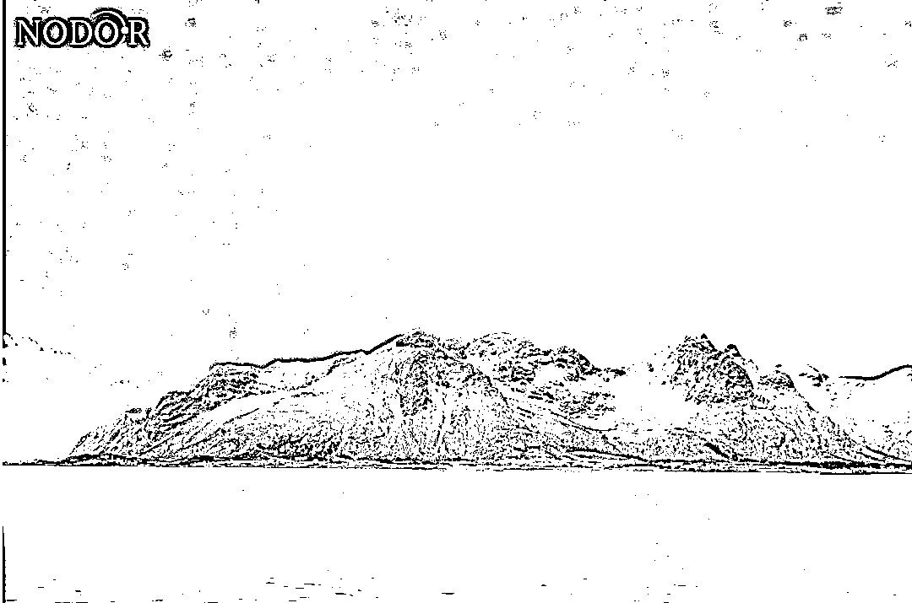

**沙龙来啦！****12 月 3 日，星期六上午 9:00，**国际占星研究协会（ISAR）中国星空俱乐部沙龙由占星师**克****劳迪娅·贝德博士**带来一场讲座！**沙龙主题****沙龙主题：********占星学与过渡性现象************主讲人：**克**************劳迪娅·贝德**************

**沙龙时间：12 月 3 日，星期六，北京时间 9:00-10:30（有英文翻译）**

**沙龙方式：线上沙龙**占星学与过渡性现象，不仅是本次讲座的名称，也是克劳迪娅最近在国际研究生院完成并成功答辩博士论文的题目。考虑一下这个问题：占星学在我们的心灵中从哪里获得它的力量？克劳迪娅说，她怀疑这与英国精神分析学家温尼科特(D.W. Winnicott, 1896-1971)提出的所谓的人类经验中间区域有关，他称之为过渡性现象。温尼科特是这样描述的：“这是我开始研究的领域，分离不是分离，而是联合的一种形式。**”我们的内在现实和外部世界之间的这一区域在童年早期就出现了，在成人生活中发展为文化经验。**占星学的征象象征着我们的内心世界和外部世界之间的关联，通常以一种让我们对自己和周围的世界有更深理解的方式。在最简单的层面上，星图是外部世界的地图，但它也是我们内在世界的地图。就像曼陀罗一样，**出生图象征着我们神圣的内在空间——我们宇宙联系的核心结构，与我们最早的依恋和不断发展进化的现实发生共鸣。**所以，克劳迪娅想知道的是：**“占星师对占星学的实际经验是否展现出对过渡性现象和（或）转换现象的明确定义?”**为了找到答案，她在 10 年的时间里采访了 13 位专业从事占星的经验丰富的占星师。答案是**“是的！”****主讲嘉宾**

**********克劳****************迪娅·贝德**********

**· **克劳迪娅·贝德博士，NCGR-PAA 四级咨询占星师，执业精神分析学家和创意艺术治疗师。**·** 自 1973 年起就在大学和会议上教学，开创了精神分析、占星学、炼金术、艺术和曼荼罗的结合。**·** 她曾任职于美国占星与心理学协（AFAN）的董事会，并担任表达分析研究所（Institute for expression Analysis）的执行主任。· 她在《心理学和宗教百科全书》和不同的占星杂志上发表文章，是畅销书《爱的行星》的合著者，她还指引人们回到前世和灵性回归的灵魂家园。**如何参加沙龙？**本讲座也是本月的国际占星研究协会（ISAR）星空俱乐部讲座。**ISAR 会员可以免费收看。**请注意邮件通知，具体参与方式见邮件。❶ 如果你**已经是 ISAR 会员**，请注意邮件通知，告知如何参加。❷ 如果你**不是 ISAR 会员**，非 ISAR 会员价格：98 元。如有任何问题请咨询工作人员仲老师（微信：YY18513802156）

**非 ISAR 会员报名请长按下图**

**▼**

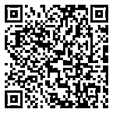

**ISAR 明星俱乐部**

2018 年，ISAR 在主席亚历山大·因舍阿吉克的带领下，成立了 ISAR 明星俱乐部，每月为全球 ISAR 会员提供在线直播讲座，邀请全球著名占星师开讲，学习和分享新的理念。讲座时长一小时，涉及占星学的不同领域、不同观点，每个会员都可以参与其中，每次讲座之后还有 20-30 分钟问答时间向老师们提问。每一场在线讲座都会记录下来，ISAR 除了提供视频，还会提供相关的讲座资料，以及单独的问答录音，自动发送到专门的 ISAR 明星俱乐部页面存档，每位 ISAR 会员可以在 ISAR 网站上自己的会员主页俱乐部页面找到。在 2018 年最初几个月，ISAR 明星俱乐部会每月举办一场在线演讲。之后，两周举办一场演讲，最终每周举办一场演讲。
但是，过去明星俱乐部讲座只有英文沙龙，因此，中国会员只有懂英文才能受益。为了使得更多不懂英文的中国会员能够受益，我们特别和 ISAR 总部协商，今后会安排有中文翻译的明星俱乐部占星沙龙，作为给中国 ISAR 会员的福利！**如何成为 ISAR 会员？**

**如果你也想成为 ISAR 会员，请复制链接在浏览器打开**

http://www.nodoor.com/isarcert.do?contentId=3588（仅支持网站支付）

**或直接长按下方二维码，微信购买会员：**

**ISAR 会员有什么福利？**一年期会员仅需支付**人民币 530 元**，即可享受：**☆ 星空俱乐部免费沙龙****☆每年出版 3 次的《国际占星师》（目前只有英文）；****☆每周电子邮件交流汇总杂志（目前只有英文）；****☆专项研究基金和奖学金资格；****☆ISAR 主办的会议和论坛的会员折扣，包括国际占星大会（UAC）、ISAR 的会议和研讨会等会员权益。****有疑问怎么办？**关于 ISAR 星空会员俱乐部以及我们的讲座，如果你还有任何疑问，**请联系工作人员**：

**若道 Conrad（微信号：nodoor2016）**

**若道 yiyi****（微信号：YY18513802156）**

**非 ISAR 会员报名入口**

# 格伦问答丨精神病理学如何帮助我们拓宽占星学思路？

> 原文：[`mp.weixin.qq.com/s?__biz=MzA5NjA0NTAxNg==&mid=2651495982&idx=2&sn=10520bc7cfe2ef74629aef06f2f14f49&chksm=8b482c99bc3fa58f55b5e92c384c8beef7d796621bee53b42a13d401c812bbe747e9dc688c5f&scene=126&sessionid=1692737715#rd`](http://mp.weixin.qq.com/s?__biz=MzA5NjA0NTAxNg==&mid=2651495982&idx=2&sn=10520bc7cfe2ef74629aef06f2f14f49&chksm=8b482c99bc3fa58f55b5e92c384c8beef7d796621bee53b42a13d401c812bbe747e9dc688c5f&scene=126&sessionid=1692737715#rd)

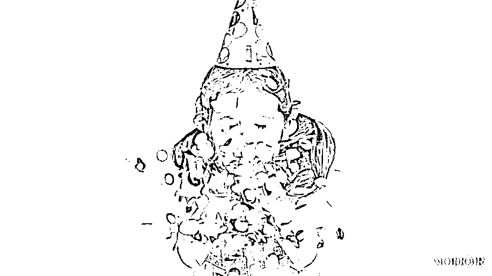

作者/格伦·佩里 译者/若道翻译团队

编辑/翀子 图片/若道、稿定设计

关于[占星原型与星图中的精神病理学](http://mp.weixin.qq.com/s?__biz=MzA5NjA0NTAxNg==&mid=2651493004&idx=2&sn=038b40a4c73ce929da0d5c64de0eac85&chksm=8b48203bbc3fa92d3922f679f3aa4a5525d2776cd477717d7daef4d44bbb863c001bd3281960&scene=21#wechat_redirect)这门课程，想必大家都有很多疑问，以下，若道君就挑选了 4 个最最经典的问题，大家最想知道的，询问了格伦·佩里老师。来看看格伦老师的回答吧！

**“精神病理学和疗愈”小问答****Q**

您主讲的若道核心课程中，105 的阶段专门有 10 节课讲“精神病理学和疗愈”。虽然一听到精神病理学这个名词的时候，我们会想是不是很严重的病人才需要去了解，因为我们学占星学的学子里面很多都不是心理治疗师，所以能不能请你简单介绍一下，什么是精神病理学？

**A**

神病理学的基本定义就是**灵魂受苦，**精神就是灵魂的意思，病理就是受苦的意思，所以精神病理学研究的就是，**人类各种各样受苦的方式，尤其是因为某一类的行为而引起的。**

我同意你所说的，在传统的心理学层面，我们把精神病理和严重的极端的人类的病症联系在一起。但其实更为准确的是，精神病理学是一个连续体，从比较轻微的，到比较严重的，这么说来，我们**每个人都有一部分精神病理的问题**。

作为一个人，没有一定程度的挑战是不可能的，没有一定程度受苦，没有一定程度不平衡是不可能的，这种不平衡就会以一种**挑战和困难**呈现出来。

**Q**

这个课程里面，除了精神病理学，您还讲疗愈，因为您是占星师，又是心理咨询师，您对**疗愈**的理解到底是什么？

**A**

我来说，**疗愈是一个复杂的过程，**讲的是**将人从不平衡带到平衡这样的一个状态，将不同行星代表的心理功能带到一种更加平衡整合和合作的状态。**

举例来说，大部分人的星图上，行星之间都有挑战相位，这就意味着我们大多数人都可能存在着某种**由这两颗行星所代表的状态的不平衡，一颗行星有可能会为了防御抵御另外一颗行星而出现的一种过度补偿或过度反应的状态**。

所以当这两颗行星之间缺乏一种**功能运转正常的合作**，就会导致**异常极端的行为**。

作为研究精神病理学的人，我发现**每一颗行星，以及这颗行星所守护的星座，都和某一特定类型的病理联结在一起，包含了这个占星原型所涵盖的极端不平衡的情况。**

举个例子，某个案主的第 1 宫，有很多星星在那里，和对面第 7 宫的火星形成对分相，第 1 宫白羊座或者火星白羊座的组合，和这个案主的**反社会人格**的病状联系在一起（这是一个星图的极端负面表现）。

作为占星师，我越来越赞赏的一点，就是**生活本身就是一场治疗**。我们经常会听到这样一句话，地球和生活本身就是一个学校。我们在星图中看到，人们所具有的**创伤、不平衡及其产生的防御机制**，最终都会在他**生活中的关系和情境**中呈现出来。

无论他生活中处在怎样的情境之下，这些环境都是在为他提供恰当的环境，作为一种**载体**，让他去**平衡和疗愈事件背后问题的根源**。

这样一个现象是持续不断地在发展，会让我们想到，会有一个**更大的宇宙的智慧**存在，它其实是在**指挥和引导**着我们的这些经验，让我们去**经历然后进入更高层面的发展**当中。

生活或者“神”，就是我们所有人类的治疗师。

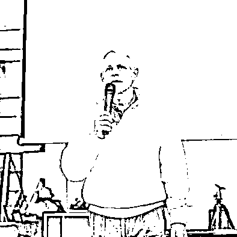

| 格伦老师在授课

**Q**

在课程中也会讲到**《精神病诊断与统计手册》的诊断标准**，为什么学占星学的学生需要知道这个部分，你觉得这是重要的？

**A**

因为我们如果能够对**精神病理极端不平衡**的情况有了解的话，就会对它**比较温和的版本**更加敏感（大部分人是更温和的版本的呈现）。

另外，在心理咨询中，有这样一种诊断的方式，我们会说这个案主并没有达到病理所达到的层级，但是他有显示出，这个病理某一些特点或者某一些倾向。

**我们的目标并不是去诊断案主，而是了解他在刚才说那个连续体上处在一个怎样的位置。**

还有很重要的一点，心理治疗师在诊断过程中，有时发现这个个体并不总是落到一类病症当中，你会发现他常常总是几种不同病症的混杂，心理学在这方面会很困惑，他们不明白，这到底是一个病症呢，还是多个病症都有呢？

如果不结合占星学，就会使心理学处于一个很大的劣势当中。而**心理学中所遇到的这些错综复杂的问题，我们认为占星学在这里是提供了一个解决方案**。

当你拿到星图，就会看到，不同的冲突，是体现在不同的部分上，某一个病状是体现在某一个行星，另外一个病状，是同步体现在另外一颗行星上。

比如一个人的**太阳和天王星形成挑战相位（合相、对分相、四分相）**，太阳为了去应对天王星所提出的要求，常常会以一种夸张太阳的方式去表现出来，于是会呈现出一种自恋的状态。**自恋**这个状态，我们就是和太阳联结到一起的。

同时你仔细去看这个个体，你会发现，他身上也会有天王星的病理，这个病症就是一种夸大了天王星病理的一种现象，这个人看起来就是一种**冷淡、漠不关心、很有距离、切断**的状态，看起来可能是很**奇怪的、奇异的，很难和家人形成温暖关系**的状态。

但是同时这样的客体，也会呈现出一种**自恋**的感觉，会觉得自己高于所有人，觉得自己非常聪明，是个天才，具有改变世界的能力。在电影里大家很容易看到这种人，比如疯狂的科学家，觉得自己是个天才，可以改变这个世界，但是没有能力和其他人形成一种温暖的关系。

如果**太阳和海王星或者冥王星形成挑战相位**，还是有**自恋**的情况，但是这个里面有不同的意味，这个太阳就会掺杂一些海王星和冥王星的特质，在这个地方就出现这种双重的诊断，或者是多重症状的一个混合，那么是由占星学上的配置所呈现出来的。

当然刚刚所说的这些失调，并不一定都会成为一种临床上的诊断，有可能在案主这里呈现出很轻微，但是仍然在他生活中给他造成挑战的一个点。

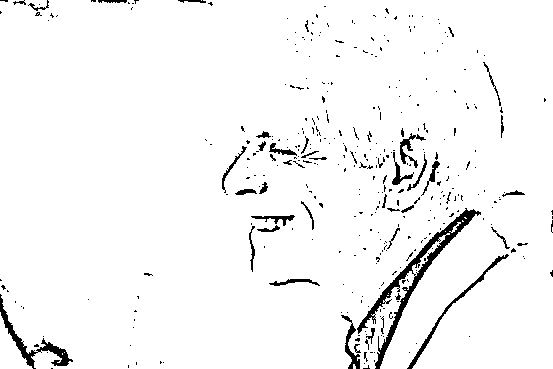

| 格伦老师

**Q**

我感觉如果参照诊断标准，我已经可以给自己诊断出很多种失调症了。您是不是在课堂上也会给出一些改善的方法？

**A**

你看到你这么多失调的时候，这是你健康的一个信号。这就是心理学课堂上的一个笑话，每当教授提出一个新的失调的时候，课堂上都会有人说，天哪我有这个，其实**把所有的失调都在自己身上发现，就说明你其实整合得还不错。**

这个课程是很有乐趣的，会给我们提供很多智力上面的刺激，能够让我们了解自己，了解我们的客户、朋友、家庭，给我们提供一种崭新的方式，并且让我们看到占星原型的种种表达，不要让大家局限在非此即彼，非好既坏的这样的一个概念当中，而看到它其实是一个不同程度的连续体。

当大家能够以这种方式去看的时候，你就能够将自己的生活，带入一种和谐，能够了解这是一个过程，我们的重点不是放在诊断上，而是放在整合上，因为生活，就是一种整合。

**版权声明：**本文由若道翻译发布，欢迎转发，反对抄袭。友号转载请申请白名单。

**END**

**格伦·佩里**

若道签约老师，著名占星师，前 ISAR 董事会成员，共出版 8 本占星著作；心理/意识研究专业博士；占星心理学学院（Academy of AstroPsychology）的创办人；康涅狄格州研究生院（the Graduate Institute of Connecticut）原型宇宙学与意识进化项目的负责人。

# ****占星原型与星图中的精神病理学****

**为什么在占星学的课程中，会出现精神病理学的教学内容，这和我们有什么关系？这对占星咨询，或在自我了解与成长的过程中又有什么帮助呢？**

****带着这些疑问，请你静下心来，思考以下几个问题**：**

**“******你/你的案主，是否曾经过度担心什么？**** ****你/你的案主，有没有感觉到担忧和焦虑，却不知道原因是什么？********你/你的案主，是否曾经觉得害怕什么东西，但理智上却很清楚它不会对你造成什么伤害？********你/你的案主，是否曾经通过沉迷某物，酗酒或滥用药物，自我伤害去逃避问题？********……********——节选改编自《心理学与生活》******”**

**如果你对上述问题其中之一，回答是。这意味着几乎每个人都曾有过心理障碍的症状（精神病理的问题）。**

**你看，其实“精神病理学”与人的心理有着密切的关联，再结合占星学，呈现了人内在与外在层面更加丰富和深刻的一面。**这对于学习占星学的人和占星师来说，都是一场难得的知识盛宴！****

****本课为 2 年期双证核心课程中的一部分**（AP105 阶段），其内容是过去若道所开设的核心课程从未教授的部分，特意抽出供其他学员学习，******可作为 ISAR 选修课，单独报名。****

****点击下方图片了解详情****

**

****微信又双叒叕改版啦，不想错过若道君的推送？**** ******就把若道设为****星标****以及点点****“在看”****吧！**********▼****

****

**喜欢就点一下“在看”吧！****报名直达入口**

# 你的上升星座，暴露了妈妈爱你的方式

> 原文：[`mp.weixin.qq.com/s?__biz=MzA5NjA0NTAxNg==&mid=2651495982&idx=1&sn=7f0c17071ba12a3a4c60960edfc9ee48&chksm=8b482c99bc3fa58f4df887f01a0aeed8c727dbf1e395b34a283918819414a4edb62449f4a96a&scene=126&sessionid=1692737715#rd`](http://mp.weixin.qq.com/s?__biz=MzA5NjA0NTAxNg==&mid=2651495982&idx=1&sn=7f0c17071ba12a3a4c60960edfc9ee48&chksm=8b482c99bc3fa58f4df887f01a0aeed8c727dbf1e395b34a283918819414a4edb62449f4a96a&scene=126&sessionid=1692737715#rd)

****************☆ 后台回复“今日”，给你一句生命态度****************

作者/琳恩·柯纳

翻译/江艺 校对/Leisha

编辑/玫瑰 封面/书君 图片/稿定设计你想过上升星座会和母亲怀孕期间的状况有关系吗？看完对 12 个上升星座的妈妈们的分析，感觉打开了新世界大门，你是否也觉得和妈妈的联结更紧密了呢？另外，大卫老师参与授课的【[ISAR 认证职业占星师文凭课程](http://mp.weixin.qq.com/s?__biz=MjM5MjQwNjAyMQ==&mid=2649440558&idx=7&sn=b041699d5f41c4a024ad9ed019fcc13f&chksm=beb92e4489cea7527b5d33c569159e39ebfb5eb2404385c2104a0daccf39f6ef078aaf9eea3d&scene=21#wechat_redirect)】报名中，点击链接了解更多详情！**上升星座与母亲孕期状态****我的理论和论点是，上升星座是由母亲在妊娠期间的态度、情感和经历决定的。**上升星座通常被看做是受环境的影响，但我认为这种环境就是怀孕期间的状态。**母亲在生命中这一脆弱的时期所创造的环境决定了个体会对特定刺激做出反应。**这个“环境”可能与个人的真实自我并不协调。例如，如果一个人**上升巨蟹座**而太阳在射手座，母亲可能非常情绪化，特别是在妊娠期，因此，个体经历了他/她无法识别的情绪反应。**上升摩羯座或土星合上升的人****，**可能有一种不被需要的内在感受，即使月亮的有利相位显示其在童年早期获得了大量的爱。以下是有关我理论的例子。请保持开放的心态，把这些例子和你的自身经历进行比较。然而，**我确实发现，任何位于第一宫的行星都会替代上升星座本身的影响。**例如，如果上升狮子座，母亲可能在怀孕期间得到了很多关注，但如果冥王星落在狮子座合上升，其体验会更像上升天蝎座的描述。**12 上升星座的母亲孕期**

**上升*****白羊座***

**怀孕期间，母亲频繁地接触到很多新的兴趣和活动。**一位朋友说，当她怀着她的上升白羊座的孩子时，一个新世界的大门为她敞开，带她走进研究深奥秘义的世界。

另一位朋友觉得她的整个生活变得更好了，因为她摆脱了生活中古老和过时的东西，开始了新的生活和经历。

与白羊座的性格相一致，一位上升白羊座的女性形容她的母亲是一个非常没有耐心的女人，特别是当她怀孕的时候。另一位则觉得，怀着上升白羊座的孩子时，她要一个人做很多事情，要独自负责很多事，还要处理那时生活中的许多危机。

你将在白羊座的描述中读到，白羊座会在良好危机的挑战中茁壮成长。**母亲在怀孕期间的经历会成为孩子经历、性情和倾向的一部分。****当上升落在火象星座白羊座、狮子座或射手座时，母亲们在怀孕时表达了强烈的幸福感。**

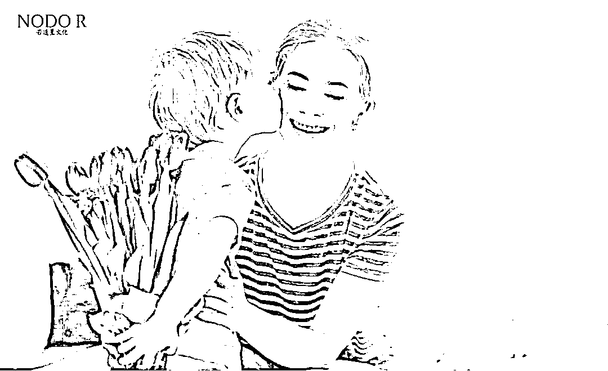

**上升*****金牛座***

**在孕育金牛座小孩的时候，父母可能正处于他们关系的获取阶段。**获得可爱的“东西”对母亲来说感觉很好，因此，**金牛座的孩子在购买某个听起来、感觉起来、闻起来或看起来不错的东西时，会感觉回到了安全的子宫里。**金牛座是一个富有创造力的星座，**我发现母亲在怀孕期间经常接触文化活动。**一位出生时月亮和金星落在金牛座上升的学生说，父母双方都很有创造力，所以在怀孕过程中很可能有这方面的接触。月亮、金星和海王星经常指示音乐，尤其是在金牛座、天秤座和双鱼座。一位木星落金牛座上升的孩子的母亲说，她在整个怀孕期间都在听音乐跳舞。其舞蹈是一种流畅的风格，而不是现代舞。当孩子出生后，他天生就喜欢跳舞。**木星在妊娠期掌管运动和舞蹈，特别是在创造性的星座中。**

**上升*****双子座***

**母亲在怀孕期间经常体验大量的走动、景致的变化或环境的改变。**一位母亲在怀孕期间搬到了另一个街区；其他一些母亲经历了大量的旅行，尤其是短途旅行。

一位母亲对双子座的四处走动给予了一种不同寻常的解释。当我问她怀孕的时候是不是经常走来走去时，她觉得并不是这样，但接着她想起来，**一直到她去医院生孩子的那天她都在做有氧运动！**

**上升*****巨蟹座***

我发现，**生下上升巨蟹座孩子的母亲在怀孕期间普遍感到不适，**尤其是晨吐。**这可能就是为什么巨蟹座在胃和消化区域更敏感的原因**——这是从怀孕时遗传的体质。一位女性告诉我，她的儿子是上升巨蟹座，怀孕期间她感觉很好——后来我发现这个孩子太阳落上升点。太阳和火象星座有助于母亲感觉良好。在这种体验过程中，**母亲经常情绪化、敏感和喜怒无常；这些情感体验可以是积极的也可以是消极的。**当月亮落上升时也是这样。一位朋友生下了一个月亮和火星合上升的孩子，她怀孕时感到强烈的愤怒，因为她不想要这个孩子，但她的丈夫不同意堕胎。还有一个女人，她的孩子出生时月亮合上升且相位良好，她体验到和谐、“调和”的美妙情感。

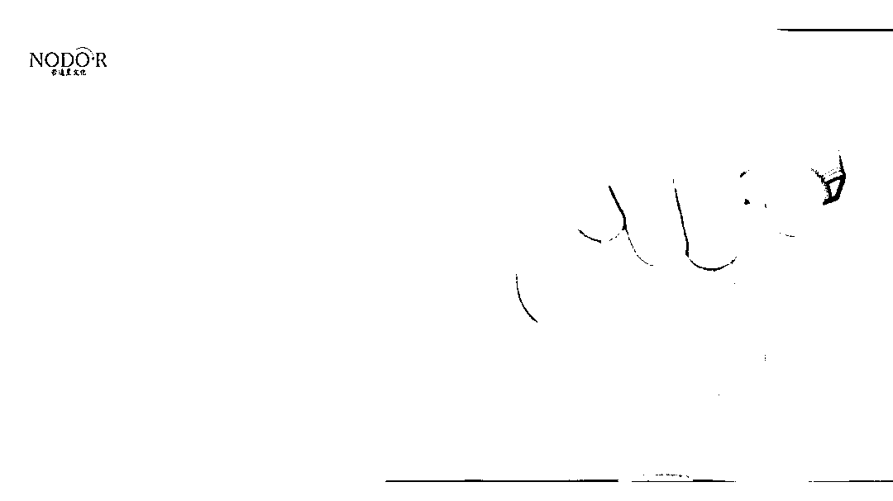

**上升*****狮子座***

**母亲在怀孕期间经常得到大量的关注。**一位朋友说，她肚子越大，得到的关注就越多——人们侍候她，对她说她长得有多美，她觉得自己很重要。**这为上升狮子座的孩子赋予了要成为重要的人的定位，因为在妊娠期被看重的感觉就如此地好。****合相上升的行星强烈地影响着这个上升星座。**在 20 世纪 40 年代末，有好几颗外行星落在狮子座，尤其是冥王星。如果冥王星合上升，请阅读上升天蝎座的描述。我总是在星图中使用冥外行星（Transpluto：影响冥王星的假想行星），这颗行星从 20 世纪 30 年代末开始行进穿越狮子座，它将继续穿越狮子座直到世纪之交过后。当冥外行星落上升时，**母亲可能曾表现出强烈的自给自足特质，**感觉她必须自己做所有的事情，其中融入了批评或区别对待的倾向。母亲可能曾抱怨所有事都要自己做，但这往往是一种个人选择。自给自足意味着人们不能批评你、试图改变你或告诉你该做什么！

**上升*****处女座***

**母亲在怀孕时常常表现出非常挑剔的习惯。**她很可能非常注意饮食，费尽心思不会伤到孩子。在一些情况下，母亲之前有过流产，因此采取了所有预防措施，以免这种情况再次发生。我经常发现母亲本身有一些处女座配置，所以在她怀孕期间就养成了这种挑剔的习惯。

**上升*****天秤座***

**母亲总是试图保持生活的平衡，有时甚至到了对自己不公平的地步，在这个过程中失去了自我。**一位母亲说，她试图在家庭生活和事业之间取得平衡——事实上，在这种平衡中她失去了一些自我。内心的平静是很重要的，而这通常会通过一些创造性的途径来实现——可爱的花朵，美妙的音乐和美丽的色彩。**家庭可能确实曾带来压力，但母亲总是让一切保持平衡**，先考虑别人的需要再考虑自己的，压抑任何想要表达愤怒或不愉快的倾向。在这里我想提一下，**金星合上升（但不合凶星）通常表明怀孕期间孩子感到非常被宠爱。**内华达州的占星师帕特丽夏·芒恩斯发给我一篇文章，描述一位死去的母亲生下孩子——孩子出生前母亲一直靠生命支持系统维持生命。当我绘出星图来看时，金星在处女座合上升。我觉得，即使在死去的母亲的身体里，孩子也能感受到强烈的爱。帕特丽夏告诉我这是真的。当母亲躺在医院里的时候，父亲每天都去看望孩子并和孩子说话。

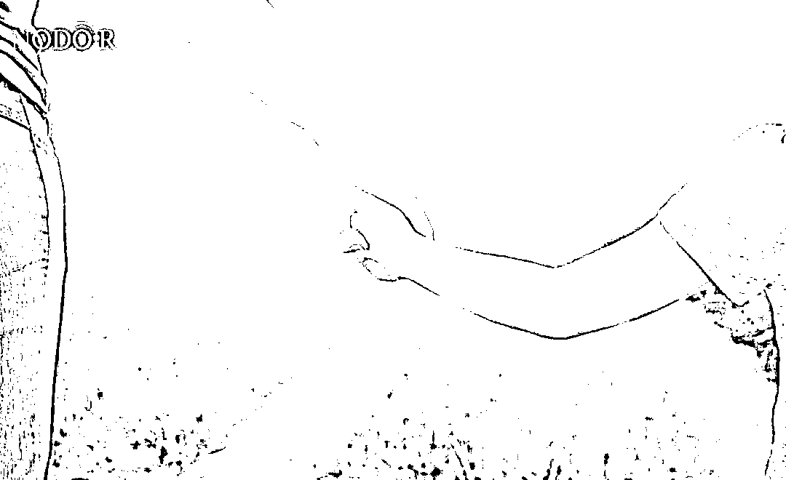

**上升*****天蝎座***

上升天蝎座或冥王星合上升，**母亲通常在怀孕时感觉到愤怒、怨恨，非常不喜欢失控的情况。**家庭内部可能出现了紧张的状况，母亲用强烈的情绪将愤怒内化。即使是未出生的孩子也会因为怀孕期间发生的事情而感到失控！

有一些非常重要的例外！我的一个学生是上升天蝎座，但她的月亮在摩羯座(通常是父母最喜欢的孩子——这似乎很奇怪)，并且相位很好。我觉得，虽然母亲在怀孕期间体验到怨恨，但在孩子出生后，她是非常爱孩子的。

那个学生告诉我，她在经济大萧条时期出生在一个非常贫困的社区。她的母亲确实非常怨愤，因为她知道她只能去一家福利医院，而她那高傲的天性觉得这是很难接受的。

然而，当孩子出生了，这种感受被她抛在脑后，怨恨也消失了。然而，**因为孩子在怀孕期间感受到这种强烈的情感，她成年后对失控和操纵非常敏感。**

我在占星大会上还听到了一个相当不同寻常的经历！那位母亲告诉我，**她非常享受怀孕，所以她非常努力地不让孩子出生。**很明显，宝宝感到这是一个控制问题！还要记住，**吉星合上升会改变上升天蝎座的影响。**类似的情况是，一个人报告说是引产。

**上升*****射手座***

和其他火象星座一样，**妈妈们在孕期感觉很幸福美好。**通过这种积极的输入**，****孩子会发现自己在整个一生中都很容易培养出积极的内在态度。**受访的母亲中只有一位健康状况不佳，但她认为后一种表述是正确的。一些母亲说，在怀孕期间有重大迁居，但在怀孕期间，**所有女性提到的主题是一种内在的期望，事情会变得更好，繁荣就在眼前，而且她们都会追寻新的前景。**他们把过去抛在身后，发现自己充满信心地行动。**母亲们在怀孕期间感受到一种强烈的精神或哲学前景。**这是一个意识扩张的时期，相信一些比她们自己更伟大的东西，并按照这种信念行事。

**上升*****摩羯座***

土星合上升或上升摩羯座的孩子**经常是第一个或最后一个出生的。****对于第一个出生的孩子**，母亲会对新的经历感到焦虑。孩子可能是被热切期待的，但是，当母亲四处走动，感觉好像她的裙子下有一张桥牌桌时，就会产生“哦不，我让自己陷入了什么！”的情绪。**对于最后一个出生的孩子**，母亲的态度是:“就这样吧——不要再有孩子了!”有时，几年过去了，母亲可能会改变她的想法，但这改变不了她对那个她认为即将“收尾”的上升摩羯座/土星合上升的孩子的态度。

**有时候真的会有不想怀孕的感觉，或者有些“恐惧”的感觉。然而，这种恐惧可能并不是不想要这个孩子。**一个朋友笃定地说，她想要她那最后一个上升摩羯座的孩子，而且之后计划要更多的孩子。

后来，她意识到我提到的恐惧的来源。她告诉我，她和丈夫都信奉新世纪哲学，但他的父母信奉一种严格的传统宗教。每当她怀孕的时候，他所有的亲戚都会从纽约赶来，试图改变他们孩子的宗教信仰，让他们恢复传统的宗教信仰。这是她怀上上升摩羯座孩子时的一种强烈的思维模式，**她确实感到了强烈的恐惧情绪**——“哦，不！我又得去对付他的亲戚们了！”**一个未出生的孩子不可能区分这种情绪的来源。它只知道感觉自己不受欢迎；它能感受到妈妈对怀孕的恐惧。**当一个人在最脆弱的发展阶段感到不受欢迎时，他的内心就会充满强烈的保守、不安全和不信任感——这种不受欢迎的感觉会被嵌入身体的细胞中。

因此，**上升摩羯座或土星合上升的人通常有一种保守的光环，**直到他们觉得自己可以信任并向周围的环境敞开心扉。向他们证明他们可以去信任的生活经历有助于消除这种设计。

几年前，我为一位女性的孩子们解读星图。她第 2 个孩子的土星合上升，出生的月亮与木星四分。我问她是不是不想怀孕，但后来为了弥补不想要孩子的罪恶感，又纵容了孩子。

她承认第 1 个孩子给她带来了许多麻烦，因此她害怕再要一个，但第 2 个孩子出生后，她真的爱她，确实试图通过更纵容第 2 个孩子来弥补。

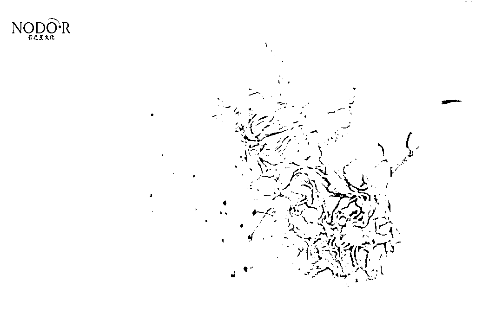

**上升*****水瓶座***

**上升水瓶座或天王星合上升，母亲可能正处于其发展的叛逆期。**有时母亲想要摆脱家和怀孕的限制，所以她反抗的这段经历。一位母亲遭遇了天王星式的健康问题——神经压迫使她的手麻痹。我的一些上升水瓶座或天王星合上升的学生表达了他们的母亲不想怀孕的想法——**但这是一种对怀孕经历的叛逆情绪，而不是摩羯座/土星的恐惧。**一个朋友生了一个天王星在狮子座合上升的孩子。她的医生曾告诉她，身体条件不允许她怀上这个孩子，如果她真的要怀这个孩子，她肯定无法喂母乳。虽然我的朋友是一个甜美、随和的土象星座女性，但她对权威人物——医生们却表现出强烈的反叛情绪！她下定决心要生下这个孩子，按照她自己的方式去做，而且如果她愿意的话，就要母乳喂养。这种**“我要做我想做的事，我要用我自己的方式去做！”**的态度占据了主导。显然，她生的这个孩子，虽然我觉得他很可爱，**但对权威人物有一种叛逆的态度。 **

**上升*****双鱼座***

上升双鱼座或海王星合上升，**母亲在怀孕期间经常走神。**她有一种矛盾的情绪，心不在焉——不能做到现实理智，还漠不关己。一些母亲说她们试图通过**艺术、阅读、研究神秘主义和想入非非地做白日梦**来逃避现实。有时母亲在怀孕期间可能**服用了使她精神涣散的药物**；在一些罕见的情况下，母亲在怀孕期间患上了**神经症**，因此心理上变得**迟钝昏沉。****如果有来自月亮或金星的积极影响，母亲创造性的逃避方式会在孩子身上产生创造力。**孩子通过母亲学会了逃避现实的健康方法。但在前面提到上升巨蟹座-月亮合上升的例子中，这位女性因为不想要孩子又不能堕胎感到非常愤怒，她学会了在矛盾的情绪中走神——这个孩子出生时月亮和火星在双鱼座合相。有时为了应对负面情绪，母亲可能会嗑药或饮酒。

无论这是否是一种积极的经历，**母亲“心不在焉”的特质使她在怀孕期间无法脚踏实地。**这就给即将到来的生命带来了一个困境。

**母亲的失联使即将到来的生命难以有效地融入厚重的物质身体中。在身体的厚重和微妙之间似乎有一些间隙或空间，使孩子对外部氛围高度感同身受和敏感。**

由于高度的接受能力，这种敏感性会使个体在地球上生活感觉压力大。显然，对于这样的人来说，如果找不到有创意的逃避方法，可能更容易通过上瘾来寻求解脱，包括烟瘾，因为吸烟往往会切断从太阳神经丛发出的联系。我发现许多通灵者在解读结束时会点燃一支香烟，**这有助于切断已经建立的联系。****尾声****太阳代表了我们的真实自我；上升代表环境对我们的影响——我们的早年生活和出生前的发育。****如果太阳星座和上升星座不和谐，我们可能会被鼓励去成为与真实自我不符的人。**例如，一个学生上升狮子座，太阳在处女座，她觉得自己总是被推到重要的位置，被迫吸引眼球，被迫上台表演，而她本质上是一个害羞、内向型的人。狮子座通常喜欢大城市的快节奏，而处女座则喜欢安静私密的小社区。当发生冲突时，个体会发现，**那些上升星座强大的人会期望他们成为父母和早期环境塑造的那个人，从而使任何成为真正内在自我的尝试遭到挫败。**以狮子座-处女座为例，狮子座的男人会希望她光鲜亮丽，善于社交，成为关注的焦点，不希望她做害羞、安静的自我。

**版权声明：**本文由若道翻译发布，欢迎转发，反对抄袭。友号转载请申请白名单。

**END****琳恩·柯纳**

自 1969 年 6 月以来一直是全职专业占星师，担任美国地球宇宙研究学会巴尔的摩和安纳波利斯分会的主席、副主席和简报编辑。诺·泰尔《占星学的具体度量》的撰稿人，医疗占星课程导师。

**拥有****51 年****占星实践经验的****若道创始人****前 ISAR 全球副主席****前 ISAR 全球职业占星师资质认证主席****大卫·瑞雷**

**和**

**2019 年第二届、2021 年第三届核心课中**

**与苏·汤普金斯老师****联合授课****的**

**ISAR 认证职业占星师**

**咔咔（Caroline）**

**二人合力打造**

**2022 年 ****若道全新核心占星课程**

**点击下图了解更多课程详情** 

**快年底了****不给自己一份来自占星学的礼物吗？**

**20 位来自世界各地的占星师****带来 19 场沙龙——新世界的觉醒****详情可点击下图**

**学习占星学****点击下图了解课程详情**

**微信又双叒叕改版啦，不想错过若道君的推送？**
****就把若道设为****星标****以及点点****“在看”****吧！******▼**

**喜欢就点一下“在看”吧！****报名直达入口**

# 12 月宇宙天气丨水逆又来啦！混乱持续，谨防口舌是非的一个月

> 原文：[`mp.weixin.qq.com/s?__biz=MzA5NjA0NTAxNg==&mid=2651495837&idx=1&sn=fbfb5d1958eade84ce123883aa75b74a&chksm=8b482f2abc3fa63c4dec0d878e3784479b3ccccce3c38ce6b2b2db0a95f4b0055aa145d519ef&scene=126&sessionid=1692737715#rd`](http://mp.weixin.qq.com/s?__biz=MzA5NjA0NTAxNg==&mid=2651495837&idx=1&sn=fbfb5d1958eade84ce123883aa75b74a&chksm=8b482f2abc3fa63c4dec0d878e3784479b3ccccce3c38ce6b2b2db0a95f4b0055aa145d519ef&scene=126&sessionid=1692737715#rd)

******☆ **后台回复“今日”，给你一句生命态度****

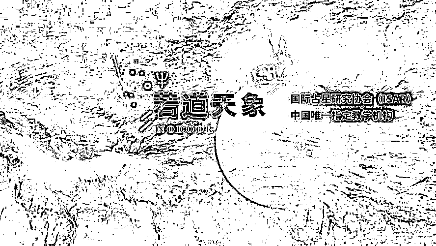

作者/Anastasia

编辑/玫瑰 封面/书君 图片/稿定设计

**12 月重点天象**

**• ****海王星顺行（12 月 4 日）**

**• 水星进入摩羯座（12 月 7 日）**

**• 双子座满月（12 月 8 日）**

**• 木星进入白羊座（12 月 20 日）**

**• 摩羯座新月（12 月 23 日）**

****• 水星开始逆行（12 月 29 日）****

**整体氛围****12 月，从金星和水星合相在射手座开始，再到金星和水星合相在摩羯座结束。**允许度放大一些，一整月中，金星和水星都相伴而行，听起来还不错，是吧？理论上，金星让思维变得平衡，交流变得柔和，人与人之间相处更讲道理；水星对外让关系更加流动，对内看待价值和财富也更加理性。**但事实上，混乱还在持续。**火星虽然离开了火海四分结构，但仍在逆行之中，月初还将对分金水合相，**火星会让这个合相更容易呈现出负面的能量，放大射手座高高在上的说教口气，控制不住白羊座的鲁莽和冲动，更加激化矛盾**。人们一厢情愿**为了证明自己的正确，而罔顾事实，造成关系的撕裂。****友情提示，减少上网时间，远离自私者和利己者，会更有助于保持内心宁静，身心健康。**愤怒这种情绪，是一个很好的观察窗口。**冷静下来，深挖愤怒，可以帮助我们找到内心的脆弱和伤口。**这种脆弱和创伤可能是童年环境造成的，也可能是来自于前世的潜意识模式。不管怎样，看到它，才能疗愈它。**月末，水星又将开始本年度的第 4 次逆行，加剧信息和交流层面的混乱状态。**本次水逆是跨年度的逆行，从 12 月 29 日摩羯座 24°开始，逆行至 1 月 18 日摩羯座 8°，逆行时间 20 天。这次逆行和之前 3 次逆行的风格不同。1 月水逆，水星从水瓶座逆行回到摩羯座；5 月水逆，水星从双子座逆行回到金牛座；9 月水逆，水星从天秤座逆行回到处女座。**3 次水逆都是从风象星座逆行回到土象星座。**接下来，2023 年的 2 次水逆全程都在土象的金牛座和处女座，呼应金牛座的北交点和天王星，再次强调**土象元素的功课**。而**明年年底开始的水星逆行将再次变身，逆行区间从土象星座逆行回到火象星座，开始逆行土火元素的周期。**

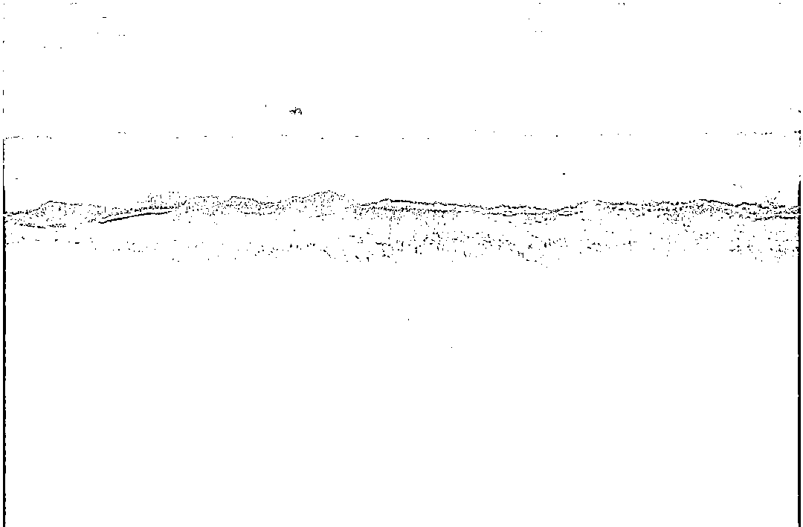

**重点天象****★****海王星恢复顺行****海王星终于结束了 5 个月的逆行。海王星每年逆行小半年，本次逆行是 6 月 28 日从双鱼座的 25°开始，逆行区间 3°，12 月 4 日在双鱼座 22°恢复顺行。**出生图上有**个人行星和重要虚点落在变动星座（双子座、处女座、射手座、双鱼座）22°-25°的个体**，已经充分感受到这波海浪的冲击。尤其是**生日在 3 月 13 日-16 日、6 月 14 日-17 日、9 月 16 日-19 日、12 月 15 日-18 日的个体**，海王星顺行后将第 3 次经过你们的太阳，你们准备好迎接最后一波风浪吗？行星逆行区间，就是行进重点影响的区间，尤其是外行星（天王星、海王星、冥王星），运行周期长，速度慢，往往会在一个区间深耕细作很长时间。尤其是海王星和冥王星，每年行经的度数只有几度，重点人群遭遇的行运时间可能会长达 3-5 年。第一次行进，往往是当事人最搞不清楚状况的时候，难免手忙脚乱，应对不当。有时候甚至会被外行星的猛烈冲击搞蒙了，迷迷糊糊的，被动应付；当行星逆行回来，强迫当事人回归内心，找到问题根源，很多人事物就变得分明起来；等行星恢复顺行，这时候通常心中已经有数，知道该如何去解决之前遗留的问题。海王星恢复顺行，我们在理解他人和灵性成长方面会有更清晰的感悟。经历了 5 个多月的混乱和迷失，也会重新拥有更坚定的信念和希望，对未来的方向也会看得更分明。**更多的人会选择团结在一起，不搞二极对立，不带情绪节奏，求同存异，合作共赢，为人类和人类的未来负起责任。****★****水星在摩羯座逆行****本次水星逆行的时间是从 12 月 29 日到 1 月 18 日，逆行区间是摩羯座 24°到 8°。**水星从 12 月 12 日进入前阴影期，12 月 27 日停滞，29 日开始正式逆行，2023 年 1 月 18 日恢复顺行，2 月 7 日离开后阴影期，前后跨年，明年春节大年初一在 1 月 22 日，也将受到阴影期的波及。本次水逆，逆行区间共计 16°，全部落在土象基本星座摩羯座，这提醒我们**重新检视自己的根基，从身体健康到物质资源再到工作和事业发展。**经过了 2020 年的木土冥合相，2021 年-2022 年的土天四分和木海合相，大家就像坐着过山车一样，根基不稳，安全带不牢，就会发现自己的生活被冲击得非常厉害。**接下来的 2023 年，相对来说会平缓一些。**2023 年的最大相位是**5 月份的木星-冥王星四分相**，木冥相位本身是极其繁盛的能量，但四分相会带来**大量的泡沫和假象，如何能够不受干扰，准确判断，合理采取行动，平安度过风雨并获取最大的利益，同样是对底线和根基的重大考验。**水星行经摩羯座，理论上是系统学习知识，设定具体目标，务实、负责、高效地完成任务的时期。但逆行的时候，说明水星的能量受到干扰和阻碍，无法在现实层面上落实和推进，不得不转向内在，发现问题出在哪里，开始进行调整和修正。**查看摩羯座 8°-24°区间在出生星图上的宫位，如果其中涉及到个人星座或者四轴，就是本次水逆的重点影响人群，要非常小心本次水逆带来的混乱和麻烦。**留意交流沟通、电子设备和文档、交通出行，物资储备以及疫情防控等水星主导的领域，尤其是**上升落入火象星座（白羊座、狮子**座**、射手**座**）**的人群，更要未雨绸缪，有备无患，小心驶得万年船。

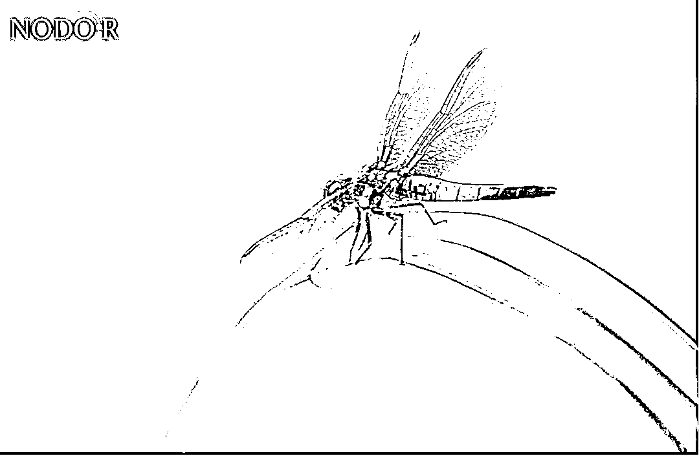

**★****木星进入白羊座**12 月 20 日，木星离开双鱼座，再次回到白羊座。这次木星彻底离开双鱼座，正式开始了新的一轮黄道周期。木星在双鱼座虽然是入庙状态，利于灵性成长，但以人类所处的演化状态，它带来的更多是**大举逃避**，不管是躲入如诗如画的应许之地，关起来门来成一统，还是利用酒精、药物、网络来逃避现实，推卸责任；鱼龙混杂，消极怠工，都不利于理想的实现。木星进入白羊座之后，将会**在意识层面上重新激励起人心之火。热情、勇气、冒险、开拓，**人们会**重燃热情和信心，投入到现实之中。木星庇护之下的法律、道德、教育、出版等领域，将会出现更多的机会和好运。****木星进入白羊座，利好火象的白羊座、狮子座和射手座。**对有些人，木星可能会带来财富；对有些人，木星带来的则是更高更广的眼界和更多志趣相投的朋友。具体情况则因人而异，还要看整张出生星图上的能量分布。**★****朔望周期**

**本月，双子座满月发生在 12 月 8 日，摩羯座新月发生在 12 月 23 日**，**12 月 8 日-23 日**这半个月是下弦月周期，身体会更倾向于**清理和排毒，这时候多吃一些，不容易发胖**。**12 月 8 日之前，23 日之后**是上弦月周期，**身体会更注重吸收和消化，建议控制饮食，体弱的可以适当进补。** 

地月关系对身体的影响非常明显，跟随月相节奏调整自己的饮食和作息，对身体健康非常有利。**·** 月亮在**火象元素（白羊座、狮子座、射手座）**的时候，身体最适合吸收蛋白质，这时候的蛋白质也是质量最好的；**· **月亮在**土象元素（金牛座、处女座、摩羯座）**的时候，适合盐分的吸收；**·** 月亮在**水象元素（巨蟹座、天蝎座、双鱼座）**的时候适合碳水的吸收；**·** 月亮在**风象元素（双子座、****天秤座、水瓶座）**的时候适合脂肪的吸收。按照这个节奏进食，往往会事半功倍。**满月发生在 12 月 8 日中午 12:08，双子座 16°。**重点影响人群是**生日在 3 月 7 日、6 月 8 日、9 月 10 日和 12 月 9 日前后**的个体。满月会擦亮你们的眼睛，聚焦你们的心灵，之前含糊不清的是是非非，会逐渐浮出一个清晰的结论。满月合相逆行的火星在双子座，过载的信息会加剧情绪上的波动和头脑的混乱，难以做出明智的判断和选择。**建议这个时段远离网络和人群，适度控制自己的好奇心，做一些静坐调息和冥想，更利于身心健康。****新月发生在 12 月 23 日傍晚 18:16，摩羯座 1°。**重点影响人群是**生日在 3 月 22 日、6 月 23 日、9 月 25 日和 12 月 24 日前后**的个体，请慎重许愿。具体许愿内容请参照摩羯座 1°所落宫位象征的主题。写下清晰、具体的愿望，将会有助于愿望实现。  **新月落在白羊点上，是一个非常敏感的度数区间。**白羊点是星图上基本星座（白羊座、巨蟹座、天秤座、摩羯座）0°前后 2°范围这个区间。这个位置的能量指出了个人和世界的关系，展示了个人在世界上的影响力和潜力。  日月落在这里，四分白羊座的木星，群星摩羯座，关于**自己在这个世界上的位置，以及能发挥的作用，**新月给我们带来的认知似乎并不那么令人满意。也许，这是一个深入思考的机会，毕竟新月只负责拉开门缝，让光照进来。  **满月和新月的当天，都可以断食或者轻食，给身体一个休息和重启的机会。**

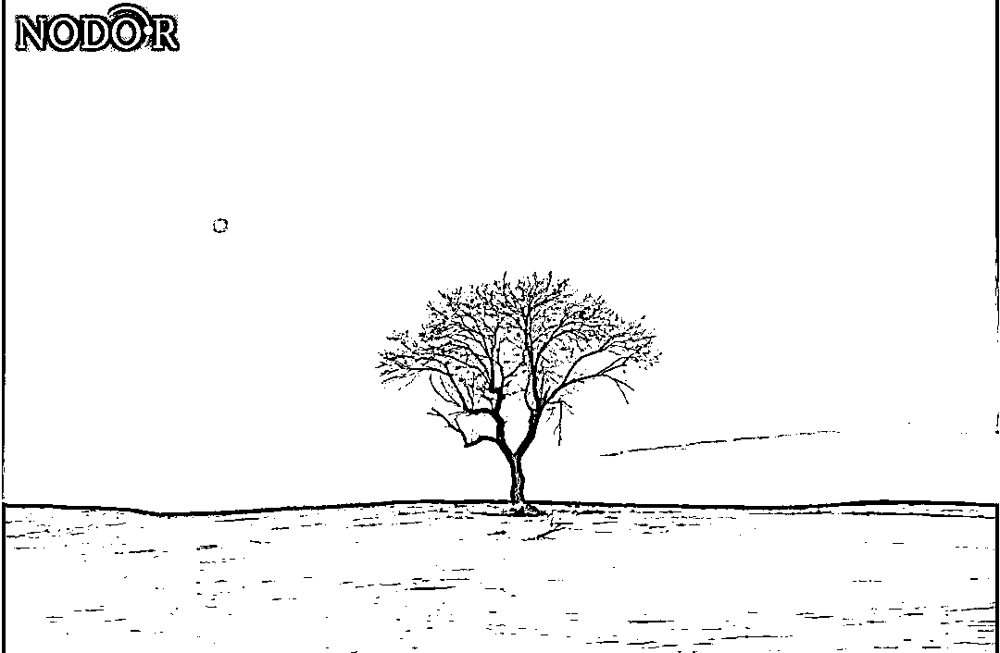

**12 星座 12 月小贴士**

**（参考太阳星座和上升星座）**

**★ ****白羊座**

*   **拓宽眼界，站得高看得远**
*   **忙于工作，获得更多认可**

**★ ****金牛座**

*   **识别情绪，释放内心焦虑**

*   **敞开自我，接触更多资讯**

**★ ****双子座** 

*   **勤于沟通，推进重要关系**
*   **直面冲突，疗愈内心恐惧**

**★ ****巨蟹座** 

*   **控制节奏，平衡工作生活**
*   **合作增多，获得贵人支持**

**★ ****狮子座** 

*   **脑洞打开，展示自我创意**
*   **身心愉悦，发现生活美好**

**★ ****处女座** 

*   **回归家庭，居家活动丰富**
*   **魅力提升，接受周围善意**

**★ ****天秤座** 

*   **有来有往，人情往来频繁**
*   **内心宁静，提升精神追求**

**★ ****天蝎座**

*   **财运提升，内心充满自信**
*   **节奏加快，短途旅行增多**

**★ ****射手座**

*   **调整状态，增强身体活力**
*   **提升信心，掌握新鲜技能**

**★ ****摩羯座** 

*   **状态放松，适当休息放空**

*   **关注自我，注重身心健康** 

**★ ****水瓶座** 

*   **社交丰富，业余生活充实**
*   **回归内心，关注灵性成长**

**★ ****双鱼座**

*   **业务繁忙，工作压力增大**

*   **眼光放远，制定长期目标**

**版权声明：**原创文章由作者授权首发于若道平台，欢迎转发，反对抄袭。友号转载请申请白名单。

**END**

**Anastasia**

职业占星师/专栏作者/策展人

ISAR 认证占星师（2016 年获得）

若道认证生时校正资质（2015 年获得）

**微信公众号**：KairosMoment

长按打赏

**梅里曼金融报告双 12 福利来啦！****长按下图了解更多详情吧！**

**20 位来自世界各地的占星师****带来 19 场沙龙——新世界的觉醒****详情可点击下图**

**学习占星学****点击下图了解课程详情**

**微信又双叒叕改版啦，不想错过若道君的推送？**
****就把若道设为****星标****以及点点****“在看”****吧！******▼**

**喜欢就点一下“在看”吧！****报名直达入口**

# “与心联结”，优秀占星师的心法就在这四个字里

> 原文：[`mp.weixin.qq.com/s?__biz=MzA5NjA0NTAxNg==&mid=2651495837&idx=2&sn=618cbea4ce1e7d06942df0929d497e80&chksm=8b482f2abc3fa63ca997f6200821181f4b7c93da2d86813462b974647e20ff59857cc7401ac8&scene=126&sessionid=1692737715#rd`](http://mp.weixin.qq.com/s?__biz=MzA5NjA0NTAxNg==&mid=2651495837&idx=2&sn=618cbea4ce1e7d06942df0929d497e80&chksm=8b482f2abc3fa63ca997f6200821181f4b7c93da2d86813462b974647e20ff59857cc7401ac8&scene=126&sessionid=1692737715#rd)

作者/亚历山德拉·卡拉考斯塔斯 译者/王宏

 校对/轩轩 编辑/翀子 图片/稿定设计

来源/《ISAR 杂志》2018 年 4 月刊

怎样才能在科技发达的时代成为无法被取代的，优秀的、有效的、成功的咨询师？职业占星师需要掌握哪几项重要技能？在咨询过程中，如何掌握更好的同来访者沟通的技法，来满足当今动态世界的需求？一起来看看作者怎么说。另外，大卫老师参与授课的【[ISAR 认证职业占星师文凭课程](http://mp.weixin.qq.com/s?__biz=MjM5MjQwNjAyMQ==&mid=2649440485&idx=6&sn=80963407efb8515e5ac252f847b77b34&chksm=beb92f8f89cea699d7ec70c8e2e5b44a55552f17e70dc42b5a681d82dfc1b38f436ae419aeb5&scene=21#wechat_redirect)】正在插班中，如果你对占星学感兴趣，欢迎点击链接了解更多详情！

 **沟通和倾听**

**沟通**是所有人际关系的基础。每个人都必须能够理解另一个人，才能进行沟通。用词的选择、语调和音高，以及肢体语言都传达了重要的信息。仅仅用错一个词就能改变整个对话和关系的意义。这是职业化的关系，要做好准备，及时、得体，有礼貌。最重要的是，去**倾听**！

无论我们属于何种占星流派，我们都极大地受益于倾听技巧的提高，这样才能听到我们的客户在说些什么。我们需要了解他们的经历和境遇，而非自己去想象他们是什么样子的。

我们可以**问问题，要秉持尊重的态度，创造安全的、给人以支持感的环境，以便可以展开诚实的对话**。

通过互联网，我们可以获得比我们所能用到的更多的信息，这很诱人，却会剥夺我们生活在当下的感觉。人们很容易迷失在无数的概念之中，让生活复杂化。过多的想法和文字并不总是有帮助的**。**

**实实在在地与我们的客户在一起，是我们必须提供的最伟大的礼物之一**。鉴于生活的复杂性，咨询还是要简单一点。

身为占星师，我们的角色和目标是什么？当然，对客户有所帮助是肯定的，但是对该问题的回答无疑因居住国、文化、信仰和对生活的看法等的差异而有所不同。

我们如何同客户沟通并与其分享知识，是我们成功的关键所在。这意味着，我们应该对自己的客户、他们不同的传统、价值观和文化有基本的了解。

在现代世界中接触的多样性，需要人保持敏感度，获得并熟练应用广泛的专业工具。占星学也毫不例外，其众多组合服务于各种不同的目的。

对我们来说，很重要的一种能力就是从不同的角度看待情况和环境，尤其是在跨越文化鸿沟之时。我们必须重新审视偏见。

**正念、觉知、同情和不带评判的态度，在任何类别的咨询中都会增加疗愈的机会**。

**科技对于占星学咨询的影响**

如今的大多数占星师，无论他们的专业领域是什么，都会应用一种或多种最新的数字信息工具。这类工具包括配有程序和应用的个人电脑和通信设备。 

土星和天王星上一次合相发生在 1988 年，从那时起，我们的全球和社会结构发生了巨大的转变和改变。在这个“新的”阶段周期中，现代社会进入了新的**数字时代**。普通人也买得起电脑了，从而正如我们所知的那样，生活被永久地改变了。

与更大的世界相关联，这影响了我们的信念、期望和可能性。过去根据外表判断或被视为理所当然的事物，我们需要去审视并重新完成。科技带我们进入了一个新的世界。

几年后，天王星和海王星于 1993 年在水瓶座相遇，从根本上来说，几乎所有人都可以接触到互联网和信息高速公路。科技再次改变了我们已经学会接受的所有规则，并且在中立的世界互联网之中，授予了许多原本被边缘化的或被剥夺权力的人以权力。

过去的启示演变成了对未来的质疑。而我们占星师的职业可以极好地帮助人们了解过去、现在和未来！

对于占星师来说，我们与自己客户的关系一直处于变化之中。我们经历了从花费数小时进行几项数学计算来生成有限的数据集，到能够在瞬间去细化无穷可能的占星学星图和角度。现在，我们利用电脑和手机几乎可以在全球的任何地方开展业务。

占星学本身告诉我们，科技停留在这里，还会将我们带到我们还未想象到的地方。我们在集体层面做出的外部发现，反映了自己意识当中揭示的新见解，而在这个过程中，我们不断在扩展自己对宇宙的觉知。

在前进的过程中，随着我们继续适应并接受未经测试、不断演变的新世界秩序中新的生活和工作方式，我们将不断延伸我们的边界并扩展舒适区。科学和技术将继续改善现状并提高生活质量。

科技带来的好处是巨大的，但也可能需要付出代价——财务上、精神上，有时甚至是身体上的代价。每月、每周、每天，我们都会接触到新的小工具和更新，获得无尽的信息流。

看到所有天体和天文结点都可以被置于一张星图中，且每个都充满了丰富的涵义，这真是让人难以置信。有效管理这些资源，在优化其潜力方面十分重要。

随着电脑继续以多种方式改善我们的生活，我们绝不能忽视我们的人性，以及将我们彼此联系到一起的所有事物。毕竟，**我们在彼此的身上，看到了能够促成同理心和相互关爱的自我面向**。电脑做不到这一点！

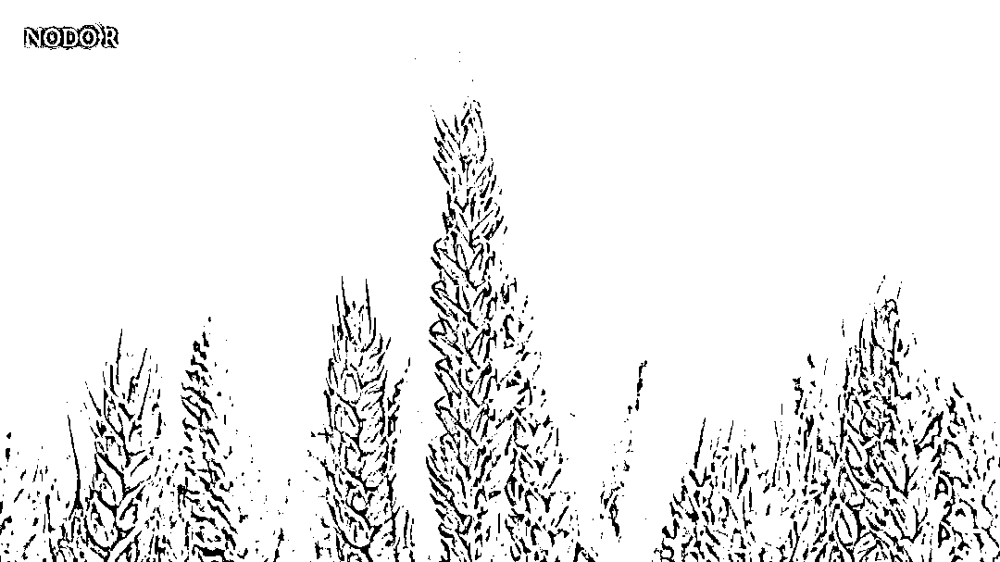

**从土星向天王星转变的占星学**

从特定的角度来看，我们可以概括一下，什么可以被称为**土星对照天王星/水瓶座的社会或文化**。该概念区分了两条广泛的文化线索。

第一条线索在历史上看来更为传统且结构更完善，有着强大的家庭和社区，其中的占星学预言面向的是集体、未来和结果。第二条则相对更加现代，家庭和社区体系较为薄弱，焦点在于个体和人的内在图景。

与土星相关联的文化青睐固有的习俗和价值观、强大的家庭体系、对权威和长者的尊重，以及对传统智慧——**“传统”价值观**——的坚持。

这种区别可以通过**对家庭的重视程度以及家庭体系的构建方式**来识别。在历史上，传统的家庭单位处于社会组织的中心地位，是社区生活的基本单位。个体的身份要从属于家庭。

这种方式是合乎情理的、实际的，最终也是其成员生存所必需的，这适用于父系和母系社会。**在这些文化中，占星学往往用于预测**。

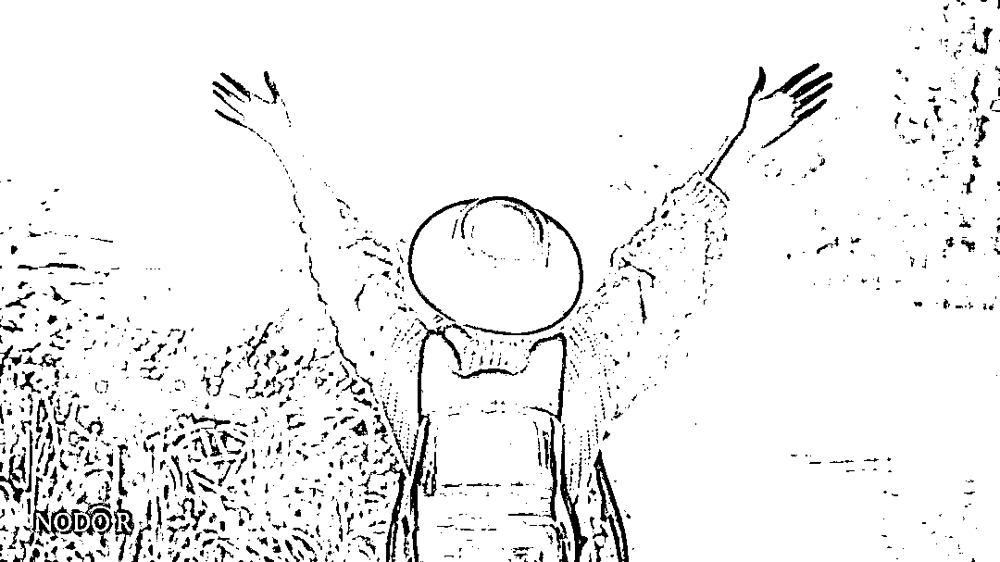

在天王星/水瓶座的社会中，传统的结构不再有意义。受天王星影响的社会提倡个性、真理、进步思想和独立。它倾向于非传统的或不墨守成规的观点和行为，与既定的规范和价值观大相径庭。

天王星打破了不再有用的僵硬模式，在带来进步的同时引入了变化。天王星能量欢迎未知，帮助个体及其社区达到新的自由水平。

在天王星类别的社会中，家庭模式、动力和习俗发生了巨大的转变。现在，天王星社区的核心围绕的是**有着相似观点的人和“被选中的”家庭成员**。**在这些文化中，占星学倾向于个人的成长和进化。**

**人本主义占星学的发展**

客户来找我们时，带着各种关乎其个人幸福指数的问题。从他们的角度来看他们的星图，我们收集有关个人喜恶、潜能和能力、内在动力、兼容性、优势、挑战、时机等等的信息。在这里，个体寻求自己的信息，并创造自己的命运。 

**以事件为导向的占星师，通常对客户的心理架构或其个人的自我实现不感兴趣。相反，占星师主要关心自己客户的物质成功、健康问题、事件预测和精神福利。**

在以信息-沟通为基础的社会中，人本主义占星学或以人为中心的占星学实践得更为广泛，尽管传统方法在近年来已经赢得了极大的青睐。

以人为中心的占星学这个说法是由已故的丹恩·鲁伊尔创造的，他将占星学描述为**“心理实现和整合的活生生的实践哲学”**。

尽管早在 20 世纪就有人写了几本关于该话题的书籍，但这种占星学在 20 世纪六七十年代才受到欢迎，当时的年轻人，尤其是在西方，开始通过东方哲学探索自我，寻求意识和觉知的超然状态。

在探索自我的过程中，人类为个人实现和整合而踏上的内在旅程依然盛行，尽管是以一种新的自我探索的形式展现出来的。

这种心理型占星学关注并阐明个体的成长和进化，以及人们的潜能、习性和人生目标。它利用星图作为地图，来解决个人的顾虑，让其更好地了解自己。

它所涉及的并非是会发生什么，或如何避免某事的发生。它的观点是，一个人的外在现实反映了其内在的和固有的存在。

可以说，这种占星学拥有天王星的倾向，因为它支持**个性化**。总体而言，大众可以获得的信息和教育越多，社会就越有可能想要朝向未来发展，走出过去和熟悉的领域。

这既不好也不坏，只是创造性追求个性化和自由所带来的结果。**我们所做的选择更有可能有利于个人的进步，但对家庭单位和整个社区的关注有所减少。**

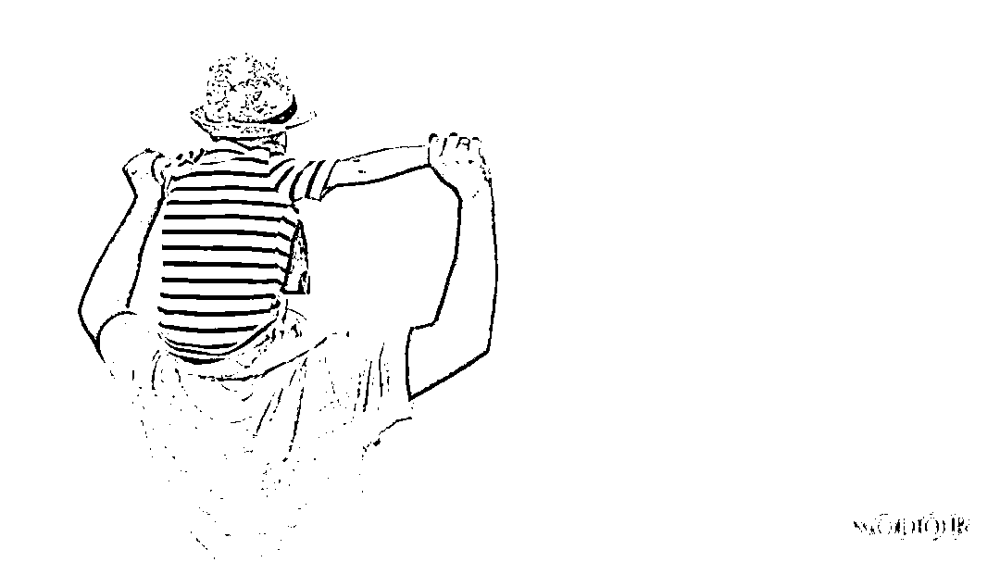

**与心联结，从而相互联结**

探讨土星对照天王星/水瓶座社会的意义在于，重要的是要**记住所服务的对象、他们的期待和理解能力**。在占星学中，对于不同的情况，我们有大量的方法可以选择。**客户最有可能会咨询与自己背景相当的占星师，尽管情况并非总是如此**。

在我们所生活的时代中，无论文化或家庭背景如何，人们都在融合，并越来越多地融入他们想象着自己想要成为的人之中，这与他们的出处截然相反。

文化传统、家庭体系，甚至是性别都受到质疑。如今的占星实践需要不同的技巧和知识来协调一个复杂的社会。

无论我们的行业用到什么工具，咨询的对象在我们的职业中依然至关重要。我们必须学会**协调文化观点和期望，将正确的占星学工具应用到实际情况中去**。

占星学软件和网站可以轻松简单地打印出电脑生成的星图解读。如今，几乎任何人都可以声称自己是占星师。这些**程序有一席之地，但显然无法取代经验丰富的和有能力的占星师所提供的人类品质或见解**。咨询的对象仍然是至关重要的。

无论我们属于何种占星流派，我们所研究的都是**人类心灵和人生展开的周期**。占星学在社会上，尤其是在时代的变迁中，有着宝贵的作用。世界需要我们，无论是我们个人，还是我们这个集体。

**与我们的心保持联结，从而相互联结，认识到我们会犯错，并总是对生活保持开放的态度，这会让我们成为自己所能成为的最好的占星师，无论我们生活在什么年份和世纪中**。人生是一份内在工作。

总而言之，咨询占星学是一种**以人为中心**的职业。占星师充当的是咨询师和顾问的角色。我们需要人际交往技巧和敏感性，来解决在当今世界中奇特的文化组合问题。当今世界的各种文化具有传统和现代的特点，它们它们对占星流派和应用都有着不同的影响。

**版权声明：**本文由若道翻译，欢迎转发，反对抄袭。友号转载请申请白名单。

**END**

****亚历山德拉·卡拉考斯塔斯****

职业占星师。1975 年起开始学习占星学，1984 年起将占星学当作职业来实践。她的工作整合了实践智慧、深刻见解，以及身为咨询占星师和教师几十年来积累的经验。她是职业占星师组织董事会的成员，并定期为《大占星师》杂志撰稿。

**拥有****51 年****占星实践经验的****若道创始人****前 ISAR 全球副主席****前 ISAR 全球职业占星师资质认证主席****大卫·瑞雷**

**和**

**2019 年第二届、2021 年第三届核心课中**

**与苏·汤普金斯老师****联合授课****的**

**ISAR 认证职业占星师**

**咔咔（Caroline）**

**二人合力打造**

**2022 年 ****若道全新核心占星课程**

**点击下图了解更多课程详情** 

**

**微信又双叒叕改版啦，不想错过若道君的推送？**
****就把若道设为****星标****以及点点****“在看”****吧！******▼**

**喜欢就点一下“在看”吧！****报名直达入口**

# 2023 天象预测大师课 | 2023 年，宇宙都将发生哪些大事？

> 原文：[`mp.weixin.qq.com/s?__biz=MzA5NjA0NTAxNg==&mid=2651495837&idx=3&sn=1ffeec7ceebcb795c2e5565a9ceedb4e&chksm=8b482f2abc3fa63cbf1da1998d12884b55ac25a871238dcf4e6b869150e17357d42151e07ed7&scene=126&sessionid=1692737715#rd`](http://mp.weixin.qq.com/s?__biz=MzA5NjA0NTAxNg==&mid=2651495837&idx=3&sn=1ffeec7ceebcb795c2e5565a9ceedb4e&chksm=8b482f2abc3fa63cbf1da1998d12884b55ac25a871238dcf4e6b869150e17357d42151e07ed7&scene=126&sessionid=1692737715#rd)

2022 年已接近尾声，忙碌的年末工作也挡不住我们对来年的盼望和期许。

作为占星师，在年初跟随权威老师透彻的学习 2023 年重要天象的含义和影响是迎接新的一年的正确姿势，仪式感满满！

若道邀请了金牌核心课中的 4 位国际名师再次集结，在**2022 年 12 月 16 日-18 日**带来**2023 年重大天象的深入解读：从冥王星、土星、木星换座；金星逆行；土星在双鱼座等角度切入，洞悉大环境的变换趋势、时事格局，为新一年的自我规划和占星事业加油充电。**

**课程时间安排**

**2022 年 12 月 16 日 周五**

**20:00-22:00 ****克里斯蒂娜·罗登贝克****2022 年 12 月 17 日 周六****16:00-18:00 ****艾德里安·邓肯**（休息 30 分钟）**18:30-20:30 ****大卫·瑞雷****2022 年 12 月 18 日 周日****18:30-20:30 ****琳恩·贝尔****课程内容安排**

**12 月 16 日 周五**

**20:00-22:00** **宇宙的舞者：****2023 年的冥王星、土星和木星**

**2023 年是这 10 年中最重要的年份之一，标志着一个时代开始落幕。**冥界的黑暗之主冥王星自 2008 年以来一直在摩羯座行进，它将在 2023 年离开摩羯座，能量会发生重大转变。

**在接下来的 20 年里，冥王星会在下一个星座水瓶座行进，影响整个时代。**但对于冥王星来说，进入水瓶座并不容易，或者说并不顺利。**在接下来的 2 年，冥王星会 2 次重返摩羯座，2023 年 6 月它将首次重回摩羯座。**这看起来在个人层面和全球层面都会是**动荡和调整的混乱时期。** 
就在冥王星首次换座的同一个月，**另一颗强大的行星土星也会离开自己的家园，进入没有边界的双鱼座，结束在水瓶座为期 2 年的限制和制定规则时期**。与此同时，**木星这颗与扩张和幸运相关的行星，也会在 2023 年春天换座，从火热的白羊座跃入金牛座更坚实的土地之上。**2023 年有望成为与重大改变相关的一年，这就是为什么了解这些重大行星事件的时间对于规划未来一年至关重要的原因。

**12 月 17 日 周六**

**16:00-18:00 2023 年的爱与戏剧性**如果男人来自火星，女人来自金星，那么我们应该能通过密切关注 2023 年金星和火星之间的相位来见证它们的热烈拥抱。当金星和地球围绕太阳相对运行时，金星会表演一场华丽的舞蹈，在 8 年的时间里形成 5 个逆行环路，在天空中勾勒出了一朵完美的玫瑰花。每 1 片或 5 片花瓣的尖端按顺序以几乎完全相同的度数在这 5 个星座中出现：双鱼座、天秤座、双子座、摩羯座，以及——在 2023 年落在狮子座。**2023 年将会是充满戏剧性和浪漫的一年。**

在此次课程中，我们将跟随**金星和火星在 2023 年的运行**，特别是**6 月 5 日，金星进入狮子座，7 月 23 日在狮子座 28°逆行，到 10 月 9 日才离开狮子座这段时间。**这是漫长的 4 个月。**火星会在 5 月 20 日进入狮子座，7 月 10 日离开。** 
由于金星的运行速度通常是火星的 2 倍，你会期待它们在狮子座形成一次重要合相。但金星会逆行，与火星的浪漫相遇不会有一个愉快的结局。**在 2023 年夏天，金星和火星会给我们讲述一个什么样的爱与关系的故事呢？**  还有一个更复杂的天象。**3 月 23 日，冥王星进入水瓶座，在 1°左右徘徊，直到 6 月 11 日。**这是自 245 年前的 1778 年 6 月-8 月以来，首次先是火星，然后是金星在狮子座对分冥王星，而 245 年前美国正处于独立战争时期。

2023 年冥王星进入水瓶座，接下来的 20 年里，每当金星与冥王星形成相位时，都会改变浪漫的本质。最后，因为金星在狮子座逆行，在狮子座来来回回移动，所以它会与在金牛座的天王星形成三次四分相，与刚刚进入金牛座的木星形成三次四分相。

**这些征象与高度特权、富有和极端独立自主的行为相关。**我们都可以在 2023 年期待激动人心的浪漫爱情，但对于那些金星和火星强大的人来说，将会有盛大的烟花表演！

**12 月 17 日 周六  18:30-20:30 大卫· 瑞雷分析新一年的时事趋势**  **涵盖的趋势和主题包括：**

**· 火星在双子座逆行**——最后一次四分海王星！2023 年前 3 个月，信息战继续升温；谁在欺骗谁？世界上武装冲突的噪音。

**· 冥王星进入水瓶座**——改变“一与多”之间的关系。由贡献和参与定义身份，以及排斥和包容的副作用。权力和资源的重新分配，以及世界面临的挑战。

**· ****土星在双鱼座**——以不可能的方式将想象变成现实； **· 再谈木星在白羊座**——谁从武装冲突中受益？ **· 木星进入金牛座，四分冥王星**——面对贫富差距，然后在狮子座的金星在逆行期间三次四分木星；

· **火星-冥王星相位**——对分冥王星，三分冥王星，四分冥王星· **情人节那天，金星入相位合相海王星**——这是宇宙天气和文化传统之间一次罕见的一致

**12 月 18 日 周日 18:30 – 20:30 土星在双鱼座：消融边界**

过去 5 年，土星一直在它的“家园”摩羯座和水瓶座中行进。2023 年 3 月 7 日，它将进入双鱼座这片湿滑之地，加速旧边界的消融，改变我们对世界的看法。

**土星在双鱼座需要对看不见的东西有信心，并且经常要求我们放下曾经看起来坚实可靠的东西。旧的确定性受到挑战，可能需要做出牺牲。** 
土星在双鱼座帮助我们**放下过时的依恋，意识到那些并不支持我们的东西。**它能给我们勇气，让我们头朝下跳入水中。一旦土星越过星座边界，它会在双鱼座逗留到 2025 年 5 月。我们会看一看这段旅程的馈赠，同时也看一看它可能存在的隐患。

土星换座后不久，冥王星会进入水瓶座，仅仅在 2023 年开始后 8 周的时间。**冥王星换座会带来全球范围内权力分配的变化。它可能是技术进步的先兆。**这个时期，集体的需求可能比个人的需求更强烈。一个新的世界正在崛起，一个旧的世界正沉没到波涛之下。 **讲师是谁？**

**克里斯蒂娜·罗登贝克（Christina Rodenbeck）**

· 全职职业占星师，在牛津大学城生活和工作，深受周围知识和文化氛围影响；她拥有伦敦大学（University of London）的人文荣誉学位，曾在伦敦占星学馆（Astrological Lodge of London）、心理占星中心和占星研究学院学习。  **· **作为一名占星师，在过去的 20 年里，克里斯蒂娜在她的网站“牛津占星师”上写了大量关于时事、艺术和文化的文章；她每月主持一个占星播客：“与克里斯蒂娜和萨莉一起占星”，并定期在《占星杂志》(Astrological Journal)上撰写时尚专栏；她定期在英国授课，并保持着蓬勃发展的专业实践。
**艾德里安·罗斯·邓肯（Adrian Ross Duncan）****· **1971 年在印度游学时开始学习占星学，1985 年开始成为全职占星师，迄今执业已超过 33 年，是人本主义占星学、卜卦占星学和经世占星学领域的知名占星师。他还开发了占星软件 AstroClock 和多款占星报告。**· **他在日常咨询中经常运用卜卦，咨询图（卜卦的一种运用方式，即根据客户来访时间制作星图，从星图中获得大量信息）也是他特别擅长的领域。**· **从 1971 年开始研习佛学，受佛学影响很深，他相信占星学和佛学观点一致，转化的一个基础是在于对现实感知的改变。而卜卦很容易与佛教融合，因为它只关乎当下。

**大卫·瑞雷（David Railey）**

**· **若道联合创始人，致力于在中国教授和推广西方占星学。**· **曾任 ISAR 全球副主席，CAPISAR（ISAR 职业占星师资质认证机构）主席；**· **1976 年，通过亚特兰大职业占星师考试，成为全职占星师，随后通过 AFAN 和 ISAR 职业测试；**· **1980 年，与杰夫·焦耳一起在亚特兰大创建“每日行星”占星学中心。此后在亚特兰大占星协会担任 4 年考官，并且两次担任亚特兰大地区占星协会主席。1979-1992 年，作为占星师活跃于美国社会媒体，向不了解现代占星学变化的大众宣传专业占星学知识。

在 1989-1992 年期间，他在 WRGG 电台 12 频道每周主持个人电视秀“今日占星学”，早先他还在 WRFG 的广播节目中播讲宇宙天气节目；

**· **2010 年-2014 年，任全美占星师联盟监督委员会委员；

**· **2010 年，其著作《灵魂的目标》中国版出版，和蒋颖一起创办若道占星学校和其官网 www.nodoor.com。

**· **2017 年，被选为 ISAR 委员会成员。ISAR 是世界最大的国际占星机构，会员遍布 45 个国家，2017-2020 年曾任 ISAR 全球副主席、CAPISAR（ISAR 职业占星师资质认证机构）主席。

**琳恩·贝尔（Lynn Bell）**

**· **世界受欢迎的占星学演讲者、作家和老师之一。定居巴黎，研究心理占星学和家族模式数十年。**·** 著名的心理占星学中心（*Centre for Psychological Astrology*）的长期导师。2016 年，获得查尔斯·哈维（Charles Harvey）杰出的占星学服务奖。**· **作为一个从多个层面进行工作的占星咨询大师，琳恩的工作结合了心理学的观点。她对家族模式的兴趣首先来自与客户的合作。通过在分析领域所做的个人工作，她所受的埃里克森催眠训练将她引领至家族系统。后来，她组织研究小组在家族星图上进行了数年的研究。她写的《家族占星学》就是这项研究的结果。**· **法国心理占星学协会会长。除了占星学，她在法国沙特尔的新沙特尔学校任教 8 年，还 5 次获得了在《纽约时报》畅销书作者卡罗琳·迈斯（Caroline Myss）的卡罗琳·迈斯教育学院（*Caroline Myss Educational Institute*）合作教学的机会。**课程价格**

**正价：3000 元 限量优惠价：2023 元（前 60 名报满截止）** 

**惊喜联报套餐！！**

**《ISAR 选修课 | 预测、预期与意识成长》+《2023 年度天象预测大师课》+《2023 年金融占星预报》****三门联报优惠价 8000 元****（限前 50 名联报）（联系 Maggie 老师，抢占限量优惠价）**

长按二维码添加 Maggie 老师获取联报优惠价

**退转课程**

**退款原则请详看《教学协议》，如有疑问请咨询课程顾问**

****2023 年度天象预测名师课****

**授课老师：****克里斯蒂娜·罗登贝克 艾德里安·邓肯 大卫·瑞雷 琳恩·贝尔**

**直播课开课时间：**2022 年 12 月 16 日-18 日

**授课方式：**网络课程，中英文授课，中文翻译

**费用：****正价 3000 元 限量优惠价 2023 元（前 60 名报满截止）**

**课程负责人：**Maggie（微信：NodoorMaggie 请备注“2023 天象预测名师课”）

长按二维码添加课程负责人咨询~

**报名直达入口**

# 美食指南丨在“吃”面前，12 星座的胃有哪些独特喜好？

> 原文：[`mp.weixin.qq.com/s?__biz=MzA5NjA0NTAxNg==&mid=2651495693&idx=1&sn=93b36d564bc70bc1dc7328e02197d5ee&chksm=8b482fbabc3fa6aca2a0c5f194b62b6d70941e67216c36550a18edcc33b6d9e65f5c3766fc94&scene=126&sessionid=1692737720#rd`](http://mp.weixin.qq.com/s?__biz=MzA5NjA0NTAxNg==&mid=2651495693&idx=1&sn=93b36d564bc70bc1dc7328e02197d5ee&chksm=8b482fbabc3fa6aca2a0c5f194b62b6d70941e67216c36550a18edcc33b6d9e65f5c3766fc94&scene=126&sessionid=1692737720#rd)

******************************☆ **************后台********************************回复“今日”，给你一句生命态度****************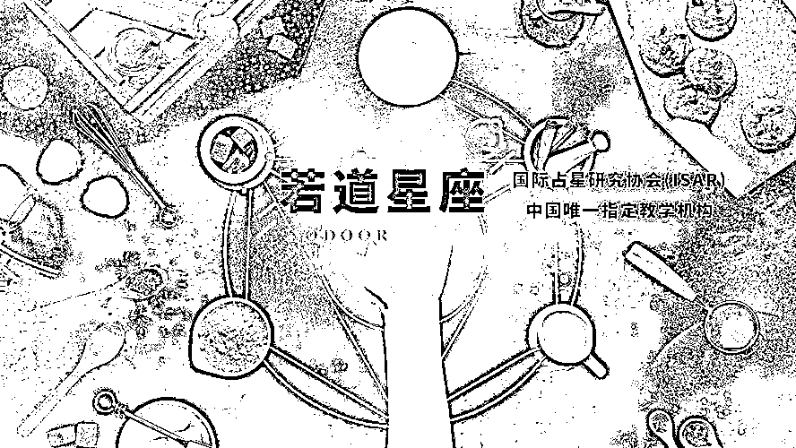作者/朱莉·戴姆博斯基
译者/Arrow 校对/江艺
编辑/翀子 封面/书君 图片/稿定设计

占星学是一门神奇的学科，能够帮助我们更深入地了解自己，也能够更好地理解他人。12 星座星座可能会钟情不同的美食，在意不一样的用餐环境，或者有着各自的饮食习惯……就让我们透过食物一起来了解一下 12 星座的味道吧。另外，大卫老师参与授课的【[ISAR 认证职业占星师文凭课程](http://mp.weixin.qq.com/s?__biz=MjM5MjQwNjAyMQ==&mid=2649440485&idx=6&sn=80963407efb8515e5ac252f847b77b34&chksm=beb92f8f89cea699d7ec70c8e2e5b44a55552f17e70dc42b5a681d82dfc1b38f436ae419aeb5&scene=21#wechat_redirect)】正在插班中，如果你对占星学感兴趣，欢迎点击链接了解更多详情！

**占星学帮你抓住 TA 的胃**

民以食为天，人类自古以来在吃吃喝喝上费了不少功夫。毕竟，**饮食是一种感官活动，可以成为一种共享的感官体验，可能带来更深的联结**。

事实上，我们在亲密地分享彼此之前，分享食物几乎成了一种强制的仪式。有句老话不无道理：“要抓住男人的心，最快的方式就是抓住他的胃。”有人注意到，张开嘴、填满胃也会打开我们的其他方面，这正是我们要探索的。

当然，**食物不是万能的，本文所呈现的纯属娱乐，但不要忽视了玩笑中包含的真相，以及你想方设法取悦你在乎的人时所蕴含的潜在力量，这种力量最纯粹的表达就是爱。**

**跟随星图上的主导能量，解读那个星座，或者试试上升星座，或是看看月亮，尤其是对于情绪化的吃货，有时要考虑成对的能量。**

**举个例子**

一个强大的海王星和冥王星同盟，或金星和海王星联盟——很多元素落在双鱼座和天蝎座，或双鱼座和金牛座/天秤座，他们可能会对以下食物更感兴趣：

贝壳牡蛎、比目鱼卷、小洋葱香煎鳟鱼或盐焗鲷鱼、海藻纤维丸、蛤肉番茄汁、鱼肝油、沙丁鱼配苏打饼干、豪华的甜点、鲑鱼慕斯、玛德莲蛋糕（贝壳形状）、瑞士小鱼软糖。

**一旦你开始思考这个问题，你可能会同时看到多样性和趣味性**。

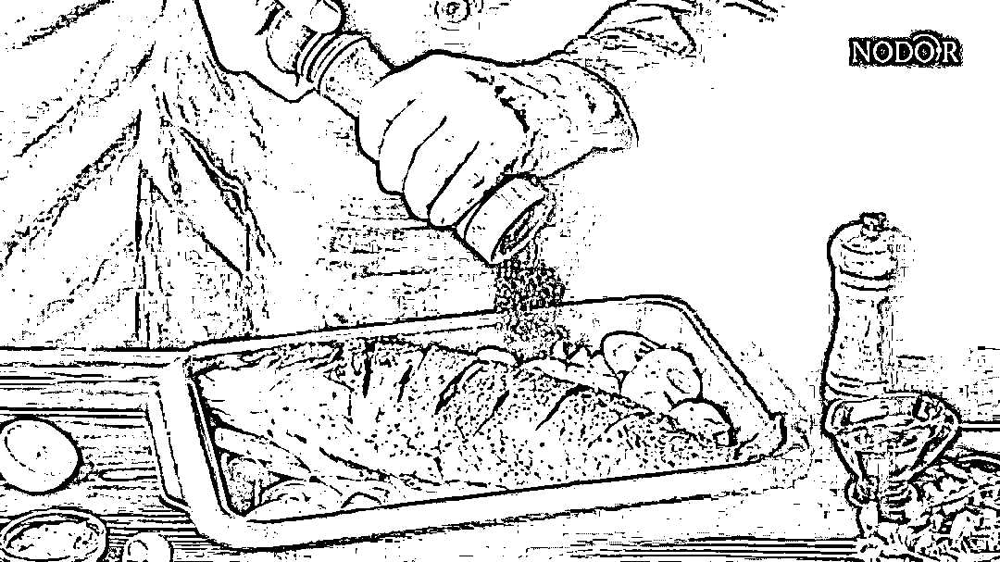

**12 星座美食指南****1****白羊座**

菜放在滋滋作响的长柄煎锅上，或者给白羊座一个大拼盘，配上桌面烧烤架，他们就可以**自己动手**了。但是要注意：如果白羊座们用不到刀叉，他们就觉得那不是一顿饭。

他们也**喜欢一切需要与之较劲的食物**：刮掉蒸洋蓟的叶子，与裂开的螃蟹或蜜饯苹果搏斗，这些都**让他们觉得自己是食物的征服者**。

麻辣小龙虾、各种乱炖、蜜汁鸭胸配腌甘蓝都是不错的选择，**有点热，有些肉，丰盛大餐，都是白羊座的菜**。他们爱喝血腥玛丽、波尔多和勃艮第之类浓郁的红酒，以及军用口粮（即食食品）。

**2****金牛座**

他们不会站着吃东西——如果你只认识金牛座，你会认为人类不屈膝就不能吃饭。他们**喜欢慢烤的肉，烤牛肉串、烤乳猪，点什么都要配烤土豆或玉米糊**。

为他们提供一顿大餐，即使只是一份披萨：把它摊开，折好餐巾，**绝对不要催他们**。想要一顿真正的大餐，可以试试手工面包和奶酪拼盘、黄油生菜配干酪酱、清炖肉汤、意大利烩饭配芦笋、上好的牛肉配蜜汁胡萝卜和黄油煎土豆、奶油蛋糕。

他们可能还有一些隐秘的喜好，钟情于黑布丁、啤酒、牛肉、彩虹糖；以及所有巧克力制品，尤其是果仁巧克力。只要是有个小土墩能**让金牛座坐下安心吃饭**，即使是一碗粥也能够让他们很开心。

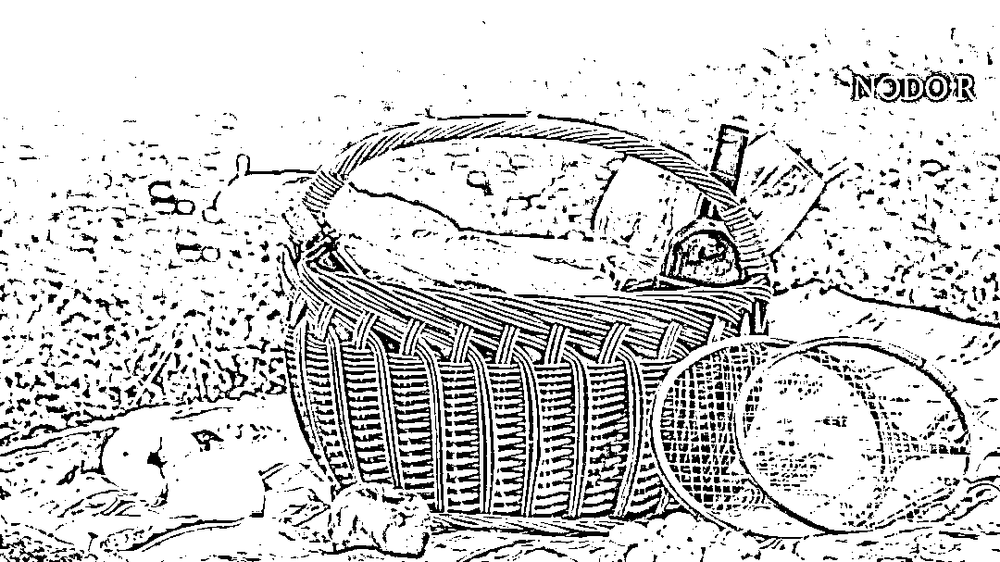

**3****双子座**

双子座可以一口气吃许许多多的食物，然后几天不怎么吃（所有风象星座都是如此）。**晚餐选择吃干酪火锅——适合双子座在用餐期间的社交需求，同样适合的还有吃饭时自己组合三明治，烤肉串，或自己填充墨西哥卷的馅料**。

双子座也**喜欢分层**，所以混合肉冻和乳汁蛋糕，他们可能也觉得很有趣。他们还喜欢许多小盘子和小点心，以及有一点苦味的花哨鸡尾酒，比如莫吉托；喜欢有点“冲”的饮料，比如苦艾酒。

双子座总是**乐于尝试新美食**。他们通常喜欢用米打底但有很多料的食物，像炒饭、印度香饭和盖浇饭；喜欢好吃的米粉，因为汤里可能有很多东西。

他们是肝脏的秘密粉丝，特别喜欢肝丸汤、鸡肝培根卷和法式肉酱（主要成分是肝脏）。你也可能会发现他们坚持只吃有机、自由放养、手工饲养的食物，之后又狂吃快餐或奶酪酱。

**4****巨蟹座**

**巨蟹座喜欢把早餐当晚餐一样吃。**显然，他们喜欢“**安慰性食物**”：通心粉奶酪、炖菜、土豆泥、汤，尤其是奶油汤、木薯粉、椰子蛋糕。他们对奶酪要么喜欢，要么讨厌。

如果他们觉得没人会说三道四，就会把肉汁当饮料。**为巨蟹座做菜的烹饪秘诀，是在所有食物中添加脂肪，尤其是奶油。**

巨蟹最喜欢的一餐很可能是，炖肉配新鲜青豆加洋葱和培根、土豆泥配肉汁、酪乳加黄油、鲜蔬色拉配新鲜西红柿和浓郁的酱汁、自制的香草冰淇淋，以及姜饼配自制柠檬酱。**这是一个无论去哪里都随身带着抗胃酸和抗腹泻药物的星座。**

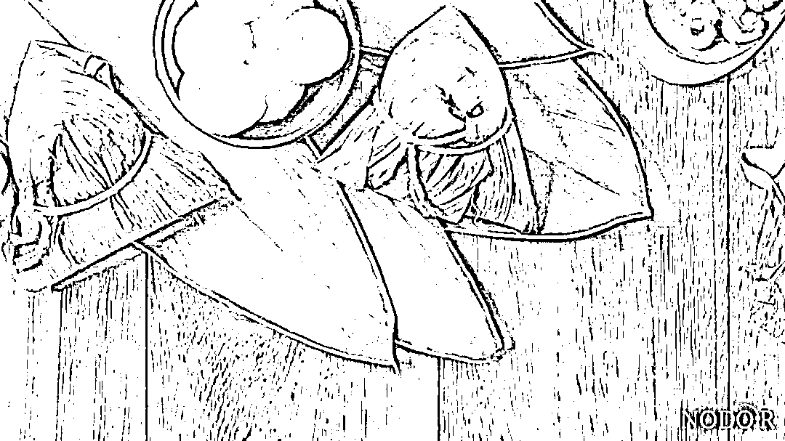

**5****狮子座**

**狮子座不太在意自己吃的是什么，只是想让自己吃的时候看起来优雅，但他向别人讲述这顿饭时，希望能给他们留下深刻的印象。****非常在意气氛、环境、晚餐同伴**，话虽如此，如果有机会，也会吃得像匹马。

他们**胃口很大**，因此狮子座可能是给每个人分配口粮的那位，食物是他们的投射，他们在你身上看到自己隐藏最深的行为，因为他们认为自己根本没有食欲。

如果你真的想取悦狮子座，那就把所有的东西都扮成金色：一只烤鸡、一瓶果香浓郁的白仙芬黛或香槟、大量的黄油或橄榄油、加拿大育空的鱼子酱、荷兰芦笋酱、精致糕点上的真金箔，加上一份送给他们的闪闪发光的小礼物，也无伤大雅。

**6****处女座**

**处女座希望能够提前拿到菜单，然后想要评论一番，并且很高兴知道一共会花多少钱。**如果处女座被招待时不太自在，可以让他们帮忙准备，这能够缓解他们那种不自在的状况。

他们私底下喜欢探究食物的秘密，“酪乳是什么做的?”“芝士蛋糕里的芝士在哪儿？”等等。他们喜欢在吃饭时看书。**这是一个最有可能接纳素食主义或成为纯素食者的星座**，其次是天秤座和双鱼座。

****如果可能的话，**请给他们当季的食物，就是刚从地里摘的那种。**如果能把玉米穗扯下来，然后扑通一声扔进沸水里，或是扔进火里自己烤，都会给他留下好印象。

事实上，他们**喜欢在户外用餐，如果你能让他们更亲近食物，那就更好了**。例如，在葡萄园或花园正中间摆张桌子用餐。也许他们认为自己喜欢**“从田地到餐盘**”的体验，但他们也有可能害怕某些他们觉得不能吃的动物的部位。

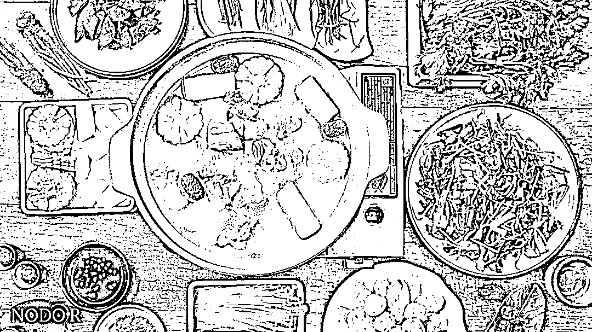

**7****天秤座**

**菜肴要漂亮！如果是伴侣做的，天秤座会更喜欢。**尽管我们看到这个星座，就会马上想到甜食，但他们的口味很特殊，不是任何一种甜点都适合。要么完全不喜欢水果，要么把水果当做水果最喜欢的一类食物。喜欢蘸酱，可以把前菜当饭吃。

事实上，**天秤座喜欢舒服的食物，或者至少是他觉得舒服的**。

他们倾向于不寻常的爱好，其中许多源于他们与食物和人之间的关联，会因为奶奶爱草莓派，下半辈子都在吃草莓派。他们是最可能在吃肉和不吃肉之间摇摆的星座。喜欢美味的调料或精致简单的菜品，无论吃什么饭，一定要坐下，备好餐巾，最好有烛光。

**需要一点小小的仪式，因为对于天秤座来说，用餐是一个值得细细品味的场合**。

**8****天蝎座**

从未见过不爱食用菌类的天蝎座。他们不喜欢“干”的食物，喜欢隐藏自己常兼容并蓄的口味，天蝎座的喜好仿佛是一个猜谜游戏。在他们看来你饭做得有多好取决于你在床上和恋爱中有多好玩。

他们是最有可能点昆虫菜肴的星座。可能是一个“偷偷”吃喝的人，**更喜欢独自享用**。这个星座的人有可能喝多了，但仍然看起来没什么异样。如果你带他们去一家餐馆，**选个幽暗而浪漫的地方，找个挂着窗帘的位置，享受二人世界**。

天蝎座可能非常喜欢日本食物，尤其是寿司，也可能特别钟情泰国菜。他们通常非常喜欢甲壳类动物——给他们一只龙虾，你的罪过就会被宽恕。

意大利菜也很中他们下怀，试试现代开胃小菜（奶酪、香肠、火腿、甜瓜、腌蘑菇和芦笋、腌小章鱼、各种橄榄）配上红酒、海鲜色拉、意大利宽面条、白葡萄酒炖小牛肉、开心果冰淇淋配上蘸着巧克力的杏仁脆饼、意式咖啡，或者只是给他们一碟温暖的黄油、一块脆饼干。

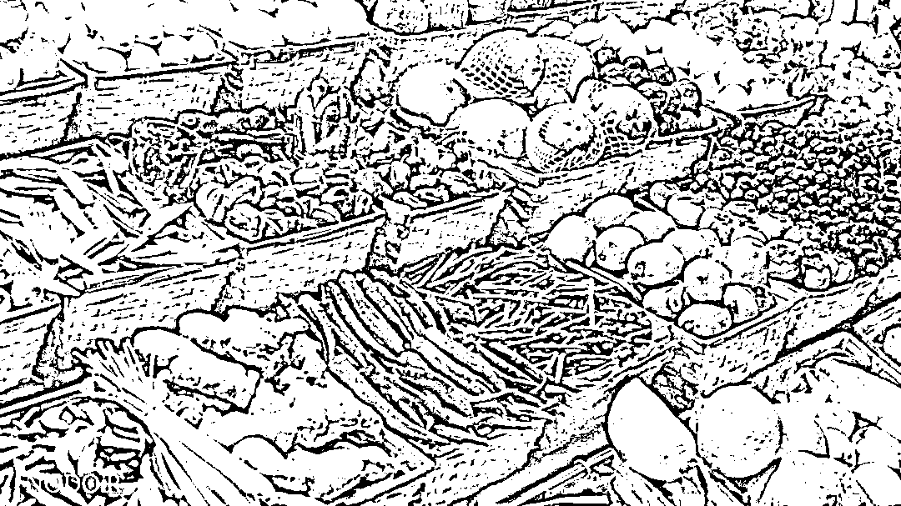

**9****射手座**

**射手座喜欢民族风味食物，尤其是那些与自己民族完全不同的食物；或任何需要他不远千里才能得到的食物；还有他们亲自猎杀的食物。**

麻辣鸡可能是他们的大爱，或者牦牛、馍馍和青稞酒。他们还喜欢美味的饼干。尽管他们如此地贪恋美食，但他们可能有一个脆弱的胃，所以不妨先问问他们是否有什么忌口。

这些美味可能让他们眼前一亮：先来一碗汤，里面要有时令蔬菜和草本植物，最好多放些从野外采集的森林蘑菇或洋葱，或者是浓稠的罗宋汤加酸奶油；莴笋、馅饼、鱼子酱和烤面包；野味鹿肉；野猪肉或野鸡肉配块菌；芝士蛋糕配野生黑莓果盘；饭后是小杯的雪莉酒。

**这个变动的火象星座有时会渴望一些咸的东西**：沙丁鱼、凤尾鱼、爆米花、咸腰果。**酒精会让射手座开口，或者让他们变得特别友善——如果他们需要保持礼貌，那就限制酒量。**

这个星座很乐意放下一切，飞到巴黎去吃一顿小酒馆的午餐，或者在阿尔卑斯登山顶与你分享一罐金枪鱼。**每一口都必须是一次小冒险，是一个不同于他们目前位置的象征和地方。**

**10****摩羯座**

摩羯座喜欢刺激性的羊奶干酪配烤面包块、金黄色的甜菜沙拉配香醋调汁、奶油土豆韭菜汤、鳟鱼或其他带皮带骨的原始鱼类、萝卜汁炖排骨、传统的拿破仑，每道菜都配陈年葡萄酒。这个星座的人发明了燕麦粥，所以摩羯座可能会意外地容易取悦。

**摩羯座是最有可能采用长寿饮食法（只吃健康有机产品）的星座**，尤其是吃了几个墨西哥卷吃坏肚子后。他们喜欢盒饭和动物饼干，还喜欢陈年的东西，例如奶酪、葡萄酒、意大利火腿、香醋。

**但不管吃什么，规律的用餐时间对他们来说都是必须的**。

**11****水瓶座**

**水瓶座喜欢现代的就餐环境**，他们会买方形、蓝绿色的盘子和八角形的酒杯；在水瓶座的家里吃饭有点像在未来电影片场吃饭，他们还可能有一个装满了餐具和厨房小工具的抽屉。

**最时尚的“新”食材融合菜系，以及“概念”饮食**（在漆黑的环境中用餐，吃饭时饭桌和菜品都被起重机吊在半空中）**对水瓶座而言都是绝佳的选择**。

他们可能是**食物嬉皮士**，无论去哪里都要在包里装上豆腐和腰果黄油，或者相反，坚持最新的饮食潮流。水瓶座的人发明了装在牙膏管里的宇航员餐，脑洞特别大的他们可以被引诱去**尝试几乎任何食物**，尤其是河豚、迷幻蘑菇、牛蛋和牡蛎，以及反季食物。

**12****双鱼座**

**双鱼座喜欢咸的东西**：泡菜、爆米花、焦糖、太妃糖、任何卤味、薯条——只要放出一把盐，双鱼座就会聚集过来。如果你带他们出去吃饭，那就选中餐。

他们可能有秘密的嗜好，**喜欢小店，或老式酒吧里的黑暗料理**：腌猪脚、漂浮在浑水中的鸡蛋、啤酒坚果、椒盐卷饼。

**他们要么喜欢咖啡，要么讨厌咖啡**，如果是前者，确保你每餐都有不同的咖啡，比如土耳其咖啡、咖啡冰淇淋、摩卡慕斯、巧克力意式浓缩豆。

**双鱼座非常期待餐后的活动**，当然也少不了咖啡：搓脚、在沙滩上漫步、泡热水澡，或者在阳台上吹吹暖风。请**确保双鱼座的手里一直有某种饮料**，有时他们表现得好像已经在沙漠中迷失了很多年，因为对他们来说生活就是这种感觉。

**版权声明：**本文由若道翻译发布，欢迎转发，反对抄袭。友号转载请申请白名单。

**这一期讲的是西方食物，你还喜欢吗？**

**欢迎大家在留言区聊聊自己的星座和喜欢的食物~**

**END**

**朱莉·戴姆博斯基**

占星师、拼贴艺术家、画家、出版商/印刷商、蚀相占星杂志编辑。

**拥有****51 年****占星实践经验的****若道创始人****前 ISAR 全球副主席****前 ISAR 全球职业占星师资质认证主席****大卫·瑞雷**

**和**

**2019 年第二届、2021 年第三届核心课中**

**与苏·汤普金斯老师****联合授课****的**

**ISAR 认证职业占星师**

**咔咔（Caroline）**

**二人合力打造**

**2022 年 ****若道全新核心占星课程**

**点击下图了解更多课程详情** 

**

**20 位来自世界各地的占星师****带来 19 场沙龙——新世界的觉醒****详情可点击下图**

**学习占星学****点击下图了解课程详情**

**微信又双叒叕改版啦，不想错过若道君的推送？**
****就把若道设为****星标****以及点点****“在看”****吧！******▼**

**喜欢就点一下“在看”吧！****报名直达入口**

# 看见“空宫”让你心里慌慌？这有一粒定心丸

> 原文：[`mp.weixin.qq.com/s?__biz=MzA5NjA0NTAxNg==&mid=2651495693&idx=2&sn=9eb89b17cea242eb0b74e7e3e7e61bc4&chksm=8b482fbabc3fa6ace3fa2064bbd55381600a41d5ae573301a6affb0483fa62de9b6a3c628a23&scene=126&sessionid=1692737720#rd`](http://mp.weixin.qq.com/s?__biz=MzA5NjA0NTAxNg==&mid=2651495693&idx=2&sn=9eb89b17cea242eb0b74e7e3e7e61bc4&chksm=8b482fbabc3fa6ace3fa2064bbd55381600a41d5ae573301a6affb0483fa62de9b6a3c628a23&scene=126&sessionid=1692737720#rd)

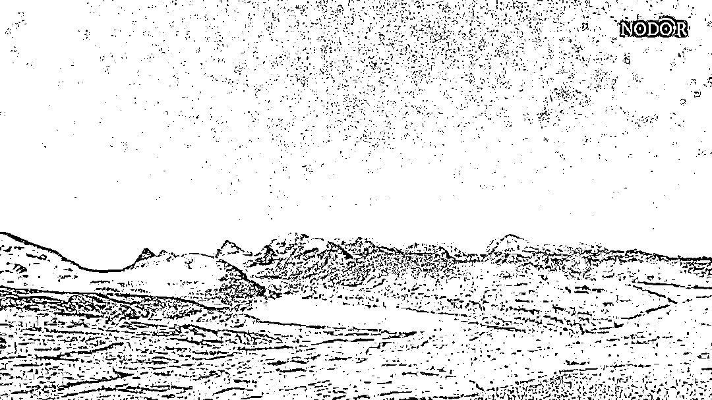

作者/唐娜·坎宁安 译者/Elle 编辑/翀子 图片/稿定设计

初学者总是对空宫有很多误解，认为空宫会有不太好的情况发生。在这里，我们来看看到底什么是空宫，什么又是满宫，还有哪些元素可以作为宫位元素的共振，以及行进的行星在空宫对生命的影响。另外，大卫老师参与授课的【[ISAR 认证职业占星师文凭课程](http://mp.weixin.qq.com/s?__biz=MjM5MjQwNjAyMQ==&mid=2649440485&idx=6&sn=80963407efb8515e5ac252f847b77b34&chksm=beb92f8f89cea699d7ec70c8e2e5b44a55552f17e70dc42b5a681d82dfc1b38f436ae419aeb5&scene=21#wechat_redirect)】正在插班中，如果你对占星学感兴趣，欢迎点击链接了解更多详情！

**何谓空宫和满宫**

当你审视一张星图时，你会发现有一些宫位是空的，而有一些宫位则相对比较满。这里，我关注的只是最基本的 10 颗行星，而非很多的小行星和阿拉伯点，因为**基本行星代表了主要的能量焦点和能量消耗**。当然，当你审视一张星图时想包含哪些因素，这由你来决定。

考虑到有 12 个宫位而只有 10 颗行星，至少有两个空位会是空宫。但是，如果几颗行星聚集在同一个宫位中——例如比较常见的太阳、水星和金星——更多的宫位中会没有任何行星。

这是理所当然的事情。我们只能把能量分散在几个不同的方向，要不然我们就变得像小行星带一样碎片化。

**如果一个人的行星分布在很多不同的宫位，这个人往往有很多的兴趣，并会尽力同时应付很多的责任和关系**。他们可以成功做好这一切，还是会成为一个无能而浅薄的半吊子，这取决于星图中的其他因素。

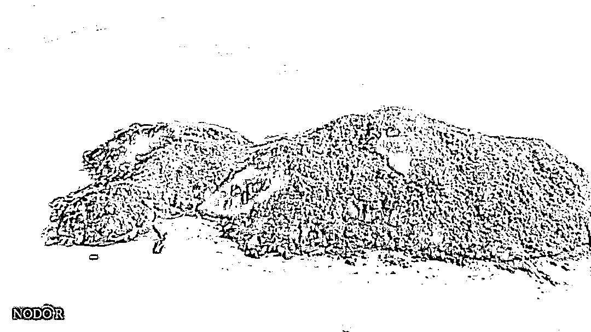

**满宫：生活的重要领域**

**满宫描绘出生活中的重要领域**，在这些领域中我们把很多鸡蛋放在一个篮子里。在满宫中，**我们消耗能量之处就是我们会取得收获的地方**，因此满宫是一个**重要的人物、情境和事件集中的领域。**

*   如果你在**11 宫**有好几颗行星，而在 4**宫**没有行星，那么在成年以后，**朋友**将是你的**主要支持者**，可能比**家人**还重要。同样地，**俱乐部领导**通常有很明显的**11 宫**配置。

*   如果一个宫位中有一个**星群**，或者是**包括太阳之内的 2-3 颗行星**，那么与这个宫位所关联的事务甚至可以作为此人**职业的指征**。

*   例如，在**第 3 宫**有一个**星群**的朋友可能开创一个**非常成功的应答服务**。一个**旅行中介工作人员**有好几颗行星落在**第 9 宫**。许多**学术界的老师和精神导师**也都有**第 9 宫**的侧重。

*   **第 8 宫**可以显示一个人是否有通灵的倾向，同时也是**潜在财富**的指征。

*   **空宫显示主要的行星能量并没有集中于与此宫位相关联的事务，而聚焦在了别处。因此，这个宫位所代表的事务常常会让位给满宫宫位所代表的事务**。 

*   一个女士如果在第 4 宫和第 5 宫没有行星，而月亮落入第 10 宫，那么很可能她当**职业女性**会比当传统的家庭主妇更有成就感。

**空宫不代表无事发生**

**但我们也不能总结说，在空宫所代表的生命领域就不会有任何事情发生**。

美国预言家珍妮• 狄克逊星图中象征交流的第 3 宫是空宫，但她的专栏和书籍为她的成功奠定了基础。我们还应该看**水星和双子座**，因为他们也都与**第 3 宫**相关联。他们不同程度地弥补了空宫，因为她的**上升点落在双子座**，而**水星合相了中天**。

很多新手在看到自己的**第 7 宫是空宫**时惊恐万分，认为自己永远不会结婚了。其实我们还应该去考量在一张星图中，有哪些元素可以作为补充。

*   他们的**金星**是不是很强？

*   **行星和四轴**（尤其是**太阳、月亮或上升点**）有没有落在**天秤座**？

*   天秤座倾向于结婚，无论他们的选择是否靠谱。

*   **第 7 宫的守护星**在哪里？

*   如果第 7 宫的守护星在第 4 宫，而第 4 宫里有很多行星，那么建立一个家庭和维护家庭生活将是比婚姻本身更强的一个驱动力。婚姻只是达到这个目标的一个手段。

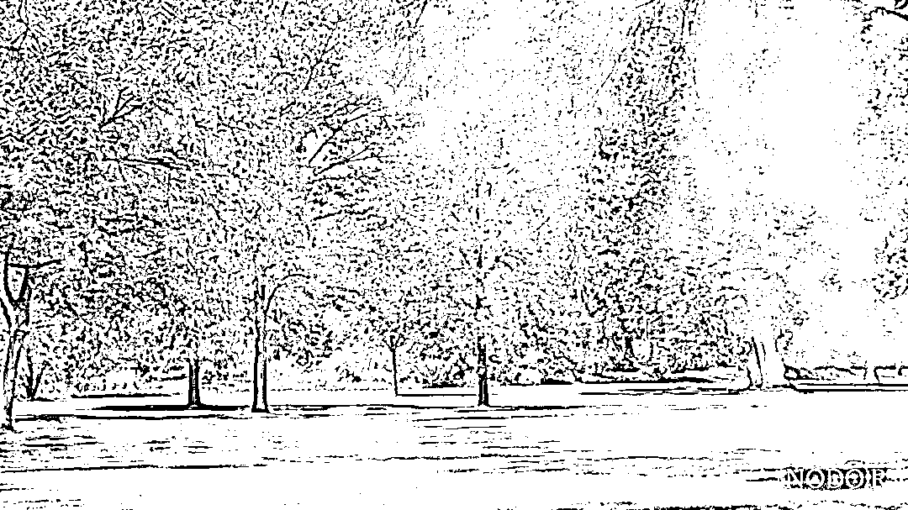

**当行星走入空宫**

另外需要考虑的是，出生星图中的空宫在人的一生的中并不永远是空的。**当行进的行星或推进的行星到达一个空宫**，可能会在那里呆上几年的时间。**他们会激发出一些与那个宫位相关的新事件和新状况。**

例如，**外行星在第 2 宫的长期行进与一个人财务方面的一系列发展有关**。如果一个人出生星图中的第 2 宫没有行星，这个行进意味着此人可能会**在挣钱和理财方面投入比往常更多的关注**。

**版权声明：**本文由若道翻译发布，欢迎转发，反对抄袭。友号转载请申请白名单。

**唐娜·坎宁安**一位在国际上都广受尊敬的占星师，她已有超过 45 年的从业经验。她已撰有数十本占星著作以及上百篇占星学和其他形而上学类的文章。于 2017 年 7 月 5 日离世，享年 75 岁。**拥有****51 年****占星实践经验的****若道创始人****前 ISAR 全球副主席****前 ISAR 全球职业占星师资质认证主席****大卫·瑞雷**

**和**

**2019 年第二届、2021 年第三届核心课中**

**与苏·汤普金斯老师****联合授课****的**

**ISAR 认证职业占星师**

**咔咔（Caroline）**

**二人合力打造**

**2022 年 ****若道全新核心占星课程**

**点击下图了解更多课程详情** 

**

**微信又双叒叕改版啦，不想错过若道君的推送？**
****就把若道设为****星标****以及点点****“在看”****吧！******▼**

**喜欢就点一下“在看”吧！****报名直达入口**

# 插班中丨 ISAR 认证职业占星师文凭课程：开启“爱好变职业”的创收自由之路

> 原文：[`mp.weixin.qq.com/s?__biz=MzA5NjA0NTAxNg==&mid=2651495693&idx=3&sn=8ddbbdca370c85d21cffd6af1967ab36&chksm=8b482fbabc3fa6ac951b6a0719b315aca273eab768edb76344c7f9993a6ded38ff186c8228e0&scene=126&sessionid=1692737720#rd`](http://mp.weixin.qq.com/s?__biz=MzA5NjA0NTAxNg==&mid=2651495693&idx=3&sn=8ddbbdca370c85d21cffd6af1967ab36&chksm=8b482fbabc3fa6ac951b6a0719b315aca273eab768edb76344c7f9993a6ded38ff186c8228e0&scene=126&sessionid=1692737720#rd)

**2022 年，是世界和中国 40 年未有之大变局的开始。**

俄乌战争打破了欧洲大陆乃至全世界的和平局面，而新冠疫情也给中国经济带来前所未有之挑战。

如果你关心经济形势和世界局势，你会有这种的感觉，我们将面临一场深刻的危机，而这不是短期内可以结束的。

**占星学的看法也是如此。**

4 月青年失业率（16 岁到 24 岁）中国达 18.2%，一些背着房贷、教育、医疗负担的中年人突然失业更是整个家庭整个难以承受之重。为了更好准备面对这样的时代变化，连《北京日报》这样的官方媒体也在呼吁：**“开拓副业，让自己有多元化发展的生存能力”。**

**而这门课程，就是为了这样一个目标准备的。**

**占星学是非常好的“开展副业”的选择**

这个**为期 16 个月**的课程通过并不算长的时间和并不算高的投资，不仅可以帮助你学到一个终身可用的技艺，而且也可以选择成为自助助人的占星师，**开启受益终生的第二事业。**未来是个体崛起的时代，大量个体被鼓励独立发展，比如网红、自由职业、自媒体、咨询师等，他们都不需要传统的办公室。社会越发达，人的独立性就越强，未来有能力的人都可以变成独立的经济体。

**占星学也是越老越好的职业**

和一些技术变化非常快的职业不同，**占星学的技术层面非常稳定，不会快速迭代变化，**同时，掌握好占星学、能够做一场好的咨询又需要个人自身大量实践和对生命的深刻理解，而这些都是时间和岁月带来的。

**占星学是现代社会需要的助人职业**

社会快速发展和变化人们似乎越来越无法掌控自己的生活，这给很多人带来巨大的焦虑，**抚慰心灵的咨询市场需求巨大。**而占星学可以让人从前所未有的角度了解自己，了解目前和未来所处的周期，挑战的意义，不论对于深入的个人成长探寻，还是预测未来的周期，都又其独一无二的价值。

**ISAR 认证职业占星师的独有培训**

目前占星学的培训市场鱼龙混杂。而 ISAR（国际占星研究协会）是一个包含了 47 个国家在内的国际占星组织，多年来致力于占星的教育和研究，提升占星教育的品质和职业占星师的能力，在国际占星领域备受尊重。今年，ISAR 对于成为 ISAR 认证职业占星师提出了更高的要求，**所有想要获得 ISAR 职业占星认证的申请者均需要在 ISAR 的附属学校通过 500 个小时的研习（包含****主课****、选修课、沙龙、作业、讲座、工作坊等等）。**

**而这门核心占星学课程就是为此而准备的。**

**2022 年，鉴于对若道在占星教学领域所做的持续努力和高品质的课程服务，ISAR 特别授予若道核心课程为 ISAR 文凭课程，所有在若道学习，并通过若道毕业考试的同学将获得 ISAR 颁发的学历文凭（Diploma）。**

**你的占星核心课老师是谁？**

**拥有****51 年****占星实践经验的****若道创始人****前 ISAR 全球副主席****前 ISAR 全球职业占星师资质认证主席****大卫·瑞雷**

**和**

**2019 年第二届、2021 年第三届核心课中**

**与苏·汤普金斯老师****联合授课****的**

**ISAR 认证职业占星师**

**咔咔（Caroline）**

**二人合力打造**

**2022 年 ****若道全新核心占星课程**

**咔咔老师给同学的寄语：**

（向上滑动查看内容）

**亲爱的同学们：**

我为什么学占星学？

2000 年的时候我还是一个在网上搜索天蝎座和水瓶座配不配的普通白领。我搜索的内容还包括了水瓶座为什么总是这么若即若离？

体贴的搜索引擎给我推送了占星学、行星、星座、宫位、相位等资料，还让我了解到莉莉丝、月亮交点、截夺宫位等占星学概念。

2000 年 10 月我了解到，一个从业 30 多年的美国职业占星师大卫·瑞雷来到了中国，和他的中国合伙人将开办一个专业教授占星学知识的课程。过去 10 个月在网上东拼西凑的占星学知识唤起了我对占星学的兴趣，但是已经不能满足我对星图深度分析的需求了。

2013 年，我通过了若道核心课程的毕业考试和国际占星师研究协会的认证考试。2015 年我离开职场成为一名全职占星师。

到底学习占星带给了我什么呢？

1、它是自我觉知的工具，我现在已经不去纠结哪些星座是否匹配，我相信外在的事件是内在心理矛盾的显化。也就是说，想找到令人满足的亲密关系，要先去了解自己的情感模式和需求，而不是无意识地一次次地试错和撞墙。我开始学习自我关怀和接纳自己。

2、它带来看待世界的全新和全景的角度，天上如是，地下亦然。人类社会和个人生命的进化都有其周期和相似性，作为个体，占星学帮助我思考如何更积极和有建设性地与宇宙的能量合作，认识自己，发挥自己的潜力，度过有意义且自我满足的人生。

3、它带来了全新的职业：占星师和占星老师。除了收入，还有助人育人的满足感和意义感。

4、它带来一群志同道合的伙伴，我们彼此联结又相互独立。

作为中国占星界的“黄埔军校”若道占星的学生、助教和老师，我与很多学员在人生的不同阶段带着各异的需求走进了这所学校，2022-2023 年一年半的若道核心课程设计既蕴含了大卫·瑞雷老师的教学精华，也带入了我在跟随不同国外占星老师学习、助教和教学积累的心得。

有一些学员毕业后从事了占星咨询工作，有的在各大平台成为专业占星学知识的输出者和传播者，有的运用占星学提升他们的工作，也有的在占星学与投资，占星学与名人/八卦、占星学与原生家庭、亲密关系、亲子关系等领域收获了有用的或者有趣的体验。

对我来说，生命是一场自我完整的体验之旅。从 2011 年的那个春节在若道入学之后，我的生命旅程更加充实、有意义、有目标，也更有满足感。

希望在 2022-2023 年的若道核心课程里见到你。希望你此后的生命旅程里，有若道，有占星学。

占星师咔咔

2022 年 5 月 24 日

**大卫老师给同学的寄语：**

（向上滑动查看内容）

亲爱的学员们：

感谢你对我们从 8 月 30 日开始的若道 L1-5 级核心课程的兴趣。我和合作老师咔咔以及我们的核心课程团队期待着为你提供这个机会，来教授各种高品质的地道占星学知识和技巧。

对于那些希望获得 ISAR 职业占星师认证的学生，这是一门适合你的课程！

作为 ISAR 咨询技能培训的一部分，我曾与咔咔合作过，我们期待着再次合作。咔咔和我曾在 ISAR 职业占星师认证委员会（CAP ISAR）一起工作，我们非常熟悉获得 ISAR 职业认证的流程。作为你的老师，我们将陪伴你整个占星学发现之旅，帮助你逐渐认识到占星学有多么的神奇。此外，你还将受益于我们若道的助教和课程顾问，他们是若道核心课程计划的重要组成部分，提供在线沙龙、组织学习小组、指导家庭作业。我们的教育团队是“服务于你的团队”，所以也会根据你的需求进行相应的调整。你专用的核心课程微信群也促进了你的学习过程，使你能够每天与你的同学们一起学习、探讨、成长。

52 年前，当我开始学习占星学时，没有一所像若道这样的学校。如果有这样一所学校，我会尽一切可能在那里成为一名学生。事实上，我很幸运，我的老师都是经验丰富的专业占星师。然而，我花了 6 年的学习时间才通过 1976 年在美国乔治亚州亚特兰大举行的专业占星师考试，又花了 2 年的专业实践时间才通过占星学谋生。我永远不会忘记从 1970 年到 1978 年的 8 年，那些日子的反复试验教会了我如何苦练占星学。作为老师，我一直在努力传授我早年所学的知识，让你的旅程更加顺利，更加全面。

自 1978 年以来，44 年的全职实践教会了我很多，我很高兴有机会与大家分享我所学到的东西。我和咔咔都是现代占星师，虽然我们尊重西方占星学的历史和传统，但我们实践和教授的占星学植根于现代人本主义哲学，这种哲学旨在提高你对自身潜力的认识，并鼓励个人成长。还有什么比了解自己更实际的呢？还有什么比个人成长和发展潜力更有利的呢？这是你将要学习的占星学，一种可以应用于你自己生活的占星学，一种可以为你提供一个充实职业的占星学。

教书是我回馈占星学行业的方式，这个行业拓展了我的视野，远远超出了我曾经想象的可能。谢谢你给我这个机会做你的老师。

大卫·瑞雷

2022 年 5 月 24 日

**连报 L1-5 全阶网络直播课程，你可以享受**

❶ 64 次线上直播互动网络课程+2 场工作坊，全面而详细地讲解占星学知识、技能、案例和重要领域实践运用。

❷ 知识点+学员星图解读有机结合：咔咔老师以讲解知识点和中外名人案例为主，大卫·瑞雷老师以参课学员案例演示及客户案例为主，每个知识点覆盖班级内学员的亲身案例，参与感更强，多位学员都有机会听到自己的星图分析。

❸ 微信群学员互动分享，从真实案例学习生命成长故事。

❹ APP 答疑论坛提问：论坛上每个学员的问题都将得到及时回复。

❺ 若道独有的职业占星师养成计划，为你毕业后独立咨询做准备。

**❻ **提供**咨询平台**，只要努力，优秀毕业生有机会入驻**若道咨询平台**，拓展咨询客户群。

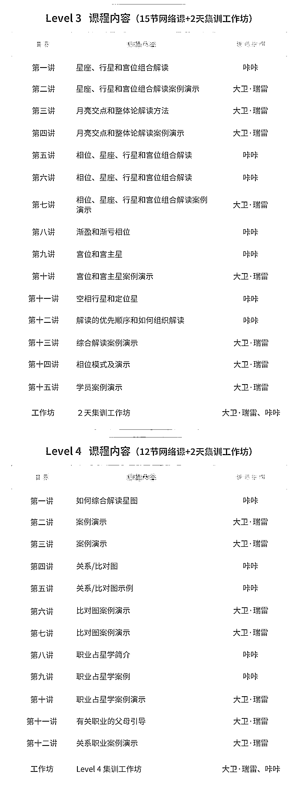

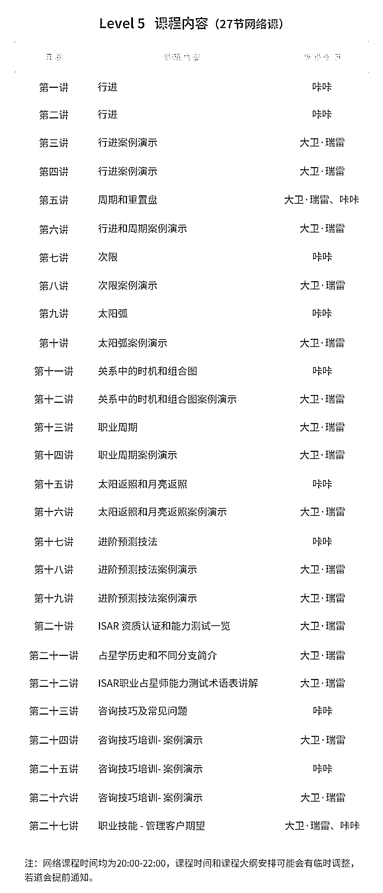

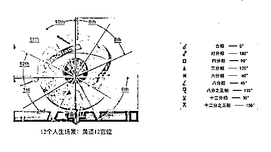

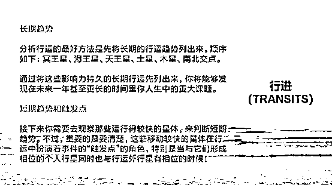

**更多了解老师和助教？**

**大卫·瑞雷（David Railey）**

*   **I****SAR 董事会成员，ISAR 全球副主席，ISAR 全球职业占星师资质认证主席，若道占星创始人**。

*   2016-2019 年，被选为国际占星协会（ISAR）考试委员会成员，国际占星协会（ISAR）是世界最大的国际占星机构，会员遍布 47 个国家。

*   2017-2020 年，被选为国际占星联盟（ISAR）考试委员会主席，理事会成员。

**占星师咔咔（Caroline）**

2010 年师从美国占星师大卫·瑞雷学习，并得到世界名师斯蒂芬·弗里斯特、罗伯特·汉德、苏·汤普金斯传授各种占星学技法。若道首届学员，国内最早获得 ISAR 职业占星师资质的职业占星师，多次担任若道核心课程助教，并于 2019 年第二届、2021 年第三届核心课中和苏·汤普金斯老师一起教授若道核心占星课程。

在国际知名广告公司和市场研究公司从事的市场研究和推广工作十余年，曾任职于阳狮集团、尼尔森市场研究有限公司、MTV 和《Madame Figaro》杂志。

**助教王嘉祺 （Conrad）**

ISAR 认证占星师、若道认证生时校正资质，从 2010 年起自学占星学，2015 年开始在若道系统学习，并开始个案咨询。2018 年担任若道核心课程助教，以及卜卦占星学和太阳返照选修课助教，并带领学员进行经世占星和太阳返照方面的研究。2019 年 11 月作为演讲人之一参加了国际占星协会（ISAR）北京大会，也是 ISAR 星空俱乐部中国区第 16 期的主讲人。

**什么人适合这门课？**

*   对占星学有浓厚兴趣，想要系统学习占星学。
*   对占星学有一定基础，但不知道该如何整合星图复杂的碎片。
*   希望成为优秀的占星师，想要借鉴国际大师解读思路并融入自己的体系。
*   想学习占星学，但不擅长英文，希望有中文老师授课。
*   想结合占星学理论与咨询实践。
*   走在自我探索和个人成长道路上的人。

**课程费用**

**★ 1-2 阶 （8 月 30 日开课）****课程费用：3500 元 ****★ 1-3 阶　连报****课程费用：11500 元 **********转发优惠价：**11000 元（朋友圈转发本课宣保留 24 小时以上，并截图给课程顾问）********★ 1-5 阶 连报****课程费用：46500 元** **转发优惠价：34800 元（朋友圈转发本课宣保留 24 小时以上，并截图给课程顾问）**

**咨询课程请联系顾问**：**王老师（微信/手机：18510107057，请备注“大卫核心课”）**

**退转课程**

**退款原则请详看《教学协议》，如有疑问请咨询课程顾问。**

****2022 L1-5 认证职业占星师必修课程****

**授课老师：大卫·瑞雷、咔咔**

**直播课开课时间：2022 年 8 月 30 日（周二）**

**授课方式：******网络授课，英文/中文授课，中文翻译****

**费用：******1-2 阶**：**3500 元；****1-3 阶**：**11500 元******（****转发优惠价：**11000 元，朋友圈转发本课宣保留 24 小时以上，并截图给课程顾问）；**1-5 阶连报**：46500 元**（****转发优惠价：34800 元，朋友圈转发本课宣保留 24 小时以上，并截图给课程顾问）******

**课程负责人：王老师**（微信/手机：18510107057，请备注“大卫核心课”）

长按二维码添加课程负责人咨询~

**END**

****报名直达入口****

# 火星在 12 宫位丨近期混乱的天象和生活，你如何在战斗力中发现自己？

> 原文：[`mp.weixin.qq.com/s?__biz=MzA5NjA0NTAxNg==&mid=2651495491&idx=1&sn=6109c3a2b18454a19e770284bea14a11&chksm=8b482ef4bc3fa7e2a2755ae0348b8d0e5193a6aa28bec69acc2054b83bd770e64c61b1fd9231&scene=126&sessionid=1692737720#rd`](http://mp.weixin.qq.com/s?__biz=MzA5NjA0NTAxNg==&mid=2651495491&idx=1&sn=6109c3a2b18454a19e770284bea14a11&chksm=8b482ef4bc3fa7e2a2755ae0348b8d0e5193a6aa28bec69acc2054b83bd770e64c61b1fd9231&scene=126&sessionid=1692737720#rd)

****************************** ☆ **************后台****************************回复“今日”，给你一句生命态度****************

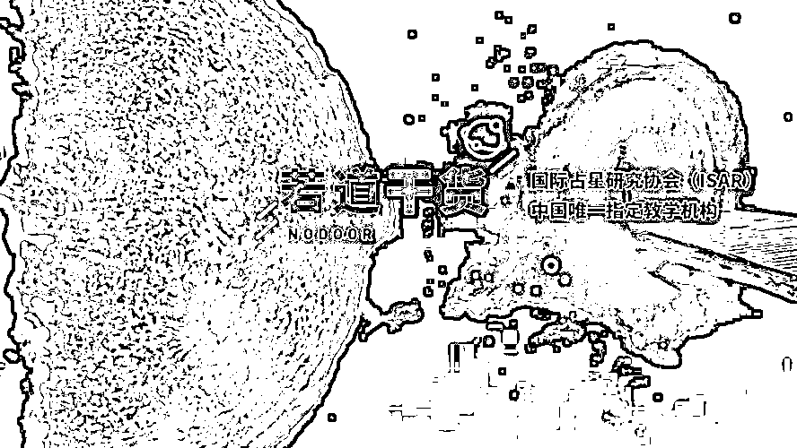

文/塞缪尔·F.·雷诺兹 译者/Christy 

校对/王宏 编辑/翀子 图片/稿定设计

选自/《大占星师》

**作者的话**

本文关注的是 10 年间的行星周期，这是我们第一个也是唯一一个既被认为是“小孩”，同时也被视为成人的 10 年——我们 20 多岁的时候。和大多数行星周期一样，这些周期不只发生一次。事实上，我们从 2 岁起就一直经历火星回归，大约每两年一次。但是，我们可以在 20 岁出头时学习很多有关我们火星回归的知识，或许以此为模板，来理解我们在未来成年生活中经历的其他回归。

（若道君：大卫老师参与授课的[【ISAR 认证职业占星师文凭课程】](http://mp.weixin.qq.com/s?__biz=MjM5MjQwNjAyMQ==&mid=2649440485&idx=6&sn=80963407efb8515e5ac252f847b77b34&chksm=beb92f8f89cea699d7ec70c8e2e5b44a55552f17e70dc42b5a681d82dfc1b38f436ae419aeb5&scene=21#wechat_redirect)正在插班中，如果你对占星学感兴趣，欢迎点击链接了解更多详情！）**19-20 岁时的你什么样？**

当你 19 岁时，严格说来，你还是青少年（teenager），因为 19“nineteen”这个单词里还有个 teen。但我并没有这种感觉，或许其他人也没有。也许年龄上与青少年期靠近会让你感受到青春，但你在这个年龄段也在候车室里等待着人生的大部分旅程。你要登车了。

**19-20 岁时你：** 

*   为你自己的人生旅程做好准备；

*   评估自己的性格与旅程的“适合度”；

*   弄清楚谁和你同行。

**两次行星“回归”**：火星回归和月亮交点回归象征着这一时期正在发生什么。

**行星回归是指，一颗行星回到你出生时其所在的确切的黄道位置上**。

比如，如果不是在你生日当天，那在你生日前后，太阳也会回到你出生时它所处的位置上。如果你出生时太阳在狮子座 13°，那么每年 8 月 4 日前后，你就会迎来我们所谓的太阳回归。月亮每月也会回归。但我们在 19-20 岁时应该关注的是火星回归。

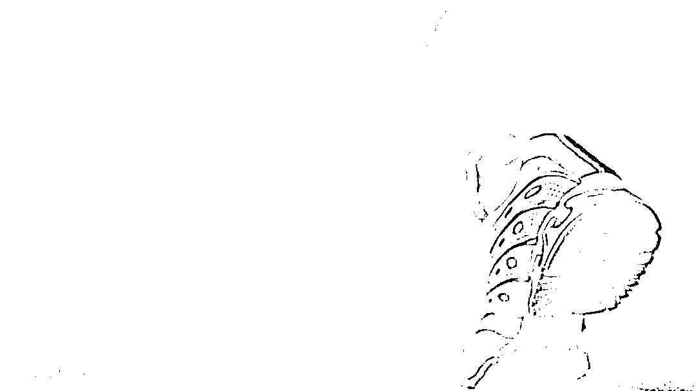

**火星回归**

火星的占星学符号**♂**和我们用来表示男人的符号相同。当然，它表达的更多的是**我们与阳刚之气的关联**，而不仅指与作为男性有关的一切。这些关联在男女当中皆存在，无论我们是否欣赏得来。

用占星学的话说，**火星代表我们如何有能力去定义我们想要的并为之奋斗**。火星是原始的战士、富有进取心的人、霸气的蜜獾。它象征着我们**个人说“不”的能力**。大多数时候，我们有着看似无数种前进的可能性，但火星作为一种原则，向我们展示如何缩小这些可能性并采取行动。

它是我们喜欢行动的那部分。**当我们无法行动（或不行动）时，火星可能转化为愤怒**。在你不能采取你想要的行动时，愤怒通常会爆发。或是当某人威胁你未来采取行动的能力时，或许以一种从身体上或情感上伤害你的方式，愤怒也会爆发。

**如果管理好了，这种火星的愤怒可以变成强大的保护者**。这是火星的另一面。

**作为保护者，火星为保护生命和我们珍视的东西而行动**。即便在我们太阳系的天文学中也是如此。火星从地球出发，远离太阳，是向外朝着太阳系边缘而行的下一颗行星。讽刺的是，我们很多现代科幻神话都是关于来自火星的外星人攻击我们的。

事实上，火星是在保护我们不受它与木星之间的小行星带的伤害。

**每两年，充满能量的、独立的火星会回到它在我们出生图中的初始位置上**。

如果你出生在 1987 年 12 月 9 日，那么火星就会每两年回到天蝎座 10°左右的位置上。通常，火星不会在你生日当天回归，但在它回归那年的某个时候，它会回到那个点。到你 20 岁时，你已经经历了 9 次火星回归。或许最具戏剧性且最能说明问题的火星回归是第一次回归。

**第一次火星回归发生在你两岁时，难怪会被称作“可怕的两岁”**。在这个年纪，即使是通常情况下最温顺的小孩也学会说“不”并且爱上说“不”。他是在运用他的火星。这是**设立界限**的一个重要阶段（虽然通常会惹恼父母和照料者）。

对这个年龄的孩子来说，重要的是知道自己是独立的，不同于身边事物和人。她必须坚持自我。或许这个孩子害怕自己会被他人的照料和关心吞噬，这种担心是有益的。因此孩子会抵抗。

而如果孩子的抵抗在照料者那里遇到了更多的阻力，愤怒就会增加。这都是火星带来的，并且常常导致商场过道里的拉锯战。

在第一次回归时，**“混乱”和“火星”**似乎是可以互换的两个词。

19-20 岁时，你可能不会像两岁时那样，演变成与家人在食品市场拉扯。但你会发现自己在更奇怪的地方以更奇怪的方式与人发生冲突，并且你可能体验到与早先火星回归时体验到的类似的感觉（甚至是情境）。

**可能会有一些激烈的斗争，来表达你是谁以及你想从生活中得到什么**。不过，正是这种原始的火星能量在一开始就象征性地把你推进 20 岁。当然，这不会是你遇到的唯一推动力。

记住，你每两年会经历一次火星回归，也就是说，你在 30 岁之前还会经历 4 次火星回归。但是，这次是你人生第二个 10 年的最后一次火星回归，也是全新冒险的开始。

**找到你的火星**

回归的情况并不唯一，大多时候取决于火星在你的星图中如何运作，而一位训练有素的占星师可以告诉你它是如何运作的。她可能会查看火星所落的星座和度数，以及这颗战士之星如何与其他行星和你出生图的其他部分联结。

但要获得易于掌握的线索，了解你的火星回归会如何作用于你的人生，有一个方法是查看火星在你星图中的位置，如果你知道自己的出生时间的话。

这个“位置”在占星学术语中被称作宫位。每个宫位都有与之相关的不同主题，比如婚姻、财务、旅行、群体和健康。

**若道君：****你可以在 app store 或者应用商店搜索“若道”下载 app，输入个人档案，查看本命盘（也可以使用其他星图软件），找到火星落在出生星图的第几宫，然后对照下文查看。****例如下图中，比尔·盖茨的火星在个人星图的第 4 宫。**

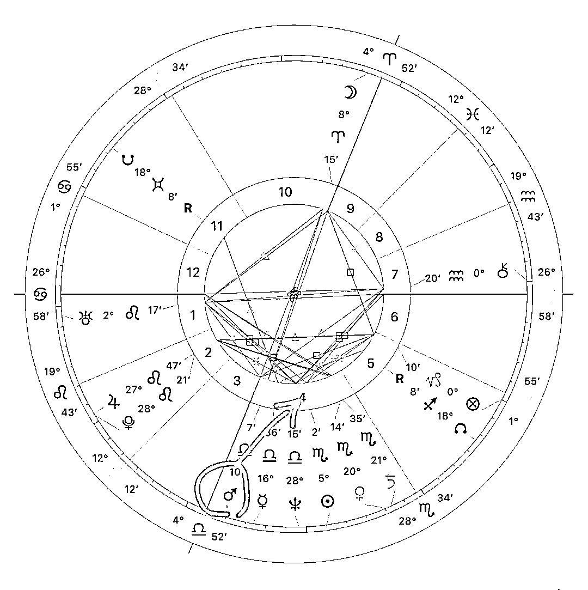

**出生星图中火星在 12 个宫位的表现**

***第 1 宫***

第 1 宫为你**如何完成人生旅程**定下基调。它代表你的认同感、你的身体，以及你坚持自我的能力。勇敢的火星落于此处，你更有可能寻找方式证明自己，并展示你能做些什么。

**火星回归时，你倾向于寻找方式“展示”自己或变得更加自主**。小心别在给自己铺路时触怒他人，不要过于莽撞去冒不必要的风险。

***第 2 宫***

第 2 宫将我们的兴趣引向**金钱、财产和物质保障**。火星在这个宫位会将你的注意力引向**努力建立你的财政储备**上。对你而言，你钱包里的或银行账户里的东西会让你感到强大。你也可能冲动地花钱获得你认为会让你更强大的东西。

**火星回归时，你可能开启新方式来实现更多的财务保障，或是你与他人抗争以获取更多的财务保障或避免任何钱财损失**。

***第 3 宫***

第 3 宫触发了**我们与身边最直接的人和事的利害关系**，比如兄弟姐妹、邻居或同事。你可能**花费很多精力与你身边的（也可能是珍视的）人和场所联系或交流**。在你追求与他人建立联系时，你有可能分散太多精力。

**火星回归时，某个兄弟姐妹、邻居或同事可能带来敏感问题或者争论点**。同样，为保存精力，你可能要努力找到一个方法来驾驭你各种各样的义务、关系或兴趣。

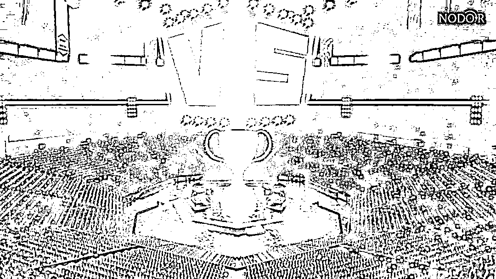

***第 4 宫***

第 4 宫关乎你**家园意识、家庭、根和父母，尤其是你的父亲或某个父亲式的人物**。总之，火星通过维护自己得到归属感，你通过坚持自我得到物质和情感上的安全感。

火星落在这个宫位触发你更多防御性的思考，也许还有行动。你可能固守自己的领地，难以忍受别人踏入他们没被邀请的地方。

**火星回归时，你可能必须要更努力地保护或支持你的家庭、远房亲戚、家以及让你感到安全和踏实的事物**。你也可能与父母产生问题。坚持你的立场，但别因此掀起太多争吵。

***第 5 宫***

第五宫反映了你的**创造力和生育力**。创造力不仅限于我们常说的艺术，而是一种投射自信的能力。你可以在自己所能做的事情中倾入自我的本质，称为风格或范儿。这显然也是我们生育时所做的，我们能够把自我的本质投射到另一个人身上。

火星耗费大量精力来展现范儿，有时是通过冲突。火星在这个宫位时喜欢从生理的层面表达自己，无论是通过某种运动，还是涉及金属或艰苦体力劳动的艺术技巧。

**火星回归时，你可能不得不花大力气去“产出”热爱的工作、自我的某个面向或者一个新生命**。

***第 6 宫***

第 6 宫与**维持你健康、高效和正常运转的日常事务、人和工作**相关。火星在此清扫宫位——也许真的会发生清扫。掌控日程表令你效率大增，你享受这个把能量和秩序带入生活的机会。但得小心能量的部分，别过度投入或用力过猛，否则感受到更多的不是充满力量，而是精疲力尽。

**火星回归时，你更可能感到日常事务或常规工作陷入停滞**。你很可能是对的。持续关注健康问题也很重要。任何小恙和异常变化都应该认真对待。别只是敷衍了事。

***第 7 宫***

第 7 宫描述的是我们**如何邂逅（业务或爱情的）伴侣和其他一对一人际关系，比如治疗师、咨询师甚至某位熟悉的敌人或竞争对手**。

火星给这类关系注入热情，但这种热情是把双刃剑。的确，爱情在这里有时候会感觉像个战场。对重要他人直言不讳的需求会变得让人精疲力尽。同样，别人也可能感觉需要提出质疑和对你直接。

**火星回归时，你可能会经历更多的争执，即便在最久经考验的、平时平静如水的关系中也是如此**。关键在于，学会回归火星能量的积极表达，而不是不顾一切地要成为对的一方。别带着自负反击，即便你赢了这场战役，也会输掉战争或者这段关系。

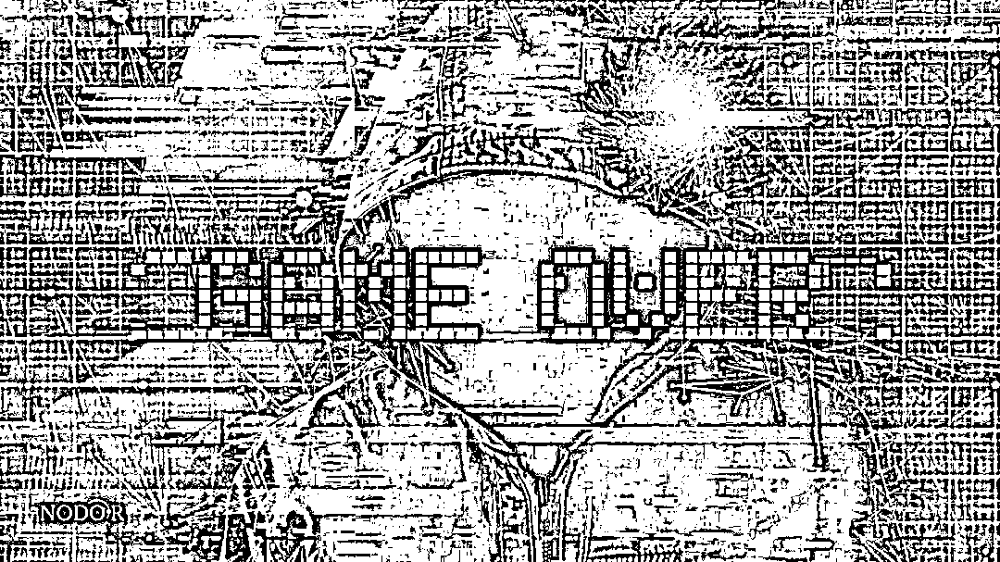

***第 8 宫***

第 8 宫是我们**面临人生考验、苦难和财务责任**的地方。在这个宫位，火星有着“永不屈服”的心性，这一点有巨大的优势，也有劣势。你可能不得不忍受人生中一些艰难的情况，这些情况会赋予你十足的坚毅品格。不过你可能渐渐认识到，这种坚毅是一切事物所必须的。

或许你已经变得过度关注几乎每一次遭遇蒙受的损失。但你可以相信，过去没有杀死你的，会赋予你在未来蓬勃发展的信心。

**火星回归时，你可能害怕会在某个交易或某段关系中理解错误**。多想想，到底更多是恐惧作祟还是客观事实如此。记住，你有选择。你可以选择双赢局面或者转身离开。

***第 9 宫***

第 9 宫展示了我们如何**在精神和身体领域远途冒险，采用其他途径去思考、表达思想（比如出版图书），或远途旅行，或邂逅从远方来的人**。

火星在这一宫位突出了一个真正有旅游癖的人。你有着不安的精神、身体和灵魂，那些希望看到你固着于一件事，或希望让你离家更近的人常常因此感到沮丧。

你不禁感到，外面还有一整个世界等着你去学习和发现。你更倾向于在不同的兴趣之间来回切换，这也是你常常陷入困境的地方。你可能开启过多事项而没有时间完成。

**火星回归时，你应该在投入学习某样东西或到某地旅行之前考虑清楚。如果感觉都对就没问题**。但同样重要的是，投入这件事是对的。比如，如果你想去一个令人着迷的异国，但不愿意学习这里的语言或尊重其习俗，那么就没有意义。

***第 10 宫***

**第 10 宫是星图中的最高点，就像正午的太阳**。这里反映的是你如何在你的团体或更大的世界中建立名誉和职业。它不仅关乎你的职业或工作，更关乎你想如何以最好的方式被看见或记住。

火星在这里或许反映了一种在人生中功成名就的强大野心，它可以引领你走向卓越，尤其是在运动、公共服务和医疗领域，或者以军事、防卫为核心的领域，在这里你必须通过保卫自己或他人证明你的勇气。

**火星回归时，是时候更专注于一个界定清晰的任务或目标了**。别逃避冲突。直面你的恐惧或他人设下的障碍是你建立信心和竞争力的方式。

***第 11 宫***

第 11 宫描述了你**如何联结他人或依赖他人的帮助实现个人或集体目标**。火星在这里必须更善于与团队合作，更多考虑他人，尤其是同事和朋友。

火星在这个位置通常是个挑战。有火星在这个位置的人必须既学会如何领导他人，又学会如何听从他人。有时候很难弄清楚该做哪一个。了解这一点的智慧在于，思考哪一个有助于至善，而不是你的自我。

**火星回归时，挑战将在于弄清楚如何在不疏远同事、队友和朋友的前提下分享你独特的天赋和能力**。

***第 12 宫***

第 12 宫传递的是**你如何体验独处，以及哪些你开始的活动超出了自己的控制**。火星在这里象征着，你的部分最佳工作可能是在幕后完成的，或者你更喜欢单独工作或低调工作。

你可能默默无闻地成长起来，或者人们的关注点更多在事情上，而不是做事情的人。也许在一个受限制的环境中你也能做得很好，比如录音棚或电影制片厂，甚至拳击台。你倾向于努力工作，但过劳可能毁掉你。

**火星回归时，最好是缩减你的社会责任，专注于你想要为自己或为慈善而完成的清晰任务**。

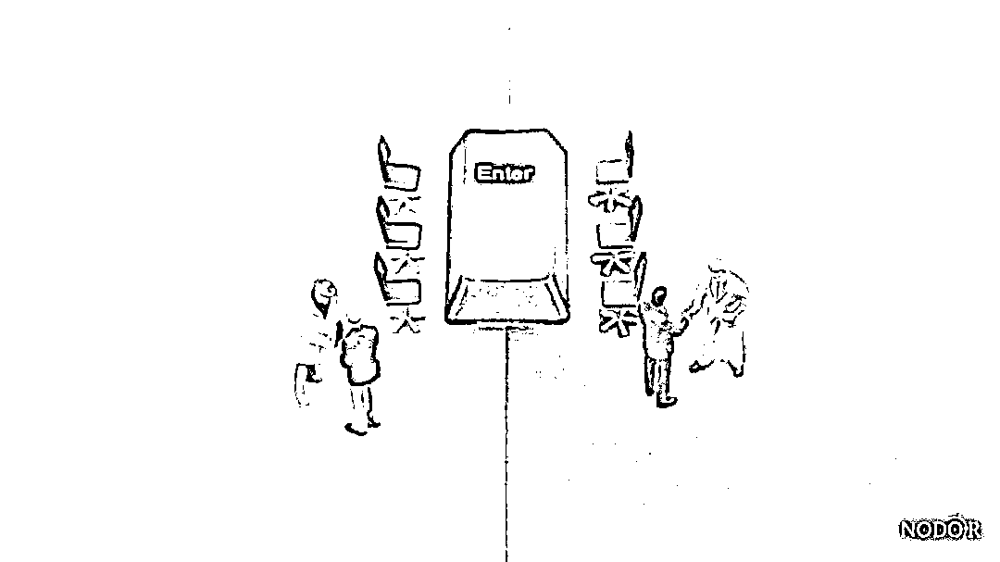

**火星回归实践清单**

*   **监控你的能量水平**。你是否有足够的能量来做想做的事？像个工程师一样想一想，我会说这要么是燃料的问题（需要更好或更多的卡路里），要么是传递的问题（你没有释放足够的能量到行动中）。 

*   **投入系统的行动中去消耗能量**，无论是以健康、性还是精神导向的行动。 

*   **反思什么让你愤怒**，你可以采取什么积极的、非侵略性的行动去表达这种愤怒。 

*   **思考哪里是你不会实践自己独立性和强悍的地方**。 

*   **看看你的火星回归图**，或者请人做一个。

通过观察火星的宫位或相位，你可以对你的火星回归保持更密切的关注，更清晰、更有力、更强势地步入 20 岁。

**版权声明：**本文由若道翻译发布，欢迎转发，反对抄袭。友号转载请申请白名单。

**END**

**塞缪尔·雷诺兹**

任职于国际占星研究协会(ISAR)董事会、2018 国际占星大会(UAC)规划委员会和占星新闻播报(ANS)。曾为 Ebony.com、Tarot.com、Astrograph.com、《纽约杂志》和英国黑人女性杂志《骄傲》撰稿。

**拥有****51 年****占星实践经验的****若道创始人****前 ISAR 全球副主席****前 ISAR 全球职业占星师资质认证主席****大卫·瑞雷**

**和**

**2019 年第二届、2021 年第三届核心课中**

**与苏·汤普金斯老师****联合授课****的**

**ISAR 认证职业占星师**

**咔咔（Caroline）**

**二人合力打造**

**2022 年 ****若道全新核心占星课程**

**点击下图了解更多课程详情** 

**

**20 位来自世界各地的占星师****带来 19 场沙龙——新世界的觉醒****详情可点击下图**

**学习占星学****点击下图了解课程详情**

**微信又双叒叕改版啦，不想错过若道君的推送？**
****就把若道设为****星标****以及点点****“在看”****吧！******▼**

**喜欢就点一下“在看”吧！****报名直达入口**

# ISAR 星空俱乐部第 48 期 | 占星学与过渡性现象

> 原文：[`mp.weixin.qq.com/s?__biz=MzA5NjA0NTAxNg==&mid=2651495491&idx=2&sn=af392e1f8db036c4fa9ed17cf8a5838c&chksm=8b482ef4bc3fa7e284c08d01345e6ebbf437c375224eb64f5a8bc46eae759c97385891840c4c&scene=126&sessionid=1692737720#rd`](http://mp.weixin.qq.com/s?__biz=MzA5NjA0NTAxNg==&mid=2651495491&idx=2&sn=af392e1f8db036c4fa9ed17cf8a5838c&chksm=8b482ef4bc3fa7e284c08d01345e6ebbf437c375224eb64f5a8bc46eae759c97385891840c4c&scene=126&sessionid=1692737720#rd)

**沙龙来啦！****12 月 3 日，星期六上午 9:00，**国际占星研究协会（ISAR）中国星空俱乐部沙龙由占星师**克****劳迪娅·贝德博士**带来一场讲座！**沙龙主题****沙龙主题：********占星学与过渡性现象************主讲人：**克**************劳迪娅·贝德**************

**沙龙时间：12 月 3 日，星期六，北京时间 9:00-10:30（有英文翻译）**

**沙龙方式：线上沙龙**占星学与过渡性现象，不仅是本次讲座的名称，也是克劳迪娅最近在国际研究生院完成并成功答辩博士论文的题目。考虑一下这个问题：占星学在我们的心灵中从哪里获得它的力量？克劳迪娅说，她怀疑这与英国精神分析学家温尼科特(D.W. Winnicott, 1896-1971)提出的所谓的人类经验中间区域有关，他称之为过渡性现象。温尼科特是这样描述的：“这是我开始研究的领域，分离不是分离，而是联合的一种形式。**”我们的内在现实和外部世界之间的这一区域在童年早期就出现了，在成人生活中发展为文化经验。**占星学的征象象征着我们的内心世界和外部世界之间的关联，通常以一种让我们对自己和周围的世界有更深理解的方式。在最简单的层面上，星图是外部世界的地图，但它也是我们内在世界的地图。就像曼陀罗一样，**出生图象征着我们神圣的内在空间——我们宇宙联系的核心结构，与我们最早的依恋和不断发展进化的现实发生共鸣。**所以，克劳迪娅想知道的是：**“占星师对占星学的实际经验是否展现出对过渡性现象和（或）转换现象的明确定义?”**为了找到答案，她在 10 年的时间里采访了 13 位专业从事占星的经验丰富的占星师。答案是**“是的！”****主讲嘉宾**

**********克劳****************迪娅·贝德**********

**· **克劳迪娅·贝德博士，NCGR-PAA 四级咨询占星师，执业精神分析学家和创意艺术治疗师。**·** 自 1973 年起就在大学和会议上教学，开创了精神分析、占星学、炼金术、艺术和曼荼罗的结合。**·** 她曾任职于美国占星与心理学协（AFAN）的董事会，并担任表达分析研究所（Institute for expression Analysis）的执行主任。· 她在《心理学和宗教百科全书》和不同的占星杂志上发表文章，是畅销书《爱的行星》的合著者，她还指引人们回到前世和灵性回归的灵魂家园。**如何参加沙龙？**本讲座也是本月的国际占星研究协会（ISAR）星空俱乐部讲座。**ISAR 会员可以免费收看。**请注意邮件通知，具体参与方式见邮件。❶ 如果你**已经是 ISAR 会员**，请注意邮件通知，告知如何参加。❷ 如果你**不是 ISAR 会员**，非 ISAR 会员价格：98 元。如有任何问题请咨询工作人员仲老师（微信：YY18513802156）

**非 ISAR 会员报名请长按下图**

**▼**

**ISAR 明星俱乐部**

2018 年，ISAR 在主席亚历山大·因舍阿吉克的带领下，成立了 ISAR 明星俱乐部，每月为全球 ISAR 会员提供在线直播讲座，邀请全球著名占星师开讲，学习和分享新的理念。讲座时长一小时，涉及占星学的不同领域、不同观点，每个会员都可以参与其中，每次讲座之后还有 20-30 分钟问答时间向老师们提问。每一场在线讲座都会记录下来，ISAR 除了提供视频，还会提供相关的讲座资料，以及单独的问答录音，自动发送到专门的 ISAR 明星俱乐部页面存档，每位 ISAR 会员可以在 ISAR 网站上自己的会员主页俱乐部页面找到。在 2018 年最初几个月，ISAR 明星俱乐部会每月举办一场在线演讲。之后，两周举办一场演讲，最终每周举办一场演讲。
但是，过去明星俱乐部讲座只有英文沙龙，因此，中国会员只有懂英文才能受益。为了使得更多不懂英文的中国会员能够受益，我们特别和 ISAR 总部协商，今后会安排有中文翻译的明星俱乐部占星沙龙，作为给中国 ISAR 会员的福利！**如何成为 ISAR 会员？**

**如果你也想成为 ISAR 会员，请复制链接在浏览器打开**

http://www.nodoor.com/isarcert.do?contentId=3588（仅支持网站支付）

**或直接长按下方二维码，微信购买会员：**

**ISAR 会员有什么福利？**一年期会员仅需支付**人民币 530 元**，即可享受：**☆ 星空俱乐部免费沙龙****☆每年出版 3 次的《国际占星师》（目前只有英文）；****☆每周电子邮件交流汇总杂志（目前只有英文）；****☆专项研究基金和奖学金资格；****☆ISAR 主办的会议和论坛的会员折扣，包括国际占星大会（UAC）、ISAR 的会议和研讨会等会员权益。****有疑问怎么办？**关于 ISAR 星空会员俱乐部以及我们的讲座，如果你还有任何疑问，**请联系工作人员**：

**若道 Conrad（微信号：nodoor2016）**

**若道 yiyi****（微信号：YY18513802156）**

**非 ISAR 会员报名入口**

# 职业占星师认证文凭课程插班中丨想看大卫老师是怎么做课堂演示的吗？

> 原文：[`mp.weixin.qq.com/s?__biz=MzA5NjA0NTAxNg==&mid=2651495491&idx=3&sn=04a6d0ac50f1bb2b4e707729f924033d&chksm=8b482ef4bc3fa7e248e24729ec8b52b30cfe8c4adf8de772e025c968ce9b8cfa7b4893a010b1&scene=126&sessionid=1692737720#rd`](http://mp.weixin.qq.com/s?__biz=MzA5NjA0NTAxNg==&mid=2651495491&idx=3&sn=04a6d0ac50f1bb2b4e707729f924033d&chksm=8b482ef4bc3fa7e248e24729ec8b52b30cfe8c4adf8de772e025c968ce9b8cfa7b4893a010b1&scene=126&sessionid=1692737720#rd)

**在若道核心课程的教学里，****以学员为案例****进行课堂的占星咨询演示，是我们课程的特色环节。**

这样的演示不仅让很多同学有亲身体验咨询的机会，而且这么多真实案例的学习，会让大家看到占星咨询到底是怎么样一个过程。毕竟，大部分人的学习都是要从模仿开始。

记得若道君当年学习占星的时候，可没有这样的机会。那时候主要是听课为主，后来，我们在多年的教学实践中，**越来越发现课堂演示的重要性**。因此，就把这个作为一个主要环节加入到课程中。

在新一期的若道核心课程中，咔咔老师和大卫老师这对组合就会把这个教学特色充分发挥出来。**熟悉中国同学思路的咔咔老师会以知识点的讲解为主，而有 50 年占星咨询经验的大卫老师，则以课堂演示为主。**

有时候，这样的课堂演示的功效是出乎意料的。

一位若道的老同学赵震宇这么写到：

2018 年，我正式开始在若道学习 L1-5。其实我一开始的心态更多的是希望得到系统化的学习来补充我的知识漏洞，以及拿到一个证书可以为自己做背书，增加自己将来转型占星师的筹码，而不是真的在期待可以从若道的学习中得到一些本质上的领悟。

事实上在初期的 L1-3 中，很多知识与课上的内容，也是我比较熟悉的领域，相对而言是驾轻就熟的。但在 L3 的工作坊中和大卫老师的接触以及模拟咨询，让我对占星的态度发生了很本质的变化。

大卫老师对我星图的分析不仅非常准确，更重要的是，他开启了我自身个人成长上的变化，从而成为了我本质上进化蜕变的一个契机。

在短短的 6 个月内，我对人生的认知、对自我的认知、对于人生看待的方式都发生了翻天覆地的质的变化。我意识到了原来跳出自己一直以来无意识间重复的模式，是一件可行、并且会给自己带来无限成长提高自己人生幸福度和质量的事情。这也让我深刻体会到了人本主义占星学的魅力，以及自己之前是多么的“无知“。

于是现在，占星学对我来说，不只是兴趣、宗教信仰、或者是可能的职业道路，而是一种激发自己和他人人生成长和蜕变的工具、一种让自己更幸福的看待世界的方式。哪怕我之后并不会以占星为生，它依然是我人生中不可或缺的一部分，就像一副隐形眼镜，影响着我与世界的互动。

而被大卫老师咨询深深影响的同学还有很多。

**这里，我们节选一些短小的试听片段，让你稍微感觉一下在若道核心课程上，大卫老师的咨询演示是怎样的一个样子。**

**片段一**

<mpvideosnap class="js_uneditable custom_select_card channels_iframe videosnap_video_iframe" data-pluginname="videosnap" data-id="export/UzFfAgtgekIEAQAAAAAAMKsWN6BUygAAAAstQy6ubaLX4KHWvLEZgBPEnoIULgMKKb-DzNPgMItC2ZEgiEDMBYjrYHv9wNsO" data-url="https://findermp.video.qq.com/251/20304/stodownload?encfilekey=rjD5jyTuFrIpZ2ibE8T7YmwgiahniaXswqzQNpbBXpPP4TxDf43veVhCBACOECUZ1gc5HaUbhk0Z3Glc94tZFe7ewRHOH9L2oUC1X3aOe13K8IHMkEou9Nkgw&amp;adaptivelytrans=0&amp;bizid=1023&amp;dotrans=0&amp;hy=SH&amp;idx=1&amp;m=&amp;scene=0&amp;token=x5Y29zUxcibCEaJsXB0hMdWnJvmNct4OnXZaaWOd32ia2edkK2LTMk7jmjOms6bDk5TDtYTqEwbOQ" data-headimgurl="http://wx.qlogo.cn/finderhead/PiajxSqBRaEJYnVsqWfEX9qA0sI6hNVKsDfyzfPZ92WZMZyBpZWU5NA/0" data-username="v2_060000231003b20faec8c4e68a1ec2d4ca07e434b07755bbf47e7053a3059defd2c9d6c68a20@finder" data-nickname="若道" data-desc="#若道核心课 大卫老师用星座、行星、宫位来探索一位同学出生星盘主题的时候，他回顾了解读星盘的优先次序" data-nonceid="7723748345640460016" data-type="video" data-width="544" data-height="344"></mpvideosnap>

**片段二**

<mpvideosnap class="js_uneditable custom_select_card channels_iframe videosnap_video_iframe" data-pluginname="videosnap" data-id="export/UzFfAgtgekIEAQAAAAAANycuUwRANAAAAAstQy6ubaLX4KHWvLEZgBPEhYJ0WjYILr-DzNPgMIvjhT14ogdLw3BWd0Tg37w0" data-url="https://findermp.video.qq.com/251/20304/stodownload?encfilekey=rjD5jyTuFrIpZ2ibE8T7YmwgiahniaXswqz3Oj8zjAwTAIicKkuWErGfL3ZtYr95eTZl2oMcAx9ibThSN3gay2CmF6o8ht96zOZHdxGiaIMmdbGNtWv9Prb3wriaA&amp;adaptivelytrans=0&amp;bizid=1023&amp;dotrans=0&amp;hy=SH&amp;idx=1&amp;m=&amp;scene=0&amp;token=AxricY7RBHdV28gAuQuwABhG0G0QgmYSkh8LH68lEdHu6yrDYj099TFZVSWWqINaQTuTQ2p1ZMF0" data-headimgurl="http://wx.qlogo.cn/finderhead/PiajxSqBRaEJYnVsqWfEX9qA0sI6hNVKsDfyzfPZ92WZMZyBpZWU5NA/0" data-username="v2_060000231003b20faec8c4e68a1ec2d4ca07e434b07755bbf47e7053a3059defd2c9d6c68a20@finder" data-nickname="若道" data-desc="#若道核心课 占星学如何反应职业选择？" data-nonceid="629392412247480278" data-type="video" data-width="544" data-height="344"></mpvideosnap>

**片段三**

<mpvideosnap class="js_uneditable custom_select_card channels_iframe videosnap_video_iframe" data-pluginname="videosnap" data-id="export/UzFfAgtgekIEAQAAAAAAl_sREJMyhwAAAAstQy6ubaLX4KHWvLEZgBPEtIIkIkRmL7-DzNPgMIsA5PpGB3ReSAYx6ZfSNfZ1" data-url="https://findermp.video.qq.com/251/20304/stodownload?encfilekey=S7s6ianIic0ia4PicKJSfB8EjyjpQibPUAXolGhicE2gfRuDzIVwyXxBFlWMzxMczGgPzOG5ja3tyfwYQrAcOUkpGicEE1j6fc9zHAjg5IF1HDBibf9k85ybbAfdqQ&amp;adaptivelytrans=0&amp;bizid=1023&amp;dotrans=0&amp;hy=SH&amp;idx=1&amp;m=&amp;scene=0&amp;token=x5Y29zUxcibCEaJsXB0hMdeqQ56SUWMj15o3Z7wyXeQ6ruia8FGLMtcPAnn3TQl6hkia66nOjynB8M" data-headimgurl="http://wx.qlogo.cn/finderhead/PiajxSqBRaEJYnVsqWfEX9qA0sI6hNVKsDfyzfPZ92WZMZyBpZWU5NA/0" data-username="v2_060000231003b20faec8c4e68a1ec2d4ca07e434b07755bbf47e7053a3059defd2c9d6c68a20@finder" data-nickname="若道" data-desc="#若道核心课 如何从出生星图的基本要素看到案主生命发展的故事和个人成长经验？
" data-nonceid="6689802853667419635" data-type="video" data-width="544" data-height="344"></mpvideosnap>

**若道新一期的核心课程在****8 月 30 日****正式开始**，如果你有很浓厚的兴趣，不仅仅是因为好奇想浅尝一下占星学，但还没有想清楚是不是要学习整个 L1-5 的课程，**那么 L1-3 可能是一个不错的选择。**

**谁是你的老师？**

**占星师咔咔（Caroline）**

2010 年师从美国占星师大卫·瑞雷学习，并得到世界名师斯蒂芬·弗里斯特、罗伯特·汉德、苏·汤普金斯传授各种占星学技法。若道首届学员，国内最早获得 ISAR 职业占星师资质的职业占星师，多次担任若道核心课程助教，2019 年第二届、2021 年第三届核心课中和苏·汤普金斯老师一起教授若道核心占星课程。

在国际知名广告公司和市场研究公司从事的市场研究和推广工作十余年，曾任职于阳狮集团、尼尔森市场研究有限公司、MTV 和《Madame Figaro》杂志。

**大卫·瑞雷（David Railey）**

*   **I****SAR 董事会成员，ISAR 全球副主席，ISAR 全球职业占星师资质认证主席，若道占星创始人**。

*   2016-2019 年，被选为国际占星协会（ISAR）考试委员会成员，国际占星协会（ISAR）是世界最大的国际占星机构，会员遍布 47 个国家。

*   2017-2020 年，被选为国际占星联盟（ISAR）考试委员会主席，理事会成员。

**助教王嘉祺 （Conrad）**

ISAR 认证占星师、若道认证生时校正资质，从 2010 年起自学占星学，2015 年开始在若道系统学习，并开始个案咨询。2018 年担任若道核心课程助教，以及卜卦占星学和太阳返照选修课助教，并带领学员进行经世占星和太阳返照方面的研究。2019 年 11 月作为演讲人之一参加了国际占星协会（ISAR）北京大会，也是 ISAR 星空俱乐部中国区第 16 期的主讲人。

**内容是什么？**

**ISAR 认证职业占星师的独有培训**

目前占星学的培训市场鱼龙混杂。而 ISAR（国际占星研究协会）是一个包含了 47 个国家在内的国际占星组织，多年来致力于占星的教育和研究，提升占星教育的品质和职业占星师的能力，在国际占星领域备受尊重。

**2022 年，鉴于对若道在占星教学领域所做的持续努力和高品质的课程服务，ISAR 特别授予若道核心课程为 ISAR 文凭课程，所有在若道学习，并通过若道毕业考试的同学将获得 ISAR 颁发的学历文凭（Diploma）。**

如果你想更多了解 ISAR，请点击[【这里】 ](http://mp.weixin.qq.com/s?__biz=MzA5NjA0NTAxNg==&mid=2651475298&idx=1&sn=b91888b54c14e29068f8b4e2a3452f5d&chksm=8b48ffd5bc3f76c32699f20f5c99e978bbb25551e69d80c70fee361acbd930ba5970ae776cdc&scene=21#wechat_redirect)

**课程费用**

**★ 1-2 阶　****课程费用：3500 元 ****★ 1-3 阶 连报**

**课程费用：11500 元 **

**********转发优惠价：**11000 元（朋友圈转发本课宣保留 24 小时以上，并截图给课程顾问）********

**★ 1-5 阶　连报**

**课程费用：46500 元 **

****转发优惠价：34800 元，朋友圈转发本课宣保留 24 小时以上，并截图给课程顾问****

**退转课程**

**退款原则请详看《教学协议》，如有疑问请咨询课程顾问。**

****2022 L1-3 认证职业占星师文凭课程****

**授课老师：大卫·瑞雷、咔咔**

**直播课开课时间：2022 年 8 月 30 日（周二）**

**授课方式：******网络授课，英文/中文授课，中文翻译****

**费用：** ****1-2 阶**：**3500 元；****1-3 阶**：**11500 元****（****转发优惠价：**11000 元，朋友圈转发本课宣保留 24 小时以上，并截图给课程顾问）******1-5 阶连报**：46500 元**（****转发优惠价：34800 元，朋友圈转发本课宣保留 24 小时以上，并截图给课程顾问）**；**

**课程负责人：王老师**（微信/手机：18510107057，请备注“大卫核心课”）

长按二维码添加课程负责人咨询

**报名直达入口**

# 若道周运 11.28-12.4 丨 2022 最后一个月来了，让信念产生力量吧！（内含 12 星座运势）

> 原文：[`mp.weixin.qq.com/s?__biz=MzA5NjA0NTAxNg==&mid=2651495366&idx=1&sn=3d3c6fe643e3344bf0e779c5fa7a0f27&chksm=8b482971bc3fa067b4c7f06c7d9ff40e8ed37c415bcb07e5bc29d3abfabe044e860a6d5f569f&scene=126&sessionid=1692737720#rd`](http://mp.weixin.qq.com/s?__biz=MzA5NjA0NTAxNg==&mid=2651495366&idx=1&sn=3d3c6fe643e3344bf0e779c5fa7a0f27&chksm=8b482971bc3fa067b4c7f06c7d9ff40e8ed37c415bcb07e5bc29d3abfabe044e860a6d5f569f&scene=126&sessionid=1692737720#rd)

******☆ ****后台回复“今日”，给你一句生命态度******

作者/Dora ISAR 认证占星师
编辑/翀子 封面/书君 图片/稿定设计**整体氛围**

中医课程每天必须做的一个功课是导引，把心打开，用心去感受身体的呼吸：

当我把手指尖轻轻地放在心口，奇妙的感觉立刻就升起了，指尖脉搏的跳动是如此清晰，仿佛能听见声音。很快就能感受到胃部由于吃辣引起的烧灼感，还有其他平时完全没有意识到的酸麻胀痛。

用心的效果就是这么神奇，当我们用眼睛看一朵花，我们看到花形状和颜色；当我们用头脑看一朵花，我们知道它的名字、科目、功效、习性；当我们用心看一朵花，我们感受到它的美好和温柔，和天地之间的爱。

把心打开，我们就连接了本源的世界。如果我们把认知力分成识神（后天之神，所受教育和生活经验相关，理性）和元神（先天之神与生俱来，固有的内在机制和规律）的话，我们的头脑所思考的属于识神，而打开心，就来到元神的世界，直觉的世界。

我为什么想要分享这些呢？因为从 6 月 28 日逆行的**海王星本周要顺行了！**

识神的世界应该归土星管，逻辑、原则、界限、限制，是这个现实的世界。而元神的世界，应该属于海王星，属于灵感，直觉，那些现实困难阻挡不了的，与生俱来又和广阔宇宙相连接的世界，如同阿凡达的世界，一直在我们内心的深处，等待我们的唤醒。

上一周，我们经历了群星换座到射手座和木星顺行，大家都在说，天象上轻松了一些，并且世界杯的狂欢也开始了。**但在现实层面，我们依然看到很多的不容易、不顺利。期盼的轻松并没有到来。**

首先，**行星顺行前后是停滞期，压力依然还在。**这两周的天空，一直是一个巨大的 T 三角：双鱼座的木星和海王星在顶点，逆行的双子座火星对分射手座群星（太阳、水星、金星）。

射手座代表的远方、自由、轻松、交流（太阳、金星、水星）是我们渴望的、梦想的（木星、海王星），我们一直为之努力，为之发声(火星)。也许我们感到愤怒，逃避，也许我们需要包容，同理心。**不管怎样，我们都需要保有梦想，相信任何的停滞都是在积蓄新生的力量，让信念带来行动的力量，去坚持，去成长。**

这个星象，不知怎么就让我想起了一首诗：

**手把青秧插满田，低头便见水中天。**

**六根清净方为道，退步原来是向前。**

**相信木星在年底进入白羊座、火星在一月份恢复顺行、天空的 T 三角解散之后，会出现新的转机。**

行星逆行期间的痛苦和坚守，会带来不一样的收获，至少是新的人生体验和领悟，且等“退步原来是向前”吧。

**本周重要天象**

**★ **周三 11 月 30 日 ****

*   ****水星对分火星****

*   ****太阳四分月亮****

本周，水星和金星手拉手、肩并肩一起在射手座行进，代表我们渴望着缓解和松动的想法，**希望能有更多的人际交往。金钱的议题，理性和公平的议题**，这两颗代表思考表达和价值观的行星将一前一后对分逆行的火星，而后又分别四分停滞的海王星，中间的曲折艰难可见一斑。

**水星对分火星**，我们可能很容易把别人的意见看成攻击，特别想去辩论，很想争论出结果。请注意不要冲动，保持理性，控制好情绪。

**太阳四分月亮**，意味着来到上弦月了。这个相位代表着自我和情绪之间的冲突，也是一个容易发生争辩的位置。

**★ **周四 12 月 1 日 ****

*   ****金星对分火星****

如果说水星对分火星意味着争论，那么**金星对分火星**很可能是价值观的冲突，以及和异性关系的冲突。逆行的火星能量如何进行正确的自我表达？是坚忍不拔的坚持，是捍卫自己信念的决心。

也可能有好的方面，有可能是感情迅速升温，是一见钟情的高发期。

**★****周五 12 月 2 日**

*   **水星四分海王星**

水星是沟通表达，是消息，是我们的思考能力，而逆行的海王星有模糊不清、消融边界的影响。要注意各种消息的真实客观性，也许又是一个八卦漫天飞的时刻，保持清醒的头脑，不要轻信任何一方，也不要失去自己的方向。

**★****周日 12 月 4 日 **

*   **海王星顺行**

*   **金星四分海王星**

海王星代表着预见力、梦、超感官知觉、直觉力、神秘、预测、预感、精神问题、成瘾，在双鱼座是有力的位置。逆行期间，更容易让我们体会到迷惑、混乱，过去五个多月，大家都体验到了迷茫、失去方向的无力感，“躺平”已经是一个热门词汇。

**当海王星开始顺行**，它的正面影响会慢慢发挥出来。回到开头提到的生命本源，**是时候打开自己的心，明白自己真正的感受，明白自己和这个世界的联系。**

如果用我们的理性分析还找不到解决问题的答案，那就用我们的直觉吧，放下你的逻辑，放下你的自我限制，告别画地为牢的羁绊，**让你的心随着顺行的双鱼座海王星和双鱼座木星，顺着宇宙之爱的洪流，踏上救赎的旅程。**

**12 星座一周运势**

**上升*****白羊座***

木星、海王星在你十二宫顺行，你的内心情绪开始往好的方向发展，在大环境的影响下，最近的心态快要面临崩盘，请相信曙光已经初现。

可能最近对神秘事物，灵性成长有很浓厚的兴趣，可以加强学习，真正把前几个月的苦闷彷徨转化为人生必经的历练和财富。

如果有身体健康方面的困扰，那么本周会开始慢慢好转。

*****上升**金牛座***

木星和海王星在你十一宫顺行，你的人际关系慢慢改善，无论是和朋友之间的交往，还是亲密关系的发展都开始朝着良性的轨道发展。本周桃花运强，抓住机会。

工作压力增加，变得十分忙碌，但工作也会带来收入状况的慢慢好转。

**上升*****双子座***

木星与海王星在你的十宫顺行，过去五个月，不知道你的事业经历了那些变动？是否找到了稳定的出路？通过这几个月的思考，你已经找到了今后努力的方向，可以多多听取领导，长辈，有经验人士的意见，稳扎稳打再出发。

冬日已至，注意防寒保暖，日常起居需要多多注意，养成良好的生活习惯，工作努力的同时也需要照顾好自己的身体。

**上升*****巨蟹座***

木星与海王星在你的第九宫顺行，也许你的进修计划或者长途旅行在前几个月搁置了，可能对自己的未来发展产生了困惑迷茫，但经过这一段时间的苦苦思索，慢慢会出现对你有利的发展机会。

本周也许会有新的恋情发生，或者可以陪伴自己的孩子去开展创造性的活动。不管什么情形，都应该去做一些让自己快乐的事情，出门玩耍也好，在家做些艺术创作或者学习烘焙，种花，都是有益身心的活动。

**上升*****狮子座***

木星与海王星在你的八宫顺行，不知道前阵子的合作关系、投资、资金等方面是否出现过隐患呢？或者不得不面对一些非常沉重的议题，思考关于生死的问题，现在是时候重建你的信任，无论是对他人的信任，还是对生命力量的信任。面对生活的压力，我们都需要坚忍不拔的精神，行至水穷处，坐看云起时。

关心家里的老人，常回家看看。

**上升*****处女座***

木星与海王星在你的七宫顺行，如果在亲密关系中有一些迷茫困顿，最近可以看清楚一些实质性的问题。也许是自己有过高的期望值，也许我们愿意付出的不够多，好在我们越来越懂得处理问题的方式，不仅仅是他人的看法，更多的是自己真实的需求，注意沟通的方式，寻找最最踏实稳定的互动关系。

曾经在幽幽暗暗反反复复中追问，才知道平平淡淡从从容容才是真。

**上升*****天秤座***

木星与海王星在你的六宫顺行，前一阵子也许你过得颇为不易，工作环境的变动。职场的内卷、工作压力的增强、工作目标的不确定，都会给你带来很大困扰。本周起会发生转机，关键是你需要把握住实际情况，不夸大预期，不相信虚幻的泡泡，虚心求教，一步一个脚印。

对身体健康也要重视，如果就酒精成瘾，咖啡成瘾，也需要适当地控制，毕竟管理好自己的身体是我们自己的责任。

**上升*****天蝎座***

木星与海王星在你的五宫顺行，五宫是充满创造力的宫位，你对情感、兴趣爱好方面的需求，又一次从心底萌发。理清一些不切实际的想法，更好地规划我们的生活，娱乐，恋爱，以及子女的教育。单身的你可以展望新的恋情发生，用心去感受自己需要怎么样的恋人，就不会在人云亦云中迷失自己。

本周可以多关注自己的理财投资，也许有新的机会。

**上升*****射手座***

木星与海王星在你的第四宫顺行，和家人的关系、周边居住的环境、长辈的健康等方面的困扰会出现新的转机，不过还要多多关心父母的健康以及生活方面，小心老人轻信别人，自己的房产投资方面的问题也需要切实考虑，不要过于冲动。

最近展示自我的机会比较多，是一个发展的好时机，不要畏缩，有好的机会出现就大胆抓住。

**上升*****摩羯座***

木星与海王星在你的三宫顺行，你和他人的沟通方式，兄弟姐妹的关心、学习功课、交通出行，以及自己的短期目标都有了新的转机，摩羯座是非常务实理性的，相信你能够找到最脚踏实地的方式，不断地学习进步，并给自己创造一个良好的沟通小环境。

本周是也许特别喜欢宅在家里，那就静静地陪伴自己，好好享受独处，你会更明白自己的心愿。

**上升*****水瓶座***

木星与海王星在你的二宫顺行，前几个月的财务状况是否让你感到压力重重？也许会出现一些新的机会，但千万要小心泡沫，切记要务实，量入为出。

还有我们的价值观也许在慢慢的修正，什么才是最珍贵的？不仅仅是物质的拥有，更多的是对生活笃定的心态，自立的信心和勇气。

本周可以多和朋友聚会，也许会得到一些有价值的信息。

**上升*****双鱼座***

木星与海王星在你的一宫顺行，如果您找不到自我，迷失了方向，请相信这只是生命短暂的一个过程。理想和现实总是有差距的，努力的意义就是在缩短这个差距。未来一个月，你有更多的发展机会，但你需要更多听取您信任的人的意见，不要过于乐观，一意孤行。

工作上有机会崭露头角，可以开拓一些新的领域，如果正好启动一个新的项目，那就信心满满开始吧，加油。

**祝大家一周平安顺遂！**

**版权声明**：原创文章由作者授权首发于若道平台发布，欢迎转发，反对抄袭。友号转载请申请白名单。

**END**

****Dora****

若道 2017 届核心课毕业生

若道咨询平台占星师、ISAR 认证占星师

心理咨询师、塔罗咨询师、多年企业管理经验

咨询微信：AstrologerDora

公众号：Dorothy 占星文化

**长按打赏**

**梅里曼金融报告双 12 福利来啦！****长按下图了解更多详情吧！**

**20 位来自世界各地的占星师****带来 19 场沙龙——新世界的觉醒****详情可点击下图**

**学习占星学****点击下图了解课程详情**

**微信又双叒叕改版啦，不想错过若道君的推送？**
****就把若道设为****星标****以及点点****“在看”****吧！******▼**

**喜欢就点一下“在看”吧！****报名直达入口**

# 雷蒙德·梅里曼金融占星周运 | 市场可能继续保持高位

> 原文：[`mp.weixin.qq.com/s?__biz=MzA5NjA0NTAxNg==&mid=2651495366&idx=2&sn=85710f788aa750c9e1c820d15cd39acd&chksm=8b482971bc3fa067a87aa51a6601d319a80c7f7f0da5bae7a1484dc165346a8077721a32df45&scene=126&sessionid=1692737720#rd`](http://mp.weixin.qq.com/s?__biz=MzA5NjA0NTAxNg==&mid=2651495366&idx=2&sn=85710f788aa750c9e1c820d15cd39acd&chksm=8b482971bc3fa067a87aa51a6601d319a80c7f7f0da5bae7a1484dc165346a8077721a32df45&scene=126&sessionid=1692737720#rd)

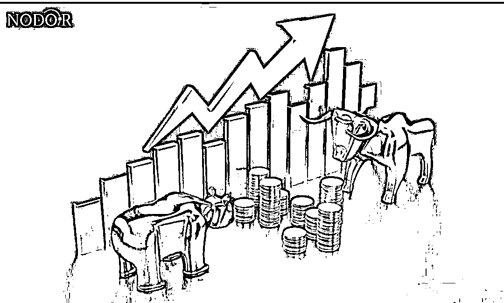作者/雷蒙德·梅里曼 译者/Luke 编辑/玫瑰 图片/稿定设计 雷蒙德·梅里曼是在金融占星学界稳坐第一把交椅的占星师，同时他也是若道签约的金融占星课老师，我们引进了雷蒙德·梅里曼老师的《[上证指数月度报告](http://mp.weixin.qq.com/s?__biz=MzA5NjA0NTAxNg==&mid=2651494377&idx=2&sn=12afe330afef4b876307c2963b795b56&chksm=8b48255ebc3fac48d8ea2c82dd7b085ed1bcf50d7b480800f1e6a1d63aadb3cb275863e20df7&scene=21#wechat_redirect)》及《[黄金报告](http://mp.weixin.qq.com/s?__biz=MzA5NjA0NTAxNg==&mid=2651494377&idx=2&sn=12afe330afef4b876307c2963b795b56&chksm=8b48255ebc3fac48d8ea2c82dd7b085ed1bcf50d7b480800f1e6a1d63aadb3cb275863e20df7&scene=21#wechat_redirect)》。我们经老师的授权，将每周刊登梅里曼老师的周运，供大家参考和学习。于是，这是本周的周运（11.28-12.2）。

**说明：以下时间采用纽约证券交易所所在地美国东部标准时间。**

**展望与回顾**

****

**“投资者的乐观情绪，是这轮市场上涨的驱动力”，盈利投资首席执政官尤金·普利特，周二在美国消费者新闻与商业频道的“收盘铃响”节目中表示。**

**——卡门·莱因克和莎拉·敏****2022 年 11 月 23 日****www.cnbc.com****现在清楚的是，量化宽松是一个巨大的政策错误。****——朱迪·谢尔顿****彭博新闻的阿利森·施拉格在一篇文章引用****2022 年 11 月 22 日**这是美国的假期周，但是道琼斯工业平均指数继续攀升至数月来的新高，甚至超过了先前的基本周期高点 8 月 16 日的 34282。这符合我们对 11 月 15 日-23 日期间多个木星行进的预期。标准普尔指数和纳斯达克指数上周也有不错的上涨，但两者都未能突破前一周的高点，仍然远远低于 8 月中旬的前一个基本周期波峰。如果后两个指数不能超过 11 月 15 日的高点，这将形成一个二星级地球宇宙学关键反转区间内市场间看跌背离的案例。其他全球股票指数也出现了相似的背离。在欧洲，德国 DAX 指数上涨至 6 月初以来的最高价位。苏黎世 SMI 指数、荷兰 AEX 指数和伦敦富时指数仍然低于 8 月高点。在亚洲和环太平洋地区，印度 NIFTY 指数是领头羊，11 月 24 日飙升至 18534，非常接近 2021 年 10 月 19 日的历史高点 18604。澳大利亚 ASX 指数也很强势，周五上涨至 7457，超过了 8 月的前一个周期高点。但日本日经指数未能超过 8 月 17 日的高点，中国上证综指和香港恒生指数也未能超过前一周的高点。在通过封控新冠疫情的斗争中，中国股市继续滞后于其他世界指数。这场斗争对中国的经济造成了损害，也因此引发了对世界其他国家经济的担忧。其他市场上，FTX 加密货币交易所的崩溃（可能还是丑闻）持续对加密货币市场施加压力。它的创始人山姆·班克曼·弗里德 1992 年 3 月 6 日出生，正在经历经典的破产行进（天王星与金星或木星或第二宫的守护星形成困难相位）。行进的土星也参与进来，合相他出生星图中的土星。这并不意味着每个经历这一行进的人都会破产。

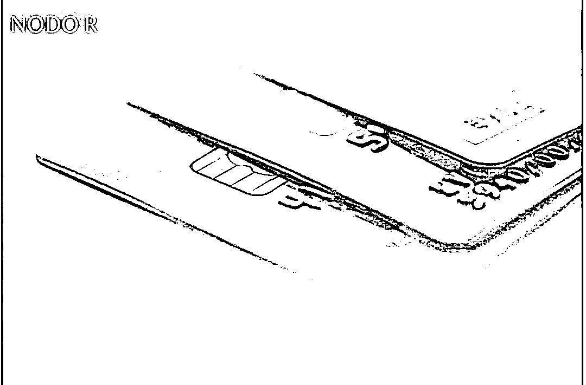

但它确实代表一段时期，此人必须确保支出不要超过收入，否则可能会非常痛苦。无论如何，随着这场加密货币危机的发酵，比特币上周下跌至两年新低 15479，但以太坊守住了 11 月 10 日的低点 1071。两者都守住了支撑区间，但它们似乎还无法冲破阻力区间。在上周的专栏发布后，原油有一轮很好的上涨，在周一创下接近年度低点的 75.27 后，于 11 月 22 日跳涨至高点 82.30。然而，到周五时，它的收盘价又回到 76.28。黄金和白银保持在 11 月 15 日的高点之下，但黄金的走势很有趣，因为它从 11 月 15 日的高点 1791.80，下跌至 11 月 22 日 1719 的低点，正好跌到梅里曼市场时机报告中给出的支撑区间，随后第二天上涨回到 1761，形成周五的高点。再一次，大量的木星征象，使得股市大体是看涨的，但贵金属市场表现不佳。木星的影响力现在开始逐渐退居幕后，新的地球宇宙学征象即将出现，带来一个有趣的 12 月。**短期宇宙征象与长期考量**

****

**我们认为，一个国家试图通过征税变得繁荣，就像一个人站在桶里，试图通过提起把手把自己抬起来一样。****——安迪·凯斯勒引用温斯顿·丘吉尔****《药方？减税和减少开支》****《华尔街日报》****2022 年 11 月 7 日**

**有利的木星征象结束了，但一段时间内市场依然处于大量射手座能量的影响下，射手座是木星守护的星座。****12 月的第一周，太阳、水星和金星都在射手座，这可能使股市继续保持高位。**

然而，需要注意的是，**在 12 月的前半段，海王星逐渐取代木星，成为集体心理的行星领导者。**

海王星与木星很像，两者都是原油的守护星。但它们有着重大的差异。尽管木星喜欢炫耀和大声说话，让所有人注意到它的存在（和重要性），海王星却喜欢隐藏在阴影中，带来短暂的幸福或诗意的想法。

海王星不是很理性，喜欢欣快的情绪。但海王星喜欢隐蔽行动，甚至具有欺骗性，常常故意误导别人，避免被认出，然而木星却大胆直率。

**从 12 月 1 日开始到 12 月 15 日，太阳、金星、火星和海王星彼此之间将形成 T 三角。**这就好像在所有的错误地点寻找爱情和幸运。然而，**金融市场（尤其股票指数）可能会爆发一阵非理性的繁荣，人们相信事情比实际情况要好**。这是炒作某些你想让人们相信的东西的好时机，尽管这些“东西”还没迎来它的黄金时光。

**这是有利于市场宣传的时期，但最好避免做出虚假的承诺，导致人们相信某件不会到来或无法交付的东西。**

一切始于 12 月 1 日金星对分逆行的火星。吸引力和欲望很强烈。但是随后在周末，12 月 3 日-4 日，海王星转向顺行，四分金星，这个相位有点不理性，类似于迷恋。下一周，12 月 8 日和 12 月 14 日，火热的太阳也加入进来。

首先，它对分逆行的火热火星，然后它四分水象的海王星。这里有许多的蒸汽和谣言，但没有事实。不过，它依然可能对应金融市场的剧烈价格波动，尤其在 12 月 2 日-5 日（周末）以及 12 月 14 日结束时的 4 个交易日内。

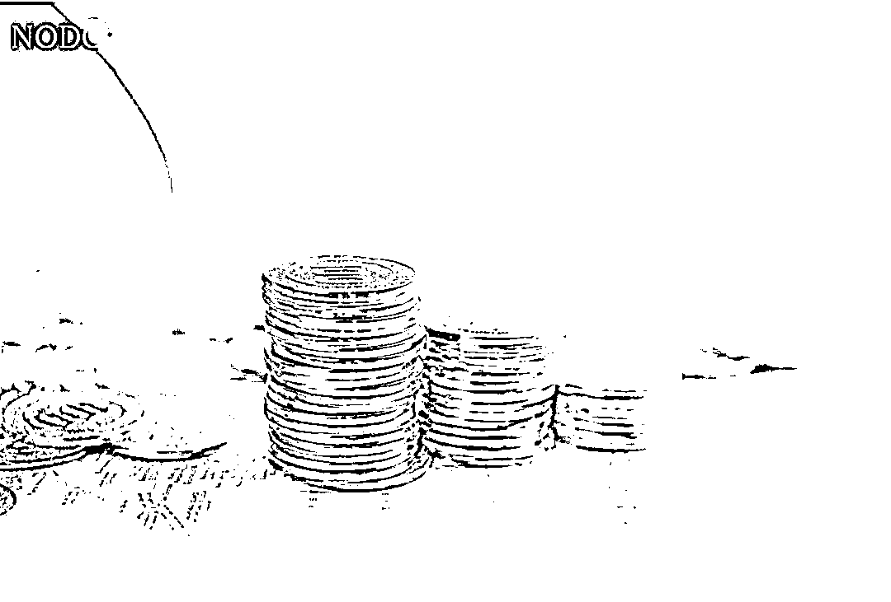

对于海王星，可能对应一种和平和镇静。但太阳和火星对和平、镇静没有兴趣。它们想要注意力，当涉及海王星时，可能会编造些什么谣言出来，诱发市场下跌触底，然后再试图反弹。

就像 11 月 15 日-23 日一样，能源板块，尤其是原油，再次受到关注。或许“交易员乔（·拜登）”终于完成了 67-72 美元的原油交易。先前他自豪地向世界公布他的交易策略，售出原油压低价格，再回购国家的原油储备。

然而再一次，当海王星突出时，如果他注意力不集中的话，可能会错过实现他的愿望。海王星因无法实现的承诺、希望和愿望而臭名昭著，常常原因是分心和健忘。就好像某件事不太对劲，但你不能指出它到底是什么，或不是什么。我们希望他开启价格警报，不要错过列车（交易）。

所以对于 12 月的前两周，我给每个人的信息是：享受生活，甚至允许自己迷恋某个人。但也要理解，那可能不是爱，也不是真的。

也要注意到 12 月的前两周，可能随着我们接近 12 月 23 日，带来一场真正的觉醒。**12 月 23 日，木星和天王星第三次也是最后一次形成八分相。如果市场在上涨（海王星和射手座），要小心，因为前两次木星-天王星八分相成相时（5 月 11 日和 9 月 28 日），对应着剧烈的抛售，在木星-天王星八分相形成期间和稍后不久到达低点。**

现在，投资者的情绪是欣快的。**如果这次的木星-天王星相位重复前两次的模式，那么到 12 月 23 日可能就不会那么兴高采烈了。**就好像海王星的梦境和浪漫幻想遭遇了粗鲁的觉醒。事情不像它们看起来那样，你也不能相信你读到、听到或看到的东西。

但是你可以相信自己和那些你认为靠谱的人。其他的人，就不是那样了。这是假期季，所以和你爱的人享受生活。但要知道**当海王星突出时，这也是与诈骗和传染相关的季节。不要成为受害者，保持警觉，保持安全，照顾好你的健康。**

从 2018 年年末，若道引入金融占星大师雷蒙德·A·梅里曼撰写的梅里曼市场时机学院每年一次的年度预报沙龙和每年一本的《年度预报》以来，**2023 年已经是第 5 个年度了。我们简单回顾了部分 2019-2022 年金融预报的内容，**过去的经验让我们相信，你根据梅里曼老师的指导作为投资参看，你会比一般人有更大的胜算。******长按下图识别二维码****了解更多详情**

**说明：以上日期基于纽约证券交易所所在的美国东部标准时间，由于存在时差，中国地区可能需要加一天。**

**版权声明：**本文由若道翻译发布，欢迎转发，反对抄袭。友号转载请申请白名单。**END**

**雷蒙德·梅里曼（Raymond Merriman）**

若道签约老师。著名金融占星师，ISAR（国际占星研究协会）前主席，梅里曼市场分析公司的总裁。他由于“提升了占星学的职业形象”，在 1995 年国际占星大会上被授予轩辕十四奖；在 2012 年国际占星大会上，被授予轩辕十四终身成就奖。

**梅里曼金融报告双 12 福利来啦！****长按下图了解更多详情吧！**

1“中国上证指数月度报告”发售**若道推出了****中文版****的雷蒙德·梅里曼中国上证指数月度报告，并持续发行该报告！**当把金融市场的周期和占星学的周期相结合时，雷蒙德·梅里曼老师的金融占星学研究**为投资者应对金融市场的周期波动，并随之调整投资策略提供了极大的价值参考**。
**12 月中英文报告已上线！**2“黄金价格周期月度报告”发售**若道推出****中文版****的雷蒙德·梅里曼黄金价格周期月度报告！**不仅仅为广大读者在中国股市的投资出谋划策，更将视角放眼黄金市场。**每当世界经济形式不明朗的时候，有一个地方是保值的港湾，那就是****黄金**。自 1982 年雷蒙德·梅里曼出版第一本研究《地球宇宙学征象与黄金价格的关联》的著作以来，**他一直作为最重要的黄金市场时机预测者之一享誉国际**。2022 年 12 月黄金报告已上线，梅里曼老师将会告诉你他对这个关键时期如何操作的想法。也可以按照季度和一年期订阅，有更多优惠。季度和年度的好处是，你可以持续了解梅里曼老师对于不断在变化的市场的看法。即便他某一次看法和市场不一致，你也看到在下一期他如何调整自己的看法，并看到金融占星在一个长期时间段内对你把控风险的帮助。而能够长期控制风险、尽量找到安全的投资时机才是投资的长久之计。**12 月中英文报告已上线！****购买套餐**，买得越多越优惠中国上证指数月度报告套餐价

*   **单月报告**：280 元
*   **3 个月套餐**：780 元（260 元/月）
*   **12 个月套餐价**：2400 元（200 元/月）

**长按下图识别二维码****购买金融报告****套餐****▼**

黄金周期月度报告优惠

*   **双报告年度套餐更优惠（直降 900 元）**

*   **12 个月黄金报告+12 个月上证指数报告：仅需 3900 元**

**长按下图识别二维码购买黄金报告套餐**▼

3《2023 年金融报告及沙龙》

从 2018 年年末，若道引入金融占星大师雷蒙德·A·梅里曼撰写的梅里曼市场时机学院每年一次的年度预报沙龙和每年一本的《年度预报》以来，**2023 年已经是第 5 个年度了。我们简单回顾了部分 2019-2022 年金融预报的内容，**过去的经验让我们相信，你根据梅里曼老师的指导作为投资参看，你会比一般人有更大的胜算。****

**长按下图识别二维码****了解更多详情**

**购买直达入口**

# 《2023 年金融预报》预售中！梅里曼 12 月上证+黄金报告上线！

> 原文：[`mp.weixin.qq.com/s?__biz=MzA5NjA0NTAxNg==&mid=2651495366&idx=3&sn=05ca1d1fbd44fdeb8e1b895c436aca9d&chksm=8b482971bc3fa0672552ad2929038f6faeedce754364c88ddd2f3b6e88be8b443e67c5bb092f&scene=126&sessionid=1692737720#rd`](http://mp.weixin.qq.com/s?__biz=MzA5NjA0NTAxNg==&mid=2651495366&idx=3&sn=05ca1d1fbd44fdeb8e1b895c436aca9d&chksm=8b482971bc3fa0672552ad2929038f6faeedce754364c88ddd2f3b6e88be8b443e67c5bb092f&scene=126&sessionid=1692737720#rd)

  

**《2023 年金融预报》**从 2018 年年末，若道引入金融占星大师雷蒙德·A·梅里曼撰写的梅里曼市场时机学院每年一次的年度预报沙龙和每年一本的《年度预报》以来，**2023 年已经是第 5 个年度了。**

我们简单回归一下梅里曼老师 2019 年-2022 年的《年度预报》中一些预测。

在 2019 年的年度预报中，对于上证指数，梅里曼老师写到：

2018 年末至 2019 年初，中国股市处于三个重要周期低点的时间段。紧随这一低点，将会出现一次非常大的反弹。

2019 年木星会与海王星形成三次四分相，过去，这个相位总是与惊人的强大“泡沫”同时出现，期间股价大幅飙升。

到 2019 年 7 月之前，上证指数有三个重要长周期会出现周期低点，理想上看是在 2019 年 3 月底之前。

上证的周期低点出现在 2019 年 1 月，从那时起，上证迎来了 3 年的上升。

对于黄金，梅里曼老师建议：

从占星学角度来看，木星在射手座，四分在双鱼座的海王星，支撑看涨观点，因为这个组合有增加通胀的潜力。此外，木星在射手座的行星-星座组合从 1983 年起出现过三次，每次都对应到金银市场的年度高点。

无论在 2019 年何时，只要黄金保持在 1167 以上，同时跌到了任一主要周期低点附近，就要寻找买入机会。黄金可能在 2019 年涨到 1500+/- 50，甚至更高。

2019 年黄金从 1284 美元开始上涨，最高点在 1566 美元。

所以，如果你在 2018 年购买了《年度预报》，按照梅里曼老师的建议投资了上证指数和黄金，你会在当年取得相当不错的收益。

**对于 2020 年，在席卷全球、深刻影响了未来的疫情到来之前，梅里曼老师为 2020 年定下基调的：**

站在 2019 年的年尾，我们不知道一场深刻改变未来的风暴马上就将来临。

梅里曼老师，这位杰出的宇宙气象预报员，未卜先知，为 2020 年定下“将军”的基调。

在那一年，我们目睹了美国股市的 4 次熔断和全球经济的重置崩溃。

对于黄金，梅里曼老师是这么说的：

1391.50-1413.70 是价格最强的支撑区域。只要不跌破这个区间，黄金就能够上涨，重新测试 1566.20。如果突破了 1560-1590 的阻力区间，那么黄金就能够重新测试 1920。在那以前，黄金最有可能在 2020 年中在 1390 和 1575 之间波动。

| 黄金周 K 线图

2020 年，黄金在横盘 3 个月突破了 1560-1590 的阻力区间后，一路上涨到 9 月最高点 2089.20 美元。

对于上证指数，梅里曼老师建议：

2020 年的反弹将超过 2019 年的高点 3288。然而，这一涨势可能会通向 5.5 年周期的波峰，随后将再次迎来一波跌势至 2021 年或更晚。

行进中的摩羯座星群——木星、土星和冥王星——表明在 2020 年 11 月底之前会出现一个高点，很可能在 2020 年的前六个月。建议交易者特别注意金星逆行的时期，也就是 5 月 13 日至 6 月 25 日。逆行或顺行一个月内出现的年度高点或低点可能会带来卖出机会。

2020 年，上证指数最高达到 3474，超过了 2019 年的高点 3288。

**站在 2020 年的末尾，对于 2021 年，梅里曼老师说：**

随着 2020 年木星、土星和冥王星形成大合相，我们刚刚结束了一个周期和一个时代。此刻我们正处于一个新的时代和一个新的长周期的早期阶段。事实上，是多个长周期。

对于上证指数，梅里曼老师说：

我们预计涨势将在 2020 年 12 月-2021 年 2 月之间达到波峰，然后急剧下跌至 52 周和 22 个月周期的低点，这些周期将在 2021 年 5 月之前，甚至在 3 月底之前结束。此后可能会出现另一轮反弹，可能会也可能不会在 2021 年 11 月之前形成第一个 33 个月周期的新高。

对于黄金，梅里曼老师说：

黄金的 31.33 个月周期波谷将在 2021 年 9 月之前出现，理想情况是 2020 年 12 月-2021 年 6 月。价格目标是 1628+/-109 或 1768+/-76。重叠范围（理想情况）是 1692-1737。如果价格跌破这些范围，则为看涨情况中令人担忧的状况。

**而在 2022 年的年度预报里，我们看到：**

渐亏四分相不仅对应无法解决的冲突和分歧，土星和天王星形成的任何四分之一周期（合相、四分相和对分相）都可能在社会动荡和某地区现状受到威胁的时期出现。

在 2008-2010 年上一次四分之一周期时（对分相），世界见证了阿拉伯之春。在 1999-2000 年渐盈四分相期间，游行、抗议和直接武力冲突扰乱了西雅图世界贸易组织会议。这也标志着美国经济扩张的结束，以及由互联网泡沫破裂和 2001 年 9 月 11 日对美国世贸中心的恐怖袭击引发的衰退的开始。在此之前是 1988 年的合相，对应的事件是缅甸（Myanmar，当时的国名是 Burma）爆发了一场全国性起义，反抗尽失民心、暴力过度的军政府。数十万公民在全国范围内的暴动中抗议，这成为缅甸历史上的决定性时刻之一。

在每一个案例中，极端主义都占据主导地位，导致暴力冲突，但最终带来了“更大的益处”。它产生了建设性的结果，但在它进行的同时，世界在经历巨大的危机和暴力。”

2021 年 5 月 13 日-7 月 28 日，木星首次行经双鱼座时，这些因素表现得很明显。那时，通货膨胀开始出现，但美联储向所有人保证，这只是暂时的，他们将无限期继续推行“宽松货币”政策。他们并不担心持续的通货膨胀，这是典型的木星在双鱼座的表现，对现实的脱离或错误判断。

这两颗行星以及双鱼座也掌管原油。因此，我们可能会看到油价飙升，以及/或石油泄漏，威胁到大自然。它也可能对应着由于事故而释放的有毒气体，威胁到那些暴露其中的人的生命。

对于黄金，梅里曼老师建议：

只要黄金保持在 1670-1680 之上，仍然有极小的机会出现一轮爆炸性上涨，测试当前的历史高点（2089），甚至创下历史新高。毕竟，木星将在双鱼座合相海王星，可能预示着另一轮“投机狂热”。然而，这也可能是一个“恐慌”的征象，届时某些市场可能会崩溃。

在 1900-1980 之间存在较大的阻力，如果不能突破这个阻力，将表明黄金的熊市已经开始，新一轮的猛烈下跌可能正在准备中。只要跌破 1670 则将确认黄金 20 年的牛市结束了。

| 黄金周 K 线图

对于上证，梅里曼老师说：

我们预期在 2022 年 5 月前，上证综指会出现急剧的下跌，进入 52 周周期和可能的 33.5 个月周期低点。

我们更倾向于认为，上证综指会首先下跌，在 5 月前形成一个低点，然后上涨。这一轮上涨的幅度，将告诉我们上证综指是处在牛市，还是进入了新的熊市。如果它不能上涨超过 3750，长周期波峰可能已经出现，并且进入了新的熊市。

我们简单回顾了部分 2019-2022 年金融预报的内容，**过去的经验让我们相信，你根据梅里曼老师的指导作为投资参看，你会比一般人有更大的胜算。**

**2023 年度预报及沙龙预售**

**2023 年金融预报沙龙时间为 2023 年 1 月 7 日 10：00-13：00。**

一份价格仅千元的顶尖金融占星大师的投资分析报告和沙龙，聪明的投资者值得拥有。

**2023 年年度预报****及沙龙价格：****1380 元**

**长按下图识别二维码**

**购买报告及沙龙**

**梅里曼金融报告双 12 福利来啦！****长按下图了解更多详情吧！**

**购买者重要须知****①** 梅里曼市场时机学院每年一次的年度预报沙龙和《年度预报》是梅里曼市场时机学院的研究“预报”，而不是市场“预测”，是梅里曼老师及其金融占星分析师对人类活动周期历史与行星周期之间相关性的研究，二者在大部分情况下具有 80%或更高的相关性，而不是因果关系。沙龙中和报告中的研究完全存在错误的可能性。即便是非常认真的研究和几十年的研究经验，我们无法总是正确地解读出各种征象在实际层面上会如何相互作用，并显化为事件结果。

所以请将次沙龙和报告看作一个研究参考，务必结合其他市场研究和你个人对市场的理解，根据你的自由意志做决策。

**②** 此报告一旦售出，**即不接受退款。**

**③** 此报告仅支持在手机网页阅读，不支持电脑阅读和下载。**④** 讲座提供视频回放。**以上须知，请仔细阅读。一旦付款，即视为已了解并接受所有须知内容。**

**如在购买报告中遇见任何问题**

**可添加客服**

▼

**12 月上证报告**11 月份报告发出的时候是 10 月 19 日，在此一周前的 10 月 12 日，上证跌到了 2934，重新测试了在 4 月 27 日形成的 2022 年年度低点 2863，然后开始反弹。**10 月 12 日这一低点是位于梅里曼老师一直提到的今年下半年最重要的天象——土天四分、木星在土天四分中点的天象的范围之内。**

| 上证指数日 K 线图当时，梅里曼老师提到，一方面，10 月 12 日的低点是在土天四分这个最重要的天象之下，市场完全可能出现反转，如果 10 月 12 日的低点是从 4 月低点 2863 开始的一个拉长的基本周期的第 23 周，那么，站在 10 月 19 日，一个新的 13-20 周的基本周期刚刚开始，当时仅仅是第一周。这个基本周期完全可能开始一波上升行情。另一方面，10 月 23 日，土星恢复顺行，10 月 31 日，火星开始逆行，金星和太阳都将进入天蝎座，而且将在 11 月 5 日-11 日和土星、天王星形成 T 三角。如果基本周期不是从 10 月 12 日开始，而是从 8 月 2 日-4 日的低点开始算，上证完全可能跌向更深的低点。上证跌向更低的低点。10 月 31 日，火星逆行日，上证跌到 2885，与 4 月份的低点 2863 形成双底，然后开始反弹。从宏观层面来说，美国的通货膨胀似乎见顶，美元的加息可能缓和下来；而国内似乎要走向新冠疫情防控的政策的逐渐放开，这对于经济是利好。

| 上证指数周 K 线图

本年度激烈的天象似乎都已结束。现在是不是大胆加仓的时候？金融占星大师雷蒙德·梅里曼的《2022 年 12 月上证指数报告》已上线，你可以听听梅里曼老师的看法。《2022 年 12 月黄金报告》也已上线，欢迎购买。另外，本期我们还将免费为所有读者送上一期铜周期的报告。法国巴黎的投资组合经理，也是梅里曼市场时机学院最优秀的毕业生之一——马修·凯撒（Matthieu Kaiser）在过去两年间对铜价格与地球宇宙学周期的关联进行了出色的研究。我们希望分享这位杰出研究者的发现，因此将其纳入梅里曼市场时机学院周期报告的金属报告行列。

这里还有两场讲座，对你的财富管理也有一定的帮助。

**12 月上证报告上线**

**上证指数月度报告价格****单月报告**：280 元/月 **季度套餐价格**：780 元（260 元/月）**年度套餐价格**：2400 元（200 元/月）**双报告年度套餐更优惠（直降 900 元）****12 个月黄金报告+12 个月上证指数报告：仅需 3900 元****长按下图识别二维码购买上证指数报告**
▼

**12 月黄金报告**

“**黄金是金钱。其他的只是信贷。**

**——约翰·皮尔庞特·摩根**

”

| 黄金周 K 线图

我们经历了 2 年的土天四分正在成为过去式。虽然其影响还会持续。

在上个月，我们提出了一个问题，9 月 28 日的低点 1622 是黄金 2 年来的低点，那么从这个低点，黄金会开始一轮反弹吗？毕竟，黄金有一个 31.33 个月的周期，而半周期是 16 个月，其容许度在 13-19 个月之间。上个周期低点是 2021 年 3 月的低点 1673，而 10 月是第 19 个月，正是在半周期低点的容许度内。|黄金日 K 线图  从现在看，答案很明显，黄金在 10 月 21 日和 11 月 3 日再次测试 1622 低点后，这 3 个低点有可能形成了 16 个月周期的三重底。随后，黄金开始了一轮反弹。目前已经反弹了 10%。黄金会继续反弹吗？此外还有白银。在上期报告中，梅里曼老师提示了关于白银的投资机会。  12 月份黄金报告已经上线，欢迎了解。也可以按照季度和 1 年期订阅，有更多优惠。季度和年度的好处是，你可以持续了解梅里曼老师对于不断在变化的市场的看法。  即便他某一次看法和市场不一致，你也看到在下一期他如何调整自己的看法，并看到金融占星在一个长期时间段内对你把控风险的帮助。而能够长期控制风险、尽量找到安全的投资时机才是投资的长久之计。  点击阅读原文，雷蒙德·梅里曼黄金周期 2022 年 12 月报告带来有 40 年黄金市场研究经验的世界著名金融占星大师雷蒙德·梅里曼对当前黄金市场的研究。投资有收益，投资有风险，希望金融占星学的研究帮助你更好地评估你的投资。

**12 月黄金报告上线**

**黄金月度报告价格****单月报告**：280 元/月 **季度套餐价格**：780 元（260 元/月）**年度套餐价格**：2400 元（200 元/月）**双报告年度套餐更优惠（直降 900 元）****12 个月黄金报告+12 个月上证指数报告：仅需 3900 元****长按下图识别二维码购买黄金报告**
▼

**购买者需知**

**① **梅里曼市场时机学院《中国上证指数月度研究报告》是梅里曼市场时机学院（以下简称 MMA）的研究“预报”，而不是市场“预测”，是梅里曼老师及 MMA 金融占星分析师对人类活动周期历史与行星周期之间相关性的研究，二者在大部分情况下具有 80%或更高的相关性，而不是因果关系。报告中的研究完全存在错误的可能性。即便是非常认真的研究和几十年的研究经验，金融占星师无法总是正确地解读出各种征象在实际层面上会如何相互作用，并显化为事件结果。

所以请将报告看作一个研究参考，务必结合其他市场研究和你个人对市场的理解，根据你的自由意志做决策。

**②** 此报告一旦售出，**即不接受退款。**

**③** 上证、黄金月度报告每月固定 1 期，**并非都是在每月相同日期发布。**

**④** **我们收到英文报告的当天，即发布该英文报告。3 天后，上线报告中文版。此报告仅支持手机网页阅读，不支持电脑阅读和下载。****以上须知，请仔细阅读。一旦付款，即视为已了解并接受所有须知内容。**在过去的 40 年中，唯有梅里曼逐渐完善，并在梅里曼市场时机学院月度周期报告中阐释了将地球宇宙学与周期相结合的研究方法，以惊人的精确性预报了黄金价格发生重大变化的时间。**黄金购买 Tip**

各大银行均可购买黄金或黄金 EFT 基金，也可以在诸如天天基金或者支付宝购买黄金及黄金相关产品。不明白的可以百度搜索。

**购买后如何查看报告？**

**购买后有疑问怎么办？**请联系技术客服
**微信：nodoor201705** **购买直达入口**

# 周末树洞丨 多给自己一点鼓励吧！射手座新月，你许了什么愿望？

> 原文：[`mp.weixin.qq.com/s?__biz=MzA5NjA0NTAxNg==&mid=2651495281&idx=1&sn=1bba6b3d0b3aacecd272a12ba6fa3133&chksm=8b4829c6bc3fa0d0f30506dc250c01c4640f368ada12d4913353dadc181cb74d7ee615b2f1bf&scene=126&sessionid=1692737720#rd`](http://mp.weixin.qq.com/s?__biz=MzA5NjA0NTAxNg==&mid=2651495281&idx=1&sn=1bba6b3d0b3aacecd272a12ba6fa3133&chksm=8b4829c6bc3fa0d0f30506dc250c01c4640f368ada12d4913353dadc181cb74d7ee615b2f1bf&scene=126&sessionid=1692737720#rd)

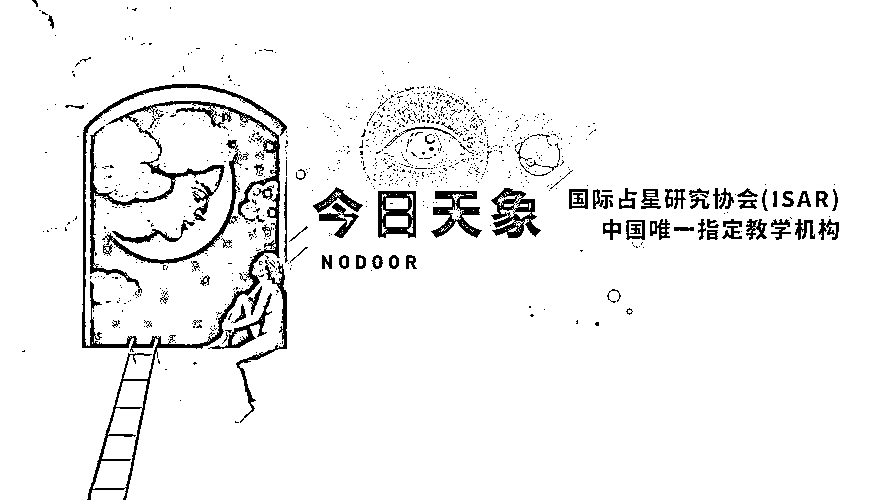

**2022 年 11 月 26 日天象：**

*   **05:08 月亮进摩羯座**
*   ****金星合相水星****
*   ******火星三分土星******

本周，太阳紧随着金星、水星进入射手座（点击[【太阳进射手座】](http://mp.weixin.qq.com/s?__biz=MzA5NjA0NTAxNg==&mid=2651494868&idx=1&sn=1885a5f0e1e46b7a2b333b8a5c1724fe&chksm=8b482b63bc3fa275322f6c77ea306792bdb78d38cecb47bf6a6ff48610ddfaadc6776acbee29&scene=21#wechat_redirect)查看文章），我们走出了群星在天蝎座的阴影，来到焕然一新的群星射手座时期。同时，本周四发生的[【射手座新月](http://mp.weixin.qq.com/s?__biz=MzA5NjA0NTAxNg==&mid=2651495128&idx=1&sn=a94365aaf3a80921dced02e50dbf1034&chksm=8b48286fbc3fa1791cf9f00ff50b801f88511f605feb82d79e864af93adc57c4c21f3bbb217e&scene=21#wechat_redirect)】（点击查看文章）和[【木星顺行】](http://mp.weixin.qq.com/s?__biz=MzA5NjA0NTAxNg==&mid=2651494965&idx=1&sn=b06815f19caeb0bcbc7acadc2e46ff77&chksm=8b482882bc3fa1943ec017a89210265fe0a6be10b2436061d9d653e6c46d4c21f33b7cb4ae08&scene=21#wechat_redirect)（点击查看文章）更是会帮助我们开启新的旅途。火海四分相在本周逐渐出相位离开，土天四分相也已渐行渐远，虽然我们依然看到很多的不容易、不顺利，但危机感在渐渐消散，我们完全可能生出新的期许。

今天一大早，月亮就来到摩羯座，火星三分土星，这是个稳重务实的周末。趁着金星与水星在射手座合相的时机，我们的头脑和表达都会更加积极，很适合与人交流感情，增进关系。还等什么，快给自己一些正向鼓励吧！

射手座新月，你许下了什么愿望？欢迎跟我们分享哦~

**了解每日天象，可****下载“若道”APP 查看****还有更多精彩等着你哦**

# 10 个学术名词，丰富你的心理占星小词典

> 原文：[`mp.weixin.qq.com/s?__biz=MzA5NjA0NTAxNg==&mid=2651495276&idx=2&sn=8db252d3e9242a18761908c78ce81118&chksm=8b4829dbbc3fa0cd22d41e54f3bb73f783f50e666201b2124501a9a5aefe7aae24e26fcd8aae&scene=126&sessionid=1692737720#rd`](http://mp.weixin.qq.com/s?__biz=MzA5NjA0NTAxNg==&mid=2651495276&idx=2&sn=8db252d3e9242a18761908c78ce81118&chksm=8b4829dbbc3fa0cd22d41e54f3bb73f783f50e666201b2124501a9a5aefe7aae24e26fcd8aae&scene=126&sessionid=1692737720#rd)

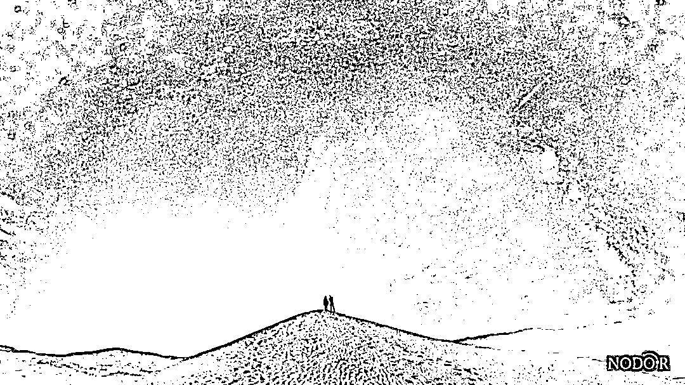作者/格伦·佩里译者/轩轩  校对/王宏编辑/翀子 图片/稿定设计 

今天小编为你总结了 10 个心理占星学的术语，帮助你更好的将心理学和占星学结合在一起。另外，如果你想更多了解心理占星学，这里有一门格伦·佩里老师亲授的【[占星原型与星图中的精神病理学](http://mp.weixin.qq.com/s?__biz=MzA5NjA0NTAxNg==&mid=2651493004&idx=2&sn=038b40a4c73ce929da0d5c64de0eac85&chksm=8b48203bbc3fa92d3922f679f3aa4a5525d2776cd477717d7daef4d44bbb863c001bd3281960&scene=21#wechat_redirect)】，点击链接了解更多详情吧！

01

**命运原型（prototypes of fate）**

**早期影响发展的事件**，常发生在**童年时期**，提供了占星格局的最初表达。就这点而言，命运原型是**建立格局最初意义的事件或事件模式**。这种相同的模式在后来的（成年）事件中重现，这些事件在特点和意义上都和童年的原型相类似。 

02

**心理模式（schema）**

**将经验整理归入熟悉的意义类别的心理动力**。从占星学的角度来看，心理模式就是**行星配置**。就像施加在外部现实上的心智俗套模式一样，心理模式为日常经验提供了熟悉的形式和意义。而由于心理模式是一种内在的认知模式，所以它和满足有关特定情境的特定需求的相应行为策略相关联。就这点而言，心理模式类似于**计划**。

03

**病态的理念 /信念（pathogenic idea/belief）**

**个体通过创伤性经历所习得的残忍的、无意识的、限制性的信念，通常植根于童年时期。**这

样的信念之所以残忍，是因为它们预言了**追求基本需求将给自己或挚爱的人带去伤害（疼痛、苦难）**；之所以无意识，是因为它们**于意识之外运作**；之所以有限制性，是因为它们**妨碍到功能性的行为**；之所以是病态的，是因为它们会**招致苦难**。

病态的信念强迫个体以以下方式行动：试图去恢复自己满足受挫的需求的能力。也就是说，人们有意识或无意识地被驱动着去获取控制权，并**掌控来源于负面理念的自我毁灭性的思维和行动模式**。病态的信念常常反映在**行星之间的困难相位**上。

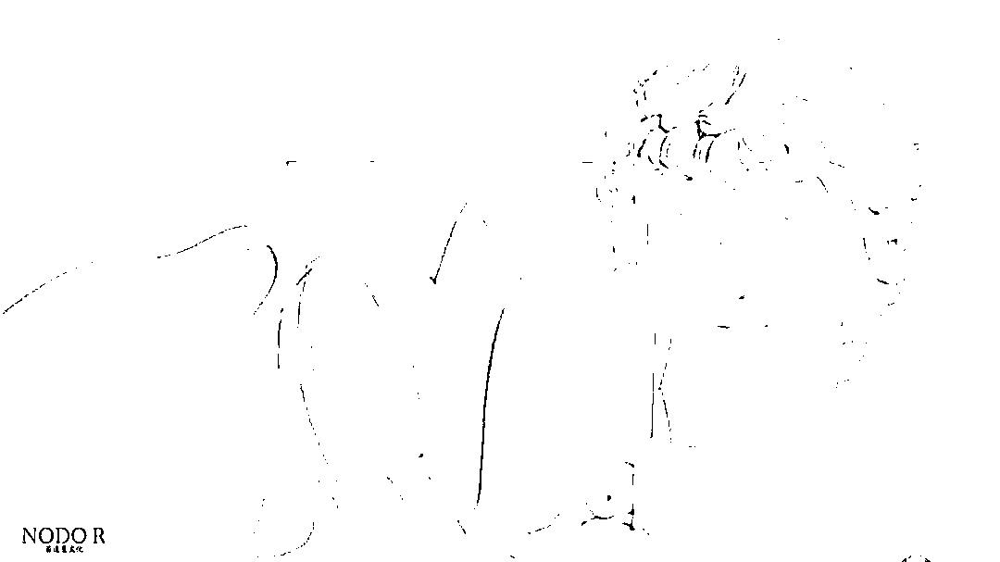

04

**内心冲突（intrapsychic conflict）**

**内心不协调的力量或结构之间的挣扎**，例如星座中成**四分相、补十二分相或对分相**的行星之间所发生的情况。

冲突可以在心理状态方面进行分析。愿望是渴求的心理状态，比如幸福、快乐或亲密；恐惧是令人畏惧的状态，比如悲伤、痛苦或内疚。心智会预期可能源于满足需求的尝试的可能状态。预期的负面结果导致**应用针对可怕状态的防御**。

当需求（愿望）和作为内部限制而运作的防御发生冲突时，冲突就出现了。自我受到威胁，产生**信号性焦虑**（signal anxiety，一种负面感受，例如：恐惧或内疚），同时幻想着**出现不讨喜的结果，即自己或挚爱的人会受到伤害**。

换句话说，预期的不受欢迎的结果，即可怕的状态，被认为可能是追求满足基本需求的结果。为了应对信号性焦虑，自我试图通过**妥协作用**（compromise formations）来解决冲突，而妥协作用表现为神经性症状、健康调整（整合），或二者的某种结合。

05

**投射性认同（projective identification）**

**为应对内心冲突而出现的一种特定种类的心理防御**。投射性认同是**将自我危险而痛苦的面向投射到外部对象（个人或机构）上，然后在与被投射的部分相符的对象身上诱导行为的过程**。

这些被投射的部分可以是**对象部分**（和自我面向相关的对象形象），也可以是**自我部分**（和对象相关的自我形象）。

**前者是直接投射，后者是被动到主动的投射**。直接投射将引发**强迫性重复，**并增强目前人们将被刺激得像早期对象一样行事的可能性。因而，个体会无意识地反复演绎过往情节。

**通过重复先前的创伤性经历，个体努力去获取掌控，驳斥病态信念，再次处理旧的创伤和冲突。**

相反地，在被动到主动的投射中，你会向对象实施你曾经的遭遇，希望对象会做出更健康的反应，比儿时的你更加应对自如。这样你就可以认同对象的反应，那将是授予权力的和疗愈性的，会缓解与问题相关的焦虑。

06

**强迫性重复（repetition compulsion）**

强迫性重复早期创伤性的经历，试图获得对它们的掌控。很多人都表现出了**重复痛苦情境的强迫性**，却没有意识到**自己对于这些事件的发生也负有责任**，也没有意识到**当前情境和过往经历的关联**。

强迫性重复是**记起一直被压抑之事**的一种方式，**试图解决和原始创伤性事件相关的焦虑或内疚感**。在选择再次体验所害怕的事件时，无意识的目标是**掌握和控制**。

07

**刺激发展（Priming the Pump）**

在心理占星学中，在咨询开始时，**用于鼓励客户自我揭示的最初的问题或最低限度的解释性评论**。目的是**获得必要的信息，来分辨客户将自己的星图活出了什么程度。**

“刺激发展”的比喻借用于凯恩斯经济学，原指增加政府支出来刺激经济增长。从字面意思上来看，“泵的起动注水”指的是启动老旧的泵时，必须向其中注水来封闭吸入阀，使泵得以正常运作。

实际上，“刺激发展”意味着在某一情境之中，投入少量你正试图从中摆脱的事物。

08

**柏油娃娃综合症（Tar Baby Syndrome）**

此概念引申自约耳·钱德勒·哈里斯（Joel Chandler Harris）的《瑞莫斯叔叔》（Uncle Remus）寓言（1881 年）。

在该故事中，兄弟兔（Brer Rabbit）遇到了一个物体，它长得像人，但实际上是裹着柏油衣服的火柴人。当柏油娃娃没能回应兄弟兔的问好时，兄弟兔试了一次又一次，最终出于沮丧感而戳了戳该物体。兄弟兔每尝试让柏油娃娃回应一次，就越来越绝望地受困于其中。

从心理学上来看，柏油娃娃综合症指的是**一个人试图从另一个人那里获得某种特定回应（如爱、支持、确认）的关系，但在这么做的过程中，这个人变得绝望纠缠而无法自拔**。

问题源于这个人没能看出另一个人的能力是被削弱的，即**个体所依附的那个人缺乏满足其愿望的能力或（出于心理原因）意愿**。

如果一个人因为没能获得所需要的回应，而无意识地责怪自己，那么就无法放下，也无法转向更加合适的目标。

09

**替代对象（Surrogate Objects）**

个体试图从他人身上获得父母（原始对象）没能提供的心理供给，此处的他人即为替代对象。就这点而言，替代者所代替的是过去承担某一特定角色的人物。

无论原始对象没能做到什么（不管是做了不该做的事抑或是不作为），该个体都试图**通过在替代对象身上获得成功的体验来扭转结果**。简而言之，替代对象是成年替代者，个体试图通过他（她）解决和父辈的早期冲突、创伤和匮乏感。

10

**归谬法（Reductio ad Absurdum）**

拉丁语，意指“归谬法”（reduction to absurdity）。它源自于苏格拉底问答法，构成了一种技巧，将论点或假设归于谬论，具体做法是将其前提拓展至其逻辑极限，从而揭示结果的荒谬性，因此来驳斥论点或证明论点的不可信性。

应用到心理占星学上，归谬法涉及到以下情况：**个体的错误信念已经导致了荒谬、滑稽的结果，从而迫使该人意识到并且重估自己困境之下的信念的有效性。**

例如，金星四分海王星的女性相信，如果她足够自我牺牲，且忍受足够长的时间，那么她就会保留住（或重新得到）伴侣的爱。但是，她的伴侣不断地带妓女回家，当她还在隔壁房间的时候，就和妓女们做爱。

这种行为持续恶化，直到该女性终于意识到，她的信念已经导致了荒谬的、滑稽的，并且可怕的痛苦局面。

火星对分冥王星的男性相信自己可以勇敢面对任何危险并且存活下来。这种信念促使他去阿拉斯加荒野地带徒步，却遭遇了危机，他对此准备不足、无法逃脱，最后死于饥饿，就像《荒野生存》（Into the Wild）中克里斯多夫·麦肯迪尼斯的案例。

**版权声明：**本文由若道翻译发布，欢迎转发，反对抄袭。

**END****格伦·佩里**若道签约老师。著名占星师，ISAR 董事会成员，共出版 8 本占星著作；心理/意识研究专业博士；占星心理学学院（Academy of AstroPsychology）的创办人；康涅狄格州研究生院（the Graduate Institute of Connecticut）原型宇宙学与意识进化项目的负责人。

# ****占星原型与星图中的精神病理学****

**为什么在占星学的课程中，会出现精神病理学的教学内容，这和我们有什么关系？这对占星咨询，或在自我了解与成长的过程中又有什么帮助呢？**

****带着这些疑问，请你静下心来，思考以下几个问题**：**

**“******你/你的案主，是否曾经过度担心什么？**** ****你/你的案主，有没有感觉到担忧和焦虑，却不知道原因是什么？********你/你的案主，是否曾经觉得害怕什么东西，但理智上却很清楚它不会对你造成什么伤害？********你/你的案主，是否曾经通过沉迷某物，酗酒或滥用药物，自我伤害去逃避问题？********……********——节选改编自《心理学与生活》******”**

**如果你对上述问题其中之一，回答是。这意味着几乎每个人都曾有过心理障碍的症状（精神病理的问题）。**

**你看，其实“精神病理学”与人的心理有着密切的关联，再结合占星学，呈现了人内在与外在层面更加丰富和深刻的一面。**这对于学习占星学的人和占星师来说，都是一场难得的知识盛宴！****

****本课为 2 年期双证核心课程中的一部分**（AP105 阶段），其内容是过去若道所开设的核心课程从未教授的部分，特意抽出供其他学员学习，******可作为 ISAR 选修课，单独报名。****

****点击下方图片了解详情****

**

****微信又双叒叕改版啦，不想错过若道君的推送？**** ******就把若道设为****星标****以及点点****“在看”****吧！**********▼****

****

**喜欢就点一下“在看”吧！****报名直达入口**

# ISAR 选修丨占星原型与星图中的精神病理学

> 原文：[`mp.weixin.qq.com/s?__biz=MzA5NjA0NTAxNg==&mid=2651495276&idx=3&sn=cc574528bad8dbf5857c73fa8e71075a&chksm=8b4829dbbc3fa0cd5a8c7d91e0fb7b8ed74bbf1f45fcf8422d21141049f7bdf4b70a9ba5ce16&scene=126&sessionid=1692737720#rd`](http://mp.weixin.qq.com/s?__biz=MzA5NjA0NTAxNg==&mid=2651495276&idx=3&sn=cc574528bad8dbf5857c73fa8e71075a&chksm=8b4829dbbc3fa0cd5a8c7d91e0fb7b8ed74bbf1f45fcf8422d21141049f7bdf4b70a9ba5ce16&scene=126&sessionid=1692737720#rd)

**课程描述**

看过课程标题的你，也许会感到好奇和惊讶，为什么在占星学的课程中，会出现精神病理学的教学内容，这和我们有什么关系？这对占星咨询，或在自我了解与成长的过程中又有什么帮助呢？

**带着这些疑问，请你静下心来，思考以下几个问题**：

“**你/你的案主，是否曾经过度担心什么？** **你/你的案主，有没有感觉到担忧和焦虑，却不知道原因是什么？****你/你的案主，是否曾经觉得害怕什么东西，但理智上却很清楚它不会对你造成什么伤害？****你/你的案主，是否曾经通过沉迷某物，酗酒或滥用药物，自我伤害去逃避问题？****……****——节选改编自《心理学与生活》**”

如果你对上述问题其中之一，回答是。这意味着几乎每个人都曾有过心理障碍的症状（精神病理的问题）。

你看，其实“精神病理学”与人的心理有着密切的关联，再结合占星学，呈现了人内在与外在层面更加丰富和深刻的一面。**这对于学习占星学的人和占星师来说，都是一场难得的知识盛宴！**

**本课为 2 年期双证核心课程中的一部分**（AP105 阶段），其内容是过去若道所开设的核心课程从未教授的部分，特意抽出供其他学员学习，**可作为 ISAR 选修课，单独报名**。

**在正式了解本课的价值之前，先了解一下这门课程的主讲老师吧！**

**格伦·佩里（Glenn Perry）**

*   他是心理/意识研究专业博士、加州注册婚姻和家庭治疗师 （CAMFT）

*   占星心理学学院（Academy of AstroPsychology）创办人

*   康涅狄格州研究生院（the Graduate Institute of Connecticut）原型宇宙学与意识进化项目的负责人

*   共出版八本占星学著作：《心理占星学入门》、《心理占星论文集》、《盗取天火》、《从忠诚到革命》、《星图中的阴影》、《占星职业议题与伦理》、《出生星图深度分析》、《从古代到后现代占星学》

**墙裂推荐格伦老师这门课的 **

**4 大理由**

**你一定得知道的课程价值**

**价值*****1***
**明晰精神病理学的基本定义**

占星心理学学院创办人格伦·佩里老师，对**精神病理学的基本定义**就是灵魂受苦，精神就是灵魂的意思，病理就是受苦的意思，所以精神病理学研究的就是：人类各种各样受苦的方式，尤其是因为某一类的行为而引起的。

精神病理学是一个连续体，从比较轻微的，到比较严重的，这么说来，我们每个人都有一部分精神病理的问题。

**如果成为一个“人”，没有一定程度的挑战是不可能的。没有一定程度受苦，没有一定程度不平衡是不可能的。而这种不平衡就会以一种挑战和困难的姿态呈现出来。**

**价值*****2*****更懂疗愈：从不平衡到平衡**

**疗愈**是一个复杂的过程，讲的是将人从不平衡带到平衡这样的一个状态，将不同行星代表的心理功能带到一种更加平衡整合和合作的状态。

格伦老师通过研究精神病理学，发现每一颗行星，以及这颗行星所守护的星座，都和某一特定类型的病理是联结在一起的，包含了这个占星原型所涵盖的极端不平衡的情况。

举个例子，案主的第 1 宫，有很多星星在那里，和对面第 7 宫的火星形成对分相，第 1 宫白羊座或者火星白羊座的组合，和这个案主的反社会人格的病状联系在一起（这是一个星图的极端负面表现）。

“

**生活本身就是一场治疗，我们在占星的星图中去看到，人们所具有的创伤、不平衡及其产生的防御机制，最终都会在他生活中的关系和情境中呈现出来。无论他生活中处在怎样的情境之下，其实这些环境都是在为他提供恰当的环境，作为一种载体，让他去平衡和疗愈事件背后问题的根源。** 

**这样一个现象是持续不断地在发展，会让我们想到，会有一个更大的宇宙的智慧存在，它其实是在指挥和引导着我们的这些经验，让我们去经历然后进入更高层面的发展当中。生活或者“神”，就是我们所有人类的一个治疗师。**

**——格伦·佩里**

”**价值*****3*****了解诊断标准，提高咨询的专业敏感度**

如果能够对精神病理极端不平衡的情况有了解的话，你就会对它比较温和的版本更加敏感（大部分人是更温和版本的呈现）。

也许案主并没有达到某个病理所达到的层级，但是 Ta 有显示出，这个病理某一些特点或者某一些倾向。所以，我们的目标并不是去诊断案主，而是了解他在这个病理学连续体上处在一个怎样的位置。

当你拿到星图你会看到，案主不同的冲突，是体现在不同的部分上。某一个病状是体现在某一个行星，另外一个病状，是同步体现在另外一颗行星上。

当我们通过对占星原型星座和行星的病理学现象的学习后，就能看到占星学上的配置所呈现出来的，案主表现出的这些失调，并不一定都会成为一种心理临床上的诊断。有可能在案主这里呈现出一个很轻微，但是仍然在 Ta 生活中，给 Ta 造成挑战的一个点。

**价值*****4*****智力上的刺激——整合进阶**

这个课程能够让我们了解自己，了解我们的客户，了解我们的朋友，了解我们的家庭。它给我们提供一种崭新的方式，并且让我们看到占星原型的种种表达，不要局限在非此即彼、非好既坏的这样的一个概念当中，而看到它其实是一个不同程度的连续体。

当我们能够以这种方式去看的时候，你就能够将自己的生活，带入一种和谐。能够了解这是一个过程，我们的重点不是放在诊断上，而是放在整合上，因为生活，就是一种整合。

**课程内容**

**AP105 星图中的精神病理学与疗愈** 共**15 次**课程：**10 次 2019 年录播课+5 次直播课；30 课时**

在这个阶段的课程中,我们将**聚焦于十二星座(从白羊座到双鱼座）及其对应的守护星的潜在功能障碍。**

我们将学习如何识别、理解和应对每个星座的潜在挑战。我们将在各种相应的心理障碍背景下来考察占星原型，这些心理障碍表现为功能障碍、失衡的极端状态。

学员们将了解**《精神疾病诊断与统计手册》诊断标准**。我们会探讨治疗的概念，尤其是那些与整合和个性化相关的概念。我们将特别关注外行星的困难相位，以及它们与内在心理冲突、防御和症状形成的关系。

学员们将探索人的痛苦如何成为发展和实现天赋才能的催化剂。在考察病因时，我们会将平常的因果关系理论与传统的命运、业力和转世观念整合起来。

**口碑推荐**

‍**‍想感受格伦老师的课堂魅力？** **一小段讲课视频让你先睹为快~**<mpvideosnap class="js_uneditable custom_select_card channels_iframe videosnap_video_iframe" data-pluginname="videosnap" data-id="export/UzFfAgtgekIEAQAAAAAAxuwL_P9LDAAAAAstQy6ubaLX4KHWvLEZgBPElYFkVBZaNrKCzNPgMIuhBCuUlaCPzDNmHFgJR5sp" data-url="https://findermp.video.qq.com/251/20304/stodownload?encfilekey=rjD5jyTuFrIpZ2ibE8T7YmwgiahniaXswqzIGcAWV11d39RRKTicEUe1lSn5e1z2jdX20ath9yg9Liaia8VPS2c4MUJibl8FlxSZs3ajlcibhlD6typd6ZeGeWj2bQ&amp;adaptivelytrans=0&amp;bizid=1023&amp;dotrans=0&amp;hy=SH&amp;idx=1&amp;m=&amp;scene=0&amp;token=AxricY7RBHdXmmhmUb1Np3Ioz3Ok0V9IBZ0eINxnxticaC9r3HjsQ8iatkwqFBLKP50ZibXDm0TiaicC4" data-headimgurl="http://wx.qlogo.cn/finderhead/PiajxSqBRaEJYnVsqWfEX9qA0sI6hNVKsDfyzfPZ92WZMZyBpZWU5NA/0" data-username="v2_060000231003b20faec8c4e68a1ec2d4ca07e434b07755bbf47e7053a3059defd2c9d6c68a20@finder" data-nickname="若道" data-desc="#ISAR 选修课  如何识别、理解和应对每个星座的潜在挑战？如何在不同的心理障碍背景下来考察占星原型？" data-nonceid="4249051256207020861" data-type="video" data-width="1024" data-height="576"></mpvideosnap>

**课程费用**

**课程价格：9000 元****课程优惠价请添加 Margartet 咨询**

课程负责人：Margaret

（微信：18515059056）

请备注“心理占星 105”

**开课时间**

**直播课开课时间：2022 年 12 月 21 日**

**退转课程**本课程包含往期视频知识点视频课程+直播案例课程+助教直播答疑；报名付款后均不受理退款转课，请慎重考虑后再确认付款。**其他相关事项请仔细查阅报名勾选时的《教学协议》，如有疑问请咨询课程顾问。****报名流程及费用支付****1. 点击阅读原文链接立即报名，填写个人姓名（身份证姓名）和相关信息，阅读并同意《教学协议》，提交报名表，直接在线支付。****2. 付款后可在网页个人中心或手机网页“我的”栏目查看报名记录。****如遇疑问请与销售人员联络******ISAR 选修·占星原型与星图中的精神病理学****

**授课老师：格伦·佩里**

**直播课开课时间：**2022 年 12 月 21 日

**授课方式：**网络课程，中英文授课，中文翻译

**费用：9000 元（获取优惠请联系客服咨询）**

**课程负责人：**Margaret（微信：18515059056 请备注“心理占星 105”）

长按二维码添加课程负责人咨询~

**报名直达入口**

# 射手座新月 | 只有面对阴影，光明才能降临

> 原文：[`mp.weixin.qq.com/s?__biz=MzA5NjA0NTAxNg==&mid=2651495128&idx=1&sn=a94365aaf3a80921dced02e50dbf1034&chksm=8b48286fbc3fa1791cf9f00ff50b801f88511f605feb82d79e864af93adc57c4c21f3bbb217e&scene=126&sessionid=1692737720#rd`](http://mp.weixin.qq.com/s?__biz=MzA5NjA0NTAxNg==&mid=2651495128&idx=1&sn=a94365aaf3a80921dced02e50dbf1034&chksm=8b48286fbc3fa1791cf9f00ff50b801f88511f605feb82d79e864af93adc57c4c21f3bbb217e&scene=126&sessionid=1692737720#rd)

****☆ **后台回复“今日”，给你一句生命态度**

作者/王芝桦 编辑/玫瑰 图片/稿定设计

**射手座新月****北京时间 2022 年 11 月 24 日 6:57 迎来射手座新月，太阳与月亮精准合相于射手座 1°37′。 **
**光，挤进来，****拉开一道缝隙。****气，喘一口， ****起身穿越黑暗。**最难的是什么？或许就是无边无际的未知、等待和煎熬。想起《甄嬛传》中敬妃说的一段话：“我宫里一共有三百二十六块砖石，可是这每一块，我都抚摸过无数遍了，其中还有三十一块已经出现了细碎的裂纹……”你可能会笑我写到这个情节，但近期我也确实有了同样的感受。读过近期新月文和满月文的朋友可能了解我最近的经历，我确实在无数个时刻里抚摸过无数遍时光的砖石，将细碎的记忆一点一点感悟，将破碎的能量一片一片拿回。过去的两个月时光，可能很多朋友都有相似的感受，生活的剧本或许五花八门，但穿越的感受却能惺惺相惜。只要足够坚信，希望定会来临，于是带着“光”的射手座新月来啦。

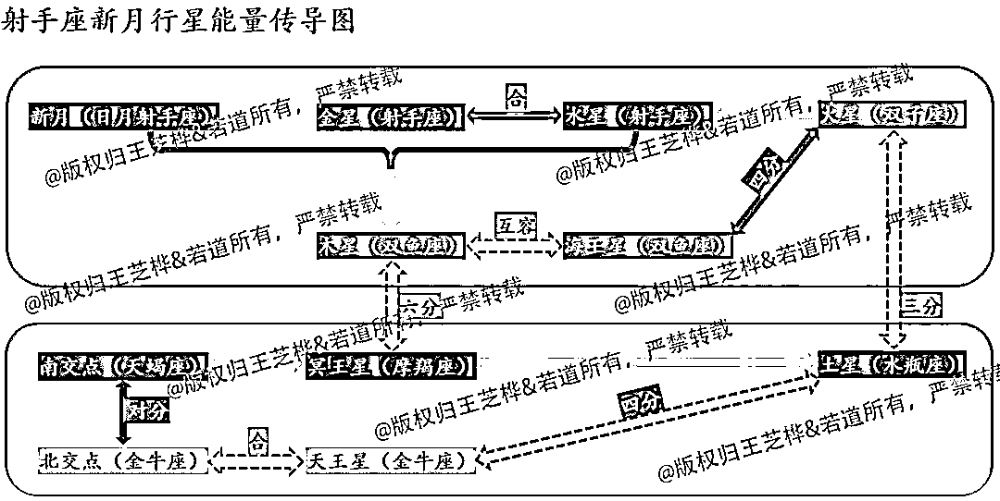

> **射手座新月重点影响人群****参考新月峰值影响期间各个行星的行进度数，以及逆行行星的轨迹影响；常规容许度，个人行星入相位 3°，出相位 1°；非个人行星入相位和出相位均为 3°。**
> 
> *   出生星图中，有**行星、四轴、南北交点**落入**变动星座（双子座、射手座、处女座、双鱼座）0°-30°**的人群。
> *   出生星图中，有**行星、四轴、南北交点**落入**基本星座（**白羊座、巨蟹座、天秤座、摩羯座**23°-30°**的人群。
>     
>     
> *   出生星图中，有**行星、四轴、南北交点**落入********固定星座（金牛座、狮子座、天蝎座、水瓶座）******9°-28°**的人群。

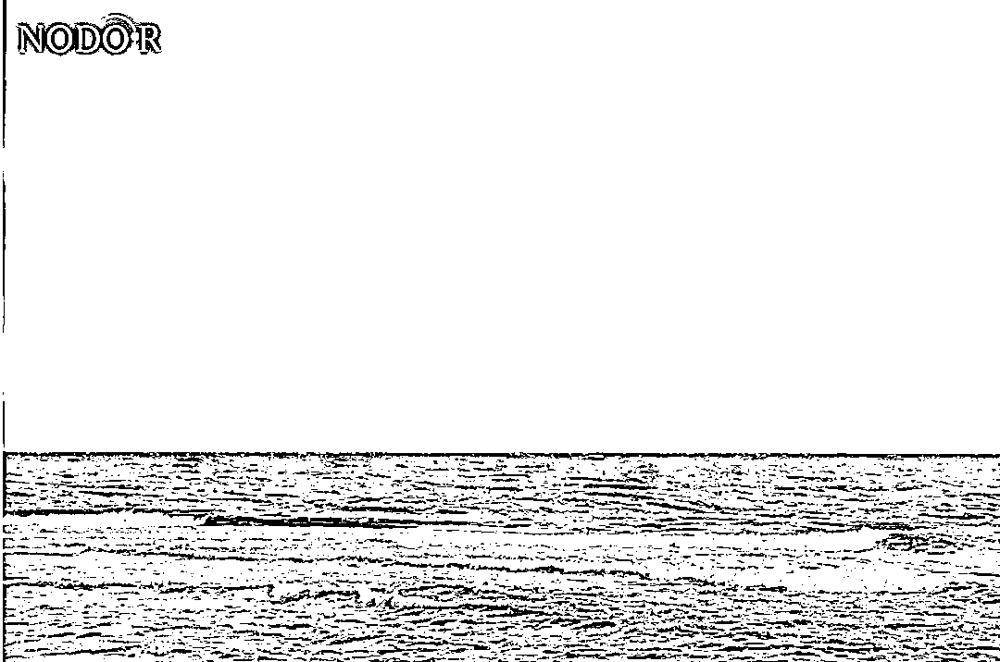

**射手座“光与影”的一体两面**

希腊神话中，射手座原型形象是“喀戎”。

喀戎是第 3 代天神宙斯（木星原型）同父异母的兄弟，即第 2 代天神克洛诺斯（土星原型）的私生子。喀戎父母的私情，被克洛诺斯的妻子瑞亚发现，于是克洛诺斯将自己变成一匹牡马疾驰逃脱，但喀戎的母亲却独自生下了“半人半马”形象的喀戎。故而，喀戎只能成为“半神半兽”的半神。

喀戎的故事，从出生开始便注定悲壮：

**· 先知和医者：**喀戎继承了天神的福祉，智慧且正直，慷慨且慈爱，他抚养并教导多位“神”的成长，成为受人景仰的先知和医者；

**· 羞愧和创痛**：喀戎半人半马的形象，生下来便被母亲嫌弃和憎恶，令喀戎一生携带着“天然的羞愧”；喀戎被“大力神”海格力斯的毒箭误伤脚部，即使他自己就是一位卓越的医者，但这个属于马（物质）的部位却根本无可医治，喀戎痛苦不堪却又无法死去，因为他是半神。高贵与痛苦集于一身，光明与阴影一体两面。占星学中，喀戎的故事对应着凯龙星的神话原型，那位因自我的“天然羞愧和无愈创痛”而成就出的“智慧先知，慷慨医者，伟大导师”；后来，喀戎代替“盗取圣火并解救人类”的普罗米修斯在地狱受死而获得永生，并升到天空变成人马座（射手座）。故而，我们不难理解射手座“坐在山顶上”的精神高度和乐观性格从何而来——**面对喀戎“绝望伤口”的沉思与探索，穿越天蝎座“生死涅槃”的觉悟与升华（射手座排列在天蝎座之后）**，由此，超越“悲壮的命运”，飞跃“广阔的天空”。射手座的原型符号是一支指向天空的箭，而只有向上飞跃并向前探索的射手座，才能与射手座守护行星“木星”的神话原型，即第三代天神宙斯的“神性之光”合二为一——**远大的理想，坚定的信念，不朽的希望，这一切的“奇迹”需要我们面对“人”的平凡与局限，才能超脱“伤痛”的桎梏与纠缠，最终获得“精神”的觉悟与光辉。**只有面对阴影，光明才能降临。

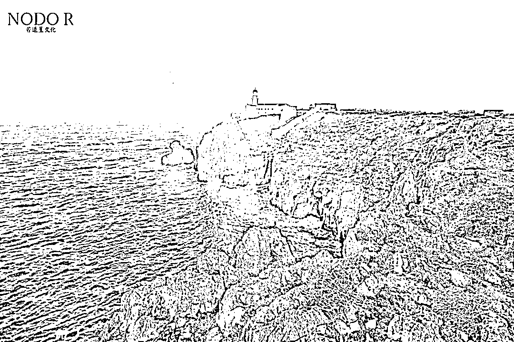

**超越“悲壮命运”，飞跃“广阔天空”**

> **天象****· 水金合相：水星和金星合相于射手座。****· 木海互容：双鱼座木星和双鱼座海王星能量互容 。****· 火海四分：双子座火星四分双鱼座海王星。****· 木冥六分：双鱼座木星六分摩羯座冥王星。**

太阳行进在天蝎座的一个月时间（10 月 23 日-11 月 21 日），我们经历了天蝎座日食（详情点击：[天蝎座日食](http://mp.weixin.qq.com/s?__biz=MzA5NjA0NTAxNg==&mid=2651492140&idx=1&sn=9c5bb00704f4530adf057d816c89e82c&chksm=8b483d9bbc3fb48d9527e67961c53383f3f7eaf3a4c770138928ffb620d9726c24162e1840fc&scene=21#wechat_redirect)）和金牛座月食（详情点击：[金牛座月食](http://mp.weixin.qq.com/s?__biz=MzA5NjA0NTAxNg==&mid=2651493433&idx=1&sn=4b30c47884691f3784d09dba26021639&chksm=8b48268ebc3faf98d32d59275e660728520b016e4b15c0777000dafaadcfa5077250405d3ed1&scene=21#wechat_redirect)）两场重磅洗礼，将过去 6 个月（5 月-10 月）的激烈与混乱彻底激起一片浪潮，虽然水落石未出，但未来半年“转化与重生”的旅途已然向我们敞开。
**5 月-10 月，一切均围绕着“金钱与关系”两件事折腾不已。**无论是集体层面，还是个人层面，都到了一个敏感的临界点，争立场，搏利益，为生计，这个地球似乎都变小了。11 月 22 日，太阳换座进入射手座，开启为期 30 天的射手月生活（11 月 22 日-12 月 21 日）；11 月 24 日，射手座新月发生在射手座 1°37′，为刚刚走过天蝎月“黑暗隧道”的我们投下一颗“希望”的种子。然而，就像前文写到的射手座神话原型故事，坐在山顶上的射手座在“超越悲壮命运，飞跃广阔天空”之前，首先要面对绝望的伤口并穿越生死的涅槃，才能升起精神觉悟，才能收获乐观性格，为这颗“希望”的种子准备好相应的土壤。此次射手座新月并没有直接的相位结构，于是，那颗射手座的守护行星、接纳射手座新月能量的“木星”便吸引了我们所有的关注。**★****缘起**

**2021 年 12 月 29 日，木星进入双鱼座，旋即与双鱼座海王星形成“木海能量互容”状态（木星和海王星同时守护双鱼座），并于 2022 年 4 月 12 日形成“木海合相”结构。**  

2022 年的前 4 个月，可以说是相当神奇（魔幻）的一段时间。

**·** 代表“扩张能量”的木星、代表“灵性通道”的海王星，在双鱼座的“意识之海”之内，似乎为已经困顿了两年的我们带来了“希望”；但是，双鱼座这片模糊不清并难以聚焦的海洋，也容易令木星失去边界并变得“膨胀”，令海王星难以落地并“逃避”现实；

**· **没有真正面对伤口、没有真正做过取舍的“希望”，毫无疑问会带着“幻觉”的危险。而这段时间，做出的决定和设立的目标，如果没有经过理性的评估和落地的考量，也将为 2022 年后面的旅途埋下混乱的祸根。**★****后续的发展**

5 月 11 日，木星换座试水白羊座，白羊座的勇敢性和进取心被木星进一步“扩张”，但白羊座的鲁莽性和好斗心也被木星进一步“膨胀”，以致**在追逐目标的道路上更加顾不上评估“幻觉”的危险，激进冒险，竞争加剧。** 

7 月 29 日，木星于白羊座开始逆行，10 月 28 日，逆行回到双鱼座，11 月 24 日，于双鱼座恢复顺行。**7 月 29 日-10 月 27 日木星逆行白羊座的这段时间，如果能在激进之下保持觉察，在受挫时刻敢于反思，或许还能及时止损；但如果盲目冒险或一意孤行，只能越陷越深。**我们再将视线拉回到 10 月 23 日-11 月 21 日天蝎月的时间线上：**·** 10 月 25 日，天蝎座日食的能量覆盖之下，10 月 28 日，木星逆回双鱼座并再次形成“木海能量互容”的状态，这是宇宙赐予我们洞悉真相和评估理想化的时刻，更是宇宙提示我们面对伤口并做出取舍的时刻；**·  **“希望”一直都在，但我们必须先与内在的匮乏直面、与内在的恐惧和解，才能觉悟“希望”的真正意义——面对“自我”的羞愧与创痛，才能不再试图通过“外在的争夺”来填满“内在的黑洞”，才能不再带着理想化的期待盲目杀入战场，才能告别那些消耗我们的事物，才能校准真正属于自己的“希望”。

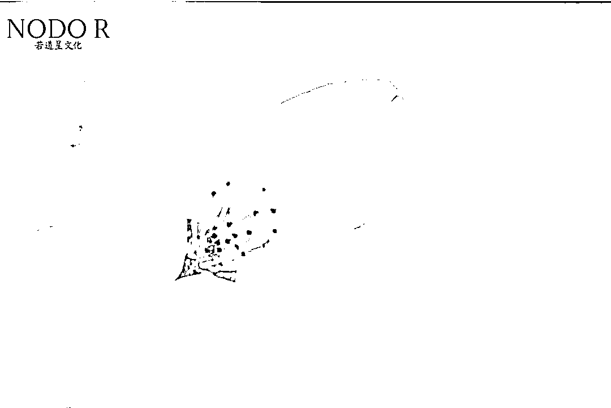

**★****重新的评估**

此次射手座新月当天——11 月 24 日，已经逆行回到双鱼座的木星终于结束了将近 5 个月的逆行并恢复顺行，而射手座新月也同时送上一份“开启希望”的大礼。

但是，此次射手座新月前——11 月 19 日，双子座火星与双鱼座海王星的“火海四分”结构也迎来第 2 次峰值影响。而 11 月 19 日第 2 次“火海四分”结构，只是 10 月 12 日第 1 次“火海四分”结构的重复和延续。

第 1 次“火海四分”结构形成的时候，当时木星正逆行在白羊座（木星 10 月 28 日逆行回到双鱼座），双子火星则接纳着白羊座木星的能量（火星守护白羊座）。故而，“火海四分”结构中的“战神”火星，因为白羊座木星加剧的竞争和受挫的斗志，正在暴躁不已且沾火就着！

为什么？因为目标混乱，所以毫无章法；因为毫无章法，所以虎头蛇尾。更关键的是，**不愿意面对责任，不愿意承担后果，而那些“火气”总得有个出口。**故而，**10 月 12 日的第 1 次“火海四分”结构，可以说完美底破坏了逆行的白羊座木星保持觉察、敢于反思、及时止损的可能性。****10 月 12 日和 11 月 19 日两次“火海四分”结构的这段时间，容易令我们身陷艰难的处境，也总是让我们感到无力的狼狈，甚至对自己的“躺平和虚弱”感觉耻辱。**此次射手座新月来临之际，我想说：**停止自我批判，停止向外开炮，慢下来，休息，放松，你必须关爱自己身体层面的信号，也必须慈悲自己心理层面的脆弱。在如此艰辛的年月里，记得对自己好一点。**最近 3 年，每个人的生活都是跌宕起伏，内心深处也无可避免地留下一些伤痛。在面对和疗愈这些伤痛以前，我们很难“坐在山顶上”去高瞻远瞩，因为内心的黑洞会一次又一次地将我们拖入现实的泥沼，而每一次的挫败又会再一次加重作为“凡人”的羞愧与自责。然而，我们就是凡人。连伟大的“先知，导师，医者”喀戎都有天生的羞愧和无愈的创痛，我们为什么不可以有？但是喀戎正是因为自己“羞愧和创痛”的亲身经验，才修炼出更高级别的治愈能力和慷慨智慧，我们当然也能。喀戎（射手座原型）和宙斯（木星原型）代表着“光与影”的一体两面：宙斯是众神之神且权力无边，喀戎是半神之躯且命运悲壮，但**当喀戎面对伤痛并超越解脱的时候，他化为射手座并与木星一体共振，成为“光明与希望”的象征。**而其实，喀戎的半神限制，只是隐喻着宙斯阴影面，因为这位“众神之神”宙斯的风流成性且私生无数，只是为了对抗和摆脱来自女性（母亲和妻子）的权力管控。“神”也很不容易。“神”的原型所代表的那些占星符号，就在我们每个人的出生星图之中，更在我们每个人的生命之内，他们的天赋和阴影我们也同样拥有。关键是，我们用天赋和阴影之中的哪一个面向，来回应生命所面临的重重考验。

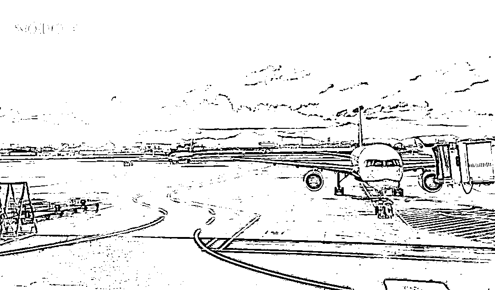

每每写到射手座的文章，我总是想起一首吉普赛歌谣：“时间是用来流浪的，身躯是用来相爱的，生命是用来遗忘的，灵魂是用来歌唱的。”我们总是舍不得跟随时间的河流缓缓流动，总是听不到生命内在的韵律在表达什么，我们投身在各种世俗的功名利禄和爱恨情仇之中，被“只能更好”的野心缠绕，被“不能后退”的恐惧驱动，但其实我们并没有面对自己的羞愧与创痛，或许根本就不允许自己的真实与脆弱。自我生命的权力究竟被什么左右？我们对自己究竟拿出了多少慷慨？此次射手座新月，宽泛容许度下，刚刚恢复顺行的双鱼座木星与摩羯座冥王星形成“木冥六分”结构，亦在提示我们“重新评估”自己的理想信念——**那些内心燃起的希望，那些忙碌不停的奔忙，究竟是能引领我们飞跃“广阔的天空”，还是会诱惑我们坠入“悲壮的命运”？****★****你可以做的**此次射手座新月，太阳与月亮精准合相于射手座，水星与金星紧密合相于射手座，将能量传递给刚刚恢复顺行的双鱼座木星，提示我们对以下几个方面做出评估：
**· 职场：**这是适合制定长远规划、确立未来方向的时间，评估自己的“优势和短板”，评估职场的“空间和发展”，评估市场的“现状和风险”，缺一不可，综合考量；**· 关系：**此次新月将会推动关系状态的发展，无论是人际关系或亲密关系，还是金钱关系或劳务关系，具体走向和审判结果将会逐渐浮出水面，而此时也是合理维权和解决纠纷的有利时间；**· 学业：**此次新月是规划进修方向、考取资质证书、发表学术言论的大好时机；如果你想提升自己的竞争力，建议为 2023 年做一些学习计划；部分朋友的留学计划也将看到相应的进展；**· 金钱：**经济和钱财相关的事宜有望得到推进，拖发的薪水和未收的账款有所缓解；投资理财方面，曲线易变，还需谨慎；**· 集体：**国际层面的关系走向和商务谈判呈现新的趋势，教育板块和经济板块释放新的信号，传染疾病和医药板块仍会呈现一定震荡；但是，集体层面的这一波变化和起伏，要到明年 3 月才见分晓。**寄语**这个世界影响着我们，而我们亦在这个世界参与其中并做出反应。
这是很微妙的一种关系。我们希望这个世界什么样子？这个世界又希望我们什么样子呢？最近我一直在思考这个问题。人间百态，身在其中，谁也脱离不开这种“你中有我，我中有你”的关系。就在昨天，想到了“希望”这个词，我需要的，别人亦需要。想起一位朋友说过的一个经历：很多年前，两位刚刚创业的合作伙伴，坐着最便宜的绿皮火车，从最北头到最南头去谈生意，累到睡着，还没到站，便发现揣在衣服里层的 3 万元现金不翼而飞；那时的 3 万元还很值钱，甚至还有一部分是借来的钱财；他们没有互相指责或彼此埋怨，而后他们一路合作了很多年，直到今天。那位朋友跟我说：最难的是，每个人都拼尽全力，但又都精疲力竭；最难得的是，每个人都没有抱怨，而那个时刻的沉默代表着“希望”。祝福每一个生命健康，每一个灵魂安好。

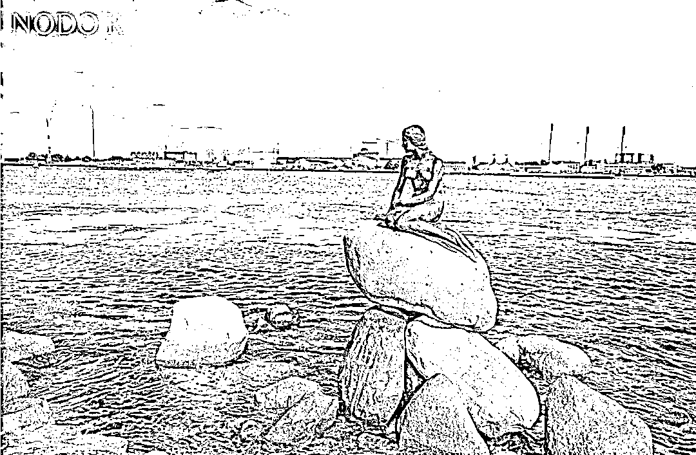

**新月如何许愿？****许愿时间**：2022 年 11 月 24 日北京时间 6:57 后，48 小时内有效、8 小时内最佳。 **许愿人群**：所有人。**许愿数量**：每人最多 10 个。**许愿方式**：静心冥想，身心祈祷或记录收藏。**许愿格式**：请万能的宇宙赐予我能量，我将以我的能量吸引**（什么）来到生命中……**许愿原则**：发心诚善利人。

**版权声明**：原创文章由作者授权首发于若道平台，欢迎转发，反对抄袭。友号转载请申请白名单。

**END**

****想阅读更多作者的文章，请在后台回复******王芝桦****** 即可。****

****王芝桦****

心理占星师，统合疗愈师，占星专栏作者

全职于个案咨询与占星教学工作 18 年

**个案预约咨询微信号**：zhihua0621 

**微信公众号**：daoxi-life

**长按打赏**

****

**梅里曼金融报告双 12 福利来啦！****长按下图了解更多详情吧！**

**20 位来自世界各地的占星师****带来 19 场沙龙——新世界的觉醒****详情可点击下图**

**学习占星学****点击下图了解课程详情**

**福利来啦**
**点击****“阅读原文”****获取最好用的免费****新月报告****微信又双叒叕改版啦，不想错过若道君的推送？**
****就把若道设为****星标****以及点点****“在看”****吧！******▼**

**喜欢就点一下“在看”吧！****免费新月报告直达入口**

# 2023 天象预测大师课 | 2023 年，宇宙都将发生哪些大事？

> 原文：[`mp.weixin.qq.com/s?__biz=MzA5NjA0NTAxNg==&mid=2651495128&idx=2&sn=754eece72b19855e11b7a3cd3de0cff6&chksm=8b48286fbc3fa179c1dfa951247909e1991d08efd750f7e98eb988c29e440d508f6c4cbe7989&scene=126&sessionid=1692737720#rd`](http://mp.weixin.qq.com/s?__biz=MzA5NjA0NTAxNg==&mid=2651495128&idx=2&sn=754eece72b19855e11b7a3cd3de0cff6&chksm=8b48286fbc3fa179c1dfa951247909e1991d08efd750f7e98eb988c29e440d508f6c4cbe7989&scene=126&sessionid=1692737720#rd)

2022 年已接近尾声，忙碌的年末工作也挡不住我们对来年的盼望和期许。

作为占星师，在年初跟随权威老师透彻的学习 2023 年重要天象的含义和影响是迎接新的一年的正确姿势，仪式感满满！

若道邀请了金牌核心课中的 4 位国际名师再次集结，在**2022 年 12 月 16 日-18 日**带来**2023 年重大天象的深入解读：从冥王星、土星、木星换座；金星逆行；土星在双鱼座等角度切入，洞悉大环境的变换趋势、时事格局，为新一年的自我规划和占星事业加油充电。**

**课程时间安排**

**2022 年 12 月 16 日 周五**

**20:00-22:00 ****克里斯蒂娜·罗登贝克****2022 年 12 月 17 日 周六****16:00-18:00 ****艾德里安·邓肯**（休息 30 分钟）**18:30-20:30 ****大卫·瑞雷****2022 年 12 月 18 日 周日****18:30-20:30 ****琳恩·贝尔****课程内容安排**

**12 月 16 日 周五**

**20:00-22:00** **宇宙的舞者：****2023 年的冥王星、土星和木星**

**2023 年是这 10 年中最重要的年份之一，标志着一个时代开始落幕。**冥界的黑暗之主冥王星自 2008 年以来一直在摩羯座行进，它将在 2023 年离开摩羯座，能量会发生重大转变。

**在接下来的 20 年里，冥王星会在下一个星座水瓶座行进，影响整个时代。**但对于冥王星来说，进入水瓶座并不容易，或者说并不顺利。**在接下来的 2 年，冥王星会 2 次重返摩羯座，2023 年 6 月它将首次重回摩羯座。**这看起来在个人层面和全球层面都会是**动荡和调整的混乱时期。** 
就在冥王星首次换座的同一个月，**另一颗强大的行星土星也会离开自己的家园，进入没有边界的双鱼座，结束在水瓶座为期 2 年的限制和制定规则时期**。与此同时，**木星这颗与扩张和幸运相关的行星，也会在 2023 年春天换座，从火热的白羊座跃入金牛座更坚实的土地之上。**2023 年有望成为与重大改变相关的一年，这就是为什么了解这些重大行星事件的时间对于规划未来一年至关重要的原因。

**12 月 17 日 周六**

**16:00-18:00 2023 年的爱与戏剧性**如果男人来自火星，女人来自金星，那么我们应该能通过密切关注 2023 年金星和火星之间的相位来见证它们的热烈拥抱。当金星和地球围绕太阳相对运行时，金星会表演一场华丽的舞蹈，在 8 年的时间里形成 5 个逆行环路，在天空中勾勒出了一朵完美的玫瑰花。每 1 片或 5 片花瓣的尖端按顺序以几乎完全相同的度数在这 5 个星座中出现：双鱼座、天秤座、双子座、摩羯座，以及——在 2023 年落在狮子座。**2023 年将会是充满戏剧性和浪漫的一年。**

在此次课程中，我们将跟随**金星和火星在 2023 年的运行**，特别是**6 月 5 日，金星进入狮子座，7 月 23 日在狮子座 28°逆行，到 10 月 9 日才离开狮子座这段时间。**这是漫长的 4 个月。**火星会在 5 月 20 日进入狮子座，7 月 10 日离开。** 
由于金星的运行速度通常是火星的 2 倍，你会期待它们在狮子座形成一次重要合相。但金星会逆行，与火星的浪漫相遇不会有一个愉快的结局。**在 2023 年夏天，金星和火星会给我们讲述一个什么样的爱与关系的故事呢？**  还有一个更复杂的天象。**3 月 23 日，冥王星进入水瓶座，在 1°左右徘徊，直到 6 月 11 日。**这是自 245 年前的 1778 年 6 月-8 月以来，首次先是火星，然后是金星在狮子座对分冥王星，而 245 年前美国正处于独立战争时期。

2023 年冥王星进入水瓶座，接下来的 20 年里，每当金星与冥王星形成相位时，都会改变浪漫的本质。最后，因为金星在狮子座逆行，在狮子座来来回回移动，所以它会与在金牛座的天王星形成三次四分相，与刚刚进入金牛座的木星形成三次四分相。

**这些征象与高度特权、富有和极端独立自主的行为相关。**我们都可以在 2023 年期待激动人心的浪漫爱情，但对于那些金星和火星强大的人来说，将会有盛大的烟花表演！

**12 月 17 日 周六  18:30-20:30 大卫· 瑞雷分析新一年的时事趋势**  **涵盖的趋势和主题包括：**

**· 火星在双子座逆行**——最后一次四分海王星！2023 年前 3 个月，信息战继续升温；谁在欺骗谁？世界上武装冲突的噪音。

**· 冥王星进入水瓶座**——改变“一与多”之间的关系。由贡献和参与定义身份，以及排斥和包容的副作用。权力和资源的重新分配，以及世界面临的挑战。

**· ****土星在双鱼座**——以不可能的方式将想象变成现实； **· 再谈木星在白羊座**——谁从武装冲突中受益？ **· 木星进入金牛座，四分冥王星**——面对贫富差距，然后在狮子座的金星在逆行期间三次四分木星；

· **火星-冥王星相位**——对分冥王星，三分冥王星，四分冥王星· **情人节那天，金星入相位合相海王星**——这是宇宙天气和文化传统之间一次罕见的一致

**12 月 18 日 周日 18:30 – 20:30 土星在双鱼座：消融边界**

过去 5 年，土星一直在它的“家园”摩羯座和水瓶座中行进。2023 年 3 月 7 日，它将进入双鱼座这片湿滑之地，加速旧边界的消融，改变我们对世界的看法。

**土星在双鱼座需要对看不见的东西有信心，并且经常要求我们放下曾经看起来坚实可靠的东西。旧的确定性受到挑战，可能需要做出牺牲。** 
土星在双鱼座帮助我们**放下过时的依恋，意识到那些并不支持我们的东西。**它能给我们勇气，让我们头朝下跳入水中。一旦土星越过星座边界，它会在双鱼座逗留到 2025 年 5 月。我们会看一看这段旅程的馈赠，同时也看一看它可能存在的隐患。

土星换座后不久，冥王星会进入水瓶座，仅仅在 2023 年开始后 8 周的时间。**冥王星换座会带来全球范围内权力分配的变化。它可能是技术进步的先兆。**这个时期，集体的需求可能比个人的需求更强烈。一个新的世界正在崛起，一个旧的世界正沉没到波涛之下。 **讲师是谁？**

**克里斯蒂娜·罗登贝克（Christina Rodenbeck）**

· 全职职业占星师，在牛津大学城生活和工作，深受周围知识和文化氛围影响；她拥有伦敦大学（University of London）的人文荣誉学位，曾在伦敦占星学馆（Astrological Lodge of London）、心理占星中心和占星研究学院学习。  **· **作为一名占星师，在过去的 20 年里，克里斯蒂娜在她的网站“牛津占星师”上写了大量关于时事、艺术和文化的文章；她每月主持一个占星播客：“与克里斯蒂娜和萨莉一起占星”，并定期在《占星杂志》(Astrological Journal)上撰写时尚专栏；她定期在英国授课，并保持着蓬勃发展的专业实践。
**艾德里安·罗斯·邓肯（Adrian Ross Duncan）****· **1971 年在印度游学时开始学习占星学，1985 年开始成为全职占星师，迄今执业已超过 33 年，是人本主义占星学、卜卦占星学和经世占星学领域的知名占星师。他还开发了占星软件 AstroClock 和多款占星报告。**· **他在日常咨询中经常运用卜卦，咨询图（卜卦的一种运用方式，即根据客户来访时间制作星图，从星图中获得大量信息）也是他特别擅长的领域。**· **从 1971 年开始研习佛学，受佛学影响很深，他相信占星学和佛学观点一致，转化的一个基础是在于对现实感知的改变。而卜卦很容易与佛教融合，因为它只关乎当下。

**大卫·瑞雷（David Railey）**

**· **若道联合创始人，致力于在中国教授和推广西方占星学。**· **曾任 ISAR 全球副主席，CAPISAR（ISAR 职业占星师资质认证机构）主席；**· **1976 年，通过亚特兰大职业占星师考试，成为全职占星师，随后通过 AFAN 和 ISAR 职业测试；**· **1980 年，与杰夫·焦耳一起在亚特兰大创建“每日行星”占星学中心。此后在亚特兰大占星协会担任 4 年考官，并且两次担任亚特兰大地区占星协会主席。1979-1992 年，作为占星师活跃于美国社会媒体，向不了解现代占星学变化的大众宣传专业占星学知识。

在 1989-1992 年期间，他在 WRGG 电台 12 频道每周主持个人电视秀“今日占星学”，早先他还在 WRFG 的广播节目中播讲宇宙天气节目；

**· **2010 年-2014 年，任全美占星师联盟监督委员会委员；

**· **2010 年，其著作《灵魂的目标》中国版出版，和蒋颖一起创办若道占星学校和其官网 www.nodoor.com。

**· **2017 年，被选为 ISAR 委员会成员。ISAR 是世界最大的国际占星机构，会员遍布 45 个国家，2017-2020 年曾任 ISAR 全球副主席、CAPISAR（ISAR 职业占星师资质认证机构）主席。

**琳恩·贝尔（Lynn Bell）**

**· **世界受欢迎的占星学演讲者、作家和老师之一。定居巴黎，研究心理占星学和家族模式数十年。**·** 著名的心理占星学中心（*Centre for Psychological Astrology*）的长期导师。2016 年，获得查尔斯·哈维（Charles Harvey）杰出的占星学服务奖。**· **作为一个从多个层面进行工作的占星咨询大师，琳恩的工作结合了心理学的观点。她对家族模式的兴趣首先来自与客户的合作。通过在分析领域所做的个人工作，她所受的埃里克森催眠训练将她引领至家族系统。后来，她组织研究小组在家族星图上进行了数年的研究。她写的《家族占星学》就是这项研究的结果。**· **法国心理占星学协会会长。除了占星学，她在法国沙特尔的新沙特尔学校任教 8 年，还 5 次获得了在《纽约时报》畅销书作者卡罗琳·迈斯（Caroline Myss）的卡罗琳·迈斯教育学院（*Caroline Myss Educational Institute*）合作教学的机会。**课程价格**

**正价：3000 元 限量优惠价：2023 元（前 60 名报满截止）** 

**惊喜联报套餐！！****《ISAR 选修课 | 预测、预期与意识成长》+《2023 年度天象预测大师课》+《2023 年金融占星预报》****三门联报优惠价 8000 元****（限前 50 名联报）（联系 Maggie 老师，抢占限量优惠价）**

长按二维码添加 Maggie 老师获取联报优惠价

**退转课程**

**退款原则请详看《教学协议》，如有疑问请咨询课程顾问**

****2023 年度天象预测名师课****

**授课老师：****克里斯蒂娜·罗登贝克 艾德里安·邓肯 大卫·瑞雷 琳恩·贝尔**

**直播课开课时间：**2022 年 12 月 16 日-18 日

**授课方式：**网络课程，中英文授课，中文翻译

**费用：****正价 3000 元 限量优惠价 2023 元（前 60 名报满截止）**

**课程负责人：**Maggie（微信：NodoorMaggie 请备注“2023 天象预测名师课”）

长按二维码添加课程负责人咨询~

**报名直达入口**

# 射手座新月 | 新的希望，从这份免费的新月报告开始吧！

> 原文：[`mp.weixin.qq.com/s?__biz=MzA5NjA0NTAxNg==&mid=2651495128&idx=3&sn=5a31ec3ada61e4b00af668c2a63d0143&chksm=8b48286fbc3fa1794aad9c8022a03141b333eb8ded35b1ac4764e4f41beeb5c1e5aa68101ac6&scene=126&sessionid=1692737720#rd`](http://mp.weixin.qq.com/s?__biz=MzA5NjA0NTAxNg==&mid=2651495128&idx=3&sn=5a31ec3ada61e4b00af668c2a63d0143&chksm=8b48286fbc3fa1794aad9c8022a03141b333eb8ded35b1ac4764e4f41beeb5c1e5aa68101ac6&scene=126&sessionid=1692737720#rd)

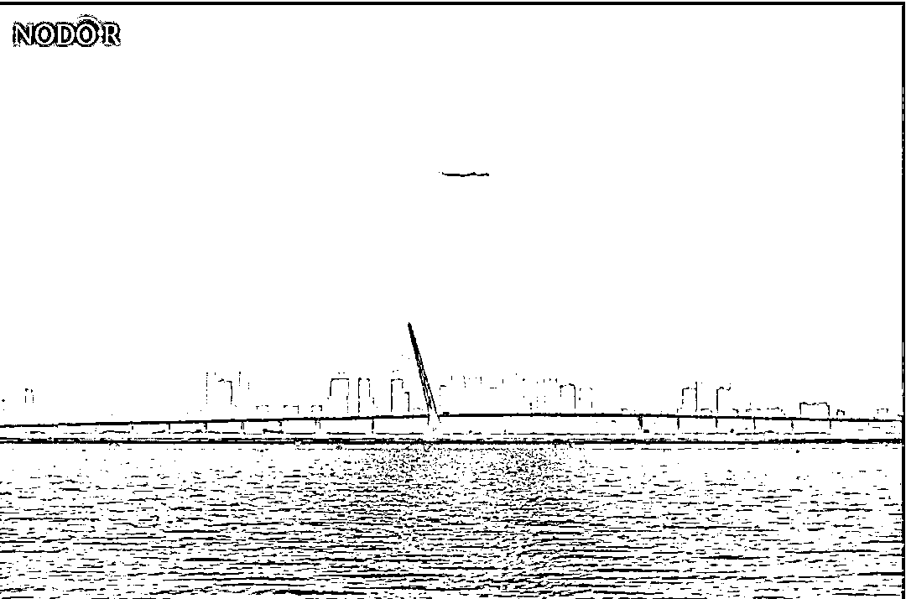

北京时间 11 月 24 日 6:57，新月发生在射手座 1°37′。每到新月时分，若道君都会为你奉上根据你出生星图量身打造的免费新月报告。可是新月为什么要许愿？新月报告该如何领取？让若道君来教你。

　**什么是新月？**　

从占星学看，新月是月亮周期的一种相位。新月是开始，又称为朔，对应中国农历初一，太阳、月亮在此时合相。此时月亮运行到太阳与地球之间时，月亮以黑暗的一面对着地球，并且与太阳同升同落，地球上看不见月亮。

本次新月时间

**11 月 24 日 6:57，新月发生在射手座 1°37′。**

为什么新月要许愿？

新月是一个周期的开始，新月发生的时候，太阳与月亮合相，能量很强。当新月出现时，你也许会发现灵感忽现，非常适宜开启新领域、项目与行动，缔结一段新的关系或合作。许愿会加强新月的能量，也有助于你了解自己现阶段适合开启的方向。 

本次新月最佳许愿时间从新月开始到其后的 48 小时内，许愿的力量最强。**最佳许愿时间：11 月 24 日 6:57-11 月 26 日 6:57**

属于你的免费新月报告每到新月时刻，看着占星文章里写着：看看你新月的宫位，如果新月在第 X 宫，你可以许愿的方向是……是不是常常一头雾水？新月的宫位？我到底该看哪里啊？而有时，那些标注上升星座的文章也会让你忍不住想：虽然我的上升星座是这个，可是我的新月好像并不落在你说的宫位啊？你是不是写错了？

虽然这些文章都没有写错，可是好像对你而言都太不友好了。**Don't Worry！**别着急，让博学又体贴的若道君来帮你！我们推出了一份**免费**又**好用**的新月报告！而且是专门为你设计的哦，**根据你出生星图为你量身打造的，只****属于你的独家新月报告**。报告有哪些内容？**新月时间****最佳许愿时间****如何许愿 **属于你的**许愿关键词**本次新月给你的**建议**你会有怎样的**感受 ******机会****

********

如何许愿？许愿方式也很简单。你可以把愿望写下来，或者双手合十后交叉，闭上眼睛来祈祷。 报告中会为你提供**祈祷词示例**，可以多多参考哦～ 你还可以适当添加自己的语言，创造属于你自己的祈祷文！如果报告拿到手了，快对照着许愿吧！

**这份好用又暖心的报告，点击****阅读原文****即可领取！**

**END****新月报告获取入口**

# 重磅丨木星顺行啦！！！

> 原文：[`mp.weixin.qq.com/s?__biz=MzA5NjA0NTAxNg==&mid=2651494965&idx=1&sn=b06815f19caeb0bcbc7acadc2e46ff77&chksm=8b482882bc3fa1943ec017a89210265fe0a6be10b2436061d9d653e6c46d4c21f33b7cb4ae08&scene=126&sessionid=1692737720#rd`](http://mp.weixin.qq.com/s?__biz=MzA5NjA0NTAxNg==&mid=2651494965&idx=1&sn=b06815f19caeb0bcbc7acadc2e46ff77&chksm=8b482882bc3fa1943ec017a89210265fe0a6be10b2436061d9d653e6c46d4c21f33b7cb4ae08&scene=126&sessionid=1692737720#rd)

******☆ ****后台回复“今日”，给你一句生命态度******

作者/朵三三三 ISAR 认证占星师
编辑/翀子 封面/书君 图片/稿定设计 11 月 24 日早晨 7:02，木星在双鱼座 28°恢复顺行，一个月后它将正式进入白羊座。回顾木星在双鱼座的日子，我们得到了哪些启发？未来一个月，我们又有怎样的可能性？来看文章吧！**木星顺行**

木星与幸运有关，也与扩张有关，代表着理念、信仰，是我们所相信的事情。木星每过一年左右，就会换一个星座，所以在中国古代，也被称为岁星，它指示着每一年政治经济及大环境的变化，是最能描绘社会氛围的一个风向标。

**11 月 24 日，木星在双鱼座 28°顺行，走过双鱼座的末度，一个月后，木星会正式进入白羊座，开启一个新的 12 年轮回。**

双鱼座是黄道最后一个星座，也是木星所守护的星座。木星在这里回到了自己的家，把木星所有的特质发挥得淋漓尽致。

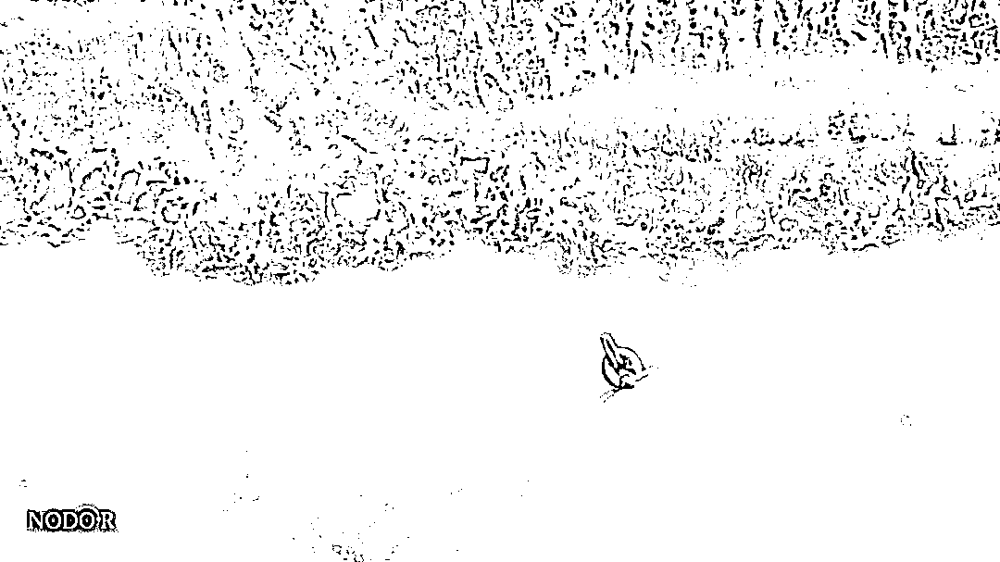

**双鱼座木星到底是什么？**

在木星进入双鱼座之前，看到众说纷纭的猜测和期待。我跟大家一样，也在幻想一段充满爱与和平的幸福时光。

**而实质发生了什么呢？**

**所谓的命运共同体确实出现了**，我们被牢牢绑定在一起，形成了铁板一块。众生一体再不是虚幻的灵性名词，而是成为了我们每一天的日常。远方正发生的喜怒哀乐，人间冷暖，都像蝴蝶效应一般牵动我们的神经，我们的情绪，也实实在在地影响着我们当下的每一刻。

过去，我们出门只需关注天气状况和路况：明天会不会下雨，是否需要带伞，周一早上容易堵车，我们是否要早点出发。

而现在，我们却担心着健康码和弹窗，不知道明天是否出得了门，不知道电梯里一分钟的共处，意味着什么，也不知道那个在周二下午三点走进楼下咖啡馆的 TA，又会如何影响着我们未来一周甚至几周的生活。

我们每一天都能看见无数个陌生人准确到几点几分，与我们息息相关的生活行踪，或许我们从未相遇，未来的我们也将一直素不相识，却只因“我吹过你吹的晚风”，命运的轨迹就这样神奇地有了交集。

从前上大学的时候，要坐夜间的火车从家乡到北京，每次坐在窗边，看到迎面驶来，在几秒钟里从身旁呼啸而过的列车，都忍不住想象，对面的车窗里坐了谁，TA 从哪里来，又到哪里去，我们是否还会在未来的某时某地，再次相遇？

作为一个双鱼座，此类幻想无穷无尽，从前只觉得非常浪漫，而当本该彼此擦肩而过后，便该消失在茫茫人海的这一切，被大数据捕捉下之后，一切都变了。它们不知何时就会见诸报端，公之于众，被大家阅读你们相遇的“故事”。

所有浪漫的感受完全消失了，我只觉得惶恐不安。

可它确实就是双鱼座木星啊！**双鱼座木星带来的放大效果，让我们每一个生活细节都可能被放在显微镜底下反复审视，而双鱼座让个体的边界感在不断冲击中，不断丧失。**

有时我甚至觉得，自己已经不再是一个有着独立意志和自由权力的个体，我被时代的风浪卷起，又被无边的洪水淹没，最终成为坠落海底的一粒沙。有时，我又觉得，我不知道自己是什么，或许我什么都不是，我本来就什么都不是。

我感到自己在渐渐消融，模糊掉了原有的界限感，也丧失了自我的身份认同，我不再是我以为的那个人，我曾经期盼着的一切，终是镜花水月，而如今一场又一场的幻灭，才是真相。这也是双鱼座木星。

**双鱼座能量的残忍之处**就在于双重世界的幻境之殇。一个绝美被另一个打破，漫天的分崩离析之间，真正的未来才就此展开。**跟想象中不一样，才能让你认清什么是想象。**这就是双鱼座木星教人功课的方式，温柔却决绝。

它不遗余力想要呈现给我们看的，才是真实的人世间。

**那你呢？你以为自己是什么？在期待什么？又幻灭了什么？**

**2021-2022：木星在双鱼座走过的路**

来回顾一下木星在双鱼座的旅程，看看人间都发生了些什么，或许我们能更好的找到心中的答案。

**2021 年 5 月**，木星第一次进入双鱼座，不久后开始逆行，在它逆回双鱼座 0°时，郑州发生了“7·20”特大洪水。如同 1998 年特大洪水灾害时一样，那时木星也位于双鱼座。泛滥、雨水、洪水，都可以对应到木星与双鱼座的能量。

而当**2022 年 1 月**前后，木星再次来到双鱼座时，奥密克戎首次传入内地，毒性减弱，传染性大增，也与双鱼座木星的扩张与发散特质相对应。

**2022 年 4**月，木星合相海王星，双鱼座的两颗守护星合体，如同双剑合璧，威力大增。我们一起经历了疫情最疯狂、最严重的时间。这种严重程度是带给我们身心冲击力最强，几乎占据我们全部日常生活的影响力。

**2022 年 5 月**，木星进入白羊座，很多城市逐渐从尘封中苏醒，人们又开始恢复流动。

**2022 年 10 月底**，木星逆回双鱼座尾度，许多城市再度沦陷，而这其中，有许多是过往没有大规模经历疫情的地方。双鱼座木星不会放过每一个角落，它不允许还没人体验过，也不允许还有人学不会。

而席卷其中的我们也一样，若你还有任何的幻想在，这次逆行期间，一定都会被揪出来扫荡，确保心灵的每一个角落都被洗礼过为止。

确实，没有任何的遐想空间了，即便是最爱做梦的人，也该清醒过来了。比起双鱼座土星直接的当头棒喝，**双鱼座木星教育人的方式是，让你自己先膨胀到极点，再自然地炸裂跌落。**

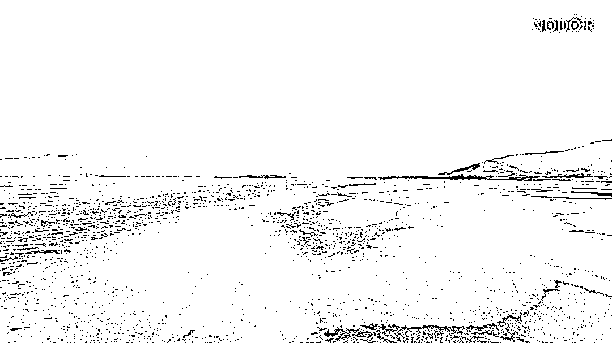

**而木星之所以是木星，就在于它依然会以温柔的方式接住你。**我相信每个人都在过去的一年里，都以不同方式度过了自己的至暗时刻，也不止一次被温暖打动过：**在严酷艰难的寒冬中，我们想要去帮助别人，也被别人真心实意地帮助过。**

我们或许发自内心地担忧过远方一位素不相识的陌生人，也在陷入困境时，被远方无数的人牵挂着、关心着。在木星进入双鱼座时，我们想方设法去面对生命中或许从未有过的困难，我们也有机会，去传播许多许多的爱与暖。**“无穷的远方与无数的人们，都与我有关。”**

2022 卡塔尔世界杯开幕式上的表演中，摩根·弗里曼和加尼姆·阿尔·穆夫塔（Ghanim Muftah）说：“这个世界变得更加有距离了。我看到是什么团结了我们，这一刻，团结远比我们的分歧大得多。但是我们要怎么做才能让它持续更久，而不仅仅只是明天？是宽容和尊重，可以让我们生活在同一屋檐下。虽然我们语言不通，但我们能感受到情感，连接彼此所有人的情感。我们召唤你，我们一起向全世界发出召唤，请大家加入我们的大家庭。”

**这也是木星双鱼发出的召唤。**

无边无际扩散着的，可以是病毒，可以是疾病，也可以是温暖，是信念。我们的生命被残忍地碾过之后，却依然愿意温柔地去对待他人，我的口袋里只剩下一颗糖，却依然愿意去分一半给你。**“世界以痛吻我，而我报之以歌”，这是木星双鱼给晦暗尘世赋予的巨大力量。**

双鱼座天然的**牺牲奉献**，为他人付出的特质也被木星以最大形式表现出来，木星与双鱼能量相互激发，**唤起人们的慈悲心和同理心，**我们尽全力展现出自己所有的善意，也前所未有地体验到，我们是如此的需要他人。

灾难是无法改变的，无论它因何而起。当它来的时候，就是来了。这里面有危险，有迷失，有燃起的希望与光亮，有发自内心的理解与仁慈，也有丝毫不讲道理的盲目。

而我们能做的，是选择如何面对它，**若我们永远宽容，永远感恩，就是木星的乐观与智慧，双鱼的接纳与爱。**

感恩我们还活着。

只要还活着，就有机会去体验生命里更美好的东西。

不是圣母心，也不是阿 Q，而是放过自己。你永远都可以选择多爱自己一点，对自己好一点。

**木星在双鱼座时，我们最大的资源就是情感与爱，可以连接所有人的情感，以及每个人心中与生俱来的爱。**爱是我们直面苦难的底气，是我们存活下来的原因，爱是在世间行走时，为自己点亮的一盏心灯，它可驱散无边黑暗，彻骨寒冷。

**爱自己，爱世人，爱众生，唯有爱能将我们连为一体，能让世界变作更美好的家园，唯有爱能迸发出强大的心灵力量，支撑我们在茫茫风雪中勇敢前行。**

宇宙带给我们的礼物，不总是以幸运的方式呈现。有时候，它会在让你得到之前，先经历失去。

**而重要的永远不是我们生活中发生了什么，而是我们记住了什么。这也是双鱼座木星。**

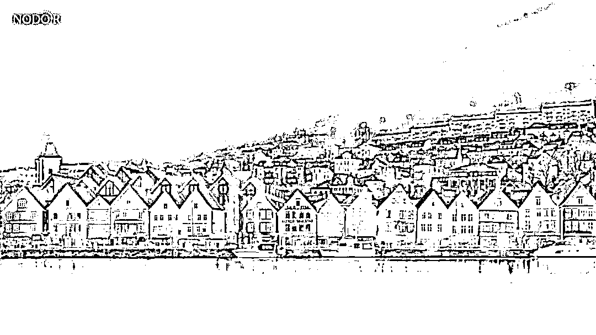

**2022 年 10 月：木星在双鱼座的最后逆行**

10 月底以来，木星在双鱼座逆行的这段时间，我们会看到未尽的功课，发现心里未曾清理完毕的角落。你会感到很多事情又发生了一遍，这证明你有必要再经历一次。

甚至是，你我要学着面对一些永远都不会消失的事情。我们与生俱来的缺口，我们的阴影，我们的恐惧，它们可能永远都不会离开了，我们现在要学会的，就是与它们共存。

有一些事情早已改变了，只是你现在才发现而已。顺行时我们已脱胎换骨，却在逆行时才明白，这就是为什么要有逆行，宇宙给我们时间来消化和复习。这中间一定会有一些延迟。

一位朋友说，她已正式步入了神秘主义，开始属灵了。是的，我感受到，一些人的内在灵性开始爆发了，包括我自己。

个体之间神奇的连接频频发生，默契与感应比比皆是。**双鱼座总是能让我们无限靠近命运。**

更多的人注意到了共时性的神奇，更多的人开始相信意念吸引，更多的人养成了冥想的习惯，更多的人意识到了正念的重要性。大家在群里热烈讨论，把这种信息和能量扩散给越来越多的人。

**我们开始敢于相信，我们值得更好的，我们想要更好的，就能得到。我们相信宇宙，更相信自己。**

另一位朋友说，因为你们的真诚和敞开，我感觉自己的某个部分也被打通了。是的，因为我们是命运共同体，我们共同存在于一个大的磁场中。

我们的底部在看不见的地方紧紧相连，如同百猴效应，我们是无足轻重的一粒沙，也会是至关重要的一粒沙。在人类意识飞速升级的过程中，每一个人都很重要。

最近你可能开始想要摆脱头脑的束缚，抛却用心智判断对错的习惯，你想要远离二元对立的国度，跟随直觉和感受去生活。你可能想要远离卷的生活，回归生命原本的节奏和惬意。你可能突然觉得很多事情不再有意义，只想自在听从心灵的引领。

一些人突然想要学习新的东西，另一些人突然开始渴望远方，想要去陌生的国度，接触不一样的文化，去看看外面更广阔的世界。一些人开始学习新的语言，另一些人学习重新定义自己，试着用新的形象生活。

**别怀疑，这都是木星此次逆回双鱼座的意义，它用最后的能量发力，召唤你，给你信号，你要做的就是不要拒绝，不要忽略，跟随内心的声音走，静待水到渠成的那一刻。**

**木星顺行会带来什么**

上述的一切效应，都会在明天的木星顺行之后更加凸显。我们的所思所想，所求所愿，会逐步显化落地。

明天是个十分特别而重要的日子，**木星顺行又适逢射手座新月，**射手座是木星守护的另一个星座，是理想与自由，也是诗与远方。

新月时，日月金水群星汇聚在射手座，与定位星木星成为和谐的三分相。新月发生后的 5 分钟，木星即刻顺行在双鱼座，为你的梦想加足马力，保驾护航！**这简直是完美，宇宙已经把一切准备好，还有什么更好的可能呢？**

我们就像逆行结束，沉潜过后的木星一样蓄势待发，奔向下一个目的地。**木星在双鱼座的最后一个月里，我们可以试着用内在的领悟指导生活实践，找到随波逐流的轻盈感和松弛感。**

放手跟随风浪前行，体会自己的拥有，和当下的富足与丰盛。坦然接受所有的失去、得到及失而复得，感受双鱼座木星蕴含的广袤智慧，与天地一起周而复始，生生不息。就像树木从不会为了何时开花结果，何时发芽落叶而忧心，我们也一样不需要。

**生命本就是喜悦的庆典，我们只需找回它原本的样子。**

12 月 20 日，木星进入白羊座之后，大环境的速度加快，白羊座能量的开拓创新会带来一波新的机遇，一批新的任务在等着我们去挑战。青春洋溢的热血再度点燃激情，我们就只管去冲刺拼搏，全力以赴，不给自己留下任何遗憾。

只是到那时，我们就没有那么多的时间像现在这样，慢品细尝内心感受了。**所以，好好珍惜木星最后在双鱼座行进的一个月，如今的韬光养晦都在孵化着未来。**

借助双鱼座木星强大的消融力，打破心底里旧世界遗留下的所有桎梏和障碍，让冰雪融化，河水流淌，鸟儿歌唱，让我们拥抱无限可能。

**去吧，但愿你一路平安，桥都坚固，隧道都光明。**

**——塔朗吉（土耳其）**

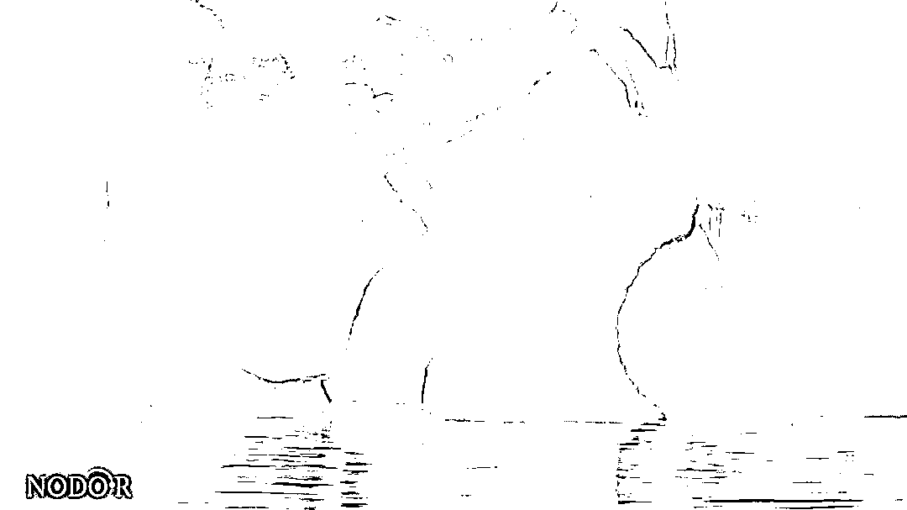

**木星顺行在 12 宫位****若道君：****你可以在 app store 或者应用商店搜索“若道”下载 app，输入个人档案，查看行运盘（也可以使用其他星图软件），找到行进木星落在出生星图的第几宫，然后对照下文查看。****例如下图中，比尔·盖茨上升在巨蟹座，行进木星在个人星图的第 9 宫。**

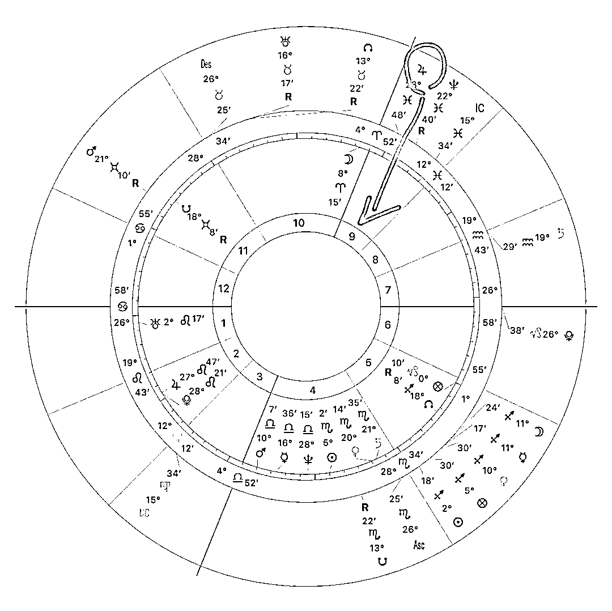

***第 1 宫***

对于上升双鱼座来说，这个天象十分利好。最近你生出更多信心和希望，也更加轻松乐观面对生活。或许你有一些新的计划要推进，或是找到了新的人生方向。

接下来的一个月里，是让计划落地实施的好机会。按照心中的愿望和方向前进，你会比平时更加好运，也容易收到过往事情的正面反馈。建议总结回顾过去的一年，看看自己有了哪些成长。

***第 2 宫***

对于上升水瓶座来说，利好金钱运。过往在钱财上的投资和付出，会在此时有回报。例如你一直想要推进的项目终于有了进展，而你因此拿到一笔数目可观的钱。此时物质层面的安全感很足，对于金钱方面能够佛系随缘地对待，也会格外慷慨大方。

***第 3 宫***

对于上升摩羯座来说，利好学习运、考试运。对于学生党来说很友好，此时学业上变得异常顺利。也有一些人会增加外出、旅行、培训的几率，或决定学习新的技能。你可能终于想通了一些事情，过往思想上的负担卸下，与周围人的关系更加和谐，也可能会在亲朋好友中出现对你帮助很大的人。

***第 4 宫***

对于上升射手座来说，会增加内在的安全感，对于自我认同更加笃定，有底气。

对于家庭这个概念有了新的认知，明白它给自己带来的安稳与重要性，对于家人更加理解、包容、接纳。与父母、家人的关系更加融洽，是进一步深入了解自己与家人的好机会，并能够从家人身上得到力量和支持。部分人可能经历搬家、迁移，也可能是买卖房屋、地产。

***第 5 宫***

对于上升天蝎座来说，利好恋爱运、子女运及娱乐运。你会更加积极对待恋爱关系，也可能是自己的兴趣爱好有机会进一步发展，或是与子女的关系有积极转变，更能理解、接纳、真正看见孩子的真实样子。过往的隔阂消散，你也会更投入当下，享受生活本身。

***第 6 宫***

对于上升天秤座来说，利好工作运，日常工作较为轻松。职场环境可能发生调整，会有升职的好消息，或是有了更多下属和同事。也可能你决定拓展业务范围，接触更广阔的职业方向和工作内容。每天的生活本身就能让你心情不错，记得注意控制体重，规律作息。

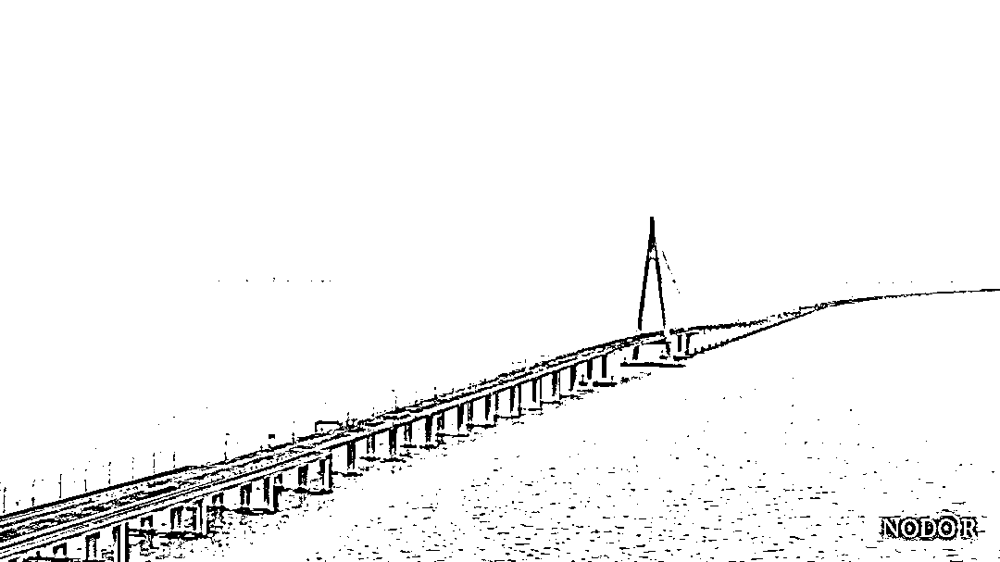

***第 7 宫***

对于上升处女座来说，利好婚姻运、合作运及人际关系。有些人可能会进入婚姻关系中，或敲定新的合作项目，也容易在商业合作关系中遇到对自己有帮助的人。部分人可能遇到对自己有重要影响的导师。

与人的一对一相处给你带来更多的启发和感悟，你也会调整与他人的相处模式，更好地接纳对方。

***第 8 宫***

对于上升狮子座来说，利好投资运、理财运。或许是过去的投资理财有了好的回馈，也可能是有机会拿到他人的投资与钱财。你的投入和付出终于有了一个收尾，对于金钱的态度有所转变，心里对于未知的恐惧和焦虑也会得到释放。

***第 9 宫***

对于上升巨蟹座来说，利好迁移运、学业运。可能你找到一个好老师，或者你自己成为了老师。可能通过长时间的学习，你终于灵光乍现，在精神和心灵上有所顿悟。也可能通过旅行和异地的经历，丰富了自我认知后，豁然开朗。你的成长更多表现在内心世界上，对自己的信仰或信念更加坚定。

***第 10 宫***

对于上升双子座来说，利好事业运。会有更多的事业机遇出现，对此你也会感到更加自信和游刃有余。你可能发现自己在工作方面早已积聚了很多力量和能力，只是需要静待时机展示。你可能会拓展业务范围，或认识到更多的人脉资源，对于事业上的未来更加有信心。

***第 11 宫***

对于上升金牛座来说，利好人际运。你会接触到更多人，你们会慷慨的共享资源，在相互帮助和支持中一起成长。也可能会与更大的平台、团体合作，加入到更适合你的团队中去。你对世界更加宽容，更有信念感，它也必将不负你所望。

***第 12 宫***

对于上升白羊座来说，你终于能体会到与全世界，甚至是全宇宙共存共生的感受，内心更加豁达洒脱。过去困扰你的小事全然消失，你会更加关注未来发展的大方向，以及如何成为一个全新的自己。

你会理解所有苦难皆由过往的因果所致，而如今业力结清，心中的黑暗迷雾被驱散，你的人生完成了升级。

**版权声明**：原创文章由作者授权首发于若道平台发布，欢迎转发，反对抄袭。友号转载请申请白名单。

**END**

****朵三三三****

ISAR 认证占星师

全职占星师/塔罗师/国家三级心理咨询师 

人大文学学士/德国慕尼黑大学文学硕士

**微博/微信公众号**：朵三三三

长按打赏

**梅里曼金融报告双 12 福利来啦！****长按下图了解更多详情吧！**

**20 位来自世界各地的占星师****带来 19 场沙龙——新世界的觉醒****详情可点击下图**

**学习占星学****点击下图了解课程详情**

**微信又双叒叕改版啦，不想错过若道君的推送？**
****就把若道设为****星标****以及点点****“在看”****吧！******▼**

**喜欢就点一下“在看”吧！****报名直达入口**

# 2023 天象预测大师课 | 2023 年，宇宙都将发生哪些大事？

> 原文：[`mp.weixin.qq.com/s?__biz=MzA5NjA0NTAxNg==&mid=2651494965&idx=2&sn=b96dc2a2ff7db5ef3b8315c5c32dc11f&chksm=8b482882bc3fa1940be73f082dbfafa61e41a774394a296d05cef1829e88d15302794f981b4d&scene=126&sessionid=1692737720#rd`](http://mp.weixin.qq.com/s?__biz=MzA5NjA0NTAxNg==&mid=2651494965&idx=2&sn=b96dc2a2ff7db5ef3b8315c5c32dc11f&chksm=8b482882bc3fa1940be73f082dbfafa61e41a774394a296d05cef1829e88d15302794f981b4d&scene=126&sessionid=1692737720#rd)

2022 年已接近尾声，忙碌的年末工作也挡不住我们对来年的盼望和期许。

作为占星师，在年初跟随权威老师透彻的学习 2023 年重要天象的含义和影响是迎接新的一年的正确姿势，仪式感满满！

若道邀请了金牌核心课中的 4 位国际名师再次集结，在**2022 年 12 月 16 日-18 日**带来**2023 年重大天象的深入解读：从冥王星、土星、木星换座；金星逆行；土星在双鱼座等角度切入，洞悉大环境的变换趋势、时事格局，为新一年的自我规划和占星事业加油充电。**

**课程时间安排**

**2022 年 12 月 16 日 周五**

**20:00-22:00 ****克里斯蒂娜·罗登贝克****2022 年 12 月 17 日 周六****16:00-18:00 ****艾德里安·邓肯**（休息 30 分钟）**18:30-20:30 ****大卫·瑞雷****2022 年 12 月 18 日 周日****18:30-20:30 ****琳恩·贝尔****课程内容安排**

**12 月 16 日 周五**

**20:00-22:00** **宇宙的舞者：****2023 年的冥王星、土星和木星**

**2023 年是这 10 年中最重要的年份之一，标志着一个时代开始落幕。**冥界的黑暗之主冥王星自 2008 年以来一直在摩羯座行进，它将在 2023 年离开摩羯座，能量会发生重大转变。

**在接下来的 20 年里，冥王星会在下一个星座水瓶座行进，影响整个时代。**但对于冥王星来说，进入水瓶座并不容易，或者说并不顺利。**在接下来的 2 年，冥王星会 2 次重返摩羯座，2023 年 6 月它将首次重回摩羯座。**这看起来在个人层面和全球层面都会是**动荡和调整的混乱时期。** 
就在冥王星首次换座的同一个月，**另一颗强大的行星土星也会离开自己的家园，进入没有边界的双鱼座，结束在水瓶座为期 2 年的限制和制定规则时期**。与此同时，**木星这颗与扩张和幸运相关的行星，也会在 2023 年春天换座，从火热的白羊座跃入金牛座更坚实的土地之上。**2023 年有望成为与重大改变相关的一年，这就是为什么了解这些重大行星事件的时间对于规划未来一年至关重要的原因。

**12 月 17 日 周六**

**16:00-18:00 2023 年的爱与戏剧性**如果男人来自火星，女人来自金星，那么我们应该能通过密切关注 2023 年金星和火星之间的相位来见证它们的热烈拥抱。当金星和地球围绕太阳相对运行时，金星会表演一场华丽的舞蹈，在 8 年的时间里形成 5 个逆行环路，在天空中勾勒出了一朵完美的玫瑰花。每 1 片或 5 片花瓣的尖端按顺序以几乎完全相同的度数在这 5 个星座中出现：双鱼座、天秤座、双子座、摩羯座，以及——在 2023 年落在狮子座。**2023 年将会是充满戏剧性和浪漫的一年。**

在此次课程中，我们将跟随**金星和火星在 2023 年的运行**，特别是**6 月 5 日，金星进入狮子座，7 月 23 日在狮子座 28°逆行，到 10 月 9 日才离开狮子座这段时间。**这是漫长的 4 个月。**火星会在 5 月 20 日进入狮子座，7 月 10 日离开。** 
由于金星的运行速度通常是火星的 2 倍，你会期待它们在狮子座形成一次重要合相。但金星会逆行，与火星的浪漫相遇不会有一个愉快的结局。**在 2023 年夏天，金星和火星会给我们讲述一个什么样的爱与关系的故事呢？**  还有一个更复杂的天象。**3 月 23 日，冥王星进入水瓶座，在 1°左右徘徊，直到 6 月 11 日。**这是自 245 年前的 1778 年 6 月-8 月以来，首次先是火星，然后是金星在狮子座对分冥王星，而 245 年前美国正处于独立战争时期。

2023 年冥王星进入水瓶座，接下来的 20 年里，每当金星与冥王星形成相位时，都会改变浪漫的本质。最后，因为金星在狮子座逆行，在狮子座来来回回移动，所以它会与在金牛座的天王星形成三次四分相，与刚刚进入金牛座的木星形成三次四分相。

**这些征象与高度特权、富有和极端独立自主的行为相关。**我们都可以在 2023 年期待激动人心的浪漫爱情，但对于那些金星和火星强大的人来说，将会有盛大的烟花表演！

**12 月 17 日 周六  18:30-20:30 大卫· 瑞雷分析新一年的时事趋势**  **涵盖的趋势和主题包括：**

**· 火星在双子座逆行**——最后一次四分海王星！2023 年前 3 个月，信息战继续升温；谁在欺骗谁？世界上武装冲突的噪音。

**· 冥王星进入水瓶座**——改变“一与多”之间的关系。由贡献和参与定义身份，以及排斥和包容的副作用。权力和资源的重新分配，以及世界面临的挑战。

**· ****土星在双鱼座**——以不可能的方式将想象变成现实； **· 再谈木星在白羊座**——谁从武装冲突中受益？ **· 木星进入金牛座，四分冥王星**——面对贫富差距，然后在狮子座的金星在逆行期间三次四分木星；

· **火星-冥王星相位**——对分冥王星，三分冥王星，四分冥王星· **情人节那天，金星入相位合相海王星**——这是宇宙天气和文化传统之间一次罕见的一致

**12 月 18 日 周日 18:30 – 20:30 土星在双鱼座：消融边界**

过去 5 年，土星一直在它的“家园”摩羯座和水瓶座中行进。2023 年 3 月 7 日，它将进入双鱼座这片湿滑之地，加速旧边界的消融，改变我们对世界的看法。

**土星在双鱼座需要对看不见的东西有信心，并且经常要求我们放下曾经看起来坚实可靠的东西。旧的确定性受到挑战，可能需要做出牺牲。** 
土星在双鱼座帮助我们**放下过时的依恋，意识到那些并不支持我们的东西。**它能给我们勇气，让我们头朝下跳入水中。一旦土星越过星座边界，它会在双鱼座逗留到 2025 年 5 月。我们会看一看这段旅程的馈赠，同时也看一看它可能存在的隐患。

土星换座后不久，冥王星会进入水瓶座，仅仅在 2023 年开始后 8 周的时间。**冥王星换座会带来全球范围内权力分配的变化。它可能是技术进步的先兆。**这个时期，集体的需求可能比个人的需求更强烈。一个新的世界正在崛起，一个旧的世界正沉没到波涛之下。 **讲师是谁？**

**克里斯蒂娜·罗登贝克（Christina Rodenbeck）**

· 全职职业占星师，在牛津大学城生活和工作，深受周围知识和文化氛围影响；她拥有伦敦大学（University of London）的人文荣誉学位，曾在伦敦占星学馆（Astrological Lodge of London）、心理占星中心和占星研究学院学习。  **· **作为一名占星师，在过去的 20 年里，克里斯蒂娜在她的网站“牛津占星师”上写了大量关于时事、艺术和文化的文章；她每月主持一个占星播客：“与克里斯蒂娜和萨莉一起占星”，并定期在《占星杂志》(Astrological Journal)上撰写时尚专栏；她定期在英国授课，并保持着蓬勃发展的专业实践。
**艾德里安·罗斯·邓肯（Adrian Ross Duncan）****· **1971 年在印度游学时开始学习占星学，1985 年开始成为全职占星师，迄今执业已超过 33 年，是人本主义占星学、卜卦占星学和经世占星学领域的知名占星师。他还开发了占星软件 AstroClock 和多款占星报告。**· **他在日常咨询中经常运用卜卦，咨询图（卜卦的一种运用方式，即根据客户来访时间制作星图，从星图中获得大量信息）也是他特别擅长的领域。**· **从 1971 年开始研习佛学，受佛学影响很深，他相信占星学和佛学观点一致，转化的一个基础是在于对现实感知的改变。而卜卦很容易与佛教融合，因为它只关乎当下。

**大卫·瑞雷（David Railey）**

**· **若道联合创始人，致力于在中国教授和推广西方占星学。**· **曾任 ISAR 全球副主席，CAPISAR（ISAR 职业占星师资质认证机构）主席；**· **1976 年，通过亚特兰大职业占星师考试，成为全职占星师，随后通过 AFAN 和 ISAR 职业测试；**· **1980 年，与杰夫·焦耳一起在亚特兰大创建“每日行星”占星学中心。此后在亚特兰大占星协会担任 4 年考官，并且两次担任亚特兰大地区占星协会主席。1979-1992 年，作为占星师活跃于美国社会媒体，向不了解现代占星学变化的大众宣传专业占星学知识。

在 1989-1992 年期间，他在 WRGG 电台 12 频道每周主持个人电视秀“今日占星学”，早先他还在 WRFG 的广播节目中播讲宇宙天气节目；

**· **2010 年-2014 年，任全美占星师联盟监督委员会委员；

**· **2010 年，其著作《灵魂的目标》中国版出版，和蒋颖一起创办若道占星学校和其官网 www.nodoor.com。

**· **2017 年，被选为 ISAR 委员会成员。ISAR 是世界最大的国际占星机构，会员遍布 45 个国家，2017-2020 年曾任 ISAR 全球副主席、CAPISAR（ISAR 职业占星师资质认证机构）主席。

**琳恩·贝尔（Lynn Bell）**

**· **世界受欢迎的占星学演讲者、作家和老师之一。定居巴黎，研究心理占星学和家族模式数十年。**·** 著名的心理占星学中心（*Centre for Psychological Astrology*）的长期导师。2016 年，获得查尔斯·哈维（Charles Harvey）杰出的占星学服务奖。**· **作为一个从多个层面进行工作的占星咨询大师，琳恩的工作结合了心理学的观点。她对家族模式的兴趣首先来自与客户的合作。通过在分析领域所做的个人工作，她所受的埃里克森催眠训练将她引领至家族系统。后来，她组织研究小组在家族星图上进行了数年的研究。她写的《家族占星学》就是这项研究的结果。**· **法国心理占星学协会会长。除了占星学，她在法国沙特尔的新沙特尔学校任教 8 年，还 5 次获得了在《纽约时报》畅销书作者卡罗琳·迈斯（Caroline Myss）的卡罗琳·迈斯教育学院（*Caroline Myss Educational Institute*）合作教学的机会。**课程价格**

**正价：3000 元 限量优惠价：2023 元（前 60 名报满截止）** 

**惊喜联报套餐！！****《ISAR 选修课 | 预测、预期与意识成长》+《2023 年度天象预测大师课》+《2023 年金融占星预报》****三门联报优惠价 8000 元****（限前 50 名联报）（联系 Maggie 老师，抢占限量优惠价）**

长按二维码添加 Maggie 老师获取联报优惠价

**退转课程**

**退款原则请详看《教学协议》，如有疑问请咨询课程顾问**

****2023 年度天象预测名师课****

**授课老师：****克里斯蒂娜·罗登贝克 艾德里安·邓肯 大卫·瑞雷 琳恩·贝尔**

**直播课开课时间：**2022 年 12 月 16 日-18 日

**授课方式：**网络课程，中英文授课，中文翻译

**费用：****正价 3000 元 限量优惠价 2023 元（前 60 名报满截止）**

**课程负责人：**Maggie（微信：NodoorMaggie 请备注“2023 天象预测名师课”）

长按二维码添加课程负责人咨询~

**报名直达入口**

# 插班中丨神话塔罗：高效学习班上线，灵活掌握，专业实践！

> 原文：[`mp.weixin.qq.com/s?__biz=MzA5NjA0NTAxNg==&mid=2651494965&idx=3&sn=069cab68337ff5cb1eb00f24d62e863b&chksm=8b482882bc3fa1946ae942b36c8252f84fe5c21b177236a1def3cd247e6926a8657a1ccd21ec&scene=126&sessionid=1692737720#rd`](http://mp.weixin.qq.com/s?__biz=MzA5NjA0NTAxNg==&mid=2651494965&idx=3&sn=069cab68337ff5cb1eb00f24d62e863b&chksm=8b482882bc3fa1946ae942b36c8252f84fe5c21b177236a1def3cd247e6926a8657a1ccd21ec&scene=126&sessionid=1692737720#rd)

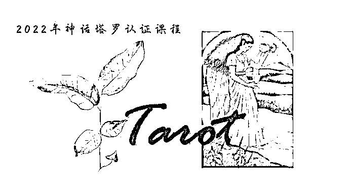

**2022 年超高含金量的神话塔罗认证课程****高效学习班****开始招生**用**四个月**的时间学习掌握神话塔罗解读喜欢**集中学习，快速掌握**的同学不要错过

黄色日期为**8 节直播课**时间，同学可以自由安排时间学习**18 节录播课**

班级学习群讨论、APP 答疑区提问

课程内容体系让你直观精准地感受到**神话塔罗的魅力**扎实地建构**神话塔罗思维**系统学习**最地道的塔罗知识**课程中老师将**神话、占星、心理学**完美融合进塔罗的**人本主义咨询体系**并进行学员**案例督导**让你更自信的开展咨询工作，学以致用

本期认证课程采取**即报即学的录播课+案例督导直播课**的形式，

*   **18 节录播课：**精编剪辑，随来随学，助教答疑，学练结合。

*   **8 节直播课：**融会贯通，神话心理，塔罗占星，咨询技巧。

为了适配大家的各种学习场景，提高学习&复习效率，我们还将**录播课**剪辑了**中文字幕版**和**翻译音频版**：

*   **中文字幕版：**朱丽叶老师英文原声配中文字幕，适合在手机或电脑前专心致志的学习。

*   **翻译音频版：**翻译老师幼婷的中文原声纯享，适合运动、通勤路上耳机里陪伴式学习。

若道还为塔罗学员开发了**“神话塔罗”**平台，是随身的工具，更是接咨询的平台，录播课程**学成入驻平台**即可链接更多塔罗个案，发展壮大你的塔罗咨询事业。

**如果你想学习塔罗，什么样的老师会让你怦然心动呢？她是三副塔罗牌的设计者，写了 6 本塔罗书籍。她研习塔罗四十余年，教授塔罗三十余年，是丽兹·格林的密友。还有****谁会比塔罗牌设计者更了解塔罗的历史、灵魂与精髓？****所以，这将是你开启塔罗之旅最坚实的一步。**

1

**这位塔罗大师是谁？**

**朱丽叶·沙曼-伯克** 

*   她是**3 副塔罗牌**的**设计者****——**神话塔罗牌、沙曼–卡塞利塔罗牌、“自己着色”塔罗牌；

*   她出版了**6 本塔罗书****——**《塔罗全书》、《新塔罗全书》、《众星的传说》、《理解塔罗牌》、《精通塔罗牌》、《塔罗初学者指南》；

*   她研习塔罗**四十余年；**

*   她教授塔罗**三十余年**；****

*   她是**丽兹·格林**的密友，两人合著了**《神话之旅》**，共同设计了**神话塔罗牌**。

*   她是认证的**心理治疗医师；**

*   她深谙**塔罗、占星学、心理学和神话学。**

**如果你想成为拥有英国神话塔罗认证的塔罗师**

那么她，就是你**最好的老师人选**

2

**塔罗牌有什么用？**

*   塔罗牌是一种**古老的疗愈工具**，同时也是**直观的解惑工具****；**

*   塔罗牌绕过逻辑思维，**和潜意识联结**，通过图像的方式生动地将隐藏在人类潜意识中的画面浮出水面，**揭示心灵的状况和运作****；**

*   塔罗牌**帮助我们和潜意识对话**，可以和现代的心理治疗联系在一起，帮助我们**看清心灵的冲突来源、本质和可以选择的道路；**

*   塔罗牌又和更广阔的**宇宙生命原型**联结，彰显**个人生命发展的阶段**，将**个人生命挣扎、内在冲突**放在生命进化的道途上，让更广大的生命智慧为个人成长照亮道路。

3

**为什么学习神话？**

神话通过**图像和故事**描绘人类生活的**原型模式**。通过瑰丽的想象、诗意的语言、栩栩如生的人物和故事描绘出我们内心的世界，表达出我们经历的那些实现人性的过程，帮助我们将**个体的生活与人类古老且永恒的故事**建立联结。从而在更深处**理解生命**，并学习**古老而长青的生命智慧**。

**神话塔罗**取材于**希腊神话**的无尽沃土，通过故事提供一种**记忆辅助**，在心理和预见层面提升解读的**丰富度**。因为这样更符合塔罗牌的性质，符合人类的想象。**按照故事思考，而不是简单的记忆关键词和固定的意义。**

4

**塔罗预测是什么？**

塔罗牌预测的运作就像是**照向心灵的一面镜子**。在塔罗牌解读时，图像的原型性质穿透隐藏的潜意识脉络，反应出与个人境遇相关但又未被了知的知识与洞见，因此**揭示出按照任何理性方式都无法发现的事情。**

如果你对生命好奇，塔罗学习会帮你**打开一扇通往未来的门****，**让你了解**心灵运作和显化的秘密**，同时赋予你更多关于生命成长的支持和指引的能力！

5

**我们将学习什么？**

**录播课（即报即学）**

**☆****初阶：神话塔罗详解**

**神话故事和预测意涵**

**第 1 讲 塔罗牌介绍 ，讲述它的历史 （中文字幕版）**

**第 1 讲 塔罗牌介绍，讲述它的历史（翻译音频版）**

**第 2 讲 星座形态、元素和宫廷牌&基本星座与基本国王 （中文字幕版）**

**第 2 讲 星座形态、元素和宫廷牌&基本星座与基本国王（翻译音频版）**

**第 3 讲 固定星座与固定王后（中文字幕版）**

**第 3 讲 固定星座与固定王后（翻译音频版）**

**第 4 讲 变动星座与变动骑士（中文字幕版）**

**第 4 讲 变动星座与变动骑士（翻译音频版）**

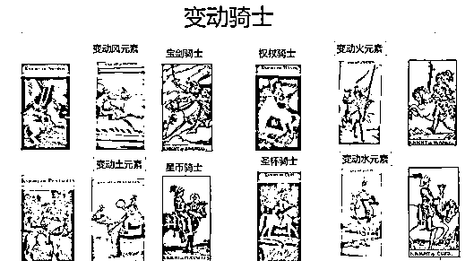

**第 5 讲 小阿尔卡那牌权杖（中文字幕版）**

**第 5 讲 小阿尔卡那牌权杖（翻译音频版）**

**第 6 讲 小阿尔卡那牌圣杯（中文字幕版）**

**第 6 讲 小阿尔卡那牌圣杯（翻译音频版）**

**第 7 讲 小阿尔卡那牌宝剑（中文字幕版）**

**第 7 讲 小阿尔卡那牌宝剑（翻译音频版）**

**第 8 讲 小阿尔卡那牌星币（中文字幕版）**

**第 8 讲 小阿尔卡那牌星币（翻译音频版）**

**第 9 讲 经典牌阵教学讲解（中文字幕版）**

**第 9 讲 经典牌阵教学讲解（翻译音频版）**

**第 10 讲 牌阵解读案例演示（中文字幕版）**

**第 10 讲 牌阵解读案例演示（翻译音频版）**

**☆****中阶：神话塔罗牌阵应用**

**神话****解读和咨询技巧**

**开启神话塔罗愚人之旅**

**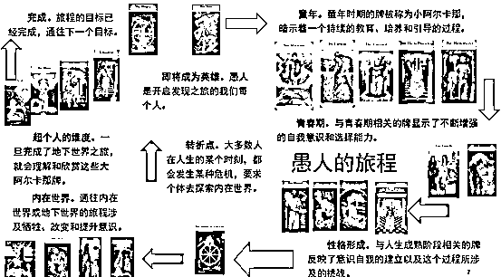**

**第 1 讲 愚人、魔术师、女皇、皇帝（中文字幕版）**

**第 1 讲 愚人、魔术师、女皇、皇帝（翻译音频版）**

**愚人**：永恒的少年（儿童的原型）

**魔术师**：恶作剧者、老师、向导、沟通者的原型；行星：水星。

**女王**：母亲、养育者、丰产的原型；行星：金星在金牛座；小行星：谷神星。

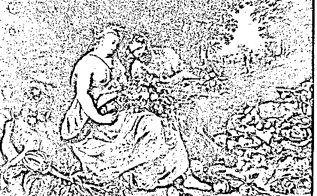

**皇帝**：父亲、供养者、计划者的原型；行星：木星。

**第 2 讲 女祭司、教皇、恋人、战车、正义、节制（中文字幕版）**

**第 2 讲 女祭司、教皇、恋人、战车、正义、节制（翻译音频版）**

**女祭司**：处女——等待被实现的潜力原型；行星：新月。

**教皇**：疗愈者、受伤的疗愈者、牧师的原型，牧师是神与人之间的灵性桥梁；行星：凯龙星。

**恋人**：爱、爱人、所爱之人的原型；行星：金星在天秤座。

**战车**：战争、冲突、战士、斗士的原型；行星：火星。

**正义**：智慧、兵不血刃的胜利的原型；星座：处女座；小行星：智神星。

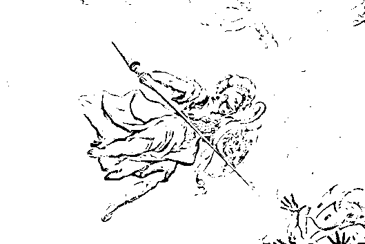

**节制**：关系、合作的原型；星座：巨蟹座、双鱼座。

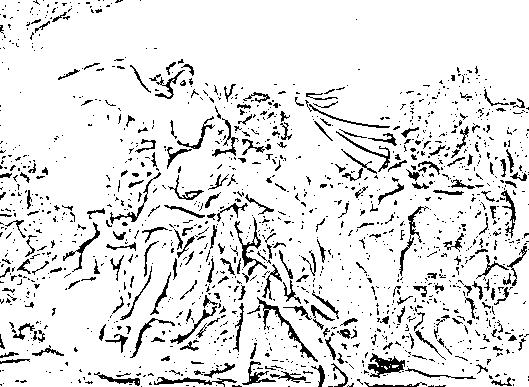

**第 3 讲 力量、隐士、命运之轮、倒吊人、死神（中文字幕版）**

**第 3 讲 力量、隐士、命运之轮、倒吊人、死神（翻译音频版）**

**力量**：力量的原型；星座：太阳在狮子座。

**隐士**：晚年、耐心的原型；行星：土星。

**命运之轮**：命运女神与命运的原型。

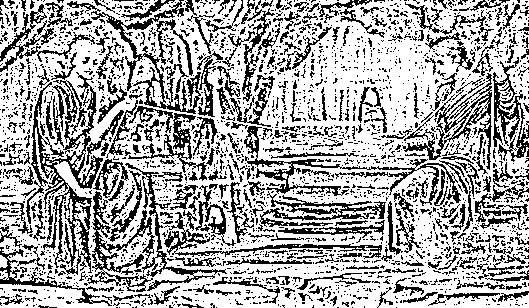

**倒吊人**：牺牲与有意识的牺牲的原型；行星：海王星。

**死神**：死亡、终点和起点的原型；行星：冥王星。

**第 4 讲 恶魔、高塔、星星、月亮、太阳（中文字幕版）**

**第 4 讲 恶魔、高塔、星星、月亮、太阳（翻译音频版）**

**恶魔**：阴影、人类不文明的面向、本能、欲望天性；行星：火星在天蝎座。

**高塔**：改变、分裂瓦解的原型；行星：天王星。

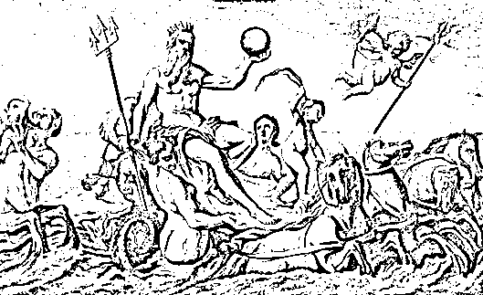

**星星**：希望的原型。

**月亮**：无意识的原型；行星：暗月。

**太阳**：意识、创造力和文明的原型；行星：太阳。

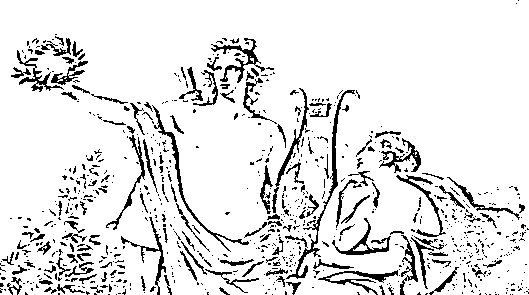

**第 5 讲 审判、世界（中文字幕版）**

**第 5 讲 审判、世界（翻译音频版）**

**审判**：复活、新生的原型；行星：水星作为灵魂向导普绪科蓬波斯。

**答疑与讨论，学员们分享对自己或客户的塔罗解读，对神话塔罗牌进行更多探讨。**

**世界**：整体、完成和个性化的原型。

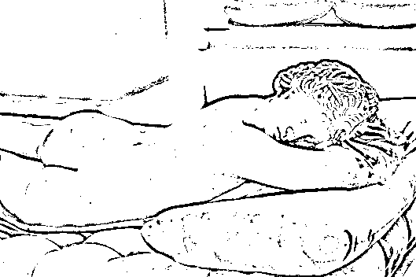

**第 6 讲 经典牌阵教学讲解（中文字幕版）**

**第 6 讲 经典牌阵教学讲解（翻译音频版）**

**第 7 讲 咨询案例演示：为一位年轻女性所做的四次解读（中文字幕版）**

**第 7 讲 咨询案例演示：为一位年轻女性所做的四次解读（翻译音频版）**

**第 8 讲** **引导式冥想、荣格的四种意识功能（中文字幕版）**

**第 8 讲 引导式冥想、荣格的四种意识功能（翻译音频版）**

**☆****高阶：神话塔罗直播督导课**

**第 1 讲 塔罗牌中的荣格原型**

**2022 年 8 月 10 日（周三）**

我们将学习荣格是如何理解原型，以及荣格原型如何反映在塔罗牌中。对塔罗牌解读而言，理解原型的普遍性非常有帮助，因为这有助于塔罗咨询师碰触客户的内心世界。

**第 2 讲 塔罗牌是如何与行星原型和其原型体验联系在一起**

**2022 年 8 月 24 日（周三）**

大阿卡纳牌反映了行星神祗的原型，在某些情况下，原型经验意味着它们反映了所有人类的经验。我们将通过这个角度看这些大阿卡纳牌。我们将看到理解原型对解读有何帮助。

**第 3 讲 荣格意识的四种功能与小阿卡纳牌的四种元素及与权杖、星币、宝剑、圣杯四套牌之间的联系**

**2022 年 9 月 7 日（周三）  **

我们将看看小阿卡纳从 1 到 10 如何反映荣格意识功能的各个方面，以及它们如何反映在四套牌四个元素和其心理方面。我们还将对 1-10 的数字学进行修正，看它们在元素中的表现方式。

**第 4 讲 占星学中的 12 星座和宫廷牌之间的联系**

**2022 年 9 月 21 日（周三）**

我们将讨论形态和星座，以及它们如何反映在宫廷牌上。

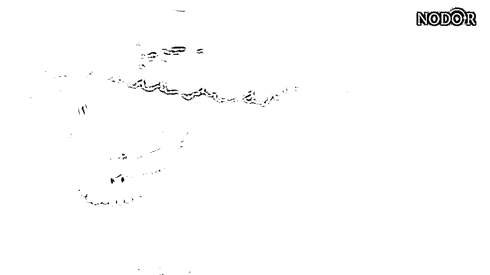

**第 5 讲 马蹄牌阵学员案例督导**

**2022 年 10 月 19 日（周三） **

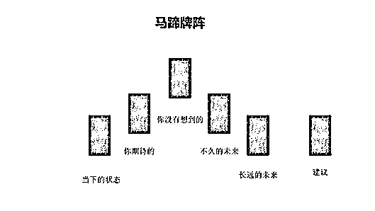

**第 6 讲 六芒星牌阵学员案例督导**

**2022 年 11 月 2 日（周三） **

**第 7 讲 凯尔特十字学员案例督导**

**2022 年 11 月 16 日（周三） **

****

**第 8 讲 三个牌阵学员完整案例督导**

**2022 年 11 月 30 日（周三）**

**认证阶段：考试论文**

录播课学习完毕，即可入驻若道神话塔罗平台，以实习塔罗师获得推广流量，对接塔罗咨询个案。

直播课+录播课学习完毕，提交考试论文通过即可获得获得英国神话塔罗认证证书，升级为认证咨询师。

**扫码进入全新神话塔罗 H5**

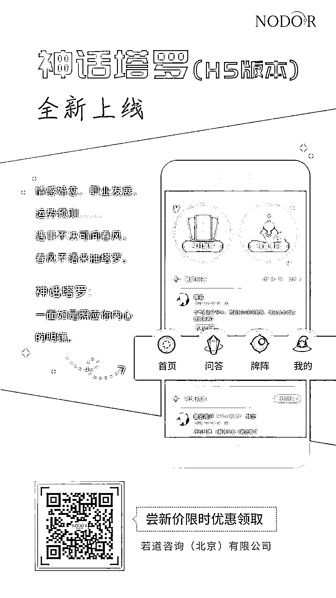

每天有事没事都可以去**神话塔罗 H5**里转转抽取专属于你的今日塔罗

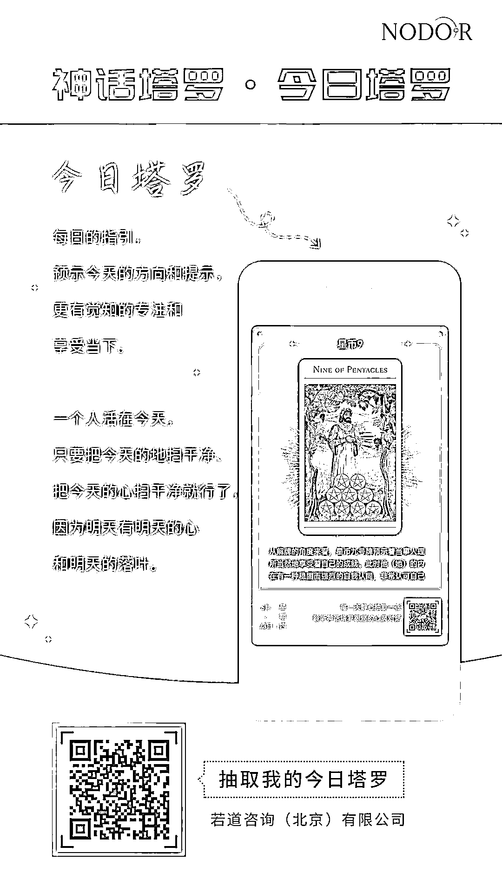

**神话塔罗 H5 问答平台全新上线**

三张牌牌阵，专业塔罗咨询师语音条解读

如果你碰巧有困惑，刚好有**限时优惠价**

如果感到快乐你就用用**神话塔罗 H5****，**如果你感到不快乐，更要使用由专业人本主义塔罗师团队全程陪伴的**神话塔罗 H5 哦！**

6

**适合人群**

*   塔罗初学者，完全没有塔罗基础；

*   塔罗自学者，也曾上过塔罗工作坊，但仍不懂如何使用塔罗牌；

*   塔罗进阶学习者，有塔罗基础，了解 78 张塔罗牌含义；

*   不知如何解决遇到的情感困惑、职业选择、人际问题，对人生感到迷茫；

*   想要学习深入解读塔罗牌、牌阵的使用、咨询技巧等将塔罗运用于咨询实践；

*   想要深入了解和学习塔罗，希望成为专业的塔罗师；

*   想要借助塔罗进行心灵、灵性成长。

7

**导师简介**

**朱丽叶·沙曼-伯克**

**朱丽叶·沙曼-伯克**从 20 世纪 70 年代早期开始，就对塔罗牌产生了兴趣，并踏入了塔罗的世界。后来，在丽兹·格林的鼓励下，开始研习心理占星学和塔罗。

1984 年，第一本书《**塔罗全书**》（*The Complete Book ofTarot*）出版。之后，与丽兹·格林合作设计并撰写了《**神话塔罗**》（*The Mythic Tarot*），在这本书中，她们将古希腊神话与传统塔罗解读结合起来。朱丽叶写了**十本塔罗和占星学书**，包括一本名为《众星的传说》（*Stories from the Stars*）的儿童读物，以及与丽兹·格林合著的《神话之旅》（*The Mythic Journey*），这是一本详细讲述如何运用神话来指导生活的书。

8

**课程价格**

**认证课程总价：****22000 元**

**联报优惠价：****19000 元**

**限时转发优惠价：18000 元（联系 Echo 老师，获取限时转发优惠价）**

长按二维码添加客服 Echo 老师

9

**退转课程**

*   **退款原则请详看《教学协议》，如有疑问请咨询课程顾问。**

**神话塔罗认证课程**

**授课老师：朱丽叶·沙曼-伯克**

**授课时间：录播课即报即学，直播课 2022 年 8 月 10 日起**

**授课方式：**网络课程**，**英文授课，中文翻译

**费用：****认证课程总价：****22000 元；****联报优惠价：****19000 元；****限时转发优惠价：18000 元**（联系 Echo 老师，获取限时转发优惠价）

**课程负责人：Echo 老师**（微信/手机：nodoor18518412824，请备注“神话塔罗”）

长按二维码添加课程负责人咨询~

**END****报名直达入口**

# 神话塔罗之小阿卡纳牌 | 权杖侍者

> 原文：[`mp.weixin.qq.com/s?__biz=MzA5NjA0NTAxNg==&mid=2651494965&idx=4&sn=e1ce6f3ad1c8ba21548c29504624fea9&chksm=8b482882bc3fa194aa5a0cb7c611ca1bf518855944f015906f63c5bbe212046dcfd1059ecd86&scene=126&sessionid=1692737720#rd`](http://mp.weixin.qq.com/s?__biz=MzA5NjA0NTAxNg==&mid=2651494965&idx=4&sn=e1ce6f3ad1c8ba21548c29504624fea9&chksm=8b482882bc3fa194aa5a0cb7c611ca1bf518855944f015906f63c5bbe212046dcfd1059ecd86&scene=126&sessionid=1692737720#rd)

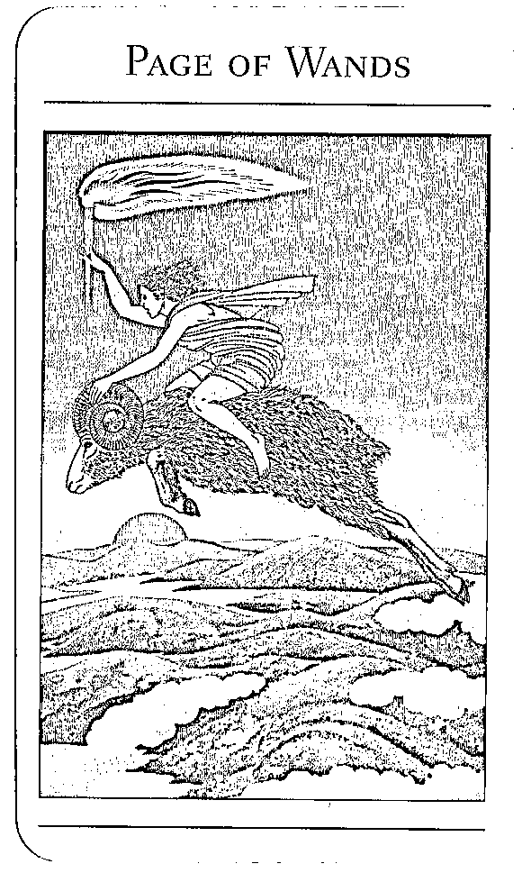

作者/朱丽叶·沙曼-伯克 丽兹·格林

译者/闫东升 编辑/玫瑰 图片/神话塔罗 网络

本文节选自《神话塔罗》

四套小阿卡纳牌的侍者牌都是一个儿童的形象，意味着每套宫廷牌的开始都呈现着脆弱的特质，也就是说生命中任何原初的（开始的）事物都是以最稚嫩、脆弱和新鲜的形式出现，需要通过滋养和保护才能发展成熟和完整。

权杖侍者为我们带了哪种孩子呢？

**书名：**

神话塔罗 

**作者：**

朱丽叶·沙曼-伯克   丽兹·格林 

**出版日期：**

2011-08-02

权杖侍者对应的希腊神话人物 **佛里克索斯****即将远行的男孩**

权杖侍者牌描绘的是一个 12 岁左右的男孩儿，长着一头褐色的卷发，身穿土黄色束腰外衣。

他骑在一头浑身长满金羊毛的公羊身上在天空飞行，下面是黄绿色交杂的山川和河流。男孩手里握着一根权杖，在天空留下一条闪亮的轨迹。他的前方是刚刚从地平线冒出一小半的旭日，亮黄色的明媚阳光笼罩着大地。

**权杖侍者牌呈现出火元素细致优美和脆弱的初始期，这是创造性灵感的第一缕火花，通常表现出一种对于现状的不安份和心神不宁的特质。**

在神话故事中这个形象是佛里克索斯（*Phrixus*），我们曾在权杖数字牌的杰森（*Jason*）和金羊毛的故事里提到过他。佛里克索斯是杰森英雄之旅的开篇人物，他不是其中的主角，也没有参与到探险的故事中。

他不是神，也不是一个英雄，但是他却和金羊毛一起从危险的境遇中出逃，翻山越海地来到遥远的科尔基斯（*Colchis*）王国。

佛里克索斯是国王阿塔玛斯（*Athamas*）的儿子。阿塔玛斯在宙斯（*Zeus*）的要求下和仙女（译者注：如果直译是女幽灵，但网络中的故事简介大都是仙女或云中仙子）涅斐勒（*Nephele*）结合，生下了一儿一女——佛里克索斯和赫勒（*Helle*）。

后来涅斐勒消失了，阿塔玛斯又和一位名叫伊诺（*Ino*）的人间女性结合，她非常嫉妒阿塔玛斯的前任妻子和他们人仙结合而生的一对孩子，于是就偷偷说服所有的农妇们把种子烤熟，使整个国土颗粒无收，然后宣称获得德尔斐神谕（*Delphic Oracle*），要求把佛里克索斯献祭给宙斯以解除诅咒。

这样下来，她就可以让自己的孩子成为王位的继承人。宙斯很讨厌伊诺假借自己的名字从事邪恶的阴谋，于是派出会飞的金色公羊去挽救佛里克索斯。佛里克索斯骑上公羊，把妹妹放在身后，飞往东方的科尔基斯王国。在飞行过程中赫勒失手坠入大海，佛里克索斯独自抵达了科尔基斯，然后把公羊献祭给了宙斯。可以说佛里克索斯是个信使或者导火索的角色，他为后来广为人知的英雄和金羊毛的故事做了一个开场。**创造性想法的开端**

权杖侍者牌中的佛里克索斯象征着**创造性想象力脆弱的初始期**，这个似乎不太容易理解，因为现实的需求和责任与人们的逻辑都和这个故事不太吻合。

但是这个男孩的危险处境很符合权杖侍者牌的隐喻，因为**虽然潜在的将来还没有什么迹象，但他的不安和多变的处境能够带来很多问题，从而激发事件的发生**。而且佛里克索斯是纯真的，就是因为他的纯真，宙斯才会怜爱他，把最好的礼物送给他。

**权杖侍者牌象征着全新的创造性想法的开端，和其它小阿卡纳的侍者牌一样，这里的主角需要被关爱、保护和滋养，以免他脆弱、微小的火花被他人的嫉妒和愤怒（或者自己的狭隘和负面情绪）扑灭。**

宙斯是万神之王和强大创造性精神力量的化身，他赋予了佛里克索斯真正的价值，当我们想要给创造性想象力表达的初始阶段赋予价值的时候，一定要和自己内在宙斯所象征的原型律则进行联结。

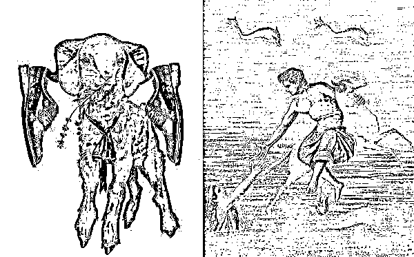

| 佛里克索斯

佛里克索斯开场了一段英雄的神话故事，但是他并没有全程参与其中，在英雄杰森释放出火热的激情和强大的力量之前，他就退出了舞台。这也反映了权杖侍者牌的的一些内涵。

**早期尚未成熟的想法常常是幼稚的，通常和最后的形式所表达出的创造性力量有很大差异。**通常早期的概念会很快消失，取而代之的是一些更好更强大的东西。初始期的作用就是发起行动，没有这个脆弱的火花，创造性的想法就无法在后期发展起来。

神话中佛里克索斯的特质最终并不会在现实中开花结果，因为他太过年轻，还没有足够的力量和稳定性，但是他的角色是金羊毛的信使和早期的监管人，而金羊毛属于宙斯，象征着神的伟大创造力。

**所以权杖侍者牌并不意味着一个想法或者项目一定能够成功，他微弱的火花可能被“愚蠢”或者“空想”熄灭。他是创造性想象力的指引者，告诉我们第一个想法后面可能会有绚烂辉煌的千古传奇。**

**创造性灵感的第一缕火花**

**当权杖侍者牌出现的时候，预示着当事人在自己内在发现了一些创造性潜力的火花。**

这常常表现为**当事人在工作中出现不安的情绪，有种模糊的不满足感**，虽然还不是十分强烈，却足够促成一个改变，暗示着**他（她）的生命在某个方向上会有进一步的扩展。**

初始期的幻想常常伴随着这种不安份感，但是还没有权杖 1 喷薄而出的驱动力来的强烈，所以结果可能是不能实施或者被否定。

但是要很严肃认真地对待它，因为它预示着强大的激情和灵感可能会随之而来，不能随便给它贴上“恶运阶段”的标签，要**细心地呵护和滋养它，乐观地等待接下来的机遇。**

**版权声明：**本文由《自在园》授权发布，欢迎转发，反对抄袭。友号转载请申请白名单。

**END****朱丽叶·沙曼·伯克**从 20 世纪 70 年代早期开始，就对塔罗牌产生了兴趣，并踏入了塔罗的世界。后来，在丽兹·格林的鼓励下，开始研习心理占星学和塔罗。1984 年，第一本书《塔罗全书》（The Complete Book ofTarot）出版。之后，与丽兹·格林合作设计并撰写了《神话塔罗》（The Mythic Tarot）。朱丽叶写了十本塔罗和占星学书，包括一本名为《众星的传说》（Stories from the Stars）的儿童读物，以及与丽兹·格林合著的《神话之旅》（The Mythic Journey），这是一本详细讲述如何运用神话来指导生活的书。

**点击下图了解课程详情** 

**微信又双叒叕改版啦，不想错过若道君的推送？****就把若道设为星标吧！****▼**

**喜欢就点一下“在看”吧！****报名直达入口**

# 太阳进入射手座 | 未来一个月，12 上升星座将在哪里获得好运？

> 原文：[`mp.weixin.qq.com/s?__biz=MzA5NjA0NTAxNg==&mid=2651494868&idx=1&sn=1885a5f0e1e46b7a2b333b8a5c1724fe&chksm=8b482b63bc3fa275322f6c77ea306792bdb78d38cecb47bf6a6ff48610ddfaadc6776acbee29&scene=126&sessionid=1692737720#rd`](http://mp.weixin.qq.com/s?__biz=MzA5NjA0NTAxNg==&mid=2651494868&idx=1&sn=1885a5f0e1e46b7a2b333b8a5c1724fe&chksm=8b482b63bc3fa275322f6c77ea306792bdb78d38cecb47bf6a6ff48610ddfaadc6776acbee29&scene=126&sessionid=1692737720#rd)

********************☆ 后**********************台**********************回复“今日”，给你一句生命态度********************

作者/郑玮玲 ISAR 认证占星师编辑/玫瑰 封面/书君 图片/稿定设计 11 月 22 日 16:20，太阳进入射手座，这一天也正值“小雪”节气，深冬的脚步渐近。接下来的一个月，12 星座会有怎样的人生体验？一起看看。**小雪**《孝经纬》：“斗指亥，为小雪，天地积阴，温则为雨，寒则为雪。时言小者，寒未深而雪未大也。”小雪时节北斗斗柄由西转向了北，斗柄北指时，天下皆为冬。小雪三候：一候虹藏不见，二候天气上升，地气下降，三候闭塞而成冬。

****

**“迎冬小雪至，应节晚虹藏。玉气徒成象，星精不散光。”**

**——唐·徐敞  《虹藏不见》**

彩虹在小雪节气里不再出现了。玄阴之月，阴盛阳衰，天地不交，万物停止生长。古人云：“喻我身上阴符穷极，寂然不动，反本复静。”是提醒我们在阴长阳消的时节深入静默，修养身心，为来年储备能量，打好根基，方能运筹帷幄。小雪时节的时空卦象为“火地晋”，意味着在地上生火，负阴而抱阳。北方在此时节开始供暖，寒冷给了人们围炉烹茶取暖的兴致。火即是创造力，激励着生生不息的生命力，为冬日厚重的生命续燃活力与梦想。**太阳在射手座**

火地晋卦的共振了变动火象星座射手座：无畏严寒侵袭，拥抱心中热望，让自由之火光温暖心灵，并撒遍身处的世界。射手座位于银河系中最明亮的区域，不愧为木星守护的星座，庞博而耀眼。因为木星——众神之神的守护，我们被鼓励去寻找生命的智慧，拥抱自由的本质。

**射手座代表有意义的冒险行动和跨越文化、意识屏障的胆识之举，喻意着充盈的自在，乐观、无畏面向广褒世界探索的精神。**太阳进入射手座即结束了天蝎座深刻、下沉的旅程，转化出的生命力、活力将撒播到生活中，一度沉降、积聚的能量得以释放、扩展和表达。

太阳射手座是个体扩张生命力、活力与梦想便要仰赖信仰、信念的旅程。信仰、远方和流浪是射手座永恒的铭牌，太阳在射手座赋予我们跨越万水千山的勇气，遥远、闪耀而神秘的指引带领我们超越、前行。

我曾将射手座注释为：流浪，是对世界的爱恋。属于射手座的太阳符号的圆心便是心灵对世界的爱恋，而世界就是那个圆。无论我们走多远，身在何处，心中的爱恋永恒不变，绵长无限。原点就是脚下每一步的组成，最终生命的意义得以呈现、圆融。

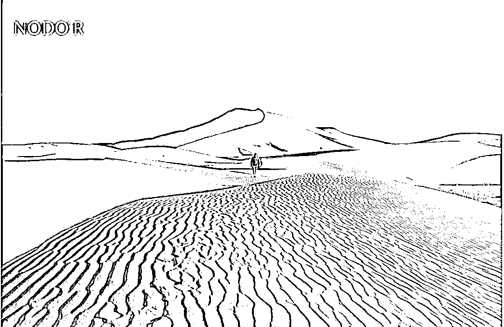

**太阳在射手座的重要行进**

**守护星木星的顺行与换座**

**11 月 24 日 7:02，木星在双鱼座 28°恢复顺行。**作为射手座的守护星在太阳射手座进程开始后恢复顺行，可谓强大的支持与推进助力。此时的木星仍在它守护的另一个星座双鱼座，揭示着无与伦比的造梦与信仰力量。

而双鱼座尾度的变幻莫测也正在加剧显化。在此进程中，我们会更多触碰现实破碎的影子——**那些曾经过度、盲目的错误“相信”将形成无法挽回的大局与趋势。**疗愈的工作便摆在了眼前。或者说，走向福祉，获得智慧，就是面对整体的统合、整理、修复的工作。双鱼座在患难与丧失面前可赋予我们无可限量的灵性力量。木星在此便是透过一场劫难般的统合重拾对生命、信仰的信心，重塑阶段性的人生旅程。恬淡面对患难，在患难中增长智慧正是人生难得的福报。**12 月 20 日 22:32，木星再次进入白羊座（5 月 11 日首次进入白羊座），这一次将勇往直前到 2023 年 5 月 17 日走完白羊座的旅程。**木星换座变更的频率也将直接辐射到射手座的太阳。白羊座的勇猛、直白、率性取代了双鱼座的敏感、脆弱与消融。木星会拥有更多动能与活力，更多直觉的启发与行动的助长。此时的木星与射手座的太阳在一起也鼓舞了众人的信心、胆识，对扩张实践的疆域，对未知领域的探索将进一步被行动证实、支持。为着真理、自由的冒险，以及打开更广博世界的行动将得到各种外来的支持，所有的主动表达和参与都有机会得到幸运的嘉奖。

**太阳对分火星**

**周期：12 月 2 日-12 月 14 日****重点影响人群：**有**个人行星、四轴、交点位于射手座、水瓶座、双鱼座、白羊座、双子座、狮子座、处女座、天秤座 10°–22°的人。****火星目前持续逆行中，导致火星与太阳的本轮交会周期更短，能量更集中、紧缩。受此相位影响人群所遇到的现实冲突，会因能量的两极性增加而更激烈。**这些冲突会体现为在表达想法、观点的时候，周围反对的声音会不绝于耳，那些干扰注意力的聒噪和絮叨，那些不合时宜的评判、指责会引发当事人内心的愤怒，必要时得**通过口角争斗来取得制衡，当然也会带来短暂的情绪浪潮。**更进一步，日火对分相揭示出**我们的意图与行动会在此周期内遭受诸多内在、外在因素的挑战、干扰和阻拦。**当我们内在有冲突、矛盾难以调和时，当我们的意识需要透过冲突来整合时，或是当内在真实自我需要一次争斗来完成自我升级时，外在就会有质疑、挑战来配合生命的剧本。修缮内心的庙宇可视为日火对分相的最佳过渡方案。寂静冬日，让身心蛰伏于一隅，用自己信仰的方式去协调精神与力量。内在对话，自由书写，绘制充满意识的曼陀罗，或是任何一种关照内在的传播、表达都是在主动协调日火对分的能量。**火星的行进会触发各类流血、外伤、发炎和发烧的迹象，重点人群需要时刻保持专注在当下。**很多意外伤害正是当我们意识分散时导致的。过度盲目和冒失的行动、运动也都需要在此期间避免、减少和减缓。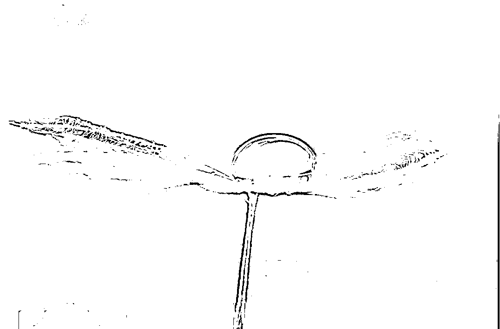

**太阳六分土星**

**周期：12 月 7 日-12 月 18 日****重点影响人群：**有**个人行星、四轴、交点位于射手座、双鱼座、白羊座、双子座、狮子座、处女座、水瓶座、金牛座、天秤座、天蝎座 15°–26°的人。**土星在水瓶座还剩下 3 个月时间，最重要的是持续两年的土天四分在 2023 年 1 月终于要结束了。当下，太阳与土星的渐亏六分相隐隐透出一轮真理、意识追寻的结束味道，无论此刻的你有没得到内在答案，日土六分也给了我们机会去修整、改进现实问题的机会。至少，在此相位中，天王星暂时退出，不会来打破、打乱我们的计划和步骤了。
射手座与水瓶座向来友好无间，风风火火奔着信仰、真理而去。土星当然还是给我们出难题的专家，只是六分相让水瓶座的土星虽然没有人情味儿却给足了改变的时机和谨慎而理智的想法。**对于所有处在调整期的人来说，我们很可能在处理必须处理的现实议题时让自己长进了不少。**追寻的脚步会延迟，但不会停止，迟到的梦想只是晚到，或是曾经被宇宙折叠了。你只需要换一种思路，换一种风格和视野，重新点开你的心窗，内在的开阔就已展现为现实，你可以在旧有、顽固的事态中找到新的支点，你可以轻松踏过不曾逾越的崇山峻岭。这段时期适宜**把对未来的工作计划快速调整，重新投入现实试炼，也适宜去处理那些曾一度困扰、犹豫的长期议题。**现在的行动也会因为内在真理的稳定支撑而倍感稳定、成熟与自如。

**太阳四分木星、海王星**

**周期：12 月 7 日-12 月 30 日****重点影响人群：**有**个人行星、四轴、交点位于射手座、水瓶座、双鱼座、白羊座、双子座、巨蟹座、狮子座、处女座、天秤座、天蝎座 15°–29 度**°**，以及摩羯座、白羊座、金牛座、巨蟹座、处女座、天秤座 0**°**-8**°**的人**木海合相双鱼座是 2022 年最后的重头戏，虽然离它结束还要等上一个月，但可谓浓墨重彩，尽在眼前。**此时，太阳加入木海阵线，有种患难与共，生死相依的慈悲壮烈交加的感受。**这组相位对重点受影响人群颇具威慑力，表现在我们可能不断发现现实生活中有些无法掩盖、修补的漏洞、缝隙，这些无时无处不在小小烦扰累加起来就严重打碎了我们的日常生活和工作步骤，甚至，连内在自我都濒临崩溃与碎裂。只因当下的海王星是如此强劲，木星扩张了迷惑、失界，海王星也令木星的信念陷入了混乱，甚至进入无意识的边界。这个相位提醒我们**必须要检视信念的正确性，看清真相和背景，去伪存真才能守护自我的边界。**避免浮华、臃肿，去掉神一般的光环才能看清楚现实和理想边界。找到边界我们也才能真正做自己。这个相位却并不意味着我们值得逃避或退缩。如果必须身陷迷宫才能获得智慧，如果必须参与集体无意识的循序才能获得清明的自我意识，那就放开手让自己去冒险、尝试、体验混乱。只有心中信念是我们稳定的护航使者，充分失界、幻灭过，才会重新找到落地安身处。带着意识去经验，能重新铺垫一条理想与信仰的道路。在集体层面，这个相位意味着意识松懈带来的考验。比如当下此起彼伏的疫情就宛如木海双鱼座的影响，在我们不知不觉的情况下就发生、蔓延了。

于集体、个体而言，我们都需要在此时期关注各种微小的发生，每一个微妙的意识都可能促成巨大的变幻与波澜。**清理、设界都是必要的自我保护工作。**我们可以在意识之旅中任意驰骋，却要在现实生活中努力维持清净。减少不必要的精力消耗，适当的停顿与休养可以更好地保持对当下重心的专注。

**规律的发自真实意愿的冥想、静坐，或是透过瑜伽、太极、金刚功等修身功法的自我习练都能帮助我们进入“旷然忘所在，心与虚空俱”的境界。**

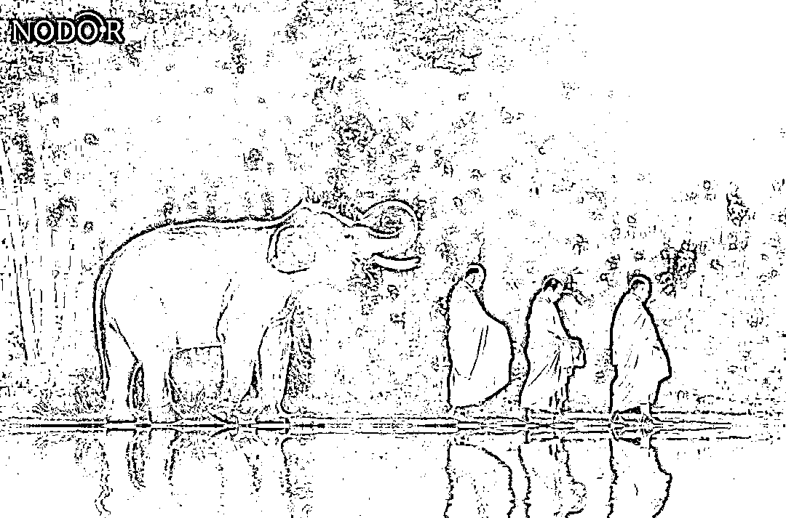

**太阳在射手座对 12 上升星座的影响****注：以出生星图上升星座度数 30°范围内的上升星座为准。如你上升在 0°，可以完全参考下列内容；如你上升在 29°，则需参考下一上升星座。****若道君：****你可以在 app store 或者应用商店搜索“若道”下载 app，输入个人档案，查看行运盘（也可以使用其他星图软件），找到行进太阳落在出生星图的第几宫，然后对照下文查看。****例如下图中，比尔·盖茨上升在巨蟹座，行进太阳在个人星图的第 5 宫。**

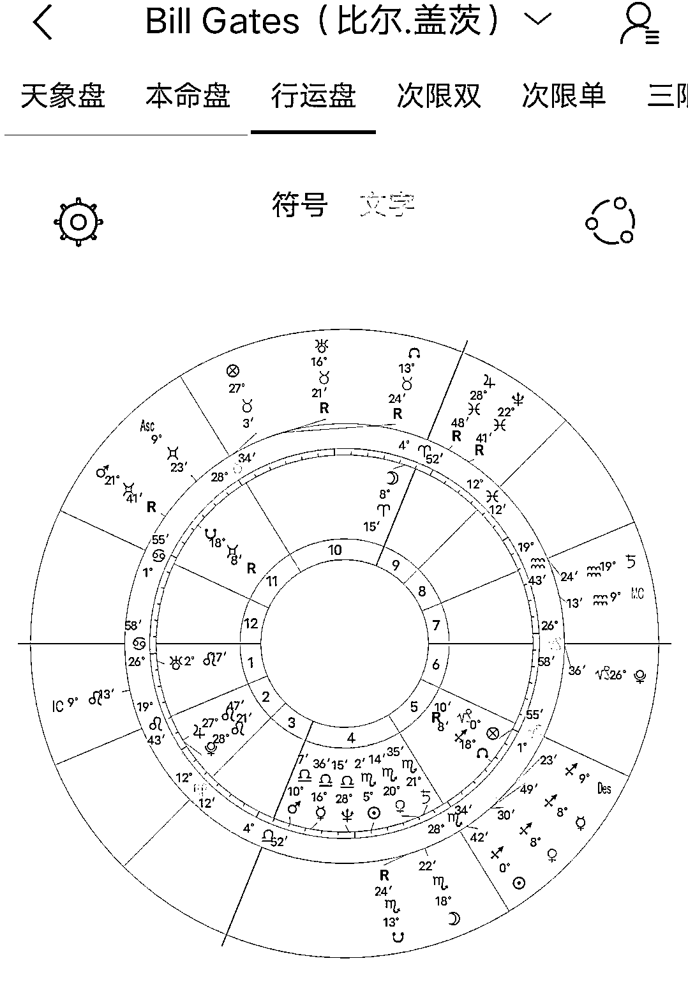

**上升****射手座****，太阳行进在*****1*****宫**

**接下一个月，你会感受到精神饱满和意志力充盈。**上升射手座本就乐观、积极，也许让自己快乐在大多数生命情境中对你来说并非难事，但在快乐的同时找寻、总结生命的意义才更觉珍贵。当下正是与真实自我的意义更接近的时刻。**你可能将面对一些有冲突、有困难和障碍的对谈、交流。**透过这种看似不顺畅的互动让意识与外界讯息交互流动，充满改变性质的沟通能让自己拥有不一样的视野，从而带来整合性的转机。**同时，这也可能是精力过度消耗的时期，你需要阶段性的休养、整顿让自己可以持续投入在值得专注的事务中。**

**上升****天蝎座****，太阳行进在*****2*****宫**

接下来你的专注度值得投注在**职业、收益和财务绩效**上，不排除那那些充满意识的冒险性尝试，你**大可信任你的胆识与自信。**向来的谨慎与对风险、危机的管控能力足以让你应对当前行动、情势的不可控因素。在你专注自我投入与产出的同时也**不要忽略了对家人、家居的关照，不要因为忙碌而忘记照料你心爱的一切**。沟通中要避免失去理智的愤怒，同时也不要因为害怕冲突而阻止了真诚的表达。如果发现一些值得的尝试也可以借机尝试一些改善方。个人生活中，尽可将你充满幻想色彩的创造性想法投入现实，看看会不会有些奇迹发生。

**上升****天秤座****，太阳行进在*****3*****宫**

**你会感受到一种流动的自如，也更愿意走入人群，参与社区活动，分享与交流对你来说如此重要，在与人们的互动中你会感受到新的活力与自信。**如果你在从事任何一种创造性的工作，当下是可能遇到瓶颈的，但充满意识的交流探讨正好能为你打开一灵感的天窗。在工作中可能因为过度投入而令精力匮乏，适时休息，甚至是强制性的让自己休息是为必要。**如果你的工作更多与学术、教学、传播、沟通相关，很可能会因碰触敏感地带引发争端、纠纷、口角。**观点冲突也许并非坏事，会帮助你更专注于寻找立场、观点的支撑，并取得更进一步的总结与整合。

**上升****处女座****，太阳行进在*****4*****宫**

接下来是你可以放松的时期，允许自己短暂的享乐和休息，把注意力拉回内在、家庭和健康，从一度的忙碌中抽身。调整和改变一些生活的规律、秩序、陈设，让自己从内到外获得能量的焕新。**作息规律和健康问题可能会引发你新一轮的适应与调整，也为后期工作中可能的新一轮的升级做好准备。**保持你一度的小心、求是态度，但允许自己有些天马行空的表达与创想。你将会收获新鲜而富有活力的体验感，为自己的自信加分。

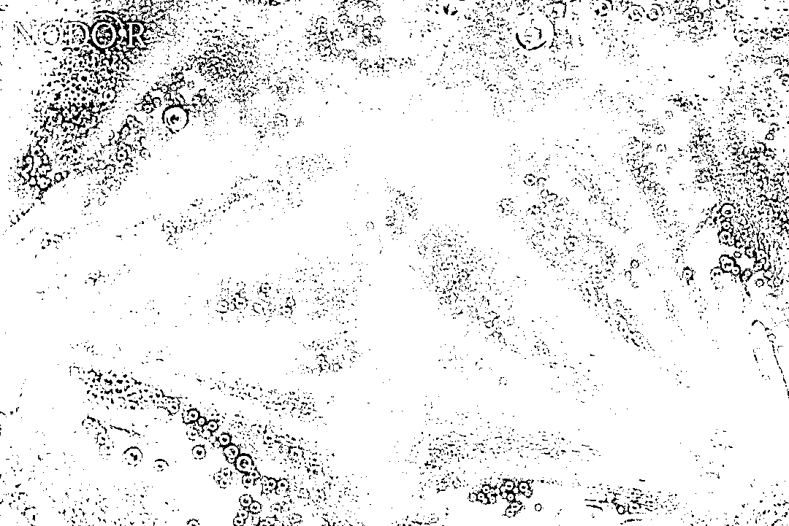

**上升****狮子座****，太阳行进在*****5*****宫**

此时的你仿佛想要重新生长、成长一轮，你渴望完全的放松，沉浸于玩乐、游戏之中。如果有条件让自己放纵一下下不是不可以，但要小心过度，避免耽误重要的工作。**当下的亲密关系也会受到诸多干扰和挑战，一些长期未解决的问题可能会出现困难而有意义的转机。**这需要双方的协作与对谈，需要核定的信心去合作才能实现双赢，达成一致的协作。

**上升****巨蟹座****，太阳行进在*****6*****宫**

你会对自己的工作、学习更为满意，有赖于你持续的成长与积累，时间在为你显化成果。累积的自信让你更能稳定自如地应对日常的忙碌与琐碎，也会让你投入更为规律、健康的生活中。同时，**你也需要学习在对的时机正确表达自己。**正确时候的自我表达会让你避免身处危险、危机，也能让你身边的人明白你的意图、观点和立场，避免不必要的混乱、失序与措手不及。

**上升****双子座****，太阳行进在*****7*****宫**

**此时的你更多地想要为他人考虑：伴侣、伙伴或是任何身边重要的人，你会投入时间、精力在他人身上比自己更多。**另一方面，你会透过向外的观照，展开更多内在的探索，新的文化领域在向你揭示真理。对真理、意义、信仰的找寻会碰触难关，也许你需要利用自身资源或公众关系去寻找一些开解的助力，让成长快速到来。**本月需要警惕注意力被干扰的情况，在忙碌的时候尤其如此，避免注意力不集中，或过度、冒失的行为带来流血、外伤事件，或是过度劳累带来发炎、发烧问题。**

**上升****金牛座****，太阳行进在*****8*****宫**

**接下来的你很需要一些静下来，慢下来的沉浸时光，与你的伴侣做一些深入对话，或是和自己进行深度交谈。**对生命中最深领域的思考、探讨会令你感受内在清明，并重新焕发出勇气与自信。在工作中将经由不小的难题来获得全新的转机，你值得去相信和尝试各种失去之后全新的推进方案。结束与扩张可能是一件事的两面而已。

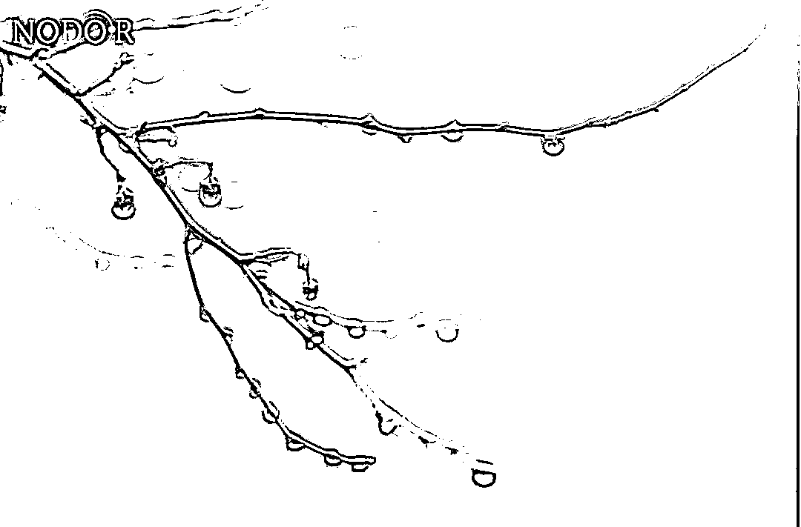

**上升****白羊座****，太阳行进在*****9*****宫**

即使你是习惯接纳与人发生争端的情况，接下来也需要**保持意识，避免过度陷入与他人的争端、争斗中。**某些观点、立场对你是要紧的，但也松开对立性的死结，允许不一样的声音和质疑存在，你从争端中重新找到自我的平衡。你渴望的远方和真理也就在激烈的冲突出会被揭示。**与人相处或融入新的团体可能是有困难的，在团体中学习内敛和必要的沉默才是当下有益的尝试。**有了协同者和共筑未来的同伴，会让你要迷航的时候找到有力的支撑。

**上升****双鱼座****，太阳行进在*****10*****宫**

你渴望展示自己的机会到来，只是把握好分寸，因为现实与虚幻之间的界限会非常模糊，自我的幻影也会更为突显。为了更好地表达自己，我们需要更清楚自己在世界上的轮廓和意图，让真实自我得以呈现，世界才会回馈予你真实的回应。忙碌的时候，家庭关系也可能出现一些抓马的剧情，冲突与纠纷在所难免，睡眠也可能受此干扰。你**需要静下来从内在寻找到问题的根源，才能更高效解决矛盾。**

**上升****水瓶座****，太阳行进在*****11*****宫**

当你投入集体性的工作时，那些长期紧缩的压力会有些松动，身心的压力能随着集体能量的支持流动和开解。**接下来一个月你值得去投入团体性的活动，找到与你志趣相投，有共同愿景的人，就如同重拾了自信。****也许你非常渴望唤醒自己沉睡、低迷的能量，充满竞争性的运动是不错的路径。**让自己流汗，或是投入激烈的角逐中，短期内你会从激烈的运动，身体能量的消耗中重整精力。同样的经验便可以支持你下一段的成长与蜕变。

**上升****摩羯座****，太阳行进在*****12*****宫**

接下来的日子你可以好好有计划地休息、休养一番，把修养身心当成工作来做何妨？因为现实的困难摆在眼前，并非努力就能促成、突破。再精进的山羊也需要停下来喘口气，或是观看一下眼前的风景——高处不胜寒。所以，只有你自己可以疗愈你自己，你就是自己最有力的支撑。**投入对梦境的关注，或是参与你的感兴趣的灵性社群活动也不失为一种心灵解压方式。**你能从各种放松的活动中重获对自我价值的启发，在休整以后反而能将力量落定在实处。

**版权声明：**原创文章由作者授权首发于若道平台，欢迎转发，反对抄袭。友号转载请申请白名单。

**END**

**郑玮玲**

ISAR（国际占星研究协会）认证占星师（2016 年获得）

若道占星专栏作者

将占星咨询、教学与音乐、舞蹈相结合的疗愈者

**微信号**：zhengviolin

**新浪微博**：@郑玮玲

**微信公众号**：Sampriya-Astrology

长按打赏

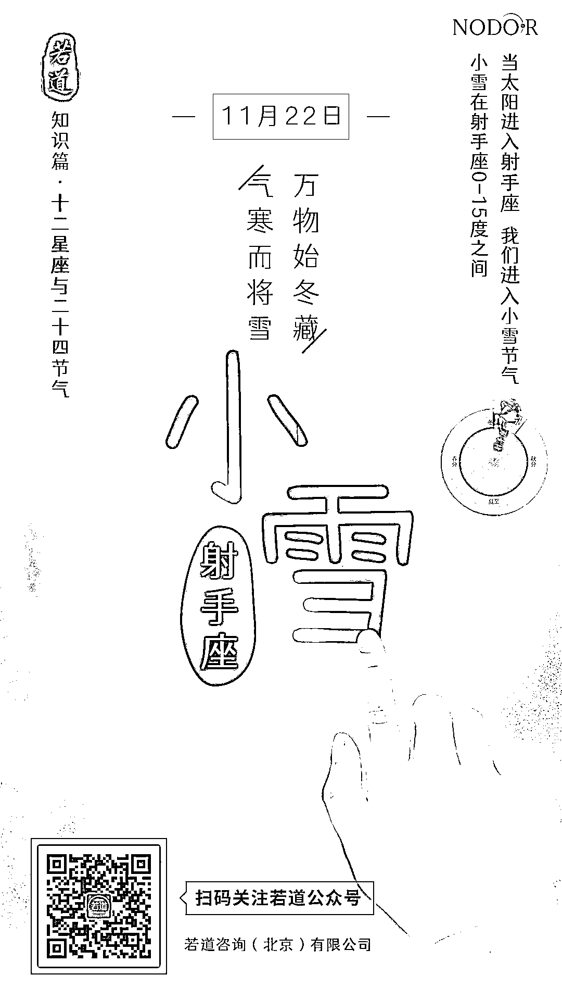

**20 位来自世界各地的占星师****带来 19 场沙龙——新世界的觉醒****详情可点击下图**

**学习占星学****点击下图了解课程详情**

**微信又双叒叕改版啦，不想错过若道君的推送？**
****就把若道设为****星标****以及点点****“在看”****吧！******▼**

**喜欢就点一下“在看”吧！****报名直达入口**

# 12 星座自画像丨这组星座的世界，“细节和完美”是永恒主题

> 原文：[`mp.weixin.qq.com/s?__biz=MzA5NjA0NTAxNg==&mid=2651494868&idx=2&sn=0d79cdde8a0f9de6447dd217766ea388&chksm=8b482b63bc3fa275685bac880e0aa10987b0602457a71caba6ec001b71c4741b2c6154c5a7e2&scene=126&sessionid=1692737720#rd`](http://mp.weixin.qq.com/s?__biz=MzA5NjA0NTAxNg==&mid=2651494868&idx=2&sn=0d79cdde8a0f9de6447dd217766ea388&chksm=8b482b63bc3fa275685bac880e0aa10987b0602457a71caba6ec001b71c4741b2c6154c5a7e2&scene=126&sessionid=1692737720#rd)

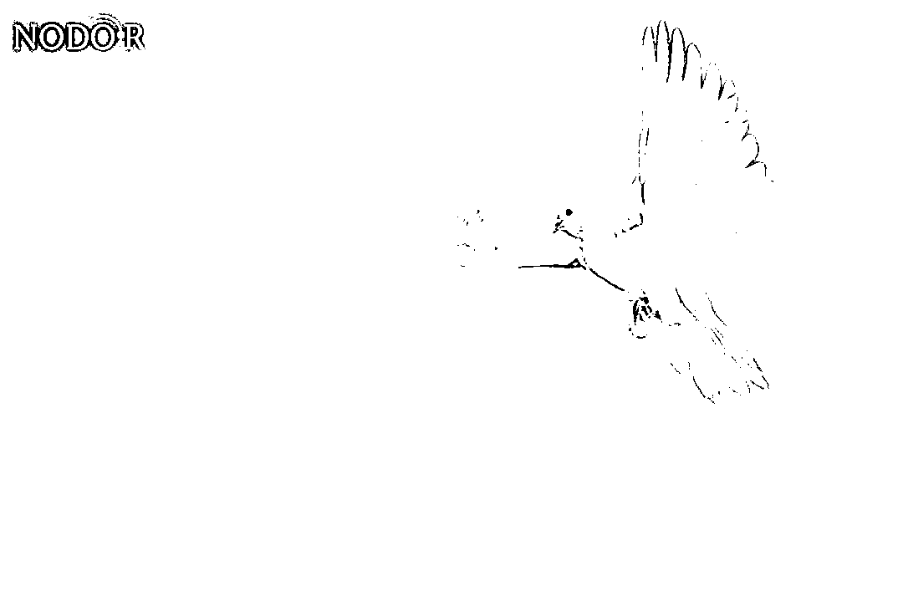

作者/克里斯蒂娜·罗登贝克

译者/亚麻林恩 校对/江艺

编辑/翀子 文章图片及注释/作者提供

本系列是克里斯蒂·罗登贝克老师撰写的艺术中的 12 星座自画像，角度独特，语句生动。此文是处女座与双鱼座的自画像，这两个星座的画家如何呈现自己样子呢？如果你对星座和占星学感兴趣，大卫老师参与授课的【[ISAR 认证职业占星师文凭课程](http://mp.weixin.qq.com/s?__biz=MzA5NjA0NTAxNg==&mid=2651494515&idx=3&sn=860bbb651e8c59375230c37a42fcb016&chksm=8b482ac4bc3fa3d2427df7584c6dde2e98e245f5132433fd9b01bdc1c744a8ba8aa20ef8c879&scene=21#wechat_redirect)】正在进行中，欢迎点击链接了解更多详情哦~**处女座的自画像**毫无意外，出生在**处女座**的艺术家们的作品总是**细节考究，精雕细琢，技术精湛，极尽完美。**同样毫无意外的是，所有的这些画家都画得非常漂亮。

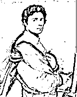

| 安格尔，1780 年 8 月 29 日

**雅克·路易斯·大卫**记录了法国大革命的发生，创造了这一时期标志性的形象，如马拉之死。他的视角是戏剧性的，电影式的、迷人的。他帮助制作了欧洲皇帝拿破仑的肖像。后辈的**让·多米尼克·安格尔**，对自己的作品同样精雕细琢，但他的大部分题材都更加内敛、富于想象力。他是一个浪漫的人，为了让肖像画更完美，他还扭到了手。如果你处在 19 世纪 30 年代，又有钱的话，他肯定会是你画肖像画的不二人选。他的作品既准确又讨人喜欢。

| 德·拉·图尔，1704 年 9 月 5 日

一百年前，你一定会雇佣另一个伟大的处女座肖像画家，**莫里斯·康坦·德·拉图尔**。在这个诙谐的时代，有一幅诙谐的自画像。显然，他在宫廷中受欢迎的原因之一，是他能让他的模特看起来很聪明。

| 奥尔加·科斯塔，1913 年 8 月 28 日

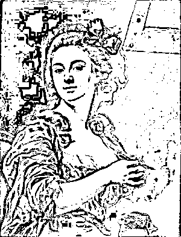

| 玛丽·加布里埃尔·卡佩特，1761 年 9 月 6 日

| 艾琳·丹尼尔森·甘博吉，1861 年 9 月 3 日

在英国，乔治·斯塔布斯正忙着画有钱人的马和狗。但他让自己看起来非常普通，而不是花里胡哨的法国人。另一个人看起来却像是在开玩笑——**德比郡的约瑟夫·赖特。**赖特是英国启蒙运动的首位艺术家，他创作了一个关于科学实验和讲座的系列画，特别关注试验使用的工具。我认为这显示了处女座对科技的兴趣。

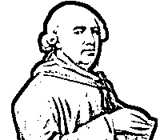

| 斯塔布斯，1724 年 8 月 25 日

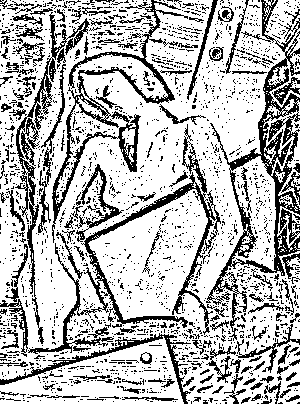

| 让·阿普尔顿，1911 年 9 月 13 日

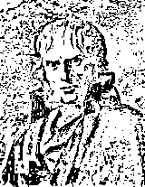

| 弗里德里希，1774 年 9 月 5 日

我想找一个更认真对待自己的人。德国艺术家**卡斯帕·大卫·弗里德里希**，以其充满浪漫风景的**忧郁和阴郁**而闻名。

他也患有**严重的抑郁症**。即使他看上去在努力挤出微笑。但凝视的目光却相当激烈。

当然，**抑郁的另一面是幽默感。**

| 艾格尼斯·克里夫·乔南德，1876 年 8 月 23 日

| 伯恩·琼斯，1733 年 8 月 28 日

**爱德华·伯恩·琼斯**，作为拉斐尔前派幻想中最浪漫、最多产的画家，他如何呢？哦，看在上帝的份上，他的自画像是一幅非常可爱的卡通画。更重要的是，这展现了**一个典型的处女座时刻——感觉有点小，没有价值和不知所措。如此自嘲。**

| 拉克汉姆，1867 年 9 月 19 日

另一位童话世界的插画家是**亚瑟·拉克姆**，同样的画技高超。看着这张自画像，你会认为他是一个学校的图书管理员，而不是一个**极度黑暗和浪漫的幻想家。**我猜他身后是圣保罗大教堂。那么我们从**处女座纯粹的技巧、精湛的技艺**上看到了什么呢，**是浪漫和智慧**，我想。

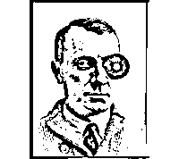

| 让·阿普，1886 年 9 月 16 日

如果你认为我在开玩笑，那么看看他的同伴，帮助他建立了达达运动的**让·阿普**。我是说真的。

| 塔西娜·亚玛瑞，1886 年 9 月 1 日

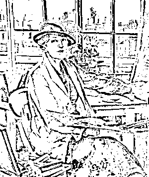

| 莫莉·特里普，1870 年 9 月 14 日

| 大卫，1738 年 8 月 30 日

**双鱼座的自画像**双鱼座，就在眼中。那些出生在双鱼座月份的人一定都被赐予了一双水汪汪的美丽眼睛。我不得不说，我认识两位眼睛非常漂亮的人——一位眼睛像星空一样闪亮柔和，另一个眼睛像爱琴海一样深邃幽蓝——都是双鱼座。

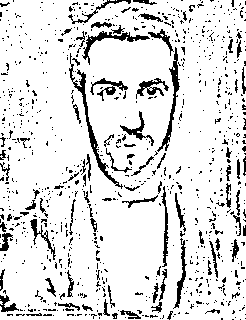

| 皮特·蒙德里安，1872 年 3 月 7 日

但我认识更多的双鱼座，眼睛相当普通——足够好，甚至漂亮，但并不令人惊叹。不是眼形，而是眼神。就像双鱼座的所有事情一样，我们很难指出双鱼座的眼睛到底是什么，但我注意到的大体有两种类型。有些双鱼座——我指的是那些上升双鱼座，双鱼座能量强或海王星落上升点——一旦你开始注视他们的双眼，你会发现越陷越深。你会发现那里自有世界。让你深陷其中。还有另一种双鱼座——眼睛藏在太阳镜后面，或者目光转移。他们或许也知道自己的神情会淹没你呢？

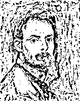

| 皮埃尔·奥古斯特·雷诺阿，1841 年 2 月 25 日

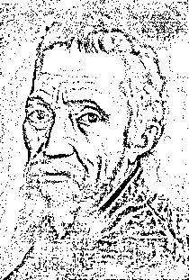

| 米开朗基罗，1475 年 3 月 6 日

还有**皮特·蒙德里安**，他是严格的直线抽象派的代表。他需要用如此的结构化来控制他双鱼座的缺乏界限吗？这里是**雷诺阿**，凝视着远方。这幅画完成的非常快，你几乎能感觉到画笔的韵律。这位是**米开朗基罗**，他的眼中藏着秘密。但不管怎样，这幅“自画像”很可能是由其他人完成的。**巴尔蒂斯**——你几乎看不见他的眼睛。这对自画像来说太奇怪了。他把他的夹克和后面的墙画得很漂亮。

| 巴尔蒂斯，1908 年 2 月 29 日。

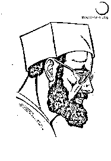

| 埃里克.吉尔，1882 年 2 月 22 日。

这也是个奇怪的人——埃里克·吉尔——雕塑家和类型设计师。他画了一张自己的侧面画像。他的目光完全转移了。他为什么躲避自己的眼神呢？我猜他戴的是泥瓦工戴的纸帽子。

****版权声明：**本文由若道翻译发布，欢迎转发，反对抄袭。友号转载请申请白名单。**

**END**

**克里斯蒂娜·罗登贝克**

克里斯蒂娜·罗登贝克，若道签约老师。全职职业占星师，从业 20 余年，在其网站长期撰写时事、艺术和文化的文章；定期在英国授课，并保持蓬勃发展的专业实践。

**拥有****51 年****占星实践经验的****若道创始人****前 ISAR 全球副主席****前 ISAR 全球职业占星师资质认证主席****大卫·瑞雷**

**和**

**2019 年第二届、2021 年第三届核心课中**

**与苏·汤普金斯老师****联合授课****的**

**ISAR 认证职业占星师**

**咔咔（Caroline）**

**二人合力打造**

**2022 年 ****若道全新核心占星课程**

**点击下图了解更多课程详情** 

**

**20 位来自世界各地的占星师****带来 19 场沙龙——新世界的觉醒****详情可点击下图**

**学习占星学****点击下图了解课程详情**

**微信又双叒叕改版啦，不想错过若道君的推送？**
****就把若道设为****星标****以及点点****“在看”****吧！******▼**

**喜欢就点一下“在看”吧！****报名直达入口**

# 职业占星师认证文凭课程插班中丨想看大卫老师是怎么做课堂演示的吗？

> 原文：[`mp.weixin.qq.com/s?__biz=MzA5NjA0NTAxNg==&mid=2651494868&idx=3&sn=c03db7e950abbd427cc8985cf015e910&chksm=8b482b63bc3fa275a8f6c63913cdbaa4ca46a9e62e71ffe2784dadb2eb303780550597b84187&scene=126&sessionid=1692737720#rd`](http://mp.weixin.qq.com/s?__biz=MzA5NjA0NTAxNg==&mid=2651494868&idx=3&sn=c03db7e950abbd427cc8985cf015e910&chksm=8b482b63bc3fa275a8f6c63913cdbaa4ca46a9e62e71ffe2784dadb2eb303780550597b84187&scene=126&sessionid=1692737720#rd)

**在若道核心课程的教学里，****以学员为案例****进行课堂的占星咨询演示，是我们课程的特色环节。**

这样的演示不仅让很多同学有亲身体验咨询的机会，而且这么多真实案例的学习，会让大家看到占星咨询到底是怎么样一个过程。毕竟，大部分人的学习都是要从模仿开始。

记得若道君当年学习占星的时候，可没有这样的机会。那时候主要是听课为主，后来，我们在多年的教学实践中，**越来越发现课堂演示的重要性**。因此，就把这个作为一个主要环节加入到课程中。

在新一期的若道核心课程中，咔咔老师和大卫老师这对组合就会把这个教学特色充分发挥出来。**熟悉中国同学思路的咔咔老师会以知识点的讲解为主，而有 50 年占星咨询经验的大卫老师，则以课堂演示为主。**

有时候，这样的课堂演示的功效是出乎意料的。

一位若道的老同学赵震宇这么写到：

2018 年，我正式开始在若道学习 L1-5。其实我一开始的心态更多的是希望得到系统化的学习来补充我的知识漏洞，以及拿到一个证书可以为自己做背书，增加自己将来转型占星师的筹码，而不是真的在期待可以从若道的学习中得到一些本质上的领悟。

事实上在初期的 L1-3 中，很多知识与课上的内容，也是我比较熟悉的领域，相对而言是驾轻就熟的。但在 L3 的工作坊中和大卫老师的接触以及模拟咨询，让我对占星的态度发生了很本质的变化。

大卫老师对我星图的分析不仅非常准确，更重要的是，他开启了我自身个人成长上的变化，从而成为了我本质上进化蜕变的一个契机。

在短短的 6 个月内，我对人生的认知、对自我的认知、对于人生看待的方式都发生了翻天覆地的质的变化。我意识到了原来跳出自己一直以来无意识间重复的模式，是一件可行、并且会给自己带来无限成长提高自己人生幸福度和质量的事情。这也让我深刻体会到了人本主义占星学的魅力，以及自己之前是多么的“无知“。

于是现在，占星学对我来说，不只是兴趣、宗教信仰、或者是可能的职业道路，而是一种激发自己和他人人生成长和蜕变的工具、一种让自己更幸福的看待世界的方式。哪怕我之后并不会以占星为生，它依然是我人生中不可或缺的一部分，就像一副隐形眼镜，影响着我与世界的互动。

而被大卫老师咨询深深影响的同学还有很多。

**这里，我们节选一些短小的试听片段，让你稍微感觉一下在若道核心课程上，大卫老师的咨询演示是怎样的一个样子。**

**片段一**

<mpvideosnap class="js_uneditable custom_select_card channels_iframe videosnap_video_iframe" data-pluginname="videosnap" data-id="export/UzFfAgtgekIEAQAAAAAAMKsWN6BUygAAAAstQy6ubaLX4KHWvLEZgBPEnoIULgMKKb-DzNPgMItC2ZEgiEDMBYjrYHv9wNsO" data-url="https://findermp.video.qq.com/251/20304/stodownload?encfilekey=rjD5jyTuFrIpZ2ibE8T7YmwgiahniaXswqzQNpbBXpPP4TxDf43veVhCBACOECUZ1gc5HaUbhk0Z3Glc94tZFe7ewRHOH9L2oUC1X3aOe13K8IHMkEou9Nkgw&amp;adaptivelytrans=0&amp;bizid=1023&amp;dotrans=0&amp;hy=SH&amp;idx=1&amp;m=&amp;scene=0&amp;token=x5Y29zUxcibCEaJsXB0hMdWnJvmNct4OnXZaaWOd32ia2edkK2LTMk7jmjOms6bDk5TDtYTqEwbOQ" data-headimgurl="http://wx.qlogo.cn/finderhead/PiajxSqBRaEJYnVsqWfEX9qA0sI6hNVKsDfyzfPZ92WZMZyBpZWU5NA/0" data-username="v2_060000231003b20faec8c4e68a1ec2d4ca07e434b07755bbf47e7053a3059defd2c9d6c68a20@finder" data-nickname="若道" data-desc="#若道核心课 大卫老师用星座、行星、宫位来探索一位同学出生星盘主题的时候，他回顾了解读星盘的优先次序" data-nonceid="7723748345640460016" data-type="video" data-width="544" data-height="344"></mpvideosnap>

**片段二**

<mpvideosnap class="js_uneditable custom_select_card channels_iframe videosnap_video_iframe" data-pluginname="videosnap" data-id="export/UzFfAgtgekIEAQAAAAAANycuUwRANAAAAAstQy6ubaLX4KHWvLEZgBPEhYJ0WjYILr-DzNPgMIvjhT14ogdLw3BWd0Tg37w0" data-url="https://findermp.video.qq.com/251/20304/stodownload?encfilekey=rjD5jyTuFrIpZ2ibE8T7YmwgiahniaXswqz3Oj8zjAwTAIicKkuWErGfL3ZtYr95eTZl2oMcAx9ibThSN3gay2CmF6o8ht96zOZHdxGiaIMmdbGNtWv9Prb3wriaA&amp;adaptivelytrans=0&amp;bizid=1023&amp;dotrans=0&amp;hy=SH&amp;idx=1&amp;m=&amp;scene=0&amp;token=AxricY7RBHdV28gAuQuwABhG0G0QgmYSkh8LH68lEdHu6yrDYj099TFZVSWWqINaQTuTQ2p1ZMF0" data-headimgurl="http://wx.qlogo.cn/finderhead/PiajxSqBRaEJYnVsqWfEX9qA0sI6hNVKsDfyzfPZ92WZMZyBpZWU5NA/0" data-username="v2_060000231003b20faec8c4e68a1ec2d4ca07e434b07755bbf47e7053a3059defd2c9d6c68a20@finder" data-nickname="若道" data-desc="#若道核心课 占星学如何反应职业选择？" data-nonceid="629392412247480278" data-type="video" data-width="544" data-height="344"></mpvideosnap>

**片段三**

<mpvideosnap class="js_uneditable custom_select_card channels_iframe videosnap_video_iframe" data-pluginname="videosnap" data-id="export/UzFfAgtgekIEAQAAAAAAl_sREJMyhwAAAAstQy6ubaLX4KHWvLEZgBPEtIIkIkRmL7-DzNPgMIsA5PpGB3ReSAYx6ZfSNfZ1" data-url="https://findermp.video.qq.com/251/20304/stodownload?encfilekey=S7s6ianIic0ia4PicKJSfB8EjyjpQibPUAXolGhicE2gfRuDzIVwyXxBFlWMzxMczGgPzOG5ja3tyfwYQrAcOUkpGicEE1j6fc9zHAjg5IF1HDBibf9k85ybbAfdqQ&amp;adaptivelytrans=0&amp;bizid=1023&amp;dotrans=0&amp;hy=SH&amp;idx=1&amp;m=&amp;scene=0&amp;token=x5Y29zUxcibCEaJsXB0hMdeqQ56SUWMj15o3Z7wyXeQ6ruia8FGLMtcPAnn3TQl6hkia66nOjynB8M" data-headimgurl="http://wx.qlogo.cn/finderhead/PiajxSqBRaEJYnVsqWfEX9qA0sI6hNVKsDfyzfPZ92WZMZyBpZWU5NA/0" data-username="v2_060000231003b20faec8c4e68a1ec2d4ca07e434b07755bbf47e7053a3059defd2c9d6c68a20@finder" data-nickname="若道" data-desc="#若道核心课 如何从出生星图的基本要素看到案主生命发展的故事和个人成长经验？
" data-nonceid="6689802853667419635" data-type="video" data-width="544" data-height="344"></mpvideosnap>

**若道新一期的核心课程在****8 月 30 日****正式开始**，如果你有很浓厚的兴趣，不仅仅是因为好奇想浅尝一下占星学，但还没有想清楚是不是要学习整个 L1-5 的课程，**那么 L1-3 可能是一个不错的选择。**

**谁是你的老师？**

**占星师咔咔（Caroline）**

2010 年师从美国占星师大卫·瑞雷学习，并得到世界名师斯蒂芬·弗里斯特、罗伯特·汉德、苏·汤普金斯传授各种占星学技法。若道首届学员，国内最早获得 ISAR 职业占星师资质的职业占星师，多次担任若道核心课程助教，2019 年第二届、2021 年第三届核心课中和苏·汤普金斯老师一起教授若道核心占星课程。

在国际知名广告公司和市场研究公司从事的市场研究和推广工作十余年，曾任职于阳狮集团、尼尔森市场研究有限公司、MTV 和《Madame Figaro》杂志。

**大卫·瑞雷（David Railey）**

*   **I****SAR 董事会成员，ISAR 全球副主席，ISAR 全球职业占星师资质认证主席，若道占星创始人**。

*   2016-2019 年，被选为国际占星协会（ISAR）考试委员会成员，国际占星协会（ISAR）是世界最大的国际占星机构，会员遍布 47 个国家。

*   2017-2020 年，被选为国际占星联盟（ISAR）考试委员会主席，理事会成员。

**助教王嘉祺 （Conrad）**

ISAR 认证占星师、若道认证生时校正资质，从 2010 年起自学占星学，2015 年开始在若道系统学习，并开始个案咨询。2018 年担任若道核心课程助教，以及卜卦占星学和太阳返照选修课助教，并带领学员进行经世占星和太阳返照方面的研究。2019 年 11 月作为演讲人之一参加了国际占星协会（ISAR）北京大会，也是 ISAR 星空俱乐部中国区第 16 期的主讲人。

**内容是什么？**

**ISAR 认证职业占星师的独有培训**

目前占星学的培训市场鱼龙混杂。而 ISAR（国际占星研究协会）是一个包含了 47 个国家在内的国际占星组织，多年来致力于占星的教育和研究，提升占星教育的品质和职业占星师的能力，在国际占星领域备受尊重。

**2022 年，鉴于对若道在占星教学领域所做的持续努力和高品质的课程服务，ISAR 特别授予若道核心课程为 ISAR 文凭课程，所有在若道学习，并通过若道毕业考试的同学将获得 ISAR 颁发的学历文凭（Diploma）。**

如果你想更多了解 ISAR，请点击[【这里】 ](http://mp.weixin.qq.com/s?__biz=MzA5NjA0NTAxNg==&mid=2651475298&idx=1&sn=b91888b54c14e29068f8b4e2a3452f5d&chksm=8b48ffd5bc3f76c32699f20f5c99e978bbb25551e69d80c70fee361acbd930ba5970ae776cdc&scene=21#wechat_redirect)

**课程费用**

**★ 1-2 阶　****课程费用：3500 元 ****★ 1-3 阶 连报**

**课程费用：11500 元 **

**********转发优惠价：**11000 元（朋友圈转发本课宣保留 24 小时以上，并截图给课程顾问）********

**★ 1-5 阶　连报**

**课程费用：46500 元 **

****转发优惠价：34800 元，朋友圈转发本课宣保留 24 小时以上，并截图给课程顾问****

**退转课程**

**退款原则请详看《教学协议》，如有疑问请咨询课程顾问。**

****2022 L1-3 认证职业占星师文凭课程****

**授课老师：大卫·瑞雷、咔咔**

**直播课开课时间：2022 年 8 月 30 日（周二）**

**授课方式：******网络授课，英文/中文授课，中文翻译****

**费用：** ****1-2 阶**：**3500 元；****1-3 阶**：**11500 元****（****转发优惠价：**11000 元，朋友圈转发本课宣保留 24 小时以上，并截图给课程顾问）******1-5 阶连报**：46500 元**（****转发优惠价：34800 元，朋友圈转发本课宣保留 24 小时以上，并截图给课程顾问）**；**

**课程负责人：王老师**（微信/手机：18510107057，请备注“大卫核心课”）

长按二维码添加课程负责人咨询

**报名直达入口**

# 《2023 年金融预报》预售中！梅里曼 12 月上证+黄金报告上线！

> 原文：[`mp.weixin.qq.com/s?__biz=MzA5NjA0NTAxNg==&mid=2651494632&idx=3&sn=0ceae62d4c83fe2c36bfe3430e92982d&chksm=8b482a5fbc3fa349559145c683b7a00e326c892f47d6178fa803597615cb991a63369b08b773&scene=126&sessionid=1692737720#rd`](http://mp.weixin.qq.com/s?__biz=MzA5NjA0NTAxNg==&mid=2651494632&idx=3&sn=0ceae62d4c83fe2c36bfe3430e92982d&chksm=8b482a5fbc3fa349559145c683b7a00e326c892f47d6178fa803597615cb991a63369b08b773&scene=126&sessionid=1692737720#rd)

  

**《2023 年金融预报》**从 2018 年年末，若道引入金融占星大师雷蒙德·A·梅里曼撰写的梅里曼市场时机学院每年一次的年度预报沙龙和每年一本的《年度预报》以来，**2023 年已经是第 5 个年度了。**

我们简单回归一下梅里曼老师 2019 年-2022 年的《年度预报》中一些预测。

在 2019 年的年度预报中，对于上证指数，梅里曼老师写到：

2018 年末至 2019 年初，中国股市处于三个重要周期低点的时间段。紧随这一低点，将会出现一次非常大的反弹。

2019 年木星会与海王星形成三次四分相，过去，这个相位总是与惊人的强大“泡沫”同时出现，期间股价大幅飙升。

到 2019 年 7 月之前，上证指数有三个重要长周期会出现周期低点，理想上看是在 2019 年 3 月底之前。

上证的周期低点出现在 2019 年 1 月，从那时起，上证迎来了 3 年的上升。

对于黄金，梅里曼老师建议：

从占星学角度来看，木星在射手座，四分在双鱼座的海王星，支撑看涨观点，因为这个组合有增加通胀的潜力。此外，木星在射手座的行星-星座组合从 1983 年起出现过三次，每次都对应到金银市场的年度高点。

无论在 2019 年何时，只要黄金保持在 1167 以上，同时跌到了任一主要周期低点附近，就要寻找买入机会。黄金可能在 2019 年涨到 1500+/- 50，甚至更高。

2019 年黄金从 1284 美元开始上涨，最高点在 1566 美元。

所以，如果你在 2018 年购买了《年度预报》，按照梅里曼老师的建议投资了上证指数和黄金，你会在当年取得相当不错的收益。

**对于 2020 年，在席卷全球、深刻影响了未来的疫情到来之前，梅里曼老师为 2020 年定下基调的：**

站在 2019 年的年尾，我们不知道一场深刻改变未来的风暴马上就将来临。

梅里曼老师，这位杰出的宇宙气象预报员，未卜先知，为 2020 年定下“将军”的基调。

在那一年，我们目睹了美国股市的 4 次熔断和全球经济的重置崩溃。

对于黄金，梅里曼老师是这么说的：

1391.50-1413.70 是价格最强的支撑区域。只要不跌破这个区间，黄金就能够上涨，重新测试 1566.20。如果突破了 1560-1590 的阻力区间，那么黄金就能够重新测试 1920。在那以前，黄金最有可能在 2020 年中在 1390 和 1575 之间波动。

| 黄金周 K 线图

2020 年，黄金在横盘 3 个月突破了 1560-1590 的阻力区间后，一路上涨到 9 月最高点 2089.20 美元。

对于上证指数，梅里曼老师建议：

2020 年的反弹将超过 2019 年的高点 3288。然而，这一涨势可能会通向 5.5 年周期的波峰，随后将再次迎来一波跌势至 2021 年或更晚。

行进中的摩羯座星群——木星、土星和冥王星——表明在 2020 年 11 月底之前会出现一个高点，很可能在 2020 年的前六个月。建议交易者特别注意金星逆行的时期，也就是 5 月 13 日至 6 月 25 日。逆行或顺行一个月内出现的年度高点或低点可能会带来卖出机会。

2020 年，上证指数最高达到 3474，超过了 2019 年的高点 3288。

**站在 2020 年的末尾，对于 2021 年，梅里曼老师说：**

随着 2020 年木星、土星和冥王星形成大合相，我们刚刚结束了一个周期和一个时代。此刻我们正处于一个新的时代和一个新的长周期的早期阶段。事实上，是多个长周期。

对于上证指数，梅里曼老师说：

我们预计涨势将在 2020 年 12 月-2021 年 2 月之间达到波峰，然后急剧下跌至 52 周和 22 个月周期的低点，这些周期将在 2021 年 5 月之前，甚至在 3 月底之前结束。此后可能会出现另一轮反弹，可能会也可能不会在 2021 年 11 月之前形成第一个 33 个月周期的新高。

对于黄金，梅里曼老师说：

黄金的 31.33 个月周期波谷将在 2021 年 9 月之前出现，理想情况是 2020 年 12 月-2021 年 6 月。价格目标是 1628+/-109 或 1768+/-76。重叠范围（理想情况）是 1692-1737。如果价格跌破这些范围，则为看涨情况中令人担忧的状况。

**而在 2022 年的年度预报里，我们看到：**

渐亏四分相不仅对应无法解决的冲突和分歧，土星和天王星形成的任何四分之一周期（合相、四分相和对分相）都可能在社会动荡和某地区现状受到威胁的时期出现。

在 2008-2010 年上一次四分之一周期时（对分相），世界见证了阿拉伯之春。在 1999-2000 年渐盈四分相期间，游行、抗议和直接武力冲突扰乱了西雅图世界贸易组织会议。这也标志着美国经济扩张的结束，以及由互联网泡沫破裂和 2001 年 9 月 11 日对美国世贸中心的恐怖袭击引发的衰退的开始。在此之前是 1988 年的合相，对应的事件是缅甸（Myanmar，当时的国名是 Burma）爆发了一场全国性起义，反抗尽失民心、暴力过度的军政府。数十万公民在全国范围内的暴动中抗议，这成为缅甸历史上的决定性时刻之一。

在每一个案例中，极端主义都占据主导地位，导致暴力冲突，但最终带来了“更大的益处”。它产生了建设性的结果，但在它进行的同时，世界在经历巨大的危机和暴力。”

2021 年 5 月 13 日-7 月 28 日，木星首次行经双鱼座时，这些因素表现得很明显。那时，通货膨胀开始出现，但美联储向所有人保证，这只是暂时的，他们将无限期继续推行“宽松货币”政策。他们并不担心持续的通货膨胀，这是典型的木星在双鱼座的表现，对现实的脱离或错误判断。

这两颗行星以及双鱼座也掌管原油。因此，我们可能会看到油价飙升，以及/或石油泄漏，威胁到大自然。它也可能对应着由于事故而释放的有毒气体，威胁到那些暴露其中的人的生命。

对于黄金，梅里曼老师建议：

只要黄金保持在 1670-1680 之上，仍然有极小的机会出现一轮爆炸性上涨，测试当前的历史高点（2089），甚至创下历史新高。毕竟，木星将在双鱼座合相海王星，可能预示着另一轮“投机狂热”。然而，这也可能是一个“恐慌”的征象，届时某些市场可能会崩溃。

在 1900-1980 之间存在较大的阻力，如果不能突破这个阻力，将表明黄金的熊市已经开始，新一轮的猛烈下跌可能正在准备中。只要跌破 1670 则将确认黄金 20 年的牛市结束了。

| 黄金周 K 线图

对于上证，梅里曼老师说：

我们预期在 2022 年 5 月前，上证综指会出现急剧的下跌，进入 52 周周期和可能的 33.5 个月周期低点。

我们更倾向于认为，上证综指会首先下跌，在 5 月前形成一个低点，然后上涨。这一轮上涨的幅度，将告诉我们上证综指是处在牛市，还是进入了新的熊市。如果它不能上涨超过 3750，长周期波峰可能已经出现，并且进入了新的熊市。

我们简单回顾了部分 2019-2022 年金融预报的内容，**过去的经验让我们相信，你根据梅里曼老师的指导作为投资参看，你会比一般人有更大的胜算。**

**2023 年度预报及沙龙预售**

**2023 年金融预报沙龙时间为 2023 年 1 月 7 日 10：00-13：00。**

一份价格仅千元的顶尖金融占星大师的投资分析报告和沙龙，聪明的投资者值得拥有。

**2023 年年度预报****及沙龙价格：****1380 元**

**双 11 优惠价格：****1280 元**

**长按下图识别二维码**

**购买报告及沙龙**

**梅里曼金融报告双 12 福利来啦！****长按下图了解更多详情吧！**

**购买者重要须知****①** 梅里曼市场时机学院每年一次的年度预报沙龙和《年度预报》是梅里曼市场时机学院的研究“预报”，而不是市场“预测”，是梅里曼老师及其金融占星分析师对人类活动周期历史与行星周期之间相关性的研究，二者在大部分情况下具有 80%或更高的相关性，而不是因果关系。沙龙中和报告中的研究完全存在错误的可能性。即便是非常认真的研究和几十年的研究经验，我们无法总是正确地解读出各种征象在实际层面上会如何相互作用，并显化为事件结果。

所以请将次沙龙和报告看作一个研究参考，务必结合其他市场研究和你个人对市场的理解，根据你的自由意志做决策。

**②** 此报告一旦售出，**即不接受退款。**

**③** 此报告仅支持在手机网页阅读，不支持电脑阅读和下载。**④** 讲座提供视频回放。**以上须知，请仔细阅读。一旦付款，即视为已了解并接受所有须知内容。**

**如在购买报告中遇见任何问题**

**可添加客服**

▼

**12 月上证报告**11 月份报告发出的时候是 10 月 19 日，在此一周前的 10 月 12 日，上证跌到了 2934，重新测试了在 4 月 27 日形成的 2022 年年度低点 2863，然后开始反弹。**10 月 12 日这一低点是位于梅里曼老师一直提到的今年下半年最重要的天象——土天四分、木星在土天四分中点的天象的范围之内。**

| 上证指数日 K 线图当时，梅里曼老师提到，一方面，10 月 12 日的低点是在土天四分这个最重要的天象之下，市场完全可能出现反转，如果 10 月 12 日的低点是从 4 月低点 2863 开始的一个拉长的基本周期的第 23 周，那么，站在 10 月 19 日，一个新的 13-20 周的基本周期刚刚开始，当时仅仅是第一周。这个基本周期完全可能开始一波上升行情。另一方面，10 月 23 日，土星恢复顺行，10 月 31 日，火星开始逆行，金星和太阳都将进入天蝎座，而且将在 11 月 5 日-11 日和土星、天王星形成 T 三角。如果基本周期不是从 10 月 12 日开始，而是从 8 月 2 日-4 日的低点开始算，上证完全可能跌向更深的低点。上证跌向更低的低点。10 月 31 日，火星逆行日，上证跌到 2885，与 4 月份的低点 2863 形成双底，然后开始反弹。从宏观层面来说，美国的通货膨胀似乎见顶，美元的加息可能缓和下来；而国内似乎要走向新冠疫情防控的政策的逐渐放开，这对于经济是利好。

| 上证指数周 K 线图

本年度激烈的天象似乎都已结束。现在是不是大胆加仓的时候？金融占星大师雷蒙德·梅里曼的《2022 年 12 月上证指数报告》已上线，你可以听听梅里曼老师的看法。《2022 年 12 月黄金报告》也已上线，欢迎购买。另外，本期我们还将免费为所有读者送上一期铜周期的报告。法国巴黎的投资组合经理，也是梅里曼市场时机学院最优秀的毕业生之一——马修·凯撒（Matthieu Kaiser）在过去两年间对铜价格与地球宇宙学周期的关联进行了出色的研究。我们希望分享这位杰出研究者的发现，因此将其纳入梅里曼市场时机学院周期报告的金属报告行列。

这里还有两场讲座，对你的财富管理也有一定的帮助。

**12 月上证报告上线**

**上证指数月度报告价格****单月报告**：280 元/月 **季度套餐价格**：780 元（260 元/月）**年度套餐价格**：2400 元（200 元/月）**双报告年度套餐更优惠（直降 900 元）****12 个月黄金报告+12 个月上证指数报告：仅需 3900 元****长按下图识别二维码购买上证指数报告**
▼

**12 月黄金报告**

“**黄金是金钱。其他的只是信贷。**

**——约翰·皮尔庞特·摩根**

”

| 黄金周 K 线图

我们经历了 2 年的土天四分正在成为过去式。虽然其影响还会持续。

在上个月，我们提出了一个问题，9 月 28 日的低点 1622 是黄金 2 年来的低点，那么从这个低点，黄金会开始一轮反弹吗？毕竟，黄金有一个 31.33 个月的周期，而半周期是 16 个月，其容许度在 13-19 个月之间。上个周期低点是 2021 年 3 月的低点 1673，而 10 月是第 19 个月，正是在半周期低点的容许度内。|黄金日 K 线图  从现在看，答案很明显，黄金在 10 月 21 日和 11 月 3 日再次测试 1622 低点后，这 3 个低点有可能形成了 16 个月周期的三重底。随后，黄金开始了一轮反弹。目前已经反弹了 10%。黄金会继续反弹吗？此外还有白银。在上期报告中，梅里曼老师提示了关于白银的投资机会。  12 月份黄金报告已经上线，欢迎了解。也可以按照季度和 1 年期订阅，有更多优惠。季度和年度的好处是，你可以持续了解梅里曼老师对于不断在变化的市场的看法。  即便他某一次看法和市场不一致，你也看到在下一期他如何调整自己的看法，并看到金融占星在一个长期时间段内对你把控风险的帮助。而能够长期控制风险、尽量找到安全的投资时机才是投资的长久之计。  点击阅读原文，雷蒙德·梅里曼黄金周期 2022 年 12 月报告带来有 40 年黄金市场研究经验的世界著名金融占星大师雷蒙德·梅里曼对当前黄金市场的研究。投资有收益，投资有风险，希望金融占星学的研究帮助你更好地评估你的投资。

**12 月黄金报告上线**

**黄金月度报告价格****单月报告**：280 元/月 **季度套餐价格**：780 元（260 元/月）**年度套餐价格**：2400 元（200 元/月）**双报告年度套餐更优惠（直降 900 元）****12 个月黄金报告+12 个月上证指数报告：仅需 3900 元****长按下图识别二维码购买黄金报告**
▼

**购买者需知**

**① **梅里曼市场时机学院《中国上证指数月度研究报告》是梅里曼市场时机学院（以下简称 MMA）的研究“预报”，而不是市场“预测”，是梅里曼老师及 MMA 金融占星分析师对人类活动周期历史与行星周期之间相关性的研究，二者在大部分情况下具有 80%或更高的相关性，而不是因果关系。报告中的研究完全存在错误的可能性。即便是非常认真的研究和几十年的研究经验，金融占星师无法总是正确地解读出各种征象在实际层面上会如何相互作用，并显化为事件结果。

所以请将报告看作一个研究参考，务必结合其他市场研究和你个人对市场的理解，根据你的自由意志做决策。

**②** 此报告一旦售出，**即不接受退款。**

**③** 上证、黄金月度报告每月固定 1 期，**并非都是在每月相同日期发布。**

**④** **我们收到英文报告的当天，即发布该英文报告。3 天后，上线报告中文版。此报告仅支持手机网页阅读，不支持电脑阅读和下载。****以上须知，请仔细阅读。一旦付款，即视为已了解并接受所有须知内容。**在过去的 40 年中，唯有梅里曼逐渐完善，并在梅里曼市场时机学院月度周期报告中阐释了将地球宇宙学与周期相结合的研究方法，以惊人的精确性预报了黄金价格发生重大变化的时间。**黄金购买 Tip**

各大银行均可购买黄金或黄金 EFT 基金，也可以在诸如天天基金或者支付宝购买黄金及黄金相关产品。不明白的可以百度搜索。

**购买后如何查看报告？**

**购买后有疑问怎么办？**请联系技术客服
**微信：nodoor201705** **购买直达入口**

# 若道周运 11.21-11.27 丨射手月来了，开始乐观明朗的新旅程吧！（内含 12 星座运势）

> 原文：[`mp.weixin.qq.com/s?__biz=MzA5NjA0NTAxNg==&mid=2651494632&idx=1&sn=4af202ad60e1edee78bc2a24e3e43810&chksm=8b482a5fbc3fa3491f5fffdd5f435fc8ab403e65a244d82a5f055064aa1a5dbc081611d7b280&scene=126&sessionid=1692737720#rd`](http://mp.weixin.qq.com/s?__biz=MzA5NjA0NTAxNg==&mid=2651494632&idx=1&sn=4af202ad60e1edee78bc2a24e3e43810&chksm=8b482a5fbc3fa3491f5fffdd5f435fc8ab403e65a244d82a5f055064aa1a5dbc081611d7b280&scene=126&sessionid=1692737720#rd)

******☆ ****后台回复“今日”，给你一句生命态度******

作者/芷菱 ISAR 认证占星师
编辑/翀子 封面/书君 图片/稿定设计**整体氛围**

**本周重要星象**

*   **11 月 21 日 周一**

    太阳（天蝎座）三分木星（双鱼座）；月亮（天秤座）、火星（双子座）、土星（水瓶座）呈大三角

*   **11 月 22 日 周二**

    太阳进射手座（16:20）、金星合相水星

*   **11 月 24 日 周四 **

    射手座新月（6:57）、木星顺行（7:02）

好消息！来到本周，宇宙气象豁然开朗，就像在一场颠簸担忧的旅程中，终于来到一个可以休憩和重整精神的站点。

回头看，我们经历了群星天蝎座的危机感和恐惧，也经历了土天四分相之下经济、疫情的紧张收缩，和火海四分相带来的脆弱无力。

**而本周，几乎所有星象都在往乐观的方向变化：**

**太阳紧随着金星、水星进入射手座**，我们走出了群星在天蝎座的阴影，来到焕然一新的群星射手座时期。本周四将发生**射手座新月**。更大的惊喜是，**木星几乎在新月的同时恢复顺行。**

火海四分相在本周逐渐出相位离开，土天四分相也已渐行渐远。看起来整个宇宙在传达一种**明朗、乐观、释放**的新鲜气息。危机感在渐渐消散，我们完全可能生出新的期许。 

**记得这一次在新月时许下自己的美好愿望。**   

当然，发生于 19 日的火海四分相在本周初仍然会有影响，可能带来一些无力感。但一切都在变化，**强大的木星和新月会帮助我们开启新的旅途。**  

准备好了吗？我们内在的信念还在吗？是否还能重振旗鼓？是否在历经风雨之后仍然选择相信未来？以及更重要的，是否仍相信自己？

**射手座新月**

很有意思，周一太阳虽然还在天蝎座最后一度，就与木星形成了一个精准三分相。而且月亮、火星、土星形成一个大三角。这个良性的角度给本周定了个调：**这是个乐观、积极、稳固的开始。**  

周二，太阳进入射手座。就在同一天，金星和水星在射手座形成合相。**本周，我们的头脑和表达都会更加积极、正向、轻松。我们的话语会更令人愉快，很适合与人交流感情，增进关系。一些谈判协商也更容易达成合作。**

周四的新月发生在早晨。这个新月几乎是我见过最**“甜美”**的一个新月。它发生在射手座，并三分了木星。

而且，就在新月开始后五分钟，几乎是同时，木星开始顺行。也就是说，射手座新月三分顺行的木星，而且在新月的旁边，金星和水星正在紧密合相中。

我很好奇，宇宙想给我们怎样的一个礼物，来弥补之前经历的辛苦和创伤。毕竟这个新月的种种配置，都如此完美。

**记得在这一天许愿哦。**具体许愿内容可以看下文的 12 星座运势部分。

射手座与我们对未来、远方的渴望有关，也与我们的信念有关。追求意义，热爱自由、探索远方、探索人类的精神世界，都是射手的生命力源泉。

射手座也是最乐观的星座。设想当一个人的目光从身边的局促狭隘，转向远方和长久的未来，往往就会变得积极和明朗起来。因为世界和时间是如此辽阔，充满了可能性。

永远心怀梦想，永远乐观向上。**在这个世界面对重重困难的时候，射手座的理想主义是如此的珍贵。**

在射手座群星的氛围下，火星与土星还形成一个良性的三分相位。这表明，**我们不仅可以憧憬梦想，宇宙也给予我们行动力、耐力、勇气和意志，去为自己的期许展开实践。**

加油。

**木星顺行**

周四早晨 7:02，就在新月发生后的几分钟，木星在双鱼座 28°40′转为顺行。

木星从 7 月 29 日开始逆行、10 月 28 日回到双鱼座，逆行一共三个半月，现在终于回到了正轨。

木星的顺行影响深远，毕竟它是太阳系中体量最大的行星。**我们可能重拾自己的信念和理想，摆脱之前的怀疑沮丧，更加乐观积极，愿意相信未来，愿意成长和探索，甚至不惧冒险。**

作为射手座的守护星，木星与新月的三分相，双重强调了**射手座相关的事宜会获得推动发展。**木星掌管文化出版、海外事务、高等教育、长途旅行等领域，它们会受到木星顺行的推动，获得发展的机遇。

接下来的轨迹是：木星将穿行双鱼座尾度，于 12 月 20 日再次进入白羊座。接着在五个月后，2023 年 5 月进入金牛座。

刚恢复顺行的木星目前行动还非常缓慢，徘徊在双鱼座 28-29 度。这也是木星在双鱼座最后的告别式，下一次再见就要 12 年之后了。

每个星座的最后几度往往是一种总结与回顾。双鱼座代表的同情、奉献、悲悯、救赎，以及浪漫与理想的色彩，可能在这段时间里被再次放大。

关心他人的苦乐，因为他人的命运与我是一体的，无法分割。关心艺术与内心世界，因为我们要为自己寻找心灵的栖息地，寻求滋养和疗愈。

最近我看到一项国外心理学家组织的研究，表明冥想有助于改变我们的大脑，帮助产生积极的情绪，在面对痛苦时能更坚定。双鱼座代表的身心灵领域、对自我内在的探寻，值得我们不断挖掘。

**射手座新月和木星顺行形成的三分相，也提醒我们提升和发展自我，去获取成长。**阅读、学习、网课、进修，或者远行，去探索新的地方，寻求新的人生经验，总之积极扩展我们的生命，让它更丰盛、饱满、充盈。

**月亮轨迹与一周情绪**

**这是整体积极明朗的一周，情绪指数五星，中间有小起伏。**

周一，月亮在天秤座，月亮、土星、火星呈大三角。整体气氛较为平衡、清醒、务实。太阳和木星的三分相添加了乐观积极的色彩。

周二，月亮进入天蝎座，周三月亮四分土星。氛围下沉，稍微低落，有压抑和紧张感。

周四，月亮进入射手座，新月发生。月亮先后合相太阳、金星、水星，三分木星。氛围焕然一新，乐观、昂扬、积极明朗。

周五，月亮对分火火星，在射手座/双子座轴线，整体氛围热情、活跃、积极、冲动。注意人际关系中可能缺乏耐心，容易产生冲突。

周六，月亮进入摩羯座直到周日。周末的氛围转为稳重务实。

**12 星座的一周运势**

**（重点参考上升星座，其次参考太阳星座）**

***白羊座***

**新月发生在 9 宫，**适合许下关于学习和成长的愿望，比如提升思考认知能力，增长智慧。也可以许下有关考试、出版、远行、海外事务的心愿。新月期间也很适合去挖掘自己内心的信念和理想，寻找新的成长目标。

**木星在 12 宫顺行，三分 9 宫的新月，**可以通过冥想、打坐、静思等去观照内心，更深刻地认识自己，安顿心灵，获得疗愈。在木星进入 1 宫之前的这一个月，可能会想要安静独处、休整，或做幕后的工作，不适合马上采取重要的行动。

***金牛座***

**新月发生在 8 宫，**适合许下与金钱相关事宜顺利解决的愿望。比如投资理财、债务、保险、遗产、税务等事务，或者是与额外收入、非固定收入有关的事宜。如果从事投资，现在可以重新梳理自己的投资策略。

**木星在 11 宫顺行。**久未联络的朋友可能重新搭上线，也有机会结识新朋友，或加入某些新群体，也许有机会合作赚钱。此时也是个不错的时机，可以重新思考、制订自己对未来的规划和目标。

***双子座***

**新月发生在 7 宫，**适合许下关于爱情、婚姻或重要合作关系方面的愿望。比如希望与 ta 的关系更进一步，或与重要伙伴订立协议，建立信任等。金星和水星在 7 宫合相，表明这段时间可以跟对方多交流，愉快的沟通会大大拉近彼此的距离。

**木星在 10 宫顺行。**事业方面有机会获得进展。也可能是与老板的关系改善，或是自己的声望获得提升。总之接下来可以在事业方面多发力，努力会有相应的回报。

***巨蟹座***

**新月发生在 6 宫，**适合许下与工作相关的愿望。比如改善工作环境、同事关系更融洽、工作成果更好等。也可以许关于健康的愿望，比如改善睡眠质量、合理减肥、病痛治愈等。伴随新月可以对自己的生活或工作进行优化，科学饮食运动，合理管理时间。

**木星在 9 宫顺行。**考试、学习进修、远行、海外事务等方面会更顺利。也适于去寻找自己的信念和理想，甚至信仰。这段时间多读书多思考，会很有收益。

***狮子座***

**新月发生在 5 宫。**适合许下与创造力、孩子或甜蜜恋爱有关的愿望。比如许愿自己有充沛的灵感、创作出成功的作品。考虑到金星和水星合相在 5 宫，也很适合许愿享受恋爱，相处更甜蜜愉悦。想要小孩、或者想与孩子愉快相处，也可以许愿。

**木星在 8 宫顺行，**金钱投资方面的事宜更容易顺利推进。比如债务、税务、保险、遗产、额外收入等事宜，金融投资方面也可能有不错的运气。不过也要注意避免过分乐观或大意行事。

***处女座***

**新月发生在 4 宫。**适合许下有关家庭、房屋、家人相关的愿望。比如要买卖房屋、搬家、装修，改善家居环境或家人关系，解决家庭事务等。多跟家人谈心，金星和水星的合相有助于交流愉快，增进情感。

**木星在 7 宫顺行。**有助于增进人际关系，特别是伴侣关系或重要的合作关系。有更多机会结识新人，遇到潜在的优质对象或合作者。如果之前关系中有裂痕，现在也有机会去改善，相处更加融洽快乐。

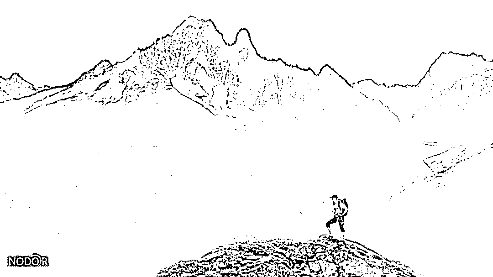

***天秤座***

**新月发生在 3 宫。**适合许下有关学习、沟通、写作或发表言论相关的愿望。比如找到好老师好课程，更好的学习状态，演讲或写作的思路顺畅，交流愉快顺利等等。金星和水星的合相在 3 宫，你的表达可能很有吸引力，交流愉快有效。

**木星在 6 宫顺行。**工作方面可能有不错的提升，做事容易感到顺利。比如改善工作环境、同事关系、更好的工作状态和成果等。另一方面，木星也有助于改善健康，注意自己的作息和饮食睡眠，调整身体状态，这段时间会很有成效。

***天蝎座***

**新月发生在 2 宫。**适合许下有关收入、财务、价值感方面的愿望。比如提高固定收入、积蓄更多钱、打造自己的财务安全，或是在工作中找到自己的价值，提升自我价值感等等。金星与水星的合相在这里，有助于一些交易的进行，也利于协商合作。

**木星在 5 宫顺行。**有利于改善创造力、恋爱或孩子方面的状态。比如亲子关系更亲密、自己更有灵感和创造力、爱情关系愉快等等。这段时间可以积极调动自己的热情，去投入到喜欢的事情当中，或者充分去享受生活。

***射手座***

**新月发生在 1 宫。**生日快乐！在这个完美的新月，你适合许下关于自己的最重要的愿望。比如希望自己成为什么样的人、自我的成长和提升、增强自信与独立，或形象更美更有吸引力等等。金星和水星也合相在 1 宫，你的魅力无可阻挡，可能吸引来很好的朋友或对象。

**木星在 4 宫顺行**，有关家庭或房屋的事宜更容易顺利解决。比如搬家、找房子，或改善家人关系等。如果一直想要改善居住环境，或推动某些家庭事务，现在是不错的时机。

***摩羯座***

**新月发生在 12 宫。**适合许下与心灵宁静、开启智慧等相关的心愿。比如休整放松，找到内在平静，积蓄能量等。适合接触身心灵相关的内容，比如占星塔罗心理学，或是通过阅读哲学历史、与有智慧的人交流等，寻找心灵的启发。

**木星在 3 宫顺行。**有关学习交流方面的事会更顺利。适合去重启自己一直想学的知识，早就想读的书，效果可能事半功倍。或者去写作、演讲，与人交流协商，在木星加持下，思考和表达会更加顺畅，容易出成果。

***水瓶座***

**新月发生在 11 宫。**适合许下与朋友、社交圈有关的愿望。比如结识志同道合的朋友、加入某些优质社群或团队、遇到贵人相助，扩展人脉资源等。金星与水星合相在此，这段时间与朋友的联谊、交流会比较愉快，有助于增进情感。

**木星在 2 宫顺行**。有关收入、金钱方面的事宜可能更顺利，有机会增加收入。木星也利于提高自信心和自我价值感，去发现自己的能力和优势。不过有可能因为太乐观而随意花钱，注意做好财务规划。

***双鱼座***

**新月发生在 10 宫。**适合许下与事业、名声相关的愿望。比如事业发展有好机会、被委以重任、收获成就、提升个人名望与地位等等。金星和水星也在 10 宫合相，与老板或同事的沟通会较为愉快顺畅，更容易获得信任、促进合作。

**木星在 1 宫顺行。**有助于提升自信心和自我形象。你可能更积极更乐观，对自己信心满满，会去主导和推动一些事情。也许你会充当导师或智者的形象，向别人宣扬你觉得很棒的知识和观点，或者帮助新同事更好地工作。

**版权声明**：原创文章由作者授权首发于若道平台发布，欢迎转发，反对抄袭。友号转载请申请白名单。

**END**

**芷菱**

ISAR 认证占星师/占星作者/媒体人若道 2019 届核心课程毕业生

于 2019 年通过 ISAR 考试，同年获得若道认证神话塔罗师资质

**微信公众号**：芷菱的理想国

长按打赏

**梅里曼金融报告双 12 福利来啦！****长按下图了解更多详情吧！**

**20 位来自世界各地的占星师****带来 19 场沙龙——新世界的觉醒****详情可点击下图**

**学习占星学****点击下图了解课程详情**

**微信又双叒叕改版啦，不想错过若道君的推送？**
****就把若道设为****星标****以及点点****“在看”****吧！******▼**

**喜欢就点一下“在看”吧！****报名直达入口**

# 雷蒙德·梅里曼金融占星周运 | 市场喜欢的射手季即将到来！

> 原文：[`mp.weixin.qq.com/s?__biz=MzA5NjA0NTAxNg==&mid=2651494632&idx=2&sn=72a8faa51db550c729f069d58d2609ed&chksm=8b482a5fbc3fa349ec29085b041b233a7f29b403c1042bc46a589e62fa5d0dfefd16fd5be3fc&scene=126&sessionid=1692737720#rd`](http://mp.weixin.qq.com/s?__biz=MzA5NjA0NTAxNg==&mid=2651494632&idx=2&sn=72a8faa51db550c729f069d58d2609ed&chksm=8b482a5fbc3fa349ec29085b041b233a7f29b403c1042bc46a589e62fa5d0dfefd16fd5be3fc&scene=126&sessionid=1692737720#rd)

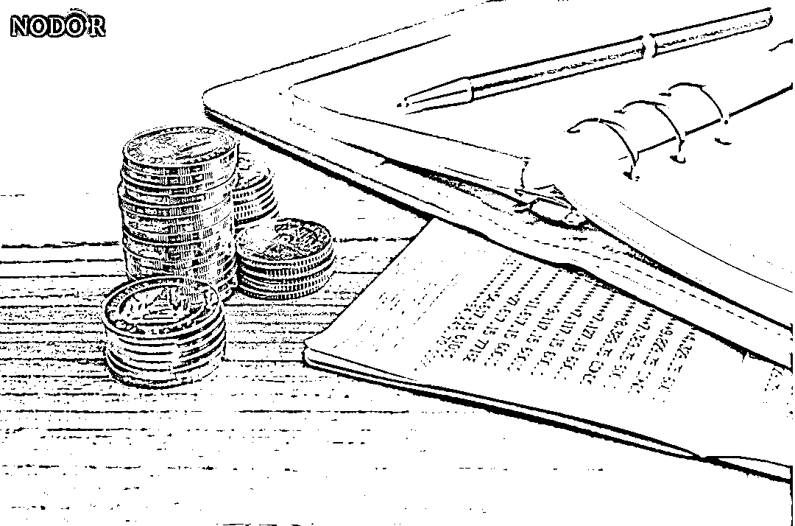作者/雷蒙德·梅里曼 译者/Luke 编辑/玫瑰 图片/稿定设计雷蒙德·梅里曼是在金融占星学界稳坐第一把交椅的占星师，同时他也是若道签约的金融占星课老师，我们引进了雷蒙德·梅里曼老师的《[上证指数月度报告](http://mp.weixin.qq.com/s?__biz=MzA5NjA0NTAxNg==&mid=2651494377&idx=2&sn=12afe330afef4b876307c2963b795b56&chksm=8b48255ebc3fac48d8ea2c82dd7b085ed1bcf50d7b480800f1e6a1d63aadb3cb275863e20df7&scene=21#wechat_redirect)》及《[黄金报告](http://mp.weixin.qq.com/s?__biz=MzA5NjA0NTAxNg==&mid=2651494377&idx=2&sn=12afe330afef4b876307c2963b795b56&chksm=8b48255ebc3fac48d8ea2c82dd7b085ed1bcf50d7b480800f1e6a1d63aadb3cb275863e20df7&scene=21#wechat_redirect)》。我们经老师的授权，将每周刊登梅里曼老师的周运，供大家参考和学习。于是，这是本周的周运（11.21-11.25）。

**说明：以下时间采用纽约证券交易所所在地美国东部标准时间。**

**展望与回顾**

****

**全球银行业巨头正与纽约联邦储备银行开始为期 12 周的数字美元试点。本月早些时候，纽约联储市场小组负责人米歇尔·尼尔表示，使用央行数字美元加快货币市场结算时间有望实现。****——拉南·阮****《银行业巨头和纽约联储开始 12 周的数字美元试点》****路透社****2022 年 11 月 15 日****圣路易斯联邦储备委员会主席詹姆斯·布拉德周四表示，“政策利率尚未处于可被视为具有限制性的区间。”他建议，联邦基金利率的适当区间可能在 5%至 7%之间，高于当前的市场定价。****——塔纳亚·米切尔和亚历克斯·哈灵****《标准普尔 500 指数周五收盘上涨，但本周以下跌告终》****www.cnbc.com****2022 年 1 月 18 日**上周，道琼斯工业平均指数走势追随月亮周期，周二创下新高，周四创下低点，之后周五出现一轮健康的反弹。周二金星三分木星（与“丰盛法则”相关的征象）；周四月亮处于处女座，火星-海王星四分相。自从 10 月 13 日火星四分海王星时创下基本周期低点以来，美国股市基本上暂停了之前的涨幅。上周末它又在这么做了，只不过这次火星是逆行的，而且价格更接近新周期的高点而非低点。黄金和白银也在 11 月 15 日金星-木星三分相期间创下新的周期高点。然而，它们的高点可能更多是与 11 月 13-25 日日心水星在射手座行进相关。原油上周承压，周五下跌至 77.59，测试最近 9 月 26 日的基本周期波谷。这个基本周期波谷是木星位于土星-天王星四分相的中点，并八分这两颗行星时创下的，这是今年最强有力的地球宇宙学配置。奇怪的是，尽管 FTX 交易所戏剧性地破产，伴随着数 10 亿美元的损失和 100 多万名投资者血本无归，比特币守住了 11 月 10 日的年度低点。这真是一场灾难，但完全符合土星（损失）四分在金牛座（金钱和银行）的天王星（突发和混乱）的基本原则。11 月 5-11 日，太阳和金星为出相位的土星-天王星四分相“传递光线”，11 月 10 日处于这个时段中。已经结束了，除非 12 月 23 日木星与天王星形成第三次也是最后一次八分相，带来另一场地震（天王星）。

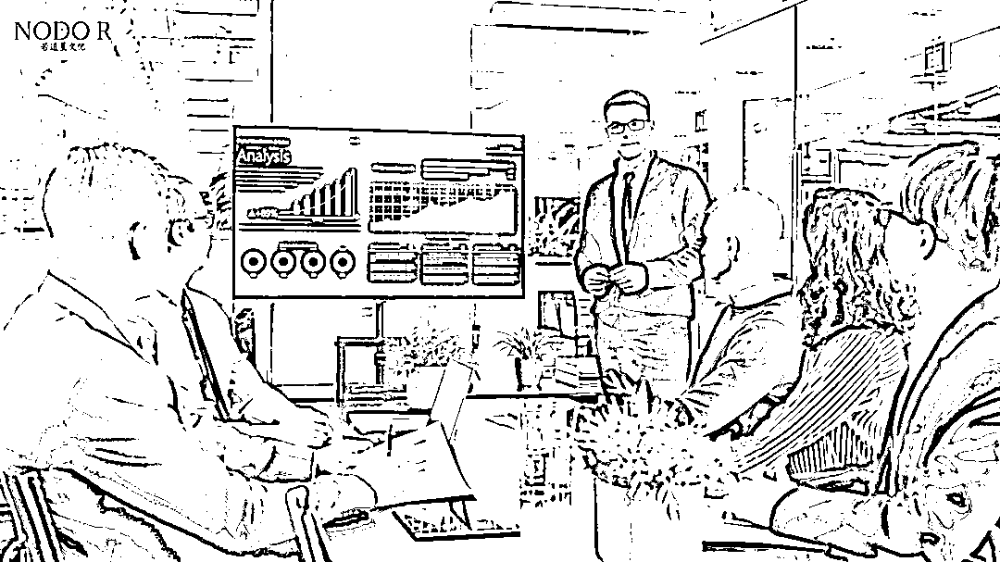

**短期宇宙征象与长期考量**

****

**总统宣布，当油价在每桶 67 美元至 72 美元左右时，政府打算回购用于战略原油储备的原油，当油价在该范围时增加全球需求。**

**——白宫声明**

**2022 年 10 月 18 日**

**伴随上周末的火星四分海王星，和 10 月 29 日-12 月 20 日木星在双鱼座逆行，油价可能在酝酿重大的波动。**这可能会获得政策的支持。 

首先谈占星学，然后是政治，最后是交易观点。根据我们的研究，**木星和海王星及其守护的星座射手座和双鱼座掌管原油价格。**火星是金融市场的导火索，无论何时它与另一颗行星形成挑战相位，都可能引起与那颗行星相关的金融板块的波动。火星正在逆行，这意味着它与海王星会形成 3 次四分相。第 1 次是 10 月 13 日（道琼斯工业指数的年度低点），之后火星逆行。原油已经在 10 月 10 日的 93.64 触顶。随着白宫发布上述声明，油价随后在 10 月 18 日下跌至 81.30，与 9 月 26 日的基本周期低点形成次低点，后者是梅里曼市场时机学院 3 星级关键反转日。那天的价格是 76.25。接下来的 3 周内，油价再次上涨，11 月 7 日到达高点 93.74。油价没按总统的预期波动。现在，随着火星与海王星形成第 2 次四分相，原油价格回到 77.59，正在挑战 9 月 26 日的低点。油价终于比 1 个月前拜登总统卖掉原油储备时低了。换句话说，他的交易现在“正在赚钱”。拜登总统上周日庆祝他的 80 岁生日（太阳回归），伴随着火星上升和四分海王星。他常常说自己不关心股票市场。但显然，他愿意成为国家财政部的原油交易员，并对公开交易计划毫不讳言（与大多数交易员不同）。原油现在正在接近他的买入价，相对于他上个月的卖出价已经盈利。购买的目的是补充他出售的国家战略石油储备的库存（可能接近 10 月 18 日的低点）。那么，交易员们是否会“忽略”总统关于何时买入的公开声明？总统是否有成功交易员所需的勇气和纪律，在市场走势变得不利以前，完成这笔交易？如果他真的这么做了，那么这笔买入订单的到来，对原油的近期价格意味着什么，与此同时木星依然在双鱼座？如果总统不补充库存，对于美国应对任何突然或不断升级的国际军事威胁，意味着什么？

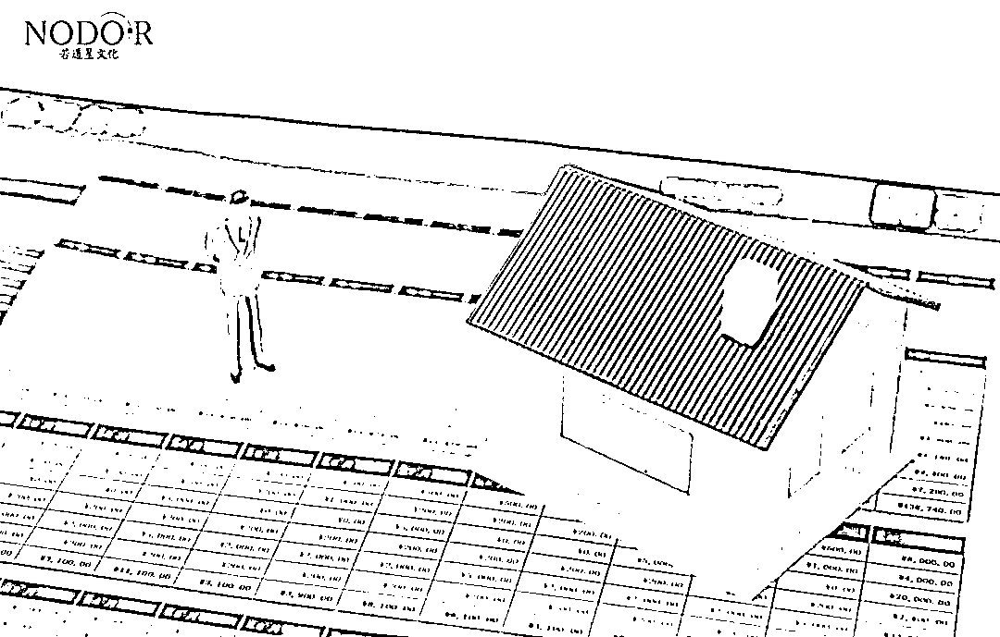

你可能已经懂了。如果你是一位敏锐的交易者，这可能成为一个获利丰厚的假期。你可能会感激这样一位领导者，他为自己的人民（以及我们的敌人）提供了如此明确的财务指导，提前公布了他的“大额订单”交易策略。或许我们应称呼他为“交易员乔”。这是我为金融市场交易者提供的节日礼物。享受 11 月 22 日周二到来的射手座季节。市场通常（但并不总是）喜欢这个季节！从 2018 年年末，若道引入金融占星大师雷蒙德·A·梅里曼撰写的梅里曼市场时机学院每年一次的年度预报沙龙和每年一本的《年度预报》以来，**2023 年已经是第 5 个年度了。我们简单回顾了部分 2019-2022 年金融预报的内容，**过去的经验让我们相信，你根据梅里曼老师的指导作为投资参看，你会比一般人有更大的胜算。******长按下图识别二维码****了解更多详情**

**说明：以上日期基于纽约证券交易所所在的美国东部标准时间，由于存在时差，中国地区可能需要加一天。**

**版权声明：**本文由若道翻译发布，欢迎转发，反对抄袭。友号转载请申请白名单。**END**

**雷蒙德·梅里曼（Raymond Merriman）**

若道签约老师。著名金融占星师，ISAR（国际占星研究协会）前主席，梅里曼市场分析公司的总裁。他由于“提升了占星学的职业形象”，在 1995 年国际占星大会上被授予轩辕十四奖；在 2012 年国际占星大会上，被授予轩辕十四终身成就奖。

**梅里曼金融报告双 12 福利来啦！****长按下图了解更多详情吧！**

1“中国上证指数月度报告”发售**若道推出了****中文版****的雷蒙德·梅里曼中国上证指数月度报告，并持续发行该报告！**当把金融市场的周期和占星学的周期相结合时，雷蒙德·梅里曼老师的金融占星学研究**为投资者应对金融市场的周期波动，并随之调整投资策略提供了极大的价值参考**。
**12 月中英文报告已上线！**2“黄金价格周期月度报告”发售**若道推出****中文版****的雷蒙德·梅里曼黄金价格周期月度报告！**不仅仅为广大读者在中国股市的投资出谋划策，更将视角放眼黄金市场。**每当世界经济形式不明朗的时候，有一个地方是保值的港湾，那就是****黄金**。自 1982 年雷蒙德·梅里曼出版第一本研究《地球宇宙学征象与黄金价格的关联》的著作以来，**他一直作为最重要的黄金市场时机预测者之一享誉国际**。2022 年 12 月黄金报告已上线，梅里曼老师将会告诉你他对这个关键时期如何操作的想法。也可以按照季度和一年期订阅，有更多优惠。季度和年度的好处是，你可以持续了解梅里曼老师对于不断在变化的市场的看法。即便他某一次看法和市场不一致，你也看到在下一期他如何调整自己的看法，并看到金融占星在一个长期时间段内对你把控风险的帮助。而能够长期控制风险、尽量找到安全的投资时机才是投资的长久之计。**12 月中英文报告已上线！****购买套餐**，买得越多越优惠中国上证指数月度报告套餐价

*   **单月报告**：280 元
*   **3 个月套餐**：780 元（260 元/月）
*   **12 个月套餐价**：2400 元（200 元/月）

**长按下图识别二维码****购买金融报告****套餐****▼**

黄金周期月度报告优惠

*   **双报告年度套餐更优惠（直降 900 元）**

*   **12 个月黄金报告+12 个月上证指数报告：仅需 3900 元**

**长按下图识别二维码购买黄金报告套餐**▼

3《2023 年金融报告及沙龙》

从 2018 年年末，若道引入金融占星大师雷蒙德·A·梅里曼撰写的梅里曼市场时机学院每年一次的年度预报沙龙和每年一本的《年度预报》以来，**2023 年已经是第 5 个年度了。我们简单回顾了部分 2019-2022 年金融预报的内容，**过去的经验让我们相信，你根据梅里曼老师的指导作为投资参看，你会比一般人有更大的胜算。****

**长按下图识别二维码****了解更多详情**

**购买直达入口**

# 若道占星咨询丨年底的调整期，你可以为自己做哪些准备？

> 原文：[`mp.weixin.qq.com/s?__biz=MzA5NjA0NTAxNg==&mid=2651494600&idx=1&sn=76c7728c7cdd21e0bc70755819cca044&chksm=8b482a7fbc3fa3695a171564797e39966c04177f74d634facefe3abe0642dd8c2d8f43294ccf&scene=126&sessionid=1692737720#rd`](http://mp.weixin.qq.com/s?__biz=MzA5NjA0NTAxNg==&mid=2651494600&idx=1&sn=76c7728c7cdd21e0bc70755819cca044&chksm=8b482a7fbc3fa3695a171564797e39966c04177f74d634facefe3abe0642dd8c2d8f43294ccf&scene=126&sessionid=1692737720#rd)

若道占星咨询平台自 2017 年运营至今，已有近 50 多位若道核心课程认证毕业生入驻。他们经过 2 年系统培训、累积完成近 150 小时的相关占星学理论学习、咨询技术的练习、通过若道认证考核后，成为职业占星师，开始开展占星咨询服务。2022 年的年底对每个人无疑都是一个调整期，该如何调整自己适应当下的宇宙天气？又如果你对自己的出生星图充满好奇，想通过占星学这门古老的智慧并在专业咨询师的陪伴下、探索自己的生命故事和人生困惑，欢迎来若道咨询平台预约！

专业占星师在这里等你

**本期我们将为大家推荐以下占星师：**

**来看看大家在咨询后的评价~**

如何预约占星咨询？

**方式一：****下载若道 APP，进入占星咨询栏目可以进行预约**

****

**方式二：通过若道服务号******

**这里有一份火星逆行攻略等你解锁** 

**长按下方二维码了解更多详情**

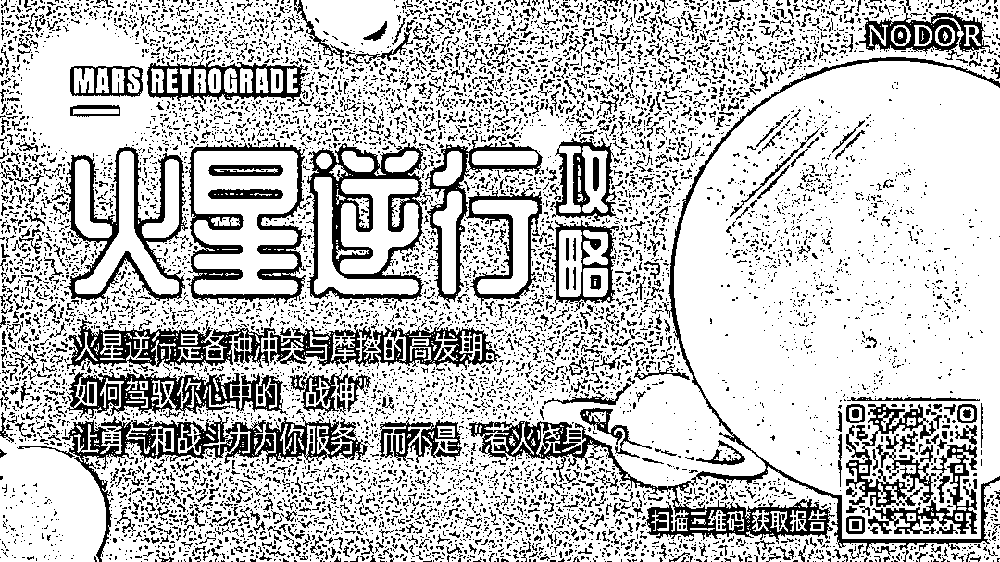

**如果你也想成为优秀的职业占星师？** 

**这里有个课程可以了解一下**

**

**未来 2023 年，祝大家身心愉快！**

# 周末树洞丨今年的天蝎月即将结束，你想对它说些什么呢？

> 原文：[`mp.weixin.qq.com/s?__biz=MzA5NjA0NTAxNg==&mid=2651494600&idx=2&sn=34ce8d118d8c1ba906c653f113186351&chksm=8b482a7fbc3fa369d5a6b8911b007aad3e6f3d448ee09721d20817be7f8436565a0f98f194c2&scene=126&sessionid=1692737720#rd`](http://mp.weixin.qq.com/s?__biz=MzA5NjA0NTAxNg==&mid=2651494600&idx=2&sn=34ce8d118d8c1ba906c653f113186351&chksm=8b482a7fbc3fa369d5a6b8911b007aad3e6f3d448ee09721d20817be7f8436565a0f98f194c2&scene=126&sessionid=1692737720#rd)

**2022 年 11 月 20 日天象：**

*   **月亮在天秤座**
*   ****太阳三分木星****
*   ******金星合相水星******

月亮今天在天秤座，可以外出社交，与好友沟通倾谈，或观看喜欢的艺术表演，放松身心。本周是天蝎月的最后一周，金星和水星已经率先进入射手座，今天它们还形成了合相。下周，太阳也将进入射手座。射手座是充满热情和探索的星座，我们会开始探索人生和生命的意义。在当下的生活中，我们如何用乐观、积极和包容的心态去面对生活和人生呢？哪怕在火星逆行与火海四分这种不太让人感觉到有力量的能量下，依然可以产生美好的心灵体验。

2022 年的天蝎月即将过去，如果你经历了一些“震荡”，你想对它说些什么呢？欢迎在评论区留下你的文字。

周日快乐！我们明天见！**了解每日天象，可****下载“若道”APP 查看****还有更多精彩等着你哦**

# 南交天蝎座-北交金牛座的李承铉 | 穿越否定自我的生存危机，找到最真实的人生之路

> 原文：[`mp.weixin.qq.com/s?__biz=MzA5NjA0NTAxNg==&mid=2651494598&idx=1&sn=a27a316dd61b66320f4ed004ccd4b24f&chksm=8b482a71bc3fa3676cb4c4ef9fcf2aafb9ef281bc29d88f8c0379c606f67aca084d97e6b0a14&scene=126&sessionid=1692737725#rd`](http://mp.weixin.qq.com/s?__biz=MzA5NjA0NTAxNg==&mid=2651494598&idx=1&sn=a27a316dd61b66320f4ed004ccd4b24f&chksm=8b482a71bc3fa3676cb4c4ef9fcf2aafb9ef281bc29d88f8c0379c606f67aca084d97e6b0a14&scene=126&sessionid=1692737725#rd)

******☆ ****后台回复“今日”，给你一句生命态度******

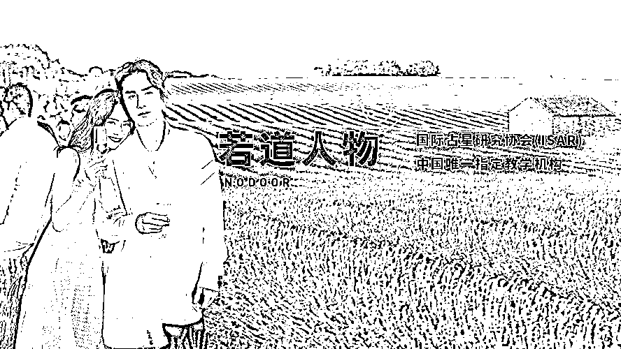

作者/Estrella 瑷思
编辑/玫瑰 封面/书君 图片/网络李承炫作为一个群星天蝎座，以及南交天蝎座-北交金牛座轴线的人，他最近几年也在公众视野中呈现了复杂的转化过程。 当妻子戚薇有了第一个孩子后，他放弃了作为公众人物的工作，辅助和支持妻子的对外工作，并留在家中陪伴女儿 lucky 成长。 几年后，时也运也，凭借《披荆斩棘的哥哥》再次展露在大众视野中。就让我们一起从占星学角度看看他经历了怎样的人生穿越吧！PS：关于这个轴线的内容，也可以扩展阅读这篇文章（[当这个北交点停止与他人纠缠，反而能得到经济和能量的助力](http://mp.weixin.qq.com/s?__biz=MzA5NjA0NTAxNg==&mid=2651473224&idx=1&sn=f785dc653b2bf7c1a39913c9454177f3&chksm=8b48f7ffbc3f7ee98a0d36809a0f0eb155f731796e8dfe9ea50b8aa871138917b5cc345eff5d&scene=21#wechat_redirect)）。**他拥有三大星群的能量**李承铉出生星图中行星分布非常密集，都落在天蝎座、射手座和摩羯座 3 个星座。星图上可以看到月亮在摩羯座尾部 29°，由于没有准确出生时间，现在取的是正午 12 点，如果出生在当天更晚些时候，月亮会落在水瓶座。

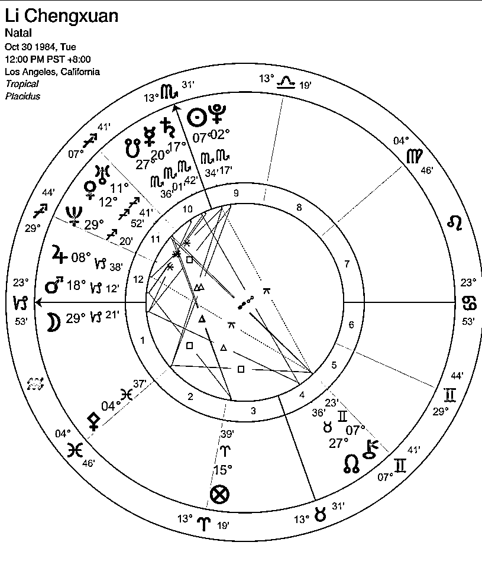

| 李承铉出生星图，因具体时间不详，忽略宫位

**星图中最凸显的是天蝎座群星，4 颗星包括个人行星太阳和水星都落于此。**本篇文章主题相关的月亮南交点也落位于此。李承铉在《披荆斩棘的哥哥》初登场便以暗黑的调调为人所津津乐道，舞台上的表演既有张力又隐隐控制，照片大多带着隐忍冷峻的眼神，这些都是天蝎座能量的体现。

**射手座落入 3 颗行星，包括代表关系与爱的金星。**他曾在不同国家与文化有长期生活的经历，戚薇评价他**很简单和直接，喜欢他的真诚，这些都是射手座相关的特质。**采访中他也提到，不喜欢工作人员说自己“好帅好棒”这种话，“它会像雾一样遮住我的视线，我更想听我哪里做得不够好”，这里**除了摩羯座的自我要求，更多体现了射手座希求真实性的那一面，需要真相而非谎言。**采访中也提到他为了节目效果，不眠不休地练习乐器，其中所描述的努力程度很自然让人联想到有配置落在摩羯座，果然木星、火星都落于此，**代表自发性和行动力的火星在摩羯座还入庙，行动力和持久性兼得。**如果月亮也落摩羯座更会极大加强这股能量的运作。

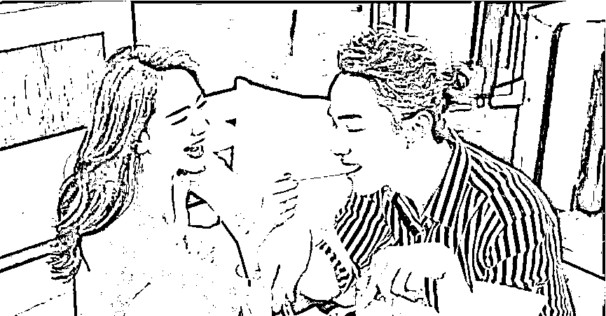

| 李承铉与戚薇夫妇芒果台的访谈中，他曾谈到自己有几年都在家做奶爸，主持人问会有压力吗？他回答说会有，这个压力是因为他在一个传统家庭长大，觉得男生应该要在外面奋斗工作，照顾家人。这个回答也是摩羯座责任感的完美体现，**传统、奋斗、工作都是摩羯座的关键词。****南交天蝎座-北交金牛座**

**李承铉的月亮南交点落天蝎座，北交点在金牛座**（因为具体生时不确定，只看交点星座，不看宫位）。

大卫·瑞雷老师在《灵魂的目标》一书中将南北交点描述为**“安全感需求和成就感需求的两极”，是我们灵魂的功课。**

**月亮南交点是安全感的那一极，会带来天赋，但更象征着我们某些相对负面的固有习惯和模式，**那是些阻力最小的路径，因而**在没有获取足够安全感时，我们会不自觉陷入这些与南交点相关的负面模式来获得安全感。**

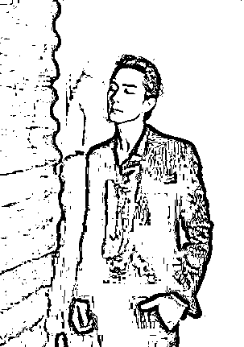

| 李承铉

当经历某些破坏性事件时，内在的耗竭也许会逼迫这些负面模式从潜意识浮上水面，推动我们试图去打破它，试图在这个模式难以逃脱的循环中通关以求得内心的解脱。**这时的解药就是位于南交点对宫星座的月亮北交点，也就是可以给我们带来成就感的那一极。**

天蝎座是一个有着激烈情绪的星座。南交天蝎座比较常见的一种表现为，**有某种与生俱来甚至放大的生存危机感或者执念，因而让自己处于一种强迫内耗不能停歇的状态。**相应的北交点落在对宫的金牛座。**金牛座崇尚简单，能够建立内在舒适感，享受简单愉快的生活：可以是美食，可以是按摩，也可以是舒适稳定的居家环境。**2015 年女儿出生，种种原因李承铉成为了奶爸，一做就是 5 年。作为一个时刻有着强迫性危机感的南交天蝎座和群星天蝎座，一个需要社会地位，需要有物质产出的群星摩羯座，他的事业心是毋庸置疑的，然而现在，命运将他放在了一个奶爸的位置上。这个过程中他经历了怎样的心路历程，我们无法详知，但一定是非常艰难的，也一定经历过非常困难煎熬的心理时刻。他自己曾在采访中提到，在家带娃期间曾一度陷入抑郁状态，女儿睡着了他会不知不觉看着女儿哭，差一点就要考虑看医生。

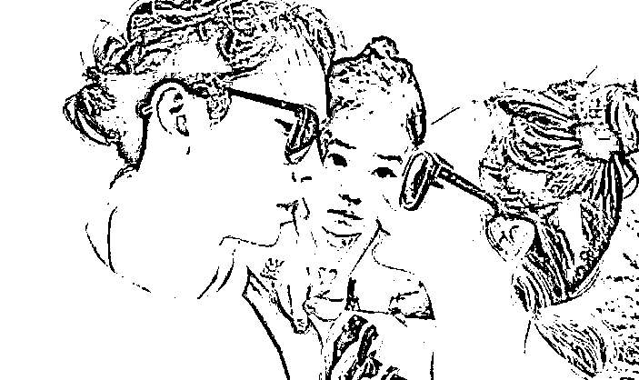

| 李承铉、戚薇和女儿

而就在女儿降生前大约两个月，他正处于美好年华的妹妹因车祸离开人世。如此反差巨大的人生经历，让人感叹生与死这典型南交天蝎座的主题。先经历面对死亡彻骨的疼痛与丧失，再执着的爱也瞬间落空；转眼又迎来新生命的降临，给人带来希望。

这中间对于生死的体验与思量，恐怕只有当事人自己能回味是怎样的暗夜骤临又黎明将至。天蝎座南交点通往金牛座北交点的路径，也许就在这撕心裂肺的变故和接踵而至长期居家带孩子的过程中，被打通了最困难的节点。最低落的时节往往是蜕变的开始。他自己也在节目中说：“我很感谢有这 5 年的时间，我觉得是真的帮助我成长了很多。”

从妹妹过世到当奶爸这 5、6 年对他而言是一个非常关键的蜕变时期，他将从中得到的所有感悟与沉淀运用在了重新复出以后对待工作、对待家庭、对待生活的态度上。

这从他现在的状态可以明显看出来，也在他提到欧阳靖的一段自述中得到了证明：“我发现他的心态是跟我比较相似的。可能我们事业线都有过像过山车一样的一个向下的经历，这个反而导致我们的心态放平，欲望没那么大，对于我一定要成为什么。我们就做好我们自己。”

能够完成这样的转变，戚薇的支持也功不可没。他自己曾亲口感谢戚薇和丈母娘从来没有给过他压力和负担。戚薇反而说他在家照顾宝宝，让她可以放心追求自己的梦想，是李承铉给了她一个机会，所以她反而要感谢他。

李承铉表示，她这样主动帮自己把这个心结说出来，让他当时感到非常温暖，而且通过时间也能感觉到她是真的这么觉得，让他感到非常幸运。

从这里我们可以看到，在整个过程中，无论他自己承担了怎样的内心焦虑和煎熬，戚薇作为关系的另一方都非常温暖，不仅包容他，而且支持他，表现出来的正是一种**坚固、稳定、支持性的金牛座智慧和力量。**而这一点一定对支撑他后来达成转变是一种非常有益的助力。

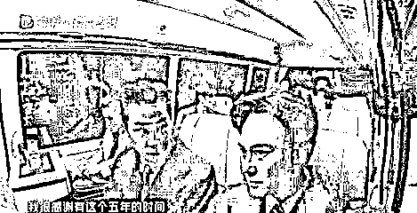

| 在综艺节目中的对话

因此，我们看到现在的他会说：“我知道艺人的工作其实是停不下来的，但我不想这样”。（大多象他这样类似配置的人是反过来的，一旦火起来有了名和利会害怕失去无法停下。）“我也不追求爆红，如果这个工作我没兴趣，或者时间分配不过来，那我可以休息一下、享受生活。要不然（硬接）那个工作我也做不好。”

不怕因为曝光度不够而被人忘记，也知道硬接工作其实并做不好，知道需要的时候可以休息一下，享受生活。工作时有股不眠不休也要做好的狠劲，但也了解松弛的状态对于生命的重要性。这些领悟可以促进他能更好地调试自己的心态，平衡工作与生活, 从而无论在追求事业成就感还是家庭幸福感上达成一个良性循环。

**释放压力**

他也提到过如何调解压力：“我觉得音乐有很多功能，它可以让你释放压力，不管是摇滚地吼出来也好，是悲伤的时候的一种陪伴也好，或者是一种很轻松的可以让你 relax 的很好的一个工具。”

**当一个人有比较强的天蝎座或摩羯座配置的时候，TA 可能挺难找一个人去倾诉来释放心中的压力。**如果压抑到极致很容易以伤人或伤己的方式爆发。释放压力有很多方式，音乐确实也是一种可以借鉴的疏导情绪的方法，而且自己独自就可以完成。就像李承铉所说，音乐其实可以是一种陪伴，虽然那不是具体某一个人的陪伴。

在 2021 年的一个杂志专访中他讲到：单身的时候就想象过我老了以后会是个什么样，有一个家庭，孩子，有一个草坪。其实是很简单的一个生活。可能有狗，养只狗，周围都是爱的朋友，爱的家人。我觉得这个是我人生中一个比较想要得到的目标。**这是一段完全符合金牛座北交点的描述。**南交天蝎座再加上群星摩羯座，其实并不缺少努力工作向上攀登的动力，反而要当心过度工作、用力过猛给自己造成损害。放下天蝎座的过度执着，把对宫金牛座那种更松弛、放下、能够享受生活的状态整合进来，整个人会更平衡，处于一种更好的能量整合状态，自然而然就会有更好的内在感受。祝福他能达成心愿。

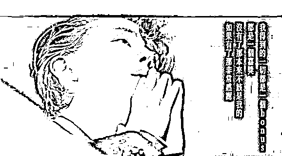

最后以李承铉自己的一段话作为结束：

**“我不会像以前有一种比较大的欲望，或者是有一个目标，我一定要很努力，为了达到什么样的一个 level，我要怎么怎么样。我得到的一切都是一个嘉奖。没有了，那本来不该是我的，如果有了那非常感谢。我觉得这对我来说是一个很好的改变，我学会了放下。”**  

**附南交天蝎座-北交金牛座出生时间：**

1947 年 8 月 2 日， 5：23 a.m. -1949 年 1 月 25 日 6：37 p.m.

1966 年 2 月 19 日，11：41 a.m.-1967 年 8 月 19 日 12：23 p.m.

1984 年 9 月 11 日，12：02 p.m.-1986 年 4 月 6 日 12：32 p.m

1986 年 5 月 5 日， 5：53 p.m.-1986 年 5 月 8 日 12：18 p.m.

2003 年 4 月 13 日，6：44 p.m. -2004 年 12 月 26 日 02：31 a.m.

**参考文章：**

黎贝卡访谈：《李承铉：有一种新式性感叫做帅气、努力还顾家》睿士 ELLE MAN 2021 李承铉专访百度百科

**版权声明：**原创文章由作者授权发布于若道平台，欢迎转发，反对抄袭。友号转载请申请白名单。

**END**

**Estrella 瑷思**

ISAR 认证占星师（2022 年获得） 

若道核心课程 2019 年毕业生（获美国心理占星学院认证）

外语语言文学硕士

15 年+外企工作经历

**个人公众号**：Es 的平行空间

**咨询微信：**EsParallelSpace

长按打赏

**20 位来自世界各地的占星师****带来 19 场沙龙——新世界的觉醒****详情可点击下图**

**学习占星学****点击下图了解课程详情**

**微信又双叒叕改版啦，不想错过若道君的推送？**
****就把若道设为****星标****以及点点****“在看”****吧！******▼**

**喜欢就点一下“在看”吧！****报名直达入口**

# 若道占星双十一 | 必买清单出炉，享受任选折扣优惠！！！

> 原文：[`mp.weixin.qq.com/s?__biz=MzA5NjA0NTAxNg==&mid=2651494598&idx=2&sn=b0a5e61457662f251e6f6a46267a495b&chksm=8b482a71bc3fa367682ddc87053707b2507cd27a18740b2c9acc3173592ffe90574c374fd99d&scene=126&sessionid=1692737725#rd`](http://mp.weixin.qq.com/s?__biz=MzA5NjA0NTAxNg==&mid=2651494598&idx=2&sn=b0a5e61457662f251e6f6a46267a495b&chksm=8b482a71bc3fa367682ddc87053707b2507cd27a18740b2c9acc3173592ffe90574c374fd99d&scene=126&sessionid=1692737725#rd)

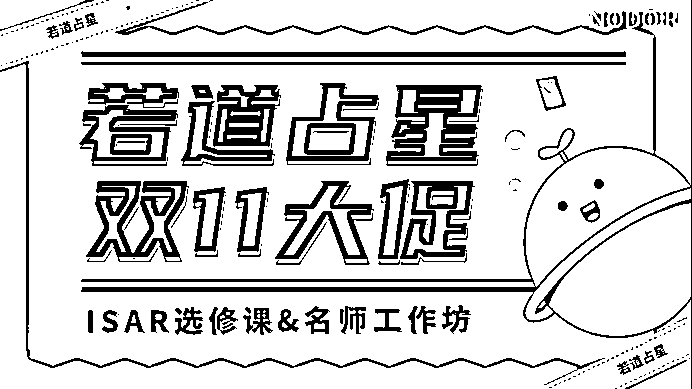

**想一次性优惠购齐 3 门 ISAR 选修课？** **往年工作忙，错过了感兴趣的课程？****是某位老师的忠实粉丝，想集齐老师的课程？****若道为大家精选出了 12 门 ISAR 选修课，14 门名师工作坊**任选多门一次性购买可以享受不同折扣，快去占星知识的海洋里挑选心仪的课程吧！

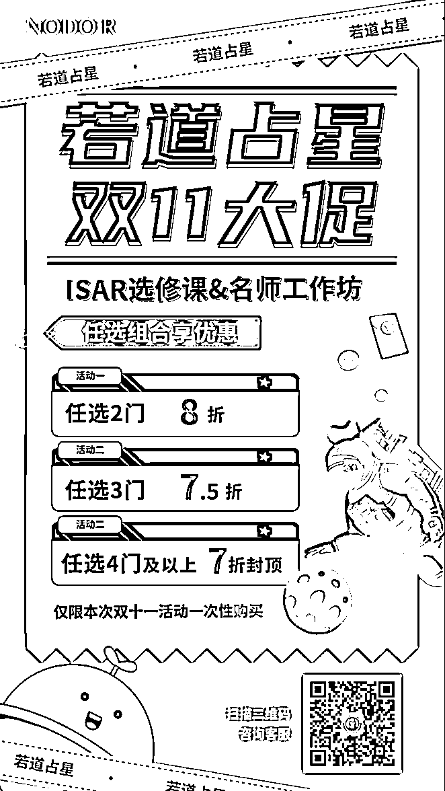

**参加活动的 12 门 ISAR 选修课**

 下滑可查看全部课程内容，以下皆是

**家族占星学网络课**

**原价 6800 元**

**课程内容简介**

每次课程时长 2 小时，共 8 次课，安排如下：**占星实践中的家族模式**

我们第 1 次经由童年的巨大主导力量——我们的父母，来体验我们**太阳和月亮**、**土星和金星**。我们用他们给我们的暗示来解读这个世界，而他们的回应反过来又受到大家庭的影响，我们常常发现祖先的成功和失败、怪癖和才干经常在我们自己的生活和我们的星图中重复。

越仔细观察，我们就越能发现日期的神秘重复、平行事件，镜像先辈故事的我们自己命运的奇怪扭转。

**在课程中，我们将识别这些模式并与之合作，看看我们如何能够尊重过去，同时在生活中走自己的路。**更重要的是，我们如何面对我们祖先未活出的能量，而这些能量似乎在我们自己的人生经历中再次升起？在我们前进的道路上，昔日的先人向我们提出的问题是什么呢？

**父亲与孩子**

我们将看看**父亲的原型，以及它如何在出生星图中反映出来**。我们的父亲（或缺位的父亲）如何影响心灵结构？无论是缺席还是在身边，无论是亲生父亲还是“养父”，父亲的角色都会影响我们的基本认同和亲密关系，以及我们进入更大世界的能力。

虽然**土星和太阳**是父亲的传统指征，但它们很少被描述为漫游者、梦想家或一块“滚石”。父亲过去是法律和权威的承载者。随着文化的发展和婚姻的重新定义，父亲的原型也随之改变。**母亲与孩子**我们的**第 1 个养育者（或她的替代者），给予我们生命的人**，经常通过星图中的**月亮和它的相位**来指征。但是**其他行星**也可以描述她，其他人可以扮演她的角色。不论在星图上是哪些征象来体现这种基本关系，都在我们的一生中，留下了深刻的情感烙印。我们现实生活中的养育者如何与出生星图中的母亲形象相对应？我们如何将过去的力量整合到我们的成人生活中？**家族价值观****在每个家族中，都有 1 个主导价值，你需要认同它才能成为这个“部落”的真正成员。**它可能是力量，或智慧，或能干成事情的能力。对某些家族来说，这个主导价值是金钱；而对另一些家族来说，则是亲密和爱。崇尚运动的家族可能会嘲笑爱读书的孩子，赶走爱做梦的人。我们对家族的忠诚可能会阻止我们追随自己的天赋。那个离经叛道的孩子会怎样？**第 2 宫-第 8 宫轴线和金星的相位将为我们提供这些问题的线索。**有内在的价值观，也有文化和家庭强加的价值观。我们将探讨家庭价值观和对我们最重要的价值观部分之间的交集。我们该如何尊重灵魂，并且仍然对那些养育我们，使我们充满希望和梦想的人保持信心？**成功、家族压力、负债和牺牲**家族中的一个孩子，通常是最年长的，承载着家族成功的需求。但是，当这个孩子是女性，或者和家族传统的性情不同时，会发生什么呢？当个人需求和家族需求之间存在紧张关系，孩子可能会牺牲自己的天赋，而这会影响下一代人。一个拥有强大外行星的人可能会发现很难像以往那样简单地继续下去，而这也会动摇家族的自我认知。他们也可能是那个冲破家族一直以来的挣扎的人。一个孩子可以救赎数代人的失望。这些议题会由出生星图的哪些征象体现出来呢？我们将看**第 4 宫和第 10 宫，第 2 宫的价值观和第 12 宫的牺牲**。**当前关系中的过去模式**继续探索家族模式，密切关注过去对当前关系的影响。我们的原生家庭和先辈是如何定义爱的？如果爱是奴役的一种形式，我们可能需要找到自由，或者重新定义服务。如果我们的某个孩子让我们想起自己害怕和憎恨的父母，或者我们最不喜欢的兄弟姐妹或表亲时，会发生什么？

即使那些似乎完全与过去决裂以逃避“家族遗产”的人，也可能在一个困难的工作环境、一个特别难相处的老板或他们自己孩子的生活中重新遇到它，因为失落的爱的幽灵和没有被活出的故事往往会跳过一两代人重新出现。**家族的无意识带着某种印记，邀请我们再试一次，为一个旧故事找到新的结局。**

**家族秘密与家族创伤**

**许多藏在家族“壁柜”里的秘密通常在第 8 宫显现，或者由冥王星相位显露出来。**有些东西是隐藏的，因为它们很危险；另一些是因为它们太珍贵了，不能分享，比如失去的爱，或是被收养的孩子。

秘密可能涉及小的轻率行为，或大的背叛。他们可能隐藏痛苦、欲望或可怕的创伤。这些被锁住的能量经常隐藏在我们身上，带来焦虑。轻柔地将它们带到光明中，有助于释放和转化家族中内疚和羞耻的力量。

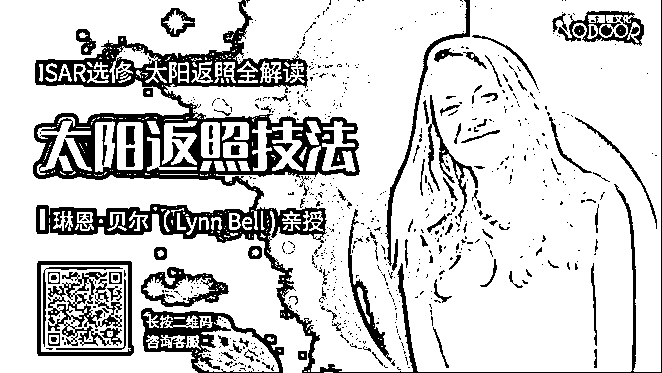

**太阳返照技法**

**原价 6800 元**

**课程内容简介**

每次课程时长 2 小时，共 8 次课，安排如下：

**第 1 课**

❶ 什么是太阳返照

❷ 如何解读太阳返照

❸ 一张太阳返照图解读两遍

❹ 为期 19 年的默冬周期预测与意识

❺ 出生地与迁徙地的返照图

❻ 不是所有的年份的太阳返照都一样 

**第 2 课**

❶ 月亮在太阳返照中的至关重要性及其元素周期

❷ 月亮落入火元素星座、土元素星座、风元素星座、水元素星座的解读

❸ 食相、满月和新月

❹ 月亮在太阳返照中的相位 

**第 3 课**

❶ 继续月亮的相位

❷ 太阳照亮各宫位

❸ 通过太阳所在宫位解释太阳返照

❹ 在太阳返照中太阳的相位

**第 4 课**

❶ 太阳返照中的合轴行星

❷ 太阳返照中的合轴行星为未来一年添彩，并成为来年的主导者

❸ 重要的星图模式❹ 精确紧密的相位❺ 行星力量 **第 5 课**

❶ 太阳返照与出生星图的关系

❷ 识别模式

❸ 太阳返照中行星作为出生星图的解释

❹ 逆行行星和共振相位❺ 出生上升点经过各宫位

**第 6 课**

❶ 太阳返照中的择时❷ 利用月亮择时❸ 整合行进❹ 太阳经过各宫位❺ 中天推进❻ 小限法 **第 7 课**❶ 特殊的太阳返照年❷ 太阳返照与金星周期❸ 中天经过各元素❹ 最好和最坏的年份

 ** 第 8 课 **

❶ 与未来合作❷ 技巧的整合❸ 预测与心理学❹ 如何处理两难困境

**医疗占星学网络课**

**原价 6800 元**

**课程内容简介**

每次课程时长 2 小时，共 8 次课，安排如下：**第 1 讲  与占星****学、心理****学、病症一起工作**医疗占星学的组成部分以及如何使用它们行星的作用与相互作用黄道星座人宫位的重要性疾病和健康是如何产生的★ 第 2、3、4 讲的课程内容基于星座以及它们之间的相互作用。

**第 2 讲  基本星座**

学习基本大十字星座——白羊座、巨蟹座、天秤座和摩羯座及其功能和相关的健康问题。这些星座与防御、养育、结构、体内平衡和荷尔蒙控制有关。

**第 3 讲  固定星座**

学习固定大十字星座——金牛座、狮子座、天蝎座和水瓶座及其功能和相关的健康问题。这些星座与习惯和反射、心脏调节、生存、循环和协调有关。**第 4 讲 变动星座**学习变动大十字星座——双子座、处女座、射手座和双鱼座及其功能和相关健康问题。这些星座与呼吸、神经系统、肠道、睡眠以及信息、情感和行动的整合有关。★ 第 5、6、7、8 讲重点学习行星，它们在身体层面的表达、它们的相位与行进。**第 5 讲 太阳与月亮**太阳掌管视觉、活力、心脏和意识，与心脏、脊柱和视觉问题相关。月亮掌管人体的周期，特别是月经周期、饮食模式和体液，与情绪引起的疾病、饮食失调和胃病相关。

**第 6 讲 土星与天王星**

土星掌管着皮肤、骨骼、牙齿和衰老过程。它对应的疾病包括慢性疾病、耳聋、帕金森病、关节僵硬和牙齿问题。天王星代表身体活动的协调，有节奏的脉动和身体的“电”。与天王星相关的疾病包括癫痫、痉挛、心律失常，以及阿斯伯格综合症和自闭症样综合症。

**第 7 讲 海王星与冥王星**海王星掌管松果体、细胞膜渗透和右脑功能，与过敏、上瘾的病症、慢性疲劳综合症和睡眠障碍相关。冥王星掌管消除和转化，其病理包括毒性、脓肿、癌症和强迫症。**第 8 讲 火星**火星是与能量和防御相关的行星，掌管免疫系统、肾上腺功能、肌肉活动和炎症反应。它是许多身体和情绪障碍的核心，如自动免疫障碍、抑郁和发烧，以及由手术或需要手术引发的问题。

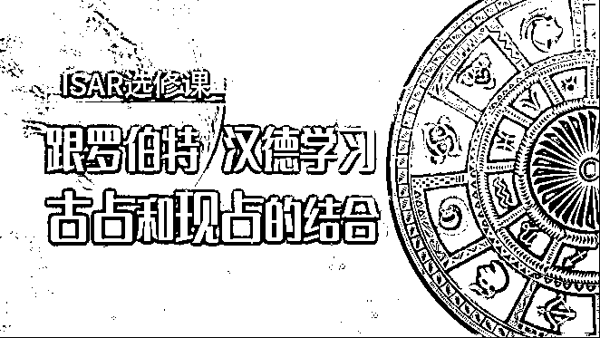

**古占和现占的结合**

**原价 6800 元**

**课程内容简介**

****每次课程时长 2 小时，共 8 次课，安排如下：****

**主题 1：复习古典占星学的概念**

一、大体介绍课程的总体安排以及如何选择学员星图作为案例

1. 上课形式更为灵活。这里提到的课程安排可能会在上课过程中根据需要进行调整。

2. 如何挑选课程中作为案例的学员星图。除了这部分之外，课程中用到的星图都会是学员的星图。我们不可能逐一分析每个人的星图，因此会挑选部分星图作为案例。 

二、运用的方法、工具和基本概念对于只学习过一般占星学知识的人，可能会有一些不太熟悉的术语和概念，比如：⑴ 行星的先天秉赋表及其运用。⑵ 对于现代行星（天王星、海王星和冥王星）、小行星和其他所有已知或未知的行进星体的应用，以及这些星体与古典行星在用法上的区别。⑶ 整宫制：什么是整宫制，它与常用的分宫制有什么区别。⑷ 胜利星：包括单一胜利星和复合胜利星。⑸ 点宫制：从福点和精神点算起的分宫制，它们的用途，它们给占星学带来了什么。⑹ 如何处理中天：因为第 1 宫是从上升星座算起，所以可以在第 10 个星座之外的星座中发现中天。这种情况如何处理？ 在这一部分会用到一些名人的星图作为例子，但在之后的课程会使用学员的星图为例。主题 2：用古典占星学解读学员星图 1. 距离上升点、中天、下降点和下中天 7.5°以内的行星重要程度依次递减（上升点和中天的重要程度几乎相当）。2. 寻找相位异常多的行星，尤其是与太阳、月亮、中天或上升点形成相位的行星。3. 被强调的星座，有四颗或四颗以上的行星，加上中天或上升点。4. 太阳星座、月亮星座和上升星座的关系，它们的特质是类似的还是不同的？5. 上升星座的守护星或上升星座的胜利星，它落在什么星座、什么宫位？它所在星座是否与上升所在的星座形成相位？这些知识都将通过学员的星图来学习、展示。主题 3：通过学员星图分析其个性、健康、疾病 1.行星或其他星图征象可能影响的因素。介绍：⑴ 体型、体态和外貌。⑵ 心智特性。⑶ 性格和个性。⑷ 与环境的互动。⑸ 本我。2.哪些因素对体型、体态和外貌影响最大？⑴ 遗传和种族血统。不要把一个人的血统不太可能有的身体特质强加到这个人身上。然而，在现代化妆品的帮助下，人们对自身外表所做出的改变可能实际上将他们带到传统占星学所暗示的方向上。⑵ 太阳、月亮和上升星座。⑶ 任何被众多因素集中强调的星座。⑷ 任何接近上升点或中天（士 7.5°）的行星。任何与上升点或中天形成非常紧密的（士 2-3°）主要相位的行星也有一定的影响。⑸ 星图中任何与上升点、太阳或月亮有关的其他常见重复主题。⑹ 疾病。补充：在这部分星图分析的讨论中，星图被选中的学员附上电子照片效果会更好。主题 4：现代和古典之比较，分别解析个性、性格和心智这一主题一直是 20 世纪占星学最为重要的关注点之一。然而，却有着两种极为不同的切入方法。⑴ 现代方法，基于上面所提到的分析外形类型所运用的方法。⑵ 中世纪方法。（简化版，老师会在必要和适当的时候介绍其更为复杂的面向。）完全取决于星图中与心智功能特定征象星有守护关系的行星。主要是那些围绕星图中 4 个关键点的行星，以及关键点所在星座的守护星和与关键点形成相位的行星。① 植物的生长灵魂：主要象征是上升点及其守护星。② 感性灵魂或动物的灵魂：主要象征星是月亮及其守护星。③ 智性灵魂或理智的灵魂：主要象征星是水星及其守护星。④ 这些都受到任何与主要象征星成相位的行星的影响。主题 5：情感关系（家人、爱人、朋友）尽管在传统上，每 1 宫所赋予的主题似乎通常可以表明该宫位是否主要是个人宫位，是否与人际关系有关，或完全是外界环境层面的；但实际上，每组象征符号和星图都可以也确实体现了所有这 3 个层面。不过，此次课程余下的时间我们将主要讨论人际关系和纯环境因素。情感关系：⑴ 父母和原生家庭，也包括本人（就是你）可能拥有的自己的家庭。该主题下还包含与权威人士的关系。⑵ 兄弟姐妹和堂表亲，也包括叔叔/舅舅、阿姨/姑姑。⑶ 亲密的一对一关系。⑷ 朋友和一对多的关系。⑸ 敌人。主题 6：财富、投资、职业⑴ 金钱、财富，理财观念。⑵ 个人工作或职业的日常活动。⑶ 职业和社会地位，毕生的追求以及谋生之道。主题 7：移民、旅行、学习⑴ 旅行和与其他国家的交流互动。⑵ 学习其他文化。⑶ 移民倾向

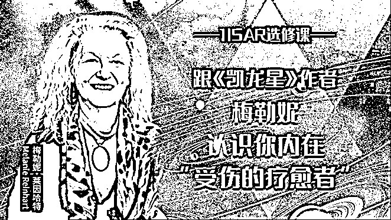

**凯龙星**

**原价 6800 元**

**课程内容简介**

**首先，我们将了解实际的天文学和神话中隐含的象征和意涵，学习去“看透”象征的世界，这对理解“凯龙星意识”至关重要。****每次课程时长 2 小时，共 8 次课，安排如下：****✦ 天文学和神话中的凯龙星含义****天文学部分：**带你探索凯龙星发现以来的“天空之旅”——从不明星体到多次被重新归类凯龙星的由来凯龙星发现的时代背景凯龙星与冥王星之间的关系从宇宙论理解凯龙星的象征意义**神话部分：**凯龙星原型的象征和研究**了解凯龙星的背景之后，我们将重点学习个人星图中的凯龙星，以及行进凯龙星。****个人星图中的凯龙星：**个人星图中的凯龙星如何解读凯龙星在星图中的落点，在生活中是如何表达其主题？**行进中的凯龙星：**凯龙星在行进中被触发如何解读？行进中的凯龙星如何解读？**有关业力的部分：**凯龙星与祖先领地和祖先业力的关系如何通过凯龙星看“家族集体疗愈”？从家族星图的凯龙星看你此生的“疗愈任务”**体验凯龙星疗愈之旅：**引导冥想，感受凯龙星的疗愈之旅如果你是一个致力于个人疗愈的占星学子或者致力于帮助他人疗愈的占星师，学习、了解凯龙星是你必不可少的一门必修课。

**小行星**

**原价 6800 元**

**课程内容简介**

每次课程时长 2 小时，共 8 次课，安排如下：
**第 1 讲 小行星简介**小行星概述，小行星的发现、科学以及一些占星学历史。**第 2 讲 谷神星，丰饶女神**母神、农业女神，但其影响力远不止如此。这是我们所知的最大的小行星，也是最重要的小行星。她掌管养育、滋养、救助、管理等方面。**第 3 讲 婚神星，婚姻女神 **荣誉、伙伴关系、契约和婚姻：众神中的女王是正直的女主人。她在出生星图和行进中有什么意涵？她与“丈夫”木星朱庇特是什么关系？**第 4 讲 智神星，智慧女神**战地记者、棋手和占星师有什么共同之处？来自智慧、策略、洞察力和远见女神的帮助。**第 5 讲  灶神星，壁炉女神**掌管神圣的火焰、家庭生活、厨房灶台、家人、遗产的女神：这颗关键的小行星被严重误解了。她可以给你一把钥匙，让你了解家庭关系、你的祖先和你的目标意图。**第 6 讲   健神星，健康女神**在我们应对全球疫情的过程中，掌管健康和福祉女神目前显得尤为重要。她能提供如何应对新型冠状病毒肺炎的线索吗？她在出生星图中的意涵是什么？幸福原来蕴含着相当广泛的含义。**第 7 讲 灵神星，灵魂女神**灵神星是唯一一位以人类身份开始生命的女神，她代表着人类的灵魂。这颗小行星与爱情故事、童话故事和灵魂之旅有关。**第 8 讲 综合应用，展望未来**你们刚刚开启探索使用小行星可能性的旅程。我们会探索评估某些理论有效性的方法，以及在实践中检验这些理论的重要性，我们还会探索其他数百万小行星中的一些。这堂课既有提醒告诫，也鼓励你深化自己的占星实践，并拓展你对象征的理解。

**次限月亮**

**原价 6800 元**

**课程内容简介**

每次课程时长 2 小时，共 8 次课，安排如下：**第 1 讲 出生星图中的月亮与它在童年的推进**我们将学习出生星图中月亮的象征意义，以及它如何反映你的母亲以及你童年的家庭生活。我们将从元素的角度观察月亮，并研究从出生起你是如何得到母亲的关注的，我们将观察出生后几年的月亮的推进。**第 2 讲 从 7 岁到 14 岁：从自己到他人**次限月亮与出生星图中月亮的第 1 个四分相在 7 岁左右出现。我们将学习在这个关键时间点我们是如何开始意识到自己是独立存在的个体，以及它如何让我们向家庭以外的其他人寻求滋养和生命。**第 3 讲 从 14 岁到 28 岁：从别人到自己**从 16/17 岁到 28 岁左右第 1 次次限月亮回归，我们完成了与他人和与自己的月亮的灵魂之旅。从次限月亮回归开始，我们就开始对自己的情感生活以及我和其他人之间所发生的负责。**第 4 讲 从 14 岁到 28 岁：从别人到自己**当次限月亮描述我们内心的旅程时，土星的行进描述了我们与周围世界的联系，以及作为社会发展中的个体，世界对我们的要求。在我们生命的头 30 年里，它们几乎以相同的速度运行。**第 5 讲 次限月亮与其他行星的相位**我们将从次限月亮的旅程中抽身出来，看看它与各种不同人的星图的其他行星产生有趣而特别的相位时发生了什么，这样我们来了解次限月亮触及我们星图中的这些行星时会发生什么，以及我们该如何为自己的生命导航。**第 6 讲 30-60 岁的次限月亮推进**当月亮再次绕着出生星图运行时，我们有机会将意识带到我们的情绪反应中，并开始引导我们的内在本性，而不是对发生在我们身上的事情束手无策。**第 7 讲 60 岁以后的次限月亮之旅**在当今时代，60 岁以后过着积极生活的人比历史上任何时候都多。有的人在 70 多岁的时候坠入爱河并第一次结婚。我们将在这一讲探讨如何在我们生命的最后几十年里对自己和他人有用，这样我们就可以体验到生命的丰富多彩。**第 8 讲 次限月亮与次限太阳的关系**最后，我们来研究次限月亮绕着星图运行时与次限太阳推进的关系。我们将通过星图案例来进行探讨。

**原型占星学**

**原价 6800 元**

**课程内容简介**

每次课程时长 2 小时，共 8 次课，安排如下：

**授课重点**

☆ 原型占星学的基础

☆ 实际应用（用于自我认知、从容生活、情感关系、心理治疗）

☆ 更大的意涵（哲学的、宇宙的、历史的）

**知识点**

☆ 一致性的基本形式：出生星图、个人行进、世界行进

☆ 占星学如何运作，共时性的角色

☆ 占星学中的命运和自由意志问题

☆ 原型的本质/基本特征

☆ 行星的意义以及它们的组合

☆ 主要相位

☆ 如何把握一张出生星图最重要的主题

☆ 评估个人行进

☆ 评估世界行进

☆ 重要的是认识到原型的多元性，以及在共同创造性地展现我们出生星图和行进的潜能的过程中我们所扮演的角色、所具有的力量和所肩负的责任。

**第 1 课：开课欢迎致辞**

介绍我们将在该课程中涵盖的内容

占星学和心理学如何互相启发，互相增强

我的占星学之旅

是什么让原型占星学与众不同

课堂讨论，提问与回答

**第 2 课：原型占星学的基本概念框架**

运作方式：因果关系和共时性的议题

命运和自由意志

理解原型

**第 3 课：行星的意义，从发光体太阳、月亮开始，到水星、金星、火星、木星、土星**

**第 4 课：外行星天王星、海王星、冥王星：“银河使者”**

**第 5 课：观察运转中的行星，第一部分：艺术、音乐、电影、喜剧（指定的电影）中的示例**

**第 6 课：观察运转中的行星，第二部分：艺术（指定的电影）中的更多示例**

**第 7 课：个人行进，以及如何带着占星学的觉知投入到生活之中**

**第 8 课：世界行进，以及以占星学更宏大的哲学意涵来理解我们在历史上所处的时刻**

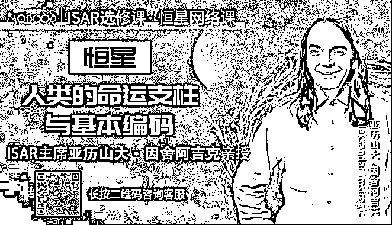

**恒星**

**原价 6800 元**

**课程内容简介**

每次课程时长 2 小时，共 8 次课，安排如下：**第 1 讲：导论与主要天文星座**存在的层面我们的存在有 3 个关键层面，占星学的影响也有 3 个主要层面。其中之一就是恒星的影响层面。神话编码恒星星座或星团代表着神秘的丝线所编织的网，它们创造了我们的集体命运，也创造了个人的命运。其基石是由融入集体无意识的存在或本质中的原始神话组成的，因此代表了人类的基本编码。天文星座所赋予的神话是现实的基本框架，也是案主在实现神话或部分神话的道路上内在所承载的命运的深层编码。恒星、天文星座和占星学星座我们应该一直谨记黄道占星星座和黄道天文星座之间的重大区别。恒星和天文星座所使用的容许度恒星对不同的行星和四轴的影响力不同，其容许度取决于好几个因素。恒星影响的传导物行星和宫头主要的天文星座天龙座、英仙座、武仙座示例，案例研究**第 2 讲：皇室天文星座**组成“皇室”的天文星座主宰着北方天空，主要包括埃塞俄比亚国王和王后（仙王座和仙后座）以及他们的女儿仙女座。示例，案例研究**第 3 讲：一等星**每颗星等小于 1.5 的恒星都是一等星。这些恒星的总共有 20 颗，最大的是天狼星(大犬座α)，-1.46 星等。即使天狼星和其他恒星的星等为负数，在占星学的意义上，它们也被称为一等星。一等星是最大的恒星，由于它们的体积最大，它们的影响力也最大。它们除了具有特定的性质外，还能增强案主的生命力和力量，因此能提升案主的潜能。**第 4 讲：黄道天文星座 1（白羊座到巨蟹座）**黄道天文星座与黄道占星星座类似。黄道占星星座是根据黄道天文星座来命名的，这是它们之间的所有关联，在回归黄道占星学和恒星黄道占星学中都是如此。我们还要了解的是，有 13 个黄道天文星座和 12 个黄道占星星座。尽管黄道天文星座和黄道占星星座在占星学意义上并无联系，但是它们是相关的，通过了解黄道天文星座的性质，我们可以增进对黄道占星星座性质的理解，而这正是回归黄道占星学和恒星黄道占星学的基础。因此，我们会将黄道天文星座分成几个小组来讨论。前 4 个黄道天文星座中的恒星（白羊座、金牛座、双子座、巨蟹座）示例，案例研究**第 5 讲：黄道天文星座 2（狮子座到天蝎座）**中间 4 个黄道天文星座中的恒星（狮子座、处女座、天秤座、天蝎座）示例，案例研究**第 6 讲：黄道天文星座 3（蛇夫座到双鱼座）**黄道天文星座中的恒星（蛇夫座、射手座、摩羯座、水瓶座、双鱼座）示例，案例研究第 7 讲：剖析天文星座恒星象征存在的无意识部分，因此恒星和天文星座主要描述物理现实。剖析天文星座与解剖人体密切对应。因此，代表人类天文星座（有时是动物天文星座）身体部位的恒星与人体的部位相关，这些部位要么特别敏感，要么被强调或以其他方式与和这个恒星天文星座相关的神话的特定部分相关。此外，恒星所属的天文星座中的每一部分都有自己的象征性关联。**第 8 讲：业力占星学中的恒星**理解恒星在业力占星学中的影响，有助于我们看到灵魂的路径，以及我们当下的任务。因此，恒星让我们能够清楚地看到业力与业力之间的关联，这本身就代表完整整合的一个重要部分。

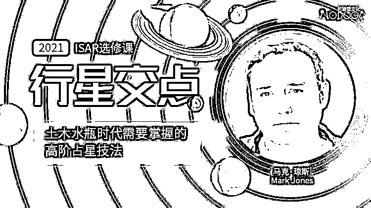

**行星交点**

**原价 6800 元**

**课程内容简介**

每次课程时长 2 小时，共 8 次课，安排如下：**第 1 讲 介绍行星交点**我们将学习行星周期如何形成行星交点，并了解日心视角和地心视角之间的区别。**第 2 讲 什么是行星交点**我们将深入学习丹恩·鲁伊尔的成熟思想，这是启发马克老师研究行星交点的灵感之源，也是他最近出版的《行星交点与集体进化》一书的灵感来源。**第 3 讲 双子座-射手座的天王星交点**我们将学习人类认知和技术如何通过天王星交点的透镜进化。**第 4 讲 巨蟹座-摩羯座行星交点**我们将进一步学习行星交点对社会和文化的影响，深入探讨落在摩羯座-巨蟹座的木星、土星和冥王星交点，并了解它们在过去 1000 年里对我们的全球社会、政治和文化思潮起着怎样至关重要的影响。**第 5 讲 海王星及其狮子座-水瓶座交点**我们将学习落在狮子座-水瓶座的海王星交点影响的不同显化，及其在疗愈中的作用；灵性意识形态的发展，及其促使事件结束的倾向。**第 6 讲 作家案例**通过原创研究，我们将学习行星交点如何影响了世界上一些最伟大的作家的人生。**第 7 讲 研究 2020 年**我们将了解 2020 年的重要意义。**第 8 讲 回顾**我们将回顾前面的课程，并探索如何通过行星交点的意涵理解月亮交点。

**金融占星初阶课**

**原价 7500 元**

**课程内容简介**

每次课程时长 2 小时，共 8 次课，安排如下：**第 1 讲 与金融市场相关的周期研究中会用到的术语**周期周期性容许度范围如何估量市场周期：波峰与波谷扭曲失真平移：左、右、涨、跌 **第 2 讲 行星动力及其与经济占星学、金融占星学和世俗占星学的关联**逆行阶段和停滞阶段金融占星学和世俗占星学中的“入座”日心水星（射手座）相位：作为市场时机因素的主要相位和标准相位月节律：与股票和黄金走势的关联**第 3 讲 市场周期的结构**模式阶段子周期市场周期的牛市、熊市分别包含的 3 个基本模式**第 4 讲 趋势分析**牛市趋势的 5 个基本特征熊市趋势的 5 个基本特征占星学及其在趋势逆转中的作用介绍关键反转日期（CRD）介绍**第 5 讲 股指的长期周期**它们的阶段与子周期美国股市与英国股市（它们历史悠久）案例**第 6 讲 股指的长期周期（续）**4 年周期及其阶段占星征象与股市长期周期的关联冥王星在不同星座海王星在不同星座**第 7 讲股指的长期周期（续）**天王星在不同星座和黄道区间土星在不同星座和黄道区间北交点黄道区间**第 8 讲 行星相位及其与长期市场周期的关联**长期市场周期与长期行星周期的重叠展望未来

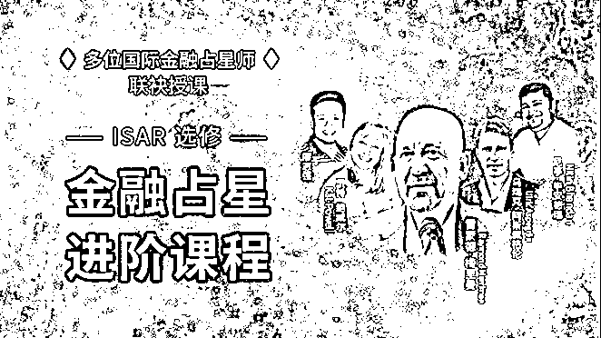

**金融占星进阶课程**

**原价 22000 元**

**课程内容简介**

**若道金融占星学第 3 阶课程**10 节网络课，2 场 2 天的工作坊，每天 6 小时，安排如下：地球宇宙学征象与交易周期的关联本阶段的课程针对短线交易者，帮助他们了解持仓 3 天到 6 个月的交易买入和卖出的最佳时机。第 3 阶课程将回顾和详细说明各种金融市场的基本周期。课程将定义和演示基本周期的各个阶段，包括半基本周期、主要周期和短期交易周期，用于市场时机选择和发展交易技能。它将指导那些喜欢短线持仓 3 天到 6 个月的投资者，如何将这些行星周期用作短线交易策略之一。老师会指导大家在黄金、白银、中国和美国股指等市场中使用这些技巧。**这门课程会涵盖以下主题：**① 基本周期作为金融交易市场的主要焦点。② 基本周期的各个阶段，包括：半基本周期；主要周期；交易周期；阿尔法-贝塔周期。③ 与交易周期反转一致的关键技术研究。④ 关于周期完成确认信号的关键技术研究。⑤ 在不同的金融市场上，某些行星在某些特定星座时，往往与牛市或熊市趋势相关。这可以根据地心或日心的位置来判断。⑥ 行星在以地球为中心的运动中，转向逆行或顺行（停滞）时，某些行星停滞与不同金融市场中的基本周期有更高或更低的相关性。⑦ 在不同的金融市场中，与其他行星相比，某些行星的相位与基本周期有更高或更低的相关性。⑧ 如何计算大部分金融市场中的地球宇宙学征象关键反转日期，容许度在 3 个交易日内。⑨ 将地球宇宙学关键反转日期与基本周期、半基本周期或主要周期波谷或波峰的时间段重叠，从而增加市场反转的可能性，以此预示一个周期的完结。⑩ 通过使用特定市场的星图，然后确定行星行进与这些“出生星图”行星形成相位的时间，来提升识别金融市场反转的技巧。这些“出生星图”包括美国股市的“梧桐树协议星图”和中国上证指数的“首个交易日星图”。⑪ 根据对周期和地球宇宙学征象研究，一旦市场进入周期高点和/或反转的时间段，制定出一个考虑最佳风险回报参数的交易计划（当设定触发时该怎么办)。**若道金融占星学第 4 阶课程**太阳-月亮组合与短期市场反转的关联这是针对短线交易员的课程。如果你是一名短线交易者，并且想知道每个月基于太阳-月亮星座交易的最佳时间，那么这就是你不应该错过的课程！这是你在任何其他地方都学不到的课程。**本课程会涵盖以下内容：**① 月亮在各星座的行进，以及它与股票市场、贵金属和比特币价格活动的对应关系。② 检视当日星图，查看月亮的位置（以及它与股票、贵金属和比特币价格活动的常态关系）。③ 回顾衡量太阳-月亮组合与金融市场短线交易反转（波峰与波谷）相关性的有效研究。④ 评估重要性：1 星、2 星、3 星类型。⑤ 重要的太阳-月亮组合与股市的关联。⑥ 重要的太阳-月亮组合与黄金白银市场的关联。⑦ 与比特币相关的重要月亮星座。⑧ 理解交易设置，以最优方式利用太阳-月亮的反转。⑨ 利用当日星图（60 分钟、30 分钟和 5 分钟星图）提升对时机的把握。**4 门阿兰·欧肯老师的经典课程**

**奥义占星学网络课**

**原价 6800 元**

**课程内容简介**

**奥义占星学系列网络课程的目的**向你展示以灵魂为中心的占星学体系中核心部分的一些最重要的法则和原则。这需要你学习新的词汇表，这个词汇表基于你已经学习到的对传统心理占星学语言的理解。本系列网络课程将通过详细展开奥义占星学内在的核心教诲，来教授这些概念及其词汇。**第 1 讲 什么是以灵魂为中心的占星学？**这一方法解读出生星图与传统的心理占星学及以事件为导向的占星学有什么区别？灵魂、人格和“彩虹桥”的结构是什么？意识和创造力的 7 个层面 7\. Physical 身体 6\. Astral 星芒  5\. Mental 心智  (Lower) （低阶）4\. Mental 心智  (Higher)（高阶）      3\. Intuitional 直觉       2\. Atmic 阿特密          1\. Monadic 一元内化、进化和我们内在因此过程而存在的特殊张力之间的关系**第 2 讲 古老智慧教诲的 10 大法则和原则，及其在以灵魂为中心的占星学中的应用**介绍 7 道光**第 3 讲 7 道光：3 道主要光和 4 道次要光**意志、爱和智慧的光精神、灵魂、人格和 7 道光**第 4 讲 7 道光和 12 星座**7 道光和行星介绍在以灵魂为中心的占星学中两颗额外的行星：地球和火神星神圣行星，透过灵魂运作，水星、金星、木星、土星、天王星、海王星、火神星非神圣行星，透过人格运作，太阳、月亮、火星、冥王星、地球第 1 道光，意志与力量大的光，白羊座、狮子座、摩羯座；冥王星、火神星第 2 道光，爱与智慧的光，双子座、处女座、双鱼座；太阳、木星第 3 道光，积极的智力的光，巨蟹座、天秤座、摩羯座；地球、土星第 4 道光，通过冲突的和谐的光，金牛座、天蝎座、射手座；月亮、水星第 5 道光，科学技术之光，狮子座、射手座、水瓶座；金星第 6 道光，宗教、奉献、意识形态，处女座、射手座、双鱼座；火星、海王星第 7 道光，仪式性秩序之光，架构、阶级，白羊座、巨蟹座、摩羯座；天王星**第 5 讲 通过奥义之眼看出生星图是奥义占星学解读的第 1 步**12 星座的奥义守护星与传统守护星的比较**第 6 讲：上升点、太阳和月亮在以灵魂为中心的占星学中的意义**光、行星和星座的综合影响，第一部分**第 7 讲：光、行星和星座的综合影响，第二部分**在出生星图中寻找灵魂目的的公式**第 8 讲：以灵魂为中心的奥义占星学中宫位的意义**以灵魂为中心的占星学解读的第 1 步：将奥义和传统结合起来

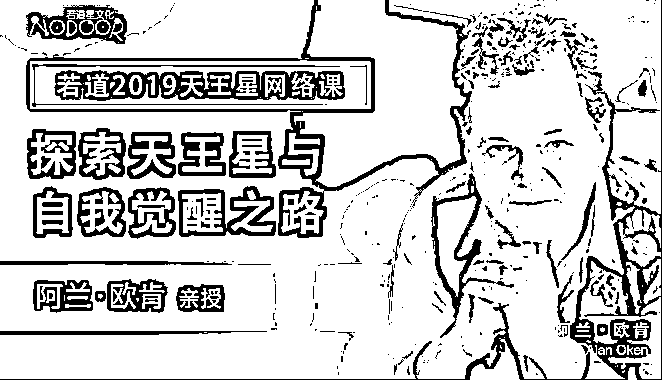

**天王星网络课**

**原价 6800 元**

**课程内容简介**

**第 1 讲：受时间限制和不受时间限制的心智（第一部分）**天王星的真正意涵是什么？它在我们生活中的目的是什么？天王星在希腊神话中的起源如何通过这个神话理解人类意识的现实和发展？天王星和土星，天王星、土星以及月亮和你的自我感**第 2 讲：受时间限制和不受时间限制的心智（第二部分）**延续第 1 讲探讨的主题运用学员自愿提供的星图作为讲解这些原理的案例**第 3 讲：个人与集体，一段重要关系的旅程（初步讲解）**天王星在金牛座和天蝎座天王星在狮子座和水瓶座天王星和太阳认识和发展个体化自我的过程学员星图案例**第 4 讲：什么是“原型”？**天王星和水星将心智客观化以产生真正的直觉的能力占星学是“原型的科学”天王星是行星原型中的父亲开放的心灵、直觉、天王星与太阳之间的关系**第 5 讲：找到我们内在的外星人，让他成为有益的朋友。（个人可以如何为集体服务，进一步讲解）**天王星是什么类型的“革命英雄”？你是什么类型的“革命英雄”？你会在出生星图中的什么地方会发现自己的个人革命你作为个人如何成功地表达这一能量？以学员的星图为例**第 6 讲：天王星及其对关系和性的影响**星图中金星与天王星的关系天秤座和水瓶座的关系第 7 宫和第 11 宫的关系天王星在天蝎座擢升，在金牛座落陷，个人、非个人和集体层面的人际关系**第 7 讲：天王星的行进**经历激烈的个人反叛和革命的时期成为我们自己的过程白羊座天王星四分摩羯座冥王星的世代：当今的孩童（2011-2017 年出生）**第 8 讲：2019 年和 2020 年天王星向世界传递的信息**讨论当前土星和冥王星在摩羯座行进，相对于天王星在金牛座行进的意义，因为这会影响我们所有人分享一些非常具体的观察，关于 1988 年至 1995 年出生的这一代人声音的觉醒

**权威感工作坊**

**原价 5800 元**

**课程内容简介**

通过深入研究出生星图，分享精妙的占星学解读，阿兰·欧肯将与我们分享如何发现自己和他人的创造力，以及如何充分利用这些天赋和才能。2 天工作坊，每天 6 小时。我们将会讨论下面这些主题：☆ 如何判断出生星图中最强和最弱的行星，以及如何正确运用意志。☆ 月亮的真正意义，以及我们如何与它合作来克服恐惧，提升月亮滋养你天赋和资源的能力？☆ 如何整合第 5 宫的创造力能量和第十宫获取成就的能量？☆如何充分利用危机和丧失的时期：勇敢地面对天蝎座、冥王星和第 8 宫！☆ 如何利用占星学来判断自己最强大的力量来源以及最可能遭遇的陷阱？

**财富工作坊**

**原价 5800 元**

**课程内容简介**

2 天工作坊，每天 6 小时。

工作坊将会重点关注出生星图中的占星元素和征象，揭示这些问题的答案。

占星大师阿兰·欧肯将带领你探索出生星图中关于富足（与贫穷！）的法则和原理。通过大师的指引，收获一把创造富足人生的钥匙~让你运用这些知识更好地在咨询中帮助个案解读跟钱相关的议题，也更好地经营自己的财富人生！**10 门斯蒂芬工作坊**

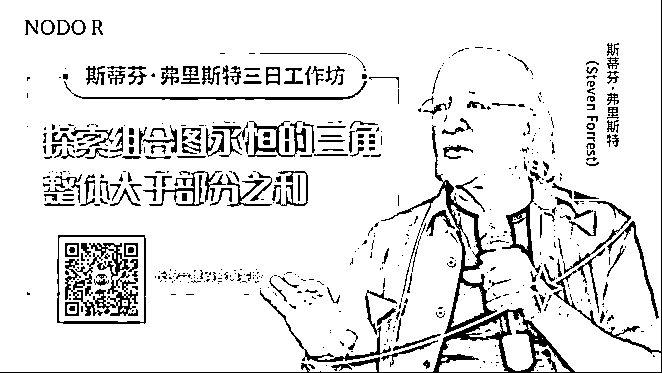

**探寻组合图永恒的三角**

**原价 6800 元**

**课程内容简介**

**组合图描述了如何才能使两个人的关系一直充满活力。**这句话中隐含的意思是假设一段关系有一种区别于这两个个体的独立的生命。有时我们喜欢和一对伴侣共度时光，却从没想过单独见他们其中一人。 我们从这对伴侣身上感觉到的 "频率"是对他们组合图能量的直接体验。在某种程度上，可以简单地理解为：**正如每个人都有自己的星图一样，每对伴侣也有他们的星图。** 从简单的描述层面上讲，这就是组合图的意涵。记住，我们可以将这一技法用于任何一种关系：**父母和子女、商业伙伴、朋友。**作为进化占星师，我们的目标要比单纯描述走得更深。解读组合图时，可以着眼于帮助人们，而不仅仅是使他们感到惊奇。 对于个体来说，出生星图代表了一条正确的人生道路，一条承诺意义、活力、灵性目标的道路。组合图亦然，只不过它将一段关系看成一个独立的个体，而不是两个人。关系也有进化的路径：人们走到一起是为了学习和成长。 个体如果没有领会自己出生星图的要点，会变得疲惫而沮丧。两个人也是如此，**如果没有抓住组合图的要点，我们就会对对方感到厌烦。这段关系似乎也会失去动力。** 伴侣常常意见不一，陷入困境，看不到前进的方向。3 是一个更有动力的数字。3 个人投票，2 个人以多数票击败一个人，推动事情继续发展。 **这实际上解释了这次工作坊的主题：永恒的三角。** **每对伴侣其实都是一个 3 人组：你、我以及我们。**组合图所代表的那个看不见的 "第 3 人"经常会"投出打破僵局的一票"，使关系得以发展。 **· **但是如果组合图总是同意一个人的意见，而不同意另一个人的意见，怎么办呢？（这被称为"封建制度"） **· **如果两个人都安静而保守，但他们的组合图却要求狂野的冒险呢？（这是 "文化冲击"） **· **如果它同时均衡地反映了两个人的情况呢？我们可以称之为 "民主"，但我们仍可以区分出一个人天然的智慧比另一个人更强的领域，让擅长的人负责擅长的事，这会促进关系蓬勃发展。 换句话说，我们开始看到这个技法的咨询维度了。我们将在这个工作坊中探讨这些内容。

 两个人究竟为什么会走到一起？**在严肃、复杂的关系中，我们可以假设两个人之间有一些未解决的业力。**如果他们在今生是恋人，但在前世中，一个是父母，一个是孩子呢？也许那些直觉和假设仍可以感受得到，极为错综复杂地使得他们在今生想要成为情侣。

 **这些疑问将我们引向组合图的月亮交点，在那里我们往往能发现当今人类任何伙伴关系问题的真正核心。**

 **从理论上讲，组合图是基于中点的。**如果我的出生星图里太阳在摩羯座中段，而你的太阳在双鱼座中段，我们组合图的太阳就在水瓶座中段。换句话说，**在你和我的太阳的中间位置。****其他行星、月亮交点和中天也是如此。**其他宫头的位置，包括上升点则存在一些争议。通常的做法是仍然使用中点，但斯蒂芬老师将会解释他认为这样做存在的技术方面的问题。他更倾向于**使用关系最初开始的地点绘制星图，就像我们使用出生地来绘制出生星图一样。** **组合图也像出生星图一样有行进。**在工作坊中， 我们将**探讨一些特殊的技法和考量，来帮助伴侣们应对生活中的挑战和机遇。**组合图的推进会出现一些看似难以解决的复杂问题，斯蒂芬老师创造了一种解决这些问题的技法。他将在工作坊中阐述相关细节，基本的问题是：如你所知，要了解一个人 30 岁生日的推进，我们要看这个人出生后 30 天的行星位置。 问题是，组合图与我们在占星学实践中使用的其他星图不同，组合图并不代表某一天的天空。记住，它是基于中点的。**那么我们如何从一个不存在的日期开始 "向下数 30 天"呢？斯蒂芬老师将为我们提供一个行之有效的答案。** 并非所有的人都处于伴侣关系中，但**作为人类，就需要与其他的灵魂共舞。占星学能够极大地帮助人们驾驭复杂的关系。**了解我的星图如何与你的星图通过相位和宫位的交互而产生互动，是非常有帮助的。组合图包含了这些技法，提醒我们，整体总是大于各个部分之和，而又与之不同。

**如何进行一场深入人心的占星咨询**

**原价 4800 元**

**课程内容简介**

如果你听过斯蒂芬·弗里斯特的占星咨询，你会看到客户被他润物细无声的咨询所打动，又感到自己被他深沉的慈悲所懂得。那些娓娓道来的故事在客户面前展开生命时空的画卷，在咨询结束时，又充满希望的力量。在斯蒂芬到中国教学 10 年后，他将第 1 次与所有热爱他的学员分享如何做好一场占星咨询。在这个网络课程中，占星大师斯蒂芬·弗里斯特将会和你分享他几十年来一对一面对面的占星咨询经验；他也会分享如何提前规划好接近客户心灵的占星技巧。客户个人星图为我们提供一个最迅速，也最可依赖地建立信任和自然连接的地图，他还会分享如何运用个人星图建立这个连接。

**爱的内在炼金术**

**原价 4800 元**

**课程内容简介**

关于自己的本性，你不希望了解的是什么?什么会让别人爱你变得困难?在哪些方面，你的创伤和文化状况影响了你的智慧判断，关于谁才是真正适合你的人?
**关系占星学：比对图**通常集中于两张出生星图的比较。“直接用这种方式来看待感情，就像还没上高中就开始上大学一样。”所以斯蒂芬老师还会着眼于个人星图。
个人星图上的 3 个关键区域
在这个工作坊中，斯蒂芬老师将会关注于个人星图上的 3 个关键区域。首先，我们考虑你的灵魂对于亲密关系的独特要求。你正在学习什么？激情？和平？信任？还是独立呢？其次，我们来破译你星图上关于任何可能阻碍你正确完成任务的警告信息。最后,我们来探讨星图如何描述了你的天生伴侣——也就是说, 如何在编织在你出生星图的象征符号中, 找到与你享有灵魂契约之人的描述—— 在你出生呼吸第一口空气时，这个人可能甚至还没出生。“伙伴”和“伴侣”这些词总让我们想到配偶关系，但我们在这个工作坊中探索的许多原则也适用于人类的另一杰作：亲爱的朋友之间的灵魂纽带。 我们当然会尊重所有的性别差异，因为男人和女人努力爱着对方和他们自己，无论他们的灵魂穿着何种肉体的伪装。

**整合行进、推进以及太阳弧技法**

**原价 4800 元**

**课程内容简介**

斯蒂芬老师总结 3 大最实用占星预测技法：行进、次限推进、太阳弧推进

整合这 3 种技法能够宏观和微观预测一个人的运势起伏和重要节点**行进（TRANSITS）**长期趋势分析行进的最好方法是先将长期的行进趋势列出来。顺序如下：冥王星、海王星、天王星、土星、木星、南北交点。通过将这些影响力持久的长期行进先列出来，你将能够发现在未来一年甚至更长的时间里你人生中的重大课题。短期趋势和触发点接下来你需要去观察那些运行得较快的星体，来判断短期趋势。不过，重要的是要清楚，这些移动较快的星体在行运中扮演着事件的“触发点”的角色，特别是当与它们形成相位的个人行星同时也与行运外行星有相位的时候！**次限推进（PROGRESSIONS）**通常也被称作“一天代表一年”推运，因为这种技术把出生后的每一天和出生后的一整年等同起来。一旦设定了这个节奏，就像定时释放的胶囊一样，这些次限推进就像某种内部的太阳系一样运转起来，和真实时间的事件、经历、情境应和。**太阳弧（SOLAR ARCS）**以太阳为核心，为众星之首，带着众星一起移动,展示人生不同阶段我们是如何体验自我、表现自我、修缮自我。此方法虽非实际星体，但却是星动推运法中准确率最高，实用性最佳的推运方法。综合以上技法我们该描述什么，该从哪里入手？如此庞杂的信息，究竟有什么是我们可以放心地忽略呢?系统的解读步骤来帮助你把焦点对准需要聚焦的地方，哪些是至关重要的？如何培养与占星符号间宝贵的直觉联系，将行进、次限推进、太阳弧推进融会贯通？

**土星&木星工作坊**

**原价 6800 元**

**课程内容简介**

进化占星学比传统心理学走得更远，比当代占星学更加深入。它的核心是——星图既代表出生时灵魂的进化条件，又代表灵魂在此生的进化目的。 

① 对于出生星图的木星和土星这 2 颗行星的深入介绍，把之前学习到的庞杂的知识信息，通过进化占星学的思路厘清：· 原型内涵· 高阶意涵· 潜在陷阱② 通过土星-木星再次学习星图的整体解读③ 土星-木星在行进、二次限、太阳弧中的深入解读④ 2020 年的土木合相、土木冥合相的重要意义及其影响

**太阳弧工作坊**

**原价 6800 元**

**课程内容简介**

成功运用太阳弧技法的关键是：因为太阳弧与太阳相关，所以太阳弧具有“太阳”的性质。这意味着太阳弧与人生明显的现实大事记直接相关。换句话说，太阳弧“运作”的方式很具体，虽然它欠缺一些推进所具有的心理深度。在实践中，**太阳弧、行进和推进组成了占星学预测的 3 大核心技法。**

在这个工作坊中，我们将**介绍太阳弧的理论，然后单独研究每颗行星和星图的四轴**。我们会特别关注**月亮交点轴线的所有重要太阳弧**，因为它们标记着打破你生命中“业力之波”的时期。 太阳弧推进中各星体的基本含义：

太阳：光亮、显扬
水星：思想
金星：优雅、爱情
火星：能量、信念
木星：提升、改进
土星：严肃、挑战
天王星：个性的增强、当前状态的颠覆、新点子
海王星：迷惑、忽视、自我抹杀、可能带来幻想和灵感
冥王星：洞察力、巨大的改变、力量

太阳弧推运的基本原则如下：

 ❶ 推进星体与出生星图中的星体成相位时，仅硬相位（合相、对分相、四分相、八分相、补八分相等，一般只用前三者）有效。几种硬相位在推进中的影响力没有分别。

❷ 重视四轴（上升、下降、中天、下中天），重视外行星，重视月亮交点。影响力较大的太阳弧主要是外行星和四轴产生的太阳弧。

冥王星带来人生观的巨大改变，及各种意义上的改变和颠覆。如果个案还是小孩，则此太阳弧的影响可能表现在父母身上，比如巨大的家庭变故、搬家去较远的地方、家庭成员的死亡、父母人生观的重大改变等等。 

海王星代表着迷惑、消沉、削弱，同时也代表想象、幻想、灵感。 天王星是围绕个人状况的不和谐音，经常和失败的计划有关，获得或失去，自立或退却等等，最重要的影响力在于人生观和价值观的变化和新生。 土星代表野心、志向、受到控制下的策略、结构上的重组，或是可能影响到人生规划的死亡事件。 木星代表“拓展力”。它既可以扩充你的智慧，也可以扩展你的腰围。这是因为木星的影响力不止于心智和灵魂，它也能让你暴饮暴食。 中天和下中天主要代表儿童时期的父母，另外中天代表自己的职业（包括改行、晋升、创业、成为创业动机的对公司的不满），下中天与家庭和住所有关（包括搬家、不动产及家具买卖、以及“新的开始”）。 上升和下降代表着自我以及对自我的认识，也代表着健康和儿童时期的父母状况。要注意的是上升和下降是联动的，所以所有与个人有关的状况都会影响到与自己亲密的人，配偶、合作伙伴等。 进化占星学比传统心理学走得更远，比当代占星学更加深入。它的核心是：星图既代表出生时灵魂的进化条件，又代表灵魂在此生的进化目的。月亮交点一直是斯蒂芬老师进化占星学里的核心元素，月亮交点如何在太阳弧技法中运用相信也会是本次工作坊中的知识亮点。 ❸ 太阳弧用于确定大致时间段，用行进和次限确定具体时间。太阳弧的影响力大致在一年左右，前六个月的力量大于后六个月。核心事件的精确激发往往是由运行较快的参数完成的，比如次限月亮和行进星体。 ❹  太阳弧推进与出生星图中形成不止一个相位时，往往代表重大事件的发生。 当工作坊结束时，你将掌握太阳弧技法的实用知识，并将它运用到你自己或你的朋友和客户的星图解读中去。

**次限推进工作坊**

**原价 6800 元**

**课程内容简介**

3 天工作坊，每天 6 小时。预测技术中，斯蒂芬老师认为，推进是和行进一样重要的技术！！！重要的话讲三遍。他们都能描绘出我们灵魂进化和心理发展的时间轴，展现我们的生平故事。行进或许“更有意义”，因为它们指的是天空中真实发生的运动，但不要被这个简单的事实误导了。推进就像是你出生时设定好的生物钟，它完全与行进一样有力。可以这样思考：一对夫妇生了一个孩子，他们请我“做一些预测”。我说：“在接下来的 18 年左右，她每天都会长高，之后她会变得更丰满。30 岁左右，我们会开始看见她有些白头发了。”大家可能会笑，但这都是非常靠谱的描述。这些生理进程像生物钟一样与我们的机体紧密相连。推进也是这样运作的，它们是你出生星图的 DNA，预测进化主题发生的时间，有时是进化危机发生的时间。行进是集体共有的，因为我们都在同一片天空下生活，而推进纯粹是个人的，是独特的、内在的。但和行进一样，推进也只是围绕出生星图移动的一些点，形成相位，触发成长，促使事件发生。预测时仅使用行进，就像吃鸡蛋不放盐一样，缺少了一些基本要素。占星师们常对推进感到畏惧，但推进的使用并不比行进复杂。在本次工作坊中，斯蒂芬老师将介绍推进的理论和实践。我们将深入研究推进的太阳、月亮、水星、金星、火星、上升和中天，理解它们的内在含义、共时性关联和潜在的功能障碍。（由于其他行星的推进过于缓慢，它们不是实用的工具。）正如一直以来运用进化占星学的目的，不是为了让人们惊愕，而是帮助人们。我们可以明智或愚蠢地应对推进。我们不是被推进操控的木偶。相反，推进为我们提供更高的洞见，以及抵达那儿的方法。

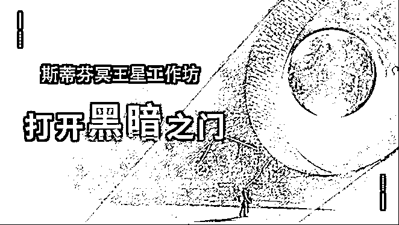

**冥王星工作坊**

**原价 6800 元**

**课程内容简介**

3 天工作坊，每天 6 小时。进化占星学比传统心理学走得更远，比当代占星学更加深入。它的核心是——星图既代表出生时灵魂的进化条件，又代表灵魂在此生的进化目的。在神话中，冥王星是地府的主人。在你的意识结构中，它也扮演着类似的角色。我们每个人内心都有一处“地府”，用来存放我们在生活中体验过的所有创伤经历。也许我们遭到了背叛，也许父母让我们失望了，也许有人欺骗了我们。有时，这些创伤经历如此极端，我们只能将其完全压抑起来。也有时，我们将其安全地归为“铭记”，但用一种不会威胁到自我和自我防御的方式去合理化和解释它们。在心理上，这些做法都是必要的，我们无需感到羞耻；但有时，当我们达到生命的某个阶段时，我们会变得足够强大来面对这些内在的创伤，取回被困在其中的能量和创造力。而代表这一时机到来的占星学征象总是涵括冥王星，我们不仅可以在星图，也可以在生活中看到这样的信号。这些冥王星式的创伤有时也神秘地植根于遥远的过去：那些前世未解决的伤害。比如，如果你有一世是奴隶，也许这一世我们会看见你在为一个让人十分不快的老板打工，并且想弄清楚为什么这个工作拴住了你。冥王星在出生星图的位置，加上南交点，为理解这些深层创伤的本质提供了巨大的洞见。更重要和珍贵的是，它能指引我们如何疗愈这些创伤。与此同时，冥王星的行进“打开了黑暗之门”，让我们知道开启“地府之旅”，取回灵魂的时机到了。这样的说法也适用于其他任何触发出生星图冥王星的重大行进和推进。在本次工作坊录制视频中，我们将探索这些技术背后的理论。并通过两个学员实际的案例，解读如何将所学的知识应用于星图中冥王星元素的解读。

**海王星**

**原价 5800 元**

**课程内容简介**

3 天工作坊。

✦ 海王星代表的能量能够将我们提升至最高的意识状态，也可以让我们突然坠入自己制造的幻觉地狱。它虚构的心灵敏感性可以让我们听见天使的低语，也可以让我们对自己的愚蠢和妄念制造的痛苦高度敏感。要正确运用海王星，我们必须有目的地踏上某种灵性道路。✦ 你的道路在哪里？如果海王星在第 10 宫，可能会涉及某些俗世的使命，潜在的陷阱是你可能会因灵性而“出名”。海王星落在第 12 宫，你的道路可能是完全隐匿而隐秘的。如果海王星合金星，你无法独自上路。换言之，出生星图中的海王星配置指出了你灵性意图中最实际、最有效、最个人化的方向。✦ 海王星会让我们警惕哪些愚蠢行为呢？人们被自己的敏感性所吞没，落入陷阱之中。占星学警示我们过量饮酒的危险。的确如此，但还有许多其他海王星的囚牢。你的星图将它们全都描绘出来了。 ✦ 进一步来看，我们该如何做好准备，以最佳方式善用强大的海王星行进、推进、太阳弧阶段呢？如同我们所看到的，有时候，真正的智慧之路在于全然无为地等待愿景出现。✦ 在 3 天的强化工作坊中，斯蒂芬老师将以一种切实、个人化、赋予力量的方式，来引领我们深入了解海王星的各个面向，探讨海王星的种种细微差别。

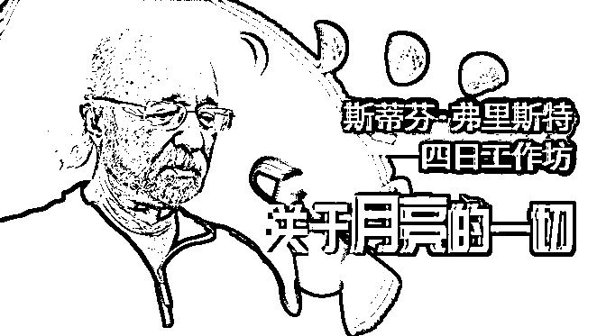

**月亮工作坊**

**原价 5800 元**

**课程内容简介**

1. 深入而专业地从星座、宫位和相位的角度来认识月亮

✔次限月亮在 12 星座✔次限月亮在 12 宫位 2. 深入探讨已被遗忘的奥秘——月亮的 8 个阶段（八相）✔出生星图月相✔次限月相 3. 重拾重要而常常被忽视的占星谜题碎片✔阴性法则✔月亮的速度✔赤纬✔越界月亮 4\. 月亮在星图中的综合解读想要进一步了解感兴趣的课程，咨询任选组合价格请添加若道 Maggie 咨询

长按二维码添加课程负责人咨询~

**报名入口**

# 想找一个心心相印又彼此滋养的爱人？先了解自己的月亮星座吧！

> 原文：[`mp.weixin.qq.com/s?__biz=MzA5NjA0NTAxNg==&mid=2651494515&idx=1&sn=628a3851c03f01ae7d32d796343e978c&chksm=8b482ac4bc3fa3d204a52947e221fd0f1e10292f4b49bc2acfa8655d7b60e42226bfb4ff509d&scene=126&sessionid=1692737725#rd`](http://mp.weixin.qq.com/s?__biz=MzA5NjA0NTAxNg==&mid=2651494515&idx=1&sn=628a3851c03f01ae7d32d796343e978c&chksm=8b482ac4bc3fa3d204a52947e221fd0f1e10292f4b49bc2acfa8655d7b60e42226bfb4ff509d&scene=126&sessionid=1692737725#rd)

**☆ 后台回复“今日”，给你一句生命态度 **

作者/爱丽斯·德维尔译者/Jane 校对/江艺
  编辑/翀子 封面/书君 图片/稿定设计

出生图中的月亮所在的星座描绘了你的感情、早年生活的影响以及情绪变化，当月亮在不同元素的星座时，你对感情有什么期待呢？快来看文章吧！另外，如果你想学习占星学，大卫老师参与授课的【[ISAR 认证职业占星师文凭课程](http://mp.weixin.qq.com/s?__biz=MjM5MjQwNjAyMQ==&mid=2649440476&idx=6&sn=70409b7464d1472b69294b35048dba96&chksm=beb92fb689cea6a04a3a5e03367b4241a651ff36ec760e5ade32fa6a38a2a5e2ab43f24124ee&scene=21#wechat_redirect)】正在插班中，点击链接了解更多详情！

**月亮星座与感情**

月光可以给萌芽中的爱情创造最完美的背景，抒情歌的作者在他们的爱情歌曲中描绘月亮，浪漫的小说家通过描述飘渺的月亮来传达主人公梦幻的心境和对爱情的追求——恋人们在月光下的海滩漫步，在皎洁的月光下第一次亲吻对方。月亮，肯定是与感觉息息相关的。

**出生图中的月亮所在的星座描绘了你的感情、早年生活的影响以及情绪变化。**等你成熟之后，这种天性会指引你找到那个理解你、滋养你感情的人。如若不然，你就会感到彼此情感上的疏离和误解。

月亮星座的彼此融洽在爱情中是非常重要的因素。你需要能在另一半的面前真实地表达自己的情感，否则这段关系就会崩塌。

十二星座可以按照火、土、风、水这四种元素来划分。月亮星座的元素彼此和谐的两个人似乎能在关系中更好地相处。

在关系中，**火象和风象的月亮的人之间或者土象和水象的月亮的人之间会更容易融洽相处。**以下的概述可以帮助你了解这些元素是如何运作的。

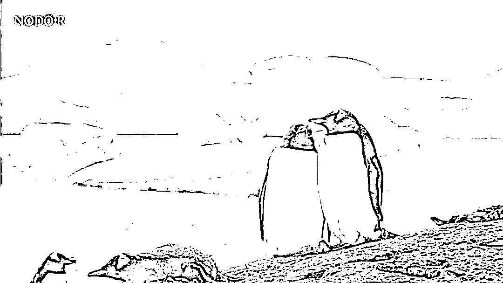

**不同属性月亮星座的爱情**

**热情的火象**

**月亮在火象星座（白羊座、狮子座、射手座）的人热情地追求他们的爱情对象。**他们强调激情，男女皆如此。他们很清楚自己的迷人之处，也很容易陷入爱河。他们强烈地希望自己的体贴能得到对方的爱慕和赞赏。

**他们倾向于主导伴侣的感情，而如果对方限制他们，他们又会表现出强烈的独立性**。

当爱情的火焰燃起时，月亮在火象星座的人是最热情的，当然，**当一段关系结束时，他们也是受伤最深的**。

当月亮在火象星座的人中了爱情病毒，那么被爱的人会在生活中体验到些许**戏剧性**。当他们得到了想要的爱情和浪漫，月亮在火象星座的人会给出不寻常的礼物，比如**惊喜的度假和爱慕**来作为回报。

月亮在火象星座的人拥有很健康的感情动力，并且会用积极的方式表达出来。尽管他们性急、易冲动，但是月亮在火象星座的人会在争吵之后给接吻与合好带来新的内容。如果一段感情是基于强烈的爱慕，那么你可以亲自去检验一下月亮的爱情机制。

**踏实的土象**

关于月亮在土象星座（金牛座、处女座、摩羯座）的人的感情需求，他们会**寻找务实、注重安稳和长期承诺的伴侣**。当物质基础稳定之后，他们会感到安宁。无需精打细算，他们也可以一头扎进婚姻和家庭。

月亮在土象星座的人希望另一半可以保持他们的收支平衡，但这不是必须的。**这个月亮群体有很大的野心，以成就为导向，欣赏他们这种工作原则的伴侣可以打动他们的心**。

虽然月亮在土象星座的人外表很保守，但是他们**欣赏幽默的伴侣**，这样就可以在他们陷入沉默的时候打破尴尬。月亮在土象星座的人会**把时间和金钱投入到个人发展中，他们之中无论是外向还是内向的人都很注意细节**。

好好利用这种特质，你们就可以组队参加益智问答或答题竞赛，比如“谁想成为百万富翁”。**如果你想找一个勤勉的伴侣，欣赏点点滴滴的人间天堂，就把你的心交给月亮在土象的人的稳定火焰吧。**

**交流的风象**

**月亮在风象星座（双子座、天秤座、水瓶座）的人喜欢与另一半交流，并且在情感上与人类相连。**他们喜欢**与爱人建立友谊、志同道合**。

月亮在风象星座的人约会主要有赖于**风趣的评论、电子邮件和大量的电话**。确实，他们喜欢幻想爱情生活，并且会花费相当的时间去勾画心目中理想的伴侣。**让他们做出承诺是不现实的。**

如果你在跟月亮在风象的人约会，那你可以期待**活跃的社交生活和各式各样扩展思维的经历**了。他们对别人的态度和反应很敏感，尤其是爱人和伴侣的。月亮在风象星座的人可以从**融洽的关系**中受益，当然，紧张的关系也会给他们的健康带来伤害。

**月亮在风象星座的人与欣赏他们才智和解决问题能力的人会相处得很好，一个轻松愉快并且体贴的爱人，可以让喜欢自由的月亮风象星座的人从幻想中的爱情走进真正的爱情。**

**深邃的水象**

月亮在水象星座（巨蟹座、天蝎座、双鱼座）的人天性中就带着**深邃而强烈**的感情。月亮在水象星座的人的爱情受家庭和童年的影响很大，如果这些经历带给他们滋养，那他们就很容易接受忠诚的关系，**安全**对他们的心灵极其重要。

不管男女，月亮在水象星座的人都**不会忽视他们的伴侣，他们倾向于用温柔的爱紧紧包裹着对方**。

此外，天生的第六感有利于他们**感受到在乎的人的情绪变化**。这个月亮群体的成员喜欢**触摸、情调音乐、温柔的按摩**。

基于水象特有的性格，他们会因为别人注视自己的另一半而有些吃醋，面对拒绝时他们会伤得很深，月亮在水象星座的人要**尽量避开那些公开调情以及在社交场合忽视他们的疏离型伴侣**。

月亮在水象星座的人的伴侣，应该有敏锐的直觉洞察他们内心的秘密，并且在对待感情和亲密关系的态度上与他们合拍。

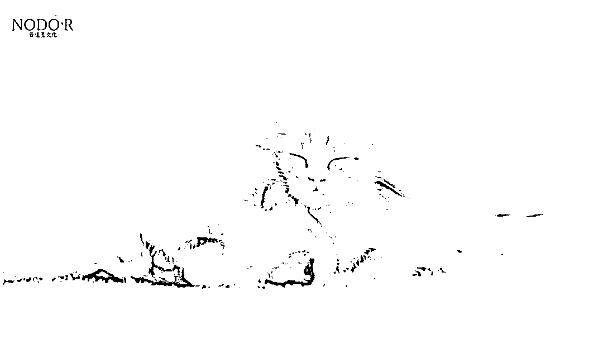

**天象里的月亮与感情**

上文所说的月亮是我们诞生的那一刻月亮的位置，其所在的星座和位置是固定的，代表了我们个性中最核心的情感需求。但月亮在那一刻之后依然在不断运转，每两天半，月亮就会改变一次“心境”，因为它将穿行进入另一个星座。

在出生星图所描述的基本情感模式上，月亮的“心境”会为个人生活增添微妙感情的变化。

**新月时的约会可能预示着一段感情的开始，上弦月可能预示着爱人正在评估这段感情，满月则可能预示着感情升温并且会很激烈。****有的时候，下弦月则预示着一对恋人紧张关系的缓解，而如果缺乏融洽，则预示着一段感情的结束。**

根据月亮来帮助你认识和确定你的感觉吧，也利用月亮的“心境”来开始、深化你的感情吧。

**版权声明：**本文由若道翻译发布，欢迎转发，反对抄袭。友号转载请申请白名单。

**END****爱丽丝·德维尔（Alice Deville）**占星师、工作坊讲师和作家，从业超过 25 年。在占星学实践中结合了多种咨询技巧，包括商业、金融和变更管理、房地产以及直觉洞察。**下面这份报告就是基于出生星图撰写的一份“爱的指南”，由美国著名占星师大卫·瑞雷老师亲自主笔，这份报告将会告诉你属于你的感情模式，以及未来将会和你共度余生的另一半的人格肖像。****长按下图识别二维码了解详情**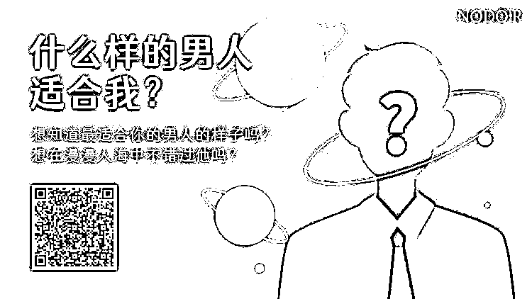**拥有****51 年****占星实践经验的****若道创始人****前 ISAR 全球副主席****前 ISAR 全球职业占星师资质认证主席****大卫·瑞雷**

**和**

**2019 年第二届、2021 年第三届核心课中**

**与苏·汤普金斯老师****联合授课****的**

**ISAR 认证职业占星师**

**咔咔（Caroline）**

**二人合力打造**

**2022 年 ****若道全新核心占星课程**

**点击下图了解更多课程详情** 

**

**20 位来自世界各地的占星师****带来 19 场沙龙——新世界的觉醒****详情可点击下图**

**学习占星学****点击下图了解课程详情**

**微信又双叒叕改版啦，不想错过若道君的推送？**
****就把若道设为****星标****以及点点****“在看”****吧！******▼**

**喜欢就点一下“在看”吧！****报名直达入口**

# 12 星座自画像丨这组星座的世界，“自我和先锋”是永恒主题

> 原文：[`mp.weixin.qq.com/s?__biz=MzA5NjA0NTAxNg==&mid=2651494515&idx=2&sn=01e21db35dee33b5fd91ed186dc26610&chksm=8b482ac4bc3fa3d2d5b0901e30059ac5ac8370bafca1b14f15179dc3508d365bbd9391dcc98e&scene=126&sessionid=1692737725#rd`](http://mp.weixin.qq.com/s?__biz=MzA5NjA0NTAxNg==&mid=2651494515&idx=2&sn=01e21db35dee33b5fd91ed186dc26610&chksm=8b482ac4bc3fa3d2d5b0901e30059ac5ac8370bafca1b14f15179dc3508d365bbd9391dcc98e&scene=126&sessionid=1692737725#rd)

作者/克里斯蒂娜·罗登贝克

译者/亚麻林恩 校对/江艺

编辑/翀子 文章图片及注释/作者提供

本系列是克里斯蒂·罗登贝克老师撰写的艺术中的 12 星座自画像，角度独特，语句生动。此文是狮子座与水瓶座的自画像，这两个星座的画家如何呈现自己样子呢？如果你对星座和占星学感兴趣，大卫老师参与授课的【[ISAR 认证职业占星师文凭课程](http://mp.weixin.qq.com/s?__biz=MjM5MjQwNjAyMQ==&mid=2649440476&idx=6&sn=70409b7464d1472b69294b35048dba96&chksm=beb92fb689cea6a04a3a5e03367b4241a651ff36ec760e5ade32fa6a38a2a5e2ab43f24124ee&scene=21#wechat_redirect)】正在进行中，欢迎点击链接了解更多详情哦~

**狮子座的自画像**

似乎**狮子座的人不太容易拿起画笔。**我想他们中的很多人可能都会觉得**整天待在工作室里太孤单了。**

所以毫不奇怪，20 世纪最著名的狮子座艺术家安迪·沃霍尔（1928 年 8 月 6 日），让一大群人来他的工作室，他称之为工厂……这是典型的狮子座，它关乎**广大的视野和组织人们。**

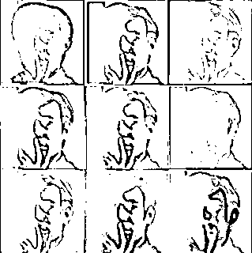

| 安迪·沃霍尔，生于 1928 年 8 月 6 日

我总是会注意到沃霍尔冷淡的眼神和美丽的色彩之间的对比，有着奇怪的残酷和不安。他有月亮、天王星的合相落白羊座，自私却又有开创式的古怪。这与落狮子座的水星、月亮、金星、海王星还有上升点相结合，**让人变得相当以自我为中心。**

| 约书亚·雷诺兹，《城里的人》**约书亚·雷诺兹**（1723 年 7 月 27 日）是另一位伟大的自荐者。**和沃霍尔一样，他凭借自己的努力成名，在乔治王朝时期的伦敦，他广泛交结名流。他画了他那个时代所有的名人。**但他不仅是一个优秀的画家，而且是一个知识分子和一个实干家。他在伦敦创办的皇家美术学院，至今仍是一所重要的学府。

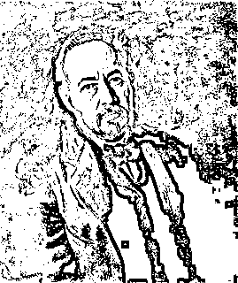

|托马斯·艾金斯，多美的眼神啊！

**另一位实干家和肖像画家是托马斯·埃金斯**（1844 年 7 月 25 日）。这位费城的大师不仅创作了很多细致、深刻的肖像画，还教会了一代代美国艺术家如何不断审视。**当然，他的教学生涯颇受争议，但众多门生对他的喜爱，足以帮助他建立一所新的学校。**

如果在这些画中发现戏剧、服装元素也没什么好奇怪的，因为戏剧本就是狮子座的范畴。格卢克并未穿过女人的衣服。辛基森其实是个服装设计师。

朱迪思·莱斯特脖子上戴着太阳，剧院设计师弗洛伦·史提海莫将太阳纳入了她的自画像中。但有趣的是，有些狮子座的画家认为他们一半是阴影——沃霍尔、克拉克、多丽丝·克莱尔·辛基森。

值得注意的是，这些画中也有很多红色。

但总的来说，我认为狮子座的艺术家是相当多样化的！

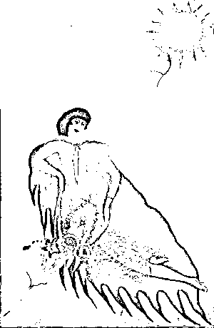

|弗洛伦·史提海莫，生于 1871 年 8 月 19 日

|多丽丝·克莱尔·辛基森，1891 年 7 月 31 日

|克莱芒蒂娜·埃莱·娜杜芙，1869 年 8 月 18 日

|朱迪思·莱斯特，生于 1609 年 7 月 28 日

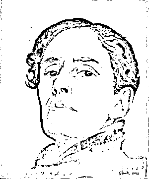

|格卢克，生于 1895 年 8 月 13 日

|玛格丽特·克拉克生于 1884 年 8 月 1 日

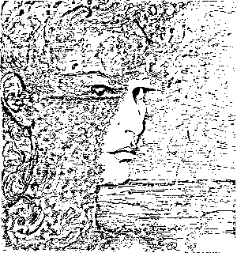

|海达·斯特恩，1910 年 8 月 4 日**水瓶座的自画像**水瓶座是先锋派的星座——谁能比**爱德华·马奈**更能代表先锋派呢。想想他的那些画，你还是会觉得很震撼。

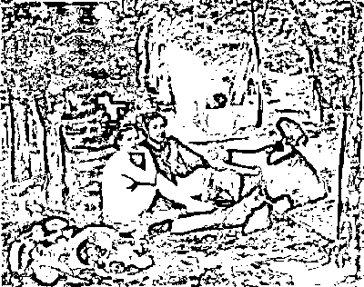

| 1863 年，《草地上的午餐》首次在巴黎展出，声名大噪。你能知道原因。裸体女人和身着 19 世纪服装（等同于斜纹棉布裤和毛衣）的男人在干什么？

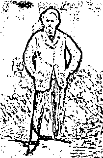

| 自画像。马奈 1 月 23 日（1832-1883）

他从小就反抗传统的教养方式。他不仅成为了一个艺术家，还专画各种被认为是完全错误的疯狂题材，他的绘画方式也被认为是错误的。当他年长一些后，他成为了印象派画家的导师。这是不是很**水瓶座**？你一开始疯狂地**震惊这个组织**，然后你自己**变成了这个组织**。**马克斯·贝克曼**，2 月 12 日（1884-1950 年），他的职业生涯极其漫长且多产，与马奈的职业生涯曲线相似。但他不得不与纳粹打交道，这场磨难摧毁了他的大多数先锋派同僚。他在各种媒体上画了很多很多的自画像——当你看到他有一个多么大的脑袋时，你一点也不会吃惊。

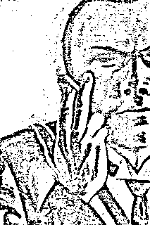

| 马克斯·贝克曼，2 月 12 日（1884-1950）

这位是布卢姆斯伯里团体里的**邓肯·格兰特**：艺术家瓦妮莎·贝尔的男友，贝尔是弗吉尼亚·伍尔芙的妹妹。因为他真的是同性恋，瓦妮莎嫁给了画家克莱夫·贝尔，他和他们住在一起，一切都有点复杂。然后，当然，贝尔有他的女朋友，玛丽什么的……你明白的。他是个非常非常放荡不羁的人，亲爱的。但是你猜怎么着，开头他用他后印象派风格的作品和古怪的私生活震惊资产阶级，结果却成为了艺术史本科核心课程的一部分。前卫的人对我们其他人来说真是太前卫了。

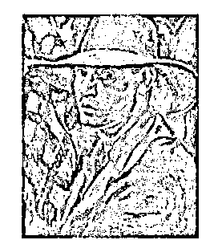

| 邓肯·格兰特 1 月 23 日（1885-1978）

****版权声明：**本文由若道翻译发布，欢迎转发，反对抄袭。友号转载请申请白名单。****END**

**克里斯蒂娜·罗登贝克**

克里斯蒂娜·罗登贝克，若道签约老师。全职职业占星师，从业 20 余年，在其网站长期撰写时事、艺术和文化的文章；定期在英国授课，并保持蓬勃发展的专业实践。

**拥有****51 年****占星实践经验的****若道创始人****前 ISAR 全球副主席****前 ISAR 全球职业占星师资质认证主席****大卫·瑞雷**

**和**

**2019 年第二届、2021 年第三届核心课中**

**与苏·汤普金斯老师****联合授课****的**

**ISAR 认证职业占星师**

**咔咔（Caroline）**

**二人合力打造**

**2022 年 ****若道全新核心占星课程**

**点击下图了解更多课程详情** 

**

**微信又双叒叕改版啦，不想错过若道君的推送？**
****就把若道设为****星标****以及点点****“在看”****吧！******▼**

**喜欢就点一下“在看”吧！****报名直达入口**

# 插班中丨 ISAR 认证职业占星师文凭课程：开启“爱好变职业”的创收自由之路

> 原文：[`mp.weixin.qq.com/s?__biz=MzA5NjA0NTAxNg==&mid=2651494515&idx=3&sn=860bbb651e8c59375230c37a42fcb016&chksm=8b482ac4bc3fa3d2427df7584c6dde2e98e245f5132433fd9b01bdc1c744a8ba8aa20ef8c879&scene=126&sessionid=1692737725#rd`](http://mp.weixin.qq.com/s?__biz=MzA5NjA0NTAxNg==&mid=2651494515&idx=3&sn=860bbb651e8c59375230c37a42fcb016&chksm=8b482ac4bc3fa3d2427df7584c6dde2e98e245f5132433fd9b01bdc1c744a8ba8aa20ef8c879&scene=126&sessionid=1692737725#rd)

**2022 年，是世界和中国 40 年未有之大变局的开始。**

俄乌战争打破了欧洲大陆乃至全世界的和平局面，而新冠疫情也给中国经济带来前所未有之挑战。

如果你关心经济形势和世界局势，你会有这种的感觉，我们将面临一场深刻的危机，而这不是短期内可以结束的。

**占星学的看法也是如此。**

4 月青年失业率（16 岁到 24 岁）中国达 18.2%，一些背着房贷、教育、医疗负担的中年人突然失业更是整个家庭整个难以承受之重。为了更好准备面对这样的时代变化，连《北京日报》这样的官方媒体也在呼吁：**“开拓副业，让自己有多元化发展的生存能力”。**

**而这门课程，就是为了这样一个目标准备的。**

**占星学是非常好的“开展副业”的选择**

这个**为期 16 个月**的课程通过并不算长的时间和并不算高的投资，不仅可以帮助你学到一个终身可用的技艺，而且也可以选择成为自助助人的占星师，**开启受益终生的第二事业。**未来是个体崛起的时代，大量个体被鼓励独立发展，比如网红、自由职业、自媒体、咨询师等，他们都不需要传统的办公室。社会越发达，人的独立性就越强，未来有能力的人都可以变成独立的经济体。

**占星学也是越老越好的职业**

和一些技术变化非常快的职业不同，**占星学的技术层面非常稳定，不会快速迭代变化，**同时，掌握好占星学、能够做一场好的咨询又需要个人自身大量实践和对生命的深刻理解，而这些都是时间和岁月带来的。

**占星学是现代社会需要的助人职业**

社会快速发展和变化人们似乎越来越无法掌控自己的生活，这给很多人带来巨大的焦虑，**抚慰心灵的咨询市场需求巨大。**而占星学可以让人从前所未有的角度了解自己，了解目前和未来所处的周期，挑战的意义，不论对于深入的个人成长探寻，还是预测未来的周期，都又其独一无二的价值。

**ISAR 认证职业占星师的独有培训**

目前占星学的培训市场鱼龙混杂。而 ISAR（国际占星研究协会）是一个包含了 47 个国家在内的国际占星组织，多年来致力于占星的教育和研究，提升占星教育的品质和职业占星师的能力，在国际占星领域备受尊重。今年，ISAR 对于成为 ISAR 认证职业占星师提出了更高的要求，**所有想要获得 ISAR 职业占星认证的申请者均需要在 ISAR 的附属学校通过 500 个小时的研习（包含****主课****、选修课、沙龙、作业、讲座、工作坊等等）。**

**而这门核心占星学课程就是为此而准备的。**

**2022 年，鉴于对若道在占星教学领域所做的持续努力和高品质的课程服务，ISAR 特别授予若道核心课程为 ISAR 文凭课程，所有在若道学习，并通过若道毕业考试的同学将获得 ISAR 颁发的学历文凭（Diploma）。**

**你的占星核心课老师是谁？**

**拥有****51 年****占星实践经验的****若道创始人****前 ISAR 全球副主席****前 ISAR 全球职业占星师资质认证主席****大卫·瑞雷**

**和**

**2019 年第二届、2021 年第三届核心课中**

**与苏·汤普金斯老师****联合授课****的**

**ISAR 认证职业占星师**

**咔咔（Caroline）**

**二人合力打造**

**2022 年 ****若道全新核心占星课程**

**咔咔老师给同学的寄语：**

（向上滑动查看内容）

**亲爱的同学们：**

我为什么学占星学？

2000 年的时候我还是一个在网上搜索天蝎座和水瓶座配不配的普通白领。我搜索的内容还包括了水瓶座为什么总是这么若即若离？

体贴的搜索引擎给我推送了占星学、行星、星座、宫位、相位等资料，还让我了解到莉莉丝、月亮交点、截夺宫位等占星学概念。

2000 年 10 月我了解到，一个从业 30 多年的美国职业占星师大卫·瑞雷来到了中国，和他的中国合伙人将开办一个专业教授占星学知识的课程。过去 10 个月在网上东拼西凑的占星学知识唤起了我对占星学的兴趣，但是已经不能满足我对星图深度分析的需求了。

2013 年，我通过了若道核心课程的毕业考试和国际占星师研究协会的认证考试。2015 年我离开职场成为一名全职占星师。

到底学习占星带给了我什么呢？

1、它是自我觉知的工具，我现在已经不去纠结哪些星座是否匹配，我相信外在的事件是内在心理矛盾的显化。也就是说，想找到令人满足的亲密关系，要先去了解自己的情感模式和需求，而不是无意识地一次次地试错和撞墙。我开始学习自我关怀和接纳自己。

2、它带来看待世界的全新和全景的角度，天上如是，地下亦然。人类社会和个人生命的进化都有其周期和相似性，作为个体，占星学帮助我思考如何更积极和有建设性地与宇宙的能量合作，认识自己，发挥自己的潜力，度过有意义且自我满足的人生。

3、它带来了全新的职业：占星师和占星老师。除了收入，还有助人育人的满足感和意义感。

4、它带来一群志同道合的伙伴，我们彼此联结又相互独立。

作为中国占星界的“黄埔军校”若道占星的学生、助教和老师，我与很多学员在人生的不同阶段带着各异的需求走进了这所学校，2022-2023 年一年半的若道核心课程设计既蕴含了大卫·瑞雷老师的教学精华，也带入了我在跟随不同国外占星老师学习、助教和教学积累的心得。

有一些学员毕业后从事了占星咨询工作，有的在各大平台成为专业占星学知识的输出者和传播者，有的运用占星学提升他们的工作，也有的在占星学与投资，占星学与名人/八卦、占星学与原生家庭、亲密关系、亲子关系等领域收获了有用的或者有趣的体验。

对我来说，生命是一场自我完整的体验之旅。从 2011 年的那个春节在若道入学之后，我的生命旅程更加充实、有意义、有目标，也更有满足感。

希望在 2022-2023 年的若道核心课程里见到你。希望你此后的生命旅程里，有若道，有占星学。

占星师咔咔

2022 年 5 月 24 日

**大卫老师给同学的寄语：**

（向上滑动查看内容）

亲爱的学员们：

感谢你对我们从 8 月 30 日开始的若道 L1-5 级核心课程的兴趣。我和合作老师咔咔以及我们的核心课程团队期待着为你提供这个机会，来教授各种高品质的地道占星学知识和技巧。

对于那些希望获得 ISAR 职业占星师认证的学生，这是一门适合你的课程！

作为 ISAR 咨询技能培训的一部分，我曾与咔咔合作过，我们期待着再次合作。咔咔和我曾在 ISAR 职业占星师认证委员会（CAP ISAR）一起工作，我们非常熟悉获得 ISAR 职业认证的流程。作为你的老师，我们将陪伴你整个占星学发现之旅，帮助你逐渐认识到占星学有多么的神奇。此外，你还将受益于我们若道的助教和课程顾问，他们是若道核心课程计划的重要组成部分，提供在线沙龙、组织学习小组、指导家庭作业。我们的教育团队是“服务于你的团队”，所以也会根据你的需求进行相应的调整。你专用的核心课程微信群也促进了你的学习过程，使你能够每天与你的同学们一起学习、探讨、成长。

52 年前，当我开始学习占星学时，没有一所像若道这样的学校。如果有这样一所学校，我会尽一切可能在那里成为一名学生。事实上，我很幸运，我的老师都是经验丰富的专业占星师。然而，我花了 6 年的学习时间才通过 1976 年在美国乔治亚州亚特兰大举行的专业占星师考试，又花了 2 年的专业实践时间才通过占星学谋生。我永远不会忘记从 1970 年到 1978 年的 8 年，那些日子的反复试验教会了我如何苦练占星学。作为老师，我一直在努力传授我早年所学的知识，让你的旅程更加顺利，更加全面。

自 1978 年以来，44 年的全职实践教会了我很多，我很高兴有机会与大家分享我所学到的东西。我和咔咔都是现代占星师，虽然我们尊重西方占星学的历史和传统，但我们实践和教授的占星学植根于现代人本主义哲学，这种哲学旨在提高你对自身潜力的认识，并鼓励个人成长。还有什么比了解自己更实际的呢？还有什么比个人成长和发展潜力更有利的呢？这是你将要学习的占星学，一种可以应用于你自己生活的占星学，一种可以为你提供一个充实职业的占星学。

教书是我回馈占星学行业的方式，这个行业拓展了我的视野，远远超出了我曾经想象的可能。谢谢你给我这个机会做你的老师。

大卫·瑞雷

2022 年 5 月 24 日

**连报 L1-5 全阶网络直播课程，你可以享受**

❶ 64 次线上直播互动网络课程+2 场工作坊，全面而详细地讲解占星学知识、技能、案例和重要领域实践运用。

❷ 知识点+学员星图解读有机结合：咔咔老师以讲解知识点和中外名人案例为主，大卫·瑞雷老师以参课学员案例演示及客户案例为主，每个知识点覆盖班级内学员的亲身案例，参与感更强，多位学员都有机会听到自己的星图分析。

❸ 微信群学员互动分享，从真实案例学习生命成长故事。

❹ APP 答疑论坛提问：论坛上每个学员的问题都将得到及时回复。

❺ 若道独有的职业占星师养成计划，为你毕业后独立咨询做准备。

**❻ **提供**咨询平台**，只要努力，优秀毕业生有机会入驻**若道咨询平台**，拓展咨询客户群。

**更多了解老师和助教？**

**大卫·瑞雷（David Railey）**

*   **I****SAR 董事会成员，ISAR 全球副主席，ISAR 全球职业占星师资质认证主席，若道占星创始人**。

*   2016-2019 年，被选为国际占星协会（ISAR）考试委员会成员，国际占星协会（ISAR）是世界最大的国际占星机构，会员遍布 47 个国家。

*   2017-2020 年，被选为国际占星联盟（ISAR）考试委员会主席，理事会成员。

**占星师咔咔（Caroline）**

2010 年师从美国占星师大卫·瑞雷学习，并得到世界名师斯蒂芬·弗里斯特、罗伯特·汉德、苏·汤普金斯传授各种占星学技法。若道首届学员，国内最早获得 ISAR 职业占星师资质的职业占星师，多次担任若道核心课程助教，并于 2019 年第二届、2021 年第三届核心课中和苏·汤普金斯老师一起教授若道核心占星课程。

在国际知名广告公司和市场研究公司从事的市场研究和推广工作十余年，曾任职于阳狮集团、尼尔森市场研究有限公司、MTV 和《Madame Figaro》杂志。

**助教王嘉祺 （Conrad）**

ISAR 认证占星师、若道认证生时校正资质，从 2010 年起自学占星学，2015 年开始在若道系统学习，并开始个案咨询。2018 年担任若道核心课程助教，以及卜卦占星学和太阳返照选修课助教，并带领学员进行经世占星和太阳返照方面的研究。2019 年 11 月作为演讲人之一参加了国际占星协会（ISAR）北京大会，也是 ISAR 星空俱乐部中国区第 16 期的主讲人。

**什么人适合这门课？**

*   对占星学有浓厚兴趣，想要系统学习占星学。
*   对占星学有一定基础，但不知道该如何整合星图复杂的碎片。
*   希望成为优秀的占星师，想要借鉴国际大师解读思路并融入自己的体系。
*   想学习占星学，但不擅长英文，希望有中文老师授课。
*   想结合占星学理论与咨询实践。
*   走在自我探索和个人成长道路上的人。

**课程费用**

**★ 1-2 阶 （8 月 30 日开课）****课程费用：3500 元 ****★ 1-3 阶　连报****课程费用：11500 元 **********转发优惠价：**11000 元（朋友圈转发本课宣保留 24 小时以上，并截图给课程顾问）********★ 1-5 阶 连报****课程费用：46500 元** **转发优惠价：34800 元（朋友圈转发本课宣保留 24 小时以上，并截图给课程顾问）**

**咨询课程请联系顾问**：**王老师（微信/手机：18510107057，请备注“大卫核心课”）**

**退转课程**

**退款原则请详看《教学协议》，如有疑问请咨询课程顾问。**

****2022 L1-5 认证职业占星师必修课程****

**授课老师：大卫·瑞雷、咔咔**

**直播课开课时间：2022 年 8 月 30 日（周二）**

**授课方式：******网络授课，英文/中文授课，中文翻译****

**费用：******1-2 阶**：**3500 元；****1-3 阶**：**11500 元******（****转发优惠价：**11000 元，朋友圈转发本课宣保留 24 小时以上，并截图给课程顾问）；**1-5 阶连报**：46500 元**（****转发优惠价：34800 元，朋友圈转发本课宣保留 24 小时以上，并截图给课程顾问）******

**课程负责人：王老师**（微信/手机：18510107057，请备注“大卫核心课”）

长按二维码添加课程负责人咨询~

**END**

****报名直达入口****

# 失去什么，也不能失去自由 | 欢迎来到天王星人的世界

> 原文：[`mp.weixin.qq.com/s?__biz=MzA5NjA0NTAxNg==&mid=2651494377&idx=1&sn=3e0ca90b5686bba97d36af91cb1f61f1&chksm=8b48255ebc3fac4887644eec186f8f085f3eb1ca40d4ffb59e1995025e6341f1b37d86782038&scene=126&sessionid=1692737725#rd`](http://mp.weixin.qq.com/s?__biz=MzA5NjA0NTAxNg==&mid=2651494377&idx=1&sn=3e0ca90b5686bba97d36af91cb1f61f1&chksm=8b48255ebc3fac4887644eec186f8f085f3eb1ca40d4ffb59e1995025e6341f1b37d86782038&scene=126&sessionid=1692737725#rd)

********************☆ 后**********************台**********************回复“今日”，给你一句生命态度********************

作者/一桑编辑/玫瑰 封面/书君 图片/稿定设计

如果你无意中走进天王星人的世界，可能看到的是空无一人，又或者各种无线电波……总之，怎么奇怪就怎么想象准没错！是的，天王星人总是特立独行又有些“怪异”，但是他们也是有迹可循的，一起来看看作者精彩的解读！

**天王星**我们从天王星所守护的星座——水瓶座说起。水瓶座拉丁词为 Aquarius，源自希腊语，词根 aqua 意味“水”，直译为倒水者；但水瓶座的原始含义和“水”没有半毛钱关系。传说希腊神话中特洛伊城有一位浪荡不羁的美少年（另说为王子）名为 Ganymedes 伽倪墨得斯，因美貌被宙斯掳到天庭为众神倒酒，为此饱受思乡之苦（所以请记住倒水的并不是维纳斯）。若依照神话中的原始意涵，我们得知**水瓶座的背后乃是“离开”、“分离”的含义。**

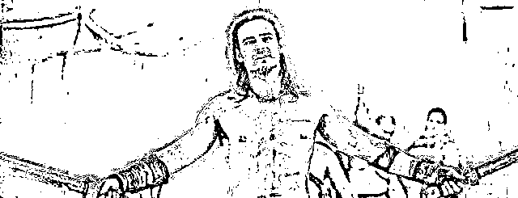

| 美剧《斯巴达克斯》中技艺超群而放荡不羁，不近人情又义薄云天的“竞技场之神”Gannicus，名字拥有和 Ganymedes 一样的词根。

我们仍然需要从最原始的意涵来理解天王星——风元素之固定星座的守护星。空气元素（air）的凝固不变带来了大气层，带来了我们所谓的“天空”与“高处”；正如伽倪墨得斯被宙斯掳上了“天庭”而远离人间，处于高空的人必须同时远离大地，**这样的“离开”、“变换”、“空间感”的状态是水瓶座的本质，也是天王星想要达到的目标状态。**心理占星学中**把木星和土星所代表的的心理功能称为群体意识或社会意识**，而**把天王星、海王星、冥王星的阶层称为宇宙意识**；如果说木星让个体走向了群体，那么天王星则是从人类群体走向了全部的物质环境，走向了整个宇宙。**天王星能量强的人，会对原始的山川自然有一种亲切感，或对整个人类族群有一种责任心，但对于单个个体的利益会不屑一顾，这也是源于他们的脱离特性和全观视角。**根据现行的占星学理论，我们罗列出生活中可见的天王星特质：**需要独处，需要个人空间，特立独行不随大流，极具个性与创造性，保持社交距离的，冷静不感情用事的，冷漠，疏离，孤单，被孤立的，有道义，重视友情，希望有变化，喜欢崭新的，另类奇葩，有道理、有逻辑，理论性强的，科技感十足的新发明，电子、电磁、网络，社会时政，社团活动，创新精神，平等精神……等等**。我们希望理解的是，这些散落的单词后面有怎样的逻辑联系、共同之处？**天王星的心理学含义**比起“心理”一词，我更喜欢用**“原始能量”**表达天王星的作用（我们慢慢会体会到心理、物质、能量的一体性），因为**天王星带来的冲动往往没有那么多“人情味儿”，是我们内心“无法完全理解”的行为方式，而这种行为常会遭到大众的孤立和谴责**。在格伦·佩里的心理占星体系中，会用“分裂性精神失调”（Schizoid Personality Disorder）来归类受天王星能量影响的人，因为心理学家中的平庸者们，看到人类以群居而相互依赖为多数，便**把离群索居，孤僻另类定义为“行为失调”或“心理疾病”。**

****

**毫无疑问，是幻觉引起的激情和愚顽，激励着人类走上了文明之路。在这方面，理性却没有多大用处。    **

**——庞勒《乌合之众》**

**能量层面上，天王星的核心含义是“变”。**这种“变”同逻辑分析、人情世故都没有任何关系，我们**往往并不是主动去寻求变化，而是变化作为一种原始的能量在驱使着我们。**在关于天王星的采样访谈中，占比多数的同学都会有小时候父母不在身边，或即使在身边但情感上不亲近、疏离的情况，这难道是一个小孩子主动追求的，还是“习得性的无意识投射”？弗洛依德学派的精神分析只追溯到了一个人的幼年时期，认为早期的遭遇塑造了全部的人格；但荣格则承认**每个人的潜意识结构天生不同，有些人更容易感到孤独，是因为他出生之前就确定了的内在的能量推动了（并不是决定）外在的遭遇。** 天王星会跳过你的意识直接塑造你的生活。然而心理占星学的任务就是把这些外在的感受和事件，与内在的能量结构联结起来，让我们能看到事件与内心能量的逻辑联系，以及寻求调整的方法。以下是一些天王星典型特征的解释与溯源：

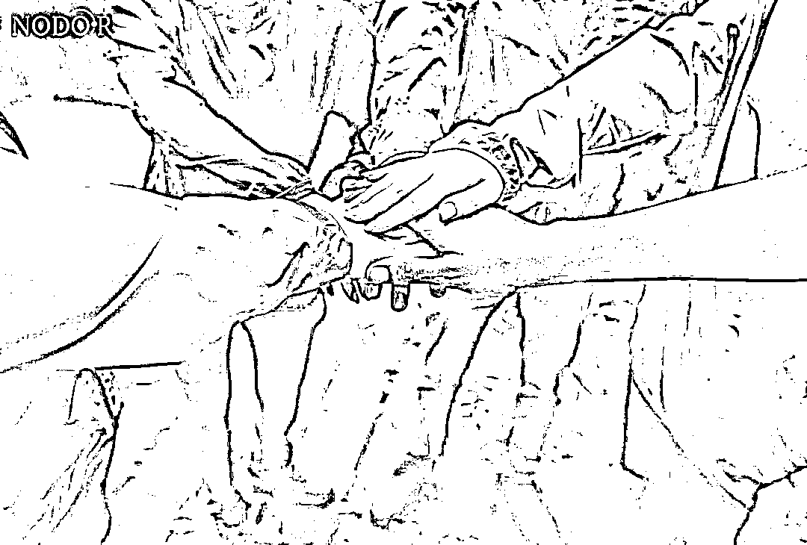

**天王星与单身主义**

需要首先说明的是，**天王星特质的人多拥有“单身主义”的理念，但并不一定完全追求“单身”**；即使处在热恋的关系中，天王星人也特别**需要独处空间、自由思想和新鲜经验**——有的时候这些事物正是由另一个人带来。

多数情况下天王星人可能**本身有男（女）友，但经常会独自或与另一群人出门玩耍**；他们也许会刻意这么做，以避免给外界一种自己被“套牢”的形象。对于他们来说，单不单身是一件形式上的事情，但实质上他们**不能够失去一种叫“自由”的东西，他们必须足够灵活以接受新的事物，没有什么能够阻止他们这么做。**

然而很多情况下，天王星能量被压抑在潜意识中，特别是当困难相位出现时，案主会认为自己本不想与对方“分开”，但对方或外界会“强迫”自己这样做，他们也许会**遭受冷遇，孤立，被切断联系，分手或是被分手，多数时候这些情况发生的也很突然**。

一些经历过多次相似经历的天王星人可能会反思：咦？好像这些情况是我自己引发的，我好像总是在“勾引”对方与我分开（比如曾暗示对方可以夜不归宿）。**当潜意识的需求不被自我看到时，内在能量就会拉动外部事件来达成它的愿望。**

我们不太容易理解老板炒你鱿鱼其实是因为你自己的潜意识希望辞职（可往往很多人会有“听到这个消息后心里一阵轻松”的感觉），但能量与物质界的法则就是如此：**强大的愿望可以改变事实，即使这个愿望你的主观意识都毫不知情。**

**天王星（那部分内心）的愿望就是“变”，没有任何情绪没有任何理由的“变”。**你的理性头脑觉得这事儿还没完，但你身体里另一个股（强大的）能量一个劲儿地催促你赶紧离开，赶紧换新的来；**这股动力会在事后被冠以各种冠冕堂皇的理由，然而有觉察力的天王星人会知道当时根本没有时间想那么多。**一位志愿者的用词非常具象地描绘了分手时的心理状态：她希望人生赶紧“翻篇儿”——无论有多少没掰清楚的纠结或是眷恋都必须马上扔掉，转头奔向新场景的需求是如此的迫切。这也是如下不同的原因：冥王星人会把过往的事情全都掰开揉碎抓住你一起体会那些扎心的情感，而天王星人则云淡风轻甩你一声“Bye Bye”，仿佛什么事情都没发生过。“单身主义”是天王星的“后情感合理化”，是无意识行为的迟来理由，我们先是觉得一个人呆着舒服，然后才发明了“主义”。认清这一点，我们便不会让教条与概念压倒我们；我们依着不可名状的内心冲动去行事，坦荡的，并不由于找不出这样做的理由而慌张。

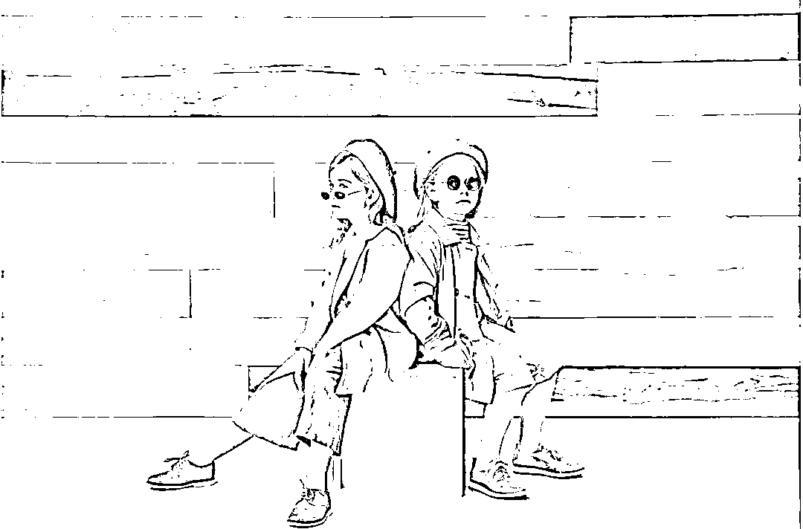

**天王星与孤独感**

参与调研的绝大多数人都会提到**“社恐”**这个词，自己会**直觉性地远离人群**。我们到底在恐惧什么？一位有心理学背景的参与者分析了自己“恐惧”的对象：**会担心自己主动参与后却被排除在外。**

**我们大多是经历过多次“被排除”的事件之后，才会产生如此的心理预期。**精神分析学家们会重点关注人们的童年，很多天王星人小时候是**和空气（风元素）一起度过的**——身边空空如也，不是父母经常外出工作，就是养育关系颇有距离感，金星-天王星相位的案主也可能会在学校中经历被小伙伴孤立的事件。

在精神分析学的理论中，这会让我们习得一种潜在信念，那就是**这世上没有人靠得住，没有什么能够长久，一切都处于不断的变化或离开中。**有了这样的信念，在我们日后与他人交往的言谈举止中，我们也会**暗暗展现出一种有所保留的态度**，“反正这段感情不会持续长久”，“大家应该都各有各的事情吧”，“再往后肯定没话说了，尴了个大尬”。

如此一来，我们便又主动把“空气”吸引到了自己四周，而把别人冷静地推开了——我们反而会在聚会中先行离开，而被冠以“这个人好冷漠哦”“这个人不太合群”的名号。 

非要抠原理的话，其实天王星并不是孤独感本身，孤独感的“感受者”是月亮、金星、太阳等这些个人意识（对于绝大多数人而言，天王星的心灵层面还没有被整合进个人意识中）。所以**天王星并非孤独感的“罪恶之源”，而（与个人行星之间的）紧张相位（合相、四分相、对分相）才是。**土星并非带来抑郁症的罪归祸首，和谐相位的案主会享受土星带来的纪律、权威和野心等事物；天王星也一样，孑然一身对某些人来说根本不是事儿，他们在长期的独自生活中并无烦恼。**而对于一些具有紧张相位的天王星人，离开的冲动和投入亲近的冲动会把他们撕碎，他们会在反复横跳的心态中责怪自己，陷入不间断的追溯过去和演绎未来的头脑旋涡里。**当我们看到一个离群索居的人，我们不敢妄议他是“孤独的”，那有可能是一个悠然自得的渔父，也有可能是一个愤世嫉俗的查拉图斯特拉。 

****

**世人错把比严光，我自是，无名渔父。****——陆游《鹊桥仙·一竿风月》 ****（严光代表假装遗世独立的沽名钓誉者）**

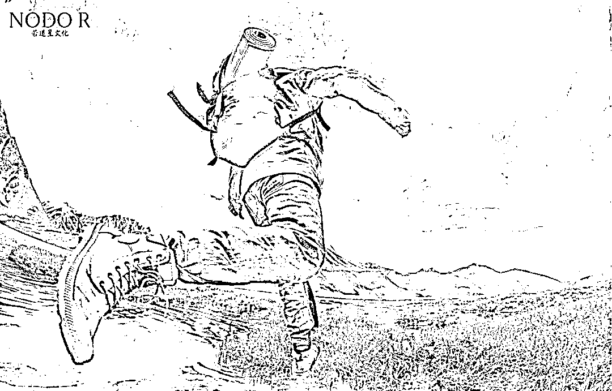

**天王星与友情**

**“现实事件”在占星学中是一种“能量管道”。**比如，绘画是海王星能量的一种管道，但我们不能说海王星的最终目标就是绘画；海王星的能量是弥散和广泛联结的，富有精神原创性的。

当我们绘制静物写生，建筑施工图和政治宣传画时，海王星的能量就不能得以发挥；而追逐光影感受的印象派，宣泄情绪的野兽派和展现人心的情节类绘画则可以将海王星能量顺利的流淌出来。 

同样地，**友情是天王星能量的一个管道，我们可以通过友情去发散天王星的能量；但“与朋友的情谊”并非天王星能量的最终目标。**电影《阿甘正传》中，小珍妮的愿望是“愿上帝将我变成一只小小鸟，让我远走高飞”，她独立反叛，参加“社团”与“革命”，反战吸毒玩摇滚，毫无疑问她是走在时代前沿的天王星人。她对阿甘的情谊并非不真诚，然而却不像阿甘对她的“和我回家吧”那样腻在一起天长地久；小时候的她会从家里溜出来跑到阿甘的房间里睡觉，这是她逃离酗酒的父亲的唯一去处；上学时，她又会带阿甘去她的宿舍做违禁之事，来见证她的独立。换言之，阿甘是小珍妮“分离能量”的管道，他们的友谊代表了她对于旧环境的“反叛”与“逃离”。再后来，珍妮一次又一次的离开甘，去追寻自己天王星式的理想。

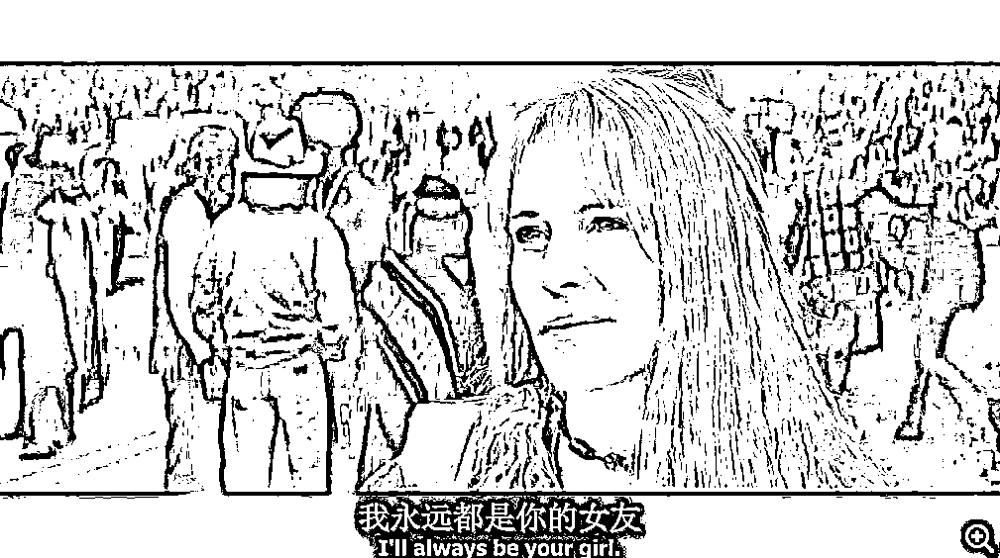

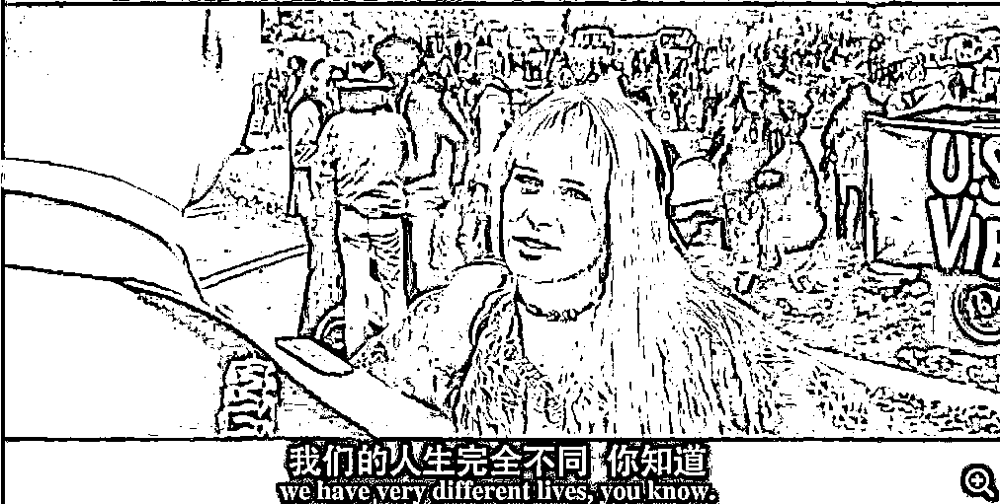

| 《阿甘正传》剧照

天王星人之所以重视友谊，实则是**追求一个管道——带来新奇与进步的管道**，这也解释了为什么**天王星人的朋友鲜少是身边亲密熟悉之人**，不是父母、兄弟姐妹、邻居、办公桌对面的同事等。**朋友必须代表了他们对于日常生活的跳脱和更新**，比如大学社团里充满新思想的学长、旅行中结交的创业者、网上那些群组论坛里的有趣的人、“外面认识的人”、朋友的朋友等。在访谈中，很多志愿者给出了对“朋友”相似的定义：**有共同的观点，精神上的联结，能够让彼此进步，互不干涉，萍水相逢，互相敬佩的的点头之交。**很重要的一个问题是，很多天王星人对自己的这一属性并不完全了解，他们直观的感受是**朋友对他们来说很重要（提供物质条件的父母往往不是）**，他们真的是“义”字当头，**甘愿为朋友付出很多，但有时候却觉得自己还没有对方的“酒肉朋友”来得重要。**但当他们终于打算卸下防备敞开心扉，想和朋友拉近距离的时候，却发现自己不能——**他们无法接受这种“紧密的联结”，“失去可能的稳定性”**，他们见过曾经的新奇变成了如今的日常，也害怕自己会像甩掉过去的旧经验一样离开现在的新欢喜。一位来访者说**：“我不是害怕他们会疏远我，我是担心聊不了多久自己就会开始看不上别人。”**这就是为什么**天王星人向往着最纯粹最真诚的友谊，但往往也最孤独**；这种感受用一句话也可以说成是**“相濡以沫，不如相忘于江湖”**。**天王星与理性思维**在“三王星人”中，天王星人可以算是最崇尚理性的，他们**思维缜密，善用逻辑推理，大多喜好书籍，尤其是有关科学和哲学的书籍**；他们往往**学习成绩斐然，并对社会问题都有自己的一套理论和看法。**现在我们想知道的是：什么样的原动力促使他们成为这样的理性人？当然如果想把占星学的简单一点的话，直接记忆**“天王星→逻辑、理性”**也是可以的。
在天王星主题的访谈中，我发现一件很有趣的事情：如果案主有冥王星相位的话，基本是我问一句，对方会回答 5-10 行来讲具体的心态和细节；对于其他仅有天王相位的同学，基本情况是我问一句回答一句，甚至很多时候回答会如“是的”、“不会”、“有可能”这般简洁（当然这也和匆忙建立的信任感有关）。有的时候，我会追问一些事件的具体细节和对当时心态的描述，此时天王星人会用**归类法和抽象性陈述**来回答，而不是讲述细节，例如“我一般不参加 3 个人以上的聚会”；“如果自己的节奏被打乱的话会很难受”……（海王星人对于同样的问题则会表述为“那一天，我穿着什么样的衣服，坐了多久的车去见谁谁……当时生气得胸口都要炸了……”）。在我的感受中，天王星人似乎有一种**“精炼”与“总结”**的天赋，并**对事件的原始细节有一种抵触感**，他们会说“反正都过去了”“那些不重要”或者“我不记得了”；有一次我追问了 3 次“当时引发你们分手的事情具体发生了什么”，最终得到的答案是“反正发生了一些事情”——这些回答问题的方式比答案本身更加重要。 我最终的解释和推断是：**“理性”仍然是天王星能量的一个“管道”，在这个管道中流淌的仍然是天王星的“跳脱”冲动。**如同“友谊”是对于传统家庭环境的跳脱，“创新”是对于老旧日常经验的跳脱，“社团”与“革命”是对现有体系和社会制度的跳脱一样，**“理性”与“哲学”就是对每一个现实层面的事件细节的跳脱。****天王星人更愿意生活在一个用自己思维创造出来的“架空世界”，其潜意识中的根本动力是想离开眼前的这个原始世界。**他们对原来的世界有一种从空中俯视的全观感，很轻易地掌握了世界运行的一般规律，但他们也像伽倪墨得斯一样再也回不去了人间。《盗梦空间》中，新进造梦师艾里阿德妮第一次尝试自己设计梦境后惊恐离开，但小帅哥断言她自己会回来，他说：**“对于一个经历过‘绝对创造感’（pure creation）的人来说，现实世界就再也满足不了她了。”**最终离开了什么，创造了什么都不再重要，对于天王星人自己来说，重要的是**他们需要不断地去离开，创造和更新，以让天王星这股无意识能量释放出去。**

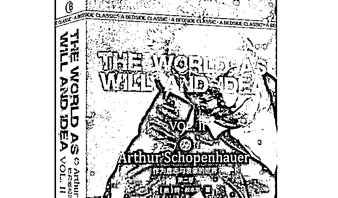

| 叔本华——《作为意志和表象的世界》。意识从个人身上抽离出来，主观就变成了客观；意识从具体事务上抽离出来，经验就变成了哲学。叔本华一生隐居，尼采在意大利南部孤独老去，一个人是因为成了哲学家而变得孤独，还是因为善于“离开”才变成了哲学家？

正念教学中有一句常用的比喻：**“达菲先生总是生活在离他身体两英尺的地方”**（大脑），意为**太过于重视头脑思维而忽略了身体感受。**天王星的“离开”能量本是中立的，但**如果（尤其是紧张相位中）这股能量压迫了其他心理阶层，比如情感（月亮）、人际感（金星），当事人就会因为其他阶层的能量阻塞而感到痛苦。**

现今的**网络世界是与天王星高度相关的一个位面**，这不仅是由于网络是一种“新的”发明，或者通过网络可以浏览到与周遭生活“完全不同”的事物，更符合天王星人胃口的是网络独有的**“登入/下线”**功能，也就是**身份切换**。

这种旧时代不可能实现的功能，让天王星人**毫不费力地完成身份转换，一键断开后立马进入新的环境，而不再被“旧我”所裹足。**一些年轻人青睐短讯息而厌恶电话语音，本质上也是为了**保持一种脱离的状态**。**有了“断线权”，也就有了自由度和空间感。**

**天王星与内行星的相位**

**天王星与太阳的相位**

**当天王星和太阳同时发挥作用时，其意志、理想与自我认同的领域便会带有一种强烈的“天王星特质”。**他们会**追寻天王星所代表的的一切世间事物，并有可能把他们当做职业，例如大量互联网相关的从业者就拥有天王星-水瓶座特质**。太阳有一种强烈的倾向去说一件事物是“对的”，而天阳-天王星结合的案主会**强烈地同意“变革”是对的，“革命”是应该发生的**，单身并不可耻，世界就该走向互联网时代……之所以用“强烈的”这个词，是因为处于天王星状态的人**很少受外界的干扰**，他们**不会因为群体的“不同意”而改变自己的想法——我本来就是要做到与你们不同**。于是太阳-天王星人往往就是人群中那些突兀而耀眼的人，他们创新，他们改变，他们可能成为领军人物——这种距离感会让群众又仰慕又恐惧；他们**往往独立行动，但最危难时很可能有最讲义气的朋友挺身相助。**

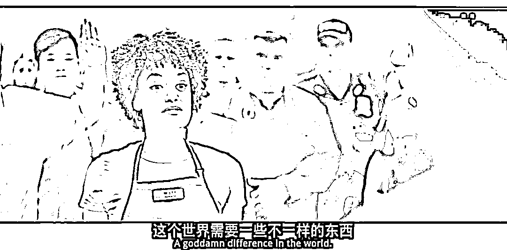

**在太阳与天王星的紧张相位中，“个性”被天王星的能量所压制，这并非体现为案主没有天王星特质，相反地，他们可能会“报复性”地发挥天王星的能量。**例如美国历史上臭名昭著的“邮件炸弹狂人”特德·卡钦斯基，他从小智商超群，但同学们都觉得他很怪，给他起外号叫“会走路的脑子”，在这种孤立中，他更加发奋向学，最终毕业于哈佛大学，并拒绝了 UCB 的教授职位而回归田园乡野的独居生活。外界的天王星事件不认可他作为一个独特个人的特质，处处排挤和打压他（包括后来他的田间小屋受到工业化的侵扰），然而他自己同时也变得极端“天王星”，借助”邮件网络”的手段推行自己的“革命”。**从太阳的角度，被天王星压制是一种因为天王式的孤立与变革能量，而无法实现自己的理想抱负、无法做自己认为对的事情的困境。** **我身边的案例：**一位日天合相的来访者非常聪明，每件事都有自己的看法，但有一种“和你说了也没用”的气质，喜欢抛出自己的质疑，某一次对话中突然结束再也没有联系过。一个日天对分的朋友从事新媒体艺术行业，学霸一枚，创造了舞蹈中非常前卫的光影效果，目标是去好莱坞发展，但坦言无法控制自己对大众审美的鄙夷。一个日天四分的占星学习者非常喜欢理论化的知识，但饱受抑郁症困扰，认为思维对自己造成的痛苦远大于帮助。一位日天三分的志愿者性格坦荡，不拘小节，喜欢崭新、突然和随性的感觉，自己的很多朋友都是通过网络认识的。

**天王星与月亮的相位**

月亮代表了滋养与照料，月天相位可以说预示了**照料者的缺位**（也可能是**人在那里但没有照顾到**的状况），和谐相位中，这类情况会来的更柔和自然一些，案主也会**适应和喜欢“独立”**。

与太阳的“我想要”不同，月亮能量发挥的表现是**“我觉得舒适”**，案主们会逐渐发现**他们在“四周无人”的时候更加舒适，从而也趋利避害地追寻一个人的世界。**这类人常常**无意识地展现出独特甚至古怪的特质，安静且冷静，像是不存在“情绪”这种东西。**

事实上，多数情况下的“无情绪”“理性化”实则是一种**“解离”(Dissociation)行为**——**把主观意识从情感中剥离出来，仿佛自己处在半空中看着“这个人”。**这里的“解离”**并不一定是由于情绪的过于痛苦无法忍受而发展的一种防御机制，只不过案主天然具有天王式的“离开”的天赋而已。**

不过在极端的困难相位中，即便是解离也无法缓解月天冲突的痛苦感——**自身无法得到理解，无法得到共情，处在绝对的孤独和隔绝中；**天王星有风元素的属性，对待水元素的月亮绝不心慈手软。 

请注意，月天的相位也并非一味得天王能量压倒月亮，也存在它们共同发挥功能的时段，这些时候案主就会**让掌管情绪的月亮处在一种“联网”状态**，即所谓的“心意相通”，“人不在一起心在一起”，“精神上的纽带”等描绘的感觉。这也是掌握了“断线权”的一种亲密感，是月亮与天王之间微妙的平衡。只不过这种平衡很容易被打破，而大多存在于脑海的残影里罢了。**我身边的案例**：一位月天合相的咨询者曾经历过多次分手，自己也意识到总是不太想和同一个人长久地呆下去，每一次的恋情都发展很快而结束得很突然；喜欢看书、写作并且很有天赋。一位月天对分的志愿者说自己喜欢真诚不虚伪的友谊，但认为朋友是有期限的，自己也会不开心随时离开；会尽量帮助朋友，但自己能做到的事绝不麻烦别人，并且朋友们没事时也想不起自己。

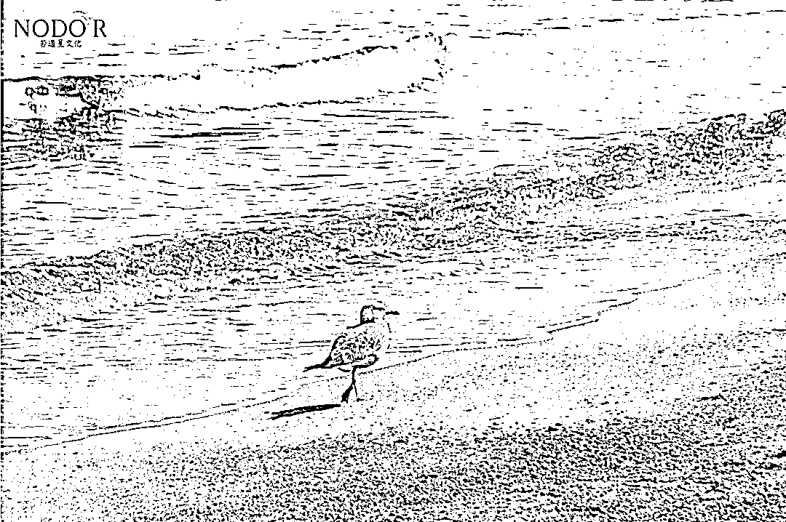

一位月天四分的咨询者在一个领养家庭长大，并一直经历着养父母和生母之间的“踢皮球”，感觉自己是没人要的孩子；成长以后会刻意躲着别人，经常搬家，认为自己随时有可能流离失所，习惯性不相信男朋友的任何话。（没遇见月天三分的，可能在自己世界里玩得很嗨吧。若道君：有这个配置的读者朋友欢迎评论区分享哦。）

**天王星与水星的相位**

水星在一定程度上可以得到天王星的“加持”，使案主变得**非常聪慧，头脑很是灵敏**，我们大致可以断定这属于水星的双子座面向；而在水星的处女座面向上（水星守护两个星座），天王星能量会**让水星做得很快，但细致程度就不能保证了，**这是因为天王星的目标是赶紧切换到下一个场景去。水星-天王星的组合一定是**写作的一把好手**，并且**喜好发表评论**，因为内在的天王星能量一定要释放出去。心理占星中不太能遇到关于水星问题的咨询者，可能大多水天相位的人会倾向于**用讲道理、理性和科技的方式去总结问题，而非跑到虚幻的心理议题上来。** **我身边的案例：**一个水天合相的朋友读了很多书，超级喜欢哲学，记忆力超强，往事总是历历在目；她认为凡事想通了就没有什么问题。一个水天对分的朋友是我见过的最有思想的文艺评论人，会从不同角度充分而客观的看待一项事物，也是一名有理有据且注重自身独立性的平权主义者。

**天王星与金星的相位**

金天相位是单身主义的“重灾区”，很多人也是**经历过多段感情之后才逐渐意识到自己的天王星能量不能被压制住**。因为金星离太阳的距离比月亮近，距离太阳越近的星体，其心理能量更容易被激活，所以金星的天王星特质反而更容易被案主“意识到”。金天相位中的“金”即是“社恐”中的“社”，我们每人的心里都有金星阶层，都有与别人建立联系的需要；而金天相位的基本需求则是——**需要皮肤外面有“空气”**，一个紧密的社交场合会让他们透不过气来，比如一个舞会或者相亲大会。

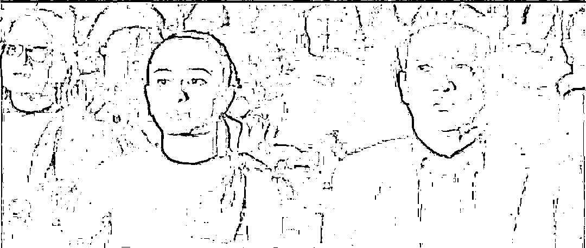

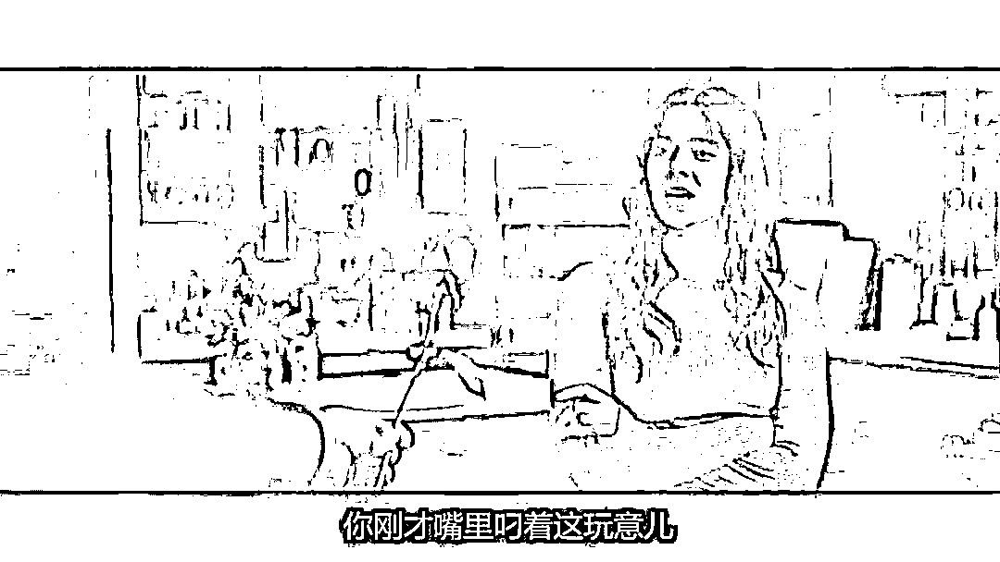

| 人群中的不舒适感也是“酷”的来源

**金天相位的人往往都有“独立”的需求，并会身体力行这一点，但并不会有日天那样变革的理想。他们周遭的物质环境也在不断改变中，**比如**经常会搬家或者换工作，原因是喜欢新奇或者受不了原来的枯燥乏味。****他们总是与大多数人保持着一定的距离，距离感意味着选择权，选择权则意味着自由自在。**困难相位也会在二者之间挣扎徘徊，体现为**对别人忽冷忽热，掏心掏肺而又失去联系的特质。** **我身边的案例：**一个金天对分的朋友，和伴侣都是自由主义的坚定支持者，绝不生小孩，两个人可以各自出去玩，各自和别人建立亲密关系，但两个人需要彼此坦诚；喜欢和徒步团游山玩水，但又往往走在队伍的前面或后面。一个金天四分的朋友在友情和感情问题上颇有挣扎，多数都经历了你来找我时我不理你，我去找你时你又变了不再理我；她有时需要独立空间又有时需要与他人建立亲密感，并懊恼自己的这种善变。一位金天三分的志愿者有很多朋友，并且和朋友的时光过得很愉快，但她的朋友很多都是在线上认识的，其他的则一年最多也就见一两次。

**版权声明：**原创文章由作者授权发布于若道平台，欢迎转发，反对抄袭。友号转载请申请白名单。

**END****一桑**
2018 届若道核心课程毕业生基金管理人**公众号：**心理占星学**各平台账号**：天文心理学

长按打赏

**20 位来自世界各地的占星师****带来 19 场沙龙——新世界的觉醒****详情可点击下图**

**学习占星学****点击下图了解课程详情**

**微信又双叒叕改版啦，不想错过若道君的推送？**
****就把若道设为****星标****以及点点****“在看”****吧！******▼**

**喜欢就点一下“在看”吧！****报名直达入口**

# 上证能放手加仓吗？ | 雷蒙德·梅里曼上证+黄金周期 12 月报告上线（有神秘礼物）

> 原文：[`mp.weixin.qq.com/s?__biz=MzA5NjA0NTAxNg==&mid=2651494377&idx=2&sn=12afe330afef4b876307c2963b795b56&chksm=8b48255ebc3fac48d8ea2c82dd7b085ed1bcf50d7b480800f1e6a1d63aadb3cb275863e20df7&scene=126&sessionid=1692737725#rd`](http://mp.weixin.qq.com/s?__biz=MzA5NjA0NTAxNg==&mid=2651494377&idx=2&sn=12afe330afef4b876307c2963b795b56&chksm=8b48255ebc3fac48d8ea2c82dd7b085ed1bcf50d7b480800f1e6a1d63aadb3cb275863e20df7&scene=126&sessionid=1692737725#rd)

  

**12 月上证报告**11 月份报告发出的时候是 10 月 19 日，在此一周前的 10 月 12 日，上证跌到了 2934，重新测试了在 4 月 27 日形成的 2022 年年度低点 2863，然后开始反弹。**10 月 12 日这一低点是位于梅里曼老师一直提到的今年下半年最重要的天象——土天四分、木星在土天四分中点的天象的范围之内。**

| 上证指数日 K 线图当时，梅里曼老师提到，一方面，10 月 12 日的低点是在土天四分这个最重要的天象之下，市场完全可能出现反转，如果 10 月 12 日的低点是从 4 月低点 2863 开始的一个拉长的基本周期的第 23 周，那么，站在 10 月 19 日，一个新的 13-20 周的基本周期刚刚开始，当时仅仅是第一周。这个基本周期完全可能开始一波上升行情。另一方面，10 月 23 日，土星恢复顺行，10 月 31 日，火星开始逆行，金星和太阳都将进入天蝎座，而且将在 11 月 5 日-11 日和土星、天王星形成 T 三角。如果基本周期不是从 10 月 12 日开始，而是从 8 月 2 日-4 日的低点开始算，上证完全可能跌向更深的低点。上证跌向更低的低点。10 月 31 日，火星逆行日，上证跌到 2885，与 4 月份的低点 2863 形成双底，然后开始反弹。从宏观层面来说，美国的通货膨胀似乎见顶，美元的加息可能缓和下来；而国内似乎要走向新冠疫情防控的政策的逐渐放开，这对于经济是利好。

| 上证指数周 K 线图

本年度激烈的天象似乎都已结束。现在是不是大胆加仓的时候？金融占星大师雷蒙德·梅里曼的《2022 年 12 月上证指数报告》已上线，你可以听听梅里曼老师的看法。《2022 年 12 月黄金报告》也已上线，欢迎购买。另外，本期我们还将免费为所有读者送上一期铜周期的报告。法国巴黎的投资组合经理，也是梅里曼市场时机学院最优秀的毕业生之一——马修·凯撒（Matthieu Kaiser）在过去两年间对铜价格与地球宇宙学周期的关联进行了出色的研究。我们希望分享这位杰出研究者的发现，因此将其纳入梅里曼市场时机学院周期报告的金属报告行列。

这里还有两场讲座，对你的财富管理也有一定的帮助。

**此外，雷蒙德·梅里曼 2023 年预报及沙龙预售中，将帮助你对 2023 年的市场风云变化加深了解。****长按下图识别二维码了解更多详情**

**12 月上证报告上线**

**上证指数月度报告价格****单月报告**：280 元/月 **季度套餐价格**：780 元（260 元/月）**年度套餐价格**：2400 元（200 元/月）**双报告年度套餐更优惠（直降 900 元）****12 个月黄金报告+12 个月上证指数报告：仅需 3900 元****长按下图识别二维码购买上证指数报告**
▼

**12 月黄金报告**

“**黄金是金钱。其他的只是信贷。**

**——约翰·皮尔庞特·摩根**

”

| 黄金周 K 线图

我们经历了 2 年的土天四分正在成为过去式。虽然其影响还会持续。

在上个月，我们提出了一个问题，9 月 28 日的低点 1622 是黄金 2 年来的低点，那么从这个低点，黄金会开始一轮反弹吗？毕竟，黄金有一个 31.33 个月的周期，而半周期是 16 个月，其容许度在 13-19 个月之间。上个周期低点是 2021 年 3 月的低点 1673，而 10 月是第 19 个月，正是在半周期低点的容许度内。|黄金日 K 线图  从现在看，答案很明显，黄金在 10 月 21 日和 11 月 3 日再次测试 1622 低点后，这 3 个低点有可能形成了 16 个月周期的三重底。随后，黄金开始了一轮反弹。目前已经反弹了 10%。黄金会继续反弹吗？此外还有白银。在上期报告中，梅里曼老师提示了关于白银的投资机会。  12 月份黄金报告已经上线，欢迎了解。也可以按照季度和 1 年期订阅，有更多优惠。季度和年度的好处是，你可以持续了解梅里曼老师对于不断在变化的市场的看法。  即便他某一次看法和市场不一致，你也看到在下一期他如何调整自己的看法，并看到金融占星在一个长期时间段内对你把控风险的帮助。而能够长期控制风险、尽量找到安全的投资时机才是投资的长久之计。  点击阅读原文，雷蒙德·梅里曼黄金周期 2022 年 12 月报告带来有 40 年黄金市场研究经验的世界著名金融占星大师雷蒙德·梅里曼对当前黄金市场的研究。投资有收益，投资有风险，希望金融占星学的研究帮助你更好地评估你的投资。

**12 月黄金报告上线**

**黄金月度报告价格****单月报告**：280 元/月 **季度套餐价格**：780 元（260 元/月）**年度套餐价格**：2400 元（200 元/月）**双报告年度套餐更优惠（直降 900 元）****12 个月黄金报告+12 个月上证指数报告：仅需 3900 元****长按下图识别二维码购买黄金报告**
▼

**购买者需知**

**① **梅里曼市场时机学院《中国上证指数月度研究报告》是梅里曼市场时机学院（以下简称 MMA）的研究“预报”，而不是市场“预测”，是梅里曼老师及 MMA 金融占星分析师对人类活动周期历史与行星周期之间相关性的研究，二者在大部分情况下具有 80%或更高的相关性，而不是因果关系。报告中的研究完全存在错误的可能性。即便是非常认真的研究和几十年的研究经验，金融占星师无法总是正确地解读出各种征象在实际层面上会如何相互作用，并显化为事件结果。

所以请将报告看作一个研究参考，务必结合其他市场研究和你个人对市场的理解，根据你的自由意志做决策。

**②** 此报告一旦售出，**即不接受退款。**

**③** 上证、黄金月度报告每月固定 1 期，**并非都是在每月相同日期发布。**

**④** **我们收到英文报告的当天，即发布该英文报告。3 天后，上线报告中文版。此报告仅支持手机网页阅读，不支持电脑阅读和下载。****以上须知，请仔细阅读。一旦付款，即视为已了解并接受所有须知内容。**在过去的 40 年中，唯有梅里曼逐渐完善，并在梅里曼市场时机学院月度周期报告中阐释了将地球宇宙学与周期相结合的研究方法，以惊人的精确性预报了黄金价格发生重大变化的时间。**黄金购买 Tip**

各大银行均可购买黄金或黄金 EFT 基金，也可以在诸如天天基金或者支付宝购买黄金及黄金相关产品。不明白的可以百度搜索。

**购买后如何查看报告？**

**购买后有疑问怎么办？**请联系技术客服
**微信：nodoor201705** **购买直达入口**

# ISAR 选修丨占星原型与星图中的精神病理学

> 原文：[`mp.weixin.qq.com/s?__biz=MzA5NjA0NTAxNg==&mid=2651494377&idx=3&sn=d48782114142a3eeaf829013f779c1e6&chksm=8b48255ebc3fac489af9f52d22ccc3f5d74905cd4e957ba099310cd2037470703d6897bd9e42&scene=126&sessionid=1692737725#rd`](http://mp.weixin.qq.com/s?__biz=MzA5NjA0NTAxNg==&mid=2651494377&idx=3&sn=d48782114142a3eeaf829013f779c1e6&chksm=8b48255ebc3fac489af9f52d22ccc3f5d74905cd4e957ba099310cd2037470703d6897bd9e42&scene=126&sessionid=1692737725#rd)

**课程描述**

看过课程标题的你，也许会感到好奇和惊讶，为什么在占星学的课程中，会出现精神病理学的教学内容，这和我们有什么关系？这对占星咨询，或在自我了解与成长的过程中又有什么帮助呢？

**带着这些疑问，请你静下心来，思考以下几个问题**：

“**你/你的案主，是否曾经过度担心什么？** **你/你的案主，有没有感觉到担忧和焦虑，却不知道原因是什么？****你/你的案主，是否曾经觉得害怕什么东西，但理智上却很清楚它不会对你造成什么伤害？****你/你的案主，是否曾经通过沉迷某物，酗酒或滥用药物，自我伤害去逃避问题？****……****——节选改编自《心理学与生活》**”

如果你对上述问题其中之一，回答是。这意味着几乎每个人都曾有过心理障碍的症状（精神病理的问题）。

你看，其实“精神病理学”与人的心理有着密切的关联，再结合占星学，呈现了人内在与外在层面更加丰富和深刻的一面。**这对于学习占星学的人和占星师来说，都是一场难得的知识盛宴！**

**本课为 2 年期双证核心课程中的一部分**（AP105 阶段），其内容是过去若道所开设的核心课程从未教授的部分，特意抽出供其他学员学习，**可作为 ISAR 选修课，单独报名**。

**在正式了解本课的价值之前，先了解一下这门课程的主讲老师吧！**

**格伦·佩里（Glenn Perry）**

*   他是心理/意识研究专业博士、加州注册婚姻和家庭治疗师 （CAMFT）

*   占星心理学学院（Academy of AstroPsychology）创办人

*   康涅狄格州研究生院（the Graduate Institute of Connecticut）原型宇宙学与意识进化项目的负责人

*   共出版八本占星学著作：《心理占星学入门》、《心理占星论文集》、《盗取天火》、《从忠诚到革命》、《星图中的阴影》、《占星职业议题与伦理》、《出生星图深度分析》、《从古代到后现代占星学》

**墙裂推荐格伦老师这门课的 **

**4 大理由**

**你一定得知道的课程价值**

**价值*****1***
**明晰精神病理学的基本定义**

占星心理学学院创办人格伦·佩里老师，对**精神病理学的基本定义**就是灵魂受苦，精神就是灵魂的意思，病理就是受苦的意思，所以精神病理学研究的就是：人类各种各样受苦的方式，尤其是因为某一类的行为而引起的。

精神病理学是一个连续体，从比较轻微的，到比较严重的，这么说来，我们每个人都有一部分精神病理的问题。

**如果成为一个“人”，没有一定程度的挑战是不可能的。没有一定程度受苦，没有一定程度不平衡是不可能的。而这种不平衡就会以一种挑战和困难的姿态呈现出来。**

**价值*****2*****更懂疗愈：从不平衡到平衡**

**疗愈**是一个复杂的过程，讲的是将人从不平衡带到平衡这样的一个状态，将不同行星代表的心理功能带到一种更加平衡整合和合作的状态。

格伦老师通过研究精神病理学，发现每一颗行星，以及这颗行星所守护的星座，都和某一特定类型的病理是联结在一起的，包含了这个占星原型所涵盖的极端不平衡的情况。

举个例子，案主的第 1 宫，有很多星星在那里，和对面第 7 宫的火星形成对分相，第 1 宫白羊座或者火星白羊座的组合，和这个案主的反社会人格的病状联系在一起（这是一个星图的极端负面表现）。

“

**生活本身就是一场治疗，我们在占星的星图中去看到，人们所具有的创伤、不平衡及其产生的防御机制，最终都会在他生活中的关系和情境中呈现出来。无论他生活中处在怎样的情境之下，其实这些环境都是在为他提供恰当的环境，作为一种载体，让他去平衡和疗愈事件背后问题的根源。** 

**这样一个现象是持续不断地在发展，会让我们想到，会有一个更大的宇宙的智慧存在，它其实是在指挥和引导着我们的这些经验，让我们去经历然后进入更高层面的发展当中。生活或者“神”，就是我们所有人类的一个治疗师。**

**——格伦·佩里**

”**价值*****3*****了解诊断标准，提高咨询的专业敏感度**

如果能够对精神病理极端不平衡的情况有了解的话，你就会对它比较温和的版本更加敏感（大部分人是更温和版本的呈现）。

也许案主并没有达到某个病理所达到的层级，但是 Ta 有显示出，这个病理某一些特点或者某一些倾向。所以，我们的目标并不是去诊断案主，而是了解他在这个病理学连续体上处在一个怎样的位置。

当你拿到星图你会看到，案主不同的冲突，是体现在不同的部分上。某一个病状是体现在某一个行星，另外一个病状，是同步体现在另外一颗行星上。

当我们通过对占星原型星座和行星的病理学现象的学习后，就能看到占星学上的配置所呈现出来的，案主表现出的这些失调，并不一定都会成为一种心理临床上的诊断。有可能在案主这里呈现出一个很轻微，但是仍然在 Ta 生活中，给 Ta 造成挑战的一个点。

**价值*****4*****智力上的刺激——整合进阶**

这个课程能够让我们了解自己，了解我们的客户，了解我们的朋友，了解我们的家庭。它给我们提供一种崭新的方式，并且让我们看到占星原型的种种表达，不要局限在非此即彼、非好既坏的这样的一个概念当中，而看到它其实是一个不同程度的连续体。

当我们能够以这种方式去看的时候，你就能够将自己的生活，带入一种和谐。能够了解这是一个过程，我们的重点不是放在诊断上，而是放在整合上，因为生活，就是一种整合。

**课程内容**

**AP105 星图中的精神病理学与疗愈** 共**15 次**课程：**10 次 2019 年录播课+5 次直播课；30 课时**

在这个阶段的课程中,我们将**聚焦于十二星座(从白羊座到双鱼座）及其对应的守护星的潜在功能障碍。**

我们将学习如何识别、理解和应对每个星座的潜在挑战。我们将在各种相应的心理障碍背景下来考察占星原型，这些心理障碍表现为功能障碍、失衡的极端状态。

学员们将了解**《精神疾病诊断与统计手册》诊断标准**。我们会探讨治疗的概念，尤其是那些与整合和个性化相关的概念。我们将特别关注外行星的困难相位，以及它们与内在心理冲突、防御和症状形成的关系。

学员们将探索人的痛苦如何成为发展和实现天赋才能的催化剂。在考察病因时，我们会将平常的因果关系理论与传统的命运、业力和转世观念整合起来。

**口碑推荐**

‍**‍想感受格伦老师的课堂魅力？** **一小段讲课视频让你先睹为快~**<mpvideosnap class="js_uneditable custom_select_card channels_iframe videosnap_video_iframe" data-pluginname="videosnap" data-id="export/UzFfAgtgekIEAQAAAAAAxuwL_P9LDAAAAAstQy6ubaLX4KHWvLEZgBPElYFkVBZaNrKCzNPgMIuhBCuUlaCPzDNmHFgJR5sp" data-url="https://findermp.video.qq.com/251/20304/stodownload?encfilekey=rjD5jyTuFrIpZ2ibE8T7YmwgiahniaXswqzIGcAWV11d39RRKTicEUe1lSn5e1z2jdX20ath9yg9Liaia8VPS2c4MUJibl8FlxSZs3ajlcibhlD6typd6ZeGeWj2bQ&amp;adaptivelytrans=0&amp;bizid=1023&amp;dotrans=0&amp;hy=SH&amp;idx=1&amp;m=&amp;scene=0&amp;token=AxricY7RBHdXmmhmUb1Np3Ioz3Ok0V9IBZ0eINxnxticaC9r3HjsQ8iatkwqFBLKP50ZibXDm0TiaicC4" data-headimgurl="http://wx.qlogo.cn/finderhead/PiajxSqBRaEJYnVsqWfEX9qA0sI6hNVKsDfyzfPZ92WZMZyBpZWU5NA/0" data-username="v2_060000231003b20faec8c4e68a1ec2d4ca07e434b07755bbf47e7053a3059defd2c9d6c68a20@finder" data-nickname="若道" data-desc="#ISAR 选修课  如何识别、理解和应对每个星座的潜在挑战？如何在不同的心理障碍背景下来考察占星原型？" data-nonceid="4249051256207020861" data-type="video" data-width="1024" data-height="576"></mpvideosnap>

**课程费用**

**课程价格：9000 元****课程优惠价请添加 Margartet 咨询**

课程负责人：Margaret

（微信：18515059056）

请备注“心理占星 105”

**开课时间**

**直播课开课时间：2022 年 12 月 21 日**

**退转课程**本课程包含往期视频知识点视频课程+直播案例课程+助教直播答疑；报名付款后均不受理退款转课，请慎重考虑后再确认付款。**其他相关事项请仔细查阅报名勾选时的《教学协议》，如有疑问请咨询课程顾问。****报名流程及费用支付****1. 点击阅读原文链接立即报名，填写个人姓名（身份证姓名）和相关信息，阅读并同意《教学协议》，提交报名表，直接在线支付。****2. 付款后可在网页个人中心或手机网页“我的”栏目查看报名记录。****如遇疑问请与销售人员联络******ISAR 选修·占星原型与星图中的精神病理学****

**授课老师：格伦·佩里**

**直播课开课时间：**2022 年 12 月 21 日

**授课方式：**网络课程，中英文授课，中文翻译

**费用：9000 元（获取优惠请联系客服咨询）**

**课程负责人：**Margaret（微信：18515059056 请备注“心理占星 105”）

长按二维码添加课程负责人咨询~

**报名直达入口**

# 插班中丨神话塔罗：高效学习班上线，灵活掌握，专业实践！

> 原文：[`mp.weixin.qq.com/s?__biz=MzA5NjA0NTAxNg==&mid=2651494232&idx=3&sn=e66670e13818070b35c20aa11519f162&chksm=8b4825efbc3facf954d5845b108d6cc91a5930444778c438e045a243a3b53437e4040002a379&scene=126&sessionid=1692737725#rd`](http://mp.weixin.qq.com/s?__biz=MzA5NjA0NTAxNg==&mid=2651494232&idx=3&sn=e66670e13818070b35c20aa11519f162&chksm=8b4825efbc3facf954d5845b108d6cc91a5930444778c438e045a243a3b53437e4040002a379&scene=126&sessionid=1692737725#rd)

**2022 年超高含金量的神话塔罗认证课程****高效学习班****开始招生**用**四个月**的时间学习掌握神话塔罗解读喜欢**集中学习，快速掌握**的同学不要错过

黄色日期为**8 节直播课**时间，同学可以自由安排时间学习**18 节录播课**

班级学习群讨论、APP 答疑区提问

课程内容体系让你直观精准地感受到**神话塔罗的魅力**扎实地建构**神话塔罗思维**系统学习**最地道的塔罗知识**课程中老师将**神话、占星、心理学**完美融合进塔罗的**人本主义咨询体系**并进行学员**案例督导**让你更自信的开展咨询工作，学以致用

本期认证课程采取**即报即学的录播课+案例督导直播课**的形式，

*   **18 节录播课：**精编剪辑，随来随学，助教答疑，学练结合。

*   **8 节直播课：**融会贯通，神话心理，塔罗占星，咨询技巧。

为了适配大家的各种学习场景，提高学习&复习效率，我们还将**录播课**剪辑了**中文字幕版**和**翻译音频版**：

*   **中文字幕版：**朱丽叶老师英文原声配中文字幕，适合在手机或电脑前专心致志的学习。

*   **翻译音频版：**翻译老师幼婷的中文原声纯享，适合运动、通勤路上耳机里陪伴式学习。

若道还为塔罗学员开发了**“神话塔罗”**平台，是随身的工具，更是接咨询的平台，录播课程**学成入驻平台**即可链接更多塔罗个案，发展壮大你的塔罗咨询事业。

**如果你想学习塔罗，什么样的老师会让你怦然心动呢？她是三副塔罗牌的设计者，写了 6 本塔罗书籍。她研习塔罗四十余年，教授塔罗三十余年，是丽兹·格林的密友。还有****谁会比塔罗牌设计者更了解塔罗的历史、灵魂与精髓？****所以，这将是你开启塔罗之旅最坚实的一步。**

1

**这位塔罗大师是谁？**

**朱丽叶·沙曼-伯克** 

*   她是**3 副塔罗牌**的**设计者****——**神话塔罗牌、沙曼–卡塞利塔罗牌、“自己着色”塔罗牌；

*   她出版了**6 本塔罗书****——**《塔罗全书》、《新塔罗全书》、《众星的传说》、《理解塔罗牌》、《精通塔罗牌》、《塔罗初学者指南》；

*   她研习塔罗**四十余年；**

*   她教授塔罗**三十余年**；****

*   她是**丽兹·格林**的密友，两人合著了**《神话之旅》**，共同设计了**神话塔罗牌**。

*   她是认证的**心理治疗医师；**

*   她深谙**塔罗、占星学、心理学和神话学。**

**如果你想成为拥有英国神话塔罗认证的塔罗师**

那么她，就是你**最好的老师人选**

2

**塔罗牌有什么用？**

*   塔罗牌是一种**古老的疗愈工具**，同时也是**直观的解惑工具****；**

*   塔罗牌绕过逻辑思维，**和潜意识联结**，通过图像的方式生动地将隐藏在人类潜意识中的画面浮出水面，**揭示心灵的状况和运作****；**

*   塔罗牌**帮助我们和潜意识对话**，可以和现代的心理治疗联系在一起，帮助我们**看清心灵的冲突来源、本质和可以选择的道路；**

*   塔罗牌又和更广阔的**宇宙生命原型**联结，彰显**个人生命发展的阶段**，将**个人生命挣扎、内在冲突**放在生命进化的道途上，让更广大的生命智慧为个人成长照亮道路。

3

**为什么学习神话？**

神话通过**图像和故事**描绘人类生活的**原型模式**。通过瑰丽的想象、诗意的语言、栩栩如生的人物和故事描绘出我们内心的世界，表达出我们经历的那些实现人性的过程，帮助我们将**个体的生活与人类古老且永恒的故事**建立联结。从而在更深处**理解生命**，并学习**古老而长青的生命智慧**。

**神话塔罗**取材于**希腊神话**的无尽沃土，通过故事提供一种**记忆辅助**，在心理和预见层面提升解读的**丰富度**。因为这样更符合塔罗牌的性质，符合人类的想象。**按照故事思考，而不是简单的记忆关键词和固定的意义。**

4

**塔罗预测是什么？**

塔罗牌预测的运作就像是**照向心灵的一面镜子**。在塔罗牌解读时，图像的原型性质穿透隐藏的潜意识脉络，反应出与个人境遇相关但又未被了知的知识与洞见，因此**揭示出按照任何理性方式都无法发现的事情。**

如果你对生命好奇，塔罗学习会帮你**打开一扇通往未来的门****，**让你了解**心灵运作和显化的秘密**，同时赋予你更多关于生命成长的支持和指引的能力！

5

**我们将学习什么？**

**录播课（即报即学）**

**☆****初阶：神话塔罗详解**

**神话故事和预测意涵**

**第 1 讲 塔罗牌介绍 ，讲述它的历史 （中文字幕版）**

**第 1 讲 塔罗牌介绍，讲述它的历史（翻译音频版）**

**第 2 讲 星座形态、元素和宫廷牌&基本星座与基本国王 （中文字幕版）**

**第 2 讲 星座形态、元素和宫廷牌&基本星座与基本国王（翻译音频版）**

**第 3 讲 固定星座与固定王后（中文字幕版）**

**第 3 讲 固定星座与固定王后（翻译音频版）**

**第 4 讲 变动星座与变动骑士（中文字幕版）**

**第 4 讲 变动星座与变动骑士（翻译音频版）**

**第 5 讲 小阿尔卡那牌权杖（中文字幕版）**

**第 5 讲 小阿尔卡那牌权杖（翻译音频版）**

**第 6 讲 小阿尔卡那牌圣杯（中文字幕版）**

**第 6 讲 小阿尔卡那牌圣杯（翻译音频版）**

**第 7 讲 小阿尔卡那牌宝剑（中文字幕版）**

**第 7 讲 小阿尔卡那牌宝剑（翻译音频版）**

**第 8 讲 小阿尔卡那牌星币（中文字幕版）**

**第 8 讲 小阿尔卡那牌星币（翻译音频版）**

**第 9 讲 经典牌阵教学讲解（中文字幕版）**

**第 9 讲 经典牌阵教学讲解（翻译音频版）**

**第 10 讲 牌阵解读案例演示（中文字幕版）**

**第 10 讲 牌阵解读案例演示（翻译音频版）**

**☆****中阶：神话塔罗牌阵应用**

**神话****解读和咨询技巧**

**开启神话塔罗愚人之旅**

****

**第 1 讲 愚人、魔术师、女皇、皇帝（中文字幕版）**

**第 1 讲 愚人、魔术师、女皇、皇帝（翻译音频版）**

**愚人**：永恒的少年（儿童的原型）

**魔术师**：恶作剧者、老师、向导、沟通者的原型；行星：水星。

**女王**：母亲、养育者、丰产的原型；行星：金星在金牛座；小行星：谷神星。

**皇帝**：父亲、供养者、计划者的原型；行星：木星。

**第 2 讲 女祭司、教皇、恋人、战车、正义、节制（中文字幕版）**

**第 2 讲 女祭司、教皇、恋人、战车、正义、节制（翻译音频版）**

**女祭司**：处女——等待被实现的潜力原型；行星：新月。

**教皇**：疗愈者、受伤的疗愈者、牧师的原型，牧师是神与人之间的灵性桥梁；行星：凯龙星。

**恋人**：爱、爱人、所爱之人的原型；行星：金星在天秤座。

**战车**：战争、冲突、战士、斗士的原型；行星：火星。

**正义**：智慧、兵不血刃的胜利的原型；星座：处女座；小行星：智神星。

**节制**：关系、合作的原型；星座：巨蟹座、双鱼座。

**第 3 讲 力量、隐士、命运之轮、倒吊人、死神（中文字幕版）**

**第 3 讲 力量、隐士、命运之轮、倒吊人、死神（翻译音频版）**

**力量**：力量的原型；星座：太阳在狮子座。

**隐士**：晚年、耐心的原型；行星：土星。

**命运之轮**：命运女神与命运的原型。

**倒吊人**：牺牲与有意识的牺牲的原型；行星：海王星。

**死神**：死亡、终点和起点的原型；行星：冥王星。

**第 4 讲 恶魔、高塔、星星、月亮、太阳（中文字幕版）**

**第 4 讲 恶魔、高塔、星星、月亮、太阳（翻译音频版）**

**恶魔**：阴影、人类不文明的面向、本能、欲望天性；行星：火星在天蝎座。

**高塔**：改变、分裂瓦解的原型；行星：天王星。

**星星**：希望的原型。

**月亮**：无意识的原型；行星：暗月。

**太阳**：意识、创造力和文明的原型；行星：太阳。

**第 5 讲 审判、世界（中文字幕版）**

**第 5 讲 审判、世界（翻译音频版）**

**审判**：复活、新生的原型；行星：水星作为灵魂向导普绪科蓬波斯。

**答疑与讨论，学员们分享对自己或客户的塔罗解读，对神话塔罗牌进行更多探讨。**

**世界**：整体、完成和个性化的原型。

**第 6 讲 经典牌阵教学讲解（中文字幕版）**

**第 6 讲 经典牌阵教学讲解（翻译音频版）**

**第 7 讲 咨询案例演示：为一位年轻女性所做的四次解读（中文字幕版）**

**第 7 讲 咨询案例演示：为一位年轻女性所做的四次解读（翻译音频版）**

**第 8 讲** **引导式冥想、荣格的四种意识功能（中文字幕版）**

**第 8 讲 引导式冥想、荣格的四种意识功能（翻译音频版）**

**☆****高阶：神话塔罗直播督导课**

**第 1 讲 塔罗牌中的荣格原型**

**2022 年 8 月 10 日（周三）**

我们将学习荣格是如何理解原型，以及荣格原型如何反映在塔罗牌中。对塔罗牌解读而言，理解原型的普遍性非常有帮助，因为这有助于塔罗咨询师碰触客户的内心世界。

**第 2 讲 塔罗牌是如何与行星原型和其原型体验联系在一起**

**2022 年 8 月 24 日（周三）**

大阿卡纳牌反映了行星神祗的原型，在某些情况下，原型经验意味着它们反映了所有人类的经验。我们将通过这个角度看这些大阿卡纳牌。我们将看到理解原型对解读有何帮助。

**第 3 讲 荣格意识的四种功能与小阿卡纳牌的四种元素及与权杖、星币、宝剑、圣杯四套牌之间的联系**

**2022 年 9 月 7 日（周三）  **

我们将看看小阿卡纳从 1 到 10 如何反映荣格意识功能的各个方面，以及它们如何反映在四套牌四个元素和其心理方面。我们还将对 1-10 的数字学进行修正，看它们在元素中的表现方式。

**第 4 讲 占星学中的 12 星座和宫廷牌之间的联系**

**2022 年 9 月 21 日（周三）**

我们将讨论形态和星座，以及它们如何反映在宫廷牌上。

**第 5 讲 马蹄牌阵学员案例督导**

**2022 年 10 月 19 日（周三） **

**第 6 讲 六芒星牌阵学员案例督导**

**2022 年 11 月 2 日（周三） **

**第 7 讲 凯尔特十字学员案例督导**

**2022 年 11 月 16 日（周三） **

****

**第 8 讲 三个牌阵学员完整案例督导**

**2022 年 11 月 30 日（周三）**

**认证阶段：考试论文**

录播课学习完毕，即可入驻若道神话塔罗平台，以实习塔罗师获得推广流量，对接塔罗咨询个案。

直播课+录播课学习完毕，提交考试论文通过即可获得获得英国神话塔罗认证证书，升级为认证咨询师。

**扫码进入全新神话塔罗 H5**

每天有事没事都可以去**神话塔罗 H5**里转转抽取专属于你的今日塔罗

**神话塔罗 H5 问答平台全新上线**

三张牌牌阵，专业塔罗咨询师语音条解读

如果你碰巧有困惑，刚好有**限时优惠价**

如果感到快乐你就用用**神话塔罗 H5****，**如果你感到不快乐，更要使用由专业人本主义塔罗师团队全程陪伴的**神话塔罗 H5 哦！**

6

**适合人群**

*   塔罗初学者，完全没有塔罗基础；

*   塔罗自学者，也曾上过塔罗工作坊，但仍不懂如何使用塔罗牌；

*   塔罗进阶学习者，有塔罗基础，了解 78 张塔罗牌含义；

*   不知如何解决遇到的情感困惑、职业选择、人际问题，对人生感到迷茫；

*   想要学习深入解读塔罗牌、牌阵的使用、咨询技巧等将塔罗运用于咨询实践；

*   想要深入了解和学习塔罗，希望成为专业的塔罗师；

*   想要借助塔罗进行心灵、灵性成长。

7

**导师简介**

**朱丽叶·沙曼-伯克**

**朱丽叶·沙曼-伯克**从 20 世纪 70 年代早期开始，就对塔罗牌产生了兴趣，并踏入了塔罗的世界。后来，在丽兹·格林的鼓励下，开始研习心理占星学和塔罗。

1984 年，第一本书《**塔罗全书**》（*The Complete Book ofTarot*）出版。之后，与丽兹·格林合作设计并撰写了《**神话塔罗**》（*The Mythic Tarot*），在这本书中，她们将古希腊神话与传统塔罗解读结合起来。朱丽叶写了**十本塔罗和占星学书**，包括一本名为《众星的传说》（*Stories from the Stars*）的儿童读物，以及与丽兹·格林合著的《神话之旅》（*The Mythic Journey*），这是一本详细讲述如何运用神话来指导生活的书。

8

**课程价格**

**认证课程总价：****22000 元**

**联报优惠价：****19000 元**

**限时转发优惠价：18000 元（联系 Echo 老师，获取限时转发优惠价）**

长按二维码添加客服 Echo 老师

9

**退转课程**

*   **退款原则请详看《教学协议》，如有疑问请咨询课程顾问。**

**神话塔罗认证课程**

**授课老师：朱丽叶·沙曼-伯克**

**授课时间：录播课即报即学，直播课 2022 年 8 月 10 日起**

**授课方式：**网络课程**，**英文授课，中文翻译

**费用：****认证课程总价：****22000 元；****联报优惠价：****19000 元；****限时转发优惠价：18000 元**（联系 Echo 老师，获取限时转发优惠价）

**课程负责人：Echo 老师**（微信/手机：nodoor18518412824，请备注“神话塔罗”）

长按二维码添加课程负责人咨询~

**END****报名直达入口**

# 神话塔罗之小阿卡纳牌 | 权杖 7-10

> 原文：[`mp.weixin.qq.com/s?__biz=MzA5NjA0NTAxNg==&mid=2651494232&idx=4&sn=9e01d1af317e408a7e3ed148756c6eff&chksm=8b4825efbc3facf968fb5792112e6eef0a10161f4c4e4d62d89e1757ebd790e47a09bbe30a8c&scene=126&sessionid=1692737725#rd`](http://mp.weixin.qq.com/s?__biz=MzA5NjA0NTAxNg==&mid=2651494232&idx=4&sn=9e01d1af317e408a7e3ed148756c6eff&chksm=8b4825efbc3facf968fb5792112e6eef0a10161f4c4e4d62d89e1757ebd790e47a09bbe30a8c&scene=126&sessionid=1692737725#rd)

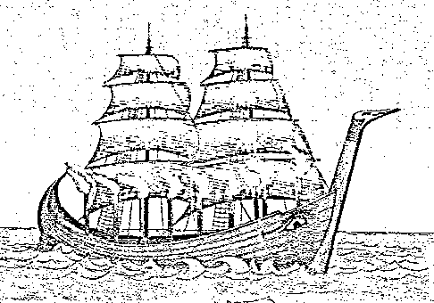

作者/朱丽叶·沙曼-伯克 丽兹·格林

译者/闫东升 编辑/玫瑰 图片/神话塔罗 网络

本文节选自《神话塔罗》

权杖和魔术棒非常接近，而魔术棒在人们眼中就具有神奇的魔力，它能够从“无”变有，令人们觉得不可思议，超出理性的范畴，这和想象力的特质是一样的。追随主人公杰森我们来到了最后 4 张权杖数字牌——权杖 7-10，寻找金羊毛之旅也即将画上句号。

**书名：**

神话塔罗 

**作者：**

朱丽叶·沙曼-伯克   丽兹·格林 

**出版日期：**

2011-08-02

**权杖 7**

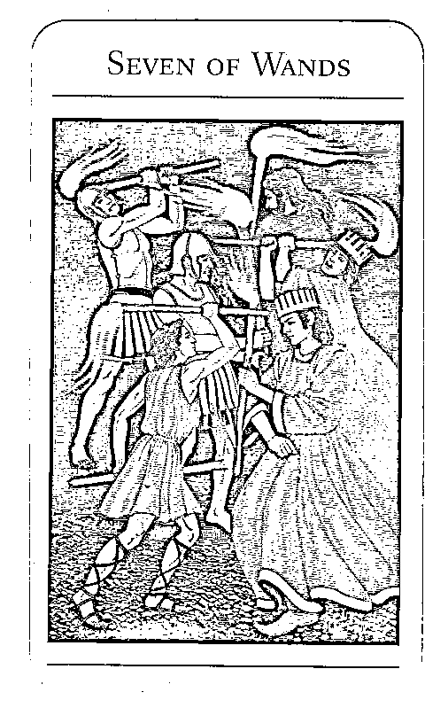

**男人的战役**

权杖 7 描绘的是杰森（*Jason*）和科尔基斯（*Colchis*）的国王埃厄忒斯（*Aeetes*）之间的战斗，他只有赢得这场战争，才能把金羊毛带回约尔科斯（*Iolkos*）。画中的杰森手持两根权杖，正在和身穿火红色王袍，手持一根权杖的埃厄忒斯较量。杰森的两个英雄伙伴赫拉克勒斯（*Heracles*）和赛休斯（*Theseus*），正在和巨龙牙齿幻化成的战士争斗。两个英雄和两个战士手中分别握着一根权杖。**权杖 7 和权杖 5 一样，描绘的是斗争，但是这场斗争是男人和男人之间的公平竞赛，而不是创造性的力量和象征现实制约的巨龙之间的你死我活。**

**挑战**

杰森从巨龙的魔掌中赢得金羊毛之后，必须再一次战胜埃厄忒斯，因为他也想要拥有金羊毛，而且为此不惜一战。

权杖 6 所获得的认可导致了不可避免的回响，意即我们经历千辛万苦获得东西，他人也想要得到，所以我们不得不面对他人的挑战，投入到更艰难的竞赛中。

这里传递的信息是：**我们获得成功的桂冠后不能一劳永逸，因为他人可能会偷走我们创造的成果**。

嫉妒和竞争带来的问题是创造性想象力的一部分，是任何在这个层面奋斗的人，都必须接受的事实。创造性的想象力不光能够激发某个人的愿景，在别人身上也是同样。创造性的成功一定会带来竞争，所以许多害怕竞争的人们往往会踌躇不前。

**权杖 7 的挑战是测试一个人对自己的信心和忠诚，意即我们究竟愿意为自己已经获得的东西付出多大的努力。**“外界”的攻击刺激着个体，同样也刺激着创造性想象力本身，所以它必须创造出更新更好的模式。

从很多层面上看，国王埃厄忒斯更应该拥有金羊毛，因为他比杰森更早拥有它，但这是一个与道德无关的公平市场，坐在那里哭喊着说“我先想出这个创意”的行为是没有任何用处的。

**我们必须毫不犹豫地把愿景落实，把计划做得更好，没有人会体谅那些光想不做或者害怕竞争的失败者。**

**权杖 7，公平竞争**

****从解牌的角度来看，权杖 7 预示着与他人创造性想法的竞争。**当事人面临着对手公平的挑战，他（她）必须不断进步，在嫉妒和竞争的压力下开展自己的计划，学会竞争本能和远大志向所蕴含的价值。****圣杯 8**

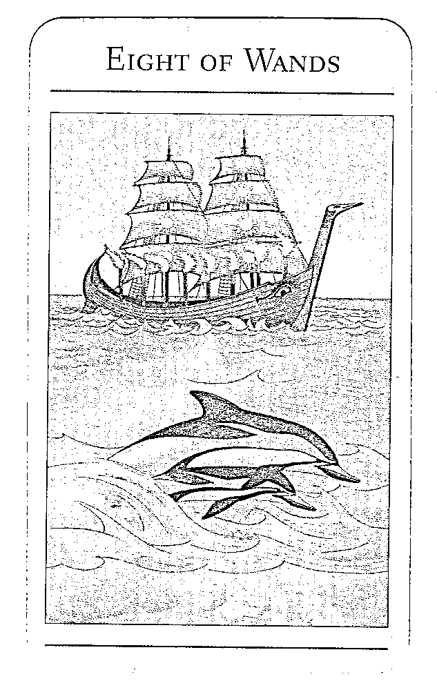

**扬帆返航**

权杖 8 描绘的是杰森从愤怒的埃厄忒斯手中顺利逃走， 踏上返航之路的情景。画面中的阿尔戈号（*Argo*）正在扬帆前行，八根权杖在甲板上排成一列，在风中熊熊燃烧着。海豚跟随着大船漫游嬉戏。

**快速前进**

**权杖 8 象征着创造性能量克服了权杖 7 的焦虑和挣扎之后，进入了释放的状态中。**冲突能够激发创造性想象力，如果我们能够面对冲突并看透它，就会进入一段平稳前行的状态，计划能够朝向目标顺利并快速地进行，带来乐观和自信的感觉。

**只有冲突的紧张状态被克服后，创造性能量才会得以释放，因此战胜困难的同时就获得了自信。**

释放创造性能量的经验在很多运动竞赛中都很常见，经过一系列困难之后，会有 一个突然的爆发，个体或者团队在爆发中急速地朝着目标前行。

对于画家、作家、演员和音乐家来说，这也是一个很常见的经验，从事创作的人们突破了某种瓶颈后，进入到最后的“冲刺阶段”。这个阶段的愉快心情并不是无中生有的，它必须经历过竞争和自我怀疑的挑战，才能获得能量的“更新”。为了创造，我们的生命中需要冲突，许多艺术家都经历了与他人的竞争和较量，才创作出伟大的作品。**在创造性想象力的工作和生命中“有益的”冲突之间，有一种神秘的关系。**神话中大量地呈现出这种关系，例如主宰杰森这个故事的万神之王宙斯（*Zeus*），和妻子赫拉（*Hera*）的关系就一直处于紧张和冲突中。赫拉反映着家庭生活和婚姻的律则，她一直约束着宙斯，同时也激励着他去创造。**因此，我们也需要约束和挑战，从而享受能量流动时带来的兴奋感，这就是权杖 8 的隐喻。**

**权杖 8，畅通无阻**

**从解牌的角度来看，权杖 8 预示着经过了延迟或冲突之后，进入了顺利的阶段。**它可能暗示着**旅行，或者创造性活动能够清晰顺畅地进展的状态**。此时创造性的想象力克服了紧张和焦虑，畅然无阻地流动起来了。

**权杖 9**

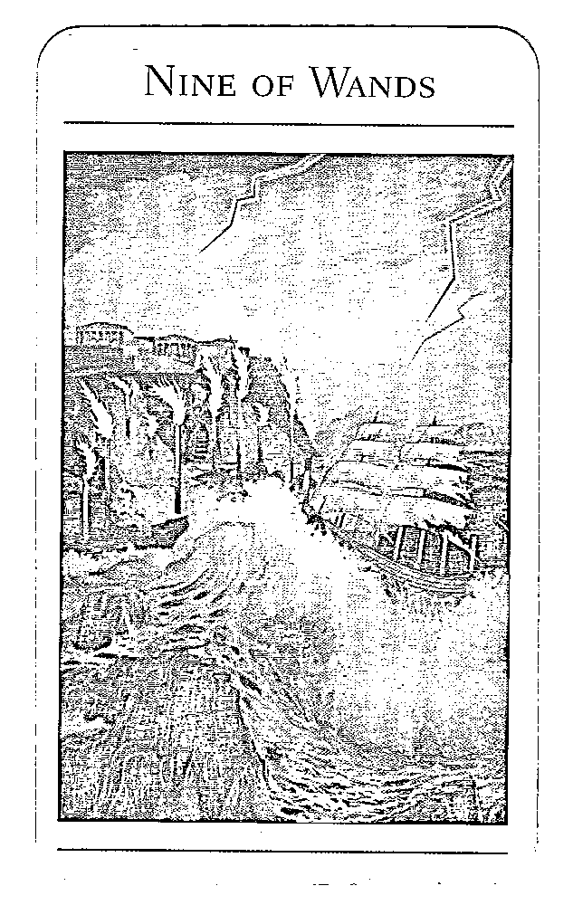

**最后一次斗争**

权杖 9 描绘的是杰森和他的阿尔戈号在航行中的最后一次斗争——通过危机重重的撞岩（*Clashing  Rocks*）。远处的约尔科斯城已经隐约可见，九根权杖竖立在岩石上。城池四周的海面风平浪静。

阿尔戈号在恐怖的岩石中间飘摇着穿行，还没有进入到安全的地带。船的四周巨浪滔天，暴风雨在空中肆虐。

**天无绝人之路**

**权杖 9 呈现的是潜在的力量。**当我们觉得自己不能再斗争下去或者无法面对更多难题的时候，却在挑战的重压下获得了能量和新的构想，这是创造性想象力的巨大威力。

风雨飘摇中的阿尔戈号反映出杰森和伙伴们的筋疲力竭，他们一路上遇到了诸多的挑战和困境，现在终于带着金羊毛快要到家了。

但是最后的挑战往往在这样的时刻到来，而且我们无法躲开它。这时人们往往觉得自己已经无法继续了，能量早已用光，身上没有一丝力气，找不到可以依赖的东西。

但是我们内在有一种神秘的、令人敬畏的东西，它会在这样的挑战中升起，使我们得以面对最困扰的境遇，这就是人类拥有的创造性精神，是我们内在的一个奇迹。

尽管我们不能控制它，无法根据我们的意愿使用它（就像古希腊人不能够要求宙斯服从人类的命令一样），它却能够在我们最低潮的时候帮助我们。

**创造性想象力仿佛在此时给我们注射了全新的生命力、希望和构想，如果我们愿意再试一次，就会获得足够的能量，达成最终的目标。**

**权杖 9，激发潜能的挑战**

**从解牌的角度来看，权杖 9 预示着当事人在筋疲力竭时，阻碍他（她）达成目标的最后一个挑战到来了。**但非常神秘的是，**他（她）能够在此时发现某种潜在的力量，从而得以应对挑战。****这股力量只有在他（她）用完所有其它可能的办法时才会出现**，似乎是他（她）的需求和意愿共同引发了这股潜在的力量，所以无论多么筋疲力竭，都一定要再试一次！**权杖 10**

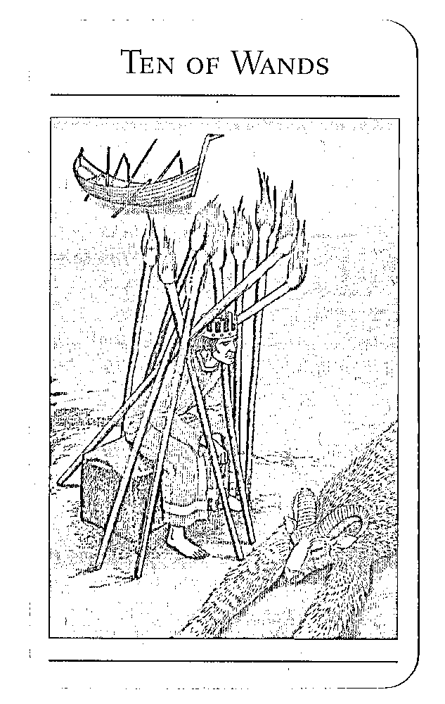

**身负重担**

权杖 10 描绘的是杰森疲倦地坐在伤痕累累的阿尔戈号前面。他成功地返回了约尔科斯，我们能从画面中看到他身穿红色的王袍，戴着金色的皇冠，金羊毛安静地躺在他的脚下。十根熊熊燃烧的权杖交叉着压在他的肩头和后背上，从弯腰前倾的姿势可以看出，他有些不堪重负了。

**压抑**

**权杖 10 描绘的是一种压抑的状态。**杰森获得了他出发前想拥有的一切，但是在故事结束时，他在万众瞩目中不堪重负而且非常悲伤，曾经承载过英雄团队，辉煌一时的阿尔戈号，已经逐渐腐朽衰败。

人们在开始时往往很难理解，为什么这个关于愿景的激情洋溢的神话传说，会在英雄疲惫的身影中画上沉重的句号。

仔细思量过后我们就能看到，权杖数字牌的最后一张，呈现了**创造性想象力很重要的一个特质**：**当它背负起世间责任的重担时，就无法再行使其功能了。**

许多人在经营某些业务或成功地达成某种创造性结果时，都学会了这个苦涩的教训。随着时间的推移，业务变得越来越大而稳固，其中的刺激和狂热则慢慢地消褪。

杰森在寻获金羊毛和夺回王位的过程中，忽略了很多不可预知的要素的重要价值，例如美狄亚（*Medea*）重要性，因此失去了她的陪伴，他也忘记了**不墨守成规和大无畏的精神是踏入冒险之旅最重要的一部分。****想象力的快速多变性导致它拒绝被结构化的形式和沉重的压力所束缚。**创造性工作的完成常常伴随着无聊和沮丧的到来，因为落实创造性想法时冲突所导致的紧张会产生更多的其它想法，而**如果实现这些后续的其它想法，就意味着想象力无法自由地表达自己了。**想象力需要新鲜的土壤，而杰森到后来太过于攀附在自己修建的形式中，因此他变得压抑和筋疲力竭，又找不到其中的缘由。**如果他能在这时放弃安全感，想象力就又会在全新的念头、目标和冒险中醒来。**

**权杖 10，不堪重负**

**从解牌的角度来看，权杖 10 暗示着当事人已经不堪重负，陷入了压抑的状态中。**想象力被太多世俗的考虑所窒息，出生牛犊的勇气和敢于冒险的意愿消失不见了。

此时当事人**需要放弃一些东西，从而让创造性的过程获得全新的力量，开始步入新的循环。**

**版权声明：**本文由《自在园》授权发布，欢迎转发，反对抄袭。友号转载请申请白名单。

**END****朱丽叶·沙曼·伯克**从 20 世纪 70 年代早期开始，就对塔罗牌产生了兴趣，并踏入了塔罗的世界。后来，在丽兹·格林的鼓励下，开始研习心理占星学和塔罗。1984 年，第一本书《塔罗全书》（The Complete Book ofTarot）出版。之后，与丽兹·格林合作设计并撰写了《神话塔罗》（The Mythic Tarot）。朱丽叶写了十本塔罗和占星学书，包括一本名为《众星的传说》（Stories from the Stars）的儿童读物，以及与丽兹·格林合著的《神话之旅》（The Mythic Journey），这是一本详细讲述如何运用神话来指导生活的书。

**点击下图了解课程详情** 

**微信又双叒叕改版啦，不想错过若道君的推送？**
****就把若道设为****星标****以及点点****“在看”****吧！******▼**

**喜欢就点一下“在看”吧！****报名直达入口**

# 2023 年 ISAR 选修课 | 预测、预期与意识成长

> 原文：[`mp.weixin.qq.com/s?__biz=MzA5NjA0NTAxNg==&mid=2651494232&idx=2&sn=84c451b9afb146f80c9e5058d64327a6&chksm=8b4825efbc3facf9984b8dbdef73b80203a16540448600e7980b3b2fab12e3c54f9756d56602&scene=126&sessionid=1692737725#rd`](http://mp.weixin.qq.com/s?__biz=MzA5NjA0NTAxNg==&mid=2651494232&idx=2&sn=84c451b9afb146f80c9e5058d64327a6&chksm=8b4825efbc3facf9984b8dbdef73b80203a16540448600e7980b3b2fab12e3c54f9756d56602&scene=126&sessionid=1692737725#rd)

**授课内容**

 本次 3 日课程将深入学习人本主义占星师使用的 3 种预测技法。

我们将深入学习如何分析**行进**，强调对**行进的周期性**理解。我们将通过**次限**研究星图中展现的变化，并学习运用**太阳弧**来标记生命中的关键事件。虽然还有其他有用的技法，比如太阳返照和月限法等，但对**行进、次限和太阳弧**能量的谨慎回应已经提供足够的信息来指导我们的人生。

**行进（TRANSITS）** **长期趋势**分析行进的最好方法是先将长期的行进趋势列出来。顺序如下：冥王星、海王星、天王星、土星、木星、南北交点。通过将这些影响力持久的长期行进先列出来，你将能够发现在未来一年甚至更长的时间里你人生中的重大课题。**短期趋势和触发点**接下来你需要去观察那些运行得较快的星体，来判断短期趋势。不过，重要的是要清楚，这些移动较快的星体在行运中扮演着事件的“触发点”的角色，特别是当与它们形成相位的个人行星同时也与行运外行星有相位的时候！

**次限推进（PROGRESSIONS）**通常也被称作“一天代表一年”推运，因为这种技术把出生后的每一天和出生后的一整年等同起来。一旦设定了这个节奏，就像定时释放的胶囊一样，这些次限推进就像某种内部的太阳系一样运转起来，和真实时间的事件、经历、情境应和。

**太阳弧（SOLAR ARCS）**以太阳为核心，为众星之首，带着众星一起移动,展示人生不同阶段我们是如何体验自我、表现自我、修缮自我。此方法虽非实际星体，但却是星动推运法中准确率最高，实用性最佳的推运方法。

课程有两个方面的重点：**强化自我学习**，把对过去生活事件的理解作为预测未来趋势的基础；**学习有效的占星咨询技能**，以一种精准、生动、策略性和鼓舞人心的方式阐述星图。与格雷格之前开设的课程一样，这次课程会有**大量互动**，老师会与案例学员互动，同时通过学员间的讨论，互相激发，获得更多启发。如果可能，还会设置**训练环节，练习基本的预测和解读方法。**

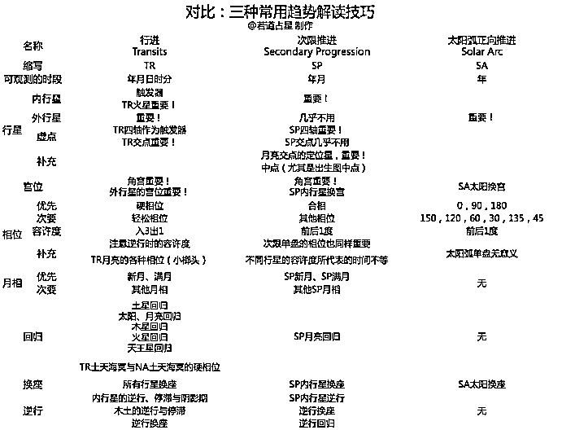

**课程安排**

 **· 2023 年 3 月 4 日 周六  8:00-14:00
· 2023 年 3 月 11 日 周六  8:00-14:00
· 2023 年 3 月 18 日 周六  7:00-13:00**

**什么人适合学习本课程？**

 **·**占星师或渴望成为占星师的人群。  **·**本课程并非针对初学者，需具备若道核心课程 level4 及以上水平，即了解星座、行星、宫位、相位等。

**· **课程会涉及行进&推进&太阳弧解读高阶内容，不了解相关知识的同学，请提前学习相关内容。

**老师介绍**

**格雷格·博加特（Greg Bogart）**

**· **占星师、心理治疗师。格雷格出生于美国纽约市，就读于卫斯理大学。1986 移居旧金山湾，完成了加州整合大学和赛布鲁克大学的研究生课程。**· **格雷格自 1991 年以来一直是一名有执照的心理治疗师（LMFT 28276）。他是国际占星研究协会（ISAR）认证的占星师，并拥有美国地球宇宙学研究协会（NCGR）的第 4 级认证。**· **他还在旧金山的艾扬格瑜伽学院接受过培训，并于 1992 年毕业且获得了瑜伽教师认证。**· **格雷格是一名私人执业的心理治疗师，在索诺玛州立大学担任心理学讲师，他在该校教授“成人发展中的转变”、“以深度为导向的心理治疗”、“神话、梦与象征”以及“存在主义心理学与超个人心理学”等课程。**· **他在加州整合大学、约翰·F.·肯尼迪大学、多米尼加大学和超个人心理学学院教授咨询心理学和东西心理学课程。**· **他的研究结合了冥想、哈他瑜伽、荣格解梦、存在主义心理疗法和精神综合，**占星学的行星周期智慧和原型象征**。

**格雷格·博加特博士著作：** 《占星学的高八度音阶》（*Astrology’s Higher Octaves*） 《行星用于治疗》（*Planets in Therapy*）《占星学与灵性觉醒》（*Astrology and Spiritual Awakening*）《梦境工作过与自我疗愈》（*Dreamwork and Self-Healing*）《梦境工作在抑郁症整体心理治疗中的应用》（*Dreamwork in Holistic Psychotherapy of Depression*）《占星学与冥想：对变化的无畏沉思》（*Astrology and Meditation: The Fearless Contemplation of Change*）

**推荐阅读：**

史蒂芬·阿若优：《生命的轨迹》

Bogart, G., Planets in Therapy; and Astrology’s Higher Octaves.

Tyl, N., Prediction in Astrology.

Ruperti, A., Cycles of Becoming. 

**课程价格**

**正价：6800 元 早鸟价：5800 元 早鸟价截止日期：2023 年 2 月 15 日**

**惊喜联报套餐！！****《ISAR 选修课 | 预测、预期与意识成长》+《2023 年度天象预测大师课》+《2023 年金融占星预报》****三门联报优惠价 8000 元****（限前 50 名联报）（联系 Maggie 老师，抢占限量优惠价）**

长按二维码添加 Maggie 老师获取联报优惠价

**退转课程**

退款原则请详看《教学协议》，如有疑问请咨询课程顾问。 ****2023 年 ISAR 选修课 | 预测、预期与意识成长****

**授课老师：****格雷格·博加特**

**直播课开课时间：2023 年 3 月 4 日（周六）3 月 11 日（周六）3 月 18 日（周六）**

**授课方式：******网络授课，英文/中文授课，中文翻译****

**费用：****** 正价：6800 元；早鸟价：5800 元；早鸟价截止日期：2023 年 2 月 15 日****

**课程负责人：Maggie 老师**（微信：NodoorMaggie，请备注“2023 预测课”）

长按二维码添加课程负责人咨询

**报名直达入口**

# 金星进入射手座 | 爱情 vs 自由，你该如何选择？

> 原文：[`mp.weixin.qq.com/s?__biz=MzA5NjA0NTAxNg==&mid=2651494232&idx=1&sn=359405d790319f1e35b0d65830552e6c&chksm=8b4825efbc3facf9272df75d64cf4f43b01bf434cd6bfdb70e11ad659411684c33bcaf21325a&scene=126&sessionid=1692737725#rd`](http://mp.weixin.qq.com/s?__biz=MzA5NjA0NTAxNg==&mid=2651494232&idx=1&sn=359405d790319f1e35b0d65830552e6c&chksm=8b4825efbc3facf9272df75d64cf4f43b01bf434cd6bfdb70e11ad659411684c33bcaf21325a&scene=126&sessionid=1692737725#rd)

****************************☆ **************后台回复“今日”，给你一句生命态度**************

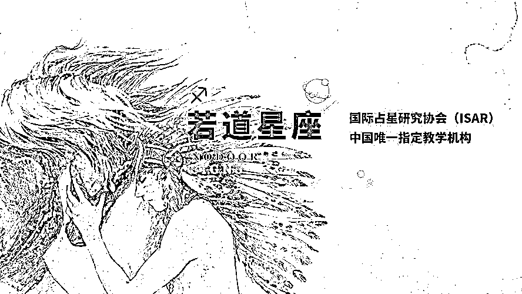

作者/斯蒂芬·弗里斯特、朱迪·弗里斯特

译者/李含 编辑/玫瑰 

封面/书君 图片/稿定设计

　本文译自《天空的伴侣 I：爱、性和进化占星学》

11 月 16 日，金星进入射手座啦！从金星天蝎座的深渊中一跃而起，未来一个月的时间我们需要追求的是自由、热烈、富有意义的人生体验。当你的太阳、月亮、金星或上升落在射手座，爱情是什么样子的？一起看看吧！ **射手座**

*   **原型：****吉普赛人、朝圣者、探险者、人类学家、哲学家、学者**

**射手座的发展目标****生命对于射手座而言就是一场彻头彻尾的探索之旅。射手就是探索者。**内在的驱动力会促使射手座人永无止息、永不间断地探索。射手座人的目标是什么？归根到底，就是生命的真谛。在进化占星学中，这个目标并不是个人必须觉悟到的。很多时候，呈现的是相反的情况。不管是意识层面，还是潜意识层面，根本的发展目标都是会驱动射手座人去追寻，这种驱动力解释了他们大部分行为的深层原因，即使有些行为看起来完全不可思议、毫无意义。
**从射手座身上我们可以看到一种灵魂追求进化的轨迹。**首先，他们**需要专注于追寻更广阔的心智与意识的体验，惯有的阻碍必须被打破。**沉闷乏味的区域性现实视角比较被更全球化的视野所取代。形而上学的观点认为**在前世中，射手座意味着对于进化的渴求被现实无情地打碎。所以，在这一世里，要强迫自己打破枷锁， 冲出牢笼。****策略和资源**去追寻生命的意义！这是不是一个唐吉柯德式的冒险？对于射手座人而言，这不成问题。生命的意义才是问题，亦或生命本就毫无意义。这就是射手座最主要的资源：他**们坚信在随机的命运背后蕴藏着的宏大格局。**如何参透这个格局的奥妙呢？去体验，去探索！**射手座有一种强烈的愿望，要打破墨守陈规的僵化思考。这就是射手座的策略。**
没有充分的自由，就无法张开追寻的翅膀。所以，**射手座比任何星座都要谨慎，他们不会轻易做出承诺，交出主权。**批评射手座的人会把这种对于自由的热爱解读为承诺恐惧症。在个体分析上，这也许正确，但是在更广泛地解读射手座时，我们必须认识到，**失去了自由，射手座的生命将会枯萎凋落。**很悲哀，但不得不面对，爱情通常很难建立在自由的基础上。**阴影**但是爱情也有另一面：**在人性的探索里，爱情可以赋予一个人极大的自由和拓展。**人生的意义是什么？那谁知道呢？但是很多伟大的人文主义导师都认为，不论生命的意义是什么，都与爱有关。**射手座的阴影是他们很有可能逃避真诚的关怀，这种真诚的关怀只有在我们抛开一切将彼此的命运绑在一起，不在乎结局如何时才会拥有。**
射手座人对于人生就像是石头滑过结冰的池塘，尽可能多地体验学习。就像歌里唱的，“自由的代名词就是一无所有。”对于射手座来说，对真理的探索要比亲密的两性关系有更加广阔的天空。射手座人认真读一本好书领悟到的人生的意义，要比随便翻翻美国国会图书馆里任何一本宗卷获得的要多。辽阔的风景是美的，但强烈的、专注的、负责任的态度，不论是对于在爱情中还是在图书馆里都是美好的。

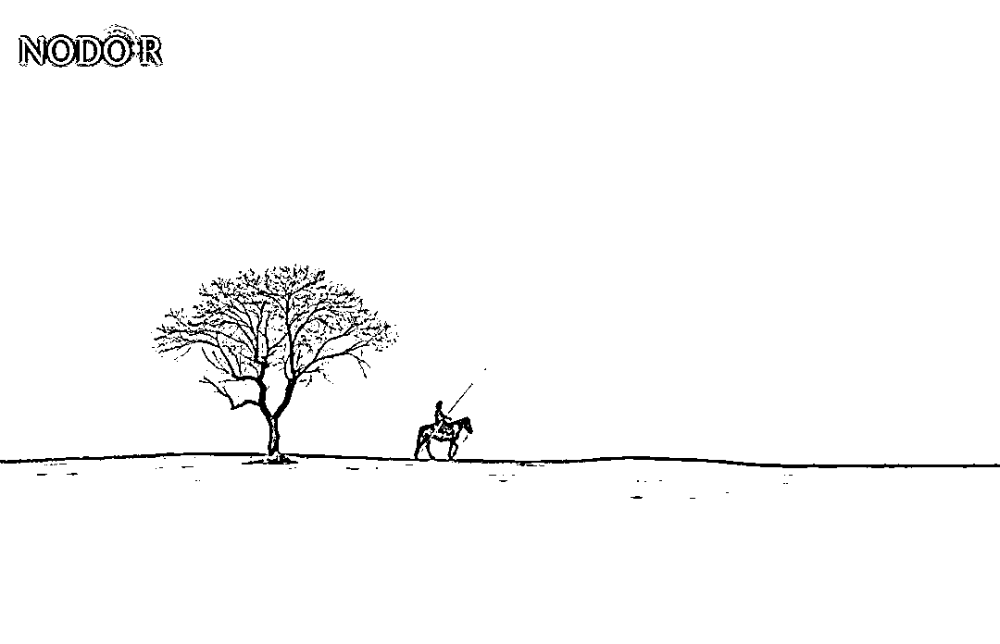

**射手座的爱情****金星射手座的爱情****进化的意图是建立有助于拓宽世界视野的关系，这种关系还有助于重建已破碎的信仰以及对爱的异教徒式喜悦。**以此回应前世的动力，包括**压抑的性约束、对亲密关系的厌倦以及那种安稳多过珍惜的关系**。对于这个金星星座复杂的吸引之术，可以通过思考它的原型来把握：**吉普赛人、学者、哲学家、探险家和人类学家**。吉卜赛人和探险家可能会说："看我多大胆，多无忧无虑。挣脱你的牵绊，跟我去欧洲吧。“学者或哲学家通过让你对他积累的各代智慧的惊鸿一瞥来吸引你。人类学家邀你跳一曲华尔兹，穿越引人入胜的人类集体类型，以及朋友或熟人的迷人嫁妆。**金星在射手座的人欣赏随和、宽容、幽默的人，对经历、冒险和多样性有着旺盛胃口，他们还欣赏坚持自己原则的人。**他们希望有一段能让他们真正享受的关系，为他们的生活增添色彩和多样性。

| 简·方达

特级吉他大师吉米·亨德里克斯（Jimi Hendrix）和吉米·佩奇（Jimmy Page）的金星在射手座，政治活动家简·方达（Jane Fonda）和琼·贝兹（Joan Baez）也是如此，还有演员德里克·雅各比（Derek Jacobi）、露丝·戈登（RuthGordon）和罗伯特·杜瓦尔（Robert Duvall）的金星也在射手座。

**太阳射手座的爱情****在爱情的国度里，射手座人是言辞上的巨人，行动上的矮子，这是名声在外的。**这种让人沮丧的情况也不一定就无可避免，但是**射手座人要放下对爱情的强迫性背叛行为，或者只是肤浅的感情接触，**实则保持孤独的内心，射手座人**必须接受这种不可避免的理念，不管多么充满活力的关系，也会有乏味的部分。**从另一方面看，**这种成熟爱情的灵魂冒险会带来丰富的成长经验。**思想理念是射手座的强大驱动力，但是这些思想理念必须令人信服，经得起实践的考验。**精神空洞的爱情不会让射手座人停留太久，体验过后就会觉得无味而放弃**。另外，对于每一个太阳射手座的人来说，自由的确是进化所必需的途径。他们必须**选择和自己一样热爱自由的伴侣，有自己独立的兴趣和朋友圈，从不停下追逐的脚步，更重要的是，他不会幼稚地大肆嫉妒，安全感匮乏。**满足了这些要求，射手座人就能了解射手座的秘密：**如果可以与伴侣携手并肩就能追求得更丰富、更深刻。**

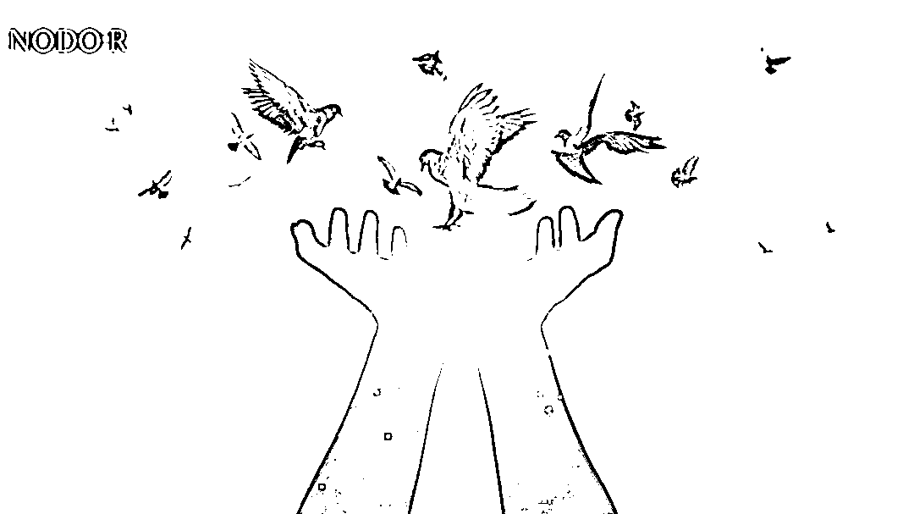

**月亮射手座的爱情**

在亲密关系中，月亮射手座会有一些矛盾。**月亮代表了我们的支配性的需求，射手座的需要就是“不需要有任何需要”，至少会很独立，不需要依附于任何人。**他们与伴侣的关系会在两重的矛盾性间拉扯：**理想化混合着距离感。**

传统文化夸大了伴侣间的互相依赖在维系婚姻稳定中的作用。社会文化削弱了女人操作机器一类的能力，而男人则不善于照顾自己。而月亮射手座热爱自由，他们不能容忍自己落入这样的圈套。

即使他们的生活不会像 50 年代的家庭生活真人秀那样枯燥无味，但为了不让纠缠的恐惧愈演愈烈，他们还是必须忙于生活中的实践活动，获得满足感。这样看来，爱情的承诺更多的是带来混乱，而不是危险可憎的必需品。我们强调这个月座对爱情的敏感性，毕竟月亮更多影响到家庭生活的情绪。

**上升射手座的爱情****上升射手座的人会流露出豪爽、健康、勇敢的气质——“吉普赛人的面具”。**通常**急智幽默、眼光独到、宽宏大量。**自然，这是非常具有魅力的，吸引里异性的瞩目，也同样在社交中广受欢迎。“把一切都整合到一起”需要在生活中时常注入新鲜和出乎意料的元素，避免陷入惯性、呆板、可预知性。**上升射手座人会不断的与爱情长跑中的单调乏味做斗争。**这种观念是现实可行的，但不要做过了头。与之前讲到的太阳月亮射手座类似，**上升射手的人不要逃避承诺，但要避免让爱情的承诺变成一种毒药。**上升射手座的人守护星是木星，**木星的落点也会影响到爱情。**

**版权声明：**本文由若道翻译发布，欢迎转发，反对抄袭。友号转载请申请白名单。

**END**

**斯蒂芬·弗里斯特**

若道签约老师。进化占星学的创始人之一，当今世界最有影响力的占星大师之一；1985 年，他凭借《内在的天空》一书获得职业占星师协会奖（Professional Astrologers Incorporated Award）。他四次获得占星界最高的占星学联合协会奖（United Astrology Congress Regulus Award）提名，2018 年获得轩辕十四教育奖。

**20 位来自世界各地的占星师****带来 19 场沙龙——新世界的觉醒****详情可点击下图**

**学习占星学****点击下图了解课程详情**

**微信又双叒叕改版啦，不想错过若道君的推送？**
****就把若道设为****星标****以及点点****“在看”****吧！******▼**

**喜欢就点一下“在看”吧！****报名直达入口**