# 若道 202207-202302 PT2

# 深度丨星图上“最高”的行星，塑造了你的声誉和人生使命方向

> 原文：[`mp.weixin.qq.com/s?__biz=MzA5NjA0NTAxNg==&mid=2651494052&idx=1&sn=1573759f72b09556136659e1ffd79a70&chksm=8b482413bc3fad05bd08634bcd4ce06c2df1f87030a9f15f0c1896bfccfbd5a66dae620e613d&scene=126&sessionid=1692737725#rd`](http://mp.weixin.qq.com/s?__biz=MzA5NjA0NTAxNg==&mid=2651494052&idx=1&sn=1573759f72b09556136659e1ffd79a70&chksm=8b482413bc3fad05bd08634bcd4ce06c2df1f87030a9f15f0c1896bfccfbd5a66dae620e613d&scene=126&sessionid=1692737725#rd)

****☆ ****后台回复“今日”，给你一句生命态度****

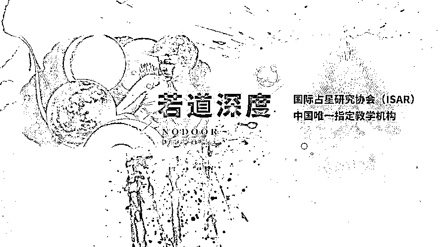

作者/雷·格拉斯 译者/王宏 校对/Arrow

编辑/翀子 封面/书君 图片/稿定设计、网络

文章来源/《大占星师》

你知道吗，星图中的“最高行星”是我们理解星图的重要指标，它“统领”星图中其他所有行星，代表了你人生方向的顶峰，并且会对你产生重大影响。本文将为我们解析十大行星作为星图中“最高行星”的十种不同情况，值得收藏哦！另外，如果你想学习占星学，大卫老师参与授课的【[ISAR 认证职业占星师文凭课程](http://mp.weixin.qq.com/s?__biz=MjM5MjQwNjAyMQ==&mid=2649440463&idx=6&sn=d1c313a0ef114257abf6c46ad7c0edae&chksm=beb92fa589cea6b38d6c9646453d7a78b7b125ed0cc9cb5432d2c1d867ad314a332a4e47abac&scene=21#wechat_redirect)】正在插班中，点击链接了解更多详情！

**什么是星图中的“最高行星”？**

**星图中最高的行星，是我们理解星图的一个要素，而在某些情况下，可能是最重要的指标。**任何位于此处的星体，都会由于其尊贵的位置而“**统领**”星图中的其他所有行星，并可能对此人的整个人生产生**重大影响**。 

尽管在某种程度上，任何占据地平线之上最高点的行星都是如此，但如果**该星体接近中天（MC）**——**星图的最高点**，那它就变得更加重要了。有人声称，**任何有此相位的行星都属于“偶尔尊贵”，因为其固有特质以具有潜在建设性的方式被放大了。**

**★****如何确定星图中的“最高行星”？**

**简单来说，最接近中天的那颗行星，就是我们星图中的“最高行星”。**由于分宫制的不同，有时候，第十宫宫头并不等同于中天（MC）。因此，**我们需要将注意力集中在最接近中天的那颗行星上，而不是通过查看星图视觉上所体现的“顶部”。**

注：上述为“简单”的答案。更为复杂的回答是考虑赤纬影响，赤纬可以改变天空中实际上“最高的”东西。例如，可以有两颗接近中天的行星，但距离中天较远的那颗行星可能实际上是两颗行星中“较高的”，因为赤纬更偏北。例如，南赤纬 10°高于南赤纬 15°，北赤纬 15°高于北赤纬 10°，等等。

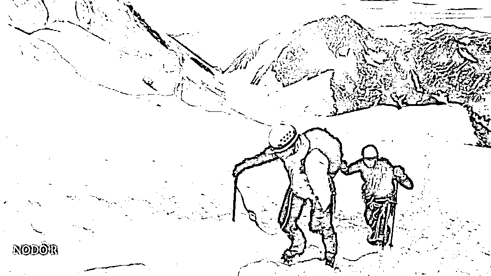

**名望与“使命”**

**在某种层面上，任何在星图中位于地平线之上的行星都代表在你的生活中对你周围的人而言更加明显的能量，这些能量相对也更容易暴露在公众视野中。**

至于宫位，这通常与**第十宫**尤为相关，第十宫在传统上被认为掌管名望、事业和声誉等事务。 

然而，**中天与第十宫有微妙的差异**，中天不只是关于名望或声誉，尽管它结合了这些方面。**中天作为星图象征性的顶点，也被认为代表了你人生方向的顶峰，是你所追求的志向**。

你可以这样想：第一宫关乎你的日常性格，展现你是谁，而中天则展现你想成为什么，即你带雄心勃勃渴望实现的那些特质。

水星接近你的中天？那么，你要努力达成的是沟通或心理素质。还是金星？那么你人生的最高目标多少围绕着美或爱。不过，无论是哪颗行星，中天绝不仅仅是你想接受的“另一份工作”，也不只是你碰巧从事的某项维持生计的职业。

简而言之，**任何在中天上的行星都有一种成就感，有时甚至是使命之感**。有时，这可能让一个人在人生进程中弯弯绕绕，需要时间才能意识到其真正的意义。

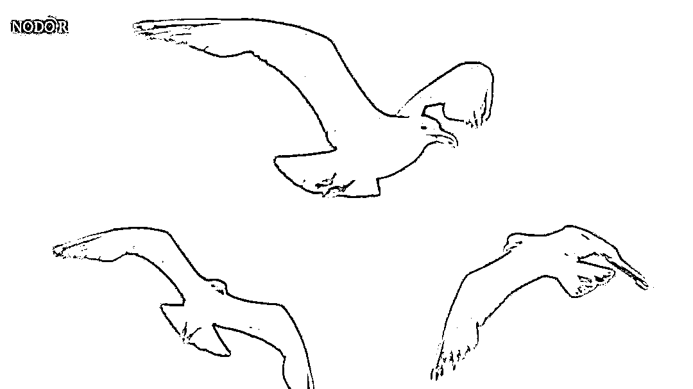

**公共身份 vs 日常人格**

**尽管任何位于星图顶部附近的能量都在帮助塑造一个人的声誉和人生方向，但就你的一般人格而言，这些能量并不总是与你的日常形象相一致。**

例如，我曾经认识一位才华横溢的艺术家，其星图显示了靠近中天的是落于狮子座的扩张的木星。

在公共场合，他表现出一种近乎达利式的个性——华丽且富有戏剧性，甚至炫耀其与达利类似的上翘大胡子。然而，狮子座中突出的木星与下方第一宫中远为激烈的天蝎座土星形成四分相。很难想象还会有比这更加鲜明的对比！

普通大众只看到了那个阳光明媚的公众形象，并没有意识到他私下里在舔舐源自童年的深刻的情感创伤，这些创伤在他成年后的关系中反复出现。

当然，如果采取更具建设性和整体性的方法，我们可以说他的人生功课是——通过带给他的木星更多的土星，以及带给他的土星更多的木星，来学习调和那些对立的能量。

但是在日常生活中，对那些熟悉他的人来说，最显而易见的正是这些决斗双方力量之间的冲突。

以这些基本信息为出发点，现在让我们来看看**太阳系中的不同星体在靠近星图顶点时的影响**。要记住，**尽管我们特别强调了接近中天的行星，但我此处描述的大部分内容都适用于任何在地平线之上最高的行星，即便它远离实际的中天**。

此外，**如果不只一颗行星在那个高高的位置上紧密排列在一起，那重要的就是留意两者的混合影响**，而非每一颗单独的星体。好了，我们开始吧。

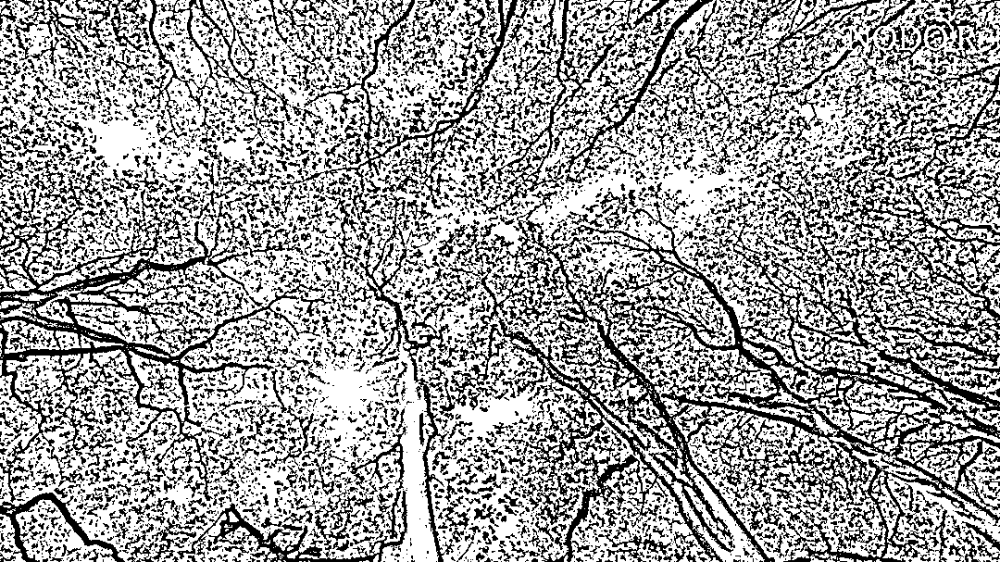

**解析星图中的“最高行星”**

**1****太阳**

**当太阳位于星图顶点附近时，存在着动力，在世人面前表达自己的创造性本质和核心自我价值观，并以相对公开的方式“闪耀”。它所落入的黄道星座揭露出了进一步的线索。**

双子座，那很可能就是智力天赋、沟通技巧或是一个人渴望的多才多艺。金牛座，那就可能是美感或财务稳定。那白羊座呢？战士精神、竞争力和动力，如此等等。

**落于此处的太阳是表明领导特质、名望或在同龄人圈子中突出地位的主要征象之一**，无论是当地家长委员会的负责人还是整个国家的领导人。这也是教师和公众演讲者常见的星图位置。

**但正是因为星图的该部分对太阳而言是极为公众化的落点，个人性格中的任何错误或缺陷也会以更为公开的方式被放大**。

值得注意的是，**由于太阳离水星或金星都不远，通常会发现这些星体紧密聚集在一起，无论是在中天附近还是在其他地方。**

**2****月亮**

尽管出生时太阳在星图中最高的人可能感觉到担任领袖的强烈欲望，或以公开的方式表达小我和创造力的冲动，但那些**出生时月亮最高的人通常更容易将他们的人格或情感投射到公众视野中**。

歌手琼尼·米歇尔出生时双鱼座的月亮接近中天，她的歌词很独特，因为歌词向她全世界的听众展现了她最深层的和最脆弱的情感。

**由于月亮也掌管“滋养”，一个人选择在公众面前展示的情感可能涉及某种形式的照料**。**同样的月亮冲动也可以以极为不同的方式引导人们进入与表演或戏剧相关的生涯。**

演员罗伯特·德尼罗、梅丽尔·斯特里普和彼得·塞勒斯出生时月亮都是位置最高的星体，适合在公共场景中表达情感的人生。

**|** 罗伯特·德尼罗（左）、梅丽尔·斯特里普（中）、彼得·塞勒斯（右）

**3****水星**

**如果水星是星图中最高的行星，就有冲动将个人的想法或语言技能投射到世人面前**。因此，对于教师、作家、公关和职业涉及沟通和心智才能的人而言，有此配置很自然。

亨利·米勒、歌德、巴尔扎克等作家作家，以及文艺复兴学者马尔西利奥·费奇诺的星图中都有这一配置。

**人们渴望靠近顶点的行星所象征的所有特质，而这提供了有关人们在生活中所模仿的榜样或导师的线索。**以水星为例，那些英雄往往在本质上更具知性。

我有一位年轻的客户，出生时水瓶座的水星与他的中天成合相，在他成长过程中，他卧室墙上挂着卡尔·萨根和托马斯·爱迪生的海报，而非摇滚明星、体育英雄或迷人女演员的肖像！

但是要注意：**如果高升的水星恰好形成了挑战相位，尤其是与海王星、火星、木星或土星形成相位，就必须特别小心任何公开声明，因为它们可能让人遇到麻烦。**

**4****金星**

**|** 玛丽莲·梦露

**该位置表明希望在公众面前以某种方式展现美和（或）和谐**。玛丽莲·梦露出生时金星是最高的行星，而她几乎成为了主流理想的美丽形象的代名词。

当然，该位置通常引向**直接或间接涉及时尚和设计的职业**。大卫·鲍威也有着高升的金星，他除了是一位成功的音乐家和艺术家之外，还因其时尚感而闻名，被誉为时尚引领者。

**当形成良好相位时，该位置可以赋予案主一定的魅力。在某些情况下，金星的能量可以呈现出更具精神性的形态，强调向世界投射爱或善意。**

**5****火星**

**当火星在星图中最高时，有动力将能量和力量展现给全世界。**美国前总统富兰克林·D.·罗斯福出生时火星接近中天。他带领美国参加第二次世界大战，呼吁民众鼓起勇气——“我们唯一应该害怕的是恐惧本身”，重振人民和士兵的信心。

我多年来为许多火星位置最高的客户制作过星图，他们都与**体育或武术**有关。

火星的强大力量也可以用更艺术的方式引导，被视为“朋克教父”的歌手伊基·波普，以他充满活力的（有时甚至是自残的）舞台表演而闻名，他出生时白羊座的火星和水星是其星图中最高的行星。

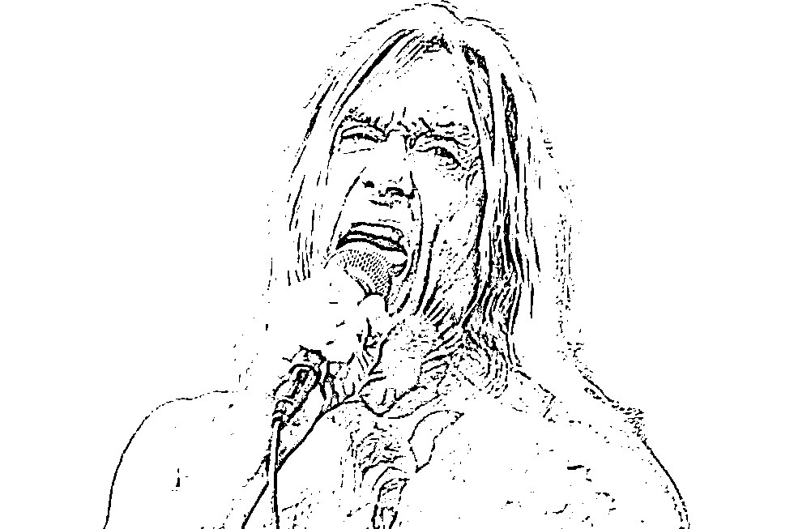

**|** 伊基·波普，他开创了很多舞台风格，在台上从不穿上衣并狂抓胸膛直至流血，满场乱跑，唱到一半便一头扎进观众群中（由此成为了舞台跳水的发明者）

**6****木星**

**如果木星在星图中最高，对于职业生涯议题或与公众打交道，常常有种机遇感和信心**。因此，这是**扬名和成功**的主要星图指征之一，也包括**在与权威和帮助自己施展抱负的人打交道时的大体“好运”。**

在最好的情况下，该位置可以表明一种愿望，**去表达一种看待世界的丰盛和乐观的精神进入世界，无论是通过慈善活动、教学，还是人道主义项目**。

由于任何靠近星图顶部的行星都可以揭示与地位在你之上的人交往的属性和质量，木星作为最高行星不仅表明**会与显赫或富有的人相遇，还会与宗教或哲学方面的人相遇**。

**但是如果有困难相位，位于此处的木星可能显示与这些人物的问题，以及粗心和鲁莽冒险的总体倾向。**

**7****土星**

和木星一样，**靠近某人星图顶部的土星可以显示出此人人生中巨大成功和显赫声名。但是与木星不同的是，这通常在过程中涉及更多的工作和困难。**这些案主的生活总是有“**大器晚成**”的特质。

另一方面，他们在建立自己的事业和声誉方面一般会经历巨大的抗争。土星所表明的实质性成就通常伴随着**痛苦的逆转或堕落**，一种“向前三步，后退一步（也可能是两步）”的场景。

土星位置最高可能会表现出**对个人声誉的深切不安**，可能源自童年时期的困难，这可能引发**对地位和尊重的强烈冲动，以此来弥补那些内心的自我怀疑**。但是这也有好处，因为它可能充当后来人生中**成就和成功的燃料**。

**根据其所处黄道星座的不同，靠近星图顶部的土星可能显示出一个人可能在何处被视为权威**。

金牛座的土星为其最高行星的人，可能更多地因其在银行业或房地产方面的专业知识而闻名，而白羊座的土星位置最高的人，可能在体育、武术或军事工作中受到尊重。

土星在星图中位置最高，往往表明**案主需要学习有关权力的使用和滥用的业力课程，无论是案主使用的权力，还是比人向案主施加的权力**。

对大部分个人来说，这仅仅通过与**父母、老师、老板、房东或政府**的互动而体现出来。但是在特殊情况下，该动态可以在更广阔的舞台上发挥作用。

**8****天王星**

与土星形成鲜明对比的是，**出生时天王星在星图中位置高的人拥有极度的独立性，而且渴望追求独特的个人或非传统的人生道路**。

毋庸置疑，这通常使这些人**难以适应僵化的日常生活和井井有条的环境，而在职业方面，他们喜欢尽可能多的自由度。**该位置所体现的**特立独行的创新精神常常表现为与技术或媒体相关。**

类似地，天王星一般指的是**喜欢“跳出框框思考”的人**，包括心理学家詹姆斯·希尔曼在内，他喜欢用他关于治疗和人类行为的非正统观点搅乱主流心理学。有时，该位置促使案主**参与社会活动并改变社会，这是由他们自己的“未来主义”敏感性所推动的。** 

但是，尽管天王星最常与自由或进步事业联系在一起，在某些情况下，它只表明一种**更独立的**或“**独来独往的**”特质，这种特质可以在政治领域的任何地方表现出来。

可惜，**当案主的特立独行在社会规范面前表现得太过火时，天王星更为叛逆和古怪的倾向可能给他们制造麻烦。**

**9****海王星**

在最好的情况下，星图中位置最高的海王星可以表示一种**“摘星追梦”的精神，将其目光投向崇高的目标和各种各样的梦想上。**对有些人来说，这会产生**强大的精神或创造性冲动。**

问题方面，**有该配置的案主可能对其职业或人生使命感到困惑，或是他们可能被迫在其公共角色周围编织出一层魅力或幻想的光环**，例如某人采用化名或躲在“面具”之后。

出于类似的原因，该位置是**演员**星图中的另一个常见指征，他们通过假装成其他人，而非他们自己，来获得明面上的报酬。

**如果有困难相位，这个海王星的位置可以造成一个人声誉方面的问题和被误解的感觉**。它甚至可能导致一种**“殉道者”**情结，一个人在其中感觉受到了自己无法控制的力量的摆布。

但是通常与海王星相关的**误解和欺骗**要素，也可以用其他方式来引导，就像脱口秀主持人约翰尼·卡森一样：他年轻时的人生抱负是成为一名舞台魔术师——又被称为欺骗和误导的艺术！

**10****冥王星**

**冥王星代表一种强烈的原始能量，涉及生与死、性、权力和转化的问题。因此，当它占据星图中的最高位置时，它可以表明一个人的职业或“使命”感将涉及这些领域中的任何一个或全部。**

在纯粹的身体层面，看看其公共身份已经与性密切相连的名人的星图，例如已故歌手普林斯。普林斯出生时冥王星是其最高的行星，他对性非常公开，他在 2007 年的超级碗表演中展示了生殖器的意象，全球近 10 亿观众观看了这场表演。

同样地，冥王星着力**探索生活中“更黑暗”的一面，也涉及令更习惯活在事物表面的人不适的生存面向**。

我们在已故歌手莱昂纳德·科恩和作家杰克·凯鲁亚克的作品中看到了这种探索的特质，凯鲁亚克在自己的经典作品《在路上》中歌颂了放荡不羁的“下层社会”。

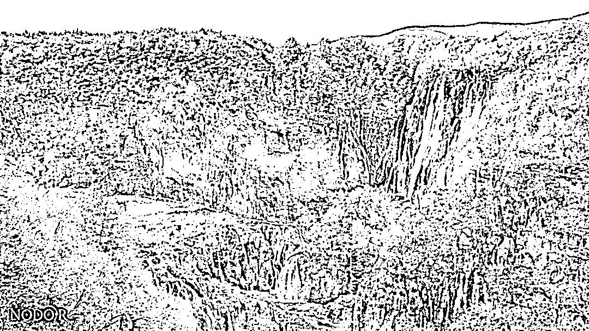

**你还需要考量这 3 点**

还有几点值得一提。

**首先，当任何一颗行星靠近某人星图的顶部时，无论该行星守护哪个宫位，该宫位的关注点往往也会出现在公众面前**。

例如，如果某人的火星落于中天附近，白羊座位于第二宫宫头，那此人在金钱方面的自信或冲突就将以相对开放的方式展现出来。

或者，考虑一下这种情况：案主出生时狮子座位于第四宫宫头，太阳（第四宫守护星）与中天合相。他们为人所知的生活面向更有可能多少与家庭、家或房地产事务相关。

但需要特别指出的是，**如果靠近中天的行星恰好是此人太阳所在星座或上升点的守护星，那此人对于职业或公众的个人关注将成倍放大**。

相比而言，如果太阳在金牛座中，木星靠近中天，那么木星的位置可能很重要，但并不像此人太阳落入射手座时那么重要——射手座的守护星是木星。

**最后，无论某人是否有行星靠近星图顶部，都需要仔细研究中天的黄道星座，因为这也会揭示此人渴望表达和获得的品质，还会揭示公众将如何看待此人。**

如果是双子座，那就会涉及沟通和信息。水瓶座？团队参与、媒体，或进步/创新的理想。天秤座？有关美、法律或公共关系的事宜。如此等等。反过来，**要密切关注该星座的守护星，以进一步洞察这项使命的意义和方向**。

**版权声明：**本文由若道翻译发布，欢迎转发，反对抄袭。友号转载请申请白名单。

**END**

**雷·格拉斯**

来自芝加哥的作家、音乐家、摄影师和占星师。他在《探索之书》和《探索》杂志做了十年编辑工作，并自 1998 年以来一直担任《大占星师》杂志的副编辑。他的讲座话题广泛，涵盖了占星学、共时性和神话学，同时他还保持着积极的占星实践，客户遍布美国国内外。

**拥有****51 年****占星实践经验的****若道创始人****前 ISAR 全球副主席****前 ISAR 全球职业占星师资质认证主席****大卫·瑞雷**

**和**

**2019 年第二届、2021 年第三届核心课中**

**与苏·汤普金斯老师****联合授课****的**

**ISAR 认证职业占星师**

**咔咔（Caroline）**

**二人合力打造**

**2022 年 ****若道全新核心占星课程**

**点击下图了解更多课程详情** 

**

**20 位来自世界各地的占星师****带来 19 场沙龙——新世界的觉醒****详情可点击下图**

**学习占星学****点击下图了解课程详情**

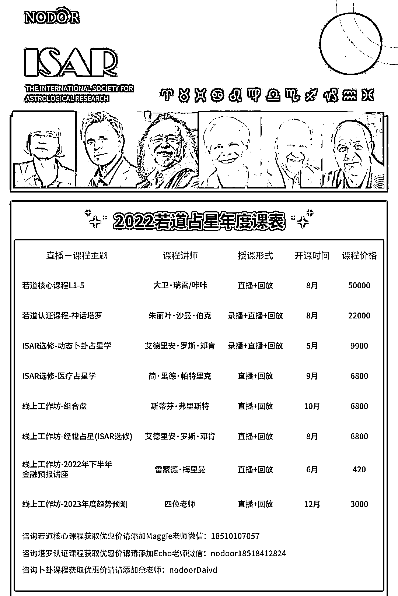

**微信又双叒叕改版啦，不想错过若道君的推送？**
****就把若道设为****星标****以及点点****“在看”****吧！******▼**

**喜欢就点一下“在看”吧！****报名直达入口**

# 核心课程速递：玛丽莲·梦露与拜登星图案例分享

> 原文：[`mp.weixin.qq.com/s?__biz=MzA5NjA0NTAxNg==&mid=2651494052&idx=2&sn=d24daa2518231986c6c57830718f81f6&chksm=8b482413bc3fad05f75b0d46852165330c3161964c660f3799f6d70681f9a957f619b7c6ac25&scene=126&sessionid=1692737725#rd`](http://mp.weixin.qq.com/s?__biz=MzA5NjA0NTAxNg==&mid=2651494052&idx=2&sn=d24daa2518231986c6c57830718f81f6&chksm=8b482413bc3fad05f75b0d46852165330c3161964c660f3799f6d70681f9a957f619b7c6ac25&scene=126&sessionid=1692737725#rd)

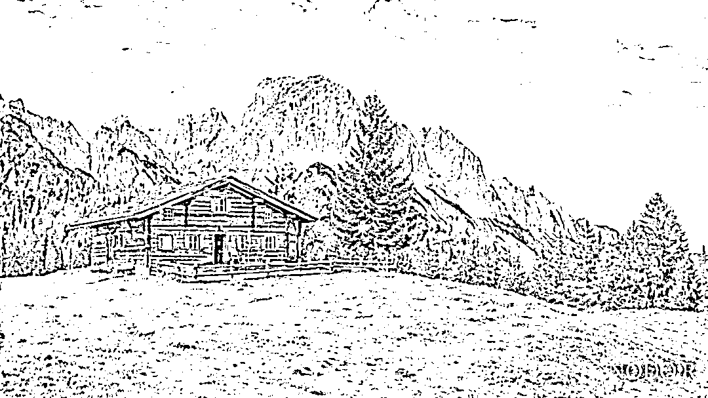

新的一期若道核心课第二阶**最后一节课**已经完结啦。

在最后一节课中，**大卫老师和咔咔老师通过一些生动的案例，来诠释了如何结合****行星、星座与宫位****，来表达当事人的特征。**

*   为何以甜美和性感著称的玛丽莲·梦露，却是一个**太阳双子座**的人呢？

*   她在**双子座第 10 宫的太阳**，除了体现了她自己，还如何体现了她生命中的男性呢？

*   她在**水瓶座第 7 宫的月亮**，体现了自己怎样的内在世界，又把什么投射给了她的伴侣呢？

**关于梦露，咔咔老师是这样讲述的：**

<mpvideosnap class="js_uneditable custom_select_card channels_iframe videosnap_video_iframe" data-pluginname="videosnap" data-id="export/UzFfAgtgekIEAQAAAAAAitQ2aJngiwAAAAstQy6ubaLX4KHWvLEZgBPE2IMEc0VEb_yBzNPgMIsZquD2W6R0mxB17QVGXHgA" data-url="https://findermp.video.qq.com/251/20304/stodownload?encfilekey=S7s6ianIic0ia4PicKJSfB8EjyjpQibPUAXolPBUIL0l092Uic32usPRJAekVm0JP9l6pPJE6DrdIL1KlgIFHhcgAw9XO89eJCoicrx785plLSdRPfUGEMXVkoplg&amp;adaptivelytrans=0&amp;bizid=1023&amp;dotrans=0&amp;hy=SH&amp;idx=1&amp;m=&amp;scene=0&amp;token=x5Y29zUxcibBLkbkeNNc0UbdoTNKH90g4JCSQCSNxY2daqeGZ3yRAHmKdRibibKzf0uUERfD4yNUPI" data-headimgurl="http://wx.qlogo.cn/finderhead/PiajxSqBRaEJYnVsqWfEX9qA0sI6hNVKsDfyzfPZ92WZMZyBpZWU5NA/0" data-username="v2_060000231003b20faec8c4e68a1ec2d4ca07e434b07755bbf47e7053a3059defd2c9d6c68a20@finder" data-nickname="若道" data-desc="#若道核心课  为何以甜美和性感著称的玛丽莲·梦露，却是一个太阳双子座的人呢？10 宫的太阳，除了体现了她自己，还如何体现了她生命中的男性呢？7 宫的月亮，体现了自己怎样的内在世界，又把什么投射给了她的伴侣呢？" data-nonceid="17407722585347540405" data-type="video" data-authiconurl="https://dldir1v6.qq.com/weixin/checkresupdate/icons_filled_channels_authentication_enterprise_a2658032368245639e666fb11533a600.png" data-width="848" data-height="480"></mpvideosnap>

**大卫老师则讲述了美国现任总统拜登的案例。**

*   为什么他高龄当选总统，**年少却不为人所知呢？**

*   在作为政治家的道路上，**他人生遭遇过怎样的挫折与悲剧呢？**

*   之前作为奥巴马的副总统，他如何完成那些幕后工作的呢？所有的这些，**是拜登星图中的哪些部分体现出来的呢？**

**关于拜登，大卫老师是这样讲述的：**

<mpvideosnap class="js_uneditable custom_select_card channels_iframe videosnap_video_iframe" data-pluginname="videosnap" data-id="export/UzFfAgtgekIEAQAAAAAAr5YLIzMUSAAAAAstQy6ubaLX4KHWvLEZgBPE0oNICTdYbPyBzNPgMItQCdS9OLKD0teu88trVTHM" data-url="https://findermp.video.qq.com/251/20304/stodownload?encfilekey=rjD5jyTuFrIpZ2ibE8T7YmwgiahniaXswqzFuW5laeI3Fibbtfxibs7aIVHIm9picRianRqun46AxS09T3jw7sZT8rNJKCEzCflfeNwGveDFbk71PgJ1KbibHoxNlw&amp;adaptivelytrans=0&amp;bizid=1023&amp;dotrans=0&amp;hy=SH&amp;idx=1&amp;m=&amp;scene=0&amp;token=AxricY7RBHdWAiavcpGNtTmibyXCe66LNeN8ZwbMqYS2uKiasqrU4Sk27FWHqibHz5VBHBDdpZgODcPU" data-headimgurl="http://wx.qlogo.cn/finderhead/PiajxSqBRaEJYnVsqWfEX9qA0sI6hNVKsDfyzfPZ92WZMZyBpZWU5NA/0" data-username="v2_060000231003b20faec8c4e68a1ec2d4ca07e434b07755bbf47e7053a3059defd2c9d6c68a20@finder" data-nickname="若道" data-desc="#若道核心课 为什么他高龄当选总统，年少却不为人所知呢？在作为政治家的道路上，他人生遭遇过怎样的挫折与悲剧呢？之前作为奥巴马的副总统，他如何完成那些幕后工作的呢？所有的这些，是拜登星图中的哪些部分体现出来的呢？
" data-nonceid="7098077153154310091" data-type="video" data-authiconurl="https://dldir1v6.qq.com/weixin/checkresupdate/icons_filled_channels_authentication_enterprise_a2658032368245639e666fb11533a600.png" data-width="1920" data-height="1080"></mpvideosnap>

以上我们为您介绍完了 10 节新一届核心课程 L1-2 阶段的精彩片段**。想要搭上这趟成为专业占星师的旅程，现在还不晚。喜欢的小伙伴们赶快来插班呀！**

**拥有****51 年****占星实践经验的****若道创始人****前 ISAR 全球副主席****前 ISAR 全球职业占星师资质认证主席****大卫·瑞雷**

**和**

**2019 年第二届、2021 年第三届核心课中**

**与苏·汤普金斯老师****联合授课****的**

**ISAR 认证职业占星师**

**咔咔（Caroline）**

**二人合力打造**

**2022 年 ****若道全新核心占星课程**

**点击下图了解课程信息******报名直达入口**

# 职业占星师认证文凭课程插班中丨想看大卫老师是怎么做课堂演示的吗？

> 原文：[`mp.weixin.qq.com/s?__biz=MzA5NjA0NTAxNg==&mid=2651494052&idx=3&sn=b454626c5e825965afbf68b97eccb4f0&chksm=8b482413bc3fad05abb6c7d404d893fd884c66daeb7dd1b3c4cb76ffc0802ad7c88dd30872ea&scene=126&sessionid=1692737725#rd`](http://mp.weixin.qq.com/s?__biz=MzA5NjA0NTAxNg==&mid=2651494052&idx=3&sn=b454626c5e825965afbf68b97eccb4f0&chksm=8b482413bc3fad05abb6c7d404d893fd884c66daeb7dd1b3c4cb76ffc0802ad7c88dd30872ea&scene=126&sessionid=1692737725#rd)

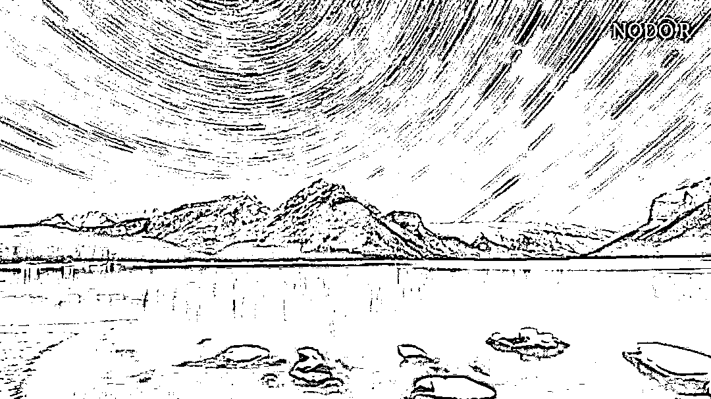

**在若道核心课程的教学里，****以学员为案例****进行课堂的占星咨询演示，是我们课程的特色环节。**

这样的演示不仅让很多同学有亲身体验咨询的机会，而且这么多真实案例的学习，会让大家看到占星咨询到底是怎么样一个过程。毕竟，大部分人的学习都是要从模仿开始。

记得若道君当年学习占星的时候，可没有这样的机会。那时候主要是听课为主，后来，我们在多年的教学实践中，**越来越发现课堂演示的重要性**。因此，就把这个作为一个主要环节加入到课程中。

在新一期的若道核心课程中，咔咔老师和大卫老师这对组合就会把这个教学特色充分发挥出来。**熟悉中国同学思路的咔咔老师会以知识点的讲解为主，而有 50 年占星咨询经验的大卫老师，则以课堂演示为主。**

有时候，这样的课堂演示的功效是出乎意料的。

一位若道的老同学赵震宇这么写到：

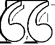

2018 年，我正式开始在若道学习 L1-5。其实我一开始的心态更多的是希望得到系统化的学习来补充我的知识漏洞，以及拿到一个证书可以为自己做背书，增加自己将来转型占星师的筹码，而不是真的在期待可以从若道的学习中得到一些本质上的领悟。

事实上在初期的 L1-3 中，很多知识与课上的内容，也是我比较熟悉的领域，相对而言是驾轻就熟的。但在 L3 的工作坊中和大卫老师的接触以及模拟咨询，让我对占星的态度发生了很本质的变化。

大卫老师对我星图的分析不仅非常准确，更重要的是，他开启了我自身个人成长上的变化，从而成为了我本质上进化蜕变的一个契机。

在短短的 6 个月内，我对人生的认知、对自我的认知、对于人生看待的方式都发生了翻天覆地的质的变化。我意识到了原来跳出自己一直以来无意识间重复的模式，是一件可行、并且会给自己带来无限成长提高自己人生幸福度和质量的事情。这也让我深刻体会到了人本主义占星学的魅力，以及自己之前是多么的“无知“。

于是现在，占星学对我来说，不只是兴趣、宗教信仰、或者是可能的职业道路，而是一种激发自己和他人人生成长和蜕变的工具、一种让自己更幸福的看待世界的方式。哪怕我之后并不会以占星为生，它依然是我人生中不可或缺的一部分，就像一副隐形眼镜，影响着我与世界的互动。

而被大卫老师咨询深深影响的同学还有很多。

**这里，我们节选一些短小的试听片段，让你稍微感觉一下在若道核心课程上，大卫老师的咨询演示是怎样的一个样子。**

**片段一**

<mpvideosnap class="js_uneditable custom_select_card channels_iframe videosnap_video_iframe" data-pluginname="videosnap" data-id="export/UzFfAgtgekIEAQAAAAAAMKsWN6BUygAAAAstQy6ubaLX4KHWvLEZgBPEnoIULgMKKb-DzNPgMItC2ZEgiEDMBYjrYHv9wNsO" data-url="https://findermp.video.qq.com/251/20304/stodownload?encfilekey=rjD5jyTuFrIpZ2ibE8T7YmwgiahniaXswqzQNpbBXpPP4TxDf43veVhCBACOECUZ1gc5HaUbhk0Z3Glc94tZFe7ewRHOH9L2oUC1X3aOe13K8IHMkEou9Nkgw&amp;adaptivelytrans=0&amp;bizid=1023&amp;dotrans=0&amp;hy=SH&amp;idx=1&amp;m=&amp;scene=0&amp;token=x5Y29zUxcibCEaJsXB0hMdWnJvmNct4OnXZaaWOd32ia2edkK2LTMk7jmjOms6bDk5TDtYTqEwbOQ" data-headimgurl="http://wx.qlogo.cn/finderhead/PiajxSqBRaEJYnVsqWfEX9qA0sI6hNVKsDfyzfPZ92WZMZyBpZWU5NA/0" data-username="v2_060000231003b20faec8c4e68a1ec2d4ca07e434b07755bbf47e7053a3059defd2c9d6c68a20@finder" data-nickname="若道" data-desc="#若道核心课 大卫老师用星座、行星、宫位来探索一位同学出生星盘主题的时候，他回顾了解读星盘的优先次序" data-nonceid="7723748345640460016" data-type="video" data-width="544" data-height="344"></mpvideosnap>

**片段二**

<mpvideosnap class="js_uneditable custom_select_card channels_iframe videosnap_video_iframe" data-pluginname="videosnap" data-id="export/UzFfAgtgekIEAQAAAAAANycuUwRANAAAAAstQy6ubaLX4KHWvLEZgBPEhYJ0WjYILr-DzNPgMIvjhT14ogdLw3BWd0Tg37w0" data-url="https://findermp.video.qq.com/251/20304/stodownload?encfilekey=rjD5jyTuFrIpZ2ibE8T7YmwgiahniaXswqz3Oj8zjAwTAIicKkuWErGfL3ZtYr95eTZl2oMcAx9ibThSN3gay2CmF6o8ht96zOZHdxGiaIMmdbGNtWv9Prb3wriaA&amp;adaptivelytrans=0&amp;bizid=1023&amp;dotrans=0&amp;hy=SH&amp;idx=1&amp;m=&amp;scene=0&amp;token=AxricY7RBHdV28gAuQuwABhG0G0QgmYSkh8LH68lEdHu6yrDYj099TFZVSWWqINaQTuTQ2p1ZMF0" data-headimgurl="http://wx.qlogo.cn/finderhead/PiajxSqBRaEJYnVsqWfEX9qA0sI6hNVKsDfyzfPZ92WZMZyBpZWU5NA/0" data-username="v2_060000231003b20faec8c4e68a1ec2d4ca07e434b07755bbf47e7053a3059defd2c9d6c68a20@finder" data-nickname="若道" data-desc="#若道核心课 占星学如何反应职业选择？" data-nonceid="629392412247480278" data-type="video" data-width="544" data-height="344"></mpvideosnap>

**片段三**

<mpvideosnap class="js_uneditable custom_select_card channels_iframe videosnap_video_iframe" data-pluginname="videosnap" data-id="export/UzFfAgtgekIEAQAAAAAAl_sREJMyhwAAAAstQy6ubaLX4KHWvLEZgBPEtIIkIkRmL7-DzNPgMIsA5PpGB3ReSAYx6ZfSNfZ1" data-url="https://findermp.video.qq.com/251/20304/stodownload?encfilekey=S7s6ianIic0ia4PicKJSfB8EjyjpQibPUAXolGhicE2gfRuDzIVwyXxBFlWMzxMczGgPzOG5ja3tyfwYQrAcOUkpGicEE1j6fc9zHAjg5IF1HDBibf9k85ybbAfdqQ&amp;adaptivelytrans=0&amp;bizid=1023&amp;dotrans=0&amp;hy=SH&amp;idx=1&amp;m=&amp;scene=0&amp;token=x5Y29zUxcibCEaJsXB0hMdeqQ56SUWMj15o3Z7wyXeQ6ruia8FGLMtcPAnn3TQl6hkia66nOjynB8M" data-headimgurl="http://wx.qlogo.cn/finderhead/PiajxSqBRaEJYnVsqWfEX9qA0sI6hNVKsDfyzfPZ92WZMZyBpZWU5NA/0" data-username="v2_060000231003b20faec8c4e68a1ec2d4ca07e434b07755bbf47e7053a3059defd2c9d6c68a20@finder" data-nickname="若道" data-desc="#若道核心课 如何从出生星图的基本要素看到案主生命发展的故事和个人成长经验？
" data-nonceid="6689802853667419635" data-type="video" data-width="544" data-height="344"></mpvideosnap>

**若道新一期的核心课程在****8 月 30 日****正式开始**，如果你有很浓厚的兴趣，不仅仅是因为好奇想浅尝一下占星学，但还没有想清楚是不是要学习整个 L1-5 的课程，**那么 L1-3 可能是一个不错的选择。**

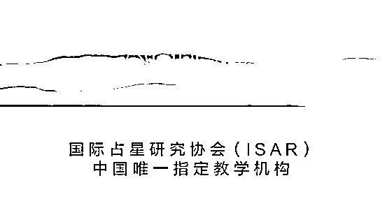

**谁是你的老师？**

**占星师咔咔（Caroline）**

2010 年师从美国占星师大卫·瑞雷学习，并得到世界名师斯蒂芬·弗里斯特、罗伯特·汉德、苏·汤普金斯传授各种占星学技法。若道首届学员，国内最早获得 ISAR 职业占星师资质的职业占星师，多次担任若道核心课程助教，2019 年第二届、2021 年第三届核心课中和苏·汤普金斯老师一起教授若道核心占星课程。

在国际知名广告公司和市场研究公司从事的市场研究和推广工作十余年，曾任职于阳狮集团、尼尔森市场研究有限公司、MTV 和《Madame Figaro》杂志。

**大卫·瑞雷（David Railey）**

*   **I****SAR 董事会成员，ISAR 全球副主席，ISAR 全球职业占星师资质认证主席，若道占星创始人**。

*   2016-2019 年，被选为国际占星协会（ISAR）考试委员会成员，国际占星协会（ISAR）是世界最大的国际占星机构，会员遍布 47 个国家。

*   2017-2020 年，被选为国际占星联盟（ISAR）考试委员会主席，理事会成员。

**助教王嘉祺 （Conrad）**

ISAR 认证占星师、若道认证生时校正资质，从 2010 年起自学占星学，2015 年开始在若道系统学习，并开始个案咨询。2018 年担任若道核心课程助教，以及卜卦占星学和太阳返照选修课助教，并带领学员进行经世占星和太阳返照方面的研究。2019 年 11 月作为演讲人之一参加了国际占星协会（ISAR）北京大会，也是 ISAR 星空俱乐部中国区第 16 期的主讲人。

**内容是什么？**

**ISAR 认证职业占星师的独有培训**

目前占星学的培训市场鱼龙混杂。而 ISAR（国际占星研究协会）是一个包含了 47 个国家在内的国际占星组织，多年来致力于占星的教育和研究，提升占星教育的品质和职业占星师的能力，在国际占星领域备受尊重。

**2022 年，鉴于对若道在占星教学领域所做的持续努力和高品质的课程服务，ISAR 特别授予若道核心课程为 ISAR 文凭课程，所有在若道学习，并通过若道毕业考试的同学将获得 ISAR 颁发的学历文凭（Diploma）。**

如果你想更多了解 ISAR，请点击[【这里】 ](http://mp.weixin.qq.com/s?__biz=MzA5NjA0NTAxNg==&mid=2651475298&idx=1&sn=b91888b54c14e29068f8b4e2a3452f5d&chksm=8b48ffd5bc3f76c32699f20f5c99e978bbb25551e69d80c70fee361acbd930ba5970ae776cdc&scene=21#wechat_redirect)

**课程费用**

**★ 1-2 阶　****课程费用：3500 元 ****★ 1-3 阶 连报**

**课程费用：11500 元 **

**********转发优惠价：**11000 元（朋友圈转发本课宣保留 24 小时以上，并截图给课程顾问）********

**★ 1-5 阶　连报**

**课程费用：46500 元 **

****转发优惠价：34800 元，朋友圈转发本课宣保留 24 小时以上，并截图给课程顾问****

**退转课程**

**退款原则请详看《教学协议》，如有疑问请咨询课程顾问。**

****2022 L1-3 认证职业占星师文凭课程****

**授课老师：大卫·瑞雷、咔咔**

**直播课开课时间：2022 年 8 月 30 日（周二）**

**授课方式：******网络授课，英文/中文授课，中文翻译****

**费用：** ****1-2 阶**：**3500 元；****1-3 阶**：**11500 元****（****转发优惠价：**11000 元，朋友圈转发本课宣保留 24 小时以上，并截图给课程顾问）******1-5 阶连报**：46500 元**（****转发优惠价：34800 元，朋友圈转发本课宣保留 24 小时以上，并截图给课程顾问）**；**

**课程负责人：王老师**（微信/手机：18510107057，请备注“大卫核心课”）

长按二维码添加课程负责人咨询

**报名直达入口**

# 若道周运 11.14-11.20 丨属于天蝎月的最后一周，准备迎接射手月的到来吧！（内含 12 星座运势）

> 原文：[`mp.weixin.qq.com/s?__biz=MzA5NjA0NTAxNg==&mid=2651493930&idx=1&sn=fb0ec91c29cc50185525d1ed1f6b131c&chksm=8b48249dbc3fad8b9add5bf8e0e6ce20642a3a393262969269472c7855859b8828ba6439b0b6&scene=126&sessionid=1692737725#rd`](http://mp.weixin.qq.com/s?__biz=MzA5NjA0NTAxNg==&mid=2651493930&idx=1&sn=fb0ec91c29cc50185525d1ed1f6b131c&chksm=8b48249dbc3fad8b9add5bf8e0e6ce20642a3a393262969269472c7855859b8828ba6439b0b6&scene=126&sessionid=1692737725#rd)

******☆ ****后台回复“今日”，给你一句生命态度******

作者/苏黎 ISAR 认证占星师
编辑/翀子 封面/书君 图片/稿定设计**整体氛围**

**本周是太阳天蝎月的最后一周，经历了上周的[【金牛座满月月全食】](http://mp.weixin.qq.com/s?__biz=MzA5NjA0NTAxNg==&mid=2651493433&idx=1&sn=4b30c47884691f3784d09dba26021639&chksm=8b48268ebc3faf98d32d59275e660728520b016e4b15c0777000dafaadcfa5077250405d3ed1&scene=21#wechat_redirect)**（点击查看文章）**，你的感受是什么？工作生活、身心状况还好吗？**

朋友和我反馈，月食前后，她失眠，肠胃不舒服，生活中充满了疲惫和沮丧感。天蝎座内在的探索是尖锐的，直指真相和阴影，确实让人不舒服。

月食的影响不仅是发生的当下，在月食发生的前期、后期，都会对我们的情绪造成强烈共振，我们会在情感低落期陷入迷茫，产生身体的无力感。

**本周，金星和水星会陆续进入射手座，下周太阳进入射手座。**射手座是充满热情和探索的星座，穿越黑暗的月食隧道，我们会开始探索人生和生命的意义。悲观、钻牛角尖的思维和情绪会逐渐吹散，开始用更宽阔的视野看待问题。

**在被限制的生活中，我们如何用乐观、积极和包容的心态去面对生活和人生呢？这是本周行星换座思考的问题。**

**本周重要天象：**

*   **太阳三分海王星**

*   **金星进入射手座**

*   **水星三分木星**

*   **水星进入射手座**

*   **太阳六分冥王星**

*   **火星四分海王星**

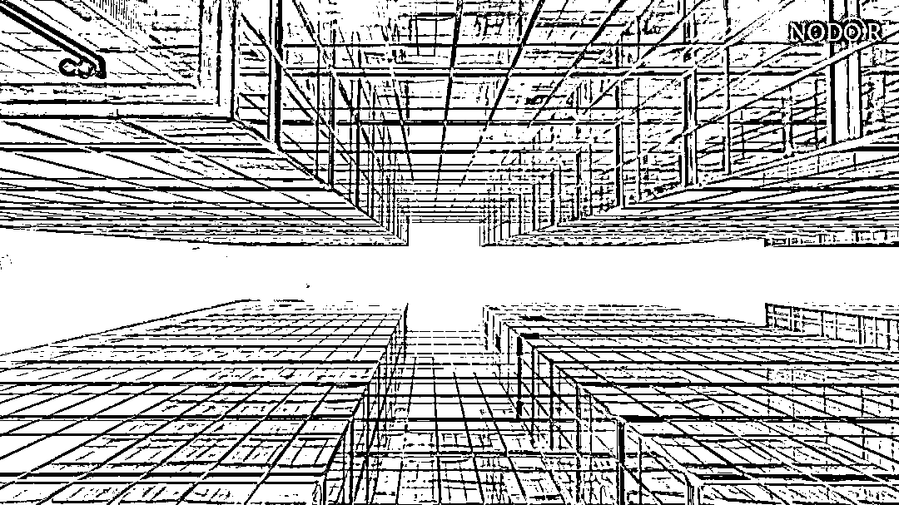

**一周重要天象****★ ****11 月 15 日，周二**

**月亮在狮子座；太阳（天蝎座）三分海王星（双鱼座）；水星（天蝎座）六分冥王星（摩羯座）；金星（天蝎座）三分木星（双鱼座）。**

**灵感火花和幸运的日子**

太阳和海王星的三分相，这是我们实现自己愿望和理想合适的时机。生活中直觉力强，对周围的事情和人物都很敏感，我们可以积极地为自己理想奋斗。但也需要避免被外人的负面情绪影响。

水星与冥王星的六分相，有洞悉真相的能力，有利于语言、思考和沟通相关的事宜。我们的想法也会让他人更好理解和接纳。

金星和木星在水元素的三分相，会带来强大的心灵能量和艺术感染力。我们会在生活中看到很多美好事物，心情乐观开朗，愿意慷慨对待他人。

**★****11 月 16 日，周三****金星进入射手座；太阳（天蝎座）梅花火星（双子座）；水星（天蝎座）三分木星（双鱼座）。**

**开启新的情感关系**

穿越激情和复杂深邃的天蝎座，金星进入代表自由和哲学、宗教信仰的射手座。我们会渴望与他人在精神理念的融合，表达乐观与热情。渴望通过传播自己的理想和信念，与他人建立关系。

通过天蝎座的炼狱考验，我们对未来更有意义的事物产生热情，点燃了激情的未来。

水星和木星和谐的三分相，让直觉和敏感度提升，我们会积极表达自己的观点和想法。交通运输路途顺畅，各种商业信息广泛传播。我们也会在日常和他人有更多的交流机会，并从沟通中获益匪浅。

真相有时不一定让人愉悦，当我们在实现目标的道路上，意识到生活的真相和阴影时，我们需要克制并调整行动的方向和动力。

**★****11 月 17 日，周四****水星进入射手座，月亮在处女座行进**

**沟通的新开始**

处女座的月亮是小心谨慎的，务实、理性、关注效果，我们处理事情的出发点会关注细节。当日水星进入射手座，这和水星在天蝎座是不一样的能量。

水星进入射手座，象征我们进入新的思维模式。这是一种开放的、重视精神道德、追求真理和信念的思维模式。心胸开阔，从天蝎座对真相的执着探索，到射手座的展望未来。

生活中太多的一地鸡毛，让我们练习眺望远方的地平线，学会用积极乐观的态度面对艰难的世道。这也是开启我们考试、进修的最佳时机。

**★****11 月 19 日，周六**

**太阳（天蝎座）六分冥王星（摩羯座），逆行火星（双子座）四分海王星（双鱼座）**

**和谐和迷茫的能量并存**

月亮白天在处女座行进，晚上进入天秤座。休息日的月亮能量，合适在家收拾整理家务，打扫清理。傍晚，可以外出社交，与好友沟通倾谈，或观看喜欢的艺术表演，放松身心。

太阳和冥王星的和谐相位，我们目的明确，行动和意志力很强，明白如何从艰难的困境中调整和复原。

火星和海王星的四分相，则让我们在思维意识中陷入迷茫。海王星带来消融、无力和迷茫的感受。在和谐和迷茫夹杂的能量中，我们的情绪会在积极和消极倦怠中流转。

我们有多久没有静坐思考、放空紧张的大脑神经呢？找到疗愈你的灵性练习很重要。

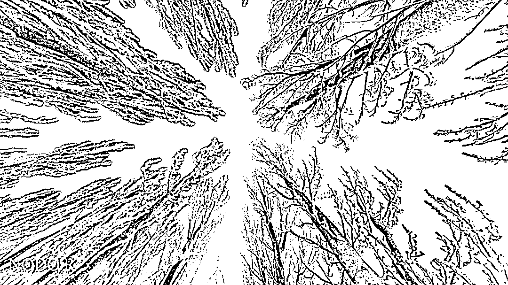

**12 星座的一周运势**

**（重点参考上升星座，其次参考太阳星座）**

***白羊座***

这周，白羊座们在投资和偏财等方面，有不错的表现。如果有处理和保险、遗嘱、投资、商业合作方面相关的机会，可以适当把握。本周，也合适心灵意识方面的探索，要慢慢静下心做事，学会找到自己未来的目标。

随着金星和水星的换座，白羊座们合适在考试、培训、技能学习方面做规划，或与远方的朋友沟通联络，建立情感关系。如果在疫情缓和、没紧急情况的地区，合适外出度假。

***金牛座***

上周的月食，你的感受是什么呢？月食后几天的能量对你的影响仍然存在。事业的合作伙伴、工作上有密切关系的人在这周会给到你一些帮助和支持。财务上的压力让你有时想逃避，稳定的收入和其他财务负担同时存在，这让你感受到挑战和压力。

本周会协调平衡家庭和事业的需求，找到忙碌中的平衡点。对金牛座而言，稳定和根据需求开展工作、保持生活的节奏很重要。你们会积极寻求合适潜在的商业合作机会，为即将到来的射手月做准备。

***双子座***

本周是职场机遇较好的契机。你对自己的沟通事项很自信，在工作事业上有所收获。但需要关注身体方面，有机会可以去做体检，以保证在射手月以最佳状态开始新的合作。

你可能会考虑一些合作事项，或关注改善与伴侣的关系。单身的双子座们，也许会期待邂逅合适的对象，或期待修成正果的缘分。你本周会倾向思考，并不着急做决定。业务方面合作的机会则让你最终在事业有收获。

***巨蟹座***

维系稳定的情感，对重视安全感的巨蟹座而言，不是一件容易的事情。如果浪漫的情感关系不如意，巨蟹座们会对自我价值产生质疑。幸好本周的星象，你们明白，无论自己在外表现如何，你们是值得被爱和被需要的。你们对人际关系的自信度提升。

当你对自己自信时，在职场和工作中，你们才会展现出沟通的魅力。周末和家人多聚会沟通，不要想太多，保证睡眠很重要。

***狮子座***

这个月对狮子座是不平凡的月份。很多时候我们会经历意外，与预期不相符合。本周，你在逐渐消化月食对你生活的影响中，学会处理家庭中的关系和问题，也逐渐走出心理的阴影。你学会应对危机和变化，在处理职场关系中有一些成效。

水星和金星的换座，家有儿女的狮子座们，要学会营造更好的亲子关系。单身的狮子座们，期待浪漫的邂逅。这也是你寻找自己天赋、寻求在社会舞台发光的时刻，请充分挖掘你身上的才华和天赋！

***处女座***

洞悉真相是本周的主题。你会从阅读中获得灵感和点子，在工作和事业上，通过沟通获得支持，洞悉一些事情的真相，并知道如何解决处理问题。这让你在合作关系、社交关系、伴侣沟通中有共鸣。你会低调的，认真消化讯息，体现你的专业性。

随着金星和水星的换座，你是否有家居装修的计划呢？处理商业方案，需要谋划和充足的资金储蓄。本周合适谋划未来的商业投资计划，金钱开销需要做好预算。

***天秤座***

财务是天秤座在太阳天蝎月关注的主题。本周你们会在家庭上获得财务的支持，你们或许会通过推动项目的进展，获得领导对你的认同。

随着金星和水星换座，你和好友的沟通日益频繁，你的思想和眼界也逐渐开阔，你会发现有更多的人需要你。你会和有趣的人发展亲密关系，他们也会从你这里获得指导。

***天蝎座***

天蝎月的主角，日月食给你什么样的体验和感受呢？天蝎座喜欢在危机中冒险，这是他们自我历练的旅途。本周的星象，你会成为自己的明星和主角。趁着太阳在天蝎座的最后一周，你克服了生活的挑战，对自己更自信。你积极的情绪会传染给家人、朋友。

这是探索的一周，为了下周群星射手月的行进，你需要思考如何使用自己的天赋，在物质和财富方面创造你的未来。你有识别事物真相的天赋，只是需要适当的使用。

做一些有意义的事情，在社交和集体中发挥你的个人魅力，在职场上积蓄人脉资源。

***射手座***

射手座们一贯乐观，相信机遇总是不期来临。本月如果你没遇到开心的事情，甚至有情绪压力的话，本周的星象行进会改善很多。和家人保持良好的关系，营造良好家庭氛围，给自己充足的睡眠，会发现梦境给你的顿悟很真实，生活也会感受到愉快和轻松。

在本周后期，你感受到身体、情感和精神的充沛，帮助你解决生活中的困境，似乎你在逐渐触摸到射手座的幸运。

***摩羯座***

摩羯座们不喜欢意外和不被尊重。本周你可能和过去相识的人沟通、重逢，昔日的友人给你带来一些机会，你会在投资、合作关系上有更多的考量。

摩羯座的人很懂隐忍，投入太多时间在责任、义务和目标的实现上。你需要关注自己的健康和萎靡不振的疲惫感。本周末合适放松，花一些时间放空大脑有助于保持精神动力。

***水瓶座***

本周你专注在工作职场，你会认真在事业中展现你的能力，获得领导的认同。你期盼的某件事情也许获得批准。你处变不惊的冷静，让你在社交圈获得认同，外人会欣赏你的智力。

虽然你不在乎外人的评价，情绪的影响对瓶子们不是太关注的重点。随着群星逐渐进入射手座，你在社交平台、团队中的干练和魅力逐渐凸显。

***双鱼座***

本周在法律事务处理、考试学习、与国外导师的沟通上会更顺畅。双鱼座是很敏感的星座，本周的星象能量，你们会在人际关系中有更深的认识，明白哪些人是你们真正的朋友、哪些人是支持者、哪些人需要远离。

本周的金星、水星换座，会让你在事业上更有信心，走出过去的低迷时光，开始更自信的在职场中与他人沟通，积极推动项目发展。

**版权声明**：原创文章由作者授权首发于若道平台发布，欢迎转发，反对抄袭。友号转载请申请白名单。

**END**

**苏黎（Sulis）**

ISAR 国际认证占星师（2019 年获得）/塔罗咨询师

现代占星融合古典解读

20 多年跨行业领域职场经历

**咨询微信**：liuzq26

**公众号**：Sulis_1975

长按打赏

**20 位来自世界各地的占星师****带来 19 场沙龙——新世界的觉醒****详情可点击下图**

**学习占星学****点击下图了解课程详情**

**微信又双叒叕改版啦，不想错过若道君的推送？**
****就把若道设为****星标****以及点点****“在看”****吧！******▼**

**喜欢就点一下“在看”吧！****报名直达入口**

# 雷蒙德·梅里曼金融占星周运 | 本周将迎接乐观情绪

> 原文：[`mp.weixin.qq.com/s?__biz=MzA5NjA0NTAxNg==&mid=2651493930&idx=2&sn=6b99cbd121f90dcaafa9e831a4b0840a&chksm=8b48249dbc3fad8b37ead4fc85d9deb27c0f9a9f3843392d0b1b687fe70b422499b3bf4506f8&scene=126&sessionid=1692737725#rd`](http://mp.weixin.qq.com/s?__biz=MzA5NjA0NTAxNg==&mid=2651493930&idx=2&sn=6b99cbd121f90dcaafa9e831a4b0840a&chksm=8b48249dbc3fad8b37ead4fc85d9deb27c0f9a9f3843392d0b1b687fe70b422499b3bf4506f8&scene=126&sessionid=1692737725#rd)

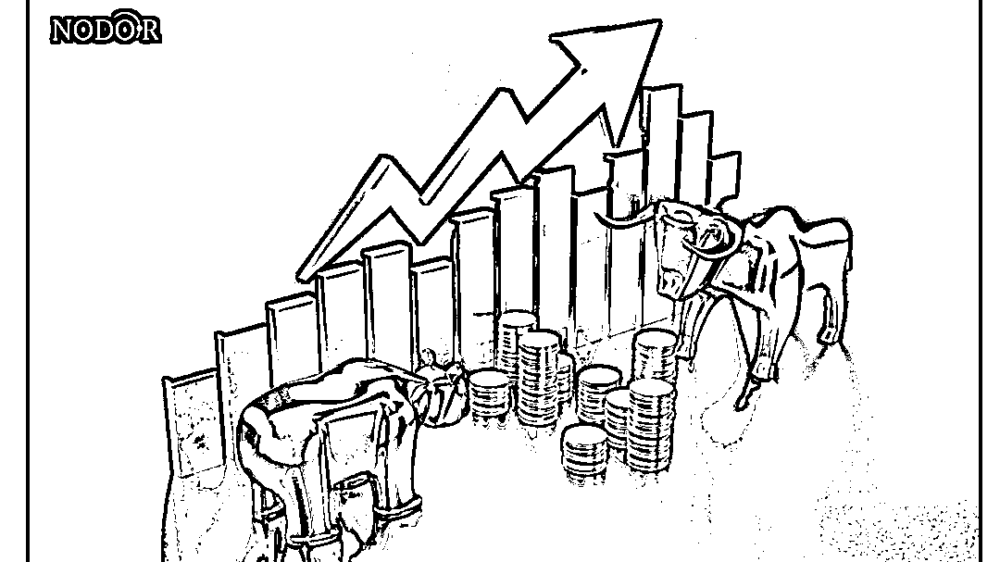作者/雷蒙德·梅里曼 译者/Luke 编辑/玫瑰 图片/稿定设计雷蒙德·梅里曼是在金融占星学界稳坐第一把交椅的占星师，同时他也是若道签约的金融占星课老师，我们引进了雷蒙德·梅里曼老师的《[上证指数月度报告](http://mp.weixin.qq.com/s?__biz=MzA5NjA0NTAxNg==&mid=2651491983&idx=2&sn=3e5aef96ac219afb4dd421bfc33b024f&chksm=8b483c38bc3fb52ec2bc36e67f3698ded0e88b4e08ff79785eaa801cbc565e931c8132142632&scene=21#wechat_redirect)》及《[黄金报告](http://mp.weixin.qq.com/s?__biz=MzA5NjA0NTAxNg==&mid=2651491983&idx=2&sn=3e5aef96ac219afb4dd421bfc33b024f&chksm=8b483c38bc3fb52ec2bc36e67f3698ded0e88b4e08ff79785eaa801cbc565e931c8132142632&scene=21#wechat_redirect)》。我们经老师的授权，将每周刊登梅里曼老师的周运，供大家参考和学习。于是，这是本周的周运（11.14-11.18）。

**说明：以下时间采用纽约证券交易所所在地美国东部标准时间。**

**展望与回顾**

****

**上个月通货膨胀放缓至 1 月以来的最低水平，但仍然处于高位。这可能让美联储官员开始放缓旨在平抑物价的加息节奏。美国劳工部周四表示，10 月消费者物价指数较一年前同月上涨 7.7%，低于 9 月的 8.2%和 6 月的 9.1%，后者是 40 年来的最高水平。**

**——格温·吉尔福德和尼克·蒂米拉奥斯**

**《通货膨胀缓解，推动股市飙升》**

**《华尔街日报》**

**2022 年 11 月 11 日**

**本周投资者对加密货币交易所 FTX 的挤兑，标志着加密货币的第二轮崩溃。目前为止受害者都是你情我愿的成年人。除非影响意外蔓延至银行系统，这是又一次由长期宽松货币政策带来的市场狂热转变为恐慌的案例。**

**——《FTX 交易所的惨败》**

**《华尔街日报》社论版**

**2022 年 11 月 11 日**

对于上周那样的一周，我们从哪里说起呢？让我们从天王星开始说起？更具体地说，让我们从 11 月 5 日-11 日关键行星（太阳-金星）最后一次将光线传递给正在出相的 2021 年-2022 年土星-天王星四分相开始。那是一件大事。11 月 5 日-11 日的中间是 11 月 8 日，中期选举日，那恰好也是发生强有力的月食的日子。你预计某件意料之外的事——动荡会在选举和金融市场上发生。确实如此。专家们预测的红色浪潮（共和党人）没有发生，因为他们不懂占星学。直到乔治亚州（再次）决胜选举结果出炉前，参议院甚至可能不会有明显的多数席位。**市场走势也发生了意外情况（天王星）。**11 月 8 日，比特币和加密货币让每个人惊讶，发生了一场巨大的崩溃，创下年度新低。这相当于“银行挤兑”，符合天王星在金牛座的经典可能性，更何况天王星还与土星（损失）成四分相。银行看起来依然稳定（迄今为止），但是数字银行刚刚损失了数十亿美元的价值。这符合去年《2022 年金融预报》中为比特币描述的前景，其中认为 2022 年比特币将暴跌 77%-93%。目前比特币已从 2021 年 11 月创下的约 69000 美元的历史高点下跌约 77.5%。意外和拉锯随后来到股票市场。在 11 月 8 日到达新周期高点后，美国股票市场周三剧烈下跌，原因是不确定的选举结果，而且没有出现把这个国家钱包交给共和党人管理的“红色浪潮”。根据几乎所有民意调查，选民们相信共和党人拥有更大的信托责任感。道琼斯工业平均指数下跌超过 600 点，相对于周二的高点下跌近 900 点。但是第 2 天，11 月 10 日，消费者物价指数（通货膨胀）报告发布，带来了另一个意外。通胀数字比预期低得多（又是天王星）。消息传出后，美国股市开盘大幅升高，以 2 年多来最大单日涨幅收市。道琼斯工业平均指数上涨超过 1200 点，是前一天跌幅的 2 倍。突然之间（又是天王星），看起来 2022 年熊市最糟糕的时刻似乎结束了。

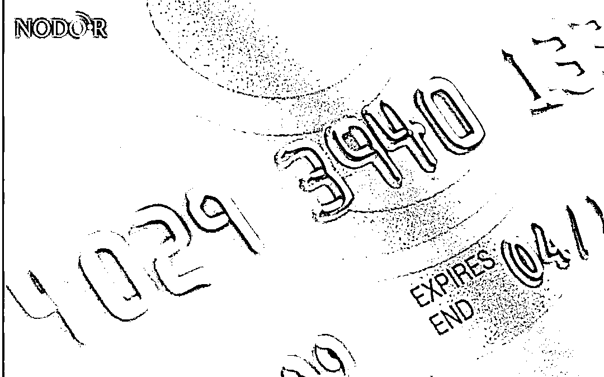

一天之内，世界从看跌转为看涨。在上周中间，见证了近 2 年土星-天王星四分相的最后一次 “光线传递”，伴随着强大的月食，金融世界从黑暗变为光明，政治世界被颠覆。专家意见和民意调查错了，又是天王星的作用。低于预期的通胀数字是全世界听到的一声枪响。这表明，美联储将能够放慢加息步伐。加息将美元汇率推高到令其他国家（几乎是每个人，除了美元的持有者）头痛的地步。更不用说的是，火星（与痛苦有关，守护白羊座，与头部有关）在前一周的 10 月 31 日逆行。它也必须加入与金融市场重大反转以及投资者集体态度改变相关的组合中。美国出人意料的通胀报告发出后，几乎全世界的股票指数上周飙升至数月新高。表现突出的是印度 NIFTY 指数，周五攀升至 18362，非常接近一年前的历史高点 18504。上周末唯一没有强势上涨的是巴西 Bovespa 指数，下跌至 9 月末以来的最低价位。**大多数股票指数的涨势都很壮观，但依然低于 8 月高点。它们需要超越这些高点，才能表示比基本周期更大的周期形成了看涨趋势指标形态。**值得关注的是，黄金和白银上周都出现了大幅上涨。黄金周五飙升至 1771，较一周前 11 月 3 日的 2 年低点 1618 美元大幅上涨。白银暴涨至 22.16，是 5 个月以来的最高价位。但最重大的是加密货币的崩溃。比特币 11 月 10 日崩盘至 15566，到达 2020 年 11 月 12 日以来的最低价。不到一周前（11 月 5 日），它还在 21471 交易，是 9 月中旬以来的最高价位。跌幅达 27.5%。以太坊也受到打击，下跌至 1071 的低点，但不像比特币那样下跌至新的年度低点。总的来说，上周是疯狂的一周，完全符合上周三到周五的天王星困难相位、月食，随后是多变的月亮在双子座。

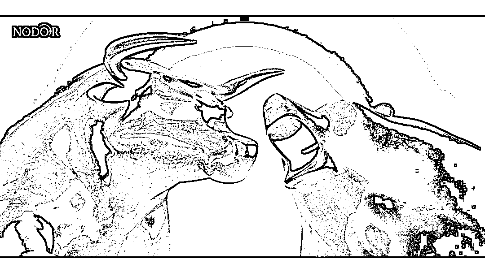

**短期宇宙征象与长期考量**

****

**他（拜登）甚至有可能在中期选举中，获得比任何人想到的更多的支持他。鉴于拜登自己的支持者都对他越来越失望，这怎么可能呢？原因可能是唐纳德·特朗普。他承诺积极参与中期选举，可能导致共和党重大的分裂。****这样的天赐之物，在拜登的星图中体现在哪里？是通过行进的海王星表现出来的，海王星与他出生星图中的木星（星图守护星）和他在第 12 宫天蝎座的水星、太阳、金星星群形成一个非常幸运的大三角。****总统所要做的就是保持冷静和不具威胁性。行进海王星出现在水象大三角中，本人很容易获得好处，而无需太多努力。** **——雷蒙德·梅里曼****《2022 年的美国总统》****《2022 年金融预报》****写于一年前的 2021 年 11 月****让我们切入正题：如果特朗普先生下周宣布他将再次参选，那么 2024 年总统大选将于那一天结束。这必然会让共和党人一败涂地。****——丹尼尔·亨宁格****《共和党的特朗普责任》****《华尔街日报》****2022 年 11 月 10 日**

“到底发生了什么？”“为什么大家都错得这么离谱？”因为他们不理解天王星。他们不理解宇宙周期与人类活动的相联。他们不理解海王星与拜登总统出生星图中的金星-木三分相形成大三角带来的“好运气”。这可能是最幸运的相位，是与他一生付出最少的努力得到最大回报相关的相位。

这证明了“品质好不如运气好”的老生常谈。这次选举并不能证明乔·拜登作为一名领导人有多么出色，也不能证明他的政策在美国人民中有多么受欢迎。仅仅证明了他运气很好。原因是唐纳德·特朗普再次使这次选举成为了对他——特朗普的一次公投。他不受欢迎地不停抱怨“被偷窃的大选”，大多数美国人对此感到厌倦。 

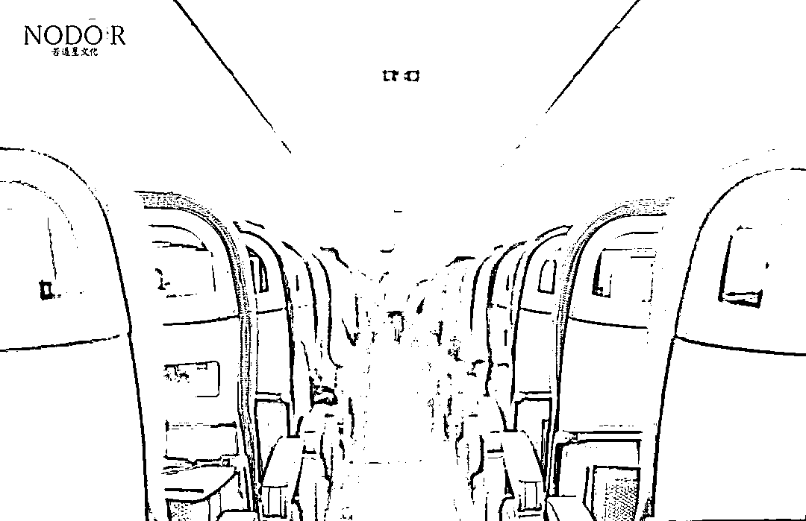

但是政治方面就说这么多。这次选举几乎结束了（但是国会的领导党派尚未决定），通货膨胀率也在下降。股票和期货市场喜欢这样，因为这意味着：**· **美元在下跌；**· **资产的价格在攀升。**乐观主义（木星）回归，对未来的悲观情绪（土星）被暂时搁置。这可能会继续下去，因为一系列与乐观情绪相关的地球宇宙学征象即将发挥作用。**在占星学研究中，乐观主义由木星和射手座掌管。这周两者都会到来，这显得更有意义，因为**土星-天王星四分相的挑战终于结束。在 11 月 15 日，金星会与木星形成有利的三分相。**在形而上学领域，这被称为**与“丰盛法则”相关的相位。**同一天，太阳三分海王星。海王星有点类似木星，因为木星和海王星都守护双鱼座，而且海王星也在双鱼座。**这种欣快的情绪本周 11 月 19 日可能会有所消退，因为那天逆行的火星，再次四分海王星，**上次同样相位发生在 10 月 13 日，当天美国股市因糟糕的消费者物价指数数据创下年度低点。现在这个相位又出现了，只不过这次火星是逆行的，消费者物价指数报告出现了相反的结果。下周 11 月 21 日-23 日，太阳三分木星，然后进入射手座，木星顺行。那是很多木星和射手座元素。宇宙发出了许多乐观主义的信息。这就是为什么股票可能继续上涨。这是一个吉兆，有理由聚会和庆祝。享受即将到来的假期季，这可能会提前开始。从 2018 年年末，若道引入金融占星大师雷蒙德·A·梅里曼撰写的梅里曼市场时机学院每年一次的年度预报沙龙和每年一本的《年度预报》以来，**2023 年已经是第 5 个年度了。我们简单回顾了部分 2019-2022 年金融预报的内容，**过去的经验让我们相信，你根据梅里曼老师的指导作为投资参看，你会比一般人有更大的胜算。******长按下图识别二维码****了解更多详情**

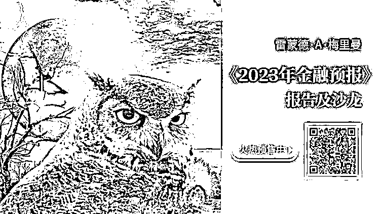

**说明：以上日期基于纽约证券交易所所在的美国东部标准时间，由于存在时差，中国地区可能需要加一天。**

**版权声明：**本文由若道翻译发布，欢迎转发，反对抄袭。友号转载请申请白名单。**END**

**雷蒙德·梅里曼（Raymond Merriman）**

若道签约老师。著名金融占星师，ISAR（国际占星研究协会）前主席，梅里曼市场分析公司的总裁。他由于“提升了占星学的职业形象”，在 1995 年国际占星大会上被授予轩辕十四奖；在 2012 年国际占星大会上，被授予轩辕十四终身成就奖。

1“中国上证指数月度报告”发售**若道推出了****中文版****的雷蒙德·梅里曼中国上证指数月度报告，并持续发行该报告！**当把金融市场的周期和占星学的周期相结合时，雷蒙德·梅里曼老师的金融占星学研究**为投资者应对金融市场的周期波动，并随之调整投资策略提供了极大的价值参考**。
**11 月中英文报告已上线！**2“黄金价格周期月度报告”发售**若道推出****中文版****的雷蒙德·梅里曼黄金价格周期月度报告！**不仅仅为广大读者在中国股市的投资出谋划策，更将视角放眼黄金市场。**每当世界经济形式不明朗的时候，有一个地方是保值的港湾，那就是****黄金**。自 1982 年雷蒙德·梅里曼出版第一本研究《地球宇宙学征象与黄金价格的关联》的著作以来，**他一直作为最重要的黄金市场时机预测者之一享誉国际**。2022 年 11 月黄金报告已上线，梅里曼老师将会告诉你他对这个关键时期如何操作的想法。也可以按照季度和一年期订阅，有更多优惠。季度和年度的好处是，你可以持续了解梅里曼老师对于不断在变化的市场的看法。即便他某一次看法和市场不一致，你也看到在下一期他如何调整自己的看法，并看到金融占星在一个长期时间段内对你把控风险的帮助。而能够长期控制风险、尽量找到安全的投资时机才是投资的长久之计。**11 月中英文报告已上线！****购买套餐**，买得越多越优惠中国上证指数月度报告套餐价

*   **单月报告**：280 元
*   **3 个月套餐**：780 元（260 元/月）
*   **12 个月套餐价**：2400 元（200 元/月）

**长按下图识别二维码****购买金融报告****套餐****▼**

黄金周期月度报告优惠

*   **双报告年度套餐更优惠（直降 900 元）**

*   **12 个月黄金报告+12 个月上证指数报告：仅需 3900 元**

**长按下图识别二维码购买黄金报告套餐**▼

3《2023 年金融报告及沙龙》

从 2018 年年末，若道引入金融占星大师雷蒙德·A·梅里曼撰写的梅里曼市场时机学院每年一次的年度预报沙龙和每年一本的《年度预报》以来，**2023 年已经是第 5 个年度了。我们简单回顾了部分 2019-2022 年金融预报的内容，**过去的经验让我们相信，你根据梅里曼老师的指导作为投资参看，你会比一般人有更大的胜算。****

**长按下图识别二维码****了解更多详情**

**购买直达入口**

# 金融报告丨雷蒙德·A·梅里曼 2023 年《年度预报及讲座》来啦！

> 原文：[`mp.weixin.qq.com/s?__biz=MzA5NjA0NTAxNg==&mid=2651493930&idx=3&sn=f6e6b9c14432189e62578107ebd38501&chksm=8b48249dbc3fad8bfb395c323db5bcf6234ca937c7c2694783a69a6e8a092b9b0194a4f67a40&scene=126&sessionid=1692737725#rd`](http://mp.weixin.qq.com/s?__biz=MzA5NjA0NTAxNg==&mid=2651493930&idx=3&sn=f6e6b9c14432189e62578107ebd38501&chksm=8b48249dbc3fad8bfb395c323db5bcf6234ca937c7c2694783a69a6e8a092b9b0194a4f67a40&scene=126&sessionid=1692737725#rd)

从 2018 年年末，若道引入金融占星大师雷蒙德·A·梅里曼撰写的梅里曼市场时机学院每年一次的年度预报沙龙和每年一本的《年度预报》以来，**2023 年已经是第 5 个年度了。**

我们简单回归一下梅里曼老师 2019 年-2022 年的《年度预报》中一些预测。

在 2019 年的年度预报中，对于上证指数，梅里曼老师写到：

2018 年末至 2019 年初，中国股市处于三个重要周期低点的时间段。紧随这一低点，将会出现一次非常大的反弹。

2019 年木星会与海王星形成三次四分相，过去，这个相位总是与惊人的强大“泡沫”同时出现，期间股价大幅飙升。

到 2019 年 7 月之前，上证指数有三个重要长周期会出现周期低点，理想上看是在 2019 年 3 月底之前。

上证的周期低点出现在 2019 年 1 月，从那时起，上证迎来了 3 年的上升。

对于黄金，梅里曼老师建议：

从占星学角度来看，木星在射手座，四分在双鱼座的海王星，支撑看涨观点，因为这个组合有增加通胀的潜力。此外，木星在射手座的行星-星座组合从 1983 年起出现过三次，每次都对应到金银市场的年度高点。

无论在 2019 年何时，只要黄金保持在 1167 以上，同时跌到了任一主要周期低点附近，就要寻找买入机会。黄金可能在 2019 年涨到 1500+/- 50，甚至更高。

2019 年黄金从 1284 美元开始上涨，最高点在 1566 美元。

所以，如果你在 2018 年购买了《年度预报》，按照梅里曼老师的建议投资了上证指数和黄金，你会在当年取得相当不错的收益。

**对于 2020 年，在席卷全球、深刻影响了未来的疫情到来之前，梅里曼老师为 2020 年定下基调的：**

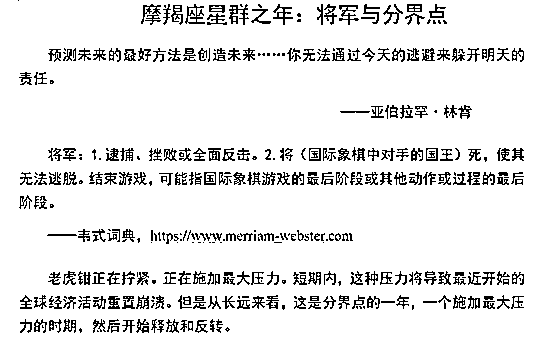

站在 2019 年的年尾，我们不知道一场深刻改变未来的风暴马上就将来临。

梅里曼老师，这位杰出的宇宙气象预报员，未卜先知，为 2020 年定下“将军”的基调。

在那一年，我们目睹了美国股市的 4 次熔断和全球经济的重置崩溃。

对于黄金，梅里曼老师是这么说的：

1391.50-1413.70 是价格最强的支撑区域。只要不跌破这个区间，黄金就能够上涨，重新测试 1566.20。如果突破了 1560-1590 的阻力区间，那么黄金就能够重新测试 1920。在那以前，黄金最有可能在 2020 年中在 1390 和 1575 之间波动。

| 黄金周 K 线图

2020 年，黄金在横盘 3 个月突破了 1560-1590 的阻力区间后，一路上涨到 9 月最高点 2089.20 美元。

对于上证指数，梅里曼老师建议：

2020 年的反弹将超过 2019 年的高点 3288。然而，这一涨势可能会通向 5.5 年周期的波峰，随后将再次迎来一波跌势至 2021 年或更晚。

行进中的摩羯座星群——木星、土星和冥王星——表明在 2020 年 11 月底之前会出现一个高点，很可能在 2020 年的前六个月。建议交易者特别注意金星逆行的时期，也就是 5 月 13 日至 6 月 25 日。逆行或顺行一个月内出现的年度高点或低点可能会带来卖出机会。

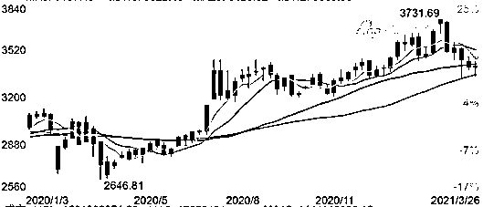

2020 年，上证指数最高达到 3474，超过了 2019 年的高点 3288。

**站在 2020 年的末尾，对于 2021 年，梅里曼老师说：**

随着 2020 年木星、土星和冥王星形成大合相，我们刚刚结束了一个周期和一个时代。此刻我们正处于一个新的时代和一个新的长周期的早期阶段。事实上，是多个长周期。

对于上证指数，梅里曼老师说：

我们预计涨势将在 2020 年 12 月-2021 年 2 月之间达到波峰，然后急剧下跌至 52 周和 22 个月周期的低点，这些周期将在 2021 年 5 月之前，甚至在 3 月底之前结束。此后可能会出现另一轮反弹，可能会也可能不会在 2021 年 11 月之前形成第一个 33 个月周期的新高。

对于黄金，梅里曼老师说：

黄金的 31.33 个月周期波谷将在 2021 年 9 月之前出现，理想情况是 2020 年 12 月-2021 年 6 月。价格目标是 1628+/-109 或 1768+/-76。重叠范围（理想情况）是 1692-1737。如果价格跌破这些范围，则为看涨情况中令人担忧的状况。

**而在 2022 年的年度预报里，我们看到：**

渐亏四分相不仅对应无法解决的冲突和分歧，土星和天王星形成的任何四分之一周期（合相、四分相和对分相）都可能在社会动荡和某地区现状受到威胁的时期出现。

在 2008-2010 年上一次四分之一周期时（对分相），世界见证了阿拉伯之春。在 1999-2000 年渐盈四分相期间，游行、抗议和直接武力冲突扰乱了西雅图世界贸易组织会议。这也标志着美国经济扩张的结束，以及由互联网泡沫破裂和 2001 年 9 月 11 日对美国世贸中心的恐怖袭击引发的衰退的开始。在此之前是 1988 年的合相，对应的事件是缅甸（Myanmar，当时的国名是 Burma）爆发了一场全国性起义，反抗尽失民心、暴力过度的军政府。数十万公民在全国范围内的暴动中抗议，这成为缅甸历史上的决定性时刻之一。

在每一个案例中，极端主义都占据主导地位，导致暴力冲突，但最终带来了“更大的益处”。它产生了建设性的结果，但在它进行的同时，世界在经历巨大的危机和暴力。”

2021 年 5 月 13 日-7 月 28 日，木星首次行经双鱼座时，这些因素表现得很明显。那时，通货膨胀开始出现，但美联储向所有人保证，这只是暂时的，他们将无限期继续推行“宽松货币”政策。他们并不担心持续的通货膨胀，这是典型的木星在双鱼座的表现，对现实的脱离或错误判断。

这两颗行星以及双鱼座也掌管原油。因此，我们可能会看到油价飙升，以及/或石油泄漏，威胁到大自然。它也可能对应着由于事故而释放的有毒气体，威胁到那些暴露其中的人的生命。

对于黄金，梅里曼老师建议：

只要黄金保持在 1670-1680 之上，仍然有极小的机会出现一轮爆炸性上涨，测试当前的历史高点（2089），甚至创下历史新高。毕竟，木星将在双鱼座合相海王星，可能预示着另一轮“投机狂热”。然而，这也可能是一个“恐慌”的征象，届时某些市场可能会崩溃。

在 1900-1980 之间存在较大的阻力，如果不能突破这个阻力，将表明黄金的熊市已经开始，新一轮的猛烈下跌可能正在准备中。只要跌破 1670 则将确认黄金 20 年的牛市结束了。

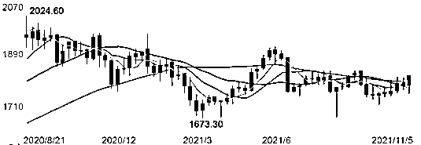

| 黄金周 K 线图

对于上证，梅里曼老师说：

我们预期在 2022 年 5 月前，上证综指会出现急剧的下跌，进入 52 周周期和可能的 33.5 个月周期低点。

我们更倾向于认为，上证综指会首先下跌，在 5 月前形成一个低点，然后上涨。这一轮上涨的幅度，将告诉我们上证综指是处在牛市，还是进入了新的熊市。如果它不能上涨超过 3750，长周期波峰可能已经出现，并且进入了新的熊市。

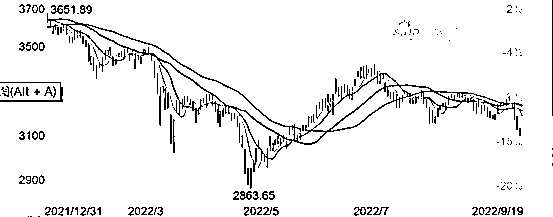

我们简单回顾了部分 2019-2022 年金融预报的内容，**过去的经验让我们相信，你根据梅里曼老师的指导作为投资参看，你会比一般人有更大的胜算。**

**2023 年度预报及沙龙预售**

**2023 年金融预报沙龙时间为 2023 年 1 月 7 日 10：00-13：00。**

一份价格仅千元的顶尖金融占星大师的投资分析报告和沙龙，聪明的投资者值得拥有。

**2023 年年度预报****及沙龙价格：****1380 元**

**长按下图识别二维码**

**购买报告及沙龙**

**购买者重要须知****①** 梅里曼市场时机学院每年一次的年度预报沙龙和《年度预报》是梅里曼市场时机学院的研究“预报”，而不是市场“预测”，是梅里曼老师及其金融占星分析师对人类活动周期历史与行星周期之间相关性的研究，二者在大部分情况下具有 80%或更高的相关性，而不是因果关系。沙龙中和报告中的研究完全存在错误的可能性。即便是非常认真的研究和几十年的研究经验，我们无法总是正确地解读出各种征象在实际层面上会如何相互作用，并显化为事件结果。

所以请将次沙龙和报告看作一个研究参考，务必结合其他市场研究和你个人对市场的理解，根据你的自由意志做决策。

**②** 此报告一旦售出，**即不接受退款。**

**③** 此报告仅支持在手机网页阅读，不支持电脑阅读和下载。**④** 讲座提供视频回放。**以上须知，请仔细阅读。一旦付款，即视为已了解并接受所有须知内容。**

**如在购买报告中遇见任何问题**

**可添加客服**

▼

**购买报告直达入口**

# 有些声音，只有追梦的人听得见 | 4 份爱情报告，帮你找到那个人

> 原文：[`mp.weixin.qq.com/s?__biz=MzA5NjA0NTAxNg==&mid=2651493895&idx=1&sn=8f615e3518b5441d7e58ce9149480e96&chksm=8b4824b0bc3fada619861a2be2d5581c35ab045b4fc952128d1ab07c3616a28f53e5f796e9c5&scene=126&sessionid=1692737725#rd`](http://mp.weixin.qq.com/s?__biz=MzA5NjA0NTAxNg==&mid=2651493895&idx=1&sn=8f615e3518b5441d7e58ce9149480e96&chksm=8b4824b0bc3fada619861a2be2d5581c35ab045b4fc952128d1ab07c3616a28f53e5f796e9c5&scene=126&sessionid=1692737725#rd)

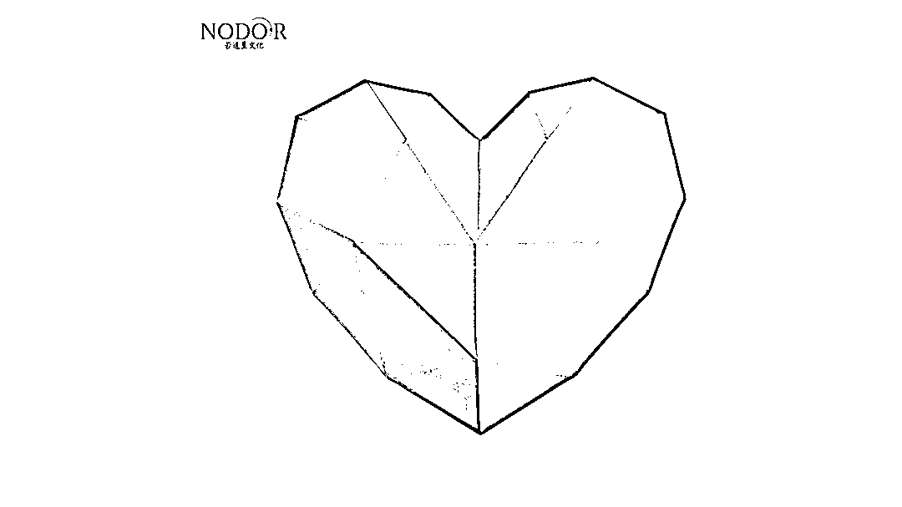

每一段用情至深却没有走到底的感情，都源于双方失智的头脑、放纵的情绪、薄弱的意志、混浊的眼眸。爱是世界上最美好高级的事，却不是轻易就能得到，光有一腔热血远远不够。

不相信爱或者觉得它只是电光火石的一瞬间，都是在逃避爱的功课。我们想要弹奏美妙的旋律就必须学一门乐器，想要做一个成功的网站就必须学会编程，想要得到真正的爱也一样。

**爱的功课第一堂：了解自我**学习这门功课的第一步要从了解自身开始，占星学和心理学都告诉我们，感情关系中发生的任何情况都不是偶然的：开头不是，中间的起伏和冲突不是，结局也不是。不过，占星学无法告诉你，你是否“命中注定”会有幸福或者糟糕的婚姻，或者应该和巨蟹座还是射手座共度一生。
**星图描绘的是你内心是怎样的，因此你可能会给你和别人的感情关系带去什么模式、需求和强迫。**你无法成为另一个人，也不可能把星图打发走，要求更换一套新角色，就像你无法不是你。**不过，你可以或多或少更有意识一些；审视自己的问题，处理属于你而不是伴侣的责任范围的议题，用创造性的方式对待快乐与痛苦，这些自由一直掌握在自己手中。**星图会提供一个具体客观的参考，让你看到你的生命经验中对于男性（女性）原型的认知是什么样，这个原型就是你吸引来的另一半的重要特征，同时还会告诉你这些特质会有哪些正向与负向的表现。例如，有时我们会发现对方最初吸引我们的特点，之后却会变成困扰我们的问题：开始你喜欢他无所畏惧的男子气概，但后来你发现这一点演变成了自我中心，不考虑别人的感受。此时你要做的不是一味地责怪对方，而是应该去思考：“自我确立”是否是你自身的一个重要议题。当你把注意力从对方的“自私”转移到自己是否太过妥协之后，就会发现其实他是帮助你发现自身问题、并给你提供了一个解决这个问题的“测试环境”的伙伴，在日后的相处中，他的“自我”与你的“妥协”将会不断磨合上演，如果你们能带着对爱的信念与面对自身问题的勇气，并且努力去学习爱的智慧，那么幸福一定会降临。**下面这份报告就是基于出生星图撰写的一份“爱的指南”，由美国著名占星师大卫·瑞雷老师亲自主笔，这份报告将会告诉你属于你的感情模式，以及未来将会和你共度余生的另一半的人格肖像。****长按下图识别二维码了解详情****爱的功课第二堂：理解对方****爱的功课第二步，就是了解你的伴侣，他的需求和恐惧是什么？**有哪些破坏性模式在他的个性底层隐秘运作，如果你们对这个无意识的层面没有任何了解的话，就相当于开启了一场没有地图的寻宝之旅，走错方向都不自知，在日积月累的错误中将爱情耗干，这对双方都不公平。例如，他拥有一位严厉的母亲，从小经常批评他的表达方式，希望他能更严肃的对待自己所说的话。然而这会给他留下“别人总是否定我”的烙印，在你们的关系中，每当你只是正常的表达关于他观点的意见时，他都会觉得你是在针对他、否定他，然后争吵开始。如果你对于他的“旧伤”没有任何了解，也许会产生“他不爱我了”这样的想法——你们进入了迷宫，找不到对方，各自躲在角落舔舐伤口。**占星学是最客观的观察仪器，它能帮助你深刻的了解对方，为建立一段优质的关系打好基础。如果你想要更了解他的需求与 BUG，大卫老师为你准备了关于另一半的“说明书”。****长按下图识别二维码了解详情**

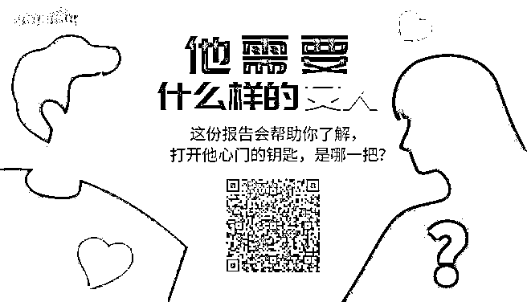

**爱的功课第三堂：融合之道**

感情关系无疑是人类所有体验中最为神秘，最富于回报，也最令人气馁的经历之一。每个人都是独立的个体，我们与不同的人产生不同的化学反应，随之而来的是不同的问题，你的价值观是否符合他对于世界的认知？给你带来快乐的事会否让他感到焦虑？更不用说深层次的信任议题等。

例如，如果你的金星在巨蟹座，那么和爱人呆在家里下厨做饭然后看碟是让你觉得最享受的事，假如对方的金星落在白羊座，那么可能独立做自己喜欢的事才是他的快乐源泉，此时问题很容易再次贴上“对方是否爱你”这样的简单粗暴的标签。**爱不是一味的妥协，包容是建立在理解的基础上，若道重磅推出“爱情扫描”报告，让你用占星学的透视镜视检关系的每一个细节。******长按下图识别二维码了解详情****

**爱的功课第四堂：关系的意义**不管一段关系的结果如何，“事情的发生总有它的意义”。《滚蛋吧，肿瘤君》里让人印象最深的一句台词是“你要相信，上帝给我们安排的每一次挣扎都是有目的的。”有的时候我们并不害怕失败跟挫折，重点是“为什么？”上苍不会让你白白受苦，但看清楚一段关系的真谛的确没有那么容易，尤其当你身在其中时，但“意义”是如此重要，它能让你在最灰暗压抑的时候看到光亮，让你流泪的脸上泛起微笑，让你从沉痛的打击中重新站起来。如果你正在面对关系的瓶颈与阻碍，它也能给你力量去沉着应对，当看清关系背后神秘运作的宇宙力量，你就能更好的与它合作，而非像木偶一样被动接受。**美国著名占星师简·斯皮勒主笔的“前世今生”让你了解此生为什么会遇到 TA。**

****长按下图识别二维码了解详情****

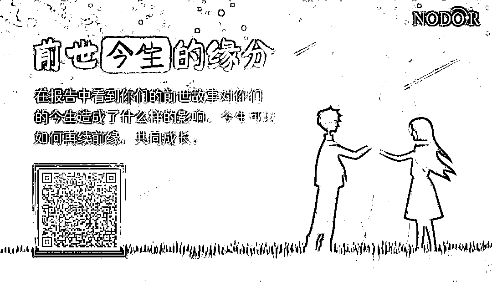

****

**相信爱，而非恐惧。****我们没有面对自己的地方，就会成为我们的命运。****——荣格****报告购买入口**

# 小龙女是什么星座？郭襄为何终身未婚？ | 占星学与金庸小说

> 原文：[`mp.weixin.qq.com/s?__biz=MzA5NjA0NTAxNg==&mid=2651493883&idx=1&sn=c1f5a346383c058b8079adf6f2f0ba8b&chksm=8b48274cbc3fae5aa773bdad0f50b768278afe8f0799af7823463895dc3b22cf9bb0b72156db&scene=126&sessionid=1692737725#rd`](http://mp.weixin.qq.com/s?__biz=MzA5NjA0NTAxNg==&mid=2651493883&idx=1&sn=c1f5a346383c058b8079adf6f2f0ba8b&chksm=8b48274cbc3fae5aa773bdad0f50b768278afe8f0799af7823463895dc3b22cf9bb0b72156db&scene=126&sessionid=1692737725#rd)

******☆ **后台回复“今日”，给你一句生命态度****

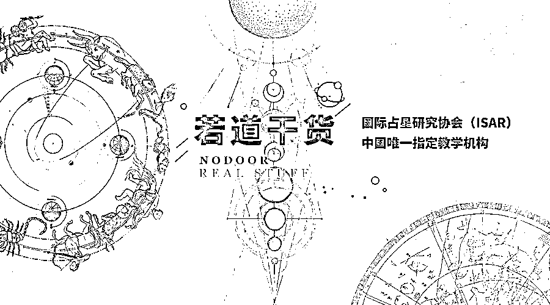

作者/Lunar ISAR 认证占星师

编辑/玫瑰 封面/书君 图片/网络

**作者有话说：**金庸先生离开我们已经 4 年了，他的 15 部武侠小说是留给世人的巨大精神财富。作为金庸迷也是占星师，本文将尝试使用占星学的视角理解金庸先生的小说，既表达对金庸先生的怀念之情，也希望读者能从中感受到武侠小说的别样魅力。**成年人的童话**武侠小说属于典型的浪漫主义题材，常被称为“成年人的童话”，这点从占星学上是比较好理解的。在小说中，无论是人物性格还是情节设定，**水瓶座、双鱼座和****天蝎座******这 3 个星座的比重都显著大于其他星座。**水瓶座代表自由洒脱、个性主义、反叛不羁、高山流水**；**双鱼座代表神奇想象、超脱圆满、牺牲精神、包容接纳；天蝎座代表用情至深、国仇家恨、洞察迷局、转化重生**。这些在小说中都比比皆是。以天蝎座的用情至深举例，就可以表现为深情、长情、虐情、殉情等各种形式，再搭配天蝎座的复仇主题，有如李莫愁的失爱生仇，梅超风的为爱报仇，马夫人的因得不到乔峰爱的回应而生恨报复等多种感情模式。**在现代占星学中，这三个星座的守护星分别是天王星、海王星和冥王星，是代表突破土星所象征的物质世界约束和限制的三种能量形式，也是人成长和进化的关键。**三王星能量可以说是武侠世界中的大背景能量，而土星能量是被弱化的。大部分侠客不用为物质生计发愁，对名利也并不在意（尤其是对朝廷官位），体现了“庙堂”和“江湖”的界线。即使如郭靖、萧峰这样的大侠，也只是在其位能更好得尽到自己的侠义本分，并不贪慕权势。郭靖虽然主持襄阳防务，本身也只是布衣客卿；而野心家如左冷禅、岳不群、慕容复则都没有好下场。**这种三王星力量强大、土星弱化的能量场，某种程度上是超越现实世界的，也是武侠小说被称为童话的重要原因。**侠客们的性格纯粹张扬、飘逸洒脱；朋友间肝胆相照、患难与共；侠侣们至情至性、生死不弃。更有那瑰丽恣肆的神奇想象、绚丽多姿的武技打斗、波谲云诡的曲折剧情、寓意深沉的哲理色彩，这实在是一个充满理想主义和浪漫主义的世界。通过感受小说中的三王星能量，也能够缓解在现代社会中人们所承受的精神压力，给予慰藉和疗愈。

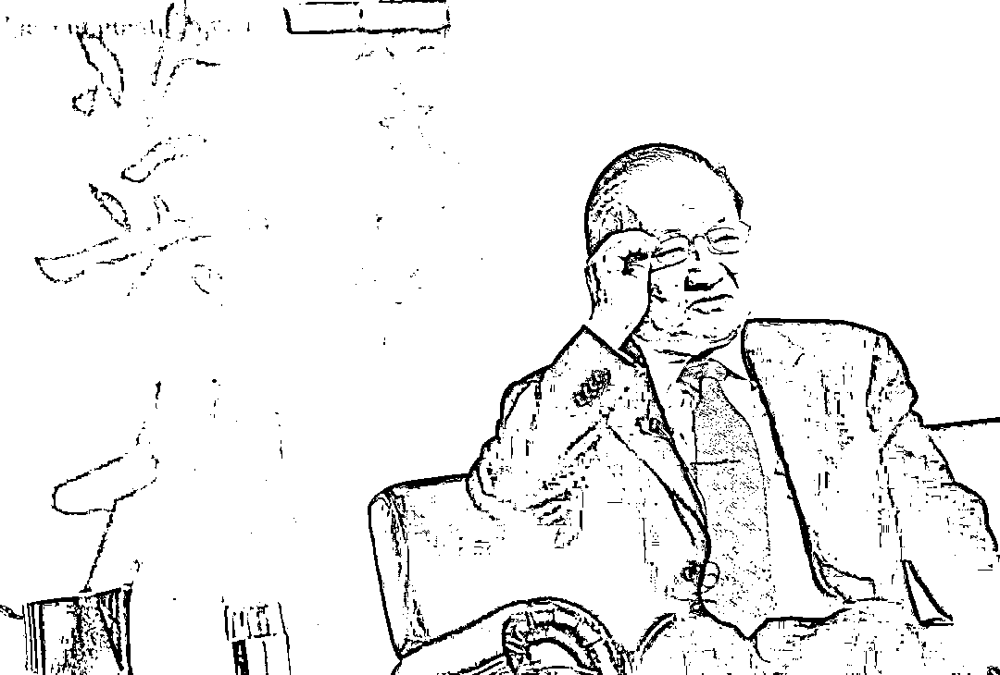

|金庸老先生

**金庸小说中的人物与情节****★****人物和星座的对应**如果每个星座只选择一位最具代表性的人物（当然，一个人身上可能体现好几个星座的特质，这也是符合占星学的），只用一个词语概括，我的分类如下：**· 白羊座：**周伯通 纯真可爱         **·** **金牛座：**洪七公 美食大师**· 双子座：**黄蓉 冰雪聪明         **· 巨蟹座：**陈家洛 亲情误事**· 狮子座：**萧峰盖世英雄         **· 处女座：**小龙女 完美纯洁**· 天秤座：**张无忌 和平大使 **· 天蝎座：**杨过 用情至深**· 射手座：**段誉 乐观幸运**· 摩羯座：**郭靖 为国为民· **水瓶座**：令狐冲 率性洒脱**· 双鱼座：**小昭 为爱牺牲**★****关系模式**星座主题可以用来理解一些关系模式，比如，**水瓶座主题代表的革命战友、志同道合、同志之情**可以来理解下面的三段关系：**·** 《笑傲江湖》中，刘正风和曲洋跨越“正邪”的“高山流水遇知音”，他们是艺术道路上的同志；**·** 《神雕侠侣》中，为什么洪七公临终前会对曾经暗算他武功尽失的欧阳锋“相拥大笑泯恩仇”？因为最后的比试让他们在武学攀登的道路上惺惺相惜，互相钦佩；**·** 也可以很好理解为什么黄药师和杨过会一见如故，相逢恨晚，因为他们都是传统礼教的反叛者。

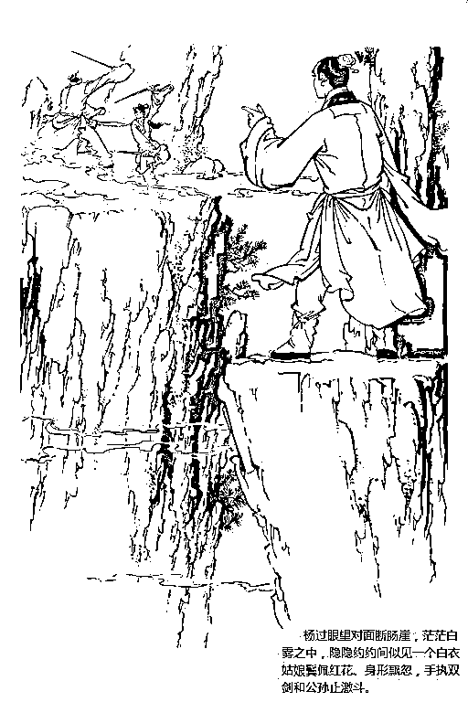

| 金庸武侠小说插图再比如小说中三对非常经典的侠侣：郭靖与黄蓉、杨过与小龙女、令狐冲与任盈盈。细细比较则大有不同。**·** 郭靖与黄蓉爱情的开始，主要是黄蓉小乞丐模样的测试与考验，郭靖请她吃大餐，赠金送裘外加汗血宝马，给予黄蓉足够的安全感和情绪价值，这属于天蝎座主题，就如黄蓉所说：“我做小叫花的时候你对我好，那才是真好。”黄蓉给郭靖事业上的帮助，带他进入武学顶流圈子，结识大佬，后期夫妻同守襄阳，更多体现的是摩羯座的事业和责任主题。**·** 杨过和小龙女的感情开始于古墓中的相依为命，互相陪伴，更像是巨蟹座的亲情主题。后来表现为经历持续的危机和虐以及生离死别，最经典的就是杨过将情花解药扔下山崖不求独活以及“16 年之约”，没等到小龙女跳崖殉情，他是金庸笔下唯一有数次殉情行为的男主角，这些都属于天蝎座主题。再就是对师徒不能在一起的传统礼教的反叛，这是水瓶座主题。**·** 而令狐冲和任盈盈的缘分始于令狐冲在低谷时，任盈盈对他的疗愈和心理上的慰藉，令狐冲对化身为“婆婆”的任盈盈倾诉了自己的苦恼，在任盈盈的琴声中安然入睡，这是一次典型的音乐催眠治疗。在那之后，任盈盈的陪伴也一直抚慰着令狐冲的心灵，她甚至牺牲自己作为抵押，换取少林寺救治令狐冲，疗愈、牺牲都是双鱼座主题。而在相识相知中，两人更发现彼此三观的一致性，都具有“越名教而任自然”的魏晋风度，最后一起归隐江湖，琴箫和鸣。这些则更多体现的是，水瓶座的同志之情和双鱼座“灵魂伴侣”的主题。**★****人物发展和变化**星座主题可以把握人物形象的变化，比如不少人都觉得《神雕侠侣》中的黄蓉不如在《射雕英雄传》中可爱，是为婚姻牺牲了个性，这个说法未免片面。人的成长和改变是必然的。黄蓉在《神雕侠侣》中有了很多新身份，既是妻子、母亲、师父、也是丐帮的帮主。并且在协助郭靖守襄阳时经历了战争的洗礼，见到了百姓的饱受战乱、颠沛流离。这些责任、沉重的经历必然会强化她的摩羯座和巨蟹座主题，更何况她的身边还有一位标准的摩羯座丈夫。摩羯座、巨蟹座和以前体现出的的双子座、天蝎座、水瓶座加在一起必然会组合出新的人物形象，也不再会是当初桃花岛那个冰雪聪明、刁蛮任性的小姑娘了。她并不是牺牲了个性，委屈了自己，而是进化出了更高阶的状态：她从意识上明白自己不再是个小姑娘，而是一个可以肩负责任的成年人。因而在郭靖受伤，自己即将生育的情况下能挺身而出，并提醒郭靖“国事为重”，不要在意自己的安危。这种大道理可一直都是郭靖的台词——很明显的摩羯座特质。

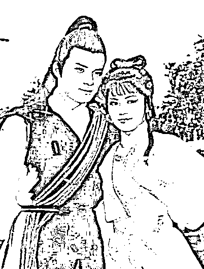

| 郭靖与黄蓉（黄日华与翁美玲饰演）

**杨过的成长，很好地体现了天蝎座“转化与重生”的主题，他的转化经历了三个阶段。**当他得知自己父亲——杨康的死与郭靖、黄蓉有关，而当裘千尺威胁他杀死靖蓉夫妇换取解药时，他确实是准备杀死郭靖完成复仇，并有好几次准备实施行动。但，一是被郭靖的坦诚和“为国为民、侠之大者”的大义所影响，加之路上看到蒙古士兵的暴行，想到刺杀郭靖襄阳城破后的惨状，经过一番激烈的思想斗争后终究没有下手。这是**第一阶段的转化，是对天蝎座所象征的、极端的复仇情绪和危机关头强烈求生欲的克制。**之后在蒙古军营中，郭靖舍命相护，杨过才彻底放下复仇，这是**第二阶段转化**，是郭靖在生死时刻带来的信任感和安全感让杨过超越了仇恨和个人生死。**第三阶段的转化**是在郭靖受重伤，黄蓉临产时敌人袭击襄阳，杨过听到二人在生死关头都不顾自身安危，以国事为重的对话。面对夫妻二人的大义，他对自己执着于私情和私怨自惭形秽，在危机关头产生了顿悟。书中写道：“心志一高，似乎全身都高大起来，脸上神采焕发，宛似换了一个人一般。”这是杨过成长道路上最为重要的一次思想转变，也是天蝎座所象征的重生，他彻底放下了狭隘自私的复仇，放下了自己的私情，转化为对国家和百姓的大我，走上成为神雕大侠的道路。这应该是金庸笔下对复仇、生死、危机、转化与重生这些天蝎座-冥王星主题描写最精彩的部分。

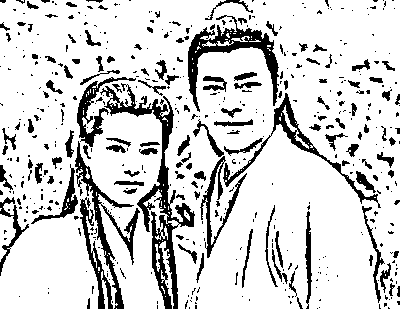

| 杨过与小龙女（古天乐与李若彤饰演）

**★****有意思的组合**利用星座特征可以发现一些有意思的组合。比如《射雕英雄传》中华山论剑的天下四绝：**·** “东邪”黄药师反叛不羁，符合水瓶座；**·**“西毒”欧阳锋擅长用毒，符合天蝎座；**·**“南帝”段智兴帝王之尊，符合狮子座；**·**“北丐”洪七公美食大师，符合金牛座，正好是 4 个固定星座。并且依照中国传统地支与星座的对应，水瓶座为子，天蝎座为卯，狮子座为午，金牛座为酉，“子午卯酉”正好是东南西北 4 个方位，但这里在方位的具体对应上并不完全吻合，如果换成“东毒”、“西丐”、“南帝”、“北邪”则完全吻合。再比如《倚天屠龙记》中的明教四大法王：**·** “白眉鹰王”殷天正是暴脾气，性如烈火，符合白羊座；**· **“金毛狮王”谢逊从外形到气度格局都符合狮子座；**· **“青翼蝠王”韦一笑轻功超绝，迅捷灵动符合双子座；**· **“紫衫龙王”黛绮丝是大美女，明教颜值担当，符合金星守护的天秤座。而且天秤对应地支为辰，辰对应生肖恰好是龙，四大法王正好是从白羊座、双子座、狮子座、天秤座按照数字第 1、3、5、7 个星座的顺序依次间隔。如果加上光明左右使，“光明左使”杨逍符合洒脱不羁的水瓶座，“光明右使”范遥忍辱负重，毁容卧底有天蝎座特点，但他是头陀打扮，属于宗教形象，也可以认为是射手座。那么**四大法王加上光明左右使就是白羊座、双子座、狮子座、天秤座、射手座、水瓶座 6 个阳性星座，而明教又叫“拜火教”，火属阳**，不得不说这是一个很有意思的组合。**复杂人物的理解**体系和框架是为人的感受而服务，可以作为表达感受的呈现系统；反过来好的体系也可以引导和加深人的理解。尤其是在对复杂人物的把握上，星座主题确实是一个非常强大的体系和工具，可以帮助我们更好的理解人物。比如小龙女，她有 4 个比较明显的星座主题：**·** 在古墓中照顾教育杨过时体现的巨蟹座主题；**· **处女座的完美主义，纯洁，生活规律；**· **天蝎座的用情至深；**· **水瓶座的清冷，疏离感，独处自洽能力强，反叛传统礼教，不在意名利，内心光风霁月。其实她还有容易被忽视的白羊座、双子座、双鱼座，这三个星座的主题。小龙女的交流方式是直来直去的（像是水星白羊座的表达），有什么话就直接问，不喜欢藏着掖着，她比较喜欢简单明确的回应，对方一旦犹豫权衡，她也会立刻采取行动。她两次离开杨过，第一次是失身后她明确说要做杨过的妻子，杨过不知所措，她当即就要下杀手，最后虽然不忍，也是立刻转身离开。第二次是黄蓉和她说杨过可能不习惯长期待在古墓，小龙女表示要自己去问杨过，当杨过表现出犹豫时，半夜就选择离开，还留下了“善自珍重，勿以为念”八个字。相反，每次杨过明确表示要她做妻子的时候她就很开心。而且她长期生活在古墓，保留了天性纯真的一面，**直来直去、立即行动、天性纯真这些都是白羊座特征。**除了杨过，另一个让小龙女开心的人，就是“老顽童”周伯通了。他让我们看到了小龙女鲜少显露的双子座一面。她和周伯通被金轮法王用蜘蛛封在山洞里，周伯通天性纯真，中了剧毒还在疯疯癫癫，胡说八道，慢慢地也带活了小龙女。小龙女不仅童心大起，要和金轮法王互换兵器对打，还逗周伯通说自己有一个顶好玩的把戏，问他爱不爱瞧，在逃出山洞后，看到周伯通偷走了自己的玉瓶尝试指挥蜜蜂闹得手忙脚乱时，忍不住哈哈大笑。

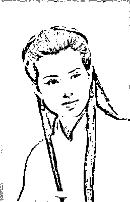

| 李若彤版小龙女这应该是小龙女在书中唯一一次哈哈大笑，她因从小练功隔绝七情六欲，总是一副清冷疏离的模样，让她哈哈大笑是连杨过也难以办到的。杨过只能让她含情脉脉的笑，还得是气氛组周伯通。小龙女和周伯通在一起时明显更为健谈，爱开玩笑，内心活泼而富有童趣，切换到了双子座的频道。这也不难理解，因为**“老顽童”身上的双子座、白羊座特质太强，很容易与她发生共振，把她隐藏之下不易表现的特质给激活了。****小龙女在遇到一灯大师时，看雪花参悟禅机，又体现了双鱼座的超脱思想。**小龙女身中剧毒，却洞悉无常，通透豁达，看着漫天大雪说道：“这些雪花落下来，多么白，多么好看。过几天太阳出来，每一片雪花都变得无影无踪。到得明年冬天，又有许许多多雪花，只不过已不是今年这些雪花罢了。”以至于杨过在此刻都觉得她陌生。从星座主题来理解这并不奇怪，因为杨过缺乏双鱼座主题，而一灯大师佛法高深，反而可以与小龙女在双鱼座的觉悟模式同频。并且，小龙女内心强大，自我疗愈能力也很强。在绝情谷独自生活的 16 年中，不食五谷、吸风饮露，基本就是一种修仙的生活了。**自我疗愈，避世修仙也属于双鱼座主题。**可以看到小龙女一共表现出白羊座、双子座、巨蟹座、处女座、天蝎座、水瓶座、双鱼座七 7 个星座主题，是一个非常立体和多面的人物形象。而金庸笔下的另一位神仙姐姐王语嫣则主要表现出处女座的单一特征，相较之下人物形象显得单调一些，毕竟《天龙八部》的主角是“天龙三兄弟”。一般情况下我们都是先有整体感觉，再去套用相应的星座特质进行呈现和表述，但在进行小龙女人物理解时有所不同。记得一开始自己对她的人物印象是模糊的，仅仅觉得是一个不食人间烟火的仙子，有点怪，现在回想起来，把握不好的原因一个是她的主题实在太多，再就是对杨过动情后也发生了主题重心的转移，天蝎座特征明显被强化。

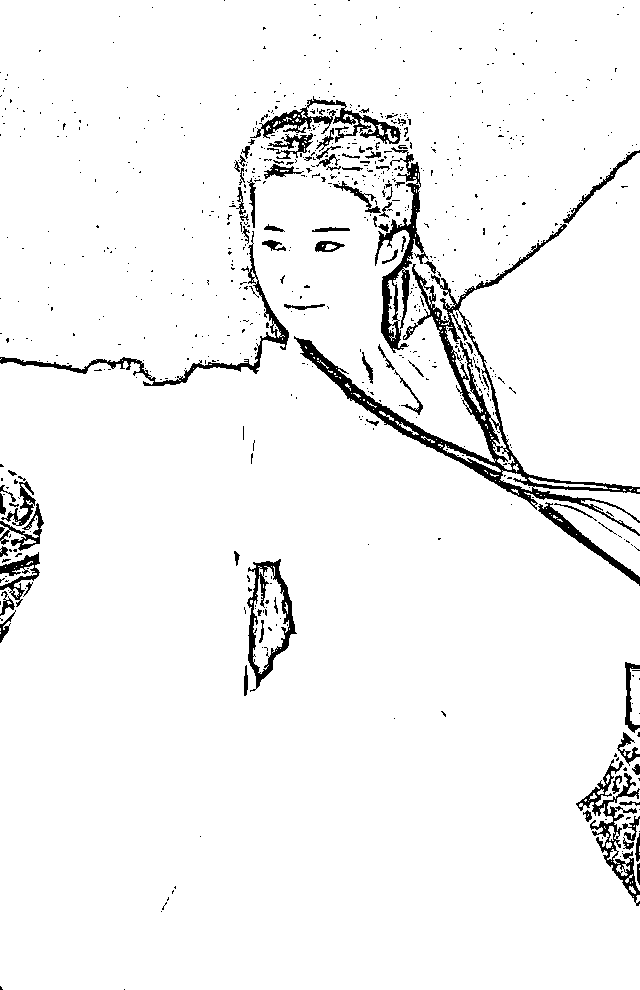

| 刘亦菲版小龙女我们是把人做为一个整体去感受的，当特征太多时，彼此交织混合，就会带来一种模糊感，同时也容易遗漏一些特征，而采用星座主题进行拆解分析，从单个主题入手再综合理解，就能对人物形象把握的比较全面和深刻，这是一个比较好的用体系启发感受的例子。与之类似的，还有郭靖的全家殉城，几乎所有的声音都说他是“侠之大者”，舍身取义，很少思考这样的行为对家庭亲情造成的影响，如果在赞誉他摩羯座正面特质的时候，能够思考**摩羯座-巨蟹座对分带来的冲突**，就能想到**原则感过重，太过注重大义实际上是会对亲情带来伤害的，**正所谓家国两难全，这也是星座关系对人物理解的启发。**郭襄的星图**郭襄的出生时间按照书中的描述是可以推算出来的，《神雕侠侣》第 35 回中提到郭襄的生日是十月二十四（农历），接下来是杨过给郭襄过 16 岁生日，次年三月初七去绝情谷赴小龙女 16 年之约，杨龙二人相遇后参加襄阳大战，打死蒙古大汗蒙哥。

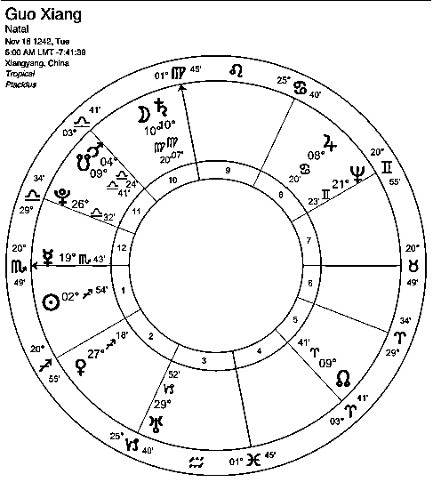

| 郭襄出生星图蒙哥死的时间是有明确记载的：1259 年 8 月。往前推郭襄的出生时间就是公历 1242 年 11 月 18 日（农历南宋淳祐二年十月二十四）。网上有 1243 年的说法，说是过的虚岁生日，我认为是错误的，因为这里面有一个杨龙 16 年之约，这个时间间隔不存在虚岁实岁的问题。在书中第 22 回郭襄出生时正好是敌人来打襄阳，“这时天将黎明，窗上已现白色”，有具体的时间描写，是在黎明时分，定在凌晨 6:00，准确的时间就是 1242 年 11 月 18 日凌晨 6:00（公历），地点是襄阳，这可能是金庸小说中唯一可以推算大致准确星图的人物。星图中太阳在射手 2°，因为年代过早，采用的历法是儒略历，太阳星座度数和现在有大概 7°的差距（软件一般自带修正），所以不是天蝎座，但上升星座是天蝎座，水星天蝎座合上升，金冥紧密六分，也是符合天蝎座主题的。

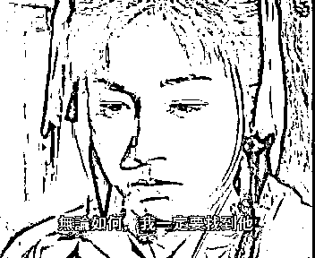

| 郭襄（李绮红饰演）四处寻找杨过天蝎座代表的深情、痴情、长情在她身上体现得较为突出。一见杨过误终身，郭襄二十多年来走遍各处寻找杨过未果，直到 40 岁出家为尼。她的大弟子法号风陵，风陵渡正是她与杨过的初遇之地。四处游历，最后在峨眉出家也符合射手座远行、探索、宗教信仰等主题。郭襄的星图中也有比较强的土星主题（月土合相在 10 宫、日土四分、土星合相中天），月土的紧密合相代表成熟稳重、成功有声望的人会给她带来安全感和情绪上的滋养，杨过比郭襄大 20 岁，散发着成熟男人的魅力，“神雕大侠”声名远播，符合郭襄的情感需求。而且杨过断臂的残缺之美，思念小龙女的深情与创伤感也强烈地与郭襄的天蝎座主题共振，这些都是杨过如此吸引她的原因。月土合相也体现在情绪上的压抑和苦闷，郭襄算是一种苦恋。她的土星主题还表现在情感的持久性和多年寻找杨过的坚持不懈上，此外，虽然情场失意，但开创峨眉派，成为一代宗师，取得事业上的成功，这也符合了土星主题。**人物性格与武学特点**利用星座特质也可以很好地理解书中在武学和人物设定上的一致性（后面有金庸武学的 12 星座分类）。比如黄蓉和打狗棒法对应灵巧机敏的双子座；杨过和黯然销魂掌以及他和小龙女的玉女素心剑法对应用情至深的天蝎座；段誉和六脉神剑对应目标感强的射手座；令狐冲和独孤九剑对应飘逸洒脱的水瓶座等。最典型的就是萧峰，身为丐帮帮主，他是一定会打狗棒法的，但却从未看萧峰使用过。这就是人**物性格对武学选择的偏好**。萧峰英雄豪迈，当然更倾向于选择符合自身气质，同样霸气的另一项丐帮绝学——降龙十八掌。再比如，洪七公教郭靖和黄蓉武功时，传了黄蓉一套身法轻灵之极的“逍遥游”拳法，这是很典型的双子座武学，与她性格匹配，因此不到两个时辰就学会了。同时洪七公明确对郭靖说这不符合他的气质，“逍遥游”会变成“苦恼爬”，高明的师傅教徒弟也会考虑武学和气质的搭配，因材施教。

**版权声明：**原创文章由作者授权首发于若道平台，欢迎转发，反对抄袭。友号转载请申请白名单。

**END**

**Lunar**

ISAR 认证占星师（2013 年获得）
2013 届若道核心课程毕业生国家二级心理咨询师武汉大学理工科博士**微信号**：lunar_Totoro

长按打赏

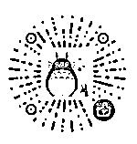

**20 位来自世界各地的占星师****带来 19 场沙龙——新世界的觉醒****详情可点击下图**

**学习占星学****点击下图了解课程详情**

**微信又双叒叕改版啦，不想错过若道君的推送？**
****就把若道设为****星标****以及点点****“在看”****吧！******▼**

**喜欢就点一下“在看”吧！****报名直达入口**

# 金庸武侠小说里的功夫，12 星座最擅长哪一种？

> 原文：[`mp.weixin.qq.com/s?__biz=MzA5NjA0NTAxNg==&mid=2651493883&idx=2&sn=69041802aa44c2ef57ce6e9a04d14c0c&chksm=8b48274cbc3fae5a37785f73a074ed9193f31f0b490b839cbd0d69c765ce4a2d7ccf2468c8bb&scene=126&sessionid=1692737725#rd`](http://mp.weixin.qq.com/s?__biz=MzA5NjA0NTAxNg==&mid=2651493883&idx=2&sn=69041802aa44c2ef57ce6e9a04d14c0c&chksm=8b48274cbc3fae5a37785f73a074ed9193f31f0b490b839cbd0d69c765ce4a2d7ccf2468c8bb&scene=126&sessionid=1692737725#rd)

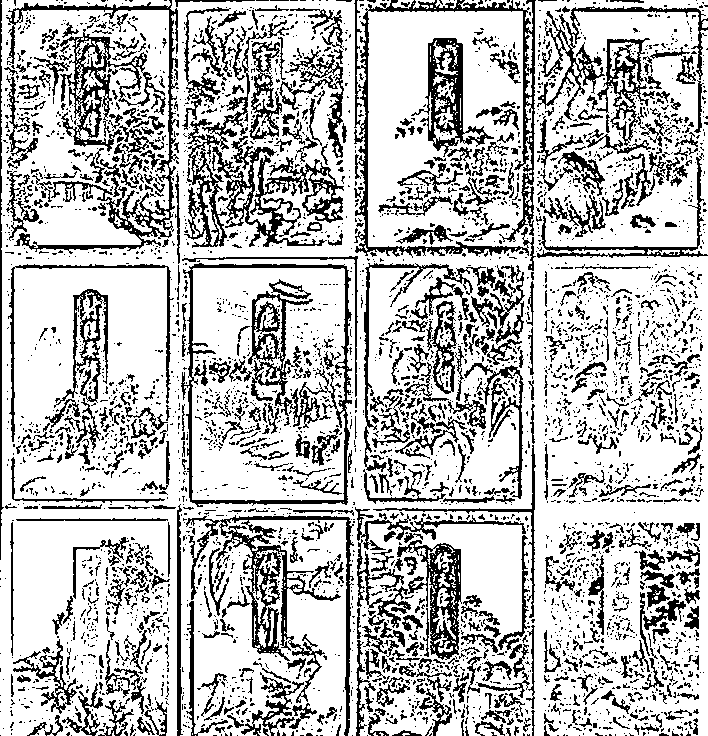

作者/Lunar ISAR 认证占星师

编辑/玫瑰 封面/书君 图片/网络

**作者有话说：**金庸武侠小说中的人物和武学招式繁多，可谓包罗万象，以往的文章大多是对人物进行星座分类，本文尝试对小说中的代表性武学进行分类。这里的武学是广义上的，既包括武功秘籍，也包括兵器装备、暗器，毒药等一切对比武有影响的因素，有的武学尤其是上乘武学会包含多种星座特征。**武学的星座特征****★****白羊座****白羊座由火星守护，火星是一颗破坏性的、好战的行星，此类武学招式阳刚凌厉，攻击力强，进攻主动，侵略性强，杀伤方式残忍直接。****※ 大力金刚指**少林 72 绝技，指法刚猛凌厉，出指可以碎金断石。武当俞岱岩、殷梨亭都是此功法受害者，被金刚指力捏断全身骨骼，成为废人，体现了白羊座武学的攻击性、破坏性。**※ 龙爪手**  少林 72 绝技，手指坚硬逾钢，铁指开砖如泥，手如钢爪般抓树撕皮，搓石成粉，体现了白羊座的攻击性和侵略性。六大派围攻光明顶时空性对战张无忌时两人均使出此武学。**※ 独孤九剑**  “剑魔”独孤求败所创的高深剑法，该武学的白羊座特质主要体现为完全的进攻性，主动性，有进无退，只攻不守。令狐冲问风清扬为何剑法只攻不守？风清扬道：“独孤九剑，有进无退！招招都是进攻，攻敌之不得不守，自己当然不用守了。”

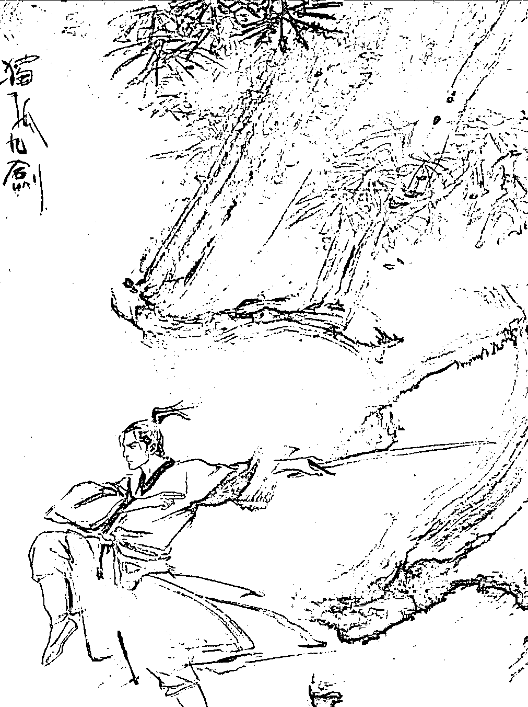

| 独孤九剑**★****金牛座****金牛座的关键词是感官，这类武学道具主要是针对对方的五感下手，具体表现在麻痹感官的各类迷药和封闭感官的点穴手法上。**另外金牛座的守护星是代表美感的金星，也可以象征带来感官享受的事物。
**※ 十香软筋散**  与其说是毒药，更像是迷药，类似现代的麻醉剂。无色无味，中毒之人全身筋骨酸软，最重要的是还能让人无法使用内力，赵敏曾用此药迷倒武林六大派高手，这是典型的针对感官进行攻击的道具，与之类似的还有悲酥清风，蒙汗药。**※ 兰花拂穴手**桃花岛独门武学，讲究的是“快、准、奇、清”，严格说兰花拂穴手的特质偏向双子，“清”字侧重体现天秤的优雅，其金牛特质主要表现在功能性和目的性上，一个是这是封闭对方感官的点穴手法，再就是黄蓉利用此功法为厨艺切豆腐，做出名菜“二十四桥明月夜”。**※ 玉笛谁家听落梅 好逑汤  二十四桥明月夜   **这 3 样都是菜名，实际上就是烤肉、樱桃汤和蒸豆腐，但是在顶级大厨黄蓉那里就变得十分文艺范。这也是洪七公的入坑之菜，从此就被黄蓉拿捏住味觉“PUA”走上了传授武艺的道路，这是顶级的感官享受，属于金牛座的主题。**★****双子座**双子座既是风象星座又是变动星座，应该是 12 星座里最**飘忽不定**的，此类武学**以敏捷度高，灵动飘逸，速度快，技巧性强为其特点，最典型的代表就是各类轻功。**
**※ 凌波微步**逍遥派轻功身法，精妙异常。功法名称出自曹植《洛神赋》，段誉在无量山琅嬛福地习得，成为他的保命绝招，灵巧闪避机敏属于双子座特质。其他有代表性的轻功还有韦小宝的神行百变。

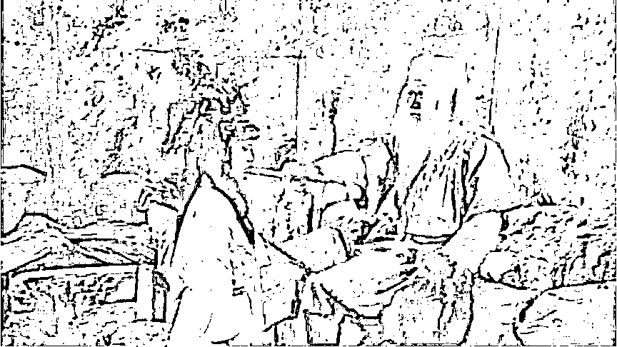

| 《射雕英雄传》中，洪七公传黄蓉打狗棒法**※ 打狗棒法**丐帮帮主嫡传武学，名字虽然陋俗，但轻动灵便，变化精微，招术奇妙，比起另一门以刚猛为主的丐帮绝学降龙十八掌，打狗棒法以巧劲变化为主，强调四两拨千斤，技巧灵巧属于双子座特质。**※ 葵花宝典**天下武功，唯快不破。如果说轻功追求的是灵活闪避，打狗棒法强调的是技巧多变，葵花宝典则是速度，而且是极致的速度。东方不败习得此功法，身法如同鬼魅，可见速度反应之快，变化之多。**※ 左右互搏**“老顽童”周伯通在桃花岛被关时自创的武学，可一心二用，左右手各使不同招式自己和自己打，符合双子座两兄弟的神话原型。而且该武学是周伯通为给自己解闷创造出来的，这种趣味性也是双子座特质。**★****巨蟹座**巨蟹座的神话形象是螃蟹，有着坚硬的外壳。这类武学道具主要是**各类护甲，既象征巨蟹坚硬的外壳，也体现了保护和守护的内涵。**
**※ 软猬甲**桃花岛镇岛之宝，刀枪不入，可抵御内家拳掌，具有针刺反伤效果。最初是黄药师送给妻子冯蘅的定情之物，冯蘅死后转交黄蓉，后黄蓉传给长女郭芙，既有巨蟹座代表的守护涵义，也代表了母爱的传承，母爱也是符合巨蟹座特质的。

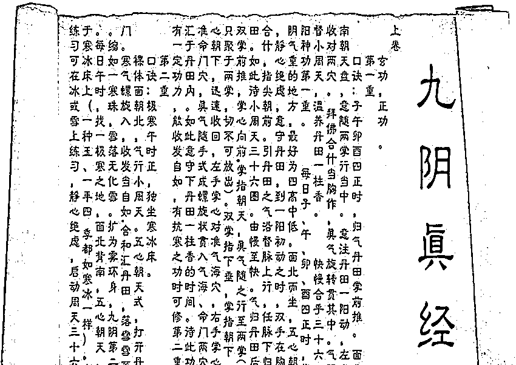

| 九阴真经**※ 九阴真经**金庸武侠中最富盛名的武学，贯穿射雕三部曲，由北宋末年黄裳在刻录《道藏》时所悟。此功法为阴之精纯，且九为极致之数，月亮也叫太阴，是阴之精华，月亮是巨蟹座守护星，因此将《九阴真经》归为巨蟹座功法。**★****狮子座**狮子是兽中之王，狮子座守护星太阳是太阳系之王，与月亮相对应为阳之极致。**这类武学的主要特点是至刚至阳，具有王者气度，能展现使用者的英雄气概。**

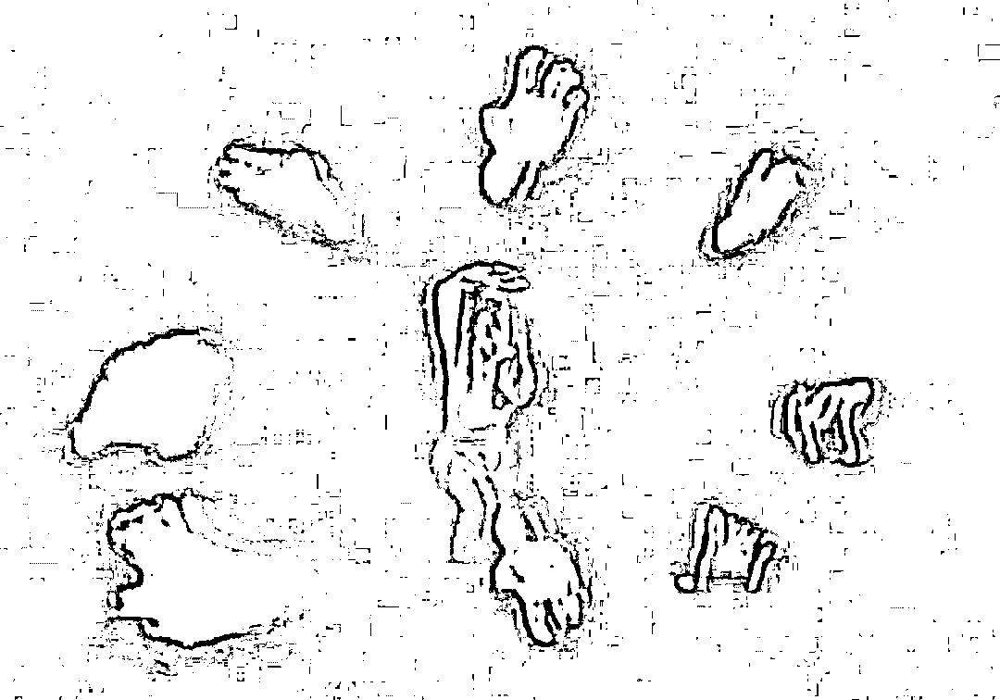

| 1983 版《射雕英雄传》中的降龙十八掌**※ 降龙十八掌**丐帮绝学，外门武学中的巅峰武功，天下阳刚之至，无坚不摧。能使用全套掌法的无不是盖世英雄，电视剧《天龙八部》中，乔帮主伴随音乐出场，使出降龙十八掌好比地毯式轰炸，颇具王者气概。**※ 九阳神功**由达摩祖师所创，至刚至阳，练成后，生命力极其旺盛，内力自生速度奇快，无穷无尽。由于其至阳之气，是所有寒性和阴毒类武学的克星，张无忌正是因为在山崖下意外习得九阳神功，才化解了身中多年的玄冥神掌寒毒，至刚至阳，生命力旺盛这些都属于狮子座特质。**※ 狮子吼**少林 72 绝技，至刚至强，清啸之下，使对方肝胆俱裂，心惊胆战。金毛狮王谢逊在王盘山用狮子吼将各派数十位高手震成白痴，夺走屠龙刀。此武学无论名称，使用者形象，气势都十分匹配狮子座特质。**※ 倚天剑 屠龙刀  **郭靖、黄蓉夫妻在襄阳城破前，用杨过赠予的玄铁重剑熔炼成倚天剑和屠龙刀，武林流传“武林至尊，宝刀屠龙，号令天下，莫敢不从，倚天不出，谁与争锋”，从这样的描述也可以看出它们都是兵器中的王者，具有狮子座特质。**★****处女座****处女座的关键词是细节、逻辑性、专业化、功能性强。与之相应的该类武学讲究结构完整，招式分类细致，井井有条，能有针对性的应对对方。**
**※ 独孤九剑**前面已经提到过独孤九剑“只攻不守”的白羊座特质，其剑法口诀分为“破剑式”，“破刀式”等，这是针对不同武器类型提出应对方式，可见独孤九剑有很强的结构性，逻辑性，细节性，能有针对性的解决问题，具有处女座特质。**※ 王语嫣**将王语嫣放在武学部分并不是有误，而是在比武对决中她起到的作用实不亚于任何武学，可以把她当作一个“工具人”来理解。王语嫣是武学专家，熟悉各门各派武学秘籍，能在实战中进行点评指导，严谨精确，专业细节，很有实用性，这些都是处女座特质。**※ 劈纸削腐刀法**出自《连城诀》，个人认为最具有处女座特质的武学。100 张薄纸叠成一叠，放在桌上，一刀横削过去，将一叠纸上的第一张批了下来，不许带动第二张，依次把 100 张纸批完，将两寸厚的一块豆腐削成 20 块，每一片都完整不破。从描写能看出近乎苛刻的精确，细致，可称得上完美主义，而且强调刻意练习，精益求精的匠人精神。**★****天秤座****天秤座由金星守护，关键词是和谐、平衡、优雅，这类武学讲究平衡法则以及武学的美感，同时天秤合作、配合的涵义也象征双人合击的武学。**
**※ 九阴真经**《九阴真经》总纲中有“天之道，损有余而补不足，是故虚胜实，不足胜有余”，“弱之胜强，柔之胜刚”等描述，这些描述本身具备非常典型的以多补少、以柔制刚的平衡法则。**※ 美女拳法**金庸笔下最优雅最具有美感的武学当属美女拳法，至少从名字上来说是的。该拳法由古墓派祖师林朝英所创，每一招都是模拟一位古代美女，招式名称如昭君出塞、西子捧心、貂蝉拜月等，十分符合金星守护的天秤座。**※ 正两仪剑法 反两仪刀法**昆仑派的正两仪剑法和华山派的反两仪刀法都是从四象八卦中变化而出，蕴含阴阳平衡之理，且刀法和剑法都需要两人配合使出，属于合作的武学，符合天秤座特点。**※ 君子剑 淑女剑  **杨过和小龙女的佩剑，双剑外形材料完全相同，而且都具有极强的磁性，距离够近会自动吸在一起，是剑中的 CP，CP 和搭档属于天秤座主题。**★****天蝎座**天蝎座武学的代表特征是内力为阴寒属性，再就是各种毒类，这是对应蝎子的神话原型。天蝎座是水象星座，代表**激烈，极端，深刻**，因此**由强烈的情绪激发的招式也由天蝎座代表**。此外，**暗器做为武侠世界里的常见元素，具有隐蔽性，穿透性，且大多配有毒性，符合天蝎座特质。**

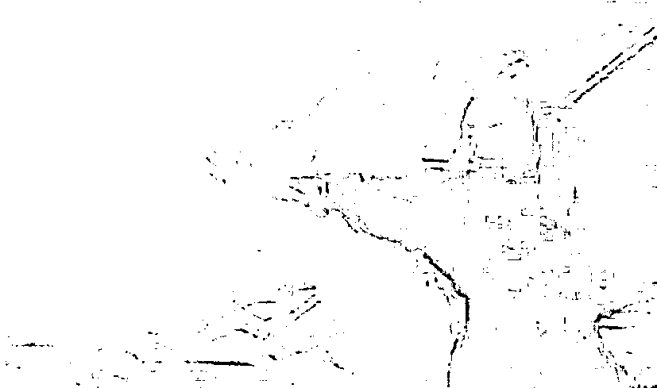

****| ****玄冥神掌**※ 玄冥神掌**玄冥二老的武学，阴毒无比，中掌者寒毒入体，发作时痛苦难当。张无忌少年中掌，饱受寒毒 7 年之苦，直到机缘巧合习得九阳神功才将其化解。其他有类似阴寒、阴毒属性的武学还有九阴白骨爪，幻阴指以及寒冰真气等，这类阴寒属性武学正是天蝎座的代表。**※ 情花 断肠草  **绝情谷中一种奇特的花，花上有刺，人一旦被刺到，动情后剧痛难当，生不如死。化解之法只有与其伴生的断肠草，“情”之毒需用“断肠”来解，真是恰如其分。既和情又和毒相关的情花、断肠草是非常符合天蝎座原型的。毒是武侠小说中很重要的一方面，小说中其他的毒物还有三尸脑神丹、三笑逍遥散、生死符等。有一种特殊的毒药，实际是春药，催发情欲，最出名的是《天龙八部》中段誉和木婉清所中的阴阳和合散，激发本能和性欲是符合天蝎座的。还有一类毒物，本身剧毒，但是一旦吃下去能够消化，就可以百毒不侵，甚至让内力大涨，反而受益无穷，比如段誉吞下的莽牯朱蛤，被郭靖吸干蛇血的药蛇，这个过程还带有天蝎座死亡重生的涵义。**※ 冰魄银针 玉蜂针  **冰魄银针是李莫愁的专属暗器，上有剧毒，玉蜂针以玉蜂尾部毒汁炼过，为小龙女和杨过所用。这类配毒的具有穿透性隐蔽性的暗器是符合天蝎座的，前面提到的生死符实际上也是一种配毒的暗器。

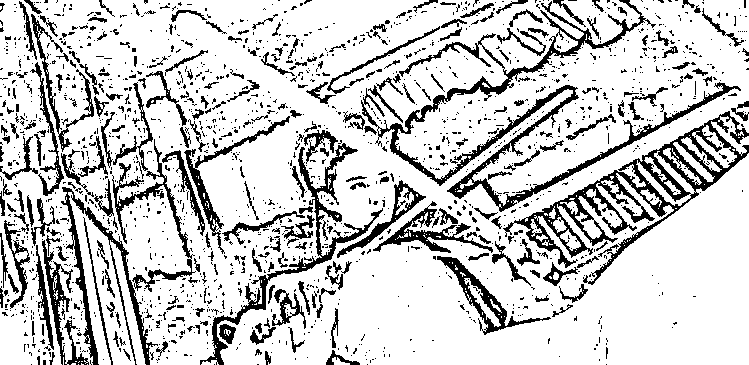

****| ****玉女素心剑法**※ 玉女素心剑法**古墓派祖师林朝英所创，蕴含对王重阳的相思之情，此剑法须男子使全真剑法，女子使玉女剑法，两人双剑合璧。**使这剑法的男女二人倘若不是情侣，则许多精妙之处实在难以体会；相互间心灵不能沟通，则联剑之际是朋友则太过客气，是尊长小辈则不免照拂仰赖；如属夫妻同使，妙则妙矣，可是其中脉脉含情、盈盈娇羞、若即若离、患得患失诸般心情却又差了一层。****——《神雕侠侣》第十四回**可见此剑法的威力取决于男女双方的感情模式和羁绊程度，不是代表朋友的水瓶座，不是代表亲情的巨蟹座，也不是代表夫妻的天秤座，这也是此剑法和之前天秤座的两仪剑法刀法仅强调合作不强调感情的区别之处。如果说和恋爱相关的狮子座更侧重于浪漫和欢乐，其情深意重，含情脉脉，关切之心等则更匹配象征亲密关系的天蝎座。杨过和小龙女两人至情至性，都愿意为了对方舍弃自己的性命，才能发挥出此剑法的最大威力。**※ 黯然消魂掌**杨过自创的一套掌法，是杨过伤心爱妻小龙女离去，在悲痛欲绝的情况下创出来的，充满了离别相思之苦。该掌法属于意境武学，身与心合，威力与情绪心境息息相关，在痛不欲生、身临绝境时才能发挥最大威力。最典型的就是在杨过与金轮法王对决的生死关头，心中想到要和小龙女永别，哀痛欲绝之际，才发挥出最大威力。生死危机，置之死地而后生，痛苦，强烈的情愁这些都与天蝎座相关。**※ 葵花宝典**“欲练神功，引刀自宫”，此武学修炼前提极为苛刻，不自宫必将走火入魔，东方不败甚至改变了自己的性取向，性是与天蝎座相关的，而且这里也蕴含天蝎座死亡重生的涵义，想练成绝世武功必须先舍弃一些重要的东西。**★****射手座**射手座的神话原型是射箭的半人马，这类武学的代表是**远程直线型打击技能，与射出的弓箭对应。另外射手也代表远行，异国文化，因此外来武学也属于射手座。**

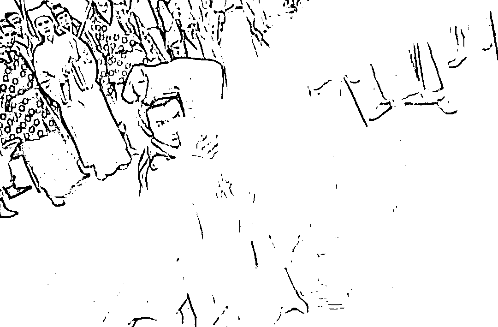

|1997 版《天龙八部》中的六脉神剑 **※ 六脉神剑 一阳指**六脉神剑是大理段氏的最高武学，将含于指尖的内力隔空激发出去，以剑气杀人于无形。一阳指是六脉神剑的基础，这两种武学的特点就是可以远程直线杀伤，符合射手座特质。**※ 弹指神通**“东邪”黄药师的自创武学，与六脉神剑类似，也可进行隔空打击，指力所及之处如无形之剑。既可以徒手施展，也可以借助石子等其他道具，打出的石子犹如子弹。**※ 乾坤大挪移**乾坤大挪移源自波斯明教，是明教镇教之宝。张无忌在光明顶禁地中意外获得，功法由波斯文书写，因小昭在一旁懂得波斯文，才得以修行，属于异国武学。其他的异国武学还有达摩祖师用梵文留下的《易筋经》和《洗髓经》，异国的、外来的属于射手座特质。**★****摩羯座**由土星守护的摩羯座的特征是**稳定性好，厚重坚实，意志力坚强，**因此这类武学具有**强大的防御能力和抗性**。另外摩羯座也代表了**秩序、纪律、规则感和结构感，符合兵法和军队的特点。** **※ 九阳神功**“他强由他强，清风拂山岗。他横任他横，明月照大江。”九阳神功口诀可以说是对其防御力最好的描述，练成后防御力无可匹敌，真气护体，不动如山，而且百病不生，百毒不侵，可称得上物抗和魔抗全部拉满，金刚不坏之躯，符合摩羯座厚重稳定扎实的特点，与之类似的还有少林寺的金刚不坏神功。**※ 武穆遗书**岳飞在狱中时，将生平所学写成的兵书。书中开篇写道：“重搜选，谨训习，公赏罚，明号令，严纪律，同甘苦。”兵法与纪律，组织，制度，谋略关系密切，属于摩羯座特质。**※ 五行旗**明教特种部队，包括锐金、巨木、洪水、烈火、厚土五旗，作战方式各异，常能出其不意，以少胜多。这是金庸小说武林门派中最具有军队特点的组织，军事组织特别强调组织性和纪律性，符合摩羯座特质。

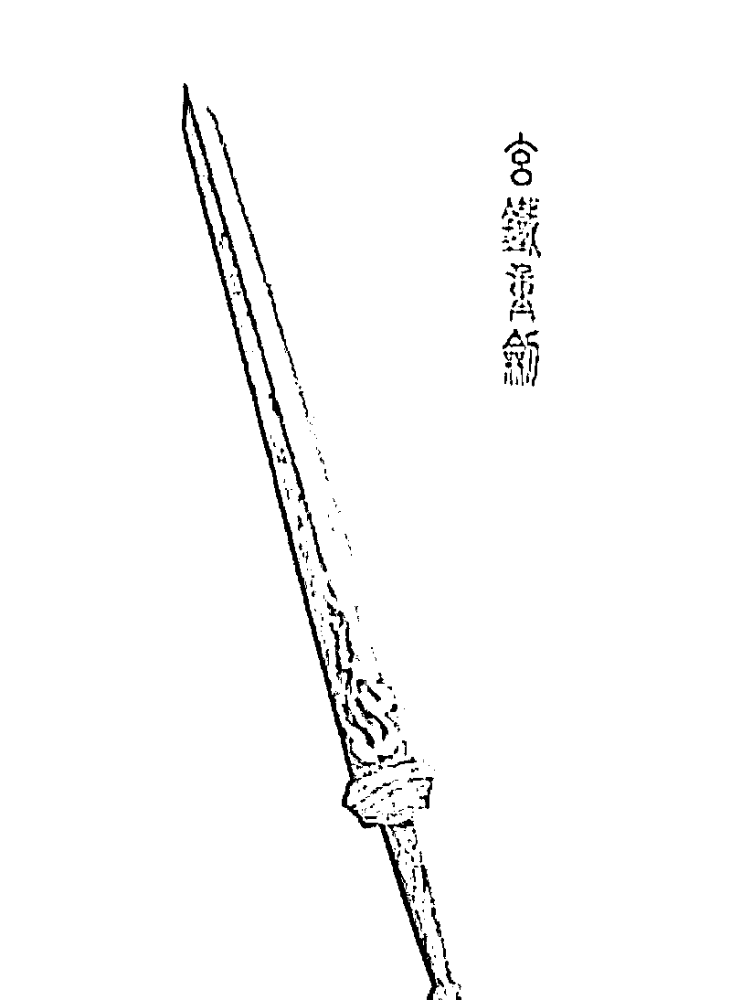

|玄铁重剑 **※ 玄铁重剑**独孤求败用玄铁所铸，后被杨过所得，重九九八十一斤，靠重量碾压对手。其剑法要义为“重剑无锋，大巧不工”，与寻常大多轻灵迅捷的剑法不同，强调“劲雄凝重”，体现了摩羯厚重、扎实的特点。**★****水瓶座**水瓶座由天王星守护，其武学特征为**具有抽离性，能跳出具体招式本身，达到“无招胜有招”的境界**，再就是**水瓶座代表了创新，象征具备特殊攻击方式的武学**，此外，也有**团队集体的含义，代表某些需要多人配合的阵法武学。** **※ 碧海潮生曲**“东邪”黄药师所创的武功乐曲，由玉箫吹奏。表面上听似模仿大海潮浪之声，其实内藏致命武功，属于音波攻击类高科技武学，具有水瓶座特点，与之类似的还有“金毛狮王”谢逊的狮子吼。**※ 独孤九剑**独孤九剑是金庸笔下唯一明确提出“无招胜有招”的武功。“无招”不是不出招，而是指跳出招式本身，不受原来剑法的拘束，使剑招空灵飘忽，令人捉摸不透，这种跳出具体形式的抽离性符合水瓶座特质。**※ 天罡北斗阵 真武七截阵  **天罡北斗阵是全真派创派祖师王重阳按北斗七星所创，全真七子集体御敌的阵法，这是典型的具有团队集体配合效应的武学，符合水瓶座特征。真武七截阵是武当创派祖师张三丰创造的一套武学，既可单独施展，也可以团队作战，功法威力随人数成几何倍数增长，既体现个人性，又强调集体性，符合水瓶座特质。

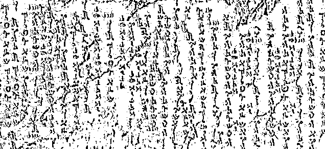

|太玄经 **※ 太玄经**侠客岛上山洞里的石壁上刻有李白的《侠客行》，而太玄经就蕴含其中。《侠客行》本身就是赞颂游侠精神，其中的“十步杀一人，千里不留行。事了拂衣去，深藏身与名。”更是体现了侠士的飘逸洒脱，不为名利所累，具有水瓶座特征。而且参悟此功法不能为诗文细节和注释所累，需要跳出文字本身，具有一定的抽离性，也属水瓶座特征。**★****双鱼座**双鱼座的关键词是**疗愈、包容、接纳、吸收、神秘，这类武学具有疗伤、吸收内力、模仿其他武学的特点，有的武学也达到了圆满，甚至接近修仙的层次。** **※ 北冥神功 化功大法  **北冥神功是逍遥派武学，可吸人内力，化为北冥真气，该真气可兼容天下武学，“天下武功无不为我所用，犹之北冥”，这种包容吸收、海纳百川的特质符合双鱼座，与之类似的还有吸星大法。化功大法是丁春秋的邪门武功，此功法与北冥神功有相似之处，但不是吸取内力，而是化去对方的内力，从消融，使对方内力虚无化这个角度来看，也是符合双鱼座的。**※ ****八荒六合唯我独尊功**金庸笔下最神奇的武学之一，天山童姥的独门武学，又名“天长地久不老长春功”，此功法每 30 年需要返老还童一次。在某种程度上已经超越了生死轮回和自然规律，不属于武学范畴，达到修仙的境界了，符合双鱼座神秘、轮回的涵义。****※ **太玄经**石破天领悟太玄经的过程十分玄妙，因他从小不识字，反而得以跳出诗句，不被文字干扰只从图画中去修习武功，在面对蝌蚪文时，更是得益于童年与蝌蚪玩耍的经历，发挥想象力，把蝌蚪形态想象成穴位的连接，将各类武学合而为一。太玄经本身具备的武学融合感，领悟过程中需要的跳出文字和概念，依赖于直觉灵感，画面感和想象力，强调有缘人，天启和顿悟的特点十分匹配双鱼座直觉、神秘和灵感的主题。****※ 乾坤大挪移 小无相功   ****乾坤大挪移能发挥人的潜力，无论何种武功都能取而为用。小无相功是逍遥派的一门内功，功如其名，其主要特点是不着形相，无迹可寻，只要身具此功，再知道其他武功的招式，可以模仿别人的武学甚至胜于原版。此功法和乾坤大挪移相似，具备“无”的特点，触及到武学的最基本原理，能模仿各种武学，实际上也是一种包容接纳，乾坤大挪移还可激发隐藏潜力，这些都属于双鱼座特质。****※ 太极拳 太极剑  ****张三丰晚年所创，名为“太极”，达到阴阳融合和“道”的境界，在传授给张无忌时，让他忘记所有招式，融合和“道”以及忘记所具有的朦胧感属于双鱼座特质。****※ 疗愈类****包括各种疗伤灵药，比如能恢复元气的九花玉露丸、能使骨节伤残痊愈的黑玉断续膏，能快速止血的九转熊蛇丸等，也包括一些可以治疗伤病的武学，比如一灯大师给黄蓉治伤所使用的一阳指和先天功，疗愈属于双鱼座特质。

**版权声明：**原创文章由作者授权首发于若道平台，欢迎转发，反对抄袭。友号转载请申请白名单。

**END****Lunar**ISAR 认证占星师（2013 年获得）
2013 届若道核心课程毕业生国家二级心理咨询师武汉大学理工科博士**微信号**：lunar_Totoro

长按打赏

**20 位来自世界各地的占星师****带来 19 场沙龙——新世界的觉醒****详情可点击下图**

**学习占星学****点击下图了解课程详情**

**微信又双叒叕改版啦，不想错过若道君的推送？** ****就把若道设为****星标****以及点点****“在看”****吧！******▼**

**喜欢就点一下“在看”吧！****报名直达入口**

# 我敢说，你没见过这么复杂又矛盾的星座……

> 原文：[`mp.weixin.qq.com/s?__biz=MzA5NjA0NTAxNg==&mid=2651493804&idx=1&sn=8041151b250fe687a5de5609b0c9e660&chksm=8b48271bbc3fae0d6464a176ae40a9b61bf80e822345b73a64186c7b26ef98adb68300d92a6a&scene=126&sessionid=1692737725#rd`](http://mp.weixin.qq.com/s?__biz=MzA5NjA0NTAxNg==&mid=2651493804&idx=1&sn=8041151b250fe687a5de5609b0c9e660&chksm=8b48271bbc3fae0d6464a176ae40a9b61bf80e822345b73a64186c7b26ef98adb68300d92a6a&scene=126&sessionid=1692737725#rd)

******☆ ****后台回复“今日”，给你一句生命态度******

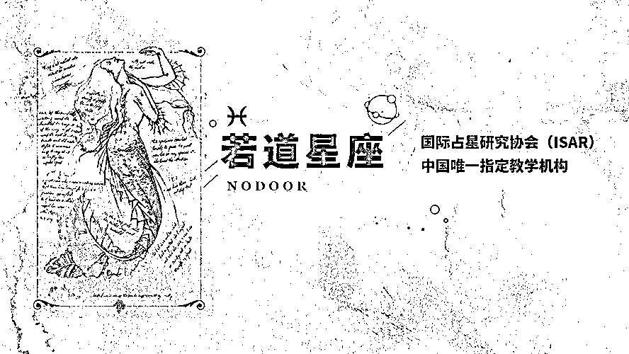

作者/大卫·瑞雷  若道占星创始人
译者/李含 校对/江艺编辑/玫瑰 封面/书君 图片/稿定设计双鱼座是个怎么样的星座呢？它是最复杂的，也是最简单的，我们该怎样理解这种“矛盾”呢？一起来看看吧。另外，大卫老师参与授课的【[ISAR 认证职业占星师文凭课程](http://mp.weixin.qq.com/s?__biz=MzA5NjA0NTAxNg==&mid=2651493153&idx=4&sn=7ab3e8bea3255b9bd58f1ba899727cff&chksm=8b482196bc3fa8805dc8ac70f2b85045bcaca388d6568c152a33b8eee2663fb59fd6efac9f6e&scene=21#wechat_redirect)】报名中，点击链接了解更多详情！
**双鱼座的梦幻世界**

两只鱼，一只向上，一只向下。一只鱼向上游向光明：“光明”常常是精神世界或理想的代名词，光明令人眩目惊羡，使人着迷，给人启迪。光明让阴影无从遁形，将一切都纳入无条件的爱与合一的光芒羽翼之下。

而另一只鱼向下游向水域深处：在这个世界中寻求庇护，水域昏暗，一隅藏身，从而避开那耀眼的光明，暂时地隐藏，将自己隐于沙砾之中。但这两条鱼是拴在一起的，正是这种张力、这种挣扎，定义了双鱼座。

即使你的出生图中没有任何行星落入双鱼座，但它仍是你星图中的一部分，以某种方式对你产生影响；而如果你的太阳、月亮、上升点或其他重要行星落入双鱼座，或是与其“共振”的宫位被强调，那么双鱼座的特质与主题将在你身上反映得更加明显。

精神世界有时候会被描述为“这个世界之中的另一个世界”。两难之境显而易见。一个人该如何同时存在于两个世界之中呢？

那些出生星图中太阳、月亮或上升点落在双鱼座人的性格复杂性可以被理解为，将两条鱼合二为一是多么不可能。这是一种不可能实现的状态！

我能不能逃避？我能不能超越？是什么让两条鱼系在一起？人生的主线，由人生的旅程和经历编织在一起。这是接近一个周期末端的一段旅程。这段旅程从白羊座开始，双鱼座就是最后一个星座，第 12 个阶段，也是最后一个阶段。

“我们为什么不是只有 10 个星座呢？”有一次曾有人这样问我：“那么我们就停在摩羯座，第 10 个星座，掌管成就与造诣的星座。”我回答：**“因为水瓶座是‘以上皆非’，双鱼座是‘以上皆是’。”**水瓶座，第 11 个星座，似乎是要反叛前面 10 个星座，好像在说：“我与你们都不同”。而双鱼座则要说：“我和你们都很像，全部，同时。”另外，在完整的人生中，我们世俗的成就造诣并不是故事的终点。

水瓶座紧随摩羯座的脚步，回应了摩羯座对成败的执着。“身份地位有什么好？”水瓶座说：“如果你的成就只是给你自己和你的家庭带来好处的话？你看不到身边的世界么？你是不是忽略了你的成功有赖于社会大众的支持？你是不是该回馈社会？”

双鱼座感觉到了水瓶座邻居的担忧，但是它更宽容慈悲。刚经历了水瓶座，吸纳了它的天赋，但是现在思想转向了诗歌、音乐和电影，甚至在科技层面的呈现也侧重启迪那些让我们敬畏、惊叹的愿景。

梦想家这个词常常用于描述著名的双鱼座人，比如终极梦想家科学家阿尔伯特·爱因斯坦，或斯蒂夫·乔布斯，他富有想象力的设计让所有人联结在了一起。

只有双鱼座，这个有着惯性迟到坏名声的星座，会用“相对论”解释时间。“亲爱的，在这里我们只是迟到了 15 分钟，而在巴黎我还提前了 45 分钟呢。”

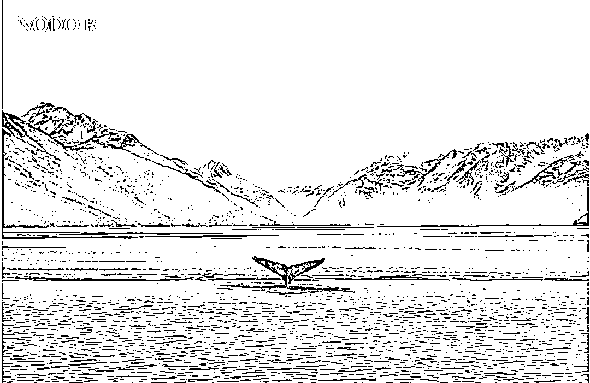

**社会共有的双鱼座体验**

双鱼座会流出边界或溢出边界。时间与空间都是曲线，所以为什么不打破电脑公司的业务范围呢？为什么不能有 MacBook Pro、iPad、iPod、iPhone 和无穷的多得多的 app 呢？我们可以用 iPhone 编辑照片、电影、文本，玩游戏，与所有人、所有团体在所有地点和时间里进行分享。

现在，海量的图片将我们联结在了一起，让我们有幸一瞥双鱼座眼中的世界——充满图像和音乐，现在流向了我们所有人。手指的触碰和滑动让我们所有人都变得更像双鱼座，同时存在于两个世界。

我们都看到人们一边开车一边发简讯，往来穿梭于车道边界，或可能有些人会着迷于玩游戏或看视频而错过了你们要搭乘的地铁。这就很像是一位双鱼座人。迷失或沉迷在自己生动而复杂的内心世界，却又与所有人联结——依然努力在这个世界上正常运转。

如果你是双鱼座，或有月亮和上升落在这个星座，你会理解我所说的你们复杂的内心世界。

例如，当某个人向你们提出一个问题，你们许多人会努力去找到一个答案。在你们的脑中浮现了许多个可能的答案。

你想：“他们真正想知道的是什么呢？他们能够了解什么呢？他们准备听到怎样的答案呢？我对他们的感觉和直觉是怎样的？对这个问题有没有另一种表述可以让我更好地回应他们想要询问的内容呢？”

到你们真的想要说些什么的时候，对方可能觉得你们在“回避推诿”，有些事情你们不想要告诉他们。你们可能开始生气甚至愤怒。当然有的事情你并没有告诉他们！可能要过差不多半个小时，你们才开始告诉他们，关于他们的提问，你们的脑中都想到了些什么。

生命是复杂的。所以你们需要选择该说些什么，常常这是听从你们的直觉或第六感的指引。选择说什么和选择做什么并不容易，如果选项很多的话。正如史蒂夫·乔布斯所说，选择一种，“就意味着拒绝其他数百种想法”。

所以这种复杂性从何而来呢？这是因为接近了一段漫长旅行的末端。11 个星座来来去去，就像是一段 11 个月的长途旅行，或游历了 11 个国家。已经获得了丰富的经历。功课学了又忘了，但会有一些东西沉淀下来。而这些东西就是一个谜，终极的神秘。许多双鱼座人会追随这条神秘之路，不论这条路将会去往何方。这条路将史蒂夫·乔布斯带到了印度，那还是他年轻的时候，他甚至尝试了致幻剂。回到加州后的一个夜晚，他敲开了寺院禅师的门，与住持进行了交流。

“我相信自己开悟了，”在一番长谈之后乔布斯对僧人说道。僧人说：“让我看到。”乔布斯再次来时交给僧人一个他早期的微芯片。“这让我看到了你的聪慧。”僧人说：“但这并不意味着你获得了启迪。”乔布斯后来学习了禅修冥想，断断续续地跟随乙川弘文修习。

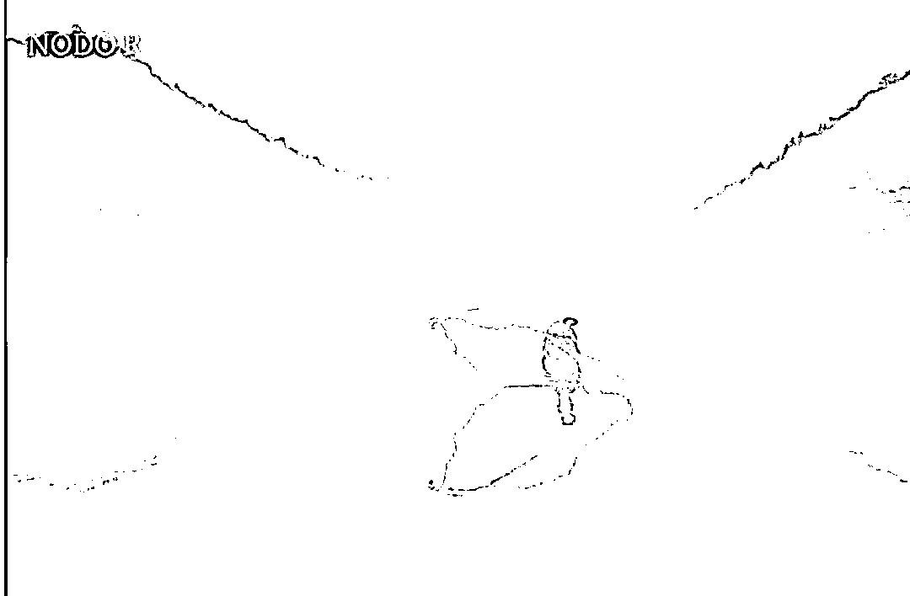

接近周期末尾，就像是一段旅行的结束，意味着积累了经验和故事。这是属于你灵魂的旅程，一段关于诗歌、摄影、摄像和音乐的旅行——沿途记录这一切。你的灵魂就像是堆满艺术品的杂乱房间，东西放的到处都是，就像是许多双鱼座人的公寓。但是！当你阅读你的灵魂之旅时，人们会停下他们正在做的事情来聆听。

你读到：“我是怎样地爱你，让我一一细数。”然后你回答，“我爱你尽我的心灵所能及的深邃、宽广和高度。”这是双鱼座诗人伊丽莎白·巴雷特·勃朗宁（Elizabeth Barrett Browning ）（1806-1997）的诗作。阅读这篇完整的诗作能够感受到双鱼座的爱是什么。

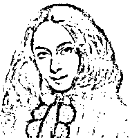

| 伊丽莎白

另一位双鱼座诗人阿娜伊斯·宁(Anaïs Nin)（1903-1997）写道：“放飞你的梦想，你不知道它会给你带回怎样的礼物，一个新的朋友，一种新的生活，一份新的爱情，一个新的国家。”以及，“梦想总是走在我们的前方，抓住梦想，有那么一瞬间与梦想合二为一，就是一种奇迹。”

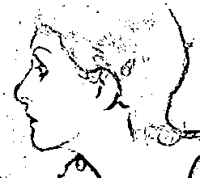

| 阿娜伊斯

**双鱼座的出口是创意**“

**逻辑可以让你从 A 到达 B，而想象力可以带你去任何地方。**

**——阿尔伯特·爱因斯坦**”

除了以上提到的名人，双鱼座的梦想家们还囊括了双鱼座电影人，比如娄烨 ，他是中国电影公司“梦想者公司”的合作创始人。其他广受赞誉的双鱼座电影人包括：罗伯特·阿特曼、山姆·佩金法、彼得·伯格、大卫·柯南伯格、克劳德·朱特等。

和词作的灵感显然也属于双鱼座，这份音乐家名单囊括了各种各样的天才。有钢琴诗人肖邦，前甲壳虫乐队成员乔治·哈里森，或田汉（1898-1968），他是中国国歌的词作者，还是一位诗人和作家。另一些典型的著名双鱼座音乐家（歌手）还包括埃尔顿·约翰、奎恩·拉提法、贾斯汀·比伯、科特·柯本、乔·邦·乔维等。但不要被误导认为大部分富于创造力的人都有双鱼座太阳、月亮或上升，或所有双鱼座人都选择以创意为生。爱因斯坦喜欢拉小提琴，他常常练习，但在听者看来，他还需要更多练习！史蒂夫·乔布斯弹吉他，但是点击率前 40 的歌曲中并没有他的作品。相反，他对音乐的热情，尤其是对甲壳虫乐队和鲍勃·迪伦的热爱，最终成为他创造 iPod 和 iTunes 的动机。

| 乔布斯

在苹果公司创办之初，乔布斯曾经用他的吉他胡乱弹奏着鲍勃·迪伦的曲子。在阳光灿烂的加州，乔布斯坐在自家后院弹吉他，此时他和苹果公司另一位合伙人沃兹尼亚克集思广益，憧憬着苹果的未来。

拥有一个创意出口，不管是否与你的工作或专业领域有关，对双鱼座人来说，都是十分重要的。任何一种创造性的自我表达：绘画、陶艺、诗歌、摄影、编剧、写作、表演课程、舞蹈、音乐、雕塑等等都激发了你们的灵感。当你们获得启迪，你们可以用超出其他人想象的神奇方式解决问题，找到解决方案。

**关于双鱼座的众说纷纭**

**创造力会帮助你们感到更明智，减少被生活压垮的感觉。**因为你们的思维常常漫游在宇宙的外部和内部边缘，就像一条鱼试图在渔网周围或之外找到一条路。

**双鱼座人常常有逃避和回避的坏名声。**极端的消极情况是，这可能表现为易受到上瘾的诱惑，毒品、酒精和食物——一切物质。逃避到电影、音乐之中，就像前面提到的那条鱼一样逃避世界。

这样的逃避是一种敏感反应。没有任何一个水象星座像双鱼座这样敏感，对万事万物敏感。你们的敏感可能是生理上的，比如一种过敏性的反应，或是对其他人敏感——尤其是在同情的意义上。

这种与他人分享感受的能力同样可能表现为对人的一种直觉，甚至是通灵的能力——就像美国著名的通灵师埃德加·凯西。虽然他关于失落大陆亚特兰蒂斯的通灵预言更广为人知，但凯西最主要的还是进行“健康解读”。

| 埃德加·凯西（Edgar Cayce 1877–1945）凯西的一生就是一项双鱼座研究。他喜欢像摄影师那样生活，担心自己的通灵能力可能给他人带来伤害或误导。但是那些来找他为他们的病痛寻找解决方案的人唤醒了他的同情心。许多年来，他都拒绝任何金钱上的回报，直到前来寻求帮助的来访者太多导致他无法工作。有超过 8000 份他的健康解读被记录了下了，现在有部分资料由 ARE（探索与领悟学会——Association for Research and Enlightenment）收藏。**你的灵魂疲倦么？**

有许多双鱼座人会感到灵魂疲倦。那是一段长途的旅行。你可能会想：“真是一段奇怪的长途旅行啊。”你在长途跋涉之后，终于找到了去往遥远神庙的路。

你的鞋都磨破了，精疲力竭的四下张望，苍蝇在你面前飞来飞去。庙宇的地板布满灰尘、肮脏不堪，你会想：“就是这样么？这就是我不远万里寻觅而来的目的地么？”

凝望着太阳西沉没入村庄，内心中一种深深的悲切之情与巨大的慈悲心交织在一起，因为你想到了每一个为生活而奔波的人，每一个你认识的人。黑暗降临，灯火星星点点。你漫不经心地弹着吉他，唱着下面的歌词：

**当我的吉他轻轻地哭泣**

**我看到了你深眠的爱情**

**我注视着狼藉的地面**

**我的吉他仍在轻轻地流泪**

**难道没有人告诉你 如何开启你尘封的爱情**

**是谁让你着了魔 和你在一起却又把你抛弃**

**当我的吉他轻轻地哭泣**

**我注意到世界正在经历着巨变****我们不能再伤害对方****我的吉他仍在轻轻地流泪****——《当我的吉他轻轻地哭泣》****乔治·哈里森 双鱼座披头士**

我 8 岁的双鱼座孙女儿丽兹从来没有听过乔治·哈里森，她也从不知道《当我的吉他轻轻地哭泣》这首歌，但是有一天，当她在一条死胡同里玩的时候，我和她聊天，她看着我，说道：“有时候我感觉到了地球在旋转。”“真的么？”我好奇地点头答道。“是的，”她看着我的眼睛说：“我的确有感觉到。”

没有人比双鱼座更令人惊讶了。你们让每个人惊叹于现实的真相。

从负面来看，有一些双鱼座人制造了许多幻想，直到现实与虚构之间的差异拧成了麻花。你为何撒谎？你在回避什么？痛苦，当然是——但是哪一种痛苦？

让人难受的幻灭之痛。幻灭比失望糟糕多了；它是启迪灵感的对立面。避免幻灭的痛苦也会关上灵感启迪的大门。你的风景黯然失色，酗酒和吸毒让你对痛苦越来越麻木。

伟大的创作歌手约翰尼·卡什（1932-2003）一生都沦陷在酒精和滥用药物之中，最终认识到了这一点。

“

**我终于明白，天堂和地狱之间并没有围墙。那里有一条深深的鸿沟，一个裂谷，裂谷之中空无一人。”**

**——约翰尼·卡什**

”

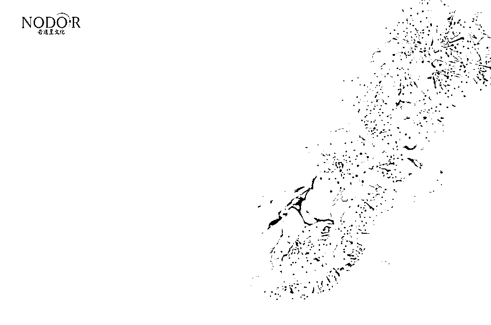

**双鱼座客户的案例**在 1985 年，一位年轻的双鱼座客户安妮第一次向我咨询。她最关心的是法院对她冒充顾客行窃的指控。这是她第二次被抓，她想要知道趋势上对这次的结果有何预示。
**同安妮的对话 **“有一半的时间我在想，也许进监狱更好，至少那时候我没什么可偷。”“我不想偷窃。我真的不想，我只是不得不去偷。”
我知道这种病症是偷窃癖，但是这是我第一次遇见。“你的律师怎么说？”我问她。“他说我很可能被判缓刑，然后强制进行咨询。”她看起来感觉无聊，似乎她希望并没有约见我的咨询。

“听着，安妮（并不是她的真名），我并不是上瘾症的咨询师，但你的星图有显示出一些出现上瘾的问题——偷窃癖是一种瘾症。”

“我知道。”她边看手表边说。

“你的双亲是否忽视了你？”我问她。“是的，你可以这么说，”她回答。接着，她告诉我，她的母亲是一位卫理公会牧师的女儿，她与母亲是疏远的——她的母亲很狂热。她讲述了母亲是如何突然笃信宗教，开始引用圣经的语句。安妮说，即使在她的成长过程中，家庭财务状况优渥，母亲依然在旧衣店给她买衣服，即使她母亲的穿着紧跟时尚。“你还在发育期，亲爱的，为什么要把钱浪费在衣服上呢，你每晚都在发育生长。”她母亲会说。

她还谈到，她有天听到了母亲与另一位男性偷情。

“妈妈不知道我提前放学了。所以我听到这个男人和妈妈一起回家的声音，我就藏起来了。”安妮非常崇拜她的父亲。“我的父亲工作时间很长，在很长一段时间里，他都非常成功，但是他对我很和蔼。他常常在出差时给我买礼物。”据我所知，她父亲在安妮 17 岁时因为税务问题损失了财富。这让她非常痛苦，认为父亲是被她的母亲和国税局所害。那段时间里，25 岁的安妮与母亲很少接触，但是依然与父亲很亲密。她似乎很羞愧，因为父亲必然会知道她的偷窃，但是他有帮她支付律师费。在 1985 年，行进冥王星经过她的合相的月亮和海王星。我告诉她，这是她人生中非常紧张的一段时期，但是也是一次天赐良机去面对她自己对过去未解开的感受和情绪。

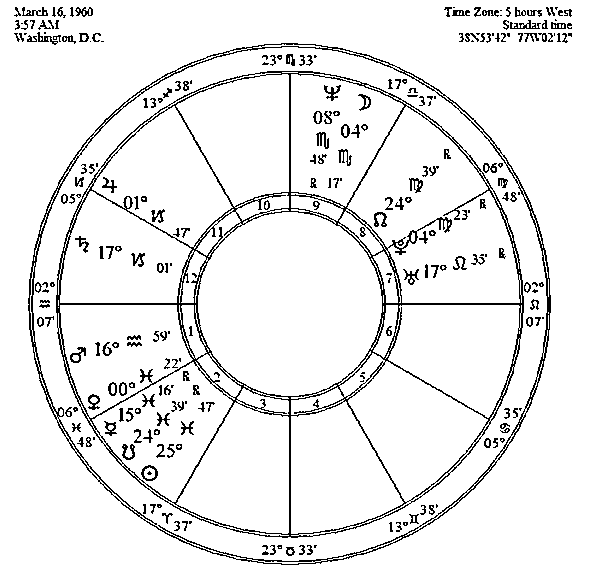

| 安妮的出生星图

从星图中可以观察到，安妮不仅是一位双鱼座，双鱼座还是她被强调的星座，她还有月亮合相双鱼座的守护星海王星。双鱼座和海王星都象征着她童年被忽视的问题，同时还预示着理想化和幻灭的趋势。
第一次咨询的尾声，我告诉安妮去做一些自我引导的冥想，告诉她记录一份梦境日记。在 1980 年代，我开始广泛地运用这两种技巧帮助客户。自我引导冥想可以带给人巨大的力量，因为它运用了一个人内在的创造性可视化的能力——而不是由治疗师引导想象。

另外，一份梦境日记是了解一个人潜意识的好方法，你情感的真相就蕴藏于此。在第一次咨商中，并没有重大的发展，但是我可以感觉到安妮对体验这一过程很好奇。

她的案子结果一如她律师所预测的那样。但是，我在接下来的咨商中发现，安妮对她的瘾症咨询师并不太感兴趣。“我觉得和你交谈更有收获，”她说。到 1986 年安妮对自己的情感模式有了更清楚的认知。但是她依然几乎每天都要与偷窃癖的诱惑作斗争。

后来，我推荐她参加杰基·斯莫尔的全息呼吸工作坊——杰基·斯莫尔是斯坦·格罗夫的学生。我感觉她在自己的过程中被卡住了，获得清晰的思维可以帮助她做决定，摆脱她自己的情感挣扎。

第一次参加工作坊时，她体验到排山倒海而来的悲伤和失落感。“我跌入了地狱，”她说。她又进行了好多次全息呼吸周末工作坊——我都记不清有多少次。但是，她终于戒掉了自己的偷窃癖。

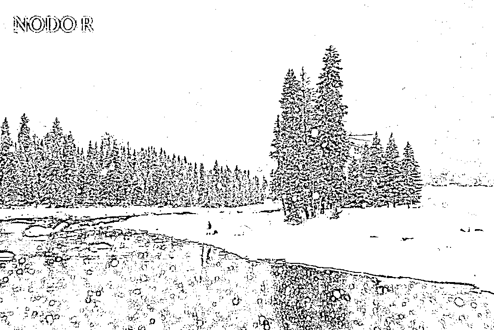

她面对了内心中巨大的幻灭——体验到了情感的层层剥茧，直到幻灭变得彻底。“除了黑暗，别无他物。一切都失去了。”她说。“然后一束光出现了，我知道自己就要痊愈了——比痊愈更棒。”

安妮成为了我的长期客户，差不多每年都会约见一次。她的丈夫是她在全息工作坊遇见的一位男人，他们有两个孩子。她说自 1986 年起，她偷窃癖的冲动就很少出现了，但是当她面对自己的情感时，发现她有时候会感觉自己是受害者，会对生活中的有些事情感到幻灭。如果你是双鱼座，或是有月亮和上升落于此星座，或是你的出生星图中海王星占据了重要的一席，你会知道面对自己的幻灭是多么多么困难的一件事——不论它在何时出现。但是你也知道灵感启迪带来的狂喜。你们拥有的是接近一段长途旅行末端，一段周期尾声时出现的人生憧憬。前路有何风景？只有你自己可以看见，然后在这被称作的人生的旅途上给我们其他人留下线索。

**版权声明：**原创文章由作者授权发布于若道平台，欢迎转发，反对抄袭。友号转载请申请白名单。

**END**

**拥有****51 年****占星实践经验的**

**若道创始人****前 ISAR 全球副主席****前 ISAR 全球职业占星师资质认证主席****大卫·瑞雷**

**和**

**2019 年第二届、2021 年第三届核心课中**

**与苏·汤普金斯老师****联合授课****的**

**ISAR 认证职业占星师**

**咔咔（Caroline）**

**二人合力打造**

**2022 年 ****若道全新核心占星课程**

**点击下图了解更多课程详情** 

**

**20 位来自世界各地的占星师****带来 19 场沙龙——新世界的觉醒****详情可点击下图**

**学习占星学****点击下图了解课程详情**

**微信又双叒叕改版啦，不想错过若道君的推送？**
****就把若道设为****星标****以及点点****“在看”****吧！******▼**

**喜欢就点一下“在看”吧！****报名直达入口**

# 若道占星·双 11 | 必买清单出炉，享受任选折扣优惠！！！

> 原文：[`mp.weixin.qq.com/s?__biz=MzA5NjA0NTAxNg==&mid=2651493804&idx=2&sn=3318a12523b03c296f4ce47cda2888b6&chksm=8b48271bbc3fae0debe9c958749068588b1ca8e9631b5483a5ce45cf788ee65ae6d4cdfb0a16&scene=126&sessionid=1692737725#rd`](http://mp.weixin.qq.com/s?__biz=MzA5NjA0NTAxNg==&mid=2651493804&idx=2&sn=3318a12523b03c296f4ce47cda2888b6&chksm=8b48271bbc3fae0debe9c958749068588b1ca8e9631b5483a5ce45cf788ee65ae6d4cdfb0a16&scene=126&sessionid=1692737725#rd)

**想一次性优惠购齐 3 门 ISAR 选修课？** **往年工作忙，错过了感兴趣的课程？****是某位老师的忠实粉丝，想集齐老师的课程？****双 11，若道为大家精选出了 12 门 ISAR 选修课，14 门名师工作坊**任选多门一次性购买可以享受不同折扣，快去占星知识的海洋里挑选心仪的课程吧！

**参加活动的 12 门 ISAR 选修课**

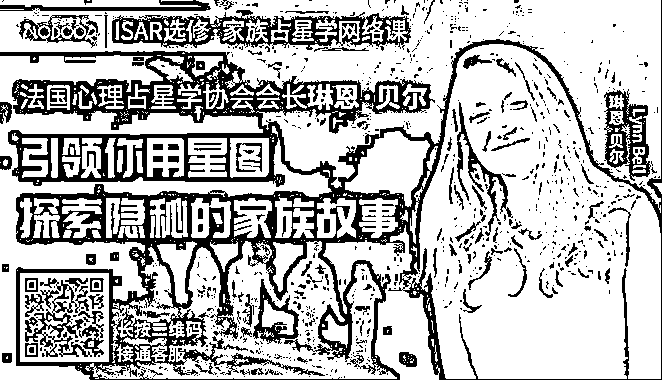 下滑可查看全部课程内容，以下皆是

**家族占星学网络课**

**原价 6800 元**

**课程内容简介**

每次课程时长 2 小时，共 8 次课，安排如下：**占星实践中的家族模式**

我们第 1 次经由童年的巨大主导力量——我们的父母，来体验我们**太阳和月亮**、**土星和金星**。我们用他们给我们的暗示来解读这个世界，而他们的回应反过来又受到大家庭的影响，我们常常发现祖先的成功和失败、怪癖和才干经常在我们自己的生活和我们的星图中重复。

越仔细观察，我们就越能发现日期的神秘重复、平行事件，镜像先辈故事的我们自己命运的奇怪扭转。

**在课程中，我们将识别这些模式并与之合作，看看我们如何能够尊重过去，同时在生活中走自己的路。**更重要的是，我们如何面对我们祖先未活出的能量，而这些能量似乎在我们自己的人生经历中再次升起？在我们前进的道路上，昔日的先人向我们提出的问题是什么呢？

**父亲与孩子**

我们将看看**父亲的原型，以及它如何在出生星图中反映出来**。我们的父亲（或缺位的父亲）如何影响心灵结构？无论是缺席还是在身边，无论是亲生父亲还是“养父”，父亲的角色都会影响我们的基本认同和亲密关系，以及我们进入更大世界的能力。

虽然**土星和太阳**是父亲的传统指征，但它们很少被描述为漫游者、梦想家或一块“滚石”。父亲过去是法律和权威的承载者。随着文化的发展和婚姻的重新定义，父亲的原型也随之改变。**母亲与孩子**我们的**第 1 个养育者（或她的替代者），给予我们生命的人**，经常通过星图中的**月亮和它的相位**来指征。但是**其他行星**也可以描述她，其他人可以扮演她的角色。不论在星图上是哪些征象来体现这种基本关系，都在我们的一生中，留下了深刻的情感烙印。我们现实生活中的养育者如何与出生星图中的母亲形象相对应？我们如何将过去的力量整合到我们的成人生活中？**家族价值观****在每个家族中，都有 1 个主导价值，你需要认同它才能成为这个“部落”的真正成员。**它可能是力量，或智慧，或能干成事情的能力。对某些家族来说，这个主导价值是金钱；而对另一些家族来说，则是亲密和爱。崇尚运动的家族可能会嘲笑爱读书的孩子，赶走爱做梦的人。我们对家族的忠诚可能会阻止我们追随自己的天赋。那个离经叛道的孩子会怎样？**第 2 宫-第 8 宫轴线和金星的相位将为我们提供这些问题的线索。**有内在的价值观，也有文化和家庭强加的价值观。我们将探讨家庭价值观和对我们最重要的价值观部分之间的交集。我们该如何尊重灵魂，并且仍然对那些养育我们，使我们充满希望和梦想的人保持信心？**成功、家族压力、负债和牺牲**家族中的一个孩子，通常是最年长的，承载着家族成功的需求。但是，当这个孩子是女性，或者和家族传统的性情不同时，会发生什么呢？当个人需求和家族需求之间存在紧张关系，孩子可能会牺牲自己的天赋，而这会影响下一代人。一个拥有强大外行星的人可能会发现很难像以往那样简单地继续下去，而这也会动摇家族的自我认知。他们也可能是那个冲破家族一直以来的挣扎的人。一个孩子可以救赎数代人的失望。这些议题会由出生星图的哪些征象体现出来呢？我们将看**第 4 宫和第 10 宫，第 2 宫的价值观和第 12 宫的牺牲**。**当前关系中的过去模式**继续探索家族模式，密切关注过去对当前关系的影响。我们的原生家庭和先辈是如何定义爱的？如果爱是奴役的一种形式，我们可能需要找到自由，或者重新定义服务。如果我们的某个孩子让我们想起自己害怕和憎恨的父母，或者我们最不喜欢的兄弟姐妹或表亲时，会发生什么？

即使那些似乎完全与过去决裂以逃避“家族遗产”的人，也可能在一个困难的工作环境、一个特别难相处的老板或他们自己孩子的生活中重新遇到它，因为失落的爱的幽灵和没有被活出的故事往往会跳过一两代人重新出现。**家族的无意识带着某种印记，邀请我们再试一次，为一个旧故事找到新的结局。**

**家族秘密与家族创伤**

**许多藏在家族“壁柜”里的秘密通常在第 8 宫显现，或者由冥王星相位显露出来。**有些东西是隐藏的，因为它们很危险；另一些是因为它们太珍贵了，不能分享，比如失去的爱，或是被收养的孩子。

秘密可能涉及小的轻率行为，或大的背叛。他们可能隐藏痛苦、欲望或可怕的创伤。这些被锁住的能量经常隐藏在我们身上，带来焦虑。轻柔地将它们带到光明中，有助于释放和转化家族中内疚和羞耻的力量。

**太阳返照技法**

**原价 6800 元**

**课程内容简介**

每次课程时长 2 小时，共 8 次课，安排如下：

**第 1 课**

❶ 什么是太阳返照

❷ 如何解读太阳返照

❸ 一张太阳返照图解读两遍

❹ 为期 19 年的默冬周期预测与意识

❺ 出生地与迁徙地的返照图

❻ 不是所有的年份的太阳返照都一样 

**第 2 课**

❶ 月亮在太阳返照中的至关重要性及其元素周期

❷ 月亮落入火元素星座、土元素星座、风元素星座、水元素星座的解读

❸ 食相、满月和新月

❹ 月亮在太阳返照中的相位 

**第 3 课**

❶ 继续月亮的相位

❷ 太阳照亮各宫位

❸ 通过太阳所在宫位解释太阳返照

❹ 在太阳返照中太阳的相位

**第 4 课**

❶ 太阳返照中的合轴行星

❷ 太阳返照中的合轴行星为未来一年添彩，并成为来年的主导者

❸ 重要的星图模式❹ 精确紧密的相位❺ 行星力量 **第 5 课**

❶ 太阳返照与出生星图的关系

❷ 识别模式

❸ 太阳返照中行星作为出生星图的解释

❹ 逆行行星和共振相位❺ 出生上升点经过各宫位

**第 6 课**

❶ 太阳返照中的择时❷ 利用月亮择时❸ 整合行进❹ 太阳经过各宫位❺ 中天推进❻ 小限法 **第 7 课**❶ 特殊的太阳返照年❷ 太阳返照与金星周期❸ 中天经过各元素❹ 最好和最坏的年份

 ** 第 8 课 **

❶ 与未来合作❷ 技巧的整合❸ 预测与心理学❹ 如何处理两难困境

**医疗占星学网络课**

**原价 6800 元**

**课程内容简介**

每次课程时长 2 小时，共 8 次课，安排如下：**第 1 讲  与占星****学、心理****学、病症一起工作**医疗占星学的组成部分以及如何使用它们行星的作用与相互作用黄道星座人宫位的重要性疾病和健康是如何产生的★ 第 2、3、4 讲的课程内容基于星座以及它们之间的相互作用。

**第 2 讲  基本星座**

学习基本大十字星座——白羊座、巨蟹座、天秤座和摩羯座及其功能和相关的健康问题。这些星座与防御、养育、结构、体内平衡和荷尔蒙控制有关。

**第 3 讲  固定星座**

学习固定大十字星座——金牛座、狮子座、天蝎座和水瓶座及其功能和相关的健康问题。这些星座与习惯和反射、心脏调节、生存、循环和协调有关。**第 4 讲 变动星座**学习变动大十字星座——双子座、处女座、射手座和双鱼座及其功能和相关健康问题。这些星座与呼吸、神经系统、肠道、睡眠以及信息、情感和行动的整合有关。★ 第 5、6、7、8 讲重点学习行星，它们在身体层面的表达、它们的相位与行进。**第 5 讲 太阳与月亮**太阳掌管视觉、活力、心脏和意识，与心脏、脊柱和视觉问题相关。月亮掌管人体的周期，特别是月经周期、饮食模式和体液，与情绪引起的疾病、饮食失调和胃病相关。

**第 6 讲 土星与天王星**

土星掌管着皮肤、骨骼、牙齿和衰老过程。它对应的疾病包括慢性疾病、耳聋、帕金森病、关节僵硬和牙齿问题。天王星代表身体活动的协调，有节奏的脉动和身体的“电”。与天王星相关的疾病包括癫痫、痉挛、心律失常，以及阿斯伯格综合症和自闭症样综合症。

**第 7 讲 海王星与冥王星**海王星掌管松果体、细胞膜渗透和右脑功能，与过敏、上瘾的病症、慢性疲劳综合症和睡眠障碍相关。冥王星掌管消除和转化，其病理包括毒性、脓肿、癌症和强迫症。**第 8 讲 火星**火星是与能量和防御相关的行星，掌管免疫系统、肾上腺功能、肌肉活动和炎症反应。它是许多身体和情绪障碍的核心，如自动免疫障碍、抑郁和发烧，以及由手术或需要手术引发的问题。

**古占和现占的结合**

**原价 6800 元**

**课程内容简介**

****每次课程时长 2 小时，共 8 次课，安排如下：****

**主题 1：复习古典占星学的概念**

一、大体介绍课程的总体安排以及如何选择学员星图作为案例

1. 上课形式更为灵活。这里提到的课程安排可能会在上课过程中根据需要进行调整。

2. 如何挑选课程中作为案例的学员星图。除了这部分之外，课程中用到的星图都会是学员的星图。我们不可能逐一分析每个人的星图，因此会挑选部分星图作为案例。 

二、运用的方法、工具和基本概念对于只学习过一般占星学知识的人，可能会有一些不太熟悉的术语和概念，比如：⑴ 行星的先天秉赋表及其运用。⑵ 对于现代行星（天王星、海王星和冥王星）、小行星和其他所有已知或未知的行进星体的应用，以及这些星体与古典行星在用法上的区别。⑶ 整宫制：什么是整宫制，它与常用的分宫制有什么区别。⑷ 胜利星：包括单一胜利星和复合胜利星。⑸ 点宫制：从福点和精神点算起的分宫制，它们的用途，它们给占星学带来了什么。⑹ 如何处理中天：因为第 1 宫是从上升星座算起，所以可以在第 10 个星座之外的星座中发现中天。这种情况如何处理？ 在这一部分会用到一些名人的星图作为例子，但在之后的课程会使用学员的星图为例。主题 2：用古典占星学解读学员星图 1. 距离上升点、中天、下降点和下中天 7.5°以内的行星重要程度依次递减（上升点和中天的重要程度几乎相当）。2. 寻找相位异常多的行星，尤其是与太阳、月亮、中天或上升点形成相位的行星。3. 被强调的星座，有四颗或四颗以上的行星，加上中天或上升点。4. 太阳星座、月亮星座和上升星座的关系，它们的特质是类似的还是不同的？5. 上升星座的守护星或上升星座的胜利星，它落在什么星座、什么宫位？它所在星座是否与上升所在的星座形成相位？这些知识都将通过学员的星图来学习、展示。主题 3：通过学员星图分析其个性、健康、疾病 1.行星或其他星图征象可能影响的因素。介绍：⑴ 体型、体态和外貌。⑵ 心智特性。⑶ 性格和个性。⑷ 与环境的互动。⑸ 本我。2.哪些因素对体型、体态和外貌影响最大？⑴ 遗传和种族血统。不要把一个人的血统不太可能有的身体特质强加到这个人身上。然而，在现代化妆品的帮助下，人们对自身外表所做出的改变可能实际上将他们带到传统占星学所暗示的方向上。⑵ 太阳、月亮和上升星座。⑶ 任何被众多因素集中强调的星座。⑷ 任何接近上升点或中天（士 7.5°）的行星。任何与上升点或中天形成非常紧密的（士 2-3°）主要相位的行星也有一定的影响。⑸ 星图中任何与上升点、太阳或月亮有关的其他常见重复主题。⑹ 疾病。补充：在这部分星图分析的讨论中，星图被选中的学员附上电子照片效果会更好。主题 4：现代和古典之比较，分别解析个性、性格和心智这一主题一直是 20 世纪占星学最为重要的关注点之一。然而，却有着两种极为不同的切入方法。⑴ 现代方法，基于上面所提到的分析外形类型所运用的方法。⑵ 中世纪方法。（简化版，老师会在必要和适当的时候介绍其更为复杂的面向。）完全取决于星图中与心智功能特定征象星有守护关系的行星。主要是那些围绕星图中 4 个关键点的行星，以及关键点所在星座的守护星和与关键点形成相位的行星。① 植物的生长灵魂：主要象征是上升点及其守护星。② 感性灵魂或动物的灵魂：主要象征星是月亮及其守护星。③ 智性灵魂或理智的灵魂：主要象征星是水星及其守护星。④ 这些都受到任何与主要象征星成相位的行星的影响。主题 5：情感关系（家人、爱人、朋友）尽管在传统上，每 1 宫所赋予的主题似乎通常可以表明该宫位是否主要是个人宫位，是否与人际关系有关，或完全是外界环境层面的；但实际上，每组象征符号和星图都可以也确实体现了所有这 3 个层面。不过，此次课程余下的时间我们将主要讨论人际关系和纯环境因素。情感关系：⑴ 父母和原生家庭，也包括本人（就是你）可能拥有的自己的家庭。该主题下还包含与权威人士的关系。⑵ 兄弟姐妹和堂表亲，也包括叔叔/舅舅、阿姨/姑姑。⑶ 亲密的一对一关系。⑷ 朋友和一对多的关系。⑸ 敌人。主题 6：财富、投资、职业⑴ 金钱、财富，理财观念。⑵ 个人工作或职业的日常活动。⑶ 职业和社会地位，毕生的追求以及谋生之道。主题 7：移民、旅行、学习⑴ 旅行和与其他国家的交流互动。⑵ 学习其他文化。⑶ 移民倾向

**凯龙星**

**原价 6800 元**

**课程内容简介**

**首先，我们将了解实际的天文学和神话中隐含的象征和意涵，学习去“看透”象征的世界，这对理解“凯龙星意识”至关重要。****每次课程时长 2 小时，共 8 次课，安排如下：****✦ 天文学和神话中的凯龙星含义****天文学部分：**带你探索凯龙星发现以来的“天空之旅”——从不明星体到多次被重新归类凯龙星的由来凯龙星发现的时代背景凯龙星与冥王星之间的关系从宇宙论理解凯龙星的象征意义**神话部分：**凯龙星原型的象征和研究**了解凯龙星的背景之后，我们将重点学习个人星图中的凯龙星，以及行进凯龙星。****个人星图中的凯龙星：**个人星图中的凯龙星如何解读凯龙星在星图中的落点，在生活中是如何表达其主题？**行进中的凯龙星：**凯龙星在行进中被触发如何解读？行进中的凯龙星如何解读？**有关业力的部分：**凯龙星与祖先领地和祖先业力的关系如何通过凯龙星看“家族集体疗愈”？从家族星图的凯龙星看你此生的“疗愈任务”**体验凯龙星疗愈之旅：**引导冥想，感受凯龙星的疗愈之旅如果你是一个致力于个人疗愈的占星学子或者致力于帮助他人疗愈的占星师，学习、了解凯龙星是你必不可少的一门必修课。

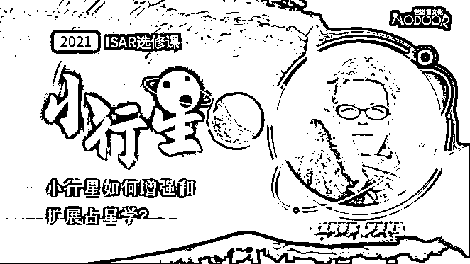

**小行星**

**原价 6800 元**

**课程内容简介**

每次课程时长 2 小时，共 8 次课，安排如下：
**第 1 讲 小行星简介**小行星概述，小行星的发现、科学以及一些占星学历史。**第 2 讲 谷神星，丰饶女神**母神、农业女神，但其影响力远不止如此。这是我们所知的最大的小行星，也是最重要的小行星。她掌管养育、滋养、救助、管理等方面。**第 3 讲 婚神星，婚姻女神 **荣誉、伙伴关系、契约和婚姻：众神中的女王是正直的女主人。她在出生星图和行进中有什么意涵？她与“丈夫”木星朱庇特是什么关系？**第 4 讲 智神星，智慧女神**战地记者、棋手和占星师有什么共同之处？来自智慧、策略、洞察力和远见女神的帮助。**第 5 讲  灶神星，壁炉女神**掌管神圣的火焰、家庭生活、厨房灶台、家人、遗产的女神：这颗关键的小行星被严重误解了。她可以给你一把钥匙，让你了解家庭关系、你的祖先和你的目标意图。**第 6 讲   健神星，健康女神**在我们应对全球疫情的过程中，掌管健康和福祉女神目前显得尤为重要。她能提供如何应对新型冠状病毒肺炎的线索吗？她在出生星图中的意涵是什么？幸福原来蕴含着相当广泛的含义。**第 7 讲 灵神星，灵魂女神**灵神星是唯一一位以人类身份开始生命的女神，她代表着人类的灵魂。这颗小行星与爱情故事、童话故事和灵魂之旅有关。**第 8 讲 综合应用，展望未来**你们刚刚开启探索使用小行星可能性的旅程。我们会探索评估某些理论有效性的方法，以及在实践中检验这些理论的重要性，我们还会探索其他数百万小行星中的一些。这堂课既有提醒告诫，也鼓励你深化自己的占星实践，并拓展你对象征的理解。

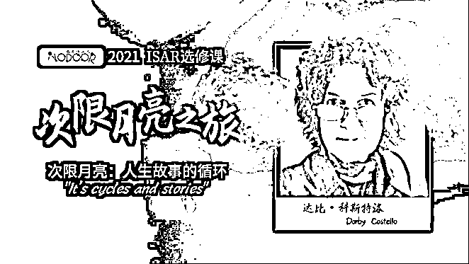

**次限月亮**

**原价 6800 元**

**课程内容简介**

每次课程时长 2 小时，共 8 次课，安排如下：**第 1 讲 出生星图中的月亮与它在童年的推进**我们将学习出生星图中月亮的象征意义，以及它如何反映你的母亲以及你童年的家庭生活。我们将从元素的角度观察月亮，并研究从出生起你是如何得到母亲的关注的，我们将观察出生后几年的月亮的推进。**第 2 讲 从 7 岁到 14 岁：从自己到他人**次限月亮与出生星图中月亮的第 1 个四分相在 7 岁左右出现。我们将学习在这个关键时间点我们是如何开始意识到自己是独立存在的个体，以及它如何让我们向家庭以外的其他人寻求滋养和生命。**第 3 讲 从 14 岁到 28 岁：从别人到自己**从 16/17 岁到 28 岁左右第 1 次次限月亮回归，我们完成了与他人和与自己的月亮的灵魂之旅。从次限月亮回归开始，我们就开始对自己的情感生活以及我和其他人之间所发生的负责。**第 4 讲 从 14 岁到 28 岁：从别人到自己**当次限月亮描述我们内心的旅程时，土星的行进描述了我们与周围世界的联系，以及作为社会发展中的个体，世界对我们的要求。在我们生命的头 30 年里，它们几乎以相同的速度运行。**第 5 讲 次限月亮与其他行星的相位**我们将从次限月亮的旅程中抽身出来，看看它与各种不同人的星图的其他行星产生有趣而特别的相位时发生了什么，这样我们来了解次限月亮触及我们星图中的这些行星时会发生什么，以及我们该如何为自己的生命导航。**第 6 讲 30-60 岁的次限月亮推进**当月亮再次绕着出生星图运行时，我们有机会将意识带到我们的情绪反应中，并开始引导我们的内在本性，而不是对发生在我们身上的事情束手无策。**第 7 讲 60 岁以后的次限月亮之旅**在当今时代，60 岁以后过着积极生活的人比历史上任何时候都多。有的人在 70 多岁的时候坠入爱河并第一次结婚。我们将在这一讲探讨如何在我们生命的最后几十年里对自己和他人有用，这样我们就可以体验到生命的丰富多彩。**第 8 讲 次限月亮与次限太阳的关系**最后，我们来研究次限月亮绕着星图运行时与次限太阳推进的关系。我们将通过星图案例来进行探讨。

**原型占星学**

**原价 6800 元**

**课程内容简介**

每次课程时长 2 小时，共 8 次课，安排如下：

**授课重点**

☆ 原型占星学的基础

☆ 实际应用（用于自我认知、从容生活、情感关系、心理治疗）

☆ 更大的意涵（哲学的、宇宙的、历史的）

**知识点**

☆ 一致性的基本形式：出生星图、个人行进、世界行进

☆ 占星学如何运作，共时性的角色

☆ 占星学中的命运和自由意志问题

☆ 原型的本质/基本特征

☆ 行星的意义以及它们的组合

☆ 主要相位

☆ 如何把握一张出生星图最重要的主题

☆ 评估个人行进

☆ 评估世界行进

☆ 重要的是认识到原型的多元性，以及在共同创造性地展现我们出生星图和行进的潜能的过程中我们所扮演的角色、所具有的力量和所肩负的责任。

**第 1 课：开课欢迎致辞**

介绍我们将在该课程中涵盖的内容

占星学和心理学如何互相启发，互相增强

我的占星学之旅

是什么让原型占星学与众不同

课堂讨论，提问与回答

**第 2 课：原型占星学的基本概念框架**

运作方式：因果关系和共时性的议题

命运和自由意志

理解原型

**第 3 课：行星的意义，从发光体太阳、月亮开始，到水星、金星、火星、木星、土星**

**第 4 课：外行星天王星、海王星、冥王星：“银河使者”**

**第 5 课：观察运转中的行星，第一部分：艺术、音乐、电影、喜剧（指定的电影）中的示例**

**第 6 课：观察运转中的行星，第二部分：艺术（指定的电影）中的更多示例**

**第 7 课：个人行进，以及如何带着占星学的觉知投入到生活之中**

**第 8 课：世界行进，以及以占星学更宏大的哲学意涵来理解我们在历史上所处的时刻**

**恒星**

**原价 6800 元**

**课程内容简介**

每次课程时长 2 小时，共 8 次课，安排如下：**第 1 讲：导论与主要天文星座**存在的层面我们的存在有 3 个关键层面，占星学的影响也有 3 个主要层面。其中之一就是恒星的影响层面。神话编码恒星星座或星团代表着神秘的丝线所编织的网，它们创造了我们的集体命运，也创造了个人的命运。其基石是由融入集体无意识的存在或本质中的原始神话组成的，因此代表了人类的基本编码。天文星座所赋予的神话是现实的基本框架，也是案主在实现神话或部分神话的道路上内在所承载的命运的深层编码。恒星、天文星座和占星学星座我们应该一直谨记黄道占星星座和黄道天文星座之间的重大区别。恒星和天文星座所使用的容许度恒星对不同的行星和四轴的影响力不同，其容许度取决于好几个因素。恒星影响的传导物行星和宫头主要的天文星座天龙座、英仙座、武仙座示例，案例研究**第 2 讲：皇室天文星座**组成“皇室”的天文星座主宰着北方天空，主要包括埃塞俄比亚国王和王后（仙王座和仙后座）以及他们的女儿仙女座。示例，案例研究**第 3 讲：一等星**每颗星等小于 1.5 的恒星都是一等星。这些恒星的总共有 20 颗，最大的是天狼星(大犬座α)，-1.46 星等。即使天狼星和其他恒星的星等为负数，在占星学的意义上，它们也被称为一等星。一等星是最大的恒星，由于它们的体积最大，它们的影响力也最大。它们除了具有特定的性质外，还能增强案主的生命力和力量，因此能提升案主的潜能。**第 4 讲：黄道天文星座 1（白羊座到巨蟹座）**黄道天文星座与黄道占星星座类似。黄道占星星座是根据黄道天文星座来命名的，这是它们之间的所有关联，在回归黄道占星学和恒星黄道占星学中都是如此。我们还要了解的是，有 13 个黄道天文星座和 12 个黄道占星星座。尽管黄道天文星座和黄道占星星座在占星学意义上并无联系，但是它们是相关的，通过了解黄道天文星座的性质，我们可以增进对黄道占星星座性质的理解，而这正是回归黄道占星学和恒星黄道占星学的基础。因此，我们会将黄道天文星座分成几个小组来讨论。前 4 个黄道天文星座中的恒星（白羊座、金牛座、双子座、巨蟹座）示例，案例研究**第 5 讲：黄道天文星座 2（狮子座到天蝎座）**中间 4 个黄道天文星座中的恒星（狮子座、处女座、天秤座、天蝎座）示例，案例研究**第 6 讲：黄道天文星座 3（蛇夫座到双鱼座）**黄道天文星座中的恒星（蛇夫座、射手座、摩羯座、水瓶座、双鱼座）示例，案例研究第 7 讲：剖析天文星座恒星象征存在的无意识部分，因此恒星和天文星座主要描述物理现实。剖析天文星座与解剖人体密切对应。因此，代表人类天文星座（有时是动物天文星座）身体部位的恒星与人体的部位相关，这些部位要么特别敏感，要么被强调或以其他方式与和这个恒星天文星座相关的神话的特定部分相关。此外，恒星所属的天文星座中的每一部分都有自己的象征性关联。**第 8 讲：业力占星学中的恒星**理解恒星在业力占星学中的影响，有助于我们看到灵魂的路径，以及我们当下的任务。因此，恒星让我们能够清楚地看到业力与业力之间的关联，这本身就代表完整整合的一个重要部分。

**行星交点**

**原价 6800 元**

**课程内容简介**

每次课程时长 2 小时，共 8 次课，安排如下：**第 1 讲 介绍行星交点**我们将学习行星周期如何形成行星交点，并了解日心视角和地心视角之间的区别。**第 2 讲 什么是行星交点**我们将深入学习丹恩·鲁伊尔的成熟思想，这是启发马克老师研究行星交点的灵感之源，也是他最近出版的《行星交点与集体进化》一书的灵感来源。**第 3 讲 双子座-射手座的天王星交点**我们将学习人类认知和技术如何通过天王星交点的透镜进化。**第 4 讲 巨蟹座-摩羯座行星交点**我们将进一步学习行星交点对社会和文化的影响，深入探讨落在摩羯座-巨蟹座的木星、土星和冥王星交点，并了解它们在过去 1000 年里对我们的全球社会、政治和文化思潮起着怎样至关重要的影响。**第 5 讲 海王星及其狮子座-水瓶座交点**我们将学习落在狮子座-水瓶座的海王星交点影响的不同显化，及其在疗愈中的作用；灵性意识形态的发展，及其促使事件结束的倾向。**第 6 讲 作家案例**通过原创研究，我们将学习行星交点如何影响了世界上一些最伟大的作家的人生。**第 7 讲 研究 2020 年**我们将了解 2020 年的重要意义。**第 8 讲 回顾**我们将回顾前面的课程，并探索如何通过行星交点的意涵理解月亮交点。

**金融占星初阶课**

**原价 7500 元**

**课程内容简介**

每次课程时长 2 小时，共 8 次课，安排如下：**第 1 讲 与金融市场相关的周期研究中会用到的术语**周期周期性容许度范围如何估量市场周期：波峰与波谷扭曲失真平移：左、右、涨、跌 **第 2 讲 行星动力及其与经济占星学、金融占星学和世俗占星学的关联**逆行阶段和停滞阶段金融占星学和世俗占星学中的“入座”日心水星（射手座）相位：作为市场时机因素的主要相位和标准相位月节律：与股票和黄金走势的关联**第 3 讲 市场周期的结构**模式阶段子周期市场周期的牛市、熊市分别包含的 3 个基本模式**第 4 讲 趋势分析**牛市趋势的 5 个基本特征熊市趋势的 5 个基本特征占星学及其在趋势逆转中的作用介绍关键反转日期（CRD）介绍**第 5 讲 股指的长期周期**它们的阶段与子周期美国股市与英国股市（它们历史悠久）案例**第 6 讲 股指的长期周期（续）**4 年周期及其阶段占星征象与股市长期周期的关联冥王星在不同星座海王星在不同星座**第 7 讲股指的长期周期（续）**天王星在不同星座和黄道区间土星在不同星座和黄道区间北交点黄道区间**第 8 讲 行星相位及其与长期市场周期的关联**长期市场周期与长期行星周期的重叠展望未来

**金融占星进阶课程**

**原价 22000 元**

**课程内容简介**

**若道金融占星学第 3 阶课程**10 节网络课，2 场 2 天的工作坊，每天 6 小时，安排如下：地球宇宙学征象与交易周期的关联本阶段的课程针对短线交易者，帮助他们了解持仓 3 天到 6 个月的交易买入和卖出的最佳时机。第 3 阶课程将回顾和详细说明各种金融市场的基本周期。课程将定义和演示基本周期的各个阶段，包括半基本周期、主要周期和短期交易周期，用于市场时机选择和发展交易技能。它将指导那些喜欢短线持仓 3 天到 6 个月的投资者，如何将这些行星周期用作短线交易策略之一。老师会指导大家在黄金、白银、中国和美国股指等市场中使用这些技巧。**这门课程会涵盖以下主题：**① 基本周期作为金融交易市场的主要焦点。② 基本周期的各个阶段，包括：半基本周期；主要周期；交易周期；阿尔法-贝塔周期。③ 与交易周期反转一致的关键技术研究。④ 关于周期完成确认信号的关键技术研究。⑤ 在不同的金融市场上，某些行星在某些特定星座时，往往与牛市或熊市趋势相关。这可以根据地心或日心的位置来判断。⑥ 行星在以地球为中心的运动中，转向逆行或顺行（停滞）时，某些行星停滞与不同金融市场中的基本周期有更高或更低的相关性。⑦ 在不同的金融市场中，与其他行星相比，某些行星的相位与基本周期有更高或更低的相关性。⑧ 如何计算大部分金融市场中的地球宇宙学征象关键反转日期，容许度在 3 个交易日内。⑨ 将地球宇宙学关键反转日期与基本周期、半基本周期或主要周期波谷或波峰的时间段重叠，从而增加市场反转的可能性，以此预示一个周期的完结。⑩ 通过使用特定市场的星图，然后确定行星行进与这些“出生星图”行星形成相位的时间，来提升识别金融市场反转的技巧。这些“出生星图”包括美国股市的“梧桐树协议星图”和中国上证指数的“首个交易日星图”。⑪ 根据对周期和地球宇宙学征象研究，一旦市场进入周期高点和/或反转的时间段，制定出一个考虑最佳风险回报参数的交易计划（当设定触发时该怎么办)。**若道金融占星学第 4 阶课程**太阳-月亮组合与短期市场反转的关联这是针对短线交易员的课程。如果你是一名短线交易者，并且想知道每个月基于太阳-月亮星座交易的最佳时间，那么这就是你不应该错过的课程！这是你在任何其他地方都学不到的课程。**本课程会涵盖以下内容：**① 月亮在各星座的行进，以及它与股票市场、贵金属和比特币价格活动的对应关系。② 检视当日星图，查看月亮的位置（以及它与股票、贵金属和比特币价格活动的常态关系）。③ 回顾衡量太阳-月亮组合与金融市场短线交易反转（波峰与波谷）相关性的有效研究。④ 评估重要性：1 星、2 星、3 星类型。⑤ 重要的太阳-月亮组合与股市的关联。⑥ 重要的太阳-月亮组合与黄金白银市场的关联。⑦ 与比特币相关的重要月亮星座。⑧ 理解交易设置，以最优方式利用太阳-月亮的反转。⑨ 利用当日星图（60 分钟、30 分钟和 5 分钟星图）提升对时机的把握。**4 门阿兰·欧肯老师的经典课程**

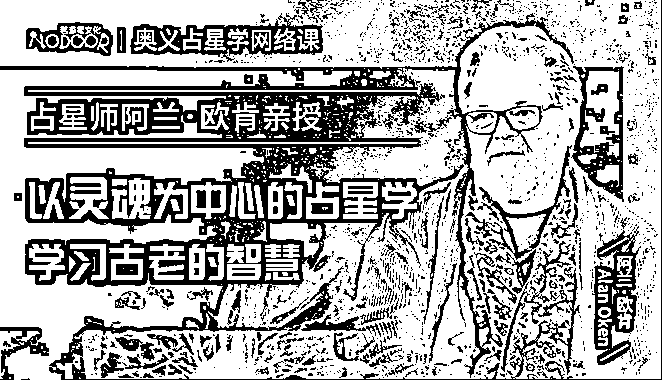

**奥义占星学网络课**

**原价 6800 元**

**课程内容简介**

**奥义占星学系列网络课程的目的**向你展示以灵魂为中心的占星学体系中核心部分的一些最重要的法则和原则。这需要你学习新的词汇表，这个词汇表基于你已经学习到的对传统心理占星学语言的理解。本系列网络课程将通过详细展开奥义占星学内在的核心教诲，来教授这些概念及其词汇。**第 1 讲 什么是以灵魂为中心的占星学？**这一方法解读出生星图与传统的心理占星学及以事件为导向的占星学有什么区别？灵魂、人格和“彩虹桥”的结构是什么？意识和创造力的 7 个层面 7\. Physical 身体 6\. Astral 星芒  5\. Mental 心智  (Lower) （低阶）4\. Mental 心智  (Higher)（高阶）      3\. Intuitional 直觉       2\. Atmic 阿特密          1\. Monadic 一元内化、进化和我们内在因此过程而存在的特殊张力之间的关系**第 2 讲 古老智慧教诲的 10 大法则和原则，及其在以灵魂为中心的占星学中的应用**介绍 7 道光**第 3 讲 7 道光：3 道主要光和 4 道次要光**意志、爱和智慧的光精神、灵魂、人格和 7 道光**第 4 讲 7 道光和 12 星座**7 道光和行星介绍在以灵魂为中心的占星学中两颗额外的行星：地球和火神星神圣行星，透过灵魂运作，水星、金星、木星、土星、天王星、海王星、火神星非神圣行星，透过人格运作，太阳、月亮、火星、冥王星、地球第 1 道光，意志与力量大的光，白羊座、狮子座、摩羯座；冥王星、火神星第 2 道光，爱与智慧的光，双子座、处女座、双鱼座；太阳、木星第 3 道光，积极的智力的光，巨蟹座、天秤座、摩羯座；地球、土星第 4 道光，通过冲突的和谐的光，金牛座、天蝎座、射手座；月亮、水星第 5 道光，科学技术之光，狮子座、射手座、水瓶座；金星第 6 道光，宗教、奉献、意识形态，处女座、射手座、双鱼座；火星、海王星第 7 道光，仪式性秩序之光，架构、阶级，白羊座、巨蟹座、摩羯座；天王星**第 5 讲 通过奥义之眼看出生星图是奥义占星学解读的第 1 步**12 星座的奥义守护星与传统守护星的比较**第 6 讲：上升点、太阳和月亮在以灵魂为中心的占星学中的意义**光、行星和星座的综合影响，第一部分**第 7 讲：光、行星和星座的综合影响，第二部分**在出生星图中寻找灵魂目的的公式**第 8 讲：以灵魂为中心的奥义占星学中宫位的意义**以灵魂为中心的占星学解读的第 1 步：将奥义和传统结合起来

**天王星网络课**

**原价 6800 元**

**课程内容简介**

**第 1 讲：受时间限制和不受时间限制的心智（第一部分）**天王星的真正意涵是什么？它在我们生活中的目的是什么？天王星在希腊神话中的起源如何通过这个神话理解人类意识的现实和发展？天王星和土星，天王星、土星以及月亮和你的自我感**第 2 讲：受时间限制和不受时间限制的心智（第二部分）**延续第 1 讲探讨的主题运用学员自愿提供的星图作为讲解这些原理的案例**第 3 讲：个人与集体，一段重要关系的旅程（初步讲解）**天王星在金牛座和天蝎座天王星在狮子座和水瓶座天王星和太阳认识和发展个体化自我的过程学员星图案例**第 4 讲：什么是“原型”？**天王星和水星将心智客观化以产生真正的直觉的能力占星学是“原型的科学”天王星是行星原型中的父亲开放的心灵、直觉、天王星与太阳之间的关系**第 5 讲：找到我们内在的外星人，让他成为有益的朋友。（个人可以如何为集体服务，进一步讲解）**天王星是什么类型的“革命英雄”？你是什么类型的“革命英雄”？你会在出生星图中的什么地方会发现自己的个人革命你作为个人如何成功地表达这一能量？以学员的星图为例**第 6 讲：天王星及其对关系和性的影响**星图中金星与天王星的关系天秤座和水瓶座的关系第 7 宫和第 11 宫的关系天王星在天蝎座擢升，在金牛座落陷，个人、非个人和集体层面的人际关系**第 7 讲：天王星的行进**经历激烈的个人反叛和革命的时期成为我们自己的过程白羊座天王星四分摩羯座冥王星的世代：当今的孩童（2011-2017 年出生）**第 8 讲：2019 年和 2020 年天王星向世界传递的信息**讨论当前土星和冥王星在摩羯座行进，相对于天王星在金牛座行进的意义，因为这会影响我们所有人分享一些非常具体的观察，关于 1988 年至 1995 年出生的这一代人声音的觉醒

**权威感工作坊**

**原价 5800 元**

**课程内容简介**

通过深入研究出生星图，分享精妙的占星学解读，阿兰·欧肯将与我们分享如何发现自己和他人的创造力，以及如何充分利用这些天赋和才能。2 天工作坊，每天 6 小时。我们将会讨论下面这些主题：☆ 如何判断出生星图中最强和最弱的行星，以及如何正确运用意志。☆ 月亮的真正意义，以及我们如何与它合作来克服恐惧，提升月亮滋养你天赋和资源的能力？☆ 如何整合第 5 宫的创造力能量和第十宫获取成就的能量？☆如何充分利用危机和丧失的时期：勇敢地面对天蝎座、冥王星和第 8 宫！☆ 如何利用占星学来判断自己最强大的力量来源以及最可能遭遇的陷阱？

**财富工作坊**

**原价 5800 元**

**课程内容简介**

2 天工作坊，每天 6 小时。

工作坊将会重点关注出生星图中的占星元素和征象，揭示这些问题的答案。

占星大师阿兰·欧肯将带领你探索出生星图中关于富足（与贫穷！）的法则和原理。通过大师的指引，收获一把创造富足人生的钥匙~让你运用这些知识更好地在咨询中帮助个案解读跟钱相关的议题，也更好地经营自己的财富人生！**10 门斯蒂芬工作坊**

**探寻组合图永恒的三角**

**原价 6800 元**

**课程内容简介**

**组合图描述了如何才能使两个人的关系一直充满活力。**这句话中隐含的意思是假设一段关系有一种区别于这两个个体的独立的生命。有时我们喜欢和一对伴侣共度时光，却从没想过单独见他们其中一人。 我们从这对伴侣身上感觉到的 "频率"是对他们组合图能量的直接体验。在某种程度上，可以简单地理解为：**正如每个人都有自己的星图一样，每对伴侣也有他们的星图。** 从简单的描述层面上讲，这就是组合图的意涵。记住，我们可以将这一技法用于任何一种关系：**父母和子女、商业伙伴、朋友。**作为进化占星师，我们的目标要比单纯描述走得更深。解读组合图时，可以着眼于帮助人们，而不仅仅是使他们感到惊奇。 对于个体来说，出生星图代表了一条正确的人生道路，一条承诺意义、活力、灵性目标的道路。组合图亦然，只不过它将一段关系看成一个独立的个体，而不是两个人。关系也有进化的路径：人们走到一起是为了学习和成长。 个体如果没有领会自己出生星图的要点，会变得疲惫而沮丧。两个人也是如此，**如果没有抓住组合图的要点，我们就会对对方感到厌烦。这段关系似乎也会失去动力。** 伴侣常常意见不一，陷入困境，看不到前进的方向。3 是一个更有动力的数字。3 个人投票，2 个人以多数票击败一个人，推动事情继续发展。 **这实际上解释了这次工作坊的主题：永恒的三角。** **每对伴侣其实都是一个 3 人组：你、我以及我们。**组合图所代表的那个看不见的 "第 3 人"经常会"投出打破僵局的一票"，使关系得以发展。 **· **但是如果组合图总是同意一个人的意见，而不同意另一个人的意见，怎么办呢？（这被称为"封建制度"） **· **如果两个人都安静而保守，但他们的组合图却要求狂野的冒险呢？（这是 "文化冲击"） **· **如果它同时均衡地反映了两个人的情况呢？我们可以称之为 "民主"，但我们仍可以区分出一个人天然的智慧比另一个人更强的领域，让擅长的人负责擅长的事，这会促进关系蓬勃发展。 换句话说，我们开始看到这个技法的咨询维度了。我们将在这个工作坊中探讨这些内容。

 两个人究竟为什么会走到一起？**在严肃、复杂的关系中，我们可以假设两个人之间有一些未解决的业力。**如果他们在今生是恋人，但在前世中，一个是父母，一个是孩子呢？也许那些直觉和假设仍可以感受得到，极为错综复杂地使得他们在今生想要成为情侣。

 **这些疑问将我们引向组合图的月亮交点，在那里我们往往能发现当今人类任何伙伴关系问题的真正核心。**

 **从理论上讲，组合图是基于中点的。**如果我的出生星图里太阳在摩羯座中段，而你的太阳在双鱼座中段，我们组合图的太阳就在水瓶座中段。换句话说，**在你和我的太阳的中间位置。****其他行星、月亮交点和中天也是如此。**其他宫头的位置，包括上升点则存在一些争议。通常的做法是仍然使用中点，但斯蒂芬老师将会解释他认为这样做存在的技术方面的问题。他更倾向于**使用关系最初开始的地点绘制星图，就像我们使用出生地来绘制出生星图一样。** **组合图也像出生星图一样有行进。**在工作坊中， 我们将**探讨一些特殊的技法和考量，来帮助伴侣们应对生活中的挑战和机遇。**组合图的推进会出现一些看似难以解决的复杂问题，斯蒂芬老师创造了一种解决这些问题的技法。他将在工作坊中阐述相关细节，基本的问题是：如你所知，要了解一个人 30 岁生日的推进，我们要看这个人出生后 30 天的行星位置。 问题是，组合图与我们在占星学实践中使用的其他星图不同，组合图并不代表某一天的天空。记住，它是基于中点的。**那么我们如何从一个不存在的日期开始 "向下数 30 天"呢？斯蒂芬老师将为我们提供一个行之有效的答案。** 并非所有的人都处于伴侣关系中，但**作为人类，就需要与其他的灵魂共舞。占星学能够极大地帮助人们驾驭复杂的关系。**了解我的星图如何与你的星图通过相位和宫位的交互而产生互动，是非常有帮助的。组合图包含了这些技法，提醒我们，整体总是大于各个部分之和，而又与之不同。

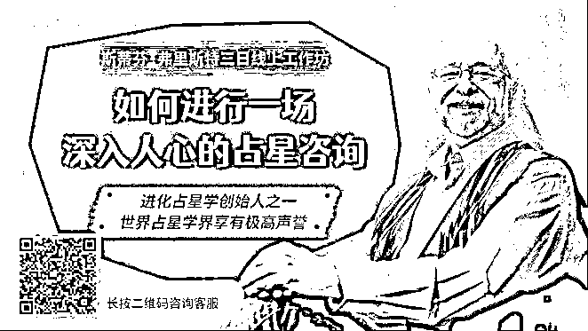

**如何进行一场深入人心的占星咨询**

**原价 4800 元**

**课程内容简介**

如果你听过斯蒂芬·弗里斯特的占星咨询，你会看到客户被他润物细无声的咨询所打动，又感到自己被他深沉的慈悲所懂得。那些娓娓道来的故事在客户面前展开生命时空的画卷，在咨询结束时，又充满希望的力量。在斯蒂芬到中国教学 10 年后，他将第 1 次与所有热爱他的学员分享如何做好一场占星咨询。在这个网络课程中，占星大师斯蒂芬·弗里斯特将会和你分享他几十年来一对一面对面的占星咨询经验；他也会分享如何提前规划好接近客户心灵的占星技巧。客户个人星图为我们提供一个最迅速，也最可依赖地建立信任和自然连接的地图，他还会分享如何运用个人星图建立这个连接。

**爱的内在炼金术**

**原价 4800 元**

**课程内容简介**

关于自己的本性，你不希望了解的是什么?什么会让别人爱你变得困难?在哪些方面，你的创伤和文化状况影响了你的智慧判断，关于谁才是真正适合你的人?
**关系占星学：比对图**通常集中于两张出生星图的比较。“直接用这种方式来看待感情，就像还没上高中就开始上大学一样。”所以斯蒂芬老师还会着眼于个人星图。
个人星图上的 3 个关键区域
在这个工作坊中，斯蒂芬老师将会关注于个人星图上的 3 个关键区域。首先，我们考虑你的灵魂对于亲密关系的独特要求。你正在学习什么？激情？和平？信任？还是独立呢？其次，我们来破译你星图上关于任何可能阻碍你正确完成任务的警告信息。最后,我们来探讨星图如何描述了你的天生伴侣——也就是说, 如何在编织在你出生星图的象征符号中, 找到与你享有灵魂契约之人的描述—— 在你出生呼吸第一口空气时，这个人可能甚至还没出生。“伙伴”和“伴侣”这些词总让我们想到配偶关系，但我们在这个工作坊中探索的许多原则也适用于人类的另一杰作：亲爱的朋友之间的灵魂纽带。 我们当然会尊重所有的性别差异，因为男人和女人努力爱着对方和他们自己，无论他们的灵魂穿着何种肉体的伪装。

**整合行进、推进以及太阳弧技法**

**原价 4800 元**

**课程内容简介**

斯蒂芬老师总结 3 大最实用占星预测技法：行进、次限推进、太阳弧推进

整合这 3 种技法能够宏观和微观预测一个人的运势起伏和重要节点**行进（TRANSITS）**长期趋势分析行进的最好方法是先将长期的行进趋势列出来。顺序如下：冥王星、海王星、天王星、土星、木星、南北交点。通过将这些影响力持久的长期行进先列出来，你将能够发现在未来一年甚至更长的时间里你人生中的重大课题。短期趋势和触发点接下来你需要去观察那些运行得较快的星体，来判断短期趋势。不过，重要的是要清楚，这些移动较快的星体在行运中扮演着事件的“触发点”的角色，特别是当与它们形成相位的个人行星同时也与行运外行星有相位的时候！**次限推进（PROGRESSIONS）**通常也被称作“一天代表一年”推运，因为这种技术把出生后的每一天和出生后的一整年等同起来。一旦设定了这个节奏，就像定时释放的胶囊一样，这些次限推进就像某种内部的太阳系一样运转起来，和真实时间的事件、经历、情境应和。**太阳弧（SOLAR ARCS）**以太阳为核心，为众星之首，带着众星一起移动,展示人生不同阶段我们是如何体验自我、表现自我、修缮自我。此方法虽非实际星体，但却是星动推运法中准确率最高，实用性最佳的推运方法。综合以上技法我们该描述什么，该从哪里入手？如此庞杂的信息，究竟有什么是我们可以放心地忽略呢?系统的解读步骤来帮助你把焦点对准需要聚焦的地方，哪些是至关重要的？如何培养与占星符号间宝贵的直觉联系，将行进、次限推进、太阳弧推进融会贯通？

**土星&木星工作坊**

**原价 6800 元**

**课程内容简介**

进化占星学比传统心理学走得更远，比当代占星学更加深入。它的核心是——星图既代表出生时灵魂的进化条件，又代表灵魂在此生的进化目的。 

① 对于出生星图的木星和土星这 2 颗行星的深入介绍，把之前学习到的庞杂的知识信息，通过进化占星学的思路厘清：· 原型内涵· 高阶意涵· 潜在陷阱② 通过土星-木星再次学习星图的整体解读③ 土星-木星在行进、二次限、太阳弧中的深入解读④ 2020 年的土木合相、土木冥合相的重要意义及其影响

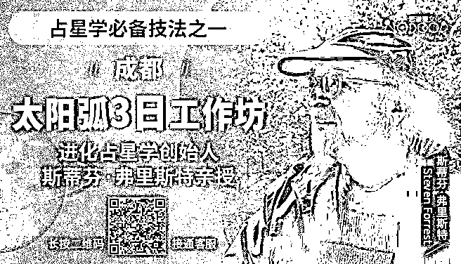

**太阳弧工作坊**

**原价 6800 元**

**课程内容简介**

成功运用太阳弧技法的关键是：因为太阳弧与太阳相关，所以太阳弧具有“太阳”的性质。这意味着太阳弧与人生明显的现实大事记直接相关。换句话说，太阳弧“运作”的方式很具体，虽然它欠缺一些推进所具有的心理深度。在实践中，**太阳弧、行进和推进组成了占星学预测的 3 大核心技法。**

在这个工作坊中，我们将**介绍太阳弧的理论，然后单独研究每颗行星和星图的四轴**。我们会特别关注**月亮交点轴线的所有重要太阳弧**，因为它们标记着打破你生命中“业力之波”的时期。 太阳弧推进中各星体的基本含义：

太阳：光亮、显扬
水星：思想
金星：优雅、爱情
火星：能量、信念
木星：提升、改进
土星：严肃、挑战
天王星：个性的增强、当前状态的颠覆、新点子
海王星：迷惑、忽视、自我抹杀、可能带来幻想和灵感
冥王星：洞察力、巨大的改变、力量

太阳弧推运的基本原则如下：

 ❶ 推进星体与出生星图中的星体成相位时，仅硬相位（合相、对分相、四分相、八分相、补八分相等，一般只用前三者）有效。几种硬相位在推进中的影响力没有分别。

❷ 重视四轴（上升、下降、中天、下中天），重视外行星，重视月亮交点。影响力较大的太阳弧主要是外行星和四轴产生的太阳弧。

冥王星带来人生观的巨大改变，及各种意义上的改变和颠覆。如果个案还是小孩，则此太阳弧的影响可能表现在父母身上，比如巨大的家庭变故、搬家去较远的地方、家庭成员的死亡、父母人生观的重大改变等等。 

海王星代表着迷惑、消沉、削弱，同时也代表想象、幻想、灵感。 天王星是围绕个人状况的不和谐音，经常和失败的计划有关，获得或失去，自立或退却等等，最重要的影响力在于人生观和价值观的变化和新生。 土星代表野心、志向、受到控制下的策略、结构上的重组，或是可能影响到人生规划的死亡事件。 木星代表“拓展力”。它既可以扩充你的智慧，也可以扩展你的腰围。这是因为木星的影响力不止于心智和灵魂，它也能让你暴饮暴食。 中天和下中天主要代表儿童时期的父母，另外中天代表自己的职业（包括改行、晋升、创业、成为创业动机的对公司的不满），下中天与家庭和住所有关（包括搬家、不动产及家具买卖、以及“新的开始”）。 上升和下降代表着自我以及对自我的认识，也代表着健康和儿童时期的父母状况。要注意的是上升和下降是联动的，所以所有与个人有关的状况都会影响到与自己亲密的人，配偶、合作伙伴等。 进化占星学比传统心理学走得更远，比当代占星学更加深入。它的核心是：星图既代表出生时灵魂的进化条件，又代表灵魂在此生的进化目的。月亮交点一直是斯蒂芬老师进化占星学里的核心元素，月亮交点如何在太阳弧技法中运用相信也会是本次工作坊中的知识亮点。 ❸ 太阳弧用于确定大致时间段，用行进和次限确定具体时间。太阳弧的影响力大致在一年左右，前六个月的力量大于后六个月。核心事件的精确激发往往是由运行较快的参数完成的，比如次限月亮和行进星体。 ❹  太阳弧推进与出生星图中形成不止一个相位时，往往代表重大事件的发生。 当工作坊结束时，你将掌握太阳弧技法的实用知识，并将它运用到你自己或你的朋友和客户的星图解读中去。

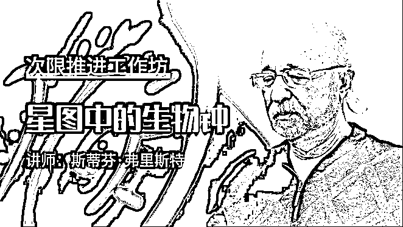

**次限推进工作坊**

**原价 6800 元**

**课程内容简介**

3 天工作坊，每天 6 小时。预测技术中，斯蒂芬老师认为，推进是和行进一样重要的技术！！！重要的话讲三遍。他们都能描绘出我们灵魂进化和心理发展的时间轴，展现我们的生平故事。行进或许“更有意义”，因为它们指的是天空中真实发生的运动，但不要被这个简单的事实误导了。推进就像是你出生时设定好的生物钟，它完全与行进一样有力。可以这样思考：一对夫妇生了一个孩子，他们请我“做一些预测”。我说：“在接下来的 18 年左右，她每天都会长高，之后她会变得更丰满。30 岁左右，我们会开始看见她有些白头发了。”大家可能会笑，但这都是非常靠谱的描述。这些生理进程像生物钟一样与我们的机体紧密相连。推进也是这样运作的，它们是你出生星图的 DNA，预测进化主题发生的时间，有时是进化危机发生的时间。行进是集体共有的，因为我们都在同一片天空下生活，而推进纯粹是个人的，是独特的、内在的。但和行进一样，推进也只是围绕出生星图移动的一些点，形成相位，触发成长，促使事件发生。预测时仅使用行进，就像吃鸡蛋不放盐一样，缺少了一些基本要素。占星师们常对推进感到畏惧，但推进的使用并不比行进复杂。在本次工作坊中，斯蒂芬老师将介绍推进的理论和实践。我们将深入研究推进的太阳、月亮、水星、金星、火星、上升和中天，理解它们的内在含义、共时性关联和潜在的功能障碍。（由于其他行星的推进过于缓慢，它们不是实用的工具。）正如一直以来运用进化占星学的目的，不是为了让人们惊愕，而是帮助人们。我们可以明智或愚蠢地应对推进。我们不是被推进操控的木偶。相反，推进为我们提供更高的洞见，以及抵达那儿的方法。

**冥王星工作坊**

**原价 6800 元**

**课程内容简介**

3 天工作坊，每天 6 小时。进化占星学比传统心理学走得更远，比当代占星学更加深入。它的核心是——星图既代表出生时灵魂的进化条件，又代表灵魂在此生的进化目的。在神话中，冥王星是地府的主人。在你的意识结构中，它也扮演着类似的角色。我们每个人内心都有一处“地府”，用来存放我们在生活中体验过的所有创伤经历。也许我们遭到了背叛，也许父母让我们失望了，也许有人欺骗了我们。有时，这些创伤经历如此极端，我们只能将其完全压抑起来。也有时，我们将其安全地归为“铭记”，但用一种不会威胁到自我和自我防御的方式去合理化和解释它们。在心理上，这些做法都是必要的，我们无需感到羞耻；但有时，当我们达到生命的某个阶段时，我们会变得足够强大来面对这些内在的创伤，取回被困在其中的能量和创造力。而代表这一时机到来的占星学征象总是涵括冥王星，我们不仅可以在星图，也可以在生活中看到这样的信号。这些冥王星式的创伤有时也神秘地植根于遥远的过去：那些前世未解决的伤害。比如，如果你有一世是奴隶，也许这一世我们会看见你在为一个让人十分不快的老板打工，并且想弄清楚为什么这个工作拴住了你。冥王星在出生星图的位置，加上南交点，为理解这些深层创伤的本质提供了巨大的洞见。更重要和珍贵的是，它能指引我们如何疗愈这些创伤。与此同时，冥王星的行进“打开了黑暗之门”，让我们知道开启“地府之旅”，取回灵魂的时机到了。这样的说法也适用于其他任何触发出生星图冥王星的重大行进和推进。在本次工作坊录制视频中，我们将探索这些技术背后的理论。并通过两个学员实际的案例，解读如何将所学的知识应用于星图中冥王星元素的解读。

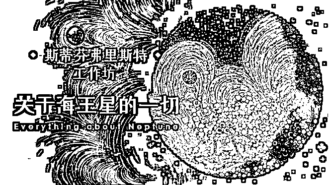

**海王星**

**原价 5800 元**

**课程内容简介**

3 天工作坊。

✦ 海王星代表的能量能够将我们提升至最高的意识状态，也可以让我们突然坠入自己制造的幻觉地狱。它虚构的心灵敏感性可以让我们听见天使的低语，也可以让我们对自己的愚蠢和妄念制造的痛苦高度敏感。要正确运用海王星，我们必须有目的地踏上某种灵性道路。✦ 你的道路在哪里？如果海王星在第 10 宫，可能会涉及某些俗世的使命，潜在的陷阱是你可能会因灵性而“出名”。海王星落在第 12 宫，你的道路可能是完全隐匿而隐秘的。如果海王星合金星，你无法独自上路。换言之，出生星图中的海王星配置指出了你灵性意图中最实际、最有效、最个人化的方向。✦ 海王星会让我们警惕哪些愚蠢行为呢？人们被自己的敏感性所吞没，落入陷阱之中。占星学警示我们过量饮酒的危险。的确如此，但还有许多其他海王星的囚牢。你的星图将它们全都描绘出来了。 ✦ 进一步来看，我们该如何做好准备，以最佳方式善用强大的海王星行进、推进、太阳弧阶段呢？如同我们所看到的，有时候，真正的智慧之路在于全然无为地等待愿景出现。✦ 在 3 天的强化工作坊中，斯蒂芬老师将以一种切实、个人化、赋予力量的方式，来引领我们深入了解海王星的各个面向，探讨海王星的种种细微差别。

**月亮工作坊**

**原价 5800 元**

**课程内容简介**

1. 深入而专业地从星座、宫位和相位的角度来认识月亮

✔次限月亮在 12 星座✔次限月亮在 12 宫位 2. 深入探讨已被遗忘的奥秘——月亮的 8 个阶段（八相）✔出生星图月相✔次限月相 3. 重拾重要而常常被忽视的占星谜题碎片✔阴性法则✔月亮的速度✔赤纬✔越界月亮 4\. 月亮在星图中的综合解读想要进一步了解感兴趣的课程，咨询任选组合价格请添加若道 Maggie 咨询

长按二维码添加课程负责人咨询~

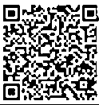

**报名入口**

# 插班中丨 ISAR 认证职业占星师文凭课程：开启“爱好变职业”的创收自由之路

> 原文：[`mp.weixin.qq.com/s?__biz=MzA5NjA0NTAxNg==&mid=2651493804&idx=3&sn=157349cf060f651a07e25ffebe222863&chksm=8b48271bbc3fae0d56e52bdcd86e6197b9451a173e93affd4361a1f54173de44b3cd9be4ed41&scene=126&sessionid=1692737725#rd`](http://mp.weixin.qq.com/s?__biz=MzA5NjA0NTAxNg==&mid=2651493804&idx=3&sn=157349cf060f651a07e25ffebe222863&chksm=8b48271bbc3fae0d56e52bdcd86e6197b9451a173e93affd4361a1f54173de44b3cd9be4ed41&scene=126&sessionid=1692737725#rd)

**2022 年，是世界和中国 40 年未有之大变局的开始。**

俄乌战争打破了欧洲大陆乃至全世界的和平局面，而新冠疫情也给中国经济带来前所未有之挑战。

如果你关心经济形势和世界局势，你会有这种的感觉，我们将面临一场深刻的危机，而这不是短期内可以结束的。

**占星学的看法也是如此。**

4 月青年失业率（16 岁到 24 岁）中国达 18.2%，一些背着房贷、教育、医疗负担的中年人突然失业更是整个家庭整个难以承受之重。为了更好准备面对这样的时代变化，连《北京日报》这样的官方媒体也在呼吁：**“开拓副业，让自己有多元化发展的生存能力”。**

**而这门课程，就是为了这样一个目标准备的。**

**占星学是非常好的“开展副业”的选择**

这个**为期 16 个月**的课程通过并不算长的时间和并不算高的投资，不仅可以帮助你学到一个终身可用的技艺，而且也可以选择成为自助助人的占星师，**开启受益终生的第二事业。**未来是个体崛起的时代，大量个体被鼓励独立发展，比如网红、自由职业、自媒体、咨询师等，他们都不需要传统的办公室。社会越发达，人的独立性就越强，未来有能力的人都可以变成独立的经济体。

**占星学也是越老越好的职业**

和一些技术变化非常快的职业不同，**占星学的技术层面非常稳定，不会快速迭代变化，**同时，掌握好占星学、能够做一场好的咨询又需要个人自身大量实践和对生命的深刻理解，而这些都是时间和岁月带来的。

**占星学是现代社会需要的助人职业**

社会快速发展和变化人们似乎越来越无法掌控自己的生活，这给很多人带来巨大的焦虑，**抚慰心灵的咨询市场需求巨大。**而占星学可以让人从前所未有的角度了解自己，了解目前和未来所处的周期，挑战的意义，不论对于深入的个人成长探寻，还是预测未来的周期，都又其独一无二的价值。

**ISAR 认证职业占星师的独有培训**

目前占星学的培训市场鱼龙混杂。而 ISAR（国际占星研究协会）是一个包含了 47 个国家在内的国际占星组织，多年来致力于占星的教育和研究，提升占星教育的品质和职业占星师的能力，在国际占星领域备受尊重。今年，ISAR 对于成为 ISAR 认证职业占星师提出了更高的要求，**所有想要获得 ISAR 职业占星认证的申请者均需要在 ISAR 的附属学校通过 500 个小时的研习（包含****主课****、选修课、沙龙、作业、讲座、工作坊等等）。**

**而这门核心占星学课程就是为此而准备的。**

**2022 年，鉴于对若道在占星教学领域所做的持续努力和高品质的课程服务，ISAR 特别授予若道核心课程为 ISAR 文凭课程，所有在若道学习，并通过若道毕业考试的同学将获得 ISAR 颁发的学历文凭（Diploma）。**

**你的占星核心课老师是谁？**

**拥有****51 年****占星实践经验的****若道创始人****前 ISAR 全球副主席****前 ISAR 全球职业占星师资质认证主席****大卫·瑞雷**

**和**

**2019 年第二届、2021 年第三届核心课中**

**与苏·汤普金斯老师****联合授课****的**

**ISAR 认证职业占星师**

**咔咔（Caroline）**

**二人合力打造**

**2022 年 ****若道全新核心占星课程**

**咔咔老师给同学的寄语：**

（向上滑动查看内容）

**亲爱的同学们：**

我为什么学占星学？

2000 年的时候我还是一个在网上搜索天蝎座和水瓶座配不配的普通白领。我搜索的内容还包括了水瓶座为什么总是这么若即若离？

体贴的搜索引擎给我推送了占星学、行星、星座、宫位、相位等资料，还让我了解到莉莉丝、月亮交点、截夺宫位等占星学概念。

2000 年 10 月我了解到，一个从业 30 多年的美国职业占星师大卫·瑞雷来到了中国，和他的中国合伙人将开办一个专业教授占星学知识的课程。过去 10 个月在网上东拼西凑的占星学知识唤起了我对占星学的兴趣，但是已经不能满足我对星图深度分析的需求了。

2013 年，我通过了若道核心课程的毕业考试和国际占星师研究协会的认证考试。2015 年我离开职场成为一名全职占星师。

到底学习占星带给了我什么呢？

1、它是自我觉知的工具，我现在已经不去纠结哪些星座是否匹配，我相信外在的事件是内在心理矛盾的显化。也就是说，想找到令人满足的亲密关系，要先去了解自己的情感模式和需求，而不是无意识地一次次地试错和撞墙。我开始学习自我关怀和接纳自己。

2、它带来看待世界的全新和全景的角度，天上如是，地下亦然。人类社会和个人生命的进化都有其周期和相似性，作为个体，占星学帮助我思考如何更积极和有建设性地与宇宙的能量合作，认识自己，发挥自己的潜力，度过有意义且自我满足的人生。

3、它带来了全新的职业：占星师和占星老师。除了收入，还有助人育人的满足感和意义感。

4、它带来一群志同道合的伙伴，我们彼此联结又相互独立。

作为中国占星界的“黄埔军校”若道占星的学生、助教和老师，我与很多学员在人生的不同阶段带着各异的需求走进了这所学校，2022-2023 年一年半的若道核心课程设计既蕴含了大卫·瑞雷老师的教学精华，也带入了我在跟随不同国外占星老师学习、助教和教学积累的心得。

有一些学员毕业后从事了占星咨询工作，有的在各大平台成为专业占星学知识的输出者和传播者，有的运用占星学提升他们的工作，也有的在占星学与投资，占星学与名人/八卦、占星学与原生家庭、亲密关系、亲子关系等领域收获了有用的或者有趣的体验。

对我来说，生命是一场自我完整的体验之旅。从 2011 年的那个春节在若道入学之后，我的生命旅程更加充实、有意义、有目标，也更有满足感。

希望在 2022-2023 年的若道核心课程里见到你。希望你此后的生命旅程里，有若道，有占星学。

占星师咔咔

2022 年 5 月 24 日

**大卫老师给同学的寄语：**

（向上滑动查看内容）

亲爱的学员们：

感谢你对我们从 8 月 30 日开始的若道 L1-5 级核心课程的兴趣。我和合作老师咔咔以及我们的核心课程团队期待着为你提供这个机会，来教授各种高品质的地道占星学知识和技巧。

对于那些希望获得 ISAR 职业占星师认证的学生，这是一门适合你的课程！

作为 ISAR 咨询技能培训的一部分，我曾与咔咔合作过，我们期待着再次合作。咔咔和我曾在 ISAR 职业占星师认证委员会（CAP ISAR）一起工作，我们非常熟悉获得 ISAR 职业认证的流程。作为你的老师，我们将陪伴你整个占星学发现之旅，帮助你逐渐认识到占星学有多么的神奇。此外，你还将受益于我们若道的助教和课程顾问，他们是若道核心课程计划的重要组成部分，提供在线沙龙、组织学习小组、指导家庭作业。我们的教育团队是“服务于你的团队”，所以也会根据你的需求进行相应的调整。你专用的核心课程微信群也促进了你的学习过程，使你能够每天与你的同学们一起学习、探讨、成长。

52 年前，当我开始学习占星学时，没有一所像若道这样的学校。如果有这样一所学校，我会尽一切可能在那里成为一名学生。事实上，我很幸运，我的老师都是经验丰富的专业占星师。然而，我花了 6 年的学习时间才通过 1976 年在美国乔治亚州亚特兰大举行的专业占星师考试，又花了 2 年的专业实践时间才通过占星学谋生。我永远不会忘记从 1970 年到 1978 年的 8 年，那些日子的反复试验教会了我如何苦练占星学。作为老师，我一直在努力传授我早年所学的知识，让你的旅程更加顺利，更加全面。

自 1978 年以来，44 年的全职实践教会了我很多，我很高兴有机会与大家分享我所学到的东西。我和咔咔都是现代占星师，虽然我们尊重西方占星学的历史和传统，但我们实践和教授的占星学植根于现代人本主义哲学，这种哲学旨在提高你对自身潜力的认识，并鼓励个人成长。还有什么比了解自己更实际的呢？还有什么比个人成长和发展潜力更有利的呢？这是你将要学习的占星学，一种可以应用于你自己生活的占星学，一种可以为你提供一个充实职业的占星学。

教书是我回馈占星学行业的方式，这个行业拓展了我的视野，远远超出了我曾经想象的可能。谢谢你给我这个机会做你的老师。

大卫·瑞雷

2022 年 5 月 24 日

**连报 L1-5 全阶网络直播课程，你可以享受**

❶ 64 次线上直播互动网络课程+2 场工作坊，全面而详细地讲解占星学知识、技能、案例和重要领域实践运用。

❷ 知识点+学员星图解读有机结合：咔咔老师以讲解知识点和中外名人案例为主，大卫·瑞雷老师以参课学员案例演示及客户案例为主，每个知识点覆盖班级内学员的亲身案例，参与感更强，多位学员都有机会听到自己的星图分析。

❸ 微信群学员互动分享，从真实案例学习生命成长故事。

❹ APP 答疑论坛提问：论坛上每个学员的问题都将得到及时回复。

❺ 若道独有的职业占星师养成计划，为你毕业后独立咨询做准备。

**❻ **提供**咨询平台**，只要努力，优秀毕业生有机会入驻**若道咨询平台**，拓展咨询客户群。

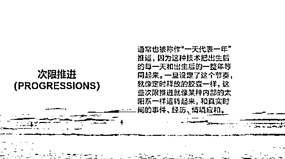

**更多了解老师和助教？**

**大卫·瑞雷（David Railey）**

*   **I****SAR 董事会成员，ISAR 全球副主席，ISAR 全球职业占星师资质认证主席，若道占星创始人**。

*   2016-2019 年，被选为国际占星协会（ISAR）考试委员会成员，国际占星协会（ISAR）是世界最大的国际占星机构，会员遍布 47 个国家。

*   2017-2020 年，被选为国际占星联盟（ISAR）考试委员会主席，理事会成员。

**占星师咔咔（Caroline）**

2010 年师从美国占星师大卫·瑞雷学习，并得到世界名师斯蒂芬·弗里斯特、罗伯特·汉德、苏·汤普金斯传授各种占星学技法。若道首届学员，国内最早获得 ISAR 职业占星师资质的职业占星师，多次担任若道核心课程助教，并于 2019 年第二届、2021 年第三届核心课中和苏·汤普金斯老师一起教授若道核心占星课程。

在国际知名广告公司和市场研究公司从事的市场研究和推广工作十余年，曾任职于阳狮集团、尼尔森市场研究有限公司、MTV 和《Madame Figaro》杂志。

**助教王嘉祺 （Conrad）**

ISAR 认证占星师、若道认证生时校正资质，从 2010 年起自学占星学，2015 年开始在若道系统学习，并开始个案咨询。2018 年担任若道核心课程助教，以及卜卦占星学和太阳返照选修课助教，并带领学员进行经世占星和太阳返照方面的研究。2019 年 11 月作为演讲人之一参加了国际占星协会（ISAR）北京大会，也是 ISAR 星空俱乐部中国区第 16 期的主讲人。

**什么人适合这门课？**

*   对占星学有浓厚兴趣，想要系统学习占星学。
*   对占星学有一定基础，但不知道该如何整合星图复杂的碎片。
*   希望成为优秀的占星师，想要借鉴国际大师解读思路并融入自己的体系。
*   想学习占星学，但不擅长英文，希望有中文老师授课。
*   想结合占星学理论与咨询实践。
*   走在自我探索和个人成长道路上的人。

**课程费用**

**★ 1-2 阶 （8 月 30 日开课）****课程费用：3500 元 ****★ 1-3 阶　连报****课程费用：11500 元 **********转发优惠价：**11000 元（朋友圈转发本课宣保留 24 小时以上，并截图给课程顾问）********★ 1-5 阶 连报****课程费用：46500 元** **转发优惠价：34800 元（朋友圈转发本课宣保留 24 小时以上，并截图给课程顾问）**

**咨询课程请联系顾问**：**王老师（微信/手机：18510107057，请备注“大卫核心课”）**

**退转课程**

**退款原则请详看《教学协议》，如有疑问请咨询课程顾问。**

****2022 L1-5 认证职业占星师必修课程****

**授课老师：大卫·瑞雷、咔咔**

**直播课开课时间：2022 年 8 月 30 日（周二）**

**授课方式：******网络授课，英文/中文授课，中文翻译****

**费用：******1-2 阶**：**3500 元；****1-3 阶**：**11500 元******（****转发优惠价：**11000 元，朋友圈转发本课宣保留 24 小时以上，并截图给课程顾问）；**1-5 阶连报**：46500 元**（****转发优惠价：34800 元，朋友圈转发本课宣保留 24 小时以上，并截图给课程顾问）******

**课程负责人：王老师**（微信/手机：18510107057，请备注“大卫核心课”）

长按二维码添加课程负责人咨询~

**END**

****报名直达入口****

# ISAR 选修丨占星原型与星图中的精神病理学

> 原文：[`mp.weixin.qq.com/s?__biz=MzA5NjA0NTAxNg==&mid=2651493664&idx=3&sn=e1bace6d68f469e56ab3570b617b2a4d&chksm=8b482797bc3fae81da105197cadeb191567a368662df2cc0ddcb958afe395dbd9922abd8333b&scene=126&sessionid=1692737725#rd`](http://mp.weixin.qq.com/s?__biz=MzA5NjA0NTAxNg==&mid=2651493664&idx=3&sn=e1bace6d68f469e56ab3570b617b2a4d&chksm=8b482797bc3fae81da105197cadeb191567a368662df2cc0ddcb958afe395dbd9922abd8333b&scene=126&sessionid=1692737725#rd)

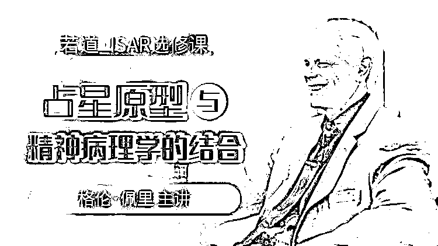

**课程描述**

看过课程标题的你，也许会感到好奇和惊讶，为什么在占星学的课程中，会出现精神病理学的教学内容，这和我们有什么关系？这对占星咨询，或在自我了解与成长的过程中又有什么帮助呢？

**带着这些疑问，请你静下心来，思考以下几个问题**：

“**你/你的案主，是否曾经过度担心什么？** **你/你的案主，有没有感觉到担忧和焦虑，却不知道原因是什么？****你/你的案主，是否曾经觉得害怕什么东西，但理智上却很清楚它不会对你造成什么伤害？****你/你的案主，是否曾经通过沉迷某物，酗酒或滥用药物，自我伤害去逃避问题？****……****——节选改编自《心理学与生活》**”

如果你对上述问题其中之一，回答是。这意味着几乎每个人都曾有过心理障碍的症状（精神病理的问题）。

你看，其实“精神病理学”与人的心理有着密切的关联，再结合占星学，呈现了人内在与外在层面更加丰富和深刻的一面。**这对于学习占星学的人和占星师来说，都是一场难得的知识盛宴！**

**本课为 2 年期双证核心课程中的一部分**（AP105 阶段），其内容是过去若道所开设的核心课程从未教授的部分，特意抽出供其他学员学习，**可作为 ISAR 选修课，单独报名**。

**在正式了解本课的价值之前，先了解一下这门课程的主讲老师吧！**

**格伦·佩里（Glenn Perry）**

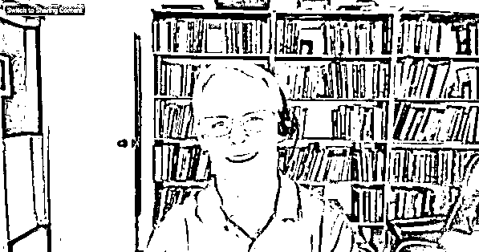

*   他是心理/意识研究专业博士、加州注册婚姻和家庭治疗师 （CAMFT）

*   占星心理学学院（Academy of AstroPsychology）创办人

*   康涅狄格州研究生院（the Graduate Institute of Connecticut）原型宇宙学与意识进化项目的负责人

*   共出版八本占星学著作：《心理占星学入门》、《心理占星论文集》、《盗取天火》、《从忠诚到革命》、《星图中的阴影》、《占星职业议题与伦理》、《出生星图深度分析》、《从古代到后现代占星学》

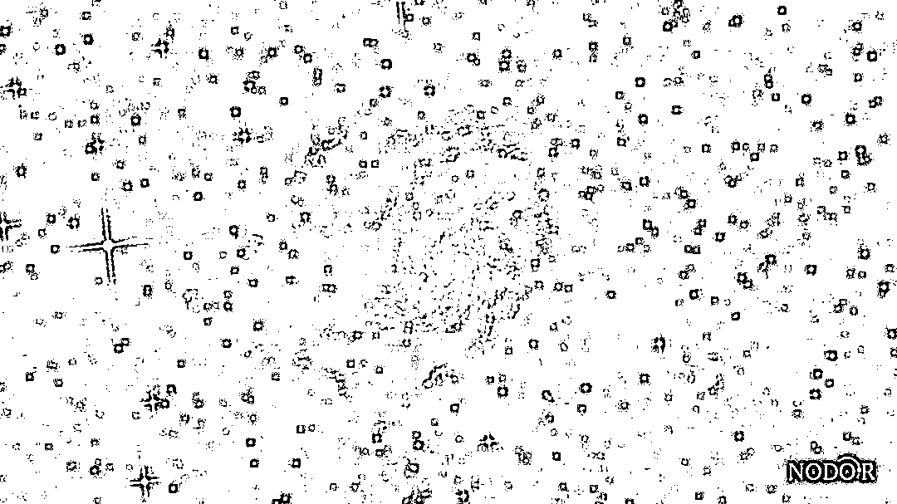

**墙裂推荐格伦老师这门课的 **

**4 大理由**

**你一定得知道的课程价值**

**价值*****1***
**明晰精神病理学的基本定义**

占星心理学学院创办人格伦·佩里老师，对**精神病理学的基本定义**就是灵魂受苦，精神就是灵魂的意思，病理就是受苦的意思，所以精神病理学研究的就是：人类各种各样受苦的方式，尤其是因为某一类的行为而引起的。

精神病理学是一个连续体，从比较轻微的，到比较严重的，这么说来，我们每个人都有一部分精神病理的问题。

**如果成为一个“人”，没有一定程度的挑战是不可能的。没有一定程度受苦，没有一定程度不平衡是不可能的。而这种不平衡就会以一种挑战和困难的姿态呈现出来。**

**价值*****2*****更懂疗愈：从不平衡到平衡**

**疗愈**是一个复杂的过程，讲的是将人从不平衡带到平衡这样的一个状态，将不同行星代表的心理功能带到一种更加平衡整合和合作的状态。

格伦老师通过研究精神病理学，发现每一颗行星，以及这颗行星所守护的星座，都和某一特定类型的病理是联结在一起的，包含了这个占星原型所涵盖的极端不平衡的情况。

举个例子，案主的第 1 宫，有很多星星在那里，和对面第 7 宫的火星形成对分相，第 1 宫白羊座或者火星白羊座的组合，和这个案主的反社会人格的病状联系在一起（这是一个星图的极端负面表现）。

“

**生活本身就是一场治疗，我们在占星的星图中去看到，人们所具有的创伤、不平衡及其产生的防御机制，最终都会在他生活中的关系和情境中呈现出来。无论他生活中处在怎样的情境之下，其实这些环境都是在为他提供恰当的环境，作为一种载体，让他去平衡和疗愈事件背后问题的根源。** 

**这样一个现象是持续不断地在发展，会让我们想到，会有一个更大的宇宙的智慧存在，它其实是在指挥和引导着我们的这些经验，让我们去经历然后进入更高层面的发展当中。生活或者“神”，就是我们所有人类的一个治疗师。**

**——格伦·佩里**

”**价值*****3*****了解诊断标准，提高咨询的专业敏感度**

如果能够对精神病理极端不平衡的情况有了解的话，你就会对它比较温和的版本更加敏感（大部分人是更温和版本的呈现）。

也许案主并没有达到某个病理所达到的层级，但是 Ta 有显示出，这个病理某一些特点或者某一些倾向。所以，我们的目标并不是去诊断案主，而是了解他在这个病理学连续体上处在一个怎样的位置。

当你拿到星图你会看到，案主不同的冲突，是体现在不同的部分上。某一个病状是体现在某一个行星，另外一个病状，是同步体现在另外一颗行星上。

当我们通过对占星原型星座和行星的病理学现象的学习后，就能看到占星学上的配置所呈现出来的，案主表现出的这些失调，并不一定都会成为一种心理临床上的诊断。有可能在案主这里呈现出一个很轻微，但是仍然在 Ta 生活中，给 Ta 造成挑战的一个点。

**价值*****4*****智力上的刺激——整合进阶**

这个课程能够让我们了解自己，了解我们的客户，了解我们的朋友，了解我们的家庭。它给我们提供一种崭新的方式，并且让我们看到占星原型的种种表达，不要局限在非此即彼、非好既坏的这样的一个概念当中，而看到它其实是一个不同程度的连续体。

当我们能够以这种方式去看的时候，你就能够将自己的生活，带入一种和谐。能够了解这是一个过程，我们的重点不是放在诊断上，而是放在整合上，因为生活，就是一种整合。

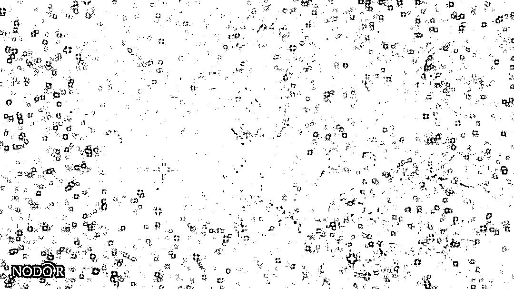

**课程内容**

**AP105 星图中的精神病理学与疗愈** 共**15 次**课程：**10 次 2019 年录播课+5 次直播课；30 课时**

在这个阶段的课程中,我们将**聚焦于十二星座(从白羊座到双鱼座）及其对应的守护星的潜在功能障碍。**

我们将学习如何识别、理解和应对每个星座的潜在挑战。我们将在各种相应的心理障碍背景下来考察占星原型，这些心理障碍表现为功能障碍、失衡的极端状态。

学员们将了解**《精神疾病诊断与统计手册》诊断标准**。我们会探讨治疗的概念，尤其是那些与整合和个性化相关的概念。我们将特别关注外行星的困难相位，以及它们与内在心理冲突、防御和症状形成的关系。

学员们将探索人的痛苦如何成为发展和实现天赋才能的催化剂。在考察病因时，我们会将平常的因果关系理论与传统的命运、业力和转世观念整合起来。

**口碑推荐**

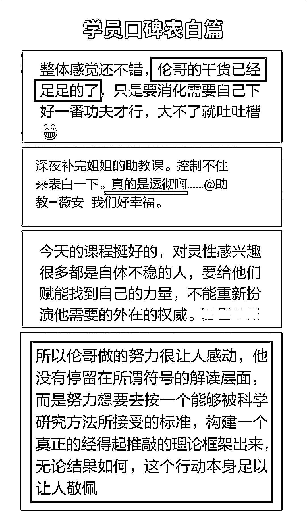

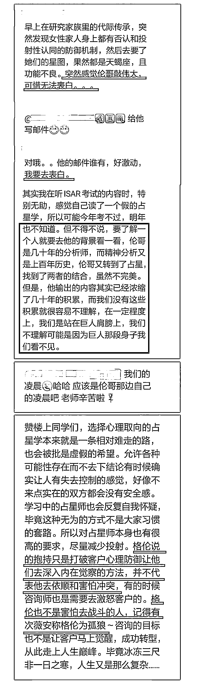

‍**‍想感受格伦老师的课堂魅力？** **一小段讲课视频让你先睹为快~**<mpvideosnap class="js_uneditable custom_select_card channels_iframe videosnap_video_iframe" data-pluginname="videosnap" data-id="export/UzFfAgtgekIEAQAAAAAAxuwL_P9LDAAAAAstQy6ubaLX4KHWvLEZgBPElYFkVBZaNrKCzNPgMIuhBCuUlaCPzDNmHFgJR5sp" data-url="https://findermp.video.qq.com/251/20304/stodownload?encfilekey=rjD5jyTuFrIpZ2ibE8T7YmwgiahniaXswqzIGcAWV11d39RRKTicEUe1lSn5e1z2jdX20ath9yg9Liaia8VPS2c4MUJibl8FlxSZs3ajlcibhlD6typd6ZeGeWj2bQ&amp;adaptivelytrans=0&amp;bizid=1023&amp;dotrans=0&amp;hy=SH&amp;idx=1&amp;m=&amp;scene=0&amp;token=AxricY7RBHdXmmhmUb1Np3Ioz3Ok0V9IBZ0eINxnxticaC9r3HjsQ8iatkwqFBLKP50ZibXDm0TiaicC4" data-headimgurl="http://wx.qlogo.cn/finderhead/PiajxSqBRaEJYnVsqWfEX9qA0sI6hNVKsDfyzfPZ92WZMZyBpZWU5NA/0" data-username="v2_060000231003b20faec8c4e68a1ec2d4ca07e434b07755bbf47e7053a3059defd2c9d6c68a20@finder" data-nickname="若道" data-desc="#ISAR 选修课  如何识别、理解和应对每个星座的潜在挑战？如何在不同的心理障碍背景下来考察占星原型？" data-nonceid="4249051256207020861" data-type="video" data-width="1024" data-height="576"></mpvideosnap>

**课程费用**

**课程价格：9000 元****课程优惠价请添加 Margartet 咨询**

课程负责人：Margaret

（微信：18515059056）

请备注“心理占星 105”

**开课时间**

**直播课开课时间：2022 年 12 月 21 日**

**退转课程**本课程包含往期视频知识点视频课程+直播案例课程+助教直播答疑；报名付款后均不受理退款转课，请慎重考虑后再确认付款。**其他相关事项请仔细查阅报名勾选时的《教学协议》，如有疑问请咨询课程顾问。****报名流程及费用支付****1. 点击阅读原文链接立即报名，填写个人姓名（身份证姓名）和相关信息，阅读并同意《教学协议》，提交报名表，直接在线支付。****2. 付款后可在网页个人中心或手机网页“我的”栏目查看报名记录。****如遇疑问请与销售人员联络******ISAR 选修·占星原型与星图中的精神病理学****

**授课老师：格伦·佩里**

**直播课开课时间：**2022 年 12 月 21 日

**授课方式：**网络课程，中英文授课，中文翻译

**费用：9000 元（获取优惠请联系客服咨询）**

**课程负责人：**Margaret（微信：18515059056 请备注“心理占星 105”）

长按二维码添加课程负责人咨询~

**报名直达入口**

# ISAR 星空俱乐部第 47 期 | 金融占星学的基础原理（周五开讲！）

> 原文：[`mp.weixin.qq.com/s?__biz=MzA5NjA0NTAxNg==&mid=2651493664&idx=4&sn=9e0cbf01c1fc5a199c432fde53fca3c6&chksm=8b482797bc3fae8174ce9a86461f47a1e86626f8d908521ac521087fbad53aa6ed9ee7d1dfe8&scene=126&sessionid=1692737725#rd`](http://mp.weixin.qq.com/s?__biz=MzA5NjA0NTAxNg==&mid=2651493664&idx=4&sn=9e0cbf01c1fc5a199c432fde53fca3c6&chksm=8b482797bc3fae8174ce9a86461f47a1e86626f8d908521ac521087fbad53aa6ed9ee7d1dfe8&scene=126&sessionid=1692737725#rd)

**沙龙来啦！****11 月 11 日，星期五晚上 20:30，**国际占星研究协会（ISAR）中国星空俱乐部沙龙由占星师**吉安尼·迪·波塞**带来一场讲座！ **沙龙主题****沙龙主题：********金融占星学的基础原理************主讲人：**********吉安尼·迪·波塞************

**沙龙时间：11 月 11 日，星期五，北京时间 20:30-22:00（有英文翻译）**

**沙龙方式：线上沙龙**本讲座将介绍**金融占星学的基本原理，以及如何使用各种行星、周期和技术方法来预测金融市场的趋势和转折点。**
在本次讨论中，还将分享对**股票、债券、货币、大宗商品和加密货币**的预测。**雷蒙德·梅里曼 2023 年预报及沙龙已开始双 11 优惠预售，将帮助你对 2023 年的市场风云变化加深了解。**
**长按下图识别二维码了解更多详情**

**主讲嘉宾**

**********吉安尼·迪·波塞**********

**· **吉安尼·迪·波塞（Gianni Di Poce）是梅里曼市场时机学院的项目主管。他也是梅里曼市场学院的市场分析师，负责分析一系列不同的市场。**·** 吉安尼撰写美国中期国债、澳大利亚市场（指数和外汇）的梅里曼市场时机学院月度周期报告，也负责撰写大麻和活牛的国际周期报告。吉安尼是梅里曼市场时机学院原油报告的编辑，为订阅者提供每日、每周和月度报告。**·** 吉安尼于 2019 年加入梅里曼市场时机学院团队，但他从 2016 年开始就一直在使用梅里曼市场时机学院的方法分析市场。他拥有经济学学士学位，并有 5 年的财务顾问工作经验。**如何参加沙龙？**本讲座也是本月的国际占星研究协会（ISAR）星空俱乐部讲座。**ISAR 会员可以免费收看。**请注意邮件通知，具体参与方式见邮件。❶ 如果你**已经是 ISAR 会员**，请注意邮件通知，告知如何参加。❷ 如果你**不是 ISAR 会员**，非 ISAR 会员价格：98 元。如有任何问题请咨询工作人员仲老师（微信：YY18513802156）

**非 ISAR 会员报名请长按下图**

**▼**

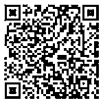

**ISAR 明星俱乐部**

2018 年，ISAR 在主席亚历山大·因舍阿吉克的带领下，成立了 ISAR 明星俱乐部，每月为全球 ISAR 会员提供在线直播讲座，邀请全球著名占星师开讲，学习和分享新的理念。讲座时长一小时，涉及占星学的不同领域、不同观点，每个会员都可以参与其中，每次讲座之后还有 20-30 分钟问答时间向老师们提问。每一场在线讲座都会记录下来，ISAR 除了提供视频，还会提供相关的讲座资料，以及单独的问答录音，自动发送到专门的 ISAR 明星俱乐部页面存档，每位 ISAR 会员可以在 ISAR 网站上自己的会员主页俱乐部页面找到。在 2018 年最初几个月，ISAR 明星俱乐部会每月举办一场在线演讲。之后，两周举办一场演讲，最终每周举办一场演讲。
但是，过去明星俱乐部讲座只有英文沙龙，因此，中国会员只有懂英文才能受益。为了使得更多不懂英文的中国会员能够受益，我们特别和 ISAR 总部协商，今后会安排有中文翻译的明星俱乐部占星沙龙，作为给中国 ISAR 会员的福利！**如何成为 ISAR 会员？**

**如果你也想成为 ISAR 会员，请复制链接在浏览器打开**

http://www.nodoor.com/isarcert.do?contentId=3588（仅支持网站支付）

**或直接长按下方二维码，微信购买会员：**

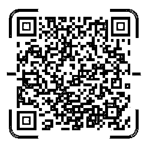

**ISAR 会员有什么福利？**一年期会员仅需支付**人民币 510 元**，即可享受：**☆ 星空俱乐部免费沙龙****☆每年出版 3 次的《国际占星师》（目前只有英文）；****☆每周电子邮件交流汇总杂志（目前只有英文）；****☆专项研究基金和奖学金资格；****☆ISAR 主办的会议和论坛的会员折扣，包括国际占星大会（UAC）、ISAR 的会议和研讨会等会员权益。****有疑问怎么办？**关于 ISAR 星空会员俱乐部以及我们的讲座，如果你还有任何疑问，**请联系工作人员**：

**若道 Conrad（微信号：nodoor2016）**

**若道 yiyi****（微信号：YY18513802156）**

**非 ISAR 会员报名入口**

# 火星逆行期间，是时候了解一下白羊座能量了

> 原文：[`mp.weixin.qq.com/s?__biz=MzA5NjA0NTAxNg==&mid=2651493664&idx=1&sn=cdefd49ae832bb9d06a152f2e7f731c7&chksm=8b482797bc3fae81325707d434359a7a6e6dcc0c6fc0555a68a9a34dbc42e5ef469a056202fa&scene=126&sessionid=1692737725#rd`](http://mp.weixin.qq.com/s?__biz=MzA5NjA0NTAxNg==&mid=2651493664&idx=1&sn=cdefd49ae832bb9d06a152f2e7f731c7&chksm=8b482797bc3fae81325707d434359a7a6e6dcc0c6fc0555a68a9a34dbc42e5ef469a056202fa&scene=126&sessionid=1692737725#rd)

**☆ 后台回复“今日”，给你一句生命态度 **

作者/格伦·佩里 译者/Jun 校对/Arrow
  编辑/玫瑰 封面/书君 图片/稿定设计

火星现在正在双子座逆行中，提到火星，就不得不提到火星守护的白羊座。白羊座好战、急躁的声名远播，让同他们在一起的人多少有些压力。怎么处理呢？一起来看看。如果你想更多了解占星学，这里有一门格伦·佩里老师亲授的【[占星原型与星图中的精神病理学](http://mp.weixin.qq.com/s?__biz=MzA5NjA0NTAxNg==&mid=2651493004&idx=2&sn=038b40a4c73ce929da0d5c64de0eac85&chksm=8b48203bbc3fa92d3922f679f3aa4a5525d2776cd477717d7daef4d44bbb863c001bd3281960&scene=21#wechat_redirect)】，点击链接了解更多详情吧！

**白羊座同 0°的关系**

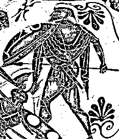

| The god Ares/Mars 阿瑞斯/战神

与任何占星原型一样，白羊座-火星包括星座、行星、宫位和相位。这些都是由角度组成的，唯一的例外是“行星”，它的运动产生了角度。**在占星学中，一切意义都在于行星周期的角度（阶段）。**定义白羊座-火星星座、宫位和相位的角度是**0°**。3 月 20 日的春分代表白羊座 0°，正好发生在地球赤道与太阳赤道（黄道）平面的交点。实际上，这是地球-太阳的合相，标志着黄道十二星座的开始。**出生、开创和开始的现象是理解白羊座的关键。**

如果我们认为黄道 12 星座象征着四季中自然的循环，每个季节都有 3 个阶段——基本、固定和变化——那么自然的起点就是启动每个春天的新生命周期。豆芽冒出大地，寻找阳光，这样一个画面是白羊座完美的演绎。生命掌握主动，征服新天地，追求自己的本源，自然雄心勃勃。

**上升点是地球自转的 24 小时中地平线与黄道的任一交点。**地平线和黄道的交点表示该星图中第一宫的第一度。**上升星座标志着出生时刻，暗示着个人将如何在生活中坚持自己；这是案主自然而本能地破土而出进入世界的方式。**

同样地，**当行进的两颗行星在同一时间以相同的黄道角度排列时，我们称那个空间（时间）点为合相，这恰好是它们会和周期的开始。**两颗行星在一个特定星座中的合相暗示着**它们将如何联合并主张各自的本质，也许还会一起开始某件事。**
春分、上升点和合相都构成相同的角度 0°。显然，它们不仅在角度上有相似之处，而且在意义上也是，它们意味着——**开始、新起点和本能式的主张。**
0°似乎与火星关系密切，它的性质与我们赋予白羊座、上升星座和合相的意义是一致的。在古代，所有与火星有关的现象都被认为是上帝自身的表达。火星是自然界的普遍规律。同样地，这颗红色行星属于一个更大的宇宙秩序，就像在 360°一周中的任何其他行星或角度一样，也是神的面孔之一。

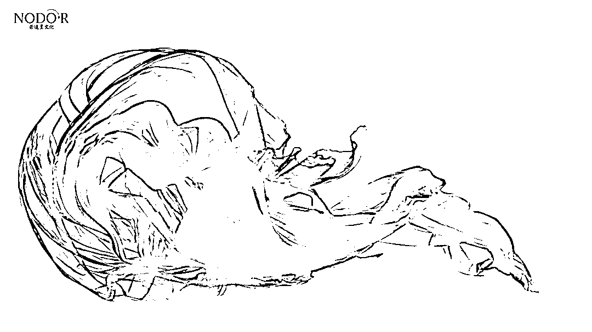

**白羊座、火星作为原型**

当说到占星学原型时，我通常把星座和守护行星联系在一起，因为它们是匹配的一对。**星座是需求，行星是行动。**每一颗行星的行动都可以在它所服务的需求背景下被理解，而每一个星座的需求都可以从它的行为特征中推断出来。**星座不仅仅是一种需求，它还是为满足潜在需求而设置的一组自然特性。**

当一颗行星落入一个星座时，它会激活那个星座的行为特质。在更深入研究白羊座-火星之前，让我先定义一下我用的术语并给出一些关键词。通过观察白羊座的行为，我们可以推断出四种相互关联的需求：**生存、自由、行动和新奇。白羊座最基本的需求是生存、存在、自身存在的延续。**

自我保护是自然的第一法则，也是所有其他需求的基础。对我们的生存能力至关重要的是为自己的利益而行动的自由，因为自由与生存有着千丝万缕的联系。如果我们没有自由，生存就会受到威胁。与自由同义的是对自治和独立的需求，对这些需求的威胁是争斗和战争的普遍原因。这张需求简表上还有**行动和运动的需求**——这也许是生命最基本的属性。你知道某物是有生命的，因为它有自主运动的能力。即使在细胞水平上，生命也在运动。活着就要去做。最后，**白羊座也象征着对新奇事物或冒险的需求；仅仅因为某件事情从未被做过，就想去做它的本能**。新奇，是生命为了长存而做出的主要指令的自然延伸，通过寻找它可以开始、生存和繁荣的新领域。

作为白羊座需求的积极代理人，火星的行动分为四个子集：**主张、发起、战斗和鼓励。主张包括去实行、声明和确认的相关行动。**

再说一次，白羊座-火星守护开始，这意味着**发起、启动，或孕育新的尝试。**作为战士的原型，火星的行动包括**战斗的冲动、竞争和争夺统治地位。**火星的最后一个行动分类——鼓励意味着激励、强化，或鼓舞某人或某事。

**火星的主要状态只是存在，它行动的关键字是“我要做”。**火星是行动导向的。放手去吧，只管去做，这是火星人最重要的情绪。火星加快、鼓鼓动、鼓舞、激发和激活任何与之有相位的行星表达。它鼓励和刺激这颗行星采取行动。

对火星而言，我特别喜欢动词“galvanize”，它的意思是**通过电流（想想驱赶牲畜的电棒）刺激或激发某人**。近义词包括鞭策（spur）、唤起（arouse）和煽动（incite）。火星天秤座在第 6 宫可能意味着：“简结婚的消息激发办公室里的女士们计划了一个订婚派对。”

**行星的行动从来不会凭空发生，而是与行星所落的星座和宫位以及任何与之有相位的行星有关。**例如，如果火星在金牛座，它可能以缓慢、稳定的方式主张；为抵制变化而行动；开始建一个新花园；以及争取保留股份。

金牛座的火星就像斗牛犬一样，坚强不屈：永不言败，稳扎稳打。如果这些行动落在第 11 宫，这个人可能是一名环保活动家，他会鼓动志同道合的人为保护环境而斗争。火星与另一颗行星的相位将倾向于为那颗行星所象征的事物而战或与之对抗，视角度而定。三分相和六分相使火星为了另一颗行星的利益而乐于坚持自己的主张。例如，火星与木星呈渐盈的三分相，可能会启动一项社会活动，为慈善事业筹集资金，比如推广一个高中运动队。

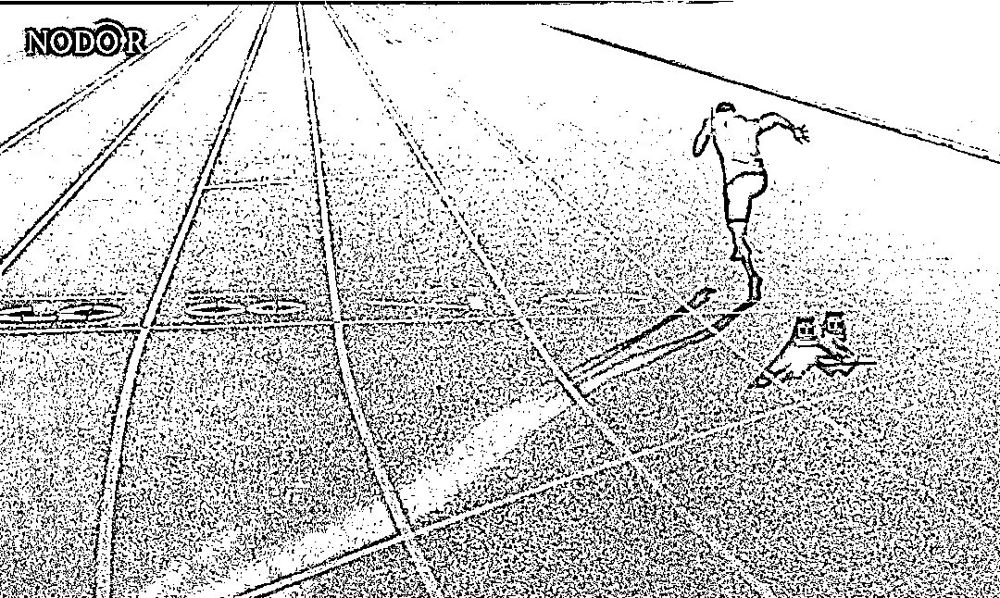

然而，**在困难相位（四分相、对分相）下，火星会攻击这颗行星，即使是在不自觉被它影响的情况下。**案主可能会因为其他人对另一颗行星象征的事物过激表达而感到愤怒。之后，当个体更好地整合相位时，可以有意识地利用那颗行星的能量为火星本身的目标服务。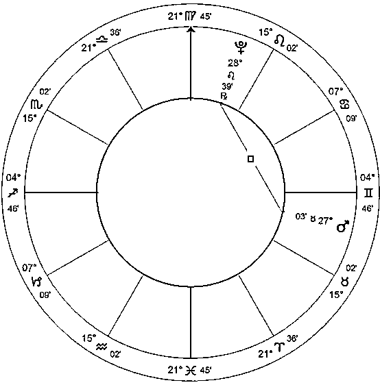想象一下，比如第 6 宫的金牛座火星与第 9 宫的狮子座冥王星呈四分相。这个人可能做景观（金牛座）工程师（火星）的工作（第 6 宫）。他对环境保护署强制实行的不公正生态法规感到沮丧（冥王星在第 9 宫），他指控环境保护署腐败，并投诉他们的法规（渐亏四分相）太过极端，限制了他自由挖掘土地并将土地改造得更健康、更有创意。然而，四分相会随着时间的推移而整合，他可能会变得更积极主动，他倡导的法律不会将天赋人权定为犯罪，或不阻碍财产所有者改造、保护和提高他们合法拥有的土地的价值。在这里，火星将第 9 宫的冥王星发挥出了更大优势。占星学原型体现在互相联系的角色中，因此它们在意义上是一致的。**白羊座-火星的原型包括战士、竞争者、开拓者、冒险家、探险家和淳朴的野蛮人。**白羊座-火星为自由和生存权利而战（战士），为存活和获得物品而战（竞争者），为了自身利益而追求冒险和新奇（冒险家、开拓者），体现了一种孩童般的天真和朴素的心灵（淳朴的野蛮人）。托马斯·杰斐逊

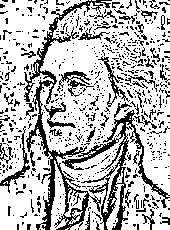

| 托马斯·杰斐逊

托马斯·杰斐逊是美国的开国元勋之一，他白羊座的太阳与狮子座的火星呈三分相。火星的动词“创建”意为建立和创办一个机构、组织或（在这种情况下）一个国家。与白羊座-火星一样，杰弗逊建立美国的先驱行动也需要为新生国家的自由而战的意志。

杰斐逊在《独立宣言》中让白羊座-火星永垂不朽。实际上，《独立宣言》是对英格兰宣战的宣言，宣告了一个新国家的诞生。** “我们认为下述真理是不言而喻的：人人生而平等，造物主赋予他们若干不可让与的权利，其中包括生存权、自由权和追求幸福的权利。”**

**白羊座作为发展阶段**白羊座-火星与战争的关系值得进一步论述。**一般来说，当火星处于战斗状态时，我们会感到愤怒。**关于这个话题已经有很多著述，至少可以追溯到公元前 4 世纪亚里士多德的《尼各马科伦理学》，在一定的条件下，亚里士多德认为**愤怒是一种美德，如果没有愤怒，个人就会变得胆怯、懦弱和道德败坏。相反，那些过度表达愤怒的人成了怒不可遏，同样应该受到谴责。**“任何人都会生气，这很容易。”亚里士多德说：“而要以正确的方式，在正确的时间，正确的程度，为正确的目的，对正确的人生气；这并不容易。”

几年前我住在加州的时候，我有一个太阳白羊座的朋友叫雅顿（Arden），她是一位心理治疗师。她的名字恰如其分地暗示了白羊座的核心特质——热情（ardent，热烈、热心）。她当然是这样。

我永远不会忘记她炯炯有神的眼睛和灿烂的笑容。雅顿是如此活跃。她办公室的墙上贴着一张海报，上面画着一只鸡蛋，新生的小鸡正破壳而出。下面写着：“勇往直前，征服一切！”雅顿的海报不仅体现了她的个性，也是成熟的白羊座生命阶段的写照。

和黄道其他星座一样，白羊座也是一个发展阶段，在这个阶段里，白羊座的需求和特质占主导地位。可以说，**白羊座是生命的第一阶段，或者说是出生到两岁（两年的时间），在这段时间里，孩子对时空的看法相对局限于此时此地**。婴儿对之前或之后都没有什么概念，除了他们当前的环境之外，对任何地方都没有概念。经验局限于永恒的现在。**这种时空视角带来的情感上必然结果是快乐——或者，当欲望受挫时的愤怒。**婴儿通常是快乐的，但容易生气，恰恰是因为他们对以后的事情没有概念。只要现在存在，那么每一个冲动都必须立即得到满足，因为除了现在没有别的时间存在。

如果婴儿突然能说话，对于他们无度追求的东西，他们会捶着拳头尖叫：“如果不是现在，又是什么时候？！”可能有人认为，快乐是一种自然的、与生俱来的状态，就像婴儿热情洋溢的脸上所反映的那样。威廉·布莱克在一首名为《婴儿的欢乐》的诗中写道:

** “我有名字。我只有两天大。”****我该怎么称呼你呢？**

**“我很快乐。我的名字叫快乐。”**

对生命充满热情可能只是生命对自身的感觉。“热情（enthusiasm）”这个词来源于古希腊的 enthousiasmós，由词根“theos”（上帝）和“en”（在里面）组成；因此，热情的字面意思是“内在的上帝”。对希腊人来说，热情是受到神灵的鼓舞，或者更确切地说，是神灵附体。

幸福是生活的自然状态，这是一个意义深远的有趣观点。印度哲人帕帕奇（Poonjaji）认为，总是有可能幸福的，但只有不认同短暂的意识内容才能获得；换句话说，既不忧心过去，也不忧心未来。幸福是根本的恒常，而不幸的原因来去匆匆。

**如果一个人认同来了来去匆匆的东西——依恋感、财产、物质、工作或关系，那么不幸一定会随之而来，因为没有经验和客体是永恒的。**

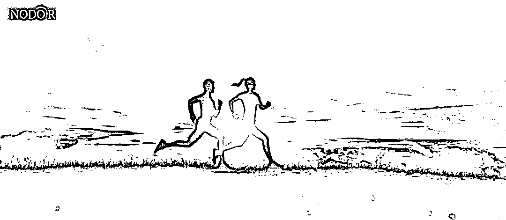

唯一真正永恒的经验是观察的主体；也就是说，一个人的主观体验时时刻刻见证了意识内容的产生和消逝。通过认识到什么是永恒的——观察的自我，寻求者就是幸福本身，一种与上帝无异的开悟状态。

鉴于帕帕奇的教导，幸福就是活在当下，这符合他出生星图中太阳和火星合相并四分天王星。另一位新时代的大师，巴巴·拉姆·达斯（Baba Ram Dass），拥有太阳与天王星合相在白羊座。“活在当下”与“白羊座-火星”的心理是一致的——拉姆·达斯 1971 年出版的经典著作《活在当下》就强调了这一点。埃克哈特·托利

还有一位灵性老师，埃克哈特·托利（Eckhart Tolle），写了一本关于灵性觉悟的畅销书《当下的力量》(1997)。托利有水瓶座的太阳与狮子座的火星精确的对分相。托利称，自己在 29 岁经历“内心的转变”之前，他的大部分时间都很抑郁。

值得注意的是，这发生在行进土星与他的火星合相，并对分他的太阳时，从而激活了他出生太阳-火星的对分相。回顾这一经验，他承认：

**我再也无法与自己共存了。在这种状态下，产生了一个没有答案的问题：谁是不能与自我共存的那个“我”？自我是什么？我觉得自己被拉进了虚空！那时我并不知道，真正发生的是由思想创造的自我带着它的沉重、它的问题，生活在不满意的过去和可怕的未来之间，它崩溃了，溶解了。**

**第二天早上，我醒来时，一切都是那么平静。平静就在那里，因为不再有自我。只是一种存在感或“存在性”，只是观察和观望。**

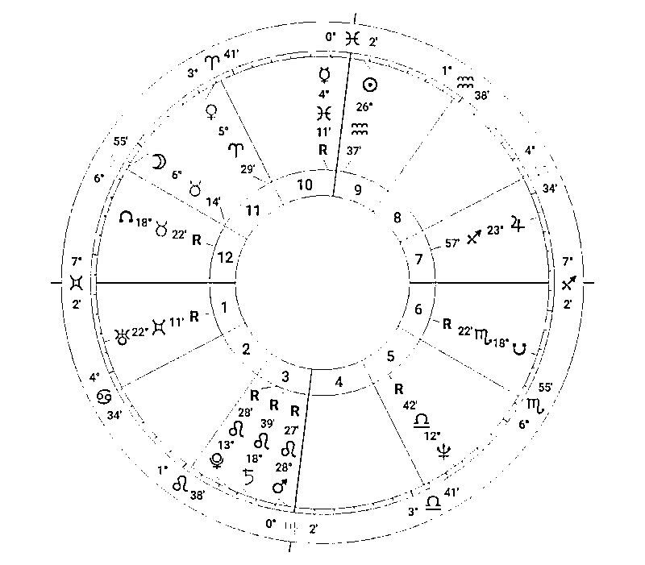

| 埃克哈特·托利：1948 年 2 月 16 日，德国多特蒙德。

  时间未知埃克哈特接着写了《当下的力量》，《纽约时报》称，他成了“美国最受欢迎的灵性作家”。

值得注意的是，托利、拉姆·达斯和帕帕奇的白羊座-火星能量与他们的太阳都有很强的联系，反过来又与水瓶-天王星的原型联系在一起。帕帕奇有太阳-火星合相并对分天王星；拉姆·达斯的太阳与天王星合相在白羊座；托利的水瓶座太阳对分狮子座的火星。每个案例似乎都给我们例证并提醒我们，开悟是一种幸福的状态，幸福就在当下。

**运动与竞争**体育运动最能体现当下的喜悦。虽然团队运动大多属于狮子座的现象，但每项运动都有白羊座的成分，如果仅仅考虑它的原始动作、竞争、关注即时性。如果一个竞争对手要赢，他或她不可能考虑以前或以后，昨天或明天。当下才是最重要的。一旦赢了，喜悦就会爆发。
有趣的是，许多描述战争的火星词汇同样适用于体育运动。这样的例子多得可以写篇文章。如果一个队以微弱优势获胜，可以说“他们差点没活下来。”但如果球队输得很惨，就可以说“他们被灭了……那是一场屠杀。”如果一个运动员“打败”（beat）了他的对手，这可能意味着他赢得了比赛，或者他殴打了另一个运动员。希望不是后者，虽然在拳击中它一语双关！写这篇文章的时候，我们正处于“疯狂三月”，顶尖的大学篮球队正在争夺全国冠军。在我居住的康涅狄格州，康涅狄格大学女子篮球是一个传奇。在过去的 20 年里，她们一直称霸着这项运动，自 1995 年以来，她们总共 12 次夺得全国冠军，4 次蝉联。

这是 20 年来平均每 2 年获得一次全国冠军。在这 20 年里，康涅狄格大学有 6 个赛季不败，而其他所有球队加起来只有 3 个赛季不败。康涅狄格大学目前的连胜记录是 111 场，这是有史以来男、女篮球界的最高纪录。

为什么她们如此强势？几乎所有人都认为是因为她们的教练吉诺·奥列马(Gina Auriemma)。这位身材匀称、精力充沛的意大利裔人的太阳在白羊座，在一定程度上，他不断地创造出能体现白羊座-火星特征的团队，这是其他团队无法比拟的。

受到吉诺的激发，康涅狄格大学的女子球员在比赛中充满了无限的快乐和侵略性——激烈的竞争、令人窒息的压力防守、无情的快攻、完美和谐的永动机。就像终结者一样，即使领先 50 分，她们也从未停止前进。

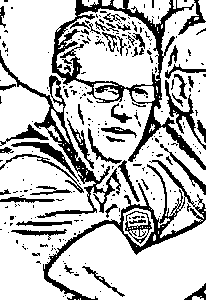

| 吉诺·奥列马

吉诺·奥列马

人们一致认为奥列马可能是有史以来最伟大的教练。除了太阳和金星在白羊座，他的火星在射手座（这是教练的标志），与狮子座的冥王星和白羊座的金星形成一个火象大三角，同时射手座的火星对分了自己的定位星——双子座的木星。

这种配置反映在他的团队中。有一种火星特质特别适合吉诺的女孩们：她们总是活在当下。奥列马没完没了地强调这一点。把每一场比赛当作最后一场。别做力所不能及的事。对待每一个团队，每一个时刻都是一样的：去争取，只有现在。过去的胜利并不重要，你不过是和你上次赢球时一样好。

奥列马是终极快乐的战士，以顽皮的微笑和敏锐的幽默感而闻名。他不担心自己的得分在上升，也不担心其他教练对康州大学的统治地位感到不满。吉诺只有一个方向——前进；一个速度——快；和一个目标——赢。其他一切都消失在背景中，成为无关紧要的琐事。

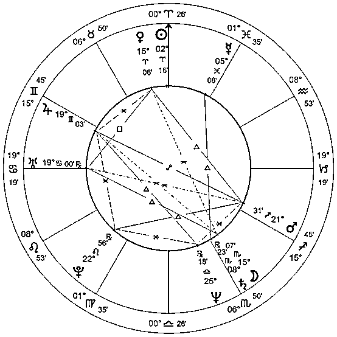

**|**吉诺·奥列马，1954 年 3 月 23 日，意大利蒙特拉。时间未知

与康涅狄格大学精心安排的战争芭蕾相比，其他团队看起来就像慢动作。她们看起来懒惰、邋遢，缺乏那些白羊座女孩所拥有的特质：火热和竞争的激情。

虽然没有什么是永恒的，但一个人的火星能量可以扩散到几十个团队，影响无数人的生活，这是很了不起的。康州大学女子篮球就是吉诺；他的个性在他执教的每一支球队上都有着不可磨灭的印记。     

**版权声明：**本文由若道翻译发布，欢迎转发，反对抄袭。友号转载请申请白名单。

**END**

**格伦·佩里**

若道签约老师，著名占星师，前 ISAR 董事会成员，共出版 8 本占星著作；心理/意识研究专业博士；占星心理学学院（Academy of AstroPsychology）的创办人；康涅狄格州研究生院（the Graduate Institute of Connecticut）原型宇宙学与意识进化项目的负责人。

# ****占星原型与星图中的精神病理学****

**为什么在占星学的课程中，会出现精神病理学的教学内容，这和我们有什么关系？这对占星咨询，或在自我了解与成长的过程中又有什么帮助呢？**

****带着这些疑问，请你静下心来，思考以下几个问题**：**

**“******你/你的案主，是否曾经过度担心什么？**** ****你/你的案主，有没有感觉到担忧和焦虑，却不知道原因是什么？********你/你的案主，是否曾经觉得害怕什么东西，但理智上却很清楚它不会对你造成什么伤害？********你/你的案主，是否曾经通过沉迷某物，酗酒或滥用药物，自我伤害去逃避问题？********……********——节选改编自《心理学与生活》******”**

**如果你对上述问题其中之一，回答是。这意味着几乎每个人都曾有过心理障碍的症状（精神病理的问题）。**

**你看，其实“精神病理学”与人的心理有着密切的关联，再结合占星学，呈现了人内在与外在层面更加丰富和深刻的一面。**这对于学习占星学的人和占星师来说，都是一场难得的知识盛宴！****

****本课为 2 年期双证核心课程中的一部分**（AP105 阶段），其内容是过去若道所开设的核心课程从未教授的部分，特意抽出供其他学员学习，******可作为 ISAR 选修课，单独报名。****

****点击下方图片了解详情****

**

****20 位来自世界各地的占星师********带来 19 场沙龙——新世界的觉醒********详情可点击下图****

****

****学习占星学********点击下图了解课程详情****

****

****

**

**

****微信又双叒叕改版啦，不想错过若道君的推送？**** ******就把若道设为****星标****以及点点****“在看”****吧！**********▼****

****

**喜欢就点一下“在看”吧！****报名直达入口**

# 上天最护佑的是哪个星座？

> 原文：[`mp.weixin.qq.com/s?__biz=MzA5NjA0NTAxNg==&mid=2651493664&idx=2&sn=1a41e0f96bdaee59e16e0d456f3c5fb0&chksm=8b482797bc3fae8189129c88d736e6fd3869efdc2b6a7c4d558a2e828283848cb3d52fc6177d&scene=126&sessionid=1692737725#rd`](http://mp.weixin.qq.com/s?__biz=MzA5NjA0NTAxNg==&mid=2651493664&idx=2&sn=1a41e0f96bdaee59e16e0d456f3c5fb0&chksm=8b482797bc3fae8189129c88d736e6fd3869efdc2b6a7c4d558a2e828283848cb3d52fc6177d&scene=126&sessionid=1692737725#rd)

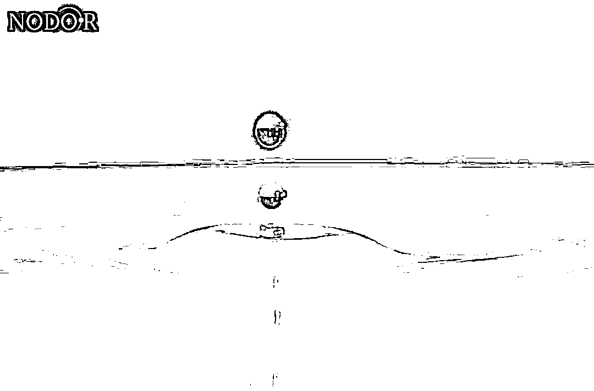作者/格伦·佩里 译者/Jun 校对/Arrow   编辑/玫瑰 封面/书君 图片/稿定设计

白羊座是一群勇敢的人，有很多的名人以及影视剧中塑造的人物都有着突出的白羊座特质，让我们一起来学习一下吧！如果你想更多了解占星学，这里有一门格伦·佩里老师亲授的【[占星原型与星图中的精神病理学](http://mp.weixin.qq.com/s?__biz=MzA5NjA0NTAxNg==&mid=2651493004&idx=2&sn=038b40a4c73ce929da0d5c64de0eac85&chksm=8b48203bbc3fa92d3922f679f3aa4a5525d2776cd477717d7daef4d44bbb863c001bd3281960&scene=21#wechat_redirect)】，点击链接了解更多详情吧！

**Just do it**

耐克的广告语“只管去做”（Just do it）体现了白羊座-火星的态度，这种态度的标志是**勇气**。埃莉诺·罗斯福（Eleanor Roosevelt）有句名言：**“勇气，就是恐惧没能控制你。”**同样地，切斯特顿（GK Chesterton）认为勇气是一种**矛盾**，因为它意味着一种**带着对死亡的准备去生的欲望。****一个被敌人包围的士兵，如果他想要杀出一条路来，就需要把强烈的求生欲望和对死亡奇怪的满不在乎结合起来。他不能只是等待死亡，因为那就是自杀，无法逃脱。****他不能只是死死抓住生命不放，因为那样他就是个胆小鬼，也逃不掉。他必须以一种对生命极度冷漠的精神去寻求生命：他必须如渴望水一般渴望生命，同时如饮酒般喝下死亡。**

**——G.K.切斯特森(2015)《正统学说》**

勇气不仅是维持生命所需要的，也是各种新开始所需要的，无论是创业、求婚还是结婚。我们都听过这样的格言：“天佑勇者”，这意味着命运（众神）密谋来强化勇敢的行为。德国作家、政治家约翰·沃尔夫冈·冯·歌德(Johann Wolfgang von Goethe)也这么认为：“勇敢起来，强大的力量就会助你一臂之力。”他说：“无论你能做什么，或梦想自己能做什么，开始行动吧。勇敢蕴含着天才、力量和魔力。现在开始吧。”

尽管这句话出自歌德之口，它实际上起源于《旧约》。耶和华不断告诫他的先知约书亚要**“刚强而勇敢”**，带领以色列人到应许之地。神应许约书亚，如果他足够勇敢，他一定会伸出援手；神会在半路上迎接约书亚。

古罗马诗人维吉尔（Virgil）是第一个写下“Audaces fortuna iuvat”（幸运帮助那些勇敢的人）这句不朽之言的人，但公元前 29 年至 19 年间他在他的杰作《埃涅伊德》（Aeneid）中写下这句话之前，我们必须假设希腊人在此之前早就普遍持有这种观点。 

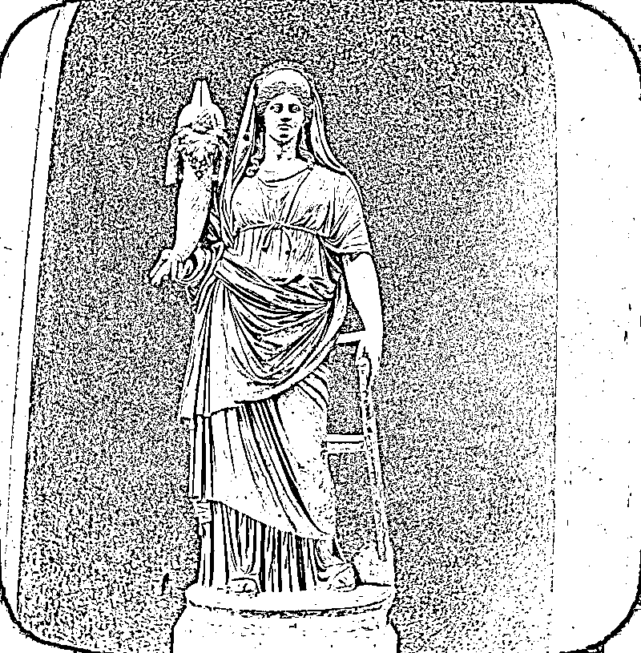| 福尔图娜，罗马雕塑 Fortuna

在希腊和罗马神话中，**福尔图纳（或称堤喀）是财富女神，是好运和厄运的化身**。重要的是，福尔图纳（Fortuna）的青睐与**美德**紧密相连，一种象征着**勇敢、大胆、男子气概、勇气和性格**的力量——这些都是明显的白羊座特质。

作为女神，福尔图纳清楚地表明，女人也不能免于美德的要求。希腊人认为，**没有美德的公民，无论男女，都会招来厄运。**

天佑勇者。

**白羊座如天使，是上帝的面孔之一**我经常思考白羊座-火星是否应该被视为一种神圣价值。我所说的“神圣价值”是指**上帝（或众神）所青睐的一种人类的能力，与更明显的灵性星座-行星原型（如射手座-木星和双鱼座-海王星）相媲美。** 从占星学的角度来看，整个宇宙是上帝可见的身体；或者，正如曼利·霍尔（Manly Hall）所说：“占星学是一种宗教，因为它揭示了上帝的解剖学和心理学。”霍尔认为，上帝是所有占星学变量的总结产物和来源，包括白羊座-火星。

在古代占星学中，两颗行星之间的相位意味着每颗行星只能看到对方的特定“面向”（侧面、相位），而不能看到整颗行星。同样地，组成黄道带的每一个角度都只是黄道带的一面，也就是上帝的一面。上帝的这些不同面向通常被认为是众神自身，附属的神，在服务于整个神的过程中，每个面向都扮演着从属的角色。

作为 0°的角度，白羊座格外重要，因为它是上帝的第一张面孔，是我们认识绝对事物（TheAbsolute）的开始。就像一个神圣的火花，它启动了黄道带象征的进化过程。

如果生命成长、发展，并引发所有自我实现的存有逐渐回归到源头意识（开悟），那么生命本身（白羊座）就是首要的，因为没有它，其他任何事情都不会发生。其他的星座或角度，其意义都来自与白羊座的关系。

鹰眼与科拉

思考白羊座生存的必要性时，我想起了 1992 年的电影《最后的莫希干人》中的一个场景，由丹尼尔·戴·刘易斯（Daniel Day Lewis）饰演“鹰眼”，他爱慕的科拉由光芒四射的玛德琳·斯托（Madeline Stowe）饰演。

包括鹰眼和科拉在内的一小群人躲在瀑布下面，嗜血的休伦族战士们正在逼近。鹰眼知道如果休伦人找到他，他就会被杀死，如果他死了，他就无法救出科拉。他决心战斗，但鹰眼转向她喊道： 

** “不！你要活下去！如果他们不杀你，他们会带你去休伦湖。你听见了吗？你是强大的！你要活下去！不管发生什么事，你都要活下去！我会找到你的！无论花多长时间，无论走多远。我会找到你的！”**

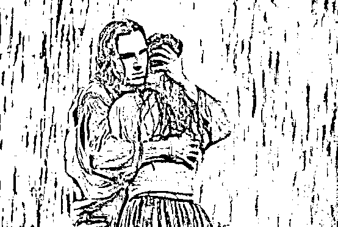

| 鹰眼和科拉最后一次拥抱，鹰眼冲过瀑布，一头扎进了下面冰冷的海水里。在几天内，他追踪到了科拉，影片迅速进入高潮。让这一幕如此震撼的，是鹰眼告诫科拉要活下去的强烈情感。这是超越一切的爱和富有感染力的勇气并存的时刻。活下去！否则就没有未来，没有后代，没有回到源头的进化。这是神圣的命令，自然的第一法则，也是为什么我们直觉地知道自杀是错误的，任何无意义的死亡都是错误的。生存，活下去，天佑勇者。如果生存不是基本指令就是第一指令，那么也许上帝的确要求我们充分发展和实现白羊座-火星的能力，作为获得青睐的条件。**白羊座是生命冲动，是生命的火花**。

它赋予我们一种意愿，去主张我们想要的，去为我们自己的利益而行动，去在沙滩上划一道红线并坚守它，去为主导而竞争，去为生存而战斗，必要时（仅在战争中）去杀人，让个人喜好与等同于我们热爱的东西。简而言之，**神性本身不仅包含了出生和开始的原则，也包含了侵略、战争和暴力的原则。**

这并不意味着白羊座-火星只对自己有利，它是一个平衡的、完整的心灵的重要组成部分。

一个完全个性化的、自我实现的人利用白羊座-火星来服务黄道 12 宫的心理能力：**保障繁荣、说话坦率、保护年轻人、捍卫荣誉、辛苦工作、保证公平、公开和消除腐败、为正义而战、冒着失败的风险追求成功、为了更大的善业而发起改变，最后，要有勇气臣服于神的旨意，接受不能改变的东西。**

如果没有白羊座-火星激励我们采取行动并强化我们整体的心灵状态，其他的能力就会相应地削弱、无力或夭折。

**没有内疚，没有遗憾**

最近我在看凯文·科斯特纳（Kevin Costner）的电影《三日刺杀》（3 Days to Kill）时，我对自己说：“我为什么喜欢看这个？”这部电影讲述的是一名中央情报局特工与他的妻子和女儿疏远，因为他经常被派去杀坏人。我突然想到，这类电影只不过是旧石器时代猎人为了养家而杀人的更新版本。

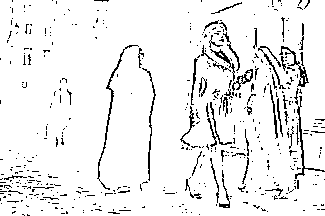

| 《三日刺杀》剧照千百年来，人们都是这样做的：打死、刺死、射死其他动物，然后把它们带回家给妻儿吃，皆大欢喜。现在我们不能再这样做了。我们的动物被西夫韦（Safeway）和雄狮（Food Lion）这样的公司打死、刺死、射死。我们被剥夺了狩猎的权利，所以我们在电影中看猎人，比如兰博（《第一滴血》男主角）、詹姆斯·邦德和阿什·卡特。像《行尸走肉》这样的僵尸电视剧让我们能够集体疏导杀戮的欲望。而且严格来说，既然僵尸已经死了，我们就不必为此感到内疚。我们可以不断地杀死它们。

**白羊座-火星是我们的一部分，我们会尽一切努力确保生命的延续；至少延续我们的生命，以及我们所爱的人。**矛盾的是，这意味着我们**必须愿意夺取生命——不管是动物、鱼、鸟、植物还是僵尸，来维持生命。这是火星的首要指令，它不会为此感到内疚。**

**再一次，这与传统的灵性原型如双鱼座-海王星形成了鲜明的对比，其中共情、慈悲和自我牺牲是准则。**当双鱼座察觉到痛苦时，它会唤起存在主义的罪恶感和拯救的冲动。“我是我弟弟的守护者，”双鱼座说：“我们一起面对这一切。”我们内在的这部分原型不会割开鹿的喉咙，然后在明火上烤着吃。作为基督教信仰的基础的爱与自然的麻木不仁的明显冲突一直是争论的根源。19 世纪，达尔文的进化论宣称，适者生存是自然的第一法则，而神学家认为，爱是创造（Creation）的最终法则。阿尔弗雷德·丁尼生勋爵（Alfred Lord Tennyson）在《悼念集》（In Memoriam A. H.H.）一书中描述了这场冲突:**“****谁相信上帝是真正的爱****并且爱着创造的终极法则****大自然，残酷无情****峡谷中，尖叫着反对他的信条****”**如果说占星学明确了一件事，那就是更青睐一种原型，而不喜欢另一种，是愚蠢的做法。因为所有人都是相互依赖的，需要一个平衡的整体，黄道 12 星座也表明后来的星座超越但同时包括了那些之前的星座。关键是，每个步骤不能跳过。**作为最后一个星座，双鱼座-海王星是无限宽容的；然而，作为第一个星座，白羊座-火星痛恨懦弱和无助的伪装。**拿出男人的样子，各尽其力，比一比。这种态度与约翰·西阿迪（John Ciardi）的一首名为《代替诅咒》的诗中所反映的接地的灵性情感是一致的，必须的。

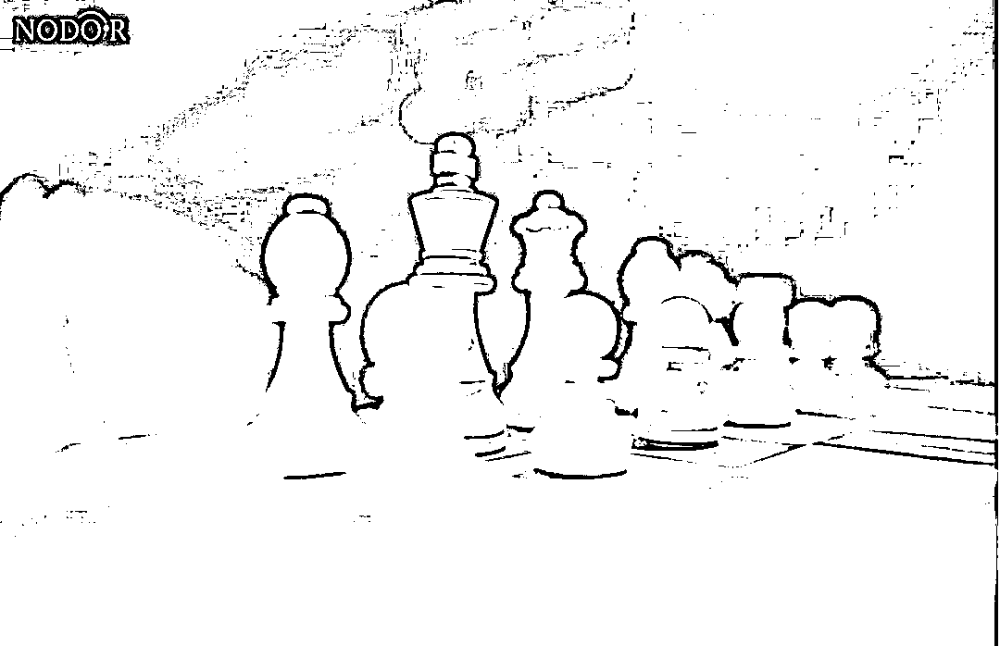

**“在上帝的下一个空缺中，如果我被选上****我将最后一个宽恕那些受轻伤的人****他们挨的打不比别人重****再也没有起来，再也没有反抗****也不会在痛苦的赞美中出头****那些全然破碎的人****他们的仁慈是善解人意****我必须立刻抱起他们****领他们通往天堂****但是****那些以恭顺为业的人**

**带着假装的无助去勒索**

**引诱利用比他们更好的人****我将是最后一个去爱他们的人
永远也不会全然去爱****让他们都上天堂吧****我废除地狱****他们进来的时候，要念给他们听****“小心那些恭顺之人的算计，他们没有冒任何风险****没有任何付出，得到的永远都不够。”**同样的态度在吉诺·奥列马的教练方法中得到了体现。他正在回答一个问题，谈到在赫斯基投篮后，康涅狄格大学的替补席上迸发出的热情。请注意，这些是没上场的女孩。

奥列马解释说，他和他的教练团队非常重视身体语言和态度。如果一名球员在球场上因为打得不好而自怨自弃，她就会被安排到替补席上。如果一个球员已经在冷板凳上了，而且因为没有上场而生气，她会被留在冷板凳上。“如果你的肢体语言不好，”奥列马说：“你永远不能参加比赛。永远，我不管你有多好。”

他继续说： “我宁愿输，也不愿看到孩子们像有些孩子那样打球。我宁愿输掉比赛。他们可以为所欲为，他们总是想着自己。我，我，我，我。我没有得分，我为什么要高兴呢？我上场时间不够，我为什么要高兴呢？这就是我们今天生活的世界。

当我看到我的团队时，他们知道这一点。当我看比赛录像的时候，我检查冷板凳上发生了什么。如果有人在那里睡觉，如果有人不在乎，如果有人不投入比赛，他们永远也不会再参加比赛。永远。”

**这与双鱼座的宽容、对受害者的同情以及减轻痛苦的冲动形成了怎样的对比。**火星说：“统统甩掉，保持坚强，回到比赛中来！”奥列马是如此坚持，所以他的球员一直展现着积极的竞争态度，否则保证你不会再上场，永远。我不得不怀疑，也许在某种程度上这也是上帝的心态。

印度精神领袖、或许是世界上迄今为止最伟大的非暴力倡导者莫哈马斯·甘地（Mohatmas Gandhi）建议：“如果只能在懦弱和暴力之间选择，我建议使用暴力。”他接着解释说，他宁愿让印度拿起武器保卫她的荣誉，也不愿让她怯懦地屈服，继续无助地见证她自己的耻辱。

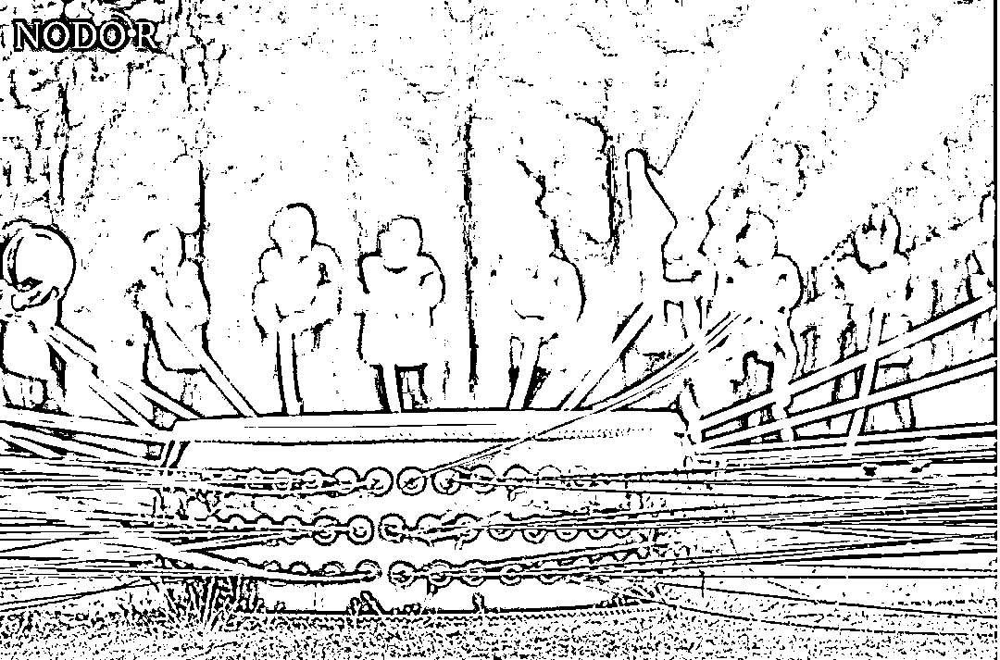

**白羊座-火星的“精神变态”**

如果没有提到白羊座-火星的黑暗面，我的论述将是不完整的。首先，我们应该知道，**每一个星座-行星系统都与一种特定的人格障碍相关，这种人格障碍反映了该原型的过度表达。**

对于白羊座-火星来说，这可能会在星图中显示出太多的白羊座-火星，或者更典型的是，由于内心冲突，白羊座-火星的过度补偿。通常是两者都有。关键是，在正确的星图下，任何星座-行星的原型都可以以一种极端、不平衡的方式表达出来，而这正是精神病理学的定义。 

人格障碍的特征有四个因素：**僵化、过度、损害和痛苦。**

**· 首先，这个人倾向于刻板地专注于一个单一的需求，就像相关的原型在占星学中所象征的那样**。通俗地说，我们称之为**“停滞”**。如果一个人极度害怕自己的需求得不到满足，他们就会过度依赖一种特定的行为模式（行星）来满足需求。 **· 第二，他们的行为太过了；**也就是说，他们不仅不断地运动（僵化），而且以极大的频率运动（过度）。如果这种行为是一首歌，他们就会不断地以震耳欲聋的音量播放这首歌。**· 第三，人格障碍与满足需求的能力下降（损害）相关，这通常也是由于人在某种程度上的功能过剩（僵化和过度）。**如果过于努力，他们的行为会适得其反；总之，这是

一种功能失调。

**· 第四，虽然患有人格障碍的人往往不承认是他们制造了问题，但痛苦仍然是问题行为的自然后果。**这个人只是简单地将他们的痛苦归咎于某件事或其他人。

**与白羊座-火星相关联的精神病理是反社会人格障碍。**在通俗心理学中，这样的人通常被称为**精神变态者或反社会者**，意思基本上是一样的。反社会人格的基本特征包括：

· 缺乏自我约束和对界限的尊重

· 经常违反或藐视法律

· 不断说谎和欺骗他人来利用他们的信任

· 冲动，不提前计划

· 会倾向于打架和好斗

· 很少顾及他人的安全

· 不负责任，不会履行财务义务

· 不会感到悔恨或内疚

**如果一个人表现出以上 3 种或更多的特征，就达到了人格障碍的标准——僵化、过度、损害和痛苦，那么他可能就是精神变态者。**

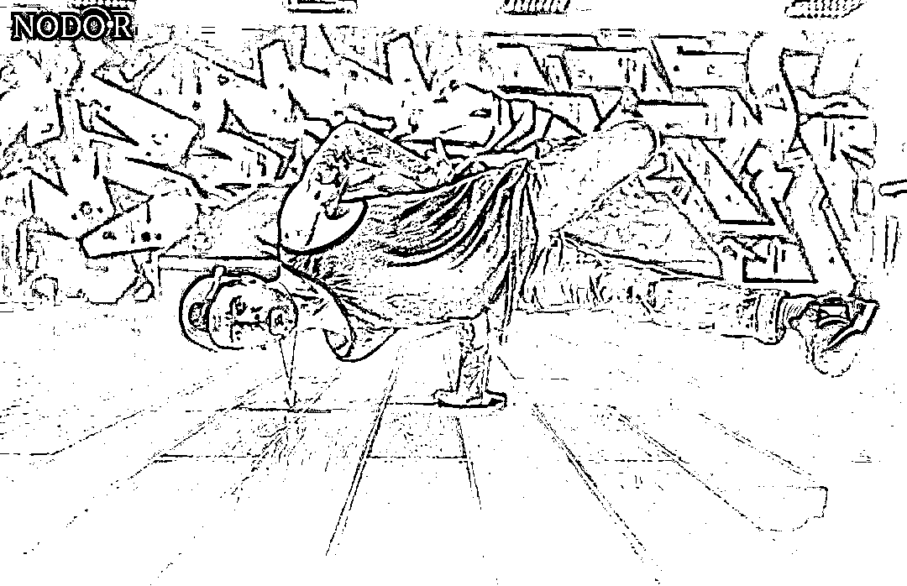

**几乎精神变态的每一种特征都符合极端的、不平衡的白羊座-火星表达**。一般来说，这种人都有**侵犯他人权利的敌对、侵略行为前科**。对独立的需求是如此的极端，以至于能力受损，无法与朋友、爱人或雇主之间维持持久、温暖和负责任的关系。**欺骗和滥交行为是很常见的。**

**婴儿般对即时满足的需求损害了他们接受社会规范及合法行为的能力。**反社会行为包括但不限于**非法占有、破坏财产、盗窃、攻击、虐待配偶和儿童。**轻率鲁莽的行为会导致事故，例如反复超速和（或）酒后驾车。

在混乱和不稳定的工作历史中，经常缺席和无计划的辞职，缺乏可靠性可见一斑。不负责任尤其表现在**不履行财务义务**上，如**支付账单、税款、租金、贷款或子女抚养费。**

**白羊座-火星对时间的定位——活在当下被曲解为“为当下而活”，表现为冲动，在没有明确目标或固定地址的情况下到处迁徙。**就像婴儿一样，精神病患者的世界坍塌为“我，此时，此地”。

**他们无法放慢脚步、展望未来，也无法反思自己行为的意义和后果，他们缺乏悔意，也无意改变。**精神变态者觉得有必要“战胜”他人，恐吓弱者，并猎食容易上当受骗的人。对支配地位的需求是如此的极端，以至于生活变成了一场无止境的竞争。他们为自己的掠夺行为辩解说：“每个人都这么做。”如果我的论点是正确的，即精神变态者过分关注白羊座对生存、自由、行动和新奇的需求，那么损害就在于无法满足这些需求。由于他们的鲁莽轻率和激起他别人的愤怒，精神变态行为的本质危害了精神变态者的存在。

即使他们幸存下来，他们也经常因为犯罪而被监禁，因此失去自由。这反过来又损害了他们按照自己的意愿行事或追求新体验的能力。简而言之，精神变态者过度投入的一切最终被抵消或完全丧失了。

回想一下，反社会人格可以由星图中太多的白羊座-火星来象征。这可以表现为**多颗行星在白羊座、拥挤的第一宫，或群星格局，不管涉及的行星和星座是什么**。此外，**如果火星因困难相位而受到压力，这可能导致火星过度补偿，以对抗与之冲突的行星冲动。**

当所有这些因素结合在一起时，就有了重大的潜在白羊座-火星精神病理，尽管未必总是如此。任何配置，无论多么困难，都可以在更高级别的整合中以健康的方式运作。

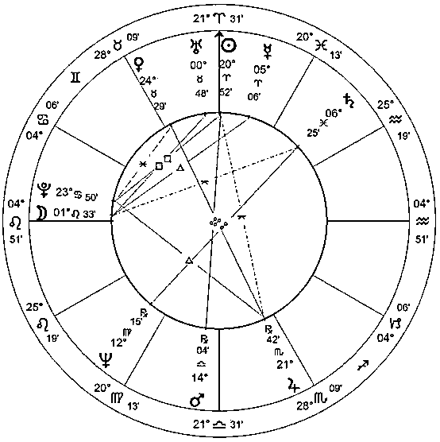

| 理查德·库克利斯基照片及出生星图

理查德·库克林斯基（Richard Kuklinski）是一个连环杀手和职业杀手，在 1948 年到 1986 年间杀死了多达 250 人。库克林斯基的水星和太阳在白羊座，太阳与火星形成对分相，与冥王星形成四分相。  白羊座的太阳对分它自己的定位星火星，这是一个特别致命的组合，因为有一个优势的白羊座-火星能量，也会蕴含显著的内在心理冲突，从而导致太阳和火星过度补偿以抵抗对方。这就像把橡皮筋拉到断裂点。

**适当地表达火星白羊座**白羊座-火星很容易令人感觉矛盾。很有可能行动过度或不足，并可以导致痛苦、不堪的结果，最重要的是**某种形式的战争**。然而，即使是战争，也有正确的方法——那就是勇敢地战斗。因此，在神话和民间传说中，我们颂扬那些对白羊座-火星的表达与人类的其他表达方式保持适当平衡的人。因为，如果没有充分体现其核心美德——力量、勇气、独立、自我主张以及天赋权利受威胁时愤怒的能力，我们就会因胆怯而丧失自己的生命和爱人，把田地留给我们中的极恶之人，更糟的是，我们还会背叛众神。天佑勇者。

**版权声明：**本文由若道翻译发布，欢迎转发，反对抄袭。友号转载请申请白名单。

**END**

**格伦·佩里**

若道签约老师，著名占星师，前 ISAR 董事会成员，共出版 8 本占星著作；心理/意识研究专业博士；占星心理学学院（Academy of AstroPsychology）的创办人；康涅狄格州研究生院（the Graduate Institute of Connecticut）原型宇宙学与意识进化项目的负责人。

# ****占星原型与星图中的精神病理学****

**为什么在占星学的课程中，会出现精神病理学的教学内容，这和我们有什么关系？这对占星咨询，或在自我了解与成长的过程中又有什么帮助呢？**

****带着这些疑问，请你静下心来，思考以下几个问题**：**

**“******你/你的案主，是否曾经过度担心什么？**** ****你/你的案主，有没有感觉到担忧和焦虑，却不知道原因是什么？********你/你的案主，是否曾经觉得害怕什么东西，但理智上却很清楚它不会对你造成什么伤害？********你/你的案主，是否曾经通过沉迷某物，酗酒或滥用药物，自我伤害去逃避问题？********……********——节选改编自《心理学与生活》******”**

**如果你对上述问题其中之一，回答是。这意味着几乎每个人都曾有过心理障碍的症状（精神病理的问题）。**

**你看，其实“精神病理学”与人的心理有着密切的关联，再结合占星学，呈现了人内在与外在层面更加丰富和深刻的一面。**这对于学习占星学的人和占星师来说，都是一场难得的知识盛宴！****

****本课为 2 年期双证核心课程中的一部分**（AP105 阶段），其内容是过去若道所开设的核心课程从未教授的部分，特意抽出供其他学员学习，******可作为 ISAR 选修课，单独报名。****

****点击下方图片了解详情****

**

****20 位来自世界各地的占星师********带来 19 场沙龙——新世界的觉醒********详情可点击下图****

****

****学习占星学********点击下图了解课程详情****

****

****

**

**

****微信又双叒叕改版啦，不想错过若道君的推送？**** ******就把若道设为****星标****以及点点****“在看”****吧！**********▼****

****

**喜欢就点一下“在看”吧！****报名直达入口**

# 若道占星·双 11 | 必买清单出炉，享受任选折扣优惠！！！

> 原文：[`mp.weixin.qq.com/s?__biz=MzA5NjA0NTAxNg==&mid=2651493546&idx=1&sn=97a0973a5300a22f80c6edbd84f40ae5&chksm=8b48261dbc3faf0bf9faf1852e0fe201450c41662dc853085eb0a4dc497a0c86da78ec9942c7&scene=126&sessionid=1692737730#rd`](http://mp.weixin.qq.com/s?__biz=MzA5NjA0NTAxNg==&mid=2651493546&idx=1&sn=97a0973a5300a22f80c6edbd84f40ae5&chksm=8b48261dbc3faf0bf9faf1852e0fe201450c41662dc853085eb0a4dc497a0c86da78ec9942c7&scene=126&sessionid=1692737730#rd)

**想一次性优惠购齐 3 门 ISAR 选修课？** **往年工作忙，错过了感兴趣的课程？****是某位老师的忠实粉丝，想集齐老师的课程？****双 11，若道为大家精选出了 12 门 ISAR 选修课，14 门名师工作坊**任选多门一次性购买可以享受不同折扣，快去占星知识的海洋里挑选心仪的课程吧！

**参加活动的 12 门 ISAR 选修课**

 下滑可查看全部课程内容，以下皆是

**家族占星学网络课**

**原价 6800 元**

**课程内容简介**

每次课程时长 2 小时，共 8 次课，安排如下：**占星实践中的家族模式**

我们第 1 次经由童年的巨大主导力量——我们的父母，来体验我们**太阳和月亮**、**土星和金星**。我们用他们给我们的暗示来解读这个世界，而他们的回应反过来又受到大家庭的影响，我们常常发现祖先的成功和失败、怪癖和才干经常在我们自己的生活和我们的星图中重复。

越仔细观察，我们就越能发现日期的神秘重复、平行事件，镜像先辈故事的我们自己命运的奇怪扭转。

**在课程中，我们将识别这些模式并与之合作，看看我们如何能够尊重过去，同时在生活中走自己的路。**更重要的是，我们如何面对我们祖先未活出的能量，而这些能量似乎在我们自己的人生经历中再次升起？在我们前进的道路上，昔日的先人向我们提出的问题是什么呢？

**父亲与孩子**

我们将看看**父亲的原型，以及它如何在出生星图中反映出来**。我们的父亲（或缺位的父亲）如何影响心灵结构？无论是缺席还是在身边，无论是亲生父亲还是“养父”，父亲的角色都会影响我们的基本认同和亲密关系，以及我们进入更大世界的能力。

虽然**土星和太阳**是父亲的传统指征，但它们很少被描述为漫游者、梦想家或一块“滚石”。父亲过去是法律和权威的承载者。随着文化的发展和婚姻的重新定义，父亲的原型也随之改变。**母亲与孩子**我们的**第 1 个养育者（或她的替代者），给予我们生命的人**，经常通过星图中的**月亮和它的相位**来指征。但是**其他行星**也可以描述她，其他人可以扮演她的角色。不论在星图上是哪些征象来体现这种基本关系，都在我们的一生中，留下了深刻的情感烙印。我们现实生活中的养育者如何与出生星图中的母亲形象相对应？我们如何将过去的力量整合到我们的成人生活中？**家族价值观****在每个家族中，都有 1 个主导价值，你需要认同它才能成为这个“部落”的真正成员。**它可能是力量，或智慧，或能干成事情的能力。对某些家族来说，这个主导价值是金钱；而对另一些家族来说，则是亲密和爱。崇尚运动的家族可能会嘲笑爱读书的孩子，赶走爱做梦的人。我们对家族的忠诚可能会阻止我们追随自己的天赋。那个离经叛道的孩子会怎样？**第 2 宫-第 8 宫轴线和金星的相位将为我们提供这些问题的线索。**有内在的价值观，也有文化和家庭强加的价值观。我们将探讨家庭价值观和对我们最重要的价值观部分之间的交集。我们该如何尊重灵魂，并且仍然对那些养育我们，使我们充满希望和梦想的人保持信心？**成功、家族压力、负债和牺牲**家族中的一个孩子，通常是最年长的，承载着家族成功的需求。但是，当这个孩子是女性，或者和家族传统的性情不同时，会发生什么呢？当个人需求和家族需求之间存在紧张关系，孩子可能会牺牲自己的天赋，而这会影响下一代人。一个拥有强大外行星的人可能会发现很难像以往那样简单地继续下去，而这也会动摇家族的自我认知。他们也可能是那个冲破家族一直以来的挣扎的人。一个孩子可以救赎数代人的失望。这些议题会由出生星图的哪些征象体现出来呢？我们将看**第 4 宫和第 10 宫，第 2 宫的价值观和第 12 宫的牺牲**。**当前关系中的过去模式**继续探索家族模式，密切关注过去对当前关系的影响。我们的原生家庭和先辈是如何定义爱的？如果爱是奴役的一种形式，我们可能需要找到自由，或者重新定义服务。如果我们的某个孩子让我们想起自己害怕和憎恨的父母，或者我们最不喜欢的兄弟姐妹或表亲时，会发生什么？

即使那些似乎完全与过去决裂以逃避“家族遗产”的人，也可能在一个困难的工作环境、一个特别难相处的老板或他们自己孩子的生活中重新遇到它，因为失落的爱的幽灵和没有被活出的故事往往会跳过一两代人重新出现。**家族的无意识带着某种印记，邀请我们再试一次，为一个旧故事找到新的结局。**

**家族秘密与家族创伤**

**许多藏在家族“壁柜”里的秘密通常在第 8 宫显现，或者由冥王星相位显露出来。**有些东西是隐藏的，因为它们很危险；另一些是因为它们太珍贵了，不能分享，比如失去的爱，或是被收养的孩子。

秘密可能涉及小的轻率行为，或大的背叛。他们可能隐藏痛苦、欲望或可怕的创伤。这些被锁住的能量经常隐藏在我们身上，带来焦虑。轻柔地将它们带到光明中，有助于释放和转化家族中内疚和羞耻的力量。

**太阳返照技法**

**原价 6800 元**

**课程内容简介**

每次课程时长 2 小时，共 8 次课，安排如下：

**第 1 课**

❶ 什么是太阳返照

❷ 如何解读太阳返照

❸ 一张太阳返照图解读两遍

❹ 为期 19 年的默冬周期预测与意识

❺ 出生地与迁徙地的返照图

❻ 不是所有的年份的太阳返照都一样 

**第 2 课**

❶ 月亮在太阳返照中的至关重要性及其元素周期

❷ 月亮落入火元素星座、土元素星座、风元素星座、水元素星座的解读

❸ 食相、满月和新月

❹ 月亮在太阳返照中的相位 

**第 3 课**

❶ 继续月亮的相位

❷ 太阳照亮各宫位

❸ 通过太阳所在宫位解释太阳返照

❹ 在太阳返照中太阳的相位

**第 4 课**

❶ 太阳返照中的合轴行星

❷ 太阳返照中的合轴行星为未来一年添彩，并成为来年的主导者

❸ 重要的星图模式❹ 精确紧密的相位❺ 行星力量 **第 5 课**

❶ 太阳返照与出生星图的关系

❷ 识别模式

❸ 太阳返照中行星作为出生星图的解释

❹ 逆行行星和共振相位❺ 出生上升点经过各宫位

**第 6 课**

❶ 太阳返照中的择时❷ 利用月亮择时❸ 整合行进❹ 太阳经过各宫位❺ 中天推进❻ 小限法 **第 7 课**❶ 特殊的太阳返照年❷ 太阳返照与金星周期❸ 中天经过各元素❹ 最好和最坏的年份

 ** 第 8 课 **

❶ 与未来合作❷ 技巧的整合❸ 预测与心理学❹ 如何处理两难困境

**医疗占星学网络课**

**原价 6800 元**

**课程内容简介**

每次课程时长 2 小时，共 8 次课，安排如下：**第 1 讲  与占星****学、心理****学、病症一起工作**医疗占星学的组成部分以及如何使用它们行星的作用与相互作用黄道星座人宫位的重要性疾病和健康是如何产生的★ 第 2、3、4 讲的课程内容基于星座以及它们之间的相互作用。

**第 2 讲  基本星座**

学习基本大十字星座——白羊座、巨蟹座、天秤座和摩羯座及其功能和相关的健康问题。这些星座与防御、养育、结构、体内平衡和荷尔蒙控制有关。

**第 3 讲  固定星座**

学习固定大十字星座——金牛座、狮子座、天蝎座和水瓶座及其功能和相关的健康问题。这些星座与习惯和反射、心脏调节、生存、循环和协调有关。**第 4 讲 变动星座**学习变动大十字星座——双子座、处女座、射手座和双鱼座及其功能和相关健康问题。这些星座与呼吸、神经系统、肠道、睡眠以及信息、情感和行动的整合有关。★ 第 5、6、7、8 讲重点学习行星，它们在身体层面的表达、它们的相位与行进。**第 5 讲 太阳与月亮**太阳掌管视觉、活力、心脏和意识，与心脏、脊柱和视觉问题相关。月亮掌管人体的周期，特别是月经周期、饮食模式和体液，与情绪引起的疾病、饮食失调和胃病相关。

**第 6 讲 土星与天王星**

土星掌管着皮肤、骨骼、牙齿和衰老过程。它对应的疾病包括慢性疾病、耳聋、帕金森病、关节僵硬和牙齿问题。天王星代表身体活动的协调，有节奏的脉动和身体的“电”。与天王星相关的疾病包括癫痫、痉挛、心律失常，以及阿斯伯格综合症和自闭症样综合症。

**第 7 讲 海王星与冥王星**海王星掌管松果体、细胞膜渗透和右脑功能，与过敏、上瘾的病症、慢性疲劳综合症和睡眠障碍相关。冥王星掌管消除和转化，其病理包括毒性、脓肿、癌症和强迫症。**第 8 讲 火星**火星是与能量和防御相关的行星，掌管免疫系统、肾上腺功能、肌肉活动和炎症反应。它是许多身体和情绪障碍的核心，如自动免疫障碍、抑郁和发烧，以及由手术或需要手术引发的问题。

**古占和现占的结合**

**原价 6800 元**

**课程内容简介**

**主题 1：复习古典占星学的概念**

一、大体介绍课程的总体安排以及如何选择学员星图作为案例

1. 上课形式更为灵活。这里提到的课程安排可能会在上课过程中根据需要进行调整。

2. 如何挑选课程中作为案例的学员星图。除了这部分之外，课程中用到的星图都会是学员的星图。我们不可能逐一分析每个人的星图，因此会挑选部分星图作为案例。 

二、运用的方法、工具和基本概念对于只学习过一般占星学知识的人，可能会有一些不太熟悉的术语和概念，比如：⑴ 行星的先天秉赋表及其运用。⑵ 对于现代行星（天王星、海王星和冥王星）、小行星和其他所有已知或未知的行进星体的应用，以及这些星体与古典行星在用法上的区别。⑶ 整宫制：什么是整宫制，它与常用的分宫制有什么区别。⑷ 胜利星：包括单一胜利星和复合胜利星。⑸ 点宫制：从福点和精神点算起的分宫制，它们的用途，它们给占星学带来了什么。⑹ 如何处理中天：因为第 1 宫是从上升星座算起，所以可以在第 10 个星座之外的星座中发现中天。这种情况如何处理？ 在这一部分会用到一些名人的星图作为例子，但在之后的课程会使用学员的星图为例。主题 2：用古典占星学解读学员星图 1. 距离上升点、中天、下降点和下中天 7.5°以内的行星重要程度依次递减（上升点和中天的重要程度几乎相当）。2. 寻找相位异常多的行星，尤其是与太阳、月亮、中天或上升点形成相位的行星。3. 被强调的星座，有四颗或四颗以上的行星，加上中天或上升点。4. 太阳星座、月亮星座和上升星座的关系，它们的特质是类似的还是不同的？5. 上升星座的守护星或上升星座的胜利星，它落在什么星座、什么宫位？它所在星座是否与上升所在的星座形成相位？这些知识都将通过学员的星图来学习、展示。主题 3：通过学员星图分析其个性、健康、疾病 1.行星或其他星图征象可能影响的因素。介绍：⑴ 体型、体态和外貌。⑵ 心智特性。⑶ 性格和个性。⑷ 与环境的互动。⑸ 本我。2.哪些因素对体型、体态和外貌影响最大？⑴ 遗传和种族血统。不要把一个人的血统不太可能有的身体特质强加到这个人身上。然而，在现代化妆品的帮助下，人们对自身外表所做出的改变可能实际上将他们带到传统占星学所暗示的方向上。⑵ 太阳、月亮和上升星座。⑶ 任何被众多因素集中强调的星座。⑷ 任何接近上升点或中天（士 7.5°）的行星。任何与上升点或中天形成非常紧密的（士 2-3°）主要相位的行星也有一定的影响。⑸ 星图中任何与上升点、太阳或月亮有关的其他常见重复主题。⑹ 疾病。补充：在这部分星图分析的讨论中，星图被选中的学员附上电子照片效果会更好。主题 4：现代和古典之比较，分别解析个性、性格和心智这一主题一直是 20 世纪占星学最为重要的关注点之一。然而，却有着两种极为不同的切入方法。⑴ 现代方法，基于上面所提到的分析外形类型所运用的方法。⑵ 中世纪方法。（简化版，老师会在必要和适当的时候介绍其更为复杂的面向。）完全取决于星图中与心智功能特定征象星有守护关系的行星。主要是那些围绕星图中 4 个关键点的行星，以及关键点所在星座的守护星和与关键点形成相位的行星。① 植物的生长灵魂：主要象征是上升点及其守护星。② 感性灵魂或动物的灵魂：主要象征星是月亮及其守护星。③ 智性灵魂或理智的灵魂：主要象征星是水星及其守护星。④ 这些都受到任何与主要象征星成相位的行星的影响。主题 5：情感关系（家人、爱人、朋友）尽管在传统上，每 1 宫所赋予的主题似乎通常可以表明该宫位是否主要是个人宫位，是否与人际关系有关，或完全是外界环境层面的；但实际上，每组象征符号和星图都可以也确实体现了所有这 3 个层面。不过，此次课程余下的时间我们将主要讨论人际关系和纯环境因素。情感关系：⑴ 父母和原生家庭，也包括本人（就是你）可能拥有的自己的家庭。该主题下还包含与权威人士的关系。⑵ 兄弟姐妹和堂表亲，也包括叔叔/舅舅、阿姨/姑姑。⑶ 亲密的一对一关系。⑷ 朋友和一对多的关系。⑸ 敌人。主题 6：财富、投资、职业⑴ 金钱、财富，理财观念。⑵ 个人工作或职业的日常活动。⑶ 职业和社会地位，毕生的追求以及谋生之道。主题 7：移民、旅行、学习⑴ 旅行和与其他国家的交流互动。⑵ 学习其他文化。⑶ 移民倾向

**凯龙星**

**原价 6800 元**

**课程内容简介**

**首先，我们将了解实际的天文学和神话中隐含的象征和意涵，学习去“看透”象征的世界，这对理解“凯龙星意识”至关重要。每次课程时长 2 小时，共 8 次课，安排如下：****✦ 天文学和神话中的凯龙星含义****天文学部分：**带你探索凯龙星发现以来的“天空之旅”——从不明星体到多次被重新归类凯龙星的由来凯龙星发现的时代背景凯龙星与冥王星之间的关系从宇宙论理解凯龙星的象征意义**神话部分：**凯龙星原型的象征和研究**了解凯龙星的背景之后，我们将重点学习个人星图中的凯龙星，以及行进凯龙星。****个人星图中的凯龙星：**个人星图中的凯龙星如何解读凯龙星在星图中的落点，在生活中是如何表达其主题？**行进中的凯龙星：**凯龙星在行进中被触发如何解读？行进中的凯龙星如何解读？**有关业力的部分：**凯龙星与祖先领地和祖先业力的关系如何通过凯龙星看“家族集体疗愈”？从家族星图的凯龙星看你此生的“疗愈任务”**体验凯龙星疗愈之旅：**引导冥想，感受凯龙星的疗愈之旅如果你是一个致力于个人疗愈的占星学子或者致力于帮助他人疗愈的占星师，学习、了解凯龙星是你必不可少的一门必修课。

**小行星**

**原价 6800 元**

**课程内容简介**

每次课程时长 2 小时，共 8 次课，安排如下：
**第 1 讲 小行星简介**小行星概述，小行星的发现、科学以及一些占星学历史。**第 2 讲 谷神星，丰饶女神**母神、农业女神，但其影响力远不止如此。这是我们所知的最大的小行星，也是最重要的小行星。她掌管养育、滋养、救助、管理等方面。**第 3 讲 婚神星，婚姻女神 **荣誉、伙伴关系、契约和婚姻：众神中的女王是正直的女主人。她在出生星图和行进中有什么意涵？她与“丈夫”木星朱庇特是什么关系？**第 4 讲 智神星，智慧女神**战地记者、棋手和占星师有什么共同之处？来自智慧、策略、洞察力和远见女神的帮助。**第 5 讲  灶神星，壁炉女神**掌管神圣的火焰、家庭生活、厨房灶台、家人、遗产的女神：这颗关键的小行星被严重误解了。她可以给你一把钥匙，让你了解家庭关系、你的祖先和你的目标意图。**第 6 讲   健神星，健康女神**在我们应对全球疫情的过程中，掌管健康和福祉女神目前显得尤为重要。她能提供如何应对新型冠状病毒肺炎的线索吗？她在出生星图中的意涵是什么？幸福原来蕴含着相当广泛的含义。**第 7 讲 灵神星，灵魂女神**灵神星是唯一一位以人类身份开始生命的女神，她代表着人类的灵魂。这颗小行星与爱情故事、童话故事和灵魂之旅有关。**第 8 讲 综合应用，展望未来**你们刚刚开启探索使用小行星可能性的旅程。我们会探索评估某些理论有效性的方法，以及在实践中检验这些理论的重要性，我们还会探索其他数百万小行星中的一些。这堂课既有提醒告诫，也鼓励你深化自己的占星实践，并拓展你对象征的理解。

**次限月亮**

**原价 6800 元**

**课程内容简介**

每次课程时长 2 小时，共 8 次课，安排如下：**第 1 讲 出生星图中的月亮与它在童年的推进**我们将学习出生星图中月亮的象征意义，以及它如何反映你的母亲以及你童年的家庭生活。我们将从元素的角度观察月亮，并研究从出生起你是如何得到母亲的关注的，我们将观察出生后几年的月亮的推进。**第 2 讲 从 7 岁到 14 岁：从自己到他人**次限月亮与出生星图中月亮的第 1 个四分相在 7 岁左右出现。我们将学习在这个关键时间点我们是如何开始意识到自己是独立存在的个体，以及它如何让我们向家庭以外的其他人寻求滋养和生命。**第 3 讲 从 14 岁到 28 岁：从别人到自己**从 16/17 岁到 28 岁左右第 1 次次限月亮回归，我们完成了与他人和与自己的月亮的灵魂之旅。从次限月亮回归开始，我们就开始对自己的情感生活以及我和其他人之间所发生的负责。**第 4 讲 从 14 岁到 28 岁：从别人到自己**当次限月亮描述我们内心的旅程时，土星的行进描述了我们与周围世界的联系，以及作为社会发展中的个体，世界对我们的要求。在我们生命的头 30 年里，它们几乎以相同的速度运行。**第 5 讲 次限月亮与其他行星的相位**我们将从次限月亮的旅程中抽身出来，看看它与各种不同人的星图的其他行星产生有趣而特别的相位时发生了什么，这样我们来了解次限月亮触及我们星图中的这些行星时会发生什么，以及我们该如何为自己的生命导航。**第 6 讲 30-60 岁的次限月亮推进**当月亮再次绕着出生星图运行时，我们有机会将意识带到我们的情绪反应中，并开始引导我们的内在本性，而不是对发生在我们身上的事情束手无策。**第 7 讲 60 岁以后的次限月亮之旅**在当今时代，60 岁以后过着积极生活的人比历史上任何时候都多。有的人在 70 多岁的时候坠入爱河并第一次结婚。我们将在这一讲探讨如何在我们生命的最后几十年里对自己和他人有用，这样我们就可以体验到生命的丰富多彩。**第 8 讲 次限月亮与次限太阳的关系**最后，我们来研究次限月亮绕着星图运行时与次限太阳推进的关系。我们将通过星图案例来进行探讨。

**原型占星学**

**原价 6800 元**

**课程内容简介**

每次课程时长 2 小时，共 8 次课，安排如下：

**授课重点**

☆ 原型占星学的基础

☆ 实际应用（用于自我认知、从容生活、情感关系、心理治疗）

☆ 更大的意涵（哲学的、宇宙的、历史的）

**知识点**

☆ 一致性的基本形式：出生星图、个人行进、世界行进

☆ 占星学如何运作，共时性的角色

☆ 占星学中的命运和自由意志问题

☆ 原型的本质/基本特征

☆ 行星的意义以及它们的组合

☆ 主要相位

☆ 如何把握一张出生星图最重要的主题

☆ 评估个人行进

☆ 评估世界行进

☆ 重要的是认识到原型的多元性，以及在共同创造性地展现我们出生星图和行进的潜能的过程中我们所扮演的角色、所具有的力量和所肩负的责任。

**第 1 课：开课欢迎致辞**

介绍我们将在该课程中涵盖的内容

占星学和心理学如何互相启发，互相增强

我的占星学之旅

是什么让原型占星学与众不同

课堂讨论，提问与回答

**第 2 课：原型占星学的基本概念框架**

运作方式：因果关系和共时性的议题

命运和自由意志

理解原型

**第 3 课：行星的意义，从发光体太阳、月亮开始，到水星、金星、火星、木星、土星**

**第 4 课：外行星天王星、海王星、冥王星：“银河使者”**

**第 5 课：观察运转中的行星，第一部分：艺术、音乐、电影、喜剧（指定的电影）中的示例**

**第 6 课：观察运转中的行星，第二部分：艺术（指定的电影）中的更多示例**

**第 7 课：个人行进，以及如何带着占星学的觉知投入到生活之中**

**第 8 课：世界行进，以及以占星学更宏大的哲学意涵来理解我们在历史上所处的时刻**

**恒星**

**原价 6800 元**

**课程内容简介**

每次课程时长 2 小时，共 8 次课，安排如下：**第 1 讲：导论与主要天文星座**存在的层面我们的存在有 3 个关键层面，占星学的影响也有 3 个主要层面。其中之一就是恒星的影响层面。神话编码恒星星座或星团代表着神秘的丝线所编织的网，它们创造了我们的集体命运，也创造了个人的命运。其基石是由融入集体无意识的存在或本质中的原始神话组成的，因此代表了人类的基本编码。天文星座所赋予的神话是现实的基本框架，也是案主在实现神话或部分神话的道路上内在所承载的命运的深层编码。恒星、天文星座和占星学星座我们应该一直谨记黄道占星星座和黄道天文星座之间的重大区别。恒星和天文星座所使用的容许度恒星对不同的行星和四轴的影响力不同，其容许度取决于好几个因素。恒星影响的传导物行星和宫头主要的天文星座天龙座、英仙座、武仙座示例，案例研究**第 2 讲：皇室天文星座**组成“皇室”的天文星座主宰着北方天空，主要包括埃塞俄比亚国王和王后（仙王座和仙后座）以及他们的女儿仙女座。示例，案例研究**第 3 讲：一等星**每颗星等小于 1.5 的恒星都是一等星。这些恒星的总共有 20 颗，最大的是天狼星(大犬座α)，-1.46 星等。即使天狼星和其他恒星的星等为负数，在占星学的意义上，它们也被称为一等星。一等星是最大的恒星，由于它们的体积最大，它们的影响力也最大。它们除了具有特定的性质外，还能增强案主的生命力和力量，因此能提升案主的潜能。**第 4 讲：黄道天文星座 1（白羊座到巨蟹座）**黄道天文星座与黄道占星星座类似。黄道占星星座是根据黄道天文星座来命名的，这是它们之间的所有关联，在回归黄道占星学和恒星黄道占星学中都是如此。我们还要了解的是，有 13 个黄道天文星座和 12 个黄道占星星座。尽管黄道天文星座和黄道占星星座在占星学意义上并无联系，但是它们是相关的，通过了解黄道天文星座的性质，我们可以增进对黄道占星星座性质的理解，而这正是回归黄道占星学和恒星黄道占星学的基础。因此，我们会将黄道天文星座分成几个小组来讨论。前 4 个黄道天文星座中的恒星（白羊座、金牛座、双子座、巨蟹座）示例，案例研究**第 5 讲：黄道天文星座 2（狮子座到天蝎座）**中间 4 个黄道天文星座中的恒星（狮子座、处女座、天秤座、天蝎座）示例，案例研究**第 6 讲：黄道天文星座 3（蛇夫座到双鱼座）**黄道天文星座中的恒星（蛇夫座、射手座、摩羯座、水瓶座、双鱼座）示例，案例研究第 7 讲：剖析天文星座恒星象征存在的无意识部分，因此恒星和天文星座主要描述物理现实。剖析天文星座与解剖人体密切对应。因此，代表人类天文星座（有时是动物天文星座）身体部位的恒星与人体的部位相关，这些部位要么特别敏感，要么被强调或以其他方式与和这个恒星天文星座相关的神话的特定部分相关。此外，恒星所属的天文星座中的每一部分都有自己的象征性关联。**第 8 讲：业力占星学中的恒星**理解恒星在业力占星学中的影响，有助于我们看到灵魂的路径，以及我们当下的任务。因此，恒星让我们能够清楚地看到业力与业力之间的关联，这本身就代表完整整合的一个重要部分。

**行星交点**

**原价 6800 元**

**课程内容简介**

每次课程时长 2 小时，共 8 次课，安排如下：**第 1 讲 介绍行星交点**我们将学习行星周期如何形成行星交点，并了解日心视角和地心视角之间的区别。**第 2 讲 什么是行星交点**我们将深入学习丹恩·鲁伊尔的成熟思想，这是启发马克老师研究行星交点的灵感之源，也是他最近出版的《行星交点与集体进化》一书的灵感来源。**第 3 讲 双子座-射手座的天王星交点**我们将学习人类认知和技术如何通过天王星交点的透镜进化。**第 4 讲 巨蟹座-摩羯座行星交点**我们将进一步学习行星交点对社会和文化的影响，深入探讨落在摩羯座-巨蟹座的木星、土星和冥王星交点，并了解它们在过去 1000 年里对我们的全球社会、政治和文化思潮起着怎样至关重要的影响。**第 5 讲 海王星及其狮子座-水瓶座交点**我们将学习落在狮子座-水瓶座的海王星交点影响的不同显化，及其在疗愈中的作用；灵性意识形态的发展，及其促使事件结束的倾向。**第 6 讲 作家案例**通过原创研究，我们将学习行星交点如何影响了世界上一些最伟大的作家的人生。**第 7 讲 研究 2020 年**我们将了解 2020 年的重要意义。**第 8 讲 回顾**我们将回顾前面的课程，并探索如何通过行星交点的意涵理解月亮交点。

**金融占星初阶课**

**原价 7500 元**

**课程内容简介**

每次课程时长 2 小时，共 8 次课，安排如下：**第 1 讲 与金融市场相关的周期研究中会用到的术语**周期周期性容许度范围如何估量市场周期：波峰与波谷扭曲失真平移：左、右、涨、跌 **第 2 讲 行星动力及其与经济占星学、金融占星学和世俗占星学的关联**逆行阶段和停滞阶段金融占星学和世俗占星学中的“入座”日心水星（射手座）相位：作为市场时机因素的主要相位和标准相位月节律：与股票和黄金走势的关联**第 3 讲 市场周期的结构**模式阶段子周期市场周期的牛市、熊市分别包含的 3 个基本模式**第 4 讲 趋势分析**牛市趋势的 5 个基本特征熊市趋势的 5 个基本特征占星学及其在趋势逆转中的作用介绍关键反转日期（CRD）介绍**第 5 讲 股指的长期周期**它们的阶段与子周期美国股市与英国股市（它们历史悠久）案例**第 6 讲 股指的长期周期（续）**4 年周期及其阶段占星征象与股市长期周期的关联冥王星在不同星座海王星在不同星座**第 7 讲股指的长期周期（续）**天王星在不同星座和黄道区间土星在不同星座和黄道区间北交点黄道区间**第 8 讲 行星相位及其与长期市场周期的关联**长期市场周期与长期行星周期的重叠展望未来

**金融占星进阶课程**

**原价 22000 元**

**课程内容简介**

**若道金融占星学第 3 阶课程**地球宇宙学征象与交易周期的关联本阶段的课程针对短线交易者，帮助他们了解持仓 3 天到 6 个月的交易买入和卖出的最佳时机。第 3 阶课程将回顾和详细说明各种金融市场的基本周期。课程将定义和演示基本周期的各个阶段，包括半基本周期、主要周期和短期交易周期，用于市场时机选择和发展交易技能。它将指导那些喜欢短线持仓 3 天到 6 个月的投资者，如何将这些行星周期用作短线交易策略之一。老师会指导大家在黄金、白银、中国和美国股指等市场中使用这些技巧。**这门课程会涵盖以下主题：**① 基本周期作为金融交易市场的主要焦点。② 基本周期的各个阶段，包括：半基本周期；主要周期；交易周期；阿尔法-贝塔周期。③ 与交易周期反转一致的关键技术研究。④ 关于周期完成确认信号的关键技术研究。⑤ 在不同的金融市场上，某些行星在某些特定星座时，往往与牛市或熊市趋势相关。这可以根据地心或日心的位置来判断。⑥ 行星在以地球为中心的运动中，转向逆行或顺行（停滞）时，某些行星停滞与不同金融市场中的基本周期有更高或更低的相关性。⑦ 在不同的金融市场中，与其他行星相比，某些行星的相位与基本周期有更高或更低的相关性。⑧ 如何计算大部分金融市场中的地球宇宙学征象关键反转日期，容许度在 3 个交易日内。⑨ 将地球宇宙学关键反转日期与基本周期、半基本周期或主要周期波谷或波峰的时间段重叠，从而增加市场反转的可能性，以此预示一个周期的完结。⑩ 通过使用特定市场的星图，然后确定行星行进与这些“出生星图”行星形成相位的时间，来提升识别金融市场反转的技巧。这些“出生星图”包括美国股市的“梧桐树协议星图”和中国上证指数的“首个交易日星图”。⑪ 根据对周期和地球宇宙学征象研究，一旦市场进入周期高点和/或反转的时间段，制定出一个考虑最佳风险回报参数的交易计划（当设定触发时该怎么办)。**若道金融占星学第 4 阶课程**太阳-月亮组合与短期市场反转的关联这是针对短线交易员的课程。如果你是一名短线交易者，并且想知道每个月基于太阳-月亮星座交易的最佳时间，那么这就是你不应该错过的课程！这是你在任何其他地方都学不到的课程。**本课程会涵盖以下内容：**① 月亮在各星座的行进，以及它与股票市场、贵金属和比特币价格活动的对应关系。② 检视当日星图，查看月亮的位置（以及它与股票、贵金属和比特币价格活动的常态关系）。③ 回顾衡量太阳-月亮组合与金融市场短线交易反转（波峰与波谷）相关性的有效研究。④ 评估重要性：1 星、2 星、3 星类型。⑤ 重要的太阳-月亮组合与股市的关联。⑥ 重要的太阳-月亮组合与黄金白银市场的关联。⑦ 与比特币相关的重要月亮星座。⑧ 理解交易设置，以最优方式利用太阳-月亮的反转。⑨ 利用当日星图（60 分钟、30 分钟和 5 分钟星图）提升对时机的把握。**4 门阿兰·欧肯老师的经典课程**

**奥义占星学网络课**

**原价 6800 元**

**课程内容简介**

**奥义占星学系列网络课程的目的**向你展示以灵魂为中心的占星学体系中核心部分的一些最重要的法则和原则。这需要你学习新的词汇表，这个词汇表基于你已经学习到的对传统心理占星学语言的理解。本系列网络课程将通过详细展开奥义占星学内在的核心教诲，来教授这些概念及其词汇。**第 1 讲 什么是以灵魂为中心的占星学？**这一方法解读出生星图与传统的心理占星学及以事件为导向的占星学有什么区别？灵魂、人格和“彩虹桥”的结构是什么？意识和创造力的 7 个层面 7\. Physical 身体 6\. Astral 星芒  5\. Mental 心智  (Lower) （低阶）4\. Mental 心智  (Higher)（高阶）      3\. Intuitional 直觉       2\. Atmic 阿特密          1\. Monadic 一元内化、进化和我们内在因此过程而存在的特殊张力之间的关系**第 2 讲 古老智慧教诲的 10 大法则和原则，及其在以灵魂为中心的占星学中的应用**介绍 7 道光**第 3 讲 7 道光：3 道主要光和 4 道次要光**意志、爱和智慧的光精神、灵魂、人格和 7 道光**第 4 讲 7 道光和 12 星座**7 道光和行星介绍在以灵魂为中心的占星学中两颗额外的行星：地球和火神星神圣行星，透过灵魂运作，水星、金星、木星、土星、天王星、海王星、火神星非神圣行星，透过人格运作，太阳、月亮、火星、冥王星、地球第 1 道光，意志与力量大的光，白羊座、狮子座、摩羯座；冥王星、火神星第 2 道光，爱与智慧的光，双子座、处女座、双鱼座；太阳、木星第 3 道光，积极的智力的光，巨蟹座、天秤座、摩羯座；地球、土星第 4 道光，通过冲突的和谐的光，金牛座、天蝎座、射手座；月亮、水星第 5 道光，科学技术之光，狮子座、射手座、水瓶座；金星第 6 道光，宗教、奉献、意识形态，处女座、射手座、双鱼座；火星、海王星第 7 道光，仪式性秩序之光，架构、阶级，白羊座、巨蟹座、摩羯座；天王星**第 5 讲 通过奥义之眼看出生星图是奥义占星学解读的第 1 步**12 星座的奥义守护星与传统守护星的比较**第 6 讲：上升点、太阳和月亮在以灵魂为中心的占星学中的意义**光、行星和星座的综合影响，第一部分**第 7 讲：光、行星和星座的综合影响，第二部分**在出生星图中寻找灵魂目的的公式**第 8 讲：以灵魂为中心的奥义占星学中宫位的意义**以灵魂为中心的占星学解读的第 1 步：将奥义和传统结合起来

**天王星网络课**

**原价 6800 元**

**课程内容简介**

**第 1 讲：受时间限制和不受时间限制的心智（第一部分）**天王星的真正意涵是什么？它在我们生活中的目的是什么？天王星在希腊神话中的起源如何通过这个神话理解人类意识的现实和发展？天王星和土星，天王星、土星以及月亮和你的自我感**第 2 讲：受时间限制和不受时间限制的心智（第二部分）**延续第 1 讲探讨的主题运用学员自愿提供的星图作为讲解这些原理的案例**第 3 讲：个人与集体，一段重要关系的旅程（初步讲解）**天王星在金牛座和天蝎座天王星在狮子座和水瓶座天王星和太阳认识和发展个体化自我的过程学员星图案例**第 4 讲：什么是“原型”？**天王星和水星将心智客观化以产生真正的直觉的能力占星学是“原型的科学”天王星是行星原型中的父亲开放的心灵、直觉、天王星与太阳之间的关系**第 5 讲：找到我们内在的外星人，让他成为有益的朋友。（个人可以如何为集体服务，进一步讲解）**天王星是什么类型的“革命英雄”？你是什么类型的“革命英雄”？你会在出生星图中的什么地方会发现自己的个人革命你作为个人如何成功地表达这一能量？以学员的星图为例**第 6 讲：天王星及其对关系和性的影响**星图中金星与天王星的关系天秤座和水瓶座的关系第 7 宫和第 11 宫的关系天王星在天蝎座擢升，在金牛座落陷，个人、非个人和集体层面的人际关系**第 7 讲：天王星的行进**经历激烈的个人反叛和革命的时期成为我们自己的过程白羊座天王星四分摩羯座冥王星的世代：当今的孩童（2011-2017 年出生）**第 8 讲：2019 年和 2020 年天王星向世界传递的信息**讨论当前土星和冥王星在摩羯座行进，相对于天王星在金牛座行进的意义，因为这会影响我们所有人分享一些非常具体的观察，关于 1988 年至 1995 年出生的这一代人声音的觉醒

**权威感工作坊**

**原价 5800 元**

**课程内容简介**

通过深入研究出生星图，分享精妙的占星学解读，阿兰·欧肯将与我们分享如何发现自己和他人的创造力，以及如何充分利用这些天赋和才能。我们将会讨论下面这些主题：☆ 如何判断出生星图中最强和最弱的行星，以及如何正确运用意志。☆ 月亮的真正意义，以及我们如何与它合作来克服恐惧，提升月亮滋养你天赋和资源的能力？☆ 如何整合第 5 宫的创造力能量和第十宫获取成就的能量？☆如何充分利用危机和丧失的时期：勇敢地面对天蝎座、冥王星和第 8 宫！☆ 如何利用占星学来判断自己最强大的力量来源以及最可能遭遇的陷阱？

**财富工作坊**

**原价 5800 元**

**课程内容简介**

工作坊将会重点关注出生星图中的占星元素和征象，揭示这些问题的答案。

占星大师阿兰·欧肯将带领你探索出生星图中关于富足（与贫穷！）的法则和原理。通过大师的指引，收获一把创造富足人生的钥匙~让你运用这些知识更好地在咨询中帮助个案解读跟钱相关的议题，也更好地经营自己的财富人生！**10 门斯蒂芬工作坊**

**探寻组合图永恒的三角**

**原价 6800 元**

**课程内容简介**

**组合图描述了如何才能使两个人的关系一直充满活力。**这句话中隐含的意思是假设一段关系有一种区别于这两个个体的独立的生命。有时我们喜欢和一对伴侣共度时光，却从没想过单独见他们其中一人。 我们从这对伴侣身上感觉到的 "频率"是对他们组合图能量的直接体验。在某种程度上，可以简单地理解为：**正如每个人都有自己的星图一样，每对伴侣也有他们的星图。** 从简单的描述层面上讲，这就是组合图的意涵。记住，我们可以将这一技法用于任何一种关系：**父母和子女、商业伙伴、朋友。**作为进化占星师，我们的目标要比单纯描述走得更深。解读组合图时，可以着眼于帮助人们，而不仅仅是使他们感到惊奇。 对于个体来说，出生星图代表了一条正确的人生道路，一条承诺意义、活力、灵性目标的道路。组合图亦然，只不过它将一段关系看成一个独立的个体，而不是两个人。关系也有进化的路径：人们走到一起是为了学习和成长。 个体如果没有领会自己出生星图的要点，会变得疲惫而沮丧。两个人也是如此，**如果没有抓住组合图的要点，我们就会对对方感到厌烦。这段关系似乎也会失去动力。** 伴侣常常意见不一，陷入困境，看不到前进的方向。3 是一个更有动力的数字。3 个人投票，2 个人以多数票击败一个人，推动事情继续发展。 **这实际上解释了这次工作坊的主题：永恒的三角。** **每对伴侣其实都是一个 3 人组：你、我以及我们。**组合图所代表的那个看不见的 "第 3 人"经常会"投出打破僵局的一票"，使关系得以发展。 **· **但是如果组合图总是同意一个人的意见，而不同意另一个人的意见，怎么办呢？（这被称为"封建制度"） **· **如果两个人都安静而保守，但他们的组合图却要求狂野的冒险呢？（这是 "文化冲击"） **· **如果它同时均衡地反映了两个人的情况呢？我们可以称之为 "民主"，但我们仍可以区分出一个人天然的智慧比另一个人更强的领域，让擅长的人负责擅长的事，这会促进关系蓬勃发展。 换句话说，我们开始看到这个技法的咨询维度了。我们将在这个工作坊中探讨这些内容。

 两个人究竟为什么会走到一起？**在严肃、复杂的关系中，我们可以假设两个人之间有一些未解决的业力。**如果他们在今生是恋人，但在前世中，一个是父母，一个是孩子呢？也许那些直觉和假设仍可以感受得到，极为错综复杂地使得他们在今生想要成为情侣。

 **这些疑问将我们引向组合图的月亮交点，在那里我们往往能发现当今人类任何伙伴关系问题的真正核心。**

 **从理论上讲，组合图是基于中点的。**如果我的出生星图里太阳在摩羯座中段，而你的太阳在双鱼座中段，我们组合图的太阳就在水瓶座中段。换句话说，**在你和我的太阳的中间位置。****其他行星、月亮交点和中天也是如此。**其他宫头的位置，包括上升点则存在一些争议。通常的做法是仍然使用中点，但斯蒂芬老师将会解释他认为这样做存在的技术方面的问题。他更倾向于**使用关系最初开始的地点绘制星图，就像我们使用出生地来绘制出生星图一样。** **组合图也像出生星图一样有行进。**在工作坊中， 我们将**探讨一些特殊的技法和考量，来帮助伴侣们应对生活中的挑战和机遇。**组合图的推进会出现一些看似难以解决的复杂问题，斯蒂芬老师创造了一种解决这些问题的技法。他将在工作坊中阐述相关细节，基本的问题是：如你所知，要了解一个人 30 岁生日的推进，我们要看这个人出生后 30 天的行星位置。 问题是，组合图与我们在占星学实践中使用的其他星图不同，组合图并不代表某一天的天空。记住，它是基于中点的。**那么我们如何从一个不存在的日期开始 "向下数 30 天"呢？斯蒂芬老师将为我们提供一个行之有效的答案。** 并非所有的人都处于伴侣关系中，但**作为人类，就需要与其他的灵魂共舞。占星学能够极大地帮助人们驾驭复杂的关系。**了解我的星图如何与你的星图通过相位和宫位的交互而产生互动，是非常有帮助的。组合图包含了这些技法，提醒我们，整体总是大于各个部分之和，而又与之不同。

**如何进行一场深入人心的占星咨询**

**原价 4800 元**

**课程内容简介**

如果你听过斯蒂芬·弗里斯特的占星咨询，你会看到客户被他润物细无声的咨询所打动，又感到自己被他深沉的慈悲所懂得。那些娓娓道来的故事在客户面前展开生命时空的画卷，在咨询结束时，又充满希望的力量。在斯蒂芬到中国教学 10 年后，他将第 1 次与所有热爱他的学员分享如何做好一场占星咨询。在这个网络课程中，占星大师斯蒂芬·弗里斯特将会和你分享他几十年来一对一面对面的占星咨询经验；他也会分享如何提前规划好接近客户心灵的占星技巧。客户个人星图为我们提供一个最迅速，也最可依赖地建立信任和自然连接的地图，他还会分享如何运用个人星图建立这个连接。

**爱的内在炼金术**

**原价 4800 元**

**课程内容简介**

关于自己的本性，你不希望了解的是什么?什么会让别人爱你变得困难?在哪些方面，你的创伤和文化状况影响了你的智慧判断，关于谁才是真正适合你的人?
**关系占星学：比对图**通常集中于两张出生星图的比较。“直接用这种方式来看待感情，就像还没上高中就开始上大学一样。”所以斯蒂芬老师还会着眼于个人星图。
个人星图上的 3 个关键区域
在这个工作坊中，斯蒂芬老师将会关注于个人星图上的 3 个关键区域。首先，我们考虑你的灵魂对于亲密关系的独特要求。你正在学习什么？激情？和平？信任？还是独立呢？其次，我们来破译你星图上关于任何可能阻碍你正确完成任务的警告信息。最后,我们来探讨星图如何描述了你的天生伴侣——也就是说, 如何在编织在你出生星图的象征符号中, 找到与你享有灵魂契约之人的描述—— 在你出生呼吸第一口空气时，这个人可能甚至还没出生。“伙伴”和“伴侣”这些词总让我们想到配偶关系，但我们在这个工作坊中探索的许多原则也适用于人类的另一杰作：亲爱的朋友之间的灵魂纽带。 我们当然会尊重所有的性别差异，因为男人和女人努力爱着对方和他们自己，无论他们的灵魂穿着何种肉体的伪装。

**整合行进、推进以及太阳弧技法**

**原价 4800 元**

**课程内容简介**

斯蒂芬老师总结 3 大最实用占星预测技法：行进、次限推进、太阳弧推进

整合这 3 种技法能够宏观和微观预测一个人的运势起伏和重要节点**行进（TRANSITS）**长期趋势分析行进的最好方法是先将长期的行进趋势列出来。顺序如下：冥王星、海王星、天王星、土星、木星、南北交点。通过将这些影响力持久的长期行进先列出来，你将能够发现在未来一年甚至更长的时间里你人生中的重大课题。短期趋势和触发点接下来你需要去观察那些运行得较快的星体，来判断短期趋势。不过，重要的是要清楚，这些移动较快的星体在行运中扮演着事件的“触发点”的角色，特别是当与它们形成相位的个人行星同时也与行运外行星有相位的时候！**次限推进（PROGRESSIONS）**通常也被称作“一天代表一年”推运，因为这种技术把出生后的每一天和出生后的一整年等同起来。一旦设定了这个节奏，就像定时释放的胶囊一样，这些次限推进就像某种内部的太阳系一样运转起来，和真实时间的事件、经历、情境应和。**太阳弧（SOLAR ARCS）**以太阳为核心，为众星之首，带着众星一起移动,展示人生不同阶段我们是如何体验自我、表现自我、修缮自我。此方法虽非实际星体，但却是星动推运法中准确率最高，实用性最佳的推运方法。综合以上技法我们该描述什么，该从哪里入手？如此庞杂的信息，究竟有什么是我们可以放心地忽略呢?系统的解读步骤来帮助你把焦点对准需要聚焦的地方，哪些是至关重要的？如何培养与占星符号间宝贵的直觉联系，将行进、次限推进、太阳弧推进融会贯通？

**土星&木星工作坊**

**原价 6800 元**

**课程内容简介**

进化占星学比传统心理学走得更远，比当代占星学更加深入。它的核心是——星图既代表出生时灵魂的进化条件，又代表灵魂在此生的进化目的。 

① 对于出生星图的木星和土星这 2 颗行星的深入介绍，把之前学习到的庞杂的知识信息，通过进化占星学的思路厘清：· 原型内涵· 高阶意涵· 潜在陷阱② 通过土星-木星再次学习星图的整体解读③ 土星-木星在行进、二次限、太阳弧中的深入解读④ 2020 年的土木合相、土木冥合相的重要意义及其影响

**太阳弧工作坊**

**原价 6800 元**

**课程内容简介**

成功运用太阳弧技法的关键是：因为太阳弧与太阳相关，所以太阳弧具有“太阳”的性质。这意味着太阳弧与人生明显的现实大事记直接相关。换句话说，太阳弧“运作”的方式很具体，虽然它欠缺一些推进所具有的心理深度。在实践中，**太阳弧、行进和推进组成了占星学预测的 3 大核心技法。**

在这个工作坊中，我们将**介绍太阳弧的理论，然后单独研究每颗行星和星图的四轴**。我们会特别关注**月亮交点轴线的所有重要太阳弧**，因为它们标记着打破你生命中“业力之波”的时期。 太阳弧推进中各星体的基本含义：

太阳：光亮、显扬
水星：思想
金星：优雅、爱情
火星：能量、信念
木星：提升、改进
土星：严肃、挑战
天王星：个性的增强、当前状态的颠覆、新点子
海王星：迷惑、忽视、自我抹杀、可能带来幻想和灵感
冥王星：洞察力、巨大的改变、力量

太阳弧推运的基本原则如下：

 ❶ 推进星体与出生星图中的星体成相位时，仅硬相位（合相、对分相、四分相、八分相、补八分相等，一般只用前三者）有效。几种硬相位在推进中的影响力没有分别。

❷ 重视四轴（上升、下降、中天、下中天），重视外行星，重视月亮交点。影响力较大的太阳弧主要是外行星和四轴产生的太阳弧。

冥王星带来人生观的巨大改变，及各种意义上的改变和颠覆。如果个案还是小孩，则此太阳弧的影响可能表现在父母身上，比如巨大的家庭变故、搬家去较远的地方、家庭成员的死亡、父母人生观的重大改变等等。 

海王星代表着迷惑、消沉、削弱，同时也代表想象、幻想、灵感。 天王星是围绕个人状况的不和谐音，经常和失败的计划有关，获得或失去，自立或退却等等，最重要的影响力在于人生观和价值观的变化和新生。 土星代表野心、志向、受到控制下的策略、结构上的重组，或是可能影响到人生规划的死亡事件。 木星代表“拓展力”。它既可以扩充你的智慧，也可以扩展你的腰围。这是因为木星的影响力不止于心智和灵魂，它也能让你暴饮暴食。 中天和下中天主要代表儿童时期的父母，另外中天代表自己的职业（包括改行、晋升、创业、成为创业动机的对公司的不满），下中天与家庭和住所有关（包括搬家、不动产及家具买卖、以及“新的开始”）。 上升和下降代表着自我以及对自我的认识，也代表着健康和儿童时期的父母状况。要注意的是上升和下降是联动的，所以所有与个人有关的状况都会影响到与自己亲密的人，配偶、合作伙伴等。 进化占星学比传统心理学走得更远，比当代占星学更加深入。它的核心是：星图既代表出生时灵魂的进化条件，又代表灵魂在此生的进化目的。月亮交点一直是斯蒂芬老师进化占星学里的核心元素，月亮交点如何在太阳弧技法中运用相信也会是本次工作坊中的知识亮点。 ❸ 太阳弧用于确定大致时间段，用行进和次限确定具体时间。太阳弧的影响力大致在一年左右，前六个月的力量大于后六个月。核心事件的精确激发往往是由运行较快的参数完成的，比如次限月亮和行进星体。 ❹  太阳弧推进与出生星图中形成不止一个相位时，往往代表重大事件的发生。 当工作坊结束时，你将掌握太阳弧技法的实用知识，并将它运用到你自己或你的朋友和客户的星图解读中去。

**次限推进工作坊**

**原价 6800 元**

**课程内容简介**

预测技术中，斯蒂芬老师认为，推进是和行进一样重要的技术！！！重要的话讲三遍。他们都能描绘出我们灵魂进化和心理发展的时间轴，展现我们的生平故事。行进或许“更有意义”，因为它们指的是天空中真实发生的运动，但不要被这个简单的事实误导了。推进就像是你出生时设定好的生物钟，它完全与行进一样有力。可以这样思考：一对夫妇生了一个孩子，他们请我“做一些预测”。我说：“在接下来的 18 年左右，她每天都会长高，之后她会变得更丰满。30 岁左右，我们会开始看见她有些白头发了。”大家可能会笑，但这都是非常靠谱的描述。这些生理进程像生物钟一样与我们的机体紧密相连。推进也是这样运作的，它们是你出生星图的 DNA，预测进化主题发生的时间，有时是进化危机发生的时间。行进是集体共有的，因为我们都在同一片天空下生活，而推进纯粹是个人的，是独特的、内在的。但和行进一样，推进也只是围绕出生星图移动的一些点，形成相位，触发成长，促使事件发生。预测时仅使用行进，就像吃鸡蛋不放盐一样，缺少了一些基本要素。占星师们常对推进感到畏惧，但推进的使用并不比行进复杂。在本次工作坊中，斯蒂芬老师将介绍推进的理论和实践。我们将深入研究推进的太阳、月亮、水星、金星、火星、上升和中天，理解它们的内在含义、共时性关联和潜在的功能障碍。（由于其他行星的推进过于缓慢，它们不是实用的工具。）正如一直以来运用进化占星学的目的，不是为了让人们惊愕，而是帮助人们。我们可以明智或愚蠢地应对推进。我们不是被推进操控的木偶。相反，推进为我们提供更高的洞见，以及抵达那儿的方法。

**冥王星工作坊**

**原价 6800 元**

**课程内容简介**

进化占星学比传统心理学走得更远，比当代占星学更加深入。它的核心是——星图既代表出生时灵魂的进化条件，又代表灵魂在此生的进化目的。在神话中，冥王星是地府的主人。在你的意识结构中，它也扮演着类似的角色。我们每个人内心都有一处“地府”，用来存放我们在生活中体验过的所有创伤经历。也许我们遭到了背叛，也许父母让我们失望了，也许有人欺骗了我们。有时，这些创伤经历如此极端，我们只能将其完全压抑起来。也有时，我们将其安全地归为“铭记”，但用一种不会威胁到自我和自我防御的方式去合理化和解释它们。在心理上，这些做法都是必要的，我们无需感到羞耻；但有时，当我们达到生命的某个阶段时，我们会变得足够强大来面对这些内在的创伤，取回被困在其中的能量和创造力。而代表这一时机到来的占星学征象总是涵括冥王星，我们不仅可以在星图，也可以在生活中看到这样的信号。这些冥王星式的创伤有时也神秘地植根于遥远的过去：那些前世未解决的伤害。比如，如果你有一世是奴隶，也许这一世我们会看见你在为一个让人十分不快的老板打工，并且想弄清楚为什么这个工作拴住了你。冥王星在出生星图的位置，加上南交点，为理解这些深层创伤的本质提供了巨大的洞见。更重要和珍贵的是，它能指引我们如何疗愈这些创伤。与此同时，冥王星的行进“打开了黑暗之门”，让我们知道开启“地府之旅”，取回灵魂的时机到了。这样的说法也适用于其他任何触发出生星图冥王星的重大行进和推进。在本次工作坊录制视频中，我们将探索这些技术背后的理论。并通过两个学员实际的案例，解读如何将所学的知识应用于星图中冥王星元素的解读。

**海王星**

**原价 5800 元**

**课程内容简介**

✦ 海王星代表的能量能够将我们提升至最高的意识状态，也可以让我们突然坠入自己制造的幻觉地狱。它虚构的心灵敏感性可以让我们听见天使的低语，也可以让我们对自己的愚蠢和妄念制造的痛苦高度敏感。要正确运用海王星，我们必须有目的地踏上某种灵性道路。✦ 你的道路在哪里？如果海王星在第 10 宫，可能会涉及某些俗世的使命，潜在的陷阱是你可能会因灵性而“出名”。海王星落在第 12 宫，你的道路可能是完全隐匿而隐秘的。如果海王星合金星，你无法独自上路。换言之，出生星图中的海王星配置指出了你灵性意图中最实际、最有效、最个人化的方向。✦ 海王星会让我们警惕哪些愚蠢行为呢？人们被自己的敏感性所吞没，落入陷阱之中。占星学警示我们过量饮酒的危险。的确如此，但还有许多其他海王星的囚牢。你的星图将它们全都描绘出来了。 ✦ 进一步来看，我们该如何做好准备，以最佳方式善用强大的海王星行进、推进、太阳弧阶段呢？如同我们所看到的，有时候，真正的智慧之路在于全然无为地等待愿景出现。✦ 在 3 天的强化工作坊中，斯蒂芬老师将以一种切实、个人化、赋予力量的方式，来引领我们深入了解海王星的各个面向，探讨海王星的种种细微差别。

**月亮工作坊**

**原价 5800 元**

**课程内容简介**

1. 深入而专业地从星座、宫位和相位的角度来认识月亮

✔次限月亮在 12 星座✔次限月亮在 12 宫位 2. 深入探讨已被遗忘的奥秘——月亮的 8 个阶段（八相）✔出生星图月相✔次限月相 3. 重拾重要而常常被忽视的占星谜题碎片✔阴性法则✔月亮的速度✔赤纬✔越界月亮 4\. 月亮在星图中的综合解读想要进一步了解感兴趣的课程，咨询任选组合价格请添加若道 Maggie 咨询

长按二维码添加课程负责人咨询~

**报名入口**

# 2023 天象预测大师课 | 2023 年，宇宙都将发生哪些大事？

> 原文：[`mp.weixin.qq.com/s?__biz=MzA5NjA0NTAxNg==&mid=2651493546&idx=2&sn=76b80f563c52924550b3dd03b3dd597b&chksm=8b48261dbc3faf0b1b81c1a437a4f809cf04220b6708b446e26fb29eb31709fac27e297527df&scene=126&sessionid=1692737730#rd`](http://mp.weixin.qq.com/s?__biz=MzA5NjA0NTAxNg==&mid=2651493546&idx=2&sn=76b80f563c52924550b3dd03b3dd597b&chksm=8b48261dbc3faf0b1b81c1a437a4f809cf04220b6708b446e26fb29eb31709fac27e297527df&scene=126&sessionid=1692737730#rd)

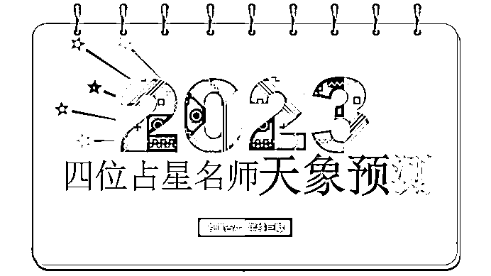

2022 年已接近尾声，忙碌的年末工作也挡不住我们对来年的盼望和期许。

作为占星师，在年初跟随权威老师透彻的学习 2023 年重要天象的含义和影响是迎接新的一年的正确姿势，仪式感满满！

若道邀请了金牌核心课中的 4 位国际名师再次集结，在**2022 年 12 月 16 日-18 日**带来**2023 年重大天象的深入解读：从冥王星、土星、木星换座；金星逆行；土星在双鱼座等角度切入，洞悉大环境的变换趋势、时事格局，为新一年的自我规划和占星事业加油充电。**

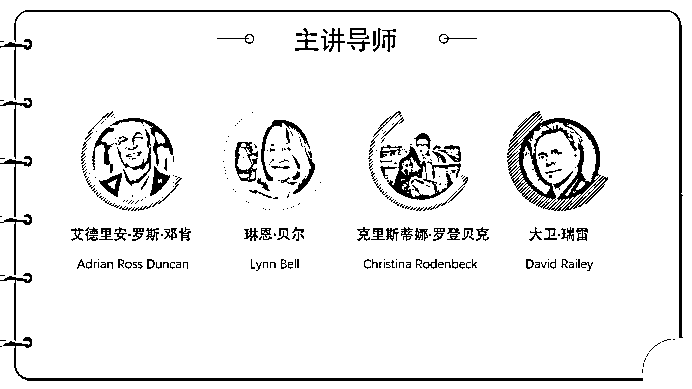

**课程时间安排**

**2022 年 12 月 16 日 周五**

**20:00-22:00 ****克里斯蒂娜·罗登贝克****2022 年 12 月 17 日 周六****16:00-18:00 ****艾德里安·邓肯**（休息 30 分钟）**18:30-20:30 ****大卫·瑞雷****2022 年 12 月 18 日 周日****18:30-20:30 ****琳恩·贝尔****课程内容安排**

**12 月 16 日 周五**

**20:00-22:00** **宇宙的舞者：****2023 年的冥王星、土星和木星**

**2023 年是这 10 年中最重要的年份之一，标志着一个时代开始落幕。**冥界的黑暗之主冥王星自 2008 年以来一直在摩羯座行进，它将在 2023 年离开摩羯座，能量会发生重大转变。

**在接下来的 20 年里，冥王星会在下一个星座水瓶座行进，影响整个时代。**但对于冥王星来说，进入水瓶座并不容易，或者说并不顺利。**在接下来的 2 年，冥王星会 2 次重返摩羯座，2023 年 6 月它将首次重回摩羯座。**这看起来在个人层面和全球层面都会是**动荡和调整的混乱时期。** 
就在冥王星首次换座的同一个月，**另一颗强大的行星土星也会离开自己的家园，进入没有边界的双鱼座，结束在水瓶座为期 2 年的限制和制定规则时期**。与此同时，**木星这颗与扩张和幸运相关的行星，也会在 2023 年春天换座，从火热的白羊座跃入金牛座更坚实的土地之上。**2023 年有望成为与重大改变相关的一年，这就是为什么了解这些重大行星事件的时间对于规划未来一年至关重要的原因。

**12 月 17 日 周六**

**16:00-18:00 2023 年的爱与戏剧性**如果男人来自火星，女人来自金星，那么我们应该能通过密切关注 2023 年金星和火星之间的相位来见证它们的热烈拥抱。当金星和地球围绕太阳相对运行时，金星会表演一场华丽的舞蹈，在 8 年的时间里形成 5 个逆行环路，在天空中勾勒出了一朵完美的玫瑰花。每 1 片或 5 片花瓣的尖端按顺序以几乎完全相同的度数在这 5 个星座中出现：双鱼座、天秤座、双子座、摩羯座，以及——在 2023 年落在狮子座。**2023 年将会是充满戏剧性和浪漫的一年。**

在此次课程中，我们将跟随**金星和火星在 2023 年的运行**，特别是**6 月 5 日，金星进入狮子座，7 月 23 日在狮子座 28°逆行，到 10 月 9 日才离开狮子座这段时间。**这是漫长的 4 个月。**火星会在 5 月 20 日进入狮子座，7 月 10 日离开。** 
由于金星的运行速度通常是火星的 2 倍，你会期待它们在狮子座形成一次重要合相。但金星会逆行，与火星的浪漫相遇不会有一个愉快的结局。**在 2023 年夏天，金星和火星会给我们讲述一个什么样的爱与关系的故事呢？**  还有一个更复杂的天象。**3 月 23 日，冥王星进入水瓶座，在 1°左右徘徊，直到 6 月 11 日。**这是自 245 年前的 1778 年 6 月-8 月以来，首次先是火星，然后是金星在狮子座对分冥王星，而 245 年前美国正处于独立战争时期。

2023 年冥王星进入水瓶座，接下来的 20 年里，每当金星与冥王星形成相位时，都会改变浪漫的本质。最后，因为金星在狮子座逆行，在狮子座来来回回移动，所以它会与在金牛座的天王星形成三次四分相，与刚刚进入金牛座的木星形成三次四分相。

**这些征象与高度特权、富有和极端独立自主的行为相关。**我们都可以在 2023 年期待激动人心的浪漫爱情，但对于那些金星和火星强大的人来说，将会有盛大的烟花表演！

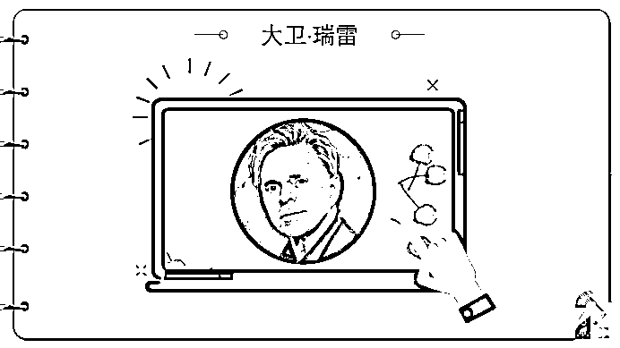

**12 月 17 日 周六  18:30-20:30 大卫· 瑞雷分析新一年的时事趋势**  **涵盖的趋势和主题包括：**

**· 火星在双子座逆行**——最后一次四分海王星！2023 年前 3 个月，信息战继续升温；谁在欺骗谁？世界上武装冲突的噪音。

**· 冥王星进入水瓶座**——改变“一与多”之间的关系。由贡献和参与定义身份，以及排斥和包容的副作用。权力和资源的重新分配，以及世界面临的挑战。

**· ****土星在双鱼座**——以不可能的方式将想象变成现实； **· 再谈木星在白羊座**——谁从武装冲突中受益？ **· 木星进入金牛座，四分冥王星**——面对贫富差距，然后在狮子座的金星在逆行期间三次四分木星；

· **火星-冥王星相位**——对分冥王星，三分冥王星，四分冥王星· **情人节那天，金星入相位合相海王星**——这是宇宙天气和文化传统之间一次罕见的一致

**12 月 18 日 周日 18:30 – 20:30 土星在双鱼座：消融边界**

过去 5 年，土星一直在它的“家园”摩羯座和水瓶座中行进。2023 年 3 月 7 日，它将进入双鱼座这片湿滑之地，加速旧边界的消融，改变我们对世界的看法。

**土星在双鱼座需要对看不见的东西有信心，并且经常要求我们放下曾经看起来坚实可靠的东西。旧的确定性受到挑战，可能需要做出牺牲。** 
土星在双鱼座帮助我们**放下过时的依恋，意识到那些并不支持我们的东西。**它能给我们勇气，让我们头朝下跳入水中。一旦土星越过星座边界，它会在双鱼座逗留到 2025 年 5 月。我们会看一看这段旅程的馈赠，同时也看一看它可能存在的隐患。

土星换座后不久，冥王星会进入水瓶座，仅仅在 2023 年开始后 8 周的时间。**冥王星换座会带来全球范围内权力分配的变化。它可能是技术进步的先兆。**这个时期，集体的需求可能比个人的需求更强烈。一个新的世界正在崛起，一个旧的世界正沉没到波涛之下。 **讲师是谁？**

**克里斯蒂娜·罗登贝克（Christina Rodenbeck）**

· 全职职业占星师，在牛津大学城生活和工作，深受周围知识和文化氛围影响；她拥有伦敦大学（University of London）的人文荣誉学位，曾在伦敦占星学馆（Astrological Lodge of London）、心理占星中心和占星研究学院学习。  **· **作为一名占星师，在过去的 20 年里，克里斯蒂娜在她的网站“牛津占星师”上写了大量关于时事、艺术和文化的文章；她每月主持一个占星播客：“与克里斯蒂娜和萨莉一起占星”，并定期在《占星杂志》(Astrological Journal)上撰写时尚专栏；她定期在英国授课，并保持着蓬勃发展的专业实践。
**艾德里安·罗斯·邓肯（Adrian Ross Duncan）****· **1971 年在印度游学时开始学习占星学，1985 年开始成为全职占星师，迄今执业已超过 33 年，是人本主义占星学、卜卦占星学和经世占星学领域的知名占星师。他还开发了占星软件 AstroClock 和多款占星报告。**· **他在日常咨询中经常运用卜卦，咨询图（卜卦的一种运用方式，即根据客户来访时间制作星图，从星图中获得大量信息）也是他特别擅长的领域。**· **从 1971 年开始研习佛学，受佛学影响很深，他相信占星学和佛学观点一致，转化的一个基础是在于对现实感知的改变。而卜卦很容易与佛教融合，因为它只关乎当下。

**大卫·瑞雷（David Railey）**

**· **若道联合创始人，致力于在中国教授和推广西方占星学。**· **曾任 ISAR 全球副主席，CAPISAR（ISAR 职业占星师资质认证机构）主席；**· **1976 年，通过亚特兰大职业占星师考试，成为全职占星师，随后通过 AFAN 和 ISAR 职业测试；**· **1980 年，与杰夫·焦耳一起在亚特兰大创建“每日行星”占星学中心。此后在亚特兰大占星协会担任 4 年考官，并且两次担任亚特兰大地区占星协会主席。1979-1992 年，作为占星师活跃于美国社会媒体，向不了解现代占星学变化的大众宣传专业占星学知识。

在 1989-1992 年期间，他在 WRGG 电台 12 频道每周主持个人电视秀“今日占星学”，早先他还在 WRFG 的广播节目中播讲宇宙天气节目；

**· **2010 年-2014 年，任全美占星师联盟监督委员会委员；

**· **2010 年，其著作《灵魂的目标》中国版出版，和蒋颖一起创办若道占星学校和其官网 www.nodoor.com。

**· **2017 年，被选为 ISAR 委员会成员。ISAR 是世界最大的国际占星机构，会员遍布 45 个国家，2017-2020 年曾任 ISAR 全球副主席、CAPISAR（ISAR 职业占星师资质认证机构）主席。

**琳恩·贝尔（Lynn Bell）**

**· **世界受欢迎的占星学演讲者、作家和老师之一。定居巴黎，研究心理占星学和家族模式数十年。**·** 著名的心理占星学中心（*Centre for Psychological Astrology*）的长期导师。2016 年，获得查尔斯·哈维（Charles Harvey）杰出的占星学服务奖。**· **作为一个从多个层面进行工作的占星咨询大师，琳恩的工作结合了心理学的观点。她对家族模式的兴趣首先来自与客户的合作。通过在分析领域所做的个人工作，她所受的埃里克森催眠训练将她引领至家族系统。后来，她组织研究小组在家族星图上进行了数年的研究。她写的《家族占星学》就是这项研究的结果。**· **法国心理占星学协会会长。除了占星学，她在法国沙特尔的新沙特尔学校任教 8 年，还 5 次获得了在《纽约时报》畅销书作者卡罗琳·迈斯（Caroline Myss）的卡罗琳·迈斯教育学院（*Caroline Myss Educational Institute*）合作教学的机会。**课程价格**

**正价：3000 元 限量优惠价：2023 元（前 60 名报满截止）** 

**退转课程**

**退款原则请详看《教学协议》，如有疑问请咨询课程顾问**

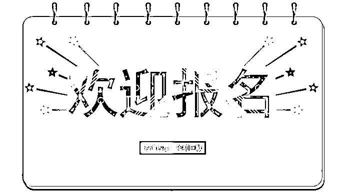

****2023 年度天象预测名师课****

**授课老师：****克里斯蒂娜·罗登贝克 艾德里安·邓肯 大卫·瑞雷 琳恩·贝尔**

**直播课开课时间：**2022 年 12 月 16 日-18 日

**授课方式：**网络课程，中英文授课，中文翻译

**费用：****正价 3000 元 限量优惠价 2023 元（前 60 名报满截止）**

**课程负责人：**Maggie（微信：NodoorMaggie 请备注“2023 天象预测名师课”）

长按二维码添加课程负责人咨询~

**报名直达入口**

# 金牛座月食 | 拒绝肤浅诱惑，和脆弱的自己、稚嫩的过去告别吧！

> 原文：[`mp.weixin.qq.com/s?__biz=MzA5NjA0NTAxNg==&mid=2651493433&idx=1&sn=4b30c47884691f3784d09dba26021639&chksm=8b48268ebc3faf98d32d59275e660728520b016e4b15c0777000dafaadcfa5077250405d3ed1&scene=126&sessionid=1692737730#rd`](http://mp.weixin.qq.com/s?__biz=MzA5NjA0NTAxNg==&mid=2651493433&idx=1&sn=4b30c47884691f3784d09dba26021639&chksm=8b48268ebc3faf98d32d59275e660728520b016e4b15c0777000dafaadcfa5077250405d3ed1&scene=126&sessionid=1692737730#rd)

****☆ **后台回复“今日”，给你一句生命态度**

作者/王芝桦 编辑/玫瑰 图片/稿定设计

**金牛座月食****北京时间 2022 年 11 月 8 日 19:02 迎来金牛座满月，天蝎座太阳和金牛座月亮于 16°0′精准对分，并以 3°之差靠近“天蝎座南交点-金牛座北交点”，形成金牛座月全食。**  南北交点轴线，每一年半行进一组“对宫星座”，期间发生在这组对宫星座上的“系列食相”，揭示着这一年半之中需要我们面对和转化的重点功课。

日月食总是成对出现，每对食相相隔半年左右。2022 年的两次“食相季”分别发生在**5 月（5 月 1 日的金牛座日食，5 月 16 日的天蝎座月食）和 10 月下旬-11 月上旬（10 月 25 日的天蝎座日食，11 月 8 日的金牛座月食）**，即“金牛座-天蝎座”这组对宫星座之内。

**· 金牛座：**通过拥有“我的”物质资源和稳定结构，巩固现实安全，享受内心宁静；

**· 天蝎座：**通过洞悉“他人的”内在需求和情感忠诚，掌控关系信任，获得心理安全。 
金牛座和天蝎座都与**“欲望和安全”**有关，只不过，**金牛座的欲望和安全通过“我的现实拥有”满足，而天蝎座的欲望和安全通过“我的心理信任”满足。**故而，发生在“金牛座-天蝎座”这组对宫星座内的日月食，总是将**“现实性和心理性”**这两个内外不同层面的张力加倍放大，而外在事件的呈现也指向**“金钱与关系”**的主题。  当下一轮“南交天蝎座-北交金牛座”的几次系列食相，均发生在重磅天象“土天四分”结构的宇宙大背景之下：

2021 年 11 月 19 日金牛座月食（详情点击：[金牛座月食](http://mp.weixin.qq.com/s?__biz=MzA5NjA0NTAxNg==&mid=2651461670&idx=1&sn=48d44052692e7cf6fc6e5146266e8a74&chksm=8b48aa91bc3f2387b8ca38bb0073b63aed347505e4ac2d7e321188081e7279eb2c45e3c4637f&scene=21#wechat_redirect)）、2022 年 5 月 1 日的金牛座日食（详情点击：[金牛座日食](http://mp.weixin.qq.com/s?__biz=MzA5NjA0NTAxNg==&mid=2651473208&idx=1&sn=df43c751573161084408d637ab6c0c8b&chksm=8b48f78fbc3f7e99a2dcba2ff092e8e1272c976667e7057b2b10990c765fba440059a54cb87a&scene=21#wechat_redirect)）、2022 年 5 月 16 日的天蝎座月食（详情点击：[天蝎座月食](http://mp.weixin.qq.com/s?__biz=MzA5NjA0NTAxNg==&mid=2651473953&idx=1&sn=6604f4b30a4b1dfa410b3e07b27fa221&chksm=8b48fa96bc3f73808bde4038961ee94f358f2c9bc01070a2c441f102a815380ab1f92a6e2d30&scene=21#wechat_redirect)）、2022 年 11 月 8 日的金牛座月食，向我们揭示——**“不破不立”的变革进程不可避免，在危机彻底呈现的狂风暴雨之中，走向“返璞归真”的旅途。**

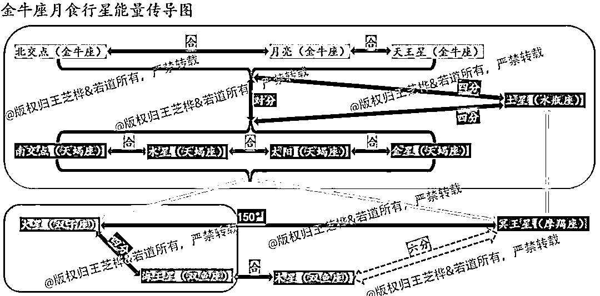

> **金牛座月食重点影响人群**
> 
> **参考新月峰值影响期间各个行星的行进度数，以及逆行行星的轨迹影响；常规容许度，个人行星入相位 3°，出相位 1°；非个人行星入相位和出相位均为 3°。**
> 
> *   出生星图中，有**行星、四轴、南北交点**落入**固定星座（金牛座、狮子座、天蝎座、水瓶座）10°-28°**的人群。
>     
>     
> *   出生星图中，有**行星、四轴、南北交点**落入**变动星座（双子座、射手座、处女座、双鱼座）5°-30°**的人群。
>     
>     
>     
>     
> *   出生星图中，有**行星、四轴、南北交点**落入**基本星座（白羊座、巨蟹座、天秤座、摩羯座）23°-30°**的人群。

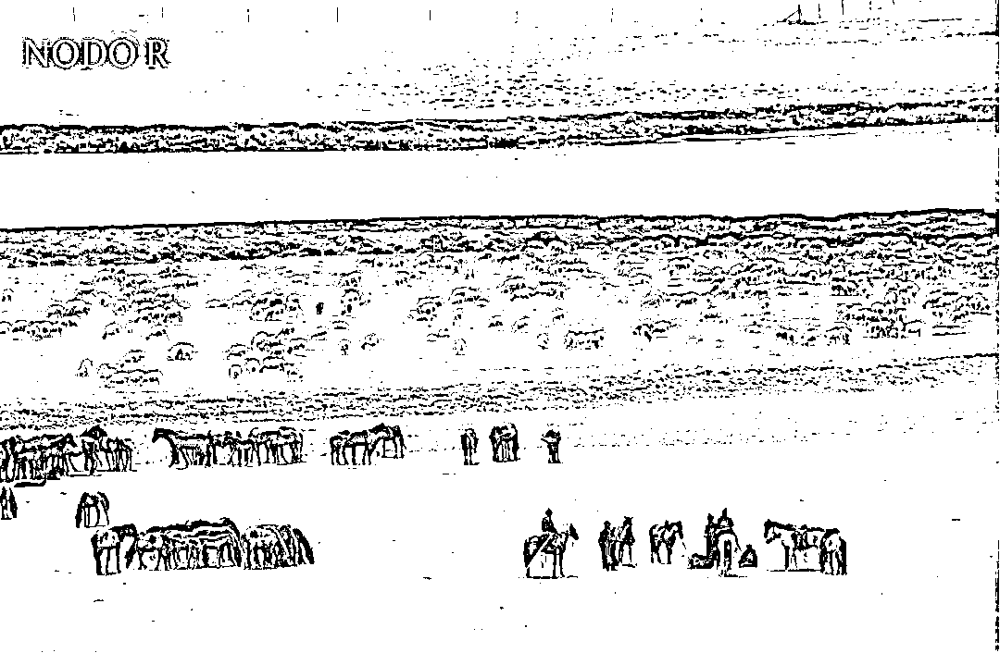

**“全新的安稳”要**打破**“旧有的安稳”**

> **天象**
> 
> **· 天蝎座阵营：南交点、水星、太阳、金星合相于天蝎座。**
> 
> **· 金牛座阵营：北交点、月亮、天王星合相于金牛座。****· 固定星座 T 三角：天蝎座和金牛座的两大阵营形成对分局面，水瓶座土星分别四分天蝎座阵营和金牛座阵营。**

 2022 年的现实世界已经没有什么可圈可点，因为时时和处处都可圈可点，这似乎完全符合“土天四分” 重磅天象结构掀起的“不破不立”变革进程，意外毫无意外，无常本就无常。  10 月下旬，随着 10 月 25 日天蝎座日食（详情点击：[天蝎座日食](http://mp.weixin.qq.com/s?__biz=MzA5NjA0NTAxNg==&mid=2651492140&idx=1&sn=9c5bb00704f4530adf057d816c89e82c&chksm=8b483d9bbc3fb48d9527e67961c53383f3f7eaf3a4c770138928ffb620d9726c24162e1840fc&scene=21#wechat_redirect)）开启了未来半年“生死转化”的重生旅程，“潜在”的隐情和危机更是不断浮出水面。

让我们看看这半个月都发生了什么：美国中期选举两派对决再次白热化，赫尔松之战决定俄乌战局走向，黎泰院踩踏事件造成 156 人离世，马斯克收购推特后大刀阔斧裁员，各地疫情防不胜防莫名反弹……权力，战争，死亡，资本，生计，疫情，没有一样讨人喜欢。 这半个月，身边的事、外面的事、世界的事，让我们再次慨叹当下的现实与艰辛，也再次深思生命的本质和意义。当现实一点一点地撕去欲望，当真相一点一点地揭示虚妄，方令尘世中拼命奔波、追逐成就的我们惊觉——**“人间烟火气，最抚凡人心”，衣食住行的简单，心安理得的宁静，方是人间的生活。** 但是，简单与宁静，容易吗？不容易！

写到这里，想起“潘多拉魔盒”的故事：宙斯为了惩罚盗取神界圣火、带给人间智慧的“先知”普罗米修斯，号召众神一起塑造了地球上的第一位女性潘多拉；众神赋予潘多拉天赋和魅力，也赋予潘多拉无知和贪婪，并将潘多拉嫁给普罗米修斯的弟弟“后知”埃庇米修斯；虽然“先知”普罗米修斯一再警告不要打开众神赐予的宝盒，但贪婪与好奇心终令潘多拉偷偷打开了宝盒，释放出各种美好，也释放出各种祸端，从此，人间不再平静，人性变得复杂。 

然而，潘多拉魔盒的底部还留存着最后的礼物“希望”，寓意着——**在经受考验和折磨之时，只要不放弃心中的善念与希望，便能面对苦难而反思，穿越死亡而重生！** 

天蝎座是“向死而生”的星座，天蝎月（10 月 23 日-11 月 21 日）亦是穿越生死并获得重生的月度。10 月 25 日的天蝎座日食按下了未来半年“生死转化”的神秘按钮，然而只度过了半个月时间，那些现实的真相显化，那些破立的变化过程，亦让身在其中的我们**对“安全感”的需求倍增，或者说“不安全感”在内心深处不断加剧。** 

月食发生时刻，太阳、地球和月亮排成一条直线，处于中间位置的地球遮掩了太阳的光芒，令自身并不发光的月亮仿似被黑暗吞没了一般；而随着月亮代表的“心识”能量变得隐蔽模糊，我们的内在心灵也步入至暗时刻。故而，**月食触发出的完结能量和情绪浪潮，往往比满月要增加数倍，影响周期也拉长至 3-6 个月之久。** 

此次金牛座月食，以天蝎座太阳为核心的“天蝎座阵营”揭示出**现实生活的复杂性与危机感**，阵营中的天蝎座南交点更是将业力阴影暴露无疑。

那些人性之中的贪婪与丑恶，那些隐藏深处的冷漠与掌控，透过阵营中**天蝎座金星代表的“金钱与关系”、天蝎座水星代表的“真话与假话”**在现实事件中呈现，而这一切足以令对岸的金牛座月亮所渴望的“烟火气和安全感”失去平静且焦灼不安。 

更重要的是，我们不要忘记：“金牛座阵营”中还有发动变革之风、不惜瓦解一切的金牛座天王星；而与金牛座天王星组成“土天四分”结构掀起“不破不立”变革进程的水瓶座土星，却站在两组阵营中间搭建起考验不断、互不让步的“固定星座 T 三角”结构。

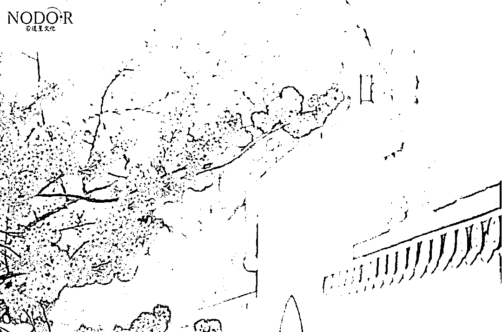

**月食开始后的两周时间，需要注意的几个方面**

  **· 接纳无常：**不要奇怪那些突发的状况或意外的消息，这些情况只是超出过往认知、没有任何准备而已。当然，有人突然示好自然令人欢喜，但有人突然离开就令人很不舒适。

无论是什么，记得带着一份理性的态度和超然的视角去看待这一切，不要执着，也不要控制，接纳现实的变化，看清自己的内心，勇敢迎上去！要来的留给时间去沉淀，要走的感恩过往去告别。 

**· 关系边界：**不同领域的关系性质自有不同，我们都要学习成人世界的关系法则，而不是以主观性的认知或理想化的预设，期待并要求对方“你应该是什么样的”。

这是各种关系极容易“翻车”的一段时间，不要肆意地投射自己的情绪，更不要侥幸地试探对方的底线，信任的基础是尊重“关系的定位和彼此的边界”，可以真诚谈清楚，但不要自己猛加戏。 

**· 职场风云：**从行业、市场、职场的层面而言，这是企业之间、团队之间、岗位之间、个人之间容易出现博弈的一段时间。

故而，容易发生一些不良竞争或暗箱操作的情况；于个人而言，一些朋友可能会被要求站队表明立场，一些朋友可能会收到他方橄榄枝，一些朋友需要注意文件纰漏导致不良后果，一些朋友需要保护业绩以免惨遭抢功，所有的可能性化作两个字“严谨”。 

**· 落袋为财：**近期一些企业和机构可能会出现大幅动荡，甚至出现降薪、欠薪、裁员的情况。这里提示一句，落入口袋才叫钱，大饼再好不必看，无论你是在找工作，还是在谈条件。另外，金融市场，乱世出英雄，但大多数是平民，看好自己的钱袋。 **· 集体层面：**天蝎座教导我们与死亡（失去）面对面，为无常做好准备。但不得不说，这是地缘政治、政权斗争、金融领域、自然灾害、安全隐患非常敏感的一段时间，让我们祈祷这个世界放下贪婪与疯狂，回归和平与安宁。 此次金牛座月食，既是一场分庭抗礼的较量，更是一场随时可能扯断绳索的拔河。然而，无论是 10 月 25 日的天蝎座日食，还是 11 月 8 日的金牛座月食，都在向我们揭示一条“向死而生，去腐留新”的道路——**“全新的安稳”从打破“旧有的安稳”开始。** 写到这里，再次提示“潘多拉魔盒”底部留存的**“希望”**。这个希望，既是金牛座北交点指引的进化路径，亦是“土天四分”结构“不破不立”变革进程的最终归途——**无论怎么折腾，最终都要返璞归真！不是要后退，而是要消化透支；不是要否定过去，而是要升级未来。**

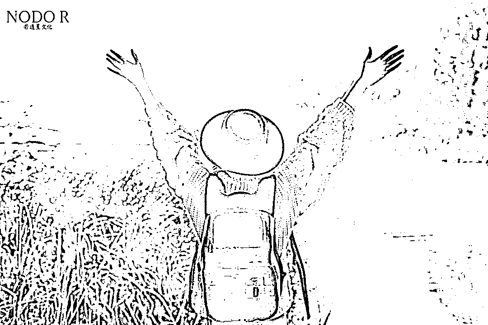

**做出有意识的觉察与回应**

> **天象**
> 
> **· 火冥梅花：双子座火星与摩羯座冥王星形成 150°梅花结构。**
> 
> **· 火海四分：双子座火星四分双鱼座海王星。**

 从 10 月 25 日的天蝎座日食开始，天蝎座的两颗守护行星“火星和冥王星”，便因为火星开始逆行的停滞状态（逆行期 2022 年 10 月 30 日-2023 年 1 月 13 日），令火星在双子座 25°的位置磨磨蹭蹭没有离开，并与行进在摩羯座 26°的冥王星形成“火冥 150°梅花”结构。 
但同时，**双子座火星在整个逆行周期（2022 年 9 月 4 日-2023 年 3 月 16 日）之中，于 2022 年 10 月 12 日、2022 年 11 月 23 日、2023 年 3 月 15 日先后 3 次与双鱼座海王星形成“火海四分”结构。** 故而，10 月-11 月这两个月，由双子座火星组成的“火冥 150°梅花”和“火海四分”这两组结构之间，也进入了一种拔河的状态： 

*   **火冥梅花：**

*   “战神”火星和“冥府之神”冥王星，拨了半个月的电话，愣是没通上话。这就像，我们的意识和潜意识有时也很难联通，心未读懂，身已远行，明了之时往往追悔莫及。 
*   作为天蝎座的两颗守护行星，他们的对话可太重要了！冥王星揭示业力真相，他要提示火星需要勇敢直面的恐惧、需要彻底转化的问题是什么；火星携带着本能的驱动力，誓要超越一切的困难，然而他却收不到冥王星提示的重要信息。 
*   10 月 23 日-11 月 21 日的天蝎月生活，激化了火星和冥王星“联结中断”的矛盾，而 10 月 25 日的天蝎座日食和 11 月 8 日的金牛座月食更是将这股矛盾彻底引爆。 

*   **火海四分：**

*   首先，“战神”火星的战斗目标和战斗力量，被“四处搞信息，信息已成堆”的双子座搞得一团糟，能量涣散，失去重点；其次，双鱼座海王星与双子座火星的四分结构，更是令“战神”火星活在梦幻泡影之中，做事虎头蛇尾，行事杂乱无章。 
*   说简单点，这组结构“不出成绩”！这当然会严重打击“战神”火星的自信心和自尊心，气自己的迷乱和不争气，气外界的不理想和不配合，于是，“战神”火星的火气越来越大，什么话都敢说，什么人都敢惹。 

 现在就看双子座火星如何做出回应并进行选择了！**行进天象中的双子座火星会落入我们每一个人出生星图的某个宫位，提示我们对那个宫位所对应的事件，做出有意识的觉察与回应。** **不要陷入到那些表面化和短暂性的“诱惑”之中！或许那些诱惑可以暂时喂养虚荣和掩盖脆弱，但这绝不是“潘多拉魔盒”底部留存的“希望”！** **当理想破灭或危机出现的时候，收起那些虚弱的自尊和可怜的怒火，直面现实的真相，直面自己的脆弱，保持理性的态度，学习成熟的方法，才能真正解决问题，而不是火上浇油。** 金牛座月食，如果一定要完结什么的话，那么就让我们先和脆弱的自己、稚嫩的过去告别吧。

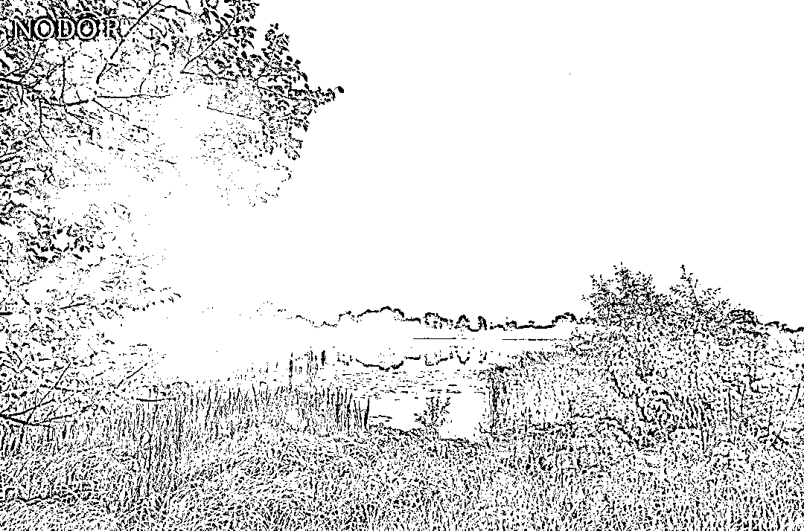

**寄语**昨天特别想出去走走，于是，学生带我去户外闻了半天的秋色，晒了半天的太阳。一壶陈皮禅茶，几样精致茶点，掉落满地的银杏叶，打扮美丽的自拍者，稳坐河边的钓鱼翁，坐在身边的亲学生……嗯！自然，人，美食，时间，疗愈着我。 亲爱的朋友们，此次金牛座月食，无论你在什么样的环境和状态下，记得要为自己和家人做些“人间烟火气，最抚凡人心”的事，哪怕是开窗闻一下空气，哪怕是煮上一锅粥食，哪怕是按摩一下肩颈，哪怕是睡上一个午觉……生命一场，时光不多，祝愿大家在时间的流淌中，感受每分每秒，感受生命律动。 祝福每一个生命健康，每一个灵魂安好。

**版权声明**：原创文章由作者授权首发于若道平台，欢迎转发，反对抄袭。友号转载请申请白名单。

****

****想阅读更多作者的文章，请在后台回复******王芝桦****** 即可。****

****王芝桦****

心理占星师，统合疗愈师，若道占星“新月和满月”专栏作者，腾讯视频特约占星师

全职于个案咨询与占星教学工作 18 年

**个案预约咨询微信号**：zhihua0621 

**微信公众号**：daoxi-life

**长按打赏**

**20 位来自世界各地的占星师****带来 19 场沙龙——新世界的觉醒****详情可点击下图**

**学习占星学****点击下图了解课程详情**

**微信又双叒叕改版啦，不想错过若道君的推送？**
****就把若道设为****星标****以及点点****“在看”****吧！******▼**

**喜欢就点一下“在看”吧！****报名直达入口**

# ISAR 星空俱乐部第 47 期 | 金融占星学的基础原理

> 原文：[`mp.weixin.qq.com/s?__biz=MzA5NjA0NTAxNg==&mid=2651493433&idx=2&sn=f11f6201278e919d7566f412e5c66feb&chksm=8b48268ebc3faf983116d0d5f63fb8c39d81ed869bda1a3f2ea85ecdad8383e29399672963a0&scene=126&sessionid=1692737730#rd`](http://mp.weixin.qq.com/s?__biz=MzA5NjA0NTAxNg==&mid=2651493433&idx=2&sn=f11f6201278e919d7566f412e5c66feb&chksm=8b48268ebc3faf983116d0d5f63fb8c39d81ed869bda1a3f2ea85ecdad8383e29399672963a0&scene=126&sessionid=1692737730#rd)

**沙龙来啦！****11 月 11 日，星期五晚上 20:30，**国际占星研究协会（ISAR）中国星空俱乐部沙龙由占星师**吉安尼·迪·波塞**带来一场讲座！ **沙龙主题****沙龙主题：********金融占星学的基础原理************主讲人：**********吉安尼·迪·波塞************

**沙龙时间：11 月 11 日，星期五，北京时间 20:30-22:00（有英文翻译）**

**沙龙方式：线上沙龙**本讲座将介绍**金融占星学的基本原理，以及如何使用各种行星、周期和技术方法来预测金融市场的趋势和转折点。**
在本次讨论中，还将分享对**股票、债券、货币、大宗商品和加密货币**的预测。**雷蒙德·梅里曼 2023 年预报及沙龙已开始双 11 优惠预售，将帮助你对 2023 年的市场风云变化加深了解。**
**长按下图识别二维码了解更多详情**

**主讲嘉宾**

**********吉安尼·迪·波塞**********

**· **吉安尼·迪·波塞（Gianni Di Poce）是梅里曼市场时机学院的项目主管。他也是梅里曼市场学院的市场分析师，负责分析一系列不同的市场。**·** 吉安尼撰写美国中期国债、澳大利亚市场（指数和外汇）的梅里曼市场时机学院月度周期报告，也负责撰写大麻和活牛的国际周期报告。吉安尼是梅里曼市场时机学院原油报告的编辑，为订阅者提供每日、每周和月度报告。**·** 吉安尼于 2019 年加入梅里曼市场时机学院团队，但他从 2016 年开始就一直在使用梅里曼市场时机学院的方法分析市场。他拥有经济学学士学位，并有 5 年的财务顾问工作经验。**如何参加沙龙？**本讲座也是本月的国际占星研究协会（ISAR）星空俱乐部讲座。**ISAR 会员可以免费收看。**请注意邮件通知，具体参与方式见邮件。❶ 如果你**已经是 ISAR 会员**，请注意邮件通知，告知如何参加。❷ 如果你**不是 ISAR 会员**，非 ISAR 会员价格：98 元。如有任何问题请咨询工作人员仲老师（微信：YY18513802156）

**非 ISAR 会员报名请长按下图**

**▼**

**ISAR 明星俱乐部**

2018 年，ISAR 在主席亚历山大·因舍阿吉克的带领下，成立了 ISAR 明星俱乐部，每月为全球 ISAR 会员提供在线直播讲座，邀请全球著名占星师开讲，学习和分享新的理念。讲座时长一小时，涉及占星学的不同领域、不同观点，每个会员都可以参与其中，每次讲座之后还有 20-30 分钟问答时间向老师们提问。每一场在线讲座都会记录下来，ISAR 除了提供视频，还会提供相关的讲座资料，以及单独的问答录音，自动发送到专门的 ISAR 明星俱乐部页面存档，每位 ISAR 会员可以在 ISAR 网站上自己的会员主页俱乐部页面找到。在 2018 年最初几个月，ISAR 明星俱乐部会每月举办一场在线演讲。之后，两周举办一场演讲，最终每周举办一场演讲。
但是，过去明星俱乐部讲座只有英文沙龙，因此，中国会员只有懂英文才能受益。为了使得更多不懂英文的中国会员能够受益，我们特别和 ISAR 总部协商，今后会安排有中文翻译的明星俱乐部占星沙龙，作为给中国 ISAR 会员的福利！**如何成为 ISAR 会员？**

**如果你也想成为 ISAR 会员，请复制链接在浏览器打开**

http://www.nodoor.com/isarcert.do?contentId=3588（仅支持网站支付）

**或直接长按下方二维码，微信购买会员：**

**ISAR 会员有什么福利？**一年期会员仅需支付**人民币 510 元**，即可享受：**☆ 星空俱乐部免费沙龙****☆每年出版 3 次的《国际占星师》（目前只有英文）；****☆每周电子邮件交流汇总杂志（目前只有英文）；****☆专项研究基金和奖学金资格；****☆ISAR 主办的会议和论坛的会员折扣，包括国际占星大会（UAC）、ISAR 的会议和研讨会等会员权益。****有疑问怎么办？**关于 ISAR 星空会员俱乐部以及我们的讲座，如果你还有任何疑问，**请联系工作人员**：

**若道 Conrad（微信号：nodoor2016）**

**若道 yiyi****（微信号：YY18513802156）**

**非 ISAR 会员报名入口**

# 职业占星师认证文凭课程插班中丨想看大卫老师是怎么做课堂演示的吗？

> 原文：[`mp.weixin.qq.com/s?__biz=MzA5NjA0NTAxNg==&mid=2651493433&idx=3&sn=08e9c3f4163b47af4152d4813923ec82&chksm=8b48268ebc3faf982e94a88164543b8e7eec230ea1d30aea45e5bf45ab12d3b772ba696d9131&scene=126&sessionid=1692737730#rd`](http://mp.weixin.qq.com/s?__biz=MzA5NjA0NTAxNg==&mid=2651493433&idx=3&sn=08e9c3f4163b47af4152d4813923ec82&chksm=8b48268ebc3faf982e94a88164543b8e7eec230ea1d30aea45e5bf45ab12d3b772ba696d9131&scene=126&sessionid=1692737730#rd)

**在若道核心课程的教学里，****以学员为案例****进行课堂的占星咨询演示，是我们课程的特色环节。**

这样的演示不仅让很多同学有亲身体验咨询的机会，而且这么多真实案例的学习，会让大家看到占星咨询到底是怎么样一个过程。毕竟，大部分人的学习都是要从模仿开始。

记得若道君当年学习占星的时候，可没有这样的机会。那时候主要是听课为主，后来，我们在多年的教学实践中，**越来越发现课堂演示的重要性**。因此，就把这个作为一个主要环节加入到课程中。

在新一期的若道核心课程中，咔咔老师和大卫老师这对组合就会把这个教学特色充分发挥出来。**熟悉中国同学思路的咔咔老师会以知识点的讲解为主，而有 50 年占星咨询经验的大卫老师，则以课堂演示为主。**

有时候，这样的课堂演示的功效是出乎意料的。

一位若道的老同学赵震宇这么写到：

2018 年，我正式开始在若道学习 L1-5。其实我一开始的心态更多的是希望得到系统化的学习来补充我的知识漏洞，以及拿到一个证书可以为自己做背书，增加自己将来转型占星师的筹码，而不是真的在期待可以从若道的学习中得到一些本质上的领悟。

事实上在初期的 L1-3 中，很多知识与课上的内容，也是我比较熟悉的领域，相对而言是驾轻就熟的。但在 L3 的工作坊中和大卫老师的接触以及模拟咨询，让我对占星的态度发生了很本质的变化。

大卫老师对我星图的分析不仅非常准确，更重要的是，他开启了我自身个人成长上的变化，从而成为了我本质上进化蜕变的一个契机。

在短短的 6 个月内，我对人生的认知、对自我的认知、对于人生看待的方式都发生了翻天覆地的质的变化。我意识到了原来跳出自己一直以来无意识间重复的模式，是一件可行、并且会给自己带来无限成长提高自己人生幸福度和质量的事情。这也让我深刻体会到了人本主义占星学的魅力，以及自己之前是多么的“无知“。

于是现在，占星学对我来说，不只是兴趣、宗教信仰、或者是可能的职业道路，而是一种激发自己和他人人生成长和蜕变的工具、一种让自己更幸福的看待世界的方式。哪怕我之后并不会以占星为生，它依然是我人生中不可或缺的一部分，就像一副隐形眼镜，影响着我与世界的互动。

而被大卫老师咨询深深影响的同学还有很多。

**这里，我们节选一些短小的试听片段，让你稍微感觉一下在若道核心课程上，大卫老师的咨询演示是怎样的一个样子。**

**片段一**

<mpvideosnap class="js_uneditable custom_select_card channels_iframe videosnap_video_iframe" data-pluginname="videosnap" data-id="export/UzFfAgtgekIEAQAAAAAAMKsWN6BUygAAAAstQy6ubaLX4KHWvLEZgBPEnoIULgMKKb-DzNPgMItC2ZEgiEDMBYjrYHv9wNsO" data-url="https://findermp.video.qq.com/251/20304/stodownload?encfilekey=rjD5jyTuFrIpZ2ibE8T7YmwgiahniaXswqzQNpbBXpPP4TxDf43veVhCBACOECUZ1gc5HaUbhk0Z3Glc94tZFe7ewRHOH9L2oUC1X3aOe13K8IHMkEou9Nkgw&amp;adaptivelytrans=0&amp;bizid=1023&amp;dotrans=0&amp;hy=SH&amp;idx=1&amp;m=&amp;scene=0&amp;token=x5Y29zUxcibCEaJsXB0hMdWnJvmNct4OnXZaaWOd32ia2edkK2LTMk7jmjOms6bDk5TDtYTqEwbOQ" data-headimgurl="http://wx.qlogo.cn/finderhead/PiajxSqBRaEJYnVsqWfEX9qA0sI6hNVKsDfyzfPZ92WZMZyBpZWU5NA/0" data-username="v2_060000231003b20faec8c4e68a1ec2d4ca07e434b07755bbf47e7053a3059defd2c9d6c68a20@finder" data-nickname="若道" data-desc="#若道核心课 大卫老师用星座、行星、宫位来探索一位同学出生星盘主题的时候，他回顾了解读星盘的优先次序" data-nonceid="7723748345640460016" data-type="video" data-width="544" data-height="344"></mpvideosnap>

**片段二**

<mpvideosnap class="js_uneditable custom_select_card channels_iframe videosnap_video_iframe" data-pluginname="videosnap" data-id="export/UzFfAgtgekIEAQAAAAAANycuUwRANAAAAAstQy6ubaLX4KHWvLEZgBPEhYJ0WjYILr-DzNPgMIvjhT14ogdLw3BWd0Tg37w0" data-url="https://findermp.video.qq.com/251/20304/stodownload?encfilekey=rjD5jyTuFrIpZ2ibE8T7YmwgiahniaXswqz3Oj8zjAwTAIicKkuWErGfL3ZtYr95eTZl2oMcAx9ibThSN3gay2CmF6o8ht96zOZHdxGiaIMmdbGNtWv9Prb3wriaA&amp;adaptivelytrans=0&amp;bizid=1023&amp;dotrans=0&amp;hy=SH&amp;idx=1&amp;m=&amp;scene=0&amp;token=AxricY7RBHdV28gAuQuwABhG0G0QgmYSkh8LH68lEdHu6yrDYj099TFZVSWWqINaQTuTQ2p1ZMF0" data-headimgurl="http://wx.qlogo.cn/finderhead/PiajxSqBRaEJYnVsqWfEX9qA0sI6hNVKsDfyzfPZ92WZMZyBpZWU5NA/0" data-username="v2_060000231003b20faec8c4e68a1ec2d4ca07e434b07755bbf47e7053a3059defd2c9d6c68a20@finder" data-nickname="若道" data-desc="#若道核心课 占星学如何反应职业选择？" data-nonceid="629392412247480278" data-type="video" data-width="544" data-height="344"></mpvideosnap>

**片段三**

<mpvideosnap class="js_uneditable custom_select_card channels_iframe videosnap_video_iframe" data-pluginname="videosnap" data-id="export/UzFfAgtgekIEAQAAAAAAl_sREJMyhwAAAAstQy6ubaLX4KHWvLEZgBPEtIIkIkRmL7-DzNPgMIsA5PpGB3ReSAYx6ZfSNfZ1" data-url="https://findermp.video.qq.com/251/20304/stodownload?encfilekey=S7s6ianIic0ia4PicKJSfB8EjyjpQibPUAXolGhicE2gfRuDzIVwyXxBFlWMzxMczGgPzOG5ja3tyfwYQrAcOUkpGicEE1j6fc9zHAjg5IF1HDBibf9k85ybbAfdqQ&amp;adaptivelytrans=0&amp;bizid=1023&amp;dotrans=0&amp;hy=SH&amp;idx=1&amp;m=&amp;scene=0&amp;token=x5Y29zUxcibCEaJsXB0hMdeqQ56SUWMj15o3Z7wyXeQ6ruia8FGLMtcPAnn3TQl6hkia66nOjynB8M" data-headimgurl="http://wx.qlogo.cn/finderhead/PiajxSqBRaEJYnVsqWfEX9qA0sI6hNVKsDfyzfPZ92WZMZyBpZWU5NA/0" data-username="v2_060000231003b20faec8c4e68a1ec2d4ca07e434b07755bbf47e7053a3059defd2c9d6c68a20@finder" data-nickname="若道" data-desc="#若道核心课 如何从出生星图的基本要素看到案主生命发展的故事和个人成长经验？
" data-nonceid="6689802853667419635" data-type="video" data-width="544" data-height="344"></mpvideosnap>

**若道新一期的核心课程在****8 月 30 日****正式开始**，如果你有很浓厚的兴趣，不仅仅是因为好奇想浅尝一下占星学，但还没有想清楚是不是要学习整个 L1-5 的课程，**那么 L1-3 可能是一个不错的选择。**

**谁是你的老师？**

**占星师咔咔（Caroline）**

2010 年师从美国占星师大卫·瑞雷学习，并得到世界名师斯蒂芬·弗里斯特、罗伯特·汉德、苏·汤普金斯传授各种占星学技法。若道首届学员，国内最早获得 ISAR 职业占星师资质的职业占星师，多次担任若道核心课程助教，2019 年第二届、2021 年第三届核心课中和苏·汤普金斯老师一起教授若道核心占星课程。

在国际知名广告公司和市场研究公司从事的市场研究和推广工作十余年，曾任职于阳狮集团、尼尔森市场研究有限公司、MTV 和《Madame Figaro》杂志。

**大卫·瑞雷（David Railey）**

*   **I****SAR 董事会成员，ISAR 全球副主席，ISAR 全球职业占星师资质认证主席，若道占星创始人**。

*   2016-2019 年，被选为国际占星协会（ISAR）考试委员会成员，国际占星协会（ISAR）是世界最大的国际占星机构，会员遍布 47 个国家。

*   2017-2020 年，被选为国际占星联盟（ISAR）考试委员会主席，理事会成员。

**助教王嘉祺 （Conrad）**

ISAR 认证占星师、若道认证生时校正资质，从 2010 年起自学占星学，2015 年开始在若道系统学习，并开始个案咨询。2018 年担任若道核心课程助教，以及卜卦占星学和太阳返照选修课助教，并带领学员进行经世占星和太阳返照方面的研究。2019 年 11 月作为演讲人之一参加了国际占星协会（ISAR）北京大会，也是 ISAR 星空俱乐部中国区第 16 期的主讲人。

**内容是什么？**

**ISAR 认证职业占星师的独有培训**

目前占星学的培训市场鱼龙混杂。而 ISAR（国际占星研究协会）是一个包含了 47 个国家在内的国际占星组织，多年来致力于占星的教育和研究，提升占星教育的品质和职业占星师的能力，在国际占星领域备受尊重。

**2022 年，鉴于对若道在占星教学领域所做的持续努力和高品质的课程服务，ISAR 特别授予若道核心课程为 ISAR 文凭课程，所有在若道学习，并通过若道毕业考试的同学将获得 ISAR 颁发的学历文凭（Diploma）。**

如果你想更多了解 ISAR，请点击[【这里】 ](http://mp.weixin.qq.com/s?__biz=MzA5NjA0NTAxNg==&mid=2651475298&idx=1&sn=b91888b54c14e29068f8b4e2a3452f5d&chksm=8b48ffd5bc3f76c32699f20f5c99e978bbb25551e69d80c70fee361acbd930ba5970ae776cdc&scene=21#wechat_redirect)

**课程费用**

**★ 1-2 阶　****课程费用：3500 元 ****★ 1-3 阶 连报**

**课程费用：11500 元 **

**********转发优惠价：**11000 元（朋友圈转发本课宣保留 24 小时以上，并截图给课程顾问）********

**★ 1-5 阶　连报**

**课程费用：46500 元 **

****转发优惠价：34800 元，朋友圈转发本课宣保留 24 小时以上，并截图给课程顾问****

**退转课程**

**退款原则请详看《教学协议》，如有疑问请咨询课程顾问。**

****2022 L1-3 认证职业占星师文凭课程****

**授课老师：大卫·瑞雷、咔咔**

**直播课开课时间：2022 年 8 月 30 日（周二）**

**授课方式：******网络授课，英文/中文授课，中文翻译****

**费用：** ****1-2 阶**：**3500 元；****1-3 阶**：**11500 元****（****转发优惠价：**11000 元，朋友圈转发本课宣保留 24 小时以上，并截图给课程顾问）******1-5 阶连报**：46500 元**（****转发优惠价：34800 元，朋友圈转发本课宣保留 24 小时以上，并截图给课程顾问）**；**

**课程负责人：王老师**（微信/手机：18510107057，请备注“大卫核心课”）

长按二维码添加课程负责人咨询

**报名直达入口**

# 若道周运 11.7-11.13 丨月食钟声敲响，系好安全带吧！（内含 12 星座运势）

> 原文：[`mp.weixin.qq.com/s?__biz=MzA5NjA0NTAxNg==&mid=2651493313&idx=1&sn=afa7fa2a309958ffc291cffeaab91f16&chksm=8b482176bc3fa8606a620380b4520143f441eb707863faa73c9adf7269940d1941d1d17706c0&scene=126&sessionid=1692737730#rd`](http://mp.weixin.qq.com/s?__biz=MzA5NjA0NTAxNg==&mid=2651493313&idx=1&sn=afa7fa2a309958ffc291cffeaab91f16&chksm=8b482176bc3fa8606a620380b4520143f441eb707863faa73c9adf7269940d1941d1d17706c0&scene=126&sessionid=1692737730#rd)

******☆ ****后台回复“今日”，给你一句生命态度******

作者/Dora ISAR 认证占星师
编辑/翀子 封面/书君 图片/稿定设计**整体氛围**

双十一很快到了，虽然再三告诫自己别乱买东西，也忍不住剁手几次。便又琢磨：开始于 2009 年的双十一为什么能火这么多年？和占星有关系吗？

每年的 11 月 11 日，太阳大致都在天蝎座 18°左右，天蝎座是执着于拥有的一个星座，无论关乎物质还是精神，都有一种强烈的占有欲。

**天蝎座 18°的萨比恩征象是：“摆满花样繁多的精美酒食的自助餐桌旁，人头攒动。桌角放着笔和马鞭。” 这个度数也意味着暴好的胃口和体重超标的问题。**

多么形象的购物狂欢的写照！眼花缭乱的网络商城，漫天飞舞的各色物品，迷乱失控的剁手党，囤积过剩的物质，高昂的购物欲望。在渴望拥有的天蝎月，也是一种天象的同频共振吧？一个促销活动的成功有诸多的因素，好的择时大约也是其中一个。

但，且慢，世间万事皆无永恒! 2022 年-2023 年一系列的日月食发生在金牛座-天蝎座轴线，给我们的经济金融领域、物质消费领域带来了极大的震撼和变化。更为重要的是，我们对价值的认知发生了重大的改变。

**可以回想一下，今年 5 月 16 日的月食，10 月 25 日的日食，给你的生活领域带来了什么样的突变？**

我不知道购物节的狂欢今年是否还能延续，但有些东西一定变得不一样了。日月食是来打破习以为常的事件的，2021 年的日月食发生在双子座-射手座轴线，我们见证了旅游行业培训行业的翻转。

**2022-2023 年的日月食是发生在金牛座-天蝎座轴线的，我们的经济财务、物质资源、价值观、安全感的震荡也就可以看见了。**

对于有些人而言，购物是内在需要的外在表现，如果感受到挫折和空虚，购物好像是一种麻醉剂，止痛药，暂时忘却烦恼，麻醉失效后，有时候我们连快递都不想拆，堆积的物品也就成了废品。

只有当我们真正经历了让自己改变的震荡，当我们的内心发生了真正的改变，我们也许可以开始了解自己的真实需要。

也许拥有一个物品就是一种假象，除了自己这短暂的一生，我们永远都拥有不了什么，无论是人还是物品。紧抓一样东西或者一个人，失去的却是自己的自由。无论你想抓住什么不放，最终困住的只有自己。

需要的越少，越自由。

如果说你对我上述所言还没有太多感受，**那么本周就有个重磅天象：月全食加月亮合相天王星将会给我们带来更大的冲击。**钟声再一次敲响！

**这一周，天王星将合相月亮，对分水星、太阳，意外和惊吓（也可能是惊喜）将接踵而至，系好你的安全带，坐稳过山车吧。**

**本周重要天象**

**★ **周一 11 月 7 日 ****

*   ****金星四分土星****

当象征着爱、财富、情感的金星遇到了代表界限、限制、匮乏、压力的土星，也许我们需要控制购物的欲望，以免刷爆信用卡，也许我们需要为感情做出更具体的承诺，也许我们的浪漫幻想需要落地。

**★ **周二 11 月 8 日 ****

*   ****金牛座满月，月食，月亮合相天王星****

这次月全食，欧洲（除西南部）、亚洲、大洋洲、太平洋、北冰洋、北美洲、南美洲（除极东部）可以看到。中国可见。月亮合相天王星，中国全境可见。

当月食发生的时候，象征我们身心灵的太阳、月亮、地球排列成一条直线，如同激活了一条特别的能量通道，触发重要的变化。

**对于个人来说，我们可以观察月食发生在自己星图的哪个领域，去探索自己生命中新的成长方向。**

这次的月全食，月亮合相天王星，更加强调了月食的能量，也许会发生一些**意料不到、匪夷所思**的事件。或者外表看起来波澜不惊，但你的内心已经是惊涛骇浪。

金牛座-天蝎座的月食，引发的关注点可能是在货币，经济，银行产品，股票市场，房地产，能源，通货膨胀。天蝎座，天王星有冲突的能量，注意战争、争斗。也许会有一些丑闻浮出水面，进入公众视野。

**当冲突和巨变发生的时候，我们要学习接受（金牛座），也要学习舍弃（天蝎座）。**

周二前后，我选择尽量安住家中。

**★****周三 11 月 9 日**

*   **太阳合相水星、水星对分天王星、太阳对分天王星**

延续昨日的月食和月天合相，今天太阳和水星精准对分天王星。

我们的思想观念、行为目标是否发生了改变？人生就是不断的取舍。当新的状况出现，我们不得不抛下老旧的观念，去适应新的环境。

今天同样要注意交通，电子产品的故障，沟通的不确定性，或者事情临时变卦。

**★****周四 11 月 10 日 **

*   **水星四分土星，金星三分海王星**

本周，水星与太阳的合相加入到今年一直延续的土天四分相的结构中，形成一个以土星为顶点的 T 三角。旧有结构的限制和压力倍感日增，而我们却要在压力中突破限制，寻求新的目标和方向。

如果你感到有什么正在限制你，你是否能够在服从和独立之间摸索出自己的道路？

金星三分海王星的日子，是本周唯一可以喘口气的天象。太多的冲突和紧张，我们要学习放松下来，一杯红酒、一段音乐、一部好电影，做个好梦，逃离片刻。让温柔包裹身心，让慈悲充盈胸怀，人间始终是有爱和温暖的。

**★****周日 11 月 13 日 **

*   **水星三分海王星**

休息的周末，记得打开你的想象力，让你的思想连接到宇宙星空，任意飞翔，也许对眼前的生活，你会产生新的灵感和洞见。

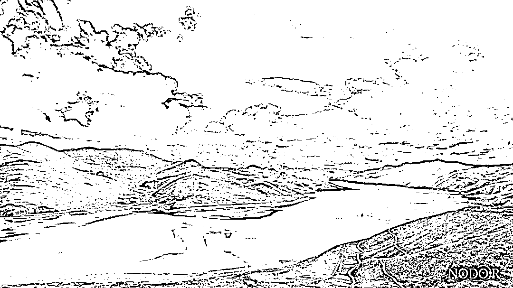

**12 星座一周运势**

**上升*****白羊座***

金牛座的月食发生在你的第二宫，你对理财、经济方面的问题变得更有意识，是否有新的投资计划呢？

要注意债务问题，记得不要刷爆信用卡，如果正在考虑购买保险，不妨尝试一下。

最近的压力可能来自组织、朋友团体、对未来的计划。这些都是很不容易的，也许因为这些，你的价值观发生了新的变化，看问题的角度和以前不一样了，我们需要这样的转变。

*****上升**金牛座***

金牛座月食发生在你的第一宫，这是重要的转变。你对自我和他人的关系有了新的洞见。

是时候找到自己的方向，或者明确一段情感关系，无论是突破还是放下。

工作给你带来了压力，很多事情您有自己的见解和看法，不妨多和他人商讨一下，调整一下思路，也许能够找到突破的途径。

**上升*****双子座***

金牛座月食发生在你的第十二宫，你可能觉得需要有自己的空间，希望独处一下，沉淀心情。最近可能对神秘的事物，玄学、宗教、灵性倍感兴趣，也是具有高度灵感的一周。

天气转凉了，日常起居需要多多注意，养成良好的生活习惯，小心身体。

本周也许会感觉到学业和进修上的压力，不要做长途旅行。

**上升*****巨蟹座***

金牛座的月食发生在你的第十一宫，您更渴望结交新的朋友或者参加集体活动。是否在考虑改变自己的目标和计划呢？

本周也许会有新的恋情发生，或者可以陪伴自己的孩子去开始新的活动。投资计划可能有压力，也许需要做出改变，也许本周暂缓。

如果正好需要，就果断做一次大扫除，断舍离会给您带来好运。

**上升*****狮子座***

金牛座的月食发生在你的第十宫，你会变得更在意大家的看法，特别注意自己的形象。职场上也许会有新的表现机会，但也要重视家庭的需求。关心家里的老人，同时也需要和另一半多多沟通。

也许你重要的人对你有些误解，可能是沟通不畅，记得站在别人的立场上思考一下。

**上升*****处女座***

金牛座的月食发生在你的第九宫，你的世界变得更为辽阔，无论是长途旅行，还是学业进修，你都会有新的计划和想法，对人生的意义是否有了新的思考呢？

最近工作十分忙碌，压力重重，要注意休息，调整情绪，做好日常保养。

**上升*****天秤座***

金牛座的月食发生在你的第八宫，你对自己的觉察是否有了新的洞见？有些方面我们隐藏的太深，不仅他人不了解，我们自己也没有觉察。有时候，我们在做着伤害自己的事情却不自知，比如过分注重别人的想法，害怕冲突而采取隐忍。是时候更深入地了解自己的需求了。

也可能会有新的财产计划，税务，保险，遗产，彩票。

压力有可能出现在恋爱或者亲子关系方面。记得快乐永远是第一位的，不要在任何关系里太过沉重。

**上升*****天蝎座***

金牛座的月食发生在你的第七宫，你对亲密关系和对他人的认同有什么新的想法呢？也许之前的期待和执念并不适合，是时候放下了。如何在自我实现和互动合作取得平衡，既不过度自我，也不依赖他人，是我们需要终生学习的话题。

太阳在你的第一宫，是时候表现自己的风采，本周可以更多地说出看法，改变形象，穿上新衣服，焕然一新。

**上升*****射手座***

金牛座的月食发生在你的第六宫，你的日常生活习惯发生变化了吗？你需要坚持努力工作，不断淬炼工作能力，这些都有赖于好的习惯的养成。

在学习上是否感觉到压力？那么改变学习习惯，规律而坚持，一定会有突破。

交通出行也不断受阻，建议多呆在家里，一动不如一静。

**上升*****摩羯座***

金牛座的月食发生在你的第五宫，大部分摩羯座是内向严肃的，这周你应该有更多创造性的自我表达！去恋爱，去玩耍，让更多的来自朋友和团体的温暖拥抱您！

注意不要大手大脚花钱，量入为出。也要小心感冒发烧。

**上升*****水瓶座***

金牛座的月食发生在你的第四宫，这是非常重要的一个领域，所以这周的满月对你能量强大，你更深地进入内在，去找到自己本来的情感需求，同时在职场和未来生活上也在探索新的变化。

全新的探索带来巨大的压力，和父母聊聊天，关心老人，同时也能得到不少启发。

**上升*****双鱼座***

金牛座的月食发生在你的第三宫，这是沟通表达，学习，兄弟姐妹的领域，在这些方面，是否会遇到新的变化？我们在逐渐成长，学习更好地表达自己以及处理好周边的关系。

新的旅行计划可以开始做起来了。实在出不了远门就在附近和朋友们聚会一下。

**祝大家一周平安顺遂！**

**版权声明**：原创文章由作者授权首发于若道平台发布，欢迎转发，反对抄袭。友号转载请申请白名单。

**END**

****Dora****

若道 2017 届核心课毕业生

若道咨询平台占星师、ISAR 认证占星师

心理咨询师、塔罗咨询师、多年企业管理经验

咨询微信：AstrologerDora

公众号：Dorothy 占星文化

**长按打赏**

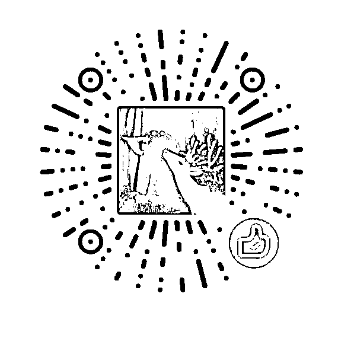

**20 位来自世界各地的占星师****带来 19 场沙龙——新世界的觉醒****详情可点击下图**

**学习占星学****点击下图了解课程详情**

**微信又双叒叕改版啦，不想错过若道君的推送？**
****就把若道设为****星标****以及点点****“在看”****吧！******▼**

**喜欢就点一下“在看”吧！****报名直达入口**

# 雷蒙德·梅里曼金融占星周运 | 本周重要天象：金牛座月食

> 原文：[`mp.weixin.qq.com/s?__biz=MzA5NjA0NTAxNg==&mid=2651493313&idx=2&sn=cb71d3dce7ee8f4ff44ea24d8d48154e&chksm=8b482176bc3fa86012c8f3837cc006e716512b26caa5a1f81b7b56c23f862bb43f3abe7208cd&scene=126&sessionid=1692737730#rd`](http://mp.weixin.qq.com/s?__biz=MzA5NjA0NTAxNg==&mid=2651493313&idx=2&sn=cb71d3dce7ee8f4ff44ea24d8d48154e&chksm=8b482176bc3fa86012c8f3837cc006e716512b26caa5a1f81b7b56c23f862bb43f3abe7208cd&scene=126&sessionid=1692737730#rd)

作者/雷蒙德·梅里曼 译者/Luke 编辑/玫瑰 图片/稿定设计雷蒙德·梅里曼是在金融占星学界稳坐第一把交椅的占星师，同时他也是若道签约的金融占星课老师，我们引进了雷蒙德·梅里曼老师的《[上证指数月度报告](http://mp.weixin.qq.com/s?__biz=MzA5NjA0NTAxNg==&mid=2651491983&idx=2&sn=3e5aef96ac219afb4dd421bfc33b024f&chksm=8b483c38bc3fb52ec2bc36e67f3698ded0e88b4e08ff79785eaa801cbc565e931c8132142632&scene=21#wechat_redirect)》及《[黄金报告](http://mp.weixin.qq.com/s?__biz=MzA5NjA0NTAxNg==&mid=2651491983&idx=2&sn=3e5aef96ac219afb4dd421bfc33b024f&chksm=8b483c38bc3fb52ec2bc36e67f3698ded0e88b4e08ff79785eaa801cbc565e931c8132142632&scene=21#wechat_redirect)》。我们经老师的授权，将每周刊登梅里曼老师的周运，供大家参考和学习。于是，这是本周的周运（11.7-11.11）。

**说明：以下时间采用纽约证券交易所所在地美国东部标准时间。**

**展望与回顾**

****

**雇主增加 26.1 万个非农就业岗位，大于预期，与上个月的 26.3 万持平。失业率从 9 月的 3.5%略微上升至 3.7%。小时工资保持强劲增长，同比增长 4.7%，与 9 月持平。****——《10 月就业报告稳固，美联储与通胀的战斗更加艰难》****www.foxbusiness.com****2022 年 11 月 4 日****“自 1942 年，一共有 20 次中期选举……每次过后，美国股市在接下来 12 月内上涨更高。”****——斯蒂芬·麦克布莱德****《风险对冲报告》 《你应该在周二的大选举前抛售股票吗？》****www.riskhedge.com****2022 年 11 月 3 日**自 10 月 31 日火星改变运行方向以来，我们回到了 5 颗行星逆行的状态。此外，11 月 5 日-11 日，在天蝎座的太阳-金星对分在金牛座的天王星，四分在水瓶座的土星形成的 T 三角已经进入影响力容许度。加上 11 月 8 日的月食正好落在 T 三角影响力时间段的中点，那也是美国中期选举的日期。好消息是，**就金融市场（和地缘政治）而言，地球宇宙学的飓风-海啸季在那之后会结束。**目前而言，金融市场正如地球宇宙学征象所指示的那样剧烈地波动。上周三，道琼斯指数上涨至 33071，是 8 月 26 日以来的最高价位，从三周前的年度低点上涨超过 4400 点。到第二天 11 月 3 日，它下跌至 31727，一天之内波动 1344 点。下一天，它上涨超过 400 点。这不禁使人要问，现在即将发生什么，因为**11 月 5 日-9 日，金星和太阳对分天王星，11 月 11 日还会分别四分土星。**许多全球股票指数出现了类似的模式。也就是说，大多数从 9 月 28 日-10 月 3 日或 10 月 13 日的年度低点，上涨至上周的高点，随后在周四迅速下跌，周五出现反弹。在欧洲，德国 DAX 指数和伦敦富时指数周五的反弹最为显著，飙升至 9 月 13-14 日以来的最高价位。在亚洲和环太平洋地区，日经指数和澳大利亚 ASX 指数出现了相似的模式。两者从 10 月 3 日的低点攀升至 11 月 2 日的新周期高点，随后均遭到抛售直至周四-周五。印度 Nifty 指数也在 11 月 2 日创下新的周期高点，没有遭到大幅抛售，周五进入反弹。11 月 2 日的高点是 1 月 18 日以来的最高价。对于中国股市，则是另一番景象。随着火星逆行，上证综指 10 月 31 日创下相对于 4 月 27 日年度低点的双底，随后快速上涨至周五。恒生指数也在 10 月 31 日下跌至数年新低，然后和上证综指一样，快速上涨至周五。**看起来中国的市场正从长期沉睡中苏醒，这对于全球其他地区的股市来说是个好兆头。**上周贵金属市场令人兴奋不已。黄金在周四下跌至年度新低 1618，但在周五，上涨至 1680 之上，到达三周来的最高价位。白银周四下跌至 18.80，远远高于近期的低点，随后周五飙升至高点 20.96。这符合我们周期研究的预测，认为如果白银价格站稳 21.50 之上，很快会到达 30 美元。比特币和以太坊也显示出新的生命力。两者都上涨至 9 月 13 日以来的最高价。如果它们本周能避免遭到重大的抛售，两者可能都会进入新一轮涨势的初期阶段。

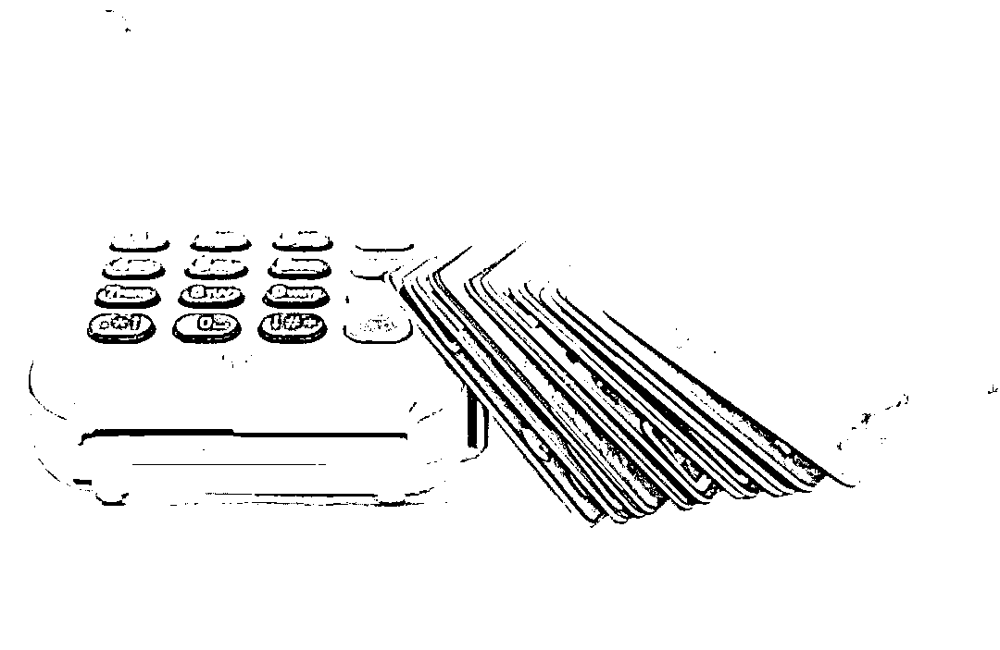

由于木星在 10 月 28 日回归双鱼座，原油价格也在显著上涨，周五飙升至数周新高 92.87。拜登总统计划在油价低位 80 美元时释放战略原油储备，并宣称他将在 70 美元-75 美元的价格回购，这笔交易计划成为可疑之举，涉嫌危害国家安全和出于政治目的使用纳税人的钱用于投机。此举的时机看起来不成功，平抑油价要付出的代价很大，而且即将迎来中期选举。为什么他要在这时当众宣布他的“交易计划”？或者在其他时候，以一种涉及国家安全的方式？**短期宇宙征象与长期考量**

****

**拜登表示，石油行业“没有完成投资美国和支持美国人民的承诺”。他们没有给出公正的回报，他说，他们的“利润如此之高，简直难以置信。我认为这太离谱了。如果他们把这些利润回报给消费者，汽油价格将会下降 50 美分。”**

**——路透社****《拜登呼吁油气公司停止“战争暴力”，威胁施加暴利税》****2022 年 11 月 1 日****萨默斯周二上午在推特上表示，“我不确定（我）是否理解对能源公司征收暴利税的论点。”“如果你降低利益率，你会阻碍投资，这与我们的目标相反。”****——马特·伊根引述拉里·萨默斯的言论****《拉里·萨默斯警告，拜登的暴利税可能适得其反》****www.cnn.com****2022 年 11 月 1 日****拜登降低能源价格的暴利税提案只会适得其反。****——《华尔街日报》编辑****《人人能理解的能源政策》****2022 年 11 月 2 日**我们不是化石燃料钻探和石油公司的忠实粉丝，因为在通货膨胀影响到大部分人口的时候，这些公司都在赚取巨额利润。但是我们关心涉及国家安全的生存危机，因为木星会在 12 月中旬回到白羊座。因此，我们依然需要生产石油和天然气，与此同时继续发展替代和可再生能源市场，就像俄克拉荷马州所做的那样。就这方面而言，上升的能源价格与木星回到双鱼座有关，时间是 2022 年 10 月 28 日-12 月 20 日。**本周，月食发生在金牛座（太阳在天蝎座）。**月食是地球的影子挡住了月亮的视线。地球处于太阳和月亮之间。这让这次满月变得“特殊”，因为满月所象征的对分相被强化了。在占星学研究中，这是一个冲突的时刻，这个时期可以用于提高意识。挑战在于解决过去（情绪，月亮）和未来（生命力，太阳）之间的冲突，无论它是什么。换句话说，除非把过去的情绪议题（有时被称为“业力”）解决掉，你不能一身轻松地进入未来。一旦解决掉，一个巨大的重量就被移除了，在关系中产生了一种轻松感。**由于月食在金牛座，人们渴望安定、稳定、舒适和安全感。**月亮在金牛座擢升。但是**太阳在天蝎座喜欢追求危险和禁忌。**由于月亮在金牛座也合相天王星，这个月亮不太可能通过外交手段和扮演“好人”，获得它所渴求的舒适和安全，因为天王星与中断、不一致、拒绝顺从相关的行星，常常渴望得到关注，即使是通过让人震惊的方式。

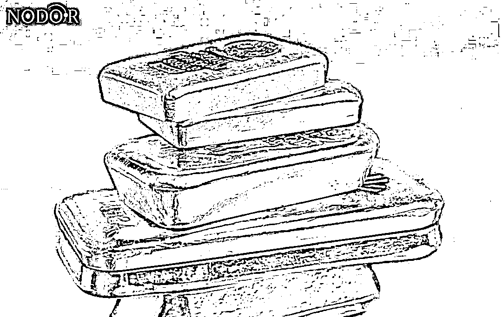

因此，**我们需要为某种“震惊”做好准备，无论是地缘政治、金融领域，还是自然灾害。**此外，月食发挥影响力的时间，看起来是在实际月食的前后 3 周内。尽管能量的高峰，当然是在月食本身发生的时候。**一旦月食结束，天王星就暂时不会带来进一步的“中断”，直到 12 月的最后几天，木星回到白羊座（12 月 20 日），并与天王星形成八分相（12 月 23-24 日）。**最近的一次八分相发生是 9 月 28 日，接近上一次股市暴跌至年度低点的时间。**但是放松下来。第 3 次精准成相通常不像前两次那样有力。**2023 年的未来看起来更轻快，也更稳定，尤其在 5 月中旬以后。我们会在年底发布的《2023 年金融预报》中详述。从 2018 年年末，若道引入金融占星大师雷蒙德·A·梅里曼撰写的梅里曼市场时机学院每年一次的年度预报沙龙和每年一本的《年度预报》以来，**2023 年已经是第 5 个年度了。我们简单回顾了部分 2019-2022 年金融预报的内容，**过去的经验让我们相信，你根据梅里曼老师的指导作为投资参看，你会比一般人有更大的胜算。******长按下图识别二维码****了解更多详情**

**说明：以上日期基于纽约证券交易所所在的美国东部标准时间，由于存在时差，中国地区可能需要加一天。**

**版权声明：**本文由若道翻译发布，欢迎转发，反对抄袭。友号转载请申请白名单。**END**

**雷蒙德·梅里曼（Raymond Merriman）**

若道签约老师。著名金融占星师，ISAR（国际占星研究协会）前主席，梅里曼市场分析公司的总裁。他由于“提升了占星学的职业形象”，在 1995 年国际占星大会上被授予轩辕十四奖；在 2012 年国际占星大会上，被授予轩辕十四终身成就奖。

1“中国上证指数月度报告”发售**若道推出了****中文版****的雷蒙德·梅里曼中国上证指数月度报告，并持续发行该报告！**当把金融市场的周期和占星学的周期相结合时，雷蒙德·梅里曼老师的金融占星学研究**为投资者应对金融市场的周期波动，并随之调整投资策略提供了极大的价值参考**。
**11 月中英文报告已上线！**2“黄金价格周期月度报告”发售**若道推出****中文版****的雷蒙德·梅里曼黄金价格周期月度报告！**不仅仅为广大读者在中国股市的投资出谋划策，更将视角放眼黄金市场。**每当世界经济形式不明朗的时候，有一个地方是保值的港湾，那就是****黄金**。自 1982 年雷蒙德·梅里曼出版第一本研究《地球宇宙学征象与黄金价格的关联》的著作以来，**他一直作为最重要的黄金市场时机预测者之一享誉国际**。2022 年 11 月黄金报告已上线，梅里曼老师将会告诉你他对这个关键时期如何操作的想法。也可以按照季度和一年期订阅，有更多优惠。季度和年度的好处是，你可以持续了解梅里曼老师对于不断在变化的市场的看法。即便他某一次看法和市场不一致，你也看到在下一期他如何调整自己的看法，并看到金融占星在一个长期时间段内对你把控风险的帮助。而能够长期控制风险、尽量找到安全的投资时机才是投资的长久之计。**11 月中英文报告已上线！****购买套餐**，买得越多越优惠中国上证指数月度报告套餐价

*   **单月报告**：280 元
*   **3 个月套餐**：780 元（260 元/月）
*   **12 个月套餐价**：2400 元（200 元/月）

**长按下图识别二维码****购买金融报告****套餐****▼**

黄金周期月度报告优惠

*   **双报告年度套餐更优惠（直降 900 元）**

*   **12 个月黄金报告+12 个月上证指数报告：仅需 3900 元**

**长按下图识别二维码购买黄金报告套餐**▼

3《2023 年金融报告及沙龙》

从 2018 年年末，若道引入金融占星大师雷蒙德·A·梅里曼撰写的梅里曼市场时机学院每年一次的年度预报沙龙和每年一本的《年度预报》以来，**2023 年已经是第 5 个年度了。我们简单回顾了部分 2019-2022 年金融预报的内容，**过去的经验让我们相信，你根据梅里曼老师的指导作为投资参看，你会比一般人有更大的胜算。****

**长按下图识别二维码****了解更多详情**

**购买直达入口**

# 金融报告丨雷蒙德·A·梅里曼 2023 年《年度预报及讲座》来啦！

> 原文：[`mp.weixin.qq.com/s?__biz=MzA5NjA0NTAxNg==&mid=2651493313&idx=3&sn=d1da3bd73d2f5eca693d75c0973263ac&chksm=8b482176bc3fa860ee7c6d6ee10d84a95af857520203708c673233cd837d0b3b6f79ae56eb9f&scene=126&sessionid=1692737730#rd`](http://mp.weixin.qq.com/s?__biz=MzA5NjA0NTAxNg==&mid=2651493313&idx=3&sn=d1da3bd73d2f5eca693d75c0973263ac&chksm=8b482176bc3fa860ee7c6d6ee10d84a95af857520203708c673233cd837d0b3b6f79ae56eb9f&scene=126&sessionid=1692737730#rd)

从 2018 年年末，若道引入金融占星大师雷蒙德·A·梅里曼撰写的梅里曼市场时机学院每年一次的年度预报沙龙和每年一本的《年度预报》以来，**2023 年已经是第 5 个年度了。**

我们简单回归一下梅里曼老师 2019 年-2022 年的《年度预报》中一些预测。

在 2019 年的年度预报中，对于上证指数，梅里曼老师写到：

2018 年末至 2019 年初，中国股市处于三个重要周期低点的时间段。紧随这一低点，将会出现一次非常大的反弹。

2019 年木星会与海王星形成三次四分相，过去，这个相位总是与惊人的强大“泡沫”同时出现，期间股价大幅飙升。

到 2019 年 7 月之前，上证指数有三个重要长周期会出现周期低点，理想上看是在 2019 年 3 月底之前。

上证的周期低点出现在 2019 年 1 月，从那时起，上证迎来了 3 年的上升。

对于黄金，梅里曼老师建议：

从占星学角度来看，木星在射手座，四分在双鱼座的海王星，支撑看涨观点，因为这个组合有增加通胀的潜力。此外，木星在射手座的行星-星座组合从 1983 年起出现过三次，每次都对应到金银市场的年度高点。

无论在 2019 年何时，只要黄金保持在 1167 以上，同时跌到了任一主要周期低点附近，就要寻找买入机会。黄金可能在 2019 年涨到 1500+/- 50，甚至更高。

2019 年黄金从 1284 美元开始上涨，最高点在 1566 美元。

所以，如果你在 2018 年购买了《年度预报》，按照梅里曼老师的建议投资了上证指数和黄金，你会在当年取得相当不错的收益。

**对于 2020 年，在席卷全球、深刻影响了未来的疫情到来之前，梅里曼老师为 2020 年定下基调的：**

站在 2019 年的年尾，我们不知道一场深刻改变未来的风暴马上就将来临。

梅里曼老师，这位杰出的宇宙气象预报员，未卜先知，为 2020 年定下“将军”的基调。

在那一年，我们目睹了美国股市的 4 次熔断和全球经济的重置崩溃。

对于黄金，梅里曼老师是这么说的：

1391.50-1413.70 是价格最强的支撑区域。只要不跌破这个区间，黄金就能够上涨，重新测试 1566.20。如果突破了 1560-1590 的阻力区间，那么黄金就能够重新测试 1920。在那以前，黄金最有可能在 2020 年中在 1390 和 1575 之间波动。

| 黄金周 K 线图

2020 年，黄金在横盘 3 个月突破了 1560-1590 的阻力区间后，一路上涨到 9 月最高点 2089.20 美元。

对于上证指数，梅里曼老师建议：

2020 年的反弹将超过 2019 年的高点 3288。然而，这一涨势可能会通向 5.5 年周期的波峰，随后将再次迎来一波跌势至 2021 年或更晚。

行进中的摩羯座星群——木星、土星和冥王星——表明在 2020 年 11 月底之前会出现一个高点，很可能在 2020 年的前六个月。建议交易者特别注意金星逆行的时期，也就是 5 月 13 日至 6 月 25 日。逆行或顺行一个月内出现的年度高点或低点可能会带来卖出机会。

2020 年，上证指数最高达到 3474，超过了 2019 年的高点 3288。

**站在 2020 年的末尾，对于 2021 年，梅里曼老师说：**

随着 2020 年木星、土星和冥王星形成大合相，我们刚刚结束了一个周期和一个时代。此刻我们正处于一个新的时代和一个新的长周期的早期阶段。事实上，是多个长周期。

对于上证指数，梅里曼老师说：

我们预计涨势将在 2020 年 12 月-2021 年 2 月之间达到波峰，然后急剧下跌至 52 周和 22 个月周期的低点，这些周期将在 2021 年 5 月之前，甚至在 3 月底之前结束。此后可能会出现另一轮反弹，可能会也可能不会在 2021 年 11 月之前形成第一个 33 个月周期的新高。

对于黄金，梅里曼老师说：

黄金的 31.33 个月周期波谷将在 2021 年 9 月之前出现，理想情况是 2020 年 12 月-2021 年 6 月。价格目标是 1628+/-109 或 1768+/-76。重叠范围（理想情况）是 1692-1737。如果价格跌破这些范围，则为看涨情况中令人担忧的状况。

**而在 2022 年的年度预报里，我们看到：**

渐亏四分相不仅对应无法解决的冲突和分歧，土星和天王星形成的任何四分之一周期（合相、四分相和对分相）都可能在社会动荡和某地区现状受到威胁的时期出现。

在 2008-2010 年上一次四分之一周期时（对分相），世界见证了阿拉伯之春。在 1999-2000 年渐盈四分相期间，游行、抗议和直接武力冲突扰乱了西雅图世界贸易组织会议。这也标志着美国经济扩张的结束，以及由互联网泡沫破裂和 2001 年 9 月 11 日对美国世贸中心的恐怖袭击引发的衰退的开始。在此之前是 1988 年的合相，对应的事件是缅甸（Myanmar，当时的国名是 Burma）爆发了一场全国性起义，反抗尽失民心、暴力过度的军政府。数十万公民在全国范围内的暴动中抗议，这成为缅甸历史上的决定性时刻之一。

在每一个案例中，极端主义都占据主导地位，导致暴力冲突，但最终带来了“更大的益处”。它产生了建设性的结果，但在它进行的同时，世界在经历巨大的危机和暴力。”

2021 年 5 月 13 日-7 月 28 日，木星首次行经双鱼座时，这些因素表现得很明显。那时，通货膨胀开始出现，但美联储向所有人保证，这只是暂时的，他们将无限期继续推行“宽松货币”政策。他们并不担心持续的通货膨胀，这是典型的木星在双鱼座的表现，对现实的脱离或错误判断。

这两颗行星以及双鱼座也掌管原油。因此，我们可能会看到油价飙升，以及/或石油泄漏，威胁到大自然。它也可能对应着由于事故而释放的有毒气体，威胁到那些暴露其中的人的生命。

对于黄金，梅里曼老师建议：

只要黄金保持在 1670-1680 之上，仍然有极小的机会出现一轮爆炸性上涨，测试当前的历史高点（2089），甚至创下历史新高。毕竟，木星将在双鱼座合相海王星，可能预示着另一轮“投机狂热”。然而，这也可能是一个“恐慌”的征象，届时某些市场可能会崩溃。

在 1900-1980 之间存在较大的阻力，如果不能突破这个阻力，将表明黄金的熊市已经开始，新一轮的猛烈下跌可能正在准备中。只要跌破 1670 则将确认黄金 20 年的牛市结束了。

| 黄金周 K 线图

对于上证，梅里曼老师说：

我们预期在 2022 年 5 月前，上证综指会出现急剧的下跌，进入 52 周周期和可能的 33.5 个月周期低点。

我们更倾向于认为，上证综指会首先下跌，在 5 月前形成一个低点，然后上涨。这一轮上涨的幅度，将告诉我们上证综指是处在牛市，还是进入了新的熊市。如果它不能上涨超过 3750，长周期波峰可能已经出现，并且进入了新的熊市。

我们简单回顾了部分 2019-2022 年金融预报的内容，**过去的经验让我们相信，你根据梅里曼老师的指导作为投资参看，你会比一般人有更大的胜算。**

**2023 年度预报及沙龙预售**

**2023 年金融预报沙龙时间为 2023 年 1 月 7 日 10：00-13：00。**

一份价格仅千元的顶尖金融占星大师的投资分析报告和沙龙，聪明的投资者值得拥有。

**2023 年年度预报****及沙龙价格：****1380 元**

**双 11 优惠价格：****1280 元**

**长按下图识别二维码**

**购买报告及沙龙**

**购买者重要须知****①** 梅里曼市场时机学院每年一次的年度预报沙龙和《年度预报》是梅里曼市场时机学院的研究“预报”，而不是市场“预测”，是梅里曼老师及其金融占星分析师对人类活动周期历史与行星周期之间相关性的研究，二者在大部分情况下具有 80%或更高的相关性，而不是因果关系。沙龙中和报告中的研究完全存在错误的可能性。即便是非常认真的研究和几十年的研究经验，我们无法总是正确地解读出各种征象在实际层面上会如何相互作用，并显化为事件结果。

所以请将次沙龙和报告看作一个研究参考，务必结合其他市场研究和你个人对市场的理解，根据你的自由意志做决策。

**②** 此报告一旦售出，**即不接受退款。**

**③** 此报告仅支持在手机网页阅读，不支持电脑阅读和下载。**④** 讲座提供视频回放。**以上须知，请仔细阅读。一旦付款，即视为已了解并接受所有须知内容。**

**如在购买报告中遇见任何问题**

**可添加客服**

▼

**购买报告直达入口**

# ISAR 第一届附属学校会议丨你们万众期待的占星师简介来啦！

> 原文：[`mp.weixin.qq.com/s?__biz=MzA5NjA0NTAxNg==&mid=2651493304&idx=1&sn=8bee3729c6a7199dcb5279b5ed701541&chksm=8b48210fbc3fa8193838bcbd083251412c6ad758f6ec205d9d9957acbbc62907d2a1e528d71b&scene=126&sessionid=1692737730#rd`](http://mp.weixin.qq.com/s?__biz=MzA5NjA0NTAxNg==&mid=2651493304&idx=1&sn=8bee3729c6a7199dcb5279b5ed701541&chksm=8b48210fbc3fa8193838bcbd083251412c6ad758f6ec205d9d9957acbbc62907d2a1e528d71b&scene=126&sessionid=1692737730#rd)

**2022 年 11 月 19-20 日，ISAR 将举办第一届附属学校会议。**

来自中国、美国、意大利、挪威、土耳其、智利、塞尔维亚的非常棒的占星学校中的**10****位占星老师是这次会议的****主要讲演者**。你不仅可以听他们讲课，而且可以就自己感兴趣的问题直接向他们提问，听听他们的回答！**不同国家的老师组成将会带给你一个全球化的视野和多样性的视角。**

**会议的安排如下：**

**11 月 19 日（北京时间 11 月 20 日）**

 **11 月 20 日（北京时间 11 月 21 日）**

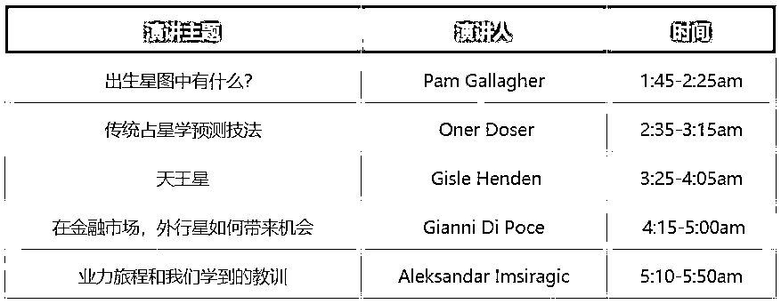

**以上每个演讲为****40****分钟。**

**除了这两天的演讲外，还有****9 场****工作坊，每个工作坊时间为****3 小时****。**

**11 月 26 日（北京时间 11 月 27 日）**

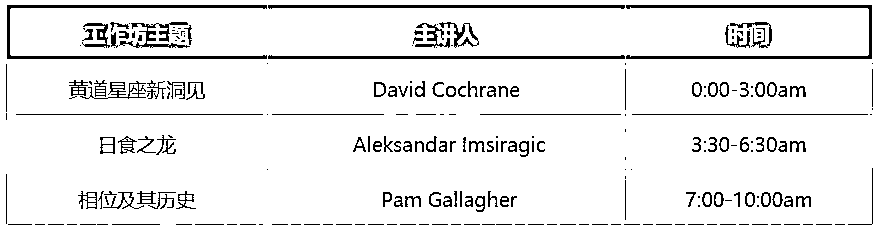

 **11 月 27 日（北京时间 11 月 28 日）**

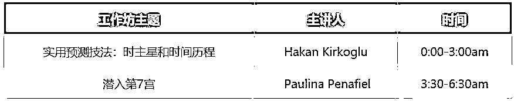

 **12 月 3 日（北京时间 12 月 4 日）**

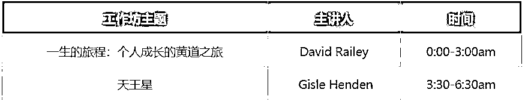

**12 月 4 日（北京时间 12 月 5 日）**

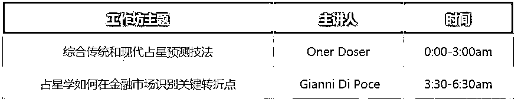

**演讲者简介**

**大卫·瑞雷 David Railey**

**I****SAR 董事会成员，ISAR 全球副主席，ISAR 全球职业占星师资质认证主席，若道占星创始人**。2016-2019 年，被选为国际占星协会（ISAR）考试委员会成员，国际占星协会（ISAR）是世界最大的国际占星机构，会员遍布 47 个国家。2017-2020 年，被选为国际占星联盟（ISAR）考试委员会主席，理事会成员。

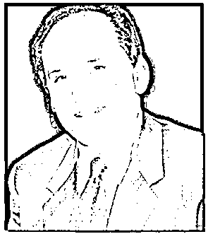

**大卫·科克伦 David Cochrane**

大卫·科克伦和他的妻子菲科·科克伦是“宇宙模式”软件（Cosmic Pattern）的创始人，他所开发的占星软件开普勒（Kepler） 和天狼星（Sirus） 深受职业占星师喜爱。获得 2018 年轩辕十四“发现、创新和研究”大奖。（“轩辕十四奖”是占星学界的世界顶级大奖，表彰全世界对占星学有杰出贡献的人。）曾任 ISAR 主席，目前是 ISAR 的研究部主任，还是 Avalon 占星学院的讲师。拥有佛罗里达大学的研究和评估方法硕士学位。他在 YouTube 上制作了 300 多段有关占星学的视频，还写了两本书。

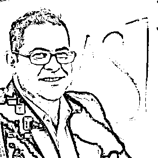

**哈坎·基尔科格鲁 Hakan Kirkoglu**

作为顾问、教师和作家，基尔科格鲁是土耳其占星学的领军人物。自 1999 年以来，他在土耳其敦促专业占星学咨询的发展，并在土耳其开创了占星学教育体系。他在 1991 年著作第一本土耳其心理学占星学书籍。他是 1997 年占星学研究学院的获奖者，获得了科迪莉亚·曼萨尔·真理奖。他经常做讲座，组织研讨会及占星学活动。他是 ISAR 土耳其区主席，他的文章发表在英语、意大利语、法语、波兰语和希腊语期刊上。

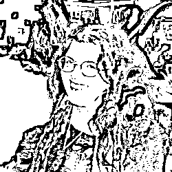

**农齐亚·科波拉 Nunzia Coppola**

ISAR 意大利区主席，格式塔流派心理咨询师，贾亚维迪亚（Jayavidya）文化协会主席。她在印度生活 15 年，曾在罗马萨皮恩扎大学教授社会宗教学课程。她曾获得全球杰出占星家奖、2016 年女性占星学家奖和占星学荣誉博士(加尔各答印度东方遗产研究所)。她是多个协会的活跃成员，发表过许多文章及出版过多本书籍。她最近的一本著作是《月亮和她的女神：一条业力占星学之路》。

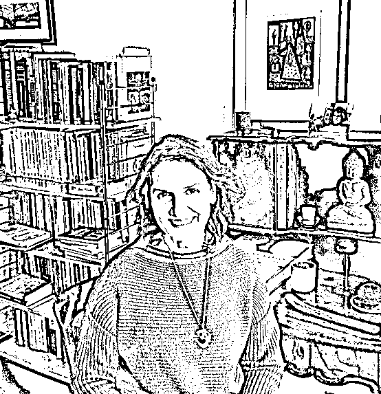

**宝琳娜·佩纳菲尔 Paulina Penafiel**

ISAR 智利区主席，智利天主教大学荣格心理学文凭，花卉疗愈师。自 1985 年以来，致力于占星学研究，教授占星学课程及私人咨询。

**帕姆·加拉格尔 Pam Gallagher**

她精通多种占星学技法，擅长于关系咨询、预测及个人成长。

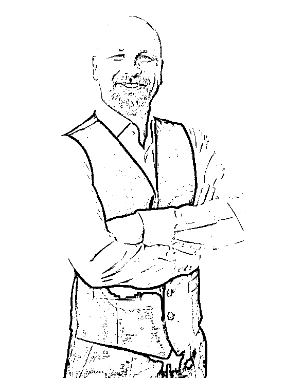

****Oner Doser****

Oner Doser 有中世纪占星学文凭，是国际占星研究学会（ISAR）和职业占星师组织（OPA）认证的占星师，OPA 土耳其代表，国际专业占星协会（APAI）和 ISAR 成员。他是一位占星学顾问、培训师、研究员和作家。共出版 14 本书籍。是占星学院、占星学电视节目的创始人。迄今为止，已培养 2500 多名学生。他创立的占星学院于 2016 年加入 ISAR 批准的占星学校。

**吉斯尔·亨登 Gisle Henden**

于 2002 年创立了占星学校 Herkules。于 1988 年开始学习占星学，在挪威占星学会董事会任职九年。在福克大学担任占星学教学七年。曾在 BI 和 NIH 教授战略管理多年，并担任多家私营和上市公司的顾问。

**吉安尼·迪·波塞 Gianni Di Poce**

吉安尼·迪·波塞（Gianni Di Poce）是梅里曼市场时机学院的项目主管。他也是梅里曼市场学院的市场分析师，负责分析一系列不同的市场。吉安尼撰写美国中期国债、澳大利亚市场（指数和外汇）的梅里曼市场时机学院月度周期报告，也负责撰写大麻和活牛的国际周期报告。吉安尼是梅里曼市场时机学院原油报告的编辑，为订阅者提供每日、每周和月度报告。

吉安尼于 2019 年加入梅里曼市场时机学院团队，但他从 2016 年开始就一直在使用梅里曼市场时机学院的方法分析市场。他拥有经济学学士学位，并有 5 年的财务顾问工作经验。

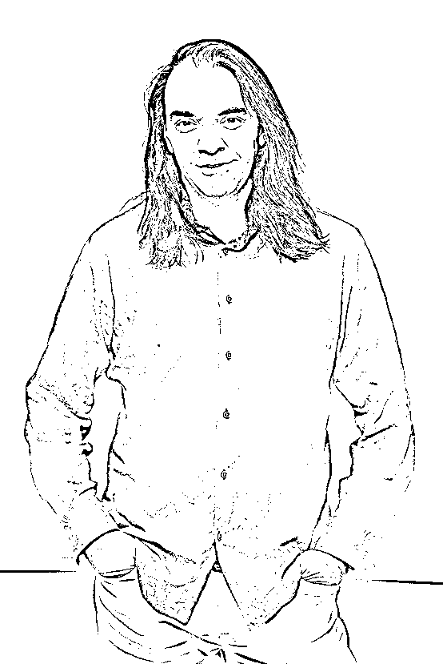

**亚历山大·因舍阿吉克******Aleksandar Imsiragic**** 亚历山大·因舍阿吉克是国际占星研究协会（ISAR）的主席和 ISAR 教育总监。他还是位于塞尔维亚贝尔格莱德的约翰尼斯·开普勒占星学院的创办人。他从 1988 年起开始实践占星学，教授冥想。他著有 14 本占星学书籍，自 2001 年起在贝尔格莱德组织年度国际占星学大会。他的工作基于对东西方知识传统的整合，对恒星、业力占星学和占星疗愈领域情有独钟。**如何参与****如果你是在线参会，你也能在 Zoom 聊天区中分享你的的想法和感受。**所有演讲和工作坊**都有录音**，如果你无法在线参加，可以听录音。当然，**以上全部为英文讲座。**所以，你需要有较好的英文听力水平。

**价格：**

*   **你可以购买 19-20 日的单天的会议，也可以购买单个的工作坊。**

*   **2 天会议：ISAR 会员 $80 ；非会员$100**

*   **1 天会议: ISAR 会员 $50 ；非会员 $70**

*   **单个工作坊：ISAR 会员 $55 ；非会员 $95**

**报名链接：**https://isarastrology.org/isar-affiliated-schools-conference-cosmic-connections/

除此之外，如果你在**11 月 11 日**前购买，还将获得特别的礼物！

*   **购买 2 天会议，**会赠与 2 个 ISAR Intensives ！

*   **购买 1 个工作坊，**$55，并赠与 2022 年 8 月在丹佛举办的 ISAR 大会的 1 个工作坊！

*   **购买 3 个工作坊，**$140，并赠与 2022 年 8 月在丹佛举办的 ISAR 大会的 2 个工作坊！

*   **购买 6 个工作坊，**$260，并赠与 2022 年 8 月在丹佛举办的 ISAR 大会的 3 个工作坊！

*   **购买 9 个工作坊，**$370，并赠与 2022 年 8 月在丹佛举办的 ISAR 大会的 5 个工作坊！

**如果你对于这个会议有任何问题，均可直接发邮件 info@IsarAstrology.com 询问。****报名直达入口**

# 金融报告丨雷蒙德·A·梅里曼 2023 年《年度预报及讲座》来啦！

> 原文：[`mp.weixin.qq.com/s?__biz=MzA5NjA0NTAxNg==&mid=2651493304&idx=2&sn=520817d610a2146435dc147feb86defe&chksm=8b48210fbc3fa81983db37bcaed2562d3fc36ec62ee77fa4af7e4531def4c7e4a52c2a239f7f&scene=126&sessionid=1692737730#rd`](http://mp.weixin.qq.com/s?__biz=MzA5NjA0NTAxNg==&mid=2651493304&idx=2&sn=520817d610a2146435dc147feb86defe&chksm=8b48210fbc3fa81983db37bcaed2562d3fc36ec62ee77fa4af7e4531def4c7e4a52c2a239f7f&scene=126&sessionid=1692737730#rd)

从 2018 年年末，若道引入金融占星大师雷蒙德·A·梅里曼撰写的梅里曼市场时机学院每年一次的年度预报沙龙和每年一本的《年度预报》以来，**2023 年已经是第 5 个年度了。**

我们简单回归一下梅里曼老师 2019 年-2022 年的《年度预报》中一些预测。

在 2019 年的年度预报中，对于上证指数，梅里曼老师写到：

2018 年末至 2019 年初，中国股市处于三个重要周期低点的时间段。紧随这一低点，将会出现一次非常大的反弹。

2019 年木星会与海王星形成三次四分相，过去，这个相位总是与惊人的强大“泡沫”同时出现，期间股价大幅飙升。

到 2019 年 7 月之前，上证指数有三个重要长周期会出现周期低点，理想上看是在 2019 年 3 月底之前。

上证的周期低点出现在 2019 年 1 月，从那时起，上证迎来了 3 年的上升。

对于黄金，梅里曼老师建议：

从占星学角度来看，木星在射手座，四分在双鱼座的海王星，支撑看涨观点，因为这个组合有增加通胀的潜力。此外，木星在射手座的行星-星座组合从 1983 年起出现过三次，每次都对应到金银市场的年度高点。

无论在 2019 年何时，只要黄金保持在 1167 以上，同时跌到了任一主要周期低点附近，就要寻找买入机会。黄金可能在 2019 年涨到 1500+/- 50，甚至更高。

2019 年黄金从 1284 美元开始上涨，最高点在 1566 美元。

所以，如果你在 2018 年购买了《年度预报》，按照梅里曼老师的建议投资了上证指数和黄金，你会在当年取得相当不错的收益。

**对于 2020 年，在席卷全球、深刻影响了未来的疫情到来之前，梅里曼老师为 2020 年定下基调的：**

站在 2019 年的年尾，我们不知道一场深刻改变未来的风暴马上就将来临。

梅里曼老师，这位杰出的宇宙气象预报员，未卜先知，为 2020 年定下“将军”的基调。

在那一年，我们目睹了美国股市的 4 次熔断和全球经济的重置崩溃。

对于黄金，梅里曼老师是这么说的：

1391.50-1413.70 是价格最强的支撑区域。只要不跌破这个区间，黄金就能够上涨，重新测试 1566.20。如果突破了 1560-1590 的阻力区间，那么黄金就能够重新测试 1920。在那以前，黄金最有可能在 2020 年中在 1390 和 1575 之间波动。

| 黄金周 K 线图

2020 年，黄金在横盘 3 个月突破了 1560-1590 的阻力区间后，一路上涨到 9 月最高点 2089.20 美元。

对于上证指数，梅里曼老师建议：

2020 年的反弹将超过 2019 年的高点 3288。然而，这一涨势可能会通向 5.5 年周期的波峰，随后将再次迎来一波跌势至 2021 年或更晚。

行进中的摩羯座星群——木星、土星和冥王星——表明在 2020 年 11 月底之前会出现一个高点，很可能在 2020 年的前六个月。建议交易者特别注意金星逆行的时期，也就是 5 月 13 日至 6 月 25 日。逆行或顺行一个月内出现的年度高点或低点可能会带来卖出机会。

2020 年，上证指数最高达到 3474，超过了 2019 年的高点 3288。

**站在 2020 年的末尾，对于 2021 年，梅里曼老师说：**

随着 2020 年木星、土星和冥王星形成大合相，我们刚刚结束了一个周期和一个时代。此刻我们正处于一个新的时代和一个新的长周期的早期阶段。事实上，是多个长周期。

对于上证指数，梅里曼老师说：

我们预计涨势将在 2020 年 12 月-2021 年 2 月之间达到波峰，然后急剧下跌至 52 周和 22 个月周期的低点，这些周期将在 2021 年 5 月之前，甚至在 3 月底之前结束。此后可能会出现另一轮反弹，可能会也可能不会在 2021 年 11 月之前形成第一个 33 个月周期的新高。

对于黄金，梅里曼老师说：

黄金的 31.33 个月周期波谷将在 2021 年 9 月之前出现，理想情况是 2020 年 12 月-2021 年 6 月。价格目标是 1628+/-109 或 1768+/-76。重叠范围（理想情况）是 1692-1737。如果价格跌破这些范围，则为看涨情况中令人担忧的状况。

**而在 2022 年的年度预报里，我们看到：**

渐亏四分相不仅对应无法解决的冲突和分歧，土星和天王星形成的任何四分之一周期（合相、四分相和对分相）都可能在社会动荡和某地区现状受到威胁的时期出现。

在 2008-2010 年上一次四分之一周期时（对分相），世界见证了阿拉伯之春。在 1999-2000 年渐盈四分相期间，游行、抗议和直接武力冲突扰乱了西雅图世界贸易组织会议。这也标志着美国经济扩张的结束，以及由互联网泡沫破裂和 2001 年 9 月 11 日对美国世贸中心的恐怖袭击引发的衰退的开始。在此之前是 1988 年的合相，对应的事件是缅甸（Myanmar，当时的国名是 Burma）爆发了一场全国性起义，反抗尽失民心、暴力过度的军政府。数十万公民在全国范围内的暴动中抗议，这成为缅甸历史上的决定性时刻之一。

在每一个案例中，极端主义都占据主导地位，导致暴力冲突，但最终带来了“更大的益处”。它产生了建设性的结果，但在它进行的同时，世界在经历巨大的危机和暴力。”

2021 年 5 月 13 日-7 月 28 日，木星首次行经双鱼座时，这些因素表现得很明显。那时，通货膨胀开始出现，但美联储向所有人保证，这只是暂时的，他们将无限期继续推行“宽松货币”政策。他们并不担心持续的通货膨胀，这是典型的木星在双鱼座的表现，对现实的脱离或错误判断。

这两颗行星以及双鱼座也掌管原油。因此，我们可能会看到油价飙升，以及/或石油泄漏，威胁到大自然。它也可能对应着由于事故而释放的有毒气体，威胁到那些暴露其中的人的生命。

对于黄金，梅里曼老师建议：

只要黄金保持在 1670-1680 之上，仍然有极小的机会出现一轮爆炸性上涨，测试当前的历史高点（2089），甚至创下历史新高。毕竟，木星将在双鱼座合相海王星，可能预示着另一轮“投机狂热”。然而，这也可能是一个“恐慌”的征象，届时某些市场可能会崩溃。

在 1900-1980 之间存在较大的阻力，如果不能突破这个阻力，将表明黄金的熊市已经开始，新一轮的猛烈下跌可能正在准备中。只要跌破 1670 则将确认黄金 20 年的牛市结束了。

| 黄金周 K 线图

对于上证，梅里曼老师说：

我们预期在 2022 年 5 月前，上证综指会出现急剧的下跌，进入 52 周周期和可能的 33.5 个月周期低点。

我们更倾向于认为，上证综指会首先下跌，在 5 月前形成一个低点，然后上涨。这一轮上涨的幅度，将告诉我们上证综指是处在牛市，还是进入了新的熊市。如果它不能上涨超过 3750，长周期波峰可能已经出现，并且进入了新的熊市。

我们简单回顾了部分 2019-2022 年金融预报的内容，**过去的经验让我们相信，你根据梅里曼老师的指导作为投资参看，你会比一般人有更大的胜算。**

**2023 年度预报及沙龙预售**

**2023 年金融预报沙龙时间为 2023 年 1 月 7 日 10：00-13：00。**

一份价格仅千元的顶尖金融占星大师的投资分析报告和沙龙，聪明的投资者值得拥有。

**2023 年年度预报****及沙龙价格：****1380 元**

**前 60 名早鸟价（仅余少量名额）：****1180 元**

**长按下图识别二维码**

**购买报告及沙龙**

**购买者重要须知****①** 梅里曼市场时机学院每年一次的年度预报沙龙和《年度预报》是梅里曼市场时机学院的研究“预报”，而不是市场“预测”，是梅里曼老师及其金融占星分析师对人类活动周期历史与行星周期之间相关性的研究，二者在大部分情况下具有 80%或更高的相关性，而不是因果关系。沙龙中和报告中的研究完全存在错误的可能性。即便是非常认真的研究和几十年的研究经验，我们无法总是正确地解读出各种征象在实际层面上会如何相互作用，并显化为事件结果。

所以请将次沙龙和报告看作一个研究参考，务必结合其他市场研究和你个人对市场的理解，根据你的自由意志做决策。

**②** 此报告一旦售出，**即不接受退款。**

**③** 此报告仅支持在手机网页阅读，不支持电脑阅读和下载。**④** 讲座提供视频回放。**以上须知，请仔细阅读。一旦付款，即视为已了解并接受所有须知内容。**

**如在购买报告中遇见任何问题**

**可添加客服**

▼

**购买报告直达入口**

# 12 星座自画像丨这组星座的世界，“情感和成功”是永恒主题

> 原文：[`mp.weixin.qq.com/s?__biz=MzA5NjA0NTAxNg==&mid=2651493153&idx=3&sn=86f2972bf94a65ae3a7194e21b19b883&chksm=8b482196bc3fa880f7a553c7b550bf8967718baefd8035d15dfecf7fb776199d715261b2c07e&scene=126&sessionid=1692737730#rd`](http://mp.weixin.qq.com/s?__biz=MzA5NjA0NTAxNg==&mid=2651493153&idx=3&sn=86f2972bf94a65ae3a7194e21b19b883&chksm=8b482196bc3fa880f7a553c7b550bf8967718baefd8035d15dfecf7fb776199d715261b2c07e&scene=126&sessionid=1692737730#rd)

作者/克里斯蒂娜·罗登贝克

译者/亚麻林恩 校对/江艺

编辑/翀子 文章图片及注释/作者提供

本系列是克里斯蒂·罗登贝克老师撰写的艺术中的 12 星座自画像，角度独特，语句生动。此文是巨蟹座与摩羯座的自画像，这两个星座的画家如何呈现自己样子呢？如果你对星座和占星学感兴趣，大卫老师参与授课的【[ISAR 认证职业占星师文凭课程](http://mp.weixin.qq.com/s?__biz=MjM5MjQwNjAyMQ==&mid=2649440454&idx=7&sn=cfd291e95d41bdb4d4b796738c49ad8e&chksm=beb92fac89cea6baf988995a139774ad3140beb7a02ee7e54f110fa44612d1ee009a1a8b54fb&scene=21#wechat_redirect)】正在进行中，欢迎点击链接了解更多详情哦~**巨蟹座的自画像**我不会像无名小卒一样画画。你说的是一种方式，但我要用不同的方式来说。你可以画骡子，狗，猫，或者人，我要用不一样的方式画它。因为你总是看到不同的东西。——内莉·梅·罗，巨蟹座艺术家

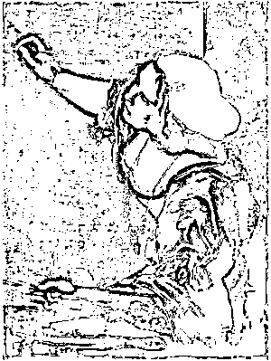

| 阿特米谢·简特内斯基，1593 年 7 月 8 日。太棒了。再看看画中她手臂的形状。

巨蟹座的艺术家似乎比其他艺术家更痴迷于自画像。当你向下滚动页面时，你就会明白我的意思。

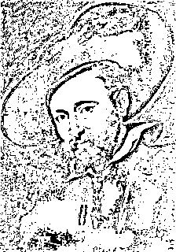

| 鲁本斯，生于 1577 年 6 月 28 日

在现存的作品中，**海琳·施杰夫贝克、弗里达·卡洛、伦勃朗和大卫·霍克尼**一直都是超级多产的自画像画家，这意味着有更多的自画像可供选择。有趣的是，卡洛在她的所有肖像中看起来几乎一样——它们就像是她自己的偶像——而在伦勃朗的肖像中，你可以追溯到他的年龄，从面带稚气的小伙子到饱经沧桑的老人。霍克尼的画是一个持续性的实验，用以观察和表现他所看到的东西的方式。而施杰夫贝克的肖像画则随着年龄的增长，变得越来越抽象、脱节、感性。

| 伦勃朗，生于 1606 年 7 月 15 日

我喜欢自画像的部分是凝视。我认为有些画家，与别人相比，能将他们眼中的灵魂表现得更为生动。我特别想到**霍珀、伦勃朗、科尔维茨、德加和夏加尔**，他们的目光都那么的清澈有力。但相对的，**罗、怀斯和莫蒂里安尼**却在躲避。当然，怀斯和莫蒂里安尼以裸女画而闻名。

| 埃德加·德加，生于 1834 年 7 月 19 日。真是个色彩大师！

做这个练习，让我能以全新的眼光看待某些艺术家。我立刻就注意到有几位（被广泛熟知的）伟大的**色彩大师**都是太阳落巨蟹座——**鲁本斯、德加、霍克尼****。**这让我再次想起**弗里达·卡洛**对色彩的运用，现在我又看了一遍，真是棒极了。至于内莉·梅·罗！可以看看她的其他作品，但你可以从这幅自画像中看到强烈的靛蓝色。所以我问自己，**太阳在巨蟹座意味着什么？**这是黄道带的第四个星座，所以我们仍处于**关于自我的这一象限中**。仍旧是**“全都关于我”**。当然，作为一个水象星座，它是关于**我的情感**。它也是一个**基本星座**。基本星座是实干家。我的情感需要被表达。一个太阳巨蟹座最有可能问的问题是**“我感觉如何？”**从伦勃朗的每幅自画像中，你几乎都可以看到他在问自己这个问题。弗里达·卡洛的作品完全是对她自己和她撕裂的情感世界的探索。她对当代艺术家**特雷西·埃敏**有很大的影响，她的情感世界今年夏天会在伦敦的海沃德画廊全面展出。两个女人都对自己的身体特别着迷，这看起来很粗俗，但事实上她们的艺术是她们破碎情感的流露。但情绪并不总是需要尖叫。**科尔维茨**显然也在她的作品中探索情感——比如孤独。**夏加尔**的全部作品（几乎）都专注于**一种特别的巨蟹式情感——怀旧。**

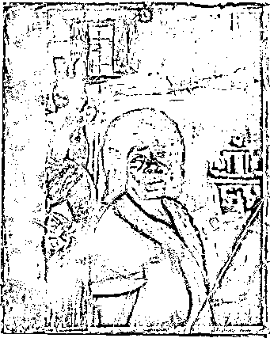

| 内莉·梅·罗，生于 1900 年 7 月 4 日，有点像…融入她的蟹壳…

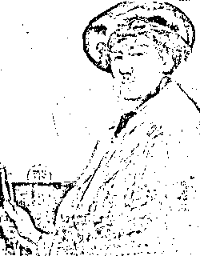

| 詹姆斯·麦克尼尔·惠斯勒，也是 1834 年 7 月 19 日。你越看，越觉得这幅画奇怪

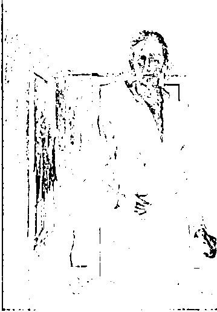

| 安德鲁·怀斯，1917 年 7 月 12 日。也是越看越觉得奇怪。像罗和惠斯勒一样，他与背景融为一体

| 爱德华·霍珀 1882 年 7 月 22 日。柔和的面容，深情的眼神

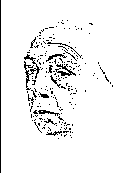

| 珂勒·惠支, 1867 年 7 月 8 日

| 洛顿·伦奎斯特, 1864 年 7 月 1 日

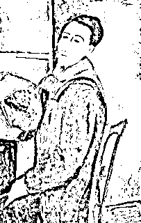

| 莫蒂里安尼, 1884 年 7 月 12 日

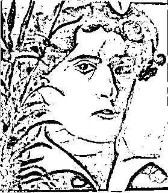

| 马克·夏加尔 (沉思，深情) 1887 年 7 月 6 日

| 海琳·施杰夫贝克，1862 年 7 月 10 日。循着她的职业生涯，她的自画像变得越来越抽象。都值得一看。

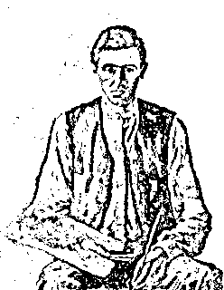

| 乔治·莫兰迪《瓶子在哪里？》，1890 年 7 月 20 日

| 弗里达·卡洛，1890 年 7 月 6 日。显然她的月亮是 29 度，有点儿金牛座，但我很怀疑…

| 安娜·瑞金·布里克，1908 年 6 月 23 日

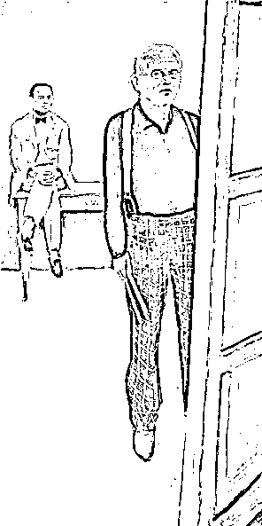

| 大卫·霍克尼，1937 年 7 月 7 日

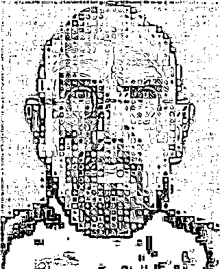

| 查克·克洛斯，一张由数千张小照片组成的脸，2000 年(1940 年 7 月 5 日)

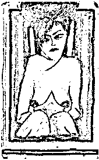

| 特雷西·埃敏，1963 年 7 月 3 日

**摩羯座的自画像**在他有生之年，他是当时**最富有、最受追捧的画家**之一，**创造了罗马享乐和仙境奢华的巨大幻想。**他的魅力在于他画的人物看起来如此真实，然而他们置身于不真实的环境中。

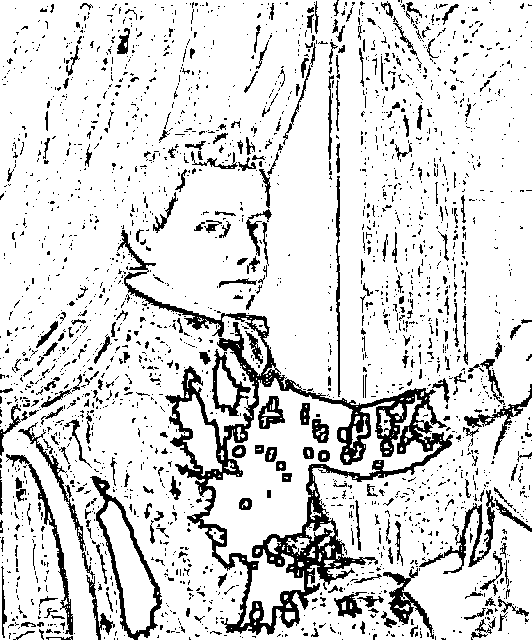

| 劳伦斯·阿尔玛·塔德马（1 月 8 日）16 岁时画了这幅自画像。

劳伦斯·阿尔玛·塔德马去世后，他的作品不再流行，但也许令上个世纪的评论家和鉴赏家感到惊讶的是，他的作品持续保持着对大众投资者的吸引力。他拥有你对摩羯座所期望的一切：**早熟的天赋、扎实的技能、崇高的地位，再看看那眼神，稳如磐石。**

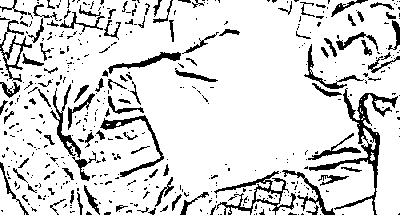

| 无标题#96.1981

很奇怪的，这让我想起了她，因为她把目光从相机上移开了，但她有着**同样的坚定**。摄影师辛迪·谢尔曼也以将当代人（她自己）置于古董或复古环境中而闻名。这里，她穿着 50 年代的着装，作为她的一幅“概念”自画像。这张照片近来成为了有史以来卖得最贵的照片。作为一个摩羯座，这是多么令人满意啊。和阿尔玛·塔德马一样，谢尔曼在 20 多岁的时候就获得了**认可和尊重**。当然，摩羯座的人往往在很小的时候就能取得成功。也和他一样，她的很多工作都是关于**换装**。

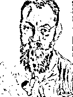

| 马蒂斯（12 月 31 日），用那些泥土的色彩搭配基本的土象星座怎么样。

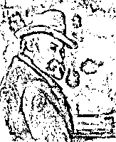

| 保罗·塞尚（1 月 19 日）

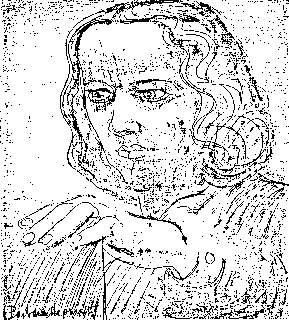

| 赫普沃斯（1 月 10 日）

这位是**保罗·塞尚**，虽与阿尔玛·塔德马同时代，但生前却不为公众所接受，事实上相当受鄙视。但他坚持不懈，另一个优秀的摩羯座品质，对抗所有的批评和普遍意义上的成功的缺失。事实上，他有句名言说他想在绘画中死去。
他还说：**“艺术家使事物具体化，赋予它们个性。”**在我们对泥土的色彩感到舒服的时候，来看看**亨利·马蒂斯**和他的野兽派自画像。我喜欢他在这张画中让色彩相互交流的方式——让每个颜色都有自己的完整性。**土星守护的艺术家们除了激烈的坚实之外**，还有一个元素，就是**雕塑**。20 世纪最重要的两位雕塑家芭芭拉·赫普沃斯和路易丝·布尔盖奥斯都出生于摩羯座月份。赫普沃斯紧抓着一块石头，布尔盖奥斯的头显然在鸡蛋里。

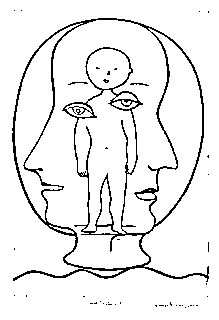

| 路易丝·布尔盖奥斯（12 月 25 日）

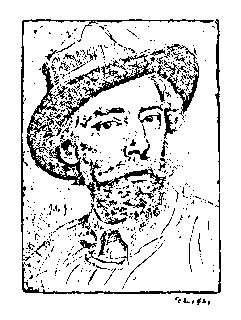

| 奥古斯都·约翰（1 月 4 日）

****版权声明：**本文由若道翻译发布，欢迎转发，反对抄袭。友号转载请申请白名单。**

**END**

**克里斯蒂娜·罗登贝克**

克里斯蒂娜·罗登贝克，若道签约老师。全职职业占星师，从业 20 余年，在其网站长期撰写时事、艺术和文化的文章；定期在英国授课，并保持蓬勃发展的专业实践。

**拥有****51 年****占星实践经验的****若道创始人****前 ISAR 全球副主席****前 ISAR 全球职业占星师资质认证主席****大卫·瑞雷**

**和**

**2019 年第二届、2021 年第三届核心课中**

**与苏·汤普金斯老师****联合授课****的**

**ISAR 认证职业占星师**

**咔咔（Caroline）**

**二人合力打造**

**2022 年 ****若道全新核心占星课程**

**点击下图了解更多课程详情** 

**

**微信又双叒叕改版啦，不想错过若道君的推送？**
****就把若道设为****星标****以及点点****“在看”****吧！******▼**

**喜欢就点一下“在看”吧！****报名直达入口**

# 插班中丨 ISAR 认证职业占星师文凭课程：开启“爱好变职业”的创收自由之路

> 原文：[`mp.weixin.qq.com/s?__biz=MzA5NjA0NTAxNg==&mid=2651493153&idx=4&sn=7ab3e8bea3255b9bd58f1ba899727cff&chksm=8b482196bc3fa8805dc8ac70f2b85045bcaca388d6568c152a33b8eee2663fb59fd6efac9f6e&scene=126&sessionid=1692737730#rd`](http://mp.weixin.qq.com/s?__biz=MzA5NjA0NTAxNg==&mid=2651493153&idx=4&sn=7ab3e8bea3255b9bd58f1ba899727cff&chksm=8b482196bc3fa8805dc8ac70f2b85045bcaca388d6568c152a33b8eee2663fb59fd6efac9f6e&scene=126&sessionid=1692737730#rd)

**2022 年，是世界和中国 40 年未有之大变局的开始。**

俄乌战争打破了欧洲大陆乃至全世界的和平局面，而新冠疫情也给中国经济带来前所未有之挑战。

如果你关心经济形势和世界局势，你会有这种的感觉，我们将面临一场深刻的危机，而这不是短期内可以结束的。

**占星学的看法也是如此。**

4 月青年失业率（16 岁到 24 岁）中国达 18.2%，一些背着房贷、教育、医疗负担的中年人突然失业更是整个家庭整个难以承受之重。为了更好准备面对这样的时代变化，连《北京日报》这样的官方媒体也在呼吁：**“开拓副业，让自己有多元化发展的生存能力”。**

**而这门课程，就是为了这样一个目标准备的。**

**占星学是非常好的“开展副业”的选择**

这个**为期 16 个月**的课程通过并不算长的时间和并不算高的投资，不仅可以帮助你学到一个终身可用的技艺，而且也可以选择成为自助助人的占星师，**开启受益终生的第二事业。**未来是个体崛起的时代，大量个体被鼓励独立发展，比如网红、自由职业、自媒体、咨询师等，他们都不需要传统的办公室。社会越发达，人的独立性就越强，未来有能力的人都可以变成独立的经济体。

**占星学也是越老越好的职业**

和一些技术变化非常快的职业不同，**占星学的技术层面非常稳定，不会快速迭代变化，**同时，掌握好占星学、能够做一场好的咨询又需要个人自身大量实践和对生命的深刻理解，而这些都是时间和岁月带来的。

**占星学是现代社会需要的助人职业**

社会快速发展和变化人们似乎越来越无法掌控自己的生活，这给很多人带来巨大的焦虑，**抚慰心灵的咨询市场需求巨大。**而占星学可以让人从前所未有的角度了解自己，了解目前和未来所处的周期，挑战的意义，不论对于深入的个人成长探寻，还是预测未来的周期，都又其独一无二的价值。

**ISAR 认证职业占星师的独有培训**

目前占星学的培训市场鱼龙混杂。而 ISAR（国际占星研究协会）是一个包含了 47 个国家在内的国际占星组织，多年来致力于占星的教育和研究，提升占星教育的品质和职业占星师的能力，在国际占星领域备受尊重。今年，ISAR 对于成为 ISAR 认证职业占星师提出了更高的要求，**所有想要获得 ISAR 职业占星认证的申请者均需要在 ISAR 的附属学校通过 500 个小时的研习（包含****主课****、选修课、沙龙、作业、讲座、工作坊等等）。**

**而这门核心占星学课程就是为此而准备的。**

**2022 年，鉴于对若道在占星教学领域所做的持续努力和高品质的课程服务，ISAR 特别授予若道核心课程为 ISAR 文凭课程，所有在若道学习，并通过若道毕业考试的同学将获得 ISAR 颁发的学历文凭（Diploma）。**

**你的占星核心课老师是谁？**

**拥有****51 年****占星实践经验的****若道创始人****前 ISAR 全球副主席****前 ISAR 全球职业占星师资质认证主席****大卫·瑞雷**

**和**

**2019 年第二届、2021 年第三届核心课中**

**与苏·汤普金斯老师****联合授课****的**

**ISAR 认证职业占星师**

**咔咔（Caroline）**

**二人合力打造**

**2022 年 ****若道全新核心占星课程**

**咔咔老师给同学的寄语：**

（向上滑动查看内容）

**亲爱的同学们：**

我为什么学占星学？

2000 年的时候我还是一个在网上搜索天蝎座和水瓶座配不配的普通白领。我搜索的内容还包括了水瓶座为什么总是这么若即若离？

体贴的搜索引擎给我推送了占星学、行星、星座、宫位、相位等资料，还让我了解到莉莉丝、月亮交点、截夺宫位等占星学概念。

2000 年 10 月我了解到，一个从业 30 多年的美国职业占星师大卫·瑞雷来到了中国，和他的中国合伙人将开办一个专业教授占星学知识的课程。过去 10 个月在网上东拼西凑的占星学知识唤起了我对占星学的兴趣，但是已经不能满足我对星图深度分析的需求了。

2013 年，我通过了若道核心课程的毕业考试和国际占星师研究协会的认证考试。2015 年我离开职场成为一名全职占星师。

到底学习占星带给了我什么呢？

1、它是自我觉知的工具，我现在已经不去纠结哪些星座是否匹配，我相信外在的事件是内在心理矛盾的显化。也就是说，想找到令人满足的亲密关系，要先去了解自己的情感模式和需求，而不是无意识地一次次地试错和撞墙。我开始学习自我关怀和接纳自己。

2、它带来看待世界的全新和全景的角度，天上如是，地下亦然。人类社会和个人生命的进化都有其周期和相似性，作为个体，占星学帮助我思考如何更积极和有建设性地与宇宙的能量合作，认识自己，发挥自己的潜力，度过有意义且自我满足的人生。

3、它带来了全新的职业：占星师和占星老师。除了收入，还有助人育人的满足感和意义感。

4、它带来一群志同道合的伙伴，我们彼此联结又相互独立。

作为中国占星界的“黄埔军校”若道占星的学生、助教和老师，我与很多学员在人生的不同阶段带着各异的需求走进了这所学校，2022-2023 年一年半的若道核心课程设计既蕴含了大卫·瑞雷老师的教学精华，也带入了我在跟随不同国外占星老师学习、助教和教学积累的心得。

有一些学员毕业后从事了占星咨询工作，有的在各大平台成为专业占星学知识的输出者和传播者，有的运用占星学提升他们的工作，也有的在占星学与投资，占星学与名人/八卦、占星学与原生家庭、亲密关系、亲子关系等领域收获了有用的或者有趣的体验。

对我来说，生命是一场自我完整的体验之旅。从 2011 年的那个春节在若道入学之后，我的生命旅程更加充实、有意义、有目标，也更有满足感。

希望在 2022-2023 年的若道核心课程里见到你。希望你此后的生命旅程里，有若道，有占星学。

占星师咔咔

2022 年 5 月 24 日

**大卫老师给同学的寄语：**

（向上滑动查看内容）

亲爱的学员们：

感谢你对我们从 8 月 30 日开始的若道 L1-5 级核心课程的兴趣。我和合作老师咔咔以及我们的核心课程团队期待着为你提供这个机会，来教授各种高品质的地道占星学知识和技巧。

对于那些希望获得 ISAR 职业占星师认证的学生，这是一门适合你的课程！

作为 ISAR 咨询技能培训的一部分，我曾与咔咔合作过，我们期待着再次合作。咔咔和我曾在 ISAR 职业占星师认证委员会（CAP ISAR）一起工作，我们非常熟悉获得 ISAR 职业认证的流程。作为你的老师，我们将陪伴你整个占星学发现之旅，帮助你逐渐认识到占星学有多么的神奇。此外，你还将受益于我们若道的助教和课程顾问，他们是若道核心课程计划的重要组成部分，提供在线沙龙、组织学习小组、指导家庭作业。我们的教育团队是“服务于你的团队”，所以也会根据你的需求进行相应的调整。你专用的核心课程微信群也促进了你的学习过程，使你能够每天与你的同学们一起学习、探讨、成长。

52 年前，当我开始学习占星学时，没有一所像若道这样的学校。如果有这样一所学校，我会尽一切可能在那里成为一名学生。事实上，我很幸运，我的老师都是经验丰富的专业占星师。然而，我花了 6 年的学习时间才通过 1976 年在美国乔治亚州亚特兰大举行的专业占星师考试，又花了 2 年的专业实践时间才通过占星学谋生。我永远不会忘记从 1970 年到 1978 年的 8 年，那些日子的反复试验教会了我如何苦练占星学。作为老师，我一直在努力传授我早年所学的知识，让你的旅程更加顺利，更加全面。

自 1978 年以来，44 年的全职实践教会了我很多，我很高兴有机会与大家分享我所学到的东西。我和咔咔都是现代占星师，虽然我们尊重西方占星学的历史和传统，但我们实践和教授的占星学植根于现代人本主义哲学，这种哲学旨在提高你对自身潜力的认识，并鼓励个人成长。还有什么比了解自己更实际的呢？还有什么比个人成长和发展潜力更有利的呢？这是你将要学习的占星学，一种可以应用于你自己生活的占星学，一种可以为你提供一个充实职业的占星学。

教书是我回馈占星学行业的方式，这个行业拓展了我的视野，远远超出了我曾经想象的可能。谢谢你给我这个机会做你的老师。

大卫·瑞雷

2022 年 5 月 24 日

**连报 L1-5 全阶网络直播课程，你可以享受**

❶ 64 次线上直播互动网络课程+2 场工作坊，全面而详细地讲解占星学知识、技能、案例和重要领域实践运用。

❷ 知识点+学员星图解读有机结合：咔咔老师以讲解知识点和中外名人案例为主，大卫·瑞雷老师以参课学员案例演示及客户案例为主，每个知识点覆盖班级内学员的亲身案例，参与感更强，多位学员都有机会听到自己的星图分析。

❸ 微信群学员互动分享，从真实案例学习生命成长故事。

❹ APP 答疑论坛提问：论坛上每个学员的问题都将得到及时回复。

❺ 若道独有的职业占星师养成计划，为你毕业后独立咨询做准备。

**❻ **提供**咨询平台**，只要努力，优秀毕业生有机会入驻**若道咨询平台**，拓展咨询客户群。

**更多了解老师和助教？**

**大卫·瑞雷（David Railey）**

*   **I****SAR 董事会成员，ISAR 全球副主席，ISAR 全球职业占星师资质认证主席，若道占星创始人**。

*   2016-2019 年，被选为国际占星协会（ISAR）考试委员会成员，国际占星协会（ISAR）是世界最大的国际占星机构，会员遍布 47 个国家。

*   2017-2020 年，被选为国际占星联盟（ISAR）考试委员会主席，理事会成员。

**占星师咔咔（Caroline）**

2010 年师从美国占星师大卫·瑞雷学习，并得到世界名师斯蒂芬·弗里斯特、罗伯特·汉德、苏·汤普金斯传授各种占星学技法。若道首届学员，国内最早获得 ISAR 职业占星师资质的职业占星师，多次担任若道核心课程助教，并于 2019 年第二届、2021 年第三届核心课中和苏·汤普金斯老师一起教授若道核心占星课程。

在国际知名广告公司和市场研究公司从事的市场研究和推广工作十余年，曾任职于阳狮集团、尼尔森市场研究有限公司、MTV 和《Madame Figaro》杂志。

**助教王嘉祺 （Conrad）**

ISAR 认证占星师、若道认证生时校正资质，从 2010 年起自学占星学，2015 年开始在若道系统学习，并开始个案咨询。2018 年担任若道核心课程助教，以及卜卦占星学和太阳返照选修课助教，并带领学员进行经世占星和太阳返照方面的研究。2019 年 11 月作为演讲人之一参加了国际占星协会（ISAR）北京大会，也是 ISAR 星空俱乐部中国区第 16 期的主讲人。

**什么人适合这门课？**

*   对占星学有浓厚兴趣，想要系统学习占星学。
*   对占星学有一定基础，但不知道该如何整合星图复杂的碎片。
*   希望成为优秀的占星师，想要借鉴国际大师解读思路并融入自己的体系。
*   想学习占星学，但不擅长英文，希望有中文老师授课。
*   想结合占星学理论与咨询实践。
*   走在自我探索和个人成长道路上的人。

**课程费用**

**★ 1-2 阶 （8 月 30 日开课）****课程费用：3500 元 ****★ 1-3 阶　连报****课程费用：11500 元 **********转发优惠价：**11000 元（朋友圈转发本课宣保留 24 小时以上，并截图给课程顾问）********★ 1-5 阶 连报****课程费用：46500 元** **转发优惠价：34800 元（朋友圈转发本课宣保留 24 小时以上，并截图给课程顾问）**

**咨询课程请联系顾问**：**王老师（微信/手机：18510107057，请备注“大卫核心课”）**

**退转课程**

**退款原则请详看《教学协议》，如有疑问请咨询课程顾问。**

****2022 L1-5 认证职业占星师必修课程****

**授课老师：大卫·瑞雷、咔咔**

**直播课开课时间：2022 年 8 月 30 日（周二）**

**授课方式：******网络授课，英文/中文授课，中文翻译****

**费用：******1-2 阶**：**3500 元；****1-3 阶**：**11500 元******（****转发优惠价：**11000 元，朋友圈转发本课宣保留 24 小时以上，并截图给课程顾问）；**1-5 阶连报**：46500 元**（****转发优惠价：34800 元，朋友圈转发本课宣保留 24 小时以上，并截图给课程顾问）******

**课程负责人：王老师**（微信/手机：18510107057，请备注“大卫核心课”）

长按二维码添加课程负责人咨询~

**END**

****报名直达入口****

# 有些声音，只有追梦的人听得见 | 4 份爱情报告，帮你找到那个人

> 原文：[`mp.weixin.qq.com/s?__biz=MzA5NjA0NTAxNg==&mid=2651493153&idx=2&sn=4efc3acf902f41987777faa984badd1c&chksm=8b482196bc3fa88090d00c36b2df7cffc0cc5451858730d09bdf5cb426d97923b9d83b96638b&scene=126&sessionid=1692737730#rd`](http://mp.weixin.qq.com/s?__biz=MzA5NjA0NTAxNg==&mid=2651493153&idx=2&sn=4efc3acf902f41987777faa984badd1c&chksm=8b482196bc3fa88090d00c36b2df7cffc0cc5451858730d09bdf5cb426d97923b9d83b96638b&scene=126&sessionid=1692737730#rd)

每一段用情至深却没有走到底的感情，都源于双方失智的头脑、放纵的情绪、薄弱的意志、混浊的眼眸。爱是世界上最美好高级的事，却不是轻易就能得到，光有一腔热血远远不够。

不相信爱或者觉得它只是电光火石的一瞬间，都是在逃避爱的功课。我们想要弹奏美妙的旋律就必须学一门乐器，想要做一个成功的网站就必须学会编程，想要得到真正的爱也一样。

**爱的功课第一堂：了解自我**学习这门功课的第一步要从了解自身开始，占星学和心理学都告诉我们，感情关系中发生的任何情况都不是偶然的：开头不是，中间的起伏和冲突不是，结局也不是。不过，占星学无法告诉你，你是否“命中注定”会有幸福或者糟糕的婚姻，或者应该和巨蟹座还是射手座共度一生。
**星图描绘的是你内心是怎样的，因此你可能会给你和别人的感情关系带去什么模式、需求和强迫。**你无法成为另一个人，也不可能把星图打发走，要求更换一套新角色，就像你无法不是你。**不过，你可以或多或少更有意识一些；审视自己的问题，处理属于你而不是伴侣的责任范围的议题，用创造性的方式对待快乐与痛苦，这些自由一直掌握在自己手中。**星图会提供一个具体客观的参考，让你看到你的生命经验中对于男性（女性）原型的认知是什么样，这个原型就是你吸引来的另一半的重要特征，同时还会告诉你这些特质会有哪些正向与负向的表现。例如，有时我们会发现对方最初吸引我们的特点，之后却会变成困扰我们的问题：开始你喜欢他无所畏惧的男子气概，但后来你发现这一点演变成了自我中心，不考虑别人的感受。此时你要做的不是一味地责怪对方，而是应该去思考：“自我确立”是否是你自身的一个重要议题。当你把注意力从对方的“自私”转移到自己是否太过妥协之后，就会发现其实他是帮助你发现自身问题、并给你提供了一个解决这个问题的“测试环境”的伙伴，在日后的相处中，他的“自我”与你的“妥协”将会不断磨合上演，如果你们能带着对爱的信念与面对自身问题的勇气，并且努力去学习爱的智慧，那么幸福一定会降临。**下面这份报告就是基于出生星图撰写的一份“爱的指南”，由美国著名占星师大卫·瑞雷老师亲自主笔，这份报告将会告诉你属于你的感情模式，以及未来将会和你共度余生的另一半的人格肖像。****长按下图识别二维码了解详情****爱的功课第二堂：理解对方****爱的功课第二步，就是了解你的伴侣，他的需求和恐惧是什么？**有哪些破坏性模式在他的个性底层隐秘运作，如果你们对这个无意识的层面没有任何了解的话，就相当于开启了一场没有地图的寻宝之旅，走错方向都不自知，在日积月累的错误中将爱情耗干，这对双方都不公平。例如，他拥有一位严厉的母亲，从小经常批评他的表达方式，希望他能更严肃的对待自己所说的话。然而这会给他留下“别人总是否定我”的烙印，在你们的关系中，每当你只是正常的表达关于他观点的意见时，他都会觉得你是在针对他、否定他，然后争吵开始。如果你对于他的“旧伤”没有任何了解，也许会产生“他不爱我了”这样的想法——你们进入了迷宫，找不到对方，各自躲在角落舔舐伤口。**占星学是最客观的观察仪器，它能帮助你深刻的了解对方，为建立一段优质的关系打好基础。如果你想要更了解他的需求与 BUG，大卫老师为你准备了关于另一半的“说明书”。****长按下图识别二维码了解详情**

**爱的功课第三堂：融合之道**

感情关系无疑是人类所有体验中最为神秘，最富于回报，也最令人气馁的经历之一。每个人都是独立的个体，我们与不同的人产生不同的化学反应，随之而来的是不同的问题，你的价值观是否符合他对于世界的认知？给你带来快乐的事会否让他感到焦虑？更不用说深层次的信任议题等。

例如，如果你的金星在巨蟹座，那么和爱人呆在家里下厨做饭然后看碟是让你觉得最享受的事，假如对方的金星落在白羊座，那么可能独立做自己喜欢的事才是他的快乐源泉，此时问题很容易再次贴上“对方是否爱你”这样的简单粗暴的标签。**爱不是一味的妥协，包容是建立在理解的基础上，若道重磅推出“爱情扫描”报告，让你用占星学的透视镜视检关系的每一个细节。******长按下图识别二维码了解详情****

**爱的功课第四堂：关系的意义**不管一段关系的结果如何，“事情的发生总有它的意义”。《滚蛋吧，肿瘤君》里让人印象最深的一句台词是“你要相信，上帝给我们安排的每一次挣扎都是有目的的。”有的时候我们并不害怕失败跟挫折，重点是“为什么？”上苍不会让你白白受苦，但看清楚一段关系的真谛的确没有那么容易，尤其当你身在其中时，但“意义”是如此重要，它能让你在最灰暗压抑的时候看到光亮，让你流泪的脸上泛起微笑，让你从沉痛的打击中重新站起来。如果你正在面对关系的瓶颈与阻碍，它也能给你力量去沉着应对，当看清关系背后神秘运作的宇宙力量，你就能更好的与它合作，而非像木偶一样被动接受。**美国著名占星师简·斯皮勒主笔的“前世今生”让你了解此生为什么会遇到 TA。**

****长按下图识别二维码了解详情****

****

**相信爱，而非恐惧。****我们没有面对自己的地方，就会成为我们的命运。****——荣格****报告购买入口**

# “吉星”的阶梯丨金星的 12 条吸引力法则，在生命中循环流转

> 原文：[`mp.weixin.qq.com/s?__biz=MzA5NjA0NTAxNg==&mid=2651493153&idx=1&sn=612edaa08605b79b4eaa971cf352bc0b&chksm=8b482196bc3fa880c38cc139ee5727f68a7cdfeb46cdf62da4674dfb9baad269bb19b0efc607&scene=126&sessionid=1692737730#rd`](http://mp.weixin.qq.com/s?__biz=MzA5NjA0NTAxNg==&mid=2651493153&idx=1&sn=612edaa08605b79b4eaa971cf352bc0b&chksm=8b482196bc3fa880c38cc139ee5727f68a7cdfeb46cdf62da4674dfb9baad269bb19b0efc607&scene=126&sessionid=1692737730#rd)

**********************************☆ 后****************************台****************************回复“今日”，给你一句生命态度**********************************

作者/阿兰·欧肯 译者/Luke 校对/Christy

编辑/翀子 封面/书君  图片/稿定设计

作为星图中的吉星，金星过宫可以为你带来恋爱机会，同时充盈你的钱包。作为金牛座的天然守护星，她带来财运。同时，作为天秤座的守护星，她也会带来爱情。在奥义占星学中，金星象征吸引力法则、极性法则，以及正确的人际关系法则。现在一起来看看金星可以为你带来什么吧！另外，大卫老师参与授课的【[ISAR 认证职业占星师文凭课程](http://mp.weixin.qq.com/s?__biz=MjM5MjQwNjAyMQ==&mid=2649440454&idx=7&sn=cfd291e95d41bdb4d4b796738c49ad8e&chksm=beb92fac89cea6baf988995a139774ad3140beb7a02ee7e54f110fa44612d1ee009a1a8b54fb&scene=21#wechat_redirect)】正在插班中，如果你对学习占星学感兴趣，欢迎点击链接了解更多详情！

**金星在 12 个宫位的宇宙法则**

金星在你出生星图中的位置，会指示在何处这 3 种宇宙法则会对你的人生产生最强烈的影响。此外，它也会用更切实的话告诉你，**什么样的环境是你恋爱时最感舒适的，以及你在何处更有可能遇到爱神降临的情况**。

**星座**会告诉你爱会**“如何”**发生，而**宫位**会告诉你**“在哪”**发生。金星在出生星图中的位置也透露出，美与和谐会在何处与你相逢，或者你在何处最能领会到美与和谐。

**若道君：****你可以在 app store 或者应用商店搜索“若道”下载 app，输入个人档案，查看行运盘（也可以使用其他星图软件），找到行运金星（符号：♀）落在出生星图的第几宫，然后对照下文查看。**

**例如下图中，行运金星在比尔·盖茨个人星图的第 4 宫。**

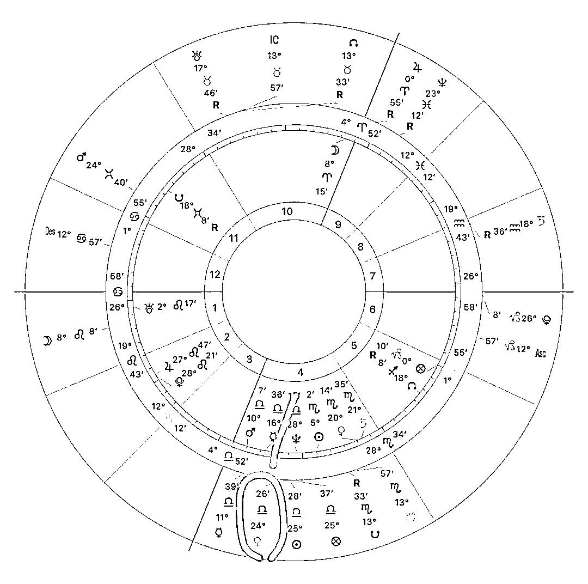

**☆****金星行进在第 1 宫（上升点）**

是时候庆祝了，因为此时爱神阿佛洛狄忒与你如此接近。

**现在应该张开双臂拥抱世界，建立那些你觉得对你而言最为重要的人际关系。现在也适合美化周围的环境，最重要的是整理自己的仪容。**做一个新发型，穿上自己最好的衣服，看看你吸引到什么。

将关注点放在灵魂层面看，这一时期是你**最能带给自己内在成长和发展的时期**。有时候人际关系会使你分心，或者彻底动摇你内心的稳定。这个月你有机会跟随女神的指引，让她为你带来正确的人或观念，帮你在正向的人生道路上前进。

**☆****金星行进在第 2 宫**

这段时期你和金钱或私人财物之间的关系将得到改善或受到考验。事情到底怎样发展，取决于你是如何对待金星的。

**如果你对匮乏的恐惧占据了主导地位，那么你就会吸引一些情境，来考验这些恐惧；另一方面（金星总会带来对立的两极！），如果你敞开心扉，内心准备好接收上天的礼物，那就等着好运来敲门吧**。

如果你对自己的经济状况了充分，也不倾向于买些用不到的东西（金星总是带来平衡），那么现在就是购物的好时机。否则，就要**小心不要过度消费，从而欠下债务。**

**☆****金星行进在 3 宫**

**此时适合与某位关系不佳的兄弟姐妹和好，也适宜与像家人一样的亲戚或亲近的朋友建立良好的关系。**现在也是把自己的观点写出来或与人沟通的佳期，或寻找能与你一起探索各种教育课题的人。

**智力层面上合作的机会会在此时出现，并且更容易找到和你想法相似的人。如果金星（顺行而非逆行时）通过第 3 宫时，与水星出现了和谐相位，那么当天就很适合讨论协议与合同方面的事情**。

如果金星逆行，那么就应利用这个机会检查一下已经起草但尚未签署的合同，看看有什么地方需要更改，然后等金星恢复顺行的时候再签订协议。

**☆****金星行进在 4 宫（下中天）**

此时适合改善居家环境，把家里装饰得更加漂亮。也是邀请别人来家里分享生活的绝佳时机。

**如果你想要给家庭生活带来更多爱，和父母建立更好的关系，或找到通往更高层面个人宁静的内在道路，那么金星过 4 宫就是做这些事情的完美时机**。

*   如果行进金星和出生星图月亮有和谐相位，那么可能会和女性朋友或妈妈有亲密的聊天。

*   行进金星与太阳的和谐相位对与男性或父亲的关系很有利。

*   行进金星与水星的和谐相位有利于修理家里的东西。

*   行进金星在四宫与出生图金星成相非常适合家装、浪漫的晚餐以及在家进行社交活动。

**☆****金星行进在 5 宫**

金星在出生图的这个宫位时，你有更多机会对小孩表达爱，或与年轻人有愉快的互动。因为第 5 宫也是恋爱宫，**此时很适合把普通的关系发展成恋爱关系**。抓住机会享受爱情，度过一段愉快的时光吧。

传统上，第 5 宫也被称为“玩乐宫”，所以这是个享受人生，并与一位特殊朋友分享喜悦的好借口（其实根本不需要借口！）。

如果你拥有创造力天赋，金星也是你的艺术女神。因而，这段时间也适合探索你的创造力：**绘画，装饰，建造那个一直萦绕在你心头的特别花园**。

总之，就是检测你通过某种自我表达方式来美化生活的内驱力。如果你喜欢欣赏别人的才华和美，那么就确保利用金星的行进，去电影院，剧场，以及参观博物馆和画廊。

**☆****金星行进在 6 宫**

**这段时间你能找到正确的医师，帮你进行任何方面的自我改善，可以是身体健康，也可以是灵性和情绪方面的健康**。

金星渴望完美，寻求美化和疗愈。当行进到第 6 宫时，她会帮助你更好地了解自己的关系，也可能鼓励你找到身心层面的工具做到这点。这段时间也适合**发展与宠物的关系，或与动物建立新的关系**。

如果你是一位雇主，利用金星拜访 6 宫的时间寻找使雇员的生活更加美好的方法。当行进金星在这个宫位并与水星或月亮形成良好相位时，利用这个机会接近你的雇员。看看他们有什么想法，他们对自己的工作和与雇主的关系有什么看法。

这样做的话，你可能会调动起那些有利于你生活和目标的环境。

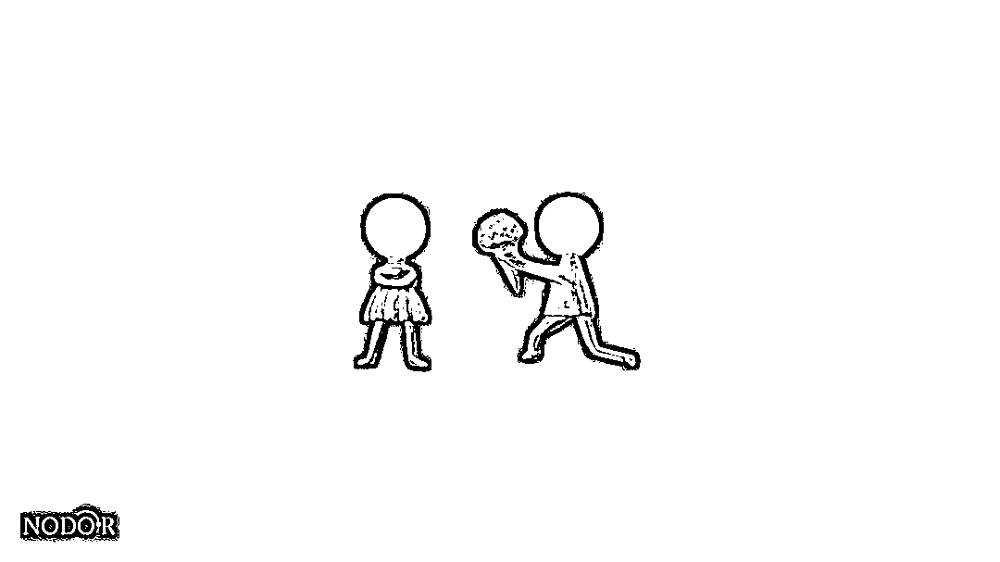

**☆****金星行进在 7 宫（下降点）**

爱神阿佛洛狄忒会因为回到家而感到非常高兴，因为第 7 宫是她非常喜欢的领域。这也可能意味着她在第 7 宫也会为你带来愉快的体验。

众所周知，第 7 宫是婚姻、重要私人关系和商业关系的宫位。这段时间非常适合给生活带去更大的平衡与和谐。在金星的照耀下，**婚姻关系会得到加深和推进**。倘若金星同时也经过你伴侣的第 5 宫或第 7 宫，那你们之间的关系就更容易顺利发展了。

无论如何，这都是坐下来，解决**“婚姻契约”**的良机。 

当行进金星与你伴侣的 7 宫宫主星或他的出生星图中的金星形成良好的相位时，你们可以谈谈在这段重要的关系中，有没有什么不公平的事情正在发生。如果与此同时，金星正在你的出生图中形成积极相位，那么这是个和爱人进行积极沟通的完美机会。

**☆****金星行进在 8 宫**

**你对于爱情和财产的态度，有哪些需要被转变和转化的？**当金星通过这一宫时，与之相关的一些问题就会出现。这段时间最好客观看待这些生命中的重要领域。

此时如果指责别人或者自己，只会使这些情境变得更糟。责备和罪恶感只会增加负面极性的能量，从而导致更大的冲突。

使用第五射线，金星的灵魂层面特质——心智——到达内在的一个中心，从那里客观地检视人际关系和财产状况。做一名旁观者，这样你就会发现自己站在一个三角形的顶点，超越了你正在应对的二元对立。

要记住，人格运作在对立和两极层面上，而灵魂超越对立，能提出没有偏见的解决方案。

**☆****金星行进在 9 宫**

想要离开家，在外面某处度过浪漫和愉快的时光吗？金星通过这一宫可能会使你从例行公事中解放出来。传统上，第 9 宫是长途旅行的宫位，但你不需要去另一片大陆，也能连通第 9 宫的能量。

“长途旅行”也可以意味着超过 24 小时不回家——在外面走路！不要忘记，占星学系统发明的时候，还没有汽车、飞机和火车呢。因此，到邻近的州或另一个城市短途旅行也是可以的。

重要的是，当你走在不同的街道，观赏不同的景点时，要带着浪漫的情怀。如果你的生活环境允许你飞往另一片大陆，那么金星通过 9 宫就真正带有“异国他乡的浪漫”意味了。

所以，**现在显然是个用掉航空积分里程的好机会，尤其当金星与木星或 9 宫宫主星形成和谐相位时。**

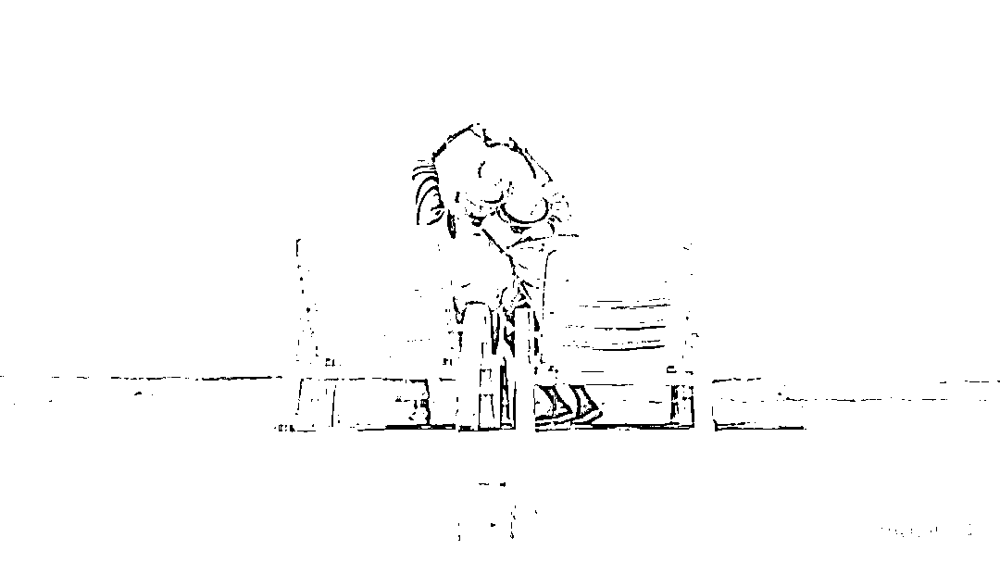

**☆****金星行进在 10 宫（中天）**

**可以从职业关系中获利吗？现在是要求老板加薪的恰当时机吗？如果金星此时通过 10 宫，并与出生图金星、土星或者 10 宫宫主星形成积极相位，那么以上两个问题的答案都是“是的！”**

占星学中，时间决定一切，因为占星学子所寻求的，不就是与宇宙时钟保持平衡和谐的关系吗？

金星通过第 10 宫常常给职业生涯带来更和谐的人际关系，虽然在工作场所中发生恋爱，可能会带来一些麻烦。但是，在正确的时间遇见正确的人，朝着共同的事业目标迈进，显然是金星行进出生图顶端时的一项议程。

**☆****金星行进在 11 宫**

金星行进至出生星图的朋友宫，强调的是发展正确的人际关系。**这时特别适合与一群志趣相投的朋友聚集在一起。现在也是组织团体活动的完美时期。**

如果你的出生星图中金星在白羊座，或金星行进在 11 宫时，与其他任何落在白羊座的行星产生积极相位，那么你就有机会领导这个团体，或者至少起到鼓舞作用。 

你和朋友之间，或者你认识的人之间是否存在争执？那么现在是一个化解纠纷的好机会，也可能你会受邀调停交战的双方。金星天生会平衡火星能量，而她现在正照耀着你的朋友宫，为它带去和谐的能量。

**☆****金星行进在 12 宫**

确实，金星落在出生星图 12 宫的人倾向于发展秘密关系。这分两种情况：**一种是有秘密的恋人，一种是自己的职业是帮助一些生病住院或在监狱或修道院这样隐蔽场所的人**。

如果金星正在通过 12 宫，这些情况可能会在你的生命中发生。如果出生星图中金星就在 12 宫，或与海王星有强相位，那么金星行进 12 宫显然强调了这种天生的倾向。

金星通过 12 宫也会给我们机会，**审视自己的内心，为发扬灵性之爱和无条件的大爱开辟更大的空间。**这段时间适合寻找老师和向导，透过他们的帮助，使我们发现爱的真正含义。

**版权声明：**本文由若道翻译，欢迎转发，反对抄袭。友号转载请申请白名单。

**END**

**阿兰·欧肯**

若道签约老师。1944 年出生于纽约，毕业于纽约大学罗曼语言及语言学专业。著有包括《灵魂占星》、《星图中的守护关系》、《阿兰·欧肯完全占星》等数十部著作。他还为《戴尔星运杂志》以及其他许多国内外评论与期刊撰写过数百篇文章。他是译者、老师、环球旅行家和国际导游。

**拥有****51 年****占星实践经验的****若道创始人****前 ISAR 全球副主席****前 ISAR 全球职业占星师资质认证主席****大卫·瑞雷**

**和**

**2019 年第二届、2021 年第三届核心课中**

**与苏·汤普金斯老师****联合授课****的**

**ISAR 认证职业占星师**

**咔咔（Caroline）**

**二人合力打造**

**2022 年 ****若道全新核心占星课程**

**点击下图了解更多课程详情** 

**

**20 位来自世界各地的占星师****带来 19 场沙龙——新世界的觉醒****详情可点击下图**

**学习占星学****点击下图了解课程详情**

**微信又双叒叕改版啦，不想错过若道君的推送？**
****就把若道设为****星标****以及点点****“在看”****吧！******▼**

**喜欢就点一下“在看”吧！****报名直达入口**

# 痛苦的童年就无法摆脱了吗？当然不！

> 原文：[`mp.weixin.qq.com/s?__biz=MzA5NjA0NTAxNg==&mid=2651493004&idx=1&sn=9eccfeb27a155b80cea6b17c879df44b&chksm=8b48203bbc3fa92d41ffae2d34661732977451fd7a5bf0234cb91cfc6471caeb5d5e3c3f32b7&scene=126&sessionid=1692737730#rd`](http://mp.weixin.qq.com/s?__biz=MzA5NjA0NTAxNg==&mid=2651493004&idx=1&sn=9eccfeb27a155b80cea6b17c879df44b&chksm=8b48203bbc3fa92d41ffae2d34661732977451fd7a5bf0234cb91cfc6471caeb5d5e3c3f32b7&scene=126&sessionid=1692737730#rd)

******************************☆ **************后台回复“今日”，给你一句生命态度****************

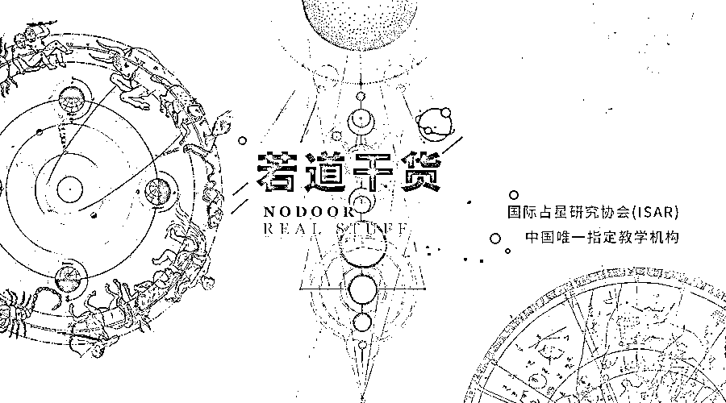

作者/格伦·佩里 译者/丁宏
编辑/玫瑰 封面/书君 图片/稿定设计你听说过“柏油娃娃综合症”吗？很多人都有这样的症状而不自知，一起来看看文章，还提供了解决方案哦。如果你想了解更多心理占星学知识，欢迎点击格伦老师教授的 ISAR 选修课[【占星原型与星图中的精神病理学】](http://mp.weixin.qq.com/s?__biz=MjM5MjQwNjAyMQ==&mid=2649440448&idx=2&sn=65069cdbc39c7219b28b94f2d7b1b4cf&chksm=beb92faa89cea6bc0ed91eab132f2c9aa209ae139d35d8240a81df02ddaf7151447557e82e73&scene=21#wechat_redirect)了解详情哦~******“柏油娃娃综合征”******“柏油娃娃综合征”，是来自美国的一个著名的寓言故事。在这个故事里，有一只兔子走在路上，他看到路边田野里的一个稻草人，这个稻草人身上涂满柏油。农民为了防止有小鸟破坏农作物，所以在稻草人身上涂满柏油，这样如果有小鸟落在稻草人上面，它们就会被粘住，就不能再去吃地里的农作物了。这种穿着柏油外衣的稻草人，被叫做柏油娃娃。这只兔子并不知道柏油娃娃不是一个真人，他走过去跟柏油娃娃打招呼，没有得到回应。这只兔子很受挫，他就去推了柏油娃娃一把，希望能得到回应。但柏油娃娃是无法给他任何回应的，无论是打声招呼还是一个拥抱。我们星图中的一切，都在形成模式，这些模式会不断重复。通常，**那些在童年时期让我们感到挫败、痛苦的东西，会在之后的日子里重复，以此来让我们得到那些我们在过去无法得到的东西**。

比如女性会去选择一个很像她的父亲的伴侣，可能有很多方面不那么像，但在一些关键的部分，是很像的，她会想从这个男人身上得到她无法从父亲身上得到的、或无法向父亲去要求的那些关爱。

很多时候，一个人会卡在当下的某种状态里，想从某个人或某种情境中得到一些东西，这些东西是在过去的经历中没有得到或是那种需求被否认了的，然后他们会强迫性地在当下的情境中过度要求获得这些东西，执着于一个特定的结果。就像那只兔子卡在了对柏油娃娃的期待中。

在柏油娃娃的故事里，兔子用尽各种办法去获得柏油娃娃的回应，他推它、打它，越来越执着在这个情境中动弹不得。我们在现实生活中也经常做这样的事。

我们卡在了某段关系里，或是卡在某个工作里，或是卡在别的什么情境中，试图获得一些特定的东西。**我们没法自己给自己这些东西，只能向外求，那是我们心里缺失的部分，是我们在小时候没有得到的东西。**

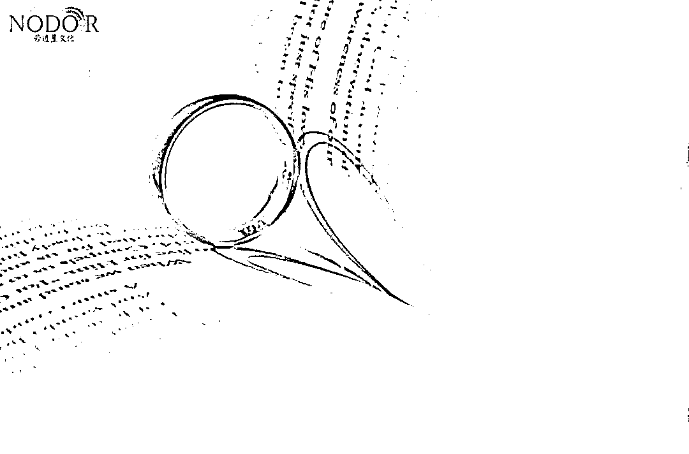

****疗愈，需要放下****

从占星学的角度上说，这可能是任何一颗行星的需求，比如**月亮所渴望的安全感、关心照料、归属感；太阳想要的认可、认同；金星所渴望的喜爱、触碰**，等等。

如果我们在童年时期因为某些东西而受挫，或是被剥夺了满足某种需求的权利，我们会倾向于觉得那是我们自己的问题，是因为**我们不配拥有**。

这就会让一个人**过度执着地想要从另一个人身上获得那些自己曾经无法得到的东西**，然而**另一个人可能本身就是没有能力给予这些东西的。**

这是一个强迫性重复的情况，要去疗愈和处理这种情况，就需要学会**放下**，要意识到**一个人的能力是有限的，你不能强迫外在的某个人去满足你的需求。**这也要求你**原谅你自己的那些非理智的内疚感和自责，那些童年时期留下的印记。****宽恕自己，也宽恕他人的局限性，这会让我们能够释放掉过去那些没有被整合好的悲痛、受挫的感受。******月冥对分的疗伤之旅****

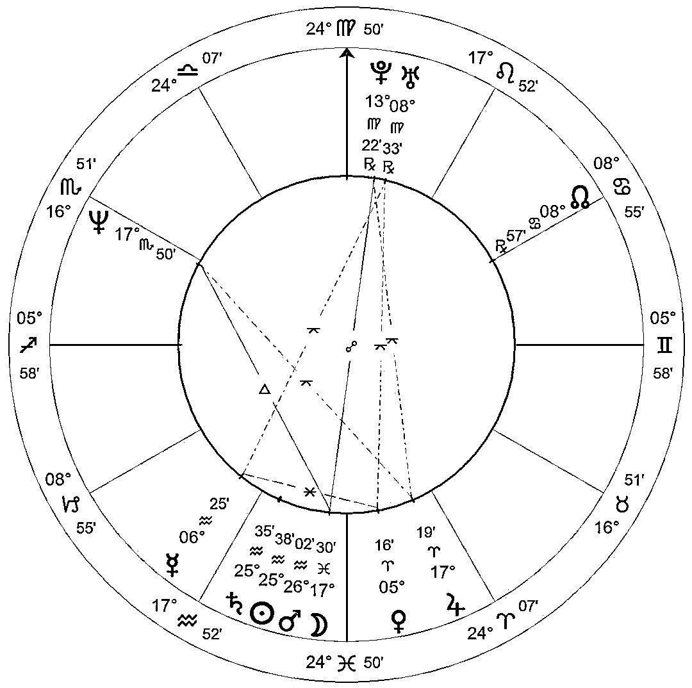

1 母亲带给女儿的伤痛

这是一个中年女性的星图，8 岁时，她失去了她的母亲。她的家庭中还有 2 个孩子，她是 3 个孩子中排行老二的那一个。她的妈妈有一些精神上的疾病，8 岁时，她妈妈抛弃了家庭搬去了另外一个州，那时她的年龄正对应了她星图中月亮的位置。

在她的星图中月**亮对分了冥王星**。冥王星合相了天王星，而天王星和金星、水星共同形成了一个上帝手指。但最重要的还是月亮与冥王星的对分相。因为这个相位象征了**对信任的破坏，以及母亲带给女儿的伤痛。**

这个女儿的成长过程中，对自己的感受有种**恐惧，害怕爱、关心、理解、归属感**。她的月亮在双鱼座，她的母亲最终搬回了他们所在的州，但是没有搬回家。

她的姐姐是个侏儒，她的父亲是近乎崩溃的状态，她的弟弟也很抑郁，家庭中的每个人的功能运作都出了差错，就好像她没有权利去依靠任何一个家里的人来获得关怀和支持。

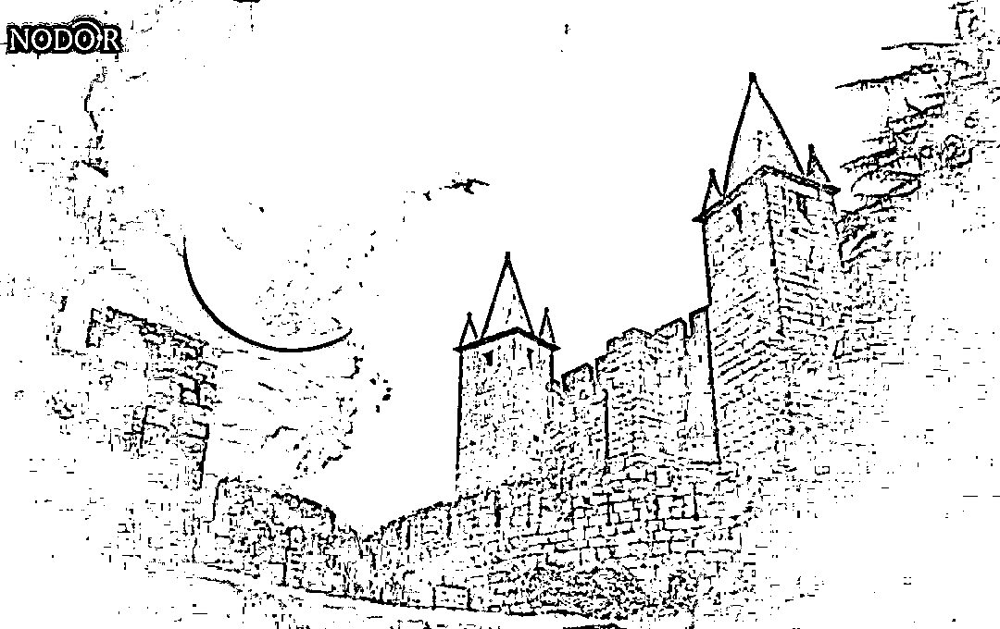

2 无法表达自己感受的恐惧

当她来找我时，她正处于一段关系之中，对方是一个很有问题的人。这是一段跨种族的婚姻，对方是一个黑人，她是一个白人女性，这个男人失业了、吸大麻上瘾、生活混乱无序、满嘴谎话，并且还有家暴。

这个男性曾经参加过越战，所以有战后创伤综合征，在心理上他从来没有克服战争给他留下的创伤。

而这个女性对婚姻家庭非常地尽责，非常努力。这个男人就像一个巨婴，她觉得她有必要照顾他。在这样一种情境中，我们看到这个男人其实象征了这个女性星图中的**月亮的创伤**，被冥王星伤害的月亮，创伤、被动无助的、没有工作、疾病、上瘾，等等。

在很多方面，他就像她的母亲一样，没法照顾她，他作为一个成年人的能力、他为自己负责任的能力、爱的能力和对她负责任的能力，都是缺失的。这位女性其实就是陷入了柏油娃娃综合征，那个男人就是柏油娃娃，他们之间重现了她和她妈妈之间发生的事。她想从这个男人身上得到当年母亲没法给她的东西，但这个男人就像她的母亲，根本没有这样的能力。在工作上，她是一个办公室经理，为一个女性的牙科医生工作。她在事业上非常成功，非常有自信，非常负责任。但她的老板就像她的丈夫一样，没有能力，总是濒于崩溃、被压力压垮，没有办法有效地处理事务，并且对她怀有敌意。这位客户的名字叫做杰妮，杰妮觉得自己必须去过度地工作，以牺牲自己的方式去工作。工作时间很长，做的事很多，也没有什么假期，也没有加薪，因为她的老板，其实就是她的母亲形象的象征，是功能运作不良的，跟她自己的母亲的情况一样。当我跟杰妮一起工作的时候，我问她：“你对自己的丈夫感觉如何呢，你对你的老板又感觉如何呢？”**她对表达自己的感受感到恐惧，她觉得自己没有权利去表达自己的感受，她觉得如果她这样做了的话，别人的反应是会让自己蒙羞的**。3 为什么杰妮的嘴会受伤

有一次，杰妮获得了一次福利待遇，可以免费享受一次牙医老板的某种牙齿护理。但做的过程中牙医老板出现了多次失误，并且做得非常草率，最后杰妮的口腔里是一团糟，并且很疼。她觉得被背叛了，觉得牙医老板欺负了她。

这类事件的出现总是有意义的，这是杰妮的月冥对分相位的反映，以这样一种极端又荒谬的方式显现了出来。嘴，是我们获得滋养和照顾的部位，特别是获得来自母亲的滋养。当我们还是婴儿的时候，我们要用嘴去吮吸母乳。如果一个人对于爱、滋养和照顾的需求没有被满足，理想的情形中，婴儿会通过哭泣、大喊，或说话来表达。是否能说话也取决于他们的年龄，以这种方式让妈妈知道我还需要更多，或是需要别的什么。但是杰妮对要求照料这件事感到羞耻，觉得自己不值得，她害怕表达自己的感受。所以，在象征意义上，她失去了她的声音、她讲话的能力，结果她的嘴受伤了，而嘴巴就是用来讲话的部位，是用来表达自己的需求和感受的部位。现在，情况变得非常极端，无论是她和她的丈夫还是和她的老板之间的关系。她好像被逼得不得不说出自己的感受了，去说出她感到被背叛、感到受伤、感到没有得到支持、感到她的老板不关心她、她的丈夫也不关心她。她开始去找到自己的声音、去表达自己的感受，那是在她还是个小女孩的时候就积压下的感受。

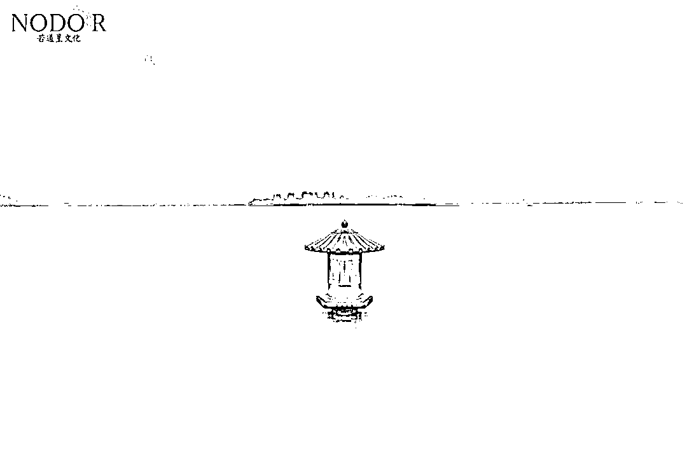

4 过去、现在和未来的关联

她终于开始去向她的丈夫和老板表达自己的感受，她的丈夫和老板其实都是她的母亲的替代。她现在对他们讲出了自己小时候没有办法对母亲讲出的话。

最终，她离开了她的丈夫，也辞掉了工作，她找到了一份更好的工作，这种新的情境反映了她的一个更加整合的状态，也反映了她在获得关爱方面拥有了更好的能力。

她现在可以自己照顾自己了，而不是去忍受一种别人都不关心自己的状态。她的新工作是自己创业，她去那些卖旧家具的跳蚤市场，将那些旧家具买回来，将它们重新整修。

相当于冥王星的转化和重生的能量用到了月亮上，**月亮和家有关，去美化那些旧的家具，赋予它们新生。**那么当客户在一些重复出现的经历中，表现出强迫性重复时，我们可以跟他们说什么呢？

下面是我会对杰妮说的话：**“你认为霍莉（杰妮的老板）和你母亲一样脆弱，如果你明确表达自己的需求，就会伤害她、击垮她，就像你小时候无法对母亲说那些话一样，因为母亲无力招架。但是如果你不说出来，你就是在让自己的嘴（声音）受到永久的伤害。”**

事实上，当杰妮来找我咨询的时候，正是星图中冥王星对应的那个年龄，在这个年龄，她童年失去母亲的痛苦经历又以另外的方式呈现出来，体现在她和她的丈夫以及老板的关系中。她现在有了一次机会通过重新选择，而去处理和母亲的关系，从而疗愈自己。

重要的是要理解，同一个相位，月亮对分冥王星，既代表了她童年时和母亲的关系：母亲生病了，抛弃了家庭和孩子，辜负了孩子的信任；同时这个相位也代表了当下和丈夫以及老板的关系。

对分相总是跟关系有关，所以当下的关系其实是对过去的关系的复制，是对过去的重演。并且这给了她一个机会去找到自己的声音，去开始**表达自己的感受和情感需求**。那些从童年时就被压抑下来的东西，通过这样的方式，疗愈成为可能，她于是可以重新启程向前走。同一个相位的能量，被她用于重整家具的事业，以这样的方式她自己滋养了自己的月亮。所以过去、现在和未来都被这个月冥对分的相位所象征。星图变量构成了一个客观框架，从中我们可以清晰地看出过去、现在与未来是如何通过同一意义模式关联起来的。

****版权声明：**本文由若道翻译发布，欢迎转发，反对抄袭。友号转载请申请白名单。**

**END******格伦·佩里****若道签约老师。著名占星师，ISAR 董事会成员，共出版 8 本占星著作；心理/意识研究专业博士；占星心理学学院（Academy of AstroPsychology）的创办人；康涅狄格州研究生院（the Graduate Institute of Connecticut）原型宇宙学与意识进化项目的负责人。

# ****占星原型与星图中的精神病理学****

**为什么在占星学的课程中，会出现精神病理学的教学内容，这和我们有什么关系？这对占星咨询，或在自我了解与成长的过程中又有什么帮助呢？**

****带着这些疑问，请你静下心来，思考以下几个问题**：**

**“******你/你的案主，是否曾经过度担心什么？**** ****你/你的案主，有没有感觉到担忧和焦虑，却不知道原因是什么？********你/你的案主，是否曾经觉得害怕什么东西，但理智上却很清楚它不会对你造成什么伤害？********你/你的案主，是否曾经通过沉迷某物，酗酒或滥用药物，自我伤害去逃避问题？********……********——节选改编自《心理学与生活》******”**

**如果你对上述问题其中之一，回答是。这意味着几乎每个人都曾有过心理障碍的症状（精神病理的问题）。**

**你看，其实“精神病理学”与人的心理有着密切的关联，再结合占星学，呈现了人内在与外在层面更加丰富和深刻的一面。**这对于学习占星学的人和占星师来说，都是一场难得的知识盛宴！****

****本课为 2 年期双证核心课程中的一部分**（AP105 阶段），其内容是过去若道所开设的核心课程从未教授的部分，特意抽出供其他学员学习，******可作为 ISAR 选修课，单独报名。****

****点击下方图片了解详情****

**

****20 位来自世界各地的占星师********带来 19 场沙龙——新世界的觉醒********详情可点击下图****

****

****学习占星学********点击下图了解课程详情****

****

****

**

**

****微信又双叒叕改版啦，不想错过若道君的推送？**** ******就把若道设为****星标****以及点点****“在看”****吧！**********▼****

****

**喜欢就点一下“在看”吧！****报名直达入口**

# ISAR 选修丨占星原型与星图中的精神病理学

> 原文：[`mp.weixin.qq.com/s?__biz=MzA5NjA0NTAxNg==&mid=2651493004&idx=2&sn=038b40a4c73ce929da0d5c64de0eac85&chksm=8b48203bbc3fa92d3922f679f3aa4a5525d2776cd477717d7daef4d44bbb863c001bd3281960&scene=126&sessionid=1692737730#rd`](http://mp.weixin.qq.com/s?__biz=MzA5NjA0NTAxNg==&mid=2651493004&idx=2&sn=038b40a4c73ce929da0d5c64de0eac85&chksm=8b48203bbc3fa92d3922f679f3aa4a5525d2776cd477717d7daef4d44bbb863c001bd3281960&scene=126&sessionid=1692737730#rd)

**课程描述**

看过课程标题的你，也许会感到好奇和惊讶，为什么在占星学的课程中，会出现精神病理学的教学内容，这和我们有什么关系？这对占星咨询，或在自我了解与成长的过程中又有什么帮助呢？

**带着这些疑问，请你静下心来，思考以下几个问题**：

“**你/你的案主，是否曾经过度担心什么？** **你/你的案主，有没有感觉到担忧和焦虑，却不知道原因是什么？****你/你的案主，是否曾经觉得害怕什么东西，但理智上却很清楚它不会对你造成什么伤害？****你/你的案主，是否曾经通过沉迷某物，酗酒或滥用药物，自我伤害去逃避问题？****……****——节选改编自《心理学与生活》**”

如果你对上述问题其中之一，回答是。这意味着几乎每个人都曾有过心理障碍的症状（精神病理的问题）。

你看，其实“精神病理学”与人的心理有着密切的关联，再结合占星学，呈现了人内在与外在层面更加丰富和深刻的一面。**这对于学习占星学的人和占星师来说，都是一场难得的知识盛宴！**

**本课为 2 年期双证核心课程中的一部分**（AP105 阶段），其内容是过去若道所开设的核心课程从未教授的部分，特意抽出供其他学员学习，**可作为 ISAR 选修课，单独报名**。

**在正式了解本课的价值之前，先了解一下这门课程的主讲老师吧！**

**格伦·佩里（Glenn Perry）**

*   他是心理/意识研究专业博士、加州注册婚姻和家庭治疗师 （CAMFT）

*   占星心理学学院（Academy of AstroPsychology）创办人

*   康涅狄格州研究生院（the Graduate Institute of Connecticut）原型宇宙学与意识进化项目的负责人

*   共出版八本占星学著作：《心理占星学入门》、《心理占星论文集》、《盗取天火》、《从忠诚到革命》、《星图中的阴影》、《占星职业议题与伦理》、《出生星图深度分析》、《从古代到后现代占星学》

**墙裂推荐格伦老师这门课的 **

**4 大理由**

**你一定得知道的课程价值**

**价值*****1***
**明晰精神病理学的基本定义**

占星心理学学院创办人格伦·佩里老师，对**精神病理学的基本定义**就是灵魂受苦，精神就是灵魂的意思，病理就是受苦的意思，所以精神病理学研究的就是：人类各种各样受苦的方式，尤其是因为某一类的行为而引起的。

精神病理学是一个连续体，从比较轻微的，到比较严重的，这么说来，我们每个人都有一部分精神病理的问题。

**如果成为一个“人”，没有一定程度的挑战是不可能的。没有一定程度受苦，没有一定程度不平衡是不可能的。而这种不平衡就会以一种挑战和困难的姿态呈现出来。**

**价值*****2*****更懂疗愈：从不平衡到平衡**

**疗愈**是一个复杂的过程，讲的是将人从不平衡带到平衡这样的一个状态，将不同行星代表的心理功能带到一种更加平衡整合和合作的状态。

格伦老师通过研究精神病理学，发现每一颗行星，以及这颗行星所守护的星座，都和某一特定类型的病理是联结在一起的，包含了这个占星原型所涵盖的极端不平衡的情况。

举个例子，案主的第 1 宫，有很多星星在那里，和对面第 7 宫的火星形成对分相，第 1 宫白羊座或者火星白羊座的组合，和这个案主的反社会人格的病状联系在一起（这是一个星图的极端负面表现）。

“

**生活本身就是一场治疗，我们在占星的星图中去看到，人们所具有的创伤、不平衡及其产生的防御机制，最终都会在他生活中的关系和情境中呈现出来。无论他生活中处在怎样的情境之下，其实这些环境都是在为他提供恰当的环境，作为一种载体，让他去平衡和疗愈事件背后问题的根源。** 

**这样一个现象是持续不断地在发展，会让我们想到，会有一个更大的宇宙的智慧存在，它其实是在指挥和引导着我们的这些经验，让我们去经历然后进入更高层面的发展当中。生活或者“神”，就是我们所有人类的一个治疗师。**

**——格伦·佩里**

”**价值*****3*****了解诊断标准，提高咨询的专业敏感度**

如果能够对精神病理极端不平衡的情况有了解的话，你就会对它比较温和的版本更加敏感（大部分人是更温和版本的呈现）。

也许案主并没有达到某个病理所达到的层级，但是 Ta 有显示出，这个病理某一些特点或者某一些倾向。所以，我们的目标并不是去诊断案主，而是了解他在这个病理学连续体上处在一个怎样的位置。

当你拿到星图你会看到，案主不同的冲突，是体现在不同的部分上。某一个病状是体现在某一个行星，另外一个病状，是同步体现在另外一颗行星上。

当我们通过对占星原型星座和行星的病理学现象的学习后，就能看到占星学上的配置所呈现出来的，案主表现出的这些失调，并不一定都会成为一种心理临床上的诊断。有可能在案主这里呈现出一个很轻微，但是仍然在 Ta 生活中，给 Ta 造成挑战的一个点。

**价值*****4*****智力上的刺激——整合进阶**

这个课程能够让我们了解自己，了解我们的客户，了解我们的朋友，了解我们的家庭。它给我们提供一种崭新的方式，并且让我们看到占星原型的种种表达，不要局限在非此即彼、非好既坏的这样的一个概念当中，而看到它其实是一个不同程度的连续体。

当我们能够以这种方式去看的时候，你就能够将自己的生活，带入一种和谐。能够了解这是一个过程，我们的重点不是放在诊断上，而是放在整合上，因为生活，就是一种整合。

**课程内容**

**AP105 星图中的精神病理学与疗愈** 共**15 次**课程：**10 次 2019 年录播课+5 次直播课；30 课时**

在这个阶段的课程中,我们将**聚焦于十二星座(从白羊座到双鱼座）及其对应的守护星的潜在功能障碍。**

我们将学习如何识别、理解和应对每个星座的潜在挑战。我们将在各种相应的心理障碍背景下来考察占星原型，这些心理障碍表现为功能障碍、失衡的极端状态。

学员们将了解**《精神疾病诊断与统计手册》诊断标准**。我们会探讨治疗的概念，尤其是那些与整合和个性化相关的概念。我们将特别关注外行星的困难相位，以及它们与内在心理冲突、防御和症状形成的关系。

学员们将探索人的痛苦如何成为发展和实现天赋才能的催化剂。在考察病因时，我们会将平常的因果关系理论与传统的命运、业力和转世观念整合起来。

**口碑推荐**

‍**‍想感受格伦老师的课堂魅力？** **一小段讲课视频让你先睹为快~**<mpvideosnap class="js_uneditable custom_select_card channels_iframe videosnap_video_iframe" data-pluginname="videosnap" data-id="export/UzFfAgtgekIEAQAAAAAAxuwL_P9LDAAAAAstQy6ubaLX4KHWvLEZgBPElYFkVBZaNrKCzNPgMIuhBCuUlaCPzDNmHFgJR5sp" data-url="https://findermp.video.qq.com/251/20304/stodownload?encfilekey=rjD5jyTuFrIpZ2ibE8T7YmwgiahniaXswqzIGcAWV11d39RRKTicEUe1lSn5e1z2jdX20ath9yg9Liaia8VPS2c4MUJibl8FlxSZs3ajlcibhlD6typd6ZeGeWj2bQ&amp;adaptivelytrans=0&amp;bizid=1023&amp;dotrans=0&amp;hy=SH&amp;idx=1&amp;m=&amp;scene=0&amp;token=AxricY7RBHdXmmhmUb1Np3Ioz3Ok0V9IBZ0eINxnxticaC9r3HjsQ8iatkwqFBLKP50ZibXDm0TiaicC4" data-headimgurl="http://wx.qlogo.cn/finderhead/PiajxSqBRaEJYnVsqWfEX9qA0sI6hNVKsDfyzfPZ92WZMZyBpZWU5NA/0" data-username="v2_060000231003b20faec8c4e68a1ec2d4ca07e434b07755bbf47e7053a3059defd2c9d6c68a20@finder" data-nickname="若道" data-desc="#ISAR 选修课  如何识别、理解和应对每个星座的潜在挑战？如何在不同的心理障碍背景下来考察占星原型？" data-nonceid="4249051256207020861" data-type="video" data-width="1024" data-height="576"></mpvideosnap>

**课程费用**

**课程价格：9000 元****课程优惠价请添加 Margartet 咨询**

课程负责人：Margaret

（微信：18515059056）

请备注“心理占星 105”

**开课时间**

**直播课开课时间：2022 年 12 月 21 日**

**退转课程**本课程包含往期视频知识点视频课程+直播案例课程+助教直播答疑；报名付款后均不受理退款转课，请慎重考虑后再确认付款。**其他相关事项请仔细查阅报名勾选时的《教学协议》，如有疑问请咨询课程顾问。****报名流程及费用支付****1. 点击阅读原文链接立即报名，填写个人姓名（身份证姓名）和相关信息，阅读并同意《教学协议》，提交报名表，直接在线支付。****2. 付款后可在网页个人中心或手机网页“我的”栏目查看报名记录。****如遇疑问请与销售人员联络******ISAR 选修·占星原型与星图中的精神病理学****

**授课老师：格伦·佩里**

**直播课开课时间：**2022 年 12 月 21 日

**授课方式：**网络课程，中英文授课，中文翻译

**费用：9000 元（获取优惠请联系客服咨询）**

**课程负责人：**Margaret（微信：18515059056 请备注“心理占星 105”）

长按二维码添加课程负责人咨询~

**报名直达入口**

# 重磅丨两年一遇的火星逆行：未来五个月，你能变得更聪明吗？

> 原文：[`mp.weixin.qq.com/s?__biz=MzA5NjA0NTAxNg==&mid=2651492950&idx=1&sn=e9df4fa36140bec2ead75d82ea9e92a6&chksm=8b4820e1bc3fa9f72044d2286a128a1119de6a8b6711be896157800ed56d48651c18001d5d5c&scene=126&sessionid=1692737730#rd`](http://mp.weixin.qq.com/s?__biz=MzA5NjA0NTAxNg==&mid=2651492950&idx=1&sn=e9df4fa36140bec2ead75d82ea9e92a6&chksm=8b4820e1bc3fa9f72044d2286a128a1119de6a8b6711be896157800ed56d48651c18001d5d5c&scene=126&sessionid=1692737730#rd)

**☆ 后台回复“今日”，给你一句生命态度**

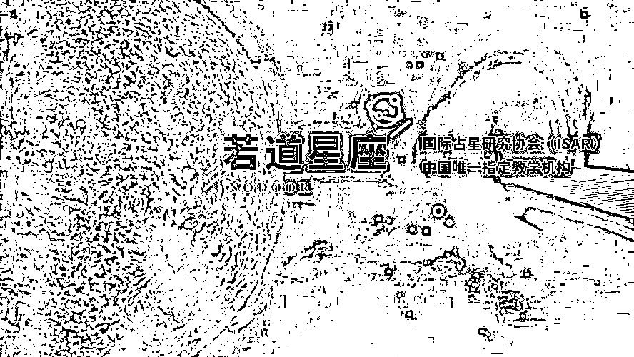

作者/大卫·瑞雷 若道占星创始人译者/李含 校对/江艺编辑/翀子 封面/书君  图片/稿定设计

今天来听听大卫老师聊聊此次火星在双子座的逆行，我们如何理解其中火星四分海王星的重要相位并从新闻中得到启发呢？另外，大卫老师参与授课的【[ISAR 认证职业占星师文凭课程](http://mp.weixin.qq.com/s?__biz=MjM5MjQwNjAyMQ==&mid=2649440448&idx=7&sn=924d0cfbf5e90c0c30dfb698f581b7d8&chksm=beb92faa89cea6bcb020b3c9c42b300cb0f685cd3fce980ec5eede04d4d4452935e89b60c79f&scene=21#wechat_redirect)】报名中，点击链接了解更多详情！

**火星逆行了！**

**火星 10 月 30 日在双子座逆行，然而火星从 8 月 20 日就已经来到了双子座，并将在这个星座一直停留到明年 3 月 25 日。**因此，**火星会在双子座度过 217 天，**与火星不逆行时穿过双子座需要的 44 天相比，这是一个**相当长的时间。**

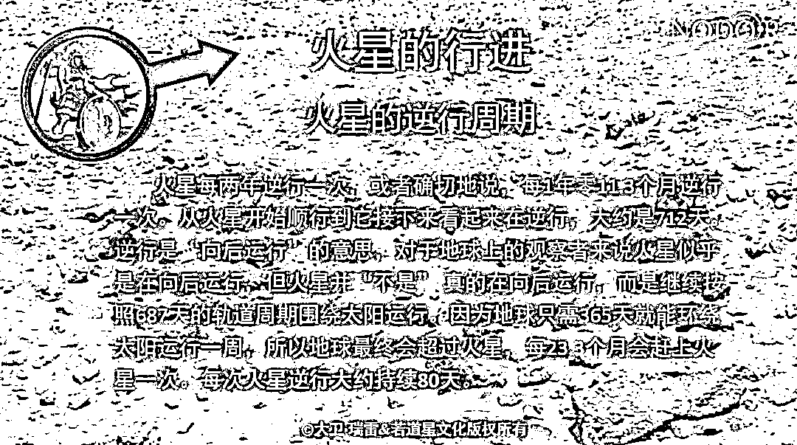

**| **若道核心课课件

火星**上一次在逆行阶段经过双子座是 2008 年 1 月 1 日至 3 月 4 日，只有 64 天，**这段时间较短，因为逆行的火星大部分时间都处于巨蟹座。只有双子座的最后 6 度是 2008 年逆行火星阶段的一部分，2008 年 1 月 30 日火星在双子座 24 度转顺行。

**这一次我们充分感受了火星在双子座的影响。**随着代表行动的行星出现在与交流有关的星座中，也许到明年 3 月 25 日火星离开双子座的时候，已经没有未尽之言了。

**让我们回顾一下双子座的基本关键词和短语：**聪明、变通、好奇心、多才多艺、健谈、模仿、短期解决方案、多任务、容易分心、贪多嚼不烂、揽了太多事情、肤浅、容易无聊、八卦，和非道德的。

**在所有这些关键词中，“聪明”是我最喜欢的双子座关键词。**也许我们都想变得**更巧妙、精明、灵巧和多智善谋**——所有这些都是聪明的同义词。如果是这样的话，这一趋势代表着升级我们双子座软件的难得机会。

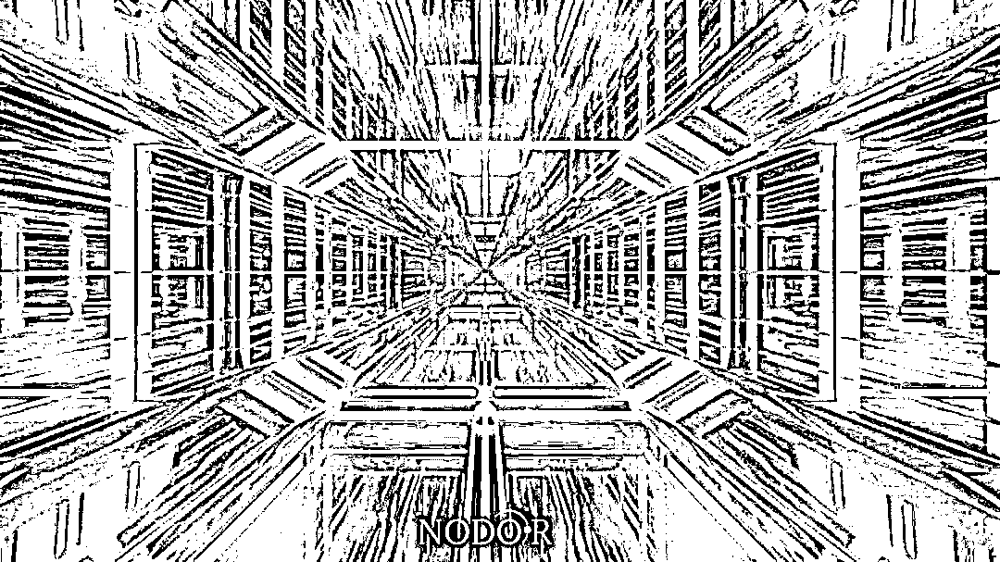

**你变得更聪明还是更混乱？**

**到目前为止你感觉如何？你变聪明了吗？甚至变得更聪明了一点？**

你的词汇量提升了吗？你有没有学到可以脱口而出的新单词或短语？你有了三篇新的短篇小说构思吗？你是更多地与他人交谈，还是更多与自己交谈？你的手指因发短信太多而酸痛吗？

你现在觉得世界变得更喧嚣了吗？是不是觉得噪音不断增加，让别人更难听到互相的声音，甚至让你更难听到自己的想法？！

**天啊！请把音量关小一点！**

**但这不仅仅是音量的问题，它也很容易让人感到困惑。**

上周，当火星四分海王星时，我正赶着去接我的猫“扎克”，它在兽医那里接受美容。兽医让人开车送他，我本应该在我住的胡同入口处接他们。我太专注于思考，包括为这篇文章做调查，以至于我走错了入口！

在意识到我的错误后，我立即尝试走一条通往另一个入口的捷径，一条在我脑海中有效的捷径。我已经迟到了，我得赶快，所以我开始慢跑。但是我走得越快，似乎离得越远。直到我意识到，我必须掉头回家，才能走我一开始就该走的路。

我给和扎克一起等我的人发了短信，他们说会等我。我终于赶到了，浑身是汗，气喘吁吁。扎克难以置信地看着我，我把他装进背包，背在我的背上，连连感谢司机的耐心。

当我和扎克一起走回工作室时，我摇了摇头，“我已经好几年没这样绕圈了。”我笑着想起一句老话：**“当你朝着错误的方向走的时候，你的速度有多快都无关紧要。”**

然后我突然想到，**我这段混乱的经历在几个方面与逆行在双子座的火星有非常完美的契合。**

*   我被搞糊涂了，走错了方向，即火星四分海王星**。这个火星-海王星四分相是这个逆行火星最重要的一个相位。**

*   我当时很匆忙，走得越快，离目标就越远。**火星是关于更快速的运动。**我们常说“**欲速则不达”**，结果我浪费了时间，结果花了更长的时间才到达。

*   为了回到正轨，我不得不掉头，沿着我的脚步往回走。**就像逆行的火星一样，我不得不停下来，转过身，回到我刚走过的路上！**

*   我可以给等待的人发短信，所以交流有助于缓解紧张。**双子座是关于沟通的星座，当事情没有按计划进行时，沟通就更重要了。**

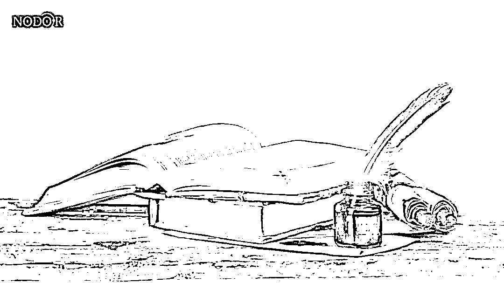

**火星四分海王星**

火星四分海王星的时间

*   **2022 年 10 月 12 日**——这一次已经发生了，所以思考一下它在你的生活中是如何表现出来的。

*   **2022 年 11 月 19 日**——火星在双子座 22 度，海王星在双鱼座 22 度。

*   **2023 年 3 月 15 日**——火星在双子座 25 度，海王星在双鱼座 25 度。双鱼座 25 度的太阳将于 3 月 16 日加入这个精准的四分相；因此，**这可能是火星-海王星四分相中最重要的一个。**

如果我们使用 3 度入相位和 1 度出相位的容许度研究这次的火星-海王星四分相，**那么在下面的时间段内，我们最可能体验到这个相位，并且观察到它在我们周遭世界中的表现。**

**请注意，10 月 21 日和 30 日之间只相隔 9 天，考虑到火星四分海王星仍然十分紧密，这可能是一个不必要的间隔。记住，当火星在 10 月 30 日停滞逆行时，它立即开始入相位四分海王星。**

*   **2022 年 10 月 1 日至 10 月 21 日**

*   **2022 年 10 月 30 日至 11 月 25 日**

*   **2023 年 3 月 6 日至 3 月 20 日**

**对于我们每个人来说，仔细考虑我们在这些火星四分海王星期间的行动是非常重要的。**

正如我的老师过去常说的那样，**“在河水浑浊的时候涉水是不明智的”**，这意味着我们看不清楚自己在做什么。因此，灾祸更有可能发生。而且不仅仅是全身湿透，我们可能会被冲到下游。

**新闻中的火星四分海王星**

**我们观察到这一相位是如何在新闻头条中显现出来的呢？**

我们已经可以确定一位公众政治人物在不断上升的反对浪潮中被席卷到下游，即利兹·特拉斯——

她在 10 月 19 日辞去英国首相职务，任期仅 6 周，这是历史上任期最短的首相。她提出的降低富人税收，同时增加社会项目福利的经济战略违背了逻辑，导致英国市场与英镑汇率一起下跌。

**她在想什么？这有点像跳进湖里救溺水者后忘记了自己不知道如何游泳。**

与此同时，英国保守党求助于一位名叫里希·苏纳克的金牛座人，试图稳定局势，扭转局面。**这是一个巨大的混乱，海王星经常是这样，**但这位金牛座首相有潜在的领导能力来应对这种情况。然而，他需要保持党的支持才能取得一点成功。

苏纳克的月亮交点——狮子座的北交点和水瓶座的南交点完美地反映了这一主题。我们不知道他的出生时间，但我们知道他出生时土星在处女座 20 度，海王星在射手座 22 度。

因此，我们可以看到，**逆行的火星在双子座四分海王星已经影响了他，并将继续这种影响力，特别是在 11 月。**也许他拥有必要的技能组合？我们很快就会知道答案。此时此刻，他就像一个水管工人，试图在已经灌满水的房子里修理水管。

如果苏纳克在三月底还在任，他就已经度过了最艰难的时期。

**| **苏纳克

**很明显，我使用了与水有关的隐喻来代表海王星，但有时它的表现就是字面上的，**就像 10 月 8 日克里米亚大桥的爆炸（大桥仍在修复中）。造成的数十亿美元价值损失，包括佛罗里达州 125 人的死亡的飓风伊恩，在 10 月初逼近美国海岸时还仅被评估为热带风暴。

你可以期待**各种与水或海洋有关的灾难都会出现在火星四分海王星的新闻中，**包括可能涉及船只和海军行动的武装冲突。

**海啸的风险增加，**想象一下愤怒的海王拿着他的三叉戟在海底跺跺脚！而这些火星-海王星的时期可能不是乘坐邮轮度假的最佳时间，**甚至也不宜参加激流勇进的冒险活动。**

在武装冲突方面，战俘的人道主义待遇可能会成为一个更大的问题，因为**海王星与监狱和囚犯有关。**同样，监狱爆乱的可能性也更大，或者发生监狱灾难，比如 10 月 15 日在伊朗臭名昭著的埃温监狱发生的“大”火灾。当局表示，大火是监狱内部“骚乱”造成的。

尽管存在这些潜在的负面表现，但也可能出现**积极的情况**。**富于同情的行为更有可能发生，**特别是在武装冲突地区，战争或灾难的受害者被有的人冒着生命危险救了出来。**奇迹般的救援故事**可以激励我们所有人。

此外，可能会出现**与健康和医疗相关的新发展**，例如改进疫苗或其他解决疫情相关问题的方法。像奥米克戎这样的新冠病毒变体可能会继续爆发，然而火星正在采取行动，即使是短期的“双子座式”解决方案也可能有助于对抗这种持续的大流行。

虽然**创意项目，尤其是电影业的创意项目，**可能会在这些火星-海王星时期陷入拖延的困境，但结果可能是在来年上映重要的电影，俘获公众的想象力。回过头来看，电影制作人可能会说，“这个项目是一个复杂的噩梦，但我们对结果感到非常满意。”

无论好坏，**音乐行业和歌星可能会更多地出现在新闻中。**最近的一个戏剧性例子是双子座说唱歌手坎耶·韦斯特（Kanye West），在公开发表了一系列反犹太主义评论后，失去了阿迪达斯的赞助。

一夜之间，坎耶失去了亿万富翁的身份。韦斯特的净资产中有 15 亿美元来自与这家德国体育公司的合作，结果现在他的净资产降至 4 亿美元，**这是一个昂贵的双子座大失误。**

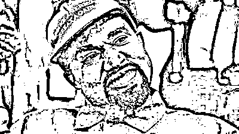

**| **坎耶·韦斯特

我们都知道，**双子座本质上是非道德的，它只是传递信息，而不核验该情况的真实性或道德性。**

**这并不意味着所有太阳星座在双子座的人都是不道德的人，不！**双子座的人可以像任何星座一样诚实。但双子座的功能，就像有人说：“好吧，这就是我听到的。我不知道这是真是假，但这是我读到的”——或者“他们是这么告诉我的。”

**双子座最明显的负面公众形象**仍然是美国前总统唐纳德·特朗普，他的“选举谎言”已经成为过去两年中最臭名昭著的谎言。作为这个谎言的设计者和首席代言人，他说他的“2020 年总统选举被窃取了”，他说服了 70%的共和党人相信这个谎言是真的。

**美国中期选举定于 11 月 8 日举行，这是在第二次双子座火星四分海王星期间。**特朗普将“被窃取”的 2020 年大选作为他后白宫政治生活的核心。

相信选举谎言是获得特朗普政治支持的关键——共和党候选人一直在排队等待获得这种支持。因此，这次美国大选可能会将权力平衡转移回共和党，并为特朗普在 2024 年再次竞选总统奠定基础。

所以，我们将在 11 月见证“经证实的谎言”扭转历史潮流的潜在力量。这是一个值得关注的关键时刻，是**信息战**中的一场关键战役——数百万人投票支持一个最令人振奋的信念植根于欺骗的政党。

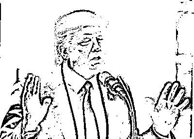

**| **唐纳德·特朗普

因此，**这个在负面意义上无疑代表着欺骗的火星-海王星四分相，**在 11 月美国的投票箱中得到了充分的表现。

还值得记住的是，**美国建国星图中火星就在双子座四分海王星**（海王星在处女座，而不是双鱼座），而这一次逆行于双子座的火星四分海王星与 1776 年 7 月 4 日的火星-海王星四分相**非常相似。**

**除了中期选举，与枪支管制和种族暴力有关的问题也可能在美国爆发。**我希望，在火星-海王星四分相期间，美国发生的任何事情都将有助于纠正问题，而不仅仅是给拒绝增加更多的痛苦。

我意识到我是个**理想主义者**，我是多么的**海王星**啊！毕竟，火星在双子座——快速旋转的星座，就像《独立宣言》宣称的那样，“我们认为这些真理是不言而喻的，人人生而平等，造物主赋予他们若干不可剥夺的权利，其中包括生命、自由和追求幸福的权利。”

当然，1776 年，数百万奴隶无法追求自己的幸福，这一现实并未被提及。很多时候，未尽之言的意义比说出的话更意味深长。

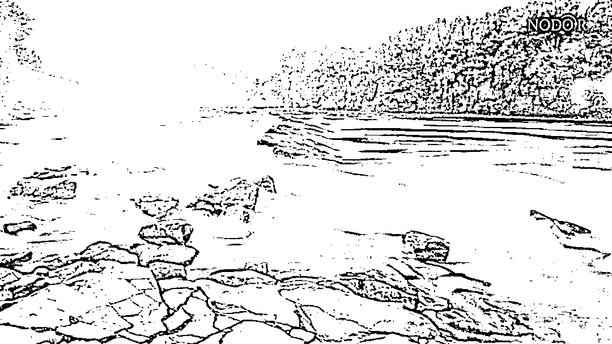

**火星在双子座逆行的其它特征**

重要时刻

*   2022 年 9 月 4 日：火星首次进入双子座 8 度

*   2022 年 9 月 20 日：火星首次经过双子座 16 度

*   2022 年 10 月 30 日：火星在双子座 25 度逆行

*   2022 年 12 月 8 日：火星在双子座 16 度对分太阳

*   2023 年 1 月 12 日：火星在双子座 8 度顺行

*   2023 年 2 月 20 日：火星最后一次经过双子座 16 度

*   2023 年 3 月 16 日：火星最后一次经过双子座 25 度

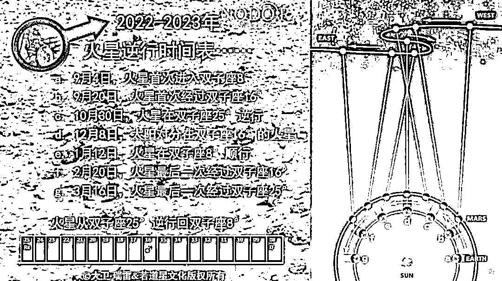

**| **若道核心课课件

**记住这些度数。如果你出生图中的上升、太阳、月亮或个人行星在变动星座中（双子座、处女座、射手座、双鱼座）的度数与这些度数接近，那么你将更直接地受到火星在双子座逆行阶段的影响。这对于双子座和射手座来说更是如此，即合相和对分相。**

你可以通过回想**9 月 4 日**左右火星首次进入双子座 8 度的逆行区间时，你生活中出现的问题，来了解这个火星逆行期对你意味着什么。**无论这些问题或情况如何，都可能在 1 月变得更加明显，**因为届时火星将在双子座 8 度停滞顺行。

**火星总是“行动之所在”，在这些逆行阶段更是如此。**

**12 月 8 日的太阳-火星对分相也值得关注。**太阳将位于射手座 16 度，火星将位于双子座 16 度。如果你有任何个人行星或虚点接近变动星座的这些度数，你一定会感受到这个相位的张力。

**一切对分相位的关键都在于试图协调局势或问题的双方。**考虑什么时候适合做射手座，什么时候适合做双子座。

双子座的解决方法是迅速解决问题，但射手座想知道接下来会发生什么——大局是什么，“我们会解决最重要的问题吗?”在一段关系中，这可能意味着，“好吧，我们今晚不谈这个，但是我们同意这个周末抽出时间谈谈这个问题。”

**所以，时间被留出来真正去讨论出现的任何问题。**

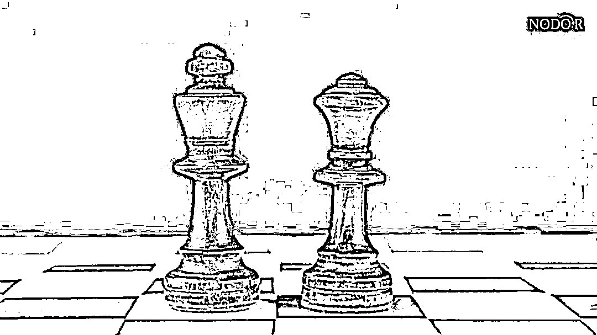

**你的机会**

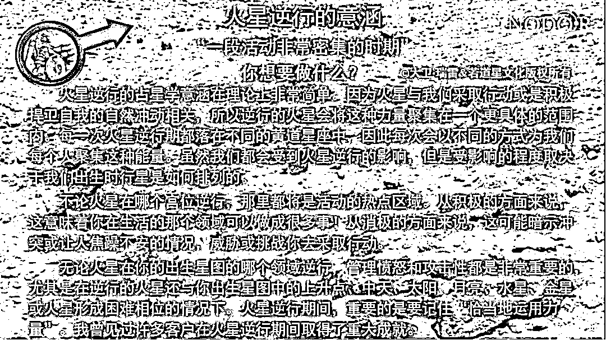

****| ****若道核心课课件

**在整个火星逆行阶段，你将有机会提高你的沟通技巧，即**使是火星四分海王星时期——这可能意味着学习如何谈论“敏感话题”。

**无论这个火星逆行时期出现在你星图中的哪个（些）宫位，在三月底之前这里都将是一个热点区域。将这段时期作为在你的宫位相关领域中真正去发展自己的时间。**

例如，在整个火星逆行阶段，火星在我的第六宫，从 9 月份开始，我开始了一项新的锻炼计划，从那以后我逐渐改进。我希望到 3 月底，我的身材变得更好，至少减掉 3 公斤。到目前一切尚好。

**火星在你星图的哪个区域？你可以在哪些领域变得更加活跃，带来更多的成就感？**

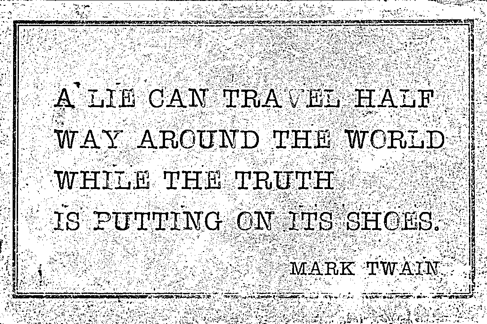

**“当真理还在穿鞋时，谎言已走遍半个世界”。——马克·吐温**

**版权声明：**原创文章由作者授权首发于若道平台，欢迎转发，反对抄袭。友号转载请申请白名单。

**END**

****想阅读更多作者的文章，请在后台回复******大卫****** 即可。****

**大卫·瑞雷**

美国占星师，若道联合创始人，致力于在中国教授和推广西方占星学；2010-2014 年，任全美占星师联盟监督委员会委员；2017 年，被选为 ISAR 委员会成员。ISAR 是世界最大的国际占星机构，会员遍布 45 个国家，2017-2020 年曾任 ISAR 全球副主席、CAPISAR（ISAR 职业占星师资质认证机构）主席。

**拥有****51 年****占星实践经验的****若道创始人****前 ISAR 全球副主席****前 ISAR 全球职业占星师资质认证主席****大卫·瑞雷**

**和**

**2019 年第二届、2021 年第三届核心课中**

**与苏·汤普金斯老师****联合授课****的**

**ISAR 认证职业占星师**

**咔咔（Caroline）**

**二人合力打造**

**2022 年 ****若道全新核心占星课程**

**点击下图了解更多课程详情** 

**

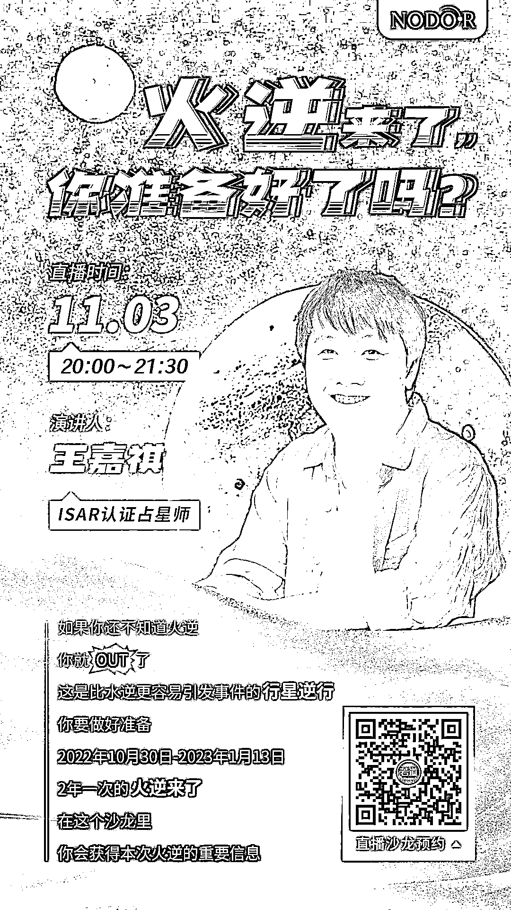

**点击下方按钮预约直播**<mpvideosnap class="js_uneditable custom_select_card channels_live_iframe" data-pluginname="videosnap" data-headimgurl="https://wx.qlogo.cn/finderhead/PiajxSqBRaEJYnVsqWfEX9qA0sI6hNVKsDfyzfPZ92WZMZyBpZWU5NA/0" data-username="v2_060000231003b20faec8c4e68a1ec2d4ca07e434b07755bbf47e7053a3059defd2c9d6c68a20@finder" data-nickname="若道" data-desc="将在 11 月 03 日 20:00 直播" data-intro="如何应对火星逆行攻略" data-noticeid="finderlivenotice-v2_060000231003b20faec8c4e68a1ec2d4ca07e434b07755bbf47e7053a3059defd2c9d6c68a20@finder-1666768541844069-692117899" data-type="live"></mpvideosnap>

**扫描下图二维码，获取你的火逆报告**

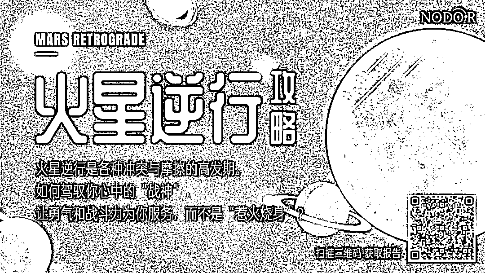

**20 位来自世界各地的占星师****带来 19 场沙龙——新世界的觉醒****详情可点击下图**

**学习占星学****点击下图了解课程详情**

**微信又双叒叕改版啦，不想错过若道君的推送？**
****就把若道设为****星标****以及点点****“在看”****吧！******▼**

**喜欢就点一下“在看”吧！****报名直达入口**

# 明晚直播丨火星逆行在 12 宫位都有哪些影响呢？

> 原文：[`mp.weixin.qq.com/s?__biz=MzA5NjA0NTAxNg==&mid=2651492950&idx=2&sn=ff48809b667cf986f6ebd54947e20e7e&chksm=8b4820e1bc3fa9f723f0d11b03705b700569c70d84510e436d08f4858ac9f7f1be8fd46a4121&scene=126&sessionid=1692737730#rd`](http://mp.weixin.qq.com/s?__biz=MzA5NjA0NTAxNg==&mid=2651492950&idx=2&sn=ff48809b667cf986f6ebd54947e20e7e&chksm=8b4820e1bc3fa9f723f0d11b03705b700569c70d84510e436d08f4858ac9f7f1be8fd46a4121&scene=126&sessionid=1692737730#rd)

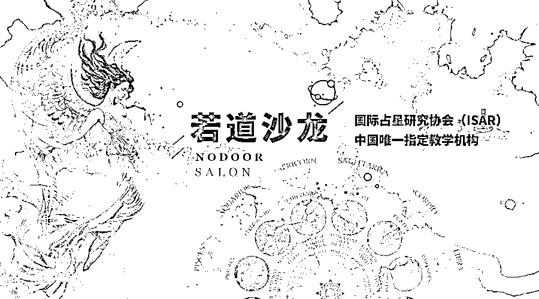

**火逆来了！****从今年的 10 月 30 日到明年的 1 月 13 日，火星逆行。****也就是说，今年余下的时间，你都会在火逆的影响之下。**然而，和水星逆行一样，火逆并非只是从 10 月 30 日才有影响，从火逆阴影期，火星就开始搞事情了！

*   比如，从国际上而言，**9 月 21 日已经是在火逆阴影期**，俄罗斯就是在这个时候宣布部分动员，俄乌战争开始升级，核战争的危险大增。
*   而 10 月 12 日美国宣布禁止美籍华人及持绿卡人士参与我国高端芯片的研发和生产也把中美的高科技战升级了，对我国带来非常不利的影响，**这也是在火逆阴影期之内。**

**只是在阴影期，火星逆行就搞出这么多事情。如果火星停滞，开始逆行，又会出什么幺蛾子呢？**火星逆行前后，与它平时的速度相比，整个的运行速度变得很慢，很可能在一个度数附近停留一周以上。因此，一旦这个逆行的火星与**个人星图、国家星图、组织星****图**发生相位，那火力是非常集中的，**平时可能的一些转瞬即逝的小火星这时候就可能引起燎原之火。**而且不像水星和金星，火星是一颗有关行动的行星，**会容易直接引发一些行为和事件，**就如刚才的 2 个例子所传达的那样。
因此对于占星师而言，每次的火逆都会是占星师非常关注的，其重要性从某种程度而言，是超过其他行星逆行的，**毕竟，2 年才有一次。****为了帮助你更多了解火逆，我们特意为你奉上这样一场火逆直播，**ISAR 认证占星师王嘉祺将为你详细介绍火逆的基本知识，**历年来火逆的一些事件，火逆在 12 个宫位的表现，哪些人在这次火逆中会更受到影响，**还会分享一些火逆的故事。**直播时间：11 月 3 日 20:00-21:30**

**点击下方按钮预约直播**<mpvideosnap class="js_uneditable custom_select_card channels_live_iframe" data-pluginname="videosnap" data-headimgurl="https://wx.qlogo.cn/finderhead/PiajxSqBRaEJYnVsqWfEX9qA0sI6hNVKsDfyzfPZ92WZMZyBpZWU5NA/0" data-username="v2_060000231003b20faec8c4e68a1ec2d4ca07e434b07755bbf47e7053a3059defd2c9d6c68a20@finder" data-nickname="若道" data-desc="将在 11 月 03 日 20:00 直播" data-intro="如何应对火星逆行攻略" data-noticeid="finderlivenotice-v2_060000231003b20faec8c4e68a1ec2d4ca07e434b07755bbf47e7053a3059defd2c9d6c68a20@finder-1666768541844069-692117899" data-type="live"></mpvideosnap>**欢迎转发本文到朋友圈，让你的朋友了解比水逆影响大的火逆来了。你的转发帮助传播占星学，也让更多朋友了解天象，更好安排生活！**

# 插班中丨神话塔罗：高效学习班上线，灵活掌握，专业实践！

> 原文：[`mp.weixin.qq.com/s?__biz=MzA5NjA0NTAxNg==&mid=2651492950&idx=3&sn=34659cced257999f45d5dae5869fcde1&chksm=8b4820e1bc3fa9f7d49e8d1b1dbc8d7e5ef664fdd4df43cbb1ca776c50137754f0e29772501f&scene=126&sessionid=1692737730#rd`](http://mp.weixin.qq.com/s?__biz=MzA5NjA0NTAxNg==&mid=2651492950&idx=3&sn=34659cced257999f45d5dae5869fcde1&chksm=8b4820e1bc3fa9f7d49e8d1b1dbc8d7e5ef664fdd4df43cbb1ca776c50137754f0e29772501f&scene=126&sessionid=1692737730#rd)

**2022 年超高含金量的神话塔罗认证课程****高效学习班****开始招生**用**四个月**的时间学习掌握神话塔罗解读喜欢**集中学习，快速掌握**的同学不要错过

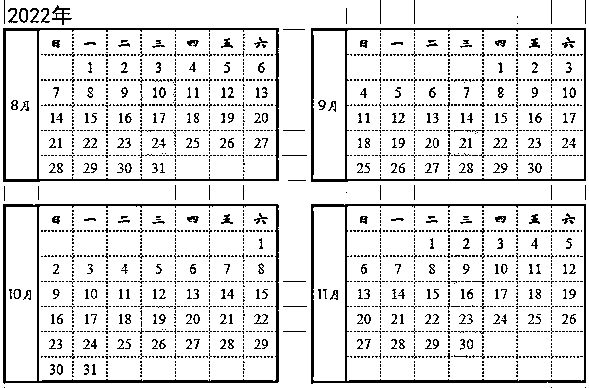

黄色日期为**8 节直播课**时间，同学可以自由安排时间学习**18 节录播课**

班级学习群讨论、APP 答疑区提问

课程内容体系让你直观精准地感受到**神话塔罗的魅力**扎实地建构**神话塔罗思维**系统学习**最地道的塔罗知识**课程中老师将**神话、占星、心理学**完美融合进塔罗的**人本主义咨询体系**并进行学员**案例督导**让你更自信的开展咨询工作，学以致用

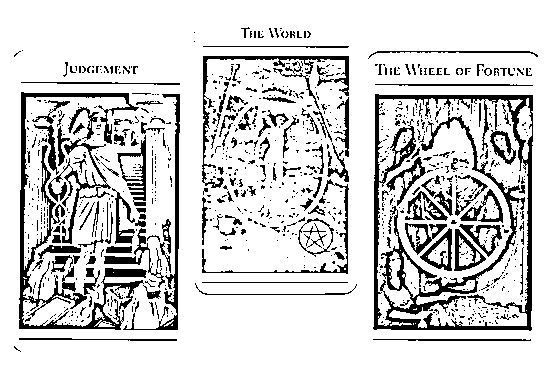

本期认证课程采取**即报即学的录播课+案例督导直播课**的形式，

*   **18 节录播课：**精编剪辑，随来随学，助教答疑，学练结合。

*   **8 节直播课：**融会贯通，神话心理，塔罗占星，咨询技巧。

为了适配大家的各种学习场景，提高学习&复习效率，我们还将**录播课**剪辑了**中文字幕版**和**翻译音频版**：

*   **中文字幕版：**朱丽叶老师英文原声配中文字幕，适合在手机或电脑前专心致志的学习。

*   **翻译音频版：**翻译老师幼婷的中文原声纯享，适合运动、通勤路上耳机里陪伴式学习。

若道还为塔罗学员开发了**“神话塔罗”**平台，是随身的工具，更是接咨询的平台，录播课程**学成入驻平台**即可链接更多塔罗个案，发展壮大你的塔罗咨询事业。

**如果你想学习塔罗，什么样的老师会让你怦然心动呢？她是三副塔罗牌的设计者，写了 6 本塔罗书籍。她研习塔罗四十余年，教授塔罗三十余年，是丽兹·格林的密友。还有****谁会比塔罗牌设计者更了解塔罗的历史、灵魂与精髓？****所以，这将是你开启塔罗之旅最坚实的一步。**

1

**这位塔罗大师是谁？**

**朱丽叶·沙曼-伯克** 

*   她是**3 副塔罗牌**的**设计者****——**神话塔罗牌、沙曼–卡塞利塔罗牌、“自己着色”塔罗牌；

*   她出版了**6 本塔罗书****——**《塔罗全书》、《新塔罗全书》、《众星的传说》、《理解塔罗牌》、《精通塔罗牌》、《塔罗初学者指南》；

*   她研习塔罗**四十余年；**

*   她教授塔罗**三十余年**；****

*   她是**丽兹·格林**的密友，两人合著了**《神话之旅》**，共同设计了**神话塔罗牌**。

*   她是认证的**心理治疗医师；**

*   她深谙**塔罗、占星学、心理学和神话学。**

**如果你想成为拥有英国神话塔罗认证的塔罗师**

那么她，就是你**最好的老师人选**

2

**塔罗牌有什么用？**

*   塔罗牌是一种**古老的疗愈工具**，同时也是**直观的解惑工具****；**

*   塔罗牌绕过逻辑思维，**和潜意识联结**，通过图像的方式生动地将隐藏在人类潜意识中的画面浮出水面，**揭示心灵的状况和运作****；**

*   塔罗牌**帮助我们和潜意识对话**，可以和现代的心理治疗联系在一起，帮助我们**看清心灵的冲突来源、本质和可以选择的道路；**

*   塔罗牌又和更广阔的**宇宙生命原型**联结，彰显**个人生命发展的阶段**，将**个人生命挣扎、内在冲突**放在生命进化的道途上，让更广大的生命智慧为个人成长照亮道路。

3

**为什么学习神话？**

神话通过**图像和故事**描绘人类生活的**原型模式**。通过瑰丽的想象、诗意的语言、栩栩如生的人物和故事描绘出我们内心的世界，表达出我们经历的那些实现人性的过程，帮助我们将**个体的生活与人类古老且永恒的故事**建立联结。从而在更深处**理解生命**，并学习**古老而长青的生命智慧**。

**神话塔罗**取材于**希腊神话**的无尽沃土，通过故事提供一种**记忆辅助**，在心理和预见层面提升解读的**丰富度**。因为这样更符合塔罗牌的性质，符合人类的想象。**按照故事思考，而不是简单的记忆关键词和固定的意义。**

4

**塔罗预测是什么？**

塔罗牌预测的运作就像是**照向心灵的一面镜子**。在塔罗牌解读时，图像的原型性质穿透隐藏的潜意识脉络，反应出与个人境遇相关但又未被了知的知识与洞见，因此**揭示出按照任何理性方式都无法发现的事情。**

如果你对生命好奇，塔罗学习会帮你**打开一扇通往未来的门****，**让你了解**心灵运作和显化的秘密**，同时赋予你更多关于生命成长的支持和指引的能力！

5

**我们将学习什么？**

**录播课（即报即学）**

**☆****初阶：神话塔罗详解**

**神话故事和预测意涵**

**第 1 讲 塔罗牌介绍 ，讲述它的历史 （中文字幕版）**

**第 1 讲 塔罗牌介绍，讲述它的历史（翻译音频版）**

**第 2 讲 星座形态、元素和宫廷牌&基本星座与基本国王 （中文字幕版）**

**第 2 讲 星座形态、元素和宫廷牌&基本星座与基本国王（翻译音频版）**

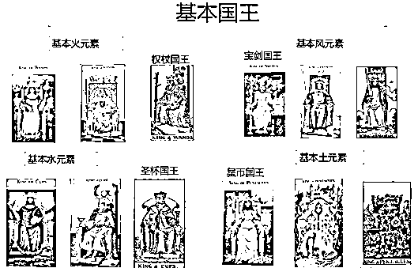

**第 3 讲 固定星座与固定王后（中文字幕版）**

**第 3 讲 固定星座与固定王后（翻译音频版）**

**第 4 讲 变动星座与变动骑士（中文字幕版）**

**第 4 讲 变动星座与变动骑士（翻译音频版）**

**第 5 讲 小阿尔卡那牌权杖（中文字幕版）**

**第 5 讲 小阿尔卡那牌权杖（翻译音频版）**

**第 6 讲 小阿尔卡那牌圣杯（中文字幕版）**

**第 6 讲 小阿尔卡那牌圣杯（翻译音频版）**

**第 7 讲 小阿尔卡那牌宝剑（中文字幕版）**

**第 7 讲 小阿尔卡那牌宝剑（翻译音频版）**

**第 8 讲 小阿尔卡那牌星币（中文字幕版）**

**第 8 讲 小阿尔卡那牌星币（翻译音频版）**

**第 9 讲 经典牌阵教学讲解（中文字幕版）**

**第 9 讲 经典牌阵教学讲解（翻译音频版）**

**第 10 讲 牌阵解读案例演示（中文字幕版）**

**第 10 讲 牌阵解读案例演示（翻译音频版）**

**☆****中阶：神话塔罗牌阵应用**

**神话****解读和咨询技巧**

**开启神话塔罗愚人之旅**

****

**第 1 讲 愚人、魔术师、女皇、皇帝（中文字幕版）**

**第 1 讲 愚人、魔术师、女皇、皇帝（翻译音频版）**

**愚人**：永恒的少年（儿童的原型）

**魔术师**：恶作剧者、老师、向导、沟通者的原型；行星：水星。

**女王**：母亲、养育者、丰产的原型；行星：金星在金牛座；小行星：谷神星。

**皇帝**：父亲、供养者、计划者的原型；行星：木星。

**第 2 讲 女祭司、教皇、恋人、战车、正义、节制（中文字幕版）**

**第 2 讲 女祭司、教皇、恋人、战车、正义、节制（翻译音频版）**

**女祭司**：处女——等待被实现的潜力原型；行星：新月。

**教皇**：疗愈者、受伤的疗愈者、牧师的原型，牧师是神与人之间的灵性桥梁；行星：凯龙星。

**恋人**：爱、爱人、所爱之人的原型；行星：金星在天秤座。

**战车**：战争、冲突、战士、斗士的原型；行星：火星。

**正义**：智慧、兵不血刃的胜利的原型；星座：处女座；小行星：智神星。

**节制**：关系、合作的原型；星座：巨蟹座、双鱼座。

**第 3 讲 力量、隐士、命运之轮、倒吊人、死神（中文字幕版）**

**第 3 讲 力量、隐士、命运之轮、倒吊人、死神（翻译音频版）**

**力量**：力量的原型；星座：太阳在狮子座。

**隐士**：晚年、耐心的原型；行星：土星。

**命运之轮**：命运女神与命运的原型。

**倒吊人**：牺牲与有意识的牺牲的原型；行星：海王星。

**死神**：死亡、终点和起点的原型；行星：冥王星。

**第 4 讲 恶魔、高塔、星星、月亮、太阳（中文字幕版）**

**第 4 讲 恶魔、高塔、星星、月亮、太阳（翻译音频版）**

**恶魔**：阴影、人类不文明的面向、本能、欲望天性；行星：火星在天蝎座。

**高塔**：改变、分裂瓦解的原型；行星：天王星。

**星星**：希望的原型。

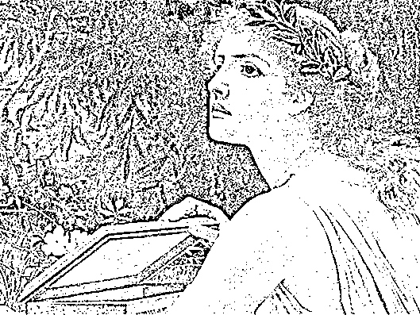

**月亮**：无意识的原型；行星：暗月。

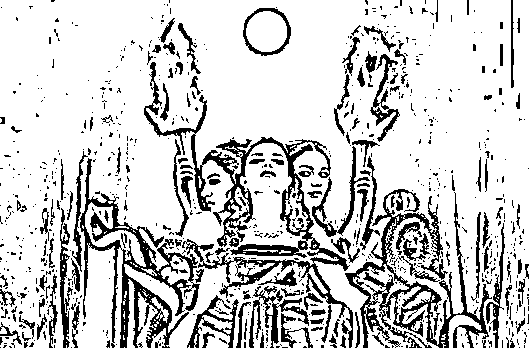

**太阳**：意识、创造力和文明的原型；行星：太阳。

**第 5 讲 审判、世界（中文字幕版）**

**第 5 讲 审判、世界（翻译音频版）**

**审判**：复活、新生的原型；行星：水星作为灵魂向导普绪科蓬波斯。

**答疑与讨论，学员们分享对自己或客户的塔罗解读，对神话塔罗牌进行更多探讨。**

**世界**：整体、完成和个性化的原型。

**第 6 讲 经典牌阵教学讲解（中文字幕版）**

**第 6 讲 经典牌阵教学讲解（翻译音频版）**

**第 7 讲 咨询案例演示：为一位年轻女性所做的四次解读（中文字幕版）**

**第 7 讲 咨询案例演示：为一位年轻女性所做的四次解读（翻译音频版）**

**第 8 讲** **引导式冥想、荣格的四种意识功能（中文字幕版）**

**第 8 讲 引导式冥想、荣格的四种意识功能（翻译音频版）**

**☆****高阶：神话塔罗直播督导课**

**第 1 讲 塔罗牌中的荣格原型**

**2022 年 8 月 10 日（周三）**

我们将学习荣格是如何理解原型，以及荣格原型如何反映在塔罗牌中。对塔罗牌解读而言，理解原型的普遍性非常有帮助，因为这有助于塔罗咨询师碰触客户的内心世界。

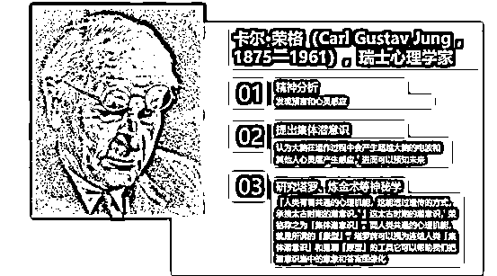

**第 2 讲 塔罗牌是如何与行星原型和其原型体验联系在一起**

**2022 年 8 月 24 日（周三）**

大阿卡纳牌反映了行星神祗的原型，在某些情况下，原型经验意味着它们反映了所有人类的经验。我们将通过这个角度看这些大阿卡纳牌。我们将看到理解原型对解读有何帮助。

**第 3 讲 荣格意识的四种功能与小阿卡纳牌的四种元素及与权杖、星币、宝剑、圣杯四套牌之间的联系**

**2022 年 9 月 7 日（周三）  **

我们将看看小阿卡纳从 1 到 10 如何反映荣格意识功能的各个方面，以及它们如何反映在四套牌四个元素和其心理方面。我们还将对 1-10 的数字学进行修正，看它们在元素中的表现方式。

**第 4 讲 占星学中的 12 星座和宫廷牌之间的联系**

**2022 年 9 月 21 日（周三）**

我们将讨论形态和星座，以及它们如何反映在宫廷牌上。

**第 5 讲 马蹄牌阵学员案例督导**

**2022 年 10 月 19 日（周三） **

**第 6 讲 六芒星牌阵学员案例督导**

**2022 年 11 月 2 日（周三） **

**第 7 讲 凯尔特十字学员案例督导**

**2022 年 11 月 16 日（周三） **

**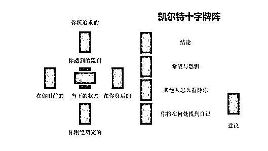**

**第 8 讲 三个牌阵学员完整案例督导**

**2022 年 11 月 30 日（周三）**

**认证阶段：考试论文**

录播课学习完毕，即可入驻若道神话塔罗平台，以实习塔罗师获得推广流量，对接塔罗咨询个案。

直播课+录播课学习完毕，提交考试论文通过即可获得获得英国神话塔罗认证证书，升级为认证咨询师。

**扫码进入全新神话塔罗 H5**

每天有事没事都可以去**神话塔罗 H5**里转转抽取专属于你的今日塔罗

**神话塔罗 H5 问答平台全新上线**

三张牌牌阵，专业塔罗咨询师语音条解读

如果你碰巧有困惑，刚好有**限时优惠价**

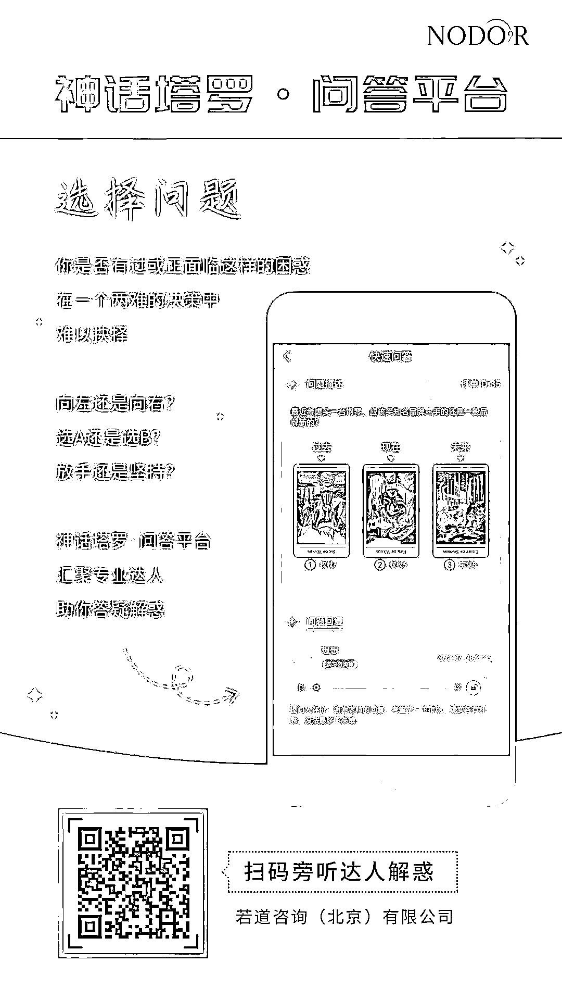

如果感到快乐你就用用**神话塔罗 H5****，**如果你感到不快乐，更要使用由专业人本主义塔罗师团队全程陪伴的**神话塔罗 H5 哦！**

6

**适合人群**

*   塔罗初学者，完全没有塔罗基础；

*   塔罗自学者，也曾上过塔罗工作坊，但仍不懂如何使用塔罗牌；

*   塔罗进阶学习者，有塔罗基础，了解 78 张塔罗牌含义；

*   不知如何解决遇到的情感困惑、职业选择、人际问题，对人生感到迷茫；

*   想要学习深入解读塔罗牌、牌阵的使用、咨询技巧等将塔罗运用于咨询实践；

*   想要深入了解和学习塔罗，希望成为专业的塔罗师；

*   想要借助塔罗进行心灵、灵性成长。

7

**导师简介**

**朱丽叶·沙曼-伯克**

**朱丽叶·沙曼-伯克**从 20 世纪 70 年代早期开始，就对塔罗牌产生了兴趣，并踏入了塔罗的世界。后来，在丽兹·格林的鼓励下，开始研习心理占星学和塔罗。

1984 年，第一本书《**塔罗全书**》（*The Complete Book ofTarot*）出版。之后，与丽兹·格林合作设计并撰写了《**神话塔罗**》（*The Mythic Tarot*），在这本书中，她们将古希腊神话与传统塔罗解读结合起来。朱丽叶写了**十本塔罗和占星学书**，包括一本名为《众星的传说》（*Stories from the Stars*）的儿童读物，以及与丽兹·格林合著的《神话之旅》（*The Mythic Journey*），这是一本详细讲述如何运用神话来指导生活的书。

8

**课程价格**

**认证课程总价：****22000 元**

**联报优惠价：****19000 元**

**限时转发优惠价：18000 元（联系 Echo 老师，获取限时转发优惠价）**

长按二维码添加客服 Echo 老师

9

**退转课程**

*   **退款原则请详看《教学协议》，如有疑问请咨询课程顾问。**

**神话塔罗认证课程**

**授课老师：朱丽叶·沙曼-伯克**

**授课时间：录播课即报即学，直播课 2022 年 8 月 10 日起**

**授课方式：**网络课程**，**英文授课，中文翻译

**费用：****认证课程总价：****22000 元；****联报优惠价：****19000 元；****限时转发优惠价：18000 元**（联系 Echo 老师，获取限时转发优惠价）

**课程负责人：Echo 老师**（微信/手机：nodoor18518412824，请备注“神话塔罗”）

长按二维码添加课程负责人咨询~

**END****报名直达入口**

# 神话塔罗之小阿卡纳牌 | 权杖 4-6

> 原文：[`mp.weixin.qq.com/s?__biz=MzA5NjA0NTAxNg==&mid=2651492950&idx=4&sn=7b1942f395b4f3200e9a8875cdacd8be&chksm=8b4820e1bc3fa9f73a89fdc9495c260144ffa46f5b04c9403f954748a5f8bcf01c887f7e795f&scene=126&sessionid=1692737730#rd`](http://mp.weixin.qq.com/s?__biz=MzA5NjA0NTAxNg==&mid=2651492950&idx=4&sn=7b1942f395b4f3200e9a8875cdacd8be&chksm=8b4820e1bc3fa9f73a89fdc9495c260144ffa46f5b04c9403f954748a5f8bcf01c887f7e795f&scene=126&sessionid=1692737730#rd)

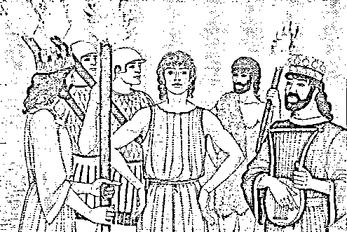

作者/朱丽叶·沙曼-伯克 丽兹·格林

译者/闫东升 编辑/玫瑰 图片/神话塔罗 网络

本文节选自《神话塔罗》

小阿卡纳 14 张权杖牌反映了人们创造性想象力的发展过程，以及它在人们外部生活中所激发的挑战。今天我们将继续权杖牌组的寻找金羊毛之旅。今天就让我们走近权杖牌组的 3 张数字牌——权杖 4-6。

**书名：**

神话塔罗 

**作者：**

朱丽叶·沙曼-伯克   丽兹·格林 

**出版日期：**

2011-08-02

**权杖 4**

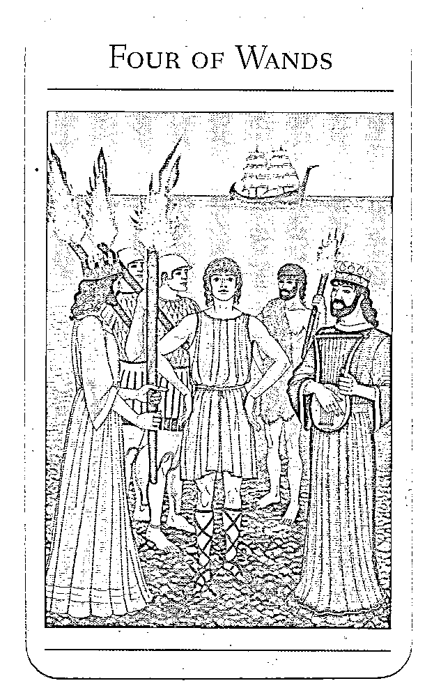

**伟大的阿尔戈号**

权杖 4 描绘的是杰森（*Jason*）和他将要一起探险的伙伴们庆祝伟大的阿尔戈（*Argo*）号（大船）成功地修建完成的情景，阿尔戈号后来载着他们去到黑海（*Black Sea*）的科尔基斯（*Colchis*），寻获了金羊毛。

船上红色的巨帆象征着太阳的光芒，它此时正浮在潮汐中，等待着远航。

杰森穿着红色的束腰外衣，和另外五位英雄伙伴们站在一起，他们是：身穿狮皮的赫拉克勒斯（*Heracles*，力量牌中出现过）；戴着金色皇冠身穿深红长袍的雅典国王赛休斯（*Theseus*，我们会在权杖国王牌中再次遇到他）；

身穿银色盔甲的双子勇士卡斯托耳（*Castor*）和波吕丢刻斯（*Polydeuces*，我们将在宝剑骑士牌中再次遇见他们）；身穿蓝色长袍手托竖琴的乐者俄耳甫斯（*Orpheus*，我们在圣杯国王牌中遇见过他）；前面四位手中都握着一根权杖。

**丰收与奖赏**

**权杖 4 意味着丰收和奖赏。**全新的创造性想法的挑战已经克服，艰苦工作的付出也告一段落，杰森通过努力赢回了理所当然的奖赏。

就像权杖 3 一样，权杖 4 也暗示着**某些东西是值得庆祝的**，和权杖 3 不同的是，此时他们有了**更稳固的基础和现实的回报。**

寻找金羊毛的挑战非常艰辛，一个人怎么可能独自跑到地球的另一端，而且还赤手空拳？杰森知道他自己无法完成这么危险的航程，于是找来一群好朋友，帮助他完成目标。

神话中这些英雄们都有自己特别的技能，赫拉克勒斯拥有力量；赛休斯和杰森一样，是个火爆的探险王，拥有创造性的愿景；双子勇士拥有利剑一样敏锐的头脑；俄耳甫斯具有很深的情感力量和深切的同情心，能够缓和敌人强烈的杀意。

在这个创造性工作实施的阶段，我们也许在生活中遇到此类朋友，也许是来自我们内在的力量，他们能够帮助我们达成目标。拥有这个英雄云集的群体和雄伟的阿尔戈号，杰森感到非常满足。

**权杖 4，奖赏**

**从解牌的角度来看，权杖 4 预示着付出的努力获得奖赏的阶段到了。**一个创造性的想法已经开花结果，当事人有权利庆祝自己付出努力所得到的回报。

**但是这只是旅程中间的一个阶段，不久他（她）的航行就要启程，达成最终目标前那最艰辛的挑战即将来临。**

**权杖 5**

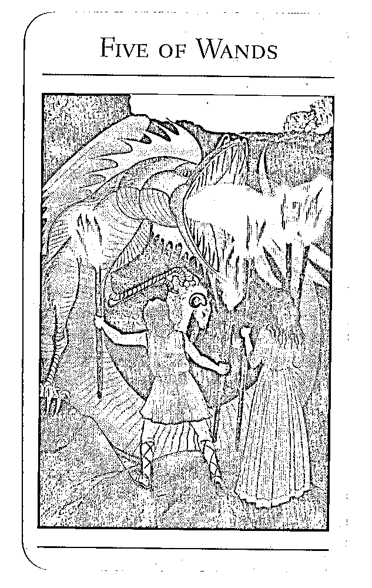

**勇者斗恶龙**

权杖 5 描绘的是杰森与守护金羊毛的巨龙之间的战斗。巨龙身上覆盖着微绿色的鳞甲，嘴里喷着火焰，一只爪子紧紧抓着珍贵的金羊毛。

杰森双手握着两根权杖正在和巨龙奋战。他身旁站着爱人——女魔法师美狄亚（*Medea*），她是科尔基斯的国王埃厄忒斯（*Aeetes*）的女儿，金羊毛一直被他父亲所拥有。美狄亚是一个美丽的黑发女子，穿着火红色的长袍，手里握着三根权杖。

**与困难对峙**

**权杖 5 代表着斗争。**在这里，创造性的愿景和巨龙象征的物质现实互相抵触，神话中的巨龙常常代表着土元素最初的力量，其典型特质之一就是**抗拒改变**。

生命的现实面向有诸多限制（等同于每个人回归惯性所导致的局限），它对于每个想要在现实生活中表达创造性想象力的人来说，都是巨大的挑战。

**这张牌象征性地显示了每个人在表达创造性想象力时遇到的具体困难**，例如金钱的问题（资金缺乏、现金流的问题）；缺乏足够的技能（个体必须进一步学习或培训以获得指定的技能）；

身体上的难题（因为急不可耐地达成愿景，我们可能超负荷工作，以至于变得疲惫不堪或疾病缠身）；为了市场的需求而必须调整愿景时的进退两难（太过保守、警惕或者碰不到拥有慧眼的伯乐）等等。

**这些难题和人们内心对它的恐惧（可能表现为害怕失败或者以冷漠掩饰的无力感）是相应的，巨龙也象征着这一切。**

但是杰森必须击败巨龙，否则他就无法获得金羊毛，创造性的工作中必然要面对障碍，无论是内部或者外部的。想象力无可避免地要和现实相抵触，人们必须以某种方式调节这个矛盾。

女魔法师美狄亚对于杰森来说是不可或缺的。如果没有她，杰森就无法拥有足够的愿景和勇气。她知道如何找到巨龙的巢穴，如何去击败它。

从某些层面来说，她和大阿卡纳牌中的女祭司有紧密的联系，象征着**神秘的女性力量中的直觉和本能**，她们是危机中英雄们必须要依赖的。**因此，权杖 5 的斗争需要当事人对于愿景的坚持和忠诚，还需要在时机上和现实层面的运作上有一种敏锐的感觉。**

**权杖 5，斗争**

**从解牌的角度来看，权杖 5 预示着斗争，当事人必须成功地和象征物质现实的巨龙决一死战后才能达成目标。**

现实的问题会导致一些失误，当事人必须**关注现实层面的限制和需求，否则就会陷入沮丧或者冷漠的情绪中**。**保持最初愿景的完整性时，妥协也是必要的。**

**权杖 6**

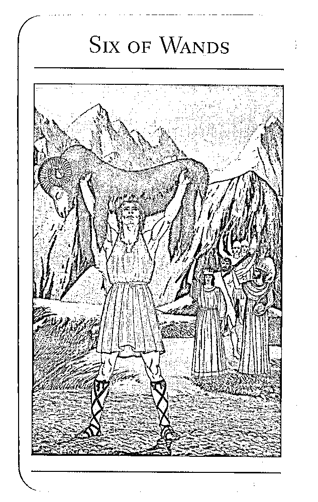

**凯旋归来**

权杖 6 描绘的是杰森战胜巨龙获得金羊毛的胜利时刻。这位英雄兴高采烈地把金羊毛高高举起，他身后是六位英雄的同伴，每个人都握着一根权杖和杰森一起欢庆。

**获得他人认可的胜利**

**权杖 6 代表着胜利的经验，同时获得了他人的认可和公众的欢呼。**经过与巨龙激烈的争斗，杰森获得了应有的奖赏，金羊毛此时就在他的手中，同伴们高举着权杖认可他的胜利并为之欢腾。

这张牌代表着**人们正处于意气风发的时刻，他（她）经过不懈努力，成功地对他人表达出了新的想法或创造性愿景，获得了整个集体的认可**。

创造性的探险之旅不光要得到我们所爱之人的支持，也要得到外在世界的认可，**权杖 5 中那条象征现实制约的巨龙死去也隐喻着外界从阻碍到认可的转变。**

权杖 6 令人陶醉的胜利时刻可能以很多种形式呈现出来，它依赖于目标的高度和个体渴望的强度。

例如经过若干年艰苦训练的运动选手赢得了胜利的奖牌；个体坚持努力地工作，终于获得了渴望的职位；作家的作品出版发行并获得读者的喜爱；学生们经过十年寒窗，终于金榜题名等等。

无论大小，这个时刻都达成了目标并获得了他人的认可。从个体的层面来说，权杖 6 代表着**小阿卡纳牌中个体最满足的时候，因为它意味着个体的创造性愿景获得了公众的认可，开始时候的焦虑和坐立难安终于物有所值了。**

但是权杖 6 并不是终点，因为杰森还没有带着金羊毛回到约尔科斯（*Iolkos*）。

**公众的认可也会带来一种进退两难的局面：当个体达到创造力的巅峰时，创造性的想象力却不能永远停留此处，更多的挑战将会到来，尤其是他人的嫉妒和竞争会在胜利的一刻同时来临。**

**权杖 6，功成名就**

**从解牌的角度来看，权杖 6 预示着公众对于当事人创造性想象力的认可和欢呼。**这会带来某种形式的提升，获得了资格、名望和利益。（译者注：但是当事人应该注意到同时带来的**嫉妒和竞争**）。

**版权声明：**本文由《自在园》授权发布，欢迎转发，反对抄袭。友号转载请申请白名单。

**朱丽叶·沙曼·伯克**从 20 世纪 70 年代早期开始，就对塔罗牌产生了兴趣，并踏入了塔罗的世界。后来，在丽兹·格林的鼓励下，开始研习心理占星学和塔罗。1984 年，第一本书《塔罗全书》（The Complete Book ofTarot）出版。之后，与丽兹·格林合作设计并撰写了《神话塔罗》（The Mythic Tarot）。朱丽叶写了十本塔罗和占星学书，包括一本名为《众星的传说》（Stories from the Stars）的儿童读物，以及与丽兹·格林合著的《神话之旅》（The Mythic Journey），这是一本详细讲述如何运用神话来指导生活的书。

**点击下图了解课程详情** 

**微信又双叒叕改版啦，不想错过若道君的推送？****就把若道设为星标吧！****▼**

**喜欢记得点一下在看哦☟**

************报名直达入口************

# 11 月宇宙天气丨令人疲惫的一个月，仍有慈悲与希望

> 原文：[`mp.weixin.qq.com/s?__biz=MzA5NjA0NTAxNg==&mid=2651492820&idx=1&sn=9479727ba02bf4dd860a85b13397b5ee&chksm=8b482363bc3faa75039f58bb314546a556afc55cf83a5dba53edafd6f39e2090d663c52bcc7f&scene=126&sessionid=1692737730#rd`](http://mp.weixin.qq.com/s?__biz=MzA5NjA0NTAxNg==&mid=2651492820&idx=1&sn=9479727ba02bf4dd860a85b13397b5ee&chksm=8b482363bc3faa75039f58bb314546a556afc55cf83a5dba53edafd6f39e2090d663c52bcc7f&scene=126&sessionid=1692737730#rd)

******☆ **后台回复“今日”，给你一句生命态度****

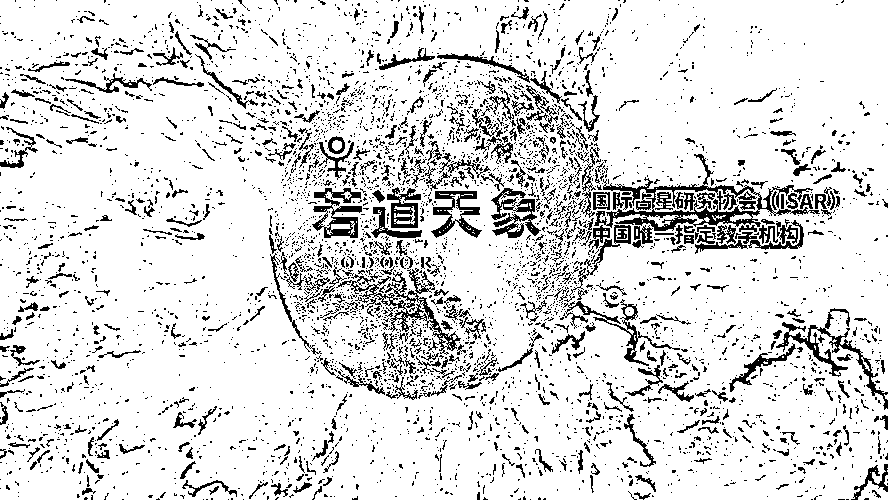

作者/Anastasia

编辑/玫瑰 封面/书君 图片/稿定设计

**11 月重点天象**

**· 金牛座满月，月全食（11 月 8 日）****· 金星进入射手座（11 月 16 日）****· 水星进入射手座（11 月 17 日）****· 太阳进入射手座（11 月 22 日）****· 射手座新月（11 月 24 日）****· 木星在双鱼座恢复顺行（11 月 24 日）****整体氛围****11 月令人疲惫，对所有人来说都是一个极大的考验，考验我们如何适应和应对生活中不可避免的限制。**疲惫是一种感觉，疲惫不是背后的原因。原因并不是我们停下脚步的理由，虽然难，但一定要咬紧牙关坚持下去。**10 月底，火星在双子座 25°开始逆行，时间从 10 月 30 日-2023 年 1 月 13 日，逆行区间从双子座 25°到 8°。火星从 8 月 20 日进入双子座，要一直停留到明年 3 月 25 日才离开。在双子座停留将近 7 个月的时间。****11 月，火星的逆行区间是双子座 25°到 19°。**于此同时，整个 11 月海王星是在双鱼座 22°逆行。也就是说，**几乎整月，火海都处于逆行四分的状态**。四分相会带来内心的拉扯，无法选择，也无法行动。这将是感觉特别疲惫的一个月，莫名其妙找上门来的精疲力竭特别频繁。不单是精神层面，也包括了身体层面，什么也不想想，什么也不想做。**在土天四分逐渐开始出相位的时候，人们好像再也坚持不住，突然被大环境干趴下了。**尤其是生日在 **3 月 13**日**-17 日的双鱼座、6 月 14 日-18 日的双子座、9 月 16 日-20 日的处女座和 12 月 15 日-19 日的射手座**，一定要学会**顺势而为**。不是不做，也不是楞扛，而是**根据现实变化和自身状态，随时调整，顺应大势去做。**再去看一眼美国国家星图，会发现一个华丽丽的火海四分相，火星双子 21**°**，海王星处女 22**°**，正好和现在行进火海四分构成一个 T 三角结构。行进的太阳、火星、海王星触发了美国星图上的火海结构。 **火星意味着争取自己的权力，海王星意味着混乱无约束，因为欲求不被满足而怒火冲天，为所欲为。**至于 11 月具体会发生什么，让我们静观其变吧。11 月，**木星在双鱼座 29°-28°停滞。**我们需要理解，**生命是巨大的责任，生命不是用来享乐的。****木星将于 11 月 24 日恢复顺行，12 月 20 日离开双鱼座。**在双鱼座最后的两个月，**木星尤其利好生日在 3 月 17**日**-20 日、7 月 20**日**-23 日、11 月 19**日**-22 日的人群**，要抓住这最后两个月的机会，**明确自己的方向，落实自己的利益，充分利用木星带来的好运和机会。**

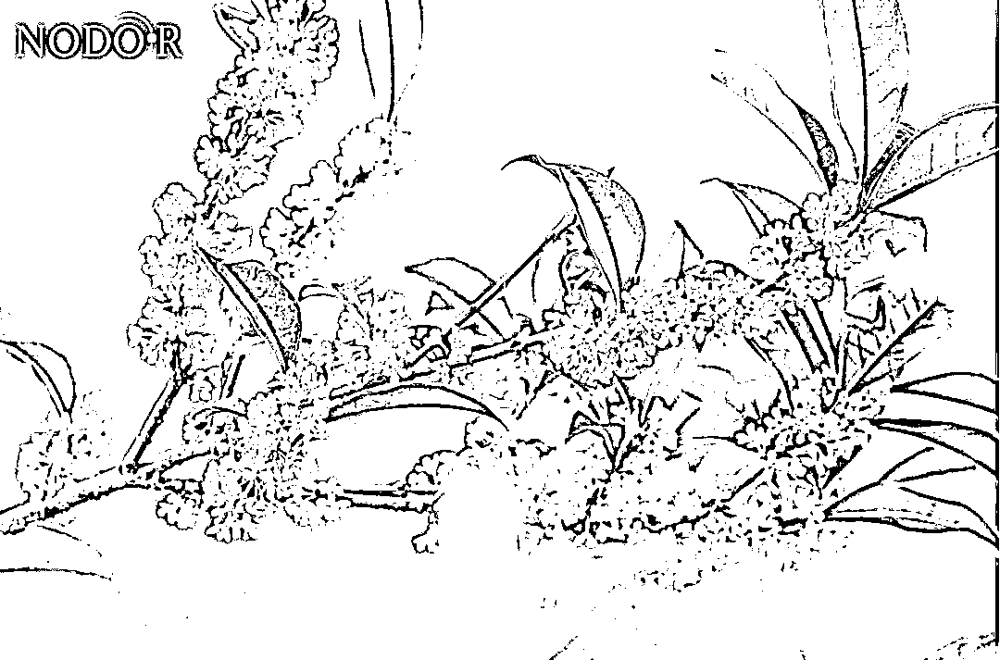

**重点天象****★****持续整月的火海四分**火星运行周期是两年，这意味着火星和海王星的相位周期，从合相、渐盈四分相、对分相、渐亏四分相，再到合相，差不多需要两年时间。正常速度下差不多每半年会形成一次主要相位，但实际由于火星和海王星的顺逆转换，形成相位的频率并没有那么规律。我们来看一下这两年火海形成的主要相位：**· 2020 年 6 月 13 日：**火星在双鱼座合相海王星**· 2021 年 4 月 10 日：**火星在双子座四分海王星**· 2021 年 9 月 3 日：**火星在处女座对分海王星**· 2022 年 1 月 12 日：**火星在射手座四分海王星**· 2022 年 5 月 18 日：**火星在双鱼座合相海王星**· 2022 年 11 月 19 日：**逆行的火星在双子座四分海王星**· 2023 年 3 月 15 日：**顺行的火星在双子座再次四分海王星**· 2023 年 8 月 23 日：**火星在处女座对分海王星**·** **2023 年 12 月 29 日：**火星在射手座四分海王星今年，由于火星的逆行，**火海相位的能量明显增强。**尤其值得注意的是，**11 月火海四分的度数和明年 3 月火海再次对分的度数是完全一致的，都是在双子座 25°。对于出生星图上有个人行星和重要虚点落在变动星座 25°附近的人群来说，影响最大。**这半年，是充分感受、理解火海能量的好时机，**尤其是出生图上有火海相位的人群，要格外留意这半年的经历和经验。**海王星和木星一样，都有放大的能量，但海王星更极端。**木星只是放大，海王星是消融边界、失去控制。**火星的力量消弭在海王星的汪洋大海中，这种感觉特别不适。火星的符号是一个向上的箭头，一触即发，充满力量和方向感。当火星联结了海王星能量，就丧失了这种力量和方向感，反而会被想象误导或者被人利用。火海人在恋爱中很容易遇上渣男渣女，稀里糊涂地上当被骗，发生关系（火星也是性能量的象征符号），也是因为海王星消融了火星的边界，失去分寸感。

**火海四分是很困难的相位之一，从根本上瓦解个体的意志力和存在感。**因为海王星的能量很难描述、捕捉和落实。而人类的心灵是需要现实物质的附丽的，没有实实在在的证据，就会变得踌躇不前。

在遇到冲突的时候，人们往往觉得发怒、吵架和打打杀杀是勇气和力量的表现，而火海却相反，它们的力量其实存在于它们的**敏感性、慈悲心和想象力**之中。如果你渴望勇气和力量，那么真正的勇气和力量到底是什么？存在是什么？活着的意义又是什么？

冥王星的秘密和堕落是可以探究和揭露的，正如坂口安吾在《堕落论》中写的：人应该彻底地堕落，必须堕落到底，从而发现自己，拯救自己。而**海王星的秘密和堕落，是一种沉沦，往往石沉大海，不知所踪，永不为外人所知。** 
但在人们平时看不见的地方，总有事情在发生。**拓宽自己的视野，就当给自己放个假。不经意撞见时，发现的可能就是一片新大陆。**

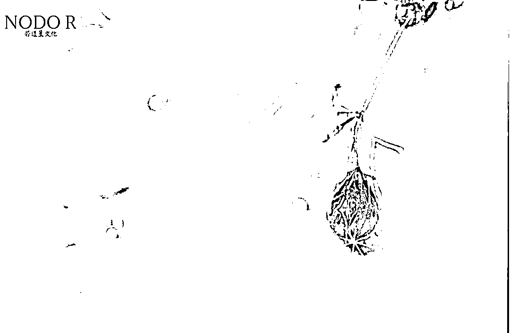

**★****木星在双鱼座恢复顺行**

**11 月 24 日，木星在双鱼座 28°完成顺逆转换，恢复顺行，将在 12 月 20 日彻底离开双鱼座，重新进入白羊座。**

这是木星上半年自 5 月 11 号离开双鱼座后，最后在双鱼座停留的两个月。**双鱼座、天蝎座、巨蟹座一定要珍惜木星在水象星座带来的好远和机会。**木星行经双鱼座，会深化我们的同情心和慈悲心。我们通过行动赋予生命意义，也会通过爱和苦难。在动荡的环境中，人们更加同情弱者，体谅他人的处境，让每个人都活得有尊严、有价值。在双鱼座进行的顺逆转化，也提醒我们要去**区分同情、慷慨和操控之间的界限**，不头脑发热，不以任何事物、任何人的主人自居，不妄图去主宰任何人或东西的命运，以免被有心之人利用了自己的怜悯和慈悲。**帮助他人，并不是帮助他们短暂地脱离困境，而是要教会他们对自己的生活负责，要激发出他们内心的爱与智慧，给他们指出发**展的方向。**木星在逆行 4 个月后恢复顺行，会让人们对于之前那些摇摆不定的信念变得清晰和坚定，对于自己的原则和需求也会有更进一步的认知。**与其去妄想：生活能给我带来什么好远？不如好好思索一下：有什么生活责任需要我去承担？不要贪多，不要求全，任何时候，我们只需要对当下一个非常具体的问题进行回答，做出决定就好。稳定的情绪状态，清晰的需求认知，是我们做判断、选择的根本基础。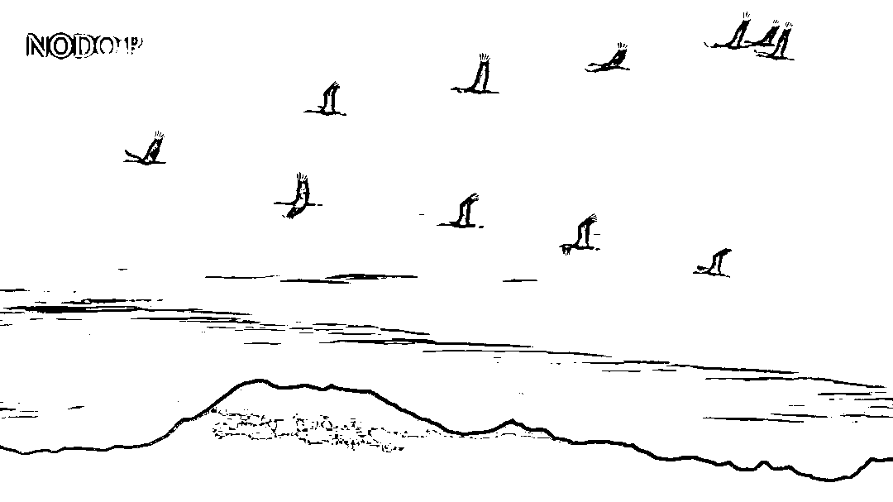**★****朔望周期**食相总是成对出现的，10 月的天蝎座新月发生了日偏食，11 月的金牛座满月，就出现了月全食，也就是我们俗称的红月亮。其中食既 18:15（月亮恰好全部进入地球本影）；食甚 18:58（月亮中心与地影中心相距最近）；生光 19:41（月亮从地球本影冒出的刹那）。我国东部地区的小伙伴可以看到月全食的全过程。
上一次国内可见的月全食是在 2018 年，而下一次要等到 2025 年了。**· 10 月 25 日-11 月 8 日**是**上弦月周期**，身体能量会**更注重吸收和消化，建议适当控制饮食**；**· 11 月 1 日，**月亮在水瓶座进入上弦月，**11 月 8 日**，月亮在金牛座形成满月，并发生月全食；**· 11 月 8 日-11 月 24 日**是**下弦月周期**，身体会更倾向于**清理和排毒，这时候多吃一些不易发胖**；**· 10 月 16 日，**月亮在狮子座进入下弦月；**11 月 26 日**发生射手座新月，开启新一轮月相周期。**满月发生在 11 月 8 日傍晚 19:02，金牛座 16°。重点影响生日在 5 月 7 日、8 月 9 日、11 月 9 日和 2 月 6 日前后的人群。**这是充满张力的满月。满月时候会出现月掩天王星的奇观，也就是**月亮合相天王星**。月亮合相天王星和北交点在金牛座，对分天蝎座的太阳、金星、水星和南交点，四分水瓶座土星。**土星是这个 T 三角结构的顶点星。**不妨问自己几个问题：我，如何从与他人的关系中、在社会角色中活化出个人性，看清自己的想法和发展方向；同时不脱离集体，必须进入社会的网络中，学习自他平等的功课？如何将自己的需求和集体的、社会的更大目标相结合？这也是水瓶时代的主旋律。**新月发生在 11 月 24 日凌晨 6:57，射手座 1°。****重点影响生日在 11 月 24 日、2 月 11 日、5 月 23 日和 8 月 25 日前后的人群**，会明显感受并且经验到太阳星座的能量。  新月发生的时候，群星已经换座到射手座，定位星木星在双鱼座恢复了顺行，并且有一个跨星座的三分相。虽然新月的时候没有光，人们往往看不清未来的方向，但内心已经萌发出小小的火种。这个新月会一扫天蝎月的阴霾，内心重新充满了希望和战斗力。新月最重要就是许愿。具体许愿内容请参照射手座 1°所落宫位的象征领域。这个度数的萨比恩寓意是：A quick wind is making sport with the sea; through sharp mist as far as sight reaches are scurrying whitecaps. **疾风与大海嬉戏；穿过薄雾，视线所及之处白浪飞涌。**请想象这样的场景，许下属于自己的愿望，并大声说出来：“我会成为这样的自己”。**满月和新月的当天，都可以断食或者轻食，给身体一个清理和重启的机会。**

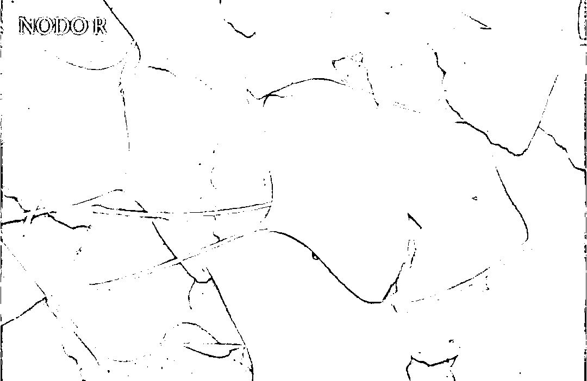

**12 星座 11 月小贴士**

**（参考太阳星座和上升星座）**

**★ ****白羊座**

*   **走亲访友，促进身边关系**
*   **常怀感恩，倾听内心声音**

**★ ****金牛座**

*   **提前规划，社交进退有度**

*   **自我提升，积极推进工作** 

**★ ****双子座** 

*   **学会解压，多多保持微笑**
*   **注意观察，记录生活美好**

**★ ****巨蟹座** 

*   **敢于尝试，追求自我梦想**
*   **顺其自然，不计较成与败**

**★ ****狮子座** 

*   **直面矛盾，收获真诚友谊**
*   **充满热情，培养崭新爱好**

**★ ****处女座** 

*   **拆分任务，控制工作节奏**
*   **设立界限，保护自我利益**

**★ ****天秤座** 

*   **社交频繁，发展长期关系**
*   **规律作息，坚持锻炼运动**

**★ ****天蝎座**

*   **学会放松，接纳真实自己**
*   **关注自我，发展兴趣爱好**

**★ ****射手座**

*   **少说道理，倾听他人意见**
*   **注意仪表，提高自身魅力**

**★ ****摩羯座** 

*   **作息规律，不要放纵自己**
*   **捕捉灵感，提高创意能力**

**★ ****水瓶座** 

*   **量入为出，避免大手大脚**
*   **工作忙碌，拒绝无效社交**

**★ ****双鱼座**

*   **放松心情，关爱心身健康**

*   **设置奖励，鼓励自我成长**

**版权声明：**原创文章由作者授权首发于若道平台，欢迎转发，反对抄袭。友号转载请申请白名单。

**END**

**Anastasia**

职业占星师/专栏作者/策展人

ISAR 认证占星师（2016 年获得）

若道认证生时校正资质（2015 年获得）

**微信公众号**：KairosMoment

长按打赏

**20 位来自世界各地的占星师****带来 19 场沙龙——新世界的觉醒****详情可点击下图**

**学习占星学****点击下图了解课程详情**

**微信又双叒叕改版啦，不想错过若道君的推送？**
****就把若道设为****星标****以及点点****“在看”****吧！******▼**

**喜欢就点一下“在看”吧！****报名直达入口**

# 若道占星·双 11 | 必买清单出炉，享受任选折扣优惠！！！

> 原文：[`mp.weixin.qq.com/s?__biz=MzA5NjA0NTAxNg==&mid=2651492820&idx=2&sn=7d638aa644e56249e5758af138457ccc&chksm=8b482363bc3faa759519cdbbc93f3a4bf8ab2cffe1de752f35c044d83ee756ad2079a59baa99&scene=126&sessionid=1692737730#rd`](http://mp.weixin.qq.com/s?__biz=MzA5NjA0NTAxNg==&mid=2651492820&idx=2&sn=7d638aa644e56249e5758af138457ccc&chksm=8b482363bc3faa759519cdbbc93f3a4bf8ab2cffe1de752f35c044d83ee756ad2079a59baa99&scene=126&sessionid=1692737730#rd)

**想一次性优惠购齐 3 门 ISAR 选修课？** **往年工作忙，错过了感兴趣的课程？****是某位老师的忠实粉丝，想集齐老师的课程？****双 11，若道为大家精选出了 12 门 ISAR 选修课，14 门名师工作坊**任选多门一次性购买可以享受不同折扣，快去占星知识的海洋里挑选心仪的课程吧！

**参加活动的 12 门 ISAR 选修课**

 下滑可查看全部课程内容，以下皆是

**家族占星学网络课**

**原价 6800 元**

**课程内容简介**

每次课程时长 2 小时，共 8 次课，安排如下：**占星实践中的家族模式**

我们第 1 次经由童年的巨大主导力量——我们的父母，来体验我们**太阳和月亮**、**土星和金星**。我们用他们给我们的暗示来解读这个世界，而他们的回应反过来又受到大家庭的影响，我们常常发现祖先的成功和失败、怪癖和才干经常在我们自己的生活和我们的星图中重复。

越仔细观察，我们就越能发现日期的神秘重复、平行事件，镜像先辈故事的我们自己命运的奇怪扭转。

**在课程中，我们将识别这些模式并与之合作，看看我们如何能够尊重过去，同时在生活中走自己的路。**更重要的是，我们如何面对我们祖先未活出的能量，而这些能量似乎在我们自己的人生经历中再次升起？在我们前进的道路上，昔日的先人向我们提出的问题是什么呢？

**父亲与孩子**

我们将看看**父亲的原型，以及它如何在出生星图中反映出来**。我们的父亲（或缺位的父亲）如何影响心灵结构？无论是缺席还是在身边，无论是亲生父亲还是“养父”，父亲的角色都会影响我们的基本认同和亲密关系，以及我们进入更大世界的能力。

虽然**土星和太阳**是父亲的传统指征，但它们很少被描述为漫游者、梦想家或一块“滚石”。父亲过去是法律和权威的承载者。随着文化的发展和婚姻的重新定义，父亲的原型也随之改变。**母亲与孩子**我们的**第 1 个养育者（或她的替代者），给予我们生命的人**，经常通过星图中的**月亮和它的相位**来指征。但是**其他行星**也可以描述她，其他人可以扮演她的角色。不论在星图上是哪些征象来体现这种基本关系，都在我们的一生中，留下了深刻的情感烙印。我们现实生活中的养育者如何与出生星图中的母亲形象相对应？我们如何将过去的力量整合到我们的成人生活中？**家族价值观****在每个家族中，都有 1 个主导价值，你需要认同它才能成为这个“部落”的真正成员。**它可能是力量，或智慧，或能干成事情的能力。对某些家族来说，这个主导价值是金钱；而对另一些家族来说，则是亲密和爱。崇尚运动的家族可能会嘲笑爱读书的孩子，赶走爱做梦的人。我们对家族的忠诚可能会阻止我们追随自己的天赋。那个离经叛道的孩子会怎样？**第 2 宫-第 8 宫轴线和金星的相位将为我们提供这些问题的线索。**有内在的价值观，也有文化和家庭强加的价值观。我们将探讨家庭价值观和对我们最重要的价值观部分之间的交集。我们该如何尊重灵魂，并且仍然对那些养育我们，使我们充满希望和梦想的人保持信心？**成功、家族压力、负债和牺牲**家族中的一个孩子，通常是最年长的，承载着家族成功的需求。但是，当这个孩子是女性，或者和家族传统的性情不同时，会发生什么呢？当个人需求和家族需求之间存在紧张关系，孩子可能会牺牲自己的天赋，而这会影响下一代人。一个拥有强大外行星的人可能会发现很难像以往那样简单地继续下去，而这也会动摇家族的自我认知。他们也可能是那个冲破家族一直以来的挣扎的人。一个孩子可以救赎数代人的失望。这些议题会由出生星图的哪些征象体现出来呢？我们将看**第 4 宫和第 10 宫，第 2 宫的价值观和第 12 宫的牺牲**。**当前关系中的过去模式**继续探索家族模式，密切关注过去对当前关系的影响。我们的原生家庭和先辈是如何定义爱的？如果爱是奴役的一种形式，我们可能需要找到自由，或者重新定义服务。如果我们的某个孩子让我们想起自己害怕和憎恨的父母，或者我们最不喜欢的兄弟姐妹或表亲时，会发生什么？

即使那些似乎完全与过去决裂以逃避“家族遗产”的人，也可能在一个困难的工作环境、一个特别难相处的老板或他们自己孩子的生活中重新遇到它，因为失落的爱的幽灵和没有被活出的故事往往会跳过一两代人重新出现。**家族的无意识带着某种印记，邀请我们再试一次，为一个旧故事找到新的结局。**

**家族秘密与家族创伤**

**许多藏在家族“壁柜”里的秘密通常在第 8 宫显现，或者由冥王星相位显露出来。**有些东西是隐藏的，因为它们很危险；另一些是因为它们太珍贵了，不能分享，比如失去的爱，或是被收养的孩子。

秘密可能涉及小的轻率行为，或大的背叛。他们可能隐藏痛苦、欲望或可怕的创伤。这些被锁住的能量经常隐藏在我们身上，带来焦虑。轻柔地将它们带到光明中，有助于释放和转化家族中内疚和羞耻的力量。

**太阳返照技法**

**原价 6800 元**

**课程内容简介**

每次课程时长 2 小时，共 8 次课，安排如下：

**第 1 课**

❶ 什么是太阳返照

❷ 如何解读太阳返照

❸ 一张太阳返照图解读两遍

❹ 为期 19 年的默冬周期预测与意识

❺ 出生地与迁徙地的返照图

❻ 不是所有的年份的太阳返照都一样 

**第 2 课**

❶ 月亮在太阳返照中的至关重要性及其元素周期

❷ 月亮落入火元素星座、土元素星座、风元素星座、水元素星座的解读

❸ 食相、满月和新月

❹ 月亮在太阳返照中的相位 

**第 3 课**

❶ 继续月亮的相位

❷ 太阳照亮各宫位

❸ 通过太阳所在宫位解释太阳返照

❹ 在太阳返照中太阳的相位

**第 4 课**

❶ 太阳返照中的合轴行星

❷ 太阳返照中的合轴行星为未来一年添彩，并成为来年的主导者

❸ 重要的星图模式❹ 精确紧密的相位❺ 行星力量 **第 5 课**

❶ 太阳返照与出生星图的关系

❷ 识别模式

❸ 太阳返照中行星作为出生星图的解释

❹ 逆行行星和共振相位❺ 出生上升点经过各宫位

**第 6 课**

❶ 太阳返照中的择时❷ 利用月亮择时❸ 整合行进❹ 太阳经过各宫位❺ 中天推进❻ 小限法 **第 7 课**❶ 特殊的太阳返照年❷ 太阳返照与金星周期❸ 中天经过各元素❹ 最好和最坏的年份

 ** 第 8 课 **

❶ 与未来合作❷ 技巧的整合❸ 预测与心理学❹ 如何处理两难困境

**医疗占星学网络课**

**原价 6800 元**

**课程内容简介**

每次课程时长 2 小时，共 8 次课，安排如下：**第 1 讲  与占星****学、心理****学、病症一起工作**医疗占星学的组成部分以及如何使用它们行星的作用与相互作用黄道星座人宫位的重要性疾病和健康是如何产生的★ 第 2、3、4 讲的课程内容基于星座以及它们之间的相互作用。

**第 2 讲  基本星座**

学习基本大十字星座——白羊座、巨蟹座、天秤座和摩羯座及其功能和相关的健康问题。这些星座与防御、养育、结构、体内平衡和荷尔蒙控制有关。

**第 3 讲  固定星座**

学习固定大十字星座——金牛座、狮子座、天蝎座和水瓶座及其功能和相关的健康问题。这些星座与习惯和反射、心脏调节、生存、循环和协调有关。**第 4 讲 变动星座**学习变动大十字星座——双子座、处女座、射手座和双鱼座及其功能和相关健康问题。这些星座与呼吸、神经系统、肠道、睡眠以及信息、情感和行动的整合有关。★ 第 5、6、7、8 讲重点学习行星，它们在身体层面的表达、它们的相位与行进。**第 5 讲 太阳与月亮**太阳掌管视觉、活力、心脏和意识，与心脏、脊柱和视觉问题相关。月亮掌管人体的周期，特别是月经周期、饮食模式和体液，与情绪引起的疾病、饮食失调和胃病相关。

**第 6 讲 土星与天王星**

土星掌管着皮肤、骨骼、牙齿和衰老过程。它对应的疾病包括慢性疾病、耳聋、帕金森病、关节僵硬和牙齿问题。天王星代表身体活动的协调，有节奏的脉动和身体的“电”。与天王星相关的疾病包括癫痫、痉挛、心律失常，以及阿斯伯格综合症和自闭症样综合症。

**第 7 讲 海王星与冥王星**海王星掌管松果体、细胞膜渗透和右脑功能，与过敏、上瘾的病症、慢性疲劳综合症和睡眠障碍相关。冥王星掌管消除和转化，其病理包括毒性、脓肿、癌症和强迫症。**第 8 讲 火星**火星是与能量和防御相关的行星，掌管免疫系统、肾上腺功能、肌肉活动和炎症反应。它是许多身体和情绪障碍的核心，如自动免疫障碍、抑郁和发烧，以及由手术或需要手术引发的问题。

**古占和现占的结合**

**原价 6800 元**

**课程内容简介**

**主题 1：复习古典占星学的概念**

一、大体介绍课程的总体安排以及如何选择学员星图作为案例

1. 上课形式更为灵活。这里提到的课程安排可能会在上课过程中根据需要进行调整。

2. 如何挑选课程中作为案例的学员星图。除了这部分之外，课程中用到的星图都会是学员的星图。我们不可能逐一分析每个人的星图，因此会挑选部分星图作为案例。 

二、运用的方法、工具和基本概念对于只学习过一般占星学知识的人，可能会有一些不太熟悉的术语和概念，比如：⑴ 行星的先天秉赋表及其运用。⑵ 对于现代行星（天王星、海王星和冥王星）、小行星和其他所有已知或未知的行进星体的应用，以及这些星体与古典行星在用法上的区别。⑶ 整宫制：什么是整宫制，它与常用的分宫制有什么区别。⑷ 胜利星：包括单一胜利星和复合胜利星。⑸ 点宫制：从福点和精神点算起的分宫制，它们的用途，它们给占星学带来了什么。⑹ 如何处理中天：因为第 1 宫是从上升星座算起，所以可以在第 10 个星座之外的星座中发现中天。这种情况如何处理？ 在这一部分会用到一些名人的星图作为例子，但在之后的课程会使用学员的星图为例。主题 2：用古典占星学解读学员星图 1. 距离上升点、中天、下降点和下中天 7.5°以内的行星重要程度依次递减（上升点和中天的重要程度几乎相当）。2. 寻找相位异常多的行星，尤其是与太阳、月亮、中天或上升点形成相位的行星。3. 被强调的星座，有四颗或四颗以上的行星，加上中天或上升点。4. 太阳星座、月亮星座和上升星座的关系，它们的特质是类似的还是不同的？5. 上升星座的守护星或上升星座的胜利星，它落在什么星座、什么宫位？它所在星座是否与上升所在的星座形成相位？这些知识都将通过学员的星图来学习、展示。主题 3：通过学员星图分析其个性、健康、疾病 1.行星或其他星图征象可能影响的因素。介绍：⑴ 体型、体态和外貌。⑵ 心智特性。⑶ 性格和个性。⑷ 与环境的互动。⑸ 本我。2.哪些因素对体型、体态和外貌影响最大？⑴ 遗传和种族血统。不要把一个人的血统不太可能有的身体特质强加到这个人身上。然而，在现代化妆品的帮助下，人们对自身外表所做出的改变可能实际上将他们带到传统占星学所暗示的方向上。⑵ 太阳、月亮和上升星座。⑶ 任何被众多因素集中强调的星座。⑷ 任何接近上升点或中天（士 7.5°）的行星。任何与上升点或中天形成非常紧密的（士 2-3°）主要相位的行星也有一定的影响。⑸ 星图中任何与上升点、太阳或月亮有关的其他常见重复主题。⑹ 疾病。补充：在这部分星图分析的讨论中，星图被选中的学员附上电子照片效果会更好。主题 4：现代和古典之比较，分别解析个性、性格和心智这一主题一直是 20 世纪占星学最为重要的关注点之一。然而，却有着两种极为不同的切入方法。⑴ 现代方法，基于上面所提到的分析外形类型所运用的方法。⑵ 中世纪方法。（简化版，老师会在必要和适当的时候介绍其更为复杂的面向。）完全取决于星图中与心智功能特定征象星有守护关系的行星。主要是那些围绕星图中 4 个关键点的行星，以及关键点所在星座的守护星和与关键点形成相位的行星。① 植物的生长灵魂：主要象征是上升点及其守护星。② 感性灵魂或动物的灵魂：主要象征星是月亮及其守护星。③ 智性灵魂或理智的灵魂：主要象征星是水星及其守护星。④ 这些都受到任何与主要象征星成相位的行星的影响。主题 5：情感关系（家人、爱人、朋友）尽管在传统上，每 1 宫所赋予的主题似乎通常可以表明该宫位是否主要是个人宫位，是否与人际关系有关，或完全是外界环境层面的；但实际上，每组象征符号和星图都可以也确实体现了所有这 3 个层面。不过，此次课程余下的时间我们将主要讨论人际关系和纯环境因素。情感关系：⑴ 父母和原生家庭，也包括本人（就是你）可能拥有的自己的家庭。该主题下还包含与权威人士的关系。⑵ 兄弟姐妹和堂表亲，也包括叔叔/舅舅、阿姨/姑姑。⑶ 亲密的一对一关系。⑷ 朋友和一对多的关系。⑸ 敌人。主题 6：财富、投资、职业⑴ 金钱、财富，理财观念。⑵ 个人工作或职业的日常活动。⑶ 职业和社会地位，毕生的追求以及谋生之道。主题 7：移民、旅行、学习⑴ 旅行和与其他国家的交流互动。⑵ 学习其他文化。⑶ 移民倾向

**凯龙星**

**原价 6800 元**

**课程内容简介**

**首先，我们将了解实际的天文学和神话中隐含的象征和意涵，学习去“看透”象征的世界，这对理解“凯龙星意识”至关重要。****✦ 天文学和神话中的凯龙星含义****天文学部分：**带你探索凯龙星发现以来的“天空之旅”——从不明星体到多次被重新归类凯龙星的由来凯龙星发现的时代背景凯龙星与冥王星之间的关系从宇宙论理解凯龙星的象征意义**神话部分：**凯龙星原型的象征和研究**了解凯龙星的背景之后，我们将重点学习个人星图中的凯龙星，以及行进凯龙星。****个人星图中的凯龙星：**个人星图中的凯龙星如何解读凯龙星在星图中的落点，在生活中是如何表达其主题？**行进中的凯龙星：**凯龙星在行进中被触发如何解读？行进中的凯龙星如何解读？**有关业力的部分：**凯龙星与祖先领地和祖先业力的关系如何通过凯龙星看“家族集体疗愈”？从家族星图的凯龙星看你此生的“疗愈任务”**体验凯龙星疗愈之旅：**引导冥想，感受凯龙星的疗愈之旅如果你是一个致力于个人疗愈的占星学子或者致力于帮助他人疗愈的占星师，学习、了解凯龙星是你必不可少的一门必修课。

**小行星**

**原价 6800 元**

**课程内容简介**

每次课程时长 2 小时，共 8 次课，安排如下：
**第 1 讲 小行星简介**小行星概述，小行星的发现、科学以及一些占星学历史。**第 2 讲 谷神星，丰饶女神**母神、农业女神，但其影响力远不止如此。这是我们所知的最大的小行星，也是最重要的小行星。她掌管养育、滋养、救助、管理等方面。**第 3 讲 婚神星，婚姻女神 **荣誉、伙伴关系、契约和婚姻：众神中的女王是正直的女主人。她在出生星图和行进中有什么意涵？她与“丈夫”木星朱庇特是什么关系？**第 4 讲 智神星，智慧女神**战地记者、棋手和占星师有什么共同之处？来自智慧、策略、洞察力和远见女神的帮助。**第 5 讲  灶神星，壁炉女神**掌管神圣的火焰、家庭生活、厨房灶台、家人、遗产的女神：这颗关键的小行星被严重误解了。她可以给你一把钥匙，让你了解家庭关系、你的祖先和你的目标意图。**第 6 讲   健神星，健康女神**在我们应对全球疫情的过程中，掌管健康和福祉女神目前显得尤为重要。她能提供如何应对新型冠状病毒肺炎的线索吗？她在出生星图中的意涵是什么？幸福原来蕴含着相当广泛的含义。**第 7 讲 灵神星，灵魂女神**灵神星是唯一一位以人类身份开始生命的女神，她代表着人类的灵魂。这颗小行星与爱情故事、童话故事和灵魂之旅有关。**第 8 讲 综合应用，展望未来**你们刚刚开启探索使用小行星可能性的旅程。我们会探索评估某些理论有效性的方法，以及在实践中检验这些理论的重要性，我们还会探索其他数百万小行星中的一些。这堂课既有提醒告诫，也鼓励你深化自己的占星实践，并拓展你对象征的理解。

**次限月亮**

**原价 6800 元**

**课程内容简介**

每次课程时长 2 小时，共 8 次课，安排如下：**第 1 讲 出生星图中的月亮与它在童年的推进**我们将学习出生星图中月亮的象征意义，以及它如何反映你的母亲以及你童年的家庭生活。我们将从元素的角度观察月亮，并研究从出生起你是如何得到母亲的关注的，我们将观察出生后几年的月亮的推进。**第 2 讲 从 7 岁到 14 岁：从自己到他人**次限月亮与出生星图中月亮的第 1 个四分相在 7 岁左右出现。我们将学习在这个关键时间点我们是如何开始意识到自己是独立存在的个体，以及它如何让我们向家庭以外的其他人寻求滋养和生命。**第 3 讲 从 14 岁到 28 岁：从别人到自己**从 16/17 岁到 28 岁左右第 1 次次限月亮回归，我们完成了与他人和与自己的月亮的灵魂之旅。从次限月亮回归开始，我们就开始对自己的情感生活以及我和其他人之间所发生的负责。**第 4 讲 从 14 岁到 28 岁：从别人到自己**当次限月亮描述我们内心的旅程时，土星的行进描述了我们与周围世界的联系，以及作为社会发展中的个体，世界对我们的要求。在我们生命的头 30 年里，它们几乎以相同的速度运行。**第 5 讲 次限月亮与其他行星的相位**我们将从次限月亮的旅程中抽身出来，看看它与各种不同人的星图的其他行星产生有趣而特别的相位时发生了什么，这样我们来了解次限月亮触及我们星图中的这些行星时会发生什么，以及我们该如何为自己的生命导航。**第 6 讲 30-60 岁的次限月亮推进**当月亮再次绕着出生星图运行时，我们有机会将意识带到我们的情绪反应中，并开始引导我们的内在本性，而不是对发生在我们身上的事情束手无策。**第 7 讲 60 岁以后的次限月亮之旅**在当今时代，60 岁以后过着积极生活的人比历史上任何时候都多。有的人在 70 多岁的时候坠入爱河并第一次结婚。我们将在这一讲探讨如何在我们生命的最后几十年里对自己和他人有用，这样我们就可以体验到生命的丰富多彩。**第 8 讲 次限月亮与次限太阳的关系**最后，我们来研究次限月亮绕着星图运行时与次限太阳推进的关系。我们将通过星图案例来进行探讨。

**原型占星学**

**原价 6800 元**

**课程内容简介**

每次课程时长 2 小时，共 8 次课，安排如下：

**授课重点**

☆ 原型占星学的基础

☆ 实际应用（用于自我认知、从容生活、情感关系、心理治疗）

☆ 更大的意涵（哲学的、宇宙的、历史的）

**知识点**

☆ 一致性的基本形式：出生星图、个人行进、世界行进

☆ 占星学如何运作，共时性的角色

☆ 占星学中的命运和自由意志问题

☆ 原型的本质/基本特征

☆ 行星的意义以及它们的组合

☆ 主要相位

☆ 如何把握一张出生星图最重要的主题

☆ 评估个人行进

☆ 评估世界行进

☆ 重要的是认识到原型的多元性，以及在共同创造性地展现我们出生星图和行进的潜能的过程中我们所扮演的角色、所具有的力量和所肩负的责任。

**第 1 课：开课欢迎致辞**

介绍我们将在该课程中涵盖的内容

占星学和心理学如何互相启发，互相增强

我的占星学之旅

是什么让原型占星学与众不同

课堂讨论，提问与回答

**第 2 课：原型占星学的基本概念框架**

运作方式：因果关系和共时性的议题

命运和自由意志

理解原型

**第 3 课：行星的意义，从发光体太阳、月亮开始，到水星、金星、火星、木星、土星**

**第 4 课：外行星天王星、海王星、冥王星：“银河使者”**

**第 5 课：观察运转中的行星，第一部分：艺术、音乐、电影、喜剧（指定的电影）中的示例**

**第 6 课：观察运转中的行星，第二部分：艺术（指定的电影）中的更多示例**

**第 7 课：个人行进，以及如何带着占星学的觉知投入到生活之中**

**第 8 课：世界行进，以及以占星学更宏大的哲学意涵来理解我们在历史上所处的时刻**

**恒星**

**原价 6800 元**

**课程内容简介**

每次课程时长 2 小时，共 8 次课，安排如下：**第 1 讲：导论与主要天文星座**存在的层面我们的存在有 3 个关键层面，占星学的影响也有 3 个主要层面。其中之一就是恒星的影响层面。神话编码恒星星座或星团代表着神秘的丝线所编织的网，它们创造了我们的集体命运，也创造了个人的命运。其基石是由融入集体无意识的存在或本质中的原始神话组成的，因此代表了人类的基本编码。天文星座所赋予的神话是现实的基本框架，也是案主在实现神话或部分神话的道路上内在所承载的命运的深层编码。恒星、天文星座和占星学星座我们应该一直谨记黄道占星星座和黄道天文星座之间的重大区别。恒星和天文星座所使用的容许度恒星对不同的行星和四轴的影响力不同，其容许度取决于好几个因素。恒星影响的传导物行星和宫头主要的天文星座天龙座、英仙座、武仙座示例，案例研究**第 2 讲：皇室天文星座**组成“皇室”的天文星座主宰着北方天空，主要包括埃塞俄比亚国王和王后（仙王座和仙后座）以及他们的女儿仙女座。示例，案例研究**第 3 讲：一等星**每颗星等小于 1.5 的恒星都是一等星。这些恒星的总共有 20 颗，最大的是天狼星(大犬座α)，-1.46 星等。即使天狼星和其他恒星的星等为负数，在占星学的意义上，它们也被称为一等星。一等星是最大的恒星，由于它们的体积最大，它们的影响力也最大。它们除了具有特定的性质外，还能增强案主的生命力和力量，因此能提升案主的潜能。**第 4 讲：黄道天文星座 1（白羊座到巨蟹座）**黄道天文星座与黄道占星星座类似。黄道占星星座是根据黄道天文星座来命名的，这是它们之间的所有关联，在回归黄道占星学和恒星黄道占星学中都是如此。我们还要了解的是，有 13 个黄道天文星座和 12 个黄道占星星座。尽管黄道天文星座和黄道占星星座在占星学意义上并无联系，但是它们是相关的，通过了解黄道天文星座的性质，我们可以增进对黄道占星星座性质的理解，而这正是回归黄道占星学和恒星黄道占星学的基础。因此，我们会将黄道天文星座分成几个小组来讨论。前 4 个黄道天文星座中的恒星（白羊座、金牛座、双子座、巨蟹座）示例，案例研究**第 5 讲：黄道天文星座 2（狮子座到天蝎座）**中间 4 个黄道天文星座中的恒星（狮子座、处女座、天秤座、天蝎座）示例，案例研究**第 6 讲：黄道天文星座 3（蛇夫座到双鱼座）**黄道天文星座中的恒星（蛇夫座、射手座、摩羯座、水瓶座、双鱼座）示例，案例研究第 7 讲：剖析天文星座恒星象征存在的无意识部分，因此恒星和天文星座主要描述物理现实。剖析天文星座与解剖人体密切对应。因此，代表人类天文星座（有时是动物天文星座）身体部位的恒星与人体的部位相关，这些部位要么特别敏感，要么被强调或以其他方式与和这个恒星天文星座相关的神话的特定部分相关。此外，恒星所属的天文星座中的每一部分都有自己的象征性关联。**第 8 讲：业力占星学中的恒星**理解恒星在业力占星学中的影响，有助于我们看到灵魂的路径，以及我们当下的任务。因此，恒星让我们能够清楚地看到业力与业力之间的关联，这本身就代表完整整合的一个重要部分。

**行星交点**

**原价 6800 元**

**课程内容简介**

每次课程时长 2 小时，共 8 次课，安排如下：**第 1 讲 介绍行星交点**我们将学习行星周期如何形成行星交点，并了解日心视角和地心视角之间的区别。**第 2 讲 什么是行星交点**我们将深入学习丹恩·鲁伊尔的成熟思想，这是启发马克老师研究行星交点的灵感之源，也是他最近出版的《行星交点与集体进化》一书的灵感来源。**第 3 讲 双子座-射手座的天王星交点**我们将学习人类认知和技术如何通过天王星交点的透镜进化。**第 4 讲 巨蟹座-摩羯座行星交点**我们将进一步学习行星交点对社会和文化的影响，深入探讨落在摩羯座-巨蟹座的木星、土星和冥王星交点，并了解它们在过去 1000 年里对我们的全球社会、政治和文化思潮起着怎样至关重要的影响。**第 5 讲 海王星及其狮子座-水瓶座交点**我们将学习落在狮子座-水瓶座的海王星交点影响的不同显化，及其在疗愈中的作用；灵性意识形态的发展，及其促使事件结束的倾向。**第 6 讲 作家案例**通过原创研究，我们将学习行星交点如何影响了世界上一些最伟大的作家的人生。**第 7 讲 研究 2020 年**我们将了解 2020 年的重要意义。**第 8 讲 回顾**我们将回顾前面的课程，并探索如何通过行星交点的意涵理解月亮交点。

**金融占星初阶课**

**原价 7500 元**

**课程内容简介**

每次课程时长 2 小时，共 8 次课，安排如下：**第 1 讲 与金融市场相关的周期研究中会用到的术语**周期周期性容许度范围如何估量市场周期：波峰与波谷扭曲失真平移：左、右、涨、跌 **第 2 讲 行星动力及其与经济占星学、金融占星学和世俗占星学的关联**逆行阶段和停滞阶段金融占星学和世俗占星学中的“入座”日心水星（射手座）相位：作为市场时机因素的主要相位和标准相位月节律：与股票和黄金走势的关联**第 3 讲 市场周期的结构**模式阶段子周期市场周期的牛市、熊市分别包含的 3 个基本模式**第 4 讲 趋势分析**牛市趋势的 5 个基本特征熊市趋势的 5 个基本特征占星学及其在趋势逆转中的作用介绍关键反转日期（CRD）介绍**第 5 讲 股指的长期周期**它们的阶段与子周期美国股市与英国股市（它们历史悠久）案例**第 6 讲 股指的长期周期（续）**4 年周期及其阶段占星征象与股市长期周期的关联冥王星在不同星座海王星在不同星座**第 7 讲股指的长期周期（续）**天王星在不同星座和黄道区间土星在不同星座和黄道区间北交点黄道区间**第 8 讲 行星相位及其与长期市场周期的关联**长期市场周期与长期行星周期的重叠展望未来

**金融占星进阶课程**

**原价 22000 元**

**课程内容简介**

**若道金融占星学第 3 阶课程**地球宇宙学征象与交易周期的关联本阶段的课程针对短线交易者，帮助他们了解持仓 3 天到 6 个月的交易买入和卖出的最佳时机。第 3 阶课程将回顾和详细说明各种金融市场的基本周期。课程将定义和演示基本周期的各个阶段，包括半基本周期、主要周期和短期交易周期，用于市场时机选择和发展交易技能。它将指导那些喜欢短线持仓 3 天到 6 个月的投资者，如何将这些行星周期用作短线交易策略之一。老师会指导大家在黄金、白银、中国和美国股指等市场中使用这些技巧。**这门课程会涵盖以下主题：**① 基本周期作为金融交易市场的主要焦点。② 基本周期的各个阶段，包括：半基本周期；主要周期；交易周期；阿尔法-贝塔周期。③ 与交易周期反转一致的关键技术研究。④ 关于周期完成确认信号的关键技术研究。⑤ 在不同的金融市场上，某些行星在某些特定星座时，往往与牛市或熊市趋势相关。这可以根据地心或日心的位置来判断。⑥ 行星在以地球为中心的运动中，转向逆行或顺行（停滞）时，某些行星停滞与不同金融市场中的基本周期有更高或更低的相关性。⑦ 在不同的金融市场中，与其他行星相比，某些行星的相位与基本周期有更高或更低的相关性。⑧ 如何计算大部分金融市场中的地球宇宙学征象关键反转日期，容许度在 3 个交易日内。⑨ 将地球宇宙学关键反转日期与基本周期、半基本周期或主要周期波谷或波峰的时间段重叠，从而增加市场反转的可能性，以此预示一个周期的完结。⑩ 通过使用特定市场的星图，然后确定行星行进与这些“出生星图”行星形成相位的时间，来提升识别金融市场反转的技巧。这些“出生星图”包括美国股市的“梧桐树协议星图”和中国上证指数的“首个交易日星图”。⑪ 根据对周期和地球宇宙学征象研究，一旦市场进入周期高点和/或反转的时间段，制定出一个考虑最佳风险回报参数的交易计划（当设定触发时该怎么办)。**若道金融占星学第 4 阶课程**太阳-月亮组合与短期市场反转的关联这是针对短线交易员的课程。如果你是一名短线交易者，并且想知道每个月基于太阳-月亮星座交易的最佳时间，那么这就是你不应该错过的课程！这是你在任何其他地方都学不到的课程。**本课程会涵盖以下内容：**① 月亮在各星座的行进，以及它与股票市场、贵金属和比特币价格活动的对应关系。② 检视当日星图，查看月亮的位置（以及它与股票、贵金属和比特币价格活动的常态关系）。③ 回顾衡量太阳-月亮组合与金融市场短线交易反转（波峰与波谷）相关性的有效研究。④ 评估重要性：1 星、2 星、3 星类型。⑤ 重要的太阳-月亮组合与股市的关联。⑥ 重要的太阳-月亮组合与黄金白银市场的关联。⑦ 与比特币相关的重要月亮星座。⑧ 理解交易设置，以最优方式利用太阳-月亮的反转。⑨ 利用当日星图（60 分钟、30 分钟和 5 分钟星图）提升对时机的把握。**4 门阿兰·欧肯老师的经典课程**

**奥义占星学网络课**

**原价 6800 元**

**课程内容简介**

**奥义占星学系列网络课程的目的**向你展示以灵魂为中心的占星学体系中核心部分的一些最重要的法则和原则。这需要你学习新的词汇表，这个词汇表基于你已经学习到的对传统心理占星学语言的理解。本系列网络课程将通过详细展开奥义占星学内在的核心教诲，来教授这些概念及其词汇。**第 1 讲 什么是以灵魂为中心的占星学？**这一方法解读出生星图与传统的心理占星学及以事件为导向的占星学有什么区别？灵魂、人格和“彩虹桥”的结构是什么？意识和创造力的 7 个层面 7\. Physical 身体 6\. Astral 星芒  5\. Mental 心智  (Lower) （低阶）4\. Mental 心智  (Higher)（高阶）      3\. Intuitional 直觉       2\. Atmic 阿特密          1\. Monadic 一元内化、进化和我们内在因此过程而存在的特殊张力之间的关系**第 2 讲 古老智慧教诲的 10 大法则和原则，及其在以灵魂为中心的占星学中的应用**介绍 7 道光**第 3 讲 7 道光：3 道主要光和 4 道次要光**意志、爱和智慧的光精神、灵魂、人格和 7 道光**第 4 讲 7 道光和 12 星座**7 道光和行星介绍在以灵魂为中心的占星学中两颗额外的行星：地球和火神星神圣行星，透过灵魂运作，水星、金星、木星、土星、天王星、海王星、火神星非神圣行星，透过人格运作，太阳、月亮、火星、冥王星、地球第 1 道光，意志与力量大的光，白羊座、狮子座、摩羯座；冥王星、火神星第 2 道光，爱与智慧的光，双子座、处女座、双鱼座；太阳、木星第 3 道光，积极的智力的光，巨蟹座、天秤座、摩羯座；地球、土星第 4 道光，通过冲突的和谐的光，金牛座、天蝎座、射手座；月亮、水星第 5 道光，科学技术之光，狮子座、射手座、水瓶座；金星第 6 道光，宗教、奉献、意识形态，处女座、射手座、双鱼座；火星、海王星第 7 道光，仪式性秩序之光，架构、阶级，白羊座、巨蟹座、摩羯座；天王星**第 5 讲 通过奥义之眼看出生星图是奥义占星学解读的第 1 步**12 星座的奥义守护星与传统守护星的比较**第 6 讲：上升点、太阳和月亮在以灵魂为中心的占星学中的意义**光、行星和星座的综合影响，第一部分**第 7 讲：光、行星和星座的综合影响，第二部分**在出生星图中寻找灵魂目的的公式**第 8 讲：以灵魂为中心的奥义占星学中宫位的意义**以灵魂为中心的占星学解读的第 1 步：将奥义和传统结合起来

**天王星网络课**

**原价 6800 元**

**课程内容简介**

**第 1 讲：受时间限制和不受时间限制的心智（第一部分）**天王星的真正意涵是什么？它在我们生活中的目的是什么？天王星在希腊神话中的起源如何通过这个神话理解人类意识的现实和发展？天王星和土星，天王星、土星以及月亮和你的自我感**第 2 讲：受时间限制和不受时间限制的心智（第二部分）**延续第 1 讲探讨的主题运用学员自愿提供的星图作为讲解这些原理的案例**第 3 讲：个人与集体，一段重要关系的旅程（初步讲解）**天王星在金牛座和天蝎座天王星在狮子座和水瓶座天王星和太阳认识和发展个体化自我的过程学员星图案例**第 4 讲：什么是“原型”？**天王星和水星将心智客观化以产生真正的直觉的能力占星学是“原型的科学”天王星是行星原型中的父亲开放的心灵、直觉、天王星与太阳之间的关系**第 5 讲：找到我们内在的外星人，让他成为有益的朋友。（个人可以如何为集体服务，进一步讲解）**天王星是什么类型的“革命英雄”？你是什么类型的“革命英雄”？你会在出生星图中的什么地方会发现自己的个人革命你作为个人如何成功地表达这一能量？以学员的星图为例**第 6 讲：天王星及其对关系和性的影响**星图中金星与天王星的关系天秤座和水瓶座的关系第 7 宫和第 11 宫的关系天王星在天蝎座擢升，在金牛座落陷，个人、非个人和集体层面的人际关系**第 7 讲：天王星的行进**经历激烈的个人反叛和革命的时期成为我们自己的过程白羊座天王星四分摩羯座冥王星的世代：当今的孩童（2011-2017 年出生）**第 8 讲：2019 年和 2020 年天王星向世界传递的信息**讨论当前土星和冥王星在摩羯座行进，相对于天王星在金牛座行进的意义，因为这会影响我们所有人分享一些非常具体的观察，关于 1988 年至 1995 年出生的这一代人声音的觉醒

**权威感工作坊**

**原价 5800 元**

**课程内容简介**

通过深入研究出生星图，分享精妙的占星学解读，阿兰·欧肯将与我们分享如何发现自己和他人的创造力，以及如何充分利用这些天赋和才能。我们将会讨论下面这些主题：☆ 如何判断出生星图中最强和最弱的行星，以及如何正确运用意志。☆ 月亮的真正意义，以及我们如何与它合作来克服恐惧，提升月亮滋养你天赋和资源的能力？☆ 如何整合第 5 宫的创造力能量和第十宫获取成就的能量？☆如何充分利用危机和丧失的时期：勇敢地面对天蝎座、冥王星和第 8 宫！☆ 如何利用占星学来判断自己最强大的力量来源以及最可能遭遇的陷阱？

**财富工作坊**

**原价 5800 元**

**课程内容简介**

工作坊将会重点关注出生星图中的占星元素和征象，揭示这些问题的答案。

占星大师阿兰·欧肯将带领你探索出生星图中关于富足（与贫穷！）的法则和原理。通过大师的指引，收获一把创造富足人生的钥匙~让你运用这些知识更好地在咨询中帮助个案解读跟钱相关的议题，也更好地经营自己的财富人生！**10 门斯蒂芬工作坊**

**探寻组合图永恒的三角**

**原价 6800 元**

**课程内容简介**

**组合图描述了如何才能使两个人的关系一直充满活力。**这句话中隐含的意思是假设一段关系有一种区别于这两个个体的独立的生命。有时我们喜欢和一对伴侣共度时光，却从没想过单独见他们其中一人。 我们从这对伴侣身上感觉到的 "频率"是对他们组合图能量的直接体验。在某种程度上，可以简单地理解为：**正如每个人都有自己的星图一样，每对伴侣也有他们的星图。** 从简单的描述层面上讲，这就是组合图的意涵。记住，我们可以将这一技法用于任何一种关系：**父母和子女、商业伙伴、朋友。**作为进化占星师，我们的目标要比单纯描述走得更深。解读组合图时，可以着眼于帮助人们，而不仅仅是使他们感到惊奇。 对于个体来说，出生星图代表了一条正确的人生道路，一条承诺意义、活力、灵性目标的道路。组合图亦然，只不过它将一段关系看成一个独立的个体，而不是两个人。关系也有进化的路径：人们走到一起是为了学习和成长。 个体如果没有领会自己出生星图的要点，会变得疲惫而沮丧。两个人也是如此，**如果没有抓住组合图的要点，我们就会对对方感到厌烦。这段关系似乎也会失去动力。** 伴侣常常意见不一，陷入困境，看不到前进的方向。3 是一个更有动力的数字。3 个人投票，2 个人以多数票击败一个人，推动事情继续发展。 **这实际上解释了这次工作坊的主题：永恒的三角。** **每对伴侣其实都是一个 3 人组：你、我以及我们。**组合图所代表的那个看不见的 "第 3 人"经常会"投出打破僵局的一票"，使关系得以发展。 **· **但是如果组合图总是同意一个人的意见，而不同意另一个人的意见，怎么办呢？（这被称为"封建制度"） **· **如果两个人都安静而保守，但他们的组合图却要求狂野的冒险呢？（这是 "文化冲击"） **· **如果它同时均衡地反映了两个人的情况呢？我们可以称之为 "民主"，但我们仍可以区分出一个人天然的智慧比另一个人更强的领域，让擅长的人负责擅长的事，这会促进关系蓬勃发展。 换句话说，我们开始看到这个技法的咨询维度了。我们将在这个工作坊中探讨这些内容。

 两个人究竟为什么会走到一起？**在严肃、复杂的关系中，我们可以假设两个人之间有一些未解决的业力。**如果他们在今生是恋人，但在前世中，一个是父母，一个是孩子呢？也许那些直觉和假设仍可以感受得到，极为错综复杂地使得他们在今生想要成为情侣。

 **这些疑问将我们引向组合图的月亮交点，在那里我们往往能发现当今人类任何伙伴关系问题的真正核心。**

 **从理论上讲，组合图是基于中点的。**如果我的出生星图里太阳在摩羯座中段，而你的太阳在双鱼座中段，我们组合图的太阳就在水瓶座中段。换句话说，**在你和我的太阳的中间位置。****其他行星、月亮交点和中天也是如此。**其他宫头的位置，包括上升点则存在一些争议。通常的做法是仍然使用中点，但斯蒂芬老师将会解释他认为这样做存在的技术方面的问题。他更倾向于**使用关系最初开始的地点绘制星图，就像我们使用出生地来绘制出生星图一样。** **组合图也像出生星图一样有行进。**在工作坊中， 我们将**探讨一些特殊的技法和考量，来帮助伴侣们应对生活中的挑战和机遇。**组合图的推进会出现一些看似难以解决的复杂问题，斯蒂芬老师创造了一种解决这些问题的技法。他将在工作坊中阐述相关细节，基本的问题是：如你所知，要了解一个人 30 岁生日的推进，我们要看这个人出生后 30 天的行星位置。 问题是，组合图与我们在占星学实践中使用的其他星图不同，组合图并不代表某一天的天空。记住，它是基于中点的。**那么我们如何从一个不存在的日期开始 "向下数 30 天"呢？斯蒂芬老师将为我们提供一个行之有效的答案。** 并非所有的人都处于伴侣关系中，但**作为人类，就需要与其他的灵魂共舞。占星学能够极大地帮助人们驾驭复杂的关系。**了解我的星图如何与你的星图通过相位和宫位的交互而产生互动，是非常有帮助的。组合图包含了这些技法，提醒我们，整体总是大于各个部分之和，而又与之不同。

**如何进行一场深入人心的占星咨询**

**原价 4800 元**

**课程内容简介**

如果你听过斯蒂芬·弗里斯特的占星咨询，你会看到客户被他润物细无声的咨询所打动，又感到自己被他深沉的慈悲所懂得。那些娓娓道来的故事在客户面前展开生命时空的画卷，在咨询结束时，又充满希望的力量。在斯蒂芬到中国教学 10 年后，他将第 1 次与所有热爱他的学员分享如何做好一场占星咨询。在这个网络课程中，占星大师斯蒂芬·弗里斯特将会和你分享他几十年来一对一面对面的占星咨询经验；他也会分享如何提前规划好接近客户心灵的占星技巧。客户个人星图为我们提供一个最迅速，也最可依赖地建立信任和自然连接的地图，他还会分享如何运用个人星图建立这个连接。

**爱的内在炼金术**

**原价 4800 元**

**课程内容简介**

关于自己的本性，你不希望了解的是什么?什么会让别人爱你变得困难?在哪些方面，你的创伤和文化状况影响了你的智慧判断，关于谁才是真正适合你的人?
**关系占星学：比对图**通常集中于两张出生星图的比较。“直接用这种方式来看待感情，就像还没上高中就开始上大学一样。”所以斯蒂芬老师还会着眼于个人星图。
个人星图上的 3 个关键区域
在这个工作坊中，斯蒂芬老师将会关注于个人星图上的 3 个关键区域。首先，我们考虑你的灵魂对于亲密关系的独特要求。你正在学习什么？激情？和平？信任？还是独立呢？其次，我们来破译你星图上关于任何可能阻碍你正确完成任务的警告信息。最后,我们来探讨星图如何描述了你的天生伴侣——也就是说, 如何在编织在你出生星图的象征符号中, 找到与你享有灵魂契约之人的描述—— 在你出生呼吸第一口空气时，这个人可能甚至还没出生。“伙伴”和“伴侣”这些词总让我们想到配偶关系，但我们在这个工作坊中探索的许多原则也适用于人类的另一杰作：亲爱的朋友之间的灵魂纽带。 我们当然会尊重所有的性别差异，因为男人和女人努力爱着对方和他们自己，无论他们的灵魂穿着何种肉体的伪装。

**整合行进、推进以及太阳弧技法**

**原价 4800 元**

**课程内容简介**

斯蒂芬老师总结 3 大最实用占星预测技法：行进、次限推进、太阳弧推进

整合这 3 种技法能够宏观和微观预测一个人的运势起伏和重要节点**行进（TRANSITS）**长期趋势分析行进的最好方法是先将长期的行进趋势列出来。顺序如下：冥王星、海王星、天王星、土星、木星、南北交点。通过将这些影响力持久的长期行进先列出来，你将能够发现在未来一年甚至更长的时间里你人生中的重大课题。短期趋势和触发点接下来你需要去观察那些运行得较快的星体，来判断短期趋势。不过，重要的是要清楚，这些移动较快的星体在行运中扮演着事件的“触发点”的角色，特别是当与它们形成相位的个人行星同时也与行运外行星有相位的时候！**次限推进（PROGRESSIONS）**通常也被称作“一天代表一年”推运，因为这种技术把出生后的每一天和出生后的一整年等同起来。一旦设定了这个节奏，就像定时释放的胶囊一样，这些次限推进就像某种内部的太阳系一样运转起来，和真实时间的事件、经历、情境应和。**太阳弧（SOLAR ARCS）**以太阳为核心，为众星之首，带着众星一起移动,展示人生不同阶段我们是如何体验自我、表现自我、修缮自我。此方法虽非实际星体，但却是星动推运法中准确率最高，实用性最佳的推运方法。综合以上技法我们该描述什么，该从哪里入手？如此庞杂的信息，究竟有什么是我们可以放心地忽略呢?系统的解读步骤来帮助你把焦点对准需要聚焦的地方，哪些是至关重要的？如何培养与占星符号间宝贵的直觉联系，将行进、次限推进、太阳弧推进融会贯通？

**土星&木星工作坊**

**原价 6800 元**

**课程内容简介**

进化占星学比传统心理学走得更远，比当代占星学更加深入。它的核心是——星图既代表出生时灵魂的进化条件，又代表灵魂在此生的进化目的。 

① 对于出生星图的木星和土星这 2 颗行星的深入介绍，把之前学习到的庞杂的知识信息，通过进化占星学的思路厘清：· 原型内涵· 高阶意涵· 潜在陷阱② 通过土星-木星再次学习星图的整体解读③ 土星-木星在行进、二次限、太阳弧中的深入解读④ 2020 年的土木合相、土木冥合相的重要意义及其影响

**太阳弧工作坊**

**原价 6800 元**

**课程内容简介**

成功运用太阳弧技法的关键是：因为太阳弧与太阳相关，所以太阳弧具有“太阳”的性质。这意味着太阳弧与人生明显的现实大事记直接相关。换句话说，太阳弧“运作”的方式很具体，虽然它欠缺一些推进所具有的心理深度。在实践中，**太阳弧、行进和推进组成了占星学预测的 3 大核心技法。**

在这个工作坊中，我们将**介绍太阳弧的理论，然后单独研究每颗行星和星图的四轴**。我们会特别关注**月亮交点轴线的所有重要太阳弧**，因为它们标记着打破你生命中“业力之波”的时期。 太阳弧推进中各星体的基本含义：

太阳：光亮、显扬
水星：思想
金星：优雅、爱情
火星：能量、信念
木星：提升、改进
土星：严肃、挑战
天王星：个性的增强、当前状态的颠覆、新点子
海王星：迷惑、忽视、自我抹杀、可能带来幻想和灵感
冥王星：洞察力、巨大的改变、力量

太阳弧推运的基本原则如下：

 ❶ 推进星体与出生星图中的星体成相位时，仅硬相位（合相、对分相、四分相、八分相、补八分相等，一般只用前三者）有效。几种硬相位在推进中的影响力没有分别。

❷ 重视四轴（上升、下降、中天、下中天），重视外行星，重视月亮交点。影响力较大的太阳弧主要是外行星和四轴产生的太阳弧。

冥王星带来人生观的巨大改变，及各种意义上的改变和颠覆。如果个案还是小孩，则此太阳弧的影响可能表现在父母身上，比如巨大的家庭变故、搬家去较远的地方、家庭成员的死亡、父母人生观的重大改变等等。 

海王星代表着迷惑、消沉、削弱，同时也代表想象、幻想、灵感。 天王星是围绕个人状况的不和谐音，经常和失败的计划有关，获得或失去，自立或退却等等，最重要的影响力在于人生观和价值观的变化和新生。 土星代表野心、志向、受到控制下的策略、结构上的重组，或是可能影响到人生规划的死亡事件。 木星代表“拓展力”。它既可以扩充你的智慧，也可以扩展你的腰围。这是因为木星的影响力不止于心智和灵魂，它也能让你暴饮暴食。 中天和下中天主要代表儿童时期的父母，另外中天代表自己的职业（包括改行、晋升、创业、成为创业动机的对公司的不满），下中天与家庭和住所有关（包括搬家、不动产及家具买卖、以及“新的开始”）。 上升和下降代表着自我以及对自我的认识，也代表着健康和儿童时期的父母状况。要注意的是上升和下降是联动的，所以所有与个人有关的状况都会影响到与自己亲密的人，配偶、合作伙伴等。 进化占星学比传统心理学走得更远，比当代占星学更加深入。它的核心是：星图既代表出生时灵魂的进化条件，又代表灵魂在此生的进化目的。月亮交点一直是斯蒂芬老师进化占星学里的核心元素，月亮交点如何在太阳弧技法中运用相信也会是本次工作坊中的知识亮点。 ❸ 太阳弧用于确定大致时间段，用行进和次限确定具体时间。太阳弧的影响力大致在一年左右，前六个月的力量大于后六个月。核心事件的精确激发往往是由运行较快的参数完成的，比如次限月亮和行进星体。 ❹  太阳弧推进与出生星图中形成不止一个相位时，往往代表重大事件的发生。 当工作坊结束时，你将掌握太阳弧技法的实用知识，并将它运用到你自己或你的朋友和客户的星图解读中去。

**次限推进工作坊**

**原价 6800 元**

**课程内容简介**

预测技术中，斯蒂芬老师认为，推进是和行进一样重要的技术！！！重要的话讲三遍。他们都能描绘出我们灵魂进化和心理发展的时间轴，展现我们的生平故事。行进或许“更有意义”，因为它们指的是天空中真实发生的运动，但不要被这个简单的事实误导了。推进就像是你出生时设定好的生物钟，它完全与行进一样有力。可以这样思考：一对夫妇生了一个孩子，他们请我“做一些预测”。我说：“在接下来的 18 年左右，她每天都会长高，之后她会变得更丰满。30 岁左右，我们会开始看见她有些白头发了。”大家可能会笑，但这都是非常靠谱的描述。这些生理进程像生物钟一样与我们的机体紧密相连。推进也是这样运作的，它们是你出生星图的 DNA，预测进化主题发生的时间，有时是进化危机发生的时间。行进是集体共有的，因为我们都在同一片天空下生活，而推进纯粹是个人的，是独特的、内在的。但和行进一样，推进也只是围绕出生星图移动的一些点，形成相位，触发成长，促使事件发生。预测时仅使用行进，就像吃鸡蛋不放盐一样，缺少了一些基本要素。占星师们常对推进感到畏惧，但推进的使用并不比行进复杂。在本次工作坊中，斯蒂芬老师将介绍推进的理论和实践。我们将深入研究推进的太阳、月亮、水星、金星、火星、上升和中天，理解它们的内在含义、共时性关联和潜在的功能障碍。（由于其他行星的推进过于缓慢，它们不是实用的工具。）正如一直以来运用进化占星学的目的，不是为了让人们惊愕，而是帮助人们。我们可以明智或愚蠢地应对推进。我们不是被推进操控的木偶。相反，推进为我们提供更高的洞见，以及抵达那儿的方法。

**冥王星工作坊**

**原价 6800 元**

**课程内容简介**

进化占星学比传统心理学走得更远，比当代占星学更加深入。它的核心是——星图既代表出生时灵魂的进化条件，又代表灵魂在此生的进化目的。在神话中，冥王星是地府的主人。在你的意识结构中，它也扮演着类似的角色。我们每个人内心都有一处“地府”，用来存放我们在生活中体验过的所有创伤经历。也许我们遭到了背叛，也许父母让我们失望了，也许有人欺骗了我们。有时，这些创伤经历如此极端，我们只能将其完全压抑起来。也有时，我们将其安全地归为“铭记”，但用一种不会威胁到自我和自我防御的方式去合理化和解释它们。在心理上，这些做法都是必要的，我们无需感到羞耻；但有时，当我们达到生命的某个阶段时，我们会变得足够强大来面对这些内在的创伤，取回被困在其中的能量和创造力。而代表这一时机到来的占星学征象总是涵括冥王星，我们不仅可以在星图，也可以在生活中看到这样的信号。这些冥王星式的创伤有时也神秘地植根于遥远的过去：那些前世未解决的伤害。比如，如果你有一世是奴隶，也许这一世我们会看见你在为一个让人十分不快的老板打工，并且想弄清楚为什么这个工作拴住了你。冥王星在出生星图的位置，加上南交点，为理解这些深层创伤的本质提供了巨大的洞见。更重要和珍贵的是，它能指引我们如何疗愈这些创伤。与此同时，冥王星的行进“打开了黑暗之门”，让我们知道开启“地府之旅”，取回灵魂的时机到了。这样的说法也适用于其他任何触发出生星图冥王星的重大行进和推进。在本次工作坊录制视频中，我们将探索这些技术背后的理论。并通过两个学员实际的案例，解读如何将所学的知识应用于星图中冥王星元素的解读。

**海王星**

**原价 5800 元**

**课程内容简介**

✦ 海王星代表的能量能够将我们提升至最高的意识状态，也可以让我们突然坠入自己制造的幻觉地狱。它虚构的心灵敏感性可以让我们听见天使的低语，也可以让我们对自己的愚蠢和妄念制造的痛苦高度敏感。要正确运用海王星，我们必须有目的地踏上某种灵性道路。✦ 你的道路在哪里？如果海王星在第 10 宫，可能会涉及某些俗世的使命，潜在的陷阱是你可能会因灵性而“出名”。海王星落在第 12 宫，你的道路可能是完全隐匿而隐秘的。如果海王星合金星，你无法独自上路。换言之，出生星图中的海王星配置指出了你灵性意图中最实际、最有效、最个人化的方向。✦ 海王星会让我们警惕哪些愚蠢行为呢？人们被自己的敏感性所吞没，落入陷阱之中。占星学警示我们过量饮酒的危险。的确如此，但还有许多其他海王星的囚牢。你的星图将它们全都描绘出来了。 ✦ 进一步来看，我们该如何做好准备，以最佳方式善用强大的海王星行进、推进、太阳弧阶段呢？如同我们所看到的，有时候，真正的智慧之路在于全然无为地等待愿景出现。✦ 在 3 天的强化工作坊中，斯蒂芬老师将以一种切实、个人化、赋予力量的方式，来引领我们深入了解海王星的各个面向，探讨海王星的种种细微差别。

**月亮工作坊**

**原价 5800 元**

**课程内容简介**

1. 深入而专业地从星座、宫位和相位的角度来认识月亮

✔次限月亮在 12 星座✔次限月亮在 12 宫位 2. 深入探讨已被遗忘的奥秘——月亮的 8 个阶段（八相）✔出生星图月相✔次限月相 3. 重拾重要而常常被忽视的占星谜题碎片✔阴性法则✔月亮的速度✔赤纬✔越界月亮 4\. 月亮在星图中的综合解读想要进一步了解感兴趣的课程，咨询任选组合价格请添加若道 Maggie 咨询

长按二维码添加课程负责人咨询~

**报名入口**

# 核心课程速递：神话传说如何体现天王星的特点？

> 原文：[`mp.weixin.qq.com/s?__biz=MzA5NjA0NTAxNg==&mid=2651492820&idx=3&sn=5105a0cca5e2fce5eeddea7b4f569751&chksm=8b482363bc3faa75061fd6e70458c179a7f5b7642cfea39818d2007fa7d8bdef41cf8979a32f&scene=126&sessionid=1692737730#rd`](http://mp.weixin.qq.com/s?__biz=MzA5NjA0NTAxNg==&mid=2651492820&idx=3&sn=5105a0cca5e2fce5eeddea7b4f569751&chksm=8b482363bc3faa75061fd6e70458c179a7f5b7642cfea39818d2007fa7d8bdef41cf8979a32f&scene=126&sessionid=1692737730#rd)

新的一期若道核心课开始讲到**三王星**的部分啦。

在第八堂课中，咔咔老师讲解了**天王星、海王星和冥王星**，在星图中代表怎样的意涵。咔咔老师通过**三王星的神话故事**，以及独具特点的含义，来讲述这三颗行星。

*   在讲述天王星的时候，**神话传说中的哪几点**最能体现**天王星****的特点呢？**

*   **天王星代表的创新**，在近代给我们大家学习占星带来过很大的便利。没有这个便利，大家可能不会选择来学习占星学。**你知道这个便利是什么吗？**

*   天王星这颗行星，本身在转动上就与其他行星不一样，**天王星究竟是怎样转动的，又体现了占星学中怎样的特点呢？**

**关于天王星的神话与特征，咔咔老师是这样讲述的：**

<mpvideosnap class="js_uneditable custom_select_card channels_iframe videosnap_video_iframe" data-pluginname="videosnap" data-id="export/UzFfAgtgekIEAQAAAAAAlkYtFIoBvQAAAAstQy6ubaLX4KHWvLEZgBPE2IMURCVdbOKBzNPgMIsEKp2V6jlboqMP2b9CMHB2" data-url="https://findermp.video.qq.com/251/20304/stodownload?encfilekey=rjD5jyTuFrIpZ2ibE8T7YmwgiahniaXswqzibowTdnPS9EWk9oAVEtRvPLhicwsUpg4MjqUzVDG9MRDmNMczfNd4oibPGic60pqibqbBVyBrkiaeJ9ClEzXHlORficfg&amp;adaptivelytrans=0&amp;bizid=1023&amp;dotrans=0&amp;hy=SH&amp;idx=1&amp;m=&amp;scene=0&amp;token=x5Y29zUxcibAEg238rdYEpDp3rgy8LMcCaCM4cEHNJGWzECBuq0CvNSzuHYn9K7Tuf5Y4DH4GuIY" data-headimgurl="http://wx.qlogo.cn/finderhead/PiajxSqBRaEJYnVsqWfEX9qA0sI6hNVKsDfyzfPZ92WZMZyBpZWU5NA/0" data-username="v2_060000231003b20faec8c4e68a1ec2d4ca07e434b07755bbf47e7053a3059defd2c9d6c68a20@finder" data-nickname="若道" data-desc="#若道核心课  天王星和哪个神话人物有关？神话传说中的哪几点最能体现天王星的特点呢？天王星在星图中代表怎样的意涵？" data-nonceid="8713239959151740589" data-type="video" data-authiconurl="https://dldir1v6.qq.com/weixin/checkresupdate/icons_filled_channels_authentication_enterprise_a2658032368245639e666fb11533a600.png" data-width="848" data-height="480"></mpvideosnap>

**欲知更多详情，欢迎大家购买我们的课程，获得完整版教学内容。**

**拥有****51 年****占星实践经验的****若道创始人****前 ISAR 全球副主席****前 ISAR 全球职业占星师资质认证主席****大卫·瑞雷**

**和**

**2019 年第二届、2021 年第三届核心课中**

**与苏·汤普金斯老师****联合授课****的**

**ISAR 认证职业占星师**

**咔咔（Caroline）**

**二人合力打造**

**2022 年 ****若道全新核心占星课程**

**点击下图了解课程信息******报名直达入口**

# 插班中 | ISAR 认证职业占星师必修课：踏入占星学大门的第一步

> 原文：[`mp.weixin.qq.com/s?__biz=MzA5NjA0NTAxNg==&mid=2651492820&idx=4&sn=918685365232200d2ef697441e6ac382&chksm=8b482363bc3faa75bb68e0291f12bd73efecc51d1d027f42363381857475c432c1fa210e951a&scene=126&sessionid=1692737730#rd`](http://mp.weixin.qq.com/s?__biz=MzA5NjA0NTAxNg==&mid=2651492820&idx=4&sn=918685365232200d2ef697441e6ac382&chksm=8b482363bc3faa75bb68e0291f12bd73efecc51d1d027f42363381857475c432c1fa210e951a&scene=126&sessionid=1692737730#rd)

5 月，一个若道的老朋友突然发来一段微信，是对木星进入白羊座的感慨。这位朋友创建了自己的公司，他并不在占星行业，但仍经常记录占星日记，因为他总是体会到星体移动和个人生命变化的契合。

过了几天，又一位若道的老朋友发了一张当天新闻的图片，里面有医疗板块产业趋势、有啤酒股的泡沫问题、有千年老二的饮用水公司也要上市。她说，看，举目全是海王星。她也不是占星师。

然而，他们都与占星相遇，占星已经融入了他们的生活。

第一位朋友说，”在若道学习占星，对我来说建立了一个整体的世界观以及对自我内在的解释论。”

第二位朋友说，“学了占星就会知道，事情来时我们不必过度反应，知道一切会过去”。

占星学会改变你，不论你跟随它走多远，不论你是否选择成为占星师。

这个世界在飞快地变化着，占星学可以像定海神针，帮你测度这个世界的变化，也帮助你校正心中的自己和世界的样子。

**这个世界上，应该还没有后悔与占星学相遇的人。**

**8 月 30 日，新的若道占星核心课程开始了。**

如果你还没有下定决心是不是好好学占星，那么 L1-2 可谓一个轻松的前菜，等着你品尝。

**把这个仅需投资 3500 元的课程作为礼物，送给自己或者自己所爱的人。**

**谁是你的老师？**

**占星师咔咔（Caroline）**

2010 年师从美国占星师大卫·瑞雷学习，并得到世界名师斯蒂芬·弗里斯特、罗伯特·汉德、苏·汤普金斯传授各种占星学技法。若道首届学员，国内最早获得 ISAR 职业占星师资质的职业占星师，多次担任若道核心课程助教，2019 年第二届、2021 年第三届核心课中和苏·汤普金斯老师一起教授若道核心占星课程。

在国际知名广告公司和市场研究公司从事的市场研究和推广工作十余年，曾任职于阳狮集团、尼尔森市场研究有限公司、MTV 和《Madame Figaro》杂志。

**大卫·瑞雷（David Railey）**

*   **I****SAR 董事会成员，ISAR 全球副主席，ISAR 全球职业占星师资质认证主席，若道占星创始人**。

*   2016-2019 年，被选为国际占星协会（ISAR）考试委员会成员，国际占星协会（ISAR）是世界最大的国际占星机构，会员遍布 47 个国家。

*   2017-2020 年，被选为国际占星联盟（ISAR）考试委员会主席，理事会成员。

**助教王嘉祺 （Conrad）**

ISAR 认证占星师、若道认证生时校正资质，从 2010 年起自学占星学，2015 年开始在若道系统学习，并开始个案咨询。2018 年担任若道核心课程助教，以及卜卦占星学和太阳返照选修课助教，并带领学员进行经世占星和太阳返照方面的研究。2019 年 11 月作为演讲人之一参加了国际占星协会（ISAR）北京大会，也是 ISAR 星空俱乐部中国区第 16 期的主讲人。

**内容是什么？**

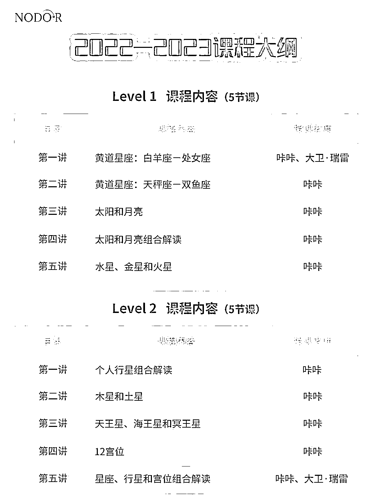

**课程费用**

**★ 1-2 阶 **

**课程费用：3500 元 **

**你也可能想学更高阶：**

**★ 1-3 阶　连报****课程费用：11500 元 ************转发优惠价：**11000 元（朋友圈转发本课宣保留 24 小时以上，并截图给课程顾问）**********★ 1-5 阶　连报**

**课程费用：46500 元 **

****转发优惠价：34800 元（朋友圈转发本课宣保留 24 小时以上，并截图给课程顾问）****

德国哲学家雅思贝尔斯说：

教育是一棵树摇动另一棵树，

一朵云推动另一朵云，

一个灵魂唤醒另一个灵魂。

你准备好被摇动了吗？

**退转课程**

**退款原则请详看《教学协议》，如有疑问请咨询课程顾问。**

****2022 L1-2 认证职业占星师必修课程****

**授课老师：大卫·瑞雷、咔咔**

**直播课开课时间：2022 年 8 月 30 日（周二）**

**授课方式：******网络授课，英文/中文授课，中文翻译****

**费用**： ****1-2 阶**：**3500 元；****1-3 阶**：**11500 元**（****转发优惠价：11000 元，朋友圈转发本课宣保留 24 小时以上，并截图给课程顾问）；**1-5 阶连报**：46500 元**（****转发优惠价：34800 元，朋友圈转发本课宣保留 24 小时以上，并截图给课程顾问）****

**课程负责人：王老师**（微信/手机：18510107057，请备注“大卫核心课”）

长按二维码添加课程负责人咨询~

**END****报名直达入口**

# 若道周运 10.31-11.6 丨艰难跋涉遇见绿洲，我们该如何度过这七天？（内含 12 星座运势）

> 原文：[`mp.weixin.qq.com/s?__biz=MzA5NjA0NTAxNg==&mid=2651492680&idx=1&sn=88d5a2c619ac1da2c8e464e3a0467868&chksm=8b4823ffbc3faae93219fb71bfe5112c6af3b6586ba898b5a5d561b97309ae27b5e34be80d95&scene=126&sessionid=1692737730#rd`](http://mp.weixin.qq.com/s?__biz=MzA5NjA0NTAxNg==&mid=2651492680&idx=1&sn=88d5a2c619ac1da2c8e464e3a0467868&chksm=8b4823ffbc3faae93219fb71bfe5112c6af3b6586ba898b5a5d561b97309ae27b5e34be80d95&scene=126&sessionid=1692737730#rd)

******☆ ****后台回复“今日”，给你一句生命态度******

作者/朵三三三 ISAR 认证占星师
编辑/翀子 封面/书君 图片/稿定设计**整体氛围**

**这是火星逆行后的第一周，**我们面临混乱和忙碌，要静下心来，给自己多一些适应的过程。虽然本周的天象相对平稳，没有太多起伏震荡，但我们也要瞻前顾后，才能利用好这个过渡期，为自己充电加油。

**可以说，本周是前有狼后有虎，就像是在大逃杀的路上，来到了一个补给点。**

**前有狼：**

上一周的天蝎座日食引起的余震还未消失，火星已经开始逆行，开启了 2022 年最后一段不平静的时光。宇宙提示我们，前方进入事故多发的颠簸路段！请谨慎驾驶！

**后有虎：**

下周马上迎来金牛座月食，进一步推波助澜，让暴风雨来的更加猛烈。该舍弃的都将舍弃，该转化的都将新生。

**我们该庆幸，我们的生活又要向前迈进一大步，**这个过程带着撕裂和痛苦，但人类的适应能力往往令人瞠目结舌，**我们正在以自己都无法相信的节奏飞速成长着。**

如果最近你感到绝望、迷茫、不知所措，恭喜你，解锁了新的挑战！**尘埃尚未落定，请一定耐心等待因缘的到来。**

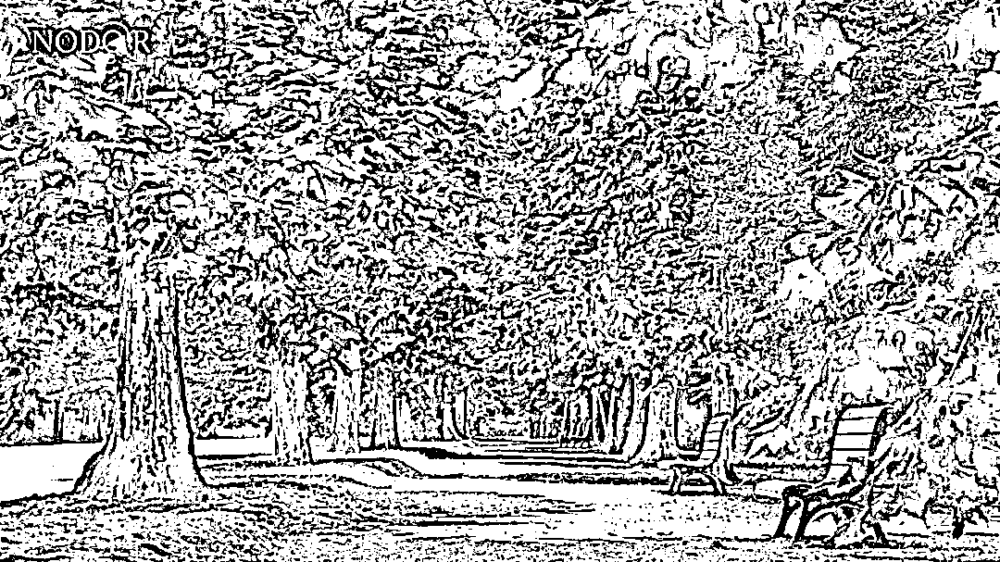

**本周星象能量分析**

01

**天空中的大部分行星都位于天蝎座，其定位星火星的逆行必将带来明显不适。**

例如，**原有的计划被拖延、搁置，行动力降低。**明明有很多事情要做，却没办法启动自己。或者是被迫做一堆琐碎的杂事，心却完全不在当下，无法对眼前的事物提起兴趣。

逆行也会让我们**不得不重复一些工作**，无论是需要返工的旧事，还是一些曾经完成，却又改头换面，重新出现的事情，都会让人难免生出烦躁感。

此时需要我们向内心去探究：

*   **它真的是简单不值得一做的事情吗？**

*   **它真的是没有意义的吗？**

*   **我为什么会再次遇见同样的任务？**

*   **我排斥它的原因到底是什么？**

火星的逆行让我们去关注自己的意愿和动力，以及自己处理事情的方式，到底存在哪些问题，而这些老旧的事项，就是来帮助我们解决这些问题的。**关注自己的动力模式，也关注自己的真实意愿，同时尽量放慢速度，不急于求成。**

02

本周的前半段较为平稳，而随着天蝎座金星逐渐与土星、天王星成相，**在周末前后，会引起一些情感上的小风浪。**

每年金星进入天蝎座时，本身就容易带来情感上紧张激烈的体验，也会出现拧巴内耗的情况。当它遭遇土星和天王星时，世人必将经历又一重考验：**在情感婚恋、人际关系、合作、资源共享以及金钱、物质上面，信任度和稳定度的考验。**

我们会一面尝试突破过往的固定模式和行为习惯，触摸不熟悉的新领域，又一面出于自我保护的安全感节节后退，甚至，我们会觉得，这些改变已经触及了自己的原则和底线。

土天四分相虽然已经出相位了，但金星会让这两颗行星再度有了连结，死灰复燃：**我们会在之前自我矛盾的基础上，再扩大一步，不断在作死的边缘试探，看自己能承受到哪个程度。**

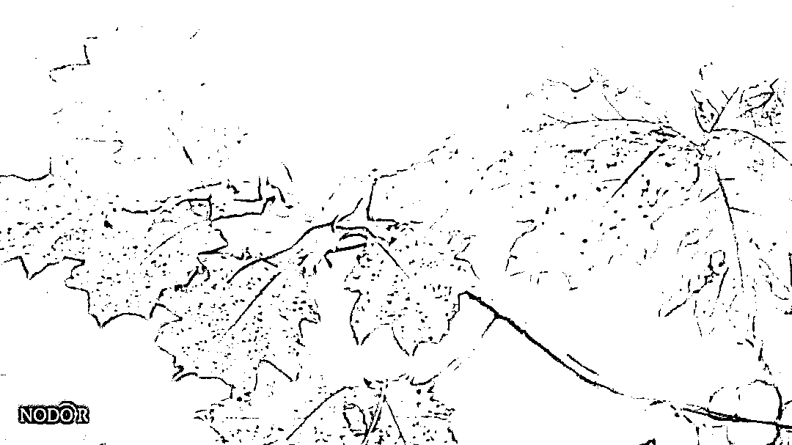

**一周星象****周一**

*   **摩羯座月亮合相冥王星、六分木星**

*   **内在汹涌的一天**

有一些激烈的情绪和控制欲出现，内心深不可测如大海，但却因外部世界的一些小幸运事件能够自洽，获得足够乐观的结果。

**今天，他人的一句话或者不经意的互动，很可能就能够成为我们的救赎。**

**周二**

*   **水瓶座月亮四分水星、太阳、金星**

*   **内心格斗的一天**

连续发生在水瓶座与天蝎座之间的四分相，让我们感觉到格外失衡，矛盾感强烈。

此时我们希望自己是稳定而理性的，能够抽离出来平静审视生活。然而外在环境却不断有事件发生，一些人事物将我们拉进漩涡，一石激起千层浪，我们根本无力阻挡。

**今天需要花很多精力在平复心情上，也不是适合作出重大决定的好时机。**

**周三**

*   **水瓶座月亮四分天王星、合相土星、三分火星**

*   **努力整合的一天**

经历了昨天的内耗，今天来到一个相对稳定又清晰的状态中。虽然依然有一些情绪激荡，内心的冲突感也有残留，但我们能感受到**有勇气在滋生，**有种敢于豁出去的洒脱出现了！

尤其是下午及傍晚，很适合梳理重要事件，构思框架、脉络，制定进度与计划。或进行交流、合作、商议，会十分顺畅，大家都容易换位思考，接纳他人的立场和观点。

**昨日陷入混乱的一些关系在今天有望重新获得平衡。**

**周四**

*   **双鱼座月亮三分水星、三分太阳**

*   **压力释放的一天**

今天是一个带着**梦幻气息**的出口，是能够放置近期焦灼与纠缠的“树洞”。

**我们的灵感**让我们能够找到一些特别的方式，从当下的晦暗现实中释放出来，或许是交流，也或许是书写，也或许是极具个人化的形式。

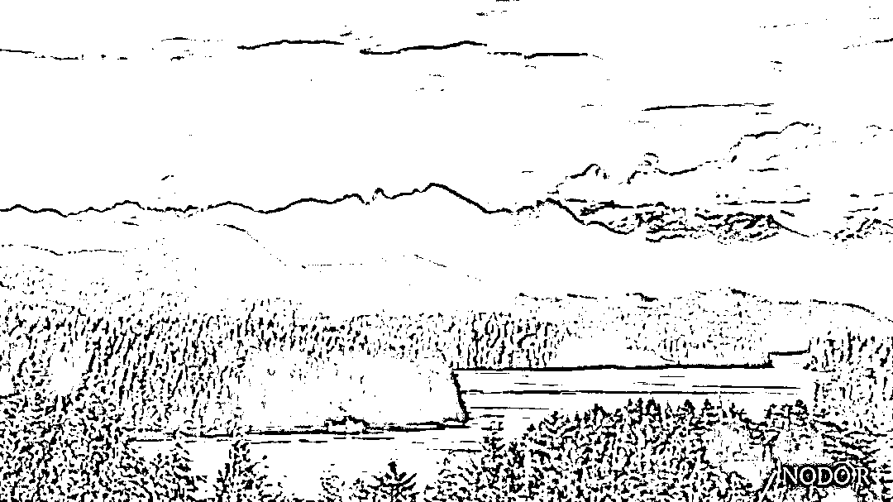

**周五**

*   **双鱼座月亮三分金星、合相海王、四分火星**

*   **苦甜交织的一天**

发生在双体星座的月火四分相会让今天经历一些混乱。可能情绪陷入到一团乱麻中，有些突如其来的烦躁、急促，可能是事情变得繁杂又毫无头绪。我们可能发现这跟自己想象中完全不一样，于是突然失去耐心，甚至想破罐破摔。

首先，**接纳多线并行的模式**，这其中或许会与他人发生冲撞，或许是任务本身有矛盾，都是正常现象。

其次，可以试着放些舒缓的音乐，或做些柔和的肢体拉伸，能为我们迅速补充能量，**恢复平静**。

最后，**人际关系**能有效分担压力。我们可以从亲密关系、伴侣、好友身上获得支持和慰藉，此时能量能够进行双向的深层次流动，这些情感关系也会因此得以加固。

**周六**

*   **双鱼座月亮合相木星**

*   **愉悦自信的一天**

今天是相对幸运的一天，大家可以好好享受周末时光。

我们很容易与他人谈起梦想，分享对未来的规划，也更容易表达自己的内心感受和真实需求。**大胆敞开心扉会让我们收获信任，感到愉悦和幸福。**

**周日**

*   **金星对分天王星**

*   **惊喜或惊吓的一天**

我们本就已经松动的“底线”再次摇摇欲坠。而我们能做的最好的事情就是**放开手乘风破浪，**跟它一起摇摆起来。

**给自己足够自由的空间，相信一切皆有可能。**无论是分是合，是悲是喜，我们要如实面对自己内心的怀疑和恐惧，看见自己在此刻经历当下的原因。

今天我们的价值感并不稳定，很容易受到外界的影响坠入情绪黑洞，只是，浪打来时，就让它来。因为在我们的内心深处，其实始终有答案。在风浪过后，它会自然显现出来。

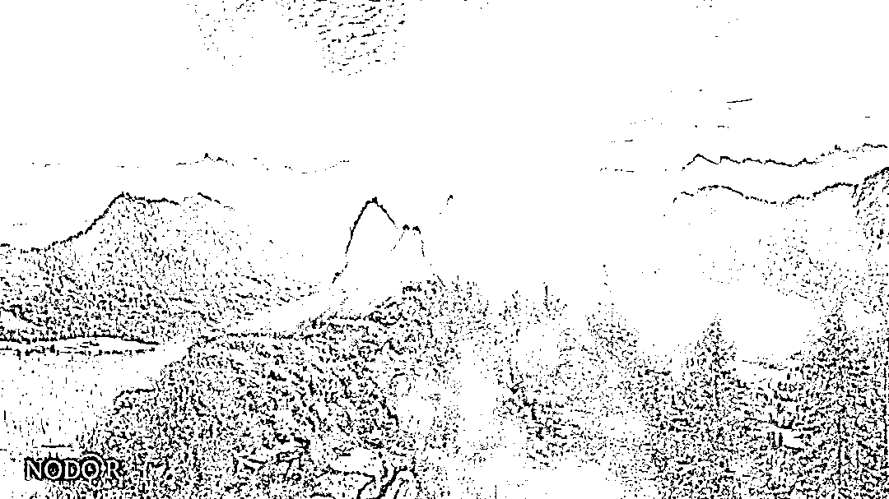

**12 星座一周运势**

**（重点参考上升星座，其次参考太阳星座）**

***白羊座***

本周可能要处理一些关于金钱方面的事情，会涉及到一些利益分配、合作关系的重建。你会尝试把理财、资源进行优化升级，或与他人建立更进一步的深度合作。

在这个过程中，一定会触发类似不甘心、不满足的感受，也可能会发生争执和冲突。也有一些人会在情感方面经历相似事件。

***金牛座***

本周在人际关系、情感关系中会感受到一定的压力。部分人化压力为动力，在重要关系上取得进展，开启一段亲密关系，或是合作关系。在关系中你依然需要独立空间，所以无须逼自己许下重要承诺。而另一些人决定离开关系，斩断连结，换个环境生活。

需要注意财务金钱的问题，可能会由于人际关系带来破财的问题。

***双子座***

本周内心世界波动起伏较大，很容易因为情绪影响手头上的工作进度。目前你要完成的工作任务较多，且涉及到不同方向。除了工作以外，目前生活环境和琐事也容易让你感到心烦和压抑。不过归根结底，最核心的压力部分还是来源于你思想上的负担，和对自身的苛求。

周末前后，你有契机尝试换一种方式去面对这些烦恼，例如完全跟随兴致，或在心理上实现自我突破。

***巨蟹座***

本周你可能在情感中体验到过山车的感受，尤其是正在暧昧或者刚在一起的情侣，需要花时间去跟起伏跌宕的心情相处。也会有一些意料之外的事情发生，或许与你们的共同人际圈子、社交团体相关，过程中，你会生出一种自己并不真正了解对方的感觉。信任会是你这周的关键词。

还有一些巨蟹座会经历财务上的动荡，会在消费上面经历纠结选择的过程。需要注意睡眠问题，以及身体上的旧疾复发。

***狮子座***

本周需要注意与家人之间的关系，可能会经历一些戏剧性的变化。家人和家庭生活无疑会带给你一些压力，占用你的时间，你也可能会因此影响到工作状态，感到人际关系上带来的疲惫。

周末前后，你可能会做出关于情感生活和工作方面的一些决定，有些人选择离职，也有些人决定要搬家，无论是什么，你都离真正的独立更近了一步。

***处女座***

本周你或许有许多学习计划要完成，例如参加考试，完成书面文稿，也可能是去外地出差、旅行，要注意这些事项都容易发生变动和临时调整。所以记得给自己留出足够的弹性空间。

工作上较忙，可能会出现一些项目、文件需要返工，必要时可以求助身边的人，你能够在同事或亲近的人身上得到支持和力量。

***天秤座***

本周需要关注财务方面的状况，可能会有一些突如其来的进账或消费，但建议不要做出太过冒险的决定，尤其是涉及到线上、异地的合作项目或投资时，尽量谨慎。

也可能有出差机会，但在异地容易遇到一些混乱的情境，或身体上的不适，近期尽量避免过度劳累和熬夜。

桃花容易出现在工作场合或身边熟悉的人群中。

***天蝎座***

最近你可能有很多感触，也比平时更加敏感，更容易受周围磁场的影响。本周需要注意一些人际关系上的变化，会带来内在对于现实世界的不安全感。

部分天蝎座可能会经历突如其来的分离，或合作关系的变动，甚至会出现利益纷争，让你内心会生出退缩自闭之意。但外在的社交状况依然要继续，缓解心灵压力的办法就是尽可能按照自己的兴趣爱好，做让自己开心的事。

***射手座***

本周你的心灵世界十分活跃，可能有很多灵感出现，或者体验到有趣的梦境。也可能是最近你对于神秘学、身心灵方面格外感兴趣，会主动接触这些领域，接收到意想不到的启发和帮助。只是头脑的惯性思维会让你迟疑，但此时你更应该听从直觉的指引。

另外，你能够在家人那里获得智慧的声音，如果有难以做出的抉择，可以多问问亲人和至交的意见。

***摩羯座***

周初你的精神压力较大，但周中之后渐渐平复。本周你的社交活动较多，也会有一些突然的临时邀约出现，可能是失去联系的故人，再次出现在你的生活中。

部分摩羯座可能会被突然告白，或在聚会、娱乐场合与对方擦出火花。与外界大量的互动会让你感到疲惫，记得给自己留出一些独处的时间来思考沉淀。

***水瓶座***

本周在工作上的状态还算顺利，不过临近周末，你可能会突发奇想去调整自己的工作安排，也可能是因为自己或家人的原因，临时取消一些活动和任务。

周中，你可能会在金钱、投资上有一些新的想法和计划，或者想买喜欢的东西犒劳自己，勇敢按照内心想法去做就好。

你始终在突破自己的路上走着，但依然会不自觉束缚自己，实际上你能比自己想象中做得更好更多。

***双鱼座***

本周你可能有出门的机会，经历一次计划外但十分愉快的旅行，也可能是收到异地传来的好消息，或与远方的朋友、伴侣进行了愉快的交流。

你的思维被大大激活，出现一些原创性、颠覆性的想法，内在或许会本能否定它们，但受到木星能量的加持，你会发现，这些想法有机会，甚至已经在生活中慢慢实现了。

**版权声明**：原创文章由作者授权首发于若道平台发布，欢迎转发，反对抄袭。友号转载请申请白名单。

**END**

****朵三三三****

ISAR 认证占星师

全职占星师/塔罗师/国家三级心理咨询师 

人大文学学士/德国慕尼黑大学文学硕士

**微博/微信公众号**：朵三三三

长按打赏

**20 位来自世界各地的占星师****带来 19 场沙龙——新世界的觉醒****详情可点击下图**

**学习占星学****点击下图了解课程详情**

**微信又双叒叕改版啦，不想错过若道君的推送？**
****就把若道设为****星标****以及点点****“在看”****吧！******▼**

**喜欢就点一下“在看”吧！****报名直达入口**

# 直播预告丨 今年余下的时间，你都会被影响的火逆来了！

> 原文：[`mp.weixin.qq.com/s?__biz=MzA5NjA0NTAxNg==&mid=2651492680&idx=2&sn=653ef0b2a473b5060acb8f7ae311f4f6&chksm=8b4823ffbc3faae95fba6286d83456138a205935f680ff43069e4cc9d38a2de22534cf0d2939&scene=126&sessionid=1692737730#rd`](http://mp.weixin.qq.com/s?__biz=MzA5NjA0NTAxNg==&mid=2651492680&idx=2&sn=653ef0b2a473b5060acb8f7ae311f4f6&chksm=8b4823ffbc3faae95fba6286d83456138a205935f680ff43069e4cc9d38a2de22534cf0d2939&scene=126&sessionid=1692737730#rd)

**火逆来了！****从今年的 10 月 30 日到明年的 1 月 13 日，火星逆行。****也就是说，今年余下的时间，你都会在火逆的影响之下。**然而，和水星逆行一样，火逆并非只是从 10 月 30 日才有影响，从火逆阴影期，火星就开始搞事情了！

*   比如，从国际上而言，**9 月 21 日已经是在火逆阴影期**，俄罗斯就是在这个时候宣布部分动员，俄乌战争开始升级，核战争的危险大增。
*   而 10 月 12 日美国宣布禁止美籍华人及持绿卡人士参与我国高端芯片的研发和生产也把中美的高科技战升级了，对我国带来非常不利的影响，**这也是在火逆阴影期之内。**

**只是在阴影期，火星逆行就搞出这么多事情。如果火星停滞，开始逆行，又会出什么幺蛾子呢？**火星逆行前后，与它平时的速度相比，整个的运行速度变得很慢，很可能在一个度数附近停留一周以上。因此，一旦这个逆行的火星与**个人星图、国家星图、组织星****图**发生相位，那火力是非常集中的，**平时可能的一些转瞬即逝的小火星这时候就可能引起燎原之火。**而且不像水星和金星，火星是一颗有关行动的行星，**会容易直接引发一些行为和事件，**就如刚才的 2 个例子所传达的那样。
因此对于占星师而言，每次的火逆都会是占星师非常关注的，其重要性从某种程度而言，是超过其他行星逆行的，**毕竟，2 年才有一次。****为了帮助你更多了解火逆，我们特意为你奉上这样一场火逆直播，**ISAR 认证占星师王嘉祺将为你详细介绍火逆的基本知识，**历年来火逆的一些事件，火逆在 12 个宫位的表现，哪些人在这次火逆中会更受到影响，**还会分享一些火逆的故事。**直播时间：11 月 3 日 20:00-21:30**

**点击下方按钮预约直播**<mpvideosnap class="js_uneditable custom_select_card channels_live_iframe" data-pluginname="videosnap" data-headimgurl="https://wx.qlogo.cn/finderhead/PiajxSqBRaEJYnVsqWfEX9qA0sI6hNVKsDfyzfPZ92WZMZyBpZWU5NA/0" data-username="v2_060000231003b20faec8c4e68a1ec2d4ca07e434b07755bbf47e7053a3059defd2c9d6c68a20@finder" data-nickname="若道" data-desc="将在 11 月 03 日 20:00 直播" data-intro="如何应对火星逆行攻略" data-noticeid="finderlivenotice-v2_060000231003b20faec8c4e68a1ec2d4ca07e434b07755bbf47e7053a3059defd2c9d6c68a20@finder-1666768541844069-692117899" data-type="live"></mpvideosnap>**欢迎转发本文到朋友圈，让你的朋友了解比水逆影响大的火逆来了。你的转发帮助传播占星学，也让更多朋友了解天象，更好安排生活！**

# 雷蒙德·梅里曼金融占星周运 | 本周规则：不那么确定

> 原文：[`mp.weixin.qq.com/s?__biz=MzA5NjA0NTAxNg==&mid=2651492680&idx=3&sn=5fc7cf61e747ae4729c45a0b89096429&chksm=8b4823ffbc3faae9f11a7cdeb9e8066c29ad9f9048e4f78f491c64680b8c9ff286cf55c3bbcb&scene=126&sessionid=1692737730#rd`](http://mp.weixin.qq.com/s?__biz=MzA5NjA0NTAxNg==&mid=2651492680&idx=3&sn=5fc7cf61e747ae4729c45a0b89096429&chksm=8b4823ffbc3faae9f11a7cdeb9e8066c29ad9f9048e4f78f491c64680b8c9ff286cf55c3bbcb&scene=126&sessionid=1692737730#rd)

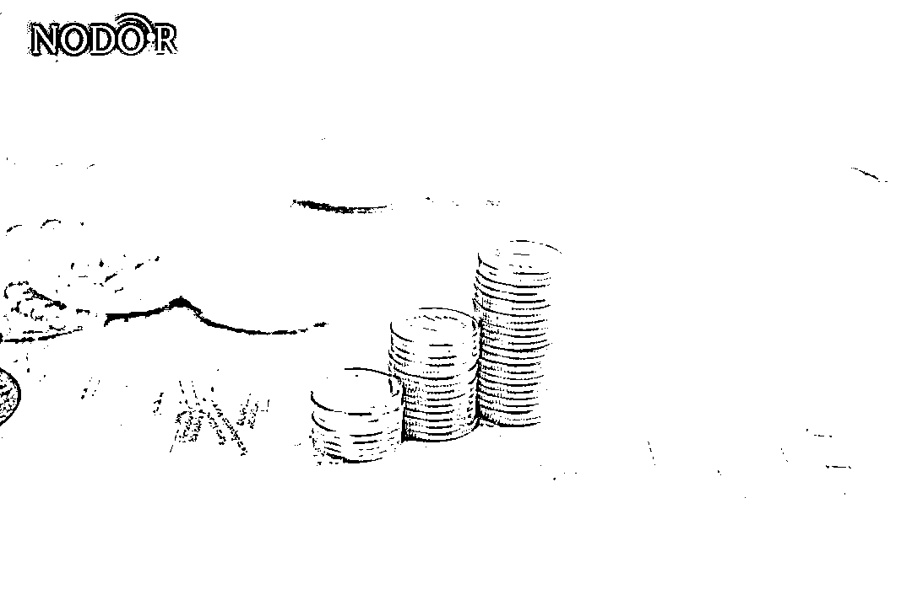作者/雷蒙德·梅里曼 译者/Luke 编辑/玫瑰 图片/稿定设计雷蒙德·梅里曼是在金融占星学界稳坐第一把交椅的占星师，同时他也是若道签约的金融占星课老师，我们引进了雷蒙德·梅里曼老师的《[上证指数月度报告](http://mp.weixin.qq.com/s?__biz=MzA5NjA0NTAxNg==&mid=2651491983&idx=2&sn=3e5aef96ac219afb4dd421bfc33b024f&chksm=8b483c38bc3fb52ec2bc36e67f3698ded0e88b4e08ff79785eaa801cbc565e931c8132142632&scene=21#wechat_redirect)》及《[黄金报告](http://mp.weixin.qq.com/s?__biz=MzA5NjA0NTAxNg==&mid=2651491983&idx=2&sn=3e5aef96ac219afb4dd421bfc33b024f&chksm=8b483c38bc3fb52ec2bc36e67f3698ded0e88b4e08ff79785eaa801cbc565e931c8132142632&scene=21#wechat_redirect)》。我们经老师的授权，将每周刊登梅里曼老师的周运，供大家参考和学习。于是，这是本周的周运（10.31-11.4）。

**说明：以下时间采用纽约证券交易所所在地美国东部标准时间。**

**展望与回顾**

****

**美国经济第 3 季度有所增长，但有迹象表明，由于高通胀和利率上升，消费者和企业支出大幅放缓。国内生产总值——衡量全国商品和服务生产的指标在上半年下降，今年第三季度达到 2.6%的年增长率。**

**——莎拉·查尼·坎本**

**《经济增长，但警报出现》**

**《华尔街日报》**

**2022 年 10 月 27 日**

美国股市呈现出两种面貌。道琼斯工业平均指数和标准普尔指数上周五飙升至月度新高，前者每天都在上涨。以科技股为主的纳斯达克指数 10 月 25 日（当天发生日食）触顶，周四遭到大幅抛售，周五有所反弹，但未能创下周度新高。 

9 月的最后一周，土星、天王星形成最后一次四分相，木星处于土星、天王星的中点，分别与这两颗行星形成八分相。在那之后，美国股市看起来更为上涨了。在 10 月 13 日消费者物价指数报告出炉当天，火星四分海王星，市场创下较低的次低点，但是当天结束前，道琼斯指数上涨 800 多点。因此，随着今年最强有力的相位配置完成，截至 9 月 30 日，2022 年熊市下跌的大部分已经完成。从数据上看，道琼斯指数从 2022 年 1 月 5 日的历史高点下跌了 8291 点，历史高点在土星第三次也是最后一次精准四分天王星之后的两周内出现。9 个月后，10 月 13 日的日内低点，大约在土星最后一次几乎精准四分天王星四分相两周后出现。自那以后的两周里，道琼斯指数上涨超过 4200 点。换句话说，仅在过去两周，它已经从 2022 年前 9 个月的损失中恢复过半。这令人印象深刻，强烈指示着 10 月 13 日的低点是长周期低点，尽管还需要几周的时间才能确认。从地球宇宙学角度来看，美国股市的历史高点在土星最后一次和天王星形成精准渐亏四分相期间出现。随后到来的 9 个月熊市，一直持续到第 4 次也是最后一次土星-天王星四分相结束时。因此，在土星-天王星相位下，我们见证了长周期的牛市和熊市分别来到终点，前提是 10 月 13 日的低点不会被跌破。在这种长期行星相位下，永远不应低估天王星的力量。在全球其他股票指数中，我们也见证了类似的强势上涨，许多始于 2022 年 9 月 30 日-10 月 3 日土星-天王星接近精准成相时。有一些例外。比如说，中国上证综指周五下跌至 6 个月新低；香港恒生指数的跌幅更大，在 13 年来的最低价位收盘。其他市场上，上上周末的土星顺行和 10 月 25 日的日食对应了反转。比特币、以太坊和白银都从 10 月 13-14 日的低点显著上涨。黄金也呈现出不错的上涨，从 10 月 21 日的 2 年新低上涨至 10 月 26 日的临时高点。**随着木星逆行回到双鱼座，原油可能会开启新一轮上涨，尽管价格需要继续上涨超过上周的高点，才能表示这确实是看涨的新周期。但这是个起点。**

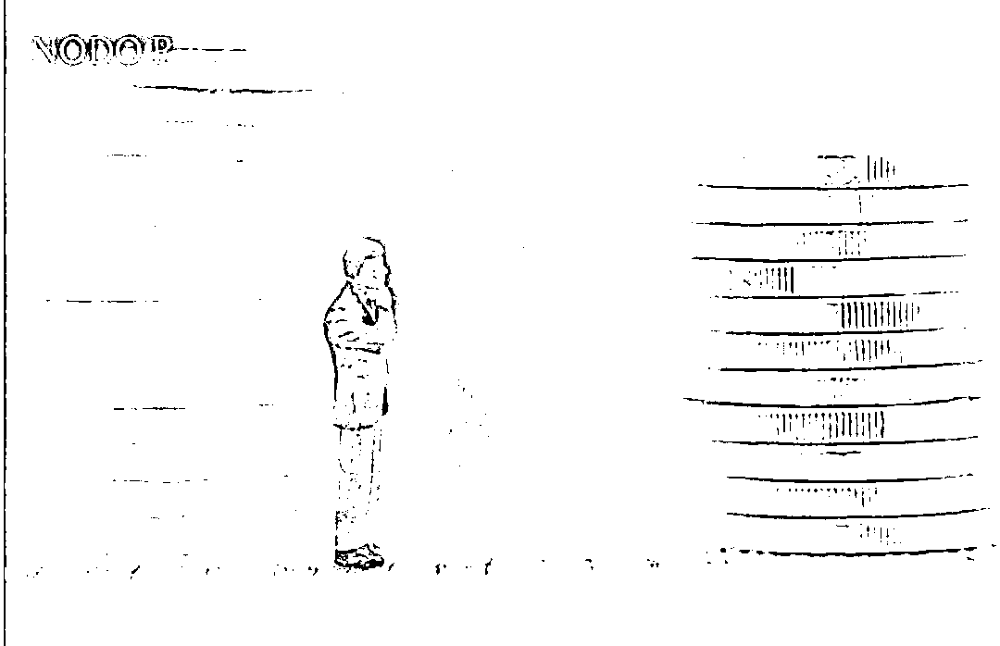

**短期宇宙征象与长期考量**有许多宇宙征象正在发生，尽管不如 9 月的最后 10 天那样重要。首先，**截至 10 月 28 日，木星已经回到双鱼座，它将在 12 月 20 日重返白羊座，并停留至 2023 年 5 月。**你可能记得，木星上一次进入双鱼座期间，2021 年 12 月 29 日-2022 年 5 月 16 日，通货膨胀飙升，股市进入熊市，人们怀疑美联储和美国政府缺乏远见，采用了导致通货膨胀的政策。这种误判也导致商品期货价格的暴涨，尤其是能源、贵金属和粮食。有理由担心当美国联邦公开市场委员会下周开会并就加息的未来进行更新时，将发生另一次误判。市场预期美联储将宣布另一轮 0.75%的加息，并在此后放缓加息节奏。我们关注的焦点是，这次会议和宣告将在 10 月 31 日火星在双子座 25°逆行之后举行和发布。火星将处于与双鱼座 22°海王星成四分相的容许度内，对分美国建国星图中在处女座 22°的海王星。这不是与良好判断或有能力按照计划行动相关的征象，因为逆行的火星四分海王星会持续到 11 月 19 日。火星想要显得勇敢。但当逆行时，勇敢可能会变成鲁莽，因为此时激进的行动或宣言可能会带来问题。结果通常不会像预期那样发生。此外，四分海王星时，计算中会遗漏一些东西。**你需要更多的时间和数据才能笃定，因为这是一个与不确定性或缺少必要数据做出正确判断相关的相位。**换句话说，我认为美联储可能也不清楚应当说和做什么。他们可能会做出承诺，却没有能力实现。

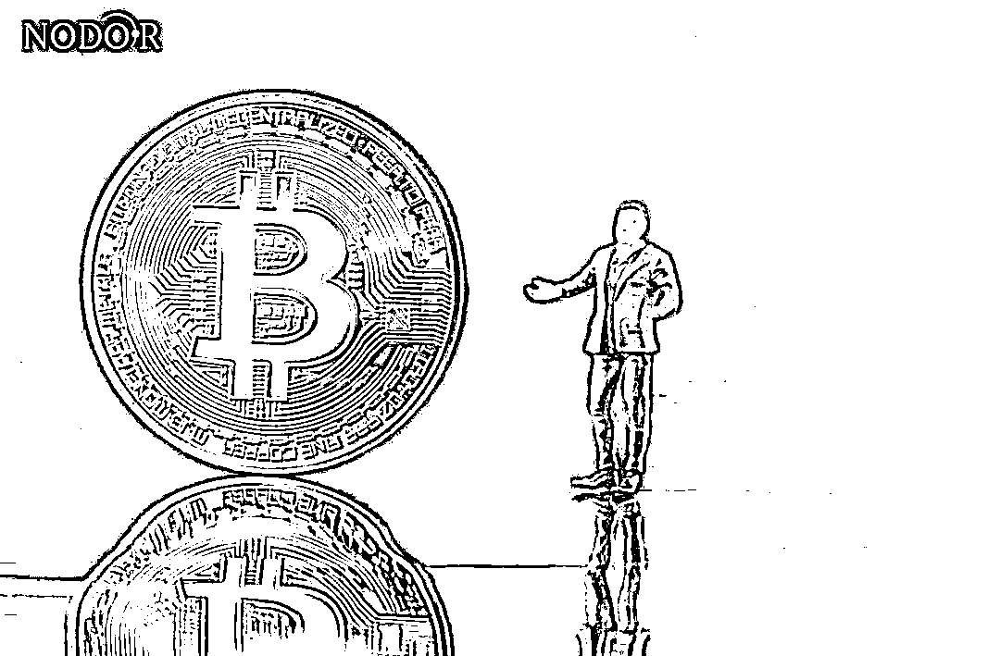

**无论如何，金融市场的烟火表演可能还没结束。**本周末太阳和金星会开始与出相位的土星-天王星渐亏四分相形成 T 三角，成相时间是 11 月 5 日-11 日。最重要的可能是 11 月 5 日的金星对分天王星，这是就业报告出炉的第二天。可能会出现出人意料的数据。同样重要的是 11 月 8 日的月食，以及 11 月 9 日的太阳对分天王星，美国中期选举结果也会在此时出炉。届时可能有更多出人意料的事情。这两个天王星相位都可以对应金融市场的大幅波动，尤其是与利率相关的国债和外汇市场。记住，任何接近数月低点或高点的市场，都很容易突破支撑位或阻力位。如果不是如此，那么这些相位可能对应突发和剧烈的反转。这一时期的市场活动可能决定美国和其他全球股票指数是处在牛市还是熊市。目前，两种展望都有证据支持，当然是因为在火星逆行和存在一系列天王星的困难相位的情况下，什么事都可能发生。这周的规则是：**不要那么确定。**你不知道你不知道什么。最好记住这点。从 2018 年年末，若道引入金融占星大师雷蒙德·A·梅里曼撰写的梅里曼市场时机学院每年一次的年度预报沙龙和每年一本的《年度预报》以来，**2023 年已经是第 5 个年度了。我们简单回顾了部分 2019-2022 年金融预报的内容，**过去的经验让我们相信，你根据梅里曼老师的指导作为投资参看，你会比一般人有更大的胜算。******长按下图识别二维码****了解更多详情**

**说明：以上日期基于纽约证券交易所所在的美国东部标准时间，由于存在时差，中国地区可能需要加一天。**

**版权声明：**本文由若道翻译发布，欢迎转发，反对抄袭。友号转载请申请白名单。**END**

**雷蒙德·梅里曼（Raymond Merriman）**

若道签约老师。著名金融占星师，ISAR（国际占星研究协会）前主席，梅里曼市场分析公司的总裁。他由于“提升了占星学的职业形象”，在 1995 年国际占星大会上被授予轩辕十四奖；在 2012 年国际占星大会上，被授予轩辕十四终身成就奖。

1“中国上证指数月度报告”发售**若道推出了****中文版****的雷蒙德·梅里曼中国上证指数月度报告，并持续发行该报告！**当把金融市场的周期和占星学的周期相结合时，雷蒙德·梅里曼老师的金融占星学研究**为投资者应对金融市场的周期波动，并随之调整投资策略提供了极大的价值参考**。
**11 月中英文报告已上线！**2“黄金价格周期月度报告”发售**若道推出****中文版****的雷蒙德·梅里曼黄金价格周期月度报告！**不仅仅为广大读者在中国股市的投资出谋划策，更将视角放眼黄金市场。**每当世界经济形式不明朗的时候，有一个地方是保值的港湾，那就是****黄金**。自 1982 年雷蒙德·梅里曼出版第一本研究《地球宇宙学征象与黄金价格的关联》的著作以来，**他一直作为最重要的黄金市场时机预测者之一享誉国际**。2022 年 11 月黄金报告已上线，梅里曼老师将会告诉你他对这个关键时期如何操作的想法。也可以按照季度和一年期订阅，有更多优惠。季度和年度的好处是，你可以持续了解梅里曼老师对于不断在变化的市场的看法。即便他某一次看法和市场不一致，你也看到在下一期他如何调整自己的看法，并看到金融占星在一个长期时间段内对你把控风险的帮助。而能够长期控制风险、尽量找到安全的投资时机才是投资的长久之计。**11 月中英文报告已上线！****购买套餐**，买得越多越优惠中国上证指数月度报告套餐价

*   **单月报告**：280 元
*   **3 个月套餐**：780 元（260 元/月）
*   **12 个月套餐价**：2400 元（200 元/月）

**长按下图识别二维码****购买金融报告****套餐****▼**

黄金周期月度报告优惠

*   **双报告年度套餐更优惠（直降 900 元）**

*   **12 个月黄金报告+12 个月上证指数报告：仅需 3900 元**

**长按下图识别二维码购买黄金报告套餐**▼

3《2023 年金融报告及沙龙》

从 2018 年年末，若道引入金融占星大师雷蒙德·A·梅里曼撰写的梅里曼市场时机学院每年一次的年度预报沙龙和每年一本的《年度预报》以来，**2023 年已经是第 5 个年度了。我们简单回顾了部分 2019-2022 年金融预报的内容，**过去的经验让我们相信，你根据梅里曼老师的指导作为投资参看，你会比一般人有更大的胜算。****

**长按下图识别二维码****了解更多详情**

**购买直达入口**

# 若道占星咨询丨火星逆行，你可以在哪些方面做出调整？

> 原文：[`mp.weixin.qq.com/s?__biz=MzA5NjA0NTAxNg==&mid=2651492673&idx=1&sn=d28027883ab0a5d251ded2a9dfb22d3a&chksm=8b4823f6bc3faae06a6a187eefd5275184abbe0489fa92b0d27e418b70f812053242f71399a6&scene=126&sessionid=1692737730#rd`](http://mp.weixin.qq.com/s?__biz=MzA5NjA0NTAxNg==&mid=2651492673&idx=1&sn=d28027883ab0a5d251ded2a9dfb22d3a&chksm=8b4823f6bc3faae06a6a187eefd5275184abbe0489fa92b0d27e418b70f812053242f71399a6&scene=126&sessionid=1692737730#rd)

若道占星咨询平台至 2017 年运营至今，已有近 50 多位若道核心课程认证毕业生入驻。他们经过 2 年系统培训、累积完成近 150 小时的相关占星学理论学习、咨询技术的练习、通过若道认证考核后，成为职业占星师，开始开展占星咨询服务。10 月 30 日，火星在双子座开始逆行，时间从 10 月 30 日-2023 年 1 月 13 日，火星从 8 月 20 日进入双子座，要一直停留到明年 3 月 25 日才离开。在双子座停留将近 7 个月的时间。该如何调整自己适应火星的脚步？又如果你对自己的出生星图充满好奇，想通过占星学这门古老的智慧并在专业咨询师的陪伴下、探索自己的生命故事和人生困惑，欢迎来若道咨询平台预约！

专业占星师在这里等你

**若道占星咨询平台是以人本主义占星学导向的咨询，期望用博大精深的占星学提供优质信息，并通过和客户的交流，协助客户了解自己和他人、探索潜能、识别破坏性的人生模式、了解生命周期。**占星学是宇宙送给人类的礼物，我们愿意将这个礼物分享出去，让更多优秀的职业占星师为更多公众服务。如果你对自己的生命有困惑，不论这个困惑是学业、职业，还是爱情、婚姻、亲子教育、个人成长等，我们都欢迎你来！**本期我们将为大家推荐以下占星师：**

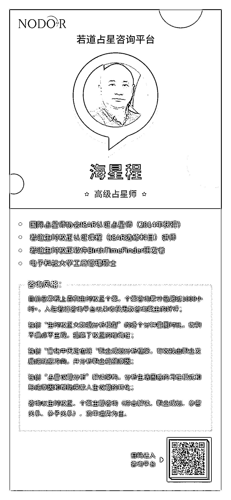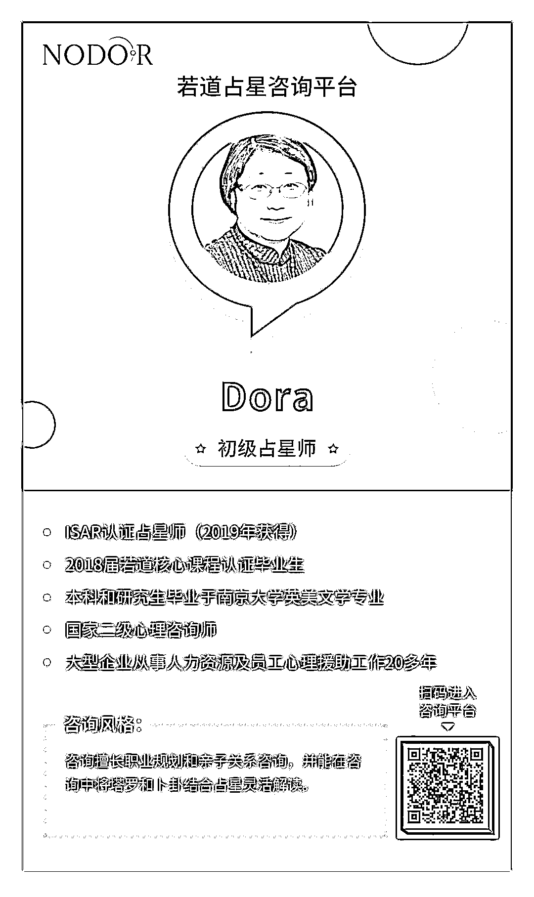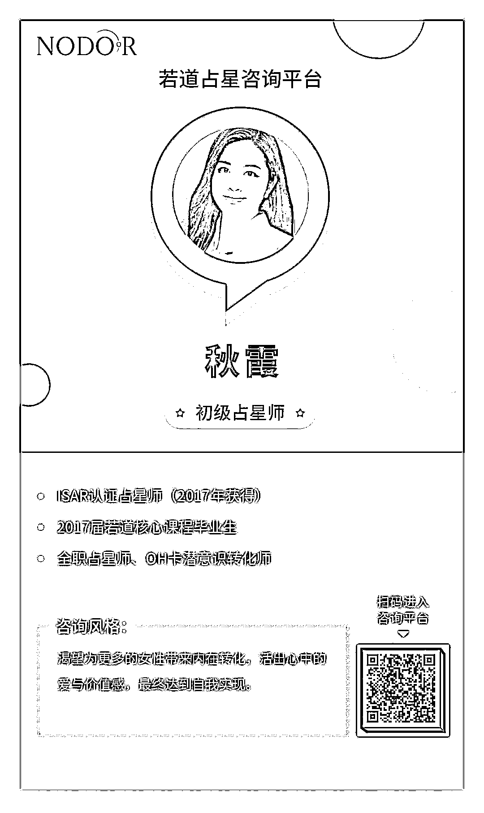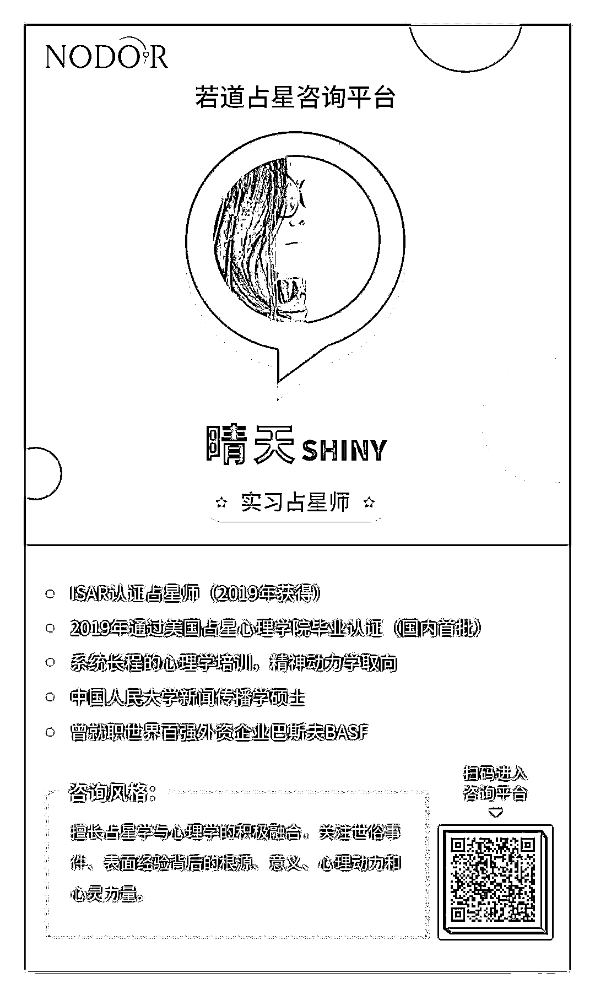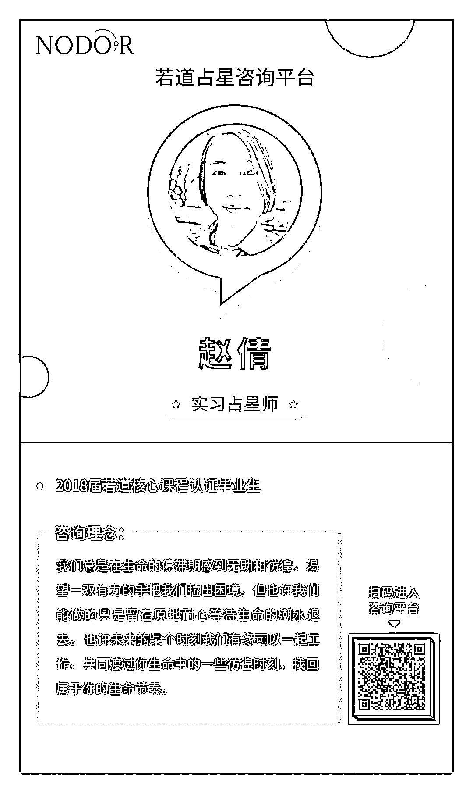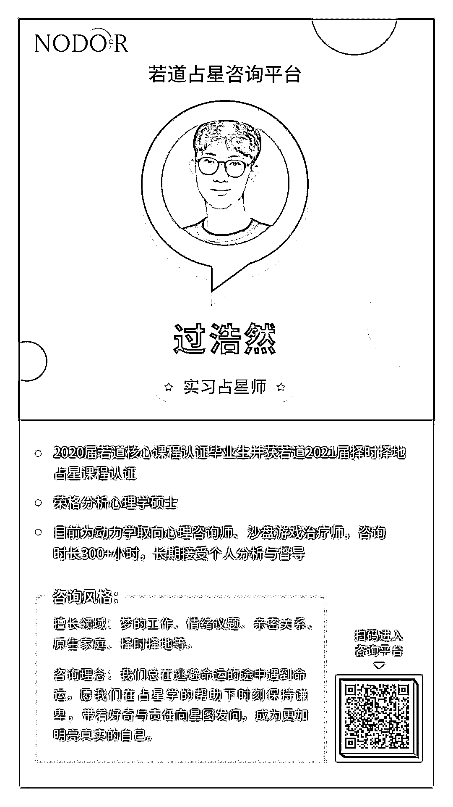

**来看看大家在咨询后的评价~**

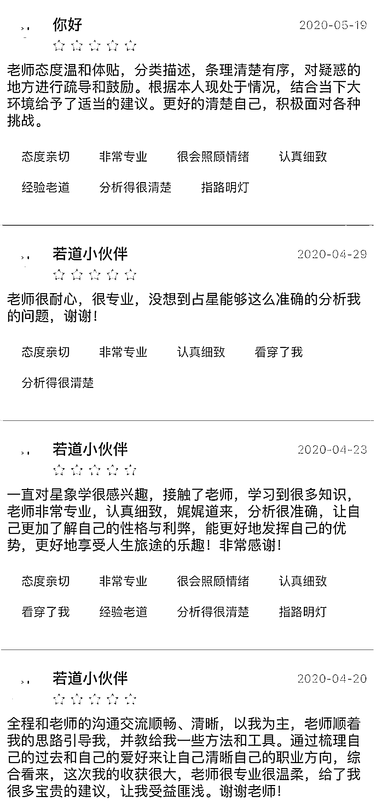

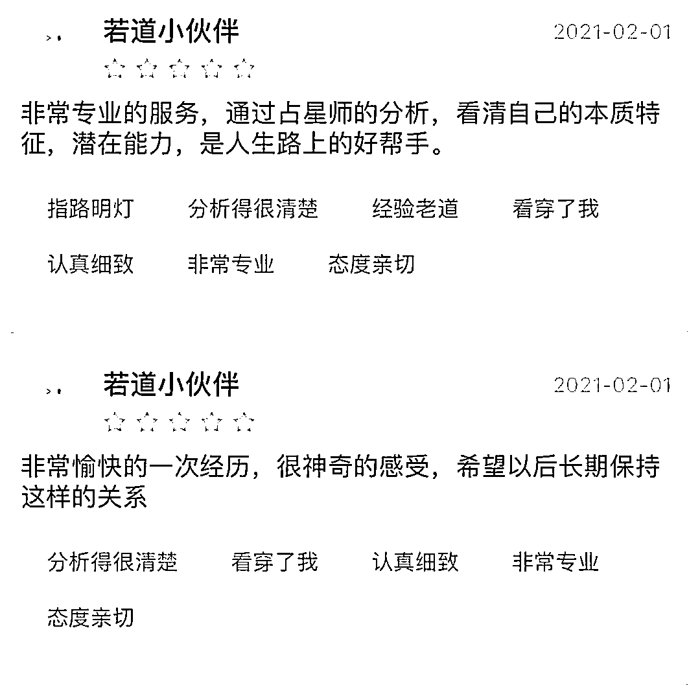

如何预约占星咨询？

**方式一：****下载若道 APP，进入占星咨询栏目可以进行预约**

**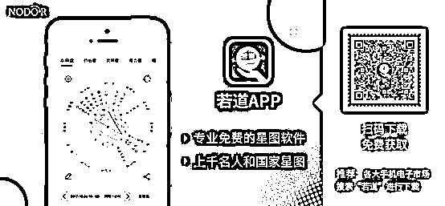**

**方式二：通过若道服务号****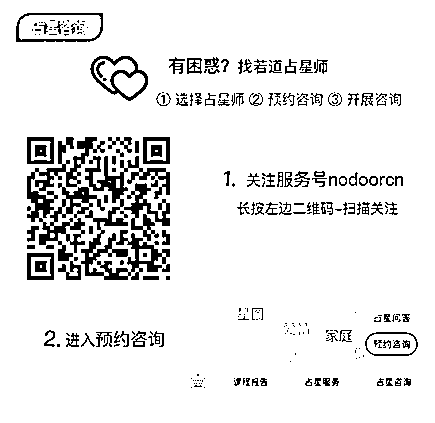**

**这里有一份火星逆行攻略等你解锁** 

**长按下方二维码了解更多详情**

**如果你也想成为优秀的职业占星师？** 

**这里有个课程可以了解一下**

**

**未来 2023 年，祝大家身心愉快！**

# 《2023 年金融预报》双 11 优惠预售中！梅里曼 11 月上证+黄金报告上线！

> 原文：[`mp.weixin.qq.com/s?__biz=MzA5NjA0NTAxNg==&mid=2651492670&idx=1&sn=5206b9c47946324a9db190d8f8a88381&chksm=8b482389bc3faa9f05d329ae348e5921c753152dad0366ab5cd3c06e9465a9c936ac0a7de843&scene=126&sessionid=1692737735#rd`](http://mp.weixin.qq.com/s?__biz=MzA5NjA0NTAxNg==&mid=2651492670&idx=1&sn=5206b9c47946324a9db190d8f8a88381&chksm=8b482389bc3faa9f05d329ae348e5921c753152dad0366ab5cd3c06e9465a9c936ac0a7de843&scene=126&sessionid=1692737735#rd)

  

**《2023 年金融预报》**从 2018 年年末，若道引入金融占星大师雷蒙德·A·梅里曼撰写的梅里曼市场时机学院每年一次的年度预报沙龙和每年一本的《年度预报》以来，**2023 年已经是第 5 个年度了。**

我们简单回归一下梅里曼老师 2019 年-2022 年的《年度预报》中一些预测。

在 2019 年的年度预报中，对于上证指数，梅里曼老师写到：

2018 年末至 2019 年初，中国股市处于三个重要周期低点的时间段。紧随这一低点，将会出现一次非常大的反弹。

2019 年木星会与海王星形成三次四分相，过去，这个相位总是与惊人的强大“泡沫”同时出现，期间股价大幅飙升。

到 2019 年 7 月之前，上证指数有三个重要长周期会出现周期低点，理想上看是在 2019 年 3 月底之前。

上证的周期低点出现在 2019 年 1 月，从那时起，上证迎来了 3 年的上升。

对于黄金，梅里曼老师建议：

从占星学角度来看，木星在射手座，四分在双鱼座的海王星，支撑看涨观点，因为这个组合有增加通胀的潜力。此外，木星在射手座的行星-星座组合从 1983 年起出现过三次，每次都对应到金银市场的年度高点。

无论在 2019 年何时，只要黄金保持在 1167 以上，同时跌到了任一主要周期低点附近，就要寻找买入机会。黄金可能在 2019 年涨到 1500+/- 50，甚至更高。

2019 年黄金从 1284 美元开始上涨，最高点在 1566 美元。

所以，如果你在 2018 年购买了《年度预报》，按照梅里曼老师的建议投资了上证指数和黄金，你会在当年取得相当不错的收益。

**对于 2020 年，在席卷全球、深刻影响了未来的疫情到来之前，梅里曼老师为 2020 年定下基调的：**

站在 2019 年的年尾，我们不知道一场深刻改变未来的风暴马上就将来临。

梅里曼老师，这位杰出的宇宙气象预报员，未卜先知，为 2020 年定下“将军”的基调。

在那一年，我们目睹了美国股市的 4 次熔断和全球经济的重置崩溃。

对于黄金，梅里曼老师是这么说的：

1391.50-1413.70 是价格最强的支撑区域。只要不跌破这个区间，黄金就能够上涨，重新测试 1566.20。如果突破了 1560-1590 的阻力区间，那么黄金就能够重新测试 1920。在那以前，黄金最有可能在 2020 年中在 1390 和 1575 之间波动。

| 黄金周 K 线图

2020 年，黄金在横盘 3 个月突破了 1560-1590 的阻力区间后，一路上涨到 9 月最高点 2089.20 美元。

对于上证指数，梅里曼老师建议：

2020 年的反弹将超过 2019 年的高点 3288。然而，这一涨势可能会通向 5.5 年周期的波峰，随后将再次迎来一波跌势至 2021 年或更晚。

行进中的摩羯座星群——木星、土星和冥王星——表明在 2020 年 11 月底之前会出现一个高点，很可能在 2020 年的前六个月。建议交易者特别注意金星逆行的时期，也就是 5 月 13 日至 6 月 25 日。逆行或顺行一个月内出现的年度高点或低点可能会带来卖出机会。

2020 年，上证指数最高达到 3474，超过了 2019 年的高点 3288。

**站在 2020 年的末尾，对于 2021 年，梅里曼老师说：**

随着 2020 年木星、土星和冥王星形成大合相，我们刚刚结束了一个周期和一个时代。此刻我们正处于一个新的时代和一个新的长周期的早期阶段。事实上，是多个长周期。

对于上证指数，梅里曼老师说：

我们预计涨势将在 2020 年 12 月-2021 年 2 月之间达到波峰，然后急剧下跌至 52 周和 22 个月周期的低点，这些周期将在 2021 年 5 月之前，甚至在 3 月底之前结束。此后可能会出现另一轮反弹，可能会也可能不会在 2021 年 11 月之前形成第一个 33 个月周期的新高。

对于黄金，梅里曼老师说：

黄金的 31.33 个月周期波谷将在 2021 年 9 月之前出现，理想情况是 2020 年 12 月-2021 年 6 月。价格目标是 1628+/-109 或 1768+/-76。重叠范围（理想情况）是 1692-1737。如果价格跌破这些范围，则为看涨情况中令人担忧的状况。

**而在 2022 年的年度预报里，我们看到：**

渐亏四分相不仅对应无法解决的冲突和分歧，土星和天王星形成的任何四分之一周期（合相、四分相和对分相）都可能在社会动荡和某地区现状受到威胁的时期出现。

在 2008-2010 年上一次四分之一周期时（对分相），世界见证了阿拉伯之春。在 1999-2000 年渐盈四分相期间，游行、抗议和直接武力冲突扰乱了西雅图世界贸易组织会议。这也标志着美国经济扩张的结束，以及由互联网泡沫破裂和 2001 年 9 月 11 日对美国世贸中心的恐怖袭击引发的衰退的开始。在此之前是 1988 年的合相，对应的事件是缅甸（Myanmar，当时的国名是 Burma）爆发了一场全国性起义，反抗尽失民心、暴力过度的军政府。数十万公民在全国范围内的暴动中抗议，这成为缅甸历史上的决定性时刻之一。

在每一个案例中，极端主义都占据主导地位，导致暴力冲突，但最终带来了“更大的益处”。它产生了建设性的结果，但在它进行的同时，世界在经历巨大的危机和暴力。”

2021 年 5 月 13 日-7 月 28 日，木星首次行经双鱼座时，这些因素表现得很明显。那时，通货膨胀开始出现，但美联储向所有人保证，这只是暂时的，他们将无限期继续推行“宽松货币”政策。他们并不担心持续的通货膨胀，这是典型的木星在双鱼座的表现，对现实的脱离或错误判断。

这两颗行星以及双鱼座也掌管原油。因此，我们可能会看到油价飙升，以及/或石油泄漏，威胁到大自然。它也可能对应着由于事故而释放的有毒气体，威胁到那些暴露其中的人的生命。

对于黄金，梅里曼老师建议：

只要黄金保持在 1670-1680 之上，仍然有极小的机会出现一轮爆炸性上涨，测试当前的历史高点（2089），甚至创下历史新高。毕竟，木星将在双鱼座合相海王星，可能预示着另一轮“投机狂热”。然而，这也可能是一个“恐慌”的征象，届时某些市场可能会崩溃。

在 1900-1980 之间存在较大的阻力，如果不能突破这个阻力，将表明黄金的熊市已经开始，新一轮的猛烈下跌可能正在准备中。只要跌破 1670 则将确认黄金 20 年的牛市结束了。

| 黄金周 K 线图

对于上证，梅里曼老师说：

我们预期在 2022 年 5 月前，上证综指会出现急剧的下跌，进入 52 周周期和可能的 33.5 个月周期低点。

我们更倾向于认为，上证综指会首先下跌，在 5 月前形成一个低点，然后上涨。这一轮上涨的幅度，将告诉我们上证综指是处在牛市，还是进入了新的熊市。如果它不能上涨超过 3750，长周期波峰可能已经出现，并且进入了新的熊市。

我们简单回顾了部分 2019-2022 年金融预报的内容，**过去的经验让我们相信，你根据梅里曼老师的指导作为投资参看，你会比一般人有更大的胜算。**

**2023 年度预报及沙龙预售**

**2023 年金融预报沙龙时间为 2023 年 1 月 7 日 10：00-13：00。**

一份价格仅千元的顶尖金融占星大师的投资分析报告和沙龙，聪明的投资者值得拥有。

**2023 年年度预报****及沙龙价格：****1380 元**

**双 11 优惠价格：****1280 元**

**长按下图识别二维码**

**购买报告及沙龙**

**购买者重要须知****①** 梅里曼市场时机学院每年一次的年度预报沙龙和《年度预报》是梅里曼市场时机学院的研究“预报”，而不是市场“预测”，是梅里曼老师及其金融占星分析师对人类活动周期历史与行星周期之间相关性的研究，二者在大部分情况下具有 80%或更高的相关性，而不是因果关系。沙龙中和报告中的研究完全存在错误的可能性。即便是非常认真的研究和几十年的研究经验，我们无法总是正确地解读出各种征象在实际层面上会如何相互作用，并显化为事件结果。

所以请将次沙龙和报告看作一个研究参考，务必结合其他市场研究和你个人对市场的理解，根据你的自由意志做决策。

**②** 此报告一旦售出，**即不接受退款。**

**③** 此报告仅支持在手机网页阅读，不支持电脑阅读和下载。**④** 讲座提供视频回放。**以上须知，请仔细阅读。一旦付款，即视为已了解并接受所有须知内容。**

**如在购买报告中遇见任何问题**

**可添加客服**

▼

**11 月上证报告**10 月 12 日，上证跌到了 2934，重新测试了在 4 月 27 日形成的 2022 年年度低点 2863，然后开始反弹。鉴于上证在 10 月 1 日-7 日之间休假，10 月 12 日这一低点是位于梅里曼老师一直提到的今年下半年最重要的天象——土天四分、木星在土天四分中点的天象的范围之内。不过，与前几次土天四分出现波峰相反，此次出现了波谷。

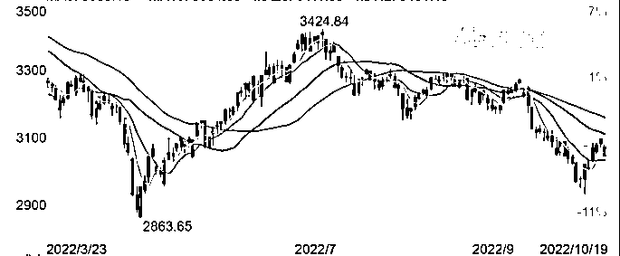

| 上证指数日 K 线图

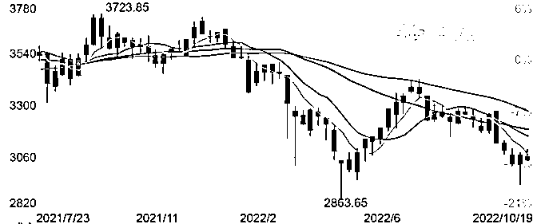

| 上证指数周 K 线图

从基本周期来看，如果 10 月 12 日的低点是从 4 月低点 2863 开始的一个拉长的基本周期的第 23 周，那么，一个新的 13 周-20 周的基本周期刚刚开始，本周仅仅是第 1 周。**这个基本周期完全可能开始一波上升行情。**但是，如果 8 月 2 日-4 日形成的低点是基本周期的开始，那么 10 月 12 日的低点正是处于这个基本周期的半周期位置，**上证完全可能跌向更深的低点。**从牛市的观点来看，很多股票经过今年以来的下跌，已经跌到了看起来很便宜的位置；但是，从熊市的观点来看，目前经济大环境存在非常大的下行压力。未来的天象又有哪些呢？**土星 10 月 23 日恢复顺行，土星顺行常常是一个市场出现反转的标志**。同时，10 月 23 日-24 日，金星和太阳都将进入天蝎座，而且将在 11 月 5 日-11 日和土星、天王星形成 T 三角。是大胆加仓，还是继续谨慎观察？金融占星大师雷蒙德·梅里曼的《2022 年 11 月上证指数报告》已上线，你可以听听梅里曼老师的看法。《2022 年 11 月黄金报告》也已上线，欢迎购买。**此外，雷蒙德·梅里曼 2023 年预报及沙龙已开始双 11 优惠预售，将帮助你对 2023 年的市场风云变化加深了解。****长按下图识别二维码了解更多详情**

**11 月上证报告上线**

**上证指数月度报告价格****单月报告**：280 元/月 **季度套餐价格**：780 元（260 元/月）**年度套餐价格**：2400 元（200 元/月）**双报告年度套餐更优惠（直降 900 元）****12 个月黄金报告+12 个月上证指数报告：仅需 3900 元****长按下图识别二维码购买上证指数报告**
▼

**11 月黄金报告**

“**黄金是金钱。其他的只是信贷。**

**——约翰·皮尔庞特·摩根**

”

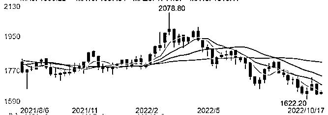

| 黄金周 K 线图

**作为交易者和投资者，我们已经迎来了或许是今年最重要的地球宇宙学时间段：土天四分的时间段，它的宇宙影响力会持续到 11 月中旬。**在上个月，发生许多重要的大事件，俄乌战争升级，伊朗动乱，美国再一次对中国发起芯片战，整个世界局势动荡加剧。

很多国家的股票市场都在这次的土天四分时期下跌到历史低点。货币和债券市场也是同样，欧元、日元和美国中期国债数十年来的低点，黄金也是一样。9 月 28 日，黄金跌到 1622 美元，距离今年 3 月份黄金最高点 2078 已经跌去 21.94%。

不过，我们经历了 2 年的土天四分正在逐渐成为过去式。虽然其影响还会持续。9 月 28 日的低点 1622 是黄金走势 2 年来的低点。

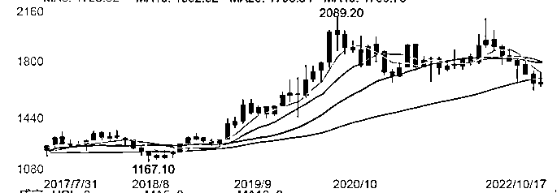
| 黄金日 K 线图

黄金有一个 31.33 个月的周期，而半周期是 16 个月，其容许度在 13-19 个月之间。从上个周期低点是 2021 年 3 月的低点 1673，而 10 月是第 19 个月。   **所以，有没有可能，9 月 28 日的低点 1622 已经完成了 10 个月的半周期的低点，黄金可能展开一波反弹？如果真是如此，黄金是不是迎来了一个短期的投资机会？**  11 月份黄金报告已经上线，欢迎了解。也可以按照季度和 1 年期订阅，有更多优惠。季度和年度的好处是，你可以持续了解梅里曼老师对于不断在变化的市场的看法。  即便他某一次看法和市场不一致，你也看到在下一期他如何调整自己的看法，并看到金融占星在一个长期时间段内对你把控风险的帮助。而能够长期控制风险、尽量找到安全的投资时机才是投资的长久之计。  点击阅读原文，雷蒙德·梅里曼黄金周期 2022 年 11 月报告带来有 40 年黄金市场研究经验的世界著名金融占星大师雷蒙德·梅里曼对当前黄金市场的研究。投资有收益，投资有风险，希望金融占星学的研究帮助你更好地评估你的投资。

**11 月黄金报告上线**

**黄金月度报告价格****单月报告**：280 元/月 **季度套餐价格**：780 元（260 元/月）**年度套餐价格**：2400 元（200 元/月）**双报告年度套餐更优惠（直降 900 元）****12 个月黄金报告+12 个月上证指数报告：仅需 3900 元****长按下图识别二维码购买黄金报告**
▼

**购买者需知**

**① **梅里曼市场时机学院《中国上证指数月度研究报告》是梅里曼市场时机学院（以下简称 MMA）的研究“预报”，而不是市场“预测”，是梅里曼老师及 MMA 金融占星分析师对人类活动周期历史与行星周期之间相关性的研究，二者在大部分情况下具有 80%或更高的相关性，而不是因果关系。报告中的研究完全存在错误的可能性。即便是非常认真的研究和几十年的研究经验，金融占星师无法总是正确地解读出各种征象在实际层面上会如何相互作用，并显化为事件结果。

所以请将报告看作一个研究参考，务必结合其他市场研究和你个人对市场的理解，根据你的自由意志做决策。

**②** 此报告一旦售出，**即不接受退款。**

**③** 上证、黄金月度报告每月固定 1 期，**并非都是在每月相同日期发布。**

**④** **我们收到英文报告的当天，即发布该英文报告。3 天后，上线报告中文版。此报告仅支持手机网页阅读，不支持电脑阅读和下载。****以上须知，请仔细阅读。一旦付款，即视为已了解并接受所有须知内容。**在过去的 40 年中，唯有梅里曼逐渐完善，并在梅里曼市场时机学院月度周期报告中阐释了将地球宇宙学与周期相结合的研究方法，以惊人的精确性预报了黄金价格发生重大变化的时间。**黄金购买 Tip**

各大银行均可购买黄金或黄金 EFT 基金，也可以在诸如天天基金或者支付宝购买黄金及黄金相关产品。不明白的可以百度搜索。

**购买后如何查看报告？**

**购买后有疑问怎么办？**请联系技术客服
**微信：nodoor201705** 
**购买报告直达入口**

# ISAR 第一届附属学校会议，就等你来！

> 原文：[`mp.weixin.qq.com/s?__biz=MzA5NjA0NTAxNg==&mid=2651492670&idx=2&sn=ea76dfcd5e59513472e2a046b270b8a0&chksm=8b482389bc3faa9f3792749c985c889a1ae01ad63cc221112d70be0f8294979ebf9691833ceb&scene=126&sessionid=1692737735#rd`](http://mp.weixin.qq.com/s?__biz=MzA5NjA0NTAxNg==&mid=2651492670&idx=2&sn=ea76dfcd5e59513472e2a046b270b8a0&chksm=8b482389bc3faa9f3792749c985c889a1ae01ad63cc221112d70be0f8294979ebf9691833ceb&scene=126&sessionid=1692737735#rd)

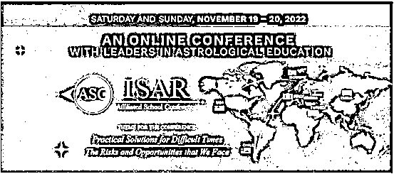

**2022 年 11 月 19-20 日，ISAR 将举办第一届附属学校会议。**

来自中国、美国、意大利、挪威、土耳其、智利、塞尔维亚的非常棒的占星学校中的**10****位占星老师是这次会议的****主要讲演者**。你不仅可以听他们讲课，而且可以就自己感兴趣的问题直接向他们提问，听听他们的回答！**不同国家的老师组成将会带给你一个全球化的视野和多样性的视角。**

**会议的安排如下：**

**11 月 19 日（北京时间 11 月 20 日）**

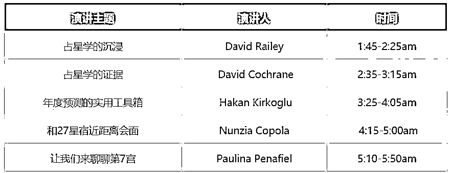

 **11 月 20 日（北京时间 11 月 21 日）**

**以上每个演讲为****40****分钟。**

**除了这两天的演讲外，还有****9 场****工作坊，每个工作坊时间为****3 小时****。**

**11 月 26 日（北京时间 11 月 27 日）**

 **11 月 27 日（北京时间 11 月 28 日）**

 **12 月 3 日（北京时间 12 月 4 日）**

**12 月 4 日（北京时间 12 月 5 日）**

**如果你是在线参会，你也能在 Zoom 聊天区中分享你的的想法和感受。**所有演讲和工作坊**都有录音**，如果你无法在线参加，可以听录音。当然，**以上全部为英文讲座。**所以，你需要有较好的英文听力水平。

**价格：**

*   **你可以购买 19-20 日的单天的会议，也可以购买单个的工作坊。**

*   **2 天会议：ISAR 会员 $80 ；非会员$100**

*   **1 天会议: ISAR 会员 $50 ；非会员 $70**

*   **单个工作坊：ISAR 会员 $55 ；非会员 $95**

**报名链接：**https://isarastrology.org/isar-affiliated-schools-conference-cosmic-connections/

除此之外，如果你在**11 月 11 日**前购买，还将获得特别的礼物！

*   **购买 2 天会议，**会赠与 2 个 ISAR Intensives ！

*   **购买 1 个工作坊，**$55，并赠与 2022 年 8 月在丹佛举办的 ISAR 大会的 1 个工作坊！

*   **购买 3 个工作坊，**$140，并赠与 2022 年 8 月在丹佛举办的 ISAR 大会的 2 个工作坊！

*   **购买 6 个工作坊，**$260，并赠与 2022 年 8 月在丹佛举办的 ISAR 大会的 3 个工作坊！

*   **购买 9 个工作坊，**$370，并赠与 2022 年 8 月在丹佛举办的 ISAR 大会的 5 个工作坊！

**如果你对于这个会议有任何问题，均可直接发邮件 info@IsarAstrology.com 询问。**

# 这个星座虽然多情，可是浪漫啊！

> 原文：[`mp.weixin.qq.com/s?__biz=MzA5NjA0NTAxNg==&mid=2651492528&idx=1&sn=8314d189b0990a344025694b7582f1ac&chksm=8b482207bc3fab114878faa2392d9032740198dc0b30e96a4ed99693d16da93c43c8d60c8e6d&scene=126&sessionid=1692737735#rd`](http://mp.weixin.qq.com/s?__biz=MzA5NjA0NTAxNg==&mid=2651492528&idx=1&sn=8314d189b0990a344025694b7582f1ac&chksm=8b482207bc3fab114878faa2392d9032740198dc0b30e96a4ed99693d16da93c43c8d60c8e6d&scene=126&sessionid=1692737735#rd)

 ****************☆ ****************************后台****************************回复“今日”，给你一句生命态度****************

来源/astrotheme.com
译者/Chang 校对/Leisha 编辑/玫瑰 封面/书君 图片/稿定设计 10 月 28 日 13:09，木星逆行回到双鱼座，一直到 11 月 24 日在双鱼座 28°恢复顺行，12 月 20 日再次回到白羊座，前后将在双鱼座停留近两个月。这篇文章可以帮助你了解双鱼座的星座特征，以及它与一个人的外表、情感关系、工作的关联。一起来看吧~另外，大卫老师参与授课的【[ISAR 认证职业占星师文凭课程](http://mp.weixin.qq.com/s?__biz=MzA5NjA0NTAxNg==&mid=2651491840&idx=3&sn=512fd5abe337c8ef38f82062897635c1&chksm=8b483cb7bc3fb5a169bd8d014e1f50e053bfa8fc4cf2d688d8eead4247bcee86315daf66c0fa&scene=21#wechat_redirect)】报名中，点击链接了解更多详情！
**占星学中的双鱼座及其性格**可以回忆一下，一个人是双鱼座，指的是他的太阳在双鱼座，这需要知道确切的出生时间、地点和日期。确实如此，如果出生时间刚好接近一个星座的起点或终点，有时一分钟的间隔就足以让太阳改变星座。如果你是双鱼座，你的**心理特质是适应性和接受性的**，与处女座正好相反，处女座的本质是彻底地分析一切，从而在自我和外部世界之间创造出永远的二元性。相反，**双鱼座吸收并消除任何形式的分化**；对双鱼座来说，**没有对立，没有冲突，没有个体独有的反应。**只有**融合、不分离**；有某种**模糊**但巨大的**对环境的同情感**，自我**永恒**和流动地在这种感觉上散播着。它是**感受和情感**对理智及导致分离的理性的最高统治。**双鱼座的格言和关键词**“我们服务”这句话概括了双鱼座人的性格特点之一，**虔诚、敏感、有同情心、倾听别人，**总是**愿意用善心理解他们的情感**，并帮助他们。**双鱼座**是情绪化、敏感、奉献、适应性强、友善、野性、富有同情心、浪漫、想象力丰富、灵活、机会主义、直觉、不能被分类、非理性、具诱惑力、平静、神秘、内向、愉快、具艺术性和迷人的星座。**但有时，**又优柔寡断、喜怒无常、迷茫、摇摆不定、懒惰、糊里糊涂、脆弱、不可预测、容易受骗。

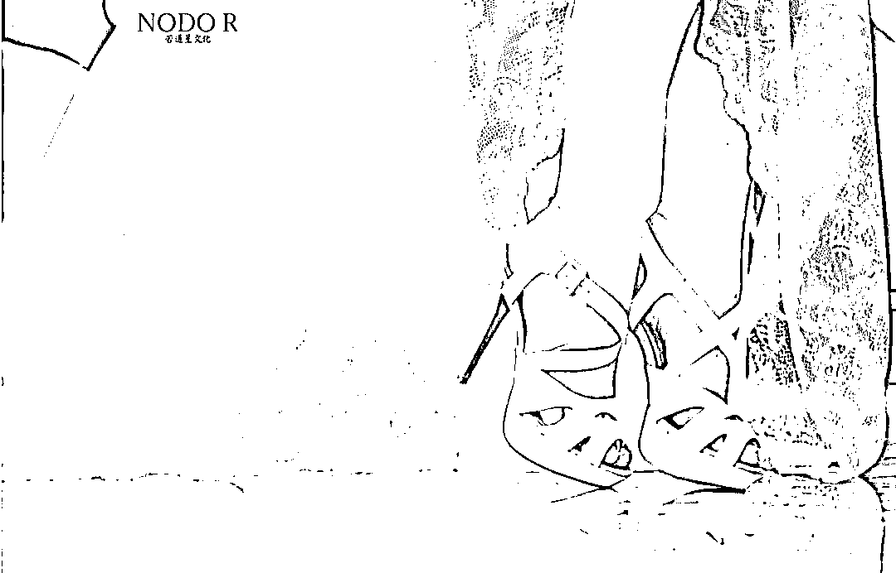

**和双鱼座有关的行星与宫位**每个星座都有与特定行星相似或不同的一些特征。这被称为行星的尊贵。**与一个星座关系最密切的行星被认为是该星座的守护星，**此星在该星座则称**入庙**，也就是在自家。它用全部力量毫无保留地表达自己。

当一颗行星与星座不那么匹配，但仍然和谐时，称它为**擢升**。它也从该星座获得力量和能量，尽管程度不及入庙行星。双鱼座与其守护星**海王星**相似。和他的第 2 个守护星**木星**也相处得很好。

因此，**海王星的特征影响着这个星座：**想象力、直觉、同理心、敏感、慷慨、灵感、信念，**但有时**也会有轻信、困惑、迟钝、缺乏现实主义和易成瘾的弱点。**双鱼座也表现出一些与木星有关的特质：**热情、慷慨、魅力、整合的习性、领导力，但有时也倾向于夸大、虚荣、过度自信。**必须指出的是，对每个黄道星座的解读都与其宫位的意义相呼应：**第 1 个星座和第 1 宫，等等。因此，**双鱼座，黄道的第 12 个星座，与第 12 宫相似**：它对应着一个人的**内在自我**、一生**经历的磨难**、**隐藏的敌人**和**严重的疾病**。它与医院、监狱、修道院等监禁场所有关，也包括独处、奉献和自我牺牲。**双鱼座的元素、形态与极性**

**双鱼座——水元素**

12 星座根据元素被分为四类：火、土、风、水。1 个元素包括 3 个相容的星座（三分性），各元素相互补充。**双鱼座，和巨蟹座、天蝎座一样是水象星座：**这个元素掌管着**情感、潜意识、敏感和感受的世界。**水象星座的人**行事隐秘、直觉敏锐、感情丰富，**他们能感觉到别人注意不到的事。然而，他们**缺乏现实主义**，很难适应艰苦和物质的世界。水能使人富有成效、富有想象力、梦幻、无私、有艺术气质，但也能使人懒惰、优柔寡断、脆弱、极为敏感。水元素的人会表现出很多的**善良、同理心和慷慨**，但当他们受到伤害或感到身处危险时，他们会变得**狡猾、不可预测和混乱**。

**双鱼座的变动性质**

**星座也可以分为 3 类，**每类包括 4 个星座，分别是**基本星座、固定星座和变动星座****。**形态也被称为模式：基本模式、固定模式和变动模式。模式像元素一样，掌管**不同的价值观**，并有自己的性格特征。**双鱼座**和双子座、处女座、射手座，都是**变动星座**。具有显著变动星座的人是**不稳定的、变化的、迅速的，并且缺乏深度。**然而，他们能**很好地适应各种情况**。他们是**复杂的**，具有一种二重性，常被误认为不稳定。他们非常**灵活**和**宽容**。**双鱼座的人情绪多变。**他们可以迅速地**从深深的狂喜转变为最严重的抑郁，**而且别人很难跟得上他们，因为他们的内心生活复杂而丰富。他们很容易忘记和原谅。

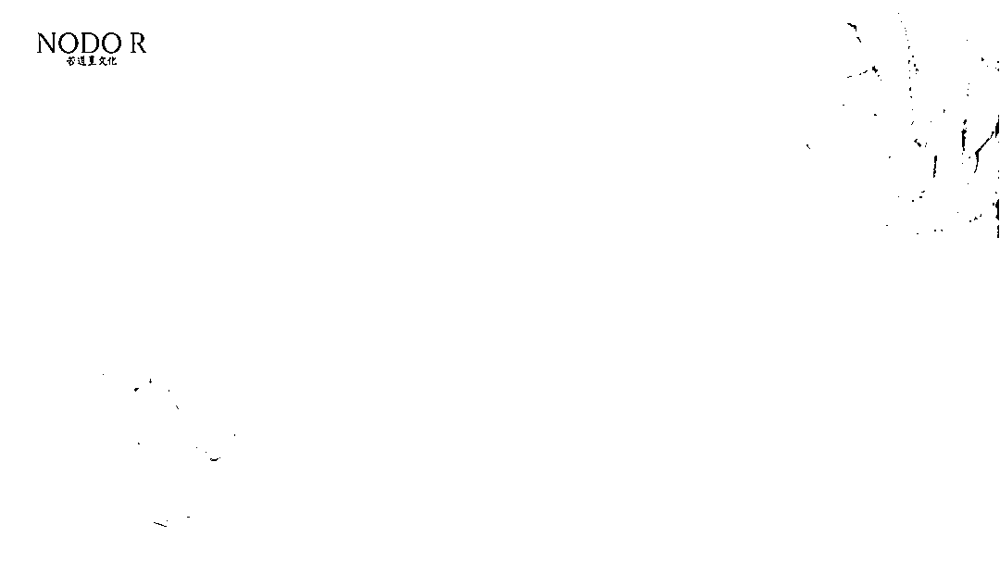

**双鱼座：阴性星座**

最后，两极性将黄道星座分为 2 组，每组 6 个星座。**极性指的是男性和女性、阴和阳，或主动和被动。**这两种特征按黄道顺序交替出现。**主动的星座**显示性格外向、开朗、身体健壮的人，他们能容易地表达自己，并且精力充沛、充满热情。**被动的星座**比较内向、内化、理智、深沉和冷静。**双鱼座是被动的，或阴性。****双鱼座的外表**尽管以下特征可能不完全匹配你的外表，但**如果你的上升，或你的太阳（程度较小些）在双鱼座，**你可能具有如下特点：从身体上看，因为这是一个绝无分化的星座，双鱼座的人通常丰满、中等身材。它是黄道中唯一**可以呈现许多不同外表**的星座。眼睛通常很大、有吸引力、相当固定或缓慢，几乎令人迷醉。整个形体给人一种**朦胧、神秘、亲切、安静**的感觉。事实上，**双鱼座的外表根本无法分类，**就像他们的性格，完全难以捉摸！试图定义双鱼座的外表几乎是不可能完成的挑战……他们正是这样才能被认出来！他们最喜欢的颜色是紫色、蓝色和绿色的所有色调。**双鱼座与健康****双脚**和**血液循环**是与双鱼座对应的身体部分。如果你是双鱼座，你的健康可能相当脆弱，因为你是纯粹的多愁善感，而且你的本性不是很好动。你很依赖别人，很被动。

有一个危险是**你不会好好地关心自己的食物，你吞下任何垃圾食品，从长远来看，这可能会导致超重问题**。这条建议也适用于**危险物质成瘾**的问题，如酒精甚至更有害的非法物质。

**双鱼座掌管双脚，在更象征意义上守护心灵。****潜在的危险存在于足部，可能患上风湿病或循环系统问题**。

有时，**由于与现实世界完全缺乏联系，会有痛苦和神经症的倾向。**此外，你**对高温和低温特别敏感，特别建议你采取一切必要的预防措施，避免感冒和支气管炎。**

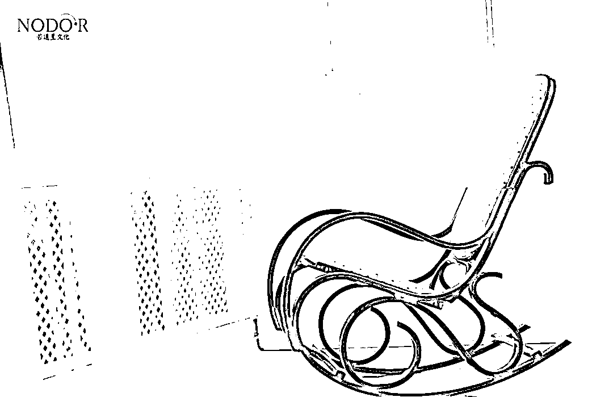

**双鱼座及其爱好**如果你是双鱼座，**任何激发你的感受和情感的事物都会吸引你，**音乐和节奏总是排在首位。通常是伤感音乐，它们让你流下真诚的泪，但它们也带你进入一种只有你才能体验的兴奋状态，这是因为**你有无限的被感动的能力。**此外，你很可能会演奏多种乐器，同时你也是一名高质量的听众。

**你的想象力无穷无尽，**电影、戏剧、电视、阅读（尤其是关于冒险或爱情故事的书）这类活动的刺激，都会让你感到兴奋。当你的大脑非常卖力地工作时，你也可能是一个好作家。这可以通过评估水星和你出生星图的第 3-9 宫轴线看出。

你不合群，**喜欢安静****。**你可能会花很长时间玩需要耐心或单人玩的游戏。你也可能有艺术爱好，如音乐，也可能是绘画、铸造、陶艺等。

如果客观环境让你进行体育运动，**任何涉及你的水元素的运动，都可以让你感到舒服，**包括游泳、划船、帆船、钓鱼、皮划艇和冲浪。

你的**灵活性相当好**，因此你也擅长那些需要动作敏捷和轻盈的活动，比如舞蹈、瑜伽、足球、跑步、体操、有氧健身操和轮滑。

**双鱼座和爱**太阳在双鱼座的人，可能应该记住他们**很容易坠入爱河**，也容易改变伴侣。事实上，他们是如此的接受性和情绪化，只要伴侣符合他们的品味，他们就会屈服于最轻微的刺激。一旦“到手”，他们仍然有对其他人一见钟情的危险，因为尽管双鱼座很容易热情起来，但除了表面上以外，他们的迷恋很少持续。**这个复杂的星座，相当天真，但却很容易相处。**双鱼座可能会让他们的伴侣感到不安，因为他们对夫妻之间共存之纽带的渴望是压倒性的。双鱼座什么都不计较，只受感情驱使。然而，如果他们感到受伤，他们的反应可能由于过度敏感而夸大，并造成可怕的后果。尽管如此，双鱼座浪漫而有点神秘、温柔多情、依赖伴侣，双鱼座还是可爱的，可能会唤起真正的激情，他们永远不会对激情感到厌倦。

要与双鱼座男性或女性持久相伴，理想伴侣可能必须有种像小说一般的个性，但与这个特殊星座截然不同，毕竟双鱼座往往很容易理想化对方，但如果没有持久的温暖和柔情也很容易失去兴趣。好的例子是比如狮子座或金牛座给予的感觉，耐心、忠诚而又深情。

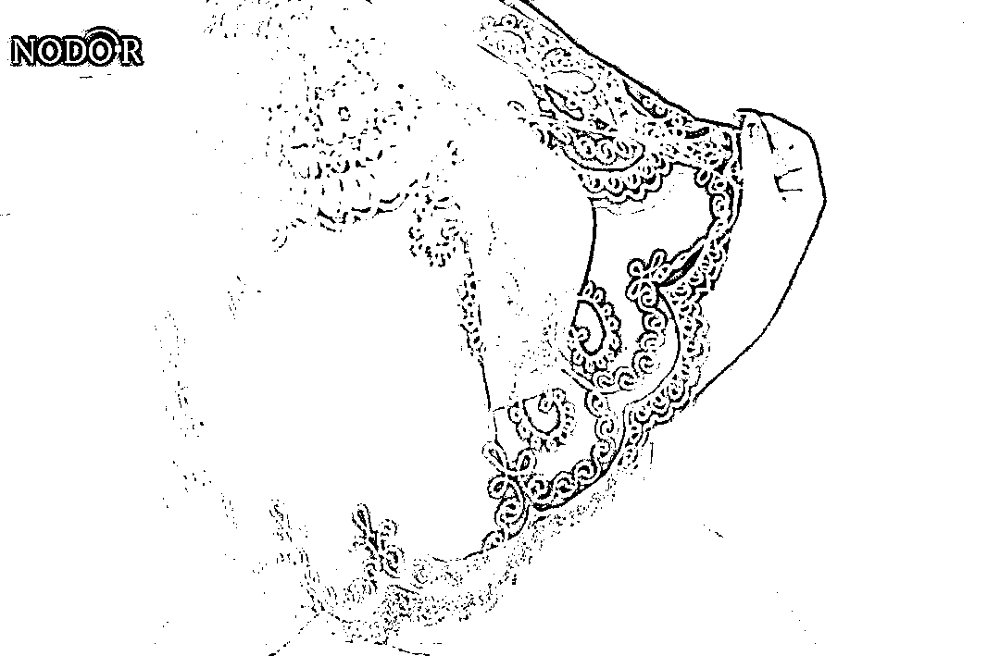

**双鱼座的工作**如果你是双鱼座，你的命运会配得上你的优柔寡断、灵活性和适应性。的确如此，**你可以很好地适应几乎任何圈子，**只要严格性、精确性和竞争不是最需要的。由于**氛围是至关重要的因素**，如果你能在一个良好的氛围中按照自己的节奏工作，你会感觉非常舒适，与你的工作场所完全和谐。

你的灵活性太极端了，可能接近机会主义。随着你的变化和移动的发展，你的天赋很可能使你找到正确的方法。**你不会被事物的物质方面所驱使。**比起在现实生活中体验生活，你更倾向于在梦中蹉跎自己的生活。

其实，你只对存在感兴趣，对拥有不感兴趣。然而，其他选择也都是可能的，因为**你非常善于调整你自己、捕捉气氛的本质、融入背景。**因此，如果你正在找工作，而且符合工作的要求，你就是最有机会获得大家都觊觎的职位的人。

你有时很富有，有时又很缺钱。确实如此，当超出控制的事情一件件发生时，你的财务状况和舒适度可能会经历相当大的波动。**你应该提防幻想和妄念。**否则，你的天真可能会把你拖进意料之外的情况，你将需要花很长时间来搞清楚如何摆脱它。

因为你是一个多愁善感的人，你在**艺术领域**和**演艺圈**都很出色。由于水是你的元素，你会被所有与**大海或水有关的职业**所吸引，也会被那些能让你的**同情心和奉献精神充分发挥的职业**所吸引。**你可以在以下领域取得成功：**

**双鱼座适合的领域**

音乐家、舞蹈家、戏剧或电影演员、通灵者、灵媒、牧师、医疗助理、执业医师、药剂师、兽医、作家、诗人、水手、渔民、海岸警卫队或供暖工程师......一般来说，**所有为他人提供某种服务的职业**，如餐饮、清洁、护理等，都是你擅长的领域。你也可以在**人道主义**工作或**捍卫人权**方面非常成功。

**版权声明：**本文由若道翻译发布，欢迎转发，反对抄袭。友号转载请申请白名单。

**END****拥有****51 年****占星实践经验的****若道创始人****前 ISAR 全球副主席****前 ISAR 全球职业占星师资质认证主席****大卫·瑞雷**

**和**

**2019 年第二届、2021 年第三届核心课中**

**与苏·汤普金斯老师****联合授课****的**

**ISAR 认证职业占星师**

**咔咔（Caroline）**

**二人合力打造**

**2022 年 ****若道全新核心占星课程**

**点击下图了解更多课程详情** 

**

**20 位来自世界各地的占星师****带来 19 场沙龙——新世界的觉醒****详情可点击下图**

**学习占星学****点击下图了解课程详情**

**微信又双叒叕改版啦，不想错过若道君的推送？**
****就把若道设为****星标****以及点点****“在看”****吧！******▼**

**喜欢就点一下“在看”吧！****报名直达入口**

# 12 星座自画像丨这组星座的世界，“搞怪和冒险”是永恒主题

> 原文：[`mp.weixin.qq.com/s?__biz=MzA5NjA0NTAxNg==&mid=2651492528&idx=2&sn=e672ae2003f07849dbc8ffea21e5c22e&chksm=8b482207bc3fab110699e3a840e359a8bafb23f99577099709658d0719d33184797424b7cbcc&scene=126&sessionid=1692737735#rd`](http://mp.weixin.qq.com/s?__biz=MzA5NjA0NTAxNg==&mid=2651492528&idx=2&sn=e672ae2003f07849dbc8ffea21e5c22e&chksm=8b482207bc3fab110699e3a840e359a8bafb23f99577099709658d0719d33184797424b7cbcc&scene=126&sessionid=1692737735#rd)

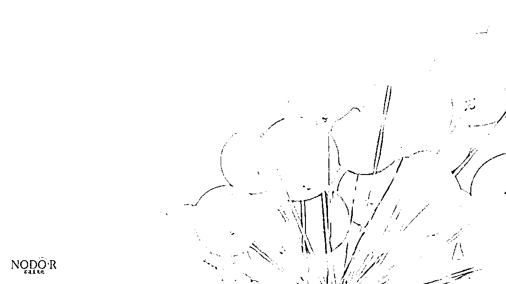

作者/克里斯蒂娜·罗登贝克

译者/亚麻林恩 校对/江艺

编辑/翀子 文章图片及注释/作者提供

本系列是克里斯蒂·罗登贝克老师撰写的艺术中的 12 星座自画像，角度独特，语句生动。此文是双子座与射手座的自画像，这两个星座的画家如何呈现自己样子呢？如果你对星座和占星学感兴趣，大卫老师参与授课的【[ISAR 认证职业占星师文凭课程](http://mp.weixin.qq.com/s?__biz=MzA5NjA0NTAxNg==&mid=2651491840&idx=3&sn=512fd5abe337c8ef38f82062897635c1&chksm=8b483cb7bc3fb5a169bd8d014e1f50e053bfa8fc4cf2d688d8eead4247bcee86315daf66c0fa&scene=21#wechat_redirect)】正在进行中，欢迎点击链接了解更多详情哦~

**双子座的自画像**是的——**有三位艺术家看起来像是几个世纪以来一直想和我们说话一样。**这就是你期待的太阳双子座的样子。但我不确定他们是否会说太过恭维的话。更多的是——好吧——请你自行想象。坦白说，当我看到这些人时，我会想到**喜怒无常**这个词。每当看到**阿尔布雷希特·杜勒**（1471-1528）这幅浓烈的自画像，我总是被他的现代感所冲击。我可以想象在我当地超市的结账处撞见他（穿着皮衣）。看他把自己的手画得多漂亮呀。

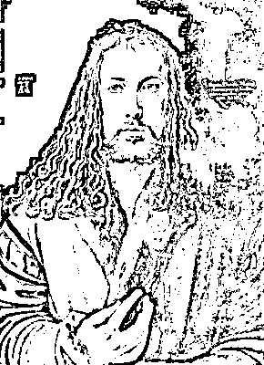

| 28 岁的阿尔布雷希特·杜勒

说到浓烈的双手，**古斯塔夫·库尔贝**（1819-1877）有这样的一个瞬间。你可以想象他在熬夜后照镜子。我觉得它真的有点风象星座抓狂的神经质。库尔贝画了很多自画像。给人一种感觉，就是每当找不到题材时，他就画自己。这无疑是他最滑稽的一次。也许他在描绘自己疯狂的**内在孪生兄弟**——这是所有双子座都熟悉的特点。那是他们天性中无法无天的、搞怪的部分，有时需要被释放，被允许在外晃荡一阵儿。如果我们有双子座的一点特质，则必须学会用一种相当精打细算的方式来艰难地释放自己——时间就是一切。这幅画也叫**《绝望的人》**。古斯塔夫·库尔贝在画了这幅画很多年后写道：**“我一直生活在自由中；让我自由地结束我的生命；当我死后，请这样评价我：‘他不属于任何学校，不属于任何教堂，不属于任何机构，不属于任何学院，尤其不属于任何体制，除了自由体制。’”**现今，他可能被冠以“局外人艺术家”的标签；回到 19 世纪 50 年代，人们就喜欢称他为现实主义者。

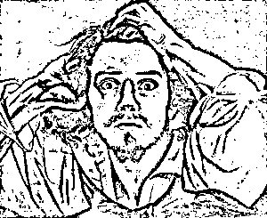

| 古斯塔夫·库尔贝

**保罗·高更**（1848-1903）也做了很多自画像，这张画里，他非常暴躁地看着自己。像杜勒一样，他画了自己的右手，这让我想知道他是左撇子还是双手通用。水星，双子座的守护星，机敏而灵巧。高更也是出了名的无法无天——他几乎自学成才，在他决定全身心投入绘画之前，他是一名股票经纪人——做了很多年。1883 年股市崩盘时，他才成为一名全职画家。**行进天王星**落处女座对分了他出生星图上落**双鱼座的土星，四分太阳双子座，六分出生星图的木星。**实际上，这颗行进的改革之星打破了多变的日土四分。

| 保罗·高更

最终，他抛弃了自己的家庭（五个孩子和一次离婚），搬到了塔希提岛，过着更“自然”的生活。显然，在他最好的年华他是相当暴躁的，在他（短暂的）生命结束时，他实际上是个脾气暴躁的老人。这都在照片里。这里还有一个人，为了成为她注定要成为的那个人，不得不离开了家。现在我不得不承认我对这幅画很失望，因为我认为玛丽·卡萨特（1844-1926）是一位出色的画家。我一直在寻找一幅更好的自画像，但显然她不太想画镜像的自己。有意思。与库尔贝和高更一样，当她停止传统绘画时，她找到了自我，她当然有技巧做得很好，并于 1879 年加入了“落选者沙龙”（Salon des Refusesés）–革命性的行进天王星落第七宫，四分她的太阳（个人身份）和中天（公众面）。行进天王星往往指示有时髦的人会进入你的生活，当天王星进入她的第七宫关系宫时，她遇到了画家埃德加·德加，他改变了她职业生涯的整个方向，让她以适合自己的方式创作。

| 卡萨特的自画像

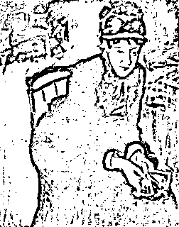

| 德加的卡萨特肖像画

这张自画像很奇怪，因为她没看自己。她看向了别处。如果她用了照片，我也不会感到惊讶。这是一个相当快速的素描，但你可以看到她衣服上灵巧而自信的笔触，更重要的是她在背景中巧妙地运用了色彩。为了让你更好地感受她活泼的个性，我附上了这幅埃德加·德加（巨蟹座）的饱含深情的肖像画，她与德加有着终生的友谊。有趣的是，画中的她似乎拿着照片。德加热衷于新的视觉方式——摄影。

| 亨利·卢梭

最后，又是一个特立独行的人。**亨利·卢梭**（1844-1910）和高更一样，有两份工作。他白天在海关上班，但他最终放弃了，成为了一名全职艺术家。卢梭在他有生之年从未受到其他艺术家的赞赏，但他的影响却一代代传了下来。在这幅画像中，你可以看到一些特质，既是双子座的，又完全是他的。卢梭的每一幅画似乎都在**讲述一个故事**；一个你可能不太了解的故事，但它就在你的脑海边缘，就在不远处。这会让你的想象无限延伸直到故事的结尾。他的画被批评为**幼稚和天真**——好吧，曾经是，现在是——那又怎样？幼稚的天真就是六月某个雨天午后的门票。**射手座的自画像****真诚是射手座的品质，**不管好坏。也许这就是为什么他们能画出如此棒的自画像。

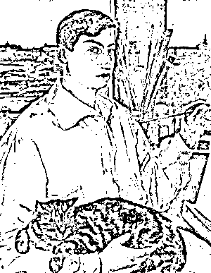

| 自画像与猫，洛特·拉塞斯坦（11 月 28 日）

德国瑞典画家洛特·拉塞斯坦的手臂上舒服的依偎着一只花猫。她的目光有些讥讽，但还是很自信感恩，可能因为她是普鲁士艺术学校早期的女毕业生之一。这是波兰画家安娜·比林斯卡·博达诺维奇，同样看起来很坦率，还带着些微幽默地直视观众。她也需要射手座的**自信**，因为她是当时在巴黎工作的、屈指可数的女性艺术家之一。

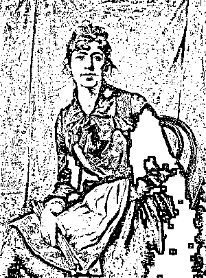

| 安娜·比林斯卡·博达诺维奇（11 月 8 日）

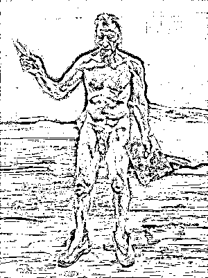

| 卢西恩·弗洛伊德（11 月 8 日）

**射手座有黑暗面。**通常它隐藏在大胆的正面之后——一个大肚子，一个龙卷风式的谈话或只是大嗓门。
射手座是黄道十二宫中，第一个以**神话**中的半人半马的**生物**来代表的星座。这个星座的守护神是狩猎女神戴安娜，也是半野蛮性的。常常，射手座的人就像你客厅里半驯服的小怪兽，他们打翻了花，冒犯你的伴侣。他们把绳套扯的紧紧的，好像有人逼他们被驯服一样——不知道他们是否意识到。

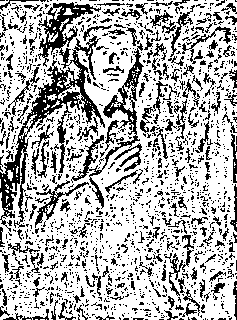

| 爱德华·蒙克

**卢西恩·弗洛伊德**——皮肤老化松弛，骨瘦嶙峋，穿着一双未系鞋带的靴子——单手举着调色刀，这就是我们看到的画上的姿势。我想这是他的杰作。它无情丑陋。他看着自己，好像在看一个怪物。当然，他以画他人的肖像画而闻名。但那些从未揭示出模特的性格；他们仅仅在弗洛伊德的画笔下，呈现出他对人性的厌恶和他的灵活。在这幅自画像中，他大胆地展示了自己。他喜欢自己吗？

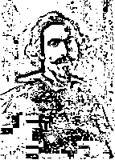

| 贝尔尼尼，12 月 7 日

这是另一位在黑暗中若隐若现的射手座。**爱德华·蒙克**也看到了怪物。这里他被阴影所包围。不久前，我和弗兰克·克利福德一起参加了一个研讨会，他提到他常常发现，射手座的人易患抑郁症，这与在占星书上看到的相反。我也发现了这点。我认识的服用处方药或自我治疗的人，强射手能量的比其他星座的都多，大概仅次于双鱼座。这很有趣，因为射手座和双鱼座的守护星都是欢乐之王木星。我要补充的是，参加研讨会的这两个人，在他们的星图中都有强大射手能量，他们都非常乐观向上，这表明你可以积极的使用这股能量，也可以消极的使用。这种**抑郁**倾向的一个原因，是射手座对人生的冒险有着很高的期待。

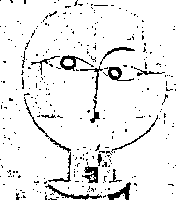

| 保罗·克利——几乎不把自己当人类看

吉安·洛伦佐·**贝尔尼尼**也在这幅 1623 年左右的壮丽自画像中从黑暗中现身。他最为人所铭记的是他令人惊叹的、充满活力的雕塑。你可能对他的”圣德列萨祭坛”很熟悉。这是他对美杜莎的诠释，当她意识到自己的命运时，她美丽的面容因痛苦而扭曲。他似乎能够理解内心的野兽。

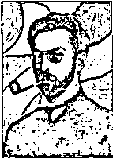

| 瓦西里·康定斯基–自我象征

然后是射手座的教授、老师、讲师。20 世纪最著名的艺术学校可能是德国魏玛的包豪斯学校。它由建筑师沃尔特·格罗皮乌斯于 1919 年创建，1933 年被纳粹关闭。那里所教授的艺术思想如今仍然影响着我们看待世界的方式，且仍被教授传承。

| 迭戈·里维拉

两位重要的教授**保罗·克利**和**瓦西里·康定斯基**，其本身都是严肃、大胆的艺术家，也是一代又一代艺术生的灵感源泉。与此同时，在大西洋的另一端，非同凡响的**迭戈·里韦拉**，同样著名的弗里达·卡洛（巨蟹座）的丈夫，正创作着将激励一代又一代墨西哥艺术家的艺术作品。他是一个著名的花花公子，无疑——肥胖、贪婪、出轨、充满活力——简直就是**木星朱庇特**的化身。当然，鬼才想要嫁给他。但在这幅画像中，他看起来像个教授。还有，毕加索（天蝎座）和弗朗索瓦丝·吉洛（射手座）两位艺术家之间的结合在本世纪中叶轰动一时。他大到可以当她的爷爷。这层关系盖过了吉洛作品的力量。这幅自画像似乎完全是关于**自由**——半人马的另一个关注点。

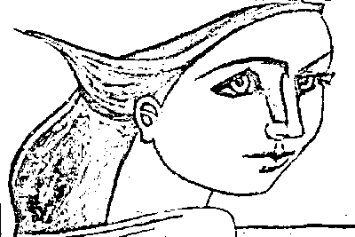

| 弗朗索瓦丝·吉洛（11 月 26 日）

射手座也有很多欢乐。我最喜欢的射手座肖像画家（没有之一）是白俄罗斯画家齐纳达·塞雷布里亚科娃。她的自画像——有好多——令人赞叹。射手座的面向表现在她的亢奋、她的自嘲中；她的自信和她的熟练中。她的作品充满了幽默感和生活乐趣。

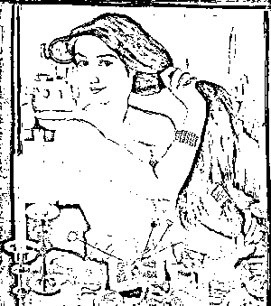

| 《在梳妆台上》（1909）

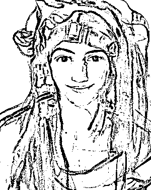

| 围巾自画像（1911）

****版权声明：**本文由若道翻译发布，欢迎转发，反对抄袭。友号转载请申请白名单。**

**END**

**克里斯蒂娜·罗登贝克**

克里斯蒂娜·罗登贝克，若道签约老师。全职职业占星师，从业 20 余年，在其网站长期撰写时事、艺术和文化的文章；定期在英国授课，并保持蓬勃发展的专业实践。

**拥有****51 年****占星实践经验的****若道创始人****前 ISAR 全球副主席****前 ISAR 全球职业占星师资质认证主席****大卫·瑞雷**

**和**

**2019 年第二届、2021 年第三届核心课中**

**与苏·汤普金斯老师****联合授课****的**

**ISAR 认证职业占星师**

**咔咔（Caroline）**

**二人合力打造**

**2022 年 ****若道全新核心占星课程**

**点击下图了解更多课程详情** 

******

**微信又双叒叕改版啦，不想错过若道君的推送？**
****就把若道设为****星标****以及点点****“在看”****吧！******▼**

**喜欢就点一下“在看”吧！****报名直达入口**

# 插班中丨 ISAR 认证职业占星师文凭课程：开启“爱好变职业”的创收自由之路

> 原文：[`mp.weixin.qq.com/s?__biz=MzA5NjA0NTAxNg==&mid=2651492528&idx=3&sn=afa940db5b48bb7b33bbfefee5f5e18e&chksm=8b482207bc3fab1145b2d600d59da48b699557194ab0848ce3d1d407250d197894843a95b827&scene=126&sessionid=1692737735#rd`](http://mp.weixin.qq.com/s?__biz=MzA5NjA0NTAxNg==&mid=2651492528&idx=3&sn=afa940db5b48bb7b33bbfefee5f5e18e&chksm=8b482207bc3fab1145b2d600d59da48b699557194ab0848ce3d1d407250d197894843a95b827&scene=126&sessionid=1692737735#rd)

**2022 年，是世界和中国 40 年未有之大变局的开始。**

俄乌战争打破了欧洲大陆乃至全世界的和平局面，而新冠疫情也给中国经济带来前所未有之挑战。

如果你关心经济形势和世界局势，你会有这种的感觉，我们将面临一场深刻的危机，而这不是短期内可以结束的。

**占星学的看法也是如此。**

4 月青年失业率（16 岁到 24 岁）中国达 18.2%，一些背着房贷、教育、医疗负担的中年人突然失业更是整个家庭整个难以承受之重。为了更好准备面对这样的时代变化，连《北京日报》这样的官方媒体也在呼吁：**“开拓副业，让自己有多元化发展的生存能力”。**

**而这门课程，就是为了这样一个目标准备的。**

**占星学是非常好的“开展副业”的选择**

这个**为期 16 个月**的课程通过并不算长的时间和并不算高的投资，不仅可以帮助你学到一个终身可用的技艺，而且也可以选择成为自助助人的占星师，**开启受益终生的第二事业。**未来是个体崛起的时代，大量个体被鼓励独立发展，比如网红、自由职业、自媒体、咨询师等，他们都不需要传统的办公室。社会越发达，人的独立性就越强，未来有能力的人都可以变成独立的经济体。

**占星学也是越老越好的职业**

和一些技术变化非常快的职业不同，**占星学的技术层面非常稳定，不会快速迭代变化，**同时，掌握好占星学、能够做一场好的咨询又需要个人自身大量实践和对生命的深刻理解，而这些都是时间和岁月带来的。

**占星学是现代社会需要的助人职业**

社会快速发展和变化人们似乎越来越无法掌控自己的生活，这给很多人带来巨大的焦虑，**抚慰心灵的咨询市场需求巨大。**而占星学可以让人从前所未有的角度了解自己，了解目前和未来所处的周期，挑战的意义，不论对于深入的个人成长探寻，还是预测未来的周期，都又其独一无二的价值。

**ISAR 认证职业占星师的独有培训**

目前占星学的培训市场鱼龙混杂。而 ISAR（国际占星研究协会）是一个包含了 47 个国家在内的国际占星组织，多年来致力于占星的教育和研究，提升占星教育的品质和职业占星师的能力，在国际占星领域备受尊重。今年，ISAR 对于成为 ISAR 认证职业占星师提出了更高的要求，**所有想要获得 ISAR 职业占星认证的申请者均需要在 ISAR 的附属学校通过 500 个小时的研习（包含****主课****、选修课、沙龙、作业、讲座、工作坊等等）。**

**而这门核心占星学课程就是为此而准备的。**

**2022 年，鉴于对若道在占星教学领域所做的持续努力和高品质的课程服务，ISAR 特别授予若道核心课程为 ISAR 文凭课程，所有在若道学习，并通过若道毕业考试的同学将获得 ISAR 颁发的学历文凭（Diploma）。**

**你的占星核心课老师是谁？**

**拥有****51 年****占星实践经验的****若道创始人****前 ISAR 全球副主席****前 ISAR 全球职业占星师资质认证主席****大卫·瑞雷**

**和**

**2019 年第二届、2021 年第三届核心课中**

**与苏·汤普金斯老师****联合授课****的**

**ISAR 认证职业占星师**

**咔咔（Caroline）**

**二人合力打造**

**2022 年 ****若道全新核心占星课程**

**咔咔老师给同学的寄语：**

（向上滑动查看内容）

**亲爱的同学们：**

我为什么学占星学？

2000 年的时候我还是一个在网上搜索天蝎座和水瓶座配不配的普通白领。我搜索的内容还包括了水瓶座为什么总是这么若即若离？

体贴的搜索引擎给我推送了占星学、行星、星座、宫位、相位等资料，还让我了解到莉莉丝、月亮交点、截夺宫位等占星学概念。

2000 年 10 月我了解到，一个从业 30 多年的美国职业占星师大卫·瑞雷来到了中国，和他的中国合伙人将开办一个专业教授占星学知识的课程。过去 10 个月在网上东拼西凑的占星学知识唤起了我对占星学的兴趣，但是已经不能满足我对星图深度分析的需求了。

2013 年，我通过了若道核心课程的毕业考试和国际占星师研究协会的认证考试。2015 年我离开职场成为一名全职占星师。

到底学习占星带给了我什么呢？

1、它是自我觉知的工具，我现在已经不去纠结哪些星座是否匹配，我相信外在的事件是内在心理矛盾的显化。也就是说，想找到令人满足的亲密关系，要先去了解自己的情感模式和需求，而不是无意识地一次次地试错和撞墙。我开始学习自我关怀和接纳自己。

2、它带来看待世界的全新和全景的角度，天上如是，地下亦然。人类社会和个人生命的进化都有其周期和相似性，作为个体，占星学帮助我思考如何更积极和有建设性地与宇宙的能量合作，认识自己，发挥自己的潜力，度过有意义且自我满足的人生。

3、它带来了全新的职业：占星师和占星老师。除了收入，还有助人育人的满足感和意义感。

4、它带来一群志同道合的伙伴，我们彼此联结又相互独立。

作为中国占星界的“黄埔军校”若道占星的学生、助教和老师，我与很多学员在人生的不同阶段带着各异的需求走进了这所学校，2022-2023 年一年半的若道核心课程设计既蕴含了大卫·瑞雷老师的教学精华，也带入了我在跟随不同国外占星老师学习、助教和教学积累的心得。

有一些学员毕业后从事了占星咨询工作，有的在各大平台成为专业占星学知识的输出者和传播者，有的运用占星学提升他们的工作，也有的在占星学与投资，占星学与名人/八卦、占星学与原生家庭、亲密关系、亲子关系等领域收获了有用的或者有趣的体验。

对我来说，生命是一场自我完整的体验之旅。从 2011 年的那个春节在若道入学之后，我的生命旅程更加充实、有意义、有目标，也更有满足感。

希望在 2022-2023 年的若道核心课程里见到你。希望你此后的生命旅程里，有若道，有占星学。

占星师咔咔

2022 年 5 月 24 日

**大卫老师给同学的寄语：**

（向上滑动查看内容）

亲爱的学员们：

感谢你对我们从 8 月 30 日开始的若道 L1-5 级核心课程的兴趣。我和合作老师咔咔以及我们的核心课程团队期待着为你提供这个机会，来教授各种高品质的地道占星学知识和技巧。

对于那些希望获得 ISAR 职业占星师认证的学生，这是一门适合你的课程！

作为 ISAR 咨询技能培训的一部分，我曾与咔咔合作过，我们期待着再次合作。咔咔和我曾在 ISAR 职业占星师认证委员会（CAP ISAR）一起工作，我们非常熟悉获得 ISAR 职业认证的流程。作为你的老师，我们将陪伴你整个占星学发现之旅，帮助你逐渐认识到占星学有多么的神奇。此外，你还将受益于我们若道的助教和课程顾问，他们是若道核心课程计划的重要组成部分，提供在线沙龙、组织学习小组、指导家庭作业。我们的教育团队是“服务于你的团队”，所以也会根据你的需求进行相应的调整。你专用的核心课程微信群也促进了你的学习过程，使你能够每天与你的同学们一起学习、探讨、成长。

52 年前，当我开始学习占星学时，没有一所像若道这样的学校。如果有这样一所学校，我会尽一切可能在那里成为一名学生。事实上，我很幸运，我的老师都是经验丰富的专业占星师。然而，我花了 6 年的学习时间才通过 1976 年在美国乔治亚州亚特兰大举行的专业占星师考试，又花了 2 年的专业实践时间才通过占星学谋生。我永远不会忘记从 1970 年到 1978 年的 8 年，那些日子的反复试验教会了我如何苦练占星学。作为老师，我一直在努力传授我早年所学的知识，让你的旅程更加顺利，更加全面。

自 1978 年以来，44 年的全职实践教会了我很多，我很高兴有机会与大家分享我所学到的东西。我和咔咔都是现代占星师，虽然我们尊重西方占星学的历史和传统，但我们实践和教授的占星学植根于现代人本主义哲学，这种哲学旨在提高你对自身潜力的认识，并鼓励个人成长。还有什么比了解自己更实际的呢？还有什么比个人成长和发展潜力更有利的呢？这是你将要学习的占星学，一种可以应用于你自己生活的占星学，一种可以为你提供一个充实职业的占星学。

教书是我回馈占星学行业的方式，这个行业拓展了我的视野，远远超出了我曾经想象的可能。谢谢你给我这个机会做你的老师。

大卫·瑞雷

2022 年 5 月 24 日

**连报 L1-5 全阶网络直播课程，你可以享受**

❶ 64 次线上直播互动网络课程+2 场工作坊，全面而详细地讲解占星学知识、技能、案例和重要领域实践运用。

❷ 知识点+学员星图解读有机结合：咔咔老师以讲解知识点和中外名人案例为主，大卫·瑞雷老师以参课学员案例演示及客户案例为主，每个知识点覆盖班级内学员的亲身案例，参与感更强，多位学员都有机会听到自己的星图分析。

❸ 微信群学员互动分享，从真实案例学习生命成长故事。

❹ APP 答疑论坛提问：论坛上每个学员的问题都将得到及时回复。

❺ 若道独有的职业占星师养成计划，为你毕业后独立咨询做准备。

**❻ **提供**咨询平台**，只要努力，优秀毕业生有机会入驻**若道咨询平台**，拓展咨询客户群。

**更多了解老师和助教？**

**大卫·瑞雷（David Railey）**

*   **I****SAR 董事会成员，ISAR 全球副主席，ISAR 全球职业占星师资质认证主席，若道占星创始人**。

*   2016-2019 年，被选为国际占星协会（ISAR）考试委员会成员，国际占星协会（ISAR）是世界最大的国际占星机构，会员遍布 47 个国家。

*   2017-2020 年，被选为国际占星联盟（ISAR）考试委员会主席，理事会成员。

**占星师咔咔（Caroline）**

2010 年师从美国占星师大卫·瑞雷学习，并得到世界名师斯蒂芬·弗里斯特、罗伯特·汉德、苏·汤普金斯传授各种占星学技法。若道首届学员，国内最早获得 ISAR 职业占星师资质的职业占星师，多次担任若道核心课程助教，并于 2019 年第二届、2021 年第三届核心课中和苏·汤普金斯老师一起教授若道核心占星课程。

在国际知名广告公司和市场研究公司从事的市场研究和推广工作十余年，曾任职于阳狮集团、尼尔森市场研究有限公司、MTV 和《Madame Figaro》杂志。

**助教王嘉祺 （Conrad）**

ISAR 认证占星师、若道认证生时校正资质，从 2010 年起自学占星学，2015 年开始在若道系统学习，并开始个案咨询。2018 年担任若道核心课程助教，以及卜卦占星学和太阳返照选修课助教，并带领学员进行经世占星和太阳返照方面的研究。2019 年 11 月作为演讲人之一参加了国际占星协会（ISAR）北京大会，也是 ISAR 星空俱乐部中国区第 16 期的主讲人。

**什么人适合这门课？**

*   对占星学有浓厚兴趣，想要系统学习占星学。
*   对占星学有一定基础，但不知道该如何整合星图复杂的碎片。
*   希望成为优秀的占星师，想要借鉴国际大师解读思路并融入自己的体系。
*   想学习占星学，但不擅长英文，希望有中文老师授课。
*   想结合占星学理论与咨询实践。
*   走在自我探索和个人成长道路上的人。

**课程费用**

**★ 1-2 阶 （8 月 30 日开课）****课程费用：3500 元 ****★ 1-3 阶　连报****课程费用：11500 元 **********转发优惠价：**11000 元（朋友圈转发本课宣保留 24 小时以上，并截图给课程顾问）********★ 1-5 阶 连报****课程费用：46500 元** **转发优惠价：34800 元（朋友圈转发本课宣保留 24 小时以上，并截图给课程顾问）**

**咨询课程请联系顾问**：**王老师（微信/手机：18510107057，请备注“大卫核心课”）**

**退转课程**

**退款原则请详看《教学协议》，如有疑问请咨询课程顾问。**

****2022 L1-5 认证职业占星师必修课程****

**授课老师：大卫·瑞雷、咔咔**

**直播课开课时间：2022 年 8 月 30 日（周二）**

**授课方式：******网络授课，英文/中文授课，中文翻译****

**费用：******1-2 阶**：**3500 元；****1-3 阶**：**11500 元******（****转发优惠价：**11000 元，朋友圈转发本课宣保留 24 小时以上，并截图给课程顾问）；**1-5 阶连报**：46500 元**（****转发优惠价：34800 元，朋友圈转发本课宣保留 24 小时以上，并截图给课程顾问）******

**课程负责人：王老师**（微信/手机：18510107057，请备注“大卫核心课”）

长按二维码添加课程负责人咨询~

**END**

****报名直达入口****

# 插班中丨神话塔罗：高效学习班上线，灵活掌握，专业实践！

> 原文：[`mp.weixin.qq.com/s?__biz=MzA5NjA0NTAxNg==&mid=2651492528&idx=4&sn=3fdd3ce0a19a7f8bebb64be4c9a8c2a6&chksm=8b482207bc3fab11ba4c55eac489001840fa5a132f692d42eb8fe61cc0820cc064343c83a021&scene=126&sessionid=1692737735#rd`](http://mp.weixin.qq.com/s?__biz=MzA5NjA0NTAxNg==&mid=2651492528&idx=4&sn=3fdd3ce0a19a7f8bebb64be4c9a8c2a6&chksm=8b482207bc3fab11ba4c55eac489001840fa5a132f692d42eb8fe61cc0820cc064343c83a021&scene=126&sessionid=1692737735#rd)

**2022 年超高含金量的神话塔罗认证课程****高效学习班****开始招生**用**四个月**的时间学习掌握神话塔罗解读喜欢**集中学习，快速掌握**的同学不要错过

黄色日期为**8 节直播课**时间，同学可以自由安排时间学习**18 节录播课**

班级学习群讨论、APP 答疑区提问

课程内容体系让你直观精准地感受到**神话塔罗的魅力**扎实地建构**神话塔罗思维**系统学习**最地道的塔罗知识**课程中老师将**神话、占星、心理学**完美融合进塔罗的**人本主义咨询体系**并进行学员**案例督导**让你更自信的开展咨询工作，学以致用

本期认证课程采取**即报即学的录播课+案例督导直播课**的形式，

*   **18 节录播课：**精编剪辑，随来随学，助教答疑，学练结合。

*   **8 节直播课：**融会贯通，神话心理，塔罗占星，咨询技巧。

为了适配大家的各种学习场景，提高学习&复习效率，我们还将**录播课**剪辑了**中文字幕版**和**翻译音频版**：

*   **中文字幕版：**朱丽叶老师英文原声配中文字幕，适合在手机或电脑前专心致志的学习。

*   **翻译音频版：**翻译老师幼婷的中文原声纯享，适合运动、通勤路上耳机里陪伴式学习。

若道还为塔罗学员开发了**“神话塔罗”**平台，是随身的工具，更是接咨询的平台，录播课程**学成入驻平台**即可链接更多塔罗个案，发展壮大你的塔罗咨询事业。

**如果你想学习塔罗，什么样的老师会让你怦然心动呢？她是三副塔罗牌的设计者，写了 6 本塔罗书籍。她研习塔罗四十余年，教授塔罗三十余年，是丽兹·格林的密友。还有****谁会比塔罗牌设计者更了解塔罗的历史、灵魂与精髓？****所以，这将是你开启塔罗之旅最坚实的一步。**

1

**这位塔罗大师是谁？**

**朱丽叶·沙曼-伯克** 

*   她是**3 副塔罗牌**的**设计者****——**神话塔罗牌、沙曼–卡塞利塔罗牌、“自己着色”塔罗牌；

*   她出版了**6 本塔罗书****——**《塔罗全书》、《新塔罗全书》、《众星的传说》、《理解塔罗牌》、《精通塔罗牌》、《塔罗初学者指南》；

*   她研习塔罗**四十余年；**

*   她教授塔罗**三十余年**；****

*   她是**丽兹·格林**的密友，两人合著了**《神话之旅》**，共同设计了**神话塔罗牌**。

*   她是认证的**心理治疗医师；**

*   她深谙**塔罗、占星学、心理学和神话学。**

**如果你想成为拥有英国神话塔罗认证的塔罗师**

那么她，就是你**最好的老师人选**

2

**塔罗牌有什么用？**

*   塔罗牌是一种**古老的疗愈工具**，同时也是**直观的解惑工具****；**

*   塔罗牌绕过逻辑思维，**和潜意识联结**，通过图像的方式生动地将隐藏在人类潜意识中的画面浮出水面，**揭示心灵的状况和运作****；**

*   塔罗牌**帮助我们和潜意识对话**，可以和现代的心理治疗联系在一起，帮助我们**看清心灵的冲突来源、本质和可以选择的道路；**

*   塔罗牌又和更广阔的**宇宙生命原型**联结，彰显**个人生命发展的阶段**，将**个人生命挣扎、内在冲突**放在生命进化的道途上，让更广大的生命智慧为个人成长照亮道路。

3

**为什么学习神话？**

神话通过**图像和故事**描绘人类生活的**原型模式**。通过瑰丽的想象、诗意的语言、栩栩如生的人物和故事描绘出我们内心的世界，表达出我们经历的那些实现人性的过程，帮助我们将**个体的生活与人类古老且永恒的故事**建立联结。从而在更深处**理解生命**，并学习**古老而长青的生命智慧**。

**神话塔罗**取材于**希腊神话**的无尽沃土，通过故事提供一种**记忆辅助**，在心理和预见层面提升解读的**丰富度**。因为这样更符合塔罗牌的性质，符合人类的想象。**按照故事思考，而不是简单的记忆关键词和固定的意义。**

4

**塔罗预测是什么？**

塔罗牌预测的运作就像是**照向心灵的一面镜子**。在塔罗牌解读时，图像的原型性质穿透隐藏的潜意识脉络，反应出与个人境遇相关但又未被了知的知识与洞见，因此**揭示出按照任何理性方式都无法发现的事情。**

如果你对生命好奇，塔罗学习会帮你**打开一扇通往未来的门****，**让你了解**心灵运作和显化的秘密**，同时赋予你更多关于生命成长的支持和指引的能力！

5

**我们将学习什么？**

**录播课（即报即学）**

**☆****初阶：神话塔罗详解**

**神话故事和预测意涵**

**第 1 讲 塔罗牌介绍 ，讲述它的历史 （中文字幕版）**

**第 1 讲 塔罗牌介绍，讲述它的历史（翻译音频版）**

**第 2 讲 星座形态、元素和宫廷牌&基本星座与基本国王 （中文字幕版）**

**第 2 讲 星座形态、元素和宫廷牌&基本星座与基本国王（翻译音频版）**

**第 3 讲 固定星座与固定王后（中文字幕版）**

**第 3 讲 固定星座与固定王后（翻译音频版）**

**第 4 讲 变动星座与变动骑士（中文字幕版）**

**第 4 讲 变动星座与变动骑士（翻译音频版）**

**第 5 讲 小阿尔卡那牌权杖（中文字幕版）**

**第 5 讲 小阿尔卡那牌权杖（翻译音频版）**

**第 6 讲 小阿尔卡那牌圣杯（中文字幕版）**

**第 6 讲 小阿尔卡那牌圣杯（翻译音频版）**

**第 7 讲 小阿尔卡那牌宝剑（中文字幕版）**

**第 7 讲 小阿尔卡那牌宝剑（翻译音频版）**

**第 8 讲 小阿尔卡那牌星币（中文字幕版）**

**第 8 讲 小阿尔卡那牌星币（翻译音频版）**

**第 9 讲 经典牌阵教学讲解（中文字幕版）**

**第 9 讲 经典牌阵教学讲解（翻译音频版）**

**第 10 讲 牌阵解读案例演示（中文字幕版）**

**第 10 讲 牌阵解读案例演示（翻译音频版）**

**☆****中阶：神话塔罗牌阵应用**

**神话****解读和咨询技巧**

**开启神话塔罗愚人之旅**

****

**第 1 讲 愚人、魔术师、女皇、皇帝（中文字幕版）**

**第 1 讲 愚人、魔术师、女皇、皇帝（翻译音频版）**

**愚人**：永恒的少年（儿童的原型）

**魔术师**：恶作剧者、老师、向导、沟通者的原型；行星：水星。

**女王**：母亲、养育者、丰产的原型；行星：金星在金牛座；小行星：谷神星。

**皇帝**：父亲、供养者、计划者的原型；行星：木星。

**第 2 讲 女祭司、教皇、恋人、战车、正义、节制（中文字幕版）**

**第 2 讲 女祭司、教皇、恋人、战车、正义、节制（翻译音频版）**

**女祭司**：处女——等待被实现的潜力原型；行星：新月。

**教皇**：疗愈者、受伤的疗愈者、牧师的原型，牧师是神与人之间的灵性桥梁；行星：凯龙星。

**恋人**：爱、爱人、所爱之人的原型；行星：金星在天秤座。

**战车**：战争、冲突、战士、斗士的原型；行星：火星。

**正义**：智慧、兵不血刃的胜利的原型；星座：处女座；小行星：智神星。

**节制**：关系、合作的原型；星座：巨蟹座、双鱼座。

**第 3 讲 力量、隐士、命运之轮、倒吊人、死神（中文字幕版）**

**第 3 讲 力量、隐士、命运之轮、倒吊人、死神（翻译音频版）**

**力量**：力量的原型；星座：太阳在狮子座。

**隐士**：晚年、耐心的原型；行星：土星。

**命运之轮**：命运女神与命运的原型。

**倒吊人**：牺牲与有意识的牺牲的原型；行星：海王星。

**死神**：死亡、终点和起点的原型；行星：冥王星。

**第 4 讲 恶魔、高塔、星星、月亮、太阳（中文字幕版）**

**第 4 讲 恶魔、高塔、星星、月亮、太阳（翻译音频版）**

**恶魔**：阴影、人类不文明的面向、本能、欲望天性；行星：火星在天蝎座。

**高塔**：改变、分裂瓦解的原型；行星：天王星。

**星星**：希望的原型。

**月亮**：无意识的原型；行星：暗月。

**太阳**：意识、创造力和文明的原型；行星：太阳。

**第 5 讲 审判、世界（中文字幕版）**

**第 5 讲 审判、世界（翻译音频版）**

**审判**：复活、新生的原型；行星：水星作为灵魂向导普绪科蓬波斯。

**答疑与讨论，学员们分享对自己或客户的塔罗解读，对神话塔罗牌进行更多探讨。**

**世界**：整体、完成和个性化的原型。

**第 6 讲 经典牌阵教学讲解（中文字幕版）**

**第 6 讲 经典牌阵教学讲解（翻译音频版）**

**第 7 讲 咨询案例演示：为一位年轻女性所做的四次解读（中文字幕版）**

**第 7 讲 咨询案例演示：为一位年轻女性所做的四次解读（翻译音频版）**

**第 8 讲** **引导式冥想、荣格的四种意识功能（中文字幕版）**

**第 8 讲 引导式冥想、荣格的四种意识功能（翻译音频版）**

**☆****高阶：神话塔罗直播督导课**

**第 1 讲 塔罗牌中的荣格原型**

**2022 年 8 月 10 日（周三）**

我们将学习荣格是如何理解原型，以及荣格原型如何反映在塔罗牌中。对塔罗牌解读而言，理解原型的普遍性非常有帮助，因为这有助于塔罗咨询师碰触客户的内心世界。

**第 2 讲 塔罗牌是如何与行星原型和其原型体验联系在一起**

**2022 年 8 月 24 日（周三）**

大阿卡纳牌反映了行星神祗的原型，在某些情况下，原型经验意味着它们反映了所有人类的经验。我们将通过这个角度看这些大阿卡纳牌。我们将看到理解原型对解读有何帮助。

**第 3 讲 荣格意识的四种功能与小阿卡纳牌的四种元素及与权杖、星币、宝剑、圣杯四套牌之间的联系**

**2022 年 9 月 7 日（周三）  **

我们将看看小阿卡纳从 1 到 10 如何反映荣格意识功能的各个方面，以及它们如何反映在四套牌四个元素和其心理方面。我们还将对 1-10 的数字学进行修正，看它们在元素中的表现方式。

**第 4 讲 占星学中的 12 星座和宫廷牌之间的联系**

**2022 年 9 月 21 日（周三）**

我们将讨论形态和星座，以及它们如何反映在宫廷牌上。

**第 5 讲 马蹄牌阵学员案例督导**

**2022 年 10 月 19 日（周三） **

**第 6 讲 六芒星牌阵学员案例督导**

**2022 年 11 月 2 日（周三） **

**第 7 讲 凯尔特十字学员案例督导**

**2022 年 11 月 16 日（周三） **

****

**第 8 讲 三个牌阵学员完整案例督导**

**2022 年 11 月 30 日（周三）**

**认证阶段：考试论文**

录播课学习完毕，即可入驻若道神话塔罗平台，以实习塔罗师获得推广流量，对接塔罗咨询个案。

直播课+录播课学习完毕，提交考试论文通过即可获得获得英国神话塔罗认证证书，升级为认证咨询师。

**扫码进入全新神话塔罗 H5**

每天有事没事都可以去**神话塔罗 H5**里转转抽取专属于你的今日塔罗

**神话塔罗 H5 问答平台全新上线**

三张牌牌阵，专业塔罗咨询师语音条解读

如果你碰巧有困惑，刚好有**限时优惠价**

如果感到快乐你就用用**神话塔罗 H5****，**如果你感到不快乐，更要使用由专业人本主义塔罗师团队全程陪伴的**神话塔罗 H5 哦！**

6

**适合人群**

*   塔罗初学者，完全没有塔罗基础；

*   塔罗自学者，也曾上过塔罗工作坊，但仍不懂如何使用塔罗牌；

*   塔罗进阶学习者，有塔罗基础，了解 78 张塔罗牌含义；

*   不知如何解决遇到的情感困惑、职业选择、人际问题，对人生感到迷茫；

*   想要学习深入解读塔罗牌、牌阵的使用、咨询技巧等将塔罗运用于咨询实践；

*   想要深入了解和学习塔罗，希望成为专业的塔罗师；

*   想要借助塔罗进行心灵、灵性成长。

7

**导师简介**

**朱丽叶·沙曼-伯克**

**朱丽叶·沙曼-伯克**从 20 世纪 70 年代早期开始，就对塔罗牌产生了兴趣，并踏入了塔罗的世界。后来，在丽兹·格林的鼓励下，开始研习心理占星学和塔罗。

1984 年，第一本书《**塔罗全书**》（*The Complete Book ofTarot*）出版。之后，与丽兹·格林合作设计并撰写了《**神话塔罗**》（*The Mythic Tarot*），在这本书中，她们将古希腊神话与传统塔罗解读结合起来。朱丽叶写了**十本塔罗和占星学书**，包括一本名为《众星的传说》（*Stories from the Stars*）的儿童读物，以及与丽兹·格林合著的《神话之旅》（*The Mythic Journey*），这是一本详细讲述如何运用神话来指导生活的书。

8

**课程价格**

**认证课程总价：****22000 元**

**联报优惠价：****19000 元**

**限时转发优惠价：18000 元（联系 Echo 老师，获取限时转发优惠价）**

长按二维码添加客服 Echo 老师

9

**退转课程**

*   **退款原则请详看《教学协议》，如有疑问请咨询课程顾问。**

**神话塔罗认证课程**

**授课老师：朱丽叶·沙曼-伯克**

**授课时间：录播课即报即学，直播课 2022 年 8 月 10 日起**

**授课方式：**网络课程**，**英文授课，中文翻译

**费用：****认证课程总价：****22000 元；****联报优惠价：****19000 元；****限时转发优惠价：18000 元**（联系 Echo 老师，获取限时转发优惠价）

**课程负责人：Echo 老师**（微信/手机：nodoor18518412824，请备注“神话塔罗”）

长按二维码添加课程负责人咨询~

**END****报名直达入口**

# 神话塔罗之小阿卡纳牌 | 权杖 1-3

> 原文：[`mp.weixin.qq.com/s?__biz=MzA5NjA0NTAxNg==&mid=2651492528&idx=5&sn=f4052340e9e85af0125da5f71cf66de8&chksm=8b482207bc3fab11e773f61f209715682bd188100078976edb71f5a7f321e9c7184b8fb806cf&scene=126&sessionid=1692737735#rd`](http://mp.weixin.qq.com/s?__biz=MzA5NjA0NTAxNg==&mid=2651492528&idx=5&sn=f4052340e9e85af0125da5f71cf66de8&chksm=8b482207bc3fab11e773f61f209715682bd188100078976edb71f5a7f321e9c7184b8fb806cf&scene=126&sessionid=1692737735#rd)

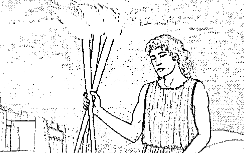

作者/朱丽叶·沙曼-伯克 丽兹·格林

译者/闫东升 编辑/玫瑰 图片/神话塔罗 网络

本文节选自《神话塔罗》

结束了圣杯牌组的神话故事，今天我们来到了权杖牌。权杖牌对应的是火元素，据说火元素是从“空无”中出现的，它可以改变和转化任何接触到它的事物，但其本身却一直保持不变。今天就让我们走近权杖牌组前 3 张数字牌——权杖 1-3。

**书名：**

神话塔罗 

**作者：**

朱丽叶·沙曼-伯克   丽兹·格林 

**出版日期：**

2011-08-02

**权杖 1**

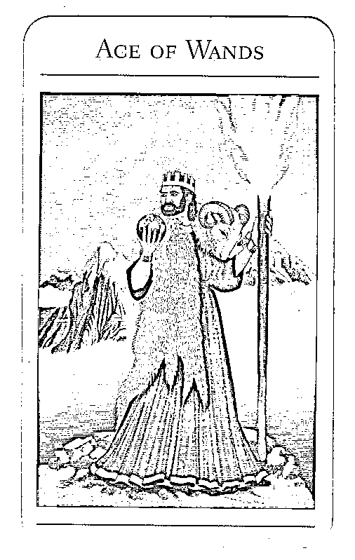

**遇见万神之王**

权杖 1 描绘的是一个强大、成熟的壮年男子，长着赤褐色的头发和胡须，头戴金色的皇冠，身着紫色的帝王长袍。他站在覆盖着白雪的山巅上，肩头围着长满金色羊毛的公羊皮。他的右手握着象征世界的地球仪，左手持着一根熊熊燃烧的权杖。

**寻找金羊毛之旅**

权杖 1 中我们又遇到了伟大的万神之王宙斯（*Zeus*），他是杰森（*Jason*）寻找金羊毛之旅的发起者和推动者。**杰森想要获取的金羊毛来自宙斯，所以金羊毛象征着每个人内在创造性的愿景，它激励着我们从熟悉和安全的世界中走出，朝向未知中想象的目标前行。** 

宙斯是古老和充满力量的神祗，他最古老的形象之一就是**长着公羊的头，代表着宇宙万象背后那不可见的、强大的创造力，**所以宙斯象征着每个人**内心无形无相又强大无比的创造性想象力**。

你无法看到它或掌握它，但是它却驱使人们不断地奋斗，创作出生活中各种精彩纷呈的事物。创造性的想象力并非艺术家所独有，尽管我们常常在艺术作品中最能够清晰地感受到它那种自发的和激情澎湃的威力。

在大阿卡纳的皇帝牌中，我们看到了宙斯身上**父权**的一面，是高高在上的众神之王。在这张权杖 1 中，我们看到的是他身上那种**善变的、初始的力量，**是一种自然的驱力，就像圣杯 1 中阿弗洛狄忒（*Aphrodite*）所象征的。

我们每个人内在都有这种力量。**宙斯能够创造出一个潜在的未来，比目前的现实更宏大更有魅力，我们能够从中发现全新的自己**，例如一个新的商业计划，或者重新装修居室等等。

很多人都不信任想象力的才能，觉得它很“愚蠢”或者“幼稚”，亦或很害怕为了新的想法冒险，因为冒险就有失败的可能。但是伟大的宙斯既不愚蠢也不幼稚，**在权杖 1 中他象征着原始创造性能量的起点**，可以说这张牌**非常具有力量。**

虽然新的想法还没有成型，却激发出人们一种不安份的感觉，一种想要对生命完全敞开自己的感觉，就是这种感觉驱动着杰森踏上了寻找金羊毛的航程。

他当时可以留在约尔科斯（*Iolkos*），轻易地推翻叔父珀利阿斯（*Pelias*）的统治，但是他选择踏上了更伟大辉煌的英雄之旅。

**因此权杖 1 隐喻着踏上愿景和想象力领域的伟大航程的起点，人们要去克服现实的制约和困难，勇敢地面对未知的挑战，然后生命之路将完全改变。**

**权杖 1，尚未成形的新驱力**

**从解牌的角度来看，权杖 1 预示着一股想要向上突破的创造性力量，但是这股力量还没有成型（或一个具体的目标）。**

当事人**对于现有环境开始不满足，强烈地感觉到一些新的事情将会发生，他（她）已经准备开始为了追寻某个愿景，踏上一次冒险的旅程。**

**权杖 2**

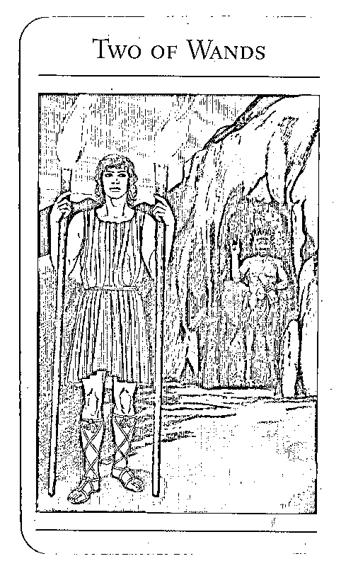

**出发**

权杖 2 描绘的是年轻的杰森站在人马族首领凯龙（*Chiron*）居住的洞口，他平静地踏上了孤独的旅程，去夺回属于自己的王位。在杰森身后黑暗的山洞中，隐约可见凯龙的身影。杰森穿着红色的束腰外衣，双手各握着一根权杖。

**愿景：夺回王位**

权杖 2 就像其他小阿卡纳的 2 号牌一样，象征着**1 号牌中的原初力量分化为两股对立统一的力量**，在权杖数字牌中，权杖 2 分化的力量象征着**冒险者和他计划中的全新目标**。

**权杖 1 中的坐立难安和尚未成型的驱力，现在开始拥有了一个具体的愿景，尽管是否能够达成还尚无定论。**

杰森这个时候还不知道世上有金羊毛这个神奇的事物，但是凯龙已经告诉他，他的身份是约尔科斯的王子和王位的合法继承人，当然还包括他的父亲伊阿宋（*Aeson*）被邪恶的叔父珀利阿斯篡夺了王位，关进大牢的消息。

潜在的感觉在这里变得更加具体和清晰，但是主人公真正的（创造性的）探险之旅（寻找金羊毛）要等到他进入旅程的下一个阶段，才会完全清晰地展现出来。

所有的创造性的探险之路都是逐步展开的，一个想法带出另一个念头，第一个通常都和最后一个大相径庭，但任何一个都不可或缺。

开始的想法已经能够驱动我们走出旧有的巢穴，因为我们感觉到自己有能力获得更多，成为一个完全不同的、更强大的自己。

杰森现在的目标是约尔科斯，在那里他拥有理所当然的王位继承权，当然那里也充满了危险，因为那里的敌人想要置他于死地。

杰森现在不能预测结果，成功或者失败都有同样比率的可能性。但是他相信那个愿景值得一试，所以紧握着权杖出发（权杖是想象力之火的象征）。

**如果他不选择踏上冒险之旅，就会在山洞中平静但无聊的老去，虽然拥有安全的环境，却无法满足内在渴望和天命的驱力，他的愿景必须采取行动才有可能实现。**

**权杖 2，一个全新的目标**

**从解牌的角度来看，权杖 2 预示着一个全新的目标、想法或创造性任务开始成型。**这个全新的想法可能不是最后的结果，但是它**充满了各种潜在的可能**，这个驱力足够诱惑着当事人**离开现有的环境（和限制），进入一段全新的探险之路**。

目前，所有的一切都基于当事人**是否有勇气选择全新的想法，是否相信那不可见的创造性力量会达成美好的愿景！**

**权杖 3**

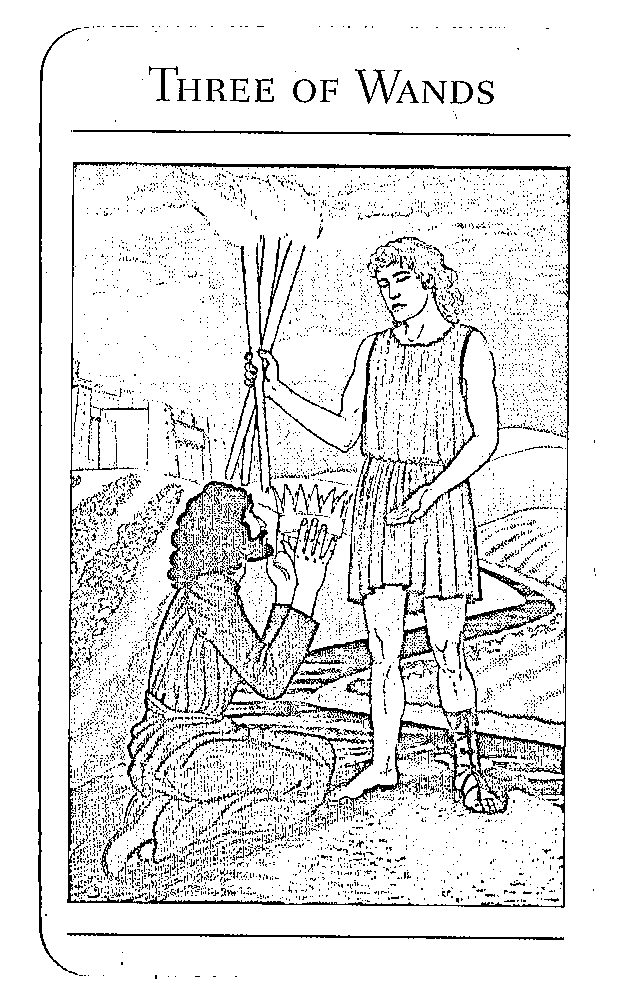

**抵达约尔科斯**

权杖 3 描绘的是杰森刚抵达约尔科斯的情景。他只穿着一只凉鞋，另一只在过河的时候丢掉了，这显然符合神谕中的预言内容。

他威武地站立着，右手握着三根熊熊燃烧的权杖。他的膝前跪着篡夺王位的珀利阿斯，长着浓密的黑色头发和胡须，身穿紫色的王袍，卑微地捧着金色的皇冠，那是他从杰森父亲手里偷来的。

**阶段性胜利**

**权杖 3 象其他小阿卡纳的 3 号牌一样，代表着初始阶段的结束。最初的创造性想法到这里已经完成了，是庆祝的时候，似乎每件事都按照计划顺利达成。**

杰森到达了他要继承王位的地方，从画面上看他也似乎继承了王位！珀利阿斯恐惧神谕的内容，似乎很情愿放弃他从伊阿宋手里偷来的统治权。

由此可见，创造性的工作常常在开始的时候很容易启动，似乎有一种魔力暗中协助，初始期的结果看上去还不错，好像某种神圣的力量能够推动初期的创造性想法落实成具体的事物。 

但是艰难的工作即将来临，这个阶段常常会有新的想法产生，那是开始的时候没有考虑到的，而且常常带来计划的延迟和修改，需要大量的精力投入其中。**权杖 3 暗示着一个高峰点，后面还有大量的工作需要完成。**

珀利阿斯给杰森讲述了存放于科尔基斯（*Colchis*）的金羊毛的事情，他说做为约尔科斯的国王，如果没有把宙斯宝贵的金羊毛拿回来并放入圣殿，就毫无资格成为这里的一国之君，当然珀利阿斯内心真实的目的是要杰森在旅途中死去。

从这点上来说，权杖 3 的庆祝之后，许多创造性的潜力就失效了，因为初始阶段的完成并不是最后的终点，当事人必须自愿去冒险，否则愿景就不会实现。这个世界上有很多未完成的文学作品堆满了抽屉，作品的开头也许很精彩，但遗憾的是没有下文。

**权杖 3 带来的信息是：尽情享受现在的满足感，但你要知道它尚未完成。只有经过检验、挑战并且扩展了个人的内在力量后，人们才能获得真正具有创造力的信心。**

**圣杯 3，初始阶段的结束**

从解牌的角度来看，权杖 3 暗示着**某种想法或项目的初始阶段已经完成。**

当事人已经打下了很好的基础，目前热情非常高涨，拥有了一定的满足感，乐观地看待将来和结果。但是**艰苦的工作就在前方，当事人必须采取行动，投入到新的计划中，这样才能实现全部的愿景。**

**版权声明：**本文由《自在园》授权发布，欢迎转发，反对抄袭。友号转载请申请白名单。

**END****朱丽叶·沙曼·伯克**从 20 世纪 70 年代早期开始，就对塔罗牌产生了兴趣，并踏入了塔罗的世界。后来，在丽兹·格林的鼓励下，开始研习心理占星学和塔罗。1984 年，第一本书《塔罗全书》（The Complete Book ofTarot）出版。之后，与丽兹·格林合作设计并撰写了《神话塔罗》（The Mythic Tarot）。朱丽叶写了十本塔罗和占星学书，包括一本名为《众星的传说》（Stories from the Stars）的儿童读物，以及与丽兹·格林合著的《神话之旅》（The Mythic Journey），这是一本详细讲述如何运用神话来指导生活的书。

**点击下图了解课程详情** 

**微信又双叒叕改版啦，不想错过若道君的推送？****就把若道设为星标吧！****▼**

**喜欢记得点一下在看哦☟**

************报名直达入口************

# 冥王星在 1 宫（上）丨恐于自我暴露，向外界投射最深的敌意

> 原文：[`mp.weixin.qq.com/s?__biz=MzA5NjA0NTAxNg==&mid=2651492437&idx=1&sn=5162de0b373dcacaad73aa9b7be9df44&chksm=8b4822e2bc3fabf4b137c956524964742c10d906ee7bcc5767c41051586c36219ce39c3076c2&scene=126&sessionid=1692737735#rd`](http://mp.weixin.qq.com/s?__biz=MzA5NjA0NTAxNg==&mid=2651492437&idx=1&sn=5162de0b373dcacaad73aa9b7be9df44&chksm=8b4822e2bc3fabf4b137c956524964742c10d906ee7bcc5767c41051586c36219ce39c3076c2&scene=126&sessionid=1692737735#rd)

**☆ 后台回复“今日”，给你一句生命态度**

作者/蓝女巫 ISAR 认证占星师

编辑/翀子 封面/书君 图片/稿定设计、蓝女巫 音乐/蓝女巫

作者引言

本文尤其写给**冥王星在 1 宫、上升天蝎座、火冥人**以及冥王星与上升点有重要相位的人。天蝎座们都要看，因冥王星在 1 宫（以下简称冥 1）绝对是冥王人。同时，也送给所有**白羊座和天秤座的对宫人，是一宫七宫人必读篇。**尤其是**南北交点是天秤座、白羊座或 1/7 宫**。天秤座要看，因为你遇见的总是这类人......白羊座要看，因为这是你的极端冥王版。所有**白羊座和天蝎座**能量合体的**火星人**，不可错过的一篇。Enjoy~

**冥 1，你在恐惧什么？**

**行走的荷尔蒙**

众所周知，上升点是面具。连同 1 宫内星体性格，共同描述着你举手投足间的本能反应，即社会人格。它是你呈现给世界的第一印象。想像一下冥王星落此的后果？

你是戴着**萨满面具的黑衣人**。被恐惧裹挟的愤怒中，散发着与生俱来的犹疑不信任。那是写满第一道防线的**求生欲**。第一宫（样貌宫）里的冥王星，述说着灵魂旧时的创伤。过去世曾发生了什么终不能放下的心结？**需要如同胎记般被写在脸上。**以致于**你与世界互动的方式有毒。完全可以是剧毒。**许多上升天蝎座承认自己很渣。**“渣”也是一种魅力，**那不过就是个中性词。作为天蝎座们心照不宣的共识。

你总以为已经把自己藏好了，却不慎成了行走的荷尔蒙。**欲盖弥彰**的能量，留给人销魂的印象。神秘性感，极具魅力。**上升是门，你在门前严控抑制的所有激情，却会从双眼的窗中迸发。目光如炬，**摄人心魄，令人意难平。黑白分明，情感极端，**爱与恨都相当深刻。**而遗憾的是，**爱与恨也都尽皆伪装。**倘若有幸令其破防撕开遮蔽，冒险敞开胸怀时......“我想见一见你的庐山真面目”？风陵渡口初相遇，一见杨过误终生。

由于外表过于深沉激烈，你的在场，总怀有一种**下意识的揭露，令人无地自容。**因你本能地擅长将自己的深渊与他人的相连...... 能令一切藏无可藏。可如此真实的链接，却令很多人招架不住，**Truth hurts.  **常因骇人的真相而不受欢迎，这让你决定继续用孤独绑架自己。**在自他之间筑起敌意的藩篱，恶性循环。**

然而，擅于看穿他人的你，**却完全不想被他人看穿？**

**人身威胁**

奥雷里亚诺上校从未与人**推心置腹**，即使对最亲近的朋友也不例外。

乌尔苏拉心头却蒙上一层阴影，感觉自己的儿子才是外来的侵入者。她从看到他进门起就有这种感觉，那时一群喧嚣的军人护卫着他进来，搜遍各个房间确信没有危险才罢休。上校不仅允许他们这样做，还颁下**严令不准任何人走进他周围三米以内**，甚至连乌尔苏拉也不例外，与此同时他的卫队在房子附近忙着设置岗哨。他身穿寻常粗布军装，没佩任何军衔标志，带马刺的长靴上沾满泥土和干血迹。他腰间佩戴手枪，枪套未扣，**手永远按在枪柄上**，与眼神一样显出**高度的警觉与果断。**

阿玛兰妲也无法将少年时代制作小金鱼的兄长，与这个**用三米隔离线把自己和其他人隔开的传奇军人**联系起来。

发现他变得更加**沉默、孤独、阴郁。**乌尔苏拉想在他肩上披一条新毯子......

——马尔克斯《百年孤独》

升蝎冥 1，赋予了你看似刀枪不入的坚韧外表和强悍体魄，**而你却总在为人身安全**（自由，也是一种安全）**时时焦虑...... 敏锐于攻击，应激于威胁。**从不动声色到惊恐发作，之间尽是草木皆兵的历程。你总会仅凭直觉，便受到了侵犯。一旦感受到威胁，会条件反射地先发制人；一旦察觉出了排斥，也会立刻否定对方。总显得**偏激极端**，疑心重重。难以与人深交。**自我暴露？那可比死还要难受！隐藏，令你感到安全。**世界不安全，随时有危机。如何放轻松？那可是攸关生命的威胁。必须随时备战，时刻保护自己。所以说，**尽管你擅于穿透他人，却困于难以敞开自己。**

上校**认定大多数人**来作坊探访他**并非出自善意或敬意**，而是抱着瞻仰历史遗迹、观赏博物馆化石的猎奇心态，**因此决定紧闭房门**，此后便很少再见他坐在大门口。

——马尔克斯《百年孤独》

因为安全感的缺乏，常令你难以自在地表现自我。与人交流时，怀有一种本能的紧张。“他们究竟**对我有何企图**？”总以为别人是有恶意的。虽说你长了双鹰眼，**擅于审视他人动机。但那常常也都只是，你自以为**所了解的他人动机。**不过是自己的一种负面投射罢了**。虽然人人都会做甩锅侠，而升蝎冥 1，在关系进入了更为真实的深层互动时，**甩出去的是黑锅。因为上升/1 宫是你看待世界的滤镜。**任自身深度阴影不断外投，**却浑然不觉。**习惯**以刺痛来测试他人的真诚，**然后轻易得到了 fake 的结论。当你固执地屏息闭气，指责着周遭已是一呼一吸都有害时，**却不知毒害自他的人，正是你自己。**此刻请不要如坐针毡，惶恐于自我揭露。扒皮是为了进化，免于堕落成“锅王”。鸣金收兵，不破不立！

往日的**推心置腹已经一去不返**，同谋和交流变成敌意与缄默。**他渴望孤独**，对整个世界的**怨恨咬噬着他的心。**于是以一种**沉默而强烈的敌意相待。**

——马尔克斯《百年孤独》

“你就那么不信任我？”“**我为什么要信任别人？**我不相信任何人！包括你。” 那惊恐的眼神，足以激起一份令他人**终不能辜负**你的对抗。这倒是让你倍感轻松：果不其然。于是，**两只被施了魔咒的刺猬，**成了每段关系的结局。

一宫象征人生早期的经历。不像上升狮子座，早年鲜花铺路，被赏赐了响亮明朗毫无戒心的人格，因此更擅长爱。而你更擅长恨？险象环生的早年生涯中，历经的痛苦挣扎，不得不养成为了生存而防御自保的惯性。披上了这张神秘又疏离的隐形衣，**以无情应万变。**故气场中常散发着憎恨和怀疑，流露出一种**带有剥夺式的残酷，**无论对资源，或是对快乐。让人觉得你**仿佛特别擅长恨。**尽管心中可能并没有，可惜全都挂在了脸上。所以，升蝎冥 1 们还挺吃亏的？其实，连犀利都或许只是个外表......

满怀怨恨地制定了计划，但心中一个念头令她战惊：**纵然出于爱意，她也无法做得比这更好。**

——马尔克斯《百年孤独》

倘若这个面具纯属伪装，那么**内与外的鸿沟又是什么？**

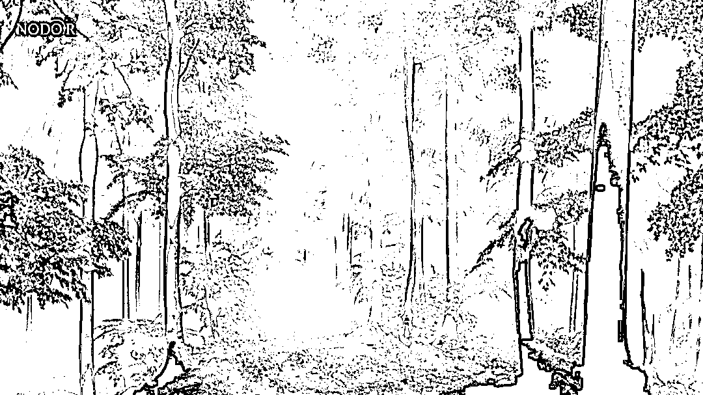

**自我怀疑**

当你伪装着漠然，**或许你也欠自己一个真相。**当你隐蔽真实，是想要保全什么？坚不可摧的外表，是为了掩藏何种脆弱？你不敢暴露，或许因为担心受到控制。而这又出自于**记忆中哪一个角落的埋伏？**

从上升开启 1 宫，这里关乎我们如何向世界呈现自己。**你有自我呈现的问题困扰吗？**其实，**你之所以后来会成为了一个永动机，因你有个无法餍足的无底洞，来自深深的自我怀疑，永远不满意的是自己...... **

倘若你努力变好的意志力，建立在一个不敢事先承认的现实自我之上，那结果只能是，越强迫改进，越绝望。越绝望，就更要奋力弥补。因只盯着理想自我，只会眼高手低。抗拒真实的自己，又何从改变？疗愈的前提是**（对自己）实事求是，要敢于自我揭露！不与真实的自己深刻链接，又如何对个人身份认同做出真实的承诺？世间最有力量的事，就是能真实地看待并表达自己。其实，你对生命的控制，并非来自于向外掌权，而是去获得真正的内在掌控感，它要求你勇敢地去看清自己的创伤。所以，你究竟因何而深感缺陷？**

请对自身挖地三尺，直抵那最深次的屈辱......别让思维滞留过去不长大，否则你就会拖着痛苦一直走。回到案发当场，用成长后更有力量的自己，去重新理解当初的事件，突破以走出阴影，释放以重获力量。

你就是害怕脆弱不被接纳，才伪装的。而**一切真实，皆可被接纳。**勇敢去承认那层深深的焦虑，**通过默许，而获安宁。**不由令我联想到，这与冥想的类似。**坦然接纳，是以安放。安于，故放下。如实，即解脱。默许脆弱，并非让你甘于停滞，而是先清除了精神内耗，**去走出焦虑的限制，**从自我攻击中得以腾出精力，才能更好地去自我探索。**人因接纳而自由，重获内心秩序。**你曾不接纳自己，也就更难接纳他人。**愤恨，因耽于对完美控制的幻想，须学会**提高容错度。可见你执念的出口，便是去让接纳自他，同步。**

的确，**生命中最难的面对，就是面对自己。**

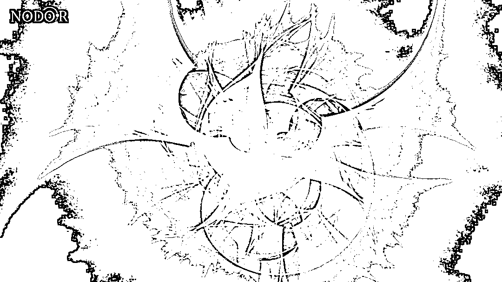

**冥 1，你在补偿什么？**

**身体政治**

短短时间内发生了如此多的变化，在赫伯特先生来访后八个月，马孔多的老居民**每天都要早早起来重新认识自己的家乡。**

——马尔克斯《百年孤独》

在后文讲述身份感的“概念自我”之外，还有个“身体自我”的表征来先行。**冥 1，尤其会关注于此。**深谙**形象管理的重要性。**这算是我在北京服装学院进修那年的一个重要观察和启示。直到有一天，我从图书馆书架取下一本叫作身体政治的书时，神游于精神世界的人，焦点才暂时回落于肉身。恍然大悟，竟然还可以这样啊？

**最易有容貌焦虑的你**，总忙着变换造型，尝试能控制每一块肌肉的细微变化。玩弄着纤毫之争，精度的游戏。跑步健身塑形整容，辅之以服化道。阶段性脱胎换骨的转变风格，也算是一种周期性告别旧我的仪式感吧。自我意识的变革，随时显化在身体表征的迭代中。但见，它正在忙着回答“我是谁”的问题。因你确实不知道自己是什么与要什么，故仍在不断的自我变革中寻找。**身体即是灵魂，**对冥 1 来说。灵魂和肉体，从未如在此地这般水乳交融地统一过。**战争与和平都书写在身体上，**由样貌传达出你的独立宣言。用身体去吹响号角，成为权力斗争和欲望延伸的主战场。**搞身体政治，玩颜值逆袭，**通过严控外形，**这个“自身”，它统治着，也是自我的统治者。**

毕竟，**身体才是陪伴我一生的人，而不是他人**……你窃以为。

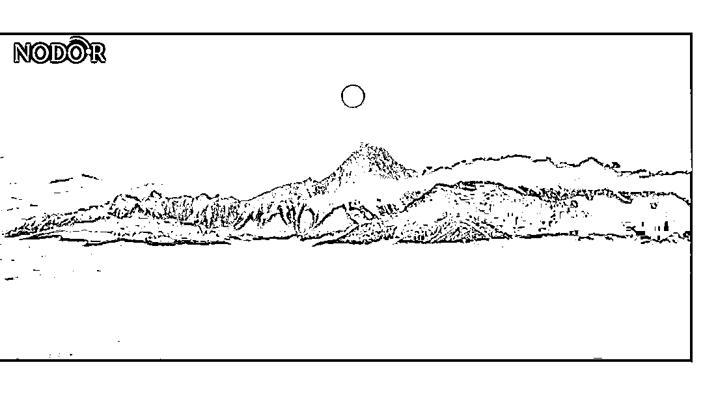

**人生由我**

你信奉**爱拼才会赢，干就对了！**以切实有力的具体行动，将全身心拉回当下，以感受自我的力量。**强烈安全感来自于对自我的充分掌控感。并对自由和独立有着强迫式的渴望，以此捍卫自身主权。你总在忙着聚焦于自己，且过于聚焦......跟自己过不去，是一种日常。冥王星在其它宫位，各有所虐。而冥 1，则是虐自己！要不断地挑战自我，自我变革。实在没有什么比能够掌控自己的人生，更重要的事了，**你认为。

从掌权的第一天起，阿尔卡蒂奥便**显露出发号施令的嗜好。**他有时一天颁布四份公告，想到什么立即宣布实施。**全副武装四处巡逻，给外人以坚不可摧的印象。**阿尔卡蒂奥继续**强化他那毫无必要的铁腕手段，**成为马孔多有史以来**最残酷的统治者。**当阿尔卡蒂奥还是个**孤独的孩子时，时常担惊受怕。**

——马尔克斯《百年孤独》

冥 1，你也**极度渴望权力**，仿佛无法掌控全局时，就意味着灾难。**小到掌舵主导所有事的节奏，**意志强加。**大到去洞悉命运的咽喉，以求掌控它。只有主导，令你安全。**没在控制，就会若有所失，心不安定。**你很不喜欢人生被操纵的感觉，**誓为自身命运掌舵。**当主人的意识，令你着迷…… “按我说的做！”**不希望自己做好的设定，因他人而再多出个什么节外生枝的变量来。否则会很恼火。尽显固定宫的不灵活。与其相处时，能感到他们本能地多渴望控制。比如，我观察到他们在聆听时，常表现出时不我待，缺乏耐性。希望答案来得更快更直接，直达他们紧盯的结果。过程不重要，恨不得省略一切中间环节。**尽显急功近利的效率，趋利避害的直白。**你总是难以追逐其消防员般的节奏。他们似乎下意识地**总需要维持一种主导的姿态，**那远比主导的内容重要得多...... 这算是，**为了固执而固执？这个"自身"总是在倾听，寻找，比较，强制，征服，摧毁......**

他曾**在这里第一次感受到权力带来的安全感。**他说，“重要的是，**从今以后我们只为权力而战。”**

——马尔克斯《百年孤独》

**人生由我，而我是谁？**

**“我是谁？”**

**世界新生伊始，**许多事物还没有名字，提到的时候尚需用手指指点点。

**一直向东航行，**就有可能回到出发点。重要的是别迷失方向。

“地球是圆的，就像个橙子。”

——马尔克斯《百年孤独》

这是一个**无中生有**的阶段，原初的时刻。作为全新进化周期的起点，一切都只是刚刚开始。当灵魂从第 12 宫的潜意识深海中喷薄而出，诞生了第 1 宫中**新生儿般的意识**。冥 1，被一种能由自己来主导生命的能力所召唤。**带着一种我命由我不由天的绝对狂妄，想要去塑造命运，**且本能感知到自己是**来完成一个独特使命的，而它是什么？**

旧大陆的价值，皆已在漩涡中崩解，而新的是什么？直觉有路朝新方向打开，但暂未成形。准备好的全新面貌，却总需要不停更迭？你像个**劫后余生的小野人，**除了已遗忘的创伤记忆和自己的身体，你一无所有，不得不从头开始自我探索，展开荒岛求生。于是你快速营造出了一派**实干的氛围，于生命的创业之初，你成为了那个最不安分的人。**

但见你如同出膛的子弹般狂奔着，冲动而急切，**渴望能寻找到自我。生命中的每一个当下，你都注定被“它”驱赶。**进化的步履强劲而激进，带有一种绝望的强迫性。因你总被**发动机里那源源不绝的能量灼烧着，**迫切地总要赶紧**做点什么，来释放它...... 生命在于折腾，**忙点什么都好，以此带来必要的颠覆，去发动你自我变革的战车。 

像何塞阿尔卡蒂奥这样**富于进取心**的男人，村里再**没有第二个**。

——马尔克斯《百年孤独》

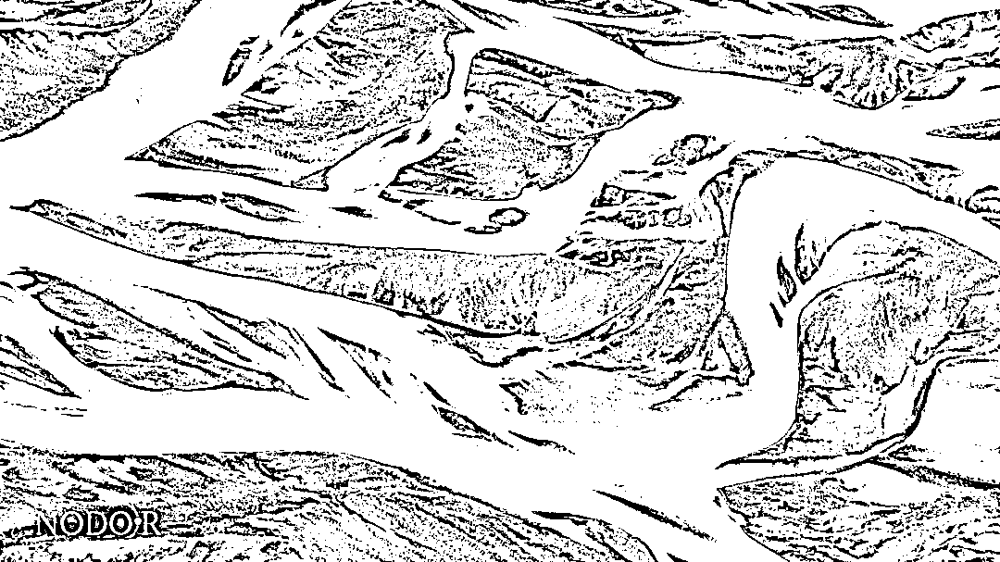

**“它”令你愤怒！像是一种原始的狂怒，对应破土而出时的啼哭。从没有任何重生不伴随痛苦。冥王式无情的瓦解，也就是毁灭，却必然地推进了新生，也就是创造。**危机面前，你总富有拓荒者的童心，怀揣一份神圣的肯定：**勇往直前，死不了！**那是一种**幼稚与深刻的并存，委屈却从不失希望。**随时从零开始，不要历史，不要犹豫，只要行动。你炽烈勇敢，纯粹热忱。且你很清楚一个道理：**你是来摔跤的，而非来跳舞的。**但要谨记，耐心点，**欲速则不达！**

所有叫阿尔卡蒂奥的都**性格冲动，富于事业心**，但命中注定带有悲剧色彩。固执任性。他发育迅速，体格健壮也像父亲，不过从那时就可以明显看出他**缺乏想象力。**他在马孔多建立前翻越山脉的路上孕育和诞生。

——马尔克斯《百年孤独》

**“它”令你迷茫：**全新循环的开端，那不知所措的自由，自由的代价是茫然。尽管你终日**用力过猛地在书写着自己，却依然不知道我是谁。**有时你似乎找到了路，但总会在不断的更迭中，重又深陷自我怀疑。**总觉得有什么事情就要发生，可那到底是什么？the best is yet to come?**  伴随着一种**不知究竟的恐惧和焦躁，**你拿起刀枪想要控制和对付它，终是徒然，但你却从此养成了**那个对抗的习惯......**你经常**被莫名的本能欲望撕咬着，**却不知那些深层呐喊的来由，总难以像别人那般轻松解释自己的行为和需求。你真的很想要找人告诉自己**“它”到底是什么。**这直到后来当你开始与镜像做斗争时，方能得到解释。每逢冥 1 客户，开门见山地对我说：**请帮我认识我自己！**

面对悬而未决的未来，伴随着阵阵**源于自我认知的愤怒。你过度补偿的一个方法，是行动！**闯荡漂流，去发现新事物。不停冒险，去尝试新经验。**一刻也不能停下自我寻找的脚步，忙着跟自己时刻较劲，品尝着对自身的恐惧和憎恨。仿佛那便是你人生的全部。仿佛那才是最大的敌人。却不知这其实是一条不归路，一个无底洞。**小野人从没有照过镜子，也不知道自己需要那玩意儿。**他从没学过理别人，他没空！**光是去凝视自己的身体，就够他忙的了。 

他想到**可以利用这个无用的发明来挖掘地下黄金。**梅尔基亚德斯是个诚实的人，当时就提醒他：**“干不了这个。”**然而他仍然拿一头骡子和一对山羊换了那两块磁铁。尚未从磁铁实验的失利中平复的他，**又萌生了将这一发明应用于战争的想法。**

——马尔克斯《百年孤独》

**生命中最重要的面对，就是面对自我。**而“我”究竟是谁？

**自我身份认同**

身份认同，是一种关于**“我是谁？从哪里来？到哪里去？”的追问**，相关身份的确认度。是**对主体自身的认知和描述。**自我身份认同，强调以自我为核心的身心体验。自我认同的形成，是你**做出重要人生选择的基础。**当你弄不清自己到底是个怎样的人，就很容易被他人价值给带跑。因并未基于自己，很快就会产生抗拒。脱离盲目追随后，重新陷入自我怀疑，自我隔离中重新自我定义。如此，**在追随他人价值和自我真相之间挣扎摆荡，**阶段性地失去方向动力。直到自我认知日渐清晰，越发满意了现在的自己。**建立自我同一性之后，**便能跟随内心真实声音，向人生目标承诺，去坚定付诸持久努力。**对于冥 1，这尤其是个需历尽无数反思淬炼，方能完成的自我整合之路。**如果你仍在终日焦灼于如何自我确立，尚未看清人生使命。**来找我，一秒钟告诉你...... **

**冥王星在 1 宫，对应自我身份认同的危机。**它来自于一种**矛盾的进化压力，**所造成**内在自我的周期性崩解，**即在新旧自我之间徘徊的胶着感。一种难以克制的自我破坏欲望，总想打碎即定的形象，故**身份感随时面临被彻底颠覆的深深焦虑。一方面，其安全感须来自于能够建立对自己牢固而深刻的洞见；而另一方面，崭新的自我意识却如此不稳定，注定在激烈发展变化中更迭。只因此处汇集了两种能量的本质冲突：白羊是行动派，习惯于不假思索，干就对了！而冥王星执着于已知，习惯于洞悉深层，我执难以打破。即冥顽不灵的死守与义无反顾的奋进之间的殊死博斗和剧烈撕扯。**这一切，让你**陷入一种愤怒的挫折感，在身份认同危机中挣扎，**被摆荡重复的循环折磨不休。

于是，**“它”时时做乱。冥 1 决定将这个伏地魔，彻底投射出去……**

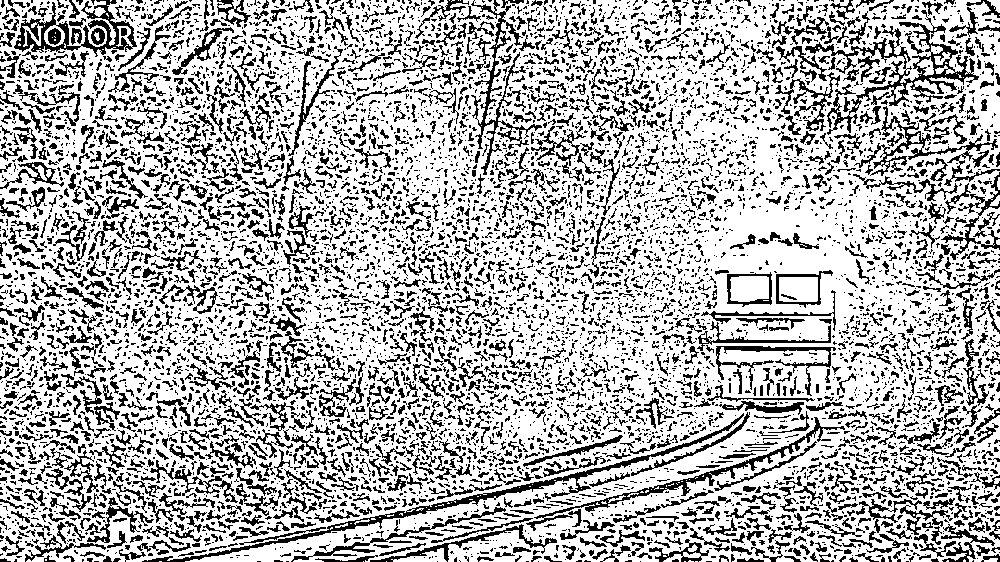

**心中有战争，世界就有战争**

骨殖袋总在意想不到的地方出现，一刻不停地发出咯啦咯啦的响声。

——马尔克斯《百年孤独》

**“它”，是你的这些永不消停的本能欲望，**包括冲动的心性，炽烈的情欲，谁与争锋的不逊，与生俱来的罪恶感等。**当潘多拉的盒子在命宫中打开，秘而不宣的渴望甚至令你感到羞愧难当。**而当你不敢顺应这些内在声音，难以抒发这些深层需求时，就会产生没完没了的**扭曲和误会。**不承认是你内心渴望改变，就会无意识中被迫改变。潜意识便会煽动外界的“邪恶入侵”， 让他人成为你毁灭自我的**替罪羊。外扰都是内乱的镜子，**外界的斗争皆反应出你的核心自我。宁可将那份矛盾的挫折感无意识下投射给他人，误以为是别人造成的，**与他人为敌。而你最大的敌人，永远只是你自身。**

工人们不时请求大家不要妨碍干活，**殊不知碍事的是他们自己，**因为他们被骨殖袋发出的沉闷咯啦声所烦扰，走到哪儿都难得安宁。

——马尔克斯《百年孤独》

时而显示为他人的僵化限制，阻止了你前行的脚步，不甘停滞的你，须代表月亮**消灭束缚者。**此刻的真相是：你对旧我安全熟悉区的执念，**仍根深蒂固地牵绊着自己**；时而又投射为他人对你人身自由的威胁与攻击，义愤填膺的你，又须代表月亮**消灭进犯者**。可事实却是：你正时刻渴望突破自身固有限制，**去升级打怪，探索全新可能性。**要明白，**这皆是你自己正在经历变与执之间的纠结，**即内在自我须周期性崩解的核心进化功课。对于冥 1 升蝎，真是“**无投射，不成长”。**常把投射的游戏，玩到让对方目瞪口呆，真实的**他者如此扁平**...... 仿佛并不存在，只不过充当了**你这个主体，去强迫性妄想的投影仪。**

于是，**你总感于他人的逼迫，不胜委屈，**愤怒烦躁，就此质疑关系。却未理解这是一种根植于你进化逻辑的**必然挫折感**。**而被这种身份认同危机深深折磨的你，非常需要镜子！**必须借助亲密关系来认清自己。**推卸责任，归咎于人或中断关系于事无补。因你的进化课题终究还是要走出死角，导向关系。**其实你很渴望对手的反馈与验证，急需听取他人看法来拓展自我全新认知。与世隔绝，只会造成自身的狭隘，使自我探索搁浅与碰壁，失去自我洞见，**你终将难以靠独行来找到那独特使命之路，亦根本无法靠独自来回答“我是谁”。**孤独的极端必是陪伴，你迟早要投降，再去向他人敞开心扉。但见你在关系中进进出出。你**不得不承认对关系的需求，**那是你浑然不觉**藏匿至深的渴望。独处与结伴两种本能需求的交替，**其实从不矛盾，只须找到平衡！而这正是贯穿于其毕生使命之中的任务。

庇拉尔给出了预言：“只有等你父母入土为安，你才会幸福。”丽贝卡一阵颤抖。她告诉了何塞。他责怪她竟然相信纸牌的预言，自己却在**暗中翻遍衣柜和衣箱，四处寻找**那个骨殖袋。泥瓦匠承认嫌那袋子碍事把它砌在了夹壁里。于是凿开墙壁，当天他们便把骨殖安葬。经过厨房的时候，他吻了一下丽贝卡的额头。“别胡思乱想了，”他说，**“你会幸福的。”**

——马尔克斯《百年孤独》

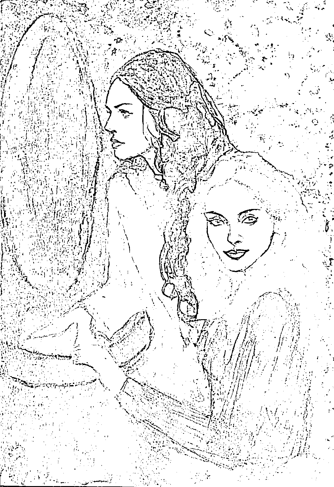

**| **蓝女巫画作

**意志暴力，赢！**

**......**

**（未完待续，见今日二条）**

**版权声明：**本文由作者授权在若道平台发布，欢迎转发，反对抄袭。

**END**

**蓝女巫**

英国伯明翰大学 市场营销学硕士

职业占星师/专栏作者/芳疗师/珠宝设计师

中国首批 ISAR 英文认证占星师（2012 届）

**微信公众号**：cecilia_sui

长按打赏

**20 位来自世界各地的占星师****带来 19 场沙龙——新世界的觉醒****详情可点击下图**

**学习占星学****点击下图了解课程详情**

**微信又双叒叕改版啦，不想错过若道君的推送？**
****就把若道设为****星标****以及点点****“在看”****吧！******▼**

**喜欢就点一下“在看”吧！****报名直达入口**

# 冥王星在 1 宫（下）丨步步为“赢”，可你究竟为何而战？

> 原文：[`mp.weixin.qq.com/s?__biz=MzA5NjA0NTAxNg==&mid=2651492437&idx=2&sn=e2ca14657e09b0af936ab6b6afb912a4&chksm=8b4822e2bc3fabf4d23ea1e1724ede4d2ca3ea9844056cdfeeb28062aea3fd8a353ca6598766&scene=126&sessionid=1692737735#rd`](http://mp.weixin.qq.com/s?__biz=MzA5NjA0NTAxNg==&mid=2651492437&idx=2&sn=e2ca14657e09b0af936ab6b6afb912a4&chksm=8b4822e2bc3fabf4d23ea1e1724ede4d2ca3ea9844056cdfeeb28062aea3fd8a353ca6598766&scene=126&sessionid=1692737735#rd)

作者/蓝女巫 ISAR 认证占星师

编辑/翀子 封面/书君 图片/稿定设计 音乐/蓝女巫

**（接今日头条）**

**意志暴力，赢！**

抬起头迎上底拉尔·特尔内拉的视线，她的想法毫无掩饰，仿佛暴露在正午的阳光下。“好吧，”奥雷里亚诺说，“告诉我是怎么回事。”底拉尔·特尔内拉咬着嘴唇，露出一丝悲伤的笑容。**“你适合打仗，”她说，“百发百中呢。”预感得到了证实，奥雷里亚诺心下一阵轻松。**他继续埋头干活，仿佛什么也没发生，声音里多了几分安稳和镇定。“我认了，”他说，“就叫我的名字。” 

——马尔克斯《百年孤独》

我每次都会问冥 1 客户们：**“很想赢吗？”**他们常会沉默片刻，然后说：“为什么问这个？”我说，“是不是有呢？”他们会承认，**“是（非）的（常）！”**

这些内在的声音，对你仍很遥远吗？还是说，**它其实就在门帘后？**迫切于获得世界的认可，却掩藏起这份欲望；极度渴望自我被接纳，却桀骜不驯地伪装；渴望爱，却流连于孤独。近则不逊远则怨。**这一系列别别扭扭的偏执，**让我联想到某种类似青春期的行径，尽显白羊座式的**纯真少年感。**1 宫是白羊座的宫位，所以**冥 1**，不见得是老灵魂，你在冥王功课之处，还是个（新）**孩子**吧！**而当灵魂穿透了你上升的人格面具，所有的野心却又路人皆知。**  

冥 1，**就是要赢！出人头地，拔得头筹，**是写在心底的座右铭吗？

**你是一个狠人，**对他人狠，对自己更狠。战斗民族的灵魂，你最懂。具有**强烈的意志力，称意志暴力**也毫不为过。**卷起来！绝不能落后！**崇拜**速度与激情**的你，显得那么急不可耐，总是生怕虚度了光阴。**似乎只有不得闲地进取，才能规避认输的恐慌。**赴汤蹈火，**向死而生，**方能令你感到活着。仿佛总要在救火队员般的紧迫呼吸中，体验生死时速。**下定决心，不怕牺牲，排除万难，去争取胜利！**

**勇往直前是你的日常。**然而，**却还要将战斗精神暗藏，**如袖中怀揣的手榴弹。那是冥 1 与白羊座原型最大的区别吧。你的武器也从不只是火药库，而要用**核威慑**那种......虽然你骨子里是个当仁不让的卷王，面子上却仍要像个**深藏不露的杀手。**仿佛深知锋芒显露通往诅咒。所以更像杀机暗藏的刺客，在倒数着那图穷匕见的时光。

不但**出生入死：**

奥雷里亚诺上校**发动过三十二场武装起义，无一成功。**他与十七个女人生下十七个儿子，一夜之间都被逐个除掉，其中最年长的不到三十五岁。他逃过十四次暗杀、七十三次伏击和一次枪决。他有一次被人在咖啡里投毒，投入的马钱子碱足够毒死一匹马，**但他仍大难不死。他官至革命军总司令，**从南到北、自西至东都在他的统辖之下，他也成为最令政府恐惧的人物。**他一向身先士卒，却只受过一次伤，**那是他在签署尼兰迪亚协定为长达近二十年的内战画上句号后自戕的结果。他用手枪朝胸部开了一枪，子弹从背部穿出却没有损及任何要害部位。

**其实他在意的不是死亡，而是生命。**

——马尔克斯《百年孤独》

而且**争先恐后：**

**吃惊的并不是这一建议的冷酷，而是竟有人一瞬间抢先一步把自己的想法表达出来。**“别指望我下这个命令。”他说。 他没下命令，的确没有。但十五天后那个将军遇伏，在乱刀下被剁成肉酱，大权落到上校手中。**权力带来的陶醉消失于阵阵烦恼之中。他试图找到抵御寒意的方法**，就下令枪毙了提议暗杀将军的年轻上尉。他的命令总是在发布之前，甚至**早在他动念之前，就已被执行，**而且总会执行得超出他事先所敢想望的范围。

——马尔克斯《百年孤独》

**上升天蝎座、命主星冥王星合相中天的普京说：“我们取得了光荣的胜利。一定能赢，没人可以向我们强加任何事，谁都不行。”**

但见你**时刻斗志昂扬，礼赞个体生命的勇气。前进，前进，前前进！**活得像义勇军进行曲一般。**始终期待着一场生命的凯旋。**你**崇尚力量和竞争**，热爱运动和竞技，每当我被上升天蝎座的你的满眼热浪的野心与魄力，激荡得目眩神迷时，却不慎注意到了一个重复的细节：那个**“0:3”的计分牌，似乎凝聚了你所有的意念！**这在我的心中升起了寒意：**人生若只活成了一个计分牌，那可就太扎心了。比，对你就那么重要？**还真难以为你设想出一个没有参照物的赛道...... 一个人打高尔夫时，则其实并不适合你？

“告诉我，老兄：**你打仗是为了什么？**”“还能为了什么，老兄，”马尔克斯上校回答，“为了伟大的自由党呗。”“你知道为了什么，算是有福，”他答道，“我呢，现在刚发现我**打仗是为了自尊。”“这可不好。”**马尔克斯上校说。他的警觉令奥雷里亚诺上校感到好笑。“当然，”他说，“不过不管怎么说，**这总比不知道为了什么打仗强。**”他看着他的眼睛，笑着加上一句：“也比你强，你是为了一样对谁都没用的东西打仗。”我们打了那么多仗，就争取到没让人把房子漆成蓝色。“他们当中的**许多人甚至不知道自己为何而战。**

——马尔克斯《百年孤独》

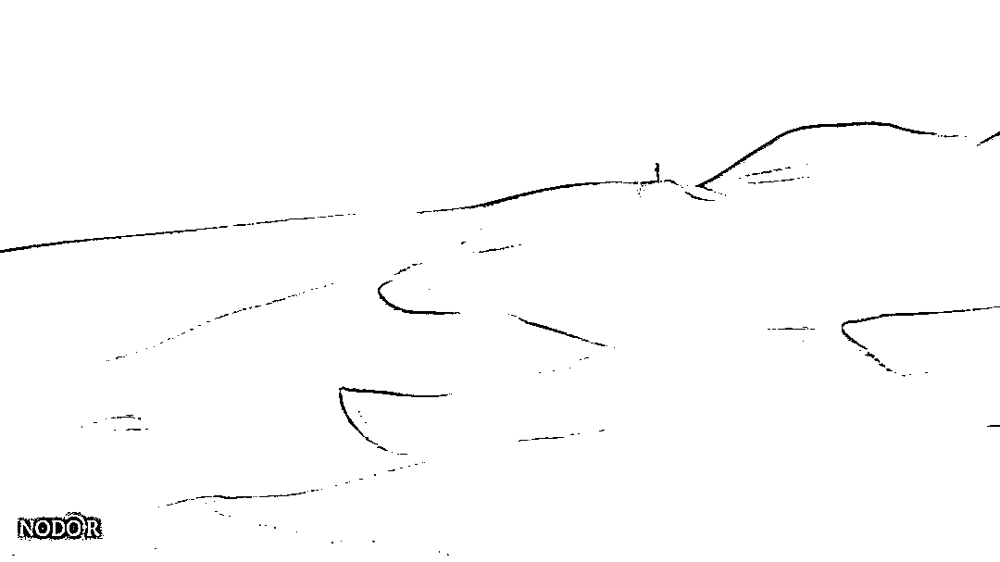

比如长跑，就是个绝佳象征，映照你生命中最珍视的耐力与激情。**“山就在那里”**的勇气固然可嘉，但还是很想提醒一句：**你为什么跑？**在一个人人都在跑的赛道上，**比赛的目的，显然比结果更重要。即要找准赛道！**万一那只是个被设定的人生轨道，万一你不心成了**趋之若鹜的一枚棋子。**而在这样一条跑道上，**谁先到终点又如何呢？**反正是随年轮大家都可以到达的归处...... 

或许，**你需要的不仅是一个外部的赛道，**你的征战更应该去往自身灵魂中的山峰：**跟自己斗，而非跟别人比。**让做自己，走自己的路，成为生命中最迫切的需要。**去找准量身定制的独特使命，**聆听自己最深切的声音，哪怕听到的只是 long distance runner**式终极孤独的自我感。以内在动机激发的兴致，**而非被外部强加的蓝图，才更接近幸福吧。毕竟，**因热爱（自身）而拼搏，与因恐惧（失败）而拼搏的人生，还是很不同的。想赢者必定最怕输，而真正的力量，却总来自于无惧...... **

他从未像那时一样骁勇善战。他**终于能为自己的自由而战，**而不再为抽象的概念，不再为政客见风使舵、翻云覆雨的口号而战，**这样的信念令他激情满怀、斗志昂扬。**马尔克斯上校一如以往坚定忠诚**，当初怎样为胜利而战，如今便怎样为失败而战。**

死亡远比想象的要难。他坚信自己的大限早已注定，这信念赋予他一种神奇的免疫力和一定期限的永生，使他**在枪林弹雨中毫发无伤，最终赢得一场比胜利更艰难、更血腥、代价更高昂的失败。**

——马尔克斯《百年孤独》

因你流淌着火星人的血脉，**生命时刻围绕着种种“战争”展开，**无论是商战、谍战、比赛，或是种种内卷的日常......对这个族群，**一切焦灼似乎只能在战火中平息。但只要别让任何形式的战争，成了自我麻醉的工具，警醒没在以此回避核心。**而爱与恨总是呈现为双刃剑，冥王星永远保证了两种极端复杂情绪的同时存在。故反方会与正方，同样执着于战争的话题。从没有任何莫名的激烈情绪是虚设的。**恨，也可能是压抑的爱！**看清**战争的符号**所折射出的**你的斗志**，能量才能不被扭曲地运用。

蒙卡达为了捍卫自己的党派才参战，并在战场上获得了将军的头衔，但他无意成为职业军人。恰恰相反，他和党内许多同道一样，是**反军事主义者。**在他看来，军人都是些没有原则的懒虫、野心勃勃的阴谋家，惯于欺压平民乱中牟利。

“你比我更清楚，”他说，“**所有的军事法庭都是闹剧。实际上你是在为别人的罪行受过，**因为这次我们不惜代价要赢得胜利。”

他把眼镜放在床上，又摘下怀表。**“我担心的是，你那么憎恨军人，跟他们斗了那么久，琢磨了他们那么久，最终却变得和他们一样。**人世间没有任何理想值得以这样的沉沦作为代价。”

——马尔克斯《百年孤独》

**升蝎冥 1，只要你不服输，就没有人能让你输！**但我也深深理解你，那英雄式的悲壮与孤独...... 

每当我拨通你电话，然后听到：

**冥 1，你将在何处崩塌？**

**孤独**

**四年间他多次求爱，她总能找到办法拒绝却不伤害他。“我谁也不嫁，”**她告诉他，“尤其不嫁给你。”

**尽管心里无比渴望，她仍能克制**着不出去见面。实际上，这行为都属于**无穷的爱意与无法战胜的胆怯之间的殊死较量，最终胜出的**是阿玛兰妲**毫无理由的恐惧**，恐惧的对象是她自己饱受折磨的心灵。

八月的一个下午，阿玛兰妲在彻底拒绝了这位坚毅的追求者后，**再也无法忍受执拗性情的重压，**锁在房间里**为自己孤独到死的命运痛哭起来。**在人们的印象中，她似乎白天织晚上拆，却**不是为了借此击败孤独，恰恰相反，为的是持守孤独。而这不是出于爱也不是出于恨，而是出于对孤独的深切理解。**

他决定接她回家好生照料，但他的好意遭到丽贝卡的断然拒绝。她辛苦多年忍受折磨**好不容易赢得的孤独特权**，绝不肯用来换取一个被虚假迷人的怜悯打扰的晚年。

——马尔克斯《百年孤独》

你是无可救药的独行侠。不论是否孤，但你必定是**独得令人发指**！虽然你也常为孑然一身而感到委屈，也惧怕最终被丢下孤苦伶仃。但细细想来，**那难道不是你自己下意识的坚定选择？**常常是谁都难以将你从**顽固的自闭**中解救出来。孤独的人是可耻的？孤独倒也不失为一种特权啊。

孤独按动机可分为主动与被动两种：**被动的孤独，**非自我决定的孤独。因不擅长社交而产生恐惧焦虑感，被迫失去亲密关系联结。当重心以挂靠他人来逃离直面自己时，因不具备强烈的内在动机，归属感空悬，结果必会通向空虚无聊；**主动的孤独**，是自我决定的孤独。你因忙于自我对话与探索，而主动选择独处，纵使与世隔绝，也不空虚苦闷，那是令你精力充沛的个人创造时光。归属感有着落，因你能为自己提供安全的内在感觉。**高质量的孤独，**能让人更加珍视自我照顾，在享受自主和个体自由中，向内收获幸福感。也不会导致社交退缩。它并非不依赖他人， 而是能同时依赖很多人事，这也就能杜绝孤注一掷而成瘾。关系诉求不限于伴侣，而能寄托于生活各方面。

 冥 1，可直译为**深刻的孤独**。如前述，由于冥 1 首先需要对自我身份进行终极追问，而必然陷入的孤独。主动选择抽掉所有社交价值之后，所剩下的那份**对自身独特性的清晰感受，**即一种无可辩驳的**自我感**。以此作为反思生命的起点，便能长出充实有力的内在精神。赋予生命不依赖于人的生长感。把孤独变成了一种生命自我承担的勇气。成就了**以退为进的完整。这无疑是孤独最高阶的状态。**

 然而，在建立了良好的内在关系后，**冥 1，你却总容易陷得太深，过犹不及！这便是典型的冥 1 式诅咒，那必是一条通往无底洞的不归路。**虽说孤独本是人生真相，独处能力是情感成熟的标志。但要记得，**你却是最容易矫枉过正的那一位！**悲喜自渡显得很酷，但你还是不能回避关系为好。若能默许孤独，又能向他人敞开。让孤独作为留白，而非孤岛。设法让**爱与孤独的钟摆，良性摆荡。**

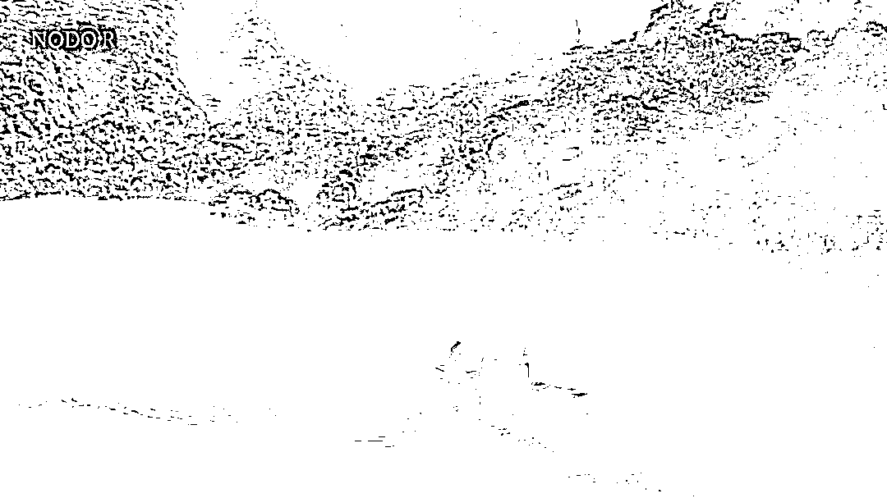

**战争与和平**

**胜者一无所获。在关系中。**

当我爱的上升天蝎座人，满眼只有 0:3 的计分牌，兴致完全聚焦于比分，让关系无时无刻不充斥着针锋相对的较量，这总让人心下凄凉：**你果然是为了摔跤，而非为跳舞而生。**可见，冥 1，你下意识地多么需要一个参照物？**享受孤独的你，又何曾有过一刻绝对的独立？而比，真就那么重要吗？当爱支配一切时，权力就不存在了；当权力主宰一切时，爱就消失了。关系中的赢，究竟还能走多远？**

当她意识到上校并非像她想的那样，由于战争的摧残而丧失对家人的情感，**实际上他从未爱过任何人。**她猜到他并非像所有人想的那样为着某种理想发动那些战争，也并非像所有人想的那样因为疲倦而放弃了近在眼前的胜利，**实际上他成功和失败都因为同一个原因，**即纯粹、罪恶的自大。她最终得出结论，自己不惜为他付出生命的这个儿子，**不过是个无力去爱的人。**

——马尔克斯《百年孤独》

**天敌：**

这是一个关于**攻与守，主导与臣服**之间的故事。**为自身攻城略地的你，在关系中却成了守门员，严阵防范着你个人的疆土。**冥 1 常吸来**天秤座/七宫原型**的伴侣，因为这是最完美的对手。即**边界感最不适配**的一对。他们能将冥 1 所憎恨的**过度依赖**，演绎到极致。也是让度生命力，不惜自我削弱，降低自尊感的高手。对他人反馈，草木皆兵的敏感，常会让爱变沉重，激起冥 1 根深蒂固的紧张。那一场场致命吸引，注定会带来那些最适宜与你在灵魂功课上互通有无的人，而不见得是最和睦最舒适的人。

只是在严格盘点过往时发现，实际上自己是多么热爱那些曾经恨得最深的人。

——马尔克斯《百年孤独》

当过度依赖与过度疏离，极端两者以相爱相杀的原理致命邂逅时，那份窒息感堪称死亡之吻。步步惊心，**细思恐极，我已亲身体验过了，在这段互为火冥/金冥的关系里。**越退越进，越进越退。因能量守恒，任何一方的极端表现也总是由另一方的极端反馈所激发的。我曾写过白羊座和天秤座的对宫之舞：《白羊天秤对宫镜像｜起舞弄清影》。下面就再为 1/7 宫的冤家探索一下**边界的艺术。**

**失衡：**

**冥 1 擅长让关系极度失衡。当踩底线成了一种瘾，**仿佛在本能地热盼着反攻到来的一天？**以火星人的性格，得寸，绝对可以进尺！必会坚持踩到金星人黑化才罢休。**而解决办法只有一个，并无其它。边界弱的那一方终会反制，**战火爆发，**Sooner or later（或早或晚），以一次天秤座式“小题大作”的第 100 天暴怒收场，你却完全不知她已忍了你 99 天。

据我总结，这个双人舞中，**有个不可或缺的关键环节。**矛盾未经讨论就翻篇，一切愚忠的妥协，终将**助纣为虐**。你常是气消了，就主动跳过这一环节，又去委曲求全。而施虐就此被当作了默许。不怪冥 1，只是其性格使然。怪的是你这个镜子，懒得争吵！**他只会摔跤，你需要教他跳舞！**没有你，他根本意识不到问题的存在。其实他们心下无比欢迎镜子，急需通过照镜子来认清自己。7 宫人决定妥协修复关系之前，1 宫人需要去经历一个为自私而内疚反省的的缓冲期。此处的任何省略，都是耍流氓。白羊座和天秤座的对宫，是血与火的教训。实需智慧的相处之道。**他需要一个好镜子，而非一个讨好的镜子。**

**自私的人最委屈！**那天，我感慨了一句：**天秤座对白羊座万万不可一味忍让，因多年后最终你会惊掉下巴：委屈得要死的，竟然是对方………**被一位南交白羊座妹妹秒回：“我就是那个委屈得要死的。”然后她补充了一句：**“所以我才经常告诉别人，别惯着我！”**冥 1，是白羊宫的极致版，**故有过之而无不及。毕竟，没有人愿意内疚。**当冥 1 走得更远时，会过度自我中心，执迷于权力。自我意识极端膨胀后，会**以主体自居，向他者施虐。**物化别人，完全不顾及他人感受。执拗控制，**姿态强硬，不惜令关系陷入僵局。**先发制人地操纵与凌驾，以防止被操纵与被凌驾。提示，捍卫自我主权的同时，也不要越界侵害他人的完整性。

其实，潜意识中罪恶感是有的。否则他们不会喃喃自语着：**Everyday is like atonement. **下意识地想要去赎罪，这已是不知多少世的印象了？而有朝一日，他们遇见降服者被操控时，也会造成另一种不平等。**殊途同归，**都将通往冥 1 对关系的心灰意冷，**索性回归孤独。**记住：**从没有任何失衡的关系，会是好的关系！**从他人的屈从中汲取力量者，是最懦弱无力的。**去爱，而不是去虐待。**

**边界：**

作为极端个人主义代言人，强调主权的疆界意识强烈到一触即发。强迫症一般的独！会非常敏感于**“你的方式”、“我的方式”**。嚷着：**你休想改变我！“以独之名”消灭你。**当你总觉得别人在逼你时，其实**正是你退避防守不敞开的态度，才把一切瞬间扭转为逼迫。**觉得人身自由受到了限制，虽然别人可能仅仅是在场而已。比如，你做饭时，伴侣立在了一旁，你便社恐般整个人都不好了，不自在不自由了。于是，你让别人觉得自己的存在，完全是多余的。后果可以脑补了......

想象一个敲门始终不开的情境，大家觉得最恼火的应该是谁？**结果会是愤怒于抗拒与愤怒于入侵**的两败俱伤。以他人压抑已久的愤怒爆发收场，而那**或许其实是你的愤怒。**毕竟，**感觉是相互的**......愤怒，源自你**不想割让个人的领土，**不想被别人需求所**麻烦**，不想因他人而再度消融为泡沫......边界感，严重影响着冥 1 对“我是谁”的认知。领土意识，是你刚长出的小犄角，它无比珍贵，分毫不容退让。**边界被侵扰时的应激反应绝对是：誓死捍卫！**

**“如果俄罗斯不存在了，那还要地球干什么。” **上升天蝎座经典地说。所以，有时真的很悲壮......**这是冥 1 们终其一生，注定频频上演的功课。**没有恐惧，又如何被入侵？本来无一物，何处惹尘埃。

**信任：**

**你缺失一种渴望结合的能力。**过于聚焦自我，不习惯被别人干涉与影响。恐惧于结伴，难以深度合作。**本能地回避亲密，总是出于深深的不信任，**不断需要逃回自己的囚禁。尽管你其实用情很深，内心深处也等待着情感的验证。可就是惯性地严防死守。**渴望爱，何必又要如此抗拒？因为自我暴露太难！**因防备心过重，而对他人难以打开。正是你的**防卫与对抗，严重阻碍了良性沟通**，直到不可收拾。**会令对方深感被拒绝，**自我怀疑，自尊重创，信心滑落。融入感低的关系，归属感也就低。维持起来相当消耗。最终，通向了**两个人的孤独**。**难道一切“逼近”都意味着“挟持”吗？会不会是在以己度人？**舵是你的，人各有志。试着一步步敞开心胸，用开放而**不“过度”防卫的态度，增进对话，**促进沟通，给别人机会**去听见你的心声**，也避免自己总是**错误地揣测他人动机。**去**培养将他人融入自我的意愿。**让关系成为推进双方生命进程的动力，共同发展，相互依存，**都去变成更好的自己。**保持自身独立完整性的同时，又能与对方合二而一。**你不是一个人在战斗...... **

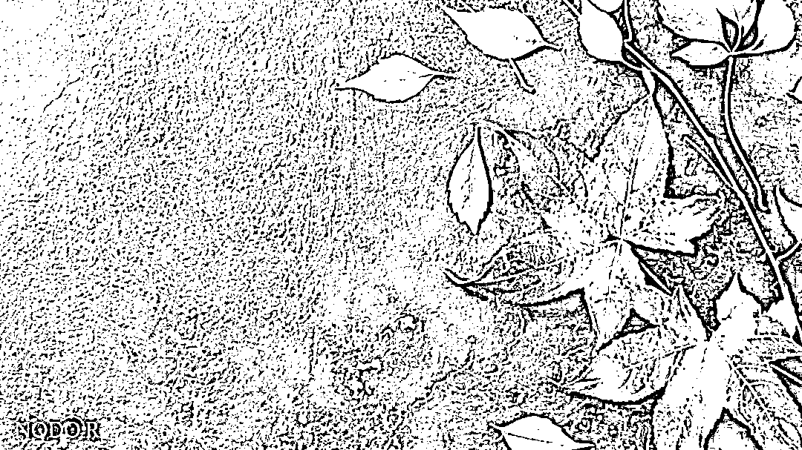

**需求：**

关系中出现的激烈冲突，常常是**因为需求没有被满足。别人总觉得付出却没得到相应的回报，一点也没。**这时你会说，那完全是他们自愿的。似乎你从不需要别人。**可其实你并没你以为的那么不需要别人。**不是不需要，**是真的不会相处，不知所措。总害怕被利用？总感到被剥夺？总觉得努力付出后，自己“得不偿失”？**此处，我却觉得**是你的度量衡出了严重问题，**且深以为然。因为别人看到的可能是另一番景象，极端时甚至会觉得你在施虐般的**以怨报德。**别只顾着**压倒性的自我满足，**这必然**有悖于相处之道。**

那么，**他人的需求究竟是什么？我有必要去满足吗？**  

永远只优先考虑自己而非他人。对他人需求避之不及。对依赖异常敏感和排斥。惯性忽略他人的需求。唯恐一脚踏入了他人的泥沼，而不得不去为他人的欲望负责。仿佛稍微投入一下别人需求，就妨碍了自身的发展节奏似的。**“我能管好我自己，就不错了。”**殊不知，**你的自身是个无底洞，就算你变成了永动机，都没法填满它。其实你所认为的最近的路，才是最远的路。**问问自己有多痛苦就明白了......互助才是王道。要相信别人不是为打乱你而来，是为丰富你而来。

**关系中时常出现误解，因为你不擅长聆听！此处请自问：聆听重要，还是主导重要？**便可恍然大悟......永远下意识地维持主导状态，仿佛那比倾听的内容更重要。鉴于需求匹配的明辨障碍，更应发展出聆听能力，以了解彼此的动机和需要。才会知道该如何**精确而未错位地针对他人需求而付出。试着去给别人最需要的东西，也必能吸引别人来满足你需求。**常常是你投之以李，别人会报之以桃呢。

**总结：**

**学习付出，学习平等，学会相对性。**对应点七宫/天秤座，关于付出与接受之间的平衡，是你最大的功课。理想的伴侣，是既能鼓励你自我探索，给足你空间自由，不试图去改变你，同时又能担任诚实的镜子功能的人。

**冥 1，你将回归于何处？**

**灵魂病了，对宫有药。**  

上升天蝎座，作为 12 宫天秤座，你们的潜意识中是多么渴望结伴？而冥 1 的对应点，**是七宫/天秤座原型。**

**亲密关系，说到底，是你与自己的关系：别让步步为赢的惯性，充斥于人生所有的赛道......**

马尔克斯上校第一个**感觉到战争的虚无。**

马尔克斯上校曾躲过三次暗杀，五次受伤大难不死，身经百战安然无恙，却败给了无尽的等待，屈服于凄凉的晚景。

阿玛兰妲面对这个男人表现出的恒心、忠诚和温顺不知所措——**他虽然大权在握，但总是将所有武器留在客厅，寸铁不带地走进缝纫间。**

——马尔克斯《百年孤独》

写累了，读书吧：

他厌倦了战事无常，身陷这场永无休止的战争的恶性循环中总在原地打转，只不过一次比一次越发老迈，越发衰朽，**越发不知道为何而战、如何而战、要战到何时。正常恰恰是这场无尽的战争最可怕的地方：什么都不曾发生。**他深陷孤独，不再感知到预兆，他为了逃避必将陪伴他终生的寒意回到了马孔多，在最久远的回忆中寻求最后的慰藉。奥雷里亚诺苦苦挣扎了数小时，试图抓裂自己孤独的硬壳。他被迫发动三十二场战争，打破与死亡之间的所有协定，**并像猪一样在荣誉的猪圈里打滚，最后耽搁了将近四十年才发现纯真的可贵。**一个小时又一个小时，**他远离这场徒劳战争中的惊涛骇浪，**将自己与死亡擦肩而过的经历化作押上韵脚的诗行。

这一事件结束了上校的赎罪心境。蓦然间他内心**又充满了年轻时的愤怒。**上校关在作坊里，思考着这些变化，在沉寂的孤独岁月中第一次痛苦地确信没将战争进行到底是个错误。怒火中烧。他望着家门口好奇围观的人群，因着对自己的深深蔑视又恢复了当年的洪亮嗓音，向他们发泄胸中再也无法忍受的愤恨。**“等着瞧，”他喊道，“我要领着我的人拿起武器，干掉这些该死的美国佬！”**口中咀嚼着默然的怒火。忍受着怒火的折磨，他试图唤起青年时代曾引导自己走上危险道路直至荣耀的荒原的预兆，**却都归于徒然。**“他说什么？”他问。“他很难过，”乌尔苏拉回答，“因为他认为你快死了。”“请告诉他，”上校笑了，“一个人不是在该死的时候死，而是在能死的时候死。”亡父的预感拨动了他心中残存的最后一分高傲的余烬，**但他却错以为陡然间重获了力量。**

马尔克斯上校无法掩饰对这一态度的蔑视。“不，奥雷里亚诺，”他回答，**“我宁可死也不愿意看到你变成一个屠夫。”** “不会的。”奥雷里亚诺上校说，**“穿上鞋，帮我结束这场狗屁战争。”**说这话的时候，**他没有想到结束一场战争要比发动它艰难得多。**

——马尔克斯《百年孤独》

**嗯，他没有想到结束一场战争要比发动它艰难得多……**

**结语**

**冥 1，战斗吧！**

尽管人生终究是一场彻底失败的战争。 

这时只有他自己知道，他惶惑的心灵永远失去了平静。**起初他陶醉于凯旋的荣光、不可思议的频频得胜，濒临显赫声名的深渊。他大权独揽却在孤独中陷入迷途，开始失去方向。欢呼令他厌烦，**因为他们也曾向他的敌人发出同样的欢呼。每到一处，他总能见到那些**少年用和他一模一样的眼睛望着他，**用和他一模一样的声音同他说话，**向他致意时的警惕神色和他回应时的神色一般无二，**并且都自称是**他的儿子。他感觉自己被分裂，被重复，从未这般孤独……**

——马尔克斯《百年孤独》

**fight for what?（为何而战？）**

在一个有无穷房间的梦中得到慰藉。**他梦见自己从床上起来，打开房门，走进另一间一模一样的房间，**里面有同样铸铁床头的床、同样的藤椅和后墙上同样的救难圣母像。从这一间又进入另一间一模一样的，**如此循环，无穷无尽。他喜欢从一间走到另一间，仿佛漫步在镜廊中。**

——马尔克斯《百年孤独》

冥 1，终有一日，你会从战无不胜，到**战无可战。**多少骰子多少梦，多少个我们信以为真的剧情。当战争成为糟糕的记忆，已被人遗忘。**孤独，仍是百年镜廊，最终极的况味。**

末了，耳边仍回荡着升蝎的话语：**“我从不相信祈祷的和平。和平，是战争过后由胜者分配的。”** 用画笔留念与上升天蝎座对决后的表情：**Trauma（创伤）......**

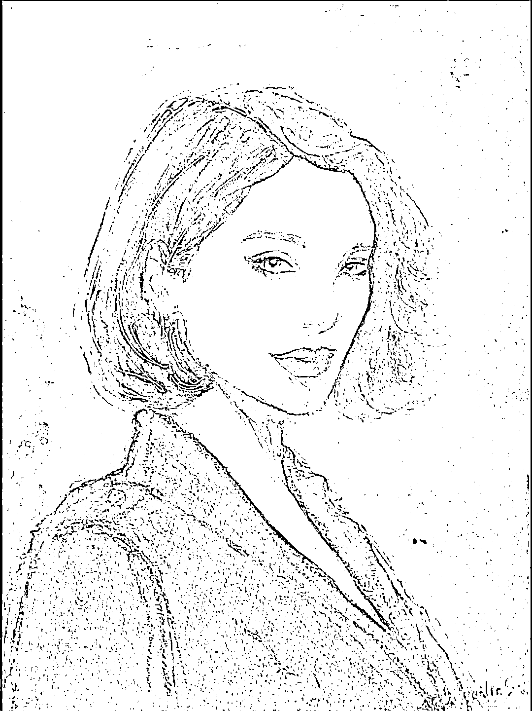

****| ****蓝女巫画作,2022.8.26

**版权声明：**本文由作者授权在若道平台发布，欢迎转发，反对抄袭。

**END**

**来自作者的其它冥王星文章**

[冥王星 2 宫](http://mp.weixin.qq.com/s?__biz=MzA5NjA0NTAxNg==&mid=2651457278&idx=1&sn=7c15e5b4982c87dc687d915579145b69&chksm=8b48b449bc3f3d5f1cf9a24c857f1c249d51fd8ed0f989952c27f20ab9ffb02f697886144854&scene=21#wechat_redirect)（上）丨[冥王星 2 宫](http://mp.weixin.qq.com/s?__biz=MzA5NjA0NTAxNg==&mid=2651457278&idx=2&sn=dc951a366f5f2393b2d3f40571399e14&chksm=8b48b449bc3f3d5f38cabeae6b603ee51f6ad82345b4ca957d029e33cc021531300b2fa014c8&scene=21#wechat_redirect)（下）

[冥王星 4 宫](http://mp.weixin.qq.com/s?__biz=MzA5NjA0NTAxNg==&mid=2651430468&idx=1&sn=1c785ed2023d1b0f50e66364bbf29e13&chksm=8b4b2cf3bc3ca5e526e87f041575af18bf825df47e0cb60bbdbfc537b9ac536cfa54a134e74f&scene=21#wechat_redirect)（上）丨[冥王星 4 宫](http://mp.weixin.qq.com/s?__biz=MzA5NjA0NTAxNg==&mid=2651430468&idx=2&sn=a902f973afba98106792f92c3f503285&chksm=8b4b2cf3bc3ca5e51ef8b2e9ac2647916e7a859721d06b398016e5f00ff02046931d543d354d&scene=21#wechat_redirect)（下）

[冥王星 5 宫](http://mp.weixin.qq.com/s?__biz=MzA5NjA0NTAxNg==&mid=2651424933&idx=2&sn=2e60c0253f46f1f995c923abb14eec45&chksm=8b4b3a12bc3cb304ec3cd3757251af7e62c4b0b92cd119c24c067af1548bb1aa01da071d66a9&scene=21#wechat_redirect)丨[冥王星 6 宫](http://mp.weixin.qq.com/s?__biz=MzA5NjA0NTAxNg==&mid=2651453130&idx=1&sn=7a1f4956aca064e20d6dd35a12dcb966&chksm=8b4b447dbc3ccd6bd06e06aec73c625820caf753697c2bc13e48d07041da3aa555d07aacfcb2&scene=21#wechat_redirect)丨[冥王星 10 宫](http://mp.weixin.qq.com/s?__biz=MzA5NjA0NTAxNg==&mid=2651412808&idx=1&sn=57012d1806a6776cc8556b7c79f0e30b&chksm=8b4bebffbc3c62e9a33bfbdcd736cf91077048ac889936318ba4cf575de4a7d4409eeca1373f&scene=21#wechat_redirect)

[冥王星 8 宫](http://mp.weixin.qq.com/s?__biz=MzA5NjA0NTAxNg==&mid=2651461799&idx=1&sn=6449bc2646de146b034e2dbe33901b5c&chksm=8b48aa10bc3f2306791c7094ae689cc5ce52e3b92412b18cfdde538c9df2134798dc0716963a&scene=21#wechat_redirect)（上）丨[冥王星 8 宫](http://mp.weixin.qq.com/s?__biz=MzA5NjA0NTAxNg==&mid=2651461799&idx=2&sn=b883690fda7187c23be95654316ed956&chksm=8b48aa10bc3f2306f80d6aa61e69ffce352286487a6997f7c57fadabbf1b4a4b2ee4d1c8b947&scene=21#wechat_redirect)（中）丨[冥王星 8 宫](http://mp.weixin.qq.com/s?__biz=MzA5NjA0NTAxNg==&mid=2651461799&idx=3&sn=af479b5e7c89af05b3dd55500c76ff5e&chksm=8b48aa10bc3f23066ad1206298e7b342c18e251c36bd7e2a3bec81b1a81d4ec30dc072b8c7eb&scene=21#wechat_redirect)（下）

[冥王星 12 宫](http://mp.weixin.qq.com/s?__biz=MzA5NjA0NTAxNg==&mid=2651443520&idx=1&sn=d2f1b6b4e8b41bee0ae6071dab6d280b&chksm=8b4b63f7bc3ceae154d6bf8570b7966d9f5899b5f3ea9dda47c8996168c8512a61f7688186f0&scene=21#wechat_redirect)（上）丨[冥王星 12 宫](http://mp.weixin.qq.com/s?__biz=MzA5NjA0NTAxNg==&mid=2651443520&idx=2&sn=e3bca13b228a5fd75f7715ef152871e3&chksm=8b4b63f7bc3ceae123d2088fdf65f7451dfe438b1cafb66db1d848dff9123982abfa857709c9&scene=21#wechat_redirect)（下）

**蓝女巫**

英国伯明翰大学 市场营销学硕士

职业占星师/专栏作者/芳疗师/珠宝设计师

中国首批 ISAR 英文认证占星师（2012 届）

**微信公众号**：cecilia_sui

长按打赏

**20 位来自世界各地的占星师****带来 19 场沙龙——新世界的觉醒****详情可点击下图**

**学习占星学****点击下图了解课程详情**

**微信又双叒叕改版啦，不想错过若道君的推送？**
****就把若道设为****星标****以及点点****“在看”****吧！******▼**

**喜欢就点一下“在看”吧！****报名直达入口**

# ISAR 星空俱乐部第 46 期 | 太阳-月亮与道琼斯工业平均指数中短期反转的关联研究说明

> 原文：[`mp.weixin.qq.com/s?__biz=MzA5NjA0NTAxNg==&mid=2651492437&idx=3&sn=a3c4687b31bbe70acaf227a7c5939a6b&chksm=8b4822e2bc3fabf4877d9f240c7c1d7aa142411a9de1abe0a27194703752dcdb35c08f9fc133&scene=126&sessionid=1692737735#rd`](http://mp.weixin.qq.com/s?__biz=MzA5NjA0NTAxNg==&mid=2651492437&idx=3&sn=a3c4687b31bbe70acaf227a7c5939a6b&chksm=8b4822e2bc3fabf4877d9f240c7c1d7aa142411a9de1abe0a27194703752dcdb35c08f9fc133&scene=126&sessionid=1692737735#rd)

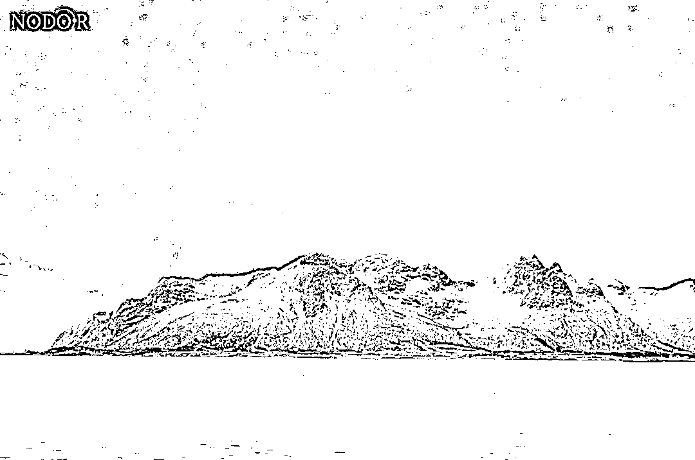

**沙龙来啦！****10 月 28 日，星期五晚上 8 点，**国际占星研究协会（ISAR）中国星空俱乐部沙龙由占星师**Hu Yating**带来一场讲座！ **沙龙主题****沙龙主题：**太阳-月亮与道琼斯工业平均指数中短期反转的关联研究说明******主讲人：********Hu Yating**********

**沙龙时间：10 月 28 日，星期五，北京时间 20:00-21:30（有英文翻译）**

**沙龙方式：线上沙龙**太阳-月亮与道琼斯工业平均指数中短期反转的关联研究探索太阳-月亮星座组合与美国道琼斯指数市场短期走势反转的相关性。
**这项研究采用雷蒙德·梅里曼《股票市场时机选择手册第四卷》中的研究方法，分析了 1930 年到 2021 年道琼斯工业平均指数的数据。****它使用滤波来测量从前一个孤立高点/低点处的预期百分比变化，并通过权重值评估结果。**本次讲座内容包含术语、研究方法、发现以及研究的应用。**雷蒙德·梅里曼 2023 年预报及沙龙已开始双 11 优惠预售，将帮助你对 2023 年的市场风云变化加深了解。**
**长按下图识别二维码了解更多详情**

**主讲嘉宾**

**********Hu Yating**********

*   Hu Yating 是梅里曼市场时机学院的毕业生； 
*   作为梅里曼市场时机学院的学徒，她自 2022 年 1 月起一直为梅里曼市场时机学院《中国上证指数月度研究报告》撰写太阳-月亮反转日期章节； 
*   她有商业分析和风险管理的硕士学位，也是一名在医疗和金融科技行业有经验的数据分析师。 

**如何参加沙龙？**本讲座也是本月的国际占星研究协会（ISAR）星空俱乐部讲座。**ISAR 会员可以免费收看。**请注意邮件通知，具体参与方式见邮件。❶ 如果你**已经是 ISAR 会员**，请注意邮件通知，告知如何参加。❷ 如果你**不是 ISAR 会员**，非 ISAR 会员价格：98 元。如有任何问题请咨询工作人员仲老师（微信：YY18513802156）

**非 ISAR 会员报名请长按下图**

**▼**

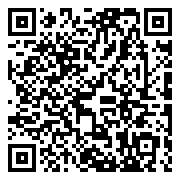

**ISAR 明星俱乐部**

2018 年，ISAR 在主席亚历山大·因舍阿吉克的带领下，成立了 ISAR 明星俱乐部，每月为全球 ISAR 会员提供在线直播讲座，邀请全球著名占星师开讲，学习和分享新的理念。讲座时长一小时，涉及占星学的不同领域、不同观点，每个会员都可以参与其中，每次讲座之后还有 20-30 分钟问答时间向老师们提问。每一场在线讲座都会记录下来，ISAR 除了提供视频，还会提供相关的讲座资料，以及单独的问答录音，自动发送到专门的 ISAR 明星俱乐部页面存档，每位 ISAR 会员可以在 ISAR 网站上自己的会员主页俱乐部页面找到。在 2018 年最初几个月，ISAR 明星俱乐部会每月举办一场在线演讲。之后，两周举办一场演讲，最终每周举办一场演讲。
但是，过去明星俱乐部讲座只有英文沙龙，因此，中国会员只有懂英文才能受益。为了使得更多不懂英文的中国会员能够受益，我们特别和 ISAR 总部协商，今后会安排有中文翻译的明星俱乐部占星沙龙，作为给中国 ISAR 会员的福利！**如何成为 ISAR 会员？**

**如果你也想成为 ISAR 会员，请复制链接在浏览器打开**

http://www.nodoor.com/isarcert.do?contentId=3588（仅支持网站支付）

**或直接长按下方二维码，微信购买会员：**

**ISAR 会员有什么福利？**一年期会员仅需支付**人民币 510 元**，即可享受：**☆ 星空俱乐部免费沙龙****☆每年出版 3 次的《国际占星师》（目前只有英文）；****☆每周电子邮件交流汇总杂志（目前只有英文）；****☆专项研究基金和奖学金资格；****☆ISAR 主办的会议和论坛的会员折扣，包括国际占星大会（UAC）、ISAR 的会议和研讨会等会员权益。****有疑问怎么办？**关于 ISAR 星空会员俱乐部以及我们的讲座，如果你还有任何疑问，**请联系工作人员**：

**若道 Conrad（微信号：nodoor2016）**

**若道 yiyi****（微信号：YY18513802156）**

**非 ISAR 会员报名入口**

# 90°、180°……这些角度啥意思？听听占星大师怎么说

> 原文：[`mp.weixin.qq.com/s?__biz=MzA5NjA0NTAxNg==&mid=2651492265&idx=1&sn=4f53156e1ec16daf9307c813813f15f4&chksm=8b483d1ebc3fb408cc8ea0a7a6f7f8c0bf65e9dfe5c880ecb187379be7b5c98c73a264379e4a&scene=126&sessionid=1692737735#rd`](http://mp.weixin.qq.com/s?__biz=MzA5NjA0NTAxNg==&mid=2651492265&idx=1&sn=4f53156e1ec16daf9307c813813f15f4&chksm=8b483d1ebc3fb408cc8ea0a7a6f7f8c0bf65e9dfe5c880ecb187379be7b5c98c73a264379e4a&scene=126&sessionid=1692737735#rd)

**☆ 后台回复“今日”，给你一句生命态度 **

作者/格伦·佩里 译者/若道翻译团队
  编辑/玫瑰 封面/书君 图片/稿定设计在星图上，两颗行星间形成的角度被称作相位。相位解读是学习占星的难点之一，而格伦老师将占星学与心理学结合，用深入浅出又清晰的方式，为大家详细讲解 5 大常见相位的潜能和挑战。一起来看看吧！如果你想了解更多心理占星学知识，欢迎点击格伦老师教授的 ISAR 选修课[【占星原型与星图中的精神病理学】](http://mp.weixin.qq.com/s?__biz=MzA5NjA0NTAxNg==&mid=2651491663&idx=3&sn=c03c14257b790a1d319d09eb8187d2a3&chksm=8b483ff8bc3fb6eededa10f487e3cb2b8fda27b0adbe934020b2b90e1d4803c6dd6d7645f627&scene=21#wechat_redirect)了解详情哦~**合相（0°）**从“**所有的意涵都来自角度**”的观点出发，合相是将 360°除以 1。数字 1 代表统一，对应星座是白羊座，**合相是白羊座的相位**。这些行星代表统一、融合或合成，因此 1 不能脱离彼此而单独发挥作用。它们各自的功能没有相互分化；两颗行星都无法客观地看待对方。比起角度本身的性质，相位的难易**更多取决于行星之间的原型关系**。行星所掌管的星座如果彼此六分或三分，则会提升彼此的表达，比如火星合相太阳或木星会更容易发挥作用。行星所掌管的星座如果彼此成十二分相、四分相、十二分之五相或对分相，则会妨碍彼此。当然也有例外，火星与金星的合相事实上可能会提升两颗行星的功能表达。**一般来说，运行较慢的行星影响运行较快的行星的力度要比反向影响力更大。**和白羊座类似，**合相具有只顾自己、主观的特质**。这可能是一个心理盲点，不知道彼此结合的功能如何发挥作用。同样，也可能想当然地认为其他人多多少少和自己类似。而如果是对分相，则可能更加客观地认识到自己和他人之间的差异。

**合相是强有力的，稍微有些冲动**。行星会一同去开启其共同掌管的事物，比如木星合相冥王星可能会表现为通过建立一种新的宗教去改变人生。

**星图中有许多合相说明案主是一个受到驱策，自我驱动的个体，拥有相当大的个人力量。**如果有四个或更多的行星在同一个星座或宫位合相，这就被称为**星群**，它构成了一种非常强烈的能量集中，极具专注性。这个星座或宫位受到如此多的强调，预示着一种自我中心，在极端的案例中可能会近似反社会的人。这个人的个性可能偏向某个方面，具有一维的特性；这个人可能是“死脑筋”或“头脑偏狭”，在某一方面做得非常好，却对其他事情缺乏兴趣或才能。这种行星格局的人往往会具有十足的攻击性，有活力、有胆量，**被所涉及的行星/星座激发了生命力**。我们脑海中浮现的形象是那些如脱缰的野马、脱轨的列车、惊乱的野牛或被大炮轰击的人。其特征包括独立自主的灵魂，对自由和冒险的渴望，想要启动更多的事情，而不是去结束。

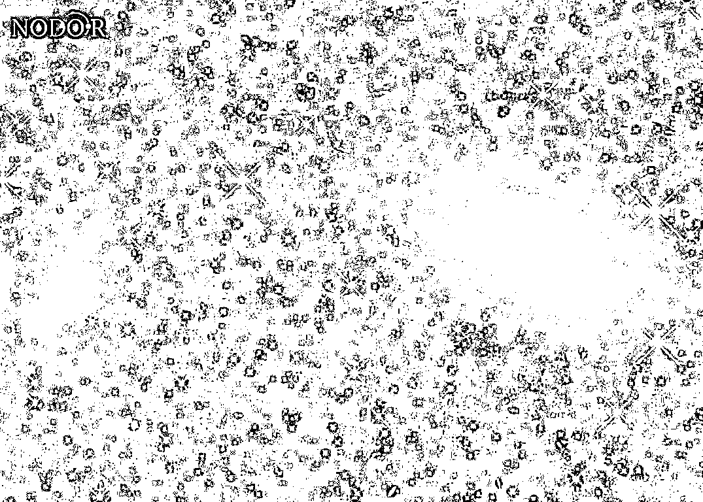

****六分相（60°）****

**六分相是将 360°除以 6**。形成六分相的行星所落的星座**拥有相同的极性**。虽然元素不同，但它们彼此和谐，即火象与风象（阳性），或土象与水象（阴性）。

同时，它们形态不同，即基本与变动，固定与基本，或变动与固定。与六分相对应的星座是双子座和水瓶座这两个风象星座，这应该能为我们理解这个角度的意涵带来一些线索。

**六分相是与头脑刺激和学习相关的相位**，这两颗行星享受着彼此间有益的好奇心和兴趣。事实上，行星会激发或唤醒彼此的相应功能，刺激或唤醒意识。由于行星基本上彼此喜欢，所以它们**会诱导对方去表达**，它们因对方的特质而获得知识，获得支持。

即使六分相不具有三分相那种轻松、自然的创造性流动，但它们的本质仍然是阳性的。较之三分相，**六分相的行星可能以一种冷静抽离的方式发挥作用**。除了对彼此功能的客观兴趣而外，相对而言，在这里少有争执。形成三分相的行星就像密友，而六分相的行星更像兄弟姐妹、邻居、同事或团体中的同志。主观方面，这可能简单地意味着彼此和睦，有共同的观点和意识。与四分相不同，六分相的重点不在于客观显现，即它们不会产生真实的结果。然而，**它们确实与机会关联**，这也许是由于它们具有风象的特质，并且与交流和理性论述关联。****四分相（90°）****

四分相是将 360°除以 4。**数字四与物质、形式相关**。彼此四分的行星所落的星座虽然有相同的形态，但**具有不相容的元素和极性**。四分相拥有摩羯座和巨蟹座的特质，这两个星座在表达方式上都比较压抑、拘束。

再次看到，元素之间的关系让我们意识到相位的意涵。水能灭火，火会烧焦土，土阻挡风，风被水所取代。从比喻意义来看，**同样的冲突也存在于心理层面**。

情绪（水）可能会浇灭热情（火）；狂热（火）会压倒审慎的克制（土）；沉闷的保守主义（土）掩盖了理性的思想（风）；而情感（水）可以超越理性（风）。

**这些组合中的根本问题就是阴（水/土）阳（风/火）之间的矛盾**，**它象征着意识和潜意识之间的斗争**，是四分相的根源。当一颗行星试图压制另一颗行星时，就产生了一种紧张、摩擦、压抑和约束的状态。

我们认为四分相是一个**阻力相位**，其中一颗行星因防御自身不受另一颗行星侵害，**拒绝它的价值，挑战它对自身权利的表达**。

由此产生的紧张和压力可能会造成一种筋疲力尽的状态，甚至是崩溃失败。但是，很有可能当被压抑的行星战胜了抑制的力量时，同样这份张力也会导致爆发或暴力的行为。再次看到，运行较慢的行星通常占据优势，因为无意识总是比琐碎、短暂的意识本身更深层、更持久。运行较快的行星常常会感到被运行较慢的行星禁锢和压抑，直到它通过努力重新定位自身，也就是让自己适应更沉重的行星提出的必要且必然的要求。

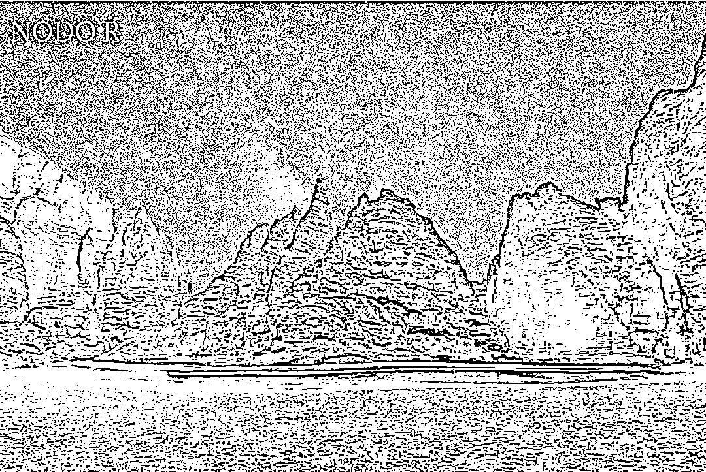

四分相唤起了不可抗力的形象和不可动摇的对象，刀俎和鱼肉，高压锅。成四分相的行星在兴趣上**彼此冲突，目标相左**。主观上，这可能被体验为一种不确定的状态，怀疑、恐惧、焦虑，以及行星所代表的功能的挫败。心理的阻滞会对外呈现为僵局、绝境、死路、相持不下的状态。这个人可能觉得退入了死胡同。**就像摩羯座和它所守护的行星土星一样，渐亏的四分相有过度补偿的倾向**。这个人可能觉得自己被四分相所象征的领域占据了心神，甚至为它着了魔。这个人在这里感到不得不采取行动，表现出一种战斗到底的意愿。这就是他（她）努力攀登的高山，对抗逆境，实现不可能的任务。

然而，**如果相位没有被整合**，个体可能会过于努力地尝试去克服内在与所涉及的功能相关的无能感。通过推动这个议题，可能发展为，这个人的努力受到阻碍，或是遭受阻力而挫败。但是，**如果这个人能够整合这个相位，就会获得满足感，获得有形的成就**。

**渐盈的四分相具有巨蟹座的特质**，如果未能整合，渐盈的四分相中的行星会倾向于通过不适当的情绪和愤怒将冲突表现出来。这个人很可能在这一领域中反应激烈、缺乏理性、失去控制。

不是控制情绪，而是情绪控制了这个人。如果渐盈的四分相中的行星本能地爆发，比如火星四分天王星，那么更可能将情绪表现出来。

总的来说，**与形成渐盈四分相的行星相关的情感很容易受到伤害**。这个人害怕如果错误地表达行星功能，他（她）可能被拒绝。

另一方面，两颗阴性行星之间的渐盈的四分相更可能被压抑。比如如果月亮四分土星，那么案主的情感和依赖性需求可能被推出意识之外。如果一颗行星是阳性，另一颗行星是阴性，那么可能会在压抑和表现之间轮流交替。**如果渐盈的四分相被整合，显著的特征就是关爱和包容**。与这个相位相关的挫败、紧张和冲突被有意识地控制，与此同时，行星所代表的感受和需求也没有被否认。就像“**起始的伤口**”，通过这些行星，个体才开始进入感情世界的体验。从这里开始，这个人最终感觉到温柔、保护、同情和“感动”，从而去表达对他人的关心和担忧。感情得到适当的表达，这个人也自然而然地与四分相代表的议题建立了一种富有同情心的融洽关系。比如，这个人在星图的这一领域感觉到特别富于关怀，或成为一位超级给予者。

在渐盈的四分相中的行星行为之下，隐藏着与所涉及的行星事务相关的**归属需求**。比如，如果水星与海王星成渐盈的四分相，案主可能希望获得情感的联结，也就是归属，凭借她在交流中运用意象和象征的能力获得情感联结。

想象一位迪斯尼传统的编剧，在面向孩子的电影中运用幻想来表现关爱、家庭和家的主题。

**三分相可能会骄傲自满，而四分相也可能有宏图大志**。相位的压力可能让这个人在新的方向上延展。因此没有相位比四分相更有益于成长和创造有形的结果。

任何锻炼哑铃的人都知道，努力战胜重量的阻力能强健肌肉；然而，强健肌肉需要时间。四分相就像是我们必须要努力举起的重量；但是在这个努力的过程中，必须要有持久的练习，缓慢地成长，最终才能实现。

《易经》中常常说“自强不息”，这就抓住了四分相的本质。阻力需要我们努力，持久的努力（自强不息）建立了人格的力量。

**四分相帮助人们认识到所涉及的行星功能的潜力**。再次看到，四分相的两个显著的特质是**抑制和控制**。当这个人能够抑制和控制相应行星的能量时，无意识就成了意识，于是便产生了自律、专注集中的行为。

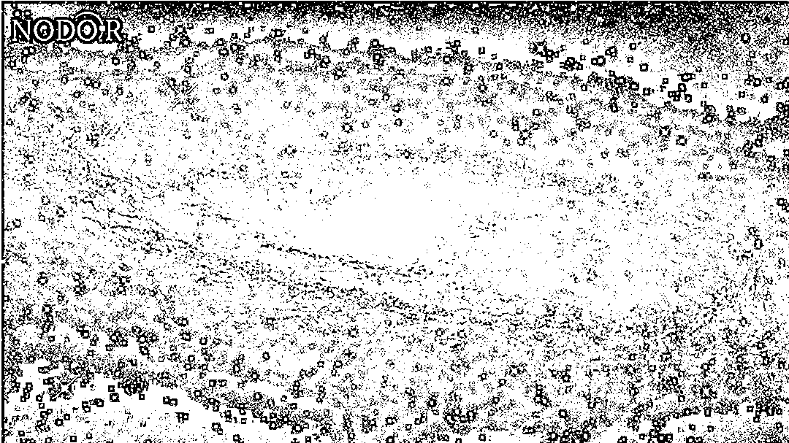

****三分相（120°）****

三分相是将 360°除以 3，它**对应火象星座的狮子座和射手座**。形成三分相的行星共享相同的元素和极性，虽然它们的形态和视角不同。

当行星落在相同的元素和极性中，它们自然而然地**增强和放大了彼此的功能**。这里没有阻力或压力，有的是两种功能之间**轻松、自然**的信息流动，从而产生了**创造性、无拘无束的表达**。

想象你与最好的朋友之间的关系，或者那些欣赏你，喜欢与你为伴的人。这样的关系自然会鼓励一种玩乐和创造的气氛。这恰当地体现了两颗行星彼此尊敬，彼此提升，让事情变得更好。因此**三分相是我们感到自信、为自己感到喜悦的地方**。

三分相的行星可能构成**内在的才华**，它们倾向于毫不费力地发挥良好的作用。它们对感受的表达就像是第二天性；它们充满生气，令人振奋，就像一次度假。

与困难相位相比，三分相允许我们重新充电，深吸一口气。作为接纳性的相位，它们有一种禅的特质。“顺其自然”，“随风摆动”，“阻力最小的道路”，“毫不费力的尝试”，这些都是三分相的表达。

由于有一种毫不犹豫的接纳，个体很可能接受这个人生领域的现状。这里**是一种“存在”的感觉，而非“行动**”。这个人可能不是去挑战一种糟糕的境遇或奋力争取改变，而更可能为他人无法容忍的行为寻找借口或将其合理化。

三分相可能**有一点盲目乐观和骄傲自满**。缺乏与这些功能相关的动力和抱负，这个人可能安于凑合，满足于平庸，总体来说觉得“事情已经足够好了”。这种选择容易道路的倾向不会有助于成长或成就。 

****对分相（180°）****

对分相是将 360°一分为 2。**数字 2 代表两极，因此对分相拥有天秤座的特点**。因为组成它的行星落在具有相同极性和形态的星座中，却在元素和视角上有所不同，所以行星之间**有足够的共性**来相处，同时也有许多不同，能够自然吸引。

这个相位的**挑战是调解元素之间的差异**，因为对分相发生在火元素-风元素轴线或土元素-水元素轴线上。但是，即使这样，相反的元素也是自然互补的。

风是点火所必须的，而水是滋润土壤的必要元素。**从比喻意义来讲，这些天然的合作关系也存在于心理层面。**理性的智慧（风）阻止火热的冲动失控爆发，而感情（水）能软化顽固的现实主义者（土）。

对分相在视角上也有所不同。行星可能落在个人-社会星座中（前两组），也可能落在个人-宇宙星座中（中间两组），或是社会-宇宙星座中（最后两组）。

**对分相的目标是将敌对、对立的双方统一起来，在两种行星功能之间创造一种充满爱的合作关系。**然而，实现这一目标并不比构建一段美好的婚姻更容易。

我们知道，50%的婚姻都以离婚告终，而整合对分相的比例或许不会比这更好。因为两颗行星本能地反对对方，所以对分相是一个具有客观认知和潜在完整性的相位，即行星可以通过对方使自己完整。

用“完整”这个词，我的意思是一种平衡的状态。行星功能必须要**面对彼此，找出彼此结合与合作的方式**，并调整它们的本性，从而适应对方。

对分相的关键是每颗行星必须公正地对待对方。在最理想的情况中，各自的功能可以以一种互惠互利的方式互相合作、协调，共同发挥作用。

每种功能都会稍微妥协自身，从而与相反的功能合作；每种功能都会平衡和检查对方的极端。正如天秤座一样，**对分相的本质是适度和克制**。

**当运作不理想时**，**对分相是一个犹豫不决、冲突不断的相位**。这个人可能在两种功能之间摇摆不定，感觉被束缚在一个问题的两面之间。

无力整合两个方面可能导致来回摇摆的特性，这个人会首先表达一颗行星，然后表达另一颗，而不是同时表达双方。这个人要么会变得犹豫不决、依赖他人，要么会牺牲一颗行星来表达另一颗行星。

一次表达一颗行星常常会制造一种对称升级的模式，因为每颗行星都在争夺主导地位。其中较弱和较少被接纳的行星常常会投射到这个人关系中的某个人身上。然后会认为那个人在行星功能的表达中具有侵扰性、极端过分、不讲理。

理论上，**这种冲突的外化会致使我们提升对被拒绝行星功能的觉知**，**这种关系成了一种媒介，通过这一媒介，两种功能逐渐整合。**因此，对分相会表现为一个人关系模式中的一个首要主题。

**版权声明：**本文由若道翻译发布，欢迎转发，反对抄袭。友号转载请申请白名单。

**END****格伦·佩里**若道签约老师。著名占星师，ISAR 董事会成员，共出版 8 本占星著作；心理/意识研究专业博士；占星心理学学院（Academy of AstroPsychology）的创办人；康涅狄格州研究生院（the Graduate Institute of Connecticut）原型宇宙学与意识进化项目的负责人。

# **占星原型与星图中的精神病理学**

为什么在占星学的课程中，会出现精神病理学的教学内容，这和我们有什么关系？这对占星咨询，或在自我了解与成长的过程中又有什么帮助呢？

**带着这些疑问，请你静下心来，思考以下几个问题**：

“**你/你的案主，是否曾经过度担心什么？** **你/你的案主，有没有感觉到担忧和焦虑，却不知道原因是什么？****你/你的案主，是否曾经觉得害怕什么东西，但理智上却很清楚它不会对你造成什么伤害？****你/你的案主，是否曾经通过沉迷某物，酗酒或滥用药物，自我伤害去逃避问题？****……****——节选改编自《心理学与生活》**”

如果你对上述问题其中之一，回答是。这意味着几乎每个人都曾有过心理障碍的症状（精神病理的问题）。

你看，其实“精神病理学”与人的心理有着密切的关联，再结合占星学，呈现了人内在与外在层面更加丰富和深刻的一面。**这对于学习占星学的人和占星师来说，都是一场难得的知识盛宴！**

**本课为 2 年期双证核心课程中的一部分**（AP105 阶段），其内容是过去若道所开设的核心课程从未教授的部分，特意抽出供其他学员学习，**可作为 ISAR 选修课，单独报名。**

**点击下方图片了解详情**

**20 位来自世界各地的占星师****带来 19 场沙龙——新世界的觉醒****详情可点击下图**

**学习占星学****点击下图了解课程详情**

**

**微信又双叒叕改版啦，不想错过若道君的推送？**
****就把若道设为****星标****以及点点****“在看”****吧！******▼**

**喜欢就点一下“在看”吧！****报名直达入口**

# 核心课程速递：如何发挥土星的正面特质？

> 原文：[`mp.weixin.qq.com/s?__biz=MzA5NjA0NTAxNg==&mid=2651492265&idx=2&sn=06ba48613a7c07d659db1a53fefcb7bb&chksm=8b483d1ebc3fb4084867c4483f4a3caa0e4c3b5f5628518f6e79e646797053f2efd85e6a3e8f&scene=126&sessionid=1692737735#rd`](http://mp.weixin.qq.com/s?__biz=MzA5NjA0NTAxNg==&mid=2651492265&idx=2&sn=06ba48613a7c07d659db1a53fefcb7bb&chksm=8b483d1ebc3fb4084867c4483f4a3caa0e4c3b5f5628518f6e79e646797053f2efd85e6a3e8f&scene=126&sessionid=1692737735#rd)

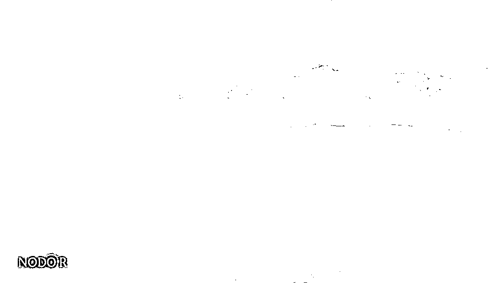

新的一期若道核心课开始讲到**木星****和****土星**的部分啦。

在第七堂课中，咔咔老师讲解了**木星和土星这一对社会行星，在个人星图中如何解读。**

在讲解土星的时候，咔咔老师举了**土星落在三个星座的例子**，来说明土星在星座上的特征。**是哪三个星座呢？会有你的土星星座吗？**

*   **土星通常是人们不愿意主动面对的行星，不过具体是什么含义呢？**

*   **土星正面的特质如何发挥出来呢？**

**关于土星和三个土星的例子，咔咔老师是这样讲述的：**

<mpvideosnap class="js_uneditable custom_select_card channels_iframe videosnap_video_iframe" data-pluginname="videosnap" data-id="export/UzFfAgtgekIEAQAAAAAATr4j3WBXxAAAAAstQy6ubaLX4KHWvLEZgBPE9oNAWElDYpuCzNPgMIuN5a-LatsSKc83pLLuzNyr" data-url="https://findermp.video.qq.com/251/20304/stodownload?encfilekey=rjD5jyTuFrIpZ2ibE8T7YmwgiahniaXswqzm21DToWLdycGOfrtc5bn5uX6RvK4OaCJFlZdacD4aiam5ibyNicVLDjB244MZDTQKf1fn8Eo2Rg7YgqCxRP8pwdqw&amp;adaptivelytrans=0&amp;bizid=1023&amp;dotrans=0&amp;hy=SH&amp;idx=1&amp;m=&amp;scene=0&amp;token=x5Y29zUxcibCSgwPtUSTrFNqpFYnKpVX4dwemGqCuAj0q06j7UkEqjuxbv6kxJga2MF0hgcfykfM" data-headimgurl="http://wx.qlogo.cn/finderhead/PiajxSqBRaEJYnVsqWfEX9qA0sI6hNVKsDfyzfPZ92WZMZyBpZWU5NA/0" data-username="v2_060000231003b20faec8c4e68a1ec2d4ca07e434b07755bbf47e7053a3059defd2c9d6c68a20@finder" data-nickname="若道" data-desc="#若道核心课 土星落在不同的星座会有什么特性？土星通常是人们不愿意主动面对的行星，具体是什么含义呢？正面的特质如何发挥出来呢？
" data-nonceid="6587815306922940474" data-type="video" data-authiconurl="https://dldir1v6.qq.com/weixin/checkresupdate/icons_filled_channels_authentication_enterprise_a2658032368245639e666fb11533a600.png" data-width="880" data-height="504"></mpvideosnap>

**欲知更多详情，欢迎大家购买我们的课程，获得完整版教学内容。**

**拥有****51 年****占星实践经验的****若道创始人****前 ISAR 全球副主席****前 ISAR 全球职业占星师资质认证主席****大卫·瑞雷**

**和**

**2019 年第二届、2021 年第三届核心课中**

**与苏·汤普金斯老师****联合授课****的**

**ISAR 认证职业占星师**

**咔咔（Caroline）**

**二人合力打造**

**2022 年 ****若道全新核心占星课程**

**点击下图了解课程信息******报名直达入口**

# ISAR 选修丨占星原型与星图中的精神病理学

> 原文：[`mp.weixin.qq.com/s?__biz=MzA5NjA0NTAxNg==&mid=2651492265&idx=3&sn=bdd19d50a427cfdad41c6b8d020cbeb7&chksm=8b483d1ebc3fb40860cf3bcc82b129a6c2322fbccb7cd5169779988aecca576783d189caabe5&scene=126&sessionid=1692737735#rd`](http://mp.weixin.qq.com/s?__biz=MzA5NjA0NTAxNg==&mid=2651492265&idx=3&sn=bdd19d50a427cfdad41c6b8d020cbeb7&chksm=8b483d1ebc3fb40860cf3bcc82b129a6c2322fbccb7cd5169779988aecca576783d189caabe5&scene=126&sessionid=1692737735#rd)

**课程描述**

看过课程标题的你，也许会感到好奇和惊讶，为什么在占星学的课程中，会出现精神病理学的教学内容，这和我们有什么关系？这对占星咨询，或在自我了解与成长的过程中又有什么帮助呢？

**带着这些疑问，请你静下心来，思考以下几个问题**：

“**你/你的案主，是否曾经过度担心什么？** **你/你的案主，有没有感觉到担忧和焦虑，却不知道原因是什么？****你/你的案主，是否曾经觉得害怕什么东西，但理智上却很清楚它不会对你造成什么伤害？****你/你的案主，是否曾经通过沉迷某物，酗酒或滥用药物，自我伤害去逃避问题？****……****——节选改编自《心理学与生活》**”

如果你对上述问题其中之一，回答是。这意味着几乎每个人都曾有过心理障碍的症状（精神病理的问题）。

你看，其实“精神病理学”与人的心理有着密切的关联，再结合占星学，呈现了人内在与外在层面更加丰富和深刻的一面。**这对于学习占星学的人和占星师来说，都是一场难得的知识盛宴！**

**本课为 2 年期双证核心课程中的一部分**（AP105 阶段），其内容是过去若道所开设的核心课程从未教授的部分，特意抽出供其他学员学习，**可作为 ISAR 选修课，单独报名**。

**在正式了解本课的价值之前，先了解一下这门课程的主讲老师吧！**

**格伦·佩里（Glenn Perry）**

*   他是心理/意识研究专业博士、加州注册婚姻和家庭治疗师 （CAMFT）

*   占星心理学学院（Academy of AstroPsychology）创办人

*   康涅狄格州研究生院（the Graduate Institute of Connecticut）原型宇宙学与意识进化项目的负责人

*   共出版八本占星学著作：《心理占星学入门》、《心理占星论文集》、《盗取天火》、《从忠诚到革命》、《星图中的阴影》、《占星职业议题与伦理》、《出生星图深度分析》、《从古代到后现代占星学》

**墙裂推荐格伦老师这门课的 **

**4 大理由**

**你一定得知道的课程价值**

**价值*****1***
**明晰精神病理学的基本定义**

占星心理学学院创办人格伦·佩里老师，对**精神病理学的基本定义**就是灵魂受苦，精神就是灵魂的意思，病理就是受苦的意思，所以精神病理学研究的就是：人类各种各样受苦的方式，尤其是因为某一类的行为而引起的。

精神病理学是一个连续体，从比较轻微的，到比较严重的，这么说来，我们每个人都有一部分精神病理的问题。

**如果成为一个“人”，没有一定程度的挑战是不可能的。没有一定程度受苦，没有一定程度不平衡是不可能的。而这种不平衡就会以一种挑战和困难的姿态呈现出来。**

**价值*****2*****更懂疗愈：从不平衡到平衡**

**疗愈**是一个复杂的过程，讲的是将人从不平衡带到平衡这样的一个状态，将不同行星代表的心理功能带到一种更加平衡整合和合作的状态。

格伦老师通过研究精神病理学，发现每一颗行星，以及这颗行星所守护的星座，都和某一特定类型的病理是联结在一起的，包含了这个占星原型所涵盖的极端不平衡的情况。

举个例子，案主的第 1 宫，有很多星星在那里，和对面第 7 宫的火星形成对分相，第 1 宫白羊座或者火星白羊座的组合，和这个案主的反社会人格的病状联系在一起（这是一个星图的极端负面表现）。

“

**生活本身就是一场治疗，我们在占星的星图中去看到，人们所具有的创伤、不平衡及其产生的防御机制，最终都会在他生活中的关系和情境中呈现出来。无论他生活中处在怎样的情境之下，其实这些环境都是在为他提供恰当的环境，作为一种载体，让他去平衡和疗愈事件背后问题的根源。** 

**这样一个现象是持续不断地在发展，会让我们想到，会有一个更大的宇宙的智慧存在，它其实是在指挥和引导着我们的这些经验，让我们去经历然后进入更高层面的发展当中。生活或者“神”，就是我们所有人类的一个治疗师。**

**——格伦·佩里**

”**价值*****3*****了解诊断标准，提高咨询的专业敏感度**

如果能够对精神病理极端不平衡的情况有了解的话，你就会对它比较温和的版本更加敏感（大部分人是更温和版本的呈现）。

也许案主并没有达到某个病理所达到的层级，但是 Ta 有显示出，这个病理某一些特点或者某一些倾向。所以，我们的目标并不是去诊断案主，而是了解他在这个病理学连续体上处在一个怎样的位置。

当你拿到星图你会看到，案主不同的冲突，是体现在不同的部分上。某一个病状是体现在某一个行星，另外一个病状，是同步体现在另外一颗行星上。

当我们通过对占星原型星座和行星的病理学现象的学习后，就能看到占星学上的配置所呈现出来的，案主表现出的这些失调，并不一定都会成为一种心理临床上的诊断。有可能在案主这里呈现出一个很轻微，但是仍然在 Ta 生活中，给 Ta 造成挑战的一个点。

**价值*****4*****智力上的刺激——整合进阶**

这个课程能够让我们了解自己，了解我们的客户，了解我们的朋友，了解我们的家庭。它给我们提供一种崭新的方式，并且让我们看到占星原型的种种表达，不要局限在非此即彼、非好既坏的这样的一个概念当中，而看到它其实是一个不同程度的连续体。

当我们能够以这种方式去看的时候，你就能够将自己的生活，带入一种和谐。能够了解这是一个过程，我们的重点不是放在诊断上，而是放在整合上，因为生活，就是一种整合。

**课程内容**

**AP105 星图中的精神病理学与疗愈** 共**15 次**课程：**10 次 2019 年录播课+5 次直播课；30 课时**

在这个阶段的课程中,我们将**聚焦于十二星座(从白羊座到双鱼座）及其对应的守护星的潜在功能障碍。**

我们将学习如何识别、理解和应对每个星座的潜在挑战。我们将在各种相应的心理障碍背景下来考察占星原型，这些心理障碍表现为功能障碍、失衡的极端状态。

学员们将了解**《精神疾病诊断与统计手册》诊断标准**。我们会探讨治疗的概念，尤其是那些与整合和个性化相关的概念。我们将特别关注外行星的困难相位，以及它们与内在心理冲突、防御和症状形成的关系。

学员们将探索人的痛苦如何成为发展和实现天赋才能的催化剂。在考察病因时，我们会将平常的因果关系理论与传统的命运、业力和转世观念整合起来。

**口碑推荐**

‍**‍想感受格伦老师的课堂魅力？** **一小段讲课视频让你先睹为快~**<mpvideosnap class="js_uneditable custom_select_card channels_iframe videosnap_video_iframe" data-pluginname="videosnap" data-id="export/UzFfAgtgekIEAQAAAAAAxuwL_P9LDAAAAAstQy6ubaLX4KHWvLEZgBPElYFkVBZaNrKCzNPgMIuhBCuUlaCPzDNmHFgJR5sp" data-url="https://findermp.video.qq.com/251/20304/stodownload?encfilekey=rjD5jyTuFrIpZ2ibE8T7YmwgiahniaXswqzIGcAWV11d39RRKTicEUe1lSn5e1z2jdX20ath9yg9Liaia8VPS2c4MUJibl8FlxSZs3ajlcibhlD6typd6ZeGeWj2bQ&amp;adaptivelytrans=0&amp;bizid=1023&amp;dotrans=0&amp;hy=SH&amp;idx=1&amp;m=&amp;scene=0&amp;token=AxricY7RBHdXmmhmUb1Np3Ioz3Ok0V9IBZ0eINxnxticaC9r3HjsQ8iatkwqFBLKP50ZibXDm0TiaicC4" data-headimgurl="http://wx.qlogo.cn/finderhead/PiajxSqBRaEJYnVsqWfEX9qA0sI6hNVKsDfyzfPZ92WZMZyBpZWU5NA/0" data-username="v2_060000231003b20faec8c4e68a1ec2d4ca07e434b07755bbf47e7053a3059defd2c9d6c68a20@finder" data-nickname="若道" data-desc="#ISAR 选修课  如何识别、理解和应对每个星座的潜在挑战？如何在不同的心理障碍背景下来考察占星原型？" data-nonceid="4249051256207020861" data-type="video" data-width="1024" data-height="576"></mpvideosnap>

**课程费用**

**课程价格：9000 元****课程优惠价请添加 Margartet 咨询**

课程负责人：Margaret

（微信：18515059056）

请备注“心理占星 105”

**开课时间**

**直播课开课时间：2022 年 12 月 21 日**

**退转课程**本课程包含往期视频知识点视频课程+直播案例课程+助教直播答疑；报名付款后均不受理退款转课，请慎重考虑后再确认付款。**其他相关事项请仔细查阅报名勾选时的《教学协议》，如有疑问请咨询课程顾问。****报名流程及费用支付****1. 点击阅读原文链接立即报名，填写个人姓名（身份证姓名）和相关信息，阅读并同意《教学协议》，提交报名表，直接在线支付。****2. 付款后可在网页个人中心或手机网页“我的”栏目查看报名记录。****如遇疑问请与销售人员联络******ISAR 选修·占星原型与星图中的精神病理学****

**授课老师：格伦·佩里**

**直播课开课时间：**2022 年 12 月 21 日

**授课方式：**网络课程，中英文授课，中文翻译

**费用：9000 元（获取优惠请联系客服咨询）**

**课程负责人：**Margaret（微信：18515059056 请备注“心理占星 105”）

长按二维码添加课程负责人咨询~

**报名直达入口**

# 职业占星师认证文凭课程插班中丨想看大卫老师是怎么做课堂演示的吗？

> 原文：[`mp.weixin.qq.com/s?__biz=MzA5NjA0NTAxNg==&mid=2651492140&idx=3&sn=7fe0b648e82cc1b069cbe877281e7fca&chksm=8b483d9bbc3fb48d838fc3509d9092c0a2a91a5e5bd3619720e0f24e11987f5951b3c4a02098&scene=126&sessionid=1692749408#rd`](http://mp.weixin.qq.com/s?__biz=MzA5NjA0NTAxNg==&mid=2651492140&idx=3&sn=7fe0b648e82cc1b069cbe877281e7fca&chksm=8b483d9bbc3fb48d838fc3509d9092c0a2a91a5e5bd3619720e0f24e11987f5951b3c4a02098&scene=126&sessionid=1692749408#rd)

**在若道核心课程的教学里，****以学员为案例****进行课堂的占星咨询演示，是我们课程的特色环节。**

这样的演示不仅让很多同学有亲身体验咨询的机会，而且这么多真实案例的学习，会让大家看到占星咨询到底是怎么样一个过程。毕竟，大部分人的学习都是要从模仿开始。

记得若道君当年学习占星的时候，可没有这样的机会。那时候主要是听课为主，后来，我们在多年的教学实践中，**越来越发现课堂演示的重要性**。因此，就把这个作为一个主要环节加入到课程中。

在新一期的若道核心课程中，咔咔老师和大卫老师这对组合就会把这个教学特色充分发挥出来。**熟悉中国同学思路的咔咔老师会以知识点的讲解为主，而有 50 年占星咨询经验的大卫老师，则以课堂演示为主。**

有时候，这样的课堂演示的功效是出乎意料的。

一位若道的老同学赵震宇这么写到：

2018 年，我正式开始在若道学习 L1-5。其实我一开始的心态更多的是希望得到系统化的学习来补充我的知识漏洞，以及拿到一个证书可以为自己做背书，增加自己将来转型占星师的筹码，而不是真的在期待可以从若道的学习中得到一些本质上的领悟。

事实上在初期的 L1-3 中，很多知识与课上的内容，也是我比较熟悉的领域，相对而言是驾轻就熟的。但在 L3 的工作坊中和大卫老师的接触以及模拟咨询，让我对占星的态度发生了很本质的变化。

大卫老师对我星图的分析不仅非常准确，更重要的是，他开启了我自身个人成长上的变化，从而成为了我本质上进化蜕变的一个契机。

在短短的 6 个月内，我对人生的认知、对自我的认知、对于人生看待的方式都发生了翻天覆地的质的变化。我意识到了原来跳出自己一直以来无意识间重复的模式，是一件可行、并且会给自己带来无限成长提高自己人生幸福度和质量的事情。这也让我深刻体会到了人本主义占星学的魅力，以及自己之前是多么的“无知“。

于是现在，占星学对我来说，不只是兴趣、宗教信仰、或者是可能的职业道路，而是一种激发自己和他人人生成长和蜕变的工具、一种让自己更幸福的看待世界的方式。哪怕我之后并不会以占星为生，它依然是我人生中不可或缺的一部分，就像一副隐形眼镜，影响着我与世界的互动。

而被大卫老师咨询深深影响的同学还有很多。

**这里，我们节选一些短小的试听片段，让你稍微感觉一下在若道核心课程上，大卫老师的咨询演示是怎样的一个样子。**

**片段一**

<mpvideosnap class="js_uneditable custom_select_card channels_iframe videosnap_video_iframe" data-pluginname="videosnap" data-id="export/UzFfAgtgekIEAQAAAAAAMKsWN6BUygAAAAstQy6ubaLX4KHWvLEZgBPEnoIULgMKKb-DzNPgMItC2ZEgiEDMBYjrYHv9wNsO" data-url="https://findermp.video.qq.com/251/20304/stodownload?encfilekey=rjD5jyTuFrIpZ2ibE8T7YmwgiahniaXswqzQNpbBXpPP4TxDf43veVhCBACOECUZ1gc5HaUbhk0Z3Glc94tZFe7ewRHOH9L2oUC1X3aOe13K8IHMkEou9Nkgw&amp;adaptivelytrans=0&amp;bizid=1023&amp;dotrans=0&amp;hy=SH&amp;idx=1&amp;m=&amp;scene=0&amp;token=x5Y29zUxcibCEaJsXB0hMdWnJvmNct4OnXZaaWOd32ia2edkK2LTMk7jmjOms6bDk5TDtYTqEwbOQ" data-headimgurl="http://wx.qlogo.cn/finderhead/PiajxSqBRaEJYnVsqWfEX9qA0sI6hNVKsDfyzfPZ92WZMZyBpZWU5NA/0" data-username="v2_060000231003b20faec8c4e68a1ec2d4ca07e434b07755bbf47e7053a3059defd2c9d6c68a20@finder" data-nickname="若道" data-desc="#若道核心课 大卫老师用星座、行星、宫位来探索一位同学出生星盘主题的时候，他回顾了解读星盘的优先次序" data-nonceid="7723748345640460016" data-type="video" data-width="544" data-height="344"></mpvideosnap>

**片段二**

<mpvideosnap class="js_uneditable custom_select_card channels_iframe videosnap_video_iframe" data-pluginname="videosnap" data-id="export/UzFfAgtgekIEAQAAAAAANycuUwRANAAAAAstQy6ubaLX4KHWvLEZgBPEhYJ0WjYILr-DzNPgMIvjhT14ogdLw3BWd0Tg37w0" data-url="https://findermp.video.qq.com/251/20304/stodownload?encfilekey=rjD5jyTuFrIpZ2ibE8T7YmwgiahniaXswqz3Oj8zjAwTAIicKkuWErGfL3ZtYr95eTZl2oMcAx9ibThSN3gay2CmF6o8ht96zOZHdxGiaIMmdbGNtWv9Prb3wriaA&amp;adaptivelytrans=0&amp;bizid=1023&amp;dotrans=0&amp;hy=SH&amp;idx=1&amp;m=&amp;scene=0&amp;token=AxricY7RBHdV28gAuQuwABhG0G0QgmYSkh8LH68lEdHu6yrDYj099TFZVSWWqINaQTuTQ2p1ZMF0" data-headimgurl="http://wx.qlogo.cn/finderhead/PiajxSqBRaEJYnVsqWfEX9qA0sI6hNVKsDfyzfPZ92WZMZyBpZWU5NA/0" data-username="v2_060000231003b20faec8c4e68a1ec2d4ca07e434b07755bbf47e7053a3059defd2c9d6c68a20@finder" data-nickname="若道" data-desc="#若道核心课 占星学如何反应职业选择？" data-nonceid="629392412247480278" data-type="video" data-width="544" data-height="344"></mpvideosnap>

**片段三**

<mpvideosnap class="js_uneditable custom_select_card channels_iframe videosnap_video_iframe" data-pluginname="videosnap" data-id="export/UzFfAgtgekIEAQAAAAAAl_sREJMyhwAAAAstQy6ubaLX4KHWvLEZgBPEtIIkIkRmL7-DzNPgMIsA5PpGB3ReSAYx6ZfSNfZ1" data-url="https://findermp.video.qq.com/251/20304/stodownload?encfilekey=S7s6ianIic0ia4PicKJSfB8EjyjpQibPUAXolGhicE2gfRuDzIVwyXxBFlWMzxMczGgPzOG5ja3tyfwYQrAcOUkpGicEE1j6fc9zHAjg5IF1HDBibf9k85ybbAfdqQ&amp;adaptivelytrans=0&amp;bizid=1023&amp;dotrans=0&amp;hy=SH&amp;idx=1&amp;m=&amp;scene=0&amp;token=x5Y29zUxcibCEaJsXB0hMdeqQ56SUWMj15o3Z7wyXeQ6ruia8FGLMtcPAnn3TQl6hkia66nOjynB8M" data-headimgurl="http://wx.qlogo.cn/finderhead/PiajxSqBRaEJYnVsqWfEX9qA0sI6hNVKsDfyzfPZ92WZMZyBpZWU5NA/0" data-username="v2_060000231003b20faec8c4e68a1ec2d4ca07e434b07755bbf47e7053a3059defd2c9d6c68a20@finder" data-nickname="若道" data-desc="#若道核心课 如何从出生星图的基本要素看到案主生命发展的故事和个人成长经验？
" data-nonceid="6689802853667419635" data-type="video" data-width="544" data-height="344"></mpvideosnap>

**若道新一期的核心课程在****8 月 30 日****正式开始**，如果你有很浓厚的兴趣，不仅仅是因为好奇想浅尝一下占星学，但还没有想清楚是不是要学习整个 L1-5 的课程，**那么 L1-3 可能是一个不错的选择。**

**谁是你的老师？**

**占星师咔咔（Caroline）**

2010 年师从美国占星师大卫·瑞雷学习，并得到世界名师斯蒂芬·弗里斯特、罗伯特·汉德、苏·汤普金斯传授各种占星学技法。若道首届学员，国内最早获得 ISAR 职业占星师资质的职业占星师，多次担任若道核心课程助教，2019 年第二届、2021 年第三届核心课中和苏·汤普金斯老师一起教授若道核心占星课程。

在国际知名广告公司和市场研究公司从事的市场研究和推广工作十余年，曾任职于阳狮集团、尼尔森市场研究有限公司、MTV 和《Madame Figaro》杂志。

**大卫·瑞雷（David Railey）**

*   **I****SAR 董事会成员，ISAR 全球副主席，ISAR 全球职业占星师资质认证主席，若道占星创始人**。

*   2016-2019 年，被选为国际占星协会（ISAR）考试委员会成员，国际占星协会（ISAR）是世界最大的国际占星机构，会员遍布 47 个国家。

*   2017-2020 年，被选为国际占星联盟（ISAR）考试委员会主席，理事会成员。

**助教王嘉祺 （Conrad）**

ISAR 认证占星师、若道认证生时校正资质，从 2010 年起自学占星学，2015 年开始在若道系统学习，并开始个案咨询。2018 年担任若道核心课程助教，以及卜卦占星学和太阳返照选修课助教，并带领学员进行经世占星和太阳返照方面的研究。2019 年 11 月作为演讲人之一参加了国际占星协会（ISAR）北京大会，也是 ISAR 星空俱乐部中国区第 16 期的主讲人。

**内容是什么？**

**ISAR 认证职业占星师的独有培训**

目前占星学的培训市场鱼龙混杂。而 ISAR（国际占星研究协会）是一个包含了 47 个国家在内的国际占星组织，多年来致力于占星的教育和研究，提升占星教育的品质和职业占星师的能力，在国际占星领域备受尊重。

**2022 年，鉴于对若道在占星教学领域所做的持续努力和高品质的课程服务，ISAR 特别授予若道核心课程为 ISAR 文凭课程，所有在若道学习，并通过若道毕业考试的同学将获得 ISAR 颁发的学历文凭（Diploma）。**

如果你想更多了解 ISAR，请点击[【这里】 ](http://mp.weixin.qq.com/s?__biz=MzA5NjA0NTAxNg==&mid=2651475298&idx=1&sn=b91888b54c14e29068f8b4e2a3452f5d&chksm=8b48ffd5bc3f76c32699f20f5c99e978bbb25551e69d80c70fee361acbd930ba5970ae776cdc&scene=21#wechat_redirect)

**课程费用**

**★ 1-2 阶　****课程费用：3500 元 ****★ 1-3 阶 连报**

**课程费用：11500 元 **

**********转发优惠价：**11000 元（朋友圈转发本课宣保留 24 小时以上，并截图给课程顾问）********

**★ 1-5 阶　连报**

**课程费用：46500 元 **

****转发优惠价：34800 元，朋友圈转发本课宣保留 24 小时以上，并截图给课程顾问****

**退转课程**

**退款原则请详看《教学协议》，如有疑问请咨询课程顾问。**

****2022 L1-3 认证职业占星师文凭课程****

**授课老师：大卫·瑞雷、咔咔**

**直播课开课时间：2022 年 8 月 30 日（周二）**

**授课方式：******网络授课，英文/中文授课，中文翻译****

**费用：** ****1-2 阶**：**3500 元；****1-3 阶**：**11500 元****（****转发优惠价：**11000 元，朋友圈转发本课宣保留 24 小时以上，并截图给课程顾问）******1-5 阶连报**：46500 元**（****转发优惠价：34800 元，朋友圈转发本课宣保留 24 小时以上，并截图给课程顾问）**；**

**课程负责人：王老师**（微信/手机：18510107057，请备注“大卫核心课”）

长按二维码添加课程负责人咨询

**报名直达入口**

# 天蝎座日食 | 这里有一份免费的新月报告，愿它带给你些许温暖

> 原文：[`mp.weixin.qq.com/s?__biz=MzA5NjA0NTAxNg==&mid=2651492140&idx=4&sn=16d0dba6b1d3e2b511c6951f30c60e50&chksm=8b483d9bbc3fb48da8eb7b14866ebae48e0ddc9a60dcf863f2126c0d3425775f96c95e934673&scene=126&sessionid=1692737735#rd`](http://mp.weixin.qq.com/s?__biz=MzA5NjA0NTAxNg==&mid=2651492140&idx=4&sn=16d0dba6b1d3e2b511c6951f30c60e50&chksm=8b483d9bbc3fb48da8eb7b14866ebae48e0ddc9a60dcf863f2126c0d3425775f96c95e934673&scene=126&sessionid=1692737735#rd)

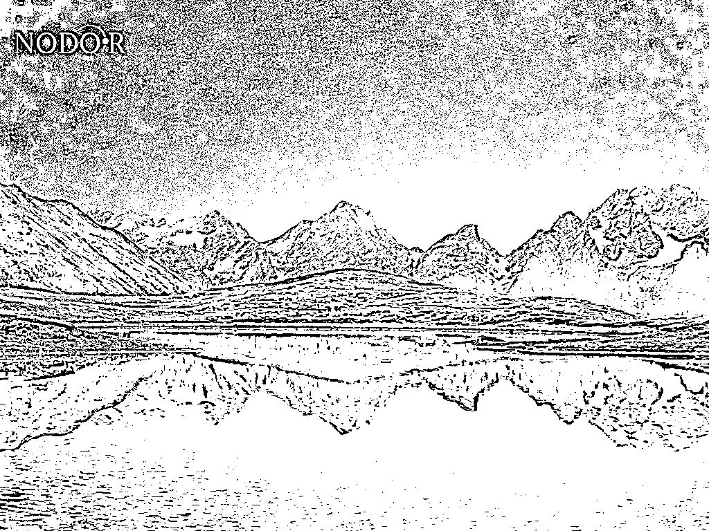

北京时间 10 月 25 日 18:48，日食发生在天蝎座 2°。每到新月时分，若道君都会为你奉上根据你出生星图量身打造的免费新月报告。可是新月为什么要许愿？新月报告该如何领取？让若道君来教你。

　**什么是日食？**　

从占星学看，新月是月亮周期的一种相位。新月是开始，又称为朔，对应中国农历初一，太阳、月亮在此时合相。此时月亮运行到太阳与地球之间时，月亮以黑暗的一面对着地球，并且与太阳同升同落，地球上看不见月亮。如果新月发生的位置靠近月亮交点，则称之为日食。

本次日食时间

**10 月 25 日 18:48，日食发生在天蝎座 2°。**

为什么新月要许愿？

新月是一个周期的开始，新月发生的时候，太阳与月亮合相，能量很强。当新月出现时，你也许会发现灵感忽现，非常适宜开启新领域、项目与行动，缔结一段新的关系或合作。许愿会加强新月的能量，也有助于你了解自己现阶段适合开启的方向。 

本次新月最佳许愿时间从新月开始到其后的 48 小时内，许愿的力量最强。**最佳许愿时间：10 月 25 日 18:48-10 月 27 日 18:48**

属于你的免费新月报告每到新月时刻，看着占星文章里写着：看看你新月的宫位，如果新月在第 X 宫，你可以许愿的方向是……是不是常常一头雾水？新月的宫位？我到底该看哪里啊？而有时，那些标注上升星座的文章也会让你忍不住想：虽然我的上升星座是这个，可是我的新月好像并不落在你说的宫位啊？你是不是写错了？

虽然这些文章都没有写错，可是好像对你而言都太不友好了。**Don't Worry！**别着急，让博学又体贴的若道君来帮你！我们推出了一份**免费**又**好用**的新月报告！而且是专门为你设计的哦，**根据你出生星图为你量身打造的，只****属于你的独家新月报告**。报告有哪些内容？**新月时间****最佳许愿时间****如何许愿 **属于你的**许愿关键词**本次新月给你的**建议**你会有怎样的**感受 ******机会****

********

如何许愿？许愿方式也很简单。你可以把愿望写下来，或者双手合十后交叉，闭上眼睛来祈祷。 报告中会为你提供**祈祷词示例**，可以多多参考哦～ 你还可以适当添加自己的语言，创造属于你自己的祈祷文！如果报告拿到手了，快对照着许愿吧！

**这份好用又暖心的报告，点击****阅读原文****即可领取！**

**免费新月报告直达入口**

# 天蝎座日食 | 未来 6 个月，在生与死之间，完成平衡而真实的转化

> 原文：[`mp.weixin.qq.com/s?__biz=MzA5NjA0NTAxNg==&mid=2651492140&idx=1&sn=9c5bb00704f4530adf057d816c89e82c&chksm=8b483d9bbc3fb48d9527e67961c53383f3f7eaf3a4c770138928ffb620d9726c24162e1840fc&scene=126&sessionid=1692737735#rd`](http://mp.weixin.qq.com/s?__biz=MzA5NjA0NTAxNg==&mid=2651492140&idx=1&sn=9c5bb00704f4530adf057d816c89e82c&chksm=8b483d9bbc3fb48d9527e67961c53383f3f7eaf3a4c770138928ffb620d9726c24162e1840fc&scene=126&sessionid=1692737735#rd)

****☆ **后台回复“今日”，给你一句生命态度**

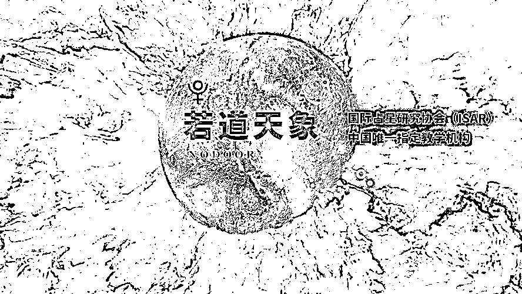作者/王芝桦 编辑/玫瑰 图片/稿定设计

**天蝎座日食**

**北京时间 2022 年 10 月 25 日 18:48 迎来天蝎座新月，太阳与月亮精准合相于天蝎座 2°0'，并以 11°之差靠近天蝎座南交点，形成天蝎座日偏食。**

每年的天蝎座新月都会伴随着中国的传统节日“寒衣节”，在日趋冬日的深秋，生者授衣往者，送暖寄托哀思。“寒衣节”联通生死两个世界的能量，与“向死而生”的天蝎座异曲同工。作为一枚月亮天蝎座人，我是那么地喜爱天蝎座这个星座，然而这篇天蝎座日食文又是那么地令我痛苦，因为我正处于一场天蝎座“生死转化”的体验之中——生命就像一场盛大的欢聚，然而，我们终要学会在散场之后感恩和告别。此次天蝎座日食，将会开启未来 6 个月的“转化”旅途，引领我们与更内在、更真实、更完整的自我相遇。

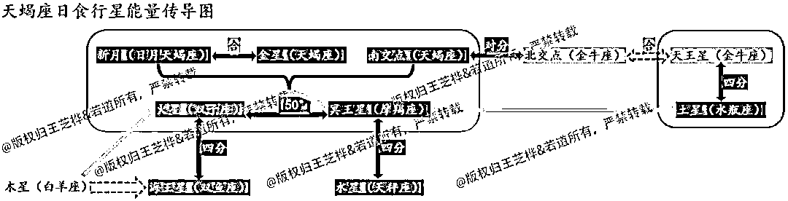

> **天蝎座日食重点影响人群****参考新月峰值影响期间各个行星的行进度数，以及逆行行星的轨迹影响；常规容许度，个人行星入相位 3°，出相位 1°；非个人行星入相位和出相位均为 3°。**
> 
> *   出生星图中，有**行星、四轴、南北交点**落入**固定星座（金牛座、狮子座、天蝎座、水瓶座）0°-28°**的人群。
> *   出生星图中，有**行星、四轴、南北交点**落入****变动星座**（双子座、射手座、处女座、双鱼座）5°-30°**的人群。
>     
>     
> *   出生星图中，有**行星、四轴、南北交点**落入**基本星座（白羊座、巨蟹座、天秤座、摩羯座）0°-14°，19°-30°**的人群。

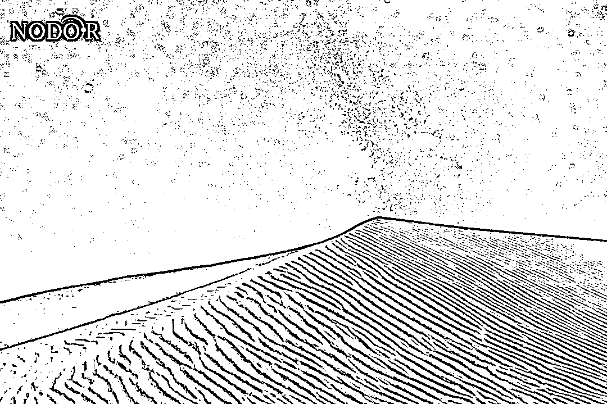

**平衡与失衡，日食点燃“涅槃重生”的火焰**

> **天象**
> 
> **· 新月合相金星：太阳、月亮和金星紧密合相于天蝎座。**
> 
> **· 土天四分：水瓶座土星四分金牛座天王星。**

10 月注定是个不平凡的月份：**·** 10 月上旬，2021 年度重磅天象“土天四分”结构最后一次上演，而 10 月 23 日恢复顺行的水瓶座土星再次宣告“不破不立”的变革进程进入彻底“变局”的阶段；**·** 10 月下旬的此次天蝎座日食，开启了未来半年“转化与重建”的全新旅途。**此次天蝎座日食发生时刻，太阳、月亮、金星紧密合相于天蝎座。**9 月底开始，当时还行进在天秤座的太阳与金星（10 月 23 日，太阳和金星双双换座进入天蝎座），先后与白羊座上的木星、凯龙星、厄里斯形成对分结构，与摩羯座上的冥王星形成四分结构。以上几组结构中的天秤座太阳和天秤座金星，指向**关系、金钱、价值观等几方面的“平衡”议题**。无论集体层面，还是个人层面，“平衡”的艺术随处可见，**平衡并不是一种固定的模式与概念，而是一种不断流动和不断变化的能量，既需要有意识地进行调试，亦需要有觉知地做出取舍。**然而，**9 月底-10 月 23 日之前**这段时间，以上几组结构中的天秤座太阳和天秤座金星指向的“平衡”议题，却是牵动了几位“大咖”的能量释放通道：**· 白羊座上的众神：**白羊座象征着“自我的视角和竞争的模式”，其中“众神之神”木星要求扩张“自我的权益”，“受伤的治疗师”凯龙星一再提醒“自我的伤痛”，“冲突女神”厄里斯更是嫌不够乱地“驱动欲念并发动竞争”。故而，**白羊座上积聚太久的“自我的视角和竞争的模式”这股能量，很容易令天平的指针发生偏颇或制造失衡。****· 基本星座 T 三角：**10 月 17 日-10 月 21 日,天秤座上的太阳和金星、白羊座上的“冲突女神”厄里斯、摩羯座上的“冥界之神”冥王星组成较为宽泛的“基本星座 T 三角”，引动了深藏许久的“业力议题”——**当“平衡”变成了一种执念，失衡就一定会出现，因为掌控平衡的意图和动作，将会切断平衡的流动性和转化可能。**如果我们将以上几组天秤座太阳和天秤座金星相关的结构，放在“土天四分”的宇宙大背景之下观察，就不难理解英国首相特拉斯的短暂任期、俄乌冲突升级为俄乌战争这些事件。而这些事件的演化正是“不破不立”的变革进程中不可缺少的“失衡”因素——全新周期的变局进程，没有问题，又从何而变呢？当然，于我们个人而言，**10 月生活中的每个人也都在或多或少地经历着“关系”的磨砺。**重点的观测从此次天蝎座日食的前一周开始，我们需要**透过那些“失衡”的关系议题，有意识地觉察内在的“平衡”执念**——那些死活不肯放手的事物，那些内心暗自较劲的模式，我们真的在意吗？如果在意，那么为什么还要去对抗？如果不在意，那么还有没有必要去较劲？而我们执意渴望获得的胜利，究竟能喂养什么呢？ **10 月 23 日，太阳与金星双双换座进入天蝎座，并于天蝎座 0°形成“日金合相”结构；同天，水瓶座土星恢复顺行，“不破不立”的变革进程再无拖泥带水的可能。**至此，此次天蝎座日食所需的“干柴烈火”已经堆积到位，只等日食的高倍能量点燃“涅槃重生”的火焰。10 月 25 日，此次天蝎座日食，太阳、月亮和金星整齐地站在天蝎座 2°的位置上，与揭示业力线索的天蝎座南交点共同携手，开启这一场引领未来 6 个月“向死而生”旅途的天蝎座日食——我们将会完成相应的业力转化功课，顿悟需要放手的部分，学习接纳结束的事物，洞悉真正重要的价值，珍惜所有宝贵的因缘。未来 6 个月，我们将会穿越一场火焰，**“金钱与关系”**依然是这一场锻炼的主题，**看好你的钱袋子，做好你的财务规划，觉察你的关系模式，理清你的取舍重点。**火焰之中炼造出来的将会是全新的体系和全新的自我，而这也正是“土天四分”结构掀起的“不破不立”变革进程所蕴含的真正深意——**煅烧之中，去伪存真；破立之中，创建新生。****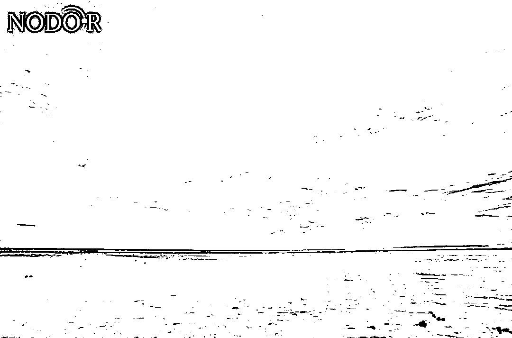****生与死，相反的入口，相同的归途**

> **天象****· 火冥梅花：双子座火星与摩羯座冥王星形成 150°度梅花结构。****· 火海四分：双子座火星四分双鱼座海王星。****· 水冥四分：天秤座水星四分摩羯座冥王星。**

说到天蝎座，就必须说到“死亡”这件事。当然，这里需要广义地理解有关“死亡”的面向。死亡并不单纯属于“肉体和物质”这些粗钝能量所特有的状态，也代表很多难以看见、精微层面的状态变化。**“死亡”意味着，某些内在的序列发生了重组，某些内在的能量发生了转化。**然而，我们依然不喜欢“死亡”这件事，因为**死亡意味着将会“打断”原有的联结，“失去”原有的信任。**天蝎座象征着生死之间的那道界限，没有“生”谁又懂得“死”，没有“死”又何以珍惜“生”？故而，天蝎座也象征着**“向死而生”的心理性旅程**——生与死，看似是相反的两个入口，但却奔往相同的归途，超越轮回，涅槃重生。天蝎座有两颗守护行星，“战神”火星代表着“生”的意志与行动，“冥府之神”冥王星代表着“死”的转化与重生——**如果能透过“死”顿悟“生”的本质，就能转化一些业力的执着，知道活着的重点，创造活着的价值。**此次天蝎座日食发生时刻，火星与冥王星正处于 150°梅花结构，它们之间的能量交互就像“打不通的电话”一般淤堵——“生和死”（意识和潜意识）不通气，各忙各的，这是很麻烦的一件事；然而，宇宙中的一切能量都在矩阵之中，怎么可能互不相干？只是当意识觉察不到潜意识、只能看到外部事件的时候，只能解释为“无常”。此次天蝎座日食，火星和冥王星各有一组相位结构值得关注，而这两组结构也有着内在的共振。

**1. 执着的平衡，恐惧的无常**

**10 月 27 日，天秤座水星与摩羯座冥王星将会形成精准的“水冥四分”结构；但此次天蝎座日食发生时刻，该组结构已在发挥能量影响。**  先来说说这颗刚于 10 月 2 日在处女座恢复顺行、10 月 11 日再次进入天秤座、10 月 17 日才于天秤座走出逆行后阴影期的水星。水星的希腊神话原型是“神的信使”赫尔墨斯，他是众神之中唯一能够行走冥府的神，故而，赫尔墨斯也是引领灵魂跨越生死边界的“摆渡人”。跨越边界是非常神圣的事情，然而，当灵魂从光明进入黑暗，依然会因为剪不断的执着欲念、无意识的恐惧阴影，在潜意识之中留下“心理危机”。**赫尔墨斯帮助我们跨越意识和潜意识之间的界限，让我们意识到潜意识之中的心理危机，唯一的前提要求是我们必须说真话。**但是，足智多谋的赫尔墨斯，本身却是一位善于说谎的神，他也将“说谎的伎俩”传递给我们，因为众神就住在我们的生命深处。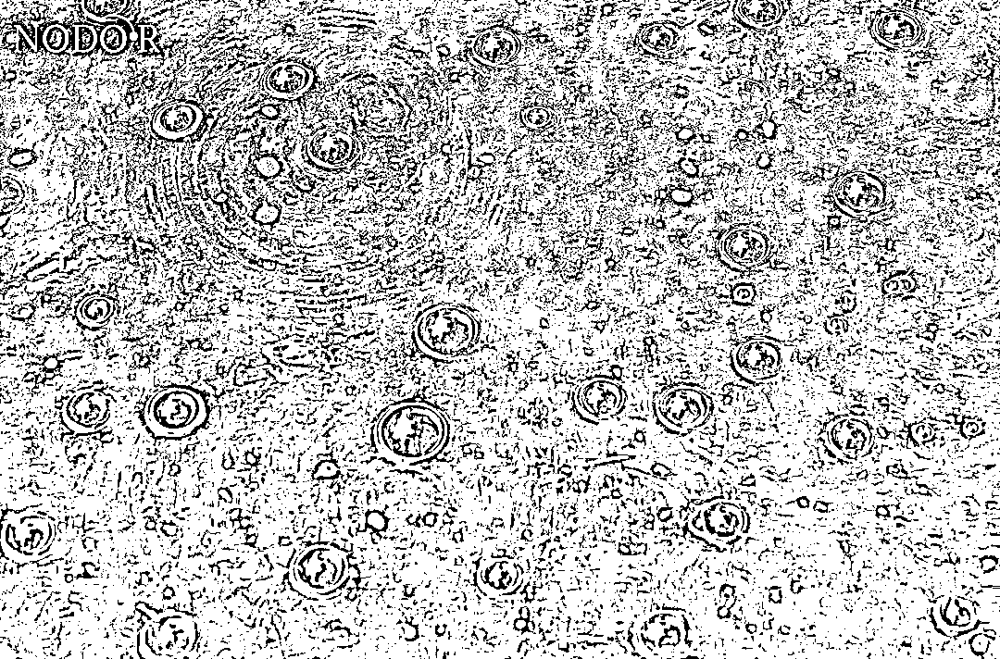2022 年第 3 波水星逆行的轨迹发生在“天秤座-处女座”之间，带来一波**“反思关系平衡，处理关系问题”**的功课。无论是人际或金钱方面，还是合作或协定方面，赫尔墨斯引领我们洞悉真相——**一些“平衡”被打破了，但我们所执着的平衡并不存在，只是我们认为这样的平衡应该存在。**

此次天蝎座日食，“水冥四分”结构中的“摆渡人”赫尔墨斯遇见“冥府之神”哈迪斯，他们会发生什么样的交谈呢？赫尔墨斯是会信口开河并回避真相，还是会直面阴影并说出真话呢？

现在我们再来说说这颗揭示业力议题的“冥府之神”冥王星哈迪斯。我想分享一点我在近日的亲身体悟。

10 月 5 日凌晨，我最敬爱的妈妈从这个尘世离开了我。我就那样看着她走了，却无能为力。那一刻，我被冥王星扼住了喉咙，击穿了身心，掏空了能量，变回恐惧与无助的孩子，任由神经与觉知瞬间冻成一坨。

我拼命维持着最后一丝力量为她办理后事并诵经回向，然而心底深处却始终回荡着“我算个屁”的声音（请原谅我真实的粗俗）。

冥王星，不听我，不管我，没得商量，没得可谈，我在它的注视下“算个屁”一般地存在，无论我作为心理占星师解读了多少冥王星的故事。

我曾为当下冥王星在摩羯座的行进写过“你试图掌控的事物，其实正在掌控你”这样的语句；然而，当冥王星扼住我的喉咙的时候，这些语句却显得那么的矫情！冥王星没留一点时间给我矫情，它只是瞬间打破了我生命中的平衡。

随后的几天里，我的睡眠相当不好，总是担心黑暗之中突然会出现什么扼住我的喉咙，这是我在前几十年从未有过的经历。感谢我的专业，让我觉察到这是特殊经验之后的应激反应，而那个在黑暗之中随时可能出现的“无常”，正是我的心理危机。

占用这篇文章的公众资源，分享一点自己对冥王星的体悟：

**·** 当死亡（失去）来临的时刻，真正让我不能面对的是**“现实的缺憾”**，它和我预想的不一样，我也和自己预想的不一样，而这种失控感我却没有任何还手之力，也没有任何修改的余地；

**·** 我手里拿着的只不过是**自我制造的理想化**，而我心里的痛苦也正来自于**自我理想化的破灭**。在冥王星面前，逞强没用，反驳无效，我只能乖乖地“放得下得放，放不下也得放”。此次天蝎座日食，再一次激活了生死之间（意识与潜意识之间）的按钮，而“水冥四分”结构则向为我们带来提示——**我们所执着的平衡并不存在，只是我们认为这样的平衡应该存在；我们执着地掌控着所谓的“平衡”，其实不过是恐惧失控后的黑暗与无常。****10 月 30 日，水星换座进入天蝎座，进一步加持我们向内觉察和洞悉真相的能量。**如果说，谎言一定会被戳破，不如早说真话，至少能够帮助我们在面对“黑暗与无常”的时候不至于那么惊慌失措。另外，**天蝎座日食发生后的 20 天，也是处理投资、保险、权益、遗产等相关事务的一段时机。****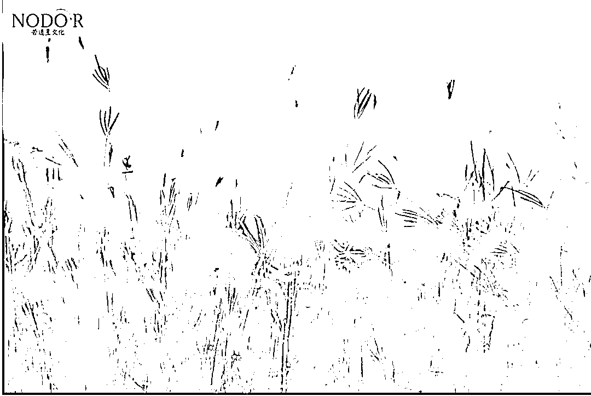**

**2. “系统性”**的**转化，保持内在的觉察**

**10 月 30 日，天蝎座的另一颗守护行星火星于双子座开始逆行，整个逆行周期从 2022 年 9 月 4 日-2023 年 3 月 16 日，其中逆行期从 2022 年 10 月 30 日-2023 年 1 月 13 日**——“战神”火星要在双子座行进 7 个多月，正好与此次天蝎座日食 6 个月的影响期不谋而合。 

但是，现在“战神”火星的压力好大呀，他接纳着此次天蝎座日食的能量（太阳、月亮、金星、南交点），还接纳着目前行进在白羊座上的木星和凯龙星的能量（火星也守护白羊座）。

**两点隐患：**

**·** 虽然木星即将于 10 月 28 日逆行回到双鱼座，但**此刻的木星正逆行在白羊座 0°“基本星座开创点”的位置上。**这是**“拿自己当神”的人们容易自我膨胀且斗志激昂的时刻，**无疑容易令接纳白羊座木星能量的双子座火星**冲昏头脑，喜欢各种尝试又不善于分辨信息，乱打一锅粥，不焦虑才怪。**

**· **双子座火星在整个逆行周期，随着“顺行-逆行-顺行”的脚步于**2022 年 10 月 12 日、2022 年 11 月 23 日、2023 年 3 月 15 日**先后 3 次与双鱼座海王星形成**“火海四分”**结构，更是令“战神”火星的**战斗力能量涣散并失去重点，做事虎头蛇尾，行事杂乱无章。**

此次天蝎座日食，正处于第 1 次和第 2 次“火海四分”结构之间，不可避免地容易受到上述两点隐患的干扰。但还是那句话，**有问题才能改变，而解决这些隐患就需要我们有意识地调动火星和冥王星 150°梅花结构的能量。**

**检视正在投入精力的事情，保持必要的内在觉察：**

**·** 是否明确自己正在做什么？

**· **可以去尝试，但不要自我合理化。

**· **如果你正在试图掌控某些事物以符合自我预期，建议先停下来。

**· **生和死（意识和潜意识）不通气，各忙各的，这是很麻烦的一件事。

**· **当意识无法觉察到潜意识的时候，那些外部呈现的事件，便只能嘘唏为“无常”，也就是荣格所说的“命运”。

**· **我们需要时时观想“死亡”，以便能与那些最重要的事物在一起，并能从那些消耗的事物之中全身而退。

**以上几点，适用于未来 6 个月的生**活。但未来 6 个月，不只是现实层面将会发生“转化”，而是更为潜在的体系将会发生系统性的“转化”，比如**价值观念**，比如**关系模式**，比如**生活结构。**

此次天蝎座日食赐予一颗“重生”的因种，我们需要一些时间一步一步地通关，一点一点地在意识和潜意识之间架起桥梁，从失衡之中顿悟平衡，从破立之中重建秩序。

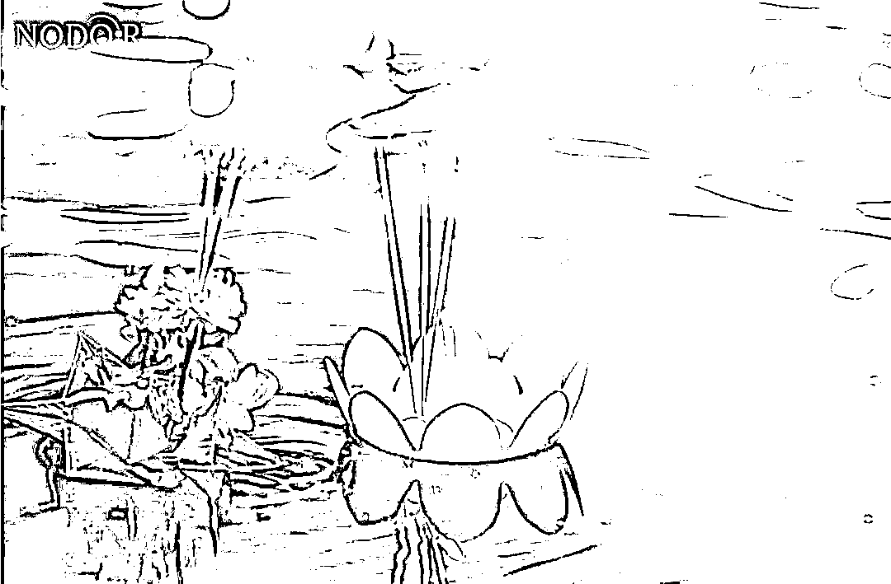

**寄语**今年上半年的某一天，妈妈对我说“来世我们还做母女”。当时，我的心狂跳了很久，眼泪忍了好久，我知道这是一份亲密而温暖的灵魂约定，也是一次庄重而深情的灵魂告别。相信在未来的时空里，我们一定会再次重逢；而当下我要做好的便是重拾生命的力量，助力妈妈安心走好，延承妈妈的仁厚善良。最近这些天，在各种因缘际会之下，得到了各方朋友的因缘相助，加持我一片一片重新回收能量。而当我凝视冥王星的时候，我不止一次听到他对我说：“顺应你自有的因缘。”谨以这篇文字献给我最爱的妈妈，同时感谢这些天记挂和帮助我的朋友们。爱大家。祝福每一个生命健康，每一个灵魂安好。**新月如何许愿？****许愿时间**：2022 年 10 月 25 日北京时间 18:48 后，48 小时内有效、8 小时内最佳。 **许愿人群**：所有人。**许愿数量**：每人最多 10 个。**许愿方式**：静心冥想，身心祈祷或记录收藏。**许愿格式**：请万能的宇宙赐予我能量，我将以我的能量吸引**（什么）来到生命中……**许愿原则**：发心诚善利人。

**版权声明**：原创文章由作者授权首发于若道平台，欢迎转发，反对抄袭。友号转载请申请白名单。

**END**

****想阅读更多作者的文章，请在后台回复******王芝桦****** 即可。****

****王芝桦****

心理占星师，统合疗愈师，占星专栏作者

全职于个案咨询与占星教学工作 18 年

**个案预约咨询微信号**：zhihua0621 

**微信公众号**：daoxi-life

**长按打赏**

********

**20 位来自世界各地的占星师****带来 19 场沙龙——新世界的觉醒****详情可点击下图**

**学习占星学****点击下图了解课程详情**

**福利来啦**
**点击****“阅读原文”****获取最好用的免费****新月报告****微信又双叒叕改版啦，不想错过若道君的推送？**
****就把若道设为****星标****以及点点****“在看”****吧！******▼**

**喜欢就点一下“在看”吧！****免费新月报告直达入口**

# ISAR 星空俱乐部第 46 期 | 太阳-月亮与道琼斯工业平均指数中短期反转的关联研究说明

> 原文：[`mp.weixin.qq.com/s?__biz=MzA5NjA0NTAxNg==&mid=2651492140&idx=2&sn=6edac2b0807f762395c11b73f23a3438&chksm=8b483d9bbc3fb48d0504b281f8e1eed8b1067c1703046485c02489007167c6123e8cef08de4b&scene=126&sessionid=1692737735#rd`](http://mp.weixin.qq.com/s?__biz=MzA5NjA0NTAxNg==&mid=2651492140&idx=2&sn=6edac2b0807f762395c11b73f23a3438&chksm=8b483d9bbc3fb48d0504b281f8e1eed8b1067c1703046485c02489007167c6123e8cef08de4b&scene=126&sessionid=1692737735#rd)

**沙龙来啦！****10 月 28 日，星期五晚上 8 点，**国际占星研究协会（ISAR）中国星空俱乐部沙龙由占星师**Hu Yating**带来一场讲座！ **沙龙主题****沙龙主题：**太阳-月亮与道琼斯工业平均指数中短期反转的关联研究说明******主讲人：********Hu Yating**********

**沙龙时间：10 月 28 日，星期五，北京时间 20:00-21:30（有英文翻译）**

**沙龙方式：线上沙龙**太阳-月亮与道琼斯工业平均指数中短期反转的关联研究探索太阳-月亮星座组合与美国道琼斯指数市场短期走势反转的相关性。
**这项研究采用雷蒙德·梅里曼《股票市场时机选择手册第四卷》中的研究方法，分析了 1930 年到 2021 年道琼斯工业平均指数的数据。****它使用滤波来测量从前一个孤立高点/低点处的预期百分比变化，并通过权重值评估结果。**本次讲座内容包含术语、研究方法、发现以及研究的应用。**雷蒙德·梅里曼 2023 年预报及沙龙已开始双 11 优惠预售，将帮助你对 2023 年的市场风云变化加深了解。**
**长按下图识别二维码了解更多详情**

**主讲嘉宾**

**********Hu Yating**********

*   Hu Yating 是梅里曼市场时机学院的毕业生； 
*   作为梅里曼市场时机学院的学徒，她自 2022 年 1 月起一直为梅里曼市场时机学院《中国上证指数月度研究报告》撰写太阳-月亮反转日期章节； 
*   她有商业分析和风险管理的硕士学位，也是一名在医疗和金融科技行业有经验的数据分析师。 

**如何参加沙龙？**本讲座也是本月的国际占星研究协会（ISAR）星空俱乐部讲座。**ISAR 会员可以免费收看。**请注意邮件通知，具体参与方式见邮件。❶ 如果你**已经是 ISAR 会员**，请注意邮件通知，告知如何参加。❷ 如果你**不是 ISAR 会员**，非 ISAR 会员价格：98 元。如有任何问题请咨询工作人员仲老师（微信：YY18513802156）

**非 ISAR 会员报名请长按下图**

**▼**

**ISAR 明星俱乐部**

2018 年，ISAR 在主席亚历山大·因舍阿吉克的带领下，成立了 ISAR 明星俱乐部，每月为全球 ISAR 会员提供在线直播讲座，邀请全球著名占星师开讲，学习和分享新的理念。讲座时长一小时，涉及占星学的不同领域、不同观点，每个会员都可以参与其中，每次讲座之后还有 20-30 分钟问答时间向老师们提问。每一场在线讲座都会记录下来，ISAR 除了提供视频，还会提供相关的讲座资料，以及单独的问答录音，自动发送到专门的 ISAR 明星俱乐部页面存档，每位 ISAR 会员可以在 ISAR 网站上自己的会员主页俱乐部页面找到。在 2018 年最初几个月，ISAR 明星俱乐部会每月举办一场在线演讲。之后，两周举办一场演讲，最终每周举办一场演讲。
但是，过去明星俱乐部讲座只有英文沙龙，因此，中国会员只有懂英文才能受益。为了使得更多不懂英文的中国会员能够受益，我们特别和 ISAR 总部协商，今后会安排有中文翻译的明星俱乐部占星沙龙，作为给中国 ISAR 会员的福利！**如何成为 ISAR 会员？**

**如果你也想成为 ISAR 会员，请复制链接在浏览器打开**

http://www.nodoor.com/isarcert.do?contentId=3588（仅支持网站支付）

**或直接长按下方二维码，微信购买会员：**

**ISAR 会员有什么福利？**一年期会员仅需支付**人民币 510 元**，即可享受：**☆ 星空俱乐部免费沙龙****☆每年出版 3 次的《国际占星师》（目前只有英文）；****☆每周电子邮件交流汇总杂志（目前只有英文）；****☆专项研究基金和奖学金资格；****☆ISAR 主办的会议和论坛的会员折扣，包括国际占星大会（UAC）、ISAR 的会议和研讨会等会员权益。****有疑问怎么办？**关于 ISAR 星空会员俱乐部以及我们的讲座，如果你还有任何疑问，**请联系工作人员**：

**若道 Conrad（微信号：nodoor2016）**

**若道 yiyi****（微信号：YY18513802156）**

**非 ISAR 会员报名入口**

# 若道周运 10.24-10.30 丨重磅星象集体登场，如何迎接变化？（内含 12 星座运势）

> 原文：[`mp.weixin.qq.com/s?__biz=MzA5NjA0NTAxNg==&mid=2651492018&idx=1&sn=043bd149c05bf0a989289f55c31d36d5&chksm=8b483c05bc3fb513a21b0cde4e291f3c46e889793acb89a946b10440f60cbdc5bec64b6d83ee&scene=126&sessionid=1692737735#rd`](http://mp.weixin.qq.com/s?__biz=MzA5NjA0NTAxNg==&mid=2651492018&idx=1&sn=043bd149c05bf0a989289f55c31d36d5&chksm=8b483c05bc3fb513a21b0cde4e291f3c46e889793acb89a946b10440f60cbdc5bec64b6d83ee&scene=126&sessionid=1692737735#rd)

******☆ ****后台回复“今日”，给你一句生命态度******

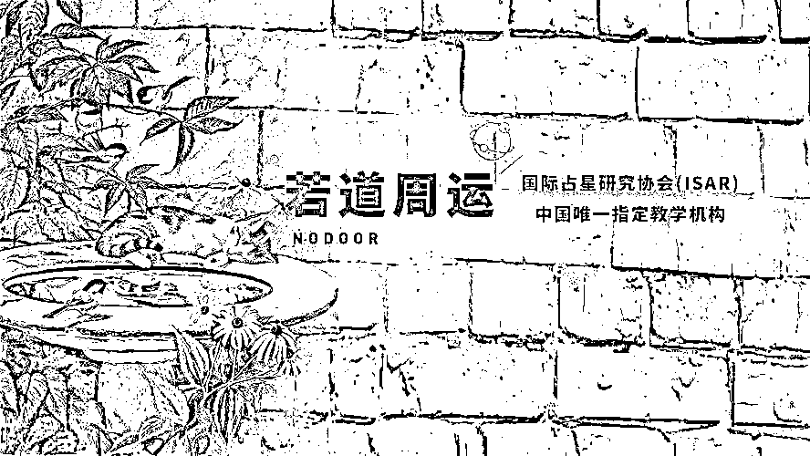

作者/芷菱 ISAR 认证占星师
编辑/翀子 封面/书君 图片/稿定设计**整体氛围**

本周我们将迎来几个年度重磅星象，包括**天蝎座日食，火星逆行，以及木星、水星换座。**如此多的星象密集在一周内出现是较为罕见的。**宇宙在向我们发出怎样的信号？我们该怎样迎接变化？**一起来看看吧。

**本周重要星象**

*   **10 月 25 日 周二**

    天蝎座日食（18:48）

*   **10 月 27 日 周四**

    水星四分冥王星、水星三分火星

*   **10 月 28 日 周五 **

    木星逆行进入双鱼座（13:09）

*   **10 月 30 日 周日   **

    水星进入天蝎座（03:22）、火星在双子座 25°36′逆行（21:25）

进入这一周，我们明显嗅到风暴的气息，重大的星象正在对我们发出警示。其实从上周日开始，一些星象就在密集地变化中：

10 月 23 日，金星和太阳先后进入天蝎座，为本周的天蝎座日食做好了铺垫。

同一天，土星在水瓶座恢复顺行，很慢地转动方向。在本周内，它的运行都非常缓慢，接近停滞状态。

与此同时，本周火星的运行也很慢，基本处于停滞状态，直到 10 月 30 日在双子座转向逆行。

土星停滞加上土天四分相，科技企业、科技领域可能承受压力。各行业及个人，都可能感受到在寻求突破变革与追求安全之间的冲突。

土星提示我们，要加固现实生活的屏障，为自己设立安全边际。**结合本周的日食发生在天蝎座，我们需要注意保障自己的财务、财产安全，避免债务及金钱的损失。**

**火星停滞则提示我们一些与火星相关的事物可能会更加突出，**超出常规，甚至失控，比如群体或个人间的冲突、争执、急躁、愤怒等。相较土星的顺行停滞，火星的逆行持续时间更长，影响也更大。后文会详细解读。

我们先来关注一下本周最重磅的日食。

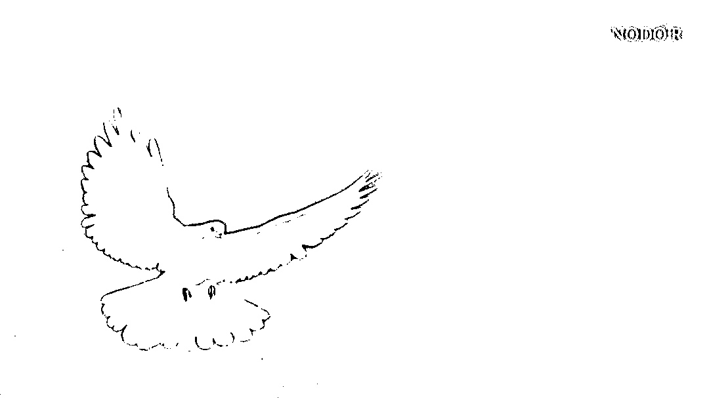

**天蝎座日食**

**进入本周，最重磅、最值得关注的星象无疑是 10 月 25 日的天蝎座日食，发生在天蝎座 2°，并与金星紧密合相、宽泛四分冥王星。**

我们都知道天蝎座的象征意义是清理、疗愈、净化，深入、重生。发生在天蝎座的日食，**有一种要深入挖掘，曝光秘密与真相，涤荡内部的腐朽，有大破大立的意涵。**

日食宽泛四分冥王星，同时火星在双子座停滞，与冥王星呈紧密梅花相，进一步强调了清理、清除的力量。我们生活中那些不再需要的、不愉快的事物，日食提示我们做出清理。

“断舍离”掉不合适的关系，不合时宜的行为模式，也包括一些已经是成长阻碍的执念与心理定式。

在这个过程中，我们可能嗅到危机的味道，天蝎座一向有非常强烈的危机意识。周遭环境可能使我们感受到危机，不得不对自己的生活做出变化和清理。风雨打碎的只是我们防御的堡垒，在废墟中收获的却可能是觉醒与新生。

**有重要行星或四轴落在天蝎座、水瓶座、金牛座、狮子座 0°-5°之间的同学，请密切关注该行星或轴点代表的领域会被这次日蚀触动，影响深远。**日食影响的时间持续 1-3 年，作为一个被放大的新月，相关的领域在未来一两年可以期待重大的机遇与变化。

需要注意的是，这是一个南交点日食，新月与南交点合相。因为南交点携带的“业力”性质，南交日食往往也带有“业果显现”的意味，虽然是新月，却意味着过去的作为在未来将逐渐呈现出结果，展开验收。

我们的行为受到过去日复一日的惯性影响，如果没有深入的反省与选择，未来很可能继续。日食提醒我们，你的行为可能会更快地显现为业果。**因此一些习惯性的想法和做法需要调整，一些错误不应该再继续，一些改变需要勇敢做出。**

在社会生活领域，天蝎座与债务、金融、投资、经济紧密相关。而且这次日食与金星密切合相，也强调了金钱的课题。金星在天蝎座是弱势位，金融与债务的危机可能会成为未来需要面对与清理的问题。**我们个人也需要注意自己的财务安全问题，尤其在投资金融相关领域。**

天蝎座日食与金星，也与“关系“有关。**天蝎座一贯关切深刻的情感，以及关系中的真相。**大到国与国之间，族群之间的关系，小到伴侣关系、同事关系，可能更多的真相暴露出来。

关系中的深度捆绑、利益分享的议题、性的议题都可能集中凸显。那些不再适合、失去生命力的关系也可能被日食一起清理。

水星将在周日进入天蝎座，追赶太阳和金星。10 月 30 日-31 日，水星经过天蝎座 2°，也就是日食发生的度数。我们可以注意观察这两天发生的重要事件，或听到的消息。

水星类似一个触发器，可能带来日食能量在现实中的某种显化，我们可以从中找到线索和启发。

**火星的停滞与逆行**

**火星本周在双子座 25°停滞，**与冥王星呈紧密的梅花相，与海王星仍在四分相范围内。**10 月 30 日，火星将展开逆行，持续到 2023 年 1 月 13 日，**在双子座 8 度恢复顺行。逆行长达两个半月。

**停滞期间，火星的能量会被强调。**火星是能量与活力的源泉，但当它被过度强调时会带来冲突、事故、愤怒、急躁等议题。大到国与国之间的摩擦，小到与同事邻居间都可能容易引发争论、分歧。

我们可能更容易愤怒，在关系和沟通中会更直接，更想要维护自己的立场。火星也常是事故的制造者，这段时间需要注意用电用气的安全，以及交通安全。远离冲突场面，用阅读、冥想、放松等调节自我情绪。

**每隔两年左右火星才会逆行一次。逆行意味着向内转，对行星能量的反省与回顾，重新评估。因此火逆期间也是一个很好的反思自己火星能量的时机。**

在大环境的影响下，越来越多的人选择躺平，卷不动了。火星逆行期间，我们可能一方面感到头脑的急躁或慌乱（火星与海王星的四分相），另一方面，原来的判断或行动计划被打乱，失去行动的方向。

这时候更好的方法是**放松下来，**不急于求成，慢一点。事缓则圆，我们无法改变大环境，但可以改变自己的频率和能量场。

火星逆行时期，强推硬做是行不通的，**我们需要三思而行。**尤其是去回顾自己的初心，梳理内在的驱动力，确认自己做事的目标和动机是真正发自内心的，是自己想要的。

火星在双子座逆行，也可以去**观察自己的表达**，与人争辩背后真正的动机是什么，真正想表达的是什么，急躁的背后是什么。追问到内心的真相，才能更好地做出判断和抉择。

真正健康的火星能量，需要我们对自己喜欢的事物保持热情，专注于手头的事。**火星逆行则提醒我们重新审视自己的目标，看清哪些是对我们真正重要的，抓住重点。**

在外界大环境不理想的时候，去做那些对我们长期重要的事，才是有效的努力。

**木星回到双鱼座**

**周五（10 月 28 日），逆行的木星将回到双鱼座 29 度，一直到 11 月 24 日在双鱼座 28 度恢复顺行，12 月 20 日再次回到白羊座。前后将在双鱼座待上近两个月的时间。**

木星回到双鱼座的尾度，意味着我们会**再一次感受到双鱼座的能量。**星座的末度往往是对该星座能量的集中总结。**木星与海王星也会形成一个宽泛的合相，**今年 4 月我们已经见识过了木海合相的威力，这次又会带来什么呢？

回顾一下今年 4 月末到 5 月你周遭的状况，木星当时也在双鱼座的末度行进。现在可能会再现当时的感受和状态，具体形式可能不一样。

我们还是需要注意疫情的防范。已进入寒冷的冬季，保持身体健康，增强免疫力，防止各种疾病的感染。

**我们也可能会更敏感，更有共情能力，能对他人的苦难感同身受。**也容易被影视、文学、艺术等作品打动，产生共鸣。

如果对未来感到更多的迷茫和不确定，记得火星也在逆行中，不必急于行动。这是一个需要反思和回顾，重新看看来路，寻找初心和目标的时期。**经过这样的梳理、放松、与内心对话、等待，我们才可能在时机到来的时候顺畅前行。**

**12 星座的一周运势**

**（重点参考上升星座，其次参考太阳星座）**

***白羊座***

因为日食发生在天蝎座的初度，意味着它可能落在你的 7 或 8 宫。”关系“是日食为你打开的一个重要领域。它提示你去清理和重建一种良性的、互信互利的合作关系，包括伴侣关系。这当中双方的深度信任、资源与利益的共享可能是重点。

火星的停滞可能给你的学习或表达带来更大的动力和热情。不过随着火星逆行，进程容易变得反复，你需要重新审视自己的学习目标和计划，或调整自己的想法和表达。木星回到 12 宫，你很适合放松下来，多冥想阅读，跟内心对话。

***金牛座***

因为日食发生在天蝎座的初度，意味着它可能落在你的 6 或 7 宫。注意你的身体健康，保持运动和健康饮食，定期体检。日食也会给你机会去清理工作环境或同事关系。关系也是未来重点，你需要重视与人的合作，清理、建设你的工作伙伴关系，亲密关系。

火星的停滞会将焦点放在钱上。如果你最近花钱比较冲动，记得为了财务安全做好节流。如果有赚钱的机会，火逆期间事情容易反复，不要太心急。木星逆行回到 11 宫，你有机会梳理自己的朋友圈，也可能跟老朋友重新联系。

***双子座***

因为日食发生在天蝎座的初度，意味着它可能落在你的 5 宫或 6 宫。你可能需要重塑自己的创造力，多阅读学习，学会创造性地思考和解决问题。日食也可能改善你的教育方式或亲子关系。

如果你一直想要幸福的恋爱，未来一两年可能有机会。健康也是未来需要关注的重点，日食提醒你，改善你的生活方式，保持更健康的饮食、睡眠、运动，清理你的身体。

火星停滞对你的影响最大，你可能精力旺盛，或对他人缺少耐心，急躁易怒。火星逆行期间很适合你去反思、调整做事的动机和目标，以及重新确立真正的自我。木星逆行回到 10 宫，你有机会思考调整你的事业方向，也可能获得期待已久的荣誉。

***巨蟹座***

因为日蚀发生在天蝎座的初度，意味着它可能落在你的 4 宫或 5 宫。在家庭、家人、房屋等方面，你有机会去清理、翻新、重建。如果有买房换房的打算，未来一两年可能有机会。

另一方面注意亲子关系或孩子的教育，日食会带来调整和提升的机会。你也有更多机会发挥才华，可能更有创意灵感。或有机会享受恋爱。

火星停滞并逆行在你的 12 宫，最近你可能容易烦躁疲乏，焦虑多梦，失去行动力，却不知道原因。这是一段适合去探索内心的时间，冥想，放慢节奏，与自己对话，看到内心深处的不安或恐惧，理解你内在的驱动力。

木星逆行入 9 宫，你可以反思自己的一些观点和信念是否还靠得住。这也是学习和思考问题的好时机。

***狮子座***

因为日食发生在天蝎座的初度，意味着它可能落在你的 3 宫或 4 宫。你有机会更新你的头脑，学习新知识，训练自己更有穿透力的思考和表达方式。如果要写东西，日食可能帮你有更深刻的领悟，更新鲜犀利的表达力。

家庭是未来需要关注的另一个重点，你可能会有家人、房屋方面改善变化的需要，比如处理家庭事务，或装修换房等。

火星停滞并逆行在 11 宫，最近注意跟朋友之间相互体谅，避免矛盾。火逆期间是一个思考和清理你的社交圈子的机会。另外也是反思你的远期目标，调整你的未来计划的好时机。木星逆行入 8 宫，你有机会改善你的财务，或调整你的投资计划。

***处女座***

因为日食发生在天蝎座的初度，意味着它可能落在你的 2 宫或 3 宫。你可能需要重新评估自己的价值，是否得到了真正的实现。未来一两年日食可能推动你去追求自己的价值实现，而不仅是赚一份收入。

观念和知识的更新是未来另一个重点，你需要更多的学习、思考，接受新的知识和观点，让自己的头脑和表达更有力量。

火星停滞逆行在 10 宫，你在事业上可能需要停下来想一想，回想自己做事的初心，以及内心深处的动机和目标。去分辨哪些东西对你是真正重要的。木星逆行入 7 宫，你有机会梳理和建设自己的伴侣关系、合作关系，增进关系的紧密。

***天秤座***

因为日食发生在天蝎座的初度，意味着它可能落在你的 1 宫或 2 宫。你对自己的认知和定位，可能会有一个大的变化。从外形到内在，未来一两年你可以努力更新自己，去成为自己喜欢的人，喜欢的样子。

实现自我价值是另一个重点，日食可能帮助你去思考自己真正擅长和喜欢的事，寻找机会去实现自己的才能。

火星停滞逆行在 9 宫，最近你容易因为观点看法的分歧跟人吵架。火逆期间你可以重新检视你的信念、价值观，接受更多元的观点，调整自己的想法。木星逆行入 6 宫，你有机会改善自己的健康，调整生活方式和作息。也适合去梳理、改善工作环境和同事关系。

***天蝎座***

因为日食发生在天蝎座的初度，意味着它可能落在你的 12 宫或 1 宫。未来一两年，你可能会深入精神灵性领域，与自己内心对话，踏上深度自我认知之旅。或者有机会沉浸在艺术的世界里，变得更敏感，更富有想象力。

日食也强烈提示你在未来更新你自己。抛弃你身上那些陈旧的习气，向着一个更好更理想的自己去努力。去成为你喜欢的样子，无论外表还是内在品质。

火星停滞逆行在 8 宫，需要你花心力梳理你的财务和投资状况。不要头脑发热冲动行事，重新思考投资或金钱事宜，尽量更专业、科学。这也是一个好的时机去探索你内心深处的欲望，看到它们对你行为的影响。

木星逆行入 5 宫，你有机会去体验纯粹的快乐，也可能享受恋爱或与孩子相伴的幸福。你可能也更有创意和灵感。

***射手座***

因为日食发生在天蝎座的初度，意味着它可能落在你的 11 宫或 12 宫。未来一两年可能会清理你的朋友圈子，一些人离开，新的朋友或团体出现。现在也是为你的未来订立新计划的好时机，重新思考你的人生目标和规划。

观照你的心灵是另一个重点，你可能更有灵感，更感性，富有想象力。你可以沉浸在艺术里，或者接触灵性知识，来获得内在的宁静。

火星停滞逆行在 7 宫，与伴侣或合作伙伴之间，多一些相互体谅和情绪控制，避免争吵。你们可以一起做运动，或一起制定行动计划。

木星逆行入 4 宫，你有机会改善家人、家庭、房屋等方面的事宜，比如购买一件心仪的家具，帮父母解决问题等。

***摩羯座***

因为日食发生在天蝎座的初度，意味着它可能落在你的 10 宫或 11 宫。未来一两年，日食可能推动你在事业上的变化调整，也许进入新的领域方向，找到真正适合自己发挥的事。

你的社交圈子是另一个重点，未来可能发生变化，结识新的朋友或团队。这时期也适合思考制定你的未来计划。

火星停滞逆行在 6 宫，注意你的身体健康。不要太劳累，注意保证睡眠和良好作息，可以通过运动来调节心情和状态。与同事的关系有可能紧张，注意换位思考，控制情绪。火逆期间你适合重新调整你的生活习惯。

木星逆行入 3 宫，你适合去多学习思考，调整自己的认知，可能也有更多机会表达，比如会议或演讲写作等。

***水瓶座***

因为日食发生在天蝎座的初度，意味着它可能落在你的 9 宫或 10 宫。未来一两年日食可能推动你深化自己的思考和认知。你可能会学新知识，考取证书。或者是在专业领域继续深造，或与海外事务有关。

总之多学习思考，提升自己的认知水平。事业方面也可能有调整变化的机会，让你有机会去往自己真正想要的方向。

火星停滞并逆行在 5 宫，你可能容易对孩子或恋人发火，缺乏耐心。注意控制情绪。你的创意计划在实施时可能遇到一些阻碍，需要返工或重新设计。给自己时间不要急于求成，多打磨手里的东西。

木星逆行入 2 宫，你可能有机会拿到一笔收入，但也可能是开支扩大，注意量入为出，管理好金钱。

***双鱼座***

因为日食发生在天蝎座的初度，意味着它可能落在你的 8 宫或 9 宫。在财务或投资方面，未来一两年日食可能给你带来一些新机会，或扩大你的业余收入。

不过你首先需要清理过去一些错误或不规范的做法，学会更专业地投资和管理钱。观念与知识的更新也很重要，可以学习新知识，考取证书，或提升自己的专业能力，创造更多的赚钱机会。

火星停滞并逆行在 4 宫，你可能会忙于家庭或房屋的事宜，对家人可能会急躁缺乏耐心。注意身心的休息，控制情绪。放松一些，火逆期间不宜急于求成。木星逆行入 1 宫，有助于你状态，可能更乐观积极自信。

**版权声明**：原创文章由作者授权首发于若道平台发布，欢迎转发，反对抄袭。友号转载请申请白名单。

**END**

**芷菱**

ISAR 认证占星师/占星作者/媒体人若道 2019 届核心课程毕业生

于 2019 年通过 ISAR 考试，同年获得若道认证神话塔罗师资质

**微信公众号**：芷菱的理想国

长按打赏

**20 位来自世界各地的占星师****带来 19 场沙龙——新世界的觉醒****详情可点击下图**

**学习占星学****点击下图了解课程详情**

**微信又双叒叕改版啦，不想错过若道君的推送？**
****就把若道设为****星标****以及点点****“在看”****吧！******▼**

**喜欢就点一下“在看”吧！****报名直达入口**

# 雷蒙德·梅里曼金融占星周运 | 土星停滞可不是个好信号

> 原文：[`mp.weixin.qq.com/s?__biz=MzA5NjA0NTAxNg==&mid=2651492018&idx=2&sn=d5929775c4193e3cff86c722b4d91bfb&chksm=8b483c05bc3fb5131d64362d32fb51715e26ddf779e1992f99e87fcdff4ad4c2c0071f936afb&scene=126&sessionid=1692737735#rd`](http://mp.weixin.qq.com/s?__biz=MzA5NjA0NTAxNg==&mid=2651492018&idx=2&sn=d5929775c4193e3cff86c722b4d91bfb&chksm=8b483c05bc3fb5131d64362d32fb51715e26ddf779e1992f99e87fcdff4ad4c2c0071f936afb&scene=126&sessionid=1692737735#rd)

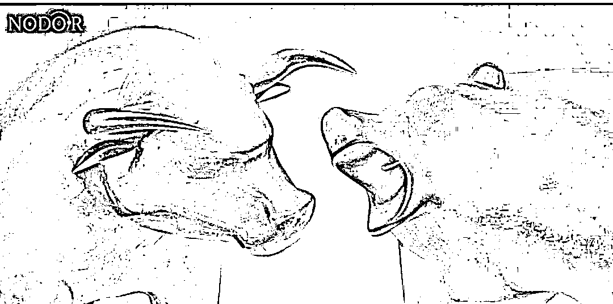作者/雷蒙德·梅里曼 译者/Luke 编辑/玫瑰 图片/稿定设计 雷蒙德·梅里曼是在金融占星学界稳坐第一把交椅的占星师，同时他也是若道签约的金融占星课老师，我们引进了雷蒙德·梅里曼老师的《[上证指数月度报告](http://mp.weixin.qq.com/s?__biz=MzA5NjA0NTAxNg==&mid=2651491983&idx=2&sn=3e5aef96ac219afb4dd421bfc33b024f&chksm=8b483c38bc3fb52ec2bc36e67f3698ded0e88b4e08ff79785eaa801cbc565e931c8132142632&scene=21#wechat_redirect)》及《[黄金报告](http://mp.weixin.qq.com/s?__biz=MzA5NjA0NTAxNg==&mid=2651491983&idx=2&sn=3e5aef96ac219afb4dd421bfc33b024f&chksm=8b483c38bc3fb52ec2bc36e67f3698ded0e88b4e08ff79785eaa801cbc565e931c8132142632&scene=21#wechat_redirect)》。我们经老师的授权，将每周刊登梅里曼老师的周运，供大家参考和学习。于是，这是本周的周运（10.24-10.28）。

**说明：以下时间采用纽约证券交易所所在地美国东部标准时间。**

**展望与回顾**

****

**由于投资者正在权衡加息放缓的可能性，股票周五大幅上涨，道琼斯指数收盘上涨超过 700 点。所有 3 大主要指数这周都有所上涨，道琼斯指数连续 3 周上涨。****——www.wsj.com****2022 年 10 月 21 日****昨天美国申请失业救济人数下降，使得债券收益率上升。美联储主席鲍威尔糟糕的沟通无济于事，市场不确定美联储减少通胀的方法是压榨工人，还是收缩利润（后者是更合适的选项），所以对数据发布产生了不必要的敏感反应。****——保罗·多诺万博士****《继续前进》****UBD 晨间音频评论****2022 年 10 月 21 日**10 月 12 日-19 日，在天秤座的太阳-金星与在双子座的火星和在水瓶座的土星形成风象星座大三角。全球多个股票指数的近期低点在这段时期的开端 10 月 13 日出现，那天也发生了火星-海王星四分相。那天公布消费者物价指数报告后，股票市场立刻暴跌，然后又开始剧烈反弹，一直持续到上周末。道琼斯工业平均指数周五上涨超过 700 点，是 6 月以来的涨幅最大的一周。 不过，股指的涨幅并不是均等的，也并非所有股指都出现了数月新高。在欧洲，SMI 指数和 DAX 指数于 10 月 18 日大三角期间创下 5 周新高。伦敦富时指数和 AEX 指数未能创下 5 周新高。在亚洲和环太平洋地区，只有印度 Nifty 指数于周五创下数周新高。上证综指 10 月 19 日略微上涨至周高点，日经指数和澳大利亚 ASX 指数也在 10 月 19 日完成次高点（但是低于 10 月 6 日的高点）。另一方面，香港恒生指数 10 月 20 日下跌至 2009 年 5 月以来的最低价位。在美洲地区，巴西 Bovespa 指数飙升至 4 月份以来的最高价位，同时道琼斯工业平均指数周五的高点也成为了 9 月 15 日以来的最高价位。另一方面，标准普尔指数和纳斯达克指数远远低于 10 月 6 日的近期高点。**重点是，全球各个地区依然出现了大量的市场间看跌背离，这不是熊市已经结束的可信迹象，哪怕美联储宣称放缓加息节奏也是如此。**

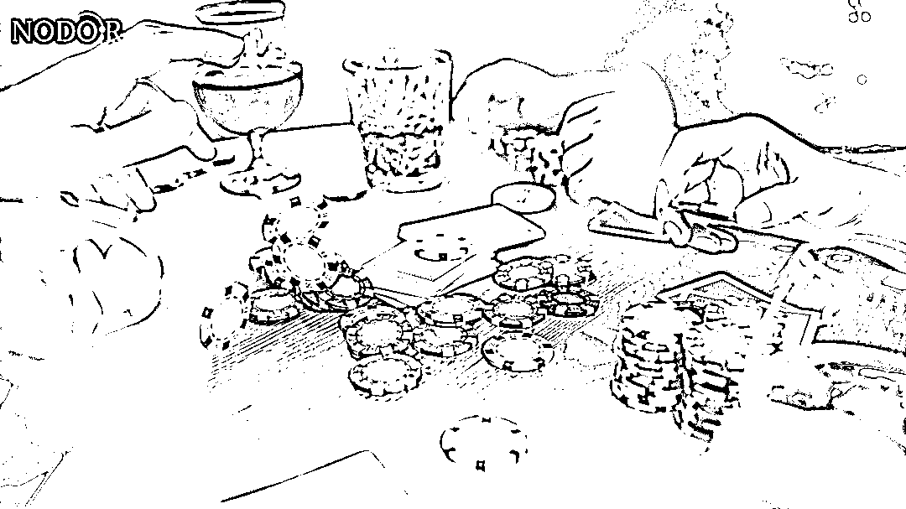

贵金属市场可观察到看涨背离。在 10 月 21 日，黄金跌至自 2020 年 4 月以来的最低价位。但是白银保持在前一周的近期低点 18.01 之上。周五收盘时，黄金从那个低点上涨近 40 美元，白银也回到了 19.00 之上。

是什么导致了这些上涨？首先，收益报告依然相当强势。其次，有传言（我们是不是提到过接下来几周火星四分海王星？）美联储将开始停止加息。第三，日本银行周五进行干预支撑日元，使美元兑日元大幅下跌。

贵金属和股票市场喜欢弱势的美元。那些发现难以如此不利的汇率向海外销售商品的美国跨国公司也喜欢弱势的美元。美元贬值有助于商品出口。

**短期宇宙征象与长期考量**

****

**特拉斯几周来的糟糕表现的标准解释站不住脚。真正原因要可怕得多。如果特斯拉经济学失败的原因不成立，那么考虑下这种可能性：市场对特斯拉经济学不满，因为它可能已经管用了。**

**——约瑟夫·斯特恩伯格**

**《英国市场崩溃可能会影响你》**

**《华尔街日报》**

**2022 年 10 月 21 日**

**英国想明确表示，过去两周是为即将上映的《憨豆先生》电影做广告的精心策划的宣传噱头。请不要关注。金融市场已经降低了能力风险溢价，现在可以忽略英国政治，除非前英国首相约翰逊再次出现，在这种情况下，市场可能会重新考虑风险溢价。**

**——保罗·多诺万博士****《继续前进》****UBD 晨间音频评论****2022 年 10 月 21 日**宇宙的烟火表演还没结束。土星于周末结束了逆行，**停滞的土星通常代表一种不详的迹象**。**土星掌管损失，尤其在政府层面，常常对应目标的失败或延迟**。在英国首相伊丽莎白·特拉斯的短暂统治中，她努力推进 5 年期的温和减税法案以刺激经济，形成土星顺行（失败）以及火星四分海王星（流言蜚语和替罪羊）的经典案例。在约瑟夫·斯特恩伯格的上述文章中，他继续指出，“还有一个问题是，人们如何从债券抛售中获得央行对养老基金的救助。英国的固定收益养老金管理者肯定很困扰，因为长期超低利率的对冲策略，出现了近乎灾难性的失败。”把信托责任匮乏带来的失败转嫁给特拉斯是多么方便啊。养老基金管理者监管不当，可能更多与英国金融稳定的崩溃有关，而不是新首相的政策导致的。在大男人主义的火星全面和激进地掌控叙事的环境下，特拉斯成为经典的海王星受害者。当火星在 10 月 30 日周末转向逆行时，我们可能更多地看到此类大卫和歌利亚的错配，这个宇宙设置中侵略者最终往往会失败。换句话说，英国金融系统近乎崩溃的真相可能会开始浮现，指责的手指可能不应指向当了替罪羊的特拉斯（或憨豆先生）。**土星转向顺行是一个强有力的二级地球宇宙学征象，容许度 9 个交易日。**它与股票指数的基本周期有很高的关联，可能对应多个股票指数的 10 月 13 日的基本周期波谷，那天是土星停滞前的 6 个交易日。那可能也能解释为什么股票市场上周如此强势，因为所有基本周期的早期阶段都是看涨而非看跌的。即使在熊市中，也会出现 2 周-5 周强有力的上涨。

其他的地球宇宙学新闻是，上周末太阳和金星离开天秤座进入天蝎座。我们发现金星在天秤座的行星-星座组合，对应贵金属和股票指数的重要低点和随后的上涨。看起来它又再次奏效了。

当它们 10 月 23 日进入天蝎座，注意力可能会转移到债务和税收，而不是在英国憨豆先生身上。**这周稍后时间，木星会逆行回到双鱼座，从 10 月 28 日到 12 月 20 日。**

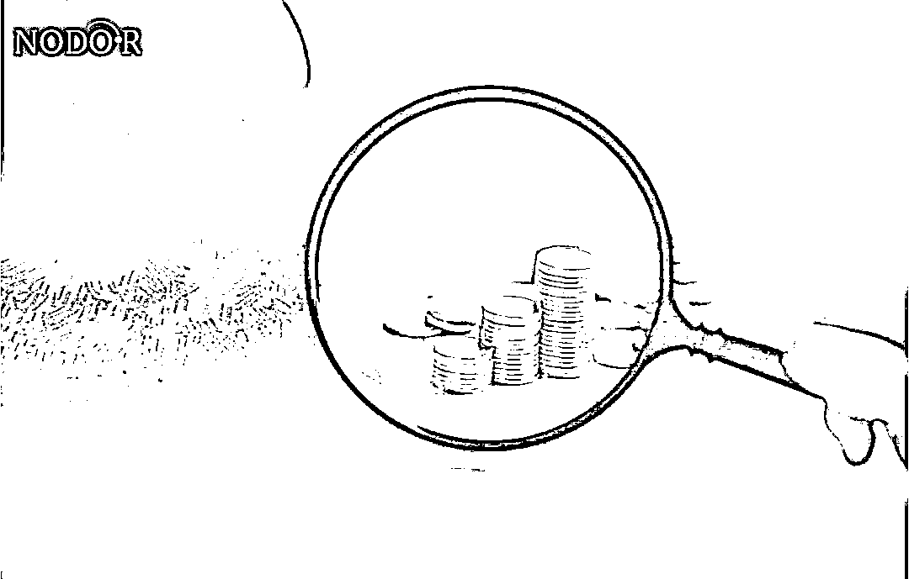

你可能会注意到今年初木星在双鱼座上演了一场大戏，“通货膨胀的回归”，创下破纪录的售票额，连制片人都毫无防备。通货膨胀还没有停止，对它何时结束的错误判断在继续。但那不会妨碍银行家和其他人发表声明（甚至预测），就好像他们知道时间。

这一时期你最好卖出谣言买入事实，尽管相对于谣言，事实处于供应短缺的状态，因为**年底这段时间火星四分海王星（谣言）；木星也在逆行，几乎合相在双鱼座的海王星（大谣言，甚至是胡说八道）。**

原油和贵金属市场喜欢那样。那些有幽默感的人可能也是如此。顺便说一下，我确实认为通货膨胀率会在 2023 年下降，美联储重新控制价格回归稳定，直到他们几年后再一次误判。这个话题我会在《2023 年金融预报》上讨论。

从 2018 年年末，若道引入金融占星大师雷蒙德·A·梅里曼撰写的梅里曼市场时机学院每年一次的年度预报沙龙和每年一本的《年度预报》以来，**2023 年已经是第 5 个年度了。我们简单回顾了部分 2019-2022 年金融预报的内容，**过去的经验让我们相信，你根据梅里曼老师的指导作为投资参看，你会比一般人有更大的胜算。******长按下图识别二维码****了解更多详情**

**说明：以上日期基于纽约证券交易所所在的美国东部标准时间，由于存在时差，中国地区可能需要加一天。**

**版权声明：**本文由若道翻译发布，欢迎转发，反对抄袭。友号转载请申请白名单。**END**

**雷蒙德·梅里曼（Raymond Merriman）**

若道签约老师。著名金融占星师，ISAR（国际占星研究协会）前主席，梅里曼市场分析公司的总裁。他由于“提升了占星学的职业形象”，在 1995 年国际占星大会上被授予轩辕十四奖；在 2012 年国际占星大会上，被授予轩辕十四终身成就奖。

1“中国上证指数月度报告”发售**若道推出了****中文版****的雷蒙德·梅里曼中国上证指数月度报告，并持续发行该报告！**当把金融市场的周期和占星学的周期相结合时，雷蒙德·梅里曼老师的金融占星学研究**为投资者应对金融市场的周期波动，并随之调整投资策略提供了极大的价值参考**。
**11 月中英文报告已上线！**2“黄金价格周期月度报告”发售**若道推出****中文版****的雷蒙德·梅里曼黄金价格周期月度报告！**不仅仅为广大读者在中国股市的投资出谋划策，更将视角放眼黄金市场。**每当世界经济形式不明朗的时候，有一个地方是保值的港湾，那就是****黄金**。自 1982 年雷蒙德·梅里曼出版第一本研究《地球宇宙学征象与黄金价格的关联》的著作以来，**他一直作为最重要的黄金市场时机预测者之一享誉国际**。2022 年 11 月黄金报告已上线，梅里曼老师将会告诉你他对这个关键时期如何操作的想法。也可以按照季度和一年期订阅，有更多优惠。季度和年度的好处是，你可以持续了解梅里曼老师对于不断在变化的市场的看法。即便他某一次看法和市场不一致，你也看到在下一期他如何调整自己的看法，并看到金融占星在一个长期时间段内对你把控风险的帮助。而能够长期控制风险、尽量找到安全的投资时机才是投资的长久之计。**11 月中英文报告已上线！****购买套餐**，买得越多越优惠中国上证指数月度报告套餐价

*   **单月报告**：280 元
*   **3 个月套餐**：780 元（260 元/月）
*   **12 个月套餐价**：2400 元（200 元/月）

**长按下图识别二维码****购买金融报告****套餐****▼**

黄金周期月度报告优惠

*   **双报告年度套餐更优惠（直降 900 元）**

*   **12 个月黄金报告+12 个月上证指数报告：仅需 3900 元**

**长按下图识别二维码购买黄金报告套餐**▼

3《2023 年金融报告及沙龙》

从 2018 年年末，若道引入金融占星大师雷蒙德·A·梅里曼撰写的梅里曼市场时机学院每年一次的年度预报沙龙和每年一本的《年度预报》以来，**2023 年已经是第 5 个年度了。我们简单回顾了部分 2019-2022 年金融预报的内容，**过去的经验让我们相信，你根据梅里曼老师的指导作为投资参看，你会比一般人有更大的胜算。****

**长按下图识别二维码****了解更多详情**

**购买直达入口**

# 梅里曼 11 月上证+黄金报告上线！《2023 年金融预报》双 11 优惠预售中！

> 原文：[`mp.weixin.qq.com/s?__biz=MzA5NjA0NTAxNg==&mid=2651492018&idx=3&sn=ed76ceaa3c3ca8aea456545e1c7231fd&chksm=8b483c05bc3fb51322756e81cde1f091a8e445f2f7829c9c7f3401c87abc620335bfeff9326b&scene=126&sessionid=1692737735#rd`](http://mp.weixin.qq.com/s?__biz=MzA5NjA0NTAxNg==&mid=2651492018&idx=3&sn=ed76ceaa3c3ca8aea456545e1c7231fd&chksm=8b483c05bc3fb51322756e81cde1f091a8e445f2f7829c9c7f3401c87abc620335bfeff9326b&scene=126&sessionid=1692737735#rd)

  

**11 月上证报告**10 月 12 日，上证跌到了 2934，重新测试了在 4 月 27 日形成的 2022 年年度低点 2863，然后开始反弹。鉴于上证在 10 月 1 日-7 日之间休假，10 月 12 日这一低点是位于梅里曼老师一直提到的今年下半年最重要的天象——土天四分、木星在土天四分中点的天象的范围之内。不过，与前几次土天四分出现波峰相反，此次出现了波谷。

| 上证指数日 K 线图

| 上证指数周 K 线图

从基本周期来看，如果 10 月 12 日的低点是从 4 月低点 2863 开始的一个拉长的基本周期的第 23 周，那么，一个新的 13 周-20 周的基本周期刚刚开始，本周仅仅是第 1 周。**这个基本周期完全可能开始一波上升行情。**但是，如果 8 月 2 日-4 日形成的低点是基本周期的开始，那么 10 月 12 日的低点正是处于这个基本周期的半周期位置，**上证完全可能跌向更深的低点。**从牛市的观点来看，很多股票经过今年以来的下跌，已经跌到了看起来很便宜的位置；但是，从熊市的观点来看，目前经济大环境存在非常大的下行压力。未来的天象又有哪些呢？**土星 10 月 23 日恢复顺行，土星顺行常常是一个市场出现反转的标志**。同时，10 月 23 日-24 日，金星和太阳都将进入天蝎座，而且将在 11 月 5 日-11 日和土星、天王星形成 T 三角。是大胆加仓，还是继续谨慎观察？金融占星大师雷蒙德·梅里曼的《2022 年 11 月上证指数报告》已上线，你可以听听梅里曼老师的看法。《2022 年 11 月黄金报告》也已上线，欢迎购买。**此外，雷蒙德·梅里曼 2023 年预报及沙龙已开始双 11 优惠预售，将帮助你对 2023 年的市场风云变化加深了解。****长按下图识别二维码了解更多详情**

**11 月上证报告上线**

**上证指数月度报告价格****单月报告**：280 元/月 **季度套餐价格**：780 元（260 元/月）**年度套餐价格**：2400 元（200 元/月）**双报告年度套餐更优惠（直降 900 元）****12 个月黄金报告+12 个月上证指数报告：仅需 3900 元****长按下图识别二维码购买上证指数报告**
▼

**11 月黄金报告**

“**黄金是金钱。其他的只是信贷。**

**——约翰·皮尔庞特·摩根**

”

| 黄金周 K 线图

**作为交易者和投资者，我们已经迎来了或许是今年最重要的地球宇宙学时间段：土天四分的时间段，它的宇宙影响力会持续到 11 月中旬。**在上个月，发生许多重要的大事件，俄乌战争升级，伊朗动乱，美国再一次对中国发起芯片战，整个世界局势动荡加剧。

很多国家的股票市场都在这次的土天四分时期下跌到历史低点。货币和债券市场也是同样，欧元、日元和美国中期国债数十年来的低点，黄金也是一样。9 月 28 日，黄金跌到 1622 美元，距离今年 3 月份黄金最高点 2078 已经跌去 21.94%。

不过，我们经历了 2 年的土天四分正在逐渐成为过去式。虽然其影响还会持续。9 月 28 日的低点 1622 是黄金走势 2 年来的低点。

| 黄金日 K 线图

黄金有一个 31.33 个月的周期，而半周期是 16 个月，其容许度在 13-19 个月之间。从上个周期低点是 2021 年 3 月的低点 1673，而 10 月是第 19 个月。   **所以，有没有可能，9 月 28 日的低点 1622 已经完成了 10 个月的半周期的低点，黄金可能展开一波反弹？如果真是如此，黄金是不是迎来了一个短期的投资机会？**  11 月份黄金报告已经上线，欢迎了解。也可以按照季度和 1 年期订阅，有更多优惠。季度和年度的好处是，你可以持续了解梅里曼老师对于不断在变化的市场的看法。  即便他某一次看法和市场不一致，你也看到在下一期他如何调整自己的看法，并看到金融占星在一个长期时间段内对你把控风险的帮助。而能够长期控制风险、尽量找到安全的投资时机才是投资的长久之计。  点击阅读原文，雷蒙德·梅里曼黄金周期 2022 年 11 月报告带来有 40 年黄金市场研究经验的世界著名金融占星大师雷蒙德·梅里曼对当前黄金市场的研究。投资有收益，投资有风险，希望金融占星学的研究帮助你更好地评估你的投资。

**11 月黄金报告上线**

**黄金月度报告价格****单月报告**：280 元/月 **季度套餐价格**：780 元（260 元/月）**年度套餐价格**：2400 元（200 元/月）**双报告年度套餐更优惠（直降 900 元）****12 个月黄金报告+12 个月上证指数报告：仅需 3900 元****长按下图识别二维码购买黄金报告**
▼

**购买者需知**

**① **梅里曼市场时机学院《中国上证指数月度研究报告》是梅里曼市场时机学院（以下简称 MMA）的研究“预报”，而不是市场“预测”，是梅里曼老师及 MMA 金融占星分析师对人类活动周期历史与行星周期之间相关性的研究，二者在大部分情况下具有 80%或更高的相关性，而不是因果关系。报告中的研究完全存在错误的可能性。即便是非常认真的研究和几十年的研究经验，金融占星师无法总是正确地解读出各种征象在实际层面上会如何相互作用，并显化为事件结果。

所以请将报告看作一个研究参考，务必结合其他市场研究和你个人对市场的理解，根据你的自由意志做决策。

**②** 此报告一旦售出，**即不接受退款。**

**③** 上证、黄金月度报告每月固定 1 期，**并非都是在每月相同日期发布。**

**④** **我们收到英文报告的当天，即发布该英文报告。3 天后，上线报告中文版。此报告仅支持手机网页阅读，不支持电脑阅读和下载。****以上须知，请仔细阅读。一旦付款，即视为已了解并接受所有须知内容。**在过去的 40 年中，唯有梅里曼逐渐完善，并在梅里曼市场时机学院月度周期报告中阐释了将地球宇宙学与周期相结合的研究方法，以惊人的精确性预报了黄金价格发生重大变化的时间。**黄金购买 Tip**

各大银行均可购买黄金或黄金 EFT 基金，也可以在诸如天天基金或者支付宝购买黄金及黄金相关产品。不明白的可以百度搜索。

**购买后如何查看报告？**

**购买后有疑问怎么办？**请联系技术客服
**微信：nodoor201705** **《2023 年金融预报》**从 2018 年年末，若道引入金融占星大师雷蒙德·A·梅里曼撰写的梅里曼市场时机学院每年一次的年度预报沙龙和每年一本的《年度预报》以来，**2023 年已经是第 5 个年度了。**

我们简单回归一下梅里曼老师 2019 年-2022 年的《年度预报》中一些预测。

在 2019 年的年度预报中，对于上证指数，梅里曼老师写到：

2018 年末至 2019 年初，中国股市处于三个重要周期低点的时间段。紧随这一低点，将会出现一次非常大的反弹。

2019 年木星会与海王星形成三次四分相，过去，这个相位总是与惊人的强大“泡沫”同时出现，期间股价大幅飙升。

到 2019 年 7 月之前，上证指数有三个重要长周期会出现周期低点，理想上看是在 2019 年 3 月底之前。

上证的周期低点出现在 2019 年 1 月，从那时起，上证迎来了 3 年的上升。

对于黄金，梅里曼老师建议：

从占星学角度来看，木星在射手座，四分在双鱼座的海王星，支撑看涨观点，因为这个组合有增加通胀的潜力。此外，木星在射手座的行星-星座组合从 1983 年起出现过三次，每次都对应到金银市场的年度高点。

无论在 2019 年何时，只要黄金保持在 1167 以上，同时跌到了任一主要周期低点附近，就要寻找买入机会。黄金可能在 2019 年涨到 1500+/- 50，甚至更高。

2019 年黄金从 1284 美元开始上涨，最高点在 1566 美元。

所以，如果你在 2018 年购买了《年度预报》，按照梅里曼老师的建议投资了上证指数和黄金，你会在当年取得相当不错的收益。

**对于 2020 年，在席卷全球、深刻影响了未来的疫情到来之前，梅里曼老师为 2020 年定下基调的：**

站在 2019 年的年尾，我们不知道一场深刻改变未来的风暴马上就将来临。

梅里曼老师，这位杰出的宇宙气象预报员，未卜先知，为 2020 年定下“将军”的基调。

在那一年，我们目睹了美国股市的 4 次熔断和全球经济的重置崩溃。

对于黄金，梅里曼老师是这么说的：

1391.50-1413.70 是价格最强的支撑区域。只要不跌破这个区间，黄金就能够上涨，重新测试 1566.20。如果突破了 1560-1590 的阻力区间，那么黄金就能够重新测试 1920。在那以前，黄金最有可能在 2020 年中在 1390 和 1575 之间波动。

| 黄金周 K 线图

2020 年，黄金在横盘 3 个月突破了 1560-1590 的阻力区间后，一路上涨到 9 月最高点 2089.20 美元。

对于上证指数，梅里曼老师建议：

2020 年的反弹将超过 2019 年的高点 3288。然而，这一涨势可能会通向 5.5 年周期的波峰，随后将再次迎来一波跌势至 2021 年或更晚。

行进中的摩羯座星群——木星、土星和冥王星——表明在 2020 年 11 月底之前会出现一个高点，很可能在 2020 年的前六个月。建议交易者特别注意金星逆行的时期，也就是 5 月 13 日至 6 月 25 日。逆行或顺行一个月内出现的年度高点或低点可能会带来卖出机会。

2020 年，上证指数最高达到 3474，超过了 2019 年的高点 3288。

**站在 2020 年的末尾，对于 2021 年，梅里曼老师说：**

随着 2020 年木星、土星和冥王星形成大合相，我们刚刚结束了一个周期和一个时代。此刻我们正处于一个新的时代和一个新的长周期的早期阶段。事实上，是多个长周期。

对于上证指数，梅里曼老师说：

我们预计涨势将在 2020 年 12 月-2021 年 2 月之间达到波峰，然后急剧下跌至 52 周和 22 个月周期的低点，这些周期将在 2021 年 5 月之前，甚至在 3 月底之前结束。此后可能会出现另一轮反弹，可能会也可能不会在 2021 年 11 月之前形成第一个 33 个月周期的新高。

对于黄金，梅里曼老师说：

黄金的 31.33 个月周期波谷将在 2021 年 9 月之前出现，理想情况是 2020 年 12 月-2021 年 6 月。价格目标是 1628+/-109 或 1768+/-76。重叠范围（理想情况）是 1692-1737。如果价格跌破这些范围，则为看涨情况中令人担忧的状况。

**而在 2022 年的年度预报里，我们看到：**

渐亏四分相不仅对应无法解决的冲突和分歧，土星和天王星形成的任何四分之一周期（合相、四分相和对分相）都可能在社会动荡和某地区现状受到威胁的时期出现。

在 2008-2010 年上一次四分之一周期时（对分相），世界见证了阿拉伯之春。在 1999-2000 年渐盈四分相期间，游行、抗议和直接武力冲突扰乱了西雅图世界贸易组织会议。这也标志着美国经济扩张的结束，以及由互联网泡沫破裂和 2001 年 9 月 11 日对美国世贸中心的恐怖袭击引发的衰退的开始。在此之前是 1988 年的合相，对应的事件是缅甸（Myanmar，当时的国名是 Burma）爆发了一场全国性起义，反抗尽失民心、暴力过度的军政府。数十万公民在全国范围内的暴动中抗议，这成为缅甸历史上的决定性时刻之一。

在每一个案例中，极端主义都占据主导地位，导致暴力冲突，但最终带来了“更大的益处”。它产生了建设性的结果，但在它进行的同时，世界在经历巨大的危机和暴力。”

2021 年 5 月 13 日-7 月 28 日，木星首次行经双鱼座时，这些因素表现得很明显。那时，通货膨胀开始出现，但美联储向所有人保证，这只是暂时的，他们将无限期继续推行“宽松货币”政策。他们并不担心持续的通货膨胀，这是典型的木星在双鱼座的表现，对现实的脱离或错误判断。

这两颗行星以及双鱼座也掌管原油。因此，我们可能会看到油价飙升，以及/或石油泄漏，威胁到大自然。它也可能对应着由于事故而释放的有毒气体，威胁到那些暴露其中的人的生命。

对于黄金，梅里曼老师建议：

只要黄金保持在 1670-1680 之上，仍然有极小的机会出现一轮爆炸性上涨，测试当前的历史高点（2089），甚至创下历史新高。毕竟，木星将在双鱼座合相海王星，可能预示着另一轮“投机狂热”。然而，这也可能是一个“恐慌”的征象，届时某些市场可能会崩溃。

在 1900-1980 之间存在较大的阻力，如果不能突破这个阻力，将表明黄金的熊市已经开始，新一轮的猛烈下跌可能正在准备中。只要跌破 1670 则将确认黄金 20 年的牛市结束了。

| 黄金周 K 线图

对于上证，梅里曼老师说：

我们预期在 2022 年 5 月前，上证综指会出现急剧的下跌，进入 52 周周期和可能的 33.5 个月周期低点。

我们更倾向于认为，上证综指会首先下跌，在 5 月前形成一个低点，然后上涨。这一轮上涨的幅度，将告诉我们上证综指是处在牛市，还是进入了新的熊市。如果它不能上涨超过 3750，长周期波峰可能已经出现，并且进入了新的熊市。

我们简单回顾了部分 2019-2022 年金融预报的内容，**过去的经验让我们相信，你根据梅里曼老师的指导作为投资参看，你会比一般人有更大的胜算。**

**2023 年度预报及沙龙预售**

**2023 年金融预报沙龙时间为 2023 年 1 月 7 日 10：00-13：00。**

一份价格仅千元的顶尖金融占星大师的投资分析报告和沙龙，聪明的投资者值得拥有。

**2023 年年度预报****及沙龙价格：****1380 元**

**双 11 优惠价格：****1280 元**

**长按下图识别二维码**

**购买报告及沙龙**

**购买者重要须知****①** 梅里曼市场时机学院每年一次的年度预报沙龙和《年度预报》是梅里曼市场时机学院的研究“预报”，而不是市场“预测”，是梅里曼老师及其金融占星分析师对人类活动周期历史与行星周期之间相关性的研究，二者在大部分情况下具有 80%或更高的相关性，而不是因果关系。沙龙中和报告中的研究完全存在错误的可能性。即便是非常认真的研究和几十年的研究经验，我们无法总是正确地解读出各种征象在实际层面上会如何相互作用，并显化为事件结果。

所以请将次沙龙和报告看作一个研究参考，务必结合其他市场研究和你个人对市场的理解，根据你的自由意志做决策。

**②** 此报告一旦售出，**即不接受退款。**

**③** 此报告仅支持在手机网页阅读，不支持电脑阅读和下载。**④** 讲座提供视频回放。**以上须知，请仔细阅读。一旦付款，即视为已了解并接受所有须知内容。**

**如在购买报告中遇见任何问题**

**可添加客服**

▼

**购买报告直达入口**

# 周末树洞丨天蝎月开始了！你想清理生活中的哪些部分？

> 原文：[`mp.weixin.qq.com/s?__biz=MzA5NjA0NTAxNg==&mid=2651491985&idx=1&sn=de58531d1f20f1982c9b9d5569fb2c24&chksm=8b483c26bc3fb5303d0a3411dc99d92bd2d68c35e6ae22f13e85eaeefb7950400b8cba152318&scene=126&sessionid=1692737735#rd`](http://mp.weixin.qq.com/s?__biz=MzA5NjA0NTAxNg==&mid=2651491985&idx=1&sn=de58531d1f20f1982c9b9d5569fb2c24&chksm=8b483c26bc3fb5303d0a3411dc99d92bd2d68c35e6ae22f13e85eaeefb7950400b8cba152318&scene=126&sessionid=1692737735#rd)

**2022 年 10 月 23 日天象：**

*   **09:23 月亮进天秤座**
*   **12:07 土星顺行**
*   **15:51 金星进入天蝎座**
*   **18:35 太阳进入天蝎座**
*   ******太阳合相金星、日金与木星呈梅花相、水星三分土星、火星与冥王星呈梅花相******

今天是承前启后的重要节点。土星在水瓶座 18°35′恢复顺行（点击[【土星顺行】](http://mp.weixin.qq.com/s?__biz=MzA5NjA0NTAxNg==&mid=2651491840&idx=1&sn=0ad9abdd5ba49a9b30e4279187f43e4e&chksm=8b483cb7bc3fb5a18a48b86063eed628d3d60b4ae607b8b5b9e3c4cf39ccb57991be25f29438&scene=21#wechat_redirect)查看文章），金星和太阳携手在今天下午进入天蝎座（点击[【金星进天蝎座】](http://mp.weixin.qq.com/s?__biz=MzA5NjA0NTAxNg==&mid=2651491799&idx=1&sn=39595af24a7b6bfdd758e4f6bf91427f&chksm=8b483f60bc3fb6765379048d8a9866b1431d155d6c4914e100c83914a4924f5177d59b6c2e2e&scene=21#wechat_redirect)[【太阳进天蝎座】](https://mp.weixin.qq.com/s?__biz=MzA5NjA0NTAxNg==&mid=2651491983&idx=1&sn=ab5a07cef233262f8efb2c6f1ce9848b&scene=21#wechat_redirect)查看文章），今天也是二十四节气中的“霜降”。天蝎座是死亡和重生的能量，这是一个孕育和蜕变的阶段。我们需要对自己很多方面做检视，加上大环境的变动，容易产生强烈的不安全感。水星和土星的三分相，意味着务实落地的思考。

面对即将到来的天蝎座日食，我们需要探索：在自己的生命中，到底有什么需要祛除和重新构建的呢？对此，你有哪些想说的呢？一起聊聊呀~

周日快乐！我们明天见！**了解每日天象，可****下载“若道”APP 查看****还有更多精彩等着你哦**

# 太阳进入天蝎座 | 12 星座将在何处触底反弹？

> 原文：[`mp.weixin.qq.com/s?__biz=MzA5NjA0NTAxNg==&mid=2651491983&idx=1&sn=ab5a07cef233262f8efb2c6f1ce9848b&chksm=8b483c38bc3fb52e062ae24f5bbdf1760032f6382f9c66112ee8672ce9608aff1169ac3c4f7b&scene=126&sessionid=1692737735#rd`](http://mp.weixin.qq.com/s?__biz=MzA5NjA0NTAxNg==&mid=2651491983&idx=1&sn=ab5a07cef233262f8efb2c6f1ce9848b&chksm=8b483c38bc3fb52e062ae24f5bbdf1760032f6382f9c66112ee8672ce9608aff1169ac3c4f7b&scene=126&sessionid=1692737735#rd)

********************☆ 后**********************台**********************回复“今日”，给你一句生命态度********************

作者/郑玮玲 ISAR 认证占星师编辑/玫瑰 封面/书君 图片/稿定设计

10 月 23 日 18:35，太阳进入天蝎座，正值霜降时节——这是秋季最后一个节气。这段时间，我们要如何利用起来呢？一起来看看！

**太阳进入天蝎座**霜降时节后阴气渐盈，阳气渐衰。随后将进入的农历孟冬十月更是天地闭藏，肃杀萧瑟，万物蛰伏，山川枯涸，草木归根，百虫闭户。《阴符经》曰：“自然之道静，故天地万物生。”人类的身心在此时也应顺时收藏，霜降时节自古便是“君子以反身修德”的时机，霜降时节静养、静坐，凝神聚气，如万物般寂然不动便是养身之道。**当下顺时而行就是减少思虑，减少精、气、神的消耗，在沉静、入定中维护好此时节最弱的肺气。**身心从静极而复动，方能阴中生阳，让“精、气、神”从无到有地回归、重置。**在饮食上也尽可能去掉寒凉的苦味，天然甘甜的食材如：板栗、银耳最为滋养。****霜降三候：****·** 一候豺乃祭兽**· **二候草木黄落**· **三候蛰虫咸府有意思的是，古人对豺的行为观察总结与天蝎座的传统守护星火星充满了共振。豺在霜降时节将捕猎的猎物先陈列祭天再储藏食用过冬。而豺是猛兽中最有攻击力的，“豺狼虎豹”中排第一。**此时若豺不捕猎祭天，就说明武士们战斗力不佳，而火星正是战斗力、行动力的象征。****霜降时节对应的时空卦是：水山蹇，顾名思义：水在山上，人行走山水间。**看似一幅充满意境的山水写意画，但若身临其境行于山水间，必然比行于街市、田野更多危境险阻。“蹇”字拆开看便是在寒水中行脚，必然寸步难行，艰难跋涉。这也同样说明了**霜降时节宜静不宜动，以及理应注重双腿、双脚的保养。****天蝎座作为固定水象星座，也透过深度向我们揭示了转化之力。**这是黄道上最为强烈、激烈的星座，诸多的暗藏与掩盖下处处是转化的生机，因为我们将要**向地下世界，向心灵深处迈进、求索。**太阳进入天蝎座必然意味着带着微光穿越生命中深邃的黑洞，在幽冥之府清除淤积、恶瘤，寻获至宝。在光芒被遮挡，希望被抹灭，黑暗过于漫长的背景下，天蝎座的太阳正是教我们如何倔强求生，甚至涅槃重生的原型能量。

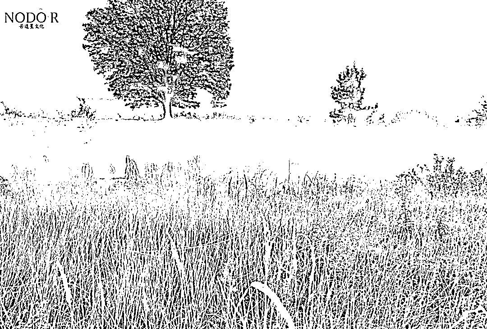

**太阳在天蝎座的行进影响****太阳合相月亮南交点**

**周期：10 月 29 日-11 月 13 日**

**重点影响人群：有个人行星、四轴、交点位于天蝎座、水瓶座、双鱼座、金牛座、巨蟹座、狮子座 5°-21°的人。**

月亮南交点在天蝎座的年岁，对每个人来说都是生之不易和有幸之年。有幸于在艰难困苦中我们学会、尝试、穿越，从碎砂中磨砺出珍珠，从激流中冲刷出光泽。**北交金牛座提醒了生之平静，爱之喜悦。**当我们走过长夜，总有些微光在召唤，当我们身处险境，总有些生活小景，季节小事在抚慰心灵。慢下来，落定于生活，纵然心中还有千疮百孔，时光中等待，慢慢修复和疗愈。这便是天蝎座的太阳与这组月亮交点相遇的诉说。仿若曾经的理想，美好的追求全部掉进了黑洞，无法翻转的生活伴随着痛苦的呐喊，无人能听见，无人能救援。天蝎座给我们疾苦和风景，也引领我们发展出疗愈的能力。阳光中，所有的苦难被温暖，身处寒风也无惧。在你不经意的片刻可能就已发现自己拥有了不曾预期的疗愈力，自愈力。那便是此时的太阳赋予我们的生之勇气。**月亮北交点提供的解药让我们更进一步跨过旧有的意识，与小我阴影作别，让旧有的一切不再束缚、阻拦自己。**我们不再惧怕自己的影子，投影的变形换一个角度便可能是人间胜景、资源或是无尽的活力。而疗愈与力量不在别处，就在平静的当下，也在暴风虐过的心灵土地——那里会一再重生花朵，是眼泪灌溉的自性之花朵。在这个相位之下，勇敢去深入你的实践，坚持脚下的道路，也勇敢践行疗愈的行动吧。这组相位在集体层面可能揭露暗藏已久的意图，随之带来的广泛公众性影响随之显化。**诸多能源、资源的争夺与暗战直接影响、搅乱了大众的生活秩序，将可能在此期间出现明朗的转机与解决方案。****太阳对分天王星**

**周期：11 月 2 日-11 月 17 日**

**重点影响人群：有个人行星、四轴、交点位于天蝎座、摩羯座、水瓶座、双鱼座、金牛座、巨蟹座、狮子座、处女座 9°-24°的人。**

**太阳与逆行中的天王星对分，创造与革新在当下显得尤为艰难。**对分相往往让我们直面阻挡，天王星更是绝对切断了自我的意图、理想和未来。同时，天王星也将**不稳定、突变**的画风带到生活中。若有意识地整合太阳与天王星的原型，我们便需要**放弃一些小我的执著，让天蝎座的激烈、执拗松懈掉，给出一些空间**。这才让天王星的创造性能量得以激活，融入生命积极的创造性意图中。这段时期，**更多人可能会感受到一种“天意难违”，也会经由无法预料的冲突停止或开启一些新的项目、工作和实践**。要相信那些突如其来不是那么的偶然、偶发，宇宙的安排是如此精妙。天王星也是宇宙计划中的“骗子”，没有常理、规律可言。如若你真的被天王星选中，那也必定是内在执著的某个部分“虚”掉了，柔化了，被整合了。有意识地去做这组日天相位的功课，就是去**开启足够大胆、新颖的创造性工作，去接受所有不可能的发生，允许自己有一些非常态的显化与表达——即使很激烈，但你是足够真实的。**这会促使我们对内在真实保持坚定和敞开，让生命呈现出更广博的开阔度，以此去拥抱、承接任何的暴风骤雨。

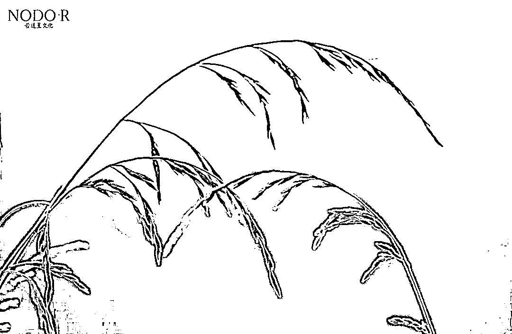

**太阳四分土星**

**周期：11 月 2 日-11 月 19 日**

**重点影响人群：有个人行星、四轴、交点位于天蝎座、水瓶座、双鱼座、金牛座、双子座、巨蟹座、狮子座、天秤座 9°-26°的人。**

2022 年的土星与天王星足够卖力地出演着四分相的剧本。因此，当下的日土四分也是日-土-天“T 三角”的一部分。并且，水瓶座的土星作为“T 三角”的顶点展现出它强大的威力和势力，在守护位置的土星当然比天王星更加稳定坚实而有力。这组相位将**在现实中演化出新旧观念、格局的拉锯战**，**土星代表的老旧权威拥有绝对制衡权，天王星代表的独立、自由与解放的力量也在触动着集体性的觉醒**。别忘了，天王星在进化占星学的层面里包含着**“创伤”**的原型，是那些无意识里的精微心智打开的片刻，也是那些正确的声音在不正确的时空所遭受的创伤与阻碍。**这会让我们看到权力之争，更新迭代的艰难。在意识层面，我们处在新旧两种意识的摇摆、冲刺与转换之下。**深入生活来看，日-土-天“T 三角”让我们**深刻进入创造之前的建构中，却很难快速实现创造。**不断地证明与反证，自我批判与自我突破在此期间也交替上升。当我们试图拥抱意外的可能性时，仍然有声音、力量在阻止我们去开阔生命。而当我们要学习臣服与稳定时，又充满着真实的骚动与不安。那要怎么办呢？也许，**放下、超脱出那些表面的挣扎，让自己静下来，用真实的回应去行动就好。**属于直觉式的决择、举措便是真实的。勇敢肯定自己内心的声音和充满爱的原生的行动力，转化的道路也因此而被开启。**太阳三分海王星**

**周期：11 月 7 日-11 月 23 日**

**重点影响人群：有个人行星、四轴、交点位于天蝎座、水瓶座、双鱼座、金牛座、巨蟹座、狮子座 14°-29°，以及射手座、双鱼座、白羊座、双子座、狮子座、处女座 0°-1°的人。**

海王星已在逆行的末端，本轮日海三分结束一周后，海王星便会在双鱼座重新开始顺行。**海王星会带来无力、消融、迷惑与丧失感，用我们不知不觉的方式拿走太阳的精神与意志力。****消沉与倦怠在此时期都极可能出现，但若有意识的话，我们需要投入灵性生活的建设中**。你有多久没有静坐、冥想了？或是有多久没能用尊重心灵的方式与自己相处，而不是让自己处在无法控制的繁忙与混乱中。**日海三分在水象星座，需要给自己足够大的时空去沉入情绪的海洋。**而对治天蝎座式激越的便只能是平静的方式。但你需要保持对自己的真实，不去避讳那些令你厌恶、恐惧的情绪点，同时用仁慈的眼睛去审视自己，允许自己在激烈中燃烧、释放、清洗意识中的污垢。**这段时期非常有助于深入的灵性练习，或是任何一种疗愈的手法，都能帮助我们从自我深陷迈向自我超越。****太阳六分冥王星**

**周期：11 月 14 日-11 月 23 日**

**重点影响人群：有个人行星、四轴、交点位于天蝎座、摩羯座、水瓶座、双鱼座、白羊座、金牛座、巨蟹座、狮子座、处女座、天秤座 21°-29**°**，以及射手座、双鱼座、白羊座、双子座、狮子座、处女座 0**°**-1**°**的人。**

**太阳与冥王星的六分带来了深邃中的灵活切换，能给予我们更为巧妙的转化路径，指引疗愈的发生。**当我们不能从创伤中复元，不能接受猛烈的现实疼痛时，冥王星用现实的语气向我们证明不可逆的一切。摩羯座也象征着颠峰与顶点，似乎每一个遇到这组相位的人都可以告诉自己：**现在已经是最难了。**这样便是六分相带出的轻松与机遇，当我们知道自己正在面对艰难、危机时，转机与生机就在眼前。这组相位对于任何危机应对的工作是极其有利的。日冥六分可帮助实现快速的调整与转化，也将一些新的视角、机缘和可能性带到面前。

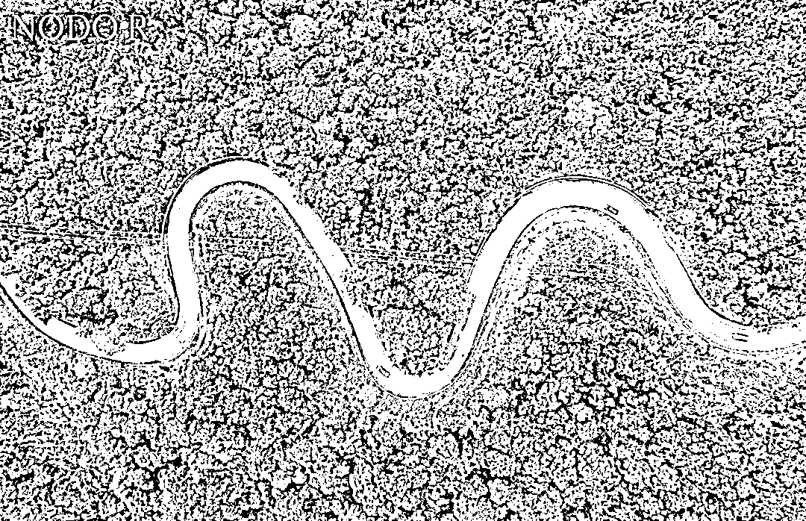

**太阳三分木星**

**周期：11 月 13 日-11 月 29 日**

**重点影响人群：有个人行星、四轴、交点位于天蝎座、水瓶座、双鱼座、金牛座、巨蟹座、狮子座 20°-29**°**，以及射手座、双鱼座、白羊座、双子座、狮子座、处女座 0**°**-7**°**的人。**

日木三分期间，木星正在双鱼座 28°处于顺行前的停滞状态，11 月 24 日，木星便恢复顺行。**此时的日木三分很大程度是本月所有功课的总结性阶段，如同暗夜之后整合的资源在当下可以被运用了。**木星将我们的信念扩张、壮大，也开阔了视野，带来了远见。这个相位其实伴随着日-土-天“T 三角”，日木三分与日冥六分的周期共同在发生，更加说明了**在一切艰苦卓绝的工作后，值得给予自己嘉奖。**当下也是木海合相的周期里。由于木星停滞，将合相的能量锁定在本月。这会给转化中的人们**带来强大的信念，为灵性的修习推波助澜。**而信仰、信念正是木星给予的关键性指引，无论在什么情况下坚守你的信念，我们心灵的导师从不会缺席任何一次自我指引的学习。**双鱼座的木星更加提醒了“相信”的力量，但凡我们所相信的，都会实现。**心灵的魔法便是嘉奖自己曾经真切的，并为之努力的愿。**太阳行进在 12 宫位的影响**

**以出生星图上升星座度数 30°范围内的上升星座为准，如你上升在 0**°**，可以完全参考下列内容；如你上升在 29**°**，则需参考下一上升星座。**

**若道君：****你可以在 app store 或者应用商店搜索“若道”下载 app，输入个人档案，查看行运盘（也可以使用其他星图软件），找到行进冥王星落在出生星图的第几宫，然后对照下文查看。****例如下图中，比尔·盖茨上升在巨蟹座，行进太阳在个人星图的第 4 宫。**

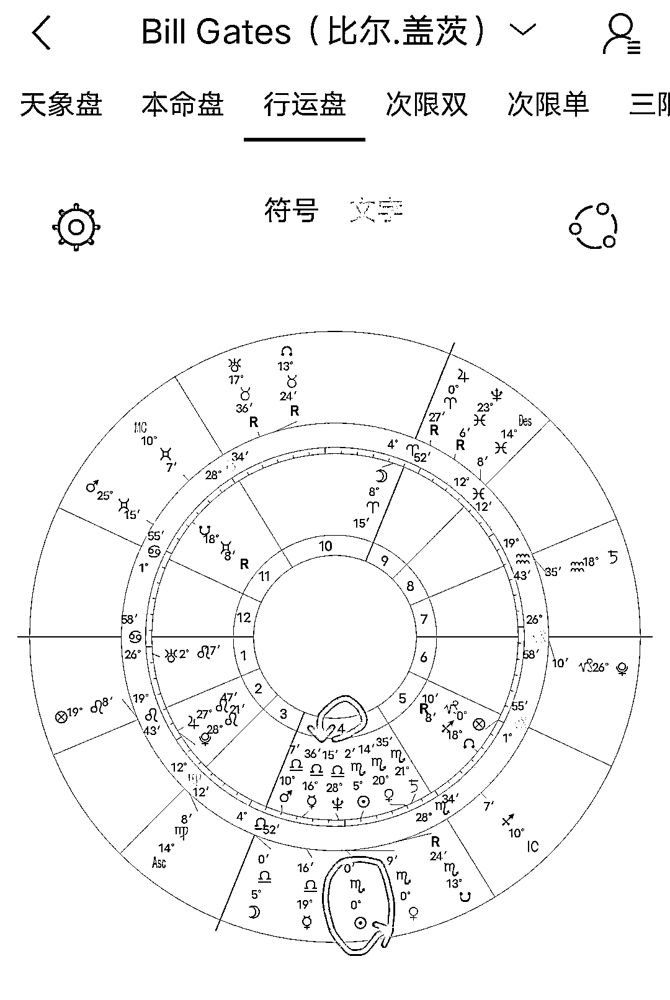

**上升****天蝎座****，太阳行进在*****1*****宫**

未来一个月，你值得透过物质、心灵的方式给予自己更多的自我肯定，以及必要的自我嘉奖：**充满仪式感地赞美自己，给自己一个小礼物，肯定过去一段时期的自我成长。**对你来说，烟火人间的疲累与折磨常常是具有压倒性的，你也从未停止参与人间的“战争”，因为危机和威胁不曾远离你生活的现实。习惯了一个人承担着风云幻变，努力求生的本能下发展出坚挺的毅力，也不再给自己轻易放松，和宽松舒适的生活态度了。**太阳将活力与勇气照进生活，你更拥有话语权，更拥有行动力去行使你生命的权力了。**你可以提醒自己微微上扬嘴角，每一个当下给自己一个小小的赞许，因为你值得。

**上升****天秤座****，太阳行进在*****2*****宫**

**你会感到当下的自己充满担当，开始可以去承担任何具有挑战的工作，为了你自己。**

是的，你必须学会为了自己去做一些值得的事，有价值的尝试，你也可以大胆一些去尝试，甚至带着信念去做。当然这个过程会带给你非同凡响的经验，你会收获到比想像更多的东西。

创造与打破也是伴随着你的尝试、实践同时出现的。也许你会遭遇一些关系的危机，即使是你不想看到的，也要允许一切自然的发生。**只有对自己保持忠诚，才能实践真正的创造，你有实力为自己赋予更为显耀、尊贵的价值。**

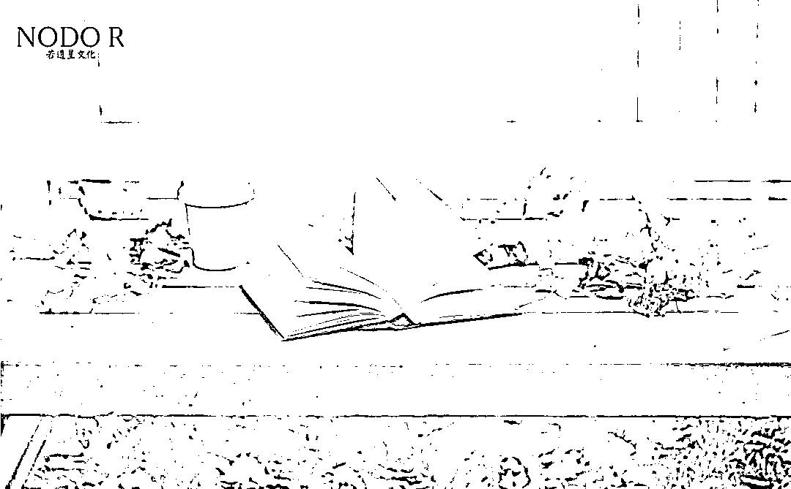

**上升****处女座****，太阳行进在*****3*****宫**

**当下的你可能需要与伴侣一起学习一些心灵功课，或是深入的对话能为你们带来新的融合与相互理解。共同的信念与信仰会为你们之间的联结带来助力。****爱学习的你可以把眼光投入到不曾触及的领域，任何新的可能新都在提醒创造的开启。**不要怀疑自己的眼光和能力，也无需过多向他人救助和确认。你就是你创造的样子，你已经拥有了全新的学习力和创造力，就勇敢接受这新鲜、刺激的可能吧。计划之外的一切就是你需要的学习。

**上升****狮子座****，太阳行进在*****4*****宫**

此刻的你正在实践一些新的创想，长久以来的开启也会进入一个新的阶段了，可能你因此而激动，感到活力渗透着心灵。不过当下的关系也面临着挑战和艰难，一些新的瓶颈需要突破，真诚的对谈与交流，新的相处模式的建立能带来缓和，但这都需要双方深入的对谈。**放下固有的观念和思维去努力理解对方，学习用新的眼光看待一切。**还有，把你心灵的感受力完全敞开来，相信在你们之间有着共同信念的指引，天使会为你们带路。

**上升****巨蟹座****，太阳行进在*****5*****宫**

当下的你可能更容易投入创造性的活动中，去享受就好，不用太过认真地当作一件工作来做。因为你最需要的就是**保持轻松，像孩子一样，去玩乐，专注在乐趣中，让紧绷的能量，激烈的力量轻快地释放。**当然在创造的过程中可能遭遇一些自我阴影的阻碍，觉得自己不够好，或是不能达到满意的效果。这便是当下你的功课，**去学习欣赏、接纳真实的，每时每刻都在更新的自己。**真正的成长也是在对自我勇敢的肯定和赞赏中到来的。

**上升****双子座****，太阳行进在*****6*****宫**

**专心致至投入到工作中去，完成短期内的业务攻坚。**你在今年很可能会感受到巨大的职业压力，过去的模式也面临时代的改变和挑战。**变则通，你不得不去学习新的模式、技能，甚至新的领域。**虽然不提倡“卷”，但适时更新迫在眉睫。还好，当下的你会因为信念而努力，也会透过努力打开契机，宇宙会来帮助每一个积极努力的人，何况你是如此爱学习也善于调整自己与世界的关系。

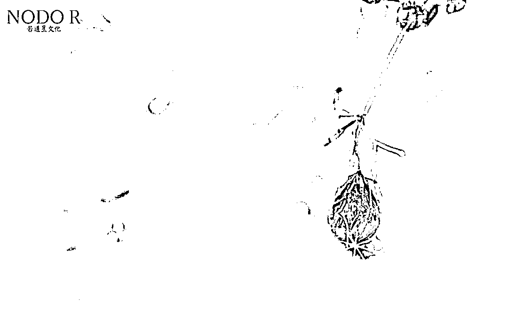

**上升****金牛座****，太阳行进在*****7*****宫**

**当下的你可能在关系中遭遇一些突然的冲突，也可能因这些突变而重新认识了自己。**无论最后是怎样的结果和感受，都可视为一次全新的关系历炼，可能将原本适宜的关系打磨得更为顺滑，也可能令你强烈感受到关系的失衡。经营人生，经营关系，经营事业，说到底都是在一次次历炼中整合自己，每一次危机都意味着转化，当下便是全新的出发点。若你相信一些无形的力量和宇宙充满智慧的安排，便会更加坦然接受这一切。所以，敞开心灵去接纳吧，无论是怎样的路，都是对的路。

**上升****白羊座****，太阳行进在*****8*****宫**

也许你还沉浸在一个人的世界，也许你也享受深入的两人世界，当下的行进都在提醒你**在深入的融合中去除边界。**只有在无界的状态下，心灵的维度将得到提升，你会从浩瀚中见真理，从微小中体会到博大。生命的曼妙将经由另一个人，另一个更大的整体向你阐释和展开来。**灵性的生活，灵性的信念或是灵性的修习法都能在此时为你的自我成长护航、加持。**当下你只需要一种精进，那就是对信仰的精进，对无限的绝对相信。如果你顺着相信去努力实践，不久之后就会看到奇迹般的实现。

**上升****双鱼座****，太阳行进在*****9*****宫**

**当下的你需要投入对世界的热情探索中，即使你已历经一些令人失望的幻灭与丧失，痛苦与消融，新的世界在向你展开，学会宽广地拥抱，便是对自我的救赎。**把你的热情投入那些更遥远的领域吧，即使当下也还有些阻碍让你无法迈开脚步前行。但心灵的魔法已经开始起作用，转化的契机正在打开，如果你愿意去调整，去相信新的可能性，在走不通的地方重新建立新的通道，那祝福你：未来可期。

**上升****水瓶座****，太阳行进在*****10*****宫**

**你能感受到巨大的拉扯在促使你在现实中做出革新性的尝试与改变，关于家庭和事业，过去这一年你为之协调、付出了很多。**然而当下的你很难确定自己做得对还是不足，并且还存在可能的变数，再次打破这难以平衡的现实。在经历动荡之后的心灵需要安适与温柔的交流，而空落却时常来到身旁提醒自己努力还不够，前路还漫长。当下的你极需**提振精神，努力向阴影挥别，无论过去做得好与不好，现在就是重启的时机。改变了信念，你就改变了未来。**

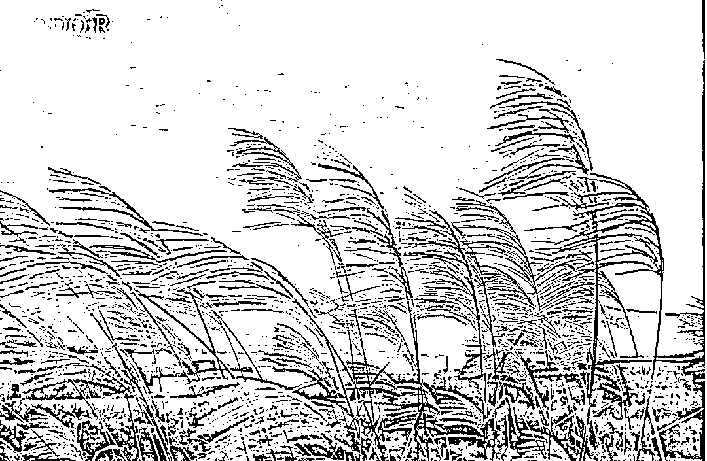

**上升****摩羯座****，太阳行进在*****11*****宫**

**与你的团队、同盟站在一起你会更有力量。**当下的你也正经历一些个人与集体之间的冲突、矛盾，但团队的力量是恒定有力的，调和一定的价值观与行动力，一切会变得不一样。创造性的动能可能受限于金钱，也可以去尝试改变路径和步骤，给予新生的苗头以空间是最重要的，把创造的权力充分赋予自己。

**上升****射手座****，太阳行进在*****12*****宫**

**多一些时间一个人深思，静下来，慢下来，关掉手机，保持静谧。**当下的你需要这么为自己创造空间，休息是为了走更远的路，花更多时间去打造、拜访你心灵的庙堂，与你的内在神圣对话。这样的过程不会直接化解你的现实困境，却会给予你完全不样的活力、精力，让你可以重新站在问题前思考和改变。蛮力无法通过的地方就需要柔软的转化力，而你手握的信念是心中的宝剑，是真心历炼过的刚柔相济，也是信仰道路上的自性光明。

**版权声明：**原创文章由作者授权首发于若道平台，欢迎转发，反对抄袭。友号转载请申请白名单。

**END**

**郑玮玲**

ISAR（国际占星研究协会）认证占星师（2016 年获得）

若道占星专栏作者

将占星咨询、教学与音乐、舞蹈相结合的疗愈者

**微信号**：zhengviolin

**新浪微博**：@郑玮玲

**微信公众号**：Sampriya-Astrology

长按打赏

**20 位来自世界各地的占星师****带来 19 场沙龙——新世界的觉醒****详情可点击下图**

**学习占星学****点击下图了解课程详情**

**微信又双叒叕改版啦，不想错过若道君的推送？**
****就把若道设为****星标****以及点点****“在看”****吧！******▼**

**喜欢就点一下“在看”吧！****报名直达入口**

# 土天四分逐渐过去，该加仓还是继续等待？ | 梅里曼 11 月上证+黄金报告上线！

> 原文：[`mp.weixin.qq.com/s?__biz=MzA5NjA0NTAxNg==&mid=2651491983&idx=2&sn=3e5aef96ac219afb4dd421bfc33b024f&chksm=8b483c38bc3fb52ec2bc36e67f3698ded0e88b4e08ff79785eaa801cbc565e931c8132142632&scene=126&sessionid=1692737735#rd`](http://mp.weixin.qq.com/s?__biz=MzA5NjA0NTAxNg==&mid=2651491983&idx=2&sn=3e5aef96ac219afb4dd421bfc33b024f&chksm=8b483c38bc3fb52ec2bc36e67f3698ded0e88b4e08ff79785eaa801cbc565e931c8132142632&scene=126&sessionid=1692737735#rd)

10 月 12 日，上证跌到了 2934，重新测试了在 4 月 27 日形成的 2022 年年度低点 2863，然后开始反弹。鉴于上证在 10 月 1 日-7 日之间休假，10 月 12 日这一低点是位于梅里曼老师一直提到的今年下半年最重要的天象——土天四分、木星在土天四分中点的天象的范围之内。不过，与前几次土天四分出现波峰相反，此次出现了波谷。

| 上证指数日 K 线图

| 上证指数周 K 线图

从基本周期来看，如果 10 月 12 日的低点是从 4 月低点 2863 开始的一个拉长的基本周期的第 23 周，那么，一个新的 13 周-20 周的基本周期刚刚开始，本周仅仅是第 1 周。**这个基本周期完全可能开始一波上升行情。**但是，如果 8 月 2 日-4 日形成的低点是基本周期的开始，那么 10 月 12 日的低点正是处于这个基本周期的半周期位置，**上证完全可能跌向更深的低点。**从牛市的观点来看，很多股票经过今年以来的下跌，已经跌到了看起来很便宜的位置；但是，从熊市的观点来看，目前经济大环境存在非常大的下行压力。未来的天象又有哪些呢？**土星 10 月 23 日恢复顺行，土星顺行常常是一个市场出现反转的标志**。同时，10 月 23 日-24 日，金星和太阳都将进入天蝎座，而且将在 11 月 5 日-11 日和土星、天王星形成 T 三角。是大胆加仓，还是继续谨慎观察？金融占星大师雷蒙德·梅里曼的《2022 年 11 月上证指数报告》已上线，你可以听听梅里曼老师的看法。《2022 年 11 月黄金报告》也已上线，欢迎购买。**此外，雷蒙德·梅里曼 2023 年预报及沙龙已开始双 11 优惠预售，将帮助你对 2023 年的市场风云变化加深了解。****长按下图识别二维码了解更多详情**

**11 月上证报告上线**

**上证指数月度报告价格****单月报告**：280 元/月 **季度套餐价格**：780 元（260 元/月）**年度套餐价格**：2400 元（200 元/月）**双报告年度套餐更优惠（直降 900 元）****12 个月黄金报告+12 个月上证指数报告：仅需 3900 元****长按下图识别二维码购买上证指数报告**
▼

“**黄金是金钱。其他的只是信贷。**

**——约翰·皮尔庞特·摩根**

”

| 黄金周 K 线图

**作为交易者和投资者，我们已经迎来了或许是今年最重要的地球宇宙学时间段：土天四分的时间段，它的宇宙影响力会持续到 11 月中旬。**在上个月，发生许多重要的大事件，俄乌战争升级，伊朗动乱，美国再一次对中国发起芯片战，整个世界局势动荡加剧。

很多国家的股票市场都在这次的土天四分时期下跌到历史低点。货币和债券市场也是同样，欧元、日元和美国中期国债数十年来的低点，黄金也是一样。9 月 28 日，黄金跌到 1622 美元，距离今年 3 月份黄金最高点 2078 已经跌去 21.94%。

不过，我们经历了 2 年的土天四分正在逐渐成为过去式。虽然其影响还会持续。9 月 28 日的低点 1622 是黄金走势 2 年来的低点。

| 黄金日 K 线图

黄金有一个 31.33 个月的周期，而半周期是 16 个月，其容许度在 13-19 个月之间。从上个周期低点是 2021 年 3 月的低点 1673，而 10 月是第 19 个月。   **所以，有没有可能，9 月 28 日的低点 1622 已经完成了 10 个月的半周期的低点，黄金可能展开一波反弹？如果真是如此，黄金是不是迎来了一个短期的投资机会？**  11 月份黄金报告已经上线，欢迎了解。也可以按照季度和 1 年期订阅，有更多优惠。季度和年度的好处是，你可以持续了解梅里曼老师对于不断在变化的市场的看法。  即便他某一次看法和市场不一致，你也看到在下一期他如何调整自己的看法，并看到金融占星在一个长期时间段内对你把控风险的帮助。而能够长期控制风险、尽量找到安全的投资时机才是投资的长久之计。  点击阅读原文，雷蒙德·梅里曼黄金周期 2022 年 11 月报告带来有 40 年黄金市场研究经验的世界著名金融占星大师雷蒙德·梅里曼对当前黄金市场的研究。投资有收益，投资有风险，希望金融占星学的研究帮助你更好地评估你的投资。

**11 月黄金报告上线**

**黄金月度报告价格****单月报告**：280 元/月 **季度套餐价格**：780 元（260 元/月）**年度套餐价格**：2400 元（200 元/月）**双报告年度套餐更优惠（直降 900 元）****12 个月黄金报告+12 个月上证指数报告：仅需 3900 元****长按下图识别二维码购买黄金报告**
▼

**购买者需知**

**① **梅里曼市场时机学院《中国上证指数月度研究报告》是梅里曼市场时机学院（以下简称 MMA）的研究“预报”，而不是市场“预测”，是梅里曼老师及 MMA 金融占星分析师对人类活动周期历史与行星周期之间相关性的研究，二者在大部分情况下具有 80%或更高的相关性，而不是因果关系。报告中的研究完全存在错误的可能性。即便是非常认真的研究和几十年的研究经验，金融占星师无法总是正确地解读出各种征象在实际层面上会如何相互作用，并显化为事件结果。

所以请将报告看作一个研究参考，务必结合其他市场研究和你个人对市场的理解，根据你的自由意志做决策。

**②** 此报告一旦售出，**即不接受退款。**

**③** 上证、黄金月度报告每月固定 1 期，**并非都是在每月相同日期发布。**

**④** **我们收到英文报告的当天，即发布该英文报告。3 天后，上线报告中文版。此报告仅支持手机网页阅读，不支持电脑阅读和下载。****以上须知，请仔细阅读。一旦付款，即视为已了解并接受所有须知内容。**在过去的 40 年中，唯有梅里曼逐渐完善，并在梅里曼市场时机学院月度周期报告中阐释了将地球宇宙学与周期相结合的研究方法，以惊人的精确性预报了黄金价格发生重大变化的时间。**黄金购买 Tip**

各大银行均可购买黄金或黄金 EFT 基金，也可以在诸如天天基金或者支付宝购买黄金及黄金相关产品。不明白的可以百度搜索。

**购买后如何查看报告？**

**购买后有疑问怎么办？**请联系技术客服
**微信：nodoor201705**
**购买报告直达入口**

# 重大天象丨土星顺行了！！！

> 原文：[`mp.weixin.qq.com/s?__biz=MzA5NjA0NTAxNg==&mid=2651491840&idx=1&sn=0ad9abdd5ba49a9b30e4279187f43e4e&chksm=8b483cb7bc3fb5a18a48b86063eed628d3d60b4ae607b8b5b9e3c4cf39ccb57991be25f29438&scene=126&sessionid=1692737735#rd`](http://mp.weixin.qq.com/s?__biz=MzA5NjA0NTAxNg==&mid=2651491840&idx=1&sn=0ad9abdd5ba49a9b30e4279187f43e4e&chksm=8b483cb7bc3fb5a18a48b86063eed628d3d60b4ae607b8b5b9e3c4cf39ccb57991be25f29438&scene=126&sessionid=1692737735#rd)

****************☆ 后台回复“今日”，给你一句生命态度****************

作者/傅莎珈 ISAR 认证占星师
编辑/翀子 封面/书君 图片/稿定设计在水星、冥王星顺行之后，土星紧接着在水瓶座 18°恢复顺行。此次顺行，对集体与个人都意味着什么？我们需要从中学习怎样的智慧？我们的生活可以如何调整？这篇文章带来一些启发。

**10 月 23 日中午 12 点 07 分, 土星在水瓶座 18º35′顺行。土星逆行和顺行，在这个 18º 的位置，停留的时间极长：从 10 月 1 日到 11 月 14 日。土星上一次进入水瓶座 18°，是 2022 年 2 月 22 日，3 月 3 日离开。**

****试炼行为和新的思维方式之间的协调****

**2 月 22 日到 3 月 3 日期间发生了什么？**

*   **俄乌战争冲突爆发。这次顺行，俄乌局势进入新阶段。**

*   **2 月 20 日，北京冬奥会结束，中国获得了前所未有的突破。**

*   **疫情很快在 3 月份席卷而来。**

每次行星的顺行-逆行-顺行，都在帮助我们重新认识某一个主题。

**对水瓶座的土星行进来说，这是个借助疫情、社会旧有秩序被打破、国家在整个社会环境里的地位发生变化，提醒每个人思考自己此生的个人志向、在社会中的作用，以及未来想要的发展。**

你需要思考：在现有生命状态下，你个人的生命目标、在人群中的角色、想要服务和参与到哪些价值观的传播和创造之中，以推动社会的进展……

在撒比恩征象上，水瓶座 18º 意味着人类更深的潜能被全面激发，并且产生了为更伟大、美妙的存有而奉献的渴望，开始着手进行新世界的创建。消极的面向，则是通过特殊的无能来自我背叛，抗拒承担使命。

这个主题，对国家来说也一样：理清国家的发展策略、在国际环境里的角色、想要推动的新的国际秩序背后的理念……

刚刚结束的大会，给了国家层面的发展思维，你个人的未来大会，进展如何？已经召开了吗？在酝酿筹备中？还是毫无觉知？土星在水瓶座顺行了，接下来的一个月，可以慢慢着手思考这个问题。

这次土星顺行伴随着与天秤座水星的三分相，土星和天王星的四分相位即将出相，**新老交替正在完成与落地，新的规则、法度将在未来一段时间面世。**这是个漫长的落地过程，在新的思想、价值观成型后，所有人都要去适应这个思维系统，并且落实成为行动。

火星即将在双子座长达半年的逆行和顺行，就是给人适应和调整的时间。**各种意见扑面而来，帮助每个人看见事物的更多面向、放弃二元对立的旧有思维方式，更全面的体验有关独立、自由、服务、奉献的含义。**

举个例子，请定义自由。每个人的观点，一定有相似之处，也一定有不同之处。

你是否能尊重自己的定义、找到类似价值观的小伙伴，一起创造基于这个价值观的生活环境？同时接纳其他对自由的不同定义，不排斥/打压，甚至好奇的体会他人的自由里是否有某些自己未曾想到的信息？

又比如，我要谈恋爱，要找灵魂伴侣。那么请定义一下，对你来说什么叫做灵魂伴侣。往往，一部分人所谓的灵魂伴侣，不如叫做理想爹妈的替代品———你真的理解独立的意思是要对自己的选择负责吗？

**最后一个季度，慢慢做，多尝试，多聆听，多思考。**

****开启感官平衡，体验此时此刻****

水瓶座的神话故事也和普罗米修斯有关：普罗米修斯作为泰坦神，在诸神之战的时候帮助宙斯而不是同辈的克洛诺斯；在人类过着茹毛饮血生活、即将被宙斯毁灭的时候，又盗来火种帮助人类。

他的行为，呈现出一种理想主义色彩，不满足于此刻的生活，永远都在追求更好、更文明的征象。

**人们在过去三年里，体会到了高度发展、追求效率和卓越、赢在起跑线上，和人工智能竞赛带来的后果。**

“卷”文化是水瓶座世界的最好展现。人类的学习能力、工作效率在提高的同时，工作时间延长、身体健康状况恶化、环境危机加、更有多种情绪问题出现：

在“卷”世界里呆久了，我们最大的变化是幸福快乐感受的丧失，创造力和学习能力开始退化，卷不动了。

当我们因为厌倦“卷”文化，开始学习艺术，参与各种戏剧表演，对芳疗、宠物、手工、烹调、户外露营，运动感兴趣，我们不断参加各种工作坊、做咨询，学习冥想、正念、瑜伽、中医、佛法……

我们渴望获得解脱，干掉那些不愉快的感受，毁灭不幸福的体验。我们可能又回到了水瓶座的老路上，在追求理想道路上的焦灼：怎么还没有变好！

水瓶座的神话传说和现实生活体验指出一个悖论：在追求完美卓越、不断挑战人类极限的过程中，我们的愉悦感和幸福感快速丧失……

天王星的神话传说里，从泡沫中诞生的金星阿芙罗狄忒，聚合了大地母亲的感官享受和天王星父亲的理想主义。

身体感官提供的是无意识的、直觉的、连接式而非逻辑的智慧。它由月亮、金星和海王星执掌，优美自然，有流动性，没有公式，注重此时此刻。

**这次土星顺行，我们需要思考如何将非逻辑/感官的智慧，加入社会秩序、生活模式之中。**这平衡了土星恢复顺行后、面对社会秩序重建过程中必然带来的压力、限制、无聊、沉重、沮丧的感受。

举个例子，最近我和一个朋友聊有关洗涤产品中的香气。我说我用很多精油来净化空间，朋友问我不同精油的功效，希望我给出一个公式，在什么场合用什么。

我觉得这恰恰是很多人在使用精油时候的障碍：人们觉得学习需要公式，要有使用指南，然后才能去接触精油。可我完全是根据嗅觉以及对空间的感受去找精油。有趣的是，每次点上精油香薰后去翻找功效说明，总是对症此时此刻身体/情绪/空间的需要。

这不是课堂、书本的学习，而是打开感官跟随身体的指引，融入空间。在这种感觉体验的基础上，再去学习相关知识往往触类旁通，能自己翻出很多气味的花样来，而且充满乐趣。经验和知识成为感受的背书，感受和创造为生硬的知识带来各种身临其境的快乐。

你能打开感官去生活和学习吗？能放下要成为更好自己的渴望去生活与学习吗？不是理智的分析和选择，而是经由无意识、直觉、感官的喜悦推动的灵感，最后形成“啊哈”式的领悟：

**我要聚焦在这里建立自己的新生活，新形象，并且由衷的感觉自由、快乐、轻松、喜悦，以及毫无财务担忧。**

**唤醒你的感受力**

**土星顺行的时候，太阳与金星合相在天秤座的尾巴 29º，**太阳灼烧了金星的光芒，双方共同处于火星界，一个充满争斗气息的地域。四小时后，金星、太阳依次进入天蝎座，黑暗的天蝎座，象征死亡与失去的地方……

伴随土星在水瓶座顺行，是不是看起来很可怕？

既然金星/月亮/海王星代表打开感官，觉察此时此刻的感受，那会不会打开感官迎面而来的是激烈、深刻、高强度的情绪感受？听着就很可怕哎。

是的。日金合相在天秤座尾度，给我们带来的课题是一场有关结束的选择题。**一些合作、契约、承诺、情感关系就是走到了尽头。尤其是，当土星顺行带来新的标准、秩序、目标，一些关系/契约可能就不再符合要求，****但我们可能会因为安全感/习惯/依恋，继续紧抓不放。**

其次，土星这次恢复顺行，会拉动集体意识体验更深的非逻辑、直觉等属于阴性的智慧。这会在生活各层面，触发人们内在深层的和母亲原型之间的羁绊：

*   **独立 VS 对未能承担父母期待的内疚/羞耻；**

*   **在两性关系中试图寻找合一感的幻灭感反复出现；**

*   **少年时代性启蒙时期遭遇的阴影记忆；**

*   **身为女性从出生开始就背负的惩罚；**

*   **活着不易的感受；**

*   **......**

这些可能都会被一一唤醒。我们的感受能力在苏醒的过程中， 需要首先释放僵硬，才能恢复敏锐。

在接下来的一段时间内，我特别邀请大家，面对涌动的情绪，打开五感。你会如何对待一个进入你家的满身是伤的小猫咪/小狗？请以这样的态度对待自己。

在僵硬“解冻”的过程中，我们时常因为受到强烈的拉动/推动，有着毁灭和死亡的感受；在遇见陌生的柔软、接纳和聆听的时候，我们会有无意识的推开动作、有更深的自我攻击或攻击他人…….

**直到你看见压抑、苦痛和对升华的渴望几乎同时发生在身上，并停止反抗，解冻才会发生，感官之伤才会被治愈，才会真正感受到天地间流动的生命力，感受到大地母亲和天空之父的滋养与支持，从未停歇。**

在自然界，太阳进入天蝎座意味着秋季的尾声，日照时间越来越短，寒冷来袭。有意思的是，当到达冬至这个节气，反而是一道门槛，跨过冬至，北半球的日照时间将逐渐增加。天蝎座，仿佛是四季里的至暗之门，同时开启了生命的启动之门。

死亡是生命的回照，死亡显示出生的最高意义，是生的补充。**请带着祝福，热泪和微笑着告别，一些新的人，新的关系，新的生活，正在告别中向你走来。**

**尾声**

这次土星顺行，注定是充满冲击的。祝福大家能有勇气安于当下，无论环境、社会、个人生活里发生什么，都带着觉察和柔软的态度，接受这些发生。

有时候，坚持让我们变得更强大，有时候，放手也会。大部分的苦痛始于不肯离场、不愿放手的执着。而告别，为我们打开一扇全新的生命之门。归于当下，让生命重新回到你我的身上。愿生命之花，时时凋谢，每每重新绽放，冶艳如火。

**版权声明**：原创文章由作者授权首发于若道平台，欢迎转发，反对抄袭。友号转载请申请白名单。

**END**

****傅莎珈****

ISAR 认证占星师（2015 年获得）

整合疗愈占星师

国际著名传播集团工作 20 年

**微信公众号**：Helloshajia

长按打赏

**若道核心课****L5 研讨小组学员分享****今晚直播等你来~**

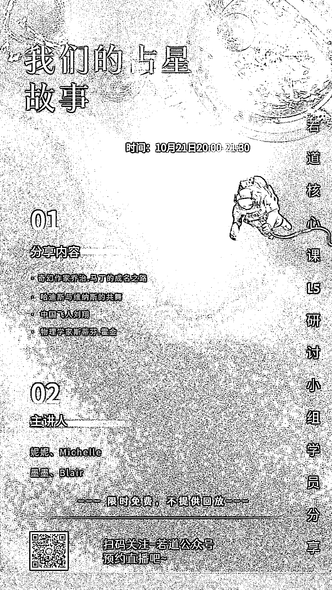

**点击下方预约按钮参与直播~**

<mpvideosnap class="js_uneditable custom_select_card channels_live_iframe" data-pluginname="videosnap" data-headimgurl="https://wx.qlogo.cn/finderhead/PiajxSqBRaEJYnVsqWfEX9qA0sI6hNVKsDfyzfPZ92WZMZyBpZWU5NA/0" data-username="v2_060000231003b20faec8c4e68a1ec2d4ca07e434b07755bbf47e7053a3059defd2c9d6c68a20@finder" data-nickname="若道" data-desc="将在 10 月 21 日 20:00 直播" data-intro="若道核心课程 L5 研讨小组主题分享会：我们的占星故事" data-noticeid="finderlivenotice-v2_060000231003b20faec8c4e68a1ec2d4ca07e434b07755bbf47e7053a3059defd2c9d6c68a20@finder-1665455470365480-160449972" data-type="live"></mpvideosnap>**20 位来自世界各地的占星师****带来 19 场沙龙——新世界的觉醒****详情可点击下图**

**学习占星学****点击下图了解课程详情**

**微信又双叒叕改版啦，不想错过若道君的推送？**
****就把若道设为****星标****以及点点****“在看”****吧！******▼**

**喜欢就点一下“在看”吧！****报名直达入口**

# 12 星座自画像丨这组星座的世界，“我和我们”是永恒主题

> 原文：[`mp.weixin.qq.com/s?__biz=MzA5NjA0NTAxNg==&mid=2651491840&idx=2&sn=599618415aec280bf233816f7c0522e4&chksm=8b483cb7bc3fb5a1073a156bcae0e994ac9afa7f719d4c0dcfda7c045de153239c769262b658&scene=126&sessionid=1692737735#rd`](http://mp.weixin.qq.com/s?__biz=MzA5NjA0NTAxNg==&mid=2651491840&idx=2&sn=599618415aec280bf233816f7c0522e4&chksm=8b483cb7bc3fb5a1073a156bcae0e994ac9afa7f719d4c0dcfda7c045de153239c769262b658&scene=126&sessionid=1692737735#rd)

作者/克里斯蒂娜·罗登贝克

译者/亚麻林恩 校对/江艺

编辑/翀子 文章图片及注释/作者提供

本系列是克里斯蒂·罗登贝克老师撰写的艺术中的 12 星座自画像，角度独特，语句生动。此文是白羊座与天秤座的自画像，这两个星座的画家如何呈现自己样子呢？如果你对星座和占星学感兴趣，大卫老师参与授课的【[ISAR 认证职业占星师文凭课程](http://mp.weixin.qq.com/s?__biz=MjM5MjQwNjAyMQ==&mid=2649440443&idx=7&sn=60b56b090462bcbc9041850df2f1ed3e&chksm=beb92fd189cea6c767594c8f52565bcb0cfe2e7a5dd1aee41b4adb4287b6e37b63d81f071a53&scene=21#wechat_redirect)】正在进行中，欢迎点击链接了解更多详情哦~**白羊座的自画像**为什么当占星师谈及最有创造力的星座时，很少脱口说出白羊座呢？公羊的星座是**开始、源头、起点、种子，**因此蕴含着巨大的**创造力**。尤其是当**太阳**，这个生命源泉，落在白羊座时，当然，这是**曜升**的位置。

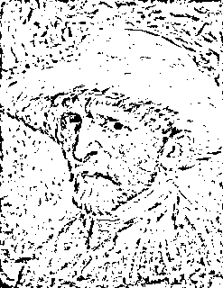

| 文特森·梵高，生于 1895 年 3 月 30 日

白羊座的守护星是火星（Mars）——战争之星，由此我们得到了“战争的”（martial）这个词。火星也是行动之星。火星或太阳白羊座落位好的人**大多**是**“实干家****”**。其他人可能会谈论、分析、幻想、好奇、或者是服从命令，而火星之人先试了再说。他们可能并不总是成功，**也不知道为什么要这样做，**但通常他们对生活的态度，是尝试一下。

绘画也是如此，这样说是因为我们可以来看看一些很棒的自画像。我必须从**梵高**开始——不仅因为他的作品如此之棒，又如此之多的自画像，还因为他就是这样的一个白羊座。**显然，白羊座主宰头部，他的自画像大多从颈部向上。**他的作品有来自初始星座的未驯服的、原始的能量，有一种时尚或流行式样所不能传达的纯粹。梵高是**自学成才**，他的画自然都关乎**自我表达**。他把自己的灵魂抛在画布上，沉浸在它**原始的荣耀和痛苦**之中。他创作的速度也很快，这是白羊式的另一特质，他常常用（近代发明的）软管中的**纯颜料**。有趣的是他仍然很受欢迎。你可能会认为我们都厌倦了那些向日葵和那顶草帽，但事实上，看到他作品的感官冲击，仍然几乎和第一次见到时一样的新鲜和令人激动。

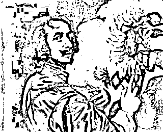

| 安东尼·范戴克生于 1599 年 3 月 22 日

这是另一位**和向日葵一起的白羊座。安东尼·范戴克爵士**是他那个时代最伟大的肖像画家，当下他的作品仍旧让人一见倾心。看着那双 17 世纪的眼睛，你会觉得，或许你可以跨时空交流。

| 拉斐尔，生于 1483 年 4 月 6 日或 3 月 28 日    

**另一位伟大的画家拉斐尔，**他创作的柔美的圣母像是**罗马文艺复兴时期**众人争抢的宠儿，他留下了一个谜。据说这幅素描画的肯定是他，但还有其他几幅自画像，可能是也可能不是他。他的宗教绘画有一个突出的特点，即他对（尤其是）圣母有着强烈清晰的想象力。他的圣母像既超凡美丽，又非常真实。

| 马克斯·恩斯特，生于 1891 年 4 月 2 日

**天秤座的自画像**从理论上讲，**没有什么比自画像更能揭示人物性格的了，**然而这个星座的艺术家们却并未直截了当的如是表现。他们的脸融入了图片的背景，成为主题的一部分。

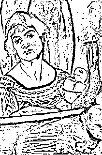

| 苏珊娜·瓦拉顿（1865 年 9 月 23 日）

如果对比巨蟹座，其灵魂看起来不在画布上。对于天秤座来说，会讲故事的画才完整。我怀疑这可能和**太阳（自我）在天秤座落陷**有关。这个自我不是大声或直接表达的。我不想说**天秤座的太阳是谦逊的，确切地说，他们其实往往只能在与对方（对立面）的关系中找到意义。**奇怪的是，这些肖像画**不太关心人物个性，却沉迷于艺术行为本身。**金星（艺术）当然是守护星，但她是风象的，和智力以及社会因素有关。苏珊娜·瓦拉顿画了很多自画像。我喜欢这幅。你越看，**越觉得它复杂和奇怪**——她的头在左上角，前方有一块醒目的蓝色。

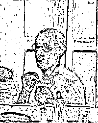

| 皮埃尔·博纳尔（2006 年 10 月 31 日）

皮埃尔·博纳尔装饰着他的画布，**平面视角，把他们变成了一个颜色和纹理的协奏曲。**在这幅画中，他几乎没把自己看成一个人，只能在明亮背景的阴影中看到他的头的效果。

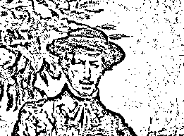

| 翁贝托·博乔尼（1882 年 10 月 19 日）

未来主义者翁贝托·博乔尼把自己画得像一张快照，也是非常平面。事实上，我猜他是根据照片画的这幅画。他似乎斜视着太阳。这幅画的大片奶油色与博纳尔的画相呼应。

| 阿尔贝托·贾科梅蒂（1901 年 10 月 10 日）

| 高迪尔·布热斯卡（1891 年 10 月 4 日）

这很有趣。两位艺术家，亨利·高迪尔·布热斯卡和阿尔贝托·贾科梅蒂首先都是雕塑家。现实生活中，贾科梅蒂和他的作品一样又瘦又结实。但在这儿我们可以看到他其实的确能做画。如果你还未搞清（天秤座的）自画像是哪种模式，那么来看看罗伯特·劳申伯格。

| 罗伯特·劳申伯格（1925 年 10 月 22 日）

****版权声明：**本文由若道翻译发布，欢迎转发，反对抄袭。友号转载请申请白名单。**

**END**

**克里斯蒂娜·罗登贝克**

克里斯蒂娜·罗登贝克，若道签约老师。全职职业占星师，从业 20 余年，在其网站长期撰写时事、艺术和文化的文章；定期在英国授课，并保持蓬勃发展的专业实践。

**拥有****51 年****占星实践经验的****若道创始人****前 ISAR 全球副主席****前 ISAR 全球职业占星师资质认证主席****大卫·瑞雷**

**和**

**2019 年第二届、2021 年第三届核心课中**

**与苏·汤普金斯老师****联合授课****的**

**ISAR 认证职业占星师**

**咔咔（Caroline）**

**二人合力打造**

**2022 年 ****若道全新核心占星课程**

**点击下图了解更多课程详情** 

**

**微信又双叒叕改版啦，不想错过若道君的推送？**
****就把若道设为****星标****以及点点****“在看”****吧！******▼**

**喜欢就点一下“在看”吧！****报名直达入口**

# 插班中丨 ISAR 认证职业占星师文凭课程：开启“爱好变职业”的创收自由之路

> 原文：[`mp.weixin.qq.com/s?__biz=MzA5NjA0NTAxNg==&mid=2651491840&idx=3&sn=512fd5abe337c8ef38f82062897635c1&chksm=8b483cb7bc3fb5a169bd8d014e1f50e053bfa8fc4cf2d688d8eead4247bcee86315daf66c0fa&scene=126&sessionid=1692737735#rd`](http://mp.weixin.qq.com/s?__biz=MzA5NjA0NTAxNg==&mid=2651491840&idx=3&sn=512fd5abe337c8ef38f82062897635c1&chksm=8b483cb7bc3fb5a169bd8d014e1f50e053bfa8fc4cf2d688d8eead4247bcee86315daf66c0fa&scene=126&sessionid=1692737735#rd)

**2022 年，是世界和中国 40 年未有之大变局的开始。**

俄乌战争打破了欧洲大陆乃至全世界的和平局面，而新冠疫情也给中国经济带来前所未有之挑战。

如果你关心经济形势和世界局势，你会有这种的感觉，我们将面临一场深刻的危机，而这不是短期内可以结束的。

**占星学的看法也是如此。**

4 月青年失业率（16 岁到 24 岁）中国达 18.2%，一些背着房贷、教育、医疗负担的中年人突然失业更是整个家庭整个难以承受之重。为了更好准备面对这样的时代变化，连《北京日报》这样的官方媒体也在呼吁：**“开拓副业，让自己有多元化发展的生存能力”。**

**而这门课程，就是为了这样一个目标准备的。**

**占星学是非常好的“开展副业”的选择**

这个**为期 16 个月**的课程通过并不算长的时间和并不算高的投资，不仅可以帮助你学到一个终身可用的技艺，而且也可以选择成为自助助人的占星师，**开启受益终生的第二事业。**未来是个体崛起的时代，大量个体被鼓励独立发展，比如网红、自由职业、自媒体、咨询师等，他们都不需要传统的办公室。社会越发达，人的独立性就越强，未来有能力的人都可以变成独立的经济体。

**占星学也是越老越好的职业**

和一些技术变化非常快的职业不同，**占星学的技术层面非常稳定，不会快速迭代变化，**同时，掌握好占星学、能够做一场好的咨询又需要个人自身大量实践和对生命的深刻理解，而这些都是时间和岁月带来的。

**占星学是现代社会需要的助人职业**

社会快速发展和变化人们似乎越来越无法掌控自己的生活，这给很多人带来巨大的焦虑，**抚慰心灵的咨询市场需求巨大。**而占星学可以让人从前所未有的角度了解自己，了解目前和未来所处的周期，挑战的意义，不论对于深入的个人成长探寻，还是预测未来的周期，都又其独一无二的价值。

**ISAR 认证职业占星师的独有培训**

目前占星学的培训市场鱼龙混杂。而 ISAR（国际占星研究协会）是一个包含了 47 个国家在内的国际占星组织，多年来致力于占星的教育和研究，提升占星教育的品质和职业占星师的能力，在国际占星领域备受尊重。今年，ISAR 对于成为 ISAR 认证职业占星师提出了更高的要求，**所有想要获得 ISAR 职业占星认证的申请者均需要在 ISAR 的附属学校通过 500 个小时的研习（包含****主课****、选修课、沙龙、作业、讲座、工作坊等等）。**

**而这门核心占星学课程就是为此而准备的。**

**2022 年，鉴于对若道在占星教学领域所做的持续努力和高品质的课程服务，ISAR 特别授予若道核心课程为 ISAR 文凭课程，所有在若道学习，并通过若道毕业考试的同学将获得 ISAR 颁发的学历文凭（Diploma）。**

**你的占星核心课老师是谁？**

**拥有****51 年****占星实践经验的****若道创始人****前 ISAR 全球副主席****前 ISAR 全球职业占星师资质认证主席****大卫·瑞雷**

**和**

**2019 年第二届、2021 年第三届核心课中**

**与苏·汤普金斯老师****联合授课****的**

**ISAR 认证职业占星师**

**咔咔（Caroline）**

**二人合力打造**

**2022 年 ****若道全新核心占星课程**

**咔咔老师给同学的寄语：**

（向上滑动查看内容）

**亲爱的同学们：**

我为什么学占星学？

2000 年的时候我还是一个在网上搜索天蝎座和水瓶座配不配的普通白领。我搜索的内容还包括了水瓶座为什么总是这么若即若离？

体贴的搜索引擎给我推送了占星学、行星、星座、宫位、相位等资料，还让我了解到莉莉丝、月亮交点、截夺宫位等占星学概念。

2000 年 10 月我了解到，一个从业 30 多年的美国职业占星师大卫·瑞雷来到了中国，和他的中国合伙人将开办一个专业教授占星学知识的课程。过去 10 个月在网上东拼西凑的占星学知识唤起了我对占星学的兴趣，但是已经不能满足我对星图深度分析的需求了。

2013 年，我通过了若道核心课程的毕业考试和国际占星师研究协会的认证考试。2015 年我离开职场成为一名全职占星师。

到底学习占星带给了我什么呢？

1、它是自我觉知的工具，我现在已经不去纠结哪些星座是否匹配，我相信外在的事件是内在心理矛盾的显化。也就是说，想找到令人满足的亲密关系，要先去了解自己的情感模式和需求，而不是无意识地一次次地试错和撞墙。我开始学习自我关怀和接纳自己。

2、它带来看待世界的全新和全景的角度，天上如是，地下亦然。人类社会和个人生命的进化都有其周期和相似性，作为个体，占星学帮助我思考如何更积极和有建设性地与宇宙的能量合作，认识自己，发挥自己的潜力，度过有意义且自我满足的人生。

3、它带来了全新的职业：占星师和占星老师。除了收入，还有助人育人的满足感和意义感。

4、它带来一群志同道合的伙伴，我们彼此联结又相互独立。

作为中国占星界的“黄埔军校”若道占星的学生、助教和老师，我与很多学员在人生的不同阶段带着各异的需求走进了这所学校，2022-2023 年一年半的若道核心课程设计既蕴含了大卫·瑞雷老师的教学精华，也带入了我在跟随不同国外占星老师学习、助教和教学积累的心得。

有一些学员毕业后从事了占星咨询工作，有的在各大平台成为专业占星学知识的输出者和传播者，有的运用占星学提升他们的工作，也有的在占星学与投资，占星学与名人/八卦、占星学与原生家庭、亲密关系、亲子关系等领域收获了有用的或者有趣的体验。

对我来说，生命是一场自我完整的体验之旅。从 2011 年的那个春节在若道入学之后，我的生命旅程更加充实、有意义、有目标，也更有满足感。

希望在 2022-2023 年的若道核心课程里见到你。希望你此后的生命旅程里，有若道，有占星学。

占星师咔咔

2022 年 5 月 24 日

**大卫老师给同学的寄语：**

（向上滑动查看内容）

亲爱的学员们：

感谢你对我们从 8 月 30 日开始的若道 L1-5 级核心课程的兴趣。我和合作老师咔咔以及我们的核心课程团队期待着为你提供这个机会，来教授各种高品质的地道占星学知识和技巧。

对于那些希望获得 ISAR 职业占星师认证的学生，这是一门适合你的课程！

作为 ISAR 咨询技能培训的一部分，我曾与咔咔合作过，我们期待着再次合作。咔咔和我曾在 ISAR 职业占星师认证委员会（CAP ISAR）一起工作，我们非常熟悉获得 ISAR 职业认证的流程。作为你的老师，我们将陪伴你整个占星学发现之旅，帮助你逐渐认识到占星学有多么的神奇。此外，你还将受益于我们若道的助教和课程顾问，他们是若道核心课程计划的重要组成部分，提供在线沙龙、组织学习小组、指导家庭作业。我们的教育团队是“服务于你的团队”，所以也会根据你的需求进行相应的调整。你专用的核心课程微信群也促进了你的学习过程，使你能够每天与你的同学们一起学习、探讨、成长。

52 年前，当我开始学习占星学时，没有一所像若道这样的学校。如果有这样一所学校，我会尽一切可能在那里成为一名学生。事实上，我很幸运，我的老师都是经验丰富的专业占星师。然而，我花了 6 年的学习时间才通过 1976 年在美国乔治亚州亚特兰大举行的专业占星师考试，又花了 2 年的专业实践时间才通过占星学谋生。我永远不会忘记从 1970 年到 1978 年的 8 年，那些日子的反复试验教会了我如何苦练占星学。作为老师，我一直在努力传授我早年所学的知识，让你的旅程更加顺利，更加全面。

自 1978 年以来，44 年的全职实践教会了我很多，我很高兴有机会与大家分享我所学到的东西。我和咔咔都是现代占星师，虽然我们尊重西方占星学的历史和传统，但我们实践和教授的占星学植根于现代人本主义哲学，这种哲学旨在提高你对自身潜力的认识，并鼓励个人成长。还有什么比了解自己更实际的呢？还有什么比个人成长和发展潜力更有利的呢？这是你将要学习的占星学，一种可以应用于你自己生活的占星学，一种可以为你提供一个充实职业的占星学。

教书是我回馈占星学行业的方式，这个行业拓展了我的视野，远远超出了我曾经想象的可能。谢谢你给我这个机会做你的老师。

大卫·瑞雷

2022 年 5 月 24 日

**连报 L1-5 全阶网络直播课程，你可以享受**

❶ 64 次线上直播互动网络课程+2 场工作坊，全面而详细地讲解占星学知识、技能、案例和重要领域实践运用。

❷ 知识点+学员星图解读有机结合：咔咔老师以讲解知识点和中外名人案例为主，大卫·瑞雷老师以参课学员案例演示及客户案例为主，每个知识点覆盖班级内学员的亲身案例，参与感更强，多位学员都有机会听到自己的星图分析。

❸ 微信群学员互动分享，从真实案例学习生命成长故事。

❹ APP 答疑论坛提问：论坛上每个学员的问题都将得到及时回复。

❺ 若道独有的职业占星师养成计划，为你毕业后独立咨询做准备。

**❻ **提供**咨询平台**，只要努力，优秀毕业生有机会入驻**若道咨询平台**，拓展咨询客户群。

**更多了解老师和助教？**

**大卫·瑞雷（David Railey）**

*   **I****SAR 董事会成员，ISAR 全球副主席，ISAR 全球职业占星师资质认证主席，若道占星创始人**。

*   2016-2019 年，被选为国际占星协会（ISAR）考试委员会成员，国际占星协会（ISAR）是世界最大的国际占星机构，会员遍布 47 个国家。

*   2017-2020 年，被选为国际占星联盟（ISAR）考试委员会主席，理事会成员。

**占星师咔咔（Caroline）**

2010 年师从美国占星师大卫·瑞雷学习，并得到世界名师斯蒂芬·弗里斯特、罗伯特·汉德、苏·汤普金斯传授各种占星学技法。若道首届学员，国内最早获得 ISAR 职业占星师资质的职业占星师，多次担任若道核心课程助教，并于 2019 年第二届、2021 年第三届核心课中和苏·汤普金斯老师一起教授若道核心占星课程。

在国际知名广告公司和市场研究公司从事的市场研究和推广工作十余年，曾任职于阳狮集团、尼尔森市场研究有限公司、MTV 和《Madame Figaro》杂志。

**助教王嘉祺 （Conrad）**

ISAR 认证占星师、若道认证生时校正资质，从 2010 年起自学占星学，2015 年开始在若道系统学习，并开始个案咨询。2018 年担任若道核心课程助教，以及卜卦占星学和太阳返照选修课助教，并带领学员进行经世占星和太阳返照方面的研究。2019 年 11 月作为演讲人之一参加了国际占星协会（ISAR）北京大会，也是 ISAR 星空俱乐部中国区第 16 期的主讲人。

**什么人适合这门课？**

*   对占星学有浓厚兴趣，想要系统学习占星学。
*   对占星学有一定基础，但不知道该如何整合星图复杂的碎片。
*   希望成为优秀的占星师，想要借鉴国际大师解读思路并融入自己的体系。
*   想学习占星学，但不擅长英文，希望有中文老师授课。
*   想结合占星学理论与咨询实践。
*   走在自我探索和个人成长道路上的人。

**课程费用**

**★ 1-2 阶 （8 月 30 日开课）****课程费用：3500 元 ****★ 1-3 阶　连报****课程费用：11500 元 **********转发优惠价：**11000 元（朋友圈转发本课宣保留 24 小时以上，并截图给课程顾问）********★ 1-5 阶 连报****课程费用：46500 元** **转发优惠价：34800 元（朋友圈转发本课宣保留 24 小时以上，并截图给课程顾问）**

**咨询课程请联系顾问**：**王老师（微信/手机：18510107057，请备注“大卫核心课”）**

**退转课程**

**退款原则请详看《教学协议》，如有疑问请咨询课程顾问。**

****2022 L1-5 认证职业占星师必修课程****

**授课老师：大卫·瑞雷、咔咔**

**直播课开课时间：2022 年 8 月 30 日（周二）**

**授课方式：******网络授课，英文/中文授课，中文翻译****

**费用：******1-2 阶**：**3500 元；****1-3 阶**：**11500 元******（****转发优惠价：**11000 元，朋友圈转发本课宣保留 24 小时以上，并截图给课程顾问）；**1-5 阶连报**：46500 元**（****转发优惠价：34800 元，朋友圈转发本课宣保留 24 小时以上，并截图给课程顾问）******

**课程负责人：王老师**（微信/手机：18510107057，请备注“大卫核心课”）

长按二维码添加课程负责人咨询~

**END**

****报名直达入口****

# 神话塔罗之小阿卡纳牌 | 圣杯国王

> 原文：[`mp.weixin.qq.com/s?__biz=MzA5NjA0NTAxNg==&mid=2651491799&idx=4&sn=01f5070d0166017b4e359c6ff83180db&chksm=8b483f60bc3fb676b2196b9715795105668886051f36b92ae29c729227b0b56eaa1ed02262f8&scene=126&sessionid=1692737735#rd`](http://mp.weixin.qq.com/s?__biz=MzA5NjA0NTAxNg==&mid=2651491799&idx=4&sn=01f5070d0166017b4e359c6ff83180db&chksm=8b483f60bc3fb676b2196b9715795105668886051f36b92ae29c729227b0b56eaa1ed02262f8&scene=126&sessionid=1692737735#rd)

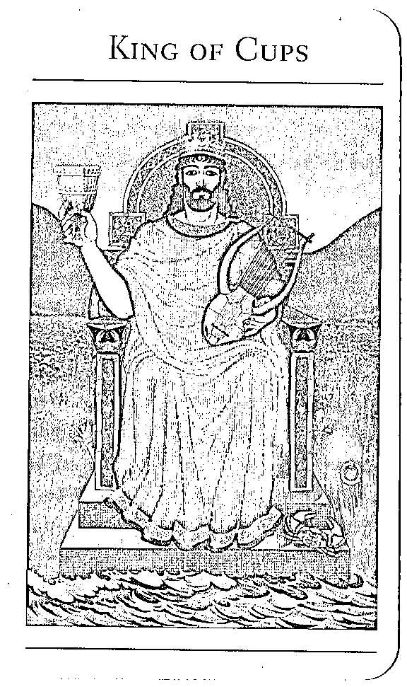

作者/朱丽叶·沙曼-伯克 丽兹·格林

译者/闫东升 编辑/玫瑰 图片/神话塔罗 网络

本文节选自《神话塔罗》

四套小阿卡纳中的国王牌的形象更具有外向、行动和指引性的特质，这个强大的男性形象代表着把所有精力都用于在外部世界中的构建和落实。水元素与强大男性力量的碰撞，圣杯国王又将为我们带来怎样一个神话故事呢？

**书名：**

神话塔罗 

**作者：**

朱丽叶·沙曼-伯克   丽兹·格林 

**出版日期：**

2011-08-02

圣杯国王对应的希腊神话人物 

**俄耳甫斯**

**人鬼情未了**

圣杯国王牌描绘的是一位长着浓密黑发和胡须的白人男子，一双大而有神的黑色眼睛中透露着温和的同情，他身穿一袭黑蓝色长袍，头戴金色的皇冠。他端坐在一个有扶手的金色王座上，座位上雕刻着很多金色的螃蟹。

他一只手握着金色的圣杯，另一只手托着竖琴。王座前方一步远的距离便是荡着微微波澜的海水，一只蟹从水中爬出，来到他的脚下。他的身后是青翠丰饶的草地，远方是波澜壮阔的大海。

**圣杯国王牌反映的是水元素动态的、活跃的面向，水元素的这方面特质促成了关系的形成，包括能够帮助和指导他人。**

牌中的人物是神话中的俄耳甫斯（*Orpheus*），他是一位歌者、牧师和疗愈者，尽管他经常把抚慰带给别人，但自己的故事却是孤独和悲伤的。

俄耳甫斯的父亲是色雷斯（*Thracia*）的国王俄阿格罗斯（*Oeagrus*），母亲是美丽的缪斯卡利奥配（*Calliope*），他是当时最闻名遐迩的诗人和音乐家。

阿波罗（*Apollo*）给了他一把竖琴，缪斯们教他怎么弹奏出动人的乐曲，所以他的音乐不但能迷住野兽，甚至连树木和石头都会跟随着他弹奏的节拍移动。

他加入了阿尔戈（*Argonauts*）英雄们的行列去寻找金羊毛（*Golden Fleece*），他的音乐帮助同伴们克服了许多困难。回程之后他和欧律狄克（*Eurydice*）结为伴侣，定居在色雷斯。

但是俄耳甫斯的命运注定充满悲伤。一天，有个男人想要在河神佩涅奥斯（*River Peneius*）的山谷里侮辱欧律狄克，她在逃跑的过程中踩到一条毒蛇，被咬死了。俄耳甫斯勇敢地进入冥府，想要把妻子带回来。

不仅用哀伤凄美的音乐打动了冥河摆渡者卡戎（*Charon*）、守门的三头犬科尔伯罗（*Cerberus*）和三个死亡审判官，还暂时停止了冥府中苦难的诅咒，成功地安抚了冥王哈迪斯（*Hades*）的黑暗之心，于是冥王答应他可以把欧律狄克带回凡尘。

临走时哈迪斯说了一个要求：在欧律狄克安全地回到阳光下之前，俄耳甫斯绝不可以回头。

在丈夫弹奏的乐曲的指引下，欧律狄克一路在丈夫身后穿过黑暗的冥府，但是步入白昼的最后一刻，俄耳甫斯失去了信心，他回头去看妻子是否还在身后，就这样他彻底地失去了欧律狄克。

这件事情过后，俄耳甫斯变成了一个祭司，教导色雷斯的人们关于神秘学和避开恶魔的知识。酒神狄奥尼索斯（*Dionysos*）慢慢开始嫉妒他，因为他的声名远播，人们越来越崇拜他，把他看为神祗。

于是狄奥尼索斯派出女祭司们，让她们在愤怒中把俄耳甫斯撕成碎片。缪斯们流着眼泪收集了俄耳甫斯的残肢，把他埋在奥林匹斯山（*Mount Olympus*）的脚下，所以后来那里夜莺的歌声都更加甜美动人。

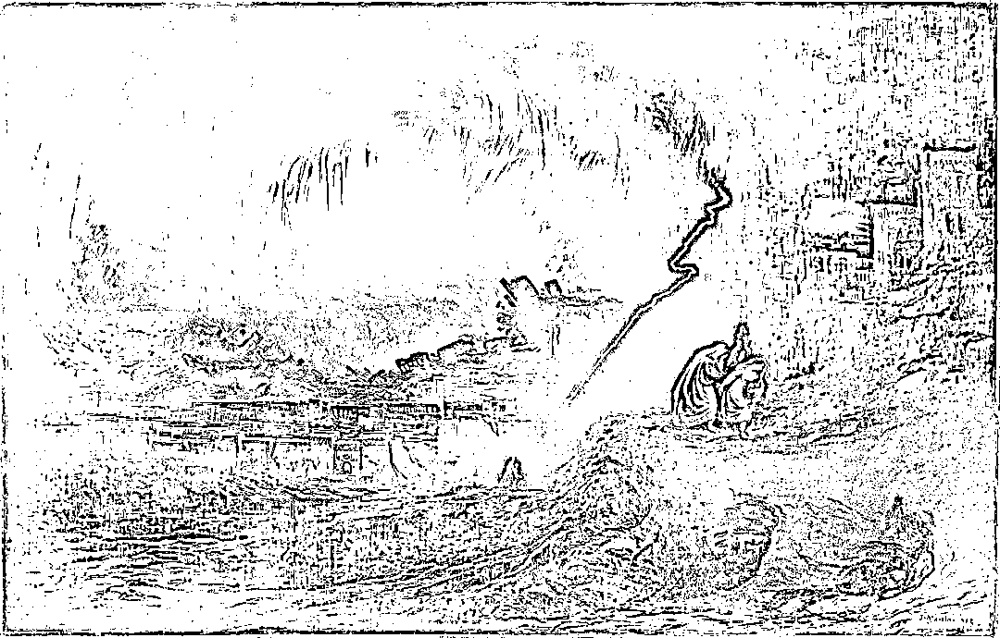

| 俄耳甫斯**徘徊在潜意识之海**

**圣杯国王牌中的俄耳甫斯是一位受伤的疗愈者的意象，在心灵的领域中，他可以通过同情和移情来疗愈他人的伤痛，但却无法疗愈自己心中的伤痕。**

从很多特质上看，俄耳甫斯的这个形象等同于现在的**社会工作者和心理治疗师**，因为他们都**渴望了解情感的世界，帮助他人建立各种关系**，但有时候他们**在自己的生命中却缺乏信任，无法满足关系中的各种渴望。**

**圣杯国王牌把人类的关系和爱置于所有事情之上，极力想要启动和保护情感的联结。**然而俄耳甫斯心中却有种奇怪的不适感，他**必须回头去看是否自己重视的东西还在身后，是否还保持着原封不动的样子，因此他常常会失去自己最渴望的东西**。

他的形象蕴含着一种**很深的矛盾性**，似乎水元素（从很多层面来说，都属于女性世界的情感意象）的特质和国王的男性的、充满动力的形象不符。

**水元素的特质和男性的国王形象笨拙地结合在一起，创造出一种奇怪的矛盾性。**圣杯国王是一个**敏感和善变**的形象，他具有**非常深入的情感力量，能够通过情感的沟通来影响或驱动他人，**这是非常罕见的天赋。

但这属于**表演者和观众**的关系，他自己却**从不会放弃掌控**。因此酒神派出的疯狂女祭司们（译者注：完全沉浸在情感力量的疯狂中）肢解了他，他似乎**必须要先变得无力和支离破碎，然后才能成为聪明的顾问，帮助别人疗愈情感的伤痛。**

俄耳甫斯在自己的生命中没有获得满足，由于对哈迪斯黑暗世界的不信任，丧失了自己幸福的机会。

**他的故事告诉我们，尽管他可以启动关系并不停地谈论它，但他最终并没有完全相信潜意识的世界，因为他无法看到它。**他是海岸上端坐的王者，但他不能跃入大海，因为他恐惧被淹没，恐惧在未知的世界里无法看清更无法掌控的无限可能。

**圣杯国王，受伤的疗愈者**

**当圣杯国王牌出现的时候，当事人会经验到一种矛盾的状态，他（她）拥有顾问和疗愈者的天赋，通过很深的同情来帮助别人，但他（她）自己却不能完全相信生命并顺其自然。**

很多以**帮助他人为职业**的人们都具有这种特质，**他们在自己个人的关系中受到过伤害（常常是和双亲的关系），因此他们在关系中会保持着掌控，以免被再次伤害。** 

尽管这种机制给他人带来很多恩惠，但是当事人欺骗了自己。如果圣杯国王牌以某个具体人物的方式进入到当事人的生活中，那出现的这个人就很可能呈现出此牌蕴含的特质，也就是说**这个人出现的意义，是提醒当事人去了解自己内心的俄耳甫斯。**

**版权声明：**本文由《自在园》授权发布，欢迎转发，反对抄袭。友号转载请申请白名单。

**END****朱丽叶·沙曼·伯克**从 20 世纪 70 年代早期开始，就对塔罗牌产生了兴趣，并踏入了塔罗的世界。后来，在丽兹·格林的鼓励下，开始研习心理占星学和塔罗。1984 年，第一本书《塔罗全书》（The Complete Book ofTarot）出版。之后，与丽兹·格林合作设计并撰写了《神话塔罗》（The Mythic Tarot）。朱丽叶写了十本塔罗和占星学书，包括一本名为《众星的传说》（Stories from the Stars）的儿童读物，以及与丽兹·格林合著的《神话之旅》（The Mythic Journey），这是一本详细讲述如何运用神话来指导生活的书。

**点击下图了解课程详情** 

**微信又双叒叕改版啦，不想错过若道君的推送？**
****就把若道设为****星标****以及点点****“在看”****吧！******▼**

**喜欢就点一下“在看”吧！****报名直达入口**

# 神话塔罗之小阿卡纳牌 | 圣杯王后

> 原文：[`mp.weixin.qq.com/s?__biz=MzA5NjA0NTAxNg==&mid=2651491799&idx=3&sn=344ae8ac97f8bf2e799c00f55ada93ce&chksm=8b483f60bc3fb6762462846e0a071e5e7d80e4a0f96bbd5a2bde96e7b1c50069f3b1222f3cc2&scene=126&sessionid=1692737735#rd`](http://mp.weixin.qq.com/s?__biz=MzA5NjA0NTAxNg==&mid=2651491799&idx=3&sn=344ae8ac97f8bf2e799c00f55ada93ce&chksm=8b483f60bc3fb6762462846e0a071e5e7d80e4a0f96bbd5a2bde96e7b1c50069f3b1222f3cc2&scene=126&sessionid=1692737735#rd)

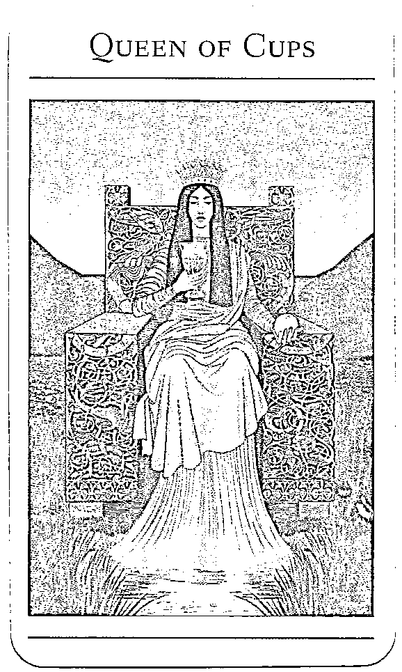

作者/朱丽叶·沙曼-伯克 丽兹·格林

译者/闫东升 编辑/玫瑰 图片/神话塔罗 网络

本文节选自《神话塔罗》

四套小阿卡纳中的王后牌的意象都呈现出稳定、接纳和包容的特质。今天，就让我们走近圣杯王后这位女性吧。

**书名：**

神话塔罗 

**作者：**

朱丽叶·沙曼-伯克   丽兹·格林 

**出版日期：**

2011-08-02

圣杯王后对应的希腊神话人物 

**海伦**

**世界上最美丽的女人**

圣杯王后牌描绘的是一位神秘的美丽女人，她的肤色白皙，拥有一头乌黑浓密的秀发，身着一袭蓝绿色长袍，头戴金色皇冠。她坐在金色的带扶手的王座上，座位上雕刻着许多金蛇。

她的长袍垂入了脚下的池塘，一只手中握着一个金色的苹果，另一只手在胸前握着金色的圣杯，她的眼神深深地聚焦在圣杯中。她背后是一片丰饶的青草地，远处是深蓝色的海洋和明媚广阔的蓝天。 

**圣杯王后牌呈现出水元素稳定、包容和深度内敛的特质，这是情感的内在世界，具有深不可测的神秘性。**牌中的形象是神话故事里的海伦（*Helen*），我们曾在大阿卡纳的恋人牌中遇到过她，其美丽导致了闻名于世的特洛伊（*Trojan*）战争。

海伦是宙斯（*Zeus*）和丽达（*Leda*）的女儿，她的养父是斯巴达（*Sparta*）的国王廷达瑞俄斯（*Tyndareos*），当她出落成亭亭玉立的美女后，所有希腊的王子们都带着丰厚的礼物登门求婚。

最后她嫁给了墨涅拉俄斯（*Menelaus*），廷达瑞俄斯去世后，墨涅拉俄斯就成为了斯巴达的国王。

这场婚姻注定要以失败告终，因为在大阿卡纳的恋人牌中我们曾提到过，女神阿弗洛狄忒（*Aphrodite*）承诺过特洛伊的王子帕里斯（*Paris*），如果他在女神的选美比赛中投票给自己，就把世界上最美丽的女人赐予他，而海伦就是这个女人。 

在女神阿弗洛狄忒的安排下，帕里斯和海伦相遇并一见钟情，后来海伦选择和帕里斯私奔了，这样的行为让国王墨涅拉俄斯感觉受到极大的侮辱，他发动了特洛伊战争，杀死了帕里斯。

其实除了大名鼎鼎的英雄赛休斯（*Theseus*）之外，海伦的美貌后来还吸引过其他三个男人的倾慕，这三个男人后来都陆续成为了他的情人，也因此让整个特洛伊王国的战火延续了十年之久。

当特洛伊彻底战败的时候，墨涅拉俄斯又找到了海伦，他本想杀了她以报通奸之耻，却在看到她的那一刻又一见倾心，因此就带着她回到了斯巴达。至于后来海伦对墨涅拉俄斯是否忠贞，神话中就没有再提及了。

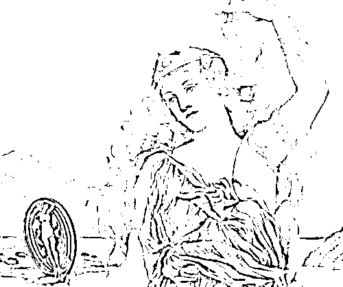

| 海伦**阴性世界的催眠魔力**

圣杯王后牌中海伦这个意象的内涵远远超越了诱惑人心的女性之美。**她呈现出了情感的阴性（女性）世界具有的强大的催眠力量，这种魔力和催眠的效果远非完美的身体所能表达的。**

从海伦的故事中可以看出，无数的男人都追求她，但是没有人知道她心里到底想要什么，也没人有能够彻底地了解她。似乎她就像神秘的水域，所有男人看到她的时候，都看到了他们自己灵魂的深处。

她是一个谜，是无法形容的无价之宝，她被自己秘密的目标和情感激励着前行。你可以说她是个娼妓，因为她迷惑了许多男人，而其中一些又是她故国的仇敌。但是从情感层面看，**无论多么激情四射，海伦都不曾做任何她不想做的事情**。

即使在选择丈夫时，她也有自主的权利，故事中她自己亲手把花环戴到了墨涅拉俄斯的头上，表达出自己的选择，而那个年代的女性，大都是根据父亲或兄长的旨意出嫁。

当她厌倦了墨涅拉俄斯的时候，就义无反顾地投入了与帕里斯的伟大之爱中，并没有偷偷摸摸地进行地下恋情。无论海伦爱上谁，都会把自己全身心地给予对方。

**她不需要通过任何努力就能征服男人，因为她呈现出完美女人所具有的隐秘的潜意识幻象，那是男人一生都想弄明白的魔力。**海伦的形象结合了**处女与妓女、操控者和受害者的矛盾特质**。

总而言之，她是个自相矛盾的谜团，因为**尽管心灵所具有的逻辑性不容争辩，但是理性分析和道德都远远触及不到心灵和情感的深处。**

圣杯王后牌反映的力量非常难以捉摸，她所到之处经常战火纷飞，激荡起他人内心深处的涟漪，驱动着各种行动和冲突，但是她永远都不刻意为之，也不参与其中，所以她可以被看做是潜意识的意象。

她的神秘目的无法被意识的头脑所了解，她诱惑着人们进入危机、冲突、强烈的激情和神秘的命运中，人们只能从结果对她得以惊鸿一瞥。

**圣杯王后，情感世界的催化剂**

**当圣杯王后牌出现的时候，当事人就要和很深的、无法知晓的、自相矛盾的情感世界打交道了。**

也许会有一个**神秘的、带有某种催眠性质的女性进入当事人的生命中，不见得是公然的诱惑，却能够扰乱当事人的心扉，她就像催化剂一样，让当事人内在以前没有被意识到的情感和幻想浮现出来**。

她可能是一个爱人，也可能是某种对手，但**绝非只是一次偶然的相遇。**

**圣杯王后牌是一个预示，当事人内心的某些特质要陆续浮现出来了。**如果当事人是女性，她往往并不了解内在的海伦，只是**无意识地认同阴性力量中母性的或者现实性的面向。**

实际境遇中往往**“她”是以现实女性身份出现**，因为男性通常意识不到自己心灵的深度，习惯地以理性思考和具体的事实为基础。**圣杯王后牌预示着内在生命的深化和发展**，至于是否会碰到一个现实中的女性，那其实并不重要，不是吗？

**版权声明：**本文由《自在园》授权发布，欢迎转发，反对抄袭。友号转载请申请白名单。

**END****朱丽叶·沙曼·伯克**从 20 世纪 70 年代早期开始，就对塔罗牌产生了兴趣，并踏入了塔罗的世界。后来，在丽兹·格林的鼓励下，开始研习心理占星学和塔罗。1984 年，第一本书《塔罗全书》（The Complete Book ofTarot）出版。之后，与丽兹·格林合作设计并撰写了《神话塔罗》（The Mythic Tarot）。朱丽叶写了十本塔罗和占星学书，包括一本名为《众星的传说》（Stories from the Stars）的儿童读物，以及与丽兹·格林合著的《神话之旅》（The Mythic Journey），这是一本详细讲述如何运用神话来指导生活的书。

**点击下图了解课程详情** 

**微信又双叒叕改版啦，不想错过若道君的推送？**
****就把若道设为****星标****以及点点****“在看”****吧！******▼**

**喜欢就点一下“在看”吧！****报名直达入口**

# 插班中丨神话塔罗：高效学习班上线，灵活掌握，专业实践！

> 原文：[`mp.weixin.qq.com/s?__biz=MzA5NjA0NTAxNg==&mid=2651491799&idx=2&sn=f21f7a36543f6dc8b9894d7f7e742d1c&chksm=8b483f60bc3fb67675087769fec69014d71c4cc0ce7ec8d7956bcec9760041c14983e90a26d5&scene=126&sessionid=1692737735#rd`](http://mp.weixin.qq.com/s?__biz=MzA5NjA0NTAxNg==&mid=2651491799&idx=2&sn=f21f7a36543f6dc8b9894d7f7e742d1c&chksm=8b483f60bc3fb67675087769fec69014d71c4cc0ce7ec8d7956bcec9760041c14983e90a26d5&scene=126&sessionid=1692737735#rd)

**2022 年超高含金量的神话塔罗认证课程****高效学习班****开始招生**用**四个月**的时间学习掌握神话塔罗解读喜欢**集中学习，快速掌握**的同学不要错过

黄色日期为**8 节直播课**时间，同学可以自由安排时间学习**18 节录播课**

班级学习群讨论、APP 答疑区提问

课程内容体系让你直观精准地感受到**神话塔罗的魅力**扎实地建构**神话塔罗思维**系统学习**最地道的塔罗知识**课程中老师将**神话、占星、心理学**完美融合进塔罗的**人本主义咨询体系**并进行学员**案例督导**让你更自信的开展咨询工作，学以致用

本期认证课程采取**即报即学的录播课+案例督导直播课**的形式，

*   **18 节录播课：**精编剪辑，随来随学，助教答疑，学练结合。

*   **8 节直播课：**融会贯通，神话心理，塔罗占星，咨询技巧。

为了适配大家的各种学习场景，提高学习&复习效率，我们还将**录播课**剪辑了**中文字幕版**和**翻译音频版**：

*   **中文字幕版：**朱丽叶老师英文原声配中文字幕，适合在手机或电脑前专心致志的学习。

*   **翻译音频版：**翻译老师幼婷的中文原声纯享，适合运动、通勤路上耳机里陪伴式学习。

若道还为塔罗学员开发了**“神话塔罗”**平台，是随身的工具，更是接咨询的平台，录播课程**学成入驻平台**即可链接更多塔罗个案，发展壮大你的塔罗咨询事业。

**如果你想学习塔罗，什么样的老师会让你怦然心动呢？她是三副塔罗牌的设计者，写了 6 本塔罗书籍。她研习塔罗四十余年，教授塔罗三十余年，是丽兹·格林的密友。还有****谁会比塔罗牌设计者更了解塔罗的历史、灵魂与精髓？****所以，这将是你开启塔罗之旅最坚实的一步。**

1

**这位塔罗大师是谁？**

**朱丽叶·沙曼-伯克** 

*   她是**3 副塔罗牌**的**设计者****——**神话塔罗牌、沙曼–卡塞利塔罗牌、“自己着色”塔罗牌；

*   她出版了**6 本塔罗书****——**《塔罗全书》、《新塔罗全书》、《众星的传说》、《理解塔罗牌》、《精通塔罗牌》、《塔罗初学者指南》；

*   她研习塔罗**四十余年；**

*   她教授塔罗**三十余年**；****

*   她是**丽兹·格林**的密友，两人合著了**《神话之旅》**，共同设计了**神话塔罗牌**。

*   她是认证的**心理治疗医师；**

*   她深谙**塔罗、占星学、心理学和神话学。**

**如果你想成为拥有英国神话塔罗认证的塔罗师**

那么她，就是你**最好的老师人选**

2

**塔罗牌有什么用？**

*   塔罗牌是一种**古老的疗愈工具**，同时也是**直观的解惑工具****；**

*   塔罗牌绕过逻辑思维，**和潜意识联结**，通过图像的方式生动地将隐藏在人类潜意识中的画面浮出水面，**揭示心灵的状况和运作****；**

*   塔罗牌**帮助我们和潜意识对话**，可以和现代的心理治疗联系在一起，帮助我们**看清心灵的冲突来源、本质和可以选择的道路；**

*   塔罗牌又和更广阔的**宇宙生命原型**联结，彰显**个人生命发展的阶段**，将**个人生命挣扎、内在冲突**放在生命进化的道途上，让更广大的生命智慧为个人成长照亮道路。

3

**为什么学习神话？**

神话通过**图像和故事**描绘人类生活的**原型模式**。通过瑰丽的想象、诗意的语言、栩栩如生的人物和故事描绘出我们内心的世界，表达出我们经历的那些实现人性的过程，帮助我们将**个体的生活与人类古老且永恒的故事**建立联结。从而在更深处**理解生命**，并学习**古老而长青的生命智慧**。

**神话塔罗**取材于**希腊神话**的无尽沃土，通过故事提供一种**记忆辅助**，在心理和预见层面提升解读的**丰富度**。因为这样更符合塔罗牌的性质，符合人类的想象。**按照故事思考，而不是简单的记忆关键词和固定的意义。**

4

**塔罗预测是什么？**

塔罗牌预测的运作就像是**照向心灵的一面镜子**。在塔罗牌解读时，图像的原型性质穿透隐藏的潜意识脉络，反应出与个人境遇相关但又未被了知的知识与洞见，因此**揭示出按照任何理性方式都无法发现的事情。**

如果你对生命好奇，塔罗学习会帮你**打开一扇通往未来的门****，**让你了解**心灵运作和显化的秘密**，同时赋予你更多关于生命成长的支持和指引的能力！

5

**我们将学习什么？**

**录播课（即报即学）**

**☆****初阶：神话塔罗详解**

**神话故事和预测意涵**

**第 1 讲 塔罗牌介绍 ，讲述它的历史 （中文字幕版）**

**第 1 讲 塔罗牌介绍，讲述它的历史（翻译音频版）**

**第 2 讲 星座形态、元素和宫廷牌&基本星座与基本国王 （中文字幕版）**

**第 2 讲 星座形态、元素和宫廷牌&基本星座与基本国王（翻译音频版）**

**第 3 讲 固定星座与固定王后（中文字幕版）**

**第 3 讲 固定星座与固定王后（翻译音频版）**

**第 4 讲 变动星座与变动骑士（中文字幕版）**

**第 4 讲 变动星座与变动骑士（翻译音频版）**

**第 5 讲 小阿尔卡那牌权杖（中文字幕版）**

**第 5 讲 小阿尔卡那牌权杖（翻译音频版）**

**第 6 讲 小阿尔卡那牌圣杯（中文字幕版）**

**第 6 讲 小阿尔卡那牌圣杯（翻译音频版）**

**第 7 讲 小阿尔卡那牌宝剑（中文字幕版）**

**第 7 讲 小阿尔卡那牌宝剑（翻译音频版）**

**第 8 讲 小阿尔卡那牌星币（中文字幕版）**

**第 8 讲 小阿尔卡那牌星币（翻译音频版）**

**第 9 讲 经典牌阵教学讲解（中文字幕版）**

**第 9 讲 经典牌阵教学讲解（翻译音频版）**

**第 10 讲 牌阵解读案例演示（中文字幕版）**

**第 10 讲 牌阵解读案例演示（翻译音频版）**

**☆****中阶：神话塔罗牌阵应用**

**神话****解读和咨询技巧**

**开启神话塔罗愚人之旅**

****

**第 1 讲 愚人、魔术师、女皇、皇帝（中文字幕版）**

**第 1 讲 愚人、魔术师、女皇、皇帝（翻译音频版）**

**愚人**：永恒的少年（儿童的原型）

**魔术师**：恶作剧者、老师、向导、沟通者的原型；行星：水星。

**女王**：母亲、养育者、丰产的原型；行星：金星在金牛座；小行星：谷神星。

**皇帝**：父亲、供养者、计划者的原型；行星：木星。

**第 2 讲 女祭司、教皇、恋人、战车、正义、节制（中文字幕版）**

**第 2 讲 女祭司、教皇、恋人、战车、正义、节制（翻译音频版）**

**女祭司**：处女——等待被实现的潜力原型；行星：新月。

**教皇**：疗愈者、受伤的疗愈者、牧师的原型，牧师是神与人之间的灵性桥梁；行星：凯龙星。

**恋人**：爱、爱人、所爱之人的原型；行星：金星在天秤座。

**战车**：战争、冲突、战士、斗士的原型；行星：火星。

**正义**：智慧、兵不血刃的胜利的原型；星座：处女座；小行星：智神星。

**节制**：关系、合作的原型；星座：巨蟹座、双鱼座。

**第 3 讲 力量、隐士、命运之轮、倒吊人、死神（中文字幕版）**

**第 3 讲 力量、隐士、命运之轮、倒吊人、死神（翻译音频版）**

**力量**：力量的原型；星座：太阳在狮子座。

**隐士**：晚年、耐心的原型；行星：土星。

**命运之轮**：命运女神与命运的原型。

**倒吊人**：牺牲与有意识的牺牲的原型；行星：海王星。

**死神**：死亡、终点和起点的原型；行星：冥王星。

**第 4 讲 恶魔、高塔、星星、月亮、太阳（中文字幕版）**

**第 4 讲 恶魔、高塔、星星、月亮、太阳（翻译音频版）**

**恶魔**：阴影、人类不文明的面向、本能、欲望天性；行星：火星在天蝎座。

**高塔**：改变、分裂瓦解的原型；行星：天王星。

**星星**：希望的原型。

**月亮**：无意识的原型；行星：暗月。

**太阳**：意识、创造力和文明的原型；行星：太阳。

**第 5 讲 审判、世界（中文字幕版）**

**第 5 讲 审判、世界（翻译音频版）**

**审判**：复活、新生的原型；行星：水星作为灵魂向导普绪科蓬波斯。

**答疑与讨论，学员们分享对自己或客户的塔罗解读，对神话塔罗牌进行更多探讨。**

**世界**：整体、完成和个性化的原型。

**第 6 讲 经典牌阵教学讲解（中文字幕版）**

**第 6 讲 经典牌阵教学讲解（翻译音频版）**

**第 7 讲 咨询案例演示：为一位年轻女性所做的四次解读（中文字幕版）**

**第 7 讲 咨询案例演示：为一位年轻女性所做的四次解读（翻译音频版）**

**第 8 讲** **引导式冥想、荣格的四种意识功能（中文字幕版）**

**第 8 讲 引导式冥想、荣格的四种意识功能（翻译音频版）**

**☆****高阶：神话塔罗直播督导课**

**第 1 讲 塔罗牌中的荣格原型**

**2022 年 8 月 10 日（周三）**

我们将学习荣格是如何理解原型，以及荣格原型如何反映在塔罗牌中。对塔罗牌解读而言，理解原型的普遍性非常有帮助，因为这有助于塔罗咨询师碰触客户的内心世界。

**第 2 讲 塔罗牌是如何与行星原型和其原型体验联系在一起**

**2022 年 8 月 24 日（周三）**

大阿卡纳牌反映了行星神祗的原型，在某些情况下，原型经验意味着它们反映了所有人类的经验。我们将通过这个角度看这些大阿卡纳牌。我们将看到理解原型对解读有何帮助。

**第 3 讲 荣格意识的四种功能与小阿卡纳牌的四种元素及与权杖、星币、宝剑、圣杯四套牌之间的联系**

**2022 年 9 月 7 日（周三）  **

我们将看看小阿卡纳从 1 到 10 如何反映荣格意识功能的各个方面，以及它们如何反映在四套牌四个元素和其心理方面。我们还将对 1-10 的数字学进行修正，看它们在元素中的表现方式。

**第 4 讲 占星学中的 12 星座和宫廷牌之间的联系**

**2022 年 9 月 21 日（周三）**

我们将讨论形态和星座，以及它们如何反映在宫廷牌上。

**第 5 讲 马蹄牌阵学员案例督导**

**2022 年 10 月 19 日（周三） **

**第 6 讲 六芒星牌阵学员案例督导**

**2022 年 11 月 2 日（周三） **

**第 7 讲 凯尔特十字学员案例督导**

**2022 年 11 月 16 日（周三） **

****

**第 8 讲 三个牌阵学员完整案例督导**

**2022 年 11 月 30 日（周三）**

**认证阶段：考试论文**

录播课学习完毕，即可入驻若道神话塔罗平台，以实习塔罗师获得推广流量，对接塔罗咨询个案。

直播课+录播课学习完毕，提交考试论文通过即可获得获得英国神话塔罗认证证书，升级为认证咨询师。

**扫码进入全新神话塔罗 H5**

每天有事没事都可以去**神话塔罗 H5**里转转抽取专属于你的今日塔罗

**神话塔罗 H5 问答平台全新上线**

三张牌牌阵，专业塔罗咨询师语音条解读

如果你碰巧有困惑，刚好有**限时优惠价**

如果感到快乐你就用用**神话塔罗 H5****，**如果你感到不快乐，更要使用由专业人本主义塔罗师团队全程陪伴的**神话塔罗 H5 哦！**

6

**适合人群**

*   塔罗初学者，完全没有塔罗基础；

*   塔罗自学者，也曾上过塔罗工作坊，但仍不懂如何使用塔罗牌；

*   塔罗进阶学习者，有塔罗基础，了解 78 张塔罗牌含义；

*   不知如何解决遇到的情感困惑、职业选择、人际问题，对人生感到迷茫；

*   想要学习深入解读塔罗牌、牌阵的使用、咨询技巧等将塔罗运用于咨询实践；

*   想要深入了解和学习塔罗，希望成为专业的塔罗师；

*   想要借助塔罗进行心灵、灵性成长。

7

**导师简介**

**朱丽叶·沙曼-伯克**

**朱丽叶·沙曼-伯克**从 20 世纪 70 年代早期开始，就对塔罗牌产生了兴趣，并踏入了塔罗的世界。后来，在丽兹·格林的鼓励下，开始研习心理占星学和塔罗。

1984 年，第一本书《**塔罗全书**》（*The Complete Book ofTarot*）出版。之后，与丽兹·格林合作设计并撰写了《**神话塔罗**》（*The Mythic Tarot*），在这本书中，她们将古希腊神话与传统塔罗解读结合起来。朱丽叶写了**十本塔罗和占星学书**，包括一本名为《众星的传说》（*Stories from the Stars*）的儿童读物，以及与丽兹·格林合著的《神话之旅》（*The Mythic Journey*），这是一本详细讲述如何运用神话来指导生活的书。

8

**课程价格**

**认证课程总价：****22000 元**

**联报优惠价：****19000 元**

**限时转发优惠价：18000 元（联系 Echo 老师，获取限时转发优惠价）**

长按二维码添加客服 Echo 老师

9

**退转课程**

*   **退款原则请详看《教学协议》，如有疑问请咨询课程顾问。**

**神话塔罗认证课程**

**授课老师：朱丽叶·沙曼-伯克**

**授课时间：录播课即报即学，直播课 2022 年 8 月 10 日起**

**授课方式：**网络课程**，**英文授课，中文翻译

**费用：****认证课程总价：****22000 元；****联报优惠价：****19000 元；****限时转发优惠价：18000 元**（联系 Echo 老师，获取限时转发优惠价）

**课程负责人：Echo 老师**（微信/手机：nodoor18518412824，请备注“神话塔罗”）

长按二维码添加课程负责人咨询~

**END****报名直达入口**

# 金星进入天蝎座 | 你曾爱谁，爱到不怕死？

> 原文：[`mp.weixin.qq.com/s?__biz=MzA5NjA0NTAxNg==&mid=2651491799&idx=1&sn=39595af24a7b6bfdd758e4f6bf91427f&chksm=8b483f60bc3fb6765379048d8a9866b1431d155d6c4914e100c83914a4924f5177d59b6c2e2e&scene=126&sessionid=1692737735#rd`](http://mp.weixin.qq.com/s?__biz=MzA5NjA0NTAxNg==&mid=2651491799&idx=1&sn=39595af24a7b6bfdd758e4f6bf91427f&chksm=8b483f60bc3fb6765379048d8a9866b1431d155d6c4914e100c83914a4924f5177d59b6c2e2e&scene=126&sessionid=1692737735#rd)

****************************☆ **************后台回复“今日”，给你一句生命态度**************

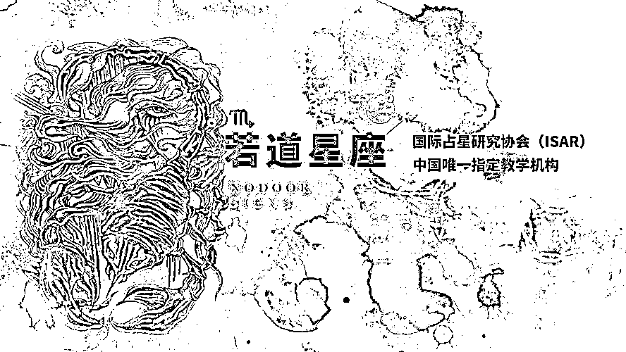

作者/斯蒂芬·弗里斯特、朱迪·弗里斯特

译者/李含 编辑/玫瑰 

封面/书君 图片/稿定设计

文章节选自《天空的伴侣 I：爱、性和进化占星学》

10 月 23 日，太阳和金星双双进入天蝎座啦！天蝎座需要向灵魂深处探索、面向黑暗面并整合自己，信任是天蝎座的议题。当你的太阳、月亮、金星或上升落在天蝎座，爱情是什么样子的？一起看看吧！ **天蝎座**

*   **原型：侦探 、催眠师、魔术师、心理学家、巫师。**

**天蝎座的发展目标**我们的祖先在给天蝎座命名的时候就已经没有打算让我们好受了！我们都**坐在一座火山之上，被潜意识驱使**——至少是被强迫，心理上的强迫。**性欲**就是其中一种强迫力。如果你问一个 18 岁的足球运动员为什么被啦啦队长吸引，首先他一定认为你是个疯子，然后会玩笑带过。对我们大部分人来说，这已经足够了。在生活中，我们接受了这些潜意识的引领。对于天蝎座来说，这只是个开始。必须更深刻地挖掘，这很快就让人感到害怕了。**向灵魂深处探索，**就像跟随直觉的脚步，有许多扭曲和伤害，隐藏在我们不愿触碰之处。潜意识和直觉扭曲了我们的生活，我们从来不能确定他们的方向。如果有一颗星体触碰了天蝎座的能量，这种扭曲和变形就开始了。某些深埋在地狱里的黑暗面会被挖掘出来，上升到意识层面，并且治愈。形而上学的意义中，在前世里，受冥王星影响的人体验了黑暗的灵魂，所以必须反过头去**面对这个黑暗面，去整合自己，最后治疗并痊愈**是最终的目的。

**策略和资源****有洞察力，以感觉为中心的自我分析**是天蝎式的基本生存策略。从来没有一个星座如此强烈地**执着于探求人类灵魂的深处**。没有哪一个星座会像天蝎这样不会选择压抑和否认。《内在的天空》一书中，我们描述天蝎座有“压抑机制缺陷”。本能的，**天蝎座就是有一种怀疑精神，**而不是相信呈现在眼前之事。探索、感受和体会内心的世界，天蝎变得越来越有智慧，更深刻，更加**能够从昏暗中发现人性的本质**……除非在这段内在的旅途中，你不慎滑落到阴影的陷进里。为了保证通往心灵深处的这条曲径安全，**天蝎座必须运用两个关键的资源来完成情感上的自我分析**，这就是安全策略。这两种资源都不是无意识产生的。两个都必须有意识地培养。**第一个资源是要让你退一步，换个视角看待问题。**天蝎需要卸下某些自尊心的防备，学会自嘲，学会幽默地看待自己的紧张。**天蝎的第二种资源是“朋友”**，或许用“盟友”更合适一些。他们帮助天蝎座更多元地看待世界。他们让天蝎座开怀大笑，帮助天蝎座更健康积极的看待世界，带给你不一样的自我暗示。更重要的是，他们了解天蝎座，**给予天蝎座所缺乏的能力：幽默、宏观的视野。****阴影**天蝎座的阴影是**病态的自省、沉思、忧郁、沉闷。**这是一个困境。“有缺陷的压抑方式”给予天蝎座接近潜意识的有效途径。但这是一个双向渠道，**潜意识**也会影响到天蝎。缺少了两项关键资源——洞察力和朋友，所有内心的痛苦、混乱将天蝎拖进黑色情绪的泥沼。天蝎座人如果踏上这条歧途，最终伤害的不止是自己。**在阴影中的蝎子还会蜇伤别人，**用这种消极的方式引起别人的关注，强调他们经历了各种精神上的痛楚。真相必将把仁慈送上祭坛。潘多拉的盒子被开启……但没有人知道如何面对，不知道盒子里会放出什么样的魔鬼。

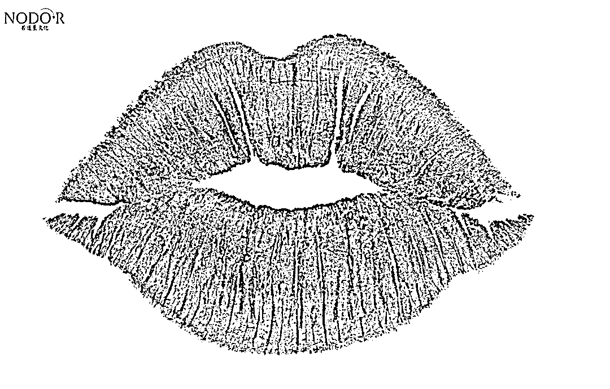

**金星天蝎座的爱情**天蝎座是第 8 个星座。蝎子都是让人害怕的，在我们的亲密关系中，很多可怕的事情会浮上水面。如果你是金星在天蝎座的人，你脑海中有一个亲密关系的模式，你知道在关系中会出现问题。你真正的伴侣也应该了解，在亲密关系中，我们受伤的地方、被污染的地方，所有这一切都会浮上水面。**在看到你生气、不安、敏感和紧张时，他不会被吓到。**因此你们承诺，**在这个心理历程中坦诚以对，这一过程也让彼此更亲密**。你们揭露自己的阴暗面和伤口，你们几乎无法想象和另外的人在一起。如果你成功通过了金星天蝎座的考验，我可以说，如果你的伴侣对你不忠的话，你们两个人都会知道。这将是你们积极的亲密关系的标准。**你们两个人之间不可能存在那些深埋的秘密，因为你们两个都深入到了对方的内在世界中**。金星天蝎座需要那样的深刻。用一句话总结，我们可以称之为强烈的感情。**金星天蝎座的进化之旅****进化的意图是建立一种关系，这种关系能帮助此人发展与人深度交往坦诚相见的能力，并为自己和伴侣宣泄情感创造一个不带评判的空间。**灵魂渴望体验**彻底的诚实**，从而重新建立起前世**被亲密关系中的谎言和欺骗所破坏的信任**。

**这个位置的金星散发着神秘、权力、性的气息。**通过巫师的原型，他们邀你探索亲密关系的心理层面。

金星在天蝎座提供了**原始又具有转化性的激烈感：在性、情感或心理上**。他们可能会表现得非常诱人，因为他们身上的某些东西，似乎充满火山般猛烈的情感承诺——并邀请你做出你的承诺。

这个金星星座喜欢**能彻底真实、激烈和狂热的人，那些人不会逃避情感上的宣泄体验**。他们还喜欢有着**未知、隐蔽、神秘光环**的人。

| 蒂娜·特纳

蒂娜·特纳（Tina Turner）的金星在天蝎座，米克·贾格尔曾这样评价她："站在她身边（舞台上）是世界上最热的地方！" 

另一位电音表演者布鲁斯·斯普林斯汀（Bruce Springsteen）的金星在天蝎座，巨蟒剧团的毕业生约翰·克莱斯（John Cleese）也是如此。

悬疑作家阿加莎·克里斯蒂也有这个金星星座；超现实主义艺术家萨尔瓦多·达利也是如此。

**太阳天蝎座的爱情**流行的占星学观点认为天蝎座非常性感。我们做了一个小小的调查发现，其他十一个星座也很关心性啊！**性，不是任何一个星座垄断的领域。**认为“天蝎座很性感”的说法是扭曲了占星基础理论中，认为天蝎座倾泻感情的方式很强烈。**每一个太阳落在天蝎座的人，他们的基本活力和精神的健康，都需要定期进行情感的宣泄。**事实上，**我们的文化趋向于将“深刻激烈”的情感与性联系在一起**，或者是性，离不开这种情感。但对于很多人来说，性是一种基本“娱乐”，并不涉及复杂深刻的精神需要，但这些人就不是健康的天蝎座人了！**月亮天蝎座的爱情**

月亮在天蝎座的道理是类似的，只不过这种天蝎座式的渴求**通常被埋藏起来了**，不会立即被发现，更少理性。

他们必须体验天蝎座的方式 ，**即不断深化的亲密和忠诚，** 否则他总是在爱情中感到**不满足**。这种情况下，他们会变得沉默，处于爆发的边缘，通常是因为含糊的、人为的原因。

月亮在天蝎座的人往返于地狱，总是不经意就沉沦。在情人们的眼里，这很可怕：突然之间，伴侣的情绪变得冷酷阴森，灵魂在飘远。月亮天蝎座的人要**尊重原始的冥王星节奏：该离开的留不住。**逆袭而来时，你需要正视他。如果与月亮天蝎座的人亲密共处，**要能忍受情绪的直白暴露。**

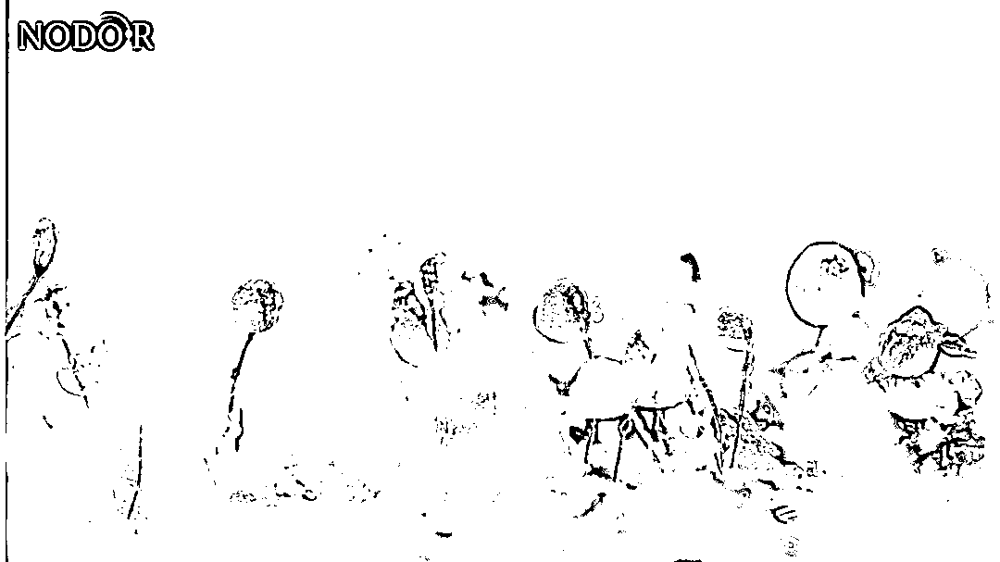

**上升天蝎座的爱情**我的鼻子和你的鼻子距离两英尺。我的瞳孔和你的瞳孔对视。突然间，我们俩都浑身鸡皮疙瘩。我脱口而出：**“你就是我的灵魂啊！”**这就是上升在天蝎座的人会有的行为。在亲密关系中，**上升天蝎座的人期待一种邂逅。**需要有灵魂的碰撞。天蝎座式的意愿是**不断深化**。上升在天蝎座的男人女人通常好像戴了巫师的面具，**散发着强大的洞察力和紧张感。**

**如果天蝎座的伴侣没有成长，那么所有的情感，包括性爱， 会很快褪色。**所有情况下，我们都会感受到恐怖的紧张感。X 光一样穿透的视线。

背后藏着什么？这就要看星图里更深层的架构了。一般，上升在天蝎座的人，**非常善于与一个极端强烈的人开始亲密关系，**但是，一旦开始交往，他们又不知所措。

就我们所知的，**上升星座描绘的是我们表面的的人格表达。**如何在爱情和性关系表现，上升星座有重要的影响，但是并不像日月的影响力那么强大。

另外说一点，目前广泛认为天蝎座的守护星是冥王星，这在实际运用中很贴切。但在传统的占星学中，火星是天蝎座的守护星，这个原则依然说得通。

**实际解读星图时，**天蝎座上升的人拥有两颗命主星。**它们的运作好像是合作者。**我会格外关注火星作为守护星，因为，火星更具有性的能量。**如果一个人的上升落在天蝎座，他会以火星星座所体现的方式来构筑亲密关系。如果火星还落在“亲密关系”的宫位，这个影响更是加倍。**

**版权声明：**本文由若道翻译发布，欢迎转发，反对抄袭。友号转载请申请白名单。

**END**

**斯蒂芬·弗里斯特**

若道签约老师。进化占星学的创始人之一，当今世界最有影响力的占星大师之一；1985 年，他凭借《内在的天空》一书获得职业占星师协会奖（Professional Astrologers Incorporated Award）。他四次获得占星界最高的占星学联合协会奖（United Astrology Congress Regulus Award）提名，2018 年获得轩辕十四教育奖。

**若道核心课****L5 研讨小组学员分享****今晚直播等你来~**

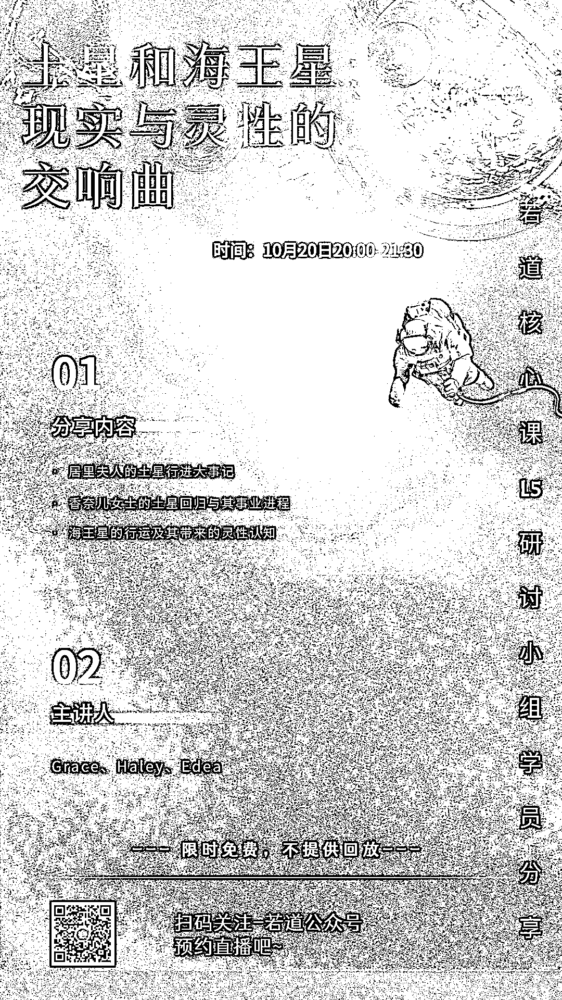

**点击下方预约按钮参与直播~**

<mpvideosnap class="js_uneditable custom_select_card channels_live_iframe" data-pluginname="videosnap" data-headimgurl="https://wx.qlogo.cn/finderhead/PiajxSqBRaEJYnVsqWfEX9qA0sI6hNVKsDfyzfPZ92WZMZyBpZWU5NA/0" data-username="v2_060000231003b20faec8c4e68a1ec2d4ca07e434b07755bbf47e7053a3059defd2c9d6c68a20@finder" data-nickname="若道" data-desc="将在 10 月 20 日 20:00 直播" data-intro="若道核心课程 L5 研讨小组主题分享会：土星与海王星，现实与灵性的交响曲" data-noticeid="finderlivenotice-v2_060000231003b20faec8c4e68a1ec2d4ca07e434b07755bbf47e7053a3059defd2c9d6c68a20@finder-1665455420282342-403595010" data-type="live"></mpvideosnap>**20 位来自世界各地的占星师****带来 19 场沙龙——新世界的觉醒****详情可点击下图**

**学习占星学****点击下图了解课程详情**

**微信又双叒叕改版啦，不想错过若道君的推送？**
****就把若道设为****星标****以及点点****“在看”****吧！******▼**

**喜欢就点一下“在看”吧！****报名直达入口**

# 你的人生高度，取决于这 3 个心灵层次

> 原文：[`mp.weixin.qq.com/s?__biz=MzA5NjA0NTAxNg==&mid=2651491663&idx=1&sn=fde3286bd27ad3f543a981df42a0ed48&chksm=8b483ff8bc3fb6eecdcb62523a158599cfe423844d3b9e9c4bc539ff987257680f3e17cd65ab&scene=126&sessionid=1692737741#rd`](http://mp.weixin.qq.com/s?__biz=MzA5NjA0NTAxNg==&mid=2651491663&idx=1&sn=fde3286bd27ad3f543a981df42a0ed48&chksm=8b483ff8bc3fb6eecdcb62523a158599cfe423844d3b9e9c4bc539ff987257680f3e17cd65ab&scene=126&sessionid=1692737741#rd)

******************************☆ **************后台**************************回复“今日”，给你一句生命态度**************

作者/格伦·佩里

译者/Arrow 校对/王宏

编辑/玫瑰 封面/书君 图片/稿定设计本文是格伦·佩里老师提出的一个系统，这个系统包含着心灵的力量，以及与星座、行星、宫位、相位乃至整张星图的联系，我们可以在这里看到，心灵，或者说自我是如何运作的。如果你想了解更多心理占星学只是，欢迎点击格伦老师教授的 ISAR 选修课[【占星原型与星图中的精神病理学】](http://mp.weixin.qq.com/s?__biz=MjM5MjQwNjAyMQ==&mid=2649440437&idx=3&sn=fa4e7333a2194a2e0612f3db4053f023&chksm=beb92fdf89cea6c93e80a4a24c960e94197673054fffe2ed5cc7443e23215479092dc0f92b02&scene=21#wechat_redirect)了解详情哦~**心灵的控制结构**

**人的心灵，或自我系统，可以被描述成一种垂直的指令链，由更高等的处理机制来协调较低级别上发生的运作**（见下图）。

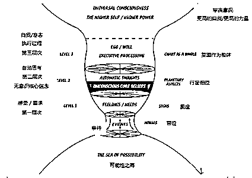

| 自我系统的侧面图

在上图中，我们的视角是从上到下的，一直观察到该结构的内部在最底端，有一个拥有 12 个入口的洞，朝向无边宇宙的可能性打开。  换句话来说，这个洞就是某种平面，有 12 个透水孔，象征着黄道 12 星座。每个星座象征一套基本需求。我们的黄道平面分为上侧和下侧，进行基本的输入、输出过程。  下侧的入口代表 12 个宫位的入口点，象征着 12 个环境类别或次级划分；上侧的入口代表进入心灵世界的入口，这里，外部世界的信息经过新陈代谢，被转化为心灵结构。所以，**星座是一种过滤器，让外部世界的信息激活行星所代表的基本心理动力和过程。**  模型的第 2 个层次被分为两部分，在占星学上都是由**行星、相位**所代表。**无意识核心信念构成了颜色更深、更内在的级别，之上则是必然会从这些不太有意识的观点中衍生出的自动假设和思考。**  自我系统的第 3 个层次就是作为整体的星图，其核心是**太阳，即自我、自性或个人身份，统领整张星图。**作为意志的象征，**太阳构成了心灵中的执行处理和决策层。
 自我系统在顶端和底端都是开放的。**在此结构之上，开放进入一个更加高等的意识领域，即宇宙心智，个人自我不过是它的一个子系统。

每个人，都是一个包含我们在内的更大自我的延伸。**灵性自我有其自己的本质和意图，通过非平常的、非感官的方式来沟通，包括梦境、心灵感应、直觉、幻象、共时性等。**

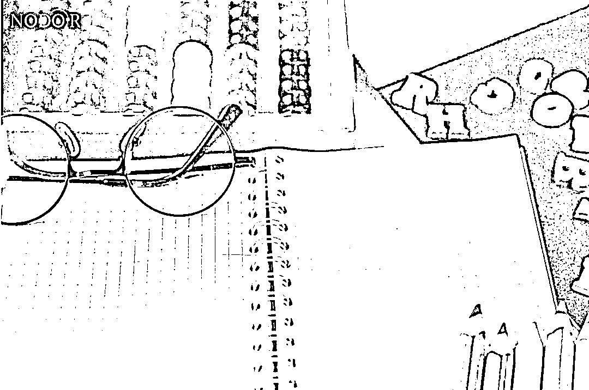

**3 个层次****第 1 层次****基本需求****从顶端向下方延伸开来的空间领域代表了世俗经验的世界。**虽然这个层次并不是自我身体的一部分，但是它提供了自我运作的背景。每个宫位本身都是进入一个单独经验世界的入口，第 1 宫是生存的世界，第 2 宫是个人安全的世界，第 6 宫是工作的世界，第 9 宫是宗教的世界，第 11 宫是团队关系的世界……等等。**自我的每个体验都在某个特定的社会环境下产生。** **事件通过结构底端的那 12 个入口进入自我系统，它们是通往 12 星座的入口。**当信息通过这些入口，从宫位流出时，它会刺激星座所象征的需求。

例如，如果白羊座与第 10 宫重叠，那么对自主性的需求就会被职业相关的情境所激发。个体会将这种刺激体验为某种感觉或冲动，比如想要坚持自我的冲动，想要开始某件事或去争斗的冲动等。

**每个星座都象征着一个明显不同的需求，这些需求一旦被激发，就会通过感觉传递给上一级的相关行星。**而**行星一旦被激发，就会设法满足该星座的需求，其所采取的方式和行动的背景则可以通过所落的星座和宫位来预示。**

**第 2 层次****过程****在心灵的第 2 层次，就是中间的调节过程，或者认知结构，它所构成的信念和策略能满足被激发的需求。**在自我系统的这个层次，个体必须找到一个方式，去**整合被激发的各种行星功能（心理能力）**。在某个特定的时刻，被激发的心理能力总是不止一个。相应地，**不同行星必须以不同的方式（相位）联系起来，去创造更高级的信念，给出规则、策略和计划，去协调星座所象征的不同需求。** 心灵的这个层次的特征是“自我对话”，也就是人们自己和自己谈论特定时刻最关心的事情。这些自动思考仅仅是有意识的、自我觉察出来的那一部分，这个更大的组织模式还会向下延伸至无意识，就像建筑物拥有地下室一样。**第 2 层次暗示着，我们有多重自我。**每个星座和行星的搭配都是一个次级系统，或次级人格，它们是居住在心灵之中的有生命的、近似自主的实体，也有自己的日程和目标。每个次级人格都是整个自我概念——第 3 层次中的涌现的特性的一部分。**如果自己的某个次级系统被加强或削弱，那么对应的自我评分也会增高或降低。**

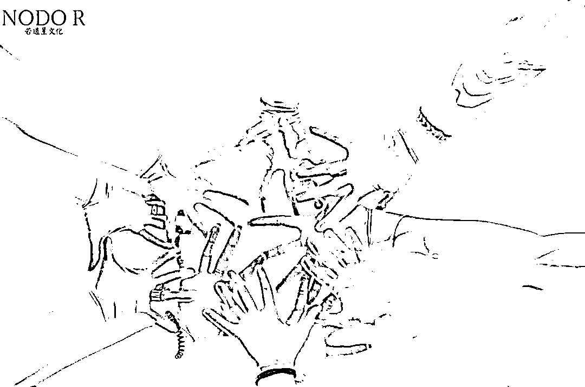

**举个例子**

比如，一位父亲告诉儿子，说他又笨又蠢是个废物，那么儿子的心灵中至少有两部分被激发了——**土星对成功的需求，水星对知识的需求。**他可能将父亲的警告解读成：**“我在现在的这个任务中，缺乏成功的足够知识。”**

然而，如果这位父亲重复多次如此指责儿子，那么这个孩子可能会**将这些孤立的事件普遍化，形成一种无意识的核心信念：“在任何对智商有要求的情境中，我都可能失败。”**

之后，每次当他遇到需要展现智力的情境，他都因为失败的预期而感到焦虑。**他的焦虑是自我信念：“在尝试展现足够的知识时，我将失败”的产物；它掩盖了最初水星的兴趣感和土星的野心感。**这个信念可能因为太过严峻和痛苦，而潜入无意识中。

**第 3 层次接受了第 2 层次的输入，并基于该层次上产生的感觉和相关观点来做出决策。**虽然和水土四分相关联的有很多想法、感觉和策略，但如果他将水土事件和相应的想法感觉解读成“我是愚蠢的”，那么他将建立一种和水星功能相关的身份感。

再次强调，**这并不是该事件所拥有的唯一意义，但是这是他所选择的意义。**有可能在后来的某一天，他重新评价自己对事件的最初解读，并且决定**“不，我并不愚蠢。我的父亲过于苛刻了，将他对自己的智力不足感投射到了我的身上。”**这种解释将让他能够**改变自己在水星方面的身份感，让水星的运作更加顺畅。**他可能选择相信：**“我不太确定我的智力，需要在学习的环境中测试自己，从而给我一个机会在此领域有进一步的发展。”**这个新的信念和策略让他能去**选择更具挑战性的职业，也许是和他的实际智力水平更为相称的职业。****第 3 层次****执行控制中心**有人可能会问，是什么让一个人决定接受教育，追求更高层次的职业成功呢？是什么动机促进整合过程呢？再次强调，**决定本身是属于第 3 层次的，这个层次是人格的执行部分，是控制中心，或我们所说的自我、太阳。** **太阳是意志、决策和意图；它是心灵中决定追求某种行为过程，而不追求另一种过程的部分。**在这方面，自我是具有创造性的。因为它**努力创造出符合自身价值和喜好的结果。**

就像太阳处于太阳系中心那样，**自我-太阳也处于人格的中心。**在我们的模型中，自我不仅仅位于中心，还构成了最顶端的层次，像蘑菇云一样延展开来，涵盖下面几个层次的所有信息。

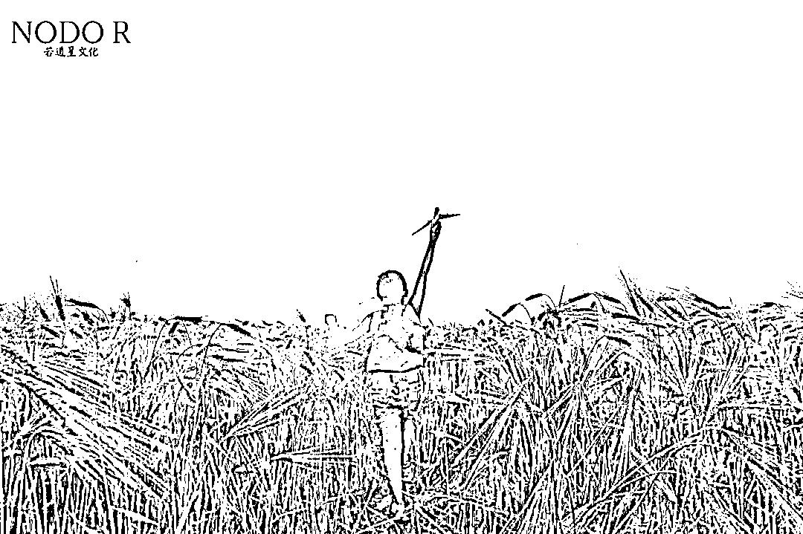

第 3 层次的涌现特性是：**决策的能力。**太阳必须**决定何时、如何表现构成第 2 层次信息的冲动、观点和计划。**作为更高层次的推断或自我概念，它有一些相互关联的目标：

**·** 吸收经验数据，并赋予其意义；

**·** 对该意义做出反应，让其满足涉及的需求（欢乐最大化，痛苦最小化）；

**·** 优化自尊。

一个人的自我概念或个人故事，根据首字母缩写可以总结成**AMO**，各自代表：

**· **A=吸收（assimilate）经验数据

**· **M=最大化（maximize）欢乐和痛苦的平衡

**· **O=优化（optimize）自尊

就像愉悦源自个人成长和冲突的解决，与此相对，**当一个人的自我理论无法吸收信息或建立内在一致性时，他（她）就会感到焦虑。**焦虑是具有适应性的，因为它能**促进个体修正自我理论，来优化自尊。**再次想象我们之前那个具有水土四分相的人。最初，他相信自己智商不足，不会成功，这可能会导致焦虑；如果他为成功而拼搏，却不去接受成功所需的教育，那么这就构成了内在一致性的缺乏。两种功能不会一起工作，它们会互相打架。水星不会给土星它所需要的，土星也无法给予水星礼物。事实上，土星会要求水星获得高标准的知识，让自己感受到一种需要知晓更多的压力。**如果水星不去迎接这个挑战，土星就会增大压力，直到本人被迫找到解决方法。**

正是紧张、焦虑、压力的体验，被传递到了系统的第 3 层次。现在个体不得不做出选择，而这当然将由太阳完成。

**一个选项就是压抑焦虑，避免可能挑战智力的情境。**这个策略可能暂时减少焦虑感，但是成功也必然被限制住，于是形成了一个自我实现的预言。这个人也许会“决定”去相信：**“我并不十分聪明，我只能在低收入的卑微工作中取得成功。”**另外一个更好的解决方法就是，**让焦虑成为动力，激励自己提高智力，获取知识（水星），并将其直接运用到职业（土星）中。**当他完成这些时，一个新的信念就会取代旧的信念：**“我已经上过进阶课程了，现在我 ‘知道’我能在职业中走得更远。”**这所有都暗示着，自尊依赖于两个相互独立但相关的过程：**·** 满足狮子座对关注和肯定的需求；**· **满足其他所有星座-行星组合所象征的需求。

**一个人越能实现和协调自身的各个部分，就越有可能以一种赢得他人肯定（满足狮子座-太阳需求）的方式表现自己。**所以，整张星图的整合对自尊有着重要的影响。

总而言之，心灵的控制结构是按照等级组织的，低层次被包含在高层次中。心灵的最低层次就是黄道本身，构成基本需求。这些需求被重叠在抽象的平面之上，该平面代表宫位——生活经验的世俗世界。事件会刺激需求，需求通过感觉传递给第 2 层次的行星。

**行星组织自身成为认知结构，找到解决冲突、彼此合作的方式。**观点、策略和自动的思想都是这个层次涌现的特性，它们会被下一个层次（第 3 层次）觉察，成为内在的对话。这个涌现的特性就是自我意识或身份感，在占星学上由太阳和所有行星联合象征。

**在第 3 层次的核心（太阳），就是执行控制过程。**这个决策中心决定了如何协调各种需求和策略，它们中的有些可能会表达出来，有的会被压抑等。我们可以把星图想象为一种陀螺，随着其层次的不断攀升而变得更宽，更具有包容性。当我们看一张实际的星图时，必须将其视为多层次的，最顶端的层次构成了一个不可见的实体，比我们看到的展现在纸上的各部分总和还大。这个最高层次，即自性，悬浮于星图之上的平面。还要注意，太阳本身就是被称为银河系的更大系统的一部分。类比来看，我们可以想象一个更大的自我，包含每个个体，将个体自身融入到某种集体自我当中。这个层次可能的确就是宇宙心智，它是我们愿景的来源和目标。

**版权声明：**本文由若道翻译发布，欢迎转发，反对抄袭。友号转载请申请白名单。

**END****格伦·佩里**若道签约老师。著名占星师，ISAR 董事会成员，共出版 8 本占星著作；心理/意识研究专业博士；占星心理学学院（Academy of AstroPsychology）的创办人；康涅狄格州研究生院（the Graduate Institute of Connecticut）原型宇宙学与意识进化项目的负责人。

# **占星原型与星图中的精神病理学**

为什么在占星学的课程中，会出现精神病理学的教学内容，这和我们有什么关系？这对占星咨询，或在自我了解与成长的过程中又有什么帮助呢？

**带着这些疑问，请你静下心来，思考以下几个问题**：

“**你/你的案主，是否曾经过度担心什么？** **你/你的案主，有没有感觉到担忧和焦虑，却不知道原因是什么？****你/你的案主，是否曾经觉得害怕什么东西，但理智上却很清楚它不会对你造成什么伤害？****你/你的案主，是否曾经通过沉迷某物，酗酒或滥用药物，自我伤害去逃避问题？****……****——节选改编自《心理学与生活》**”

如果你对上述问题其中之一，回答是。这意味着几乎每个人都曾有过心理障碍的症状（精神病理的问题）。

你看，其实“精神病理学”与人的心理有着密切的关联，再结合占星学，呈现了人内在与外在层面更加丰富和深刻的一面。**这对于学习占星学的人和占星师来说，都是一场难得的知识盛宴！**

**本课为 2 年期双证核心课程中的一部分**（AP105 阶段），其内容是过去若道所开设的核心课程从未教授的部分，特意抽出供其他学员学习，**可作为 ISAR 选修课，单独报名。**

**点击下方图片了解详情** 

**若道核心课****L5 研讨小组学员分享****今晚直播等你来~**

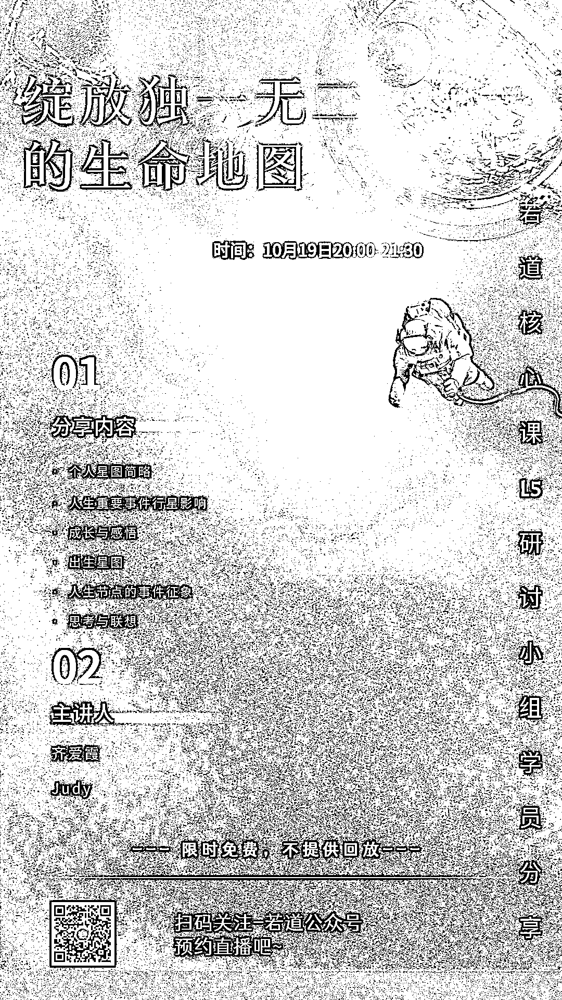

**点击下方预约按钮参与直播~**

<mpvideosnap class="js_uneditable custom_select_card channels_live_iframe" data-pluginname="videosnap" data-headimgurl="https://wx.qlogo.cn/finderhead/PiajxSqBRaEJYnVsqWfEX9qA0sI6hNVKsDfyzfPZ92WZMZyBpZWU5NA/0" data-username="v2_060000231003b20faec8c4e68a1ec2d4ca07e434b07755bbf47e7053a3059defd2c9d6c68a20@finder" data-nickname="若道" data-desc="将在 10 月 19 日 20:00 直播" data-intro="若道核心课程 L5 研讨小组分主题享会：探索生命密码" data-noticeid="finderlivenotice-v2_060000231003b20faec8c4e68a1ec2d4ca07e434b07755bbf47e7053a3059defd2c9d6c68a20@finder-1665455369366588-1016070129" data-type="live"></mpvideosnap>**20 位来自世界各地的占星师****带来 19 场沙龙——新世界的觉醒****详情可点击下图**

**学习占星学****点击下图了解课程详情**

**

**微信又双叒叕改版啦，不想错过若道君的推送？**
****就把若道设为****星标****以及点点****“在看”****吧！******▼**

**喜欢就点一下“在看”吧！****报名直达入口**

# 跌到 1622 美元的黄金会开始一波反弹吗？ | 梅里曼 11 月黄金报告上线！

> 原文：[`mp.weixin.qq.com/s?__biz=MzA5NjA0NTAxNg==&mid=2651491663&idx=2&sn=f0a53f1f4e7c41728899e90b1662d3d6&chksm=8b483ff8bc3fb6ee3407806aea4211bc46669f497306b4f76de75471c9c0219ff88d12fbfcf8&scene=126&sessionid=1692737741#rd`](http://mp.weixin.qq.com/s?__biz=MzA5NjA0NTAxNg==&mid=2651491663&idx=2&sn=f0a53f1f4e7c41728899e90b1662d3d6&chksm=8b483ff8bc3fb6ee3407806aea4211bc46669f497306b4f76de75471c9c0219ff88d12fbfcf8&scene=126&sessionid=1692737741#rd)

“**黄金是金钱。其他的只是信贷。**

**——约翰·皮尔庞特·摩根**

”

| 黄金周 K 线图

**作为交易者和投资者，我们已经迎来了或许是今年最重要的地球宇宙学时间段：土天四分的时间段，它的宇宙影响力会持续到 11 月中旬。**在上个月，发生许多重要的大事件，俄乌战争升级，伊朗动乱，美国再一次对中国发起芯片战，整个世界局势动荡加剧。

很多国家的股票市场都在这次的土天四分时期下跌到历史低点。货币和债券市场也是同样，欧元、日元和美国中期国债数十年来的低点，黄金也是一样。9 月 28 日，黄金跌到 1622 美元，距离今年 3 月份黄金最高点 2078 已经跌去 21.94%。

不过，我们经历了 2 年的土天四分正在逐渐成为过去式。虽然其影响还会持续。9 月 28 日的低点 1622 是黄金走势 2 年来的低点。

| 黄金日 K 线图

黄金有一个 31.33 个月的周期，而半周期是 16 个月，其容许度在 13-19 个月之间。从上个周期低点是 2021 年 3 月的低点 1673，而 10 月是第 19 个月。   **所以，有没有可能，9 月 28 日的低点 1622 已经完成了 10 个月的半周期的低点，黄金可能展开一波反弹？如果真是如此，黄金是不是迎来了一个短期的投资机会？**  11 月份黄金报告已经上线，上证报告也即将上线，欢迎了解。也可以按照季度和 1 年期订阅，有更多优惠。季度和年度的好处是，你可以持续了解梅里曼老师对于不断在变化的市场的看法。  即便他某一次看法和市场不一致，你也看到在下一期他如何调整自己的看法，并看到金融占星在一个长期时间段内对你把控风险的帮助。而能够长期控制风险、尽量找到安全的投资时机才是投资的长久之计。  点击阅读原文，雷蒙德·梅里曼黄金周期 2022 年 11 月报告带来有 40 年黄金市场研究经验的世界著名金融占星大师雷蒙德·梅里曼对当前黄金市场的研究。  **此外，雷蒙德·梅里曼 2023 年预报及沙龙已开始双 11 优惠预售，将帮助你对 2023 年的市场风云变化加深了解。****长按下图识别二维码了解更多详情**

投资有收益，投资有风险，希望金融占星学的研究帮助你更好地评估你的投资。

**11 月黄金报告上线**

**黄金月度报告价格****单月报告**：280 元/月 **季度套餐价格**：780 元（260 元/月）**年度套餐价格**：2400 元（200 元/月）**双报告年度套餐更优惠（直降 900 元）****12 个月黄金报告+12 个月上证指数报告：仅需 3900 元****长按下图识别二维码购买黄金报告**
▼

**购买者需知**

**① **梅里曼市场时机学院《中国上证指数月度研究报告》是梅里曼市场时机学院（以下简称 MMA）的研究“预报”，而不是市场“预测”，是梅里曼老师及 MMA 金融占星分析师对人类活动周期历史与行星周期之间相关性的研究，二者在大部分情况下具有 80%或更高的相关性，而不是因果关系。报告中的研究完全存在错误的可能性。即便是非常认真的研究和几十年的研究经验，金融占星师无法总是正确地解读出各种征象在实际层面上会如何相互作用，并显化为事件结果。

所以请将报告看作一个研究参考，务必结合其他市场研究和你个人对市场的理解，根据你的自由意志做决策。

**②** 此报告一旦售出，**即不接受退款。**

**③** 上证、黄金月度报告每月固定 1 期，**并非都是在每月相同日期发布。**

**④** **我们收到英文报告的当天，即发布该英文报告。3 天后，上线报告中文版。此报告仅支持手机网页阅读，不支持电脑阅读和下载。****以上须知，请仔细阅读。一旦付款，即视为已了解并接受所有须知内容。**在过去的 40 年中，唯有梅里曼逐渐完善，并在梅里曼市场时机学院月度周期报告中阐释了将地球宇宙学与周期相结合的研究方法，以惊人的精确性预报了黄金价格发生重大变化的时间。**黄金购买 Tip**

各大银行均可购买黄金或黄金 EFT 基金，也可以在诸如天天基金或者支付宝购买黄金及黄金相关产品。不明白的可以百度搜索。

**购买后如何查看报告？**

**购买后有疑问怎么办？**请联系技术客服
**微信：nodoor201705**
**购买报告直达入口**

# ISAR 选修丨占星原型与星图中的精神病理学

> 原文：[`mp.weixin.qq.com/s?__biz=MzA5NjA0NTAxNg==&mid=2651491663&idx=3&sn=c03c14257b790a1d319d09eb8187d2a3&chksm=8b483ff8bc3fb6eededa10f487e3cb2b8fda27b0adbe934020b2b90e1d4803c6dd6d7645f627&scene=126&sessionid=1692737741#rd`](http://mp.weixin.qq.com/s?__biz=MzA5NjA0NTAxNg==&mid=2651491663&idx=3&sn=c03c14257b790a1d319d09eb8187d2a3&chksm=8b483ff8bc3fb6eededa10f487e3cb2b8fda27b0adbe934020b2b90e1d4803c6dd6d7645f627&scene=126&sessionid=1692737741#rd)

**课程描述**

看过课程标题的你，也许会感到好奇和惊讶，为什么在占星学的课程中，会出现精神病理学的教学内容，这和我们有什么关系？这对占星咨询，或在自我了解与成长的过程中又有什么帮助呢？

**带着这些疑问，请你静下心来，思考以下几个问题**：

“**你/你的案主，是否曾经过度担心什么？** **你/你的案主，有没有感觉到担忧和焦虑，却不知道原因是什么？****你/你的案主，是否曾经觉得害怕什么东西，但理智上却很清楚它不会对你造成什么伤害？****你/你的案主，是否曾经通过沉迷某物，酗酒或滥用药物，自我伤害去逃避问题？****……****——节选改编自《心理学与生活》**”

如果你对上述问题其中之一，回答是。这意味着几乎每个人都曾有过心理障碍的症状（精神病理的问题）。

你看，其实“精神病理学”与人的心理有着密切的关联，再结合占星学，呈现了人内在与外在层面更加丰富和深刻的一面。**这对于学习占星学的人和占星师来说，都是一场难得的知识盛宴！**

**本课为 2 年期双证核心课程中的一部分**（AP105 阶段），其内容是过去若道所开设的核心课程从未教授的部分，特意抽出供其他学员学习，**可作为 ISAR 选修课，单独报名**。

**在正式了解本课的价值之前，先了解一下这门课程的主讲老师吧！**

**格伦·佩里（Glenn Perry）**

*   他是心理/意识研究专业博士、加州注册婚姻和家庭治疗师 （CAMFT）

*   占星心理学学院（Academy of AstroPsychology）创办人

*   康涅狄格州研究生院（the Graduate Institute of Connecticut）原型宇宙学与意识进化项目的负责人

*   共出版八本占星学著作：《心理占星学入门》、《心理占星论文集》、《盗取天火》、《从忠诚到革命》、《星图中的阴影》、《占星职业议题与伦理》、《出生星图深度分析》、《从古代到后现代占星学》

**墙裂推荐格伦老师这门课的 **

**4 大理由**

**你一定得知道的课程价值**

**价值*****1***
**明晰精神病理学的基本定义**

占星心理学学院创办人格伦·佩里老师，对**精神病理学的基本定义**就是灵魂受苦，精神就是灵魂的意思，病理就是受苦的意思，所以精神病理学研究的就是：人类各种各样受苦的方式，尤其是因为某一类的行为而引起的。

精神病理学是一个连续体，从比较轻微的，到比较严重的，这么说来，我们每个人都有一部分精神病理的问题。

**如果成为一个“人”，没有一定程度的挑战是不可能的。没有一定程度受苦，没有一定程度不平衡是不可能的。而这种不平衡就会以一种挑战和困难的姿态呈现出来。**

**价值*****2*****更懂疗愈：从不平衡到平衡**

**疗愈**是一个复杂的过程，讲的是将人从不平衡带到平衡这样的一个状态，将不同行星代表的心理功能带到一种更加平衡整合和合作的状态。

格伦老师通过研究精神病理学，发现每一颗行星，以及这颗行星所守护的星座，都和某一特定类型的病理是联结在一起的，包含了这个占星原型所涵盖的极端不平衡的情况。

举个例子，案主的第 1 宫，有很多星星在那里，和对面第 7 宫的火星形成对分相，第 1 宫白羊座或者火星白羊座的组合，和这个案主的反社会人格的病状联系在一起（这是一个星图的极端负面表现）。

“

**生活本身就是一场治疗，我们在占星的星图中去看到，人们所具有的创伤、不平衡及其产生的防御机制，最终都会在他生活中的关系和情境中呈现出来。无论他生活中处在怎样的情境之下，其实这些环境都是在为他提供恰当的环境，作为一种载体，让他去平衡和疗愈事件背后问题的根源。** 

**这样一个现象是持续不断地在发展，会让我们想到，会有一个更大的宇宙的智慧存在，它其实是在指挥和引导着我们的这些经验，让我们去经历然后进入更高层面的发展当中。生活或者“神”，就是我们所有人类的一个治疗师。**

**——格伦·佩里**

”**价值*****3*****了解诊断标准，提高咨询的专业敏感度**

如果能够对精神病理极端不平衡的情况有了解的话，你就会对它比较温和的版本更加敏感（大部分人是更温和版本的呈现）。

也许案主并没有达到某个病理所达到的层级，但是 Ta 有显示出，这个病理某一些特点或者某一些倾向。所以，我们的目标并不是去诊断案主，而是了解他在这个病理学连续体上处在一个怎样的位置。

当你拿到星图你会看到，案主不同的冲突，是体现在不同的部分上。某一个病状是体现在某一个行星，另外一个病状，是同步体现在另外一颗行星上。

当我们通过对占星原型星座和行星的病理学现象的学习后，就能看到占星学上的配置所呈现出来的，案主表现出的这些失调，并不一定都会成为一种心理临床上的诊断。有可能在案主这里呈现出一个很轻微，但是仍然在 Ta 生活中，给 Ta 造成挑战的一个点。

**价值*****4*****智力上的刺激——整合进阶**

这个课程能够让我们了解自己，了解我们的客户，了解我们的朋友，了解我们的家庭。它给我们提供一种崭新的方式，并且让我们看到占星原型的种种表达，不要局限在非此即彼、非好既坏的这样的一个概念当中，而看到它其实是一个不同程度的连续体。

当我们能够以这种方式去看的时候，你就能够将自己的生活，带入一种和谐。能够了解这是一个过程，我们的重点不是放在诊断上，而是放在整合上，因为生活，就是一种整合。

**课程内容**

**AP105 星图中的精神病理学与疗愈** 共**15 次**课程：**10 次 2019 年录播课+5 次直播课；30 课时**

在这个阶段的课程中,我们将**聚焦于十二星座(从白羊座到双鱼座）及其对应的守护星的潜在功能障碍。**

我们将学习如何识别、理解和应对每个星座的潜在挑战。我们将在各种相应的心理障碍背景下来考察占星原型，这些心理障碍表现为功能障碍、失衡的极端状态。

学员们将了解**《精神疾病诊断与统计手册》诊断标准**。我们会探讨治疗的概念，尤其是那些与整合和个性化相关的概念。我们将特别关注外行星的困难相位，以及它们与内在心理冲突、防御和症状形成的关系。

学员们将探索人的痛苦如何成为发展和实现天赋才能的催化剂。在考察病因时，我们会将平常的因果关系理论与传统的命运、业力和转世观念整合起来。

**口碑推荐**

‍**‍想感受格伦老师的课堂魅力？** **一小段讲课视频让你先睹为快~**<mpvideosnap class="js_uneditable custom_select_card channels_iframe videosnap_video_iframe" data-pluginname="videosnap" data-id="export/UzFfAgtgekIEAQAAAAAAxuwL_P9LDAAAAAstQy6ubaLX4KHWvLEZgBPElYFkVBZaNrKCzNPgMIuhBCuUlaCPzDNmHFgJR5sp" data-url="https://findermp.video.qq.com/251/20304/stodownload?encfilekey=rjD5jyTuFrIpZ2ibE8T7YmwgiahniaXswqzIGcAWV11d39RRKTicEUe1lSn5e1z2jdX20ath9yg9Liaia8VPS2c4MUJibl8FlxSZs3ajlcibhlD6typd6ZeGeWj2bQ&amp;adaptivelytrans=0&amp;bizid=1023&amp;dotrans=0&amp;hy=SH&amp;idx=1&amp;m=&amp;scene=0&amp;token=AxricY7RBHdXmmhmUb1Np3Ioz3Ok0V9IBZ0eINxnxticaC9r3HjsQ8iatkwqFBLKP50ZibXDm0TiaicC4" data-headimgurl="http://wx.qlogo.cn/finderhead/PiajxSqBRaEJYnVsqWfEX9qA0sI6hNVKsDfyzfPZ92WZMZyBpZWU5NA/0" data-username="v2_060000231003b20faec8c4e68a1ec2d4ca07e434b07755bbf47e7053a3059defd2c9d6c68a20@finder" data-nickname="若道" data-desc="#ISAR 选修课  如何识别、理解和应对每个星座的潜在挑战？如何在不同的心理障碍背景下来考察占星原型？" data-nonceid="4249051256207020861" data-type="video" data-width="1024" data-height="576"></mpvideosnap>

**课程费用**

**课程价格：9000 元****课程优惠价请添加 Margartet 咨询**

课程负责人：Margaret

（微信：18515059056）

请备注“心理占星 105”

**开课时间**

**直播课开课时间：2022 年 12 月 21 日**

**退转课程**本课程包含往期视频知识点视频课程+直播案例课程+助教直播答疑；报名付款后均不受理退款转课，请慎重考虑后再确认付款。**其他相关事项请仔细查阅报名勾选时的《教学协议》，如有疑问请咨询课程顾问。****报名流程及费用支付****1. 点击阅读原文链接立即报名，填写个人姓名（身份证姓名）和相关信息，阅读并同意《教学协议》，提交报名表，直接在线支付。****2. 付款后可在网页个人中心或手机网页“我的”栏目查看报名记录。****如遇疑问请与销售人员联络******ISAR 选修·占星原型与星图中的精神病理学****

**授课老师：格伦·佩里**

**直播课开课时间：**2022 年 12 月 21 日

**授课方式：**网络课程，中英文授课，中文翻译

**费用：9000 元（获取优惠请联系客服咨询）**

**课程负责人：**Margaret（微信：18515059056 请备注“心理占星 105”）

长按二维码添加课程负责人咨询~

**报名直达入口**

# 这个星座总是那么引人注目！XX 座：怪我咯？

> 原文：[`mp.weixin.qq.com/s?__biz=MzA5NjA0NTAxNg==&mid=2651491512&idx=1&sn=39a12aaf9b3d172b27861ca9ec6382f0&chksm=8b483e0fbc3fb71949c3833b49e734cc0017e2394a93a8ab5380d56725cc0d8f746fbf988eb8&scene=126&sessionid=1692737741#rd`](http://mp.weixin.qq.com/s?__biz=MzA5NjA0NTAxNg==&mid=2651491512&idx=1&sn=39a12aaf9b3d172b27861ca9ec6382f0&chksm=8b483e0fbc3fb71949c3833b49e734cc0017e2394a93a8ab5380d56725cc0d8f746fbf988eb8&scene=126&sessionid=1692737741#rd)

**☆ 后台回复“今日”，给你一句生命态度**

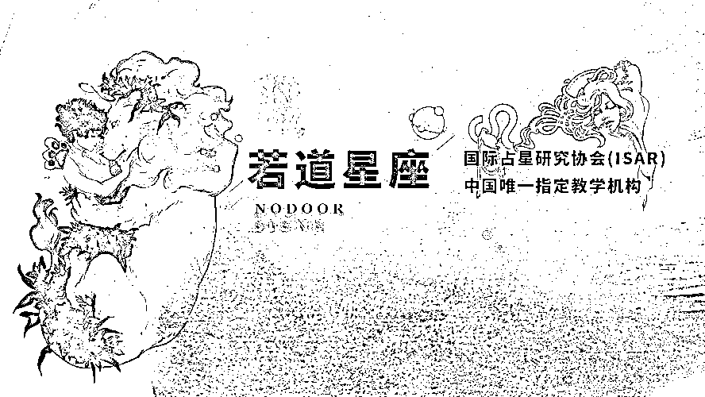

作者/大卫·瑞雷 若道占星创始人译者/若道翻译团队编辑/玫瑰 图片/稿定设计

今天来听听大卫老师聊狮子座，它的基本功能、它的恐惧和它的挑战。而如果你的太阳、月亮、上升点或其他出生图中的重要行星落入狮子座，或者是与该星座共振的宫位被强调，那么这篇文章将更加适用于你。另外，大卫老师参与授课的【[ISAR 认证职业占星师文凭课程](http://mp.weixin.qq.com/s?__biz=MjM5MjQwNjAyMQ==&mid=2649440437&idx=8&sn=833d371d215075b64a283c0055338131&chksm=beb92fdf89cea6c9935d410825c2e4caaae4fe17de99ce9b7e66fc360905ab92d9d7631d427c&scene=21#wechat_redirect)】报名中，点击链接了解更多详情！

**总是受人关注的狮子座**对于那些太阳或者其他行星落在狮子座，或者在出生图中狮子座被强调的朋友来说，**要做到不引人注目是件很不容易的事情**。早在阿诺·施瓦辛格 7 次获得了奥林匹克先生的殊荣、成为好莱坞巨星以及成为加州州长之前，我相信他童年在奥地利生活的时候，与他的同班同学相比，就是一个引人注目的小男孩。同样，前任美国总统比尔·克林顿在青少年时也已显现出狮子座的特质。在一张早期照片中，十几岁的他微笑着与肯尼迪总统握手，他光彩照人、自信满满的样子给人留下了深刻的印象。而肯尼迪的妻子也是狮子座，她的勇气让她在经历悲剧时仍然保持着尊严。即使她试图低调，却也隐藏不了她戏剧般的人生所散发出的光彩。但是，他人的关注对狮子座来说，是祝福，同时又是一种诅咒。**狮子座的丑闻，也可以像他们获得成功时那样充满了戏剧性。**克林顿的性丑闻在他任期的最后一段时间内悲剧性地占据了所有报纸的头版头条。而 2001 年中国台湾前电视台记者和台北市议员璩美凤的视频丑闻也是另一个狮子座的例子。当然，丑闻不是狮子座独有，也不是任何一个星座独有的，但不可否认的是，不论好事还是坏事，狮子座就是容易引人注目，并给人留下深刻印象。就算这些狮子座很安静，在一对一的交往中很低调，你也会惊讶地发现当他们面对人群的时候，他们多么会发指令，当人们抬头仰望，看看这是谁在说话时，狮子座的声音会变得格外有力。

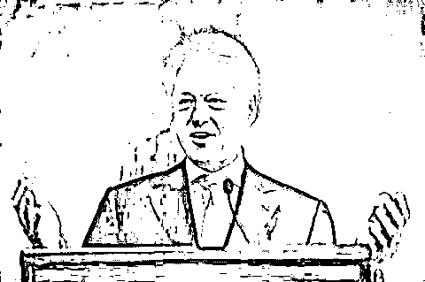

| 克林顿

**领导力是狮子座备受推崇的能力，而他们的确也当之无愧。**当涉及到“谁是老大”这个问题时，拿破仑、菲德尔·卡斯特罗、查韦斯、墨索里尼必然是名列榜首的极端狮子座人物。同样的，就像罗伯特·雷德福、达斯汀·霍夫曼、罗伯特·德尼罗和西恩·潘那样，**狮子座的演员在所属的领域中也都是重量级的人物。**在艺人中，麦当娜、珍妮弗·洛佩慈，和被誉为摇滚乐传奇的滚石乐队成员米克·贾格尔都是狮子座的典型，他们都彰显着人生的炫目和壮观。陈凯歌和 M·奈特·沙马兰这两位电影人虽然代表的是两种不同的风格，但他们同样总是能引起人们的关注。太阳狮子座的名人列表可能不会比其他任何一个星座的长，但当你阅读它时，会发现这里没有模棱两可的人格类型，这里面所列的都是些**意志强烈**的人，**他们活出了如同戏剧般精彩的人生。**中国的狮子座名人还有：邓小平、李嘉诚、季羡林、许海峰、聂卫平、王朔、崔健、王菲、韦唯、龚琳娜、张惠妹、孙红雷、甄子丹、吴君如等。

| 王菲

**狮子座的恐惧**没错，狮子座可能是**霸道的、傲慢的、被宠坏的、要求被特殊对待的、骄傲的甚至自夸的**，但是，**这些行为往往象征着他们没有安全感**，那些未被处理的自我评判累积在恐惧之上，**他们真正担心的是自己也许根本没那么特殊。**这样想着，**受伤的“自我”便以狮子座的方式表达了出来。**有些人**扮演着低调的英雄，勇敢地忍受着生活中的巨大混乱，坚信如果他们不去主动做那件事，就会一无所成。**即使是能量没那么强的狮子座仍然会**为自己所做的事情负责任，就算他们所表现的不那么明显，但他们真的发自内心为自己完成的工作所自豪。**但是，对于狮子座来说，孤立的感觉又并非罕见，因为在他们心中，有一个剧本，而自己是剧本中那个未被承认的英雄。即使他们天赋未被人承认，或者不被人欣赏，他们仍然会勇敢地朝着自己心中的方向尝试着去做出与众不同的成绩。如果是你的太阳在狮子座，或者是上升狮子座，又或者星图中有突出的狮子座元素，如果你体验到前文提及的性格特征或人生主题，你需要为自己去探索这是为什么。对于狮子座人而言，最常见的负面力量莫过于在成长中接触到这样的信息：**“你并不特别。”**父母通常的说法是：“你凭什么觉得自己如此与众不同呢？”比这更糟糕的是，**你被完全忽视，你全力以赴却未获得认可**。**“无论我做什么都没啥了不起的”**的信念应运而生。更让自我受挫的是当家庭因为社会、经济或家人上瘾的恶习而遇到问题时，这个孩子想要像个英雄一样竭尽全力照料家庭，但却最终无法阻止家的分崩离析，于是他（她）就成了一个失败的英雄。我有一个客户跟我说，她竭尽全力想要保护母亲和兄弟姐妹们安宁、幸福，但她的酒鬼父亲总是知道如何破坏她的计划。小小年纪，她就靠做模特贴补家用，可是父亲偷了她赚来的钱还烧了他们的公寓。

另一位狮子座客户认为父母戏剧化的离婚事件葬送了她求学的机会。她说：“他们把我的学费都拿去支付律师费了。等他们都折腾完了，妈妈也承担不起我的学费了……”

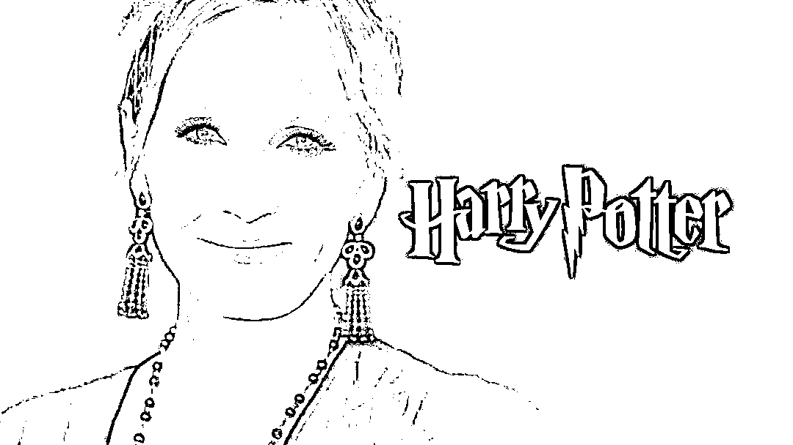

| J.K. 罗琳

**但是，挫折并不能阻挠狮子座人向成功迈进。**某些狮子座人有很大机会战胜困难，比如 J.K. 罗琳女士，当她开始写第一本书时，她只是一个靠社会救济生存的单身母亲，但随后写出了《哈利·波特》系列故事。**其实，阻挠狮子座人获得幸福和成功的是来自于老旧信念中的恐惧，这个信念说，“你期待的不会到来。”****你要从情感内核清理这种基于老旧恐惧的程序模式。**因为你是一只狮子，你的康复疗愈过程“必然”是戏剧化的。你的人生大戏即将上演，而你正是舞台中央的那一个，你要秀出你的生命，无需为你所经历的道歉。闪亮登场吧！释放你的创造力，聚光灯将追随你的身影。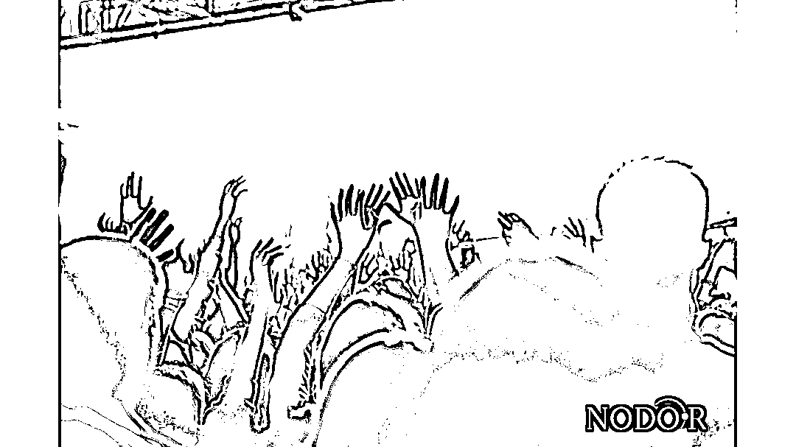**狮子座与星图中其他元素的搭配**如果狮子座的你恰好又具有**显著的海王星、12 宫或双鱼座元素**，你的表达可能没有那么明显的戏剧化，但你**一样有能力克服童年时被家人忽视的影响，冲破家庭混乱所带来的伤害。**如果是狮子座伴随着显著的**冥王星、第 8 宫或天蝎座元素**，你的问题就是**重新掌控自己的人生，冲破被虐待和受操纵所带来的负面影响。**如果是狮子座伴随着**显著的土星、第 10 宫或摩羯座元素**，你的潜意识中重复的信念可能是“一切都来之不易！”“你必须千辛万苦才能获得成功！”“在成功的道路上总是有障碍在等着你。”你需要清除这些信念。如果是狮子座伴随着**显著的天王星、11 宫或水瓶座元素**，你需要**与削弱你独特性的信念作战。**你会感到冷漠而疏离，早年生活的冲击，成长中的不稳定经历，比如总在频繁搬家、换邻居、换学校通常造就了这种“非典型性的狮子座”。

有一位狮子座客户，太阳与天王星合相在狮子座，到 15 岁时，她已经在 6 个国家生活过。为了适应不停变化的新环境，她变得冷漠，这让她在成年后很难真切地融入生活。

要重新唤起她在 10 岁时就丢失了的创造能量，首先她必须接受她是多么想重圆夙梦！现在，她长大了，可以为自己做决定，成为自己生活的掌控者。当丈夫想要搬家到另一个地区时，32 岁的她选择留在本地，实现她开画廊的梦想。

无论太阳的相位如何，亦或星图中有其他因素影响，**每一个狮子座人的心中都潜藏着一股等待释放的巨大能量。**这就像是太阳的能量（太阳是狮子座的守护星），向往穿透云层，释放让人敬畏的万丈光芒。狮子座向我们展示了一场庆典，如何为生命的戏剧本质唱出赞歌。对狮子座的人来说，最大的成就感莫过于在生活中发掘自身与众不同的光芒，能够为自己做点什么，让生命与众不同。只要是得到了充分的运用，狮子座人的意志力会一往无前、所向披靡。

**版权声明：**原创文章由作者授权发布于若道平台，欢迎转发，反对抄袭。友号转载请申请白名单。

**END**

****想阅读更多作者的文章，请在后台回复******大卫****** 即可。****

**大卫·瑞雷**

美国占星师，若道联合创始人，致力于在中国教授和推广西方占星学；2010-2014 年，任全美占星师联盟监督委员会委员；2017 年，被选为 ISAR 委员会成员。ISAR 是世界最大的国际占星机构，会员遍布 45 个国家，2017-2020 年曾任 ISAR 全球副主席、CAPISAR（ISAR 职业占星师资质认证机构）主席。

**拥有****51 年****占星实践经验的****若道创始人****前 ISAR 全球副主席****前 ISAR 全球职业占星师资质认证主席****大卫·瑞雷**

**和**

**2019 年第二届、2021 年第三届核心课中**

**与苏·汤普金斯老师****联合授课****的**

**ISAR 认证职业占星师**

**咔咔（Caroline）**

**二人合力打造**

**2022 年 ****若道全新核心占星课程**

**点击下图了解更多课程详情** 

**

**20 位来自世界各地的占星师****带来 19 场沙龙——新世界的觉醒****详情可点击下图**

**学习占星学****点击下图了解课程详情**

**微信又双叒叕改版啦，不想错过若道君的推送？**
**就把若道设为星标吧！****▼**

**喜欢就点一下“在看”吧！**

********报名直达入口********

# 核心课程速递：在作家余华的生活里，内行星如何体现？

> 原文：[`mp.weixin.qq.com/s?__biz=MzA5NjA0NTAxNg==&mid=2651491512&idx=2&sn=f99ce02c8254eecb56407f7a714a2e07&chksm=8b483e0fbc3fb719f9d0bd09fcf3c239ef948352e3ab235ca233158a13dc9137a8e78738258f&scene=126&sessionid=1692737741#rd`](http://mp.weixin.qq.com/s?__biz=MzA5NjA0NTAxNg==&mid=2651491512&idx=2&sn=f99ce02c8254eecb56407f7a714a2e07&chksm=8b483e0fbc3fb719f9d0bd09fcf3c239ef948352e3ab235ca233158a13dc9137a8e78738258f&scene=126&sessionid=1692737741#rd)

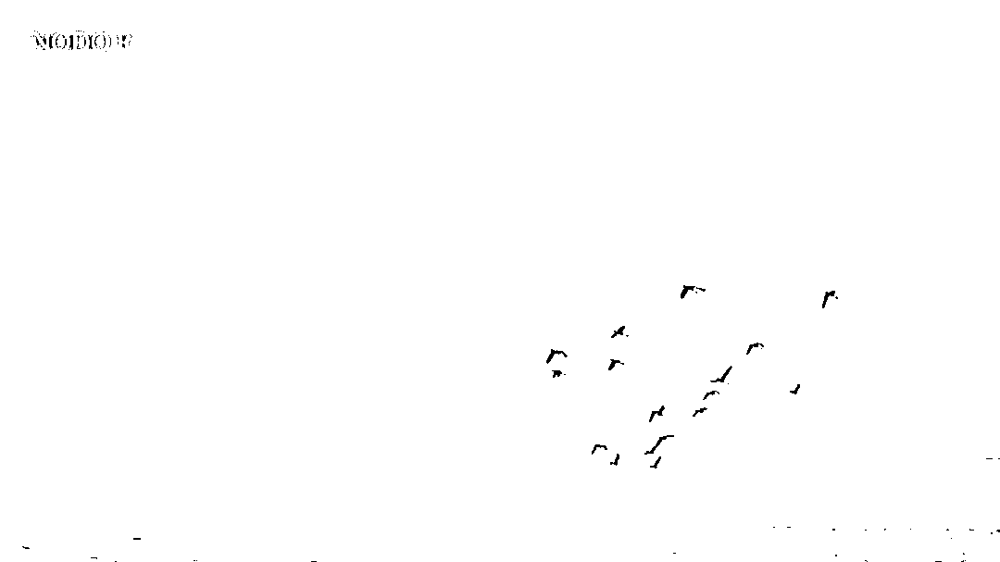

新的一期若道核心课开始讲到**行星与星座结合**的部分啦。

在第六堂课中，咔咔老师讲解了**面对一张实际的星图**，如何初步去理解一个人的**内行星**（日月水金火）落入的星座，以及**在现实生活中的表达**。

去年出版新书的著名作家余华老师，其语言幽默，所刻画的小说中的苦难世界，**体现了他什么星座的特点呢？**

莫言老师评价他是“清醒的说梦人”，小说依托于现实，却又体现出人生的荒诞与虚无，**是基于怎样的行星和星座特点呢？**

余华老师自己说，“作家的使命不是发泄，不是控诉或者揭露，他应该向人们展示高尚。”**体现了自己怎样的特点呢？**

**关于余华老师的作品，以及他本人的特质，咔咔老师是这样讲述的：**

<mpvideosnap class="js_uneditable custom_select_card channels_iframe videosnap_video_iframe" data-pluginname="videosnap" data-id="export/UzFfAgtgekIEAQAAAAAAbz0rVv-XkgAAAAstQy6ubaLX4KHWvLEZgBPE7YFMPVhuaZCCzNPgMIuVNr5iQ6u1cpsmY4xZ1QwB" data-url="https://findermp.video.qq.com/251/20304/stodownload?encfilekey=rjD5jyTuFrIpZ2ibE8T7YmwgiahniaXswqzUP9eF2eScbR2hWkHPIib0QwARnJ5HPkEC6JHP8ylWNiaMsjmPrvI0yrCAIfkQ7Cib5Cbviboynmxz6C6QUJoNdgxlw&amp;adaptivelytrans=0&amp;bizid=1023&amp;dotrans=0&amp;hy=SH&amp;idx=1&amp;m=&amp;scene=0&amp;token=x5Y29zUxcibB0SqTic5uhO0pZLqku9RrNu6EjPdEtOw0WOQoKKOtUFENibloiabIpktdqVBh962Lic78" data-headimgurl="http://wx.qlogo.cn/finderhead/PiajxSqBRaEJYnVsqWfEX9qA0sI6hNVKsDfyzfPZ92WZMZyBpZWU5NA/0" data-username="v2_060000231003b20faec8c4e68a1ec2d4ca07e434b07755bbf47e7053a3059defd2c9d6c68a20@finder" data-nickname="若道" data-desc="#若道核心课 如何解读一张出生星图中内行星的星座，以及在现实生活的表达？对于实际的案例讲解，如何超越占星解读的二元论？" data-nonceid="9587720592636916183" data-type="video" data-width="880" data-height="504"></mpvideosnap>

**欲知更多详情，欢迎大家购买我们的课程，获得完整版教学内容。**

**拥有****51 年****占星实践经验的****若道创始人****前 ISAR 全球副主席****前 ISAR 全球职业占星师资质认证主席****大卫·瑞雷**

**和**

**2019 年第二届、2021 年第三届核心课中**

**与苏·汤普金斯老师****联合授课****的**

**ISAR 认证职业占星师**

**咔咔（Caroline）**

**二人合力打造**

**2022 年 ****若道全新核心占星课程**

**点击下图了解课程信息******报名直达入口**

# 插班中 | ISAR 认证职业占星师必修课：踏入占星学大门的第一步

> 原文：[`mp.weixin.qq.com/s?__biz=MzA5NjA0NTAxNg==&mid=2651491512&idx=3&sn=acba034741b72e0aefe839c4fdd88e41&chksm=8b483e0fbc3fb71918e6e5f1eef1260286ffcb7c8962e77c6e3dca74ca202695d186a44e9357&scene=126&sessionid=1692737741#rd`](http://mp.weixin.qq.com/s?__biz=MzA5NjA0NTAxNg==&mid=2651491512&idx=3&sn=acba034741b72e0aefe839c4fdd88e41&chksm=8b483e0fbc3fb71918e6e5f1eef1260286ffcb7c8962e77c6e3dca74ca202695d186a44e9357&scene=126&sessionid=1692737741#rd)

5 月，一个若道的老朋友突然发来一段微信，是对木星进入白羊座的感慨。这位朋友创建了自己的公司，他并不在占星行业，但仍经常记录占星日记，因为他总是体会到星体移动和个人生命变化的契合。

过了几天，又一位若道的老朋友发了一张当天新闻的图片，里面有医疗板块产业趋势、有啤酒股的泡沫问题、有千年老二的饮用水公司也要上市。她说，看，举目全是海王星。她也不是占星师。

然而，他们都与占星相遇，占星已经融入了他们的生活。

第一位朋友说，”在若道学习占星，对我来说建立了一个整体的世界观以及对自我内在的解释论。”

第二位朋友说，“学了占星就会知道，事情来时我们不必过度反应，知道一切会过去”。

占星学会改变你，不论你跟随它走多远，不论你是否选择成为占星师。

这个世界在飞快地变化着，占星学可以像定海神针，帮你测度这个世界的变化，也帮助你校正心中的自己和世界的样子。

**这个世界上，应该还没有后悔与占星学相遇的人。**

**8 月 30 日，新的若道占星核心课程开始了。**

如果你还没有下定决心是不是好好学占星，那么 L1-2 可谓一个轻松的前菜，等着你品尝。

**把这个仅需投资 3500 元的课程作为礼物，送给自己或者自己所爱的人。**

**课程试听：不分组转发本文，找王老师领取。**

长按二维码添加王老师微信

**谁是你的老师？**

**占星师咔咔（Caroline）**

2010 年师从美国占星师大卫·瑞雷学习，并得到世界名师斯蒂芬·弗里斯特、罗伯特·汉德、苏·汤普金斯传授各种占星学技法。若道首届学员，国内最早获得 ISAR 职业占星师资质的职业占星师，多次担任若道核心课程助教，2019 年第二届、2021 年第三届核心课中和苏·汤普金斯老师一起教授若道核心占星课程。

在国际知名广告公司和市场研究公司从事的市场研究和推广工作十余年，曾任职于阳狮集团、尼尔森市场研究有限公司、MTV 和《Madame Figaro》杂志。

**大卫·瑞雷（David Railey）**

*   **I****SAR 董事会成员，ISAR 全球副主席，ISAR 全球职业占星师资质认证主席，若道占星创始人**。

*   2016-2019 年，被选为国际占星协会（ISAR）考试委员会成员，国际占星协会（ISAR）是世界最大的国际占星机构，会员遍布 47 个国家。

*   2017-2020 年，被选为国际占星联盟（ISAR）考试委员会主席，理事会成员。

**助教王嘉祺 （Conrad）**

ISAR 认证占星师、若道认证生时校正资质，从 2010 年起自学占星学，2015 年开始在若道系统学习，并开始个案咨询。2018 年担任若道核心课程助教，以及卜卦占星学和太阳返照选修课助教，并带领学员进行经世占星和太阳返照方面的研究。2019 年 11 月作为演讲人之一参加了国际占星协会（ISAR）北京大会，也是 ISAR 星空俱乐部中国区第 16 期的主讲人。

**内容是什么？**

**课程费用**

**★ 1-2 阶 **

**课程费用：3500 元 **

**你也可能想学更高阶：**

**★ 1-3 阶　连报****课程费用：11500 元 ************转发优惠价：**11000 元（朋友圈转发本课宣保留 24 小时以上，并截图给课程顾问）**********★ 1-5 阶　连报**

**课程费用：46500 元 **

****转发优惠价：34800 元（朋友圈转发本课宣保留 24 小时以上，并截图给课程顾问）****

德国哲学家雅思贝尔斯说：

教育是一棵树摇动另一棵树，

一朵云推动另一朵云，

一个灵魂唤醒另一个灵魂。

你准备好被摇动了吗？

**退转课程**

**退款原则请详看《教学协议》，如有疑问请咨询课程顾问。**

**课程试听**

**不分组转发本文，加王老师获取。**（微信/手机：18510107057，请备注“大卫核心课”）

****2022 L1-2 认证职业占星师必修课程****

**授课老师：大卫·瑞雷、咔咔**

**直播课开课时间：2022 年 8 月 30 日（周二）**

**授课方式：******网络授课，英文/中文授课，中文翻译****

**费用**： ****1-2 阶**：**3500 元；****1-3 阶**：**11500 元**（****转发优惠价：11000 元，朋友圈转发本课宣保留 24 小时以上，并截图给课程顾问）；**1-5 阶连报**：46500 元**（****转发优惠价：34800 元，朋友圈转发本课宣保留 24 小时以上，并截图给课程顾问）****

**课程负责人：王老师**（微信/手机：18510107057，请备注“大卫核心课”）

长按二维码添加课程负责人咨询~

**END****报名直达入口**

# 若道周运 10.17-10.23 丨属于天秤月的最后一周，准备迎接天蝎月的到来吧！（内含 12 星座运势）

> 原文：[`mp.weixin.qq.com/s?__biz=MzA5NjA0NTAxNg==&mid=2651491486&idx=1&sn=af2aea2c5a732321f1bfe77870b8759f&chksm=8b483e29bc3fb73f5c060a2c2dc42e36c5c16d1ec0f8a6eed2d0cae2873487f9d770662d7108&scene=126&sessionid=1692737741#rd`](http://mp.weixin.qq.com/s?__biz=MzA5NjA0NTAxNg==&mid=2651491486&idx=1&sn=af2aea2c5a732321f1bfe77870b8759f&chksm=8b483e29bc3fb73f5c060a2c2dc42e36c5c16d1ec0f8a6eed2d0cae2873487f9d770662d7108&scene=126&sessionid=1692737741#rd)

******☆ ****后台回复“今日”，给你一句生命态度******

作者/苏黎 ISAR 认证占星师
编辑/翀子 封面/书君 图片/稿定设计**整体氛围**

当太阳在天秤座、群星在天秤座行进时（太阳，水星，金星），我们会关注关系的平衡。水星和冥王星也恢复顺行，**进入十月的第三周，**我们会倾向发现思考关系的对错，评估什么样的关系合适我们、生活中有哪些目标是我们努力的方向。

**周末，当行星换座时，我们会转向对关系真相的抉择。**天秤座是一对一的关系评估，天蝎座是洞悉关系的真相，我们要学会对生活做断舍离的抉择和疗愈。

写作的当下，正好是白羊座满月发生后的月相周期。南方的深秋，一夜入秋，特别干燥，让人忽然不适应。

对个体而言，我的偏干性过敏肌肤在适应这个过程，气候的转变也让肠胃虚弱的我很不适应，需要保养和调整生活饮食。

媒体氛围紧张、防疫政策带来的出行不确定、国外如火如荼的战争大背景，都如同秋天焦燥的气候。在土天四分相的大背景下，白羊座满月引发的焦躁情绪也让我们更冲动并渴望改变。

在生活中，为追寻目标而舍弃稳定的单位、成为自由创业者；在关系中，如何彻底离开一段食之无味但内心仍有依赖感的关系。每当我在咨询中被问到这类问题，总会问对方：

你对未来的规划实际准备的是什么？你愿意舍弃稳定的生活吗？你有勇气舍弃那个让你痛苦、又让你依恋的人吗？

在天秤座阶段，我们会权衡并构建合适自己的人生目标，对于关系，我们会说得多，思考更多。**当周末行星换座，太阳进入天蝎座，我们会寻求关系背后的真相，倾向做取舍。**

本周，我们生活中会有理智的思考和行动、和谐的合作关系，也有关系的冲突和挑战，以及难以平衡和实现的目标，然后迎接第四周的天蝎座日食。

这周是日食前的调整节点，土星恢复顺行，火星在逆行阴影期。行星换座到天蝎座，定位星是逆行阴影期的火星。

**当我们从“如沐春风”的天秤座金星，进入纯粹和深刻爱的体验、有刺激性的天蝎座金星时，我们如何有效使用金星的能量，应对繁忙混乱的火星呢？如何穿越纷乱的天象，理解暴躁不安的火星呢？这是本周的主题功课。**

**本周重要天象：**

*   **太阳三分火星**

*   **金星三分火星**

*   **太阳四分冥王星**

*   **金星四分冥王星**

*   **土星在水瓶座恢复顺行**

*   **太阳、金星进入天蝎座**

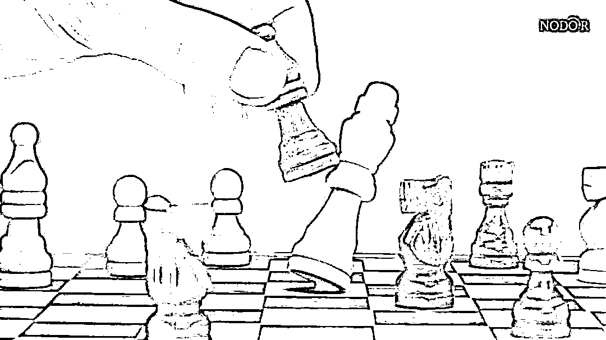

**一周重要天象****★ ****10 月 18 日，周二**

**月亮进入狮子座，金星（天秤座）梅花海王星（双鱼座），太阳（天秤座）三分火星（双子座）**

**行动力最佳的日子**

当月亮在元气满满的狮子座时，我们会对自己更自信，渴望在工作、生活中尽情表达自我。太阳与火星的三分相，让我们在工作中更积极主动，有决策的能力。无论是工作的群体关系，生活关系，还是合作，我们会灵活应对，达到自己的目标。

风元素的三分相，搭配狮子座月亮，我们会对工作有目标并专注，充满渴望地行动，也愿意接受多元的任务，能灵活处理各种冲突。

**生活是一体两面的，**天秤座的金星关注平衡，渴望被他人关注和认同，有时这种过度的追求认同感会让我们在关系中有理想化的投射。

我们会容易感觉他人（领导，关系中的合作者或伴侣）似乎没看到自己，很容易滋生力不从心、既熟悉又陌生的感觉，情感失落。我们可能在关系中把对方理想化、边界模糊，或者就是无节制的消费过度。

**★****10 月 19 日，周三****金星（天秤座）三分火星（双子座），太阳（天秤座）四分冥王星（摩羯座）**

**热烈的情感关系和压力并存**

金星与火星的三分相，这是一段浪漫美好的关系，我们会在与他人的互动合作中，感受到良好互动。通过聊天、沟通和对话，双方能享受社交的愉悦，建立亲密和谐的关系。

天秤座的金星给我们带来愉悦感，并不意味着目标可以达成。正如对女性主义的探讨逐渐成为趋势，但这个世界的凝视角度仍是传统的父权结构。

当我们回顾生活，会思考在现实物质世界的目标，我们是否不太敢对外展现呢？很多时候，从自我保护意识出发，我们不得不隐藏自己的欲望，甚至不敢大方地展现出来。

从心理层面看，我们渴望操控自己的生活，但又不得不屈从现实的困境、压力或强权的压力。有时群体环境的压力，会让我们有窒息和强迫性的感受。

**★****10 月 20 日，周四****金星（天秤座）四分冥王星（摩羯座），水星（天秤座）对分凯龙星（白羊座）**

**关系和沟通中的挑战**

这组挑战相位的能量，会通过动摇大型机构的金融问题与结构性的改变来展现。需要注意和金融有关的事件。从个体层面看，我们容易被痛苦的关系、与女性相关的信息触动，但又无法真实的表达出来。

关系中的不安全感会影响情绪和判断。**我们需要理性的评估合作关系，**无论是集体还是个人层面，对方的自以为是和强势的掌控都会给我们带来不舒服感。

**★****10 月 22 日，周六**

**月亮在处女座，月亮对分海王星（双鱼座），水星（天秤座）梅花天王星（金牛座）**

**需要调整适应的日子**

休息日，月亮在处女座行进，我们似乎并没有很好的放松下来休息。我们会在家中打扫卫生、整理账目、回顾遗漏的工作细节，也会关注生活中的细节和琐碎的事情。

需要避免和家人沟通中的不和谐因素，尤其是对他人的挑剔，你的本意是想让家庭关系更和睦，但可能因为沟通中对现实问题的细节讨论导致词不达意，陷入自我评判的情绪。

**★****10 月 23 日，周日****土星在水瓶座顺行；太阳、金星进入天蝎座；太阳合相金星、水星（天秤座）三分土星（水瓶座）、金星（天蝎座）与逆行木星（白羊座）呈梅花相**

**承前启后的节点**

**本周最后一天，正好是下周天蝎座日食开启的新节点。土星在水瓶座 18°35′恢复顺行，太阳、金星在同一天进入天蝎座，当日正好是中国二十四节气的第十八个节气“霜降”。**

土星从 6 月 5 日开始逆行，在四个多月的逆行里，我们是否从过去的经历中学到更多经验，理解和清理了我们生命中的障碍呢？

当土星从逆行转为顺行，我们需要从这段修正和艰难的时光中总结和调整自我，学会把压力释放。我们要重新思考生命中的阻滞，重新构建生命的结构。

企业或管理层也会根据社会的新规范和条例，推出新的考核制度，进行高效运作。个体层面，我们会懂得如何适应社会的调整规范，做自己可以做的事情，为自己的人生负责。

太阳和金星进入天蝎座，这是一个孕育和蜕变的阶段。天蝎座是死亡和重生的能量，我们需要对自己做一个检视，关系与合作方面的目标也许需要进行彻底的重新整理。在婚姻、金融、生活秩序上，我们会发现有很多调整性的措施出现，这让我们产生强烈不安全感。

太阳进入天蝎座两天后，我们就会迎来天蝎座日食，虽然这是一个日偏食，但这个调整周期是很重大的。水星和土星的三分相，意味着务实落地的思考，对新周期也会考虑的很慎重。

我们对事情的关注不仅是表象的平衡，受到火星能量影响，会让我们进入事物底层和对真相的探索：我们生命中，到底有什么需要重新去除构建的呢？

周日开启的新周期，我们容易被无形的压力推着往前走，学会舍弃生活中的执念很重要。太阳与金星合相在天蝎座，在这样高度激情的时刻，我们需要关注关系中影响我们的因素是什么、我们真正想要的是什么、我们的出发点是真挚的情感还是控制的欲望。

金星和木星呈梅花相，对情感关系、金钱消费，我们都可能会因为过度而导致心理压力或负担，也许花钱过度缺乏节制，也许是控制性的关系，让我们觉得违背情感的初衷。

**12 星座的一周运势**

**（重点参考上升星座，其次参考太阳星座）**

***白羊座***

本周白羊座们合适短途旅行，与好友相聚联络感情，这会让你们在合作事项上推动力更强！当太阳和金星在你们星图第 7 宫行进时，这是在关系中展现魅力、谈判合作的最佳时机。在周初，这是不错的时机，月亮在火元素星座的行进，也会让你们感受到动力和活力。

周中到周末，这是一段压力行进期，白羊座有主动性，喜欢坦率的沟通、简单的关系，不太在意他人的想法。这期间的行星相位，也需要关注星图中本命星图的火星配置。

工作事业中的压力、上级布置的工作，让人产生窒息感，觉得自己没有得到尊重和认同。周末会在沟通现实问题时有些争执和不愉快，但会在集体中找到解决的方法，获得他人的支持。

珍惜太阳和金星在天秤座的行进时间，在关系中学习，未来从他人的资源中获益。

***金牛座***

金牛座们在本周的工作中可以收获到不错的正财，这是你向上发展的阶段。生活中的情感和创意，让你被更多人认识。你也许会关注关系中的控制主题，如果一方过度强势，你的内心会很不舒服。但你可以从工作中收获人际关系或物质的认同，这让你心满意足。

周末需要适当放松心情，你对安全感的关注，会让你对关系中的依赖和担心被操控的恐惧感有些敏感。太阳和金星换座，你需要关注个人的情感关系。如果本月有关系中的意外事件，或一些邀约的机会，你需要思考自己要的是什么，而不是让情绪指挥了大脑。

***双子座***

对双子座而言，十月是开启浪漫关系、发挥天赋创意，培养亲子关系的最佳时机。本周前期，如果做直播项目或想通过魅力展现让更多人看到你的行动力，这是合适的契机。

但需要注意，期待值过高会产生失落，你会发现虽然收获了掌声和关注度，但在事业或金钱上没看到务实的收获。保持稳定的心态和专注度很重要。

本周中后期，需要注意你可能会敏感和情绪化，并感受到不公正，在沟通中容易被群体情绪影响。周末合适在家中清理家庭环境。

当土星在星图第 9 宫恢复顺行，需要对未来的合作、财务或未来的研究方向做更好的规划。行星进入天蝎座，你将在工作中和更多人合作，开启新的关系。

***巨蟹座***

你的安全感和情绪会被家庭关系影响，有快乐和满足的部分，也有不舒服和冲突的压力。本周前期，你对自我的信心满满，也能获得领导的认同。但也许你对自己的决定有些担心，你很在乎他人的感受，容易产生愧疚感。

本周中后期，家庭成员的关系互动会让你产生复杂的情感。女性在关系中的掌控让人很不舒服。在合同签署、谈判中让人觉得不平等，合作性的事务不是很顺利。工作中领导的安排会让你容易产生被忽略和排斥的感觉。

周末是调整的时机，阅读感兴趣的图书，与朋友聊天，或是在金钱投资上寻找更好的计划。太阳和金星即将进入 5 宫，你想开启什么样的浪漫关系呢？哪些人会在你生活中离开或留下呢？

***狮子座***

本周合适与好友、伴侣或搭档进行沟通，支持并认同他们。通过阅读和思考，给自己更多时间和耐心，为下周初发生的日食做准备，毕竟这个日食对狮子座们有很大影响。

周初可能会从网络，集体收到不错的消息，这与前期沟通的文件、对方推介的讯息有关，这让你感受到被认同。

本周中后期，会有认同你观点的支持者，对你职业发展有一定的帮助和推动。工作环境可能有些变动，工作压力增加，或因为某个同事离开充满压力的工作环境，引起你暴躁的脾气。

周末你可能因为对事业的担心、在意自己的收入，让心情有点不安。紧张焦虑的情绪会影响判断，你需要对家庭情况，或者房子做一些准备和规划，迎接下周的日食。

***处女座***

本周在金钱上喜忧参半，需要注意理财事宜。周初，金钱有些收益，但注意见好就收，避免后续有损失。合作搭档给到的反馈信息不明确，或伴侣在关系中的需求让你有些迷茫，看不清晰。处女座需要务实清晰的信息，对方反馈的信息，先考虑斟酌其可行性再做打算。

本周中后期，工作中有可能传来很多小道消息。有人寻求你的帮助，做决定要慎重。你可能获得女性的帮助和支持，或收到新礼物。

休息日对你很重要，月亮在星图 1 宫行进，土星在工作的宫位恢复顺行了。你可能在下周收到新的邀约机会，周末需要整理好思路，了解自己工作生活的目标是什么。

***天秤座***

本周金星和火星的和谐互动，魅力提升，容易结交新朋友，贵人运也不错。可能生活中某些事情的卡点可以通过他人的帮助解决。也可能别人委托你解决一些生活的事情。如果有告白和示好的机会，学会欣赏和接纳。

本周中后期，你可能面临一些挑战。你会对关系的控制主题有深刻感受，尤其是家庭的压力。休息日，你倾向躺平放松，花些时间思考理财的方式、人生的自我价值。学会思考、做好准备是周日的主题，在天蝎月来临时，对财富做好规划很重要。

***天蝎座***

天蝎座是对危机、变化感受最敏锐的群体。生日靠近 10 月 25 日的朋友，对下周即将到来食相能量感受很敏锐。上升天蝎座的朋友，本周太阳和火星的互动，可能会有男性的贵人出现。

工作层面也有好消息出现，新的项目与合作有了进展。虽然有好消息，但不排除某些暧昧事情的出现，让你感到很不安。

本周中后期，合作关系里某些人物强势的沟通方式让你感觉很不舒服。休息日，你可以通过和信任的朋友聊天来缓解压力。需要关注睡眠，你会思考某些关系主题，思虑太多也许影响睡眠质量。

太阳和金星在本周末进入你的星座，你需要对未来有新的思考，有需要挑战的困难，也会有机遇等着你哦！

***射手座***

本周你会在人际关系有新突破，这种突破可能会让你在事业中有更好的提升，有新的互动、联络、合作。你对某个人可能更信任，建立了互利互惠合作关系。但也可能为了达成领导的期望和项目进度，发现合作协议签署的没那么简单，隐藏的问题需要你处理。

本周中后期，你一直忙于工作无法休息，如何兼顾家庭和事业是需要思考的主题。土星在你的第三宫恢复顺行，水星和土星的和谐相位，你对事业问题会考虑的更周全和务实。

随着太阳和金星的换座，你需要关注女性亲人或朋友的健康，也可能后面会有一些隐秘的钱财进账，或一段低调的情感。

***摩羯座***

本周是工作和事业运气不错的时机，太阳、金星与火星的互动，你可能有升职加薪，或被领导认同，或投资收益不错。只是对于投资，需要有保守的态度，当下并不合适冒进，有的商业合作也许隐藏了一些问题，你慎重的个性会处理好它们。

本周中后期，某些讯息的传播让你对自我有些迟疑，担心自己做得不够好。休息日，你会思考人生，学习或考试。你需要处理同事的某些问题，或者花时间处理孩子的费用，你难以放松自我。

随着太阳和金星的换座，你在未来可能会结交并拓展新的人脉资源，他们可能会给你发展的空间和机遇。

***水瓶座***

本周初，你的情绪可能有些低落烦躁。太阳、金星、火星的良好互动给你带来的是思考层面给你的顿悟。你在关系中会觉得对方过于强势，自己没有被尊重和重视。但可能你会在投资上有些额外的收益。

本周中后期，需要处理好家庭关系。如果领导要求你考试，或推荐你去深造、提升技能，你也可以考虑。土星的顺行对你很重要，你会有一种醍醐灌顶的感受。

太阳和金星的换座，以及下周的天蝎座日食，你需要在职业上有新抉择。本周末的行星行进，会让你思考清楚一些事情，去处理你的职业天命和现实需求的落差，让自己务实的解决矛盾。

***双鱼座***

本周在商业合作上会有更多的机会，亲密关系的互动也不错。只是双鱼座们需要避免对关系理想化，缺乏边界会导致受伤。工作职场中可能有一些事情需要选择，有人晋升，有人离开，你不要盲目发表不适当的言论，这是职场规律，学习接受。

周末，有家庭的双鱼座们可能操心孩子的情况。单身的双鱼座们可能会收到朋友们意外的联络信息。在工作和生活中，可能会有贵人出现，帮助你在未来有一些重大突破，好好珍惜与朋友相处的时光，珍惜贵人给到的机遇。

**版权声明**：原创文章由作者授权首发于若道平台发布，欢迎转发，反对抄袭。友号转载请申请白名单。

**END**

**苏黎（Sulis）**

ISAR 国际认证占星师（2019 年获得）/塔罗咨询师

现代占星融合古典解读

20 多年跨行业领域职场经历

**咨询微信**：liuzq26

**公众号**：Sulis_1975

长按打赏

**20 位来自世界各地的占星师****带来 19 场沙龙——新世界的觉醒****详情可点击下图**

**学习占星学****点击下图了解课程详情**

**微信又双叒叕改版啦，不想错过若道君的推送？**
****就把若道设为****星标****以及点点****“在看”****吧！******▼**

**喜欢就点一下“在看”吧！****报名直达入口**

# 雷蒙德·梅里曼金融占星周运 | 本周不太有利于股市

> 原文：[`mp.weixin.qq.com/s?__biz=MzA5NjA0NTAxNg==&mid=2651491486&idx=2&sn=bfbc0efa457e14d471d62847bebd19bf&chksm=8b483e29bc3fb73fa7228764ce6800d975e07997c7d580a26b93db4fa47de6e609d48e29e43c&scene=126&sessionid=1692737741#rd`](http://mp.weixin.qq.com/s?__biz=MzA5NjA0NTAxNg==&mid=2651491486&idx=2&sn=bfbc0efa457e14d471d62847bebd19bf&chksm=8b483e29bc3fb73fa7228764ce6800d975e07997c7d580a26b93db4fa47de6e609d48e29e43c&scene=126&sessionid=1692737741#rd)

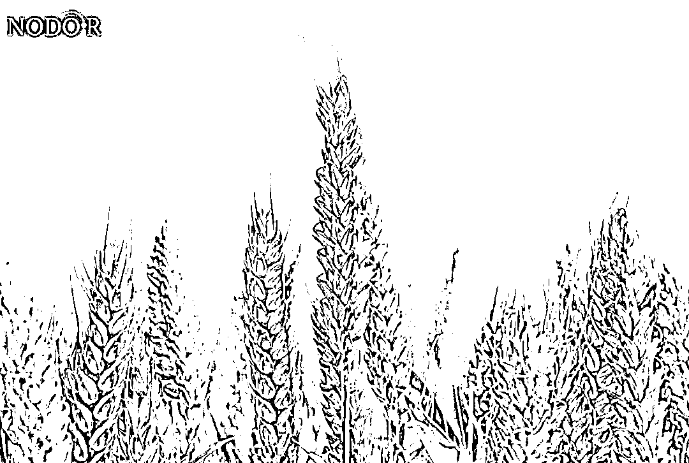作者/雷蒙德·梅里曼 译者/Luke 编辑/玫瑰 图片/稿定设计雷蒙德·梅里曼是在金融占星学界稳坐第一把交椅的占星师，同时他也是若道签约的金融占星课老师，我们引进了雷蒙德·梅里曼老师的《[上证指数月度报告](http://mp.weixin.qq.com/s?__biz=MzA5NjA0NTAxNg==&mid=2651489623&idx=1&sn=3a0bd84d35117b33ced7b2d77a8b70a7&chksm=8b4837e0bc3fbef6ea863486e975282287c432a72da6560d21e5f7c0c34ec15102393cc3d9a8&scene=21#wechat_redirect)》及《[黄金报告](http://mp.weixin.qq.com/s?__biz=MzA5NjA0NTAxNg==&mid=2651489623&idx=1&sn=3a0bd84d35117b33ced7b2d77a8b70a7&chksm=8b4837e0bc3fbef6ea863486e975282287c432a72da6560d21e5f7c0c34ec15102393cc3d9a8&scene=21#wechat_redirect)》。我们经老师的授权，将每周刊登梅里曼老师的周运，供大家参考和学习。于是，这是本周的周运（10.17-10.21）。

**说明：以下时间采用纽约证券交易所所在地美国东部标准时间。**

**展望与回顾**

****

**排除能源和食物的消费者通胀指数 9 月加速至 40 年来的新高。核心消费者价格指数——排除波动大的能源和食物价格，9 月同比上涨 6.6%，是 1982 年 8 月以来最大的上涨。**

**8 月该指数上涨 6.3%。这份通货膨胀报告很可能使美联储在下个月的会议上保持在加息 0.75%的轨道上。**

**——格温·吉尔福德****《核心价格到达 40 年来的最高点，通货膨胀率达到 8.2%》****《华尔街日报》****2022 年 10 月 13 日**与被动攻击相关的火星四分海王星在上周 10 月 12 日成相，紧随其后的是 10 月 13 日-14 日月亮在双子座，同时太阳也在风象的天秤座引起的拉锯行为。消费者物价指数（通货膨胀）报告于 10 月 13 日上午发布。与火星四分海王星相对应，道琼斯工业平均指数首先回撤 500 多点，到达年度新低，标准普尔指数和纳斯达克指数也是相同的走势。但随后走势突然反转了——月亮在双子座的拉锯，强势地向上冲刺 800 多点。据彭博社报道，这是历史上道琼斯工业平均指数首次下跌超过 500 点，然后收盘反转超过 800 点。然而，周五月亮仍在双子座，拉锯的走势再次出现，道琼斯工业平均指数首先上涨近 400 点，然后收盘跌幅近 400 点。正如已经提到的，标准普尔指数和纳斯达克指数在 10 月 13 日也到达年度新低。10 月 12 日，不仅月亮四分海王星，太阳和金星也分别在 10 月 12 日和 14 日三分土星。事实上，延伸至 10 月 17 日-19 日，火星与太阳-金星和土星形成大三角，四颗行星都在风象星座。通常我们会在风象星座大三角期间期待好消息，或许周四从年度低点大幅上涨 1300 点就是我们期待的好消息。并非所有全球股票指数上周都下跌到年度新低。除了美国之外，荷兰 AEX 指数、伦敦富时指数和苏黎世 SMI 指数均创下年度新低。跌得最厉害的是中国恒生指数，下跌至自 2011 年 10 月以来的最低点！许多其他指数都守住了 9 月 26 日-10 月 3 日的低点，与今年最强有力的地球宇宙学组合，木星在土星-天王星中点，与它们形成八分相，同时土星-天王星完成最后一次四分相相对应。9 月 9 日-10 日到 10 月 2 日也是 6 颗行星逆行周期结束的时间，包括水星逆行。6 颗行星同一时间逆行代表不确定性，倾向于发布没有经过仔细考虑的不成熟宣言或通告。回想一下那段时间，英国的经济决策和修订案震惊了全球金融系统。

冥王星也在 10 月 8 日转为顺行。因此，现在我们有 4 颗行星逆行，直到 10 月 30 日那天与战士相关的火星也加入逆行，又回到 5 颗行星在天空逆行的时期。在这一时期天空不晴朗。由于火星四分海王星，天空更像泛着烟雾的镜子。

其他市场上，比特币在 10 月 13 日测试了 18000 价位，同时以太坊下跌至 1192。两者都高于 6 月的年度低点，但比特币非常接近跌至新低。原油从 9 月 18 日的低点上涨了 22.8%，达到了上周一的高点 93.64。之后回吐了 50%的涨幅，到达周五的低点。

相对于 9 月末到 10 月 4 日的上涨，黄金和白银上周也剧烈回撤。在发布消费者物价指数报告的 10 月 13 日，美国中期国债下跌至 110/02，是超过 15 年的最低价位。

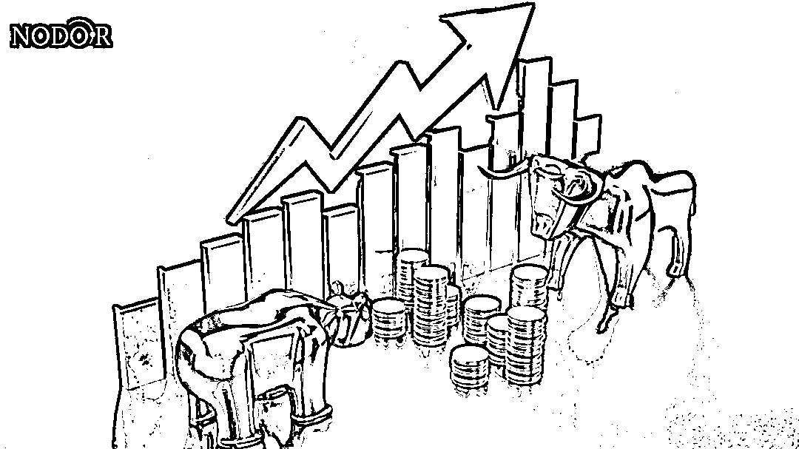

**短期宇宙征象与长期考量**全球经济和金融灾难的部分原因与 2021 年-2022 年土星-天王星四分相对应的供应链中断有关。这些供应链问题因俄罗斯入侵乌克兰而加重，导致去年原油、天然气和谷物市场巨大的价格涨幅。**现在我们迎来了一个战神火星影响力活跃的时期，也就是在 2023 年第一季度，尤其是现在到 11 月底，火星将在双子座 23°-25°停滞逆行，四分在双鱼座 23°的海王星。**火星和海王星的第一次四分相在上周成相，与此同时，世界上出现了重大的动荡。正如上周讨论的，这些度数至关重要，因为这两颗行星也在伊朗和美国星图中变动星座的同样度数突显出来，这意味着它们激活了这两个国家星图中的变动星座大十字。伊朗正经历一场前所未有的抗议活动，威胁到领导人的权威。美国也在经历与沙特阿拉伯和其他石油输出国组织国家的紧张关系，后者刚刚决定削减原油产量。对此拜登总统威胁要报复。

**火星-海王星四分相可以对应全球领导人（以及任何其他人）做出糟糕判断的时刻。**它可以代表信任议题在当前盟友间浮现，威胁到彼此的关系。但它不仅影响到美国、伊朗和石油输出国组织。

事实上，甚至信任也有局限性。它不是无条件的。当合作关系的一方违反了良好行为的原则后，这段关系便很容易瓦解。伊朗领导人和他的公民之间的协议正在瓦解。美国和沙特阿拉伯的协议正在瓦解。一切都是因为关系的一方辜负了另一方的期待，也可能双方都辜负了彼此。

在这种宇宙天象下（火星四分海王星，火星逆行），就美国而言，下个月是一段具有挑战性的时期，因为中期选举三周后就要开始了。这通常不是一个国内可以团结，解决世界舞台上问题的时候。

事实上，全球都处在食相的影响力之中（10 月 25 日日食，11 月 8 日选举日时月食），这也没什么帮助。我们甚至还没提到前总统唐纳德·特朗普的太阳也在双子座 22°55’，对分在射手座 21°的月亮。从现在到选举期间，他不会悄无声息。

事实上，他正在接受传唤，为他在 2021 年 1 月 6 日国会大厦暴动中扮演的角色作证。那也是一个非常火星-海王星式的体验，真相和幻想之间的界限开始变得模糊。

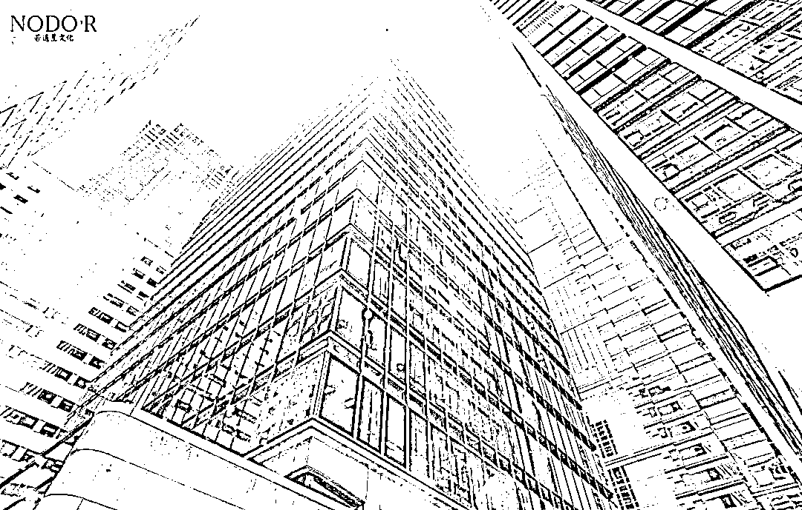

**很难想象全球股票指数会在这段时期表现良好。**但正如先前说到的，**火星-海王星期间通常是做出错误判断的时期**。**本周的月相和地球宇宙学图景看起来不太有利于股市。**

太阳和金星会在周一和周二三分火星，这看起来是有利的，但是月亮在巨蟹座和狮子座则不那么有利。随后周三和周四，太阳和金星又与冥王星形成渐亏四分相，之后土星在 10 月 23 日结束逆行。

之后会迎来食季，在这段时期的中间，火星会在 10 月 30 日到 1 月 12 日逆行。在中期选举之前，甚至之后的几天里，交易者需要继续特别小心，因为这不是能轻松驾驭的水域，无论是金融市场还是全球领导人都是如此。

前方最激烈的时间段似乎是 11 月 5 日-11 日的选举周。这是容易动荡的时期，我期待民意测验会再次“误判”结果。正如经济学家约翰·肯尼斯·加尔布雷斯曾经说过的那样：“经济预测是为了让占星学看起来令人尊敬。”我认为这是对的，同样的话也使用于 2022 年媒体和民调机构的选举预测。

从 2018 年年末，若道引入金融占星大师雷蒙德·A·梅里曼撰写的梅里曼市场时机学院每年一次的年度预报沙龙和每年一本的《年度预报》以来，**2023 年已经是第 5 个年度了。我们简单回顾了部分 2019-2022 年金融预报的内容，**过去的经验让我们相信，你根据梅里曼老师的指导作为投资参看，你会比一般人有更大的胜算。******长按下图了解更多详情**

**说明：以上日期基于纽约证券交易所所在的美国东部标准时间，由于存在时差，中国地区可能需要加一天。**

**版权声明：**本文由若道翻译发布，欢迎转发，反对抄袭。友号转载请申请白名单。**END**

**雷蒙德·梅里曼（Raymond Merriman）**

若道签约老师。著名金融占星师，ISAR（国际占星研究协会）前主席，梅里曼市场分析公司的总裁。他由于“提升了占星学的职业形象”，在 1995 年国际占星大会上被授予轩辕十四奖；在 2012 年国际占星大会上，被授予轩辕十四终身成就奖。

1“中国上证指数月度报告”发售**若道推出了****中文版****的雷蒙德·梅里曼中国上证指数月度报告，并持续发行该报告！**当把金融市场的周期和占星学的周期相结合时，雷蒙德·梅里曼老师的金融占星学研究**为投资者应对金融市场的周期波动，并随之调整投资策略提供了极大的价值参考**。
**10 月中英文报告已上线！**2“黄金价格周期月度报告”发售**若道推出****中文版****的雷蒙德·梅里曼黄金价格周期月度报告！**不仅仅为广大读者在中国股市的投资出谋划策，更将视角放眼黄金市场。**每当世界经济形式不明朗的时候，有一个地方是保值的港湾，那就是****黄金**。自 1982 年雷蒙德·梅里曼出版第一本研究《地球宇宙学征象与黄金价格的关联》的著作以来，**他一直作为最重要的黄金市场时机预测者之一享誉国际**。2022 年 10 月黄金报告已上线，梅里曼老师将会告诉你他对这个关键时期如何操作的想法。也可以按照季度和一年期订阅，有更多优惠。季度和年度的好处是，你可以持续了解梅里曼老师对于不断在变化的市场的看法。即便他某一次看法和市场不一致，你也看到在下一期他如何调整自己的看法，并看到金融占星在一个长期时间段内对你把控风险的帮助。而能够长期控制风险、尽量找到安全的投资时机才是投资的长久之计。**10 月中英文报告已上线！****购买套餐**，买得越多越优惠中国上证指数月度报告套餐价

*   **单月报告**：280 元
*   **3 个月套餐**：780 元（260 元/月）
*   **12 个月套餐价**：2400 元（200 元/月）

**长按下图识别二维码****购买金融报告****套餐****▼**

黄金周期月度报告优惠

*   **双报告年度套餐更优惠（直降 900 元）**

*   **12 个月黄金报告+12 个月上证指数报告：仅需 3900 元**

**长按下图识别二维码购买黄金报告套餐**▼

3《2023 年金融报告及沙龙》

从 2018 年年末，若道引入金融占星大师雷蒙德·A·梅里曼撰写的梅里曼市场时机学院每年一次的年度预报沙龙和每年一本的《年度预报》以来，**2023 年已经是第 5 个年度了。我们简单回顾了部分 2019-2022 年金融预报的内容，**过去的经验让我们相信，你根据梅里曼老师的指导作为投资参看，你会比一般人有更大的胜算。****

**长按下图了解更多详情**

**购买直达入口**

# 2023 年如何用投资提升财富丨雷蒙德·A·梅里曼 2023 年《年度预报及讲座》来啦！

> 原文：[`mp.weixin.qq.com/s?__biz=MzA5NjA0NTAxNg==&mid=2651491486&idx=3&sn=7c8521246dcde9e6764a3a2d53a564b6&chksm=8b483e29bc3fb73faa96da7ea84a46f4ab99c1c8e627adf6c74019422f5527185368dbb86ba3&scene=126&sessionid=1692737741#rd`](http://mp.weixin.qq.com/s?__biz=MzA5NjA0NTAxNg==&mid=2651491486&idx=3&sn=7c8521246dcde9e6764a3a2d53a564b6&chksm=8b483e29bc3fb73faa96da7ea84a46f4ab99c1c8e627adf6c74019422f5527185368dbb86ba3&scene=126&sessionid=1692737741#rd)

从 2018 年年末，若道引入金融占星大师雷蒙德·A·梅里曼撰写的梅里曼市场时机学院每年一次的年度预报沙龙和每年一本的《年度预报》以来，**2023 年已经是第 5 个年度了。**

我们简单回归一下梅里曼老师 2019 年-2022 年的《年度预报》中一些预测。

在 2019 年的年度预报中，对于上证指数，梅里曼老师写到：

2018 年末至 2019 年初，中国股市处于三个重要周期低点的时间段。紧随这一低点，将会出现一次非常大的反弹。

2019 年木星会与海王星形成三次四分相，过去，这个相位总是与惊人的强大“泡沫”同时出现，期间股价大幅飙升。

到 2019 年 7 月之前，上证指数有三个重要长周期会出现周期低点，理想上看是在 2019 年 3 月底之前。

上证的周期低点出现在 2019 年 1 月，从那时起，上证迎来了 3 年的上升。

对于黄金，梅里曼老师建议：

从占星学角度来看，木星在射手座，四分在双鱼座的海王星，支撑看涨观点，因为这个组合有增加通胀的潜力。此外，木星在射手座的行星-星座组合从 1983 年起出现过三次，每次都对应到金银市场的年度高点。

无论在 2019 年何时，只要黄金保持在 1167 以上，同时跌到了任一主要周期低点附近，就要寻找买入机会。黄金可能在 2019 年涨到 1500+/- 50，甚至更高。

2019 年黄金从 1284 美元开始上涨，最高点在 1566 美元。

所以，如果你在 2018 年购买了《年度预报》，按照梅里曼老师的建议投资了上证指数和黄金，你会在当年取得相当不错的收益。

**对于 2020 年，在席卷全球、深刻影响了未来的疫情到来之前，梅里曼老师为 2020 年定下基调的：**

站在 2019 年的年尾，我们不知道一场深刻改变未来的风暴马上就将来临。

梅里曼老师，这位杰出的宇宙气象预报员，未卜先知，为 2020 年定下“将军”的基调。

在那一年，我们目睹了美国股市的 4 次熔断和全球经济的重置崩溃。

对于黄金，梅里曼老师是这么说的：

1391.50-1413.70 是价格最强的支撑区域。只要不跌破这个区间，黄金就能够上涨，重新测试 1566.20。如果突破了 1560-1590 的阻力区间，那么黄金就能够重新测试 1920。在那以前，黄金最有可能在 2020 年中在 1390 和 1575 之间波动。

| 黄金周 K 线图

2020 年，黄金在横盘 3 个月突破了 1560-1590 的阻力区间后，一路上涨到 9 月最高点 2089.20 美元。

对于上证指数，梅里曼老师建议：

2020 年的反弹将超过 2019 年的高点 3288。然而，这一涨势可能会通向 5.5 年周期的波峰，随后将再次迎来一波跌势至 2021 年或更晚。

行进中的摩羯座星群——木星、土星和冥王星——表明在 2020 年 11 月底之前会出现一个高点，很可能在 2020 年的前六个月。建议交易者特别注意金星逆行的时期，也就是 5 月 13 日至 6 月 25 日。逆行或顺行一个月内出现的年度高点或低点可能会带来卖出机会。

2020 年，上证指数最高达到 3474，超过了 2019 年的高点 3288。

**站在 2020 年的末尾，对于 2021 年，梅里曼老师说：**

随着 2020 年木星、土星和冥王星形成大合相，我们刚刚结束了一个周期和一个时代。此刻我们正处于一个新的时代和一个新的长周期的早期阶段。事实上，是多个长周期。

对于上证指数，梅里曼老师说：

我们预计涨势将在 2020 年 12 月-2021 年 2 月之间达到波峰，然后急剧下跌至 52 周和 22 个月周期的低点，这些周期将在 2021 年 5 月之前，甚至在 3 月底之前结束。此后可能会出现另一轮反弹，可能会也可能不会在 2021 年 11 月之前形成第一个 33 个月周期的新高。

对于黄金，梅里曼老师说：

黄金的 31.33 个月周期波谷将在 2021 年 9 月之前出现，理想情况是 2020 年 12 月-2021 年 6 月。价格目标是 1628+/-109 或 1768+/-76。重叠范围（理想情况）是 1692-1737。如果价格跌破这些范围，则为看涨情况中令人担忧的状况。

**而在 2022 年的年度预报里，我们看到：**

渐亏四分相不仅对应无法解决的冲突和分歧，土星和天王星形成的任何四分之一周期（合相、四分相和对分相）都可能在社会动荡和某地区现状受到威胁的时期出现。

在 2008-2010 年上一次四分之一周期时（对分相），世界见证了阿拉伯之春。在 1999-2000 年渐盈四分相期间，游行、抗议和直接武力冲突扰乱了西雅图世界贸易组织会议。这也标志着美国经济扩张的结束，以及由互联网泡沫破裂和 2001 年 9 月 11 日对美国世贸中心的恐怖袭击引发的衰退的开始。在此之前是 1988 年的合相，对应的事件是缅甸（Myanmar，当时的国名是 Burma）爆发了一场全国性起义，反抗尽失民心、暴力过度的军政府。数十万公民在全国范围内的暴动中抗议，这成为缅甸历史上的决定性时刻之一。

在每一个案例中，极端主义都占据主导地位，导致暴力冲突，但最终带来了“更大的益处”。它产生了建设性的结果，但在它进行的同时，世界在经历巨大的危机和暴力。”

2021 年 5 月 13 日-7 月 28 日，木星首次行经双鱼座时，这些因素表现得很明显。那时，通货膨胀开始出现，但美联储向所有人保证，这只是暂时的，他们将无限期继续推行“宽松货币”政策。他们并不担心持续的通货膨胀，这是典型的木星在双鱼座的表现，对现实的脱离或错误判断。

这两颗行星以及双鱼座也掌管原油。因此，我们可能会看到油价飙升，以及/或石油泄漏，威胁到大自然。它也可能对应着由于事故而释放的有毒气体，威胁到那些暴露其中的人的生命。

对于黄金，梅里曼老师建议：

只要黄金保持在 1670-1680 之上，仍然有极小的机会出现一轮爆炸性上涨，测试当前的历史高点（2089），甚至创下历史新高。毕竟，木星将在双鱼座合相海王星，可能预示着另一轮“投机狂热”。然而，这也可能是一个“恐慌”的征象，届时某些市场可能会崩溃。

在 1900-1980 之间存在较大的阻力，如果不能突破这个阻力，将表明黄金的熊市已经开始，新一轮的猛烈下跌可能正在准备中。只要跌破 1670 则将确认黄金 20 年的牛市结束了。

| 黄金周 K 线图

对于上证，梅里曼老师说：

我们预期在 2022 年 5 月前，上证综指会出现急剧的下跌，进入 52 周周期和可能的 33.5 个月周期低点。

我们更倾向于认为，上证综指会首先下跌，在 5 月前形成一个低点，然后上涨。这一轮上涨的幅度，将告诉我们上证综指是处在牛市，还是进入了新的熊市。如果它不能上涨超过 3750，长周期波峰可能已经出现，并且进入了新的熊市。

我们简单回顾了部分 2019-2022 年金融预报的内容，**过去的经验让我们相信，你根据梅里曼老师的指导作为投资参看，你会比一般人有更大的胜算。**

**2023 年度预报及沙龙预售**

**2023 年金融预报沙龙时间为 2023 年 1 月 7 日 10：00-13：00。**

一份价格仅千元的顶尖金融占星大师的投资分析报告和沙龙，聪明的投资者值得拥有。

**2023 年年度预报****及沙龙价格：****1380 元**

**前 60 名早鸟价（仅余少量名额）：****1180 元**

**长按下图识别二维码****购买报告及沙龙** 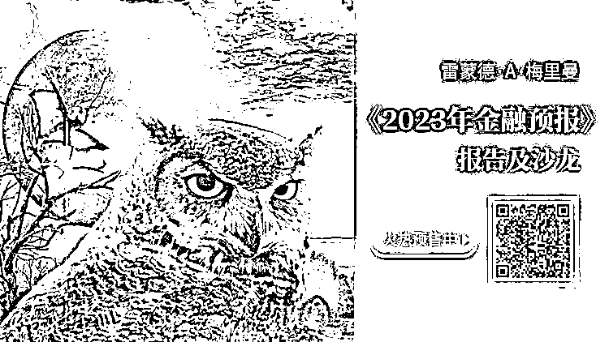​**购买者重要须知****①** 梅里曼市场时机学院每年一次的年度预报沙龙和《年度预报》是梅里曼市场时机学院的研究“预报”，而不是市场“预测”，是梅里曼老师及其金融占星分析师对人类活动周期历史与行星周期之间相关性的研究，二者在大部分情况下具有 80%或更高的相关性，而不是因果关系。沙龙中和报告中的研究完全存在错误的可能性。即便是非常认真的研究和几十年的研究经验，我们无法总是正确地解读出各种征象在实际层面上会如何相互作用，并显化为事件结果。

所以请将次沙龙和报告看作一个研究参考，务必结合其他市场研究和你个人对市场的理解，根据你的自由意志做决策。

**②** 此报告一旦售出，**即不接受退款。**

**③** 此报告仅支持在手机网页阅读，不支持电脑阅读和下载。**④** 讲座提供视频回放。**以上须知，请仔细阅读。一旦付款，即视为已了解并接受所有须知内容。**

**如在购买报告中遇见任何问题**

**可添加客服**

▼

**购买报告直达入口**

# 周末树洞丨月亮在巨蟹座，放松聊聊这次的“满月震荡”吧~

> 原文：[`mp.weixin.qq.com/s?__biz=MzA5NjA0NTAxNg==&mid=2651491475&idx=1&sn=a84ef30e1c4988a51009dd6930bbe22f&chksm=8b483e24bc3fb732db3a40371d96f576aee2e4ec888d4ffacf179541b6aab981d678814c8ef6&scene=126&sessionid=1692737741#rd`](http://mp.weixin.qq.com/s?__biz=MzA5NjA0NTAxNg==&mid=2651491475&idx=1&sn=a84ef30e1c4988a51009dd6930bbe22f&chksm=8b483e24bc3fb732db3a40371d96f576aee2e4ec888d4ffacf179541b6aab981d678814c8ef6&scene=126&sessionid=1692737741#rd)

**2022 年 10 月 16 日天象：**

*   **00:10 月亮进巨蟹座**
*   ******太阳合相金星、三分火星、与海王星呈梅花相******
*   ******火星四分海王星、与冥王星呈梅花相******

经过了整整七天的工作日，这两天你是否觉得疲累并需要休息呢？今天月亮在巨蟹座，可以宅在家里享受独处的片刻宁静时光。与家人待在一起，做几道家常菜，聊聊生活里的小事，也非常滋养我们的心灵。太阳在天秤座，与金星合相，这真是让人柔软又愉悦的一天。再加上与火星的和谐互动，把前一阵的紧张与紧绷都歇下吧，无论和家人在一起，还是和朋友、爱人在一起，将平日的压力释放掉，好好享受美好的周日时光吧，听不少朋友说，这次的[【白羊座满月】](http://mp.weixin.qq.com/s?__biz=MzA5NjA0NTAxNg==&mid=2651490873&idx=1&sn=e2a279e506d32b44759eb3700ac655b9&chksm=8b48388ebc3fb1988ed489951c859b50bf3f0483ba204d511943a6cf3408898719a7f0f48a12&scene=21#wechat_redirect)（点击查看文章）很激烈，生活里发生了不少事情，你呢？欢迎聊聊你的“满月震荡”~周日快乐！我们明天见！**了解每日天象，可****下载“若道”APP 查看****还有更多精彩等着你哦**

# 2023 年如何用投资提升财富丨雷蒙德·A·梅里曼 2023 年《年度预报及讲座》来啦！

> 原文：[`mp.weixin.qq.com/s?__biz=MzA5NjA0NTAxNg==&mid=2651491474&idx=1&sn=ecc300db59c8ef826e13a88349ff67bf&chksm=8b483e25bc3fb73306e9fffad4679bde6764482219a1ac8792644a65ff0d874b6ae5b607cabe&scene=126&sessionid=1692737741#rd`](http://mp.weixin.qq.com/s?__biz=MzA5NjA0NTAxNg==&mid=2651491474&idx=1&sn=ecc300db59c8ef826e13a88349ff67bf&chksm=8b483e25bc3fb73306e9fffad4679bde6764482219a1ac8792644a65ff0d874b6ae5b607cabe&scene=126&sessionid=1692737741#rd)

从 2018 年年末，若道引入金融占星大师雷蒙德·A·梅里曼撰写的梅里曼市场时机学院每年一次的年度预报沙龙和每年一本的《年度预报》以来，**2023 年已经是第 5 个年度了。**

我们简单回归一下梅里曼老师 2019 年-2022 年的《年度预报》中一些预测。

在 2019 年的年度预报中，对于上证指数，梅里曼老师写到：

2018 年末至 2019 年初，中国股市处于三个重要周期低点的时间段。紧随这一低点，将会出现一次非常大的反弹。

2019 年木星会与海王星形成三次四分相，过去，这个相位总是与惊人的强大“泡沫”同时出现，期间股价大幅飙升。

到 2019 年 7 月之前，上证指数有三个重要长周期会出现周期低点，理想上看是在 2019 年 3 月底之前。

上证的周期低点出现在 2019 年 1 月，从那时起，上证迎来了 3 年的上升。

对于黄金，梅里曼老师建议：

从占星学角度来看，木星在射手座，四分在双鱼座的海王星，支撑看涨观点，因为这个组合有增加通胀的潜力。此外，木星在射手座的行星-星座组合从 1983 年起出现过三次，每次都对应到金银市场的年度高点。

无论在 2019 年何时，只要黄金保持在 1167 以上，同时跌到了任一主要周期低点附近，就要寻找买入机会。黄金可能在 2019 年涨到 1500+/- 50，甚至更高。

2019 年黄金从 1284 美元开始上涨，最高点在 1566 美元。

所以，如果你在 2018 年购买了《年度预报》，按照梅里曼老师的建议投资了上证指数和黄金，你会在当年取得相当不错的收益。

**对于 2020 年，在席卷全球、深刻影响了未来的疫情到来之前，梅里曼老师为 2020 年定下基调的：**

站在 2019 年的年尾，我们不知道一场深刻改变未来的风暴马上就将来临。

梅里曼老师，这位杰出的宇宙气象预报员，未卜先知，为 2020 年定下“将军”的基调。

在那一年，我们目睹了美国股市的 4 次熔断和全球经济的重置崩溃。

对于黄金，梅里曼老师是这么说的：

1391.50-1413.70 是价格最强的支撑区域。只要不跌破这个区间，黄金就能够上涨，重新测试 1566.20。如果突破了 1560-1590 的阻力区间，那么黄金就能够重新测试 1920。在那以前，黄金最有可能在 2020 年中在 1390 和 1575 之间波动。

| 黄金周 K 线图

2020 年，黄金在横盘 3 个月突破了 1560-1590 的阻力区间后，一路上涨到 9 月最高点 2089.20 美元。

对于上证指数，梅里曼老师建议：

2020 年的反弹将超过 2019 年的高点 3288。然而，这一涨势可能会通向 5.5 年周期的波峰，随后将再次迎来一波跌势至 2021 年或更晚。

行进中的摩羯座星群——木星、土星和冥王星——表明在 2020 年 11 月底之前会出现一个高点，很可能在 2020 年的前六个月。建议交易者特别注意金星逆行的时期，也就是 5 月 13 日至 6 月 25 日。逆行或顺行一个月内出现的年度高点或低点可能会带来卖出机会。

2020 年，上证指数最高达到 3474，超过了 2019 年的高点 3288。

**站在 2020 年的末尾，对于 2021 年，梅里曼老师说：**

随着 2020 年木星、土星和冥王星形成大合相，我们刚刚结束了一个周期和一个时代。此刻我们正处于一个新的时代和一个新的长周期的早期阶段。事实上，是多个长周期。

对于上证指数，梅里曼老师说：

我们预计涨势将在 2020 年 12 月-2021 年 2 月之间达到波峰，然后急剧下跌至 52 周和 22 个月周期的低点，这些周期将在 2021 年 5 月之前，甚至在 3 月底之前结束。此后可能会出现另一轮反弹，可能会也可能不会在 2021 年 11 月之前形成第一个 33 个月周期的新高。

对于黄金，梅里曼老师说：

黄金的 31.33 个月周期波谷将在 2021 年 9 月之前出现，理想情况是 2020 年 12 月-2021 年 6 月。价格目标是 1628+/-109 或 1768+/-76。重叠范围（理想情况）是 1692-1737。如果价格跌破这些范围，则为看涨情况中令人担忧的状况。

**而在 2022 年的年度预报里，我们看到：**

渐亏四分相不仅对应无法解决的冲突和分歧，土星和天王星形成的任何四分之一周期（合相、四分相和对分相）都可能在社会动荡和某地区现状受到威胁的时期出现。

在 2008-2010 年上一次四分之一周期时（对分相），世界见证了阿拉伯之春。在 1999-2000 年渐盈四分相期间，游行、抗议和直接武力冲突扰乱了西雅图世界贸易组织会议。这也标志着美国经济扩张的结束，以及由互联网泡沫破裂和 2001 年 9 月 11 日对美国世贸中心的恐怖袭击引发的衰退的开始。在此之前是 1988 年的合相，对应的事件是缅甸（Myanmar，当时的国名是 Burma）爆发了一场全国性起义，反抗尽失民心、暴力过度的军政府。数十万公民在全国范围内的暴动中抗议，这成为缅甸历史上的决定性时刻之一。

在每一个案例中，极端主义都占据主导地位，导致暴力冲突，但最终带来了“更大的益处”。它产生了建设性的结果，但在它进行的同时，世界在经历巨大的危机和暴力。”

2021 年 5 月 13 日-7 月 28 日，木星首次行经双鱼座时，这些因素表现得很明显。那时，通货膨胀开始出现，但美联储向所有人保证，这只是暂时的，他们将无限期继续推行“宽松货币”政策。他们并不担心持续的通货膨胀，这是典型的木星在双鱼座的表现，对现实的脱离或错误判断。

这两颗行星以及双鱼座也掌管原油。因此，我们可能会看到油价飙升，以及/或石油泄漏，威胁到大自然。它也可能对应着由于事故而释放的有毒气体，威胁到那些暴露其中的人的生命。

对于黄金，梅里曼老师建议：

只要黄金保持在 1670-1680 之上，仍然有极小的机会出现一轮爆炸性上涨，测试当前的历史高点（2089），甚至创下历史新高。毕竟，木星将在双鱼座合相海王星，可能预示着另一轮“投机狂热”。然而，这也可能是一个“恐慌”的征象，届时某些市场可能会崩溃。

在 1900-1980 之间存在较大的阻力，如果不能突破这个阻力，将表明黄金的熊市已经开始，新一轮的猛烈下跌可能正在准备中。只要跌破 1670 则将确认黄金 20 年的牛市结束了。

| 黄金周 K 线图

对于上证，梅里曼老师说：

我们预期在 2022 年 5 月前，上证综指会出现急剧的下跌，进入 52 周周期和可能的 33.5 个月周期低点。

我们更倾向于认为，上证综指会首先下跌，在 5 月前形成一个低点，然后上涨。这一轮上涨的幅度，将告诉我们上证综指是处在牛市，还是进入了新的熊市。如果它不能上涨超过 3750，长周期波峰可能已经出现，并且进入了新的熊市。

我们简单回顾了部分 2019-2022 年金融预报的内容，**过去的经验让我们相信，你根据梅里曼老师的指导作为投资参看，你会比一般人有更大的胜算。**

**2023 年度预报及沙龙预售**

**2023 年金融预报沙龙时间为 2023 年 1 月 7 日 10：00-13：00。**

一份价格仅千元的顶尖金融占星大师的投资分析报告和沙龙，聪明的投资者值得拥有。

**2023 年年度预报****及沙龙价格：****1380 元**

**前 60 名早鸟价（仅余少量名额）：****1180 元**

**长按下图识别二维码**

**购买报告及沙龙**

​**购买者重要须知****①** 梅里曼市场时机学院每年一次的年度预报沙龙和《年度预报》是梅里曼市场时机学院的研究“预报”，而不是市场“预测”，是梅里曼老师及其金融占星分析师对人类活动周期历史与行星周期之间相关性的研究，二者在大部分情况下具有 80%或更高的相关性，而不是因果关系。沙龙中和报告中的研究完全存在错误的可能性。即便是非常认真的研究和几十年的研究经验，我们无法总是正确地解读出各种征象在实际层面上会如何相互作用，并显化为事件结果。

所以请将次沙龙和报告看作一个研究参考，务必结合其他市场研究和你个人对市场的理解，根据你的自由意志做决策。

**②** 此报告一旦售出，**即不接受退款。**

**③** 此报告仅支持在手机网页阅读，不支持电脑阅读和下载。**④** 讲座提供视频回放。**以上须知，请仔细阅读。一旦付款，即视为已了解并接受所有须知内容。**

**如在购买报告中遇见任何问题**

**可添加客服**

▼

**购买报告直达入口**

# 12 星座自画像丨这组星座的世界，“价值和真相”是永恒主题

> 原文：[`mp.weixin.qq.com/s?__biz=MzA5NjA0NTAxNg==&mid=2651491297&idx=2&sn=d54f3619cb1d86d4454debe91fbafd49&chksm=8b483956bc3fb040e733e342c433d8bdef3685196fd1c74570a3548d735eefcab2f37817b34f&scene=126&sessionid=1692737741#rd`](http://mp.weixin.qq.com/s?__biz=MzA5NjA0NTAxNg==&mid=2651491297&idx=2&sn=d54f3619cb1d86d4454debe91fbafd49&chksm=8b483956bc3fb040e733e342c433d8bdef3685196fd1c74570a3548d735eefcab2f37817b34f&scene=126&sessionid=1692737741#rd)

作者/克里斯蒂娜·罗登贝克

译者/亚麻林恩 校对/江艺

编辑/翀子 文章图片及注释/作者提供

本系列是克里斯蒂·罗登贝克老师撰写的艺术中的 12 星座自画像，角度独特，语句生动。此文是金牛座与天蝎座的自画像，这两个星座的画家如何呈现自己样子呢？如果你对星座和占星学感兴趣，大卫老师参与授课的【[ISAR 认证职业占星师文凭课程](http://mp.weixin.qq.com/s?__biz=MjM5MjQwNjAyMQ==&mid=2649440265&idx=7&sn=c227f33e5ba34fa3c0b38b4454d4794a&chksm=beb92f6389cea67549f80bf2179df2cf76dd1d70f5b8fa517c3c069df58944c94d1d01531606&scene=21#wechat_redirect)】正在进行中，欢迎点击链接了解更多详情哦~

**金牛座的自画像**多年前，我曾和诸多平面设计师一起工作。当然，这个群体中什么太阳星座都有，但最常出现的还是金牛座。

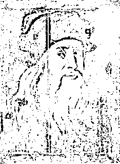

| 莱昂纳多·达芬奇，他的太阳在金牛座 3 度，这是根据公历调整的。

**金牛座由金星守护，众所周知，金星是关于艺术、爱与美的行星。金星的天赋在于创造和谐。**我注意到这些金牛座艺术家很有天赋。**莱昂纳多·达芬奇**可能仍是迄今为止最著名的艺术家。他非常博学——发明家、科学家和艺术家。但我们中的大多数人，还是因为他非凡的绘画才华而记得他。

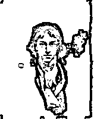

| 约瑟夫·马洛德·威廉·透纳，生于 4 月 23 日

透纳，生活于 19 世纪，伦敦人，很有意思的是，他选择画这样一幅深色的自画像，他因在画布上体现光线的独特方式而闻名。他不擅长形体绘画，但却用颜料和色调弥补了这一点，那份流畅和活力，即使现在看起来，也仍旧让人耳目一新、兴奋不已。**他对赚钱也很感兴趣，这也是公牛的特点之一。**另一位对赚钱很感兴趣的金牛座艺术家是**萨尔瓦多·达利**，他以在空白纸上签名让别人完成绘画而闻名。他的签名比作品本身更有价值。真可惜，因为他是真的会画画。

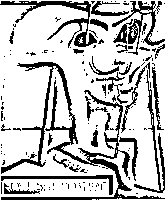

| 萨尔瓦多·达利，生于 5 月 11 日

另一位加泰罗尼亚的超现实主义艺术家胡安·米罗也出生在金牛座，尽管只是刚换座到金牛座。当然，米罗更为人所知的是他那奇怪的、扭曲的画风，充满小人物和大胆的用色。

| 胡安·米罗，生于 4 月 20 日

在欧洲另一边的德国，表现主义艺术家恩斯特·基什内尔尝试用不同的服装和场景来刻画自己。他大胆的、感性的作品被纳粹标记为“堕落”，他在二战爆发前自杀。

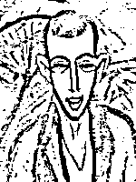

| 恩斯特·基什内尔，生于 5 月 6 日

**天蝎座的自画像**别指望能轻易读懂这一堆画像。这个星座喜欢处理更深层次的真相。双子座的光鲜亮丽或天秤座的华美绚烂可不适合天蝎座。**是的，天蝎座喜欢用暗黑情绪冲击我们的双眼。**

| 弗朗西斯·培根，10 月 28 日

当天蝎座照镜子的时候，揭示了什么真相呢？

| 巴勃罗·毕加索，10 月 25 日

天蝎座看着他/她自己，看到的不仅仅是一个影像。这些是心理层面的画像。有时候，天蝎座会向我们展示镜子之外的东西，那是以图画形式**展现更深层的灵魂。**

| 罗伊·利希滕斯坦，10 月 27 日

有时他甚至看到一个怪物。毕加索常常把自己画成一个人身牛头怪物，有时可怕，有时悲惨，或者只是一个普通的笨蛋。弗朗西斯·培根揭示了他饱受折磨的灵魂。画布就像是屠夫刀下的他内脏被切除。罗伊·利希滕斯坦，因绘制诸多漫画头像说话游说而闻名，他切碎了自己的脸，说不出话来。有时天蝎座更愿意完全离开；相当一部分非常有名的天蝎座艺术家根本没留下任何自画像。乔治亚·奥基夫似乎也没留下什么。也许部分原因是她的搭档摄影师阿尔弗雷德·斯蒂格利茨给她拍了数百张照片。但我认为这可能反映了**天蝎座对隐私的偏爱。**

| 杨·维米尔，10 月 31 日

这里面有某种原始的魔法。如果你的脸被记录了下来，即使是被你自己，是否也会失去一些能量呢？天蝎座，当然永不放弃哪怕是一点点的控制权。然后是缺席的肖像。这里有两个背转身去的天蝎座。

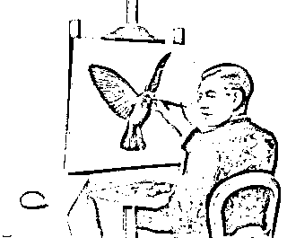

| 雷尼·马格利特，11 月 21 日

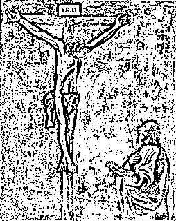

| 祖巴兰，11 月 8 日

这里，17 世纪的画家弗朗西斯科·祖巴兰也从观看者的视线中侧过身，去思索那些比他自己更重要的东西。我好奇他是怎么把自己的整个轮廓画成那样的。有趣而恰当的是，他选择画沉思着的、受苦受难的耶稣基督，而不是，比方说被圣母玛利亚喂乳。**毕竟，死亡是天蝎座的范畴。**另一个人是威廉·霍格斯，他更愿意观众将注意力从自己的外表转移开，他的题材常常是贫民窟，这是另一个天蝎座的领域。他还画了他那条可爱的狗。但与大多数带宠物的肖像画不同的是，这幅画以小家伙为主。我喜欢他的头巾。在海峡的另一端，他同时代的查尔丁，以华丽的静物画而闻名，为自己画了几幅自画像，画中的他也戴了一些有趣的头饰。这应该是那时的时尚，比我以为的戴上让人汗流浃背的假发要好多了。但是看看那些天蝎座们锐利的目光。

| 夏尔丹，11 月 2 日

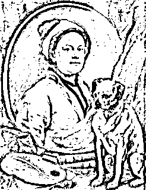

| 霍格斯，11 月 10 日

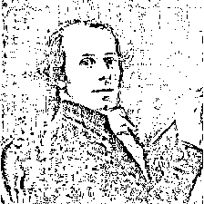

| 安东尼奥·卡诺瓦，11 月 1 日

这是另一位天蝎座的凝视。安东尼奥·卡诺瓦以其感性的雕塑而闻名，他目不转睛地盯着自己，嘴巴微张。这真是一幅激烈异常的自画像。他好像暂时屏住了呼吸。

****版权声明：**本文由若道翻译发布，欢迎转发，反对抄袭。友号转载请申请白名单。**

**END**

**克里斯蒂娜·罗登贝克**

克里斯蒂娜·罗登贝克，若道签约老师。全职职业占星师，从业 20 余年，在其网站长期撰写时事、艺术和文化的文章；定期在英国授课，并保持蓬勃发展的专业实践。

**拥有****51 年****占星实践经验的****若道创始人****前 ISAR 全球副主席****前 ISAR 全球职业占星师资质认证主席****大卫·瑞雷**

**和**

**2019 年第二届、2021 年第三届核心课中**

**与苏·汤普金斯老师****联合授课****的**

**ISAR 认证职业占星师**

**咔咔（Caroline）**

**二人合力打造**

**2022 年 ****若道全新核心占星课程**

**点击下图了解更多课程详情** 

**

**微信又双叒叕改版啦，不想错过若道君的推送？**
****就把若道设为****星标****以及点点****“在看”****吧！******▼**

**喜欢就点一下“在看”吧！****报名直达入口**

# 插班中丨 ISAR 认证职业占星师文凭课程：开启“爱好变职业”的创收自由之路

> 原文：[`mp.weixin.qq.com/s?__biz=MzA5NjA0NTAxNg==&mid=2651491297&idx=3&sn=b3f6d8d34e489f6a248cf37aca994d5a&chksm=8b483956bc3fb0400508f6c450d45a8bb83efb769c5698cbe54275bb1ae166225d770f23e3be&scene=126&sessionid=1692737741#rd`](http://mp.weixin.qq.com/s?__biz=MzA5NjA0NTAxNg==&mid=2651491297&idx=3&sn=b3f6d8d34e489f6a248cf37aca994d5a&chksm=8b483956bc3fb0400508f6c450d45a8bb83efb769c5698cbe54275bb1ae166225d770f23e3be&scene=126&sessionid=1692737741#rd)

**2022 年，是世界和中国 40 年未有之大变局的开始。**

俄乌战争打破了欧洲大陆乃至全世界的和平局面，而新冠疫情也给中国经济带来前所未有之挑战。

如果你关心经济形势和世界局势，你会有这种的感觉，我们将面临一场深刻的危机，而这不是短期内可以结束的。

**占星学的看法也是如此。**

4 月青年失业率（16 岁到 24 岁）中国达 18.2%，一些背着房贷、教育、医疗负担的中年人突然失业更是整个家庭整个难以承受之重。为了更好准备面对这样的时代变化，连《北京日报》这样的官方媒体也在呼吁：**“开拓副业，让自己有多元化发展的生存能力”。**

**而这门课程，就是为了这样一个目标准备的。**

**占星学是非常好的“开展副业”的选择**

这个**为期 16 个月**的课程通过并不算长的时间和并不算高的投资，不仅可以帮助你学到一个终身可用的技艺，而且也可以选择成为自助助人的占星师，**开启受益终生的第二事业。**未来是个体崛起的时代，大量个体被鼓励独立发展，比如网红、自由职业、自媒体、咨询师等，他们都不需要传统的办公室。社会越发达，人的独立性就越强，未来有能力的人都可以变成独立的经济体。

**占星学也是越老越好的职业**

和一些技术变化非常快的职业不同，**占星学的技术层面非常稳定，不会快速迭代变化，**同时，掌握好占星学、能够做一场好的咨询又需要个人自身大量实践和对生命的深刻理解，而这些都是时间和岁月带来的。

**占星学是现代社会需要的助人职业**

社会快速发展和变化人们似乎越来越无法掌控自己的生活，这给很多人带来巨大的焦虑，**抚慰心灵的咨询市场需求巨大。**而占星学可以让人从前所未有的角度了解自己，了解目前和未来所处的周期，挑战的意义，不论对于深入的个人成长探寻，还是预测未来的周期，都又其独一无二的价值。

**ISAR 认证职业占星师的独有培训**

目前占星学的培训市场鱼龙混杂。而 ISAR（国际占星研究协会）是一个包含了 47 个国家在内的国际占星组织，多年来致力于占星的教育和研究，提升占星教育的品质和职业占星师的能力，在国际占星领域备受尊重。今年，ISAR 对于成为 ISAR 认证职业占星师提出了更高的要求，**所有想要获得 ISAR 职业占星认证的申请者均需要在 ISAR 的附属学校通过 500 个小时的研习（包含****主课****、选修课、沙龙、作业、讲座、工作坊等等）。**

**而这门核心占星学课程就是为此而准备的。**

**2022 年，鉴于对若道在占星教学领域所做的持续努力和高品质的课程服务，ISAR 特别授予若道核心课程为 ISAR 文凭课程，所有在若道学习，并通过若道毕业考试的同学将获得 ISAR 颁发的学历文凭（Diploma）。**

**你的占星核心课老师是谁？**

**拥有****51 年****占星实践经验的****若道创始人****前 ISAR 全球副主席****前 ISAR 全球职业占星师资质认证主席****大卫·瑞雷**

**和**

**2019 年第二届、2021 年第三届核心课中**

**与苏·汤普金斯老师****联合授课****的**

**ISAR 认证职业占星师**

**咔咔（Caroline）**

**二人合力打造**

**2022 年 ****若道全新核心占星课程**

**咔咔老师给同学的寄语：**

（向上滑动查看内容）

**亲爱的同学们：**

我为什么学占星学？

2000 年的时候我还是一个在网上搜索天蝎座和水瓶座配不配的普通白领。我搜索的内容还包括了水瓶座为什么总是这么若即若离？

体贴的搜索引擎给我推送了占星学、行星、星座、宫位、相位等资料，还让我了解到莉莉丝、月亮交点、截夺宫位等占星学概念。

2000 年 10 月我了解到，一个从业 30 多年的美国职业占星师大卫·瑞雷来到了中国，和他的中国合伙人将开办一个专业教授占星学知识的课程。过去 10 个月在网上东拼西凑的占星学知识唤起了我对占星学的兴趣，但是已经不能满足我对星图深度分析的需求了。

2013 年，我通过了若道核心课程的毕业考试和国际占星师研究协会的认证考试。2015 年我离开职场成为一名全职占星师。

到底学习占星带给了我什么呢？

1、它是自我觉知的工具，我现在已经不去纠结哪些星座是否匹配，我相信外在的事件是内在心理矛盾的显化。也就是说，想找到令人满足的亲密关系，要先去了解自己的情感模式和需求，而不是无意识地一次次地试错和撞墙。我开始学习自我关怀和接纳自己。

2、它带来看待世界的全新和全景的角度，天上如是，地下亦然。人类社会和个人生命的进化都有其周期和相似性，作为个体，占星学帮助我思考如何更积极和有建设性地与宇宙的能量合作，认识自己，发挥自己的潜力，度过有意义且自我满足的人生。

3、它带来了全新的职业：占星师和占星老师。除了收入，还有助人育人的满足感和意义感。

4、它带来一群志同道合的伙伴，我们彼此联结又相互独立。

作为中国占星界的“黄埔军校”若道占星的学生、助教和老师，我与很多学员在人生的不同阶段带着各异的需求走进了这所学校，2022-2023 年一年半的若道核心课程设计既蕴含了大卫·瑞雷老师的教学精华，也带入了我在跟随不同国外占星老师学习、助教和教学积累的心得。

有一些学员毕业后从事了占星咨询工作，有的在各大平台成为专业占星学知识的输出者和传播者，有的运用占星学提升他们的工作，也有的在占星学与投资，占星学与名人/八卦、占星学与原生家庭、亲密关系、亲子关系等领域收获了有用的或者有趣的体验。

对我来说，生命是一场自我完整的体验之旅。从 2011 年的那个春节在若道入学之后，我的生命旅程更加充实、有意义、有目标，也更有满足感。

希望在 2022-2023 年的若道核心课程里见到你。希望你此后的生命旅程里，有若道，有占星学。

占星师咔咔

2022 年 5 月 24 日

**大卫老师给同学的寄语：**

（向上滑动查看内容）

亲爱的学员们：

感谢你对我们从 8 月 30 日开始的若道 L1-5 级核心课程的兴趣。我和合作老师咔咔以及我们的核心课程团队期待着为你提供这个机会，来教授各种高品质的地道占星学知识和技巧。

对于那些希望获得 ISAR 职业占星师认证的学生，这是一门适合你的课程！

作为 ISAR 咨询技能培训的一部分，我曾与咔咔合作过，我们期待着再次合作。咔咔和我曾在 ISAR 职业占星师认证委员会（CAP ISAR）一起工作，我们非常熟悉获得 ISAR 职业认证的流程。作为你的老师，我们将陪伴你整个占星学发现之旅，帮助你逐渐认识到占星学有多么的神奇。此外，你还将受益于我们若道的助教和课程顾问，他们是若道核心课程计划的重要组成部分，提供在线沙龙、组织学习小组、指导家庭作业。我们的教育团队是“服务于你的团队”，所以也会根据你的需求进行相应的调整。你专用的核心课程微信群也促进了你的学习过程，使你能够每天与你的同学们一起学习、探讨、成长。

52 年前，当我开始学习占星学时，没有一所像若道这样的学校。如果有这样一所学校，我会尽一切可能在那里成为一名学生。事实上，我很幸运，我的老师都是经验丰富的专业占星师。然而，我花了 6 年的学习时间才通过 1976 年在美国乔治亚州亚特兰大举行的专业占星师考试，又花了 2 年的专业实践时间才通过占星学谋生。我永远不会忘记从 1970 年到 1978 年的 8 年，那些日子的反复试验教会了我如何苦练占星学。作为老师，我一直在努力传授我早年所学的知识，让你的旅程更加顺利，更加全面。

自 1978 年以来，44 年的全职实践教会了我很多，我很高兴有机会与大家分享我所学到的东西。我和咔咔都是现代占星师，虽然我们尊重西方占星学的历史和传统，但我们实践和教授的占星学植根于现代人本主义哲学，这种哲学旨在提高你对自身潜力的认识，并鼓励个人成长。还有什么比了解自己更实际的呢？还有什么比个人成长和发展潜力更有利的呢？这是你将要学习的占星学，一种可以应用于你自己生活的占星学，一种可以为你提供一个充实职业的占星学。

教书是我回馈占星学行业的方式，这个行业拓展了我的视野，远远超出了我曾经想象的可能。谢谢你给我这个机会做你的老师。

大卫·瑞雷

2022 年 5 月 24 日

**连报 L1-5 全阶网络直播课程，你可以享受**

❶ 64 次线上直播互动网络课程+2 场工作坊，全面而详细地讲解占星学知识、技能、案例和重要领域实践运用。

❷ 知识点+学员星图解读有机结合：咔咔老师以讲解知识点和中外名人案例为主，大卫·瑞雷老师以参课学员案例演示及客户案例为主，每个知识点覆盖班级内学员的亲身案例，参与感更强，多位学员都有机会听到自己的星图分析。

❸ 微信群学员互动分享，从真实案例学习生命成长故事。

❹ APP 答疑论坛提问：论坛上每个学员的问题都将得到及时回复。

❺ 若道独有的职业占星师养成计划，为你毕业后独立咨询做准备。

**❻ **提供**咨询平台**，只要努力，优秀毕业生有机会入驻**若道咨询平台**，拓展咨询客户群。

**更多了解老师和助教？**

**大卫·瑞雷（David Railey）**

*   **I****SAR 董事会成员，ISAR 全球副主席，ISAR 全球职业占星师资质认证主席，若道占星创始人**。

*   2016-2019 年，被选为国际占星协会（ISAR）考试委员会成员，国际占星协会（ISAR）是世界最大的国际占星机构，会员遍布 47 个国家。

*   2017-2020 年，被选为国际占星联盟（ISAR）考试委员会主席，理事会成员。

**占星师咔咔（Caroline）**

2010 年师从美国占星师大卫·瑞雷学习，并得到世界名师斯蒂芬·弗里斯特、罗伯特·汉德、苏·汤普金斯传授各种占星学技法。若道首届学员，国内最早获得 ISAR 职业占星师资质的职业占星师，多次担任若道核心课程助教，并于 2019 年第二届、2021 年第三届核心课中和苏·汤普金斯老师一起教授若道核心占星课程。

在国际知名广告公司和市场研究公司从事的市场研究和推广工作十余年，曾任职于阳狮集团、尼尔森市场研究有限公司、MTV 和《Madame Figaro》杂志。

**助教王嘉祺 （Conrad）**

ISAR 认证占星师、若道认证生时校正资质，从 2010 年起自学占星学，2015 年开始在若道系统学习，并开始个案咨询。2018 年担任若道核心课程助教，以及卜卦占星学和太阳返照选修课助教，并带领学员进行经世占星和太阳返照方面的研究。2019 年 11 月作为演讲人之一参加了国际占星协会（ISAR）北京大会，也是 ISAR 星空俱乐部中国区第 16 期的主讲人。

**什么人适合这门课？**

*   对占星学有浓厚兴趣，想要系统学习占星学。
*   对占星学有一定基础，但不知道该如何整合星图复杂的碎片。
*   希望成为优秀的占星师，想要借鉴国际大师解读思路并融入自己的体系。
*   想学习占星学，但不擅长英文，希望有中文老师授课。
*   想结合占星学理论与咨询实践。
*   走在自我探索和个人成长道路上的人。

**课程费用**

**★ 1-2 阶 （8 月 30 日开课）****课程费用：3500 元 ****★ 1-3 阶　连报****课程费用：11500 元 **********转发优惠价：**11000 元（朋友圈转发本课宣保留 24 小时以上，并截图给课程顾问）********★ 1-5 阶 连报****课程费用：46500 元** **转发优惠价：34800 元（朋友圈转发本课宣保留 24 小时以上，并截图给课程顾问）**

**咨询课程请联系顾问**：**王老师（微信/手机：18510107057，请备注“大卫核心课”）**

**退转课程**

**退款原则请详看《教学协议》，如有疑问请咨询课程顾问。**

****2022 L1-5 认证职业占星师必修课程****

**授课老师：大卫·瑞雷、咔咔**

**直播课开课时间：2022 年 8 月 30 日（周二）**

**授课方式：******网络授课，英文/中文授课，中文翻译****

**费用：******1-2 阶**：**3500 元；****1-3 阶**：**11500 元******（****转发优惠价：**11000 元，朋友圈转发本课宣保留 24 小时以上，并截图给课程顾问）；**1-5 阶连报**：46500 元**（****转发优惠价：34800 元，朋友圈转发本课宣保留 24 小时以上，并截图给课程顾问）******

**课程负责人：王老师**（微信/手机：18510107057，请备注“大卫核心课”）

长按二维码添加课程负责人咨询~

**END**

****报名直达入口****

# “可能我撞了南墙才会回头吧” | 骨灰级“恋爱脑”的破解大法

> 原文：[`mp.weixin.qq.com/s?__biz=MzA5NjA0NTAxNg==&mid=2651491297&idx=1&sn=78eee13be83e4247f7caa814f1c512da&chksm=8b483956bc3fb040970f2b98a48ddb8b17891b553bf5e19771060cc56c0cbb4f7277e5c48a57&scene=126&sessionid=1692737741#rd`](http://mp.weixin.qq.com/s?__biz=MzA5NjA0NTAxNg==&mid=2651491297&idx=1&sn=78eee13be83e4247f7caa814f1c512da&chksm=8b483956bc3fb040970f2b98a48ddb8b17891b553bf5e19771060cc56c0cbb4f7277e5c48a57&scene=126&sessionid=1692737741#rd)

****☆ ****后台回复“今日”，给你一句生命态度****

作者/比尔·赫布斯特

译者/Jun 校对/Chang

编辑/玫瑰 封面/书君 图片/稿定设计

学习占星学，除了了解自己，还可以了解我们和他人的关系。比对图便是这样一种技术，揭示二者间的互动情况。作者积累大量案例后发现，土星在一段关系里有非常重要的作用。一起来看看吧！**什么是比对图？****比对图（Synastry）是一种用多种方式比较两个星图的做法，可以揭示出两者如何自然互动的信息。**最常见的应用是**通过比较两个人的出生星图**来探索亲密关系或社会关系——如爱人、婚姻伴侣、家庭成员、同事、朋友等。这些关系可能是平级关系（恋人、婚姻、朋友）或者等级关系（父母-子女、雇主-雇员）。

**这些关系可以是真实的**，也就是说这些关系已经存在并且正在进行，**或者可以只是两人之间可能的关系，**他们可能认识，也可能不认识，但还没有处在一段关系中。

**任何两个星图都可以进行比较。**我可以将我的星图和和亚伯拉罕·林肯的星图进行比对。如果我在写林肯的传记，我肯定会这么做，因为这会让我洞察到我对林肯的性格和生活会有何反应。

**比对图不一定只涉及人与人之间的互动。**我们可以分析两个国家之间的关系（用两个国家出生星图） ，或者一个国家和一个人之间的关系。然而，作为一名执业占星师，我可以保证，在我 50 年的职业生涯中，从来没有人要求我给他与一个国家做比对图。**比对图与“匹配度”****比对图中使用了 2 种主要技术。第 1 种是“客观的”**，意思是对两个星图中的落位进行技术比较，这就是我将在本文中讨论的。**第 2 个技巧是“主观的”**。先解读一张星图，感受其生命的整体意义。再对第 2 张星图做同样处理，然后考虑一下这两种生命如何可能（或可能不）融合在一起。这两个故事放在一起合理吗？这并不“科学”，但占星学更多是艺术而非科学。我喜欢第 2 种方法，但这不是本文的主题。在主流占星学中，公众期望比对图能够（或者应该能够）评估两个人之间的“匹配度”。甚至许多占星师也是从这个角度来对待这项技术的。而我不这么认为。虽然我知道传统比对法的“规则”会表明两张星图之间的能量流动或冲突，**但采用任何公式化的方法来评估亲密关系的成功或满足，我对此持怀疑态度。**

“优势和劣势”也是如此。我把这种说法归入与“好还是坏”同样的可疑类别。人们希望占星学用小我的语言来表达，但并非如此。他们也希望占星学简单明了，但也并非如此。

**占星学复杂而微妙，有多个面向，就像生活一样。**简单、轻易的判断不仅难以捉摸，而且常常是错误的。如果客户不再问我对他们星图的评价是“好还是坏”，我就欢天喜地了。但他们不会不问我……

**“匹配度”比人们想象的要复杂得多。**鉴于此，我有两个基本假设，都是从长期的经验中得出的：一个是星图中**关联多的比关联少更合适**，另一个是**温和与刺激相平衡的关联更好**。**这个一部分指的是相位。**许多人认为三分相或六分相（温和相位）是“好的”，而四分相或对分相(刺激-冲突相位)是“坏的”。这就大错特错了。

**过多的和谐就是无聊**。什么都不会发生。**过多的冲突则会让人精疲力尽，变得疯狂。**我们既需要热情又需要冷静，既需要激情又需要灵性之爱，但是没有一个完美融合的公式。

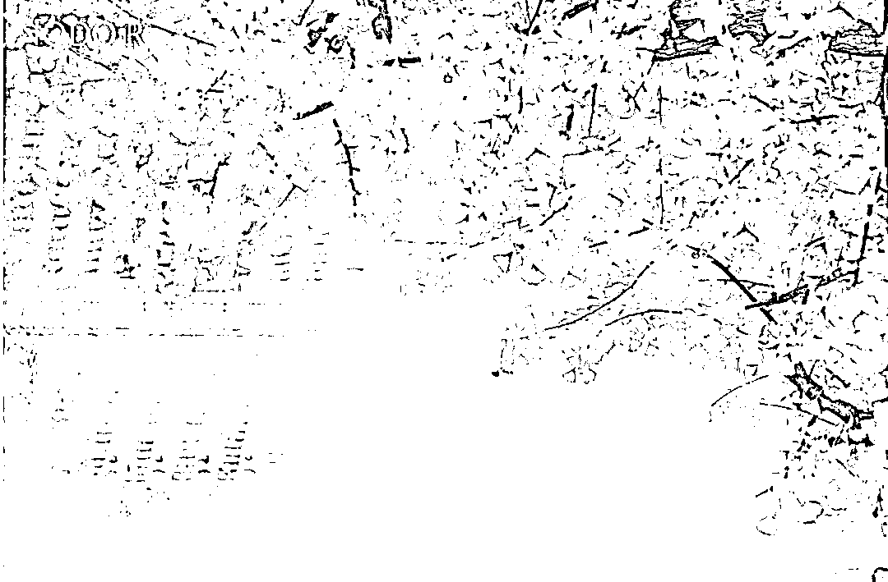

比对图作为一种技术，是如何实现的呢？我们用一个数学（实际上是几何学）的比例尺**将一个星图中的所有符号位置（行星、角度等）与另一个星图中的所有符号位置进行比较。**参照系几乎总是黄道——黄道星座。

我们可以用宫位作参照系，但那样很难做到精确，虽然有时候那甚至能揭示更多内容。**两个人如果被强调宫位相同，通常有很多共同点，但这并不一定意味着他们会处得来或喜欢对方。**

**在实践中，黄道是比对图最常用的参照系。**我们在每张星图中寻找在黄道同一位置（合相）的符号，或在圆周上相隔主要角度的符号——180°（半圆或对分) ，90° (四分之一圆或四分相)，120° （1/3 圆或三分相）等等。

**角度越精确，两者的联系就越有力。**如果两个符号恰好相距 180° ，那么这个联系就比 175°更有力。

在这篇文章中，我将完全省略容许度，只讨论“困难相位”——合相、四分相、对分相，因为这些是最具活力的联系。**所有的相位关系都具有潜在的意义，但是困难相位会突出表现为对应关系中最具活力的品质。**

**筛选重要信息**计算相位关系可以用计算机（占星软件）或手工计算，用眼睛看。软件是最快最彻底的方法。专业的占星软件可以立即计算并列出两个星图之间的每一个相位关系。很棒吧？其实没有听起来那么好。

**若道君：****你可以在 app store 或者应用商店搜索“若道”下载 app，输入个人档案，查看比较盘（也可以使用其他星图软件），输入另一个人的出生信息，查看两个人的比对图。**

所有这些信息的列表或图表往往过于夸张。我们不得不从堆积如山的数据中**筛选出最重要的相位关系，**这是一件很麻烦的事情。我对两张星图之间的 114 个联系并不感兴趣。我只想知道最重要的 5 个。

所以，我强烈偏好通过观察两张星图进行手动比较。当然，这样做的风险是我可能会错过某个重要的相位关系，但是在我开始之前，我就知道如何缩小寻找范围，**只找那些为了后续咨询谈话我可能想知道的相位关系。**

你看，并不是所有的事情在占星解读中都同等重要。**重要性有自然排序，每个占星师会选择自己的排序。**就我而言，我在比对图中寻找的东西相对简单，所以我用眼睛找。**比较行星对是一个快速而简单的方法，可以揭示有意义的联结。**

*   如果**2 个星图中的太阳有联系**，那么两个人对对方**基本品质**的理解就相关了。这可以是容易或者困难的、和谐或者冲突的，取决于相位的角度。 
*   **当月亮有联系时****，就意味着与脾气有关。**想知道你是否能够舒适地和某人同居吗？看看月亮。 

*   **水星的联系**有关每个人如何思考和说话。沟通是这一关系中的重要因素吗？水星显示了这一点。 

*   **火星和金星之间的联系**有关性的化学反应。几十年前，我开发了一个包含 28 种不同的性联系组成的系统，只要看一两分钟的星图，就可以直观地做出评估。

然而，**一般来说，比对图要注意到星图中任意两个位置之间的联系，**而不仅仅是相同的符号对之间的联系。

两个太阳不一定要互相有联系，只要与星图中的另一个元素有联系也是一样的。如果一个人的太阳没有整合到另一个人的星图中，那就是个问题。**更多的联系意味着更大的意义和更强的纽带。**

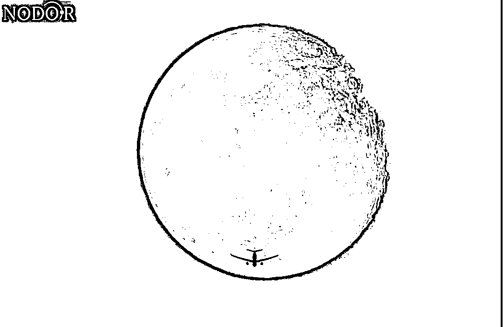

**比对图中的土星**所有这些都是序言。在这篇文章的剩余部分，我想写的基本上是一件事——**一张星图中的土星与另一张星图中任何符号点的联系方式。**对我来说，这是比对图中唯一最具启发性的因素，也是最重要的。**一个人的土星是否与对方星图中的行星的位置或轴线有联系？****1****引发冲突的重要关系**所以，这里是启示一：**任何两张星图之间如果没有至少 1、2 个重要的土星联系，**那么他们彼此只是在黑夜中驶过的船。**如果没有土星的整合，**这种关系几乎肯定会被证明是无足轻重的。这一见解与“大众”占星相悖，后者通常认为任何与土星的联系都是“坏事”，甚至可能是一段关系的死亡之吻。

好吧，朋友们，这是不对的。我超过 12000 次的咨询和大量的比对图的经验，显示得一清二楚：**两张星图之间土星的联系，对有意义而持久的长期关系来说是必不可少。**

与土星的关联容易吗？不，不容易。而是有点困难，有点麻烦，有点混乱的，而且**经常使两个人感到痛苦**（顺便说一下，涉及的总是两个人，即使只有一个人的土星与另一个人的星图紧密相连）。

**如果我的出生土星合相你的出生太阳或金星，我们的体验是不一样的。**你对此的感觉和我对此的感觉会很不一样，但我们两个人的体验在这段关系中都很重要。我们如何处理各自的反应并调和差异，对我们作为一对伴侣的满足感和共同幸福感至关重要——或者，如果事情变糟，这对我们在一起对满足感和幸福感的明显缺乏也至关重要。如果我的**出生土星与你的出生火星**有相位（合相或对分相） ，那么每当你在态度或行为上表达欲望时，我的土星就会被“谐波共振”激活。然而，如果你的土星和我的火星是四分相，那么它们就是相互排斥的。激活一个就会关闭另一个。**对于这对行星，任何一种相位都是困难的。**

当你用欲望、紧迫感或尖锐感来表达你的火星时，我会感受到恐惧和抵抗。相反，当我表达我的土星——担忧、焦虑、犹豫、谨慎、野心，甚至是权威时也会影响你的火星。你会变得热烈，想要穿透或挑战我。

现在，如果你完全有意识、成熟又充满爱，你的火星反应是会推动我前进，帮助我克服恐惧，帮助我爬上山峰，实现我的目标。而你可能会经常这样做。

但是要记住，在任何持续的日常关系中，比如恋人或者婚姻伴侣，**这种土星和火星的化学反应在一个月内会触发上千次。**

没有人能在所有这些时候保持足够的意识。**这些触发中的大部分都会在无意识中表达出来。**这时，双方都会大为心烦。他们可能都不想激起沮丧或愤怒，但这就是化学反应。所以，你可能会觉得我在不断向你的欲望泼冷水，基本上就是在批评或者阻止它们。我可能会觉得你不断在威胁我，挑战我的野心，或者削弱我的权威。不，并不是“总是”，但感觉就是这样。是的，我明白，这很糟糕。

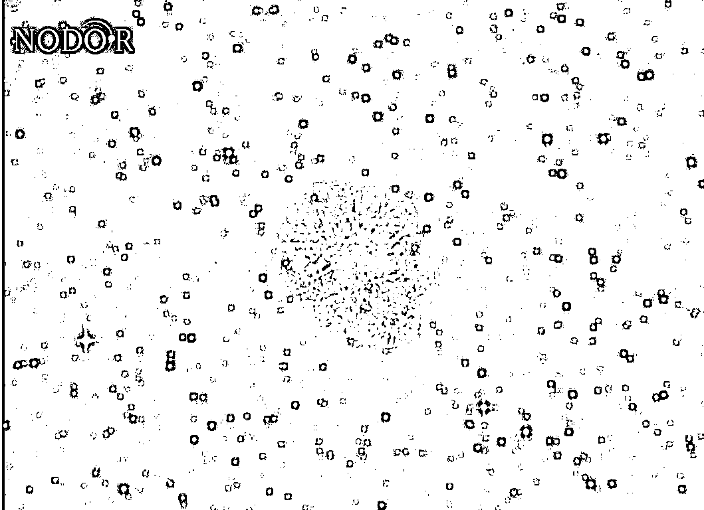

为什么会有两个人都想要处在缺点如此明显的关系里呢？我是说，好处在哪里？**两个人之间的火星-土星关系的“积极”意义在于**，它培养并促进了他们的内在工作，至少有潜在可能，**会带来成熟。**

以小我为基础的人类希望一切都很简单，但生活并不是这样的。生活中大部分事情都困难得要命，**但困难并不等于毫无价值。**我们通过勤奋工作和持续努力所获得的东西，本质上比我们免费得到的东西更有价值。

这是比对图中每一种不同的土星联结接的基本意义——土星-太阳、土星-月亮、土星-水星、土星-金星等等。**每种联结都表明了引发冲突的共同特殊经历，**但它们都是为了在同一条灵性之路上走下去。这条道路说：**“这并不容易，但它可能真的很重要。”****2****难以脱身的关系**关于比对图中土星的联结，我想提到的另一个因素是，它们就像胶水一样。这就是启示二。**重要的土星连接使两个人在一起，让他们努力改善自己以及他们的关系，**否则他们可能会渐行渐远或放弃彼此。诚然，人们有时会觉得被困在一段永远不会产生任何好结果的关系中，持续痛苦，直到关系结束，但这并不是土星的错。这只是意味着，由于这样或那样的原因，参与其中的人们无法实现土星所揭示的内心工作。

当我在客户的比对图中看到重要的土星联结时，我会这样告诉他们：**如果你不想被套上犁，那就不要进入这段关系。**在你做出承诺之前就离开，因为**一旦你真的陷入其中，要想脱身会非常困难，**代价很大。

我最不喜欢的情况是，当我看到两个最近刚认识的人之间有很强的土星联联结，并请我比对一下他们的星图，来评估这段萌芽期恋情未来的可能性。我有责任告诉他们我刚刚写的那些东西，但是从来没有人听我的。真的，一个都没有。

他们为什么不听？在某种程度上，我认为这是因为**在有强大土星联结的关系早期，土星人往往非常有热情。**他们的恐惧可能已经压制了他们很长时间，但是突然之间，他们感觉自己克服并超越了自己的焦虑，精力充沛，好像遇到这个新人给他们注入了神奇的勇气。就好像他们正在向山峰奔跑，令人兴奋。

**与此同时，对方还没有体验过一头撞上土星砖墙 1000 次的挫败感。**他们认为自己能够应付即将到来的事情，而且他们往往被土星伴侣早期的兴奋所愚弄。但这种兴奋不会持续太久。

我们不可能跑着上山。这不是短跑，而是长途攀登。我们必须计划，调整节奏。我们可能不得不等待其他人不需要等待的有利条件。**这就是土星的特点。**我们看到其他人根本没有在我们挣扎的东西上挣扎，我们想知道为什么对他们来说如此容易，对我们来说如此困难。答案是，他们不是我们。然而，**我们都有土星在我们星图上的某处，因此我们每个人都有我们自己的山峰**——在我们的生活中，某个令人畏惧的可怕地方。这在许多方面揭示了**土星的精神教导**：**活在我们自己的现实中，不与他人比较，并随着时间的推移而进化。**

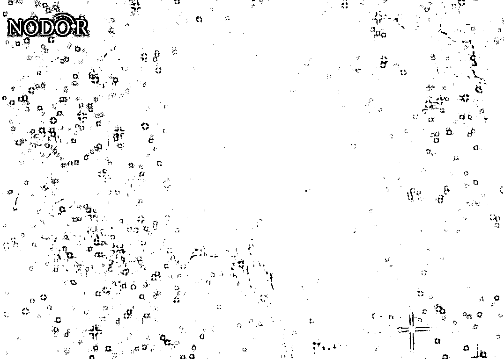

**土星的意义**对我们每个人来说，我们星图中的土星显示了，我们在何处，要以何种方式通过持续、重复的努力，通过逐步解决我们的疑虑和恐惧，通过减少我们严重的过度敏感，来**慢慢成长。**土星揭示了**进取心和毅力**在哪些地方会有长远回报。它揭示了我们**如何以及在何处会不可避免地失败**——可能会以不同的方式多次失败，**但我们仍然会重新开始**。在我们的星图中，**土星象征着失败可以真的带来成功的地方。**对我们来说困难的事情可能永远不会变得容易，但是我们仍然可以实现许多野心，同时学会欣赏、尊重和接受我们固有的局限。**做好土星所规定的内在工作会带来真正的谦卑，而拒绝则会导致精神崩溃以及难以根治的不成熟。****我们可以对比对图中的每一颗行星进行这种分析。**我选择写土星，是因为它是伟大的导师。相比太阳和土星（也许还有月亮），占星学中的其他一切都显得苍白。

有些人痴迷于月亮交点的所谓“灵性”含义。好吧，朋友们，**星图上的一切都是灵性的，**和太阳与土星相比，月亮交点只不过是个脚注而已。

这是非常基本的占星学。这有点像棒球。打好棒球需要掌握 4 项基本技能——击球、跑步、投球和接球。不断练习这些，你就会成为一名优秀的棒球运动员。你可能不会成为棒球明星，但你会赢得尊重。同样地，**熟练掌握占星学需要反复学习并思考基础知识，从而更好地、更深入地、更彻底地理解底层基础，使得细微的差别都会显露无疑。**

**版权声明：**原创文章由若道翻译发布，欢迎转发，反对抄袭。友号转载请申请白名单。

**END**

**比尔·赫布斯特**

比尔·赫布斯特，1973 年起任全职占星师。目前，他的撰稿专注分析 2010 年代前半段发生的重大事件，及其对后半段和 2020 年代产生的广泛性变革。

**今天是斯蒂芬大师工作坊开讲第一天****想要加入的小伙伴速速点击下图哦！**

**20 位来自世界各地的占星师****带来 19 场沙龙——新世界的觉醒****详情可点击下图**

**学习占星学****点击下图了解课程详情**

**微信又双叒叕改版啦，不想错过若道君的推送？**
****就把若道设为****星标****以及点点****“在看”****吧！******▼**

**喜欢就点一下“在看”吧！****报名直达入口**

# 如果你觉得这个星座懒惰而一事无成，那就大错特错了

> 原文：[`mp.weixin.qq.com/s?__biz=MzA5NjA0NTAxNg==&mid=2651491260&idx=1&sn=ed4b084dfd61d173aa9f2acf8bc92c67&chksm=8b48390bbc3fb01de015c51e810960133f63ea435948055cca4e6ced3df006465435bc316325&scene=126&sessionid=1692737741#rd`](http://mp.weixin.qq.com/s?__biz=MzA5NjA0NTAxNg==&mid=2651491260&idx=1&sn=ed4b084dfd61d173aa9f2acf8bc92c67&chksm=8b48390bbc3fb01de015c51e810960133f63ea435948055cca4e6ced3df006465435bc316325&scene=126&sessionid=1692737741#rd)

******☆ ****后台回复“今日”，给你一句生命态度******

作者/大卫·瑞雷 若道占星创始人
译者/若道翻译团队编辑/玫瑰 封面/书君 图片/稿定设计

你金牛座这个慢悠悠笃定定的星座你喜欢吗？看完这篇文章，你就很难不喜欢呢。一起看看吧。如果你想跟着大卫老师一起学习占星，可以了解【[ISAR 认证职业占星师文凭课程](http://mp.weixin.qq.com/s?__biz=MzA5NjA0NTAxNg==&mid=2651489655&idx=3&sn=db4021dbaa59ac00d85ba65b95e107a7&chksm=8b4837c0bc3fbed6035a426851e41f34ead0e326971bdb018558f60ca56c8ef24ade3514f6e6&scene=21#wechat_redirect)】（点击链接可阅读）相关详情~

**金牛座**如果说白羊座对应了旅程的开端，那么金牛座就是旅程的下一个阶段，我们开始在黄道列车上放松下来。喘口气，深呼吸，在舒服的座位上好好坐稳，开始享受旅行。想想前面乔治·克鲁尼和阿黛尔的话，都在强调**“舒服”、“舒适”**。此时我们不再着急赶路。可能我们需要一些茶和点心，或是打个盹儿。我们知道路还很长，我们直觉地开始积蓄能量。**金牛座人感知事物价值的能力比其他任何星座都强。**金牛座的你们天生就有**享受美好生活的巨大潜力**，会本能地追求那些你们认为有价值的东西。这是一种**天然的“占有欲”**。**“占有原则”**最基本的表现是对肉体的占有。如果金牛座在你的星图中占主导地位，你会本能地意识到身体需要保养，累了就要休息，饿了就要吃。除非你确定值得，否则你不会浪费或消耗你的能量。然而，一旦你投入精力去做一件事，你便有能力持之以恒。当你知道你的努力是有回报的，便会显示出惊人的**精力和耐力。****在危机中你也能够保持镇定**，没必要的话不会仓促行事。你从容不迫的态度会让人觉得你是**坚定、可靠的**。你非常享受**感官的快乐和物质生活的舒适**。除非有充分可靠的理由来证明，否则**你对于事物价值的判断很难被改变。**

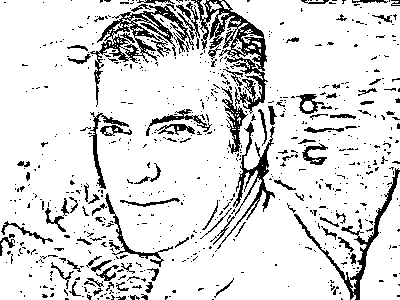

| 乔治·克鲁尼

| 阿黛尔

**个人成长的主题和故事**如果你是金牛座，评判带来的恐惧可能会侵蚀你获得快乐的能力，甚至阻塞了你创造富足的潜力。**这些根深蒂固的评判可能将生活中的喜悦紧紧封锁，令人陷入极端的惰性之中。**没有其他哪个星座可以像你们那样陷入僵局动弹不得。这个时候，要让你相信生活会给你回报——当事实鲜少如此——是一个挑战。重要的是要意识到，负面的信息，特别是来自童年的，会以很多种不同的方式强化**基于评判的恐惧**。对于金牛座来说，这些评判经常是被**“自私”或“贪婪”**这些标签所限制。这些标签可能来自某种内疚感，比如你成长于一个**资源匮乏**的家庭；或是由某些惩罚而来，比如在你小的时候，当你不想跟其他小朋友分享你的玩具时，大人们就会把你的玩具拿走并斥责你是一个“极度自私的小孩”，而这仅仅是因为你想要保护或牢牢抓住属于你的东西。如果家庭中有虐待的情况，就更为糟糕，无论是暴力还是性侵，都可能破坏一个人**对自己的身体的所有权的意识**，这会严重毁坏这个人在未来作为一个成年人经验幸福的能力。说到负面信念的形成过程，我的一个两倍金牛的客户回忆说，他的母亲经常说她是“自私、贪婪的猪，没有一点感恩之心，也不配拥有任何东西。”当我和她探讨她的财务困境的根源时，她的这些童年记忆浮现出来。她欠下了 9 万美元的信用卡债，濒于破产。严重的债务是严重失衡的生活的反映，**她一直在买她“负担不起或似乎无法长期享用”的东西。**其他常见的关于金牛座的**评判性标签还有“懒惰、固执、一无是处”**。就像前面写的，金牛座身上有种从容不迫的气质，似乎能够举重若轻，但有些父母是比较没有耐心的，他们更希望看到孩子表现出积极上进、斗志满满的一面——这样的父母可能会认为他们的金牛座孩子太慢了，或是缺乏进取心，简而言之就是：懒。

同理，早上穿衣服上学也不是一场比赛，看谁能先到达终点，急什么呢，父母越是催促，金牛座的小朋友就表现得越不情愿，他们会嫌那些衣服穿在身上不舒服，他们喜欢贴着自己皮肤的都是柔软、舒适的布料，这也就成了“固执”。

“一无是处”这个标签最为恶毒，**因为这是直接的对自我价值的贬低，**暗示付出任何努力都不会有回报。这会让人潜意识里觉得无论自己实际上有多好，都得不到任何东西。

**“占有欲强”**是对金牛座的另一个典型的评判。还是要说，我在描述的是一种行为失衡时的状态。如果你是金牛座，那么**有一点“占有欲”对你来说是正常的，也是健康的。**不过，金牛座和其他固定星座（狮子座、天蝎座、水瓶座）一样，**可能产生“执念”。****金牛座的执念，会围绕“所有权”而来。**“她是我的！”或“这是属于我的！”这种对于所有权的假设可能变得很极端。我的一位女性客户的前夫是金牛座，他在他们离婚后的很多年里，还坚持要和她睡在一起——**金牛座是不容易放手的。**不过，极端的占有欲，通常是早年形成的某些评判的结果。

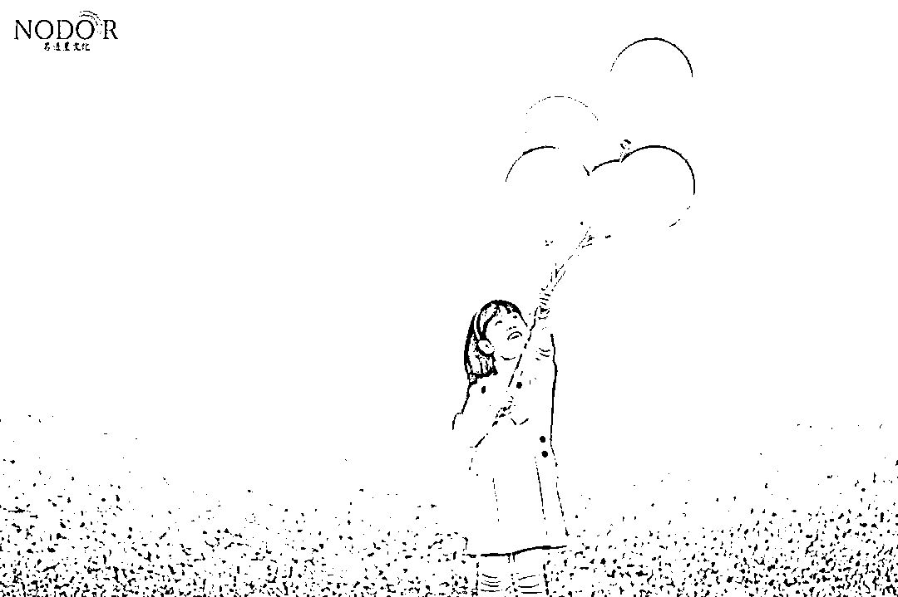

**事业线索**像阿黛尔、邢利斌、柳传志这样的人是能登上新闻头条的特例。一般而言，对于你们金牛座来说，更关键的是创造一种**宁静又舒适**的生活，这不光在于能够洞悉事物的价值几何，更取决于你的价值观是否和**你内心对于自我价值的真实感受**和谐一致。**不管你有多么努力，若内心的自我价值感不足，便会在创造丰盛的道路上受阻。真正感到自己值得才是根本。**如果你真的感到自己值得，那么你的决心会给你带来回报。至少，你会因不论环境如何都持之以恒而获得回报。因为**你对于事物的价值有很好的直觉，**所以你通常能够持续地对有关钱和资源的问题做出正确的判断。你们中的很多人容易被金融市场所吸引，一般来讲**你们更倾向于通过可靠的方式赚钱。**

除非你想要拥有自己的公司，这对于某些金牛座人来说是有吸引力的，更多时候你们会选择在一些大公司里扎下根来，比如进入建筑、房地产、银行、农产品这些领域，或者是像煤炭这样的能源领域。**本质上你们是希望自己的收入来源是稳定可靠的。**

**如果你从事创造性的工作，你会很在意自己作品的市场价值。**你可不想当一个“饥饿的艺术家”，你会试图创作出那些能够获得市场反响的作品。一旦你有了不错的生财之道，你会倾向于将它一直做下去。所以你们在经商方面非常有耐心，你们所经营的企业常常因寿命之长而令人刮目相看。面对商业中的潮流风尚时，你们的反应缓慢可能会将你们置于不利的处境。不过，一旦创新的想法被证明有实操价值，你便不会那么抗拒。

| 胡因梦

**有时你的价值观会发生变化。**胡因梦在她的第一份事业中收获颇丰，15 年间出演了 42 部电影。然而，她的价值观发生了变化。在 35 岁时她退出影坛，将人生方向转向灵性成长的道路。在她的第 2 份卓有成就的事业中，她是一位身心灵成长领域的导师、译者、作者。这是一个很清楚的例子，说明价值观的变化会给金牛座的事业带来怎样的影响。

**事业要点**

*   为你的天赋和本性赋予价值；
*   对你想要获得的价值回报心怀确信；
*   令你的工作环境是舒适的；
*   令你的工作过程是舒适的；
*   确保你付出的努力是有足够的回报。

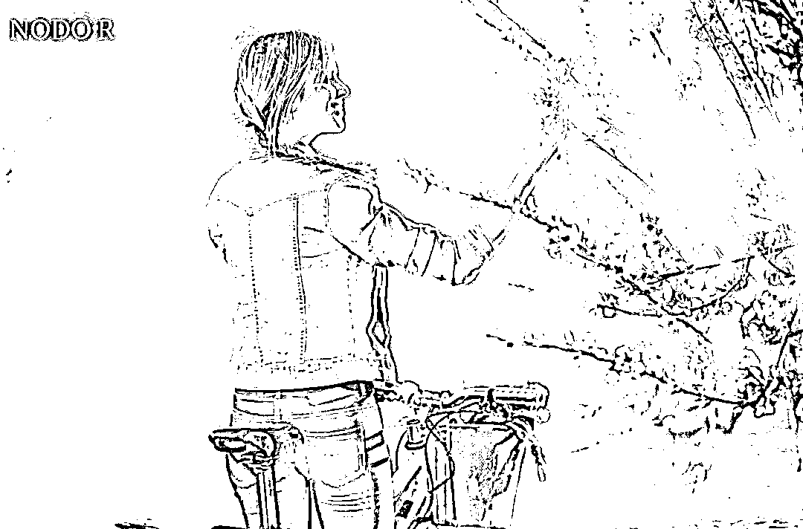

**爱情线索**

**在亲密关系中，你的正向特质是能够以平和的心态处理危机的镇静，在床笫中的感官天赋、精力充沛、持久的耐力，以及一种从容质朴的魅力。**

不管这段关系正遭受怎样的风吹雨打，你都能如磐石一般坚守，令这段关系持续下去。适合你的伴侣，是能够欣赏你的可靠和稳定特质的人。
**你最大的挑战是占有欲**——你会认为你“拥有”你的爱人，也就是说，他们“属于”你。你非常固执，抗拒改变，甚至会表现得自私。你会很看重伴侣的**身体和物质条件**，这些非常实际的考虑会影响到你在亲密关系中的决定。你希望一切安稳，十分抗拒冲突。但这可能令一些未解决的问题一直拖延下去。随着压力的积累，你可能开始觉得这段关系不再值得了，**但其实去面对一些冲突，或许有助于关系的修复，**令你和伴侣的互动更加舒服、愉快。

**爱情要点**

*   确保你和伴侣在一起时身体上是舒适的；
*   你很在意伴侣身上的气味和皮肤是否光滑；
*   确保你的伴侣也喜欢轻松安适的生活方式；
*   选择那些你跟对方在一起时能感到放松、快乐的伴侣；
*   了解你的伴侣在财务方面的期待；
*   确保你会对你的伴侣的经济情况感到舒服；
*   不要认为你的伴侣理应同意你的观点；
*   最后，确保你们在大部分事情上有比较一致的价值观。

**版权声明：**原创文章由作者授权发布于若道平台，欢迎转发，反对抄袭。友号转载请申请白名单。

**END**

****想阅读更多作者的文章，请在后台回复******大卫****** 即可。****

**大卫·瑞雷**

美国占星师，若道联合创始人，致力于在中国教授和推广西方占星学；2010-2014 年，任全美占星师联盟监督委员会委员；2017 年，被选为 ISAR 委员会成员。ISAR 是世界最大的国际占星机构，会员遍布 45 个国家，2017-2020 年曾任 ISAR 全球副主席、CAPISAR（ISAR 职业占星师资质认证机构）主席。

**拥有****51 年****占星实践经验的****若道创始人****前 ISAR 全球副主席****前 ISAR 全球职业占星师资质认证主席****大卫·瑞雷**

**和**

**2019 年第二届、2021 年第三届核心课中**

**与苏·汤普金斯老师****联合授课****的**

**ISAR 认证职业占星师**

**咔咔（Caroline）**

**二人合力打造**

**2022 年 ****若道全新核心占星课程**

**点击下图了解更多课程详情** 

**20 位来自世界各地的占星师****带来 19 场沙龙——新世界的觉醒****详情可点击下图**

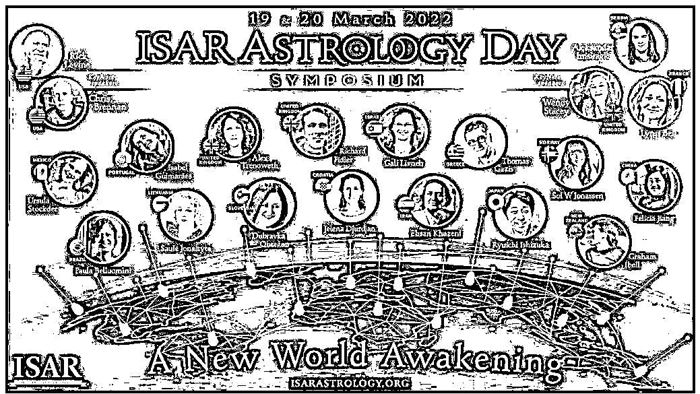

**学习占星学****点击下图了解课程详情**

**微信又双叒叕改版啦，不想错过若道君的推送？**

****就把若道设为****星标****以及点点****“在看”****吧！****

**▼**

**喜欢就点一下“在看”吧！****报名直达入口**

# 核心占星课新鲜速递：代表吸引力的金星，能从外表看出来吗？

> 原文：[`mp.weixin.qq.com/s?__biz=MzA5NjA0NTAxNg==&mid=2651491260&idx=2&sn=58c0d8df0590082a83305840ac6bf598&chksm=8b48390bbc3fb01d255db1b3aa7a7b7e385938365d0c7e807193895ac5b0f4406c440e9b1a66&scene=126&sessionid=1692737741#rd`](http://mp.weixin.qq.com/s?__biz=MzA5NjA0NTAxNg==&mid=2651491260&idx=2&sn=58c0d8df0590082a83305840ac6bf598&chksm=8b48390bbc3fb01d255db1b3aa7a7b7e385938365d0c7e807193895ac5b0f4406c440e9b1a66&scene=126&sessionid=1692737741#rd)

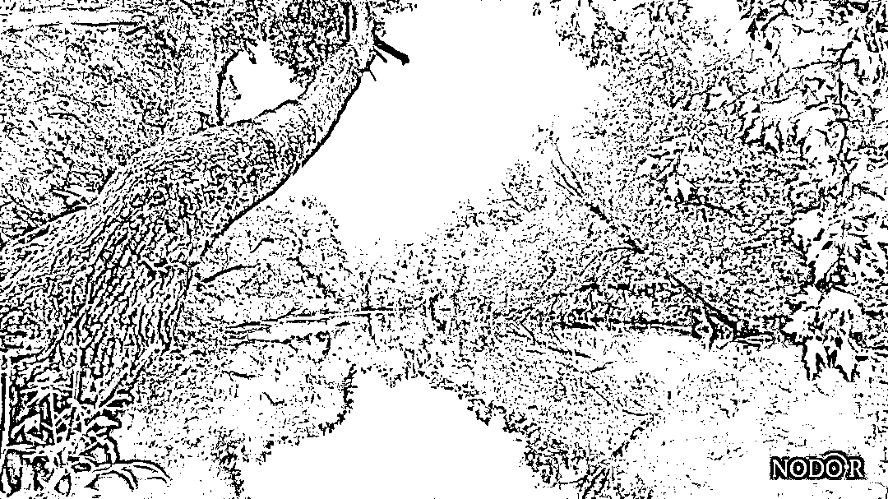

新的一期若道核心课开始讲到**内行星**的部分啦。

在第五堂课中，咔咔老师进行了**水星、金星以及火星**的前半部分的讲解。水星、金星、火星是描述**个人特质**非常重要的行星。**其中金星是代表亲密关系和吸引力的行星。**那么：

*   **大家能够从照片中猜出一个人的金星星座吗？**

*   **不同金星星座的特质是如何体现的呢？对比起来有什么特征呢？**

**关于这些，咔咔老师是这么讲解的：**

<mpvideosnap class="js_uneditable custom_select_card channels_iframe videosnap_video_iframe" data-pluginname="videosnap" data-id="export/UzFfAgtgekIEAQAAAAAAYpMx3WhXOwAAAAstQy6ubaLX4KHWvLEZgBPEj4F0HntRUIeCzNPgMIuAcF3iwAH12LWSoQTtD6eQ" data-url="https://findermp.video.qq.com/251/20304/stodownload?encfilekey=rjD5jyTuFrIpZ2ibE8T7YmwgiahniaXswqziaicKDe8lOmIwynudSVkoc2ia4kz4f80G3yCFCDE9ynmymibD8hrkzGHVp2wdOSdfvzOLdQGBmzzHEmwAKpfuLyXdQ&amp;adaptivelytrans=0&amp;bizid=1023&amp;dotrans=0&amp;hy=SH&amp;idx=1&amp;m=&amp;scene=0&amp;token=cztXnd9GyrFyN27BxQ7oQwibmc79uwEbbqF8kNVG3uHzNUdBEGAYmmuibBw9kHQPKOaedcQxn7q3U" data-headimgurl="http://wx.qlogo.cn/finderhead/PiajxSqBRaEJYnVsqWfEX9qA0sI6hNVKsDfyzfPZ92WZMZyBpZWU5NA/0" data-username="v2_060000231003b20faec8c4e68a1ec2d4ca07e434b07755bbf47e7053a3059defd2c9d6c68a20@finder" data-nickname="若道" data-desc="#若道核心课 如何能够从照片中猜出一个人的金星星座？不同金星星座的特质是如何体现的呢？对比起来有什么特征呢？
" data-nonceid="7862518110315310636" data-type="video" data-width="880" data-height="504"></mpvideosnap>

**欲知更多详情，欢迎大家购买我们的课程，获得完整版教学内容。**

**拥有****51 年****占星实践经验的****若道创始人****前 ISAR 全球副主席****前 ISAR 全球职业占星师资质认证主席****大卫·瑞雷**

**和**

**2019 年第二届、2021 年第三届核心课中**

**与苏·汤普金斯老师****联合授课****的**

**ISAR 认证职业占星师**

**咔咔（Caroline）**

**二人合力打造**

**2022 年 ****若道全新核心占星课程**

**点击下图了解课程信息********报名直达入口**

# 职业占星师认证文凭课程插班中丨想看大卫老师是怎么做课堂演示的吗？

> 原文：[`mp.weixin.qq.com/s?__biz=MzA5NjA0NTAxNg==&mid=2651491260&idx=3&sn=ba2512c76e3eb0346d89696fd9407a55&chksm=8b48390bbc3fb01dcd7d24c94e4025c9163c2255d8308864160971ebfbcf2ff156bf2b9b2af2&scene=126&sessionid=1692737741#rd`](http://mp.weixin.qq.com/s?__biz=MzA5NjA0NTAxNg==&mid=2651491260&idx=3&sn=ba2512c76e3eb0346d89696fd9407a55&chksm=8b48390bbc3fb01dcd7d24c94e4025c9163c2255d8308864160971ebfbcf2ff156bf2b9b2af2&scene=126&sessionid=1692737741#rd)

**在若道核心课程的教学里，****以学员为案例****进行课堂的占星咨询演示，是我们课程的特色环节。**

这样的演示不仅让很多同学有亲身体验咨询的机会，而且这么多真实案例的学习，会让大家看到占星咨询到底是怎么样一个过程。毕竟，大部分人的学习都是要从模仿开始。

记得若道君当年学习占星的时候，可没有这样的机会。那时候主要是听课为主，后来，我们在多年的教学实践中，**越来越发现课堂演示的重要性**。因此，就把这个作为一个主要环节加入到课程中。

在新一期的若道核心课程中，咔咔老师和大卫老师这对组合就会把这个教学特色充分发挥出来。**熟悉中国同学思路的咔咔老师会以知识点的讲解为主，而有 50 年占星咨询经验的大卫老师，则以课堂演示为主。**

有时候，这样的课堂演示的功效是出乎意料的。

一位若道的老同学赵震宇这么写到：

2018 年，我正式开始在若道学习 L1-5。其实我一开始的心态更多的是希望得到系统化的学习来补充我的知识漏洞，以及拿到一个证书可以为自己做背书，增加自己将来转型占星师的筹码，而不是真的在期待可以从若道的学习中得到一些本质上的领悟。

事实上在初期的 L1-3 中，很多知识与课上的内容，也是我比较熟悉的领域，相对而言是驾轻就熟的。但在 L3 的工作坊中和大卫老师的接触以及模拟咨询，让我对占星的态度发生了很本质的变化。

大卫老师对我星图的分析不仅非常准确，更重要的是，他开启了我自身个人成长上的变化，从而成为了我本质上进化蜕变的一个契机。

在短短的 6 个月内，我对人生的认知、对自我的认知、对于人生看待的方式都发生了翻天覆地的质的变化。我意识到了原来跳出自己一直以来无意识间重复的模式，是一件可行、并且会给自己带来无限成长提高自己人生幸福度和质量的事情。这也让我深刻体会到了人本主义占星学的魅力，以及自己之前是多么的“无知“。

于是现在，占星学对我来说，不只是兴趣、宗教信仰、或者是可能的职业道路，而是一种激发自己和他人人生成长和蜕变的工具、一种让自己更幸福的看待世界的方式。哪怕我之后并不会以占星为生，它依然是我人生中不可或缺的一部分，就像一副隐形眼镜，影响着我与世界的互动。

而被大卫老师咨询深深影响的同学还有很多。

**这里，我们节选一些短小的试听片段，让你稍微感觉一下在若道核心课程上，大卫老师的咨询演示是怎样的一个样子。**

**片段一**

<mpvideosnap class="js_uneditable custom_select_card channels_iframe videosnap_video_iframe" data-pluginname="videosnap" data-id="export/UzFfAgtgekIEAQAAAAAAMKsWN6BUygAAAAstQy6ubaLX4KHWvLEZgBPEnoIULgMKKb-DzNPgMItC2ZEgiEDMBYjrYHv9wNsO" data-url="https://findermp.video.qq.com/251/20304/stodownload?encfilekey=rjD5jyTuFrIpZ2ibE8T7YmwgiahniaXswqzQNpbBXpPP4TxDf43veVhCBACOECUZ1gc5HaUbhk0Z3Glc94tZFe7ewRHOH9L2oUC1X3aOe13K8IHMkEou9Nkgw&amp;adaptivelytrans=0&amp;bizid=1023&amp;dotrans=0&amp;hy=SH&amp;idx=1&amp;m=&amp;scene=0&amp;token=x5Y29zUxcibCEaJsXB0hMdWnJvmNct4OnXZaaWOd32ia2edkK2LTMk7jmjOms6bDk5TDtYTqEwbOQ" data-headimgurl="http://wx.qlogo.cn/finderhead/PiajxSqBRaEJYnVsqWfEX9qA0sI6hNVKsDfyzfPZ92WZMZyBpZWU5NA/0" data-username="v2_060000231003b20faec8c4e68a1ec2d4ca07e434b07755bbf47e7053a3059defd2c9d6c68a20@finder" data-nickname="若道" data-desc="#若道核心课 大卫老师用星座、行星、宫位来探索一位同学出生星盘主题的时候，他回顾了解读星盘的优先次序" data-nonceid="7723748345640460016" data-type="video" data-width="544" data-height="344"></mpvideosnap>

**片段二**

<mpvideosnap class="js_uneditable custom_select_card channels_iframe videosnap_video_iframe" data-pluginname="videosnap" data-id="export/UzFfAgtgekIEAQAAAAAANycuUwRANAAAAAstQy6ubaLX4KHWvLEZgBPEhYJ0WjYILr-DzNPgMIvjhT14ogdLw3BWd0Tg37w0" data-url="https://findermp.video.qq.com/251/20304/stodownload?encfilekey=rjD5jyTuFrIpZ2ibE8T7YmwgiahniaXswqz3Oj8zjAwTAIicKkuWErGfL3ZtYr95eTZl2oMcAx9ibThSN3gay2CmF6o8ht96zOZHdxGiaIMmdbGNtWv9Prb3wriaA&amp;adaptivelytrans=0&amp;bizid=1023&amp;dotrans=0&amp;hy=SH&amp;idx=1&amp;m=&amp;scene=0&amp;token=AxricY7RBHdV28gAuQuwABhG0G0QgmYSkh8LH68lEdHu6yrDYj099TFZVSWWqINaQTuTQ2p1ZMF0" data-headimgurl="http://wx.qlogo.cn/finderhead/PiajxSqBRaEJYnVsqWfEX9qA0sI6hNVKsDfyzfPZ92WZMZyBpZWU5NA/0" data-username="v2_060000231003b20faec8c4e68a1ec2d4ca07e434b07755bbf47e7053a3059defd2c9d6c68a20@finder" data-nickname="若道" data-desc="#若道核心课 占星学如何反应职业选择？" data-nonceid="629392412247480278" data-type="video" data-width="544" data-height="344"></mpvideosnap>

**片段三**

<mpvideosnap class="js_uneditable custom_select_card channels_iframe videosnap_video_iframe" data-pluginname="videosnap" data-id="export/UzFfAgtgekIEAQAAAAAAl_sREJMyhwAAAAstQy6ubaLX4KHWvLEZgBPEtIIkIkRmL7-DzNPgMIsA5PpGB3ReSAYx6ZfSNfZ1" data-url="https://findermp.video.qq.com/251/20304/stodownload?encfilekey=S7s6ianIic0ia4PicKJSfB8EjyjpQibPUAXolGhicE2gfRuDzIVwyXxBFlWMzxMczGgPzOG5ja3tyfwYQrAcOUkpGicEE1j6fc9zHAjg5IF1HDBibf9k85ybbAfdqQ&amp;adaptivelytrans=0&amp;bizid=1023&amp;dotrans=0&amp;hy=SH&amp;idx=1&amp;m=&amp;scene=0&amp;token=x5Y29zUxcibCEaJsXB0hMdeqQ56SUWMj15o3Z7wyXeQ6ruia8FGLMtcPAnn3TQl6hkia66nOjynB8M" data-headimgurl="http://wx.qlogo.cn/finderhead/PiajxSqBRaEJYnVsqWfEX9qA0sI6hNVKsDfyzfPZ92WZMZyBpZWU5NA/0" data-username="v2_060000231003b20faec8c4e68a1ec2d4ca07e434b07755bbf47e7053a3059defd2c9d6c68a20@finder" data-nickname="若道" data-desc="#若道核心课 如何从出生星图的基本要素看到案主生命发展的故事和个人成长经验？
" data-nonceid="6689802853667419635" data-type="video" data-width="544" data-height="344"></mpvideosnap>

**若道新一期的核心课程在****8 月 30 日****正式开始**，如果你有很浓厚的兴趣，不仅仅是因为好奇想浅尝一下占星学，但还没有想清楚是不是要学习整个 L1-5 的课程，**那么 L1-3 可能是一个不错的选择。**

**谁是你的老师？**

**占星师咔咔（Caroline）**

2010 年师从美国占星师大卫·瑞雷学习，并得到世界名师斯蒂芬·弗里斯特、罗伯特·汉德、苏·汤普金斯传授各种占星学技法。若道首届学员，国内最早获得 ISAR 职业占星师资质的职业占星师，多次担任若道核心课程助教，2019 年第二届、2021 年第三届核心课中和苏·汤普金斯老师一起教授若道核心占星课程。

在国际知名广告公司和市场研究公司从事的市场研究和推广工作十余年，曾任职于阳狮集团、尼尔森市场研究有限公司、MTV 和《Madame Figaro》杂志。

**大卫·瑞雷（David Railey）**

*   **I****SAR 董事会成员，ISAR 全球副主席，ISAR 全球职业占星师资质认证主席，若道占星创始人**。

*   2016-2019 年，被选为国际占星协会（ISAR）考试委员会成员，国际占星协会（ISAR）是世界最大的国际占星机构，会员遍布 47 个国家。

*   2017-2020 年，被选为国际占星联盟（ISAR）考试委员会主席，理事会成员。

**助教王嘉祺 （Conrad）**

ISAR 认证占星师、若道认证生时校正资质，从 2010 年起自学占星学，2015 年开始在若道系统学习，并开始个案咨询。2018 年担任若道核心课程助教，以及卜卦占星学和太阳返照选修课助教，并带领学员进行经世占星和太阳返照方面的研究。2019 年 11 月作为演讲人之一参加了国际占星协会（ISAR）北京大会，也是 ISAR 星空俱乐部中国区第 16 期的主讲人。

**内容是什么？**

**ISAR 认证职业占星师的独有培训**

目前占星学的培训市场鱼龙混杂。而 ISAR（国际占星研究协会）是一个包含了 47 个国家在内的国际占星组织，多年来致力于占星的教育和研究，提升占星教育的品质和职业占星师的能力，在国际占星领域备受尊重。

**2022 年，鉴于对若道在占星教学领域所做的持续努力和高品质的课程服务，ISAR 特别授予若道核心课程为 ISAR 文凭课程，所有在若道学习，并通过若道毕业考试的同学将获得 ISAR 颁发的学历文凭（Diploma）。**

如果你想更多了解 ISAR，请点击[【这里】 ](http://mp.weixin.qq.com/s?__biz=MzA5NjA0NTAxNg==&mid=2651475298&idx=1&sn=b91888b54c14e29068f8b4e2a3452f5d&chksm=8b48ffd5bc3f76c32699f20f5c99e978bbb25551e69d80c70fee361acbd930ba5970ae776cdc&scene=21#wechat_redirect)

**课程费用**

**★ 1-2 阶　****课程费用：3500 元 ****★ 1-3 阶 连报**

**课程费用：11500 元 **

**********转发优惠价：**11000 元（朋友圈转发本课宣保留 24 小时以上，并截图给课程顾问）********

**★ 1-5 阶　连报**

**课程费用：46500 元 **

****转发优惠价：34800 元，朋友圈转发本课宣保留 24 小时以上，并截图给课程顾问****

**退转课程**

**退款原则请详看《教学协议》，如有疑问请咨询课程顾问。**

****2022 L1-3 认证职业占星师文凭课程****

**授课老师：大卫·瑞雷、咔咔**

**直播课开课时间：2022 年 8 月 30 日（周二）**

**授课方式：******网络授课，英文/中文授课，中文翻译****

**费用：** ****1-2 阶**：**3500 元；****1-3 阶**：**11500 元****（****转发优惠价：**11000 元，朋友圈转发本课宣保留 24 小时以上，并截图给课程顾问）******1-5 阶连报**：46500 元**（****转发优惠价：34800 元，朋友圈转发本课宣保留 24 小时以上，并截图给课程顾问）**；**

**课程负责人：王老师**（微信/手机：18510107057，请备注“大卫核心课”）

长按二维码添加课程负责人咨询

**报名直达入口**

# 想要寻觅真实的伴侣，这个宫位有重大的作用！（不是七宫）

> 原文：[`mp.weixin.qq.com/s?__biz=MzA5NjA0NTAxNg==&mid=2651491125&idx=1&sn=b608297da009d5da895a1e17fd684fe4&chksm=8b483982bc3fb094576a2348fabb1ed6b118ad9b58d3e247985c97adc7e0355ac08a3b9f12b2&scene=126&sessionid=1692737741#rd`](http://mp.weixin.qq.com/s?__biz=MzA5NjA0NTAxNg==&mid=2651491125&idx=1&sn=b608297da009d5da895a1e17fd684fe4&chksm=8b483982bc3fb094576a2348fabb1ed6b118ad9b58d3e247985c97adc7e0355ac08a3b9f12b2&scene=126&sessionid=1692737741#rd)

************☆********************后台回复“今日”，给你一句生命态度************

作者/斯蒂芬·弗里斯特
译者/李含 校对/Leisha
编辑/玫瑰 图片/稿定设计 第 4 宫是亲密穹庐（the arc of intimacy）的起始宫位，如果你有星体落入这个宫位，会给你带来怎样的影响呢？来看看哦。另外，斯蒂芬老师马上要在若道开设[【组合图工作坊】](http://mp.weixin.qq.com/s?__biz=MzA5NjA0NTAxNg==&mid=2651488650&idx=2&sn=1e85d4a8913802fc94de33a799934535&chksm=8b48333dbc3fba2b57a5e62718a53172d2e1ae8d5983240063fdca70798314b638ef14a6de4a&scene=21#wechat_redirect)（点击查看课程），如果想跟这位占星大师学习，快来了解详情吧~**第 4 宫****传统名称：**家庭宫

**对应的星座：**巨蟹座

**关联行星：**月亮

**领域：**心灵的根；壁炉；家；宗族或部落 **进化的过程：**理解一个人的原生家庭和教养如何影响心灵的根。带着这样的理解，建立一个自己的健康家园。 **中断序列：**在成人关系中无意识地重复童年时期的心理动力。对于与伴侣建立真正的家庭有严重的困难。无根、无家。

**第 4 宫与家庭生活有很深的关系，因此，是现代占星比对星图中最被低估的关系宫。**它反映了**在关系中我们已经进入了一种彻底的、没有退路的承诺状态**。

直到我们一起住在一个屋檐下，开始分享我们的财产、金钱、生活习惯、日常生活之后，才会真正在自己内心的关系层面触发这种状态。

**从很多方面看，第 4 宫都是真正代表婚姻的宫位，仅仅因为这是家的宫位。**当我们跨过第 4 宫的门槛，我们就跨越了恋情初期模式的爱、信任和性爱阶段。我们实际上是在说：“我在这里建立我的家族，我的家，我的立足点。”这是一个承诺关系的圣杯，第 4 宫捕捉了这种感觉。

现代占星学的实践中，通常以心理学的角度看待第 4 宫——**这是内在的自我，是我们原生家庭的议题。**这些解读在大部分占星研究以及比对星图分析中都行之有效。但这遗漏了许多宝贵的内容。

在工业革命前后，家族的模式开始瓦解。人们渐渐地丧失了对这种绝对永恒“结合”关系的意识。心理学的研究也在这个时期渐渐兴起。

这两个事件同时发生，时间上非常接近。这也许是因为曾经结合、熟悉的承诺关系，现在在我们大多数人身上只剩下一个黑洞，从而产生了一种孤立、悲伤和不安全感。我们现在正在面对我们已经失去了一些什么的事实。

失去的东西很珍贵，很多人甚至都不记得失去的是什么。但是我们知道自己很难受。当人们接受治疗时，他们谈论的大部分都是第 4 宫的问题，甚至是非常具体意义上的议题。**过去我有怎样的家庭经历；我目前的家庭境遇；我的家现在在哪里？这都是与第 4 宫有关的问题。**

这种心理治疗的意象与第 4 宫作为关系宫的形象完全吻合，因为为了要建立属于自己的、健全的家族，你需要搞清楚自己在原生家族中经历过什么。这是否意味着你与今生或前世抚养你的家人发生过什么事？你不必知道这个问题的答案，因为现在理解和解决你与家人的关系只是能帮助你疗愈某些与家人或其他人相关的前尘宿业。要补充一点，**我们最深业力的某个重要部分往往与最亲近的亲人有关。**不论我们得到的养育是健康顺利的，亦或不太理想，在心理学上一个老生常谈的话题是，**我们（后来！）都会被让我们想起自己父母的伴侣所吸引。我们的内心被熟悉的东西所吸引，无论是好是坏，仅仅是因为它看起来很熟悉。**我们寻觅的伴侣可能正好映照了我们所爱的双亲之一——就像理发店四重唱的名曲“我想要一个女孩（就像嫁给亲爱老爸的女孩一样）”。或者，我们可能被与糟糕的父母颇为神似的伴侣所吸引，于是我们着手开始另一场父母“修复”工作，最终从对方身上得到足够的爱。从心理学角度上看，可能有史以来最蠢的话就是“一朝被蛇咬，下次就学聪明了”。在关系中，更像是**“一朝被蛇咬，下次再被咬”——直到我们开始做一些内心功课和疗愈。**这也是我们**需要充分意识到自己第 4 宫能量的原因之一——关于我们的根的能量。****否则，我们会无意识地寻找为我们复制这些能量的伴侣。**此外，在什么样的家庭生活适合自己的议题上，我们需要意识到自身具体的灵魂需求，这可能与我们原来家庭氛围有所不同。如何做到这一点呢？一定程度的人生阅历绝对是有所帮助的，这也就是统计学家们观察到的，结婚的年龄是预测婚姻长久性的一个唯一最佳指标。青少年夫妇离婚的可能性要大得多。**成熟是有帮助的，但仔细考虑一下与我们的第 4 宫有关的能量也是有帮助的。**

第 4 宫可以提供关于两大重要领域的许多洞见：**我们儿时被对待的方式可能给我们的心理带来什么性质的扭曲，以及什么样的家最能满足我们现在的进化需求。**

正确理解第 4 宫，你更有可能找到一个让你感到舒适自在的人。**你们生活在一起很轻松。你们彼此之间有很深的熟悉感。**你觉得你已经认识这个人很久了。**有一种宗族的感觉，一种部族的感觉，一种温暖的、灵魂深处稳定联系的感觉。**

**这种感觉是承诺关系的核心。**作为有意识的成年人，为了深刻地感受到两个人在一起是正确的，我们需要成功地驾驭第 4 宫。

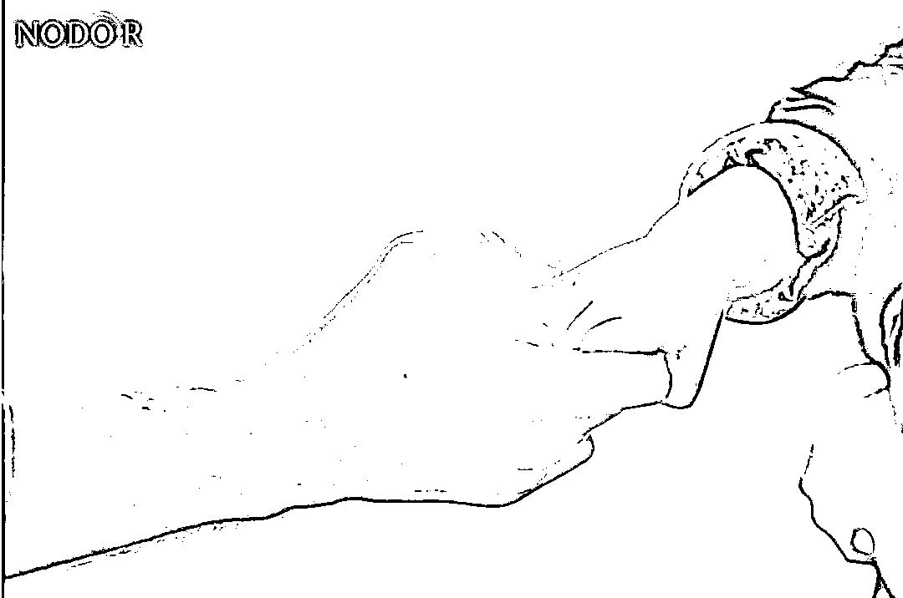

**不同星体落入第 4 宫****太阳落入第 4 宫**这个落点的进化意图是**在性格中培养出向内与内省的特质，甚至可能要培养一些审慎。**也许这是个棘手的问题，因为你**确实需要确保自己不会深深地陷入自己主观的内在世界，与世隔绝，但你要用这种私密的内心对话来喂养太阳的活力**。**缺少这种对话，你的精力会消耗殆尽。**这可能是一种对业力模式的反应，这种模式涉及**太多时间在公众视线或公共生活中，你觉得缺乏个人隐私，需要计算每一句话的影响。**或者，你只是**残存了前世作为部族首领担当权威角色的灵魂记忆。****你对心智头脑有着深刻的理解，而且也因此对家庭或家人有着深厚的责任感。**真正了解你的人不会太快就从害羞或逃避亲密的角度来解释你性格的这些部分，尽管有些自诩为心理学家的人会这样评判你。**你最容易和与你一样内向型的人相处，那些人也在内心找到了类似的沉默。**这样的人就**不会去评判你缺乏必要的外向性**。社交圈的花蝴蝶认为你身上无法触及的部分，在一个更深沉、更安静的灵魂看来也许是令人耳目一新的敏感性。**家族成员的关键品质：**能够尊重内省的需要；沉默的天赋；愿意对一个地方作出承诺；把家庭生活放在所有超凡脱俗的考量之上。**与你同一屋檐下不能有的：**侵扰。
**月亮落入第 4 宫**

月亮是第 4 宫的天然宫主星，所以这个落点的进化目标围绕第 4 宫的两大基本驱动力：**静静的沉溺于内心深处；建立一个持久的家。**

前世里，你可能**有过背井离乡的流放经历，或许只是在你的灵魂记忆深处残存着对家的眷恋，深刻的家族身份认同感，深厚的乡土之情。**不管哪一种情况，**独自进行自我探索都会滋养你**。缺少了这种休息时间，你会变得不明确，疏离，没空做其他事。

**矛盾的是，这可能会给人一种缺乏感情或肤浅的印象。**你的安全感来自于**深深扎根的感觉**——在你和世界之间建起堡垒，有一个温暖的壁炉置于其中……它的意义不仅仅是一个壁炉。这种温暖基本上**来源于人：与故友知己的承诺、稳定关系，家庭的欢乐，养育行为， 对土地、家人——也许还有你的祖先怀有无限的崇敬之情。****家族成员的关键品质：**情感陪伴**与你同一屋檐下不能有的：**冷酷

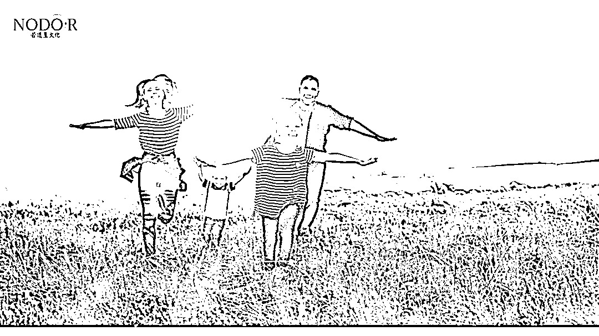

**水星落入第 4 宫**
这个落点的进化目标是要**创建一个风气氛围有点像沙龙的家，人们聚集在此交流新鲜的理念和观点。**这个目标或许是**回应家族让你感到无聊、窒息、被禁声、被审查的业力历史。**或者你**承载了灵魂记忆里充满心智活力的家庭环境。**虽然家庭生活的内容显然比讨论小组更多，但你最好**确保考虑一起生活的对象原则上愿意时不时地参加这种聚会。**这些事本身并没有很重要，但是却能够提供给你一个绝佳的晴雨表，反映了你对有刺激性的家庭生活的更大需求，正如你的出生水星所反映的那样。**家族成员的关键品质：**充满好奇心；健谈；活力充沛。**与你同一屋檐下不能有的：**思想封闭，反应迟钝。**金星落入第 4 宫**

**你优雅美丽的金星能量充沛，根深蒂固，也许并不会在初见时立即显现出来。你对别人的吸引力会逐渐增长。**部分是因为**你不会很快信任他人**，我发誓，这绝不是什么缺点！

金星落在传统的家庭宫，其中一个进化目标就是**学着与伴侣享受清静和休息时间**。另一个目标是**构建一个美好、和谐、文明（取这个词的最佳意义）的疗愈家庭氛围。筑巢**对你而言非常重要。同样重要的还有，**与家人或老友共度宁静时光，这些老友可能富于创造力和文化修养。**

这种反应可能源自**业力模式中亲族之间缺乏爱或亲切——亦或者仅仅是太过粗鲁**。或者你可能正在享受成功家庭生活的快乐动力。无论你在这一世原生家庭中学到了什么样的相关模式，无论是否健康，都会一直强有力地影响你的相关行为。

因此，明智的做法是**努力理解这些早期模式可能是什么，以及它们现在是否对你有益。**这种早期的模式**可能就是充满爱的，也可能表达了金星阴暗的一面，可以总结为虚假的微笑、操纵和隐藏在美好表象背后的现实。**

完成了这些工作，你就有能力与伴侣和家庭建立一种深厚而持久的关系，这种关系近乎神圣，并在这样的关系中建立一个真正的避风港。 

**家族成员的关键品质：**卓越的人际关系技巧；敏锐的审美能力；优雅**与你同一屋檐下不能有的：**粗鲁。**火星落入第 4 宫**

**火星的火能量与你最深层、最内在的核心相关。**剥去层层外衣，迟早你会认识到自己本性中富有韧性的核心。你是完美的幸存者。这个落点的进化目标关于**坚持你内在的力量、勇气和生存能力。**

**可能在你的业力历史中有过不够强势坚定的情况，要么是在面对亲族的成员时，要么是为了保护他们**——或者你可能仅仅是**继承了保卫家园和家庭的正义战争的灵魂记忆**。无论哪种情况，都有**对家园、土地和所爱之人遭受攻击的灵魂记忆**。

**你正在学习如何强烈地保护你的家园以及与你共享家园的生命。**不利的方面是，任何落在出生星图中第 4 宫的配置，尽管对个人本质而言都是非常基本的存在，但也**经常难以被发掘出来**。

再加上火星是关于愤怒的行星，我们可以理解你为何**倾向于将怒火压抑于心中，在沉默的表象之下堆积爆发。**你不必如此，但避免这种模式需要你的努力——**一个时不时愿意（被你的火能量）烫伤一点的伴侣或许可以帮助你在这个困难的领域里找到平衡。** 

**家族成员的关键品质：**强大，强烈的忠诚，坚韧，冒险精神**与你同一屋檐下不能有的：**怯懦

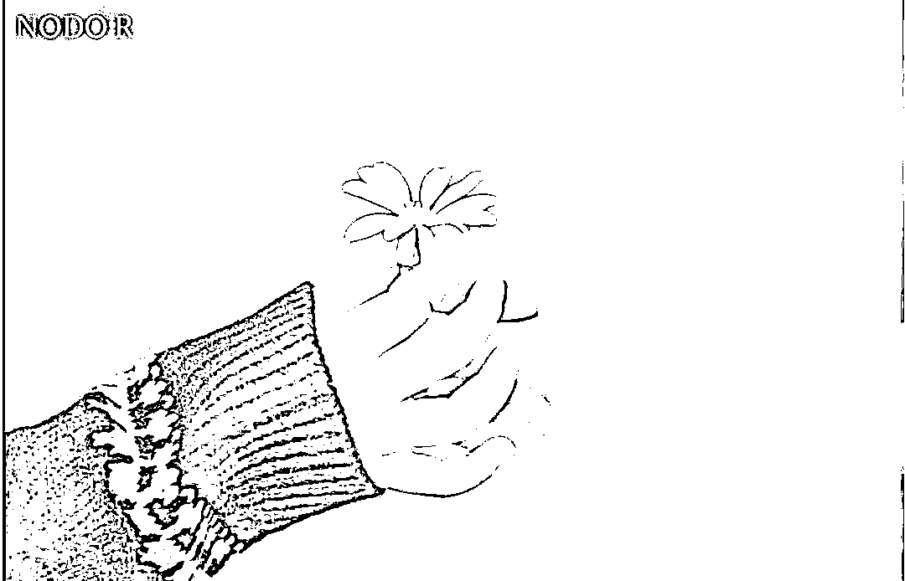

**木星落入第 4 宫**

当宇宙圣诞老人落入了你的第 4 宫，意味着你的进化目标是**让家中充满宽厚、慷慨、健谈、容忍的氛围。**想象一下，一位神话中的统治者坐在金光四射的王位之上，在乐工与朝臣的环绕之中，开怀大笑，庆祝国家的丰收，你就能渐渐勾勒出你心目中理想家园和家庭的原型。

这里的业力模式暗示了关于**家庭幸福和喜悦的一种持续的“内在种子形象”**，或者是对前世家族的反应，在前世家族中，**占据主导的是一种基本的匮乏感，或是清教徒式的限制。**所以在这一世，你**希望拥有总体上丰富的生命，特别关注家和家所在的土地。**

为家砸下重金，装饰它，让它发光，在它身上挥洒爱，为它骄傲，并且欢快地敞开大门欢迎对你而言亲爱的、珍贵的、有意成为你家人的人。 

**家族成员的关键品质：**乐观，慷慨，幽默，不会显得狭隘小气**与你同一屋檐下不能有的：**总是态度消极，节俭**土星落入第 4 宫**

你的进化意图是**体验对家庭生活责任的认真、深思熟虑的态度和行为**。在前世的业力中，可能有两种剧情：**你或者你的伴侣对于两个灵魂同意成为“一个家”的深刻承诺有所犹豫，包括这个神圣仪式中所蕴含的所有原型奥秘**。

或者，**有一些无法抵抗的、艰难的外部环境抹去了家庭稳定和幸福的可能性：贫困、政治压迫、饥荒。**

**你在原生家庭中也有一些经历可能反映了你前世的生活经历，让你对再次接受这种程度的脆弱性感到犹豫或谨慎。**你的天选伴侣是为帮助你克服这种恐惧而量身打造的：**可靠、值得信赖、成熟、脚踏实地。** 

**家族成员的关键品质：**正直，成熟，能干**与你同一屋檐下不能有的：**幼稚，不切实际或轻浮的自我放纵。**天王星落入第 4 宫**

这个落点的进化目标是**建立一个能够支持个性发展，而不是压抑个性的家。**这个位置强烈暗示**在前世业力中，你的家族误解了你或压制了你，你无法融入，甚至可能经历了被谴责和流放的创伤**。

**在内心深处，你是一个非常独特的个体，当你解决业力创伤时，你的独特性将越来越多地体现在你高度个性化的家庭选择、装修风格，可能还有生活方式中。**在厨房里放电脑又不犯法，把客厅弄成录音室或是飞机库又有什么不可以 …… 质疑这种原则哪怕一秒的人都不会是你的伴侣，也无法轻易地与你居住在同一屋檐下！ 

**家族成员的关键品质：**独立，反传统，对社会压力有免疫力**与你同一屋檐下不能有的：**刚愎自用，索然无趣，盲目的服从于传统习俗

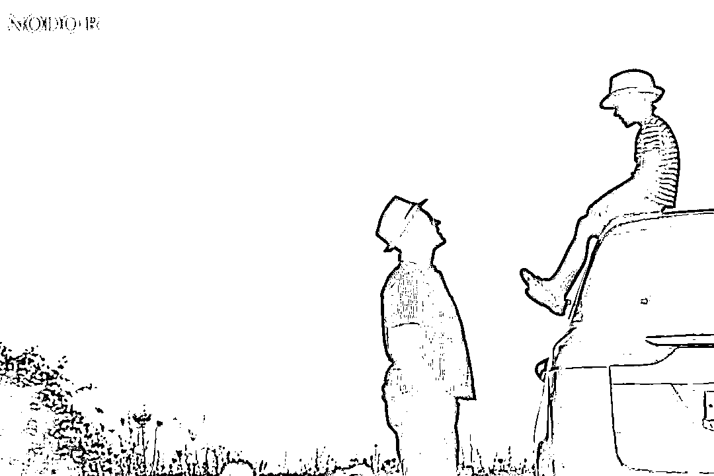

**海王星落入第 4 宫**

进化成长的意图是**要建立一个家来培育生命中更敏感、神秘、沉思、灵性的维度。**让你对过往业力做出反应的可能是**你前世的家族减轻了你身上这些品质，亦或是你仅仅携带了修行生活的灵魂记忆**。

**你是个非常敏感的人，这种敏感必须在你的家庭生活中得到尊重。**积极面是，你的家会需要有**悠扬的音乐环绕、间接的照明，或者放有圣像**。消极来看，你可能**很轻易被家居环境中不和谐的影响力惹得烦躁不安**：别人都没注意到的噪音、异味、其他家庭成员糟糕的态度等。

**走进某些教堂或寺庙，你会感受到一种崇高而空灵的感觉，那就是你在这个世界上的天然避难所的共鸣。**  

**家族成员的关键品质：**敏感，接纳神秘主义**与你同一屋檐下不能有的**：无神论者，僵化的线性思维，或是不支持冥想的觉知状态。**冥王星落入第 4 宫**

这个落点的进化目标是**建立一个尊重激烈情感、“处理中”和深刻自我表达的家庭大本营。**这可能是在回应未解决的前世动能，这种动能关联到**涉及家族的身体或情感上创伤，所以这一世你需要对家中的动态能量保持绝对的心理诚实。**

**就你的核心而言，你是一个黑暗、狂暴的个体，渴望真相和真实。**这些特质**必须反映在你的家庭生活中，否则你可能会变得幽怨，甚至爱发牢骚**。你的家族中必须有这样的共识，**没有人是绝对温暖阳光，每个人都有更黑暗、阴影的面向，而家是一个不需要隐藏阴暗面的地方。** 

**家族成员的关键品质：**情感激烈，愿意对自己和他人进行深入分析；诚实。**与你同一屋檐下不能有的**：肤浅的、不诚实的或心理上轻浮的。**南交点落入第 4 宫**

**你过去的业力与家人-家-家族对你的强大影响有很大关系。**南交点星座和行星相位的性质描述了影响的心理基调和性质。我们有理由相信其中一些家族影响力有利于你和你的发展，但是以现在的观点来看，你也可能**过多地被他们定义和束缚。**

不论家族给予你的影响主要是正面的，还是富于挑战的，有一点很明确，那就是你**必须仔细检视你的成长过程中原生家庭对你的影响，**否则**你会比普通人更有可能在关系和家庭中再次活出这些模式**。（交点不是行星，因此我们没有列出它们的“关键特性”。）

**北交点落入第 4 宫**

北交点出现在业力过往中我们经历最少的宫位，因此是我们最无知的领域——这里的无知并不是蠢笨的意思！**建立家庭是你经历得最少的事之一。**为什么呢？因为你的南交点落于第 10 宫，意味着**你曾经很大程度上被更为公众的角色所定义**。

北交点所落的星座和相位会描绘更细节的线索，但关键的是，**我们识别出这个人在前世曾经被迫发展出一个生动的外在人格，这阻碍了真正的亲密关系，更别提纯粹的宁静平和了**。

**尽管优先考虑家庭和家族会让你感到尴尬，但这也是你为促进自己的成长而可能采取的最佳行动之一。**北交点所落星座以及第 4 宫的任何行星，都会描述**你应该建立一个怎样的家**。（交点不是行星，因此我们没有列出它们的“关键特性”。）

**版权声明：**本文由若道翻译发布，欢迎转发，反对抄袭。友号转载请申请白名单。

**END** 

**斯蒂芬·弗里斯特**

若道签约老师。进化占星学的创始人之一，当今世界最有影响力的占星大师之一；1985 年，他凭借《内在的天空》一书获得职业占星师协会奖（Professional Astrologers Incorporated Award）。他四次获得占星界最高的占星学联合协会奖（United Astrology Congress Regulus Award）提名，2018 年获得轩辕十四教育奖。

****探索组合图永恒的三角——斯蒂芬工作坊报名中****

斯蒂芬说，我们的组合图表明无论什么状况我们都能熬过去。**组合图也像出生星图一样有行进。**在工作坊中， 我们将**探讨一些特殊的技法和考量，来帮助伴侣们应对生活中的挑战和机遇。**  组合图的推进会出现一些看似难以解决的复杂问题，斯蒂芬老师创造了一种解决这些问题的技法。他将在工作坊中阐述相关细节，基本的问题是：如你所知，要了解一个人 30 岁生日的推进，我们要看这个人出生后 30 天的行星位置。  问题是，组合图与我们在占星学实践中使用的其他星图不同，组合图并不代表某一天的天空。记住，它是基于中点的。**那么我们如何从一个不存在的日期开始 "向下数 30 天"呢？斯蒂芬老师将为我们提供一个行之有效的答案。****本周五就开课了，未报名的小伙伴抓紧啦！****点击下图了解更多详情******20 位来自世界各地的占星师****带来 19 场沙龙——新世界的觉醒****详情可点击下图**

**学习占星学****点击下图了解课程详情**

**微信又双叒叕改版啦，不想错过若道君的推送？**
****就把若道设为****星标****以及点点****“在看”****吧！******▼**

**喜欢就点一下“在看”吧！****报名直达入**

# 本周五开课！ | 斯蒂芬·弗里斯特线上工作坊：探索组合图永恒的三角

> 原文：[`mp.weixin.qq.com/s?__biz=MzA5NjA0NTAxNg==&mid=2651491125&idx=2&sn=849aaaa80ff0d1648724be151ff1ec61&chksm=8b483982bc3fb09490f1d8b050edeea6d5468718ebcffa5cc65605030e7a2eee15e074ed376d&scene=126&sessionid=1692737741#rd`](http://mp.weixin.qq.com/s?__biz=MzA5NjA0NTAxNg==&mid=2651491125&idx=2&sn=849aaaa80ff0d1648724be151ff1ec61&chksm=8b483982bc3fb09490f1d8b050edeea6d5468718ebcffa5cc65605030e7a2eee15e074ed376d&scene=126&sessionid=1692737741#rd)

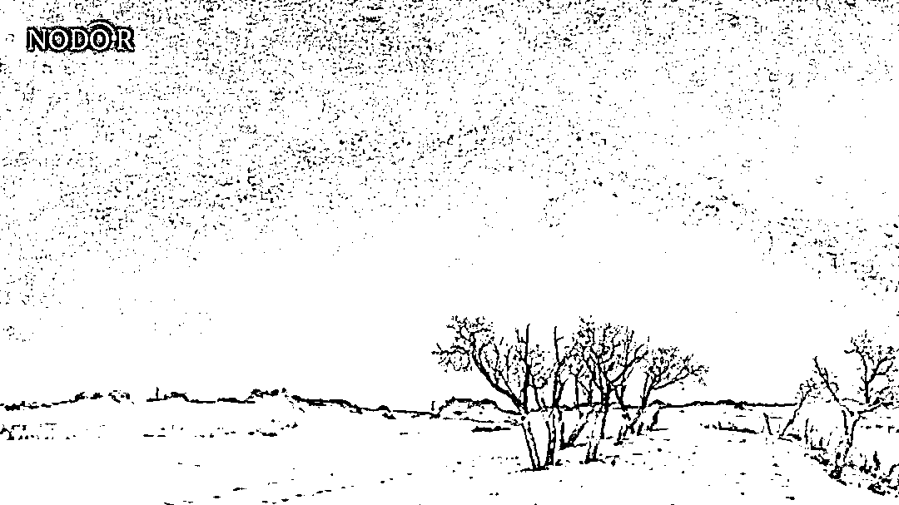

**斯蒂芬·弗里斯特老师**

**若道独家**

**三日线上工作坊**

斯蒂芬说，我们的组合图表明无论什么状况我们都能熬过去。工作坊开始前，斯蒂芬老师建议学员可以搜集更多自己了解和好奇的有效组合图以及关系的故事，先对应学习，方便课上更好的跟随斯蒂芬老师享受这场**"组合图：永恒的三角探索之旅".****特此为大家准备了组合图相关基础知识****转发福利：转发本文到朋友圈，不分组保留 24 小时**截图发送给若道 Maggie

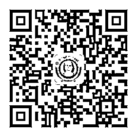

**即可免费获取思维导图完整版**

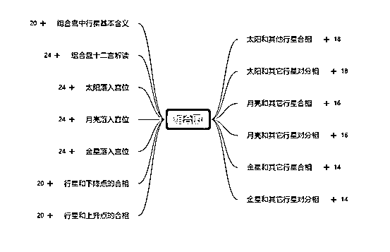

组合图思维导图目录

**组合图（Composite Chart）：取两张出生图的中点组成的星图，组合图象征着这一对案主的关系本身。**在所有情况下，计算组合图中的行星和宫位时，都要使用短角中点，水星和金星除外。1\. 组合图并非匹配度的指征。2. 组合图象征着一段关系的议题和特征。3\. 因此，组合图代表着关系。4\. 一张组合图代表着两个人。5. 你不能将组合图划分成男人和女人，也就是说，太阳和火星不仅仅代表男人，而是代表两个人的男性议题，同样月亮和金星代表两个人的女性议题。6. 解读组合图的步骤与解读出生图的相同。7. 优先顺序和相位容许度与出生图相同。8. 但星图现在被解读为“我们”、“我们的”或“双方”。9. 关系本身是一个实体——就像一个人一样。10. 上升点代表关系的个性、伴侣的外在表现。11. 下降点描绘出他们如何关联、分享和互动的特征和议题。12. 如同出生图一样，你可以对组合图使用行进。

**1**

********此次授课内容********

**组合图描述了如何才能使两个人的关系一直充满活力。**这句话中隐含的意思是假设一段关系有一种区别于这两个个体的独立的生命。有时我们喜欢和一对伴侣共度时光，却从没想过单独见他们其中一人。

我们从这对伴侣身上感觉到的 "频率"是对他们组合图能量的直接体验。在某种程度上，可以简单地理解为：**正如每个人都有自己的星图一样，每对伴侣也有他们的星图。**

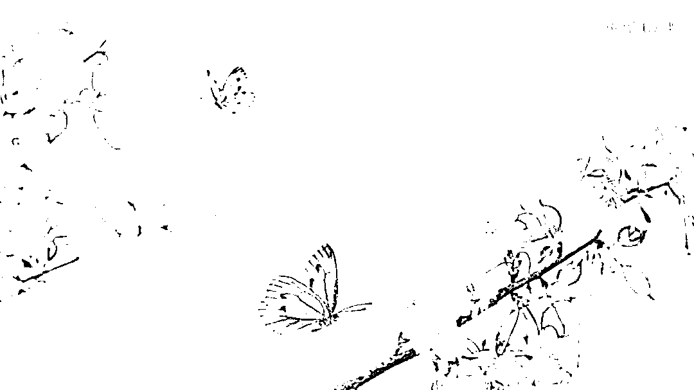

从简单的描述层面上讲，这就是组合图的意涵。记住，我们可以将这一技法用于任何一种关系：**父母和子女、商业伙伴、朋友。**作为进化占星师，我们的目标要比单纯描述走得更深。解读组合图时，可以着眼于帮助人们，而不仅仅是使他们感到惊奇。对于个体来说，出生星图代表了一条正确的人生道路，一条承诺意义、活力、灵性目标的道路。组合图亦然，只不过它将一段关系看成一个独立的个体，而不是两个人。关系也有进化的路径：人们走到一起是为了学习和成长。
个体如果没有领会自己出生星图的要点，会变得疲惫而沮丧。两个人也是如此，**如果没有抓住组合图的要点，我们就会对对方感到厌烦。这段关系似乎也会失去动力。**

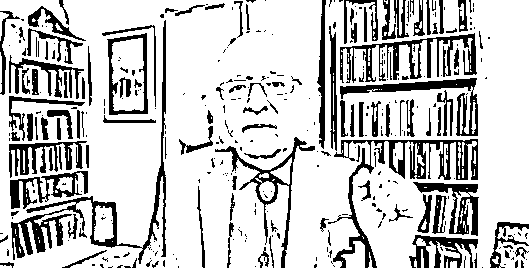

伴侣常常意见不一，陷入困境，看不到前进的方向。三是一个更有动力的数字。三个人投票，二个人以多数票击败一个人，推动事情继续发展。**这实际上解释了这次工作坊的主题：永恒的三角。**

**每对伴侣其实都是一个三人组：你、我以及我们。**组合图所代表的那个看不见的 "第三人"经常会"投出打破僵局的一票"，使关系得以发展。**· **但是如果组合图总是同意一个人的意见，而不同意另一个人的意见，怎么办呢？（这被称为"封建制度"）**· **如果两个人都安静而保守，但他们的组合图却要求狂野的冒险呢？（这是 "文化冲击"）**· **如果它同时均衡地反映了两个人的情况呢？我们可以称之为 "民主"，但我们仍可以区分出一个人天然的智慧比另一个人更强的领域，让擅长的人负责擅长的事，这会促进关系蓬勃发展。换句话说，我们开始看到这个技法的咨询维度了。我们将在这个工作坊中探讨这些内容。两个人究竟为什么会走到一起？**在严肃、复杂的关系中，我们可以假设两个人之间有一些未解决的业力。**如果他们在今生是恋人，但在前世中，一个是父母，一个是孩子呢？也许那些直觉和假设仍可以感受得到，极为错综复杂地使得他们在今生想要成为情侣。**这些疑问将我们引向组合图的月亮交点，在那里我们往往能发现当今人类任何伙伴关系问题的真正核心。**

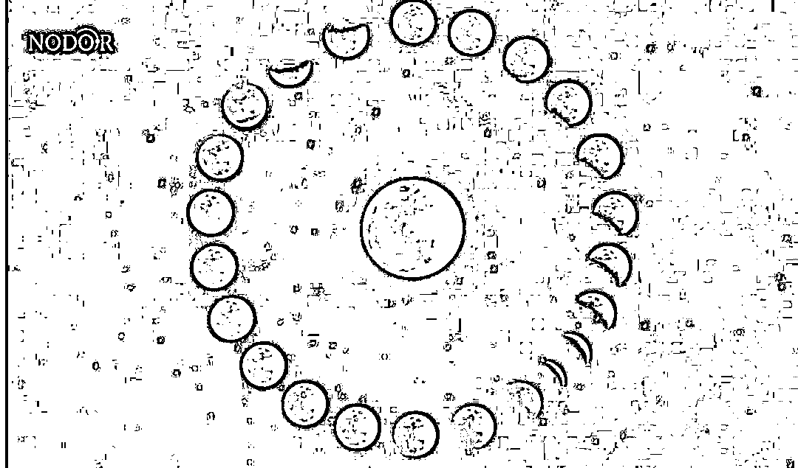

**从理论上讲，组合图是基于中点的。**如果我的出生星图里太阳在摩羯座中段，而你的太阳在双鱼座中段，我们组合图的太阳就在水瓶座中段。换句话说，**在你和我的太阳的中间位置。****其他行星、月亮交点和中天也是如此。**其他宫头的位置，包括上升点则存在一些争议。通常的做法是仍然使用中点，但斯蒂芬老师将会解释他认为这样做存在的技术方面的问题。他更倾向于**使用关系最初开始的地点绘制星图，就像我们使用出生地来绘制出生星图一样。**

**组合图也像出生星图一样有行进。**在工作坊中，我们将**探讨一些特殊的技法和考量，来帮助伴侣们应对生活中的挑战和机遇。**组合图的推进会出现一些看似难以解决的复杂问题，斯蒂芬老师创造了一种解决这些问题的技法。他将在工作坊中阐述相关细节，基本的问题是：如你所知，要了解一个人 30 岁生日的推进，我们要看这个人出生后 30 天的行星位置。问题是，组合图与我们在占星学实践中使用的其他星图不同，组合图并不代表某一天的天空。记住，它是基于中点的。**那么我们如何从一个不存在的日期开始 "向下数 30 天"呢？斯蒂芬老师将为我们提供一个行之有效的答案。**

并非所有的人都处于伴侣关系中，但**作为人类，就需要与其他的灵魂共舞。占星学能够极大地帮助人们驾驭复杂的关系。**了解我的星图如何与你的星图通过相位和宫位的交互而产生互动，是非常有帮助的。组合图包含了这些技法，提醒我们，整体总是大于各个部分之和，而又与之不同。

**2**

********斯蒂芬的占星著作********

**· **1984 年-1988 年间，斯蒂芬写作出版了《内在的天空》（已有中文版）、《变化的天空》和《天空的伴侣》三本占星经典著作，奠定了早期在占星学界的地位。**·** 2002 年-2005 年间，他与朱迪·弗里斯特共同创作了两本经典的关系占星学著作《天空的伴侣 I：爱、性、和进化占星学》《天空的伴侣 II：组合图》。　**· **2008 年，斯蒂芬出版了一本非常重要的著作《昨日的天空》，此书是至今为止关于轮回转世跟星图的清晰对应最详尽的著作之一。 斯蒂芬前后一共出版了 12 部占星著作，在世界占星学界拥有很高的声誉。

**3**

********斯蒂芬获得的荣誉********

1985 年，他凭借《内在的天空》一书获得职业占星师协会奖（*Professional Astrologers Incorporated Award*）。1992 年、1995 年、2008 年、2018 年，他四次获得占星界最高的占星学联合协会奖（*UnitedAstrology Congress Regulus Award*）提名，2018 年获得轩辕十四教育奖。

**4**

********斯蒂芬的占星哲学观********

斯蒂芬的占星风格以**自由和选择**为中心，他的解读不是以下定论的方式来“预测”未来，他**强调如何改善生命，而不是宿命式的论断**。他以心理占星学的语言来解读星图上的人格部分，但是**通过南北交点及其相位和守护星来探索星图所揭示的前世业力与今生方向，在灵魂进化的背景里来整体解读星图。**他认为进化占星学的目的在于**鼓励人们做出更符合进化方向的智慧选择，我们学习去了解前世的时侯，关注点应该集中在如何通过意识来疗愈自己。**

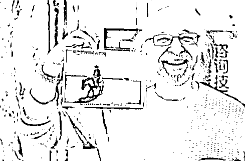

**5**

**这些名人怎么说**

斯蒂芬让我们停止了玩责备命运的游戏，而开始看到自己是一个走在进化路途上的勇士。——奥普拉杂志“*O: THE OPRAH MAGAZINE*”

斯蒂芬和杰夫这两位著名占星师创造性地相互应和，展现出他们出色的教师才华，发展并弘扬了占星这门艺术。（对《测量天空：进化占星学和灵魂的钥匙》的书评）——著名心理占星师 现代占星之父 诺·泰尔（*Noel Tyl*）

请享用斯蒂芬和朱迪这两个博大的灵魂在此书中所提供的洞见大餐吧。（对《天空的伴侣》的书评）——进化占星学的创始人之一 杰夫·格林（*Jeff Green*）

我为斯蒂芬解读的精准感到惊叹，他强调没有一件事是坏得无法挽回的，也没有一件事是如此之好以至于它不会因为现在的错误判断而消失的。我怎样推荐他都不为过！——好莱坞著名影星“钢铁侠”男主角 小罗伯特·唐尼（*Robert Downey Jr*）

**6**

**上过课的占星师怎么说**

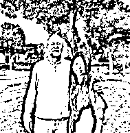

他关于我星图的解读，让几乎所有在场的人掉泪，我也从此开启了一段灵魂追寻的旅程。我很惊讶他透过星图可以如此深入一个人的灵魂。很多东西你自己都不知道，但是他讲出来你会发现，啊，这是真的，这是占星学的神奇。——《心探索》创始人孟想

每个来参加老师课程的同学，都会被老师深深的慈悲心感动。这种慈悲心，并不是表面上说的一些什么话，而是一种从意识层次上发出的能量。每个来上课的人，都能感受到老师的爱。这种爱，并不是盲目的爱，而是深刻地洞悉真相后的慈悲。

——斯蒂芬老师工作坊翻译逸月

斯蒂芬老师的一对一咨询已经排期到两年之后，我特别幸运，曾在课堂上被老师抽中分析过我的星图，老师充满爱与智慧的指引让我更加清晰的认识了自我。内在的潜能、需求和矛盾被老师娓娓道来。——禄丽荣斯蒂芬老师是位非常非常值得推荐的大师，很粉他，这位进化占星学的创始人，对人的理解是那么的全面完整、深刻洞见、慈悲和温暖，就这方面而言足可以媲美我无比崇敬的荣格和史坦纳（这两位去天堂里玩了）。如果你对西洋占星感兴趣，或者对人的所有角度、各个层次的真相和可能性感兴趣，推荐斯蒂芬老师的书和课程，特别是他的课程，数倍的功力大增的好机会，错过真是占星粉丝的莫大损失。——仁华

**7**

**2019 年工作坊学员感悟**

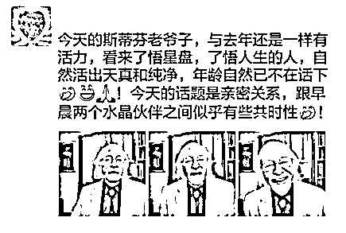

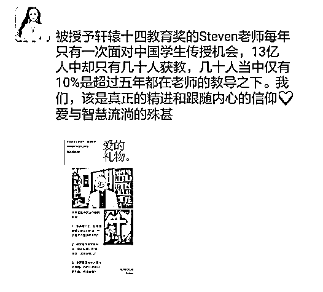

**8**

**什么人适合这门课程**

✦ 占星师或渴望成为占星师的人群。   ✦ 本课程并非针对初学者，需具备若道核心课程 level4 及以上水平，即了解星座、行星、宫位、相位、综合解读等知识。✦ 课程会涉及组合盘解读高阶内容，不了解相关知识的同学，请提前学习相关内容。

**9**

********授课老师********

**斯蒂芬·弗里斯特（Steven Forrest）**

**· **进化占星学的创始人之一，当今世界最有影响力的占星大师之一；**· **毕业于美国北卡罗莱纳大学宗教学专业；**· **1984 年-1988 年间，写作出版了《内在的天空》、《变幻的天空》和《天空的伴侣》三本占星经典著作，奠定了早期在占星学界的地位。前后一共出版了 12 部占星著作，在世界占星学界拥有很高的声誉。**· **1985 年，他凭借《内在的天空》一书获得职业占星师协会奖（*Professional Astrologers Incorporated Award*）。1992 年、1995 年、2008 年、2018 年，他四次获得占星界最高的占星学联合协会奖（*United Astrology Congress Regulus Award*）提名，2018 年获得轩辕十四教育奖。**· **斯蒂芬将自己的绝大部分时间都花在教学以及个人咨询上，他于 1998 年创立了占星学徒计划（*Astrological Appretice Program*），这个计划致力于培养职业占星师；**· **至今为止已经有 600 余位学员完成了培训，其中很多都成为了优秀的职业占星师；**· **他是一位脚踏实地的导师，充满快乐和活力，亲和幽默同时又充满了智慧；**· **他的课程不仅仅是一次占星知识和经验的学习，也是一次与智者的相遇。

**10**

********课程费用********

**价格：6800 元**

**11**

********授课时间、方式、退转********

**授课时间：2022 年 10 月 14 日-16 日（周五、周六、周日）7:00-13:00****具体时间安排：****7:00-8:45****（15 分钟休息）****9:00-11:00****（30 分钟休息）****11:30-13:00**

****授课方式：******线上直播课，英文授课，中文翻译**

**课程退转：退款原则请详看《教学协议》，如有疑问请咨询课程顾问。**

****斯蒂芬工作坊 | 探索组合图永恒的三角****

**授课老师：斯蒂芬·弗里斯特**

**授课时间：2022 年 10 月 14 日-16 日（周五、周六、周日）**

**授课方式：******网络授课，英文授课，中文翻译****

**费用：**6800 元

**课程负责人：王老师**（微信/手机：18510107057，请备注“斯蒂芬工作坊”）

长按二维码添加课程负责人咨询

****报名直达入口****

# 若道周运 10.10-10.16 丨长假结束，到了勇敢做选择的时候啦！（内含 12 星座运势）

> 原文：[`mp.weixin.qq.com/s?__biz=MzA5NjA0NTAxNg==&mid=2651491006&idx=1&sn=aa672ea65c1f5a6b726b0d6f9600f66c&chksm=8b483809bc3fb11f1a669a0c644808a109c825dc170ce202d7f63b6daa9033f42332c497c932&scene=126&sessionid=1692737741#rd`](http://mp.weixin.qq.com/s?__biz=MzA5NjA0NTAxNg==&mid=2651491006&idx=1&sn=aa672ea65c1f5a6b726b0d6f9600f66c&chksm=8b483809bc3fb11f1a669a0c644808a109c825dc170ce202d7f63b6daa9033f42332c497c932&scene=126&sessionid=1692737741#rd)

******☆ ****后台回复“今日”，给你一句生命态度******

作者/Dora ISAR 认证占星师
编辑/翀子 封面/书君 图片/稿定设计**整体氛围**

亲爱的读者朋友，你是怎么度过这个十一假期的呢？

分享一件神奇的事情：前年十一假期，我母亲住院；去年十一假期，我先生住院。今年十月一日清晨醒来，我在床上想，今年的十一会不会还要去医院呢？

我起床遛狗，发现狗狗出现了比较严重的问题。送去宠物医院，当天开刀进行了大手术。于是整个十一假期，我都在宠物医院。

连续三年的十一假期，我都在医院度过。如此多的巧合，让我忍不住打开自己的星图，一探究竟。

我的火星落在天秤座 15°，对分白羊座月亮和土星的合相。10 月正是天秤座的季节，当天秤座的太阳经过我的火星，似乎要对我星图中这组带来意外、责任和挑战的对分相投下一道探照灯。刷得一下，激活这组对分相，让我立刻进入一种应战模式。

细细回想，天秤座月，我生命中发生的意外和挑战真的很多。我自己的一场大手术，居然也是在若干年前的一个十一假期完成的。

虽然太阳的行进很快（一天一度），但却是一个激发器。当它的光芒照亮了星图的某个组合，就会触发该组合的议题。这个体会与我而言，太深刻了！

如果生命中注定有这样的一种模式，让我必须承担照顾他人的责任。我想就这件事情，我有两点感悟：

1、该来的躲不掉，要有足够的勇气和担当来面对自己的责任和义务；

2、顺应天意，尽可能帮助和照顾更多的人。给身边的生灵善意和帮助，这也许能让我的这个组合模式发展出更高阶的意义。

**本周重要天象**

**★ **周一 10 月 10 日 ****

*   ****白羊座满月****

这几年的艰辛，不断压榨我们的底限。要度过漫长的一生，我们需要多少的勇气？这周一开幕，正巧就遇上关于抉择和勇气的议题：**白羊座满月。**

**“勇气不是没有恐惧，而是一种评估，认为有比恐惧更重要的事情。”**——美国作家安伯罗斯·雷德蒙

太阳是自我目标和生命意义的表达，而天秤座关注与他人的关系，涉及更多的权衡。我们需要面对更多关于外交和公平的考验，在平衡与和谐面前，有时需要放弃个性，放弃个人的利益。

白羊座满月（点击可阅读[白羊座满月 | 关系即将面临考验！重点是，它能否抚平你内心的“失衡”？](http://mp.weixin.qq.com/s?__biz=MzA5NjA0NTAxNg==&mid=2651490873&idx=1&sn=e2a279e506d32b44759eb3700ac655b9&chksm=8b48388ebc3fb1988ed489951c859b50bf3f0483ba204d511943a6cf3408898719a7f0f48a12&scene=21#wechat_redirect)）的时候，月亮在白羊座，对分天秤座太阳，就好像在漫长时间里的冲突对抗、纠结犹豫后，终于做出最后决定：我不再彷徨，我要勇敢做自己！我要按照自己的目标去生活！

**这个满月恰好在白羊座的中间度数，**金星合相太阳，处在显著的位置，进一步强调了白羊座-天秤座轴线关于自我和他人/战争与和平的特性。冥王星在满月前一天顺行，我们期待个人生活和社会环境有更大的调整和变革。

在 10 月 25 日的天蝎座日食发生之前，我觉得这段时间相对轻松，**火星、土星、太阳和金星形成风象大三角**，**预示着更多的思考和对问题的讨论，而在天秤座的金星也强调了交流的可能性。**

大家可以看看白羊座满月发生在自己出生星图的哪一个宫位，思考一下自己在生命的哪个领域需要做出选择，是否已经做出了决定。

**★ **周二 10 月 11 日 ****

*   ****水星进天秤座****

水星结束了在处女座的旅行，进入天秤座。水星象征我们的思维、想法、沟通和逻辑，在处女座是有利的位置，这好像是我们经过上个月的反复思考、理清思绪，到了这个星期，水星进天秤座，我们可以开始谈判讨论，并且进行选择了。

**这段时间，有利于我们处理情感合作和社交方面的关系。可以和他人有更多的讨论和互动，沟通自己的想法。**

此时，水星和白羊座的木星对分，和双子座的火星呈宽泛四分相，形成一个 T 三角。在谈判和选择的过程中，不知道是否有争执的火药味、和希望加速解决的急躁。其实这些也是在过程中必须经历的事情。愿你明晰自己的内心，温柔而坚定地实现自己的想法。

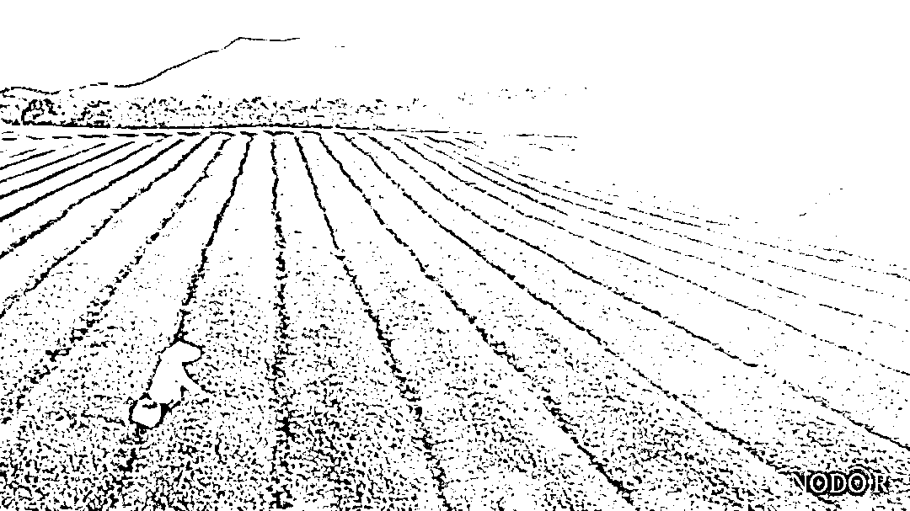

**★****周三 10 月 12 日**

*   **火星四分海王星、水星对分木星**

火海四分相的时候，火星的阳性能量，比如明确的目标、战斗的意志会被海王星的模糊与梦幻消融，就好像白羊座满月带来的高涨情绪会有一些分散。如果只是自我情绪的爆发，那么这个时候，可能要**把“小我”的欲望，融入到更大的人类集体利益中去。**

这时你可能会感到憋屈，目标又一次模糊的远离，有没办法抵达的迷茫。这个时候，不要勉强，试试用其他的方式，改变策略。**或者允许自己慢下来，调整一下自己的精力。**

与此同时，水星还跟木星精准对分，有可能出现观念上的碰撞，自以为是，盲目相信自己是对的，并按照自己的立场、观念说话和办事，但是总有些人跟自己的出发点不同，自己想要说服对方，又或者是进行谈判。

**在水木对分时期，是尊重彼此想法、包容“不一样”的时期，既不需要人云亦云，也不要强人所难。**

这段时间出现过好几次水木对分相了，好像反复在说：兼听则明。

**★****周五 10 月 14 日 **

*   **金星三分土星**

周五出现一个让人感到安心的相位——天秤座的金星三分水瓶座的土星。**金土三分相是对稳定关系的承诺，也是对长期目标的未来规划。**

虽然土天四分相还在不断地给我们带来不安全的感受，但总有些时刻，我们会感到生活中那些珍惜的东西、信任的人，从未远离。也许，我们可以达成新的合作关系，或者获得对未来人生的承诺。人生毕竟有着让我们热爱的理由，无论怎样，都值得我们去付出和珍惜。人间值得。

**12 星座一周运势**

**上升*****白羊座***

白羊座满月发生在你的一宫，生活中的一些重要事件是否已经做出了决定？悬而未决的事情应该很快有了结果。

白羊座木星还在加持你的好运，不过，你最近在朋友中可能不再那么活跃，会慢慢把时间和生活重心调整到工作上。

你需要安静。好好想想自己与他人的关系，也许有什么事情要和重要的人沟通一下。太阳在你的第七宫，多关心自己的另一半。

*****上升**金牛座***

金牛座依然心情平和，这个满月给金牛座带来放松的机会，你可以做一些冥想、登山徒步、绘画写字等活动来滋养身心。如果前段时间有些事情让你感到辛苦，就用这个机会满血复活吧。

工作中的意外和困难还是比较多，不过你非常用心，也能够得到大家的帮助，度过难关。财务方面也要多多留意，小心谨慎一些。

**上升*****双子座***

最近可以多和朋友们联系一下，约上三五好友聚会，共享满月能量。也适合与伴侣家人共度美好时光。总之，多多联系他人，一定会给你带来好运。

最近感觉有些忙碌，精力略有不足，累的时候允许自己玩乐一下，也许就是单纯地陪孩子玩耍，或者就当自己是个孩子，做些有趣的事情，这会给你带来更多的生活乐趣。

**上升*****巨蟹座***

满月和木星都在第十宫，你在事业上也许会有收获，你的细心和努力被同事和领导们注意到，带动了事业好运期的到来。

忙于事业的同时，记得关心自己的家人，常回家看看父母。多和另一半沟通，也许你对感情关系的理解会有很大变化。

**上升*****狮子座***

满月发生在九宫，关于深造学习和国外事务的事情比较容易实现，你也许会得到录取的消息。如果你一直期待一场旅行，那么现在可能就有了一些机会。这是适合开拓新知识领域的时期，无论行万里路，还是读万卷书，你都需要去开阔视野。

可以多和同学、兄弟姐妹联络一下，说不定会给你带来新的机会。关心自己最亲密的人，如果有压力和困惑，不妨敞开心扉，看看问题出在哪里。

**上升*****处女座***

满月发生在第八宫，带动你关注投资理财的问题，也许需要申请贷款、保险理赔，也有可能进行新的投资项目。或者家人能资助你改善一下你目前的财务状况。

本周的工作状况可谓是压力重重，经常需要你去救火。好事多磨，要注意调整自己的心情，注意身体健康。留得青山在，不怕没柴烧。

**上升*****天秤座***

天秤座的七宫被满月点亮，最近是否有桃花运呢？目前你有非常好的人缘和合作意识，是非常适合搞好人际关系的阶段。如果有长期相处的恋人，看看能否主动推进到婚姻之中。

事业上也有机会崭露头角，得到同事们的关注和表扬。

有孩子的天秤座需要注意亲子沟通，不要给孩子太多压力，多陪伴和鼓励孩子。

**上升*****天蝎座***

满月发生在六宫，工作上的事务或日常健康方面的一些事情有了一定的结果，有机会获得更多的工作资源、设备，或者个人的健康状况有了一定的改善。

最近家里的事情可能多一些，也许老人需要你更多的关心和帮助，记得多问候父母。

**上升*****射手座***

射手座这周可以抓紧机会约会哦，也许就把心仪已久的那个人追到手了。已经当了父母的射手座本周可以增进和孩子之间的关系，多和小朋友互动，你会发现他们和你是那么相似呢。

试试在家里创作一个作品，或者多出去玩一下，让自己找些乐子，不要老想些沉重的话题。

在事业上，沟通合作方面的机会增加，记得主动交流，避免不必要的误解。

**上升*****摩羯座***

满月落在第四宫，如果需要搬家、装修房子、探望父母，这周正好合适，也许可以找到满意的房子，或者装修进度大大加速。如果和父母有一些小隔阂，这周很容易解决哦。

事业上也有表现的机会，如果需要出差，去就好了，这次你可能是解决问题的重要人物。

**上升*****水瓶座***

水瓶座们最近感觉压力比较大，各方面的事情都不是很顺。是不是很久没见到好朋友或者兄弟姐妹了？这周不妨来场小旅行，大家欢聚一下。在城市周边走走也是不错的主意。

你如果有机会开展新的课程或者去考试，这段时间是不错的时间点。

我们总有办法让自己平静、开心起来，对吗？

**上升*****双鱼座***

希望满月给双鱼座们带来财富的好运，你有机会收回欠款，或者有新的收入，或者升职加薪。如果有正在考虑的投资项目，也不妨尝试一些。

陪陪父母的同时，也要多陪陪孩子。如果是单身的双鱼座，花点时间去寻找自己的恋爱对象吧。

**祝大家一周平安顺遂！**

**版权声明**：原创文章由作者授权首发于若道平台发布，欢迎转发，反对抄袭。友号转载请申请白名单。

**END**

****Dora****

若道 2017 届核心课毕业生

若道咨询平台占星师、ISAR 认证占星师

心理咨询师、塔罗咨询师、多年企业管理经验

咨询微信：AstrologerDora

公众号：Dorothy 占星文化

**长按打赏**

**20 位来自世界各地的占星师****带来 19 场沙龙——新世界的觉醒****详情可点击下图**

**学习占星学****点击下图了解课程详情**

**微信又双叒叕改版啦，不想错过若道君的推送？**
****就把若道设为****星标****以及点点****“在看”****吧！******▼**

**喜欢就点一下“在看”吧！****报名直达入口**

# 心理占星学丨“抑郁症，不是简单的坏心情”

> 原文：[`mp.weixin.qq.com/s?__biz=MzA5NjA0NTAxNg==&mid=2651491006&idx=2&sn=512d2bb4dda18bd8345d2de9af278337&chksm=8b483809bc3fb11f2f2b79cb8b3adb26012d911317cc6898d8a97afada8e2ee6dffcf5c62ab5&scene=126&sessionid=1692737741#rd`](http://mp.weixin.qq.com/s?__biz=MzA5NjA0NTAxNg==&mid=2651491006&idx=2&sn=512d2bb4dda18bd8345d2de9af278337&chksm=8b483809bc3fb11f2f2b79cb8b3adb26012d911317cc6898d8a97afada8e2ee6dffcf5c62ab5&scene=126&sessionid=1692737741#rd)

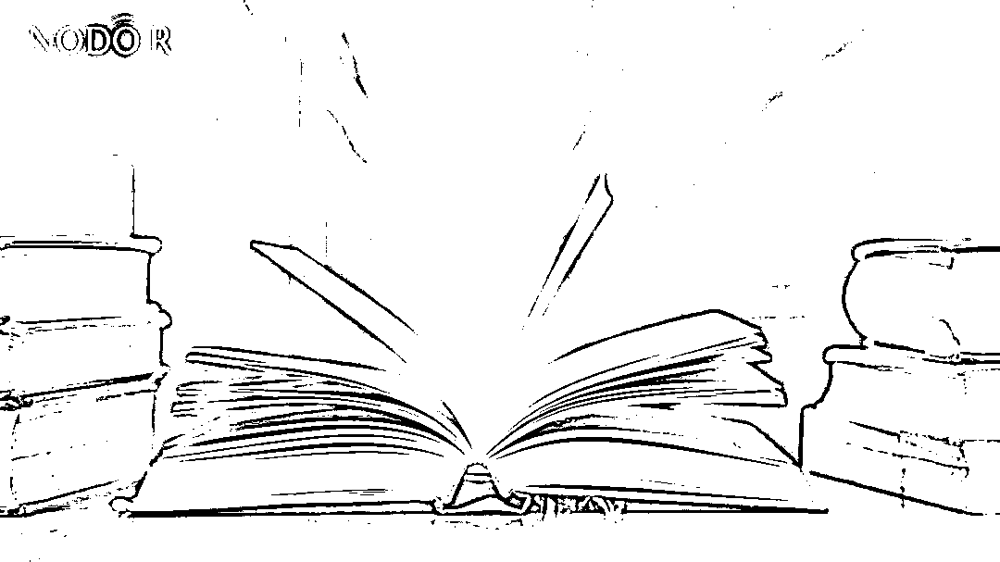

作者/格伦·佩里 

翻译/Christy 校对/Arrow

编辑/翀子 图片/稿定设计

本文选自 http://www.psyweb.com

昨天是世界精神卫生日，这个被称之为情绪上的黑洞的疾病，几乎会吞噬掉生的希望以及快乐的源泉。抑郁症者经受的体验是深刻和无望的，好在，通过合理的治疗抑郁症仍然可以获得痊愈。如果你想从占星学了解抑郁症以及更多的心理学知识，欢迎点击格伦老师教授的 ISAR 选修课[【占星原型与星图中的精神病理学】](http://mp.weixin.qq.com/s?__biz=MzA5NjA0NTAxNg==&mid=2651489261&idx=3&sn=7f330b85d45c81108254be44dcd85f55&chksm=8b48315abc3fb84ceef17e50ce7abf92a3c9fa0f2f973638e66c99c9184119c376fe761bd3ad&scene=21#wechat_redirect)了解详情哦~

**什么是抑郁症？**

**抑郁症是一种心理疾病，患者在几乎一切活动中都深刻感受着无法摆脱的悲伤和日益衰退的兴趣**。**抑郁这个术语也用于描述个人间歇感受到的短暂悲伤、孤独或忧郁**。

与普通的悲伤不同，严重抑郁（也称重性抑郁症）会明显影响个人在社会情境和工作中的行为能力。**重性抑郁症患者常感绝望、无望、没有价值，并伴有自杀的念头**。

任何人，无论年龄、性别、种族、社会经济地位，都可能患上抑郁症。据估计，每年有 1900 万美国人受抑郁困扰。**抑郁症并非缺点或性格缺陷，而是一种实实在在的疾病**。

**值得欣慰的是，经过妥善治疗，4/5 的病人能逐渐恢复健康**。数百万病人正在接受有效治疗。**抑郁症患者并非只是短暂数日的喜怒无常或陷入忧郁，他们悲伤的感觉是长期的，并且对社会和日常活动失去兴趣**。抑郁症改变了个人的感觉、思考和行为的方式。

**抑郁症也有很多种**

如果你被诊断为抑郁症，或许你不知道该如何与家人、朋友及同事探讨这件事。一开始你或许会感到不适，但学会更好地表达自己的感受将有助于你成功治疗抑郁症。

抑郁症的病因并不总是显而易见。可能由某个事件导致，也可能根本没有显著原因。遗传基因也可能导致大脑中血清素不足。抑郁症症状因人而异，包括长期悲伤，无法从日常活动中得到快乐，睡眠或饮食习惯改变，或感觉没有价值。

**抑郁症类型**

**●非典型抑郁症（临床术语）**

有能力通过特定行为让自身感到愉悦的患者。

**●双向抑郁症（临床术语）**

伴有躁狂发作的抑郁症。

**●内源性抑郁症**

无显著病因的急性抑郁症。

**●更年期抑郁症**

发病于年长者群体中的抑郁症（通常与重性抑郁症相同）。

**●反应性抑郁症**

由显著创伤性生活事件引发的抑郁症。

**●重性抑郁症（临床术语）**

没有能力让自身感到愉悦的抑郁症患者。

**●产后抑郁症**

女性产子后引发的抑郁症（通常与重性抑郁症相同）。

**●原发性抑郁症**

不伴随其他生理疾病/失调的单独发作的抑郁症。

**●精神异常性抑郁症（临床术语）**

伴随着妄想和/或幻觉的抑郁症。

**●继发性抑郁症**

在另一种生理疾病/失调基础上发生的抑郁症。

**●单相抑郁症**

无躁狂期的抑郁症。

**出现抑郁症，可能会发生什么？**

抑郁症有多种形式。在**双相抑郁症**（躁狂抑郁症）中，**个体的情绪在抑郁和躁狂间来回波动**。患有季节性情绪失调的人通常只在秋冬两季患上抑郁，因为这两个季节日照时间较短。

在**心境恶劣障碍**中，**个体感觉压抑、自卑，长时间难以集中注意力（常常持续几年时间）**，但症状没有重性抑郁症严重。一些心境恶劣障碍患者有偶发性重性抑郁。心理健康专家用术语“临床抑郁症”代指上述各类抑郁症。

诸多大规模研究显示，过去几十年全球抑郁症患者比例有所增加。同时，相比过去几代人，年轻一代抑郁症的发病年龄在降低。社会科学家给出了许多解释，包括家庭结构的改变、城市化、文化和宗教影响力的降低。

虽然从童年到老年的任何年龄段都可能患病，但抑郁症通常始于 20 岁或 30 岁阶段。一开始发病缓慢，数月或数年后逐渐恶化，或者可能在几天或几周后突然爆发。

**身患重度抑郁症的人看上去极度困惑、害怕、错乱，旁观者谓之“精神崩溃”**。无论病因为何，抑郁症总会极大改变个人的内在感受和外在形象。**重性抑郁患者几乎每天在伤感中度过，时常哭泣。那些曾经带给他们快乐的人、工作和活动也失色了**。

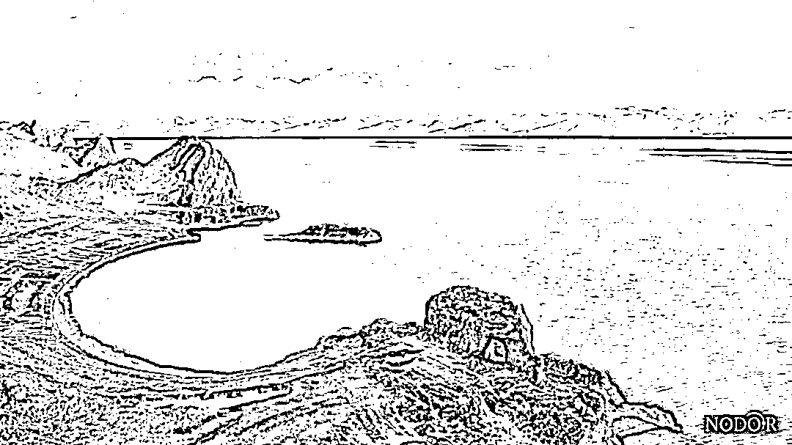

抑郁症症状随年龄不同而表现各异。在儿童群体中，抑郁症症状包括胃痛、头痛等身体不适，以及易怒、“漫无目的地踱步”、不合群及饮食习惯的改变。

**患有抑郁症的儿童可能对学校和其他活动缺乏热情**。在青少年群体中，常见症状包括**悲伤、睡眠障碍和精力不济**。患抑郁症的老年人群体则通常出现生理而非心理问题，这也时常导致医生误诊。

抑郁症症状也会因文化的不同而不同。在一些文化中，抑郁症患者多出现生理问题而非悲伤、愧疚等精神问题。比如在地中海文化地区，抑郁症可能导致患者头痛或神经紧张，而在亚洲文化地区则可能导致虚弱、疲劳或身心失调。

如果不加以治疗，一次重性抑郁发作通常可持续**8 或 9 个月**（一次土星行进的平均时长）。经历过一次抑郁症发作的人大约 85%会在将来再度发作。

**抑郁症常常改变患者的食欲**，有时是增加，但一般而言是减少。**睡眠习惯也会改变**。抑郁症患者可能过度睡眠，更常见的情况是睡眠不足。他们常常在半夜上床，辗转反侧，然后带着疲惫和沮丧在早上 5 点醒来。**对大多数抑郁症患者来说，清晨是一天中最悲伤的时刻**。

抑郁症也改变着个人的能量状态。一些患者可能**焦躁不已，心烦意乱，坐立难安，四处踱步**。而另一些则**萎靡不振，身心交瘁，或感精疲力尽，或如负重担**。抑郁症患者也可能**难以思考，注意力不集中，记忆力出现问题**。

抑郁症患者常常感到**无价值、无助、愧疚和自责**。**他们可能将自己的一次小失败解读为无能的表现，或者将小批评放大为谴责。**一些患者感受着**精神和道德的死亡**。他们的镜子映照出一张丑陋的、令人厌恶的脸庞。

即便是正常人也可能感觉自己有缺陷、残忍、愚蠢、虚伪，或有欺骗他人的内疚感。**重性抑郁症患者可能经历了这些极端的痛苦情绪，甚至考虑或企图自杀**。至少有 15%的重度抑郁症患者选择自杀，还有许多自杀未遂。

有时候，抑郁症患者可能出现精神病症状，比如**妄想（错误信念）和幻觉（虚假感知）**。精神病症状意味着病情特别严重。与其他抑郁症患者相比，出现精神病症状的患者住院时间更长，而出院之后，他们更容易感到喜怒无常、郁郁寡欢，同时也更容易自杀。 

有些抑郁症来得毫无征兆，甚至是在顺风顺水的时候。有些则有着明显诱因：婚姻冲突、财务困境或者其他个人失败。但许多出现这些问题的人并没有陷入深度抑郁。

大多数心理学家认为，**抑郁症的出现是生活压力事件与个人身心缺陷交互作用的结果**。

抑郁症具有家族遗传性。通过研究双胞胎，研究者们发现了基因对抑郁症有强烈影响的证据。在相同环境下长大的同卵双胞胎共同患上抑郁症的概率比异卵双胞胎高三倍，异卵双胞胎只有一半基因相同。此外，同卵双胞胎共同患上双相抑郁症的概率比异卵双胞胎高五倍。

这些发现表明，**抑郁症和双相抑郁症的基因缺陷是可遗传的**。对领养的研究也为基因在抑郁症中的作用提供了证据。这些研究显示，抑郁症患者的孩子即便被养父母抚养长大，依旧容易患上抑郁症。

基因对抑郁的影响可能是通过制造大脑的异常活动来实现的。研究显示，一些被称作**神经递质的脑内化学物质对情绪和情感的管理起着重要作用**。与抑郁有关的神经递质包括**去甲肾上腺素、多巴胺和血清素**。

上世纪 60 年代的研究显示，**导致抑郁症的原因是脑内部分区域的这些神经递质低于正常水平**。这一理论得到了抗抑郁药物的佐证，其效果来自于提升与抑郁有关的神经递质的水平。然而，后来的研究对这一简单解释提出了质疑，并提出了神经递质水平与抑郁症之间更为复杂的关系。

**抑郁症也可能与荷尔蒙失调有关**。许多抑郁症患者有着高出正常水平的皮质醇，这是一种肾上腺在应对压力时分泌的荷尔蒙。此外，不够活跃或过于活跃的甲状腺也可能引发抑郁。

抑郁症也可能源自各种疾病，包括膳食维生素 B6、B12、叶酸缺乏症；神经退行性疾病，比如老年痴呆症和亨廷顿氏舞蹈病；脑前部中风；某种病毒性感染，比如肝炎、单核细胞增多症。一些药物也可能导致抑郁症，比如：类固醇。

**心理学理论下，对于抑郁症认知的演变**

有关抑郁症的心理学理论关注人们的**思考方式和行为方式**。

在 1917 年的一篇论文中，奥地利精神分析学家西格蒙德·弗洛伊德将抑郁症或重性抑郁症解释为**一种对丧失的反应**，无论是诸如丈夫死亡这种真实的丧失，还是未能实现一个重要目标这样的象征性丧失。

弗洛伊德认为**人对于丧失的潜意识愤怒会削弱自尊，导致自怨自艾或自我毁灭的行为**。

有关抑郁症的认知理论强调非理性思维过程的影响。美国精神病学家亚伦·贝克认为，**由于错误的思维，抑郁症患者倾向于从负面角度看待自己、周围的环境和未来**。这些错误包括，**聚焦任何情境的消极方面，从负面角度错误解读事实，把任何不幸的归咎于自己**。

贝克认为，**这种自我挫败的世界观早在童年时期就已习得**。这种负面思维让事情看起来比实际要遭得多，并且增加了患抑郁症的风险，尤其是在压力环境下。

这一认知学观点的支持者认为，**带有“抑郁”性格特质的人比其他人看起来更容易患上真正的抑郁症**。

抑郁性格特质有诸如忧郁、悲观、内向、自我批判、过度怀疑和批判他人、深刻的缺陷感、过度沉思和担忧。此外，经常表现为依赖他人、敌对和冲动的人也更容易患抑郁症。

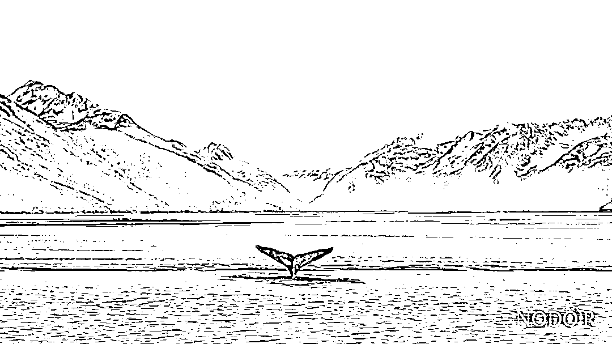

美国心理学家马丁·赛里格曼提出，抑郁症来源于“习得性无助”，一种后天习得的认为个人无法掌控事件结果的信念。赛里格曼的观点认为，**长期暴露在无法掌控和无法逃脱的事件中导致了冷漠、消极和失去动力**。

美国心理学家林恩·艾布拉姆森和同事对这一观点进行了拓展，**认为造成抑郁的不只有无助，还有无望**。

无望理论将抑郁归因于一系列负面思维，在这些思维中**人们将消极的人生事件归咎于自己，认为这些事件的成因是永恒不变的，将单个缺点过度泛化并放诸人生各个领域**。

心理学家赞同，**压力事件能触发抑郁症易感者发病**。比如爱人的离世可能触发抑郁症。通常，心理学家会将真正的抑郁症与悲痛区分开，悲痛是所爱之人去世后正常的悲痛过程（海王星经历）。

其他压力事件还可能包括离婚、怀孕、失去工作甚至分娩。20%的女性在生产后会经历一段时期的抑郁，称为产后抑郁症。此外，有严重疾病或残疾的人常常患上抑郁症。

**儿童时期被虐待的人较之他人更容易患抑郁症，长期生活在压力环境下的人同样如此**，比如带着数个孩子，又缺少或没有亲朋好友支持的单亲妈妈。

抑郁症通常难以摆脱，也无法通过意志力克服。因此，**发作时只能顺其自然直到其自行缓解，或者接受治疗**。**通过抗抑郁药、心理治疗或者两者结合的方式可以治疗抑郁症**。尽管不乏有效治疗的途径，许多抑郁症患者仍未接受治疗，甚至未被确诊。

研究显示，医生至少有一半时候诊断不出抑郁症。此外，许多医生和病人将老年人群体的抑郁症视为上了年纪的正常现象，尽管抑郁症治疗在老年人群体中往往非常有效。

**如何治疗抑郁症？**

抑郁症认知模型是抑郁症治疗中最具实验证据支持的模型。该模型认为**个体的认知、思想和信念决定了行为和情绪**。

亚伦·贝克的名字与认知因果抑郁症模型紧密相连。他曾写道，**当人们基于适应不良性信念和态度错误解读事件时，抑郁症状就产生了**。该模型证明适应不良性认知先于并导致了心理紊乱。

贝克发现“从轻微神经症到重度精神病的各个抑郁阶段都能看到偏离逻辑和现实的思维”。他还指出了抑郁症群体的典型标签，包括**自卑、被剥夺感、夸大问题、自我批评性思维、渴望逃离、死亡或重生**。

抑郁症认知模型有三个原则：

*   第一，认知三联，指消极看待自我、世界和未来；

*   第二，模式，指适应不良性思想和信念模式；

*   第三，认知错误，指伴随着对现实的负面、虚假认知的错误思维。

抑郁症认知模型的三个原则简单易懂。模式是我们解读自己周围世界的方式以及我们如何给发生在我们身上的事件赋予意义。

贝克认为，**要治疗抑郁，患者需要应对他们的适应不良性结论**。因此，心理治疗师的工作是对这种模式发起挑战，然后提出对事件另一种更积极的解读。

抑郁症认知模型的认知理论认为，**人们对事件的归因，对控制和自我效能的认知，以及对自我和世界的信念影响着他们的行为和情绪**。

如果个体的想法和认知是负面的，那么就容易患上抑郁症。认知理论认为，**自我决断和治疗干涉可以改变这种情况**。

最早使用认知视角作为治疗模型是在上世纪 70 年代，那时阿尔伯特·艾利斯开始推崇合理情绪疗法。

作为略同于今天认知行为疗法的一种综合性方法，**合理情绪疗法提倡将个体自我毁灭式的信念转变为积极信念**。该疗法认为，这些信念是大多数心理紊乱背后的主要原因，从根本上对抗它们，就能治愈此类病症。

艾利斯采用的方法被称为**ABC 模型**，考察触发事件，人们与之相关的信念，以及或正面或负面的行为结果，或者产生的那个信念。艾利斯认为，采用这个模型，就能展现不恰当的思维过程如何导致诸如抑郁症之类的病症。

就在艾利斯建立 ABC 模型的同时，一位名叫亚伦·贝克的心理学家发明了**认知疗法**，该疗法认为，**抑郁症和焦虑是由特定的焦虑触发思维模式引起的**。

他的解决方法是，**鼓励患者通过苏格拉底问答法自我检视这些模式**。苏格拉底问答法不提供答案，但**通过反复提问，将这些模式从患者身上剥离出来，帮助患者自己看清那些自我毁灭式的倾向来自何处**。

现代认知行为疗法很大程度上是基于艾利斯和贝克的研究，通过帮助患者找出自我思维过程中的抑郁症根源，并代之以更具建设性的思维，来改善患者生活。在这种方式中，塑造我们的更多是我们的思维方式，而非我们应对世界的方式。

认知行为疗法适用于很多人。**它关注个体当下的现实境遇，而非投射的负面情境**。但对于有的患者来说**，关注未来和之后积极的可能性有助于他们从抑郁状态中抽离出来**。

来自西达斯西奈医院的研究者表示，一种帮助患者创造积极前景的全新治疗方案或能更好地帮助他们应对重性抑郁。接受未来导向疗法的患者在抑郁症和焦虑症方面有极大改善，生活质量也大幅提升。

西达斯西奈医院精神病学与行为神经科学科成人门诊项目论文作者兼医疗主任詹妮思·维豪尔博士称：“最近的影像学研究显示，抑郁症患者脑部负责乐观开朗的区域功能减退。

同时，抑郁症患者通常缺乏技能帮助自己创造更美好的未来。他们设定目标、解决问题或计划未来的能力较差。”

同样来自西达斯西奈医院的阿南德·潘地亚表示：“未来导向疗法旨在教会患者用更积极的方式思考未来，并采取必要行动创造积极的未来经历，以缓解抑郁。”

这一研究首次证明了以提升未来期望值为目的的干涉能缓解重性抑郁症症状。”**（从占星学角度来说，这就像把木星作为解毒药，注入土星之中！）**

传统疗法鼓励人们谈论当下问题和恐惧，关注消极的一面。维豪尔强调：“朝气蓬勃的状态所需要的思维模式或行动，不会在你谈论不开心的事情时产生。”

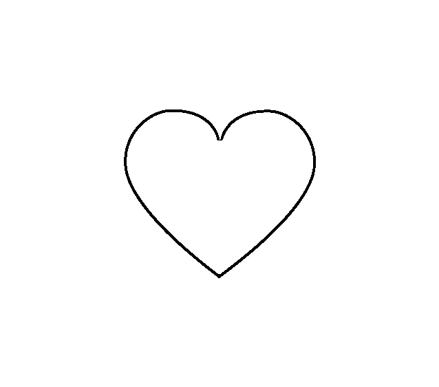

如果被确诊为抑郁症或者是疑似抑郁症的情况，请去医院就医，寻找专业的心理咨询师求助。我们希望你能度过自我的寒冬，并给予你真诚的爱和祝福。

**版权声明：**原创文章由若道翻译发布，欢迎转发，反对抄袭。友号转载请申请白名单。

**END**

**格伦·佩里**

著名占星师，ISAR 董事会成员，共出版八本占星著作；心理/意识研究专业博士；占星心理学学院（Academy of AstroPsychology）的创办人；康涅狄格州研究生院（the Graduate Institute of Connecticut）原型宇宙学与意识进化项目的负责人。

# **占星原型与星图中的精神病理学**

为什么在占星学的课程中，会出现精神病理学的教学内容，这和我们有什么关系？这对占星咨询，或在自我了解与成长的过程中又有什么帮助呢？

**带着这些疑问，请你静下心来，思考以下几个问题**：

“**你/你的案主，是否曾经过度担心什么？** **你/你的案主，有没有感觉到担忧和焦虑，却不知道原因是什么？****你/你的案主，是否曾经觉得害怕什么东西，但理智上却很清楚它不会对你造成什么伤害？****你/你的案主，是否曾经通过沉迷某物，酗酒或滥用药物，自我伤害去逃避问题？****……****——节选改编自《心理学与生活》**”

如果你对上述问题其中之一，回答是。这意味着几乎每个人都曾有过心理障碍的症状（精神病理的问题）。

你看，其实“精神病理学”与人的心理有着密切的关联，再结合占星学，呈现了人内在与外在层面更加丰富和深刻的一面。**这对于学习占星学的人和占星师来说，都是一场难得的知识盛宴！**

**本课为 2 年期双证核心课程中的一部分**（AP105 阶段），其内容是过去若道所开设的核心课程从未教授的部分，特意抽出供其他学员学习，**可作为 ISAR 选修课，单独报名。**

**点击下方图片了解详情** 

**微信又双叒叕改版啦，不想错过若道君的推送？**
****就把若道设为****星标****以及点点****“在看”****吧！******▼**

**喜欢就点一下“在看”吧！****报名直达入口**

# ISAR 选修丨占星原型与星图中的精神病理学

> 原文：[`mp.weixin.qq.com/s?__biz=MzA5NjA0NTAxNg==&mid=2651491006&idx=3&sn=11b957a679aa119520caf280de5495cf&chksm=8b483809bc3fb11f5ce7b046b9d3f53c999905da2f82050803765b3f78e4dc92f303416b73ec&scene=126&sessionid=1692737741#rd`](http://mp.weixin.qq.com/s?__biz=MzA5NjA0NTAxNg==&mid=2651491006&idx=3&sn=11b957a679aa119520caf280de5495cf&chksm=8b483809bc3fb11f5ce7b046b9d3f53c999905da2f82050803765b3f78e4dc92f303416b73ec&scene=126&sessionid=1692737741#rd)

**课程描述**

看过课程标题的你，也许会感到好奇和惊讶，为什么在占星学的课程中，会出现精神病理学的教学内容，这和我们有什么关系？这对占星咨询，或在自我了解与成长的过程中又有什么帮助呢？

**带着这些疑问，请你静下心来，思考以下几个问题**：

“**你/你的案主，是否曾经过度担心什么？** **你/你的案主，有没有感觉到担忧和焦虑，却不知道原因是什么？****你/你的案主，是否曾经觉得害怕什么东西，但理智上却很清楚它不会对你造成什么伤害？****你/你的案主，是否曾经通过沉迷某物，酗酒或滥用药物，自我伤害去逃避问题？****……****——节选改编自《心理学与生活》**”

如果你对上述问题其中之一，回答是。这意味着几乎每个人都曾有过心理障碍的症状（精神病理的问题）。

你看，其实“精神病理学”与人的心理有着密切的关联，再结合占星学，呈现了人内在与外在层面更加丰富和深刻的一面。**这对于学习占星学的人和占星师来说，都是一场难得的知识盛宴！**

**本课为 2 年期双证核心课程中的一部分**（AP105 阶段），其内容是过去若道所开设的核心课程从未教授的部分，特意抽出供其他学员学习，**可作为 ISAR 选修课，单独报名**。

**在正式了解本课的价值之前，先了解一下这门课程的主讲老师吧！**

**格伦·佩里（Glenn Perry）**

*   他是心理/意识研究专业博士、加州注册婚姻和家庭治疗师 （CAMFT）

*   占星心理学学院（Academy of AstroPsychology）创办人

*   康涅狄格州研究生院（the Graduate Institute of Connecticut）原型宇宙学与意识进化项目的负责人

*   共出版八本占星学著作：《心理占星学入门》、《心理占星论文集》、《盗取天火》、《从忠诚到革命》、《星图中的阴影》、《占星职业议题与伦理》、《出生星图深度分析》、《从古代到后现代占星学》

**墙裂推荐格伦老师这门课的 **

**4 大理由**

**你一定得知道的课程价值**

**价值*****1***
**明晰精神病理学的基本定义**

占星心理学学院创办人格伦·佩里老师，对**精神病理学的基本定义**就是灵魂受苦，精神就是灵魂的意思，病理就是受苦的意思，所以精神病理学研究的就是：人类各种各样受苦的方式，尤其是因为某一类的行为而引起的。

精神病理学是一个连续体，从比较轻微的，到比较严重的，这么说来，我们每个人都有一部分精神病理的问题。

**如果成为一个“人”，没有一定程度的挑战是不可能的。没有一定程度受苦，没有一定程度不平衡是不可能的。而这种不平衡就会以一种挑战和困难的姿态呈现出来。**

**价值*****2*****更懂疗愈：从不平衡到平衡**

**疗愈**是一个复杂的过程，讲的是将人从不平衡带到平衡这样的一个状态，将不同行星代表的心理功能带到一种更加平衡整合和合作的状态。

格伦老师通过研究精神病理学，发现每一颗行星，以及这颗行星所守护的星座，都和某一特定类型的病理是联结在一起的，包含了这个占星原型所涵盖的极端不平衡的情况。

举个例子，案主的第 1 宫，有很多星星在那里，和对面第 7 宫的火星形成对分相，第 1 宫白羊座或者火星白羊座的组合，和这个案主的反社会人格的病状联系在一起（这是一个星图的极端负面表现）。

“

**生活本身就是一场治疗，我们在占星的星图中去看到，人们所具有的创伤、不平衡及其产生的防御机制，最终都会在他生活中的关系和情境中呈现出来。无论他生活中处在怎样的情境之下，其实这些环境都是在为他提供恰当的环境，作为一种载体，让他去平衡和疗愈事件背后问题的根源。** 

**这样一个现象是持续不断地在发展，会让我们想到，会有一个更大的宇宙的智慧存在，它其实是在指挥和引导着我们的这些经验，让我们去经历然后进入更高层面的发展当中。生活或者“神”，就是我们所有人类的一个治疗师。**

**——格伦·佩里**

”**价值*****3*****了解诊断标准，提高咨询的专业敏感度**

如果能够对精神病理极端不平衡的情况有了解的话，你就会对它比较温和的版本更加敏感（大部分人是更温和版本的呈现）。

也许案主并没有达到某个病理所达到的层级，但是 Ta 有显示出，这个病理某一些特点或者某一些倾向。所以，我们的目标并不是去诊断案主，而是了解他在这个病理学连续体上处在一个怎样的位置。

当你拿到星图你会看到，案主不同的冲突，是体现在不同的部分上。某一个病状是体现在某一个行星，另外一个病状，是同步体现在另外一颗行星上。

当我们通过对占星原型星座和行星的病理学现象的学习后，就能看到占星学上的配置所呈现出来的，案主表现出的这些失调，并不一定都会成为一种心理临床上的诊断。有可能在案主这里呈现出一个很轻微，但是仍然在 Ta 生活中，给 Ta 造成挑战的一个点。

**价值*****4*****智力上的刺激——整合进阶**

这个课程能够让我们了解自己，了解我们的客户，了解我们的朋友，了解我们的家庭。它给我们提供一种崭新的方式，并且让我们看到占星原型的种种表达，不要局限在非此即彼、非好既坏的这样的一个概念当中，而看到它其实是一个不同程度的连续体。

当我们能够以这种方式去看的时候，你就能够将自己的生活，带入一种和谐。能够了解这是一个过程，我们的重点不是放在诊断上，而是放在整合上，因为生活，就是一种整合。

**课程内容**

**AP105 星图中的精神病理学与疗愈** 共**15 次**课程：**10 次 2019 年录播课+5 次直播课；30 课时**

在这个阶段的课程中,我们将**聚焦于十二星座(从白羊座到双鱼座）及其对应的守护星的潜在功能障碍。**

我们将学习如何识别、理解和应对每个星座的潜在挑战。我们将在各种相应的心理障碍背景下来考察占星原型，这些心理障碍表现为功能障碍、失衡的极端状态。

学员们将了解**《精神疾病诊断与统计手册》诊断标准**。我们会探讨治疗的概念，尤其是那些与整合和个性化相关的概念。我们将特别关注外行星的困难相位，以及它们与内在心理冲突、防御和症状形成的关系。

学员们将探索人的痛苦如何成为发展和实现天赋才能的催化剂。在考察病因时，我们会将平常的因果关系理论与传统的命运、业力和转世观念整合起来。

**口碑推荐**

‍**‍想感受格伦老师的课堂魅力？** **一小段讲课视频让你先睹为快~**<mpvideosnap class="js_uneditable custom_select_card channels_iframe videosnap_video_iframe" data-pluginname="videosnap" data-id="export/UzFfAgtgekIEAQAAAAAAxuwL_P9LDAAAAAstQy6ubaLX4KHWvLEZgBPElYFkVBZaNrKCzNPgMIuhBCuUlaCPzDNmHFgJR5sp" data-url="https://findermp.video.qq.com/251/20304/stodownload?encfilekey=rjD5jyTuFrIpZ2ibE8T7YmwgiahniaXswqzIGcAWV11d39RRKTicEUe1lSn5e1z2jdX20ath9yg9Liaia8VPS2c4MUJibl8FlxSZs3ajlcibhlD6typd6ZeGeWj2bQ&amp;adaptivelytrans=0&amp;bizid=1023&amp;dotrans=0&amp;hy=SH&amp;idx=1&amp;m=&amp;scene=0&amp;token=AxricY7RBHdXmmhmUb1Np3Ioz3Ok0V9IBZ0eINxnxticaC9r3HjsQ8iatkwqFBLKP50ZibXDm0TiaicC4" data-headimgurl="http://wx.qlogo.cn/finderhead/PiajxSqBRaEJYnVsqWfEX9qA0sI6hNVKsDfyzfPZ92WZMZyBpZWU5NA/0" data-username="v2_060000231003b20faec8c4e68a1ec2d4ca07e434b07755bbf47e7053a3059defd2c9d6c68a20@finder" data-nickname="若道" data-desc="#ISAR 选修课  如何识别、理解和应对每个星座的潜在挑战？如何在不同的心理障碍背景下来考察占星原型？" data-nonceid="4249051256207020861" data-type="video" data-width="1024" data-height="576"></mpvideosnap>

**课程费用**

**课程价格：9000 元****课程优惠价请添加 Margartet 咨询**

课程负责人：Margaret

（微信：18515059056）

请备注“心理占星 105”

**开课时间**

**直播课开课时间：2022 年 12 月 21 日**

**退转课程**本课程包含往期视频知识点视频课程+直播案例课程+助教直播答疑；报名付款后均不受理退款转课，请慎重考虑后再确认付款。**其他相关事项请仔细查阅报名勾选时的《教学协议》，如有疑问请咨询课程顾问。****报名流程及费用支付****1. 点击阅读原文链接立即报名，填写个人姓名（身份证姓名）和相关信息，阅读并同意《教学协议》，提交报名表，直接在线支付。****2. 付款后可在网页个人中心或手机网页“我的”栏目查看报名记录。****如遇疑问请与销售人员联络******ISAR 选修·占星原型与星图中的精神病理学****

**授课老师：格伦·佩里**

**直播课开课时间：**2022 年 12 月 21 日

**授课方式：**网络课程，中英文授课，中文翻译

**费用：9000 元（获取优惠请联系客服咨询）**

**课程负责人：**Margaret（微信：18515059056 请备注“心理占星 105”）

长按二维码添加课程负责人咨询~

**报名直达入口**

# 雷蒙德·梅里曼金融占星周运 | 低点能守住吗？

> 原文：[`mp.weixin.qq.com/s?__biz=MzA5NjA0NTAxNg==&mid=2651490873&idx=2&sn=a916607c6433faa0a8df33d81b03a7ac&chksm=8b48388ebc3fb198bd5f176c737884fdaff2cffcd6fa093271989fdf59e9f7d71c8a3da6ffcf&scene=126&sessionid=1692737741#rd`](http://mp.weixin.qq.com/s?__biz=MzA5NjA0NTAxNg==&mid=2651490873&idx=2&sn=a916607c6433faa0a8df33d81b03a7ac&chksm=8b48388ebc3fb198bd5f176c737884fdaff2cffcd6fa093271989fdf59e9f7d71c8a3da6ffcf&scene=126&sessionid=1692737741#rd)

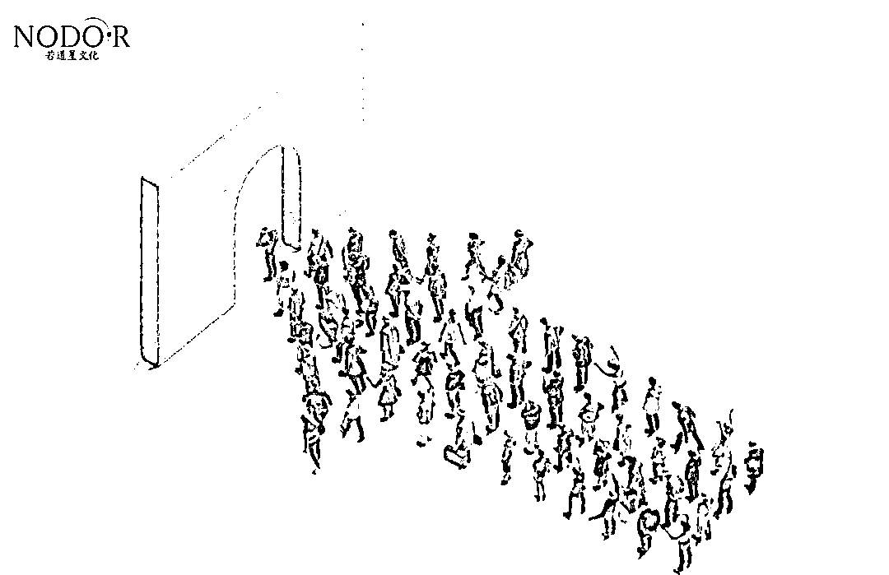

作者/雷蒙德·梅里曼 译者/Luke
编辑/玫瑰 图片/稿定设计雷蒙德·梅里曼是在金融占星学界稳坐第一把交椅的占星师，同时他也是若道签约的金融占星课老师，我们引进了雷蒙德·梅里曼老师的《[上证指数月度报告](http://mp.weixin.qq.com/s?__biz=MzA5NjA0NTAxNg==&mid=2651489623&idx=1&sn=3a0bd84d35117b33ced7b2d77a8b70a7&chksm=8b4837e0bc3fbef6ea863486e975282287c432a72da6560d21e5f7c0c34ec15102393cc3d9a8&scene=21#wechat_redirect)》及《[黄金报告](http://mp.weixin.qq.com/s?__biz=MzA5NjA0NTAxNg==&mid=2651489623&idx=1&sn=3a0bd84d35117b33ced7b2d77a8b70a7&chksm=8b4837e0bc3fbef6ea863486e975282287c432a72da6560d21e5f7c0c34ec15102393cc3d9a8&scene=21#wechat_redirect)》。我们经老师的授权，将每周刊登梅里曼老师的周运，供大家参考和学习。于是，这是本周的周运（10.10-10.14）。

**说明：以下时间采用纽约证券交易所所在地美国东部标准时间。**

**展望与回顾**

****

**美国就业增长率 9 月连续第 2 个月放缓。但是，尽管利率上升、通胀加剧和对衰退的担忧加剧，就业仍保持稳定。劳工部表示，9 月新增 26.3 万个工作岗位，略高于 25 万个工作岗位的预测。**

**这相对于 8 月新增 31.5 万个岗位有所放缓，与 2021 年 4 月以来最低月度增幅齐平。与此同时，失业率出乎意料地降低至 3.5。**

**——梅根·亨利****《美国 9 月就业增速放缓，仅新增 26.3 万个岗位》****www.foxbusiness.com
2022 年 10 月 7 日****“我本来可以把油价降到 1.60 美元以上，但由于俄罗斯人和沙特人的所作所为，油价正在缓慢上升。”拜登告诉观众。**

**——蒂莫西·尼罗齐**

**《拜登指责俄罗斯和沙特导致油价上升，把最近油价下跌归功于自己》**

**www.foxbusiness.com**

**2022 年 10 月 7 日**

这是今年最大的地球宇宙学汇聚，它的影响力名副其实。我们指的是**2022 年 9 月 21 日-28 日期间**，木星分别与土星、天王星形成八分相，同时土星、天王星彼此之间完成了最后一次四分相，加上**10 月 2 日，6 颗行星都结束了逆行（包括恶作剧者水星的逆行）。**道琼斯工业平均指数在 9 月 30 日到达底部，股指期货市场在 10 月 2 日的预售市场触底。这些是许多全球股票市场（迄今为止）的年内低点，也是国债和货币兑美元的多年低点。股市在新的一周开始了大幅的反弹，于 10 月 5 日月亮在水瓶座时到达顶部。比如说，道琼斯工业平均指数，在那三天里上涨 1739 点。那是巨大的涨幅。股票指数的高点，发生在太阳和月亮在风象星座，同时金星在守护星座天秤座之时，是很适合的。随后的一轮大幅回撤，发生在月亮在双鱼座的周四和周五，也是恰当的。无论哪种情况中，上涨超过了日线图的阻力位，下跌也超过了日线图的支撑位，证实了**水星逆行会造成假突破现象，甚至在顺行后 5 天也是如此**，这是不得不考虑的影响。然而，令人不得不印象深刻的是，**近期从 9 月 13 日的高点到 10 月 3 日低点的下跌，几乎与水星逆行期精准对应。**同样让人印象深刻的是，新的年度低点出现的时间，如此接近土星-天王星第四次也是最后一次渐亏四分相，同时木星在两者中点与它们形成八分相的时间。现在的问题是，**这些低点能守住吗？**上周的原油走势也值得关注，于周五飙升至 93.26，在两周内完成了 22.3%的涨幅。之前 9 月 26 日完成基本周期低点 76.25，精准发生在太阳-木星对分相的当天，也落在本专栏预测的重大反转时段**9 月 16 日-10 月 1 日**中，当时太阳和金星对分木星和海王星，后两者是原油的共同守护星。地球宇宙学征象与金融市场反转之间的关联从不让人失望。回到原油价格上涨的话题来。这也与欧佩克决定大幅削减产量有关，尽管拜登总统呼吁不要这么做。欧佩克内部的势力不希望在没有他们的同意和参与的情况下，美国与伊朗达成协议。考虑到美国原油储备已经被本届政府大幅消耗以拉低油价，欧佩克的这一决定对美国消费者有着严重的财务后果。美国现在不得不以更高的价格补充原油储备，而不是像预期的那样以较低的价格补充。他们的购买需求只会推高价格，这对于抑制通胀没有帮助。同时，拜登总统试图把油价的降低归功于自己。现在，随着中期选举的到来，他必须面对的事实是，他的伊朗政策，外加需要以较高价格补充原油储备，将会大幅推高能源价格。看起来，他在市场择时方面没有什么天赋。

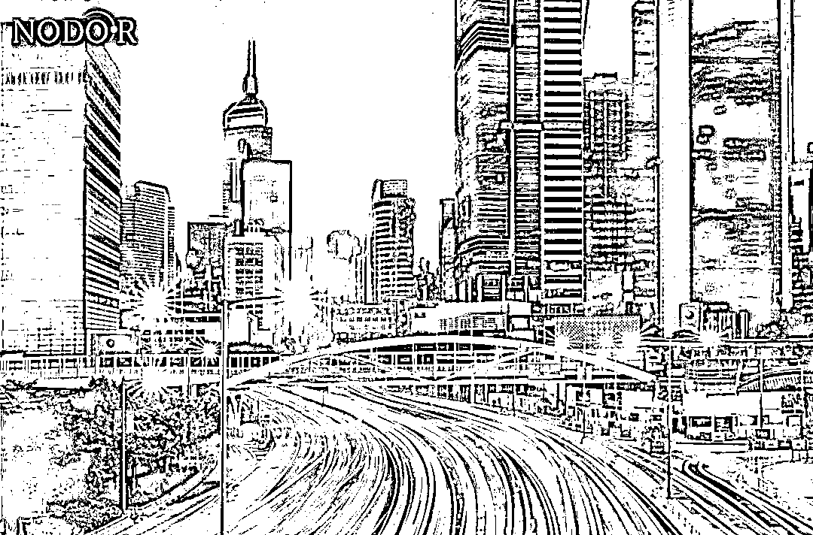

这引出了另一个木星、海王星的主题：大麻。上周，拜登赦免了所有因持有大麻而入狱的人。这是一个受人欢迎的决定，早就该做出了，而且得到了国家 2/3 人口的支持。但人们不得不问：为什么是现在？如果这真是一个善良的行为，为什么他任期的早些时候没有这么做？不管怎么说，看到美国展示出公正和团结是很好的。上周，总统和他的妻子参观了被飓风袭击的佛罗里达州，与共和党州长罗恩·德桑蒂斯和他的妻子相处得很好。他们在灾难中展示出了团结。本来就应该如此。没有政治。没有算计。只有真诚的关怀。这是海王星更高和更美好的表达，这周将会很显著。**短期宇宙征象与长期考量**

****

**警方称，阿米尼女士在被拘留期间，在接受佩戴头巾规则的强制培训时，突发心脏病而晕倒。但当她在医院昏迷，脸上有瘀伤，耳朵在流血的视频和照片分享到网上时，迅速得到广泛传播，并且激发了愤怒。**

**在她死亡后几天，抗议活动爆发成伊朗最大规模的群众示威……但这不仅仅是对悲惨和令人愤慨的死亡的愤怒。这些抗议，由女性领导，激发了伊朗社会的广泛参与，成为自 1979 年伊斯兰共和国成立以来最重要的政治运动之一。**

**——阿曼达·托布**

**《揭开面纱站起来：伊朗的抗议如何直击国家认同的核心》**

**《纽约时报》**

**2022 年 10 月 5 日**

这是天秤座的季节，是协议和妥协盛行的时期，尤其因为（天秤座的守护星）金星也在它守护的星座。**通常这对于股票市场是看涨的（但不总是如此），对白银是看跌的**。也就是说，**我们通常在金星在天秤座时期，看到股市出现波峰，白银出现波谷**。今年的情况是否依然如此，还有待观察，但是**目前有许多其他的地球宇宙学因素，可能会改变这个模式。**其中之一是，**冥王星（在摩羯座）在 10 月 8 日改变运行方向**。当冥王星突出的时候，气氛很少是轻松愉快的。事实上，这时的氛围更加接近病态。几天之后，**10 月 19 日-20 日，太阳和金星将与冥王星形成四分相。10 月 23 日，太阳和金星将进入冥王星守护的天蝎座，对应更沉重的能量。同一天，土星转向顺行，也不会给局势带来缓和。**我们需要更多的幽默。我们知道**冥王星和天蝎座与降级、赤字、债务和违约相关**，对这些话题的关注，不会使气氛变得轻松，而且现在正在接近 11 月 8 日的中期选举，它恰好也发生在天蝎座-金牛座月食期间。但是，冥王星和天蝎座也和**抗议和要求改革**有关（依然不是一个愉快的组合）。由于冥王星在摩羯座突显，如果法律和传统被视为对人民意志的压迫或威胁，那么很容易遭到颠覆。这正是伊朗发生的事情。

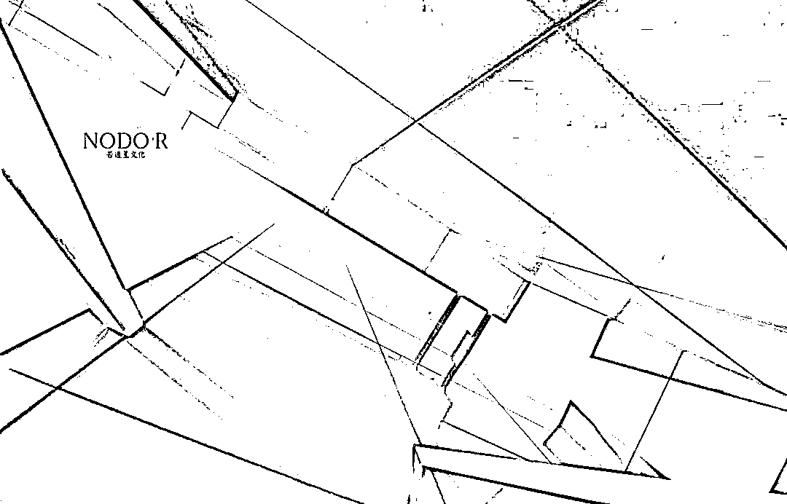

由于冥王星、天蝎座高度活跃，加上土星和它守护的摩羯座受到的关注，这些抗议已经变得暴力，有可能导致政变、革命。伊朗现在不稳定。伊朗现在发生的事情，还存在另一个占星学征象与之关联，这就是为什么这些事件如此准时。**10 月 12 日，火星将在双子座 23°四分在双鱼座 23°的海王星**。这会激活伊朗和美国建国星图中的火星四分海王星，它们也位于变动星座的 20°-25°之间，它们受到这两颗同样的行星行进的激活，形成一个大十字格局。在占星学研究中，这是一件大事。这对两个国家达成任何永久协议来说，都不是一个好兆头。**尤其在 10 月 30 日，火星将转向逆行，也在这些度数之内，它还将在 3 月来回穿越四分海王星。这些征象代表困惑、误导甚至欺骗的可能性。**可能会**毫无根据地互相侮辱，背后的意图是激起怨恨和指责。**

所以，在这些如此动荡的宇宙天象中，我们如何找出积极的一面？首先，站在一旁管好自己的事。不要参与某些你不理解的事，也不要不懂装懂。**这是一个与歇斯底里相关的相位，最好的建议是不要插手，哪怕别人请你这么做。**你赢不了的。

不要做承诺，不要提供你无法兑现的奖励。做一个倾听者，但不要插手干预，因为无论是谁参与进来，都会迷失，就仿佛在马戏团的镜子屋里一样迷失方向。每件事都会被扭曲，尤其当某一方被激怒。

在这种情况下，双方都有可能发怒，说一些彼此冒犯的话语。由于每件事都被看作是针对个人的，每件事都被视为是冒犯。这不是积极的建议，但可能有助于避免消极事态的升级。

就金融市场而言，**这些相位有利于原油，可能会将价格不断推高，直至 10 月 28 日-12 月 20 日木星回到双鱼座时。**这也是一个**通货膨胀继续上升**的信号，因为能源价格在上涨。

有趣的是，10 月 13 日（火星-海王星四分相的第二天）会发布全国居民消费价格指数报告，那是通货膨胀的主要指标。当海王星突显时，它可能不是真实情况的准确评估。这份报告将以最近油价飙升之前的价格为基础。

对于市场的基本面来说，**更重要的可能是 10 月 19 日-23 日发生的事件、发布的报告，届时太阳和金星四分冥王星，土星也会改变运行方向。**

**长按下图了解更多详情**

这是特别及时的讲座，因为为期 12 年的木星轨道周期会在 5 月 10 日进入白羊座，并且 6 月-11 月是一年中最有力的地球宇宙征象接连登场的重要时间段，因为土星逆行与天王星形成几乎精准的渐亏四分相。

**说明：以上日期基于纽约证券交易所所在的美国东部标准时间，由于存在时差，中国地区可能需要加一天。**

**版权声明：**本文由若道翻译发布，欢迎转发，反对抄袭。友号转载请申请白名单。**END**

**雷蒙德·梅里曼（Raymond Merriman）**

若道签约老师。著名金融占星师，ISAR（国际占星研究协会）前主席，梅里曼市场分析公司的总裁。他由于“提升了占星学的职业形象”，在 1995 年国际占星大会上被授予轩辕十四奖；在 2012 年国际占星大会上，被授予轩辕十四终身成就奖。

**从 2018 年年末，若道引入金融占星大师雷蒙德·A·梅里曼撰写的梅里曼市场时机学院每年一次的年度预报沙龙和每年一本的《年度预报》以来，**2023 年已经是第 5 个年度了。**********过去的经验让我们相信，你根据梅里曼老师的指导作为投资参看，你会比一般人有更大的胜算。********《2023 年金融预报》****火热发售中****长按下图二维码！**

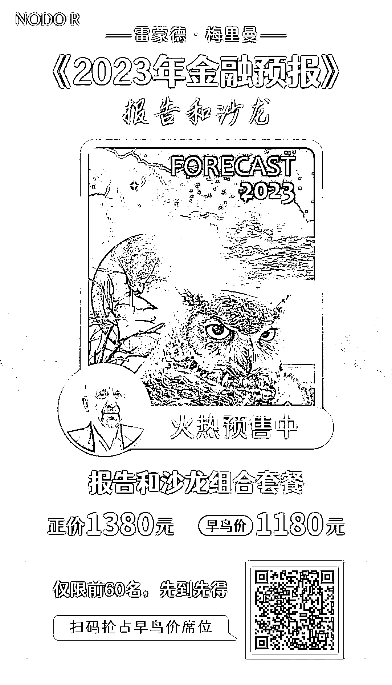

1“中国上证指数月度报告”发售**若道推出了****中文版****的雷蒙德·梅里曼中国上证指数月度报告，并持续发行该报告！**当把金融市场的周期和占星学的周期相结合时，雷蒙德·梅里曼老师的金融占星学研究**为投资者应对金融市场的周期波动，并随之调整投资策略提供了极大的价值参考**。
**10 月中英文报告已上线！**2“黄金价格周期月度报告”发售**若道推出****中文版****的雷蒙德·梅里曼黄金价格周期月度报告！**不仅仅为广大读者在中国股市的投资出谋划策，更将视角放眼黄金市场。**每当世界经济形式不明朗的时候，有一个地方是保值的港湾，那就是****黄金**。自 1982 年雷蒙德·梅里曼出版第一本研究《地球宇宙学征象与黄金价格的关联》的著作以来，**他一直作为最重要的黄金市场时机预测者之一享誉国际**。2022 年 10 月黄金报告已上线，梅里曼老师将会告诉你他对这个关键时期如何操作的想法。也可以按照季度和一年期订阅，有更多优惠。季度和年度的好处是，你可以持续了解梅里曼老师对于不断在变化的市场的看法。即便他某一次看法和市场不一致，你也看到在下一期他如何调整自己的看法，并看到金融占星在一个长期时间段内对你把控风险的帮助。而能够长期控制风险、尽量找到安全的投资时机才是投资的长久之计。**10 月中英文报告已上线！****购买套餐**，买得越多越优惠中国上证指数月度报告套餐价

*   **单月报告**：280 元
*   **3 个月套餐**：780 元（260 元/月）
*   **12 个月套餐价**：2400 元（200 元/月）

**长按下图识别二维码****购买金融报告****套餐****▼**

黄金周期月度报告优惠

*   **双报告年度套餐更优惠（直降 900 元）**

*   **12 个月黄金报告+12 个月上证指数报告：仅需 3900 元**

**长按下图识别二维码购买黄金报告套餐**▼

3《2022 下半年金融占星投资沙龙》这是特别及时的讲座，因为为期 12 年的木星轨道周期会在 5 月 10 日进入白羊座，并且 6 月-11 月是一年中最有力的地球宇宙征象接连登场的重要时间段，因为土星逆行与天王星形成几乎精准的渐亏四分相。

**长按下图识别二维码了解详情**

▼

**购买报告直达入口**

# 2023 年如何用投资提升财富丨雷蒙德·A·梅里曼 2023 年《年度预报及讲座》来啦！

> 原文：[`mp.weixin.qq.com/s?__biz=MzA5NjA0NTAxNg==&mid=2651490873&idx=3&sn=8a17f1e49228f5629e5bf1b3f1458bbe&chksm=8b48388ebc3fb198d0e6242459b53df43ab95cab424b506d79aaff7ec7f3e1e2e3a5b6c3c4b1&scene=126&sessionid=1692737741#rd`](http://mp.weixin.qq.com/s?__biz=MzA5NjA0NTAxNg==&mid=2651490873&idx=3&sn=8a17f1e49228f5629e5bf1b3f1458bbe&chksm=8b48388ebc3fb198d0e6242459b53df43ab95cab424b506d79aaff7ec7f3e1e2e3a5b6c3c4b1&scene=126&sessionid=1692737741#rd)

从 2018 年年末，若道引入金融占星大师雷蒙德·A·梅里曼撰写的梅里曼市场时机学院每年一次的年度预报沙龙和每年一本的《年度预报》以来，**2023 年已经是第 5 个年度了。**

我们简单回归一下梅里曼老师 2019 年-2022 年的《年度预报》中一些预测。

在 2019 年的年度预报中，对于上证指数，梅里曼老师写到：

2018 年末至 2019 年初，中国股市处于三个重要周期低点的时间段。紧随这一低点，将会出现一次非常大的反弹。

2019 年木星会与海王星形成三次四分相，过去，这个相位总是与惊人的强大“泡沫”同时出现，期间股价大幅飙升。

到 2019 年 7 月之前，上证指数有三个重要长周期会出现周期低点，理想上看是在 2019 年 3 月底之前。

上证的周期低点出现在 2019 年 1 月，从那时起，上证迎来了 3 年的上升。

对于黄金，梅里曼老师建议：

从占星学角度来看，木星在射手座，四分在双鱼座的海王星，支撑看涨观点，因为这个组合有增加通胀的潜力。此外，木星在射手座的行星-星座组合从 1983 年起出现过三次，每次都对应到金银市场的年度高点。

无论在 2019 年何时，只要黄金保持在 1167 以上，同时跌到了任一主要周期低点附近，就要寻找买入机会。黄金可能在 2019 年涨到 1500+/- 50，甚至更高。

2019 年黄金从 1284 美元开始上涨，最高点在 1566 美元。

所以，如果你在 2018 年购买了《年度预报》，按照梅里曼老师的建议投资了上证指数和黄金，你会在当年取得相当不错的收益。

**对于 2020 年，在席卷全球、深刻影响了未来的疫情到来之前，梅里曼老师为 2020 年定下基调的：**

站在 2019 年的年尾，我们不知道一场深刻改变未来的风暴马上就将来临。

梅里曼老师，这位杰出的宇宙气象预报员，未卜先知，为 2020 年定下“将军”的基调。

在那一年，我们目睹了美国股市的 4 次熔断和全球经济的重置崩溃。

对于黄金，梅里曼老师是这么说的：

1391.50-1413.70 是价格最强的支撑区域。只要不跌破这个区间，黄金就能够上涨，重新测试 1566.20。如果突破了 1560-1590 的阻力区间，那么黄金就能够重新测试 1920。在那以前，黄金最有可能在 2020 年中在 1390 和 1575 之间波动。

| 黄金周 K 线图

2020 年，黄金在横盘 3 个月突破了 1560-1590 的阻力区间后，一路上涨到 9 月最高点 2089.20 美元。

对于上证指数，梅里曼老师建议：

2020 年的反弹将超过 2019 年的高点 3288。然而，这一涨势可能会通向 5.5 年周期的波峰，随后将再次迎来一波跌势至 2021 年或更晚。

行进中的摩羯座星群——木星、土星和冥王星——表明在 2020 年 11 月底之前会出现一个高点，很可能在 2020 年的前六个月。建议交易者特别注意金星逆行的时期，也就是 5 月 13 日至 6 月 25 日。逆行或顺行一个月内出现的年度高点或低点可能会带来卖出机会。

2020 年，上证指数最高达到 3474，超过了 2019 年的高点 3288。

**站在 2020 年的末尾，对于 2021 年，梅里曼老师说：**

随着 2020 年木星、土星和冥王星形成大合相，我们刚刚结束了一个周期和一个时代。此刻我们正处于一个新的时代和一个新的长周期的早期阶段。事实上，是多个长周期。

对于上证指数，梅里曼老师说：

我们预计涨势将在 2020 年 12 月-2021 年 2 月之间达到波峰，然后急剧下跌至 52 周和 22 个月周期的低点，这些周期将在 2021 年 5 月之前，甚至在 3 月底之前结束。此后可能会出现另一轮反弹，可能会也可能不会在 2021 年 11 月之前形成第一个 33 个月周期的新高。

对于黄金，梅里曼老师说：

黄金的 31.33 个月周期波谷将在 2021 年 9 月之前出现，理想情况是 2020 年 12 月-2021 年 6 月。价格目标是 1628+/-109 或 1768+/-76。重叠范围（理想情况）是 1692-1737。如果价格跌破这些范围，则为看涨情况中令人担忧的状况。

**而在 2022 年的年度预报里，我们看到：**

渐亏四分相不仅对应无法解决的冲突和分歧，土星和天王星形成的任何四分之一周期（合相、四分相和对分相）都可能在社会动荡和某地区现状受到威胁的时期出现。

在 2008-2010 年上一次四分之一周期时（对分相），世界见证了阿拉伯之春。在 1999-2000 年渐盈四分相期间，游行、抗议和直接武力冲突扰乱了西雅图世界贸易组织会议。这也标志着美国经济扩张的结束，以及由互联网泡沫破裂和 2001 年 9 月 11 日对美国世贸中心的恐怖袭击引发的衰退的开始。在此之前是 1988 年的合相，对应的事件是缅甸（Myanmar，当时的国名是 Burma）爆发了一场全国性起义，反抗尽失民心、暴力过度的军政府。数十万公民在全国范围内的暴动中抗议，这成为缅甸历史上的决定性时刻之一。

在每一个案例中，极端主义都占据主导地位，导致暴力冲突，但最终带来了“更大的益处”。它产生了建设性的结果，但在它进行的同时，世界在经历巨大的危机和暴力。”

2021 年 5 月 13 日-7 月 28 日，木星首次行经双鱼座时，这些因素表现得很明显。那时，通货膨胀开始出现，但美联储向所有人保证，这只是暂时的，他们将无限期继续推行“宽松货币”政策。他们并不担心持续的通货膨胀，这是典型的木星在双鱼座的表现，对现实的脱离或错误判断。

这两颗行星以及双鱼座也掌管原油。因此，我们可能会看到油价飙升，以及/或石油泄漏，威胁到大自然。它也可能对应着由于事故而释放的有毒气体，威胁到那些暴露其中的人的生命。

对于黄金，梅里曼老师建议：

只要黄金保持在 1670-1680 之上，仍然有极小的机会出现一轮爆炸性上涨，测试当前的历史高点（2089），甚至创下历史新高。毕竟，木星将在双鱼座合相海王星，可能预示着另一轮“投机狂热”。然而，这也可能是一个“恐慌”的征象，届时某些市场可能会崩溃。

在 1900-1980 之间存在较大的阻力，如果不能突破这个阻力，将表明黄金的熊市已经开始，新一轮的猛烈下跌可能正在准备中。只要跌破 1670 则将确认黄金 20 年的牛市结束了。

| 黄金周 K 线图

对于上证，梅里曼老师说：

我们预期在 2022 年 5 月前，上证综指会出现急剧的下跌，进入 52 周周期和可能的 33.5 个月周期低点。

我们更倾向于认为，上证综指会首先下跌，在 5 月前形成一个低点，然后上涨。这一轮上涨的幅度，将告诉我们上证综指是处在牛市，还是进入了新的熊市。如果它不能上涨超过 3750，长周期波峰可能已经出现，并且进入了新的熊市。

我们简单回顾了部分 2019-2022 年金融预报的内容，**过去的经验让我们相信，你根据梅里曼老师的指导作为投资参看，你会比一般人有更大的胜算。**

**2023 年度预报及沙龙预售**

**2023 年金融预报沙龙时间为 2023 年 1 月 7 日 10：00-13：00。**

一份价格仅千元的顶尖金融占星大师的投资分析报告和沙龙，聪明的投资者值得拥有。

**2023 年年度预报****及沙龙价格：****1380 元**

**前 60 名早鸟价：****1180 元**

**购买报告及沙龙**

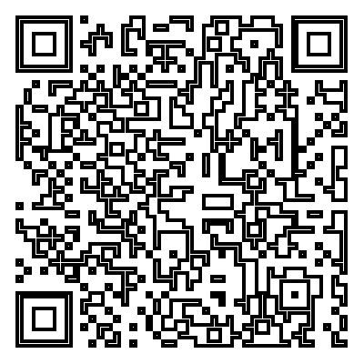

**购买者重要须知****①** 梅里曼市场时机学院每年一次的年度预报沙龙和《年度预报》是梅里曼市场时机学院的研究“预报”，而不是市场“预测”，是梅里曼老师及其金融占星分析师对人类活动周期历史与行星周期之间相关性的研究，二者在大部分情况下具有 80%或更高的相关性，而不是因果关系。沙龙中和报告中的研究完全存在错误的可能性。即便是非常认真的研究和几十年的研究经验，我们无法总是正确地解读出各种征象在实际层面上会如何相互作用，并显化为事件结果。

所以请将次沙龙和报告看作一个研究参考，务必结合其他市场研究和你个人对市场的理解，根据你的自由意志做决策。

**②** 此报告一旦售出，**即不接受退款。**

**③** 此报告仅支持在手机网页阅读，不支持电脑阅读和下载。**④** 讲座提供视频回放。**以上须知，请仔细阅读。一旦付款，即视为已了解并接受所有须知内容。**

**如在购买报告中遇见任何问题**

**可添加客服**

▼

**购买报告直达入口**

# 白羊座满月 | 关系即将面临考验！重点是，它能否抚平你内心的“失衡”？

> 原文：[`mp.weixin.qq.com/s?__biz=MzA5NjA0NTAxNg==&mid=2651490873&idx=1&sn=e2a279e506d32b44759eb3700ac655b9&chksm=8b48388ebc3fb1988ed489951c859b50bf3f0483ba204d511943a6cf3408898719a7f0f48a12&scene=126&sessionid=1692737741#rd`](http://mp.weixin.qq.com/s?__biz=MzA5NjA0NTAxNg==&mid=2651490873&idx=1&sn=e2a279e506d32b44759eb3700ac655b9&chksm=8b48388ebc3fb1988ed489951c859b50bf3f0483ba204d511943a6cf3408898719a7f0f48a12&scene=126&sessionid=1692737741#rd)

**☆ 后台回复“今日”，给你一句生命态度**

作者/香香菲舞 王芝桦

编辑/玫瑰 图片/稿定设计

**白羊座满月****北京时间 2022 年 10 月 10 日 4:54 迎来白羊座满月，天秤座太阳和白羊座月亮于 16°32′精准对分。**
从 9 月到 10 月，水星从天秤座一路逆行回到处女座，过程中经历了 9 月 26 日的天秤座新月(详情点击：[天秤座新月](http://mp.weixin.qq.com/s?__biz=MzA5NjA0NTAxNg==&mid=2651489655&idx=1&sn=16f2a391519f710be5d36de48d2b939b&chksm=8b4837c0bc3fbed68f2f3db48a28f889a398c5baaf0ade6fabc6beed17af67b81edaa7e8b90a&scene=21#wechat_redirect))，提醒大家要用更务实的视角开启关系修复的新阶段；之后，10 月 2 日，水星从处女座恢复顺行，一路前行走向本次白羊座满月；而就在此次白羊座满月转天，水星就要重新进入天秤座 0°。**此次白羊座满月，就是给天秤月修复关系的一次大考验：关系中的“平衡”议题，究竟能否抚平自我内心的“失衡”情绪？**

**白羊座满月重点影响人群**

参考满月峰值影响期间各个行星的行进度数，以及逆行行星的轨迹影响；常规容许度，个人行星入相位 3°，出相位 1°；非个人行星入相位和出相位均为 3°。

**·** 出生星图中，有**行星、四轴、南北交点落入**基本星座（白羊座、巨蟹座、天秤座、摩羯座）0°-20°，23°-30°****的人群；

**· **出生星图中，有**行星、四轴、南北交点落入**固定星座（金牛座、狮子座、天蝎座、水瓶座）11°-28°****的人群；

**·** 出生星图中，有**行星、四轴、南北交点落入**变动星座（双子座、射手座、处女座、双鱼座）19°-30°****的人群。

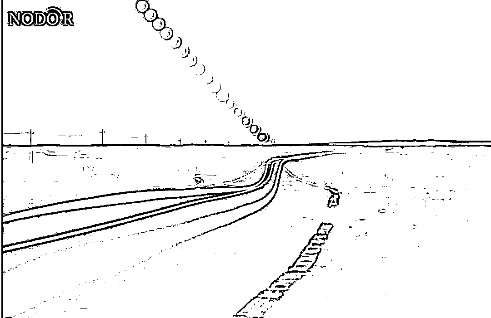

**宇宙大背景：格局变化，重建根基**

> ****天象：******· 土天四分：水瓶座土星四分金牛座天王星。**

此次白羊座满月，我们正处于 2021 年度重磅天象“土天四分”结构的再度笼罩之下。

2021 年度重磅天象“土天四分”结构，是 1988 年-2032 年“土天周期”的最后一个敏感触发点。由土星（现实规则）和天王星（突破限制）组成的“土天周期”，每 44 年发生一次，每隔 11 年会有一次敏感的触发点，引领人类世界“不破不立”的前进步伐和升级进程。 土星所代表的现实规则与实力沉淀，遇见天王星不断突破和瓦解过程，就像我们家里的装修一样，过些年就要翻新一下，将陈旧和无用的去掉，将全新的意识与创意注入其中，虽然累人，但却必要。故而，**“土天周期”每隔 11 年的触发点，都会开启一段“不破不立”的创新进程。**2021 年度重磅天象“土天四分”结构，恰逢影响未来将近 200 年的全新“风元素周期”的起始年（2020 年 12 月 22 日迈入全新周期），**在本就“不破不立”的创新进程之上，又叠加“新老周期”的转换进程，制造出从未有过的巨大颠簸感和不可预测性。**水瓶座土星和金牛座天王星组成的这一组“土天四分”结构，寓意着**从 2021 年开始的未来 11 年，物质资源、生存安全、经济结构几方面将会驶入“变局和创新”的历史进程——集体层面的“格局变化与规则更新”，也要求我们个人层面“创新自我并重建根基”。**2021 年，无论集体还是个人，都在“土天四分”结构的触发下，历经了深入的改变和全新的尝试，但我们并没有达到最终的目的地；进入 2022 年，“土天四分”结构的影响貌似逐渐松弛减弱，但其实“不破不立”的创新进程依然是当下的宇宙大背景。

**2022 年 9 月-10 月，“土天四分”结构卷土重来并再次发威；10 月 1 日-12 日，更是迎来“土天四分”结构强而有力的再次洗礼。**

经过 2022 年前面 9 个月的缓慢步伐，伴随此次白羊座满月的最后一次的“土天四分”结构，向每个人发出提交考卷的倒计时，仿佛等待孵化一场大结局——**那些从 2021 年至今仍未解决、仍未突破的问题，将在这个时间段内面临彻底的“清算”，而全新的格局也正在我们面前逐步展开。**

宇宙变更，世人均在其中。从大环境到独立个体，伴随着边破边立的洗礼进程，我们是否全力以赴做出了努力，收到了怎样的成果，还有哪些未尽的事宜？

过往早已破旧不堪，打破常规，升级思维，才能迎接全新的未来，这个过程还需要不停的完善，但也不能任意而为之。时间有限，要谨慎选择方式方法，推动自己高效修复过往并奋力探索前行。

**宇宙的考验，从来不缺提示**

> ****天象：****
> 
> **· 金凯介入“日月对分轴线”：宽泛容许度下，白羊座月亮合相白羊座凯龙星，天秤座太阳合相天秤座金星。** 
> 
> **· 风向大三角：宽泛容许度下，合相于天秤座的太阳和金星，双子座火星，水瓶座土星，共同形成“风向大三角”结构。** **· 土星介入“日月对分轴线”：宽泛容许度下，水瓶座土星三分天秤座太阳、六分白羊座月亮。**

白羊座满月，总是透过天秤座太阳与白羊座月亮的“日月对分”轴线将**“自我与关系”**主题再次彰显。此次白羊座满月发生时刻，宽泛容许度下，金星和凯龙星介入满月的“日月对分”轴线，则是**在 “自我与关系”议题中注入“疗愈”的能量。**

**日金合相**

**·** 当下，合相天秤座太阳的天秤座金星作为一颗入庙行星成为本次满月的定位星（金星守护天秤座，行星行进在自己守护的星座之内“入庙”）； **·** 金星代表价值偏好并缔造愉悦关系，故而，金星趋向“赏心悦目”的人和事，依照自己的价值排序，搭建支持性的关系网络。故而，此次白羊座满月时刻，也是关注“关系平衡”的天秤月生活（9 月 23 日-10 月 22 日）的一个高潮点。

**月凯合相**

**·** 白羊座作为黄道 12 星座序列之首，象征着建立“自我独立性”的初始阶段：积极进取，努力获胜，并获得自我认同；当满月来到白羊座，人们内心渴望独立、渴望认同的情绪，也被瞬间放大；**·** 月亮和凯龙星于白羊座的合相，也同时触发了我们内心深处“过往挫败的伤痛，不被认同的羞愧”的情绪；金星和凯龙星介入满月“日月对分”轴线的这组结构，预示着**在“关注平衡，渴望认同”的敏感时刻，却触发了“过往挫败，不被认同”的心理情结。**于是，一些看似简单的问题，却被情绪放大了数倍。如果将“过往挫败的伤痛，不被认同的羞愧”这些心理情结投射到关系之中，我们就会**在关系之中变得过于恐惧和敏感，或是滋生“我不够好”的心理负担，或是滋生“你很无情”的情绪投射，而无论哪一种，都无法令关系中的我们获得真正的快乐。**

灵魂的伤痛需要疗愈，而宇宙的考验从来不缺提示。宇宙从来都是一边揭露问题，一边揭示答案。

此次白羊座满月，宇宙给予我们指引：宽泛容许度下，合相于天秤座的太阳和金星、双子座火星、水瓶座土星形成“风向大三角”结构；同时，宽泛容许度下，水瓶座土星三分天秤座太阳、六分白羊座月亮。

以上两组结构，为此次白羊座满月注入更加具体的指向与主题——**重建“关系相处的艺术”！**

**两个锦囊：双向的奔赴**

**·** 一段健康的关系，定是一份“1+1=2”的关系：你是 1，我是 1，我们加在一起才能更加丰盈；如果其中一方是 0 或-1，那么这段关系就会在消耗或代偿之中渐渐失衡和枯萎。我们首先**要在关系中保持白羊座的“个体独立”，才能搭建天秤座的“关系平衡”；** **· **关系是流动的，当风向能量在大三角中流动起来，思路和眼界打开，客观和理性敞开，带着尊重的态度，允许彼此的不同，接纳差异的视角，建立关系的边界，找到维护的方法，就能搭建关系中的平衡，才能让关系中的自己快乐。

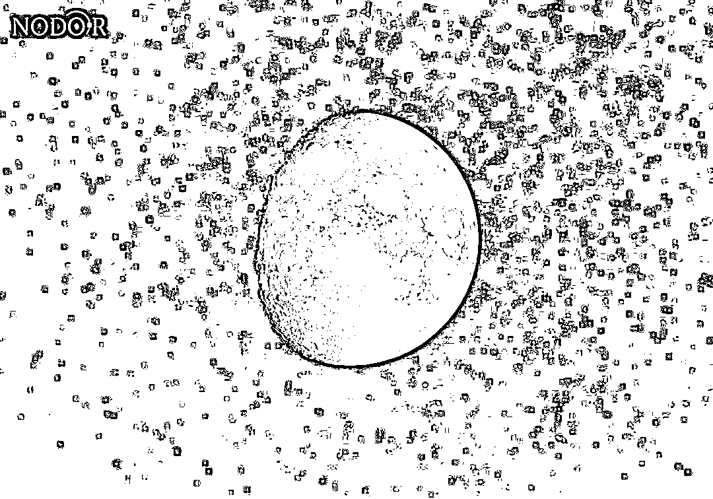

**病急乱投医，不如三思而后行**

> ****天象：****
> 
> **· 火海四分：双子座火星四分逆行中的双鱼座海王星。**

此次白羊座满月，合相于白羊座的月亮和凯龙星将能量传导给火星（火星守护白羊座），而这股能量的传导亦代表着凯龙星**“从渴望疗愈，到化为行动”**的决心。 

值得注意的是：火星行进双子座倾向于**选择“尝试更多”的方式投入到关系的处理和修复之中**，有利的一面是双子座火星具有**积极的状态和试错的勇气**，但风险的一面则是双子座火星容易**一会儿一个主意，以致在尝试过程中陷入焦虑并虎头蛇尾。**而**更值得注意并需要敲黑板**的是：**当下行进在双子座的火星，正处于为期几个月的逆行周期，并在此期间与双鱼座海王星 3 次形成“火海四分”结构。****·** 2022 年的这场火星逆行将火星在双子座的行进时间拉长至半年之久。火星的整个逆行周期从**2022 年 9 月 4 日-2023 年 3 月 16 日**，其中**逆行期从 2022 年 10 月 30 日-2023 年 1 月 13 日；****· **双子座火星的整个逆行周期，**先后 3 次与双鱼座海王星形成“火海四分”结构（2022 年 10 月 12 日，2022 年 11 月 23 日，2023 年 3 月 15 日）；****· **此次白羊座满月周期内的**10 月 12 日，第 1 次“火海四分”结构形成。**故而，这颗“战神”火星将要面临超出想象的考验：如果说精力投注的方向是火星所要坚持的力量，那么双子座则容易让这股力量失去重点；而已经步入逆行周期的双子座火星与双鱼座海王星之间的“火海四分”结构，会**让这股没有重点的力量，进一步变得杂乱无章。**此次白羊座满月，正是我们**渴望获得内在疗愈、重建平衡关系**的时刻，而“火海四分”结构则容易带来**漫无目的地寻找解决方法、甚至不惜亲自试错的风险**，颇有一股“急病乱投医”的味道。但是，精力和时间终是有限的，而**毫无章法的行动则容易令人丧失力量和无果而终，多余无谓的消耗则容易令人自我怀疑并打击自信。**

未来之路，犹如身处陌生的繁华闹市，走错一步都有可能步入歧途。故而，需要时时想起中国的一句古话“凡事三思而后行”：**一思所做何事，二思所出何因，三思所求何果。**

**几点提示：**

**·** 很多事，不是做了就可以，知道自己在做什么、为什么而做、要去往哪里更为重要；否则，不如不做，因为消耗精力的同时也在消耗自信；

**· **学会在忙乱和盲目的时候，停下来一些时间，看清自己在做什么，理清为什么而做，认清要去往哪里，真正和那些在做的事情在一起，然后像修剪一枝花一样，将多余的、无用的、消耗的部分剪掉。

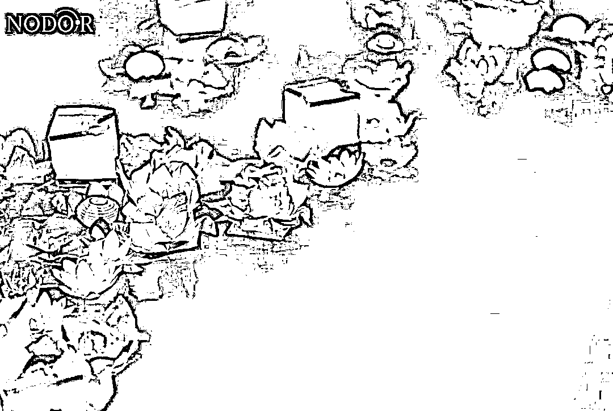

**“业力议题”转化，评估“自我与关系”**

> ****天象：******· 水冥三分****：处女座水星三分逆行的摩羯座冥王星。****· 水木对分****：天秤座水星对分逆行的白羊座木星。**

**10 月 2 日，水星于处女座恢复顺行；10 月 7 日，处女座水星与摩羯座冥王星第 3 次形成“水冥三分”结构（第 1 次 8 月 23 日，第 2 次 9 月 27 日）；10 月 9 日，冥王星于摩羯座恢复顺行。**  

由于冥王星行进得相当缓慢，故而，**冥王星发生逆行或恢复顺行的前后一个月都处于减速和停滞的状态，而这段时间所有与冥王星形成相位的行星，都得将冥王星揭示的“业力议题”落地转化。**由于 2022 年第 3 波水星逆行发生在“天秤座逆回处女座”轨迹，**“完善关系的沟通与协作”**就成为这一波水星逆行的重点课题；而 3 次水星和冥王星都在土象星座的“水冥三分”结构，正是引领我们**追求真相并深刻洞见**的时刻，为我们**提供切实的方案以便解决关系的问题。****·** 10 月 11 日，顺行后的水星再次换座进入天秤座 0°这个敏感的“基本星座开创点”；**·** 10 月 12 日，天秤座水星与白羊座木星第 3 次形成“水木对分”结构（第 1 次 9 月 3 日，第 2 次 9 月 19 日）。故而，此次白羊座满月周期，为我们提供了对“自我与关系”进行客观评估的宝贵时间。

**评估的重点**

**· **自我的主观观念，是否就一定正确？

**· **自我的主观理想，关系中的另一方是否有义务满足？

**· **在关系中，是否忽略了自己的感受与需求？

**· **在关系中，是否尊重了对方的感受与需求？

**· **如何搭建“让他人满意，也让自己满意”的沟通频道。

**寄语****芝桦说：**写这篇白羊座满月文章的前夕，我的太阳白羊座妈妈从这个尘世离开了我。（若道君：愿老人家一路走好）我相信，我们的灵魂会在未来的时空再次重逢。感谢的学生香香帮助我主笔完成了这篇文章，我将参与这篇文章中的有限灵感与文字送给我最爱的妈妈。**香香说：**作为新晋占星作者，在写这篇满月文的时候，我仿佛提前掉入了“火海四分”的巨大漩涡当中。围绕满月主题的天象纷繁复杂，每组面向都有自己独特的能量影响，牵一发而动全身。想要把关卡全部打通，却在我写到最后之后，发现失去了重点。在最终交稿时，我还是清理删减了部分内容。文字和精力的留白，均是为了迎接下一次的考验做准备，在此期间，继续保持对自我的提升，和宇宙携手，共同走过这世纪重磅的宇宙天象。满月之际，我向授业恩师王芝桦致以感谢。月如人间，阴晴圆缺，也祝恩师及所有读者朋友们，走过人间悲欢离合，心中常存快乐。

**版权声明**：原创文章由作者授权首发于若道平台，欢迎转发，反对抄袭。友号转载请申请白名单。

**END******想阅读更多作者的文章，********请在后台回复******王芝桦****** 即可。****

**香香菲舞**

影评作者，自由撰稿人，心理占星师，师从王芝桦老师，致力于身心灵统合疗愈和生活美学分享。

****王芝桦****

心理占星师，统合疗愈师，占星专栏作者

若道占星“新月和满月”专栏作者，腾讯视频特约占星师

全职于个案咨询与占星教学工作 18 年

**个案预约咨询微信号**：zhihua0621 

**微信公众号**：daoxi-life

**长按打赏**

********

**20 位来自世界各地的占星师****带来 19 场沙龙——新世界的觉醒****详情可点击下图**

**学习占星学****点击下图了解课程详情**

**微信又双叒叕改版啦，不想错过若道君的推送？**
****就把若道设为****星标****以及点点****“在看”****吧！******▼**

**喜欢就点一下“在看”吧！****报名直达入口**

# 重磅 | 冥王星顺行！12 星座的哪个领域将彻底汰旧换新？！

> 原文：[`mp.weixin.qq.com/s?__biz=MzA5NjA0NTAxNg==&mid=2651490752&idx=1&sn=d438b4f78d24a2937ba5e0527587ccff&chksm=8b483b77bc3fb261f48ca76d940aa227a59e6a66138f0fa7afd81a5a085fc8696d15bda2c347&scene=126&sessionid=1692737746#rd`](http://mp.weixin.qq.com/s?__biz=MzA5NjA0NTAxNg==&mid=2651490752&idx=1&sn=d438b4f78d24a2937ba5e0527587ccff&chksm=8b483b77bc3fb261f48ca76d940aa227a59e6a66138f0fa7afd81a5a085fc8696d15bda2c347&scene=126&sessionid=1692737746#rd)

********************☆ 后**********************台**********************回复“今日”，给你一句生命态度********************

作者/郑玮玲 ISAR 认证占星师编辑/玫瑰 封面/书君 图片/稿定设计 10 月 9 日凌晨 5:56，冥王星结束 162 天的逆行，从摩羯座 26°恢复顺行。本次顺行周期会结束于 2023 年 5 月 2 日凌晨。你一定很关心这个天象有什么影响吧？一起来看看！**冥王星顺行****冥王星在 2022 年的逆行是从摩羯座 28°35′开始的，当它再次行进至此度数是 2023 年 1 月 29 日。****从现在开始至 2023 年 1 月 29 日，可视为每个地球人再次迈向深层自我，体验本体之美的意识进化之旅**——经由更为深切、完整的身心体验赋予自我内在冥王星的原力，也就是自我更新与重生的权力。

冥王星被称作冥府之王，对于一个时代、家国、个人的人生都如同原子弹般的摧毁力。它以重创的方式区隔时代和周期，以极限痛感来刺激心灵与意识的觉醒，将那些我们以为安好、永续，赖以维生的系统、资源、财产、理念、关系、基石统统拿走，迫使人类不得不去投入新生的创造中。

是的，冥王星的残酷、肆虐与土星相比是有过之而无不及，因为土星尚有界限，我们可突破，可翻越，也可迂回奋进。而冥王星身处无垠，太阳光线都无法到达它的府邸，它在遥远的宇宙时空交汇处。而人类的恐惧总是源于无知、未知，冥王星在物理世界正处在我们头脑和身体不可及之处，却并非心灵的不可知。恰恰相反，从 1930 年被人类发现并命名起，冥王星就已用它的幽暗之光映照在人类心灵、意识深处。人类世界的兴衰盛变都与冥王星的行进遥相呼应。历史上前一轮冥王星在摩羯座发生的事便是从英国开始的工业革命，那时的中国还处在清乾隆年间，封建社会最后的盛世。而西方世界已经从珍妮纺纱机的发明到瓦特蒸汽机开行欧洲大地，老欧洲的崛起和全球殖民掠夺刚刚开始。摩羯座所代表的社会系统、政体、制造业、国土疆界都在遭受冥王星的摧毁与重建。**在 2008 年-2020 年完整的原型占星学意义上的天冥四分周期里（精确四分是 2012 年–2015 年），仍有背景复杂的叙利亚战争、阿富汗战争、克里米亚战争以及后续的俄乌战争。**这些国家的政体、经济、疆土、社会系统不同程度地瓦解、摧毁，难民潮涌向了西方世界，却遭受了截然不同的区隔对待——界限分明，确为土星掌管的摩羯座语义。西方世界在冥王星摩羯座的揭露下以慈悲的名义，显现了真实的种族主义面貌。

**接下来 7 个月的冥王星顺行让我们再次去面对过去半年到一年里没能彻底完结的心灵幽暗之旅。**冥王星顺行的能量助推我们**稳定向下、向深处探寻，去向幽暗之深处清除淤积，清理那些有害身心，甚至威胁生命的老旧系统、架构**。

只有放弃对旧有系统的掌控、信任，才能重树内在的权威与新的系统。伴随着冥王星换座的时代，新世界，新意识都将从对旧有的彻底丧失中转化而来。

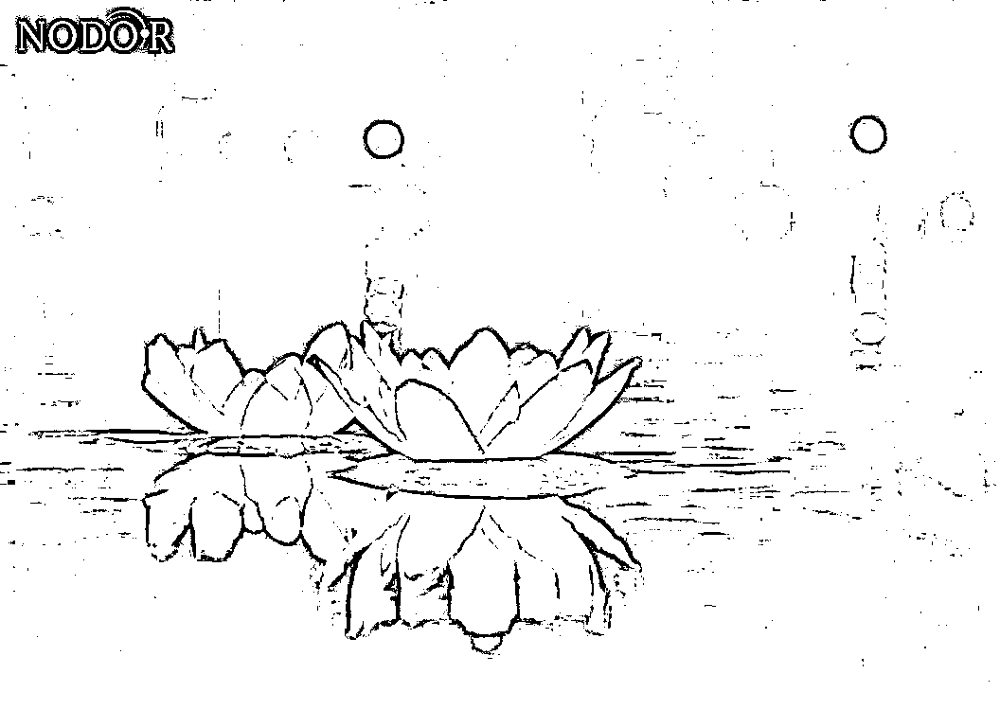

**冥王星水瓶座的时代**

**冥王星此番顺行将在 2023 年 3 月 23 日首次进入水瓶座，在水瓶座短暂行进 39 天后又会开始新一轮的逆行，并再次退行至摩羯座 27°，而后重走摩羯座尾度的历程。**

**2024 年 1 月 21 日和 11 月 20 日，冥王星均会第 2、3 次从摩羯座换座进入水瓶座，并最终结束摩羯座的旅程。**

**冥王星的行进加上逆行带来的影响平均一年走 1-2°。**同时，冥王星**轨道椭圆，行进周期不规则**，这就导致它**在每个星停留的时长有较大的差异，最短情况在一个星座停留 11 年，但接下来冥王星在水瓶座待的时间将长达 20 年。**

显然冥王星换座带给世界、人类的冲击巨大而深远。冥王星每走一个星座，甚至每一次与外行星的相位周期都给世界留下了沉重的回响。而冥王星的核心是：**转化**，任何一轮影响的表征之下都在**摧动着精神、心灵、意识的觉醒。**

荣格说：“没有一种觉醒不带着痛苦。”而艾克哈特说：“觉醒就是去辨识出那个未觉醒的你。”所以，**冥王星通过换座，一次次切换着世界性的心灵视野，让我们从 12 个面向去唤醒未觉醒的深层自我。**

因为意识之光有着无形的向度，无边无际无限，而进化也终将是无尽的旅程。灵魂在成长的道路上，永远不可能停留在一个明亮的终点，而是不断升落、向前，也不断与小我制造的痛苦、疯狂、失调、混沌、分离进行和解，拾回那些在挣扎中遗失的碎片，拼凑完整的自我。

冥王星的烈度足以让我们认识到意识的力量，转化的道路荆棘丛生，却也曼妙殊甚。因为**只有那些向世界，向无限可能性敞开、允许，对一切说“是”的人能够从废墟、残败中重获创造的权力。**

冥王星的确让我们受苦，但它的目的是让我们**在受苦中升起意识，或者，学习有意识地受苦。意识就是我们得以转化自我的力量。**

纵观上一次冥王星在水瓶座的时代，它给予了人类怎样的苦难，又带来了怎样的开启？从历史学的角度说，人类只能从历史中学到教训，但占星学的角度，让我们从历史中学到时代范式、精神和宇宙意图。

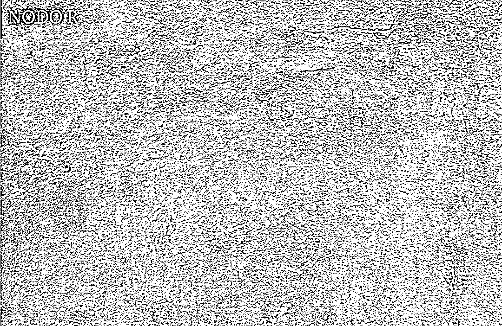

**上一次冥王星在水瓶座是 1779 年-1799 年。**

**·** 1781 年，一位爱好天文的音乐家发现了土星之外的天王星，这是人类历史上重大的集体意识进化的象征；

**·** 1789 年，为着天赋人权的法国大革命爆发；这个时代是歌德、贝多芬的时代，也是西方文人艺术家反对封建教会寻求思想解放的启蒙运动时代。

可见，冥王星在水瓶座的时代**强力摧醒着人类个体和集体的自由主义精神与独特天赋。所有先锋的、未来的范式都在痛苦的磨难与激烈的抗争中脱颖而出。**

来到我们的时代，水瓶座显然包含了**第 4 次工业革命的产物：高科技、信息化、数字化。**冥王星将要“工作”的地带也会包含这些。当然，在 2023 年首次进入水瓶座的冥王星还没有足够的时间呈现给我们结果，但相信它会**在未来 3-5 年内提示更为确凿的征象。**

未来可能**有更多的新型能源的使用，传统制造业将会缩减或以新型能源、信息方式存续。自由、独立与先锋意识的个体将更为突显，成为时代的典范去唤醒集体的更新，我们将有机会见证文化、艺术更具时代特色与包容性的产出**。

**在线生活将更为广阔，更多实体、可见被虚拟、数字化取代，时空的联结也更加便捷、多元化。**也许将来就医治疗不再需要去医院，前所未有的疗愈方式被运用起来？终生教育体制会不会取代现有的老旧教育体制呢？

在世界范围内，冥王星水瓶座会带来**最大限度的“平权”**——**不仅是女性与男性的平等权，还包括全球性的平等权利，作为世界公民的平等权力**。我们会否在冥王星水瓶座的时代见证某些地缘、国籍、国界的弱化、消失呢？我们会否见证全球性贫富差距的日益减少呢？

冥王星顺行通常情况中是如季节般的自然节律，但当它顺行在摩羯座的尾巴上时，一种**彻底的净化、消融（鱼尾）、重建**成为了必然。回到现实中，对于所有人而言，**疫情 3 年留下的身心、意识的负面影响都需要深层进化与清理了。**

很少有行业不在疫情中遭受损失，而疫情留下的倦怠、恐慌与压抑感是需要花更长时间，在落地的生活中去清理的。

也许，换一份工作，换一个房子，换一种生活，换一个行业，换一个伴侣都能带来更新感，但深层自我的意识要能从旧有的黑洞中苏醒过来，识别生而为人最珍贵之处，并善用这份权力去发挥创造力才是对未来最不可或缺的精神动力。

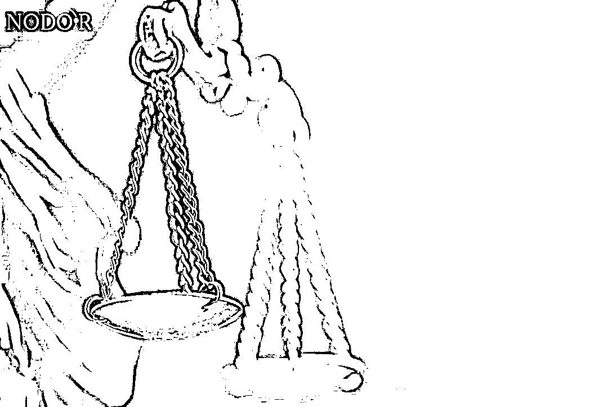

**冥王星顺行期间的重要相位****木星六分冥王星**

**时间：10 月 17 日-2023 年 1 月 15 日**

**重点影响人群：有个人行星、四轴、交点位于摩羯座、白羊座、巨蟹座、狮子座、天秤座、射手座 0°-3°，双鱼座、双子座、巨蟹座、处女座、天蝎座、射手座 28°-29°，以及摩羯座、白羊座、金牛座、巨蟹座、天秤座、处女座 26°-29°的人。**

**木星四分冥王星**

**时间：2023 年 4 月 27 日-6 月 9 日**

**重点影响人群：有个人行星、四轴、交点位于摩羯座、白羊座、金牛座、巨蟹座、处女座、天秤座 26°-29**°**，以及水瓶座、金牛座、双子座、狮子座、天秤座、天蝎座 0**°**-5**°**的人。**

持续两个月的木冥六分是从木星逆中开始的，木星会从白羊座初度逆回双鱼座尾度，再重回白羊座。这为木冥六分增添了诸多复杂性。我们或许能**更深入感受到内在信念系统的快速交替、置换，木星也让生存的危机感扩张、加剧**。但六分相总是充满**活力与变通性**的，因为木星的逆行加换座带来了超强的独立与非理性，我们理应**将直觉奉为内在转折的机制。**此时的木冥激活了转化的动力，**任何身体力行的尝试都可能带我们快速、深入成长。**在此期间适合去**做一些一直想做但碍于意识、习性或任何自我设限的事，极限运动或是深层灵性疗愈，冒险活动或是看似疯狂的生活都会让我们抵达狂野之境时完全好起来。**而我们生命的活力值却完全不同了。或是让你宛若新生，或是重新认识了世界，认识了自己。木冥四分正发生在冥王星进入水瓶座的第 1 个阶段，而木星也将在此期间换座进入金牛座。两次木冥相位都有着强烈的变换感，这预示着**重点人群必不可少的信念更迭**。无论你想或不想，你的内在真理，你的内在最高意识都会发生改变。所以，这是一个绝佳人生调整期，很大程度上应该是伴随着**疫情后全面的社会经济复苏而来。**每个人都值得在此时期**重新去规划远期目标**，木冥的组合**既是信仰与体系，更是无尽财富的资源。**

木冥四分提醒我们**要用未来的眼光重新理解世界，虽然还有些生涩、困境，但我们若站得更高，考虑更广博、长远，才可能饱揽生命的胜境**。同时，你也需要**坚定内在的真理，在你一直坚信的道路上，一定不会错过应得的奖赏。**

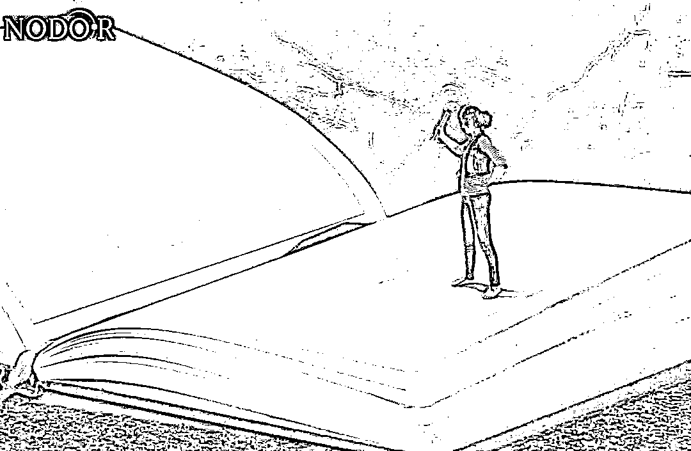

**冥王星在 12 宫位的影响****若道君：****你可以在 app store 或者应用商店搜索“若道”下载 app，输入个人档案，查看行运盘（也可以使用其他星图软件），找到行进冥王星落在出生星图的第几宫，然后对照下文查看。****例如下图中，比尔·盖茨上升在巨蟹座，行进冥王星在个人星图的第 6 宫，合相下降点。**

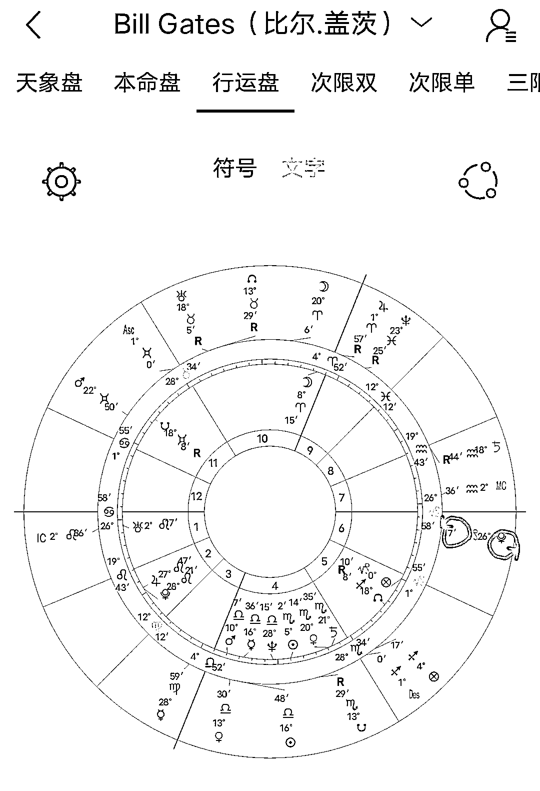

**行进冥王星在*****1*****宫**

当行进冥王星在你出生星图的 1 宫内，无论它是刚刚来到，还是满布历经困境后的成熟、淡然或是沧桑，这对你来说都是一段珍贵的岁月。

因为冥王星将**敢于言真，勇于自我彰显**的力量交付给你，无论你有没有准备好，现在你可以**用力地，并且充满激情地做自己。**

**如果冥王星在未来半年合相你的上升点，那便是宇宙完美的时钟敲响的时刻了。**冥王星赐予的苦难不会少，但它让你**透过黑暗、深邃的磁力在世界上寻找一份独属于自己的笃定与坚持。**

当下的你还需要**对自己的身体多加关照，学习、尝试一些身体疗愈方式，避免与世界的疏离感，透过深层的身体能量释放去重归内在完整。**

**行进冥王星在*****2*****宫**

**冥王星带给你的礼物是需要经由你自我肯定的财富，但它最可能用丧失、权力斗争和怀疑的方式让你开始学习如何掌握自己的财富密码。**

也许这些抗争、纠缠与你的**家庭**有关，也许与你的**职业关系**有关，但最终都指向了**你如何为自己索价，如何定义自我独特的，富有创造力的身份感。**你在通过**困难却充满魔性的方式去学习与物质世界和解**，你的坚韧与耐力将支持你完成这一轮的自我更新。

**行进冥王星在*****3*****宫**

如果你已经感受到传播自己的想法是困难的事，可以试着**把你的意图收回，把你的声音传入你内在的耳朵，试着先去倾听自己**。**相对于传播、交流，内在学习对于当下可能是更重要的事。**

现实世界也许还充斥着限制与阻碍，放下旧有的条条框框，勇于做出于直觉的创作，尝试你从未做过的方式。当你对一切的发生说：“是的，我允许。”你会发现所有的问题都会自行转化，而你会从中学习到更重要的东西。

**行进冥王星在*****4*****宫**

这里也有一种可能性：**冥王星在合相你的下中天。**如果是这样，你也是此刻宇宙礼物的拆封者，你终将明白这巨大动静背后更完美的宇宙图景。

冥王星行进 4 宫，**关于家的一切都在发生剧变：分离、解散、丧失、死亡与新生。**家人之间微妙的关系，那些历史沉积的点滴都会经历一轮又一轮的更新。

且慢且行，给自己足够的时间与耐心，你要准备好**在自己的心灵家园搭建全新的网络，用信仰、真理或任何灵性方式给予自己源源不断的动力与支持。**

静思、打坐、冥想，这些还不够，一定要找到到一种方法，让自己在突如其来的虚空之中还能落定现实，在洪水猛兽来袭时快速挥刀拔剑，果决迎向最深的黑，你便是在疗愈这一生最温柔的伤痕。

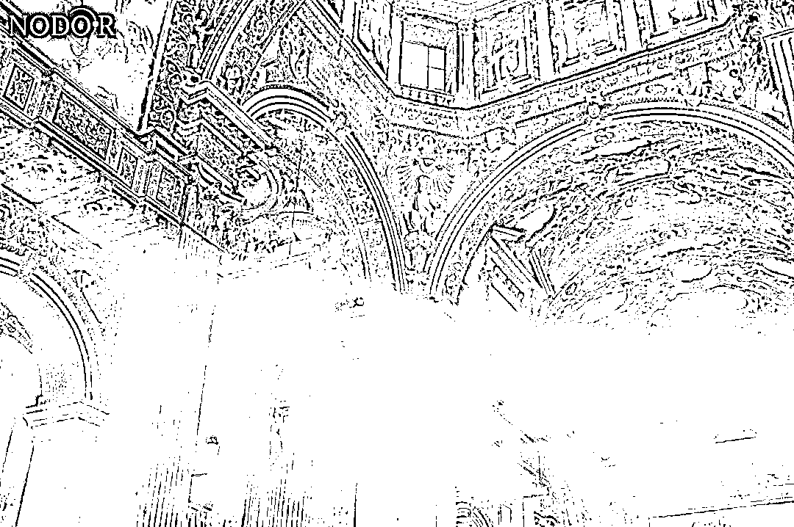

**行进冥王星在*****5*****宫**

此时的你可以询问自己：**你此刻能感受到快乐吗？任何时候你能为自己找寻到快乐吗？快乐对你来说需要怎样去获得？**行进冥王星会给你答案，它牵引着你去用非同寻常的方式寻找到。

**恋爱、像个孩子一样，或是投入任何令人心醉的创造都会是对的事，**当然，还包括：**生孩子**。生育本身既是冥王星特属的创造性与灵性并存的进化之旅。当然，在所有这些过程中，你会感受到自我的完全重生，你用你的行动、生命的经验重新创造了自己，这也是属于你的新时代，新世界。

**行进冥王星在*****6*****宫**

当下的你值得**花时间、心力投入一门专注的技艺、学术、研究或是系统深入的工作。**冥王星此番顺行会带来一些新的突破，也会提出新的问题、卡点，而转化的道路指向了那些并非与生俱来的潜能，是一切你需要再次去学习、锤炼、打磨、修正的领域。

同时，还包括了你如何照顾身体，对待生活的态度，**冥王星会透过疾病的方式提出系统性的整改方案，有些不得不放弃的习性也是进化的一部分。**

**行进冥王星在*****7*****宫**

此时的冥王星提示了**关系的全新模式**，它也给足了时间让你**在现实中一步步深入关系的真相，去构建、经验独属于你的亲密关系。**

可能你还享受其中，可能你已将自己置身事外，但无论你在何种状态，当下都是你必须认真回答冥王星问题的时候：**你对自己的亲密关系满意吗？足够满意吗？冥王星任何时候要的答案都是真实，真相。**

如果你能直接肯定给出真相，冥王星便会给你解决方案。**虽然隐藏着些许的恐惧、不安，甚至愤怒，但透过转化让自己活在真实的亲密里，这才算是接收到了冥王星带来的礼物。**如果冥王星将在未来半年经过你的下降点，那么尽早去寻找答案吧。

**行进冥王星在*****8*****宫**

**如果冥王星在 7 宫时的议题没能处理彻底，那么现在就是继续处理，并且再升级的过程。**此时的冥王星提出的拷问还包括**信任与背叛的真实**。再一次，我们需要对自己真实，才能对他人、对世界真实。

当下的你可能需要更多的静思、独处与深层的自我对话，才能把慎重的答案交付给自己。**也许你正在经历现实的崩塌，信任危机，但重要的是做出真诚无悔的决定。**

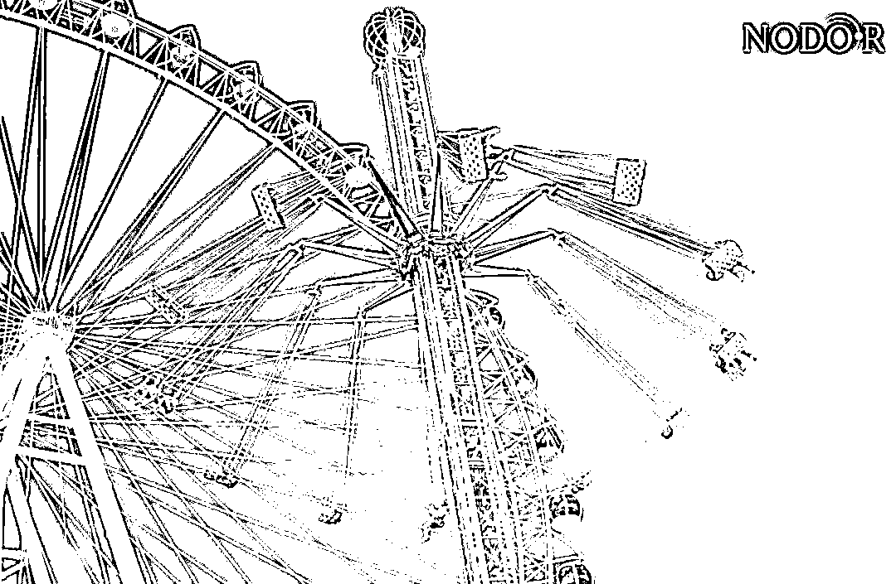

**行进冥王星在*****9*****宫**

此时的你可能有历经万水千山，翻越世事沧桑的叹息，眼下看一切似乎重归云淡风轻，但却总有些什么是你无法放下、释怀和难以清楚拿捏的。冥王星在等待你回应你的野心、狂野与热望。

如果你对此说是，世界就会向你敞开怀抱，未来便会透过艰难、荆棘向你展开来。同时你还需要**透过一些严密的限制、管控，屈服于权威的力量，才可能抵达你的远方。**

**行进冥王星在*****10*****宫**

**想一想自己因何而出发？又是怎样来到了这里？当下的困境与限制能带走你的什么？而什么对真实的你是最重要的？**

如果恰是在未来半年冥王星合相中天，那么这些问题来得再合适不过。当下的你当然会面临人生的重大危机，或是已经过它，还在收拾重整中。

**当你努力展现给世界最好的一面时，冥王星也在用极端的方式给你不可控的体验。**然而，**若能从丧失、危机中意识到这相去甚远的两面都在共铸：权力和成就，你便能从陈旧的模式中释怀，在新的时代中创造新的平衡。**

**行进冥王星在*****11*****宫**

如果与很多人相遇，相识相知很多朋友，人生就不寂寞了？我们就一定能走得更远？冥王星的答案往往出乎我们所料。**哪怕我们为着共同愿景走到了一起，个体、人性的差异与相似性也在冥王星的碾压下败露无疑。**

此时的你需要**用直觉行事，放弃旧有的理念，也将宏图大志缩小到更广阔的天地中去看，去拿捏**。真心的答案会经由你的身体语言给出。冥王星在此，要我们**解决社交、群体生活中一切的不真实，唯有深层的信任才能联结到最终的愿景。**

**行进冥王星在*****12*****宫**

**任何行星在 12 宫的行进都是充满无力感、消融与痛苦的，何况是冥王星。**但从积极的方面去看，这其实是**让我们可以进入痛苦核心地带的最佳方式，**人生、宇宙的绝胜风景也在此。

一颗柔弱的心灵要经历如何的历经才能如此坚韧而真实？你告诉自己已经不再害怕，没有任何事物能带走你的意识了，如果这是真的，你便会拥有无数个好眠的夜，梦境会把真相重新检视给我们看。

这是一段幽长静谧的去往心灵深处的道路，当你的冥王星浮出 12 宫时，你才会懂得造访过的心灵胜境是最值得回味的。

**版权声明：**原创文章由作者授权首发于若道平台，欢迎转发，反对抄袭。友号转载请申请白名单。

**END**

**郑玮玲**

ISAR（国际占星研究协会）认证占星师（2016 年获得）

若道占星专栏作者

将占星咨询、教学与音乐、舞蹈相结合的疗愈者

**微信号**：zhengviolin

**新浪微博**：@郑玮玲

**微信公众号**：Sampriya-Astrology

长按打赏

**20 位来自世界各地的占星师****带来 19 场沙龙——新世界的觉醒****详情可点击下图**

**学习占星学****点击下图了解课程详情**

**微信又双叒叕改版啦，不想错过若道君的推送？**
****就把若道设为****星标****以及点点****“在看”****吧！******▼**

**喜欢就点一下“在看”吧！****报名直达入口**

# 所谓“三观不合”，更是视角不同 | 12 星座用什么视角看世界？

> 原文：[`mp.weixin.qq.com/s?__biz=MzA5NjA0NTAxNg==&mid=2651490603&idx=1&sn=ff99e34907aa7338666bfc54273af787&chksm=8b483b9cbc3fb28ab6238ae88990818ec12687d7ea98d3b3201eb827c074f1d340c639cbd892&scene=126&sessionid=1692737746#rd`](http://mp.weixin.qq.com/s?__biz=MzA5NjA0NTAxNg==&mid=2651490603&idx=1&sn=ff99e34907aa7338666bfc54273af787&chksm=8b483b9cbc3fb28ab6238ae88990818ec12687d7ea98d3b3201eb827c074f1d340c639cbd892&scene=126&sessionid=1692737746#rd)

**☆ 后台回复“今日”，给你一句生命态度 **

作者/格伦·佩里 译者/若道翻译团队   编辑/玫瑰 封面/书君 图片/稿定设计格伦老师用视角将 12 星座划分为 3 种不同的类型：个人星座、社会星座和宇宙星座。从出生到死亡，每组星座都对应个人发展的一段时期，并表现出不同的关注点、价值观与需求。快来看看你的星座属于哪一种吧！如果你想了解更多心理占星学只是，欢迎点击格伦老师教授的 ISAR 选修课[【占星原型与星图中的精神病理学】](http://mp.weixin.qq.com/s?__biz=MzA5NjA0NTAxNg==&mid=2651489261&idx=3&sn=7f330b85d45c81108254be44dcd85f55&chksm=8b48315abc3fb84ceef17e50ce7abf92a3c9fa0f2f973638e66c99c9184119c376fe761bd3ad&scene=21#wechat_redirect)了解详情哦~**个体星座和集体星座**最笼统的划分黄道星座的方式，是前 6 个星座和后 6 个星座。**黄道星座的前半部分关注个体与集体的差异，后半部分关注个体与集体的融合**。从白羊座到处女座是一个个体化的过程，更强调部分而不是整体。更关注短期而非长期。从发展的角度来看，前 6 个星座代表了**自我从幼年到成年的阶段**，**处女座学徒阶段的结束意味着个体掌握了一种技能，足以支撑他步入成年阶段，成为社会的一员。**黄道星座的后半部分**首先关注社交需求，最终还是落脚于整个人生**。如上所述，这些星座有**更宽广的视野，能够认识到各个部分最终会如何被融合到整体之中**。这里更重视长期而非短期。出于部分服从整体的必要性和正确性的考虑，可以推迟个人的满足。

**关系、分享、伦理、责任、利他主义和牺牲**是此处的关注重点。从发展的角度来看，黄道星座的后半部分代表的是**从 27 岁左右开始直至晚年死亡的阶段。**

每一个个体星座与一个集体星座成**两极互补**的关系。心灵的目标是**将自我与他人整合，个体与集体整合，以达到心灵的平衡与完整。**

| **个体星座** | **集体星座** |
| **个体化、差异化** | **整合、协作** |
| **关注局部、区别** | **关注整体、联合** |
| **短期利益** | **长期利益** |
| **个人利益、关注自我** | **群体利益**  |

**视角**

黄道星座可以进一步被划分为**3 种视角**，或者说是时间和空间的定位：**个人、社会和宇宙**。有时候，这种划分指的是**个人、人际关系、超个人**。前面 4 个星座（白羊座、金牛座、双子座、巨蟹座）为个人星座，中间 4 个星座（狮子座、处女座、天秤座、天蝎座）为社会星座，最后 4 个星座（射手座、摩羯座、水瓶座、双鱼座）为宇宙星座。  从出生到死亡，每一组星座都对应着个人发展的一段时期。如上所述，每一段时期都显著地表现出不同的关注点、价值观与需求。

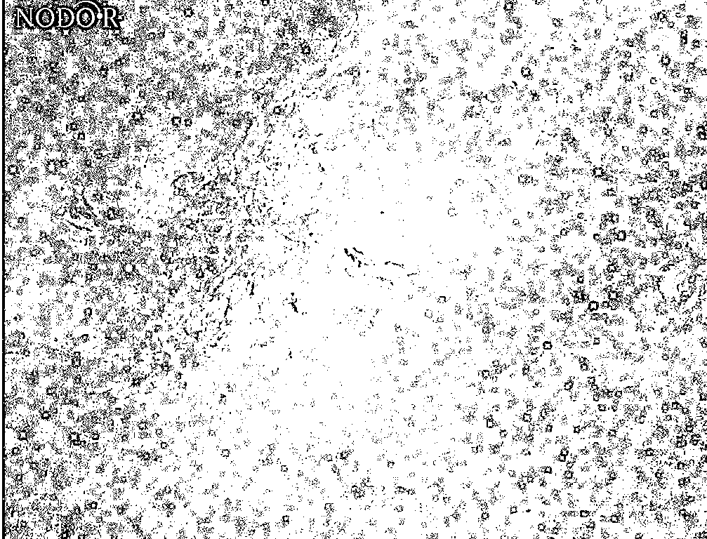

**个人星座**

**关键词**

**利己 纯真质朴 原生态 ****基础 根本 早期****单纯 简单 ****关注当下 狭窄的视角****自我中心 个人的**** 此时此地的意识****个人星座**对应的时期是：**从出生到青春期，也就是 0 岁-大约 12 岁时**。这几个星座——白羊座、金牛座、双子座、巨蟹座相对**关注自我、纯真质朴、原生态**。他们代表的是一些只有在关注自我时才能满足的需求，比如**生存、食物、衣服、语言习得和保护需求**。这种需求是基本的或根本的，在一个人进入更广阔的世界之前就需要得到满足。在这段时期，**对他人或者他人所关心的事情都缺乏觉知**。一个儿童或多或少都会觉得**自己是宇宙的中心。**他们关注的是**当下短期利益的满足**。

个人星座从特征上来说，**相对缺乏辨别力或分化**；**自由、愉悦、知识和归属感**才是他们追求的目的，而不是那些为他们规划好的特定历程。

*   **白羊座**代表的是**立刻、自由的行动**（我的冲动、我的愿望）；

*   **金牛座**代表的是**当下此刻未分化的感官满足**（我的愉悦、我的安全感、我拥有的）；

*   **双子座**象征着**追求未分化的信息**（我的兴趣、我的思考、我的认知）；

*   **巨蟹座**代表了**未分化的爱**（我的感受、我的母亲、我的家、我的家人）。

**社会星座**

**关键词**

**他人导向  相互的 互惠****人际关系 给予 互相依赖****分享 参与 社交 ****关联 合作 党派 派系****以群体为中心 地方性**

当孩子到了青春期，会发现**社会关系的重要性**，以及**除了自己之外，其他人也有正当的需求**。社会星座——狮子座、处女座、天秤座、天蝎座的本质是**需要与他人互动**。社会星座体现了**相互关系、互相依赖、互惠**的原则。

他们意识到，**他人无法得到满足时，自身也无法得到满足。**因此，从某种程度上来说，社会星座是**以他人为导向**的；他们期待着**分享快乐，相互满足。**因为社会星座**需要获得他人的认可**，所以他们倾向于**党派价值观和“党派政治”**。他们需要**获得所属集体的接纳和认可**，而不是无偏见地关心全人类的普世利益，这样的观点主导着社会星座的政治行为和政治原则。社会星座让我们与他人的交往越来越深入，更加富有意义，并在天蝎座达到极致——**彻底地融合**，**之后重生，进入宇宙层面的射手座**。每一个社会星座对他人的需求呈现出不同的方式。

*   **狮子座**需要其他人关注自己，满足自尊心的需求，也就是**被认可、赞成和确认**的需求。狮子座象征着**与他人相比时产生的与众不同和重要感**。狮子座的角色是**表演者、英雄、有创造力的艺术家、老板（一种占据优势的角色）**。

    狮子座还代表着**欣赏他人、赞美他人、让别人也感觉到特别**的需求。这种“互相赞美的社交”构成了**爱与被爱、表演者与观众、最好的朋友与伙伴**之间的关系。

     狮子座会问：**“我该如何吸引眼球，感受自己的与众不同？我该如何让你也感觉到自己的重要性、特殊性，并享受快乐？”** 

*   **处女座**需要他人，是为了能感到**自我有用、有能力**。处女座会问：**“我能为你做些什么？我怎样才能有所帮助？”**他们的角色是**问题解决者、解决麻烦的人、维护者和修理者**。这里关系的主题是**主-仆、师-徒、合作者-同事、商人-顾客**。处女座说：**“我愿意为您效劳。”** 

*   **天秤座**需要其他人保持**平衡和联结**。天秤座的本质是**互补**，需要**伙伴关系**，需要**与他人平等分享**。他们的角色是**外交官、商务合作伙伴、配偶、公关人、仲裁者（中间人）、魅力十足的主人**。天秤座问：**“我该如何呈现出和谐美好的状态呢？”** 
*   **天蝎座**需要其他人是为了获得**联合、结合**的感觉。这里的需求是**将各种独立分散的元素结合起来构成一个完整的整体**，**消除分歧，通过结合实现转化**。  这里的**角色和关系**是危机调停者、冒险者（消防员、急救卫生员和紧急救援者）、权力掮客（老板、专制君主、独裁者）、治疗者（医生、牧师、萨满），包括共同的组织、共享财务的关系、性关系以及一切与阴影人物相关的关系，比如罪犯、黑社会成员。天蝎座问：**“我该如何做才能感觉到深刻、结合与力量？”**

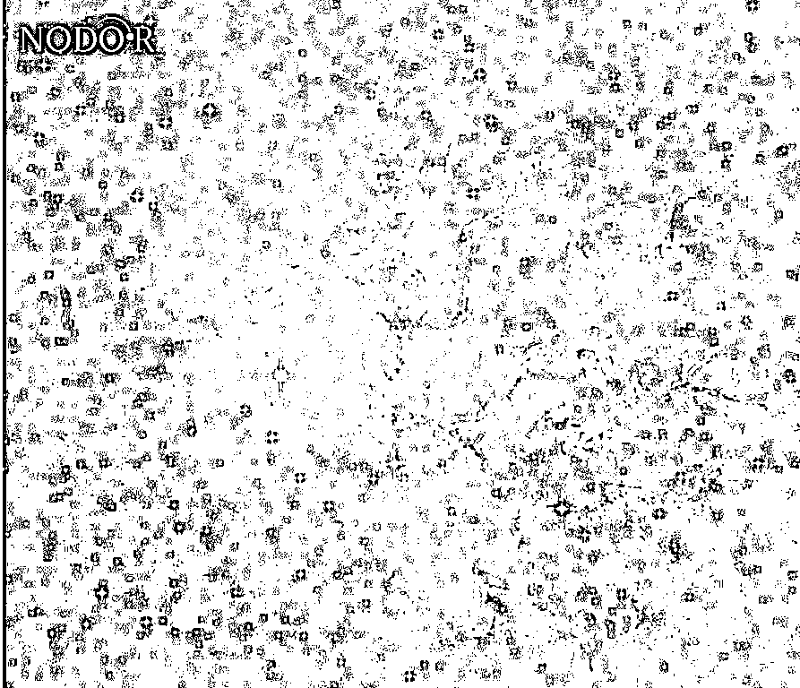

**宇宙星座**

**关键词**

**终极的价值和理念 群体关注****空想家 乌托邦 无党派人士 人道主义者****非自我中心 利他主义 仁慈 无私****整体 超越自我 宽容博爱 慷慨****非个人 理想主义 只见森林不见树木**当**步入不惑之年**，到了**度过中年危机**的年龄之时，我们已经很幸运地到达了能够开始**以更超然的视角看待世界、看待自身地位**的高度。宇宙星座——射手座、摩羯座、水瓶座、双鱼座的本质关心的是**整个人类**。这些星座**纵观全局**，审视这个超越个体、群体、文化和任何单一族群的整体是如何由不同部分形成的。个人星座和社会星座的关注点是**有限的视角**。个人星座说：“我，此地，此时。”社会星座说：“我和你在一起，直到死亡把我们分开。”宇宙星座说：“每个人，每个地方，永恒。”从这方面看，宇宙星座是**人道主义者、理想主义者、空想家。**他们**关心人权，关心世间正义、世界秩序、万物平等、全人类的和平。**

**终极目标和价值**是宇宙星座的职责。然而，如果一个人过于投入、执迷于理想，就会有**极端主义**的危险——**独裁者（摩羯座）、煽动家（射手座）、革命者（水瓶座）或是殉道者（双鱼座）**。当然，这些人物的出现在极端时期是必要的。

但一般来说，如果将我们本性中的这些部分整合起来，就可以为无限时空的前进做出自己微小的贡献。我们不必只靠自己或是在有生之年实现理想。

宇宙星座非常关注**群体层面**的事情，也就是**事物的原则**，而不是相对渺小的个人层面或社会层面。因此，**个人的安全或财富、个人的婚姻和子女，都可以为追求更高的目标而牺牲。**浓墨重彩地强调了一番宇宙星座，可能会因此呈现出**不掺杂个人情感的残酷无情**，有一些人对个体和所爱之人比较缺乏感受性，因为超然的理想取代了对个人和人际关系的注意力。

此人非常**着迷于事物的规则性或可能性，从而缺失了事物中个人、人性的方面。**这类人可能为了政治理念。炸毁俄克拉荷马州的政府大楼，或抛下怀孕中的妻子，跑到非洲去传教。

*   **射手座**希望去**教导人类，激发出他们更高阶的人性**，比如**道德、公正和智慧**。因此，射手座是**哲人、教师、传道者、煽动者、卫道士、宣传者或理论家。**

*   **摩羯座**希望**将射手座的宇宙真知与公正理念付诸现实**。因此，摩羯座**创造必要的架构，去实施执行射手座设想的规章制度**。 以这种方式组织现实社会，将理念付诸实践，覆盖尽可能多的人群。摩羯座**实用主义**的视角正是**管理者、主管、总裁、领导层或官僚主义者的形象。**

*   **水瓶座**希望**丢掉摩羯座的旧秩序，以平等、民主、自由、博爱的准则建立新的秩序**。水瓶座更推崇**无为而治的自由主义**，对于秩序的态度更为激进。其典型的角色是**自由论者、反传统主义者、革命者、无政府主义者、乌托邦的空想家。**

*   **双鱼座**希望**融入整体之中，放下自我的追逐，散播无私的爱，关怀那些流离失所、受苦受难的人们。**在这里，我们体会到**普世的慈悲之心，无分别的爱，**于是产生了**圣人、救世主、殉道者或神秘主义者**。

    然而，如果一个人过度执迷于此，可能会完全丢开自我利益，成为悲惨的牺牲者，精神异常，耽溺于一个理想化（但有破坏性）的对象之中——食物、酒精、毒品，或是某人某事。

**版权声明：**本文由若道翻译发布，欢迎转发，反对抄袭。友号转载请申请白名单。

**END**

**格伦·佩里**

若道签约老师，著名占星师，前 ISAR 董事会成员，共出版 8 本占星著作；心理/意识研究专业博士；占星心理学学院（*Academy of AstroPsychology*）的创办人；康涅狄格州研究生院（*the Graduate Institute of Connecticut*）原型宇宙学与意识进化项目的负责人。

# **占星原型与星图中的精神病理学**

为什么在占星学的课程中，会出现精神病理学的教学内容，这和我们有什么关系？这对占星咨询，或在自我了解与成长的过程中又有什么帮助呢？

**带着这些疑问，请你静下心来，思考以下几个问题**：

“**你/你的案主，是否曾经过度担心什么？** **你/你的案主，有没有感觉到担忧和焦虑，却不知道原因是什么？****你/你的案主，是否曾经觉得害怕什么东西，但理智上却很清楚它不会对你造成什么伤害？****你/你的案主，是否曾经通过沉迷某物，酗酒或滥用药物，自我伤害去逃避问题？****……****——节选改编自《心理学与生活》**”

如果你对上述问题其中之一，回答是。这意味着几乎每个人都曾有过心理障碍的症状（精神病理的问题）。

你看，其实“精神病理学”与人的心理有着密切的关联，再结合占星学，呈现了人内在与外在层面更加丰富和深刻的一面。**这对于学习占星学的人和占星师来说，都是一场难得的知识盛宴！**

**本课为 2 年期双证核心课程中的一部分**（AP105 阶段），其内容是过去若道所开设的核心课程从未教授的部分，特意抽出供其他学员学习，**可作为 ISAR 选修课，单独报名。**

**点击下方图片了解详情** 

**20 位来自世界各地的占星师****带来 19 场沙龙——新世界的觉醒****详情可点击下图**

**学习占星学****点击下图了解课程详情**

**

**微信又双叒叕改版啦，不想错过若道君的推送？**
****就把若道设为****星标****以及点点****“在看”****吧！******▼**

**喜欢就点一下“在看”吧！****报名直达入口**

# ISAR 选修丨占星原型与星图中的精神病理学

> 原文：[`mp.weixin.qq.com/s?__biz=MzA5NjA0NTAxNg==&mid=2651490603&idx=2&sn=fdc79faf78dacc77ec2fe792a407ad42&chksm=8b483b9cbc3fb28a32e5f060436a75f1bd379ef2dbc1f5717f4b4d83a50cfb634e9eb7911b28&scene=126&sessionid=1692737746#rd`](http://mp.weixin.qq.com/s?__biz=MzA5NjA0NTAxNg==&mid=2651490603&idx=2&sn=fdc79faf78dacc77ec2fe792a407ad42&chksm=8b483b9cbc3fb28a32e5f060436a75f1bd379ef2dbc1f5717f4b4d83a50cfb634e9eb7911b28&scene=126&sessionid=1692737746#rd)

**课程描述**

看过课程标题的你，也许会感到好奇和惊讶，为什么在占星学的课程中，会出现精神病理学的教学内容，这和我们有什么关系？这对占星咨询，或在自我了解与成长的过程中又有什么帮助呢？

**带着这些疑问，请你静下心来，思考以下几个问题**：

“**你/你的案主，是否曾经过度担心什么？** **你/你的案主，有没有感觉到担忧和焦虑，却不知道原因是什么？****你/你的案主，是否曾经觉得害怕什么东西，但理智上却很清楚它不会对你造成什么伤害？****你/你的案主，是否曾经通过沉迷某物，酗酒或滥用药物，自我伤害去逃避问题？****……****——节选改编自《心理学与生活》**”

如果你对上述问题其中之一，回答是。这意味着几乎每个人都曾有过心理障碍的症状（精神病理的问题）。

你看，其实“精神病理学”与人的心理有着密切的关联，再结合占星学，呈现了人内在与外在层面更加丰富和深刻的一面。**这对于学习占星学的人和占星师来说，都是一场难得的知识盛宴！**

**本课为 2 年期双证核心课程中的一部分**（AP105 阶段），其内容是过去若道所开设的核心课程从未教授的部分，特意抽出供其他学员学习，**可作为 ISAR 选修课，单独报名**。

**在正式了解本课的价值之前，先了解一下这门课程的主讲老师吧！**

**格伦·佩里（Glenn Perry）**

*   他是心理/意识研究专业博士、加州注册婚姻和家庭治疗师 （CAMFT）

*   占星心理学学院（Academy of AstroPsychology）创办人

*   康涅狄格州研究生院（the Graduate Institute of Connecticut）原型宇宙学与意识进化项目的负责人

*   共出版八本占星学著作：《心理占星学入门》、《心理占星论文集》、《盗取天火》、《从忠诚到革命》、《星图中的阴影》、《占星职业议题与伦理》、《出生星图深度分析》、《从古代到后现代占星学》

**墙裂推荐格伦老师这门课的 **

**4 大理由**

**你一定得知道的课程价值**

**价值*****1***
**明晰精神病理学的基本定义**

占星心理学学院创办人格伦·佩里老师，对**精神病理学的基本定义**就是灵魂受苦，精神就是灵魂的意思，病理就是受苦的意思，所以精神病理学研究的就是：人类各种各样受苦的方式，尤其是因为某一类的行为而引起的。

精神病理学是一个连续体，从比较轻微的，到比较严重的，这么说来，我们每个人都有一部分精神病理的问题。

**如果成为一个“人”，没有一定程度的挑战是不可能的。没有一定程度受苦，没有一定程度不平衡是不可能的。而这种不平衡就会以一种挑战和困难的姿态呈现出来。**

**价值*****2*****更懂疗愈：从不平衡到平衡**

**疗愈**是一个复杂的过程，讲的是将人从不平衡带到平衡这样的一个状态，将不同行星代表的心理功能带到一种更加平衡整合和合作的状态。

格伦老师通过研究精神病理学，发现每一颗行星，以及这颗行星所守护的星座，都和某一特定类型的病理是联结在一起的，包含了这个占星原型所涵盖的极端不平衡的情况。

举个例子，案主的第 1 宫，有很多星星在那里，和对面第 7 宫的火星形成对分相，第 1 宫白羊座或者火星白羊座的组合，和这个案主的反社会人格的病状联系在一起（这是一个星图的极端负面表现）。

“

**生活本身就是一场治疗，我们在占星的星图中去看到，人们所具有的创伤、不平衡及其产生的防御机制，最终都会在他生活中的关系和情境中呈现出来。无论他生活中处在怎样的情境之下，其实这些环境都是在为他提供恰当的环境，作为一种载体，让他去平衡和疗愈事件背后问题的根源。** 

**这样一个现象是持续不断地在发展，会让我们想到，会有一个更大的宇宙的智慧存在，它其实是在指挥和引导着我们的这些经验，让我们去经历然后进入更高层面的发展当中。生活或者“神”，就是我们所有人类的一个治疗师。**

**——格伦·佩里**

”**价值*****3*****了解诊断标准，提高咨询的专业敏感度**

如果能够对精神病理极端不平衡的情况有了解的话，你就会对它比较温和的版本更加敏感（大部分人是更温和版本的呈现）。

也许案主并没有达到某个病理所达到的层级，但是 Ta 有显示出，这个病理某一些特点或者某一些倾向。所以，我们的目标并不是去诊断案主，而是了解他在这个病理学连续体上处在一个怎样的位置。

当你拿到星图你会看到，案主不同的冲突，是体现在不同的部分上。某一个病状是体现在某一个行星，另外一个病状，是同步体现在另外一颗行星上。

当我们通过对占星原型星座和行星的病理学现象的学习后，就能看到占星学上的配置所呈现出来的，案主表现出的这些失调，并不一定都会成为一种心理临床上的诊断。有可能在案主这里呈现出一个很轻微，但是仍然在 Ta 生活中，给 Ta 造成挑战的一个点。

**价值*****4*****智力上的刺激——整合进阶**

这个课程能够让我们了解自己，了解我们的客户，了解我们的朋友，了解我们的家庭。它给我们提供一种崭新的方式，并且让我们看到占星原型的种种表达，不要局限在非此即彼、非好既坏的这样的一个概念当中，而看到它其实是一个不同程度的连续体。

当我们能够以这种方式去看的时候，你就能够将自己的生活，带入一种和谐。能够了解这是一个过程，我们的重点不是放在诊断上，而是放在整合上，因为生活，就是一种整合。

**课程内容**

**AP105 星图中的精神病理学与疗愈** 共**15 次**课程：**10 次 2019 年录播课+5 次直播课；30 课时**

在这个阶段的课程中,我们将**聚焦于十二星座(从白羊座到双鱼座）及其对应的守护星的潜在功能障碍。**

我们将学习如何识别、理解和应对每个星座的潜在挑战。我们将在各种相应的心理障碍背景下来考察占星原型，这些心理障碍表现为功能障碍、失衡的极端状态。

学员们将了解**《精神疾病诊断与统计手册》诊断标准**。我们会探讨治疗的概念，尤其是那些与整合和个性化相关的概念。我们将特别关注外行星的困难相位，以及它们与内在心理冲突、防御和症状形成的关系。

学员们将探索人的痛苦如何成为发展和实现天赋才能的催化剂。在考察病因时，我们会将平常的因果关系理论与传统的命运、业力和转世观念整合起来。

**口碑推荐**

‍**‍想感受格伦老师的课堂魅力？** **一小段讲课视频让你先睹为快~**<mpvideosnap class="js_uneditable custom_select_card channels_iframe videosnap_video_iframe" data-pluginname="videosnap" data-id="export/UzFfAgtgekIEAQAAAAAAxuwL_P9LDAAAAAstQy6ubaLX4KHWvLEZgBPElYFkVBZaNrKCzNPgMIuhBCuUlaCPzDNmHFgJR5sp" data-url="https://findermp.video.qq.com/251/20304/stodownload?encfilekey=rjD5jyTuFrIpZ2ibE8T7YmwgiahniaXswqzIGcAWV11d39RRKTicEUe1lSn5e1z2jdX20ath9yg9Liaia8VPS2c4MUJibl8FlxSZs3ajlcibhlD6typd6ZeGeWj2bQ&amp;adaptivelytrans=0&amp;bizid=1023&amp;dotrans=0&amp;hy=SH&amp;idx=1&amp;m=&amp;scene=0&amp;token=AxricY7RBHdXmmhmUb1Np3Ioz3Ok0V9IBZ0eINxnxticaC9r3HjsQ8iatkwqFBLKP50ZibXDm0TiaicC4" data-headimgurl="http://wx.qlogo.cn/finderhead/PiajxSqBRaEJYnVsqWfEX9qA0sI6hNVKsDfyzfPZ92WZMZyBpZWU5NA/0" data-username="v2_060000231003b20faec8c4e68a1ec2d4ca07e434b07755bbf47e7053a3059defd2c9d6c68a20@finder" data-nickname="若道" data-desc="#ISAR 选修课  如何识别、理解和应对每个星座的潜在挑战？如何在不同的心理障碍背景下来考察占星原型？" data-nonceid="4249051256207020861" data-type="video" data-width="1024" data-height="576"></mpvideosnap>

**课程费用**

**课程价格：9000 元****课程优惠价请添加 Margartet 咨询**

课程负责人：Margaret

（微信：18515059056）

请备注“心理占星 105”

**开课时间**

**直播课开课时间：2022 年 12 月 21 日**

**退转课程**本课程包含往期视频知识点视频课程+直播案例课程+助教直播答疑；报名付款后均不受理退款转课，请慎重考虑后再确认付款。**其他相关事项请仔细查阅报名勾选时的《教学协议》，如有疑问请咨询课程顾问。****报名流程及费用支付****1. 点击阅读原文链接立即报名，填写个人姓名（身份证姓名）和相关信息，阅读并同意《教学协议》，提交报名表，直接在线支付。****2. 付款后可在网页个人中心或手机网页“我的”栏目查看报名记录。****如遇疑问请与销售人员联络******ISAR 选修·占星原型与星图中的精神病理学****

**授课老师：格伦·佩里**

**直播课开课时间：**2022 年 12 月 21 日

**授课方式：**网络课程，中英文授课，中文翻译

**费用：9000 元（获取优惠请联系客服咨询）**

**课程负责人：**Margaret（微信：18515059056 请备注“心理占星 105”）

长按二维码添加课程负责人咨询~

**报名直达入口**

# 假期树洞丨假期最后一天，别惆怅！奔跑之前再躺躺吧

> 原文：[`mp.weixin.qq.com/s?__biz=MzA5NjA0NTAxNg==&mid=2651490602&idx=1&sn=5d0953f3d69d8f47c9adc7cf4f529fa6&chksm=8b483b9dbc3fb28bd24049b3f92ae730ce108fb3e7bc007064ef8084e1f63f38f098e4d2fe00&scene=126&sessionid=1692737746#rd`](http://mp.weixin.qq.com/s?__biz=MzA5NjA0NTAxNg==&mid=2651490602&idx=1&sn=5d0953f3d69d8f47c9adc7cf4f529fa6&chksm=8b483b9dbc3fb28bd24049b3f92ae730ce108fb3e7bc007064ef8084e1f63f38f098e4d2fe00&scene=126&sessionid=1692737746#rd)

**2022 年 10 月 7 日天象：**

*   **月亮在双鱼座**
*   ******太阳对分凯龙星******
*   ******水星三分冥王星******
*   ******火星四分海王星******

今天是周五，假期的最后一天，想到接下来连续的 7 天工作日，你是不是心情郁闷呢哈哈！如果有烦闷的心情，自然可以理解，因为月亮在双鱼座，可能你很想瘫软在家里、什么事情也不干，一直发呆到晚上，而火星四分海王星也会加强你的无力感和想要逃避的消极心态。但是，也别忘了双鱼座和海王星对我们的灵感和想象力的启发，投入各种类型的艺术创作活动，有助于活跃整个人的身心状态，再加上，你可以运用这股能量，描绘你对未来的憧憬，从而有了向前奔跑的冲劲儿。同时，水星三分冥王星，会让思考更加深入并贴近真相，你拥有很棒的洞察力。别惆怅！你开始跃跃欲试向前奔跑了吗？奔跑之前今天再躺躺吧！**了解每日天象，可****下载“若道”APP 查看****还有更多精彩等着你哦**

# 若道占星咨询丨 2022 还有不到三个月，你还能做哪些事呢？

> 原文：[`mp.weixin.qq.com/s?__biz=MzA5NjA0NTAxNg==&mid=2651490601&idx=1&sn=df953d21282d5a10a6dc0d4c06aa483d&chksm=8b483b9ebc3fb288ca400b29a0b8c5428a428177808600997953dcb65c55a278896ab3bc2fc0&scene=126&sessionid=1692737746#rd`](http://mp.weixin.qq.com/s?__biz=MzA5NjA0NTAxNg==&mid=2651490601&idx=1&sn=df953d21282d5a10a6dc0d4c06aa483d&chksm=8b483b9ebc3fb288ca400b29a0b8c5428a428177808600997953dcb65c55a278896ab3bc2fc0&scene=126&sessionid=1692737746#rd)

若道占星咨询平台至 2017 年运营至今，已有近 50 多位若道核心课程认证毕业生入驻。他们经过 2 年系统培训、累积完成近 150 小时的相关占星学理论学习、咨询技术的练习、通过若道认证考核后，成为职业占星师，开始开展占星咨询服务。距离 2023 年，还有不到三个月的时间，是时候开始规划你明年的发展了。你想以宇宙最合适你的步伐迈入吗？又如果你对自己的出生星图充满好奇，想通过占星学这门古老的智慧并在专业咨询师的陪伴下、探索自己的生命故事和人生困惑，欢迎来若道咨询平台预约！

专业占星师在这里等你

**若道占星咨询平台是以人本主义占星学导向的咨询，期望用博大精深的占星学提供优质信息，并通过和客户的交流，协助客户了解自己和他人、探索潜能、识别破坏性的人生模式、了解生命周期。**占星学是宇宙送给人类的礼物，我们愿意将这个礼物分享出去，让更多优秀的职业占星师为更多公众服务。如果你对自己的生命有困惑，不论这个困惑是学业、职业，还是爱情、婚姻、亲子教育、个人成长等，我们都欢迎你来！**本期我们将为大家推荐以下占星师：**

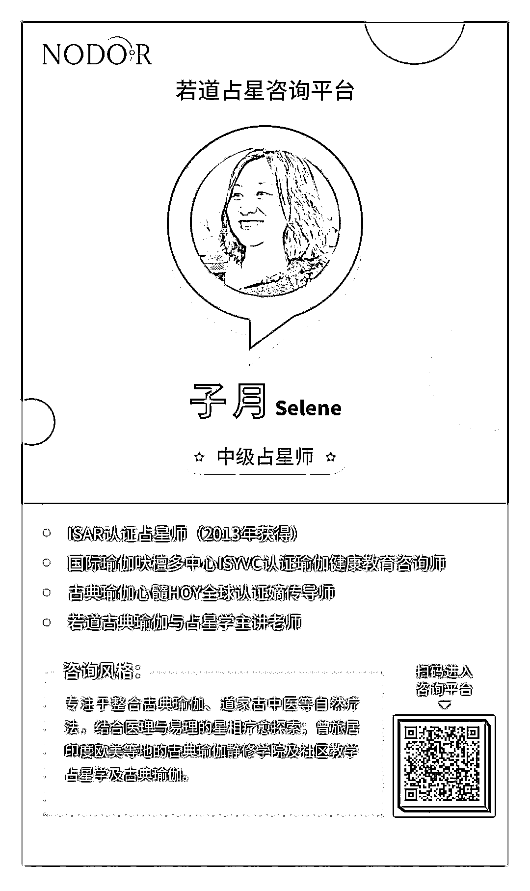

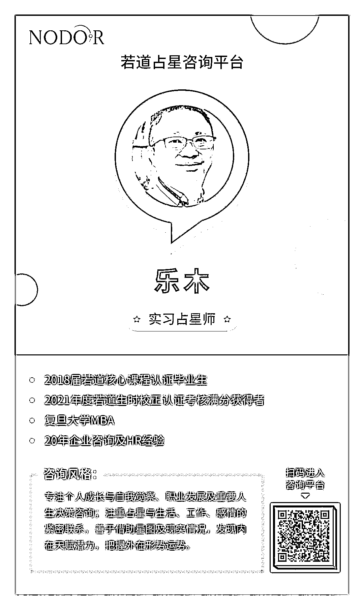

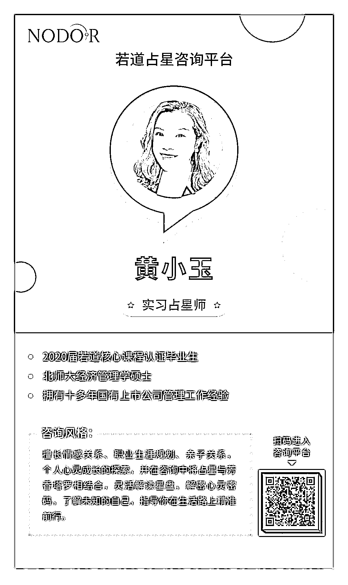

**来看看大家在咨询后的评价~**

如何预约占星咨询？

**方式一：****下载若道 APP，进入占星咨询栏目可以进行预约**

****

**方式二：通过若道服务号******

**如果你也想成为优秀的职业占星师？** 

**这里有个课程可以了解一下**

**

**未来 2023 年，祝大家身心愉快！**

# 2023 年如何用投资提升财富丨雷蒙德·A·梅里曼 2023 年《年度预报及讲座》来啦！

> 原文：[`mp.weixin.qq.com/s?__biz=MzA5NjA0NTAxNg==&mid=2651490529&idx=1&sn=71d6a7448e6789322546facd9860aaa0&chksm=8b483a56bc3fb340efa11e2b1e501ba9b8ef2968fd8cfe653e11db655b1abdd9b317c89037fc&scene=126&sessionid=1692737746#rd`](http://mp.weixin.qq.com/s?__biz=MzA5NjA0NTAxNg==&mid=2651490529&idx=1&sn=71d6a7448e6789322546facd9860aaa0&chksm=8b483a56bc3fb340efa11e2b1e501ba9b8ef2968fd8cfe653e11db655b1abdd9b317c89037fc&scene=126&sessionid=1692737746#rd)

从 2018 年年末，若道引入金融占星大师雷蒙德·A·梅里曼撰写的梅里曼市场时机学院每年一次的年度预报沙龙和每年一本的《年度预报》以来，**2023 年已经是第 5 个年度了。**

我们简单回归一下梅里曼老师 2019 年-2022 年的《年度预报》中一些预测。

在 2019 年的年度预报中，对于上证指数，梅里曼老师写到：

2018 年末至 2019 年初，中国股市处于三个重要周期低点的时间段。紧随这一低点，将会出现一次非常大的反弹。

2019 年木星会与海王星形成三次四分相，过去，这个相位总是与惊人的强大“泡沫”同时出现，期间股价大幅飙升。

到 2019 年 7 月之前，上证指数有三个重要长周期会出现周期低点，理想上看是在 2019 年 3 月底之前。

上证的周期低点出现在 2019 年 1 月，从那时起，上证迎来了 3 年的上升。

对于黄金，梅里曼老师建议：

从占星学角度来看，木星在射手座，四分在双鱼座的海王星，支撑看涨观点，因为这个组合有增加通胀的潜力。此外，木星在射手座的行星-星座组合从 1983 年起出现过三次，每次都对应到金银市场的年度高点。

无论在 2019 年何时，只要黄金保持在 1167 以上，同时跌到了任一主要周期低点附近，就要寻找买入机会。黄金可能在 2019 年涨到 1500+/- 50，甚至更高。

2019 年黄金从 1284 美元开始上涨，最高点在 1566 美元。

所以，如果你在 2018 年购买了《年度预报》，按照梅里曼老师的建议投资了上证指数和黄金，你会在当年取得相当不错的收益。

**对于 2020 年，在席卷全球、深刻影响了未来的疫情到来之前，梅里曼老师为 2020 年定下基调的：**

站在 2019 年的年尾，我们不知道一场深刻改变未来的风暴马上就将来临。

梅里曼老师，这位杰出的宇宙气象预报员，未卜先知，为 2020 年定下“将军”的基调。

在那一年，我们目睹了美国股市的 4 次熔断和全球经济的重置崩溃。

对于黄金，梅里曼老师是这么说的：

1391.50-1413.70 是价格最强的支撑区域。只要不跌破这个区间，黄金就能够上涨，重新测试 1566.20。如果突破了 1560-1590 的阻力区间，那么黄金就能够重新测试 1920。在那以前，黄金最有可能在 2020 年中在 1390 和 1575 之间波动。

| 黄金周 K 线图

2020 年，黄金在横盘 3 个月突破了 1560-1590 的阻力区间后，一路上涨到 9 月最高点 2089.20 美元。

对于上证指数，梅里曼老师建议：

2020 年的反弹将超过 2019 年的高点 3288。然而，这一涨势可能会通向 5.5 年周期的波峰，随后将再次迎来一波跌势至 2021 年或更晚。

行进中的摩羯座星群——木星、土星和冥王星——表明在 2020 年 11 月底之前会出现一个高点，很可能在 2020 年的前六个月。建议交易者特别注意金星逆行的时期，也就是 5 月 13 日至 6 月 25 日。逆行或顺行一个月内出现的年度高点或低点可能会带来卖出机会。

2020 年，上证指数最高达到 3474，超过了 2019 年的高点 3288。

**站在 2020 年的末尾，对于 2021 年，梅里曼老师说：**

随着 2020 年木星、土星和冥王星形成大合相，我们刚刚结束了一个周期和一个时代。此刻我们正处于一个新的时代和一个新的长周期的早期阶段。事实上，是多个长周期。

对于上证指数，梅里曼老师说：

我们预计涨势将在 2020 年 12 月-2021 年 2 月之间达到波峰，然后急剧下跌至 52 周和 22 个月周期的低点，这些周期将在 2021 年 5 月之前，甚至在 3 月底之前结束。此后可能会出现另一轮反弹，可能会也可能不会在 2021 年 11 月之前形成第一个 33 个月周期的新高。

对于黄金，梅里曼老师说：

黄金的 31.33 个月周期波谷将在 2021 年 9 月之前出现，理想情况是 2020 年 12 月-2021 年 6 月。价格目标是 1628+/-109 或 1768+/-76。重叠范围（理想情况）是 1692-1737。如果价格跌破这些范围，则为看涨情况中令人担忧的状况。

**而在 2022 年的年度预报里，我们看到：**

渐亏四分相不仅对应无法解决的冲突和分歧，土星和天王星形成的任何四分之一周期（合相、四分相和对分相）都可能在社会动荡和某地区现状受到威胁的时期出现。

在 2008-2010 年上一次四分之一周期时（对分相），世界见证了阿拉伯之春。在 1999-2000 年渐盈四分相期间，游行、抗议和直接武力冲突扰乱了西雅图世界贸易组织会议。这也标志着美国经济扩张的结束，以及由互联网泡沫破裂和 2001 年 9 月 11 日对美国世贸中心的恐怖袭击引发的衰退的开始。在此之前是 1988 年的合相，对应的事件是缅甸（Myanmar，当时的国名是 Burma）爆发了一场全国性起义，反抗尽失民心、暴力过度的军政府。数十万公民在全国范围内的暴动中抗议，这成为缅甸历史上的决定性时刻之一。

在每一个案例中，极端主义都占据主导地位，导致暴力冲突，但最终带来了“更大的益处”。它产生了建设性的结果，但在它进行的同时，世界在经历巨大的危机和暴力。”

2021 年 5 月 13 日-7 月 28 日，木星首次行经双鱼座时，这些因素表现得很明显。那时，通货膨胀开始出现，但美联储向所有人保证，这只是暂时的，他们将无限期继续推行“宽松货币”政策。他们并不担心持续的通货膨胀，这是典型的木星在双鱼座的表现，对现实的脱离或错误判断。

这两颗行星以及双鱼座也掌管原油。因此，我们可能会看到油价飙升，以及/或石油泄漏，威胁到大自然。它也可能对应着由于事故而释放的有毒气体，威胁到那些暴露其中的人的生命。

对于黄金，梅里曼老师建议：

只要黄金保持在 1670-1680 之上，仍然有极小的机会出现一轮爆炸性上涨，测试当前的历史高点（2089），甚至创下历史新高。毕竟，木星将在双鱼座合相海王星，可能预示着另一轮“投机狂热”。然而，这也可能是一个“恐慌”的征象，届时某些市场可能会崩溃。

在 1900-1980 之间存在较大的阻力，如果不能突破这个阻力，将表明黄金的熊市已经开始，新一轮的猛烈下跌可能正在准备中。只要跌破 1670 则将确认黄金 20 年的牛市结束了。

| 黄金周 K 线图

对于上证，梅里曼老师说：

我们预期在 2022 年 5 月前，上证综指会出现急剧的下跌，进入 52 周周期和可能的 33.5 个月周期低点。

我们更倾向于认为，上证综指会首先下跌，在 5 月前形成一个低点，然后上涨。这一轮上涨的幅度，将告诉我们上证综指是处在牛市，还是进入了新的熊市。如果它不能上涨超过 3750，长周期波峰可能已经出现，并且进入了新的熊市。

我们简单回顾了部分 2019-2022 年金融预报的内容，**过去的经验让我们相信，你根据梅里曼老师的指导作为投资参看，你会比一般人有更大的胜算。**

**2023 年度预报及沙龙预售**

**2023 年金融预报沙龙时间为 2023 年 1 月 7 日 10：00-13：00。**

一份价格仅千元的顶尖金融占星大师的投资分析报告和沙龙，聪明的投资者值得拥有。

**2023 年年度预报****及沙龙价格：****1380 元**

**前 60 名早鸟价：****1180 元**

**购买报告及沙龙**

**购买者重要须知****①** 梅里曼市场时机学院每年一次的年度预报沙龙和《年度预报》是梅里曼市场时机学院的研究“预报”，而不是市场“预测”，是梅里曼老师及其金融占星分析师对人类活动周期历史与行星周期之间相关性的研究，二者在大部分情况下具有 80%或更高的相关性，而不是因果关系。沙龙中和报告中的研究完全存在错误的可能性。即便是非常认真的研究和几十年的研究经验，我们无法总是正确地解读出各种征象在实际层面上会如何相互作用，并显化为事件结果。

所以请将次沙龙和报告看作一个研究参考，务必结合其他市场研究和你个人对市场的理解，根据你的自由意志做决策。

**②** 此报告一旦售出，**即不接受退款。**

**③** 此报告仅支持在手机网页阅读，不支持电脑阅读和下载。**④** 讲座提供视频回放。**以上须知，请仔细阅读。一旦付款，即视为已了解并接受所有须知内容。**

**如在购买报告中遇见任何问题**

**可添加客服**

▼

**购买报告直达入口**

# 若道周运 10.3-10.9 丨天公作美，快快乐乐享受假期吧！（内含 12 星座运势）

> 原文：[`mp.weixin.qq.com/s?__biz=MzA5NjA0NTAxNg==&mid=2651490528&idx=1&sn=18bb1eba9c2f4649f8208e89507dbec5&chksm=8b483a57bc3fb3410f33e6bc8c2212311e465ad11f0cd232bde89fb3d9149ce952d028e569d8&scene=126&sessionid=1692737746#rd`](http://mp.weixin.qq.com/s?__biz=MzA5NjA0NTAxNg==&mid=2651490528&idx=1&sn=18bb1eba9c2f4649f8208e89507dbec5&chksm=8b483a57bc3fb3410f33e6bc8c2212311e465ad11f0cd232bde89fb3d9149ce952d028e569d8&scene=126&sessionid=1692737746#rd)

******☆ ****后台回复“今日”，给你一句生命态度******

作者/朵三三三 ISAR 认证占星师
编辑/翀子 封面/书君 图片/稿定设计**整体氛围**

本周适逢小长假，又恰好是这样平静无忧的天象，真乃一大幸事。本周天象最大的特点就是几乎无事发生。所谓“没消息就是好消息”，在今年这样焦灼不安，风雨飘摇的大环境下，我们都能深深体会到，岁月静好的日子有多么难得，安宁祥和又是多么可贵。

**好好珍惜享受接下来的 7 天吧！**

**本周重要星象**

*   **水星三分冥王星**

*   **冥王星顺行**

**冥王星顺行**

经历过较为动荡的第三季度之后，可以说 10 月份的前三周都是宇宙留给我们的休整期。**在 10 月末的食季和火星逆行到来之前，我们要抓住机会好好充电，重整旗鼓，继续前行。**

本周唯一算得上重量级的星象也是好消息，**那就是 10 月 9 日，也就是本周日，冥王星即将在摩羯座恢复顺行。**这次顺行之后，冥王星就会一路向前，在明年 3 月份长驱直入水瓶座，为十几年来影响重大的换座揭开帷幕。

冥王星顺行后，我们会带着过去五个月在逆行中沉淀总结的经验，继续迎接新的挑战。**在本周顺行前的停滞期，我们会对冥王星的能量感应更强，**对于控制、压抑、信任、执着等议题更有感触，也是一个更加深入洞察自己内心感受，清理能量卡点的好机会。

**周末前后，**我们或许会对一些人、事、物做出放手的决定，或者从内在接纳一些曾经让我们困扰的存在，全然释怀、放下。**可以关注出生星图中冥王星所在的领域，以及摩羯座所在的宫位，这都是本周考验的重点。**

冥王星将在摩羯座 26°恢复顺行，这已经是它第五次经过这里，也是在我们有生之年，最后一次经过这里。**可以回想一下 2021 年 3 月-6 月以及 2022 年 1 月发生了些什么事情、我们当时处在怎样的状态中、面对怎样的课题。**

**在接下来的两个多月里，我们有机会去处理这些问题的遗留部分，完成一个漂亮的收尾。**

**这次顺行，对于星图中有重要个人行星落在白羊座、巨蟹座、天秤座、摩羯座 26°-30°的人来说影响更大。**

**一周星象****周一**

*   **摩羯座月亮四分天秤座太阳**

*   **小受挫的一天**

**内在需求与外在追求发生矛盾，**比如内心有一些明确的目标和需要，而外部环境中考虑到关系和谐的维护，只好先压抑情感的真实表达。

由于是四分相，这些矛盾或许都在内心小剧场中上演，外人未必能够察觉到此刻你心中正进行的挣扎。

也有人在经历阴阳两种能量的失调感，这种感觉或许是：在该坚持自己的部分上退缩了，却在该柔和的部分上强硬了。

还可能是，一些人在经历两性关系的冲突，可能是异性给自己施加压力，导致自己内在焦虑感增强。

**周二**

*   **摩羯座月亮三分处女座水星、合相摩羯座冥王星；月亮进入水瓶座、六分白羊座木星**

*   **暗涌且克制的一天**

**月亮和水星在土象星座的三分相，**意味着我们此时很需要一些对于现实状况的探讨、交谈和沟通。

**中午附近发生的月冥合相**也会让我们有一些强烈的情绪升起，此时我们需要更多的安全感，也容易因此升起执念。我们能做的就是感知它、感受它、与它同在。

**月亮进入水瓶座之后**，我们需要更多独处的空间。**而傍晚的月木六分相**，预示着我们能够拥有轻松的心情和一个愉快的夜晚。

**周三**

*   **水瓶座月亮三分天秤座金星、三分天秤座太阳**

*   **欢乐富足的一天**

三分相是自然地流淌，今天不需要刻意做什么，也会有很多积极正向的能量注入到我们的生活中。

**发生在风象星座的三分相，**显示了这种能量更可能是通过信息、聊天、表达、语言来实现的。或许我们跟亲近的人聊得很开心，也可能是接触到让自己喜悦的文字或讯息，也或许是人际关系为我们带来轻松舒适。

**这自然是适合社交和聚会的一天，**我们的魅力也会自然散发，无论是什么性别，都容易与身边的女性互动融洽，关系和谐。

**周四**

*   **水瓶座月亮合相水瓶座土星、三分双子座火星；月亮进入双鱼座**

*   **适宜放空的一天**

**凌晨及清早，月亮与火星、土星呈和谐相位**，虽然和谐，但依然会带来情绪上的不安与躁动，只是不会以激烈的方式呈现。所以我们的状态会倾向内敛、回缩，需要自己的空间。

今天的大部分时间我们都处于**月亮空亡期**。月亮空亡期间，我们的情绪和状态往往比较懈怠，想要躺平，所以建议今天多休息，或跟随心情做自己喜欢的事。此时如果有工作、学习上的任务，恐怕效率较低，精力也容易分散。

**夜晚九点附近，月亮进入双鱼座**。可以听音乐、做冥想、做瑜伽，或动笔写一写心情日记。双鱼座月亮的夜晚，适合早点入睡，因为灵感可能在梦中出现。

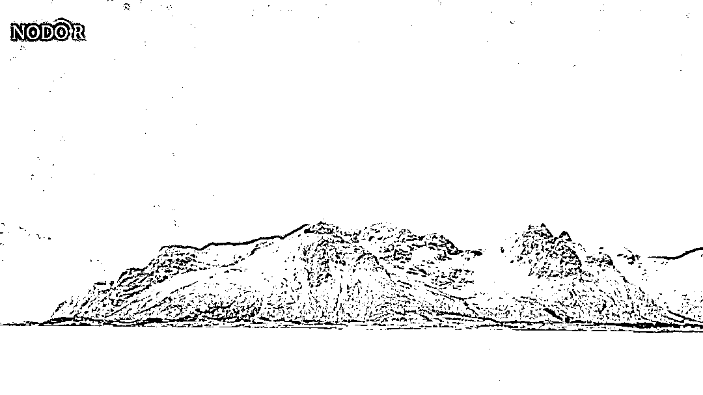

**周五**

*   **处女座水星三分摩羯座冥王星**

*   **犀利敏锐的一天**

此时我们的判断力爆棚，洞察力绝顶。处女座是水星的入庙位置，本来就心思缜密、逻辑超群，对每一个细节都能够把握到位，加上**与冥王星的三分相**的加持，更是如同利刃被打磨，锐不可当。

今天或许会有些秘密被公开，同时也很适合坦白，或进行心理咨询、心理疗愈。我们有机会跟他人开诚布公地深入交谈，更加了解彼此。

今天的天象也很适合学习，注意力能够高度集中，攻坚克难出成果。

**周六**

*   **双鱼座月亮对分处女座水星；月亮进入白羊座**

*   **剪不断、理还乱的一天**

今天就像一团乱麻，**月亮与火星的压力相位**容易让人失去耐心，而**月亮和水星的对分相**是词不达意，很难抓住重点。由于在带有不稳定性和多元性的变动星座，更加剧了混乱感，我们可能需要同时处理多件事情。

千万不要着急、求快，不然胡子眉毛一把抓，只能越慌越乱。

今天自然不适合进行重要会谈，如果实在无法避开，那么尽量耐心细致地表达，更加详细地去询问对方的意图。

**周日**

*   **白羊座月亮合相木星、对分天秤座金星；冥王星顺行**

*   **易沉沦、易宠溺的一天**

白羊座月亮把自己的意愿放在第一位，加上与金星和木星的相位，今天很容易跟着自己的感觉走，很开心。

**但月亮和金星的压力相位**，依然要提醒自己有节制和适度的意识，比如在消费、金钱方面，或是情感方面。此时我们容易陷入两个极端，无论是太自我，还是太依赖关系，都会让我们陷入失望或失衡中。

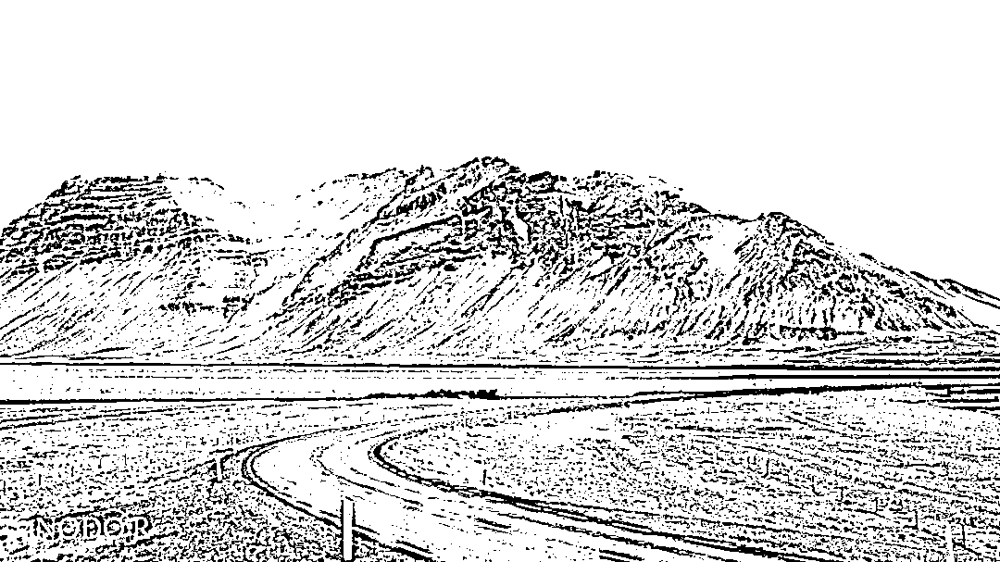

**12 星座一周运势**

**（重点参考上升星座，其次参考太阳星座）**

***白羊座***

周初会感到一些责任与压力，也需要注意与领导、权威、上级之间的关系。即便在休假中，也可能会有一些工作需要处理。

周中前后，会渐渐找回状态，处理事情变得很有效率，从过去一周困扰你、让你感到迷茫的事情中走出来。

本周大部分时间都会非常自律，除了邻近周末会想要放纵一下。这个周末对你来说非常轻松，人际运、桃花运都很好，但此时，对需要工作的白羊座就比较困难了，“假期综合症”会很明显。

***金牛座***

你可能想要拿出更多时间放在学习、旅行，或能够提升、充实自己的事情上，也可能根据自己的兴趣爱好进行学习新技能的选择。还有部分金牛座重新开始考虑迁移、搬家、远方的事宜，或者开启异地、线上的合作。而本周的桃花运也更多与远方、异地相关。

周末前后，你想要更多的独处，跟自己安静的待着。

***双子座***

本周前几天，双子座们的心情还是有些沉浸、停留在过往的一些事情中，可能有些提不起劲，只想放松休息。越到周中前后，心情越开朗外放，更容易主动呼朋唤友，聚会聊天。

周五前后，可能与家人会有一次深入交流的机会，可以敞开心扉、消除隔阂，也会聊到一些现实、财务问题，并很容易达成一致。也有部分双子座，开始处理重要深刻的情感关系中的棘手部分。或是跟对方一起解决，或是向外寻求帮助，比如借助咨询、调解、或第三方的力量。

***巨蟹座***

本周前几天，可能为了亲密关系、婚恋情感、人际方面的事情烦恼，也会在这些方面感受到压力或阻碍。周五前后，可以通过与亲近、信任的人交流，分析当前面临的问题，做出有效判断和决定。

周末前后，工作、职场上可能传来喜讯，有些人可能拿到 offer，或者决定跳槽，或者有升职的好消息。

***狮子座***

本周前几天的精力更多放在日常琐事上，也有部分狮子座需要加班，对同事关系、职场环境有疲惫感。

本周也需要处理一些金钱、交易的事项，临近周末时，或许会做出财务上的一个重大决定。

周末前后，可能收到学习、培训、出差的消息，你对于这个消息的感受是正向积极的，很可能是期盼已久的心愿达成。

***处女座***

过去几周受到在 1 宫的水星逆行的影响，你的状态有些陷入停滞。但本周开始，你会感觉到生活又恢复了正常节奏，头脑思维都变得更加清晰。

本周你对于情感、兴趣爱好、创意思考较多，也可以说是更加重视自己的心之所向。也有部分处女座开始考虑子女、生育方面的问题，周五前后，你会非常明确自己想要的到底是什么。

周末有可能出现情绪性消费，注意量入为出。

***天秤座***

本周可能会花较多精力投入在家庭、亲情、父母方面，最初几天你较为情绪化，但周五前后，你能从新的角度对这些困扰、阴影有深刻洞察，和新的见解。这些思考和觉察的过程，让你有种灵光一现、豁然开朗的感觉。

周末，你能够享受情感、人际关系带来的愉悦，有部分天秤座可能在这个时间段脱单，开始一段新关系。

***天蝎座***

本周更多关注学业、沟通交流、与亲近的人相处，这其中可能会经历一些暂时的困难或阻碍，在这个过程中，你也可能放大自己的感受。

周五前后，可能跟朋友之间进行意义深远、有启发性、帮助性的谈话，让自己走出思想上的困境。也可能是与合作伙伴、客户、团体平台之间进行重要对话，让你觉得离自己的愿望和计划又更近了一步。

***射手座***

本周的前几天会格外关注金钱、财务领域。周六可能出现一些家庭和工作之间的冲突，需要好好平衡。

周末前后，事业上会有新进展，可能是自身有了更加清晰的规划，确立了未来发展的新方向，也可能是合作方面有喜讯，例如与上级领导，或一些组织、人脉达成协议，成功实现了自己的目标。

部分射手座在子女、孩子方面有令人惊喜的事情发生。

***摩羯座***

随着冥王星即将顺行，会有一些过往的压力卷土重来。在本周的停滞期，你可能会感觉有些焦虑，这其实是来自内心对自己过高的期待和要求。可以利用假期好好休息，恢复精力。

前面几天容易情绪化，但临近周末会拨云见日。周五前后，可能会有来自异地、网络的消息让你重获生活的目标，精神抖擞。周日前后，有一些工作方面的进展和变化让你内心雀跃，需要注意的是，或许要平衡公事和私事之间的冲突。

***水瓶座***

本周大部分时间是内心戏的演绎，会感觉到过去隐藏的问题再次浮现，尤其是内在没解决好的心灵成长课题、烦恼，以及一直想要逃避的黑暗面。

周五前后，你有机会更深刻地了解自己，可能是不经意间与他人的谈话，也可能是你参与的一个活动，或是你读到的一些文字。

周末前后，可能有短途出差、旅行、学习的机会，这会让你暂时抛却压力，心情一下好起来。

***双鱼座***

近期可能再次感受到来自于团体、社交圈、人际关系方面的压力，尤其是那些与你年纪悬殊，更有社会地位的人们。但周五前后，你可能会通过理性有效的一对一沟通达成合作，或建立起对你有帮助的人际关系。在这其中，你可能会知晓一些秘密或内幕。

周末前后，财运提升，但此时金钱流动性大，有可能出现冲动性消费。

**版权声明**：原创文章由作者授权首发于若道平台发布，欢迎转发，反对抄袭。友号转载请申请白名单。

**END**

****朵三三三****

ISAR 认证占星师

全职占星师/塔罗师/国家三级心理咨询师 

人大文学学士/德国慕尼黑大学文学硕士

**微博/微信公众号**：朵三三三

长按打赏

**20 位来自世界各地的占星师****带来 19 场沙龙——新世界的觉醒****详情可点击下图**

**学习占星学****点击下图了解课程详情**

**微信又双叒叕改版啦，不想错过若道君的推送？**
****就把若道设为****星标****以及点点****“在看”****吧！******▼**

**喜欢就点一下“在看”吧！****报名直达入口**

# 假期树洞丨水星顺行了！你是不是松了一口气？快来畅所欲言吧！

> 原文：[`mp.weixin.qq.com/s?__biz=MzA5NjA0NTAxNg==&mid=2651490498&idx=1&sn=f184b1ed3b7a27c400ffefbe22bfbe98&chksm=8b483a75bc3fb3633a6bb53829b22870d768c186e2681d0b4162529ee03e44e2609c60c23d6f&scene=126&sessionid=1692737746#rd`](http://mp.weixin.qq.com/s?__biz=MzA5NjA0NTAxNg==&mid=2651490498&idx=1&sn=f184b1ed3b7a27c400ffefbe22bfbe98&chksm=8b483a75bc3fb3633a6bb53829b22870d768c186e2681d0b4162529ee03e44e2609c60c23d6f&scene=126&sessionid=1692737746#rd)

**2022 年 10 月 2 日天象：**

*   **15:37 月亮进摩羯座**
*   ******17:07 水星顺行******
*   ******金星对分木星******

今天周日，也是假期第 2 天，你是懒懒待在家里还是已经精神抖擞的开始各种假期活动了呢？下午月亮进入摩羯座，你可能会准备处理一些需要认真对待的事情，也没准正好要加班！哦，这个忙碌的假期。但因为金星对分木星，即便感到严肃，你依然会觉得自己乐观、积极、热情，但要注意避免任性放纵和奢侈浪费哦！好消息是，水星在今天下午顺，行，啦！回顾此次水逆经历（点击【[重大天象丨水星不但逆行了，还横跨两个星座！！！！！！](http://mp.weixin.qq.com/s?__biz=MzA5NjA0NTAxNg==&mid=2651488491&idx=1&sn=267575b1af5ccf7a2b698120bdd7bdf5&chksm=8b48325cbc3fbb4ac0aba5695da8f30922839a8e3c6b99fd0c49adcdd29409fcf489d4c84500&scene=21#wechat_redirect)】查看文章），你是不是松了一口气呢？假期就是要畅所欲言，快来分享你心里想说的话吧！ 周日快乐！假期快乐！明天我们依然有周运奉上，敬请期待！**了解每日天象，可****下载“若道”APP 查看****还有更多精彩等着你哦**

# 10 月宇宙天气丨行星逆顺转变期，如何度过天蝎座能量超标的月份？

> 原文：[`mp.weixin.qq.com/s?__biz=MzA5NjA0NTAxNg==&mid=2651490448&idx=1&sn=3cf67ee2d6ed37e3ae78f2e8dbf8cb4b&chksm=8b483a27bc3fb33125e1e532118898f0b1391e3cb7a9933b7a8c833c4e435d08eec5cd417ac5&scene=126&sessionid=1692737746#rd`](http://mp.weixin.qq.com/s?__biz=MzA5NjA0NTAxNg==&mid=2651490448&idx=1&sn=3cf67ee2d6ed37e3ae78f2e8dbf8cb4b&chksm=8b483a27bc3fb33125e1e532118898f0b1391e3cb7a9933b7a8c833c4e435d08eec5cd417ac5&scene=126&sessionid=1692737746#rd)

******☆ **后台回复“今日”，给你一句生命态度****

作者/Anastasia

编辑/翀子 封面/书君 图片/稿定设计

**十月重点天象**

*   **水星顺行（10 月 2 日）**

*   **冥王星顺行（10 月 9 日）**

*   **白羊座满月（10 月 10 日）**

*   **水星进入天秤座（10 月 11 日）**

*   **土星顺行（10 月 23 日）**

*   **金星进入天蝎座（10 月 23 日）**

*   **太阳进入天蝎座（10 月 23 日）**

*   **天蝎座新月伴随日偏食（10 月 25 日）**

*   **木星逆行进入双鱼座（10 月 28 日）**

*   **水星进入天蝎座（10 月 30 日）**

*   **火星逆行（10 月 30 日）**

**整体氛围**

十月非常热闹。**水星、冥王星、土星纷纷恢复顺行。**恢复顺行当然是好事，说明行星能量短期整理完毕，继续出发向前走了。快到月底的时候，只有木星、天王星和海王星还处于逆行的状态。**月底，火星又会加入逆行的队伍，这也是一次重磅的逆行。**

**顺逆转换的时候，往往是行星能量停滞，最混乱的时候，**不能一听到顺行就口呼阿弥陀佛，心想万事大吉，一放松就容易吃亏。要避免大意失荆州，在黎明前吃个亏。

**十月下旬，**金星、太阳、水星都换座天蝎座，再加上天蝎座日偏食，我们来到了全年含蝎量最高的一个月。

天蝎座能量与社会禁忌有关，冥王星、天蝎座、第八宫能量强的人往往会有一种内在的深层恐惧，骨子里还是对自己和他人的不信任。**这种爱恨冲突带来的恐惧在天蝎月会比平时更容易显化。**

那些不能采取行动满足自己的欲望，或者无法直面自己真实欲望的人，最容易产生自我防御和偏执倾向，情绪波动会比较大。

这些还没有完，月底，**天蝎座的古典守护星火星将开始两年一次的逆行，**全程在双子座，会给变动星座（双子座、处女座、射手座、双鱼座）带来持续的忙碌、混乱和冲突。

**尤其是生日在 5 月 29 日到 6 月 18 日的双子座和生日在 11 月 30 到 12 月 19 日的射手座，首当其冲，其次是处女座和双鱼座受到的影响最大。**

土冥合相已经影响过基本星座（白羊座、巨蟹座、天秤座、摩羯座），土天四分相正在影响固定星座（金牛座、狮子座、天蝎座、水瓶座），变动星座（双子座、处女座、射手座、双鱼座）这次终于无法再隔岸观火，独善其身了，必须正面迎接这波较大的考验。

**出生星图上双子座所落的宫位，是遭遇冲突和麻烦的高危领域。**火星逆行引发的强烈生存欲和意志力容易导致过度的冲动和愤怒，人们的注意力和精力将不可避免地被牵制在其中，这将成为所有人接下来半年多的生活重心。

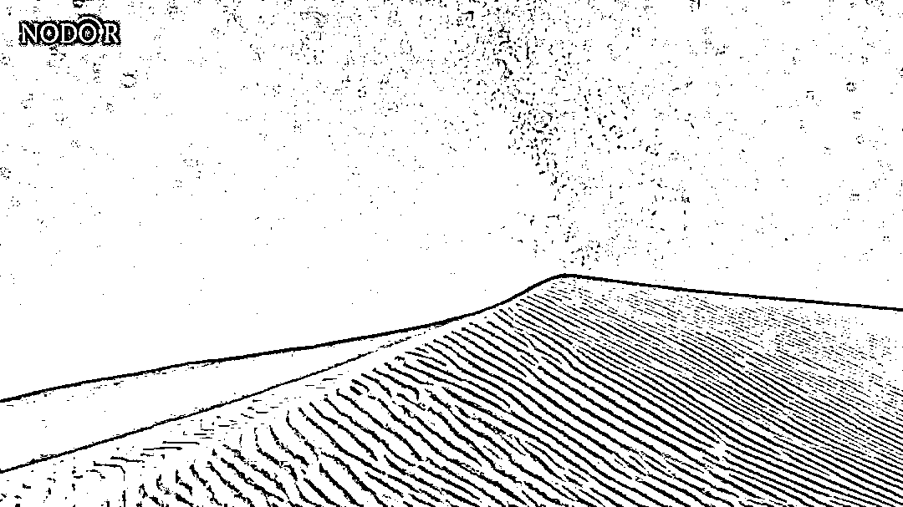

**重点天象****★****水星、冥王星、土星恢复顺行**

**水星在 10 月 2 日，于处女座 24°恢复顺行，**10 月 17 日离开天秤座 8°，脱离后阴影期，恢复正常运行速度。**我们还有半个多月的时间来总结这次逆行的收获，尤其集中在学习、交流、思维模式领域。**

及时复盘，归纳总结，会帮助我们对这些经验看得更清楚，印象更深刻。下次就可以及时止损避险，避免总是在同一个坑里摔跤。

**冥王星在 10 月 9 日，摩羯座 26°恢复顺行。**对于生日靠后的基本星座这算是极大的好消息了。冥王星恢复顺行后，将在明年 3 月离开摩羯座，进入水瓶座，开始碾压固定星座。

明年 6 月，冥王星再次逆行回到摩羯座，继续进行清理和净化。10 月在摩羯座 27°恢复顺行，2024 年 1 月，再次进入水瓶座。2024 年 9 月，冥王星最后一次逆行回到摩羯座，11 月就彻底进入水瓶座，深耕水瓶座，再次回到摩羯座就是二百多年之后的事情了。

**总结一下，冥王星在摩羯座最后的时间段是：**

*   **2022 年 10 月-2023 年 3 月**

*   **2023 年 6 月-2024 年 1 月**

*   **2024 年 9 月-2024 年 11 月**

冥王星的行运就是如此，一步三回头，来回试炼，生怕人们不长记性。摩羯座，以及它的基本星座小伙伴白羊座、巨蟹座和天秤座，一定会对它印象深刻。

至于是否顺利度过冥王星行运带来的心理危机，是否获得了成长经验和模式转化，离自己的真正本质更进一步；还是经历了极大的压力，压制了自己的需求，变得更加极端和执著，完全取决于每个人出生星图的本质和之前的人生经历。

**土星在 10 月 23 日，水瓶座 18°恢复顺行。**本次土星逆行从水瓶座 25°开始，逆行区间有 7°。逆行期间，土星的运行区间每个月只有两三度。10 月，土星完成顺逆转换，除了 10 月 1 日，其它时间完全停留在水瓶座 18°。从 10 到 11 月，土星只走了水瓶座 18°和 19°两度。

**生日在 2 月 7 日-10 日的水瓶座将压力巨大。**

**土星行运将告诉人们：**

*   **日常生活才是最佳学习经验的领域，通过深度的体验聚焦的工作，以及在当下看到行动的结果来达成学习；**

*   **相对于思维、直觉和灵感，物质次元的运行十分缓慢，必须付出艰苦努力，才能推动事情的发展；**

*   **事物的边界在哪里，执着的代价是什么。降低内心抗拒物质世界的那层阻力，坚持运作下去，我们才会发现，在何处遭遇了挫败，在何处通过了考验；**

*   **促使人们留意最根本的本质，如果脱离了自己真正的本质，外界的考验就会显得格外艰难。**

欢迎本次土星逆行重点影响人群对照检查，完成复盘。

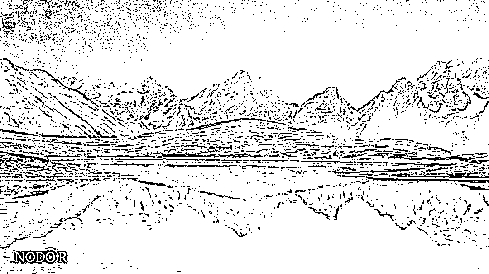

**★****木星逆行回到双鱼座**

木星在 7 月 29 日开始为期四个月的逆行。**10 月 28 日，木星逆行回到双鱼座。11 月 24 日，木星在双鱼座 28°恢复顺行，12 月 20 日重新回到白羊座。**这是木星在双鱼座停留的最后两个月。下次木星回到双鱼座将在十二年之后的事情了。

**木星回到双鱼座，最利好的是生日在水象星座最后 3 度的巨蟹座、天蝎座和双鱼座**，尤其是双鱼座。将近两个月的时间，他们再次深入体验木星带来的自信、身心愉悦和终极思考，带着觉知，重新确认人生的意义和方向。

木星象征的机会、慷慨、热情和信念，重新给水象星座注入勇气和信心，**去链接更庞大的事物以及更宏观的秩序，去探索未知的远方和高远的理想。**木星会为水象星座揭示未来的发展方向，尤其是双鱼座，需要诚实地面对自己的内心。

复盘这半年来的经历，是否在其中已经看见了未来的影子？请再次拷问自己：对错之间如何界定？道德和法律如何分辨？个人真理和主流价值观如何协调？

**用两个月的时间，为未来十二年校准发展的方向。**

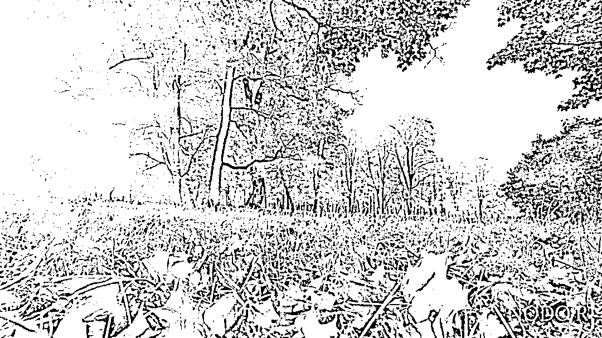

**★****火星在双子座逆行**

**火星每两年逆行一次，每次逆行时间两个多月，**如果逆行区间落在同一个星座，它就会在这个星座停留超过半年时间。

上一次火星逆行发生在 2020 年，从 2020 年 6 月 28 日进入白羊座，到 2021 年 1 月 7 日离开白羊座进入金牛座，火星在白羊座停留了六个半月。

这回火星在双子座的逆行，又是跨年逆行，**从 2022 年的 10 月 30 日到 2023 年的 1 月 13 日，逆行区间是双子座的 25°到 8°。火星 8 月 20 日进入双子座，直到明年 3 月 25 日离开，在双子座停留将近七个月的时间。**

**查看双子座 8°到 25°在出生星图上的宫位区间，**如果其中还涉及到个人行星、相位结构或者四轴，更要提醒自己保持警觉。你们就是本次火星逆行的天选人群，要非常小心观察自己的愤怒、冲动和情绪变化，**保持冷静和理性，时刻提醒自己欲速则不达，**千万不要逞一时之勇，换无穷后患。

**几乎整个十月，海王星都在双鱼座 23°，火星逐渐停滞、顺逆转换，都处于四分海王星的结构中。**这会造成有心无力，情绪又爆炸又压抑的状态。社会面戾气上升，处事一定要低调。多一分理解，多一分平安。

**注意：身体健康、情绪欲望、生存资源和勾心斗角的竞争，都是容易发生混乱和冲突的领域。**

不知道大家有没有发现，水星逆行区间是天秤座 8°到处女座 24°，火星逆行区间是双子座 8°到 25°，短短几个月，变动星座几乎被覆盖了全区间。除了生日在月底的变动星座，受到的影响可能会稍微小一些。变动星座要迎接考验了。

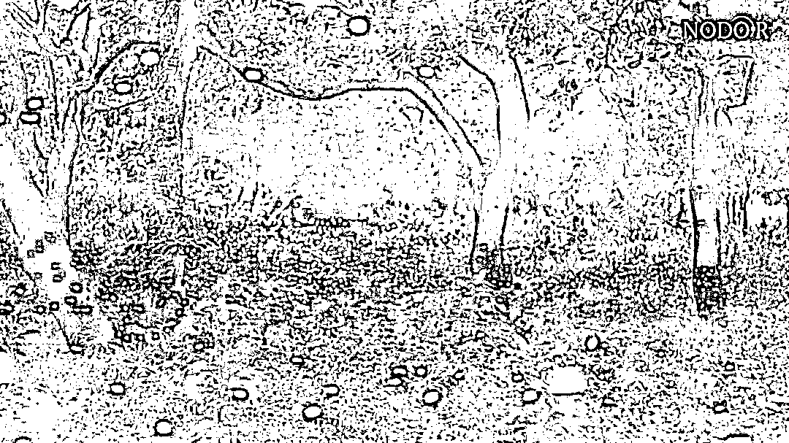

**★****朔望周期**

**伴随着 10 月的天蝎座新月，会有一次日偏食。**日偏食发生的时候，月亮运行到地球与太阳之间，月亮阴影外侧的半影会覆盖地球的一部分地区，这些地区的人们就会看到太阳有一部分被月亮遮住，形成日偏食。

**9 月 26 日到 10 月 10 日是上弦月周期，**身体能量会更注重吸收和消化，建议适当控制饮食。10 月 3 日，月亮在摩羯座进入上弦月，10 月 10 日，月亮在白羊座形成满月。

**10 月 10 日到 10 月 25 日是下弦月周期，**身体会更倾向于清理和排毒，这时候多吃一些不易发胖。10 月 18 日，月亮在巨蟹座进入下弦月周期；10 月 25 日发生天蝎座新月，同时发生日偏食，开启新一轮月相周期。

前面说过这是含蝎量最高的一个月份。十月的满月和新月能量都会在人们的经验中凸显关系主题。满月的时候，太阳合相金星，月亮对分金星；新月的时候，太阳、月亮、金星精确合相在一度之内。

**在这个朔望周期里，利用月相能量，好好看清和理顺自己的关系吧。**

**满月发生在 10 月 10 日的凌晨 4:54，白羊座 16°**。重点影响人群是生日在 4 月 4 日、10 月 10 日、7 月 9 日和 1 月 7 日前后的基本星座。

这个满月对于心智的发展非常友好，太阳合相金星，三分火星和土星，对分月亮，日金火土是一个大三角；月火土是一个小三角，构成了一个大风筝结构。**满月像一面镜子，映照出太阳和金星在天秤座的能量，引导我们，在关系中找到合适的发展道路。**

同时，水星三分冥王星。这又是一个利于深入思考，拨开迷雾找到真相的能量象征。冥王星会让我们的思考能力深不可测。

满月让我们看见真实，同时需要考虑到呈精确四分相的火星和海王星。如果真相不能令我们满意，就要提醒自己，在表达自我和愤怒的时候，一定要有分寸，有理有据，树立起自己的边界。不上当，不犯浑，不被自己的情绪带偏。

**新月发生在 10 月 25 日傍晚 6:48，天蝎座 2°。重点影响人群是生日在 10 月 26 日、4 月 22 日、1 月 23 日和 7 月 25 日前后的固定星座，会明显感受并且经验到太阳星座的能量。**

新月凸显的是太阳、月亮、金星的精确合相，提示人们的内心可能存在着强烈的爱恨冲突。要么正视它，要么被它干掉。这里同样有一个助力的风象大三角，涉及火星、水星和土星。有想法，就要去落实。有愿望，就要写下来。

新月最重要就是许愿。愿望这东西就是很想拥有，但又很难拥有的东西。一定要通过许愿，来获得宇宙的助力。

具体许愿内容请参照天蝎座 2°所落宫位的象征领域。这个度数的萨比恩寓意是：

At a clearing of pioneer days in the forest all the neighbors have gathered to assist in a happy house-raising.  （森林里，一个属于拓荒者晴朗日子，邻居们愉快地聚集在一起帮助盖房子。）

请想象这样的场景，许下属于自己的愿望。文字是有力量的。最后，请告诉自己：“我会成为这样的自己”。

**满月和新月的当天，都可以断食或者轻食，给身体一个清理和重启的机会。**

**12 星座十月小贴士**

**（参考太阳星座和上升星座）**

**★ ****白羊座**

*   **忙忙碌碌，控制生活节奏**

*   **加强互动，推进重要关系**

**★ ****金牛座**

*   **开源节流，日常开销增多**

*   **关注内心，提升自我价值**

**★ ****双子座** 

*   **略感疲惫，注意韬光养晦**

*   **倾听他人，助力自我认知**

**★ ****巨蟹座** 

*   **回归内心，减少尘世纷争**

*   **服务家庭，提高小家意识**

**★ ****狮子座** 

*   **充满希望，站得高看得远**

*   **人情往来，深化朋友关系**

**★ ****处女座** 

*   **有些焦虑，工作任务繁多**

*   **得偿所愿，自我价值提升**

**★ ****天秤座** 

*   **渴望提升，深入学习进修**

*   **注重公平，协调各种关系**

**★ ****天蝎座**

*   **深挖过往，直面内在恐惧**

*   **适当放手，避免钻牛角尖**

**★ ****射手座**

*   **远离小人，提高判别能力**

*   **魅力提升，社交活动增多**

**★ ****摩羯座** 

*   **注意身体，适当降低目标**

*   **工作顺利，获得有力支持**

**★ ****水瓶座** 

*   **好事发生，创作欲望强烈**

*   **贵人相助，打开更高视野**

**★ ****双鱼座**

*   **压力渐大，操心事情增多**

*   **略有偏财，收获共享资源**

**版权声明：**原创文章由作者授权首发于若道平台，欢迎转发，反对抄袭。友号转载请申请白名单。

**END**

**Anastasia**

职业占星师/专栏作者/策展人

ISAR 认证占星师（2016 年获得）

若道认证生时校正资质（2015 年获得）

**微信公众号**：KairosMoment

长按打赏

**20 位来自世界各地的占星师****带来 19 场沙龙——新世界的觉醒****详情可点击下图**

**学习占星学****点击下图了解课程详情**

**微信又双叒叕改版啦，不想错过若道君的推送？**

**就把若道设为****星标****以及点点“****在看****”吧！**

**▼**

**喜欢就点一下“在看”吧！****报名直达入口**

# 插班中丨神话塔罗：高效学习班上线，灵活掌握，专业实践！

> 原文：[`mp.weixin.qq.com/s?__biz=MzA5NjA0NTAxNg==&mid=2651490448&idx=2&sn=b40e50194026acda4fa1d9fffc165952&chksm=8b483a27bc3fb33194b790678cb35e280cc15a66a9a55881feb4081f29fbfae9095647505bc0&scene=126&sessionid=1692737746#rd`](http://mp.weixin.qq.com/s?__biz=MzA5NjA0NTAxNg==&mid=2651490448&idx=2&sn=b40e50194026acda4fa1d9fffc165952&chksm=8b483a27bc3fb33194b790678cb35e280cc15a66a9a55881feb4081f29fbfae9095647505bc0&scene=126&sessionid=1692737746#rd)

**2022 年超高含金量的神话塔罗认证课程****高效学习班****开始招生**用**四个月**的时间学习掌握神话塔罗解读喜欢**集中学习，快速掌握**的同学不要错过

黄色日期为**8 节直播课**时间，同学可以自由安排时间学习**18 节录播课**

班级学习群讨论、APP 答疑区提问

课程内容体系让你直观精准地感受到**神话塔罗的魅力**扎实地建构**神话塔罗思维**系统学习**最地道的塔罗知识**课程中老师将**神话、占星、心理学**完美融合进塔罗的**人本主义咨询体系**并进行学员**案例督导**让你更自信的开展咨询工作，学以致用

本期认证课程采取**即报即学的录播课+案例督导直播课**的形式，

*   **18 节录播课：**精编剪辑，随来随学，助教答疑，学练结合。

*   **8 节直播课：**融会贯通，神话心理，塔罗占星，咨询技巧。

为了适配大家的各种学习场景，提高学习&复习效率，我们还将**录播课**剪辑了**中文字幕版**和**翻译音频版**：

*   **中文字幕版：**朱丽叶老师英文原声配中文字幕，适合在手机或电脑前专心致志的学习。

*   **翻译音频版：**翻译老师幼婷的中文原声纯享，适合运动、通勤路上耳机里陪伴式学习。

若道还为塔罗学员开发了**“神话塔罗”**平台，是随身的工具，更是接咨询的平台，录播课程**学成入驻平台**即可链接更多塔罗个案，发展壮大你的塔罗咨询事业。

**如果你想学习塔罗，什么样的老师会让你怦然心动呢？她是三副塔罗牌的设计者，写了 6 本塔罗书籍。她研习塔罗四十余年，教授塔罗三十余年，是丽兹·格林的密友。还有****谁会比塔罗牌设计者更了解塔罗的历史、灵魂与精髓？****所以，这将是你开启塔罗之旅最坚实的一步。**

1

**这位塔罗大师是谁？**

**朱丽叶·沙曼-伯克** 

*   她是**3 副塔罗牌**的**设计者****——**神话塔罗牌、沙曼–卡塞利塔罗牌、“自己着色”塔罗牌；

*   她出版了**6 本塔罗书****——**《塔罗全书》、《新塔罗全书》、《众星的传说》、《理解塔罗牌》、《精通塔罗牌》、《塔罗初学者指南》；

*   她研习塔罗**四十余年；**

*   她教授塔罗**三十余年**；****

*   她是**丽兹·格林**的密友，两人合著了**《神话之旅》**，共同设计了**神话塔罗牌**。

*   她是认证的**心理治疗医师；**

*   她深谙**塔罗、占星学、心理学和神话学。**

**如果你想成为拥有英国神话塔罗认证的塔罗师**

那么她，就是你**最好的老师人选**

2

**塔罗牌有什么用？**

*   塔罗牌是一种**古老的疗愈工具**，同时也是**直观的解惑工具****；**

*   塔罗牌绕过逻辑思维，**和潜意识联结**，通过图像的方式生动地将隐藏在人类潜意识中的画面浮出水面，**揭示心灵的状况和运作****；**

*   塔罗牌**帮助我们和潜意识对话**，可以和现代的心理治疗联系在一起，帮助我们**看清心灵的冲突来源、本质和可以选择的道路；**

*   塔罗牌又和更广阔的**宇宙生命原型**联结，彰显**个人生命发展的阶段**，将**个人生命挣扎、内在冲突**放在生命进化的道途上，让更广大的生命智慧为个人成长照亮道路。

3

**为什么学习神话？**

神话通过**图像和故事**描绘人类生活的**原型模式**。通过瑰丽的想象、诗意的语言、栩栩如生的人物和故事描绘出我们内心的世界，表达出我们经历的那些实现人性的过程，帮助我们将**个体的生活与人类古老且永恒的故事**建立联结。从而在更深处**理解生命**，并学习**古老而长青的生命智慧**。

**神话塔罗**取材于**希腊神话**的无尽沃土，通过故事提供一种**记忆辅助**，在心理和预见层面提升解读的**丰富度**。因为这样更符合塔罗牌的性质，符合人类的想象。**按照故事思考，而不是简单的记忆关键词和固定的意义。**

4

**塔罗预测是什么？**

塔罗牌预测的运作就像是**照向心灵的一面镜子**。在塔罗牌解读时，图像的原型性质穿透隐藏的潜意识脉络，反应出与个人境遇相关但又未被了知的知识与洞见，因此**揭示出按照任何理性方式都无法发现的事情。**

如果你对生命好奇，塔罗学习会帮你**打开一扇通往未来的门****，**让你了解**心灵运作和显化的秘密**，同时赋予你更多关于生命成长的支持和指引的能力！

5

**我们将学习什么？**

**录播课（即报即学）**

**☆****初阶：神话塔罗详解**

**神话故事和预测意涵**

**第 1 讲 塔罗牌介绍 ，讲述它的历史 （中文字幕版）**

**第 1 讲 塔罗牌介绍，讲述它的历史（翻译音频版）**

**第 2 讲 星座形态、元素和宫廷牌&基本星座与基本国王 （中文字幕版）**

**第 2 讲 星座形态、元素和宫廷牌&基本星座与基本国王（翻译音频版）**

**第 3 讲 固定星座与固定王后（中文字幕版）**

**第 3 讲 固定星座与固定王后（翻译音频版）**

**第 4 讲 变动星座与变动骑士（中文字幕版）**

**第 4 讲 变动星座与变动骑士（翻译音频版）**

**第 5 讲 小阿尔卡那牌权杖（中文字幕版）**

**第 5 讲 小阿尔卡那牌权杖（翻译音频版）**

**第 6 讲 小阿尔卡那牌圣杯（中文字幕版）**

**第 6 讲 小阿尔卡那牌圣杯（翻译音频版）**

**第 7 讲 小阿尔卡那牌宝剑（中文字幕版）**

**第 7 讲 小阿尔卡那牌宝剑（翻译音频版）**

**第 8 讲 小阿尔卡那牌星币（中文字幕版）**

**第 8 讲 小阿尔卡那牌星币（翻译音频版）**

**第 9 讲 经典牌阵教学讲解（中文字幕版）**

**第 9 讲 经典牌阵教学讲解（翻译音频版）**

**第 10 讲 牌阵解读案例演示（中文字幕版）**

**第 10 讲 牌阵解读案例演示（翻译音频版）**

**☆****中阶：神话塔罗牌阵应用**

**神话****解读和咨询技巧**

**开启神话塔罗愚人之旅**

****

**第 1 讲 愚人、魔术师、女皇、皇帝（中文字幕版）**

**第 1 讲 愚人、魔术师、女皇、皇帝（翻译音频版）**

**愚人**：永恒的少年（儿童的原型）

**魔术师**：恶作剧者、老师、向导、沟通者的原型；行星：水星。

**女王**：母亲、养育者、丰产的原型；行星：金星在金牛座；小行星：谷神星。

**皇帝**：父亲、供养者、计划者的原型；行星：木星。

**第 2 讲 女祭司、教皇、恋人、战车、正义、节制（中文字幕版）**

**第 2 讲 女祭司、教皇、恋人、战车、正义、节制（翻译音频版）**

**女祭司**：处女——等待被实现的潜力原型；行星：新月。

**教皇**：疗愈者、受伤的疗愈者、牧师的原型，牧师是神与人之间的灵性桥梁；行星：凯龙星。

**恋人**：爱、爱人、所爱之人的原型；行星：金星在天秤座。

**战车**：战争、冲突、战士、斗士的原型；行星：火星。

**正义**：智慧、兵不血刃的胜利的原型；星座：处女座；小行星：智神星。

**节制**：关系、合作的原型；星座：巨蟹座、双鱼座。

**第 3 讲 力量、隐士、命运之轮、倒吊人、死神（中文字幕版）**

**第 3 讲 力量、隐士、命运之轮、倒吊人、死神（翻译音频版）**

**力量**：力量的原型；星座：太阳在狮子座。

**隐士**：晚年、耐心的原型；行星：土星。

**命运之轮**：命运女神与命运的原型。

**倒吊人**：牺牲与有意识的牺牲的原型；行星：海王星。

**死神**：死亡、终点和起点的原型；行星：冥王星。

**第 4 讲 恶魔、高塔、星星、月亮、太阳（中文字幕版）**

**第 4 讲 恶魔、高塔、星星、月亮、太阳（翻译音频版）**

**恶魔**：阴影、人类不文明的面向、本能、欲望天性；行星：火星在天蝎座。

**高塔**：改变、分裂瓦解的原型；行星：天王星。

**星星**：希望的原型。

**月亮**：无意识的原型；行星：暗月。

**太阳**：意识、创造力和文明的原型；行星：太阳。

**第 5 讲 审判、世界（中文字幕版）**

**第 5 讲 审判、世界（翻译音频版）**

**审判**：复活、新生的原型；行星：水星作为灵魂向导普绪科蓬波斯。

**答疑与讨论，学员们分享对自己或客户的塔罗解读，对神话塔罗牌进行更多探讨。**

**世界**：整体、完成和个性化的原型。

**第 6 讲 经典牌阵教学讲解（中文字幕版）**

**第 6 讲 经典牌阵教学讲解（翻译音频版）**

**第 7 讲 咨询案例演示：为一位年轻女性所做的四次解读（中文字幕版）**

**第 7 讲 咨询案例演示：为一位年轻女性所做的四次解读（翻译音频版）**

**第 8 讲** **引导式冥想、荣格的四种意识功能（中文字幕版）**

**第 8 讲 引导式冥想、荣格的四种意识功能（翻译音频版）**

**☆****高阶：神话塔罗直播督导课**

**第 1 讲 塔罗牌中的荣格原型**

**2022 年 8 月 10 日（周三）**

我们将学习荣格是如何理解原型，以及荣格原型如何反映在塔罗牌中。对塔罗牌解读而言，理解原型的普遍性非常有帮助，因为这有助于塔罗咨询师碰触客户的内心世界。

**第 2 讲 塔罗牌是如何与行星原型和其原型体验联系在一起**

**2022 年 8 月 24 日（周三）**

大阿卡纳牌反映了行星神祗的原型，在某些情况下，原型经验意味着它们反映了所有人类的经验。我们将通过这个角度看这些大阿卡纳牌。我们将看到理解原型对解读有何帮助。

**第 3 讲 荣格意识的四种功能与小阿卡纳牌的四种元素及与权杖、星币、宝剑、圣杯四套牌之间的联系**

**2022 年 9 月 7 日（周三）  **

我们将看看小阿卡纳从 1 到 10 如何反映荣格意识功能的各个方面，以及它们如何反映在四套牌四个元素和其心理方面。我们还将对 1-10 的数字学进行修正，看它们在元素中的表现方式。

**第 4 讲 占星学中的 12 星座和宫廷牌之间的联系**

**2022 年 9 月 21 日（周三）**

我们将讨论形态和星座，以及它们如何反映在宫廷牌上。

**第 5 讲 马蹄牌阵学员案例督导**

**2022 年 10 月 19 日（周三） **

**第 6 讲 六芒星牌阵学员案例督导**

**2022 年 11 月 2 日（周三） **

**第 7 讲 凯尔特十字学员案例督导**

**2022 年 11 月 16 日（周三） **

****

**第 8 讲 三个牌阵学员完整案例督导**

**2022 年 11 月 30 日（周三）**

**认证阶段：考试论文**

录播课学习完毕，即可入驻若道神话塔罗平台，以实习塔罗师获得推广流量，对接塔罗咨询个案。

直播课+录播课学习完毕，提交考试论文通过即可获得获得英国神话塔罗认证证书，升级为认证咨询师。

**扫码进入全新神话塔罗 H5**

每天有事没事都可以去**神话塔罗 H5**里转转抽取专属于你的今日塔罗

**神话塔罗 H5 问答平台全新上线**

三张牌牌阵，专业塔罗咨询师语音条解读

如果你碰巧有困惑，刚好有**限时优惠价**

如果感到快乐你就用用**神话塔罗 H5****，**如果你感到不快乐，更要使用由专业人本主义塔罗师团队全程陪伴的**神话塔罗 H5 哦！**

6

**适合人群**

*   塔罗初学者，完全没有塔罗基础；

*   塔罗自学者，也曾上过塔罗工作坊，但仍不懂如何使用塔罗牌；

*   塔罗进阶学习者，有塔罗基础，了解 78 张塔罗牌含义；

*   不知如何解决遇到的情感困惑、职业选择、人际问题，对人生感到迷茫；

*   想要学习深入解读塔罗牌、牌阵的使用、咨询技巧等将塔罗运用于咨询实践；

*   想要深入了解和学习塔罗，希望成为专业的塔罗师；

*   想要借助塔罗进行心灵、灵性成长。

7

**导师简介**

**朱丽叶·沙曼-伯克**

**朱丽叶·沙曼-伯克**从 20 世纪 70 年代早期开始，就对塔罗牌产生了兴趣，并踏入了塔罗的世界。后来，在丽兹·格林的鼓励下，开始研习心理占星学和塔罗。

1984 年，第一本书《**塔罗全书**》（*The Complete Book ofTarot*）出版。之后，与丽兹·格林合作设计并撰写了《**神话塔罗**》（*The Mythic Tarot*），在这本书中，她们将古希腊神话与传统塔罗解读结合起来。朱丽叶写了**十本塔罗和占星学书**，包括一本名为《众星的传说》（*Stories from the Stars*）的儿童读物，以及与丽兹·格林合著的《神话之旅》（*The Mythic Journey*），这是一本详细讲述如何运用神话来指导生活的书。

8

**课程价格**

**认证课程总价：****22000 元**

**联报优惠价：****19000 元**

**限时转发优惠价：18000 元（联系 Echo 老师，获取限时转发优惠价）**

长按二维码添加客服 Echo 老师

9

**退转课程**

*   **退款原则请详看《教学协议》，如有疑问请咨询课程顾问。**

**神话塔罗认证课程**

**授课老师：朱丽叶·沙曼-伯克**

**授课时间：录播课即报即学，直播课 2022 年 8 月 10 日起**

**授课方式：**网络课程**，**英文授课，中文翻译

**费用：****认证课程总价：****22000 元；****联报优惠价：****19000 元；****限时转发优惠价：18000 元**（联系 Echo 老师，获取限时转发优惠价）

**课程负责人：Echo 老师**（微信/手机：nodoor18518412824，请备注“神话塔罗”）

长按二维码添加课程负责人咨询~

**END****报名直达入口**

# 神话塔罗之小阿卡纳牌 | 圣杯侍者

> 原文：[`mp.weixin.qq.com/s?__biz=MzA5NjA0NTAxNg==&mid=2651490448&idx=3&sn=4c9a8794f49097cd3d5b04b79c4ac3cf&chksm=8b483a27bc3fb331122ab375c0af94005cb63878a0fe65c0d794b106beb18815b813a9b639f8&scene=126&sessionid=1692737746#rd`](http://mp.weixin.qq.com/s?__biz=MzA5NjA0NTAxNg==&mid=2651490448&idx=3&sn=4c9a8794f49097cd3d5b04b79c4ac3cf&chksm=8b483a27bc3fb331122ab375c0af94005cb63878a0fe65c0d794b106beb18815b813a9b639f8&scene=126&sessionid=1692737746#rd)

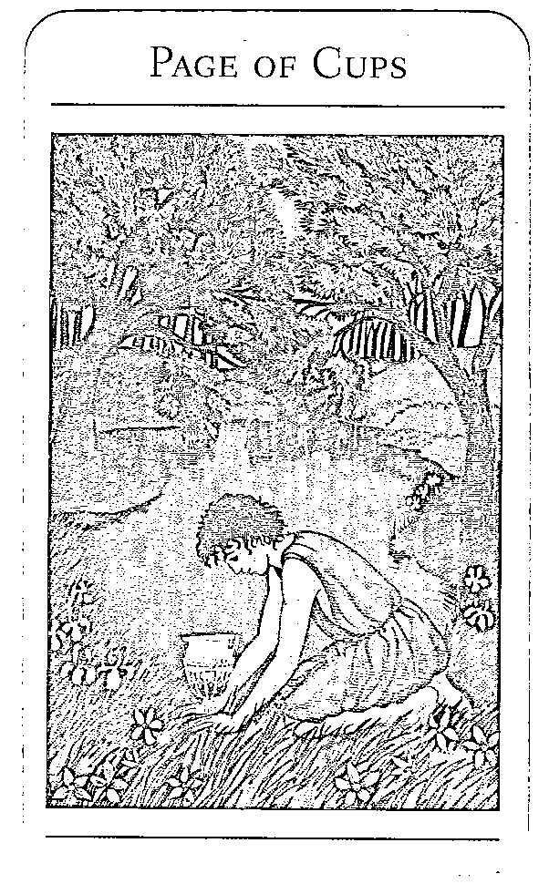

作者/朱丽叶·沙曼-伯克 丽兹·格林

译者/闫东升 编辑/玫瑰 图片/神话塔罗 网络

本文节选自《神话塔罗》

每一套小阿卡纳牌都有宫廷牌，包括侍者牌、骑士牌、王后牌和国王牌，和数字牌不同的是，它们反映的并不是具体的事件和体验，而是某个特定层面的典型特质。 我们讲述关于宫廷牌的第一个故事就是圣杯侍者。

**书名：**

神话塔罗 

**作者：**

朱丽叶·沙曼-伯克   丽兹·格林 

**出版日期：**

2011-08-02

圣杯侍者对应的希腊神话人物 

**纳西索斯**

**恋上自己倒影的纳西索斯**

圣杯侍者牌描绘的是一个 12 岁左右的黑发男孩儿，身穿一件淡紫色的束腰外衣，跪在一汪碧蓝的池塘边。池塘的岸边立着一个金色的圣杯，男孩的眼神热烈地盯着它，因为他通过圣杯看到了自己的影像，而且被其中的美丽深深吸引。

他四周的草地上开着一丛丛的鸢尾和水仙。透过四周郁郁葱葱的树林，能看到明媚的蓝天。

圣杯宫廷套牌中的神话形象反映出了这套牌的核心特质。**在这张侍者牌中我们看到了水元素的初始阶段那种善变、脆弱和温柔的特质，整个牌面象征着情感能力的萌芽。**

画中的男孩是神话中美丽的纳西索斯（*Narcissus*），他爱上了自己在水中的倒影。纳西索斯是一个悲剧人物，他的父亲是河神刻斐索斯（*Cephisus*），母亲是一个女神。

任何人都可能爱上纳西索斯，即使他还是个男孩儿，男性和女性都为他的美丽着迷，蜂拥着向他求爱。他的母亲听从了预言者提瑞西阿斯（*Tiresias*）的建议，绝不允许他去看自己的倒影，所以他并不知道自己的样子（身份）。

有一天，纳西索斯在泰斯庇斯（*Thespian*）的乡村散步，他走到一个池塘边，池塘的水来自一汪山泉，清澈见底，就像银色的月光，没有任何的家畜、飞禽、野兽和人类玷污它，即使脱落的树枝都没有掉进里面。

疲惫的纳西索斯来到池塘边，觉得非常口渴，当他低下头取水喝时，看到了自己在水中美丽的倒影，他一下子就爱上了自己的倒影。

开始的时候，他试图去拥抱和亲吻面前这个美丽的男孩儿，但是不久就发现那是自己的倒影，于是他就躺在池塘边一直凝视着倒影，不愿起身。

最后，纳西索斯再也无法忍受不能获得至爱的痛苦，用匕首刺入自己的胸膛，他哭喊着说：“幻影中的挚爱，再见了”，然后气绝身亡。在他血液浸泡过的土壤中，开出了一丛丛白色的水仙花。

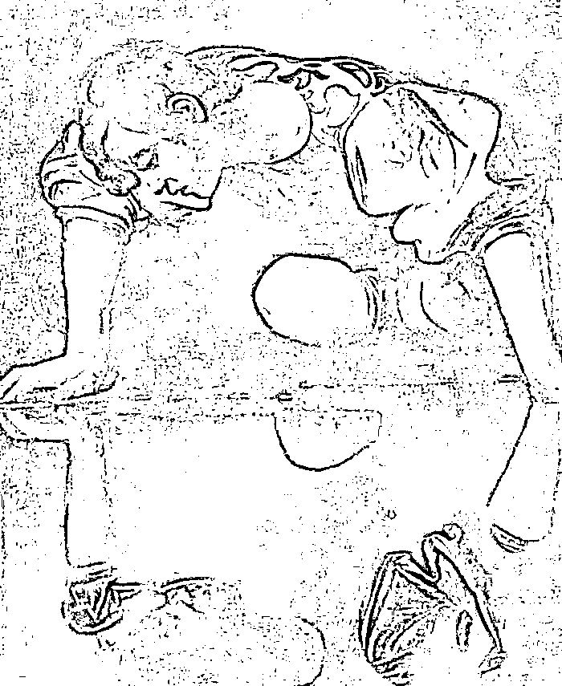

| 纳西索斯**情感初期的自爱阶段**

**圣杯侍者牌中的纳西索斯，不仅呈现的是自恋的意象，还有自我毁灭的一面。**

爱一个人必须要先学会**识别和认可自己的价值**，否则爱情就会充满痛苦而且无疾而终，因为**没有深入了解自我的价值，人们就会不断尝试通过他人寻找自己，这样的关系必然以失败告终。**

纳西索斯的自恋和自私是发现自我价值的开始，也仅仅只是开始，最后我们还是要学习**真正地爱上一个独立的他人，而不是一个完全让我们满足自我（完整）需求的幻影。**

圣杯侍者牌中纳西索斯的意象呈现出一种**暧昧不明**的特质。

从某种意义上说，他反映出**情感生命温柔单纯的初始期**，是一种**爱的能力的新生**，或者是**被不幸的旧有关系毁灭或挫败后的爱之信仰的重生**。**纳西索斯反映的自爱是一种疗愈的开始，弥漫着幼稚和虚幻的味道。**

很多人在经历了**失去爱人或强制性分离**的境遇后，要经历很长一段时间的情感暗夜期，此时他们觉得**没有任何东西可以给予他人了**，通常他们在这个阶段也**不会关心自己**。

然后**爱的能力会缓慢和逐步地恢复，从关注自己的身体和所处环境的方式开始**，那是一个**温柔和细腻**的过程，人们会开始**取悦和滋养自己**，**通过寻找快乐来抚平疼痛的伤口。**这个过程之后，人们才能够进入下一次情感之旅的探险。

**圣杯侍者牌和其他几张小阿卡纳的侍者牌一样，呈现出脆弱、细腻、容易被误解和破坏的特质。**它反映着我们**情感面向初期的自爱阶段，最后会演变成关系中的满足感，从而促使一段圆满关系的达成。**

我们可以说纳西索斯是**无情和自私**的，因为他的眼中只有自己。但是**他必须先看到自己，才有能力看到他人**。另外故事中还有一个值得深思的地方，就是**他的母亲极力阻碍他看清和了解自己。**

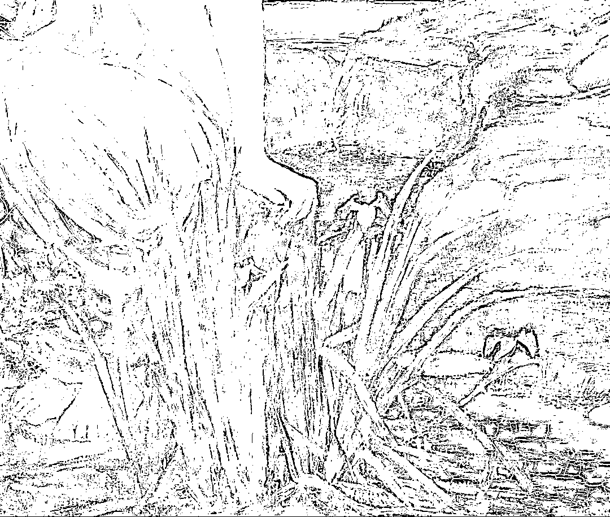

纳西索斯故事的结局令人伤感，但我们可以从不同的层面去探讨它。从某种意义上说，圣杯侍者牌呈现的一切到最后必须经历转化，也可以说是“死亡”，**自恋死亡（转化）之后，爱他人的能力才会发展出来**。

但必须说明的是，这个死亡一定要是**自我牺牲，然后把完全关注自我转变成对他人的了解**，所以纳西索斯的自我了断是合理和正确的，这样他就能够进入圣杯骑士牌的领域了，在那里情感的力量能够自由地朝向他人，而不仅仅是自己。

**圣杯侍者，自爱能力的萌生**

**当圣杯侍者牌出现的时候，意味着情感层面的某种力量诞生了。**它可能是**一段新的关系，或者是关系中一种全新的特质，甚至还可能是婴儿的诞生**。

圣杯侍者牌常常预示着**爱的能力的全新开始**，当事人在经历了伤害和退缩的阶段后，开始进入了自爱的过程，它是如此细致和脆弱，所以人们**必须去滋养和爱护它，否则它很容易忽然消失不见。**

**版权声明：**本文由《自在园》授权发布，欢迎转发，反对抄袭。友号转载请申请白名单。

**END****朱丽叶·沙曼·伯克**从 20 世纪 70 年代早期开始，就对塔罗牌产生了兴趣，并踏入了塔罗的世界。后来，在丽兹·格林的鼓励下，开始研习心理占星学和塔罗。1984 年，第一本书《塔罗全书》（The Complete Book ofTarot）出版。之后，与丽兹·格林合作设计并撰写了《神话塔罗》（The Mythic Tarot）。朱丽叶写了十本塔罗和占星学书，包括一本名为《众星的传说》（Stories from the Stars）的儿童读物，以及与丽兹·格林合著的《神话之旅》（The Mythic Journey），这是一本详细讲述如何运用神话来指导生活的书。

**点击下图了解课程详情** 

**微信又双叒叕改版啦，不想错过若道君的推送？********就把若道设为****星标****以及点点****“在看”****吧！********▼**

**喜欢就点一下“在看”吧！****报名直达入口**

# 神话塔罗之小阿卡纳牌｜圣杯骑士

> 原文：[`mp.weixin.qq.com/s?__biz=MzA5NjA0NTAxNg==&mid=2651490448&idx=4&sn=224b638e9a209c7a97cccae4ca7a58ff&chksm=8b483a27bc3fb331312461746a1c7c976757e7473b6dde69f1c0a2748c78fa8cacc939cfa729&scene=126&sessionid=1692737746#rd`](http://mp.weixin.qq.com/s?__biz=MzA5NjA0NTAxNg==&mid=2651490448&idx=4&sn=224b638e9a209c7a97cccae4ca7a58ff&chksm=8b483a27bc3fb331312461746a1c7c976757e7473b6dde69f1c0a2748c78fa8cacc939cfa729&scene=126&sessionid=1692737746#rd)

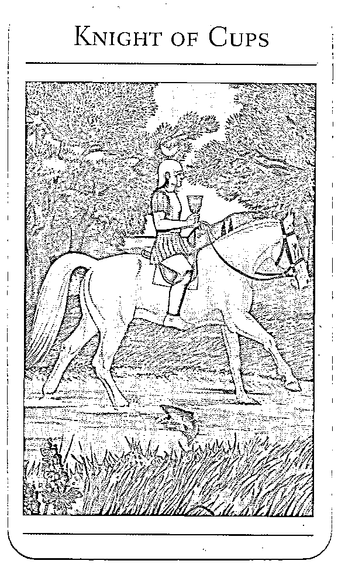

作者/朱丽叶·沙曼-伯克 丽兹·格林

译者/闫东升 编辑/玫瑰 图片/神话塔罗 网络

本文节选自《神话塔罗》

尽管宫廷牌看起来是有等级分别的，但实际它们在价值上并无高低贵贱之分，它们在牌面上呈现的世俗等级之分，反映的是人们在外界生活中某种力量的整合程度。在圣杯骑士牌中，我们遇到了水元素活跃和敏感的一面。今天就来解读小阿卡纳牌——圣杯骑士。

**书名：**

神话塔罗 

**作者：**

朱丽叶·沙曼-伯克   丽兹·格林 

**出版日期：**

2011-08-02

圣杯骑士对应的希腊神话人物 

**珀尔修斯**

**骑着白马的年轻男子**

圣杯骑士牌描绘的是一个年轻英俊的白人男子，黑色的头发映衬着深情的双眼，骑着一匹优雅的白马。他身穿紫罗兰色的束腰外衣和银色的鳞状铠甲，戴着银色的头盔，头盔顶端竖立着一条银色鱼尾状装饰物。

他正引领着白马穿过一条清澈的溪流，马蹄过处激荡起跳动的水花和层层涟漪，还有鱼儿从水中跃起。他的四周是郁郁葱葱的树木和青翠的山峦，远处是淡蓝的天空和广阔的大海。他的手中握着一只金色的圣杯。

**为心爱的女人冒险**

**在圣杯骑士牌中，我们遇到了水元素活跃和敏感的一面，就像无常的生命之流， 一直都在不断的变化和运动之中。**

牌中的人物是神话中的英雄珀尔修斯（*Perseus*），他所有的冒险都是为了心爱的女人，他在旅程中遇到了女性的诸多面向，包括光明面和黑暗面，在这之后他才能够与爱人结合。

珀尔修斯是宙斯（*Zeus*）和人类女性达娜厄（*Danae*）结合所生，当时宙斯化身为金雨，让达娜厄受孕。达娜厄的父亲亚克力修斯（*Acrisius*）曾经接到过德尔斐神谕（*Delphic Oracle*），说他将来会被自己的外孙杀死，所以当他得知女儿怀孕的时候，就把她装进一个箱子里丢入大海。

在水神的保护下，达娜厄被推送到塞利弗斯（*Seriphos*）的岸边，受到国王波利德克特斯（*Polydectes*）的保护。

波利德克特斯对达娜厄一见钟情，一直追求她，珀尔修斯的童年和青少年时期都在这个情况下度过。珀尔修斯一直反对他们的结合，他觉得母亲值得更好的男人，因此波利德克特斯想要杀死他。

经过反复思考后，波利德克特斯决定派遣珀尔修斯去砍掉蛇发女怪美杜莎（*Gorgon Medusa*）的头，这显然是一个令人绝望的任务。

珀尔修斯在完成任务的每一次困境中都获得了女神的帮助。三人一体的女妖葛丽伊（*Graeae*）把唯一的眼睛分享给他，让他能看到将来发生的事情，而且还告诉他美杜莎的下落。

女神雅典娜把一个魔力盾牌赠给他，这样他就可以通过盾牌的反射看到美杜莎，避免被她的眼神石化。

珀尔修斯杀死了美杜莎，拿着她的头踏上了回程之路，在经过埃塞俄比亚（*Ethiopia*）的时候，从海怪的手里救出了美丽的少女安德洛米达（*Andromeda*），并且与她成婚。

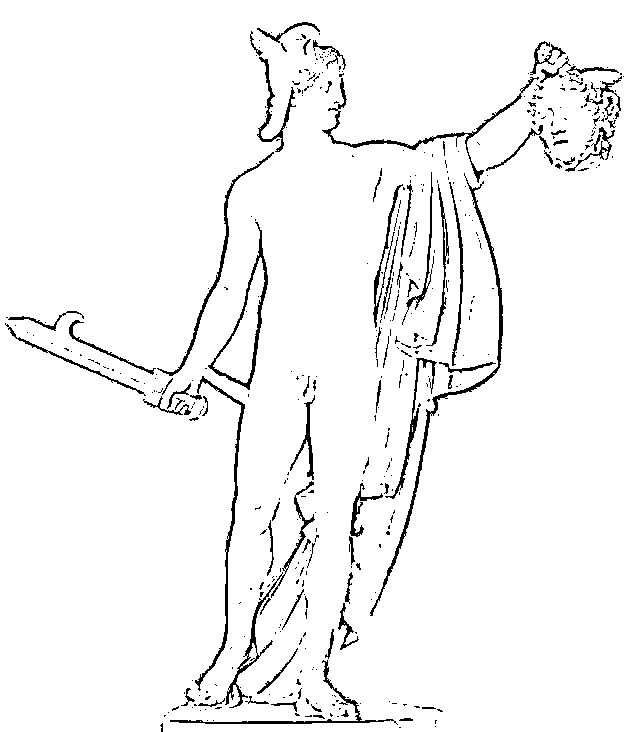

| 珀尔修斯

回到了塞利弗斯之后，珀尔修斯杀死了想要强暴达娜厄的波利德克特斯，然后带上母亲和妻子去往母亲孕育他的地方，但是他的外祖父亚克力修斯又想杀了他。

尽管他并没有想向外祖父寻仇，却很偶然地杀死了他，本应该顺理成章地成为阿尔戈斯（*Argos*）的国王，但是这个地方带给他太多悲伤的记忆，所以他又旅行到了梯林斯（*Tiryns*），在那里安家落户，修建了完全属于他和家人的爱巢。

**完美之爱的守卫者**

**圣杯骑士牌中的珀尔修斯是一个真正的浪漫精神的意象**，是陷于悲痛情绪中的女性的拥护者，是真相、美和爱的礼拜者，是怀揣完美之爱的理想人士的守卫者。

完美之爱最终只能存在于伟大的精神之中，但又好像在下一个人生转角就可以遇到的爱人身上。

圣杯骑士牌中的浪漫精神呈现了**理想主义、温柔和良善**的特质，但是珀尔修斯并不是一个软弱的人，他可以为了理想和爱人牺牲一切。

从某种意义上说，这是一副关于“爱情”的画卷，**现实主义者认为随着婚姻、家庭和孩子的责任，爱情会稍纵即逝，但是浪漫主义者坚信它会永存。**

圣杯骑士不断地追寻，最终想要体验的是圣洁之爱，当然这种圣洁之爱并不排除性爱，但是性爱必须结合着爱情和某种精神上的狂喜，单纯的身体满足不是圣杯骑士的追求。

历史上中世纪繁盛一时的宫廷之爱，就反映了这种圣杯骑士的精神。那时，年轻的骑士们一直崇拜着遥不可及的爱人，他们不是想要满足身体和现实的需求，而是通过写诗来表达内心的情愫，也愿意为了保护她而献出生命。

珀尔修斯和神话中其他的英雄不同，因为他是个高度的理想主义者和女性的崇拜者。

赫拉克勒斯（*Heracles*）面对挑战的勇气源自于赎罪的渴望，而赛休斯（*Theseus*）则是喜欢挑战中的激情，珀尔修斯是为了爱而奋斗（从爱他的母亲开始），爱带来的挑战就是他的宿命。

对母亲的崇拜和理想主义是圣杯骑士的典型特质，尽管珀尔修斯是战无不胜的英雄，但他永远都甘愿跪在王后的脚下，那个女人比他更高也更强大。

**圣杯骑士所呈现的爱常常包含着崇拜的元素，在对方面前觉得自己无法匹配，或者因为对方已婚等因素无法拥有。**

这不是平等的爱，我们在后面的圣杯王后牌和圣杯国王牌中会探讨平等之爱。我们不应该嘲笑这种在青春期阶段的爱情特质，也不应该用幼稚的说辞来批判它，没有这种爱的尘世就会变得阴冷、乏味和单调。

**圣杯骑士，理想主义的爱情**

**当圣杯骑士牌出现的时候，当事人会经验到爱的浪漫和理想主义的面向。**常常它预示着**陷入爱河或者求婚**。

有时候它也暗示着和艺术有关的主题，在艺术的某些层面上经验到理想主义和欣然陶醉的感觉。当事人也可能化身为充满诗意和敏感的骑士，走入某人的生活中，把浪漫主义的剧目演绎出来。

**版权声明：**本文由《自在园》授权发布，欢迎转发，反对抄袭。友号转载请申请白名单。

**END****朱丽叶·沙曼·伯克**从 20 世纪 70 年代早期开始，就对塔罗牌产生了兴趣，并踏入了塔罗的世界。后来，在丽兹·格林的鼓励下，开始研习心理占星学和塔罗。1984 年，第一本书《塔罗全书》（The Complete Book ofTarot）出版。之后，与丽兹·格林合作设计并撰写了《神话塔罗》（The Mythic Tarot）。朱丽叶写了十本塔罗和占星学书，包括一本名为《众星的传说》（Stories from the Stars）的儿童读物，以及与丽兹·格林合著的《神话之旅》（The Mythic Journey），这是一本详细讲述如何运用神话来指导生活的书。

**点击下图了解课程详情** 

**微信又双叒叕改版啦，不想错过若道君的推送？********就把若道设为****星标****以及点点****“在看”****吧！********▼**

**喜欢就点一下“在看”吧！****报名直达入口**

# 十一假期学占星：这门技能你值得拥有！

> 原文：[`mp.weixin.qq.com/s?__biz=MzA5NjA0NTAxNg==&mid=2651490366&idx=3&sn=982d74836abdcdb971012fd3fb440642&chksm=8b483a89bc3fb39fcea05ee3ab9fbbdbc4a13c12743e677d00cefcad41fb4f683222e77e04ec&scene=126&sessionid=1692737746#rd`](http://mp.weixin.qq.com/s?__biz=MzA5NjA0NTAxNg==&mid=2651490366&idx=3&sn=982d74836abdcdb971012fd3fb440642&chksm=8b483a89bc3fb39fcea05ee3ab9fbbdbc4a13c12743e677d00cefcad41fb4f683222e77e04ec&scene=126&sessionid=1692737746#rd)

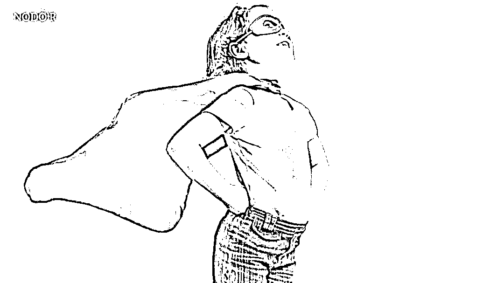

如果上天给你一次无法旅游的十一假期，你不妨看看这个选择！

十一假期，**每天只需 2 小时**，你就可以了解专业占星学里的**12 星座+5 颗行星**

平时，时间就像海绵里的水，是挤出来的。爱学习的社畜很辛苦！然而，十一假期来了！你可以不用挤了！**因为核心占星课程里的 L1 阶段只有****10 个小时****的课程。**

**每天只需要抽出 2 个小时、完整的 7 天时间，**你就可以把 L1 的课程轻轻松松、完完整整学完了！

别看是仅仅是简单的 L1，学完后，你可以远远超过那些只是对娱乐占星有简单了解的朋友。你会对**12 星座**和星图上**5 颗重要的个人行星**，**太阳、月亮、金星、火星、水星**有了专业性的了解。

每天 2 小时，不耽误你吃吃喝喝、访亲会友、躺平刷剧、城市周边游，但是你拥有了可以立刻拿来就用的本事！聚会中再看其他人的星图，你会有其他人没有的识人洞察力哦！**而且，国庆之后，就可以无缝衔接 L2。**

同时，你还可以在十一假期和学习群里的同学们愉快地分享学占星地趣事，让你对各个占星元素在生活中的表现大开眼界。

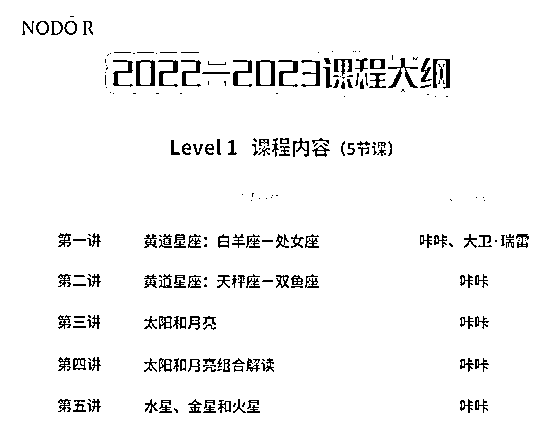

**如果上天给你一次 7 天连续的时间，也许你可以换个前所未有的十一过节法！****这里有过去几节课的讲课片段，欢迎点击收听：****片段 1**<mpvideosnap class="js_uneditable custom_select_card channels_iframe videosnap_video_iframe" data-pluginname="videosnap" data-id="export/UzFfAgtgekIEAQAAAAAAZuQQz0kBQwAAAAstQy6ubaLX4KHWvLEZgBPE5YF0FwUpe6aCzNPgMIv14w53I2MkmvHnckEPJrhC" data-url="https://findermp.video.qq.com/251/20304/stodownload?encfilekey=rjD5jyTuFrIpZ2ibE8T7YmwgiahniaXswqzQ6mH9zBlA9NawT1KK0FdqFprlns0v7PbhsZzGnTPGZuNYLLTpKM8Csry4ExNNtu0hmKDNXEjwOKP9JWjT3XtHA&amp;adaptivelytrans=0&amp;bizid=1023&amp;dotrans=0&amp;hy=SH&amp;idx=1&amp;m=&amp;scene=0&amp;token=cztXnd9GyrEU0aI1IE17pbLP4DZ04r1EFnh2kQy8CStIXb1SaQlCuJU1GjFCFkxHCI6PWAYsibK0" data-headimgurl="http://wx.qlogo.cn/finderhead/PiajxSqBRaEJYnVsqWfEX9qA0sI6hNVKsDfyzfPZ92WZMZyBpZWU5NA/0" data-username="v2_060000231003b20faec8c4e68a1ec2d4ca07e434b07755bbf47e7053a3059defd2c9d6c68a20@finder" data-nickname="若道" data-desc="#若道核心课 占星能否帮助我们从星图判别出那些可能伤害自己的人？
" data-nonceid="3833527741513514419" data-type="video" data-width="1920" data-height="1080"></mpvideosnap>**片段 2**<mpvideosnap class="js_uneditable custom_select_card channels_iframe videosnap_video_iframe" data-pluginname="videosnap" data-id="export/UzFfAgtgekIEAQAAAAAAm0s0x_FhAAAAAAstQy6ubaLX4KHWvLEZgBPE6YEASWZ-eKaCzNPgMIu4NZUFCtBefpJVd27__90f" data-url="https://findermp.video.qq.com/251/20304/stodownload?encfilekey=rjD5jyTuFrIpZ2ibE8T7YmwgiahniaXswqzQry6vT7EcxKeuMPYibzP67t9HaszgRjwokGuGHHGydRP6ibwNz0fXwfoBmZPpytl2VJYU4sDsW67JibFT1qeGSgNA&amp;adaptivelytrans=0&amp;bizid=1023&amp;dotrans=0&amp;hy=SH&amp;idx=1&amp;m=&amp;scene=0&amp;token=AxricY7RBHdWzTBqP4ymePrW5GTNFkT6pc4CketdKtXAAK7vAhGjhwiahqibFQb6lIw8QVoHiaxscdc" data-headimgurl="http://wx.qlogo.cn/finderhead/PiajxSqBRaEJYnVsqWfEX9qA0sI6hNVKsDfyzfPZ92WZMZyBpZWU5NA/0" data-username="v2_060000231003b20faec8c4e68a1ec2d4ca07e434b07755bbf47e7053a3059defd2c9d6c68a20@finder" data-nickname="若道" data-desc="#若道核心课 你知道为什么情绪敏感的巨蟹座和优雅平和的天秤座都是基本星座（开创星座）吗？你知道它们分别开创了什么？你知道为什么射手座是变动星座吗？射手座在追求的是什么？" data-nonceid="12517761752566003326" data-type="video" data-width="1920" data-height="1080"></mpvideosnap>****片段 3****<mpvideosnap class="js_uneditable custom_select_card channels_iframe videosnap_video_iframe" data-pluginname="videosnap" data-id="export/UzFfAgtgekIEAQAAAAAAJ2s3ZrIUGwAAAAstQy6ubaLX4KHWvLEZgBPEg4EIc1MEXbWCzNPgMIs6reI__lcYTuioG8SQasL9" data-url="https://findermp.video.qq.com/251/20304/stodownload?encfilekey=rjD5jyTuFrIpZ2ibE8T7YmwgiahniaXswqzcvjagGvrC9mV5Efl3MSeK09zfZE2yKWl0OtUibcMaazuIicia5wVib0xz2GUuhboU9yNwDL8dEElUKDGib36clibPEyA&amp;adaptivelytrans=0&amp;bizid=1023&amp;dotrans=0&amp;hy=SH&amp;idx=1&amp;m=&amp;scene=0&amp;token=AxricY7RBHdWzTBqP4ymePlwZzibNPHBKwnw7ympYUmM3714I4F8FbkCtudFic34YC6tnR2Y4hRWWM" data-headimgurl="http://wx.qlogo.cn/finderhead/PiajxSqBRaEJYnVsqWfEX9qA0sI6hNVKsDfyzfPZ92WZMZyBpZWU5NA/0" data-username="v2_060000231003b20faec8c4e68a1ec2d4ca07e434b07755bbf47e7053a3059defd2c9d6c68a20@finder" data-nickname="若道" data-desc="#若道核心课  12 星座为什么还能分为 6 对呢？每一对星座具体有什么特征呢？
" data-nonceid="15135074788745731599" data-type="video" data-width="1280" data-height="720"></mpvideosnap>****片段 4****<mpvideosnap class="js_uneditable custom_select_card channels_iframe videosnap_video_iframe" data-pluginname="videosnap" data-id="export/UzFfAgtgekIEAQAAAAAA0HI676qGlgAAAAstQy6ubaLX4KHWvLEZgBPEl4F0XxhGBL2CzNPgMIvyU52UMJ_wqvJMxW7sDbCE" data-url="https://findermp.video.qq.com/251/20304/stodownload?encfilekey=rjD5jyTuFrIpZ2ibE8T7YmwgiahniaXswqzcW59GrhYj9KDZ7ojZqskdHCCIddEfWNfic8TUPuicVl5jVmpc8nlW23DtibibqvfsqicWH7dxICibdngoicBibZTJeRmJw&amp;adaptivelytrans=0&amp;bizid=1023&amp;dotrans=0&amp;hy=SH&amp;idx=1&amp;m=&amp;scene=0&amp;token=AxricY7RBHdWzTBqP4ymePn8Ja5dukD7tA4hJWT4arTiaEkhXCWrT90RCtxvjCes0bDRROQgtJiaB0" data-headimgurl="http://wx.qlogo.cn/finderhead/PiajxSqBRaEJYnVsqWfEX9qA0sI6hNVKsDfyzfPZ92WZMZyBpZWU5NA/0" data-username="v2_060000231003b20faec8c4e68a1ec2d4ca07e434b07755bbf47e7053a3059defd2c9d6c68a20@finder" data-nickname="若道" data-desc="#若道核心课 太阳星座与月亮星座如何组合起来，去诠释一个人呢？太阳星座与月亮星座究竟有什么分别呢？

" data-nonceid="4731060161592725067" data-type="video" data-width="848" data-height="480"></mpvideosnap>

**谁是你的老师？**

**占星师咔咔（Caroline）**

2010 年师从美国占星师大卫·瑞雷学习，并得到世界名师斯蒂芬·弗里斯特、罗伯特·汉德、苏·汤普金斯传授各种占星学技法。若道首届学员，国内最早获得 ISAR 职业占星师资质的职业占星师，多次担任若道核心课程助教，并于 2019 年第二届、2021 年第三届核心课中和苏·汤普金斯老师一起教授若道核心占星课程。

在国际知名广告公司和市场研究公司从事的市场研究和推广工作十余年，曾任职于阳狮集团、尼尔森市场研究有限公司、MTV 和《Madame Figaro》杂志。

**大卫·瑞雷（David Railey）**

*   **I****SAR 董事会成员，ISAR 全球副主席，ISAR 全球职业占星师资质认证主席，若道占星创始人**。

*   2016-2019 年，被选为国际占星协会（ISAR）考试委员会成员，国际占星协会（ISAR）是世界最大的国际占星机构，会员遍布 47 个国家。

*   2017-2020 年，被选为国际占星联盟（ISAR）考试委员会主席，理事会成员。

**助教王嘉祺 （Conrad）**

ISAR 认证占星师、若道认证生时校正资质，从 2010 年起自学占星学，2015 年开始在若道系统学习，并开始个案咨询。2018 年担任若道核心课程助教，以及卜卦占星学和太阳返照选修课助教，并带领学员进行经世占星和太阳返照方面的研究。2019 年 11 月作为演讲人之一参加了国际占星协会（ISAR）北京大会，也是 ISAR 星空俱乐部中国区第 16 期的主讲人。

**对于所有想要插班的同学，这里有一个十一的节日礼物！**

**添加我们的课程顾问老师，报名课程后，领取一个****长达 2 小时****的占星师养成计划的 L1-2 研讨项目的沙龙简介。**这个沙龙将会帮助你简单了解我们怎么用小组学习的方式，在实践中学占星。

**L1-2 课程费用：3500 元**

**L 1-3 课程费用：11500 元**

**请联系课程顾问**：**王老师（微信/手机：18510107057，请备注“大卫核心课”）**

**祝大家过一个愉快的假期！****想了解更多？****点击下图了解课程详情**

# 斯蒂芬语录征集丨“with love”宇宙光与爱的化身

> 原文：[`mp.weixin.qq.com/s?__biz=MzA5NjA0NTAxNg==&mid=2651490366&idx=2&sn=6762cfc27ae7c805a53d56d994db48fa&chksm=8b483a89bc3fb39f95cddc45b737b25a117772c283eb970e39a51d70136253030e3658c27f6b&scene=126&sessionid=1692737746#rd`](http://mp.weixin.qq.com/s?__biz=MzA5NjA0NTAxNg==&mid=2651490366&idx=2&sn=6762cfc27ae7c805a53d56d994db48fa&chksm=8b483a89bc3fb39f95cddc45b737b25a117772c283eb970e39a51d70136253030e3658c27f6b&scene=126&sessionid=1692737746#rd)

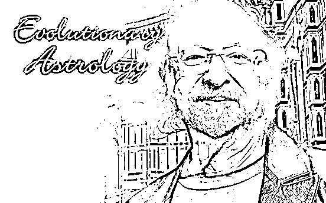

和上过斯蒂芬老师工作坊的同学聊起老师，大家都有同一种感觉，课程中仿佛被一种气场所吸引，沉浸在一个个精彩纷呈的故事中，从细腻贴切的比喻中感悟占星学的智慧，内心不经意间总有被触动的感觉，即使隔着屏幕也能感受到澄澈慈悲的爱。

**相较于教授占星学，斯蒂芬老师更像是一个传播宇宙真理和终极之爱的使者，**他使用了一种叫做**“进化占星学”**的语言来传递宇宙的真谛。

**教育的本质意味着：一棵树摇动另一棵树，一朵云推动另一朵云，一个灵魂唤醒另一个灵魂。**在一次次的占星工作坊中这位老者用他深厚而慈悲的爱和智慧，摇动了思绪，推动了思考，唤醒了思想。

**你读过《内在的天空》《昨日的天空》《变幻的天空》或者老师其他的占星学书籍么？**

**你上过斯蒂芬老师的工作坊么？**

**你是斯蒂芬老师进化占星学的学徒么？**

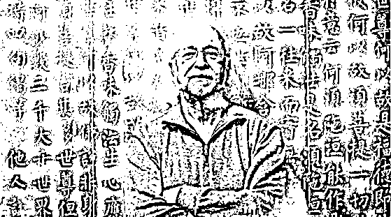

斯蒂芬语录征集活动

水逆期间，是适合温故知新的好时机，推荐同学们找出老师历年工作坊的笔记，读书笔记，或者把老师的书籍作为本月书单，**找出曾经或者正在触动你的话语或故事**留言在评论区，分享给我们，引发大家的共鸣与支持，**获赞前三名**，会获得**200-500 元**不等的课程券作为温故知新的鼓励。

**本文评论获赞****第一名****，****500 元****课程券**

**本文评论获赞****第二名****，****300 元****课程券**

**本文评论获赞****第三名****，****200 元****课程券**

**期待各位斯蒂芬粉丝的语录留言！**

**下面分享一些过往斯蒂芬老师工作坊语录**

**给大家一些灵感**

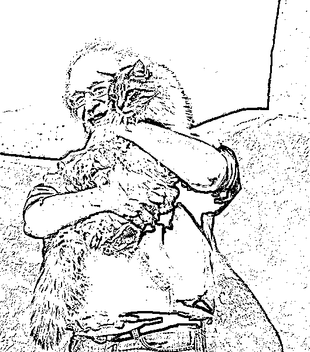**“**

我对于上升星座最喜欢的比喻：好比我们的灵魂之光通过上升的滤镜来到这个世界上，这个彩色玻璃不会挡住我们的光，但是会为这此光加些颜色。

**”**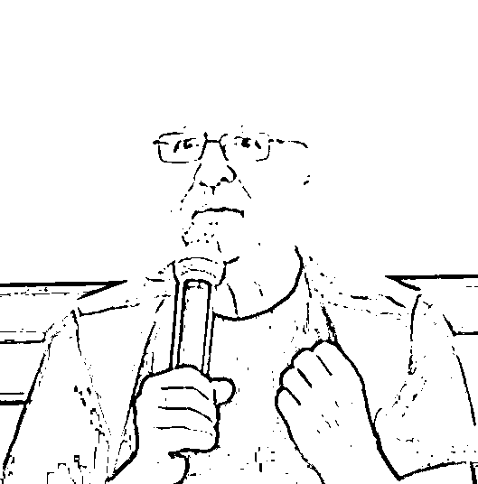**“**

月亮合相南交点的时候，不是放下我们的情绪，要确定我们的生命不是总被情绪牵着走，那么北交点会给我们一些线索，让我们逃离那些陷阱。 

情绪是人类的一部分，任何人都需要面对整合自己的情绪体，才是一个完整的人类，我们的问题并不是我们的情绪是错误的，我们的情绪是有哪些发生，带来的哪些错误的呈现？那么我们意识到月亮合相南交，意味着过去世遇到一些月亮式的困难，这个意涵会有很多的情景的呈现。

**”**

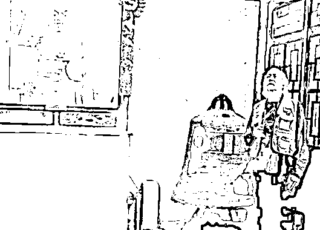

**“**

业力是习惯、业力也会重复，未解决的业力，会在此生留下痕迹，曾经伤害她的东西，在今生很可能再次伤害她。

当冥王来了，我们被邀请看不太愿意看到的东西，不舒服的部分，我们准备好了去面对我们两年前不想看的东西，是时候潜入那个受伤的部分了，去进行疗愈，就像心理分析的过程，冥王星会通过深刻真实的对话提供帮助，我们可以不去做负面的思考，但需要诚实的思考，诚实的内心对话，才有机会挣脱业力的束缚。

**”**

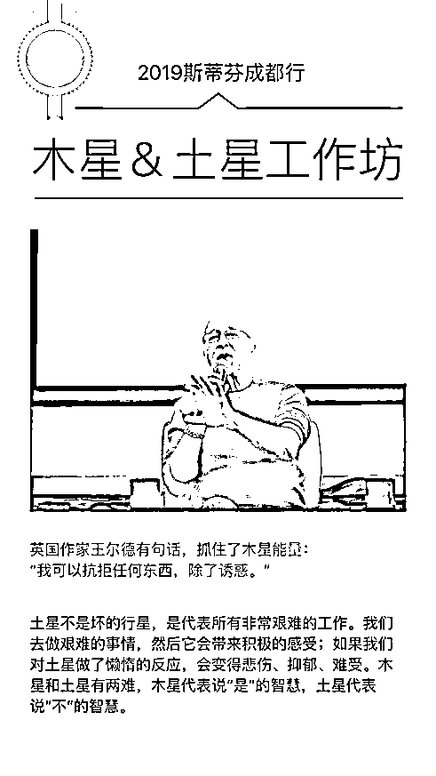

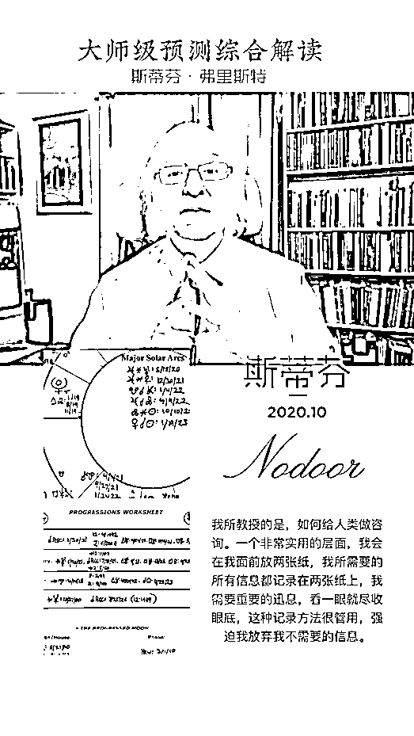

马上又要迎来和斯蒂芬老师每年的**十月之约**了，

**今年老师将要带领我们探索组合图永恒的三角：**

**“整体大于各个部分之和”**

**斯蒂芬·弗里斯特老师**

**若道独家**

**三日线上工作坊**

**斯蒂芬说，我们的组合图表明无论什么状况我们都能熬过去。**

**1**

********此次授课内容********

**组合图描述了如何才能使两个人的关系一直充满活力。**这句话中隐含的意思是假设一段关系有一种区别于这两个个体的独立的生命。有时我们喜欢和一对伴侣共度时光，却从没想过单独见他们其中一人。

我们从这对伴侣身上感觉到的 "频率"是对他们组合图能量的直接体验。在某种程度上，可以简单地理解为：**正如每个人都有自己的星图一样，每对伴侣也有他们的星图。**

从简单的描述层面上讲，这就是组合图的意涵。记住，我们可以将这一技法用于任何一种关系：**父母和子女、商业伙伴、朋友。**作为进化占星师，我们的目标要比单纯描述走得更深。解读组合图时，可以着眼于帮助人们，而不仅仅是使他们感到惊奇。对于个体来说，出生星图代表了一条正确的人生道路，一条承诺意义、活力、灵性目标的道路。组合图亦然，只不过它将一段关系看成一个独立的个体，而不是两个人。关系也有进化的路径：人们走到一起是为了学习和成长。
个体如果没有领会自己出生星图的要点，会变得疲惫而沮丧。两个人也是如此，**如果没有抓住组合图的要点，我们就会对对方感到厌烦。这段关系似乎也会失去动力。**

伴侣常常意见不一，陷入困境，看不到前进的方向。三是一个更有动力的数字。三个人投票，二个人以多数票击败一个人，推动事情继续发展。**这实际上解释了这次工作坊的主题：****永恒的三角。********每对伴侣其实都是一个三人组：你、我以及我们。**组合图所代表的那个看不见的 "第三人"经常会"投出打破僵局的一票"，使关系得以发展。**· **但是如果组合图总是同意一个人的意见，而不同意另一个人的意见，怎么办呢？（这被称为"封建制度"）**· **如果两个人都安静而保守，但他们的组合图却要求狂野的冒险呢？（这是 "文化冲击"）**· **如果它同时均衡地反映了两个人的情况呢？我们可以称之为 "民主"，但我们仍可以区分出一个人天然的智慧比另一个人更强的领域，让擅长的人负责擅长的事，这会促进关系蓬勃发展。换句话说，我们开始看到这个技法的咨询维度了。我们将在这个工作坊中探讨这些内容。两个人究竟为什么会走到一起？**在严肃、复杂的关系中，我们可以假设两个人之间有一些未解决的业力。**如果他们在今生是恋人，但在前世中，一个是父母，一个是孩子呢？也许那些直觉和假设仍可以感受得到，极为错综复杂地使得他们在今生想要成为情侣。**这些疑问将我们引向组合图的月亮交点，在那里我们往往能发现当今人类任何伙伴关系问题的真正核心。**

**从理论上讲，组合图是基于中点的。**如果我的出生星图里太阳在摩羯座中段，而你的太阳在双鱼座中段，我们组合图的太阳就在水瓶座中段。换句话说，**在你和我的太阳的中间位置。****其他行星、月亮交点和中天也是如此。**其他宫头的位置，包括上升点则存在一些争议。通常的做法是仍然使用中点，但斯蒂芬老师将会解释他认为这样做存在的技术方面的问题。他更倾向于**使用关系最初开始的地点绘制星图，就像我们使用出生地来绘制出生星图一样。**

**组合图也像出生星图一样有行进。**在工作坊中，我们将**探讨一些特殊的技法和考量，来帮助伴侣们应对生活中的挑战和机遇。**组合图的推进会出现一些看似难以解决的复杂问题，斯蒂芬老师创造了一种解决这些问题的技法。他将在工作坊中阐述相关细节，基本的问题是：如你所知，要了解一个人 30 岁生日的推进，我们要看这个人出生后 30 天的行星位置。问题是，组合图与我们在占星学实践中使用的其他星图不同，组合图并不代表某一天的天空。记住，它是基于中点的。**那么我们如何从一个不存在的日期开始 "向下数 30 天"呢？斯蒂芬老师将为我们提供一个行之有效的答案。**

并非所有的人都处于伴侣关系中，但**作为人类，就需要与其他的灵魂共舞。占星学能够极大地帮助人们驾驭复杂的关系。**了解我的星图如何与你的星图通过相位和宫位的交互而产生互动，是非常有帮助的。组合图包含了这些技法，提醒我们，整体总是大于各个部分之和，而又与之不同。

**2**

********斯蒂芬的占星著作********

**· **1984 年-1988 年间，斯蒂芬写作出版了《内在的天空》（已有中文版）、《变化的天空》和《天空的伴侣》三本占星经典著作，奠定了早期在占星学界的地位。**·** 2002 年-2005 年间，他与朱迪·弗里斯特共同创作了两本经典的关系占星学著作《天空的伴侣 I：爱、性、和进化占星学》《天空的伴侣 II：组合图》。　**· **2008 年，斯蒂芬出版了一本非常重要的著作《昨日的天空》，此书是至今为止关于轮回转世跟星图的清晰对应最详尽的著作之一。 斯蒂芬前后一共出版了 12 部占星著作，在世界占星学界拥有很高的声誉。

**3**

********斯蒂芬获得的荣誉********

1985 年，他凭借《内在的天空》一书获得职业占星师协会奖（*Professional Astrologers Incorporated Award*）。1992 年、1995 年、2008 年、2018 年，他四次获得占星界最高的占星学联合协会奖（*UnitedAstrology Congress Regulus Award*）提名，2018 年获得轩辕十四教育奖。

**4**

********斯蒂芬的占星哲学观********

斯蒂芬的占星风格以**自由和选择**为中心，他的解读不是以下定论的方式来“预测”未来，他**强调如何改善生命，而不是宿命式的论断**。他以心理占星学的语言来解读星图上的人格部分，但是**通过南北交点及其相位和守护星来探索星图所揭示的前世业力与今生方向，在灵魂进化的背景里来整体解读星图。**他认为进化占星学的目的在于**鼓励人们做出更符合进化方向的智慧选择，我们学习去了解前世的时侯，关注点应该集中在如何通过意识来疗愈自己。**

**5**

**这些名人怎么说**

斯蒂芬让我们停止了玩责备命运的游戏，而开始看到自己是一个走在进化路途上的勇士。——奥普拉杂志“*O: THE OPRAH MAGAZINE*”

斯蒂芬和杰夫这两位著名占星师创造性地相互应和，展现出他们出色的教师才华，发展并弘扬了占星这门艺术。（对《测量天空：进化占星学和灵魂的钥匙》的书评）——著名心理占星师 现代占星之父 诺·泰尔（*Noel Tyl*）

请享用斯蒂芬和朱迪这两个博大的灵魂在此书中所提供的洞见大餐吧。（对《天空的伴侣》的书评）——进化占星学的创始人之一 杰夫·格林（*Jeff Green*）

我为斯蒂芬解读的精准感到惊叹，他强调没有一件事是坏得无法挽回的，也没有一件事是如此之好以至于它不会因为现在的错误判断而消失的。我怎样推荐他都不为过！——好莱坞著名影星“钢铁侠”男主角 小罗伯特·唐尼（*Robert Downey Jr*）

**6**

**上过课的占星师怎么说**

他关于我星图的解读，让几乎所有在场的人掉泪，我也从此开启了一段灵魂追寻的旅程。我很惊讶他透过星图可以如此深入一个人的灵魂。很多东西你自己都不知道，但是他讲出来你会发现，啊，这是真的，这是占星学的神奇。——《心探索》创始人孟想

每个来参加老师课程的同学，都会被老师深深的慈悲心感动。这种慈悲心，并不是表面上说的一些什么话，而是一种从意识层次上发出的能量。每个来上课的人，都能感受到老师的爱。这种爱，并不是盲目的爱，而是深刻地洞悉真相后的慈悲。

——斯蒂芬老师工作坊翻译逸月

斯蒂芬老师的一对一咨询已经排期到两年之后，我特别幸运，曾在课堂上被老师抽中分析过我的星图，老师充满爱与智慧的指引让我更加清晰的认识了自我。内在的潜能、需求和矛盾被老师娓娓道来。——禄丽荣斯蒂芬老师是位非常非常值得推荐的大师，很粉他，这位进化占星学的创始人，对人的理解是那么的全面完整、深刻洞见、慈悲和温暖，就这方面而言足可以媲美我无比崇敬的荣格和史坦纳（这两位去天堂里玩了）。如果你对西洋占星感兴趣，或者对人的所有角度、各个层次的真相和可能性感兴趣，推荐斯蒂芬老师的书和课程，特别是他的课程，数倍的功力大增的好机会，错过真是占星粉丝的莫大损失。——仁华

**7**

**什么人适合这门课程**

✦ 占星师或渴望成为占星师的人群。   ✦ 本课程并非针对初学者，需具备若道核心课程 level4 及以上水平，即了解星座、行星、宫位、相位、综合解读等知识。✦ 课程会涉及组合盘解读高阶内容，不了解相关知识的同学，请提前学习相关内容。

**8**

********授课老师********

**斯蒂芬·弗里斯特（Steven Forrest）**

**· **进化占星学的创始人之一，当今世界最有影响力的占星大师之一；**· **毕业于美国北卡罗莱纳大学宗教学专业；**· **1984 年-1988 年间，写作出版了《内在的天空》、《变幻的天空》和《天空的伴侣》三本占星经典著作，奠定了早期在占星学界的地位。前后一共出版了 12 部占星著作，在世界占星学界拥有很高的声誉。**· **1985 年，他凭借《内在的天空》一书获得职业占星师协会奖（*Professional Astrologers Incorporated Award*）。1992 年、1995 年、2008 年、2018 年，他四次获得占星界最高的占星学联合协会奖（*United Astrology Congress Regulus Award*）提名，2018 年获得轩辕十四教育奖。**· **斯蒂芬将自己的绝大部分时间都花在教学以及个人咨询上，他于 1998 年创立了占星学徒计划（*Astrological Appretice Program*），这个计划致力于培养职业占星师；**· **至今为止已经有 600 余位学员完成了培训，其中很多都成为了优秀的职业占星师；**· **他是一位脚踏实地的导师，充满快乐和活力，亲和幽默同时又充满了智慧；**· **他的课程不仅仅是一次占星知识和经验的学习，也是一次与智者的相遇。

**9**

********课程费用是多少？********

**正价：6800 元****若道老学员享受优惠价：5800 元**

**10**

********授课时间、方式、退转********

**授课时间：2022 年 10 月 14 日-16 日（周五、周六、周日）7:00-13:00****具体时间安排：****7:00-8:45****（15 分钟休息）****9:00-11:00****（30 分钟休息）****11:30-13:00**

****授课方式：******线上直播课，英文授课，中文翻译**

**课程退转：退款原则请详看《教学协议》，如有疑问请咨询课程顾问。**

****斯蒂芬工作坊 | 探索组合图永恒的三角****

**授课老师：斯蒂芬·弗里斯特**

**授课时间：2022 年 10 月 14 日-16 日（周五、周六、周日）**

**授课方式：******网络授课，英文授课，中文翻译****

**费用：**6800 元**（若道老学员享受优惠价：5800 元）**

**课程负责人：王老师**（微信/手机：18510107057，请备注“斯蒂芬工作坊”）

长按二维码添加课程负责人咨询

****报名直达入口****

# 金星进天秤座 | 人与人关系的试炼场，平衡是一剂良药

> 原文：[`mp.weixin.qq.com/s?__biz=MzA5NjA0NTAxNg==&mid=2651490366&idx=1&sn=a84ed997bc6e2b27b8da632e0aedcc45&chksm=8b483a89bc3fb39f66037f461b9dd5cbfa13c1936538d7b2f461e8cb9d04e851a0440951feb5&scene=126&sessionid=1692737746#rd`](http://mp.weixin.qq.com/s?__biz=MzA5NjA0NTAxNg==&mid=2651490366&idx=1&sn=a84ed997bc6e2b27b8da632e0aedcc45&chksm=8b483a89bc3fb39f66037f461b9dd5cbfa13c1936538d7b2f461e8cb9d04e851a0440951feb5&scene=126&sessionid=1692737746#rd)

**********☆****************后台回复“今日”，给你一句生命态度**********

作者/斯蒂芬·弗里斯特 朱迪·弗里斯特 

译者/李含 编辑/玫瑰 图片来源/稿定设计

本文摘自《天空的伴侣 I：爱、性和进化占星学》

2022 年 9 月 29 日 15:40，金星进入天秤座。从土元素到风元素，对现实的精雕细琢让位于自由流动的联结渴望。天秤座天然同“关系”、“婚姻”相关。这个星座的人，让人难忘却又头疼，在于他们看起来长袖善舞，优雅美好，却又那么优柔寡断，藕断丝连……该如何得到他们的心？

**天秤座****原型**  

**情人艺术家**

**和平使者 外交官 顾问** 

发展目标

**宁静**，这就是天秤座的目标。天秤的图案象征着**平衡、平静**。任何一个基于良性的天秤座行为都有意无意的达成平静的效果。

为了**释放压力、寻求妥协、平复恼怒的情绪**，天秤座人一步步实现他们的目标：**练就临危不乱的平和**。所有被天秤座影响的行星都会在进化中趋于和谐、平静。这个背后的寓意是，**在前世耗尽力气，应付混乱不堪的局面，今生要为灵魂寻求逆转。 **

策略和资源

犬儒学派的世界观认为：**人都是独善其身，不论他们的内心隐藏了什么样的观念**。面对纯粹的利他的善念，犬儒主义者首先就困惑了，然后挣扎着强迫将这种观念融入到自己悲观的人生观之中。

所以，他会执迷于**对人的行为动机做出阴谋论的判断，善举会让他紧张，他想要用自己的方式解释，遂让他陷入感情关系的迷乱之中。 **与此相对的，**理想主义者对一切都充满信心，但痛苦的是，这个目的和最终的结局都将是心灵的体验课程**。面对好友女儿被谋杀的事件，理想主义者和犬儒主义者一样，在最初都会经历纠结。把谋杀融合到平凡的生活中同样不易。再一次，面部肌肉变得僵硬。思想奋力的寻找合理化。纠结矛盾的情绪淹没了内心世界。 真理总是复杂的，似是而非的。任何的简化或者抗拒行为都会导致紧张压力。而压力和天秤座的目标是对立的。所以，天秤座被赋予这样一个强大的资源：**似是而非和模棱两可的天赋**。天秤座在任何事情上都能有**正反两面的思考。他们在寻求中道，找到他们的平衡点。 **

美，是另一种抚慰心灵的方式。日落的美让我们感到惊艳。我们大呼，所有的压力和紧张烟消云散。**培养美感**是天秤座的一项策略，不论是被动地做一名鉴赏者，还是积极主动地成为艺术创作者。 

人与人之间的紧张关系，比如，与伴侣的战争，压力巨大。天秤座的另一个策略反应在这个领域：**彬彬有礼**。

这可能是个苍白的世界。使用这个策略时，并不意味着我们能够在高级餐厅辨别哪个是吃沙拉的叉子！彬彬有礼是**无时无刻地向他人传达尊敬和鼓励，来维系人际关系的和谐**。天秤座人很善于**评估我们的行为对他人的影响。** 

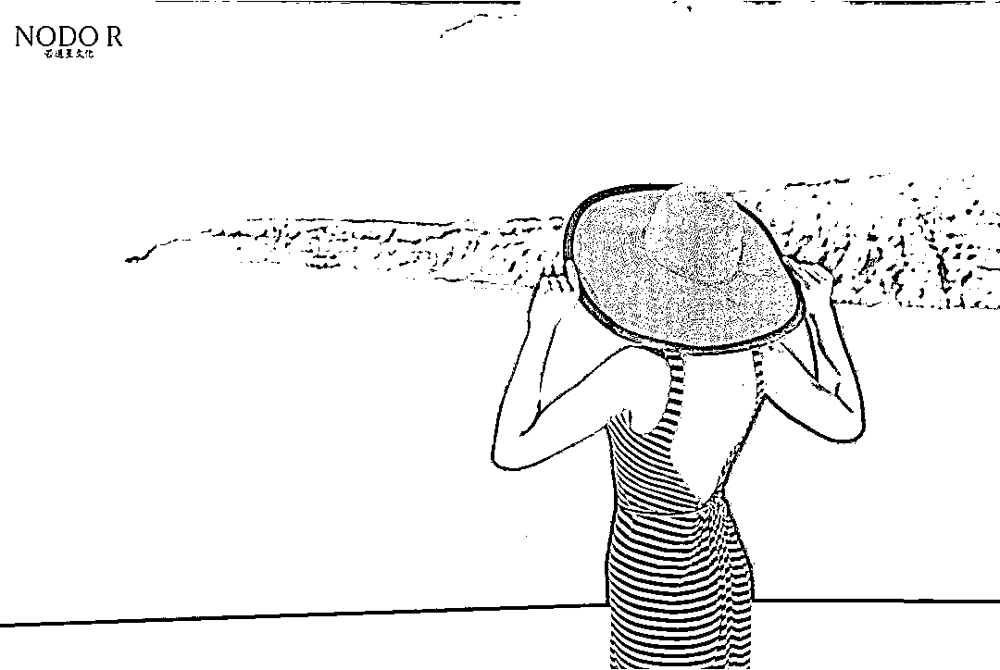

阴影

天秤座的阴影，和其他星座一样，都是对本星座策略和资源的曲解。天秤座模棱两可的天赋可能被扭曲为**优柔寡断和犹豫不决**。对美的敏感性也可能沦落为**俗气的低级趣味**。彬彬有礼可能变成了**华而不实的花言巧语，不敢面对真切的冲突对抗**。

天秤座的本性直接导致了**紧张加剧**。换言之，这是颠覆了天秤座良性的策略；完全在相反的方向上愈错愈远。 

**天秤座的爱情**太阳天秤座的爱情

传统占星学认为，天秤座与**婚姻**有关。以符号元素来看，的确如此。天秤座，让我们看到了平衡的原则。两个人走到一起，和谐相处，相互理解、坦诚相待，带来两种观念的碰撞。通常，这对健康的灵魂关系是有益的象征。

每一个星座都会在某些方面“与爱情相关”，但没有一个太阳星座是这样一个**亲密关系的试验场，体验根本的进化**。为了获得鲜活的满足感，太阳天秤座的人需要**在人际互动中经历挑战、妥协和诱惑。**

这些体验有助于个人成长，最终成为人的精神支柱。因为移情作用的提升，太阳天秤座的人需要记住，**保持一定的自我重心，不要成为他人的卫星**——**永无止境地调停琐事，这意味着深深的裂痕，而没有进行商谈。 **

月亮天秤座的爱情

在亲密关系中，天秤座需要**伴侣礼貌殷勤和细腻的感情**。这点对于月亮天秤座的人来说尤其正确，月亮的温柔敏感带来了非凡魅力。这里呈现了一种**优雅的敏感性**：粗俗的笑话和粗鲁的言辞难入他们的法眼。

对于月亮天秤座的人来说，亲密关系就像是**直觉的艺术**。对他们而言，优雅是自然流露的方式，怀有开放的意识，和对每个行为的觉知。月亮天秤的人有**异常敏锐的美学视角，即使是简洁干净也是好的**。

以天秤座的阴影来看，需要注意，**不去过度抚平爱情关系中避无可避的皱纹**。这里的风险是，**一个人要完全放下最自我需要的追逐，才能彻底理解和吸收另一个人的观念。**

天秤座人想要营造出**真正和谐快乐的关系**，必须认识到：**曾经隐藏在甜美、耐心、容忍面具背后的真实的个性**。

在家庭生活中，月亮天秤座的人会**尽力营造宁静、平和的美好环境。**舒适的环境加上充满艺术、音乐的氛围。但是，即便在艰难维持的生活中，月亮天秤座的人也会点上香薰蜡烛，努力营造美的生活。 

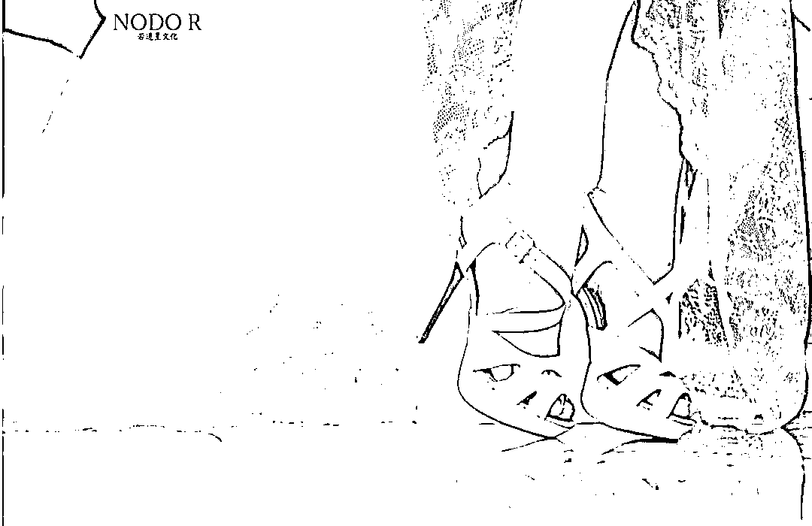

上升天秤座的爱情

上升天秤座的人有一种魅力，让人油然而生一种**休戚与共的认同感** ，对方会夸张地认为彼此有很多共同点。他们**本能寻求与他人建立和维系和谐的关系**。这种特质也被称作**礼貌殷勤，但并不会显得刻板僵硬**。

更确切地说，他们能够**以巧妙优雅的方式，让人与人相处时不可避免的磨擦减到最低。**天秤座的守护星是金星，金星当然是对于爱情影响颇大的行星。金星作为命主星，爱情和亲密关系会成为生命的重要主题。

**版权声明：**本文由若道翻译发布，欢迎转发，反对抄袭。友号转载请申请白名单。

**END**

斯蒂芬·弗里斯特

若道签约老师。进化占星学的创始人之一，当今世界最有影响力的占星大师之一；1985 年，他凭借《内在的天空》一书获得职业占星师协会奖（Professional Astrologers Incorporated Award）。他四次获得占星界最高的占星学联合协会奖（United Astrology Congress Regulus Award）提名，2018 年获得轩辕十四教育奖。

**20 位来自世界各地的占星师****带来 19 场沙龙——新世界的觉醒****详情可点击下图**

**学习占星学****点击下图了解课程详情**

**微信又双叒叕改版啦，不想错过若道君的推送？**
****就把若道设为****星标****以及点点****“在看”****吧！******▼**

**喜欢就点一下“在看”吧！****报名直达入口**

# 核心占星课新鲜速递：怎样组合一个人的太阳星座和月亮星座？

> 原文：[`mp.weixin.qq.com/s?__biz=MzA5NjA0NTAxNg==&mid=2651490173&idx=2&sn=06a0e7b004dafee912770519a29b6e99&chksm=8b4835cabc3fbcdc18524d5877eea43dacfdb03de003ecfac6d27e816fc1f494d67665c37104&scene=126&sessionid=1692737751#rd`](http://mp.weixin.qq.com/s?__biz=MzA5NjA0NTAxNg==&mid=2651490173&idx=2&sn=06a0e7b004dafee912770519a29b6e99&chksm=8b4835cabc3fbcdc18524d5877eea43dacfdb03de003ecfac6d27e816fc1f494d67665c37104&scene=126&sessionid=1692737751#rd)

新的一期若道核心课开始讲到**太阳星座**与**月亮星座**啦。

在第四堂课中，咔咔老师进行了教科书式的日月星座造句诠释。太阳与月亮是最重要的两颗行星，而每个人的日月星座，也是一个人星图特质中的核心部分。

*   **太阳星座与月亮星座如何组合起来，去诠释一个人呢？**

*   **太阳星座与月亮星座究竟有什么分别呢？**

**关于这些，咔咔老师进行了基础版的日月星座造句。以下是太阳白羊座和月亮前六个星座的片段：**

<mpvideosnap class="js_uneditable custom_select_card channels_iframe videosnap_video_iframe" data-pluginname="videosnap" data-id="export/UzFfAgtgekIEAQAAAAAA0HI676qGlgAAAAstQy6ubaLX4KHWvLEZgBPEl4F0XxhGBL2CzNPgMIvyU52UMJ_wqvJMxW7sDbCE" data-url="https://findermp.video.qq.com/251/20304/stodownload?encfilekey=rjD5jyTuFrIpZ2ibE8T7YmwgiahniaXswqzcW59GrhYj9KDZ7ojZqskdHCCIddEfWNfic8TUPuicVl5jVmpc8nlW23DtibibqvfsqicWH7dxICibdngoicBibZTJeRmJw&amp;adaptivelytrans=0&amp;bizid=1023&amp;dotrans=0&amp;hy=SH&amp;idx=1&amp;m=&amp;scene=0&amp;token=x5Y29zUxcibDhVGFxw9cSn2jo2nmMnIj516oe6PpgkA0gGKZs3pNECTgicQhaibrvD6Pl3Qd5dicEVQ" data-headimgurl="http://wx.qlogo.cn/finderhead/PiajxSqBRaEJYnVsqWfEX9qA0sI6hNVKsDfyzfPZ92WZMZyBpZWU5NA/0" data-username="v2_060000231003b20faec8c4e68a1ec2d4ca07e434b07755bbf47e7053a3059defd2c9d6c68a20@finder" data-nickname="若道" data-desc="#若道核心课 太阳星座与月亮星座如何组合起来，去诠释一个人呢？太阳星座与月亮星座究竟有什么分别呢？

" data-nonceid="4731060161592725067" data-type="video" data-width="848" data-height="480"></mpvideosnap>

除了基础版的日月造句，咔咔老师还教授了如何进行进阶版的造句。**欲知详情，欢迎大家购买我们的课程，获得完整版教学内容。**

**拥有****51 年****占星实践经验的****若道创始人****前 ISAR 全球副主席****前 ISAR 全球职业占星师资质认证主席****大卫·瑞雷**

**和**

**2019 年第二届、2021 年第三届核心课中**

**与苏·汤普金斯老师****联合授课****的**

**ISAR 认证职业占星师**

**咔咔（Caroline）**

**二人合力打造**

**2022 年 ****若道全新核心占星课程**

**点击下图了解课程信息********报名直达入口**

# ISAR 选修丨占星原型与星图中的精神病理学

> 原文：[`mp.weixin.qq.com/s?__biz=MzA5NjA0NTAxNg==&mid=2651490173&idx=3&sn=c6dbd674321d21be981521b76ce1605a&chksm=8b4835cabc3fbcdc401d04376a8466a698a5822594a10ee8f1f4e152d2c0bd3fc77e27e50bb1&scene=126&sessionid=1692737751#rd`](http://mp.weixin.qq.com/s?__biz=MzA5NjA0NTAxNg==&mid=2651490173&idx=3&sn=c6dbd674321d21be981521b76ce1605a&chksm=8b4835cabc3fbcdc401d04376a8466a698a5822594a10ee8f1f4e152d2c0bd3fc77e27e50bb1&scene=126&sessionid=1692737751#rd)

**课程描述**

看过课程标题的你，也许会感到好奇和惊讶，为什么在占星学的课程中，会出现精神病理学的教学内容，这和我们有什么关系？这对占星咨询，或在自我了解与成长的过程中又有什么帮助呢？

**带着这些疑问，请你静下心来，思考以下几个问题**：

“**你/你的案主，是否曾经过度担心什么？** **你/你的案主，有没有感觉到担忧和焦虑，却不知道原因是什么？****你/你的案主，是否曾经觉得害怕什么东西，但理智上却很清楚它不会对你造成什么伤害？****你/你的案主，是否曾经通过沉迷某物，酗酒或滥用药物，自我伤害去逃避问题？****……****——节选改编自《心理学与生活》**”

如果你对上述问题其中之一，回答是。这意味着几乎每个人都曾有过心理障碍的症状（精神病理的问题）。

你看，其实“精神病理学”与人的心理有着密切的关联，再结合占星学，呈现了人内在与外在层面更加丰富和深刻的一面。**这对于学习占星学的人和占星师来说，都是一场难得的知识盛宴！**

**本课为 2 年期双证核心课程中的一部分**（AP105 阶段），其内容是过去若道所开设的核心课程从未教授的部分，特意抽出供其他学员学习，**可作为 ISAR 选修课，单独报名**。

**在正式了解本课的价值之前，先了解一下这门课程的主讲老师吧！**

**格伦·佩里（Glenn Perry）**

*   他是心理/意识研究专业博士、加州注册婚姻和家庭治疗师 （CAMFT）

*   占星心理学学院（Academy of AstroPsychology）创办人

*   康涅狄格州研究生院（the Graduate Institute of Connecticut）原型宇宙学与意识进化项目的负责人

*   共出版八本占星学著作：《心理占星学入门》、《心理占星论文集》、《盗取天火》、《从忠诚到革命》、《星图中的阴影》、《占星职业议题与伦理》、《出生星图深度分析》、《从古代到后现代占星学》

**墙裂推荐格伦老师这门课的 **

**4 大理由**

**你一定得知道的课程价值**

**价值*****1***
**明晰精神病理学的基本定义**

占星心理学学院创办人格伦·佩里老师，对**精神病理学的基本定义**就是灵魂受苦，精神就是灵魂的意思，病理就是受苦的意思，所以精神病理学研究的就是：人类各种各样受苦的方式，尤其是因为某一类的行为而引起的。

精神病理学是一个连续体，从比较轻微的，到比较严重的，这么说来，我们每个人都有一部分精神病理的问题。

**如果成为一个“人”，没有一定程度的挑战是不可能的。没有一定程度受苦，没有一定程度不平衡是不可能的。而这种不平衡就会以一种挑战和困难的姿态呈现出来。**

**价值*****2*****更懂疗愈：从不平衡到平衡**

**疗愈**是一个复杂的过程，讲的是将人从不平衡带到平衡这样的一个状态，将不同行星代表的心理功能带到一种更加平衡整合和合作的状态。

格伦老师通过研究精神病理学，发现每一颗行星，以及这颗行星所守护的星座，都和某一特定类型的病理是联结在一起的，包含了这个占星原型所涵盖的极端不平衡的情况。

举个例子，案主的第 1 宫，有很多星星在那里，和对面第 7 宫的火星形成对分相，第 1 宫白羊座或者火星白羊座的组合，和这个案主的反社会人格的病状联系在一起（这是一个星图的极端负面表现）。

“

**生活本身就是一场治疗，我们在占星的星图中去看到，人们所具有的创伤、不平衡及其产生的防御机制，最终都会在他生活中的关系和情境中呈现出来。无论他生活中处在怎样的情境之下，其实这些环境都是在为他提供恰当的环境，作为一种载体，让他去平衡和疗愈事件背后问题的根源。** 

**这样一个现象是持续不断地在发展，会让我们想到，会有一个更大的宇宙的智慧存在，它其实是在指挥和引导着我们的这些经验，让我们去经历然后进入更高层面的发展当中。生活或者“神”，就是我们所有人类的一个治疗师。**

**——格伦·佩里**

”**价值*****3*****了解诊断标准，提高咨询的专业敏感度**

如果能够对精神病理极端不平衡的情况有了解的话，你就会对它比较温和的版本更加敏感（大部分人是更温和版本的呈现）。

也许案主并没有达到某个病理所达到的层级，但是 Ta 有显示出，这个病理某一些特点或者某一些倾向。所以，我们的目标并不是去诊断案主，而是了解他在这个病理学连续体上处在一个怎样的位置。

当你拿到星图你会看到，案主不同的冲突，是体现在不同的部分上。某一个病状是体现在某一个行星，另外一个病状，是同步体现在另外一颗行星上。

当我们通过对占星原型星座和行星的病理学现象的学习后，就能看到占星学上的配置所呈现出来的，案主表现出的这些失调，并不一定都会成为一种心理临床上的诊断。有可能在案主这里呈现出一个很轻微，但是仍然在 Ta 生活中，给 Ta 造成挑战的一个点。

**价值*****4*****智力上的刺激——整合进阶**

这个课程能够让我们了解自己，了解我们的客户，了解我们的朋友，了解我们的家庭。它给我们提供一种崭新的方式，并且让我们看到占星原型的种种表达，不要局限在非此即彼、非好既坏的这样的一个概念当中，而看到它其实是一个不同程度的连续体。

当我们能够以这种方式去看的时候，你就能够将自己的生活，带入一种和谐。能够了解这是一个过程，我们的重点不是放在诊断上，而是放在整合上，因为生活，就是一种整合。

**课程内容**

**AP105 星图中的精神病理学与疗愈** 共**15 次**课程：**10 次 2019 年录播课+5 次直播课；30 课时**

在这个阶段的课程中,我们将**聚焦于十二星座(从白羊座到双鱼座）及其对应的守护星的潜在功能障碍。**

我们将学习如何识别、理解和应对每个星座的潜在挑战。我们将在各种相应的心理障碍背景下来考察占星原型，这些心理障碍表现为功能障碍、失衡的极端状态。

学员们将了解**《精神疾病诊断与统计手册》诊断标准**。我们会探讨治疗的概念，尤其是那些与整合和个性化相关的概念。我们将特别关注外行星的困难相位，以及它们与内在心理冲突、防御和症状形成的关系。

学员们将探索人的痛苦如何成为发展和实现天赋才能的催化剂。在考察病因时，我们会将平常的因果关系理论与传统的命运、业力和转世观念整合起来。

**口碑推荐**

‍**‍想感受格伦老师的课堂魅力？** **一小段讲课视频让你先睹为快~**<mpvideosnap class="js_uneditable custom_select_card channels_iframe videosnap_video_iframe" data-pluginname="videosnap" data-id="export/UzFfAgtgekIEAQAAAAAAxuwL_P9LDAAAAAstQy6ubaLX4KHWvLEZgBPElYFkVBZaNrKCzNPgMIuhBCuUlaCPzDNmHFgJR5sp" data-url="https://findermp.video.qq.com/251/20304/stodownload?encfilekey=rjD5jyTuFrIpZ2ibE8T7YmwgiahniaXswqzIGcAWV11d39RRKTicEUe1lSn5e1z2jdX20ath9yg9Liaia8VPS2c4MUJibl8FlxSZs3ajlcibhlD6typd6ZeGeWj2bQ&amp;adaptivelytrans=0&amp;bizid=1023&amp;dotrans=0&amp;hy=SH&amp;idx=1&amp;m=&amp;scene=0&amp;token=AxricY7RBHdXmmhmUb1Np3Ioz3Ok0V9IBZ0eINxnxticaC9r3HjsQ8iatkwqFBLKP50ZibXDm0TiaicC4" data-headimgurl="http://wx.qlogo.cn/finderhead/PiajxSqBRaEJYnVsqWfEX9qA0sI6hNVKsDfyzfPZ92WZMZyBpZWU5NA/0" data-username="v2_060000231003b20faec8c4e68a1ec2d4ca07e434b07755bbf47e7053a3059defd2c9d6c68a20@finder" data-nickname="若道" data-desc="#ISAR 选修课  如何识别、理解和应对每个星座的潜在挑战？如何在不同的心理障碍背景下来考察占星原型？" data-nonceid="4249051256207020861" data-type="video" data-width="1024" data-height="576"></mpvideosnap>

**课程费用**

**课程价格：9000 元****课程优惠价请添加 Margartet 咨询**

课程负责人：Margaret

（微信：18515059056）

请备注“心理占星 105”

**开课时间**

**直播课开课时间：2022 年 12 月 21 日**

**退转课程**本课程包含往期视频知识点视频课程+直播案例课程+助教直播答疑；报名付款后均不受理退款转课，请慎重考虑后再确认付款。**其他相关事项请仔细查阅报名勾选时的《教学协议》，如有疑问请咨询课程顾问。****报名流程及费用支付****1. 点击阅读原文链接立即报名，填写个人姓名（身份证姓名）和相关信息，阅读并同意《教学协议》，提交报名表，直接在线支付。****2. 付款后可在网页个人中心或手机网页“我的”栏目查看报名记录。****如遇疑问请与销售人员联络******ISAR 选修·占星原型与星图中的精神病理学****

**授课老师：格伦·佩里**

**直播课开课时间：**2022 年 12 月 21 日

**授课方式：**网络课程，中英文授课，中文翻译

**费用：9000 元（获取优惠请联系客服咨询）**

**课程负责人：**Margaret（微信：18515059056 请备注“心理占星 105”）

长按二维码添加课程负责人咨询~

**报名直达入口**

# 当太阳落在月亮守护的星座，事情变得非常有趣了！

> 原文：[`mp.weixin.qq.com/s?__biz=MzA5NjA0NTAxNg==&mid=2651490173&idx=1&sn=4f474ca898ecbe2a0acbb8597198ee5c&chksm=8b4835cabc3fbcdce89e5dbbafd40585832ee4c6fe19c4b2dd90060a558f3108b8cc90b24abc&scene=126&sessionid=1692737751#rd`](http://mp.weixin.qq.com/s?__biz=MzA5NjA0NTAxNg==&mid=2651490173&idx=1&sn=4f474ca898ecbe2a0acbb8597198ee5c&chksm=8b4835cabc3fbcdce89e5dbbafd40585832ee4c6fe19c4b2dd90060a558f3108b8cc90b24abc&scene=126&sessionid=1692737751#rd)

**☆ 后台回复“今日”，给你一句生命态度****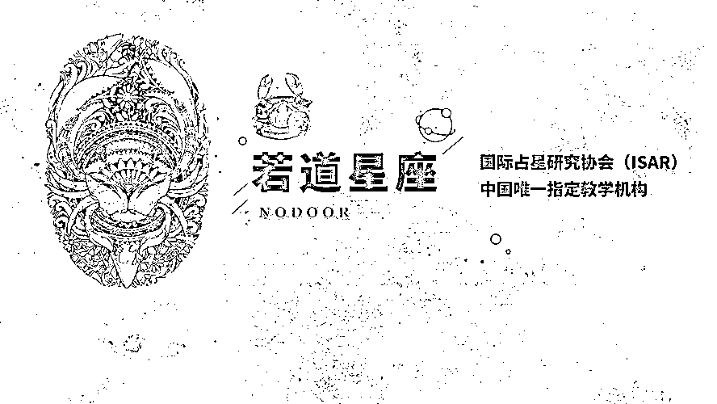**作者/格伦·佩里
译者/李含 校对/Christy 编辑/翀子 封面/书君 图片/稿定设计 你是高度敏感人群吗？一点点事情就能触碰到你的泪腺吗？格伦·佩里老师将从心理学的角度深入分析太阳巨蟹座的情感特征，帮助你走出过度情绪化。一起觉知起来！另外，如果你想深入了解每个星座的心理原型，欢迎点击格伦老师教授的 ISAR 选修课[【占星原型与星图中的精神病理学】](http://mp.weixin.qq.com/s?__biz=MzA5NjA0NTAxNg==&mid=2651489261&idx=3&sn=7f330b85d45c81108254be44dcd85f55&chksm=8b48315abc3fb84ceef17e50ce7abf92a3c9fa0f2f973638e66c99c9184119c376fe761bd3ad&scene=21#wechat_redirect)了解详情哦~
**太阳的重要性**

**问：为何星图中太阳所落的星座具有重要性，它能告诉我们什么呢？**

**答：**我总是说，太阳在心灵中的地位就如同它在太阳系中的地位。太阳就是中央枢纽，其他一切围绕它而运转；太阳是我们肉体的心脏、是人格的核心、是意识的基座。

**从心理学上看，它象征着富于创造性的自我表达、意图和意志，是我们作出选择且通过自己的选择创造身份的一种能力。**

在我们的选择和创造性的自我表达之下潜藏着一种期待，那就是他人会确认这些选择。他们会欣赏和认可我们的表达以及我们成为了怎样的人。

**确定和认可支持着自尊的发展，这是太阳的主要目标之一。**

太阳所落的星座和宫位描绘出此人如何（星座）及在何领域（宫位）试图建立自己的身份，也揭示出此人将以怎样的方式，在哪些领域体验目标感、娱乐、创造性、乐趣和自豪——我们也可以说是一种**荣誉感**。

荣誉感有点像是古代的词汇，今时今日已经很少见了。简单来说，**荣誉（或缺乏荣誉）是一个人选择的结果总和，其成就暗示着通过通力合作来采取正确的行动。**也就是说，通过可以展现出一个人勇气、友善、可信赖、责任感和仁慈的方式。

**荣誉暗示着正直和纯洁的动机，它确保个体能够获得尊重和自尊，始终如一地展现出高贵的品格。**因为采取正确的行动给人带来好的感觉，所以荣誉也与自尊相当。

|《赤胆豪情》剧照

我很喜欢《赤胆豪情 Rob Roy》这部电影中的一幕，英雄罗伯特·罗伊·麦格雷戈（饰演者连姆·尼森太阳落于巨蟹座）的儿子问他：“父亲，什么是荣誉？”麦格雷戈沉思片刻，然后回答：

**“享有荣誉的男人都是王者，但并不是所有的国王都有荣誉。没人能赐予你荣誉，也没人能将属于你的荣誉夺走。荣誉，是一个人给自己的礼物。”**

他的儿子回答：“你怎么知道自己拥有它呢？”“在追求荣誉的路上永远不要担心这个问题，”麦格雷戈回答。“它会在你心中成长，它会对你诉说。你需要做的只是去聆听。”

|《哈姆雷特》剧照

这是太阳以正当方式赢得的礼物，暗示着太阳对荣誉的一种趋向性，也就是我们内在的太阳（王者）总是指引、劝说、鼓励自我作出符合一个人善良本性的选择。正如普娄尼亚斯在《哈姆雷特》中所说：

**“这比一切都重要：要忠实于你自己！黑夜终是追随著白日，你也必须如此遵行不渝。这样你便不会欺骗任何人。”**

这无疑就是麦格雷戈告诫儿子时所说的，在心中的荣誉逐渐成长时聆听它的声音。忠实于自己，否则最终将会变得卑劣，终日与失去自尊的痛苦为伴。

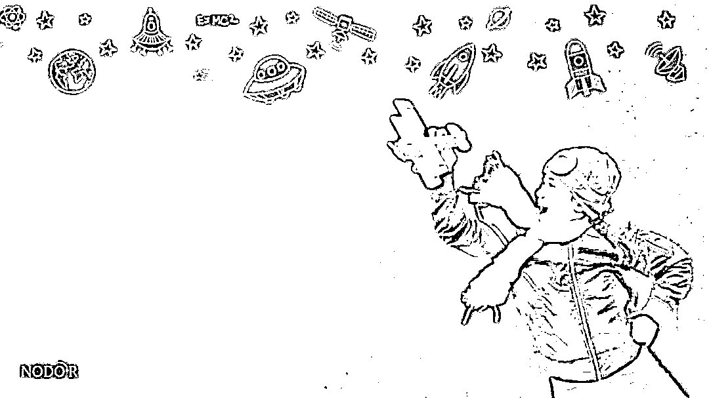

**太阳和太阳星座不同**

当然，太阳星座与太阳本身差别很大，即使占星师们试图将二者结合。我并不喜欢把星座视作性格来谈论，比如他是巨蟹座，或她是摩羯座，因为这会留下错误的印象，好像星座可以被简化为性格类型，并且太阳星座就是星座的全部。

但事实上，**一个星座与不同的行星结合作出的表达是完全不同的。**

从本质上来讲，**星座是一种动机或驱动力，根据自身性质寻求成就满足。**每个星座都有一些渴望，象征着一种普遍性的需求。这种需求的性质会引发一些满足需求之目的的行为。

**如果巨蟹座象征的需求是归属（归属于一个家庭、社区和国家），那么巨蟹座式的行为就是与生俱来的关怀、保护、支持、奉献、忠诚、爱国精神等等。**

这强调的是，一个星座的行为最好是在该行为所服务的需求背景下去理解。

一个太阳星座的意义远比仅一个星座更为复杂，因为它是两个变量的组合——太阳和星座。**太阳星座的概念必须从太阳的自我表达功能、意志和身份方面来定义。**

首先，人们表达自己的方式会与自己太阳星座的性质保持一致；其次，他们以反映该星座心理状态的方式做出选择——锻炼他们的意志；第三，他们倾向于认同该星座的动机原则和暗含的价值观。我认识到这一切都十分抽象，但是有助于建立起物质基础。

最终，太阳的星座落点构成了一条属于个人的荣誉之路。一个人必须充分发展和体现出这里的人生信条，在其最高意义上，实现自身的潜能，点亮荣誉的光环。

我并不是说太阳星座是抵达荣誉的唯一途径，而是说，它是实现自我与完整生命的长途旅程中重要的一段。

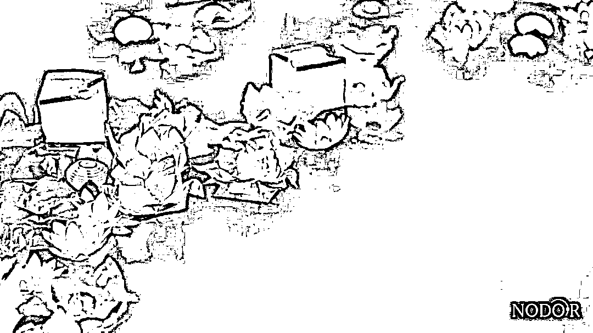

**是什么构成了巨蟹座性**

**问：巨蟹座的本质要素是什么？**

**答：**这真是个好问题。我们还是要注意到，这个问题与“太阳在巨蟹座的功能是什么？”有所不同。我会尝试解释这两个问题。

**巨蟹座的本质是需要亲密、归属、理解、关怀和无条件的爱，这种需求（或需求集合）是所有巨蟹座行为的基础和动机。**

由此可见，巨蟹座的所有行为特质都可以放在行为所服务的这个需求背景之下来理解。**巨蟹座的内省、关怀和对拒绝的敏感都是致力于实现巨蟹座对亲密的重要需求。**

值得一提的是，巨蟹座与狮子座成十二分相，太阳就是狮子座的守护星。狮子座是紧随巨蟹座之后的黄道星座。它是太阳的天然家园，是太阳感觉最舒适、最容易做自己位置。

成十二分相的星座是一种补偿性关系，好像后面一个星座将前面一个星座推开，说：“我超越了你，我与你完全不同！”

所以，太阳在巨蟹座时就像是倒退，严格来说，就是因为巨蟹座在狮子座的后面。通过作出选择来塑造独特个人身份的冲动，被看不见的忠诚压抑了。

在夏至观察巨蟹座这种倒退的特质尤为有趣，这是巨蟹座的起点。太阳停止了向北攀升，盘旋三日后，开始向回走，在天空中越来越低，直到 6 个月后来到冬至日，反过来再走一遍这个过程。

这可以看作是巨蟹座天性中**沉默含蓄、犹豫不决和倒退特质**的一种隐喻（**巨蟹座掌管着过去、祖先和历史**）。实际上，**巨蟹座通过弱化自己的言行抑制了太阳天性中向上、向外的表达。**

它软化和柔化了太阳，将它的能量转向内在，倾向于**关怀、保护那些已经建立的——先例、传统、基础。**

太阳在巨蟹座时，其功能遭到了抑制，没能通过强烈、清晰的个人意志来表达出自己的与众不同，这是因为太阳巨蟹座在表达个人爱好时，可能意外导致了自己和他人的疏远。

太阳自己可能会自发地大声宣布：“我是天主教徒、共和党人、洋基队的粉丝，我喜欢乡村音乐！”但是在巨蟹座时，太阳可能担心许多人会因为这些选择而疏远他。这些人肯定是新教徒、民主党人、麦兹队粉丝，肯定讨厌乡村音乐。这令巨蟹座人感到不安。

所有这些都意味着，**太阳巨蟹座很难自然地做自己，他可能因为恐惧而拒绝这样去做。**“如果我没有归属于新教徒家庭、麦兹家庭……这些人会不喜欢我。”同样还会担心那些做出**不同选择的人会感觉太阳巨蟹座人拒绝了他们，没有支持他们的选择。**

**巨蟹座的强项**

**问：巨蟹座最棒、最强有力的特质是什么？**

**答：**是**情商**。巨蟹座能够**转而向内，去感受、去接纳情绪层面所发生的事情，并能够凭借直觉力去理解人和环境的情绪状态。然后他们会据此调整行为。**

这就是巨蟹座被认为具有变色龙特质的原因，能够**与环境融为一体**。**对亲密和归属的需求再一次成为主要的驱动力，是巨蟹座所有行为的根源**。我们甚至可以说这也是母爱的动机。

**母性维系亲密的本能自然会具备在任何时刻理解子女情绪和需求的能力，有能力与子女共情，于是便维系起了充满爱的关系。**

**太阳落于巨蟹座预示着有能力去表达关怀、理解、共情、保护等等。**太阳巨蟹座人会**明确认同这些属性，甚至全力投入其中。**这样的感性会延伸到生活的方方面面，尤其是需要保护的生命形式。

**问：巨蟹座的弱点是什么？**

**答：**和所有星座一样，力量被过度发展就会成为其弱点。在所有巨蟹座的属性前面加上“过度”，你就可以发现问题所在——

**过度敏感、过度保护或过于情绪化**。**巨蟹座对拒绝敏感、担心伤害到别人、会胆怯、害羞、沉默寡言，尤其是太阳落于此星座。**

和其守护的狮子座一样，太阳对应的是**玩耍、娱乐、与朋友社交**。但是当太阳落在了巨蟹座，我会**难以主动发起社交，表达想要玩耍的愿望**——即使有时候就是简单的给个朋友打电话。

因为我觉得这会有些强人所难，显得不够体贴。也许他们有晚餐邀约，或是忙于工作，或是在照顾子女。我习惯于**用道歉做开场白：“我很抱歉打扰到你……”**我知道这很不理性，但是这就是天生的。

相反，如果太阳狮子座人打电话给一位朋友，他们会认为这是对友人的一种赞赏，而这也是事实。

如果我的月亮而不是太阳落在了巨蟹座显然会更好，因为巨蟹座的力量会用来服务于月亮的功能，恰好与这些特质相对应。

有许多完全适合于倾听、理解、表达同情支持的场景。在这些时间里，月亮是活跃的。如果它落在巨蟹座，那么此人给予敏感回应的能力会十分强大且自然。

要理解，**巨蟹座的弱点并不是固定不变的，而是自我各方面缺乏整合的一个结果。**人可以在任何星座作出糟糕的表现——要么过度，要么不够。

但这不是星座的错。当一个行星落在一个与其守护星座成困难相位的星座时，就像是太阳落在巨蟹座，那么这个行星的功能就打了折扣，行星很难做自己。

前文有说道，狮子座就是与巨蟹座成十二分相。因为太阳是狮子座的守护星，于是太阳巨蟹座就像是莎剧中的演员，必须扮演朱丽叶的角色，而太阳自己则更想演罗密欧。

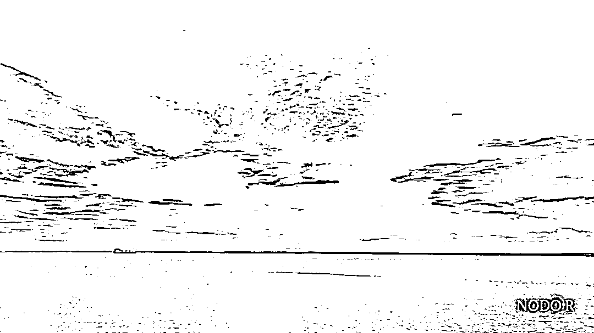

**流露脆弱是有力量的**

**问：你从自己的太阳星座学到了什么？**

**答：**那就是我更愿意自己是太阳狮子座。好吧，先不开玩笑了。我学习到的就是，**知道该如何应对情绪是很重要的事情。**

矛盾的是，能够流露出脆弱的情感本身就蕴藏着巨大的力量。愿意敞开分享我的这一面，给我带来了意外的收获，我都没有预料到，因为在我童年成长的家庭中是回避情绪的。现在我强烈的忠于自己的情绪，将它们视作我最忠诚的盟友。

**人们会不同意你的想法，但并不会不同意你的感受。**如果我说：“某个宗教更像是一种政治意识形态而不是宗教。”人们可以合理地提出分歧意见。但是如果我说：“某个宗教教吓到我了。”

这就是一种他人无法反对的陈述。这只是我的感觉，并没有对错，即使这是进一步对话的基础。

**当个体的思想、价值观和决定得到情绪支持时，这个人会更庄重，更具有人格的实质和深度。**情绪就是你的大地、你的舵手、你存在的根源，情绪是我们联结他人的纽带。

|《野战排》剧照

我记得在 1986 年看过奥利弗·斯通的一部电影《野战排》。讲述的是美国士兵在越南战争中作战的故事。

在一次战斗之后，一些士兵叫嚷着争论对与错，美国是否该卷入战争。就在紧张气氛一触即发之时，演技精湛的福里斯特·惠特克 （Forest Whitaker）所扮演的比格·哈罗德只是说了一句：**“兄弟，我不知道，但我的内心受到了深深的伤害。”**

就在那一刻，所有的能量都转移了、安静了、平静了。比格·哈罗德说出了每个人的感受，突然间所有人被联系到了一起。**一个简单的情绪表达就能做到。**

**巨蟹座（和月亮）与情绪相关，这并不是暗示巨蟹座月亮的原型是情绪感受。**有时候，你会听到占星师们说：“月亮就是感受。”但这是一种误解。

确切说，巨蟹座月亮有自己的感受（温柔、保护、母性的爱），但是**每个星座-行星系统都有某种特征感受，当被激活时，行星会采取恰当的行动。**

当一个陌生人拿着棒球棍冲过来时，如果一个人感觉到他的生命遭受威胁，那么这就是白羊座的感受——发出警报、激动、有侵略性，触发了火星的战或逃反应。

**巨蟹座月亮的原型象征着一个人去感受全部情感的能力，作为一个人去接纳这些情感，将这些情感的信息传递到恰当的行星功能中。**

如果一个人不能有意识地去感受情绪、理解它们的意义，将其注入恰当的反应之中，那么这些情绪对他而言就没有什么益处。

**一个星图中，巨蟹座月亮的原型越强大，比如有太阳（或其他任何行星）落于巨蟹座，此人就越有可能善于处理情绪。**就仿佛**他们的情绪疏导通道比其他没有这类特质的人要更宽更深一些。**

**版权声明：**本文由若道翻译发布，欢迎转发，反对抄袭。友号转载请申请白名单。

**END**

**格伦·佩里**

若道签约老师，著名占星师，前 ISAR 董事会成员，共出版 8 本占星著作；心理/意识研究专业博士；占星心理学学院（*Academy of AstroPsychology*）的创办人；康涅狄格州研究生院（*the Graduate Institute of Connecticut*）原型宇宙学与意识进化项目的负责人。

# **占星原型与星图中的精神病理学**

为什么在占星学的课程中，会出现精神病理学的教学内容，这和我们有什么关系？这对占星咨询，或在自我了解与成长的过程中又有什么帮助呢？

**带着这些疑问，请你静下心来，思考以下几个问题**：

“**你/你的案主，是否曾经过度担心什么？** **你/你的案主，有没有感觉到担忧和焦虑，却不知道原因是什么？****你/你的案主，是否曾经觉得害怕什么东西，但理智上却很清楚它不会对你造成什么伤害？****你/你的案主，是否曾经通过沉迷某物，酗酒或滥用药物，自我伤害去逃避问题？****……****——节选改编自《心理学与生活》**”

如果你对上述问题其中之一，回答是。这意味着几乎每个人都曾有过心理障碍的症状（精神病理的问题）。

你看，其实“精神病理学”与人的心理有着密切的关联，再结合占星学，呈现了人内在与外在层面更加丰富和深刻的一面。**这对于学习占星学的人和占星师来说，都是一场难得的知识盛宴！**

**本课为 2 年期双证核心课程中的一部分**（AP105 阶段），其内容是过去若道所开设的核心课程从未教授的部分，特意抽出供其他学员学习，**可作为 ISAR 选修课，单独报名。**

**点击下方图片了解详情** 

**20 位来自世界各地的占星师****带来 19 场沙龙——新世界的觉醒****详情可点击下图**

**学习占星学****点击下图了解课程详情**

**

**微信又双叒叕改版啦，不想错过若道君的推送？**
****就把若道设为****星标****以及点点****“在看”****吧！******▼**

**喜欢就点一下“在看”吧！****报名直达入口**

# 若道周运 9.26-10.2 丨天秤座被点亮，展开你的“关系与合作”吧！（内含 12 星座运势）

> 原文：[`mp.weixin.qq.com/s?__biz=MzA5NjA0NTAxNg==&mid=2651490080&idx=1&sn=7c057fb9a9623922ae5d6d016c4fb414&chksm=8b483597bc3fbc815119495066f5626841e305885f5b15fc2c01515bf430840468f445ca8270&scene=126&sessionid=1692737751#rd`](http://mp.weixin.qq.com/s?__biz=MzA5NjA0NTAxNg==&mid=2651490080&idx=1&sn=7c057fb9a9623922ae5d6d016c4fb414&chksm=8b483597bc3fbc815119495066f5626841e305885f5b15fc2c01515bf430840468f445ca8270&scene=126&sessionid=1692737751#rd)

******☆ ****后台回复“今日”，给你一句生命态度******

作者/芷菱 ISAR 认证占星师
编辑/翀子 封面/书君 图片/稿定设计**整体氛围**

**本周重要星象**

*   **9 月 26 日 周一**

    天秤座新月、金冥三分（冥王星逆行）

*   **9 月 27 日 周二**

    金水合相、日木对分、水冥三分（水冥都逆行）

*   **9 月 28 日 周三 **

    月亮进天蝎座（7:14）  、火土三分（土星逆行）

*   **9 月 29 日 周四   **

    金星进天秤座（15:49） 、月土四分

*   **9 月 30 日 周五   **

    月亮进射手座（12:03）、月金六分 、月木三分

*   **10 月 1 日 周六**

    日月六分、月土六分、月火对分

*   **10 月 2 日 周日**

    金木对分（木星逆行）、月亮进摩羯座（15:38）、水星在处女座 24°11′顺行（17:07）、月木四分

我们正在进入一段湍急的激流之中，请系好安全带。

因为我们已经来到了重大天象“土天四分”成相最紧密的阶段。应对变化最好的方式可能是拥抱它。同时本周的“天秤座新月+金星入天秤座+水星顺行”将为我们开启一段“**关系与合作**”的宇宙主题。

**土天四分相：接纳变化**

最近我们可能注意到一些紧张的气氛。**天空中土星和天王星的四分相越来越紧密。**

进入本周，土天两颗星之间的允许度只差 37'-42'，也就是 1°以内。而这也是今年土天四分相最近的距离。**一直到 10 月中旬之后两颗星才渐渐拉开距离**，10 月底之后才走出 1°以外。

也就是说，这一次的土天四分相并不会到达 0°精准成相，但仍然会给世界带来震撼。从现在起到整个 10 月，我们都可能会感受到这个天象的影响。

我们已经在去年领略到了土天四分相的威力。2021 年的 2 月、6 月、12 月，土星和天王星曾先后三次形成四分相，你可以回顾一下当时自己有没有什么难忘的事情发生，比如生活的重要变化，稳定的事物被打破等等。固定星座的朋友可能尤其印象深刻。

从大环境而言，2021 年我们看到疫情之下，房地产、教培、餐饮、互联网等行业的震动，牵动许多人的失业、转岗、收入缩减。很多人已经习惯的某些稳固生活状态，因为各种原因被打破，被迫作出调整和转型。我们的固有观念也在疫情中一次次遭到新闻冲击。

**这一次逼近的土天四分相，发生在水瓶座/金牛座 18°-19°之间，星图中有重要行星落在水瓶座、金牛座、狮子座、天蝎座 18°-19°（±3°范围内）的同学，尤其需要注意自己的哪一颗星被土星和天王星“点中”，可能在生活中对应的领域有所显化。**

土天四分相带来的是一种稳定与颠簸间的拉扯。大多数人都不喜欢变化，变化打破我们习以为常的事物，逼迫我们走出舒适区。但我们也不用拒绝或恐惧变化，因为变化也在打破老旧的模式，帮助我们更新。

中国的传统经典《易经》，就讲述了宇宙万事万物“时时在变易之中”的智慧。如果我们长久停滞于此，看似安全，却可能是某种意义上的死亡。

为了维持生命活力，我们的身体每天都在更新。人体的细胞每隔 6-7 年就会全部更新一遍。有意思的是，天王星在一个星座待的时长也是 7 年左右。

**我们完全可以去学习拥抱变化，顺应大环境主动调整自己的人生。**从占星学的角度来看，这是在利用行星运行的力量，来推动自我的更新和成长。

尤其是去改变那些，已经让你感到不对头的地方。你是否也曾经怀疑过，我为什么要过这样的生活？为什么要做着这样的工作？为什么对自己不满意？究竟怎样的人生才是我想要的？停下来追问内心，然后去勇敢做出一些改变吧。

当然土星仍然在提醒你，不要把脚步迈得过大，**我们的改变必须要兼顾现阶段的现实承受能力。**这也是四分相带来的一种拉扯，学着找到平衡。

至少为自己储备一些能抵抗冲击的东西，比如健康的身体，适当的储蓄。心态也至关重要，保持平和，相信时间的力量，相信宇宙终会指引自己安全落地。

这一次土天四分相与去年的三次还有一个不同，就是土星和天王星双双都在逆行中。当行星逆行时，其能量更倾向于回顾及内在的表达。**无论是土星的保守加固，还是天王星的冲撞改革，在逆行时更有反思的意味。**

恰逢水星也在逆行停滞期，这也许意味着一个思考和选择方向的时期：**维持现状还是寻求变化？如果保持现状或回到过去会如何？推动改变又会如何？**

本周，土天四分相还受到火星的煽动。火星行进在双子座 18°-20°之间，与土星形成三分相，与天王星构成 30°。水星则在处女座的尾度停滞并转顺行。

**注意你周围的声音，留心事物的细节。可能有新的想法和主张冒出来，有些事可能引发争论或批评，需要调整、改善。**

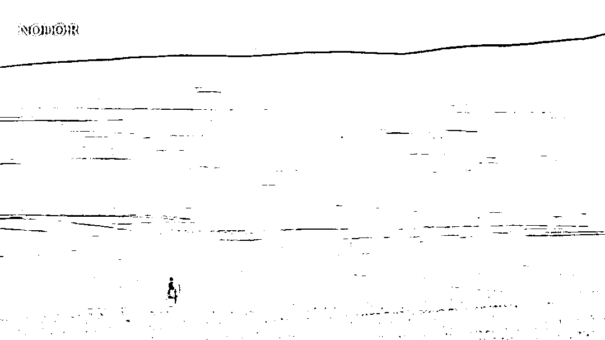

**天秤座新月+金星进天秤座**

*   **9 月 26 日，周一凌晨 05:54，新月发生在天秤座 2°48′。**

*   **9 月 29 日，周四 15:49，金星进天秤座。**

**这意味着未来一个多月，天秤座所代表的合作、外交、伴侣关系等事宜将成为焦点。**

**我们可以利用这一趋势，加强与他人合作，弥补关系，拉近友谊，加深与伴侣的亲密情感**——记得在新月时许下愿望。

新月发生时，与白羊座的木星紧密对分。无论个人还是集体，我们可能感受到矛盾的两方面：一方面新月让我们看到友谊、合作、情感联结的美好希望，另一方面又想独立，强调、扩大“我”的利益和立场。**但整体而言，被木星放大的新月，会凸显合作的价值和希望。**

新月发生几个小时后，作为新月的定位星，金星在处女座与冥王星形成三分相。在古典占星中，金星在处女座属于落陷位，金星在这里较为谨慎认真，不易尽情愉悦地享乐。而三分冥王星，更增加了其深度，有一种要看清关系和对方的真相，希望掌控局面的防御心。

但随着周四金星进入自己掌管的天秤座，周日金星对分木星，金星的能量被很大地提升和强化。金星在未来一个月里将有利于外交、合作、情感等关系的推进。水星也在此时恢复顺行，更加了一把助力，在沟通交流协商等方面，更容易达成一致，相互理解。

趁着这段关系的“蜜月期”，跟老朋友、合作伙伴、伴侣等多交流，多表达你的关心与爱意吧。

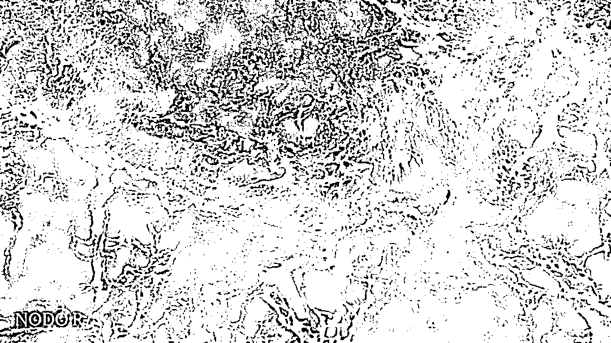

**水星停滞：反思与分析**

**本周水星在处女座 27°-24°之间逆行，其中多数时候在 24°附近停滞，并于周日在 24°转为顺行。**

周初水星与金星合相，有利于关系中的沟通。协商合作，或想要拉近关系，都利于在新月前后进行。

水逆期间，相信很多人都经历了沟通不畅、遗漏东西、搞错信息、走错路等等让人头疼的小麻烦。本周末水星顺行后，终于可以跟这些烦心事说拜拜了。

**水星在处女座停滞期间，加重强调了水星的议题。**我们可能遇到一些需要检查、反思、查缺补漏的情况。尤其水星会跟冥王星呈三分相，也有调查研究、寻找真相、分析深层原因的含义。

这期间我们需要注意检查细节，避免错漏，在深入分析一个问题之前不要轻易下判断。**这期间的思考有可能有不错的收获。**

**一周情绪指数**

**周初情绪较为高昂。**新月对分木星，金水合相，带来较为乐观、轻松、愉快的氛围。

**周中情绪有所低落。**周三月亮进入天蝎座，周四月亮四分土星，意味着焦虑、不安全感，以及情绪上的压力和困难感增强。

**周末，情绪再度上扬。**周五月亮进入射手座，此后与金星、木星等先后成相，周日金星对分木星。宇宙氛围再度变得乐观、积极、热情。反而要注意避免任性放纵，或奢侈浪费。

**12 星座的一周运势**

**（重点参考上升星座，其次参考太阳星座）**

***白羊座***

新月发生在你的 7 宫，金星与水星也将进入 7 宫。未来一个月都是你与他人合作、建立关系的良机。也许是发展事业伙伴，也许是发展感情关系。火星在 3 宫，你也很有想法或表达欲，利于与人沟通。

但目前木星加持下你可能会过度自信，或只考虑自己，把人吓跑。注意谦虚一些，换位思考。

本周水星在你的 6 宫停滞，可以对日常生活工作中的细节做梳理。比如思考如何改善工作流程或环境，让自己效率更高。

土天四分相可能让你重新评估自我价值。也许你感到需要做一个比较大的改变，跳出现有的圈子，去寻找更大的价值实现。如果收入方面不太稳定，注意开源节流，做好财务保障。

***金牛座***

新月发生在你的 6 宫，金星水星也将进入这里。未来一个月你可以改善你的工作和生活，比如改善你的工作环境、工作流程，提升效率。这也是一个增进同事关系的良机，可以多与同事沟通协作。

你也可以改善日常生活，比如更健康的饮食、健身计划、调整作息等。提升你的身体状态，让你充满活力地面对每一天。

本周水星在你的 5 宫停滞，你可能跟孩子有更多的互动，或者思考怎么让文章作品等更有创意和吸引力。恋爱中的你多跟恋人交流，关心彼此的想法，有助于拉近感情。

土天四分相发生在你的 10 宫/1 宫，对你的影响比较明显。你可能想要改变自我形象，或改变工作中的角色定位。你也可能不想一味服从，更容易直言不讳或坚持自己的观点，影响与上司的关系。思考你事业中的重点，去改变那些有长远意义的事情，不争小事。

***双子座***

新月发生在你的 5 宫，金星和水星也将进入这里。未来一个月，你适合处理孩子的事情，比如跟伴侣讨论要孩子的计划，或安排孩子的学习成长。也适合增进亲子关系，试着跟孩子做知心朋友。

对于年轻人，则是享受恋爱的良机。金星和水星带来愉快沟通的氛围，增进彼此的亲密。新月也承诺了美好的关系，在一起快乐的时光。不过火星在 1 宫，你既充满热情，也可能急躁，或比较自我。注意考虑对方的感受。

水星在 4 宫停滞，可能需要考虑家人或房子相关的事情。多跟家人交流，达成共识，或充分获取信息，有助于解决问题。

土天四分相让你的一些固有观念遭到冲击。过去坚信的东西可能有所动摇，比如唯物主义者突然对神秘主义感兴趣。或者，曾经坚定不移捍卫的理念，现在开始怀疑。不要急于下结论，多学习多思考。

***巨蟹座***

新月发生在你的 4 宫，金星和水星也将进入。未来一个月是发展家庭事宜的好时机。比如拉近家人的关系、改善家居环境、享受家庭生活，或者处理搬家或买房之类的事情。不过木星在 10 宫，事业领域也可能有机会，需要你做好平衡。

本周水星在 3 宫停滞，你可能有很多事情需要思考，或者需要说很多话，与人沟通、写报告开会等等。注意休息，劳逸结合，不要过度分析，或纠结于细节，让自己的头脑太累。

土天四分相发生在你的 8 宫/11 宫，你可能想改变一下自己的生活或工作圈子，又担心失去以前积累的资源。也可能有经济方面的考虑，不敢轻易放弃现有的东西。可以慢一点，尝试渐进的改变。

***狮子座***

新月发生在你的 3 宫，金星和水星也即将进入，未来一个月，你很适合开启一段新的学习旅程，或者去表达自己。

一直感兴趣的知识，或者想要读的书，都可以选择在这段时间看起来。如果有写作或开始一个自媒体的计划，现在也是好时机。因为宇宙能量在鼓励你的表达，你的见解可能受到欢迎。现在也很适合跟同事朋友沟通。

本周水星在 2 宫停滞，你可能很关心自我价值或收入的问题，如何更好地实现自我价值、如何改善收入？你可能分析很多，想找到答案，不过不要太拘泥于现实细节，跳出来思考。

土天四分相发生在你的 7 宫/10 宫，对你的影响可能较明显。可能是事业上的变动不稳定影响你的合作关系或伴侣关系。也可能是你在事业上想要突破和改变，却得不到周围人的支持。可以多与人交流，在讨论中想法会越来越清晰，也可能争取到他人支持。

***处女座***

新月发生在你的 2 宫，金星和水星也接着进入，未来一个月你有机会去处理自己的金钱，或增加收入，也可能寻找自我价值感。

你有机会增加收入。火星在 10 宫，你在事业上很有竞争性，多与人交流或合作，可能提升工作收入或找到副业。不过减少固定开支也是增加积蓄的好方法。另外可以思考怎样更好地发挥自己的优势资源，在现有的工作生活里实现更多价值。

本周水星在你 1 宫停滞，多学习多沟通，你的头脑或表达可能给人留下深刻印象，影响周围的人。

土天四分相可能会打乱你的一些日常生活或工作习惯，让你想探索“别处的”生活，想要冒险，又被责任和现实捆住手脚。慢慢来，可以先在现实允许范围内尝试第一步改变。

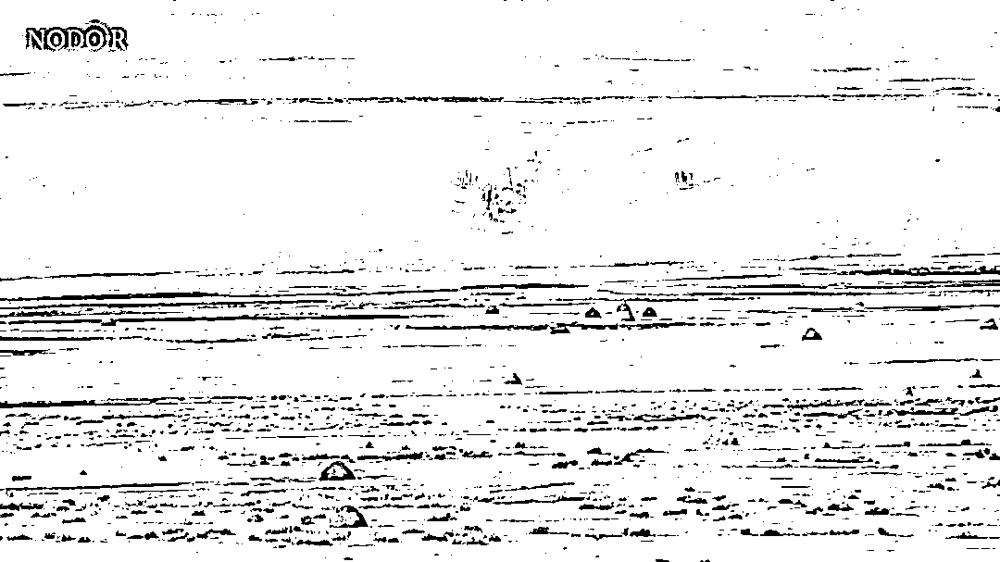

***天秤座***

新月发生在你 1 宫，金星和水星也很快进来，这是一个全新蜕变的良机。未来一个月你可以为自己规划，如何才能成为自己最想成为的人？努力向自己喜欢的样子靠近，无论是外形打扮，还是做事的方式、日常生活的状态。

这不是伪装，而是去做那个真实的、最好状态的我。你的形象可能让人耳目一新，令人欣赏。你也会更喜欢自己。

本周水星在 12 宫停滞，你可能有些事想不清楚，懒得想，但它又在你梦里出现。这段时间你的直觉可能很灵，重视那些一闪而过的灵感，也许有重要的发现。

土天四分相发生在你的 5 宫/8 宫，如果有高风险的投资，你需要提防突然的危险，比如股票下跌，最好保守些。如果影响在关系方面，有可能信任危机，或一方想要关系深入另一方却只想轻松恋爱。彼此坦诚沟通才可能解决分歧。

***天蝎座***

新月发生在你的 12 宫，金星和水星也快要来到这里。未来一个月，适于去发掘自己内心，或接触灵性、艺术类的事物。比如借助冥想、释梦、催眠等去发掘自己内心隐藏的东西。学习心理学也是一个很好的反思和认知自我的方法。

如果对这些都不感冒，你也适合做内外的休整。如果此前压力和责任很重，现在应该给自己休息的机会。静下来，多享受独处，通过音乐或阅读来放飞情感。只有充够电量，未来才能状态饱满地出现。

本周水星在 11 宫停滞，可能需要处理朋友的事情，或者跟亲朋好友交流、见面。

土天四分相发生在 4 宫/7 宫，对你的影响可能比较明显。你和伴侣或合作对象之间可能有点疏离，彼此都比较独立自我，坚持己见不容易合作。强求一致可能会造成问题。但共同的责任和安全感会将你们稳定在一起。

***射手座***

新月发生在你的 11 宫，金星和水星也快要进入这里。未来一个月朋友或社交圈子可能成为你关切的重点。

你跟老朋友可能有更多的交流见面，也可能结识新朋友，或加入一些共同爱好的新团体。如果你整天泡在办公室，也可能在工作团队中找到朋友。友情给人带来温暖。

本周水星在 10 宫停滞，你可能在思考关于工作或事业发展的问题，或者需要不断开会讨论写报告。火星在 7 宫，可能为伴侣的事情奔忙。小心与伴侣之间发生口角，多一点耐心和相互体谅。

土天四分相可能给你的工作和生活带来变动，但在不确定的环境中你还得尽量让自己的头脑和表达靠谱，找到确定性的答案，解决现实问题。这就像在被大风吹着跑的船上努力掌舵一样不容易。你需要学习更灵活，更顺势而为。

***摩羯座***

新月发生在你的 10 宫，金星和水星接着也会进入这里。未来一个月，你的注意力可能都会投在工作上。关注你的客户或合作伙伴，多沟通交流，他们可能带来不错的合作发展机会。

本周水星在 9 宫停滞，适于读书思考，尤其是探索你感兴趣的重要的大命题，比如各种社会、人生、哲学问题。但火星在 6 宫，看起来日常的事务会很繁忙，你应该还是会工作优先。

土天四分相发生在 2 宫/5 宫，你的某些爱好或愿望，可能受到现实的限制无法实现，也不能尽情投身在自己喜欢的娱乐或创造性工作当中。你历来是先考虑现实，把享受放在最后。不过你也可以在现实范围内，尝试给自己一些小小的奖赏，或一些小的任性来满足自己。

***水瓶座***

新月发生在你的 9 宫，金星和水星随后也会进入这里。未来一个月，你可能会关心一些社会问题，或者哲学与宗教的命题。积极地阅读和思考能够帮你拓展思维视野。如果有发表或出版作品的计划，这段时间也是很好的良机。

如果你是在跟进海外的一些事，那么未来一个月可能会看到海外或远方事宜的进展。对外的沟通交流会比较愉快有效。

本周水星在 8 宫停滞，适于梳理你的财务和投资状况，做深入的分析和规划。可以借助专业人士帮你处理比如保险、理财等事宜。

土天四分相发生在你的 1 宫/4 宫，你可能感受会比较强。如果搬家换城市，或家庭的一些变化可能会影响你的安全感，其实没关系，最大的安全感应该来自你自己。另外注意与家人相处的原则是相互独立，彼此尊重，不强求一致。

***双鱼座***

新月发生在你的 8 宫，金星和水星随后也进入 8 宫。未来一个月你适于去处理财务方面的问题。比如梳理投资账户、规划理财方案，或者处理保险、继承等事宜。在感情关系层面，这是适合推动关系深入，建立深度信任的一段时期。

本周水星在 7 宫停滞，你可能会耗费心力思考如何经营好一段关系，包括合作关系或亲密关系。跟对方多交流，增进相互理解。

火星在 4 宫，最近你也可能为家庭或房屋相关的事宜奔忙。小心处理与家人的关系，不要一时口快引起争执。

土天四分相可能影响你的思考和沟通，也许说话很快却不经大脑，或者有奇思妙想的言论，让人不容易接受。先梳理自己的想法再发言，更能准确传达。不过灵感和奇思自有启发意义。手足间的关系有可能受天王星影响有点疏离，不过血脉的力量会粘合彼此。

**版权声明**：原创文章由作者授权首发于若道平台发布，欢迎转发，反对抄袭。友号转载请申请白名单。

**END**

**芷菱**

ISAR 认证占星师/占星作者/媒体人若道 2019 届核心课程毕业生

于 2019 年通过 ISAR 考试，同年获得若道认证神话塔罗师资质

**微信公众号**：芷菱的理想国

长按打赏

**20 位来自世界各地的占星师****带来 19 场沙龙——新世界的觉醒****详情可点击下图**

**学习占星学****点击下图了解课程详情**

**微信又双叒叕改版啦，不想错过若道君的推送？**

**就把若道设为****星标****以及点点“****在看****”吧！**

**▼**

**喜欢就点一下“在看”吧！****报名直达入口**

# 十一假期无法出游？给你一个超级充实的假期建议！

> 原文：[`mp.weixin.qq.com/s?__biz=MzA5NjA0NTAxNg==&mid=2651490080&idx=2&sn=64e78e8a7a81ebcedbd0d723d62e6cd0&chksm=8b483597bc3fbc814cb98421f51caea1f8f11ec0453411d02eeaacc22fd4d01820fb87bb6429&scene=126&sessionid=1692737751#rd`](http://mp.weixin.qq.com/s?__biz=MzA5NjA0NTAxNg==&mid=2651490080&idx=2&sn=64e78e8a7a81ebcedbd0d723d62e6cd0&chksm=8b483597bc3fbc814cb98421f51caea1f8f11ec0453411d02eeaacc22fd4d01820fb87bb6429&scene=126&sessionid=1692737751#rd)

如果上天给你一次无法旅游的十一假期，你不妨看看这个选择！

十一假期，**每天只需 2 小时**，你就可以了解专业占星学里的**12 星座+5 颗行星。**

平时，时间就像海绵里的水，是挤出来的。爱学习的社畜很辛苦！然而，十一假期来了！你可以不用挤了！**因为核心占星课程里的 L1 阶段只有****10 个小时****的课程。**

**每天只需要抽出 2 个小时、完整的 7 天时间，**你就可以把 L1 的课程轻轻松松、完完整整学完了！

别看是仅仅是简单的 L1，学完后，你可以远远超过那些只是对娱乐占星有简单了解的朋友。你会对**12 星座**和星图上**5 颗重要的个人行星**，**太阳、月亮、金星、火星、水星**有了专业性的了解。

每天 2 小时，不耽误你吃吃喝喝、访亲会友、躺平刷剧、城市周边游，但是你拥有了可以立刻拿来就用的本事！聚会中再看其他人的星图，你会有其他人没有的识人洞察力哦！**而且，国庆之后，就可以无缝衔接 L2。**

同时，你还可以在十一假期和学习群里的同学们愉快地分享学占星地趣事，让你对各个占星元素在生活中的表现大开眼界。

**如果上天给你一次 7 天连续的时间，也许你可以换个前所未有的十一过节法！****这里有过去几节课的讲课片段，欢迎点击收听：****片段 1**<mpvideosnap class="js_uneditable custom_select_card channels_iframe videosnap_video_iframe" data-pluginname="videosnap" data-id="export/UzFfAgtgekIEAQAAAAAAZuQQz0kBQwAAAAstQy6ubaLX4KHWvLEZgBPE5YF0FwUpe6aCzNPgMIv14w53I2MkmvHnckEPJrhC" data-url="https://findermp.video.qq.com/251/20304/stodownload?encfilekey=rjD5jyTuFrIpZ2ibE8T7YmwgiahniaXswqzQ6mH9zBlA9NawT1KK0FdqFprlns0v7PbhsZzGnTPGZuNYLLTpKM8Csry4ExNNtu0hmKDNXEjwOKP9JWjT3XtHA&amp;adaptivelytrans=0&amp;bizid=1023&amp;dotrans=0&amp;hy=SH&amp;idx=1&amp;m=&amp;scene=0&amp;token=cztXnd9GyrEU0aI1IE17pbLP4DZ04r1EFnh2kQy8CStIXb1SaQlCuJU1GjFCFkxHCI6PWAYsibK0" data-headimgurl="http://wx.qlogo.cn/finderhead/PiajxSqBRaEJYnVsqWfEX9qA0sI6hNVKsDfyzfPZ92WZMZyBpZWU5NA/0" data-username="v2_060000231003b20faec8c4e68a1ec2d4ca07e434b07755bbf47e7053a3059defd2c9d6c68a20@finder" data-nickname="若道" data-desc="#若道核心课 占星能否帮助我们从星图判别出那些可能伤害自己的人？
" data-nonceid="3833527741513514419" data-type="video" data-width="1920" data-height="1080"></mpvideosnap>**片段 2**<mpvideosnap class="js_uneditable custom_select_card channels_iframe videosnap_video_iframe" data-pluginname="videosnap" data-id="export/UzFfAgtgekIEAQAAAAAAm0s0x_FhAAAAAAstQy6ubaLX4KHWvLEZgBPE6YEASWZ-eKaCzNPgMIu4NZUFCtBefpJVd27__90f" data-url="https://findermp.video.qq.com/251/20304/stodownload?encfilekey=rjD5jyTuFrIpZ2ibE8T7YmwgiahniaXswqzQry6vT7EcxKeuMPYibzP67t9HaszgRjwokGuGHHGydRP6ibwNz0fXwfoBmZPpytl2VJYU4sDsW67JibFT1qeGSgNA&amp;adaptivelytrans=0&amp;bizid=1023&amp;dotrans=0&amp;hy=SH&amp;idx=1&amp;m=&amp;scene=0&amp;token=AxricY7RBHdWzTBqP4ymePrW5GTNFkT6pc4CketdKtXAAK7vAhGjhwiahqibFQb6lIw8QVoHiaxscdc" data-headimgurl="http://wx.qlogo.cn/finderhead/PiajxSqBRaEJYnVsqWfEX9qA0sI6hNVKsDfyzfPZ92WZMZyBpZWU5NA/0" data-username="v2_060000231003b20faec8c4e68a1ec2d4ca07e434b07755bbf47e7053a3059defd2c9d6c68a20@finder" data-nickname="若道" data-desc="#若道核心课 你知道为什么情绪敏感的巨蟹座和优雅平和的天秤座都是基本星座（开创星座）吗？你知道它们分别开创了什么？你知道为什么射手座是变动星座吗？射手座在追求的是什么？" data-nonceid="12517761752566003326" data-type="video" data-width="1920" data-height="1080"></mpvideosnap>****片段 3****<mpvideosnap class="js_uneditable custom_select_card channels_iframe videosnap_video_iframe" data-pluginname="videosnap" data-id="export/UzFfAgtgekIEAQAAAAAAJ2s3ZrIUGwAAAAstQy6ubaLX4KHWvLEZgBPEg4EIc1MEXbWCzNPgMIs6reI__lcYTuioG8SQasL9" data-url="https://findermp.video.qq.com/251/20304/stodownload?encfilekey=rjD5jyTuFrIpZ2ibE8T7YmwgiahniaXswqzcvjagGvrC9mV5Efl3MSeK09zfZE2yKWl0OtUibcMaazuIicia5wVib0xz2GUuhboU9yNwDL8dEElUKDGib36clibPEyA&amp;adaptivelytrans=0&amp;bizid=1023&amp;dotrans=0&amp;hy=SH&amp;idx=1&amp;m=&amp;scene=0&amp;token=AxricY7RBHdWzTBqP4ymePlwZzibNPHBKwnw7ympYUmM3714I4F8FbkCtudFic34YC6tnR2Y4hRWWM" data-headimgurl="http://wx.qlogo.cn/finderhead/PiajxSqBRaEJYnVsqWfEX9qA0sI6hNVKsDfyzfPZ92WZMZyBpZWU5NA/0" data-username="v2_060000231003b20faec8c4e68a1ec2d4ca07e434b07755bbf47e7053a3059defd2c9d6c68a20@finder" data-nickname="若道" data-desc="#若道核心课  12 星座为什么还能分为 6 对呢？每一对星座具体有什么特征呢？
" data-nonceid="15135074788745731599" data-type="video" data-width="1280" data-height="720"></mpvideosnap>****片段 4****<mpvideosnap class="js_uneditable custom_select_card channels_iframe videosnap_video_iframe" data-pluginname="videosnap" data-id="export/UzFfAgtgekIEAQAAAAAA0HI676qGlgAAAAstQy6ubaLX4KHWvLEZgBPEl4F0XxhGBL2CzNPgMIvyU52UMJ_wqvJMxW7sDbCE" data-url="https://findermp.video.qq.com/251/20304/stodownload?encfilekey=rjD5jyTuFrIpZ2ibE8T7YmwgiahniaXswqzcW59GrhYj9KDZ7ojZqskdHCCIddEfWNfic8TUPuicVl5jVmpc8nlW23DtibibqvfsqicWH7dxICibdngoicBibZTJeRmJw&amp;adaptivelytrans=0&amp;bizid=1023&amp;dotrans=0&amp;hy=SH&amp;idx=1&amp;m=&amp;scene=0&amp;token=AxricY7RBHdWzTBqP4ymePn8Ja5dukD7tA4hJWT4arTiaEkhXCWrT90RCtxvjCes0bDRROQgtJiaB0" data-headimgurl="http://wx.qlogo.cn/finderhead/PiajxSqBRaEJYnVsqWfEX9qA0sI6hNVKsDfyzfPZ92WZMZyBpZWU5NA/0" data-username="v2_060000231003b20faec8c4e68a1ec2d4ca07e434b07755bbf47e7053a3059defd2c9d6c68a20@finder" data-nickname="若道" data-desc="#若道核心课 太阳星座与月亮星座如何组合起来，去诠释一个人呢？太阳星座与月亮星座究竟有什么分别呢？

" data-nonceid="4731060161592725067" data-type="video" data-width="848" data-height="480"></mpvideosnap>

**谁是你的老师？**

**占星师咔咔（Caroline）**

2010 年师从美国占星师大卫·瑞雷学习，并得到世界名师斯蒂芬·弗里斯特、罗伯特·汉德、苏·汤普金斯传授各种占星学技法。若道首届学员，国内最早获得 ISAR 职业占星师资质的职业占星师，多次担任若道核心课程助教，并于 2019 年第二届、2021 年第三届核心课中和苏·汤普金斯老师一起教授若道核心占星课程。

在国际知名广告公司和市场研究公司从事的市场研究和推广工作十余年，曾任职于阳狮集团、尼尔森市场研究有限公司、MTV 和《Madame Figaro》杂志。

**大卫·瑞雷（David Railey）**

*   **I****SAR 董事会成员，ISAR 全球副主席，ISAR 全球职业占星师资质认证主席，若道占星创始人**。

*   2016-2019 年，被选为国际占星协会（ISAR）考试委员会成员，国际占星协会（ISAR）是世界最大的国际占星机构，会员遍布 47 个国家。

*   2017-2020 年，被选为国际占星联盟（ISAR）考试委员会主席，理事会成员。

**助教王嘉祺 （Conrad）**

ISAR 认证占星师、若道认证生时校正资质，从 2010 年起自学占星学，2015 年开始在若道系统学习，并开始个案咨询。2018 年担任若道核心课程助教，以及卜卦占星学和太阳返照选修课助教，并带领学员进行经世占星和太阳返照方面的研究。2019 年 11 月作为演讲人之一参加了国际占星协会（ISAR）北京大会，也是 ISAR 星空俱乐部中国区第 16 期的主讲人。

**对于所有想要插班的同学，这里有一个十一的节日礼物！**

**添加我们的课程顾问老师，报名课程后，领取一个****长达 2 小时****的占星师养成计划的 L1-2 研讨项目的沙龙简介。**这个沙龙将会帮助你简单了解我们怎么用小组学习的方式，在实践中学占星。

**L1-2 课程费用：3500 元**

**L 1-3 课程费用：11500 元**

**请联系课程顾问**：**王老师（微信/手机：18510107057，请备注“大卫核心课”）**

**祝大家过一个愉快的假期！****想了解更多？****点击下图了解课程详情**

# 插班中 | ISAR 认证职业占星师必修课：踏入占星学大门的第一步

> 原文：[`mp.weixin.qq.com/s?__biz=MzA5NjA0NTAxNg==&mid=2651490080&idx=3&sn=1dd135d2f840743c7dd5759c03b1faee&chksm=8b483597bc3fbc813bfc2e6e0e9ef98aa2a5015a213a6abf04f04f2d5ae000ac534d36ba9cb9&scene=126&sessionid=1692737751#rd`](http://mp.weixin.qq.com/s?__biz=MzA5NjA0NTAxNg==&mid=2651490080&idx=3&sn=1dd135d2f840743c7dd5759c03b1faee&chksm=8b483597bc3fbc813bfc2e6e0e9ef98aa2a5015a213a6abf04f04f2d5ae000ac534d36ba9cb9&scene=126&sessionid=1692737751#rd)

5 月，一个若道的老朋友突然发来一段微信，是对木星进入白羊座的感慨。这位朋友创建了自己的公司，他并不在占星行业，但仍经常记录占星日记，因为他总是体会到星体移动和个人生命变化的契合。

过了几天，又一位若道的老朋友发了一张当天新闻的图片，里面有医疗板块产业趋势、有啤酒股的泡沫问题、有千年老二的饮用水公司也要上市。她说，看，举目全是海王星。她也不是占星师。

然而，他们都与占星相遇，占星已经融入了他们的生活。

第一位朋友说，”在若道学习占星，对我来说建立了一个整体的世界观以及对自我内在的解释论。”

第二位朋友说，“学了占星就会知道，事情来时我们不必过度反应，知道一切会过去”。

占星学会改变你，不论你跟随它走多远，不论你是否选择成为占星师。

这个世界在飞快地变化着，占星学可以像定海神针，帮你测度这个世界的变化，也帮助你校正心中的自己和世界的样子。

**这个世界上，应该还没有后悔与占星学相遇的人。**

**8 月 30 日，新的若道占星核心课程开始了。**

如果你还没有下定决心是不是好好学占星，那么 L1-2 可谓一个轻松的前菜，等着你品尝。

**把这个仅需投资 3500 元的课程作为礼物，送给自己或者自己所爱的人。**

**课程试听：不分组转发本文，找王老师领取。**

长按二维码添加王老师微信

**谁是你的老师？**

**占星师咔咔（Caroline）**

2010 年师从美国占星师大卫·瑞雷学习，并得到世界名师斯蒂芬·弗里斯特、罗伯特·汉德、苏·汤普金斯传授各种占星学技法。若道首届学员，国内最早获得 ISAR 职业占星师资质的职业占星师，多次担任若道核心课程助教，2019 年第二届、2021 年第三届核心课中和苏·汤普金斯老师一起教授若道核心占星课程。

在国际知名广告公司和市场研究公司从事的市场研究和推广工作十余年，曾任职于阳狮集团、尼尔森市场研究有限公司、MTV 和《Madame Figaro》杂志。

**大卫·瑞雷（David Railey）**

*   **I****SAR 董事会成员，ISAR 全球副主席，ISAR 全球职业占星师资质认证主席，若道占星创始人**。

*   2016-2019 年，被选为国际占星协会（ISAR）考试委员会成员，国际占星协会（ISAR）是世界最大的国际占星机构，会员遍布 47 个国家。

*   2017-2020 年，被选为国际占星联盟（ISAR）考试委员会主席，理事会成员。

**助教王嘉祺 （Conrad）**

ISAR 认证占星师、若道认证生时校正资质，从 2010 年起自学占星学，2015 年开始在若道系统学习，并开始个案咨询。2018 年担任若道核心课程助教，以及卜卦占星学和太阳返照选修课助教，并带领学员进行经世占星和太阳返照方面的研究。2019 年 11 月作为演讲人之一参加了国际占星协会（ISAR）北京大会，也是 ISAR 星空俱乐部中国区第 16 期的主讲人。

**内容是什么？**

**课程费用**

**★ 1-2 阶 **

**课程费用：3500 元 **

**你也可能想学更高阶：**

**★ 1-3 阶　连报****课程费用：11500 元 ************转发优惠价：**11000 元（朋友圈转发本课宣保留 24 小时以上，并截图给课程顾问）**********★ 1-5 阶　连报**

**课程费用：46500 元 **

****转发优惠价：34800 元（朋友圈转发本课宣保留 24 小时以上，并截图给课程顾问）****

德国哲学家雅思贝尔斯说：

教育是一棵树摇动另一棵树，

一朵云推动另一朵云，

一个灵魂唤醒另一个灵魂。

你准备好被摇动了吗？

**退转课程**

**退款原则请详看《教学协议》，如有疑问请咨询课程顾问。**

**课程试听**

**不分组转发本文，加王老师获取。**（微信/手机：18510107057，请备注“大卫核心课”）

****2022 L1-2 认证职业占星师必修课程****

**授课老师：大卫·瑞雷、咔咔**

**直播课开课时间：2022 年 8 月 30 日（周二）**

**授课方式：******网络授课，英文/中文授课，中文翻译****

**费用**： ****1-2 阶**：**3500 元；****1-3 阶**：**11500 元**（****转发优惠价：11000 元，朋友圈转发本课宣保留 24 小时以上，并截图给课程顾问）；**1-5 阶连报**：46500 元**（****转发优惠价：34800 元，朋友圈转发本课宣保留 24 小时以上，并截图给课程顾问）****

**课程负责人：王老师**（微信/手机：18510107057，请备注“大卫核心课”）

长按二维码添加课程负责人咨询~

**END****报名直达入口**

# 天秤座新月 | 2022 年最佳关系构建和修复期，别错过！

> 原文：[`mp.weixin.qq.com/s?__biz=MzA5NjA0NTAxNg==&mid=2651489655&idx=1&sn=16f2a391519f710be5d36de48d2b939b&chksm=8b4837c0bc3fbed68f2f3db48a28f889a398c5baaf0ade6fabc6beed17af67b81edaa7e8b90a&scene=126&sessionid=1692737751#rd`](http://mp.weixin.qq.com/s?__biz=MzA5NjA0NTAxNg==&mid=2651489655&idx=1&sn=16f2a391519f710be5d36de48d2b939b&chksm=8b4837c0bc3fbed68f2f3db48a28f889a398c5baaf0ade6fabc6beed17af67b81edaa7e8b90a&scene=126&sessionid=1692737751#rd)

****☆ **后台回复“今日”，给你一句生命态度**

作者/王芝桦 编辑/玫瑰 图片/稿定设计

**天秤座新月**

**北京时间 2022 年 9 月 26 日 5:54 迎来天秤座新月，太阳与月亮精准合相于天秤座 2°48′。**

此次天秤座新月的转天，**9 月 27 日凌晨时分，近地逆行的白羊座木星与天秤座太阳形成“日木对分”结构，带来近 59 年以来木星与地球“最亲密接触”的天象奇观。**

“日木对分”结构每 13 个月左右发生一次，但发生在木星最接近地球的位置却相当罕见，**上一次还是发生于 1963 年，下一次则是要等到 2129 年。**

故而，此次天秤座新月，天秤座所掌管的“关系与平衡”将在木星的“放大镜”下极度彰显，新月的开启能量也将为我们带来全新的评估视角和重要的成长时间。

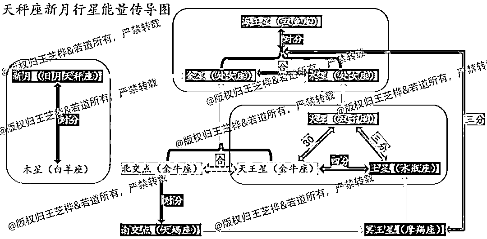

> **天秤座新月重点影响人群****参考新月峰值影响期间各个行星的行进度数，以及逆行行星的轨迹影响；常规容许度，个人行星入相位 3°，出相位 1°；非个人行星入相位和出相位均为 3°。**
> 
> *   出生星图中，有**行星、四轴、南北交点**落入**基本星座（**白羊座、巨蟹座、天秤座、摩羯座**0°-11°，23°-30°**的人群。
> *   出生星图中，有**行星、四轴、南北交点**落入********固定星座（金牛座、狮子座、天蝎座、水瓶座）******11°-28°**的人群。
>     
>     
> *   出生星图中，有**行星、四轴、南北交点**落入**变动星座（双子座、射手座、处女座、双鱼座）15°-30°**的人群。

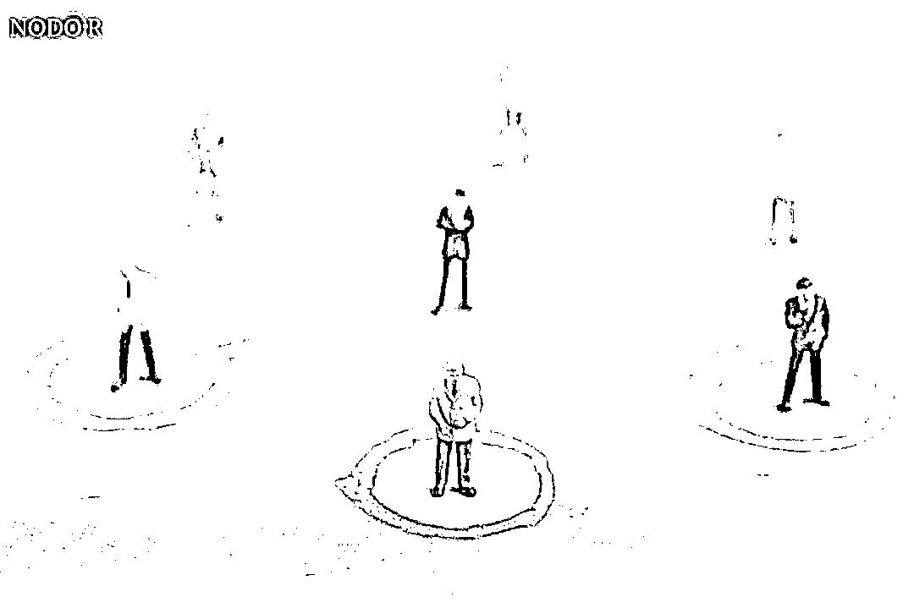

**“关系议题”彰显，理性评估，重塑平衡**

> **天象**
> 
> **· 日木对分：天秤座太阳对分逆行的白羊座木星。****· 土天四分：逆行的水瓶座土星四分逆行的金牛座天王星。****· 火天 30°：双子座火星与逆行的金牛座天王星形成 30°结构。****· 火土三分：双子座火星三分逆行的水瓶座土星。**

“土天四分”结构是 2021 年的年度重磅天象，土星经年沉淀下来的规则与实力，被天王星瓦解和震裂得七零八落，无论集体或个人，以往的成绩似乎突然说不算就不算了。但是，因为土星和天王星同时守护水瓶座的关系，“土天四分”结构虽然让我们体验到“狗熊掰棒子”掰一个扔一个的不适感，但也让我们逐渐升起**“不破不立，边破边立”**的全新意识——**走过才叫历史，历史就是不断改写的过程；创新才有未来，未来就是一切皆有的可能。**进入 2022 年，“土天四分”结构的影响暂时性地稍有缓解；但 2021 年并没有给我们什么答案，而 2022 年在年度重磅天象“木海合相双鱼座”的催化下，一切似乎皆在太上老君的“八卦炉”中难以预测地演化着，更是令人感到混乱与魔幻。2022 年 7 月以来，张力开始加大，压力开始加剧；8 月以来，甚至有种四面围城的困顿感和走回原点的挫败感；进入 9 月，一场水星逆行，逆出了“6 星集体逆行”的局面，快不了的速度，却被执着地催促和加速。

**敲黑板！划重点！**

**10 月 1 日-12 日，“土天四分”结构将会带来最后一波“不破不立，边破边立”的重磅洗礼**；9 月下旬，逆行在白羊座的木星率先迈入水瓶座土星和金牛座天王星的中点位置，首当其冲地扛起“土天四分”结构的压力；此次天秤座新月的转天，9 月 27 日凌晨，天秤座太阳与白羊座木星形成最亲密接触的“日木对分”结构。 **此次天秤座新月的前后 5 天，各种关系中的契约精神、道法律条、权益立场等问题将被特别彰显；而自 8 月下旬以来的“关系议题”也被触发出极致的张力。****影响与启迪：****·** 国际层面的权益之争和金融之争席卷全球，俄罗斯的扩充征兵，美联储的大幅加息，货币利率的异常波动，看得见的硝烟和看不见的硝烟都已“杀疯”，无论后期的走向和最后的结果将会如何，9 月下旬的现实演化必将被载入史册；**·** 如果你渴望看到某些关系的真相或寻获某些关系的答案，便要带着理性的意识和全局的视角，深入反思关系的失衡状态，重新评估关系的价值意义；**·** 无论集体社会，还是个人生活，“关系”从来不会围绕个人意愿运行，因为关系中的每个人都渴望一份平等，需要一份尊重；**·** 此次伴随着“日木对分”结构的天秤座新月，宇宙提示我们去做关系中的“平衡建设”，而不是一己“英雄主义”的一意孤行。另外，此次天秤座新月周期，已于 9 月 4 日进入逆行前阴影期的双子座火星介入“土天四分”结构：9 月 26 日天秤座新月当天，与金牛座天王星形成“火天 30 度”结构；9 月 28 日，与水瓶座土星形成“火土三分”结构。

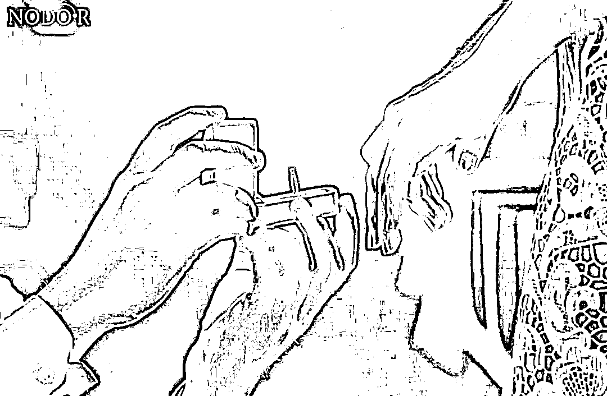

**这一波发生在双子座的火星逆行时间是 2022 年 10 月 30 日-2023 年 1 月 13 日，并在整个逆行周期形成“火海四分”重磅天象结构。**该组结构的最大风险，就像是“战神”失去了章法，拳拳打在棉花上，不见成效且难以坚持；该组结构亦在提示我们**在 9 月和 10 月进行决策和展开行动的时候，需要关注全局，不可草率行事。**故而，此次伴随着“日木对分”结构的天秤座新月，需要我们在“关系议题”的处理上保持理性的视角和敞开的态度——**“关系”是流动的，既需要用心经营，亦需要随缘来去；我们既要接纳关系的变化，亦要学习关系的法则，更要沉淀关系的经验。****健康的关系绝不是亏本的买卖**

> **天象**
> 
> **· 水金合相：逆行于处女座的水星与处女座金星形成“水金合相”结构。**
> 
> **· 金海对分+水海对分：宽泛容许度下，处女座水星与双鱼座海王星形成“水海对分”结构，处女座金星与双鱼座海王星形成“金海对分”结构。****· 金冥三分+水冥三分：宽泛容许度下，处女座水星与摩羯座冥王星形成“水冥三分”结构，处女座金星与摩羯座冥王星形成“金冥三分”结构。**

**当下，水星正处于 2022 年度第 3 波逆行的进程中，逆行时间从 9 月 10 日-10 月 2 日，逆行轨迹从天秤座 8°55′-处女座 24°11′，并在 9 月 23 日发生“天秤座→处女座”的换座过程。**  

**9 月 23 日“秋分日”是相当敏感的一天**：早上 9：03 太阳换座进入天秤座，晚上 20：04 水星从天秤座逆行回到处女座——**9 月 23 日的整个白天，太阳与水星合相于天秤座 0°，即强大的“基本星座开创点”位置。**

此次天秤座新月的能量，通过**“天秤座新月→处女座金星→处女座水星”**这一组行星能量传导链条（金星守护天秤座，水星守护处女座），最终被 9 月 23 日逆行回到处女座的水星定位。

故而，此次天秤座新月开启的“关系与平衡”的建设工作，其实**从 9 月 23 日便已经开始**；而自**8 月下旬开始出现的“关系失衡，沟通误解”等问题，9 月 23 日-10 月 22 日天秤月期间，也给出了向内反思和现实修复的机会。**

此次天秤座新月，几组天象也需要特别关注：**· 9 月 24 日**：处女座金星与双鱼座海王星形成“金海对分”结构。**· 9 月 26 日**：处女座金星与摩羯座冥王星形成“金冥三分”结构。**· 9 月 27 日**：处女座金星与处女座水星形成“水金合相”结构；处女座水星与摩羯座冥王星第 2 次形成“水冥三分”结构（第 1 次 8 月 23 日，第 3 次 10 月 7 日）。

**· 9 月 26 日-10 月 5 日**：处女座水星与双鱼座海王星形成宽泛的“水海对分”结构，期间横跨了 10 月 2 日水星于处女座的恢复顺行。

9 月下旬的这几组结构中，只有处女座金星处于顺行状态，其余行星皆在逆行状态；而此时行进在处女座的金星，也正处于一个落陷的位置。故而，**此次天秤座新月的前后 5 天时间里，金星所代表的“价值偏好，情感网络”两方面也会经受到强烈的考验与冲击。**

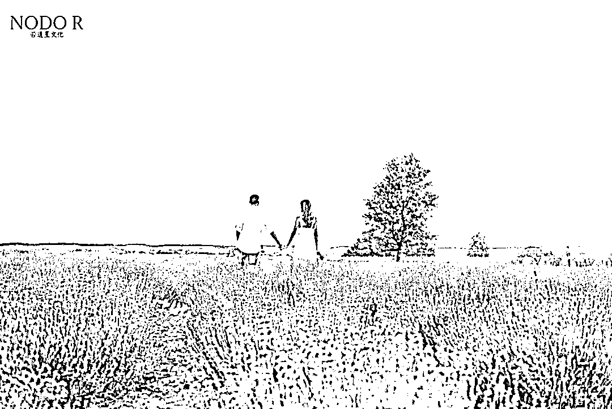

**必要的警醒****· 理想投射：**无论是我们把对方过于理想化，还是对方将期待投射在我们身上，这对于关系都是非常危险的事情，因为没有人是完美的，理想化一定会有破灭的时候，期待投射也一定会有落空的时候。故而，最健康的关系是将自己、将对方都当个真实的人来看待，谁也不将谁神化，谁也不被谁勉强。**· 反思重塑：**此次天秤座新月的整体能量，为我们提供出强大的勇气与自信，反思关系的真相，重塑关系的边界，向那些以爱之名的控制说“no”，向那些违背约定的不尊重说“bye”，向那些支持我们的人表达感谢，向那些我们爱的人付出爱意。此次天秤座新月，宇宙引领我们**将“自我与关系”放在天秤的两端，有意识地一点一点调试，才能慢慢找准“平衡”的尺度、领悟“平等”的意义。**

定位此次天秤座新月能量、正逆行在处女座的水星，则提示我们——**对自己说真话，带着心也要带着脑，坚守道德的同时也不要用道德绑架彼此，因为任何一段健康的关系绝不会令任何一方陷入“亏本的买卖”。** 

**寄语**2022 年，我们似乎总在感叹“又见证历史了”；若干年后，或许我们又会感叹“2022 年见证的不过是全新周期的新装而已”。此次天秤座新月的夜晚，让我们看一看慷慨的木星吧。这位神话原型中的“众神之神”宙斯，既然正穿着白羊座的“战士”盔甲，那么就让他引领我们以“尊重”开路，为“平等”欢呼吧。愿这个世界永远和平，祝福每一个生命健康，每一个灵魂安好。**新月如何许愿？****许愿时间**：2022 年 9 月 26 日北京时间 5:54 后，48 小时内有效、8 小时内最佳。 **许愿人群**：所有人。**许愿数量**：每人最多 10 个。**许愿方式**：静心冥想，身心祈祷或记录收藏。**许愿格式**：请万能的宇宙赐予我能量，我将以我的能量吸引**（什么）来到生命中……**许愿原则**：发心诚善利人。

**版权声明**：原创文章由作者授权首发于若道平台，欢迎转发，反对抄袭。友号转载请申请白名单。

**END**

****想阅读更多作者的文章，请在后台回复******王芝桦****** 即可。****

****王芝桦****

心理占星师，统合疗愈师，占星专栏作者

全职于个案咨询与占星教学工作 18 年

**个案预约咨询微信号**：zhihua0621 

**微信公众号**：daoxi-life

**长按打赏**

****

**20 位来自世界各地的占星师****带来 19 场沙龙——新世界的觉醒****详情可点击下图**

**学习占星学****点击下图了解课程详情**

**微信又双叒叕改版啦，不想错过若道君的推送？**
**就把若道设为星标吧！****▼**

**福利来啦**
**点击****“阅读原文”****获取最好用的免费****新月报告**

**获取免费新月报告，请点击文末“阅读原文”**

# 雷蒙德·梅里曼金融占星周运 | 歇斯底里可能会从高峰开始消退

> 原文：[`mp.weixin.qq.com/s?__biz=MzA5NjA0NTAxNg==&mid=2651489655&idx=2&sn=ac22930c10a436e5373d8d46d31ada38&chksm=8b4837c0bc3fbed62aeea7d89fac85b5022d81acc0a616f67be26d3563a33504cc001811d743&scene=126&sessionid=1692737751#rd`](http://mp.weixin.qq.com/s?__biz=MzA5NjA0NTAxNg==&mid=2651489655&idx=2&sn=ac22930c10a436e5373d8d46d31ada38&chksm=8b4837c0bc3fbed62aeea7d89fac85b5022d81acc0a616f67be26d3563a33504cc001811d743&scene=126&sessionid=1692737751#rd)

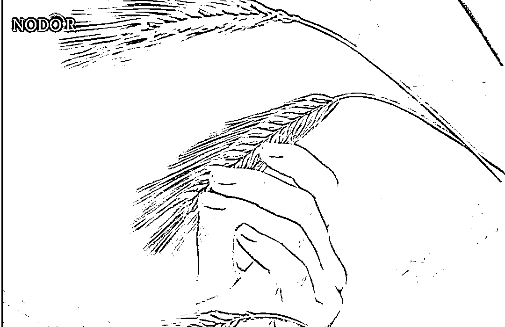

作者/雷蒙德·梅里曼 译者/Luke
编辑/玫瑰 图片/稿定设计雷蒙德·梅里曼是在金融占星学界稳坐第一把交椅的占星师，同时他也是若道签约的金融占星课老师，我们引进了雷蒙德·梅里曼老师的《[上证指数月度报告](http://mp.weixin.qq.com/s?__biz=MzA5NjA0NTAxNg==&mid=2651489623&idx=1&sn=3a0bd84d35117b33ced7b2d77a8b70a7&chksm=8b4837e0bc3fbef6ea863486e975282287c432a72da6560d21e5f7c0c34ec15102393cc3d9a8&scene=21#wechat_redirect)》及《[黄金报告](http://mp.weixin.qq.com/s?__biz=MzA5NjA0NTAxNg==&mid=2651489623&idx=1&sn=3a0bd84d35117b33ced7b2d77a8b70a7&chksm=8b4837e0bc3fbef6ea863486e975282287c432a72da6560d21e5f7c0c34ec15102393cc3d9a8&scene=21#wechat_redirect)》。我们经老师的授权，将每周刊登梅里曼老师的周运，供大家参考和学习。于是，这是本周的周运（9.26-9.30）。

**说明：以下时间采用纽约证券交易所所在地美国东部标准时间。**

**展望与回顾**

****

**市场预期美联储加息 0.75%，但没预料官方宣布利率将在一年之内达到 4.6%，远高于 6 月预测的峰值 3.8%。鲍威尔先生没有粉饰太平。****通货膨胀必须下降，他说，而那需要一个疲软的劳动力市场。“我希望有一种无痛的方式可以做到这点。但是没有。”他告诉记者。****——格雷格·伊普****《市场现在为硬着陆做好准备》****《华尔街日报》****2022 年 9 月 23 日****随着利率飙升和外汇动荡加剧全球衰退的恐惧，股票市场周五暴跌，为金融市场残酷的一周画上句号。****“市场已经明显从对通货膨胀的担忧转变为对美联储激进政策的担忧”，LPL 金融的昆西·克罗斯比表示，“债券收益率上升到多年未见的水平，人们都在想美联储如何在不引发崩溃的前提下保持价格稳定。这是一场大规模的全球混乱，市场在试图寻找出路。”****——萨曼莎·苏宾****《由于担忧经济衰退加剧，道指下跌近 500 点，在 2022 年的新低收盘》****www.cnbc.com****2022 年 9 月 23 日**通过上面引用的令人惊讶和意外的美联储讲话，可看出水星逆行期间强大的天王星相位正在发挥作用。这恰好发生在木星处于土星、天王星中点，分别与这两颗行星形成双重八分相的时间段中段。正如本专栏过去几周所述，这是土星、天王星第 4 次，也是最后一次形成渐亏四分相。之前预测的宇宙海啸-飓风名副其实，因为多个全球股票指数都跌破了 6 月的低点。在亚洲和环太平洋地区，中国恒生指数跌至 10 多年来的最低价位。其他市场没有创下新的年度低点，看似是个好迹象，然而它们也创下了新的数周低点。在欧洲，德国 DAX 指数和苏黎世 SMI 指数跌至 2020 年 11 月以来的最低价位。然而，荷兰 AEX 指数守住了 6 月 23 日的低点，同时伦敦富时指数守住了 3 月的低点。对于美洲地区，是有些奇怪的一周。巴西 Bovespa 指数上涨至 4 月 20 日以来的最高价位，道琼斯工业平均指数下跌至 2020 年 11 月以来的最低价位。但是标准普尔指数和纳斯达克指数都略微保持在 6 月的低点之上。因此，我们看看本周这些背离能否保持住。这符合恶作剧者水星逆行的性格，它喜欢打破支撑位或阻力位，然后迅速反转，形成假突破。**或者这些市场都会跌落悬崖下跌得更**低，这符合最近天王星突显的突破主题。剧烈的市场活动也存在于其他金融市场上。十年期美国国债跌至 13 年来的新低。欧元下跌至 20 年来的最低价，同时美元指数上涨至 2022 年 5 月来的最高价位。黄金跌至 1636（10 月合约），为 2020 年 4 月以来的最低价位。原油跌破 80 美元，是 1 月 10 日以来的最低价位。这些都不是小级别的市场波动。这些是天王星式的重大动荡，还被木星的能量进一步扩张。

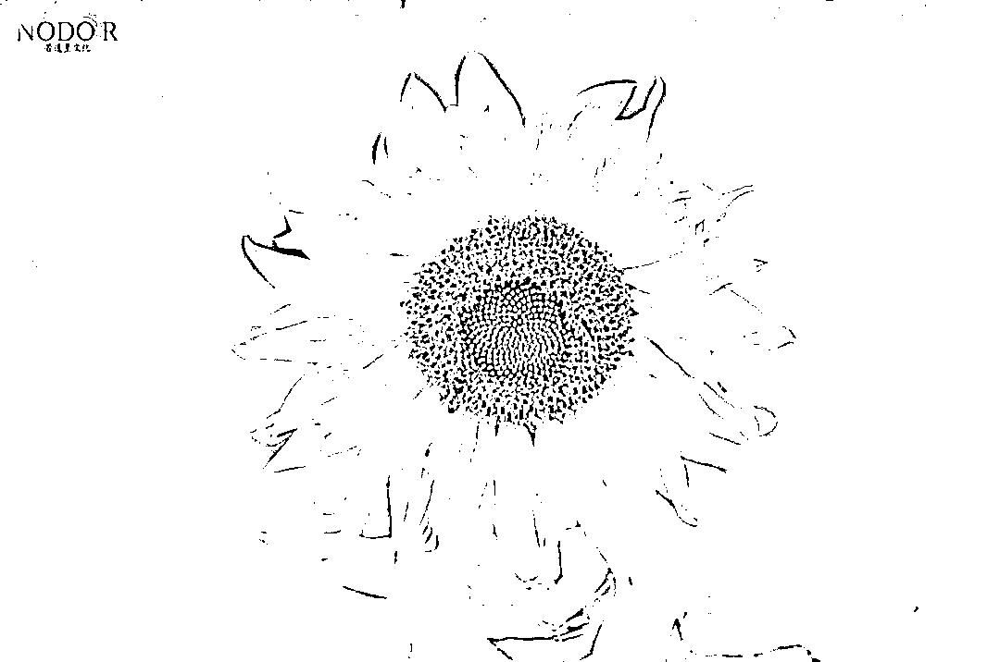

**短期宇宙征象与长期考量**

****

**有些侮辱即使遭受重创的日元也不能承受，跌至 145 日元兑 1 美元以下就是其中之一。周四，东京 24 年来首次干预外汇市场，试图控制西方央行单方面紧缩策略带来的下跌。****——《美联储、美元、日元与你》****《华尔街日报》社论版****2022 年 9 月 23 日****尽管最近几个月加息的节奏很快，去年的叙事是美联储要花多长时间才能行动。美联储对 2022 年目标利率的预测中值已从去年 12 月的 0.9%攀升至 3 月的 1.9%、6 月的 3.4%和现在的 4.4%。这种幅度的上调反映了美联储对通胀幅度和持续性历史性的误判。拖延的代价之一是经济增长放缓。****——《美联储上调预测》****《华尔街日报》社论版****2022 年 9 月 22 日****国家纳税人联盟是一个倡导财政保守政策的团体。根据它的最新估计，取消联邦学生贷款为美国纳税人带来平均 2503.22 美元的负担。** **——洛里·科尼什****《赦免学生贷款可能为每位纳税人带来 2500 美元的负担》****www.cnbc.com****2022 年 9 月 2 日**软着陆的想法似乎以一声震耳欲聋的巨响而告终。涉及天王星，主要的支撑区间被打破。涉及木星，抛售的幅度超过了正常的修正，现在我们要面对的是**全球的歇斯底里和恐慌**。这些是木星的负面特质，它通常更喜欢希望和乐观。涉及土星，恐惧现在胜过了贪婪。当这 3 颗行星加在一起，我们有了**恐慌、歇斯底里，以及集体见证崩溃在我们眼前展开。**将会有大量的指责被抛出。本文作者认为，一切的始作俑者是前总统特朗普在 2019 年-2020 年发起关税战导致的供应链断裂。正如本专栏当时所述，上一场主要的关税战是 1930 年 6 月的《斯穆特-霍利关税法案》，该法案标志着美国的孤立主义，导致了大萧条。这再次发生了。确实，特朗普开启关税战的时候还不存在通货膨胀。直到他不情愿地离任，那时供应链开始断裂，成为当今通货膨胀的主要原因。它是一个滞后的指标。但是，拜登总统就任后疯狂开支，并关闭了能源输送管道，直至今日。他的经济政策是通过实施美国历史上一些最大规模的开支项目，来增加（消费者）需求。这种经济政策恰好与降低价格的目的背道而驰。这不是降低通货膨胀的行为。这一时期需要增加供应来降低价格，而不是增加债务和开支，关闭那些能够抑制通胀的供应源（能源价格）。然后，正如上述《华尔街日报》的引文所述，由于零利率和量化宽松政策实施过久，美联储自己对通胀犯了历史性的误判，很快就会失控。2021 年过度刺激的财政和货币政策极大促成了牛市和经济增长的结束，以至于我们今日举步维艰。这可能导致另一轮重大的萧条，我相当确信这不是鲍威尔主席希望在任期内留下的遗产。尽管他发表了鹰派言论，我仍然好奇他是否很快会改变方向。毕竟，他是一位律师，不是一位经济学家。他的经济预测并不正确。但他的论点直至今日看起来似乎很有说服力。**根据我们对宇宙天象的理解，未来是否有希望？其实是有的。当前处于宇宙风暴的中点。**本周，土星将缓慢离开与天王星 45 年一度的渐亏四分相。木星将继续与土星和天王星形成八分相，分别在 2022 年 12 月 24 日和 2023 年 3 月 21 日精准成相。在那以后木星将在 2023 年 6 月 19 日与土星形成六分相。对我来说，宇宙天象提示，**在这一时期通货膨胀将开始下降**，“指责游戏”与极端主义活动和信念将开始被取代，温和地重建和修复破碎的社会和经济结构将成为主题。

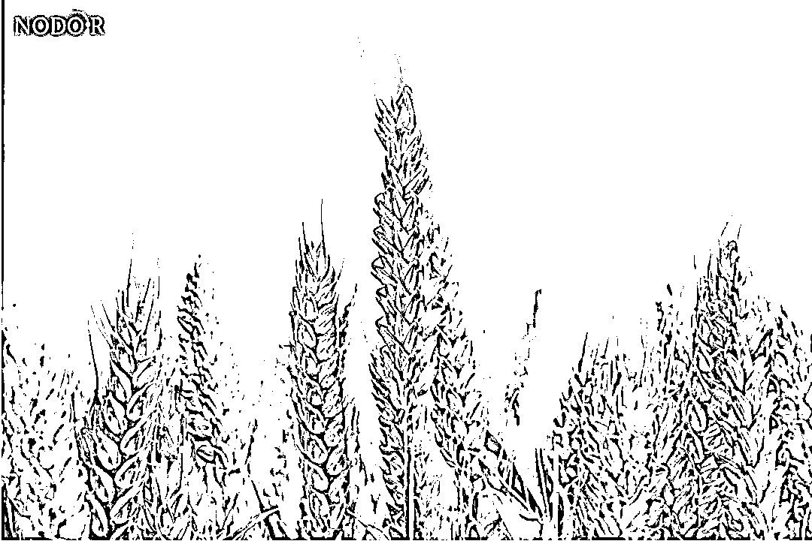

在 2020 年 12 月 20 日的合相后，随着我们进入木星-土星渐盈周期的第 5-7 年，它也可能代表**另一轮股市的上涨**。**通常，股票市场会在那时触顶。但随后又会出现另一次崩盘，**我们会在《2023 年金融预报》中讨论。对于本周，我们发现强有力的地球宇宙学相位正在展开。太阳正在对分木星和海王星的中点（9 月 16 日-26 日）。金星也在对分海王星（9 月 24 日）和木星（10 月 1 日）。木星会在 9 月 28 日完成与天王星的第二次八分相。**由于木星和海王星如此突显，我们可能会看到原油走势反转。**我们也可能看到**集体意识中歇斯底里和恐慌的升级，**因为无论何时木星和海王星突显，通常对应着**非理性繁荣或一种恐慌感，因为事情看起来变得失控**。**但是随着这周新月（9 月 25 日）的到来，这些困难相位也开始出相，歇斯底里可能会从高峰开始消退。**正如我们在最近推特上所说的，“如果你受不了风，就进屋，把门关上。”**全球金融市场很快就会冷静下来，按照正常的模式运行。**当然，**这里所谓的“正常”模式可能是熊市，而不是牛市。**但是**如果熊市得到理解、尊重，不被恶作剧者和天王星不请自来地进入巢穴所激怒，那么交易者也可以从中获利。****长按下图了解更多详情**

这是特别及时的讲座，因为为期 12 年的木星轨道周期会在 5 月 10 日进入白羊座，并且 6 月-11 月是一年中最有力的地球宇宙征象接连登场的重要时间段，因为土星逆行与天王星形成几乎精准的渐亏四分相。

**说明：以上日期基于纽约证券交易所所在的美国东部标准时间，由于存在时差，中国地区可能需要加一天。**

**版权声明：**本文由若道翻译发布，欢迎转发，反对抄袭。友号转载请申请白名单。**END**

**雷蒙德·梅里曼（Raymond Merriman）**

若道签约老师。著名金融占星师，ISAR（国际占星研究协会）前主席，梅里曼市场分析公司的总裁。他由于“提升了占星学的职业形象”，在 1995 年国际占星大会上被授予轩辕十四奖；在 2012 年国际占星大会上，被授予轩辕十四终身成就奖。

1“中国上证指数月度报告”发售**若道推出了****中文版****的雷蒙德·梅里曼中国上证指数月度报告，并持续发行该报告！**当把金融市场的周期和占星学的周期相结合时，雷蒙德·梅里曼老师的金融占星学研究**为投资者应对金融市场的周期波动，并随之调整投资策略提供了极大的价值参考**。
**10 月中英文报告已上线！**2“黄金价格周期月度报告”发售**若道推出****中文版****的雷蒙德·梅里曼黄金价格周期月度报告！**不仅仅为广大读者在中国股市的投资出谋划策，更将视角放眼黄金市场。**每当世界经济形式不明朗的时候，有一个地方是保值的港湾，那就是****黄金**。自 1982 年雷蒙德·梅里曼出版第一本研究《地球宇宙学征象与黄金价格的关联》的著作以来，**他一直作为最重要的黄金市场时机预测者之一享誉国际**。2022 年 10 月黄金报告已上线，梅里曼老师将会告诉你他对这个关键时期如何操作的想法。也可以按照季度和一年期订阅，有更多优惠。季度和年度的好处是，你可以持续了解梅里曼老师对于不断在变化的市场的看法。即便他某一次看法和市场不一致，你也看到在下一期他如何调整自己的看法，并看到金融占星在一个长期时间段内对你把控风险的帮助。而能够长期控制风险、尽量找到安全的投资时机才是投资的长久之计。**10 月中英文报告已上线！****购买套餐**，买得越多越优惠中国上证指数月度报告套餐价

*   **单月报告**：280 元
*   **3 个月套餐**：780 元（260 元/月）
*   **12 个月套餐价**：2400 元（200 元/月）

**长按下图识别二维码****购买金融报告****套餐****▼**

黄金周期月度报告优惠

*   **双报告年度套餐更优惠（直降 900 元）**

*   **12 个月黄金报告+12 个月上证指数报告：仅需 3900 元**

**长按下图识别二维码购买黄金报告套餐**▼

3《2022 下半年金融占星投资沙龙》这是特别及时的讲座，因为为期 12 年的木星轨道周期会在 5 月 10 日进入白羊座，并且 6 月-11 月是一年中最有力的地球宇宙征象接连登场的重要时间段，因为土星逆行与天王星形成几乎精准的渐亏四分相。

**长按下图识别二维码了解详情**

▼

**点击阅读原文购买金融报告**

# 插班中丨 ISAR 认证职业占星师文凭课程：开启“爱好变职业”的创收自由之路

> 原文：[`mp.weixin.qq.com/s?__biz=MzA5NjA0NTAxNg==&mid=2651489655&idx=3&sn=db4021dbaa59ac00d85ba65b95e107a7&chksm=8b4837c0bc3fbed6035a426851e41f34ead0e326971bdb018558f60ca56c8ef24ade3514f6e6&scene=126&sessionid=1692737751#rd`](http://mp.weixin.qq.com/s?__biz=MzA5NjA0NTAxNg==&mid=2651489655&idx=3&sn=db4021dbaa59ac00d85ba65b95e107a7&chksm=8b4837c0bc3fbed6035a426851e41f34ead0e326971bdb018558f60ca56c8ef24ade3514f6e6&scene=126&sessionid=1692737751#rd)

**2022 年，是世界和中国 40 年未有之大变局的开始。**

俄乌战争打破了欧洲大陆乃至全世界的和平局面，而新冠疫情也给中国经济带来前所未有之挑战。

如果你关心经济形势和世界局势，你会有这种的感觉，我们将面临一场深刻的危机，而这不是短期内可以结束的。

**占星学的看法也是如此。**

4 月青年失业率（16 岁到 24 岁）中国达 18.2%，一些背着房贷、教育、医疗负担的中年人突然失业更是整个家庭整个难以承受之重。为了更好准备面对这样的时代变化，连《北京日报》这样的官方媒体也在呼吁：**“开拓副业，让自己有多元化发展的生存能力”。**

**而这门课程，就是为了这样一个目标准备的。**

**占星学是非常好的“开展副业”的选择**

这个**为期 16 个月**的课程通过并不算长的时间和并不算高的投资，不仅可以帮助你学到一个终身可用的技艺，而且也可以选择成为自助助人的占星师，**开启受益终生的第二事业。**未来是个体崛起的时代，大量个体被鼓励独立发展，比如网红、自由职业、自媒体、咨询师等，他们都不需要传统的办公室。社会越发达，人的独立性就越强，未来有能力的人都可以变成独立的经济体。

**占星学也是越老越好的职业**

和一些技术变化非常快的职业不同，**占星学的技术层面非常稳定，不会快速迭代变化，**同时，掌握好占星学、能够做一场好的咨询又需要个人自身大量实践和对生命的深刻理解，而这些都是时间和岁月带来的。

**占星学是现代社会需要的助人职业**

社会快速发展和变化人们似乎越来越无法掌控自己的生活，这给很多人带来巨大的焦虑，**抚慰心灵的咨询市场需求巨大。**而占星学可以让人从前所未有的角度了解自己，了解目前和未来所处的周期，挑战的意义，不论对于深入的个人成长探寻，还是预测未来的周期，都又其独一无二的价值。

**ISAR 认证职业占星师的独有培训**

目前占星学的培训市场鱼龙混杂。而 ISAR（国际占星研究协会）是一个包含了 47 个国家在内的国际占星组织，多年来致力于占星的教育和研究，提升占星教育的品质和职业占星师的能力，在国际占星领域备受尊重。今年，ISAR 对于成为 ISAR 认证职业占星师提出了更高的要求，**所有想要获得 ISAR 职业占星认证的申请者均需要在 ISAR 的附属学校通过 500 个小时的研习（包含****主课****、选修课、沙龙、作业、讲座、工作坊等等）。**

**而这门核心占星学课程就是为此而准备的。**

**2022 年，鉴于对若道在占星教学领域所做的持续努力和高品质的课程服务，ISAR 特别授予若道核心课程为 ISAR 文凭课程，所有在若道学习，并通过若道毕业考试的同学将获得 ISAR 颁发的学历文凭（Diploma）。**

**你的占星核心课老师是谁？**

**拥有****51 年****占星实践经验的****若道创始人****前 ISAR 全球副主席****前 ISAR 全球职业占星师资质认证主席****大卫·瑞雷**

**和**

**2019 年第二届、2021 年第三届核心课中**

**与苏·汤普金斯老师****联合授课****的**

**ISAR 认证职业占星师**

**咔咔（Caroline）**

**二人合力打造**

**2022 年 ****若道全新核心占星课程**

**咔咔老师给同学的寄语：**

（向上滑动查看内容）

**亲爱的同学们：**

我为什么学占星学？

2000 年的时候我还是一个在网上搜索天蝎座和水瓶座配不配的普通白领。我搜索的内容还包括了水瓶座为什么总是这么若即若离？

体贴的搜索引擎给我推送了占星学、行星、星座、宫位、相位等资料，还让我了解到莉莉丝、月亮交点、截夺宫位等占星学概念。

2000 年 10 月我了解到，一个从业 30 多年的美国职业占星师大卫·瑞雷来到了中国，和他的中国合伙人将开办一个专业教授占星学知识的课程。过去 10 个月在网上东拼西凑的占星学知识唤起了我对占星学的兴趣，但是已经不能满足我对星图深度分析的需求了。

2013 年，我通过了若道核心课程的毕业考试和国际占星师研究协会的认证考试。2015 年我离开职场成为一名全职占星师。

到底学习占星带给了我什么呢？

1、它是自我觉知的工具，我现在已经不去纠结哪些星座是否匹配，我相信外在的事件是内在心理矛盾的显化。也就是说，想找到令人满足的亲密关系，要先去了解自己的情感模式和需求，而不是无意识地一次次地试错和撞墙。我开始学习自我关怀和接纳自己。

2、它带来看待世界的全新和全景的角度，天上如是，地下亦然。人类社会和个人生命的进化都有其周期和相似性，作为个体，占星学帮助我思考如何更积极和有建设性地与宇宙的能量合作，认识自己，发挥自己的潜力，度过有意义且自我满足的人生。

3、它带来了全新的职业：占星师和占星老师。除了收入，还有助人育人的满足感和意义感。

4、它带来一群志同道合的伙伴，我们彼此联结又相互独立。

作为中国占星界的“黄埔军校”若道占星的学生、助教和老师，我与很多学员在人生的不同阶段带着各异的需求走进了这所学校，2022-2023 年一年半的若道核心课程设计既蕴含了大卫·瑞雷老师的教学精华，也带入了我在跟随不同国外占星老师学习、助教和教学积累的心得。

有一些学员毕业后从事了占星咨询工作，有的在各大平台成为专业占星学知识的输出者和传播者，有的运用占星学提升他们的工作，也有的在占星学与投资，占星学与名人/八卦、占星学与原生家庭、亲密关系、亲子关系等领域收获了有用的或者有趣的体验。

对我来说，生命是一场自我完整的体验之旅。从 2011 年的那个春节在若道入学之后，我的生命旅程更加充实、有意义、有目标，也更有满足感。

希望在 2022-2023 年的若道核心课程里见到你。希望你此后的生命旅程里，有若道，有占星学。

占星师咔咔

2022 年 5 月 24 日

**大卫老师给同学的寄语：**

（向上滑动查看内容）

亲爱的学员们：

感谢你对我们从 8 月 30 日开始的若道 L1-5 级核心课程的兴趣。我和合作老师咔咔以及我们的核心课程团队期待着为你提供这个机会，来教授各种高品质的地道占星学知识和技巧。

对于那些希望获得 ISAR 职业占星师认证的学生，这是一门适合你的课程！

作为 ISAR 咨询技能培训的一部分，我曾与咔咔合作过，我们期待着再次合作。咔咔和我曾在 ISAR 职业占星师认证委员会（CAP ISAR）一起工作，我们非常熟悉获得 ISAR 职业认证的流程。作为你的老师，我们将陪伴你整个占星学发现之旅，帮助你逐渐认识到占星学有多么的神奇。此外，你还将受益于我们若道的助教和课程顾问，他们是若道核心课程计划的重要组成部分，提供在线沙龙、组织学习小组、指导家庭作业。我们的教育团队是“服务于你的团队”，所以也会根据你的需求进行相应的调整。你专用的核心课程微信群也促进了你的学习过程，使你能够每天与你的同学们一起学习、探讨、成长。

52 年前，当我开始学习占星学时，没有一所像若道这样的学校。如果有这样一所学校，我会尽一切可能在那里成为一名学生。事实上，我很幸运，我的老师都是经验丰富的专业占星师。然而，我花了 6 年的学习时间才通过 1976 年在美国乔治亚州亚特兰大举行的专业占星师考试，又花了 2 年的专业实践时间才通过占星学谋生。我永远不会忘记从 1970 年到 1978 年的 8 年，那些日子的反复试验教会了我如何苦练占星学。作为老师，我一直在努力传授我早年所学的知识，让你的旅程更加顺利，更加全面。

自 1978 年以来，44 年的全职实践教会了我很多，我很高兴有机会与大家分享我所学到的东西。我和咔咔都是现代占星师，虽然我们尊重西方占星学的历史和传统，但我们实践和教授的占星学植根于现代人本主义哲学，这种哲学旨在提高你对自身潜力的认识，并鼓励个人成长。还有什么比了解自己更实际的呢？还有什么比个人成长和发展潜力更有利的呢？这是你将要学习的占星学，一种可以应用于你自己生活的占星学，一种可以为你提供一个充实职业的占星学。

教书是我回馈占星学行业的方式，这个行业拓展了我的视野，远远超出了我曾经想象的可能。谢谢你给我这个机会做你的老师。

大卫·瑞雷

2022 年 5 月 24 日

**连报 L1-5 全阶网络直播课程，你可以享受**

❶ 64 次线上直播互动网络课程+2 场工作坊，全面而详细地讲解占星学知识、技能、案例和重要领域实践运用。

❷ 知识点+学员星图解读有机结合：咔咔老师以讲解知识点和中外名人案例为主，大卫·瑞雷老师以参课学员案例演示及客户案例为主，每个知识点覆盖班级内学员的亲身案例，参与感更强，多位学员都有机会听到自己的星图分析。

❸ 微信群学员互动分享，从真实案例学习生命成长故事。

❹ APP 答疑论坛提问：论坛上每个学员的问题都将得到及时回复。

❺ 若道独有的职业占星师养成计划，为你毕业后独立咨询做准备。

**❻ **提供**咨询平台**，只要努力，优秀毕业生有机会入驻**若道咨询平台**，拓展咨询客户群。

**更多了解老师和助教？**

**大卫·瑞雷（David Railey）**

*   **I****SAR 董事会成员，ISAR 全球副主席，ISAR 全球职业占星师资质认证主席，若道占星创始人**。

*   2016-2019 年，被选为国际占星协会（ISAR）考试委员会成员，国际占星协会（ISAR）是世界最大的国际占星机构，会员遍布 47 个国家。

*   2017-2020 年，被选为国际占星联盟（ISAR）考试委员会主席，理事会成员。

**占星师咔咔（Caroline）**

2010 年师从美国占星师大卫·瑞雷学习，并得到世界名师斯蒂芬·弗里斯特、罗伯特·汉德、苏·汤普金斯传授各种占星学技法。若道首届学员，国内最早获得 ISAR 职业占星师资质的职业占星师，多次担任若道核心课程助教，并于 2019 年第二届、2021 年第三届核心课中和苏·汤普金斯老师一起教授若道核心占星课程。

在国际知名广告公司和市场研究公司从事的市场研究和推广工作十余年，曾任职于阳狮集团、尼尔森市场研究有限公司、MTV 和《Madame Figaro》杂志。

**助教王嘉祺 （Conrad）**

ISAR 认证占星师、若道认证生时校正资质，从 2010 年起自学占星学，2015 年开始在若道系统学习，并开始个案咨询。2018 年担任若道核心课程助教，以及卜卦占星学和太阳返照选修课助教，并带领学员进行经世占星和太阳返照方面的研究。2019 年 11 月作为演讲人之一参加了国际占星协会（ISAR）北京大会，也是 ISAR 星空俱乐部中国区第 16 期的主讲人。

**什么人适合这门课？**

*   对占星学有浓厚兴趣，想要系统学习占星学。
*   对占星学有一定基础，但不知道该如何整合星图复杂的碎片。
*   希望成为优秀的占星师，想要借鉴国际大师解读思路并融入自己的体系。
*   想学习占星学，但不擅长英文，希望有中文老师授课。
*   想结合占星学理论与咨询实践。
*   走在自我探索和个人成长道路上的人。

**课程费用**

**★ 1-2 阶 （8 月 30 日开课）****课程费用：3500 元 ****★ 1-3 阶　连报****课程费用：11500 元 **********转发优惠价：**11000 元（朋友圈转发本课宣保留 24 小时以上，并截图给课程顾问）********★ 1-5 阶 连报****课程费用：46500 元** **转发优惠价：34800 元（朋友圈转发本课宣保留 24 小时以上，并截图给课程顾问）**

**咨询课程请联系顾问**：**王老师（微信/手机：18510107057，请备注“大卫核心课”）**

**退转课程**

**退款原则请详看《教学协议》，如有疑问请咨询课程顾问。**

****2022 L1-5 认证职业占星师必修课程****

**授课老师：大卫·瑞雷、咔咔**

**直播课开课时间：2022 年 8 月 30 日（周二）**

**授课方式：******网络授课，英文/中文授课，中文翻译****

**费用：******1-2 阶**：**3500 元；****1-3 阶**：**11500 元******（****转发优惠价：**11000 元，朋友圈转发本课宣保留 24 小时以上，并截图给课程顾问）；**1-5 阶连报**：46500 元**（****转发优惠价：34800 元，朋友圈转发本课宣保留 24 小时以上，并截图给课程顾问）******

**课程负责人：王老师**（微信/手机：18510107057，请备注“大卫核心课”）

长按二维码添加课程负责人咨询~

**END**

****报名直达入口****

# 天秤座新月 | 建立和谐的世界，先来领取这份免费的新月报告吧！

> 原文：[`mp.weixin.qq.com/s?__biz=MzA5NjA0NTAxNg==&mid=2651489655&idx=4&sn=0652f1b4d2568cbcd469bce59c8ab730&chksm=8b4837c0bc3fbed60c3fe658ecbe4ae5163b684052d89389134b0295982ed76e309fb17b7fe5&scene=126&sessionid=1692737751#rd`](http://mp.weixin.qq.com/s?__biz=MzA5NjA0NTAxNg==&mid=2651489655&idx=4&sn=0652f1b4d2568cbcd469bce59c8ab730&chksm=8b4837c0bc3fbed60c3fe658ecbe4ae5163b684052d89389134b0295982ed76e309fb17b7fe5&scene=126&sessionid=1692737751#rd)

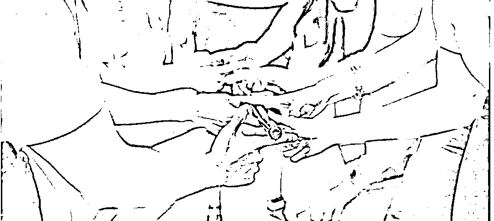

北京时间 9 月 26 日 5:54，新月发生在天秤座 2°48′。每到新月时分，若道君都会为你奉上根据你出生星图量身打造的免费新月报告。可是新月为什么要许愿？新月报告该如何领取？让若道君来教你。

　**什么是新月？**　

从占星学看，新月是月亮周期的一种相位。新月是开始，又称为朔，对应中国农历初一，太阳、月亮在此时合相。此时月亮运行到太阳与地球之间时，月亮以黑暗的一面对着地球，并且与太阳同升同落，地球上看不见月亮。

本次新月时间

**9 月 26 日 5:54，新月发生在天秤座 2°48′。**

为什么新月要许愿？

新月是一个周期的开始，新月发生的时候，太阳与月亮合相，能量很强。当新月出现时，你也许会发现灵感忽现，非常适宜开启新领域、项目与行动，缔结一段新的关系或合作。许愿会加强新月的能量，也有助于你了解自己现阶段适合开启的方向。 

本次新月最佳许愿时间从新月开始到其后的 48 小时内，许愿的力量最强。**最佳许愿时间：9 月 26 日 5:54-9 月 28 日 5:54**

属于你的免费新月报告每到新月时刻，看着占星文章里写着：看看你新月的宫位，如果新月在第 X 宫，你可以许愿的方向是……是不是常常一头雾水？新月的宫位？我到底该看哪里啊？而有时，那些标注上升星座的文章也会让你忍不住想：虽然我的上升星座是这个，可是我的新月好像并不落在你说的宫位啊？你是不是写错了？

虽然这些文章都没有写错，可是好像对你而言都太不友好了。**Don't Worry！**别着急，让博学又体贴的若道君来帮你！我们推出了一份**免费**又**好用**的新月报告！而且是专门为你设计的哦，**根据你出生星图为你量身打造的，只****属于你的独家新月报告**。报告有哪些内容？**新月时间****最佳许愿时间****如何许愿 **属于你的**许愿关键词**本次新月给你的**建议**你会有怎样的**感受 ******机会****

********

如何许愿？许愿方式也很简单。你可以把愿望写下来，或者双手合十后交叉，闭上眼睛来祈祷。 报告中会为你提供**祈祷词示例**，可以多多参考哦～ 你还可以适当添加自己的语言，创造属于你自己的祈祷文！如果报告拿到手了，快对照着许愿吧！

**这份好用又暖心的报告，点击****阅读原文****即可领取！**

****

****点击“阅读原文”即可获取新月报告****

# 激烈天象中，市场底部快到了吗？ | 梅里曼 10 月上证+黄金报告上线！

> 原文：[`mp.weixin.qq.com/s?__biz=MzA5NjA0NTAxNg==&mid=2651489623&idx=1&sn=3a0bd84d35117b33ced7b2d77a8b70a7&chksm=8b4837e0bc3fbef6ea863486e975282287c432a72da6560d21e5f7c0c34ec15102393cc3d9a8&scene=126&sessionid=1692737751#rd`](http://mp.weixin.qq.com/s?__biz=MzA5NjA0NTAxNg==&mid=2651489623&idx=1&sn=3a0bd84d35117b33ced7b2d77a8b70a7&chksm=8b4837e0bc3fbef6ea863486e975282287c432a72da6560d21e5f7c0c34ec15102393cc3d9a8&scene=126&sessionid=1692737751#rd)

现在我们已经处于今年下半年最重要的天象——土天四分，木星在土天四分中点的天象中。9 月份的上证指数报告写到：**“木星、土星和天王星之间开始形成一个强大的外行星相位配置......这个外行星相位配置在 9 月 21 日-28 日到达顶峰，届时木星将处于土星-天王星四分相的中点，并与两者形成八分相。****这个外行星相位配置将于 10 月 31 日至 11 月 4 日-11 日左右结束，届时太阳和金星会与土星-天王星的四分相形成 T 三角，而火星在双子座转向逆行。”**就是在 9 月 21 日这个下半年最激烈的天象开始的时候，俄罗斯开始动员 30 万预备役，这是二战后俄罗斯第一次发布动员令。俄乌战争升级，核战争的危险也进一步上升。世界进入进一步的动荡中。同时，上证指数也处于 3000 点附近，离非常重要的 2863 点越来越近。如果指数继续下跌，跌破 2863 点，那么整个上证的牛市可能性就会发生变化。

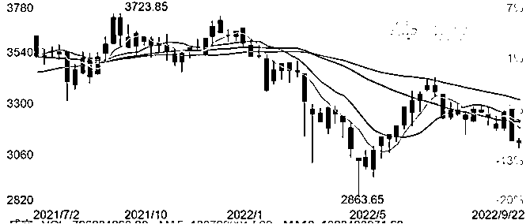

| 上证指数周 K 线图

**从基本周期来看，现在要么是从 4 月低点 2863 开始的一个拉长的基本周期的末尾，要么是从 8 月 4 日开始的基本周期的第 7 周。**如果是 4 月开始的基本周期，那么离底部不远；而这个底部恰巧在木土天形成这个重大天象时期形成；但如果是 8 月开始的基本周期，下跌的空间就大了，击穿 2863 不是不可能的。那么现在到底是在哪个基本周期?市场底部已经可以看到，还是会出现更进一步的下跌？水星逆行又对此会有什么影响？

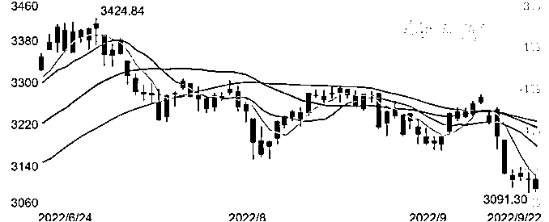

| 上证指数日 K 线图

金融占星大师雷蒙德·梅里曼的《2022 年 10 月上证指数报告》已上线，你可以听听梅里曼老师的看法。《2022 年 10 月黄金报告》也已上线，欢迎购买。

**10 月上证报告上线**

**上证指数月度报告价格****单月报告**：280 元/月 **季度套餐价格**：780 元（260 元/月）**年度套餐价格**：2400 元（200 元/月）**双报告年度套餐更优惠（直降 900 元）****12 个月黄金报告+12 个月上证指数报告：仅需 3900 元****长按下图识别二维码购买上证指数报告**
▼

“**黄金是金钱。其他的只是信贷。**

**——约翰·皮尔庞特·摩根**

”黄金从 4 月 18 日高点 2003 美元跌到 7 月 21 日低点 1678 美元，跌幅达 16%后经历了反弹，但这个反弹在 8 月下旬终止，又开始新一轮下跌。

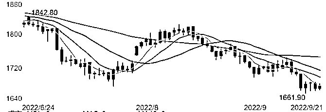| 黄金日 K 线图

而最近在新浪微博热搜里，竟然又出现黄金的热搜，这也是久违了。

过去记得有关黄金的微博热搜是“中国大妈疯狂买黄金”，“中国大妈抄底黄金，锤爆华尔街”，“中国大妈解套了”，搞得至今“大妈”和“黄金”在很多人的脑海里，还是自动联系在一起的词汇，就像“大妈”和“广场舞”一样。

但这次因为黄金上热搜的竟然不是中国大妈，而是杭州年轻人！投资黄金向下传到了年轻一代。

热搜里写到，因为金价大跌，基金股票套牢，薪金缩减，为了赚钱，一些年轻人的投资兴趣转向了黄金。这一次，中国大妈似乎不再是主力军，黄金柜台前，随处可见的是姑娘们。 
新闻里还提到，有很多淘金群，每天在群里分享自己低价买金攻略，很多人在拼多多的一些店铺去淘低于市价的黄金。

而黄金的确到了一个关键的点位，黄金价格目前正在测试三重底 1673-1678，梅里曼老师在 9 月 15 日特别写了一篇黄金特刊。而就在 9 月 21 日，普京总统宣布了俄罗斯将进行部分队员，扩张投入战场的兵力，俄乌战争显然要升级。从金融市场方面，为了遏制通货膨胀，美国也将进一步提高利率。  从天象看，火星已经进入逆行阴影期，并会在 10 月底逆行。土天四分相也进入最后一次四分的阶段。8 月的黄金报告指出**“我们将重点关注引言中所提到的 8 月 4 日+/-10 天和 9 月 21-28 日+/-1 周。这两个时间段都可能出现 16 个月周期的低谷。”**8 月 4 日+/-10，火星、天王星和月亮北交点合相四分土星时，黄金的反弹终止，并开始下跌。   **作为交易者和投资者，我们迎来了或许是今年最重要的地球宇宙学时间段：9 月 21 日-28 日+/-2 周。我们现在就处于这个时间段，它的宇宙影响力会持续到 11 月中旬。**黄金会怎么走？你会跟风热搜里的年轻人吗？  10 月份黄金报告已经上线，上证报告也已上线。欢迎了解。也可以按照季度和 1 年期订阅，有更多优惠。季度和年度的好处是，你可以持续了解梅里曼老师对于不断在变化的市场的看法。

即便他某一次看法和市场不一致，你也看到在下一期他如何调整自己的看法，并看到金融占星在一个长期时间段内对你把控风险的帮助。而能够长期控制风险、尽量找到安全的投资时机才是投资的长久之计。  点击阅读原文，雷蒙德·梅里曼黄金周期 2022 年 10 月报告带来有 40 年黄金市场研究经验的世界著名金融占星大师雷蒙德·梅里曼对当前黄金市场的研究。投资有收益，投资有风险，希望金融占星学的研究帮助你更好地评估你的投资。

**10 月黄金报告上线**

**黄金月度报告价格****单月报告**：280 元/月 **季度套餐价格**：780 元（260 元/月）**年度套餐价格**：2400 元（200 元/月）**双报告年度套餐更优惠（直降 900 元）****12 个月黄金报告+12 个月上证指数报告：仅需 3900 元****长按下图识别二维码购买黄金报告**
▼

**购买者需知**

**① **梅里曼市场时机学院《中国上证指数月度研究报告》是梅里曼市场时机学院（以下简称 MMA）的研究“预报”，而不是市场“预测”，是梅里曼老师及 MMA 金融占星分析师对人类活动周期历史与行星周期之间相关性的研究，二者在大部分情况下具有 80%或更高的相关性，而不是因果关系。报告中的研究完全存在错误的可能性。即便是非常认真的研究和几十年的研究经验，金融占星师无法总是正确地解读出各种征象在实际层面上会如何相互作用，并显化为事件结果。

所以请将报告看作一个研究参考，务必结合其他市场研究和你个人对市场的理解，根据你的自由意志做决策。

**②** 此报告一旦售出，**即不接受退款。**

**③** 上证、黄金月度报告每月固定 1 期，**并非都是在每月相同日期发布。**

**④** **我们收到英文报告的当天，即发布该英文报告。3 天后，上线报告中文版。此报告仅支持手机网页阅读，不支持电脑阅读和下载。****以上须知，请仔细阅读。一旦付款，即视为已了解并接受所有须知内容。**在过去的 40 年中，唯有梅里曼逐渐完善，并在梅里曼市场时机学院月度周期报告中阐释了将地球宇宙学与周期相结合的研究方法，以惊人的精确性预报了黄金价格发生重大变化的时间。**黄金购买 Tip**

各大银行均可购买黄金或黄金 EFT 基金，也可以在诸如天天基金或者支付宝购买黄金及黄金相关产品。不明白的可以百度搜索。

**购买后如何查看报告？**

**购买后有疑问怎么办？**请联系技术客服
**微信：nodoor201705**

**购买报告直达入口**

# 周末树洞丨重要的秋分日过后，你对未来三个月有哪些期待？

> 原文：[`mp.weixin.qq.com/s?__biz=MzA5NjA0NTAxNg==&mid=2651489575&idx=1&sn=53263fb5b2ee89a61b5156d892e0e015&chksm=8b483790bc3fbe86d280c25049ad34bf7fda0ba947bfeb857d700bc0c31835d0a01ddf8f257f&scene=126&sessionid=1692737751#rd`](http://mp.weixin.qq.com/s?__biz=MzA5NjA0NTAxNg==&mid=2651489575&idx=1&sn=53263fb5b2ee89a61b5156d892e0e015&chksm=8b483790bc3fbe86d280c25049ad34bf7fda0ba947bfeb857d700bc0c31835d0a01ddf8f257f&scene=126&sessionid=1692737751#rd)

**2022 年 9 月 24 日天象：**

*   **月亮在处女座**
*   ******金星对分海王星******
*   ******火星三分土星******

昨天，我们迎来了 2022 年的秋分，也标志着[【太阳进入天秤座】](http://mp.weixin.qq.com/s?__biz=MzA5NjA0NTAxNg==&mid=2651489465&idx=1&sn=04ce5df094da219f283aca54bc2cb960&chksm=8b48360ebc3fbf18160fb473773a1a70f3e77fe0fa610f63ce19decd3f720434fd75de3c1644&scene=21#wechat_redirect)（点击查看文章）。在群星逆行的背景下，太阳进入了高度平衡感和审美感的天秤座，而太阳的守护星也由逆行水星转变成了顺行在处女座的金星。接下来这个月，与人的交流、联结，尤其是充满和谐美感的亲密关系会为我们带来最大程度的满足感与成就感。金星对分海王星，我们容易在关系中对他人产生渴望，且无法清晰地辨识边界感，但参加艺术或创造性的活动，可以帮我们更好的释放这股能量，让我们对生命的爱和想象力有更深的理解。今天月亮依然在处女座，同时火星三分土星，很适合给自己做计划。秋分开启新的三个月，你对自己有什么期许呢？欢迎留言哦~周六快乐！我们周一见！**了解每日天象，可****下载“若道”APP 查看****还有更多精彩等着你哦**

# 神话塔罗之小阿卡纳牌 | 圣杯 4-6

> 原文：[`mp.weixin.qq.com/s?__biz=MzA5NjA0NTAxNg==&mid=2651489465&idx=4&sn=893e8cc34dbdb6e8aa09f8274aa551d8&chksm=8b48360ebc3fbf18f28e1dc6614739c8094516b43129c62fe522b784cfa341ac6ab6c202ecff&scene=126&sessionid=1692737751#rd`](http://mp.weixin.qq.com/s?__biz=MzA5NjA0NTAxNg==&mid=2651489465&idx=4&sn=893e8cc34dbdb6e8aa09f8274aa551d8&chksm=8b48360ebc3fbf18f28e1dc6614739c8094516b43129c62fe522b784cfa341ac6ab6c202ecff&scene=126&sessionid=1692737751#rd)

作者/朱丽叶·沙曼-伯克 丽兹·格林

译者/闫东升 编辑/玫瑰 图片/神话塔罗 网络

本文节选自《神话塔罗》

希腊哲学认为宇宙的万象都来自四个基本元素，四套小阿卡纳牌则分别呈现了生命经验的每一个面向。从某种意义上来说，小阿卡纳牌呈现的是 22 张大阿卡纳牌描绘的原型之旅的细节，相较之下它更具体、更贴近个人的生活。

圣杯牌对应着水元素，据说所有的生命都源自于它。今天就让我们走近圣杯牌组的 3 张数字牌——圣杯 4-6。

**书名：**

神话塔罗 

**作者：**

朱丽叶·沙曼-伯克   丽兹·格林 

**出版日期：**

2011-08-02

**圣杯 4**

**姐妹们的挑拨**

圣杯 4 描绘的是新娘普绪克（*Psyche*）坐在厄洛斯（*Eros*，爱神）的美丽的宫殿中，透过宫殿白色的石柱，我们能看到后面的大海。普绪克的左右两侧坐着样子丑陋的姐妹，一个穿着红色的长袍，一个穿着黑色的长袍。

她们和普绪克低声谈论着新郎，说他一定是一只面目狰狞的怪兽，否则不会躲开白天的日光，只有晚上才会现身。普绪克的脸上透露出不满的神情，在她们的面前有四只金色的圣杯。

**无缘无故的失望**

**小阿卡纳牌的 4 号牌隐喻着神圣的不满（*divine  discontent*）。尽管一切都看起来很快乐也很有价值，但其中仍然包含着疑惑和猜忌。**

**圣杯 4 从情感上描绘了这种不满足。**普绪克生活得非常富足，一个深情款款和温柔体贴的丈夫每晚都来与她相会，但是她仍然感觉到不满足。

样子丑陋而且没有任何魅力的姐妹对她非常妒忌，她们象征着普绪克内心的一部分，虽然她们心怀恶意、想法负面而且激发起了普绪克的疑虑之心，但是她们却说出了一个实际的问题：意即**普绪克在了解自己伴侣方面是盲目和无知的。   **

因此，**圣杯 3 的满足到这里变成了失望，因为她的意识提升后就出现了新的疑虑，而且她也无法解决它。**

每个人的内在都有这些丑陋的姐妹，她们是我们人格的阴影面，阴影常常带来某种恶疾，但最后会变成好事，因为它驱动着我们去**探索内心更深的领域，以更真诚的态度去面对关系。**

如果普绪克一直保持在盲目和无知的赐福状态中，她就永远不会成长，她与伴侣厄洛斯的潜在力量就永远也不会开花结果。

**所以圣杯 4 所象征的不满足的感觉和对情感无缘无故的失望，包含着正负两个方面的力量。**对事物的质疑是不可避免也是极其必要的，它形成了背叛的种子，也带来了改变和成长的机会。

圣杯 4 还隐喻着**每个人内在都拥有一种神秘的智识驱力，它让我们知道还有未知的旅程等待我们去探索。**

**圣杯 4，神圣的不满**

从解牌的角度来看，圣杯 4 预示着**关系内出现了不满足的感受**，当事人会陷入**厌倦和沮丧**的情绪中，可能觉得**被欺骗或辜负**，其实通常情况下，**欺骗和辜负当事人的就是自己，因为他（她）拥有着并不现实的期望。**

这种不满会导致**相当长一段时间内的压抑和怨恨，或者对一段关系更深入的思考**，当然这势必非常艰难，因为以前的假设和幻想正在被颠覆或者已经是岌岌可危了。

**圣杯 5**

**背叛**

圣杯 5 描绘的是普绪克（*Psyche*）背叛了厄洛斯（*Eros*）的后果。姐妹们的鼓动让普绪克的恐惧和疑虑变得非常强烈，于是她打破了自己对厄洛斯的誓言，在夜里点灯偷看了他的面容。

牌面上的普绪克心痛地站在空空的卧榻边，手中还举着油灯。美丽宫殿的大理石柱后面，可以隐约看到厄洛斯离去的背影。

普绪克的面前散落着圣杯，其中四个都倒在地上，里面的液体流到地面，第五个圣杯在旁边屹立着，没有被打翻，还是原封不动的样子。

**关系的考验**

**圣杯 5 代表着关系中的考验期，其中的一方为过去的行为感受到了悔意或遗憾。**这里呈现出了**背叛**的议题，在圣杯系列牌的意义中，这一步会带来**必要的和潜在的创造性体验**。

尽管是痛苦的，但是**背叛却打破了与他人融合之“爱”中神秘而又盲目的作茧自缚，而且背叛也意味着成为独立（自己）的状态。**

普绪克的背叛不是出自于轻率或者贪婪，她是想要了解自己的伴侣，厄洛斯在这点上是错误的，他不应该拒绝妻子想要看清楚他的需求。

普绪克的行为是真诚的，虽然带来了不可避免的冲突，却绝对必要的，可以说**任何的行动从某种意义上说都有自我背叛的成份。**

**反叛对方不合理的要求或期望是很难的一件事，它在彼此依赖的关系中频繁地发生。**爱人、丈夫或者妻子可能会说：“不要尝试去真正了解我，只要爱我在你心目中的样子就好了。”这当然会引发背叛，而背叛的一方会像普绪克一样遭受后续的痛苦。

但是牌面上原封不动的第五个圣杯告诉我们，**并不是所有的东西都失去了，我们还拥有着而且能够创建出更有价值的下一步。**

普绪克现在知道了丈夫是谁，也知道自己还爱着他，而且爱的并不是以前对他的幻想了。没有这个仪式，她就会陷在圣杯 4 的焦虑和痛苦中无法自拔。**现在她需要忍受遗憾，但是却有更多力量驱动着她走向完整。**

**圣杯 5，对过去的懊悔**

**从解牌的角度来看，圣杯 5 预示着对于过去一些行为的遗憾或懊悔，背叛发生了，有一些事情做错了，因此痛苦和自责无法避免。**

关系中的分离出现了，但是它并不意味着最后的结局。有些东西还保留着，**当事人可以在保留下来的事物上继续努力，选择面对挑战并为将来做出承诺。**

**圣杯 6**

**被抛弃的妻子**

圣杯 6 描绘的是普绪克（*Psyche*）坐在礁石上，背后是平静的海面。她左手握着一只金色的圣杯，盯着它陷入了沉思。她的右手还握着结婚时捧着的白色百合花，但是已经变得脏乱。在她四周的岩石上，放着五只金色的圣杯。

**圣杯 6 呈现着怀旧之情。**普绪克被抛弃了，她神秘的丈夫已经飞走，他们居住的美丽宫殿也消失不见，除了美好的回忆之外，她现在一无所有。然而，尽管大祸临头，普绪克却表现得非常平静，可见 6 号牌并不意味着悲伤。

在过去的经验中，普绪克获得了许多珍贵的东西。她看到了厄洛斯（*Eros*）真正的模样，现在她知道自己爱他本人，而不是爱他所提供的舒适和快乐。因此，**尽管她失去了这一切，却变得更加了解自己，这样的状态就是 6 号牌中呈现出的和谐之美。**

**失去一切后才看清自己**

**故事的这个阶段，象征着我们在遭遇生活中某些危机之后，变得更加平静和沉着。**过去不真实的期望和幻梦通过挑战和失望的过程，结晶成了**某种稳固和真实的东西**。

圣杯 5 中，普绪克经过了懊悔和自责，决定接受命运的挑战，去找回自己的挚爱，因此现在她变得非常平静。

**她的爱变的更为真实，只有真实的基础才能承载其上所修建的人生。**对以往的怀旧之情常常在这个阶段冲击我们，但是真实的结晶已经形成，所以它不再是感性的幻想，而是蕴含着某些真实的、稳固的基础。

**经过了圣杯 5 的自我批评之后，圣杯 6 中出现了积极的转变，普绪克开始朝着目标奋力前行了。**

**圣杯 6，怀旧之情**

**从解牌的角度来看，圣杯 6 预示着一段平静的时间，那是从过去的幻想走出来的结果。**有时候可能是**旧爱又回到身边**，或者预示着**过去某个珍贵的幻梦在不远的将来有机会实现。**

“陷入爱河”的盲目现在酝酿出了某种真实的结晶，过去的事情尽管看起来很美，却不可避免会失去或幻灭，但是这并不意味着失去一切，那些经验中的某些力量会凝结成真正的基础，支撑着我们前行。

**这张牌暗示着怀旧之情，但还有一个更重要的讯息，即过去能够引领出未来，从前幻想中经历过的美好将来有机会实现，而且可能就在不远的未来。**

**版权声明：**本文由《自在园》授权发布，欢迎转发，反对抄袭。友号转载请申请白名单。

**朱丽叶·沙曼·伯克**从 20 世纪 70 年代早期开始，就对塔罗牌产生了兴趣，并踏入了塔罗的世界。后来，在丽兹·格林的鼓励下，开始研习心理占星学和塔罗。1984 年，第一本书《塔罗全书》（The Complete Book ofTarot）出版。之后，与丽兹·格林合作设计并撰写了《神话塔罗》（The Mythic Tarot）。朱丽叶写了十本塔罗和占星学书，包括一本名为《众星的传说》（Stories from the Stars）的儿童读物，以及与丽兹·格林合著的《神话之旅》（The Mythic Journey），这是一本详细讲述如何运用神话来指导生活的书。

**点击下图了解课程详情** 

**微信又双叒叕改版啦，不想错过若道君的推送？****就把若道设为星标吧！****▼**

**喜欢记得点一下在看哦☟**

************报名直达入口************

# 神话塔罗之小阿卡纳牌 | 圣杯 7-10

> 原文：[`mp.weixin.qq.com/s?__biz=MzA5NjA0NTAxNg==&mid=2651489465&idx=5&sn=2f426bf8356eef0480cec9357e53e692&chksm=8b48360ebc3fbf18afbfb2a68c74d62cbe93016a9b41751535b5b85f23c3712b057ab5b1eb50&scene=126&sessionid=1692737751#rd`](http://mp.weixin.qq.com/s?__biz=MzA5NjA0NTAxNg==&mid=2651489465&idx=5&sn=2f426bf8356eef0480cec9357e53e692&chksm=8b48360ebc3fbf18afbfb2a68c74d62cbe93016a9b41751535b5b85f23c3712b057ab5b1eb50&scene=126&sessionid=1692737751#rd)

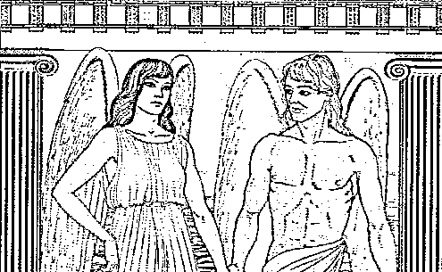作者/朱丽叶·沙曼-伯克 丽兹·格林 译者/闫东升 编辑/玫瑰 图片/神话塔罗 网络 本文节选自《神话塔罗》 

小阿卡纳中每一套牌都聚焦在整个旅程的某些具体环节上，通过诠释心路历程的各种细节来检视并完善整体。今天我们讲述圣杯牌组数字牌中的最后 4 张牌——圣杯 7-10，厄洛斯（爱神）与普绪克的爱情故事也迎来了尾声。

**书名：**

神话塔罗 

**作者：**

朱丽叶·沙曼-伯克   丽兹·格林 

**出版日期：**

2011-08-02

**圣杯 7**

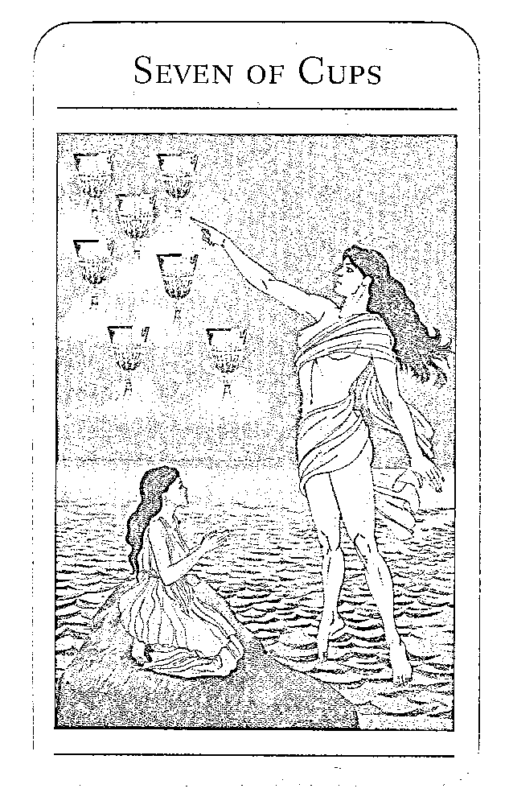

**爱的神圣教诲**

圣杯 7 描绘的是女神阿弗洛狄忒 （*Aphrodite*）现身于普绪克面前，告诉她如果要赢回厄洛斯（*Eros*）的爱，就必须完成一些任务。

阿弗洛狄忒从海中升起，指着面前漂浮在云端的七个圣杯。普绪克跪在岩石上，看着眼前的阿弗洛狄忒 ，接受爱之女神给予她关于爱的神圣教诲。

**空中楼阁**

**圣杯 7 代表着人们面对内心的时候，有很多的可能性，此时恩宠（和问题）会不期而至。这张牌隐喻着“空中楼阁”，人们内心的直觉会意识到将来有很多可能性，但是这些可能如果落实，就需要付出许多艰苦的努力。**

在圣杯 6 里，普绪克从怀旧的情感中走出，为自己的爱做出了坚定的承诺，她谦卑地向阿弗洛狄忒祈求帮助，同时她也明白这个善变的女神是自己多桀命运的始作俑者。

而阿弗洛狄忒也向普绪克保证，她有机会与厄洛斯（*Eros*）在将来重新结合，幸福的关系有可能从幻想中走向现实。

所以对于普绪克来说，这是一个**充满各种可能性**的阶段。阿弗洛狄忒同时也要求她付出代价，意即普绪克需要**付出各种艰辛的努力，期间会经历羞辱和苦难，但是她必须拥有远见、勇气、耐心和爱心。**

如果没有艰辛的付出，普绪克就不能再次拥有厄洛斯。

从快乐的幻想晋升到美好的未来，爱可以带来很多可能性，这是圣杯 6 中的内心承诺带来的结果。

当我们**对自己真实的感受有了很深的领悟**后，或者（像普绪克明白了她对厄洛斯的爱那样）我们**与自己内在很重要的部分有了很深的联结**之后，未来就会向我们展开它玫瑰色的愿景。

“现在，我终于知道它真正的目的了”，我们满怀信心地说，因为我们确信前方有着无尽的可能。

但是为了实现某种可能性，**时间（耐心）、认真的选择和付出努力**是绝对必要的。普绪克现在知道，她需要的是**一个美好的未来，一段深刻而真诚的关系**。

她必须首先**接受现实的局限性**：她的丈夫还不成熟，无法真实地接受她，所以她必须在赢回他之前学会**耐心、信任和百折不挠**。

**圣杯 7，挑战无限可能**

**从解牌的角度来看，圣杯 7 预示着很多可能性被证明是有机会达成的阶段，但是当事人必须面对选择所带来的挑战，以现实的行动去实现这些可能性。**

**圣杯 8**

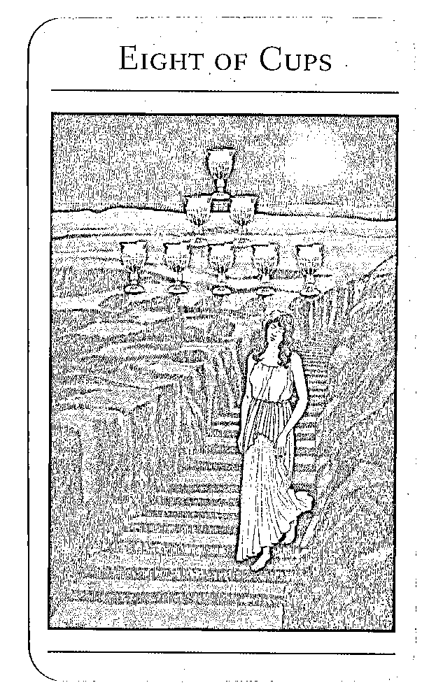

**不可能的任务**

圣杯 8 描绘的是普绪克（*Psyche*）去完成阿弗洛狄忒 （*Aphrodite*）交给她的第八个任务：到冥府拿一瓶珀尔塞福涅（*Persephone*，波赛凤）的胭脂。

画面中的普绪克两手空空，沿着台阶走进了黑暗的冥府，她的表情看上去顺从又伤感，因为她知道这可能是一次**有去无回的行程**。在她身后，是八个堆叠整齐的金色圣杯。

**当我们无路可走**

**圣杯 8 呈现的是普绪克在关系之旅中最艰难的一个阶段，意即自愿放弃对将来的希望。**没有活着的人可以走进哈迪斯（Hades）的冥府，所以对于普绪克来说，阿弗洛狄忒的最后一个任务极可能意味着**死亡**。

是否服从爱之女神的命令并不是普绪克最关注的，**她忠于的是自己为爱所做的承诺，因此她必须要放弃生的希望。**

八个堆叠整齐的圣杯反映出普绪克已经一丝不苟地完成了所有其它的任务，但这对最后一个九死一生的任务并没有什么帮助。

她觉得阿弗洛狄忒并没有慈悲，所以绝望地转身走开，把过去的希望抛诸脑后。关系的这个阶段是最痛苦的，因为它意味着**我们没有什么可做的了，所有的努力到这里都似乎帮不上什么，我们必须放弃，然后再重新开始。**

很多人们在面对圣杯 8 所反映的进退两难中，都拒绝承认这是个僵局，因此继续祈求、威吓、敲诈或讨好伴侣，希望能够得到想要的回应，但所有这一切都不能改变当下的处境。

我们曾在大阿卡纳的死神牌中看到过冥府，它象征着**哀悼和放弃控制**；它是死亡之所，旧有的态度要在这里进行转化。

**因此，当无路可走的时候，我们必须愿意放手，而且不能用放手做为某种将来之保证的交换条件，只能清醒和真诚地承认我们无计可施。**

这时我们必须向命运低头，接纳一个结局，无论发生什么，就让它发生，这种让它发生的态度会改变我们，因为它意味着我们**坦诚和全然地服从于某种更大的力量，**不是顽固的伴侣，而是神的意愿，在这个故事中女主角服从的就是伟大的爱神。

**圣杯 8，纵然痛不欲生也只有放弃**

**从解牌的角度来看，圣杯 8 预示着放弃某种东西的必要性和必然性。**当事人必须面对真实的处境，没有任何能做的了，也没有任何路可以选择，只能让该发生的事情自己发生。

常常这个阶段会伴随着**抑郁**，因为冥府是一个哀悼和痛苦的地方。在这个阶段**当事人无法操控未来，因为此时他（她）只能双手空空地走入未知。**

**圣杯 9**

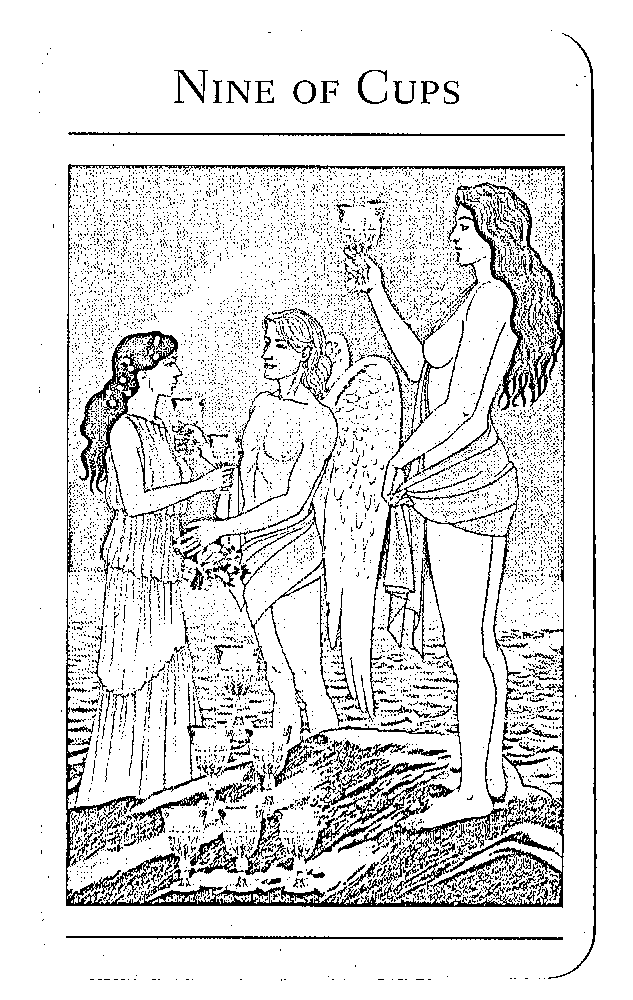

**破镜重圆**

圣杯 9 描绘的是普绪克（*Psyche*）从冥府中被营救出来并重新与厄洛斯（*Eros*） 结合的幸福时刻。普绪克和厄洛斯面对面站在海中的礁石上，普绪克头上戴着花环，他们手里各自握着一个金色的圣杯。

阿弗洛狄忒 （*Aphrodite*）仁慈地站在他们身边，手里握着一个金色圣杯，为他们的重新结合赐福。他们的脚下是六个堆叠整齐的金色圣杯，似乎也在庆祝两人的破镜重圆。

**考验后的祝福**

**圣杯 9 是一张祝福牌，反映了情感之梦的圆满和喜悦。**普绪克和厄洛斯面对面站立，象征着他们是**真实和坦诚地爱着对方**。

**他们都曾经背叛过彼此，现在每个人都从很深的层面上了解并原谅了对方**。也就是因为这点，善变的阿弗洛狄忒才赐福他们结合，因为人**类的无条件之爱能够感动神祗。**

这是个狂喜的圆满时刻，并不像圣杯 3 的初始庆祝，不是莫名的驱力，不是本能的意愿，不是情感的操纵，也不是打着自我牺牲的旗号却暗地里威胁恐吓，而是他们靠自己真正的努力付出所赢取的，是**人类内在坚定的承诺带来的结果**。

从考验的开始到结束，普绪克都忠诚地面对自己的情感，因此她赢得了厄洛斯（爱神）的真心，这种力量甚至让众神们都自愧不如。

第二次的结合才是厄洛斯和普绪克真正的婚姻，也凸显了他们结合的意义。这样的结合不是一见钟情，而是**坚定的爱之承诺**，其中包含了**怨恨、背叛、分离、绝望、以及如果有必要的时候，心甘情愿地放弃**。

圣杯之旅呈现的不是一见钟情后快乐地生活在一起，然后当对爱人失望时又一走了之的故事。**它是一次真正和完整的内在之旅，需要对自己的情感价值给予承诺，而后才能在现实生活中真正的结合。**

**圣杯 9，梦想成真**

**从解牌的角度来看，圣杯 9 预示着快乐和满足的时刻，一个最珍视的愿望达成了。**它反映着**对过去努力的奖赏，对个人承诺的认可和回报。**

**圣杯 10**

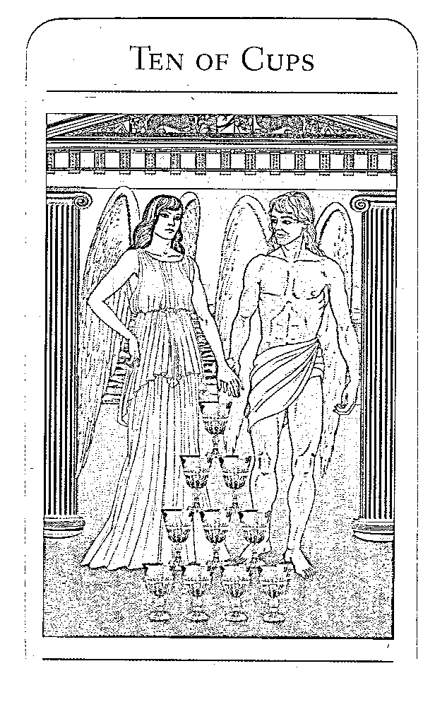

**成为神祇**

圣杯 10 描绘的是普绪克（*Psyche*）被提升为神祗的状态，此时她和丈夫可以一起进入神的世界了。

这对夫妇又一次站立在厄洛斯（*Eros*）美丽的宫殿中，彼此牵手。普绪克不再穿着她那套象征着纯真的白袍，而是换上了闪闪发光的金袍，她的背后和丈夫一样，长出了一对金色的翅膀。他们面前整齐地堆叠着十只金色的圣杯。

**开花结果**

**圣杯 10 代表着持久的满足状态。**圣杯 3 的庆祝在圣杯 4 中就褪去了，但圣杯 9 中爱人重新结合的狂喜并没有消散，因为这次婚姻构建在**两个独立又相爱的人有意识地结合的基础之上**。他们能够享受将来，能够坦然面对生命（或神）的挑战。

普绪克进入永生的状态，暗示着**她对厄洛斯的爱不仅仅是个人性的和感官面向的，而是包括了精神之爱**。厄洛斯被普绪克的爱赋予了人性，所以他不需要再隐藏自己的真颜。 

另一方面，普绪克通过内心深处的爱，经验了与神性联结的感觉，所以有时候人们说，爱一个人可以打开热爱生命本身的心扉，生命有它本身的目的和意义，能够带领人们走入一个更博大更光明的世界。

柏拉图（*Plato*）曾经写到：**当我们凝视爱人脸庞的时候，我们会看到神界，我们曾经属于那里。**

我们在爱的旅途上经历了风雨之后，就学会了**真诚和谦逊**，从而让**我们的心灵与生命的永恒、意义和公正紧密相连**。

这是**圣杯 1 中隐含的承诺，在圣杯 10 中开花结果**。不是所有的关系都能走到这里，也不是关系中所有的时刻都是这样。然而，人类还是会不停地尝试，永不放弃。

**圣杯 10，持久的满足**

**从解牌的角度来看，圣杯 10 预示着在心的领域获得了持续的满足感和完整感。**

**版权声明：**本文由《自在园》授权发布，欢迎转发，反对抄袭。友号转载请申请白名单。

**朱丽叶·沙曼·伯克**从 20 世纪 70 年代早期开始，就对塔罗牌产生了兴趣，并踏入了塔罗的世界。后来，在丽兹·格林的鼓励下，开始研习心理占星学和塔罗。1984 年，第一本书《塔罗全书》（The Complete Book ofTarot）出版。之后，与丽兹·格林合作设计并撰写了《神话塔罗》（The Mythic Tarot）。朱丽叶写了十本塔罗和占星学书，包括一本名为《众星的传说》（Stories from the Stars）的儿童读物，以及与丽兹·格林合著的《神话之旅》（The Mythic Journey），这是一本详细讲述如何运用神话来指导生活的书。

**点击下图了解课程详情** 

**微信又双叒叕改版啦，不想错过若道君的推送？****就把若道设为星标吧！****▼**

**喜欢记得点一下在看哦☟**

************报名直达入口************

# 秋分牌阵预约丨 神话塔罗四季牌阵咨询开放预约

> 原文：[`mp.weixin.qq.com/s?__biz=MzA5NjA0NTAxNg==&mid=2651489465&idx=2&sn=1a2fdbf22259bc7e34afc0e56cdc0564&chksm=8b48360ebc3fbf18440684f4d313e3fb2d9e8f871de9596675e9297ffbb8d90dda67c6eb7689&scene=126&sessionid=1692737751#rd`](http://mp.weixin.qq.com/s?__biz=MzA5NjA0NTAxNg==&mid=2651489465&idx=2&sn=1a2fdbf22259bc7e34afc0e56cdc0564&chksm=8b48360ebc3fbf18440684f4d313e3fb2d9e8f871de9596675e9297ffbb8d90dda67c6eb7689&scene=126&sessionid=1692737751#rd)

2022 年 9 月 23 日，这一天太阳进入**天秤座**阴阳相半，昼夜均长寒暑平分，故名**“秋分”**这一天最适合来神话塔罗 APP，抽取万众期待、应时应景的牌阵——**四季牌阵(The Four Seasons Spread )**

**一年只能使用四次的牌阵**

此牌阵最早出现在塔罗师 Marcia Masino 的 一本叫《*Best Tarot Practices*》 的书中，

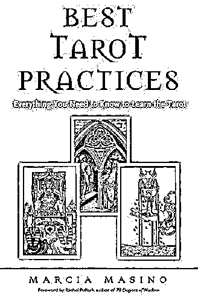

此牌阵只能在一年里的 4 天进行占卜：分别是**春分、****夏至**、**秋分**和**冬至**。这 4 天蕴藏着四季的秘密，小小的节气，有大大的能量。是绝佳的日子，让自己看看接下来一个季度的能量趋势。**秋分牌，****展示的是****你从秋分到冬至这一个季度的整体能量趋势，****TA 会告诉你当季的主题，****你的思维计划、行动决策、****人际情感、财务发展。**如果你想要获悉一个季度的整体概况，**把握事业方向**，**感情状况的走向**，**提前了解财务如何发展**，那么四季牌阵能够满足你，它会对你整体的状态有一个相对清晰的展望。当你觉得对目前的状况不甚满意，又不知道该从哪个方向入手去做改变的时候，四季牌阵也可以给你相当多的指引。

**四季牌阵会从五个方面做出能量预报：**

**感情****状况、****工作****财务、**

**拥有的****行动****力量、****思维****计划的警示、**

**精神****状态与****心灵****成长。**

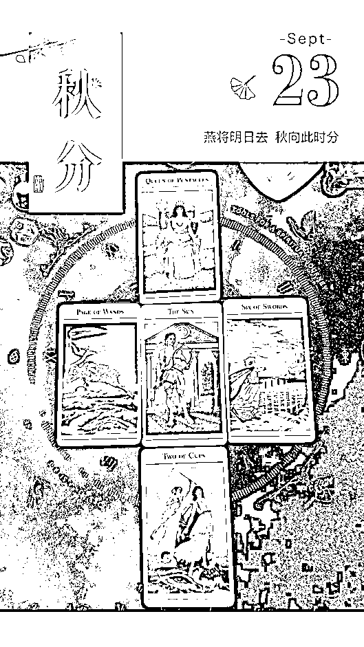

同时占星学中，

这四个节气是太阳换座到四个基本星座

（白羊座、巨蟹座、**天秤座**、摩羯座）

的时间点，意义重大。

因此，无论通过占星还是塔罗，

都是适合做下一个季度能量趋势预报，

完善中短期规划与展望的好时机。

**塔罗作为直觉的能量预报与灵性指引工具，**

**是对占星理性逻辑的分析方法的完美补充。**

用神话塔罗，

让包围你的宇宙能量一目了然，

对着四季塔罗冥想，

让自己度过有意义的秋分这一天。

**秋分日 限量优惠咨询活动**

**预约靠手速，限量****30****人。**

**活动地点**

线上——**若道神话塔罗 H5**

**活动主题**

“秋分日—冬至日” 3 个月个人趋势的四季牌阵解读

**公益价格**

**150-500 元/四季牌阵解读**不等 

拼手速

**如何预约塔罗师咨询？**

扫码二维码进入若道塔罗 H5

预约**“四季牌阵”**塔罗服务项目

就有机会拍到优惠咨询哦~

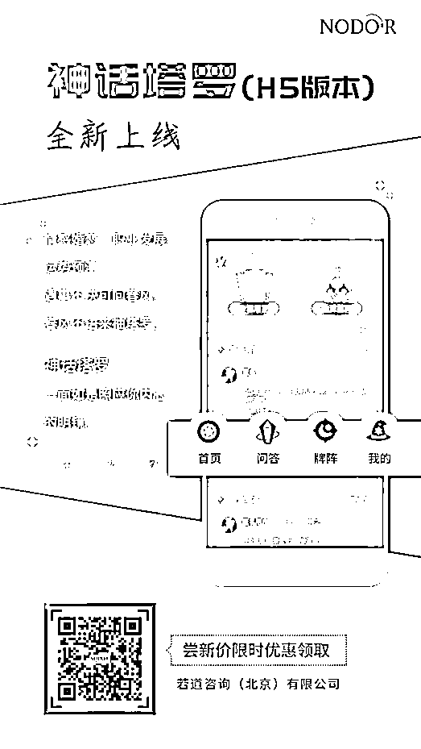

**我们在秋分日****与你不见不散**

# 插班中丨神话塔罗：高效学习班上线，灵活掌握，专业实践！

> 原文：[`mp.weixin.qq.com/s?__biz=MzA5NjA0NTAxNg==&mid=2651489465&idx=3&sn=2c7143c5b8e573cc9451ef861c270403&chksm=8b48360ebc3fbf1881e6de02f07b6832a163d69ebd09aab2aea9bf67c64c40c8967d56a240b7&scene=126&sessionid=1692737751#rd`](http://mp.weixin.qq.com/s?__biz=MzA5NjA0NTAxNg==&mid=2651489465&idx=3&sn=2c7143c5b8e573cc9451ef861c270403&chksm=8b48360ebc3fbf1881e6de02f07b6832a163d69ebd09aab2aea9bf67c64c40c8967d56a240b7&scene=126&sessionid=1692737751#rd)

**2022 年超高含金量的神话塔罗认证课程****高效学习班****开始招生**用**四个月**的时间学习掌握神话塔罗解读喜欢**集中学习，快速掌握**的同学不要错过

黄色日期为**8 节直播课**时间，同学可以自由安排时间学习**18 节录播课**

班级学习群讨论、APP 答疑区提问

课程内容体系让你直观精准地感受到**神话塔罗的魅力**扎实地建构**神话塔罗思维**系统学习**最地道的塔罗知识**课程中老师将**神话、占星、心理学**完美融合进塔罗的**人本主义咨询体系**并进行学员**案例督导**让你更自信的开展咨询工作，学以致用

本期认证课程采取**即报即学的录播课+案例督导直播课**的形式，

*   **18 节录播课：**精编剪辑，随来随学，助教答疑，学练结合。

*   **8 节直播课：**融会贯通，神话心理，塔罗占星，咨询技巧。

为了适配大家的各种学习场景，提高学习&复习效率，我们还将**录播课**剪辑了**中文字幕版**和**翻译音频版**：

*   **中文字幕版：**朱丽叶老师英文原声配中文字幕，适合在手机或电脑前专心致志的学习。

*   **翻译音频版：**翻译老师幼婷的中文原声纯享，适合运动、通勤路上耳机里陪伴式学习。

若道还为塔罗学员开发了**“神话塔罗”**平台，是随身的工具，更是接咨询的平台，录播课程**学成入驻平台**即可链接更多塔罗个案，发展壮大你的塔罗咨询事业。

**如果你想学习塔罗，什么样的老师会让你怦然心动呢？她是三副塔罗牌的设计者，写了 6 本塔罗书籍。她研习塔罗四十余年，教授塔罗三十余年，是丽兹·格林的密友。还有****谁会比塔罗牌设计者更了解塔罗的历史、灵魂与精髓？****所以，这将是你开启塔罗之旅最坚实的一步。**

1

**这位塔罗大师是谁？**

**朱丽叶·沙曼-伯克** 

*   她是**3 副塔罗牌**的**设计者****——**神话塔罗牌、沙曼–卡塞利塔罗牌、“自己着色”塔罗牌；

*   她出版了**6 本塔罗书****——**《塔罗全书》、《新塔罗全书》、《众星的传说》、《理解塔罗牌》、《精通塔罗牌》、《塔罗初学者指南》；

*   她研习塔罗**四十余年；**

*   她教授塔罗**三十余年**；****

*   她是**丽兹·格林**的密友，两人合著了**《神话之旅》**，共同设计了**神话塔罗牌**。

*   她是认证的**心理治疗医师；**

*   她深谙**塔罗、占星学、心理学和神话学。**

**如果你想成为拥有英国神话塔罗认证的塔罗师**

那么她，就是你**最好的老师人选**

2

**塔罗牌有什么用？**

*   塔罗牌是一种**古老的疗愈工具**，同时也是**直观的解惑工具****；**

*   塔罗牌绕过逻辑思维，**和潜意识联结**，通过图像的方式生动地将隐藏在人类潜意识中的画面浮出水面，**揭示心灵的状况和运作****；**

*   塔罗牌**帮助我们和潜意识对话**，可以和现代的心理治疗联系在一起，帮助我们**看清心灵的冲突来源、本质和可以选择的道路；**

*   塔罗牌又和更广阔的**宇宙生命原型**联结，彰显**个人生命发展的阶段**，将**个人生命挣扎、内在冲突**放在生命进化的道途上，让更广大的生命智慧为个人成长照亮道路。

3

**为什么学习神话？**

神话通过**图像和故事**描绘人类生活的**原型模式**。通过瑰丽的想象、诗意的语言、栩栩如生的人物和故事描绘出我们内心的世界，表达出我们经历的那些实现人性的过程，帮助我们将**个体的生活与人类古老且永恒的故事**建立联结。从而在更深处**理解生命**，并学习**古老而长青的生命智慧**。

**神话塔罗**取材于**希腊神话**的无尽沃土，通过故事提供一种**记忆辅助**，在心理和预见层面提升解读的**丰富度**。因为这样更符合塔罗牌的性质，符合人类的想象。**按照故事思考，而不是简单的记忆关键词和固定的意义。**

4

**塔罗预测是什么？**

塔罗牌预测的运作就像是**照向心灵的一面镜子**。在塔罗牌解读时，图像的原型性质穿透隐藏的潜意识脉络，反应出与个人境遇相关但又未被了知的知识与洞见，因此**揭示出按照任何理性方式都无法发现的事情。**

如果你对生命好奇，塔罗学习会帮你**打开一扇通往未来的门****，**让你了解**心灵运作和显化的秘密**，同时赋予你更多关于生命成长的支持和指引的能力！

5

**我们将学习什么？**

**录播课（即报即学）**

**☆****初阶：神话塔罗详解**

**神话故事和预测意涵**

**第 1 讲 塔罗牌介绍 ，讲述它的历史 （中文字幕版）**

**第 1 讲 塔罗牌介绍，讲述它的历史（翻译音频版）**

**第 2 讲 星座形态、元素和宫廷牌&基本星座与基本国王 （中文字幕版）**

**第 2 讲 星座形态、元素和宫廷牌&基本星座与基本国王（翻译音频版）**

**第 3 讲 固定星座与固定王后（中文字幕版）**

**第 3 讲 固定星座与固定王后（翻译音频版）**

**第 4 讲 变动星座与变动骑士（中文字幕版）**

**第 4 讲 变动星座与变动骑士（翻译音频版）**

**第 5 讲 小阿尔卡那牌权杖（中文字幕版）**

**第 5 讲 小阿尔卡那牌权杖（翻译音频版）**

**第 6 讲 小阿尔卡那牌圣杯（中文字幕版）**

**第 6 讲 小阿尔卡那牌圣杯（翻译音频版）**

**第 7 讲 小阿尔卡那牌宝剑（中文字幕版）**

**第 7 讲 小阿尔卡那牌宝剑（翻译音频版）**

**第 8 讲 小阿尔卡那牌星币（中文字幕版）**

**第 8 讲 小阿尔卡那牌星币（翻译音频版）**

**第 9 讲 经典牌阵教学讲解（中文字幕版）**

**第 9 讲 经典牌阵教学讲解（翻译音频版）**

**第 10 讲 牌阵解读案例演示（中文字幕版）**

**第 10 讲 牌阵解读案例演示（翻译音频版）**

**☆****中阶：神话塔罗牌阵应用**

**神话****解读和咨询技巧**

**开启神话塔罗愚人之旅**

****

**第 1 讲 愚人、魔术师、女皇、皇帝（中文字幕版）**

**第 1 讲 愚人、魔术师、女皇、皇帝（翻译音频版）**

**愚人**：永恒的少年（儿童的原型）

**魔术师**：恶作剧者、老师、向导、沟通者的原型；行星：水星。

**女王**：母亲、养育者、丰产的原型；行星：金星在金牛座；小行星：谷神星。

**皇帝**：父亲、供养者、计划者的原型；行星：木星。

**第 2 讲 女祭司、教皇、恋人、战车、正义、节制（中文字幕版）**

**第 2 讲 女祭司、教皇、恋人、战车、正义、节制（翻译音频版）**

**女祭司**：处女——等待被实现的潜力原型；行星：新月。

**教皇**：疗愈者、受伤的疗愈者、牧师的原型，牧师是神与人之间的灵性桥梁；行星：凯龙星。

**恋人**：爱、爱人、所爱之人的原型；行星：金星在天秤座。

**战车**：战争、冲突、战士、斗士的原型；行星：火星。

**正义**：智慧、兵不血刃的胜利的原型；星座：处女座；小行星：智神星。

**节制**：关系、合作的原型；星座：巨蟹座、双鱼座。

**第 3 讲 力量、隐士、命运之轮、倒吊人、死神（中文字幕版）**

**第 3 讲 力量、隐士、命运之轮、倒吊人、死神（翻译音频版）**

**力量**：力量的原型；星座：太阳在狮子座。

**隐士**：晚年、耐心的原型；行星：土星。

**命运之轮**：命运女神与命运的原型。

**倒吊人**：牺牲与有意识的牺牲的原型；行星：海王星。

**死神**：死亡、终点和起点的原型；行星：冥王星。

**第 4 讲 恶魔、高塔、星星、月亮、太阳（中文字幕版）**

**第 4 讲 恶魔、高塔、星星、月亮、太阳（翻译音频版）**

**恶魔**：阴影、人类不文明的面向、本能、欲望天性；行星：火星在天蝎座。

**高塔**：改变、分裂瓦解的原型；行星：天王星。

**星星**：希望的原型。

**月亮**：无意识的原型；行星：暗月。

**太阳**：意识、创造力和文明的原型；行星：太阳。

**第 5 讲 审判、世界（中文字幕版）**

**第 5 讲 审判、世界（翻译音频版）**

**审判**：复活、新生的原型；行星：水星作为灵魂向导普绪科蓬波斯。

**答疑与讨论，学员们分享对自己或客户的塔罗解读，对神话塔罗牌进行更多探讨。**

**世界**：整体、完成和个性化的原型。

**第 6 讲 经典牌阵教学讲解（中文字幕版）**

**第 6 讲 经典牌阵教学讲解（翻译音频版）**

**第 7 讲 咨询案例演示：为一位年轻女性所做的四次解读（中文字幕版）**

**第 7 讲 咨询案例演示：为一位年轻女性所做的四次解读（翻译音频版）**

**第 8 讲** **引导式冥想、荣格的四种意识功能（中文字幕版）**

**第 8 讲 引导式冥想、荣格的四种意识功能（翻译音频版）**

**☆****高阶：神话塔罗直播督导课**

**第 1 讲 塔罗牌中的荣格原型**

**2022 年 8 月 10 日（周三）**

我们将学习荣格是如何理解原型，以及荣格原型如何反映在塔罗牌中。对塔罗牌解读而言，理解原型的普遍性非常有帮助，因为这有助于塔罗咨询师碰触客户的内心世界。

**第 2 讲 塔罗牌是如何与行星原型和其原型体验联系在一起**

**2022 年 8 月 24 日（周三）**

大阿卡纳牌反映了行星神祗的原型，在某些情况下，原型经验意味着它们反映了所有人类的经验。我们将通过这个角度看这些大阿卡纳牌。我们将看到理解原型对解读有何帮助。

**第 3 讲 荣格意识的四种功能与小阿卡纳牌的四种元素及与权杖、星币、宝剑、圣杯四套牌之间的联系**

**2022 年 9 月 7 日（周三）  **

我们将看看小阿卡纳从 1 到 10 如何反映荣格意识功能的各个方面，以及它们如何反映在四套牌四个元素和其心理方面。我们还将对 1-10 的数字学进行修正，看它们在元素中的表现方式。

**第 4 讲 占星学中的 12 星座和宫廷牌之间的联系**

**2022 年 9 月 21 日（周三）**

我们将讨论形态和星座，以及它们如何反映在宫廷牌上。

**第 5 讲 马蹄牌阵学员案例督导**

**2022 年 10 月 19 日（周三） **

**第 6 讲 六芒星牌阵学员案例督导**

**2022 年 11 月 2 日（周三） **

**第 7 讲 凯尔特十字学员案例督导**

**2022 年 11 月 16 日（周三） **

****

**第 8 讲 三个牌阵学员完整案例督导**

**2022 年 11 月 30 日（周三）**

**认证阶段：考试论文**

录播课学习完毕，即可入驻若道神话塔罗平台，以实习塔罗师获得推广流量，对接塔罗咨询个案。

直播课+录播课学习完毕，提交考试论文通过即可获得获得英国神话塔罗认证证书，升级为认证咨询师。

**扫码进入全新神话塔罗 H5**

每天有事没事都可以去**神话塔罗 H5**里转转抽取专属于你的今日塔罗

**神话塔罗 H5 问答平台全新上线**

三张牌牌阵，专业塔罗咨询师语音条解读

如果你碰巧有困惑，刚好有**限时优惠价**

如果感到快乐你就用用**神话塔罗 H5****，**如果你感到不快乐，更要使用由专业人本主义塔罗师团队全程陪伴的**神话塔罗 H5 哦！**

6

**适合人群**

*   塔罗初学者，完全没有塔罗基础；

*   塔罗自学者，也曾上过塔罗工作坊，但仍不懂如何使用塔罗牌；

*   塔罗进阶学习者，有塔罗基础，了解 78 张塔罗牌含义；

*   不知如何解决遇到的情感困惑、职业选择、人际问题，对人生感到迷茫；

*   想要学习深入解读塔罗牌、牌阵的使用、咨询技巧等将塔罗运用于咨询实践；

*   想要深入了解和学习塔罗，希望成为专业的塔罗师；

*   想要借助塔罗进行心灵、灵性成长。

7

**导师简介**

**朱丽叶·沙曼-伯克**

**朱丽叶·沙曼-伯克**从 20 世纪 70 年代早期开始，就对塔罗牌产生了兴趣，并踏入了塔罗的世界。后来，在丽兹·格林的鼓励下，开始研习心理占星学和塔罗。

1984 年，第一本书《**塔罗全书**》（*The Complete Book ofTarot*）出版。之后，与丽兹·格林合作设计并撰写了《**神话塔罗**》（*The Mythic Tarot*），在这本书中，她们将古希腊神话与传统塔罗解读结合起来。朱丽叶写了**十本塔罗和占星学书**，包括一本名为《众星的传说》（*Stories from the Stars*）的儿童读物，以及与丽兹·格林合著的《神话之旅》（*The Mythic Journey*），这是一本详细讲述如何运用神话来指导生活的书。

8

**课程价格**

**认证课程总价：****22000 元**

**联报优惠价：****19000 元**

**限时转发优惠价：18000 元（联系 Echo 老师，获取限时转发优惠价）**

长按二维码添加客服 Echo 老师

9

**退转课程**

*   **退款原则请详看《教学协议》，如有疑问请咨询课程顾问。**

**神话塔罗认证课程**

**授课老师：朱丽叶·沙曼-伯克**

**授课时间：录播课即报即学，直播课 2022 年 8 月 10 日起**

**授课方式：**网络课程**，**英文授课，中文翻译

**费用：****认证课程总价：****22000 元；****联报优惠价：****19000 元；****限时转发优惠价：18000 元**（联系 Echo 老师，获取限时转发优惠价）

**课程负责人：Echo 老师**（微信/手机：nodoor18518412824，请备注“神话塔罗”）

长按二维码添加课程负责人咨询~

**END**

****报名请点击“阅读原文”****

# 太阳进入天秤座 | 12 上升星座将在何处获得平静和收获？

> 原文：[`mp.weixin.qq.com/s?__biz=MzA5NjA0NTAxNg==&mid=2651489465&idx=1&sn=04ce5df094da219f283aca54bc2cb960&chksm=8b48360ebc3fbf18160fb473773a1a70f3e77fe0fa610f63ce19decd3f720434fd75de3c1644&scene=126&sessionid=1692737751#rd`](http://mp.weixin.qq.com/s?__biz=MzA5NjA0NTAxNg==&mid=2651489465&idx=1&sn=04ce5df094da219f283aca54bc2cb960&chksm=8b48360ebc3fbf18160fb473773a1a70f3e77fe0fa610f63ce19decd3f720434fd75de3c1644&scene=126&sessionid=1692737751#rd)

********************☆ 后**********************台**********************回复“今日”，给你一句生命态度********************

作者/郑玮玲 ISAR 认证占星师编辑/玫瑰 封面/书君 图片/稿定设计 9 月 23 日 9:04 太阳进入天秤座，同时也意味着平分秋色的秋分节气到来。此次太阳换座不仅开启了新的秋季，也将开启了新一轮月相周期——将发生在天秤座 2°48′的新月。接下来的一个月，12 星座会有怎样的人生体验？一起看看。**太阳进入天秤座**秋分是一个平衡的时空，同春分一样昼夜平分，也带来时空、身心的重大开启力。天地从此秋意凉，北半球持续进入收藏的季节。秋分三候：一候雷始收声，二候蛰虫坯户，三候水始涸。秋分后阳气渐隐，而雷声正是始于雷行育万物的立春，终于黑夜将要渐长于白天的秋分。细小的昆虫首先开始进入洞穴封藏保身。经过长夏，河流湖泊都因丰水期的冲刷，变得更为澄澈动人，所谓“秋水共长天一色”正是当下。而**秋分之后天地间水气蒸发渐干涸，水渐枯，提醒人们收藏、退隐，回收精力来维养身心。****秋分时空的卦象是：天山遁，意味着收敛、隐归的律令。**君子遁世无闷，提醒世人**境遇不利时应张弛有度，适时退避，明哲保身，维养阴柔之气**。退隐自然难有所作为，但能远离纷争祸害，静待时机转换是以退为进的智慧修养。在这群星逆行的背景下，太阳进入了高度平衡感和审美感的天秤座，而太阳的守护星便由逆行的水星转变成了顺行在处女座的金星。同时，当太阳进入天秤座时，正处在香脂月期间，我们会感受到各种层面的消散、放手、结束与终落。这样的宇宙氛围加深了秋分的**告别、收敛、隐没**之意，也提醒我们**纵然外境艰难，无力施展，也不放弃自我精进的内在标准。**逆行的群星提供更多反思、反省和迂回前行的路径，从而修正弥补，也重新肯定内在的核心。当我们在内在明晰笃行意识的工作，便能平衡外境的变幻、纷扰，从繁杂尘世的苦难、伤痛与危机中去淬炼、提纯心灵的品质。这是真正意义上属于太阳天秤座的平衡、稳定与精致的人生。**天秤座作为风象创始星座，象征着思维驱力，也提供了与人互动、建立关系的动力。**太阳进入天秤座，把我们对生活的核心关注、追寻引入到**社交情境**中。**接下来这个月，与人的交流、联结，尤其是充满和谐美感的亲密关系会为我们带来最大程度的满足感与成就感。****倾听是天秤座的一大优势，**太阳在天秤座为我们提供更有力的交流氛围，全赖我们拥有更好的倾听能力。**对于想要增加交流能力的朋友来说，一定要开始学习深入地聆听，这是带来良好沟通的开始。**另一方面，太阳天秤座期间很适宜**培养和发展美感**，在美学、艺术领域的学习、交流、探索会让我们在感受自我与世界的关系中起到平衡的调谐作用。所有美好的事物都在柔化这个世界的疾苦，也温柔了我们心灵的维度。

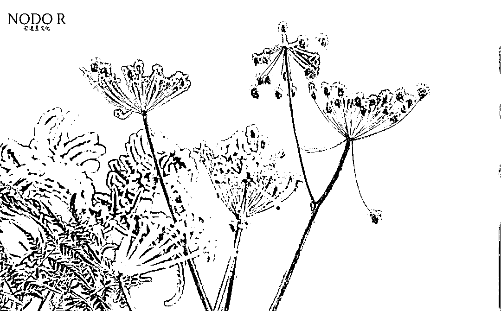

**太阳在天秤座的行进**

**太阳对分木星**

**周期：9 月 19 日-10 月 4 日****重点影响人群：**有**个人行星、四轴、交点位于天秤座、射手座、摩羯座、水瓶座、白羊座、双子座、巨蟹座、狮子座 0°-4°，以及处女座、射手座、双鱼座、双子座 26°-29°的人。**木星在白羊座逆行中，此时我们能感受到**生活的周围，以及全球性的怒气冲冲的扩张，那些带着火药味儿的，或是能激发怒气的条款、规则制定出台。**无法停止的俄乌战争还呈现出了扩散式的影响力，无论如何，战争带来的各种层面的影响都已扩散至全球。白羊座的火星宛如这扩张的战火与怒气，流血与伤害，逆行中给了很多反思与重新面对的机遇。9 月 17 日，法国民众在巴黎游行抗议政府对俄制裁导致的高能源价格，并要求法国退出北约。

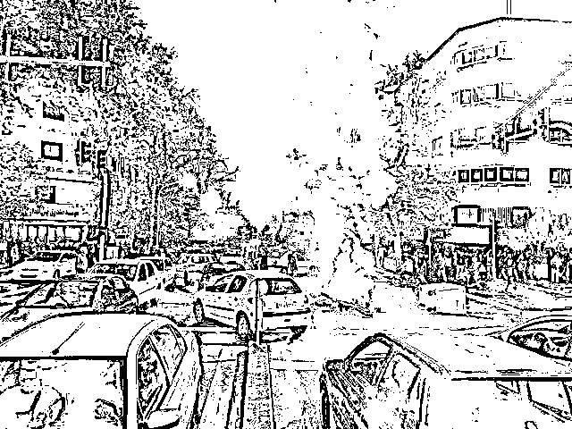

| 21 日晚上在德黑兰的示威活动。图片来源：路透社
9 月 21 日，伊朗爆发了“反头巾”抗议，很多女性示威示当众烧毁头巾，剪掉头发以示抗议，另一些女性则是在网络社交平台上烧掉头巾，剪掉头发表达抗议和愤怒。此举源于一名年轻女性未遵循严格的头巾佩戴要求而遭受警方逮捕后不幸死亡。在伊朗有着非常严格的头巾规定，无论你是何种信仰、国籍，哪怕只是转机的女性游客都被要求戴上头巾。显然在日木对分的情境下，集体的怒火被点燃。而此事在更大范围的国际社会引发了强烈的关注和共鸣，所有的人都为伊朗女性去头巾的勇敢行为呐喊、喝彩。头巾遮住的不仅是女性天然的美，还遮住了自由与平等的权力。日木对分的进程中，对美和自由的渴求得到了天然的回应，也让这过度反人性的遭受到国际社会的审判。白羊座逆行的木星与太阳的对分相，确会让一些集体化的事件透过个体事件触发、呈现。这也意味着**当下的情势支持一切为正义、平等、独立、自由的呐喊**。如果我们理由充分，据理力争，便能透过公平、公开的表达获得对权力的制衡。**一切不合情理的，违反人性，不合时宜的，都可以经由合法、正义的表达得到声张与和解。****在个人成长道路上，太阳所代表的个性化目标，也会透过木星的扩张显得更为宏大、瞩目。**白羊座透过激励、果敢，甚至是愤怒的方式引发我们内在对成功、逐梦的渴求，我们会对信仰有深刻的感悟和行动。当我们能正视心中的恐惧、野兽时，便是敢于驾驶它的时候，在正义的天平下，勇敢做自己，这是日木对分最有力的自我赋权。

**太阳三分土星**

**周期：10 月 4 日-10 月 20 日****重点影响人群：**有**个人行星、四轴、交点位于天秤座、摩羯座、水瓶座、白羊座、双子座、巨蟹座 10°-26°的人。**当下的土星与天王星在最激烈的逆行中四分，土天之间的激烈摩擦导致了**诸多现实的不稳定、摇摆和不可测的难题、囧境。**我们不得不**在此时期应付那些棘手的外在发生，另一面还不得不重塑、重建原已奠基的项目与计划。****一切的工作时不时要面临停摆，一切的进程都难以按计划稳妥上路。**连最基础的原点都可能因外在打击而位移，最大最重的愿景无法在当下被展现。时不时停下来询问自己到底身在何处，也是为了确认我们此刻安全，此时还可以继续上路。当太阳三分土星，把一些光线带入了现实。天秤座的太阳永远提醒着**与人交流**，**建立那些和谐、亲密的互动能量场，从平等的对话中给予自己新的启示、希望和愿景。**逆行的土星会**保持一定的退守，给出一些空间，让我们可以重新开始构建、稳定。**

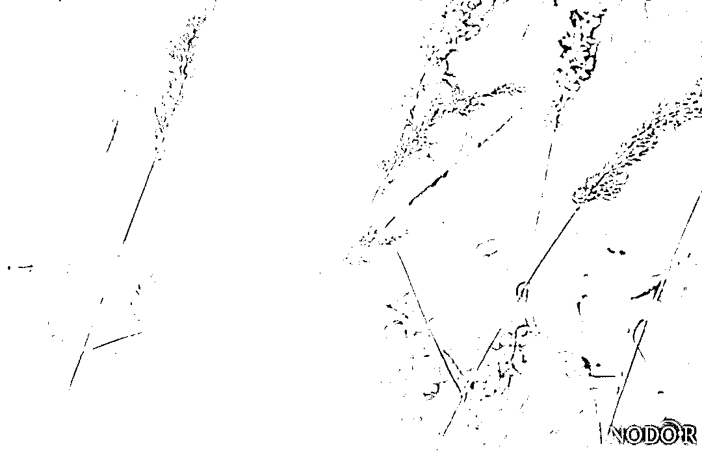

在此时期，值得**将前期停滞、停摆的重要项目、计划重新审视，与最重要的伙伴、支持者进行清晰、有条理的沟通。土星会让我们作出更为保守但更为稳定的思考，三分相的和谐会支持所有基于平等互动的愿景的达成。**

**太阳三分火星**

**周期：10 月 7 日-10 月 27 日****重点影响人群：**有**个人行星、四轴、交点位于天秤座、摩羯座、水瓶座、白羊座、双子座、巨蟹座 13°-29°，以及天蝎座、双鱼座、巨蟹座 0°-3°的人。**双子座的火星是当下除了太阳、月、金星之外唯一还在顺行的行星。日火三分相**为所有的思考、学习、交流论辩提供了火力、速度与应变通达的保障。**但双子座的火星也是好事的角儿，尤其**在心智的较量上，火星很容易引致语言的冲突、挑衅。**重点影响人群也要**注意避免可能的发烧、感冒、炎症和外伤流血的情况**，调整好饮食作息，在需要专注工作时避免走神和过度的交流谈话，让精力和注意力放在我们正在进行的工作中，不要被外境所带走。这个相位也支持我们**去勇敢地自我表达**，但需要**保持意识采取礼貌、客观与公平的态度，避免陷入火星的智力较量中去。**与此同时，若我们正在进行一些需要与人协作、磋商的工作时，可以找到更快、更灵活的节奏和行事方式，**双子座的火星让我们避免陷入固化的程序中，透过改变、打乱一些原有步骤，实现整体的完美与平衡。**

**太阳四分冥王星**

**周期：10 月 12 日-10 月 28 日****重点影响人群：**有**个人行星、四轴、交点位于天秤座、摩羯座、水瓶座、白羊座、金牛座、双子座、巨蟹座、处女座 18°-29°，以及天蝎座、水瓶座、金牛座、狮子座 0°-4°的人。**冥王星所到之处都是摧毁和深层的清理。日冥四分期间**非常适合进行系统性的整理、整顿和清理工作，或是工作、生活的重大调整**。冥王星能**揭开一些深层创痛与腐败的本质，可会颠覆信仰、认知，完全将我们带离旧有的意识**。但这种彻底性的转化也打开了疗愈与清理的时机：**一些深度的结束与放手，一些深层的挖掘与探索。**这段时期最适合进行**收尾性的工作，结束、放手，深层的生活和思想意识清理。适当的自闭，离群索居，减少社交，在冥思、静默中完成重要的内在探索。**冥王星要的是真相，也只能给出真相。而在真相面前，需要的只是**勇气与坚定的毅力。**黑暗具有包裹、隐藏的力量，更具有转化、重生之力。日冥四分指向了内在终极的挑战与突破，如果我们一度有害怕和担忧，有恐惧和排斥，无论是怎样的，冥王星就会让这些黑暗显化。未经成熟的心智会遭受磨炼，但**至臻纯熟的意志能在狂风骤雨中挺立，促使内在真实自我的架构更为稳定，并从绝对的丧失中焕发出新生的力量与意识。**

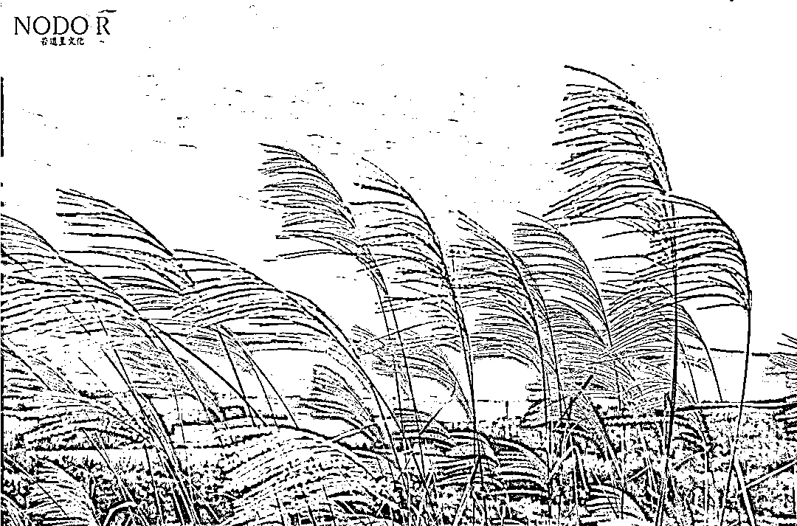

**太阳在天秤座对 12 上升星座的影响****注：以出生星图上升星座度数 30°范围内的上升星座为准。如你上升在 0°，可以完全参考下列内容；如你上升在 29°，则需参考下一上升星座。****若道君：****你可以在 app store 或者应用商店搜索“若道”下载 app，输入个人档案，查看行运盘（也可以使用其他星图软件），找到行进太阳落在出生星图的第几宫，然后对照下文查看。****例如下图中，比尔·盖茨上升在巨蟹座，行进太阳在个人星图的第 3 宫。**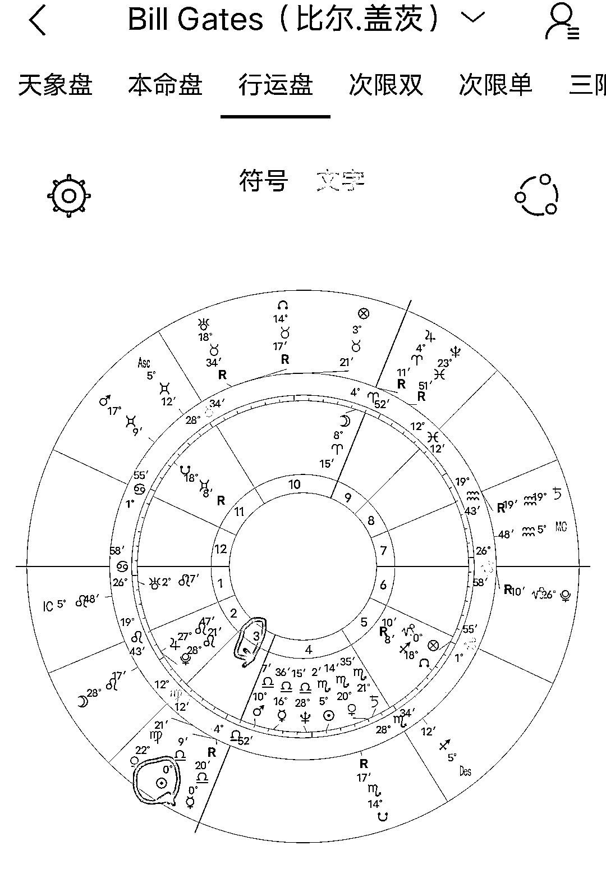

**上升****天秤座****，太阳行进在*****1*****宫**

你会进入到一个**信心与精力都充沛**的时期，也许你**更乐于投入先前的生活、工作、旅游计划，也许你会投入到一直期待的运动、兴趣项目中。**无论你参与到任何新的活动中，都会包含着强烈的与人相识、沟通、交流的渴望。**去正视你心底的渴望，并带着肯定去满足它，对你来说非常重要。**你的彬彬有礼和天然亲和力会吸引到同伴、友谊，你也会从与人的互动中重新激活自身的能量，去创造一些新的生活秩序。并且很可能走出过去一段时期阴霾与困境。

**上升****处女座****，太阳行进在*****2*****宫**

这是一个你会**重新思考自我，肯定自我**的时期，你**需要一些向内的工作，更多地感受你的价值取向，你的能力与工作方式。**也许你也会**斟酌工作同伴、关系和选择更为谨慎的对话者来探索自己**。总之，当下的你会把精力都用在**为自我价值所服务**的项目中，如何更好地确定自身价值是接下来这个月的工作重点。**当你愿意放下过去固守的观点和人、事、物时，一些新的洞见和视野会令你感受到豁然开朗。**

**上升****狮子座****，太阳行进在*****3*****宫**

接下来一个月你会投入一种**流动的学习状态**中，也许你在走路，吃街边小摊时也能找到一种悠游自得的学习状态。**有意无意的倾听都会让你在本月收获良多，**也许你能不经意地从身边情侣间的攀谈倾听到对自我、工作、愿景重大的提醒和反思。群里逆行的当下，很多的事情可能很难顺利推进，但你**若能投入于任何变幻的环境、情境中，便能轻松找寻到开解问题的钥匙。**

**上升****巨蟹座****，太阳行进在*****4*****宫**

**你需要更多的休息，或是在家工作的状态，或者你根本喜欢上了家的感觉。**接下来这段时间你可能会**因为工作繁忙和重大目标达成而投入过多的精力，因此反而会想要回归、隐退、休养。**但短期内的收获会促使你主动的暂停和休息，停下来是为了走更远的路。也可能**一些关系的深层问题在当下被打开、触发，让你有些心力交瘁**。给自己多一些时间、空间去感受、思考，再细致地去交流，也许你会发现困扰的问题其本质中是我们自己，当我们拥有了面对自身的勇气时，一切便有了答案。

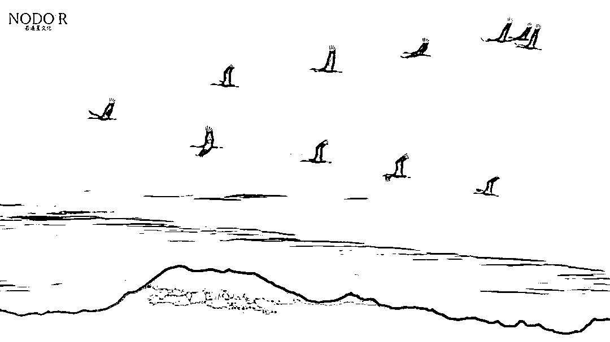

**上升****双子座****，太阳行进在*****5*****宫**

接下来你可以**好好规划一些博物馆、剧目、艺术画廊的鉴赏活动，或是投入你心仪的爱好中，深度地享受艺术、创造的乐趣，让自己玩起来**。哪怕你有要紧的工作项目在手，也可以尝试玩乐的心态，用创造性的手法去完成。**按步就班对你来说有点不合时宜，努力把心底的想法表达出来才是当下迫切所需。**激活你灵感的小宇宙，让内在的交流活跃起来，涌动起来。处在亲密关系的人，本月需要**关注与伴侣的交流，日常的摩擦是有的，还可能碰触一些深层信任的议题。**

**上升****金牛座****，太阳行进在*****6*****宫**

**你可以好好地集中精力在工作中了，**也许在群星逆行的时段耽误了不少的工作，各种外因导致不得不放下的工作现在可以重启了。虽然有些事情回不到原来的样子，也没办法像计划一样的完美执行。但**当下的重启会添加一些新的内容、灵感，你会拥有更加整体性的思考和逻辑框架来包容所有的局部**。新的出发，就是走向新的完美。

**上升****白羊座****，太阳行进在*****7*****宫**

**如果你在寻找合作伙伴的话，接下来这一个月一定要勇敢地表达自己，大胆而谦卑地发出你的讯号，你的合作关系就会来到你的生活中。**如果你处在亲密关系中，你则要**懂得谦卑与尊重，适当地聆听，学习聆听，让关系中的能量流动起来，真正听到对方所想，用心感受到对方的意图和情感。**这对你来说是非常重要的学习过程，也是一个重新平衡自我的过程。

**上升****双鱼座****，太阳行进在*****8*****宫**

**你会投入到深切的对生命、工作、危机的思考中，也包含那些不确定的财务、资金的危机。**当下对你来说是比较棘手的时期，诸多深层的恐惧会来袭，但你的敏感神经正在努力发挥作用。你会**将很多外境变幻考虑进来，也需要学习倾听更多的声音、意见，将信息集纳进你意识的系统中，去整合、明辨所有值得利用的素材。**

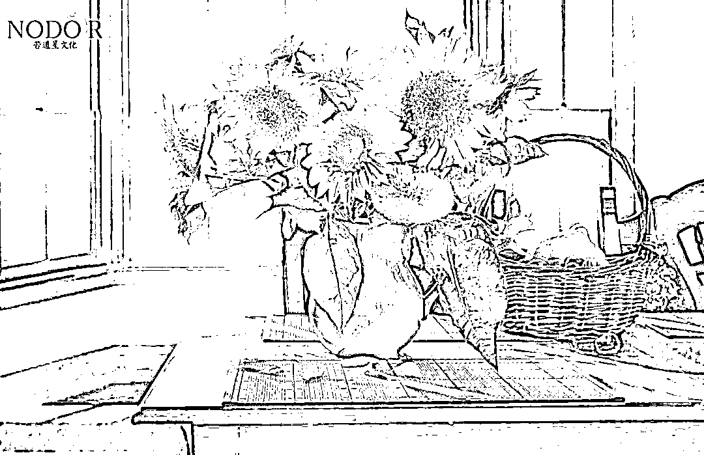

**上升****水瓶座****，太阳行进在*****9*****宫**

**你会开始一些全新尝试，投入那些大胆的旅程中，或是开始一些新的征程。**在现实中，或是在意识中，那些鼓舞你的方向都在向你招手。或许你有新的想法渴望集结、传播，在此之前有一个合适的对话者与你交换想法，可能会带来更多的清晰与肯定。当你带着信仰的力量去表达自我时，那些困扰你的不确定、不稳定因素便会成为可以忽略的背景，不再对你施加强有力的影响。

**上升****摩羯座****，太阳行进在*****10*****宫**

**一直以来你的努力将获得一次回报、奖赏、肯定，你可以借此时机犒劳一下自己了。**当然，当下的你会**更积极、坚定地投入理想、工作、事业的追寻中**，但很可能**因为忘我的工作而忽略了家人、睡眠，可能导致与家人的争端、不满，或是身体精力匮乏带来的健康问题**。**如果你对自己要求过高，可能会让一切使得其反，精力的补足对当下尤其重要。**适时把注意力往内在拉动，或是坐下来倾听一下你的家人声音，放下那些强迫性的工作，缓一缓，对你来说是非常重要的。

**上升****射手座****，太阳行进在*****11*****宫**

**乐观积极的你正在投入到更远期的目标中，团体的力量会让你感受平衡和稳定。**当下的你需要和不同的人发展出不同的交流模式，更多的倾听与交谈，更多的学习与参考能让你感受到生活、工作的动力。如果你在启动新的项目、计划，你会需要更着力于远期的定位，以及从自身最有能力的地方出发，将你的特长完全发挥出来才是当下值得考虑和出发的原点。

**上升****天蝎座****，太阳行进在*****12*****宫**

**你需要更多的睡眠、做梦和休息的时间，是时候关掉一些门窗，让自己安静下来。**不必为外界的纷纷扰扰悸动心烦，为自己的存在本身去感受、体察，记录下你深入的洞见，与心灵的敏感性待在一起。**梦境、自动书写、冥想、电影都能带给你更为平衡的体验。**你也可以在这些时期**进入相对封闭的独立工作、创作时期**，不为别人，只是为自我的创造性冲动，完成你内在最强有力的目标。对自己保持高度的关注才能令你感受到充分的满足和惬意。

**版权声明：**原创文章由作者授权首发于若道平台，欢迎转发，反对抄袭。友号转载请申请白名单。

**END**

**郑玮玲**

ISAR（国际占星研究协会）认证占星师（2016 年获得）

若道占星专栏作者

将占星咨询、教学与音乐、舞蹈相结合的疗愈者

**微信号**：zhengviolin

**新浪微博**：@郑玮玲

**微信公众号**：Sampriya-Astrology

长按打赏

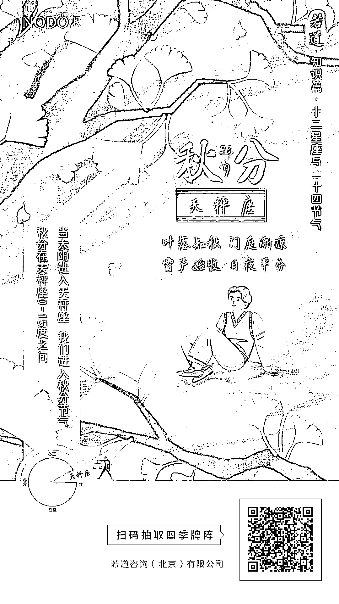

**20 位来自世界各地的占星师****带来 19 场沙龙——新世界的觉醒****详情可点击下图**

**学习占星学****点击下图了解课程详情**

**微信又双叒叕改版啦，不想错过若道君的推送？**
**就把若道设为星标吧！****▼**

**喜欢就点一下“在看”吧！**

********报名直达入口********

# 12 星座自己都未必知道的恋爱需求，一次都给你！

> 原文：[`mp.weixin.qq.com/s?__biz=MzA5NjA0NTAxNg==&mid=2651489333&idx=1&sn=4f31244871502f9da1ddace4206070f7&chksm=8b483682bc3fbf94f6f8804975177cee189bf5e5d57066c4252dce10db679292aa1822a7ff06&scene=126&sessionid=1692737751#rd`](http://mp.weixin.qq.com/s?__biz=MzA5NjA0NTAxNg==&mid=2651489333&idx=1&sn=4f31244871502f9da1ddace4206070f7&chksm=8b483682bc3fbf94f6f8804975177cee189bf5e5d57066c4252dce10db679292aa1822a7ff06&scene=126&sessionid=1692737751#rd)

************☆********************后台回复“今日”，给你一句生命态度************

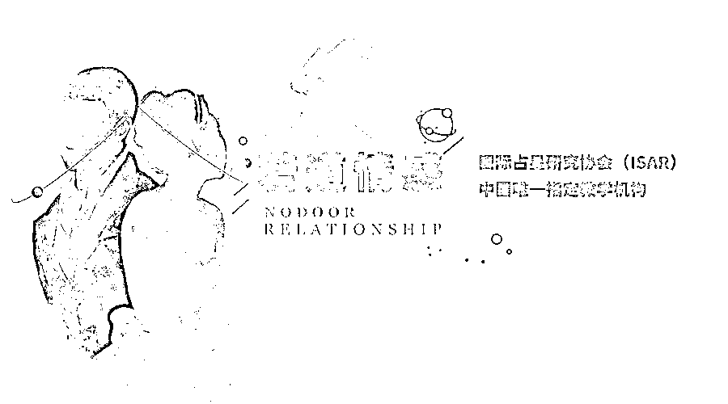

作者/斯蒂芬·弗里斯特 朱迪·弗里斯特
译者/李含
编辑/玫瑰 图片/稿定设计
本文译自《天空的伴侣 I：爱、性和进化占星学》12 星座中理想中的爱情模式是怎样的呢？在这篇文章中，斯蒂芬老师会给你很详细又精彩的解读。另外，斯蒂芬老师马上要在若道开设[【组合图工作坊】](http://mp.weixin.qq.com/s?__biz=MjM5MjQwNjAyMQ==&mid=2649440257&idx=4&sn=54e36bcd79811000b1211664fc1b927e&chksm=beb92f6b89cea67de36d40a3610b4bcb5a4be826b0a517b0090c4d992c6accd57058f7f04648&scene=21#wechat_redirect)（点击查看课程），如果想跟这位占星大师学习，快来了解详情吧~**火象星座****太阳白羊座的爱情**太阳在白羊座的人往往表现出某种意义上的**热烈、爱冒险、行动派**。在爱情中，他们和伴侣之间**必须有强有力的互动，和一些心理较量的戏码**。如果感情关系趋于休眠状态，白羊座会跳出来“摇醒”关系——甚至不惜来一场争吵。要记住，白羊座不论是在爱情中，还是在生活的方方面面中，都要学着勇敢，白羊座的伴侣最好誓守承诺：**所谓伴侣，换言之，就是勇于与你并肩战斗的人。**
在亲密关系中，太阳落在白羊座的人**直率、坦诚、忠实。**但负面影响是，**白羊座也可能陷入无目地的争吵，纯粹伤害了彼此，通常只是因为误会让关系陷入低气压。****太阳狮子座的爱情****求爱是狮子座本能的活动。**我们的自我表达——讲述我们自己的故事是两性关系中必不可少的部分。还有互相给予赞美。还有愉快的玩乐。所有这些都是太阳狮子座人的拿手好戏。**鲜花、情诗、倾心的交流、蜡烛、彼此的崇拜：这就是狮子座的恋爱秘籍。**
狮子座会轻易地坠入爱河。那么，在爱河中徜徉呢？这当然也是可能的，但伴侣**必须不断地给予肯定和赞赏。**谁都不愿意爱情变得麻木、陈腐。这对于太阳狮子座的人来说是毁灭性的打击，除非立刻有求爱的火焰重燃，让爱情重获新生。

**太阳的活力单纯地来自于关注和被关注。**因为狮子座人要给予伴侣关注，所以伴侣也要有某种戏剧性风格：**色彩缤纷、风度翩翩、时尚潮流、活力充沛。****太阳射手座的爱情**

在爱情的国度里，射手座人是言辞上的巨人，行动上的矮子，这是名声在外的。这种让人沮丧的情况也不一定就无可避免，但是射手座人**要放下对爱情的强迫性背叛行为**。  射手座人可能有一种不可避免的理念：**爱情只是肤浅的感情接触，内心其实依然孤独。**对于射手座来说，**不管多么充满活力的关系，也会有乏味的部分**。从另一方面看，**这种成熟爱情的灵魂冒险会带来丰富的成长经验。**  思想理念是射手座的强大驱动力，但是这些思想理念必须令人信服，经得起实践的考验。**精神空洞的爱情不会让射手座人停留太久，体验过后就会因为感觉乏味而放弃。**  另外，对于每一个太阳射手座的人来说，**自由**的确是进化所必需的途径。他们必须选择和自己一样热爱自由的伴侣，有自己独立的兴趣和朋友圈，从不停下追逐的脚步，更重要的是，他不会幼稚地大肆嫉妒，安全感匮乏。  满足了这些要求，射手座人就能了解射手座的秘密：**如果可以与伴侣携手并肩，就能获得更丰富、更深刻的追求。**

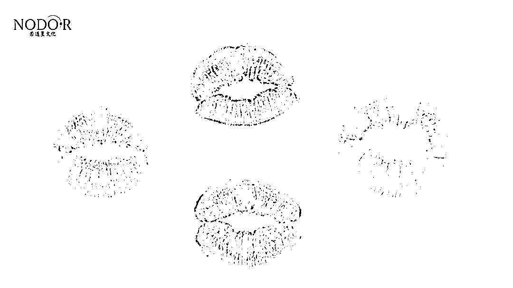

**土象星座****太阳金牛座的爱情**太阳金牛座的人在用心追求爱情时，和其他人生领域一样，他们的目标在于：**维持稳定、稳固、可靠的关系。**理想的伴侣是**在感情关系中时刻保持脚踏实地的态度，而不会离经叛道的人。** 
这里有一种感官上的特质，甚至是在爱情关系中也是如此。这可能会误导金牛座对伴侣的选择，金牛座人选择伴侣就好像在买一辆车，除非他已越过了阴影。

从占星学的角度来看，在亲密关系中金牛座关心的是**“持久”**。很少有金牛座人会仅仅因为伴侣的魅力就坠入爱河，亦或是沉浸于荒唐的幻想里。**金牛座人是务实而理性的，在感情里非常固执。** **坚持不懈——金牛座是出了名的倔强，他们能够顶住感情关系中的暴风骤雨，让感情在无声无息中重现光彩。**金牛座人**喜欢并且需要简单的肢体接触**。有形的方式在金牛座人的爱情关系中依然行之有效：**简单的礼物、送花、珠宝首饰**。物质主义并不是重点，但是这种看得见摸得着的方式能帮助他们获得内心深处的踏实感。**太阳处女座的爱情**在亲密关系中，处女座最欣赏两种品质：**成熟务实和努力成长（精益求精）的态度。**她也许不会使用这几个词，但是如果伴侣没有了这两种品质，处女座马上就会抽身离开。

在现实主义的大旗之下，我们欣赏逻辑思考、清晰的头脑、耐心、能力，也许还有雄心壮志。这些品质有助于我们在现实世界里生存。**“努力成长”是处女座所关注的。**他们欣赏的是**诚恳宽容地接受批评，欣然面对自己的不足和缺点，努力改正，做到更好。** 
处女座的爱情若想要延续，这份爱必须能够**持续地改变和成长**。她会**帮助伴侣把构想的新项目、新想法细化成可行性方案。**她也许会陷入人生的茫然之中，但是这很短暂。**经历过一些事情后，处女座人很难简单地相信爱情，需要不断证实爱情和爱人值得信赖。** 从阴暗面来看，**处女座的完美主义倾向会让她对伴侣唠叨苛责，这种批判会腐蚀信任，有损自发性，无法分享爱情的快乐**。同样，处女座自我怀疑的阴影，会导致一种**自我毁灭的行为，选择麻木、自私、专制独裁的伴侣。****太阳摩羯座的爱情**许下承诺对摩羯座人来说并不是难事，承诺就是他们突出的个性。但是这份亲密关系所承诺的内容却让人沮丧。要经营好爱情关系，并从中获得满足感，摩羯座人要学会**练习表达自己的情感**。

摩羯座人必须学会**为自己去提出要求。**否则，太阳摩羯座的人可能陷入“责任”的泥潭，身边的人甚至会以为一切都是理所应当。但是，在爱情中忍受种种约束，其实毫无益处。 

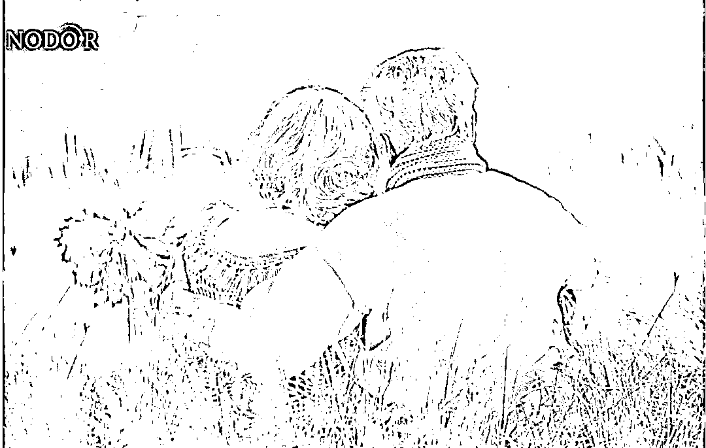

**风象星座****太阳双子座的爱情**通常来说，我们了解了一个星座的终极目标，就能照此方式来推测出在感情关系中的互动的情况。从进化的角度来看，**太阳双子座的人寻求奇妙的体验。**他们**被好奇心驱使，需要很多的刺激。**墨守陈规和可预见性会给这个太阳能量带来致命的破坏力。 想要持续抓住双子座恋人的关注，伴侣**不止需要建立稳固、安定的中产阶级的生活特征。**这些特征只是一部分，伴侣最好能够**带来更多的有趣的思想火花、惊喜，有广泛的兴趣**。流行的占星学观点认为**双子座是浮躁无常的**。当然这也是一种可能。

但是我们也要认识到，**这种浮躁多变其实是对于体验的贪婪欲望**。满足这种欲望，要**注意保持交流，性的或其他各种各样让人着迷的方式。**不要被这种言论误导了，双子座人也可以拥有一夫一妻的爱情关系，只是有两个前提：**第一，伴侣要支持双子座人拥有活跃的朋友交往。第二，伴侣与双子座人要一起分享生命的惊喜，不要停下学习的脚步，享受多姿多彩的生活。**对于双子座来说，理想的婚姻就像是蜿蜒曲折的一次漫步，**在漫步中不断地交谈，有乐趣，有深意，并且永不停止。****太阳天秤座的爱情**传统占星学认为，**天秤座是与婚姻有关的。**以符号元素来看，的确如此。天秤座，让我们看到了平衡的原则。两个人走到一起，和谐相处，相互理解、坦诚相待，带来两种观念的碰撞。通常，对健康的灵魂关系来说，这是有益的象征。

每一个星座都会在某些方面“与爱情相关”，但没有一个太阳星座是这样一个亲密关系的试验场，体验根本的进化。为了获得鲜活的满足感，太阳天秤座的人**需要在人际互动中经历挑战、妥协和诱惑。**这些体验有助于个人的成长，最终成为人的精神支柱。

因为移情作用的提升，太阳天秤座的人需要记住，**保持一定的自我重心，不要成为他人的卫星。****太阳水瓶座的爱情**

如果这个世界水瓶座人成了主流，我们也许还是会结婚，但**婚姻的形式会有很大不同。**首先，**很多夫妻会选择分居在城市的两端，或者三四成群，或者是忘年恋，跨种族伴侣。**  各种各样的配对变得稀松平常，这也符合了心理学上认为的：**每个人都是不一样的。个体值得被尊重——这就是水瓶座人的核心。**  操控人类的性行为是一件很困难的事情，但是社会总是企图给我们预设好规则。混乱的男女关系被阻止，或者是被小心翼翼地引导为一种仪式。一般来说各国倡导一夫一妻制，但是不支持这一制度的地区会有“安全”的解决方式。  女性被鼓励呈小鸟依人状（巢居家中）。男性被鼓励去发展一种不理性的、强制的赚钱行为。这些都是社会规范人的性行为的方式。虽然我们批判这些方式，但是我们也会注意到，这反映了人类在对待这种棘手的议题时所积累的智慧。  诚然，这种智慧有缺陷，但到目前为止，这是我们找到的最好的。承诺之爱很难，但对我们大部分人来说，接受这种形式还是有某种程度的帮助，起码可以帮助我们保持平衡。但  这对水瓶座人没用。对于水瓶座来说，**所有事情都被质疑。把脚本扔掉，把规矩抛诸脑后，随心所欲。“让我们结婚吧，但是不要住在一起！”**

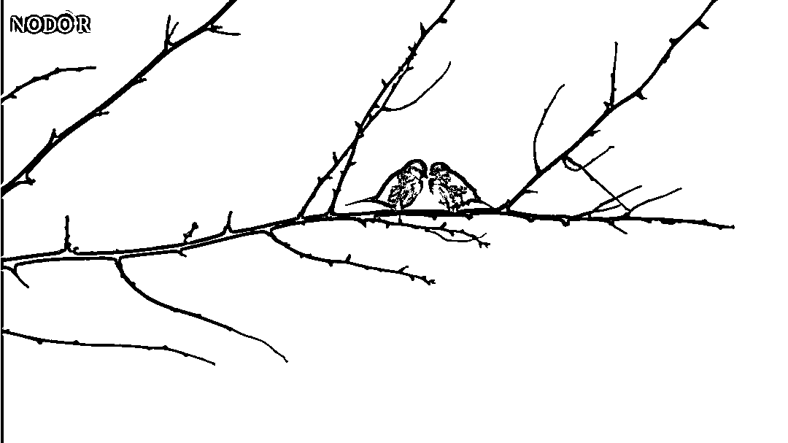

**水象星座****太阳巨蟹座的爱情****“防御”是太阳巨蟹座的关键词。**大西洋海岸上乱窜的幽灵蟹 ，它们是在防御状态么？抑或者它们是在耍策略，在海鸥的注目下脱壳。敏感需要自卫。变通的选择有破坏性。

在爱情中，巨蟹座看起来有点**防御警惕**，这是因为她下的赌注很大：她的城墙很牢固，但是一旦有人进入到壳内，她就彻底脆弱了。所以**巨蟹座是谨慎的，用自己的情感触碰另一个灵魂，用危险试探对方。** 
想要打动巨蟹座，你必须拿出你的**温柔、真诚、亲切和承诺**让巨蟹座信服，你要让巨蟹座知道，你愿意与她共筑爱巢。在巨蟹座被打动之前，你只会看到她的壳，可能是冰山，可能是超然的智慧、头脑，也可能是性爱，但绝不是巨蟹座的灵魂。**太阳天蝎座的爱情**

流行的占星学观点认为天蝎座非常性感。我们做了一个小小的调查发现，其他 11 个星座也很关心性啊！性，不是任何一个星座垄断的领域。占星基础理论认为天蝎座倾泻感情的方式很强烈，但是"天蝎座很性感"的说法扭曲了这一理论。

**每一个太阳落在天蝎座的人，为了保证基本活力和健康的精神，他们都需要定期宣泄情感。**事实上，我们的文化趋向于将"深刻激烈"的情感与性联系在一起，这也许是因为性离不开这种情感。

但对于很多人来说，性是一种基本"娱乐"，并不涉及复杂深刻的精神需要，但这些人就不是健康的天蝎座人了！

**太阳双鱼座的爱情****除非是走上了自我麻木的黑暗之路，否则太阳双鱼座的人会非常温柔和敏感。**没有任何一个星座的浪漫，能如此真切地触动灵魂。因此，对于双鱼座来说，爱情唯一的粘合剂就是**灵性的基础**。  和大多数陈词滥调一样，我们将“灵性关系”随便挂在嘴边，却缺乏真正的思考。两个双鱼座的长老会成员一起坐在教堂里，他们会有许多共同的长老会的体验，但他们并不是“灵性关系”。为什么？简单地说，**他们的灵魂并没有发生关联。**  另一方面，两个无神论者静静地坐在篝火前，默默地进入冥想状态——“火焰之梦”，就像是斯瓦希里人一样。他们能够觉知对方的存在，他们能够分享这个想象的空间，无须解释交谈，不用担心彼此的意志被对方侵入。  两个灵魂在积极地触碰彼此。他们进入了意识的变化，但依然感受的到交流和接触：这就是双鱼座的天堂。一旦这样的情侣相遇，他们的结合必须**仰赖于这样高度灵性的接触**：静静地陪伴，黄昏时分，安静地散步，或是在海边树林，或是在教堂、庙宇，他们也会参加其他形式的冥想小组。  这些活动将这对伴侣以双鱼座的波段联接在一起，分享只有双鱼座才懂的爱情的感觉，愉快的舞蹈，宇宙的笑话。他们之间的关系就像有了魔法——一直相伴到共同笑着面对死亡的那一天。 

**版权声明：**本文由若道翻译发布，欢迎转发，反对抄袭。友号转载请申请白名单。

**END**

**斯蒂芬·弗里斯特**

若道签约老师。进化占星学的创始人之一，当今世界最有影响力的占星大师之一；1985 年，他凭借《内在的天空》一书获得职业占星师协会奖（Professional Astrologers Incorporated Award）。他四次获得占星界最高的占星学联合协会奖（United Astrology Congress Regulus Award）提名，2018 年获得轩辕十四教育奖。

****探索组合图永恒的三角——斯蒂芬工作坊报名中**** 

斯蒂芬说，我们的组合图表明无论什么状况我们都能熬过去。**组合图也像出生星图一样有行进。**在工作坊中， 我们将**探讨一些特殊的技法和考量，来帮助伴侣们应对生活中的挑战和机遇。**  组合图的推进会出现一些看似难以解决的复杂问题，斯蒂芬老师创造了一种解决这些问题的技法。他将在工作坊中阐述相关细节，基本的问题是：如你所知，要了解一个人 30 岁生日的推进，我们要看这个人出生后 30 天的行星位置。  问题是，组合图与我们在占星学实践中使用的其他星图不同，组合图并不代表某一天的天空。记住，它是基于中点的。**那么我们如何从一个不存在的日期开始 "向下数 30 天"呢？斯蒂芬老师将为我们提供一个行之有效的答案。****点击下图了解更多详情******想更多的了解你的爱情？****欢迎获取下面 2 份报告哦~** 

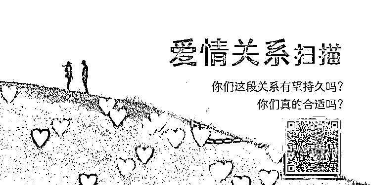

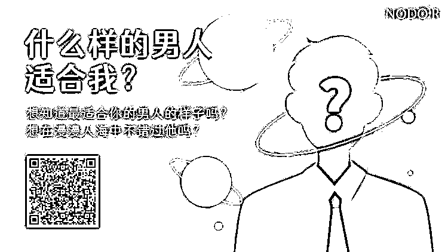

**20 位来自世界各地的占星师****带来 19 场沙龙——新世界的觉醒****详情可点击下图**

**学习占星学****点击下图了解课程详情**

**微信又双叒叕改版啦，不想错过若道君的推送？**
**就把若道设为星标吧！****▼**

**喜欢就点一下“在看”吧！**

********报名直达入口********

# 心理占星丨“天上的行星会说话”，十大行星都要给你传达什么宇宙指令？

> 原文：[`mp.weixin.qq.com/s?__biz=MzA5NjA0NTAxNg==&mid=2651489261&idx=1&sn=24419595c0847874e457f87afbc5aaf4&chksm=8b48315abc3fb84c1e318a3fc5a7052963785d5de0e4abeb237db4bb8f283548f393fcc7febe&scene=126&sessionid=1692737751#rd`](http://mp.weixin.qq.com/s?__biz=MzA5NjA0NTAxNg==&mid=2651489261&idx=1&sn=24419595c0847874e457f87afbc5aaf4&chksm=8b48315abc3fb84c1e318a3fc5a7052963785d5de0e4abeb237db4bb8f283548f393fcc7febe&scene=126&sessionid=1692737751#rd)

******************************☆ **************后台****************************回复“今日”，给你一句生命态度****************

作者/格伦·佩里

翻译/江艺 校对/Christy

编辑/翀子 封面/书君 图片/稿定设计

你知道心理占星学的核心是什么吗？为什么行星和星座的关系是我们理解感受的关键？如果行星会说话，那么每个行星都有一个独特的命令，12 星座又会收到怎样的指令呢？格伦老师带大家一起来探索行星情绪对占星学人格理论的意义。另外，格伦老师教授的 ISAR 选修课【占星原型与星图中的精神病理学】正在报名中，详情请见今日三条~

**心理占星学的核心是什么？**

**心理占星学的核心是这个简单的观点：需求激励。**

但是一种心理模型要解释动机，就必须处理人类的情绪（emotion）和感受。一旦感觉到某种需求开始主导意识，这个人就被驱使去做出满足这种需求的行为。人们表现出愤怒、恐惧、好奇、爱、兴奋、骄傲、羞耻、审美享受等等。

*   **行星和星座的关系是我们理解感受的关键**。行星是个性的演员，每个行星代表一种特定类型的行为，旨在满足特殊的需求。 

*   我们如何知道哪个行星和哪种行为适合一种既定情况呢？是什么告诉我们何时行动，以怎样的强烈程度来行动呢？**答案是黄道星座**。 

*   每个黄道星座都可以与一组相互关联的**心理需求和相关感受**联系起来。 

*   当需求被事件触发时，需求就会通过感受传达给适当的行星功能，告诉它要做什么，何时做，应该做多少。 

*   简而言之，**感受为划分需求的轻重缓急提供了一种手段**。 

**一个简单的例子**

双子座与学习的需求关联。如果一个人对某个特定话题感兴趣，他们的好奇心就激活了水星的探究功能。学习是双子座的需求，好奇是感受，探究是水星的行动。

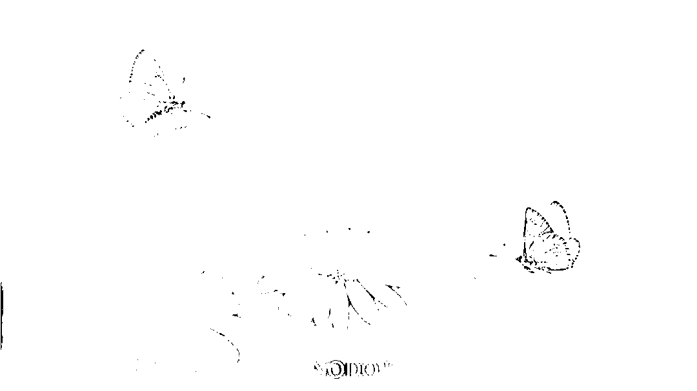

**如何区分情绪与感受？**

**在进一步讨论之前，我们有必要先区分一下情绪和感受。**

**情绪**

*   情绪可以理解为**对一个对象或事件含义做出的复杂生理反应**。
*   情绪是由一系列核心反应构成，这些反应可能源自宇宙的基本组织原则（遍布自然界各个层面的原型），并且构建起了我们的主观经验。
*   例如，动物甚至植物对事件的情绪反应与人类情绪没有明显差别，这是已经被确立的事实。
*   **从白羊座到双鱼座，每一个星座都可以与一组相关的情绪关联。**从每个星座中举一个情绪的例子，我们会看到：愤怒、冷静、好奇心、关怀、快乐、担心、吸引力、恐惧、希望、决心、超然和同情。 

**感受**

*   感受是比情绪**更普遍、更深一层的术语**，因为其涉及到**对情绪（和感官）体验的评价反应**。

*   你可能觉得鱼很滑，并进一步将它的粘性评价为奇怪的、好的或坏的，这些都可以被称为“**感受**”，但都不是情绪。

*   相反，一个人可能看到一条梭鱼向他游来，感到恐惧。这种情绪是恐惧，恐惧的感觉驱使他躲避梭鱼。

*   虽然一种被直接感受到的情绪几乎与感觉毫无差别，但它先于感觉，就好像热先于被烧的感觉。

*   公平地说，**所有感觉到的情绪都是感受，但并非所有的感受都是情绪。**

*   **一种情绪可能会被感觉到，也可能不会**。

*   如果一个人充分意识到自己陷入了恐惧，我们可以说他感到害怕。

*   但是如果他抵御自己的恐惧，就可能完全感觉不到。

*   然而，恐惧仍然存在，在无意识层面上影响着他的行为。

*   无论他是否感受到，恐惧的情绪都存在。

**为了简单起见，我在下文中所使用的“情绪”和“感觉”二词可以互换。**

**情绪是如何产生的？**

情绪反应的确切性质是一个复杂的现象，在过去的 100 年里催生了大量的研究,包括用整本书来探讨这一主题。

我自己的观点是，**情绪是星座——行星动机体系的原型声音**。因此，**它们的作用就是需求满足的指标。**

*   从古希腊到 18 世纪中叶，我们现在所称的情绪通常被称为激情（passion）。

*   激情源自拉丁语 pati，进而与希腊语 pathos 关联，意思是痛苦。

*   另外，被动和耐心也与激情关联。

*   **情绪的体验是被动的，它们超出了个人的控制**，就像一个病人“屈服于”疾病。

*   情绪一词来源于拉丁语 e + movere，最初指的是从一个地方迁移或转移到另一个地方。

*   它也被用于指身体或心理上兴奋或不安的状态。

*   因此，**情绪常常强调了我们激烈或动荡的反应，以及这些反应引发或激活行为的倾向。**

**情绪的体验是被动的**

这些概念的根本观点是：**体验到情绪的人正在经历或遭受一些改变，而不是主动发起改变**。换句话说，**情绪体验是被动的而不是主动的**。

在口语中，被动的情绪体验可以在许多表达中看到。我们“陷入”爱情，被恐惧“麻痹”，受怀疑“折磨”，被内疚“缠绕”，被猜忌“撕裂”，被欢乐“带走”，被嫉妒“吞噬”，被悔恨“攻占”等等。 

在原型心理学中，一个人说“恶魔附身”，意味着被一个分裂的部分篡夺了整个人格。这种表达方式意味着情绪是发生在我们身上的东西，而不是我们做的事情。就好像情绪是外来的力量，“压制”和“占有”了一个人。

**即便抽离的水瓶座也是有情绪的**

占星课本倾向于把月亮与感觉关联。这过于简单化且有误导性，因为每个星座——行星系统都有对应于自身的感受范围。

甚至像水瓶座这样的风象星座也具有某种情绪特征——疏离、疏远、遥远、宽容、冷静、冰冷、冷漠。这样的感受与天王星功能（客观视野和整体视角）关联。

这足以说明，**每个行星的行动都有自己的情绪暗流，包括我们通常认为是无感受的行为**。作为一种心理功能，**月亮只是我们控制和反思由每个星座——行星系统传达的需求/感受的能力**。 

**情绪是先于符号的**，因为它是一种不依赖于我们所谓的语言符号系统的认知方式，它是一个动机的经验表征，因为它传达了我们在任何特定时刻的存在状态，以及我们需要什么。 

简而言之，**情绪就类似于一种心理——生理状态**。正如大脑中的感觉器官通过饥饿、口渴和体温等感觉监测着身体的状态和需求。同样，情绪也为心理的运作情况提供着连续不断的信息输出。

**举个例子**

如果一个人的自由（白羊座）受到威胁，他就会感到愤怒；如果他对学习的渴望（双子座）被激发，他就会感到好奇；如果他对自尊的需求（狮子座）得到满足，他就会感到自豪。

**占星学与情绪有什么关联？**

我们可以从占星学层面对此进行思考，**将每个星座——行星动机体系与一种特殊的情绪范围关联**。

**第一个例子**

我们来思考狮子座——太阳系统。 

我们知道，一个星座的需求可以从那个星座的行为特征上推断出。所有的狮子座特征都可以从狮子座对证实、自尊和认可的需求背景下来理解。

如果这些需要得到满足,个人就达到了狮子座——太阳的目标状态，即骄傲和自信。 

然而在追求这种状态时，他可能在短时间内就经历了狮子座的全部情绪，从正面到负面：自信、快乐、蓬勃向上、好玩、有价值、任性、固执、防御性强、待人轻蔑、无价值、自我怀疑、缺乏信心、感到丢脸或羞耻。

这些感觉让他知道，自己离骄傲/自信的太阳目标状态还有多少距离。

**行星彼此之间是存在关联的，这可能引起多种情绪的混合，这些情绪的优先程度取决于哪种需求/感觉是最强烈、最直接的。**

**第二个例子**

一个年轻男子有火星四分月亮的相位，他同时渴望自由（白羊座）和亲密（巨蟹座）。当一个动机系统与另一个竞争时，个体通过竞争情绪的强烈程度迅速整合出信息的重要程度，并作出决定。

如果我们的这位年轻男子最近花了大量的时间独自追求个人兴趣，那么很可能他的巨蟹座——月亮动机系统将带着更大的情绪强度进入意识，从而激发他去寻求亲密关系。

然而，如果他刚和女朋友在家享受了亲密的周末时光，他的白羊座——火星动机系统很可能成为主导，他会感觉到一种想要分开的冲动。

**情绪驱动我们的行动**

*   情绪和动机之间的关联可以由这两个词的语源历史来说明。

*   这两个单词都源自拉丁语 movere 及其过去分词 motivere。

*   实际上，**情绪是主观体验，“驱动”我们去行动。**

*   心理学家亚伯拉罕·马斯洛将需求称为“**冲动之声**”。

*   **如果个体将这些原型声音充分调和，他就能“听到”自己的需求**。

*   在第二个例子中，如果要这位年轻男子解释他突然与女朋友分开的原因，他可能会说：“有个声音要我离开，我不得不走。”

*   进一步探究后我们可能会发现，他感到不安。

*   通常，当一个人与伴侣有了过长时间的亲密，就会感到厌烦，常常会引起争吵。

*   回想一下，你会发现，无论是厌烦的感觉还是随之而来的争吵，都是为了达到内心的需求——分离。

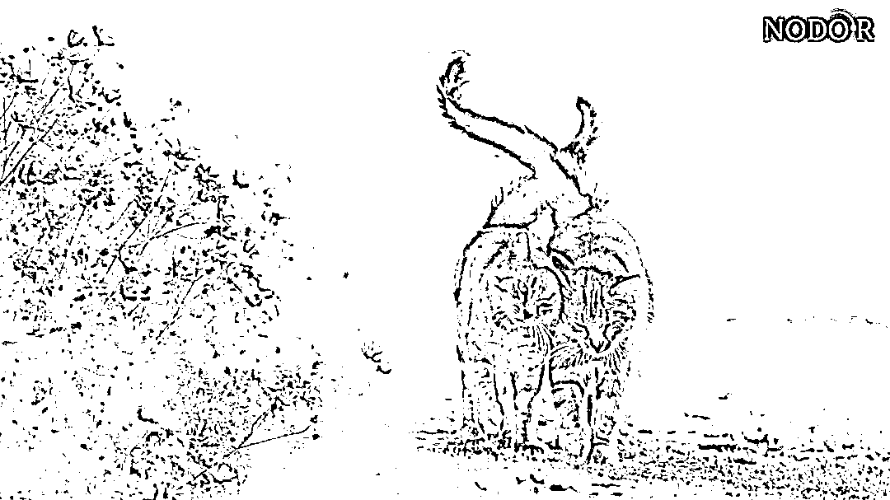

**学习倾听行星的情绪声音**

这再次说明，**情绪是行为的主要推动者**。利希滕贝格写道：“典型情况下，情绪为识别瞬息万变的主导动机提供了根本手段。”换句话说，情绪提供的信号暗示了哪种动机系统正在运作。

**如果行星会说话，那么每个行星都有一个独特的命令，每个行星都有其独特的内在声音。**

**听听行星对我们发出的指令**

**白羊座——火星**

“想做就做！去做吧！这是你的权利。”

**金牛座——金星**

“如果感觉好,享受它吧。让自己快乐，放松。”

**双子座——水星**

“这很有趣，给它下个定义分个类。发挥你的思维。”

**巨蟹座——月亮**

“倾听，转内向在，你现在感觉怎么样?”

**狮子座——太阳**

“宝贝，闪现你的光芒。表达自己!”

**处女座——水星**

“小心，这里有一个问题。解决它。”

**天秤座——金星**

“展现魅力，建立关系。思考、妥协、合作。”

**天蝎座——冥王星**

“面对你的恐惧，将它推向极限。决一死战，全心投入。”

**射手座——木星**

“保持信心，宝贝。上帝是好的，做对的事就好。”

**摩羯座——土星**

“全力以赴，专心致志。集中精神，控制自己。”

**水瓶座——天王星**

“期待意料之外的事，保持开放和超然的态度”。

**双鱼座——海王星**

“放手，顺其自然。臣服，相信宇宙。”

上面的示例展现了我们如何以一种自我对话的形式来体验行星。这些都是**我们内心的声音、原型的命令，它们通过转化为符号语言的特定情绪信号，告诉我们应该做什么**。

*   我们可能感到愤怒（火星），然后对自己说：“我必须战斗，他不能那样对我！“

*   如果我们感到吸引力（金星），我们可能会想：“太好了，让他们知道你很有趣。”

*   每个行星状态都有自己的议题和行为命令。 

与心理——生理状态类似，情绪的体验是通过一系列强度来实现的。这个强度的梯度变化可以用连续区域中一对代表相反极端情绪的词语来描述。

*   在我们的占星模型中，**每个行星都有不同的情绪范围**。

*   火星是快乐——愤怒；太阳是骄傲——羞耻；海王星是极乐——悲痛等等。

*   体验强度的变化是复杂感官系统的类似表征，让我们能够做出定量的区分，比如这个人有多愤怒（火星），多坚定（土星），或多么自豪（太阳）。

*   情绪的强度变化为需求优先顺序的排列提供了手段：最深刻、最强烈的情绪让我们全神贯注，因此激活了相应星座——行星系统的行为序列。

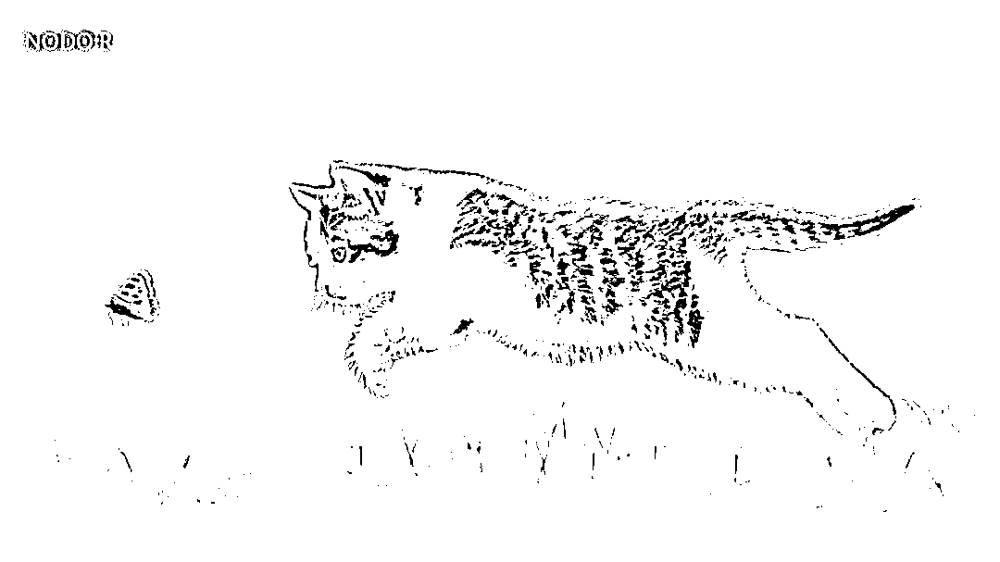

**有冲突相位，该怎么办？**

行星情绪在一系列连续的情绪状态上也有质的区别。这个质的范围说明了星座——行星动机体系的不同整合程度。

**一个整合良好、功能齐全的行星往往被体验为积极的情绪，而压抑、虚弱的行星功能通常会被体验为负面的情绪。**

*   如果一个人的摩羯座——土星动机**存在困难**，他更有可能体验到土星情绪序列中**负面的一端——绝望、悲观、自卑**。

*   然而，如果他克服了这一趋势，致力于**强化土星功能**，那么他更有可能体验到**积极的状态——一种控制的感觉、成功和优越的地位**。 

正如第二个例子中所展示的，**行星之间的困难相位可能导致一个人体验到相互矛盾的情绪和声音**。在这种情况下，两颗行星同时被激活，每个行星都有自己的情绪、动机命令和行为冲动。

行星冲动朝着不同的方向发挥作用，这就是“**内心冲突**”的含义。

**出生星图象征着全部的内心和情绪冲突，困难相位往往意味着动机能量的阻滞和强化，导致行星功能在发挥时过度或不及。**

**第三个例子**

如果一个人有太阳四分土星的相位，太阳的功能可能暂时被土星偏爱工作超过玩乐的命令阻碍。

当情绪发出信号：是时候寻求快乐、与朋友交往了，这个信号被忽略了，因此狮子座的需求在内心中堆积。

当这些需求最终被释放的时候，这个人可能会过分努力去获得认可和确认，好像必须要弥补内心自卑的感觉。

这一相位也可能朝着另一个方向发展：更喜欢玩乐而非工作。情绪发出信号：该认真起来，创造效益了，但这个信号却被忽略（拖延）。

未满足的摩羯座需求在内心中堆积，当最终被释放时，这个人可能通过加班加点来弥补失败和不足的感觉。

有时，外部环境会同时反映出内在的冲突。当太阳——土星四分相的这个人拒绝土星的冲动时，这种冲突可能外化为一个专横的老板，有不切实际的要求。当然，也可能出现太阳四分土星的整合形态。

**版权声明：**本文由若道翻译发布，欢迎转发，反对抄袭。友号转载请申请白名单。

**END**

**格伦·佩里**

著名占星师，ISAR 董事会成员，共出版八本占星著作；心理/意识研究专业博士；占星心理学学院（Academy of AstroPsychology）的创办人；康涅狄格州研究生院（the Graduate Institute of Connecticut）原型宇宙学与意识进化项目的负责人。

# **占星原型与星图中的精神病理学**

为什么在占星学的课程中，会出现精神病理学的教学内容，这和我们有什么关系？这对占星咨询，或在自我了解与成长的过程中又有什么帮助呢？

**带着这些疑问，请你静下心来，思考以下几个问题**：

“**你/你的案主，是否曾经过度担心什么？** **你/你的案主，有没有感觉到担忧和焦虑，却不知道原因是什么？****你/你的案主，是否曾经觉得害怕什么东西，但理智上却很清楚它不会对你造成什么伤害？****你/你的案主，是否曾经通过沉迷某物，酗酒或滥用药物，自我伤害去逃避问题？****……****——节选改编自《心理学与生活》**”

如果你对上述问题其中之一，回答是。这意味着几乎每个人都曾有过心理障碍的症状（精神病理的问题）。

你看，其实“精神病理学”与人的心理有着密切的关联，再结合占星学，呈现了人内在与外在层面更加丰富和深刻的一面。**这对于学习占星学的人和占星师来说，都是一场难得的知识盛宴！**

**本课为 2 年期双证核心课程中的一部分**（AP105 阶段），其内容是过去若道所开设的核心课程从未教授的部分，特意抽出供其他学员学习，**可作为 ISAR 选修课，单独报名**。

**长按下方二维码咨询客服了解** 

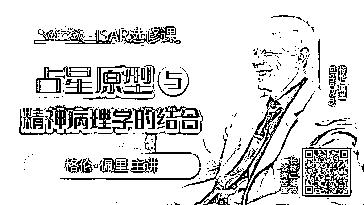

**20 位来自世界各地的占星师****带来 19 场沙龙——新世界的觉醒****详情可点击下图**

**学习占星学****点击下图了解课程详情**

**

**微信又双叒叕改版啦，不想错过若道君的推送？**
**就把若道设为星标吧！****▼**

**喜欢就点一下“在看”吧！**

********报名直达入口********

# 核心占星课新鲜速递：12 个星座为什么分成 6 对？

> 原文：[`mp.weixin.qq.com/s?__biz=MzA5NjA0NTAxNg==&mid=2651489261&idx=2&sn=05bcd9cb06095f5af9edd2e6e0ff192c&chksm=8b48315abc3fb84cddf08bec185d017d3f9691a1b466c782a03f13054ffee35cfef67061808c&scene=126&sessionid=1692737751#rd`](http://mp.weixin.qq.com/s?__biz=MzA5NjA0NTAxNg==&mid=2651489261&idx=2&sn=05bcd9cb06095f5af9edd2e6e0ff192c&chksm=8b48315abc3fb84cddf08bec185d017d3f9691a1b466c782a03f13054ffee35cfef67061808c&scene=126&sessionid=1692737751#rd)

新的一期若道核心课，星座的部分告一段落啦。

在第三堂课中，咔咔老师带着新同学们在回顾 12 个星座的同时，用新的视角来审视星座内容。**星座除了四元素和三模式之外，为什么还能分为 6 对呢？**

**每一对星座具体有什么特征呢？近期塌房的李易峰和之前的吴亦凡是哪一对星座呢？**

**到底射手座代表宗教，还是双鱼座代表宗教呢？**

**关于这些，咔咔老师是这样讲述的：**

<mpvideosnap class="js_uneditable custom_select_card channels_iframe videosnap_video_iframe" data-pluginname="videosnap" data-id="export/UzFfAgtgekIEAQAAAAAAJ2s3ZrIUGwAAAAstQy6ubaLX4KHWvLEZgBPEg4EIc1MEXbWCzNPgMIs6reI__lcYTuioG8SQasL9" data-url="https://findermp.video.qq.com/251/20304/stodownload?encfilekey=rjD5jyTuFrIpZ2ibE8T7YmwgiahniaXswqzcvjagGvrC9mV5Efl3MSeK09zfZE2yKWl0OtUibcMaazuIicia5wVib0xz2GUuhboU9yNwDL8dEElUKDGib36clibPEyA&amp;adaptivelytrans=0&amp;bizid=1023&amp;dotrans=0&amp;hy=SH&amp;idx=1&amp;m=&amp;scene=0&amp;token=AxricY7RBHdX8w74l6LfgkHSORiahiadm4lEQblHZcCLddYLnOK7FH7ASnQz1RO8iaE0wWic0dxibvLvw" data-headimgurl="http://wx.qlogo.cn/finderhead/PiajxSqBRaEJYnVsqWfEX9qA0sI6hNVKsDfyzfPZ92WZMZyBpZWU5NA/0" data-username="v2_060000231003b20faec8c4e68a1ec2d4ca07e434b07755bbf47e7053a3059defd2c9d6c68a20@finder" data-nickname="若道" data-desc="#若道核心课  12 星座为什么还能分为 6 对呢？每一对星座具体有什么特征呢？
" data-nonceid="15135074788745731599" data-type="video" data-width="1280" data-height="720"></mpvideosnap>

*   **十二个星座为什么以白羊座为起始呢？**
*   **由白羊座起始的各个星座，彼此之间有什么关联和递进关系呢？**
*   **除了四元素、三模式、六对之外，十二星座竟然还可以分为个人星座和集体星座！这是为什么呢？**

**关于这些，咔咔老师是这样讲述的：**

<mpvideosnap class="js_uneditable custom_select_card channels_iframe videosnap_video_iframe" data-pluginname="videosnap" data-id="export/UzFfAgtgekIEAQAAAAAAeiYEuKrzugAAAAstQy6ubaLX4KHWvLEZgBPEn4EIakZvUrWCzNPgMIvBYo0C0D0a9yrMahwcz9kP" data-url="https://findermp.video.qq.com/251/20304/stodownload?encfilekey=rjD5jyTuFrIpZ2ibE8T7YmwgiahniaXswqzPy42YWNJtk0Nib3MEVI9ic7eRZcpGFfHMdqG1Il7zWlqqTeHzOeYawbHOEtzW1JZCDBKfLtibIaRlBAuXEHrR7FLA&amp;adaptivelytrans=0&amp;bizid=1023&amp;dotrans=0&amp;hy=SH&amp;idx=1&amp;m=&amp;scene=0&amp;token=AxricY7RBHdX8w74l6LfgkOULDS6T48sD6fWkXsBkqNnpNIAfUlMxhN7v3QJ4MhKRaqNUQEpURto" data-headimgurl="http://wx.qlogo.cn/finderhead/PiajxSqBRaEJYnVsqWfEX9qA0sI6hNVKsDfyzfPZ92WZMZyBpZWU5NA/0" data-username="v2_060000231003b20faec8c4e68a1ec2d4ca07e434b07755bbf47e7053a3059defd2c9d6c68a20@finder" data-nickname="若道" data-desc="#若道核心课 12 星座为什么以白羊座为起始呢？12 星座彼此之间有什么关联和递进关系呢？
" data-nonceid="7424365749802019997" data-type="video" data-width="1280" data-height="720"></mpvideosnap>**拥有****51 年****占星实践经验的****若道创始人****前 ISAR 全球副主席****前 ISAR 全球职业占星师资质认证主席****大卫·瑞雷**

**和**

**2019 年第二届、2021 年第三届核心课中**

**与苏·汤普金斯老师****联合授课****的**

**ISAR 认证职业占星师**

**咔咔（Caroline）**

**二人合力打造**

**2022 年 ****若道全新核心占星课程**

**点击下图了解课程信息****

****报名直达入口****

# ISAR 选修丨占星原型与星图中的精神病理学

> 原文：[`mp.weixin.qq.com/s?__biz=MzA5NjA0NTAxNg==&mid=2651489261&idx=3&sn=7f330b85d45c81108254be44dcd85f55&chksm=8b48315abc3fb84ceef17e50ce7abf92a3c9fa0f2f973638e66c99c9184119c376fe761bd3ad&scene=126&sessionid=1692737751#rd`](http://mp.weixin.qq.com/s?__biz=MzA5NjA0NTAxNg==&mid=2651489261&idx=3&sn=7f330b85d45c81108254be44dcd85f55&chksm=8b48315abc3fb84ceef17e50ce7abf92a3c9fa0f2f973638e66c99c9184119c376fe761bd3ad&scene=126&sessionid=1692737751#rd)

**课程描述**

看过课程标题的你，也许会感到好奇和惊讶，为什么在占星学的课程中，会出现精神病理学的教学内容，这和我们有什么关系？这对占星咨询，或在自我了解与成长的过程中又有什么帮助呢？

**带着这些疑问，请你静下心来，思考以下几个问题**：

“**你/你的案主，是否曾经过度担心什么？** **你/你的案主，有没有感觉到担忧和焦虑，却不知道原因是什么？****你/你的案主，是否曾经觉得害怕什么东西，但理智上却很清楚它不会对你造成什么伤害？****你/你的案主，是否曾经通过沉迷某物，酗酒或滥用药物，自我伤害去逃避问题？****……****——节选改编自《心理学与生活》**”

如果你对上述问题其中之一，回答是。这意味着几乎每个人都曾有过心理障碍的症状（精神病理的问题）。

你看，其实“精神病理学”与人的心理有着密切的关联，再结合占星学，呈现了人内在与外在层面更加丰富和深刻的一面。**这对于学习占星学的人和占星师来说，都是一场难得的知识盛宴！**

**本课为 2 年期双证核心课程中的一部分**（AP105 阶段），其内容是过去若道所开设的核心课程从未教授的部分，特意抽出供其他学员学习，**可作为 ISAR 选修课，单独报名**。

**在正式了解本课的价值之前，先了解一下这门课程的主讲老师吧！**

**格伦·佩里（Glenn Perry）**

*   他是心理/意识研究专业博士、加州注册婚姻和家庭治疗师 （CAMFT）

*   占星心理学学院（Academy of AstroPsychology）创办人

*   康涅狄格州研究生院（the Graduate Institute of Connecticut）原型宇宙学与意识进化项目的负责人

*   共出版八本占星学著作：《心理占星学入门》、《心理占星论文集》、《盗取天火》、《从忠诚到革命》、《星图中的阴影》、《占星职业议题与伦理》、《出生星图深度分析》、《从古代到后现代占星学》

**墙裂推荐格伦老师这门课的 **

**4 大理由**

**你一定得知道的课程价值**

**价值*****1***
**明晰精神病理学的基本定义**

占星心理学学院创办人格伦·佩里老师，对**精神病理学的基本定义**就是灵魂受苦，精神就是灵魂的意思，病理就是受苦的意思，所以精神病理学研究的就是：人类各种各样受苦的方式，尤其是因为某一类的行为而引起的。

精神病理学是一个连续体，从比较轻微的，到比较严重的，这么说来，我们每个人都有一部分精神病理的问题。

**如果成为一个“人”，没有一定程度的挑战是不可能的。没有一定程度受苦，没有一定程度不平衡是不可能的。而这种不平衡就会以一种挑战和困难的姿态呈现出来。**

**价值*****2*****更懂疗愈：从不平衡到平衡**

**疗愈**是一个复杂的过程，讲的是将人从不平衡带到平衡这样的一个状态，将不同行星代表的心理功能带到一种更加平衡整合和合作的状态。

格伦老师通过研究精神病理学，发现每一颗行星，以及这颗行星所守护的星座，都和某一特定类型的病理是联结在一起的，包含了这个占星原型所涵盖的极端不平衡的情况。

举个例子，案主的第 1 宫，有很多星星在那里，和对面第 7 宫的火星形成对分相，第 1 宫白羊座或者火星白羊座的组合，和这个案主的反社会人格的病状联系在一起（这是一个星图的极端负面表现）。

“

**生活本身就是一场治疗，我们在占星的星图中去看到，人们所具有的创伤、不平衡及其产生的防御机制，最终都会在他生活中的关系和情境中呈现出来。无论他生活中处在怎样的情境之下，其实这些环境都是在为他提供恰当的环境，作为一种载体，让他去平衡和疗愈事件背后问题的根源。** 

**这样一个现象是持续不断地在发展，会让我们想到，会有一个更大的宇宙的智慧存在，它其实是在指挥和引导着我们的这些经验，让我们去经历然后进入更高层面的发展当中。生活或者“神”，就是我们所有人类的一个治疗师。**

**——格伦·佩里**

”**价值*****3*****了解诊断标准，提高咨询的专业敏感度**

如果能够对精神病理极端不平衡的情况有了解的话，你就会对它比较温和的版本更加敏感（大部分人是更温和版本的呈现）。

也许案主并没有达到某个病理所达到的层级，但是 Ta 有显示出，这个病理某一些特点或者某一些倾向。所以，我们的目标并不是去诊断案主，而是了解他在这个病理学连续体上处在一个怎样的位置。

当你拿到星图你会看到，案主不同的冲突，是体现在不同的部分上。某一个病状是体现在某一个行星，另外一个病状，是同步体现在另外一颗行星上。

当我们通过对占星原型星座和行星的病理学现象的学习后，就能看到占星学上的配置所呈现出来的，案主表现出的这些失调，并不一定都会成为一种心理临床上的诊断。有可能在案主这里呈现出一个很轻微，但是仍然在 Ta 生活中，给 Ta 造成挑战的一个点。

**价值*****4*****智力上的刺激——整合进阶**

这个课程能够让我们了解自己，了解我们的客户，了解我们的朋友，了解我们的家庭。它给我们提供一种崭新的方式，并且让我们看到占星原型的种种表达，不要局限在非此即彼、非好既坏的这样的一个概念当中，而看到它其实是一个不同程度的连续体。

当我们能够以这种方式去看的时候，你就能够将自己的生活，带入一种和谐。能够了解这是一个过程，我们的重点不是放在诊断上，而是放在整合上，因为生活，就是一种整合。

**课程内容**

**AP105 星图中的精神病理学与疗愈** 共**15 次**课程：**10 次 2019 年录播课+5 次直播课；30 课时**

在这个阶段的课程中,我们将**聚焦于十二星座(从白羊座到双鱼座）及其对应的守护星的潜在功能障碍。**

我们将学习如何识别、理解和应对每个星座的潜在挑战。我们将在各种相应的心理障碍背景下来考察占星原型，这些心理障碍表现为功能障碍、失衡的极端状态。

学员们将了解**《精神疾病诊断与统计手册》诊断标准**。我们会探讨治疗的概念，尤其是那些与整合和个性化相关的概念。我们将特别关注外行星的困难相位，以及它们与内在心理冲突、防御和症状形成的关系。

学员们将探索人的痛苦如何成为发展和实现天赋才能的催化剂。在考察病因时，我们会将平常的因果关系理论与传统的命运、业力和转世观念整合起来。

**口碑推荐**

**课程费用**

**课程价格：9000 元****课程优惠价请添加 Margartet 咨询**

课程负责人：Margaret

（微信：18515059056）

请备注“心理占星 105”

**开课时间**

**直播课开课时间：2022 年 12 月 21 日**

**退转课程**本课程包含往期视频知识点视频课程+直播案例课程+助教直播答疑；报名付款后均不受理退款转课，请慎重考虑后再确认付款。**其他相关事项请仔细查阅报名勾选时的《教学协议》，如有疑问请咨询课程顾问。****报名流程及费用支付****1. 点击阅读原文链接立即报名，填写个人姓名（身份证姓名）和相关信息，阅读并同意《教学协议》，提交报名表，直接在线支付。****2. 付款后可在网页个人中心或手机网页“我的”栏目查看报名记录。****如遇疑问请与销售人员联络******ISAR 选修·占星原型与星图中的精神病理学****

**授课老师：格伦·佩里**

**直播课开课时间：**2022 年 12 月 21 日

**授课方式：**网络课程，中英文授课，中文翻译

**费用：9000 元（获取优惠请联系客服咨询）**

**课程负责人：**Margaret（微信：18515059056 请备注“心理占星 105”）

长按二维码添加课程负责人咨询~

****报名请点击“阅读原文”****

# 12 星座想要做自己？先测试一下自己是什么东西组成的

> 原文：[`mp.weixin.qq.com/s?__biz=MzA5NjA0NTAxNg==&mid=2651489139&idx=1&sn=7dfcdd8b8b54ade5ab0fa20bdb1e5b61&chksm=8b4831c4bc3fb8d2cf5460ea5b236d90b2a725a2f620099b5d0535ff4fa25dbd5dbbb0ce4376&scene=126&sessionid=1692737751#rd`](http://mp.weixin.qq.com/s?__biz=MzA5NjA0NTAxNg==&mid=2651489139&idx=1&sn=7dfcdd8b8b54ade5ab0fa20bdb1e5b61&chksm=8b4831c4bc3fb8d2cf5460ea5b236d90b2a725a2f620099b5d0535ff4fa25dbd5dbbb0ce4376&scene=126&sessionid=1692737751#rd)

** 后台回复“今日”，给你一句生命态度 **

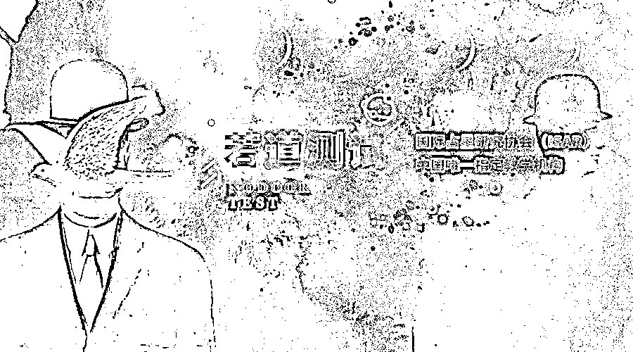

作者/大卫·瑞雷 若道创始人

编辑/玫瑰 制图/书君 图片/稿定设计

常有人问，“为什么我一点都不像自己的太阳星座？”为了更好地为大家答疑解惑，若道君决定再次把大卫老师的经典测试拿出来献给大家，看看你们是否都活出了自己的太阳星座？（文末还有大卫老师对 12 星座的建议哦～）另外，大卫老师参与授课的【[ISAR 认证职业占星师文凭课程](http://mp.weixin.qq.com/s?__biz=MjM5MjQwNjAyMQ==&mid=2649440257&idx=7&sn=66ce128cd4b3a4102485f897bede43d3&chksm=beb92f6b89cea67d220cfb45e455e14b3dae643aa022f9f7415f0a07138ddecabbdc765cde2a&scene=21#wechat_redirect)】报名中，点击链接了解更多详情！**人本主义占星学的是怎么来的？**在中国，每一个人都知道自己的黄道星座。2010 年我初来中国时就发现了这一点。但是大部分人并不了解在这股流行风潮背后是占星学的现代复兴。在进入 20 世纪之前，占星学在西方消失了近 200 年。**17 世纪的科学革命中涌现出了一批伟大的先驱者**，**诸如伽利略、笛卡尔、培根、开普勒**，但他们并没有为验证占星学留下科学模型。尽管天文学家、占星师开普勒为占星学辩解说，“不要把婴儿和洗澡水一起倒掉”，但学术界和新兴的科学界却是这么做的。只是后来，当伟大的心理学家卡尔·荣格说，**“占星学就是古代心理学知识的总和”**（1935 年）时，占星学在西方才走上了重新发现和自我改造之旅。事实上，**在西方，占星学的自我改造与心理学的发展是并驾齐驱的**。

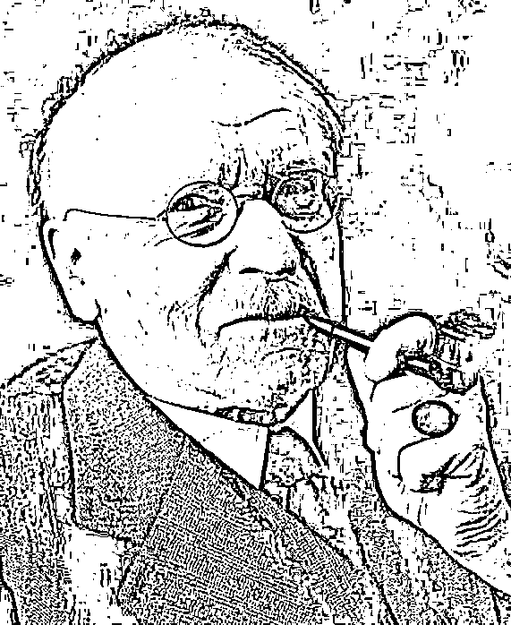

|卡尔·荣格

在这一并行发展之下，西方最重要的占星师之一，毕业于巴黎梭尔邦大学的**丹恩·鲁伊尔在 1969 年命名了一个全新的占星学分支：人本主义占星学**。正如他所描述的，“它（人本主义占星学）在 1969 年被挑出来表明一种主张，这种主张多少与‘人本主义心理学家’的主张呼应”。

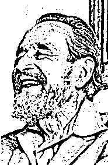

|丹恩·鲁伊尔

**人本主义心理学是一种现象级的发展**。“需求层次”的创始人、心理学家**亚伯拉罕·马斯洛**（1908-1970）**从关注“人有什么问题”的沉闷心理学中脱颖而出，决定去关注人们的正面特质**。**马斯洛的目标是实现我们每一个人身上所具有的潜能**。占星师丹恩·鲁伊尔和其他占星师认识到这正是占星学所关注的。当我 1970 年首次开始认真学习占星学时，正是这种占星学让我兴奋不已。

|亚伯拉罕·马斯洛

**你活出了自己的太阳星座吗？****每一个黄道星座都代表着一种“潜能”，我们可以将其视作一种宇宙 DNA。黄道星座就是你所要发展的。我们的地球围绕太阳每运转一周，你们就有一次机会发展自己星座的特质。**

**举个例子**

一位有些不安的狮子座在 23 岁时，可能并不像他在书中读到的狮子座那样充满自信地“主导全局”。但是，30 岁时当他有机会在一个领导岗位上证明自己之后，再去问他，他可能就与狮子座有更多共鸣了。你们可能会说，“好吧，这就是成熟呀。”是的，但是他成熟的方向是什么？一只狮子！**让我们用每一个黄道星座来验证这一点，看你是否与自己的太阳星座和谐共振，尤其是你们的个人发展方面。**OK，在下面的星座列表里找到你自己的**太阳星座**，深吸一口气，放松你的大脑，不要过多的思考，以**直觉**回答对应星座的两个问题。记住你的答案。

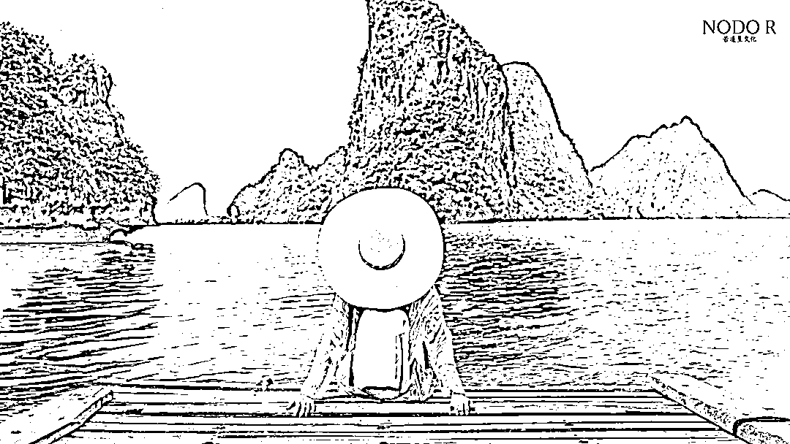

**COME ON**

**开始测试**

﹀

﹀

﹀

❂ 太阳**合相月亮、上升或中天**

（每项计 15 分）

**白羊座**：  **✪我可以照顾好自己。** （是） （否） **✪我已经学会如何更有力地表明自己的主张。**（是） （否） **金牛座**： **✪我可以分辨什么有价值，什么没有价值。** （是） （否） 

**✪我已经学会如何创造一种舒适的生活。**

（是） 

（否） 

**双子座：** **✪人们听我所说，思我所想。** （是） （否） **✪我已经学会了倾听。**（是） （否） **巨蟹座**：**✪我擅长营造一种安全的环境。** （是） （否） 

**✪我已经学会相信自己的直觉。** 

（是） 

（否） 

**狮子座**：**✪我喜欢主导。** （是） （否） **✪我已经学会让项目更有趣。**（是） （否） 

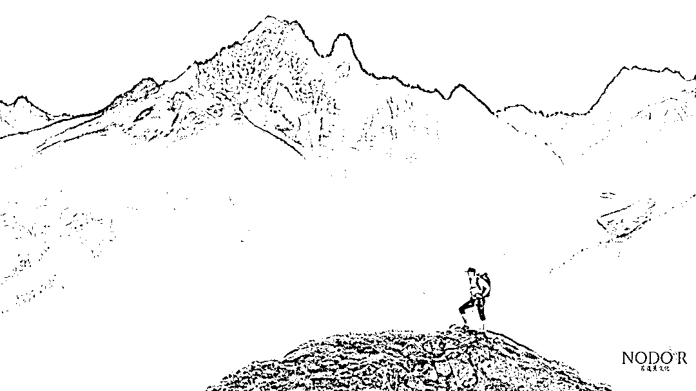

**处女座**：**✪我擅长组织。** （是） （否） 

**✪我已经学会对自己不再那么苛责。**

（是） 

（否） **天秤座**：**✪我擅长与人互动。** （是） （否） **✪我已经认识到我无法取悦所有人。**（是） （否） **天蝎座**：**✪我韧性十足。**（是） （否） 

**✪我已经学会如何建立值得信赖的关系。**

（是） （否） **射手座**：**✪我通常具有乐观精神。** （是） （否） **✪我已经学会诚实，并不总表示我是对的。**（是） （否） 

**摩羯座**：

**✪我擅长计划。** 

（是） 

（否） 

**✪我已经学会接纳：自己对失败的恐惧源自对成功的渴求。**（是） （否） 

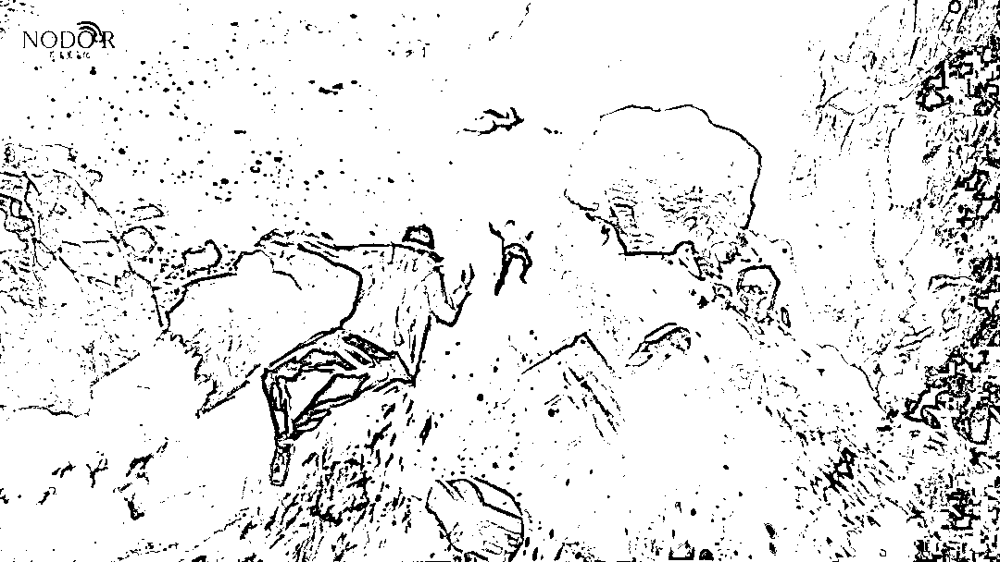

**水瓶座**：**✪我既倾向于参与，又倾向于抽离。** （是） （否） **✪我已经认识到我的个性可以为团队做出贡献。**（是） （否） 

**双鱼座**：

**✪我可以感觉到其他人的感受。** （是） （否） **✪我已经认识到一个更好的梦最终可以取代已经结束的梦。**（是） （否）
如果上述测验，你回答了“**是**”，恭喜你！这表明在这个问题上，你能与自己的星座或星座的发展和谐共振。如果你回答了“**否**”，表明在这个问题上你还有潜力可以挖掘。你可以参照下面的建议，拥抱自己的星座能量，活出更好的自己。**解析与建议**

**白羊座**

**你是否想要更自立？**如果不是，让我们设想你喜欢自己的样子。否则，就审视你幼年的生活。**是什么削弱了你的自我形象，培养了依赖性？不要再认为自己不够好或是一个受害者，这样你就可以发展自立。**是的，你依然在学习**如何有力地表明自己的主张**。你可能咄咄逼人，甚至有侵略性，也可能不够自信。白羊座是直率的，但**直率并不是粗鲁**，如果你常常让其他人感到愤怒或不安，那么你可能是粗鲁。如果不够自信，那么上面的建议在此处也适用。

**金牛座**

**无法去评估一些事物的价值，意味着你并不能感受到自身的价值。**在成长过程中感觉不被欣赏是最常见的原因。**建议你列一份个人价值清单，列出你看重自己的地方，即使是小事物也计算进去。**随着这份清单加长，你也会有能力去评估其他一切的价值。

创造一种舒适的生活常常需要时间，所以如果你还年轻，你会找到方法的。同时，接受你自己对舒适的渴望！如果你感觉内疚，为什么呢？**放下那些否定自己真正渴望的信念吧。**

**双子座**

如果人们忽视你，那么是因为这些原因： 糟糕的剧本； 糟糕的表达； 时机不对。 糟糕的剧本意味着“无趣”。**谈论那些真正让你觉得有趣的东西。**糟糕的表达和风格有关。如果与你的眼神交流和身体语言配合得当的话，即使一种奇怪或有趣的声音也可以变成一种长处。时机意味着，“这对其他人来说是个好时机吗？”**倾听他人需要深呼吸、关注、偶尔重复你所听到的，这样他们就知道你在听。** 

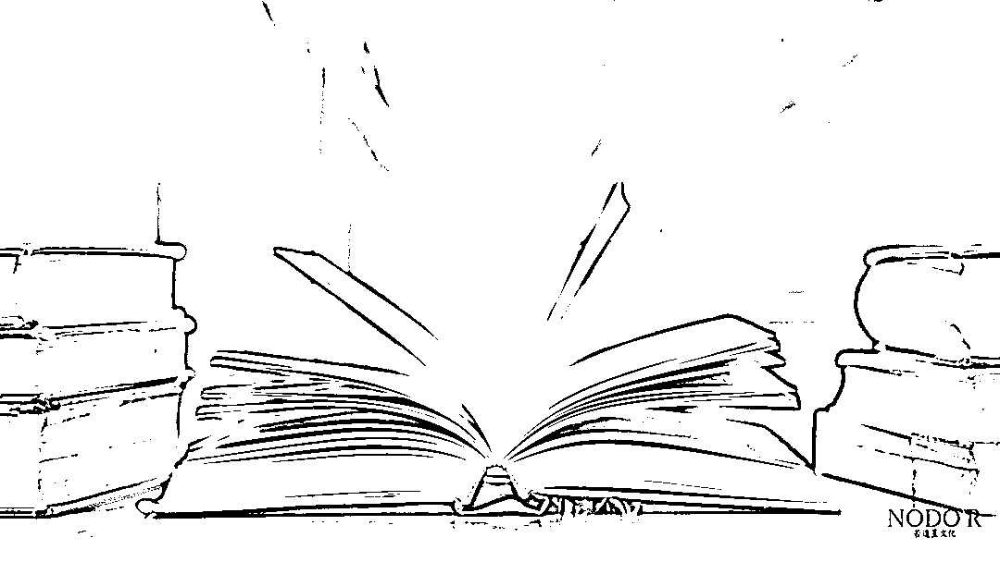

**巨蟹座**

**去创造一个安全的外部环境，你需要一个安宁的“内在环境”。你情绪上的焦虑需要被疗愈。**如果你在成长过程中很少感觉安全，那么是时候重新滋养你自己了。从你的厨房开始。烹调你自己最喜欢的食物，去感受关爱自己是多么幸福的事情，这就是开始的方式。 **你很可能有良好的直觉**。也许在儿时你的感受被父母忽视了，他们嘲弄你的直觉，认为那是恐惧和迷信。**现在你可以听从自己的直觉，意识到感觉包含了许多有价值的信息。**

**狮子座**

如果你想要成为领导却未能如愿，那么很可能童年时有一些事情影响了你发展自信。一个常见的主题是一位疏远、软弱或缺席的父亲。你可以通过**在小项目上建立自信**来克服这一点。**你的成功会获得关注和更大的项目。想办法让你的项目更有趣，你需要面对自己“内在的小孩”。**儿童凭本能玩耍。也许在成长过程中有一些事情限制了你的玩耍时间。如果是这样，现在你已经成年，就让你内在的小孩出去玩耍吧。

**处女座**

没有条理意味着在你的幼年生活中有优先级很高的事物给了你很多压力，比如努力获得完美成绩。现在，可能在你的生活中有些部分是井井有条的，有些部分则是一团糟，形成了鲜明的对比。这里的情感构成是：“如果我不完美，你还爱我吗？”**如果你可以学会足够喜爱自己，放下你对自己的苛责，内在的压力会释放，奇妙的是，你也会变成更有条理。**

**天秤座**

**你社交功能失调的根源是对被拒绝的恐惧。**面对这种恐惧常常意味着面对家人或同学残忍拒绝带来的老旧的愤怒和伤害。一旦这些情绪感觉得到了安全、充分地表达，那么社交中的尝试很可能会流畅自如。你有一种强迫性的取悦他人的冲动。你会为自己在面对最过分的冒犯时表现出的调解能力感到自豪。因此，**当你无法取悦他人时，你的自尊心会受到伤害。承认这种伤害，不要将自己视作失败者。**

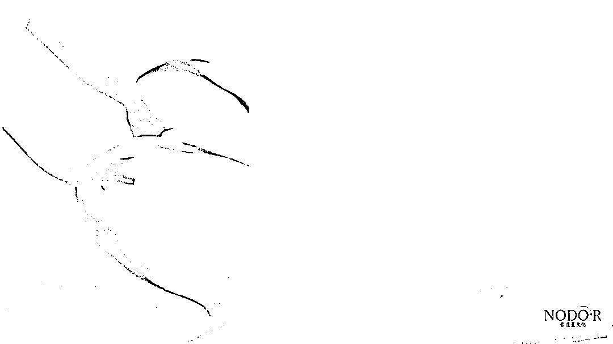

**天蝎座**

**缺乏韧性意味着你因为执着于深深的伤害**，比如背叛、被抛弃和失去，而耗尽了心力。**“执着”正是问题所在**，“你被卡住了！”**走出困境意味着放手，让自己经历悲伤的所有阶段**。然后你就可以恢复，表现出韧性。学会信任他人对你而言并非易事。你的直觉就像是雷达、探针、疑心重重。首先试着信任自己。**相信你不论受到多大伤害都会活下来，涅槃重生**。然后你可以从一个充满力量的所在**建构对他人的信任**。

**射手座**

**你不乐观是因为幼年所经历的失望。**为了保护自己不失望，你变成了一个“现实主义者”，甚至愤世嫉俗。问题是，你是现实主义者还是悲观主义者？**如果你想要找回失去的乐观，你需要去面对那些依然让你情绪激动的失望。**关于诚实与正确，人们可能犯下诚实的错误。你们中有一些人可能表现得“无所不知”，从而掩盖自己对犯错的恐惧。“嘿，你不可能无所不知的。”**保持诚实，但同时也保持开放的学习心态。**

**摩羯座**

你是否有一种失败主义者的态度？“为何要计划？反正无论如何都不会成功。”**早年的失败是痛苦的。**现在你假装“过一天算一天”。没有计划，你就是安全的！没有收获，没有痛苦！**尝试一些短期可达成的目标。一旦你尝到了成功的甜头，你会开始谋划更多。**害怕失败常常困扰着大部分摩羯座人。但是如果你认识到，“**害怕失败的唯一原因就是我迫切渴望获得成功”**，你就可以微笑着面对自己，知道你无论如何都会继续努力。

**水瓶座**

你介意自己投入某个团体吗？也许你觉得还是置身事外比较好？很有可能你在成长过程中没能适应环境。**保持距离，与众不同，是你为自己的身份感到骄傲的重要原因。但即使远离社会，你依然是社会的一部分，不是吗？**事实上，你想要让世界更美好，但是你知道自己不能独自奋斗。所以，**去寻找合适的团队，合适的组织。去寻找那些不在乎你特立独行的人，他们需要你！**

**双鱼座**

无法共情并不意味着你没有共情能力，它只是被掩埋了。早年的生活将你压垮了。逃避似乎是唯一的选择。逃避变成了一种习惯。但是，世界一直与你同在，即使在你睡觉的时候。**一旦你认识到你不可思议地与每一个人联结在一起，与所有人分享快乐与悲伤，你就能与他人共情。**关于梦，有一些梦根深蒂固。**但是幻灭过后，一个新的愿景会渐渐浮现**，开启一个更好的人生愿景。**相信你的灵感，这是你最大的天赋。**

**版权声明：**原创文章由作者授权发布于若道平台，欢迎转发，反对抄袭。友号转载请申请白名单。

**END**

****想阅读更多作者的文章，请在后台回复******大卫****** 即可。****

**大卫·瑞雷**

美国占星师，若道联合创始人，致力于在中国教授和推广西方占星学；2010-2014 年，任全美占星师联盟监督委员会委员；2017 年，被选为 ISAR 委员会成员。ISAR 是世界最大的国际占星机构，会员遍布 45 个国家，2017-2020 年曾任 ISAR 全球副主席、CAPISAR（ISAR 职业占星师资质认证机构）主席。

**拥有****51 年****占星实践经验的****若道创始人****前 ISAR 全球副主席****前 ISAR 全球职业占星师资质认证主席****大卫·瑞雷**

**和**

**2019 年第二届、2021 年第三届核心课中**

**与苏·汤普金斯老师****联合授课****的**

**ISAR 认证职业占星师**

**咔咔（Caroline）**

**二人合力打造**

**2022 年 ****若道全新核心占星课程**

**点击下图了解更多课程详情** 

**

**20 位来自世界各地的占星师****带来 19 场沙龙——新世界的觉醒****详情可点击下图**

**学习占星学****点击下图了解课程详情**

**微信又双叒叕改版啦，不想错过若道君的推送？**
**就把若道设为星标吧！****▼**

**喜欢就点一下“在看”吧！**

********报名直达入口********

# 9.22 秋分牌阵直播预约丨 神话塔罗四季牌阵咨询开放预约

> 原文：[`mp.weixin.qq.com/s?__biz=MzA5NjA0NTAxNg==&mid=2651489139&idx=2&sn=683a405a5faf76253c74c54e244b8ef3&chksm=8b4831c4bc3fb8d252189381ba16593b65fe7c41ea8e2305024248d2efef0ca7b2359a57ae7d&scene=126&sessionid=1692737751#rd`](http://mp.weixin.qq.com/s?__biz=MzA5NjA0NTAxNg==&mid=2651489139&idx=2&sn=683a405a5faf76253c74c54e244b8ef3&chksm=8b4831c4bc3fb8d252189381ba16593b65fe7c41ea8e2305024248d2efef0ca7b2359a57ae7d&scene=126&sessionid=1692737751#rd)

2022 年 9 月 23 日，这一天太阳进入**天秤座**阴阳相半，昼夜均长寒暑平分，故名**“秋分”**这一天最适合来神话塔罗 APP，抽取万众期待、应时应景的牌阵——**四季牌阵(The Four Seasons Spread )****在 9 月 22 日**我们邀请到 2021 届神话塔罗认证课程优秀毕业生为大家带来**《四季牌阵：与未来自己对话》**直播分享欢迎大家预约收看直播

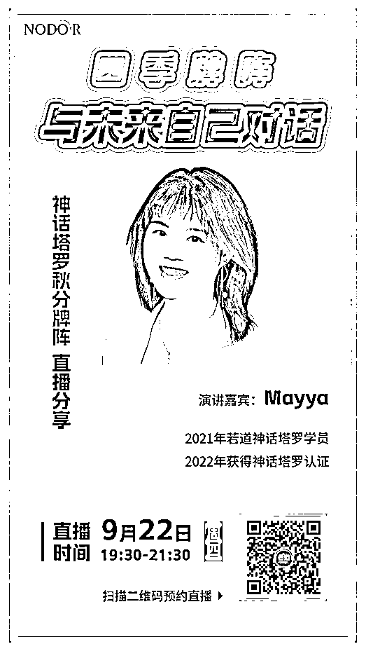

<mpvideosnap class="js_uneditable custom_select_card channels_live_iframe" data-pluginname="videosnap" data-headimgurl="https://wx.qlogo.cn/finderhead/PiajxSqBRaEJYnVsqWfEX9qA0sI6hNVKsDfyzfPZ92WZMZyBpZWU5NA/0" data-username="v2_060000231003b20faec8c4e68a1ec2d4ca07e434b07755bbf47e7053a3059defd2c9d6c68a20@finder" data-nickname="若道" data-desc="将在 09 月 22 日 19:30 直播" data-intro="若道神话塔罗四季牌阵直播-与未来自己对话" data-noticeid="finderlivenotice-v2_060000231003b20faec8c4e68a1ec2d4ca07e434b07755bbf47e7053a3059defd2c9d6c68a20@finder-1663313350928819-1932665811" data-type="live"></mpvideosnap>**四季牌阵(The Four SeasonsSpread )**

**一年只能使用四次的牌阵**

此牌阵最早出现在塔罗师 Marcia Masino 的 一本叫《*Best Tarot Practices*》 的书中，

此牌阵只能在一年里的 4 天进行占卜：分别是**春分、****夏至**、**秋分**和**冬至**。这 4 天蕴藏着四季的秘密，小小的节气，有大大的能量。是绝佳的日子，让自己看看接下来一个季度的能量趋势。**秋分牌，****展示的是****你从秋分到冬至这一个季度的整体能量趋势，****TA 会告诉你当季的主题，****你的思维计划、行动决策、****人际情感、财务发展。**如果你想要获悉一个季度的整体概况，**把握事业方向**，**感情状况的走向**，**提前了解财务如何发展**，那么四季牌阵能够满足你，它会对你整体的状态有一个相对清晰的展望。当你觉得对目前的状况不甚满意，又不知道该从哪个方向入手去做改变的时候，四季牌阵也可以给你相当多的指引。

**四季牌阵会从五个方面做出能量预报：**

**感情****状况、****工作****财务、**

**拥有的****行动****力量、****思维****计划的警示、**

**精神****状态与****心灵****成长。**

同时占星学中，

这四个节气是太阳换座到四个基本星座

（白羊座、巨蟹座、**天秤座**、摩羯座）

的时间点，意义重大。

因此，无论通过占星还是塔罗，

都是适合做下一个季度能量趋势预报，

完善中短期规划与展望的好时机。

**塔罗作为直觉的能量预报与灵性指引工具，**

**是对占星理性逻辑的分析方法的完美补充。**

用神话塔罗，

让包围你的宇宙能量一目了然，

对着四季塔罗冥想，

让自己度过有意义的秋分这一天。

**秋分日 限量优惠咨询活动**

**预约靠手速，限量****30****人。**

**活动地点**

线上——**若道神话塔罗 H5**

**活动主题**

“秋分日—冬至日” 3 个月个人趋势的四季牌阵解读

**公益价格**

**150-500 元/四季牌阵解读**不等 

拼手速

**如何预约塔罗师咨询？**

扫码二维码进入若道塔罗 H5

预约**“四季牌阵”**塔罗服务项目

就有机会拍到优惠咨询哦~

**我们在秋分日****与你不见不散**

# 今晚开课丨 2022 年若道 ISAR 选修课：《医疗占星手册》作者亲授

> 原文：[`mp.weixin.qq.com/s?__biz=MzA5NjA0NTAxNg==&mid=2651489139&idx=3&sn=f1ba31a6406780e916f5ec573b0ab23d&chksm=8b4831c4bc3fb8d283d0b65b845d4b40eeede5106fea0e649c741e22b2e98c584b00f30c665c&scene=126&sessionid=1692737751#rd`](http://mp.weixin.qq.com/s?__biz=MzA5NjA0NTAxNg==&mid=2651489139&idx=3&sn=f1ba31a6406780e916f5ec573b0ab23d&chksm=8b4831c4bc3fb8d283d0b65b845d4b40eeede5106fea0e649c741e22b2e98c584b00f30c665c&scene=126&sessionid=1692737751#rd)

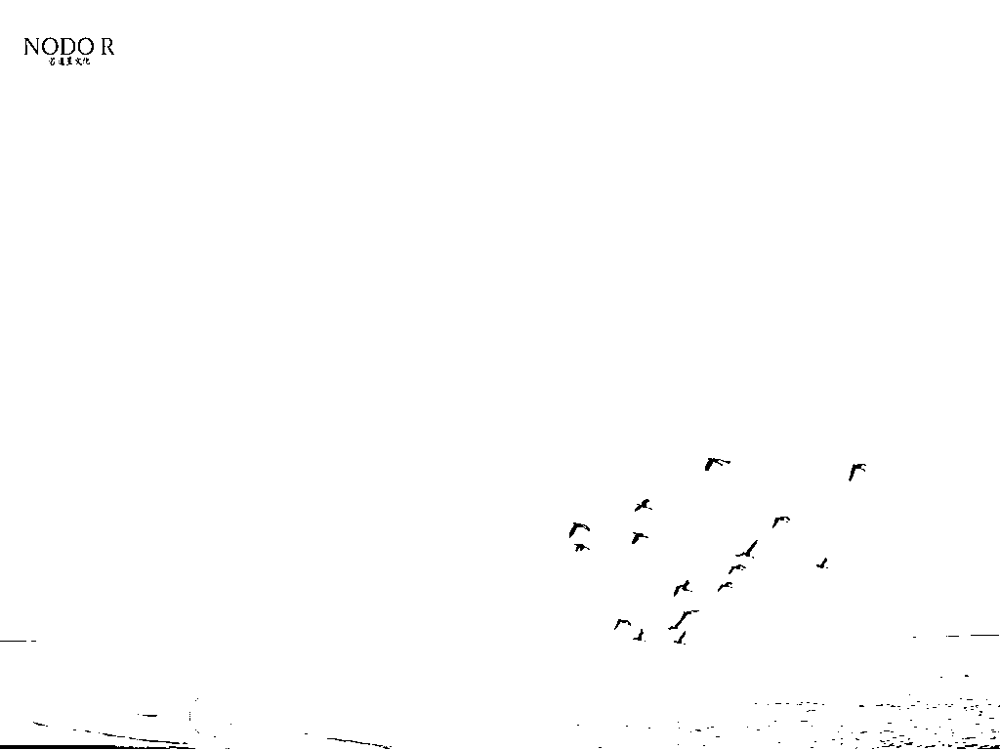

**有四个主要因素影响着我们的生活和健康：基因构成、物质环境、情绪环境，以及我们的占星配置。我们在星图中都存在患病的可能性，而预防的方法在于尽可能充分、真实和健康地生活。****——简·里德·帕特里克****（Jane Ridder-Patrick）博士**

占星学就像心灵的 X 光片。它可以描述个人对世界的看法和反应。我们越不了解自己的天性，面对生活中的挑战，我们就会有越少的选择。

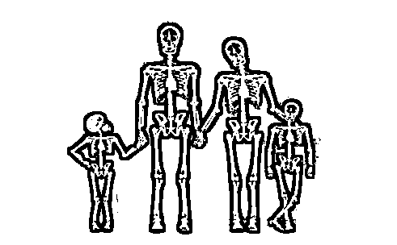

**“占星学可以精准定位需要解决的潜在问题。”**

**医疗占星学是一个强大的工具，同时洞察的身体和心理过程，通过更多的自我认知照顾和关爱自我和身边的人。**

**本课程既适合医疗占星学的初学者，也适合已经有一些相关经验的人****。**简·里德·帕特里克老师将运用现实生活中的例子，揭示一个人的性格、症状及其星图是如何相互映照的。课程也会探讨疾病的意义以及可能的治疗方法。

**本课程旨在为学员提供一个运用医疗占星学的框架和方法，**学员将会学到一些有价值的实用工具，在课程结束后，自己使用这些工具研究其中的关联性。

**此课程可作为 ISAR 选修课。**

1

**课程安排**

**课程时间：2022 年 9 月 20 日-11 月 8 日  每周二 20:00-22:00**

**第*****1*****讲  9 月 20 日 与占星学、心理学、病症一起工作**

*   医疗占星学的组成部分以及如何使用它们

*   行星的作用与相互作用

*   黄道星座人

*   宫位的重要性

*   疾病和健康是如何产生的

**★ 第二、三、四讲的课程内容基于星座以及它们之间的相互作用。**

**第*****2*****讲  9 月 27 日 基本星座**

学习基本大十字星座——**白羊座、巨蟹座、天秤座和摩羯座**——及其功能和相关的健康问题。**这些星座与防御、养育、结构、体内平衡和荷尔蒙控制有关。**

****第*****3*****讲  10 月 4 日 固定星座****

学习固定大十字星座——**金牛座、狮子座、天蝎座和水瓶座**——及其功能和相关的健康问题。**这些星座与习惯和反射、心脏调节、生存、循环和协调有关。**

“固定星座（金牛座、狮子座、天蝎座和水瓶座）在情感和生理上都倾向于**‘难以放手’**，这可能为恶性肿瘤的生长创造环境。所以说，他们可能倾向于沉浸在过去的伤害中，难以自拔。另一方面，这些星座也擅长在艰难的时期坚持不懈并一直**持之以恒**。”——简·里德·帕特里克（Jane Ridder-Patrick）博士

**第*****4*****讲  10 月 11 日 变动星座**

学习变动大十字星座——**双子座、处女座、射手座和双鱼座**及其功能和相关健康问题。**这些星座与呼吸、神经系统、肠道、睡眠以及信息、情感和行动的整合有关。**

**★ 第五、六、七、八讲重点学习行星，它们在身体层面的表达、它们的相位与行进。**

**第*****5*****讲  10 月 18 日 太阳与月亮**

**太阳**掌管视觉、活力、心脏和意识，与心脏、脊柱和视觉问题相关。**月亮**掌管人体的周期，特别是月经周期、饮食模式和体液，与情绪引起的疾病、饮食失调和胃病相关。

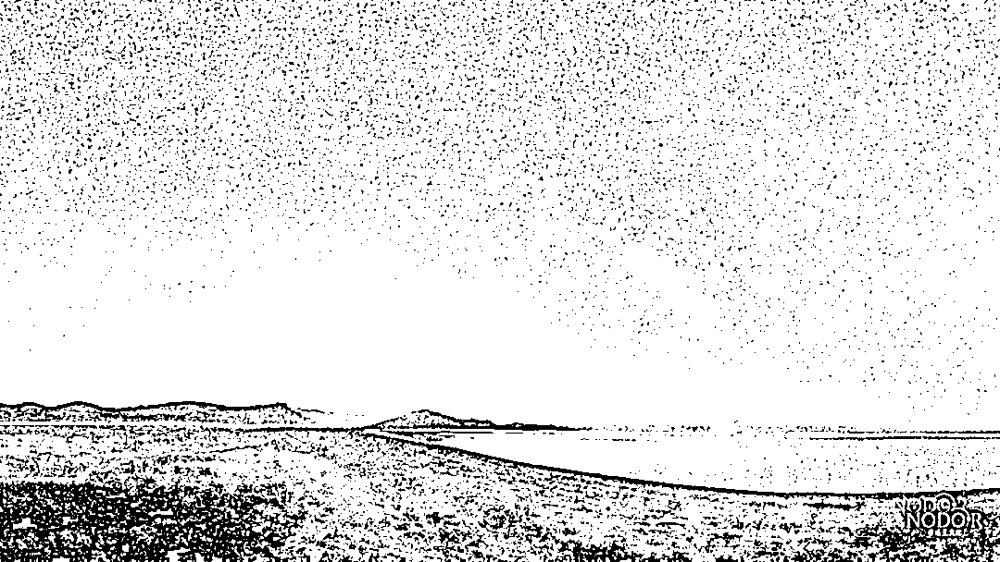

**第*****6*****讲  10 月 25 日 土星与天王星**

**土星**掌管着皮肤、骨骼、牙齿和衰老过程。它对应的疾病包括慢性疾病、耳聋、帕金森病、关节僵硬和牙齿问题。**天王星**代表身体活动的协调，有节奏的脉动和身体的“电”。与天王星相关的疾病包括癫痫、痉挛、心律失常，以及阿斯伯格综合症和自闭症样综合症。

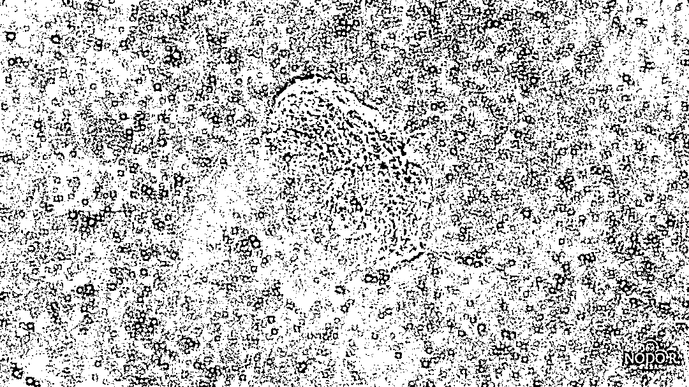

**第*****7*****讲  11 月 1 日 海王星与冥王星**

**海王星**掌管松果体、细胞膜渗透和右脑功能，与过敏、上瘾的病症、慢性疲劳综合症和睡眠障碍相关。**冥王星**掌管消除和转化，其病理包括毒性、脓肿、癌症和强迫症。

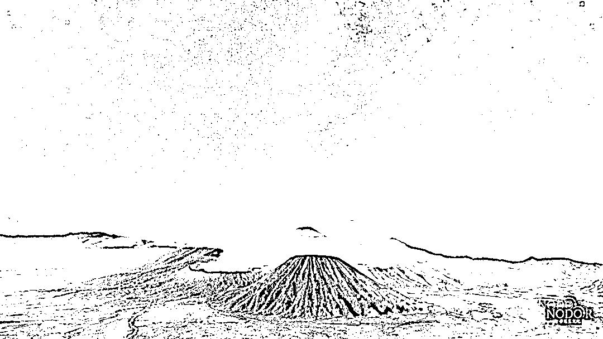

**第*****8*****讲  11 月 8 日 火星**

**火星是与能量和防御相关的行星**，掌管免疫系统、肾上腺功能、肌肉活动和炎症反应。**它是许多身体和情绪障碍的核心**，如自动免疫障碍、抑郁和发烧，以及由手术或需要手术引发的问题。

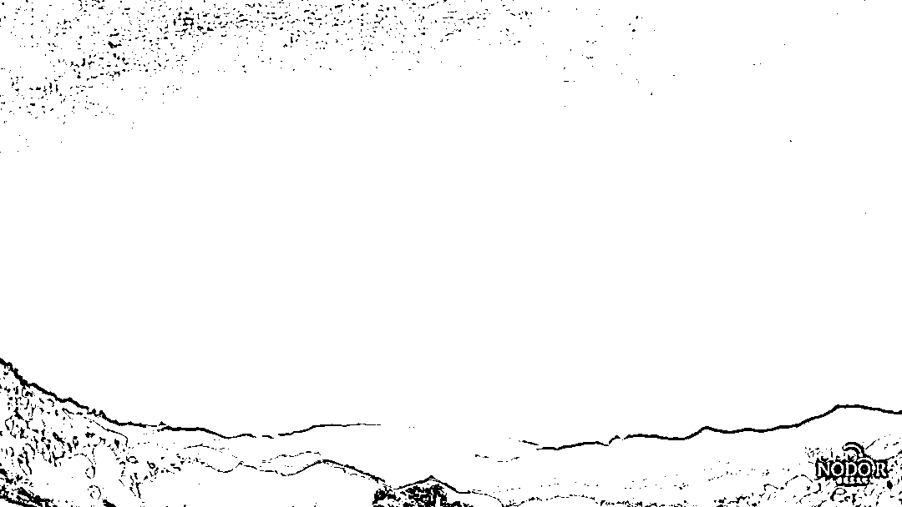

2

**此次课程适合哪些人？**

*   有一定占星学基础，若道核心课 L3 以上水平；

*   希望成为优秀的占星师，想要借鉴国际大师医疗占星解读思路并融入自己的体系的人；

*   热爱占星学、健康、养生的研究型占星学者；

*   计划考取 ISAR 认证占星师，寻觅中意选修课的学员；

*   走在自我探索和个人成长道路上的人。

**快来和简·里德·帕特里克老师学习升级版的占星学身体地图吧！**

3

**授课老师及课程助教**

**简·里德·帕特里克 **博士****

（Jane Ridder-Patrick）

简接受过药剂师、理疗师、草药师、心理治疗师和历史学的专业学习，从事写作、咨询和讲学工作，在英国和全球教授占星学及其历史、当今的心理学和医学应用。她在爱丁堡执业，在爱丁堡大学获得博士学位，研究方向是 17 世纪苏格兰占星学历史。**她最著名的出版物是《医疗占星手册》。2018 年，她因对医疗占星学的贡献而获得了著名的查尔斯·哈维占星学杰出服务奖。**

《医学占星术手册》（第二版，修订版和扩充版）

(爱丁堡，克拉布出版社，2006 年)

**熊鹰老师（天空的空）**

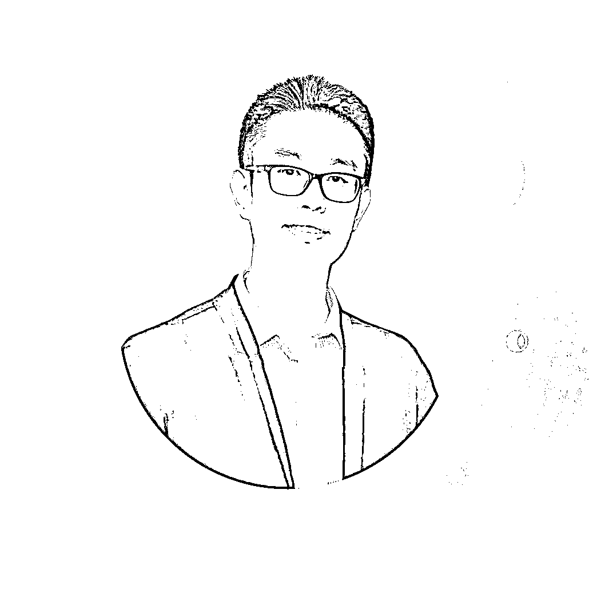

*   2008 年接触严肃占星学，至此爱不释手； 

*   **2013 年师从大卫·瑞雷**，研习整套现代占星学核心课程，并于 2014 年起至今连续三年担任该课程的主助教； 
*   期间也**跟随格伦·佩里、诺·泰尔、理查德·塔纳斯、罗伯特·汉德、苏·汤普金斯、斯蒂芬·弗里斯特等多位国际顶尖占星大师进行学习**，进行定向占星主题研究； 

*   2015 年初，通过国际占星研究协会**（ISAR）资质认证并获得证书**。同年，进一步跟随大卫·瑞雷老师进修**“生时校正”**技术，通过最终考核并获得证书； 

*   目前在若道星文化任职，将传播系统、严谨、真实的占星学作为职业使命。任专职助教期间，进行沙龙与答疑等辅助教学工作已累计超过 200 小时；

*   在业余期间也提供占星咨询与生时校正服务。目前正致力于占星学与个人成长的整合。

4

**课程信息**

*   **课程时间：**2022 年 9 月 20 日开始，每周二晚上 8 点，每周一次，共 8 次课。

*   **授课方式：**线上直播，英文授课，中文翻译

*   **课程价格：**6800 元

*   **课程咨询：**王老师（微信：18510107057，请备注“医疗占星”）

长按二维码添加王老师

5

**退转课程**

*   **退款原则请详看《教学协议》，如有疑问请咨询课程顾问。**

****医疗占星****

**授课老师：**简·里德·帕特里克

**授课时间：**2022 年 9 月 20 日起

**授课方式：**网络课程**，**英文授课，中文翻译

**费用：****6800 元**

**课程负责人：****王老师**（微信：18510107057，请备注“医疗占星”）

长按二维码添加课程负责人咨询~

**END**

****报名请点击“阅读原文”****

# 若道周运 9.19-9.25 丨秋分到了，重新校准你的方向吧！（内含 12 星座运势）

> 原文：[`mp.weixin.qq.com/s?__biz=MzA5NjA0NTAxNg==&mid=2651489086&idx=1&sn=a9bffb97c8df47f8f00aa9c7155f610f&chksm=8b483189bc3fb89f8d4e42d04eac7c99f2038570a05b8807d37271ac98b02e7f1b8b81ede1b3&scene=126&sessionid=1692737751#rd`](http://mp.weixin.qq.com/s?__biz=MzA5NjA0NTAxNg==&mid=2651489086&idx=1&sn=a9bffb97c8df47f8f00aa9c7155f610f&chksm=8b483189bc3fb89f8d4e42d04eac7c99f2038570a05b8807d37271ac98b02e7f1b8b81ede1b3&scene=126&sessionid=1692737751#rd)

******☆ ****后台回复“今日”，给你一句生命态度******

作者/苏黎 ISAR 认证占星师
编辑/翀子 封面/书君 图片/稿定设计**整体氛围**

时光流逝，**我们在本周迎来了一年之中最重要的节气：秋分。太阳换座进入天秤座。**众所周知，每年的二分（春分、秋分）二至（冬至、夏至）象征能量的转换。

春分、秋分象征昼夜时间一样长，从这天之后，白昼与夜晚力量开始消长。**秋分这天，太阳进入天秤座，意味着我们学习从大自然中平衡宇宙的自然法则。**当然，这一天也象征着进入了收获的季节。

正如动物为了过冬开始储藏食物，我们人类世界也为了生存，调整平衡自己奋斗的目标，校准人生的锚。

娱乐圈的明星塌房引起人们对流量明星的道德观探讨，我们需要如何看待专业素养和流量明星呢？眼下市场寒冬，内地娱乐明星的片酬、财富也成为探讨的热点。娱乐圈浮华表象之下隐藏着什么呢？明星频繁暴雷，各种舆论和评价众说纷纭。

在土天四分相的周期影响下，变幻莫测的国际局势、反复的疫情、风险区的民生疾苦都是我们关注的重点。

在漫长的历史长河中，个人的命运和生活就是一粒沙子，一颗尘埃。我们需要跟随宇宙的规律、抓住转换的机遇，重新思考自己拥有的资源、专业技能，以及重新定义关系的主题（太阳从处女座到天秤座换座）。

**在秋分的转换点，学会欣赏和识别他人，学会客观地辨识自己的特质和矛盾，在矛盾中创造一种“垂直的张力”（阿兰·欧肯语录），创造积极健康的关系，与生活共舞！**

**本周重要天象：**

*   **太阳三分冥王星（逆行）**

*   **水星（逆行）对分木星（逆行）**

*   **金星三分天王星（逆行）**

*   **太阳换座进入天秤座**

*   **太阳合相水星**

*   **逆行水星进入处女座**

**一周重要天象****★ ****9 月 19 日，周一****月亮在巨蟹座；太阳（处女座）三分冥王星（摩羯座）；逆行水星（天秤座）对分木星（白羊座）。**

工作日的月亮在巨蟹座行进，内心情感丰富，重视内心世界的探索，职场工作生活中对各种事物的处理很敏锐。**月亮在巨蟹座，水星与木星对分，**在日常生活和职场的人际关系中，会有沟通的压力。

积极的层面是，**水星与木星****的对分相**会激发强烈的求知、学习的欲望，突然有灵感报名感兴趣的课程，在工作中顿悟某些专业技能。渴望积极大胆的表达自我，和朋友分享人生观念和想法。

逆行的水星和木星犹如航船中无法把握的舵，摇摆不定，会优柔寡断。月亮在巨蟹座是敏感、脆弱的，在工作生活中，不太容易接受他人的建议、观点并出现纷争，甚至有被拒绝、忽视的感受。欲言又止，无效沟通会让我们内心不舒服。

另外一方面，我们也会在表达中缺乏宏观和完整性，找不到合适的时机表达诉求，在压力中容易慌乱，忘记自己想表达的重点。

虽然我们感受到生活中的冲突，但**太阳和冥王星的三分相**意味着强大的意志力、专注目标实现的重组和反省。我们会改变和提升生活中发生的状况，减轻水星与木星对分相的压力，对当下的目标做全面的分析调整和深刻的处理。

**★****9 月 20 日，周二****金星（处女座）三分逆行天王星（金牛座）**

**金星和天王星的和谐相位，**这股能量会在生活中带来实际的变化。在当下土天四分相的周期里，我们会重新考虑经济的来源、资源的分配，价值观面临调整和改变，有利我们更务实地生活。

金星代表娱乐、享受，是天王星的定位星，当下光怪陆离的娱乐圈是调整的时候了。调整对明星的宣传，引导树立正确的偶像观，通过调整娱乐界的传播风向，树立正能量。

**★****9 月 21 日，周三****金星（处女座）与逆行土星（水瓶座）呈梅花相**

金星处女座是低调、谦卑，服务性地付出。当月亮在狮子座行进，我们会为自己的举动骄傲、自信，很认真地付出劳动技能，渴望获得接纳。

逆行土星是冷酷的，缺乏耐心的，在工作层面会感受到领导管理的冷漠和严肃，对长期努力无法获得尊重感到失落。

我们需要学会相信自己，唯有懂得尊重和认同自己，才能在心理上减轻挫败感。

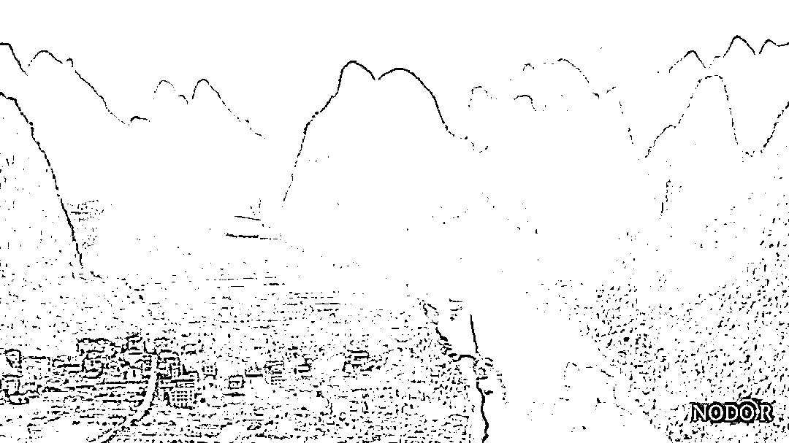

**★****9 月 23 日，周五，秋分**

**太阳进入天秤座，太阳合相水星，逆行水星进入处女座**

这是宇宙能量特殊的一天。尤其是水星的轨道，水星在当日逆行经过两个星座，与太阳会合后逆行回到处女座。如同道路上相向而行的两辆车，在某个节点汇聚后，各自奔向不同的方向，**“你有你的，我有我的，方向”**。

**太阳在上午（9:03）换座进入天秤座，在下午（14:49）和逆行的水星在天秤座 0°合相，**意味开启新的关系。我们对宇宙中阴阳法则进行重新的界定，对创造性的合作关系会进行独立和深度的思考。

太阳合相水星在天秤座，有强烈的沟通欲望，创造力提升，学习能力提升。我们会重新对合同或契约的文件、合作关系、女性的价值议题有新的考量和思考，顿悟带来的灵感体验会让人采取一些积极的行动和措施。

我们需要注意，当逆行的水星会合太阳时，是否会因过度渴望能够达成合作关系，从而陷入思维的误区或盲点呢？当日的月亮在处女座行进，是慎重、小心翼翼、希望达成落地意向。

**晚上 20:04，逆行的水星进入处女座。**水星的思维方式会从关系的重点，重新回到对过去工作资料的整理、数据的推理和审核、完善文字整理工作上。人们更重视关系的细节，这样会倾向在关系中挑剔他人。

思考的思维导向会关注事业的成就，培训的技能，关于在与太阳天秤座的关系互动中，如何更有效地产出。

从这个特殊的天象看，此时不合适仓促的做决定，顿悟灵感给予的礼物，可以暂时放缓，给自己多一点思考的时间和空间，学会从他人角度看待问题。

**★****9 月 24 日，周六****金星（处女座）对分海王星（双鱼座）**

**金海对分相，意味着牺牲、付出，容易产生幻灭和依赖的心理。**在关系中容易对他人产生渴望，或者希望自己是拯救者，可以帮助到他人；或者希望对方帮助自己。

情感是很复杂的，可能我们会在水星逆行期间，怀念一个离开的恋人、朋友。我们也可能在关系里无法清晰地辨识边界感，对感情失望，无法“放手”。

**从创造性角度看**，艺术或创造性的活动可以弥补心理的失落和缺憾，发展出慈悲和对宇宙的宏观意识。

金海能量不要停留在初阶，比如单纯营造朦胧的美感，或过度依赖期待他人。当我们通过艺术创作展现自我、记录梦境、读闲书放松，或在工作之余去大自然、艺术馆、博物馆时，我们会对生命的爱和想象力有更深刻的理解，拓展我们与宇宙意识融合的渠道。

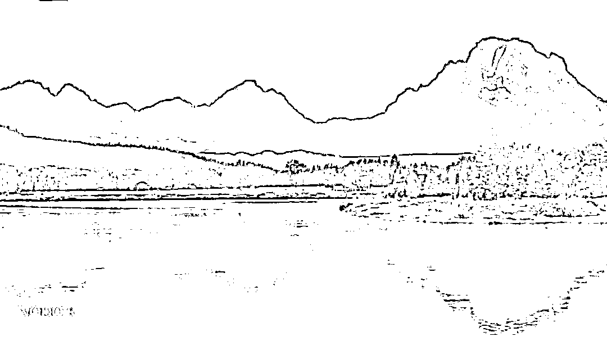

**12 星座的一周运势**

**（重点参考上升星座，其次参考太阳星座）**

***白羊座***

亲爱的白羊座们，9 月对你们而言是奋进的月份，工作、人物、项目、人际关系是本月的关键词。9 月 19 日的水星在你的 7 宫逆行，水木对分相，你和合作伙伴、伴侣，或商业谈判对手在项目谈判，亲密关系沟通需要做一些调整。

白羊座们总渴望赢，在关系中容易产生竞争心里，请不要给自己太大的压力。

工作中需要注意和团队的协调关系，学会从集体和他人角度理解问题，有时会有些挑战，你信心满满渴望获得认同，但你的专业技能在土星的管控下，会觉得不太舒服。

本周五前，你埋头深耕。周六太阳进天秤座后，你在关系中的主动性被唤醒，也许有新的工作机会出现。

本周三，金钱和财务上也许给你带来一些幸运和机遇，可能获得他人给予的礼物、公司福利的奖励，或自己靠实力赚取的财富。

**抓住机遇，享受 9 月的机会吧，吹着哨子，保持轻松，用合作的心态在本周达成你的目标。**

***金牛座***

**感情、创造力的绽放，学会在生活中根据自己的节奏享受创作的快乐。与孩子相处是你本月的重点。**

当金星在你星图的第 5 宫行进时，你对日常琐碎的事情不感兴趣，你期待享受自己的快乐。单身的金牛座们寻求感情浪漫模式，有家庭的金牛座们，希望营造亲子和谐关系。

本周二，金星和天王星的和谐相位，你可能会有浪漫的约会，突发的灵感创意实施，如工作的创作、宣传和营销新的个人形象设计。

工作中，你可能感受到领导的压力，冷漠的管控方式，按规章办事，过于教条让你很不舒服，情绪的压力无法排解。在水星逆行期间，回顾待改进的项目，完善细节，不要让人抓把柄。相信自己的实力和魅力，有助你寻找新的职业。

请关注健康，可以去做一个体检，对自己身体有更深刻的了解。当你信任自己的身体能量，你才能焕发更好的创造性能力。

金海的对分相，你对情感、个人在群体中的人设不太清晰，容易产生幻灭和失落感。评判太多，对喜欢的事物无法保持坚定，持久的热情，容易被他人影响，无法对未来产生自信。

请学会敞开内心，清理情绪的垃圾，修复你对生活的热情，唤醒对浪漫情感的向往，期待你努力创造丰盛的生活！

***双子座***

对于水星逆行，双子座宝宝们很熟悉，应对和处理各种问题更得心应手，你们已经习惯了水星逆行带来的各种影响。

水星在你星图第 5 宫逆行，并进入第 4 宫。对感情生活，你曾经有很多浪漫的想法，但现实情况有点棘手。你的时间仓促，忙碌，既要处理团队的事情，又想腾出时间和对方去度假、享受快乐。工作和享受难两全，你不得不牺牲掉享受的时光，聆听对方的抱怨。

本周你会发现自己成为瞩目的重点，太阳换座来到星图的第 5 宫，你犹如闪闪发光的明星般受到关注，你的举动在社交媒体被更多人看到。

外人似乎觉得你拥有最好的运气，但只有你内心明白，你对感情生活仍存在迷茫和疑虑。如果你关注投资，当下的市场让你犹豫不决，双子座的好奇和无所谓让你很想尝试，但又觉得目标似乎理想化，稍微放慢步伐对你有利。

当水星在本周五逆行回到处女座时，你需要花一些时间处理家庭事务。清理房子空间，或者加强与家人的联系沟通，让自己对未来更笃定。我的双子座好友，最近忙于装修房子，和我反馈她在马不停蹄地和不同的人沟通、确认装修方案。

**对双子座而言，9 月是忙碌、奋发展现自我的月份，在聚光灯下，你会明白如何发挥自己的勇气，能量和动力展现你的领导力。**

***巨蟹座***

在之前的双鱼座满月中，你是否回家探亲，或去外地旅行了呢？这是当下巨蟹座们放松舒缓情绪最好的解药。本周你在家庭事物，住房方面有什么新的想法吗？和家人，领导的沟通是否舒畅呢？

你希望获得家人支持的力量，渴望获得领导的认同，但需要适当的妥协，暂时的退步，给自己和他人留出沟通的空间。

本周你可能收到意外的礼物，从远方给你的惊喜，让你感受到被温柔对待。请注意小心使用电子产品，关注合同的细节和沟通中的误会，尽量在工作中给高层留下好印象。在写作，沟通，编辑上花一些精力使用上述技能，为未来的事业创造机遇。

本周末的宇宙能量，你可以花一些时间打造舒适的家居环境，迎接天秤座新月的来临。如果你有搬家、签订租房协议，可以邀请朋友来到家中聚会，本周末可好好准备哦！

**对巨蟹座而言，9 月是一个等待改变的契机，做好家庭的功课，你会更有力量和信心！**

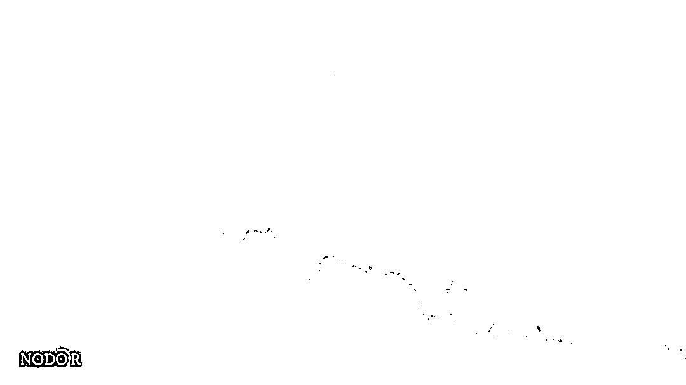

***狮子座***

狮子座们拥有强大的自爱能力，在水星逆行期间，你们会通过审视内心的想法，思考自我的价值，尤其是在自我价值和金钱上，你会有自己的评估。近期，你的重心在评估合适的合作关系，与伴侣是否拥有平等的沟通。

本周金星的相位，你会觉得合作对象和伴侣没有真正理解你，对你提出的要求过高，你的自尊心受挫。关于债务、税收、保险的某些事宜让你觉得不太清晰，需要花时间理解共享资源的事情。

经济的稳定能给予你安全感，事业上某些惊喜、意外的机会让你金钱有所收益。

本周的季节转换点，你将在沟通表达、写作、好友、手足联络方面有新的想法。你的好友对你很支持，希望给予你帮助。学会享受爱，也慷慨的回馈给他人，结合自己的资源挖掘合适的项目，提升收入，平衡生活中的收入支出。

**对狮子座而言，9 月是培养技能、发现才华、创造生命价值感的时机，金钱是你生活安全感的来源，要发挥自己的潜力。**

***处女座***

无论是上升处女座，还是太阳处女座，本月都是一个很激动的月份。**你对自己的能力、魅力更自信，你可能购买新衣服、换新发型，或选择新的妆容展现给他人。**

水星在你 2 宫逆行，本周会返回到 1 宫。你需要花一些时间思考财务的预算和财务的审查，配偶也许需要你经济的支持。当水星逆行回到处女座，你会对自我有更多深刻思考，你渴望真实表达，渴望真实的自我被他人接纳，认同。

本周的金星相位，你会收到远方馈赠的惊喜，也许让你有些措手不及，但你很开心。你只是对工作环境中的教条管理有些不满，不如学会放松，无需对自己太严格，让身心放松更重要。

在本周末，太阳进入你的 2 宫，你对自己的未来的财务更有信心，希望通过专业素养解决财务问题，做一些新的改变，量化财务能力。金海对分相，让你对伴侣，合作对象带有玫瑰滤镜的期待，你喜欢的是理想的对方，还是他们真实的样子呢？

对处女座而言，自信和解决财务的问题，发现自己的魅力，自信、爱的能力很重要！当你有力量，你才能拥有爱情！

***天秤座***

本月对天秤座有些挑战。思绪和头脑容易混乱，站在十字路口，无法分辨清晰自己的方向和主题。

本周的人际关系让你感觉不舒服，你想表达的，和别人理解的不是一回事，不要担心，这些困惑最终可以解决。虽然水星与木星的对分相，让你在关系沟通中不舒服，但如果你清空头脑的垃圾，不想太多，在商业合作关系也许有意外的收获和突破。

本周的转换节点，你的心理状态开始转变，对个人的目标、身份、外貌会更关注。你的能量激增，缓慢的节奏即将结束，你即将迈着轻快的步子开始行动。

当然面对逆行的水星，你仍需要一些时间清理太多纠结的想法。你天生善于权衡，有强大社交能力，善用金星的礼物，让你生活更有丰富。周末需要注意调节生活的饮食、作息，避免过敏等皮肤问题。

**对天秤座而言，9 月是调整个人心态、清理头脑纠结想法的最佳时机，相信自己的目标，会让你对未来的规划更清晰。**

***天蝎座***

天蝎座很关注个人隐私，但本月里群体对你的支持，以及友谊，让你感受到被他人信任和支持。本月你在感情、社交关系上都有收获。你会对结交的朋友进行辨别和筛选，了解哪些是真心相待，哪些是泛泛之交。

你有深刻的洞察力，朋友们觉得你的天赋难能可贵，你可以给他们很好的建议。你在团队合作中，会发挥领导力和决定作用。

你对同事关系隐隐不安，担心他人对你工作的不理解。但请你相信自己的魅力，金星和天王星的相位，会让你有意外的收获。你可以从熟人、朋友、伴侣的温暖支持中获得动力。

本周末，你的直觉天赋会帮助你分辨出团队中真正的支持者。但需要避免网络购物，电子邮件的表达问题。你看待自己的感情生活有些不太真实，对浪漫邂逅的期待、渴望享乐，会让你投入和执着，但我们的生活都有盲点，不用过度担心。

**对天蝎座而言，9 月是社交关系的最佳时机，学会适当休息，提高工作效率也很重要。**

***射手座***

射手座和幸运、机遇有关，水星从 11 宫逆行回到 10 宫，你可能会和老友重逢相聚、反思工作处理的细节和问题。

本月你在事业上投入更多的时间和精力，你能有效地通过事业和工作，提升经济收入。你的专业为你赢得同事们的认同和尊重。新的工作任务让你开心，无论酬劳还是佣金，都是丰厚和可观的。但你没有太多时间和家人相处，偶尔你会对自己做出的决定感受到责任的压力。

本周的转换时机，你开始转向社交和友谊，转向检查和审核工作中的细节，避免粗心。忙碌的工作中，你是否还能倾听并与对方沟通呢？

家庭是共同打造的城堡，无论是孩子的教育问题，房子的装修问题，都需要共同协调解决。如果有工作上的合作机会，先保持联系，暂且不要仓促做决定，给自己思考的时间。

**对射手座而言，9 月是社交和开创事业的最好时机，保持良好的社交关系，和朋友们的沟通会给到你灵感和启发！**

***摩羯座***

本月对摩羯座而言是一个等待变化的时刻。你可能会质疑你的目标或计划，对前期做出的决定有反悔，让你对事业的目标和未来产生不确定和不信任感。

本周水星的行进，让你对事业的抉择迟疑不定，对前期处理的法律事务，合同条款细节不太注意。无论你对自己多自信，涉及到合同条款，最好找律师帮你审核。

本周的季节转换，你迎来了事业的最佳时机。你渴望让更多人看到你的努力和成就。逆行的水星从 10 宫回到 9 宫，你需要沉淀一些时间，去探索，用强有力的事实或证据，让领导看到你的野心和专业是匹配的，你有实力去证明自己。

摩羯座的关系是低调、隐忍、承担责任压力的，对他人和自己保持信任不容易，因为总想做到最好。本周金星的相位，你会发现浪漫的情感，与孩子突发奇想的互动交流让你学会放松，学会享受不确定性。

**对摩羯座而言，9 月是探索事业目标、理解关系差异的时刻，学会信任和享受浪漫吧！**

***水瓶座***

独立和自诩聪明不凡的水瓶座们，一直对自己专业很自信。本月你们需要对投资或商业合作的金钱保持慎重态度。有时，错误的信息会让你的决定匆忙，忽略了信息和数据的完整性。

水木的对分相，在电子设备的使用上，你有些不注意，注意避免写好文档后忘记存档等问题。当水星逆行回到处女座时，他人资源的使用、投资的细节问题再次浮现。

如果你当下正在学习一门课程，这对你是有益的，你可以通过学习，提升和完善自我的能力。在本周的季节转换期，你会获得导师的支持，并展现学习的天赋。

如果你从事媒体相关的行业，会获得额外的好运，尤其对出版行业的从业者而言。金星和天王星的三分相，你也许会意外获得父母馈赠的礼物。

**对水瓶座而言，9 月是你学习新课程、学习处理金钱和投资，展现才能，多渠道探索赚钱渠道的最佳时机。**

***双鱼座***

经历了双鱼座满月后，你们的情绪是否高度运转呢？

当下金星在你的 7 宫行进，本周的金星，你可能从合作伙伴、伴侣中收获意外的惊喜，他们给你的善意建议，帮助你在生活和工作中落地一些事情。但你对评判也很敏感，善意的建议有时让你有压力，你不懂如何更好地互利合作。

水星的逆行，你会关注投资，税收等问题，你需要更好的组合投资计划，避免计算上的错误。在本周的季节转换期，你会开启生意和商业合作的新起点，但水星逆行期间不合适着急签协议，这周给自己沟通和接洽的时间。

从情绪的主题到资金的管理，你需要对他人提出的金钱问题更慎重，也需要应对合作关系的失落和幻灭感。

**对双鱼座而言，9 月是学习处理情绪和情感、倾听他人建议、处理金钱投资的时机，允许自己任何感受的存在！**

**版权声明**：原创文章由作者授权首发于若道平台发布，欢迎转发，反对抄袭。友号转载请申请白名单。

**END**

**苏黎（Sulis）**

ISAR 国际认证占星师（2019 年获得）/塔罗咨询师

现代占星融合古典解读

20 多年跨行业领域职场经历

**咨询微信**：liuzq26

**公众号**：Sulis_1975

长按打赏

**20 位来自世界各地的占星师****带来 19 场沙龙——新世界的觉醒****详情可点击下图**

**学习占星学****点击下图了解课程详情**

**微信又双叒叕改版啦，不想错过若道君的推送？**
**就把若道设为星标吧！****▼**

**喜欢就点一下“在看”吧！**

********报名直达入口********

# 雷蒙德·梅里曼金融占星周运 | 我们正进入飓风的中间时间段

> 原文：[`mp.weixin.qq.com/s?__biz=MzA5NjA0NTAxNg==&mid=2651489086&idx=2&sn=0590b2654ef8785d459391f9be3613e0&chksm=8b483189bc3fb89f86f22dea8e7824d2ee19c7c7603e0d79c8e12bb718b2f2201cd41fe5bb41&scene=126&sessionid=1692737751#rd`](http://mp.weixin.qq.com/s?__biz=MzA5NjA0NTAxNg==&mid=2651489086&idx=2&sn=0590b2654ef8785d459391f9be3613e0&chksm=8b483189bc3fb89f86f22dea8e7824d2ee19c7c7603e0d79c8e12bb718b2f2201cd41fe5bb41&scene=126&sessionid=1692737751#rd)

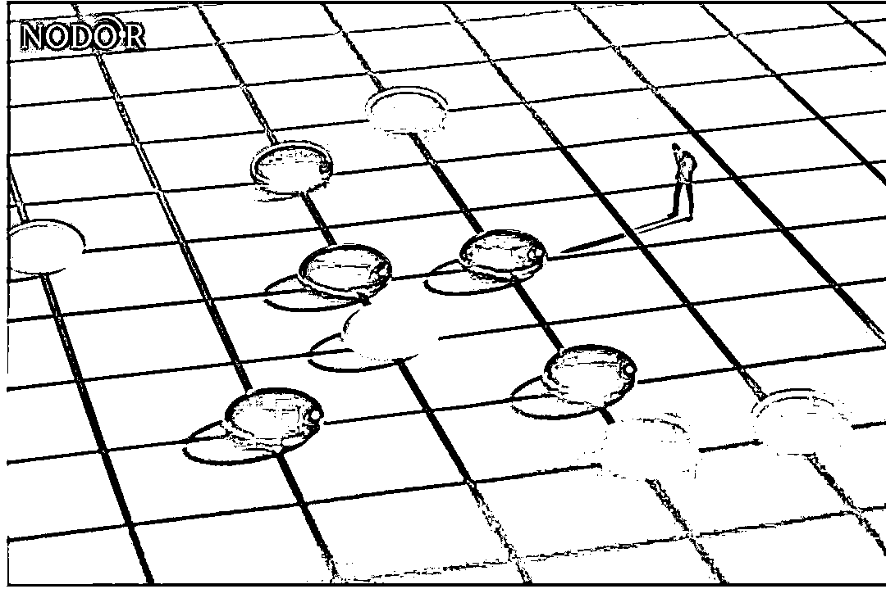

作者/雷蒙德·梅里曼 译者/Luke
编辑/玫瑰 图片/稿定设计雷蒙德·梅里曼是在金融占星学界稳坐第一把交椅的占星师，同时他也是若道签约的金融占星课老师，我们引进了雷蒙德·梅里曼老师的《[上证指数月度报告](http://mp.weixin.qq.com/s?__biz=MzA5NjA0NTAxNg==&mid=2651485664&idx=1&sn=bae9eb20d9f9cd407841b125f7fc553c&chksm=8b48c757bc3f4e418a1201d4aeb9a38f9203dbffab162bfa25222ea7fd77fef7ad660e7bd073&scene=21#wechat_redirect)》及《[黄金报告](http://mp.weixin.qq.com/s?__biz=MzA5NjA0NTAxNg==&mid=2651485664&idx=1&sn=bae9eb20d9f9cd407841b125f7fc553c&chksm=8b48c757bc3f4e418a1201d4aeb9a38f9203dbffab162bfa25222ea7fd77fef7ad660e7bd073&scene=21#wechat_redirect)》。我们经老师的授权，将每周刊登梅里曼老师的周运，供大家参考和学习。于是，这是本周的周运（9.19-9.23）。

**说明：以下时间采用纽约证券交易所所在地美国东部标准时间。**

**展望与回顾**

****

**在周二数据显示整体通货膨胀正在扩大而不是如预期般冷却后，美联储很可能会以高于此前预期的速度进一步提高美国借贷成本。劳工部报告称，上个月总体消费者价格比 7 月攀升 0.1%，比去年同期上涨 8.3%，而非经济学家先前预测的下降。**

**——安·萨菲尔**

**《随着通胀飙升，美联储变得更加激进》**

**www.reuters.com**

**2022 年 9 月 13 日**

**世界经济正经历 250 年来最大的结构性动荡，对政策太过确信和笃定可能是不明智的。**

**——保罗·多诺万博士**

**《俄罗斯轮盘赌》**

**www.ubs.com**

**2022 年 9 月 1 日**

这就是风象星座水星逆行，加上木星渐渐与土星、天王星形成八分相时发生的事。这就是为什么脊椎医生的需求大增，因为**自 9 月 6 日以来投资者一直在遭受金融市场的大幅震荡，这种情况可能会继续到 9 月 28 日，或许还会更久一点。** 

在水星逆行期间，我们期待假突破和对支撑位和阻力位的短暂冲击。这是恶作剧者水星的天性。它喜欢意外，喜欢拉锯，来来回回，每隔 1-4 天就发生一次。但是当恶作剧者水星在天王星（高阶水星）的领域活动时，意外变成了震惊，假突破变成了令人震惊的突破。上周的全球股市就是如此。对于美国经济的乐观者来说，那是一个巨大的失望。随着恶作剧者水星逆行，9 月 13 日的通胀报告出人意料的糟糕。市场暴跌。我们来回顾一下。水星在 9 月 9 日-10 日（取决于你所处的地点）转向逆行。美国股票指数在 3 天前的 9 月 6-7 日到达底部，随后道琼斯工业平均指数上涨超过 15000 点直至 9 月 12 日，在 9 月 9 日前一周的周五完成一个改变游戏规则的“跳空高开”（看涨）。**水星逆行期间，尤其是在风象星座逆行，往往涨势会在恶作剧者逆行的 4 个交易日内触顶反转。9 月 12 日是逆行后的第一个交易日，处于首次反转的时间段内。**在 9 月 13 日，出人意料的高通胀数字既对应了恶作剧者水星运行方向的改变，也对应了股市上涨的终结。比如说，道琼斯工业平均指数，又出现一个“改变游戏规则”的跳空低开，下跌 1276 点，是两年来最大幅度的下跌。

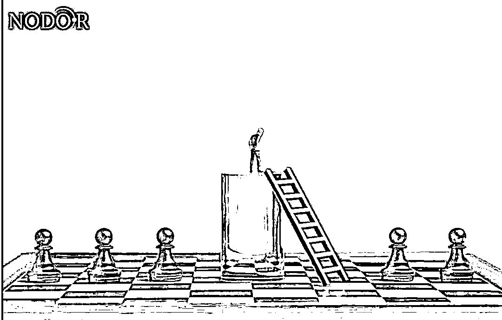

突然之间，美联储驾轻就熟地“软着陆”的叙事，变成了焦虑的源头，人们担心美国央行失去了对现实的掌控。由于行进冥王星正在对分美国建国星图中的海王星，美联储正处于一个两难境地。他们软着陆的错觉遭遇了艰难的现实，变成了一场噩梦。几乎全球所有股票指数都呈现处这样一种模式：9 月 6 日-7 日水星逆行前创下周期低点；随后水星逆行后的 1-2 天内，一轮涨势突破阻力位，直至 9 月 12-13 日；之后在 9 月 13 日发生了惊人的暴跌，持续至 9 月 16 日。唯一的区别是，一些股票指数（美国股指、AEX 指数、SMI 指数、中国上证和恒生指数）跌破了 9 月 6 日的周期低点，其他股指（DAX 指数、FTSE 指数、ASX 指数、NIFTY 指数、日经指数和 Bovespa 指数）则没有。**如果所有指数本周没有向下突破至月度新低，这种市场背离可能是看涨的。**

接下来两周有如此强力的地球宇宙学征象生效，任何事都可能发生。就像美联储陷入了是控制通胀，还是发生经济衰退的两难境地，地球宇宙学也给出了两种可能性，**要么是真正的恐慌和崩盘，要么是全球股票指数走势的巨大反转。**

这正是与水星逆行，以及木星正在与土星和天王星形成双重八分相相关的不确定性和潜在的危险。

尽管股票市场行为上周令人不安，黄金的表现更是拉响了警报。这一贵金属自 2020 年 4 月以来首次跌破关键支撑 1675+/-5。另一方面，白银守住了 9 月 1 日创下的 2 年低点 17.40，构成了市场间看涨背离。由于 9 月 16 日-26 日太阳接近（原油的守护行星）木星和海王星的对分相，原油价格也接近 1 月以来的最低水平。比特币和以太坊也像股票市场一样，表现出市场间背离，因为两者均下跌，但比特币守住了 9 月 7 日的低点，以太坊没有。

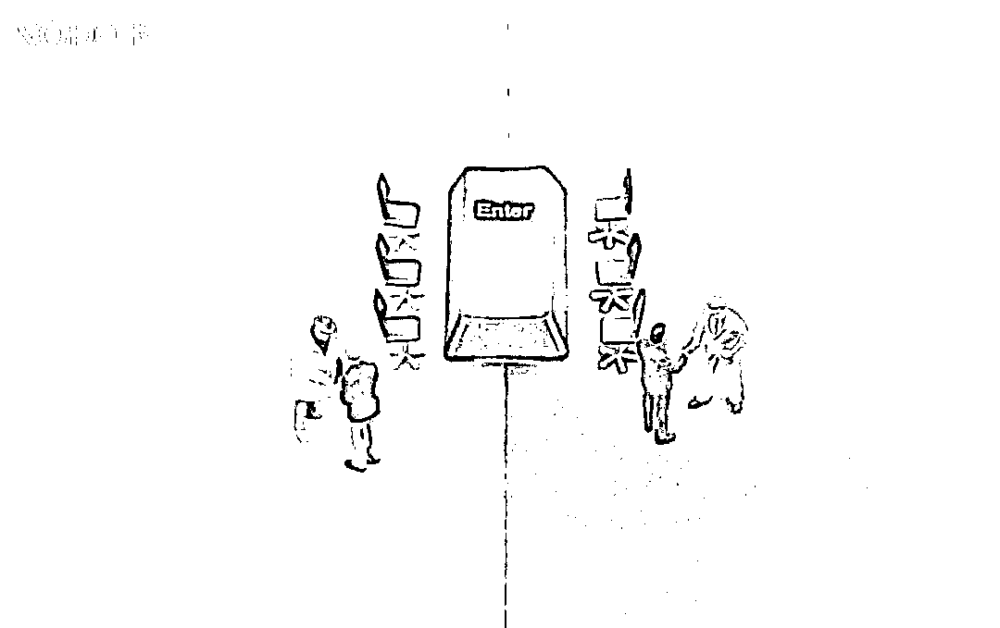

**短期宇宙征象与长期考量**

****

**乔·拜登说，“我们现在见证的，要么是美国再次伟大哲学的开始，要么是它的丧钟。这不仅关乎特朗普，而是整个哲学 ：我要说的是，这就像半法西斯主义”。****——克里斯托弗·卡德拉戈和奥利维亚·奥兰德****《拜登称特朗普的哲学为“半法西斯主义”》****www.politico.com****2022 年 8 月 25 日****按照拜登总统的说法，唐纳德·特朗普不是一个法西斯主义者，甚至不是半法西斯主义者。特朗普先生是一位机会主义者。他的意识形态是他气质的外延：两者都是无政府自恋主义者。****他给人的感觉就像和威利·萨顿一起穿越绿野仙踪，后者解释说他抢银行是因为“那里有钱”。如果今日的美国有法西斯主义者，你可以在左翼阵营里找到他们。他们是拜登先生和他的人民（包括媒体的推波助澜）。****自从 2021 年 1 月 6 日以来，这些人的观点已经固化为绝对的信仰，那就是除他们外的任何政党或政治信念都是非法的：不被允许的、不人道的、可怕的，是对民主的威胁（不错的切入点）。****——兰斯·莫罗****《拜登的演讲完全说反了》****《华尔街日报》****2022 年 9 月 4 日****我们正进入地球宇宙学飓风的中间时间段，它很容易变为俗世和金融市场上的飓风。但它可能会有个良好的结局。****目前是木星与土星和天王星形成三次双重八分相的第二次精准成相。**这一次，这两个地球宇宙学事件会在一周内相继发生：**9 月 21 日和 28 日**。也就是说，**木星会在 9 月 21 日与土星形成第二次八分相。**第一次八分相在 7 月 21 日精准成相，当时黄金在 1678 到达底部，然后仅在 3 周后，上涨几乎 150 美元，到达高点 1824 美元。黄金上周刚刚跌破那个价位，同时本周即将第二次成相。此外，**9 月 28 日也是木星与天王星形成三次渐亏八分相的第二次精准成相。**第一次在 5 月 11 日精准成相，当时股票指数在 4 月 21 日今年的第二个高点后，完成了双底的第一个底，之后于 6 月 16 日-17 日再次触底。但是本周我想要讨论的是木星-土星周期。对于经世占星师来说，可能没有周期比木星-土星更重要了。尽管有可能 45 年的土星-天王星周期及其各个阶段可能更加重要。**但是对于金融市场外的世俗事件，还是 20 年的木星-土星周期及其各个阶段最重要。**当前伟大的时主的 20 年周期，发生在 2020 年 12 月 20 日冬至，这是极其重要的，因为它标志了这一会合周期从土元素到风元素 800 年一度的转变。但是这个周期的前 10 年（渐盈阶段）常常被忽略，尤其是这个周期最初的 1/8 阶段以及它与社会、文化、经济和军事周期的关系。正如我的第一本书《进化占星学：灵魂在星图中的旅程》中所阐述的，**任何周期最初的 1/8 阶段是“放弃”的时间点**，这个时间点一个人要决定是继续周期合相开始时的新方向和目标，还是“放弃”它们。

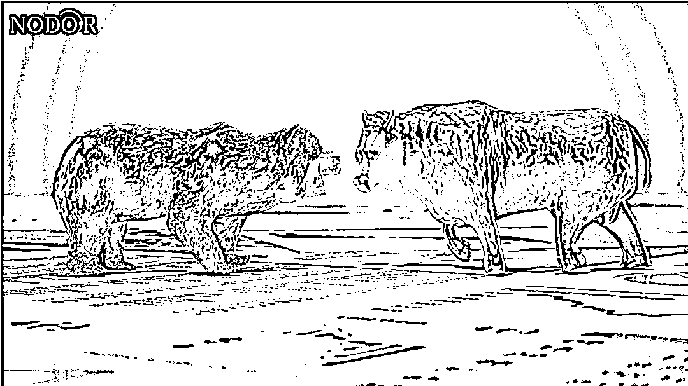

**周期的最初 1/8 阶段也被称为渐盈的八分相。我**们现在就处于这个阶段。事实上，它将精准成相三次，分别为**7 月 21 日、9 月 21 日（本周）和 2023 年 3 月 21 日**。讽刺的是，美国最高法院刚刚在国家层面废除了宪法规定的堕胎权利，使它成为中期选举最重要的竞选议题。那也是一个在政治和灵性层面上把国家分裂的议题。好消息也是从这里来的。尽管美国和世界其他地区已经非常分裂：一面是土星四分天王星象征的极端主义阴谋论，另一面是木星和土星渐盈阶段（2021-2030 年）象征温和路线促进成功和增长，但我们仍然有望理解这个周期。这第一个 1/8 阶段的八分相将在明年春初时结束。届时土星和天王星分裂和极端狂热主义的影响力将开始消退，起码从宇宙天象的角度来看是如此。下一个土星-天王星的渐亏阶段还要等 45 年。随着 2023 年春天结束，这两颗行星（木星和土星）不仅会开始与天王星分离，事实上它们之间还会在 6 月形成有利的渐盈六分相，这个更大周期的 1/6 阶段包含了建造和增长的主题。与其试图一下子改变所有，不如以一种有节制和渐进的步伐，让平衡和温和的道路占据主导，这就像是它将开启的季节。**这也可能是全世界的社会开始采取步骤变得成熟，找到让我们团结的共同点，而不是彼此分裂的时候**。与其在多样性中强调统一，我们开始理解统一中多样性的重要性。然而，目前而言，那个乌托邦看起来不现实和遥远。木星六分土星是勤奋的工作者，它努力工作看到自己劳动的果实。正如吉米·卡特说的，“通往世界和平的唯一障碍就是世界上的领导人们。”每个人都想要和平。正如约翰·F.·肯尼迪说的，“不要问你的国家能为你做什么，而要问你能为你的国家做什么。”当木星与土星渐盈，即将离开“放弃”阶段，进入新周期阶段，开始积极建设，创造新的法律和教育结构，为未来的社会服务时，负责是在各个层面上带来增长的必要品质。**长按下图了解更多详情**

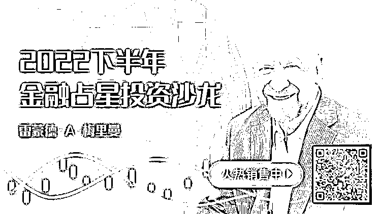

这是特别及时的讲座，因为为期 12 年的木星轨道周期会在 5 月 10 日进入白羊座，并且 6 月-11 月是一年中最有力的地球宇宙征象接连登场的重要时间段，因为土星逆行与天王星形成几乎精准的渐亏四分相。

**说明：以上日期基于纽约证券交易所所在的美国东部标准时间，由于存在时差，中国地区可能需要加一天。**

**版权声明：**本文由若道翻译发布，欢迎转发，反对抄袭。友号转载请申请白名单。**END**

**雷蒙德·梅里曼（Raymond Merriman）**

若道签约老师。著名金融占星师，ISAR（国际占星研究协会）前主席，梅里曼市场分析公司的总裁。他由于“提升了占星学的职业形象”，在 1995 年国际占星大会上被授予轩辕十四奖；在 2012 年国际占星大会上，被授予轩辕十四终身成就奖。

1“中国上证指数月度报告”发售**若道推出了****中文版****的雷蒙德·梅里曼中国上证指数月度报告，并持续发行该报告！**当把金融市场的周期和占星学的周期相结合时，雷蒙德·梅里曼老师的金融占星学研究**为投资者应对金融市场的周期波动，并随之调整投资策略提供了极大的价值参考**。
**9 月中英文报告已上线！**2“黄金价格周期月度报告”发售**若道推出****中文版****的雷蒙德·梅里曼黄金价格周期月度报告！**不仅仅为广大读者在中国股市的投资出谋划策，更将视角放眼黄金市场。**每当世界经济形式不明朗的时候，有一个地方是保值的港湾，那就是****黄金**。自 1982 年雷蒙德·梅里曼出版第一本研究《地球宇宙学征象与黄金价格的关联》的著作以来，**他一直作为最重要的黄金市场时机预测者之一享誉国际**。2022 年 9 月黄金报告已上线，梅里曼老师将会告诉你他对这个关键时期如何操作的想法。也可以按照季度和一年期订阅，有更多优惠。季度和年度的好处是，你可以持续了解梅里曼老师对于不断在变化的市场的看法。即便他某一次看法和市场不一致，你也看到在下一期他如何调整自己的看法，并看到金融占星在一个长期时间段内对你把控风险的帮助。而能够长期控制风险、尽量找到安全的投资时机才是投资的长久之计。**9 月中英文报告已上线！****购买套餐**，买得越多越优惠中国上证指数月度报告套餐价

*   **单月报告**：280 元
*   **3 个月套餐**：780 元（260 元/月）
*   **12 个月套餐价**：2400 元（200 元/月）

**长按下图识别二维码****购买金融报告****套餐****▼**

黄金周期月度报告优惠

*   **双报告年度套餐更优惠（直降 900 元）**

*   **12 个月黄金报告+12 个月上证指数报告：仅需 3900 元**

**长按下图识别二维码购买黄金报告套餐**▼

3《2022 下半年金融占星投资沙龙》这是特别及时的讲座，因为为期 12 年的木星轨道周期会在 5 月 10 日进入白羊座，并且 6 月-11 月是一年中最有力的地球宇宙征象接连登场的重要时间段，因为土星逆行与天王星形成几乎精准的渐亏四分相。

**长按下图识别二维码了解详情**

▼

**点击阅读原文购买金融报告**

# 插班中丨 ISAR 认证职业占星师文凭课程：开启“爱好变职业”的创收自由之路

> 原文：[`mp.weixin.qq.com/s?__biz=MzA5NjA0NTAxNg==&mid=2651489086&idx=3&sn=7a407b5f740553ae128bfac98e141283&chksm=8b483189bc3fb89feaca4cb4102edafcb8a0a762053b6b185f323aa26bacb80d819f86a45fd3&scene=126&sessionid=1692737751#rd`](http://mp.weixin.qq.com/s?__biz=MzA5NjA0NTAxNg==&mid=2651489086&idx=3&sn=7a407b5f740553ae128bfac98e141283&chksm=8b483189bc3fb89feaca4cb4102edafcb8a0a762053b6b185f323aa26bacb80d819f86a45fd3&scene=126&sessionid=1692737751#rd)

**2022 年，是世界和中国 40 年未有之大变局的开始。**

俄乌战争打破了欧洲大陆乃至全世界的和平局面，而新冠疫情也给中国经济带来前所未有之挑战。

如果你关心经济形势和世界局势，你会有这种的感觉，我们将面临一场深刻的危机，而这不是短期内可以结束的。

**占星学的看法也是如此。**

4 月青年失业率（16 岁到 24 岁）中国达 18.2%，一些背着房贷、教育、医疗负担的中年人突然失业更是整个家庭整个难以承受之重。为了更好准备面对这样的时代变化，连《北京日报》这样的官方媒体也在呼吁：**“开拓副业，让自己有多元化发展的生存能力”。**

**而这门课程，就是为了这样一个目标准备的。**

**占星学是非常好的“开展副业”的选择**

这个**为期 16 个月**的课程通过并不算长的时间和并不算高的投资，不仅可以帮助你学到一个终身可用的技艺，而且也可以选择成为自助助人的占星师，**开启受益终生的第二事业。**未来是个体崛起的时代，大量个体被鼓励独立发展，比如网红、自由职业、自媒体、咨询师等，他们都不需要传统的办公室。社会越发达，人的独立性就越强，未来有能力的人都可以变成独立的经济体。

**占星学也是越老越好的职业**

和一些技术变化非常快的职业不同，**占星学的技术层面非常稳定，不会快速迭代变化，**同时，掌握好占星学、能够做一场好的咨询又需要个人自身大量实践和对生命的深刻理解，而这些都是时间和岁月带来的。

**占星学是现代社会需要的助人职业**

社会快速发展和变化人们似乎越来越无法掌控自己的生活，这给很多人带来巨大的焦虑，**抚慰心灵的咨询市场需求巨大。**而占星学可以让人从前所未有的角度了解自己，了解目前和未来所处的周期，挑战的意义，不论对于深入的个人成长探寻，还是预测未来的周期，都又其独一无二的价值。

**ISAR 认证职业占星师的独有培训**

目前占星学的培训市场鱼龙混杂。而 ISAR（国际占星研究协会）是一个包含了 47 个国家在内的国际占星组织，多年来致力于占星的教育和研究，提升占星教育的品质和职业占星师的能力，在国际占星领域备受尊重。今年，ISAR 对于成为 ISAR 认证职业占星师提出了更高的要求，**所有想要获得 ISAR 职业占星认证的申请者均需要在 ISAR 的附属学校通过 500 个小时的研习（包含****主课****、选修课、沙龙、作业、讲座、工作坊等等）。**

**而这门核心占星学课程就是为此而准备的。**

**2022 年，鉴于对若道在占星教学领域所做的持续努力和高品质的课程服务，ISAR 特别授予若道核心课程为 ISAR 文凭课程，所有在若道学习，并通过若道毕业考试的同学将获得 ISAR 颁发的学历文凭（Diploma）。**

**你的占星核心课老师是谁？**

**拥有****51 年****占星实践经验的****若道创始人****前 ISAR 全球副主席****前 ISAR 全球职业占星师资质认证主席****大卫·瑞雷**

**和**

**2019 年第二届、2021 年第三届核心课中**

**与苏·汤普金斯老师****联合授课****的**

**ISAR 认证职业占星师**

**咔咔（Caroline）**

**二人合力打造**

**2022 年 ****若道全新核心占星课程**

**咔咔老师给同学的寄语：**

（向上滑动查看内容）

**亲爱的同学们：**

我为什么学占星学？

2000 年的时候我还是一个在网上搜索天蝎座和水瓶座配不配的普通白领。我搜索的内容还包括了水瓶座为什么总是这么若即若离？

体贴的搜索引擎给我推送了占星学、行星、星座、宫位、相位等资料，还让我了解到莉莉丝、月亮交点、截夺宫位等占星学概念。

2000 年 10 月我了解到，一个从业 30 多年的美国职业占星师大卫·瑞雷来到了中国，和他的中国合伙人将开办一个专业教授占星学知识的课程。过去 10 个月在网上东拼西凑的占星学知识唤起了我对占星学的兴趣，但是已经不能满足我对星图深度分析的需求了。

2013 年，我通过了若道核心课程的毕业考试和国际占星师研究协会的认证考试。2015 年我离开职场成为一名全职占星师。

到底学习占星带给了我什么呢？

1、它是自我觉知的工具，我现在已经不去纠结哪些星座是否匹配，我相信外在的事件是内在心理矛盾的显化。也就是说，想找到令人满足的亲密关系，要先去了解自己的情感模式和需求，而不是无意识地一次次地试错和撞墙。我开始学习自我关怀和接纳自己。

2、它带来看待世界的全新和全景的角度，天上如是，地下亦然。人类社会和个人生命的进化都有其周期和相似性，作为个体，占星学帮助我思考如何更积极和有建设性地与宇宙的能量合作，认识自己，发挥自己的潜力，度过有意义且自我满足的人生。

3、它带来了全新的职业：占星师和占星老师。除了收入，还有助人育人的满足感和意义感。

4、它带来一群志同道合的伙伴，我们彼此联结又相互独立。

作为中国占星界的“黄埔军校”若道占星的学生、助教和老师，我与很多学员在人生的不同阶段带着各异的需求走进了这所学校，2022-2023 年一年半的若道核心课程设计既蕴含了大卫·瑞雷老师的教学精华，也带入了我在跟随不同国外占星老师学习、助教和教学积累的心得。

有一些学员毕业后从事了占星咨询工作，有的在各大平台成为专业占星学知识的输出者和传播者，有的运用占星学提升他们的工作，也有的在占星学与投资，占星学与名人/八卦、占星学与原生家庭、亲密关系、亲子关系等领域收获了有用的或者有趣的体验。

对我来说，生命是一场自我完整的体验之旅。从 2011 年的那个春节在若道入学之后，我的生命旅程更加充实、有意义、有目标，也更有满足感。

希望在 2022-2023 年的若道核心课程里见到你。希望你此后的生命旅程里，有若道，有占星学。

占星师咔咔

2022 年 5 月 24 日

**大卫老师给同学的寄语：**

（向上滑动查看内容）

亲爱的学员们：

感谢你对我们从 8 月 30 日开始的若道 L1-5 级核心课程的兴趣。我和合作老师咔咔以及我们的核心课程团队期待着为你提供这个机会，来教授各种高品质的地道占星学知识和技巧。

对于那些希望获得 ISAR 职业占星师认证的学生，这是一门适合你的课程！

作为 ISAR 咨询技能培训的一部分，我曾与咔咔合作过，我们期待着再次合作。咔咔和我曾在 ISAR 职业占星师认证委员会（CAP ISAR）一起工作，我们非常熟悉获得 ISAR 职业认证的流程。作为你的老师，我们将陪伴你整个占星学发现之旅，帮助你逐渐认识到占星学有多么的神奇。此外，你还将受益于我们若道的助教和课程顾问，他们是若道核心课程计划的重要组成部分，提供在线沙龙、组织学习小组、指导家庭作业。我们的教育团队是“服务于你的团队”，所以也会根据你的需求进行相应的调整。你专用的核心课程微信群也促进了你的学习过程，使你能够每天与你的同学们一起学习、探讨、成长。

52 年前，当我开始学习占星学时，没有一所像若道这样的学校。如果有这样一所学校，我会尽一切可能在那里成为一名学生。事实上，我很幸运，我的老师都是经验丰富的专业占星师。然而，我花了 6 年的学习时间才通过 1976 年在美国乔治亚州亚特兰大举行的专业占星师考试，又花了 2 年的专业实践时间才通过占星学谋生。我永远不会忘记从 1970 年到 1978 年的 8 年，那些日子的反复试验教会了我如何苦练占星学。作为老师，我一直在努力传授我早年所学的知识，让你的旅程更加顺利，更加全面。

自 1978 年以来，44 年的全职实践教会了我很多，我很高兴有机会与大家分享我所学到的东西。我和咔咔都是现代占星师，虽然我们尊重西方占星学的历史和传统，但我们实践和教授的占星学植根于现代人本主义哲学，这种哲学旨在提高你对自身潜力的认识，并鼓励个人成长。还有什么比了解自己更实际的呢？还有什么比个人成长和发展潜力更有利的呢？这是你将要学习的占星学，一种可以应用于你自己生活的占星学，一种可以为你提供一个充实职业的占星学。

教书是我回馈占星学行业的方式，这个行业拓展了我的视野，远远超出了我曾经想象的可能。谢谢你给我这个机会做你的老师。

大卫·瑞雷

2022 年 5 月 24 日

**连报 L1-5 全阶网络直播课程，你可以享受**

❶ 64 次线上直播互动网络课程+2 场工作坊，全面而详细地讲解占星学知识、技能、案例和重要领域实践运用。

❷ 知识点+学员星图解读有机结合：咔咔老师以讲解知识点和中外名人案例为主，大卫·瑞雷老师以参课学员案例演示及客户案例为主，每个知识点覆盖班级内学员的亲身案例，参与感更强，多位学员都有机会听到自己的星图分析。

❸ 微信群学员互动分享，从真实案例学习生命成长故事。

❹ APP 答疑论坛提问：论坛上每个学员的问题都将得到及时回复。

❺ 若道独有的职业占星师养成计划，为你毕业后独立咨询做准备。

**❻ **提供**咨询平台**，只要努力，优秀毕业生有机会入驻**若道咨询平台**，拓展咨询客户群。

**更多了解老师和助教？**

**大卫·瑞雷（David Railey）**

*   **I****SAR 董事会成员，ISAR 全球副主席，ISAR 全球职业占星师资质认证主席，若道占星创始人**。

*   2016-2019 年，被选为国际占星协会（ISAR）考试委员会成员，国际占星协会（ISAR）是世界最大的国际占星机构，会员遍布 47 个国家。

*   2017-2020 年，被选为国际占星联盟（ISAR）考试委员会主席，理事会成员。

**占星师咔咔（Caroline）**

2010 年师从美国占星师大卫·瑞雷学习，并得到世界名师斯蒂芬·弗里斯特、罗伯特·汉德、苏·汤普金斯传授各种占星学技法。若道首届学员，国内最早获得 ISAR 职业占星师资质的职业占星师，多次担任若道核心课程助教，并于 2019 年第二届、2021 年第三届核心课中和苏·汤普金斯老师一起教授若道核心占星课程。

在国际知名广告公司和市场研究公司从事的市场研究和推广工作十余年，曾任职于阳狮集团、尼尔森市场研究有限公司、MTV 和《Madame Figaro》杂志。

**助教王嘉祺 （Conrad）**

ISAR 认证占星师、若道认证生时校正资质，从 2010 年起自学占星学，2015 年开始在若道系统学习，并开始个案咨询。2018 年担任若道核心课程助教，以及卜卦占星学和太阳返照选修课助教，并带领学员进行经世占星和太阳返照方面的研究。2019 年 11 月作为演讲人之一参加了国际占星协会（ISAR）北京大会，也是 ISAR 星空俱乐部中国区第 16 期的主讲人。

**什么人适合这门课？**

*   对占星学有浓厚兴趣，想要系统学习占星学。
*   对占星学有一定基础，但不知道该如何整合星图复杂的碎片。
*   希望成为优秀的占星师，想要借鉴国际大师解读思路并融入自己的体系。
*   想学习占星学，但不擅长英文，希望有中文老师授课。
*   想结合占星学理论与咨询实践。
*   走在自我探索和个人成长道路上的人。

**课程费用**

**★ 1-2 阶 （8 月 30 日开课）****课程费用：3500 元 ****★ 1-3 阶　连报****课程费用：11500 元 **********转发优惠价：**11000 元（朋友圈转发本课宣保留 24 小时以上，并截图给课程顾问）********★ 1-5 阶 连报****课程费用：46500 元** **转发优惠价：34800 元（朋友圈转发本课宣保留 24 小时以上，并截图给课程顾问）**

**咨询课程请联系顾问**：**王老师（微信/手机：18510107057，请备注“大卫核心课”）**

**退转课程**

**退款原则请详看《教学协议》，如有疑问请咨询课程顾问。**

****2022 L1-5 认证职业占星师必修课程****

**授课老师：大卫·瑞雷、咔咔**

**直播课开课时间：2022 年 8 月 30 日（周二）**

**授课方式：******网络授课，英文/中文授课，中文翻译****

**费用：******1-2 阶**：**3500 元；****1-3 阶**：**11500 元******（****转发优惠价：**11000 元，朋友圈转发本课宣保留 24 小时以上，并截图给课程顾问）；**1-5 阶连报**：46500 元**（****转发优惠价：34800 元，朋友圈转发本课宣保留 24 小时以上，并截图给课程顾问）******

**课程负责人：王老师**（微信/手机：18510107057，请备注“大卫核心课”）

长按二维码添加课程负责人咨询~

**END**

****报名直达入口****

# 周末树洞丨亲密关系里的哪一瞬，让你产生幻灭感？

> 原文：[`mp.weixin.qq.com/s?__biz=MzA5NjA0NTAxNg==&mid=2651489037&idx=1&sn=e1de967ecd230ccbcb81c6010820d7ea&chksm=8b4831babc3fb8ac7e34399fe3a5975e049fb63c412003c50c32cd136c6712953c41d5a624f5&scene=126&sessionid=1692737756#rd`](http://mp.weixin.qq.com/s?__biz=MzA5NjA0NTAxNg==&mid=2651489037&idx=1&sn=e1de967ecd230ccbcb81c6010820d7ea&chksm=8b4831babc3fb8ac7e34399fe3a5975e049fb63c412003c50c32cd136c6712953c41d5a624f5&scene=126&sessionid=1692737756#rd)

**2022 年 9 月 17 日天象：**

*   **月亮在双子座**
*   ******太阳对分海王星******
*   ******金星四分火星******
*   ******土星四分天王星******

在六星（冥王星、海王星、天王星、土星、木星、水星）逆行的日子里，你过的如何？这是一段需要安静修心的日子，金星正处于处女座的位置，告诉我们要低调谨慎，好好梳理我们的思想、生活和目标，以便再次出发。

这几天，处女座的金星和双子座的火星呈紧密四分相，阴阳两股能量间的纠缠可能点燃浪漫的激情，也可能在关系中引爆冲突和怒火。今天月亮在双子座，和处女座金星一同被逆行的水星掌管，不知道水星能否让人们通过反思变得理智一些呢？太阳对分海王星，我们也许会太过浪漫的看待一段关系，太理想的看待自己，或是被自己的想象所欺骗，不如先投入灵感和艺术的世界，让思绪放飞，获得新的领悟。

金星四分火星、太阳对分海王星，亲密关系里的哪一瞬，让你产生了幻灭感？来聊聊吧~周六快乐！我们周一见！**了解每日天象，可****下载“若道”APP 查看****还有更多精彩等着你哦**

# 医疗占星案例丨如何从星图着手，缓解冠心病人巨大的内心压力？

> 原文：[`mp.weixin.qq.com/s?__biz=MzA5NjA0NTAxNg==&mid=2651488952&idx=1&sn=b49e7a61ce0a22244f66ffced0ca36b6&chksm=8b48300fbc3fb919e2467541115f5d14a5a6b2f61850b02203cc7b34e4ca240b600c035a84a8&scene=126&sessionid=1692737756#rd`](http://mp.weixin.qq.com/s?__biz=MzA5NjA0NTAxNg==&mid=2651488952&idx=1&sn=b49e7a61ce0a22244f66ffced0ca36b6&chksm=8b48300fbc3fb919e2467541115f5d14a5a6b2f61850b02203cc7b34e4ca240b600c035a84a8&scene=126&sessionid=1692737756#rd)

******☆ ****后台回复“今日”，给你一句生命态度******

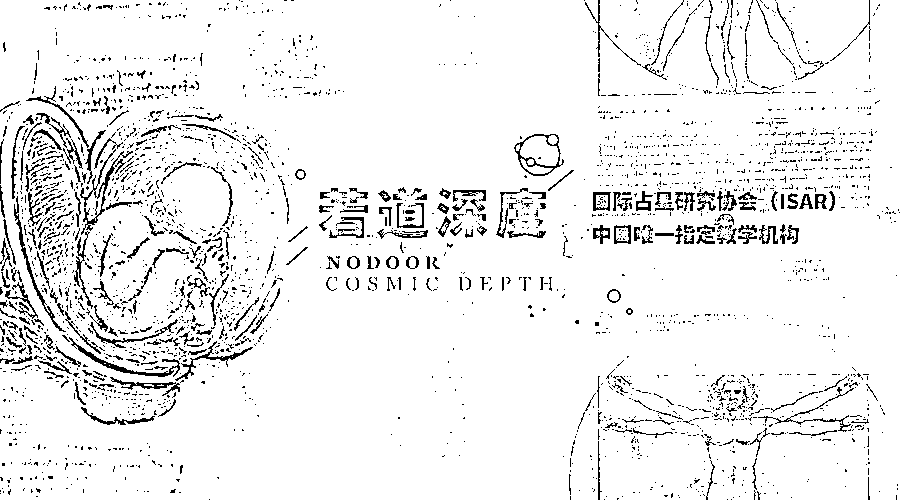

作者/苏·汤普金斯

译者/天空的空

编辑/翀子 封面/书君  图片/稿定设计

本文记录了用占星学帮助冠心病病人聚焦内心压力、并提出健康方案的过程，非常值得收藏。如果你对由简·里德尔·帕特里克老师教授的医疗占星学感兴趣，可以点击[【课程】](http://mp.weixin.qq.com/s?__biz=MjM5MjQwNjAyMQ==&mid=2649440251&idx=5&sn=59e50c08880ec005b741789467f06204&chksm=beb9509189ced9877731e3330bc1e8483881e4ee51a3c3f6d401a084923d6b63887d06924700&scene=21#wechat_redirect)查看课程信息哦~

**退休后的心脏病案例**

乔治的案例描述了发生在较为晚年时期的心脏病案例。

乔治即将在 7 月 1 日（周五）迎来退休，他的工作聚会也安排在那天晚上。在他退休前的那个周一，他遭遇了第一次心脏病突发（心肌梗死），被急速送往医院。

在这个周一之前的周日（6 月 25 日），他在家里做事，让自己过于劳累了。他被安置在重症监护室，几天后，医师团队说他们认为他脱离了危险。

接下来的周五——也就是他的最后一个工作日，他被转到普通病房，几小时后，他在病房里停止了心跳，电击疗法没有起到作用，然后他去世了。

事实上，对他来说退休代表了一次危机。

长久以来，他一直期盼着退休，但当它真正来临时，却成了一次震惊，他还没有准备好。**退休的想法对他的压力要比工作大得多，让他感觉难以承受。**他那么多的身份认同都被包裹在工作之中。

**这一切都是由行进的土星/天王星合相他的第六宫太阳所描述的。**更为年轻的人对土星/天王星合相他们的太阳，无疑会有非常不同的体验。

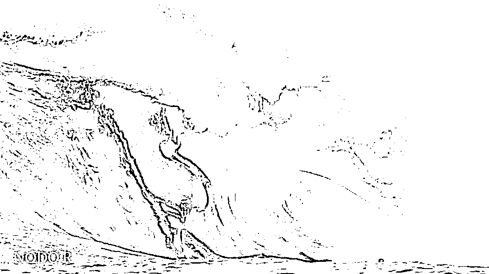

**早年或中年的心血管疾病**

**相比之下，发在早年或中年的心血管疾病，出生星图的征象就会非常清晰。**

这方面的案例可以在迪克·切尼（2001-2009 年任美国副总统，前国务卿）的星图中看到（下图）。

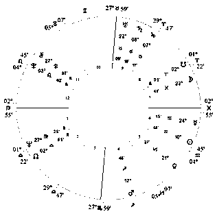

切尼遭受第一次心脏病突发是在 1978 年，那时他 37 岁；接着又发生了多次心脏病突发，分别是在 1984、1988、2000 和 2010 年。同时，他还在某一时期患上了深静脉血栓。

他在 1988 年做了心脏搭桥手术，2000 年做了支架植入术，2011 年做了气囊血管成形术，2012 年又做了各种其他手术以及一次全心脏移植手术**（这时太阳弧天王星合冥王星，与出生图的火星成八分之三相）。**

**我们的星图不仅展现了可能给我们的健康施加压力的因素，同时也展现了我们的健康资源。**

切尼拥有的资源之一就是他的资金；他有一个土相星座大三角落在土相宫位，他有能力负担这些外科手术。从身体或健康的角度来看，失势和落陷的行星似乎不利于它所象征的身体部位。

这里太阳落在它的失势星座水瓶座（并且落在第六宫），而且更重要的是，它与四个主要行星形成困难相位，即木星和土星（四分相），海王星（八分之三相）和冥王星（对分相）。

切尼通常被描述为美国历史上最有权势、最具影响力的副总统，有时候他“离总统之位只差一步”。

他生于富兰克林·罗斯福 59 岁生日那天，出身于一群坚定的民主党人士之中。虽然有民主党的传统，但他的共和党资历是不可否认的。他积极参与美国的反恐战争和伊拉克战争，主张防御，强烈拥护水刑以及其他高级的审讯技术。

|迪克·切尼

**火星在第四宫射手座**（四分他的月亮，与冥王星和天王星成八分之三相位）可能描述了一个为了让外国人远离祖国而战斗的人。他出生于第二次世界大战期间，为了他的家园、根和传统而战斗，因为他认为它们正处于威胁之下。

这张星图可以说明很多事情，火星的相位无疑是相关的，**但是我想把目光聚焦在涉及太阳的 T 三角上。**

这确定无疑地描述了内心的巨大压力；**木星落在木星的宫位第九宫，合相土星，并与太阳形成紧密的四分相，**真是祸不单行。

你可以将**木星/土星落在第九宫**阐释为对外国人的恐惧；这当然描述了他对外国人的惩罚，他对他们采取强硬的态度。

由于涉及**冥王星**，他全身投入外交政策和防御问题。他的自传同时也暗示着他的感情受到那些被他视作比他更有教养的人的威胁和蔑规。

和乔治·沃克·布什（切尼在他当政期间曾任两届副总统）一样，切尼是卫理公会教徒。卫理公会的一些成员曾为入侵伊拉克一事公开指责他和布什。

在平常的生活中，玩弄政治上和宗教上的歧义条款是没有问题的，但如果你渴望高等政治职务就不行了。那么无疑，唯一的应付办法就是将怀疑（宗教、政治和道德怀疑）坚决推入潜意识中。

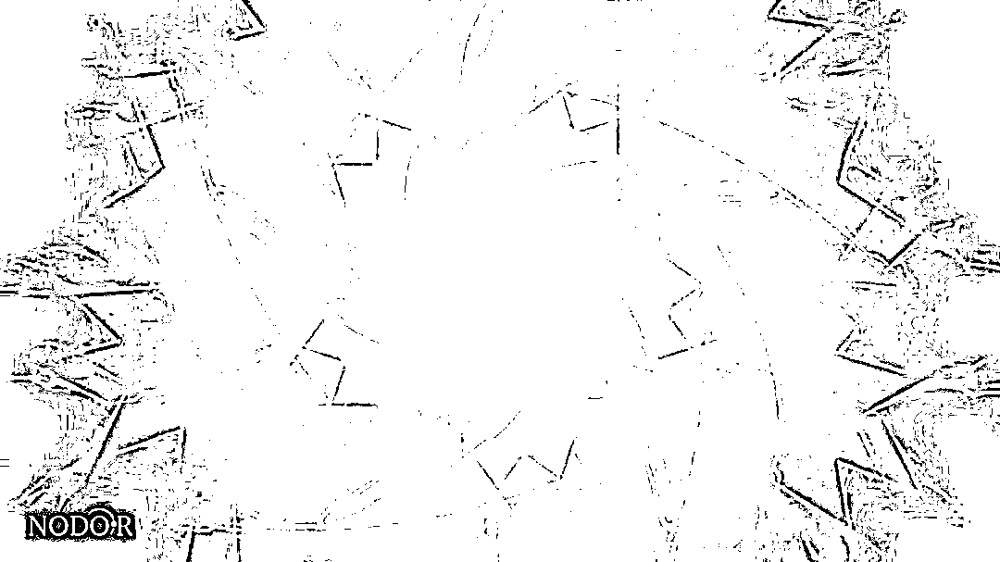

即使如此，**木星与太阳的合相意味着这个人有着强烈的是非观，**当他未能达到自身的高标准时就会感到罪恶。他不断提到自己年轻时候的出格行为，甚至短暂的监狱生活。行为出格对他来说是不可原谅的。

**中天落在金牛座，**财务短缺的恐惧或任何威胁到安全的事物都可能是他右翼倾向的另一个理由。

**切尼的太阳在水瓶座，月亮在双鱼座，对分海王星，**意味着宽容、同情、敞开心扉。频繁的心脏手术确实迫使他多次在身体层面上打开心脏。

他对“异物”的怀疑也表现在身体层面上（如果血液凝块可以被看做异物的话），过去三十多年以来，血液凝块是最有可能将他杀死的事物。

切尼在早年生活的二十多年每天都抽三包烟，这必然与他的心脏病脱不了干系——**或许月亮在双鱼座，再加上太阳和月亮都与海王星成困难相位，为潜在的上瘾问题提供了一条线索，**而水星四分天王星无疑也有关系。

可以说，吸烟是一种反抗行为。吸烟的人都说他们用烟草来帮助自己应付压力。

在涉及严重健康议题的案例中，命运和意志自由的问题被抛了出来。

切尼是不是注定要患上心脏病？乔治是否注定要像那样在六十六岁时死亡？与此类似的问题还有：某人是否注定要结三次婚，或者着迷于钓鱼？

这些我们都无法知道。我自己的感觉是，当某些征象压倒一切时，可能确实描述了特定的情形。

切尼是否可以避免在他三十七岁时遭遇心脏病突发，这可能是一个完全不同的问题。**生活方式无疑是我们患上各种疾病的重要原因。**通过改变生活方式，我们或许能够改善这种情况，或者将这种情况推迟。

尽管疾病让我们感到害怕，我们也不应该将它想象得如此消极。**疾病提供了一条个人成长、精神发展和灵魂学习的道路，**就像我们的人际关系、工作或生活的其他方面可能提供给我们的一样，而且或许比那些更有效。

**占星师的作用是什么？**

在这里读者必须自己决定。

就我个人而言，**我强烈地感觉到占星师不应该告诉别人他们潜在的疾病是什么**（除了非常笼统地说），除非他们有相应的医疗资质，或许即便那样也不应该。

跟普通人暗示他们可能容易患上某种特定疾病，无异于激发恐惧，此人的自我暗示和恐惧心理将提高他患上那种疾病的几率。

而事实上占星师无法知道。虽然我在这里讨论心脏病的征象，但是大多数人会以一种不影响他们健康的方式活出自己特有的能量，因此占星师应该鼓励他们这样做。

我们的工作当然是鼓励客户尽可能以一种有效而健康的方式运用他们的技能和星图。**占星师们能做的，就是聚焦于压力。**

（按：本节有“学习兵法是为了阻止甚至消灭战争（不战）”的意味，妙！）

压力通常被定义为一种状态，人们在这里面临着一种被认为危及他们身体或心理健康的情形，同时还不确定他们是否有能力应付过去。因此这个人对这种情况的认知评价决定了他们所体验的压力的程度。

换句话说，压力不像是发生在我们身上的事情，而更像是关于我们如何看待这种情况，以及我们是否觉得有能力应付它。

**压力的根源包括创伤性事件、主要的人生变故、日常烦恼，或许更有力的还有内在冲突。比如通过我们星图中的困难相位或是通过行进与次限/太阳弧所描述的冲突。**

如果乔治是我们的客户，我们必然会同他讨论即将到来的退休，并探讨在不久的未来，他可能会把心投入到哪里。

而对于迪克·切尼，他拥有一个极富压力的工作，但是如果他是我的客户，我会对他的内在压力感兴趣，比如他的信仰、他的道德观、他个人的“理应和应该”，以及它们彼此抵触的程度。

**人们常常在感觉到压力的时候去寻求占星师的帮助。我们可以提供帮助，我们可以关注指定的议题，或许给他们提供新颖的、不同的规角，或讨论如何应对这些既定困难。虽然我们不可能让问题消失，但我们可以增强我们客户的力量。**

我们可以帮助他们实际地评估既定的任务，感到能够胜任它。**我们可以提供一个空间，让恐惧和怀疑随风飘散；提供一个地方，让力量得到提升，让潜力升起。**

通过这样做，占星师从根本上涉入了压力管理，如果有效处理，就有助于将所有健康问题的可能性降到最低。

**版权声明：**本文由若道翻译发布于若道平台，欢迎转发，反对抄袭。友号转载请申请白名单。

**END**

**苏·汤普金斯**

若道签约老师。英国目前最资深的占星学家和咨询师之一，她拥有超过四十年的占星经验。占星学习者必备之两本圣经《当代占星研究》和《顺逆皆宜的人生》作者。苏是伦敦占星学院这所享有盛名的专业学府的创办人，曾任英国两家最著名的占星学院校长。2003 年，为表彰其卓越贡献，英国占星协会为苏·汤普金斯授予查尔斯·哈维终身成就奖。苏同时是一位接受过心理学与心理咨询训练的注册顺势疗法医师，并经常在英国、法国、挪威、瑞典、澳大利亚等地举办占星研讨会和公开演讲。

**快来和简·里德·帕特里克老师学习升级版的占星学身体地图吧！**

**简·里德·帕特里克 **博士****

（Jane Ridder-Patrick）

简接受过药剂师、理疗师、草药师、心理治疗师和历史学的专业学习，从事写作、咨询和讲学工作，在英国和全球教授占星学及其历史、当今的心理学和医学应用。她在爱丁堡执业，在爱丁堡大学获得博士学位，研究方向是 17 世纪苏格兰占星学历史。

**她最著名的出版物是《医疗占星手册》。2018 年，她因对医疗占星学的贡献而获得了著名的查尔斯·哈维占星学杰出服务奖。**

**医疗占星包含哪些内容？**

本课程既适合医疗占星学的初学者，也适合已经有一些相关经验的人。
简·里德·帕特里克老师将运用现实生活中的例子，揭示一个人的性格、症状及其星图是如何相互映照的。课程也会探讨疾病的意义以及可能的治疗方法。本课程旨在为学员提供一个运用医疗占星学的框架和方法，学员将会学到一些有价值的实用工具，在课程结束后，自己使用这些工具研究其中的关联性。**此课程可作为 ISAR 选修课。****学习医疗占星学****点击下图了解课程详情**

**20 位来自世界各地的占星师****带来 19 场沙龙——新世界的觉醒****详情可点击下图**

**学习占星学****点击下图了解课程详情**

**微信又双叒叕改版啦，不想错过若道君的推送？**

**就把若道设为星标吧！**

**▼**

**喜欢就点一下“在看”吧！**

********报名直达入口********

# 2022 年若道 ISAR 选修课 | 《医疗占星手册》作者亲授（下周二开课）

> 原文：[`mp.weixin.qq.com/s?__biz=MzA5NjA0NTAxNg==&mid=2651488952&idx=2&sn=d12d0d37678a8ced3a7d745f12061506&chksm=8b48300fbc3fb91997962889df1f7a34c713115d370b5171c597ef14fec3067f972c76501650&scene=126&sessionid=1692737756#rd`](http://mp.weixin.qq.com/s?__biz=MzA5NjA0NTAxNg==&mid=2651488952&idx=2&sn=d12d0d37678a8ced3a7d745f12061506&chksm=8b48300fbc3fb91997962889df1f7a34c713115d370b5171c597ef14fec3067f972c76501650&scene=126&sessionid=1692737756#rd)

**有四个主要因素影响着我们的生活和健康：基因构成、物质环境、情绪环境，以及我们的占星配置。我们在星图中都存在患病的可能性，而预防的方法在于尽可能充分、真实和健康地生活。****——简·里德·帕特里克****（Jane Ridder-Patrick）博士**

占星学就像心灵的 X 光片。它可以描述个人对世界的看法和反应。我们越不了解自己的天性，面对生活中的挑战，我们就会有越少的选择。

**“占星学可以精准定位需要解决的潜在问题。”**

**医疗占星学是一个强大的工具，同时洞察的身体和心理过程，通过更多的自我认知照顾和关爱自我和身边的人。**

**本课程既适合医疗占星学的初学者，也适合已经有一些相关经验的人****。**简·里德·帕特里克老师将运用现实生活中的例子，揭示一个人的性格、症状及其星图是如何相互映照的。课程也会探讨疾病的意义以及可能的治疗方法。

**本课程旨在为学员提供一个运用医疗占星学的框架和方法，**学员将会学到一些有价值的实用工具，在课程结束后，自己使用这些工具研究其中的关联性。

**此课程可作为 ISAR 选修课。**

1

**课程安排**

**课程时间：2022 年 9 月 20 日-11 月 8 日  每周二 20:00-22:00**

**第*****1*****讲  9 月 20 日 与占星学、心理学、病症一起工作**

*   医疗占星学的组成部分以及如何使用它们

*   行星的作用与相互作用

*   黄道星座人

*   宫位的重要性

*   疾病和健康是如何产生的

**★ 第二、三、四讲的课程内容基于星座以及它们之间的相互作用。**

**第*****2*****讲  9 月 27 日 基本星座**

学习基本大十字星座——**白羊座、巨蟹座、天秤座和摩羯座**——及其功能和相关的健康问题。**这些星座与防御、养育、结构、体内平衡和荷尔蒙控制有关。**

****第*****3*****讲  10 月 4 日 固定星座****

学习固定大十字星座——**金牛座、狮子座、天蝎座和水瓶座**——及其功能和相关的健康问题。**这些星座与习惯和反射、心脏调节、生存、循环和协调有关。**

“固定星座（金牛座、狮子座、天蝎座和水瓶座）在情感和生理上都倾向于**‘难以放手’**，这可能为恶性肿瘤的生长创造环境。所以说，他们可能倾向于沉浸在过去的伤害中，难以自拔。另一方面，这些星座也擅长在艰难的时期坚持不懈并一直**持之以恒**。”——简·里德·帕特里克（Jane Ridder-Patrick）博士

**第*****4*****讲  10 月 11 日 变动星座**

学习变动大十字星座——**双子座、处女座、射手座和双鱼座**及其功能和相关健康问题。**这些星座与呼吸、神经系统、肠道、睡眠以及信息、情感和行动的整合有关。**

**★ 第五、六、七、八讲重点学习行星，它们在身体层面的表达、它们的相位与行进。**

**第*****5*****讲  10 月 18 日 太阳与月亮**

**太阳**掌管视觉、活力、心脏和意识，与心脏、脊柱和视觉问题相关。**月亮**掌管人体的周期，特别是月经周期、饮食模式和体液，与情绪引起的疾病、饮食失调和胃病相关。

**第*****6*****讲  10 月 25 日 土星与天王星**

**土星**掌管着皮肤、骨骼、牙齿和衰老过程。它对应的疾病包括慢性疾病、耳聋、帕金森病、关节僵硬和牙齿问题。**天王星**代表身体活动的协调，有节奏的脉动和身体的“电”。与天王星相关的疾病包括癫痫、痉挛、心律失常，以及阿斯伯格综合症和自闭症样综合症。

**第*****7*****讲  11 月 1 日 海王星与冥王星**

**海王星**掌管松果体、细胞膜渗透和右脑功能，与过敏、上瘾的病症、慢性疲劳综合症和睡眠障碍相关。**冥王星**掌管消除和转化，其病理包括毒性、脓肿、癌症和强迫症。

**第*****8*****讲  11 月 8 日 火星**

**火星是与能量和防御相关的行星**，掌管免疫系统、肾上腺功能、肌肉活动和炎症反应。**它是许多身体和情绪障碍的核心**，如自动免疫障碍、抑郁和发烧，以及由手术或需要手术引发的问题。

2

**此次课程适合哪些人？**

*   有一定占星学基础，若道核心课 L3 以上水平；

*   希望成为优秀的占星师，想要借鉴国际大师医疗占星解读思路并融入自己的体系的人；

*   热爱占星学、健康、养生的研究型占星学者；

*   计划考取 ISAR 认证占星师，寻觅中意选修课的学员；

*   走在自我探索和个人成长道路上的人。

**快来和简·里德·帕特里克老师学习升级版的占星学身体地图吧！**

3

**授课老师及课程助教**

**简·里德·帕特里克 **博士****

（Jane Ridder-Patrick）

简接受过药剂师、理疗师、草药师、心理治疗师和历史学的专业学习，从事写作、咨询和讲学工作，在英国和全球教授占星学及其历史、当今的心理学和医学应用。她在爱丁堡执业，在爱丁堡大学获得博士学位，研究方向是 17 世纪苏格兰占星学历史。**她最著名的出版物是《医疗占星手册》。2018 年，她因对医疗占星学的贡献而获得了著名的查尔斯·哈维占星学杰出服务奖。**

《医学占星术手册》（第二版，修订版和扩充版）

(爱丁堡，克拉布出版社，2006 年)

**熊鹰老师（天空的空）**

*   2008 年接触严肃占星学，至此爱不释手； 

*   **2013 年师从大卫·瑞雷**，研习整套现代占星学核心课程，并于 2014 年起至今连续三年担任该课程的主助教； 
*   期间也**跟随格伦·佩里、诺·泰尔、理查德·塔纳斯、罗伯特·汉德、苏·汤普金斯、斯蒂芬·弗里斯特等多位国际顶尖占星大师进行学习**，进行定向占星主题研究； 

*   2015 年初，通过国际占星研究协会**（ISAR）资质认证并获得证书**。同年，进一步跟随大卫·瑞雷老师进修**“生时校正”**技术，通过最终考核并获得证书； 

*   目前在若道星文化任职，将传播系统、严谨、真实的占星学作为职业使命。任专职助教期间，进行沙龙与答疑等辅助教学工作已累计超过 200 小时；

*   在业余期间也提供占星咨询与生时校正服务。目前正致力于占星学与个人成长的整合。

4

**课程信息**

*   **课程时间：**2022 年 9 月 20 日开始，每周二晚上 8 点，每周一次，共 8 次课。

*   **授课方式：**线上直播，英文授课，中文翻译

*   **课程价格：**6800 元

*   **课程咨询：**王老师（微信：18510107057，请备注“医疗占星”）

长按二维码添加王老师

5

**退转课程**

*   **退款原则请详看《教学协议》，如有疑问请咨询课程顾问。**

****医疗占星****

**授课老师：**简·里德·帕特里克

**授课时间：**2022 年 9 月 20 日起

**授课方式：**网络课程**，**英文授课，中文翻译

**费用：****6800 元**

**课程负责人：****王老师**（微信：18510107057，请备注“医疗占星”）

长按二维码添加课程负责人咨询~

**END**

****报名请点击“阅读原文”****

# 占星扒拉扒拉 | 英国女王辞世，一个世纪的落幕

> 原文：[`mp.weixin.qq.com/s?__biz=MzA5NjA0NTAxNg==&mid=2651488781&idx=1&sn=fcc16c9dd14dfda18faddd4daafa1c3d&chksm=8b4830babc3fb9acef9b062935bbe3c3d010c70f0d0d47ca1f3406be674423eb3dfee5b77bd1&scene=126&sessionid=1692737756#rd`](http://mp.weixin.qq.com/s?__biz=MzA5NjA0NTAxNg==&mid=2651488781&idx=1&sn=fcc16c9dd14dfda18faddd4daafa1c3d&chksm=8b4830babc3fb9acef9b062935bbe3c3d010c70f0d0d47ca1f3406be674423eb3dfee5b77bd1&scene=126&sessionid=1692737756#rd)

**☆ 后台回复“今日”，给你一句生命态度**

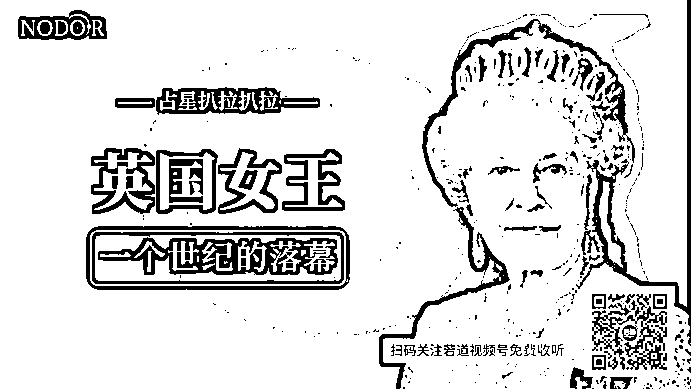

 编辑/玫瑰 图片/网络

扒拉扒拉在暂停很久以后，又开始广播了。这期节目我们来讲英国女王。当地时间 2022 年 9 月 8 日，英国白金汉宫证实英国女王伊丽莎白二世当天去世，享年 96 岁。为了帮助大家更好地了解伊丽莎白二世，除了扒拉扒拉电台节目，若道君还为小伙伴们节选了一篇旧文：[《土星加持的英国女王》](http://mp.weixin.qq.com/s?__biz=MzA5NjA0NTAxNg==&mid=2651397962&idx=1&sn=0b44a068a3d3df4ee6cb60cd32d0de9c&chksm=8b4badfdbc3c24eb4043379d76bf9999d330bc737f61ac298c881f3f1f61ae25d4f331099f13&scene=21#wechat_redirect)（原文戳这里），一起来看看吧！

<mpvideosnap class="js_uneditable custom_select_card channels_iframe videosnap_video_iframe" data-pluginname="videosnap" data-id="export/UzFfAgtgekIEAQAAAAAAIksWfqXGSwAAAAstQy6ubaLX4KHWvLEZgBPEiYFAEkJ4bquCzNPgMItc3AhV8wMlkkI1Qk_vSAiq" data-url="https://findermp.video.qq.com/251/20304/stodownload?encfilekey=rjD5jyTuFrIpZ2ibE8T7YmwgiahniaXswqzBzVY4rI7T8u3Tgb2K8FLJicQ1d5m3HutvQe2m8IQqVzY0Hyvib31miczafyoJIXB187u1JWuySZEVw9DJ4SzOKCYA&amp;adaptivelytrans=0&amp;bizid=1023&amp;dotrans=0&amp;hy=SH&amp;idx=1&amp;m=&amp;scene=0&amp;token=AxricY7RBHdXmibN7G0FY1TicMXqzp69LZRgUCH0via2TeUTmpTOict4TiaLwXbwe57jSyM6jXia3jBhns" data-headimgurl="http://wx.qlogo.cn/finderhead/PiajxSqBRaEJYnVsqWfEX9qA0sI6hNVKsDfyzfPZ92WZMZyBpZWU5NA/0" data-username="v2_060000231003b20faec8c4e68a1ec2d4ca07e434b07755bbf47e7053a3059defd2c9d6c68a20@finder" data-nickname="若道" data-desc="#占星扒拉扒拉 看看三位主播如何从出生星图，扒拉女王的人生故事？" data-nonceid="6375657655740575292" data-type="video" data-width="856" data-height="480"></mpvideosnap>

| 点击收听本期扒拉扒拉节目

**伊丽莎白二世**太阳金牛座，月亮狮子座，上升和南交摩羯座的伊丽莎白二世是英国的传奇人物，出身自带光环。她生于 1926 年 4 月 21 日，父亲是乔治六世，母亲是伊丽莎白王后，曾曾祖母是维多利亚女王，妹妹是玛格丽特公主。伊丽莎白二世没有受过传统的学院教育，她的教育均来自宫廷家庭教师，皇家氛围的熏陶，使得伊丽莎白二世自小举止优雅，气质动人。

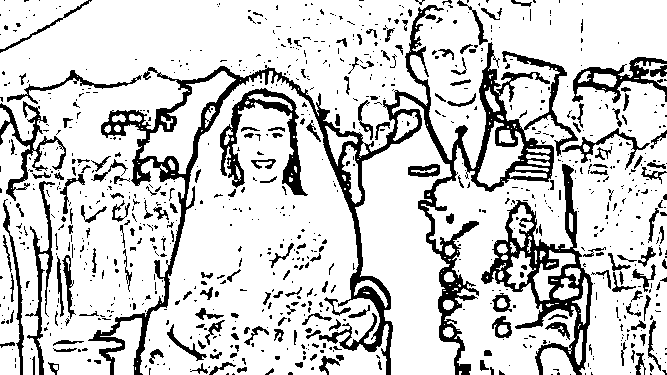

**|**伊丽莎白二世与丈夫菲利普亲王，菲利普亲王是伊丽莎白二世的远房表哥，为女王放弃了希腊王位的继承权
1947 年 11 月 20 日，伊丽莎白二世和爱丁堡公爵菲利普亲王步入婚姻的殿堂。伊丽莎白二世于 1952 年 2 月 6 日登基，1953 年 6 月 2 日加冕女王，加冕的仪式盛况空前，据说有两亿人通过广播收听了这一盛典。

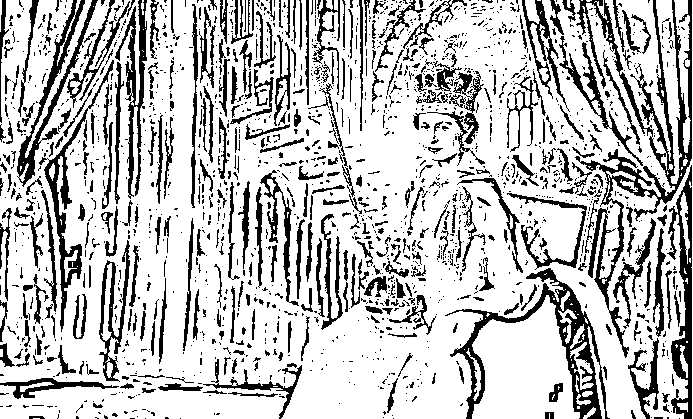

****|****1953 年英国女王在加冕当天的肖像，当时她只有 27 岁女王享年 96 岁，辞世前，她身体康健，勤于政事，不知疲倦。她在位 70 年，身兼英国女王、国会最高首领、英联邦元首。英联邦目前有 53 个成员国，大多为前英国殖民地。伊丽莎白二世身兼包括英国在内的 16 个英联邦王国的国家元首。

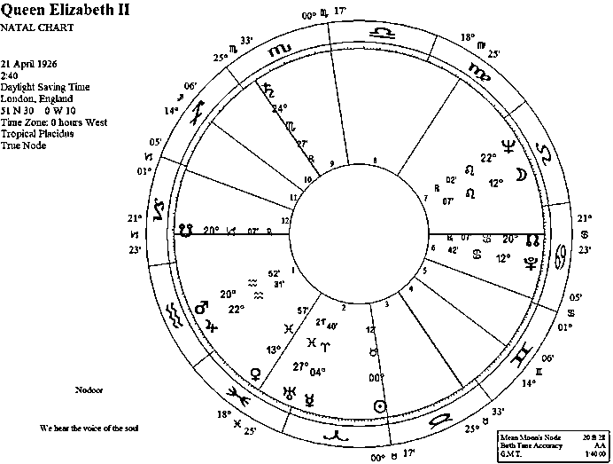

**|**伊丽莎白二世出生星图女王星图上突出的能量是**摩羯座**（南交合相上升点落在摩羯座，命主星土星合相中天）和**水瓶座**（火星合相木星落在水瓶座， 是 T 三角结构的组成部分）。****在古典占星里，**摩羯座和水瓶座的守护星都是土星**。**土星意味着严肃、稳固、长久。**在土星能量的加持下，承诺“永不退位”的她，已经经历了 15 任英国首相和 15 任美国总统，超越了维多利亚女王，成为英国历史上在位时间最长的君主。星图上的紧张相位往往是我们人生的原动力。女王星图上的紧张相位是由**火星、木星、海王星和土星组成的固定星座 T 三角**。火星合相木星落在第 1 宫水瓶座，对分第 7 宫落在狮子座的海王星，四分中天的天蝎座土星。**火星作为这个组合里面唯一的个人行星，承受了来自家庭和社会的巨大压力，必然被水瓶座代表的人群以及摩羯座代表的组织所累。**

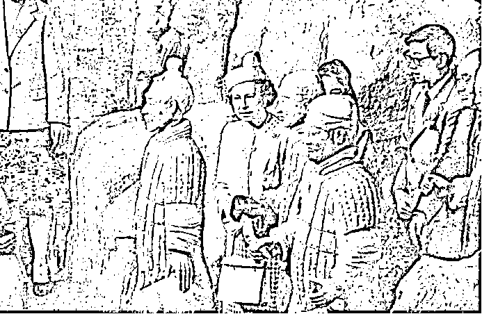

**|**1986 年，英国女王伊丽莎白二世访华时参观兵马俑

女王头衔的全称是“承上帝洪恩，大不列颠及北爱尔兰联合王国与其属土及领地之女王伊丽莎白二世，英联邦元首，基督教信仰的保护者”，她的一生都是这个头衔的忠实执行者。她关心国家事务，维护国家利益，积极参与外事活动，经常出席英联邦首脑会议。自登基以来，女王至少进行了 325 次正式海外旅行。**对外她是一个非常严肃和固执的人，在宗教、道德标准和家庭事务上态度保守。**火星是一个战士，现在这个战士穿上了理性和博爱的战衣。她在媒体和众人面前不苟言笑，丝毫不流露出内心的情感。她有自己的处事原则和非常强大的理念系统，向内忠于内心，对外捍卫原则。**这一点也体现在她上升和南交点落在了讲究稳固传统的摩羯座。**

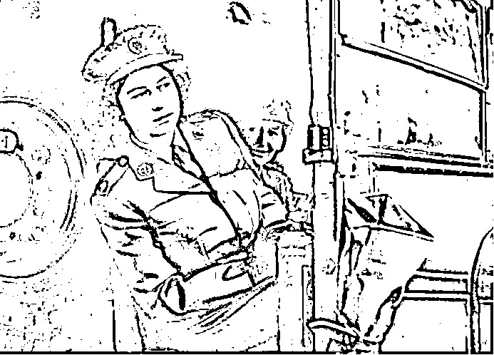

**|**身着军装的伊丽莎白二世

女王在 18 岁的时候加入了女子辅助服务团（*Women's Auxiliary Territorial Service*），成为英国武装部队的一员，是英国皇室参加过二战的唯一女性。在那里，她学会了如何射击、驾驶军用卡车和修理机器故障。她是现今世上唯一一个参与了二战并且依旧在世的国家元首。从这些成长经历中，我们也能看出**水瓶座火星四分天蝎座土星的个性和坚持。**从新闻事件中学习占星学是个好方法。你不仅可以看到出生星图的解读，还可以瞥见经世占星的一个角落。以后主播们不定期会聊一些他们感兴趣的话题。不过你也可以点菜，如果你有感兴趣的话题，欢迎留言给我们。

**版权声明：**本文由若道整理首发于若道平台，欢迎转发，反对抄袭。友号转载请申请白名单。

**END****20 位来自世界各地的占星师****拥有****51 年****占星实践经验的****若道创始人****前 ISAR 全球副主席****前 ISAR 全球职业占星师资质认证主席****大卫·瑞雷**

**和**

**2019 年第二届、2021 年第三届核心课中**

**与苏·汤普金斯老师****联合授课****的**

**ISAR 认证职业占星师**

**咔咔（Caroline）**

**二人合力打造**

**2022 年 ****若道全新核心占星课程**

**点击下图了解更多课程详情** 

**

**20 位来自世界各地的占星师****带来 19 场沙龙——新世界的觉醒****详情可点击下图**

**学习占星学****点击下图了解课程详情**

**微信又双叒叕改版啦，不想错过若道君的推送？**
**就把若道设为星标吧！****▼**

**喜欢就点一下“在看”吧！**

********报名直达入口********

# 插班中丨神话塔罗：高效学习班上线，灵活掌握，专业实践！

> 原文：[`mp.weixin.qq.com/s?__biz=MzA5NjA0NTAxNg==&mid=2651488781&idx=2&sn=a78090a46dab243ca6e3d14bd3d55d4e&chksm=8b4830babc3fb9ac2fabf8e9abf3481ce6a6d72d87f1e1d5cae44a6b09c03a5ae209f7d5ad81&scene=126&sessionid=1692737756#rd`](http://mp.weixin.qq.com/s?__biz=MzA5NjA0NTAxNg==&mid=2651488781&idx=2&sn=a78090a46dab243ca6e3d14bd3d55d4e&chksm=8b4830babc3fb9ac2fabf8e9abf3481ce6a6d72d87f1e1d5cae44a6b09c03a5ae209f7d5ad81&scene=126&sessionid=1692737756#rd)

**2022 年超高含金量的神话塔罗认证课程****高效学习班****开始招生**用**四个月**的时间学习掌握神话塔罗解读喜欢**集中学习，快速掌握**的同学不要错过

黄色日期为**8 节直播课**时间，同学可以自由安排时间学习**18 节录播课**

班级学习群讨论、APP 答疑区提问

课程内容体系让你直观精准地感受到**神话塔罗的魅力**扎实地建构**神话塔罗思维**系统学习**最地道的塔罗知识**课程中老师将**神话、占星、心理学**完美融合进塔罗的**人本主义咨询体系**并进行学员**案例督导**让你更自信的开展咨询工作，学以致用

本期认证课程采取**即报即学的录播课+案例督导直播课**的形式，

*   **18 节录播课：**精编剪辑，随来随学，助教答疑，学练结合。

*   **8 节直播课：**融会贯通，神话心理，塔罗占星，咨询技巧。

为了适配大家的各种学习场景，提高学习&复习效率，我们还将**录播课**剪辑了**中文字幕版**和**翻译音频版**：

*   **中文字幕版：**朱丽叶老师英文原声配中文字幕，适合在手机或电脑前专心致志的学习。

*   **翻译音频版：**翻译老师幼婷的中文原声纯享，适合运动、通勤路上耳机里陪伴式学习。

若道还为塔罗学员开发了**“神话塔罗”**平台，是随身的工具，更是接咨询的平台，录播课程**学成入驻平台**即可链接更多塔罗个案，发展壮大你的塔罗咨询事业。

**如果你想学习塔罗，什么样的老师会让你怦然心动呢？她是三副塔罗牌的设计者，写了 6 本塔罗书籍。她研习塔罗四十余年，教授塔罗三十余年，是丽兹·格林的密友。还有****谁会比塔罗牌设计者更了解塔罗的历史、灵魂与精髓？****所以，这将是你开启塔罗之旅最坚实的一步。**

1

**这位塔罗大师是谁？**

**朱丽叶·沙曼-伯克** 

*   她是**3 副塔罗牌**的**设计者****——**神话塔罗牌、沙曼–卡塞利塔罗牌、“自己着色”塔罗牌；

*   她出版了**6 本塔罗书****——**《塔罗全书》、《新塔罗全书》、《众星的传说》、《理解塔罗牌》、《精通塔罗牌》、《塔罗初学者指南》；

*   她研习塔罗**四十余年；**

*   她教授塔罗**三十余年**；****

*   她是**丽兹·格林**的密友，两人合著了**《神话之旅》**，共同设计了**神话塔罗牌**。

*   她是认证的**心理治疗医师；**

*   她深谙**塔罗、占星学、心理学和神话学。**

**如果你想成为拥有英国神话塔罗认证的塔罗师**

那么她，就是你**最好的老师人选**

2

**塔罗牌有什么用？**

*   塔罗牌是一种**古老的疗愈工具**，同时也是**直观的解惑工具****；**

*   塔罗牌绕过逻辑思维，**和潜意识联结**，通过图像的方式生动地将隐藏在人类潜意识中的画面浮出水面，**揭示心灵的状况和运作****；**

*   塔罗牌**帮助我们和潜意识对话**，可以和现代的心理治疗联系在一起，帮助我们**看清心灵的冲突来源、本质和可以选择的道路；**

*   塔罗牌又和更广阔的**宇宙生命原型**联结，彰显**个人生命发展的阶段**，将**个人生命挣扎、内在冲突**放在生命进化的道途上，让更广大的生命智慧为个人成长照亮道路。

3

**为什么学习神话？**

神话通过**图像和故事**描绘人类生活的**原型模式**。通过瑰丽的想象、诗意的语言、栩栩如生的人物和故事描绘出我们内心的世界，表达出我们经历的那些实现人性的过程，帮助我们将**个体的生活与人类古老且永恒的故事**建立联结。从而在更深处**理解生命**，并学习**古老而长青的生命智慧**。

**神话塔罗**取材于**希腊神话**的无尽沃土，通过故事提供一种**记忆辅助**，在心理和预见层面提升解读的**丰富度**。因为这样更符合塔罗牌的性质，符合人类的想象。**按照故事思考，而不是简单的记忆关键词和固定的意义。**

4

**塔罗预测是什么？**

塔罗牌预测的运作就像是**照向心灵的一面镜子**。在塔罗牌解读时，图像的原型性质穿透隐藏的潜意识脉络，反应出与个人境遇相关但又未被了知的知识与洞见，因此**揭示出按照任何理性方式都无法发现的事情。**

如果你对生命好奇，塔罗学习会帮你**打开一扇通往未来的门****，**让你了解**心灵运作和显化的秘密**，同时赋予你更多关于生命成长的支持和指引的能力！

5

**我们将学习什么？**

**录播课（即报即学）**

**☆****初阶：神话塔罗详解**

**神话故事和预测意涵**

**第 1 讲 塔罗牌介绍 ，讲述它的历史 （中文字幕版）**

**第 1 讲 塔罗牌介绍，讲述它的历史（翻译音频版）**

**第 2 讲 星座形态、元素和宫廷牌&基本星座与基本国王 （中文字幕版）**

**第 2 讲 星座形态、元素和宫廷牌&基本星座与基本国王（翻译音频版）**

**第 3 讲 固定星座与固定王后（中文字幕版）**

**第 3 讲 固定星座与固定王后（翻译音频版）**

**第 4 讲 变动星座与变动骑士（中文字幕版）**

**第 4 讲 变动星座与变动骑士（翻译音频版）**

**第 5 讲 小阿尔卡那牌权杖（中文字幕版）**

**第 5 讲 小阿尔卡那牌权杖（翻译音频版）**

**第 6 讲 小阿尔卡那牌圣杯（中文字幕版）**

**第 6 讲 小阿尔卡那牌圣杯（翻译音频版）**

**第 7 讲 小阿尔卡那牌宝剑（中文字幕版）**

**第 7 讲 小阿尔卡那牌宝剑（翻译音频版）**

**第 8 讲 小阿尔卡那牌星币（中文字幕版）**

**第 8 讲 小阿尔卡那牌星币（翻译音频版）**

**第 9 讲 经典牌阵教学讲解（中文字幕版）**

**第 9 讲 经典牌阵教学讲解（翻译音频版）**

**第 10 讲 牌阵解读案例演示（中文字幕版）**

**第 10 讲 牌阵解读案例演示（翻译音频版）**

**☆****中阶：神话塔罗牌阵应用**

**神话****解读和咨询技巧**

**开启神话塔罗愚人之旅**

****

**第 1 讲 愚人、魔术师、女皇、皇帝（中文字幕版）**

**第 1 讲 愚人、魔术师、女皇、皇帝（翻译音频版）**

**愚人**：永恒的少年（儿童的原型）

**魔术师**：恶作剧者、老师、向导、沟通者的原型；行星：水星。

**女王**：母亲、养育者、丰产的原型；行星：金星在金牛座；小行星：谷神星。

**皇帝**：父亲、供养者、计划者的原型；行星：木星。

**第 2 讲 女祭司、教皇、恋人、战车、正义、节制（中文字幕版）**

**第 2 讲 女祭司、教皇、恋人、战车、正义、节制（翻译音频版）**

**女祭司**：处女——等待被实现的潜力原型；行星：新月。

**教皇**：疗愈者、受伤的疗愈者、牧师的原型，牧师是神与人之间的灵性桥梁；行星：凯龙星。

**恋人**：爱、爱人、所爱之人的原型；行星：金星在天秤座。

**战车**：战争、冲突、战士、斗士的原型；行星：火星。

**正义**：智慧、兵不血刃的胜利的原型；星座：处女座；小行星：智神星。

**节制**：关系、合作的原型；星座：巨蟹座、双鱼座。

**第 3 讲 力量、隐士、命运之轮、倒吊人、死神（中文字幕版）**

**第 3 讲 力量、隐士、命运之轮、倒吊人、死神（翻译音频版）**

**力量**：力量的原型；星座：太阳在狮子座。

**隐士**：晚年、耐心的原型；行星：土星。

**命运之轮**：命运女神与命运的原型。

**倒吊人**：牺牲与有意识的牺牲的原型；行星：海王星。

**死神**：死亡、终点和起点的原型；行星：冥王星。

**第 4 讲 恶魔、高塔、星星、月亮、太阳（中文字幕版）**

**第 4 讲 恶魔、高塔、星星、月亮、太阳（翻译音频版）**

**恶魔**：阴影、人类不文明的面向、本能、欲望天性；行星：火星在天蝎座。

**高塔**：改变、分裂瓦解的原型；行星：天王星。

**星星**：希望的原型。

**月亮**：无意识的原型；行星：暗月。

**太阳**：意识、创造力和文明的原型；行星：太阳。

**第 5 讲 审判、世界（中文字幕版）**

**第 5 讲 审判、世界（翻译音频版）**

**审判**：复活、新生的原型；行星：水星作为灵魂向导普绪科蓬波斯。

**答疑与讨论，学员们分享对自己或客户的塔罗解读，对神话塔罗牌进行更多探讨。**

**世界**：整体、完成和个性化的原型。

**第 6 讲 经典牌阵教学讲解（中文字幕版）**

**第 6 讲 经典牌阵教学讲解（翻译音频版）**

**第 7 讲 咨询案例演示：为一位年轻女性所做的四次解读（中文字幕版）**

**第 7 讲 咨询案例演示：为一位年轻女性所做的四次解读（翻译音频版）**

**第 8 讲** **引导式冥想、荣格的四种意识功能（中文字幕版）**

**第 8 讲 引导式冥想、荣格的四种意识功能（翻译音频版）**

**☆****高阶：神话塔罗直播督导课**

**第 1 讲 塔罗牌中的荣格原型**

**2022 年 8 月 10 日（周三）**

我们将学习荣格是如何理解原型，以及荣格原型如何反映在塔罗牌中。对塔罗牌解读而言，理解原型的普遍性非常有帮助，因为这有助于塔罗咨询师碰触客户的内心世界。

**第 2 讲 塔罗牌是如何与行星原型和其原型体验联系在一起**

**2022 年 8 月 24 日（周三）**

大阿卡纳牌反映了行星神祗的原型，在某些情况下，原型经验意味着它们反映了所有人类的经验。我们将通过这个角度看这些大阿卡纳牌。我们将看到理解原型对解读有何帮助。

**第 3 讲 荣格意识的四种功能与小阿卡纳牌的四种元素及与权杖、星币、宝剑、圣杯四套牌之间的联系**

**2022 年 9 月 7 日（周三）  **

我们将看看小阿卡纳从 1 到 10 如何反映荣格意识功能的各个方面，以及它们如何反映在四套牌四个元素和其心理方面。我们还将对 1-10 的数字学进行修正，看它们在元素中的表现方式。

**第 4 讲 占星学中的 12 星座和宫廷牌之间的联系**

**2022 年 9 月 21 日（周三）**

我们将讨论形态和星座，以及它们如何反映在宫廷牌上。

**第 5 讲 马蹄牌阵学员案例督导**

**2022 年 10 月 19 日（周三） **

**第 6 讲 六芒星牌阵学员案例督导**

**2022 年 11 月 2 日（周三） **

**第 7 讲 凯尔特十字学员案例督导**

**2022 年 11 月 16 日（周三） **

****

**第 8 讲 三个牌阵学员完整案例督导**

**2022 年 11 月 30 日（周三）**

**认证阶段：考试论文**

录播课学习完毕，即可入驻若道神话塔罗平台，以实习塔罗师获得推广流量，对接塔罗咨询个案。

直播课+录播课学习完毕，提交考试论文通过即可获得获得英国神话塔罗认证证书，升级为认证咨询师。

**扫码进入全新神话塔罗 H5**

每天有事没事都可以去**神话塔罗 H5**里转转抽取专属于你的今日塔罗

**神话塔罗 H5 问答平台全新上线**

三张牌牌阵，专业塔罗咨询师语音条解读

如果你碰巧有困惑，刚好有**限时优惠价**

如果感到快乐你就用用**神话塔罗 H5****，**如果你感到不快乐，更要使用由专业人本主义塔罗师团队全程陪伴的**神话塔罗 H5 哦！**

6

**适合人群**

*   塔罗初学者，完全没有塔罗基础；

*   塔罗自学者，也曾上过塔罗工作坊，但仍不懂如何使用塔罗牌；

*   塔罗进阶学习者，有塔罗基础，了解 78 张塔罗牌含义；

*   不知如何解决遇到的情感困惑、职业选择、人际问题，对人生感到迷茫；

*   想要学习深入解读塔罗牌、牌阵的使用、咨询技巧等将塔罗运用于咨询实践；

*   想要深入了解和学习塔罗，希望成为专业的塔罗师；

*   想要借助塔罗进行心灵、灵性成长。

7

**导师简介**

**朱丽叶·沙曼-伯克**

**朱丽叶·沙曼-伯克**从 20 世纪 70 年代早期开始，就对塔罗牌产生了兴趣，并踏入了塔罗的世界。后来，在丽兹·格林的鼓励下，开始研习心理占星学和塔罗。

1984 年，第一本书《**塔罗全书**》（*The Complete Book ofTarot*）出版。之后，与丽兹·格林合作设计并撰写了《**神话塔罗**》（*The Mythic Tarot*），在这本书中，她们将古希腊神话与传统塔罗解读结合起来。朱丽叶写了**十本塔罗和占星学书**，包括一本名为《众星的传说》（*Stories from the Stars*）的儿童读物，以及与丽兹·格林合著的《神话之旅》（*The Mythic Journey*），这是一本详细讲述如何运用神话来指导生活的书。

8

**课程价格**

**认证课程总价：****22000 元**

**联报优惠价：****19000 元**

**限时转发优惠价：18000 元（联系 Echo 老师，获取限时转发优惠价）**

长按二维码添加客服 Echo 老师

9

**退转课程**

*   **退款原则请详看《教学协议》，如有疑问请咨询课程顾问。**

**神话塔罗认证课程**

**授课老师：朱丽叶·沙曼-伯克**

**授课时间：录播课即报即学，直播课 2022 年 8 月 10 日起**

**授课方式：**网络课程**，**英文授课，中文翻译

**费用：****认证课程总价：****22000 元；****联报优惠价：****19000 元；****限时转发优惠价：18000 元**（联系 Echo 老师，获取限时转发优惠价）

**课程负责人：Echo 老师**（微信/手机：nodoor18518412824，请备注“神话塔罗”）

长按二维码添加课程负责人咨询~

**END**

****报名请点击“阅读原文”****

# 神话塔罗之小阿卡纳牌 | 圣杯 1-3

> 原文：[`mp.weixin.qq.com/s?__biz=MzA5NjA0NTAxNg==&mid=2651488781&idx=3&sn=1dd63645682093831f6a18e313524b74&chksm=8b4830babc3fb9ac049d8832d525097a15f245d6157b328deca164327cdd3293dfda98d15b7e&scene=126&sessionid=1692737756#rd`](http://mp.weixin.qq.com/s?__biz=MzA5NjA0NTAxNg==&mid=2651488781&idx=3&sn=1dd63645682093831f6a18e313524b74&chksm=8b4830babc3fb9ac049d8832d525097a15f245d6157b328deca164327cdd3293dfda98d15b7e&scene=126&sessionid=1692737756#rd)

作者/朱丽叶·沙曼-伯克 丽兹·格林

译者/闫东升 编辑/玫瑰 图片/神话塔罗 网络

本文节选自《神话塔罗》

圣杯、权杖、宝剑和钱币是塔罗牌中四套小阿卡纳牌的核心象征符号，它们反映着生命的四个不同面向。每一套小阿卡纳牌都可以分为两组：一组是 10 张数字牌；另一组是 4 张宫廷牌。今天就让我们走近圣杯牌组前 3 张数字牌——圣杯 1-3。

**书名：**神话塔罗 **作者：**朱丽叶·沙曼-伯克   丽兹·格林 **出版日期：**2011-08-02**圣杯 1**

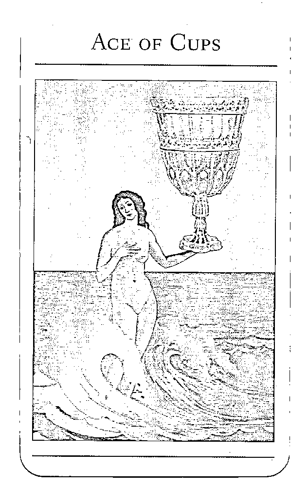

**海水中诞生的爱之女神**

圣杯 1 描绘的是一个美丽的女人，长着一头黑色的秀发，从海浪的泡沫中冉冉升起。她的左手托着一个金色的圣杯。

在这张牌中我们看到的是从海水的泡沫中出生的爱之女神阿弗洛狄忒 （*Aphrodite*），她的意象反映着**爱的高尚与低劣**两个面向，她也是厄洛斯（*Eros*）和普绪克（*Psyche*）的神话故事的发起者和推动者。

神话中，阿弗洛狄忒的出生过程很是奇特。

狡猾的克罗诺斯（*Cronos*）在他母亲盖亚（*Gaea*）的怂恿下，阉割了他的天国之父乌拉诺斯（*Uranus*），并把他的阳具丢入了大海，乌拉诺斯的阳具在大海上漂浮，激起了很多白色的泡沫，阿弗洛狄忒就在这些白色泡沫中出生。

当时的地点是吉菲拉岛（*Kythera*）海岸边，西风之神塞菲勒斯（*Zephyrus*）用轻柔的呼吸把这位女神带到了塞浦路斯（*Cyprus*）岸边。四季女神霍莉（*Horae*）热烈地欢迎她的到来，给她穿上了华贵的衣裳，佩戴上珍贵的珠宝，并指引她进入了永生之神的行列。

**原始情感的涌现**

阿弗洛狄忒是一位很复杂的神祗。她的本质反映的是**女性之美**，关于她的描绘大都和**纯然的魅力与和谐**有关。但是她也拥有**嫉妒、恶意、虚荣、欺骗、背叛、懒惰和复仇。**她的力量能够给生活带来愉悦和享乐，同时她也有可怕的一面，因为她也能让人类的内心被狂热的激情淹没。

献身于阿弗洛狄忒的人们可能会遭遇不幸，因为他们要**背叛自己的父权力量，或者抛弃自己的家园，亦或被乱伦和兽性的激情淹没。**她还**保护着婚姻（契约）的结合，主宰着婚姻的圣洁性。**

简而言之，阿弗洛狄忒的意象反映着**自然属性的驱动力**。**小阿卡纳牌中四张 1 号牌的意义都是原始能量的爆发，**这个黑发女神从海洋的白色泡沫中手托着圣杯冉冉升起，**代表着原始的情感涌现出来**。

这种驱力推动人们走入关系的领域，也就是说它发生在人们与他人建立关系之前，因为**如果没有准备好，他人就不会在生命中出现**。如果没有阿弗洛狄忒，神话中的厄洛斯和普绪克就永远不会相遇，是她的任性和善变开启了一个跌宕起伏的故事。**因此圣杯 1 暗示着一次“心”的旅程的开始，丰富的情感喷薄而出，驱使着人们走入一段关系之中。**

**圣杯 1，情感的流露**

**从解牌的角度来看，圣杯 1 预示着情感的流露，但此时的情感还没有分化，处于最原始的状态中，它充满了活力，常常把人们淹没。**

通常这张牌的出现意味着**一段现实关系的开始，往往它还没有完全呈现出来，因此当事人并没有清楚地看到它，但是当事人已经准备好投入一段爱的旅程了。**

**圣杯 2**

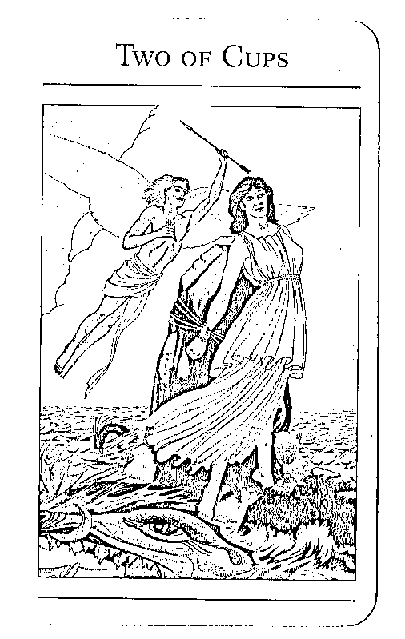

**遇见**

圣杯 2 描绘的是厄洛斯（*Eros*）和普绪克（*Psyche*）的初见。普绪克一袭白袍象征着她的纯洁，在阿弗洛狄忒（*Aphrodite*）的命令下，她被绑在大海中一块孤零零的礁石上。她的脚边放着一只金色的圣杯，海水中隐约有一只怪兽，普绪克茫然又恐惧地望着远方，等待着被怪兽吞噬的悲惨命运。在她身后，英俊的厄洛斯盘旋于空中，金色的头发和翅膀闪闪发光。厄洛斯右手紧握着画面中的第二个圣杯，左手举着一只箭，他就是不小心被自己的那支箭刺伤了，所以“不经意”地对普绪克一见钟情，而他此行的任务却是杀死普绪克。

**寻找灵魂的另一半**

**小阿卡纳牌的 2 号牌象征着 1 号牌中原始力量的两极化。这张圣杯 2 中，原始力量的两极化意味着男性和女性之间的吸引力。**圣杯 1 中爆发出来的原初情感，在圣杯 2 中找到了对象，意即厄洛斯遇见了一个可以与他融合的女人。在柏拉图（*Plato*）关于人类之源的远古神话中，人类的心灵包含着阴阳两种能量，圆融完整。但是这种雌雄同体的心灵后来分化了，人类也有了男女之别，彼此被盲目的力量驱使着寻找自己遗失的另一半。对于希腊的头脑来说，**情爱的吸引力代表着感官和灵性中的某些力量，它能够给人的身体带来欢愉，也会为了心灵的完整而寻找自己的另一半。**当任何潜在的力量从潜意识中升起的时候，它首先就会把自己投射到外在的人或者事物上。因此，当圣杯 1 暗示的处于原处完整状态的潜力从个体内在升起时，最开始的迹象就是**被他人吸引**。从他人身上，我们能够瞥见自己走向圆满之路中所必须经验的种种模样。在人类的普绪克身上，厄洛斯看到了成为一个人的机会，因为他是一个脱离肉体的灵性力量，从来没有在人类关系中体验过爱恨情仇。在做为神祗的厄洛斯身上，人类的普绪克看到了自己永恒的潜质，通过内在像厄洛斯一样的力量，她可以把爱提升到灵性的更高境界。**圣杯 2 中出现了圣杯数字牌的男女主角，阿弗洛狄忒代表的原初力量现在变成了男女之间的吸引力。****圣杯 2，关系的开始**

**从解牌的角度来看，圣杯 2 预示着关系的开始。**如果当事人正在现有关系中遭受着一些问题的折磨或者经历着分离，圣杯 2 也意味着**关系的和解与和谐**。它甚至也可能预示着**某种生意伙伴的相遇或者签约**，因为这样关系就形成了。

**圣杯 3**

**婚礼的祝福**

圣杯 3 描绘了厄洛斯（*Eros*）和普绪克（*Psyche*）的婚礼。普绪克站在巨大的礁石上，四周环绕着海水，她身穿着新娘的嫁衣面对我们，头上装饰着鲜花，手里还握着一束百合。新郎厄洛斯在她的身后，所以她无法看见这个光芒四射的爱神。厄洛斯的手中握着金色的弓，背着箭袋。他们脚下的海水中有三个女性精灵（或水之女神），每个人都捧着一只金色的圣杯，围绕在他们身边庆祝婚礼。

**感情甜蜜期的喜悦**

**每张小阿卡纳牌中的 3 号牌都反映着初始阶段的完成。**生命中一个新的次元展开了，旅程的第一部分到此时告一段落。**圣杯 3 意味着庆祝，它隐喻着最初的吸引力已经完成，当事人经验了情感上的满足。**这一对伴侣已经结合在一起了，彼此都给予了承诺并享受着愉悦。厄洛斯和普绪克的故事告诉我们，**初始阶段的满足和完整是很重要的。**在神话故事中，普绪克此时还没有看过新郎，对于不真实的相遇过程也没有疑问。她满足于和厄洛斯在一起的生活，就像在梦中一样，因为厄洛斯只有在黑夜中才会到来。可以说他们婚礼的庆祝和愉悦中，有太多**天真烂漫**的意味，这是“陷入爱河”最明显的特点之一，人们就像被对方在自己头脑中的影像施了魔法，无法看到对方最真实的样子。情感的初始阶段往往伴随着快乐的经验，它是关于爱与生命的庆祝，是一个激动人心的开始。世上很多文学和戏剧作品都描述着这个阶段，可以说这是一种赐福，但是它们所呈现的只有一个讯息，那就是**你能享受的时候，就尽情享受它吧。**接下来的旅程中还有很多内容，有些欢喜有些痛苦，厄洛斯和普绪克在整个圣杯数字牌所呈现的故事里，会逐步使自己的人性和神性的潜力都开花结果。**圣杯 3 可谓是生命的初始阶段，伴随着很多的承诺。**少女成为了新娘，把她的纯真和贞洁永远地抛在身后。**这张牌还预示着进一步发展的开始，旅程并没有完结，困难就在不远的前方。**

**圣杯 3，情感上的满足**

**从解牌的角度来看，圣杯 3 意味着婚礼的祝福，这可能是一个爱情的甜蜜期，或者婴儿的诞生，亦或某种情感上的满足和承诺的经验。**但是所有这些处境都只是一个开端，当事人必然要走向更深一层的内心体验，继续探索更多的未知。 

**版权声明：**本文由《自在园》授权发布，欢迎转发，反对抄袭。友号转载请申请白名单。

**朱丽叶·沙曼·伯克**从 20 世纪 70 年代早期开始，就对塔罗牌产生了兴趣，并踏入了塔罗的世界。后来，在丽兹·格林的鼓励下，开始研习心理占星学和塔罗。1984 年，第一本书《塔罗全书》（The Complete Book ofTarot）出版。之后，与丽兹·格林合作设计并撰写了《神话塔罗》（The Mythic Tarot）。朱丽叶写了十本塔罗和占星学书，包括一本名为《众星的传说》（Stories from the Stars）的儿童读物，以及与丽兹·格林合著的《神话之旅》（The Mythic Journey），这是一本详细讲述如何运用神话来指导生活的书。

**点击下图了解课程详情** 

**微信又双叒叕改版啦，不想错过若道君的推送？****就把若道设为星标吧！****▼**

**喜欢记得点一下在看哦☟**

************报名直达入口************

# 如何拥有令人满意的人生？斯蒂芬·弗里斯特说：凭这三点就可以

> 原文：[`mp.weixin.qq.com/s?__biz=MzA5NjA0NTAxNg==&mid=2651488650&idx=1&sn=6e1ba9724756c8c4c039eb94934f4815&chksm=8b48333dbc3fba2b43ffe97564226394ad9ee42bc171d5f198d172d512bfa37cb3a24f5fec4a&scene=126&sessionid=1692737756#rd`](http://mp.weixin.qq.com/s?__biz=MzA5NjA0NTAxNg==&mid=2651488650&idx=1&sn=6e1ba9724756c8c4c039eb94934f4815&chksm=8b48333dbc3fba2b43ffe97564226394ad9ee42bc171d5f198d172d512bfa37cb3a24f5fec4a&scene=126&sessionid=1692737756#rd)

************☆********************后台回复“今日”，给你一句生命态度************

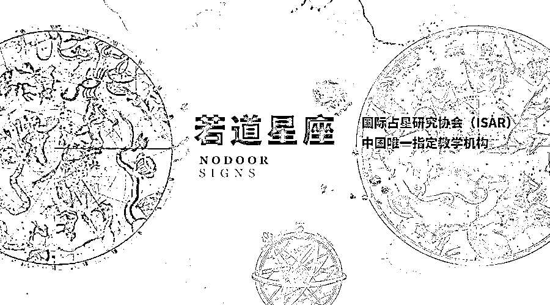

作者/斯蒂芬·弗里斯特
译者/若道翻译团队编辑/翀子 封面/书君 图片/稿定设计

在占星学当中，单单一个“日月升”就相当实用，凭这 3 点就可以对一个人提供有帮助的解读。占星大师斯蒂芬·弗里斯特告诉大家，对我们自己而言，了解太阳、月亮、上升在心灵方面的功能也很重要，善用下面 3 个秘诀，能带我们走向幸福的人生。另外，斯蒂芬老师马上要在若道开设[【组合图工作坊】](http://mp.weixin.qq.com/s?__biz=MzA5NjA0NTAxNg==&mid=2651486787&idx=2&sn=b20744a8649746a95f89842734012a7a&chksm=8b48c8f4bc3f41e284f8819351689cffd8f5ed461ed925622a45e28ba3a15335185910183bcd&scene=21#wechat_redirect)（点击查看课程），如果想跟这位占星大师学习，快来了解详情吧~

**幸福秘诀 1：活出太阳**

**太阳关于能量，关于活力。**有时候你的人生中会是阴天，你没有精神，感到无趣，这是因为我们没有照顾好太阳的原因。**你必须对太阳保持真实，这样才能感受到生命的喜悦。**

人生中有很多困难选择，51%的我想这样做，太阳过来说：“我们就做这个吧。”但 49%说等一等，太阳说：“闭嘴，这就是我们要做的。”然后就是清晰的行动。**像个成年人一样，做出选择，这就是太阳。**

**我们在人生中所有智慧的决定，与太阳所在的星座和宫位，以及太阳的相位有关。**

比如对一个**太阳射手座**的人来说，辞职可能是一个很棒的主意，因为对于射手座来说，他智慧选择的 DNA 就是“人生是一场冒险”，射手座是在变化中成长的。

但如果是**太阳巨蟹座**呢？对于巨蟹座来说，智慧选择的 DNA 是完全不同的。巨蟹座是要创造一个孵化器，让他们有内在的安全感，跟他们的情感、梦在一起，去做内心的工作。所以就更换一份工作这件事来说，就不会像滋养射手座那样滋养到巨蟹座。

**幸福秘诀 2：照料月亮**

先想象一下人生有多么困难，想象一下你经历的失望，你没有实现的梦想，你在关系中经历的失败，你犯的错误……**在面对苦难时，我们如何疗癒，如何更新我们的灵魂，这就是月亮的功能。**

**照料好月亮是重生的一个秘诀，是幸福的秘诀，也是健康生活的秘诀。**

**月亮很强烈地跟健康相关，身体、灵魂和心灵的健康。**月亮不是逻辑性的，不理性，所以为了重生，我们必须要倾听我们的心灵——你觉得你想做什么？

我们可以想象一个**月亮在双子座**的人。对于一个双子座，他要变得健康，需要的营养是惊喜和不断的改变，可能他需要去上课学习一些东西，去一个他没有去过的餐馆吃饭。

如果我想让一个月亮双子座不开心，我就让他们无聊，不是压力，而是无聊。双子座的月亮就需要破坏系统，人生机械性的系统需要被炸掉，一些新的事情才可以发生。

那一个**摩羯座的月亮**想要什么？一种可预测的、稳定的、安全的感受。想象一个月亮摩羯座的男人，他有一个爱好，他有很多的小火车。某一天他工作不顺心，就回来玩弄这些火车，他可以操控这些火车，想怎么开就怎么开。玩了一个小时，他就感觉好了。

前面的月亮双子座需要改变，而月亮摩羯座需要秩序和可预测性。

想象一个月亮双子座和一个月亮摩羯座结婚，他们经过了很糟糕的一周，终于到了周五，双子座月亮说让我们去新开的餐厅吃饭，摩羯座月亮则说我们能呆在家里吗？

我在用很简单的语言描绘很深刻的东西，也就是**关于快乐、自我重生的秘诀，取决于我们聆听到自己心灵的能力。**

心灵总是用一种超越理性的语言去说话，它会让我们充满着美妙，充满着欲望，而我们会倾听，然后去行动，就感觉更好。

最**原始的关于亲密的连接行动，就是去展示月亮。**只有在我们信任的时候，我们才展示我们的愚蠢，展示我们的人性，展示我们的脆弱。

我总结一下：**照顾好太阳是我们精神正常的秘诀，照顾好月亮是我们幸福的秘诀。**

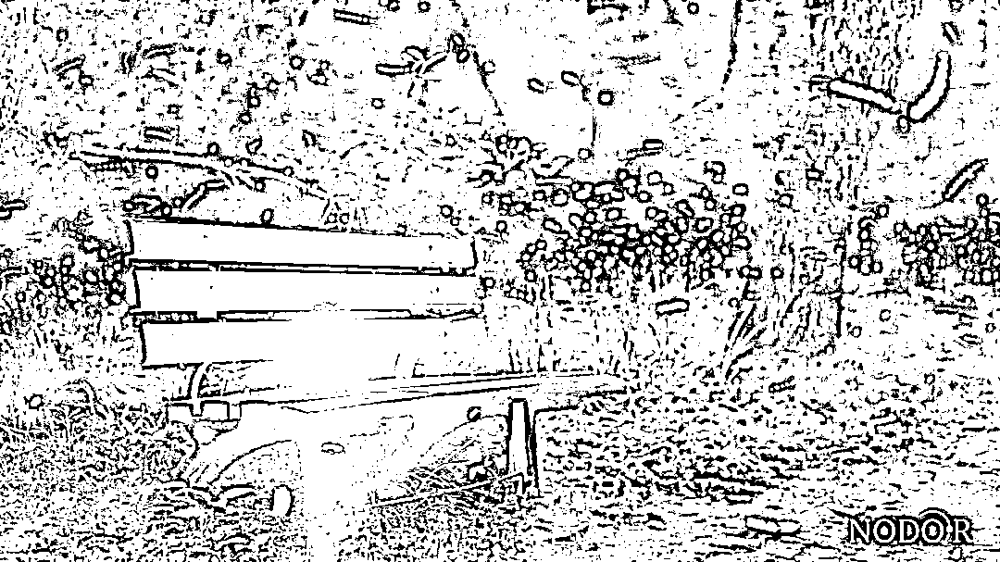

**幸福秘诀 3：锻炼上升点**

在我对于策略性的星图解读的建议中，**我觉得太阳、月亮、上升点是最核心的。**所有占星师都同意上升点是非常重要的，但是对于上升点的含义有些模糊，让我们弄清晰些。

**上升点意味着你出现在他人面前的样子。这是很有力的，你如何出现在别人面前，你的样子，你的影响力。**

在《内在的天空》里，我说到上升点是我们戴的面具，还有另一个含义，上升点就像是染色的玻璃，通过这个玻璃，星图的其他部分展现光芒，光通过这个玻璃的时候，会被过滤，有一些波长被屏蔽了，有一些光芒会被修正。

上升点就是这样工作的，**我们带一个面具，为了隐藏我们的脸。**

但是这个染色的镜片不会隐藏光芒，它只是过滤，所以在一个社交场合，你遇到一个人，你们会客套地打招呼：“你好吗？”“我很好。”

当你说我好的时候，你在撒谎。因为你的人生并没有那么简单，你也知道另一个人也在撒谎。这些谎言是 OK 的。**我们很多的关系都是表面的，这就是为什么我们在谈论上升点。**

让我们来到一个更加微妙的层面，你遇到一个人，你说你好吗？他说我很好谢谢。然后非常迅速地，你喜欢上这个人；或者非常迅速地，你有一个不好的感觉，这是非常正常的经验。

这是真实的。他们中的某些东西传递到你这里来了，光透过这个玻璃了，这是灵魂的光芒，你立刻喜欢或者不喜欢一个人。也可能随着时间的推移，你开始了解这个人，当然经常你的第一印象是准确的。**上升点会把核心的能量传递到世界中。**

当人们开始了解彼此的时候，有一个更加微妙的舞蹈。信任和亲密不会立刻升起，大部分的关系都需要一些时间。所以我们要学习如何在社交场合表现，**上升点就是我们发展出一些风格，你学习在人生的舞台上扮演不同的角色。**

去借用人本主义的一个术语，你是如何实现自我的，这都是关于上升点更高的关于进化占星学的表达。

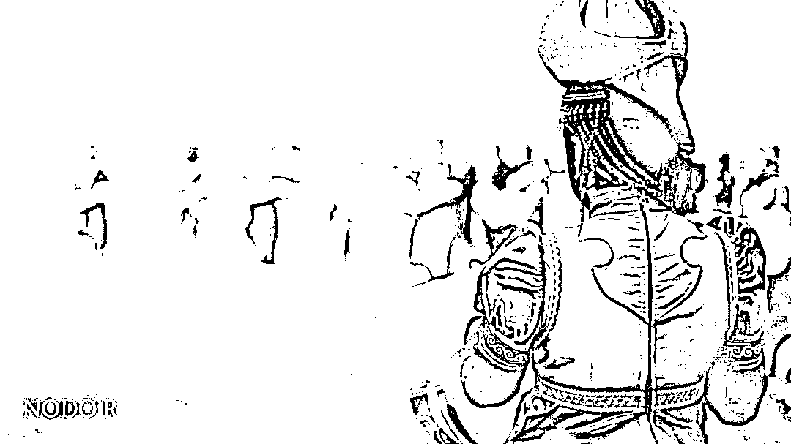

现在关于上升点的内容，已经从外在风格的影响走向了一个更加深入丰富的领域，也就是你如何去表现你的潜力，以及如何到达那里。比如：

一个人的上升在双子座，这个星座是跟语言和沟通相关的，如果你找到了自己的声音，你就找到了自己的使命。在你身上，老师的原型很强，讲故事者的原型也是很强的。

一个人的上升是射手座，也许他出生在北京，然后仍然在北京，我说离开北京吧，因为你寻找到你在世界上的方式，是通过与其他于你的出生文化不同的文化去找到。

我并不是说从事跟国际相关的职业，我说的是找到社区，找到合适的关系。

一个人的上升是巨蟹座，我可能会建议你找到疗癒者的道路，我说的疗癒是更广泛的，所有的咨询师都是疗癒者，是心理的。我们每个人都是被疗癒过，被一个诗人、一个歌唱者、一个电影人。艺术家也是疗癒者。

所以对于巨蟹座我用疗癒者这个词，但是我们可以让他的意义变得很丰富。

**结语**

**太阳、月亮、上升就是精神正常的秘诀，幸福健康的秘诀以及人生使命的秘诀，**这是非常有动力的，让我们有效地运用每一分钟。

**版权声明：**本文由若道翻译发布，欢迎转发，反对抄袭。友号转载请申请白名单。

**END**

**斯蒂芬·弗里斯特**

若道签约老师。进化占星学的创始人之一，当今世界最有影响力的占星大师之一；1985 年，他凭借《内在的天空》一书获得职业占星师协会奖（Professional Astrologers Incorporated Award）。他四次获得占星界最高的占星学联合协会奖（United Astrology Congress Regulus Award）提名，2018 年获得轩辕十四教育奖。

****探索组合图永恒的三角——斯蒂芬工作坊报名中****

斯蒂芬说，我们的组合图表明无论什么状况我们都能熬过去。

**组合图也像出生星图一样有行进。**在工作坊中， 我们将**探讨一些特殊的技法和考量，来帮助伴侣们应对生活中的挑战和机遇。**组合图的推进会出现一些看似难以解决的复杂问题，斯蒂芬老师创造了一种解决这些问题的技法。他将在工作坊中阐述相关细节，基本的问题是：如你所知，要了解一个人 30 岁生日的推进，我们要看这个人出生后 30 天的行星位置。问题是，组合图与我们在占星学实践中使用的其他星图不同，组合图并不代表某一天的天空。记住，它是基于中点的。**那么我们如何从一个不存在的日期开始 "向下数 30 天"呢？斯蒂芬老师将为我们提供一个行之有效的答案。****点击下图了解更多详情******20 位来自世界各地的占星师****带来 19 场沙龙——新世界的觉醒****详情可点击下图**

**学习占星学****点击下图了解课程详情**

**微信又双叒叕改版啦，不想错过若道君的推送？**
**就把若道设为星标吧！****▼**

**喜欢就点一下“在看”吧！**

********报名直达入口********

# 快来领取思维导图！ | 跟随斯蒂芬老师探索组合图前，来获取知识碎片

> 原文：[`mp.weixin.qq.com/s?__biz=MzA5NjA0NTAxNg==&mid=2651488650&idx=2&sn=1e85d4a8913802fc94de33a799934535&chksm=8b48333dbc3fba2b57a5e62718a53172d2e1ae8d5983240063fdca70798314b638ef14a6de4a&scene=126&sessionid=1692737756#rd`](http://mp.weixin.qq.com/s?__biz=MzA5NjA0NTAxNg==&mid=2651488650&idx=2&sn=1e85d4a8913802fc94de33a799934535&chksm=8b48333dbc3fba2b57a5e62718a53172d2e1ae8d5983240063fdca70798314b638ef14a6de4a&scene=126&sessionid=1692737756#rd)

**斯蒂芬·弗里斯特老师**

**若道独家**

**三日线上工作坊**

斯蒂芬说，我们的组合图表明无论什么状况我们都能熬过去。工作坊开始前，斯蒂芬老师建议学员可以搜集更多自己了解和好奇的有效组合图以及关系的故事，先对应学习，方便课上更好的跟随斯蒂芬老师享受这场**"组合图：永恒的三角探索之旅".****特此为大家准备了组合图相关基础知识****转发福利：转发本文到朋友圈，不分组保留 24 小时**截图发送给若道 Maggie

**即可免费获取思维导图完整版**

组合图思维导图目录

**组合图（Composite Chart）：取两张出生图的中点组成的星图，组合图象征着这一对案主的关系本身。**在所有情况下，计算组合图中的行星和宫位时，都要使用短角中点，水星和金星除外。1\. 组合图并非匹配度的指征。2. 组合图象征着一段关系的议题和特征。3\. 因此，组合图代表着关系。4\. 一张组合图代表着两个人。5. 你不能将组合图划分成男人和女人，也就是说，太阳和火星不仅仅代表男人，而是代表两个人的男性议题，同样月亮和金星代表两个人的女性议题。6. 解读组合图的步骤与解读出生图的相同。7. 优先顺序和相位容许度与出生图相同。8. 但星图现在被解读为“我们”、“我们的”或“双方”。9. 关系本身是一个实体——就像一个人一样。10. 上升点代表关系的个性、伴侣的外在表现。11. 下降点描绘出他们如何关联、分享和互动的特征和议题。12. 如同出生图一样，你可以对组合图使用行进。

**1**

********此次授课内容********

**组合图描述了如何才能使两个人的关系一直充满活力。**这句话中隐含的意思是假设一段关系有一种区别于这两个个体的独立的生命。有时我们喜欢和一对伴侣共度时光，却从没想过单独见他们其中一人。

我们从这对伴侣身上感觉到的 "频率"是对他们组合图能量的直接体验。在某种程度上，可以简单地理解为：**正如每个人都有自己的星图一样，每对伴侣也有他们的星图。**

从简单的描述层面上讲，这就是组合图的意涵。记住，我们可以将这一技法用于任何一种关系：**父母和子女、商业伙伴、朋友。**作为进化占星师，我们的目标要比单纯描述走得更深。解读组合图时，可以着眼于帮助人们，而不仅仅是使他们感到惊奇。对于个体来说，出生星图代表了一条正确的人生道路，一条承诺意义、活力、灵性目标的道路。组合图亦然，只不过它将一段关系看成一个独立的个体，而不是两个人。关系也有进化的路径：人们走到一起是为了学习和成长。
个体如果没有领会自己出生星图的要点，会变得疲惫而沮丧。两个人也是如此，**如果没有抓住组合图的要点，我们就会对对方感到厌烦。这段关系似乎也会失去动力。**

伴侣常常意见不一，陷入困境，看不到前进的方向。三是一个更有动力的数字。三个人投票，二个人以多数票击败一个人，推动事情继续发展。**这实际上解释了这次工作坊的主题：永恒的三角。**

**每对伴侣其实都是一个三人组：你、我以及我们。**组合图所代表的那个看不见的 "第三人"经常会"投出打破僵局的一票"，使关系得以发展。**· **但是如果组合图总是同意一个人的意见，而不同意另一个人的意见，怎么办呢？（这被称为"封建制度"）**· **如果两个人都安静而保守，但他们的组合图却要求狂野的冒险呢？（这是 "文化冲击"）**· **如果它同时均衡地反映了两个人的情况呢？我们可以称之为 "民主"，但我们仍可以区分出一个人天然的智慧比另一个人更强的领域，让擅长的人负责擅长的事，这会促进关系蓬勃发展。换句话说，我们开始看到这个技法的咨询维度了。我们将在这个工作坊中探讨这些内容。两个人究竟为什么会走到一起？**在严肃、复杂的关系中，我们可以假设两个人之间有一些未解决的业力。**如果他们在今生是恋人，但在前世中，一个是父母，一个是孩子呢？也许那些直觉和假设仍可以感受得到，极为错综复杂地使得他们在今生想要成为情侣。**这些疑问将我们引向组合图的月亮交点，在那里我们往往能发现当今人类任何伙伴关系问题的真正核心。**

**从理论上讲，组合图是基于中点的。**如果我的出生星图里太阳在摩羯座中段，而你的太阳在双鱼座中段，我们组合图的太阳就在水瓶座中段。换句话说，**在你和我的太阳的中间位置。****其他行星、月亮交点和中天也是如此。**其他宫头的位置，包括上升点则存在一些争议。通常的做法是仍然使用中点，但斯蒂芬老师将会解释他认为这样做存在的技术方面的问题。他更倾向于**使用关系最初开始的地点绘制星图，就像我们使用出生地来绘制出生星图一样。**

**组合图也像出生星图一样有行进。**在工作坊中，我们将**探讨一些特殊的技法和考量，来帮助伴侣们应对生活中的挑战和机遇。**组合图的推进会出现一些看似难以解决的复杂问题，斯蒂芬老师创造了一种解决这些问题的技法。他将在工作坊中阐述相关细节，基本的问题是：如你所知，要了解一个人 30 岁生日的推进，我们要看这个人出生后 30 天的行星位置。问题是，组合图与我们在占星学实践中使用的其他星图不同，组合图并不代表某一天的天空。记住，它是基于中点的。**那么我们如何从一个不存在的日期开始 "向下数 30 天"呢？斯蒂芬老师将为我们提供一个行之有效的答案。**

并非所有的人都处于伴侣关系中，但**作为人类，就需要与其他的灵魂共舞。占星学能够极大地帮助人们驾驭复杂的关系。**了解我的星图如何与你的星图通过相位和宫位的交互而产生互动，是非常有帮助的。组合图包含了这些技法，提醒我们，整体总是大于各个部分之和，而又与之不同。

**2**

********斯蒂芬的占星著作********

**· **1984 年-1988 年间，斯蒂芬写作出版了《内在的天空》（已有中文版）、《变化的天空》和《天空的伴侣》三本占星经典著作，奠定了早期在占星学界的地位。**·** 2002 年-2005 年间，他与朱迪·弗里斯特共同创作了两本经典的关系占星学著作《天空的伴侣 I：爱、性、和进化占星学》《天空的伴侣 II：组合图》。　**· **2008 年，斯蒂芬出版了一本非常重要的著作《昨日的天空》，此书是至今为止关于轮回转世跟星图的清晰对应最详尽的著作之一。 斯蒂芬前后一共出版了 12 部占星著作，在世界占星学界拥有很高的声誉。

**3**

********斯蒂芬获得的荣誉********

1985 年，他凭借《内在的天空》一书获得职业占星师协会奖（*Professional Astrologers Incorporated Award*）。1992 年、1995 年、2008 年、2018 年，他四次获得占星界最高的占星学联合协会奖（*UnitedAstrology Congress Regulus Award*）提名，2018 年获得轩辕十四教育奖。

**4**

********斯蒂芬的占星哲学观********

斯蒂芬的占星风格以**自由和选择**为中心，他的解读不是以下定论的方式来“预测”未来，他**强调如何改善生命，而不是宿命式的论断**。他以心理占星学的语言来解读星图上的人格部分，但是**通过南北交点及其相位和守护星来探索星图所揭示的前世业力与今生方向，在灵魂进化的背景里来整体解读星图。**他认为进化占星学的目的在于**鼓励人们做出更符合进化方向的智慧选择，我们学习去了解前世的时侯，关注点应该集中在如何通过意识来疗愈自己。**

**5**

**这些名人怎么说**

斯蒂芬让我们停止了玩责备命运的游戏，而开始看到自己是一个走在进化路途上的勇士。——奥普拉杂志“*O: THE OPRAH MAGAZINE*”

斯蒂芬和杰夫这两位著名占星师创造性地相互应和，展现出他们出色的教师才华，发展并弘扬了占星这门艺术。（对《测量天空：进化占星学和灵魂的钥匙》的书评）——著名心理占星师 现代占星之父 诺·泰尔（*Noel Tyl*）

请享用斯蒂芬和朱迪这两个博大的灵魂在此书中所提供的洞见大餐吧。（对《天空的伴侣》的书评）——进化占星学的创始人之一 杰夫·格林（*Jeff Green*）

我为斯蒂芬解读的精准感到惊叹，他强调没有一件事是坏得无法挽回的，也没有一件事是如此之好以至于它不会因为现在的错误判断而消失的。我怎样推荐他都不为过！——好莱坞著名影星“钢铁侠”男主角 小罗伯特·唐尼（*Robert Downey Jr*）

**6**

**上过课的占星师怎么说**

他关于我星图的解读，让几乎所有在场的人掉泪，我也从此开启了一段灵魂追寻的旅程。我很惊讶他透过星图可以如此深入一个人的灵魂。很多东西你自己都不知道，但是他讲出来你会发现，啊，这是真的，这是占星学的神奇。——《心探索》创始人孟想

每个来参加老师课程的同学，都会被老师深深的慈悲心感动。这种慈悲心，并不是表面上说的一些什么话，而是一种从意识层次上发出的能量。每个来上课的人，都能感受到老师的爱。这种爱，并不是盲目的爱，而是深刻地洞悉真相后的慈悲。

——斯蒂芬老师工作坊翻译逸月

斯蒂芬老师的一对一咨询已经排期到两年之后，我特别幸运，曾在课堂上被老师抽中分析过我的星图，老师充满爱与智慧的指引让我更加清晰的认识了自我。内在的潜能、需求和矛盾被老师娓娓道来。——禄丽荣斯蒂芬老师是位非常非常值得推荐的大师，很粉他，这位进化占星学的创始人，对人的理解是那么的全面完整、深刻洞见、慈悲和温暖，就这方面而言足可以媲美我无比崇敬的荣格和史坦纳（这两位去天堂里玩了）。如果你对西洋占星感兴趣，或者对人的所有角度、各个层次的真相和可能性感兴趣，推荐斯蒂芬老师的书和课程，特别是他的课程，数倍的功力大增的好机会，错过真是占星粉丝的莫大损失。——仁华

**7**

**2019 年工作坊学员感悟**

**8**

**什么人适合这门课程**

✦ 占星师或渴望成为占星师的人群。   ✦ 本课程并非针对初学者，需具备若道核心课程 level4 及以上水平，即了解星座、行星、宫位、相位、综合解读等知识。✦ 课程会涉及组合盘解读高阶内容，不了解相关知识的同学，请提前学习相关内容。

**9**

********授课老师********

**斯蒂芬·弗里斯特（Steven Forrest）**

**· **进化占星学的创始人之一，当今世界最有影响力的占星大师之一；**· **毕业于美国北卡罗莱纳大学宗教学专业；**· **1984 年-1988 年间，写作出版了《内在的天空》、《变幻的天空》和《天空的伴侣》三本占星经典著作，奠定了早期在占星学界的地位。前后一共出版了 12 部占星著作，在世界占星学界拥有很高的声誉。**· **1985 年，他凭借《内在的天空》一书获得职业占星师协会奖（*Professional Astrologers Incorporated Award*）。1992 年、1995 年、2008 年、2018 年，他四次获得占星界最高的占星学联合协会奖（*United Astrology Congress Regulus Award*）提名，2018 年获得轩辕十四教育奖。**· **斯蒂芬将自己的绝大部分时间都花在教学以及个人咨询上，他于 1998 年创立了占星学徒计划（*Astrological Appretice Program*），这个计划致力于培养职业占星师；**· **至今为止已经有 600 余位学员完成了培训，其中很多都成为了优秀的职业占星师；**· **他是一位脚踏实地的导师，充满快乐和活力，亲和幽默同时又充满了智慧；**· **他的课程不仅仅是一次占星知识和经验的学习，也是一次与智者的相遇。

**10**

********课程费用********

**正价：6800 元****早鸟价：5800 元****早鸟价截止日期：2022 年 9 月 15 日**

**11**

********授课时间、方式、退转********

**授课时间：2022 年 10 月 14 日-16 日（周五、周六、周日）7:00-13:00****具体时间安排：****7:00-8:45****（15 分钟休息）****9:00-11:00****（30 分钟休息）****11:30-13:00**

****授课方式：******线上直播课，英文授课，中文翻译**

**课程退转：退款原则请详看《教学协议》，如有疑问请咨询课程顾问。**

****斯蒂芬工作坊 | 探索组合图永恒的三角****

**授课老师：斯蒂芬·弗里斯特**

**授课时间：2022 年 10 月 14 日-16 日（周五、周六、周日）**

**授课方式：******网络授课，英文授课，中文翻译****

**费用：**6800 元**（早鸟价：5800 元，截止日期：2022 年 9 月 15 日）**

**课程负责人：王老师**（微信/手机：18510107057，请备注“斯蒂芬工作坊”）

长按二维码添加课程负责人咨询

****报名直达入口****

# 被冒犯到怎么办？白羊座：干就对了！

> 原文：[`mp.weixin.qq.com/s?__biz=MzA5NjA0NTAxNg==&mid=2651488544&idx=1&sn=23366de18daec547bccea751d414ddb8&chksm=8b483397bc3fba81fb308d66e913cafdd881ca7e46a8d289b0e3ccc1bcb08499d987b5f80df8&scene=126&sessionid=1692737756#rd`](http://mp.weixin.qq.com/s?__biz=MzA5NjA0NTAxNg==&mid=2651488544&idx=1&sn=23366de18daec547bccea751d414ddb8&chksm=8b483397bc3fba81fb308d66e913cafdd881ca7e46a8d289b0e3ccc1bcb08499d987b5f80df8&scene=126&sessionid=1692737756#rd)

******☆ ****后台回复“今日”，给你一句生命态度******

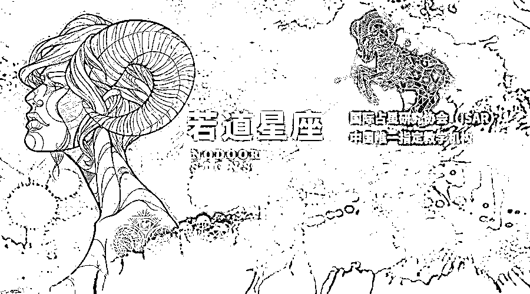

作者/Kathy Rose 译者/Cora
编辑/玫瑰 图片/稿定设计传统的社会价值观普遍认为女人应该温婉和顺，这会造成一些女性抗拒自身的白羊座能量。事实上，只有当真正接纳自己的白羊座能量时，才会感受到别人的接纳，那时候，你就会发现，原来自己是如此性感。大卫老师参与授课的【[ISAR 认证职业占星师文凭课程](http://mp.weixin.qq.com/s?__biz=MzA5NjA0NTAxNg==&mid=2651488522&idx=3&sn=987ebf172445431d46fff7534216437c&chksm=8b4833bdbc3fbaabd2b0cd6e134905da634549c9560c784170825c06b7d1e306e46914bd41e9&scene=21#wechat_redirect)】正在插班中，欢迎点击链接了解更多详情哦！我是一个**月亮在白羊座**的女人，我还有一颗非常**强势的火星**，它落在金牛座，合相我的上升点，并且跟木星、天王星成困难相位。我知道自己**富有战斗精神，竞争心强，追求独立，充满热情。**但如果你问我，作为一个强势的大女人，我是不是总能获得他人的爱、认可和欣赏呢？我只能遗憾地说，并不是这样。**偶尔，我会怀疑自己是不是应该被动一点，适当示弱，更有耐心，从而更像一个传统意义上的女人。**也许作为白羊座的女性，你也有着这样的挣扎，那么现在请跟我一起去探索白羊座能量，看看它会给女性带来怎样的机遇和挑战。**真实的白羊座女人**白羊座在占星学的黄道 12 星座中排第一位。这帮**事事都想争第一**的家伙会喜欢这个位置的！这一火象星座的内涵涉及**领导、独立、坚持自我**。白羊座由火星守护，其能量是原始、粗糙的——受本能驱使、未经雕琢、勇猛无畏、骁勇善战。**白羊是战士，是征服者的原型**——它热爱挑战，渴望不断攀登自我实现的新高峰。**白羊座的心声是“我是”**。自我发现是这个星座与生俱来的固有动力。也是因为这个原因，白羊座会特别重视自力更生和保护个人的独立性不受侵犯。这从他们快速的行动、高水平的生理本能和不死的竞争意识上就可以看出来。**白羊座的座右铭是，直截了当、不兜圈子**，他们一心向前、无所畏惧——随时准备好冲锋陷阵、攻城掠地。**·** 如果你的**太阳落在白羊座**，在火爆的白羊能量的驱动下，你会**以一种勇敢纯粹、甚至稍显莽撞的方式展示自己，向这个世界宣示你的存在**。是激情的火花让你感觉到自我的存在，激励着你前进，让你的自我散发光芒。**· **如果你的**月亮落在白羊座**，你需要**做一个战士或领导者，如此才能感到舒服或满足。**你需要走自己的路，做一个独立、勇敢的人。你需要成为开路先锋，不断迎接新的挑战并把它们踩在脚下。这些是你要获得快乐、满足和圆满必须要做的事。以这样的方式证明自己的存在对你来说就像为灵魂奉上一顿大餐，让你身心愉悦、充满享受。

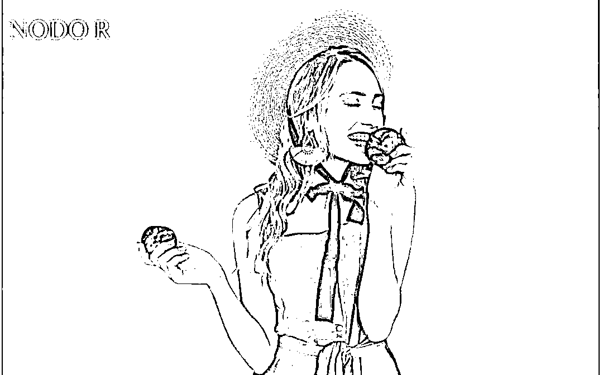

**她们真的不像女人么？**然而多数情况下，这种**火星能量在男性身上会运作得更好**。勇猛强悍的男人通常会受到人们的钦羡与赏识，他们毫不掩饰自己对成功的渴望和成为领导者的野心。我们的社会欢迎这类充满竞争力的英雄典范，光荣与赞许对他们敞开了大门。对于男性来说，展示火星或白羊座的能量是简单又自然而然的事，因为白羊座是阳性星座。 然而，如果你是一个太阳或月亮落在白羊座的女性，可就没有男性那么幸运了。个性强又爱竞争的女人遭受的批评与责难比男人要多得多。**有主见、有野心，特别是位高权重的女人通常都会被想象成专横、冷血、不通人情的模样。**接纳并展示自己身上的白羊座能量对女性来说不总是那么容易，因为这与温柔敏感、给予他人关爱与支持的传统女性形象相悖。社会语言学家 Deborah Tannen 博士曾提到，在女性社会化的过程中，竞争是不被鼓励的；相反，她们学会了如何跟人打交道、建立亲密关系。女人被教导要合作，不要竞争。她们的目标（特别是在人际关系中）是维持和谐，重视互助合作。代代相传的社会文化传统，让人们更加认可温柔、优雅的女孩——更符合金星形象的女孩，而不是独立、胜负欲强的火星女性。

美国超模泰拉•班克斯（Tyra Banks）的**月亮和火星都在白羊座**，她为人坦率、个性活泼，风格热辣。

她是第一批跻身“超模”行列的非裔美国人之一，是第一个登上《GQ》杂志封面和《体育画报泳装特刊》的黑人模特，也是第一个为知名内衣品牌“维多利亚的秘密”做代言的黑人模特。

泰拉承认自己热爱竞争，不仅是跟别人也是跟自己——她将自己的事业推向一个又一个的新高峰，从没停止过对个人潜能的探索。

从模特界退役之后，体重略有增加，有一次八卦小报刊登了她的一些角度不太好的照片，羞辱她身材走样。泰拉的火星白羊爆发，对媒体的批评给予了有力反击。在捍卫自己名誉的过程中，她展现了真正的白羊座精神。

她在自己的脱口秀节目中穿上了泳装，勇敢地展示自己的身材，告诉人们，即使是超模，也不是从所有角度看都完美。

她面对批评所表现出来的强硬、火爆的态度将她推上了舆论的风口浪尖，掀起了一股对于胖瘦判断标准的新争论。那对泰拉来讲是一场严峻的考验，但是她没有退缩，反而给了对手迎头痛击。然而，像泰拉•班克斯这样能活出自我的白羊座女人，似乎并不是大多数。在着手这篇文章时，我采访了许多太阳、月亮或火星落在白羊座的女性。在和她们的交流中我发现，无论这个白羊座特质的女人是在职场上叱咤风云的女强人，还是在家里相夫教子的主妇，她们都曾有过一些相似的经历和感受。竞争的冲动会让她们感到内疚，好像这是一件让人蒙羞的事。**· **“我真的觉得很不好意思……”**· **“我没有向任何人承认过这一点……”○**· **“我知道这让我听起来挺吓人的……”这样的开场白反复出现，颇为耐人寻味，这些女人会为她们有强烈的竞争心而道歉。**没必要因展示火星能量而羞愧**我非常能理解她们的感受。有一次，我向我的一位女性友人讲述我是如何成功讨价还价、用非常划算的价钱买了一辆车。我告诉她，我拒绝了销售方一开始的报价，并且坚持压价不松口，最后我不仅以非常不可思议的价格得到了那辆车，还拿到了一些附加的好处。我还跟她说，整个交易过程中我毫不留情、一点也不退让，最后那个男推销员一直在擦汗，眼泪都快流出来了。“真是好玩极了！”我脱口而出——拿下这场交易就像赢得一场战役，这感觉真棒！当我跟朋友讲述这件事的时候，我仍然充满了白羊座的激情。 

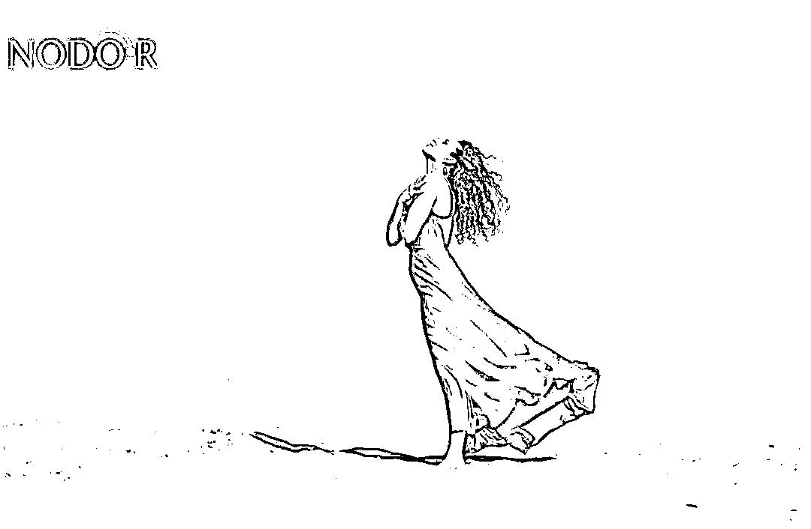

但是，在我向她复述完这件事之后的几小时，**我开始感到不自在。**我心里开始犯嘀咕，觉得我的女性朋友或许并不能理解我的快乐，那种火星能量自由流动时带来的充满力量的快乐，**我担心她会认为我不过是在炫耀、自吹自擂。我陷入了自我怀疑的陷阱**，觉得自己应该为如此享受胜利的喜悦而感到羞愧，**好像我做了对不起谁的事。 **这种愧疚感给原本纯粹的快乐蒙上了污点，给精彩的体验缚上了情感包袱。对很多女人来说，这阻止了她们全然地展现她们的白羊座能量。在这种情况下，**女性需要对这种情感模式有所觉察，意识到羞耻感是如何产生的，而不是每当坚持了自己就觉得对不起谁。**女人应该明白，大部分情况下，为自己展示出的强势火星能量而感到羞愧是没有必要的。**压抑能量还是自然流动？****在旁人的攻击下，在自我的谴责中，女性很容易压抑自己的白羊座能量。**被压抑的能量如同火山的熔岩，不知道什么时候就会从火山口喷薄而出。她们给自己的阳性能量贴上了封条，不让自己参与竞争，不敢争取自己想要的东西，变得消极被动，将决定自己命运的权力拱手让给了别人。被阻塞的火星能量会带来很多不健康的表现，**通常会伴随自我否定和自我打击的倾向，甚至导致抑郁。**很多压抑了自己白羊座能量的被访者都承认，她们会表现出**不同程度的饮食失调、强迫症、上瘾倾向。**最终，当能量压抑了太久，怒气积压得太多，熔岩管也会被撑破。此时的结果将是**彻底的失控**，爆发出最具破坏性的一面，通常会造成非常负面的影响——而这些负面的影响又进一步让她们觉得压抑自己是必须的。这样就造成了恶性循环，阳性能量又开始在她们的内部积压起来。

如果对这类问题有更多的**觉察**，并且有意识地**调整、改变**，相信越来越多的白羊座女性能够学会**接纳**、拥抱自己身上阳性的战士精神，展现出个性中富于开拓性的一面。以下是给白羊女性们的一些**建议**：

**① **记住，在何时、如何表现我们内在的战士一事上，我们**需要针对具体的环境灵活处理**。总会有人反对我们、要求我们做出改变，这是不可避免的。那些能够从容面对竞争、**在阳性能量和女性身份之间游刃有**余的白羊座女性，都是能够时刻对环境保持清醒认识的人。她们知道身边哪些人有可能被她们的强势吓跑，哪些人甚至会因此站到她们的对立面。

这些女人成功发展出了辨识这些情况的能力和应对方法——她们会**采取必要的适应策略，同时不会放弃她们的权力，也不会为自己感到羞愧**。

**② ****觉察他人的需要和感受。**这确实不是白羊座的长项。你无法总是让所有人都满意，但是你的心意能够被人感知到，这样你就不至于激怒他人——同时，如果对他人有所感知，你会发现自己也不那么容易发怒了。

**③ 不要总拿自己跟传统意义上金星类型的女性比较。**做一个火星导向的女人不会减少你的女人味——这仅仅意味着你的生活态度跟他人不同。时刻清楚自己是谁。挑战和竞争能够让你焕发出生命的活力，这是事实，你要接受它。每一次实现了新的目标，成功超越自己的时候，请微笑着享受这胜利的时刻。**④ **如今我不再如痴如醉，也不想再将远方的美以及自己的在交谈中直截了当、直奔主题，可以提高效率，你应该为你的这一优点感到自豪。**享受你的活力、独立和勇敢**。很重要的是，当你从心里接纳了自己强悍、强硬的那一面，并且你也愿意根据情况的需要调整自我表达的方式，那么这些意念的能量将渗透于你生活的每一个角落，在点滴之处产生影响，最终，你会获得更多的爱与支持。 

最后，请记住：正如你希望别人接受你真实的样子——你的积极主动、你的强悍勇猛——你也要接受那些跟你持不同生活态度的女人。这同样是一种礼貌。

**版权声明：**本文由若道翻译发布，欢迎转发，反对抄袭。友号转载请申请白名单。

**END**

**今晚直播内容如下图**

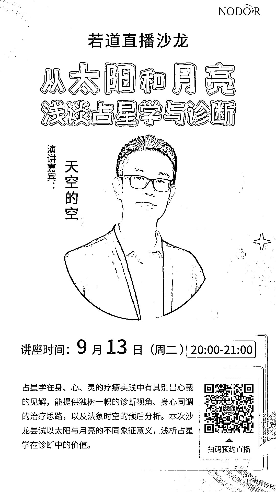

**快来预约直播吧~~~**

<mpvideosnap class="js_uneditable custom_select_card channels_live_iframe" data-pluginname="videosnap" data-headimgurl="https://wx.qlogo.cn/finderhead/PiajxSqBRaEJYnVsqWfEX9qA0sI6hNVKsDfyzfPZ92WZMZyBpZWU5NA/0" data-username="v2_060000231003b20faec8c4e68a1ec2d4ca07e434b07755bbf47e7053a3059defd2c9d6c68a20@finder" data-nickname="若道" data-desc="将在 09 月 13 日 20:00 直播" data-intro="医疗占星直播：从太阳和月亮浅谈占星学与诊断" data-noticeid="finderlivenotice-v2_060000231003b20faec8c4e68a1ec2d4ca07e434b07755bbf47e7053a3059defd2c9d6c68a20@finder-1662445884347765-1312694198" data-type="live"></mpvideosnap>**20 位来自世界各地的占星师****拥有****51 年****占星实践经验的****若道创始人****前 ISAR 全球副主席****前 ISAR 全球职业占星师资质认证主席****大卫·瑞雷**

**和**

**2019 年第二届、2021 年第三届核心课中**

**与苏·汤普金斯老师****联合授课****的**

**ISAR 认证职业占星师**

**咔咔（Caroline）**

**二人合力打造**

**2022 年 ****若道全新核心占星课程**

**点击下图了解更多课程详情** 

**

**20 位来自世界各地的占星师****带来 19 场沙龙——新世界的觉醒****详情可点击下图**

**学习占星学****点击下图了解课程详情**

**微信又双叒叕改版啦，不想错过若道君的推送？**
**就把若道设为星标吧！****▼**

**喜欢就点一下“在看”吧！**

********报名直达入口********

# 核心占星课新鲜速递：为什么有些名人和他们的星座看起来不相符？

> 原文：[`mp.weixin.qq.com/s?__biz=MzA5NjA0NTAxNg==&mid=2651488544&idx=2&sn=3162d728d17aaeb32a1d44bfeca37aec&chksm=8b483397bc3fba81b97aa4d599535399cfb9cf9dce3e83807644db4f9b6f2f17ce82010ef755&scene=126&sessionid=1692737756#rd`](http://mp.weixin.qq.com/s?__biz=MzA5NjA0NTAxNg==&mid=2651488544&idx=2&sn=3162d728d17aaeb32a1d44bfeca37aec&chksm=8b483397bc3fba81b97aa4d599535399cfb9cf9dce3e83807644db4f9b6f2f17ce82010ef755&scene=126&sessionid=1692737756#rd)

新的一期若道核心课正在讲**星座**的部分啦。

在第二堂课中，咔咔老师带着新同学们在学习从白羊座到摩羯座的内容。对于每个星座，大家都非常的好奇，**以及好奇为什么有些名人的星座特质看起来，与这个人不那么相符。**

**比如，为什么天才球星梅西会是巨蟹座呢？为什么新世界首富埃隆·马斯克也是巨蟹座呢？巨蟹座不是一个顾家又宅的星座吗？他们的巨蟹座特质展现在何处？**

**关于这些，咔咔老师是这样讲述的：**

<mpvideosnap class="js_uneditable custom_select_card channels_iframe videosnap_video_iframe" data-pluginname="videosnap" data-id="export/UzFfAgtgekIEAQAAAAAAlwIY5w1nWAAAAAstQy6ubaLX4KHWvLEZgBPElIEceWoIU6KCzNPgMIvtNOqE2R6XhpEhkh6DKo-X" data-url="https://findermp.video.qq.com/251/20304/stodownload?encfilekey=rjD5jyTuFrIpZ2ibE8T7YmwgiahniaXswqzHmYvHU3aZQhyxbNZlqce3xS06GpRIwibDafwyep6jXicbSibmQiaYib7rcM7PAf2HxBuZ5WoJSQuALFGOkOXGAicVYng&amp;adaptivelytrans=0&amp;bizid=1023&amp;dotrans=0&amp;hy=SH&amp;idx=1&amp;m=&amp;scene=0&amp;token=x5Y29zUxcibAAeIJtSUwSkwhALMLWCK68ujomwUHqGAKRsZLxkrIAhGBkFHRdn510iamSPZnicTCicI" data-headimgurl="http://wx.qlogo.cn/finderhead/PiajxSqBRaEJYnVsqWfEX9qA0sI6hNVKsDfyzfPZ92WZMZyBpZWU5NA/0" data-username="v2_060000231003b20faec8c4e68a1ec2d4ca07e434b07755bbf47e7053a3059defd2c9d6c68a20@finder" data-nickname="若道" data-desc="#若道核心课 为什么有些名人的星座特质看起来，与这个人不那么相符？为什么天才球星梅西会是巨蟹座呢？为什么新世界首富埃隆·马斯克也是巨蟹座呢？" data-nonceid="8327635695293922172" data-type="video" data-width="1280" data-height="720"></mpvideosnap>

目前，我们正处于**处女座**的月份。

*   **这个曾经被黑得非常惨的星座，到底是不是如被贴上的标签一般的小心眼、吹毛求疵以及非常洁癖呢？**

*   **这些星座的特质到底是基于什么呢？**

*   **怎样理解处女座既是土象星座，又是变动星座呢？**

*   **Mini Cooper、芯片技术、迷你裙和小家电与处女座有怎样的关系呢？**

**关于这些，咔咔老师是这样讲述的：**

<mpvideosnap class="js_uneditable custom_select_card channels_iframe videosnap_video_iframe" data-pluginname="videosnap" data-id="export/UzFfAgtgekIEAQAAAAAAAiYW2XsbKQAAAAstQy6ubaLX4KHWvLEZgBPEk4E0dhsSU6KCzNPgMItY-4U_7cUfBSGes7LA6kSH" data-url="https://findermp.video.qq.com/251/20304/stodownload?encfilekey=rjD5jyTuFrIpZ2ibE8T7YmwgiahniaXswqzPu34tNzNBjmy9YxJDiaLa5wVp5aplTjko0Ga0gAdAf5PwBnhDKVEzH2hLE0Q19YJlBhZSeQ1spooDcB1CMVg8HA&amp;adaptivelytrans=0&amp;bizid=1023&amp;dotrans=0&amp;hy=SH&amp;idx=1&amp;m=&amp;scene=0&amp;token=x5Y29zUxcibAAeIJtSUwSk03wQZcFNTUGaovb0CzvkDg0g5HJH5hrOXmyRibnp4LNQbn1Sibt6ibUHA" data-headimgurl="http://wx.qlogo.cn/finderhead/PiajxSqBRaEJYnVsqWfEX9qA0sI6hNVKsDfyzfPZ92WZMZyBpZWU5NA/0" data-username="v2_060000231003b20faec8c4e68a1ec2d4ca07e434b07755bbf47e7053a3059defd2c9d6c68a20@finder" data-nickname="若道" data-desc="#若道核心课 怎样理解处女座既是土象星座，又是变动星座呢？Mini Cooper、芯片技术、迷你裙和小家电与处女座有怎样的关系呢？
" data-nonceid="1624677148706427307" data-type="video" data-width="1280" data-height="720"></mpvideosnap>

坊间有太多对于星座错误的理解，**L1-2 会帮助你掌握星座的专业知识。**

**现在报名也不晚哦。**

**拥有****51 年****占星实践经验的****若道创始人****前 ISAR 全球副主席****前 ISAR 全球职业占星师资质认证主席****大卫·瑞雷**

**和**

**2019 年第二届、2021 年第三届核心课中**

**与苏·汤普金斯老师****联合授课****的**

**ISAR 认证职业占星师**

**咔咔（Caroline）**

**二人合力打造**

**2022 年 ****若道全新核心占星课程**

**点击下图了解课程信息****

****报名直达入口****

# 插班中 | ISAR 认证职业占星师必修课：踏入占星学大门的第一步

> 原文：[`mp.weixin.qq.com/s?__biz=MzA5NjA0NTAxNg==&mid=2651488544&idx=3&sn=d411507698723ddda6c6c8987550ac08&chksm=8b483397bc3fba81f45888fde281c42a09178e651ae824d94f1ddbf6778df66edcc799a3e59c&scene=126&sessionid=1692737756#rd`](http://mp.weixin.qq.com/s?__biz=MzA5NjA0NTAxNg==&mid=2651488544&idx=3&sn=d411507698723ddda6c6c8987550ac08&chksm=8b483397bc3fba81f45888fde281c42a09178e651ae824d94f1ddbf6778df66edcc799a3e59c&scene=126&sessionid=1692737756#rd)

5 月，一个若道的老朋友突然发来一段微信，是对木星进入白羊座的感慨。这位朋友创建了自己的公司，他并不在占星行业，但仍经常记录占星日记，因为他总是体会到星体移动和个人生命变化的契合。

过了几天，又一位若道的老朋友发了一张当天新闻的图片，里面有医疗板块产业趋势、有啤酒股的泡沫问题、有千年老二的饮用水公司也要上市。她说，看，举目全是海王星。她也不是占星师。

然而，他们都与占星相遇，占星已经融入了他们的生活。

第一位朋友说，”在若道学习占星，对我来说建立了一个整体的世界观以及对自我内在的解释论。”

第二位朋友说，“学了占星就会知道，事情来时我们不必过度反应，知道一切会过去”。

占星学会改变你，不论你跟随它走多远，不论你是否选择成为占星师。

这个世界在飞快地变化着，占星学可以像定海神针，帮你测度这个世界的变化，也帮助你校正心中的自己和世界的样子。

**这个世界上，应该还没有后悔与占星学相遇的人。**

**8 月 30 日，新的若道占星核心课程开始了。**

如果你还没有下定决心是不是好好学占星，那么 L1-2 可谓一个轻松的前菜，等着你品尝。

**把这个仅需投资 3500 元的课程作为礼物，送给自己或者自己所爱的人。**

**课程试听：不分组转发本文，找王老师领取。**

长按二维码添加王老师微信

**谁是你的老师？**

**占星师咔咔（Caroline）**

2010 年师从美国占星师大卫·瑞雷学习，并得到世界名师斯蒂芬·弗里斯特、罗伯特·汉德、苏·汤普金斯传授各种占星学技法。若道首届学员，国内最早获得 ISAR 职业占星师资质的职业占星师，多次担任若道核心课程助教，2019 年第二届、2021 年第三届核心课中和苏·汤普金斯老师一起教授若道核心占星课程。

在国际知名广告公司和市场研究公司从事的市场研究和推广工作十余年，曾任职于阳狮集团、尼尔森市场研究有限公司、MTV 和《Madame Figaro》杂志。

**大卫·瑞雷（David Railey）**

*   **I****SAR 董事会成员，ISAR 全球副主席，ISAR 全球职业占星师资质认证主席，若道占星创始人**。

*   2016-2019 年，被选为国际占星协会（ISAR）考试委员会成员，国际占星协会（ISAR）是世界最大的国际占星机构，会员遍布 47 个国家。

*   2017-2020 年，被选为国际占星联盟（ISAR）考试委员会主席，理事会成员。

**助教王嘉祺 （Conrad）**

ISAR 认证占星师、若道认证生时校正资质，从 2010 年起自学占星学，2015 年开始在若道系统学习，并开始个案咨询。2018 年担任若道核心课程助教，以及卜卦占星学和太阳返照选修课助教，并带领学员进行经世占星和太阳返照方面的研究。2019 年 11 月作为演讲人之一参加了国际占星协会（ISAR）北京大会，也是 ISAR 星空俱乐部中国区第 16 期的主讲人。

**内容是什么？**

**课程费用**

**★ 1-2 阶 **

**课程费用：3500 元 **

**你也可能想学更高阶：**

**★ 1-3 阶　连报****课程费用：11500 元 ************转发优惠价：**11000 元（朋友圈转发本课宣保留 24 小时以上，并截图给课程顾问）**********★ 1-5 阶　连报**

**课程费用：46500 元 **

****转发优惠价：34800 元（朋友圈转发本课宣保留 24 小时以上，并截图给课程顾问）****

德国哲学家雅思贝尔斯说：

教育是一棵树摇动另一棵树，

一朵云推动另一朵云，

一个灵魂唤醒另一个灵魂。

你准备好被摇动了吗？

**退转课程**

**退款原则请详看《教学协议》，如有疑问请咨询课程顾问。**

**课程试听**

**不分组转发本文，加王老师获取。**（微信/手机：18510107057，请备注“大卫核心课”）

****2022 L1-2 认证职业占星师必修课程****

**授课老师：大卫·瑞雷、咔咔**

**直播课开课时间：2022 年 8 月 30 日（周二）**

**授课方式：******网络授课，英文/中文授课，中文翻译****

**费用**： ****1-2 阶**：**3500 元；****1-3 阶**：**11500 元**（****转发优惠价：11000 元，朋友圈转发本课宣保留 24 小时以上，并截图给课程顾问）；**1-5 阶连报**：46500 元**（****转发优惠价：34800 元，朋友圈转发本课宣保留 24 小时以上，并截图给课程顾问）****

**课程负责人：王老师**（微信/手机：18510107057，请备注“大卫核心课”）

长按二维码添加课程负责人咨询~

**END**

****报名直达入口****

# 若道周运 9.12-9.18 丨群星逆行，在“慢生活”里与自己对话（内含 12 星座运势）

> 原文：[`mp.weixin.qq.com/s?__biz=MzA5NjA0NTAxNg==&mid=2651488522&idx=1&sn=20280a7b68c82a11ff967834095ee379&chksm=8b4833bdbc3fbaab49056ac2c9248ab799f951296766307237984cbede1a0e4f0afa44a0468e&scene=126&sessionid=1692737756#rd`](http://mp.weixin.qq.com/s?__biz=MzA5NjA0NTAxNg==&mid=2651488522&idx=1&sn=20280a7b68c82a11ff967834095ee379&chksm=8b4833bdbc3fbaab49056ac2c9248ab799f951296766307237984cbede1a0e4f0afa44a0468e&scene=126&sessionid=1692737756#rd)

******☆ ****后台回复“今日”，给你一句生命态度******

作者/Dora ISAR 认证占星师
编辑/翀子 封面/书君 图片/稿定设计**整体氛围**

今天仍然属于中秋假期，先祝大家假期愉快，好好享受这放松的时光。

我目前正在进行配合防疫政策的隔离。之前对这一段空闲的时间做了很多的计划：读几本书，写几篇文章，如何锻炼。真正在酒店安顿下来以后，却发现什么都不想做，大部分时间只是无谓地消耗着时光。

于是突然意识到：原来自律建立在有选择的自由上。自由才能带来自律。

除了外行星，我们星图中有七颗可以看见的行星。在木星引领的自由与信念之下，我们呈现金星的美丽、火星的勇气、水星的理智、月亮的安全、太阳的闪耀，而土星来规范这一切，以免越界。

所有的行星的原型都需要平衡，当发生失衡的时候，行星们旧有可能呈现出低阶的特质：金星的纠结、火星的暴躁、水星的狡猾、木星的贪婪、月亮的脆弱......

天空呈现的原型，正是我们人间的缩影，平衡和恰当实在是太重要了。**上周末刚刚在天秤座逆行的水星，要求我们思考在哪里失衡、什么需要重新整理。**

在上周满月和水逆的中秋的前两日，有一个人离去了，一个生来就承担土星责任的人，一个优雅了一辈子的女王。

次限水瓶 20 度的月亮合相她本命火星，刚离开本命木星和土星的四分相。行运的冥王星在上升点徘徊了一阵子了，行运的月土合相也正好合相本命火星木星。逆行的木星在合相本命水星，次限中天正好四分本命和天顶合相的土星，可以卸下尘世的重任去旅行了。

本周的天空，虽然除了周六的日海对分，并没有精准成相的重大相位，但天空中却呈现了紧张、紧密的氛围：群星逆行，四分相和对分相的压迫，都好像在说：**请慢下来，停一下，检查一下。**

**重要天象**

**★ **群星逆行****

自上周六水星开始在天秤座逆行，天空中的**冥王星、海王星、天王星、土星、木星、水星都在逆行。**火星也将于 10 月逆行。逆行的行星会因为强调反思而变得沉重，步步为营，以免行错踏错；事事谨慎，也难免让人有种喘不上气的压抑。

**看来这是一段需要安静修心的日子。**金星正处于处女座的位置，告诉我们要低调谨慎，好好梳理我们的思想、生活，以及目标。也许曾经走的太快，而忘记了自己要去哪里；也许来时的路，我们已经错过太多。这时候都需要我们重新思考和整理，以便更好地再次出发。

**★ **土星四分天王星****

今年一直在纠缠不休的土天四分相已经把我们整得人仰马翻：那些完成不了的计划；到达不了的远方；大跌眼镜的预期；随时变更的环境，山火、高温、干旱、暴雨、地震、疫情......

**周四（9 月 15 日），土星和天王星在逆行中以一度以内的精准四分相，拉开了九到十月的又一波震荡。**也许，今年如此波折的环境，需要等到 2023 年 1 月的天王星顺行、土天正式脱离四分相才能告一段落。

那么，在这过山车般的九月和十月，我们还可以期待什么？系紧我们的安全带吧，**当我们明白无常就是一种常态，也许能够以不变应万变。**“不变”是我们对自然规律的了解，坚持，总会迎来黎明的光芒。

**★****金星四分火星**

**周五（9 月 16 日），处女座的金星和双子座的火星呈紧密四分相，**阴阳两股能量的纠缠可能点燃浪漫的激情，出现翩然惊鸿的一见钟情，但也可能在关系中引爆冲突和怒火。

处女座和双子座都归水星掌管，也不知逆行中的水星能否让天雷地火的金火四分相通过反思变得理智一些呢？

水逆期间，凡事谨慎，物品妥善保管，出行反复核对，信息多次确认，不要引起不必要的冲突和矛盾。当然，更重要的是对自己的**社会关系、亲密关系、亲子关系**进行重新思考。自己处理的方式对吗？关系的问题一定是双方的问题，我们看到了自己这一方的问题了吗？

**★****太阳对分海王星**

**周六（9 月 17 日），处女座的太阳和双鱼座的海王星形成对分相。**太阳遇到模糊了边界的海王星，我们可能又一次想问自己：我究竟是谁？我在这个世界上存在的意义是什么？

我们也许会太过浪漫的看待一段关系，也许我们喜欢的只是那个幻想中的人，也许我们被他人欺骗，但更多是被自己的想象所欺骗。那么，**是时候重新思考自己对感情的期望了！**

**海王星也是灵感和艺术的象征，**当太阳对分海王星的时候，也许你的想象力和灵感爆棚。在周末，选一部自己喜欢的电影。喝一杯红酒，让自己的思绪放飞。或许，我们能够有一些新的领悟。

在这个非常重要的时刻，你生活中的哪些系统——无论是个人还是事业——需要整理？人生需要休息，才能继续前进，你休息过吗？你是否因过度劳累而失衡？

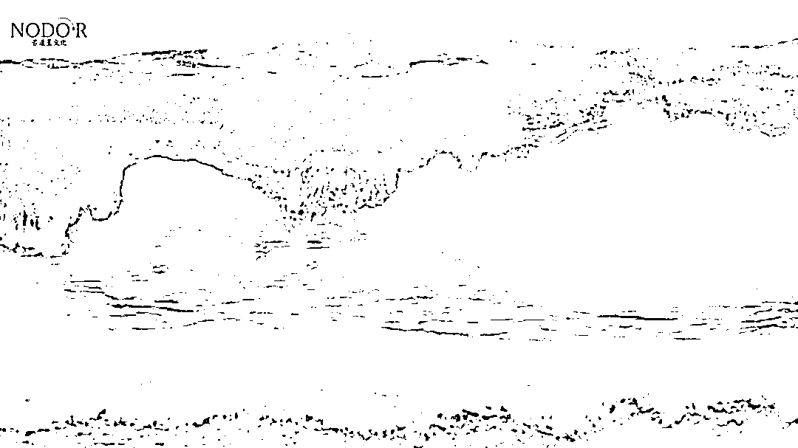

**12 星座一周运势**

**上升*****白羊座***

亲爱的白羊座们，最近的自信心有点爆棚，木星在你的第一宫，是不是觉得事情有了一些新的突破？

水逆发生在你的第七宫，在关系中，无论是亲密的一半还是公开的敌人，都有可能发生词不达意的误解。如果希望挽回一段关系，这也是一个合适的时期，如果真的有什么需要挽回，或者澄清，周末也许会有些机会。

财务方面的问题还是不能掉以轻心，暂缓大的投资以避免损失。

工作中表现机会增加，如果有新的任务，要有信心，一定能够成功的。

*****上升**金牛座***

金牛座的工作压力比较大，也许你会因为迟疑而拖延工作进度，会更加关注自己的身体健康。可能是各方面压力太大，心生厌倦。那么，也许是时候让自己休个假，给自己换个环境，好好放松一下，梳理自己的工作状态。

重新审查自己的关系，看清一些人。如果直觉不对，那就相信自己的直觉。到月底的时候，状态会大大好转。

**上升*****双子座***

上升双子座的宝宝们，本周有点急躁。情绪变化比较大，尤其是和恋人、或者孩子的沟通有不畅的情况。要注意自己的语言是否造成他人的误会。

工作有变动的机会，也许在职场突然引起了别人的注意，最好抓住这个机会多表现一下。

家庭是你幸福的港湾，再忙也记得回家看看哦。

**上升*****巨蟹座***

巨蟹座最近和他人的沟通联系机会较多，各种社交、头脑风暴、结交新朋友。自己的好点子也层出不穷。利用这段时间，好好学习新的知识，多和别人沟通，也可以大胆地表达自己的意见和想法。

如果家里变得乱七八槽，就好好整理一下，如果很久没有和父母联系了，不妨多回家看看。

保持自己的学习热情，坚守信念，你的视野应该囊括更大的格局。

**上升*****狮子座***

狮子座最近感觉有点困扰，容易词不达意。沟通经常出现小问题，丢三落四，或者出门的时候出现小状况。这周可是水逆的重灾区呀，狮子座们一定要小心一些。事缓则圆。

家里太乱？可能该好好打扫一下了。处女座月清理杂物，来个断舍离，也别忘记清理自己的负面情绪。

生活中有时应该丢弃的东西，就不要再留恋了。不爱的人、鸡肋的工作、早已经没有共同点的朋友，该放手就放手吧。也许你还会寻寻觅觅，试图挽回些什么。水逆期间能回来的，也许还能回来。

**上升*****处女座***

在这个属于处女座的季节，你们是不是感觉到如鱼得水，闪闪发光呀？工作上可能特别忙碌，也有可能出些临时的状况。不要着急，让自己安静会儿，再去解决问题。

水星在你的第二宫逆行，你可能会对“什么是有价值的事物”重新思考。注意你的财务开支，不要无谓地浪费钱财。你的价值感并不是钱来定义的。不见了的东西，这周有可能失而复得。

对另一半的关系可能有些新的理解和领悟。也许之前自己的想法有些模糊，有些界限不清，或者是理解错了。重新定义双方的关系，也许时间会给你答案。

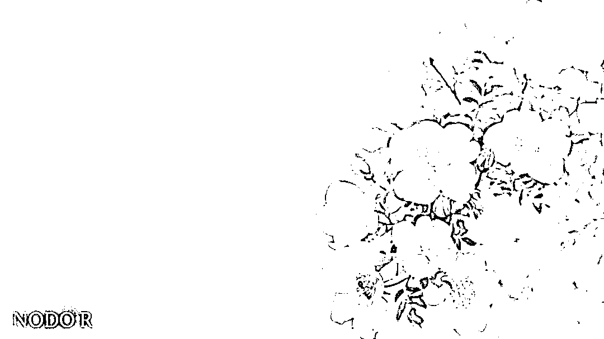

**上升*****天秤座***

当水逆发生在天秤座的 1 宫時，天秤座的自我感觉可能会发生变化。用全新的眼光看自己，你从来都超级有品味，千万不要因为水逆扭曲了你对自我形象的信心。通过重新认识自己，建立信心，你会变得更加敏锐而富有灵性。

可以多注重养生，锻炼身体，养成生活中的好习惯。不要忽略对自己的照顾。身体保持健康，找回自我，你始终是最棒的。你是否优秀不取决于别人对你的评价。抛开那些讨好他人的倾向，是你自己的信心决定了你。

**上升*****天蝎座***

水逆发生在天蝎座们的第 12 宫，是一个探索内心的时期。如果最近多梦，早上醒来，可以试着回忆一下梦境，有可能的话可以记录下来，看看对自己有什么启发。梦是我们打开潜意识大门的窗口。

是时候探索自我和他人的关系了。也许你一直觉得得到别人的喜欢和肯定是十分重要的，但你需要把重点放在探索自己的快乐和创造力上。什么才是你真正能感到生命的欢欣的事情？

在亲密关系中，我们也需要给对方留有更多的空间。只有自由独立的人，才会有平等成熟的亲密关系。

记得要多进行体育锻炼哦！

**上升*****射手座***

射手座们，如果本周和周围的人产生了误解和矛盾，这不是你的错，是水逆惹的祸。避免乱发表意见，遇到事情不要冲动，先消化一下。

多多关心自己的家人，自己的家园，把用在手机上的时间用在收拾房间上，无论外面怎样混乱，你需要一个温暖的家来抵御风寒。

不管怎么说，这周的桃花运还是有的，也许是过去的恋人，也许是暗恋的对象，突然又重新联系，那就好好享受这份礼物吧。

生活上要养成良好的生活习惯，需要保护好自己身体，避免出现意料外的疾病，也记得给家里的宠物做个身体检查。

**上升*****摩羯座***

摩羯座们这周应该关注职场，可能在工作中会出现一些复杂的情况。试着尽量做好手头每一件事情，不要去扩展你的工作范围，忙多了容易出现失误。注意和上级领导保持良好的沟通，让领导听到你真实的想法。

如果家人亲戚给你介绍一些新的机会，不妨试一下。也许新想法给你很好的指引，有更好的拓展自我、提高发展的机会。可以利用这段时间加强学习，找到适合自己的良师，去实现自己的梦想。

**上升*****水瓶座***

理性的水瓶座这周将开始探索新的道路，也许特别渴望一次冒险，从遥远的旅途中去寻求生命的意义。目前全国的疫情起起伏伏，不一定要出门远行，读万卷书也是灵魂的旅行，只要一直在努力成长就行。

注意你的财务状况，也许有机会完成一个项目，也许前期的投资会有一个结果了。

本周的重点是好好思考一下自己生活的全貌，是不是走在正确的路上？如果没有答案，那就多多阅读。开卷有益。

**上升*****双鱼座***

双鱼座是非常敏感的星座，当水星在第八宫逆行的时候，你可以感受到更深刻的真相。如果有些事情、有些人让你紧张不安，你可能最近会找到答案。

你敏锐的直觉可能会在人际关系，投资，金钱领域发现一些新的事物，有新的领悟。

最近财运比较好，也可以多关注一下投资机会。

在感情上，不要用自己的幻想来看待一段关系，多听听朋友的建议，也许你认为非常可靠完美的关系，并不是你想象的那样。

**祝大家一周平安顺遂！**

**版权声明**：原创文章由作者授权首发于若道平台发布，欢迎转发，反对抄袭。友号转载请申请白名单。

**END**

****Dora****

若道 2017 届核心课毕业生

若道咨询平台占星师、ISAR 认证占星师

心理咨询师、塔罗咨询师、多年企业管理经验

咨询微信：AstrologerDora

公众号：Dorothy 占星文化

**长按打赏**

**20 位来自世界各地的占星师****带来 19 场沙龙——新世界的觉醒****详情可点击下图**

**学习占星学****点击下图了解课程详情**

**微信又双叒叕改版啦，不想错过若道君的推送？**
**就把若道设为星标吧！****▼**

**喜欢就点一下“在看”吧！**

********报名直达入口********

# 医疗占星沙龙丨从太阳和月亮浅谈占星学和诊断（明日开播！）

> 原文：[`mp.weixin.qq.com/s?__biz=MzA5NjA0NTAxNg==&mid=2651488522&idx=2&sn=d76f4090119968754644792ff11e7502&chksm=8b4833bdbc3fbaab0ceae87e411dab256c53e3b3672e3b457c0016c8175a93f0885f96ce6114&scene=126&sessionid=1692737756#rd`](http://mp.weixin.qq.com/s?__biz=MzA5NjA0NTAxNg==&mid=2651488522&idx=2&sn=d76f4090119968754644792ff11e7502&chksm=8b4833bdbc3fbaab0ceae87e411dab256c53e3b3672e3b457c0016c8175a93f0885f96ce6114&scene=126&sessionid=1692737756#rd)

日月星辰在外，也在内；在心，也在身。

**一张星图铺开，可以看到先天身心的资源，也能看见先天身心容易被影响的部分。**

**2022**年**9**月**20**日**即将开始的医疗占星学**，将会详细讲述一个人的**性格、症状及其星图**是如何相互映照的，课程也会探讨**疾病的意义以及可能的治疗方法。**

而由若道讲师、本次医疗占星课程助教**天空的空**在**9**月**13**日带来的**《从太阳和月亮浅谈占星学于诊断》**的课前沙龙，将邀请你在 1 个小时的分享中初尝试医疗占星。

**沙龙内容：**

占星学在身、心、灵的疗愈实践中有其别出心裁的见解，能提供独树一帜的诊断视角、身心同调的治疗思路，以及法象时空的预后分析。本次沙龙尝试以太阳和月亮的不同象征意义，浅析占星学在诊断中的价值。

**沙龙时间：****9 月 13 日（周二） 20:00-21:00**

**主讲人：****天空的空**

**快来预约直播吧~~~**

<mpvideosnap class="js_uneditable custom_select_card channels_live_iframe" data-pluginname="videosnap" data-headimgurl="https://wx.qlogo.cn/finderhead/PiajxSqBRaEJYnVsqWfEX9qA0sI6hNVKsDfyzfPZ92WZMZyBpZWU5NA/0" data-username="v2_060000231003b20faec8c4e68a1ec2d4ca07e434b07755bbf47e7053a3059defd2c9d6c68a20@finder" data-nickname="若道" data-desc="将在 09 月 13 日 20:00 直播" data-intro="医疗占星直播：从太阳和月亮浅谈占星学与诊断" data-noticeid="finderlivenotice-v2_060000231003b20faec8c4e68a1ec2d4ca07e434b07755bbf47e7053a3059defd2c9d6c68a20@finder-1662445884347765-1312694198" data-type="live"></mpvideosnap>

# 插班中丨 ISAR 认证职业占星师文凭课程：开启“爱好变职业”的创收自由之路

> 原文：[`mp.weixin.qq.com/s?__biz=MzA5NjA0NTAxNg==&mid=2651488522&idx=3&sn=987ebf172445431d46fff7534216437c&chksm=8b4833bdbc3fbaabd2b0cd6e134905da634549c9560c784170825c06b7d1e306e46914bd41e9&scene=126&sessionid=1692737756#rd`](http://mp.weixin.qq.com/s?__biz=MzA5NjA0NTAxNg==&mid=2651488522&idx=3&sn=987ebf172445431d46fff7534216437c&chksm=8b4833bdbc3fbaabd2b0cd6e134905da634549c9560c784170825c06b7d1e306e46914bd41e9&scene=126&sessionid=1692737756#rd)

**2022 年，是世界和中国 40 年未有之大变局的开始。**

俄乌战争打破了欧洲大陆乃至全世界的和平局面，而新冠疫情也给中国经济带来前所未有之挑战。

如果你关心经济形势和世界局势，你会有这种的感觉，我们将面临一场深刻的危机，而这不是短期内可以结束的。

**占星学的看法也是如此。**

4 月青年失业率（16 岁到 24 岁）中国达 18.2%，一些背着房贷、教育、医疗负担的中年人突然失业更是整个家庭整个难以承受之重。为了更好准备面对这样的时代变化，连《北京日报》这样的官方媒体也在呼吁：**“开拓副业，让自己有多元化发展的生存能力”。**

**而这门课程，就是为了这样一个目标准备的。**

**占星学是非常好的“开展副业”的选择**

这个**为期 16 个月**的课程通过并不算长的时间和并不算高的投资，不仅可以帮助你学到一个终身可用的技艺，而且也可以选择成为自助助人的占星师，**开启受益终生的第二事业。**未来是个体崛起的时代，大量个体被鼓励独立发展，比如网红、自由职业、自媒体、咨询师等，他们都不需要传统的办公室。社会越发达，人的独立性就越强，未来有能力的人都可以变成独立的经济体。

**占星学也是越老越好的职业**

和一些技术变化非常快的职业不同，**占星学的技术层面非常稳定，不会快速迭代变化，**同时，掌握好占星学、能够做一场好的咨询又需要个人自身大量实践和对生命的深刻理解，而这些都是时间和岁月带来的。

**占星学是现代社会需要的助人职业**

社会快速发展和变化人们似乎越来越无法掌控自己的生活，这给很多人带来巨大的焦虑，**抚慰心灵的咨询市场需求巨大。**而占星学可以让人从前所未有的角度了解自己，了解目前和未来所处的周期，挑战的意义，不论对于深入的个人成长探寻，还是预测未来的周期，都又其独一无二的价值。

**ISAR 认证职业占星师的独有培训**

目前占星学的培训市场鱼龙混杂。而 ISAR（国际占星研究协会）是一个包含了 47 个国家在内的国际占星组织，多年来致力于占星的教育和研究，提升占星教育的品质和职业占星师的能力，在国际占星领域备受尊重。今年，ISAR 对于成为 ISAR 认证职业占星师提出了更高的要求，**所有想要获得 ISAR 职业占星认证的申请者均需要在 ISAR 的附属学校通过 500 个小时的研习（包含****主课****、选修课、沙龙、作业、讲座、工作坊等等）。**

**而这门核心占星学课程就是为此而准备的。**

**2022 年，鉴于对若道在占星教学领域所做的持续努力和高品质的课程服务，ISAR 特别授予若道核心课程为 ISAR 文凭课程，所有在若道学习，并通过若道毕业考试的同学将获得 ISAR 颁发的学历文凭（Diploma）。**

**你的占星核心课老师是谁？**

**拥有****51 年****占星实践经验的****若道创始人****前 ISAR 全球副主席****前 ISAR 全球职业占星师资质认证主席****大卫·瑞雷**

**和**

**2019 年第二届、2021 年第三届核心课中**

**与苏·汤普金斯老师****联合授课****的**

**ISAR 认证职业占星师**

**咔咔（Caroline）**

**二人合力打造**

**2022 年 ****若道全新核心占星课程**

**咔咔老师给同学的寄语：**

（向上滑动查看内容）

**亲爱的同学们：**

我为什么学占星学？

2000 年的时候我还是一个在网上搜索天蝎座和水瓶座配不配的普通白领。我搜索的内容还包括了水瓶座为什么总是这么若即若离？

体贴的搜索引擎给我推送了占星学、行星、星座、宫位、相位等资料，还让我了解到莉莉丝、月亮交点、截夺宫位等占星学概念。

2000 年 10 月我了解到，一个从业 30 多年的美国职业占星师大卫·瑞雷来到了中国，和他的中国合伙人将开办一个专业教授占星学知识的课程。过去 10 个月在网上东拼西凑的占星学知识唤起了我对占星学的兴趣，但是已经不能满足我对星图深度分析的需求了。

2013 年，我通过了若道核心课程的毕业考试和国际占星师研究协会的认证考试。2015 年我离开职场成为一名全职占星师。

到底学习占星带给了我什么呢？

1、它是自我觉知的工具，我现在已经不去纠结哪些星座是否匹配，我相信外在的事件是内在心理矛盾的显化。也就是说，想找到令人满足的亲密关系，要先去了解自己的情感模式和需求，而不是无意识地一次次地试错和撞墙。我开始学习自我关怀和接纳自己。

2、它带来看待世界的全新和全景的角度，天上如是，地下亦然。人类社会和个人生命的进化都有其周期和相似性，作为个体，占星学帮助我思考如何更积极和有建设性地与宇宙的能量合作，认识自己，发挥自己的潜力，度过有意义且自我满足的人生。

3、它带来了全新的职业：占星师和占星老师。除了收入，还有助人育人的满足感和意义感。

4、它带来一群志同道合的伙伴，我们彼此联结又相互独立。

作为中国占星界的“黄埔军校”若道占星的学生、助教和老师，我与很多学员在人生的不同阶段带着各异的需求走进了这所学校，2022-2023 年一年半的若道核心课程设计既蕴含了大卫·瑞雷老师的教学精华，也带入了我在跟随不同国外占星老师学习、助教和教学积累的心得。

有一些学员毕业后从事了占星咨询工作，有的在各大平台成为专业占星学知识的输出者和传播者，有的运用占星学提升他们的工作，也有的在占星学与投资，占星学与名人/八卦、占星学与原生家庭、亲密关系、亲子关系等领域收获了有用的或者有趣的体验。

对我来说，生命是一场自我完整的体验之旅。从 2011 年的那个春节在若道入学之后，我的生命旅程更加充实、有意义、有目标，也更有满足感。

希望在 2022-2023 年的若道核心课程里见到你。希望你此后的生命旅程里，有若道，有占星学。

占星师咔咔

2022 年 5 月 24 日

**大卫老师给同学的寄语：**

（向上滑动查看内容）

亲爱的学员们：

感谢你对我们从 8 月 30 日开始的若道 L1-5 级核心课程的兴趣。我和合作老师咔咔以及我们的核心课程团队期待着为你提供这个机会，来教授各种高品质的地道占星学知识和技巧。

对于那些希望获得 ISAR 职业占星师认证的学生，这是一门适合你的课程！

作为 ISAR 咨询技能培训的一部分，我曾与咔咔合作过，我们期待着再次合作。咔咔和我曾在 ISAR 职业占星师认证委员会（CAP ISAR）一起工作，我们非常熟悉获得 ISAR 职业认证的流程。作为你的老师，我们将陪伴你整个占星学发现之旅，帮助你逐渐认识到占星学有多么的神奇。此外，你还将受益于我们若道的助教和课程顾问，他们是若道核心课程计划的重要组成部分，提供在线沙龙、组织学习小组、指导家庭作业。我们的教育团队是“服务于你的团队”，所以也会根据你的需求进行相应的调整。你专用的核心课程微信群也促进了你的学习过程，使你能够每天与你的同学们一起学习、探讨、成长。

52 年前，当我开始学习占星学时，没有一所像若道这样的学校。如果有这样一所学校，我会尽一切可能在那里成为一名学生。事实上，我很幸运，我的老师都是经验丰富的专业占星师。然而，我花了 6 年的学习时间才通过 1976 年在美国乔治亚州亚特兰大举行的专业占星师考试，又花了 2 年的专业实践时间才通过占星学谋生。我永远不会忘记从 1970 年到 1978 年的 8 年，那些日子的反复试验教会了我如何苦练占星学。作为老师，我一直在努力传授我早年所学的知识，让你的旅程更加顺利，更加全面。

自 1978 年以来，44 年的全职实践教会了我很多，我很高兴有机会与大家分享我所学到的东西。我和咔咔都是现代占星师，虽然我们尊重西方占星学的历史和传统，但我们实践和教授的占星学植根于现代人本主义哲学，这种哲学旨在提高你对自身潜力的认识，并鼓励个人成长。还有什么比了解自己更实际的呢？还有什么比个人成长和发展潜力更有利的呢？这是你将要学习的占星学，一种可以应用于你自己生活的占星学，一种可以为你提供一个充实职业的占星学。

教书是我回馈占星学行业的方式，这个行业拓展了我的视野，远远超出了我曾经想象的可能。谢谢你给我这个机会做你的老师。

大卫·瑞雷

2022 年 5 月 24 日

**连报 L1-5 全阶网络直播课程，你可以享受**

❶ 64 次线上直播互动网络课程+2 场工作坊，全面而详细地讲解占星学知识、技能、案例和重要领域实践运用。

❷ 知识点+学员星图解读有机结合：咔咔老师以讲解知识点和中外名人案例为主，大卫·瑞雷老师以参课学员案例演示及客户案例为主，每个知识点覆盖班级内学员的亲身案例，参与感更强，多位学员都有机会听到自己的星图分析。

❸ 微信群学员互动分享，从真实案例学习生命成长故事。

❹ APP 答疑论坛提问：论坛上每个学员的问题都将得到及时回复。

❺ 若道独有的职业占星师养成计划，为你毕业后独立咨询做准备。

**❻ **提供**咨询平台**，只要努力，优秀毕业生有机会入驻**若道咨询平台**，拓展咨询客户群。

**更多了解老师和助教？**

**大卫·瑞雷（David Railey）**

*   **I****SAR 董事会成员，ISAR 全球副主席，ISAR 全球职业占星师资质认证主席，若道占星创始人**。

*   2016-2019 年，被选为国际占星协会（ISAR）考试委员会成员，国际占星协会（ISAR）是世界最大的国际占星机构，会员遍布 47 个国家。

*   2017-2020 年，被选为国际占星联盟（ISAR）考试委员会主席，理事会成员。

**占星师咔咔（Caroline）**

2010 年师从美国占星师大卫·瑞雷学习，并得到世界名师斯蒂芬·弗里斯特、罗伯特·汉德、苏·汤普金斯传授各种占星学技法。若道首届学员，国内最早获得 ISAR 职业占星师资质的职业占星师，多次担任若道核心课程助教，并于 2019 年第二届、2021 年第三届核心课中和苏·汤普金斯老师一起教授若道核心占星课程。

在国际知名广告公司和市场研究公司从事的市场研究和推广工作十余年，曾任职于阳狮集团、尼尔森市场研究有限公司、MTV 和《Madame Figaro》杂志。

**助教王嘉祺 （Conrad）**

ISAR 认证占星师、若道认证生时校正资质，从 2010 年起自学占星学，2015 年开始在若道系统学习，并开始个案咨询。2018 年担任若道核心课程助教，以及卜卦占星学和太阳返照选修课助教，并带领学员进行经世占星和太阳返照方面的研究。2019 年 11 月作为演讲人之一参加了国际占星协会（ISAR）北京大会，也是 ISAR 星空俱乐部中国区第 16 期的主讲人。

**什么人适合这门课？**

*   对占星学有浓厚兴趣，想要系统学习占星学。
*   对占星学有一定基础，但不知道该如何整合星图复杂的碎片。
*   希望成为优秀的占星师，想要借鉴国际大师解读思路并融入自己的体系。
*   想学习占星学，但不擅长英文，希望有中文老师授课。
*   想结合占星学理论与咨询实践。
*   走在自我探索和个人成长道路上的人。

**课程费用**

**★ 1-2 阶 （8 月 30 日开课）****课程费用：3500 元 ****★ 1-3 阶　连报****课程费用：11500 元 **********转发优惠价：**11000 元（朋友圈转发本课宣保留 24 小时以上，并截图给课程顾问）********★ 1-5 阶 连报****课程费用：46500 元** **转发优惠价：34800 元（朋友圈转发本课宣保留 24 小时以上，并截图给课程顾问）**

**咨询课程请联系顾问**：**王老师（微信/手机：18510107057，请备注“大卫核心课”）**

**退转课程**

**退款原则请详看《教学协议》，如有疑问请咨询课程顾问。**

****2022 L1-5 认证职业占星师必修课程****

**授课老师：大卫·瑞雷、咔咔**

**直播课开课时间：2022 年 8 月 30 日（周二）**

**授课方式：******网络授课，英文/中文授课，中文翻译****

**费用：******1-2 阶**：**3500 元；****1-3 阶**：**11500 元******（****转发优惠价：**11000 元，朋友圈转发本课宣保留 24 小时以上，并截图给课程顾问）；**1-5 阶连报**：46500 元**（****转发优惠价：34800 元，朋友圈转发本课宣保留 24 小时以上，并截图给课程顾问）******

**课程负责人：王老师**（微信/手机：18510107057，请备注“大卫核心课”）

长按二维码添加课程负责人咨询~

**END**

****报名直达入口****

# 周末树洞丨震荡天象下的水逆来了，你有哪些感受？

> 原文：[`mp.weixin.qq.com/s?__biz=MzA5NjA0NTAxNg==&mid=2651488521&idx=1&sn=286fc2a5ba3910d9f471363ff284d9a3&chksm=8b4833bebc3fbaa8e3d286c635f65701e53254ddd9b48c1cd5357b864f99bf28cef2532c8ad4&scene=126&sessionid=1692737756#rd`](http://mp.weixin.qq.com/s?__biz=MzA5NjA0NTAxNg==&mid=2651488521&idx=1&sn=286fc2a5ba3910d9f471363ff284d9a3&chksm=8b4833bebc3fbaa8e3d286c635f65701e53254ddd9b48c1cd5357b864f99bf28cef2532c8ad4&scene=126&sessionid=1692737756#rd)

**2022 年 9 月 11 日天象：**

*   **14:46 月亮进白羊座**
*   ******太阳三分天王星、与土星呈梅花相******
*   ******土星四分天王星******

昨天，2022 年的第三次水星逆行正式开启（点击[【水逆】](http://mp.weixin.qq.com/s?__biz=MzA5NjA0NTAxNg==&mid=2651488491&idx=1&sn=267575b1af5ccf7a2b698120bdd7bdf5&chksm=8b48325cbc3fbb4ac0aba5695da8f30922839a8e3c6b99fd0c49adcdd29409fcf489d4c84500&scene=21#wechat_redirect)查看文章），而下午的[【双鱼座满月】](http://mp.weixin.qq.com/s?__biz=MzA5NjA0NTAxNg==&mid=2651488520&idx=1&sn=9e8b983995bbfcc89a24cc762bd15faa&chksm=8b4833bfbc3fbaa969364aa79748e9179be07d75c9d83bc44bdd1d11b11772d76610fd1a6ecd&scene=21#wechat_redirect)（点击查看文章）更是给中秋节的能量加了浓重的一笔。此次水逆，我们有机会去修复过往人际关系中的遗憾，以新的方式与这些人重新建立连接，在内心世界，去回顾自己的交友模式、情感模式、人际相处模式，看到问题所在，一定会有收获。同时，满月与水逆同一天发生，且双鱼座的另一颗守护星木星也在逆行之中，或许会有一些没有处理好的往事，如水草般缠住我们，心结浮现，难以释怀。在土星四分天王星的天象下，自然环境、集体社会和个人生活都处在震荡与变化的氛围中，今天太阳与天王星的三分相、下午进入白羊座的月亮，或许能给你一些洞察力与勇气，看到改变事情发展方向的有力空间，并在群星逆行的“沉淀”中，渐渐明晰眼前的路。震荡天象下的水逆来了，你有哪些感受？欢迎分享哦~周日快乐！我们明天见！**了解每日天象，可****下载“若道”APP 查看****还有更多精彩等着你哦**

# 双鱼座满月 | “六星逆行”下的满月，充满宇宙的光耀

> 原文：[`mp.weixin.qq.com/s?__biz=MzA5NjA0NTAxNg==&mid=2651488520&idx=1&sn=9e8b983995bbfcc89a24cc762bd15faa&chksm=8b4833bfbc3fbaa969364aa79748e9179be07d75c9d83bc44bdd1d11b11772d76610fd1a6ecd&scene=126&sessionid=1692737756#rd`](http://mp.weixin.qq.com/s?__biz=MzA5NjA0NTAxNg==&mid=2651488520&idx=1&sn=9e8b983995bbfcc89a24cc762bd15faa&chksm=8b4833bfbc3fbaa969364aa79748e9179be07d75c9d83bc44bdd1d11b11772d76610fd1a6ecd&scene=126&sessionid=1692737756#rd)

**☆ 后台回复“今日”，给你一句生命态度**

作者/王芝桦 编辑/玫瑰 图片/稿定设计

**双鱼座满月****北京时间 2022 年 9 月 10 日 17:58 迎来双鱼座满月，处女座太阳与双鱼座月亮于 17°41′精准对分。**
“六星集体逆行”的 9 月，这一场具足宇宙光耀的双鱼座满月，犹如暗夜里的大海，吞没着天上的星辰，而后在黎明来临之际，吐出光芒万丈的太阳。

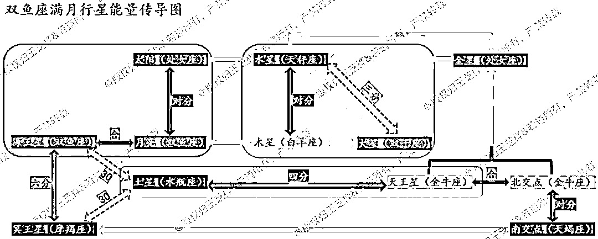

**双鱼座满月重点影响人群**

参考满月峰值影响期间各个行星的行进度数，以及逆行行星的轨迹影响；常规容许度，个人行星入相位 3°，出相位 1°；非个人行星入相位和出相位均为 3°。

**·** 出生星图中，有**行星、四轴、南北交点落入****变动星座（双子座、射手座、处女座、双鱼座）3°-30°**的人群；

**· **出生星图中，有**行星、四轴、南北交点落入****基本星座（白羊座、巨蟹座、天秤座、摩羯座）0°-11°，23°-30°**的人群；

**·** 出生星图中，有**行星、四轴、南北交点落入****固定星座（金牛座、狮子座、天蝎座、水瓶座）11°-28°**的人群。

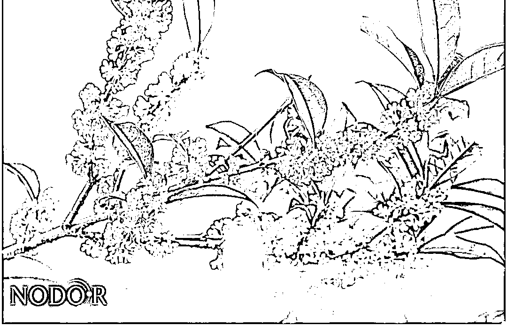

**将过去的智慧留下，将过去的幻觉放掉**

> ****天象：****
> 
> **· 新月合相海王星：宽泛容许度下，双鱼座月亮合相双鱼座海王星，处女座太阳对分双鱼座海王星。**

双鱼座月亮合相双鱼座海王星，将光束又一次聚焦在 2022 年的“明星星座”双鱼座身上。但是，象征“意识之海”、携带“梦幻色彩”的双鱼座本身却是最不聚焦的星座，**一切到了双这里便很容易模糊掉边界，“理想与现实”似乎离得那么近，却又总是相隔那么远。**海王星代表着**“小我与灵性”之间的能量通道**：两边能够畅通无阻的叫通道，比如既能登得上宇宙意识和灵性大爱，又能回得了自我意识和现实生活；如果只能去一边而去不了另一边，就成了“死胡同”，比如上去了却下不来的“脚不着地”，下来了却上不去的“狭隘绊脚”。**海王星的灵性觉知指向“修行在红尘”。**修性施行，最终还得落在自我生活之内，否则一出学堂就发怵，一进家门就发威，修性就成了逃避现实的避风港。**2012 年-2026 年，海王星行进在自己守护的双鱼座**，带来“造梦”的 14 年时光，当然这也是容易脚不着地的 14 年时光；再加上“执着结果，盛产野心”的摩羯座冥王星一直与双鱼座海王星保持着宽泛容许度下的六分结构，更是**带来“梦醒”的 12 年时光**（2008 年-2024 年冥王星行进摩羯座）。当下，双鱼座海王星与摩羯座冥王星依然保持着六分结构，这两颗行进缓慢的“世代行星”已经分别行进到自己所在星座的尾度，就像年老的长者一样，在结束一段征程之前也需要完成自己的使命——曾经携手缔造泡沫，令人迷失初心；而今携手戳破泡沫，教人回归真相。我们来看看最近几年，双鱼座海王星的轨迹和影响：**· 2019 年**，双鱼座海王星与双鱼座的另一颗守护行星木星组成“木海四分”结构，提示我们在“理想与现实”之间做出关键性的“评估”，因为泡沫即将戳破，该上船的及早上船；**· 2020 年**，掌管“传染病”的海王星在双鱼座的茫茫大海之上，发起一场新冠疫情，席卷全球，无界蔓延；**· 2021 年**，“风元素周期”的起始年，新老周期的转换，不破不立的进程；**· 2022 年**，“木海合相”双鱼座，太上老君的八卦炉已经开火，魔法时刻，变化难料，谁也不知道里面会炼出什么结果出来。用了这么多的篇幅，想表达的是：我们正处在新老周期、新旧时代的转换进程之中，过去的历史并不奇怪，未来的世界也并不可怕，我们之所以觉得当下的进程充满魔幻，是因为生命的长度还不够长，见证的历史还很有限。

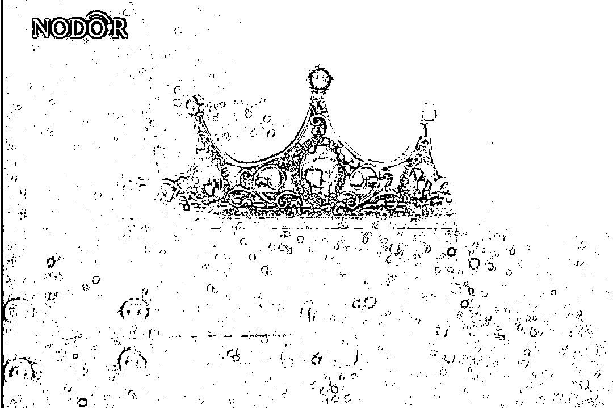

此次双鱼座满月前夕，走过了将近百年、委任了 15 届首相、定义着英国当代史的英国女王伊丽莎白辞世。之所以写到这位英国女王，是因为在“新老周期”转换的当口、在不断标记历史的 2022 年，一代君主的转身标志着一个时代的落幕，就像当下“不破不立”的宇宙进程一样，一切皆在更替之中。我从预测占星学的角度，看了这位经历过“3 次土星回归”的女王的出生星图和综合运势图：**· **行进海王星精准三分出生星图中的土星；**·** 太阳弧海王星精准合相出生星图中的土星；**·** 行进土星精准合相出生星图中的火星；**·** 太阳弧凯龙星精准四分出生星图中的太阳；**· **……不必纠结这些符号的详细解读，也不必纠结历史性人物的褒贬评说，她只是完成了自己的使命，然后宇宙解除了她所背负的所有重力。死神是公平的，无论是谁，总会在特定时刻被拿走力量，消融在茫茫宇宙，就像一场游戏终有 over 的时刻，而后在时间继续向前推进的长河中，将曾经精彩纷呈的游戏慢慢变成亿万光年中的一瞬……但即使如此，这场游戏还是会记住每位玩家的责任目标和心路历程；而谁都好奇，几十年后的玩家会如何回顾当下的我们。此次双鱼座满月的前后一周里，水象变动星座的情绪波澜如潮汐般纷涌浮沉，梦境也似乎变得扭曲和复杂，令人生出**“对梦境唏嘘，对现实伤感”**的内心状态来。这个世界总是在我们要求它变得美好之前，要求我们自己先成熟起来，故而，此次双鱼座满月前后一周的这段时间，建议大家**拿出一些独处的时间，梳理一下最近几年的生活。**过去的世界越来越远，而**未来 20 年将会是重新谱写人类文明和世界秩序的时间**。从此刻起，**带着全新的视角去看待未来的每一天，将过去的智慧留下，将过去的幻觉放掉。**

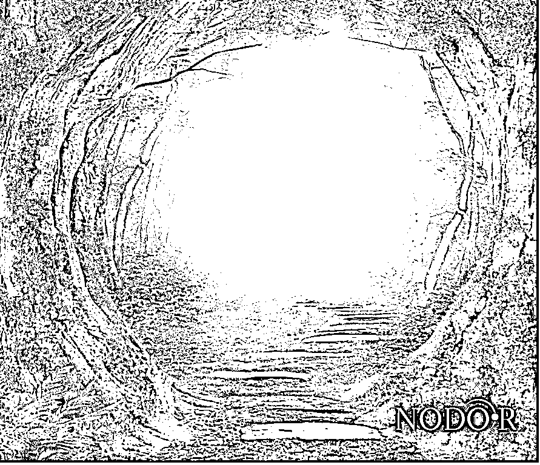

**为不成熟的模式划上句号**

> ****天象：****
> 
> **· **水木对分**：逆行的天秤座水星对分逆行的白羊座木星。******· ****水火三分****：**逆行的天秤座水星三分双子座火星。**

此次双鱼座满月当天，水星于天秤座开始逆行。2022 年第 3 波水星逆行的轨迹，将在处女座 24°12′-天秤座 8°55′之间来来回回走上 3 遍。**· **8 月 21 日，水星于处女座 24°12′进入逆行前阴影期；**· **8 月 26 日，水星进入天秤座；**· **9 月 10 日，水星于天秤座 8°55′开始逆行；**· **9 月 23 日，水星逆行回到处女座；**· **10 月 2 日，水星于处女座 24°12′恢复顺行；此次双鱼座满月，接纳处女座太阳能量的天秤座水星（水星守护处女座）与接纳双鱼座月亮的白羊座木星（木星守护双鱼座）正处于“水木对分”结构之中。“水木对分”结构中的水星和木星正处于双双逆行的状态：水星的逆行期是 9 月 10 日-10 月 2 日，从天秤座 8°开始逆行，并于 9 月 23 日从天秤座逆行回到处女座；木星的逆行期是 7 月 29 日-11 月 24 日，从白羊座 8°开始逆行，并于 10 月 28 日从白羊座逆行回到双鱼座。

**“水木对分”结构发生在水星“顺行-逆行-顺行”天秤座、木星逆行白羊座的阶段，并在 9 月 3 日、9 月 19 日和 10 月 12 日形成 3 次精准呈相，整体影响将会持续一个多月的时间。**

这是适合**检视认知并反思言行**的一段时间，而处于前两次精准呈相之间的此次双鱼座满月，也是**为那些不成熟的模式画上句号**的极佳时间。

另外，水星逆行和木星逆行都起始于 8°这个位置，从“萨比恩”征象来解读的话，无论是白羊座，还是天秤座，双双蕴藏着**“傲慢和冲动”**的风险。

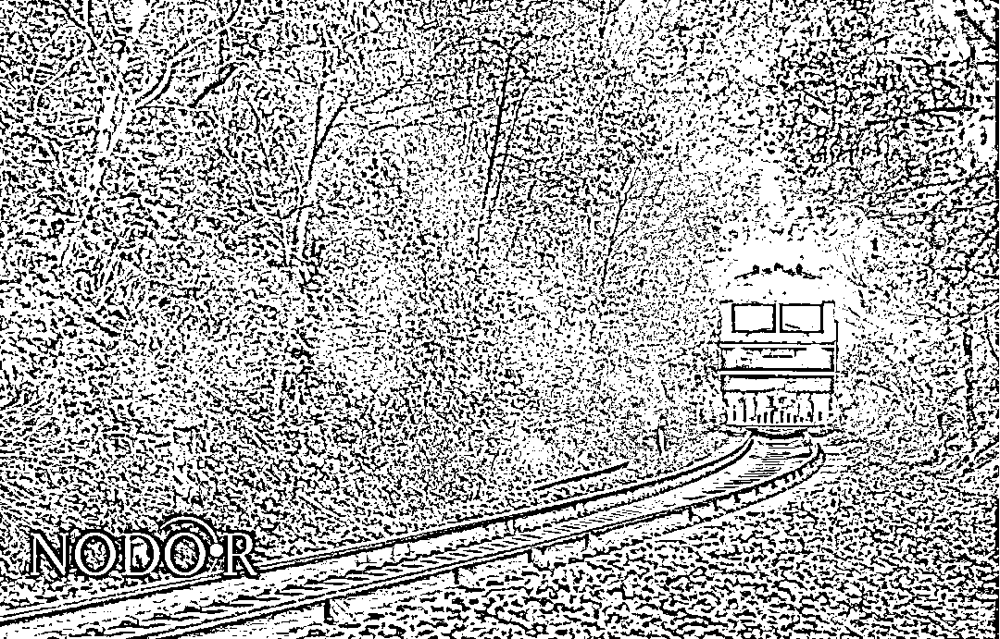

**必要的回顾**

**· 检视自 5 月 5 日以来的激进态度和傲慢做法**，比如没准备好的出手，比如一定要赢的欲念，比如对风险的无视等等。现实的考验确实有些严峻，但也万万不可逞一时之强或孤注一掷，因为这种“赌”的心态容易将人带进险情；**· 反思自 8 月 21 日开始对关系的预设和期待是不是有些超高，以致在失望的情绪和失衡的心理之下，言辞充满了傲慢无礼和挑衅张狂**。关系之中，我们需要保持自我的立场，但更需要学会慷慨的艺术，因为关系的本质是“自洽”的外在显化，一个确立了自我边界、学会了让步尺度的人，才能在关系中成熟地释放善意并收获尊重。另外，逆行的天秤座水星，也在宽泛容许度下，与**9 月 4 日**进入逆行前影响期的双子座火星形成**“水火三分”**结构。故而，**此次双鱼座满月的前后一周，切莫在迷糊和焦虑的状态下草率做出决定，否则你可能会在未来的 2 个月里，稀里糊涂地将自己置于一个尴尬和不快的境地。**最后，此次双鱼座满月的转天 9 月 11 日，处女座太阳与金牛座天王星形成“日天三分”结构，再加上“水木对分”结构、日渐紧密并将于 10 月上旬再度重演的“土天四分”结构的影响：**国际社会可能会突然出现权力阶层恶意竞争的戏码，惊现某些掩盖已久的真相，爆出知名人物的丑闻。**依然是那句话：过去的历史并不奇怪，未来的世界并不可怕，当下所有令人感觉魔幻的事情，不过是在教导我们放掉过去的幻觉、重建全新的认知而已。过去已经越来越远了，虽然有很多事物令我们眷恋，但这就是行走在历史中需要面对的现实。

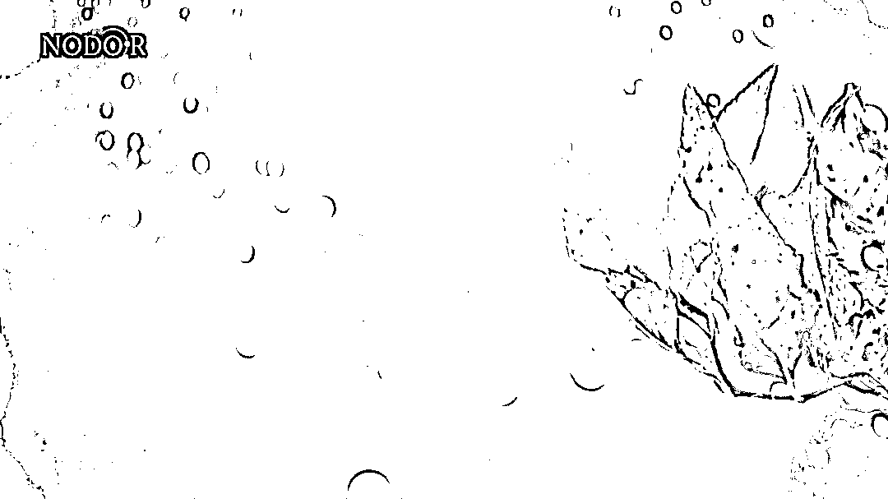

**寄语**我的脑海里不断浮现着电影《泰坦尼克号》中的一个画面：沉船后，露丝躺在一块木板上，不知道在大海中泡了多久，为了避免睡着失去意识，她轻唱着不知名的歌曲，天上的星辰在她眼中辉映，后来，信号弹的光芒在她眼中辉映，她终于获救了，带着杰克的温度。就这样的一个双鱼座满月，我的意识也在大海中漂浮，甚至不知道还能写点什么。于是，我对自己说：“当不知道写些什么的时候，还是等待吧。”祝愿朋友们：灵魂要安好，身体要健康。

**版权声明**：原创文章由作者授权首发于若道平台，欢迎转发，反对抄袭。友号转载请申请白名单。

**END******想阅读更多作者的文章，********请在后台回复******王芝桦****** 即可。****

****王芝桦****

心理占星师，统合疗愈师，占星专栏作者

若道占星“新月和满月”专栏作者，腾讯视频特约占星师

全职于个案咨询与占星教学工作 18 年

**个案预约咨询微信号**：zhihua0621 

**微信公众号**：daoxi-life

**长按打赏**

********

**20 位来自世界各地的占星师****带来 19 场沙龙——新世界的觉醒****详情可点击下图**

**学习占星学****点击下图了解课程详情**

**微信又双叒叕改版啦，不想错过若道君的推送？**
**就把若道设为星标吧！****▼**

**喜欢就点一下“在看”吧！**

********报名直达入口********

# 重大天象丨水星不但逆行了，还横跨两个星座！！！！！！

> 原文：[`mp.weixin.qq.com/s?__biz=MzA5NjA0NTAxNg==&mid=2651488491&idx=1&sn=267575b1af5ccf7a2b698120bdd7bdf5&chksm=8b48325cbc3fbb4ac0aba5695da8f30922839a8e3c6b99fd0c49adcdd29409fcf489d4c84500&scene=126&sessionid=1692737756#rd`](http://mp.weixin.qq.com/s?__biz=MzA5NjA0NTAxNg==&mid=2651488491&idx=1&sn=267575b1af5ccf7a2b698120bdd7bdf5&chksm=8b48325cbc3fbb4ac0aba5695da8f30922839a8e3c6b99fd0c49adcdd29409fcf489d4c84500&scene=126&sessionid=1692737756#rd)

********************☆ 后**********************台**********************回复“今日”，给你一句生命态度********************

作者/郑玮玲 ISAR 认证占星师编辑/玫瑰 封面/书君 图片/稿定设计

9 月 10 日 11:38，水星在天秤座 8°55′开始今年的第 3 次逆行。不知道从何时起，水逆成了各种倒霉事件背锅侠。如果能透过占星学全面认识水逆，才会明白这宇宙的韵律即是天道，就可以顺应自如。

**水逆时间表**由于此次水逆跨越两个星座，无疑增添了复杂性和变数。让我们先来看一下此次水星逆行的时间表。

| **时间** | **水星动态** | **所在度数** |
| 9 月 1 日-9 月 9 日 | 逆行前阴影期 | 天秤座 5°-8° |
| 9 月 10 日 11:38 | 开始逆行 | 天秤座 8°55′ |
| 9 月 23 日 20:05 | 逆行回处女座 | 处女座 29°59′ |
| 10 月 2 日 17:08 | 恢复顺行 | 处女座 24°12′ |
| 10 月 3 日-10 月 10 日 | 顺行后阴影期 | 处女座 25°-29° |
| 10 月 11 日 7:51 | 再次进入天秤座 | 天秤座 0° |
| 10 月 17 日 12:26 | 重回逆行开始的度数 | 天秤座 8°55′ |

水星是太阳系中离太阳最近的行星，在原型层面，水星关于**信息、沟通、传达、逻辑与理性**。**水星的符号****☿****代表着联结，天地万物都化为讯息产生联结、交互**。水星把宇宙编织成了一张无形的网，提供了各种通道，让我们得以进行身体、精神和心灵 3 个维度的旅行。水星逆行，是因为水星、地球在公转时，从地球看水星造成的视差，让水星看起来像是在黄道上倒退。然而水星并不会真的倒退，但这一视觉现象却真的会给地球、地球人带来特定的影响。正所谓在天成象，在地成形。宇宙中一切事物只是在同一频率中共生息，一切的发生只是同一时空、频率的显化。**本次水星逆行的区间位于天秤座 8°55′-处女座 24°12′。**这个度数区间正是水星逆行期间会重走 2 次的路段，其重点影响人群也在此度数区间。

**水星逆行重点影响人群**

有**个人行星、四轴、交点位于处女座、射手座、摩羯座、双鱼座、金牛座、双子座 24°-29°，以及天秤座、摩羯座、水瓶座、白羊座、双子座、巨蟹座 0°-10°的人。**

**水星逆行在天秤座**

**任何行星逆行，都是将我们带回逆行前一段时期的工作与议题中。**本次水逆对应的便是**8 月 21 日-9 月 9 日期间未解决的或是未完全处理好的议题**。水星逆行开始的天秤座很大程度上会把我们**带入到亲密关系、社交关系议题中**。**重点人群值得利用这段时期好好面对关系议题。**关系的问题本质就是沟通、交流问题，会让人处在诸多两难问题的平衡之中来回权衡。此时也意味着**关系、平衡等议题需要明确下来有效的解决方案了。**水星在天秤座逆行期间，也带来**对完美想法的苛求难成**。思维的细密会让我们受限于内在高压而无法大胆施展。而适当的对话、交流有助于想法的流动，平衡对流可以帮助我们清晰、完善内在构想。

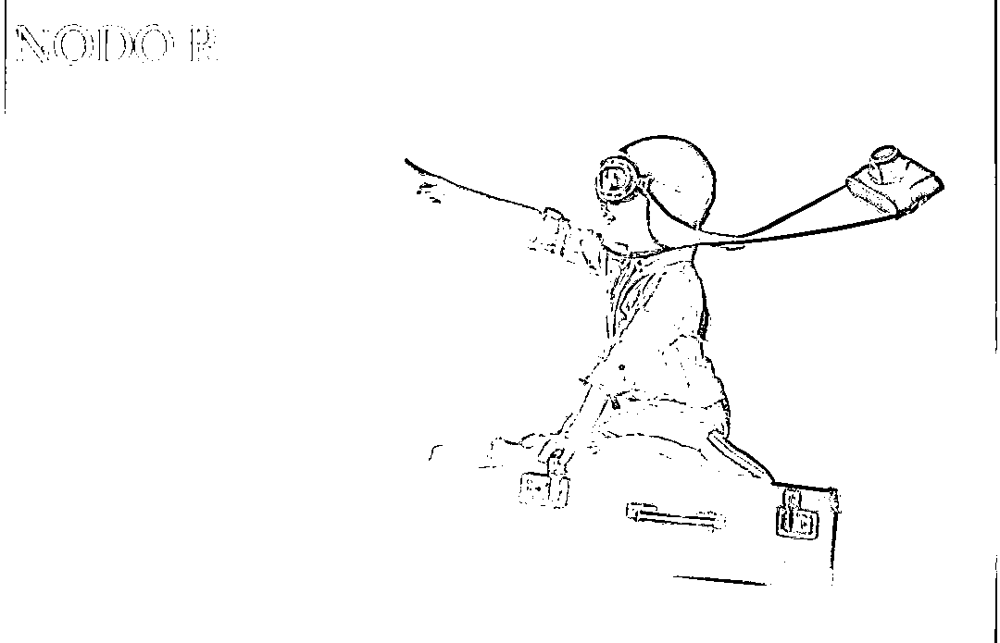

**水星逆行在处女座**

**此次水星从天秤座退回到处女座，从风元素来到土元素，意味着想法的落地。**当水星退回到处女，在一切关于水逆的思考、行动、整改进程中，都需要**让想法切实可行，有细节、有步骤，清晰明辨，所有的调整性方案都需要充满效率地实施、布署**。这是一个**对治长期拖延症病患的好时机。**当水星逆行回到处女座也是水星入庙的位置，必然需要更多理性、细致的分析，缜密的计划、评估与实事求是的态度，这些才能抵达对完美的追求。这段时期非常适合水逆期间的**遗漏重拾**也是特别有意思的事。水星退回处女座会对于**清洁、扫除、收纳、整理**带来特别有利的支持，往往我们发现“遗失”许久的旧物都是在整理、清洁的过程中。水星处女座的条理与精细度会让我们**把视觉和双手都放到平常忽略的区域，而那些“藏”起来的物件也就自然浮出了**。**园艺、宠物**也可能参与到这场水逆的寻回过程中，只要你够细心，就会有机会遇见“遗失”。

**水星逆行期间重点关注领域**

• 航班、车次、船期、行程延误，交通工具故障，；• 通讯设备、存储设备以及网络故障、受阻；• 交流沟通不畅，误会、曲解、口角、争斗；• 订单延迟，物流延迟，退货、换货，运售纠纷；• 旧物重现，故人重逢，失而复得；• 重温功课，复刻旧日样版。水星逆行其实是以**慢下来、重复检查**的方式提醒我们做相关领域的工作。如果我们对水逆理解得当，就不会一次次受水星逆行困扰，反而转危为安。人的意识在任何宇宙流年行进中都是起决定性作用的，带着意识，我们使用能量，缺乏意识，就会被能量左右。

**水星逆行期间最值得做的事**

• 确认清楚自己的行程、酒店、航班信息，提前出发，并做好备用方案；• 重要工作、学习、会议资料记得备份，对电脑等存储设备及时检查，多备用一套方案为佳。因网络通讯故障的问题极可能发生，尽可能避免在水逆期间进行重要而复杂的沟通；• 水逆期间及时检修、保养车辆，短暂停止用车和检修正是水逆最好的能量转化方案，不仅符合了慢下来、检查的意图，还能确保行驶安全；• 减少一些网络购物，避免售合退换货问题带来的周折；• 与人沟通，尤其是亲密关系，家人的沟通要关注对方内在诉求，避免因习性、长期矛盾而激化。多听少说，听到对方的重点、核心才能避免误会和口角。表达己见时也尽可能考虑对方能接受的语气和方式，只有用对方的频率才能把自己的想法观点输入；• 整理、清扫，清除旧物、废品，归整生活秩序；• 面对疾病，关注健康，学习中医中药学和传统养生功法，建立健康的生活理念和习惯。

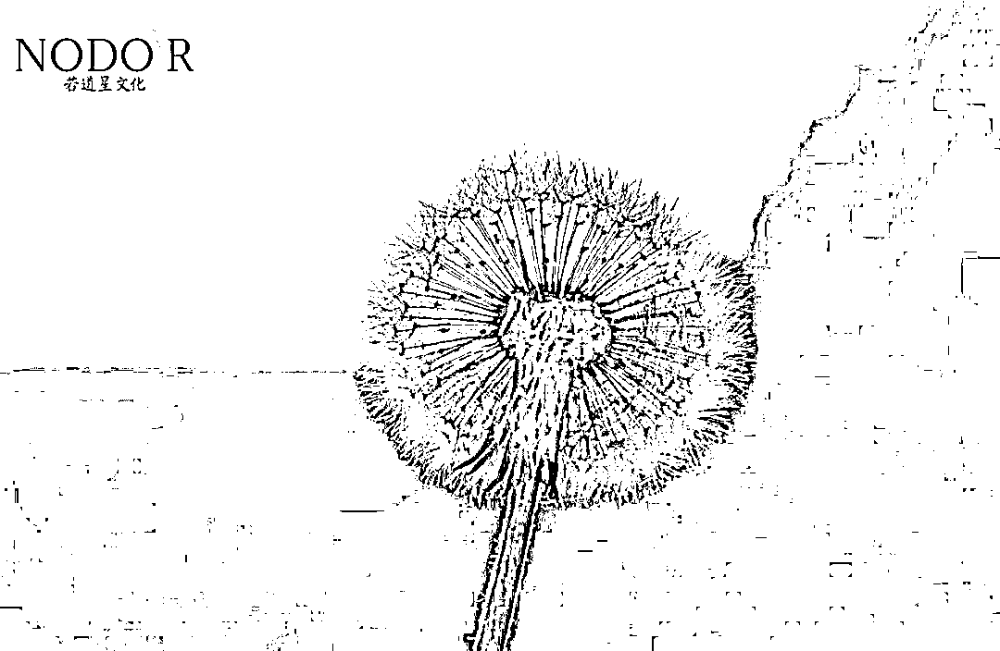

**水星逆行期间的重要相位**

**水星三分火星**

**期间：8 月 20 日–9 月 17 日**

**重点影响人群**：有**人个行星、四轴、交点位于处女座、天秤座、射手座、水瓶座、双鱼座、双子座 0°-15°，以及处女座、射手座、摩羯座、双鱼座、金牛座、双子座 24°-29°的人。**

**水星四分火星**

**期间：9 月 27 日–10 月 12 日****重点影响人群**：有**人个行星、四轴、交点位于处女座、天秤座、射手座、摩羯座、水瓶座、双鱼座、双子座、金牛座 18°-29°，以及天秤座、摩羯座、白羊座、巨蟹座 0°-2°的人。****前期水火三分相带来思想与行动的快速整合与协作，无论个人行动还是团队工作都能在短期内落地实施，并且快速应变。**但此相位**仅能支持短期内的计划与工作，较不能协助我们从事长远计划和艰难课题。****随后水火四分相直接带来了紧张思想与行动之间的摩擦，现实中也常引发观点冲突，较难协调。**逆行回处女座的水星会输出据理力争的强势观点，双子座的火星则会表达出对信息的应对无力，这段时期尤其要**注意信息传输与存储的失效，不排除人为原因造成的障碍和失误。****在水火四分期间对于任何学习都需要加倍用力才能达到专注有效，提前准备必要材料和工作不失为上佳选择。**在此期间的沟通会**因失焦或信息庞杂而远离现实，更可能遇到与个人观点极其不同的人，由于价值观、思想的相左而引发评判、攻击**。我们需要时刻**提醒自己保持中正的意识，理性输出自己观点，避免对负面信息作出过激回应。**

**水星对分木星**

**期间：8 月 26 日–10 月 17 日**

**重点影响人群**：有**人个行星、四轴、交点位于处女座、射手座、摩羯座、双鱼座、金牛座、双子座 24°-29°，以及白羊座、巨蟹座、狮子座、天秤座、射手座、摩羯座 0°-8°的人。**

木星持续逆行进程中，水星充满动态的迂回对分木星，这会**大大激发、扩展水星的自主性与独立的冲动。**这个相位带来**更多的敢想、敢言，极好地支持着我们将内在真实的想法输出**。但需要**选择正确的时机去发出理性的观点，避免冲动、盲目而导致的过激言论。**另一方面，水木对分也带来了学习的冲劲，这段时间我们可以**投入大量集中的学习，在某个感兴趣的领域投入高效与专注可以带来快速的进步。**尤其适合各类**技巧性运动、养生技法、器乐演奏、书法、绘画、写作、各类手工、园艺以及外语的学习。**

**水星三分冥王星**

**期间：9 月 19 日–10 月 14 日**

**重点影响人群**：有**人个行星、四轴、交点位于处女座、天秤座、射手座、摩羯座、水瓶座、双鱼座、金牛座、双子座 24°-29**°**，以及天秤座、摩羯座、水瓶座、白羊座、双子座、巨蟹座 0**°**-5**°**的人。**

冥王星在摩羯座尾的逆行尾声中，此时**水冥三分为我们探究深层意义带来了洞见和依据。**冥王星在摩羯座尾度正**把现实、全球性的经济退化，人口老龄化，贸易及军队战争推向了各种临界点、爆发点**。

水冥三分相让我们在黑暗面前能**彻底改变思维，在触碰生命底线的时刻感受到真相、本质**。

冥王星把个体意识之外的讯息透过水星的传输到现实中，通过不可控的强力摧毁让心灵多一些敞开，**只有这样的摧毁之痛，更多的人才能明白不一样的声音和观点，才能真正明白未曾想明白的，甚至从来没有思考的问题。**

事实上，我们自己就是我们所创造的问题本身。水冥三分期间也是**旧物、失物可能重现的最佳时段。**

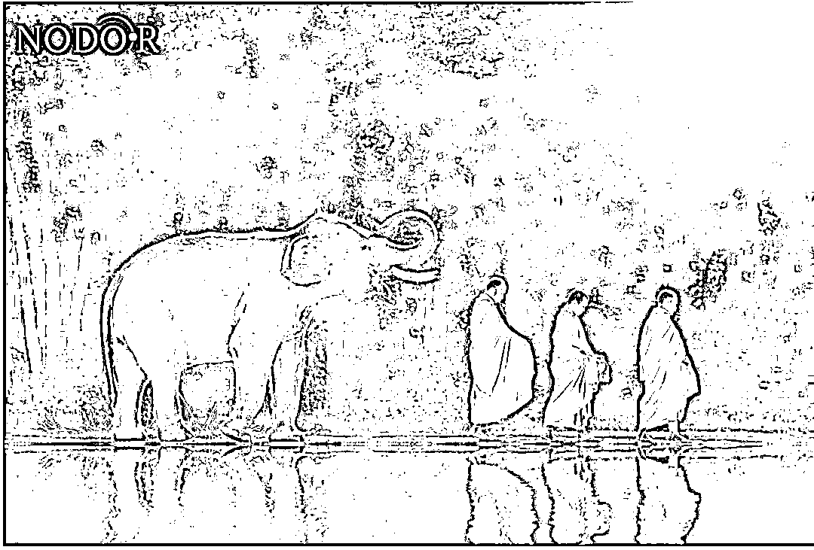

**水星对分海王星**

**期间：9 月 21 日–10 月 13 日**

**重点影响人群**：有**人个行星、四轴、交点位于处女座、天蝎座、射手座、摩羯座、双鱼座、金牛座、双子座、巨蟹座 23°-29**°**，以及天秤座、摩羯座、水瓶座、白羊座、双子座、巨蟹座**°**0-5**°**的人。**

**无论多么清晰的水星遇到海王星都可能变得混乱而模糊。****要求精细的工作尽可能放在水海对分之前或之后。**这段时期很可能因为忙碌而健忘，因而导致现实的错乱，沟通中的误会也会加剧。**在此期间出行尤其要注意各种混乱与失控的发生，尽可能事先备用一套预案。**在水海对分期间，更适宜非逻辑、非语言的传输与表达，而**艺术**就是一个最好的通道，任何的**舞蹈、音乐、绘画**都可以为我们所用。想像与灵感会在此期间显得格外有助力。这段时期**适合进行一些创意工作，也可以发一些白日梦，把梦的图景努力清晰化，待水海结束对分再去细化轮廓。****水星逆行对 12 宫位的影响****注：此次水星逆行跨行两个星座内，具体逆行宫位需查看个人星图而定****若道君：****你可以在 app store 或者应用商店搜索“若道”下载 app，输入个人档案，查看行运盘（也可以使用其他星图软件），找到行进水星逆行在出生星图的第几宫，然后对照下文查看。****例如下图中，行水星在比尔·盖茨个人星图的在个人星图的第 4 宫逆行回第 3 宫，因此可参考 3、4 两个宫位的解读。**

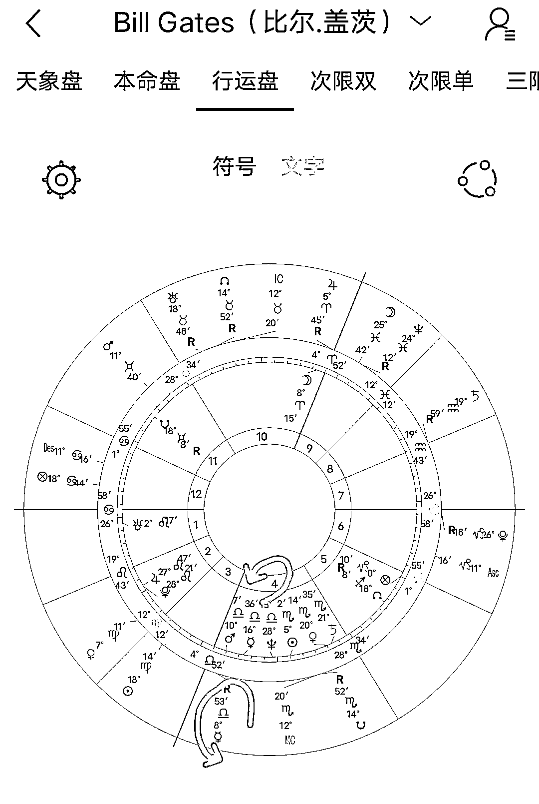

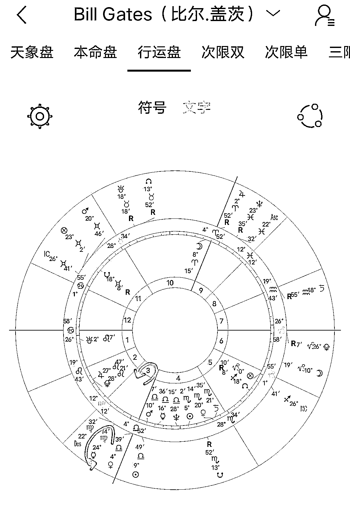

**水星逆行在*****1*****宫**

这段时期是一个**学习独立思考，主动表达想法**的周期，尤其**在关系中长期存在的问题，犹豫不决的议题，需要你主动去沟通。**如果自己的想法未曾明确，自己的声音未曾有力表达，关系中的对方也无所适从。**对于关系中的幻灭、失望、膨胀正是让我们回到内在的动力，从心灵出发，保持对自己的真实，让自己感受舒适才能让关系更真实、舒适。**

**水星逆行在*****2*****宫**

无论你的个人资产是多是少，现在是**很好的机会去细致整理**了。很可能**由于棘手问题令你不得不改变投资理财计划，或是对当下的工作、职业进行必要的调整和声明**。只有你明白自身的价值多少，才可以获得外界一致的认可与肯定。**放弃曾经依附、依赖的关系，**虽然信任他人会为我们带来合作的助力，但此时需要**更多为自己的价值去索取，独立发声才能带来清晰的个人归属感。**

**水星逆行在*****3*****宫**

这段时期对你来说是**快速学习、吸收**的过程，极可能**陷入庞杂的信息与课程中，稍显混乱。**因此，你需要**建立一个更有效的时间管理系统，重新规划生活与工作，千万不要困在对外界的回应中**。

当我们作出主动的规划与声明后，再多的事务都能归整有序。**对学习资料的存储要及时，多检查你的存储设备，出行前确认清楚交通信息，适时进行车辆维修养护，避免出行困扰和不必要的麻烦。**

**水星逆行在*****4*****宫**

未来一个月要**多注意与家人的相处，避免观点冲突、误会导致的不快，更多地倾听和理解可以快速化解问题**。同时**对于自身的想法要勇敢、理性、中正地表达，切不可陷入情绪激流中而失去对客观的判定。**

利用这段时间进行**家务整理或学习做一些从来没做过的家务整理**，可能会有新发现。

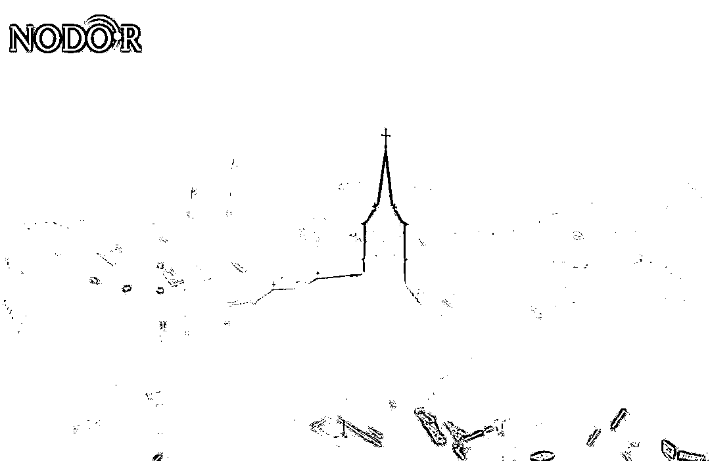

**水星逆行在*****5*****宫**

你已经准备很久要进入新的领域学习了，跃跃欲试的你想要开拓生命新领域，去尝试那些此刻具有激活意义的事。**用玩乐的方式去投入专注的学习，任何一门技艺都能带来创造性表达，心灵会因此增添一个输出通道。**

享受当下，享受生活，无论外面发生什么，你都能在自我的世界里游刃有余。在此期间，也可能**与旧日恋人、同窗产生重逢交集。**

**水星逆行在*****6*****宫**

是时候去**学习养生功法、知识和课程**了，可能你已准备许久，或是你的身体已经迫不及待。疾病可是唤起身体智慧最直接、快速的导师，跟随你的内在导师，你会发现自己潜力无限。

在此期间也是**重视和重建生活秩序的时期，调整作息为身体最舒适的状态会带来短暂的不适，但会有利于长期的健康。在工作中要格外注意传输与存储失误，与同事交流沟通也尽可能简单明了，避免误会。**

**水星逆行在*****7*****宫**

**倾听是最好的老师，也是你此时的最佳解决方案。**一方面你需要学习真正倾听你的伴侣，另一方面你也要学习真正去聆听自己的心声。

当然，如果我们身体能量阻塞的情况下，内在的声音也很难顺畅表达。所以你同时需要去**进行一些有效的身体工作，清理那些阻塞的能量，让一切的声音得以表达，你的关系议题也自然会得到疏解。**

**水星逆行在*****8*****宫**

**当下的你可能被外界、内在的危机消耗了大量的心力、脑力，短期内你会面对诸多看似困难的议题。**但也意味着你将从中**学习高效的危机管理**。**对于你的财务、负债、投资情况，以及关系中的信任议题将拥有更深入的探究。**对于曾经困惑的问题将可能有现实的佐证给予你清晰。

学习去**相信直觉**，这是你此刻最公正的标尺。

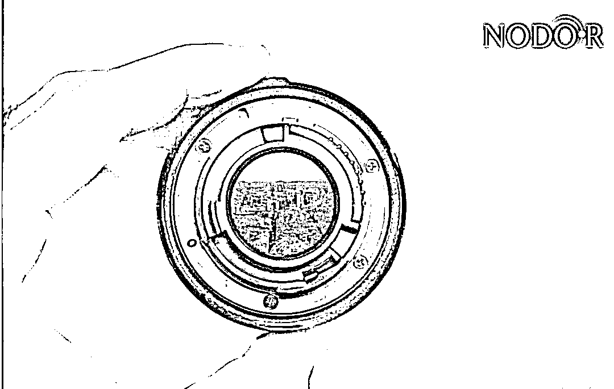

**水星逆行在*****9*****宫**

**无论你有着怎样的信仰，此刻的你会感受到内在引领的力量。**当我们内心有了一种清晰、笃定的信念时，就不会再为外界信息所困扰，会从繁杂的信息中找寻到真切的指引。

事实上，人类从不会被不是我们心灵原型的事物所吸引。我们的世界也只会演化出心灵本质的物象。此时的你可能会**寻求导师、经典来帮助发出自己的声音，而所有外界的讯息都是你寻找意义的道路而已。**

**水星逆行在*****10*****宫**

**你感受到了独立支撑自己的力量，独立发声的信念正是你心底，以及来时路上不断的积累、抗争和回归自我的过程。**或许你的心底还有些困惑，或是未完成、未成形的梦想、想法，但此时的你可以大胆去表达、去实践了。

你只需要**慎重检查可行性，确保细节的满意**。而你内在的想法和声音会带给更多人清晰与启示。

**水星逆行在*****11*****宫**

团体的力量会支持到你的想法、声音，你需要**走进那些支持你的，与你保持一致观点的团体中。**此时的成长意味着**从细节重新完善，由专精抵达完美。**可能你要实现的是一个更大的想法、图景，需要那些专业的人手来共同参与。

**但实施过程没有那么顺利，不断检查、试验需要耐心和协作精神。**此时**宜慢不宜快，并且要放弃更多冲动的个性化想法，更多听取团队的声音，才能更有序地推进关于未来的愿景。**

**水星逆行在*****12*****宫**

此时的你最需要的就是**不发声，静静待在自己的角落，待在一个让自己身安，心静的空间或状态中。冥想、静坐、书写、创作**，或是**任何关于静默的游戏**都适合你去参与，在你愿意的时候，也可以来一场心灵的星际旅行，去观想你与更大世界，无限存有的对话与交流。

因为再没有什么切实的声音和想法，支持和助力来自外界，一切都在你之内，一切都由你的心灵重新出发。

**版权声明：**原创文章由作者授权首发于若道平台，欢迎转发，反对抄袭。友号转载请申请白名单。

**END**

**郑玮玲**

ISAR（国际占星研究协会）认证占星师（2016 年获得）

若道占星专栏作者

将占星咨询、教学与音乐、舞蹈相结合的疗愈者

**微信号**：zhengviolin

**新浪微博**：@郑玮玲

**微信公众号**：Sampriya-Astrology

长按打赏

**20 位来自世界各地的占星师****带来 19 场沙龙——新世界的觉醒****详情可点击下图**

**学习占星学****点击下图了解课程详情**

**微信又双叒叕改版啦，不想错过若道君的推送？**
**就把若道设为星标吧！****▼**

**喜欢就点一下“在看”吧！**

********报名直达入口********

# 测试 | 本次水逆对你有多大的影响？（好友助力免费领报告！）

> 原文：[`mp.weixin.qq.com/s?__biz=MzA5NjA0NTAxNg==&mid=2651488491&idx=2&sn=1fac767297cab4532cff63d464c5a2e6&chksm=8b48325cbc3fbb4a749186035ecbab3bcb015ee3213756b8d87122b88cdc7a58eaf0b9d99b30&scene=126&sessionid=1692749428#rd`](http://mp.weixin.qq.com/s?__biz=MzA5NjA0NTAxNg==&mid=2651488491&idx=2&sn=1fac767297cab4532cff63d464c5a2e6&chksm=8b48325cbc3fbb4a749186035ecbab3bcb015ee3213756b8d87122b88cdc7a58eaf0b9d99b30&scene=126&sessionid=1692749428#rd)

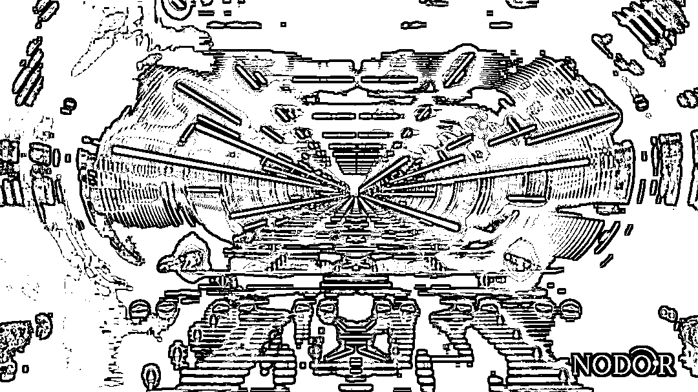

**2022****年****第****3****次水逆来啦！****2022 年第 3 次水星逆行已于 9 月 1 日进入“阴影期”，并将于 9 月 10 日开始在天秤座逆行，于 10 月 2 日在处女座恢复顺行。**

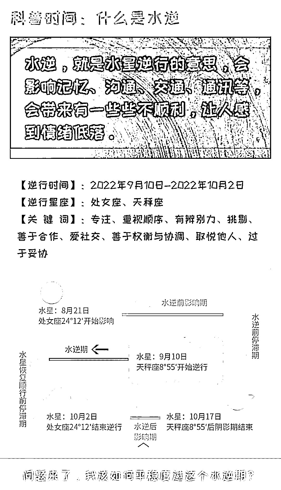

水逆带给你一个重新思考计划或想法的机会，水逆期间常常有助于更多的**反省**，并能带来更多明晰和认识。想知道这次水逆期间，应该注意些什么？如何更地好利用这个时期进行更多的反思和计划？若道君邀请你一起来参加本次**水逆影响值测试**。当然啦，独乐乐不如众乐乐，**如果你成功邀请****6****位好友一起参与测试，将会有专属于你的****水逆报告免费赠送****哟**！**水逆测试&报告**

**领取指南**

﹀

﹀

﹀

Tips 1 如何参与水逆影响值免费测试？**①** **点击文末“****阅读原文****”或****扫描下图二维码****长按下图扫描二维码**
▼

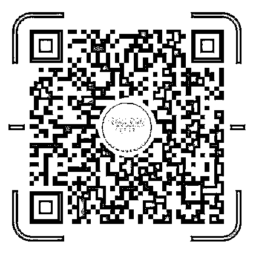

**②** **进入水逆报告****活动首页**

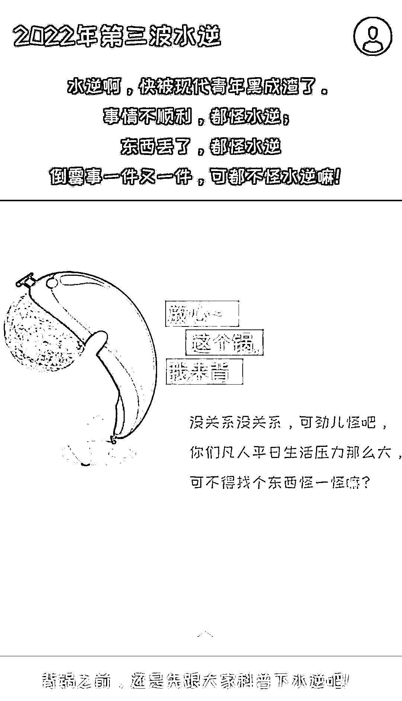

**③** **填写和提交****个人信息**

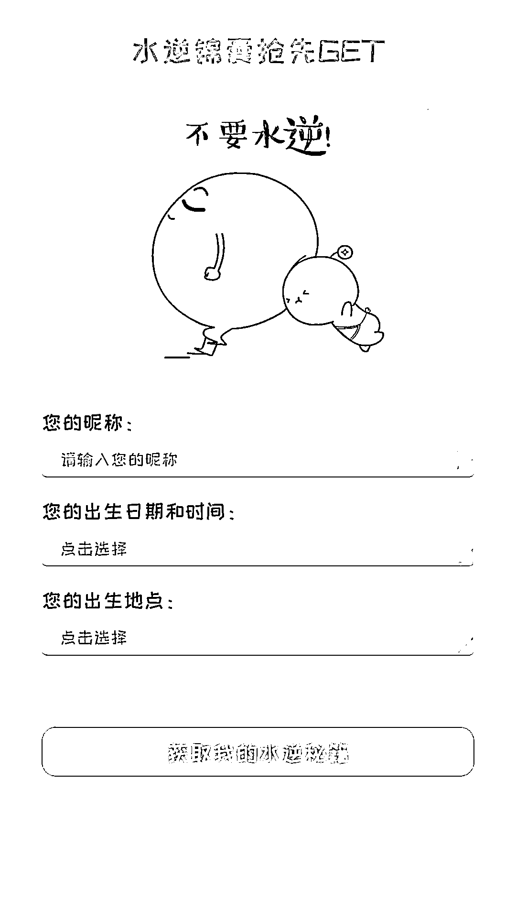

**④** **获取本次****水逆影响值**Tips 2

如何获取专属的水逆报告？

**①** **最快速高效****的方式：****付费购买****n(*≧▽≦*)n**

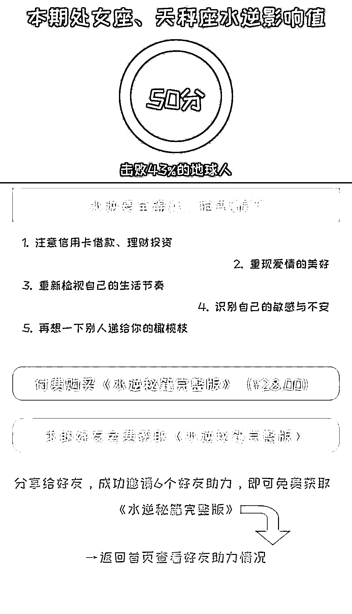

**②** **最经济共享****的方式：****邀请好友助力****，****免费获取****（友情提示，需邀请满 6 位好友成功参与助力哟）**

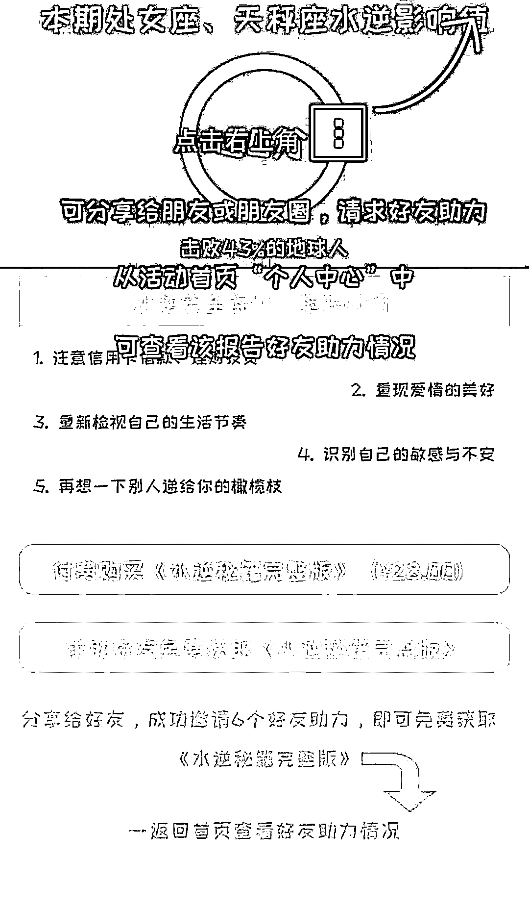

Tips 3 如何查看已购买的水逆报告和好友助力情况**来来……划重点啦****①** **扫描下图二维码，进入****活动首页。******

****②**点击右上角的头像 ** **， 进入****个人中心**

****③**在个人中心，点击“****我的报告****”，查看已购买过的水逆报告；**点击“****好友助力榜****”，查看好友助力情况****

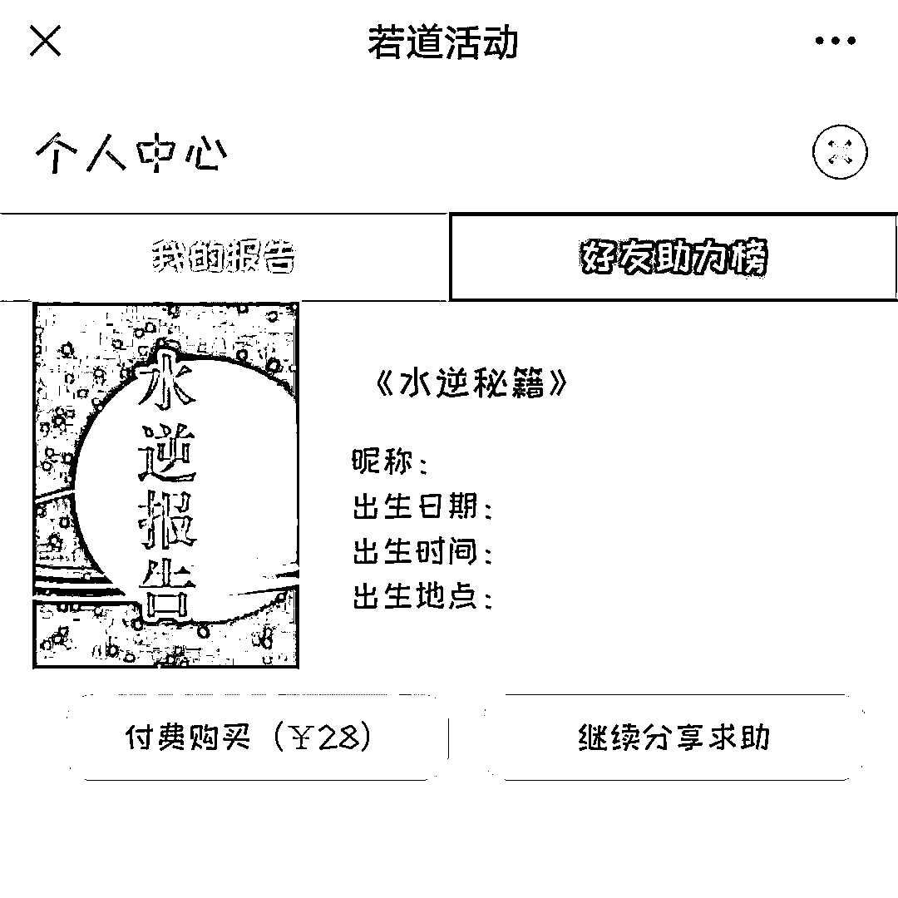

********点击“阅读原文”，免费测水逆影响值********

# 快来领取思维导图！ | 跟随斯蒂芬老师探索组合图前，来获取知识碎片

> 原文：[`mp.weixin.qq.com/s?__biz=MzA5NjA0NTAxNg==&mid=2651488491&idx=3&sn=d379eac476cbfc7cbc51c708694bd39a&chksm=8b48325cbc3fbb4a23627e6e74c12467b979d8a63ce3c8cdf97be202d3aeb1b7dc531835830c&scene=126&sessionid=1692737756#rd`](http://mp.weixin.qq.com/s?__biz=MzA5NjA0NTAxNg==&mid=2651488491&idx=3&sn=d379eac476cbfc7cbc51c708694bd39a&chksm=8b48325cbc3fbb4a23627e6e74c12467b979d8a63ce3c8cdf97be202d3aeb1b7dc531835830c&scene=126&sessionid=1692737756#rd)

**斯蒂芬·弗里斯特老师**

**若道独家**

**三日线上工作坊**

斯蒂芬说，我们的组合图表明无论什么状况我们都能熬过去。工作坊开始前，斯蒂芬老师建议学员可以搜集更多自己了解和好奇的有效组合图以及关系的故事，先对应学习，方便课上更好的跟随斯蒂芬老师享受这场**"组合图：永恒的三角探索之旅".****特此为大家准备了组合图相关基础知识****转发福利：转发本文到朋友圈，不分组保留 24 小时**截图发送给若道 Maggie

**即可免费获取思维导图完整版**

组合图思维导图目录

**组合图（Composite Chart）：取两张出生图的中点组成的星图，组合图象征着这一对案主的关系本身。**在所有情况下，计算组合图中的行星和宫位时，都要使用短角中点，水星和金星除外。1\. 组合图并非匹配度的指征。2. 组合图象征着一段关系的议题和特征。3\. 因此，组合图代表着关系。4\. 一张组合图代表着两个人。5. 你不能将组合图划分成男人和女人，也就是说，太阳和火星不仅仅代表男人，而是代表两个人的男性议题，同样月亮和金星代表两个人的女性议题。6. 解读组合图的步骤与解读出生图的相同。7. 优先顺序和相位容许度与出生图相同。8. 但星图现在被解读为“我们”、“我们的”或“双方”。9. 关系本身是一个实体——就像一个人一样。10. 上升点代表关系的个性、伴侣的外在表现。11. 下降点描绘出他们如何关联、分享和互动的特征和议题。12. 如同出生图一样，你可以对组合图使用行进。

**1**

********此次授课内容********

**组合图描述了如何才能使两个人的关系一直充满活力。**这句话中隐含的意思是假设一段关系有一种区别于这两个个体的独立的生命。有时我们喜欢和一对伴侣共度时光，却从没想过单独见他们其中一人。

我们从这对伴侣身上感觉到的 "频率"是对他们组合图能量的直接体验。在某种程度上，可以简单地理解为：**正如每个人都有自己的星图一样，每对伴侣也有他们的星图。**

从简单的描述层面上讲，这就是组合图的意涵。记住，我们可以将这一技法用于任何一种关系：**父母和子女、商业伙伴、朋友。**作为进化占星师，我们的目标要比单纯描述走得更深。解读组合图时，可以着眼于帮助人们，而不仅仅是使他们感到惊奇。对于个体来说，出生星图代表了一条正确的人生道路，一条承诺意义、活力、灵性目标的道路。组合图亦然，只不过它将一段关系看成一个独立的个体，而不是两个人。关系也有进化的路径：人们走到一起是为了学习和成长。
个体如果没有领会自己出生星图的要点，会变得疲惫而沮丧。两个人也是如此，**如果没有抓住组合图的要点，我们就会对对方感到厌烦。这段关系似乎也会失去动力。**

伴侣常常意见不一，陷入困境，看不到前进的方向。三是一个更有动力的数字。三个人投票，二个人以多数票击败一个人，推动事情继续发展。**这实际上解释了这次工作坊的主题：永恒的三角。**

**每对伴侣其实都是一个三人组：你、我以及我们。**组合图所代表的那个看不见的 "第三人"经常会"投出打破僵局的一票"，使关系得以发展。**· **但是如果组合图总是同意一个人的意见，而不同意另一个人的意见，怎么办呢？（这被称为"封建制度"）**· **如果两个人都安静而保守，但他们的组合图却要求狂野的冒险呢？（这是 "文化冲击"）**· **如果它同时均衡地反映了两个人的情况呢？我们可以称之为 "民主"，但我们仍可以区分出一个人天然的智慧比另一个人更强的领域，让擅长的人负责擅长的事，这会促进关系蓬勃发展。换句话说，我们开始看到这个技法的咨询维度了。我们将在这个工作坊中探讨这些内容。两个人究竟为什么会走到一起？**在严肃、复杂的关系中，我们可以假设两个人之间有一些未解决的业力。**如果他们在今生是恋人，但在前世中，一个是父母，一个是孩子呢？也许那些直觉和假设仍可以感受得到，极为错综复杂地使得他们在今生想要成为情侣。**这些疑问将我们引向组合图的月亮交点，在那里我们往往能发现当今人类任何伙伴关系问题的真正核心。**

**从理论上讲，组合图是基于中点的。**如果我的出生星图里太阳在摩羯座中段，而你的太阳在双鱼座中段，我们组合图的太阳就在水瓶座中段。换句话说，**在你和我的太阳的中间位置。****其他行星、月亮交点和中天也是如此。**其他宫头的位置，包括上升点则存在一些争议。通常的做法是仍然使用中点，但斯蒂芬老师将会解释他认为这样做存在的技术方面的问题。他更倾向于**使用关系最初开始的地点绘制星图，就像我们使用出生地来绘制出生星图一样。**

**组合图也像出生星图一样有行进。**在工作坊中，我们将**探讨一些特殊的技法和考量，来帮助伴侣们应对生活中的挑战和机遇。**组合图的推进会出现一些看似难以解决的复杂问题，斯蒂芬老师创造了一种解决这些问题的技法。他将在工作坊中阐述相关细节，基本的问题是：如你所知，要了解一个人 30 岁生日的推进，我们要看这个人出生后 30 天的行星位置。问题是，组合图与我们在占星学实践中使用的其他星图不同，组合图并不代表某一天的天空。记住，它是基于中点的。**那么我们如何从一个不存在的日期开始 "向下数 30 天"呢？斯蒂芬老师将为我们提供一个行之有效的答案。**

并非所有的人都处于伴侣关系中，但**作为人类，就需要与其他的灵魂共舞。占星学能够极大地帮助人们驾驭复杂的关系。**了解我的星图如何与你的星图通过相位和宫位的交互而产生互动，是非常有帮助的。组合图包含了这些技法，提醒我们，整体总是大于各个部分之和，而又与之不同。

**2**

********斯蒂芬的占星著作********

**· **1984 年-1988 年间，斯蒂芬写作出版了《内在的天空》（已有中文版）、《变化的天空》和《天空的伴侣》三本占星经典著作，奠定了早期在占星学界的地位。**·** 2002 年-2005 年间，他与朱迪·弗里斯特共同创作了两本经典的关系占星学著作《天空的伴侣 I：爱、性、和进化占星学》《天空的伴侣 II：组合图》。　**· **2008 年，斯蒂芬出版了一本非常重要的著作《昨日的天空》，此书是至今为止关于轮回转世跟星图的清晰对应最详尽的著作之一。 斯蒂芬前后一共出版了 12 部占星著作，在世界占星学界拥有很高的声誉。

**3**

********斯蒂芬获得的荣誉********

1985 年，他凭借《内在的天空》一书获得职业占星师协会奖（*Professional Astrologers Incorporated Award*）。1992 年、1995 年、2008 年、2018 年，他四次获得占星界最高的占星学联合协会奖（*UnitedAstrology Congress Regulus Award*）提名，2018 年获得轩辕十四教育奖。

**4**

********斯蒂芬的占星哲学观********

斯蒂芬的占星风格以**自由和选择**为中心，他的解读不是以下定论的方式来“预测”未来，他**强调如何改善生命，而不是宿命式的论断**。他以心理占星学的语言来解读星图上的人格部分，但是**通过南北交点及其相位和守护星来探索星图所揭示的前世业力与今生方向，在灵魂进化的背景里来整体解读星图。**他认为进化占星学的目的在于**鼓励人们做出更符合进化方向的智慧选择，我们学习去了解前世的时侯，关注点应该集中在如何通过意识来疗愈自己。**

**5**

**这些名人怎么说**

斯蒂芬让我们停止了玩责备命运的游戏，而开始看到自己是一个走在进化路途上的勇士。——奥普拉杂志“*O: THE OPRAH MAGAZINE*”

斯蒂芬和杰夫这两位著名占星师创造性地相互应和，展现出他们出色的教师才华，发展并弘扬了占星这门艺术。（对《测量天空：进化占星学和灵魂的钥匙》的书评）——著名心理占星师 现代占星之父 诺·泰尔（*Noel Tyl*）

请享用斯蒂芬和朱迪这两个博大的灵魂在此书中所提供的洞见大餐吧。（对《天空的伴侣》的书评）——进化占星学的创始人之一 杰夫·格林（*Jeff Green*）

我为斯蒂芬解读的精准感到惊叹，他强调没有一件事是坏得无法挽回的，也没有一件事是如此之好以至于它不会因为现在的错误判断而消失的。我怎样推荐他都不为过！——好莱坞著名影星“钢铁侠”男主角 小罗伯特·唐尼（*Robert Downey Jr*）

**6**

**上过课的占星师怎么说**

他关于我星图的解读，让几乎所有在场的人掉泪，我也从此开启了一段灵魂追寻的旅程。我很惊讶他透过星图可以如此深入一个人的灵魂。很多东西你自己都不知道，但是他讲出来你会发现，啊，这是真的，这是占星学的神奇。——《心探索》创始人孟想

每个来参加老师课程的同学，都会被老师深深的慈悲心感动。这种慈悲心，并不是表面上说的一些什么话，而是一种从意识层次上发出的能量。每个来上课的人，都能感受到老师的爱。这种爱，并不是盲目的爱，而是深刻地洞悉真相后的慈悲。

——斯蒂芬老师工作坊翻译逸月

斯蒂芬老师的一对一咨询已经排期到两年之后，我特别幸运，曾在课堂上被老师抽中分析过我的星图，老师充满爱与智慧的指引让我更加清晰的认识了自我。内在的潜能、需求和矛盾被老师娓娓道来。——禄丽荣斯蒂芬老师是位非常非常值得推荐的大师，很粉他，这位进化占星学的创始人，对人的理解是那么的全面完整、深刻洞见、慈悲和温暖，就这方面而言足可以媲美我无比崇敬的荣格和史坦纳（这两位去天堂里玩了）。如果你对西洋占星感兴趣，或者对人的所有角度、各个层次的真相和可能性感兴趣，推荐斯蒂芬老师的书和课程，特别是他的课程，数倍的功力大增的好机会，错过真是占星粉丝的莫大损失。——仁华

**7**

**2019 年工作坊学员感悟**

**8**

**什么人适合这门课程**

✦ 占星师或渴望成为占星师的人群。   ✦ 本课程并非针对初学者，需具备若道核心课程 level4 及以上水平，即了解星座、行星、宫位、相位、综合解读等知识。✦ 课程会涉及组合盘解读高阶内容，不了解相关知识的同学，请提前学习相关内容。

**9**

********授课老师********

**斯蒂芬·弗里斯特（Steven Forrest）**

**· **进化占星学的创始人之一，当今世界最有影响力的占星大师之一；**· **毕业于美国北卡罗莱纳大学宗教学专业；**· **1984 年-1988 年间，写作出版了《内在的天空》、《变幻的天空》和《天空的伴侣》三本占星经典著作，奠定了早期在占星学界的地位。前后一共出版了 12 部占星著作，在世界占星学界拥有很高的声誉。**· **1985 年，他凭借《内在的天空》一书获得职业占星师协会奖（*Professional Astrologers Incorporated Award*）。1992 年、1995 年、2008 年、2018 年，他四次获得占星界最高的占星学联合协会奖（*United Astrology Congress Regulus Award*）提名，2018 年获得轩辕十四教育奖。**· **斯蒂芬将自己的绝大部分时间都花在教学以及个人咨询上，他于 1998 年创立了占星学徒计划（*Astrological Appretice Program*），这个计划致力于培养职业占星师；**· **至今为止已经有 600 余位学员完成了培训，其中很多都成为了优秀的职业占星师；**· **他是一位脚踏实地的导师，充满快乐和活力，亲和幽默同时又充满了智慧；**· **他的课程不仅仅是一次占星知识和经验的学习，也是一次与智者的相遇。

**10**

********课程费用********

**正价：6800 元****早鸟价：5800 元****早鸟价截止日期：2022 年 9 月 15 日**

**11**

********授课时间、方式、退转********

**授课时间：2022 年 10 月 14 日-16 日（周五、周六、周日）7:00-13:00****具体时间安排：****7:00-8:45****（15 分钟休息）****9:00-11:00****（30 分钟休息）****11:30-13:00**

****授课方式：******线上直播课，英文授课，中文翻译**

**课程退转：退款原则请详看《教学协议》，如有疑问请咨询课程顾问。**

****斯蒂芬工作坊 | 探索组合图永恒的三角****

**授课老师：斯蒂芬·弗里斯特**

**授课时间：2022 年 10 月 14 日-16 日（周五、周六、周日）**

**授课方式：******网络授课，英文授课，中文翻译****

**费用：**6800 元**（早鸟价：5800 元，截止日期：2022 年 9 月 15 日）**

**课程负责人：王老师**（微信/手机：18510107057，请备注“斯蒂芬工作坊”）

长按二维码添加课程负责人咨询

****报名直达入口****

# 医疗占星案例丨一位被母亲“强占”的女儿，如何走出身体疾病的牢笼？

> 原文：[`mp.weixin.qq.com/s?__biz=MzA5NjA0NTAxNg==&mid=2651488399&idx=1&sn=34be98b3ec3c0f078206d7608986590d&chksm=8b483238bc3fbb2e23c7f7b69cfd340b9ed05cc60fe54c44735835ba64e18933876382f56861&scene=126&sessionid=1692737756#rd`](http://mp.weixin.qq.com/s?__biz=MzA5NjA0NTAxNg==&mid=2651488399&idx=1&sn=34be98b3ec3c0f078206d7608986590d&chksm=8b483238bc3fbb2e23c7f7b69cfd340b9ed05cc60fe54c44735835ba64e18933876382f56861&scene=126&sessionid=1692737756#rd)

******☆ ****后台回复“今日”，给你一句生命态度******

作者/简·里德尔-帕特里克

译者/天空的空

编辑/翀子 封面/书君  图片/稿定设计文章节选自《医疗占星手册》

这篇节选自简·里德尔·帕特里克所著的《医疗占星手册》，完整记录了用占星学帮助病人回顾、分析症状，并提出健康方案的过程，非常值得收藏。如果你也对由简·里德尔·帕特里克老师教授的疗占星学感兴趣，也可以点击[【课程】](http://mp.weixin.qq.com/s?__biz=MjM5MjQwNjAyMQ==&mid=2649440226&idx=4&sn=102a427929fb455f262277415b2e9339&chksm=beb9508889ced99ead45606783a459979e33070c95894113d2dd73452e511572c1f64b158de9&scene=21#wechat_redirect)查看课程信息哦~

**安吉拉的病例**

安吉拉是那些看起来像是上帝的礼物的客户之一。她发来了一份非常详细的病历，其中包括准确的日期和时间。如果你是一名医疗占星师，愿你有幸遇见上升处女座的客户！（出生星图见下图）

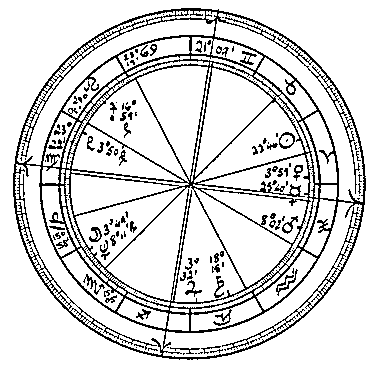

**现病史**

安吉拉患有脑垂体瘤，导致肢端肥大症。1994 年通过手术成功地切除了肿瘤，但她想首先了解导致肿瘤的原因，并希望能够防止复发。她还想知道自己的消化问题背后的原因，尽管健康饮食，消化问题似乎没有改善。

**既往病史**

安吉拉多年来经历的其他医疗问题如下：

*   在她生命的头两年，从 3 个月开始出现腹部绞痛

*   湿疹

*   偶尔哮喘发作

*   多重过敏

*   消化不良

*   头痛，每周至少两次

*   成功切除面部潜在癌性生长物的手术

*   成功的囊肿手术

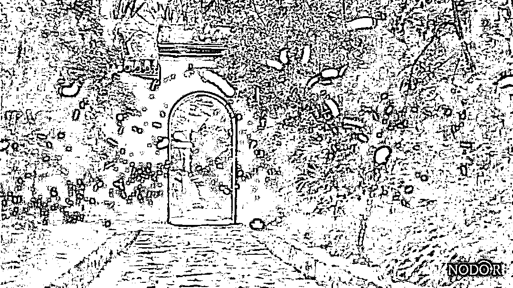

**历史背景**

**在数据可用的情况下，查看父母的星图，以了解客户出生时他们的生活状况是很有用的。**这提供了关于他们出生时的情感氛围以及他们可能接受的“摇篮”类型的重要信息。然后可以与客户的月亮的星座、相位和宫位进行对比。

**在很多方面，月亮是医疗占星学中首先要观察的最重要的行星，**因为它描述了身体的复杂周期，决定了日常的健康和幸福。

幸运的是，在安吉拉的案例中，她母亲的星图是可用的（见下图）。

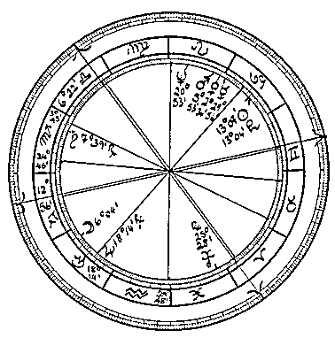

安吉拉是独生女。母亲在她出生前后的行进解读起来并不愉快。

她的母亲雷娜特在第二次世界大战中受到严重创伤，她从欧洲来到不列颠群岛，由于与安吉拉的父亲理查德结婚而与家人断绝关系。

在怀孕期间，她完全依靠自己，不会说新国家的语言，而且由于性情和关系上的困难，她感到丈夫不支持她。

**雷娜特的太阳与冥王星精准合相于巨蟹座第七宫，**她需要一个能塑造和转化的伴侣，并通过强烈而动荡的亲密关系被转化。摩羯座的月亮会让她尽职尽责，善于控制，容易抑郁，想要做正确的事情，并确保女儿是她的骄傲。

可是她遇到的是一个介于诗人和男孩（太阳在双子座，月亮与天王星合相在双鱼座）之间的丈夫，一个在亲密关系中挣扎的男人，为了他的外国妻子，他顺从地牺牲了自己在绘画、游泳和舞蹈方面的兴趣。

因此，几乎不可避免地，雷娜特强占了她的女儿，后者是她情感需求的唯一可能的出口，把她作为自己的伴侣，以及她充满悲伤的戏剧的被迫观众。

在安吉拉出生的时候，土星正好合相她母亲的命主星木星，并且在整个怀孕期间一直对分她的日冥合相。安吉拉出生在母亲绝望和父亲的被困的氛围中，**这种被舍弃的快乐和怨恨——由于对抗不是她的风格——导致了消极的攻击。**

雷纳特的情绪反复无常，在不恰当的、攻击性的亲密关系、耳光和威胁之间摇摆不定。安吉拉自己对她母亲的描述读起来令人毛骨悚然。

“我家里没有隐私。我喜欢上学因为那是一种逃避。我母亲不允许锁门，甚至连浴室的门也不允许。没有什么是私人的，即便是日记、电话等。最后我只能把一切都告诉她，因为我知道她无论如何都会发现的。我花了很长时间才弄清楚离开母亲的我是谁。“

”我在很小的时候就封闭了自己的身体。只有在过去的十年里，我才能根据自己是否饿了而选择吃不吃东西，而不是到了饭点就吃或者周围的人觉得我应该吃。同样如此的还有疲倦。我总是强迫我的身体去做我脑袋想做的事。”

**安吉拉在天蝎座的月亮完美地总结了她危机四伏的、被牢牢操控的成长经历，它与海王星的合相告诉我们，一个孩子对周围的情绪毒素毫无防备，完全不知道她在经历谁的情绪感受。**

正如她所说，“大多数时候，我都敏锐地意识到气氛和人们的感受。我花了大量精力研究周遭氛围，试图领先别人一步，很多时候都感到害怕。”

**安吉拉的许多健康问题都与她的月亮有关。**这些模式是根深蒂固的，需要很多时间和耐心才能让它们被觉知到，然后习惯性的破坏性反应才能逐渐被符合同样占星学象征意义的更健康的习惯所取代。

安吉拉觉得，她从我们的工作中获得的最重要的收获之一，就是证实了她的童年真的和她经历的一样糟糕。尽管她接受了多年的治疗，但她始终不安地怀疑自己可能是在编造。

**回顾症状**

我们依次检视了她的每一个症状，并确定了它们提出一些问题。

**腹部绞痛**

尽管根据正统医学观点，婴儿腹部绞痛的原因尚不清楚，但有迹象表明，与牛奶过敏、胃肠系统发育不成熟和母亲焦虑有关。第一个出生的子女受影响最大。

（这里可能有“鸡和蛋”的因素——没有经验的父母不会因为一个哭了几个小时的婴儿而感到压力和焦虑！）

以上所有这些都适用于安吉拉，她的腹部绞痛持续了近两年，比通常三到六个月的时间要长得多。她没有喝母乳（难以置信！）而是用牛奶替代。

**安吉拉的月亮合相雷纳特的土星，可能会让后者感到被拒绝和失败，**而安吉拉会立即接受到这种感觉，并像她自己一样体验到这种感觉。

**占星学上，月亮与海王星的接触是典型的过敏的相位。**大约四个月时，次限月亮与安吉拉的海王星合相，使她对环境和母亲的痛苦更加敏感和脆弱。

**当她大约一岁时，次限月亮与天王星成四分相，**这很可能给安吉拉已经陷入困境的情绪生活增添了额外的焦虑和不安全因素。

**湿疹**

和腹部绞痛一样，医生不知道湿疹的病因或治疗方法，治疗的目标只能是缓解症状。

湿疹会引起剧烈瘙痒，当患者抓挠时会出现皮疹，有时会导致细菌或真菌感染，因为皮肤屏障的保护被破坏。湿疹皮肤干燥、敏感、脆弱，容易破损，因为它有无法保持湿润的缺陷。接触衣物、床上用品和宠物时容易受到刺激。

**在 9 岁到 11 岁左右，**安吉拉的湿疹开始在手指上出现。**在那个时期，行进冥王星经过了她的上升点和北交点，对分她的命主星水星。与此同时，行进土星对分她的月亮，行进天王星对分她的金星相对，并四分她的木星。**

这为安吉拉敲响警钟，让她成为自己，与母亲和过去分开，但是，考虑到她的成长背景，她怎么能做到呢？当心灵即将越狱而出（原文是 break out，有“出疹”的含义）时，她会极度渴望（原文是 itching，有“痒”的含义）自己独立的能量和驱动力能有个出口。

因此，这表现在她的手指（由水星和变动星座所象征）上，并被装在纯白色的棉手套中。**无法发泄的愤怒、被阻挡的自我主张和无从宣泄的性能量都会在皮肤，即身体的边界上，**出现皮疹，就好像它只能走到这里，不能再远了。

在此前的生命中，安吉拉都在书写**“对我的无力和丧失权力感到愤怒和沮丧”。**

1983 年，她 23 岁，去国外生活了一年，这是她挣脱束缚的另一次机会。湿疹随后完全消失。

**当时，行进土星合相她的月亮，行进天王星四分她的火星。**这一次，至少在身体上，她有可能界定自己与母亲的分离，并对自己的情感需求负责。这也是她第一次敞开面对自己的性能量。

1995 年，湿疹就像色斑一样，在她的腿、眼睑和手上再次出现。情况非常糟糕，她不得不戴上白手套，手套下面缠着绷带。这实在太闷热，而唯一能缓解的就是把它们放进冰箱。

显然，她的母亲和外祖母也有同样的情况。**当时，行进海王星正与太阳成四分相，削弱了她的活力，而且行进土星与火星合相。**从医疗占星学的角度来看，她的**消化系统和免疫系统**可能都很迟钝，事实上，当她开始服用消化酶时，情况确实有了很大改善。

**过敏和消化问题**

安吉拉对小麦、乳制品、巧克力、柑橘类水果、酒精和金属（尤其是银）过敏。银过敏很有趣，因为**银是月亮（母亲）所象征的金属**。当身体的防御系统无法区分自己与潜在危险的“非自己”时，就会发生过敏或敏感，最终可能会发展为攻击自身。

**火星代表着身体的“武装力量”，但双鱼座是“万物一体”的标志，**所以它对什么是朋友和什么是敌人感到困惑也就不足为奇了。消化过程分解食物，使其易于吸收。

然而，在安吉拉的案例中，**消化（火星在双鱼座）和同化过程（月亮与海王星结合）**都非常敏感，导致边界问题和补偿性的过度反应。

**气喘**

安吉拉的哮喘从她三岁开始发作，五岁上学时就停止了，上学被她认为是愉快的离家出走。然后，**在 1963-1965 年间，出生图月亮与海王星，与行进的冥王星和天王星成六分相，与行进的土星成三分相。**

**所有这些都是象征某种分离的行进趋势。**这标志着母亲的第一次离开，此时母亲回到自己的国家几个月，照顾患有癌症的父亲。安吉拉感到被遗弃，这引发了她第一次严重的攻击。哮喘患者呼吸困难，就好像一个人把呼吸和力量屏在体内。

**头痛**

从她记事起，安吉拉就患有头痛，如果一开始不通过药物缓解，可能会变得相当严重。现在她每周大约有两次轻微头痛，但已经多年没有出现全头痛了。**头痛是白羊座精力未被释放的典型症状，也是肢端肥大症的一个特征。**

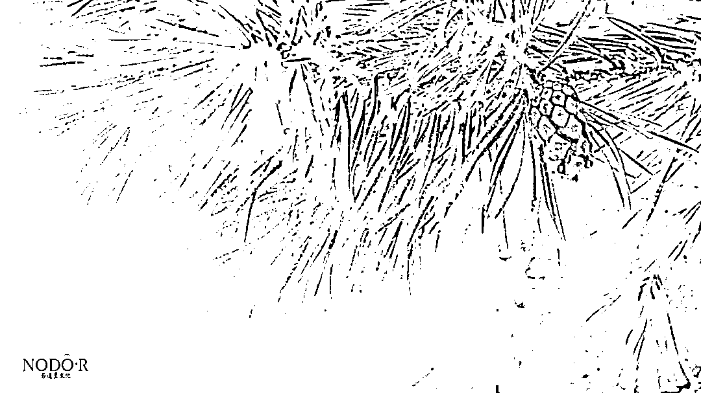

**多次手术干预**

**白羊座的太阳和天蝎座的月亮需要危险的、生死攸关的处境，这样才能感觉到自己还活着。**

我认识几位拥有这种星图和背景的客户，他们经常乐于接受外科手术，把它作为一种无意识的方式来表演对这些星图配置而言至关重要的戏剧。

她接受垂体瘤手术时，月亮在白羊座。传统上，当月亮处于守护身体病变部分的星座或其十字星座时，占星师会严正警告，禁止在这段时间动手术。我目前尚未发现这项判定是有效的。

**肢端肥大症**

肢端肥大症是一种激素紊乱，导致生长激素（GH）的过度分泌，最常见的病因是一种垂体良性肿瘤，称为腺瘤。

据估计，每百万人口中约有 40 至 60 人受到影响，但由于其发病缓慢且往往隐匿，因此经常被误诊，实际病例数可能要高得多。它可能导致严重疾病和过早死亡，但如果识别出这种疾病，大多数患者都可被治愈。

肢端肥大症的名字来源于希腊语中的“四肢”（extremities）和“扩大”（enlargement），指的是它最常见的症状之一，即手和脚的异常生长。

渐渐地，患者的面部特征会发生骨质变化：前额和下颌突出，鼻骨增大，牙齿间距增加。身体器官包括肝脏、脾脏、肾脏和心脏，也可能增大。

肢端肥大症的其他症状包括厚、粗糙、油性的皮肤；皮赘；嘴唇、鼻子和舌头肿大；鼻窦和声带肿大，上呼吸道阻塞（从十岁出头开始，直到手术前，安吉拉不得不使用鼻喷雾剂）；疲劳和虚弱；头痛；视力受损；月经周期异常。

肢端肥大症最严重的健康后果是糖尿病（通常与主要症状相关）和心血管疾病风险增加。

1991-1992 年，安吉拉开始感到越来越不舒服，疲劳、情绪波动、头痛。她的手掌和脚底，以及其他皮肤开始变成橙色。她需要更大尺码的鞋子；照镜子时，她觉得自己的脸在变形——她快疯了。

到 1992 年，她病得太重，无法工作，但幸运的是，她警惕的牙医通过 X 光对比发现，她的下巴变大了，“她的咬合增加了”（从心理上讲，也是时候了！）并立即将她送去检查，结果显示她的生长激素分泌量极高。

该病于 1993 年 6 月确诊，1994 年 2 月成功手术切除肿瘤，除非在压力下，不再有其他症状。

**从占星学的角度，肿瘤位于摩羯座守护的身体区域——垂体前叶，而象征着扩张和生长的木星位于摩羯座。**安吉拉完美地总结了她的木星摩羯座：“我相信我的肢端肥大症在情绪感受上的原因，有一部分是我的成长在我的家庭中被抑制了。”

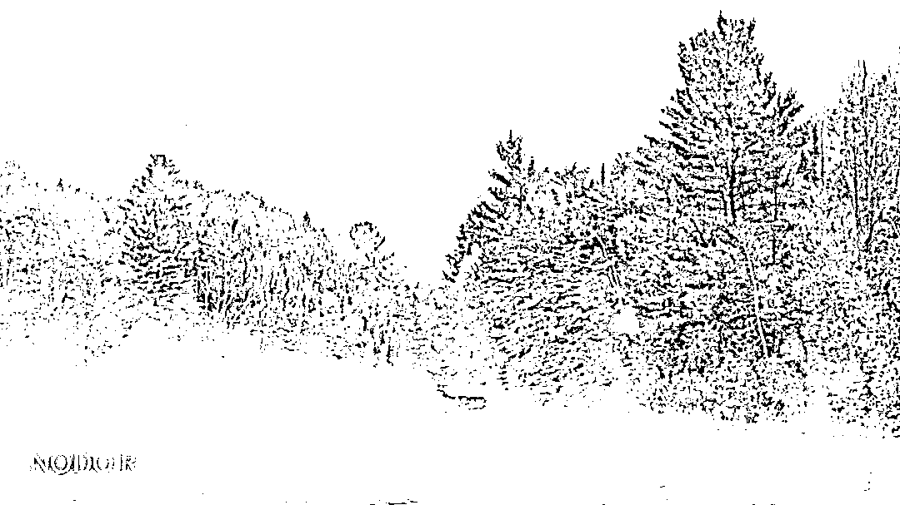

**积累**

1984-1985 年，行进冥王星先后和她的月亮与海王星合相。

从 1985 年到 1986 年，行进海王星合相木星并四分金星。海王星带来渗透和虚弱。

行进土星在 1988 年接过指挥棒，影响木星和金星，然后在 1989 年至 1990 年与出生图的土星合相并四分太阳。

下一次对木星和金星的冲击发生在 1989 年至 1990 年间，来自行进的天王星。她的母亲于 1989 年 2 月去世，当时“解放者”天王星与她出生图木星精准合相，木星守护她的第四宫和第七宫，与金星呈四分相。

**探索需要解决的议题**

安吉拉花了很多年时间才意识到自己与母亲是分开的，并认识到自己的界限和需求。对于那些有融合议题的人，我经常推荐“3M”——**咀嚼（mastication）、按摩（massage）和冥想（meditation）。**

**这些都是帮助聚焦的技术。**

**通过对食物和生活经历的彻底咀嚼**，它们可以被品尝、检验是否健康，或者吐出来或者被吸收。**按摩**能让人感觉到身体的实质和界限，如果做得好，也是一种爱的接受。**冥想**，以适合客户的任何形式，都确实是对觉知和活在当下的帮助。

**自我捍卫**

**由于火星在双鱼座对分冥王星，**学会面对和维护自己绝非易事。更容易为他人的权利而战。在这方面，**自我捍卫的训练通常会有所帮助。**

火星在双鱼座的好方法是更强壮（英文 muscular，有“肌肉发达”之意）的艺术形式，如动态冥想或为被剥削者而战。随着火星能量开始更自由地流动，消化液和免疫系统也会变得更强。

**灵性与界限**

**海王星-双鱼座在星图上的凸显**通常意味着不愿意转世并投身为地球上的生命。使相互依赖的关系变得个性化、松开关系之间的束缚，需要巨大的勇气，而不是娘炮。安吉拉沿着这条路走了很长一段距离，并继续带着自尊和日益增强的觉知走下去。

**月亮的议题**

呼应月亮合海王星在第二宫，致力于建立和实现自己的价值观是至关重要的。在过去的十年里，通过在重要的关系中面对痛苦的源自母亲的依赖议题，安吉拉为自己打下了坚实的基础。

**扩张与成长**

**摩羯座的木星（守护第四宫）**讲述了她自己和她父亲被压抑的生机、成长和对生命的信念。在安吉拉的案例中，肢端肥大症意味着成长不会永远受到抑制，而只能被推迟（摩羯座），直到她能够谨慎、认真地朝着自己的目标努力。

**成就**

土星在它自己的星座，四分在其擢升星座的太阳，有一种强大的驱动力去捍卫自己，在世界上留下自己的印记，也伴随着同样强大的焦虑，因为害怕报复或失败。还有一种家庭传统，即放弃创造力和自我表达，以换取安全感。

**在我们一起工作的时候，行进土星刚刚经过了她的中天，很快就会和她的太阳成四分相，同时行进冥王星碾过她的下中天。行进天王星也将努力打破她的火冥对分的习惯模式，并使一系列新的反应成为可能。**

**这是一个动荡和机遇并存的时期。**安吉拉为自己做了大量工作，并积累了强大的内在资源。我的感觉是，她将能够迎接来自英勇的白羊座太阳的挑战，进入第八宫的战场，杀死家族传承中的不散阴魂。

**版权声明：**本文由若道翻译发布于若道平台，欢迎转发，反对抄袭。友号转载请申请白名单。

**END**

**快来和简·里德·帕特里克老师学习升级版的占星学身体地图吧！**

**简·里德·帕特里克 **博士****

（Jane Ridder-Patrick）

简接受过药剂师、理疗师、草药师、心理治疗师和历史学的专业学习，从事写作、咨询和讲学工作，在英国和全球教授占星学及其历史、当今的心理学和医学应用。她在爱丁堡执业，在爱丁堡大学获得博士学位，研究方向是 17 世纪苏格兰占星学历史。

**她最著名的出版物是《医疗占星手册》。2018 年，她因对医疗占星学的贡献而获得了著名的查尔斯·哈维占星学杰出服务奖。**

**医疗占星包含哪些内容？**

本课程既适合医疗占星学的初学者，也适合已经有一些相关经验的人。
简·里德·帕特里克老师将运用现实生活中的例子，揭示一个人的性格、症状及其星图是如何相互映照的。课程也会探讨疾病的意义以及可能的治疗方法。本课程旨在为学员提供一个运用医疗占星学的框架和方法，学员将会学到一些有价值的实用工具，在课程结束后，自己使用这些工具研究其中的关联性。**此课程可作为 ISAR 选修课。****学习医疗占星学****点击下图了解课程详情**

**20 位来自世界各地的占星师****带来 19 场沙龙——新世界的觉醒****详情可点击下图**

**学习占星学****点击下图了解课程详情**

**微信又双叒叕改版啦，不想错过若道君的推送？**

**就把若道设为星标吧！**

**▼**

**喜欢就点一下“在看”吧！**

********报名直达入口********

# 医疗占星沙龙丨从太阳和月亮浅谈占星学和诊断

> 原文：[`mp.weixin.qq.com/s?__biz=MzA5NjA0NTAxNg==&mid=2651488399&idx=2&sn=1becee53f77a64274e067c958dd58019&chksm=8b483238bc3fbb2e7754f1b787d3a891abcbe444d42de6b41987e04e2082ecf4abf2dde2f127&scene=126&sessionid=1692737756#rd`](http://mp.weixin.qq.com/s?__biz=MzA5NjA0NTAxNg==&mid=2651488399&idx=2&sn=1becee53f77a64274e067c958dd58019&chksm=8b483238bc3fbb2e7754f1b787d3a891abcbe444d42de6b41987e04e2082ecf4abf2dde2f127&scene=126&sessionid=1692737756#rd)

日月星辰在外，也在内；在心，也在身。

**一张星图铺开，可以看到先天身心的资源，也能看见先天身心容易被影响的部分。**

**2022**年**9**月**20**日**即将开始的医疗占星学**，将会详细讲述一个人的**性格、症状及其星图**是如何相互映照的，课程也会探讨**疾病的意义以及可能的治疗方法。**

而由若道讲师、本次医疗占星课程助教**天空的空**在**9**月**13**日带来的**《从太阳和月亮浅谈占星学于诊断》**的课前沙龙，将邀请你在 1 个小时的分享中初尝试医疗占星。

**沙龙内容：**

占星学在身、心、灵的疗愈实践中有其别出心裁的见解，能提供独树一帜的诊断视角、身心同调的治疗思路，以及法象时空的预后分析。本次沙龙尝试以太阳和月亮的不同象征意义，浅析占星学在诊断中的价值。

**沙龙时间：****9 月 13 日（下周二） 20:00-21:00**

**主讲人：****天空的空**

**快来预约直播吧~~~**

<mpvideosnap class="js_uneditable custom_select_card channels_live_iframe" data-pluginname="videosnap" data-headimgurl="https://wx.qlogo.cn/finderhead/PiajxSqBRaEJYnVsqWfEX9qA0sI6hNVKsDfyzfPZ92WZMZyBpZWU5NA/0" data-username="v2_060000231003b20faec8c4e68a1ec2d4ca07e434b07755bbf47e7053a3059defd2c9d6c68a20@finder" data-nickname="若道" data-desc="将在 09 月 13 日 20:00 直播" data-intro="医疗占星直播：从太阳和月亮浅谈占星学与诊断" data-noticeid="finderlivenotice-v2_060000231003b20faec8c4e68a1ec2d4ca07e434b07755bbf47e7053a3059defd2c9d6c68a20@finder-1662445884347765-1312694198" data-type="live"></mpvideosnap>

# 2022 年若道 ISAR 选修课 | 《医疗占星手册》作者亲授

> 原文：[`mp.weixin.qq.com/s?__biz=MzA5NjA0NTAxNg==&mid=2651488399&idx=3&sn=45c588ff790a74479889c86a6a51ab3e&chksm=8b483238bc3fbb2ed9aad07859986ea1c7ad215779da14d52ddb79ed01b39f3e9d3c0abb54b8&scene=126&sessionid=1692737756#rd`](http://mp.weixin.qq.com/s?__biz=MzA5NjA0NTAxNg==&mid=2651488399&idx=3&sn=45c588ff790a74479889c86a6a51ab3e&chksm=8b483238bc3fbb2ed9aad07859986ea1c7ad215779da14d52ddb79ed01b39f3e9d3c0abb54b8&scene=126&sessionid=1692737756#rd)

**有四个主要因素影响着我们的生活和健康：基因构成、物质环境、情绪环境，以及我们的占星配置。我们在星图中都存在患病的可能性，而预防的方法在于尽可能充分、真实和健康地生活。****——简·里德·帕特里克****（Jane Ridder-Patrick）博士**

占星学就像心灵的 X 光片。它可以描述个人对世界的看法和反应。我们越不了解自己的天性，面对生活中的挑战，我们就会有越少的选择。

**“占星学可以精准定位需要解决的潜在问题。”**

**医疗占星学是一个强大的工具，同时洞察的身体和心理过程，通过更多的自我认知照顾和关爱自我和身边的人。**

**本课程既适合医疗占星学的初学者，也适合已经有一些相关经验的人****。**简·里德·帕特里克老师将运用现实生活中的例子，揭示一个人的性格、症状及其星图是如何相互映照的。课程也会探讨疾病的意义以及可能的治疗方法。

**本课程旨在为学员提供一个运用医疗占星学的框架和方法，**学员将会学到一些有价值的实用工具，在课程结束后，自己使用这些工具研究其中的关联性。

**此课程可作为 ISAR 选修课。**

1

**课程安排**

**课程时间：2022 年 9 月 20 日-11 月 8 日  每周二 20:00-22:00**

**第*****1*****讲  9 月 20 日 与占星学、心理学、病症一起工作**

*   医疗占星学的组成部分以及如何使用它们

*   行星的作用与相互作用

*   黄道星座人

*   宫位的重要性

*   疾病和健康是如何产生的

**★ 第二、三、四讲的课程内容基于星座以及它们之间的相互作用。**

**第*****2*****讲  9 月 27 日 基本星座**

学习基本大十字星座——**白羊座、巨蟹座、天秤座和摩羯座**——及其功能和相关的健康问题。**这些星座与防御、养育、结构、体内平衡和荷尔蒙控制有关。**

****第*****3*****讲  10 月 4 日 固定星座****

学习固定大十字星座——**金牛座、狮子座、天蝎座和水瓶座**——及其功能和相关的健康问题。**这些星座与习惯和反射、心脏调节、生存、循环和协调有关。**

“固定星座（金牛座、狮子座、天蝎座和水瓶座）在情感和生理上都倾向于**‘难以放手’**，这可能为恶性肿瘤的生长创造环境。所以说，他们可能倾向于沉浸在过去的伤害中，难以自拔。另一方面，这些星座也擅长在艰难的时期坚持不懈并一直**持之以恒**。”——简·里德·帕特里克（Jane Ridder-Patrick）博士

**第*****4*****讲  10 月 11 日 变动星座**

学习变动大十字星座——**双子座、处女座、射手座和双鱼座**及其功能和相关健康问题。**这些星座与呼吸、神经系统、肠道、睡眠以及信息、情感和行动的整合有关。**

**★ 第五、六、七、八讲重点学习行星，它们在身体层面的表达、它们的相位与行进。**

**第*****5*****讲  10 月 18 日 太阳与月亮**

**太阳**掌管视觉、活力、心脏和意识，与心脏、脊柱和视觉问题相关。**月亮**掌管人体的周期，特别是月经周期、饮食模式和体液，与情绪引起的疾病、饮食失调和胃病相关。

**第*****6*****讲  10 月 25 日 土星与天王星**

**土星**掌管着皮肤、骨骼、牙齿和衰老过程。它对应的疾病包括慢性疾病、耳聋、帕金森病、关节僵硬和牙齿问题。**天王星**代表身体活动的协调，有节奏的脉动和身体的“电”。与天王星相关的疾病包括癫痫、痉挛、心律失常，以及阿斯伯格综合症和自闭症样综合症。

**第*****7*****讲  11 月 1 日 海王星与冥王星**

**海王星**掌管松果体、细胞膜渗透和右脑功能，与过敏、上瘾的病症、慢性疲劳综合症和睡眠障碍相关。**冥王星**掌管消除和转化，其病理包括毒性、脓肿、癌症和强迫症。

**第*****8*****讲  11 月 8 日 火星**

**火星是与能量和防御相关的行星**，掌管免疫系统、肾上腺功能、肌肉活动和炎症反应。**它是许多身体和情绪障碍的核心**，如自动免疫障碍、抑郁和发烧，以及由手术或需要手术引发的问题。

2

**此次课程适合哪些人？**

*   有一定占星学基础，若道核心课 L3 以上水平；

*   希望成为优秀的占星师，想要借鉴国际大师医疗占星解读思路并融入自己的体系的人；

*   热爱占星学、健康、养生的研究型占星学者；

*   计划考取 ISAR 认证占星师，寻觅中意选修课的学员；

*   走在自我探索和个人成长道路上的人。

**快来和简·里德·帕特里克老师学习升级版的占星学身体地图吧！**

3

**授课老师**

**简·里德·帕特里克 **博士****

（Jane Ridder-Patrick）

简接受过药剂师、理疗师、草药师、心理治疗师和历史学的专业学习，从事写作、咨询和讲学工作，在英国和全球教授占星学及其历史、当今的心理学和医学应用。她在爱丁堡执业，在爱丁堡大学获得博士学位，研究方向是 17 世纪苏格兰占星学历史。

**她最著名的出版物是《医疗占星手册》。2018 年，她因对医疗占星学的贡献而获得了著名的查尔斯·哈维占星学杰出服务奖。**

《医学占星术手册》（第二版，修订版和扩充版）

(爱丁堡，克拉布出版社，2006 年)

4

**课程信息**

*   **课程时间：**2022 年 9 月 20 日开始，每周二晚上 8 点，每周一次，共 8 次课。

*   **授课方式：**线上直播，英文授课，中文翻译

*   **课程价格：**6800 元

*   **课程咨询：**王老师（微信：18510107057，请备注“医疗占星”）

长按二维码添加王老师

5

**退转课程**

*   **退款原则请详看《教学协议》，如有疑问请咨询课程顾问。**

****医疗占星****

**授课老师：**简·里德·帕特里克

**授课时间：**2022 年 9 月 20 日起

**授课方式：**网络课程**，**英文授课，中文翻译

**费用：****6800 元**

**课程负责人：****王老师**（微信：18510107057，请备注“医疗占星”）

长按二维码添加课程负责人咨询~

**END**

****报名请点击“阅读原文”****

# 周六沙龙丨 ISAR 星空俱乐部第 45 期：J.R.R.托尔金的原型想象力

> 原文：[`mp.weixin.qq.com/s?__biz=MzA5NjA0NTAxNg==&mid=2651488399&idx=4&sn=87ab03644209142601f7cd1fd0a549b1&chksm=8b483238bc3fbb2ea0ea25c54248f700dbcdcbc9669cd0097bd0c77051d6cab41c698c59c53a&scene=126&sessionid=1692737756#rd`](http://mp.weixin.qq.com/s?__biz=MzA5NjA0NTAxNg==&mid=2651488399&idx=4&sn=87ab03644209142601f7cd1fd0a549b1&chksm=8b483238bc3fbb2ea0ea25c54248f700dbcdcbc9669cd0097bd0c77051d6cab41c698c59c53a&scene=126&sessionid=1692737756#rd)

**沙龙来啦！****9 月 10 日，星期六上午 10 点，**国际占星研究协会（ISAR）中国星空俱乐部沙龙由占星师**贝卡·塔纳斯**带来一场讲座！ **沙龙主题****沙龙主题：**J.R.R.托尔金的原型想象力******主讲人：******贝卡·塔纳斯********

**沙龙时间：9 月 10 日，星期六，北京时间上午 10:00-11:30（有英文翻译）**

**沙龙方式：线上沙龙**奇幻作家 J.R.R.托尔金的想象力不仅能构思出一个伟大的故事，还能创造出一个完整的世界。当托尔金第一次遇到中土世界时，行进发生了什么? **《指环王》承载了什么样的时代精神原型?****这部 20 世纪最具影响力的文学作品之一，其背后的占星动力学揭示了如何通过这个强大的神话，为我们的时代重新想象一个新的未来。****主讲嘉宾**

**********贝卡·塔纳斯**********

*   贝卡·塔纳斯博士是一位学者、艺术家和《Archai：原型宇宙学杂志》的编辑。
*   她在加州整合学院（CIIS）获得博士学位，毕业论文题目为《超越的背后：荣格的红书和 J.R.R. 托尔金》。
*   她同时任教于太平洋研究所和 CIIS，著有《意象王国之旅》一书。贝卡住在加州内华达市，在那里她有一家占星咨询公司。

**如何参加沙龙？**本讲座也是本月的国际占星研究协会（ISAR）星空俱乐部讲座。**ISAR 会员可以免费收看。**请注意邮件通知，具体参与方式见邮件。❶ 如果你**已经是 ISAR 会员**，请注意邮件通知，告知如何参加。❷ 如果你**不是 ISAR 会员**，非 ISAR 会员价格：98 元。如有任何问题请咨询工作人员仲老师（微信：YY18513802156）

**非 ISAR 会员报名请长按下图**

**▼**

**ISAR 明星俱乐部**

2018 年，ISAR 在主席亚历山大·因舍阿吉克的带领下，成立了 ISAR 明星俱乐部，每月为全球 ISAR 会员提供在线直播讲座，邀请全球著名占星师开讲，学习和分享新的理念。讲座时长一小时，涉及占星学的不同领域、不同观点，每个会员都可以参与其中，每次讲座之后还有 20-30 分钟问答时间向老师们提问。每一场在线讲座都会记录下来，ISAR 除了提供视频，还会提供相关的讲座资料，以及单独的问答录音，自动发送到专门的 ISAR 明星俱乐部页面存档，每位 ISAR 会员可以在 ISAR 网站上自己的会员主页俱乐部页面找到。在 2018 年最初几个月，ISAR 明星俱乐部会每月举办一场在线演讲。之后，两周举办一场演讲，最终每周举办一场演讲。
但是，过去明星俱乐部讲座只有英文沙龙，因此，中国会员只有懂英文才能受益。为了使得更多不懂英文的中国会员能够受益，我们特别和 ISAR 总部协商，今后会安排有中文翻译的明星俱乐部占星沙龙，作为给中国 ISAR 会员的福利！**如何成为 ISAR 会员？**

**如果你也想成为 ISAR 会员，请复制链接在浏览器打开**

http://www.nodoor.com/isarcert.do?contentId=3588（仅支持网站支付）

**或直接长按下方二维码，微信购买会员：**

**ISAR 会员有什么福利？**一年期会员仅需支付**人民币 510 元**，即可享受：**☆ 星空俱乐部免费沙龙****☆每年出版 3 次的《国际占星师》（目前只有英文）；****☆每周电子邮件交流汇总杂志（目前只有英文）；****☆专项研究基金和奖学金资格；****☆ISAR 主办的会议和论坛的会员折扣，包括国际占星大会（UAC）、ISAR 的会议和研讨会等会员权益。****有疑问怎么办？**关于 ISAR 星空会员俱乐部以及我们的讲座，如果你还有任何疑问，**请联系工作人员**：

**若道 Conrad（微信号：nodoor2016）**

**若道 yiyi****（微信号：YY18513802156）**

****非 ISAR 会员报名请点击“阅读原文”****

# 最高级的智慧，是跟随宇宙规律，找到属于你的四季仪式

> 原文：[`mp.weixin.qq.com/s?__biz=MzA5NjA0NTAxNg==&mid=2651488179&idx=1&sn=dcaf78be02b71575945f3bfc644d27c5&chksm=8b48cd04bc3f44123ac519d87b81a481f79d4932182658241b66578c4ec57503dc2c41681d5c&scene=126&sessionid=1692737761#rd`](http://mp.weixin.qq.com/s?__biz=MzA5NjA0NTAxNg==&mid=2651488179&idx=1&sn=dcaf78be02b71575945f3bfc644d27c5&chksm=8b48cd04bc3f44123ac519d87b81a481f79d4932182658241b66578c4ec57503dc2c41681d5c&scene=126&sessionid=1692737761#rd)

******☆ ****后台回复“今日”，给你一句生命态度******

作者/凯莉·苏提斯

译者/王宏 校对/江艺

编辑/玫瑰 图片/稿定设计

本文发表在澳大利亚的《幸福杂志》上

占星学所基于的是对季节的理解，以及自然和所有生命一起，随着热、湿、冷、干等核心特质在一年间的转变而改变的方式。这四个核心特质最初定义了万物的本质。每颗行星和每个季节都是这四个基本特质的两两结合。

一颗行星或一个季节要么热，要么冷，同时要么干燥，要么潮湿。一起来看看当下的节气有怎样的含义吧。

**季节性特质**

春季是又热又潮湿的季节，它结合了**热和湿**的特质。**热的影响让事物生发，而潮湿的特质则会促进生长。**

夏季是又热又干燥的季节，此时春季的潮湿让位于**干燥**。如果春季时有大量的水分（又称雨水），那么**在夏季的高温之下，水果和花朵就会充分生长和成熟。**

秋季是由**寒冷和干燥**的特质所定义的季节。寒冷的特质让事物放缓脚步，我们在自然界中看到了这一点，此时植物生长缓慢，到秋季结束时，便完全停止了。

干燥会产生**分离**的影响，这可能导致**事物变硬和拆解**。秋季被视为对人体最困难的季节，因为这些特质会导致不适。**寒冷和干燥是与土星和忧郁状态相关的特质。**

冬季延续了秋季开始的寒冷的影响，但从干燥变为了潮湿，使冬季成为**寒冷、潮湿**的季节。这与**粘液质**有关——这并不奇怪，因为冬季通常是感冒和流感的季节，此时**我们的身体可能因感冒而饱受过多水分的折磨，这会导致鼻塞和流鼻涕。**

**季节、二至点和二分点**

**季节是由太阳与地球的关系确定的，它随着地球在天空中的移动而变化。**一年中有两次，太阳在我们的天空中显得格外高或格外低。这就是**至点**的时刻，发生在每年**6 月 20 日和 12 月 20 日前后**。

（确切的时间和日期每年略有变化，但通常在这一日期的 24 小时内。）太阳一进入黄道十二宫的巨蟹座（接近 6 月 20 日）和摩羯座（接近 12 月 20 日），就到达至点了。

至点季节也从这个日期开始。在澳大利亚，这意味着冬天从 6 月 20 日开始，此时太阳进入巨蟹座。夏天始于 12 月的至点，接近 12 月 20 日，此时太阳进入摩羯座。两个半球的至点日期相同，但季节是相反的。

夏季和冬季是极端的季节，此时的气候反映出太阳与地球极度接近或极度远离。在活力方面，这两个季节也是极端情况占上风，过度行事的倾向很高。

春季和秋季是具有变动可能性的季节，因为太阳从天空中横穿而过，改变方向并为新的目标而奋斗。在春季，太阳在天空中升起，给它所触及的一切带来温暖和鼓舞。

这给自然界带来了新成长，并鼓励你把自己的心转向灵感和计划以寻求进步。秋季看到太阳从高点落下，鼓励放慢步伐，激励你完成已经开始的事情。

**春季和秋季是分点的季节，其开始时太阳处在它年度旅程的两个中点之一。**分点发生在每年的**3 月 20 日和 9 月 20 日附近**。在澳大利亚，3 月的分点开启了秋季，9 月的分点开启了春季。在北半球，季节仍然在这些日期变化，但却是相反的。

**分点季节是指那些大自然努力从上一个至点季节的极端调整和重新平衡的季节。**在春季，目标是热身、前进和成长，以弥补冬季低点的迟滞性质。

在秋季，是时候放慢脚步，重新评估和完成未完成的项目了。夏季的极点可能是遥远的记忆，而秋季则是回归基本并再次脚踏实地的时刻。

**行星和季节**

 每颗行星都天然地与特定季节的本质相连。这颗行星将在一年中属于自己的时段里更容易接近，行星的特质和目标为在与其相应的季节中关注什么提供了天体的灵感。

春季和夏季都有着炎热的性质，鼓励活动、决策和前进。这些季节是**鼓励向外投身世界、梦想远大**的季节。

秋季和冬季都有着寒冷的性质，鼓励休息和反思。它们都具有**内省**的特质，并突显出**观照内心**的力量。

| **季节** | **特质** | **行星** |
| **春季** | 热、湿 | 木星，连同金星 |
| **夏季** | 炎热和干燥 | 太阳和火星 |
| **秋季** | 寒冷和干燥 | 土星，连同水星 |
| **冬季** | 寒冷、潮湿 | 月亮，连同金星 |

1 春季：木星和金星**木星是与生长、进步和机遇相关的行星，是与春季相关的主要行星。**木星是太阳系中最大的行星，当木星活跃时，计划和项目就会蓬勃发展。木星与**学习，以及丰富和支持**息息相关，这就是**春季是开启新的创始，或采取行动追求梦想的绝佳时机**的部分原因。**旅行和学习**是木星的特殊兴趣，因此**在春季，进行你每年的盛大旅行**可以帮助你在接下来的 12 个月中获得最大的灵感。**学习、教学、写作和出版计划**也可以在春季的那几个月里从木星的强大影响力中得到提升。木星也是幸运之星，因此这是**冒险**的好时机，因为你将获得天体的支持。木星也与慷慨有关，所以**在春季也要自愿地把你的智慧、支持或明智的言辞传递给他人。**金星是一颗潮湿的行星，而基于它与太阳的关系，它可以是冷的，也可以是热的。这意味着**金星通常在冬季的后半段和春季的前半段很活跃**。金星与爱情和美丽有关，因此**春季的前半段是美丽和宠爱仪式的好时机**，在澳大利亚是从 9 月的分点到 11 月初。

你可能已经做到了一些，或许是为夏季前去海滩做准备？但这也是一年中**让你的爱情生活重获生机的美好时光**，要么是单身的你寻找新的伴侣，要么是花时间和你现有的伴侣开心在一起并享受额外的品质时光。

**春季仪式**

*   预定一次有趣的冒险或周末度假；

*   让宠爱自己以及美容或打扮的仪式成为生活的常规部分；

*   注册一门课程。

2 夏季：太阳和火星**夏季实际上是发光的时段，因为这是太阳的季节。**太阳代表着**领导、皇室和坚持稳定的道路**。随着夏天的到来，这是一个**负起责任和重新聚焦**的好时机。**太阳也与奢侈和高品质的事物相关联，因此在夏季不要亏待自己。**相反，要选择几个五星级的放纵方式，并在整个季节里依次享受，这样你就可以在太阳高悬于空中时尽情享受生活。太阳是最稳定、最为前后一致的一颗星，**在夏季保持稳定的例行常规**也是有益的。创造性的能量在太阳的影响下达到顶峰，因此要**花时间发展你的艺术方面，或者享受他人的创造性产出，比如通过演出、展览和表演**。火星是另一颗与夏季相关的行星，因为太阳和火星都有**炎热、干燥**的特质。但火星可能会走向极端（太阳是更平衡或更温和的夏季行星），因此夏季**要谨慎一些，尤其是不要试图超越自己的极限。**

尽管测试或挑战自己去寻找新的发光方式很棒，但让事物极端化可能会导致疾病和压力。夏季的热量非常之多，因此像**游泳、冥想和阅读**这类冷却性的活动可以帮助你放慢速度并保持镇定。

体育活动非常有助于燃烧掉多余的火星热量。**考虑进行中等强度的锻炼，或者选择短时爆发性的高强度训练。**

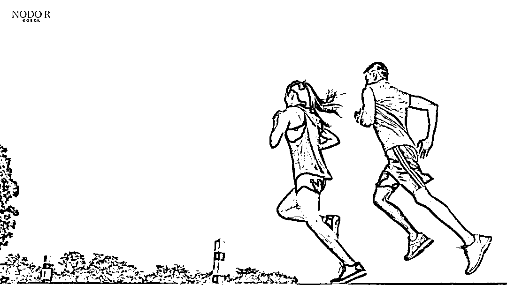

夏季长时间进行高强度锻炼并不理想，因为这可能引发过多的热量，导致你生命力的枯竭或耗尽。反而要在工作或个人生活中给自己设定一个挑战，你可以把精力集中在这个挑战上。

**夏季仪式**

*   学习或发展一种创造性才能；

*   在家里或工作中发号施令，并明确要求得到你想要的；

*   挥霍享受五星级的体验。

3 秋季：土星和水星

**秋季是为了放慢速度以及进行脑力劳动。**秋季的主要行星是土星，它可以帮助你**专注于长期计划**。**缓慢和稳定**会赢得本季的比赛，因此不要向前冲，要**暂停下来反思**。

水星是另一颗与秋季相关的行星，与**思想、思维和沟通**联系在一起。这意味着你需要在秋季**充实你的头脑**。这可能会激励你**参加一门课程、报名参加一个研讨会或多多读书**。

花在听你最喜欢的播客，以及学习实现你的长期目标所需的信息或技能上的时间是值得的。

在土星的季节里体验些许愁思是很正常的。如果你感到有点平淡或枯燥，就要独自安静地花时间探寻缺失的是什么。秋季是**反思和调整**的时候，因为土星将你的注意力吸引到你生活的基础之上。

我经常把土星描述为代表生活的四大支柱。这些支柱对我们每个人来说可能有所不同，但它们通常包括**工作（职业）、家人和家庭、个人生活（包括爱情和友谊）以及健康和活力**。

这些支柱哪怕有一根不够稳固，你都会感到没有支撑或基础不稳固。你的任务是**观察，留意缺乏的是什么，然后制定一个缓慢的、实际的计划，以实现持久的安全和稳定。**

**在土星的影响下，你可能不得不做出一个让人无法回避但又必要的选择。**在秋季，你手头有水星来帮助沟通，因此这是让心里**摆脱某些想法或忧虑**的好季节。**花更多的时间与所爱之人交谈**，或是考虑**见一位顾问或其他治疗医生**。土星代表了过去，因此**放慢脚步并提出更深层次的、更具反思性的问题**可以帮助你克服过去，摆脱限制性的习惯和模式。**秋季仪式**

*   写出你的恐惧或忧虑，然后烧掉它们，看着它们在烟雾中消散；
*   改变你的想法，从而改变你的生活；
*   通过温和的运动（散步、普拉提）和冥想，与你的头脑保持联结并平静下来。

4 冬季：月亮和金星

**冬季是为了筑巢，并花时间待在家里。**冬季的主要行星是月亮，它完全是与**家庭、家人和你的生活状况**有关。如果你对自己的家并非全然满意，现在需要改变的地方就变得清晰起来了。

如果你爱自己的家，现在就是时候添加舒适感，让你的家更放松了。你可能会进行装饰，尤其是在卧室或客厅。**食物和家人（或感觉像家人的朋友）**被强调了，所以要招待所爱之人用餐，或优先与家人一起吃饭。

在寒冷潮湿的冬天，你的身体可能会变得迟钝，因此通过**加热食物、添加调料以及温和的运动**来增加热量是很重要的。月亮是代表健康和幸福的主要行星之一，突显了在冬季照顾自己和照料自己的身体是非常重要的。

金星是爱与美的女神，在冬季的后半段开始展现自己的影响力，在澳大利亚是从 8 月初开始的，这是一个**重新联结或恢复你的美容、打扮和宠爱仪式**的好时机。你可能会放纵于**面部护理或按摩**，或在家中**添置一件新的艺术品**。

**爱情、约会和人际关系**也很重要，因此当你在冬季花时间滋养重要的事物时，也要延伸到对你而言特殊的人身上，或者如果你是单身的话，就要采取行动见见新的人了。

**冬季仪式**

*   在家里招待朋友或家人吃一顿慢慢煮好的饭菜；
*   用优质的油来滋养你的身体；
*   更新你的床上用品和柔软的家具，比如扔掉地毯和枕头；
*   放下你因年龄渐长而不再需要的东西。

希望与这些行星同步会启发你尊重季节，并打造与天空的周期相一致的生活。

**版权声明：**本文由若道翻译发布，欢迎转发，反对抄袭。友号转载请申请白名单。

**凯莉·苏提斯**

占星教师、顾问，坚信魔法、直觉和灵性的力量。

**20 位来自世界各地的占星师****带来 19 场沙龙——新世界的觉醒****详情可点击下图**

**学习占星学****点击下图了解课程详情**

**微信又双叒叕改版啦，不想错过若道君的推送？**

**就把若道设为星标吧！**

**▼**

**喜欢就点一下“在看”吧！**

********报名直达入口********

# 核心占星课新鲜速递：第一节课都讲了哪些精彩内容？

> 原文：[`mp.weixin.qq.com/s?__biz=MzA5NjA0NTAxNg==&mid=2651488179&idx=2&sn=af553da281863a3cc0337840e193abf0&chksm=8b48cd04bc3f4412fc3da545c2a8fc111750b2022301ad79d66c05af05e2c18180c8bca28f83&scene=126&sessionid=1692737761#rd`](http://mp.weixin.qq.com/s?__biz=MzA5NjA0NTAxNg==&mid=2651488179&idx=2&sn=af553da281863a3cc0337840e193abf0&chksm=8b48cd04bc3f4412fc3da545c2a8fc111750b2022301ad79d66c05af05e2c18180c8bca28f83&scene=126&sessionid=1692737761#rd)

新的一期若道核心课程开课啦。

第一堂课是由大卫老师和咔咔老师共同带来的，课上同学提到了一些有趣的经典占星问题。而大卫老师和咔咔老师都对这些问题给出了他们的答案。

比如，一个同学问，**我们可以通过星图判断“渣男茶女”吗？**

很多人在爱情的荆棘丛中跋涉，这无疑是很多人感兴趣的问题。**如果占星能够帮助我们从星图判别出那些可能伤害自己的人，是多好的一件事呀。占星学有这样的功能吗？**

**这里是大卫老师的回答：**

<mpvideosnap class="js_uneditable custom_select_card channels_iframe videosnap_video_iframe" data-pluginname="videosnap" data-id="export/UzFfAgtgekIEAQAAAAAAZuQQz0kBQwAAAAstQy6ubaLX4KHWvLEZgBPE5YF0FwUpe6aCzNPgMIv14w53I2MkmvHnckEPJrhC" data-url="https://findermp.video.qq.com/251/20304/stodownload?encfilekey=rjD5jyTuFrIpZ2ibE8T7YmwgiahniaXswqzQ6mH9zBlA9NawT1KK0FdqFprlns0v7PbhsZzGnTPGZuNYLLTpKM8Csry4ExNNtu0hmKDNXEjwOKP9JWjT3XtHA&amp;adaptivelytrans=0&amp;bizid=1023&amp;dotrans=0&amp;hy=SH&amp;idx=1&amp;m=&amp;scene=0&amp;token=AxricY7RBHdU040fJrpDWGVCib6kzFyL79u8jEsniaadDfEUld9VFGhBfCHdY7PEL409gxJfH312Zc" data-headimgurl="http://wx.qlogo.cn/finderhead/PiajxSqBRaEJYnVsqWfEX9qA0sI6hNVKsDfyzfPZ92WZMZyBpZWU5NA/0" data-username="v2_060000231003b20faec8c4e68a1ec2d4ca07e434b07755bbf47e7053a3059defd2c9d6c68a20@finder" data-nickname="若道" data-desc="#若道核心课 占星能否帮助我们从星图判别出那些可能伤害自己的人？
" data-nonceid="3833527741513514419" data-type="video" data-width="1920" data-height="1080"></mpvideosnap>

在课程中，咔咔老师讲到，十二星座除了可以分为大家熟悉的四元素，其它的分类方法。比如星座可以分成三种模式：**基本、固定、变动。**“三模式就如同打拳可以分为出招、成招、变招。”

**将星座分成不同的元素和不同的模式，其实都可以帮助我们更加了解某一个星座的特征及这个星座与相似星座之间的差异。**

比如：

*   **你知道为什么情绪敏感的巨蟹座和优雅平和的天秤座都是基本星座（开创星座）吗？**

*   **它们分别开创了什么？**

*   **你知道为什么射手座是变动星座吗？**

*   **射手座追求的是什么？**

**这里是咔咔老师的回答：**

<mpvideosnap class="js_uneditable custom_select_card channels_iframe videosnap_video_iframe" data-pluginname="videosnap" data-id="export/UzFfAgtgekIEAQAAAAAAm0s0x_FhAAAAAAstQy6ubaLX4KHWvLEZgBPE6YEASWZ-eKaCzNPgMIu4NZUFCtBefpJVd27__90f" data-url="https://findermp.video.qq.com/251/20304/stodownload?encfilekey=rjD5jyTuFrIpZ2ibE8T7YmwgiahniaXswqzQry6vT7EcxKeuMPYibzP67t9HaszgRjwokGuGHHGydRP6ibwNz0fXwfoBmZPpytl2VJYU4sDsW67JibFT1qeGSgNA&amp;adaptivelytrans=0&amp;bizid=1023&amp;dotrans=0&amp;hy=SH&amp;idx=1&amp;m=&amp;scene=0&amp;token=x5Y29zUxcibCqwjpjADpxfg7f6NQVplsLXoibDMEOmVxGg4EicxQKSE7IrFJ1oPZoc0UHYnLgxAOfQ" data-headimgurl="http://wx.qlogo.cn/finderhead/PiajxSqBRaEJYnVsqWfEX9qA0sI6hNVKsDfyzfPZ92WZMZyBpZWU5NA/0" data-username="v2_060000231003b20faec8c4e68a1ec2d4ca07e434b07755bbf47e7053a3059defd2c9d6c68a20@finder" data-nickname="若道" data-desc="#若道核心课 你知道为什么情绪敏感的巨蟹座和优雅平和的天秤座都是基本星座（开创星座）吗？你知道它们分别开创了什么？你知道为什么射手座是变动星座吗？射手座在追求的是什么？" data-nonceid="12517761752566003326" data-type="video" data-width="1920" data-height="1080"></mpvideosnap>

坊间有太多对于星座错误的理解，**L1-2 会帮助你掌握星座的专业知识。**

**现在报名也不晚哦。**

**拥有****51 年****占星实践经验的****若道创始人****前 ISAR 全球副主席****前 ISAR 全球职业占星师资质认证主席****大卫·瑞雷**

**和**

**2019 年第二届、2021 年第三届核心课中**

**与苏·汤普金斯老师****联合授课****的**

**ISAR 认证职业占星师**

**咔咔（Caroline）**

**二人合力打造**

**2022 年 ****若道全新核心占星课程**

**点击下图了解课程信息****

****报名直达入口****

# 插班中丨认证职业占星师文凭课程 L1-3：想看大卫老师是怎么做课堂演示的吗？

> 原文：[`mp.weixin.qq.com/s?__biz=MzA5NjA0NTAxNg==&mid=2651488179&idx=3&sn=ea1df73b80248cc2c41e5ea53b8b8078&chksm=8b48cd04bc3f441217f8e02d27c702f9c8a8d606c01a6e5dfb93b95824eb0bda16220f45ed0a&scene=126&sessionid=1692737761#rd`](http://mp.weixin.qq.com/s?__biz=MzA5NjA0NTAxNg==&mid=2651488179&idx=3&sn=ea1df73b80248cc2c41e5ea53b8b8078&chksm=8b48cd04bc3f441217f8e02d27c702f9c8a8d606c01a6e5dfb93b95824eb0bda16220f45ed0a&scene=126&sessionid=1692737761#rd)

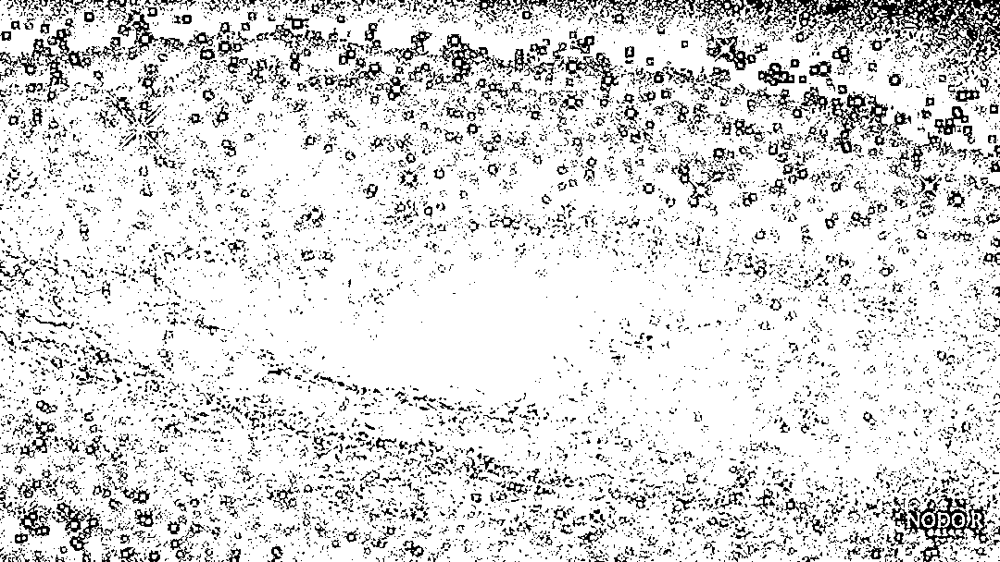

**在若道核心课程的教学里，****以学员为案例****进行课堂的占星咨询演示，是我们课程的特色环节。**

这样的演示不仅让很多同学有亲身体验咨询的机会，而且这么多真实案例的学习，会让大家看到占星咨询到底是怎么样一个过程。毕竟，大部分人的学习都是要从模仿开始。

记得若道君当年学习占星的时候，可没有这样的机会。那时候主要是听课为主，后来，我们在多年的教学实践中，**越来越发现课堂演示的重要性**。因此，就把这个作为一个主要环节加入到课程中。

在新一期的若道核心课程中，咔咔老师和大卫老师这对组合就会把这个教学特色充分发挥出来。**熟悉中国同学思路的咔咔老师会以知识点的讲解为主，而有 50 年占星咨询经验的大卫老师，则以课堂演示为主。**

有时候，这样的课堂演示的功效是出乎意料的。

一位若道的老同学赵震宇这么写到：

2018 年，我正式开始在若道学习 L1-5。其实我一开始的心态更多的是希望得到系统化的学习来补充我的知识漏洞，以及拿到一个证书可以为自己做背书，增加自己将来转型占星师的筹码，而不是真的在期待可以从若道的学习中得到一些本质上的领悟。

事实上在初期的 L1-3 中，很多知识与课上的内容，也是我比较熟悉的领域，相对而言是驾轻就熟的。但在 L3 的工作坊中和大卫老师的接触以及模拟咨询，让我对占星的态度发生了很本质的变化。

大卫老师对我星图的分析不仅非常准确，更重要的是，他开启了我自身个人成长上的变化，从而成为了我本质上进化蜕变的一个契机。

在短短的 6 个月内，我对人生的认知、对自我的认知、对于人生看待的方式都发生了翻天覆地的质的变化。我意识到了原来跳出自己一直以来无意识间重复的模式，是一件可行、并且会给自己带来无限成长提高自己人生幸福度和质量的事情。这也让我深刻体会到了人本主义占星学的魅力，以及自己之前是多么的“无知“。

于是现在，占星学对我来说，不只是兴趣、宗教信仰、或者是可能的职业道路，而是一种激发自己和他人人生成长和蜕变的工具、一种让自己更幸福的看待世界的方式。哪怕我之后并不会以占星为生，它依然是我人生中不可或缺的一部分，就像一副隐形眼镜，影响着我与世界的互动。

而被大卫老师咨询深深影响的同学还有很多。

**这里，我们节选一些短小的试听片段，让你稍微感觉一下在若道核心课程上，大卫老师的咨询演示是怎样的一个样子。**

**片段一**

<mpvideosnap class="js_uneditable custom_select_card channels_iframe videosnap_video_iframe" data-pluginname="videosnap" data-id="export/UzFfAgtgekIEAQAAAAAAMKsWN6BUygAAAAstQy6ubaLX4KHWvLEZgBPEnoIULgMKKb-DzNPgMItC2ZEgiEDMBYjrYHv9wNsO" data-url="https://findermp.video.qq.com/251/20304/stodownload?encfilekey=S7s6ianIic0ia4PicKJSfB8EjyjpQibPUAXolK65qjuvEtF7VE3LuUIfibNBicR6aZMMfP2lV313icg6MQMfqMQqcPFj2m8Hhw10N65gJT2zkNKurNXqiaaAugQpntw&amp;adaptivelytrans=0&amp;bizid=1023&amp;dotrans=0&amp;hy=SH&amp;idx=1&amp;m=&amp;scene=0&amp;token=cztXnd9GyrEzmuleT8ub88RIicgCkUKW4liadDZCTsricEdF98BQMCWkUTxVevglwsb2TzGGW1rUZ4" data-headimgurl="http://wx.qlogo.cn/finderhead/PiajxSqBRaEJYnVsqWfEX9qA0sI6hNVKsDfyzfPZ92WZMZyBpZWU5NA/0" data-username="v2_060000231003b20faec8c4e68a1ec2d4ca07e434b07755bbf47e7053a3059defd2c9d6c68a20@finder" data-nickname="若道" data-desc="#若道核心课 大卫老师用星座、行星、宫位来探索一位同学出生星盘主题的时候，他回顾了解读星盘的优先次序" data-nonceid="7723748345640460016" data-type="video" data-width="544" data-height="344"></mpvideosnap>

**片段二**

<mpvideosnap class="js_uneditable custom_select_card channels_iframe videosnap_video_iframe" data-pluginname="videosnap" data-id="export/UzFfAgtgekIEAQAAAAAANycuUwRANAAAAAstQy6ubaLX4KHWvLEZgBPEhYJ0WjYILr-DzNPgMIvjhT14ogdLw3BWd0Tg37w0" data-url="https://findermp.video.qq.com/251/20304/stodownload?encfilekey=S7s6ianIic0ia4PicKJSfB8EjyjpQibPUAXoleMEBO7YqRBdVicTyRbZLSODWa2goURzKktJBq1dd5DIVYjlj926F5hsicv1cBaJ9Rv2mYicYQsNBTeicdAYHyJ6QPA&amp;adaptivelytrans=0&amp;bizid=1023&amp;dotrans=0&amp;hy=SH&amp;idx=1&amp;m=&amp;scene=0&amp;token=AxricY7RBHdWzD8K4WOaXSvyp6Ryjm97TQtPI3Gia6U1Ab852A11RvPCu31V9R4GVy7w9ZhPIpmIg" data-headimgurl="http://wx.qlogo.cn/finderhead/PiajxSqBRaEJYnVsqWfEX9qA0sI6hNVKsDfyzfPZ92WZMZyBpZWU5NA/0" data-username="v2_060000231003b20faec8c4e68a1ec2d4ca07e434b07755bbf47e7053a3059defd2c9d6c68a20@finder" data-nickname="若道" data-desc="#若道核心课 占星学如何反应职业选择？" data-nonceid="629392412247480278" data-type="video" data-width="544" data-height="344"></mpvideosnap>

**片段三**

<mpvideosnap class="js_uneditable custom_select_card channels_iframe videosnap_video_iframe" data-pluginname="videosnap" data-id="export/UzFfAgtgekIEAQAAAAAAl_sREJMyhwAAAAstQy6ubaLX4KHWvLEZgBPEtIIkIkRmL7-DzNPgMIsA5PpGB3ReSAYx6ZfSNfZ1" data-url="https://findermp.video.qq.com/251/20304/stodownload?encfilekey=S7s6ianIic0ia4PicKJSfB8EjyjpQibPUAXolicGo48MWlib8wvOFMCMmVRq6heVqPaLZWrZVDpKoE2lcibTklu18ibiabwe5r5MKNnk1B8b1WWwnJJbOKHROCicyOU0A&amp;adaptivelytrans=0&amp;bizid=1023&amp;dotrans=0&amp;hy=SH&amp;idx=1&amp;m=&amp;scene=0&amp;token=AxricY7RBHdWzD8K4WOaXSv7euicLue7HLq5QQtktB0MXqKnDuDFfRdGZicknvicEPXKqiatibVM9Qu1w" data-headimgurl="http://wx.qlogo.cn/finderhead/PiajxSqBRaEJYnVsqWfEX9qA0sI6hNVKsDfyzfPZ92WZMZyBpZWU5NA/0" data-username="v2_060000231003b20faec8c4e68a1ec2d4ca07e434b07755bbf47e7053a3059defd2c9d6c68a20@finder" data-nickname="若道" data-desc="#若道核心课 如何从出生星图的基本要素看到案主生命发展的故事和个人成长经验？
" data-nonceid="6689802853667419635" data-type="video" data-width="544" data-height="344"></mpvideosnap>

**若道新一期的核心课程在****8 月 30 日****正式开始**，如果你有很浓厚的兴趣，不仅仅是因为好奇想浅尝一下占星学，但还没有想清楚是不是要学习整个 L1-5 的课程，**那么 L1-3 可能是一个不错的选择。**

**谁是你的老师？**

**占星师咔咔（Caroline）**

2010 年师从美国占星师大卫·瑞雷学习，并得到世界名师斯蒂芬·弗里斯特、罗伯特·汉德、苏·汤普金斯传授各种占星学技法。若道首届学员，国内最早获得 ISAR 职业占星师资质的职业占星师，多次担任若道核心课程助教，2019 年第二届、2021 年第三届核心课中和苏·汤普金斯老师一起教授若道核心占星课程。

在国际知名广告公司和市场研究公司从事的市场研究和推广工作十余年，曾任职于阳狮集团、尼尔森市场研究有限公司、MTV 和《Madame Figaro》杂志。

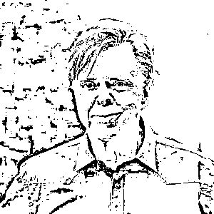

**大卫·瑞雷（David Railey）**

*   **I****SAR 董事会成员，ISAR 全球副主席，ISAR 全球职业占星师资质认证主席，若道占星创始人**。

*   2016-2019 年，被选为国际占星协会（ISAR）考试委员会成员，国际占星协会（ISAR）是世界最大的国际占星机构，会员遍布 47 个国家。

*   2017-2020 年，被选为国际占星联盟（ISAR）考试委员会主席，理事会成员。

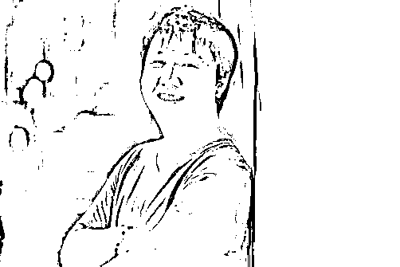

**助教王嘉祺 （Conrad）**

ISAR 认证占星师、若道认证生时校正资质，从 2010 年起自学占星学，2015 年开始在若道系统学习，并开始个案咨询。2018 年担任若道核心课程助教，以及卜卦占星学和太阳返照选修课助教，并带领学员进行经世占星和太阳返照方面的研究。2019 年 11 月作为演讲人之一参加了国际占星协会（ISAR）北京大会，也是 ISAR 星空俱乐部中国区第 16 期的主讲人。

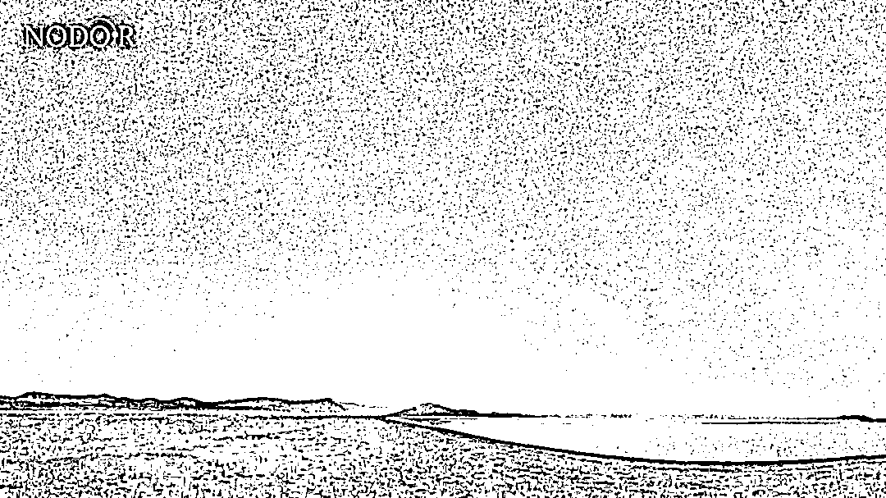

**内容是什么？**

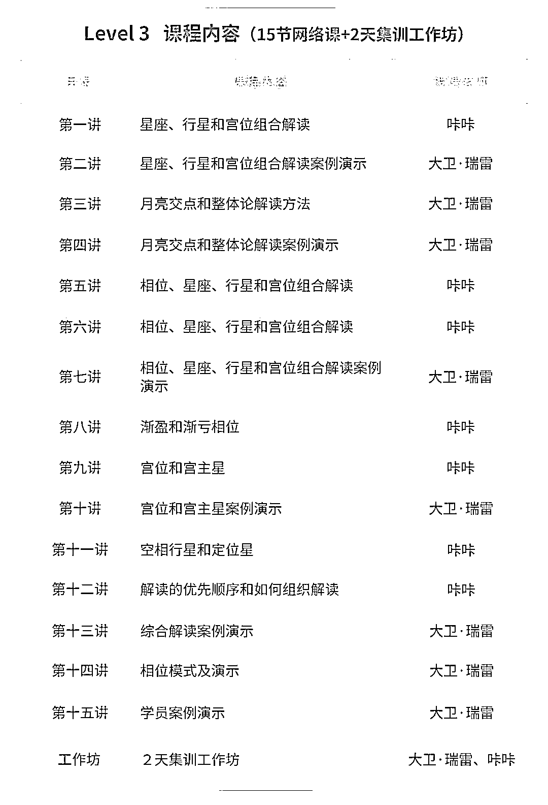

**ISAR 认证职业占星师的独有培训**

目前占星学的培训市场鱼龙混杂。而 ISAR（国际占星研究协会）是一个包含了 47 个国家在内的国际占星组织，多年来致力于占星的教育和研究，提升占星教育的品质和职业占星师的能力，在国际占星领域备受尊重。

**2022 年，鉴于对若道在占星教学领域所做的持续努力和高品质的课程服务，ISAR 特别授予若道核心课程为 ISAR 文凭课程，所有在若道学习，并通过若道毕业考试的同学将获得 ISAR 颁发的学历文凭（Diploma）。**

如果你想更多了解 ISAR，请点击[【这里】 ](http://mp.weixin.qq.com/s?__biz=MzA5NjA0NTAxNg==&mid=2651475298&idx=1&sn=b91888b54c14e29068f8b4e2a3452f5d&chksm=8b48ffd5bc3f76c32699f20f5c99e978bbb25551e69d80c70fee361acbd930ba5970ae776cdc&scene=21#wechat_redirect)

**课程费用**

**★ 1-2 阶　****课程费用：3500 元 ****★ 1-3 阶 连报**

**课程费用：11500 元 **

**********转发优惠价：**11000 元（朋友圈转发本课宣保留 24 小时以上，并截图给课程顾问）********

**★ 1-5 阶　连报**

**课程费用：46500 元 **

****转发优惠价：34800 元，朋友圈转发本课宣保留 24 小时以上，并截图给课程顾问****

**退转课程**

**退款原则请详看《教学协议》，如有疑问请咨询课程顾问。**

****2022 L1-3 认证职业占星师文凭课程****

**授课老师：大卫·瑞雷、咔咔**

**直播课开课时间：2022 年 8 月 30 日（周二）**

**授课方式：******网络授课，英文/中文授课，中文翻译****

**费用：** ****1-2 阶**：**3500 元；****1-3 阶**：**11500 元****（****转发优惠价：**11000 元，朋友圈转发本课宣保留 24 小时以上，并截图给课程顾问）******1-5 阶连报**：46500 元**（****转发优惠价：34800 元，朋友圈转发本课宣保留 24 小时以上，并截图给课程顾问）**；**

**课程负责人：王老师**（微信/手机：18510107057，请备注“大卫核心课”）

长按二维码添加课程负责人咨询

****报名直达入口****

# 神话塔罗之大阿卡纳｜世界

> 原文：[`mp.weixin.qq.com/s?__biz=MzA5NjA0NTAxNg==&mid=2651487921&idx=4&sn=f6d07b97f69b903b0ae919630cb62c92&chksm=8b48cc06bc3f4510afcced55ae2cb48709d1c154e708d814698a94e4b076d2879456dc052704&scene=126&sessionid=1692737761#rd`](http://mp.weixin.qq.com/s?__biz=MzA5NjA0NTAxNg==&mid=2651487921&idx=4&sn=f6d07b97f69b903b0ae919630cb62c92&chksm=8b48cc06bc3f4510afcced55ae2cb48709d1c154e708d814698a94e4b076d2879456dc052704&scene=126&sessionid=1692737761#rd)

作者/朱丽叶·沙曼-伯克 丽兹·格林

译者/闫东升 编辑/玫瑰 图片/网络

本文节选自《神话塔罗》

今天我们来到了世界牌，在这愚人之旅的终点，愚人又再一次出发了，因为每当我们感觉自己达成了目标，实现了自己的规划时，另一个更深刻或更高等的目标又出现在前面，所以每一个终点其实是在为其他事情做准备，我们又再次开始了新的周期。

[🔈 神话塔罗·世界](https://res.wx.qq.com/voice/getvoice?mediaid=MzA5NjA0NTAxNl8yNjUxNDg3OTIw)

**书名：**

神话塔罗 

**作者：**

朱丽叶·沙曼-伯克   丽兹·格林 

**出版日期：**

2011-08-02

世界对应的希腊神祗 **乌洛波洛斯·无限之蛇 ****无限之蛇**世界牌描绘的是一条金色的蛇，它首尾相连，用嘴咬住自己的尾巴，形成一个像蛋的椭圆。在蛇围成的环形内部，有一个半男半女的奇怪人形在跳舞，它的女性头颅上带着一顶金色的皇冠，男性的头颅上带着月桂枝编就的头环，两只手中都握着一条金色的物体。在蛇围成的环形四周有一个圣杯、一把宝剑、一根权杖、一枚画着五角星的金币，所有这一切都在蔚蓝天空的云端展现。

> **世界之蛇**：在希腊神话中被称为乌洛波洛斯（Ouroboros），它既是男性（阳性）又是女性（阴性），自体受孕，自给自足，完整且不朽。因此它既是上帝又是自然的意象，两者同时呈现在一个象征里。**世界之蛇周围的四个符号**：象征着水、火、风、土四元素，反映出一个崭新人格需要发展出来的潜力。**人形手中的金色物体**：象征着赫尔墨斯（Hermes）的金色魔力手杖，因为重生的人格能够在情感、想象力、智识和物质方面具有更大的创造力。

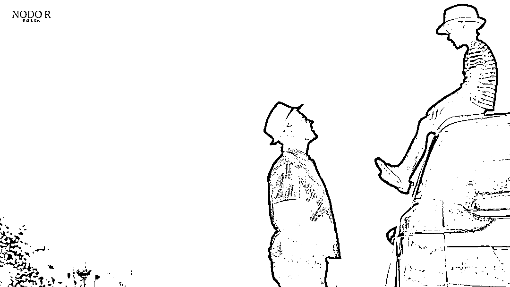

**雌雄同体的私生子**在这里我们遇到了赫马佛洛狄忒斯（Hermaphroditus），神话中他是赫尔墨斯和阿弗洛狄忒（Aphrodite）的孩子。有的神话中说赫马佛洛狄忒斯天生就是雌雄同体的，而有些故事则说他的双重性和整合性是后天造就的，在关于后者的传说中，他出生的时候是一个男孩，因为是偷情所生，阿弗洛狄忒立刻把他托付给艾达山女神（Mount Ida），女神就把他带入了森林中。赫马佛洛狄忒斯到了 15 岁的时候，长成为一个野蛮和粗鲁的少年，他主要的娱乐就是在繁茂的山林中打猎。有一天，他来到清澈的湖边，波光粼粼的湖水让他有了沐浴的冲动。湖水女神萨尔玛西斯（Salmacis）看到了他，并且对这个英俊的小伙子一见倾心。她直接表达了自己的爱慕之情，却被害羞的赫马佛洛狄忒斯拒绝了。

萨尔玛西斯并没有因而退却，她直接用双臂抱住赫马佛洛狄忒斯 ，并给了他深深一吻。赫马佛洛狄忒斯还是拒绝，湖水女神哭着说：“神啊，请赐予我恩宠，让我们永远都不要分离吧。”话音刚落，他们两个人的身体便结合在一起，成为了一个雌雄同体的人。

牌面上环绕着赫马佛洛狄忒斯的四个物件象征着四个神祗，分别是爱神阿弗洛狄忒、众神之王宙斯（Zeus）、智慧女神雅典娜（Athene）和海洋之神波塞冬（Poseidon）。我们曾经在魔术师牌中看到过这些象征了，包括爱之圣杯、创造性想象力之权杖、智慧之剑和物质世界之钱币。在我们探索四套小阿卡纳牌的时候，还会遇到它们。环绕着赫马佛洛狄忒斯的世界之蛇是非常古老的意象，它象征着生命最原始的本能力量，具有自我毁灭（吞噬）和重生的特质。

**无尽的生命循环****从内在的层面来看，赫马佛洛狄忒斯象征着完整的经验。男性和女性的概念远远超出了借由性器官来认定性别的范畴，它们是生命中一切相对的两极。**雌雄同体的意象出现在很多古老的神话中，它们象征着人格中对立力量能够整合在一起这种潜在的可能性。如果说赫马佛洛狄忒斯出生就是雌雄同体，那是因为我们所有人从遗传中就获得了整合对立性的潜力。如果说赫马佛洛狄忒斯的雌雄同体身份是某种后天原因所致，那是因为整个大阿卡纳牌呈现的生命之旅中的各种经验导致了最后的完整性。母性的滋养和父性的道德、内在直觉和现实性表达、智识和情感、关系和独立、冲突与和谐、心灵和身体，我们内在这些两极的对立制造了生命中的各种挣扎，**世界牌中雌雄同体的意象反映着这些对立力量的整合与和谐，世界之蛇的意象代表着无尽的生命循环。**世界牌中完整的意象是一个理想的目标，而不是我们能够完全拥有的某种东西。我们是人类，因此也不可能是完美的，显然也无法达成神圣的雌雄同体状态。

但是当我们有某种内在疗愈发生的时候，内在某些对立的力量从斗争走向了整合与和平，那时就可以或多或少地瞥见某种完整。

通常当我们内在或者生活中发生了某种对立冲突的时候，我们倾向于否定它的存在，压抑其中的一半，把它丢入潜意识的黑暗世界中。或者我们会把令自己不舒服的一半投射到外在世界的他人（或它物）身上，然后倾尽全力和它们斗争，其实真正的敌人在我们的内心深处。矛盾性在我们的生活中无处不在，但是究竟多少人有勇气去承认我们的矛盾性呢？我们说：“当然我们想要结婚”，或者是“当然我们想要生一个孩子”，亦或“我当然是爱你的”，再或是“当然我相信上帝”，又或者是“当然我爱我的工作”。但人类是非常复杂的，**愚人之旅就是通过经验生命的矛盾面向来探索自己的人生，包括意识和潜意识两个部分。**世界牌是大阿卡纳牌的最后一张，是愚人之旅的终点。但是它呈现出了一个蛋形，暗示着它是下一个全新旅程的种籽。所以无论我们是否感觉到了终点，获得了怎样的成就和疗愈，下一个全新的挑战又会到来，对生命的探索和发现之旅，自古以来都是螺旋形的慢慢长路，看不到最终的尽头。因此我们会继续成长和改变，向着又一个赫马佛洛狄忒斯（完整的意象）前行，义无返顾、不畏艰辛、也不容回头。**世界，一个完满的结局****从解牌的角度来看，世界牌出现的时候，预示着完整性和成效的达成。**这是个成功的结局，当事人通过艰辛的努力后达成了自己的目标。但是这个顶峰只意味着当事人瞥见了某种神秘和暧昧不明的东西，还会开始下一个旅程。跳舞的赫马佛洛狄忒斯又变成了胎儿，不久就会从洞口中走出，开始下一个愚人之旅，那是大阿卡纳牌伟大循环的开始，赫马佛洛狄忒斯象征着潜在的人格，最后会以愚人的形象诞生为独立的个体。愚人之旅的循环，就像牌中的世界之蛇一样，在这里形成了完整的圆环。

**版权声明：**本文由《自在园》授权发布，欢迎转发，反对抄袭。友号转载请申请白名单。

**朱丽叶·沙曼·伯克**从 20 世纪 70 年代早期开始，就对塔罗牌产生了兴趣，并踏入了塔罗的世界。后来，在丽兹·格林的鼓励下，开始研习心理占星学和塔罗。1984 年，第一本书《塔罗全书》（The Complete Book ofTarot）出版。之后，与丽兹·格林合作设计并撰写了《神话塔罗》（The Mythic Tarot）。朱丽叶写了十本塔罗和占星学书，包括一本名为《众星的传说》（Stories from the Stars）的儿童读物，以及与丽兹·格林合著的《神话之旅》（The Mythic Journey），这是一本详细讲述如何运用神话来指导生活的书。

**点击下图了解课程详情** 

**微信又双叒叕改版啦，不想错过若道君的推送？****就把若道设为星标吧！****▼**

**喜欢记得点一下在看哦☟**

************报名直达入口************

