# 若道 202207-202302 PT3

# 插班中丨神话塔罗：高效学习班上线，灵活掌握，专业实践！

> 原文：[`mp.weixin.qq.com/s?__biz=MzA5NjA0NTAxNg==&mid=2651487921&idx=3&sn=4f294f275ac60c66159c9e3bb074ad6d&chksm=8b48cc06bc3f4510782f20e0d61099c8a9338205f10927980f3e877056a6b477c9a0ae602b06&scene=126&sessionid=1692737761#rd`](http://mp.weixin.qq.com/s?__biz=MzA5NjA0NTAxNg==&mid=2651487921&idx=3&sn=4f294f275ac60c66159c9e3bb074ad6d&chksm=8b48cc06bc3f4510782f20e0d61099c8a9338205f10927980f3e877056a6b477c9a0ae602b06&scene=126&sessionid=1692737761#rd)

**2022 年超高含金量的神话塔罗认证课程****高效学习班****开始招生**用**四个月**的时间学习掌握神话塔罗解读喜欢**集中学习，快速掌握**的同学不要错过

黄色日期为**8 节直播课**时间，同学可以自由安排时间学习**18 节录播课**

班级学习群讨论、APP 答疑区提问

课程内容体系让你直观精准地感受到**神话塔罗的魅力**扎实地建构**神话塔罗思维**系统学习**最地道的塔罗知识**课程中老师将**神话、占星、心理学**完美融合进塔罗的**人本主义咨询体系**并进行学员**案例督导**让你更自信的开展咨询工作，学以致用

本期认证课程采取**即报即学的录播课+案例督导直播课**的形式，

*   **18 节录播课：**精编剪辑，随来随学，助教答疑，学练结合。

*   **8 节直播课：**融会贯通，神话心理，塔罗占星，咨询技巧。

为了适配大家的各种学习场景，提高学习&复习效率，我们还将**录播课**剪辑了**中文字幕版**和**翻译音频版**：

*   **中文字幕版：**朱丽叶老师英文原声配中文字幕，适合在手机或电脑前专心致志的学习。

*   **翻译音频版：**翻译老师幼婷的中文原声纯享，适合运动、通勤路上耳机里陪伴式学习。

若道还为塔罗学员开发了**“神话塔罗”**平台，是随身的工具，更是接咨询的平台，录播课程**学成入驻平台**即可链接更多塔罗个案，发展壮大你的塔罗咨询事业。

**如果你想学习塔罗，什么样的老师会让你怦然心动呢？她是三副塔罗牌的设计者，写了 6 本塔罗书籍。她研习塔罗四十余年，教授塔罗三十余年，是丽兹·格林的密友。还有****谁会比塔罗牌设计者更了解塔罗的历史、灵魂与精髓？****所以，这将是你开启塔罗之旅最坚实的一步。**

1

**这位塔罗大师是谁？**

**朱丽叶·沙曼-伯克** 

*   她是**3 副塔罗牌**的**设计者****——**神话塔罗牌、沙曼–卡塞利塔罗牌、“自己着色”塔罗牌；

*   她出版了**6 本塔罗书****——**《塔罗全书》、《新塔罗全书》、《众星的传说》、《理解塔罗牌》、《精通塔罗牌》、《塔罗初学者指南》；

*   她研习塔罗**四十余年；**

*   她教授塔罗**三十余年**；****

*   她是**丽兹·格林**的密友，两人合著了**《神话之旅》**，共同设计了**神话塔罗牌**。

*   她是认证的**心理治疗医师；**

*   她深谙**塔罗、占星学、心理学和神话学。**

**如果你想成为拥有英国神话塔罗认证的塔罗师**

那么她，就是你**最好的老师人选**

2

**塔罗牌有什么用？**

*   塔罗牌是一种**古老的疗愈工具**，同时也是**直观的解惑工具****；**

*   塔罗牌绕过逻辑思维，**和潜意识联结**，通过图像的方式生动地将隐藏在人类潜意识中的画面浮出水面，**揭示心灵的状况和运作****；**

*   塔罗牌**帮助我们和潜意识对话**，可以和现代的心理治疗联系在一起，帮助我们**看清心灵的冲突来源、本质和可以选择的道路；**

*   塔罗牌又和更广阔的**宇宙生命原型**联结，彰显**个人生命发展的阶段**，将**个人生命挣扎、内在冲突**放在生命进化的道途上，让更广大的生命智慧为个人成长照亮道路。

3

**为什么学习神话？**

神话通过**图像和故事**描绘人类生活的**原型模式**。通过瑰丽的想象、诗意的语言、栩栩如生的人物和故事描绘出我们内心的世界，表达出我们经历的那些实现人性的过程，帮助我们将**个体的生活与人类古老且永恒的故事**建立联结。从而在更深处**理解生命**，并学习**古老而长青的生命智慧**。

**神话塔罗**取材于**希腊神话**的无尽沃土，通过故事提供一种**记忆辅助**，在心理和预见层面提升解读的**丰富度**。因为这样更符合塔罗牌的性质，符合人类的想象。**按照故事思考，而不是简单的记忆关键词和固定的意义。**

4

**塔罗预测是什么？**

塔罗牌预测的运作就像是**照向心灵的一面镜子**。在塔罗牌解读时，图像的原型性质穿透隐藏的潜意识脉络，反应出与个人境遇相关但又未被了知的知识与洞见，因此**揭示出按照任何理性方式都无法发现的事情。**

如果你对生命好奇，塔罗学习会帮你**打开一扇通往未来的门****，**让你了解**心灵运作和显化的秘密**，同时赋予你更多关于生命成长的支持和指引的能力！

5

**我们将学习什么？**

**录播课（即报即学）**

**☆****初阶：神话塔罗详解**

**神话故事和预测意涵**

**第 1 讲 塔罗牌介绍 ，讲述它的历史 （中文字幕版）**

**第 1 讲 塔罗牌介绍，讲述它的历史（翻译音频版）**

**第 2 讲 星座形态、元素和宫廷牌&基本星座与基本国王 （中文字幕版）**

**第 2 讲 星座形态、元素和宫廷牌&基本星座与基本国王（翻译音频版）**

**第 3 讲 固定星座与固定王后（中文字幕版）**

**第 3 讲 固定星座与固定王后（翻译音频版）**

**第 4 讲 变动星座与变动骑士（中文字幕版）**

**第 4 讲 变动星座与变动骑士（翻译音频版）**

**第 5 讲 小阿尔卡那牌权杖（中文字幕版）**

**第 5 讲 小阿尔卡那牌权杖（翻译音频版）**

**第 6 讲 小阿尔卡那牌圣杯（中文字幕版）**

**第 6 讲 小阿尔卡那牌圣杯（翻译音频版）**

**第 7 讲 小阿尔卡那牌宝剑（中文字幕版）**

**第 7 讲 小阿尔卡那牌宝剑（翻译音频版）**

**第 8 讲 小阿尔卡那牌星币（中文字幕版）**

**第 8 讲 小阿尔卡那牌星币（翻译音频版）**

**第 9 讲 经典牌阵教学讲解（中文字幕版）**

**第 9 讲 经典牌阵教学讲解（翻译音频版）**

**第 10 讲 牌阵解读案例演示（中文字幕版）**

**第 10 讲 牌阵解读案例演示（翻译音频版）**

**☆****中阶：神话塔罗牌阵应用**

**神话****解读和咨询技巧**

**开启神话塔罗愚人之旅**

****

**第 1 讲 愚人、魔术师、女皇、皇帝（中文字幕版）**

**第 1 讲 愚人、魔术师、女皇、皇帝（翻译音频版）**

**愚人**：永恒的少年（儿童的原型）

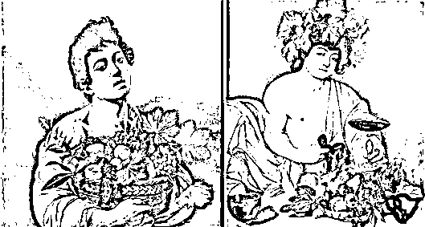

**魔术师**：恶作剧者、老师、向导、沟通者的原型；行星：水星。

**女王**：母亲、养育者、丰产的原型；行星：金星在金牛座；小行星：谷神星。

**皇帝**：父亲、供养者、计划者的原型；行星：木星。

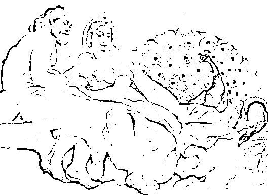

**第 2 讲 女祭司、教皇、恋人、战车、正义、节制（中文字幕版）**

**第 2 讲 女祭司、教皇、恋人、战车、正义、节制（翻译音频版）**

**女祭司**：处女——等待被实现的潜力原型；行星：新月。

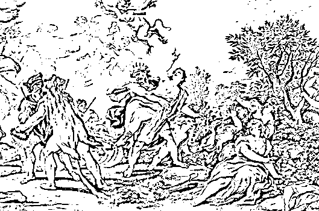

**教皇**：疗愈者、受伤的疗愈者、牧师的原型，牧师是神与人之间的灵性桥梁；行星：凯龙星。

**恋人**：爱、爱人、所爱之人的原型；行星：金星在天秤座。

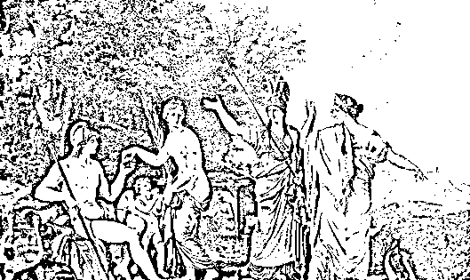

**战车**：战争、冲突、战士、斗士的原型；行星：火星。

**正义**：智慧、兵不血刃的胜利的原型；星座：处女座；小行星：智神星。

**节制**：关系、合作的原型；星座：巨蟹座、双鱼座。

**第 3 讲 力量、隐士、命运之轮、倒吊人、死神（中文字幕版）**

**第 3 讲 力量、隐士、命运之轮、倒吊人、死神（翻译音频版）**

**力量**：力量的原型；星座：太阳在狮子座。

**隐士**：晚年、耐心的原型；行星：土星。

**命运之轮**：命运女神与命运的原型。

**倒吊人**：牺牲与有意识的牺牲的原型；行星：海王星。

**死神**：死亡、终点和起点的原型；行星：冥王星。

**第 4 讲 恶魔、高塔、星星、月亮、太阳（中文字幕版）**

**第 4 讲 恶魔、高塔、星星、月亮、太阳（翻译音频版）**

**恶魔**：阴影、人类不文明的面向、本能、欲望天性；行星：火星在天蝎座。

**高塔**：改变、分裂瓦解的原型；行星：天王星。

**星星**：希望的原型。

**月亮**：无意识的原型；行星：暗月。

**太阳**：意识、创造力和文明的原型；行星：太阳。

**第 5 讲 审判、世界（中文字幕版）**

**第 5 讲 审判、世界（翻译音频版）**

**审判**：复活、新生的原型；行星：水星作为灵魂向导普绪科蓬波斯。

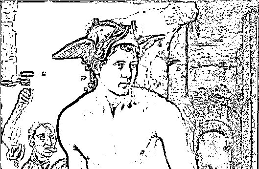

**答疑与讨论，学员们分享对自己或客户的塔罗解读，对神话塔罗牌进行更多探讨。**

**世界**：整体、完成和个性化的原型。

**第 6 讲 经典牌阵教学讲解（中文字幕版）**

**第 6 讲 经典牌阵教学讲解（翻译音频版）**

**第 7 讲 咨询案例演示：为一位年轻女性所做的四次解读（中文字幕版）**

**第 7 讲 咨询案例演示：为一位年轻女性所做的四次解读（翻译音频版）**

**第 8 讲** **引导式冥想、荣格的四种意识功能（中文字幕版）**

**第 8 讲 引导式冥想、荣格的四种意识功能（翻译音频版）**

**☆****高阶：神话塔罗直播督导课**

**第 1 讲 塔罗牌中的荣格原型**

**2022 年 8 月 10 日（周三）**

我们将学习荣格是如何理解原型，以及荣格原型如何反映在塔罗牌中。对塔罗牌解读而言，理解原型的普遍性非常有帮助，因为这有助于塔罗咨询师碰触客户的内心世界。

**第 2 讲 塔罗牌是如何与行星原型和其原型体验联系在一起**

**2022 年 8 月 24 日（周三）**

大阿卡纳牌反映了行星神祗的原型，在某些情况下，原型经验意味着它们反映了所有人类的经验。我们将通过这个角度看这些大阿卡纳牌。我们将看到理解原型对解读有何帮助。

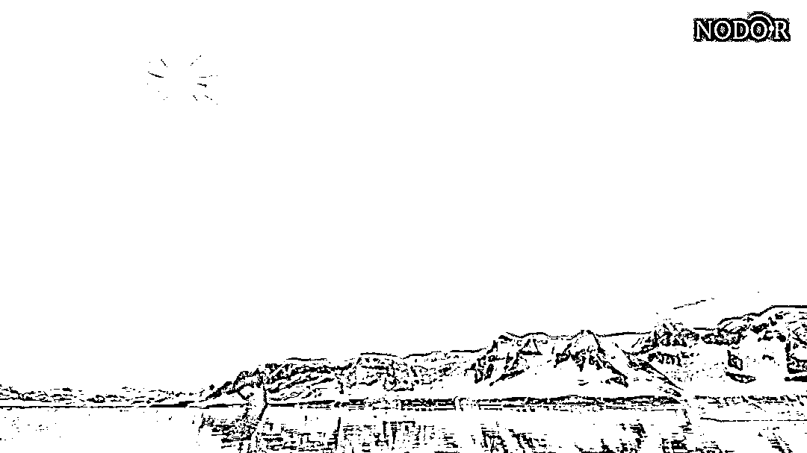

**第 3 讲 荣格意识的四种功能与小阿卡纳牌的四种元素及与权杖、星币、宝剑、圣杯四套牌之间的联系**

**2022 年 9 月 7 日（周三）  **

我们将看看小阿卡纳从 1 到 10 如何反映荣格意识功能的各个方面，以及它们如何反映在四套牌四个元素和其心理方面。我们还将对 1-10 的数字学进行修正，看它们在元素中的表现方式。

**第 4 讲 占星学中的 12 星座和宫廷牌之间的联系**

**2022 年 9 月 21 日（周三）**

我们将讨论形态和星座，以及它们如何反映在宫廷牌上。

**第 5 讲 马蹄牌阵学员案例督导**

**2022 年 10 月 19 日（周三） **

**第 6 讲 六芒星牌阵学员案例督导**

**2022 年 11 月 2 日（周三） **

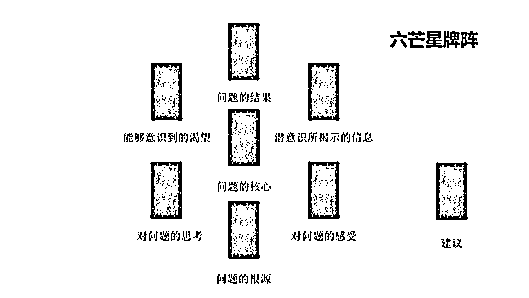

**第 7 讲 凯尔特十字学员案例督导**

**2022 年 11 月 16 日（周三） **

****

**第 8 讲 三个牌阵学员完整案例督导**

**2022 年 11 月 30 日（周三）**

**认证阶段：考试论文**

录播课学习完毕，即可入驻若道神话塔罗平台，以实习塔罗师获得推广流量，对接塔罗咨询个案。

直播课+录播课学习完毕，提交考试论文通过即可获得获得英国神话塔罗认证证书，升级为认证咨询师。

**扫码进入全新神话塔罗 H5**

每天有事没事都可以去**神话塔罗 H5**里转转抽取专属于你的今日塔罗

**神话塔罗 H5 问答平台全新上线**

三张牌牌阵，专业塔罗咨询师语音条解读

如果你碰巧有困惑，刚好有**限时优惠价**

如果感到快乐你就用用**神话塔罗 H5****，**如果你感到不快乐，更要使用由专业人本主义塔罗师团队全程陪伴的**神话塔罗 H5 哦！**

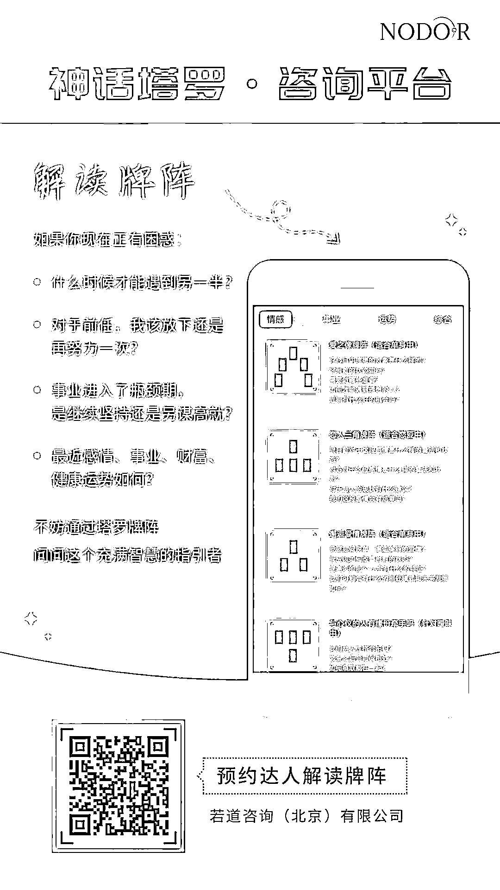

6

**适合人群**

*   塔罗初学者，完全没有塔罗基础；

*   塔罗自学者，也曾上过塔罗工作坊，但仍不懂如何使用塔罗牌；

*   塔罗进阶学习者，有塔罗基础，了解 78 张塔罗牌含义；

*   不知如何解决遇到的情感困惑、职业选择、人际问题，对人生感到迷茫；

*   想要学习深入解读塔罗牌、牌阵的使用、咨询技巧等将塔罗运用于咨询实践；

*   想要深入了解和学习塔罗，希望成为专业的塔罗师；

*   想要借助塔罗进行心灵、灵性成长。

7

**导师简介**

**朱丽叶·沙曼-伯克**

**朱丽叶·沙曼-伯克**从 20 世纪 70 年代早期开始，就对塔罗牌产生了兴趣，并踏入了塔罗的世界。后来，在丽兹·格林的鼓励下，开始研习心理占星学和塔罗。

1984 年，第一本书《**塔罗全书**》（*The Complete Book ofTarot*）出版。之后，与丽兹·格林合作设计并撰写了《**神话塔罗**》（*The Mythic Tarot*），在这本书中，她们将古希腊神话与传统塔罗解读结合起来。朱丽叶写了**十本塔罗和占星学书**，包括一本名为《众星的传说》（*Stories from the Stars*）的儿童读物，以及与丽兹·格林合著的《神话之旅》（*The Mythic Journey*），这是一本详细讲述如何运用神话来指导生活的书。

8

**课程价格**

**认证课程总价：****22000 元**

**联报优惠价：****19000 元**

**限时转发优惠价：18000 元（联系 Echo 老师，获取限时转发优惠价）**

长按二维码添加客服 Echo 老师

9

**退转课程**

*   **退款原则请详看《教学协议》，如有疑问请咨询课程顾问。**

**神话塔罗认证课程**

**授课老师：朱丽叶·沙曼-伯克**

**授课时间：录播课即报即学，直播课 2022 年 8 月 10 日起**

**授课方式：**网络课程**，**英文授课，中文翻译

**费用：****认证课程总价：****22000 元；****联报优惠价：****19000 元；****限时转发优惠价：18000 元**（联系 Echo 老师，获取限时转发优惠价）

**课程负责人：Echo 老师**（微信/手机：nodoor18518412824，请备注“神话塔罗”）

长按二维码添加课程负责人咨询~

**END**

****报名请点击“阅读原文”****

# ISAR 星空俱乐部沙龙第 45 期丨 J.R.R.托尔金的原型想象力

> 原文：[`mp.weixin.qq.com/s?__biz=MzA5NjA0NTAxNg==&mid=2651487921&idx=2&sn=ed99ced26ec797a27aebb5001d7b6b58&chksm=8b48cc06bc3f451099a6d95c8e338ee99be036608b3ba682ab00070aa8ce459e7f4507890d71&scene=126&sessionid=1692737761#rd`](http://mp.weixin.qq.com/s?__biz=MzA5NjA0NTAxNg==&mid=2651487921&idx=2&sn=ed99ced26ec797a27aebb5001d7b6b58&chksm=8b48cc06bc3f451099a6d95c8e338ee99be036608b3ba682ab00070aa8ce459e7f4507890d71&scene=126&sessionid=1692737761#rd)

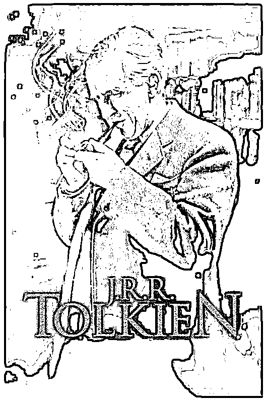

**沙龙来啦！****9 月 10 日，星期六上午 10 点，**国际占星研究协会（ISAR）中国星空俱乐部沙龙由占星师**贝卡·塔纳斯**带来一场讲座！ **沙龙主题****沙龙主题：**J.R.R.托尔金的原型想象力******主讲人：******贝卡·塔纳斯********

**沙龙时间：9 月 10 日，星期六**

**                北京时间上午 10:00-11:30（有英文翻译）**

**沙龙方式：线上沙龙**奇幻作家 J.R.R.托尔金的想象力不仅能构思出一个伟大的故事，还能创造出一个完整的世界。当托尔金第一次遇到中土世界时，行进发生了什么? **《指环王》承载了什么样的时代精神原型?****这部 20 世纪最具影响力的文学作品之一，其背后的占星动力学揭示了如何通过这个强大的神话，为我们的时代重新想象一个新的未来。****主讲嘉宾**

**********贝卡·塔纳斯**********

*   贝卡·塔纳斯博士是一位学者、艺术家和《Archai：原型宇宙学杂志》的编辑。
*   她在加州整合学院（CIIS）获得博士学位，毕业论文题目为《超越的背后：荣格的红书和 J.R.R. 托尔金》。
*   她同时任教于太平洋研究所和 CIIS，著有《意象王国之旅》一书。贝卡住在加州内华达市，在那里她有一家占星咨询公司。

**如何参加沙龙？**本讲座也是本月的国际占星研究协会（ISAR）星空俱乐部讲座。**ISAR 会员可以免费收看。**请注意邮件通知，具体参与方式见邮件。❶ 如果你**已经是 ISAR 会员**，请注意邮件通知，告知如何参加。❷ 如果你**不是 ISAR 会员**，非 ISAR 会员价格：98 元。如有任何问题请咨询工作人员仲老师（微信：YY18513802156）

**非 ISAR 会员报名请长按下图**

**▼**

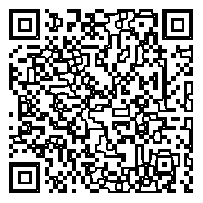

**ISAR 明星俱乐部**

2018 年，ISAR 在主席亚历山大·因舍阿吉克的带领下，成立了 ISAR 明星俱乐部，每月为全球 ISAR 会员提供在线直播讲座，邀请全球著名占星师开讲，学习和分享新的理念。讲座时长一小时，涉及占星学的不同领域、不同观点，每个会员都可以参与其中，每次讲座之后还有 20-30 分钟问答时间向老师们提问。每一场在线讲座都会记录下来，ISAR 除了提供视频，还会提供相关的讲座资料，以及单独的问答录音，自动发送到专门的 ISAR 明星俱乐部页面存档，每位 ISAR 会员可以在 ISAR 网站上自己的会员主页俱乐部页面找到。在 2018 年最初几个月，ISAR 明星俱乐部会每月举办一场在线演讲。之后，两周举办一场演讲，最终每周举办一场演讲。
但是，过去明星俱乐部讲座只有英文沙龙，因此，中国会员只有懂英文才能受益。为了使得更多不懂英文的中国会员能够受益，我们特别和 ISAR 总部协商，今后会安排有中文翻译的明星俱乐部占星沙龙，作为给中国 ISAR 会员的福利！**如何成为 ISAR 会员？**

**如果你也想成为 ISAR 会员，请复制链接在浏览器打开**

http://www.nodoor.com/isarcert.do?contentId=3588（仅支持网站支付）

**或直接长按下方二维码，微信购买会员：**

**ISAR 会员有什么福利？**一年期会员仅需支付**人民币 510 元**，即可享受：**☆ 星空俱乐部免费沙龙****☆每年出版 3 次的《国际占星师》（目前只有英文）；****☆每周电子邮件交流汇总杂志（目前只有英文）；****☆专项研究基金和奖学金资格；****☆ISAR 主办的会议和论坛的会员折扣，包括国际占星大会（UAC）、ISAR 的会议和研讨会等会员权益。****有疑问怎么办？**关于 ISAR 星空会员俱乐部以及我们的讲座，如果你还有任何疑问，**请联系工作人员**：

**若道 Conrad（微信号：nodoor2016）**

**若道 yiyi****（微信号：YY18513802156）**

****非 ISAR 会员报名请点击“阅读原文”****

# 这颗行星的猛烈撞击犹如过山车！来，让这篇文章给你系上安全带~

> 原文：[`mp.weixin.qq.com/s?__biz=MzA5NjA0NTAxNg==&mid=2651487921&idx=1&sn=20797217aa476619677a212cd8f25c17&chksm=8b48cc06bc3f4510335204275b3ff74a0394e2a6af1837e9e02bf526e4cd249456f3407a6723&scene=126&sessionid=1692737761#rd`](http://mp.weixin.qq.com/s?__biz=MzA5NjA0NTAxNg==&mid=2651487921&idx=1&sn=20797217aa476619677a212cd8f25c17&chksm=8b48cc06bc3f4510335204275b3ff74a0394e2a6af1837e9e02bf526e4cd249456f3407a6723&scene=126&sessionid=1692737761#rd)

****☆ **后台回复“今日”，给你一句生命态度**

作者/唐娜·坎宁安译者/王宏 校对/Christy 编辑/翀子 封面/书君 图片/稿定设计以下文章发表于《大占星师》杂志

天王星带来所有出乎意料的变化和刺激，越抵抗越剧烈，这是很多经历过天王行进的人最大的感触。所以，天王星行进是怎么回事儿，你会经历什么，带来怎样的感受和成长，需要注意哪些部分？这篇文章会给你答案。

**天王星周期的感觉**

你有没有经历过小的触电，那猛烈的能量冲击让你跳了起来？你知道，那股能量会如何唤醒你的感官，让你的注意力完全集中于当下，使得你整个人变得清醒又警觉。那种令人震惊的突袭引发了一场感官的急流，此时你的肾上腺素因为突如其来的震击而激增。

我们在坐过山车的时候会感觉到类似的刺激感，尤其是当我们第一次坐，还不清楚轨道路线的时候。在这场刺激的冒险中，当我们在体验急转弯、突然的陡降和惊心动魄的 360°颠倒旋转时，我们有一种“在当下”的意识。

**我们感受到的特别的兴奋感和刺痛感，都来自感官刺激，甚至是危险感。**

**触电和坐过山车类似于你可能会经历的天王星周期**。

在每一次这样强大的行进或太阳弧周期中，**意外、突然的改变和意想不到的冲击**是家常便饭。每当出现这种情况时，我们就进入一种原始的当下意识，自然趋势开始生效，而我们用快速的反射动作加以应对。**我们的反应常常绕过理智，反而源自本能。**

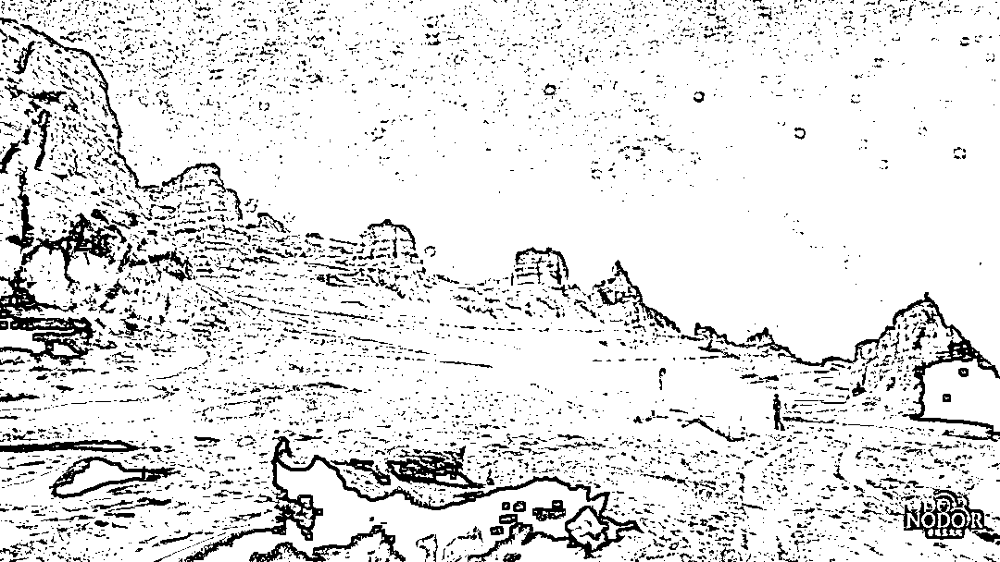

**天王星周期教会我们的**

让我们来审视一下天王星行进或太阳弧的精神目标和潜在的深刻影响。

*   **我们进行扩张和个人进化的机遇是什么？**

*   **我们可以如何利用天王星周期在**灵魂层面**获得最大程度的**发展和成长**？**

天王星周期的目标当然就是**打破停滞**。

我们要记住这个目标——打破停滞，因为有时候，处在具有破坏性的天王星周期之中时，我们会忽视以下事实，即**这种剧变其实也是有好处的**。虽然，**这些周期带来的突如其来之变常常让人在情绪上有所波动，但仍然是有帮助的。**

英国杰出的占星师兼作家艾伦·里奥称天王星为**“唤醒者”之星**。的确如此，它常常让我们**惊醒**。当结晶被打破时，新模式就可以被创造出来。我们通常在旧有的方式崩塌后才能看到这种情况。

我们被**新的看事和行事方式**唤醒。

天王星周期也可以引发**不安感以及对自由与冒险的渴望**。一旦解除因长大而不再适合的事物，就感觉获得了解放。我们能够继续沿着生命之路前进，轻装上阵，而不是拖着沉重的包袱在身后。

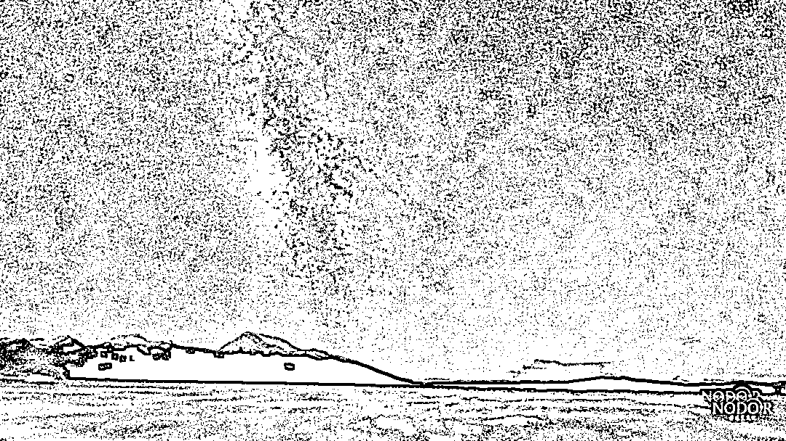

**期待并接纳意料之外的事物**

天王星行进或太阳弧来敲门时，常常**是苛刻且无情的**，就像埃德加·爱伦·坡那首《乌鸦》中的乌鸦一样。此处更聪明的做法是，**心甘情愿地接受我们的常规将被打乱这一事实。**

*   一些人会比另一些人更好地应对这种频率、这种周期性的改变波动；

*   **基本星座通常愿意立刻采取行动**——当意外涌入他们的生命时，他们想要做点什么。变动星座常常顺流而下，展现他们天生的灵活性；

*   ****固定星座则最容易坚持立场并进行抵抗**。**（想象拖着由皮带拴住的恐惧的狗进入兽医办公室。）他们对于重复和常规的需求使得天王星周期对他们而言尤为富有挑战性。改变来得太突然、太快。**固定星座需要时间热身去转向新方向。**

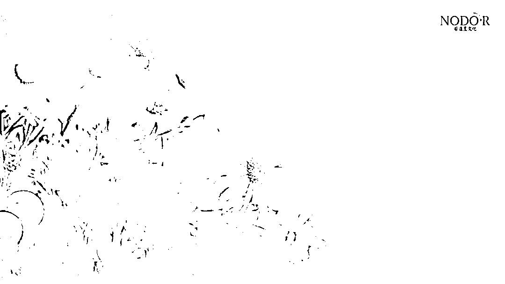

**天王星行进如何帮助个人成长**

我的一位客户谢丽尔，太阳和中天均落在金牛座。当天王星落在水瓶座并与她的太阳和中天成四分相时，她经历了一段使她意识到自己的事业并不让人满意的时期。她走在一条通往死胡同的道路上，几乎没有成长的机会，生命的这一领域似乎停滞不前。 

**在第一次成相前几个月，谢丽尔开始感受到天王星躁动不安的改变氛围，但她不想辞职。**她对于改变有着巨大的抵触情绪。尽管感受到令她困扰的停滞感，也宁愿固守已知的领域，不愿冒险走入未知。

**当天王星这颗觉醒之星首次与她的太阳直接成相时，谢丽尔突然失去了工作。**嘣！天王星投来了第一道闪电。她吓到了，行进的前几个月，她几乎是在一种拒绝的状态下度过的，她在抗争自己的金牛座对于安全感的需求，以及自己想让事情保持不变的倾向。 

**几个月后，谢丽尔准备对生活稍作调整。**她在情感上已经足够放得开（出于必要），便通过临时工中介申请职位。

她知道，要完全接受一个全新的职业方向，她还需要更多的时间，而做临时工作可以给她一点喘息的空间。然而，一想到工作仅仅是暂时性的，她就十分困扰，因为她的本性、她的需求是建立持久的事物！

**在敞开心扉接纳各种可能性之后，谢丽尔立刻就开始得到了临时工作，每一份临时工作都会提前告知她确切的结束日期。**这给她的舒适区、安全感带来了新的创伤：工作结束后会怎样呢？会有另一个机会出现吗？ 

每一次，谢丽尔要么在一份临时工作的最后一天寻找新的职位，要么在工作结束后的那一周里寻找新职位。她必须等到最后一刻才会有新机会出现。

起初，这让她极度有压力和伤脑筋。她在本性上倾向于有一份固定的计划以及她可以倚靠的事物。她花了很多个月，才学会在不确定性中放松自己，学会相信有些东西在她需要时就会在那里等着她。

对我的客户而言，这种在未知中放松自己的能力是一项巨大的突破。我还记得，当她意识到自己真的可以在不那么情绪化的情况下应对改变和不确定性时，她有多么兴奋。

谢丽尔已经面对了她内心深处的一个重要议题，一个一直以来阻碍她前进的议题。她也**调试好了自己内心的信任频率，有了处理临时情况的能力。** 

**能力的觉醒让她得以探索自己职业的新方向，这是在天王星行进前她不愿意考虑的问题。**猜猜怎么着？那个新方向证明是比她所能想象的更有益的和更令人满意的。

谢丽尔从一份走入死胡同的低薪工作，迈入了一个带给她刺激、挑战和欣赏的新职业。她能够拥抱未知，在一家公关公司寻求职位。她已经获得了领导职位，收入也得到了显著的增加。

谢谢你，天王星。

**天王星行进指南**

**通常在天王星行进期间，我们会经历三次精确的“冲击”，这个“三角周期”通常持续一年左右。**

*   **第一次冲击有时候会遭遇内在反抗，具体取决于我们的常规有多么根深蒂固；**

*   **在第二次冲击期间，我们可能仍会抵抗，但改变已然开始，压力正在积聚。现状已经遭遇挑战，需要开始进行回应；**

*   **最后一击迫使我们放下抵抗、去除障碍，需要行动起来。现在我们必须应对挑战并成长起来。**

天王星的太阳弧在精准成相时能量最强，但我们需要记住，在精准成相之前的六个月能量就开始缓慢积聚，并在成相之后的六个月里逐步释放。一般而言，**天王星太阳弧的活跃时间为一年左右。**

在天王星周期期间，我们被迫进入一个**生活在“临时区”**的时期。当**太阳、月亮或出生星图的四轴之一与天王星形成一个强相位时（合相、八分相、四分相、对分相、补八分相）**，这段**过渡期（临时区）**给人的感受是最为深刻的。

我们总是听到处在一个这类周期之中的人说：**“目前，我感觉自己正在做的事是对的，但我知道这只是暂时的。我不知道接下来会发生什么。”**

所面临的挑战是**优雅应对这一情况，对宇宙的指示保持开放态度。**我将这一观点传达给客户的一种方式就是告诉他们：**“让你的引擎处于空档——让它闲在那里，直到你得到了前进的‘火花’。然后换到‘驾驶’档位并踩油门。”**

在天王星冒险期间，我们需要**在收到“行动”信号时，进入立即服从的新层面**。没有人告诫我们，关于新方向的想法何时会到来。**突然之间，我们就会被一道灵感的闪电击中，道路的下一步会突然显现**。

收到这道觉悟之闪电时，我们需要让自己快速做出反应。**当我们信任并立即采取行动时，天王星周期会带给我们一种几乎魔术般的完美时机感。这是自然成长的冒险的一部分。**

*   天王星周期会带来一些**常见的但又出人意料的生理副作用**；

*   这颗行星高强度的电能有时候会表现为**神经过敏的、近乎咖啡因过量**的感觉；

*   当**天王星行进或太阳弧与太阳、月亮、水星或上升点形成相位**时，这种感觉最为常见。

**@锦囊 1**

我常常听客户提到，他们因为感到紧张兴奋而难以入眠。当出现这种情况时，我总是建议他们**坚持超额度锻炼，以帮助燃烧掉一些多余的能量。**

**@锦囊 2**

许多人在这一周期期间感受到**过多的电流在体内流动，使得他们常常烧坏灯泡，让电器短路，或是耗尽自己手表的电池。**在这些情况下，**从事园艺活动以及与大地接触**会有所帮助，因为他们需要将电流接地。**泡个泻盐浴**也会有所缓解。

**@锦囊 3**

我还告诉我的客户，当他们在经历天王星周期时，**随身携带一叠纸或一台小型数字录音机**是有好处的。常常**会有很棒的创意点子突然出现**——就好像天王星的电荷突然让灯泡亮了起来。通常，如果不将点子写下来或录下来，细节很快就会在记忆里褪色消失。

我们需要**拥抱创造性的能量，享受在天王星能量刺激下产生的“创造性”思维，我们还需要做好准备，通过在收到信号时就行动起来，而让相关思维成形。**

**@锦囊 4**

天王星能量有着战士般的专注和淳朴。记住以下这些关键点之后，就能利用好来自这颗行星的电流：

*   全神贯注于当下时，留意所获得的能量；

*   清除掉思想和情绪中不必要的恐惧、担忧和碎碎念，专注于当下的局势；

*   敞开胸怀接纳。相信答案总会在我们需要时到来；

*   拥抱自发性。

**一旦自愿进入冒险模式，新的自信就会开始绽放。**我们的态度和行为转变为知道自己可以应对意料之外的事物，因为我们全神贯注于当下。这让我们**获得了自由和解放，摆脱了可预见性带来的虚假安全感。**

这就是天王星的恩赐。

**版权声明：**本文由若道翻译发布，欢迎转发，反对抄袭。友号转载请申请白名单。

**END**

**唐娜·坎宁安**

一位在国际上都广受尊敬的占星师，她已有超过 45 年的从业经验。她已撰有数十本占星著作以及上百篇占星学和其他形而上学类的文章。

**20 位来自世界各地的占星师****带来 19 场沙龙——新世界的觉醒****详情可点击下图**

**学习占星学****点击下图了解课程详情**

**微信又双叒叕改版啦，不想错过若道君的推送？**

**就把若道设为星标吧！**

**▼**

**喜欢就点一下“在看”吧！**

********报名直达入口********

# 若道周运 8.15-8.21 丨水逆和满月同时来袭，你准备好了吗？（内含 12 星座运势）

> 原文：[`mp.weixin.qq.com/s?__biz=MzA5NjA0NTAxNg==&mid=2651487797&idx=1&sn=734ed02414d3ffdb295051a9385cd6c7&chksm=8b48cc82bc3f4594c72e4a0c7df2e9907db776628ee404ee04014680c8b0323f12e455b6e1ab&scene=126&sessionid=1692737761#rd`](http://mp.weixin.qq.com/s?__biz=MzA5NjA0NTAxNg==&mid=2651487797&idx=1&sn=734ed02414d3ffdb295051a9385cd6c7&chksm=8b48cc82bc3f4594c72e4a0c7df2e9907db776628ee404ee04014680c8b0323f12e455b6e1ab&scene=126&sessionid=1692737761#rd)

******☆ ****后台回复“今日”，给你一句生命态度******

作者/朵三三三 ISAR 认证占星师
编辑/翀子 封面/书君 图片/稿定设计**整体氛围**

**本周最引人瞩目的天象就是发生在周六的水逆加满月，**但宇宙颇有些要欲扬先抑的味道。前面几天缓缓聚集能量，如同能量格在加载中，到后面才能爆发个大的。

**这周的天空中以水元素和土元素为主，**有情感流动，也有务实推进，但前后呈现出截然不同的状态：

周一，金星进入土象星座；周一到周四，月亮相继在土星守护的两个星座穿行：摩羯座和水瓶座；周四月土合相——前四天的整体状态是理性而务实的，情感克制疏离，很多事情在按部就班的筹备中。

周五，月亮进入双鱼座之后，满月也即将来临。我们能够抛开顾虑，大胆地做出一些决定，情感也变得更加丰富。而现实中，也有一些事情取得突破，来到完结篇。

**本周重要星象**

*   **金星进入处女座**

*   **水星在天秤座逆行**

*   **双鱼座满月**

*   **太阳三分天王星**

**本周重点星象****周一**

*   **金星进入处女座**

*   **如人饮水，冷暖自知**

金星结束了在狮子座的旅程，来到勤勤恳恳的处女座，在这里一直待到 9 月 29 日。

处女座对于金星来说，是入弱的位置，不容易发挥出自己最佳力量。可以这么理解：金星本来是与舒适、享乐、审美有关的，而当它在处女座时，我们就不太能让自己自由自在地享受生活，尽情玩乐。

处女座与劳碌、服务、工作相关，所以我们很难彻底放松，而更容易关注细节是否完美，一切是否有序运转。

我们更倾向于让耐用、便宜、性价比高的特质胜过颜值、外观，所以接下来这段时间里，**我们的审美更接地气，更实用主义。**

情感上，**我们也更眷恋平和踏实的温暖**，一日三餐，一蔬一饭。

需要注意的是，处女座由水星守护，我们对待情感和人际关系会更依赖头脑的分析、逻辑的判断，可能对于他人会吹毛求疵，也容易想太多斤斤计较。

**周六**

*   **水星在天秤座逆行**

*   **一座通往过去的桥梁**

我们在这一天迎来本年度第三次水逆，水星将在 9.10-10.2 这段时间里，从天秤座 8 度逆回到处女座 24 度。

今年的前三次水星逆行都在风象星座发生，主题就是沟通、表达、人际关系、信息传递等。而这次在天秤座发生的逆行就聚焦在**人际关系**上面了。

在外部现实中，可能会有一些来自过去的人们再次出现，例如曾经的恋人、老友、旧相识，而我们自己也有冲动，要主动联系一些已经走散的人。或许你平时也时常想起他们，但缺乏契机和动力，而这次水逆，能推你一把，让你有更大概率跟对方联系上。

**我们有机会去修复过往人际关系中的遗憾，以新的方式与这些人重新建立连接。**

在内心世界里，我们会不自觉地去回顾自己的交友模式、情感模式、人际相处模式，看到自己的问题所在，也会有很多回忆涌现。

在这次水逆的时间里，不建议大家把太多精力拿来拓展新的朋友圈，即便认识新的人，彼此心态上也都会略显保守，很难打开，关系进展缓慢。不如把时间更多花在老交情上面，你一定会有新的收获。

**本次水逆重点影响：天秤座、摩羯座、白羊座、巨蟹座能量重的人群。**

**周六**

*   **双鱼座满月**

*   **山雨欲来风满楼**

这一天同时出现两个重磅天象，可谓能量爆棚，威力无穷，是本周位于 C 位的暴风眼。

月亮在变动星座时，情绪本就容易反复无常，满月让这种状态变得更加起伏跌宕。由于双鱼座的出离感，我们此时关注的点往往不在世俗现实中，过去几天焦虑的具体事情一下变得虚无起来，思绪自动切换到多愁善感模式。

尤其是，本**次满月又刚好合相了双鱼座的守护星海王星，**就更增添了不切实际与缥缈之意。我们可能会感觉身体慵懒，无心工作，更想在自己的世界中流连忘返。

有些人还会在此时出现“受害者心态”，认为自己为某件事、某个人付出牺牲太多，这或许是事实，但海王星的滤镜也容易让我们过度沉浸其中自怨自怜，无法自拔。

需要自省的是，我们是否也忘记了自己的界限感，主动放弃了自己本应坚守的原则和底线。提醒自己，别在情绪中沉沦太久，重要的是要借着这次满月之机，告别过去，更新、重建自己的行为模式。

**满月还有与双子座火星的宽泛四分相，**我们的外部世界可能非常嘈杂而忙碌。当这样的月火间压力相位出现时，我们很容易失去耐心，内在升腾的情绪，会通过语言的针锋相对发泄出来。

所以我会建议，无论多忙，**也尽量在周末前后留出独处、静思的时间。**此时我们内心如波涛起伏的大海，不仅会把周遭的人事物都卷入风浪中，也很容易受到他人磁场的影响，吸收到负面能量。

多听舒缓的音乐，做些耗能较少，却能让内心平和的运动，例如瑜伽、普拉提。让自己静心，或许只需要一炷香，或一个冥想，一首歌。

**满月与水逆同一天发生，且双鱼座的另一颗守护星木星也在逆行之中，**或许会有一些没有处理好的往事，如水草般缠住我们，心结浮现，难以释怀。

这意味着我们要带着觉知向过去回溯，那里还有我们未完结的功课和议题，需要我们接下来好好回顾总结，也给自己足够的时间，修复疗愈心中的伤痛。

一般来说，满月的能量都可以给我们呈现出尘埃落定的样子，听到尾声的旋律。但当满月发生在变动星座时，很多人心中还会纠结和放不下，总觉得还要再等等，再想想。心中在两个甚至多个选项间徘徊、无法决定时，不必着急。

水星逆行的过程中，你一定还有时间沉淀出一个答案，就暂且让我们带着问题继续前进。

**本次满月重点影响：双鱼座、处女座、双子座、射手座能量重的人群。**

**周日**

*   **太阳三分天王星**

*   **美丽新世界**

这是一个与改变有关的相位，而三分相预示着它的顺畅和自然，我们或许不费什么力气，就能看到新的可能性。

在满月之后的第二天，出现这个相位，会让我们内心充满鼓舞。这天中午，月亮也进入了白羊座，我们应该能感受到暴风雨过后，看到日出的雀跃和感动。阳光照在满地废墟之上，而小草带着清晨的露珠，正从四下里冒出头。

一些从未有过的想法出现在脑海，不破不立，这就是把我们从昨日狂风骤雨过后的残破中拯救出来的解药。

**放轻松，去享受今天出现的任何新鲜事，因为它可能给你带来一个全新的世界。**

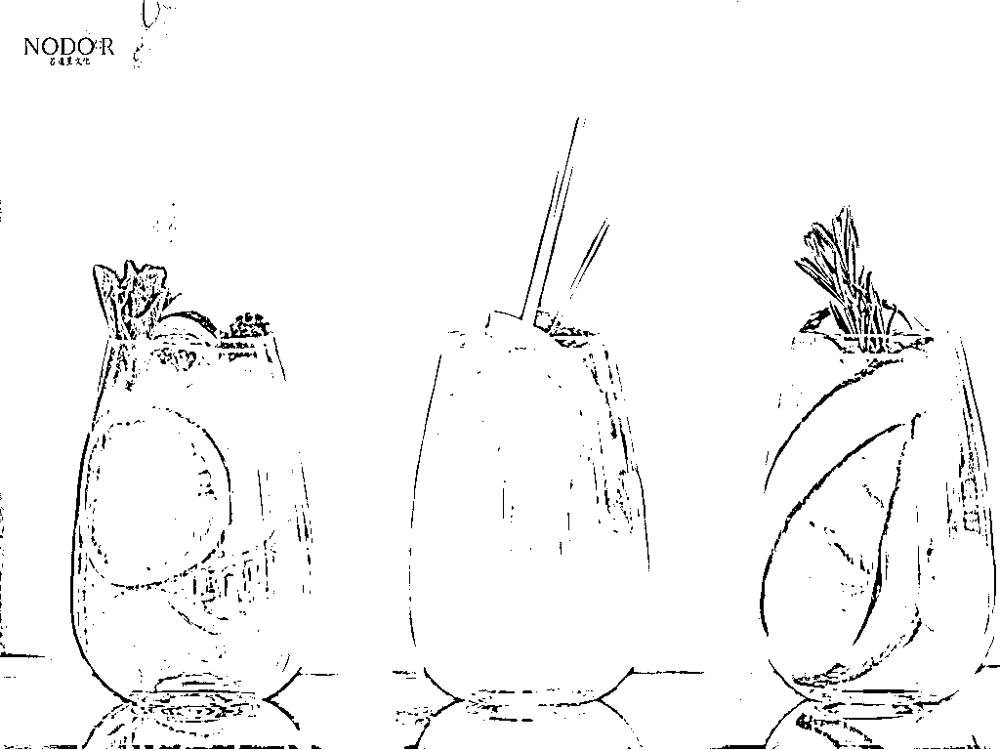

**12 星座一周运势**

**（重点参考上升星座，其次参考太阳星座）**

***白羊座***

**工作环境、职场关系**让你感到舒适，除了周四可能在人际方面出现小低谷。临近周末，心中有千头万绪，却又理不清楚的烦忧、不安，也会有过往的情感记忆涌现，而这种躁动可能导致跟亲近的人发生言语冲突、口角。

**周末前后**，嗜睡、梦境多，感觉疲劳，需要多休息，出行注意交通安全。

***金牛座***

桃花运和爱情磁场有所提升，也会更主动社交、聚会，**吸引力增加，**也会有能吸引你的人出现。有子女的金牛座，**亲子关系更加融洽，**一起玩乐的时光增多。

周末前后，可能因人际关系、朋友圈产生一笔花销，注意理性消费。

此时也容易因为周围人的状态影响到自己情绪，产生不公平、不甘心的愤怒感，**重点是觉察这其中发生了些什么，自己该如何守护与人交往的界限。**

***双子座***

这些日子，双子座一直很忙碌，也很充实，或许经常被计划外的事情打乱节奏。**本周在忙碌之余，会更加享受家庭时光，**可能是单纯的宅，也可能是有新的家居布置规划，跟家人之间的互动增多，并能从中得到愉悦。

周末前后，在事业方向上可能产生迷茫感和情绪起伏，或许有多个方向的选择困难，也或许是工作安排跟私人生活产生矛盾。可以先只做自己确定的事，也别给自己安排太满，**你需要喘息的空间来捋清思路。**

***巨蟹座***

**人际运提升**，跟老朋友、手足、亲近的人交流增多，互动愉快。但临近周末，会有胡思乱想，焦虑担忧的情况出现，思绪比平日更加敏感、脆弱，内心过多的杂念甚至可能影响睡眠。

这段时间正在学习、培训、准备参加考试的巨蟹，会感觉**压力**更大，较难集中精力，要比平时耗费更多脑力完成学习任务。可以试着多跟朋友和信任的人聊聊天，或把心情用文字记录下来，写写日记，都会有利于你心情的平复。

***狮子座***

财运有明显提升，适合开启投资理财的新计划，接下来也可能会有一笔丰厚进账。同时你更追求物质现实上的享受，**能有一段富足舒适的时光。**

但周末的满月对你的财务领域并不太友好，此时容易在内心生出对钱财的忧虑。你可能抱着侥幸心理，或冲动的做出不合时宜，有损利益的选择。**若有重大财务决定，建议避开周末前后。**

***处女座***

你的心情变好，或收到开心的消息。与周围人的关系更加融洽，也更加注重外表、装扮，接下来可以考虑更换发型或穿衣风格。

**周末前后，需要注意自己的情绪管理，**此时有可能因为亲密关系、人际关系失控，也可能与上级、领导和权威发生矛盾。你可能会想起很多过往的委屈和付出，泛滥的情感容易被夸大，也会升起对他人不切实际的期待。

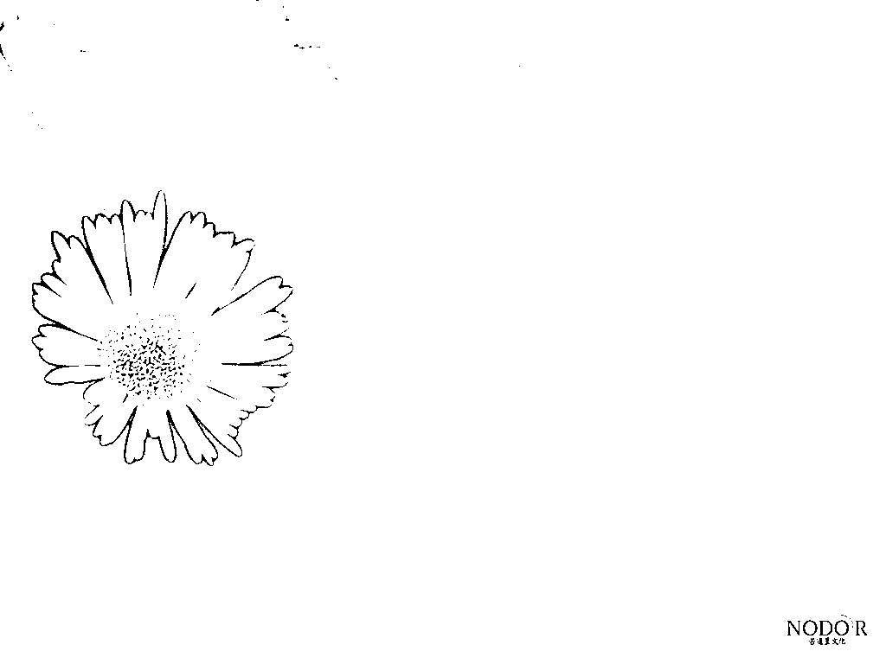

***天秤座***

**你需要更多的时间独处，**从本周开始你可能不太想踏入社交生活，而更愿意花时间在自己的内心世界上。

周末前后，会有一些琐事令你心烦意乱，也可能有一些临时性的出差、跑动发生，注意交通出行上可能有意外变化。

还有一些天秤座身体状况不佳，出现一些小毛病，例如过敏，或机能失调。不要过度紧张，**放松自己的情绪，**会很快好起来。

***天蝎座***

接下来，你可能遇到志同道合的朋友，与人相谈甚欢，**一拍即合。**桃花就藏在你周遭的人际关系中，你们或许先从朋友做起。

周末前后，可能对一些人事物抱有幻想，或许是恋爱对象，或许是自己的兴趣爱好，总之是非常吸引你的领域。需要小心在这种滤镜下，会有不理智的消费开支出现。

***射手座***

**职场上的人际运有所提升，**若过往与领导、上级之间出现隔阂，接下来是非常适合修复的时机。

**周末前后，**你容易对工作、周遭环境生出一些不满，此时你很渴望安全感，也会过度敏感地对待他人，汹涌的情绪可能会化作不耐烦呈现。实际上你需要一个不被打扰的个人空间，也可以多跟家人和熟悉亲密的人在一起，享受他们的照顾与陪伴。

***摩羯座***

**你可能对旅行、远方、学习产生兴趣，**也可能是开启一段异地情缘，你希望能挣脱日常束缚，让自己的精神更自由。

**周末前后**，你可能思绪万千，有很多情绪想跟亲近的人表达，也会对他人的语言过于敏感、多疑。部分摩羯座在工作上非常忙碌，以至于没办法静心思考，注意跟同事、伙伴之间的关系，你可能会脾气失控。

**注意身体健康**：上火、发炎，或呼吸系统、肺部相关的疾病，以及磕碰和小的外伤。

***水瓶座***

**情感上**，你想要更加深刻的亲密关系，愿意为此牺牲让步，也会对自我和他人提出更高、更细致的要求。**现实上**，更加关注自己的财务状况，接下来也会有不错的进账机会。

**周末前后，**你可能有为兴趣爱好而消费投资的想法，也可能是想单纯满足物欲，或是情感上有些新的发展，产生了与他人的金钱互动。但建议在这几天**先冷静沉淀，**此时很容易因为物质现实上的不安，出现赌徒心态，暂时不要冲动为妙。

***双鱼座***

桃花运提升，有伴侣或在暧昧期的，情感升温，能进一步发展。你对周遭人的态度也会更加友善，**更容易吸引来与你契合的人群。**

**周末前后，你的情绪起伏较大**，对安全感的需求也大幅增加。而理智和判断力暂时失焦，会带着自己的想象去看待人际关系和亲密关系。

此时，家庭中也容易出现一些烦心事和突发事件，留意跟家人之间的关系，也要注意家宅安全。部分双鱼座会因家宅、房产事务产生一大笔开支。

**版权声明**：原创文章由作者授权首发于若道平台发布，欢迎转发，反对抄袭。友号转载请申请白名单。

**END**

****朵三三三****

ISAR 认证占星师

全职占星师/塔罗师/国家三级心理咨询师 

人大文学学士/德国慕尼黑大学文学硕士

**微博/微信公众号**：朵三三三

长按打赏

**20 位来自世界各地的占星师****带来 19 场沙龙——新世界的觉醒****详情可点击下图**

**学习占星学****点击下图了解课程详情**

**微信又双叒叕改版啦，不想错过若道君的推送？**

**就把若道设为星标吧！**

**▼**

**喜欢就点一下“在看”吧！**

********报名直达入口********

# 雷蒙德·梅里曼金融占星周运 | 买入的机会到了？

> 原文：[`mp.weixin.qq.com/s?__biz=MzA5NjA0NTAxNg==&mid=2651487797&idx=2&sn=d23cc97efa04d1d6e85a0bfd7c3545dd&chksm=8b48cc82bc3f45946a03612203e70bba2a49130fa3210bc5fceb5f4b6faa66747d2b1a10f6fb&scene=126&sessionid=1692737761#rd`](http://mp.weixin.qq.com/s?__biz=MzA5NjA0NTAxNg==&mid=2651487797&idx=2&sn=d23cc97efa04d1d6e85a0bfd7c3545dd&chksm=8b48cc82bc3f45946a03612203e70bba2a49130fa3210bc5fceb5f4b6faa66747d2b1a10f6fb&scene=126&sessionid=1692737761#rd)

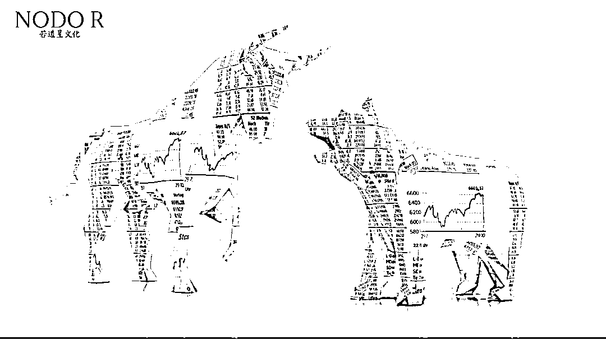

作者/雷蒙德·梅里曼 译者/Luke
编辑/玫瑰 图片/稿定设计雷蒙德·梅里曼是在金融占星学界稳坐第一把交椅的占星师，同时他也是若道签约的金融占星课老师，我们引进了雷蒙德·梅里曼老师的《[上证指数月度报告](http://mp.weixin.qq.com/s?__biz=MzA5NjA0NTAxNg==&mid=2651485664&idx=1&sn=bae9eb20d9f9cd407841b125f7fc553c&chksm=8b48c757bc3f4e418a1201d4aeb9a38f9203dbffab162bfa25222ea7fd77fef7ad660e7bd073&scene=21#wechat_redirect)》及《[黄金报告](http://mp.weixin.qq.com/s?__biz=MzA5NjA0NTAxNg==&mid=2651485664&idx=1&sn=bae9eb20d9f9cd407841b125f7fc553c&chksm=8b48c757bc3f4e418a1201d4aeb9a38f9203dbffab162bfa25222ea7fd77fef7ad660e7bd073&scene=21#wechat_redirect)》。我们经老师的授权，将每周刊登梅里曼老师的周运，供大家参考和学习。于是，这是本周的周运（9.5-9.9）。由于梅里曼老师将在 2022 年 9 月 9 日-11 日在美国密歇根州特洛伊举办为期 3 天的梅里曼市场时机学院投资者静修营，下周将不发布专栏。由于劳工节，美国市场将于 9 月 5 日周一关闭。

**说明：以下时间采用纽约证券交易所所在地美国东部标准时间。**

**展望与回顾**

****

**当月经济新增 31.5 万个就业岗位，略低于道琼斯预估的 31.8 万，远低于 7 月的 52.6 万，是自 2021 年 4 月以来的最低月度增幅。****失业率上升至 3.7%，比预期高出 2 个百分点。更宽泛的失业率指标，包括沮丧的工人和因经济原因从事兼职工作的人，从 6.7%上升至 7%。****——杰夫·考克斯****《8 月非农数据上升至 31.5 万》****2022 年 9 月 2 日****www.cnbc.com****在美联储主席杰罗姆·鲍威尔承诺对通胀采取“强力”措施，并警告可能带来经济“痛苦”后，美国抵押贷款利率上升至 2 个月来的最高水平。****抵押贷款买家房地美周四表示，本周 30 年期贷款的平均利率从 5.55%上升至 5.66%。这一比率远远高于一年前的 2.87%。****——梅根·亨尼****《抵押贷款利率上升至 5.66%》****2022 年 9 月 1 日****www.foxbusiness.com**美联储主席鲍威尔警告，美联储愿意放弃“软着陆”，决心抑制通胀，宁可对经济带来痛苦也在所不惜。此后一周内，全球股票市场血流成河。痛苦无处不在，从股市到贵金属、外汇、国债和原油。与以往的新闻发布会不同，美联储几乎没有采取任何行动来营造一种安全感，因此导致投资者逃离这场正在发生的灾难。继前一周损失 1400 点后，道琼斯工业平均指数周末收盘时下跌近 1000 点。我们预计从 8 月 16 日的半基本周期波峰 34281 起，会下跌 1000-2000 点。但现在道琼斯工业平均指数下跌了 3000 点以上。当出乎意料的天王星成为焦点，事件往往不按你的预期发生。这类的市场或央行行为，与 8 月 20 日开始的水逆阴影期无关。美联储的态度，从发表乐观言论，突然之间变成悲观地警告可能会发生经济痛苦，全都是天王星的杰作。正是天王星主导了 8 月的宇宙天象，使得道琼斯工业平均指数在 8 月 16 日到达 4 月 21 日以来的最高价位，也在 9 月 2 日结束的那周到达了 7 月 18 日以来的最低价位。8 月的这种模式几乎出现在所有的全球股票指数上。也就是说，**全球股市在 6 月 17 日金星四分土星时到达底部后迅速上涨，在 8 月 15 日-19 日到达数月高点，对应 8 月 11 日-14 日太阳与土星和天王星形成 T 三角**。市场之后准时反转，直至 8 月 24 日-29 日金星与土星和天王星形成 T 三角。通常情况下，金星-土星对分相会停止下跌趋势，正如 6 月 17 日的四分相停止下跌那样。但区别在于，这次天王星在停滞，改变运行方向到逆行阶段。当天王星像那样凸显，它可以（已经）轻易地压垮金星-土星提供的支撑位。除此之外，之前那个周末新月四分火星，有点像一个即将爆炸的火药桶。与其在这种危急情况下来救援，杰罗姆·鲍威尔和美联储反而在一周前的 8 月 26 日点燃了引线。因此，我们诚挚召开静修营。

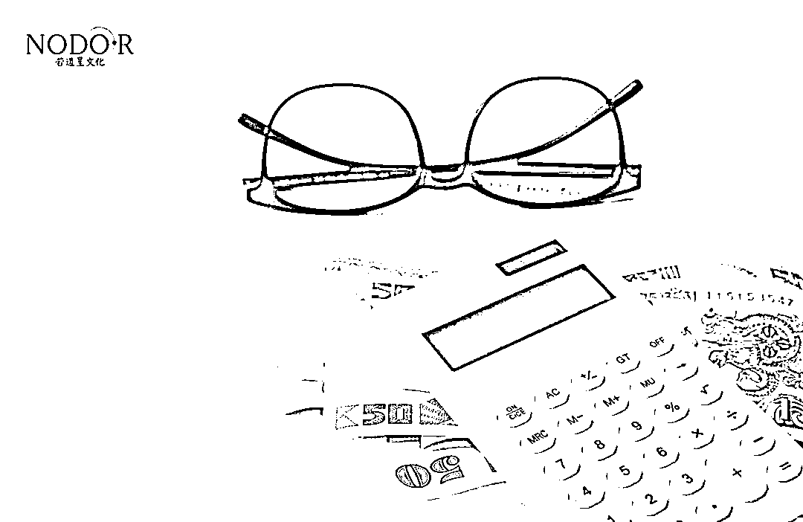

几乎我们追踪的每个市场都跌破了一个又一个支撑位。美国十年期国债在测试 12 年以来的最低价位。白银自 2020 年 7 月以来首次跌破 18.00。欧元下跌至 20 年来的低点，日元崩盘至 1998 年来的最低位。这些不是修正，更像是绳索断了的蹦极跳。其他市场上，原油自 8 月 16 日的低点 85.73 上涨近 14%，来到 8 月 30 日的高点 97.66。两天后它跌回了一开始的起点，再次证明市场“踩着台阶上行，却乘着电梯下降”。比特币上周跌破 20000，但似乎在 19500 处找到了支撑，仍然远远高于 6 月 18 日的低点 17588。**短期宇宙征象与长期考量**

****

**欧元区通货膨胀在 8 月破了记录。消费者价格同比上涨 9.1%，为 1997 年初有记录以来的最高涨幅。**

**——汤姆·费尔勒斯****《欧元区通胀超 9%，为立法者带来压力》****《华尔街日报》****2022 年 9 月 1 日**有好几个地球宇宙学因素，可能导致这次金融市场突然从乐观向悲观转变。有些人说，那和水星逆行的“阴影期”有关，这一现象始于 8 月 20 日，有效期直至 10 月 17 日。实际的水星逆行，从这周的 9 月 9-10 日开始，持续到 10 月 2 日。逆行始于天秤座 8° ，终于处女座 24°。许多占星师认为，从行进水星第一次经过处女座 24°（8 月 20 日） 到最后一次经过天秤座 8°（逆行结束后）的度数区间，充满了水星逆行的能量。水星逆行前和逆行后的一段时期，仍然会穿过逆行的度数区间，这被称为水星逆行的“阴影期”。有趣的是，股市的夏末涨势，确实发生在水星逆行阴影期开始前后。或者，它可能和火星在双子座行进的漫长旅途有关。这段旅程也始于 8 月 20 日，火星会在恶作剧者水星守护的星座停留至 2023 年 3 月 25 日。出于一些奇怪的原因，火星在双子座是个容易引发战争的星座，此外还有射手座和摩羯座。这次火星在双子座行进比通常的 6 周-7 周要久，因为它会在 2022 年 10 月 30 日至 2023 年 1 月 12 日逆行。或者，这一切都于行进冥王星当前对分美联储成立星图（1913 年 12 月 23 日）中的海王星有关。或许美联储真的不知道自己在做什么。或许它真的失控了，以为将叙事从描述软着陆的希望和信任，转变为描述损失的恐惧和痛苦（失去工作，失去经济安全），就能挽回失去的信誉。这是因为它之前对 40 年来最高速率的通货膨胀视而不见。美联储从没看出通货膨胀的到来，直到它已经在这里了。这种错觉和蒙蔽，是典型海王星被激活的表现。这种思维方式的唯一问题是，通货膨胀不是美国单独承受的，也不是美国央行单独忽略的。

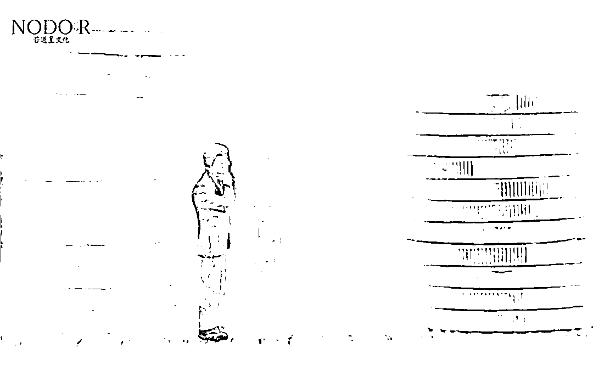

上周股市受创尽管有诸多可能的原因，我认为罪魁祸首是天王星。早在 8 月之前，我们已经警报天王星不可预测、混沌和分裂的天性会在 8 月被激活。那是一场全球股票指数走势的交战。要么市场爆发性地上涨进入风暴之眼，也就是 9 月 21 日-28 日+/-2 周（木星击中土星-天王星四分相的中点）；要么市场迅速反转，继续回到熊市。熊市是上一次 2021 年 12 月 24 日土星-天王星渐亏四分相后，以及 1 月 4 日历史高点后开始的，可能会在 8 月-11 月的金融恐慌中到达顶峰。未来走向依然悬而未决。两周之前，看起来看涨占据了主导。但是天王星在 8 月中旬突然袭击，美联储也从啦啦队变成了危言耸听者的角色。这些发生的时候，我们正好在接近今年第四次也是最后一次强有力的行星配置：木星与土星和天王星都形成八分相。土星-天王星，如我们所知，是造成巨大动荡的魁首。由于木星的加入，动荡甚至更严重了，因为木星总喜欢做些大事。木星不做小事。现在看起来越来越像是恐慌的回归。但不要烦恼。**把这视为一个极低价格购买股票和其他金融资产的机会，有点像一场大甩卖**。只要记住，你需要现金和勇气来这么做。巨大利润的机会往往伴随着巨大的风险。一些市场分析师宣称将出现巨幅下跌，到明年可能下跌 50%。他们可能是对的。但是如果 6 月的低点被跌破，那么崩盘可能比他们想象的快得多。正如你从本专栏中知道的，天王星擅长突破支撑位或阻力位——突破任何限制是它的游戏。**如果这在接下来 6 周发生的话，准备好你的支票去买入（股票、比特币、能源）。****长按下图了解更多详情**

这是特别及时的讲座，因为为期 12 年的木星轨道周期会在 5 月 10 日进入白羊座，并且 6 月-11 月是一年中最有力的地球宇宙征象接连登场的重要时间段，因为土星逆行与天王星形成几乎精准的渐亏四分相。

**说明：以上日期基于纽约证券交易所所在的美国东部标准时间，由于存在时差，中国地区可能需要加一天。**

**版权声明：**本文由若道翻译发布，欢迎转发，反对抄袭。友号转载请申请白名单。**END**

**雷蒙德·梅里曼（Raymond Merriman）**

若道签约老师。著名金融占星师，ISAR（国际占星研究协会）前主席，梅里曼市场分析公司的总裁。他由于“提升了占星学的职业形象”，在 1995 年国际占星大会上被授予轩辕十四奖；在 2012 年国际占星大会上，被授予轩辕十四终身成就奖。

1“中国上证指数月度报告”发售**若道推出了****中文版****的雷蒙德·梅里曼中国上证指数月度报告，并持续发行该报告！**当把金融市场的周期和占星学的周期相结合时，雷蒙德·梅里曼老师的金融占星学研究**为投资者应对金融市场的周期波动，并随之调整投资策略提供了极大的价值参考**。
**9 月中英文报告已上线！**2“黄金价格周期月度报告”发售**若道推出****中文版****的雷蒙德·梅里曼黄金价格周期月度报告！**不仅仅为广大读者在中国股市的投资出谋划策，更将视角放眼黄金市场。**每当世界经济形式不明朗的时候，有一个地方是保值的港湾，那就是****黄金**。自 1982 年雷蒙德·梅里曼出版第一本研究《地球宇宙学征象与黄金价格的关联》的著作以来，**他一直作为最重要的黄金市场时机预测者之一享誉国际**。2022 年 9 月黄金报告已上线，梅里曼老师将会告诉你他对这个关键时期如何操作的想法。也可以按照季度和一年期订阅，有更多优惠。季度和年度的好处是，你可以持续了解梅里曼老师对于不断在变化的市场的看法。即便他某一次看法和市场不一致，你也看到在下一期他如何调整自己的看法，并看到金融占星在一个长期时间段内对你把控风险的帮助。而能够长期控制风险、尽量找到安全的投资时机才是投资的长久之计。**9 月中英文报告已上线！****购买套餐**，买得越多越优惠中国上证指数月度报告套餐价

*   **单月报告**：280 元
*   **3 个月套餐**：780 元（260 元/月）
*   **12 个月套餐价**：2400 元（200 元/月）

**长按下图识别二维码****购买金融报告****套餐****▼**

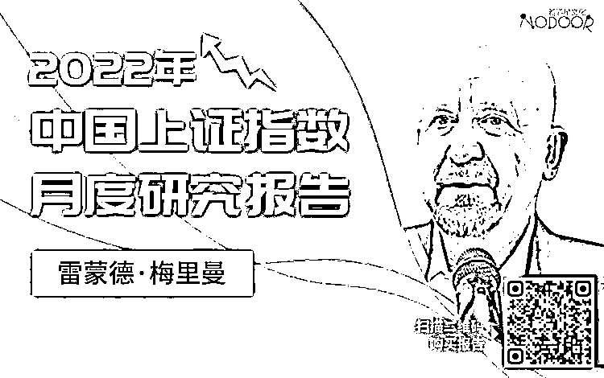

黄金周期月度报告优惠

*   **双报告年度套餐更优惠（直降 900 元）**

*   **12 个月黄金报告+12 个月上证指数报告：仅需 3900 元**

**长按下图识别二维码购买黄金报告套餐**▼

3《2022 年金融预报和沙龙》1976 年以来，由雷蒙德·A·梅里曼撰写的梅里曼市场时机学院每年一次的年度预报沙龙和每年一本的《年度预报》一直在应用占星学原理为投资者们服务，提供卓越洞见，从未间断。 **雷蒙德·梅里曼《2022 年金融预报和沙龙》发售中（报告已发布）。****长按下图识别二维码了解详情**
▼

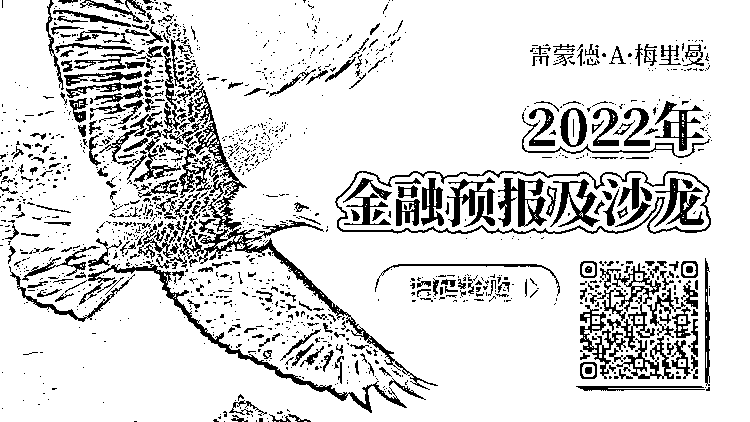

4《2022 下半年金融占星投资沙龙》这是特别及时的讲座，因为为期 12 年的木星轨道周期会在 5 月 10 日进入白羊座，并且 6 月-11 月是一年中最有力的地球宇宙征象接连登场的重要时间段，因为土星逆行与天王星形成几乎精准的渐亏四分相。

**长按下图识别二维码了解详情**

▼

**点击阅读原文购买金融报告**

# 插班中丨 ISAR 认证职业占星师文凭课程：开启“爱好变职业”的创收自由之路

> 原文：[`mp.weixin.qq.com/s?__biz=MzA5NjA0NTAxNg==&mid=2651487797&idx=3&sn=be0ad68bbc61edd4ef289ef751d43b63&chksm=8b48cc82bc3f45946de12aecb7baf66ac25654fad555668a1eb0273c626e7de4cc255fa4e984&scene=126&sessionid=1692737761#rd`](http://mp.weixin.qq.com/s?__biz=MzA5NjA0NTAxNg==&mid=2651487797&idx=3&sn=be0ad68bbc61edd4ef289ef751d43b63&chksm=8b48cc82bc3f45946de12aecb7baf66ac25654fad555668a1eb0273c626e7de4cc255fa4e984&scene=126&sessionid=1692737761#rd)

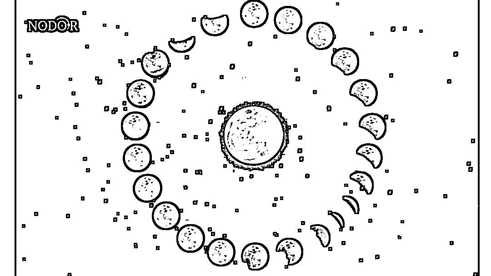

**2022 年，是世界和中国 40 年未有之大变局的开始。**

俄乌战争打破了欧洲大陆乃至全世界的和平局面，而新冠疫情也给中国经济带来前所未有之挑战。

如果你关心经济形势和世界局势，你会有这种的感觉，我们将面临一场深刻的危机，而这不是短期内可以结束的。

**占星学的看法也是如此。**

4 月青年失业率（16 岁到 24 岁）中国达 18.2%，一些背着房贷、教育、医疗负担的中年人突然失业更是整个家庭整个难以承受之重。为了更好准备面对这样的时代变化，连《北京日报》这样的官方媒体也在呼吁：**“开拓副业，让自己有多元化发展的生存能力”。**

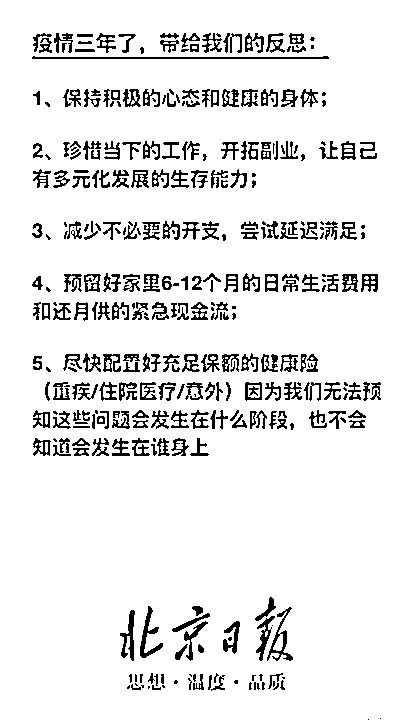

**而这门课程，就是为了这样一个目标准备的。**

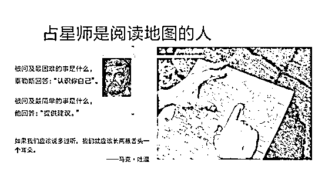

**占星学是非常好的“开展副业”的选择**

这个**为期 16 个月**的课程通过并不算长的时间和并不算高的投资，不仅可以帮助你学到一个终身可用的技艺，而且也可以选择成为自助助人的占星师，**开启受益终生的第二事业。**未来是个体崛起的时代，大量个体被鼓励独立发展，比如网红、自由职业、自媒体、咨询师等，他们都不需要传统的办公室。社会越发达，人的独立性就越强，未来有能力的人都可以变成独立的经济体。

**占星学也是越老越好的职业**

和一些技术变化非常快的职业不同，**占星学的技术层面非常稳定，不会快速迭代变化，**同时，掌握好占星学、能够做一场好的咨询又需要个人自身大量实践和对生命的深刻理解，而这些都是时间和岁月带来的。

**占星学是现代社会需要的助人职业**

社会快速发展和变化人们似乎越来越无法掌控自己的生活，这给很多人带来巨大的焦虑，**抚慰心灵的咨询市场需求巨大。**而占星学可以让人从前所未有的角度了解自己，了解目前和未来所处的周期，挑战的意义，不论对于深入的个人成长探寻，还是预测未来的周期，都又其独一无二的价值。

**ISAR 认证职业占星师的独有培训**

目前占星学的培训市场鱼龙混杂。而 ISAR（国际占星研究协会）是一个包含了 47 个国家在内的国际占星组织，多年来致力于占星的教育和研究，提升占星教育的品质和职业占星师的能力，在国际占星领域备受尊重。今年，ISAR 对于成为 ISAR 认证职业占星师提出了更高的要求，**所有想要获得 ISAR 职业占星认证的申请者均需要在 ISAR 的附属学校通过 500 个小时的研习（包含****主课****、选修课、沙龙、作业、讲座、工作坊等等）。**

**而这门核心占星学课程就是为此而准备的。**

**2022 年，鉴于对若道在占星教学领域所做的持续努力和高品质的课程服务，ISAR 特别授予若道核心课程为 ISAR 文凭课程，所有在若道学习，并通过若道毕业考试的同学将获得 ISAR 颁发的学历文凭（Diploma）。**

**你的占星核心课老师是谁？**

**拥有****51 年****占星实践经验的****若道创始人****前 ISAR 全球副主席****前 ISAR 全球职业占星师资质认证主席****大卫·瑞雷**

**和**

**2019 年第二届、2021 年第三届核心课中**

**与苏·汤普金斯老师****联合授课****的**

**ISAR 认证职业占星师**

**咔咔（Caroline）**

**二人合力打造**

**2022 年 ****若道全新核心占星课程**

**咔咔老师给同学的寄语：**

（向上滑动查看内容）

**亲爱的同学们：**

我为什么学占星学？

2000 年的时候我还是一个在网上搜索天蝎座和水瓶座配不配的普通白领。我搜索的内容还包括了水瓶座为什么总是这么若即若离？

体贴的搜索引擎给我推送了占星学、行星、星座、宫位、相位等资料，还让我了解到莉莉丝、月亮交点、截夺宫位等占星学概念。

2000 年 10 月我了解到，一个从业 30 多年的美国职业占星师大卫·瑞雷来到了中国，和他的中国合伙人将开办一个专业教授占星学知识的课程。过去 10 个月在网上东拼西凑的占星学知识唤起了我对占星学的兴趣，但是已经不能满足我对星图深度分析的需求了。

2013 年，我通过了若道核心课程的毕业考试和国际占星师研究协会的认证考试。2015 年我离开职场成为一名全职占星师。

到底学习占星带给了我什么呢？

1、它是自我觉知的工具，我现在已经不去纠结哪些星座是否匹配，我相信外在的事件是内在心理矛盾的显化。也就是说，想找到令人满足的亲密关系，要先去了解自己的情感模式和需求，而不是无意识地一次次地试错和撞墙。我开始学习自我关怀和接纳自己。

2、它带来看待世界的全新和全景的角度，天上如是，地下亦然。人类社会和个人生命的进化都有其周期和相似性，作为个体，占星学帮助我思考如何更积极和有建设性地与宇宙的能量合作，认识自己，发挥自己的潜力，度过有意义且自我满足的人生。

3、它带来了全新的职业：占星师和占星老师。除了收入，还有助人育人的满足感和意义感。

4、它带来一群志同道合的伙伴，我们彼此联结又相互独立。

作为中国占星界的“黄埔军校”若道占星的学生、助教和老师，我与很多学员在人生的不同阶段带着各异的需求走进了这所学校，2022-2023 年一年半的若道核心课程设计既蕴含了大卫·瑞雷老师的教学精华，也带入了我在跟随不同国外占星老师学习、助教和教学积累的心得。

有一些学员毕业后从事了占星咨询工作，有的在各大平台成为专业占星学知识的输出者和传播者，有的运用占星学提升他们的工作，也有的在占星学与投资，占星学与名人/八卦、占星学与原生家庭、亲密关系、亲子关系等领域收获了有用的或者有趣的体验。

对我来说，生命是一场自我完整的体验之旅。从 2011 年的那个春节在若道入学之后，我的生命旅程更加充实、有意义、有目标，也更有满足感。

希望在 2022-2023 年的若道核心课程里见到你。希望你此后的生命旅程里，有若道，有占星学。

占星师咔咔

2022 年 5 月 24 日

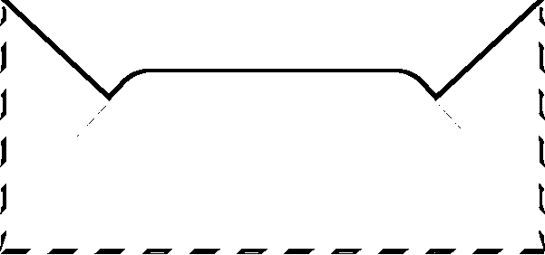

**大卫老师给同学的寄语：**

（向上滑动查看内容）

亲爱的学员们：

感谢你对我们从 8 月 30 日开始的若道 L1-5 级核心课程的兴趣。我和合作老师咔咔以及我们的核心课程团队期待着为你提供这个机会，来教授各种高品质的地道占星学知识和技巧。

对于那些希望获得 ISAR 职业占星师认证的学生，这是一门适合你的课程！

作为 ISAR 咨询技能培训的一部分，我曾与咔咔合作过，我们期待着再次合作。咔咔和我曾在 ISAR 职业占星师认证委员会（CAP ISAR）一起工作，我们非常熟悉获得 ISAR 职业认证的流程。作为你的老师，我们将陪伴你整个占星学发现之旅，帮助你逐渐认识到占星学有多么的神奇。此外，你还将受益于我们若道的助教和课程顾问，他们是若道核心课程计划的重要组成部分，提供在线沙龙、组织学习小组、指导家庭作业。我们的教育团队是“服务于你的团队”，所以也会根据你的需求进行相应的调整。你专用的核心课程微信群也促进了你的学习过程，使你能够每天与你的同学们一起学习、探讨、成长。

52 年前，当我开始学习占星学时，没有一所像若道这样的学校。如果有这样一所学校，我会尽一切可能在那里成为一名学生。事实上，我很幸运，我的老师都是经验丰富的专业占星师。然而，我花了 6 年的学习时间才通过 1976 年在美国乔治亚州亚特兰大举行的专业占星师考试，又花了 2 年的专业实践时间才通过占星学谋生。我永远不会忘记从 1970 年到 1978 年的 8 年，那些日子的反复试验教会了我如何苦练占星学。作为老师，我一直在努力传授我早年所学的知识，让你的旅程更加顺利，更加全面。

自 1978 年以来，44 年的全职实践教会了我很多，我很高兴有机会与大家分享我所学到的东西。我和咔咔都是现代占星师，虽然我们尊重西方占星学的历史和传统，但我们实践和教授的占星学植根于现代人本主义哲学，这种哲学旨在提高你对自身潜力的认识，并鼓励个人成长。还有什么比了解自己更实际的呢？还有什么比个人成长和发展潜力更有利的呢？这是你将要学习的占星学，一种可以应用于你自己生活的占星学，一种可以为你提供一个充实职业的占星学。

教书是我回馈占星学行业的方式，这个行业拓展了我的视野，远远超出了我曾经想象的可能。谢谢你给我这个机会做你的老师。

大卫·瑞雷

2022 年 5 月 24 日

**连报 L1-5 全阶网络直播课程，你可以享受**

❶ 64 次线上直播互动网络课程+2 场工作坊，全面而详细地讲解占星学知识、技能、案例和重要领域实践运用。

❷ 知识点+学员星图解读有机结合：咔咔老师以讲解知识点和中外名人案例为主，大卫·瑞雷老师以参课学员案例演示及客户案例为主，每个知识点覆盖班级内学员的亲身案例，参与感更强，多位学员都有机会听到自己的星图分析。

❸ 微信群学员互动分享，从真实案例学习生命成长故事。

❹ APP 答疑论坛提问：论坛上每个学员的问题都将得到及时回复。

❺ 若道独有的职业占星师养成计划，为你毕业后独立咨询做准备。

**❻ **提供**咨询平台**，只要努力，优秀毕业生有机会入驻**若道咨询平台**，拓展咨询客户群。

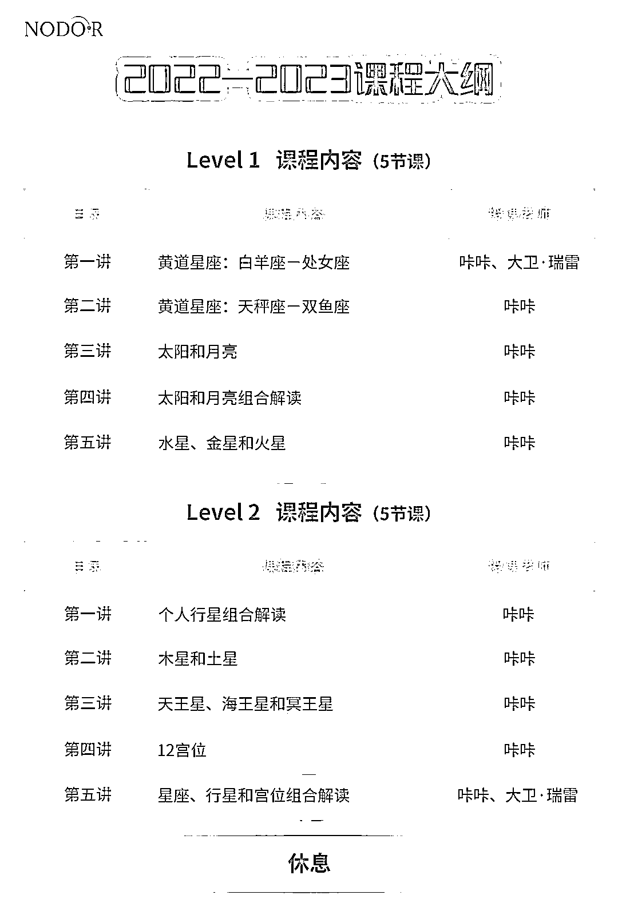

**更多了解老师和助教？**

**大卫·瑞雷（David Railey）**

*   **I****SAR 董事会成员，ISAR 全球副主席，ISAR 全球职业占星师资质认证主席，若道占星创始人**。

*   2016-2019 年，被选为国际占星协会（ISAR）考试委员会成员，国际占星协会（ISAR）是世界最大的国际占星机构，会员遍布 47 个国家。

*   2017-2020 年，被选为国际占星联盟（ISAR）考试委员会主席，理事会成员。

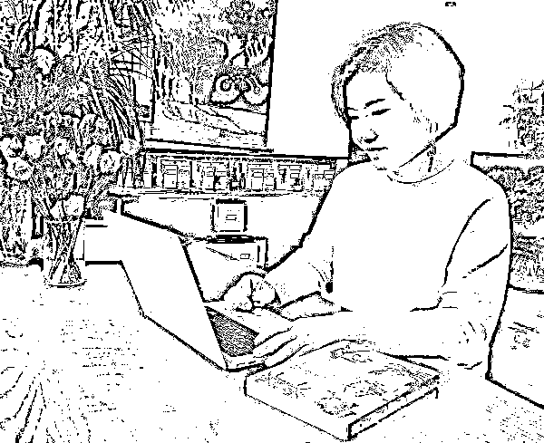

**占星师咔咔（Caroline）**

2010 年师从美国占星师大卫·瑞雷学习，并得到世界名师斯蒂芬·弗里斯特、罗伯特·汉德、苏·汤普金斯传授各种占星学技法。若道首届学员，国内最早获得 ISAR 职业占星师资质的职业占星师，多次担任若道核心课程助教，并于 2019 年第二届、2021 年第三届核心课中和苏·汤普金斯老师一起教授若道核心占星课程。

在国际知名广告公司和市场研究公司从事的市场研究和推广工作十余年，曾任职于阳狮集团、尼尔森市场研究有限公司、MTV 和《Madame Figaro》杂志。

**助教王嘉祺 （Conrad）**

ISAR 认证占星师、若道认证生时校正资质，从 2010 年起自学占星学，2015 年开始在若道系统学习，并开始个案咨询。2018 年担任若道核心课程助教，以及卜卦占星学和太阳返照选修课助教，并带领学员进行经世占星和太阳返照方面的研究。2019 年 11 月作为演讲人之一参加了国际占星协会（ISAR）北京大会，也是 ISAR 星空俱乐部中国区第 16 期的主讲人。

**什么人适合这门课？**

*   对占星学有浓厚兴趣，想要系统学习占星学。
*   对占星学有一定基础，但不知道该如何整合星图复杂的碎片。
*   希望成为优秀的占星师，想要借鉴国际大师解读思路并融入自己的体系。
*   想学习占星学，但不擅长英文，希望有中文老师授课。
*   想结合占星学理论与咨询实践。
*   走在自我探索和个人成长道路上的人。

**课程费用**

**★ 1-2 阶 （8 月 30 日开课）****课程费用：3500 元 ****★ 1-3 阶　连报****课程费用：11500 元 **********转发优惠价：**11000 元（朋友圈转发本课宣保留 24 小时以上，并截图给课程顾问）********★ 1-5 阶 连报****课程费用：46500 元** **转发优惠价：34800 元（朋友圈转发本课宣保留 24 小时以上，并截图给课程顾问）**

**咨询课程请联系顾问**：**王老师（微信/手机：18510107057，请备注“大卫核心课”）**

**退转课程**

**退款原则请详看《教学协议》，如有疑问请咨询课程顾问。**

****2022 L1-5 认证职业占星师必修课程****

**授课老师：大卫·瑞雷、咔咔**

**直播课开课时间：2022 年 8 月 30 日（周二）**

**授课方式：******网络授课，英文/中文授课，中文翻译****

**费用：******1-2 阶**：**3500 元；****1-3 阶**：**11500 元******（****转发优惠价：**11000 元，朋友圈转发本课宣保留 24 小时以上，并截图给课程顾问）；**1-5 阶连报**：46500 元**（****转发优惠价：34800 元，朋友圈转发本课宣保留 24 小时以上，并截图给课程顾问）******

**课程负责人：王老师**（微信/手机：18510107057，请备注“大卫核心课”）

长按二维码添加课程负责人咨询~

**END**

****报名直达入口****

# 3 堂爱的功课：在关系中，先了解自己，其次才是他人与关系

> 原文：[`mp.weixin.qq.com/s?__biz=MzA5NjA0NTAxNg==&mid=2651487730&idx=1&sn=d125aa072c699781ca1f0140db949caa&chksm=8b48cf45bc3f46533450ec8223915eb39fdd1fa37ccded5405047ccb7a41cd372cfd608a05fa&scene=126&sessionid=1692737761#rd`](http://mp.weixin.qq.com/s?__biz=MzA5NjA0NTAxNg==&mid=2651487730&idx=1&sn=d125aa072c699781ca1f0140db949caa&chksm=8b48cf45bc3f46533450ec8223915eb39fdd1fa37ccded5405047ccb7a41cd372cfd608a05fa&scene=126&sessionid=1692737761#rd)

** 后台回复“今日”，给你一句生命态度 **

编辑/玫瑰 图片/稿定设计占星学如何帮助我们寻找另一半呢？这个话题可以说上 3 天 3 夜，但是简单的方法，就是来看若道精心为大家整理出的爱情报告，对你一定会有很大的启发和帮助！千万别错过哦。**了解自我：爱的第 1 课**学习这门功课的第 1 步要从了解自身开始，占星学和心理学都告诉我们，感情关系中发生的任何情况都不是偶然的：开头不是，中间的起伏和冲突不是，结局也不是。不过，占星学无法告诉你，你是否“命中注定”会有幸福或者糟糕的婚姻，或者应该和巨蟹座还是射手座共度一生。星图描绘的是你内心是怎样的，因此你可能会给你和别人的感情关系带去什么模式、需求和强迫。你无法成为另一个人，也不可能把星图打发走，要求更换一套新角色，就像你无法不是你。不过，你可以或多或少更有意识一些；**审视自己的问题，处理属于你而不是伴侣的责任范围的议题，用创造性的方式对待快乐与痛苦，这些自由一直掌握在自己手中。**星图会提供一个具体客观的参考，让你看到你的生命经验中对于男性/女性原型的认知是什么样，这个原型就是你吸引来的另一半的重要特征，同时还会告诉你这些特质会有哪些正向与负向的表现。例如，有时我们会发现对方最初吸引我们的特点，之后却会变成困扰我们的问题：开始你喜欢他无所畏惧的男子气概，但后来你发现这一点演变成了自我中心，不考虑别人的感受。此时你要做的不是一味地责怪对方，而是应该去思考：**“自我确立”**是否是你自身的一个重要议题，当你把注意力从对方的“自私”转移到自己是否太过妥协之后，就会发现其实他是帮助你发现自身问题、并给你提供了一个解决这个问题的“测试环境”的伙伴。在日后的相处中，他的“自我”与你的“妥协”将会不断磨合上演，如果你们能带着对爱的信念与面对自身问题的勇气，并且努力去学习爱的智慧，那么幸福一定会降临。由美国著名占星师大卫·瑞雷老师亲自主笔的**《爱的指南》**，**这份报告将会告诉你属于你的感情模式，以及未来将会和你共度余生的另一半的人格肖像**。**长按下图识别二维码****了解更多**

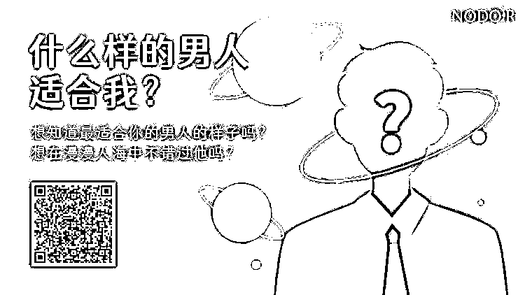

**理解对方：爱的第 2 课** 

爱的功课第 2 步，就是**了解你的伴侣，他的需求和恐惧是什么？**

有哪些破坏性模式在他的个性底层隐秘运作，如果你们对这个无意识的层面没有任何了解的话，就相当于开启了一场没有地图的寻宝之旅，走错方向都不自知，在日积月累的错误中将爱情耗干，这对双方都不公平。 

例如，他拥有一位严厉的母亲，从小经常批评他的表达方式，希望他能更严肃的对待自己所说的话。

然而这会给他留下“别人总是否定我”的烙印，在你们的关系中，每当你只是正常的表达关于他观点的意见时，他都会觉得你是在针对他、否定他，然后争吵开始。

如果你对于他的“旧伤”没有任何了解，也许会产生“他不爱我了”这样的想法——你们进入了迷宫，找不到对方，各自躲在角落舔舐伤口。

占星学是最客观的观察仪器，它能帮助你深刻的了解对方，为建立一段优质的关系打好基础。**如果你想要更了解他的需求与 BUG，大卫老师为你准备了关于另一半的****《说明书》****。**

**长按下图识别二维码****了解更多**

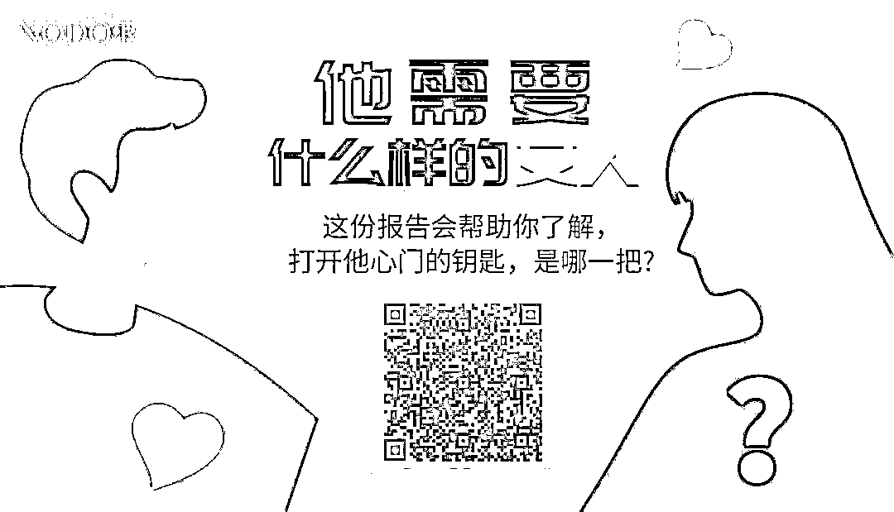

**融合之道：爱的第 3 课**感情关系无疑是人类所有体验中最为神秘，最富于回报，也最令人气馁的经历之一。每个人都是独立的个体，我们与不同的人产生不同的化学反应，随之而来的是不同的问题，你的价值观是否符合他对于世界的认知？给你带来快乐的事会否让他感到焦虑？更不用说深层次的信任议题等。 例如，如果你的金星在巨蟹座，那么和爱人呆在家里下厨做饭然后看碟是让你觉得最享受的事，假如对方的金星落在白羊座，那么可能独立做自己喜欢的事才是他的快乐源泉，此时问题很容易再次贴上**“对方是否爱你”**这样的简单粗暴的标签。爱不是一味的妥协，包容是建立在理解的基础上，若道重磅推出**《爱情扫描》**报告，让你用占星学的透视镜视检关系的每一个细节。**长按下图识别二维码****了解更多**

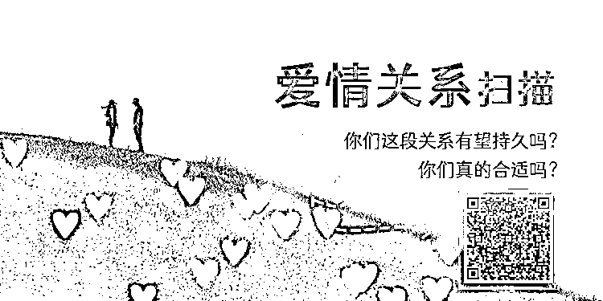

**相信爱，而非恐惧。****我们没有面对自己的地方，就会成为我们的命运。****——荣格****END**

****点击“阅读原文”，直接获取这 3 份爱情报告****

# 医疗占星学丨自由联想技术：身体疾病会告诉你，它的模样、意识、情绪和意志

> 原文：[`mp.weixin.qq.com/s?__biz=MzA5NjA0NTAxNg==&mid=2651487729&idx=1&sn=b30e450f1d48da5eecf1b4a9b9add46e&chksm=8b48cf46bc3f4650ca4c41df0125ebee7c806096c29ec39b1704c54d13cf6b8610545d9d6c86&scene=126&sessionid=1692737761#rd`](http://mp.weixin.qq.com/s?__biz=MzA5NjA0NTAxNg==&mid=2651487729&idx=1&sn=b30e450f1d48da5eecf1b4a9b9add46e&chksm=8b48cf46bc3f4650ca4c41df0125ebee7c806096c29ec39b1704c54d13cf6b8610545d9d6c86&scene=126&sessionid=1692737761#rd)

******☆ ****后台回复“今日”，给你一句生命态度******

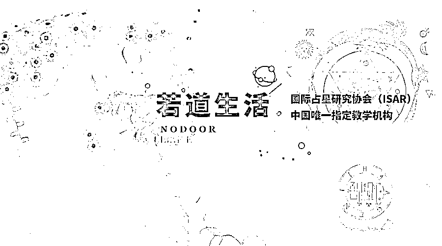

在 2019 的 UAC 大会上，若道君有幸参加了 Jane Ridder Patrick 老师的半日医疗占星工作坊。

UAC 大会，可以看到很多世界著名的占星师，也有机会听到他们的演讲，一个上午可以参加 3、4 场演讲。在那么多的演讲中，Jane 老师的医疗占星演讲是印象最为深刻的。

本来在若道过往一些年开的苏·汤普金斯老师的医疗占星课上，**苏老师就非常推崇 Jane 老师的医疗占星研究，她兼具了在专业药剂学、医学、占星学、心理学的背景，**而当时 1 个半小时的演讲更觉得大开眼界，所以又特地报名了 UAC 大会结束后的一日工作坊，**并亲身实践了一下她用于医疗占星学的 2 种技术——自由联想技术和视觉化技术。**

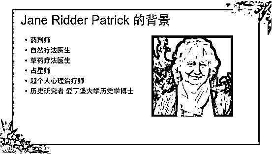

大概是因为 Jane Patrick 老师在超个人心理学方面的背景，她把心理学中的**自由联想技术**和**视觉化技术**加入到医疗占星中，这种体验非常神奇。

**在以下这篇短文中，我们稍微简单介绍一下自由联想技术。**

**自由联想技术****所谓自由联想技术，其实是一种我们和潜意识对话的方法。**Jane 老师把疾病当成一个活生生的个体，当用这种技术和疾病对话时，**你会发现这个疾病向你展示自己的模样、自己的意识、自己的情绪、自己的意志。**

比如，她讲到一位满脸粉刺的病人 Donna。**上升天秤座**的 Donna 的星图上，有一个**火土相位**和**月海相位**。粉刺是堵塞**（土星）**的毛囊，而且会造成感染和炎症**（火星）**。它通常因为死**（土星）**皮**（土星）**和多余油脂**（上升天秤座，月海合相）**堵塞毛孔的结果。

**Jane 让 Donna 对她的粉刺及因为粉刺而带来的苦恼进行描述，并让她对一些词进行自由联想。**

比如，Donna 说，很多粉刺时在下巴和脸上，她不得不抹很多粉来掩饰。

Jane 问：脸会让你想到什么呢？Donna 说，无法面对，就在眼前。

Jane 又问：那么下巴又让你联想到什么呢？Donna 说，虚弱，需要振作。

Jane 问：化妆时什么意思呢？Donna 说，两张面孔，谎言。

就这样非常细心和耐心的有的放矢的提问，Jane 和 Donna 一起找到了粉刺背后的故事。

**这个粉刺是因为 Donna 和男友的关系出现了重大问题，Donna 非常生气，但又无法公开表达自己的怒气，又不愿意去面对。**

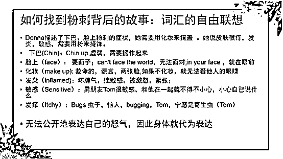

如同解梦一样，在客户就和占星师一起看到她为什么会出现这样一个身体的疾病，这**个疾病在传达什么信息。****不仅如此，疾病也会告诉客户解决之道。**我们下次来听听 Donna 的粉刺怎么给 Donna 建议。**在 9 月 20 日开始的医疗占星课程中，Jane Patrick 老师也会在中国第一次讲授如何在医疗占星中如何用自由联想技术找到疾病的原因。**

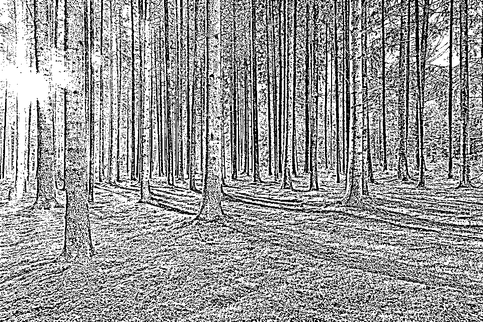

**ISAR 选修课【医疗占星学】上线**

**医疗占星学是一个强大的工具，同时洞察的身体和心理过程，通过更多的自我认知照顾和关爱自我和身边的人。**

**本课程既适合医疗占星学的初学者，也适合已经有一些相关经验的人****。**简·里德·帕特里克老师将运用现实生活中的例子，揭示一个人的性格、症状及其星图是如何相互映照的。课程也会探讨疾病的意义以及可能的治疗方法。

**本课程旨在为学员提供一个运用医疗占星学的框架和方法，**学员将会学到一些有价值的实用工具，在课程结束后，自己使用这些工具研究其中的关联性。

**此课程可作为 ISAR 选修课。**

**授课老师**

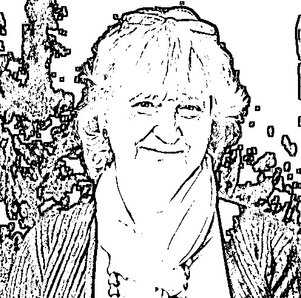

****简·里德·帕特里克 **博士******

**（Jane Ridder-Patrick）**

简接受过药剂师、理疗师、草药师、心理治疗师和历史学的专业学习，从事写作、咨询和讲学工作，在英国和全球教授占星学及其历史、当今的心理学和医学应用。她在爱丁堡执业，在爱丁堡大学获得博士学位，研究方向是 17 世纪苏格兰占星学历史。

**她最著名的出版物是《医疗占星手册》。2018 年，她因对医疗占星学的贡献而获得了著名的查尔斯·哈维占星学杰出服务奖。**

**对医疗占星学有兴趣？**

**点击下图了解更多详情吧**

**

**微信又双叒叕改版啦，不想错过若道君的推送？**
**就把若道设为星标吧！****▼**

**喜欢就点一下“在看”吧！**

********报名直达入口********

# 周末树洞丨月亮射手座，乐观起来吧！今天你要尝试哪些“冒险” 呢？

> 原文：[`mp.weixin.qq.com/s?__biz=MzA5NjA0NTAxNg==&mid=2651487729&idx=2&sn=c151db94f350cee40ded971fdb81b877&chksm=8b48cf46bc3f46506eb9b30920cca922be62acb13164242edd3c78c5c9f4ecc2885dede72516&scene=126&sessionid=1692737761#rd`](http://mp.weixin.qq.com/s?__biz=MzA5NjA0NTAxNg==&mid=2651487729&idx=2&sn=c151db94f350cee40ded971fdb81b877&chksm=8b48cf46bc3f46506eb9b30920cca922be62acb13164242edd3c78c5c9f4ecc2885dede72516&scene=126&sessionid=1692737761#rd)

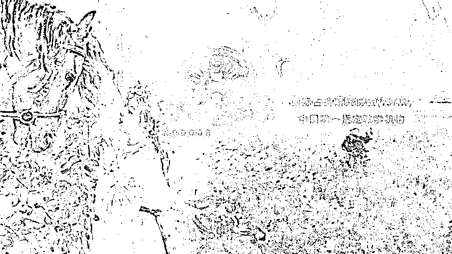

**2022 年 9 月 3 日天象：**

*   **06:39 月亮进射手座**
*   ******水星三分火星、对分木星******

本周，我们在面对变化与平衡压力下，进入 2022 年的第九个月份（点击[【9 月月运】](http://mp.weixin.qq.com/s?__biz=MzA5NjA0NTAxNg==&mid=2651487498&idx=1&sn=aba8e318636983494b89954c4fc56914&chksm=8b48cfbdbc3f46abb75aa4a9dc144087f631dedd090181e091efc6a0a8c57960a7789c1b26eb&scene=21#wechat_redirect)查看文章），随着水星进入逆行阴影期，情绪会容易冲动。在动荡期，调整身心、练习沟通成为刚过去这几天的主题。一大早，月亮进入射手座。终于可以呼吸新鲜的空气啦！去乐观的行动吧，但要避免过度着急。水星和木星的挑战相位，再加上水火三分相，提醒我们在思考和规划中，需要关注对细节的处理，同时也容易跟随周围讯息中的热点和流量，缺少谨慎的思考和衡量。无论怎样，月亮在射手座时，都是值得我们热情去探索未知的时候，今天你要尝试哪些“冒险”的事呢？欢迎分享哦~周六快乐！我们明天见！**了解每日天象，可****下载“若道”APP 查看****还有更多精彩等着你哦**

# 金星的 12 种爱恋丨在亲密关系中，达成未完成的功课

> 原文：[`mp.weixin.qq.com/s?__biz=MzA5NjA0NTAxNg==&mid=2651487638&idx=1&sn=ee4c6c5e60245e8409ae629fda71e13d&chksm=8b48cf21bc3f463769fbc07dd3c0aa4b103714d25591a344d9f8d3b416cfc927fb082d0e6bba&scene=126&sessionid=1692737761#rd`](http://mp.weixin.qq.com/s?__biz=MzA5NjA0NTAxNg==&mid=2651487638&idx=1&sn=ee4c6c5e60245e8409ae629fda71e13d&chksm=8b48cf21bc3f463769fbc07dd3c0aa4b103714d25591a344d9f8d3b416cfc927fb082d0e6bba&scene=126&sessionid=1692737761#rd)

************☆********************后台回复“今日”，给你一句生命态度************

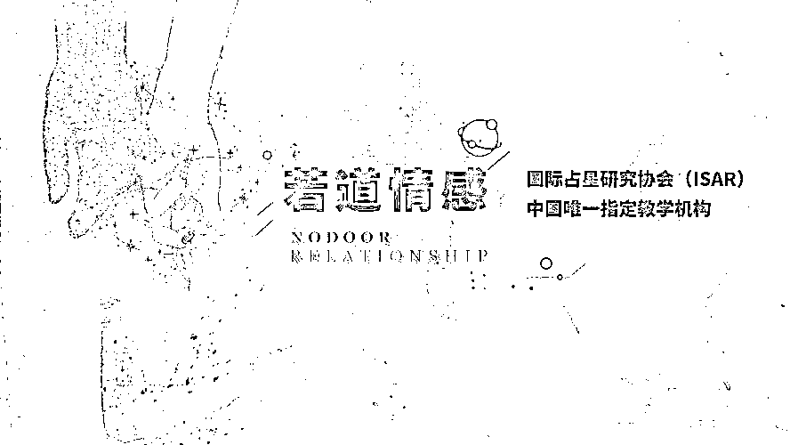

作者/斯蒂芬·弗里斯特
译者/Jun 校对/江艺编辑/翀子 图片来源/网络本文摘自《天空的伴侣 I：爱、性和进化占星学》

研习过心理占星学的小伙伴都知道，在我们的人生故事中总有一些“强迫性重复”的剧情。比如，总是喜欢上不那么爱自己的人，每一段恋爱都以第三者出现告终……幸福的爱情千篇一律，不幸的爱情各有各的不幸。找到你的金星星座，看看有哪些创伤需要去处理吧！另外，斯蒂芬老师马上要在若道开设[【组合图工作坊】](http://mp.weixin.qq.com/s?__biz=MzA5NjA0NTAxNg==&mid=2651486787&idx=2&sn=b20744a8649746a95f89842734012a7a&chksm=8b48c8f4bc3f41e284f8819351689cffd8f5ed461ed925622a45e28ba3a15335185910183bcd&scene=21#wechat_redirect)（点击查看课程），如果想跟这位占星大师学习，快来了解详情吧~

**12 金星星座的进化之旅****金星在白羊座**

**进化的意图是建立关系以帮助此人学习勇气，发展意志。**灵魂渴望学习**如何在爱的背景下表达强烈的情感，无论是积极的还是消极的。**这是对麻木的前世动力的灵魂记忆作出的回应，那时，**亲密关系被未解决、未表达的愤怒所掩盖。**

这个金星星座可以宣布自己是战士或者亚马逊人，怀着一种开拓精神在生活中冲锋，看起来能经受住所有的打击，甚至在打击中茁壮成长。“看我多有勇气。我不只是个约会对象；我是个冒险家。”金星在白羊座可能会抛出浪漫的挑战，看你敢不敢牵起他或她的手。

“尽你所能打动我。”

这个金星星座欣赏**独立、冲劲、直接和勇气**。**他们都是冒险者，喜欢有力的感觉，对良性的竞争有兴趣，享受胜利**。

| 玛丽莲·梦露

两位史上最受追捧、被追求的女性玛丽莲·梦露和伊丽莎白·泰勒，她们的金星在白羊座，小罗伯特·唐尼和哈兰·艾里森也是。杰克·尼科尔森也是如此，他的长期伴侣安吉莉卡·休斯顿说：“他让我热血沸腾。”

**金星在金牛座**

**进化的意图是发展长久的纽带，帮助此人保持平静和简单，更容易与自己本能的一面建立联结。**灵魂渴望**在性爱中体验自然的状态，以此对僵硬的、拘谨的或不受欢迎的前世性关系作出回应。**

**金星在金牛座通过强调以物质、身体为中心的土元素性质来吸引他人。**他们吸引你的感官。他们散发着美好的触感；可爱得让人想抱抱。

“看看跟我在一起多舒适，”他们的气场似乎在说，“看看我的陪伴多让你舒心啊。”

金星在金牛座会被某人的大地母亲（大地父亲）特质所吸引。**他们往往喜欢户外活动，也喜欢在户外舒服的人，还有与身体相处很舒服的人**。他们最喜欢的是简单和自然，不喜欢不必要的花架子。

|马龙·白兰度

诸多“回归土地”系列西部片的英雄约翰·韦恩，拥有在金牛座的金星。马龙·白兰度展现了金星在金牛座的土象吸引力。音乐家阿兰妮丝·莫里塞特、大卫·伯恩和比利·乔尔都有金星在金牛座。

**金星在双子座**

**进化的意图是建立关系以帮助此人发展开阔的心胸，培养不加评判的感知能力。**基于**禁欲主义或性单调**的前世经验，此刻会有一种“孩子身处糖果店”的特质。

**金星在双子座似乎相信，通往你内心的方式是刺激大脑、兴奋感官**。这个金星星座可以是有创意的优秀交谈者，这个故事高手能让你沉醉在各种故事中，包括参加过的讲座、读过的作者、经历的事件。

“我很聪明，但我不是书呆子。”金星在双子座的人这么说。“我永远不会无聊；我们总有可以做的事情——然后我们还可以讨论它！”他们喜欢玩文字游戏，很会调侃。

十八世纪的沙龙团体（那个时代的伟大思想者在聪明的女主人家里聚会）可能是由某个金星在双子座的人创建的吧。

这些人善于观察又待人友好，几乎对所有事物都感兴趣，而且乐意与每个人交谈，除非出生星图的其他部分表明他们喜欢独处。**他们喜欢那些兴趣广泛、好奇心旺盛的人。**

|鲍勃·迪伦

鲍勃·迪伦、威廉·莎士比亚、乔治·阿玛尼、纳奥米·坎贝尔、哈里森·福特、乌玛·瑟曼的金星都在双子座。

**金星在巨蟹座**

**进化的意图是建立关系以帮助此人发展和疗愈内在的感情世界。**这些关系必须是尽可能安全的，在其中，**温柔又滋养人的伴侣作出深刻又持久的承诺**——与前世动力形成鲜明对比，**前世中，灵魂被迫躲进心灵之壳。**

**金星在巨蟹座通过展示自己多么爱保护人、多么温柔、多么治愈来吸引他人。**金星在这个星座的人看上去发出这样的信号：“来我这，你们这些疲惫不堪重负的人，我会给你们休憩的港湾。”

他们发出承诺，要帮助你找到和滋养你家庭、心理或原型的根基。他们提供让你感觉安全的家庭基石。

**金星在巨蟹座的人喜欢那些温柔、滋养人的人，只有在这些人证明了自己之后，他们才会有安全感，才会敞开心扉。**

满足这种基本需求后——只有这样之后，我们才可能补充说，金星在巨蟹座也**被那些充满幻想、驾驶自己想象之翼的好手所吸引**。

|朱迪·加兰

朱迪·加兰（Judy Garland）的金星在巨蟹座，这点体现在了她对爱家的多萝西（Dorothy）的刻画中——“小巧而温顺”。

卡尔·荣格的金星在巨蟹座，帮助他探索客户的个人神话。加里森·凯勒（Garrison Keillo）的金星在巨蟹座；难怪他会讲乌尔冈湖（LakeWoebegone）小镇的故事！

《星际迷航》的创作者吉恩·罗登贝瑞（Gene Roddenberry）的金星在巨蟹座；维诺娜·贾德（Wynonna Judd）和史蒂薇·尼克丝（Stevie Nicks）也是如此。

**金星在狮子座**

**进化的意图是建立关系以帮助此人学习快乐和自发性，学习将庆祝自我作为成长之路。**这意味着，灵魂强烈渴望**用爱来治愈由于拒绝、背叛、迫害或审判带来的古老伤痛。**

外表上，这些人可以**用装傻的方式进入你的内心，或者用他们高尚的品质和挥舞的姿态打动你**。金星在狮子座的人证明了他（她）是多么有戏剧性又丰富多彩，多么慷慨、具有创意、令人愉快并值得尊重。

狮子座由太阳守护：**金星在狮子座的人被那些具有强大存在感和魅力（如同太阳！）的人所吸引**。他们会竭尽所能为你闪耀，也希望你能闪耀。

**狮子座的一个原型是国王或者王后。**一位好君主希望英明地统治好一个幸福、富饶的国家，想想他的求爱风格是什么样的，也想想什么样的人会成为一位优秀的王妃，这对你了解这个金星星座的表象有很大帮助。

藏在一切之下的是**渴望创造一个完全自发并保证互相认可的氛围——这是唯一可以治愈灵魂的温床。**

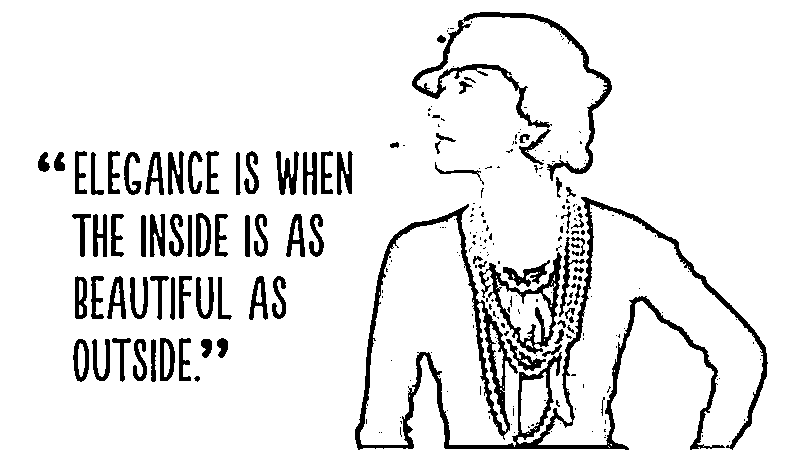

|可可·香奈儿

P.T.巴纳姆（P. T. Barnum）有金星在狮子座；可可·香奈儿也是。杰出音乐家、表演者伊恩·安德森（Ian Anderson）有金星在狮子座，大卫·科波菲尔、麦当娜和惠特尼·休斯顿也是如此。

**金星在处女座**

**进化的意图是建立极为关注成长和积极互助的关系，以应对前世的动力所包含的，在停滞、静止、无望的婚姻中被奴役的感觉。**

**这个金星星座告诉你如果你们在一起，生活将会有多美好，以此来吸引你。**金星在处女座显示出他（她）对细节有多关注，多愿意做出改善。

“看看我多诚实啊，有多渴望让这段关系变得更美好。”他们希望让自己成为你不可或缺的人。

水星守护处女座，这些人一般都**拥有并欣赏水星的智慧、批判能力和辨别能力。**他们会被那些**对工作尽心尽力、有精工细作天赋的人、对个人成长非常认真的人**吸引。

|约翰·列侬

爵士乐大师约翰·柯川（John Coltrane）的金星在处女座；导演佩德罗·阿尔莫多瓦（Pedro Almodovar）也是如此。

诗人和神话历史学家罗伯特·格雷夫斯（Robert Graves）、抒情诗人和歌手约翰·列侬（John Lennon）、喜剧演员莉莉·汤姆林（Lily Tomlin）和简·库丁（Jane Curtin）都有金星在处女座，显示出这个位置在语言创造力上的潜能。

**金星在天秤座**

进化的意图在于**建立一种关系，这种关系能帮助此人发展以成熟、浪漫、礼貌的方式与人交往的能力，并不断关注彼此敏感的移情作用**。存在对前世经历中**伴侣的性粗鲁或粗暴**的强烈反应。

**这些人企图用他们的社交优雅、对和平、和谐与美的爱以及他们的审美品味来迷住你。**这个金星星座显示了它多么有道德，多么公平，多么热爱公平，讨厌争斗与偏执，因此，你们在一起生活会多么甜蜜。

吸引金星天秤座的是那些**有创意、敏感、温暖、有同情心、圆通、对自己公平**的人。风象星座的精神品质在天秤座倾向于理想主义，有时会**不惜一切代价附和于和谐的表象**（如果星图的其他部分没有显示出好斗的倾向的话）。

| 克劳迪娅·希弗

剧作家奥斯卡·王尔德（Oscar Wilde）写出了精致而优雅的上流社会喜剧，他的金星在天秤座，超模克劳迪娅·希弗（Claudia Schiffer）、女演员凯特·卡普肖（Kate Capshaw）和歌手兼作曲家肯尼·罗杰斯（Kenny Rogers）也有金星在天秤座。

**金星在天蝎座**

**进化的意图是建立一种关系，这种关系能帮助此人发展与人深度交往坦诚相见的能力，并为自己和伴侣宣泄情感创造一个不带评判的空间。**

灵魂渴望体验**彻底的诚实**，从而重新建立起前世**被亲密关系中的谎言和欺骗所破坏的信任**。

**这个位置的金星散发着神秘、权力、性的气息。**通过巫师的原型，他们邀你探索亲密关系的心理层面。

金星在天蝎座提供了**原始又具有转化性的激烈感：在性、情感或心理上**。他们可能会表现得非常诱人，因为他们身上的某些东西，似乎充满火山般猛烈的情感承诺——并邀请你做出你的承诺。

这个金星星座喜欢**能彻底真实、激烈和狂热的人，那些人不会逃避情感上的宣泄体验**。他们还喜欢有着**未知、隐蔽、神秘光环**的人。

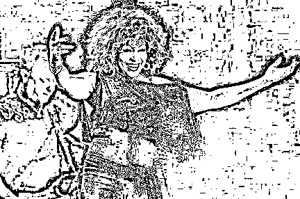

| 蒂娜·特纳

蒂娜·特纳（Tina Turner）的金星在天蝎座，米克·贾格尔曾这样评价她："站在她身边（舞台上）是世界上最热的地方！" 

另一位电音表演者布鲁斯·斯普林斯汀（Bruce Springsteen）的金星在天蝎座，巨蟒剧团的毕业生约翰·克莱斯（John Cleese）也是如此。

悬疑作家阿加莎·克里斯蒂也有这个金星星座；超现实主义艺术家萨尔瓦多·达利也是如此。

**金星在射手座**

**进化的意图是建立有助于拓宽世界视野的关系，这种关系还有助于重建已破碎的信仰以及对爱的异教徒式喜悦。**以此回应前世的动力，包括**压抑的性约束、对亲密关系的厌倦以及那种安稳多过珍惜的关系**。

对于这个金星星座复杂的吸引之术，可以通过思考它的原型来把握：**吉普赛人、学者、哲学家、探险家和人类学家**。吉卜赛人和探险家可能会说："看我多大胆，多无忧无虑。挣脱你的牵绊，跟我去欧洲吧。“

学者或哲学家通过让你对他积累的各代智慧的惊鸿一瞥来吸引你。人类学家邀你跳一曲华尔兹，穿越引人入胜的人类集体类型，以及朋友或熟人的迷人嫁妆。

**金星在射手座的人欣赏随和、宽容、幽默的人，对经历、冒险和多样性有着旺盛胃口，他们还欣赏坚持自己原则的人。**他们希望有一段能让他们真正享受的关系，为他们的生活增添色彩和多样性。

| 简·方达

特级吉他大师吉米·亨德里克斯（Jimi Hendrix）和吉米·佩奇（Jimmy Page）的金星在射手座，政治活动家简·方达（Jane Fonda）和琼·贝兹（Joan Baez）也是如此，还有演员德里克·雅各比（Derek Jacobi）、露丝·戈登（RuthGordon）和罗伯特·杜瓦尔（Robert Duvall）的金星也在射手座。

**金星在摩羯座**

**进化的意图是建立基于诚信、承诺和成熟的成人关系，以此回应前世动力中本质上由于一方或双方的不成熟而导致的失败和抛弃。**

**这些人以摩羯式的策略和效率引起你的兴趣。他们投射出一种克制的光环，以静水流深的方式让你着迷。**他们**喜欢独处，对过度依赖的人反应不大**。

金星在摩羯座欣赏**责任感、务实、成熟、自控力和正直的品质**，倾心于那些让他觉得多年后会成为智慧老人的人。

土星守护摩羯座，也是在物质世界中形式表现的守护者。这个金星星座会被那些**对物质世界、地位或名誉有一定掌握**的人所吸引。

除非星图的其他部分有强烈的其他暗示，否则这个金星星座通常**不会对承诺感到恐惧，无论当前的文化习俗如何。**

| 詹姆斯·迪恩

演员詹姆斯·迪恩（James Dean）和安东尼·霍普金斯（Anthony Hopkins）的金星在摩羯座，作家路易莎·梅·阿尔科特（Louisa May Alcott）、罗伯特·布莱（Robert Bly）和托尼·莫里森（Toni Morrison）也是如此。

**金星在水瓶座**

**进化的意图是形成支持个性化并保障个人自由的关系。**存在对前世中**感觉被性利用，而未被真正“看见”**的回应，可能**与非自愿选择的性联结**有关联。

通常，与这种业力相关的创伤是非常严重的，以至于**在现世的性场景中可能会有解离的状态**。

**这个金星星座为了吸引他人，会广而告之它的原创性、独立性和开放性。**“我有变革的想法和见解，可以解放你。”他们的气场似乎说着：“在我身边，你可以完全做自己。”

金星在水瓶座的人想方设法展示自己**清晰的思想、对说真话的执着以及他们天才的品质**。他们也被别人身上**自由自在**的特质所吸引。

这些人让自己与众不同、不合群、质疑周围的世界，有时特别是质疑世界中的习俗，以此来让自己惹人注目。

**这个金星星座的人既需要很多的空间，也会给予很多，有时甚至显得过于疏离了。**

除非出生星图的其他部分另有指示，否则水瓶座的金星更喜欢那些**自由自在、思想开放、占有欲不强、极具个性**的人，还有那些**打破规则、挑战传统**的人。

| 西蒙·德·波伏瓦

女权主义者西蒙·德·波伏瓦（Simone deBeauvoir）、格洛丽亚·斯泰纳姆（Gloria Steinem）和埃丽卡·容（Erica Jong）的金星都在水瓶座，还有存在主义剧作家爱德华·阿尔比（Edward Albee）、作家翁贝托·艾柯（Umberto Eco）和卡洛斯·卡斯塔尼达（Carlos Castaneda），以及女演员艾伦·德杰尼勒斯（Ellen DeGeneres）也是如此。

**金星在双鱼座**

**进化的意图是形成一种关系，这种关系首先最重要的是作为意识之间的纽带，将性与精神融合在一起。**以此回应有害的前世动力，包含三种伤人现实的混合体：

**伴侣以狭隘的功利主义和生物学观点看待性爱；前世出家的独身誓言；以及悲痛的丧亲之痛。**

**这个金星星座通过海王星守护的原型吸引别人：神秘主义者、诗人、梦想家和先知。**他们希望你通过他们血肉之躯的眼睛注意到纯粹的、无拘无束的灵性。

他们似乎提供了一个浪漫的逃离，从沉闷的“真实世界”进入另一个王国。那个理想化的、金星在双鱼座的地方，是一个充满觉察、梦幻和幻象的世界，至高无上的是意识——而不是那个带着社会保险号码和消费清单的人格。

**金星在双鱼座欣赏有相似愿景或超凡脱俗特质的人，无论那些人是否身处教堂、寺庙、清真寺或静修所。**

“与我一起更新你的精神。听我的音乐，和我一起玩《龙与地下城》游戏，或者我们一起看水上的月亮吧。你最内在的自我可以在我面前呼吸，我不会用灿烂灯火和诘问赶走它。”

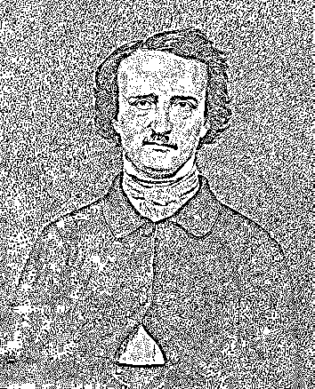

| 埃德加·爱伦坡

神话学家约瑟夫·坎贝尔（Joseph Campbell）的金星在双鱼座，米哈伊尔·巴里什尼科夫（Mikhail Baryshnikov）也是如此。

埃德加·爱伦坡（Edgar Allan Poe）和伊丽莎白·巴雷特·布朗宁（Elizabeth Barrett Browning）的金星在双鱼座，还有弗朗西斯·福特·科波拉（Francis Ford Coppola）、迈克尔·凯恩（Michael Caine）和德鲁·巴里摩尔（Drew Barrymore）。

**版权声明：**本文由若道翻译发布，欢迎转发，反对抄袭。友号转载请申请白名单。

**END**

**斯蒂芬·弗里斯特**

若道签约老师。进化占星学的创始人之一，当今世界最有影响力的占星大师之一；1985 年，他凭借《内在的天空》一书获得职业占星师协会奖（Professional Astrologers Incorporated Award）。他四次获得占星界最高的占星学联合协会奖（United Astrology Congress Regulus Award）提名，2018 年获得轩辕十四教育奖。

****探索组合图永恒的三角——斯蒂芬工作坊报名中****

斯蒂芬说，我们的组合图表明无论什么状况我们都能熬过去。

**组合图也像出生星图一样有行进。**在工作坊中， 我们将**探讨一些特殊的技法和考量，来帮助伴侣们应对生活中的挑战和机遇。**组合图的推进会出现一些看似难以解决的复杂问题，斯蒂芬老师创造了一种解决这些问题的技法。他将在工作坊中阐述相关细节，基本的问题是：如你所知，要了解一个人 30 岁生日的推进，我们要看这个人出生后 30 天的行星位置。问题是，组合图与我们在占星学实践中使用的其他星图不同，组合图并不代表某一天的天空。记住，它是基于中点的。**那么我们如何从一个不存在的日期开始 "向下数 30 天"呢？斯蒂芬老师将为我们提供一个行之有效的答案。****点击下图了解更多详情******20 位来自世界各地的占星师****带来 19 场沙龙——新世界的觉醒****详情可点击下图**

**学习占星学****点击下图了解课程详情**

**微信又双叒叕改版啦，不想错过若道君的推送？**
**就把若道设为星标吧！****▼**

**喜欢就点一下“在看”吧！**

********报名直达入口********

# 斯蒂芬·弗里斯特工作坊丨探索组合图永恒的三角

> 原文：[`mp.weixin.qq.com/s?__biz=MzA5NjA0NTAxNg==&mid=2651487638&idx=2&sn=3f0c0dc88fc1e0d7515e55c79add4a46&chksm=8b48cf21bc3f463798b5857839cda6febbc69cba324f0800a9cf6e9acf0ffcb779b8a78c5a49&scene=126&sessionid=1692737761#rd`](http://mp.weixin.qq.com/s?__biz=MzA5NjA0NTAxNg==&mid=2651487638&idx=2&sn=3f0c0dc88fc1e0d7515e55c79add4a46&chksm=8b48cf21bc3f463798b5857839cda6febbc69cba324f0800a9cf6e9acf0ffcb779b8a78c5a49&scene=126&sessionid=1692737761#rd)

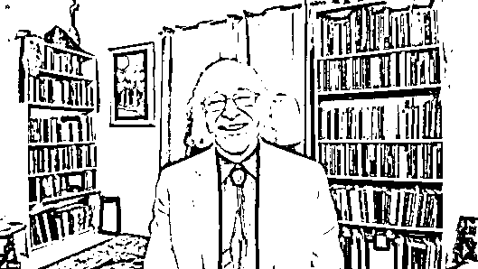

**1**

********斯蒂芬·弗里斯特老师若道独家三日线上工作坊********

斯蒂芬说，我们的组合图表明无论什么状况我们都能熬过去。

**2**

********此次授课内容********

**组合图描述了如何才能使两个人的关系一直充满活力。**这句话中隐含的意思是假设一段关系有一种区别于这两个个体的独立的生命。有时我们喜欢和一对伴侣共度时光，却从没想过单独见他们其中一人。我们从这对伴侣身上感觉到的 "频率"是对他们组合图能量的直接体验。在某种程度上，可以简单地理解为：**正如每个人都有自己的星图一样，每对伴侣也有他们的星图。**

从简单的描述层面上讲，这就是组合图的意涵。记住，我们可以将这一技法用于任何一种关系：**父母和子女、商业伙伴、朋友。**作为进化占星师，我们的目标要比单纯描述走得更深。解读组合图时，可以着眼于帮助人们，而不仅仅是使他们感到惊奇。对于个体来说，出生星图代表了一条正确的人生道路，一条承诺意义、活力、灵性目标的道路。组合图亦然，只不过它将一段关系看成一个独立的个体，而不是两个人。关系也有进化的路径：人们走到一起是为了学习和成长。个体如果没有领会自己出生星图的要点，会变得疲惫而沮丧。两个人也是如此，**如果没有抓住组合图的要点，我们就会对对方感到厌烦。这段关系似乎也会失去动力。**

伴侣常常意见不一，陷入困境，看不到前进的方向。三是一个更有动力的数字。三个人投票，二个人以多数票击败一个人，推动事情继续发展。**这实际上解释了这次工作坊的主题：永恒的三角。**

**每对伴侣其实都是一个三人组：你、我以及我们。**组合图所代表的那个看不见的 "第三人"经常会"投出打破僵局的一票"，使关系得以发展。**·** 但是如果组合图总是同意一个人的意见，而不同意另一个人的意见，怎么办呢？（这被称为"封建制度"）**·** 如果两个人都安静而保守，但他们的组合图却要求狂野的冒险呢？（这是 "文化冲击"）**·** 如果它同时均衡地反映了两个人的情况呢？我们可以称之为 "民主"，但我们仍可以区分出一个人天然的智慧比另一个人更强的领域，让擅长的人负责擅长的事，这会促进关系蓬勃发展。换句话说，我们开始看到这个技法的咨询维度了。我们将在这个工作坊中探讨这些内容。两个人究竟为什么会走到一起？**在严肃、复杂的关系中，我们可以假设两个人之间有一些未解决的业力。**如果他们在今生是恋人，但在前世中，一个是父母，一个是孩子呢？也许那些直觉和假设仍可以感受得到，极为错综复杂地使得他们在今生想要成为情侣。**这些疑问将我们引向组合图的月亮交点，在那里我们往往能发现当今人类任何伙伴关系问题的真正核心。**

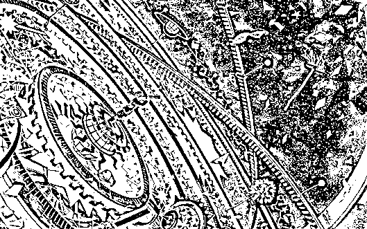

**从理论上讲，组合图是基于中点的。**如果我的出生星图里太阳在摩羯座中段，而你的太阳在双鱼座中段，我们组合图的太阳就在水瓶座中段。换句话说，**在你和我的太阳的中间位置。****其他行星、月亮交点和中天也是如此。**其他宫头的位置，包括上升点则存在一些争议。通常的做法是仍然使用中点，但斯蒂芬老师将会解释他认为这样做存在的技术方面的问题。他更倾向于**使用关系最初开始的地点绘制星图，就像我们使用出生地来绘制出生星图一样。**

**组合图也像出生星图一样有行进。**在工作坊中， 我们将**探讨一些特殊的技法和考量，来帮助伴侣们应对生活中的挑战和机遇。**组合图的推进会出现一些看似难以解决的复杂问题，斯蒂芬老师创造了一种解决这些问题的技法。他将在工作坊中阐述相关细节，基本的问题是：如你所知，要了解一个人 30 岁生日的推进，我们要看这个人出生后 30 天的行星位置。问题是，组合图与我们在占星学实践中使用的其他星图不同，组合图并不代表某一天的天空。记住，它是基于中点的。**那么我们如何从一个不存在的日期开始 "向下数 30 天"呢？斯蒂芬老师将为我们提供一个行之有效的答案。**

并非所有的人都处于伴侣关系中，但**作为人类，就需要与其他的灵魂共舞。占星学能够极大地帮助人们驾驭复杂的关系。**了解我的星图如何与你的星图通过相位和宫位的交互而产生互动，是非常有帮助的。组合图包含了这些技法，提醒我们，整体总是大于各个部分之和，而又与之不同。

**3**

********斯蒂芬的占星著作********

**·** 1984 年-1988 年间，斯蒂芬写作出版了《内在的天空》（已有中文版）、《变化的天空》和《天空的伴侣》三本占星经典著作，奠定了早期在占星学界的地位。**·** 2002 年-2005 年间，他与朱迪·弗里斯特共同创作了两本经典的关系占星学著作《天空的伴侣 I：爱、性、和进化占星学》《天空的伴侣 II：组合图》。**·** 2008 年，斯蒂芬出版了一本非常重要的著作《昨日的天空》，此书是至今为止关于轮回转世跟星图的清晰对应最详尽的著作之一。 斯蒂芬前后一共出版了 12 部占星著作，在世界占星学界拥有很高的声誉。

**4**

********斯蒂芬获得的荣誉********

1985 年，他凭借《内在的天空》一书获得职业占星师协会奖（*Professional Astrologers Incorporated Award*）。1992 年、1995 年、2008 年、2018 年，他四次获得占星界最高的占星学联合协会奖（*UnitedAstrology Congress Regulus Award*）提名，2018 年获得轩辕十四教育奖。

**5**

********斯蒂芬的占星哲学观********

斯蒂芬的占星风格以**自由和选择**为中心，他的解读不是以下定论的方式来“预测”未来，他**强调如何改善生命，而不是宿命式的论断**。他以心理占星学的语言来解读星图上的人格部分，但是**通过南北交点及其相位和守护星来探索星图所揭示的前世业力与今生方向，在灵魂进化的背景里来整体解读星图。**他认为进化占星学的目的在于**鼓励人们做出更符合进化方向的智慧选择，我们学习去了解前世的时侯，关注点应该集中在如何通过意识来疗愈自己。**

**6**

**这些名人怎么说**

斯蒂芬让我们停止了玩责备命运的游戏，而开始看到自己是一个走在进化路途上的勇士。——奥普拉杂志“*O: THE OPRAH MAGAZINE*”

斯蒂芬和杰夫这两位著名占星师创造性地相互应和，展现出他们出色的教师才华，发展并弘扬了占星这门艺术。（对《测量天空：进化占星学和灵魂的钥匙》的书评）——著名心理占星师 现代占星之父 诺·泰尔（*Noel Tyl*）

请享用斯蒂芬和朱迪这两个博大的灵魂在此书中所提供的洞见大餐吧。（对《天空的伴侣》的书评）——进化占星学的创始人之一 杰夫·格林（*Jeff Green*）

我为斯蒂芬解读的精准感到惊叹，他强调没有一件事是坏得无法挽回的，也没有一件事是如此之好以至于它不会因为现在的错误判断而消失的。我怎样推荐他都不为过！——好莱坞著名影星“钢铁侠”男主角 小罗伯特·唐尼（*Robert Downey Jr*）

**7**

**上过课的占星师怎么说**

他关于我星图的解读，让几乎所有在场的人掉泪，我也从此开启了一段灵魂追寻的旅程。我很惊讶他透过星图可以如此深入一个人的灵魂。很多东西你自己都不知道，但是他讲出来你会发现，啊，这是真的，这是占星学的神奇。——《心探索》创始人孟想

每个来参加老师课程的同学，都会被老师深深的慈悲心感动。这种慈悲心，并不是表面上说的一些什么话，而是一种从意识层次上发出的能量。每个来上课的人，都能感受到老师的爱。这种爱，并不是盲目的爱，而是深刻地洞悉真相后的慈悲。

——斯蒂芬老师工作坊翻译逸月

斯蒂芬老师的一对一咨询已经排期到两年之后，我特别幸运，曾在课堂上被老师抽中分析过我的星图，老师充满爱与智慧的指引让我更加清晰的认识了自我。内在的潜能、需求和矛盾被老师娓娓道来。——禄丽荣斯蒂芬老师是位非常非常值得推荐的大师，很粉他，这位进化占星学的创始人，对人的理解是那么的全面完整、深刻洞见、慈悲和温暖，就这方面而言足可以媲美我无比崇敬的荣格和史坦纳（这两位去天堂里玩了）。如果你对西洋占星感兴趣，或者对人的所有角度、各个层次的真相和可能性感兴趣，推荐斯蒂芬老师的书和课程，特别是他的课程，数倍的功力大增的好机会，错过真是占星粉丝的莫大损失。——仁华

**8**

**2019 年工作坊学员感悟**

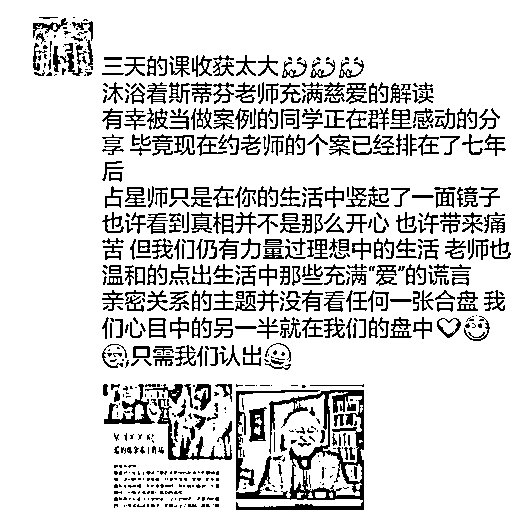

**9**

**什么人适合这门课程**

✦ 占星师或渴望成为占星师的人群。   ✦ 本课程并非针对初学者，需具备若道核心课程 level4 及以上水平，即了解星座、行星、宫位、相位、综合解读等知识。✦ 课程会涉及组合盘解读高阶内容，不了解相关知识的同学，请提前学习相关内容。

**10**

********授课老师********

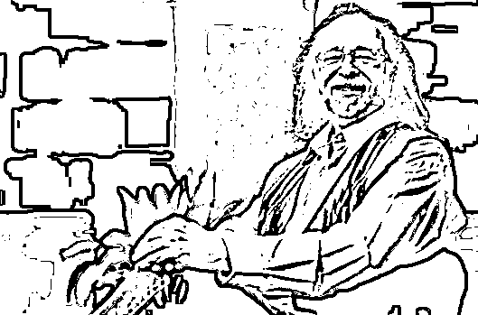

**斯蒂芬·弗里斯特（Steven Forrest）**

**·** 进化占星学的创始人之一，当今世界最有影响力的占星大师之一；**· **毕业于美国北卡罗莱纳大学宗教学专业；**· **1984 年-1988 年间，写作出版了《内在的天空》、《变幻的天空》和《天空的伴侣》三本占星经典著作，奠定了早期在占星学界的地位。前后一共出版了 12 部占星著作，在世界占星学界拥有很高的声誉。**· **1985 年，他凭借《内在的天空》一书获得职业占星师协会奖（*Professional Astrologers Incorporated Award*）。1992 年、1995 年、2008 年、2018 年，他四次获得占星界最高的占星学联合协会奖（*United Astrology Congress Regulus Award*）提名，2018 年获得轩辕十四教育奖。**· **斯蒂芬将自己的绝大部分时间都花在教学以及个人咨询上，他于 1998 年创立了占星学徒计划（*Astrological Appretice Program*），这个计划致力于培养职业占星师；**· **至今为止已经有 600 余位学员完成了培训，其中很多都成为了优秀的职业占星师；**· **他是一位脚踏实地的导师，充满快乐和活力，亲和幽默同时又充满了智慧；**· **他的课程不仅仅是一次占星知识和经验的学习，也是一次与智者的相遇。

**11**

********课程费用********

**正价：6800 元****早鸟价：5800 元****早鸟价截止日期：2022 年 9 月 15 日**

**12**

********授课时间、方式、退转********

**授课时间：2022 年 10 月 14 日-16 日（周五、周六、周日）7:00-13:00****具体时间安排：****7:00-8:45****（15 分钟休息）****9:00-11:00****（30 分钟休息）****11:30-13:00**

****授课方式：******线上直播课，英文授课，中文翻译**

**课程退转：退款原则请详看《教学协议》，如有疑问请咨询课程顾问。**

****斯蒂芬工作坊 | 探索组合图永恒的三角****

**授课老师：斯蒂芬·弗里斯特**

**授课时间：2022 年 10 月 14 日-16 日（周五、周六、周日）**

**授课方式：******网络授课，英文授课，中文翻译****

**费用：**6800 元**（早鸟价：5800 元，截止日期：2022 年 9 月 15 日）**

**课程负责人：王老师**（微信/手机：18510107057，请备注“斯蒂芬工作坊”）

长按二维码添加课程负责人咨询

**END**

****报名直达入口****

# 9 月宇宙天气丨 6 星逆行来了！如何度过这段“海水退潮期”？

> 原文：[`mp.weixin.qq.com/s?__biz=MzA5NjA0NTAxNg==&mid=2651487498&idx=1&sn=aba8e318636983494b89954c4fc56914&chksm=8b48cfbdbc3f46abb75aa4a9dc144087f631dedd090181e091efc6a0a8c57960a7789c1b26eb&scene=126&sessionid=1692737761#rd`](http://mp.weixin.qq.com/s?__biz=MzA5NjA0NTAxNg==&mid=2651487498&idx=1&sn=aba8e318636983494b89954c4fc56914&chksm=8b48cfbdbc3f46abb75aa4a9dc144087f631dedd090181e091efc6a0a8c57960a7789c1b26eb&scene=126&sessionid=1692737761#rd)

******☆ **后台回复“今日”，给你一句生命态度****

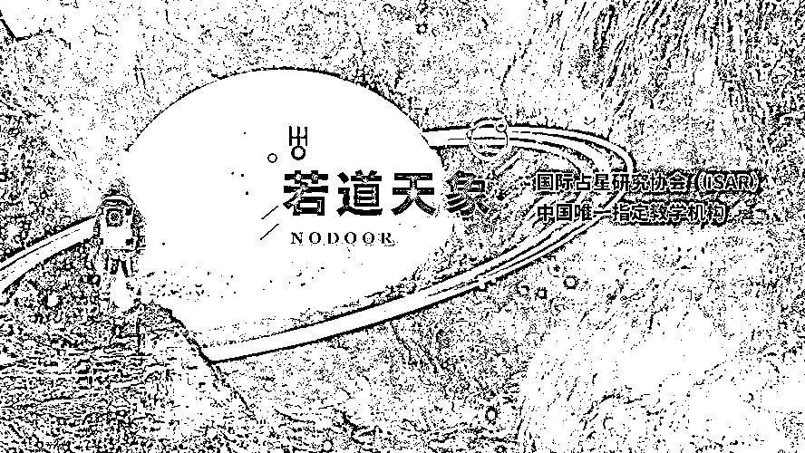

作者/Anastasia

编辑/翀子 封面/书君 图片/稿定设计

**九月重点天象**

*   **金星进入处女座（9 月 5 日）**

*   **水星在天秤座逆行（9 月 10 日）**

*   **双鱼座满月（9 月 10 日）**

*   **太阳进入天秤座（9 月 23 日）**

*   **水星逆行进入处女座（9 月 23 日）**

*   **天秤座新月（9 月 26 日）**

**整体氛围**

**9 月，群星逆行。**

8 月末，随着天王星的逆行，所有外行星，从木星、土星、天王星、海王星、冥王星，直到凯龙星，有一个算一个都处在逆行状态。9 月 10 日，水星也来凑热闹，开始今年第三次逆行。10 月，火星也将开启为期大半年的逆行。

**逆行就像海水退潮。**本来奔涌向前的浪花开始后退，露出裸露的沙滩，以及沙滩上的各色垃圾。原本在高涨潮水中淹没的一切逐渐露出真面目，哪里有暗礁，哪里是浅滩都看得一清二楚。

六星逆行，能量的潮水后退，不足以覆盖混乱维持秩序，积累的问题暴露出来就变得非常扎眼。人们看到一地鸡毛的脏乱差，就会有意识地去清扫。**所以，逆行期是暴露问题、发现问题、反思问题、解决问题的好机会。**

水星在 8 月 22 日已经进入逆行的前阴影期，9 月 7 日停滞，10 日开始正式逆行。这次逆行仍然延续前两次逆行的风格，从风象星座逆行回到土象星座。

2022 年第一次水星逆行发生在 1 月，水星从水瓶座逆行回到摩羯座；第二次水星逆行发生在 5 月，水星从双子座逆行回到金牛座；9 月是水星本年度的第三次逆行，从天秤座逆行回到处女座。

今年我们将经历四次水星逆行。和前三次逆行风格不同，12 月开始的第四次水星逆行区间只在摩羯座，明年接下来的两次水星逆行全程也都在土象星座金牛座和处女座，呼应金牛座的北交点和天王星，再次强调土象元素的功课。

而明年年底开始的水星逆行将再次变身，逆行区间从土象星座逆行回到火象星座，开始逆行土火元素的周期。

**整个 9 月，太阳行经处女座和天秤座。**定位星先是逆行的水星，后是落陷的金星，状态都不怎么舒适。**另一颗阳性行星火星则在双子座进入了逆行前的阴影期，**火星将在双子座停留到明年 3 月末。

这会造成社会面热点分散，意识形态冲突加剧，再伴随着土天四分相的日益加强，**年末这几个月，人们的感受将非常明显，身体有恙，精神疲惫。**

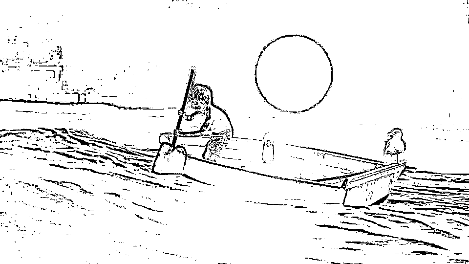

**重点天象****★****水星在天秤座、处女座逆行**

本次水星逆行的时间是从 9 月 10 日到 10 月 2 日，逆行区间从天秤座 8°到处女座 24°。水星从 8 月 21 日进入前阴影期，到 10 月 17 日离开后阴影期。**算上阴影期，横跨整个 9 月，前后影响近 2 个月时间。**

**水星在风象的天秤座开始逆行，**提醒人们关注自己在人际交往中的交流、沟通和分享是否合适得体，是否有累积的误会和麻烦，需要我们重新思考和调整。而这里面的因可能埋伏在更早以前的态度和细节上。

**土象的处女座**指出礼貌和礼仪背后的**务实和谦逊才是平等关系的基石。**居高临下的优越感带来的虚与委蛇的距离感，并不是真诚、平等的尊重。离开了处女座的低调和助人精神，优雅的天秤座就变成了假惺惺的伪君子。

**水星今年前三次的逆行，都是从风象星座回到土象星座，**反复强调了这个道理，精神上的提升离不开扎实的现实基础。没有土象能量的支撑，风象能量很容易滑入好高骛远、不接地气的眼高手低。非但不会有利于做成事情，反而容易带来精神上的分裂和迷惘。

**查看天秤座 8°到处女座 24°区间在出生星图上的宫位，如果其中涉及到个人行星或者四轴，就是本次水逆的重点影响人群，**要非常小心本次水逆带来的混乱和麻烦。

留意交流沟通、电子设备和文档、交通出行，以及疫情防控等水星主导的领域，未雨绸缪，有备无患，小心驶得万年船。

**★****火星进入逆行阴影期**

火星的运行周期是两年，但它的速度并不是平均分到每个黄道星座上。通常火星经过一个星座需要一个半月左右的时间。**由于火星每两年逆行一次，每次逆行时间两个多月，这时候它可能在一个星座停留超过半年。**

**上次火星逆行发生在 2020 年，火星在白羊座逆行。**从 2020 年 6 月 28 日火星进入白羊座，到 2021 年 1 月 7 日离开白羊座进入金牛座，火星在白羊座停留了六个半月。可以回想当时的状态，感受火星能量是如何呈现在每个人的生命领域中的。

**今年火星在双子座逆行（再次强调了风象主题）**。逆行时间从 10 月 30 日到 2023 年的 1 月 13 日，逆行区间是双子座的 25°到 8°。火星 8 月 20 日进入双子座，直到明年 3 月 25 日离开，在双子座停留将近七个月的时间。

**9 月 4 日，火星进入双子座 8°，进入了本次逆行的前阴影期。**当火星逆行，其强烈的生存欲和意志力就会带来**过度的脾气和怒火**，做事冲动，不过大脑，一意孤行。事后后悔不已，往往于事无补。

**火星在双子座的超长待机，尤其会给变动星座（双子座、处女座、射手座、双鱼座）带来持续的忙碌、混乱和冲突。**

掐头去尾，生日在 5 月 29 日到 6 月 18 日的双子座和生日在 11 月 30 到 12 月 19 日的射手座首当其冲，是本次火逆的重点影响人群，处女座和双鱼座其次。

**查看出生星图上双子座所落的宫位，**这大半年，人们的注意力和精力将不可避免地被牵制在其中，成为接下来**半年**的生活重心。**这个宫位也是遭遇冲突和麻烦的高危领域。**

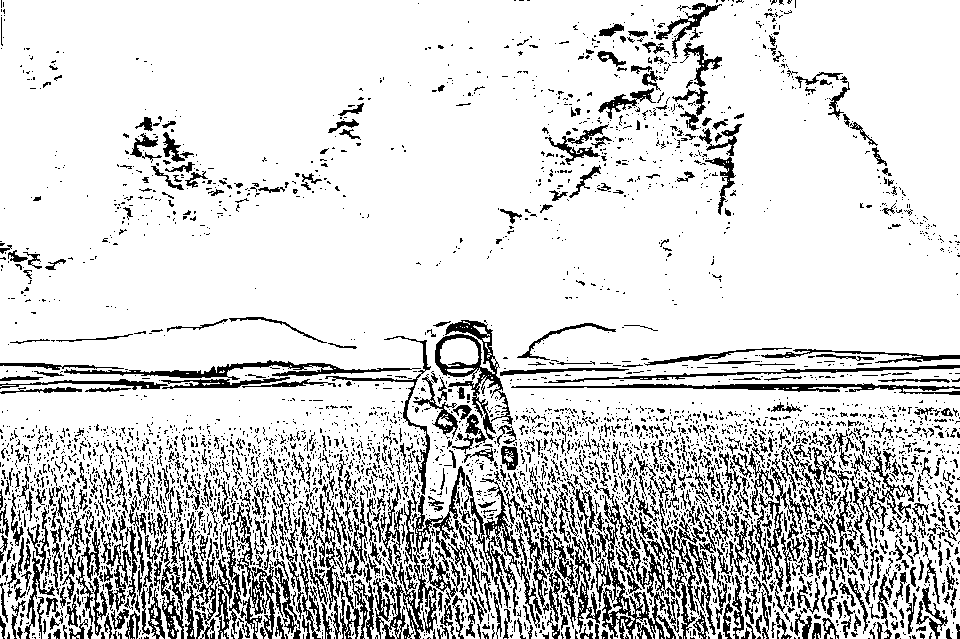

**★****朔望周期**

和 8 月一样，9 月的朔望周期相对平淡，但带来的影响会比 8 月友好一些。

8 月 27 日到 9 月 10 日是上弦月周期，身体能量会更注重吸收和消化，建议适当控制饮食。9 月 4 日，月亮在射手座进入上弦月，9 月 10 日，月亮在双鱼座形成满月。

9 月 10 日到 9 月 26 日是下弦月周期，身体会更倾向于清理和排毒，这时候多吃一些，不容易发胖。9 月 18 日，月亮在双子座进入下弦月周期；9 月 26 日发生天秤座新月，又开始了新的一轮月相周期。

**满月发生在 9 月 10 日的 17:58，双鱼座 17°。重点影响人群是生日在 3 月 8 日、6 月 9 日、9 月 11 日和 12 月 10 日前后的个体。**

金牛座 18°的天王星对于这个满月非常友好，三分处女座太阳，六分双鱼座月亮。在土天四分相的大背景下，这个满月可以帮助我们获取一些成长方面的灵感。

**关于理性和情感，拥有和分享之间如何达到恰当的平衡点，可以留意满月那几天发生的事情，**也许是手边书中的某个段落，也许是不经意的某句灵感，也许是当晚的梦境，**启示无处不在，**关键是我们要提前校正好我们的接收天线，不错过宇宙给我们的火花和灵感。

海王星和满月有个允许度比较大的合相，对于情绪的起伏还是要有一些心理准备。情绪很容易被触发，失去控制。知道这是满月惹的祸就好了。**适当的放松和发泄，利于身心健康。**

**新月发生在 9 月 26 日凌晨 5:54，天秤座 2°。重点影响人群是生日在 3 月 23 日、6 月 24 日、9 月 26 日和 12 月 25 日前后的个体，请慎重许愿。具体许愿内容请参照天秤座 2°所落宫位代表的领域。**

天秤座新月对分白羊座的木星。有信心、有方向、有想法当然是好事，但也不要忽视对分相带来的困难。我们的愿望是否夸大其词，步子是否迈得太快，目标是否定得太宏大，都是需要仔细去考虑的细节。

新月发生时，金星合相处女座水星、三分冥王星，会帮助人们深入思考，看到自己的欲望和执着。学会放手，不再沉溺于现实生活中的贪嗔痴。建议许愿的时候也重点关注平时容易钻牛角尖的地方，利用新月的魔法松开相关的心结。

能落在纸上的愿望，一定是平时常常放在内心深处，不断想到的愿望。就是因为如此，新月许愿才会有魔力。请写下清晰的愿望，越具体的愿望越容易实现。

**满月和新月的当天，都可以断食或者轻食，给身体一个休息和重启的机会。**

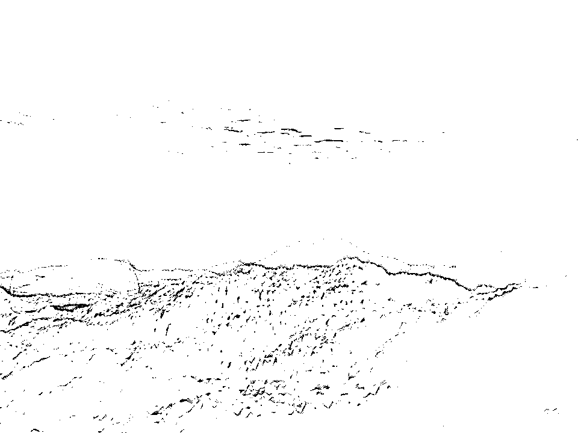

**12 星座九月小贴士**

**（参考太阳星座和上升星座）**

**★ ****白羊座**

*   **调整心态，生活节奏加快**

*   **深入思考，提升自我价值**

**★ ****金牛座**

*   **稍安勿躁，关注内心生活**

*   **制订规划，提高谋生能力**

**★ ****双子座** 

*   **生活忙碌，注意身体健康**

*   **认识情绪，避免冲动行事**

**★ ****巨蟹座** 

*   **工作忙碌，抓住提升机会**

*   **放慢步伐，不要急于求成**

**★ ****狮子座** 

*   **结识新人，社交活动丰富**

*   **学习进修，拓展眼界视野**

**★ ****处女座** 

*   **谨慎调研，抑制投资冲动**

*   **控制节奏，工作压力增大**

**★ ****天秤座** 

*   **有备无患，注意旅途安全**

*   **修复关系，关注长期发展**

**★ ****天蝎座**

*   **状态提升，日常节奏放松**

*   **放下恐惧，面对深层问题**

**★ ****射手座**

*   **激情碰撞，创造力很活跃**

*   **加强对话，建设重要关系**

**★ ****摩羯座** 

*   **节奏加快，平衡工作生活**

*   **关注家人，促进家庭关系**

**★ ****水瓶座** 

*   **约会频繁，脱单机会增多**

*   **有据有迎，推进人情往来**

**★ ****双鱼座**

*   **重心转移，居家生活繁忙**

*   **自我觉察，关注灵性成长**

**版权声明：**原创文章由作者授权首发于若道平台，欢迎转发，反对抄袭。友号转载请申请白名单。

**END**

**Anastasia**

职业占星师/专栏作者/策展人

ISAR 认证占星师（2016 年获得）

若道认证生时校正资质（2015 年获得）

**微信公众号**：KairosMoment

长按打赏

**20 位来自世界各地的占星师****带来 19 场沙龙——新世界的觉醒****详情可点击下图**

**学习占星学****点击下图了解课程详情**

**微信又双叒叕改版啦，不想错过若道君的推送？**

**就把若道设为星标吧！**

**▼**

**喜欢就点一下“在看”吧！**

********报名直达入口********

# 如何从占星学看职业？这里有几个线索

> 原文：[`mp.weixin.qq.com/s?__biz=MzA5NjA0NTAxNg==&mid=2651487498&idx=2&sn=71f9534b96334b90138527328e8385c0&chksm=8b48cfbdbc3f46abebff93b34b3bef85592ba6b5997c414c4d59f5a60220edef12dec9c6a4a3&scene=126&sessionid=1692737761#rd`](http://mp.weixin.qq.com/s?__biz=MzA5NjA0NTAxNg==&mid=2651487498&idx=2&sn=71f9534b96334b90138527328e8385c0&chksm=8b48cfbdbc3f46abebff93b34b3bef85592ba6b5997c414c4d59f5a60220edef12dec9c6a4a3&scene=126&sessionid=1692737761#rd)

作者/唐娜·坎宁安翻译/李含 校对/江艺编辑/翀子 图片/稿定设计

本文节选自作者的占星书籍《职业选择和挑战》

星图是如何展现职业信息的呢？文章中描述了第 2 宫、第 6 宫、第 10 宫与职业的关联，以及三王星和中天对事业成就的影响。现在，让我们跟随大占星师唐娜·坎宁安了解星图上的职业密码吧！另外，如果你也想通过占星学更好的了解自己、帮助他人，可以点击[【ISAR 认证职业占星师必修课】](http://mp.weixin.qq.com/s?__biz=MzA5NjA0NTAxNg==&mid=2651486909&idx=3&sn=88f9610b2022631cfa0fb0bf0ed817ab&chksm=8b48c80abc3f411c03b5c46959ee78d5610ea3c00ebfd1b7e51beb55b03161a4d5a2d8e83295&scene=21#wechat_redirect)查看课程信息哦~

**第 10 宫占主导的人**

第 10 宫代表事业、长期目标、毕生的成就、一个人最高的社会地位。**第 10 宫强大的人非常强调于以事业为导向**，而不一定关注在财富（第 2 宫），或是关注于工作本身（第 6 宫）。如果他们重视财富，那是因为看重财富带来的身份地位。

这些人强烈地受到长期目标的驱使，需要在这个世界上实现一些有意义的成就。**他们渴望影响他们的世界，通常会寻求认可。**

**当第 10 宫沾上天王星、海王星、冥王星的色彩，或落入这些行星守护的星座——水瓶座、双鱼座或天蝎座时，通常预示着不同寻常的事业轨迹。**

典型的情况是，星图中有这些配置的人会需要更长的时间去探索自己真正的事业，因为他们**面临着将外行星的能量整合进职场的挑战**，需要在事业中融入超越个人的元素。

例如，天王星接近中天的人，也许会用让人惊讶、打破现状的方式来获得认可；海王星接近中天，也就是在 10°之内，这些人可能会渴望成为艺术家，从事创造性的事业。

**第 2 宫占主导的人**

第 2 宫的性质类似于金牛座。**第 2 宫被强调的人常常更偏向于受到财富的驱使，**以及财富可以为他们做什么，在他们看来，这比长期目标（第 10 宫）和工作本身（第 6 宫）更重要。

许多有强大的外行星落于第 2 宫的人会激烈反对这种解释，坚持认为他们完全不是物质主义者。例如，双鱼座可能是超凡脱俗的，和它的守护星海王星一样。

在当今世界，不论他们多不喜欢强调贪婪和占有，**但这些人必然需要赚取财富维持基本需求，**所以挣钱维生耗去的精力会比他们预期的更多。

如果将外行星象征的具体议题和关注点，与现实的房租或抚养子女事务进行权衡，正确生活方式的问题就变得非常复杂。

天王星类型的人会受到强烈的自由和自主需求的驱动，金钱买来的自由可能让他们过上幸福的生活，但这并非是由于金钱让他们拥有世俗财富。

**天王星落在第 2 宫的人**可能引人注目也可能远离关注，只要这能给他们带来财富，并让他们做自己想做的事，且因此获得自由。

**冥王星或天蝎座行星落在第 2 宫的人**，常常着迷于**涉及财富的破坏性游戏**。对他们而言，金钱总是伴随着隐秘的议程，常常代表着他们关系中的权力和控制。

**有越多行星落入第 2 宫，“钱景”就越复杂，但也意味着有更多的赚钱潜力。**如果太阳与这些外行星或它们的星座一同落入第 2 宫，自我价值议题将与一个人的收入或没有收入，复杂地交织在一起。

如果太阳落在双鱼座或处女座或与海王星成困难相位，低自尊可能导致他们对自己需要完成的事务缺乏担当，但随后的低收入又强化了无价值感。

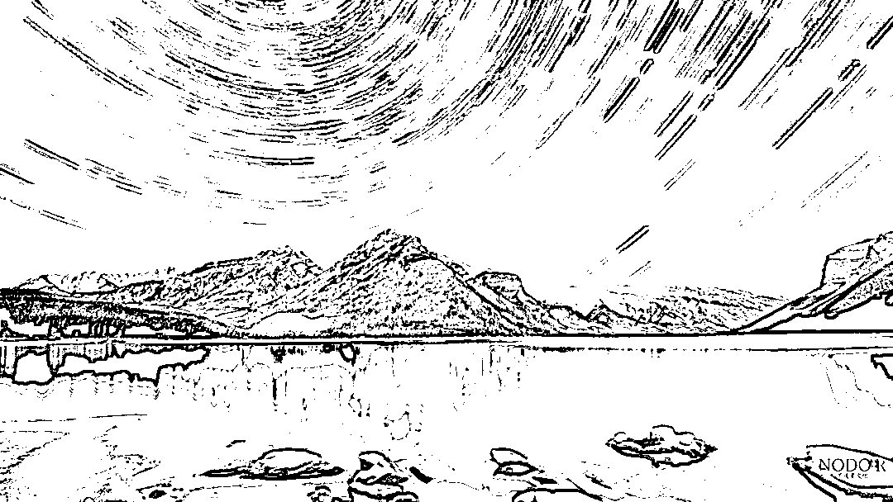

**第 6 宫占主导的人**

第 6 宫类型很有趣，和处女座人类似。他们可能因为工作本身的关系而热情地投入其中。**他们的大部分能量都与工作和职场紧密关联，**不论工作是快乐与满足的乐土还是挫败感的源头。

**第 6 宫内的具体行星、星座和相位，可以告诉我们他们工作的事务以及他们如何在这个领域中追求满足。**

如果是太阳落在第 6 宫，自尊会与工作的品质和特质关联。当第 6 宫强于第 10 宫时，此人常常会像处女座人那样不愿走到聚光灯下。

**这些人通常是必不可少的职工，**在公司中从事重要工作，但鲜少获得赞誉。如果有许多行星落入第 6 宫，可能会是一位**把工作摆在第一位的人，**因为工作服务于他们的基本驱动力和需求。

**中天与职业**

职业状况的分析预测是非常复杂的，因为现代社会的职业大多较为复合化，职业生涯也比较多变。所以从出生星图分析职业选择时，也需要参考许多的因素，包括与职业有关的宫位。

**土象宫位，2、6、10 宫是与职业预测有关的宫位，**分别对应了土象的金牛座、处女座、摩羯座，这 3 宫分别描述了与土象有关的事情，比如财富、日常工作和长期职业生涯目标，被称作职业宫位。 

**如果三王星落在土象宫位，或是这 3 宫的宫主星，职业生涯将绝不寻常。中天是最重要的影响因素之一**，它所落的星座和 10°以内合相的星体都会影响职业的选择和我们追求事业的方式。

**行星与中天的相位并不会都影响到个人职业领域，除非这个星体落在 2 宫或 6 宫。**

**困难相位往往比和谐相位会带来的驱动力更大。**四分相位意味着困难的来源，比如海王星在某个宫位四分中天，这个宫位代表的领域和海王星的性质将对于事业成功构成阻碍。

**三分相位代表着支持**，星体及其所在的宫位代表的领域对于事业追求是有帮助作用的。一般的三分相位会发生在 2 宫和 5 宫。2 宫的三分相位预示着金钱的获取和事业的追求能够保持一致；5 宫的三分相位代表着创造力能支持事业的追求。

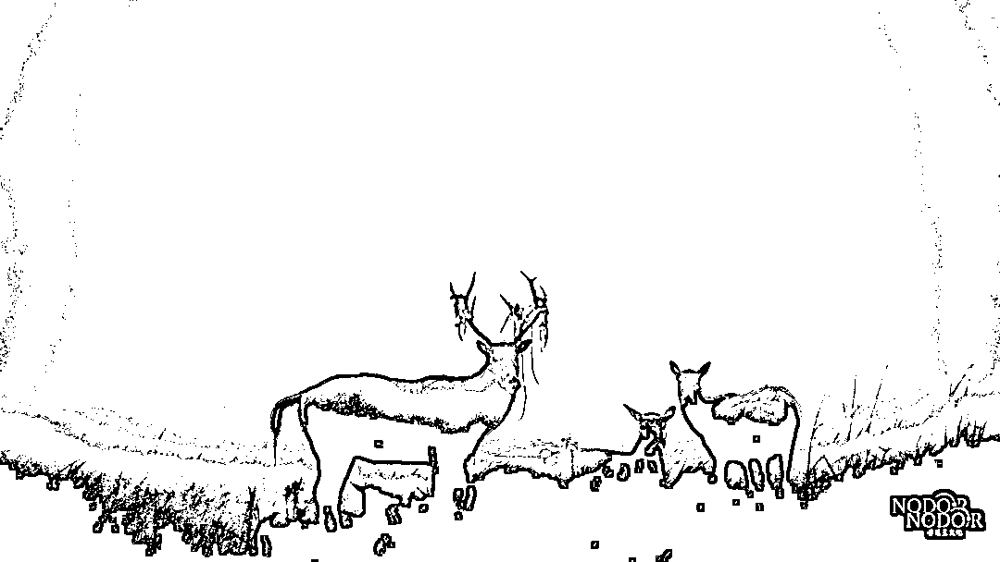

**中天的对分相位预示着私人事务会耗损追求事业的能量。**

比如海王星在 4 宫对分中天可能意味着双亲中有不成功的榜样，或者有需要照顾的双亲，需要肩负更多家庭的责任而影响事业追求。如果海王星在 3 宫对分中天，意味着麻烦来自兄弟姐妹，或者对于自己的成就高于兄弟姐妹而有负罪感。

3 宫还掌管着交流思考等技能，这也意味着白日梦要多于实际的能力。

**影响职业的其他因素****★****三王星所落的星座**

三王星的行进非常缓慢，**预示着一个时代的特征**。比如天王星影响下的职业可能与电脑有关，但是天王星在处女座的人会更专注于实际的运用，天王星在狮子座会更关注于娱乐与创造性事务。

**★****找到你的主导行星**

例如，一个金星为主导行星的金星人，或许是金星相位众多，或者是日月上升还有许多星体落在天秤座，或是有强大的第 7 宫——金星人的特质是以寻求和谐以及爱与美为驱动力。

当一颗行星与日月上升中天有合相、四分相、三分相、对分相，或日月上升或群星落入这个星体所守护的星座，这颗行星的特质在出生星图中占有主导地位。

**一颗行星如果处在 T 三角、大三角、大十字的格局中也会有非常强有力的影响力。**

**★****三王星人**

三王星人的特质各有不同，关注点也不同。

**天王星人——社会改革；海王星人——灵魂成长；冥王星人——治愈过去的伤口。**

三王星人通常混合了不止一种三王星的力量。**他们通常从事非主流的职业，所以他们通常在中年之前都会不断地换工作，以寻找适合的职业。**

看起来，三王星人会比其他人经历更多的挫败，在确定事业方向上会有更多曲折，直到中年三王星的行进与出生星图中各自的位置形成相位，三王星人才算真正走上正轨。

之前工作获得的经验对日后事业追求有很大帮助，但这个寻找事业目标的过程会让三王星人产生自我怀疑的念头。

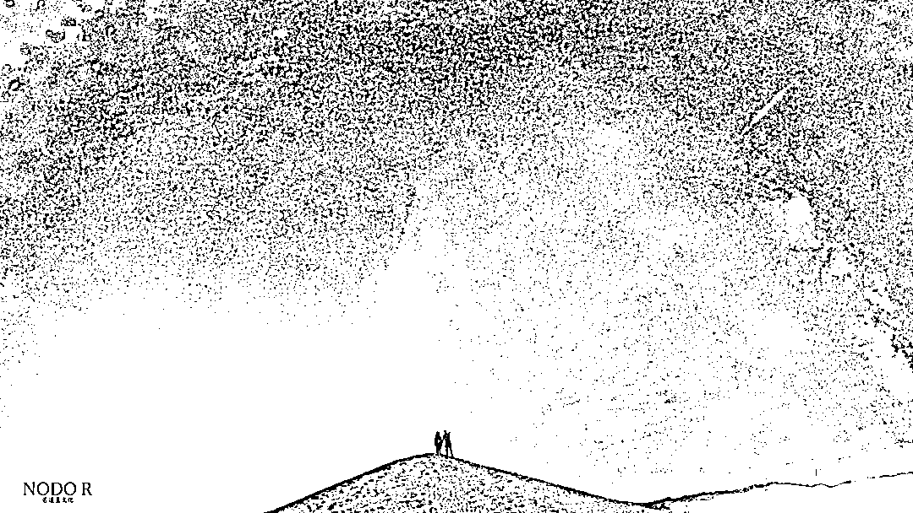

这些挫折感与三王星的特质有关。

首先，三王星都带有**不同于传统的性质**，所以在表达上也会有更多的困难，需要更加成熟的历练才能掌控。第二，三王星都带有某种社会评论家和观察者的色彩，相较于社会现状，**他们更有前瞻性和超越性。**

**对于三王星人来说，第一个关键时期就是 28-30 岁**，第一次土星回归，行进的冥王星合出生星图的海王星，推进的月亮推运第一次回到出生星图中月亮的位置。这就像一次灵魂的召唤，唤醒了他们对于真实自我的追求。

**第二个关键时期是“中年危机”的 38-44 岁**，三王星分别与各自在出生星图中的位置形成相位。行进天王星对分出生星图中的天王星，行进的海王星四分出生星图的海王星，行进的冥王星四分出生星图的冥王星。

在这之前，行进的三王星已经与出生星图中的其他星体有过相位了，类似的经验已经让人学会了处理这样的危机运程。

**★****三王星行进到职业宫位或中天**

即使出生星图中三王星不在职业宫位，在行进中发生这样状况也会对定位职业方向产生很大影响。对于出生星图中职业宫有三王星落入的人来说，这样的行进更加重要。

**冥王星的行进带来的是对权力的渴求，海王星带来的是对创造力和思想性的渴求，天王星带来的是对于独立和深刻变革的渴望。**

三王星行进对于中天的相位影响事业发展的方式也和出生星图类似。

**版权声明：**本文由若道翻译，欢迎转发，反对抄袭。友号转载请申请白名单。

**END****唐娜·坎宁安**一位在国际上广受尊敬的占星师，她有超过 45 年的从业经验。她已撰有数十本占星著作以及上百篇占星学和其他形而上学类的文章。于 2017 年 7 月 5 日离世，享年 75 岁。

**想了解更多占星师工作时需要注意什么吗？**

**拥有****51 年****占星实践经验的****若道创始人****前 ISAR 全球副主席****前 ISAR 全球职业占星师资质认证主席****大卫·瑞雷**

**和**

**2019 年第二届、2021 年第三届核心课中**

**与苏·汤普金斯老师****联合授课****的**

**ISAR 认证职业占星师**

**咔咔（Caroline）**

**二人合力打造**

**2022 年 ****若道全新核心占星课程**

**点击下图了解课程信息****

****报名直达入口****

# 2022 年若道 ISAR 选修课 | 《医疗占星手册》作者亲授

> 原文：[`mp.weixin.qq.com/s?__biz=MzA5NjA0NTAxNg==&mid=2651487498&idx=3&sn=e630e0cea08e8d36de0bb1b2f6a34350&chksm=8b48cfbdbc3f46abcf43ebc65c05fa518f2dfed51322897492d359fdb8f0dffde89fb198bc15&scene=126&sessionid=1692737761#rd`](http://mp.weixin.qq.com/s?__biz=MzA5NjA0NTAxNg==&mid=2651487498&idx=3&sn=e630e0cea08e8d36de0bb1b2f6a34350&chksm=8b48cfbdbc3f46abcf43ebc65c05fa518f2dfed51322897492d359fdb8f0dffde89fb198bc15&scene=126&sessionid=1692737761#rd)

**有四个主要因素影响着我们的生活和健康：基因构成、物质环境、情绪环境，以及我们的占星配置。我们在星图中都存在患病的可能性，而预防的方法在于尽可能充分、真实和健康地生活。****——简·里德·帕特里克****（Jane Ridder-Patrick）博士**

占星学就像心灵的 X 光片。它可以描述个人对世界的看法和反应。我们越不了解自己的天性，面对生活中的挑战，我们就会有越少的选择。

**“占星学可以精准定位需要解决的潜在问题。”**

**医疗占星学是一个强大的工具，同时洞察的身体和心理过程，通过更多的自我认知照顾和关爱自我和身边的人。**

**本课程既适合医疗占星学的初学者，也适合已经有一些相关经验的人****。**简·里德·帕特里克老师将运用现实生活中的例子，揭示一个人的性格、症状及其星图是如何相互映照的。课程也会探讨疾病的意义以及可能的治疗方法。

**本课程旨在为学员提供一个运用医疗占星学的框架和方法，**学员将会学到一些有价值的实用工具，在课程结束后，自己使用这些工具研究其中的关联性。

**此课程可作为 ISAR 选修课。**

1

**课程安排**

**课程时间：2022 年 9 月 20 日-11 月 8 日  每周二 20:00-22:00**

**第*****1*****讲  9 月 20 日 与占星学、心理学、病症一起工作**

*   医疗占星学的组成部分以及如何使用它们

*   行星的作用与相互作用

*   黄道星座人

*   宫位的重要性

*   疾病和健康是如何产生的

**★ 第二、三、四讲的课程内容基于星座以及它们之间的相互作用。**

**第*****2*****讲  9 月 27 日 基本星座**

学习基本大十字星座——**白羊座、巨蟹座、天秤座和摩羯座**——及其功能和相关的健康问题。**这些星座与防御、养育、结构、体内平衡和荷尔蒙控制有关。**

****第*****3*****讲  10 月 4 日 固定星座****

学习固定大十字星座——**金牛座、狮子座、天蝎座和水瓶座**——及其功能和相关的健康问题。**这些星座与习惯和反射、心脏调节、生存、循环和协调有关。**

“固定星座（金牛座、狮子座、天蝎座和水瓶座）在情感和生理上都倾向于**‘难以放手’**，这可能为恶性肿瘤的生长创造环境。所以说，他们可能倾向于沉浸在过去的伤害中，难以自拔。另一方面，这些星座也擅长在艰难的时期坚持不懈并一直**持之以恒**。”——简·里德·帕特里克（Jane Ridder-Patrick）博士

**第*****4*****讲  10 月 11 日 变动星座**

学习变动大十字星座——**双子座、处女座、射手座和双鱼座**及其功能和相关健康问题。**这些星座与呼吸、神经系统、肠道、睡眠以及信息、情感和行动的整合有关。**

**★ 第五、六、七、八讲重点学习行星，它们在身体层面的表达、它们的相位与行进。**

**第*****5*****讲  10 月 18 日 太阳与月亮**

**太阳**掌管视觉、活力、心脏和意识，与心脏、脊柱和视觉问题相关。**月亮**掌管人体的周期，特别是月经周期、饮食模式和体液，与情绪引起的疾病、饮食失调和胃病相关。

**第*****6*****讲  10 月 25 日 土星与天王星**

**土星**掌管着皮肤、骨骼、牙齿和衰老过程。它对应的疾病包括慢性疾病、耳聋、帕金森病、关节僵硬和牙齿问题。**天王星**代表身体活动的协调，有节奏的脉动和身体的“电”。与天王星相关的疾病包括癫痫、痉挛、心律失常，以及阿斯伯格综合症和自闭症样综合症。

**第*****7*****讲  11 月 1 日 海王星与冥王星**

**海王星**掌管松果体、细胞膜渗透和右脑功能，与过敏、上瘾的病症、慢性疲劳综合症和睡眠障碍相关。**冥王星**掌管消除和转化，其病理包括毒性、脓肿、癌症和强迫症。

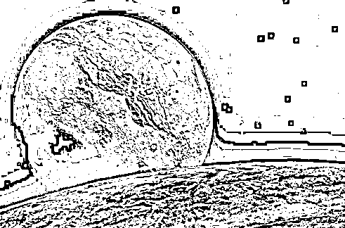

**第*****8*****讲  11 月 8 日 火星**

**火星是与能量和防御相关的行星**，掌管免疫系统、肾上腺功能、肌肉活动和炎症反应。**它是许多身体和情绪障碍的核心**，如自动免疫障碍、抑郁和发烧，以及由手术或需要手术引发的问题。

2

**此次课程适合哪些人？**

*   有一定占星学基础，若道核心课 L3 以上水平；

*   希望成为优秀的占星师，想要借鉴国际大师医疗占星解读思路并融入自己的体系的人；

*   热爱占星学、健康、养生的研究型占星学者；

*   计划考取 ISAR 认证占星师，寻觅中意选修课的学员；

*   走在自我探索和个人成长道路上的人。

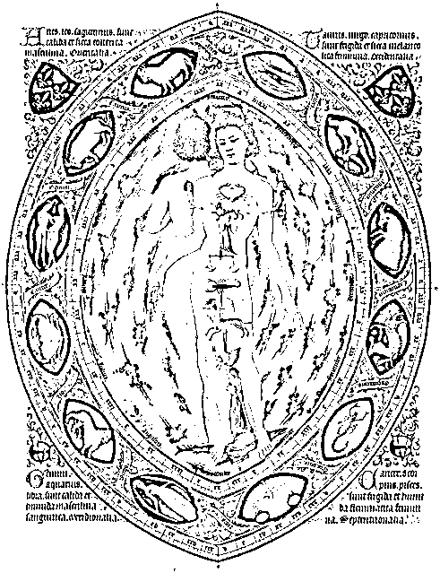

**快来和简·里德·帕特里克老师学习升级版的占星学身体地图吧！**

3

**授课老师**

**简·里德·帕特里克 **博士****

（Jane Ridder-Patrick）

简接受过药剂师、理疗师、草药师、心理治疗师和历史学的专业学习，从事写作、咨询和讲学工作，在英国和全球教授占星学及其历史、当今的心理学和医学应用。她在爱丁堡执业，在爱丁堡大学获得博士学位，研究方向是 17 世纪苏格兰占星学历史。

**她最著名的出版物是《医疗占星手册》。2018 年，她因对医疗占星学的贡献而获得了著名的查尔斯·哈维占星学杰出服务奖。**

《医学占星术手册》（第二版，修订版和扩充版）

(爱丁堡，克拉布出版社，2006 年)

4

**课程信息**

*   **课程时间：**2022 年 9 月 20 日开始，每周二晚上 8 点，每周一次，共 8 次课。

*   **授课方式：**线上直播，英文授课，中文翻译

*   **课程价格：**6800 元

*   **课程咨询：**王老师（微信：18510107057，请备注“医疗占星”）

长按二维码添加王老师

5

**退转课程**

*   **退款原则请详看《教学协议》，如有疑问请咨询课程顾问。**

****医疗占星****

**授课老师：**简·里德·帕特里克

**授课时间：**2022 年 9 月 20 日起

**授课方式：**网络课程**，**英文授课，中文翻译

**费用：****6800 元**

**课程负责人：****王老师**（微信：18510107057，请备注“医疗占星”）

长按二维码添加课程负责人咨询~

**END**

****报名请点击“阅读原文”****

# 插班中丨神话塔罗：高效学习班上线，灵活掌握，专业实践！

> 原文：[`mp.weixin.qq.com/s?__biz=MzA5NjA0NTAxNg==&mid=2651487375&idx=3&sn=c4b3ca5a533292ca39e694128e76dcb7&chksm=8b48ce38bc3f472e87a83a9abbb3ea070c2da5aa4a33815df4f35136a6795fdfedd5eeeb1dfc&scene=126&sessionid=1692737761#rd`](http://mp.weixin.qq.com/s?__biz=MzA5NjA0NTAxNg==&mid=2651487375&idx=3&sn=c4b3ca5a533292ca39e694128e76dcb7&chksm=8b48ce38bc3f472e87a83a9abbb3ea070c2da5aa4a33815df4f35136a6795fdfedd5eeeb1dfc&scene=126&sessionid=1692737761#rd)

**2022 年超高含金量的神话塔罗认证课程****高效学习班****开始招生**用**四个月**的时间学习掌握神话塔罗解读喜欢**集中学习，快速掌握**的同学不要错过

黄色日期为**8 节直播课**时间，同学可以自由安排时间学习**18 节录播课**

班级学习群讨论、APP 答疑区提问

课程内容体系让你直观精准地感受到**神话塔罗的魅力**扎实地建构**神话塔罗思维**系统学习**最地道的塔罗知识**课程中老师将**神话、占星、心理学**完美融合进塔罗的**人本主义咨询体系**并进行学员**案例督导**让你更自信的开展咨询工作，学以致用

本期认证课程采取**即报即学的录播课+案例督导直播课**的形式，

*   **18 节录播课：**精编剪辑，随来随学，助教答疑，学练结合。

*   **8 节直播课：**融会贯通，神话心理，塔罗占星，咨询技巧。

为了适配大家的各种学习场景，提高学习&复习效率，我们还将**录播课**剪辑了**中文字幕版**和**翻译音频版**：

*   **中文字幕版：**朱丽叶老师英文原声配中文字幕，适合在手机或电脑前专心致志的学习。

*   **翻译音频版：**翻译老师幼婷的中文原声纯享，适合运动、通勤路上耳机里陪伴式学习。

若道还为塔罗学员开发了**“神话塔罗”**平台，是随身的工具，更是接咨询的平台，录播课程**学成入驻平台**即可链接更多塔罗个案，发展壮大你的塔罗咨询事业。

**如果你想学习塔罗，什么样的老师会让你怦然心动呢？她是三副塔罗牌的设计者，写了 6 本塔罗书籍。她研习塔罗四十余年，教授塔罗三十余年，是丽兹·格林的密友。还有****谁会比塔罗牌设计者更了解塔罗的历史、灵魂与精髓？****所以，这将是你开启塔罗之旅最坚实的一步。**

1

**这位塔罗大师是谁？**

**朱丽叶·沙曼-伯克** 

*   她是**3 副塔罗牌**的**设计者****——**神话塔罗牌、沙曼–卡塞利塔罗牌、“自己着色”塔罗牌；

*   她出版了**6 本塔罗书****——**《塔罗全书》、《新塔罗全书》、《众星的传说》、《理解塔罗牌》、《精通塔罗牌》、《塔罗初学者指南》；

*   她研习塔罗**四十余年；**

*   她教授塔罗**三十余年**；****

*   她是**丽兹·格林**的密友，两人合著了**《神话之旅》**，共同设计了**神话塔罗牌**。

*   她是认证的**心理治疗医师；**

*   她深谙**塔罗、占星学、心理学和神话学。**

**如果你想成为拥有英国神话塔罗认证的塔罗师**

那么她，就是你**最好的老师人选**

2

**塔罗牌有什么用？**

*   塔罗牌是一种**古老的疗愈工具**，同时也是**直观的解惑工具****；**

*   塔罗牌绕过逻辑思维，**和潜意识联结**，通过图像的方式生动地将隐藏在人类潜意识中的画面浮出水面，**揭示心灵的状况和运作****；**

*   塔罗牌**帮助我们和潜意识对话**，可以和现代的心理治疗联系在一起，帮助我们**看清心灵的冲突来源、本质和可以选择的道路；**

*   塔罗牌又和更广阔的**宇宙生命原型**联结，彰显**个人生命发展的阶段**，将**个人生命挣扎、内在冲突**放在生命进化的道途上，让更广大的生命智慧为个人成长照亮道路。

3

**为什么学习神话？**

神话通过**图像和故事**描绘人类生活的**原型模式**。通过瑰丽的想象、诗意的语言、栩栩如生的人物和故事描绘出我们内心的世界，表达出我们经历的那些实现人性的过程，帮助我们将**个体的生活与人类古老且永恒的故事**建立联结。从而在更深处**理解生命**，并学习**古老而长青的生命智慧**。

**神话塔罗**取材于**希腊神话**的无尽沃土，通过故事提供一种**记忆辅助**，在心理和预见层面提升解读的**丰富度**。因为这样更符合塔罗牌的性质，符合人类的想象。**按照故事思考，而不是简单的记忆关键词和固定的意义。**

4

**塔罗预测是什么？**

塔罗牌预测的运作就像是**照向心灵的一面镜子**。在塔罗牌解读时，图像的原型性质穿透隐藏的潜意识脉络，反应出与个人境遇相关但又未被了知的知识与洞见，因此**揭示出按照任何理性方式都无法发现的事情。**

如果你对生命好奇，塔罗学习会帮你**打开一扇通往未来的门****，**让你了解**心灵运作和显化的秘密**，同时赋予你更多关于生命成长的支持和指引的能力！

5

**我们将学习什么？**

**录播课（即报即学）**

**☆****初阶：神话塔罗详解**

**神话故事和预测意涵**

**第 1 讲 塔罗牌介绍 ，讲述它的历史 （中文字幕版）**

**第 1 讲 塔罗牌介绍，讲述它的历史（翻译音频版）**

**第 2 讲 星座形态、元素和宫廷牌&基本星座与基本国王 （中文字幕版）**

**第 2 讲 星座形态、元素和宫廷牌&基本星座与基本国王（翻译音频版）**

**第 3 讲 固定星座与固定王后（中文字幕版）**

**第 3 讲 固定星座与固定王后（翻译音频版）**

**第 4 讲 变动星座与变动骑士（中文字幕版）**

**第 4 讲 变动星座与变动骑士（翻译音频版）**

**第 5 讲 小阿尔卡那牌权杖（中文字幕版）**

**第 5 讲 小阿尔卡那牌权杖（翻译音频版）**

**第 6 讲 小阿尔卡那牌圣杯（中文字幕版）**

**第 6 讲 小阿尔卡那牌圣杯（翻译音频版）**

**第 7 讲 小阿尔卡那牌宝剑（中文字幕版）**

**第 7 讲 小阿尔卡那牌宝剑（翻译音频版）**

**第 8 讲 小阿尔卡那牌星币（中文字幕版）**

**第 8 讲 小阿尔卡那牌星币（翻译音频版）**

**第 9 讲 经典牌阵教学讲解（中文字幕版）**

**第 9 讲 经典牌阵教学讲解（翻译音频版）**

**第 10 讲 牌阵解读案例演示（中文字幕版）**

**第 10 讲 牌阵解读案例演示（翻译音频版）**

**☆****中阶：神话塔罗牌阵应用**

**神话****解读和咨询技巧**

**开启神话塔罗愚人之旅**

****

**第 1 讲 愚人、魔术师、女皇、皇帝（中文字幕版）**

**第 1 讲 愚人、魔术师、女皇、皇帝（翻译音频版）**

**愚人**：永恒的少年（儿童的原型）

**魔术师**：恶作剧者、老师、向导、沟通者的原型；行星：水星。

**女王**：母亲、养育者、丰产的原型；行星：金星在金牛座；小行星：谷神星。

**皇帝**：父亲、供养者、计划者的原型；行星：木星。

**第 2 讲 女祭司、教皇、恋人、战车、正义、节制（中文字幕版）**

**第 2 讲 女祭司、教皇、恋人、战车、正义、节制（翻译音频版）**

**女祭司**：处女——等待被实现的潜力原型；行星：新月。

**教皇**：疗愈者、受伤的疗愈者、牧师的原型，牧师是神与人之间的灵性桥梁；行星：凯龙星。

**恋人**：爱、爱人、所爱之人的原型；行星：金星在天秤座。

**战车**：战争、冲突、战士、斗士的原型；行星：火星。

**正义**：智慧、兵不血刃的胜利的原型；星座：处女座；小行星：智神星。

**节制**：关系、合作的原型；星座：巨蟹座、双鱼座。

**第 3 讲 力量、隐士、命运之轮、倒吊人、死神（中文字幕版）**

**第 3 讲 力量、隐士、命运之轮、倒吊人、死神（翻译音频版）**

**力量**：力量的原型；星座：太阳在狮子座。

**隐士**：晚年、耐心的原型；行星：土星。

**命运之轮**：命运女神与命运的原型。

**倒吊人**：牺牲与有意识的牺牲的原型；行星：海王星。

**死神**：死亡、终点和起点的原型；行星：冥王星。

**第 4 讲 恶魔、高塔、星星、月亮、太阳（中文字幕版）**

**第 4 讲 恶魔、高塔、星星、月亮、太阳（翻译音频版）**

**恶魔**：阴影、人类不文明的面向、本能、欲望天性；行星：火星在天蝎座。

**高塔**：改变、分裂瓦解的原型；行星：天王星。

**星星**：希望的原型。

**月亮**：无意识的原型；行星：暗月。

**太阳**：意识、创造力和文明的原型；行星：太阳。

**第 5 讲 审判、世界（中文字幕版）**

**第 5 讲 审判、世界（翻译音频版）**

**审判**：复活、新生的原型；行星：水星作为灵魂向导普绪科蓬波斯。

**答疑与讨论，学员们分享对自己或客户的塔罗解读，对神话塔罗牌进行更多探讨。**

**世界**：整体、完成和个性化的原型。

**第 6 讲 经典牌阵教学讲解（中文字幕版）**

**第 6 讲 经典牌阵教学讲解（翻译音频版）**

**第 7 讲 咨询案例演示：为一位年轻女性所做的四次解读（中文字幕版）**

**第 7 讲 咨询案例演示：为一位年轻女性所做的四次解读（翻译音频版）**

**第 8 讲** **引导式冥想、荣格的四种意识功能（中文字幕版）**

**第 8 讲 引导式冥想、荣格的四种意识功能（翻译音频版）**

**☆****高阶：神话塔罗直播督导课**

**第 1 讲 塔罗牌中的荣格原型**

**2022 年 8 月 10 日（周三）**

我们将学习荣格是如何理解原型，以及荣格原型如何反映在塔罗牌中。对塔罗牌解读而言，理解原型的普遍性非常有帮助，因为这有助于塔罗咨询师碰触客户的内心世界。

**第 2 讲 塔罗牌是如何与行星原型和其原型体验联系在一起**

**2022 年 8 月 24 日（周三）**

大阿卡纳牌反映了行星神祗的原型，在某些情况下，原型经验意味着它们反映了所有人类的经验。我们将通过这个角度看这些大阿卡纳牌。我们将看到理解原型对解读有何帮助。

**第 3 讲 荣格意识的四种功能与小阿卡纳牌的四种元素及与权杖、星币、宝剑、圣杯四套牌之间的联系**

**2022 年 9 月 7 日（周三）  **

我们将看看小阿卡纳从 1 到 10 如何反映荣格意识功能的各个方面，以及它们如何反映在四套牌四个元素和其心理方面。我们还将对 1-10 的数字学进行修正，看它们在元素中的表现方式。

**第 4 讲 占星学中的 12 星座和宫廷牌之间的联系**

**2022 年 9 月 21 日（周三）**

我们将讨论形态和星座，以及它们如何反映在宫廷牌上。

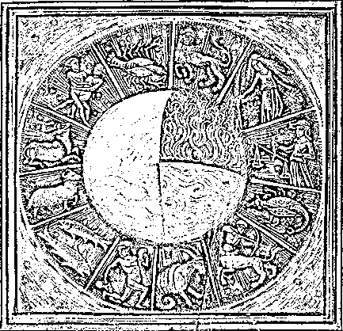

**第 5 讲 马蹄牌阵学员案例督导**

**2022 年 10 月 19 日（周三） **

**第 6 讲 六芒星牌阵学员案例督导**

**2022 年 11 月 2 日（周三） **

**第 7 讲 凯尔特十字学员案例督导**

**2022 年 11 月 16 日（周三） **

****

**第 8 讲 三个牌阵学员完整案例督导**

**2022 年 11 月 30 日（周三）**

**认证阶段：考试论文**

录播课学习完毕，即可入驻若道神话塔罗平台，以实习塔罗师获得推广流量，对接塔罗咨询个案。

直播课+录播课学习完毕，提交考试论文通过即可获得获得英国神话塔罗认证证书，升级为认证咨询师。

**扫码进入全新神话塔罗 H5**

每天有事没事都可以去**神话塔罗 H5**里转转抽取专属于你的今日塔罗

**神话塔罗 H5 问答平台全新上线**

三张牌牌阵，专业塔罗咨询师语音条解读

如果你碰巧有困惑，刚好有**限时优惠价**

如果感到快乐你就用用**神话塔罗 H5****，**如果你感到不快乐，更要使用由专业人本主义塔罗师团队全程陪伴的**神话塔罗 H5 哦！**

6

**适合人群**

*   塔罗初学者，完全没有塔罗基础；

*   塔罗自学者，也曾上过塔罗工作坊，但仍不懂如何使用塔罗牌；

*   塔罗进阶学习者，有塔罗基础，了解 78 张塔罗牌含义；

*   不知如何解决遇到的情感困惑、职业选择、人际问题，对人生感到迷茫；

*   想要学习深入解读塔罗牌、牌阵的使用、咨询技巧等将塔罗运用于咨询实践；

*   想要深入了解和学习塔罗，希望成为专业的塔罗师；

*   想要借助塔罗进行心灵、灵性成长。

7

**导师简介**

**朱丽叶·沙曼-伯克**

**朱丽叶·沙曼-伯克**从 20 世纪 70 年代早期开始，就对塔罗牌产生了兴趣，并踏入了塔罗的世界。后来，在丽兹·格林的鼓励下，开始研习心理占星学和塔罗。

1984 年，第一本书《**塔罗全书**》（*The Complete Book ofTarot*）出版。之后，与丽兹·格林合作设计并撰写了《**神话塔罗**》（*The Mythic Tarot*），在这本书中，她们将古希腊神话与传统塔罗解读结合起来。朱丽叶写了**十本塔罗和占星学书**，包括一本名为《众星的传说》（*Stories from the Stars*）的儿童读物，以及与丽兹·格林合著的《神话之旅》（*The Mythic Journey*），这是一本详细讲述如何运用神话来指导生活的书。

8

**课程价格**

**认证课程总价：****22000 元**

**联报优惠价：****19000 元**

**限时转发优惠价：18000 元（联系 Echo 老师，获取限时转发优惠价）**

长按二维码添加客服 Echo 老师

9

**退转课程**

*   **退款原则请详看《教学协议》，如有疑问请咨询课程顾问。**

**神话塔罗认证课程**

**授课老师：朱丽叶·沙曼-伯克**

**授课时间：录播课即报即学，直播课 2022 年 8 月 10 日起**

**授课方式：**网络课程**，**英文授课，中文翻译

**费用：****认证课程总价：****22000 元；****联报优惠价：****19000 元；****限时转发优惠价：18000 元**（联系 Echo 老师，获取限时转发优惠价）

**课程负责人：Echo 老师**（微信/手机：nodoor18518412824，请备注“神话塔罗”）

长按二维码添加课程负责人咨询~

**END**

****报名请点击“阅读原文”****

# 神话塔罗之大阿卡纳｜审判

> 原文：[`mp.weixin.qq.com/s?__biz=MzA5NjA0NTAxNg==&mid=2651487375&idx=4&sn=78f860969bf85f86986de6cc15876b62&chksm=8b48ce38bc3f472e0db255445453eb6069e076b0f7cf8531b536d9c1a7fac005d029cc5d7602&scene=126&sessionid=1692737761#rd`](http://mp.weixin.qq.com/s?__biz=MzA5NjA0NTAxNg==&mid=2651487375&idx=4&sn=78f860969bf85f86986de6cc15876b62&chksm=8b48ce38bc3f472e0db255445453eb6069e076b0f7cf8531b536d9c1a7fac005d029cc5d7602&scene=126&sessionid=1692737761#rd)

作者/朱丽叶·沙曼-伯克 丽兹·格林

译者/闫东升 编辑/玫瑰 图片/网络

本文节选自《神话塔罗》

大阿卡纳牌中所有卡片都有两种相互矛盾的含义，因此它们可能暗示着积极的体验，也可能暗示着消极的体验，22 张牌中没有一张是完全“好”或完全“坏”的。愚人从一开始的魔术师牌就遇见了赫尔墨斯，在接近旅程的尾声他再次遇见了这位神的信使，这一次信使向他传递了什么信息？

[🔈 神话塔罗·审判](https://res.wx.qq.com/voice/getvoice?mediaid=MzA5NjA0NTAxNl8yNjUxNDg3Mzc0)

**信使之神**

审判牌描绘的是一头黑色卷发的年轻男子，他身穿一袭白色的束腰外衣和一件血红色的旅行斗篷，头盔和脚上的鞋子两侧均镶嵌着一双翅膀。他的右手紧握着一个神使之杖（caduceus），两条蛇交错盘旋其上。

他的两侧隐约可见两根竖立的石柱，一黑一白。他脚下的台阶从身后一路向上延伸过去，台阶的尽头是一扇敞开的门，可以看到初升旭日照耀下绿色盈盈的丰饶景象。他的脚下有几口敞开的石棺，几个身穿葬服的死尸朝着他爬出。

> **蛇**：现在我们能够理解盘旋于赫尔墨斯（Hermes）神使之杖上的两条蛇，象征着阴性的、本能的地下世界，太阳神阿波罗（Apollo）征服了它，但是赫尔墨斯以另一种方式和它联结起来，用以服务他所设计出的生命之旅的伟大蓝图。 **死亡后干瘪的尸体**：象征着过去的经验被忘却在潜意识中不曾改变，除非它们的意义在某种境遇中变得清晰，才能重见天日。**黑白两根石柱**：又一次反映出潜意识的矛盾性，它同时拥有创造性和毁灭性的潜力。

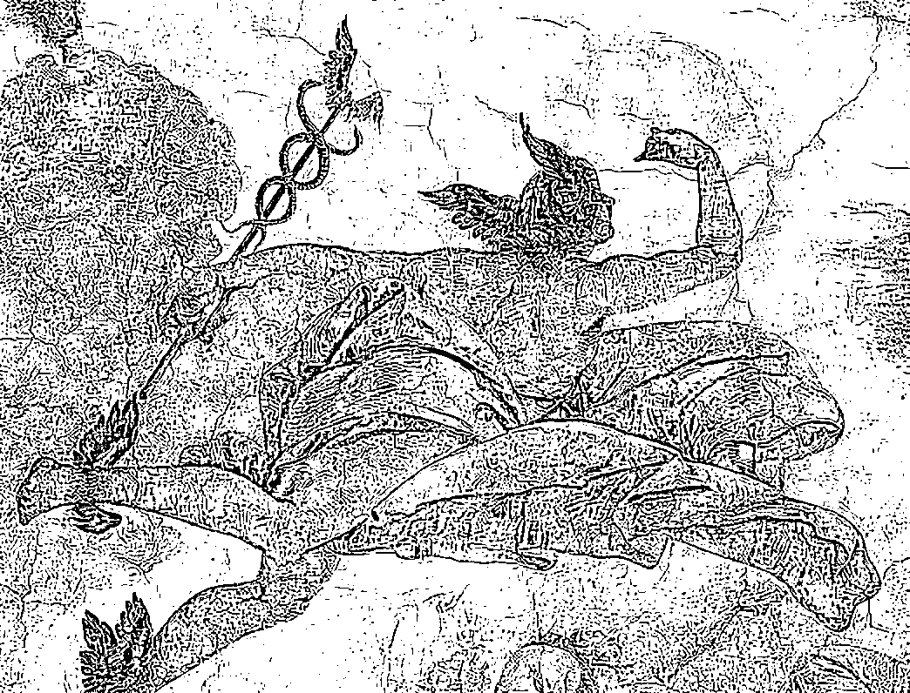

**冥府指路人**当我们走到大阿卡纳牌循环快要结束的时候，又遇到了在开始时我们遇见过的神之使者赫尔墨斯，他是灵魂的导航者。在魔术师牌中，赫尔墨斯以愚人内在向导的身份出现在他生命之旅的开端，在那里他是个魔术师和迷途旅人的保护者，他的魔法能够使人通过神秘的直觉找到方向，所以神话中他可以上天入地，自由往返于宇宙的各个角落。现在他化身为冥王哈迪斯（Hades）的密使，用手中金色的神杖清晰并柔和地指引着死者。赫尔墨斯能够让死去的灵魂归回到尘世生命中，也可以引领他们进入哈迪斯的领土。

在神话中，吕底亚（Lydia）的国王坦塔罗斯（Tantalos）把自己儿子切成碎片，烹煮之后在众神的宴会中献上，赫尔墨斯把切碎的身体重新拼合，使这个年轻人复活。

作为天界诸神的信使，赫尔墨斯可以自由出入哈迪斯的领域，英雄赛休斯（Theseus）也曾经偷偷违例进入过地府，却被扣留在里面。

赫尔墨斯还带领过俄耳甫斯（Orpheus）进入到黑暗之国寻找他失踪的妻子欧律狄刻（Eurydice），而且当欧律狄刻第二次失踪的时候，赫尔墨斯又第二次把俄耳甫斯带出了黑暗之国。因此审判牌中的赫尔墨斯不仅仅是个向导，而且还是个召唤者，他召唤并引领着灵魂去审判过去，然后准备又一次的重生。

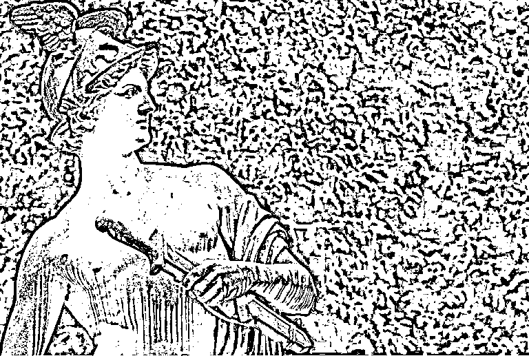

**种瓜得瓜，种豆得豆****从内在的层面来看，审判者赫尔墨斯象征着生命中一些关键时刻的过程：当过去的经验累积到一起，就形成了智识模式的一部分，这些经验导致的结果必须被当事人理解和接受。**这是一个总结的过程，它并不属于智力的功能范畴，而是在隐秘的潜意识中发生的一次烹煮。它可以说是一次对死亡的呼唤，因为人们所做过的各种各样的行为和决定，最后都会集结在一起，成为不会丢失也无法逃避的结果，人们必须去收获、去面对、去享用。 例如艺术家经过数个小时、若干个星期或好几年的时间去梳理、探究和实践，努力把开始时暧昧不明的想法或意象逐步落实成具体的作品，到了某一个关键的时刻，一个创造性的结果就这样诞生了。

同样的过程也会发生在心理治疗的案例中，患者在（来自潜意识的）近期的、远期的、淤塞的、混乱的记忆和感受中经历了很长时间的挣扎后，忽然间某种聚合发生了，他（她）终于找到了自己生命模式的意义。

**这个过程可能发生在生命的每一个领域，潜意识中一直在暗渡陈仓，一些暧昧不明的事情隐秘地吸取着当事人的精力，最终在某个时间，他（她）为所有的付出得到了回报，内在的整合促使生命走向一个新的阶段。**这就是赫尔墨斯最大的魔力，他在最后一刻揭示出了整个愚人生命之旅的意义，把每个阶段获得的直觉和洞见在最后的神秘过程中整合到了一起，魔术般地混合了过去相关经验中的价值和意义，形成了一个全新的开始和更为博大、完整的人格。

**因此，赫尔墨斯带着亡魂走向审判的意象，象征着一个重生的过程。**通过一条非理性的神秘道路，把过去的经验进行整合，那些看似随机的事件和选择都联结到了一起，其中的洞见和意义浮现出来，使重生后的人格更加完整。

死亡的审判决定了过去的努力赢得了怎样的未来，愚人在过去每一张牌上所付出的一切，都是未来的砖瓦门廊。

**审判牌象征着过去的付出得到的回报，它发生在我们的心灵内，而不是外部的世界中。**我们当然也会为无意识中的原罪付出代价，收获不仅意味着奖赏，还包括我们选择不当的惩罚，因为我们要为自己每一次的选择负责。审判的意象不是从一无所有中的全新开始，而是从过去中浮现出来的新生。东方的哲学中称它为“业”（Karma）。 每一个人都在他自己的土地上埋下种籽，最后收获它所结出的果实。尽管赫尔墨斯经常被描绘成一个说谎者或骗子，但是作为神的使者，他不允许灵魂说谎。每一件事情都必须付出代价，所以愚人在他生命之旅快要结束的时候，看到了自己一路走来所作所为的一切后果。**审判，总结与收获****从解牌的角度来看，审判牌出现的时候，预示着过去的付出到了回报的时候。这是一个总结的阶段，我们的所作所为在这个阶段向我们宣告了未来的样子。**它并不是一张明确的牌面，因为它也可能暗示着我们要面对自己所逃避和背叛的一切了。所谓收获，不一定得到的就是令人快乐的结果。愚人必须为他的旅程中所发生的一切负责，因为收获的时间到了，过去的错误和创造性的努力在这一刻都聚集在一起，形成了他的未来。无论过去发生了什么，审判牌都预示着一个新的篇章即将开始。但是和死亡牌不同的是，它并不预示着哀悼。这个时期，我们必须面对真实的自己，也能够做真实的自己了。

**版权声明：**本文由《自在园》授权发布，欢迎转发，反对抄袭。友号转载请申请白名单。

**END****朱丽叶·沙曼·伯克**从 20 世纪 70 年代早期开始，就对塔罗牌产生了兴趣，并踏入了塔罗的世界。后来，在丽兹·格林的鼓励下，开始研习心理占星学和塔罗。1984 年，第一本书《塔罗全书》（The Complete Book ofTarot）出版。之后，与丽兹·格林合作设计并撰写了《神话塔罗》（The Mythic Tarot）。朱丽叶写了十本塔罗和占星学书，包括一本名为《众星的传说》（Stories from the Stars）的儿童读物，以及与丽兹·格林合著的《神话之旅》（The Mythic Journey），这是一本详细讲述如何运用神话来指导生活的书。

**点击下图了解课程详情** 

**微信又双叒叕改版啦，不想错过若道君的推送？****就把若道设为星标吧！****▼**

**喜欢记得点一下在看哦☟**

************报名直达入口************

# 感觉自己“不被爱”？快看看这组行星相位的解药吧

> 原文：[`mp.weixin.qq.com/s?__biz=MzA5NjA0NTAxNg==&mid=2651487375&idx=2&sn=347c4b7accb92375ab6856ccdc173d31&chksm=8b48ce38bc3f472ee13d4af33fc386d52ba60c0938a85f141dd26bece5bf78b06bd742f99f29&scene=126&sessionid=1692737761#rd`](http://mp.weixin.qq.com/s?__biz=MzA5NjA0NTAxNg==&mid=2651487375&idx=2&sn=347c4b7accb92375ab6856ccdc173d31&chksm=8b48ce38bc3f472ee13d4af33fc386d52ba60c0938a85f141dd26bece5bf78b06bd742f99f29&scene=126&sessionid=1692737761#rd)

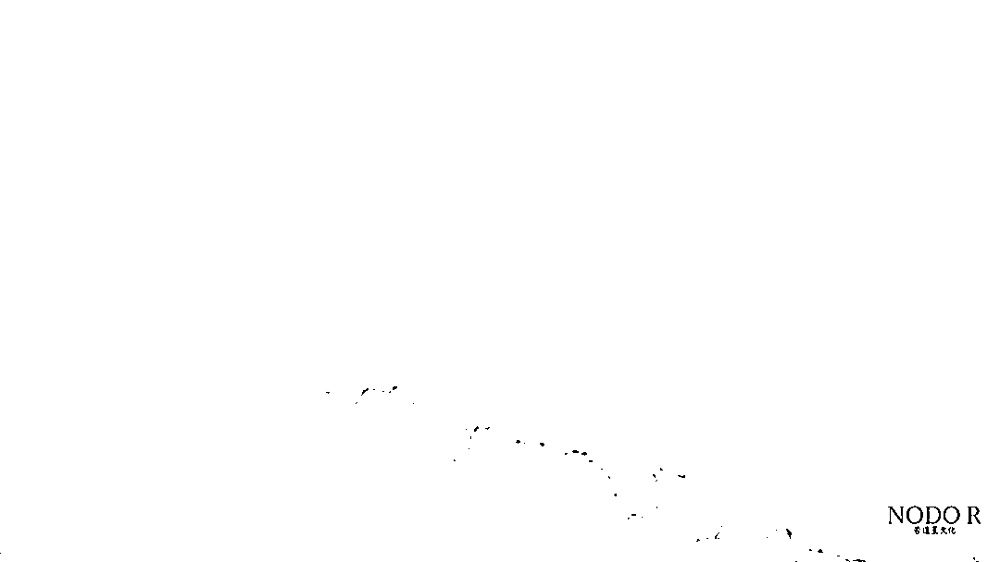

作者/科里·库普曼唐娜·坎宁安 译者/Elle

编辑/翀子 图片/网络

情感路上的困难多种多样，有一种困难叫“爱无能”。这样的人是花花公子、风流女郎的反义词。他们过于严肃、不懂风情，当爱情来临也不太能主动把握。不过，随着阅历的增长，他们会变得越来越受欢迎。这是一篇略专业的文章，但聊的是大家都有经历的情感问题，收藏起来慢慢看吧！另外，大卫老师参与授课的【[ISAR 认证职业占星师文凭课程](http://mp.weixin.qq.com/s?__biz=MzA5NjA0NTAxNg==&mid=2651487157&idx=3&sn=7ed9a5e1d982986d438d2ad8661abd5f&chksm=8b48c902bc3f40143b14534a1841e5bdedfa39fdcc829882e1977dd75e6bad004cc2856931c1&scene=21#wechat_redirect)】报名中，点击链接了解更多详情！
**感情总有困顿的一群人**

虽然金星和内行星形成的困难相位能显示一个人在关系中会遇到挑战，这些相位其实比**金星与外行星（土星、天王星、海王星、冥王星）形成的困难相位**容易应对。困难相位包括**合相、八分之一相位、四分相、梅花相位和对分相**。

我发现与金星形成的合相是最为困难的，但所有这些困难相位都能显示此人在建立关系时会遇到挑战。这样的人通常都是高品质的人。他们努力工作来提升自己，在人生中取得成就，却发现，当他们真正取得了那些成就，他们依然在等待一个伴侣分享自己的成就。

**哪些配置会遭遇情感阻碍？**

*   最痛苦的情况之一是**金星和土星形成相位**；

*   或**金星落在摩羯座**（土星的星座）；

*   当**出生星图中土星落在第七宫**时，你也会发现一些相同的模式。

**你的父母也是严肃之人吗？**为什么会这样呢？**金星和土星的各种组合使一个人难以建立关系，也很难感觉自己值得被爱**。一般来说，双亲至少有一方有土星的负面特质——比较**冷淡、固执、阴郁、专制，并无法表达爱意**。通常，他们把孩子视为一份附加的责任，一个额外的负担，甚至是他们自己实现目标和抱负的阻碍。

父母不喜欢子女身上爱玩、孩子气的特质，因此孩子学会了快速成长以避免体验父母的不悦。唯一取悦父母的方式是变得和他们一样土星化，所以孩子学到的是：唯一会被“爱”的方式是变得**严肃、有条不紊、有责任感和成功**......也就是做一个模范孩子。

金星-土星的相位经常带来一种**“进退两难”**的设定。有这个相位的孩子必须要自力更生才能取悦父母。但是，这孩子越是自力更生，父母就越不管他们，感激地认为孩子不再需要他们太多的时间和关注。

（父母并没有意识到情感的需求也是让他们把注意力从其他职责中转移到孩子身上的正当理由。）因此，对孩子来说，负责和自立也会减少他与父母的亲密。所以这个孩子左右为难——**不管怎么做，他都会失去与父母的亲密**。

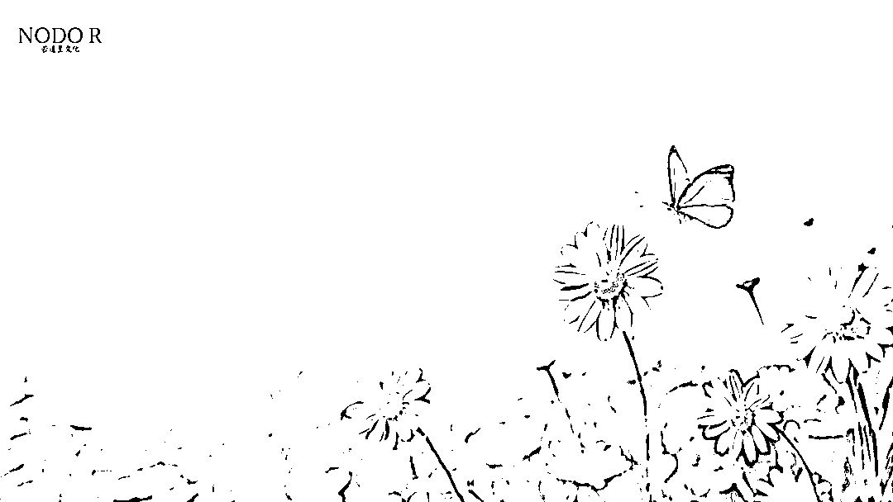

土星与时间和成熟有关。土星的当前（行进）星座及其与出生星图的行星形成的相位触发我们人生中各个典型阶段的成熟。**行进土星围绕太阳运转的周期为 29.46 年**。因此，行进土星每 7 年就会与出生星图的土星形成强有力的相位——7 岁时，我们开始上学；14 岁时，我们是青少年；21 岁时，我们在法律上已经正式成为成年人。自然地，对于一个出生图里有金星-土星相位的人来说，每一次行进土星和出生星图的土星形成相位时，也会与出生星图的金星形成相位。因此，每一次这样的阶段都是**成长、成就、成熟并承担更多责任**的阶段，也会带来父母支持的逐步减少。这样的经历会使他们**难以相信他人会满足他们的需求。****他们从父母的身上学到，如果他们不那么土星化就不能被爱；但是，如果他们很土星化也不能被爱。因此，他们得出的合乎逻辑的推断是：他们根本不能被爱。他们会感觉爱被剥夺了。****为了要保护自己并不再感受到这种痛苦，他们可能会对这个世界筑起高墙。这堵墙到头来加强了他们觉得自己不值得被爱的感受，因为其他人迟早会停止尝试穿越这堵墙。**

我观察到这些相位有时存在的一个模式，而这个模式可能会造成寻找伴侣时的一系列困难。这种相位有时出现在**步步高升的年轻人身上，尤其是女孩**。事实上，最常出现在家中的**长子和长女**身上。

**因为家庭责任以及父母的不良示范，他们可能在社交礼仪方面发展迟缓。**他们通常对于社交互动中，尤其在两性交往方面比较微妙的差别和提示没有意识甚至一无所知。由于他们不知道，所以他们也无法发出他们潜在的伴侣正在寻找的这样的信号。（所有这些都发生在非语言的、通常是潜意识的层面。）是的，他们的确在成熟以后能学会一些社交技巧，甚至能成为一个优雅的人。

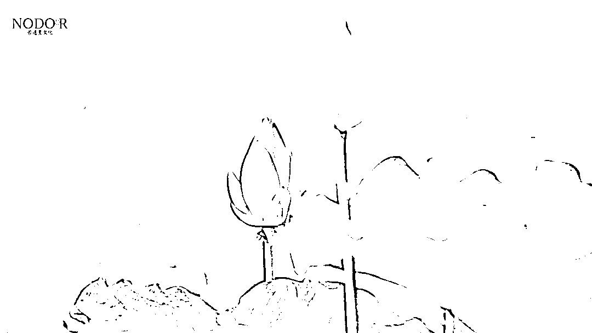

**硬邦邦的你，如何变得柔软？**

有这个相位的年轻人可能**通过参加一些社交礼仪方面的补习课程**来解决一些困难。用心观察所有的社交互动，尤其是男女交往的行为。甚至是一些**日常的互动和调情**也值得认真学习。

社交技能与其他技能一样，都是可以学会的——若我们未能在家庭中自然而然吸收这些，我们就需要更努力去学习。

**一位年长的良师益友**是这个相位常见的礼物。因此，也许你能找到一个心地善良的人来保护你并指导你。

这样，通过有意识地练习这个缺失的技能，你就不会到了 50 岁还在等待真爱的降临。即使是那些已经过了一个或几个土星回归的人，也可以学习一些金星的优雅风度来增加他们的胜算。

**年纪越大，喜欢你的人越多**

**金星-土星相位的积极面向是，他们不会变老——他们只会变得更好**。

他们是大器晚成的人。这些人在十几岁的时候可能看上去普通、笨拙，但到了 30 岁或 40 岁的时候，会突然变得很美。他们也不会像其他人老得那么明显——他们可能比同龄人看上去年轻好几岁。

**随着年龄的增长，他们会越来越受到欢迎。**一个人身上严肃认真的特质在青春期并不会受到同龄人的欢迎，但到了中年和老年，这个特质会很吸引人。

他们历经多年，建立起重要他人的互助小组，而这些关系会持续很久。通过严肃的生活态度，他们也能取得很多成就，而这些成就使他们获得尊重。

当他们达成了一些重要的目标后，他们也会放松下来，并且心安理得地觉得高兴——他们已经完成了自己应尽的责任。

哪些人有金星-土星的相位呢？出生星图中金星土星合相（这两颗行星最强有力的联结）的名人有：**马特·达蒙、丹泽尔·华盛顿、奎恩·拉提法、西恩·潘。**

**版权声明：**本文由若道翻译发布，欢迎转发，反对抄袭。友号转载请申请白名单。

**END**

科里·库普曼

1991 年起成为执业占星师。她一直活跃于占星实践领域，曾经在《大占星师》上发表了数篇文章。

**长按下图识别二维码** **了解你的亲密关系密码**

**拥有****51 年****占星实践经验的****若道创始人****前 ISAR 全球副主席****前 ISAR 全球职业占星师资质认证主席****大卫·瑞雷**

**和**

**2019 年第二届、2021 年第三届核心课中**

**与苏·汤普金斯老师****联合授课****的**

**ISAR 认证职业占星师**

**咔咔（Caroline）**

**二人合力打造**

**2022 年 ****若道全新核心占星课程**

**点击下图了解更多课程详情** 

**

**20 位来自世界各地的占星师****带来 19 场沙龙——新世界的觉醒****详情可点击下图**

**学习占星学****点击下图了解课程详情**

**微信又双叒叕改版啦，不想错过若道君的推送？**
**就把若道设为星标吧！****▼**

**喜欢就点一下“在看”吧！**

********报名直达入口********

# 如果你身边也有这个挑剔的星座，把这篇文章发给他吧！

> 原文：[`mp.weixin.qq.com/s?__biz=MzA5NjA0NTAxNg==&mid=2651487375&idx=1&sn=6c19b1b0f65a23f666da388fad055607&chksm=8b48ce38bc3f472eed9c69d259f9bcba9459990604436cb5d3be0b3827ff7dfe9b0ae1f2066d&scene=126&sessionid=1692737761#rd`](http://mp.weixin.qq.com/s?__biz=MzA5NjA0NTAxNg==&mid=2651487375&idx=1&sn=6c19b1b0f65a23f666da388fad055607&chksm=8b48ce38bc3f472eed9c69d259f9bcba9459990604436cb5d3be0b3827ff7dfe9b0ae1f2066d&scene=126&sessionid=1692737761#rd)

******☆ ****后台回复“今日”，给你一句生命态度******

作者/大卫·瑞雷 若道占星创始人
译者/若道翻译团队编辑/玫瑰 封面/书君 图片/搞定设计提到处女座，真的很头疼——他们太挑剔了！特别是自己的生活一片混乱的处女座，有什么资格说别人呢？别急，一起来看看大卫老师的解读，你就知道该怎么和这个星座的人相处了。其实你的生活里很需要他们哦。另外，大卫老师参与授课的【[ISAR 认证职业占星师文凭课程](http://mp.weixin.qq.com/s?__biz=MzA5NjA0NTAxNg==&mid=2651487157&idx=3&sn=7ed9a5e1d982986d438d2ad8661abd5f&chksm=8b48c902bc3f40143b14534a1841e5bdedfa39fdcc829882e1977dd75e6bad004cc2856931c1&scene=21#wechat_redirect)】报名中，点击链接了解更多详情！**处女座**

黄道列车离开刚才的小镇，锣鼓声渐渐隐去，你的头脑开始试图消化刚刚发生了什么。“如果我抱起那个小孩的时候迟了一秒呢？”你寻思，“我应该已经和那个孩子一起躺在医院里了。我当时在想什么啊？我根本不知道自己在做什么。”

朋友打断你的思绪，“想什么呢？刚才你可太酷炫了。”“嗯，应该是吧……”“有什么不好意思的，那是很英勇的行为。”“真的吗，我不知道，”你叹了口气，“我不知道刚才我做了什么，你明白吗？我从来没有练习过，如果我搞砸了，结果是难以想象的。”

你的朋友有些疑惑，“你不觉得你对自己太挑剔了吗？现在结果很好，只要为它开心就可以了，不要想太多。”“好吧。”你回答得勉勉强强。

接着是沉默。在沉默中，你的朋友拿出了 iPad，开始忙些什么。你用手机查看邮件，发现有很多邮件等着你回复。你从包里拿出笔记本电脑，开始干活。你注意到你的朋友好像有些焦虑。“出什么事了？”你问。“我的 iPad 坏了，死机了。”“给我看看？”“拿去吧。”

你用了不到三分钟就把他的 iPad 修好了。“哇，太好用了！”他笑着打趣你，“能修电脑也能保护小孩，不错嘛。”

你有点脸红，“修电脑我很有经验，我在苹果公司的客服部负责技术支持，已经干了三年了。”“不管怎么说，我觉得很棒。”“很高兴为你服务。”你的担忧暂时平息了。

这就是处女座。处女座会更容易在这样的剧本里发挥功能。当然，你们也是对占星学持最多怀疑的星座，我知道有处女座的人曾充满讥讽地说：“我当然不相信占星学了，我可是处女座，我们是怀疑论者。”

所以，既然你喜欢那就带着你的怀疑往下读吧。看过这章之后，如果你觉得自己有某些特质或议题符合这里的描述的话，你可以仔细分析之后，再做判断。

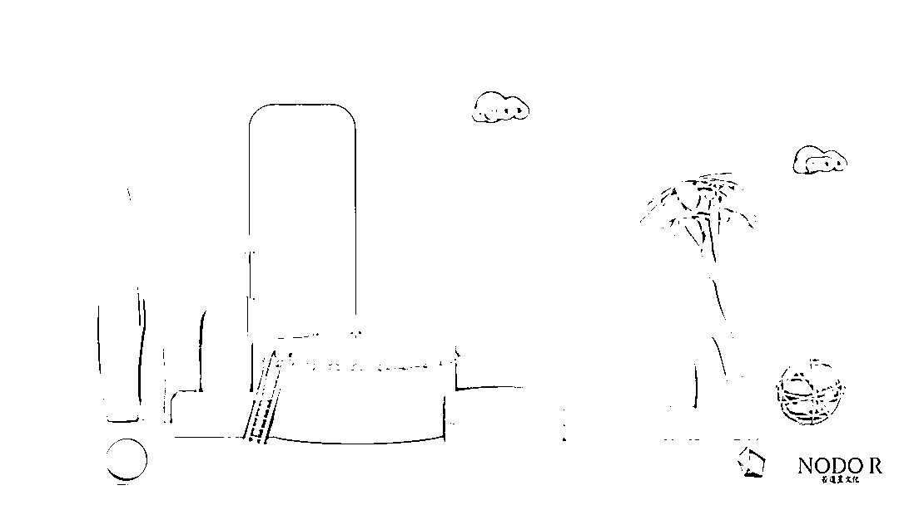

**面对日常生活中的压力，你总是那个会积极寻求解决办法的人。**有时你低调谦逊的态度会掩盖了你救人于水火或化解危机的事实，让你的英雄光芒被遮盖。但人们会记得你搞定了死机的电脑，帮忙整顿了公司财务，或只是帮他们打扫了混乱的厨房。过一段时间之后，人们才开始注意到你的其他能力，发现你被低估了。**即便你是少数那种很耀眼的处女座，你也倾向于以一种精打细算的态度来处理你的名声，真实的你比你表现出来的要内向许多。****“业精于勤”**是对于处女座的做事方法的最佳诠释——这个词很可能就是处女座发明的。不管怎样，你们中的大多数是**完美主义者**。

我们应该不会吃惊，出版了《引爆点》、《决断 2 秒间》、《异类》的畅销书作者马尔科姆·格拉德威尔就是处女座（生于 1963 年 9 月 3 号）。他最有名的“一万小时定律”是，“练习一万小时就可以成为专家，也就是每周 20 小时或每天 3 小时地坚持十年。”

马尔科姆概括了处女座的核心——“练习过了？好，现在再做一遍。”没有哪个星座会像处女座这样，**对于自己对常识和逻辑的信赖，有着一种“谦虚的骄傲”**。既然你们处女座都喜欢有条理，下面我会用加粗的小标题列出你们的一些关键议题。

**当心把“合理化”当成逻辑**

**完美主义的说法适用于太阳处女座、上升处女座、月亮处女座，也符合水星处女座的一些行为特征。**没错，这种“脚踏实地”的星座，注重实干和实效。与其他星座相比，你们更依赖**对可收集到的事实进行系统化的编辑与删节**。

**你们进行大部分考虑的根本依据是理智而非情感。**感受，这个每个人都有的东西，可以为处女座提供有帮助的信息，也可能成为偏见的来源。

假设有一个月亮在金牛座的处女座厨师，在积极的意义上，他可以借着信赖他关于味道（金牛座）的直觉（月亮），来调配美味的配方。

但同样这个厨师，也可能在餐厅老板打算更换厨具设备时异常抗拒（金牛座）——他给出了一堆所谓逻辑的理由，来说明为什么不该这么做，但其实抗拒改变的情绪（月亮在金牛座）才是推动他的判断和行为的深层真相。 

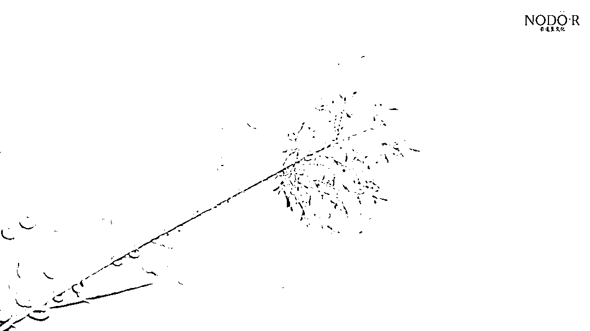

**都是小事**

**你的理性思维可能会让你钻牛角尖，有时甚至是“因小失大”——特别是当需要看到全局时。**一些处女座可能因为电卡里的一元钱的错误而打数小时的电话争执不休。

有这个时间干正经事儿能赚好几倍的钱呢。部分原因是处女座太专注于细节，或说是“为小事烦恼”。

关于这点还有其他一些内容值得注意。2016 年我与福布斯杂志合作了一篇文章，他们选取了有生日资料的全球前 613 位亿万富翁来做研究，其中太阳在处女座的人占了 12%。

许多专家认为“注重细节”是富人的共有品质之一。当然，大部分这样说的“专家”或许也是处女座吧！

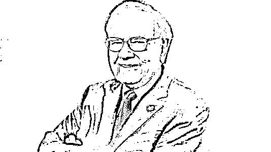

| 沃伦·巴菲特

没错，这份亿万富翁的名单里就有沃伦·巴菲特。巴菲特展现了处女座的另一个特点：**低调**。

他一直住在内布拉斯加州、奥巴哈市的一幢房子里，那是他在 1958 年花 31500 美金购买的。他有做一些增建和装修，但在邻里之间并不显眼。一位奥马哈市的房屋中介如此描述巴菲特的宅邸：“这房子不是最贵的……风格守旧，但保养得无可挑剔。”

**混乱的处女座真的存在！**

在最善着装的富豪名单上，巴菲特依然榜上有名。当然了，难道就没有邋邋遢遢、困顿潦倒的处女座吗，那些跟“无可挑剔”丝毫不沾边的人？

有没有迷迷糊糊的处女座，会把事情搞得一团糟呢？有没有缺乏逻辑、感情用事、总爱胡思乱想的处女座呢？肯定是有的！并不是每一个处女座都是完美员工，或都能把公寓收拾得井井有条。

但这种例外，和处女座本身的星座特质无关，从占星学的角度说，这是受到星图中其他要素的影响而有的表现，比如**海王星、双鱼座、巨蟹座、天王星，亦或是木星和射手座**。这些因素的共同作用，会带来许多矛盾和复杂性。

**处女座是当专家的料**

一个年轻的处女座女孩可能是乒乓球职业运动员。她夜以继日地练习，磨练技艺，也尝试新技巧。

或许她穿戴得十分干净整洁，但她的房间却是一团糟！衣服扔得遍地都是，翻开的书上面搭着湿毛巾！但这可不是处女座！这里面有别的因素在起作用，或许是**双鱼座或一个海王星的困难相位。**

学习占星学的人都知道，会有不同的星落在不同的星座。上面所说的这位处女座女孩，可能她的月亮落在双鱼座，或者太阳四分海王星，或是星图中有任何“非处女座的”因素在起作用。这种情况十分常见。

但即便是这样，**某些方面的混乱，可能也是必须在另外一个领域极度专注的反作用力，这被称作“补偿行为”，也就是为了补偿一个极端，而在另一个相反的极端上找到平衡。**

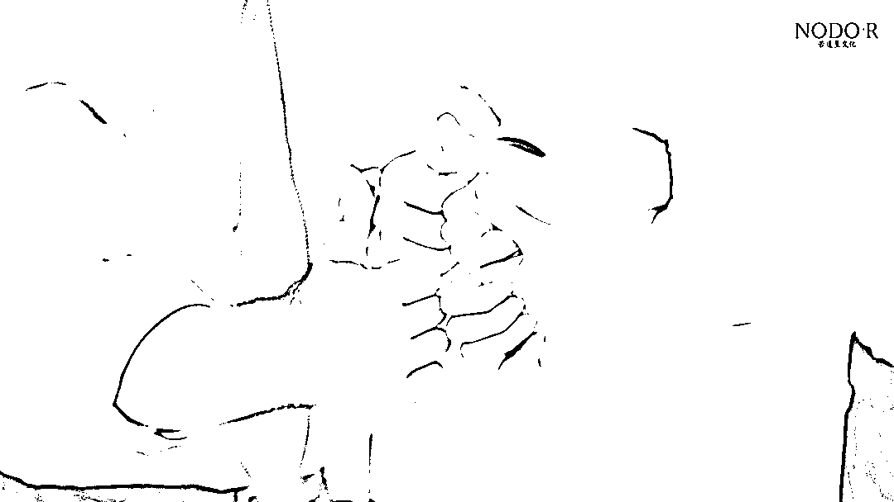

**个人成长的主题和故事**

当然，处女座和其他星座一样有自己的个人成长议题。或许处女座最常见的议题就是**将他们的身份认同于他们的工作、他们的职业或他们掌握了专业技能的领域**。

他们会说“我是一个软件设计师”，而不是“我是做软件设计工作的”。这也就是在说，“我是专家”而不是“我有这项技能”。

表面上看这两者间似乎没什么明显差别，但**当他们失去了工作甚或更糟——他们的专业技能过时了，这其中的意义便突显出来。**

许多年前，我有一个客户在 IBM 公司的主机研发部门工作。对付这种巨型怪兽计算机，他是专家，和如今的个人电脑和手机相比，那玩意儿简直是恐龙。

当他失去了在 IBM 的工作，他经历了一次重大的“身份危机”。他不再知道自己是谁，甚至不知道该如何面对妻子、孩子、朋友、邻居。他说他觉得自己就好像“一个陌生人来到了陌生的大陆”。

他失去了对自己的身份认同，这很严重。后来他的妻子也成了我的客户，她通过他来约我的咨询。 

来找我咨询的时候，他刚刚开始参加一个进修培训，那是解雇补偿的一部分。他看起来有些忧虑，又有些紧张。

他的目光在搜寻焦点。我把他的星图推到他面前。“看看这个，”我说：“你看到了吗？这就是你出生时太阳所落的位置，处女座，这里我们称之为第八宫。”他面无表情地点点头。

“你十六岁的时候发生了什么事吗？”我问。他深深地叹了口气，我的话引起了他的注意。“那时，我父亲失业了……”沉默过后，他接着说：“六个月后，他死于动脉瘤……我大学的学费都是靠父亲的保险金支付的。”

在后面的对话中，他开始把一些事串联起来。他记起了父亲曾经说过的一句话：**“没有工作的男人最没用了。”**我在他的占星档案上记下了这句话。在随后的咨询中，他开始意识到，他的身份“不仅仅是他的职业”。我们每个人都有内在固有的价值，那不能仅仅用工作来衡量。他面对了内心根深蒂固的信念：男人没有工作还不如死了算了，或者离死也不远了。这就是他父亲的想法。他开始意识到自己对家人的意义，不仅仅在于他是那个挣钱养家的人，更重要的是，**他是那个无论怎样都会得到家人的爱和欣赏的人**。他依然是一个完美主义者。她妻子说，他都快把老婆孩子逼疯了，总是告诉他们怎样可以做得更好，并用揪出每一个小错误的方式来“帮助”他们，但她只是一笑置之。

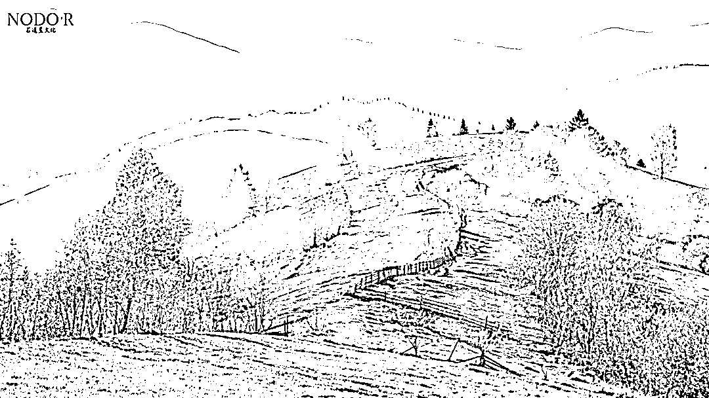

看到他的改变，她高兴极了。他完成了进修，最终又回到计算机行业工作。他度过了他的身份认同危机，并脱胎换骨，获得重生。在我的占星实践中，我见过这一主题的多种变调。特别有挑战的一类身份危机出现在一些非常有才能的处女座青少年身上，他们从记事起就开始努力发展某种体育方面的特长技能，可能是足球、棒球或体操。在他们过去的人生中，每个人都视其为一个棒球手，下一届学校比赛的风云人物，甚至是将来的职业运动员。这就是他们的身份，或他们以为如此。对这些年轻的处女座来说，找到一个可以专注投入的新领域是必要的，那些他们已经为之付出大量练习和准备的事，是必须要放弃了。**然而在他们找到新方向之前，很重要的是让他们明白，自己是被爱、被欣赏的——仅仅是因为他们本来的样子，而不是因为他们拥有什么专业技能。**的确，**处女座希望自己是不可或缺的，他们想要在计划中扮演有用的角色。不过也因爱挑毛病而声名狼藉，关键是连自己的毛病也挑**。其实没有人比处女座更不喜欢批评，因为这些批评的声音充满了头脑让他们无法安宁。**太阳落在处女座的人往往有一位严格的父亲，月亮落在处女座的人则常常有严厉的母亲。**一般来讲，这些父母不断传递给你们的信息就是，“你还有很多不足。要达到完美还有很长的路要走！只要勤加练习你就会越来越优秀！真不明白你怎么就不能少犯点错误！”对于很多处女座而言，似乎无论你多么努力地取悦父母，都还是难以达标。**因担忧带来的压力对他们来说分外沉重，他们会仔细检视那些觉得不对劲的地方——即使是努力不去想也不行。**

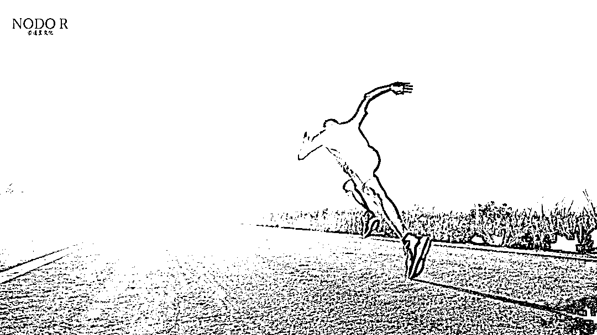

**事业线索**

****

**聪明的人会从任何事物中发现荒谬，明智的人则不。**

**——歌德**

**分析能力是事业上的重要资本**

**在科学和技术领域，这样的天赋会发挥突出的作用**。处女座可能会在那些**对逻辑和归纳能力有要求**的领域一展所长。有些处女座也会充分利用自己在**化学、数学、生物学和园艺学**方面的专业技能，在**工业或商业领域**谋职。

其他事业领域包括：**效率管理、图书编辑、电影剪辑（许多电影导演都曾表示，电影制作 90%的工作都在剪辑上）、文艺批评、美食评论、校对、目录管理、货品清点、医疗科技、牙医、木匠木工、钟表匠、眼镜配镜、机械修理、水管工、工艺品的制作加工。**

**计算机和编程行业是典型的处女座工种。**不过，在数据分析上精益求精，也会在**医药、心理学、精神病学以及其他特殊的心理治疗领域**的诊断中发挥重要作用。处女座很可能**成为健康领域的专家，或发展出专业技能**。

在身体治疗方面，他们会不断地精进技巧方法，让自己出类拔萃。

在商业领域，他们分析数字的天赋将对金融市场的工作大有助益，在那里有大量的数据要被以不同的方式进行系统分析。沃伦·巴菲特为人所熟知的就是，用他自己发展出的一套公式来进行商业资产的价值评估。

**谦虚是祝福也是诅咒**

**对于自己的成就和名望的低估，是典型的处女座反应。**通常，**他们对于“被认可”本身并不特别在意，只是希望在工作或技巧手艺上尽善尽美。**然而**这种天生的谦逊品质，可能导致被忽视而错过晋升机会。**

同样，他人也可能视处女座的贡献为理所应当。不过至少，处女座通常都会保持着不错的业绩记录，这会让处女座在一些更加比拼能力的情况中胜出。

然而，**善于自我批评的特质，似乎也会吸引别人来批评处女座，这会削弱自己的立场，即便已经通过努力工作取得了相当不错的成果。**

**专业细化和身份危机**

就像前面讨论过的，处女座比较容易将身份认同于职业或工作，特别如果还是某领域的专家人士的话。**失业的感觉就是一次尖锐的身份危机，这点上他们比其他星座都甚。**过于精专的最大危险是，**当这个技术或职业被淘汰时，阿门可能不知何去何从**。

**大多数处女座有能力通过了解市场，学习新的技巧，来完成自我更新，重新适应环境，但同时也要做好暂时经历迷失的心理准备。**

就像前面提到的 16 岁的处女座棒球手，他之前 9 年持之以恒的练习，因为身体受伤而毁于一旦，此时他要面对的身份危机是非常沉痛的。

**这里的挑战在于，找到一个可以让自己重新成为专家的新领域。**不过，即使专业细化可能带来一些问题，但**成为工业、技术、医疗、工程或身体治疗等方面的专家，还是可以让处女座在人才市场上更为抢手，更有能力获得高薪。**

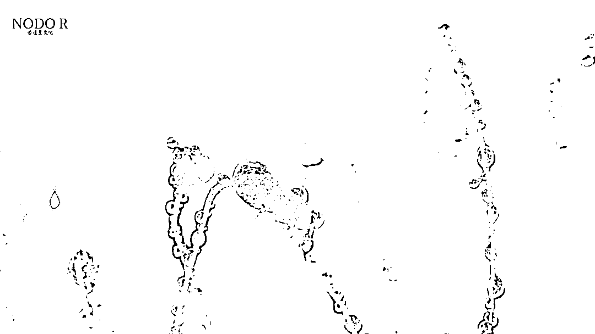

**聘用处女座！**

有一件老生常谈的事儿，占星师们经常建议经商的客户，在招聘中，**“如果拿不准雇佣谁比较好，那就选处女座的人吧！”**虽然大部分雇主不会真的以此行事，但确实，处女座对于工作的认真专注，会让他们更容易成为老板们想要的人。

**没有哪个星座像他们这样专注于把事情“做对”。一旦明确了工作任务，并提供合理的时间去操作，他们基本不会让人失望。事实上，最后交出的成绩单往往高过预期。**

**挑战自己对现有能力的设定，找到合适的位置**

**当分派给处女座的任务超出了自己的能力时，他们可能会崩溃。因为他们很需要在逻辑的确认下找到解决问题的方法，找不到便会觉得愤怒或沮丧，甚而自怨自艾或责备他人。**

这种情况下，处女座可能会要求将自己分配到另一个岗位上，如果感到自己面对的要求或期待太高根本不可能满足，他们甚至会干脆离开公司。

找到一个能将事情做对的行使有效的方法，对处女座非常重要。**职位和工作要求必须与技能和经验相匹配，匹配度越高越好。**

我认识一些处女座，在离职后又回到原公司就职，就是因为他们离开后再也找不到那种跟自己的工作完美契合的感觉。

比如，我知道一个处女座，他来到一家新公司做销售经理，他对于老板为他制定的新的业绩目标感到非常无力。在他做了充分的市场调查，也对公司之前的销售数字做了详尽分析之后，发现无论如何也找不到实现目标的方案。

于是，他批评老板的计划并声称那是“不可能”的，不久后他就离开了那家公司，回到了原来的公司去做市场工作——在那里，他的技能和那边老板对他的期待，与他自身的情况是更匹配的。

有趣的是，那家他离开的公司后来在那一年里实现了营业目标，不仅实现还超出了。这个例子说明了对于处女座来说，**找到一个对的位置是多么重要。**

**下面是一些跟事业/工作相关的特质的正反两面：**

**· 专注：**对待工作十分专注，但有时候容易只见树木不见森林；

**· 完美主义：**在细节上的精益求精让人惊叹不已，但习惯性的对结果不满意可能让共事的人感到恼火或挫败，进而影响职场关系；

**· 批判性思维与吹毛求疵：**批判性思维能让处女座比他人更善于发现瑕疵，但对别人有太多批评，和对自己太挑剔而“吸引批评”，都很有问题。过度批判和“自我抹杀”的作风会令他们在工作上的一片苦心适得其反；

**· 优先次序：**处女座擅长对工作进行有效的排序，信息应该被怎样归类，任务应该以什么顺序完成，但有时对于优先性的考虑可能忽略了人类天性中情感的因素。处女座需要学会将他人的感受纳入考量；

**· 组织性：**处女座的组织规划能力是极其出众的，可以非常好地利用时间和空间。但需要向他人阐释自己体系，让别人也有机会参与其中或提出问题。

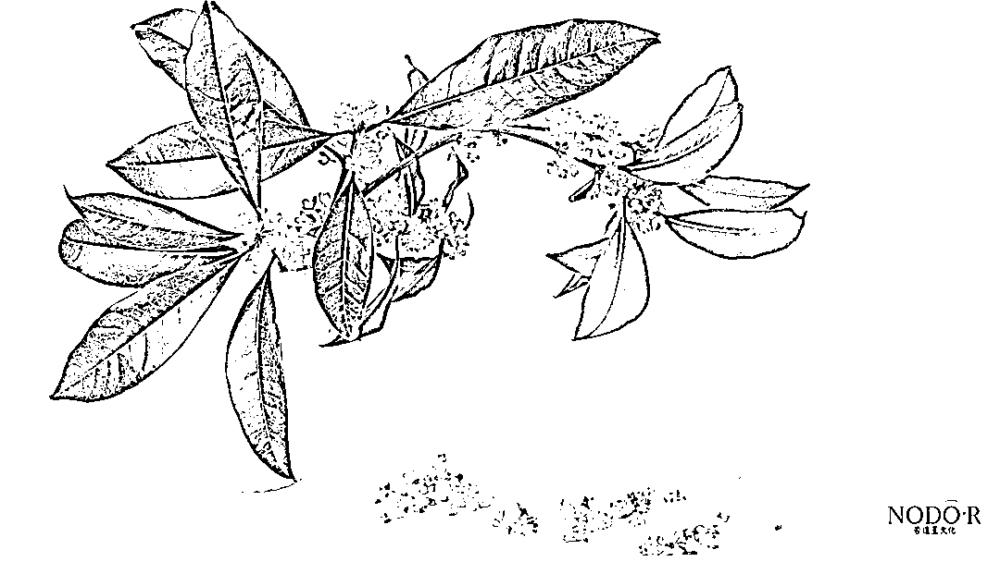

**爱情线索**

****

**有些人被三种麻烦困扰——他们过去的麻烦，他们现在的麻烦，以及他们预期未来将要出现的麻烦。**

**——赫伯特·乔治·威尔斯**

**对很多人来说，处女座的吸引力在于，他们最终会成为那个别人“离不开的人”。**很多处女座擅长成为别人生活中不可或缺的角色，因为**算好了别人需要什么，然后步步为营，让自己呈现出的一切就好像是为那个人量身打造一样**。

抛开恋情中的浪漫游戏，处女座的真命天子得是那种**注重实际**的人，而脚踏实地正是处女座的重要优势。不过，在恋爱阶段，他们或许也会信奉“业精于勤”。

在年轻时，初涉情场的他们很可能没什么存在感。他们会穿得非常干净整洁，但风格也偏于保守，很多人可能会觉得他们不太显眼而将他们略过。

**不过，他们是特别善于观察总结的人。会关注细节，是一个很好的学习者。**“瞄上”了谁，就会对他们的风格和喜好处处留心。如果是在同个公司工作，或是在同个写字楼上班，可能还会在午饭时间去观察他们喜欢吃什么。

如果需要的话，处女座会攒钱，以备有一天“恰好”买了他们最喜欢的东西给他们。当然了，处女座也很“好用”，能修理坏了的东西或是为他们出谋划策。

随着年龄的增长，处女座的时尚触觉也会越来越好，有可能精通低调简约风，穿得一丝不苟无可挑剔，从那些原本跟自己同样不善打扮的人中脱颖而出。事实上，经过时间的考验之后，别人会开始把处女组当成完美的伴侣，并奇怪从前怎么没有发现他们的好。

其实这是因为**处女座总是“勤于练习，时刻准备”**。甚至在男欢女爱方面，即使初尝禁果时可能青涩又笨拙，但总会慢慢找到“技巧”。一旦学会了就可能成为个中专家，他们对于细节的精道处理一定会让伴侣久久难忘。

有时人们会说：“小心那些默不出声的人”，他们是指那些看起来低调不张扬，似乎对眼前的事漠不关心，不知道脑子里在想什么的人。这很可能就是在说处女座。其实**处女座只是需要静静观察一会儿，先在心里默默分析，等到时机成熟再给出独到见解。**

低调的性感，说话时轻声轻语的样子，以及脚踏实地的作风，很容易给人留下深刻印象。或许现在还没有掌握门道，但等处女座真的想的时候，他们自会有办法。

**版权声明：**原创文章由作者授权发布于若道平台，欢迎转发，反对抄袭。友号转载请申请白名单。

**END**

****想阅读更多作者的文章，请在后台回复******大卫****** 即可。****

**大卫·瑞雷**

美国占星师，若道联合创始人，致力于在中国教授和推广西方占星学；2010-2014 年，任全美占星师联盟监督委员会委员；2017 年，被选为 ISAR 委员会成员。ISAR 是世界最大的国际占星机构，会员遍布 45 个国家，2017-2020 年曾任 ISAR 全球副主席、CAPISAR（ISAR 职业占星师资质认证机构）主席。

**拥有****51 年****占星实践经验的****若道创始人****前 ISAR 全球副主席****前 ISAR 全球职业占星师资质认证主席****大卫·瑞雷**

**和**

**2019 年第二届、2021 年第三届核心课中**

**与苏·汤普金斯老师****联合授课****的**

**ISAR 认证职业占星师**

**咔咔（Caroline）**

**二人合力打造**

**2022 年 ****若道全新核心占星课程**

**点击下图了解更多课程详情** 

**

**20 位来自世界各地的占星师****带来 19 场沙龙——新世界的觉醒****详情可点击下图**

**学习占星学****点击下图了解课程详情**

**微信又双叒叕改版啦，不想错过若道君的推送？**
**就把若道设为星标吧！****▼**

**喜欢就点一下“在看”吧！**

********报名直达入口********

# 强推 | 或许，我们并没有公正地对待过海王星人

> 原文：[`mp.weixin.qq.com/s?__biz=MzA5NjA0NTAxNg==&mid=2651487157&idx=1&sn=46eba0c755664e061e27d00f4fcf91ff&chksm=8b48c902bc3f401477c4bbafca613c91687899cba5a3b2bcedcfce5368c3521786d3240dc328&scene=126&sessionid=1692737761#rd`](http://mp.weixin.qq.com/s?__biz=MzA5NjA0NTAxNg==&mid=2651487157&idx=1&sn=46eba0c755664e061e27d00f4fcf91ff&chksm=8b48c902bc3f401477c4bbafca613c91687899cba5a3b2bcedcfce5368c3521786d3240dc328&scene=126&sessionid=1692737761#rd)

********************☆ 后**********************台**********************回复“今日”，给你一句生命态度********************

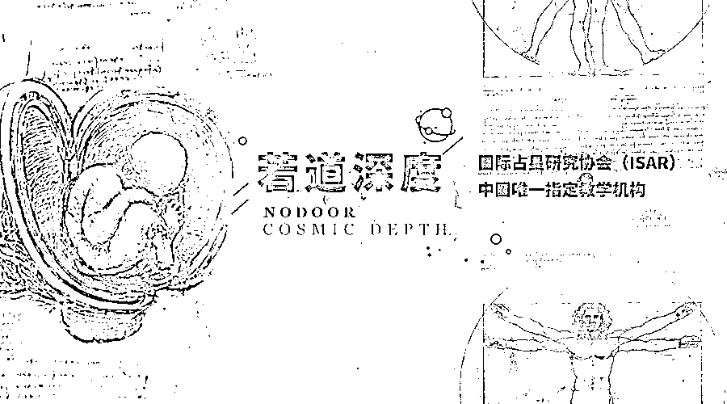

作者/一桑编辑/玫瑰 封面/书君 图片/pexels 提到海王星，你会想到什么？海王星的能量总是如梦似幻，甚至你自己都无法觉察它正在对你进行的改造工作。一起来看看这篇关于海王星的心理学＋占星学结构，相信你会收获满满。**如何公正地讨论海王星**讨论以宇宙为背景的宏大知识，必须认清一个事实，那就是**我们永远无法摆脱人类固有的偏见，这种偏见源自于个体感知力的界限和族群的文化基础。**举个例子，在远古部落时代，一个勇士如果带回 10 个人头，他很可能因此当上酋长，因为族群的文化认可这样的行为。但如果放在今天，几乎没人认为夺人性命是一件中立可以讨论的事情。相似的，当代的绝大多数心理学者认为应该运用心理学知识去预防自杀和阻止施暴，心理学课本和推送上绝不可能出现诸如“想没有痛苦的自杀？这 3 点需要注意”等讨论的内容。但也许未来的某一天，人们会发现今世的生命是人类进化的阻碍，那时他们可能才意识到由于以往的偏见，他们错失了多少知识。有关海王星的内容也与此有关，很多人也许永远也无法平心静气地讨论乱伦与滥交的心理动因，也认定了抑郁和反社会是应该被治愈的东西。无论先入为主的观念是什么，我们都早已在潜意识里错失了公正性，在充分讨论之前，一只脚已经迈入了那些让我们感到舒适的答案。对于宇宙来说，人类的衰败与灭绝有可能是一件好事，个体心灵也许与岩石一样，绝无觉醒的机会；假如我们没有看到及讨论这些可能性，我们所学习的就是我们自己在幻境里编造的知识。

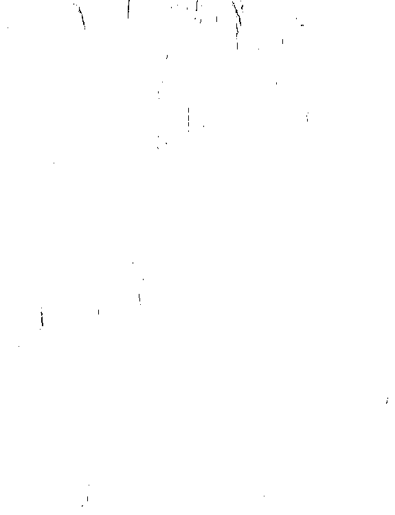

**海王星与现实社会**海王星与我们文化背景最大差异的部分就是，我本不该用文字和逻辑来表达有关它的任何知识。对于海王特质强的人来说，我的遣词造句根本就是无所谓的；**让他们着迷的乃是一种“感觉”，这种感觉无法通过严谨的论证得到，却更容易经由绘画或舞蹈表达出来**。我们永远“说不清”海王星的能量是怎样的，因为我们族群的知识建立在二元对立的逻辑感之上，我们会认为“这段有关海王星的表述是对的，那些有关海王星的说法是错的”；但其实**从海王星所代表的心理角度来看，上述二者是没有差别不分彼此的。**与这样的麻烦相比，公正的讨论出轨乱伦自杀什么的都是些小事情了。**从守护星座的角度来看海王星，是一种心灵层面（水元素）的发散状态（变动星座），个体内心能量的弥漫与涣散，让个体容易融入到更大的整体中去。**“pieces”在希腊语中即是鱼的意思，而**鱼与水的关系像极了个体与更宏大部分的联系：我们从未离开过水，却不太容易知道水为何物。**鱼群的粪便融入大海，产生微生物，微生物又逐层成为上一个食物链的食物；我们可以把鱼看做一个单个的生命，也可以把海洋看作一个生命，而鱼与其他生物则是它的细胞。**用这样"融合"的眼光来看，世界上的万物都是不分彼此的，物质与物质，生命与生命，心灵与心灵之间本没有明确的界限。****从我们现在所处的社会文化角度来看，海王星的“融合”很容易成为一种对个体边界的侵犯**：你的母亲出于对自己婚姻状况的移情补偿，以及对社交认同的需求，想让你赶快结婚，而这却违背了你的个人意愿；而出于同情心施舍给乞丐的钱财打乱了那些搬砖工人的公平感。土星的秩序、木星的激情、天王星的条条分明，都容易被海王星莫可名状的力量消解，而“死亡”本身更被看作是一切的终结。这些固化的基本认知都极大阻碍了我们对海王能量的探索和认同。到目前流行的人本主义占星学为止，新世代的占星学者们为海王星赋予了诸多词条，其中不乏实践中逐渐发现新事物（相对于古典占星来说）以及精神分析学名词：**海洋，鱼类，药物，毒品，福利机构、救赎宗教，艺术，绘画，印象派，舞蹈，迷幻电子乐，疾病，衰弱，牺牲，自然死亡，消失，溶解，奉献，拯救，浪漫主义，沉迷，上瘾，忘情投入，梦境，幻觉，混乱，非理性，虚拟现实，共情，怜悯，无私，敏感，多情，暧昧，婚外情，欺骗，脆弱，逃避，麻醉，催眠，放弃，失去，通灵，静修，大爱，合一……等等。**我们需要把这些词汇意向归类总结和找出它们共同的根源，虽然这是海王星最不愿做的事。

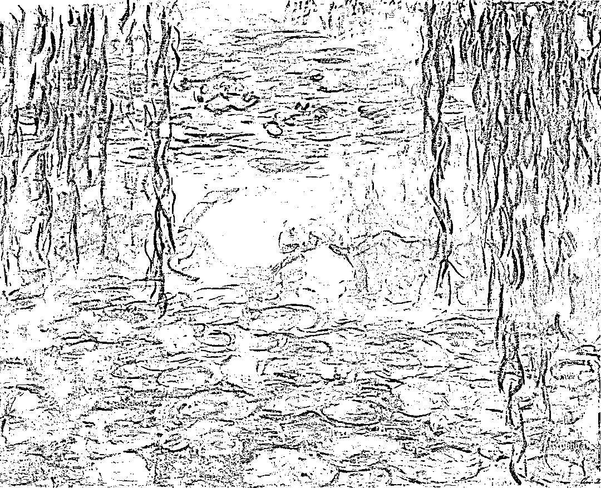

**海王星的心理学含义****海王星给人的感觉是最接近“心理层面”的，因为对于那些“非理性”“非物质”的事物，我们很容易把它们归类为心理问题——我们找不出任何理由去支持海王星的冲动。**殊不知，这只是因为**我们的文明并非建立在海王星的根基之上。** 荣格曾经深度探索了非洲土著人和北美原住民的生活和心理状态，他认为欧洲人所提倡的理性已经深深伤害了他们的精神健康，让他们变得歇斯底里和冲动易怒。荣格援引一位印第安人的话说：“我不知道他们（殖民者）想要什么，他们想要的都是自己目所不及的东西。我想他们一定是疯了！”（《回忆、梦、反思》引文，可能有些许出入。）

****

**（欧洲人）戴着理性的面具，却把熔岩一般的生命藏在盔甲之后。****——尼采****现代占星学总是把海王星的核心意涵解释为溶解、消融，但个体的消失并非海王星的终极目的。**星座的 3 个相性分别为创始、固定、变动，而不是创始、固定、消失，我们不能把变动星座简单理解为一种元素的消减，而是**应当看着该元素的不断扩散、稀释，最终融合到广阔的大环境——所有元素的融合体。**所以海王星的最终目的乃是**合一**，死亡与牺牲是我们从个体的角度下的判断，我们固守在“我自己”，所以才觉得死亡是一件可怕的事情，但**死亡并不是彻底消失，而是加入一个“集合体”。**如同印第安神人坚信，人死之后他们将与列祖列宗永远在一起。

****

**我们是盖亚的触须，飞散的火花；上帝是所有的灵魂。 **

**——一桑 2007 博客《双鱼月》**

虽然海王星“合一”的冲动人皆有之，但它通常是**在潜意识中运作的，也就是说大多数人完全不了解自己还有这样的内心需求。**而**无意识的需求将会把相关的事件拉入到我们的生活之中，让当事人好像“被迫”体验海王星的心境。**在以下的分类中，我们会大致分析生活中的各类海王星事件，是如何和每个人的潜意识层面相联系的。

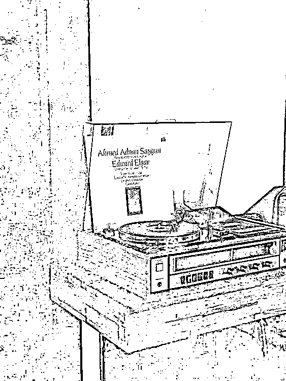

**海王星与非理性**要讨论“非理性”，理性地讲，就要先定义何为“理性”。目前社会现行规则的思辨法则起源于欧洲古典时期的二元思辨论，即如果一项事物是 A，它就不可能是非 A，我们必须先认识到事物的不同，划清边界和建立概念。但即便是“理性地讲”，我们也必须承认，**除了理性之外，人类心灵还有其他多种认识和判断周遭世界的方法。****海王星的认识法则是一种混沌的法则。它把所有可感知之物视作一个整体，不加以区分和命名（有名天地之始，无名万物之母）。**这种认知并非逻辑上承认“不可区分性”，比如“鱼既是单个的生物，也是大海的细胞”，而是**根本没有逻辑，不经过语言，认识者的眼中脑中只有所见之物，而没有所见之物的抽象化名词或逻辑概念**。这种认识方式对于其他人可能是难以想象的，因为大多数人已经习惯了在看到某项事物时，便无意识地在脑海中抽象出它的概念，这种命名与分类的内心处理，使得物与物，概念与概念之间区别开来。**而海王星所代表的心理功能，就是去察觉到被逻辑区分开的、“不同的”事物个体之间的新深层联结，把曾经断开的事物再次融合起来。**所以，海王星人眼中的世界，和其他用理性认识的世界是极为不同的。例如，写实派画家无法看到梵高眼中的世界模样，光与影、甚至我们常人看不到的一些东西，对梵高来说极为突出和重要；数学家和物理学家们亦不能理解一些艺术家接近疯癫的行为（但其中一些人却隐隐为之触动）。**“理性世界”把这样的行为称为失序、混乱、疯狂，或者，按照 DSM 美国精神医学学会的说法，称之为精神分裂 Schizophrenia——毫无逻辑的行为和认知，无法区分现实和幻想。**不过，我所遇到的海王星人，**绝大多数不是灵性导师或成功的艺术家，而是普通生活中的混乱者。**他们总是**不知所措，不知道该怎样去面对条条分明的社会规则**；他们想依照感觉行事，却困惑于周围的世界为什么不如他们想象的一样浑然一体，**“迷茫”是他们最大的特征。****这并不是他们的错，因为现今的人类社会恰好建立在了他们的对立面上。**萨斯波塔斯在《变异三王星》中提到：**“当海王星行运太阳时，我们可能迷失自我；或是体验到生命的完整性。”**这种略带自相矛盾的说法也从侧面勾勒出“完整性”的含义——物我不分，徜徉于世。**让海王星人感觉到“完整”的场景，可能是身处以信念为主导的宗教团体中，或者人与自然相离未远的原始生活方式里。**

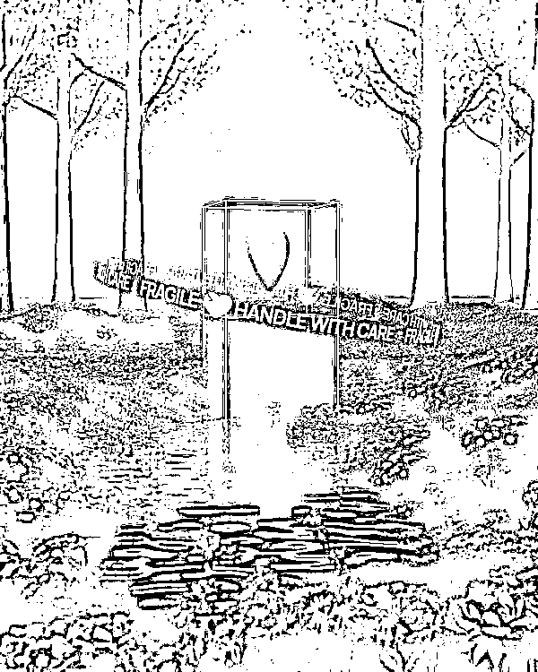

**海王星与同情、依赖**在当下的时代，“同情”此时已经多为错用，我们认为弱小者可怜并应当获得帮助。**但真正的同情不是 pity 而是 sympathise，在古老的希腊语境中意为“拥有共同（syn-)的感受（pathos）”。****同情并不应作为一种社会道德而存在，而应作为人类共有的一种心理功能——海王星心理层而存在**；**人人都有同情共感的潜力，当海王星与其他个人行星成相位时，这种心理功能便浮出水面。**海王星是如何体会到他人的情绪？不是通过微表情，不是借用学来的 PUA 或心理学知识，不是凭一句“我很理解你的感受”；而是**在混沌中直接知道**。这对善于用脑的现代人来说可能太过于玄幻，可是即便是物理深度痴迷者也知道量子纠缠的存在。海王星就是有这样不合逻辑的功能：**一进入房间你就察觉到气氛不对，闭上眼睛你就可以体会得更深，千里之外的亲人去世你会有莫名的感觉。**灵魂和灵魂存在看不见的深层联系，好像同一个生物体生出的触须，这一点理性和科学无法证明（海王星人也用不着这样的世俗认证），我们只是“察觉到”事情应该是这样的；问题在于，**我们是否会认真对待我们内心深处的这份感受。****海王星人的童年通常有着不幸的事件，通过这些事件他们体会到了自己与他人的不同——他们是多么容易被周围人的苦难所影响，敏感于别人所看不到的细微变化。**他们会在自己周围发现“可怜”的事物，这是因为他们已经把自己敏锐的触手探了出去。对于海王星人来说，**所有人的内心层面都是连在一起的，**但**他们自己未必知道这一点**：他们会**将从别人那里接收到的苦如数尽收，移植到自己的内部，从而显得多愁善感，脆弱迷茫**。

**如果缺乏正确的引导，他们可能会把别人苦难的责任归咎在自己身上。**如果海王星和内行星呈困难相位，他们还可能**因为自己的特质而被环境所排斥，或者说，被牺牲掉**——**他们分担了这些愁苦之事，并把自己的内心能量传导给别人，仅仅是由于他们自己擅长这么做。**

共情可以带来疗愈，但也可以让顽疾更甚。发自内心的了解体会，无微不至的嘘寒问暖，可以让重病之人充满希望；但也可以把一个健康之人变得孱弱不堪。想想，如果不用动口就可以获得另一个人全然的了解，自己所有的情感都可以被包容体会，自我还有何动力需审查自己的过失之处，还有何动力去建立一种与陌生心灵的互动之法？**海王星有一种将人变“弱”的趋力，无论是海王星人自己还是周遭的别人，好像依旧处于羊水中的胎儿，感受到自己被安全容纳，便选择不去睁开眼睛和生长身体。**我所接触的海王星人，几乎全都充满善意，体谅别人，也容易被别人体谅，但她们几乎都展现出**依赖不能分离的特质**；她们好像一株寄生植物，离开了宿主就会很快枯萎掉。

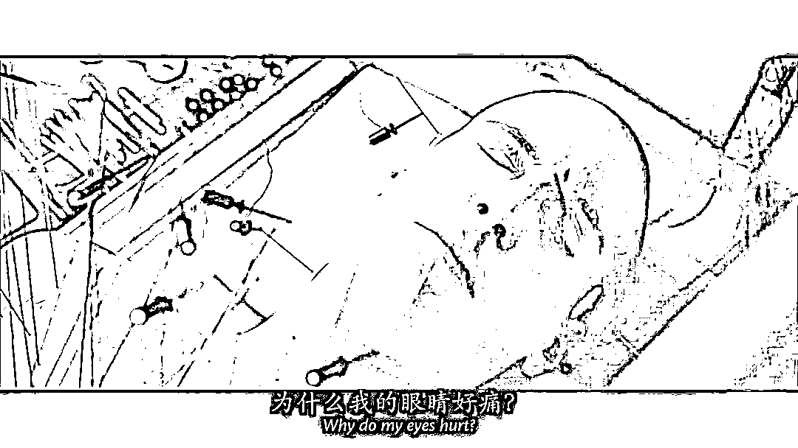

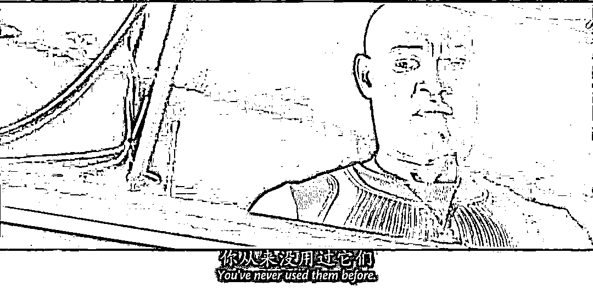

|《骇客帝国》剧照
**海王星与牺牲、丧失**并不是每个人都追求灵性成长，但每个人都需要把现实世界的生活过好。不以轮回转世的观点来看，**海王星人在此生最大的难处在于他们总是会“失去“一些东西，这种丧失是悄然无息的，好像颜料溶于水里，香味散于空气，让人无可奈何却又唏嘘不已。**

****

**这个世界的终结，并非伴随着一声巨响，而是一声叹息。****——艾略特**在海王星人小的时候，他们就逐渐熟悉这种感觉：他们可能经历过**挚爱的亲人离世、照顾者的离异、自己或家人健康的恶化、优渥环境的改变、抑或是钟爱自己的人移情别恋（父母更重视弟弟妹妹、社交团体的改变）、丢失自己钟爱的玩具、放弃自己的爱好、搬家、寄宿**等。总之，**海王星人总是感觉到自己身边的一切不完全属于自己，但这又不像天王星那样完全隔绝**。他们感到自己好像**被裹挟在一股不断变换，无法控制的洋流之中**，**周遭的一切都太过于和自己息息相关，而自己却无法控制自己的走向，去往想去的地方。** **这种无法掌控的关连给予海王星人极大的愧疚之感。由于潜意识里感到自己和身边的事物是紧密联结的，他们总觉得自己本可以控制和影响事情的走向**。“要是我当时…就好了”“我本可以让她过得更好”“这些都是我的错，我活该”。海王星人很愿意**为更宏大的目标，更广阔的群体去努力**，他们头脑中会把这种冲动认为是**由于愧疚而产生的亏欠之感，我们也可以把它称作“牺牲”**——为了弟弟妹妹，为了可怜之人，或是为了某个虚幻的概念。海王星人需要认识到，**“愧疚”与“牺牲”实则是自己的潜意识所追求之物，尽管有时貌似是世界强加给他们的；（他们请求）世界打碎他们的个体，以便他们能融入整体。**

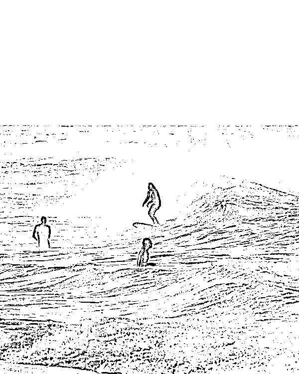

**海王星与幻觉、灵性**许多艺术形式来自于幻觉，来自于那些现实中不可见之物，却又与现实息息相关；所谓“源于生活，高于生活”。然而**“幻觉”又该如何定义？我们又在何处得到了幻觉？**其实，这一称谓也是一种蛮横的偏见：我们普通人有眼可以看，有耳可以闻，有手可以触，于是就把可见、可闻、可触的世界称为“现实世界”，把我们无法触及的事物称为幻觉，并且很愿意把拥有幻觉的人当做神经病关起来。**海王星人的幻觉，源自于他们的联结能力（或许我们可以称之为“通灵”）**。想体会大我，必须放弃小我；想要融入整体，必先超越个体。精神病医生说精神分裂患者“没有边界感，无法区分自我与他人。”其实我们也可以说精神病医生边界感太强，看个病还要收费。本桑认为，所谓“第六感”，就是普普通通人皆有之的一种能力，就像有人视力好，有人视力差，你想练习的话，可以慢慢去练；而不是发现自己不行，就在未经证否的情况下说别人是骗子，是神经病。我自己接触过多个有预知、隔空感知能力的个体，他们都没有因此出名，大多受到排挤和不信任，有的几近崩溃，有的则在默默帮助别人。

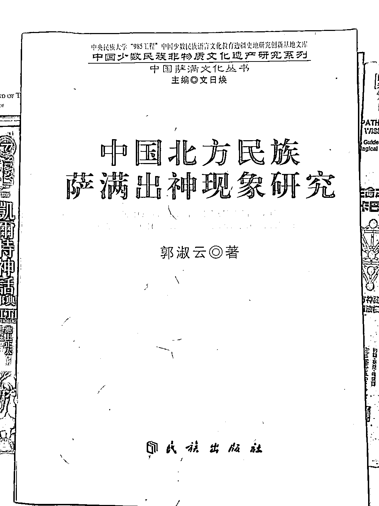

| 关于萨满出神现象研究刊物

**沉迷与瘾症是海王星的极端状态，在这个阶段，个体的边界已全然涣散，注意力也快要从现实事物中飘走。**国外心理机构对这种情况研究已经很多，他们或称之为超觉体验、“超个人”，或者心流；当一个人毫不费力且极为专注的时候，通常会在一定程度上打开这种模式。原始宗教的跳神或萨满仪式中，通灵者会借用鼓声或草药达到这种状态；而在一些前卫的心理治疗手段中，也会运用一些类似的手段，去唤醒和处理过往的创伤（比如催眠、钵音疗法、芳香疗法）。**不过在现实社会中，酒精、药物和对某人（物）上瘾，是普通人接近海王星状态的主要方式。**

****

**……这一切对于医学院出身的绅士来说都太出乎常理了。更糟的是，病人还在康复。**

**——丽兹格林《海王星》**

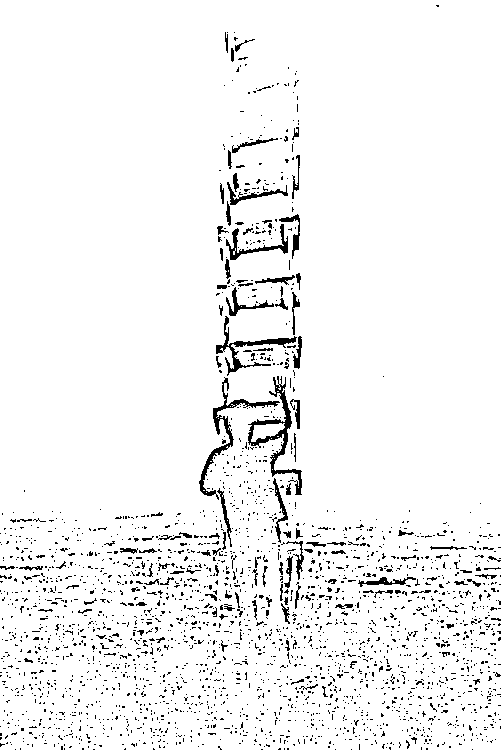

**海王星与理想化、欺骗**理想化大多数情形总归是往“好的理想化”这个方向描述的，但事实上却是，**海王星人对悲苦方向的想象也是深不可测的，他们也经常会说出“要是什么什么事情发生，该怎么办”一类的话语**。这种长阈值的想象空间的源头，依旧是海王星广泛的联结能力，**他们不仅能在同一时空中联结不同生命体的深层心念，更能够联结不同时空中的平行事件**。换言之，海王星人可以轻易体查出事情发展的不同结果：**我们可能觉得那是理想化的幻觉，而海王星人则看出这是事件的另一种可能；我们看到的是事物的单一态，而海王星人则看到事物的叠加态。****理想化的反面就变成了“欺骗”——没有达成的理想。**无论是保健品营销还是浪漫爱情，海王星式的理想都容易**沉浸在最好的那种可能性中而脱离现实**。严格来说，**海王星人并没有“欺骗”，而是在描绘一种幻觉，一种在平行时空中可能出现的场景，这对于他们自己来说就是扩大版的现实**。所以我们在海王星式的欺骗中很难看到蓄意的背叛或奸诈的诡计，反而更多的是木星一般的乐观的美好愿景；也许这也是古典占星学中人们把木星认为是双鱼座的守护星的原因之一。

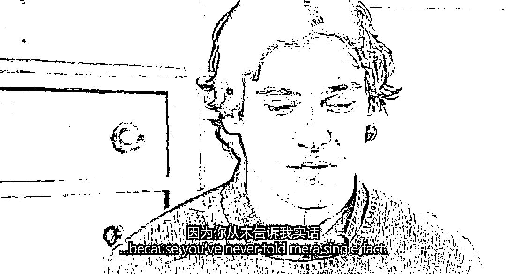

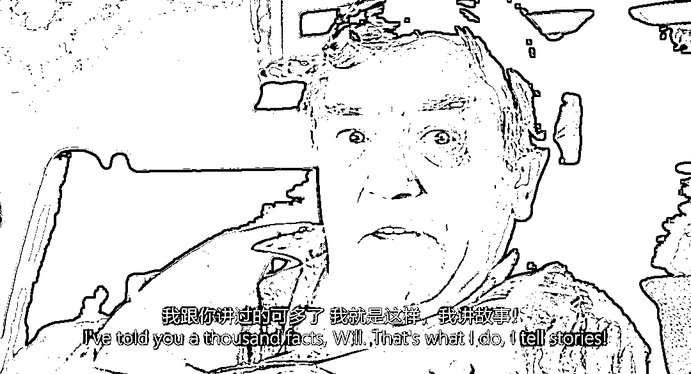

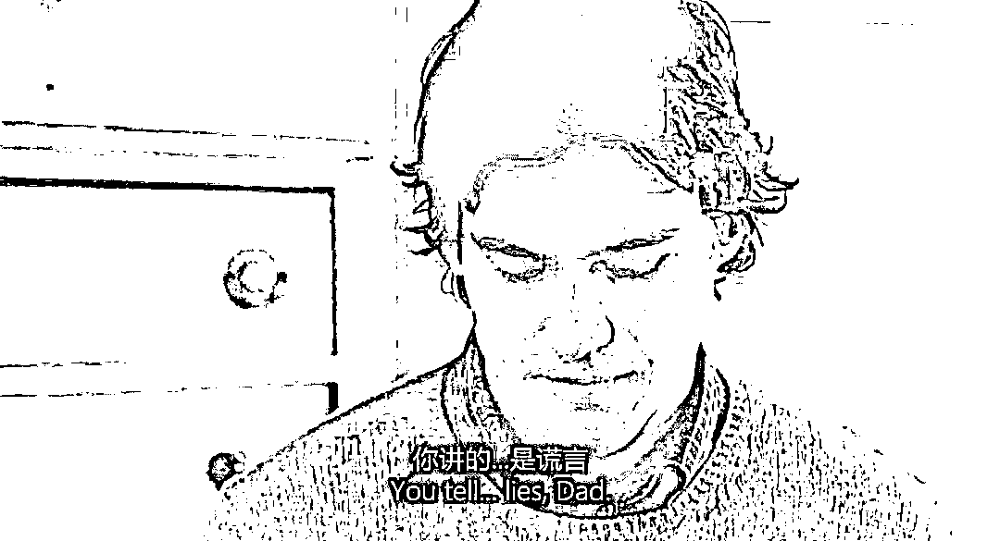

| 推荐《大鱼》——有关海王星式幻觉与谎言的电影

**海王星与暧昧、出轨**在流行占星学中，双鱼座被认为是“最容易出轨的星座”“滥情的中央空调”等，这与我自己的观察体会基本一致。旁人首先注意到的是，双鱼座——海王星人**特别在意对方，愿意听你诉说，并听得出话语背后的真实情绪**；其次会发现，双鱼座——海王星人有一种**脆弱与被动**的特质，这**勾起别人心疼怜爱的情绪**；再者，**不那么重视现实世界的他们，很容易抛弃社会守则，全身心投入哪怕一次的激情中。****理性而道德的人，恐怕不能认同“融合渴望”这种词汇。**婚姻制度是土星的产物，它是社会庞大结构的基石，而海王星会瓦解一切结构性的事物。有的时候我们能在海王星人身上看到一种**毁灭倾向**，这可能是由于**那些结构性的、分离的事物阻碍了他们想要的广泛联结与合为一体。**他们在潜意识中**很乐于将那些确定的关系拆掉，从而让位于不确定、不长久、却在此时此刻最真实深沉的激情。****不过海王星的不忠从来不是背叛，而是想选择“我都要”；**当伴侣用深沉的痛苦将他们召回时，他们也会左右为难，并把一切罪责归咎在自己（或者他人）身上。未完待续，详见今日二条

**版权声明：**原创文章由作者授权发布于若道平台，欢迎转发，反对抄袭。友号转载请申请白名单。

**END****一桑**
2018 届若道核心课程毕业生基金管理人**公众号：**心理占星学**各平台账号**：天文心理学

长按打赏

**20 位来自世界各地的占星师****带来 19 场沙龙——新世界的觉醒****详情可点击下图**

**学习占星学****点击下图了解课程详情**

**微信又双叒叕改版啦，不想错过若道君的推送？**
**就把若道设为星标吧！****▼**

**喜欢就点一下“在看”吧！**

********报名直达入口********

# 拥有这个相位的宝子们，善良脆弱得让人想 rua

> 原文：[`mp.weixin.qq.com/s?__biz=MzA5NjA0NTAxNg==&mid=2651487157&idx=2&sn=84cb97f8a7d2b9d7ef7f9c5a6f9c2dde&chksm=8b48c902bc3f4014208635cea18b6e1973c43ca133eed90af93c7852dc8eecca7f4615beaae9&scene=126&sessionid=1692737761#rd`](http://mp.weixin.qq.com/s?__biz=MzA5NjA0NTAxNg==&mid=2651487157&idx=2&sn=84cb97f8a7d2b9d7ef7f9c5a6f9c2dde&chksm=8b48c902bc3f4014208635cea18b6e1973c43ca133eed90af93c7852dc8eecca7f4615beaae9&scene=126&sessionid=1692737761#rd)

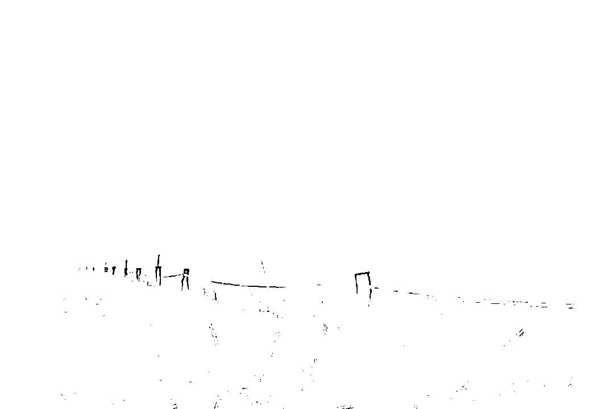

作者/一桑编辑/玫瑰 封面/书君 图片/pexels 在今日头条中，我们了解了关于海王星很多未被人知晓的心理学和占星学意涵。那么，如果个人星图中海王星能量凸显将会引发怎样的情况呢？这篇就来给你答案。**海王星与个人行星的相位**我们可以用一个简单的原则去理解相位中的行星，那就是**拥有相位联系的行星将会同时发挥作用**。当我们说一个人拥有“木星性格”或“土星特质”时，往往指的是这个人出生星图中的木星或土星处于与个人行星的相位中，此人深层潜意识中的木星或土星阶层将会被“点亮”，而更加频繁和明显地参与到其日常的“外显状态”中。当某个人的非个人行星不处于相位中时，我们也不能说这个人“失去了”这些心理阶层，而是它们时刻处于潜意识深处，鲜少有机会表露出来。**从木星开始的非个人行星，其行星本身的“性格”要强过于行星的落座带来的特质；或者说从太阳开始，这种倾向就在逐渐加强。**行星本身带有“个性”，其个性就是其所守护的星座的特质，例如海王星是双鱼座的性格，星图中有海王星相位的同学会体现出双鱼座特质。个人行星的性格“较弱”，容易被所落的星座“染色”；而非个人行星的性格“较强”，较少受落座影响。故而本文只谈论行星之间的相位，而不去讨论海王星的落座；当然，这并不意味着海王星的落座完全没有效力。

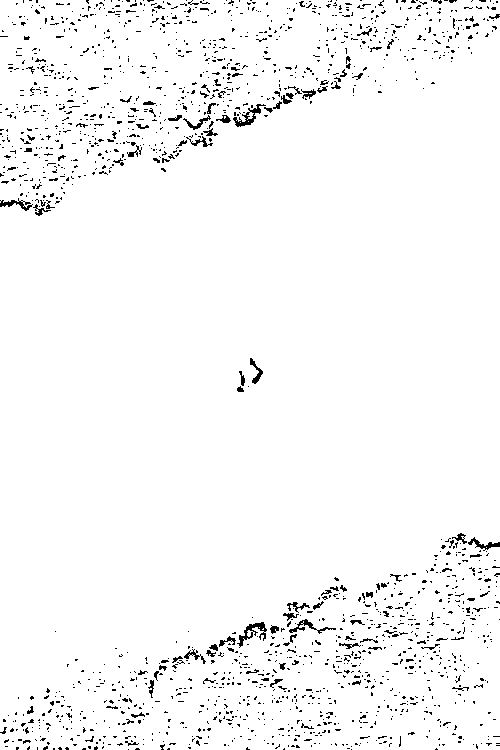

**海王星与太阳的相位**太阳与海王星关联的人拥有两个明显特征，一个是**“理想主义”**，一个是**“牺牲精神”**；它们是**主观意识为数不多的情形，去配合潜意识深层的联结冲动**。**一个人主观上愿意摒弃分歧，与众生合一，他必然愿意为多数人的福祉去奋斗，为一些最为宏大的目标去奋斗。**这种目标**必然显得不切实际，尤其是在困难相位中**，**海王星的冲动比在柔和相位中更加激烈**，案主通常会**对虚幻的理想更加笃定，更加奋不顾身地奉献自身，也更加忽略现实情况**。他们会成为人民心中的英雄形象，激发每个人的宏大之感；但**若要去实施具体步骤，从现实层面把事情做成，还要靠那些水星与土星特质的人。****相对于”英雄“，日海相位的另一面是“被牺牲者”，或是塔罗牌中的”吊人“。**他们以**失败者，被忽略之人或悲情角色**的形象出现。远古时期为了取悦神明，会挑选不幸之人作为”献祭“，这些人以小我之身换取了族群的安宁，这也是另一种合一的形式。而今这种精神内核以其他的形式继续出现：为了老人的愿望而结婚生子；为了公司集体而接受自己不喜欢的岗位；为了婚姻的完整性而一再忍让；为了“不给大家添麻烦”而忘了自己本来想做什么……

柔和相位中，海王星和太阳的需求都会得到满足，案主会**满意于自己扮演的角色，感到实现了自己的价值**；而在困难相位中，太阳所代表的自我感受到了压迫，案主会觉得**自己本来没有想这么做，但却对现实“****无能为力”**，他们总会**无意识引发别人的忽略**，例如**总说“不用管我”“我都可以”，之后在叹息中反复咀嚼自己的失败。**

日海相位的人会**认可以怜悯为核心的普世价值，他们通常会选择具有公益性质的职业；在普通的工作中，他们也会尽可能地惠及他人**；每当这么做的时候，**他们的自我价值才能得到满足。****他们也会为了顺从家人的要求而选择自己不喜欢的职业。**不过其中不少人由于感到了“另一个世界”的召唤，从而**选择灵性事业作为人生主题，或是成为真正的，抒发灵感的艺术家**（不是那些艺术家协会里的艺术家）。

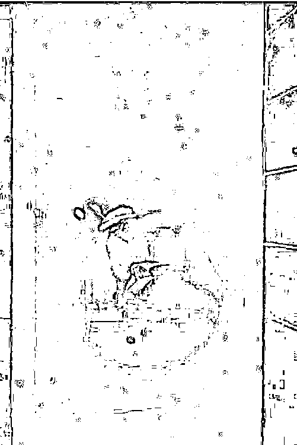

**海王星与月亮的相位**月亮与海王星的联合，**让“融合冲动”以一种潜意识的、情绪化的模式出现**；最直观的解释就是，当事人会**发觉自己喜欢海王星的能量，融合、陶醉、沉溺，富有想象力的事物会让他们感到极度舒适。****月海和谐相位的人很大可能成为极度溺爱的母亲，或者可以说她们的内心其实更像一个婴儿（婴儿也没什么不好），幻想与自己的孩子完全合体。**由于月亮也代表了案主童年时期的环境，月海相位也暗示了**在其成长过程中可能出现的海王星事件，比如亲人的丧失、罹患疾病、或被忽略、牺牲、放弃等。**与日海相位相比，月海的内容**不是案主可以自行选择的，而是在不知不觉间遇到的，内化在情绪深处的**。他们**会模糊地感受到“我”其实并不只是“我”，而是连动了身边的一切，这让“身不由己”的愧疚感更加浓烈。**月海人经常会有一种**“被包裹”甚至“被淹没”**的感觉，**尽管这让他们免于孤独，却也会让他们透不过气来。**同样的，他们也有可能让别人透不过气来：他们对其他人需要拥有自己独立空间的想法很失望，说好的紧密相连呢？**拥有月海困难相位的伴侣可谓是深度依赖症患者，当他们身边没有人时，他们可能会孤苦致死**；他们是“眼泪油罐车”，稍有不慎便梨花带雨，伤春悲秋，因为他们真的是太过敏锐，他们的海王心理层饥渴地搜寻着世上一切悲苦之物。在咨询中，有一些女生表示，她们进入恋爱关系不是由于自己特别喜欢对方，而是“不想回家一个人空空如也”、“旅游的时候能有个伴”、“孤独终老多可怕”……**当海王星的需求过深过重时，内行星对于被理解，被认可的需求就会被牺牲掉了**。（月海被辜负、被分手、被劈腿出轨的情况还是很多的……）月海特质的人被认为会有一种**“逃避倾向”**——**这是被那些“不逃避”的人所定义的。**他们在逃避什么呢？具体来说，就是那些**待处理的现实事物**，可现实世界对于海王星人来说根本不重要好吧！你说我就会抽大烟而逃避搬砖，我会说大哥你没问题吧？抽大烟才是最重要的事好不好？沉湎于幻觉才是人生的真谛好不好？逃避？你们所有人都在逃避！你们都在通过好好工作升职加薪生小孩来逃避最终到来的死亡！（编者：此处并非鼓励抽大烟，请读者建立正确三观，共建文明和谐社会。） 

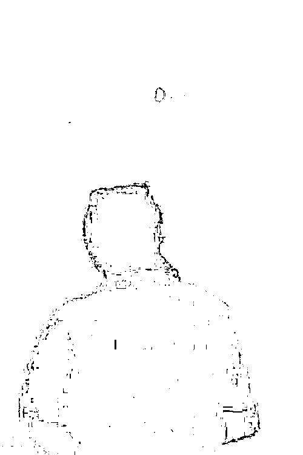

**海王星与水星的相位**与海王星相比，水星连一点点“水”的元素都没有（我宁可把它叫做“风星”）。然而**水星与海王的组合，可以将灵性世界的事物顺利地翻译成现实世界能够听懂的语言。**水星是非常好的媒介和具体事物的执行者，或许只是因为有了水海人出版的诗歌文章、灵性书籍、艺术评论、电影编剧或者只是把充沛的情感化作莺莺软语，海王星的那一层世界才能被大多数人所了解。**海王星与水星联结的人，很有可能像一个“疯狂诗人”一样，在生活中混乱不堪，但却在其作品中鼓舞人心。**他们的表达方式**充满想象力，不合逻辑但必须是最为生动的**（我曾见到一两个水海相位的漫画创作者）。**他们在处理琐碎的日常事务时，通常会以“混乱”作为结束**——他们喜欢看到东西毫无章法地堆放在一起，那种场景代表了一种**“充满人性”的生活。**（编者：本人拥有这个配置，很想辩驳一句：那并不是毫无章法，而是一种艺术的摆放方式！） 

****

**那时候你是愉快的，忧伤的，混沌的。 ****——海子《遥远的路程》（水海冥上帝之指及金月海 T 三角）**

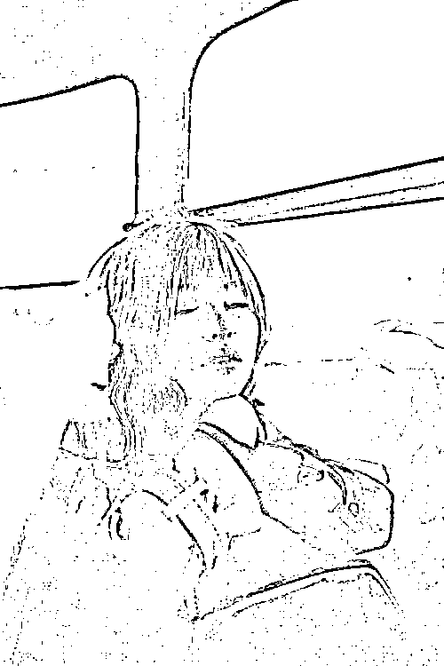

**海王星与金星的相位****海王星是三王星之中唯一不那么固执的外行星（天王星，冥王星皆守护固定星座），它的力量通常以一种柔和的方式呈现**；金星所守护的天秤座与金牛座，都不会与双鱼座形成紧张相位；故而**海王星与金星的配合在绝大多数情况下都是让人愉悦的**。（所以海中可以诞生阿佛洛狄忒？）**打动人心的艺术形式大多离不开金海相位的组合，金星负责把海王星的灵感化作“可见之物”，成为沟通物质感官和灵界的桥梁。**我不知道为何国内的心理大夫们会诊断出超多数量的边缘性人格障碍（*borderline personality disorder*）；其实我认为这是一个错翻的词汇，把“borderline”翻译为人际边界感会更容易理解这个老外病种的含义。**金星代表了人与人之间的界限，而海王星的功能则是界限与区分的消除。**从大众化的情形来看，金海相位的人**并没有那么多“神性之爱”，而是习惯于“管闲事”或过度索取——二者皆为对边界感的逾越**：你的事情就是我的事情，你遇到的麻烦我全部都感同身受地去在意，而我需要什么的时候也请你随叫随到。**无论爱情、亲情、友情，他们都会表现出包容与理解，奉献精神，以及不希望别人把自己当外人的特质。**他们最希望和爱人腻在一起，认为既然已经确定关系了为什么还要分成两个人过？合二为一不应该是关系的最高境界么？当然这类观念在我国也多来自于族群文化的认同，而非个人的心理特质。

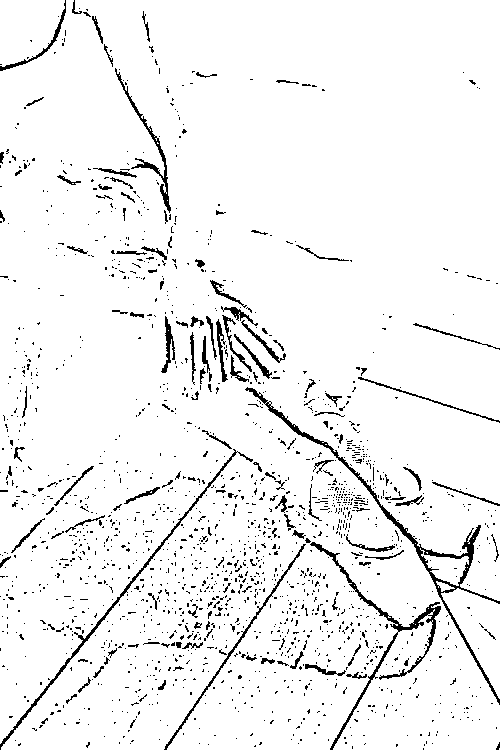

**海王星与火星的相位**

**火星代表了人体的本能反射，被海王星触及的火星会以一种散漫、延迟的方式发起行动。**一种解释是，**他们很容易过度沉迷，从而无法从当下所做之事中抽身**。另一种解释是，**火星的战斗与行动特质被海王星削减、柔化了，变得绵软无力**。

**火海相位可能会无意识地表现出怯弱、顺从的倾向，**他们自己可能无法控制这一点；**如果太阳或月亮比较强势，他们可能总是责怪自己为什么不能勇敢起来**——**当海王星的特质在主观意识中被否认的时候**，案主可能会**在现实世界中体验更多的海王星式的外在力量，比如受伤、生病、成瘾、被当做牺牲品等。**

在新冠肺炎疫情刚开始的阶段，我发现多个感染病毒的公众人物案例中，**行进海王星与案主出生星图中的火星形成相位，这显示了海王星能量对个人“生命活力”的侵蚀**。

**火海相位常常反馈在身体的健康状况上，通常是一种“弱化”、“松弛”的倾向。**这个组合很容易引发**过敏现象**——人体的防御屏障不分敌我地攻击；同时，这个组合也预示了**免疫系统的弱化，外界环境更容易侵犯人体**（比如艾滋病）。

疾病分为多重属性，并不是说海王星就代表了所有的疾病；不过我们确实发现**火海相位的人多喜爱健身或舞蹈**——恰好在强壮之美和柔弱之美的两个方向上走得很远。

**版权声明：**原创文章由作者授权发布于若道平台，欢迎转发，反对抄袭。友号转载请申请白名单。

**END****一桑**
2018 届若道核心课程毕业生基金管理人**公众号：**心理占星学**各平台账号**：天文心理学

长按打赏

**20 位来自世界各地的占星师****带来 19 场沙龙——新世界的觉醒****详情可点击下图**

**学习占星学****点击下图了解课程详情**

**微信又双叒叕改版啦，不想错过若道君的推送？**
**就把若道设为星标吧！****▼**

**喜欢就点一下“在看”吧！**

********报名直达入口********

# 今日开课！ | ISAR 认证职业占星师必修课：踏入占星学大门的第一步

> 原文：[`mp.weixin.qq.com/s?__biz=MzA5NjA0NTAxNg==&mid=2651487157&idx=3&sn=7ed9a5e1d982986d438d2ad8661abd5f&chksm=8b48c902bc3f40143b14534a1841e5bdedfa39fdcc829882e1977dd75e6bad004cc2856931c1&scene=126&sessionid=1692737761#rd`](http://mp.weixin.qq.com/s?__biz=MzA5NjA0NTAxNg==&mid=2651487157&idx=3&sn=7ed9a5e1d982986d438d2ad8661abd5f&chksm=8b48c902bc3f40143b14534a1841e5bdedfa39fdcc829882e1977dd75e6bad004cc2856931c1&scene=126&sessionid=1692737761#rd)

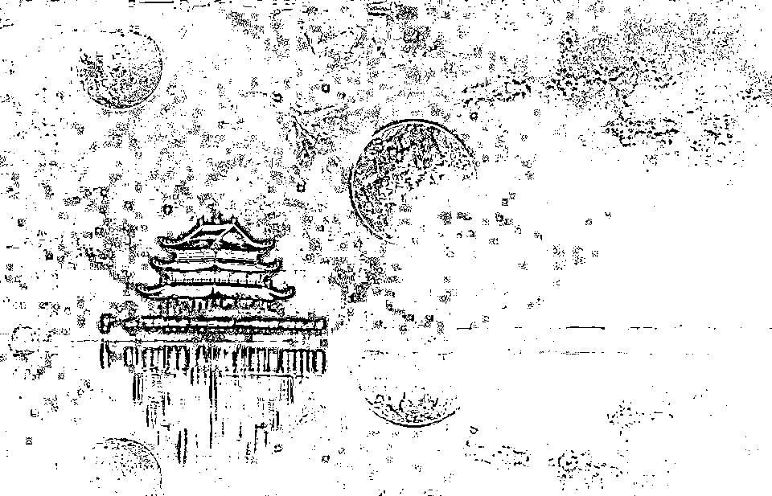

5 月，一个若道的老朋友突然发来一段微信，是对木星进入白羊座的感慨。这位朋友创建了自己的公司，他并不在占星行业，但仍经常记录占星日记，因为他总是体会到星体移动和个人生命变化的契合。

过了几天，又一位若道的老朋友发了一张当天新闻的图片，里面有医疗板块产业趋势、有啤酒股的泡沫问题、有千年老二的饮用水公司也要上市。她说，看，举目全是海王星。她也不是占星师。

然而，他们都与占星相遇，占星已经融入了他们的生活。

第一位朋友说：“在若道学习占星，对我来说建立了一个整体的世界观以及对自我内在的解释论。”

第二位朋友说：“学了占星就会知道，事情来时我们不必过度反应，知道一切会过去”。

占星学会改变你，不论你跟随它走多远，不论你是否选择成为占星师。

这个世界在飞快地变化着，占星学可以像定海神针，帮你测度这个世界的变化，也帮助你校正心中的自己和世界的样子。

**这个世界上，应该还没有后悔与占星学相遇的人。**

**8 月 30 日，新的若道占星核心课程要开始了。**

如果你还没有下定决心是不是好好学占星，那么 L1-2 可谓一个轻松的前菜，等着你品尝。

**把这个仅需投资 3500 元的课程作为礼物，送给自己或者自己所爱的人。**

**课程试听：不分组转发本文，找王老师领取。**

长按二维码添加王老师微信

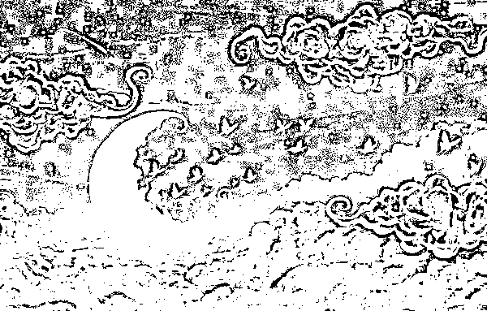

**谁是你的老师？**

**占星师咔咔（Caroline）**

2010 年师从美国占星师大卫·瑞雷学习，并得到世界名师斯蒂芬·弗里斯特、罗伯特·汉德、苏·汤普金斯传授各种占星学技法。若道首届学员，国内最早获得 ISAR 职业占星师资质的职业占星师，2019 年第二届、2021 年第三届核心课中和苏·汤普金斯老师一起教授若道核心占星课程。

在国际知名广告公司和市场研究公司从事的市场研究和推广工作十余年，曾任职于阳狮集团、尼尔森市场研究有限公司、MTV 和《Madame Figaro》杂志。

**大卫·瑞雷（David Railey）**

*   **I****SAR 董事会成员，ISAR 全球副主席，ISAR 全球职业占星师资质认证主席，若道占星创始人**。

*   2016-2019 年，被选为国际占星协会（ISAR）考试委员会成员，国际占星协会（ISAR）是世界最大的国际占星机构，会员遍布 47 个国家。

*   2017-2020 年，被选为国际占星联盟（ISAR）考试委员会主席，理事会成员。

**助教王嘉祺 （Conrad）**

ISAR 认证占星师、若道认证生时校正资质，从 2010 年起自学占星学，2015 年开始在若道系统学习，并开始个案咨询。2018 年担任若道核心课程助教，以及卜卦占星学和太阳返照选修课助教，并带领学员进行经世占星和太阳返照方面的研究。2019 年 11 月作为演讲人之一参加了国际占星协会（ISAR）北京大会，也是 ISAR 星空俱乐部中国区第 16 期的主讲人。

**内容是什么？**

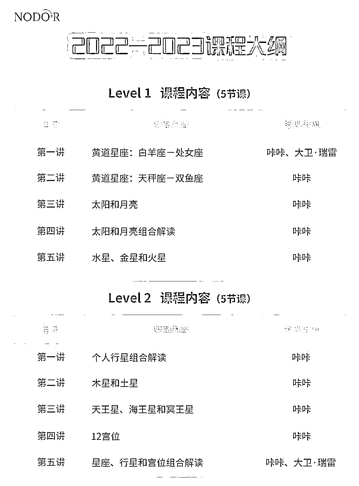

**开课时间和课程费用**

**8 月 30 日开课，每周一次，20：00-22：00，10 节课。**

**★ 1-2 阶 **

**课程费用：3500 元 **

**你也可能想学更高阶：**

**★ 1-3 阶　连报****课程费用：11500 元 ****★ 1-5 阶　连报**

**课程费用：46500 元 **

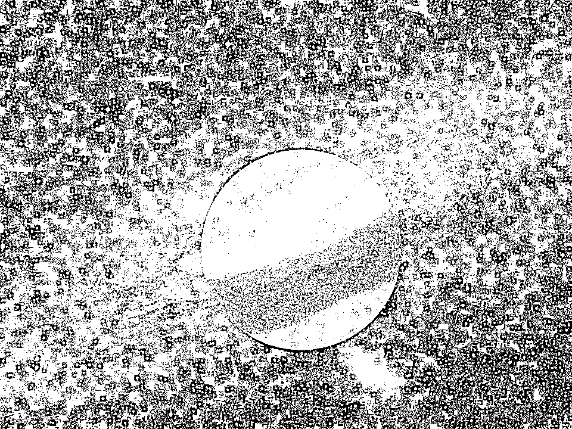

德国哲学家雅思贝尔斯说：

教育是一棵树摇动另一棵树，

一朵云推动另一朵云，

一个灵魂唤醒另一个灵魂。

你准备好被摇动了吗？

**退转课程**

**退款原则请详看《教学协议》，如有疑问请咨询课程顾问。**

**课程试听**

**不分组转发本文，加王老师获取。**（微信/手机：18510107057，请备注“大卫核心课”）

****2022 L1-2 认证职业占星师必修课程****

**授课老师：大卫·瑞雷、咔咔**

**直播课开课时间：2022 年 8 月 30 日（周二）**

**授课方式：******网络授课，英文/中文授课，中文翻译****

**费用：**3500 元

**课程负责人：王老师**（微信/手机：18510107057，请备注“大卫核心课”）

长按二维码添加课程负责人咨询~

**END**

****报名直达入口****

# 若道周运 8.29-9.4 丨 9 月序幕拉开，平衡压力面对变化与冲突！（内含 12 星座运势）

> 原文：[`mp.weixin.qq.com/s?__biz=MzA5NjA0NTAxNg==&mid=2651486909&idx=1&sn=a49a44971c302fd9ef5b49ef489f0410&chksm=8b48c80abc3f411c3086b33697d4c0963e6510f63bf8097d339b9852e471fb3f850600bdb700&scene=126&sessionid=1692737761#rd`](http://mp.weixin.qq.com/s?__biz=MzA5NjA0NTAxNg==&mid=2651486909&idx=1&sn=a49a44971c302fd9ef5b49ef489f0410&chksm=8b48c80abc3f411c3086b33697d4c0963e6510f63bf8097d339b9852e471fb3f850600bdb700&scene=126&sessionid=1692737761#rd)

******☆ ****后台回复“今日”，给你一句生命态度******

作者/苏黎 ISAR 认证占星师
编辑/翀子 封面/书君 图片/网络**整体氛围**

8 月底，太阳从狮子座进入处女座，各地极端天气、自然灾害频出，我们刚经历了不平静的处女座新月。

极端天气带来的停电，众人对未来的粮食，民生安全等问题忧患意识加深。**随着天王星进入五星逆行的大军，9 月初，水星也进入逆行阴影期，我们的情绪会容易冲动。**

动荡时代，我们个体的命运似乎不知所踪，我们需要学习调整，或许暂时无法接受，但可以**尝试适应，学会有辨识力的面对变化和冲突。**

写作的当下，我刚听完沙龙讲座《荣格与瑜伽》，线上的参与者提出如何整合羞愧、身心冲突、心灵转化等问题。老师提到一句话，**回到自身的觉察和体验中，让察觉的光照在阴影上，而不是为了消除阴影。**

正如在处女座的月份，我们会发现理想的目标与实际情况是存在巨大落差的，而处女座新月就是教授我们学会精微的平衡。

在新月期间开启的一周，情绪波动是逐渐调整的过程，金星的挑战相位比较多。金星代表我们身心的愉悦，情感的追求。**在星象的动荡期，学会如何在压力中平衡，调整身心、练习沟通是本周的主题。**

**本周重要天象：**

*   **金星对分土星（逆行）**

*   **火星六分木星（逆行）**

*   **水星对分木星（逆行）**

*   **水星进入逆行阴影期**

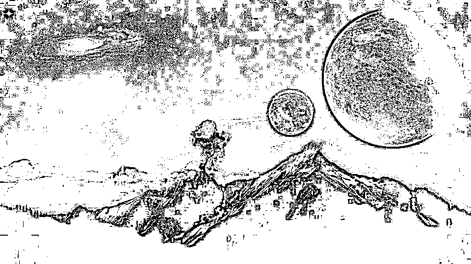

**一周重要天象****★ ****8 月 29 日，周一****金星对分逆行的土星，下午月亮换座进入天秤座**

**金星（狮子座）和土星（水瓶座）的对分相**，引发低落的情绪，对经济状况担心忧虑，日常生活可能会出现价值观的冲撞与拉扯，进而影响到对个体存在价值的怀疑。

**狮子座金星**会自如、热切渴望展现自己喜爱的事物，但在土星的管控压力下，加上天王星能量的参与，我们被社会舆论大环境影响，对自我价值产生彷徨。

**土星的重压下**，金星感受到挫折，自信心被打击，会影响我们在家庭关系或情感中的抉择。

白天工作时间，月亮都在处女座行进，如何有效率工作、让领导满意、推动新项目的发展是工作的重心。下午 17：44，月亮进入天秤座。

下班后的时间，金星和土星的拉扯能量会影响我们家庭关系的平衡，家庭成员内部需要加强沟通，营造良好的餐桌沟通氛围很重要。全国中小学也在本周开学，家有儿女的家长需要帮助孩子调整好上学的状态。

**★****8 月 30 日，周二****太阳（处女座）与木星（白羊座）呈**梅花相****

**当月亮在天秤座行进**，我们在工作生活中会学会权衡，也很合适在社交、谈判中达成一致意见。这也是团队工作中项目沟通的最佳时机，当月亮在天秤座、水星在天秤座行进，是我们建立工作伙伴关系的最佳时机。

**太阳与木星呈梅花相**，对未来的信念、追求的目标与实际的目标有落差，处女座的太阳讲究慎重，对未来需要评估。

白羊座的木星即使逆行，对未来物质发展主题仍是充满期待的，也渴望突破困境，会用忙碌冲动的方式去实现自己的目标。

但我们可能在过度评估和实际的操作落地可行性之间徘徊，导致优柔寡断，或者失去耐心，过度忙碌导致疲劳，用一种失衡的方式掩盖内心的不自信。

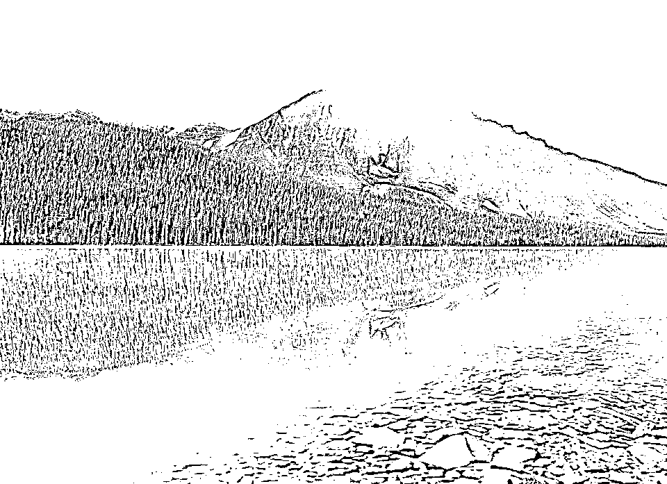

**★****9 月 1 日，周四****水星进入逆行阴影期，火星（双子座）六分木星（白羊座），金星（狮子座）与海王星（双鱼座）呈**梅花相。****

进入 9 月，**水星的运行速度开始放缓，进入逆行前阴影期。**天秤座水星强调公平的关系和沟通，当水星进入逆行前阴影期，我们也许需要关注沟通中真实的想法和观点。

水星在未来（9 月 10 日）正式逆行后，我们会关注这段逆行阴影期对人的思考，我们对生活中亲密关系、合作关系、伙伴关系有什么尚未解决的情绪和主题。

**月亮在天蝎座行进**，对周围环境，自身情绪和安全感的洞察力也会更深刻。火星与木星的六分相，意味着有效的行动，对未来的期待和目标是乐观、积极进取的。

双子座的火星让我们的行动力更灵活，**解决事情高效**，能捍卫自己的观点和信念。在人际关系中，我们也可以和周围的同事朋友有良好的互动关系。

狮子座金星的情感表达是直接果断的，也会比较自我。**金星和海王星的梅花相**容易把感情理想化，或者在工作生活中认为自己付出很多，需要得到更多的认同和尊重，却没有得到，对人际关系感到幻灭。

我们对自己价值的重心取向不够清晰，目标有些混乱，需要衡量调整好内在的感受。

**★****9 月 2 日，周五****金星（狮子座）与冥王星（摩羯座）呈梅花相，月亮（天蝎座）对分天王星（金牛座）**

**月亮和天王星的挑战相位**意味着不稳定的情绪，个性急躁，对失去事物的焦虑感会更敏锐，对生活产生不信任。周五是工作最后一天，我们面对处理的问题会比较多，月亮的困难相位会历练我们的情绪。

**金星和冥王星的挑战相位**，意味着感情中的操纵，信任暗中被破坏，和谐的情感关系产生扭曲。狮子座金星是强势的，摩羯座冥王星也是强势操控的，两个都无法妥协和退让。

我们需要在社交关系的互动中斟酌，避免为了证明和强调自我认同而过度顽固，产生不和谐的人际关系。在金钱的使用上也需要小心慎重。

**★****9 月 3 日，周六****月亮进入射手座，水星（天秤座）对分木星（白羊座）**

休息日，**月亮进入射手座，**终于可以呼吸一口新鲜的空气，我们会愿意在休息日更乐观的去行动，但要避免过度着急。

**水星和木星的挑战相位**，意味着我们承诺过多无法达成的事情，而引来麻烦。我们可能会做一些不着边际的白日梦，在思考和规划中缺乏对细节的处理，容易被社会舆论与新闻带偏，热点和流量让我们容易跟风，缺乏慎重的思考和衡量。

在水星逆行阴影期，这个相位需要我们注意，盲目的跟风会陷入意识的无明中，容易被人带偏方向，缺乏清晰的判断力。

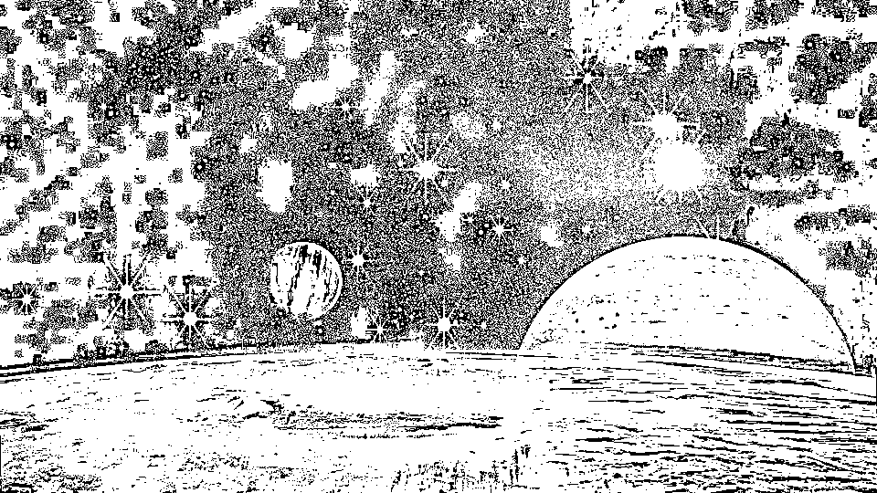

**12 星座的一周运势**

**（重点参考上升星座，其次参考太阳星座）**

***白羊座***

做固定琐碎的工作一直不是白羊座宝宝们喜欢的事情，你们喜欢有挑战性、征服欲、开创性的工作。

太阳行进在你星图的第六宫，需要你用更多时间，耐心观察日常的生活，工作方面需要处理的细节。本周二太阳和木星的梅花相，提醒你需要关注工作，健康方面的问题，也需要注意和伴侣，合作伙伴的沟通。

你喜欢展现自我魅力，或者保持高昂的士气，本周金星的挑战相位，会让你容易产生自我挫败感，你不得不和不同的人沟通，或分心处理问题，这让你感觉到事情的进展是拖延的。

学会保持耐心，圆滑的人际关系对你很重要。

***金牛座***

你在进入一个社交行动月，你希望工作，事业和生活都如序进行。天王星在你 1 宫这几年，你一直在不断地尝试改变、创新中。

天王星在上周开始逆行，你希望抓住机会、整合资源、在经济方面有收获。本周需要关注与家人，伴侣的沟通关系。

本周六的水星和木星的挑战相位，你在生活中可能有些焦虑和紧张，可能是工作压力大触发小毛病，关注户外运动，放松压力。寻找合适发挥自己天赋的事物，会找到生活的重心和目标。

***双子座***

本周是 8 月到 9 月转换的节点，水星进入逆行阴影期也在考验你。你想要放松，又想突破自我，表现的更优秀，工作的压力也会逐渐增大。

本周让你有机会通过与亲密好友的促膝长谈，了解最近发生的事情，改善亲密关系的环境。

本周金星的挑战相位需要关注和朋友、手足的沟通，尤其是对未来事业的重心规划。双子座心态乐观，火星在你的 1 宫行进中，你行动力强，需要把分心事情放一边，让其他人跟随你的计划。

***巨蟹座***

巨蟹座们讨厌热闹、竞争，尤其是工作中的竞争让他们很敏感。本周水星的行进，有些项目进展比你预期设想步骤要慢，找到更有地位的人寻求帮助，会推动项目的进展。

给自己更多时间与家人沟通，有助于你走出情绪的漩涡，放松心情。

本周五，你们需要关注和他人的沟通、相处。给自己和他人更多的空间，学会独自相处的自由。他人也许不一定理解认同你，趁着水星在你的 4 宫行进，好好打造居住的氛围环境，让自己觉得舒服和自在很重要。

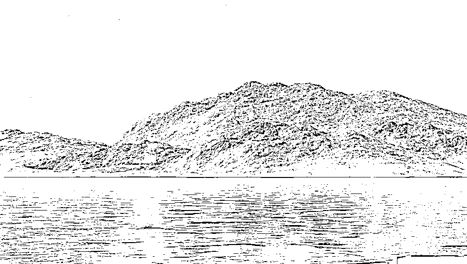

***狮子座***

狮子座们对挫败感和打击很敏感，金星的挑战相位是本周的功课。金星和土星的能量拉扯，让你面对人际关系中的压力，恋人的偏见、领导的自私、朋友的嫉妒，需要保持客观态去面对。家庭和事业无法兼顾，你会在逆境中努力突破自我。

本周休息日，你希望可以有空闲时间喘口气，放飞自我。只需关注与朋友沟通中，对不同观点都要保持中立。

人际关系是狮子座本周的关键词。学会尊重、聆听他人的意见，适当妥协很重要，狮子座不要太在乎面子，关注人际社交关系，会让你的事业逐渐步入正轨。

***处女座***

充满活力的火星在你事业的宫位行进中，你特别有动力，朝着自己设定的目标前进。无论是商业合作，还是和亲密伴侣的互动，要抓住 8 月底的尾巴，争取到你想要的结果。

9 月水星进入阴影期，你需要和自己浮躁的心理作斗争。请注意本周六，你如果和他人讨论未来的计划，和管理者沟通需要慎重，避免粗心大意。

本周金星的相位，你会在职业工作环境、与孩子的关系，合作关系或伴侣关系中遇到一些挑战。你对财富的渴望，对未来的信念不太清晰，渴望创造自己的价值。但忙碌的工作压力让你无法有自己的时间，你觉得对方不太理解你。

学会顺势而为，不用苛求对方就可以放松。

***天秤座***

如果你对未来有更高的期许，设定更高的目标，那这段时间是沉思，等待的空白期，而不是积极做计划。

这段时间，你需要对过去发生的事情做些回顾和整理，即使目标尚不清晰，但如果你逐渐形成明智清晰的观点，会为你未来做出更长远的规划。

天秤座们对自己的魅力很自信，你已经习惯他人对你的赞美和认同，但本周的金星挑战会让你对自我存疑。

你希望获得更人性化的关怀，希望在沟通中达成共识，也许可以尝试调整自己态度。你们可以聊聊家里的宠物，自己的爱好，分享有趣的观点，创造友好互动的关系。

***天蝎座***

天蝎座的宝宝们善于看透事情表面，如果有疑虑，你就不会去行动。本周需要关注与孩子的沟通、家庭父母等事项。信任的朋友，合适的伴侣会给到你一些支持。休闲时候适当参与集体活动，你会发现自己很受欢迎，也对自己工作更有信心。

周六，你希望好好休息放松，花钱买快乐享受，但你内心很在乎财务的开销，你会灵活处理。工作或生活中，管理你的领导、规范有时让你很不舒服，你会通过和他人吐槽发泄情绪。赚钱工作不是生活的全部，要注意增强抵抗力。

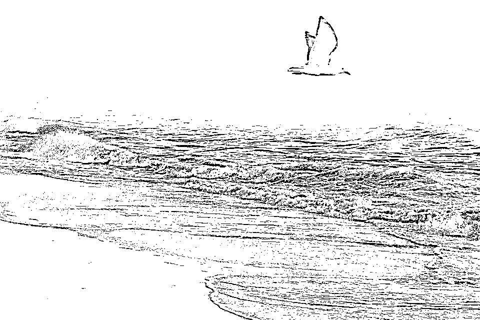

***射手座***

你努力工作，对未来抱着乐观，积极的态度，这是你事业和社会活动的活跃期。你计划、沟通的项目事项可能会收获认同，你的专业水平会被更多人看到。

你的心态不太稳定，当期待目标无法落地，会产生挫折，有些失落。你与伴侣，合作伙伴的行动力很高效，会共同创造规划你们的蓝图。

当休息日的月亮来到你的 1 宫，你会欢欣雀跃、积极参与团队活动或聚会，放飞心情的感受很棒。只是你们需要注意沟通调侃时，如果忽略对方的立场和观点，会导致不愉快发生。

***摩羯座***

你一直都很独立，负责，在伴侣关系中保持分寸和界限。

周一金星和土星的对分相，你会在亲密关系中，商业合作中对一些事情有回应，感受到双方有一堵墙，你需要面对这些挑战，其实这只是你对某些事情观点有了更新的感悟，拆除关系中的障碍，会让你感觉轻松。

周四，你高效的完成工作，分配好时间，协调好家庭和工作，这让你信心满满。但低调的你不想自夸，总担心工作生活的满足感是虚无的。

对你而言，保持精力和健康与处理工作一样重要，你也许开始构思去外地旅行的梦想和计划，建议在水星逆行前落实。

***水瓶座***

专业、冷静的水瓶座宝宝们对于事业和生活一直都很笃定，无论外界评价是什么，他们都有心中的标尺衡量。你和伴侣，合作伙伴之间存在一些压力和挑战，感觉到对方故作姿态、高调，这让你内心不舒服。

面对双方的沟通，需要适当的妥协和欣赏，这需要一些时间和耐心。为了实现工作的目标，你会调整自己的心态、想法，尝试创造双赢的局面。

本周金星的相位，让你觉得人际关系有些棘手，你会抽出时间享受自己的快乐，不让关系中繁琐的沟通影响你的状态。如果周末有外出游玩计划，最好及早做准备以及做好后备计划，避免交通、信息沟通或文书问题导致的延误和沟通不畅。

***双鱼座***

对双鱼座而言，很多事情是随机性的，无法给自己规划太清晰。当太阳在你星图对宫时，你的社交能力为你的合作增添光彩，也会容易获得机遇，受欢迎程度增加。工作中有不错的机会。在金钱消费问题上，你需要和对方更好的商量和沟通。

休息日，你仍无法放下工作或事业上的事情，你是否对自己不太有信心，担心无法完成工作呢？你需要学习相信自己的能力，不要对自己能力妄自菲薄，亲人和朋友都是你背后支持的动力。

**版权声明**：原创文章由作者授权首发于若道平台发布，欢迎转发，反对抄袭。友号转载请申请白名单。

**END**

**苏黎（Sulis）**

ISAR 国际认证占星师（2019 年获得）/塔罗咨询师

现代占星融合古典解读

20 多年跨行业领域职场经历

**咨询微信**：liuzq26

**公众号**：Sulis_1975

长按打赏

**20 位来自世界各地的占星师****带来 19 场沙龙——新世界的觉醒****详情可点击下图**

**学习占星学****点击下图了解课程详情**

**微信又双叒叕改版啦，不想错过若道君的推送？**
**就把若道设为星标吧！****▼**

**喜欢就点一下“在看”吧！**

********报名直达入口********

# 雷蒙德·梅里曼金融占星周运 | 出现潜在买入机会？

> 原文：[`mp.weixin.qq.com/s?__biz=MzA5NjA0NTAxNg==&mid=2651486909&idx=2&sn=d519bb628720df0e8a8ff3ec79d9e9a9&chksm=8b48c80abc3f411c06564ba5171614bdd28431e84e43d43d329746ad59761eb0bb9d6293c8ab&scene=126&sessionid=1692737761#rd`](http://mp.weixin.qq.com/s?__biz=MzA5NjA0NTAxNg==&mid=2651486909&idx=2&sn=d519bb628720df0e8a8ff3ec79d9e9a9&chksm=8b48c80abc3f411c06564ba5171614bdd28431e84e43d43d329746ad59761eb0bb9d6293c8ab&scene=126&sessionid=1692737761#rd)

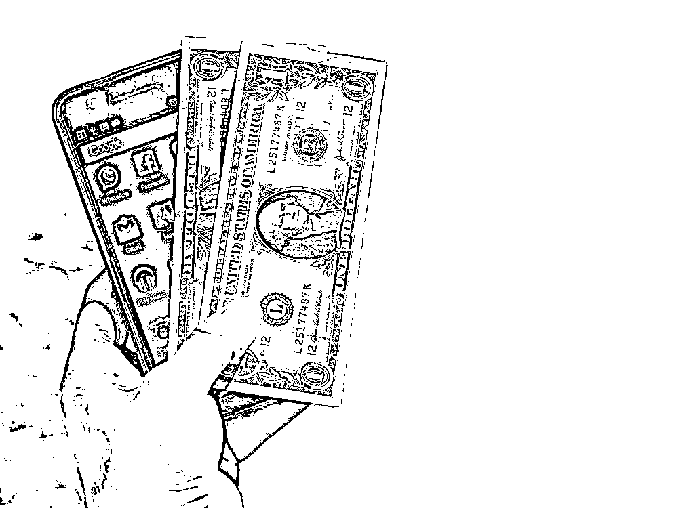

作者/雷蒙德·梅里曼 译者/Luke
编辑/玫瑰 图片/pexels

雷蒙德·梅里曼是在金融占星学界稳坐第一把交椅的占星师，同时他也是若道签约的金融占星课老师，我们引进了雷蒙德·梅里曼老师的《[上证指数月度报告](http://mp.weixin.qq.com/s?__biz=MzA5NjA0NTAxNg==&mid=2651485664&idx=1&sn=bae9eb20d9f9cd407841b125f7fc553c&chksm=8b48c757bc3f4e418a1201d4aeb9a38f9203dbffab162bfa25222ea7fd77fef7ad660e7bd073&scene=21#wechat_redirect)》及《[黄金报告](http://mp.weixin.qq.com/s?__biz=MzA5NjA0NTAxNg==&mid=2651485664&idx=1&sn=bae9eb20d9f9cd407841b125f7fc553c&chksm=8b48c757bc3f4e418a1201d4aeb9a38f9203dbffab162bfa25222ea7fd77fef7ad660e7bd073&scene=21#wechat_redirect)》。我们经老师的授权，将每周刊登梅里曼老师的周运，供大家参考和学习。于是，这是本周的周运（8.29-9.2）。

**说明：以下时间采用纽约证券交易所所在地美国东部标准时间。**

**展望与回顾**

****

**美联储主席杰罗姆·鲍威尔周五严肃承诺要抑制通胀。他警告说，中央银行将继续提高利率，哪怕会给美国经济带来“一些痛苦”也在所不惜。**

**——杰夫·考克斯**

**《鲍威尔警告，随着美联储努力抑制通胀，前方会有“一些痛苦”》**

**www.cnbc.com**

**2022 年 8 月 26 日**

美联储讲话，市场崩盘。前一周太阳与土星和天王星构成 T 三角，金星-木星三分相时，一个半基本周期波峰形成了。随后股票遭到抛售，直至 8 月 24 日天王星逆行。随后它们开始了为期 2 天的上涨，直至 8 月 26 日，此时金星与土星和天王星进入 T 三角格局（8 月 26 日-29 日）。然后美联储讲话，天王星觉醒，股票市场崩溃。到了当天收盘前（8 月 26 日），道琼斯工业平均指数收跌超过 1000 点，达到了本月的最低价。就在两周前，它还处于四月份以来的最高价位。**这种剧烈的波动和突然的反转，正是我们预期多重天王星征象生效期间会发生的。**这就是天王星施加的闪电和痛苦。首先你上升，然后掉头朝下。随着 8 月份到了尾声，市场发生了大量“震荡”，正如我们的预测一样。这一系列强有力的地球宇宙学征象，伴随周日晚上预售市场开盘，同时金星与土星对分相来到尾声。我们对于金星和土星的困难相位了解多少？**任何下跌至此相位的市场，都可能达到低点，并随后出现反弹。**简而言之，就是**出现潜在的买入机会，前提是你的日内指标支持反弹。**这就是本周的内容。享受前方的一周，小心北京时间 8 月 28 日下午的新月四分火星，并做好准备接收灵感，因为月亮的北交点附近，变革创新和动荡的天王星在改变方向。**长按下图了解更多详情**

这是特别及时的讲座，因为为期 12 年的木星轨道周期会在 5 月 10 日进入白羊座，并且 6 月-11 月是一年中最有力的地球宇宙征象接连登场的重要时间段，因为土星逆行与天王星形成几乎精准的渐亏四分相。

**说明：以上日期基于纽约证券交易所所在的美国东部标准时间，由于存在时差，中国地区可能需要加一天。**

**版权声明：**本文由若道翻译发布，欢迎转发，反对抄袭。友号转载请申请白名单。**END**

**雷蒙德·梅里曼（Raymond Merriman）**

若道签约老师。著名金融占星师，ISAR（国际占星研究协会）前主席，梅里曼市场分析公司的总裁。他由于“提升了占星学的职业形象”，在 1995 年国际占星大会上被授予轩辕十四奖；在 2012 年国际占星大会上，被授予轩辕十四终身成就奖。

1“中国上证指数月度报告”发售**若道推出了****中文版****的雷蒙德·梅里曼中国上证指数月度报告，并持续发行该报告！**当把金融市场的周期和占星学的周期相结合时，雷蒙德·梅里曼老师的金融占星学研究**为投资者应对金融市场的周期波动，并随之调整投资策略提供了极大的价值参考**。
**9 月中英文报告已上线！**2“黄金价格周期月度报告”发售**若道推出****中文版****的雷蒙德·梅里曼黄金价格周期月度报告！**不仅仅为广大读者在中国股市的投资出谋划策，更将视角放眼黄金市场。**每当世界经济形式不明朗的时候，有一个地方是保值的港湾，那就是****黄金**。自 1982 年雷蒙德·梅里曼出版第一本研究《地球宇宙学征象与黄金价格的关联》的著作以来，**他一直作为最重要的黄金市场时机预测者之一享誉国际**。2022 年 9 月黄金报告已上线，梅里曼老师将会告诉你他对这个关键时期如何操作的想法。也可以按照季度和一年期订阅，有更多优惠。季度和年度的好处是，你可以持续了解梅里曼老师对于不断在变化的市场的看法。即便他某一次看法和市场不一致，你也看到在下一期他如何调整自己的看法，并看到金融占星在一个长期时间段内对你把控风险的帮助。而能够长期控制风险、尽量找到安全的投资时机才是投资的长久之计。**9 月中英文报告已上线！****购买套餐**，买得越多越优惠中国上证指数月度报告套餐价

*   **单月报告**：280 元
*   **3 个月套餐**：780 元（260 元/月）
*   **12 个月套餐价**：2400 元（200 元/月）

**长按下图识别二维码****购买金融报告****套餐****▼**

黄金周期月度报告优惠

*   **双报告年度套餐更优惠（直降 900 元）**

*   **12 个月黄金报告+12 个月上证指数报告：仅需 3900 元**

**长按下图识别二维码购买黄金报告套餐**▼

3《2022 年金融预报和沙龙》1976 年以来，由雷蒙德·A·梅里曼撰写的梅里曼市场时机学院每年一次的年度预报沙龙和每年一本的《年度预报》一直在应用占星学原理为投资者们服务，提供卓越洞见，从未间断。 **雷蒙德·梅里曼《2022 年金融预报和沙龙》发售中（报告已发布）。****长按下图识别二维码了解详情**
▼

4《2022 下半年金融占星投资沙龙》这是特别及时的讲座，因为为期 12 年的木星轨道周期会在 5 月 10 日进入白羊座，并且 6 月-11 月是一年中最有力的地球宇宙征象接连登场的重要时间段，因为土星逆行与天王星形成几乎精准的渐亏四分相。

**长按下图识别二维码了解详情**

▼

**点击阅读原文购买金融报告**

# 插班中丨 ISAR 认证职业占星师文凭课程：开启“爱好变职业”的创收自由之路

> 原文：[`mp.weixin.qq.com/s?__biz=MzA5NjA0NTAxNg==&mid=2651486909&idx=3&sn=88f9610b2022631cfa0fb0bf0ed817ab&chksm=8b48c80abc3f411c03b5c46959ee78d5610ea3c00ebfd1b7e51beb55b03161a4d5a2d8e83295&scene=126&sessionid=1692737761#rd`](http://mp.weixin.qq.com/s?__biz=MzA5NjA0NTAxNg==&mid=2651486909&idx=3&sn=88f9610b2022631cfa0fb0bf0ed817ab&chksm=8b48c80abc3f411c03b5c46959ee78d5610ea3c00ebfd1b7e51beb55b03161a4d5a2d8e83295&scene=126&sessionid=1692737761#rd)

**2022 年，是世界和中国 40 年未有之大变局的开始。**

俄乌战争打破了欧洲大陆乃至全世界的和平局面，而新冠疫情也给中国经济带来前所未有之挑战。

如果你关心经济形势和世界局势，你会有这种的感觉，我们将面临一场深刻的危机，而这不是短期内可以结束的。

**占星学的看法也是如此。**

4 月青年失业率（16 岁到 24 岁）中国达 18.2%，一些背着房贷、教育、医疗负担的中年人突然失业更是整个家庭整个难以承受之重。为了更好准备面对这样的时代变化，连《北京日报》这样的官方媒体也在呼吁：**“开拓副业，让自己有多元化发展的生存能力”。**

**而这门课程，就是为了这样一个目标准备的。**

**占星学是非常好的“开展副业”的选择**

这个**为期 16 个月**的课程通过并不算长的时间和并不算高的投资，不仅可以帮助你学到一个终身可用的技艺，而且也可以选择成为自助助人的占星师，**开启受益终生的第二事业。**未来是个体崛起的时代，大量个体被鼓励独立发展，比如网红、自由职业、自媒体、咨询师等，他们都不需要传统的办公室。社会越发达，人的独立性就越强，未来有能力的人都可以变成独立的经济体。

**占星学也是越老越好的职业**

和一些技术变化非常快的职业不同，**占星学的技术层面非常稳定，不会快速迭代变化，**同时，掌握好占星学、能够做一场好的咨询又需要个人自身大量实践和对生命的深刻理解，而这些都是时间和岁月带来的。

**占星学是现代社会需要的助人职业**

社会快速发展和变化人们似乎越来越无法掌控自己的生活，这给很多人带来巨大的焦虑，**抚慰心灵的咨询市场需求巨大。**而占星学可以让人从前所未有的角度了解自己，了解目前和未来所处的周期，挑战的意义，不论对于深入的个人成长探寻，还是预测未来的周期，都又其独一无二的价值。

**ISAR 认证职业占星师的独有培训**

目前占星学的培训市场鱼龙混杂。而 ISAR（国际占星研究协会）是一个包含了 47 个国家在内的国际占星组织，多年来致力于占星的教育和研究，提升占星教育的品质和职业占星师的能力，在国际占星领域备受尊重。今年，ISAR 对于成为 ISAR 认证职业占星师提出了更高的要求，**所有想要获得 ISAR 职业占星认证的申请者均需要在 ISAR 的附属学校通过 500 个小时的研习（包含****主课****、选修课、沙龙、作业、讲座、工作坊等等）。**

**而这门核心占星学课程就是为此而准备的。**

**2022 年，鉴于对若道在占星教学领域所做的持续努力和高品质的课程服务，ISAR 特别授予若道核心课程为 ISAR 文凭课程，所有在若道学习，并通过若道毕业考试的同学将获得 ISAR 颁发的学历文凭（Diploma）。**

**你的占星核心课老师是谁？**

**拥有****51 年****占星实践经验的****若道创始人****前 ISAR 全球副主席****前 ISAR 全球职业占星师资质认证主席****大卫·瑞雷**

**和**

**2019 年第二届、2021 年第三届核心课中**

**与苏·汤普金斯老师****联合授课****的**

**ISAR 认证职业占星师**

**咔咔（Caroline）**

**二人合力打造**

**2022 年 ****若道全新核心占星课程**

**咔咔老师给同学的寄语：**

（向上滑动查看内容）

**亲爱的同学们：**

我为什么学占星学？

2000 年的时候我还是一个在网上搜索天蝎座和水瓶座配不配的普通白领。我搜索的内容还包括了水瓶座为什么总是这么若即若离？

体贴的搜索引擎给我推送了占星学、行星、星座、宫位、相位等资料，还让我了解到莉莉丝、月亮交点、截夺宫位等占星学概念。

2000 年 10 月我了解到，一个从业 30 多年的美国职业占星师大卫·瑞雷来到了中国，和他的中国合伙人将开办一个专业教授占星学知识的课程。过去 10 个月在网上东拼西凑的占星学知识唤起了我对占星学的兴趣，但是已经不能满足我对星图深度分析的需求了。

2013 年，我通过了若道核心课程的毕业考试和国际占星师研究协会的认证考试。2015 年我离开职场成为一名全职占星师。

到底学习占星带给了我什么呢？

1、它是自我觉知的工具，我现在已经不去纠结哪些星座是否匹配，我相信外在的事件是内在心理矛盾的显化。也就是说，想找到令人满足的亲密关系，要先去了解自己的情感模式和需求，而不是无意识地一次次地试错和撞墙。我开始学习自我关怀和接纳自己。

2、它带来看待世界的全新和全景的角度，天上如是，地下亦然。人类社会和个人生命的进化都有其周期和相似性，作为个体，占星学帮助我思考如何更积极和有建设性地与宇宙的能量合作，认识自己，发挥自己的潜力，度过有意义且自我满足的人生。

3、它带来了全新的职业：占星师和占星老师。除了收入，还有助人育人的满足感和意义感。

4、它带来一群志同道合的伙伴，我们彼此联结又相互独立。

作为中国占星界的“黄埔军校”若道占星的学生、助教和老师，我与很多学员在人生的不同阶段带着各异的需求走进了这所学校，2022-2023 年一年半的若道核心课程设计既蕴含了大卫·瑞雷老师的教学精华，也带入了我在跟随不同国外占星老师学习、助教和教学积累的心得。

有一些学员毕业后从事了占星咨询工作，有的在各大平台成为专业占星学知识的输出者和传播者，有的运用占星学提升他们的工作，也有的在占星学与投资，占星学与名人/八卦、占星学与原生家庭、亲密关系、亲子关系等领域收获了有用的或者有趣的体验。

对我来说，生命是一场自我完整的体验之旅。从 2011 年的那个春节在若道入学之后，我的生命旅程更加充实、有意义、有目标，也更有满足感。

希望在 2022-2023 年的若道核心课程里见到你。希望你此后的生命旅程里，有若道，有占星学。

占星师咔咔

2022 年 5 月 24 日

**大卫老师给同学的寄语：**

（向上滑动查看内容）

亲爱的学员们：

感谢你对我们从 8 月 30 日开始的若道 L1-5 级核心课程的兴趣。我和合作老师咔咔以及我们的核心课程团队期待着为你提供这个机会，来教授各种高品质的地道占星学知识和技巧。

对于那些希望获得 ISAR 职业占星师认证的学生，这是一门适合你的课程！

作为 ISAR 咨询技能培训的一部分，我曾与咔咔合作过，我们期待着再次合作。咔咔和我曾在 ISAR 职业占星师认证委员会（CAP ISAR）一起工作，我们非常熟悉获得 ISAR 职业认证的流程。作为你的老师，我们将陪伴你整个占星学发现之旅，帮助你逐渐认识到占星学有多么的神奇。此外，你还将受益于我们若道的助教和课程顾问，他们是若道核心课程计划的重要组成部分，提供在线沙龙、组织学习小组、指导家庭作业。我们的教育团队是“服务于你的团队”，所以也会根据你的需求进行相应的调整。你专用的核心课程微信群也促进了你的学习过程，使你能够每天与你的同学们一起学习、探讨、成长。

52 年前，当我开始学习占星学时，没有一所像若道这样的学校。如果有这样一所学校，我会尽一切可能在那里成为一名学生。事实上，我很幸运，我的老师都是经验丰富的专业占星师。然而，我花了 6 年的学习时间才通过 1976 年在美国乔治亚州亚特兰大举行的专业占星师考试，又花了 2 年的专业实践时间才通过占星学谋生。我永远不会忘记从 1970 年到 1978 年的 8 年，那些日子的反复试验教会了我如何苦练占星学。作为老师，我一直在努力传授我早年所学的知识，让你的旅程更加顺利，更加全面。

自 1978 年以来，44 年的全职实践教会了我很多，我很高兴有机会与大家分享我所学到的东西。我和咔咔都是现代占星师，虽然我们尊重西方占星学的历史和传统，但我们实践和教授的占星学植根于现代人本主义哲学，这种哲学旨在提高你对自身潜力的认识，并鼓励个人成长。还有什么比了解自己更实际的呢？还有什么比个人成长和发展潜力更有利的呢？这是你将要学习的占星学，一种可以应用于你自己生活的占星学，一种可以为你提供一个充实职业的占星学。

教书是我回馈占星学行业的方式，这个行业拓展了我的视野，远远超出了我曾经想象的可能。谢谢你给我这个机会做你的老师。

大卫·瑞雷

2022 年 5 月 24 日

**连报 L1-5 全阶网络直播课程，你可以享受**

❶ 64 次线上直播互动网络课程+2 场工作坊，全面而详细地讲解占星学知识、技能、案例和重要领域实践运用。

❷ 知识点+学员星图解读有机结合：咔咔老师以讲解知识点和中外名人案例为主，大卫·瑞雷老师以参课学员案例演示及客户案例为主，每个知识点覆盖班级内学员的亲身案例，参与感更强，多位学员都有机会听到自己的星图分析。

❸ 微信群学员互动分享，从真实案例学习生命成长故事。

❹ APP 答疑论坛提问：论坛上每个学员的问题都将得到及时回复。

❺ 若道独有的职业占星师养成计划，为你毕业后独立咨询做准备。

**❻ **提供**咨询平台**，只要努力，优秀毕业生有机会入驻**若道咨询平台**，拓展咨询客户群。

**更多了解老师和助教？**

**大卫·瑞雷（David Railey）**

*   **I****SAR 董事会成员，ISAR 全球副主席，ISAR 全球职业占星师资质认证主席，若道占星创始人**。

*   2016-2019 年，被选为国际占星协会（ISAR）考试委员会成员，国际占星协会（ISAR）是世界最大的国际占星机构，会员遍布 47 个国家。

*   2017-2020 年，被选为国际占星联盟（ISAR）考试委员会主席，理事会成员。

**占星师咔咔（Caroline）**

2010 年师从美国占星师大卫·瑞雷学习，并得到世界名师斯蒂芬·弗里斯特、罗伯特·汉德、苏·汤普金斯传授各种占星学技法。若道首届学员，国内最早获得 ISAR 职业占星师资质的职业占星师，多次担任若道核心课程助教，并于 2019 年第二届、2021 年第三届核心课中和苏·汤普金斯老师一起教授若道核心占星课程。

在国际知名广告公司和市场研究公司从事的市场研究和推广工作十余年，曾任职于阳狮集团、尼尔森市场研究有限公司、MTV 和《Madame Figaro》杂志。

**助教王嘉祺 （Conrad）**

ISAR 认证占星师、若道认证生时校正资质，从 2010 年起自学占星学，2015 年开始在若道系统学习，并开始个案咨询。2018 年担任若道核心课程助教，以及卜卦占星学和太阳返照选修课助教，并带领学员进行经世占星和太阳返照方面的研究。2019 年 11 月作为演讲人之一参加了国际占星协会（ISAR）北京大会，也是 ISAR 星空俱乐部中国区第 16 期的主讲人。

**什么人适合这门课？**

*   对占星学有浓厚兴趣，想要系统学习占星学。
*   对占星学有一定基础，但不知道该如何整合星图复杂的碎片。
*   希望成为优秀的占星师，想要借鉴国际大师解读思路并融入自己的体系。
*   想学习占星学，但不擅长英文，希望有中文老师授课。
*   想结合占星学理论与咨询实践。
*   走在自我探索和个人成长道路上的人。

**课程费用**

**★ 1-5 阶 连报****课程费用：46500 元** **★ 1-2 阶 （8 月 30 日开课）****课程费用：3500 元 ****★ 1-3 阶　连报****课程费用：11500 元 **

**咨询课程请联系顾问**：**王老师（微信/手机：18510107057，请备注“大卫核心课”）**

**退转课程**

**退款原则请详看《教学协议》，如有疑问请咨询课程顾问。**

****2022 L1-5 认证职业占星师必修课程****

**授课老师：大卫·瑞雷、咔咔**

**直播课开课时间：2022 年 8 月 30 日（周二）**

**授课方式：******网络授课，英文/中文授课，中文翻译****

**费用：****1-5 阶连报**：46500 元； ****1-2 阶**：**3500 元；****1-3 阶**：**11500 元

**课程负责人：王老师**（微信/手机：18510107057，请备注“大卫核心课”）

长按二维码添加课程负责人咨询~

**END**

****报名直达入口****

# 《星汉灿烂·月升沧海》 | 金星天蝎座的爱有多甜就有多虐

> 原文：[`mp.weixin.qq.com/s?__biz=MzA5NjA0NTAxNg==&mid=2651486788&idx=1&sn=2bba16e36b695cbf349f8fdcd3093cc6&chksm=8b48c8f3bc3f41e5335eb6e35531dadf68d06cf7570353fe443be62e0e9fd43412c0da86739e&scene=126&sessionid=1692737766#rd`](http://mp.weixin.qq.com/s?__biz=MzA5NjA0NTAxNg==&mid=2651486788&idx=1&sn=2bba16e36b695cbf349f8fdcd3093cc6&chksm=8b48c8f3bc3f41e5335eb6e35531dadf68d06cf7570353fe443be62e0e9fd43412c0da86739e&scene=126&sessionid=1692737766#rd)

******☆ ****后台回复“今日”，给你一句生命态度******

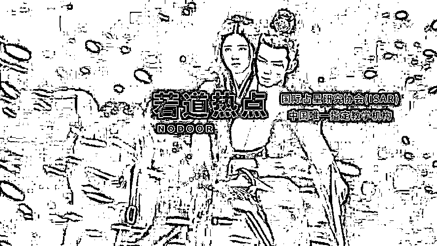

作者/Sissi 编辑/玫瑰 图片/网络

**作者的话**最近热播的古装偶像剧《星汉灿烂·月升沧海》（以下简称“星月剧”）引起了不少热议，连我这个平时不刷剧的人都莫名地开始磕“疑商 CP”，且磕到停不下来，超前点播也要尽快把大结局看完，对于这种不可名状的神奇事件，按照我的职业习惯就是“盘它”（查星图寻缘由）。本文含有剧透。**赵露思与吴磊**作为电视剧角色，还是古代的，肯定是没法弄到角色的星图了，不过可以从演员入手。当然演员的星图与角色的性格特点肯定有不少差异，差异越小说明演员越是本色出演，差异越大且角色立起来了，说明演员演技越好。当看到疑商夫妇控制欲极强，夹杂复仇情节，又各种生离死别的虐恋，我觉得这两人星图里怎么也绕不开天蝎座了，根据演员的出生信息一查，果然如此，**吴磊和赵露思都是金星天蝎座，赵露思还是太阳天蝎座，这绝对是妥妥的虐恋星图标配。**另外加上这两人的水星射手座，以及吴磊的月亮狮子座，也是与我本人的星图配置产生共振的地方，所以这部古偶剧才会这么吸引我，而男女主角更是让我沉迷于“磕 CP”，无力自拔。

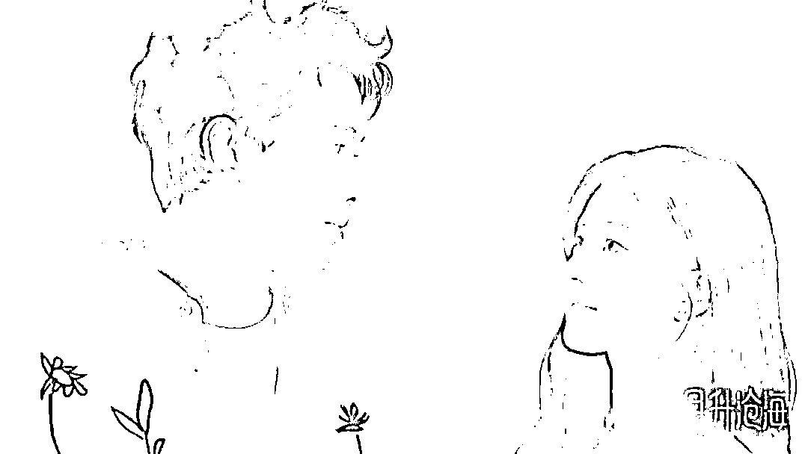

| 赵露思与吴磊**程少商：月土相位的议题**赵露思在星月剧中扮演女主角程少商，在剧中程少商除了跟 3 位男生不同的感情线，还有她原生家庭的遭遇，尤其是她与母亲的关系，始终贯穿全剧，也是她在择偶和做出其他人生重大选择时，性格养成的因缘，和思维体系形成的原因所在。程少商自出生便被迫与父母分开，她的父母常年征战在外，直到 15 年后才得以团聚，而留在家中的女性长辈由于不喜她的母亲，就对她疏于管教，刻薄寡恩，而从小缺乏母爱的她，最终盼来的却是一位严苛的、甚至以军法治家的亲生母亲。这位母亲对于自己在女儿的童年中缺席，所用的补偿方式竟然是尽快把女儿的粗野不逊、教养性情矫枉过正，而忽略了一位母亲应当给予女儿的关心疼爱，全剧在我的印象中，这对母女都没有过拥抱的画面。这点其实在赵露思的星图中有着神奇的相似性，她的月亮大概率是落在巨蟹座后半部分，四分土星白羊座，假如度数越接近，则月亮受到的伤害越严重。不知道赵露思的人生剧本是如何在原生家庭中展现的，不过至少她在程少商这个角色中可以很好地体会角色在母爱方面的匮乏感，以及被迫压抑情感、隐藏情绪的无力与无奈。

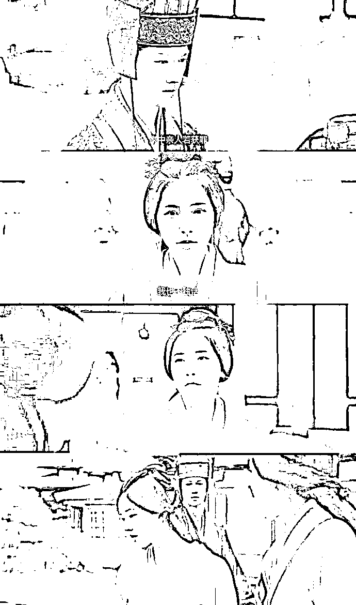

| 《星汉灿烂·月升沧海》剧照**月亮在巨蟹座入庙，然而月亮巨蟹座的人，对于情感的渴求度也非常高，而土星白羊座用一种急躁又严厉的威压直接打压了月亮巨蟹座的情感需求，同时还是一种“为你好”的家长式强迫管教。****其实所谓的“为你好”其根本是“我觉得好”，所以重点在“我”而非“你”，这也是白羊座最直接的表达。**土星对月亮的压制，就是：**·** 母亲原本拿尺子要给女儿量体裁衣表达关爱，结果发现女儿在背后议论长辈，尺子就变成了戒尺，打了女儿的手心；**· **母亲为了显示自己当家主母的公平公正，而对侄女温言软语，对女儿疾言厉色，几乎没有过笑脸；**· **母亲时刻关注女儿，却动不动看到女儿的缺点弱点，非打即骂，除了纠正就是惩罚，甚至不让吃不许睡。这对月亮巨蟹座的暴击简直拉满；当各方面都高不可攀的男主向女儿求婚时，母亲为了婉拒婚事，当庭把女儿贬得一无是处，在这里可以看到女儿悄悄握拳抓紧自己的衣摆……

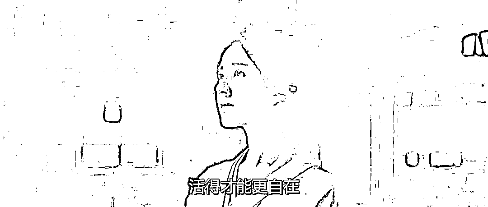

| 《星汉灿烂·月升沧海》剧照

对于这种打击，程少商在假装无所谓，实际一遍遍被压抑对母爱的渴求之后，得出结论：“与其卖力讨好对你早有成见之人，不若索性寡情一些。反正既无至亲可依靠，也无挚友可分担，厌你之人比爱你之人多得多，不如对自己好些，对他人期待少些，才能活得更自在。”**而星图中的月亮除了展现原生家庭中的母子关系，还直接关联案主的情感模式**，于是程少商自然进入的是独来独往，一切均靠自己掌握与谋划的行事风格，包括对于婚姻对象的选择也是如此。程少商的第一次定亲，其实无关乎心动，无关乎爱情，她只是感受到一个温柔纯良的少年，对她吃饱穿暖的关爱，对她由衷感叹的赞美，对她百依百顺的服从，以及他合适的家庭背景。因此当楼垚向她提亲后，她欣然同意，也开始规划如何利用这段婚姻逃离匮乏的原生家庭，组建自己的小家庭，过上自己想要的生活。

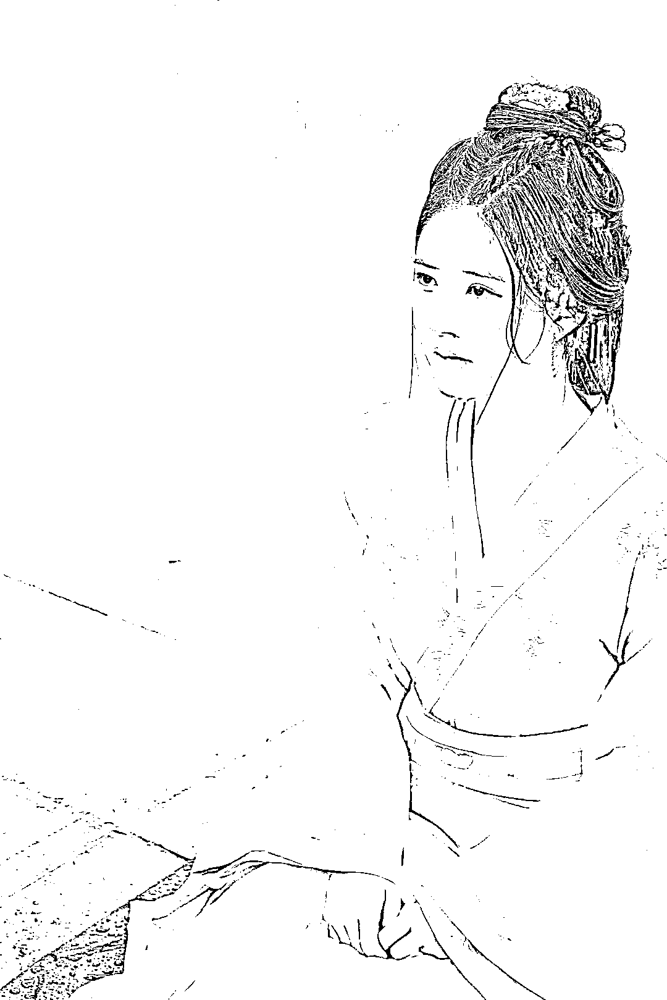

| 《星汉灿烂·月升沧海》剧照

对于**月亮巨蟹座**的人来说，**一个关爱备至、全心守护的家庭是至关重要的，如果自己的原生家庭无法满足这点，他们通常会过早结婚，试图自己再造一个心目中的理想家园。**

然而童年缺失爱的人往往不懂得如何去爱，过于急切地的进入婚姻，并不会使他们自动获得爱的能力，也就很难真正建造令他们向往的小家庭。

第一次退亲，依然无关乎感情深浅，而是国家大义，这点也非常像土星四分月亮的显现，**责任变成了情感（婚姻）的阻碍，**即便程少商看起来是一个任性桀骜的少女，实际上她并不是一个可以丢开所有大义责任的人。**月土相位的人，其实比谁都更懂得义之所在，当然这其中也包含权威隐形的压力**，来自皇帝，来自方方面面的期许。程少商的第二次定亲，当时的她也没有爱上凌不疑，她会答应提亲，一方面可能因为凌不疑多次在她危机时刻出现援救，这是一份隐隐的安心，一方面可能因为被迫退亲后又将面对各方的嘲笑，而选择一份更高门第的婚事当作挡箭牌，还有一方面是因为母亲当众贬低而凌不疑当众表达的认可与非卿不娶的诚挚，所以她说的也是愿意尝试一次。

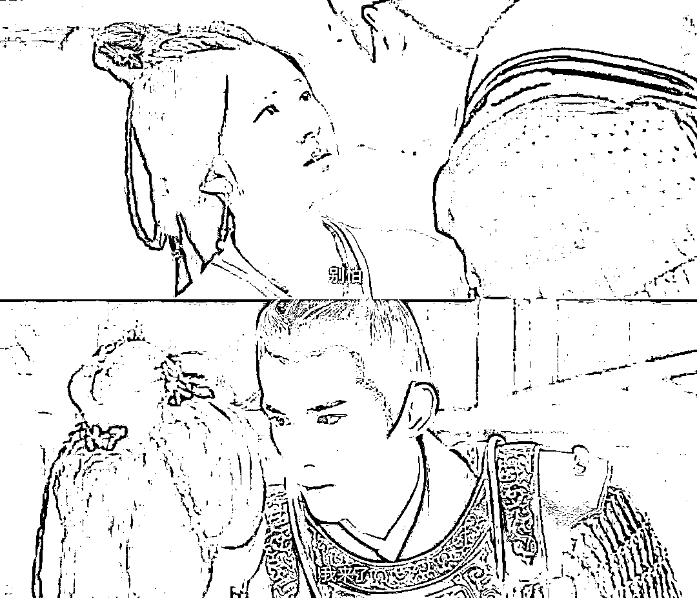

| 《星汉灿烂·月升沧海》剧照**金星天蝎座的虐恋**提起程少商与凌不疑的感情线，就不得不提赵露思的金星天蝎座了，金星在天蝎座落陷，也对应了少商**在人际关系中很难信任他人**。金星天蝎座多疑多虑，对危机有着天然的敏锐，同时也因为害怕被抛弃，害怕不被托付真心，而裹足不前，封闭内心，不敢爱，也害怕被爱，对于讨厌的人睚眦必报，而对于喜爱的人却全心全意。金星天蝎座的核心问题在于自我价值感处于较低的状态，作为在襁褓中就离开母亲的怀抱，而成长过程中不断地被灌输“无父无母没人要”的程少商，内心对于自我价值的判断是偏低的，肯定是因为自己不够好，才被丢下，才被遗弃，甚至因疏于被照料而面临死亡的威胁。

这种判断在父母回到身边后也没有得到很大的改善，虽然父亲时不时夸奖与宠爱，但母亲却总是挑剔与不满，那么**如此不好的自己不配得到最好的爱，就成了程少商的信念。**

因此在程少商与凌不疑定亲后，一开始的相处中，凌不疑那种强力的攻势与明显的控制欲，只会让少商情感的堡垒感受到入侵的威胁，危机意识让她第一反应是抗拒与逃避。可能潜意识里，她感到了凌不疑对她强烈炽热到令人战栗的情感，这是她十几年的岁月里从不曾感受过的，而这种威势总让她想到母亲对她那般严厉到窒息的爱，又还有着这般浓厚真诚的爱怎么会轮到自己的想法，这样的爱似乎又是危险又是吸引。然后他们二人开始一次次的争吵，同样不懂如何爱人的凌不疑像打仗一样，对程少商以及她的家人攻城略地，而程少商则依然沿用从小学会的悍勇防御姿态，接连反击。**金星天蝎座的爱情就像一场狩猎，充满着征服与被征服，甚至彼此撕咬想要把对方吃拆入腹的强烈欲望**，两人要是一直这么相处下去，可能很快就会闹崩，而他俩关系能有所转变，除了身边不少的助攻，很重要的是：第一，凌不疑每一次吵架生气之后，依然把对方放在心上，第二天该怎么对少商还是怎么对她，从不赌气，宁可自己妥协，调整方式。大约因为他 6 岁以前是生活在美满幸福的家庭，得到父母充分的疼爱，即便后面遭逢巨变，依然在感情上比少商成熟许多。第二，程少商从宣皇后那里渐渐得到了替代的母爱，她能感受到被珍惜，被偏爱，好像不学无术的她也有了不少自己的优点，同时她也在慢慢反省自己，逐渐放松了心防，去理解对方的善意，懂得爱的信任与安心。

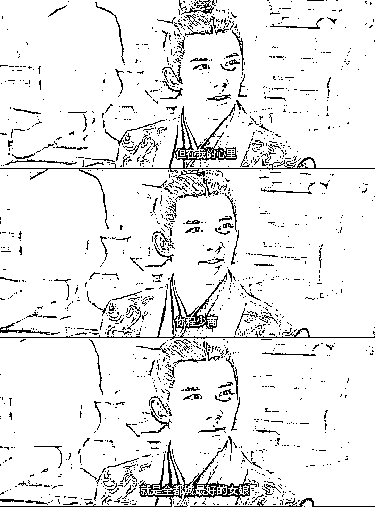

| 《星汉灿烂·月升沧海》剧照看清自己心中所属，做到如她自己评价万太夫人的“君以国士待我，我必以国士报之”。尤其当神助攻文帝设计当着少商的面对凌不疑杖刑时，终于把少商心中埋得最深的情感真相剖露出来，当她抱着凌不疑喊出那句“其实我早就爱上你了，为何你就是不知道”，这句不仅仅是对凌不疑的表白，也是对她自己的点醒。**她何时交付了真心，自己也尚未知晓，不到逼急了，不到心疼了，不知道何为爱。**原来爱一个人是这样的感受，神魂相依，原来自己也是值得被爱的。说起金星天蝎座的配置，很多时候都可以解释为，**好像不把你全面掌控，你就不是我的人，好像不虐的感情就不是真感情，好像不爱到痛不欲生就不是真爱，好像不在信任的边缘疯狂试探就不可信。**当然金星天蝎座的感情浓度也的确是最浓烈的，因为情感深度可达生死，所以两个金星天蝎座感情甜度自然也是所向披靡，让我等观众磕到废寝忘食，具体怎么甜，大家去看剧吧，我还是来说说虐的部分。对于金星天蝎座来说，**要么不动心，要么不交付，可一旦真的动了情，交付了真心，那便是极难更改，一往情深到底。**不过金星天蝎座的致命之处还是在**信任**上，**他们可以无下限地宠爱对方，却最不能忍受欺骗与背弃，天蝎座对于真相有一种决绝到宁死不屈的追寻决心，真相再苦再痛，也必须要得知。**

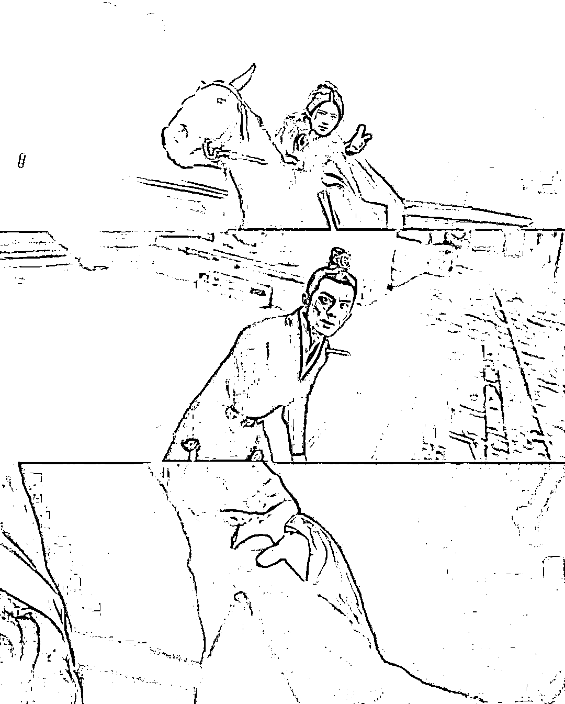

| 《星汉灿烂·月升沧海》剧照程少商在对凌不疑的真实身份起疑之后，一遍一遍地求问真相，希望夫妻一体，坦诚相对，即便最后在凌不疑报仇雪恨的当晚证实了他的身份，依然去救他，在双双被围堵于悬崖边，又再次强调不离不弃、同生共死的决心。

然而凌不疑还是以自己的角度辜负了这份信任，最终导致少商决然的退亲，以及 5 年不相见的流放与自我囚禁。对于少商来说，她愿用性命来换取不被遗弃，却依然被推出去，这是对他们感情的最大亵渎，绝对不可饶恕。

其实 5 年不相见，双方却各自都放不下，凌不疑任手腕被少商弦嵌入，多少次在战场拼死又不敢死，程少商自困于长秋宫，因她觉得灰暗人生中一盏明灯已熄灭，只能守着另外一盏.但她一看见凌不疑回来就上马落荒而逃，看到他手上的伤就忍不住关心，即便心中依然还有他，却还是不肯原谅，全因**金星天蝎座的爱太沉重，他们重信守诺，对感情的纯度要求苛刻，被遗弃的恐惧胜过一切。**如果不是后面又多次经历生死，重塑信任，恐怕真的就是覆水难收，死磕到底了。说实话，疑商夫妇经历了多少次生死劫难，把金星天蝎座对感情的磨合发挥到了淋漓尽致的程度，当他们**在一次又一次失去挚爱的恐惧中，勇敢面对，互相成就，最终才把这份因恐惧而来的控制转化成了真实可靠的信任。**他们兵分两路，各自去完成自己的任务，相信对方的能力，也相信自己的本事，不再放弃对方，也不再放弃自己，不再需要把自己剥开血肉揉进对方身体里，真正做到了两个独立的个体又彼此深爱，终于修成正果。

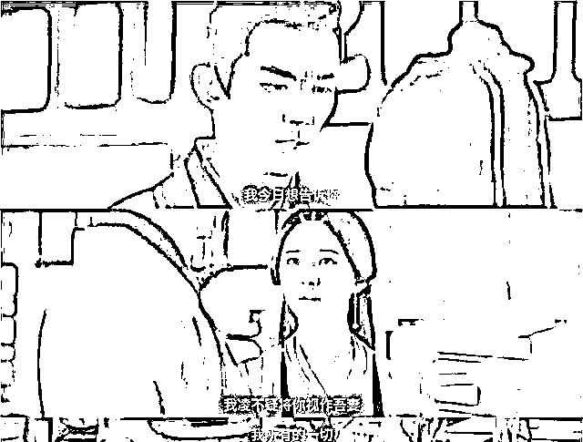

| 《星汉灿烂·月升沧海》剧照

**金星天蝎座的修炼之路**现实中的金星天蝎座们，应该没有太多生离死别来突显你们的情感之真之烈，那么希望你们**不要轻易地用各种作的手段来试探对方的情比金坚，要死要活与真正经历生死是两码事。**要像疑商夫妇那样转化金星天蝎座的负面能量，首先要看清楚的是**自己的情感模式与核心需求，对自己的价值判断是否合理，是否契合真相，内心真正恐惧的是什么**，也就是我们常说的**认识自己**，可以通过内观的方法，也可以寻找专业占星师解读自己的星图。其次，**在人际交往和感情关系中，保持警醒**，至少在自己又一次使用心计试探对方，一哭二闹三上吊，或其他激烈的手段时，能很快意识到自己在做什么，自己内心所求是什么，这么做是否有意义，能否解决根本问题。再次，便是**在保持觉知的前提下，勇敢面对自己的恐惧，提升自我价值，从而改变索取爱的方式。**因为值得被爱，所以不需要再用自己的生命去试探爱，因为对自己有信心，所以可以放心深入的付出爱也不怕分离。当金星天蝎座们能做到既与他人深刻联结，又能保持自身独立性，性格鲜明，敢爱敢恨，但不沉溺于爱恨，成熟自信，就成功晋级为最有魅力的金星星座了。

**版权声明：**原创文章由作者授权首发于若道平台，欢迎转发，反对抄袭。友号转载请申请白名单。

**Sissi**

若道 2016 届若道核心课程毕业生 全职占星师

国家三级心理咨询师

计算机工科学士，法律行业从业 10 年+，自媒体行业从业 3 年

**微博**：https://weibo.com/astrologistximu

**微信**：SS786809

**长按打赏**

**20 位来自世界各地的占星师****带来 19 场沙龙——新世界的觉醒****详情可点击下图**

**学习占星学****点击下图了解课程详情**

**微信又双叒叕改版啦，不想错过若道君的推送？**
**就把若道设为星标吧！****▼**

**喜欢就点一下“在看”吧！**

********报名直达入口********

# 周末树洞丨处女座新月，来聊聊你许下了什么愿望吧~

> 原文：[`mp.weixin.qq.com/s?__biz=MzA5NjA0NTAxNg==&mid=2651486788&idx=2&sn=97507ec41fbd35cf710c315a9fc60664&chksm=8b48c8f3bc3f41e54468cd53ce125aa3128295e5442fad51e32a65206f687e7318be610155c4&scene=126&sessionid=1692737766#rd`](http://mp.weixin.qq.com/s?__biz=MzA5NjA0NTAxNg==&mid=2651486788&idx=2&sn=97507ec41fbd35cf710c315a9fc60664&chksm=8b48c8f3bc3f41e54468cd53ce125aa3128295e5442fad51e32a65206f687e7318be610155c4&scene=126&sessionid=1692737766#rd)

**2022 年 8 月 28 日天象：**

*   **月亮在处女座**
*   ******火星四分太阳、三分水星******
*   ******金星对分土星******

本周是宇宙天气明显转化的一周，太阳进入理性的处女座（点击[【太阳进处女座】](http://mp.weixin.qq.com/s?__biz=MzA5NjA0NTAxNg==&mid=2651485956&idx=1&sn=278b9d305029880fc9255b9bce867784&chksm=8b48c5b3bc3f4ca540ac470a0ffb4554191a16dca20a630974cb2616c0fbdb15943ad1bbb3a3&scene=21#wechat_redirect)查看），给狮子座的闪耀和火爆降了温；天王星逆行（点击[【天王星逆行】](http://mp.weixin.qq.com/s?__biz=MzA5NjA0NTAxNg==&mid=2651486137&idx=1&sn=32c421ffd095bb846be8c79e88a0b674&chksm=8b48c50ebc3f4c1839777228470d83be1e14d4049d0be4e4c0e3085523854cd4d34ac57dec44&scene=21#wechat_redirect)查看），加入五星逆行的队伍，大环境开始进行更深入的复盘和思考；水星进入更懂得关系平衡的天秤座，昨天的[【处女座新月】](http://mp.weixin.qq.com/s?__biz=MzA5NjA0NTAxNg==&mid=2651486787&idx=1&sn=42d5a36cc49ebeefaa47a62275d0215f&chksm=8b48c8f4bc3f41e28c573c96a58f456ebeffa0fcf62d7e351a6bb7df030522102978057dfe6b&scene=21#wechat_redirect)（点击查看文章）带来一些改变和调整。这些都意味着新阶段的开始。这个处女座新月，你许了什么愿望呢？欢迎跟我们分享哦！今天月亮仍在谨慎务实的处女座，整理、清理环境，保持健康作息会让人感觉良好，更好的度过带着争吵的不平静的日火四分相时期，同时也可以缓解金土对分相的压力。用处女座的专注和谨慎，用心做好手上每一件事情吧~周日快乐！我们明天见！**了解每日天象，可****下载“若道”APP 查看****还有更多精彩等着你哦**

# 处女座新月 | 2022 年非常需要也相当重要的一步就在此时！

> 原文：[`mp.weixin.qq.com/s?__biz=MzA5NjA0NTAxNg==&mid=2651486787&idx=1&sn=42d5a36cc49ebeefaa47a62275d0215f&chksm=8b48c8f4bc3f41e28c573c96a58f456ebeffa0fcf62d7e351a6bb7df030522102978057dfe6b&scene=126&sessionid=1692737766#rd`](http://mp.weixin.qq.com/s?__biz=MzA5NjA0NTAxNg==&mid=2651486787&idx=1&sn=42d5a36cc49ebeefaa47a62275d0215f&chksm=8b48c8f4bc3f41e28c573c96a58f456ebeffa0fcf62d7e351a6bb7df030522102978057dfe6b&scene=126&sessionid=1692737766#rd)

****☆ **后台回复“今日”，给你一句生命态度**

作者/王芝桦 编辑/玫瑰 图片/pexels

**处女座新月****北京时间 2022 年 8 月 27 日 16:16 迎来处女座新月，太阳与月亮精准合相于处女座 4°03′。**此次处女座新月，宇宙引领我们做一次“大扫除”，留下那些有价值的宝贝，清扫那些无用的垃圾，整理空间，完善秩序。无论是现实生活，还是内在意识，干净清爽才能看得明白。

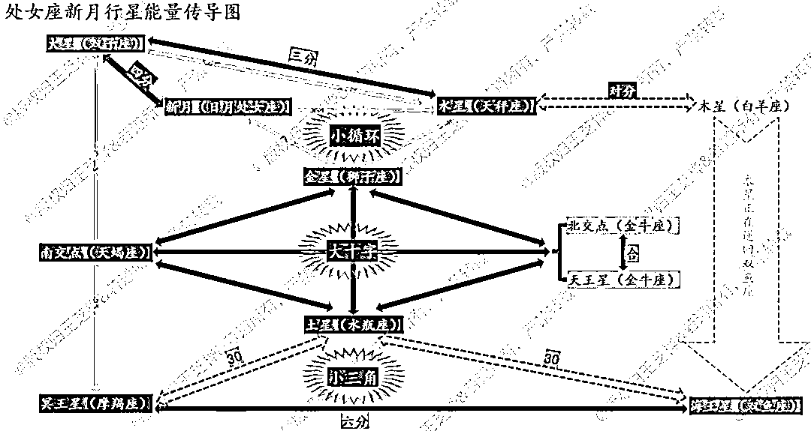

> **处女座新月重点影响人群****参考新月峰值影响期间各个行星的行进度数，以及逆行行星的轨迹影响；常规容许度，个人行星入相位 3°，出相位 1°；非个人行星入相位和出相位均为 3°。**
> 
> *   出生星图中，有**行星、四轴、南北交点**落入**变动星座（双子座、射手座、处女座、双鱼座）1°-8°，21°-30°**的人群。
> *   出生星图中，有**行星、四轴、南北交点**落入**基本星座（白羊座、巨蟹座、天秤座、摩羯座）0°-11°，21°-30°**的人群。
>     
>     
> *   出生星图中，有**行星、四轴、南北交点**落入******固定星座（金牛座、狮子座、天蝎座、水瓶座）****13°-28°**的人群。

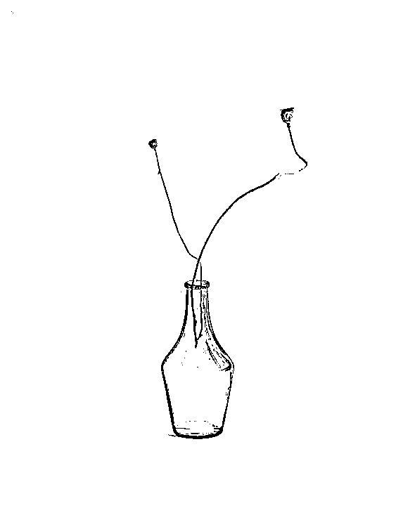

**“命运”，那还不是自己的事？**

> **天象**
> 
> **· 新月四分火星：处女座新月四分双子座火星。**
> 
> **· 水木对分：宽泛容许度下，天秤座水星对分白羊座木星。****· 循环定位链：处女座新月、天秤座水星、狮子座金星形成“能量循环定位链”。****· 固定星座大十字：狮子座金星、水瓶座土星、“合相于金牛座的天王星与北交点”、天蝎座南交点形成“固定星座大十字”结构。**

如果将黄道 12 星座比喻为“人的一生“，那么**排位第 6 的处女座就象征着进入人生的成熟阶段**：生命开始变得井然有序，有关“自我”的部分已梳理清晰并相对完善，我们不再狂妄无知，而是变得谦卑严谨，愿以自己的技能和勤力服务于这个世界。这是相当高阶的处女座发展路径。**处女座，土象变动星座，既具有土象的务实性与落地性，亦具有变动模式的适应性和变通性。**故而，处女座擅长**“推进和完善”计划类的事务**，而这一特长在新月“开启能量”的催化之下，便更适合于**对计划类事务进行梳理、推进、完善和处理。**宇宙慈悲，**这对于走到 2022 年当下时刻的我们，是非常需要也相当重要的一步！**最近两年的现实进程已经推动我们做出了不少的改变和计划，我们现在所缺的不是计划，而是**如何将难以进展的计划向前推进，如何将一团乱麻的头绪梳理清楚。**

就像此次处女座新月与双子座火星形成的四分结构：像个陀螺一样地忙碌不堪，但却未必就能看到进展，甚至可能遭遇卡顿，继而触发出双子座的焦虑感和处女座的紧张感，制造出琐琐碎碎的摩擦与矛盾。

但是，我们也可以在该组结构之中获取**“勇敢和认真”**的态度：只要允许试错，也就不存在什么错误，因为生活本身就是“完善的艺术”；但既然想要完善，就需要梳理问题的逻辑，找到解决的序列。故而，**建议把“推进计划，完善进程”作为重中之重，放进此次处女座新月的愿望清单里。**

此次处女座新月，接纳“新月四分火星”该组结构能量的**水星**（水星守护双子座和处女座）绝对是需要观测的重点，因为**这颗代表“流动性”能量，代表思维认知、信息交流、计划执行等功能的水星，可是 8 月下旬-10 月中旬的大明星。**

***1. *****出来混总是要还的，莫怪命运**

**2022 年共有 4 波水星逆行。此次处女座新月，已进入第 3 波水星逆行的周期影响：****· 8 月 21 日**，水星于处女座 24°11′进入逆行前阴影期；**· 8 月 26 日**，水星进入天秤座；**· 9 月 10 日**，水星于天秤座 8°55′开始逆行；**· 9 月 23 日**，水星逆行回到处女座；**· 10 月 2 日**，水星于处女座 24°11′恢复顺行；**· 10 月 11 日**，水星再次进入天秤座；**· 10 月 17 日**，水星于天秤座 8°55′走出逆行后阴影期。 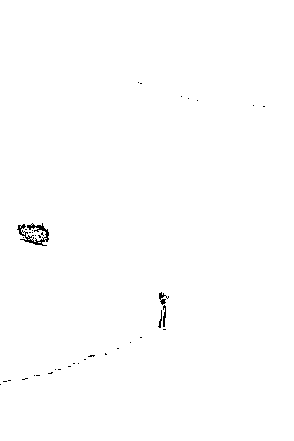**敲黑板！划重点！****2022 年第 3 波水星逆行将在处女座 24°11′-天秤座 8°55′的轨迹上来来回回走上 3 遍，期间两个天象结构需要特别关注：****水海对分：****· 8 月 21 日**：水星于处女座 24°11′进入逆行前阴影期，并与逆行的双鱼座海王星第 1 次形成“水海对分”结构；**· 9 月 30 日-10 月 5 日**：已经逆行回到处女座的水星，在逆行转为顺行的过程中第 2 次、第 3 次形成“水海对分”结构。

**水木对分：**

**· **9 月 3 日：已经进入天秤座的水星与逆行的白羊座木星第 1 次形成“水木对分”结构；**· **9 月 19 日：已经于天秤座开始逆行的水星与逆行的白羊座木星第 2 次形成“水木对分”结构。**· **10 月 12 日：已经恢复顺行并再次进入天秤座的水星与逆行的白羊座木星第 3 次形成“水木对分”结构。在这里，我们需要回顾一下以上两组结构中的木星和海王星。**“木海互容+木海合相”**结构是 2022 年度重磅天象，曾于**4 月 12 日**达到能量峰值，后因木星进入白羊座试水一度打破，但**即将随着 10 月 28 日木星逆行回到双鱼座再度形成，并一直影响到年底。**“木星试水白羊座，后又逆行回到双鱼座”的过程，就像是木星出去混一下。但是，如果没准备好或过于冒进，那么出来混总是要还的。2022 年第 3 波水星逆行发生在处女座-天秤座之间。水星行进处女座期间形成的“水海对分”结构，就像是**“跟摸鱼之人较真”**；水星行进天秤座期间形成的“水木对分”结构，就像是**“跟激进分子算账”**。这两组结构是**发现问题和解决问题的过程**——谁都别想蒙混过关。不要怕。努力的人，准备充分的人，将会看到一定的成果——清晰自己的目标，知道值得投入的地方，争取你一直期待的机会，放弃正在消耗你的负累。

当然，我们依然会遇见一些困惑，甚至偶尔感慨“命运犹如挣不开的枷锁”。卡尔.荣格早已给出了这个问题的答案——**你的潜意识正在操控着你的人生，而你却将其称为命运；但当潜意识被觉知，被呈现，命运就被改写。**

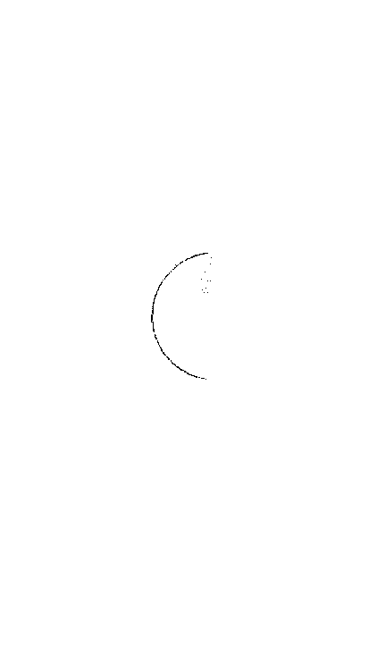

***2. *****觉知“大十字”，破除“魔咒”**

此次**处女座新月、天秤座水星、狮子座金星形成了一个“能量循环定位链”**。如果我们将这组循环链放到现实层面解读，就能提炼出这一核心——**如何在“自我期待与现实境况”之间获得平衡，无论是人生计划，还是人际关系。****由金牛座、狮子座、天蝎座和水瓶座组成的“固定星座大十字”结构是 2022 年 8 月的重磅天象。****8 月 25 日**开始，狮子座金星便一脚踏进“固定星座大十字”结构，带来一波**有关“金钱，价值观，关系”的考验。**半个月前的水瓶座满月文中（详情点击：[水瓶座满月](http://mp.weixin.qq.com/s?__biz=MzA5NjA0NTAxNg==&mid=2651484401&idx=1&sn=6983d509093fe8d83f6dd1adb4c51113&chksm=8b48c246bc3f4b5079c2f9019e01e3d7aae6c094158de94e574fa0395f391d6b6bd7bbc480e3&scene=21#wechat_redirect)）介绍过，这一次的“固定星座大十字”中包含 2021 年度重磅天象“土天四分”结构，该组结构在进入 2022 年稍有松弛，但即将于**10 月上旬**最后一次迎来能量峰值。“土天四分”结构是 1988 年-2032 年“土天周期”的最后一个敏感触发点，竖起 11 年（2021 年-2032 年）“不破不立，边破边立”的变革风向标。**· 2021 年-2026 年：**天王星行进于金牛座，土星行进于水瓶座和双鱼座，以往的历史经验将会打破，全新的意识文明正在建立，在健康意识、地球生态、价值观念、生存资源不断经历飓风洗礼的过程中，这个世界也将从对“结果和成绩”的执着之中醒来；**· 2026 年-2031 年**：天王星行进于双子座，土星行进于白羊座和金牛座，真正的信息产业革命将会到来，而我们也将重塑自我的勇气，重建生命的根基。

2021 年末，南北交点也配合着换座进入“天蝎座南交点-金牛座北交点”轴线；2022 年 5 月-11 月，金牛座北交点和金牛座天王星彼此靠近，而这半年也横跨了 2022 年的两次“食相季”。 

**2022 年共有两次“食相季”，一次发生在 5 月上旬（金牛座日食和天蝎座月食），另一次发生在 10 月下旬-11 月上旬（天蝎座日食和金牛座月食）。**

这 4 次的日月食天象之中都可见**天王星与北交点“逐渐趋近-合相擦肩-逐渐趋远”**的身影，而作为这半年时间中点的**8 月**，正是**天王星与北交点精准合相于金牛座**的时间。

**8 月，2022 年进程中重要的转折点！**北交点的“进化策略”引领我们为 10 月上旬最后一次的“土天四分”结构和“不破不立”进程提前做出准备——在巨大的现实颠簸和内心恐慌之中，是执着地抓取结果或被动地哀怨躺平？还是主动地选择回归质朴并放下虚妄，重建内在的价值根基与自尊自信？ 

我们必须得做点什么！然而，**8 月 21 日，水星进入逆行前阴影期，8 月 24 日，金牛座天王星开启了为期 5 个月的逆行**，两条逆行线的叠加影响，**为我们前期的努力和改变带来一波“倒退”的感觉。**

我们似乎又一次被“命运的魔咒”紧紧束缚而不得脱身，然而，这正是宇宙提示我们**向内自我检视**的时间——**“命运”取决于我们的潜意识在如何运作，以及我们是否能够意识到潜意识的内在运作。**

**你在关注什么？是不断夯实的过程和持续沉淀的态度，还是带着激进求胜的侥幸心理，忙着开启计划并期待马上看见答案？**我们能够留下多少成果，取决于我们潜意识的关注。

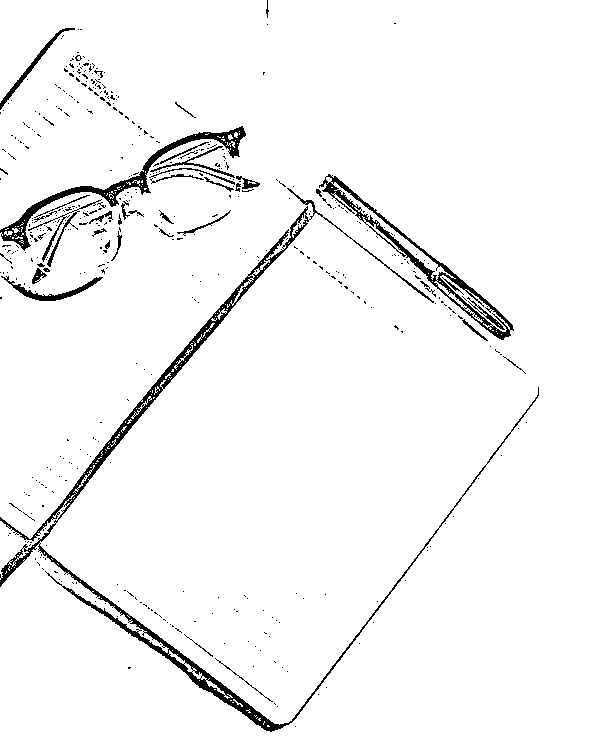

8 月 27 日的此次处女座新月，狮子座金星进入“固定星座大十字”结构，四分金牛座天王星，对分水瓶座土星，对“利益和关系”两方面带来不小的冲击。

**· 职场：**那些灰色的动作和超边的事件将会翻出底牌，挑战规则自然也要付出代价。故而，这也是**人事斗争加剧、人事变更频出**的一段时间。守住自己的欲望和底线，不该做的别做，不该贪的别贪，以免引火上身；

**· 人际：**这是容易**因为价值观或立场的不同，导致合作拆伙、友谊破裂、恋人分手**的一段时间，尽量不要在冲动之下做出决定。自我核心很重要，令我们明确自己的目标和底线是什么；但过度的自我核心却会令我们陷入“自我期待”的主观和狭隘之中，从而忽略现实的规则和他人的感受；

**· 集体：****生态环境、自然资源、外交关系、劳动权益**引发热议关注；**娱乐圈、美业、金融领域、企业名人将有热点新闻爆出。**

无论遇见哪些集体性或个体性的事件，此次处女座新月都在提示我们**“推进和完善”**这两个关键词，这是我们当下处理现实问题所必要的视角和思维，也是此次处女座新月宇宙赐予我们的礼物。

其实，当下最大的问题是**“太乱了”**，外部世界瞬息万变，内在心灵也难以安稳，试问谁不焦虑和紧张？ 

乱的时候，就得**一点一点做好梳理、整理和归理**，而这正是处女座最喜欢的事情，也是此次处女座新月提示我们做的功课。就像我们的房间，不做好分类和收纳，不做好清洁和自律，找点东西都无从下手，怎么可能不浪费时间？

当然，这可不是做一次或做一天的事情，而此时“固定星座大十字”中的水瓶座土星正在帮助我们——既然一定要打破，那么就接纳现实吧；既然一定要重建，那么就持续磨练吧！什么也别说了，去干吧！

当我们不再执着于“只能更好，不能后退”的结果、沉溺于“画着大饼，逃避现实”的虚妄的时候，当我们真正落地现实一步一步勤力地推进计划、一点一点谦卑地完善过程的时候，我们就会在时间线上留下积累，就会改变所谓“命运的魔咒”。

而这就是摩羯座冥王星、水瓶座土星、双鱼座海王星这组“小三角”，在此次处女座新月为我们带来的助力。

**寄语**今天写文的时间非常紧迫，但我依然抽出一个小时做了“大扫除”，把我这篇文章中的一大段文字删掉。虽然有些心疼，但确实令这篇啰里啰唆的文章显得更加啰嗦。生活处处都是艺术，而艺术的本质却是“克制”。在创作过程中，只要有过度的“自我”投射，马上就能看到“画蛇添足”的呈现。但是，我们可不能时时批判自己的“画蛇添足”，因为艺术就是不断试错、修剪、锤炼、反思的过程，没有前面的这些阶段，根本不可能出现高级的克制。所以，我原谅自己了，继续磨练呗！祝福每一个生命健康，祝愿每一个灵魂安好。**新月如何许愿？****许愿时间**：2022 年 8 月 27 日北京时间 16:16 后，48 小时内有效、8 小时内最佳。 **许愿人群**：所有人。**许愿数量**：每人最多 10 个。**许愿方式**：静心冥想，身心祈祷或记录收藏。**许愿格式**：请万能的宇宙赐予我能量，我将以我的能量吸引**（什么）来到生命中……**许愿原则**：发心诚善利人。

**版权声明**：原创文章由作者授权首发于若道平台，欢迎转发，反对抄袭。友号转载请申请白名单。

**END**

****想阅读更多作者的文章，请在后台回复******王芝桦****** 即可。****

****王芝桦****

心理占星师，统合疗愈师，占星专栏作者

全职于个案咨询与占星教学工作 18 年

**个案预约咨询微信号**：zhihua0621 

**微信公众号**：daoxi-life

**长按打赏**

****

**20 位来自世界各地的占星师****带来 19 场沙龙——新世界的觉醒****详情可点击下图**

**学习占星学****点击下图了解课程详情**

**微信又双叒叕改版啦，不想错过若道君的推送？**
**就把若道设为星标吧！****▼**

**福利来啦**
**点击****“阅读原文”****获取最好用的免费****新月报告**

**获取免费新月报告，请点击文末“阅读原文”**

# 斯蒂芬·弗里斯特工作坊丨探索组合图永恒的三角

> 原文：[`mp.weixin.qq.com/s?__biz=MzA5NjA0NTAxNg==&mid=2651486787&idx=2&sn=b20744a8649746a95f89842734012a7a&chksm=8b48c8f4bc3f41e284f8819351689cffd8f5ed461ed925622a45e28ba3a15335185910183bcd&scene=126&sessionid=1692737766#rd`](http://mp.weixin.qq.com/s?__biz=MzA5NjA0NTAxNg==&mid=2651486787&idx=2&sn=b20744a8649746a95f89842734012a7a&chksm=8b48c8f4bc3f41e284f8819351689cffd8f5ed461ed925622a45e28ba3a15335185910183bcd&scene=126&sessionid=1692737766#rd)

**1**

********斯蒂芬·弗里斯特老师若道独家三日线上工作坊********

斯蒂芬说，我们的组合图表明无论什么状况我们都能熬过去。

**2**

********此次授课内容********

**组合图描述了如何才能使两个人的关系一直充满活力。**这句话中隐含的意思是假设一段关系有一种区别于这两个个体的独立的生命。有时我们喜欢和一对伴侣共度时光，却从没想过单独见他们其中一人。我们从这对伴侣身上感觉到的 "频率"是对他们组合图能量的直接体验。在某种程度上，可以简单地理解为：**正如每个人都有自己的星图一样，每对伴侣也有他们的星图。**

从简单的描述层面上讲，这就是组合图的意涵。记住，我们可以将这一技法用于任何一种关系：**父母和子女、商业伙伴、朋友。**作为进化占星师，我们的目标要比单纯描述走得更深。解读组合图时，可以着眼于帮助人们，而不仅仅是使他们感到惊奇。对于个体来说，出生星图代表了一条正确的人生道路，一条承诺意义、活力、灵性目标的道路。组合图亦然，只不过它将一段关系看成一个独立的个体，而不是两个人。关系也有进化的路径：人们走到一起是为了学习和成长。个体如果没有领会自己出生星图的要点，会变得疲惫而沮丧。两个人也是如此，**如果没有抓住组合图的要点，我们就会对对方感到厌烦。这段关系似乎也会失去动力。**

伴侣常常意见不一，陷入困境，看不到前进的方向。三是一个更有动力的数字。三个人投票，二个人以多数票击败一个人，推动事情继续发展。**这实际上解释了这次工作坊的主题：永恒的三角。**

**每对伴侣其实都是一个三人组：你、我以及我们。**组合图所代表的那个看不见的 "第三人"经常会"投出打破僵局的一票"，使关系得以发展。**·** 但是如果组合图总是同意一个人的意见，而不同意另一个人的意见，怎么办呢？（这被称为"封建制度"）**·** 如果两个人都安静而保守，但他们的组合图却要求狂野的冒险呢？（这是 "文化冲击"）**·** 如果它同时均衡地反映了两个人的情况呢？我们可以称之为 "民主"，但我们仍可以区分出一个人天然的智慧比另一个人更强的领域，让擅长的人负责擅长的事，这会促进关系蓬勃发展。换句话说，我们开始看到这个技法的咨询维度了。我们将在这个工作坊中探讨这些内容。两个人究竟为什么会走到一起？**在严肃、复杂的关系中，我们可以假设两个人之间有一些未解决的业力。**如果他们在今生是恋人，但在前世中，一个是父母，一个是孩子呢？也许那些直觉和假设仍可以感受得到，极为错综复杂地使得他们在今生想要成为情侣。**这些疑问将我们引向组合图的月亮交点，在那里我们往往能发现当今人类任何伙伴关系问题的真正核心。**

**从理论上讲，组合图是基于中点的。**如果我的出生星图里太阳在摩羯座中段，而你的太阳在双鱼座中段，我们组合图的太阳就在水瓶座中段。换句话说，**在你和我的太阳的中间位置。****其他行星、月亮交点和中天也是如此。**其他宫头的位置，包括上升点则存在一些争议。通常的做法是仍然使用中点，但斯蒂芬老师将会解释他认为这样做存在的技术方面的问题。他更倾向于**使用关系最初开始的地点绘制星图，就像我们使用出生地来绘制出生星图一样。**

**组合图也像出生星图一样有行进。**在工作坊中， 我们将**探讨一些特殊的技法和考量，来帮助伴侣们应对生活中的挑战和机遇。**组合图的推进会出现一些看似难以解决的复杂问题，斯蒂芬老师创造了一种解决这些问题的技法。他将在工作坊中阐述相关细节，基本的问题是：如你所知，要了解一个人 30 岁生日的推进，我们要看这个人出生后 30 天的行星位置。问题是，组合图与我们在占星学实践中使用的其他星图不同，组合图并不代表某一天的天空。记住，它是基于中点的。**那么我们如何从一个不存在的日期开始 "向下数 30 天"呢？斯蒂芬老师将为我们提供一个行之有效的答案。**

并非所有的人都处于伴侣关系中，但**作为人类，就需要与其他的灵魂共舞。占星学能够极大地帮助人们驾驭复杂的关系。**了解我的星图如何与你的星图通过相位和宫位的交互而产生互动，是非常有帮助的。组合图包含了这些技法，提醒我们，整体总是大于各个部分之和，而又与之不同。

**3**

********斯蒂芬的占星著作********

**·** 1984 年-1988 年间，斯蒂芬写作出版了《内在的天空》（已有中文版）、《变化的天空》和《天空的伴侣》三本占星经典著作，奠定了早期在占星学界的地位。**·** 2002 年-2005 年间，他与朱迪·弗里斯特共同创作了两本经典的关系占星学著作《天空的伴侣 I：爱、性、和进化占星学》《天空的伴侣 II：组合图》。**·** 2008 年，斯蒂芬出版了一本非常重要的著作《昨日的天空》，此书是至今为止关于轮回转世跟星图的清晰对应最详尽的著作之一。 斯蒂芬前后一共出版了 12 部占星著作，在世界占星学界拥有很高的声誉。

**4**

********斯蒂芬获得的荣誉********

1985 年，他凭借《内在的天空》一书获得职业占星师协会奖（*Professional Astrologers Incorporated Award*）。1992 年、1995 年、2008 年、2018 年，他四次获得占星界最高的占星学联合协会奖（*UnitedAstrology Congress Regulus Award*）提名，2018 年获得轩辕十四教育奖。

**5**

********斯蒂芬的占星哲学观********

斯蒂芬的占星风格以**自由和选择**为中心，他的解读不是以下定论的方式来“预测”未来，他**强调如何改善生命，而不是宿命式的论断**。他以心理占星学的语言来解读星图上的人格部分，但是**通过南北交点及其相位和守护星来探索星图所揭示的前世业力与今生方向，在灵魂进化的背景里来整体解读星图。**他认为进化占星学的目的在于**鼓励人们做出更符合进化方向的智慧选择，我们学习去了解前世的时侯，关注点应该集中在如何通过意识来疗愈自己。**

**6**

**这些名人怎么说**

斯蒂芬让我们停止了玩责备命运的游戏，而开始看到自己是一个走在进化路途上的勇士。——奥普拉杂志“*O: THE OPRAH MAGAZINE*”

斯蒂芬和杰夫这两位著名占星师创造性地相互应和，展现出他们出色的教师才华，发展并弘扬了占星这门艺术。（对《测量天空：进化占星学和灵魂的钥匙》的书评）——著名心理占星师 现代占星之父 诺·泰尔（*Noel Tyl*）

请享用斯蒂芬和朱迪这两个博大的灵魂在此书中所提供的洞见大餐吧。（对《天空的伴侣》的书评）——进化占星学的创始人之一 杰夫·格林（*Jeff Green*）

我为斯蒂芬解读的精准感到惊叹，他强调没有一件事是坏得无法挽回的，也没有一件事是如此之好以至于它不会因为现在的错误判断而消失的。我怎样推荐他都不为过！——好莱坞著名影星“钢铁侠”男主角 小罗伯特·唐尼（*Robert Downey Jr*）

**7**

**上过课的占星师怎么说**

他关于我星图的解读，让几乎所有在场的人掉泪，我也从此开启了一段灵魂追寻的旅程。我很惊讶他透过星图可以如此深入一个人的灵魂。很多东西你自己都不知道，但是他讲出来你会发现，啊，这是真的，这是占星学的神奇。——《心探索》创始人孟想

每个来参加老师课程的同学，都会被老师深深的慈悲心感动。这种慈悲心，并不是表面上说的一些什么话，而是一种从意识层次上发出的能量。每个来上课的人，都能感受到老师的爱。这种爱，并不是盲目的爱，而是深刻地洞悉真相后的慈悲。

——斯蒂芬老师工作坊翻译逸月

斯蒂芬老师的一对一咨询已经排期到两年之后，我特别幸运，曾在课堂上被老师抽中分析过我的星图，老师充满爱与智慧的指引让我更加清晰的认识了自我。内在的潜能、需求和矛盾被老师娓娓道来。——禄丽荣斯蒂芬老师是位非常非常值得推荐的大师，很粉他，这位进化占星学的创始人，对人的理解是那么的全面完整、深刻洞见、慈悲和温暖，就这方面而言足可以媲美我无比崇敬的荣格和史坦纳（这两位去天堂里玩了）。如果你对西洋占星感兴趣，或者对人的所有角度、各个层次的真相和可能性感兴趣，推荐斯蒂芬老师的书和课程，特别是他的课程，数倍的功力大增的好机会，错过真是占星粉丝的莫大损失。——仁华

**8**

**2019 年工作坊学员感悟**

**9**

**什么人适合这门课程**

✦ 占星师或渴望成为占星师的人群。   ✦ 本课程并非针对初学者，需具备若道核心课程 level4 及以上水平，即了解星座、行星、宫位、相位、综合解读等知识。✦ 课程会涉及组合盘解读高阶内容，不了解相关知识的同学，请提前学习相关内容。

**10**

********授课老师********

**斯蒂芬·弗里斯特（Steven Forrest）**

**·** 进化占星学的创始人之一，当今世界最有影响力的占星大师之一；**· **毕业于美国北卡罗莱纳大学宗教学专业；**· **1984 年-1988 年间，写作出版了《内在的天空》、《变幻的天空》和《天空的伴侣》三本占星经典著作，奠定了早期在占星学界的地位。前后一共出版了 12 部占星著作，在世界占星学界拥有很高的声誉。**· **1985 年，他凭借《内在的天空》一书获得职业占星师协会奖（*Professional Astrologers Incorporated Award*）。1992 年、1995 年、2008 年、2018 年，他四次获得占星界最高的占星学联合协会奖（*United Astrology Congress Regulus Award*）提名，2018 年获得轩辕十四教育奖。**· **斯蒂芬将自己的绝大部分时间都花在教学以及个人咨询上，他于 1998 年创立了占星学徒计划（*Astrological Appretice Program*），这个计划致力于培养职业占星师；**· **至今为止已经有 600 余位学员完成了培训，其中很多都成为了优秀的职业占星师；**· **他是一位脚踏实地的导师，充满快乐和活力，亲和幽默同时又充满了智慧；**· **他的课程不仅仅是一次占星知识和经验的学习，也是一次与智者的相遇。

**11**

********课程费用********

**正价：6800 元****早鸟价：5800 元****早鸟价截止日期：2022 年 9 月 15 日**

**12**

********授课时间、方式、退转********

**授课时间：2022 年 10 月 14 日-16 日（周五、周六、周日）7:00-13:00****具体时间安排：****7:00-8:45****（15 分钟休息）****9:00-11:00****（30 分钟休息）****11:30-13:00**

****授课方式：******线上直播课，英文授课，中文翻译**

**课程退转：退款原则请详看《教学协议》，如有疑问请咨询课程顾问。**

****斯蒂芬工作坊 | 探索组合图永恒的三角****

**授课老师：斯蒂芬·弗里斯特**

**授课时间：2022 年 10 月 14 日-16 日（周五、周六、周日）**

**授课方式：******网络授课，英文授课，中文翻译****

**费用：**6800 元**（早鸟价：5800 元，截止日期：2022 年 9 月 15 日）**

**课程负责人：王老师**（微信/手机：18510107057，请备注“斯蒂芬工作坊”）

长按二维码添加课程负责人咨询

**END**

****报名直达入口****

# 处女座新月 | 不知道该怎么做计划？看看这份免费的新月报告！

> 原文：[`mp.weixin.qq.com/s?__biz=MzA5NjA0NTAxNg==&mid=2651486787&idx=3&sn=ac02a8f7fca2c949e99a0e40abb07fbe&chksm=8b48c8f4bc3f41e216c6aea0b82f33e8546f09ac8aa24535ad2437622b37a3e06ac192ece4f8&scene=126&sessionid=1692737766#rd`](http://mp.weixin.qq.com/s?__biz=MzA5NjA0NTAxNg==&mid=2651486787&idx=3&sn=ac02a8f7fca2c949e99a0e40abb07fbe&chksm=8b48c8f4bc3f41e216c6aea0b82f33e8546f09ac8aa24535ad2437622b37a3e06ac192ece4f8&scene=126&sessionid=1692737766#rd)

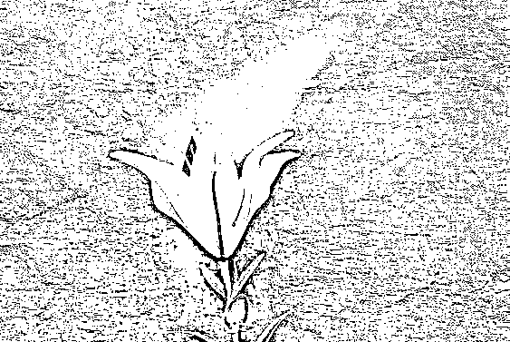

北京时间 8 月 27 日 16:16，新月发生在处女座 4°03′。每到新月时分，若道君都会为你奉上根据你出生星图量身打造的免费新月报告。可是新月为什么要许愿？新月报告该如何领取？让若道君来教你。

　**什么是新月？**　

从占星学看，新月是月亮周期的一种相位。新月是开始，又称为朔，对应中国农历初一，太阳、月亮在此时合相。此时月亮运行到太阳与地球之间时，月亮以黑暗的一面对着地球，并且与太阳同升同落，地球上看不见月亮。

本次新月时间

**8 月 27 日 16:16，新月发生在处女座 4°03′。**

为什么新月要许愿？

新月是一个周期的开始，新月发生的时候，太阳与月亮合相，能量很强。当新月出现时，你也许会发现灵感忽现，非常适宜开启新领域、项目与行动，缔结一段新的关系或合作。许愿会加强新月的能量，也有助于你了解自己现阶段适合开启的方向。 

本次新月最佳许愿时间从新月开始到其后的 48 小时内，许愿的力量最强。**最佳许愿时间：8 月 27 日 16:16-8 月 29 日 16:16**

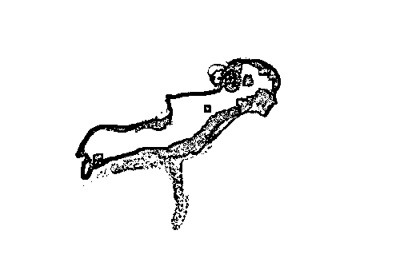

属于你的免费新月报告每到新月时刻，看着占星文章里写着：看看你新月的宫位，如果新月在第 X 宫，你可以许愿的方向是……是不是常常一头雾水？新月的宫位？我到底该看哪里啊？而有时，那些标注上升星座的文章也会让你忍不住想：虽然我的上升星座是这个，可是我的新月好像并不落在你说的宫位啊？你是不是写错了？

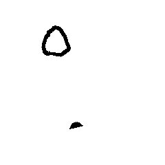

虽然这些文章都没有写错，可是好像对你而言都太不友好了。**Don't Worry！**别着急，让博学又体贴的若道君来帮你！我们推出了一份**免费**又**好用**的新月报告！而且是专门为你设计的哦，**根据你出生星图为你量身打造的，只****属于你的独家新月报告**。报告有哪些内容？**新月时间****最佳许愿时间****如何许愿 **属于你的**许愿关键词**本次新月给你的**建议**你会有怎样的**感受 ******机会****

********

如何许愿？许愿方式也很简单。你可以把愿望写下来，或者双手合十后交叉，闭上眼睛来祈祷。 报告中会为你提供**祈祷词示例**，可以多多参考哦～ 你还可以适当添加自己的语言，创造属于你自己的祈祷文！如果报告拿到手了，快对照着许愿吧！

**这份好用又暖心的报告，点击****阅读原文****即可领取！**

**END**

****点击“阅读原文”即可获取新月报告****

# 插班中丨认证职业占星师文凭课程 L1-3：想看大卫老师是怎么做课堂演示的吗？

> 原文：[`mp.weixin.qq.com/s?__biz=MzA5NjA0NTAxNg==&mid=2651486495&idx=3&sn=4db20a9bcd2ed03f66e22bbf54c22c26&chksm=8b48cba8bc3f42be9ff814967298d5f5d54ef43a1472a656eebd1196fde48a9bb21556e06189&scene=126&sessionid=1692737766#rd`](http://mp.weixin.qq.com/s?__biz=MzA5NjA0NTAxNg==&mid=2651486495&idx=3&sn=4db20a9bcd2ed03f66e22bbf54c22c26&chksm=8b48cba8bc3f42be9ff814967298d5f5d54ef43a1472a656eebd1196fde48a9bb21556e06189&scene=126&sessionid=1692737766#rd)

**在若道核心课程的教学里，****以学员为案例****进行课堂的占星咨询演示，是我们课程的特色环节。**

这样的演示不仅让很多同学有亲身体验咨询的机会，而且这么多真实案例的学习，会让大家看到占星咨询到底是怎么样一个过程。毕竟，大部分人的学习都是要从模仿开始。

记得若道君当年学习占星的时候，可没有这样的机会。那时候主要是听课为主，后来，我们在多年的教学实践中，**越来越发现课堂演示的重要性**。因此，就把这个作为一个主要环节加入到课程中。

在新一期的若道核心课程中，咔咔老师和大卫老师这对组合就会把这个教学特色充分发挥出来。**熟悉中国同学思路的咔咔老师会以知识点的讲解为主，而有 50 年占星咨询经验的大卫老师，则以课堂演示为主。**

有时候，这样的课堂演示的功效是出乎意料的。

一位若道的老同学赵震宇这么写到：

2018 年，我正式开始在若道学习 L1-5。其实我一开始的心态更多的是希望得到系统化的学习来补充我的知识漏洞，以及拿到一个证书可以为自己做背书，增加自己将来转型占星师的筹码，而不是真的在期待可以从若道的学习中得到一些本质上的领悟。

事实上在初期的 L1-3 中，很多知识与课上的内容，也是我比较熟悉的领域，相对而言是驾轻就熟的。但在 L3 的工作坊中和大卫老师的接触以及模拟咨询，让我对占星的态度发生了很本质的变化。

大卫老师对我星图的分析不仅非常准确，更重要的是，他开启了我自身个人成长上的变化，从而成为了我本质上进化蜕变的一个契机。

在短短的 6 个月内，我对人生的认知、对自我的认知、对于人生看待的方式都发生了翻天覆地的质的变化。我意识到了原来跳出自己一直以来无意识间重复的模式，是一件可行、并且会给自己带来无限成长提高自己人生幸福度和质量的事情。这也让我深刻体会到了人本主义占星学的魅力，以及自己之前是多么的“无知“。

于是现在，占星学对我来说，不只是兴趣、宗教信仰、或者是可能的职业道路，而是一种激发自己和他人人生成长和蜕变的工具、一种让自己更幸福的看待世界的方式。哪怕我之后并不会以占星为生，它依然是我人生中不可或缺的一部分，就像一副隐形眼镜，影响着我与世界的互动。

而被大卫老师咨询深深影响的同学还有很多。

**这里，我们节选一些短小的试听片段，让你稍微感觉一下在若道核心课程上，大卫老师的咨询演示是怎样的一个样子。**

**片段一**

<mpvideosnap class="js_uneditable custom_select_card videosnap_video_iframe" data-pluginname="videosnap" data-id="export/UzFfAgtgekIEAQAAAAAAMKsWN6BUygAAAAstQy6ubaLX4KHWvLEZgBPEnoIULgMKKb-DzNPgMItC2ZEgiEDMBYjrYHv9wNsO" data-url="https://findermp.video.qq.com/251/20304/stodownload?encfilekey=S7s6ianIic0ia4PicKJSfB8EjyjpQibPUAXolK65qjuvEtF7VE3LuUIfibNBicR6aZMMfP2lV313icg6MQMfqMQqcPFj2m8Hhw10N65gJT2zkNKurNXqiaaAugQpntw&amp;adaptivelytrans=0&amp;bizid=1023&amp;dotrans=0&amp;hy=SH&amp;idx=1&amp;m=&amp;scene=0&amp;token=cztXnd9GyrEzmuleT8ub88RIicgCkUKW4liadDZCTsricEdF98BQMCWkUTxVevglwsb2TzGGW1rUZ4" data-headimgurl="http://wx.qlogo.cn/finderhead/PiajxSqBRaEJYnVsqWfEX9qA0sI6hNVKsDfyzfPZ92WZMZyBpZWU5NA/0" data-username="v2_060000231003b20faec8c4e68a1ec2d4ca07e434b07755bbf47e7053a3059defd2c9d6c68a20@finder" data-nickname="若道" data-desc="#若道核心课 大卫老师用星座、行星、宫位来探索一位同学出生星盘主题的时候，他回顾了解读星盘的优先次序" data-nonceid="7723748345640460016" data-type="video" data-width="544" data-height="344"></mpvideosnap>

**片段二**

<mpvideosnap class="js_uneditable custom_select_card videosnap_video_iframe" data-pluginname="videosnap" data-id="export/UzFfAgtgekIEAQAAAAAANycuUwRANAAAAAstQy6ubaLX4KHWvLEZgBPEhYJ0WjYILr-DzNPgMIvjhT14ogdLw3BWd0Tg37w0" data-url="https://findermp.video.qq.com/251/20304/stodownload?encfilekey=S7s6ianIic0ia4PicKJSfB8EjyjpQibPUAXoleMEBO7YqRBdVicTyRbZLSODWa2goURzKktJBq1dd5DIVYjlj926F5hsicv1cBaJ9Rv2mYicYQsNBTeicdAYHyJ6QPA&amp;adaptivelytrans=0&amp;bizid=1023&amp;dotrans=0&amp;hy=SH&amp;idx=1&amp;m=&amp;scene=0&amp;token=AxricY7RBHdWzD8K4WOaXSvyp6Ryjm97TQtPI3Gia6U1Ab852A11RvPCu31V9R4GVy7w9ZhPIpmIg" data-headimgurl="http://wx.qlogo.cn/finderhead/PiajxSqBRaEJYnVsqWfEX9qA0sI6hNVKsDfyzfPZ92WZMZyBpZWU5NA/0" data-username="v2_060000231003b20faec8c4e68a1ec2d4ca07e434b07755bbf47e7053a3059defd2c9d6c68a20@finder" data-nickname="若道" data-desc="#若道核心课 占星学如何反应职业选择？" data-nonceid="629392412247480278" data-type="video" data-width="544" data-height="344"></mpvideosnap>

**片段三**

<mpvideosnap class="js_uneditable custom_select_card videosnap_video_iframe" data-pluginname="videosnap" data-id="export/UzFfAgtgekIEAQAAAAAAl_sREJMyhwAAAAstQy6ubaLX4KHWvLEZgBPEtIIkIkRmL7-DzNPgMIsA5PpGB3ReSAYx6ZfSNfZ1" data-url="https://findermp.video.qq.com/251/20304/stodownload?encfilekey=S7s6ianIic0ia4PicKJSfB8EjyjpQibPUAXolicGo48MWlib8wvOFMCMmVRq6heVqPaLZWrZVDpKoE2lcibTklu18ibiabwe5r5MKNnk1B8b1WWwnJJbOKHROCicyOU0A&amp;adaptivelytrans=0&amp;bizid=1023&amp;dotrans=0&amp;hy=SH&amp;idx=1&amp;m=&amp;scene=0&amp;token=AxricY7RBHdWzD8K4WOaXSv7euicLue7HLq5QQtktB0MXqKnDuDFfRdGZicknvicEPXKqiatibVM9Qu1w" data-headimgurl="http://wx.qlogo.cn/finderhead/PiajxSqBRaEJYnVsqWfEX9qA0sI6hNVKsDfyzfPZ92WZMZyBpZWU5NA/0" data-username="v2_060000231003b20faec8c4e68a1ec2d4ca07e434b07755bbf47e7053a3059defd2c9d6c68a20@finder" data-nickname="若道" data-desc="#若道核心课 如何从出生星图的基本要素看到案主生命发展的故事和个人成长经验？
" data-nonceid="6689802853667419635" data-type="video" data-width="544" data-height="344"></mpvideosnap>

**若道新一期的核心课程将在****8 月 30 日****正式开始**，如果你有很浓厚的兴趣，不仅仅是因为好奇想浅尝一下占星学，但还没有想清楚是不是要学习整个 L1-5 的课程，**那么 L1-3 可能是一个不错的选择。**

**谁是你的老师？**

**占星师咔咔（Caroline）**

2010 年师从美国占星师大卫·瑞雷学习，并得到世界名师斯蒂芬·弗里斯特、罗伯特·汉德、苏·汤普金斯传授各种占星学技法。若道首届学员，国内最早获得 ISAR 职业占星师资质的职业占星师，多次担任若道核心课程助教，2019 年第二届、2021 年第三届核心课中和苏·汤普金斯老师一起教授若道核心占星课程。

在国际知名广告公司和市场研究公司从事的市场研究和推广工作十余年，曾任职于阳狮集团、尼尔森市场研究有限公司、MTV 和《Madame Figaro》杂志。

**大卫·瑞雷（David Railey）**

*   **I****SAR 董事会成员，ISAR 全球副主席，ISAR 全球职业占星师资质认证主席，若道占星创始人**。

*   2016-2019 年，被选为国际占星协会（ISAR）考试委员会成员，国际占星协会（ISAR）是世界最大的国际占星机构，会员遍布 47 个国家。

*   2017-2020 年，被选为国际占星联盟（ISAR）考试委员会主席，理事会成员。

**助教王嘉祺 （Conrad）**

ISAR 认证占星师、若道认证生时校正资质，从 2010 年起自学占星学，2015 年开始在若道系统学习，并开始个案咨询。2018 年担任若道核心课程助教，以及卜卦占星学和太阳返照选修课助教，并带领学员进行经世占星和太阳返照方面的研究。2019 年 11 月作为演讲人之一参加了国际占星协会（ISAR）北京大会，也是 ISAR 星空俱乐部中国区第 16 期的主讲人。

**内容是什么？**

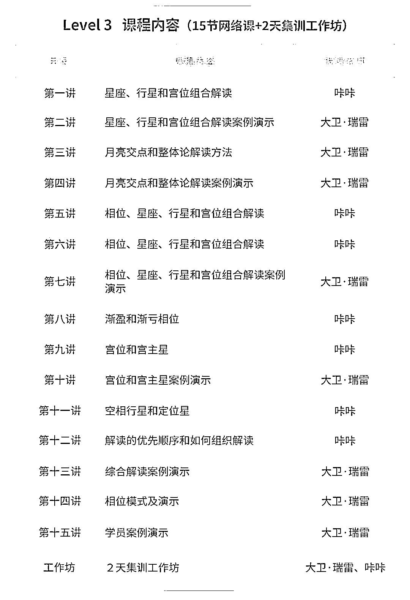

**ISAR 认证职业占星师的独有培训**

目前占星学的培训市场鱼龙混杂。而 ISAR（国际占星研究协会）是一个包含了 47 个国家在内的国际占星组织，多年来致力于占星的教育和研究，提升占星教育的品质和职业占星师的能力，在国际占星领域备受尊重。

**2022 年，鉴于对若道在占星教学领域所做的持续努力和高品质的课程服务，ISAR 特别授予若道核心课程为 ISAR 文凭课程，所有在若道学习，并通过若道毕业考试的同学将获得 ISAR 颁发的学历文凭（Diploma）。**

如果你想更多了解 ISAR，请点击[【这里】 ](http://mp.weixin.qq.com/s?__biz=MzA5NjA0NTAxNg==&mid=2651475298&idx=1&sn=b91888b54c14e29068f8b4e2a3452f5d&chksm=8b48ffd5bc3f76c32699f20f5c99e978bbb25551e69d80c70fee361acbd930ba5970ae776cdc&scene=21#wechat_redirect)

**开课时间和课程费用**

**８月 30 日开课，每周一次，20:00-22:00，25 节课+2 天工作坊。**

**★ 1-3 阶 连报**

**课程费用：11500 元 **

**你也可能想学更初阶或者更高阶：**

**★ 1-2 阶　****课程费用：3500 元 ****★ 1-5 阶　连报**

**课程费用：46500 元 **

**退转课程**

**退款原则请详看《教学协议》，如有疑问请咨询课程顾问。**

****2022 L1-3 认证职业占星师文凭课程****

**授课老师：大卫·瑞雷、咔咔**

**直播课开课时间：2022 年 8 月 30 日（周二）**

**授课方式：******网络授课，英文/中文授课，中文翻译****

**费用：**11500 元

**课程负责人：王老师**（微信/手机：18510107057，请备注“大卫核心课”）

长按二维码添加课程负责人咨询

****报名直达入口****

# 年度激烈天象趋近，该如何布局？ | 梅里曼 9 月上证+黄金报告上线！

> 原文：[`mp.weixin.qq.com/s?__biz=MzA5NjA0NTAxNg==&mid=2651486495&idx=2&sn=d681566cec62bbfc65d52ace142e8169&chksm=8b48cba8bc3f42be051792b8875a410498ab49f82d7f8ccc487c9a15f65df6d91b7758607a93&scene=126&sessionid=1692737766#rd`](http://mp.weixin.qq.com/s?__biz=MzA5NjA0NTAxNg==&mid=2651486495&idx=2&sn=d681566cec62bbfc65d52ace142e8169&chksm=8b48cba8bc3f42be051792b8875a410498ab49f82d7f8ccc487c9a15f65df6d91b7758607a93&scene=126&sessionid=1692737766#rd)

在 8 月份的上证指数报告（报告涵盖期限一般是 7 月中旬到 8 月中旬）中，梅里曼老师指出：（在 7 月），**“最近的价格活动表明 5.5 年周期呈现为 33 个月半周期（两阶段模式）的可能性更大。半周期的范围是 27-40 个月，看起来大幅下跌至 4 月 27 日（第 39 个月）的低点 2863 完成了第一个半周期。倘若如此，7 月开启了更大的 5.5 年周期中的第二个 33 个月半周期的第 3 个月。”**

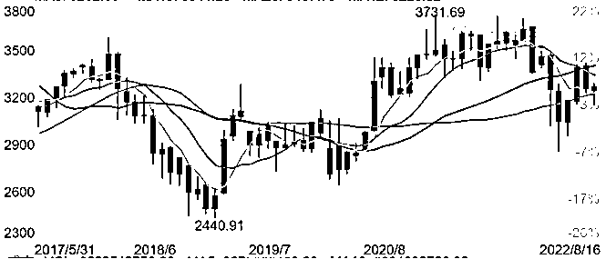

| 上证指数月 K 线图

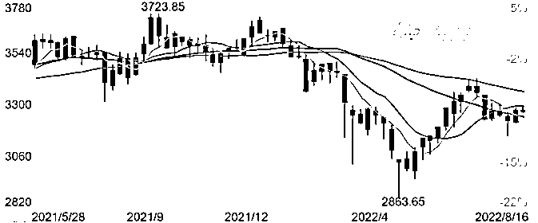

| 上证指数周 K 线图

报告中提到：**“从 7 月 13 日持续到 8 月 26 日，中点是 8 月 4 日。在这一时期，火星将在金牛座合相天王星和月亮北交点，它们都会与土星形成四分相，这些相位主要发生在 8 月 1 日-7 日。”**

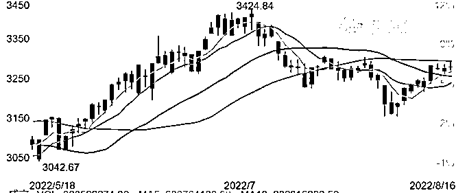

| 上证指数日 K 线图

从日 K 线图我们可以看到，上证指数在火星合相天王星、北交点四分土相的 7 月 13 日到 8 月 4 日期间是一个下跌的走势。从 8 月 5 日开始，上证开始了反弹。在 8 月份的报告中还有这样的陈述：**“8 月的征象实际上是即将到来的第二个强有力的地球宇宙学时间段 9 月 21 日-28 日可能会发生的事件的序曲。届时外行星木星、土星和天王星会形成紧密的相位配置。8 月的设置会由火星为这个更大宇宙配置的展开‘传递’能量。有时候这种‘传递’能量的时期会形成实际的低点或高点，有时候低点或高点发生在更大的行星设置形成的时期。”****“届时不仅土星非常接近与天王星的精准四分相，太阳系最大的行星木星还会处于两颗行星的中点，分别与它们形成精准的八分相。木星是与夸大相关的行星，所以市场的超大幅上涨或下跌可能在这段时间的 6 周之内（8 月 11 日-11 月 14 日）开始或结束。越接近 9 月后期，这股宇宙能量就越强烈。”**

**我们已经靠近强有力的土木天征象了。13 周-20 周的基本周期也到第 16 周了。接下来市场会出现强劲上涨还是猛烈下跌？**

金融占星大师雷蒙德·梅里曼的《2022 年 9 月上证指数报告》已上线，你可以听听梅里曼老师的看法。《2022 年 9 月黄金报告》也已上线，欢迎购买。

**此外，6 月 23 日雷蒙德·梅里曼的《2022 下半年金融占星投资沙龙》，将帮助你对 2022 年下半年的市场风云变化加深了解。**

**扫描下图二维码了解详情**

▼

**投资有收益，投资有风险，希望金融占星学的研究帮助你更好地评估你的投资。**

**9 月上证报告上线**

**上证指数月度报告价格****单月报告**：280 元/月 **季度套餐价格**：780 元（260 元/月）**年度套餐价格**：2400 元（200 元/月）**双报告年度套餐更优惠（直降 900 元）****12 个月黄金报告+12 个月上证指数报告：仅需 3900 元****长按下图识别二维码购买上证指数报告**
▼

“**黄金是金钱。其他的只是信贷。**

**——约翰·皮尔庞特·摩根**

”黄金从 4 月 18 日高点 2003 美元跌到 7 月 21 日低点 1678 美元，跌幅达 16%。在 7 月 19 日发布的 8 月度黄金报告中，梅里曼老师说：**“我们还是倾向于将双底支撑区域 1673-1678（+/-25）作为主要支撑。”****“上周（7 月 4-10 日）金价跌至 1726，尽管这也可能是低点，但我们更希望看到金价在大约 3-6 周内下跌到更低的价位。”****“我们建议在未来 3 周内平仓所有空头，特别是在 1650-1725 左右有报价时，并且做多。”**从 7 月 21 日开始，黄金开始反弹。目前，黄金反弹至 1807，在不到 20 天的时间内，反弹幅度为 7.68%。

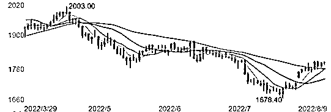

| 黄金日 K 线图

7 月 21 日，正好是报告指出的土星半四分木星的 1 个 1 星标记的反转时间。对于黄金的短线操作者，类似的 7%反弹其实还是大有盈利可为之处。不要小看 7%的反弹盈利，毕竟，这短期的操作远远高于 1 年期的定期存款利率。上个月的黄金报告还指出：**“我们将重点关注引言中所提到的 8 月 4 日+/-10 天和 9 月 21 日-28 日+/-1 周。这两个时间段都可能出现 16 个月周期的低谷。”**8 月 4 日+/-10 天是火星、天王星和月亮北交点合相四分土星期间，这个 7.68%的反弹我们已经看到。**问题是，反弹是到此为止，开始下跌知道 9 月 21 日-28 日+/-1 周反转；还是反弹继续直到 9 月 21-28 日+/-1 周呢？**9 月份黄金报告已经上线，上证报告也将在下周上线。欢迎了解。也可以按照季度和 1 年期订阅，有更多优惠。季度和年度的好处是，你可以持续了解梅里曼老师对于不断在变化的市场的看法。即便他某一次看法和市场不一致，你也看到在下一期他如何调整自己的看法，并看到金融占星在一个长期时间段内对你把控风险的帮助。而能够长期控制风险、尽量找到安全的投资时机才是投资的长久之计。点击阅读原文，雷蒙德·梅里曼黄金周期 2022 年 9 月报告带来有 40 年黄金市场研究经验的世界著名金融占星大师雷蒙德·梅里曼对当前黄金市场的研究。

**9 月黄金报告上线**

**黄金月度报告价格****单月报告**：280 元/月 **季度套餐价格**：780 元（260 元/月）**年度套餐价格**：2400 元（200 元/月）**双报告年度套餐更优惠（直降 900 元）****12 个月黄金报告+12 个月上证指数报告：仅需 3900 元****长按下图识别二维码购买黄金报告**
▼

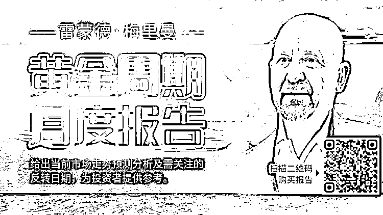

**购买者需知**

**① **梅里曼市场时机学院《中国上证指数月度研究报告》是梅里曼市场时机学院（以下简称 MMA）的研究“预报”，而不是市场“预测”，是梅里曼老师及 MMA 金融占星分析师对人类活动周期历史与行星周期之间相关性的研究，二者在大部分情况下具有 80%或更高的相关性，而不是因果关系。报告中的研究完全存在错误的可能性。即便是非常认真的研究和几十年的研究经验，金融占星师无法总是正确地解读出各种征象在实际层面上会如何相互作用，并显化为事件结果。

所以请将报告看作一个研究参考，务必结合其他市场研究和你个人对市场的理解，根据你的自由意志做决策。

**②** 此报告一旦售出，**即不接受退款。**

**③** 上证、黄金月度报告每月固定 1 期，**并非都是在每月相同日期发布。**

**④** **我们收到英文报告的当天，即发布该英文报告。3 天后，上线报告中文版。此报告仅支持手机网页阅读，不支持电脑阅读和下载。****以上须知，请仔细阅读。一旦付款，即视为已了解并接受所有须知内容。**在过去的 40 年中，唯有梅里曼逐渐完善，并在梅里曼市场时机学院月度周期报告中阐释了将地球宇宙学与周期相结合的研究方法，以惊人的精确性预报了黄金价格发生重大变化的时间。**黄金购买 Tip**

各大银行均可购买黄金或黄金 EFT 基金，也可以在诸如天天基金或者支付宝购买黄金及黄金相关产品。不明白的可以百度搜索。

**购买后如何查看报告？**

**购买后有疑问怎么办？**请联系技术客服
**微信：nodoor201705**

**购买报告直达入口**

# 害怕分开，不敢吵架的人，心底可能都有这种焦虑

> 原文：[`mp.weixin.qq.com/s?__biz=MzA5NjA0NTAxNg==&mid=2651486495&idx=1&sn=b43a7fc6a4f382b05332645d61b1d1a6&chksm=8b48cba8bc3f42be2174f7eb14f7866ec98f0db2833adc281ca46da5cb9bf7dd79136ad35871&scene=126&sessionid=1692737766#rd`](http://mp.weixin.qq.com/s?__biz=MzA5NjA0NTAxNg==&mid=2651486495&idx=1&sn=b43a7fc6a4f382b05332645d61b1d1a6&chksm=8b48cba8bc3f42be2174f7eb14f7866ec98f0db2833adc281ca46da5cb9bf7dd79136ad35871&scene=126&sessionid=1692737766#rd)

****************☆ ****************************后台****************************回复“今日”，给你一句生命态度****************

********************************

作者/雪冥 ISAR 认证占星师编辑/玫瑰 图片/pinterest 星图非常的奇妙，从一个个相位关系可以更深入的理解一个人，有时不需要言语，体会也同样深刻。通过这些配置，可以看到一个人内在的心理动机，可以感受到如何演绎成现在发展的面向。今天，我们来说说月亮与天王星组合下的心理发展。**月天相位的分离焦虑**当月亮与天王星碰撞在一起，会显化多种模式，掌管情绪、情感的月亮遇到了抽离的天王星，**星图主人的情感被抽离了**，对外形成**超理智**的表现，或许他认为情绪太过于脆弱，**为了不让自己软弱而选择抽离它的模式呈现**。比如**现实层面的不断搬家**，**月亮是依恋的场所，是港湾，是家，天王星是不稳定的分离**，于是**与家不断分开**的戏码在人生中上演；再比如月亮的困难相位引发出不太舒服的情绪，而天王星是分离的代名词，于是**担心分离、害怕分离**的情绪会由此引发。在心理学中，我们称之为**分离焦虑**，主要源于**幼年时期与母亲的分离，可能是短暂分离也可能是长期分离，给当事人带来了对分离的担忧与焦虑，而母亲恰恰也是月亮的代表人物。**接下来的篇幅，我们主要从心理占星的角度剖析与月天相位相关的分离焦虑，也为广大带着分离焦虑议题生活的读者找到一个减缓这种焦虑的出路。

**什么是分离焦虑？**

说到分离焦虑，我们首先要明确**什么是焦虑，以及焦虑的表现。**先来说焦虑，一定程度的焦虑水平是让我们可以更好地适应生存的情绪机制，可以更机警地发现生活中的“安全”隐患，使我们做出更为优化的选择，去避免一些不好状况的发生。**而当焦虑水平过高时，就会形成一种对尚未发生事情的过度担忧。**这种过度的担忧还容易引发一些躯体症状，比如**心悸、气短、反应迟缓等，严重的引发惊恐发作。**而**分离焦虑不言而喻就是因着分离或可能分离导致的过度焦虑的表现。**从心理学的角度讲，**分离焦虑是在幼年时期与重要养育者分离产生的创伤情绪，最重要的养育者是与我们有着依恋关系的母亲**，这一点也更印证了占星学当中月亮与母亲身份的同一性，**无论是母亲、依恋、分离焦虑的情绪都与月亮无法分割。**这种创伤会带到成年，泛化到各种关系当中，包括亲密关系、同事关系、密友关系等任何与分离相关的事情都会导致焦虑的形成。**幼年时期的创伤越严重，成年时期的心理“症状”表现的也会更为严重。**

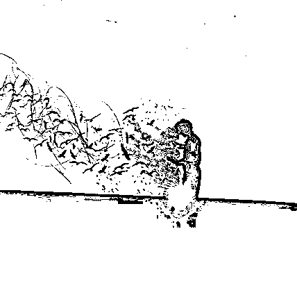

**不断地同亲密关系的伴侣分手；不断有好朋友（好闺蜜）突然与自己中断联系；不断被公司辞退；不断被母亲或其他依恋关系的人员推远……**我们的内在系统让我们自己不断重复这个模式，不是为了增加这个伤痛，而是为了使我们**看清真相，突破这些不顺畅的能量而带来的枷锁，是一种本能的修复系统的反应**，只有走了一条不一样的路，让这个伤痛的模式突破，才会带来新的发展。然而由于自身焦虑和恐惧，由于这些固化的信念，往往让我们走向了更为熟悉的道路，于是，“被抛弃”、“被遗弃”的戏码不断的重复上演，哪怕自己不断地丢失自己去迎合别人，不断地去讨好也无济于事，好像自己被陷入了深深的诅咒之中，分离焦虑也愈演愈烈。**星图中的分离焦虑**

****1. 核心版分离焦虑****

**形成原因：**心理学中，分离焦虑的形成原因通常是在**幼儿时期**，比如父母都是双职工的家庭里，没有长辈协助抚养孩子的情况下，就会不得已在很早的时期就把孩子送到幼儿园。
这个时期，如果没有对孩子的情绪进行关照，再加上孩子到一个新环境的不适应没有引起家长的过问和重视，就很有可能会给孩子造成创伤。潜意识埋下了**“我失去了父母的爱”、“我被抛弃了”**这样的信念，导致成年后对“被抛弃”有着异常敏感的情绪，在尚未“被抛弃”时就引发各种举措来避免这件事情成真，这些措施包括**先抛弃对方或讨好对方。**但并非所有这样被带大的孩子都会有分离焦虑的表现，除了养育环境还需要看到个人特质，占星学给了我们非常好的视角去了解个人特质，作为咨询有效的诊断及疗愈方法。**星图配置：月亮与天王星的合相、四分相、对分相、梅花相。**

**状态表现：**

月亮代表了我们的情绪与情感，天王星代表了突发变故和分离。合在一起引发了分离焦虑的情绪。如果这配置再遇到**木星的扩张**、遇到**处女座的广泛焦虑**，会使得分离焦虑更加严重几分。

他们会**很难和对方进行争执，会在引发争吵前妥协**，会有一种**“如果争吵下去就会引来对方的抛弃”**的潜意识信念；会在**意识到“分离”来临前就开始呼吸急促、慌张和焦虑**，哪怕这个意识到的“分离”只是自己的疑心；**哪怕即便分离会带来更好的生活也不能缓解他们焦虑的情绪。**

**甚至离职这样一个正常的行为都让他们难以抉择**，为了避免焦虑感，他们通常会在一家企业中一直就职很多年，放弃更好的发展机会，直到被迫离开，而这种被迫又再一次重现了曾经的被抛弃，也再一次引发了焦虑感的产生。

**具体在生命中哪一个领域演化，还要结合宫位进行判断。**

这种对分离过度焦虑的表现，不仅仅是因为当下的事件，更多的是**对最初事件的伤痛以及不断强迫性重复导致的综合结果**，使这个分离焦虑的情结逐步放大，慢慢泛化到各个角落，影响生活的方方面面。

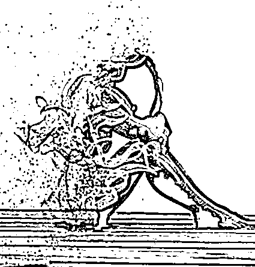

****2. 升级版分离焦虑****

**形成原因：****孩子幼年期有重要亲属的丧失，这丧失有可能是离世，也有可能是父母的离异后有一方从生命中消失，同时也有可能是自己成为了留守儿童**。**·** 如果没有在重要的阶段对这种丧失进行干预，也可能让孩子产生一种**负罪感，潜意识认为自己不值得被爱，把罪责归到自己身上，来缓解被遗弃的“现实”情况**；**·** 也或者他们会**强烈认同丢下他们的人，潜意识埋下“自己就是那个应该被抛弃的人”**，从而在潜意识的影响下**不断地找寻可以“虐待”自己的对象与自己分离，来满足自己应该被遗弃的信念，以此来怀念那个最初“抛弃”自己的重要亲属。**而这些都是头脑所意识不到的，只是在不断地挣扎着寻求解脱。

****星图配置：****

**·** 月亮在天蝎座，与天王星形成合相、四分相、对分相、梅花相；**· **天王星在天蝎座，与月亮形成四分相、对分相、梅花相；**· **月亮与天王星形成合相、四分相、对分相、梅花相的同时，与冥王星形成合相、四分相、对分相、梅花相；**· **月亮或天王星落入第 8 宫，并形成合相、四分相、对分相、梅花相；**· **月亮与天王星形成合相、四分相、对分相、梅花相的同时，与落入 8 宫的行星形成合相、四分相、对分相、梅花相；

****状态表现：****

升级版分离焦虑会有两种不同的呈现方式：**第一种，分离恐惧。**焦虑已经无法诠释他们的内在感受了，有了天蝎座、冥王星、8 宫的介入，让**更深度的恐惧感替代了焦虑的情绪**，就好像牙疼的时候砸伤了手指，瞬间牙就不疼了。那并不是真的牙不疼了，而是手指的疼痛更为剧烈，牙齿的疼痛被忽视了。他们会在伴侣没有接听电话时恐慌，担心对方从自己的生命中消失；他们会在工作中不断妥协和承担，生怕做得不好被批评后因被劝退导致分离；他们会不敢和朋友争辩，担心朋友会和他一拍两散。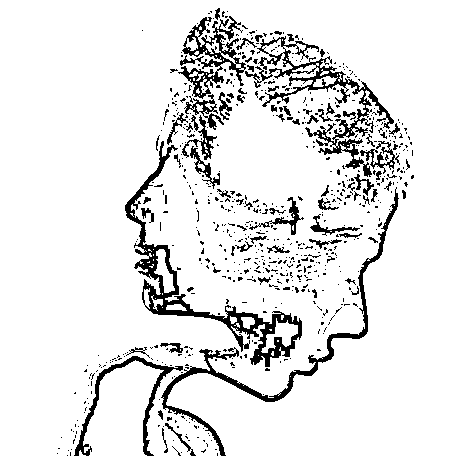他们逐渐学会了讨好，学会折损自己的利益去满足对方，这“对方”可能是关系中的任何人，也可能是自己所在的企业或机构，只要是让他们感受到依恋的，都是引发他们分离焦虑的对象。他们不断地在以行为告诉这个世界：“求求你不要离开我，我什么都给你！”然而，世界给他们的回应大多都是当头一棒，虐完之后让他们经历再一次被抛弃。也迎合了他们潜意识中那个自己不值得被好好对待的信念。**第二种，情感隔离。由天王星和冥王星共同的能量压迫形成**。与情感的抽离相比更甚，不单单是因为不适应情绪而找到更舒适的个体显化模式，而是**无法涵容曾经的伤痛所选择的割裂。**这种表现通常是因为承受了本身无法承担的情绪体验，只能让自己置身事外，才能更好地面对生活。当他们讲着曾经发生的伤痛事件时，好像在讲笑话，又好像和他全然无关。在生活中遇到分离事件时，他们也会耸耸肩，似乎在说：没所谓。与他们的交流中感受不到一点情绪的感受，似乎被这些事件带来那种“惊心动魄”、“触人心弦”、“提心吊胆”感受的只有你自己。没有因为他已经度过了而引发的轻松感，反而心依然在揪着。那是因为，你真的体验到了他隔离掉的感受。他们就这样，总是以一种自己是旁观者的身份过着自己的生活。一个旁观者，又怎会深入情感之中？这也只是他们的一种自我保护，只是因为无法承受住最初事件的巨大伤痛，更无法让自己加深这种体验。而当生活之中出现一位可以支持到他们，让他们有安全感放下防御，使他们可以去面对一切的人时，情绪将如供水滔天一般涌出。**现实生活中，有些升级版分离焦虑的人群分别带有这两种表现，一边隔离着情感，一边恐慌着害怕分开。**

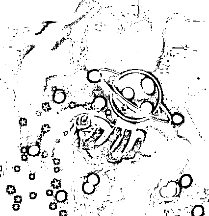

**如何减缓甚至摆脱分离焦虑？**

****缓解当下的焦虑****

无论是核心版分离焦虑，还是升级版分离恐慌，处在分离焦虑的事件当中，都需要**先缓解当下的焦虑状态。**焦虑中的人就像热锅上的蚂蚁，想让他们静下来的念头也只是没有真正对他们感同身受的表现。所以，首先要做的是**承认自己焦虑的状态，理解自己因害怕分离而导致的恐慌和焦虑，承认自己有这样的情绪，并且认可自己有这样的情绪并不丢人。允许自己和这个焦虑的状态多待一段时间。**通常分离焦虑时会引发一些**灾难化**的表现，好像**分开就迎来了世界末日，无法独自生存下去，要面对来自潜意识的焦虑感甚至是恐惧；**或者**给自己贴上失败者的标签，甚至认为弱者无法生存，要从意识深处抹杀自己。**

这时，可以用一些问题来面质这些歪曲的认知，比如：

**· 分开了会怎样？是否真的无法活下去？**

**· 我真的是失败者吗？我有没有成功的时候？**

我们成功地出生在这个世界上，成功地学会了走路、吃饭、说话、阅读、写字，每一个鲜活的生命都是成功的。当接纳自己焦虑的情绪时，这种焦虑的水平就会降低，在降低了焦虑水平之后，也可以适当地进行梳理和思考。

经过一些问题的询问之后，会发现好像分开了也不会怎么样，我也并不是个全然的失败者，没有谁可以一生都成功。在清晰的梳理之后，焦虑的水平会再次降低。

**找出分离焦虑的原始事件**

如果一味地揪住当下事件去解决，虽然可以一定程度上缓解对于当下事件的焦虑，但对彻底摆脱影响来说确实无济于事，好似头痛医头脚痛医脚。每一次有分离的事件都会引来分离焦虑的体验。想要彻底疗愈和转化，需要找寻根源，**找到最初引起自己分离焦虑的事件，找到自己潜意识的信念。**这方面可以依靠潜意识流动的不断浮现，也可以依靠星图寻找线索。**当看到最初事件，并理解那时的自己，愿意体谅自己和事件中的其他人，愿意放开紧抓不放的那只手，转化也将随之发生。也会迎来重新做自己人生主人的机会。**

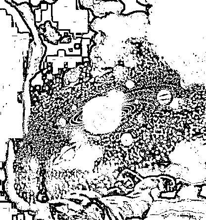

**案例说明**小强（化名）在不到 3 岁的时候被送到幼儿园整托，虽然心有不悦但从未哭泣，哀伤的情绪（月亮）被天王星的理性所淹没，情感也被隔离了起来。6 岁那年，妈妈因为父亲没钱离开了这个家，去了外地生活，小强再也没有见过妈妈。成年后谈过几任女朋友，交往时会很小心谨慎，担心她们会像妈妈一样离开自己。百般呵护，但依然没有维持住关系，陷入焦虑和自我贬低之中。

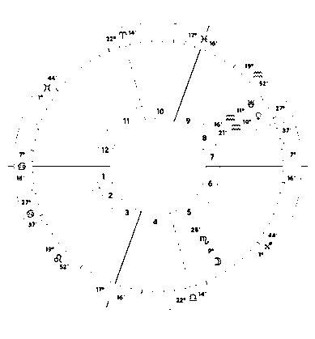

| 案主星图中的部分行星（经案主同意发布）小强的星图中金星合相天王星在 8 宫，四分月亮天蝎座。因为童年事件的分离焦虑，小强无法在关系中袒露自己的心声，于是隔离自己的情绪，不表露自己的需求，也让对方无所适从，好像在关系中无法找到自己的位置。小强一直以来因为自己内心的恐慌所作出的表现，这些隔离情绪的做法无法被读懂，在对方的感受来说是被不重视，不被需要的，甚至是被推开的。这样的关系，一方追，一方逃，追的一方不知道对方为什么逃，更多感受到的是自己被伤害，逃的一方又不给任何理由。分开也是自然而然的事情。**而月亮作为 2 宫主在天蝎座，也引来了价值感匮乏的议题。**导致更加没有勇气表达自己的情感，好像天生就会被拒绝，为了缓解价值感被挫败，干脆就更加不去表达。

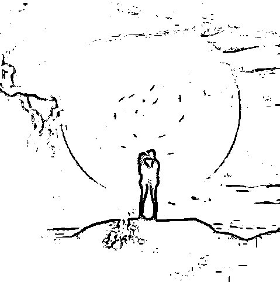

深度的探索浮现出了潜意识的议题，在小强的潜意识中认为，如果小时候自己没有说出想要学画画，爸爸妈妈就不会吵架，在那次吵架之后，妈妈就走了，所有都是自己的责任。不是妈妈“抛弃”了我，而是我犯了错误，这个信念比我被妈妈“抛弃”了，在一个孩子心里要容易接受的多。**也由于这个自己犯错的信念，导致他不敢对其他人有自己的要求，好像只要一有要求就会被“抛弃”。**看到这些后，恐慌会减少，但不会彻底消失，依旧需要**利用自由意志去突破，勇敢地带着恐慌去表达，事件的结果会不断地回应与我们的焦虑相反的结果，随着这种结果的增多，恐慌也会不断的减少。**目前小强还在不断转化的过程之中，我相信最终的结果是，他将找到一个既可以和他有深度的情感交流，又可以理性沟通，并认同相互差异的亲密伴侣，达到金天合相水瓶座 8 宫四分月亮天蝎座的和谐发展。对于情感隔离的月天人，如果没有碰到冲突事件，就这样过上一生，也是一种选择。只要当事人不觉得有问题，所有都不是问题。如果不能一直陪伴当事人度过，没有技术可以帮助他找到替代现有防御机制的方法，就不要去触碰，相信他的人生路，可以自己走好。当他真的做好要改变的准备时，宇宙都会帮助他。最后，希望所有的月天人，能够摆脱分离焦虑的影响，步入和谐而稳定的各种关系之中。

**版权声明：**原创文章由作者授权首发于若道平台，欢迎转发，反对抄袭。友号转载请申请白名单。

**END****雪冥 **ISAR 认证占星师（2019 年获得），全职心理占星师 美国心理占星学院认证心理占星师 北师大心理学学士，11 年心理咨询经验 **个人公众号：**POWER 心理**咨询微信**：psychology-xm

长按打赏

**20 位来自世界各地的占星师****带来 19 场沙龙——新世界的觉醒****详情可点击下图**

**学习占星学****点击下图了解课程详情**

**微信又双叒叕改版啦，不想错过若道君的推送？**

**就把若道设为星标吧！**

**▼**

**喜欢就点一下“在看”吧！**

********报名直达入口********

# 明天开讲丨大国命运：经世占星学 3 天线上工作坊

> 原文：[`mp.weixin.qq.com/s?__biz=MzA5NjA0NTAxNg==&mid=2651486251&idx=2&sn=6e203057149a160a1ffe88e167ae7f7f&chksm=8b48ca9cbc3f438a891c22fc99dc4418cd19d7688460bc5181810af780b2794185d9b50256ad&scene=126&sessionid=1692737766#rd`](http://mp.weixin.qq.com/s?__biz=MzA5NjA0NTAxNg==&mid=2651486251&idx=2&sn=6e203057149a160a1ffe88e167ae7f7f&chksm=8b48ca9cbc3f438a891c22fc99dc4418cd19d7688460bc5181810af780b2794185d9b50256ad&scene=126&sessionid=1692737766#rd)

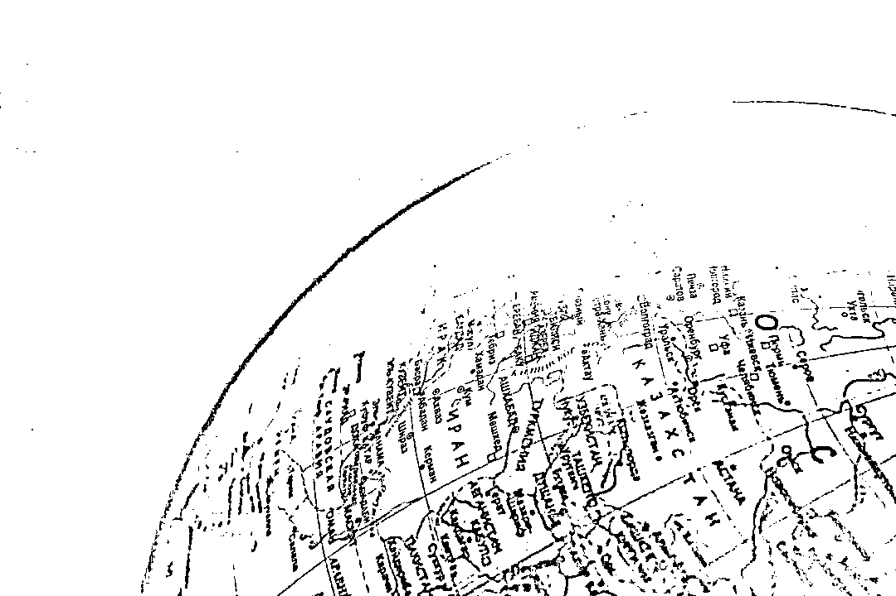

<mpvideosnap class="js_uneditable custom_select_card channels_iframe videosnap_video_iframe wxw_wechannel_card_horizontal" data-pluginname="videosnap" data-id="export/UzFfAgtgekIEAQAAAAAAfGQB6vQCmQAAAAstQy6ubaLX4KHWvLEZgBPEioJES3BsLK2DzNPgMIsb3nmx3ZXbJKLT1wm45TIu" data-url="https://findermp.video.qq.com/251/20304/stodownload?encfilekey=rjD5jyTuFrIpZ2ibE8T7YmwgiahniaXswqzJqIdveK37RFTeWicFUib7AWD2xnn8iahx0rpMszBgKBAtKicWHDyVeXoOJHYevZXkhfJkmNmz7Efd0DcYdUekYnarA&amp;adaptivelytrans=0&amp;bizid=1023&amp;dotrans=0&amp;hy=SH&amp;idx=1&amp;m=&amp;scene=0&amp;token=AxricY7RBHdVQsXFuaGib0g8Jumv41gZ9xiajOXct5c2j4asexzhVdKzpPLQVlyibSYXZzHGtBVeLmQ" data-headimgurl="http://wx.qlogo.cn/finderhead/PiajxSqBRaEJYnVsqWfEX9qA0sI6hNVKsDfyzfPZ92WZMZyBpZWU5NA/0" data-username="v2_060000231003b20faec8c4e68a1ec2d4ca07e434b07755bbf47e7053a3059defd2c9d6c68a20@finder" data-nickname="若道" data-desc="#ISAR 选修课 经世占星学是什么？会教授哪些知识内容？8 月经世占星工作坊，来提前了解一下" data-nonceid="3653579416430381618" data-type="video" data-width="640" data-height="368"></mpvideosnap>

有一些岁月经历的人，会非常清晰地看到，我们每个人的命运都和国家的命运紧密联系在一起。

以俄国人为例，不论每个俄国人有什么样不同的个人星图，31 年前的苏联解体，今年发生的乌俄战争这样重大的事件，毫无疑问影响了俄国 2 代人的命运。而在一些关键时间点个人的选择，毫无疑问，又影响了个人的生命历程。

而只要你关注世界局势，你也会看到，这样的一个国家发生的重大事件又会对其他国家的各个方面发生重要影响。

我们的命运、我们所获得的事业的发展机会、我们的财富机会都是和整个时代和国家息息相关。

**因此，一个好的占星师必须要懂得时代的声音，必须要洞悉全球的趋势，必须要懂得国家的故事。**

在这个工作坊中，我们将学习**如何专注于能够理解世界大事并对它们做出准确的预测。**这将带领我们踏上**一段重要的行星周期之旅，并延伸到重要国家和世界领导人的星图。**现在正是学习的好时机！

2020 年 12 月，木星与土星合相，这是 800 年来这两颗行星首次在水瓶座合相，预示着地球以及政治和社会趋势将发生巨大变化。我们正在进入一个令人兴奋的奇境，非常适合探索经世占星学。

邓肯老师说：

****

**学习经世占星学，我们可以依靠占星师们过去使用一些技法所做的预测，我们将在这个工作坊中进行探索。**

**比如：占星师迈克尔·贝金特在 1982 年，苏联解体事件发生 7 年前，就对苏联做出如下预测：**

**“从 1989 年 1 月到 1991 年 11 月……在领导和统治风格方面……国家将进行一些基本的重组。这一时期将预示着一些新的革命……严密的控制结构将失败，国家将崩溃，重新回到过去的众多自治国家。”**

**而占星师罗伯特·佐勒在世贸中心遭到袭击前一年的 2000 年写道：**

****“从 9 月份开始，我们西方正进入一个危险加剧的时期……尤其是在东海岸……这将招致乌萨马·本·拉登等冒险家的劫掠……这是一个警钟……2001 年 9 月第一次大危机袭击美国之后，我们将再也回不到从前了。”****

**在 2020 年美国大选前 6 个月，我也写了一篇文章：**

****“他（唐纳德·特朗普）将战斗到底，美国的街道将成为战场，他不会优雅地离去，但在 2021 年，一个新时代开始了，大海将覆盖特朗普总统任期的废墟。”****

出生星图和经世星图都使用相同的基本占星技法，对每一个主题的研究都同时丰富了这两个分支。你从观察世界大事中学到的东西，可以应用到个人客户身上，反之亦然。

**工作坊内容和时间安排**

**8 月 26 日 周五 **

**14:30-15:30**

**1. 基础知识介绍**

-外行星及其在各个星座运行

-外行星周期

-国家星图

-政治领导人星图

-选举星图

-将以上各项按优先级排序

**休息 30 分钟**

**16:00-17:30**

**2. 外行星及其在各个星座运行**

-天王星入座：革命性的变化

-海王星入座：意识的转变

-冥王星入座：危机与重生

**休息 90 分钟**

**19:00-20:30**

**3. 木星-土星的合相周期**

-文明的发展

-水瓶座新电子化时代

**休息 30 分钟**

**21:00-22:00**

**4. 木星与外行星的互动**

-木星-天王星：科技进步

-木星-海王星：媒体的力量；消融，受苦和慈悲

-木星-冥王星：意识形态极端主义

**8 月 27 日周六**

**14:30-15:30**

**5. 了解社会趋势**

-土星-天王星：新的如何取代旧的；科技重组

-土星-海王星：乌托邦梦想破灭；结构消融

-土星-冥王星：独裁与权力瓦解

**休息 30 分钟**

**16:00-17:30**

**6. 长期文明变革**

-天王星-海王星：新世界秩序的梦想

-天王星-冥王星：机械的变革力量；剧变

-海王星-冥王星：意识变化的 492 年周期

**休息 90 分钟**

**19:00-20:30**

**7. 20 世纪地缘政治力量的影响**

-俄罗斯、苏联时代及其衰落

-美国的故事

**休息 30 分钟**

**21:00-22:00**

**8. 中国**

-中国作为全球玩家出现

-科技、领导力和一带一路

**8 月 28 日周日**

**14:30-15:30**

**9. 行星推进的重要性**

-预测选举的结果；特朗普 - 拜登

-预测国家的发展：以色列

-美国：扩张与收缩

**休息 30 分钟**

**16:00-17:30**

**10. 有多张星图的国家**

-英国

-法国

-沙特阿拉伯

**休息 30 分钟**

**19:00-20:30**

**11. 统治者的出生星图**

-普京：克格勃军人，2020 年代的发展

-特朗普：虚假信息之王，获胜者与失败者

**休息 30 分钟**

**21:00-22:00**

**12. 21 世纪的世界发展**

-新时代的人口和气候变化

-独立与全球化

-宗教与科学

-人际关系与游戏

**授课老师**

**艾德里安·罗斯·邓肯（Adrian Ross Duncan）**

**·** 邓肯老师 1971 年在印度游学时开始学习占星学，1985 年开始成为全职占星师，迄今执业已超过 33 年，是人本主义占星学、卜卦占星学和经世占星学领域的知名占星师。

**·** 开发了占星软件 AstroClock 和多款占星报告。

**·** 从 1971 年开始研习佛学，受佛学影响很深，他相信占星学和佛学观点统一、转化的一个基础是在于对现实感知的改变。

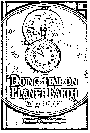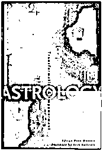

**授课方式**

**授课方式：**

**线上网络直播课，英文授课，中文翻译**

**课程价格**

**课程价格：**

**6800 元**

负责人：若道-童童

（微信：nodoorDaivd）

**退转课程**

**退款原则请详看《教学协议》，如有疑问请咨询课程顾问。**

****ISAR 选修课 | 大国命运：经世占星学 3 天线上工作坊****

**授课老师：******艾德里安·罗斯·邓肯****

**工作坊时间：2022 年 8 月 26 日-28 日（**周五-**周日）**

**授课方式：******网络授课，英文授课，中文翻译****

**费用：****6800 元**

**课程负责人：童老师**（微信：nodoorDaivd，请备注“经世工作坊”）

长按二维码添加课程负责人咨询~

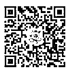

****报名直达入口****

# 经世占星丨正在经历冥王星回归的美国，谁能成为下一任总统？

> 原文：[`mp.weixin.qq.com/s?__biz=MzA5NjA0NTAxNg==&mid=2651486251&idx=1&sn=c8f86b56fd7ab17c6966a12fe1a47941&chksm=8b48ca9cbc3f438a5ef2b337ef41334f4a56f37b0dcb0fef2d5544f462d862bc4ac2dff93113&scene=126&sessionid=1692737766#rd`](http://mp.weixin.qq.com/s?__biz=MzA5NjA0NTAxNg==&mid=2651486251&idx=1&sn=c8f86b56fd7ab17c6966a12fe1a47941&chksm=8b48ca9cbc3f438a5ef2b337ef41334f4a56f37b0dcb0fef2d5544f462d862bc4ac2dff93113&scene=126&sessionid=1692737766#rd)

******☆ ****后台回复“今日”，给你一句生命态度******

作者/艾德里安·邓肯

译者/Luke 校对/Chang

编辑/玫瑰 封面/书君 图片/pexels

美国正在经历冥王星回归，这个世界大国的命运将会走向何方，而接下来的竞选中，谁又能够成为候选人并成功胜出？看看邓肯老师的分析。另外，邓肯老师教授的[【ISAR 选修课：经世占星学 3 天线上工作坊】](http://mp.weixin.qq.com/s?__biz=MjM5MjQwNjAyMQ==&mid=2649440045&idx=4&sn=9ce48d951661a5a5d3d294d5af304893&chksm=beb9504789ced951fe7dcbdaa2284bdb7258f3e4e6382c98a6017953859d2f93eece30619e95&scene=21#wechat_redirect)已上线，感兴趣的话可以点击链接查看详情哦~

**前言****上一次冥王星在摩羯座 27°时，美国殖民地正与大不列颠进行激烈的战争。**在这场战争的中间——1776 年 7 月 4 日，美国宣布独立。主要战役仍在进行中——在波士顿、长岛、怀特平原、特伦顿、普林斯顿、布兰迪温等很多地方。其中许多战斗都失败了，但是在 1781 年的约克镇，乔治·华盛顿终于得胜。那是《独立宣言的 5 年之后，那时冥王星已经进入水瓶座。**美国诞生于冲突之中，怀抱着一个信念——坚信武装革命是正义的。****宪法第二修正案确保了拥有武器的权力。如今 40%的美国人住在有枪的房子里。每个枪支持有者平均拥有 5 件武器。**68%的共和党人相信 2020 年大选是从特朗普那里被窃取走的。共和党人拥有枪支的数目是民主党人的两倍。30%的共和党人（根据 PRRI 民意调查）相信，“真正的美国爱国者可能不得不诉诸暴力来拯救我们的国家。”2022 年，冥王星回到了摩羯座 27°。我们应该担心吗？

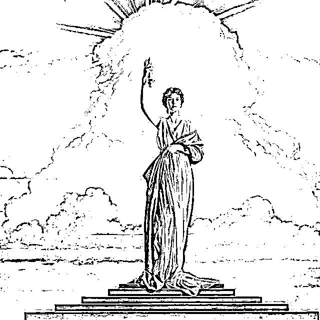

**冥王星和社会革命**

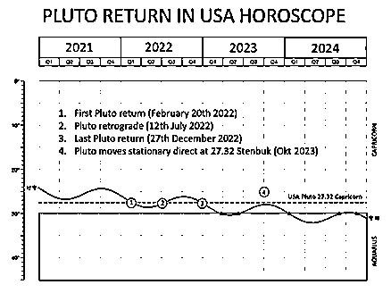

| 美国的冥王星回归

图释：1. 第一次冥王星回归（2022 年 2 月 20 日）2\. 冥王星逆行（2022 年 7 月 12 日）3. 最后一次冥王星回归（2022 年 12 月 27 日）4. 冥王星顺行停滞于摩羯座 27°32‘（2023 年 10 月）**上一次冥王星从摩羯座进入水瓶座，伴随着以法国和美国革命为标志的动荡时期，深刻地改变了全球政治版图。**历史可能不会完全重演，但它会回响，所以有充足理由相信，**类似的动荡在 2020 年代即将发生。**但美国会发生什么，尤其是 2025 年 1 月，理论上下次总统大选获胜者举行就职典礼的时候？**中期选举**尽管拜登以 306 张对特朗普的 232 张选举人票，清楚赢得了 2020 年大选，但共和党人在国会翻转了 15 个席位，减少了民主党的多数席位。如果共和党人在中期选举多赢下几个席位，他们就能控制众议院。如果他们在参议院多赢下一个席位，那么他们也能控制参议院。反对党在中期选举时这样做并不罕见，但是在 2022 年，可能会发生完全出乎意料的事情。

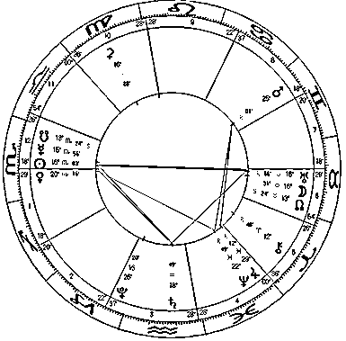

| 中期选举，2022 年 11 月 8 日，华盛顿特区上午 7:00。（上升：天蝎座 18°）

**2020 年和 2022 年 11 月的美国选举，是不同寻常的，因为金牛座的天王星对分天蝎座的太阳。这是动荡和叛乱的标志。****但是 2022 年的中期选举星图也同样令人担忧，因为当投票站在 11 月 8 日开启时，月亮准确合相天王星，对分太阳、金星和水星——所有都位于上升-下降轴线。**此外，还发生了月全食。当投票站在日出前开启时，失去光明的月亮消失在西方地平线上。**如果月亮代表人民，情绪是愤怒和黑暗的。**这张星图显示了一个**两极分化、陷入僵局的国家**，它与前总统特朗普的星图相呼应。他也生在一次月食（太阳双子座-月亮射手座）合相天王星下，他的影响力就像一道闪电，把这个国家劈成两半。可能也重要的是，**中期选举的中天，正好位于特朗普的上升和火星。如果共和党一切顺利，他可能会在此次宣布参选。**月食合相天王星，代表某些意料之外的事发生，但会是什么？如果共和党人控制了两院，那不是个意外。倘若民主党人获得了多数呢？倘若民主党人守住或加强了他们的堡垒——那就会是再一次“大选盗窃“。如果你是美国的“爱国者”，你会捍卫这个结果吗？这有可能发生，因为**月食在金牛座，可能稳定胜过了分裂，并且极端的经济环境是这次选举的特征。**当然，**通货膨胀的影响力是非常强的，并且四月初在双鱼座的木星-海王星合相可能助长通胀，这是吹到最大的泡沫了。**值得注意的是海王星的位置，**双鱼座 22°49′，准确对分美国处女座 22°25′的海王星**。中期选举时，双子座的火星四分海王星，几乎准确重现了美国星图里火星四分海王星的主题。**逆行的火星将与海王星完成三次四分相，分别在 2022 年 10 月、11 月和次年的 3 月 23 日。**显然，**美国将进入一段混乱时期，显得毫无方向和虚弱。**这可能与外交事务的混乱有关，因为美国星图里，火星在 7 宫海王星在 9 宫，但这一相位也与**黑人和奴隶制历史**有关，因此**“黑命贵”运动可能变得极其活跃。火星-海王星四分相也和美化枪支，以及它们带来的苦难有关。**

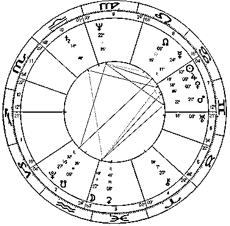

| 美国（Sibley 版）1776 年 7 月 4 日。17:11，费城。（上升：射手座 12°21‘）

所以在中期选举时，行进冥王星合相美国的冥王星，行进海王星对分美国的海王星，这是外行星的双重打击，唤起**内秉的动荡和解体的力量**。这对共和党的影响可能多过民主党——在共和党 1854 年 3 月 20 日的出生图中，特朗普的到来对应了这张图的天王星和海王星回归，很好地说明了他的破坏性影响。由于水星在日核中（Cazimi，合相太阳 17′内），此时公众可能强烈关注拜登总统的年龄或他的认知能力，这将是副总统卡马拉·哈里斯地位上升的好时机，因为届时水星越过太阳与金星合相，接力棒可能被传递。**但这也是一个危险的时刻，可能出现更多暴乱的威胁。****2024 年大选候选人****特朗普会成为 2024 大选的候选人吗？****共和党 2024 年大选的推进星图中，太阳在处女座 14°，对分双鱼座 14°的海王星，四分双子座 15°的推进土星。**这看起来更像是**失败、解体和损失**的征象。**共和党的星图上太阳在白羊座 0°，将受到 2025 年-2026 年土星-海王星合相的重大影响。**这可能意味着**这个政党正在舔舐自己的伤口，完全重塑自己。**这些行进似乎没有显示出特朗普会成为候选人，但**倘若他是，那么将发生更大的解体。**在 2021 年写过很多关于共和党如何完全臣服于特朗普，而且没有候选人能够稍微与他竞争。但是**行进海王星四分他的太阳和月亮，已经深刻瓦解了他的真正权力。**

| 特朗普  他目前的权利用来在佛罗里达州的海湖庄园接见支持者，打击他的敌人。大多数这些敌人似乎是共和党内的。此外，**当行进冥王星继续对分他的土星-金星合相，谁知道还有哪些金融污点或其他的秘密仍待浮现？**在 2024 年大选时，特朗普的推进金星四分他的土星，这并不能表明他的支持率怎么样了。拜登那时也有推进金星四分土星的相位。届时特朗普 78 岁，拜登 82 岁，两人都不再年轻。然而，值得注意的是，**2024 年大选，行进的天王星准确合相特朗普的中天（和大陵五），所以他会成为焦点，并且可能地位会改变。**如果他是候选人，他会希望好运的闪电击中两次。如果他输了，那么天王星合相中天可能在叙说很多麻烦。**拜登会成为 2024 年大选的候选人吗？**82 岁的拜登显然会萎靡不振，也会有其他的民主党人竞争候选人地位。在 2020 年 6 月我的文章《让美国再次成为美国》中，我出于一个特定的原因预测拜登胜利。

| 拜登那是因为他的**推进水星正在顺行停滞，准确对分他上升的守护星木星（木星合相了美国巨蟹座 24°的水星）**。推进水星对分木星的相位持续四年，然后移开，这暗示**他可能仅仅执政 4 年。****如果他再次参选，他很可能会输掉。在 2024 年大选的一年之内，他的推进上升从水瓶座进入到双鱼座，预示着生活方式的改变，和相对的低调。**此外，在就职典礼上，**冥王星准确四分他在金牛座的月亮，这显然指示从白宫搬离。****卡马拉·哈里斯** 在撰文的 2021 年 12 月，没有人能预测谁将成为两党的候选人。许多事可能发生，现在做预测太鲁莽。当前大多数人期望特朗普成为共和党候选人，如果他是，他很可能会失败并再次尝试暴动。如果拜登是候选人，他也不太可能赢。他也可能不再希望参选，倘若如此，他可能指定卡马拉·哈里斯为他的继承者。所以，让我们设想一个特朗普挑战哈里斯的情境——那会把他逼疯的！

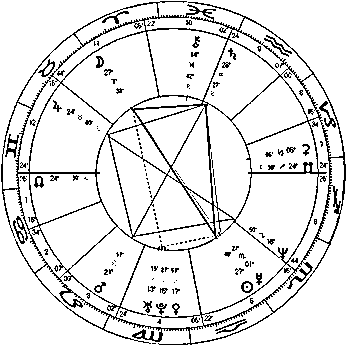

| 卡马拉·哈里斯。1964 年 10 月 20 日。21:28，加利福尼亚州奥克兰（上升双子座 24°25’）

**倘若某人要成为总统，他们的星图必须与那个国家的星图发生共振。****· 乔治·W·布什**的太阳合相美国的太阳；**· 奥巴马**的火星合美国的海王星，金星合美国的金星；**· 特朗普**的太阳合美国的火星。卡马拉·哈里斯的星图也触动了美国星图的很多敏感点，她的**上升合美国的火星，土星合美国的月亮（太阳和月亮分别三分与六分），木星准确六分美国的水星。**由于这些相位，她能成为一股稳定的力量——如果不是**她的天王星-冥王星合相四分了美国的上升**的话。这些相位关联可能**仅仅意味着她成为副总统，作为女性和黑人，这已是一个相当大的成就。**

| 卡马拉·哈里斯

**她的太阳在天秤座，定位星金星在处女座 ——两者皆落陷，可能存在一些天生的弱点。****金星合相天王星-冥王星在她的 4 宫**，可能代表**非白人美国人常常要忍受的极端状况**（比如，她作为黑人儿童访问白人社区时，不被允许与白人儿童玩耍）。哈里斯早年与被她继父猥亵的人建立了友谊，强烈激发了她后来**作为检察官保护妇女和儿童的意愿，符合金星-冥王星的主题。****她 9 宫极其强大的土星，反映了她先前担任加州司法部长的角色。****土星对分火星，作为地区检察官，她镇压枪支暴力，提倡禁止攻击性武器。**她呼吁永远废止死刑，理由是终身监禁事实上更便宜。显然她无法赢得铁了心的共和党人的民意。**作为候选人的哈里斯** **当她的推进太阳合相射手座 24°的下降点时，她成为了副总统。**与此同时，她的下中天推进合相天蝎座 1°的水星。这很好地表明了她出生时间的准确性，也让人不禁猜测，如果她在 2020 年是总统候选人，是可以赢得那次大选的。**她的太阳同时合相射手座的南交点，或许一定程度上说明了她的国际血统的重要性。**她父亲是牙买加人，母亲是印度人，她在加利福尼亚和法属魁北克都受过教育。她是很多元素的融合。倘若根据推进水星停滞对分木星，就能预测拜登的胜利，那么哈里斯的推进水星，能说明她成为总统的机会吗？这里有些有趣的事情。**她的推进水星当前逆行，当她成为副总统时，推进水星正好在摩羯座的边界上逆行回射手座。****在下次大选前的 2023 年夏天，她的推进水星合相推进太阳——逆行水星和顺行太阳之间的对峙，或许象征了哈里斯和拜登之间的对峙**。这可能预示着交换角色，他可能指定她为继承者。**在下次大选时，哈里斯的水星推进合相她的南交点和下降，一定程度上重复了先前她成为副总统时，推进太阳合相下降的主题。**然而如果她竞选总统，这不足以代表一场胜利。她的太阳在出生时紧密对分月亮，三分土星，大选时太阳推进到 28.22°。她的土星在水瓶座 28.27°。月亮接收的六分和三分相，看起来像是巅峰的成就，因为吉相位代表星图中潜在的好运。**要记住，她的土星合相美国的月亮，这代表她可能步入更高的地位。此外在 2025 年初，行进的木星合相她的上升。****总统就职典礼的冥王星**尽管仅是猜测，还有一个有趣的现象发生。**下次美国大选时，冥王星在摩羯座 29°47′，即将第三次和最后一次进入水瓶座**。在就职典礼上，**冥王星在水瓶座 1°41′**——由于 1 月 20 日太阳总是在水瓶座 1°，这将是**美国历史上首次太阳-冥王星合相的就职典礼**。（引人注目的是，届时金星在双鱼座 17°38′——卡马拉·哈里斯的金星在处女座 17°53′）。

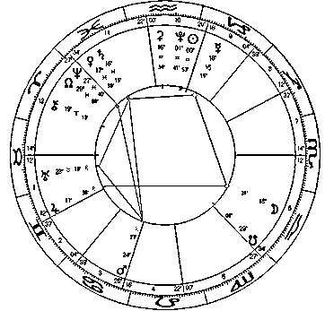

| 就职典礼：2025 年 1 月 20 日 12:00 华盛顿特区（上升：金牛座 14°12′）

太阳-冥王星合相有利于哈里斯吗？行进冥王星对分美国的太阳时，奥巴马当时是总统。所以或许**冥王星有利于一位能对国家带来转化作用的黑人。****就职典礼星图上火星逆行在巨蟹座落陷，合相下中天，它正好合相美国的水星和特朗普的土星。**对于国家内部的和谐，这不是个好迹象，可能**下一个总统任期伴随高度的动荡。**民主进程本身可能有着不可预见的问题。**每当冥王星进入一个星座，它就激活一场危机。**我们看到冥王星在天蝎座伴随艾滋病，冥王星在射手座伴随宗教恐怖主义，冥王星在摩羯座伴随着银行危机。**冥王星进入水瓶座可能威胁民主本身。**加州大学欧文分校法律和政治学教授理查德·哈森 2021 年表示：**“民主的紧急情况已经出现。我们所熟悉的美国民主，在 2024 年有很大的风险将会结束。”**自上次大选以来，共和党一直致力于在地方一级接管权力，控制州议会、州选举当局和法院，并对州县进行选区划分。共和党已宣誓效忠于弥天大谎。两党制中只剩下一个政党愿意输掉选举。2021 年 7 月，在费城国家宪法中心，乔·拜登说：**“我们面临内战以来民主的最重大考验。这不是夸张；我不是在吓唬你。我这么说是因为你应该警觉起来了。”**然而，假设民主获胜了，假设特朗普面对哈里斯——一个很大的假设，那么哈里斯有希望获胜。作为前总统，特朗普将被邀请参加就职典礼。我好奇他会不会去？

**版权声明：**本文由若道翻译、整理发布，欢迎转发，反对抄袭。友号转载请申请白名单。

**END**

**艾德里安·罗斯·邓肯**

若道签约老师，哥本哈根占星学院院长 1985 年开始成为全职占星师，是人本主义占星、卜卦占星和经世占星学领域的知名占星师。开发了占星软件 AstroClock 和多款占星报告。

**大国命运：经世占星学 3 天线上工作坊**

**明天开讲！**

**一个好的占星师必须要懂得时代的声音，必须要洞悉全球的趋势，必须要懂得国家的故事。**

在这个工作坊中，我们将学习**如何专注于能够理解世界大事并对它们做出准确的预测。**这将带领我们踏上**一段重要的行星周期之旅，并延伸到重要国家和世界领导人的星图。**现在正是学习的好时机！

2020 年 12 月，木星与土星合相，这是 800 年来这两颗行星首次在水瓶座合相，预示着地球以及政治和社会趋势将发生巨大变化。我们正在进入一个令人兴奋的奇境，非常适合探索经世占星学。

**点击下图了解更多详情**

**20 位来自世界各地的占星师****带来 19 场沙龙——新世界的觉醒****详情可点击下图**

**学习占星学****点击下图了解课程详情**

**微信又双叒叕改版啦，不想错过若道君的推送？**

**就把若道设为星标吧！**

**▼**

**喜欢就点一下“在看”吧！**

********报名直达入口********

# 重大天象丨天王星逆行：未来 3 年的变革成果，将在此次逆行后展现！

> 原文：[`mp.weixin.qq.com/s?__biz=MzA5NjA0NTAxNg==&mid=2651486137&idx=1&sn=32c421ffd095bb846be8c79e88a0b674&chksm=8b48c50ebc3f4c1839777228470d83be1e14d4049d0be4e4c0e3085523854cd4d34ac57dec44&scene=126&sessionid=1692737766#rd`](http://mp.weixin.qq.com/s?__biz=MzA5NjA0NTAxNg==&mid=2651486137&idx=1&sn=32c421ffd095bb846be8c79e88a0b674&chksm=8b48c50ebc3f4c1839777228470d83be1e14d4049d0be4e4c0e3085523854cd4d34ac57dec44&scene=126&sessionid=1692737766#rd)

****************☆ 后台回复“今日”，给你一句生命态度****************

作者/傅莎珈 ISAR 认证占星师
编辑/翀子 封面/书君 图片/网络 8 月 24 日 21 点 53 分， 天王星开始逆行，逆行时间至到 2023 年 1 月 23 日。在这 5 个月的逆行时间里，天王星提醒我们打破常规，探索自由与梦想、探索内在的欢庆和喜悦，也再次强调了死生循环的课题。希望你在 2022 年的最后几个月，打破常规，打破依赖，也打破僵硬。**天王星逆行****8 月 24 日 21 点 53 分， 天王星在金牛座 18º 55’ 开始逆行，到 2023 年 1 月 23 日 6 点 58 分，在金牛座 14º56’ 恢复顺行。**这股逆行能量的源头，是 8 月 1 日-8 月 7 日期间火星、天王星陆续合相北交点，触发土星四分天王星的年度相位：**物质世界的秩序打破开始加速。**同时还为 9 月 21 日-28 日可能会发生的事件制造引子———届时**木星（白羊座）**、**土星（水瓶座）**和**天王星（金牛座）**会形成紧密的相位配置，让**火星在双子座**长达 8 个月的顺行逆行，传递新世界的能量震荡得更遥远。

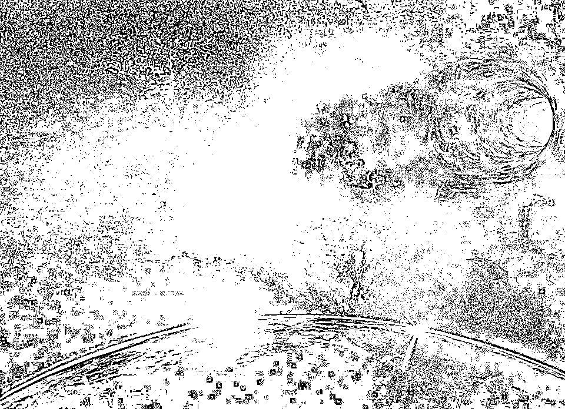

**打破常规，探索自由与梦想**

**天王星逆行拉开了五星逆行的幕布：**天王星、海王星、冥王星以及土星、木星都在逆行。

**冥王星、天王星土象星座**，土象有关事实、物质、财富、边界，逆行有关这些领域的调整；

**木星从火象的白羊座退回水象的双鱼座**，有关新事物孕育的确认；

**海王星在水象的双鱼座逆行**，继续着旧有边界的消融，为新世界诞生提供养料。

高等能量进入二维世界后的显化秩序是：旧有意识的边界消融再建（土星）——新的信念传播（水星）——身体开始学习体验和行动（火星）。

天王星是高八度的水星，阳性智慧的象征。天王星——土星——水星，是意识能量——思维结构化、信息沟通传播的落地过程。**所以这次逆行的结果，和意识形态改变的关联非常密切。**意识形态调整，律法、经济、社会舆论等也跟着发生变化。

**思想引领行动，**水星所产生的信息，会引领火星展开行动。全新结构的思维，需要沉淀和淬炼，通过语言/信息的调试修整（水星逆行）、行为之间的协调（火星逆行），在年底木星正式进入白羊座、水星在摩羯座逆行之后，彻底完成完整意识形态输出。

这次天王星逆行，既是天王星换座金牛座之后的最后 3 年，也是土天四分相位的落幕。**2018 年开始的天王星换座金牛座成果，在这次逆行之后将全面展现。**同时，南北交点在天蝎座和金牛座，10 月和 11 月的天蝎座日食、金牛座月食，将在每个人的业力层面，完成重启。

接下来 5 个月，我们身处的世界，将会回溯整理此前冲突的世界观、商业新概念、社会道德争议，各种社会群体之间的解散重组，群体之间的冲突争议，**会在不断交战中，越来越形成稳定的观点，结成长久发展的新联盟，****一个新的世界秩序正在缓缓构建。**

**在硬件科技上**，则是互联网、星际探索、能源、金融货币领域再次出现重大突破的时期。

**在身体上，**可能出现各种轻盈、流动、活跃的感受，与往年秋冬季的宁静内敛不太一样。

**秋冬季的这次群星逆行，适合开放的接受，体验打破常规，探索自由与梦想。**

对普通人来说，**请停下来观察，体会，分辨，真正触动你的见解。**

**问自己：出生以来，你总是被打压的渴望是什么？**去试试信任这个渴望可以实现，你需要做什么的信念。**渴望稳定的人，需要尝试转变；时常跳脱的人，请探索可持续性发展。**

这个过程需要我们绝对的诚实、敢于面对现存的矛盾，在这中间学习应在二元对立的矛盾冲突中，蕴含的福祸双栖之道。也许时代让我们感受到的是生活秩序崩塌，面对天灾的无力。**但如果站在更高层面的宇宙视角上看，经由这几年，我们所有人的自我认知、社会身份、收入来源，都发生了或多或少的变化。**到木星进入白羊座的明年，我们会更深的感受到这种变化。**祝福每个人，在这场蜕变之中，感受到变化之后的喜悦。**如果 2020 年年底的时候，我们庆祝木土合相水瓶座的风象时代开启。那么我们在经历的这 3 年的变动后，我们正在崩塌里，体验和着手建立风象时代的个体定位，社会秩序中的角色。任重道远，宜徐徐图之。

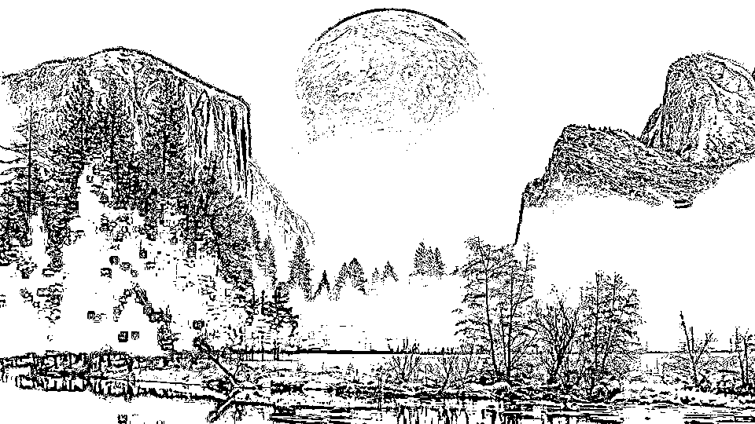

**探索内在的欢庆和喜悦**天王星和土星的神话传说里，天王星乌拉诺斯在被土星克洛诺斯阉割后，跃上天空。他的鲜血滴在土地里，诞生了阋神星 Erin，她是愤怒和不和之神，所到之处带来争端和战争。乌拉诺斯的阳具掉在爱琴海里，海水泡沫和精子中和，诞生了爱神阿弗洛狄忒，她是金星的守护神。**在这一年的土天四分相的行运中，我们一次次面对愤怒、争纷，同时对爱、美、丰盛、和平的渴望也在诞生。**在疫情之中，每个人都在社群里同时感受到了这些对立的情绪。但最终，人们一次次做到的，是信任、互助，是重建生活美好、欢乐的决心。天王星乌拉诺斯之所以会被土星克洛诺斯阉割，是因为他对妻子大地女神盖亚的无序索取、自私，为了自己的统治延续，不让孩子出生。最终导致了身为母亲的盖亚女神的巨大愤怒，撺掇孩子推翻了天王星父亲的统治。这个故事里，大地母亲的愤怒，和自己创造出来的生命没有生长空间有关。对应现实世界，权力欲望导致的资源过度集中，对自然和经济生态造成的伤害，引发了全球的疫情、自然灾害以及经济危机，社会意识形态的剧烈冲突，女性更需要面对就业/教育/生育上的压榨,。**各种冲突聚集在一起，愤怒大爆发。**阋神星的另一面向，是圣女贞德式的为真理而战的女战士。如果结合今年的木海合相看，这是个阴性力量开始死亡之舞的时期。**阴性力量的死亡之舞，同时也是生命之舞。毁灭中的重生。**

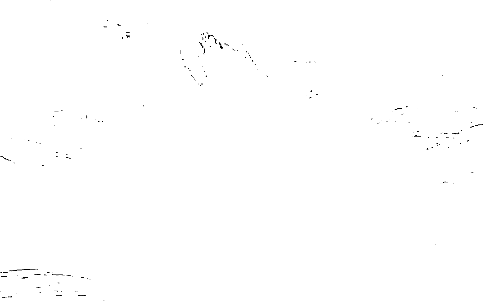

**天王星逆行的时候，北交点金牛座的守护星金星在狮子座 15º。**在恒星占星学上，15º 狮子座上有恒星天枢（北斗一），隶属于大熊星座。天枢（Dubhe）这个名称源自阿拉伯文 Thahr al Dubb al Akbar，意思是熊背。**这颗恒星的含义是：方向、生机盎然、大自然的力量。**

如果土木这条阳性力量的线在重塑阳性智慧，那么阴性智慧的发展与转换，也在金星狮子座和北交金牛座之间发生。

金星在狮子座三分白羊座凯龙、四分南北交点、对分水瓶座土星，提出了以下功课：

*   **疗愈自我的低价值感，培养尊严、独立、真实表达自我的勇气；**

*   **体会生命的喜悦，从**天蝎**座南交点的匮乏、恐惧，控制走向**金牛**座北交点的丰盛、宁静，舒适；**

*   **在冰冷严苛的制度、规则中，注入活力、欢乐、创造力，感受生命的喜悦……**

金星在狮子座会特别让人们关注恋爱、生育、欢乐、丰盛类的议题。疫情所产生的各种限制，让我们集体意识中的焦虑、受困、无意义、死亡感越来越强。

**这个时候，我们特别需要一点指引，去带领我们发现一些和制度、传统无关的，却充满了源源不断的生机和活力的东西，这些久违的东西让我们有继续坚持下去的动力。**

**在接下来的几个月，不要忘记探索内在的欢庆和喜悦力：**

*   **创造新体系的时候，别忘记带着爱、尊重、欢乐和游戏的心态；**

*   **建立新秩序的时候，请学习谦卑而自信；**

*   **将大愿景分解成一个个小目标，纯粹简单专注的工作，庆祝每个小小的进步。**

**如果有可能，接下来 9 月到 10 月底，多多出门，去大自然旅行。**有时候我们在大自然里看到的意象，往往对对我们的生活和工作，有莫大的启发。

在写这篇稿子的时候，金牛座北交点、狮子座金星，以及在处女座行进的太阳和水星让我想起 8 月的呼伦贝尔草原之旅——额尔古纳湿地今年特别丰茂，在丛林里的溪流边上站立，能清晰的感受到来自生命源头的源源不断的力量；黑山头的落日夕阳里，有着草原特有的壮阔与瑰丽；莫尔道嘎次生林的绵延啊，讲述着生命重生的稚嫩和欣欣向荣……

**每次我感觉要被城市生活窒息的时候，就会安排一次野外之旅，大自然和动植物，总是送来很深的宁静和欢喜。然后，又能满血复活的回城市干活。**

如果无法出门旅行，去参加各种戏剧、舞蹈、音乐、电影、聚会类的活动，**去体会久违的欢乐。**恐惧和匮乏会让人生存下来，**但欢乐与梦想，让人渴望创造。**

在狮子座金星和金牛座北交点里，行星们在唤醒每个人身上最原始、天然、朴素的爱的体验。**这样的感受，中和了在我们生命里的理智、疏离、自私、僵硬的天王星能量。**她带来的是“空间”。天王星跃上天空，天地分离，万物得以成长，绽放空间。各种新事物，新的个体意识，新的社会秩序需要的空间。

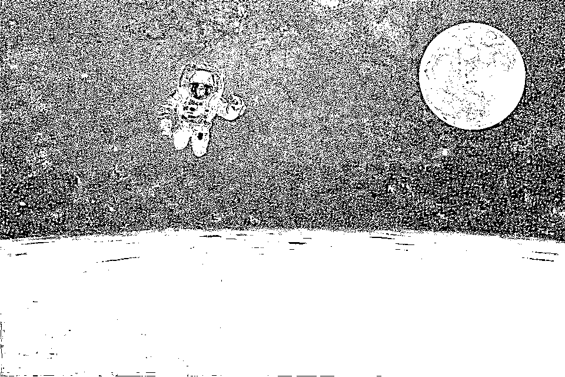

**结尾**

看完能量结构和神话意象，回归现实世界的时间节点和行动指南。

**本次天王星的逆行，重点影响星图上有金牛座/天蝎座/狮子座/水瓶座的四轴和行星在 11º-21º 的人群。****时间轴：****★****8 月底：**

**能量混乱，尽量少安排出行；商务洽谈留出变动空间**

*   8 月 24 日  天王星在水瓶座开始逆行
*   8 月 26 日  水星换座天秤座
*   8 月 27 日  处女座新月

这段时间矛盾冲突逐渐尖锐，欲速不达，有很多舍弃的事件和对全新联合的不确定。是犹豫不决，试图建立新平衡的时期。**耐心，更多换位思考。诚恳表达。多去大自然走走。****★****9 月****思维的重建，少说，多听；激烈的政治/金融震荡期；调整资源布局。**

*   9 月 10 日  水星在天秤座逆行
*   9 月 14-10 月 3 日  逆行的土星四分天王星
*   9 月 20 日 处女座金星三分金牛座天王星（逆行）

**激烈震荡时期。**有些人会非常顽固的坚持己见，有些人会盲目尝试。试着以“破局”的眼光看待变动。调试诚实和现实之间的平衡。**请练习真实的接纳自己的优点和缺点。****★****10 月****处理总结 4 月的某些议题，发展 5 月金牛座日食的方向**

*   10 月 2 日 水星在处女座恢复顺行

*   10 月 9 日 冥王星在摩羯座 26º06’恢复顺行

*   10 月 13 日 天秤座金星三分水瓶座土星（逆行）

*   10 月 25 日 天蝎座日食，全新资源开启

*   10 月 28 日  木星退回双鱼座，和海王星宽泛合相

*   10 月 30 日 火星在双子座开始逆行

**评估资源，开始新的资源整合，合作。**需要平衡好对安全感和财富的执念。这个时期的资源开启，是一场重要的试炼：**你敢于去争取“不相信自己可以得到”的东西吗？**在生活各个领域。**★****11 月****静观环境剧变，感受新的政策律法**

*   11 月 6 日 天蝎座金星对分金牛座天王星（逆行）
*   11 月 8 日 金牛座月食
*   11 月 9 日 天蝎座水星/太阳合相，对分金牛座天王星（逆行）
*   11 月 24 日 木星在双鱼座 28º 恢复顺行

**建立未来 2-3 年的生活/事业规划。**这是个建立原则、底线和方向的时期，为 1 月份开始的快速行动做准备。**★****2023 年 1 月****新的思维和行动之间完成调试，进入 2023 年的高速行动期**

*   1 月 13 日 火星在双子座顺行
*   1 月 23 日 天王星在金牛座 14º56’ 顺行

**土天四分相能量脱离。生活各方面全速启动。**

别太在意细节，结果的好坏。去尝试理解理清自己的“好”、“坏”定义。不要用“别人都这样”、“大家都这样” 的考量来做选择。试试深入自己的恐惧和渴望之中。**勇士的道路，是以柔软的心，****接纳生命中的一切事物，不逃避。敢于面对内心的阴影和坑洞**，**这是心灵的炼金术，通过身体，行动，情绪的转变，一一呈现。**祝福大家，在明年 3 月灿烂绽放。

**版权声明**：原创文章由作者授权首发于若道平台，欢迎转发，反对抄袭。友号转载请申请白名单。

**END**

****傅莎珈****

ISAR 认证占星师（2015 年获得）

整合疗愈占星师

国际著名传播集团工作 20 年

**微信公众号**：Helloshajia

长按打赏

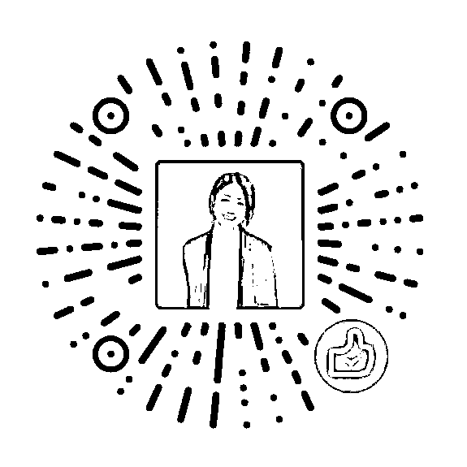

**20 位来自世界各地的占星师****带来 19 场沙龙——新世界的觉醒****详情可点击下图**

**学习占星学****点击下图了解课程详情**

**微信又双叒叕改版啦，不想错过若道君的推送？**
**就把若道设为星标吧！****▼**

**喜欢就点一下“在看”吧！**

********报名直达入口********

# ISAR 认证职业占星师文凭课程 | 开启“爱好变职业”的创收自由之路

> 原文：[`mp.weixin.qq.com/s?__biz=MzA5NjA0NTAxNg==&mid=2651486137&idx=3&sn=db676d2f2356aa20c58ba139dcb266ff&chksm=8b48c50ebc3f4c18fb16d53fce6767115bf00679b339359f74c36396149d835dee530dd2d97c&scene=126&sessionid=1692737766#rd`](http://mp.weixin.qq.com/s?__biz=MzA5NjA0NTAxNg==&mid=2651486137&idx=3&sn=db676d2f2356aa20c58ba139dcb266ff&chksm=8b48c50ebc3f4c18fb16d53fce6767115bf00679b339359f74c36396149d835dee530dd2d97c&scene=126&sessionid=1692737766#rd)

**2022 年，是世界和中国 40 年未有之大变局的开始。**

俄乌战争打破了欧洲大陆乃至全世界的和平局面，而新冠疫情也给中国经济带来前所未有之挑战。

如果你关心经济形势和世界局势，你会有这种的感觉，我们将面临一场深刻的危机，而这不是短期内可以结束的。

**占星学的看法也是如此。**

4 月青年失业率（16 岁到 24 岁）中国达 18.2%，一些背着房贷、教育、医疗负担的中年人突然失业更是整个家庭整个难以承受之重。为了更好准备面对这样的时代变化，连《北京日报》这样的官方媒体也在呼吁：**“开拓副业，让自己有多元化发展的生存能力”。**

**而这门课程，就是为了这样一个目标准备的。**

**占星学是非常好的“开展副业”的选择**

这个**为期 16 个月**的课程通过并不算长的时间和并不算高的投资，不仅可以帮助你学到一个终身可用的技艺，而且也可以选择成为自助助人的占星师，**开启受益终生的第二事业。**未来是个体崛起的时代，大量个体被鼓励独立发展，比如网红、自由职业、自媒体、咨询师等，他们都不需要传统的办公室。社会越发达，人的独立性就越强，未来有能力的人都可以变成独立的经济体。

**占星学也是越老越好的职业**

和一些技术变化非常快的职业不同，**占星学的技术层面非常稳定，不会快速迭代变化，**同时，掌握好占星学、能够做一场好的咨询又需要个人自身大量实践和对生命的深刻理解，而这些都是时间和岁月带来的。

**占星学是现代社会需要的助人职业**

社会快速发展和变化人们似乎越来越无法掌控自己的生活，这给很多人带来巨大的焦虑，**抚慰心灵的咨询市场需求巨大。**而占星学可以让人从前所未有的角度了解自己，了解目前和未来所处的周期，挑战的意义，不论对于深入的个人成长探寻，还是预测未来的周期，都又其独一无二的价值。

**ISAR 认证职业占星师的独有培训**

目前占星学的培训市场鱼龙混杂。而 ISAR（国际占星研究协会）是一个包含了 47 个国家在内的国际占星组织，多年来致力于占星的教育和研究，提升占星教育的品质和职业占星师的能力，在国际占星领域备受尊重。今年，ISAR 对于成为 ISAR 认证职业占星师提出了更高的要求，**所有想要获得 ISAR 职业占星认证的申请者均需要在 ISAR 的附属学校通过 500 个小时的研习（包含****主课****、选修课、沙龙、作业、讲座、工作坊等等）。**

**而这门核心占星学课程就是为此而准备的。**

**2022 年，鉴于对若道在占星教学领域所做的持续努力和高品质的课程服务，ISAR 特别授予若道核心课程为 ISAR 文凭课程，所有在若道学习，并通过若道毕业考试的同学将获得 ISAR 颁发的学历文凭（Diploma）。**

**你的占星核心课老师是谁？**

**拥有****51 年****占星实践经验的****若道创始人****前 ISAR 全球副主席****前 ISAR 全球职业占星师资质认证主席****大卫·瑞雷**

**和**

**2019 年第二届、2021 年第三届核心课中**

**与苏·汤普金斯老师****联合授课****的**

**ISAR 认证职业占星师**

**咔咔（Caroline）**

**二人合力打造**

**2022 年 ****若道全新核心占星课程**

**咔咔老师给同学的寄语：**

（向上滑动查看内容）

**亲爱的同学们：**

我为什么学占星学？

2000 年的时候我还是一个在网上搜索天蝎座和水瓶座配不配的普通白领。我搜索的内容还包括了水瓶座为什么总是这么若即若离？

体贴的搜索引擎给我推送了占星学、行星、星座、宫位、相位等资料，还让我了解到莉莉丝、月亮交点、截夺宫位等占星学概念。

2000 年 10 月我了解到，一个从业 30 多年的美国职业占星师大卫·瑞雷来到了中国，和他的中国合伙人将开办一个专业教授占星学知识的课程。过去 10 个月在网上东拼西凑的占星学知识唤起了我对占星学的兴趣，但是已经不能满足我对星图深度分析的需求了。

2013 年，我通过了若道核心课程的毕业考试和国际占星师研究协会的认证考试。2015 年我离开职场成为一名全职占星师。

到底学习占星带给了我什么呢？

1、它是自我觉知的工具，我现在已经不去纠结哪些星座是否匹配，我相信外在的事件是内在心理矛盾的显化。也就是说，想找到令人满足的亲密关系，要先去了解自己的情感模式和需求，而不是无意识地一次次地试错和撞墙。我开始学习自我关怀和接纳自己。

2、它带来看待世界的全新和全景的角度，天上如是，地下亦然。人类社会和个人生命的进化都有其周期和相似性，作为个体，占星学帮助我思考如何更积极和有建设性地与宇宙的能量合作，认识自己，发挥自己的潜力，度过有意义且自我满足的人生。

3、它带来了全新的职业：占星师和占星老师。除了收入，还有助人育人的满足感和意义感。

4、它带来一群志同道合的伙伴，我们彼此联结又相互独立。

作为中国占星界的“黄埔军校”若道占星的学生、助教和老师，我与很多学员在人生的不同阶段带着各异的需求走进了这所学校，2022-2023 年一年半的若道核心课程设计既蕴含了大卫·瑞雷老师的教学精华，也带入了我在跟随不同国外占星老师学习、助教和教学积累的心得。

有一些学员毕业后从事了占星咨询工作，有的在各大平台成为专业占星学知识的输出者和传播者，有的运用占星学提升他们的工作，也有的在占星学与投资，占星学与名人/八卦、占星学与原生家庭、亲密关系、亲子关系等领域收获了有用的或者有趣的体验。

对我来说，生命是一场自我完整的体验之旅。从 2011 年的那个春节在若道入学之后，我的生命旅程更加充实、有意义、有目标，也更有满足感。

希望在 2022-2023 年的若道核心课程里见到你。希望你此后的生命旅程里，有若道，有占星学。

占星师咔咔

2022 年 5 月 24 日

**大卫老师给同学的寄语：**

（向上滑动查看内容）

亲爱的学员们：

感谢你对我们从 8 月 30 日开始的若道 L1-5 级核心课程的兴趣。我和合作老师咔咔以及我们的核心课程团队期待着为你提供这个机会，来教授各种高品质的地道占星学知识和技巧。

对于那些希望获得 ISAR 职业占星师认证的学生，这是一门适合你的课程！

作为 ISAR 咨询技能培训的一部分，我曾与咔咔合作过，我们期待着再次合作。咔咔和我曾在 ISAR 职业占星师认证委员会（CAP ISAR）一起工作，我们非常熟悉获得 ISAR 职业认证的流程。作为你的老师，我们将陪伴你整个占星学发现之旅，帮助你逐渐认识到占星学有多么的神奇。此外，你还将受益于我们若道的助教和课程顾问，他们是若道核心课程计划的重要组成部分，提供在线沙龙、组织学习小组、指导家庭作业。我们的教育团队是“服务于你的团队”，所以也会根据你的需求进行相应的调整。你专用的核心课程微信群也促进了你的学习过程，使你能够每天与你的同学们一起学习、探讨、成长。

52 年前，当我开始学习占星学时，没有一所像若道这样的学校。如果有这样一所学校，我会尽一切可能在那里成为一名学生。事实上，我很幸运，我的老师都是经验丰富的专业占星师。然而，我花了 6 年的学习时间才通过 1976 年在美国乔治亚州亚特兰大举行的专业占星师考试，又花了 2 年的专业实践时间才通过占星学谋生。我永远不会忘记从 1970 年到 1978 年的 8 年，那些日子的反复试验教会了我如何苦练占星学。作为老师，我一直在努力传授我早年所学的知识，让你的旅程更加顺利，更加全面。

自 1978 年以来，44 年的全职实践教会了我很多，我很高兴有机会与大家分享我所学到的东西。我和咔咔都是现代占星师，虽然我们尊重西方占星学的历史和传统，但我们实践和教授的占星学植根于现代人本主义哲学，这种哲学旨在提高你对自身潜力的认识，并鼓励个人成长。还有什么比了解自己更实际的呢？还有什么比个人成长和发展潜力更有利的呢？这是你将要学习的占星学，一种可以应用于你自己生活的占星学，一种可以为你提供一个充实职业的占星学。

教书是我回馈占星学行业的方式，这个行业拓展了我的视野，远远超出了我曾经想象的可能。谢谢你给我这个机会做你的老师。

大卫·瑞雷

2022 年 5 月 24 日

**连报 L1-5 全阶网络直播课程，你可以享受**

❶ 64 次线上直播互动网络课程+2 场工作坊，全面而详细地讲解占星学知识、技能、案例和重要领域实践运用。

❷ 知识点+学员星图解读有机结合：咔咔老师以讲解知识点和中外名人案例为主，大卫·瑞雷老师以参课学员案例演示及客户案例为主，每个知识点覆盖班级内学员的亲身案例，参与感更强，多位学员都有机会听到自己的星图分析。

❸ 微信群学员互动分享，从真实案例学习生命成长故事。

❹ APP 答疑论坛提问：论坛上每个学员的问题都将得到及时回复。

❺ 若道独有的职业占星师养成计划，为你毕业后独立咨询做准备。

**❻ **提供**咨询平台**，只要努力，优秀毕业生有机会入驻**若道咨询平台**，拓展咨询客户群。

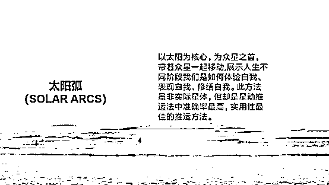

**更多了解老师和助教？**

**大卫·瑞雷（David Railey）**

*   **I****SAR 董事会成员，ISAR 全球副主席，ISAR 全球职业占星师资质认证主席，若道占星创始人**。

*   2016-2019 年，被选为国际占星协会（ISAR）考试委员会成员，国际占星协会（ISAR）是世界最大的国际占星机构，会员遍布 47 个国家。

*   2017-2020 年，被选为国际占星联盟（ISAR）考试委员会主席，理事会成员。

**占星师咔咔（Caroline）**

2010 年师从美国占星师大卫·瑞雷学习，并得到世界名师斯蒂芬·弗里斯特、罗伯特·汉德、苏·汤普金斯传授各种占星学技法。若道首届学员，国内最早获得 ISAR 职业占星师资质的职业占星师，多次担任若道核心课程助教，并于 2019 年第二届、2021 年第三届核心课中和苏·汤普金斯老师一起教授若道核心占星课程。

在国际知名广告公司和市场研究公司从事的市场研究和推广工作十余年，曾任职于阳狮集团、尼尔森市场研究有限公司、MTV 和《Madame Figaro》杂志。

**助教王嘉祺 （Conrad）**

ISAR 认证占星师、若道认证生时校正资质，从 2010 年起自学占星学，2015 年开始在若道系统学习，并开始个案咨询。2018 年担任若道核心课程助教，以及卜卦占星学和太阳返照选修课助教，并带领学员进行经世占星和太阳返照方面的研究。2019 年 11 月作为演讲人之一参加了国际占星协会（ISAR）北京大会，也是 ISAR 星空俱乐部中国区第 16 期的主讲人。

**什么人适合这门课？**

*   对占星学有浓厚兴趣，想要系统学习占星学。
*   对占星学有一定基础，但不知道该如何整合星图复杂的碎片。
*   希望成为优秀的占星师，想要借鉴国际大师解读思路并融入自己的体系。
*   想学习占星学，但不擅长英文，希望有中文老师授课。
*   想结合占星学理论与咨询实践。
*   走在自我探索和个人成长道路上的人。

**课程费用**

**★ 1-5 阶 连报****课程费用：46500 元** **★ 1-2 阶 （8 月 30 日开课）****课程费用：3500 元 ****★ 1-3 阶　连报****课程费用：11500 元 **

**咨询课程请联系顾问**：**王老师（微信/手机：18510107057，请备注“大卫核心课”）**

**退转课程**

**退款原则请详看《教学协议》，如有疑问请咨询课程顾问。**

****2022 L1-5 认证职业占星师必修课程****

**授课老师：大卫·瑞雷、咔咔**

**直播课开课时间：2022 年 8 月 30 日（周二）**

**授课方式：******网络授课，英文/中文授课，中文翻译****

**费用：****1-5 阶连报**：46500 元**；**1-2 阶**：**3500 元；****1-3 阶**：**11500 元

**课程负责人：王老师**（微信/手机：18510107057，请备注“大卫核心课”）

长按二维码添加课程负责人咨询~

****报名直达入口****

# 2022 年若道 ISAR 选修课 | 《医疗占星手册》作者亲授

> 原文：[`mp.weixin.qq.com/s?__biz=MzA5NjA0NTAxNg==&mid=2651486137&idx=4&sn=e55df007e214e7bb7a1216e9fec51dc2&chksm=8b48c50ebc3f4c18800190bce05ea0f686fbff04c2db40c98ec9d767de3ce2c35319b1865fd7&scene=126&sessionid=1692737766#rd`](http://mp.weixin.qq.com/s?__biz=MzA5NjA0NTAxNg==&mid=2651486137&idx=4&sn=e55df007e214e7bb7a1216e9fec51dc2&chksm=8b48c50ebc3f4c18800190bce05ea0f686fbff04c2db40c98ec9d767de3ce2c35319b1865fd7&scene=126&sessionid=1692737766#rd)

**有四个主要因素影响着我们的生活和健康：基因构成、物质环境、情绪环境，以及我们的占星配置。我们在星图中都存在患病的可能性，而预防的方法在于尽可能充分、真实和健康地生活。****——简·里德·帕特里克****（Jane Ridder-Patrick）博士**

占星学就像心灵的 X 光片。它可以描述个人对世界的看法和反应。我们越不了解自己的天性，面对生活中的挑战，我们就会有越少的选择。

**“占星学可以精准定位需要解决的潜在问题。”**

**医疗占星学是一个强大的工具，同时洞察的身体和心理过程，通过更多的自我认知照顾和关爱自我和身边的人。**

**本课程既适合医疗占星学的初学者，也适合已经有一些相关经验的人****。**简·里德·帕特里克老师将运用现实生活中的例子，揭示一个人的性格、症状及其星图是如何相互映照的。课程也会探讨疾病的意义以及可能的治疗方法。

**本课程旨在为学员提供一个运用医疗占星学的框架和方法，**学员将会学到一些有价值的实用工具，在课程结束后，自己使用这些工具研究其中的关联性。

**此课程可作为 ISAR 选修课。**

1

**课程安排**

**课程时间：2022 年 9 月 20 日-11 月 8 日  每周二 20:00-22:00**

**第*****1*****讲  9 月 20 日 与占星学、心理学、病症一起工作**

*   医疗占星学的组成部分以及如何使用它们

*   行星的作用与相互作用

*   黄道星座人

*   宫位的重要性

*   疾病和健康是如何产生的

**★ 第二、三、四讲的课程内容基于星座以及它们之间的相互作用。**

**第*****2*****讲  9 月 27 日 基本星座**

学习基本大十字星座——**白羊座、巨蟹座、天秤座和摩羯座**——及其功能和相关的健康问题。**这些星座与防御、养育、结构、体内平衡和荷尔蒙控制有关。**

****第*****3*****讲  10 月 4 日 固定星座****

学习固定大十字星座——**金牛座、狮子座、天蝎座和水瓶座**——及其功能和相关的健康问题。**这些星座与习惯和反射、心脏调节、生存、循环和协调有关。**

“固定星座（金牛座、狮子座、天蝎座和水瓶座）在情感和生理上都倾向于**‘难以放手’**，这可能为恶性肿瘤的生长创造环境。所以说，他们可能倾向于沉浸在过去的伤害中，难以自拔。另一方面，这些星座也擅长在艰难的时期坚持不懈并一直**持之以恒**。”——简·里德·帕特里克（Jane Ridder-Patrick）博士

**第*****4*****讲  10 月 11 日 变动星座**

学习变动大十字星座——**双子座、处女座、射手座和双鱼座**及其功能和相关健康问题。**这些星座与呼吸、神经系统、肠道、睡眠以及信息、情感和行动的整合有关。**

**★ 第五、六、七、八讲重点学习行星，它们在身体层面的表达、它们的相位与行进。**

**第*****5*****讲  10 月 18 日 太阳与月亮**

**太阳**掌管视觉、活力、心脏和意识，与心脏、脊柱和视觉问题相关。**月亮**掌管人体的周期，特别是月经周期、饮食模式和体液，与情绪引起的疾病、饮食失调和胃病相关。

**第*****6*****讲  10 月 25 日 土星与天王星**

**土星**掌管着皮肤、骨骼、牙齿和衰老过程。它对应的疾病包括慢性疾病、耳聋、帕金森病、关节僵硬和牙齿问题。**天王星**代表身体活动的协调，有节奏的脉动和身体的“电”。与天王星相关的疾病包括癫痫、痉挛、心律失常，以及阿斯伯格综合症和自闭症样综合症。

**第*****7*****讲  11 月 1 日 海王星与冥王星**

**海王星**掌管松果体、细胞膜渗透和右脑功能，与过敏、上瘾的病症、慢性疲劳综合症和睡眠障碍相关。**冥王星**掌管消除和转化，其病理包括毒性、脓肿、癌症和强迫症。

**第*****8*****讲  11 月 8 日 火星**

**火星是与能量和防御相关的行星**，掌管免疫系统、肾上腺功能、肌肉活动和炎症反应。**它是许多身体和情绪障碍的核心**，如自动免疫障碍、抑郁和发烧，以及由手术或需要手术引发的问题。

2

**此次课程适合哪些人？**

*   有一定占星学基础，若道核心课 L3 以上水平；

*   希望成为优秀的占星师，想要借鉴国际大师医疗占星解读思路并融入自己的体系的人；

*   热爱占星学、健康、养生的研究型占星学者；

*   计划考取 ISAR 认证占星师，寻觅中意选修课的学员；

*   走在自我探索和个人成长道路上的人。

**快来和简·里德·帕特里克老师学习升级版的占星学身体地图吧！**

3

**授课老师**

**简·里德·帕特里克 **博士****

（Jane Ridder-Patrick）

简接受过药剂师、理疗师、草药师、心理治疗师和历史学的专业学习，从事写作、咨询和讲学工作，在英国和全球教授占星学及其历史、当今的心理学和医学应用。她在爱丁堡执业，在爱丁堡大学获得博士学位，研究方向是 17 世纪苏格兰占星学历史。

**她最著名的出版物是《医疗占星手册》。2018 年，她因对医疗占星学的贡献而获得了著名的查尔斯·哈维占星学杰出服务奖。**

《医学占星术手册》（第二版，修订版和扩充版）

(爱丁堡，克拉布出版社，2006 年)

4

**课程信息**

*   **课程时间：**2022 年 9 月 20 日开始，每周二晚上 8 点，每周一次，共 8 次课。

*   **授课方式：**线上直播，英文授课，中文翻译

*   **课程价格：**6800 元

*   **课程咨询：**王老师（微信：18510107057，请备注“医疗占星”）

长按二维码添加王老师

5

**退转课程**

*   **退款原则请详看《教学协议》，如有疑问请咨询课程顾问。**

****医疗占星****

**授课老师：**简·里德·帕特里克

**授课时间：**2022 年 9 月 20 日起

**授课方式：**网络课程**，**英文授课，中文翻译

**费用：****6800 元**

**课程负责人：****王老师**（微信：18510107057，请备注“医疗占星”）

长按二维码添加课程负责人咨询~

****报名请点击“阅读原文”****

# “我是自己的守门人”，如何发展土星特质？

> 原文：[`mp.weixin.qq.com/s?__biz=MzA5NjA0NTAxNg==&mid=2651486137&idx=2&sn=776414487fa7e44506a000e092155d6e&chksm=8b48c50ebc3f4c18ba3e8fb3c8ee0531c019b1bd197d116d6ec1dff2af12e663ad89dfddf02b&scene=126&sessionid=1692737766#rd`](http://mp.weixin.qq.com/s?__biz=MzA5NjA0NTAxNg==&mid=2651486137&idx=2&sn=776414487fa7e44506a000e092155d6e&chksm=8b48c50ebc3f4c18ba3e8fb3c8ee0531c019b1bd197d116d6ec1dff2af12e663ad89dfddf02b&scene=126&sessionid=1692737766#rd)

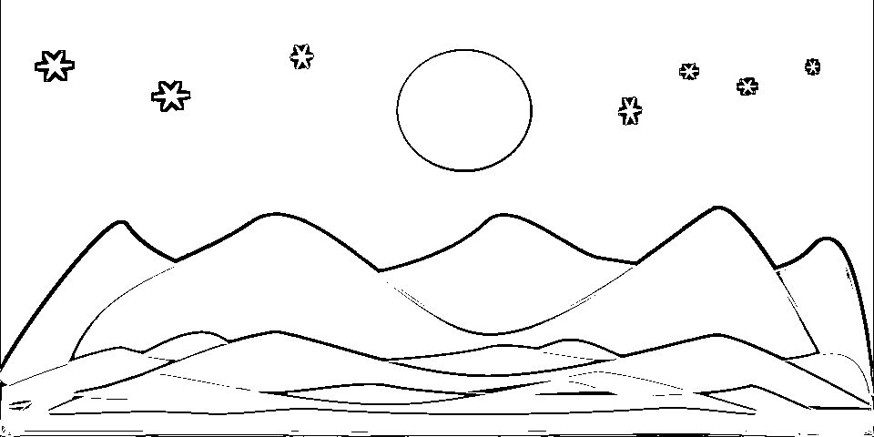

作者/艾伦·隆戈译者/李晓庆 校对/江艺编辑/翀子 图片/网络

我们经常遇到无法捍卫自己的情况，不懂得如何保护自己，总是轻易被别人侵犯了界限，很少有人真正能倾听我们的需要。该如何解决这样的困境呢？这篇文章会给你一些启迪。另外，如果你对占星学感兴趣，可以关注大卫老师参与授课的【[ISAR 认证职业占星师文凭课程](http://mp.weixin.qq.com/s?__biz=MjM5MjQwNjAyMQ==&mid=2649440045&idx=8&sn=96e24ca1a4ec34ecc0f1ccc6776e029d&chksm=beb9504789ced9513c9b4a08478008e5a7992dbb3c0b672ec582d39c23f36388c5d63ce79002&scene=21#wechat_redirect)】，点击链接了解更多详情！

**我曾毫无界限感**

过去我常常讨厌待在团体里，但是现在，当我想要，并且真的喜欢跟合得来的人在一起时，我学会了把自己的能量与他人的整合一起。现在甚至球类游戏都变得有趣了，因为我能“变成”我周围的人并且玩得很开心。

我从小在非常严格的，甚至可以称得上是在一种军事化的管教下长大。用占星学术语来说的话，这里有非常强的**土星**影响。家里的氛围导致了三种结果，而它们都和海王星有关：

*   **我趋向于退缩到精神和浪漫幻想的世界里，因为那是我唯一有力量的地方；** 

*   **我完全没有自我界限感，因为它们每天都被专横的权威人士所侵犯；** 

*   **我没有自律感，因为施加在我身上的外部规则太多了。**

我就这样漫无目的地从一个地方漂泊到另一个地方，从这个人走向那个人，然后进入了青年期，几乎没有感觉到，也并不渴望“真实生活”。我对于事情的潜在暗流非常敏感，但却有极低的自我保护意识。我几乎在所有社交场合都感到不舒服，从最小的晚餐聚会到大型的集体事件。

我对于任何需要规则或结构的事件都不感兴趣。我的海王星能量非常活跃，土星能量却完全没有发展。

那么这一切是怎么改变的呢？我必须承认这与个人界限有关。用占星学术语来讲就是——我发展出了我内在的**土星特质**。

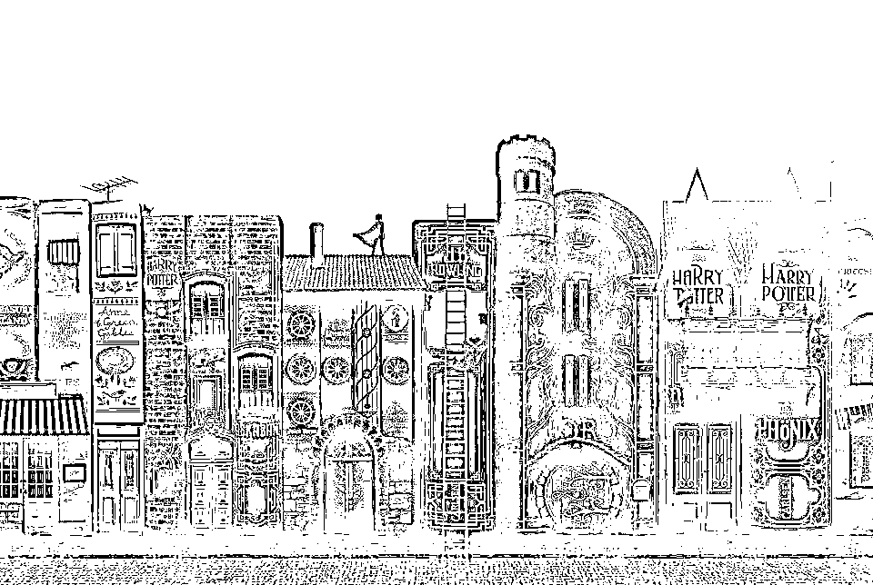

**第一次反抗权威**

我开始意识到我自身的土星特质，始于一位权威人士让我去做一件我根本做不到的事，就像让我跨越一条根本无法迈过去的线。

那是我有生以来第一次站起来对他人说**“不”**；战胜失去我所爱的人的恐惧，去表达我的感受和我所在意的事情。

这件事情使我第一次感受到自己的权利；在此之前，我从未意识到自己有任何权力。能保护自己并不惜一切去那样做的感觉相当美好。从做这个决定开始，我确实失去了一切，但这种失去转变成了自力更生、学习、我自己的商业、盖房子，还有养育小孩。

当然，这种内在权力的展现并非一蹴而就，而是花了很多年，但我一点一点地找到了自己内在坚实的地方，那是我自己安全的港湾，我学着去尊重它。

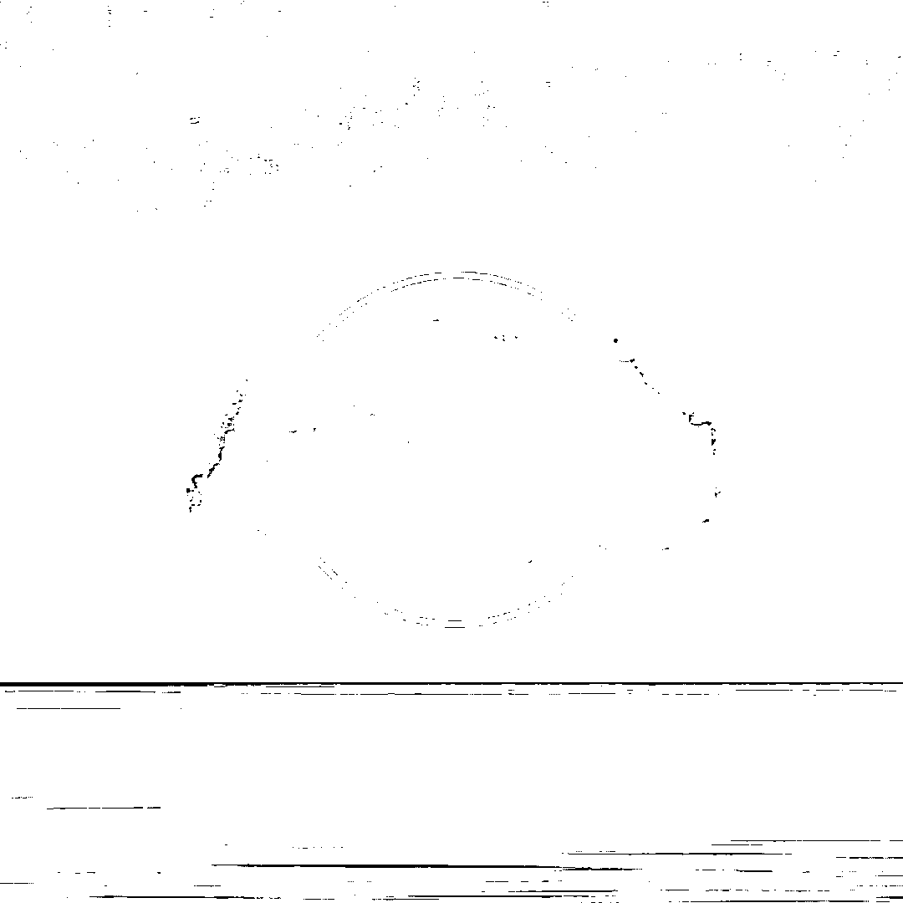

**心门不需要一直敞开**

对于一些人而言，一旦找到了土星的自我保护本能，他们就好像被困住而走不出来了；更多海王星人倾向于把他们自己的权力拱手相让，以至于他们从来不会坚持自己。

感谢我的灵性老师，这两种情况在我身上都没有持续太长时间。很有趣的是一个小事件会带来重大的人生改变。

一天，我跟老师在一个大房间里，房间里还有几百人。一个女人朝老师走来，老师留意到这位女士脖子上戴了一个心形盒式吊坠，盒子是打开的。

老师告诉这位女士：“你的吊坠开了。”这位女士向下看了一眼，说道：“那是因为我的心总是敞开着的。”于是老师说：“啊，但是你必须要学会打开它，也要学会关上它。”

这件小事让我灵光一闪，对于界限有了全新的领悟。在那之前，我一直认为一个有“灵性”的人必须不断地把他们的内心向外展开，以保持真正的开放。

**我学到我的界限就是我自己，它们可以根据我的辨别力和意志伸缩自如。我的圈子可以延展到拥抱整个宇宙，也可以收缩到只可以容纳我的家人那么小。**

这就是关键：**我认识到我自己就是守门人。我只欢迎我真正喜欢的，我不喜欢的就被拒之门外。**

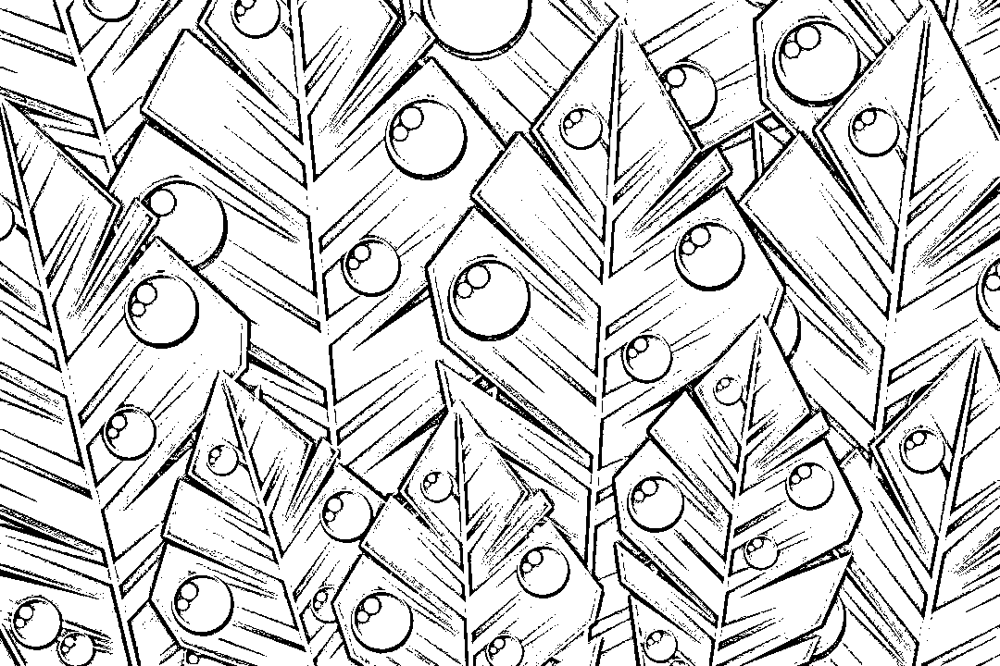

**无界限者的高质量转变**

这完全解放了我的生活。现在我能去最吵闹的球场，并全身心的加入人群中，玩得很痛快。没有什么比融入到共同胜利的快乐中更有趣。然而当我离开体育场，在纽约街头漫步的时候，我用自我保护的盾牌把自己围住。

我可以走进公园，与大自然融为一体，但是接着我坐在桌边专注于工作，我会随着环境的需要扩展或收缩自己。我可以在危险的负面环境下关上心房，迅速离开，然后在喜爱的朋友面前敞开心扉。

总的来说，我的故事在于要**学会自我掌权，自我界限，以及辨识力，这些都是土星特质。**一旦我学会内化土星权威的特质，它就会转变成自我保护。一旦我学会了自我保护，我就学会了以自我意愿去整合——整合多少都是我自己的选择。

**版权声明：**本文由若道翻译发布，欢迎转发，反对抄袭。友号转载请申请白名单。

**END**

**艾伦·隆戈**

执业占星师，女商人。曾就读原型宇宙学以及自主进化专业的研究生。

**拥有****51 年****占星实践经验的**
**若道创始人****前 ISAR 全球副主席****前 ISAR 全球职业占星师资质认证主席****大卫·瑞雷**

**和**

**2019 年第二届、2021 年第三届核心课中**

**与苏·汤普金斯老师****联合授课****的**

**ISAR 认证职业占星师**

**咔咔（Caroline）**

**二人合力打造**

**2022 年 ****若道全新核心占星课程**

**点击下图了解更多课程详情** 

**

**微信又双叒叕改版啦，不想错过若道君的推送？**

**就把若道设为星标吧！**

**▼**

**喜欢就点一下“在看”吧！**

********报名直达入口********

# 太阳进入处女座 | 12 星座将在哪些领域专注精进？

> 原文：[`mp.weixin.qq.com/s?__biz=MzA5NjA0NTAxNg==&mid=2651485956&idx=1&sn=278b9d305029880fc9255b9bce867784&chksm=8b48c5b3bc3f4ca540ac470a0ffb4554191a16dca20a630974cb2616c0fbdb15943ad1bbb3a3&scene=126&sessionid=1692737766#rd`](http://mp.weixin.qq.com/s?__biz=MzA5NjA0NTAxNg==&mid=2651485956&idx=1&sn=278b9d305029880fc9255b9bce867784&chksm=8b48c5b3bc3f4ca540ac470a0ffb4554191a16dca20a630974cb2616c0fbdb15943ad1bbb3a3&scene=126&sessionid=1692737766#rd)

********************☆ 后**********************台**********************回复“今日”，给你一句生命态度********************

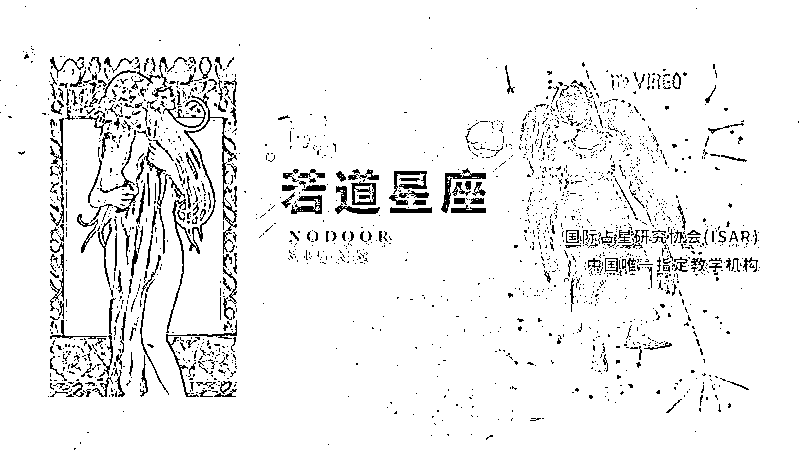

作者/郑玮玲 ISAR 认证占星师编辑/玫瑰 封面/书君 图片/pexels 北京时间 8 月 23 日 11:17，太阳进入处女座。接下来的一个月，都有哪些重要的天象，12 星座都需要在哪些方面精进呢？一起看看。**太阳进入处女座**

北京时间 8 月 23 日 11:17，太阳进入处女座。同时也来到了处暑节气，初秋早晚的凉风将渐渐带走酷热，随着白天与黑夜的时光渐趋平分，凉意会越来越明显包裹大地。让我们翘首以盼“天阶夜色凉如水，卧看牛郎织女星”的画卷成为不久之后的现实。

**处暑三候是：一候鹰乃祭鸟，二候一地始肃，三候禾乃登。**古人在此时节观察到代表战争与胜利的鹰捕获鸟类作为天祭。秋风肃杀既是季节的分界，也是社会活动区隔时分，于是有了“秋后算帐”、“秋后行刑”等民间行为。处暑是收获季，五谷丰登，粮仓饱足才是维持民生与家国兴安的基础。**处暑属于火水未济卦的时空，意味着“君子以慎辨物居方”，既清晰明辨人生方向和目标，谨言慎行，保持自省与自修才能应变、处变**。未济卦在我心目中有着中国传统美学、哲学最经典的意境：留白缺憾才有大美、大智慧。天地万物永无止境在循环、变幻之中，有圆满就有缺损，有相聚就有离别，有颠峰就有谷地。未济才是比人生、万物、甚至宇宙更永恒的现象。历代文人曾用诗句描写各种人生未济之境。**·** 李商隐的“君问归期未有期”是重逢之未济；**· **秦观用“两情若是久长时，又岂在朝朝暮暮”表达相思的未济；**· **李煜用“雕栏玉砌应犹在，只是朱颜改”悲叹家国未济；**· **苏轼用“人有悲欢离合，月有阴晴圆缺，此事古难全”歌颂人生无常的未济；**· **李叔同用“一斛浊酒尽余欢，今宵别梦寒”谱写昔日情谊的未济；**· **龚自珍则直接道出了未济之妙：“未济终焉心缥缈，百事翻从缺陷好。”**而未济卦恰是易经 64 卦的最后一卦，且紧临水火既济卦之后，意味着满盈之后必有空缺带来循环的再启，那便是生生不息的原始动能。**

从未济卦的意境联接到太阳处女座的氛围，我们便知**四季更迭之缺憾美**——秋日万物收摄，不再繁茂，那是生长之未济。在冬季蛰伏之后万物才会迎向阳光生长。

**而处女座挑剔细节，追求至臻完美的品质要求也总会经由未济、缺损、瑕疵来打磨、历练、成就和完整。**正如但丁所说：“对于完美的渴求使得一切的欢愉满足都显得有所缺失。”

作为变动星座的处女座必然给予我们时间、空间去学习、调适到一个完美与缺失之间最佳的频段，而这个过程或能堪称对“完美”的学习过程。**处女座终究是水星所守护的星座，我们在此透过技艺打磨，服务与谦卑来学习、成长。**处女座能带给我们的**秩序感、整洁感、细节感、计划性与务实的作风**若能内化为自我的恒常标准，便可**在服务自我生命最高意图和英雄梦想时实现不可多得的完美。**

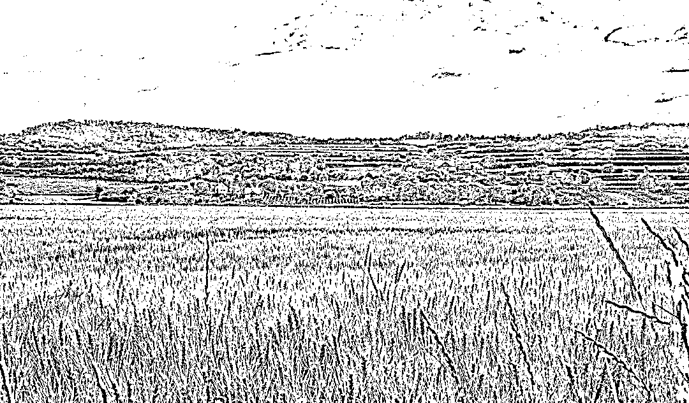

**太阳在处女座的行进**

**太阳四分火星**

**周期：8 月 23 日-9 月 14 日****重点影响人群：**有**个人行星、四轴、交点位于处女座、射手座、摩羯座、双鱼座、金牛座、双子座 0°-20°，天秤座、水瓶座 1°-12°的人。****太阳与火星的激烈摩擦带来调整、改善的紧致诉求，这会引致诸多现实生活的燃眉之急。**处女座太阳对细节完美和周全、合理、落地的追求经受双子座火星的急切心智的挑战，**近期的行动、计划可能因不耐烦，沟通的不畅而暂停，切断或更换方向、对象。****重点影响人群需要拿出实干、攻坚和灵活应变的态度来对待。**曲折全，是为应变之法宝。火星也会提供一种作战的精神、态度，尤其**8 月 26 日-29 日**为最紧密时间，**在此期间极可能面对突发、应急事件能作出快速、积极的反应**。若带着对高效、责任的觉知、担当在紧张压力之下，尝试把标准化、合理性与实践性快速整合在一起，不失为自我的快速成长期。火星的触发下，带来短期行动、趋势的有效启动，而**所有重点影响人群都需要格外注意日常外伤、流血事件和感冒、发烧、发炎的可能性**。这是火星以身体智慧的方式提醒我们调整生活起居和保持平衡、清晰的当下觉知。

**太阳三分月亮北交点**

**周期：8 月 31 日-9 月 15 日****重点影响人群：**有**个人行星、四轴、交点位于处女座、射手座、摩羯座、双鱼座、金牛座、双子座 7°–22°的人**。太阳与交点形成柔和的三分相，将**为集体带来颇具启发性的图景、向往和灵感的通道。行进的交点与集体的灵魂诉求有关，而太阳代表了个性化的进程。**北交点金牛座提供了集体的解药——在长达 3 年的疫情的浪潮中，生死、危机、恐慌、禁闭、匮乏不断消磨着生活的理想与愿景。**而此时的土象星座三分象为我们渴望的宁静、稳定而自足的日常生活向往提供了有力的希望，我们将看到一些光亮、助力支持着旧有危机的消除。**重启新的生活，投入丰沃、生机的大自然，创造抚慰人心的艺术，这些都将在此周期里给予新的开启。如果我们对此积极投入计划，将会创造更多的主动权，更轻松地挥别集体、时代性的阴霾。

**太阳三分天王星**

**周期：9 月 2 日-9 月 19 日****重点影响人群：**有**个人行星、四轴、交点位于处女座、射手座、摩羯座、双鱼座、金牛座、双子座 9°-26°的人。****天王星从 8 月 24 日 21:55 分开始逆行，它将从金牛座 18°55′退回到金牛座 14°56′，直到 2023 年 1 月 23 日恢复顺行。**此时的日天三分正值天王星逆行初期，同时，自 5 月以来，天王星也与月亮北交点一直处于合相之中。我们可以感受到**整个夏天在集体层面那些具有打破、革新、与激烈性的事件。**就在天王星与月亮北交点最紧密合相的一个月内，川渝地区遭受了 60 年难遇的高温、干旱天气。水电第一大省产量骤减一半，不得不大规模的限电，工厂停产，写字楼、商场停用空调，电影院、剧院、博物馆、图书馆关门谢客。在此前提下，仍有不少居民小区，农村社区每日都在经历不定时断电，一脚踢回 30 年前的感觉。我们曾担心的事件就这么突如其来地发生了。**天王星的作风向来离奇而突然，而开始逆行的天王星正给予了我们集体性的革新启发。**日天三分，提醒着我们去思考更为经济的用电，关注每日 1 度电的消耗是否合理。处女座带来节俭、省钱的途径，而金牛座的天王星必然从切断与已打破的现状中引领了更稳定生活的路径。

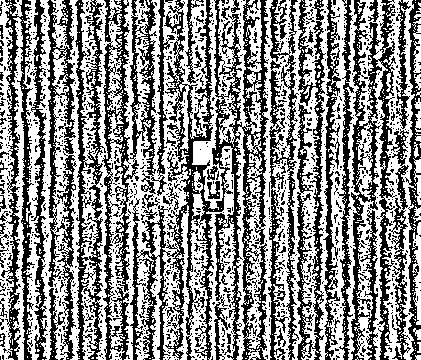

**相信从这一刻时，所有人都会重新整合日常生活与能源使用议题，从个人行为到集体性的变革正在悄然蕴酿着。**天王星当然也强力助推每个人自性化的进程，逆行的时机正好带来强烈、独特的个人觉醒助力。处女座的太阳提供了精进、自律与落地的行动力。在此周期，可以大胆朝着长久以来未能突破、实施的目标前进，唤醒心中沉睡天才。

**太阳对分海王星**

**周期：9 月 9 日-9 月 24 日****重点影响人群：**有**个人行星、四轴、交点位于处女座、射手座、摩羯座、双鱼座、金牛座、双子座 16°-29°，以及天秤座、摩羯座、白羊座、巨蟹座 0°-1°的人。**

日海对分的开始便迎来中秋节了，一年当中月亮最美的夜晚，海王星将为佳节渲染层层朦胧的氛围。是迷雾，还是心灵交融的时刻？处女座的太阳或许能给我们最好的答案。

海王星模糊边界与意识，**在此期间重点人群最好避免酒精和任何容易沉溺、消融的物品、社交活动或情境。**保持清晰的意识，才能守护好个人的边界。我们的敏感性将在此时期非常敞开，是一个**非常适合练习与高维意识、能量联结的时机。**若愿享受海王星的波浪，我们可借用灵性工具为船帆：冥想、唱颂、神圣舞蹈，以及充满敬畏地清扫、整理个人空间，充满爱意地照料植物与动物，都会让我们从细微处觉醒，穿越现实的迷障，轻松抖落粘连的尘埃。身体与心灵便会经由每一个敏感细腻的觉察而作适当的行动、调整，走向轻盈自在，处变不惊。

**太阳三分冥王星**

**周期：9 月 11 日-9 月 27 日****重点影响人群：**有**个人行星、四轴、交点位于处女座、射手座、摩羯座、双鱼座、金牛座、双子座 18°-29°，以及天秤座、摩羯座、白羊座、巨蟹座 0°-4°的人。**整个 9 月虽然有令人不适的情境就是水星、木星、土星、天王星、海王星、冥王星都在逆行，但舒适的一面则是，很多行星在宇宙中合奏的是三分相的和谐旋律。冥王星与太阳也在其中。虽然冥王星总是不会给我们舒适感，压力、紧密、禁忌与危机感会加强，但**处女座太阳提供的灵活应变，落地实施的效能将在高压之下发挥出极致。**太阳永远关乎精神、意志和生活活力。在冥王星的触碰之下，顽强与坚韧成为了精神中必须的力量。在此期间，我们可以**投入最具转化意义的工作中去，去关注重大的生计，个人职业、健康或生活的极限考验，工作中的结束与放手，以及任何触及死亡、丧失的沉重议题**。当我们相信自己可以跨越黑暗与阴影，冥王星就会将转化的力量交付到我们手中。

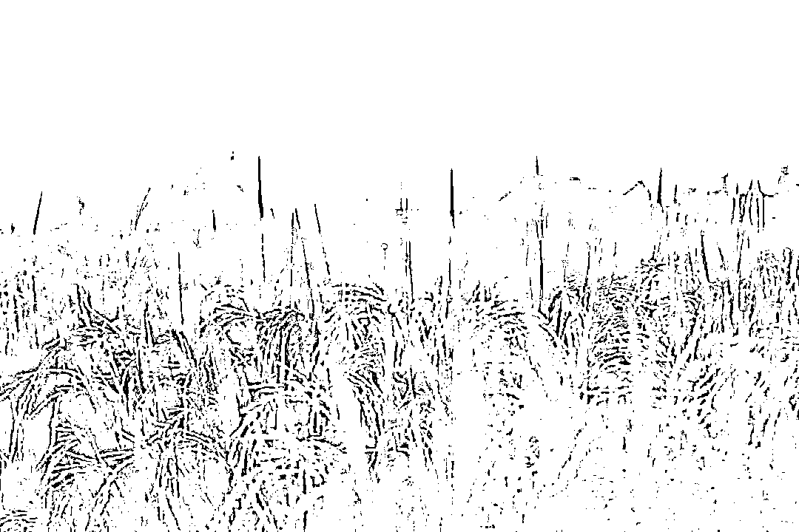

**太阳在处女座对 12 上升星座的影响****注：以出生星图上升星座度数 30°范围内的上升星座为准。如你上升在 0°，可以完全参考下列内容；如你上升在 29°，则需参考下一上升星座。****若道君：****你可以在 app store 或者应用商店搜索“若道”下载 app，输入个人档案，查看行运盘（也可以使用其他星图软件），找到行进太阳落在出生星图的第几宫，然后对照下文查看。****例如下图中，比尔·盖茨上升在巨蟹座，行进太阳在个人星图的第 2 宫。**

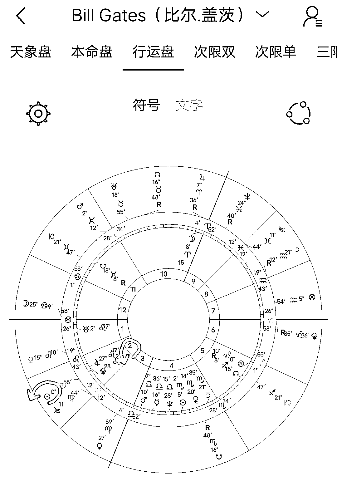

**上升****处女座****，太阳行进在*****1*****宫**

**接下来这个月，你会感受到活力的灌注，会更有精力投入到个性化的行动中去。**任何对身体有积极作用的运动、社交方式，任何能让你走出集体困惑，集体捆绑的行动，任何能让你感受精力充沛，不再自我消耗的选择都值得写进本月的日程优先项。**工作中的重担、责任或长期性的带来了健康的隐患，可以从当下对身体是积极的调整阶段找寻一种新的平衡，为未来的愿景做更有效率的规划吧。**

**上升****狮子座****，太阳行进在*****2*****宫**

**当下的你值得积极投入更具效率的职业规划中，不仅关于你的价值定位，还需要将日程与效率作以区隔。**

当然，你们中的大多数人向来清晰自我价值，也敢于主动表达真实自我需求。然而，**可能当下的你已经历了较长时间亲密关系的摩擦与冷漠，内在的信心或许磨损，或许倦怠。**

因此，**将更高的热情投入到职业发展中是缓兵之计，也是应时之需。高效和精密的自我规划会帮助你重获信心与荣耀感。**

**上升****巨蟹座****，太阳行进在*****3*****宫**

**你非常需要变换一种生活、社交方式，带着你的敏感，积极去投入技艺的学习中去可能是当下最好的选择。**任何你会关心的：**烹饪、烘焙、中医、手工、乐器演奏、书法、传统手工艺**等。无论你是将要开始，或继续深入，你都将从技艺的习练习中获得深层的快乐与知足。这份焕新的自信与活力将支持到你从长期紧缩的内在压力中解脱出来。所有专注、清晰而笃定当下的功法都可视为对身心照料的精进觉察和修行工具。

**上升****双子座****，太阳行进在*****4*****宫**

**也许你将有更多的时间待在家完成自己给自己拟定的功课、日程表、工作计划表。**也可能你会有**更多时间兴趣投入在厨艺、园艺和孩子的世界里**。当然，随着 9 月开学季的到来，很多人将扮演着“重新进入”校园般的新鲜、启蒙状态。总之，这个月可能会比整个夏天更多忙碌、混乱感，为了应付更多的变化与趋势，你也不不疲于应对。与此同时**要小心照顾身体，避免感冒、发烧、外伤流血事件**。同时，非常值得在繁忙中保持精微、自省的觉察，将日常生活的点滴都当成修行的一部分吧。

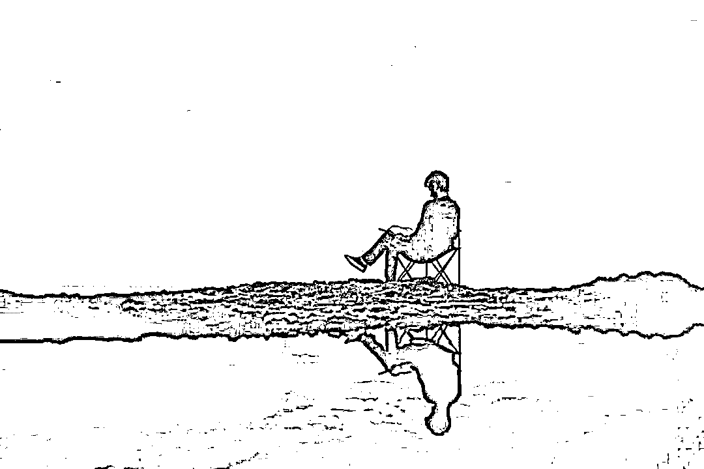

**上升****金牛座****，太阳行进在*****5*****宫**

外境的变迁与自我成就的压力一直在考验着你的耐心与坚韧。当下的你可以**稍微轻松投入一些没有目的，没有压力的自我创造项目中去。**无论是出于工作还是兴趣，只要你想，就去做。不要因为团队、集体的目标不同而忽略、隐藏了自身真实的渴望。在诸多的压力与变迁之中，保持一份孩童的心性是颇为重要的。**去享受每一个新鲜、有活力的创造，这才是你当下值得去投入的事。**

**上升****白羊座****，太阳行进在*****6*****宫**

**当下你值得为工作、职业全情投入，效率、职责与担当会成为职业发展中重要的指标。**去和你的团队成员一起合作，他人的协助与支持才能让你看见自己的不足，成长为更有肩负力的人。当下的你正在快速成长期，更多的主动压力好过被迫的承担与紧逼。**在饮食起居上值得更多节制，调整，即使不存在发胖的可能性，却可能由于压力、起居照料不佳而带来情绪失调。**

**上升****双鱼座****，太阳行进在*****7*****宫**

相信什么就是什么——这一直是你生命中的魔法。接下来你需要给自己的是更多的信心，从内在新生的秩序与自律的节奏中给自己新的动力。你要**学着去相信新的世界韵律，更新并提升你的价值观。你可以把控对内在完美细节的表达。**可能你也经受着较长期的低迷、失落与无计可施，接受现状并不影响不懈努力与积极应变。**同时你可以再次去创造心中的魔法，让你所相信的一切透过计划、落实再次呈现为奇迹。**

**上升****水瓶座****，太阳行进在*****8*****宫**

**也许沉浸式工作、学习或某种持续状态的体验对当下的你是最好的选择。**生活中很多的沉默、静默正是你需要的，面对深邃、宁静的自己，因为有很多生命深广度的问题值得去寻找、思考、探索和总结。痛苦用隐微而蔓延的形式在宇宙中布满了网，而每个人都在其中，沉浮、飘落。**学会生命的坚强，有时候只需要接受无可奈何的现状，但是不放弃心中的热望。**你会从这些深邃的内在夜空中唤醒自己的力量，去用来追寻更值得的远方、未来和宁静的风景。

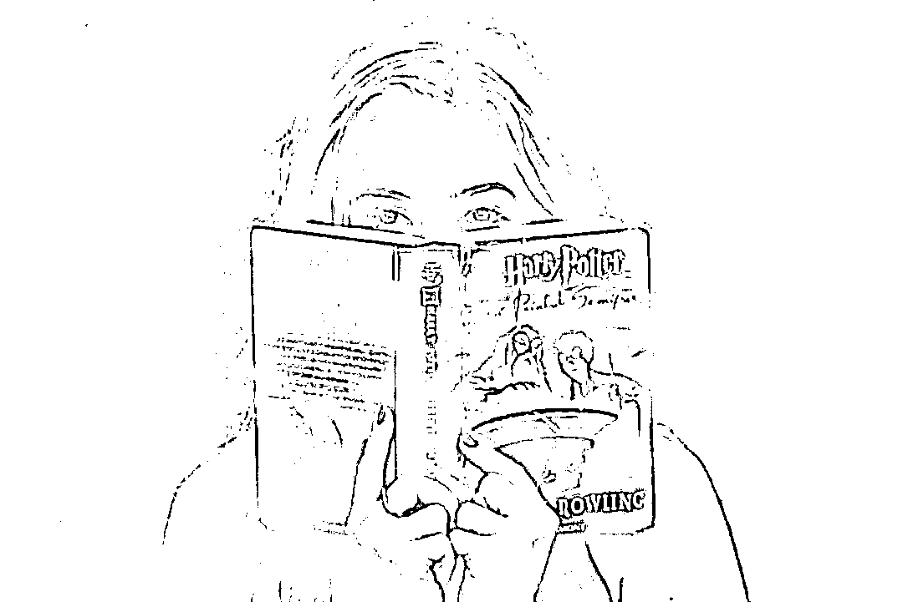

**上升****摩羯座****，太阳行进在*****9*****宫**

**你会更有激情去学习、探索与寻找意义**，也许你已经埋头在一些长期课程中，渴望从中寻找到生命深层的意义，或是开始建设灵性生活应该有的样子。你喜欢一点点累积、攀爬的自己，而当下你更热衷于那些充满激情与创造性的举措。生活不总是需要循规蹈矩，还有些不经意和随性的发生。这就是你此刻可以投入其中感受到新颖与活力的面向。而更高的眼界和意识则需要你吸引前人的哲学、学术性总结而得到启发。加油吧！

**上升****射手座****，太阳行进在*****10*****宫**

**又是一轮工作中的开拓期、创造期，你会更有活力专注于事业表现的领域。**

但可能因为高度投入的专注，对效率细节的要求而导致与团队成员、亲密关系的言语、观念冲突。尽可能地在紧密工作中抽空照顾家人、爱人的情感需求，也将重要的工作分担给可信任的团队伙伴。

当个人目标与团队目标协调一致时，力量和成就都会更上一层楼。

**上升****天蝎座****，太阳行进在*****11*****宫**

也许这一年你经受着，也经受住了环境、职业、家庭的动荡与变迁，你的适应能力正在突破性成长。为了愿景和超越个体的目标，一定程度的打破与新生，重建已经让你感到创造的刺激与全新的资源融合。**若你积极主动投入到团队工作、活动中去，会经由众人的启发获得更为精微的协力与支持，也可能从中结识良缘。**

**上升****天秤座****，太阳行进在*****12*****宫**

**你可能需要更多的睡眠、休息与养身工作，休息是为了走更远的路，为了肩负更重要的担子。**或许你也需要一些时间**放下紧张的工作，投入更为私密、静谧的个人时空，创造一些宁静给自己，安抚疲累的身心。**新的重大的计划、项目就要降临，对你来说的神圣计划也或将开启。但此时不需要向外去印证和寻找，当你身心准备充分的时候，你便会和更大的图景合而为一。

**版权声明：**原创文章由作者授权首发于若道平台，欢迎转发，反对抄袭。友号转载请申请白名单。

**END**

**郑玮玲**

ISAR（国际占星研究协会）认证占星师（2016 年获得）

若道占星专栏作者

将占星咨询、教学与音乐、舞蹈相结合的疗愈者

**微信号**：zhengviolin

**新浪微博**：@郑玮玲

**微信公众号**：Sampriya-Astrology

长按打赏

**20 位来自世界各地的占星师****带来 19 场沙龙——新世界的觉醒****详情可点击下图**

**学习占星学****点击下图了解课程详情**

**微信又双叒叕改版啦，不想错过若道君的推送？**
**就把若道设为星标吧！****▼**

**喜欢就点一下“在看”吧！**

********报名直达入口********

# 插班中丨神话塔罗：高效学习班上线，灵活掌握，专业实践！

> 原文：[`mp.weixin.qq.com/s?__biz=MzA5NjA0NTAxNg==&mid=2651485956&idx=2&sn=a06007a88e2e38b35030cb64b47e391c&chksm=8b48c5b3bc3f4ca51cafbea32267f14749b73c927da825a60412b680e6289af04c66ec9dd2af&scene=126&sessionid=1692737766#rd`](http://mp.weixin.qq.com/s?__biz=MzA5NjA0NTAxNg==&mid=2651485956&idx=2&sn=a06007a88e2e38b35030cb64b47e391c&chksm=8b48c5b3bc3f4ca51cafbea32267f14749b73c927da825a60412b680e6289af04c66ec9dd2af&scene=126&sessionid=1692737766#rd)

**2022 年超高含金量的神话塔罗认证课程****高效学习班****开始招生**用**四个月**的时间学习掌握神话塔罗解读喜欢**集中学习，快速掌握**的同学不要错过

黄色日期为**8 节直播课**时间，同学可以自由安排时间学习**18 节录播课**

班级学习群讨论、APP 答疑区提问

课程内容体系让你直观精准地感受到**神话塔罗的魅力**扎实地建构**神话塔罗思维**系统学习**最地道的塔罗知识**课程中老师将**神话、占星、心理学**完美融合进塔罗的**人本主义咨询体系**并进行学员**案例督导**让你更自信的开展咨询工作，学以致用

本期认证课程采取**即报即学的录播课+案例督导直播课**的形式，

*   **18 节录播课：**精编剪辑，随来随学，助教答疑，学练结合。

*   **8 节直播课：**融会贯通，神话心理，塔罗占星，咨询技巧。

为了适配大家的各种学习场景，提高学习&复习效率，我们还将**录播课**剪辑了**中文字幕版**和**翻译音频版**：

*   **中文字幕版：**朱丽叶老师英文原声配中文字幕，适合在手机或电脑前专心致志的学习。

*   **翻译音频版：**翻译老师幼婷的中文原声纯享，适合运动、通勤路上耳机里陪伴式学习。

若道还为塔罗学员开发了**“神话塔罗”**平台，是随身的工具，更是接咨询的平台，录播课程**学成入驻平台**即可链接更多塔罗个案，发展壮大你的塔罗咨询事业。

**如果你想学习塔罗，什么样的老师会让你怦然心动呢？她是三副塔罗牌的设计者，写了 6 本塔罗书籍。她研习塔罗四十余年，教授塔罗三十余年，是丽兹·格林的密友。还有****谁会比塔罗牌设计者更了解塔罗的历史、灵魂与精髓？****所以，这将是你开启塔罗之旅最坚实的一步。**

1

**这位塔罗大师是谁？**

**朱丽叶·沙曼-伯克** 

*   她是**3 副塔罗牌**的**设计者****——**神话塔罗牌、沙曼–卡塞利塔罗牌、“自己着色”塔罗牌；

*   她出版了**6 本塔罗书****——**《塔罗全书》、《新塔罗全书》、《众星的传说》、《理解塔罗牌》、《精通塔罗牌》、《塔罗初学者指南》；

*   她研习塔罗**四十余年；**

*   她教授塔罗**三十余年**；****

*   她是**丽兹·格林**的密友，两人合著了**《神话之旅》**，共同设计了**神话塔罗牌**。

*   她是认证的**心理治疗医师；**

*   她深谙**塔罗、占星学、心理学和神话学。**

**如果你想成为拥有英国神话塔罗认证的塔罗师**

那么她，就是你**最好的老师人选**

2

**塔罗牌有什么用？**

*   塔罗牌是一种**古老的疗愈工具**，同时也是**直观的解惑工具****；**

*   塔罗牌绕过逻辑思维，**和潜意识联结**，通过图像的方式生动地将隐藏在人类潜意识中的画面浮出水面，**揭示心灵的状况和运作****；**

*   塔罗牌**帮助我们和潜意识对话**，可以和现代的心理治疗联系在一起，帮助我们**看清心灵的冲突来源、本质和可以选择的道路；**

*   塔罗牌又和更广阔的**宇宙生命原型**联结，彰显**个人生命发展的阶段**，将**个人生命挣扎、内在冲突**放在生命进化的道途上，让更广大的生命智慧为个人成长照亮道路。

3

**为什么学习神话？**

神话通过**图像和故事**描绘人类生活的**原型模式**。通过瑰丽的想象、诗意的语言、栩栩如生的人物和故事描绘出我们内心的世界，表达出我们经历的那些实现人性的过程，帮助我们将**个体的生活与人类古老且永恒的故事**建立联结。从而在更深处**理解生命**，并学习**古老而长青的生命智慧**。

**神话塔罗**取材于**希腊神话**的无尽沃土，通过故事提供一种**记忆辅助**，在心理和预见层面提升解读的**丰富度**。因为这样更符合塔罗牌的性质，符合人类的想象。**按照故事思考，而不是简单的记忆关键词和固定的意义。**

4

**塔罗预测是什么？**

塔罗牌预测的运作就像是**照向心灵的一面镜子**。在塔罗牌解读时，图像的原型性质穿透隐藏的潜意识脉络，反应出与个人境遇相关但又未被了知的知识与洞见，因此**揭示出按照任何理性方式都无法发现的事情。**

如果你对生命好奇，塔罗学习会帮你**打开一扇通往未来的门****，**让你了解**心灵运作和显化的秘密**，同时赋予你更多关于生命成长的支持和指引的能力！

5

**我们将学习什么？**

**录播课（即报即学）**

**☆****初阶：神话塔罗详解**

**神话故事和预测意涵**

**第 1 讲 塔罗牌介绍 ，讲述它的历史 （中文字幕版）**

**第 1 讲 塔罗牌介绍，讲述它的历史（翻译音频版）**

**第 2 讲 星座形态、元素和宫廷牌&基本星座与基本国王 （中文字幕版）**

**第 2 讲 星座形态、元素和宫廷牌&基本星座与基本国王（翻译音频版）**

**第 3 讲 固定星座与固定王后（中文字幕版）**

**第 3 讲 固定星座与固定王后（翻译音频版）**

**第 4 讲 变动星座与变动骑士（中文字幕版）**

**第 4 讲 变动星座与变动骑士（翻译音频版）**

**第 5 讲 小阿尔卡那牌权杖（中文字幕版）**

**第 5 讲 小阿尔卡那牌权杖（翻译音频版）**

**第 6 讲 小阿尔卡那牌圣杯（中文字幕版）**

**第 6 讲 小阿尔卡那牌圣杯（翻译音频版）**

**第 7 讲 小阿尔卡那牌宝剑（中文字幕版）**

**第 7 讲 小阿尔卡那牌宝剑（翻译音频版）**

**第 8 讲 小阿尔卡那牌星币（中文字幕版）**

**第 8 讲 小阿尔卡那牌星币（翻译音频版）**

**第 9 讲 经典牌阵教学讲解（中文字幕版）**

**第 9 讲 经典牌阵教学讲解（翻译音频版）**

**第 10 讲 牌阵解读案例演示（中文字幕版）**

**第 10 讲 牌阵解读案例演示（翻译音频版）**

**☆****中阶：神话塔罗牌阵应用**

**神话****解读和咨询技巧**

**开启神话塔罗愚人之旅**

****

**第 1 讲 愚人、魔术师、女皇、皇帝（中文字幕版）**

**第 1 讲 愚人、魔术师、女皇、皇帝（翻译音频版）**

**愚人**：永恒的少年（儿童的原型）

**魔术师**：恶作剧者、老师、向导、沟通者的原型；行星：水星。

**女王**：母亲、养育者、丰产的原型；行星：金星在金牛座；小行星：谷神星。

**皇帝**：父亲、供养者、计划者的原型；行星：木星。

**第 2 讲 女祭司、教皇、恋人、战车、正义、节制（中文字幕版）**

**第 2 讲 女祭司、教皇、恋人、战车、正义、节制（翻译音频版）**

**女祭司**：处女——等待被实现的潜力原型；行星：新月。

**教皇**：疗愈者、受伤的疗愈者、牧师的原型，牧师是神与人之间的灵性桥梁；行星：凯龙星。

**恋人**：爱、爱人、所爱之人的原型；行星：金星在天秤座。

**战车**：战争、冲突、战士、斗士的原型；行星：火星。

**正义**：智慧、兵不血刃的胜利的原型；星座：处女座；小行星：智神星。

**节制**：关系、合作的原型；星座：巨蟹座、双鱼座。

**第 3 讲 力量、隐士、命运之轮、倒吊人、死神（中文字幕版）**

**第 3 讲 力量、隐士、命运之轮、倒吊人、死神（翻译音频版）**

**力量**：力量的原型；星座：太阳在狮子座。

**隐士**：晚年、耐心的原型；行星：土星。

**命运之轮**：命运女神与命运的原型。

**倒吊人**：牺牲与有意识的牺牲的原型；行星：海王星。

**死神**：死亡、终点和起点的原型；行星：冥王星。

**第 4 讲 恶魔、高塔、星星、月亮、太阳（中文字幕版）**

**第 4 讲 恶魔、高塔、星星、月亮、太阳（翻译音频版）**

**恶魔**：阴影、人类不文明的面向、本能、欲望天性；行星：火星在天蝎座。

**高塔**：改变、分裂瓦解的原型；行星：天王星。

**星星**：希望的原型。

**月亮**：无意识的原型；行星：暗月。

**太阳**：意识、创造力和文明的原型；行星：太阳。

**第 5 讲 审判、世界（中文字幕版）**

**第 5 讲 审判、世界（翻译音频版）**

**审判**：复活、新生的原型；行星：水星作为灵魂向导普绪科蓬波斯。

**答疑与讨论，学员们分享对自己或客户的塔罗解读，对神话塔罗牌进行更多探讨。**

**世界**：整体、完成和个性化的原型。

**第 6 讲 经典牌阵教学讲解（中文字幕版）**

**第 6 讲 经典牌阵教学讲解（翻译音频版）**

**第 7 讲 咨询案例演示：为一位年轻女性所做的四次解读（中文字幕版）**

**第 7 讲 咨询案例演示：为一位年轻女性所做的四次解读（翻译音频版）**

**第 8 讲** **引导式冥想、荣格的四种意识功能（中文字幕版）**

**第 8 讲 引导式冥想、荣格的四种意识功能（翻译音频版）**

**☆****高阶：神话塔罗直播督导课**

**第 1 讲 塔罗牌中的荣格原型**

**2022 年 8 月 10 日（周三）**

我们将学习荣格是如何理解原型，以及荣格原型如何反映在塔罗牌中。对塔罗牌解读而言，理解原型的普遍性非常有帮助，因为这有助于塔罗咨询师碰触客户的内心世界。

**第 2 讲 塔罗牌是如何与行星原型和其原型体验联系在一起**

**2022 年 8 月 24 日（周三）**

大阿卡纳牌反映了行星神祗的原型，在某些情况下，原型经验意味着它们反映了所有人类的经验。我们将通过这个角度看这些大阿卡纳牌。我们将看到理解原型对解读有何帮助。

**第 3 讲 荣格意识的四种功能与小阿卡纳牌的四种元素及与权杖、星币、宝剑、圣杯四套牌之间的联系**

**2022 年 9 月 7 日（周三）  **

我们将看看小阿卡纳从 1 到 10 如何反映荣格意识功能的各个方面，以及它们如何反映在四套牌四个元素和其心理方面。我们还将对 1-10 的数字学进行修正，看它们在元素中的表现方式。

**第 4 讲 占星学中的 12 星座和宫廷牌之间的联系**

**2022 年 9 月 21 日（周三）**

我们将讨论形态和星座，以及它们如何反映在宫廷牌上。

**第 5 讲 马蹄牌阵学员案例督导**

**2022 年 10 月 19 日（周三） **

**第 6 讲 六芒星牌阵学员案例督导**

**2022 年 11 月 2 日（周三） **

**第 7 讲 凯尔特十字学员案例督导**

**2022 年 11 月 16 日（周三） **

****

**第 8 讲 三个牌阵学员完整案例督导**

**2022 年 11 月 30 日（周三）**

**认证阶段：考试论文**

录播课学习完毕，即可入驻若道神话塔罗平台，以实习塔罗师获得推广流量，对接塔罗咨询个案。

直播课+录播课学习完毕，提交考试论文通过即可获得获得英国神话塔罗认证证书，升级为认证咨询师。

**扫码进入全新神话塔罗 H5**

每天有事没事都可以去**神话塔罗 H5**里转转抽取专属于你的今日塔罗

**神话塔罗 H5 问答平台全新上线**

三张牌牌阵，专业塔罗咨询师语音条解读

如果你碰巧有困惑，刚好有**限时优惠价**

如果感到快乐你就用用**神话塔罗 H5****，**如果你感到不快乐，更要使用由专业人本主义塔罗师团队全程陪伴的**神话塔罗 H5 哦！**

6

**适合人群**

*   塔罗初学者，完全没有塔罗基础；

*   塔罗自学者，也曾上过塔罗工作坊，但仍不懂如何使用塔罗牌；

*   塔罗进阶学习者，有塔罗基础，了解 78 张塔罗牌含义；

*   不知如何解决遇到的情感困惑、职业选择、人际问题，对人生感到迷茫；

*   想要学习深入解读塔罗牌、牌阵的使用、咨询技巧等将塔罗运用于咨询实践；

*   想要深入了解和学习塔罗，希望成为专业的塔罗师；

*   想要借助塔罗进行心灵、灵性成长。

7

**导师简介**

**朱丽叶·沙曼-伯克**

**朱丽叶·沙曼-伯克**从 20 世纪 70 年代早期开始，就对塔罗牌产生了兴趣，并踏入了塔罗的世界。后来，在丽兹·格林的鼓励下，开始研习心理占星学和塔罗。

1984 年，第一本书《**塔罗全书**》（*The Complete Book ofTarot*）出版。之后，与丽兹·格林合作设计并撰写了《**神话塔罗**》（*The Mythic Tarot*），在这本书中，她们将古希腊神话与传统塔罗解读结合起来。朱丽叶写了**十本塔罗和占星学书**，包括一本名为《众星的传说》（*Stories from the Stars*）的儿童读物，以及与丽兹·格林合著的《神话之旅》（*The Mythic Journey*），这是一本详细讲述如何运用神话来指导生活的书。

8

**课程价格**

**认证课程总价：****22000 元**

**联报优惠价：****19000 元**

**限时转发优惠价：18000 元（联系 Echo 老师，获取限时转发优惠价）**

长按二维码添加客服 Echo 老师

9

**退转课程**

*   **退款原则请详看《教学协议》，如有疑问请咨询课程顾问。**

**神话塔罗认证课程**

**授课老师：朱丽叶·沙曼-伯克**

**授课时间：录播课即报即学，直播课 2022 年 8 月 10 日起**

**授课方式：**网络课程**，**英文授课，中文翻译

**费用：****认证课程总价：****22000 元；****联报优惠价：****19000 元；****限时转发优惠价：18000 元**（联系 Echo 老师，获取限时转发优惠价）

**课程负责人：Echo 老师**（微信/手机：nodoor18518412824，请备注“神话塔罗”）

长按二维码添加课程负责人咨询~

****报名请点击“阅读原文”****

# 神话塔罗之大阿卡纳牌｜太阳

> 原文：[`mp.weixin.qq.com/s?__biz=MzA5NjA0NTAxNg==&mid=2651485956&idx=3&sn=591ab9017826faf9f8f492511fc472f6&chksm=8b48c5b3bc3f4ca59b6e98fdbc34c0ad0e2c677f6d60dee9337402f7f3b55cfa8b7f5d5eac35&scene=126&sessionid=1692737766#rd`](http://mp.weixin.qq.com/s?__biz=MzA5NjA0NTAxNg==&mid=2651485956&idx=3&sn=591ab9017826faf9f8f492511fc472f6&chksm=8b48c5b3bc3f4ca59b6e98fdbc34c0ad0e2c677f6d60dee9337402f7f3b55cfa8b7f5d5eac35&scene=126&sessionid=1692737766#rd)

作者/朱丽叶·沙曼-伯克 丽兹·格林

译者/闫东升 编辑/玫瑰 图片/神话塔罗 网络

本文节选自《神话塔罗》

大阿卡纳牌图像是一种古老的、引起共鸣的符号象征，它所象征的人生经历与我们人类的状况和命运有关。跟随着愚人的步伐，我们的英雄之旅已经迈入了太阳牌，在 78 张塔罗牌中，为何人们对它情有独钟？

**书名：**

神话塔罗 

**作者：**

朱丽叶·沙曼-伯克   丽兹·格林 

**出版日期：**

2011-08-02

太阳对应的希腊神祗 

**阿波罗·太阳之神**

**太阳神**

太阳牌描绘的是一个英俊潇洒、身材匀称的经典美男子形象，他的头发闪烁着金色的光泽，带着月桂树枝编成的头冠，整个头部四周散发着太阳般闪耀的光芒。他后背上长着一对金色的翅膀，身上的白色短袍也散发着无暇的光芒。 

他的右手握着一张弓，左手托着一把七弦琴，身后背着一个箭袋，里面装满了箭。在他身后不远处是四根白金色石柱支撑的门廊。从他脚下到远方都是金色和绿色混合着的草地，点缀着几颗郁郁葱葱的月桂树，映衬着上方明媚温暖的蓝天。

**看图说话**

**月桂树枝编成的头冠：**通常都给予那些在运动或艺术竞赛中的获胜者。竞赛中拼搏和奋斗的精神以及胜利者的头冠都属于太阳神的领域。

**阿波罗的箭：**阿波罗（*Apollo*）能把箭射得非常远，因此赢得了“远见的阿波罗（*Apollo    Longsight*）”这个称号，他的这个面向象征着每个人的内在都有能力（或潜力）在情感上经验和放下一些事情之前，就可以看到其背后的原因和目的。

**音乐：**如果献给阿波罗的歌曲中含有悲伤和恐惧，他就会把它们带走。音乐在太阳神这里意味着把黑暗转化为光明和意义。

**奥林匹斯山的绅士**

在这里我们遇到了光芒万丈的太阳神阿波罗，他是奥林匹斯山的绅士，掌握着预言、音乐和知识的力量。他的别名是福玻斯（*Phoebus*），也就是“光芒闪耀”的意思，神话中他乐于享受高峰之巅的喜悦。

阿波罗是宙斯（*Zeus*）和黑夜女神勒托（*Leto*）的儿子，和其他的孩子不同，阿波罗并不是靠母亲的乳汁滋养长大的，而是一生下来就享用神界的美酒和甜美的食物，转瞬之间他就脱去了婴儿的衣服，变成了魅力十足的成人。 

带上铁匠之神赫菲斯托斯（*Hephaistos*）给他打造的弓箭，他立即出发去寻找自己的圣殿。最后他心仪的地方是邪恶的蛇之女神派森（*Python*）居住的山谷，赫拉（*Hera*）曾经出于嫉妒之心要求派森去杀死阿波罗的母亲勒托。

太阳神用自己的神箭杀死了派森，然后带上了用神圣的月桂树给自己编织的头冠，并把自己的圣殿命名为德尔斐（*Delphi*）。

在德尔斐圣殿的神龛中，阿波罗建立了自己的神谕，由圣殿的女祭司负责宣读。

阿波罗每年秋天都会离开德尔斐，游历到神秘的北方净土（*Hyperboreans*），享受永恒的极昼带给他的喜悦。他是黑暗的敌人，能够把人们从辛劳的悲伤和杀戮的诅咒中拯救出来。

他也是一个非常狡猾的神祗，因为他的神谕充满了矛盾性和暧昧不明，他的神箭不光能杀死魔鬼，也能夺取人类的生命，所以他既是暴毙之神，又是驱逐疾病和黑暗的疗愈者。预言通常都是地府之神们的礼物，但是后来阿波罗赢得了它，成为了远见的象征。

**驱逐暗夜诅咒的疗愈者**

**从内在的层面来看，太阳神阿波罗象征着意识能够驱散黑暗的力量。**神话中阿波罗的孪生妹妹是阿提米斯（*Artemis*），她等同于月亮女神赫卡忒（*Hecate*），象征着比个体能够获得的知识和洞见更为浩瀚的力量。

阿波罗的意象是所有生命朝向意识的驱力，因此他是赫卡忒对立面和自然本性的另一半。

通过若干世纪的岁月流逝，以及多个文明和文化的潮起潮落，对逃离黑暗和混沌（自然）的知识和自由的渴求驱动着人类不断探索和前行。**阿波罗就代表着人类在智识上的不懈努力和追求完美倾向的愿景。**

当愚人遇到太阳神阿波罗的时候，他就结束了在赫卡忒黑暗的子宫中的漫长等待，迎来了白日的希望和光明。

经历了许多次的尝试和失去后，愚人开始能够坚定自己的目标和完整性，随后却在旅程已经接近终点时，在月亮牌的无边黑暗中失去了信心和行动的力量。这时，能够驱逐恐惧的阿波罗出现了，他的万丈光芒使黑暗退避三舍。

月亮牌中的黑暗就像幼儿面对黑夜时的恐惧，因为人们会在巨大的未知面前感觉到自己的渺小和无能为力，似乎那个巨大的黑影充满了威胁性。

阿波罗是希望和信仰的意象，他属于我们所有人，是人类一直遗传着的高贵和决心，他能够帮助每个人在忘记生命意义的时候重新找到信仰和目的。**太阳牌象征着人类不屈不挠的精神，它一直帮助人们与绝望、无知、盲信、无助和宿命论作战。**

蛇之女神派森象征着人类的原初恐惧和盲目本能的负面力量，阿波罗的精神是战胜她的法宝。

另外，阿波罗的音乐能够提升我们，因为音乐传递的是超个人的声音，它穿越了所有的文明和漫长的岁月，表达着人类的悲剧和欢腾。所以说阿波罗是一个伟大的神祗，众神都很尊重他，即使是摩伊莱（*Moirai*）也服从过他的意愿，尽管在神话中只有一次。

但是别忘了太阳神也很矛盾，因为太多的光芒和太过急躁也会扼杀早熟的知识，任何事物的孕育都需要足够的黑暗和时间，因此太阳牌出现在月亮牌之后。

太阳燃烧的热力有时候也可能太过灼热，这样就破坏了自然的律则。神话中阿波罗常常被他追求的女性拒绝，因为他的光芒有时候太过耀眼。

**太阳，希望与光明**

**从解牌的角度来看，太阳神阿波罗预示着当事人进入了一段明晰、乐观的状态，重新找回了信任。**

在这个阶段当事人可能理解了某种生命模式，开始为将来做计划并奋力前行。黑夜的诅咒被驱散了，愚人在人类精神的战斗中获得了远见、目标和信仰。他在这里遇到了生命的阳性法则，完成了阴阳两种力量的体验后，继续向着目标坚定前行。

**版权声明：**本文由《自在园》授权发布，欢迎转发，反对抄袭。友号转载请申请白名单。

**朱丽叶·沙曼·伯克**从 20 世纪 70 年代早期开始，就对塔罗牌产生了兴趣，并踏入了塔罗的世界。后来，在丽兹·格林的鼓励下，开始研习心理占星学和塔罗。1984 年，第一本书《塔罗全书》（The Complete Book ofTarot）出版。之后，与丽兹·格林合作设计并撰写了《神话塔罗》（The Mythic Tarot）。朱丽叶写了十本塔罗和占星学书，包括一本名为《众星的传说》（Stories from the Stars）的儿童读物，以及与丽兹·格林合著的《神话之旅》（The Mythic Journey），这是一本详细讲述如何运用神话来指导生活的书。

**点击下图了解课程详情** 

**微信又双叒叕改版啦，不想错过若道君的推送？****就把若道设为星标吧！****▼**

**喜欢记得点一下在看哦☟**

************报名直达入口************

# 雷蒙德·梅里曼金融占星周运 | 即将进入第 3 轮多个反转征象

> 原文：[`mp.weixin.qq.com/s?__biz=MzA5NjA0NTAxNg==&mid=2651485681&idx=2&sn=1cc775c50679731ea2a28e6f430b5bb4&chksm=8b48c746bc3f4e50b354874175f974f51be442ae8bc10e89beecb0d6273b92d90a5e2cbdd40d&scene=126&sessionid=1692737766#rd`](http://mp.weixin.qq.com/s?__biz=MzA5NjA0NTAxNg==&mid=2651485681&idx=2&sn=1cc775c50679731ea2a28e6f430b5bb4&chksm=8b48c746bc3f4e50b354874175f974f51be442ae8bc10e89beecb0d6273b92d90a5e2cbdd40d&scene=126&sessionid=1692737766#rd)

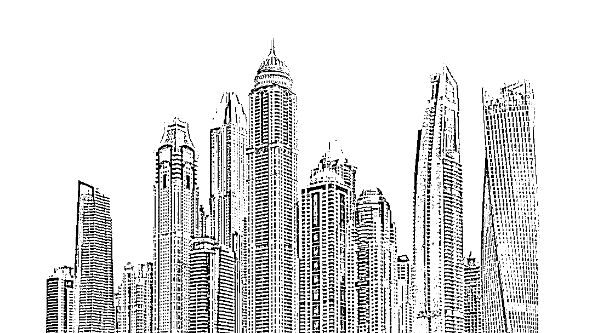

作者/雷蒙德·梅里曼 译者/Luke
编辑/玫瑰 图片/pexels

雷蒙德·梅里曼是在金融占星学界稳坐第一把交椅的占星师，同时他也是若道签约的金融占星课老师，我们引进了雷蒙德·梅里曼老师的《[上证指数月度报告](http://mp.weixin.qq.com/s?__biz=MzA5NjA0NTAxNg==&mid=2651485664&idx=1&sn=bae9eb20d9f9cd407841b125f7fc553c&chksm=8b48c757bc3f4e418a1201d4aeb9a38f9203dbffab162bfa25222ea7fd77fef7ad660e7bd073&scene=21#wechat_redirect)》及《[黄金报告](http://mp.weixin.qq.com/s?__biz=MzA5NjA0NTAxNg==&mid=2651485664&idx=1&sn=bae9eb20d9f9cd407841b125f7fc553c&chksm=8b48c757bc3f4e418a1201d4aeb9a38f9203dbffab162bfa25222ea7fd77fef7ad660e7bd073&scene=21#wechat_redirect)》。我们经老师的授权，将每周刊登梅里曼老师的周运，供大家参考和学习。于是，这是本周的周运（8.22-8.26）。

**说明：以下时间采用纽约证券交易所所在地美国东部标准时间。**

**展望与回顾**

****

**由于担忧加密货币市场陷入冬天，一阵寒意降临。尽管比特币 21800 美元的价位距离 6 月低点 19000 美元还有一段距离，但巨大的波动再次冲击着市场。**

**——兰斯当的分析师苏珊娜·斯特里特珍妮·里德报道****《突发的加密货币市场下跌将比特币送至 22000 美元以下》****www.cnbc.com****2022 年 8 月 19 日****美联储表示要继续提高利率。华尔街认为这是在虚张声势。****——阿卡内·奥塔尼****《华尔街打赌美联储在通胀游戏中虚张声势》****《华尔街日报》****2022 年 8 月 19 日**全球大多数股票市场在上周 8 月 16 日-17 日抵达新周期的顶峰，与 8 月 11 日-15 日太阳与土星-天王星的 T 三角，和 8 月 17 日有利的金星-木星三分相对应。8 月 16 日多个股票指数的高点，也与 8 月 16 日-29 日日心水星进入射手座对应。**这一次，天王星相位没有对应股票市场新看涨趋势的加速，反而对应反转。**8 月 1 日是三次天王星影响力凸显时期的第一次。当天王星的影响力凸显，你永远不知道那会像 8 月 1 日那样对应突破支撑位或阻力位（因为天王星不尊重支撑位/阻力位这样的界限），还是像上周那样对应趋势的反转。有趣的是，道琼斯工业平均指数 8 月 16 日的高点，向上突破了连结前两个基本周期低点的下行趋势线。这表明 6 月 16-17 日的低点（金星四分土星）是一个比基本周期更大的周期。但典型的天王星特质是，走势突破后突然反转，开始了一轮修正性下跌。现在我们即将见证本周强有力的天王星征象（8 月的第 3 次）是会引起一轮反转，还是下跌趋势的加速，击破重要的支撑区域。上周其他市场也见证了重大的反转。比如说，白银 8 月 15 日到达新周期高点 20.87。到周五时，它的跌幅超过 9%，到达低点 18.92，正好符合我们每周和每日报告的预测。

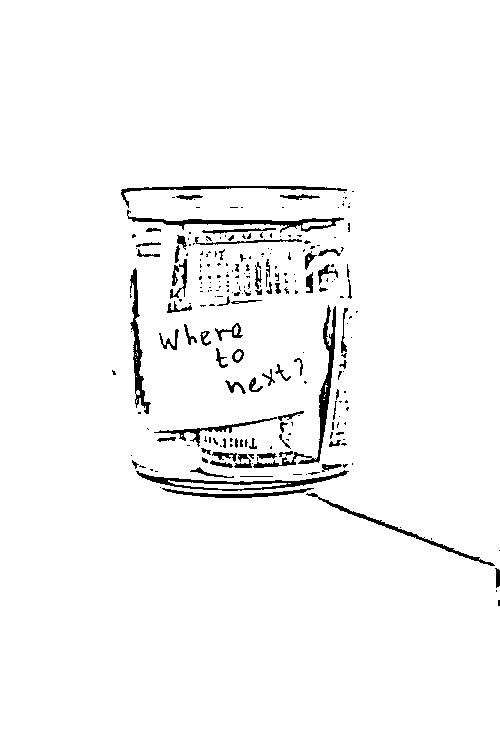

黄金上周也在下跌，但它的周期高点发生在前一周 8 月 10 日，正好在 8 月 11 日第二轮天王星相位启动的前一天。比特币也在 8 月 15 日到达周期高点 25201。到周末时，它在测试 21000，是自 6 月 18 日来最剧烈的下跌。原油走势相反。它在 8 月 16 日到达新周期低点，自那以后开始上涨。对于那些宣称通货膨胀已经见顶的人来说，这不是一个好兆头。总的来说，这是非常天王星式动荡的一周，许多市场的波动都超过了预期。它们发生了突然而剧烈地反转。另一轮天王星式的时间段应于本周晚些时候开始，或持续到下周。无聊的时间结束了。**短期占星趋势和长期考量**

****

**《通胀缩减法案》对小企业有许多好处。其中包括：1）它不是由小企业资助的，2）研发税收抵免翻了一番，3）美国国税局募集资金不会针对小企业。****——瑞德·巴特尔****《关于<通胀缩减法案>将如何帮助小企业和工薪家庭的五个真相》****www.forbes.com****在 www.bettersmb.com 上发布****2022 年 8 月 15 日****《通胀缩减法案》是个好东西。但它也是有代价的。所以，是谁要付出代价？不仅是“有钱人”，小企业也要付出代价。《通胀缩减法案》实际上会增加通胀，或者说至少会提高成本，减少收入，它会以 3 种重大的方式完成，影响我们许多人。****——加里·马克****《<通胀缩减法案>的三个条款会伤害小企业》****《华盛顿时报》****2022 年 8 月 16 日**上周市场的下行很可能让许多看空者从冬眠中醒来，因为对于更高利率、更高通胀和衰退的担忧依然挥之不去。但我也认为，“害怕错过”的力量不容忽视，因为许多人错过了 6 月 16 日-17 日低点处启动的涨势，特别是考虑到即将迎来**9 月 21 日-28 日土星（恐惧）接近与天王星的第四次和最后一次渐亏四分相**。实际上，这是两种恐惧的交战：害怕衰退导致另一轮股票市场崩溃（看空）；和害怕错过上车机会，加入 8 周前刚刚开始的新牛市（看涨）。在 2021 年前 3 次的土星精准四分天王星期间，当时股票市场飙升至一个又一个历史新高，因此我的观点与看多者一致。然而，我不能排除剧烈的修正性下跌的可能性，因为我们本周即将进入第 3 轮多个天王星征象。**8 月 24 日，天王星将转向逆行。8 月 26 日-28 日，金星将与土星和天王星形成 T 三角。其间的 8 月 27 日，处女座新月将四分火星。**这会形成强有力的地球宇宙学关键反转区间，8 月 28 日金星对分土星时结束。

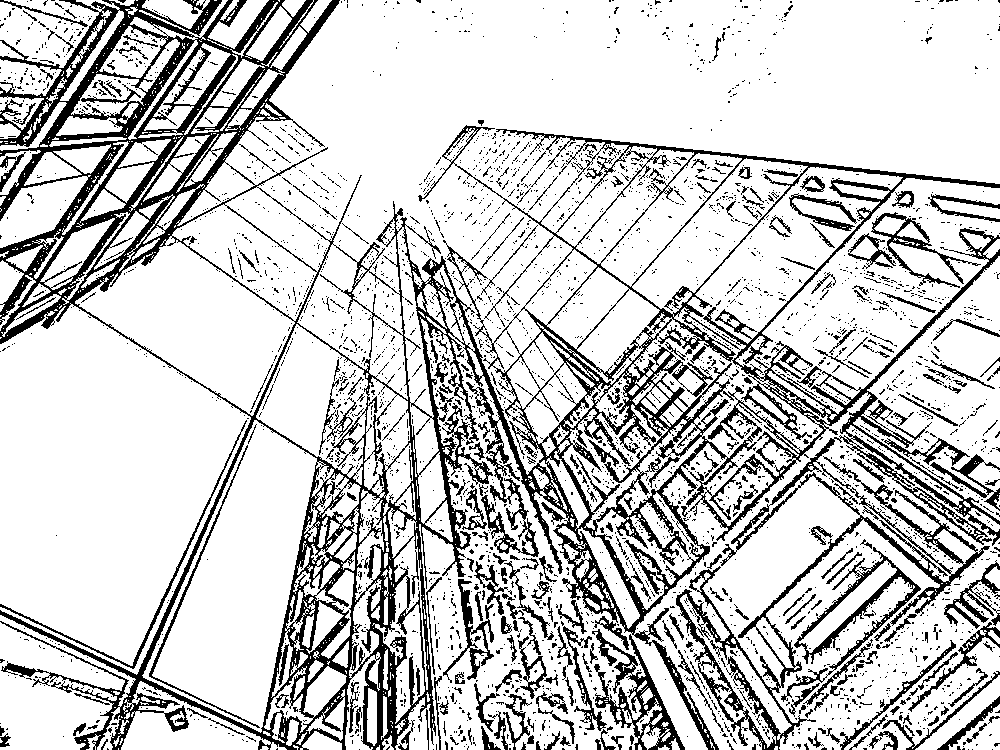

金融占星学的基本规则之一是，**任何下跌至金星-土星困难相位的市场，都会形成潜在的买入机会，尤其如果这个低点仅仅是对更大看涨趋势的修正。**当我们进入那个时间段，我们会在每日和每周报告中确认那些符合这个设置的市场。

****

**一定要记住，我的孩子，思考坏想法真的是世界上最容易的事情。如果你让心智随波逐流，它会让你陷入越来越不快乐的境地。然而，思考好的想法，需要努力。这是纪律、训练的目的之一。**

**所以，训练你的心智思考甜美的香水、丝绸的触感和黄昏的宁静。然后，最终，你将不再需要努力，你自己就会成为美好。**

**——詹姆斯·克拉维尔**

**《幕府将军》**

**霍德和斯托顿出版有限公司**

**1994 年**

这则引用送给那些努力对未来保持乐观心态的人，尽管当前的世界看起来陷入了可怕的困境。你不能忽视现实，但是除非你能改变它，否则担心也没有什么益处。如果你让心智放任自流，它会让你越来越担心。

**让我对未来保持乐观看法的地球宇宙学因素之一，是所有的外行星都很快要改变星座。**这是非常罕见的，如前所述这代表人类困境的巨大变化。

**也就是说，冥王星即于 2023 年 3 月 23 日离开摩羯座，开始在水瓶座 20 年的行进。****在那 2 周前，土星离开水瓶座，开始在双鱼座为期 3 年的行进。**

**从 2025 年开始，天王星将离开金牛座，在双子座逗留 8 年。与此同时也从 2025 年开始，海王星将离开双鱼座，开始在白羊座的 14 年旅程。**

**2026 年 2 月 20 日，土星与海王星在白羊座 0°合相，同时六分天王星和冥王星。同时天王星和冥王星形成有利的风象星座三分相。**

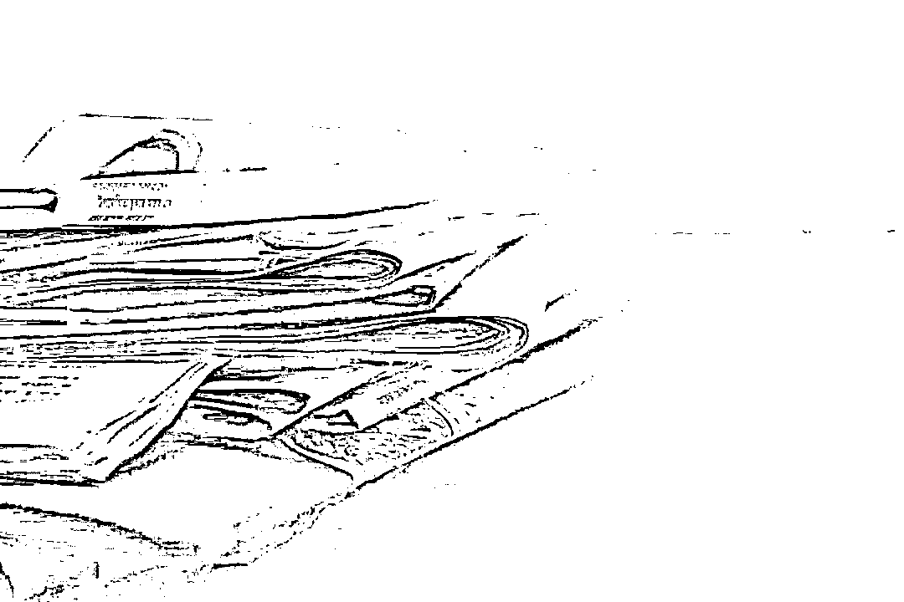

我认为这些长期的地球宇宙学周期，代表**人类的一次文艺复兴，以及对“世界末日”恐惧的终结**。觉醒至一个新世界，其中过去主宰了世界太久的沉重能量（以及心理“沉重”的领导人）终于离开。下一代的领导将带来新的气象。借用市场周期的术语，第一个阶段起初可能会有点艰难，但令人兴奋而看涨。我认为**金融世界可能首先经历严重的挫折，然后是广泛的经济复苏，与 1990 年代的“信息高速公路”沟通革命有点类似。**我不知道具体会如何展开，但是我的占星学知识以及行星周期与人类活动的历史关联让我确信，**2023 年-2026 年发生的事件，会把世界引向一条非常不同、更加成熟的道路。**这将是值得见证的，甚至我们也能够为即将到来的范式转变做一些贡献。**长按下图了解更多详情**

这是特别及时的讲座，因为为期 12 年的木星轨道周期会在 5 月 10 日进入白羊座，并且 6 月-11 月是一年中最有力的地球宇宙征象接连登场的重要时间段，因为土星逆行与天王星形成几乎精准的渐亏四分相。

**说明：以上日期基于纽约证券交易所所在的美国东部标准时间，由于存在时差，中国地区可能需要加一天。**

**版权声明：**本文由若道翻译发布，欢迎转发，反对抄袭。友号转载请申请白名单。

**雷蒙德·梅里曼（Raymond Merriman）**

若道签约老师。著名金融占星师，ISAR（国际占星研究协会）前主席，梅里曼市场分析公司的总裁。他由于“提升了占星学的职业形象”，在 1995 年国际占星大会上被授予轩辕十四奖；在 2012 年国际占星大会上，被授予轩辕十四终身成就奖。

1“中国上证指数月度报告”发售**若道推出了****中文版****的雷蒙德·梅里曼中国上证指数月度报告，并持续发行该报告！**当把金融市场的周期和占星学的周期相结合时，雷蒙德·梅里曼老师的金融占星学研究**为投资者应对金融市场的周期波动，并随之调整投资策略提供了极大的价值参考**。
**9 月中英文报告已上线！**2“黄金价格周期月度报告”发售**若道推出****中文版****的雷蒙德·梅里曼黄金价格周期月度报告！**不仅仅为广大读者在中国股市的投资出谋划策，更将视角放眼黄金市场。**每当世界经济形式不明朗的时候，有一个地方是保值的港湾，那就是****黄金**。自 1982 年雷蒙德·梅里曼出版第一本研究《地球宇宙学征象与黄金价格的关联》的著作以来，**他一直作为最重要的黄金市场时机预测者之一享誉国际**。2022 年 9 月黄金报告已上线，梅里曼老师将会告诉你他对这个关键时期如何操作的想法。也可以按照季度和一年期订阅，有更多优惠。季度和年度的好处是，你可以持续了解梅里曼老师对于不断在变化的市场的看法。即便他某一次看法和市场不一致，你也看到在下一期他如何调整自己的看法，并看到金融占星在一个长期时间段内对你把控风险的帮助。而能够长期控制风险、尽量找到安全的投资时机才是投资的长久之计。**9 月中英文报告已上线！****购买套餐**，买得越多越优惠中国上证指数月度报告套餐价

*   **单月报告**：280 元
*   **3 个月套餐**：780 元（260 元/月）
*   **12 个月套餐价**：2400 元（200 元/月）

**长按下图识别二维码****购买金融报告****套餐****▼**

黄金周期月度报告优惠

*   **双报告年度套餐更优惠（直降 900 元）**

*   **12 个月黄金报告+12 个月上证指数报告：仅需 3900 元**

**长按下图识别二维码购买黄金报告套餐**▼

3《2022 年金融预报和沙龙》1976 年以来，由雷蒙德·A·梅里曼撰写的梅里曼市场时机学院每年一次的年度预报沙龙和每年一本的《年度预报》一直在应用占星学原理为投资者们服务，提供卓越洞见，从未间断。 **雷蒙德·梅里曼《2022 年金融预报和沙龙》发售中（报告已发布）。****长按下图识别二维码了解详情**
▼

4《2022 下半年金融占星投资沙龙》这是特别及时的讲座，因为为期 12 年的木星轨道周期会在 5 月 10 日进入白羊座，并且 6 月-11 月是一年中最有力的地球宇宙征象接连登场的重要时间段，因为土星逆行与天王星形成几乎精准的渐亏四分相。

**长按下图识别二维码了解详情**

▼

**点击阅读原文购买金融报告**

# 若道周运 8.22-8.28 丨喘口气吧，在理性中慢慢改变（内含 12 星座运势）

> 原文：[`mp.weixin.qq.com/s?__biz=MzA5NjA0NTAxNg==&mid=2651485681&idx=1&sn=805814cf2dacf0ea276e6d2a9c09a971&chksm=8b48c746bc3f4e506972967dfe2d9ecc8898e8e8312984efbf470ea9336b62c7984d420590b2&scene=126&sessionid=1692737766#rd`](http://mp.weixin.qq.com/s?__biz=MzA5NjA0NTAxNg==&mid=2651485681&idx=1&sn=805814cf2dacf0ea276e6d2a9c09a971&chksm=8b48c746bc3f4e506972967dfe2d9ecc8898e8e8312984efbf470ea9336b62c7984d420590b2&scene=126&sessionid=1692737766#rd)

******☆ ****后台回复“今日”，给你一句生命态度******

作者/Dora ISAR 认证占星师
编辑/翀子 封面/书君 图片/网络**整体氛围**

七八月以来，全国持续的高温、汹涌出游的人群迎来了此起彼伏的疫情管控。在无限的动荡之中，生活就象一辆过山车，带着我们呼啸穿行在高山，在谷底。

经历的极端天气，正如天空也呈现出的极端宇宙气象：**天空呈现出固定星座的大十字，水瓶座的土星依次对分狮子座的太阳、金星；金牛座的天王星、火星合相北交点，四分土星。**

狮子座的金星、太阳就像是夏日的狂欢，要求自我的彰显，而土星就是那个不让你得瑟的老板；天王星与火星在北交点，社会群体期待着变革和改变，但土星说打住，金星说享受一天是一天，不去想将来。

固定星座的那种执拗顽固，不愿改变、不容商榷的拉扯和争斗，给我们的现实带来了**十分紧张的气氛**：日益艰难的经济状况、乌克兰的战争、粮食短缺、环境问题的恶化、干旱、持续的高温......

随着周末火星进入双子座这个变动星座，紧张拉扯的气氛可能有所缓解。

而这周，我们将经历太阳进入更理性的处女座，给狮子座的闪耀和火爆降降温；天王星逆行，加入了五星逆行的队伍，仿佛整个天空都在进行着复盘和思考；水星进入更懂得关系平衡的天秤座，也许我们有喘口气的时间了，也许周六的处女座新月会带来一些改变和调整，带来一个新的阶段的开始，但可能只是一个开始；土星还在四分太阳，对分着金星，压抑的气氛还在，一切还等着慢慢改变。

本周星象

*   8 月 22 日 月亮进入巨蟹座

*   8 月 23 日 太阳换座处女座，处女座水星三分摩羯座冥王星

*   8 月 24 日 天王星在金牛座逆行

*   8 月 25 日 狮子座金星四分南北交点

*   8 月 26 日 水星换座天秤座

*   8 月 27 日 处女座新月

*   8 月 28 日 处女座太阳四分火星，金星对分土星

**重要天象**

**★ **周二 太阳换座处女座，水星三分冥王星****

周二（8 月 23 日），处女月开启，处女座的宝宝们生日快乐！最热情的狮子月结束，处女座将迎来收获的季节和重新分析重新思考的冷静。

处女座的水星是有逻辑性的、冷静的，当它三分冥王星的时候，可以进行更加有深度的思考。也许有些深层次的事物可以挖掘出来进行讨论，也许我们对生活的目标有了更加深刻的洞见。

当夏日的狂热结束，是冷静的秋风来临的时候。

**★ **周三 ******天王星逆行**

天王星是智慧、革命、独立、独特性和自由价值观，它以一种突然切割、震惊、突变的方式来让我们获得新的认知，更高的智慧。

很长一段时间以来，天王星合相北交点。北交点代表着个人或者集体事件的宿命或者是我们必须迈向的道路。我的理解是，**通过种种意料不到的状况，我们人类在向着更高意识的目标迈进。**

也许我们目前正在经历着动荡艰难，比如气候变化、战争、疫情，但我们也在探索新的道路。**天王星所代表的革命性的智慧，是来帮助我们开启新的角度，完成这个任务的。**

长久以来，我们一直在追求物质的丰盛，世俗的成功，我们以更多的占有为自己最高的成就，天王星和北交点合相在金牛座，也许对物质世界的观点已经到了需要改变的关键时刻！

什么是成功快乐的人生？除了赚钱和享受，不断追求个人利益的最大化，还应该有什么？我们的生命意义是什么？全人类应该如何相处才是幸福快乐的？

天王星在金牛座，我想就是来打破物质主义的局限的，我们的生存意义应该具有多样性，允许自己探索更多内涵的生命意义。

天王星开始逆行，在停滞和逆行阶段，始终是一种反思和强调，这次逆行将持续到 2023 年的 1 月。

**在 9 月底 10 月初，逆行的天王星将再度四分土星，这会带来更加明显的变化，**今年下半年，我们会迎接更多的变动和挑战，但这也是我们探索新的道路的时刻。

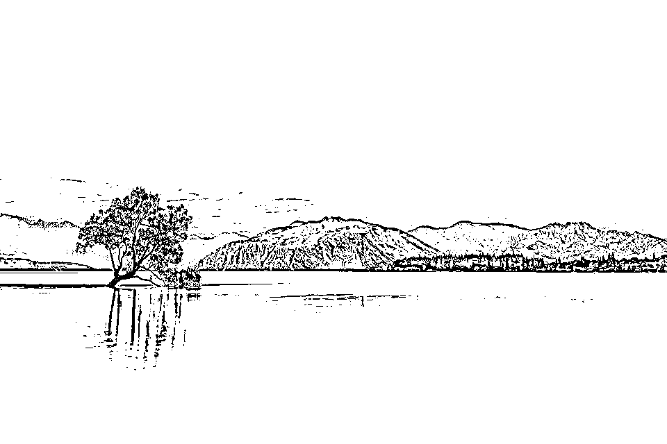

**★****周五 水星换座天秤座**

周五（8 月 26 日），水星从入庙的处女座换座到天秤座。

处女座强调的是逻辑性，天秤座强调的是关系。我们都有自己的逻辑系统，但如果认知不同，哪怕思路再清晰，也是自说自话。我们的观念也有巨大的冲突，都站在自己的立场上进行无效的沟通。**当代表思考的水星进入天秤座，也许我们会更多地考虑合作和双赢。**

9 月 11 日，水星将在天秤座逆行，这个时刻，我们更加需要考虑他人的想法，关注公平、合作和换位思考。

**★****周六 处女座新月**

新月是许愿的时刻，我们仍然可以怀着美好的信念，许下自己的心愿。

这个新月颇不平静，火星四分新月，金星离开和天王星的四分相，逐渐形成和土星的对分相。

好像对未来的看法，大家有很多的不同的想法和声音，并且引发了激烈的争论。

狮子座的金星，如果代表着夏日的快乐和旅行，那么，新奇和多变的旅程结束了，**我们开始要回到工作状态，去接受现实的种种磨砺和挑战。**

让我们静下心来，用处女座的专注和谨慎，用心做好手上每一件事情，**如果你抓住了当下，就也抓住了未来。**

**12 星座一周运势**

**上升*****白羊座***

最近白羊座们要注意投资市场的变动，如果已经错过好的时机，那么谨慎小心，不要冲动。暂缓大的投资以避免损失。

注意日常生活中的保养，关注自己的身体健康，也许是时候制定健身计划，培养良好的运动习惯。

多和家人、恋人享受在一起的美好时光吧。

*****上升**金牛座***

最近金牛座的心情有点冲动，经常想不按牌理出牌。想换个工作，或者换个活法，突然出去旅行、聚集朋友狂欢。其实你在工作中面临的挑战也给了你更多发展的可能性。

这周的处女座新月请认真许下脚踏实地的心愿。

可以接触一下心灵成长的课题，也许你能够在对内心的探索、宗教的场所，或者就是简单的静坐中，找到内心的平静。

**上升*****双子座***

上升双子座的宝宝们，本周注意多多运动，这可是保持年轻的秘诀哦。从事餐饮行业的双子座们，最近财运不错。

双子座们最近人缘挺好的，老有朋友来找你，但你可能更喜欢独处，给自己一些安静的时光。

也许双子座们最近有点迷茫，看不清自己的未来方向，有太多的机会没有办法选择和决定。有机会好过没机会对不对？终结你的选择困难症，做个决定就好！ 

**上升*****巨蟹座***

最近巨蟹座比较好运，工作机会较多，当然也会感到很忙碌，好在忙有所得，也许会有财运降临。

你善良的天性会给你带来更多的快乐时刻，多和年轻的朋友们一起交流玩耍，你会得到更多的快乐。

本周的巨蟹座们是快乐的，请享受这个时光。

**上升*****狮子座***

夏日的狂欢快要结束，狮子座的宝宝们需要抓住快乐的尾巴。在夏天结束前，多多约朋友玩耍吧。

狮子座其实是热情友善的，只不过有时缺乏耐心，或者有点自我中心，要注意多关注朋友的想法，多多换位思考，才能得到更好的关系互动。如果和另一半的关系出现困难，不要沮丧，理性思考，自己放松一下，坦诚交流始终是沟通的前提。

**上升*****处女座***

太阳处女座的宝宝们生日快乐！

处女座最近工作压力变得好大，又急又忙，还是非多多，领导突然发现了你的能力，什么事情都交办给你，真的好累啊。记得下班的时候好好放松一下。和好朋友吐吐槽，享受友情的温暖也是个不错的选择。

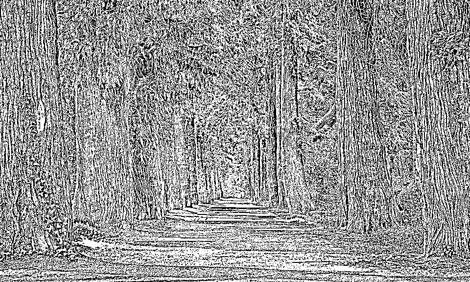

**上升*****天秤座***

天秤座这周没有什么可忧虑的，一切看起来都很好很顺利，工作和家庭生活都没有太大的问题，只要你认真付出，做好你该做的事情，会有新的机会，也许收入增加，也许获得提拔。

同时，也有获得新的恋情的机会。

好好享受这美好的一周。

**上升*****天蝎座***

天蝎座们本周还是要好好休息。最近过度疲劳，感觉心力交瘁，要多多关注自己的身体健康，可以多休息一下，照顾好自己的身体。可以多参加一些富有创意的活动，或者多些娱乐，让自己开心。

注意和父母的家庭关系，也关注父母的身体健康。

好消息是，由于你不断地努力付出，职场的人际关系有所好转，越来越多的人开始欣赏你的工作能力。

**上升*****射手座***

射手座这个月在工作中有些好的机会，得到认可，或者被提拔，千万不要放过。有机会出差就去吧，细致认真，做好计划，并且严格执行。

不要和另一半争吵，多想想对方的立场，当你发现彼此真正相爱的时候，其实没有什么谁对谁错的问题，都不重要。

有做善事的机会不妨慷慨一些，会给你带来好运。

**上升*****摩羯座***

摩羯座们近来一直在经历脱胎换骨的变化，这是非常不容易的，但请相信，事情不会总是这么糟糕。

你可以有更多的机会和父母家人，和你的另一半度过美好的时光。珍惜你的另一半。

记得多考虑家庭方面的事物，比如装修，买房，学做美食等等，多回家看看父母，家人总是永远支持你的。

**上升*****水瓶座***

水瓶座们最近压力比较大，也许是自己的健康问题，也许家里的孩子或者宠物生病了？不要太过着急，你的伴侣或者好朋友始终会支持你，帮助你渡过难关。

如果做户外运动，记得做好防护，以免意外发生。

**上升*****双鱼座***

双鱼座本周财运机会较多，多关注一下投资机会。

有桃花有正缘，认真考虑一下你身边出现的人。

尽量不安排旅行，以免出现一些意想不到的情况。注意和周围邻居，兄弟姐妹搞好关系，不要被一些小小的不愉快影响自己的心情。

**祝大家一周平安顺遂！**

**版权声明**：原创文章由作者授权首发于若道平台发布，欢迎转发，反对抄袭。友号转载请申请白名单。

**END**

****Dora****

若道 2017 届核心课毕业生

若道咨询平台占星师、ISAR 认证占星师

心理咨询师、塔罗咨询师、多年企业管理经验

咨询微信：AstrologerDora

公众号：Dorothy 占星文化

**长按打赏**

**20 位来自世界各地的占星师****带来 19 场沙龙——新世界的觉醒****详情可点击下图**

**学习占星学****点击下图了解课程详情**

**微信又双叒叕改版啦，不想错过若道君的推送？**
**就把若道设为星标吧！****▼**

**喜欢就点一下“在看”吧！**

********报名直达入口********

# 年度激烈天象趋近，该如何布局？ | 梅里曼 9 月上证+黄金报告上线！

> 原文：[`mp.weixin.qq.com/s?__biz=MzA5NjA0NTAxNg==&mid=2651485664&idx=1&sn=bae9eb20d9f9cd407841b125f7fc553c&chksm=8b48c757bc3f4e418a1201d4aeb9a38f9203dbffab162bfa25222ea7fd77fef7ad660e7bd073&scene=126&sessionid=1692737766#rd`](http://mp.weixin.qq.com/s?__biz=MzA5NjA0NTAxNg==&mid=2651485664&idx=1&sn=bae9eb20d9f9cd407841b125f7fc553c&chksm=8b48c757bc3f4e418a1201d4aeb9a38f9203dbffab162bfa25222ea7fd77fef7ad660e7bd073&scene=126&sessionid=1692737766#rd)

在 8 月份的上证指数报告（报告涵盖期限一般是 7 月中旬到 8 月中旬）中，梅里曼老师指出：（在 7 月），**“最近的价格活动表明 5.5 年周期呈现为 33 个月半周期（两阶段模式）的可能性更大。半周期的范围是 27-40 个月，看起来大幅下跌至 4 月 27 日（第 39 个月）的低点 2863 完成了第一个半周期。倘若如此，7 月开启了更大的 5.5 年周期中的第二个 33 个月半周期的第 3 个月。”**

| 上证指数月 K 线图

| 上证指数周 K 线图

报告中提到：**“从 7 月 13 日持续到 8 月 26 日，中点是 8 月 4 日。在这一时期，火星将在金牛座合相天王星和月亮北交点，它们都会与土星形成四分相，这些相位主要发生在 8 月 1 日-7 日。”**

| 上证指数日 K 线图

从日 K 线图我们可以看到，上证指数在火星合相天王星、北交点四分土相的 7 月 13 日到 8 月 4 日期间是一个下跌的走势。从 8 月 5 日开始，上证开始了反弹。在 8 月份的报告中还有这样的陈述：**“8 月的征象实际上是即将到来的第二个强有力的地球宇宙学时间段 9 月 21 日-28 日可能会发生的事件的序曲。届时外行星木星、土星和天王星会形成紧密的相位配置。8 月的设置会由火星为这个更大宇宙配置的展开‘传递’能量。有时候这种‘传递’能量的时期会形成实际的低点或高点，有时候低点或高点发生在更大的行星设置形成的时期。”****“届时不仅土星非常接近与天王星的精准四分相，太阳系最大的行星木星还会处于两颗行星的中点，分别与它们形成精准的八分相。木星是与夸大相关的行星，所以市场的超大幅上涨或下跌可能在这段时间的 6 周之内（8 月 11 日-11 月 14 日）开始或结束。越接近 9 月后期，这股宇宙能量就越强烈。”**

**我们已经靠近强有力的土木天征象了。13 周-20 周的基本周期也到第 16 周了。接下来市场会出现强劲上涨还是猛烈下跌？**

金融占星大师雷蒙德·梅里曼的《2022 年 9 月上证指数报告》已上线，你可以听听梅里曼老师的看法。《2022 年 9 月黄金报告》也已上线，欢迎购买。

**此外，6 月 23 日雷蒙德·梅里曼的《2022 下半年金融占星投资沙龙》，将帮助你对 2022 年下半年的市场风云变化加深了解。**

**扫描下图二维码了解详情**

▼

**投资有收益，投资有风险，希望金融占星学的研究帮助你更好地评估你的投资。**

**9 月上证报告上线**

**上证指数月度报告价格****单月报告**：280 元/月 **季度套餐价格**：780 元（260 元/月）**年度套餐价格**：2400 元（200 元/月）**双报告年度套餐更优惠（直降 900 元）****12 个月黄金报告+12 个月上证指数报告：仅需 3900 元****长按下图识别二维码购买上证指数报告**
▼

“**黄金是金钱。其他的只是信贷。**

**——约翰·皮尔庞特·摩根**

”黄金从 4 月 18 日高点 2003 美元跌到 7 月 21 日低点 1678 美元，跌幅达 16%。在 7 月 19 日发布的 8 月度黄金报告中，梅里曼老师说：**“我们还是倾向于将双底支撑区域 1673-1678（+/-25）作为主要支撑。”****“上周（7 月 4-10 日）金价跌至 1726，尽管这也可能是低点，但我们更希望看到金价在大约 3-6 周内下跌到更低的价位。”****“我们建议在未来 3 周内平仓所有空头，特别是在 1650-1725 左右有报价时，并且做多。”**从 7 月 21 日开始，黄金开始反弹。目前，黄金反弹至 1807，在不到 20 天的时间内，反弹幅度为 7.68%。

| 黄金日 K 线图

7 月 21 日，正好是报告指出的土星半四分木星的 1 个 1 星标记的反转时间。对于黄金的短线操作者，类似的 7%反弹其实还是大有盈利可为之处。不要小看 7%的反弹盈利，毕竟，这短期的操作远远高于 1 年期的定期存款利率。上个月的黄金报告还指出：**“我们将重点关注引言中所提到的 8 月 4 日+/-10 天和 9 月 21 日-28 日+/-1 周。这两个时间段都可能出现 16 个月周期的低谷。”**8 月 4 日+/-10 天是火星、天王星和月亮北交点合相四分土星期间，这个 7.68%的反弹我们已经看到。**问题是，反弹是到此为止，开始下跌知道 9 月 21 日-28 日+/-1 周反转；还是反弹继续直到 9 月 21-28 日+/-1 周呢？**9 月份黄金报告已经上线，上证报告也将在下周上线。欢迎了解。也可以按照季度和 1 年期订阅，有更多优惠。季度和年度的好处是，你可以持续了解梅里曼老师对于不断在变化的市场的看法。即便他某一次看法和市场不一致，你也看到在下一期他如何调整自己的看法，并看到金融占星在一个长期时间段内对你把控风险的帮助。而能够长期控制风险、尽量找到安全的投资时机才是投资的长久之计。点击阅读原文，雷蒙德·梅里曼黄金周期 2022 年 9 月报告带来有 40 年黄金市场研究经验的世界著名金融占星大师雷蒙德·梅里曼对当前黄金市场的研究。

**9 月黄金报告上线**

**黄金月度报告价格****单月报告**：280 元/月 **季度套餐价格**：780 元（260 元/月）**年度套餐价格**：2400 元（200 元/月）**双报告年度套餐更优惠（直降 900 元）****12 个月黄金报告+12 个月上证指数报告：仅需 3900 元****长按下图识别二维码购买黄金报告**
▼

**购买者需知**

**① **梅里曼市场时机学院《中国上证指数月度研究报告》是梅里曼市场时机学院（以下简称 MMA）的研究“预报”，而不是市场“预测”，是梅里曼老师及 MMA 金融占星分析师对人类活动周期历史与行星周期之间相关性的研究，二者在大部分情况下具有 80%或更高的相关性，而不是因果关系。报告中的研究完全存在错误的可能性。即便是非常认真的研究和几十年的研究经验，金融占星师无法总是正确地解读出各种征象在实际层面上会如何相互作用，并显化为事件结果。

所以请将报告看作一个研究参考，务必结合其他市场研究和你个人对市场的理解，根据你的自由意志做决策。

**②** 此报告一旦售出，**即不接受退款。**

**③** 上证、黄金月度报告每月固定 1 期，**并非都是在每月相同日期发布。**

**④** **我们收到英文报告的当天，即发布该英文报告。3 天后，上线报告中文版。此报告仅支持手机网页阅读，不支持电脑阅读和下载。****以上须知，请仔细阅读。一旦付款，即视为已了解并接受所有须知内容。**在过去的 40 年中，唯有梅里曼逐渐完善，并在梅里曼市场时机学院月度周期报告中阐释了将地球宇宙学与周期相结合的研究方法，以惊人的精确性预报了黄金价格发生重大变化的时间。**黄金购买 Tip**

各大银行均可购买黄金或黄金 EFT 基金，也可以在诸如天天基金或者支付宝购买黄金及黄金相关产品。不明白的可以百度搜索。

**购买后如何查看报告？**

**购买后有疑问怎么办？**请联系技术客服
**微信：nodoor201705**

**购买报告直达入口**

# 周末树洞丨双子座能量“爆棚”的一天，谁是让你印象深刻的“话痨”？

> 原文：[`mp.weixin.qq.com/s?__biz=MzA5NjA0NTAxNg==&mid=2651485655&idx=2&sn=3854dde5d214186c1a652d103f7461fd&chksm=8b48c760bc3f4e76ffff05ab27d5633c838a5affdff55d53c1b3fc0b3a36002b8a36f96eebd2&scene=126&sessionid=1692737766#rd`](http://mp.weixin.qq.com/s?__biz=MzA5NjA0NTAxNg==&mid=2651485655&idx=2&sn=3854dde5d214186c1a652d103f7461fd&chksm=8b48c760bc3f4e76ffff05ab27d5633c838a5affdff55d53c1b3fc0b3a36002b8a36f96eebd2&scene=126&sessionid=1692737766#rd)

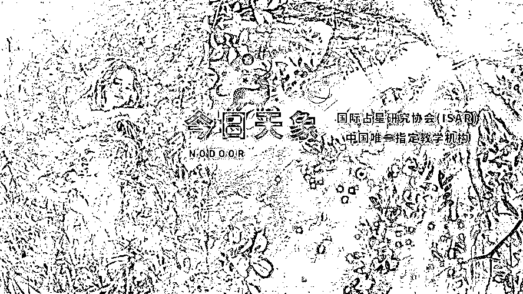

**2022 年 8 月 20 日天象：**

*   **月亮在双子座**
*   ******15:56 火星进双子座******
*   ******太阳四分土星、水星对分海王星******

今天是属于双子座的一天！月亮在双子座运行，我们会对很多事情产生好奇，头脑思维十分活跃，并有强烈的交流欲望。这对需要我们踏下心来认真做的事情而言，是有影响的，“花蝴蝶”似的的情绪让人随时想“飞来飞去”。除了月亮在双子座，火星在今天下午进入双子座（点击[【火星进双子座】](http://mp.weixin.qq.com/s?__biz=MzA5NjA0NTAxNg==&mid=2651485588&idx=1&sn=31e83c6e04afbbf17ab497c845356f5d&chksm=8b48c723bc3f4e35d2a7c3655c9a9808e940075bb00605112561c12060936bd72b1be0ee0bed&scene=21#wechat_redirect)查看文章），这颗拥有力量的行星将在灵活多变的双子座运行将近 8 个月，火星行进双子座会帮助我们投入知识领域，也会让我们找到适应、协调的方式来应对变化交杂的环境与信息。
对于今天而言，双子座的守护星水星，和海王星形成对分相，人们虽然有强烈的表达和沟通欲望，灵感也常常闪现，但思维混乱、词不达意的情况时有发生，注意清晰表达你的想法，以免造成误解。空气里弥漫的“不实信息”，也值得我们再三确认。在双子座能量“爆棚”的一天，来聊聊，谁是让你印象深刻的“话痨”？周六快乐！我们明天见！**了解每日天象，可****下载“若道”APP 查看****还有更多精彩等着你哦**

# 职业占星师的资质考试丨 ISAR 认证资质如何取得&认证占星师名单公布！

> 原文：[`mp.weixin.qq.com/s?__biz=MzA5NjA0NTAxNg==&mid=2651485655&idx=1&sn=edbbe771ad8b22acce551ad3da0e0a76&chksm=8b48c760bc3f4e76f8ea535609ebffb429776fdab09bb6dce8eb23cffcafca11615ce77c9672&scene=126&sessionid=1692737766#rd`](http://mp.weixin.qq.com/s?__biz=MzA5NjA0NTAxNg==&mid=2651485655&idx=1&sn=edbbe771ad8b22acce551ad3da0e0a76&chksm=8b48c760bc3f4e76f8ea535609ebffb429776fdab09bb6dce8eb23cffcafca11615ce77c9672&scene=126&sessionid=1692737766#rd)

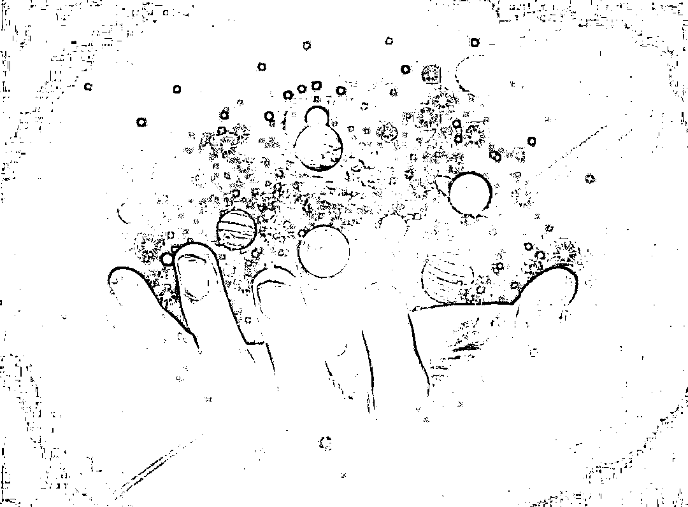

**1**

**ISAR 是什么？**

**ISAR 是国际占星研究协会（International Society of Astrology Research）的英文首字母缩写。**

中国占星学子第一次知道 ISAR，是从大卫·瑞雷老师那里。

2010 年，被国际占星界称为“占星界的马可·波罗”的大卫老师到中国来后，想帮助中国占星界和国际占星界取得联系，帮助中国的占星师获得更好的教育和培训，从而将本来只是爱好的占星学变成一个职业的培训，让本来主要是自学成才的良莠不齐的占星师们通过更专业的培训和认证考试，并取得国际职业占星师的认证。

大卫老师经过和几个有全球认证体系的占星协会（比如 AFA，NCGR）接触，最终选择和 ISAR 合作，帮助把 ISAR 的职业占星师资质认证体系介绍到中国来。**原因很简单，在国际化的今天，选择一个全球认证的体系很重要。**

**ISAR 是一个国际化程度高的协会，其范围覆盖了 47 个国家，其国际影响力是其他占星协会和某个国家的占星学校所根本无法相比的。**

 

ISAR 作为一个国际化的占星组织，其主要活动分为：1.教育和培训 ；2.职业占星师资质认证 ；3.占星学研究 ；4.组织国际性的会议等

**我们今天着重介绍一下职业占星师资质认证。**

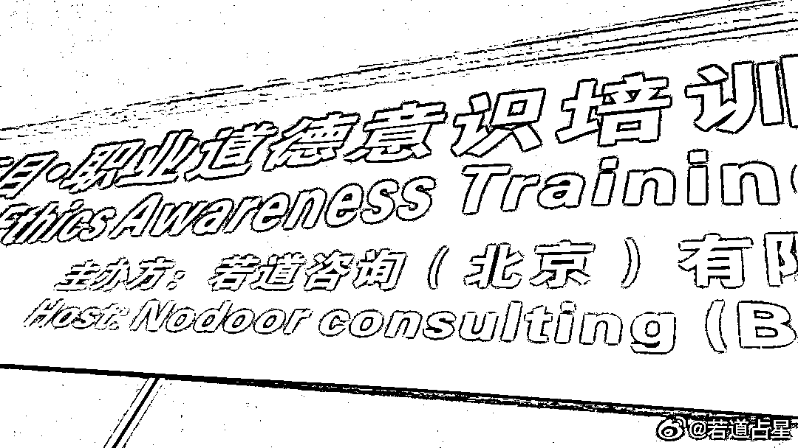

2

**如何获得职业占星师资质认证？**

**1****职业占星师认证的历史**

虽然占星学的发展历史悠久，但是职业占星师的资质认证只是在近几十年才出现的。其中很大一个原因是，在文艺复兴之后，占星学被赶出了大学的学术殿堂，不再有系统的教学和培训。所以，很多占星爱好者都是自学，或者跟随某个老师学习，然后就开始做咨询。

**但这就造成了占星师的良莠不齐，而这也给行业的声誉带来影响。**

一些受到业内尊重的占星师看到这种情况，认为如果占星学要变成在社会上受人尊重的专业，就需要有**系统的培训和考试**，而且也需要**建立资质认证体系**，以帮助全行业提升水平。

就是在这样的背景下，一些占星行业协会开始推行职业占星师资质认证，把职业占星师和没有经过系统训练的、声称自己是占星师的人区别开来。在这样的背景下，**ISAR 于 2003 年开始了自己职业占星师资质认证项目。**这个资质认证项目在全球范围内推行，并且不断优化。在为 ISAR 的资质认证项目设定教学要求时，ISAR 咨询了世界各地占星学校的教学专家，他们的很多建议都被采纳到了现在的认证项目中。

**今年，ISAR 专门为职业占星师认证项目建了 CAPISAR 网站，未来，所有国家通过认证的 CAP 职业占星师都会在该网站呈现。**

****

**2****中国的 ISAR 职业占星师资质认证**

大卫老师为了把 ISAR 的职业占星师认证项目引入中国、提高中国占星学的职业水准，尽管当时他已经执业 40 多年且获得了 AFA 的认证，但还是根据 ISAR 的规定，在 2011 年参加并通过了 ISAR 的职业占星师认证考试、获得 ISAR 职业占星师认证。

2012 年，大卫老师带领跟随他学习占星的若道英文比较好的学生去到美国，在 UAC（联合占星大会，是占星界最受瞩目的会议）举办期间，参加了 ISAR 组织的资质认证项目。当时是全英文考试，有 5 位占星师获得了 ISAR 的认证，成为 ISAR 认证的职业占星师，也称为 CPA（certified professional astrologer)。

**2013 年，若道把 ISAR 认证项目引入中国，**由当时的 ISAR 主席 Gisele Terry 亲自带领，3 位设计了 ISAR 资质认证项目的资深职业占星师来到中国，第一次在中国通过翻译进行 ISAR 职业占星师的培训和认证。这样，国内即便不会英文的占星师，也有机会获得 ISAR 认证。

**2013 年至今，若道和 ISAR 合作，一共进行了 8 次 ISAR 认证，共计有 182 位占星师获得了 ISAR 职业占星师资质认证。可以在若道 APP 查询到这些职业占星师的名字和联络方式。**

3

**2022 年新的 ISAR 职业占星师认证要求**

**2022 年，ISAR 通过了全新的职业占星师认证要求。**和过去的 ISAR 职业占星师认证要求不同的是，**从今年开始，所有想要通过 ISAR 职业占星师认证的学员，必须在 ISAR 附属学校通过 500 小时占星教育**（学员可以不必在某一所学校学完 500 小时，可选择在多所学校完成共计至少 500 小时的占星教育标准）。**这样的要求是为了提高 ISAR 认证标准，保证参加考试的学员的确受到了最好的系统培训，而不是仅用一次考试来衡量其水准。**

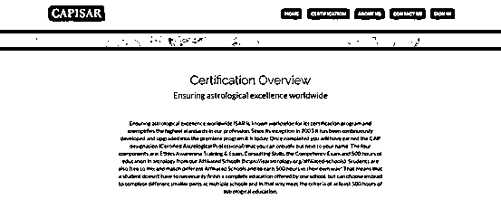

**若道也根据这一要求，重新设计了课程，使想要通过 ISAR 认证的同学获得的培训可以达到 500 小时，****特别是若道核心课程，则是其中的重中之重。**在核心课程中，不仅有老师教学部分，还有助教沙龙、作业、小组讨论、小组汇报演讲、咨询练习等，给予同学们充分的培训，为学员成为职业占星师做好准备。

**500 小时的学习，作为 ISAR 中国唯一附属学校若道的标准是：**

**L1-5 核心课程+3 门选修课**

没有在 ISAR 附属学校完成 500 小时培训的朋友，也可以参加 ISAR 认证培训和考试，但是将无法获得 ISAR 职业占星师认证证书，也不会在 CAPISAR 网站露出，不过可以获得通过 ISAR 考试的证书。

4

**关于**认证**的一些问题的回答**

**① 想要取得 ISAR 证书需要通过哪些认证？**

*   职业道德培训

*   咨询技巧培训

*   占星能力测试（笔试）

*   在 ISAR 附属学校完成 500 学时的研习（在若道完成，包含 L1-5 核心课（包含核心课沙龙、作业、研讨会）+3 门选修课）

*   上述四项必须全部完成，方可获得 ISAR 证书。

**② 上述四项的有效期？**

*   通过后终生有效。

**③ 如果未通过其中某项或者某几项，下次要如何参加？**

*   已通过的单项，终生有效；

*   只需要重新参加未通过的单项。

**④ ISAR 认证是线下进行，还是在线进行？**

*   线下：职业道德培训、咨询技巧培训，占星能力测试

*   ISAR 附属学校及 500 学时的信息详见：https://www.capisar.org/pages/become-a-cap

**⑤ 通常 ISAR 认证的线下部分的时间与地点？**

*   职业道德培训：13:00-18:00

*   咨询技巧培训：2 天，每天 09:30-17:30

*   占星能力测试：1 天，09:30-16:30（含 1 小时用餐时间）

*   地点：北京现场

**⑥ 占星能力测试的笔试部分，有没有考试大纲、题型、分值分布等等？**

*   ISAR 官方提供考试大纲与样题，详见：http://www.nodoor.com/isarcertfaq.do?contentId=3418

**⑦ 笔试是开卷还是闭卷？**

*   开卷，可以携带任何资料，如：书籍、纸质文档或者电子文档等。

**⑧ 参加笔试，可以携带哪些电子设备？**

*   可以携带笔记本电脑，但不允许联网；

*   任何可以使用数据流量进行联网的设备，均禁止使用。如：手机、平板等；

*   任何可以摄影或者录像的设备，均禁止使用。如：手机、平板等；

*   上述禁止使用的设备，在考试开始前会被集中保管，考试结束后即可取回。

**⑨ 参加笔试，是用笔作答还是用电脑作答？**

*   客观题部分，用笔在纸质试卷上作答；

*   主观题部分，用电脑上的 Word 文档作答。

**⑩ 所有的培训与考试都是以中文进行吗？**

*   是的。所有的考卷都被译成中文，而所有的培训都是以中英文双语进行，你不用担心任何语言问题。

*   笔试部分，如果需要中英文双语试卷的同学，可以在报名时申请。

**⑪ 在 ISAR 附属学校的 500 学时研习，需要在考试前完成吗？**

*   你最好在考前完成核心课程的学习，因为不完成核心课程的通过率非常低。但是你可以在考试后完成选修课的学习。

**⑫ 可以一次只参加所有项目中的一项或几项吗？**

*   可以自行选择参加一个或几个认证项目；

*   但只有在完成通过所有项目之后，才能获得 ISAR 颁发的占星师资格证，正式成为 ISAR 认证占星师。

**⑬ 为什么 ISAR 认证的费用会有变化？**

*   ISAR 认证的每一项费用（除了选修课）都是由 ISAR 美国总部确定的，单位是美元，因此换算成人民币时会由于汇率的变动而产生细微的调整。

**⑭ 此次付款后，若因故无法参加认证，可以延期吗？**

*   不可以延期，但可以选择退款。退款要求如下：申请退款的时间节点：考试开始日（一般是职业道德培训的日期）的 7 天之前（比如：若考试开始日是 11 月 25 日，那么申请退款的最后日期是 11 月 18 日）。

*   超过退款时间节点的，不再给予退款。若不能参加考试，默认为自行放弃。

**ISAR 资质认证名单**

*已获得认证的占星师名单（中国区）*

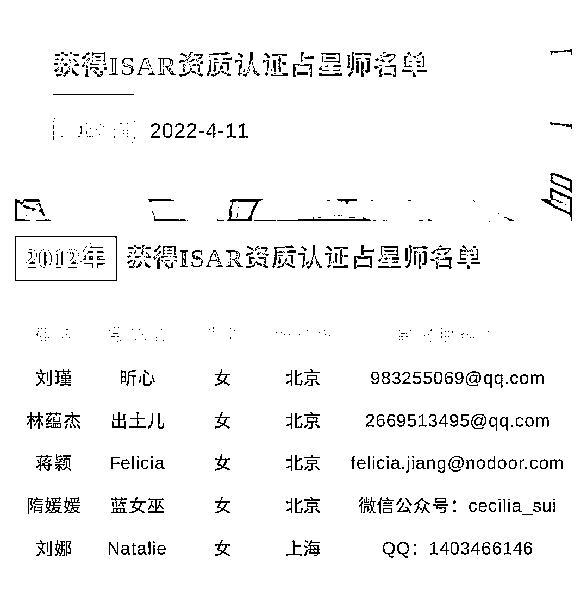

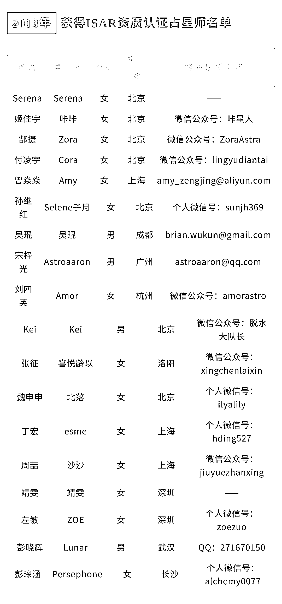

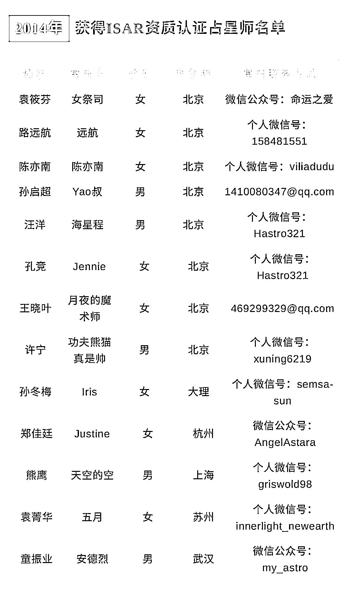

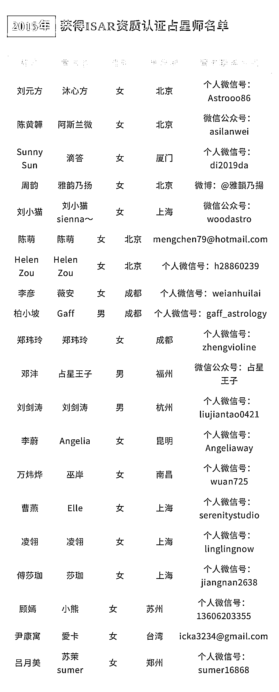

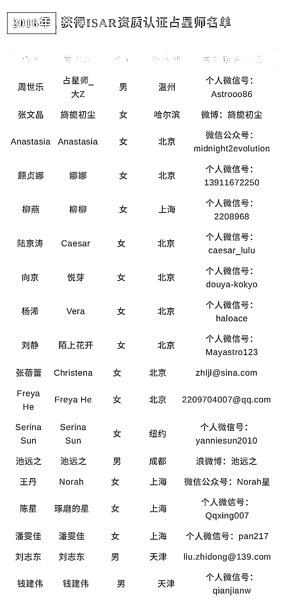

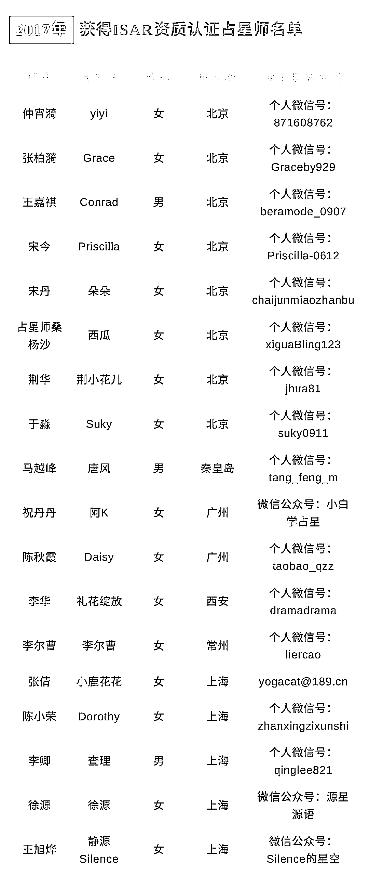

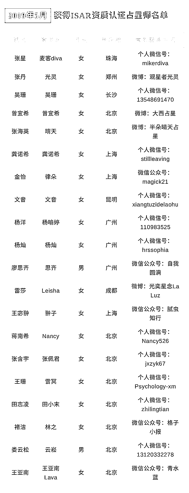

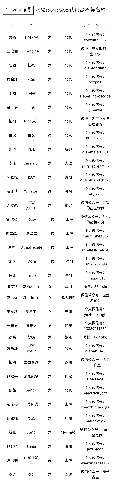

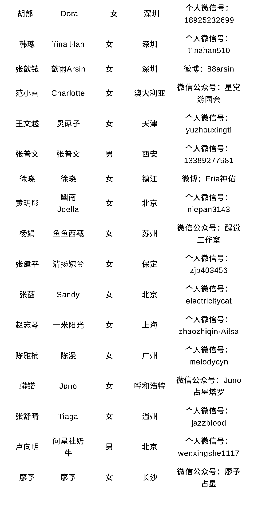

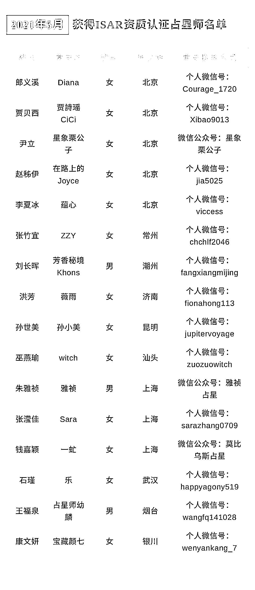

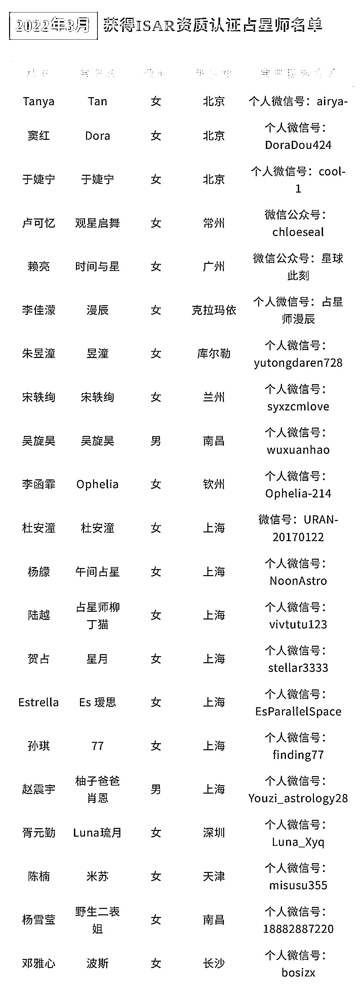

**如果你考虑成为 ISAR 认证职业占星师，若道 2022 年新一期的核心课程正在招生中，欢迎了解。**

**点击下图查看课程详情** 

# 火星进入双子座 | 长达 8 个月！需要注意的都在这里啦

> 原文：[`mp.weixin.qq.com/s?__biz=MzA5NjA0NTAxNg==&mid=2651485588&idx=1&sn=31e83c6e04afbbf17ab497c845356f5d&chksm=8b48c723bc3f4e35d2a7c3655c9a9808e940075bb00605112561c12060936bd72b1be0ee0bed&scene=126&sessionid=1692737766#rd`](http://mp.weixin.qq.com/s?__biz=MzA5NjA0NTAxNg==&mid=2651485588&idx=1&sn=31e83c6e04afbbf17ab497c845356f5d&chksm=8b48c723bc3f4e35d2a7c3655c9a9808e940075bb00605112561c12060936bd72b1be0ee0bed&scene=126&sessionid=1692737766#rd)

********************☆ 后**********************台**********************回复“今日”，给你一句生命态度********************

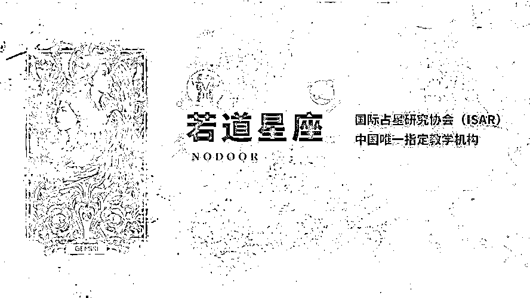

作者/郑玮玲 ISAR 认证占星师编辑/玫瑰 封面/书君 图片/pexels8 月 20 日火星进入双子座，将开启长达 8 个月漫长的黄道之旅。这段时间有什么是特别需要注意的？一起来看看吧。**火星进入双子座**

通常火星在一个星座行进的时间大约是 50 天左右，而每两年火星有一次长达 2 个月的逆行。若加上逆行前后的顺行期，那么火星在逆行期经过一个星座的时间就长达半年以上。

**上一次火星逆行在白羊座是 2020 年的 9 月至 11 月，同样地，也是用了 7 个月时间走完白羊座。****火星在双子座行进时间表：****· 8 月 20 日 15:57** 火星进入双子座**· 10 月 30 日 21:27** 从 25°36′开始逆行**· 2023 年 1 月 13 日 4:58** 从 8°7′恢复顺行**· 2023 年 3 月 16 日 11:14** 回到逆行开始时的 25°36′**· 2023 年 3 月 25 日 19:46 **火星离开双子座进入巨蟹座在火星逆行期前后对生活影响最显著事件通常会在**火星逆行、顺行前的停滞期**，其次是**火星逆行期**内，诸如：**口角、争斗、切割伤及各种开放性流血的创口，在我们未保持足够意识高度与安全措施的情况下极易发生。**除了这些频繁的消极火星类事件外，**火星行进本身也是很多重大项目、工作、进程的启动器，会带来周期性的开端**。非常有利于**长期计划的短期决策和启动**。而**逆行可能需要我们检查、延后某些项目和计划，需要更多的时间来调整、改善项目本身。**在太阳系中，若问我哪颗行星逆行带来的力量和影响力最值得关注，我会回答：**金星和火星。**因为水星 1 年逆行 3 次，木星、土星、天王星、海王星与冥王星也是每年 1 次逆行，而金星与火星的逆行周期相隔在 1 年半和 2 年。**在宇宙中发生概率越小的事件，其能量显然更多不寻常值得我们关注和总结。****无论金星还是火星，都在很大程度上联结着人类的情感、亲密、激情和性能量。**因此，在火星逆行的周期里，对**亲密关系，内在力量以及内在阳性面、阴性面的整合工作**就显得尤为重要。可以说，火星逆行期间，对每个人都是一个**重新认知自己力量，寻找和塑造力量**的时机。当然，在火星逆行双子座期间仍有一部分人群更多受其影响，他们是：**有个人行星、四轴、交点位于双子座、处女座、天秤座、射手座、水瓶座、双鱼座 5°–28°的人**。以上人群在**10 月下旬至 2023 年 3 月下旬**期间，非常值得去投入**深度的自我探索与反思**。关注有没有**因缺少谨言慎行而导致的关系破裂的习性**，有没有**因为过度投入知识学习而忽略了健康起居，以及有没有过度消耗脑力换取价值而不得。**

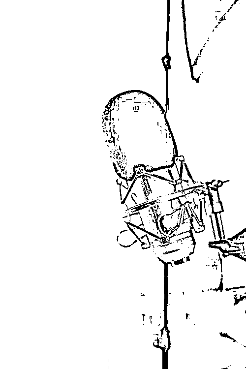

火星在双子座正是其力量薄弱的位置，作为阳性力量象征的火星是需要爆发力、穿透力以及一定的稳定性的。而**火星在双子座的时期会因缺乏原生状态的支持而显得散乱，不聚焦**。**风象的双子座会将火星的力量牵引至头脑、思维的领域，这就会造就强大的脑力。**火星行进双子座会**帮助我们投入知识领域，尤其是投入兴趣使然的学习进程中**，双子座的灵活应变也会**让我们在短期内找到适应、协调的方式来应对对变化、交杂的环境与信息中**。头脑、思维和我们日常的表达、书写能力都可能在火星双子座的触碰下显得格外活跃和积极。这是一个**极佳的练习写作、演讲和学习语言、手语或投入任何一种兴趣学习的时期。**火星同时是一颗**扰动是非**的行星，而双子座关于**交流、沟通与心智学习**，火星在双子座逆行期间更加独立、向内。**心智的狂热，思维的交杂都会带来想逞言语的一时之快。**殊不知，**心智的一时得意不但不会助长内在修行走向整体性的圆满，还可能造成不可逆的丧失、失控以及难以修复的亲密。****火星双子座的名人****1****丹恩·鲁伊尔**人本主义占星始祖丹恩·鲁伊尔的火星在双子座，与冥王星、海王星合相，他的火星也是白羊座太阳、金星的守护星，同时守护了他的下中天。丹恩·鲁伊尔在幼年就因疾病而截去了左手臂，在某种程度上这也是火星双子座的一种表达方式：**双子座跟手部有关，火星正是关于外科手术、切断**。而他的**火星、冥王星正是落在关于健康的 6 宫**。可以说这颗被他自我赋权后的，看似“虚弱”的火星却在他生命中发挥了转化、向上升华的，决定生命高度、厚度的力量。

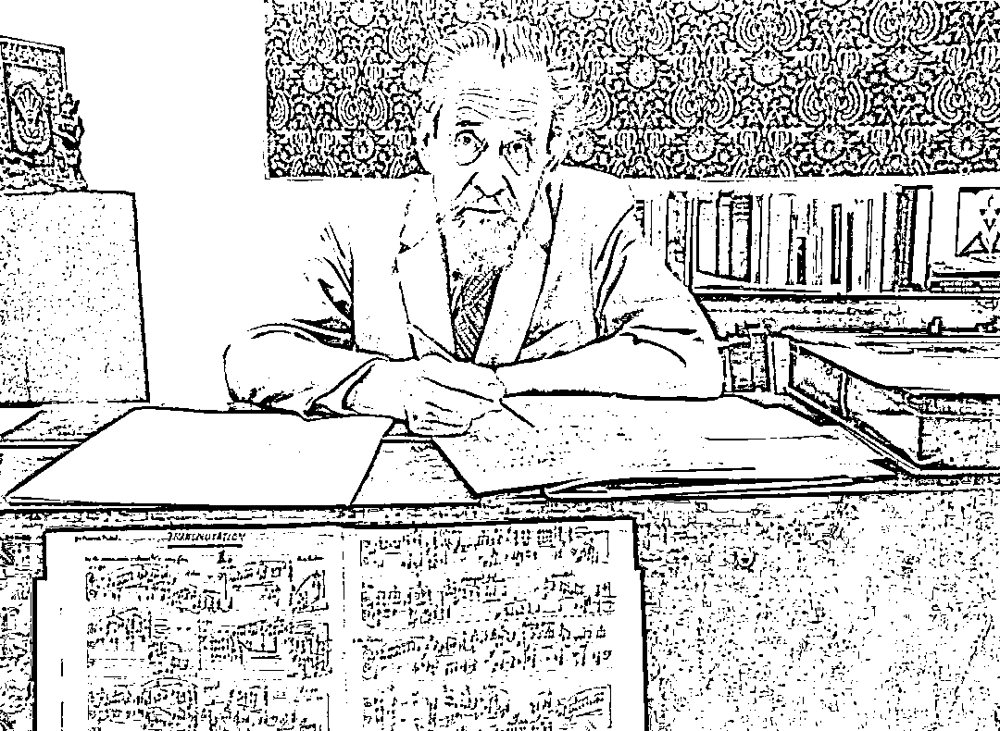

| 丹恩·鲁伊尔

丹恩·鲁伊尔的占星学观点引领了 20 世纪的西方占星学。当代许多对国内占星学术影响深远的占星大师如斯蒂芬·福里斯特、大卫·瑞雷、马克·琼斯等均是受到丹恩·鲁伊尔著作、思想启发的人。这位太阳、金星在白羊座的大师正是用一己之力创造并开启了一个新的占星学纪元。我们现在最常用的 8 个周期的月相法则正是经由他的《*The Lunation Cycle*》奠定了释义理论沿用至今。丹恩·鲁伊尔的出生星图是经由他个人进行生时校正过的。调整后的星图中火星恰巧位于 6 宫尾的双子座 12°7′，距离下降点仅一度之遥，而海王星则一度不差地合在下降点上，冥王星位于双子座 9°56′。首先，**他出生在一个天冥对分的大时代背景下，这意味着他作为个体携带着集体意识革新的原型力量。**其次，**他星图中的火-海-冥合相表达出了火星能量是暗藏并被包裹的，这股力量交杂着在脆弱和顽强的多重性**。他需要透过健康、职业纵向的探索挖掘去探索自身无限的活力，其浪漫主义情怀与灵性光芒需要透过不同领域学术的深广探索，经由写作、著书、演讲来成就并赋权自身力量。然而正是因为失去手臂，丹恩·鲁伊尔才开始透过学习音乐来寻找未来的发展。丹恩·鲁伊尔有一个鲜为人知的身份就是音乐家，他为谋求音乐事业发展从法国来到美国。在 20 世纪中期他结识了那些最终改变他生命的禅师、神智学者、占星老师。

事实上，丹恩·鲁伊尔的书对读者并不太“友好”，因为他关注的面向复杂而深广，研究深邃到近乎学术偏执，比如《音调的魔力和音乐的艺术》（*The magic of tone and the Art of Music*）。

看书名以为是给音乐界读者的，却需要占星学背景和宇宙哲学思考的向度才能理解上下文。同样的，占星圈并没有多少人懂得他描述的乐理深广度。他写书的偏向一定是很多出版社不喜欢的样子，他只写自己所想，他也许也考虑过读者——占星学、音乐双重背景，这很可能只能是丹恩师祖本人。

然而，这不正是学术引领人，思维启发者应该有的样子吗？谁知道这本书会给后世带来什么样的影响呢？谁知道我们的学说、出版物会否影响、涉及到我们死去之后的世界呢？我找到此书时正是为探索占星学与音乐的交汇，庆幸小时候感觉枯燥的乐理没白学，没有想到有一天能为占星学所用，而且这是我在业界唯一找到的给出理论的著作。

丹恩·鲁伊尔一生著书仅占星学类就超 30 本，还有一些音乐、哲学和神智学著作，这正是火星双子座用知识力量去展现的结果，以及火海合相的多学术领域的职业生涯。

上升射手座的他，木星也落在双子座 7 宫，因此，从他青年到老年写书、出书就从未断过。即使是一些深度占星学的书籍，也能从他的文字里感受到他写书时只专注于自己的思维。

这种高度凝炼的思维方式既让读者感到内心的焦灼，又激发出想要突破的执意——他双子座 6 宫的火星、冥王星起到了相当精妙的作用。喜欢思维锤炼的朋友就会对丹恩鲁伊尔的著作充满死磕精神。

火冥合相的深度，令他无法克制地想要去探索深度知识。火海合相则融合了音乐与灵性、神秘学。双子座的火星透过大量写作让他实现了自己在这个世界上的意志与力量，并用由此奠基了 20 世纪以后的占星学的未来。**2****圣埃克絮佩里**

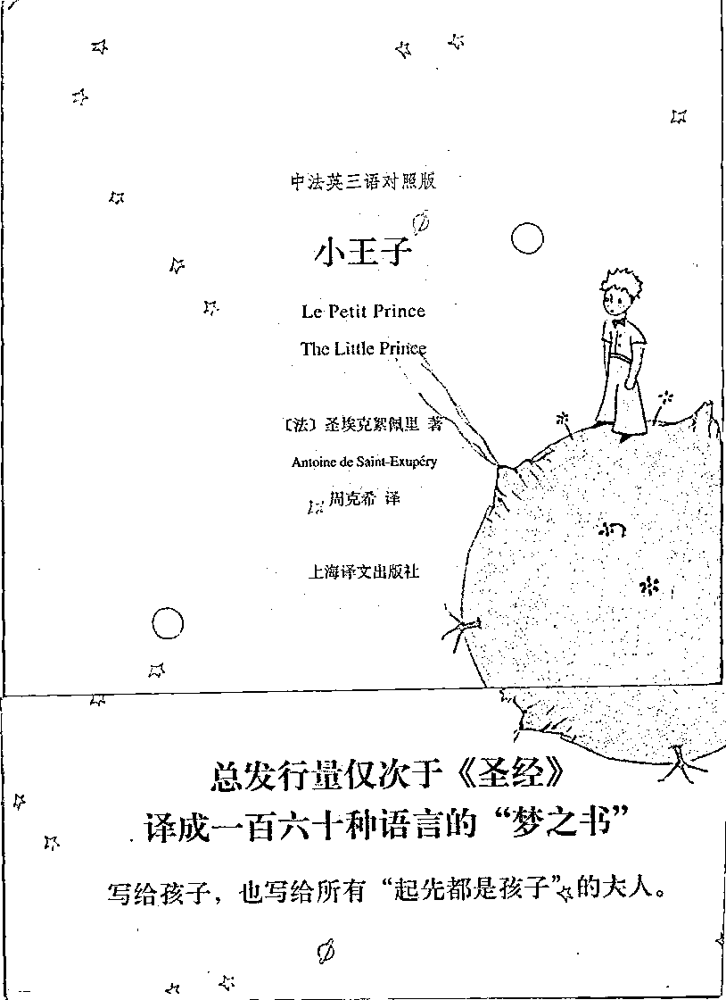

| 《小王子》

除此之外，《小王子》作者圣埃克絮佩里的火星在双子座 1°，合相中天，对分木星、天王星、月亮北交点。这颗火星宛如身为飞行员的他，在高空中展现自己的魅力。

**3****加西亚·马尔克斯**

| 加西亚·马尔克斯魔幻现实主义代表人物加西亚·马尔克斯的火星在双子座 6°，与 8 宫的土星精准对分，同时四分了双鱼座的太阳、木星。马尔克斯显然将自身的魅力透过神秘的写作发挥到了极致，他同时拥有金冥合相在白羊座。**4****泰戈尔**

| 泰戈尔泰戈尔的火星在双子座 22°，与白羊座 0°的海王星成四分相。用诗歌、文学艺术唤起并引领了一个民族的灵魂，也影响了世界的灵魂。**火星在双子座的行进**

**火星三分土星**

**周期一：9 月 11 日-12 月 27 日****重点影响人群：**有**个人行星、四轴、交点位于双子座、处女座、天秤座、射手座、水瓶座、双鱼座 11°-26°，以及狮子座、天蝎座、金牛座 18°-22°的人。**

**周期二：2023 年 3 月 6 日-4 月 20 日**

**重点影响人群：**有**个人行星、四轴、交点位于双子座、处女座、天秤座、射手座、水瓶座、双鱼座 0°-5°及 21°-29°的人。**

火星首先与逆行中的土星开始形成三分相，此时的水瓶座土星能量内收，在规则、界限和现实困境上给足了时空让我们沉淀、深化和稳固。

**这预示着重大项目、工作的实施有放慢、减缓行动的必要。**团体的力量在凝结，作为个体则需要**退出思维性的勇猛、敢冲、敢想，将这些颇具火力的光亮留待时间的推动。等待完善构建之后找到更好的时间点、支撑点。**

**10 月 23 日，土星会恢复顺行，而一周之后火星逆行了。****此阶段的火土三分相预示着外部环境的转变、明朗化，压力与紧迫感也随之而生。**所有关于行动的步骤适宜进入更多向、灵活的沟通、交流。现实的压力、挑战经由灵活、变通的调整足以轻松应对。**此时期也很适合进入一些个性化的建议、筑基、打底的工作，支持任何研究性工作的基础工作，我们可以大量地学习、吸收，透过知识、信息获得内在稳定感。****2023 年，土星率先进入双鱼座，随着火土三分的进程，火星也将跨入巨蟹座。**此时的土星带来了水象、变幻的压力与挑战，提醒着我们对于环境、生态、气候的应对能力。因此**在 2022 年不宜对未来一年作出重大而确定性的方案，大环境变动的可能性极大程度影响着我们个人的行动和去向。**

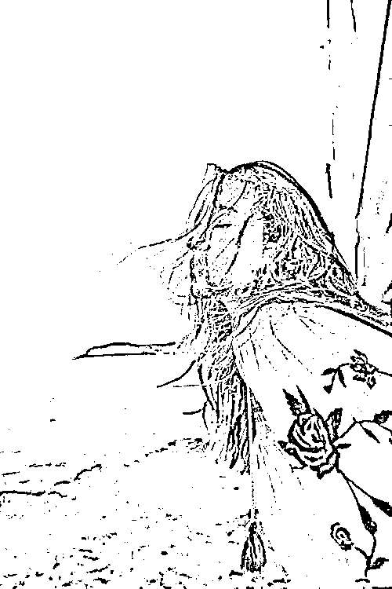

**火星四分木星、海王星**

**周期一：9 月 19 日-12 月 12 日****重点影响人群：**有个人行星、四轴、交点位于双子座、处女座、射手座、双鱼座 12°-25°的人。**周期二：2023 年 2 月 21 日-4 月 2 日****重点影响人群：**有**个人行星、四轴、交点位于双子座、处女座、射手座、双鱼座 16°-29°，白羊座、巨蟹座、天秤座、摩羯座 0°-3°的人。****与此同时，木海合相发生在 10 月 29 日-12 月 30 日，期间木海均从逆行状态恢复至顺行。**在 2022 年最后两个月里木海合相——**陈旧大梦的幻灭，一些世界性“神话”的破灭会显化得更为极致。**火星与木海同时的四分相让我们有机会在这个过程中释放很多集体性的痛苦、精神毒素，尤其当我们投入充满觉知的意识个性化进程中时，我们会借由内在真理与信仰和力量，走出集体性的迷惑与困顿。**木星在恢复顺行后的 12 月 20 日就再次进入了白羊座，揭开新一年的自由与个性化的旅程。****如果幻灭来得比较巨大，如果认同有意义的丧失能换来新生的清醒与果决的信心，便能从患难中重拯自身的英雄力量，在信仰、真理和宇宙性的支持下去投入自性化的发展。**

****

**世界观创造了世界。****——理查德·塔纳斯**只有当我们相信自身不可限量，无法评估的力量时，才会意识到——正因为它无形而不定，飘浮又脆弱，才可能在时空转换点重新融入最适恰的生命情境。我们将用上全部积蓄的知识作为力量，我们所学，所悟都将用在自由创造的生命进程中。火星在双子座，是值得去发掘、探索这世界所有的新奇，借由知识的风象放飞我们对人世间的理想的时光。在逆行中深入浅出，在顺行中乘风扬帆，与你内在的启蒙勇士一起探寻心灵与意识世界，把无畏与激情投入到充满内在启迪的创造性工作中，那将是我们感受内在活力、激情最无愧于心的选择。

**版权声明：**原创文章由作者授权首发于若道平台，欢迎转发，反对抄袭。友号转载请申请白名单。

**END**

**郑玮玲**

ISAR（国际占星研究协会）认证占星师（2016 年获得）

若道占星专栏作者

将占星咨询、教学与音乐、舞蹈相结合的疗愈者

**微信号**：zhengviolin

**新浪微博**：@郑玮玲

**微信公众号**：Sampriya-Astrology

长按打赏

**20 位来自世界各地的占星师****带来 19 场沙龙——新世界的觉醒****详情可点击下图**

**学习占星学****点击下图了解课程详情**

**喜欢就点一下“在看”吧！**

********报名直达入口********

# ISAR 星空俱乐部沙龙第 44 期丨爱神、命运女神，和创造的门槛

> 原文：[`mp.weixin.qq.com/s?__biz=MzA5NjA0NTAxNg==&mid=2651485588&idx=2&sn=3b0f05ab0a58a655a850b722674dba20&chksm=8b48c723bc3f4e35259c2776b81b749495d371b2954f71831af5ed92bd6d6141ee742b54892d&scene=126&sessionid=1692737766#rd`](http://mp.weixin.qq.com/s?__biz=MzA5NjA0NTAxNg==&mid=2651485588&idx=2&sn=3b0f05ab0a58a655a850b722674dba20&chksm=8b48c723bc3f4e35259c2776b81b749495d371b2954f71831af5ed92bd6d6141ee742b54892d&scene=126&sessionid=1692737766#rd)

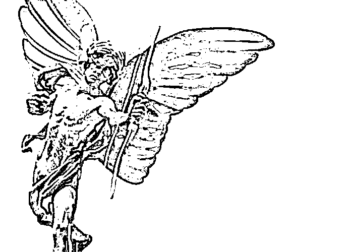

**沙龙来啦！****8 月 20 日，星期六上午 10 点，**国际占星研究协会（ISAR）中国星空俱乐部沙龙由占星师**格雷·克劳福德**带来一场讲座！ **沙龙主题****沙龙主题：**厄洛斯（爱神）阿南刻（命运女神），和创造的门槛******主讲人：****格雷·克劳福德******

**沙龙时间：8 月 20 日，星期六**

**                北京时间上午 10:00-11:30（有英文翻译）**

**沙龙方式：线上沙龙**

当客户感到自己即将进入一种更具真实创造性的生活时，他们会寻求占星咨询，但同时也会因面临阻力而感到沮丧。 

本次演讲将利用**希腊爱神厄洛斯、命运女神阿南刻、看门人、十字路口和极限提升等神话故事，**以富有想象力的方式探索占星象征有助于确认和增强内心愿景的方式。**当你感觉自己被困在追求更具活力的心灵召唤的悬崖边时，占星学如何给予你帮助呢？****主讲嘉宾**

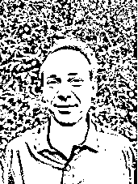

**格雷·克劳福德**

*   格雷·克劳福德是一位生活在华盛顿州奥林匹亚的占星师（实践出生星图解读，卜卦占星）。
*   运用了来自古代和现代的技术，为占星的生活象征主义带来了一种关联的、想象的和心理学的方法。
*   曾在 UAC、NORWAC、华盛顿州和俄勒冈州占星协会以及波特兰占星学院演讲。
*   格雷在他的网站 http://graycrawford.net 上撰写占星文章，也是 Astrology.com 的特约撰稿人。

**如何参加沙龙？**本讲座也是本月的国际占星研究协会（ISAR）星空俱乐部讲座。**ISAR 会员可以免费收看。**请注意邮件通知，具体参与方式见邮件。❶ 如果你**已经是 ISAR 会员**，请注意邮件通知，告知如何参加。❷ 如果你**不是 ISAR 会员**，非 ISAR 会员价格：98 元。如有任何问题请咨询工作人员童老师（微信：nodoorDaivd）

**非 ISAR 会员报名请长按下图**

**▼**

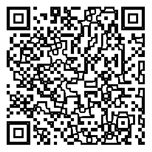

**ISAR 明星俱乐部**

2018 年，ISAR 在主席亚历山大·因舍阿吉克的带领下，成立了 ISAR 明星俱乐部，每月为全球 ISAR 会员提供在线直播讲座，邀请全球著名占星师开讲，学习和分享新的理念。讲座时长一小时，涉及占星学的不同领域、不同观点，每个会员都可以参与其中，每次讲座之后还有 20-30 分钟问答时间向老师们提问。每一场在线讲座都会记录下来，ISAR 除了提供视频，还会提供相关的讲座资料，以及单独的问答录音，自动发送到专门的 ISAR 明星俱乐部页面存档，每位 ISAR 会员可以在 ISAR 网站上自己的会员主页俱乐部页面找到。在 2018 年最初几个月，ISAR 明星俱乐部会每月举办一场在线演讲。之后，两周举办一场演讲，最终每周举办一场演讲。
但是，过去明星俱乐部讲座只有英文沙龙，因此，中国会员只有懂英文才能受益。为了使得更多不懂英文的中国会员能够受益，我们特别和 ISAR 总部协商，今后会安排有中文翻译的明星俱乐部占星沙龙，作为给中国 ISAR 会员的福利！**如何成为 ISAR 会员？**

**如果你也想成为 ISAR 会员，请复制链接在浏览器打开**

http://www.nodoor.com/isarcert.do?contentId=3588（仅支持网站支付）

**或直接长按下方二维码，微信购买会员：**

**ISAR 会员有什么福利？**一年期会员仅需支付**人民币 510 元**，即可享受：**☆ 星空俱乐部免费沙龙****☆每年出版 3 次的《国际占星师》（目前只有英文）；****☆每周电子邮件交流汇总杂志（目前只有英文）；****☆专项研究基金和奖学金资格；****☆ISAR 主办的会议和论坛的会员折扣，包括国际占星大会（UAC）、ISAR 的会议和研讨会等会员权益。****有疑问怎么办？**关于 ISAR 星空会员俱乐部以及我们的讲座，如果你还有任何疑问，**请联系工作人员**：

**仲老师**

**微信：YY18513802156（微信号）**

****非 ISAR 会员报名请点击“阅读原文”****

# ISAR 认证职业占星师文凭课程 | 开启“爱好变职业”的创收自由之路

> 原文：[`mp.weixin.qq.com/s?__biz=MzA5NjA0NTAxNg==&mid=2651485588&idx=3&sn=87d33439261c6887149f0d479b3cd48f&chksm=8b48c723bc3f4e35cabb20bd549f8148619cf099a9577dd0b192f920b5ddf2c18971a5d80519&scene=126&sessionid=1692737766#rd`](http://mp.weixin.qq.com/s?__biz=MzA5NjA0NTAxNg==&mid=2651485588&idx=3&sn=87d33439261c6887149f0d479b3cd48f&chksm=8b48c723bc3f4e35cabb20bd549f8148619cf099a9577dd0b192f920b5ddf2c18971a5d80519&scene=126&sessionid=1692737766#rd)

**2022 年，是世界和中国 40 年未有之大变局的开始。**

俄乌战争打破了欧洲大陆乃至全世界的和平局面，而新冠疫情也给中国经济带来前所未有之挑战。

如果你关心经济形势和世界局势，你会有这种的感觉，我们将面临一场深刻的危机，而这不是短期内可以结束的。

**占星学的看法也是如此。**

4 月青年失业率（16 岁到 24 岁）中国达 18.2%，一些背着房贷、教育、医疗负担的中年人突然失业更是整个家庭整个难以承受之重。为了更好准备面对这样的时代变化，连《北京日报》这样的官方媒体也在呼吁：**“开拓副业，让自己有多元化发展的生存能力”。**

**而这门课程，就是为了这样一个目标准备的。**

**占星学是非常好的“开展副业”的选择**

这个**为期 16 个月**的课程通过并不算长的时间和并不算高的投资，不仅可以帮助你学到一个终身可用的技艺，而且也可以选择成为自助助人的占星师，**开启受益终生的第二事业。**未来是个体崛起的时代，大量个体被鼓励独立发展，比如网红、自由职业、自媒体、咨询师等，他们都不需要传统的办公室。社会越发达，人的独立性就越强，未来有能力的人都可以变成独立的经济体。

**占星学也是越老越好的职业**

和一些技术变化非常快的职业不同，**占星学的技术层面非常稳定，不会快速迭代变化，**同时，掌握好占星学、能够做一场好的咨询又需要个人自身大量实践和对生命的深刻理解，而这些都是时间和岁月带来的。

**占星学是现代社会需要的助人职业**

社会快速发展和变化人们似乎越来越无法掌控自己的生活，这给很多人带来巨大的焦虑，**抚慰心灵的咨询市场需求巨大。**而占星学可以让人从前所未有的角度了解自己，了解目前和未来所处的周期，挑战的意义，不论对于深入的个人成长探寻，还是预测未来的周期，都又其独一无二的价值。

**ISAR 认证职业占星师的独有培训**

目前占星学的培训市场鱼龙混杂。而 ISAR（国际占星研究协会）是一个包含了 47 个国家在内的国际占星组织，多年来致力于占星的教育和研究，提升占星教育的品质和职业占星师的能力，在国际占星领域备受尊重。今年，ISAR 对于成为 ISAR 认证职业占星师提出了更高的要求，**所有想要获得 ISAR 职业占星认证的申请者均需要在 ISAR 的附属学校通过 500 个小时的研习（包含****主课****、选修课、沙龙、作业、讲座、工作坊等等）。**

**而这门核心占星学课程就是为此而准备的。**

**2022 年，鉴于对若道在占星教学领域所做的持续努力和高品质的课程服务，ISAR 特别授予若道核心课程为 ISAR 文凭课程，所有在若道学习，并通过若道毕业考试的同学将获得 ISAR 颁发的学历文凭（Diploma）。**

**你的占星核心课老师是谁？**

**拥有****51 年****占星实践经验的****若道创始人****前 ISAR 全球副主席****前 ISAR 全球职业占星师资质认证主席****大卫·瑞雷**

**和**

**2019 年第二届、2021 年第三届核心课中**

**与苏·汤普金斯老师****联合授课****的**

**ISAR 认证职业占星师**

**咔咔（Caroline）**

**二人合力打造**

**2022 年 ****若道全新核心占星课程**

**咔咔老师给同学的寄语：**

（向上滑动查看内容）

**亲爱的同学们：**

我为什么学占星学？

2000 年的时候我还是一个在网上搜索天蝎座和水瓶座配不配的普通白领。我搜索的内容还包括了水瓶座为什么总是这么若即若离？

体贴的搜索引擎给我推送了占星学、行星、星座、宫位、相位等资料，还让我了解到莉莉丝、月亮交点、截夺宫位等占星学概念。

2000 年 10 月我了解到，一个从业 30 多年的美国职业占星师大卫·瑞雷来到了中国，和他的中国合伙人将开办一个专业教授占星学知识的课程。过去 10 个月在网上东拼西凑的占星学知识唤起了我对占星学的兴趣，但是已经不能满足我对星图深度分析的需求了。

2013 年，我通过了若道核心课程的毕业考试和国际占星师研究协会的认证考试。2015 年我离开职场成为一名全职占星师。

到底学习占星带给了我什么呢？

1、它是自我觉知的工具，我现在已经不去纠结哪些星座是否匹配，我相信外在的事件是内在心理矛盾的显化。也就是说，想找到令人满足的亲密关系，要先去了解自己的情感模式和需求，而不是无意识地一次次地试错和撞墙。我开始学习自我关怀和接纳自己。

2、它带来看待世界的全新和全景的角度，天上如是，地下亦然。人类社会和个人生命的进化都有其周期和相似性，作为个体，占星学帮助我思考如何更积极和有建设性地与宇宙的能量合作，认识自己，发挥自己的潜力，度过有意义且自我满足的人生。

3、它带来了全新的职业：占星师和占星老师。除了收入，还有助人育人的满足感和意义感。

4、它带来一群志同道合的伙伴，我们彼此联结又相互独立。

作为中国占星界的“黄埔军校”若道占星的学生、助教和老师，我与很多学员在人生的不同阶段带着各异的需求走进了这所学校，2022-2023 年一年半的若道核心课程设计既蕴含了大卫·瑞雷老师的教学精华，也带入了我在跟随不同国外占星老师学习、助教和教学积累的心得。

有一些学员毕业后从事了占星咨询工作，有的在各大平台成为专业占星学知识的输出者和传播者，有的运用占星学提升他们的工作，也有的在占星学与投资，占星学与名人/八卦、占星学与原生家庭、亲密关系、亲子关系等领域收获了有用的或者有趣的体验。

对我来说，生命是一场自我完整的体验之旅。从 2011 年的那个春节在若道入学之后，我的生命旅程更加充实、有意义、有目标，也更有满足感。

希望在 2022-2023 年的若道核心课程里见到你。希望你此后的生命旅程里，有若道，有占星学。

占星师咔咔

2022 年 5 月 24 日

**大卫老师给同学的寄语：**

（向上滑动查看内容）

亲爱的学员们：

感谢你对我们从 8 月 30 日开始的若道 L1-5 级核心课程的兴趣。我和合作老师咔咔以及我们的核心课程团队期待着为你提供这个机会，来教授各种高品质的地道占星学知识和技巧。

对于那些希望获得 ISAR 职业占星师认证的学生，这是一门适合你的课程！

作为 ISAR 咨询技能培训的一部分，我曾与咔咔合作过，我们期待着再次合作。咔咔和我曾在 ISAR 职业占星师认证委员会（CAP ISAR）一起工作，我们非常熟悉获得 ISAR 职业认证的流程。作为你的老师，我们将陪伴你整个占星学发现之旅，帮助你逐渐认识到占星学有多么的神奇。此外，你还将受益于我们若道的助教和课程顾问，他们是若道核心课程计划的重要组成部分，提供在线沙龙、组织学习小组、指导家庭作业。我们的教育团队是“服务于你的团队”，所以也会根据你的需求进行相应的调整。你专用的核心课程微信群也促进了你的学习过程，使你能够每天与你的同学们一起学习、探讨、成长。

52 年前，当我开始学习占星学时，没有一所像若道这样的学校。如果有这样一所学校，我会尽一切可能在那里成为一名学生。事实上，我很幸运，我的老师都是经验丰富的专业占星师。然而，我花了 6 年的学习时间才通过 1976 年在美国乔治亚州亚特兰大举行的专业占星师考试，又花了 2 年的专业实践时间才通过占星学谋生。我永远不会忘记从 1970 年到 1978 年的 8 年，那些日子的反复试验教会了我如何苦练占星学。作为老师，我一直在努力传授我早年所学的知识，让你的旅程更加顺利，更加全面。

自 1978 年以来，44 年的全职实践教会了我很多，我很高兴有机会与大家分享我所学到的东西。我和咔咔都是现代占星师，虽然我们尊重西方占星学的历史和传统，但我们实践和教授的占星学植根于现代人本主义哲学，这种哲学旨在提高你对自身潜力的认识，并鼓励个人成长。还有什么比了解自己更实际的呢？还有什么比个人成长和发展潜力更有利的呢？这是你将要学习的占星学，一种可以应用于你自己生活的占星学，一种可以为你提供一个充实职业的占星学。

教书是我回馈占星学行业的方式，这个行业拓展了我的视野，远远超出了我曾经想象的可能。谢谢你给我这个机会做你的老师。

大卫·瑞雷

2022 年 5 月 24 日

**连报 L1-5 全阶网络直播课程，你可以享受**

❶ 64 次线上直播互动网络课程+2 场工作坊，全面而详细地讲解占星学知识、技能、案例和重要领域实践运用。

❷ 知识点+学员星图解读有机结合：咔咔老师以讲解知识点和中外名人案例为主，大卫·瑞雷老师以参课学员案例演示及客户案例为主，每个知识点覆盖班级内学员的亲身案例，参与感更强，多位学员都有机会听到自己的星图分析。

❸ 微信群学员互动分享，从真实案例学习生命成长故事。

❹ APP 答疑论坛提问：论坛上每个学员的问题都将得到及时回复。

❺ 若道独有的职业占星师养成计划，为你毕业后独立咨询做准备。

**❻ **提供**咨询平台**，只要努力，优秀毕业生有机会入驻**若道咨询平台**，拓展咨询客户群。

**更多了解老师和助教？**

**大卫·瑞雷（David Railey）**

*   **I****SAR 董事会成员，ISAR 全球副主席，ISAR 全球职业占星师资质认证主席，若道占星创始人**。

*   2016-2019 年，被选为国际占星协会（ISAR）考试委员会成员，国际占星协会（ISAR）是世界最大的国际占星机构，会员遍布 47 个国家。

*   2017-2020 年，被选为国际占星联盟（ISAR）考试委员会主席，理事会成员。

**占星师咔咔（Caroline）**

2010 年师从美国占星师大卫·瑞雷学习，并得到世界名师斯蒂芬·弗里斯特、罗伯特·汉德、苏·汤普金斯传授各种占星学技法。若道首届学员，国内最早获得 ISAR 职业占星师资质的职业占星师，多次担任若道核心课程助教，并于 2019 年第二届、2021 年第三届核心课中和苏·汤普金斯老师一起教授若道核心占星课程。

在国际知名广告公司和市场研究公司从事的市场研究和推广工作十余年，曾任职于阳狮集团、尼尔森市场研究有限公司、MTV 和《Madame Figaro》杂志。

**助教王嘉祺 （Conrad）**

ISAR 认证占星师、若道认证生时校正资质，从 2010 年起自学占星学，2015 年开始在若道系统学习，并开始个案咨询。2018 年担任若道核心课程助教，以及卜卦占星学和太阳返照选修课助教，并带领学员进行经世占星和太阳返照方面的研究。2019 年 11 月作为演讲人之一参加了国际占星协会（ISAR）北京大会，也是 ISAR 星空俱乐部中国区第 16 期的主讲人。

**什么人适合这门课？**

*   对占星学有浓厚兴趣，想要系统学习占星学。
*   对占星学有一定基础，但不知道该如何整合星图复杂的碎片。
*   希望成为优秀的占星师，想要借鉴国际大师解读思路并融入自己的体系。
*   想学习占星学，但不擅长英文，希望有中文老师授课。
*   想结合占星学理论与咨询实践。
*   走在自我探索和个人成长道路上的人。

**课程费用**

**★ 1-5 阶 连报****课程费用：46500 元** **★ 1-2 阶 （8 月 30 日开课）****课程费用：3500 元 ****★ 1-3 阶　连报****课程费用：11500 元 **

**咨询课程请联系顾问**：**王老师（微信/手机：18510107057，请备注“大卫核心课”）**

**退转课程**

**退款原则请详看《教学协议》，如有疑问请咨询课程顾问。**

****2022 L1-5 认证职业占星师必修课程****

**授课老师：大卫·瑞雷、咔咔**

**直播课开课时间：2022 年 8 月 30 日（周二）**

**授课方式：******网络授课，英文/中文授课，中文翻译****

**费用：****1-5 阶连报**：46500 元**；**1-2 阶**：**3500 元；****1-3 阶**：**11500 元

**课程负责人：王老师**（微信/手机：18510107057，请备注“大卫核心课”）

长按二维码添加课程负责人咨询~

****报名直达入口****

# 谈恋爱前，先看看这个星图，能省去不少麻烦

> 原文：[`mp.weixin.qq.com/s?__biz=MzA5NjA0NTAxNg==&mid=2651485184&idx=1&sn=1f6ed7961f7684bfa6421ed4db2c0305&chksm=8b48c6b7bc3f4fa1ee6c467d838a79821d53f0bec688b1d0169298594ccf95aa23e6ffed007d&scene=126&sessionid=1692737771#rd`](http://mp.weixin.qq.com/s?__biz=MzA5NjA0NTAxNg==&mid=2651485184&idx=1&sn=1f6ed7961f7684bfa6421ed4db2c0305&chksm=8b48c6b7bc3f4fa1ee6c467d838a79821d53f0bec688b1d0169298594ccf95aa23e6ffed007d&scene=126&sessionid=1692737771#rd)

****************☆ ****************************后台****************************回复“今日”，给你一句生命态度****************

作者/丽兹·格林译者/Luke 校对/江艺编辑/玫瑰 图片/pexels

组合图在关系当中具有重要的意义，揭示了双方甚至无法去改变的一些部分。这听起来有些无奈，但也可以促使我们对关系做更多客观理性的思考。一起来看看。另外，斯蒂芬老师马上要在若道开设[【组合图工作坊】](http://mp.weixin.qq.com/s?__biz=MjM5MjQwNjAyMQ==&mid=2649440040&idx=2&sn=04480bf4cfdb0177853d50bf37e65469&chksm=beb9504289ced954f6f4867c83b01e8544f6be8df199eb05b17e0f8c0e558bbe77ae6fa9d57f&scene=21#wechat_redirect)（点击查看课程），如果想跟这位占星大师学习，快来了解详情吧~

**1+1=3**组合图背后的概念或者正如艾琳·沙利文有时所称的，组合起来的星图代表作为第三因素的关系本身。两个人创造了他们之间的第三个实体。**组合图就像一个能量场，影响着两个人，从每个人身上提取出某些东西，同时把自身的能量施加在他们身上。**组合图似乎不描述两个人对彼此的感受。它与比对图非常不同，后者描述的是**两个人之间的化学反应，他们如何相互影响。**当我们探索关系中比对图时，我们说：“你的金星合相我的火星。你激活了我的火星，带出了我火星式的反应。我激活了你的金星，引发你金星式的反应。从而使得我们对彼此有了某一种感受。”

当我们看组合图时，我们没有在探索两个人如何彼此激活，或对彼此的感受。我们在解读他们之间产生的能量场。**组合图就像一个孩子，第三个实体，携带了父母双方的基因印记，但以全新的方式组合了这些印记，并且独立于父母双方而存在。**

因为组合图有着出生星图的所有特征，所以我们或多或少要以相同的方式来解读它。**·** 组合图有个**核心身份**，象征了**它的“目的”（太阳）**；**·** 也有一整套**特有的情绪反应和需求（月亮）**；**·** 它有一种**沟通模式（水星）**，和**独特的一套价值观和理念（金星）**；**·** 它有**表达能量和意志的模式（火星）**；**·** 它有**属于自己的成长和扩张模式（木星）；****·** 它有**内在的限制和防御机制（土星）；****·** 在关系的集体背景模式下，它有**特定的弱点（凯龙）；****·** 它反映了**某种致力于改变和进步的集体理想（天王星）；****·** 它有生来的渴望，反映了**某种集体的幻想（海王星）；****·** 它有**底线的生存本能**，维持关系的存续，但是**当关系遭到威胁时也有破坏性（冥王星）；****·** 它在社会眼中有**某种形象或角色要扮演（中天）；****·** 它有某种**“个性”**，**按特定的方式向外部世界表现自己（上升）**。组合图的星座描述了组成关系的基本品质或“气质”；行星描述了激发的能量。宫位描述了行星表达能量的生活场景。所有这些都是基础的占星学，就像解读个体出生星图一样，那也适用于组合图。

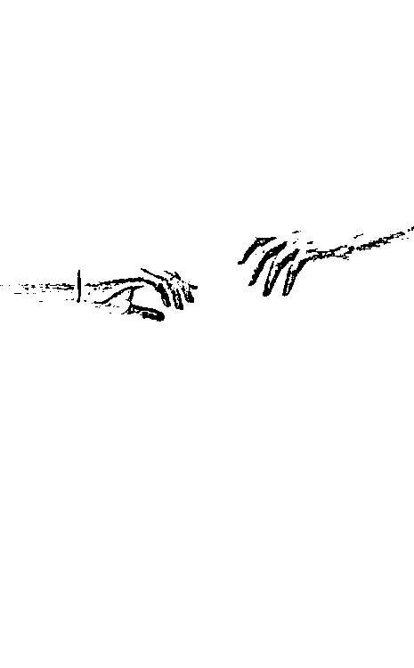

**作为实体的关系**我们通常不把关系视为独特的实体。更常见的是，我们考虑的是自己的感觉和态度，或对方的感觉和态度。然而，每段关系创造了自己的能量场。作为关系一方的我们，行为模式与单独一人时不一样。当我们单独一人时，可能有独特的行为模式。但当我们与伴侣一起时，某种能量模式就启动了。在其他人的陪伴下，我们表现出特定的行为模式，有时非常明显。**关系中的两个人创造了一种氛围，那不是出于有意识的选择，而是自然而然发生的。**其他人常常将其反馈给我们。“你们俩看起来是如此活泼、迷人的一对”，一位朋友可能说，或者，“你们俩的生活一定很精彩！”与此同时，你在想，“他们在说什么？我不是这么感觉的。”我们可以在组合图看到木星落于射手座上升，天秤座位于中天，其他人视这段关系为光彩夺目的木星-金星实体。但是一位伴侣的土星可能合相对方的月亮并对分太阳，比对图的这种配置，可能使关系感觉像西西弗斯推石头，而不是摇滚明星米克·贾格尔和杰里·霍尔。相反的事情也可能发生。组合图土星合上升，凯龙星合中天，两人在一起时，投射给外界的是某种沉重的能量。但比对图包含大量金星-木星-天王星的相位，反映了关系中的一种兴奋感，双方都能感受到，但没对其他人展示。

**通过询问其他人对一段重要关系的看法，我们能了解关于组合图四角的大量信息。**通常我们可能感到相当震惊，因为那回答可能没有反映我们对彼此的真实感受。

**组合图，就像出生星图一样，对外界展示的是上升和中天的形象。**它有一颗守护行星，把关系的表达聚焦在特定的宫位或人生领域。组合图的宫位与出生星图起到相同作用，反映了关系动力显化的场域。

**当组合图中的行星突出了一个组合图的宫位，那个人生领域将对关系极其重要，关系双方被迫聚焦于此，哪怕他们两人出生星图里同样的宫位是空的。**一段关系能够推动我们直面人生的某一个领域，尽管出生星图上我们既不偏好也不擅长应对那些领域。

组合图有它自身的规则和能量，这与我们是否与某人“匹配良好”无关。**组合图本身不会告诉我们匹配度。那是比对图的任务。**组合图不会揭露一段关系中两人的化学反应是“好的”还是“坏的”。组合图对我们说：“如果你选择进入这段关系，这里是它的意义和命运的形态。这里是组成它的元素，以及它的目的。”如果我们想知道那种意义和命运能否使我们感觉良好，我们需要将组合图与我们自己的星图对比。如果去考察组合图与关系中每个人出生星图的比对图，我们可以了解到关系给每个人带来的感觉。我们也可以用第三方的星图，将那个人的星图与组合图比对。这是个令人着迷的练习。比如说我处在一个长期关系中，但也有个恋人。我可以取第三方的星图，看看它是如何影响我和伴侣之间的组合图，我就可以清楚了解那个恋人是如何影响这段关系的。我们也可以看看一个孩子的星图与父母之间组合图的比对。这非常有助于理解家庭动力。**一些孩子实际在以某种方式破坏父母的关系，另一些则帮助将关系黏合在一起。**通过观察孩子星图与父母之间组合图的比对，我们可以看出这些。仅仅通过探索孩子和每个父母的比对图，可能无法看出这一动力。

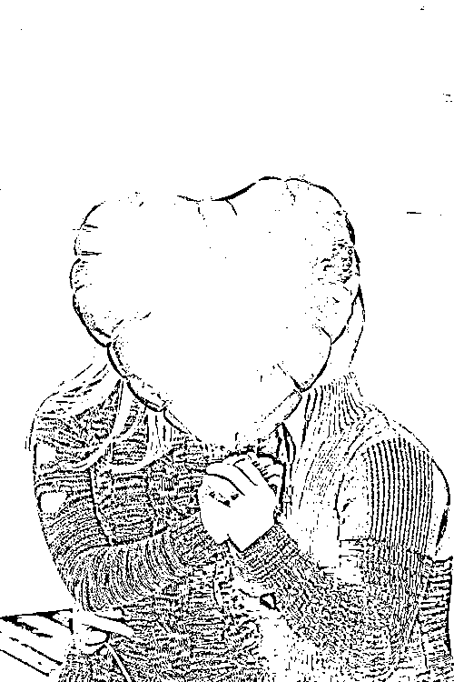

**关系中的自由和命运****使用组合图让我们以比个体更大的视角来思考问题。**无论我们走到哪里，我们都会与其他人建立联系。对于这些联系，我们可能不像应对个人问题那样，有同样多的选择。如果一个人出生星图里有太阳-土星四分相，他可以为此积极地做为。他不必成为这个相位的受害者，或仅仅活出它的阴暗面。在早期人生中，那可能是个困难的相位，反映了深深的不安全感或不满足感。但此人可以说，“我知道我的许多自我怀疑与我的父亲和我的童年有关。我自己破坏，因为我有时候害怕瞄准太高目标。我常常对自己太苛刻，期望太多。但我会努力解决这些问题。我会努力理解这些问题。我可能需要一些心理治疗来帮助我学会更信任自己。我会努力发展我的土星星座，从而让我更有信心。”逐渐地，此人可以把太阳-土星四分相塑造成某种非常强大和有创造力的东西，如果他愿意付出必要的努力的话。**但是当太阳-土星四分相出现在组合图中，这段关系可无法进入心理治疗。**这段关系，无法依自己的意愿说，“我将处理这些受限和自我怀疑的感受。”这段关系无法“感受”到自我怀疑。关系中的双方可以处理他们自己的土星问题。但是双方可能都没有太阳-土星四分相，双方也就无法理解为什么如此，**当他们在一起时，关系中的某件事阻碍和挫败了他们共同的目标。**奇怪的是，**常常伴随组合图太阳-土星而来的外在限制，可能看起来是非个人和超越个人控制的。****如果我们偏好于心理层面，组合图的非个人感受可能让我们很不舒服，**因为心理占星学意味着一种个人责任感，暗示着如果我们准备好去做内在工作，就能改变生命中的许多事。因为我们视出生星图为内在的图景，我们可以为如何表达它担负责任，而意识会带来巨大的改变。在心理学方式的占星学中，如果我们做了足够的努力，就可以转化许多事情。但一个人可能被幻想所迷惑，认为他能改变任何事情，但总有些事情超出了个人的影响范围。我不是在说组合图不是心理上的，或者解读组合图时应放弃心理学的方式。但是**“心理”并不总意味着自由，改变可能意味着双方对关系态度的改变，而不是关系本身特有模式的改变。****我们无法做什么改变组合图的基本模式。**当然对于个人出生星图也是一样。但是我们似乎有一些空间，可以影响我们出生星图模式的表达水平。这给了我们一种内在的感受——无论是不是真的，那就是我们有能力积极参与，或者甚至创造我们的未来。

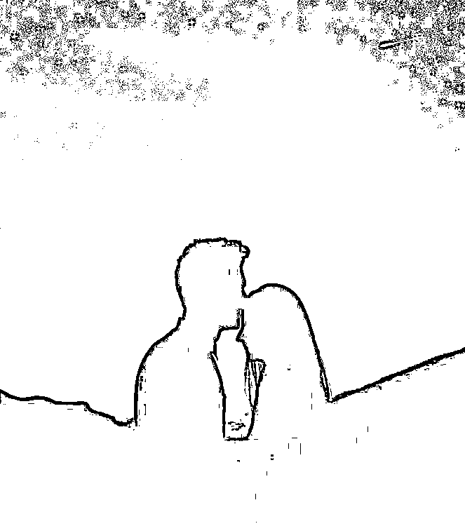

或许我们确实在参与和创造未来，至少在生命的一些领域是如此。但是组合图展现了一种不同的体验，甚至是一种不同的核心现实。我们可以改变我们对组合图模式的回应，我们可以努力为它的能量提供有创造力的出口。**但即使与伴侣进行了最大程度的合作，组合图的模式仍然“外在于”我们的个人影响范围。****组合图不会说：“这是一个坏关系——离开它”。但是它会说：“这个关系有内在的限制，双方都不能改变。如果你想要这段关系，就接受它。”****如果组合图有太阳-土星四分相或太阳-凯龙星合相，它包含了内在固有的限制，常常是非常具体的。**这些限制或许对关系的一方或双方有积极或创造性意义，但是有种感觉，**它是被强加给我们的。**出生星图的太阳-土星四分相或太阳-凯龙星合相也包含了内在固有的限制，但我们以不同的方式体验它们。让我们拿组合图的**太阳-凯龙星**相位举例。我见过许多次，当**这段关系不可避免地包含了来自过去的限制。**这种过去可能是一位前任伴侣，想要大笔赡养费，或者是前一段婚姻留下的孩子。这些情况可能带来大量的痛苦，尤其当牵涉儿童时，因为无论关系双方多么地成熟和有意识，都仍然会有冲突，分裂的忠诚、受伤的感情、或许还有金钱的限制。**这不是改变态度的问题；对于任何一对伴侣来说，前任的家庭，都是既成事实，将始终施加限制。**如果一对伴侣在这种环境下没经历限制，那么我们可能不会在组合图中看到太阳-凯龙星相位。我们知道**凯龙星与受伤的经历有关，尤其是那些看起来不公平和不应得的，那伤口是当时集体状态的产物，而不是某个人的错或恶意**。组合图的太阳-凯龙星相位意味着这段关系本身携带了不可治疗的伤口，通常来自关系双方的过去，或来自双方生活世界的环境。与此同时，这段关系可能为双方，或其他接触到这对夫妻的人，提供深度的疗愈，因为**内在的限制不仅引发痛苦，也带来后续的理解和怜悯。**我有时看到组合图中的太阳-凯龙星相位，代表两个人非常想要有孩子，却无法做到这点。这个伤口使人更深刻地思考自己是谁，人生的目的是什么，因为他们没有一个集体认可的家庭”目标“，来为他们的生活指明方向。**另一个例子可能是关系中出现了巨大的年龄差距，年轻的伴侣必须看着对方变老和衰弱。**再多的爱和承诺，都无法使时光倒流。或者一位伴侣有着身体残疾，尽管那得到了真诚和深刻的接纳，仍然限制了双方的活动。然而，另一个例子可能是**种族混婚，或同性恋关系，这两类关系都可能在有仇外心理或思想僵化的邻居中激起敌意。**不幸的是，仇外心理和僵化的思想是许多许多人的特点，再多的痛苦或愤怒，都无法改变人性中这一缺陷。双方都因这段关系受伤，不是因为某一方是“坏的”，而是因为集体意识对关系的“定义”，限制了它的可能性。我不是在说，这是一副静态的画面。就治疗的角度而言，那取决于你对这个词的理解。凯龙星伤口的愈合，不是说它消失了。某些东西已经永久地被扭曲变形，哪怕毒药已经被释放和清理。一旦这颗行星带来的伤口摧毁了天真，天真就无法再被获得。**但是一个人对伤口的态度可以改变，从而获得更大的宽容、怜悯和智慧。**那也是一种治疗；但它无法挽回过去。一个人不能，比如说，让前任伴侣留下的孩子在一阵烟雾中消失。他可以让伤口麻木，从情感上切断与孩子们的联系，不再与他们见面；然而这会带来另一类型的伤口，也必须得到处理。

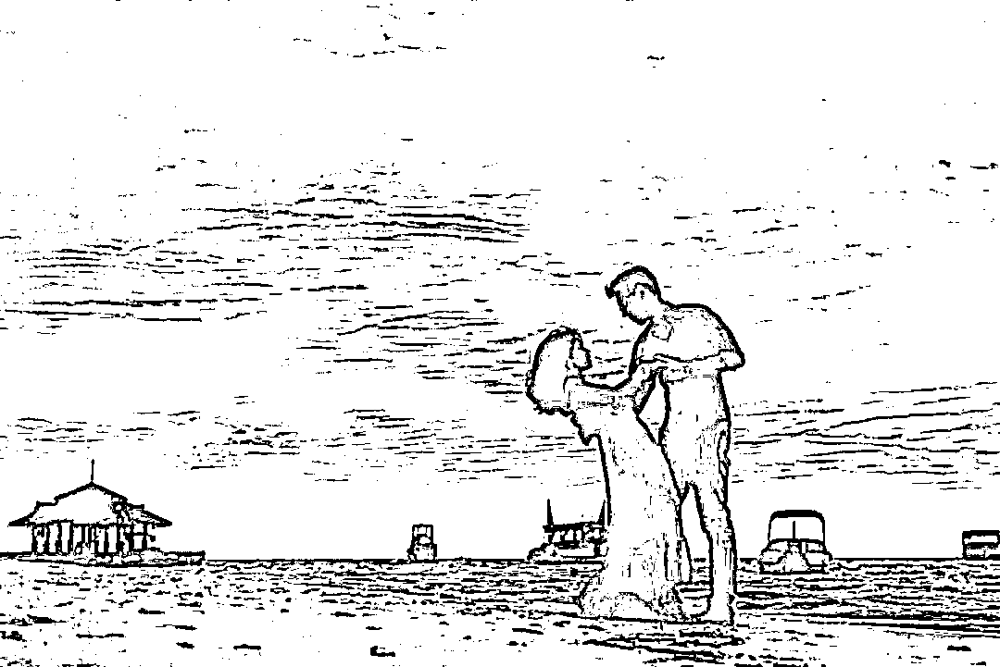

或者他可以非常努力，处理所有复杂的情感问题，最终与每个人建立有益的关系。但这里总是有妥协、悲伤和失落的感觉。组合图中的这些相位，不意味着这些难题的影响是静态和不变的。关系中的双方有可能得到深度和永久的转化。但过去无法重演。**组合图就像出生星图一样推进，这也反映了关系内部的变化，类似于出生星图反映个体的变化。**但组合图作为一个实体，不像个人那样，有自我的意愿去改变或对抗某些事。它不是一个有意识的个体。关系双方可以努力变得更有意识，他们经历这段关系的方式也会据此改变。但是关系基本的模式，就像种子长成植物那样展开，那种天然的必然性，是我们自我中心的意识所陌生的。

**版权声明：**本文由若道翻译发布，欢迎转发，反对抄袭。友号转载请申请白名单。

**END**

**丽兹**·**格林**

英国占星师，毕生贡献于心理占星学，与备受尊崇的美国占星师霍华德**·**萨司波塔斯共同创办伦敦心理占星学中心（*The Centre for Psychological Astrology*），并拥有一家出版专业占星书的 CPA 出版公司。格林是二十世纪最受欢迎的占星师之一，著作等身。

****探索组合图永恒的三角——斯蒂芬工作坊报名中****

斯蒂芬说，我们的组合图表明无论什么状况我们都能熬过去。

**组合图也像出生星图一样有行进。**在工作坊中， 我们将**探讨一些特殊的技法和考量，来帮助伴侣们应对生活中的挑战和机遇。**组合图的推进会出现一些看似难以解决的复杂问题，斯蒂芬老师创造了一种解决这些问题的技法。他将在工作坊中阐述相关细节，基本的问题是：如你所知，要了解一个人 30 岁生日的推进，我们要看这个人出生后 30 天的行星位置。问题是，组合图与我们在占星学实践中使用的其他星图不同，组合图并不代表某一天的天空。记住，它是基于中点的。**那么我们如何从一个不存在的日期开始 "向下数 30 天"呢？斯蒂芬老师将为我们提供一个行之有效的答案。****点击下图了解更多详情******20 位来自世界各地的占星师****带来 19 场沙龙——新世界的觉醒****详情可点击下图**

**学习占星学****点击下图了解课程详情**

**微信又双叒叕改版啦，不想错过若道君的推送？**

**就把若道设为星标吧！**

**▼**

**喜欢就点一下“在看”吧！**

********报名直达入口********

# 斯蒂芬·弗里斯特工作坊丨探索组合图永恒的三角

> 原文：[`mp.weixin.qq.com/s?__biz=MzA5NjA0NTAxNg==&mid=2651485184&idx=2&sn=2b68626d97ce8c24ef9770c2fd6d5c33&chksm=8b48c6b7bc3f4fa1f8dc7f3447221fd4cbf10f521e29d336e289e5e12bd984307b8ae648721b&scene=126&sessionid=1692737771#rd`](http://mp.weixin.qq.com/s?__biz=MzA5NjA0NTAxNg==&mid=2651485184&idx=2&sn=2b68626d97ce8c24ef9770c2fd6d5c33&chksm=8b48c6b7bc3f4fa1f8dc7f3447221fd4cbf10f521e29d336e289e5e12bd984307b8ae648721b&scene=126&sessionid=1692737771#rd)

**1**

********斯蒂芬·弗里斯特老师若道独家三日线上工作坊********

斯蒂芬说，我们的组合图表明无论什么状况我们都能熬过去。

**2**

********此次授课内容********

**组合图描述了如何才能使两个人的关系一直充满活力。**这句话中隐含的意思是假设一段关系有一种区别于这两个个体的独立的生命。有时我们喜欢和一对伴侣共度时光，却从没想过单独见他们其中一人。我们从这对伴侣身上感觉到的 "频率"是对他们组合图能量的直接体验。在某种程度上，可以简单地理解为：**正如每个人都有自己的星图一样，每对伴侣也有他们的星图。**

从简单的描述层面上讲，这就是组合图的意涵。记住，我们可以将这一技法用于任何一种关系：**父母和子女、商业伙伴、朋友。**作为进化占星师，我们的目标要比单纯描述走得更深。解读组合图时，可以着眼于帮助人们，而不仅仅是使他们感到惊奇。对于个体来说，出生星图代表了一条正确的人生道路，一条承诺意义、活力、灵性目标的道路。组合图亦然，只不过它将一段关系看成一个独立的个体，而不是两个人。关系也有进化的路径：人们走到一起是为了学习和成长。个体如果没有领会自己出生星图的要点，会变得疲惫而沮丧。两个人也是如此，**如果没有抓住组合图的要点，我们就会对对方感到厌烦。这段关系似乎也会失去动力。**

伴侣常常意见不一，陷入困境，看不到前进的方向。三是一个更有动力的数字。三个人投票，二个人以多数票击败一个人，推动事情继续发展。**这实际上解释了这次工作坊的主题：永恒的三角。**

**每对伴侣其实都是一个三人组：你、我以及我们。**组合图所代表的那个看不见的 "第三人"经常会"投出打破僵局的一票"，使关系得以发展。**·** 但是如果组合图总是同意一个人的意见，而不同意另一个人的意见，怎么办呢？（这被称为"封建制度"）**·** 如果两个人都安静而保守，但他们的组合图却要求狂野的冒险呢？（这是 "文化冲击"）**·** 如果它同时均衡地反映了两个人的情况呢？我们可以称之为 "民主"，但我们仍可以区分出一个人天然的智慧比另一个人更强的领域，让擅长的人负责擅长的事，这会促进关系蓬勃发展。换句话说，我们开始看到这个技法的咨询维度了。我们将在这个工作坊中探讨这些内容。两个人究竟为什么会走到一起？**在严肃、复杂的关系中，我们可以假设两个人之间有一些未解决的业力。**如果他们在今生是恋人，但在前世中，一个是父母，一个是孩子呢？也许那些直觉和假设仍可以感受得到，极为错综复杂地使得他们在今生想要成为情侣。**这些疑问将我们引向组合图的月亮交点，在那里我们往往能发现当今人类任何伙伴关系问题的真正核心。**

**从理论上讲，组合图是基于中点的。**如果我的出生星图里太阳在摩羯座中段，而你的太阳在双鱼座中段，我们组合图的太阳就在水瓶座中段。换句话说，**在你和我的太阳的中间位置。****其他行星、月亮交点和中天也是如此。**其他宫头的位置，包括上升点则存在一些争议。通常的做法是仍然使用中点，但斯蒂芬老师将会解释他认为这样做存在的技术方面的问题。他更倾向于**使用关系最初开始的地点绘制星图，就像我们使用出生地来绘制出生星图一样。**

**组合图也像出生星图一样有行进。**在工作坊中， 我们将**探讨一些特殊的技法和考量，来帮助伴侣们应对生活中的挑战和机遇。**组合图的推进会出现一些看似难以解决的复杂问题，斯蒂芬老师创造了一种解决这些问题的技法。他将在工作坊中阐述相关细节，基本的问题是：如你所知，要了解一个人 30 岁生日的推进，我们要看这个人出生后 30 天的行星位置。问题是，组合图与我们在占星学实践中使用的其他星图不同，组合图并不代表某一天的天空。记住，它是基于中点的。**那么我们如何从一个不存在的日期开始 "向下数 30 天"呢？斯蒂芬老师将为我们提供一个行之有效的答案。**

并非所有的人都处于伴侣关系中，但**作为人类，就需要与其他的灵魂共舞。占星学能够极大地帮助人们驾驭复杂的关系。**了解我的星图如何与你的星图通过相位和宫位的交互而产生互动，是非常有帮助的。组合图包含了这些技法，提醒我们，整体总是大于各个部分之和，而又与之不同。

**3**

********斯蒂芬的占星著作********

**·** 1984 年-1988 年间，斯蒂芬写作出版了《内在的天空》（已有中文版）、《变化的天空》和《天空的伴侣》三本占星经典著作，奠定了早期在占星学界的地位。**·** 2002 年-2005 年间，他与朱迪·弗里斯特共同创作了两本经典的关系占星学著作《天空的伴侣 I：爱、性、和进化占星学》《天空的伴侣 II：组合图》。**·** 2008 年，斯蒂芬出版了一本非常重要的著作《昨日的天空》，此书是至今为止关于轮回转世跟星图的清晰对应最详尽的著作之一。 斯蒂芬前后一共出版了 12 部占星著作，在世界占星学界拥有很高的声誉。

**4**

********斯蒂芬获得的荣誉********

1985 年，他凭借《内在的天空》一书获得职业占星师协会奖（*Professional Astrologers Incorporated Award*）。1992 年、1995 年、2008 年、2018 年，他四次获得占星界最高的占星学联合协会奖（*UnitedAstrology Congress Regulus Award*）提名，2018 年获得轩辕十四教育奖。

**5**

********斯蒂芬的占星哲学观********

斯蒂芬的占星风格以**自由和选择**为中心，他的解读不是以下定论的方式来“预测”未来，他**强调如何改善生命，而不是宿命式的论断**。他以心理占星学的语言来解读星图上的人格部分，但是**通过南北交点及其相位和守护星来探索星图所揭示的前世业力与今生方向，在灵魂进化的背景里来整体解读星图。**他认为进化占星学的目的在于**鼓励人们做出更符合进化方向的智慧选择，我们学习去了解前世的时侯，关注点应该集中在如何通过意识来疗愈自己。**

**6**

**这些名人怎么说**

斯蒂芬让我们停止了玩责备命运的游戏，而开始看到自己是一个走在进化路途上的勇士。——奥普拉杂志“*O: THE OPRAH MAGAZINE*”

斯蒂芬和杰夫这两位著名占星师创造性地相互应和，展现出他们出色的教师才华，发展并弘扬了占星这门艺术。（对《测量天空：进化占星学和灵魂的钥匙》的书评）——著名心理占星师 现代占星之父 诺·泰尔（*Noel Tyl*）

请享用斯蒂芬和朱迪这两个博大的灵魂在此书中所提供的洞见大餐吧。（对《天空的伴侣》的书评）——进化占星学的创始人之一 杰夫·格林（*Jeff Green*）

我为斯蒂芬解读的精准感到惊叹，他强调没有一件事是坏得无法挽回的，也没有一件事是如此之好以至于它不会因为现在的错误判断而消失的。我怎样推荐他都不为过！——好莱坞著名影星“钢铁侠”男主角 小罗伯特·唐尼（*Robert Downey Jr*）

**7**

**上过课的占星师怎么说**

他关于我星图的解读，让几乎所有在场的人掉泪，我也从此开启了一段灵魂追寻的旅程。我很惊讶他透过星图可以如此深入一个人的灵魂。很多东西你自己都不知道，但是他讲出来你会发现，啊，这是真的，这是占星学的神奇。——《心探索》创始人孟想

每个来参加老师课程的同学，都会被老师深深的慈悲心感动。这种慈悲心，并不是表面上说的一些什么话，而是一种从意识层次上发出的能量。每个来上课的人，都能感受到老师的爱。这种爱，并不是盲目的爱，而是深刻地洞悉真相后的慈悲。

——斯蒂芬老师工作坊翻译逸月

斯蒂芬老师的一对一咨询已经排期到两年之后，我特别幸运，曾在课堂上被老师抽中分析过我的星图，老师充满爱与智慧的指引让我更加清晰的认识了自我。内在的潜能、需求和矛盾被老师娓娓道来。——禄丽荣斯蒂芬老师是位非常非常值得推荐的大师，很粉他，这位进化占星学的创始人，对人的理解是那么的全面完整、深刻洞见、慈悲和温暖，就这方面而言足可以媲美我无比崇敬的荣格和史坦纳（这两位去天堂里玩了）。如果你对西洋占星感兴趣，或者对人的所有角度、各个层次的真相和可能性感兴趣，推荐斯蒂芬老师的书和课程，特别是他的课程，数倍的功力大增的好机会，错过真是占星粉丝的莫大损失。——仁华

**8**

**2019 年工作坊学员感悟**

**9**

**什么人适合这门课程**

✦ 占星师或渴望成为占星师的人群。   ✦ 本课程并非针对初学者，需具备若道核心课程 level4 及以上水平，即了解星座、行星、宫位、相位、综合解读等知识。✦ 课程会涉及组合盘解读高阶内容，不了解相关知识的同学，请提前学习相关内容。

**10**

********授课老师********

**斯蒂芬·弗里斯特（Steven Forrest）**

**·** 进化占星学的创始人之一，当今世界最有影响力的占星大师之一；**· **毕业于美国北卡罗莱纳大学宗教学专业；**· **1984 年-1988 年间，写作出版了《内在的天空》、《变幻的天空》和《天空的伴侣》三本占星经典著作，奠定了早期在占星学界的地位。前后一共出版了 12 部占星著作，在世界占星学界拥有很高的声誉。**· **1985 年，他凭借《内在的天空》一书获得职业占星师协会奖（*Professional Astrologers Incorporated Award*）。1992 年、1995 年、2008 年、2018 年，他四次获得占星界最高的占星学联合协会奖（*United Astrology Congress Regulus Award*）提名，2018 年获得轩辕十四教育奖。**· **斯蒂芬将自己的绝大部分时间都花在教学以及个人咨询上，他于 1998 年创立了占星学徒计划（*Astrological Appretice Program*），这个计划致力于培养职业占星师；**· **至今为止已经有 600 余位学员完成了培训，其中很多都成为了优秀的职业占星师；**· **他是一位脚踏实地的导师，充满快乐和活力，亲和幽默同时又充满了智慧；**· **他的课程不仅仅是一次占星知识和经验的学习，也是一次与智者的相遇。

**11**

********课程费用********

**正价：6800 元****早鸟价：5800 元****早鸟价截止日期：2022 年 9 月 15 日**

**12**

********授课时间、方式、退转********

**授课时间：2022 年 10 月 14 日-16 日（周五、周六、周日）7:00-13:00****具体时间安排：****7:00-8:45****（15 分钟休息）****9:00-11:00****（30 分钟休息）****11:30-13:00**

****授课方式：******线上直播课，英文授课，中文翻译**

**课程退转：退款原则请详看《教学协议》，如有疑问请咨询课程顾问。**

****斯蒂芬工作坊 | 探索组合图永恒的三角****

**授课老师：斯蒂芬·弗里斯特**

**授课时间：2022 年 10 月 14 日-16 日（周五、周六、周日）**

**授课方式：******网络授课，英文授课，中文翻译****

**费用：**6800 元**（早鸟价：5800 元，截止日期：2022 年 9 月 15 日）**

**课程负责人：王老师**（微信/手机：18510107057，请备注“斯蒂芬工作坊”）

长按二维码添加课程负责人咨询

****报名直达入口****

# ISAR 认证职业占星师必修课 | 这个世界上，没有后悔与占星学相遇的人

> 原文：[`mp.weixin.qq.com/s?__biz=MzA5NjA0NTAxNg==&mid=2651485184&idx=3&sn=e3bd1ee442eeadfcbe58765eb27e37c6&chksm=8b48c6b7bc3f4fa184456a099dd782cd9115dd1e7158da549d1b9ea6b37116c8e711c8254df8&scene=126&sessionid=1692737771#rd`](http://mp.weixin.qq.com/s?__biz=MzA5NjA0NTAxNg==&mid=2651485184&idx=3&sn=e3bd1ee442eeadfcbe58765eb27e37c6&chksm=8b48c6b7bc3f4fa184456a099dd782cd9115dd1e7158da549d1b9ea6b37116c8e711c8254df8&scene=126&sessionid=1692737771#rd)

5 月，一个若道的老朋友突然发来一段微信，是对木星进入白羊座的感慨。这位朋友创建了自己的公司，他并不在占星行业，但仍经常记录占星日记，因为他总是体会到星体移动和个人生命变化的契合。

过了几天，又一位若道的老朋友发了一张当天新闻的图片，里面有医疗板块产业趋势、有啤酒股的泡沫问题、有千年老二的饮用水公司也要上市。她说，看，举目全是海王星。她也不是占星师。

然而，他们都与占星相遇，占星已经融入了他们的生活。

第一位朋友说：“在若道学习占星，对我来说建立了一个整体的世界观以及对自我内在的解释论。”

第二位朋友说：“学了占星就会知道，事情来时我们不必过度反应，知道一切会过去”。

占星学会改变你，不论你跟随它走多远，不论你是否选择成为占星师。

这个世界在飞快地变化着，占星学可以像定海神针，帮你测度这个世界的变化，也帮助你校正心中的自己和世界的样子。

**这个世界上，应该还没有后悔与占星学相遇的人。**

**8 月 30 日，新的若道占星核心课程要开始了。**

如果你还没有下定决心是不是好好学占星，那么 L1-2 可谓一个轻松的前菜，等着你品尝。

**把这个仅需投资 2800 元的课程作为礼物，送给自己或者自己所爱的人。**

**课程试听：不分组转发本文，找王老师领取。**

长按二维码添加王老师微信

**谁是你的老师？**

**占星师咔咔（Caroline）**

2010 年师从美国占星师大卫·瑞雷学习，并得到世界名师斯蒂芬·弗里斯特、罗伯特·汉德、苏·汤普金斯传授各种占星学技法。若道首届学员，国内最早获得 ISAR 职业占星师资质的职业占星师，2019 年第二届、2021 年第三届核心课中和苏·汤普金斯老师一起教授若道核心占星课程。

在国际知名广告公司和市场研究公司从事的市场研究和推广工作十余年，曾任职于阳狮集团、尼尔森市场研究有限公司、MTV 和《Madame Figaro》杂志。

**大卫·瑞雷（David Railey）**

*   **I****SAR 董事会成员，ISAR 全球副主席，ISAR 全球职业占星师资质认证主席，若道占星创始人**。

*   2016-2019 年，被选为国际占星协会（ISAR）考试委员会成员，国际占星协会（ISAR）是世界最大的国际占星机构，会员遍布 47 个国家。

*   2017-2020 年，被选为国际占星联盟（ISAR）考试委员会主席，理事会成员。

**助教王嘉祺 （Conrad）**

ISAR 认证占星师、若道认证生时校正资质，从 2010 年起自学占星学，2015 年开始在若道系统学习，并开始个案咨询。2018 年担任若道核心课程助教，以及卜卦占星学和太阳返照选修课助教，并带领学员进行经世占星和太阳返照方面的研究。2019 年 11 月作为演讲人之一参加了国际占星协会（ISAR）北京大会，也是 ISAR 星空俱乐部中国区第 16 期的主讲人。

**内容是什么？**

**开课时间和课程费用**

**8 月 30 日开课，每周一次，20：00-22：00，10 节课。**

**★ 1-2 阶 **

**课程费用：3500 元 **

**你也可能想学更高阶：**

**★ 1-3 阶　连报****课程费用：11500 元 ****★ 1-5 阶　连报**

**课程费用：46500 元 **

德国哲学家雅思贝尔斯说：

教育是一棵树摇动另一棵树，

一朵云推动另一朵云，

一个灵魂唤醒另一个灵魂。

你准备好被摇动了吗？

**退转课程**

**退款原则请详看《教学协议》，如有疑问请咨询课程顾问。**

**课程试听**

**不分组转发本文，加王老师获取。**（微信/手机：18510107057，请备注“大卫核心课”）

****2022 L1-2 认证职业占星师必修课程****

**授课老师：大卫·瑞雷、咔咔**

**直播课开课时间：2022 年 8 月 30 日（周二）**

**授课方式：******网络授课，英文/中文授课，中文翻译****

**费用：**3500 元

**课程负责人：王老师**（微信/手机：18510107057，请备注“大卫核心课”）

长按二维码添加课程负责人咨询~

****报名直达入口****

# 2022 年若道 ISAR 选修课 | 《医疗占星手册》作者亲授

> 原文：[`mp.weixin.qq.com/s?__biz=MzA5NjA0NTAxNg==&mid=2651485184&idx=4&sn=28f7bb0896b287894097781374ec237c&chksm=8b48c6b7bc3f4fa1b7d8338ad241f4b952f0df11ac8a94db93b2a39710926dc5c259decb36ec&scene=126&sessionid=1692737771#rd`](http://mp.weixin.qq.com/s?__biz=MzA5NjA0NTAxNg==&mid=2651485184&idx=4&sn=28f7bb0896b287894097781374ec237c&chksm=8b48c6b7bc3f4fa1b7d8338ad241f4b952f0df11ac8a94db93b2a39710926dc5c259decb36ec&scene=126&sessionid=1692737771#rd)

**有四个主要因素影响着我们的生活和健康：基因构成、物质环境、情绪环境，以及我们的占星配置。我们在星图中都存在患病的可能性，而预防的方法在于尽可能充分、真实和健康地生活。****——简·里德·帕特里克****（Jane Ridder-Patrick）博士**

占星学就像心灵的 X 光片。它可以描述个人对世界的看法和反应。我们越不了解自己的天性，面对生活中的挑战，我们就会有越少的选择。

**“占星学可以精准定位需要解决的潜在问题。”**

**医疗占星学是一个强大的工具，同时洞察的身体和心理过程，通过更多的自我认知照顾和关爱自我和身边的人。**

**本课程既适合医疗占星学的初学者，也适合已经有一些相关经验的人****。**简·里德·帕特里克老师将运用现实生活中的例子，揭示一个人的性格、症状及其星图是如何相互映照的。课程也会探讨疾病的意义以及可能的治疗方法。

**本课程旨在为学员提供一个运用医疗占星学的框架和方法，**学员将会学到一些有价值的实用工具，在课程结束后，自己使用这些工具研究其中的关联性。

**此课程可作为 ISAR 选修课。**

1

**课程安排**

**课程时间：2022 年 9 月 20 日-11 月 8 日  每周二 20:00-22:00**

**第*****1*****讲  9 月 20 日 与占星学、心理学、病症一起工作**

*   医疗占星学的组成部分以及如何使用它们

*   行星的作用与相互作用

*   黄道星座人

*   宫位的重要性

*   疾病和健康是如何产生的

**★ 第二、三、四讲的课程内容基于星座以及它们之间的相互作用。**

**第*****2*****讲  9 月 27 日 基本星座**

学习基本大十字星座——**白羊座、巨蟹座、天秤座和摩羯座**——及其功能和相关的健康问题。**这些星座与防御、养育、结构、体内平衡和荷尔蒙控制有关。**

****第*****3*****讲  10 月 4 日 固定星座****

学习固定大十字星座——**金牛座、狮子座、天蝎座和水瓶座**——及其功能和相关的健康问题。**这些星座与习惯和反射、心脏调节、生存、循环和协调有关。**

“固定星座（金牛座、狮子座、天蝎座和水瓶座）在情感和生理上都倾向于**‘难以放手’**，这可能为恶性肿瘤的生长创造环境。所以说，他们可能倾向于沉浸在过去的伤害中，难以自拔。另一方面，这些星座也擅长在艰难的时期坚持不懈并一直**持之以恒**。”——简·里德·帕特里克（Jane Ridder-Patrick）博士

**第*****4*****讲  10 月 11 日 变动星座**

学习变动大十字星座——**双子座、处女座、射手座和双鱼座**及其功能和相关健康问题。**这些星座与呼吸、神经系统、肠道、睡眠以及信息、情感和行动的整合有关。**

**★ 第五、六、七、八讲重点学习行星，它们在身体层面的表达、它们的相位与行进。**

**第*****5*****讲  10 月 18 日 太阳与月亮**

**太阳**掌管视觉、活力、心脏和意识，与心脏、脊柱和视觉问题相关。**月亮**掌管人体的周期，特别是月经周期、饮食模式和体液，与情绪引起的疾病、饮食失调和胃病相关。

**第*****6*****讲  10 月 25 日 土星与天王星**

**土星**掌管着皮肤、骨骼、牙齿和衰老过程。它对应的疾病包括慢性疾病、耳聋、帕金森病、关节僵硬和牙齿问题。**天王星**代表身体活动的协调，有节奏的脉动和身体的“电”。与天王星相关的疾病包括癫痫、痉挛、心律失常，以及阿斯伯格综合症和自闭症样综合症。

**第*****7*****讲  11 月 1 日 海王星与冥王星**

**海王星**掌管松果体、细胞膜渗透和右脑功能，与过敏、上瘾的病症、慢性疲劳综合症和睡眠障碍相关。**冥王星**掌管消除和转化，其病理包括毒性、脓肿、癌症和强迫症。

**第*****8*****讲  11 月 8 日 火星**

**火星是与能量和防御相关的行星**，掌管免疫系统、肾上腺功能、肌肉活动和炎症反应。**它是许多身体和情绪障碍的核心**，如自动免疫障碍、抑郁和发烧，以及由手术或需要手术引发的问题。

2

**此次课程适合哪些人？**

*   有一定占星学基础，若道核心课 L3 以上水平；

*   希望成为优秀的占星师，想要借鉴国际大师医疗占星解读思路并融入自己的体系的人；

*   热爱占星学、健康、养生的研究型占星学者；

*   计划考取 ISAR 认证占星师，寻觅中意选修课的学员；

*   走在自我探索和个人成长道路上的人。

**快来和简·里德·帕特里克老师学习升级版的占星学身体地图吧！**

3

**授课老师**

**简·里德·帕特里克 **博士****

（Jane Ridder-Patrick）

简接受过药剂师、理疗师、草药师、心理治疗师和历史学的专业学习，从事写作、咨询和讲学工作，在英国和全球教授占星学及其历史、当今的心理学和医学应用。她在爱丁堡执业，在爱丁堡大学获得博士学位，研究方向是 17 世纪苏格兰占星学历史。

**她最著名的出版物是《医疗占星手册》。2018 年，她因对医疗占星学的贡献而获得了著名的查尔斯·哈维占星学杰出服务奖。**

《医学占星术手册》（第二版，修订版和扩充版）

(爱丁堡，克拉布出版社，2006 年)

4

**课程信息**

*   **课程时间：**2022 年 9 月 20 日开始，每周二晚上 8 点，每周一次，共 8 次课。

*   **授课方式：**线上直播，英文授课，中文翻译

*   **课程价格：****6800 元**

*   **早鸟价：5800 元（截止日期：2022 年 8 月 23 日）**

*   **课程咨询：**王老师（微信：18510107057，请备注“医疗占星”）

长按二维码添加王老师

5

**退转课程**

*   **退款原则请详看《教学协议》，如有疑问请咨询课程顾问。**

****医疗占星****

**授课老师：**简·里德·帕特里克

**授课时间：**2022 年 9 月 20 日起

**授课方式：**网络课程**，**英文授课，中文翻译

**费用：****6800 元****（早鸟价：5800 元，2022 年 8 月 23 日截止）**

**课程负责人：****王老师**（微信：18510107057，请备注“医疗占星”）

长按二维码添加课程负责人咨询~

****报名请点击“阅读原文”****

# 沙龙 | 经世占星学中，二战以来土天周期的研究发现

> 原文：[`mp.weixin.qq.com/s?__biz=MzA5NjA0NTAxNg==&mid=2651485106&idx=2&sn=8aa967d6856b4a46d36e93632937b63b&chksm=8b48c105bc3f48136ba8940f0e50ac9e4caec95a7ee93802f7519cacb92d2c4c6d5fb3d9b73d&scene=126&sessionid=1692737771#rd`](http://mp.weixin.qq.com/s?__biz=MzA5NjA0NTAxNg==&mid=2651485106&idx=2&sn=8aa967d6856b4a46d36e93632937b63b&chksm=8b48c105bc3f48136ba8940f0e50ac9e4caec95a7ee93802f7519cacb92d2c4c6d5fb3d9b73d&scene=126&sessionid=1692737771#rd)

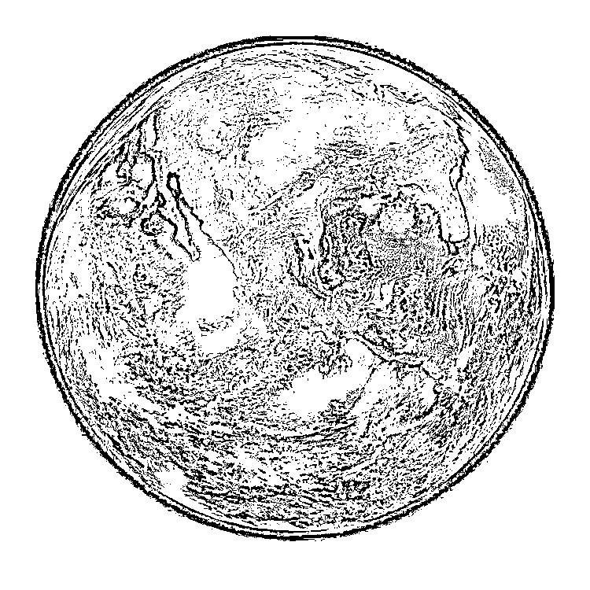

在经世占星学中，外行星的周期是最值得关注的。**而 10 大行星中最能代表秩序的一颗星，莫过于土星；要说行星中最能代表变革的一颗星，莫过于天王星。**当这两颗行星，结合在一起组成**45-46**年的周期循环时，他们在诉说着**人类追寻社会秩序与变革的故事。**从土天合相到土天渐盈四分相，从渐盈四分相到对分相，从对分相到渐亏四分相，最后从渐亏四分相再到合相，每个阶段大约**11.5 年**。**在每一个阶段，寻求秩序的土星，都会受到来自寻求变革的天王星的强力挑战。**而两颗行星在一起，则为我们带来了治乱兴衰的周期。在 2020 年经世占星的课程中，助教 Conrad 老师所带领的经世占星研究小组研究了从隋朝以来我国所经历的土天周期。**8 月 23 日晚 8 点，由 Conrad 老师为你带来案例详实的土天周期研究的沙龙，展示二战以来土天周期的一些研究发现。**

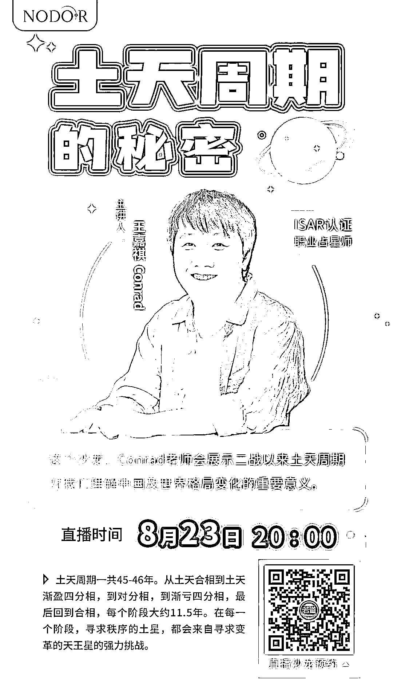

<mpvideosnap class="js_uneditable custom_select_card channels_live_iframe" data-pluginname="videosnap" data-headimgurl="https://wx.qlogo.cn/finderhead/PiajxSqBRaEJYnVsqWfEX9qA0sI6hNVKsDfyzfPZ92WZMZyBpZWU5NA/0" data-username="v2_060000231003b20faec8c4e68a1ec2d4ca07e434b07755bbf47e7053a3059defd2c9d6c68a20@finder" data-nickname="若道" data-desc="将在 08 月 23 日 20:00 直播" data-intro="经世直播：二战后的土天周期与世界风云" data-noticeid="finderlivenotice-v2_060000231003b20faec8c4e68a1ec2d4ca07e434b07755bbf47e7053a3059defd2c9d6c68a20@finder-1660547784717173-1051205886" data-type="live"></mpvideosnap>

**大国命运：经世占星学 3 天线上工作坊**

**一个好的占星师必须要懂得时代的声音，必须要洞悉全球的趋势，必须要懂得国家的故事。**

在这个工作坊中，我们将学习**如何专注于能够理解世界大事并对它们做出准确的预测。**这将带领我们踏上**一段重要的行星周期之旅，并延伸到重要国家和世界领导人的星图。**现在正是学习的好时机！

2020 年 12 月，木星与土星合相，这是 800 年来这两颗行星首次在水瓶座合相，预示着地球以及政治和社会趋势将发生巨大变化。我们正在进入一个令人兴奋的奇境，非常适合探索经世占星学。

**点击下图了解更多详情**

****报名请点击“阅读原文”****

# ISAR 选修课 | 大国命运：经世占星学 3 天线上工作坊

> 原文：[`mp.weixin.qq.com/s?__biz=MzA5NjA0NTAxNg==&mid=2651485106&idx=3&sn=aeb2109eba234777dd7b4f64ad73b873&chksm=8b48c105bc3f48132b6a1056a7e2cb707f6d54ce0f616cdfb0d4d464d377e833b5431854ffee&scene=126&sessionid=1692737771#rd`](http://mp.weixin.qq.com/s?__biz=MzA5NjA0NTAxNg==&mid=2651485106&idx=3&sn=aeb2109eba234777dd7b4f64ad73b873&chksm=8b48c105bc3f48132b6a1056a7e2cb707f6d54ce0f616cdfb0d4d464d377e833b5431854ffee&scene=126&sessionid=1692737771#rd)

<mpvideosnap class="js_uneditable custom_select_card channels_iframe videosnap_video_iframe wxw_wechannel_card_horizontal" data-pluginname="videosnap" data-id="export/UzFfAgtgekIEAQAAAAAAfGQB6vQCmQAAAAstQy6ubaLX4KHWvLEZgBPEioJES3BsLK2DzNPgMIsb3nmx3ZXbJKLT1wm45TIu" data-url="https://findermp.video.qq.com/251/20304/stodownload?encfilekey=rjD5jyTuFrIpZ2ibE8T7YmwgiahniaXswqzJqIdveK37RFTeWicFUib7AWD2xnn8iahx0rpMszBgKBAtKicWHDyVeXoOJHYevZXkhfJkmNmz7Efd0DcYdUekYnarA&amp;adaptivelytrans=0&amp;bizid=1023&amp;dotrans=0&amp;hy=SH&amp;idx=1&amp;m=&amp;scene=0&amp;token=AxricY7RBHdVQsXFuaGib0g8Jumv41gZ9xiajOXct5c2j4asexzhVdKzpPLQVlyibSYXZzHGtBVeLmQ" data-headimgurl="http://wx.qlogo.cn/finderhead/PiajxSqBRaEJYnVsqWfEX9qA0sI6hNVKsDfyzfPZ92WZMZyBpZWU5NA/0" data-username="v2_060000231003b20faec8c4e68a1ec2d4ca07e434b07755bbf47e7053a3059defd2c9d6c68a20@finder" data-nickname="若道" data-desc="#ISAR 选修课 经世占星学是什么？会教授哪些知识内容？8 月经世占星工作坊，来提前了解一下" data-nonceid="3653579416430381618" data-type="video" data-width="640" data-height="368"></mpvideosnap>

有一些岁月经历的人，会非常清晰地看到，我们每个人的命运都和国家的命运紧密联系在一起。

以俄国人为例，不论每个俄国人有什么样不同的个人星图，31 年前的苏联解体，今年发生的乌俄战争这样重大的事件，毫无疑问影响了俄国 2 代人的命运。而在一些关键时间点个人的选择，毫无疑问，又影响了个人的生命历程。

而只要你关注世界局势，你也会看到，这样的一个国家发生的重大事件又会对其他国家的各个方面发生重要影响。

我们的命运、我们所获得的事业的发展机会、我们的财富机会都是和整个时代和国家息息相关。

**因此，一个好的占星师必须要懂得时代的声音，必须要洞悉全球的趋势，必须要懂得国家的故事。**

在这个工作坊中，我们将学习**如何专注于能够理解世界大事并对它们做出准确的预测。**这将带领我们踏上**一段重要的行星周期之旅，并延伸到重要国家和世界领导人的星图。**现在正是学习的好时机！

2020 年 12 月，木星与土星合相，这是 800 年来这两颗行星首次在水瓶座合相，预示着地球以及政治和社会趋势将发生巨大变化。我们正在进入一个令人兴奋的奇境，非常适合探索经世占星学。

邓肯老师说：

****

**学习经世占星学，我们可以依靠占星师们过去使用一些技法所做的预测，我们将在这个工作坊中进行探索。**

**比如：占星师迈克尔·贝金特在 1982 年，苏联解体事件发生 7 年前，就对苏联做出如下预测：**

**“从 1989 年 1 月到 1991 年 11 月……在领导和统治风格方面……国家将进行一些基本的重组。这一时期将预示着一些新的革命……严密的控制结构将失败，国家将崩溃，重新回到过去的众多自治国家。”**

**而占星师罗伯特·佐勒在世贸中心遭到袭击前一年的 2000 年写道：**

****“从 9 月份开始，我们西方正进入一个危险加剧的时期……尤其是在东海岸……这将招致乌萨马·本·拉登等冒险家的劫掠……这是一个警钟……2001 年 9 月第一次大危机袭击美国之后，我们将再也回不到从前了。”****

**在 2020 年美国大选前 6 个月，我也写了一篇文章：**

****“他（唐纳德·特朗普）将战斗到底，美国的街道将成为战场，他不会优雅地离去，但在 2021 年，一个新时代开始了，大海将覆盖特朗普总统任期的废墟。”****

出生星图和经世星图都使用相同的基本占星技法，对每一个主题的研究都同时丰富了这两个分支。你从观察世界大事中学到的东西，可以应用到个人客户身上，反之亦然。

**工作坊内容和时间安排**

**8 月 26 日 周五 **

**14:30-15:30**

**1. 基础知识介绍**

-外行星及其在各个星座运行

-外行星周期

-国家星图

-政治领导人星图

-选举星图

-将以上各项按优先级排序

**休息 30 分钟**

**16:00-17:30**

**2. 外行星及其在各个星座运行**

-天王星入座：革命性的变化

-海王星入座：意识的转变

-冥王星入座：危机与重生

**休息 90 分钟**

**19:00-20:30**

**3. 木星-土星的合相周期**

-文明的发展

-水瓶座新电子化时代

**休息 30 分钟**

**21:00-22:00**

**4. 木星与外行星的互动**

-木星-天王星：科技进步

-木星-海王星：媒体的力量；消融，受苦和慈悲

-木星-冥王星：意识形态极端主义

**8 月 27 日周六**

**14:30-15:30**

**5. 了解社会趋势**

-土星-天王星：新的如何取代旧的；科技重组

-土星-海王星：乌托邦梦想破灭；结构消融

-土星-冥王星：独裁与权力瓦解

**休息 30 分钟**

**16:00-17:30**

**6. 长期文明变革**

-天王星-海王星：新世界秩序的梦想

-天王星-冥王星：机械的变革力量；剧变

-海王星-冥王星：意识变化的 492 年周期

**休息 90 分钟**

**19:00-20:30**

**7. 20 世纪地缘政治力量的影响**

-俄罗斯、苏联时代及其衰落

-美国的故事

**休息 30 分钟**

**21:00-22:00**

**8. 中国**

-中国作为全球玩家出现

-科技、领导力和一带一路

**8 月 28 日周日**

**14:30-15:30**

**9. 行星推进的重要性**

-预测选举的结果；特朗普 - 拜登

-预测国家的发展：以色列

-美国：扩张与收缩

**休息 30 分钟**

**16:00-17:30**

**10. 有多张星图的国家**

-英国

-法国

-沙特阿拉伯

**休息 30 分钟**

**19:00-20:30**

**11. 统治者的出生星图**

-普京：克格勃军人，2020 年代的发展

-特朗普：虚假信息之王，获胜者与失败者

**休息 30 分钟**

**21:00-22:00**

**12. 21 世纪的世界发展**

-新时代的人口和气候变化

-独立与全球化

-宗教与科学

-人际关系与游戏

**授课老师**

**艾德里安·罗斯·邓肯（Adrian Ross Duncan）**

**·** 邓肯老师 1971 年在印度游学时开始学习占星学，1985 年开始成为全职占星师，迄今执业已超过 33 年，是人本主义占星学、卜卦占星学和经世占星学领域的知名占星师。

**·** 开发了占星软件 AstroClock 和多款占星报告。

**·** 从 1971 年开始研习佛学，受佛学影响很深，他相信占星学和佛学观点统一、转化的一个基础是在于对现实感知的改变。

**授课方式**

**授课方式：**

**线上网络直播课，英文授课，中文翻译**

**课程价格**

**课程价格：**

**6800 元**

负责人：若道-童童

（微信：nodoorDaivd）

**退转课程**

**退款原则请详看《教学协议》，如有疑问请咨询课程顾问。**

****ISAR 选修课 | 大国命运：经世占星学 3 天线上工作坊****

**授课老师：******艾德里安·罗斯·邓肯****

**工作坊时间：2022 年 8 月 26 日-28 日（**周五-**周日）**

**授课方式：******网络授课，英文授课，中文翻译****

**费用：****6800 元**

**课程负责人：童老师**（微信：nodoorDaivd，请备注“经世工作坊”）

长按二维码添加课程负责人咨询~

****报名直达入口****

# 看完这篇水星指南，最不会说话的人都觉得自己又可以了

> 原文：[`mp.weixin.qq.com/s?__biz=MzA5NjA0NTAxNg==&mid=2651485106&idx=1&sn=db9b7e9789f36dad5ae51b06b40c77f5&chksm=8b48c105bc3f4813b2c0af11b1d82fc4370ebd81f84fe3f9b069b10301f49c8b3585a420b5b4&scene=126&sessionid=1692737771#rd`](http://mp.weixin.qq.com/s?__biz=MzA5NjA0NTAxNg==&mid=2651485106&idx=1&sn=db9b7e9789f36dad5ae51b06b40c77f5&chksm=8b48c105bc3f4813b2c0af11b1d82fc4370ebd81f84fe3f9b069b10301f49c8b3585a420b5b4&scene=126&sessionid=1692737771#rd)

******************************☆ **************后台回复“今日”，给你一句生命态度****************

作者/艾德里安·邓肯

译者/Luke 校对/江艺

编辑/玫瑰 封面/书君 图片/pexels

水星和各种形式的心理活动有关，我们的音调、节奏和话题都显示出水星特质。当星图中水星与不同行星形成相位时，都代表什么意涵？你该如何发挥自己的谈话特长，了解对方的表达方式？这绝度是一篇值得收藏反复阅读的好文章！

另外，邓肯老师亲授的【[经世占星学 3 天线上工作坊](http://mp.weixin.qq.com/s?__biz=MzA5NjA0NTAxNg==&mid=2651483408&idx=3&sn=214395f4f8332f36e68f2945f8b3d323&chksm=8b48dfa7bc3f56b1bc815a6662074b305362fecabce58855f6713a2836558baa4db3c8dd5102&scene=21#wechat_redirect)】招生中，感兴趣的小伙伴可以点击链接了解更多哦。

**水星的意涵**如果我们闭上眼睛，试着将心智放空一分钟，我们将发现这几乎是不可能完成的任务......思想是不请自来的，心智永远不能静止。甚至对于一般的冥想练习者，心智也只能短暂地安静下来。用“心智”这样的词汇来描述思想过程是很不适当的。比如说，在佛教中，心智的每一个面向都有一个特定的表达——而它有许多面向——就像爱斯基摩人据说有无数个词来形容雪一样。那么，请意识到语言的局限性。**水星被认为与各种形式的心理活动有关。**你思考的方式，你思考的内容，你说话的方式和你说的内容，你倾听的方式，你想象的内容......这些都是星图里水星的相位、星座和宫位所表达的。**只要你一开口，水星就溜出来。**声调、节奏、语气和音量的细微差别，十分精确地体现了水星的配置类型。任何自由联想练习，都可以作为揭示一个人水星本质的绝佳途径。

**在研究水星时，最关键的是注意到音调、节奏和话题。**

*   **水星-火星****在射手座**可能上气不接下气，气冲冲地谈论正义的话题。
*   **水星-冥王星****在处女座**可能精确、激烈、急促，忧虑地谈论效率的话题。
*   **水星-金星在巨蟹座**可能夸大其词，怀有爱意地谈论家庭和家人的话题。

耳朵灵敏的占星师可以识别出思想和情绪如何渲染沟通，他们可以充当一面镜子，向客户呈现一种新的觉知，关于自己的思想如何受到星图影响。**思想是主观的，**我们可能确信自己说的是真理，但这件事至多只对我们为真。**我们对现实的心理表现反映了我们自身心智的许多内容，却与所谓的客观现实相差甚远。**

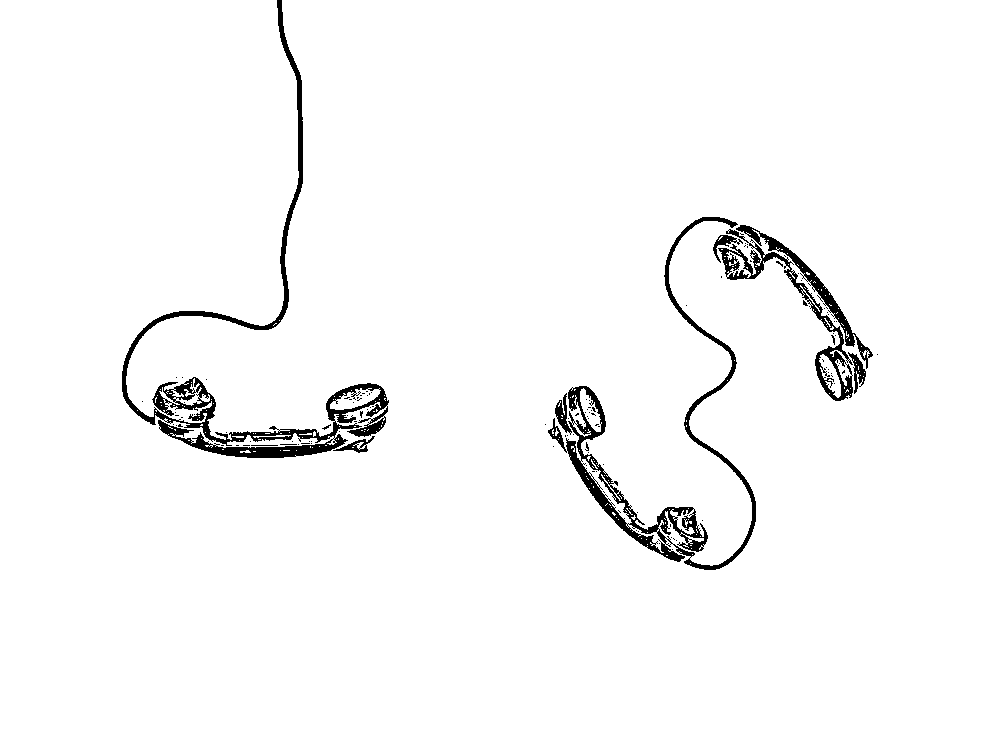

**星图上的水星****我们星图中的水星位置，揭示了童年时期的形成性心理影响。**这主要和**兄弟姐妹**（或缺少兄弟姐妹），他们的行为，以及我们与他们行为的关系有关。我们的**学校经历**也反映了水星，既反映在**学术成就**上，也反映在**和教师的关系上**。更重要的是**我们和同学的关系**，以及在**教室内外的友谊**——或缺少友谊。这通常既是 11 宫，也是第 3 宫的事宜。被戏弄和取笑，短时间或长期被排挤，参加特定的小集团或群体......所有这些都对日后的发展有深远的影响。**水星-土星**对嘲弄特别敏感，尤其是智力方面的。**水星-海王星**在没和人说话时会感到疏远。**水星-天王星**会挑衅无聊的老师——**根据我们的水星配置，我们都曾经验过，或引起过特定的经历。**

**这些早期的经验会影响我们现在的沟通和兴趣，以及我们对真相和现实的态度。**当水星严重受克，会引起痛苦的心理困扰，因为正是这个行星将我们和现实连结。如果我们说出的话语，严重地歪曲了现实，那么人生将充满误解，也不可能达成任何长远的成功。

**水星和我们的生活方式息息相关。**理清沟通问题，是成功的必要前提，事实上，现今有许多关于企业市场营销的优秀课程，也反映了这点。

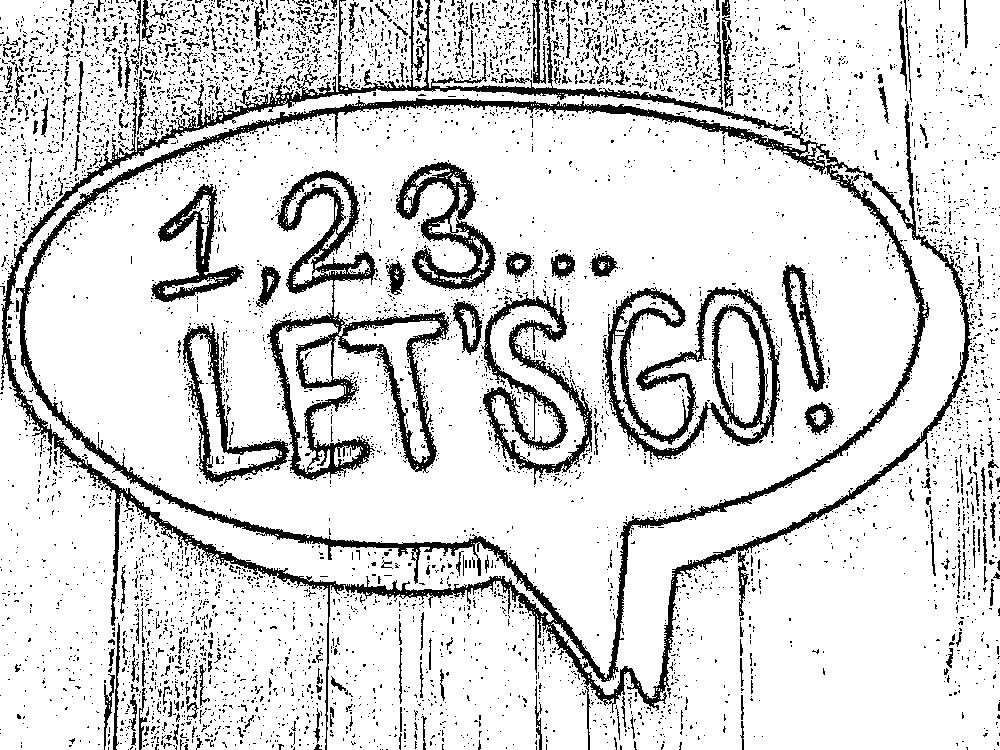

**水星的议题****幸运的是，处理水星和沟通问题，对占星师来说是相对容易的。**因为这些问题直接表现在客户的用词和态度上。太阳和存在本身有关，月亮和无意识有关，水星和意识的内容有关，而与其相关的议题可能是在沟通的双向过程中被渲染的目标。内在的对话甚至比外在的更加重要......正是在大脑的回响室里，我们内心的对话占据了至高无上的地位，展示了我们的真面目。也正是通过指引客户穿越这些内在的密室，持久的改变才可能发生。**下文描述旨在帮助那些以强烈负面的形式显化相位的人。**相信不少拥有压力相位的人，已经克服了该相位指示的许多问题。**水星与木星：正确和错误**没有哪个相位像水星-木星一样，给予人对知识和理解的渴求。学习过程可以持续一生......不只局限于传统教育年限。**聪明才智是这个行星组合的最高标准。**倘若他们智力受到质疑，常常引发各种问题。**通常这是一个温和的组合，**木星有足够的尊严，在讨论中保持宽容和交际手腕。运气好的话，水星-木星客户已经学会了在对正确的需求和获取更多信息之间保持平衡。

然而，如果任一行星处于不幸的位置，那么会导致很多争论，使得水星-木星人展示**相当强的说服力**来传达观点。

一个强有力的天蝎座水星，能够发表相当一针见血的言论，并可能怀有旧怨。一个强有力的水瓶座水星对任何争论都无动于衷，等等。

与水星/木星相位相关的受克，**与一种不公正的感觉深深关联**，尤其体现在兄弟姐妹，或学校教育上。通常感觉一位兄弟姐妹受到优待，这可能成为大量愤恨感的来源。哪怕是小小的辩护，不公正的感受也很容易产生。

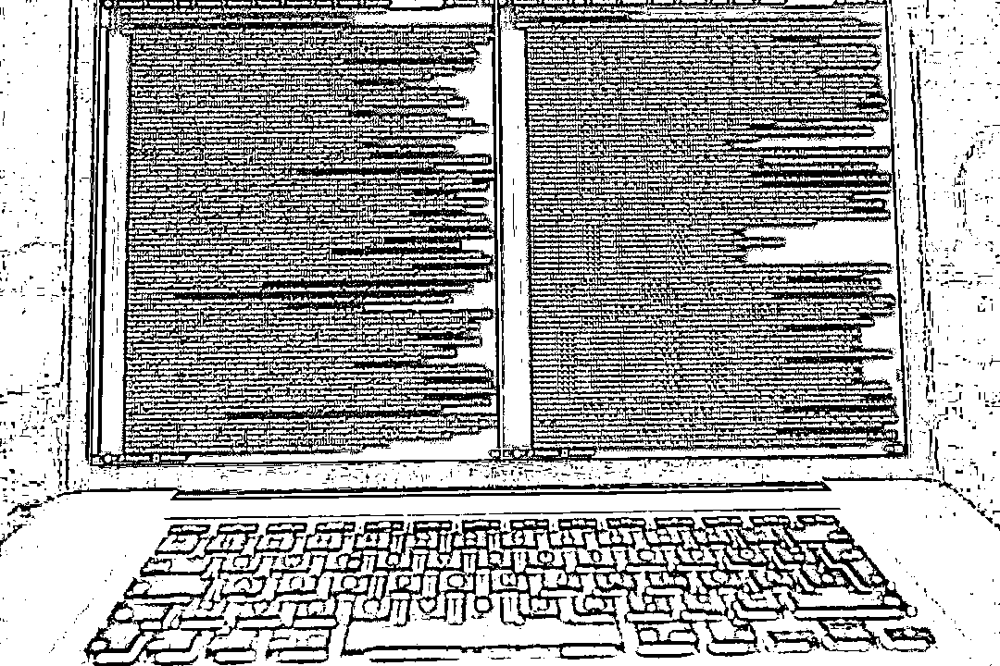

更复杂的问题是，水星-木星**往往会大声指出任何感受到的不公正**，而且不会轻易妥协。在这种情况下，木星所渴望的无非是成为正确的一方，尤其当火象星座或火星也涉及其中。

在咨商过程中，如果怨恨和朋友、老师、同事或兄弟姐妹有关，这可能是水星-木星的作用。占星师遇到的第一个难题是为这个情况建立恰当的视角。这个相位的能量**，会显化为非常有说服力的内在声音，**为水星-木星人为什么是对的，提供了强有力的论据。

我记得一位 70 岁的客户，水星在天蝎座上升，对分金牛座的木星，她多年来一直怀恨在心，因为她的姐妹得到的遗产比她多。在检视遗产事件时，两个因素浮现了：姐妹穷得多，以及客户此前对继承父母遗产表现得漠不关心。尽管如此，她仍然把这事件作为辩护，指称姐妹间的不公正，一直是她的人生宿命。这些客户能够回应聪明的论证，尽管这些论证必须以巧妙的方式呈现，否则占星师将处于失败的境地。毕竟，**水星-木星在保持正确上受过很多训练。**

上述的例子证明了，**客户的观点和态度**，决定了她从负面的水星-木星相位那里吃了多少苦头。由于这一相位赋予了**天生的智慧**，常常有可能将客户引向新的视角，将他们从暴虐的内在声音中解脱出来。正是这一声音不断地告诉他们忍受了多少不公正。

他们特别容易接受好的“框架重构”，意味着**把整个事件放到另一个角度解读，可以从根本上改变他们的观点。**正如这个客户引以为豪的是，她在人生中凭借自己的努力获取了财富，那么大额的遗产有什么用呢？她宁愿看到姐妹在没有钱的情况下挣扎一生吗？无论兄弟姐妹之间的怨恨有多深，血总是浓于水。

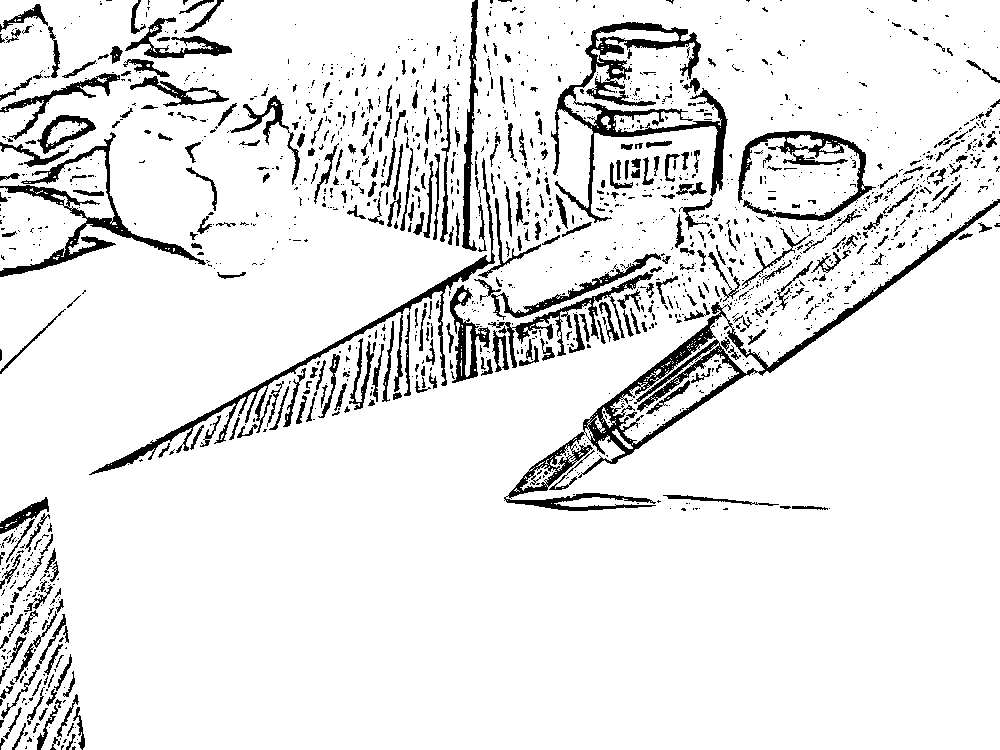

四分相和对分相比合相带来更多困难（合相赋予更多的智力和天赋）。困境在于相互冲突的内在对话。**木星根据其星座和宫位表达强有力的信念，而水星不断地提出新的论点，挑战这些信念。**水星在水瓶座 11 宫可能想要为心理发展课程花钱；木星在金牛座 2 宫则告诫要脚踏实地，乱花钱不明智等等。在更尖锐的案例中，水星-木星人士的内在对话就可以耗尽自己......当他们终于鼓足勇气采取某种行动时，新的想法立刻抬起头来，使他们在思想上精疲力尽、不知所措。**关键点是，思想不等于行动，思想等于不行动。**过度的心理活动仅是内在精神动力的表达。在意义只是主观概念的世界中，**水星-木星人士把意义和公正的观念提升到了不合理的高度，以至于难以出于辩证的考量作出简单的决定。**如果你没有生命的蓝图（谁有？），世界上的事件是缺少意义的。是个体的思想赋予了生命以意义，归根结底，个体是他们现实的精神建造者。关键是，水星-木星客户明白他们赋予事物什么“意义”，并且**重新组织他们的信念，使得他们从事件解读中获得的意义赋予他们力量，**而不是削弱他们。最适合水星-木星人士的，**是参与传播知识的活动。**承认他们的内心对话是自以为是和主观的，会有宣泄作用。**水星与土星：恐惧和流畅****这个相位在沟通和智力方面引起了匮乏和不自信的感觉。**土星-水星人士有些克制和怯懦，或许迂腐，小心翼翼不暴露出任何无知的迹象。因此，当他们感觉自己的心理盔甲上出现了裂缝，就变得很有防备心。土星-水星与实际智力关系不大，却在很大程度上**与主观上对智力匮乏的恐惧关联。**心理发展的最大障碍在于这一主观恐惧，以及为了隐藏这一点所浪费掉的能量。无论何时当遭遇难以逾越的智力挑战，土星-水星就像一道闸门沉重地落下。久而久之，这就真正成了难以理解的奢望，还要花费很大心力隐瞒假想的缺乏理解力。**水星-土星相关的学习和沟通难题，基本上可以归结于心理机制，并且可以通过重构进程来解决。**往往在人生早期就意识到了**沟通障碍**的出现。

这可能和一位哥哥或姐姐坚持要打压客户的智力有关，或一位弟弟妹妹比客户更聪明。家庭中的某些事情激活了水星-土星**对智力的不安全感。**

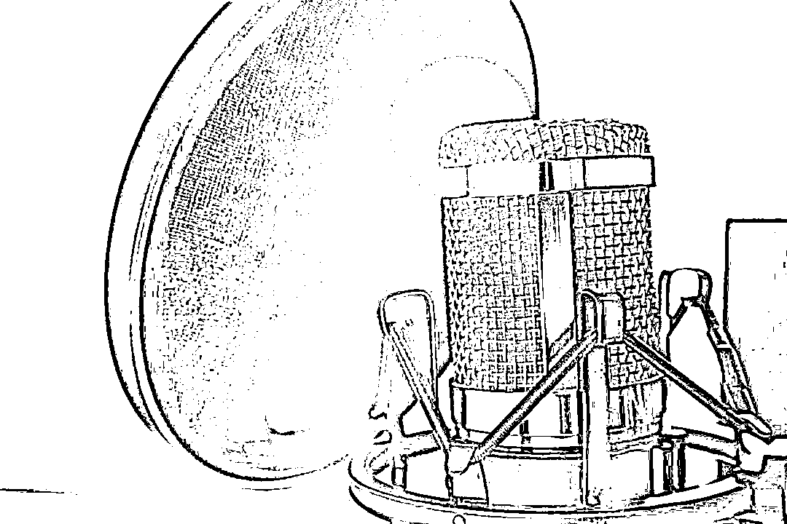

然而，真正的困难始于学校，通常由于在学校被认定表现不佳，而秘密地经历了很多羞愧感。总有某一位老师，让客户的人生变得悲惨......就像闻名遐迩的德国老师。客户本应毫无困难地提供他（她）的名字，可能有某一特定的事件发生，让孩子在班上成为了嘲笑的对象，引发了强烈的羞愧感。正是在这关键的时刻，内心作出了改变一生的决定，严重影响了智力发展的整个进程。决定加倍努力，决定放弃，决定避免任何与智力有关的情境，决定隐身，关于智力自卑的决定。在咨商过程中，占星师将意识到水星-土星在交流中的一些变化。**假装理解却没有真的理解，为缓慢找借口，自我贬低，或摆出高傲、矜持、不屑的态度，从而有效地阻止了深度沟通。**在这一时刻，占星师需要介入，找出客户内心对话里发生了什么。这个过程机制通常是：

*   **突然间直觉地感到自己的智力被揭露，伴随着自我批评的内在声音。**
*   **心理障碍防止进一步吸纳信息以促进理解。**
*   **防御机制启动......伪装，卖弄，虚伪。**
*   **摆脱威胁，但随后感到错失了本可以丰富知识的机会。**

所有这些都可以避免，前提是水星-土星承认自己的理解有困难。“你能重复一遍吗？”或“我很抱歉，我没理解你说的......”或“抱歉，但我反应有点慢......你能一字一句地说吗？”但问题是，他们已经花了多年的努力来掩盖自认为的自卑。

**客户需要知道，不理解不是什么严重的问题**——人们不那么关心。**但是假装理解，或培养心理防御机制，则是个严重的问题。**土星/水星的对策比问题本身还糟糕。

占星师必须能够体谅和理解客户在这方面的敏感，逐渐引导客户承认和描绘他们内在对话的图景。这个相位对训练有良好反应，首先要做的是**创造积极的内在对话，取代消极的内在对话。**与其让水星-土星斥责自己愚蠢，必须引导内在对话的语气和方向去赏识其可能达成的潜力。大多数土星相位最好的地方在于，**问题随着年龄而改善，**尤其在**29 到 30 岁**的第一次土星回归后。

青少年或 20 多岁时放弃的教育又被重新拾起，曾经制造心理障碍的土星，现在致力于于长期的学术修炼。然而，必须避免持续把教育当作拐杖......在某一时刻，客户**必须抛弃权威，发展自发性。**

对水星-土星客户来说，**他们适合从事那些需要专注和小心谨慎的活动**，因为他们倾向于反复检查，确保正确。他们的内心对话充满自我轻视和恐惧，对外投射出假装理解的表象，害怕自己被揭露。承认这些会有宣泄作用。

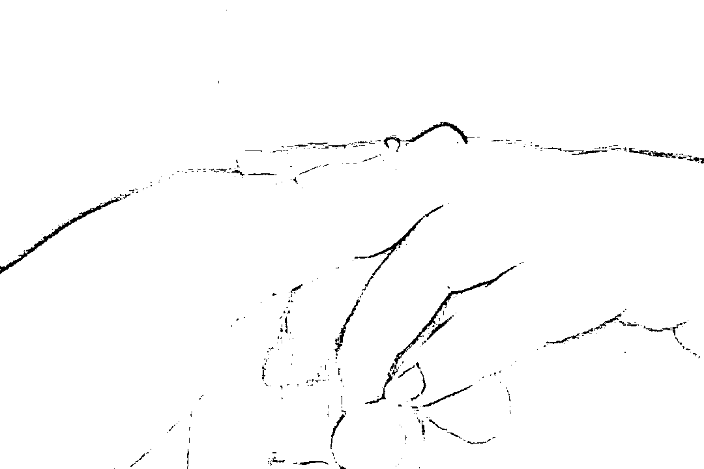

**水星与天王星：与众不同**当这些行星合作良好时，会在某些领域表现出显著的天赋，尤其是与**发明创造、实验、和未来有关的领域**。当相位困难时，仍然有相当大的创造力，尽管说服其他人所需的沟通技巧可能没有得到很好的发展。水星-天王星人士的特点是**对周遭事物的慢节奏感到不耐烦。**当他们沟通时，常常试图活跃周围人的气氛，哪怕这意味着挑衅。他们**可能对别人的敏感无动于衷**，尽管他们新奇且不同寻常的沟通模式使人着迷，他们仍可能遭到疏远或在社交中迷失。这一类型的客户**通常对占星咨商特别开放和好奇，渴望通过不同寻常的方式了解自己。**由于具有超前性，他们可能倾向于打断，或替你说完你的句子。

通常对于天王星相位，并不会感觉有任何问题。不过，一些行为模式可能会产生负面后果。其中之一就是**干扰了沟通过程**。

在儿童期，水星-天王星常常表现为**通过直言不讳来获取注意力**。能够从非常出其不意的角度发表言论，是水星-天王星儿童争取父母关爱和注意力的手段之一。

通常在儿童期发生了关键的剧变，让儿童手足无措。这可能是改换班级、改换学校、一位兄弟姐妹的离去等等。在极端的案例中，会有严重的事件，使认知进程崩溃。我的一位学生，射手座水星在第 2 宫，对分第 8 宫的天王星。第 8 宫的环境往往是创伤性的。

尽管针对儿童期的记忆做了大量调查，但她想不起来什么重要的事情。在午休时，她路过有轨电车看到飞溅的火花，这唤醒了最不同寻常的回忆，这段回忆自 16 岁起就完全埋藏在无意识里。

那时，她被收入精神病院，接受电击治疗，却错误地没有被给予常规麻醉来移除疼痛......引起了巨大的创伤。只有在课堂上，40 岁的她才回忆起了这一事件。

这个案例，尽管极端，却证明了水星-天王星相位**可能引发精神短路。**这就好像记忆中出现了空洞，尤其当还有冥王星的影响力介入。

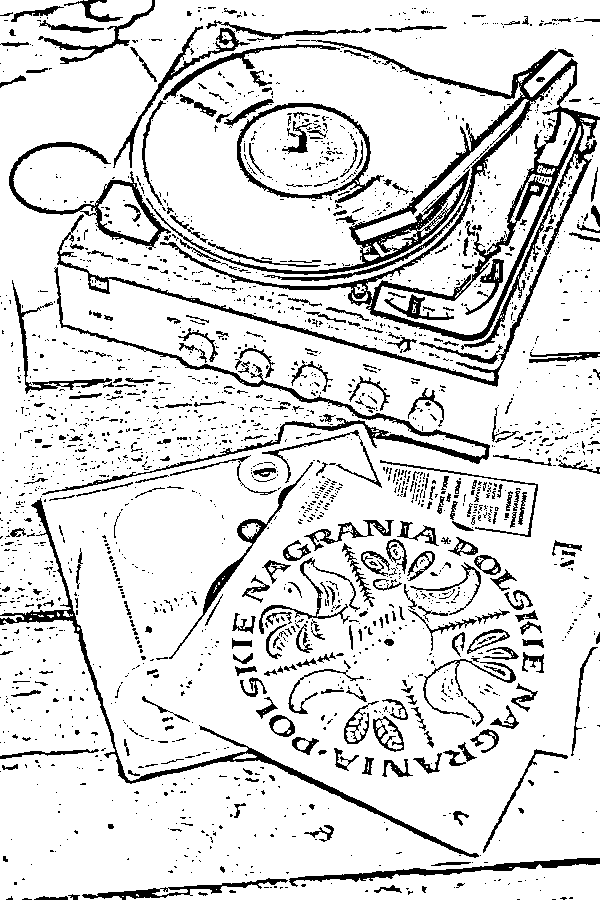

这个相位的一个特点是，**倾向于在谈话中偏离正题。**他们相信其他话题更有意思，比正在谈论的正题更令人兴奋。时断时续的沟通让对方很难理解。**不可预测性**可能是控制谈话的一种手段，也可能是害怕“无聊”的表现。传统和可预测性是水星-天王星的大敌，这就是这些人具有发明天赋的原因之一。然而无聊是个诱导性的词，用来掩盖隐藏的恐惧。水星-天王星客户有着**天马行空的心智，**他们的世界充满**令人兴奋的想法**，却没有扎根此时此地的现实。

活在身体里，与感官合一，**亲密接触物质实相对他们是很难的，结果是导致了难以言述的疏远感，感觉孤立无援。**这是他们沟通习惯带来的必然后果，这种沟通并不连贯，而是断开的。

占星师或许能够在咨商中指出这些沟通模式，如果它们很明显的话。需要关注的迹象包括**不安、不耐烦和被打断说话。**当水星-天王星客户打断别人说话时，这可能是个信号，他们试图将话题从不舒适的领域中引开，这将让占星师不能发挥作用。这是进行干预的绝佳机会。“那么，我刚才想要说什么？”**如果客户打断占星师，这说明他或她肯定也常常打断别人说话，而这会在关系中制造不和谐。**对水星-天王星客户来说，他们适合处于**前线**，处于不**断变化和充满精神刺激的环境中**，最好是国际或新时代层面。承认他们几乎无法控制乱窜的内心对话，这分散他们的注意力，扰乱他们与人的交流，会有宣泄作用。**水星与海王星：雾镜**无论是和谐还是不和谐相位，**感应潜意识信息**都是水星-海王星最有力的天赋之一。在沟通中有巨大的**想象力和敏感度。**在很小的时候，真实和想象之间的界限就是模糊的，因此**混淆了什么是真实，什么不是**。沟通中，他们对另一方的想法有**很强的觉察力**，并且倾向于据此调整沟通。水星-海王星敏锐地倾听对方说了什么，没有说什么，而且**很难区分自己的和别人的想法**。他们就像海绵一样，吸收周围环境的气氛。在咨商中，水星-海王星客户通过自由联想吸收所说的话，让话语在脑海中回荡，激活思想和回忆。

**他们是“读心者”，在话没说完前就猜出了它的意思，常常形成一种先入为主的理解。**因此，有必要检查你所说的和客户认为你说的是不是同一件事。这常常是不同的。

这个习惯——再加上不愿意说任何可能造成不良气氛的话语，自然而然导致了生活中的许多误解。

**他们实际所说的，和他们事实上所想的，是存在差异的。**这种差异导致他们的话语缺乏真正的力量，他们常常感觉在隔着一层棉花说话，或其他人对他们说的话没有付出足够注意力。有压力时，他们很难表达自己，也很难遣词造句，恰当地表述内心的想法。

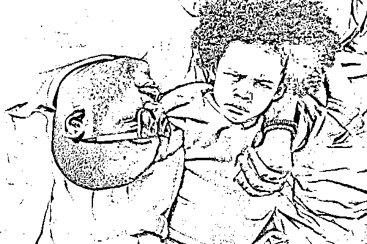

**在幼儿时期，客户往往就创造了一个秘密的虚幻世界。**这个孩子可能早早认识到，最好是模糊其词，而不是坦率直接。**孩子喜欢通过说谎来避免不愉快，**或让生活变得可以忍受。

长远来看，这创造了一个让孩子游刃有余地驾驭的环境，但必须维持一个他或她能够完全相信的虚假世界。不可思议的是，在之后的人生中，水星-海王星人士确实相信他们现实的版本，尽管有大量与此相左的证据。

在内心对话中，**他们避免那些难以接受的真相，只相信他们愿相信的。**这有时表现为不诚实，不是出于恶意，而是因为他们相信自己织就的现实是客观真实的。

另一方面，童年存在一种孤立感，无论在家庭还是学校，或遭受了被忽略或置之不理的情况。这刺激他们**退回想象的内在世界。**在咨商中这个相位的迹象之一是占星师忘了发生了什么，或变得困惑。**水星-海王星客户本能地制造出一面雾镜，躲在后面准备编造新的令人信服的故事。**这使占星师迷失了方向，事实上任何进入水星-海王星亲密圈的人都不可避免会这样。正如之前所说的那样，重要的是**非常精确地使用语言**，从而让这些客户无处闪躲，并鼓励他们**清楚阐释**。随着他们更深地探索自身话语和思想的涵义，他们开始在自身之中感到一种无法言明的悲伤。可能是被误解、被忽略，或与人产生隔阂的悲伤。海王星寻求化解心智之间、人与人之间的界限。然而，为了在世界上正常生活，精神界限是必须的。**水星-海王星需要与内在的孤独感和解，并从此发展出对他人的理解。**水星-海王星的客户**适合参与需要直觉敏锐性的领域**，在那里他们不受噪音和喧嚣的干扰。承认自己感到孤独和被忽视，承认自己掩盖了真相，而且害怕自己的想法没有分量，会有宣泄作用。**水星与冥王星：秘密和谎言**有这个相位的人是**天生的侦探**——**他们有能力洞察表象背后的事情，渴望探索别人的秘密。**有一种特别的精神机制在起作用，使他们质疑所说的话，因为他们怀疑有某些更重要的事情没说出来。在咨商中，水星-冥王星人士常常感到你在隐瞒某些黑暗的真相——并且敦促你全都说出来。随着他们深入地调查别人的秘密动机，他们常常发现某些重要的事实和事件被隐瞒了，这证实了他们的信念，即你不能太相信别人。**和他们有亲密接触的人常常感觉受到审问，埋怨自己的动机受到质疑。**矛盾的是，这反而致使他们隐藏信息，尤其当他们感到水星-冥王星人士听到真相后会做出负面的反应。

水星-冥王星客户本身**非常擅长隐藏他们自己的想法**，甚至是那些暴露内心想法的潜意识信号，比如眼神和身体语言。他们倾向于用**眼神**接触把你定住，获得**心灵的控制权**。

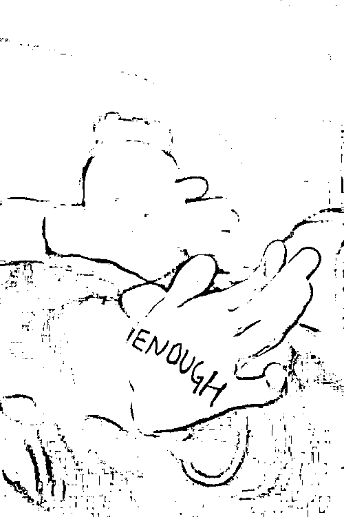

他们的音调可以是单调乏味的，**有催眠作用**。许多有这个相位的人喋喋不休，**让听者精疲力尽**。当这发生时，听者会感到有中断交流的冲动，却不敢这么做。在极端情境下，其他人会避免和水星-冥王星人士的沟通，正是因为他们感到被支配，精疲力尽，或沟通中没有双向的流动。

实际发生的是，**水星-冥王星在沟通中感到焦虑。**他们把听者定住，是因为**害怕沟通中断**，却发现人们避免和他们谈话，这是他们最不希望发生的事情。他们不断地说话，是因为**害怕停下来时的寂静。**

这是占星师可以进行干预的关键点。如果水星-冥王星客户喋喋不休，占星师应指出这点，尽管这样会激发强烈的反应。在这里，**转化的秘密就在当客户停止用语言填满空气时，**那寂静的深渊。这些客户必须学会说出一句话，然后暂停和等待回应。暂停期间，焦虑涌动，这就是水星-冥王星的能量。在这个空间中停驻，可以让客户接近转化的能量，尽管在一开始这很不舒服。童年时期的特点之一是，紧张的气氛中有未能说出的话语。**童年时几乎总有一些关键的秘密，这些秘密毒害了未来多年的感知。**有时这些秘密直到晚年才被揭露。通常存在同母异父(或同父异母)的兄弟或姐妹，有时孩子对此一无所知，或者——如果知道的话，在特定环境中也不允许谈论。然而，出于水星-冥王星的**侦查天赋**，这个孩子感觉某些东西被**隐藏**了，某些领域是**禁忌**的，某些话题绝对不能提起。非同寻常的是，那些被隐藏的事物，比能够说出口的事物有着大得多的力量。除了充满秘密的氛围外，儿童也常常在交流中遭遇残酷的对待，特别是当某一位家庭成员长期故意对儿童不理不睬，一个词也不说，通常以此作为惩罚。另一个特点是喜欢忧思，或更精确地说，**忙于精疲力竭的内在对话，连最微小的细节也要深度分析**，却未能达成任何结论。在亲密关系中，这种内在对话常常被投射出来，以至于让伴侣卷入审问式的对谈，持续到夜深。**水星-冥王星希望找到“答案”，不达目的不会罢休。**然而没有答案。伴侣面对这种喋喋不休的审问，不得不寻找一种生存策略。

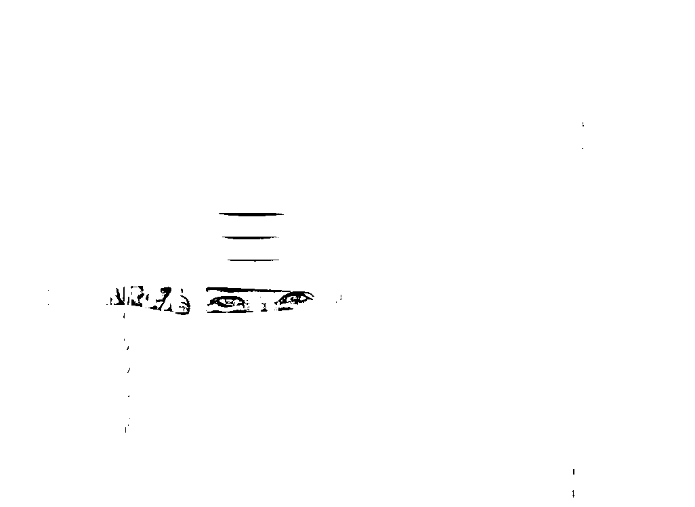

两件事可能发生：要么伴侣被卷入长长的争吵，要么完全闭嘴。占星师几乎总会发现，客户抱怨有时他们的爱人几乎不对他们说话，或维持很长时期的沉默。水星-冥王星客户**必须学会传递信息，**然后闭嘴。追根究底没有任何好处，只有坏处。一切都可以归结为一种内心感受，那就是某些**真相浮现，带来释放**，但是——由于这种感受源自有记忆以来的幼年时期，带来释放的想法是一种幻觉。水星-冥王星客户**适合从事需要分析和侦探能力的领域，**尤其是心理学、电脑和任何需要深入研究的领域。让他们承认对别人说的话抱有怀疑，会有宣泄作用。他们觉得别人在隐瞒事实，但实际上这么做的是自己。

**版权声明：**本文由若道翻译发布，欢迎转发，反对抄袭。友号转载请申请白名单。

**END**

**艾德里安·罗斯·邓肯**

若道签约老师，哥本哈根占星学院院长 1985 年开始成为全职占星师，是人本主义占星、卜卦占星和经世占星学领域的知名占星师。开发了占星软件 AstroClock 和多款占星报告。

# **经世占星学 3 天线上工作坊**

有一些岁月经历的人，会非常清晰地看到，我们每个人的命运都和国家的命运紧密联系在一起。

而只要你关注世界局势，你也会看到，这样的一个国家发生的重大事件又会对其他国家的各个方面发生重要影响。

我们的命运、我们所获得的事业的发展机会、我们的财富机会都是和整个时代和国家息息相关。

**因此，一个好的占星师必须要懂得时代的声音，必须要洞悉全球的趋势，必须要懂得国家的故事。**

在这个工作坊中，我们将学习**如何专注于能够理解世界大事并对它们做出准确的预测。**这将带领我们踏上**一段重要的行星周期之旅，并延伸到重要国家和世界领导人的星图。**现在正是学习的好时机！

2020 年 12 月，木星与土星合相，这是 800 年来这两颗行星首次在水瓶座合相，预示着地球以及政治和社会趋势将发生巨大变化。我们正在进入一个令人兴奋的奇境，非常适合探索经世占星学。

**点击下图了解更多课程详情**

**

**20 位来自世界各地的占星师****带来 19 场沙龙——新世界的觉醒****详情可点击下图**

**学习占星学****点击下图了解课程详情**

**微信又双叒叕改版啦，不想错过若道君的推送？**

**就把若道设为星标吧！**

**▼**

**喜欢就点一下“在看”吧！**

********报名直达入口********

# ISAR 星空俱乐部沙龙第 44 期丨爱神、命运女神，和创造的门槛

> 原文：[`mp.weixin.qq.com/s?__biz=MzA5NjA0NTAxNg==&mid=2651484825&idx=2&sn=c79b3aedcfa56c162c7ca45063467568&chksm=8b48c02ebc3f493808c0a8512fd6aa8648eefc017daa4907e64f6a1b64e13483b60f6b9e25d9&scene=126&sessionid=1692737771#rd`](http://mp.weixin.qq.com/s?__biz=MzA5NjA0NTAxNg==&mid=2651484825&idx=2&sn=c79b3aedcfa56c162c7ca45063467568&chksm=8b48c02ebc3f493808c0a8512fd6aa8648eefc017daa4907e64f6a1b64e13483b60f6b9e25d9&scene=126&sessionid=1692737771#rd)

**沙龙来啦！****8 月 20 日，星期六上午 10 点，**国际占星研究协会（ISAR）中国星空俱乐部沙龙由占星师**格雷·克劳福德**带来一场讲座！ **沙龙主题****沙龙主题：**厄洛斯（爱神）阿南刻（命运女神），和创造的门槛******主讲人：****格雷·克劳福德******

**沙龙时间：8 月 20 日，星期六**

**                北京时间上午 10:00-11:30（有英文翻译）**

**沙龙方式：线上沙龙**

当客户感到自己即将进入一种更具真实创造性的生活时，他们会寻求占星咨询，但同时也会因面临阻力而感到沮丧。 

本次演讲将利用**希腊爱神厄洛斯、命运女神阿南刻、看门人、十字路口和极限提升等神话故事，**以富有想象力的方式探索占星象征有助于确认和增强内心愿景的方式。**当你感觉自己被困在追求更具活力的心灵召唤的悬崖边时，占星学如何给予你帮助呢？****主讲嘉宾**

**格雷·克劳福德**

*   格雷·克劳福德是一位生活在华盛顿州奥林匹亚的占星师（实践出生星图解读，卜卦占星）。
*   运用了来自古代和现代的技术，为占星的生活象征主义带来了一种关联的、想象的和心理学的方法。
*   曾在 UAC、NORWAC、华盛顿州和俄勒冈州占星协会以及波特兰占星学院演讲。
*   格雷在他的网站 http://graycrawford.net 上撰写占星文章，也是 Astrology.com 的特约撰稿人。

**如何参加沙龙？**本讲座也是本月的国际占星研究协会（ISAR）星空俱乐部讲座。**ISAR 会员可以免费收看。**请注意邮件通知，具体参与方式见邮件。❶ 如果你**已经是 ISAR 会员**，请注意邮件通知，告知如何参加。❷ 如果你**不是 ISAR 会员**，非 ISAR 会员价格：98 元。如有任何问题请咨询工作人员

仲老师 微信：YY18513802156（微信号）

**非 ISAR 会员报名请长按下图**

**▼**

**ISAR 明星俱乐部**

2018 年，ISAR 在主席亚历山大·因舍阿吉克的带领下，成立了 ISAR 明星俱乐部，每月为全球 ISAR 会员提供在线直播讲座，邀请全球著名占星师开讲，学习和分享新的理念。讲座时长一小时，涉及占星学的不同领域、不同观点，每个会员都可以参与其中，每次讲座之后还有 20-30 分钟问答时间向老师们提问。每一场在线讲座都会记录下来，ISAR 除了提供视频，还会提供相关的讲座资料，以及单独的问答录音，自动发送到专门的 ISAR 明星俱乐部页面存档，每位 ISAR 会员可以在 ISAR 网站上自己的会员主页俱乐部页面找到。在 2018 年最初几个月，ISAR 明星俱乐部会每月举办一场在线演讲。之后，两周举办一场演讲，最终每周举办一场演讲。
但是，过去明星俱乐部讲座只有英文沙龙，因此，中国会员只有懂英文才能受益。为了使得更多不懂英文的中国会员能够受益，我们特别和 ISAR 总部协商，今后会安排有中文翻译的明星俱乐部占星沙龙，作为给中国 ISAR 会员的福利！**如何成为 ISAR 会员？**

**如果你也想成为 ISAR 会员，请复制链接在浏览器打开**

http://www.nodoor.com/isarcert.do?contentId=3588（仅支持网站支付）

**或直接长按下方二维码，微信购买会员：**

**ISAR 会员有什么福利？**一年期会员仅需支付**人民币 510 元**，即可享受：**☆ 星空俱乐部免费沙龙****☆每年出版 3 次的《国际占星师》（目前只有英文）；****☆每周电子邮件交流汇总杂志（目前只有英文）；****☆专项研究基金和奖学金资格；****☆ISAR 主办的会议和论坛的会员折扣，包括国际占星大会（UAC）、ISAR 的会议和研讨会等会员权益。****有疑问怎么办？**关于 ISAR 星空会员俱乐部以及我们的讲座，如果你还有任何疑问，**请联系工作人员**：

**仲老师**

**微信：YY18513802156（微信号）**

**若道 Conrad**

**微信：nodoor2016**

****非 ISAR 会员报名请点击“阅读原文”****

# 插班中丨神话塔罗：高效学习班上线，灵活掌握，专业实践！

> 原文：[`mp.weixin.qq.com/s?__biz=MzA5NjA0NTAxNg==&mid=2651484825&idx=3&sn=3963fbfd45d13617882fe443ee97e479&chksm=8b48c02ebc3f49382db171c905011d26dfc1c63b94c123f9d8784e2b06115f0a832071aeecf1&scene=126&sessionid=1692737771#rd`](http://mp.weixin.qq.com/s?__biz=MzA5NjA0NTAxNg==&mid=2651484825&idx=3&sn=3963fbfd45d13617882fe443ee97e479&chksm=8b48c02ebc3f49382db171c905011d26dfc1c63b94c123f9d8784e2b06115f0a832071aeecf1&scene=126&sessionid=1692737771#rd)

**2022 年超高含金量的神话塔罗认证课程****高效学习班****开始招生**用**四个月**的时间学习掌握神话塔罗解读喜欢**集中学习，快速掌握**的同学不要错过

黄色日期为**8 节直播课**时间，同学可以自由安排时间学习**18 节录播课**

班级学习群讨论、APP 答疑区提问

课程内容体系让你直观精准地感受到**神话塔罗的魅力**扎实地建构**神话塔罗思维**系统学习**最地道的塔罗知识**课程中老师将**神话、占星、心理学**完美融合进塔罗的**人本主义咨询体系**并进行学员**案例督导**让你更自信的开展咨询工作，学以致用

本期认证课程采取**即报即学的录播课+案例督导直播课**的形式，

*   **18 节录播课：**精编剪辑，随来随学，助教答疑，学练结合。

*   **8 节直播课：**融会贯通，神话心理，塔罗占星，咨询技巧。

为了适配大家的各种学习场景，提高学习&复习效率，我们还将**录播课**剪辑了**中文字幕版**和**翻译音频版**：

*   **中文字幕版：**朱丽叶老师英文原声配中文字幕，适合在手机或电脑前专心致志的学习。

*   **翻译音频版：**翻译老师幼婷的中文原声纯享，适合运动、通勤路上耳机里陪伴式学习。

若道还为塔罗学员开发了**“神话塔罗”**平台，是随身的工具，更是接咨询的平台，录播课程**学成入驻平台**即可链接更多塔罗个案，发展壮大你的塔罗咨询事业。

**如果你想学习塔罗，什么样的老师会让你怦然心动呢？她是三副塔罗牌的设计者，写了 6 本塔罗书籍。她研习塔罗四十余年，教授塔罗三十余年，是丽兹·格林的密友。还有****谁会比塔罗牌设计者更了解塔罗的历史、灵魂与精髓？****所以，这将是你开启塔罗之旅最坚实的一步。**

1

**这位塔罗大师是谁？**

**朱丽叶·沙曼-伯克** 

*   她是**3 副塔罗牌**的**设计者****——**神话塔罗牌、沙曼–卡塞利塔罗牌、“自己着色”塔罗牌；

*   她出版了**6 本塔罗书****——**《塔罗全书》、《新塔罗全书》、《众星的传说》、《理解塔罗牌》、《精通塔罗牌》、《塔罗初学者指南》；

*   她研习塔罗**四十余年；**

*   她教授塔罗**三十余年**；****

*   她是**丽兹·格林**的密友，两人合著了**《神话之旅》**，共同设计了**神话塔罗牌**。

*   她是认证的**心理治疗医师；**

*   她深谙**塔罗、占星学、心理学和神话学。**

**如果你想成为拥有英国神话塔罗认证的塔罗师**

那么她，就是你**最好的老师人选**

2

**塔罗牌有什么用？**

*   塔罗牌是一种**古老的疗愈工具**，同时也是**直观的解惑工具****；**

*   塔罗牌绕过逻辑思维，**和潜意识联结**，通过图像的方式生动地将隐藏在人类潜意识中的画面浮出水面，**揭示心灵的状况和运作****；**

*   塔罗牌**帮助我们和潜意识对话**，可以和现代的心理治疗联系在一起，帮助我们**看清心灵的冲突来源、本质和可以选择的道路；**

*   塔罗牌又和更广阔的**宇宙生命原型**联结，彰显**个人生命发展的阶段**，将**个人生命挣扎、内在冲突**放在生命进化的道途上，让更广大的生命智慧为个人成长照亮道路。

3

**为什么学习神话？**

神话通过**图像和故事**描绘人类生活的**原型模式**。通过瑰丽的想象、诗意的语言、栩栩如生的人物和故事描绘出我们内心的世界，表达出我们经历的那些实现人性的过程，帮助我们将**个体的生活与人类古老且永恒的故事**建立联结。从而在更深处**理解生命**，并学习**古老而长青的生命智慧**。

**神话塔罗**取材于**希腊神话**的无尽沃土，通过故事提供一种**记忆辅助**，在心理和预见层面提升解读的**丰富度**。因为这样更符合塔罗牌的性质，符合人类的想象。**按照故事思考，而不是简单的记忆关键词和固定的意义。**

4

**塔罗预测是什么？**

塔罗牌预测的运作就像是**照向心灵的一面镜子**。在塔罗牌解读时，图像的原型性质穿透隐藏的潜意识脉络，反应出与个人境遇相关但又未被了知的知识与洞见，因此**揭示出按照任何理性方式都无法发现的事情。**

如果你对生命好奇，塔罗学习会帮你**打开一扇通往未来的门****，**让你了解**心灵运作和显化的秘密**，同时赋予你更多关于生命成长的支持和指引的能力！

5

**我们将学习什么？**

**录播课（即报即学）**

**☆****初阶：神话塔罗详解**

**神话故事和预测意涵**

**第 1 讲 塔罗牌介绍 ，讲述它的历史 （中文字幕版）**

**第 1 讲 塔罗牌介绍，讲述它的历史（翻译音频版）**

**第 2 讲 星座形态、元素和宫廷牌&基本星座与基本国王 （中文字幕版）**

**第 2 讲 星座形态、元素和宫廷牌&基本星座与基本国王（翻译音频版）**

**第 3 讲 固定星座与固定王后（中文字幕版）**

**第 3 讲 固定星座与固定王后（翻译音频版）**

**第 4 讲 变动星座与变动骑士（中文字幕版）**

**第 4 讲 变动星座与变动骑士（翻译音频版）**

**第 5 讲 小阿尔卡那牌权杖（中文字幕版）**

**第 5 讲 小阿尔卡那牌权杖（翻译音频版）**

**第 6 讲 小阿尔卡那牌圣杯（中文字幕版）**

**第 6 讲 小阿尔卡那牌圣杯（翻译音频版）**

**第 7 讲 小阿尔卡那牌宝剑（中文字幕版）**

**第 7 讲 小阿尔卡那牌宝剑（翻译音频版）**

**第 8 讲 小阿尔卡那牌星币（中文字幕版）**

**第 8 讲 小阿尔卡那牌星币（翻译音频版）**

**第 9 讲 经典牌阵教学讲解（中文字幕版）**

**第 9 讲 经典牌阵教学讲解（翻译音频版）**

**第 10 讲 牌阵解读案例演示（中文字幕版）**

**第 10 讲 牌阵解读案例演示（翻译音频版）**

**☆****中阶：神话塔罗牌阵应用**

**神话****解读和咨询技巧**

**开启神话塔罗愚人之旅**

****

**第 1 讲 愚人、魔术师、女皇、皇帝（中文字幕版）**

**第 1 讲 愚人、魔术师、女皇、皇帝（翻译音频版）**

**愚人**：永恒的少年（儿童的原型）

**魔术师**：恶作剧者、老师、向导、沟通者的原型；行星：水星。

**女王**：母亲、养育者、丰产的原型；行星：金星在金牛座；小行星：谷神星。

**皇帝**：父亲、供养者、计划者的原型；行星：木星。

**第 2 讲 女祭司、教皇、恋人、战车、正义、节制（中文字幕版）**

**第 2 讲 女祭司、教皇、恋人、战车、正义、节制（翻译音频版）**

**女祭司**：处女——等待被实现的潜力原型；行星：新月。

**教皇**：疗愈者、受伤的疗愈者、牧师的原型，牧师是神与人之间的灵性桥梁；行星：凯龙星。

**恋人**：爱、爱人、所爱之人的原型；行星：金星在天秤座。

**战车**：战争、冲突、战士、斗士的原型；行星：火星。

**正义**：智慧、兵不血刃的胜利的原型；星座：处女座；小行星：智神星。

**节制**：关系、合作的原型；星座：巨蟹座、双鱼座。

**第 3 讲 力量、隐士、命运之轮、倒吊人、死神（中文字幕版）**

**第 3 讲 力量、隐士、命运之轮、倒吊人、死神（翻译音频版）**

**力量**：力量的原型；星座：太阳在狮子座。

**隐士**：晚年、耐心的原型；行星：土星。

**命运之轮**：命运女神与命运的原型。

**倒吊人**：牺牲与有意识的牺牲的原型；行星：海王星。

**死神**：死亡、终点和起点的原型；行星：冥王星。

**第 4 讲 恶魔、高塔、星星、月亮、太阳（中文字幕版）**

**第 4 讲 恶魔、高塔、星星、月亮、太阳（翻译音频版）**

**恶魔**：阴影、人类不文明的面向、本能、欲望天性；行星：火星在天蝎座。

**高塔**：改变、分裂瓦解的原型；行星：天王星。

**星星**：希望的原型。

**月亮**：无意识的原型；行星：暗月。

**太阳**：意识、创造力和文明的原型；行星：太阳。

**第 5 讲 审判、世界（中文字幕版）**

**第 5 讲 审判、世界（翻译音频版）**

**审判**：复活、新生的原型；行星：水星作为灵魂向导普绪科蓬波斯。

**答疑与讨论，学员们分享对自己或客户的塔罗解读，对神话塔罗牌进行更多探讨。**

**世界**：整体、完成和个性化的原型。

**第 6 讲 经典牌阵教学讲解（中文字幕版）**

**第 6 讲 经典牌阵教学讲解（翻译音频版）**

**第 7 讲 咨询案例演示：为一位年轻女性所做的四次解读（中文字幕版）**

**第 7 讲 咨询案例演示：为一位年轻女性所做的四次解读（翻译音频版）**

**第 8 讲** **引导式冥想、荣格的四种意识功能（中文字幕版）**

**第 8 讲 引导式冥想、荣格的四种意识功能（翻译音频版）**

**☆****高阶：神话塔罗直播督导课**

**第 1 讲 塔罗牌中的荣格原型**

**2022 年 8 月 10 日（周三）**

我们将学习荣格是如何理解原型，以及荣格原型如何反映在塔罗牌中。对塔罗牌解读而言，理解原型的普遍性非常有帮助，因为这有助于塔罗咨询师碰触客户的内心世界。

**第 2 讲 塔罗牌是如何与行星原型和其原型体验联系在一起**

**2022 年 8 月 24 日（周三）**

大阿卡纳牌反映了行星神祗的原型，在某些情况下，原型经验意味着它们反映了所有人类的经验。我们将通过这个角度看这些大阿卡纳牌。我们将看到理解原型对解读有何帮助。

**第 3 讲 荣格意识的四种功能与小阿卡纳牌的四种元素及与权杖、星币、宝剑、圣杯四套牌之间的联系**

**2022 年 9 月 7 日（周三）  **

我们将看看小阿卡纳从 1 到 10 如何反映荣格意识功能的各个方面，以及它们如何反映在四套牌四个元素和其心理方面。我们还将对 1-10 的数字学进行修正，看它们在元素中的表现方式。

**第 4 讲 占星学中的 12 星座和宫廷牌之间的联系**

**2022 年 9 月 21 日（周三）**

我们将讨论形态和星座，以及它们如何反映在宫廷牌上。

**第 5 讲 马蹄牌阵学员案例督导**

**2022 年 10 月 19 日（周三） **

**第 6 讲 六芒星牌阵学员案例督导**

**2022 年 11 月 2 日（周三） **

**第 7 讲 凯尔特十字学员案例督导**

**2022 年 11 月 16 日（周三） **

****

**第 8 讲 三个牌阵学员完整案例督导**

**2022 年 11 月 30 日（周三）**

**认证阶段：考试论文**

录播课学习完毕，即可入驻若道神话塔罗平台，以实习塔罗师获得推广流量，对接塔罗咨询个案。

直播课+录播课学习完毕，提交考试论文通过即可获得获得英国神话塔罗认证证书，升级为认证咨询师。

**扫码进入全新神话塔罗 H5**

每天有事没事都可以去**神话塔罗 H5**里转转抽取专属于你的今日塔罗

**神话塔罗 H5 问答平台全新上线**

三张牌牌阵，专业塔罗咨询师语音条解读

如果你碰巧有困惑，刚好有**限时优惠价**

如果感到快乐你就用用**神话塔罗 H5****，**如果你感到不快乐，更要使用由专业人本主义塔罗师团队全程陪伴的**神话塔罗 H5 哦！**

6

**适合人群**

*   塔罗初学者，完全没有塔罗基础；

*   塔罗自学者，也曾上过塔罗工作坊，但仍不懂如何使用塔罗牌；

*   塔罗进阶学习者，有塔罗基础，了解 78 张塔罗牌含义；

*   不知如何解决遇到的情感困惑、职业选择、人际问题，对人生感到迷茫；

*   想要学习深入解读塔罗牌、牌阵的使用、咨询技巧等将塔罗运用于咨询实践；

*   想要深入了解和学习塔罗，希望成为专业的塔罗师；

*   想要借助塔罗进行心灵、灵性成长。

7

**导师简介**

**朱丽叶·沙曼-伯克**

**朱丽叶·沙曼-伯克**从 20 世纪 70 年代早期开始，就对塔罗牌产生了兴趣，并踏入了塔罗的世界。后来，在丽兹·格林的鼓励下，开始研习心理占星学和塔罗。

1984 年，第一本书《**塔罗全书**》（*The Complete Book ofTarot*）出版。之后，与丽兹·格林合作设计并撰写了《**神话塔罗**》（*The Mythic Tarot*），在这本书中，她们将古希腊神话与传统塔罗解读结合起来。朱丽叶写了**十本塔罗和占星学书**，包括一本名为《众星的传说》（*Stories from the Stars*）的儿童读物，以及与丽兹·格林合著的《神话之旅》（*The Mythic Journey*），这是一本详细讲述如何运用神话来指导生活的书。

8

**课程价格**

**认证课程总价：****22000 元**

**联报优惠价：****19000 元**

**限时转发优惠价：18000 元（联系 Echo 老师，获取限时转发优惠价）**

长按二维码添加客服 Echo 老师

9

**退转课程**

*   **退款原则请详看《教学协议》，如有疑问请咨询课程顾问。**

**神话塔罗认证课程**

**授课老师：朱丽叶·沙曼-伯克**

**授课时间：录播课即报即学，直播课 2022 年 8 月 10 日起**

**授课方式：**网络课程**，**英文授课，中文翻译

**费用：****认证课程总价：****22000 元；****联报优惠价：****19000 元；****限时转发优惠价：18000 元**（联系 Echo 老师，获取限时转发优惠价）

**课程负责人：Echo 老师**（微信/手机：nodoor18518412824，请备注“神话塔罗”）

长按二维码添加课程负责人咨询~

****报名请点击“阅读原文”****

# 神话塔罗之大阿卡纳牌｜星星

> 原文：[`mp.weixin.qq.com/s?__biz=MzA5NjA0NTAxNg==&mid=2651484825&idx=4&sn=4465d790153af391d41e9c5d174775bf&chksm=8b48c02ebc3f49383ec393aa8af8270d6e24c14a9be1e2ab9ea7237a3ffa9ff53862b4f19a95&scene=126&sessionid=1692737771#rd`](http://mp.weixin.qq.com/s?__biz=MzA5NjA0NTAxNg==&mid=2651484825&idx=4&sn=4465d790153af391d41e9c5d174775bf&chksm=8b48c02ebc3f49383ec393aa8af8270d6e24c14a9be1e2ab9ea7237a3ffa9ff53862b4f19a95&scene=126&sessionid=1692737771#rd)

作者/朱丽叶·沙曼-伯克 丽兹·格林

译者/闫东升 编辑/玫瑰 图片/神话塔罗 网络

本文节选自《神话塔罗》

神话塔罗让我们把视线转向塔罗牌本身，更好地理解这些古老的图案所描绘出的精妙原型设计、故事或神话。走过了摧毁老旧模式的高塔牌，我们来到了在废墟上憧憬未来的星星牌。今天就来解读大阿卡纳牌——星星。

[🔈 神话塔罗·星星](https://res.wx.qq.com/voice/getvoice?mediaid=MzA5NjA0NTAxNl8yNjUxNDg0ODIz)

**诸神送给人类的礼物**

星星牌描绘的是一个留着金色长发的年轻美女，跪在一个打开的箱子前面，从箱子中飞出了一群有毒的昆虫，它们散入到黑暗的天空中。这个女人全神贯注地看着一颗盘旋于她上方的明亮的星星，在星星的中心处可以看到一个身穿白袍的女性形象。

> **潘多拉（*Pandora*，也译作潘朵拉）**：和夏娃（*Eve*）一样是个众所周知的女人，她们象征着人类的女性层面，包括感受、情感、本能、想象力和直觉，无论将要面对什么样的结果，人类都必须去了解她的真相。
> 
> **宙斯（*Zeus*）让潘多拉送到人间的箱子**：就像伊甸园里的苹果，被禁止窥视却又无法抗拒。它包含着关于人类生命的现实性的知识，意即纯真和孩童般幻想的终结（死亡）和人类的心灵（精神）力量，那是人类最宝贵的东西。
> 
> **昆虫**：和常温动物不同，它们和人类的意识距离较远，关系也不太密切，我们几乎无法和它们沟通，却常常被它们叮咬伤害。

**被诅咒的潘多拉魔盒**

星星牌中我们遇见了潘多拉，神话中她打开了宙斯不怀好意地让她带到人间的盒子，所有的怨恨和恶意都被释放了出来。

泰坦巨神普罗米修斯（*Prometheus*）把圣火从神界偷到人间之后，众神之王决定给人类施以最严厉的惩罚，引发了灭世大洪水之灾，我们在倒吊人牌中阐述了这个故事。在大洪水之前，宙斯的怒火并没有那么大， 当然也是心怀不满。

他命令铁匠之神赫菲斯托斯（*Hephaistos*）用水和泥土塑造了一个女性身体，又注入了生命力和人类的声音，这个少女（处女之身）倾国倾城，可以和不朽的女神们媲美。

所有的神祗都给了她一份特别的礼物，并为她取名为潘多拉。赫尔墨斯给她的心中注入了背叛，又让她的嘴巴善于诉说谎言。 

宙斯把潘多拉送给了厄皮米修斯（Epimetheus，这个单词还有“后知后觉”的意思），还附带了一个箱子，在此之前厄皮米修斯的哥哥曾警告他不要接受宙斯的礼物，只要用委婉的借口拒绝就好了。

但是厄皮米修斯看到宙斯报复普罗米修斯的残忍手段后，就没敢拒绝这个礼物，很快和潘多拉结合了。普罗米修斯被束缚在悬崖上之前，曾经警告过厄皮米修斯不要去碰那个箱子，厄皮米修斯也告诉了潘多拉，而且严厉地威胁她一定不能打开箱子。但是赫菲斯托斯在制作潘多拉的时候，把愚蠢、懒散和喜欢恶作剧的特质注入到了她的体内，就像那迷人的美貌一样。厄皮米修斯警告她没多久，她就打开了箱子，宙斯收集到的所有苦难都释放了出来，包括年老、劳苦、疾病、疯狂、粗暴和色欲，它们散布到了地球的各个角落，影响了所有的人类。但是希望却没有飞出来，还留在箱子中，闪着珍贵的光芒。
**夜空中最亮的星**

**从内在的层面来看，潘多拉和希望之星的意象是我们每个人内在某些部分的象征，尽管有失望、失落和沮丧，我们还是能够紧紧拥抱着希望和意义，有机会从痛苦过去中走出来。**

星星并不是象征着一个已经成型和完整的计划、解决方案和行动指南。就像[魔术师牌](http://mp.weixin.qq.com/s?__biz=MzA5NjA0NTAxNg==&mid=2651398640&idx=3&sn=cf333a58846d22020db85956a84b0a60&chksm=8b4b9347bc3c1a51d1ef01c5d089fa36ba37f9aed993500ada924e0ed1adea66810b3e1e5b19&scene=21#wechat_redirect)和倒吊人牌一样，星星牌告诉我们的是等待，希望和星星一样闪耀着微弱的光芒，它指引我们方向，但却不能照亮整个夜空。

**牌中星星的中心位置呈现出女性的形象，它象征着我们内在非理性的一面——直觉，这也是希望的特质。**星星不能驱逐附近的有毒昆虫，也不能让宙斯撤回报复的行动。

但是从某种神秘意义上来说，它给人们带来信念，因此潘多拉的眼睛一直盯着它，而不是那些带来不幸的昆虫，这种模糊的、非理性的、无法解释的光芒，意味着黎明已经不再遥远。 

希望的特质和已经计划过的期待完全不同。它和我们内心深处的某种力量有着很深的联结，我们有时候称它为求生意志（will to live），尽管是一种主观感受，也没有具体的原因，却能够彰显出生与死的区别。

医师们对此非常了解，有些病人一直怀揣希望和求生意志，因而找到了内在的某些资源，和疾病顽强作战，最后从重大的疾病中杀出一条血路。

同样地，有些人能够坚强面对苦难的境遇和极其困难的挑战，远远超过常人承受的极限，例如第二次世界大战期间德国和波兰集中营里的幸存者，还有 1948 年俄国入侵捷克斯洛伐克和 1956 年入侵匈牙利期间战火中的幸存者，他们表达出某种内在的信仰和意义，而不仅仅只是为了求生。

希望是非常深奥和神秘的东西，因为它似乎能超越命运带给我们的重大灾难。它也不是一种有意识的行为，就像潘多拉箱子里的希望，她事先并不知道。 

只要人们看到希望那微弱闪动的光芒，他们对待困难和挑战的态度就会改变。**星星牌象征着希望和承诺的引导之光，它出人意料地从高塔（牌）的废墟中升起，让愚人在面对一片狼藉的迷茫中有了等待的勇气。**

老旧的结构坍塌之后，愚人一定会经历迷茫和困惑，此时希望就像夜空中的星辰，光芒虽微弱摇曳，却能点亮他的信仰和意志。

**星星，迷茫与困惑中的希望之光**

**从解牌的角度来看，星星牌出现的时候，预示着当事人会在困境中体验到希望、意义和信仰。**

当然星星牌也有它的两面性，所以当事人要防止盲目的希望，也不应该只是被动地面对一切，任何希望都需要有必要的行动来支撑。星星牌也意味着承诺，它告诉愚人要坦然面对老旧模式被颠覆的经验，也要坚守自己生命的价值和意义。

**版权声明：**本文由《自在园》授权发布，欢迎转发，反对抄袭。友号转载请申请白名单。

**朱丽叶·沙曼·伯克**从 20 世纪 70 年代早期开始，就对塔罗牌产生了兴趣，并踏入了塔罗的世界。后来，在丽兹·格林的鼓励下，开始研习心理占星学和塔罗。1984 年，第一本书《塔罗全书》（The Complete Book ofTarot）出版。之后，与丽兹·格林合作设计并撰写了《神话塔罗》（The Mythic Tarot）。朱丽叶写了十本塔罗和占星学书，包括一本名为《众星的传说》（Stories from the Stars）的儿童读物，以及与丽兹·格林合著的《神话之旅》（The Mythic Journey），这是一本详细讲述如何运用神话来指导生活的书。

**点击下图了解课程详情** 

**微信又双叒叕改版啦，不想错过若道君的推送？****就把若道设为星标吧！****▼**

**喜欢记得点一下在看哦☟**

************报名直达入口************

# 神话塔罗之大阿卡纳牌｜月亮

> 原文：[`mp.weixin.qq.com/s?__biz=MzA5NjA0NTAxNg==&mid=2651484825&idx=5&sn=3157fb1c6fcb7eaff04e9c8bef5d279b&chksm=8b48c02ebc3f4938b5f36bdd874dc14bb0f78227287ba98d8399225aa4dab0aa6c646046b36f&scene=126&sessionid=1692737771#rd`](http://mp.weixin.qq.com/s?__biz=MzA5NjA0NTAxNg==&mid=2651484825&idx=5&sn=3157fb1c6fcb7eaff04e9c8bef5d279b&chksm=8b48c02ebc3f4938b5f36bdd874dc14bb0f78227287ba98d8399225aa4dab0aa6c646046b36f&scene=126&sessionid=1692737771#rd)

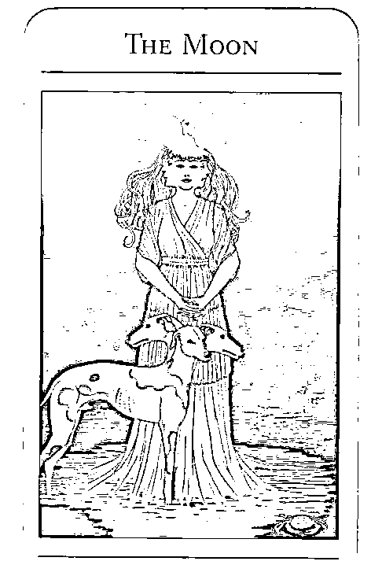

作者/朱丽叶·沙曼-伯克 丽兹·格林

译者/闫东升 编辑/玫瑰 图片/网络

本文节选自《神话塔罗》

塔罗牌中被称为大阿卡纳的 22 张牌是一组系列图像，描绘了一段旅程的不同阶段。这段旅程在许多神话、传说和童话故事，以及世界上伟大的宗教教义中可以找到相似的情节。今天我们已经走到了月亮牌，这是一段怎样的旅程呢？

[🔈 神话塔罗·月亮](https://res.wx.qq.com/voice/getvoice?mediaid=MzA5NjA0NTAxNl8yNjUxNDg0ODI0)

**夜之女神**月亮牌描绘的是一个神秘的女性形象，她有三张脸，头顶上带着一个月亮形状的皇冠。她的头发是银色的，穿着一袭白袍，亭亭玉立于一汪水池中。她旁边站着一只三个头的狗。她脚下的水池深处有一只螃蟹，正在努力地从水中游出。她背后是一望  无际的黑色天幕，被她头上闪着冷冷光芒的皇冠照亮。

> **拥有三张脸庞的赫卡忒（Hecate）**：就像拥有三个化身的摩伊莱（Moirai），象征着命运中无可避免的无常变化。
> **螃蟹**：基本上算是两栖动物，它既不完全属于陆地，也不完全属于水域，在水路之间栖息，因此它是梦境的意象，意即来自于不可知的神秘之处，却以某些强烈的感觉和意象进入到日常世界中，人们无法忽略它。
> **赫卡忒拥有银色的头发和白色的长袍**：这两种颜色都和月亮有关，据说月亮的白色和银色包含了所有其它颜色，也可以说是其它颜色的初始存在形式。

**远古的地府女神**在这里我们遇到了远古地府的女神赫卡忒，她是月亮、魔法和巫术的主宰者。神话中，赫卡忒有时候和月亮女神阿提米斯（Artemis）等同，但赫卡忒是一个更古老的神祗，同时拥有天空和地下的强大力量。作为宙斯（Zeus）和赫拉（Hela）的女儿，她因为偷了一罐胭脂而惹怒了母亲，于是便逃到尘世的一户人家里，那家的女人刚好在那时生了一个孩子。

因为碰到了女人生产的过程，于是她变得不再纯洁，因此只能到地府中去清除沾染的污点。后来，她就成为了地府的掌管者，被称为无敌的女神，象征着净化和赎罪。作为魔法和巫术的女神，她把魔鬼派到尘世，通过梦境使人们经验痛苦的过程。

地狱的看门狗克尔伯罗斯（Cerberus）陪伴着赫卡忒，它是个三头怪物，代表着赫卡忒的动物性和魔鬼性的一面。她最喜欢在岔路口、墓地和犯罪现场狩猎，所以人们常常在岔路口塑造她的神像，在满月的前一日供奉她。

宙斯非常尊重赫卡忒，所以从来没有否认过她拥有的古老的力量——意即给予或收回人们渴望的礼物的能力。赫卡忒在地府里面的朋友是复仇三女神厄里倪厄斯（Erinyes）或法瑞思（Furies），她们会惩罚那些违背自然法则的人，也代表着命运三女神摩伊莱（Moirai）或斐特斯（Fates）更严酷和恐怖的一面。所以说赫卡忒是神话中最古老的一个神祗，掌管着死亡、地府、命运、出生和魔法。

**无边的集体潜意识之海**

**从内在的层面来看，月亮之神赫卡忒是神秘的潜意识之深海的意象**。我们曾经在[女祭司牌](http://mp.weixin.qq.com/s?__biz=MzA5NjA0NTAxNg==&mid=2651398864&idx=2&sn=ed9f84c78360b5117720e363f370dd89&chksm=8b4b9067bc3c1971c838731d8870a55e718ad18ab412e381fcf7b21708cb77e988122c3af22a&scene=21#wechat_redirect)和[命运之轮牌](http://mp.weixin.qq.com/s?__biz=MzA5NjA0NTAxNg==&mid=2651399517&idx=2&sn=48814eb5bcd23ea3f992fade2a0aaff7&chksm=8b4b97eabc3c1efcaf50acbbfb3733b30eca1aab30517938c06acbf5692e0ed45e59803bf710&scene=21#wechat_redirect)中探索过这个奇妙的、难以捉摸的领域。这三张牌的意义代表着深入理解和经验潜意识世界的过程。

通过女祭祀珀尔塞福涅（Persephone），愚人以直觉窥探到了内心深处秘密的本我（Self），他隐藏在生命世俗层面的背后。通过摩伊莱掌握的命运之轮，他经验到了我们称之为命运的力量，意即通过命运中突然的变化，揭示出了内在隐形的律则和某种有目的性的生命模式。在这张月亮牌中，我们通过赫卡忒的意象经验了伟大的集体潜意识之海，不仅每个人都源自于它，所有的生命也都源自于它。

赫卡忒的意象远远超越了生命个体的深度，她呈现的是生命本身的阴性力量，其三个脸庞隐喻着月亮周期的三个阶段，反映出她拥有天堂、尘世和地府里多个面向的巨大力量。

从心理学的角度来说，赫卡忒象征着人类浩瀚无边的想象力之海，千百年来所有的伟大神话、宗教象征和艺术作品都源自于它。它是混乱无序和了无边界的领域，每个个体的人生旅程和对本我的探寻都只是它微乎其微的一粒尘埃。与月亮之神赫卡忒的相遇，是面对超个人世界的体验，在这里个体的疆界被消融了，自我及其方向感都消失不见。似乎我们必须沉浸在这个无尽的水域中，耐心地等待新的可能性升起，最后成为我们的未来。

但是集体潜意识的黑暗之海包含着正反两个面向，有时候人们很难区分好坏对错，可谓疯狂与神圣仅是一念之隔。

在赫卡忒统辖的领域中没有知识和明辨力，所以人们身在其中时会恐惧和焦虑。有时候它能净化我们，让我们放下过去，准备向未来出发，但是我们必须等待，就像子宫里的胎儿一样等待。通向赫卡忒世界的唯一捷径就是梦境，而它就像螃蟹一样向我们挥舞了一下蟹钳，又转身遁入大海。**月亮牌和某种孕育有关，它充满了混乱、迷惑和焦虑**。在这里除了梦境和希望之星的指引之外，我们一无所有，因为赫卡忒的意象不像女祭司一样属于个人性，她是模糊难懂的、非个人化的、混乱无序的，只有不断变换的情绪和情感呈现。任何人都无法掌握赫卡忒的行踪，因为她是魔法女神，她带给愚人一个比他自己更大的世界，那是所有生命的源头之海。**月亮，在混乱与不安中沦陷****从解牌的角度来看，月亮——赫卡忒预示着当事人要进入一段混乱无序、摇摆不定和变化莫测的旅程了**。我们都被潜意识牢牢地把握着，只能凭借信仰、希望和暧昧不明、千奇百怪的梦境耐心地等待。愚人需要在浩瀚无边的宇宙子宫中等待重生，隐约地觉得他的个人发展旅程只不过是一个浩瀚的、无法知晓的博大生命中的一粒尘埃，而那个伟大的生命历经了不可计数的岁月，却依旧保持着它恒常的富饶和变化。

**版权声明：**本文由《自在园》授权发布，欢迎转发，反对抄袭。友号转载请申请白名单。

**朱丽叶·沙曼·伯克**从 20 世纪 70 年代早期开始，就对塔罗牌产生了兴趣，并踏入了塔罗的世界。后来，在丽兹·格林的鼓励下，开始研习心理占星学和塔罗。1984 年，第一本书《塔罗全书》（The Complete Book ofTarot）出版。之后，与丽兹·格林合作设计并撰写了《神话塔罗》（The Mythic Tarot）。朱丽叶写了十本塔罗和占星学书，包括一本名为《众星的传说》（Stories from the Stars）的儿童读物，以及与丽兹·格林合著的《神话之旅》（The Mythic Journey），这是一本详细讲述如何运用神话来指导生活的书。

**点击下图了解课程详情** 

**微信又双叒叕改版啦，不想错过若道君的推送？****就把若道设为星标吧！****▼**

**喜欢记得点一下在看哦☟**

************报名直达入口************

# 其实，这才是 12 星座最该爱护的人

> 原文：[`mp.weixin.qq.com/s?__biz=MzA5NjA0NTAxNg==&mid=2651484825&idx=1&sn=550835ea980a1ed5652812da4dcf307c&chksm=8b48c02ebc3f49386f7b6a048565239c8fcdd227d556e9f73925634200b5cc0ee2fc5715ec8d&scene=126&sessionid=1692737771#rd`](http://mp.weixin.qq.com/s?__biz=MzA5NjA0NTAxNg==&mid=2651484825&idx=1&sn=550835ea980a1ed5652812da4dcf307c&chksm=8b48c02ebc3f49386f7b6a048565239c8fcdd227d556e9f73925634200b5cc0ee2fc5715ec8d&scene=126&sessionid=1692737771#rd)

******☆ ****后台回复“今日”，给你一句生命态度******

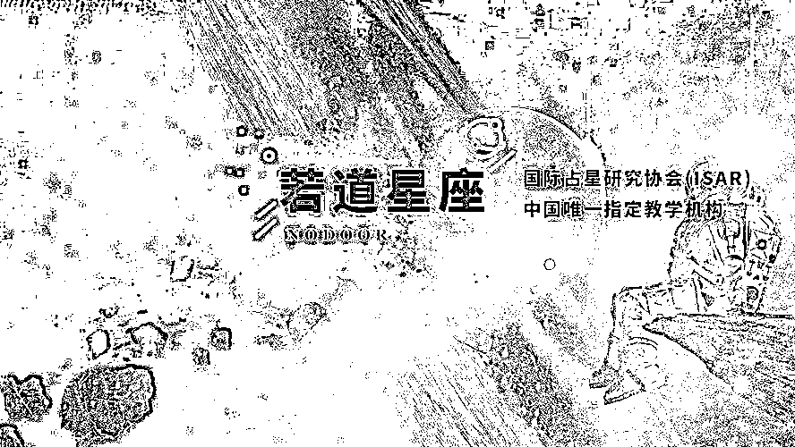

作者/大卫·瑞雷  若道占星创始人译者/李含 校对/江艺 编辑/玫瑰 封面/书君 图片/pexels12 星座最该爱护的必须是你自己，因为没有健康的身体和精神，就没办法享受生活啦。大卫·瑞雷老师将教大家在如何照顾自己方面做出更好的选择，把与自己星座相关的风险降至最低。这里还有两门课程，可以点击链接了解一下哦：【[ISAR 认证职业占星师文凭课程](http://mp.weixin.qq.com/s?__biz=MzA5NjA0NTAxNg==&mid=2651484258&idx=3&sn=1b5a6376c9518c114bba5c8e2d75b07c&chksm=8b48c2d5bc3f4bc3fb12556d6557a7ca5a5da038808803f062d705f18e354e33d82218a32ec9&scene=21#wechat_redirect)】【[《医疗占星手册》作者亲授课程](http://mp.weixin.qq.com/s?__biz=MzA5NjA0NTAxNg==&mid=2651484258&idx=4&sn=9535414b4d513a183495362abb0bd7c7&chksm=8b48c2d5bc3f4bc3bd658bcb0a3cd4aac8647edd3e34e0b4181a2614fd2fc1c66ccd0b55825b&scene=21#wechat_redirect)】**火象星座：白羊座、狮子座、射手座****12 星座中最有活力的一组**保持活力被认为是保持健康和生命力的最重要因素。显然，在这方面，火象星座的人占有优势。然而，最有活力的群体也存在着风险，即增加了身体受伤的几率。

***白羊座***

**白羊座人非常容易因为急躁、愤怒和缺乏计划而意外受伤。**

对于许多人来说，白羊座（Aries）中的 A 对应着 A 型人格。因此，**许多白羊座人可能更容易在 55 岁以后患上高血压和心脏病，并因社交隔绝而感到压力——如果没有建立起支持性的关系的话。**

***狮子座***

狮子座人的议题是**骄傲**。狮子座人的体格常常看起来比实际上更健康有型，因此你们的外型可能会在网球友谊赛上吓住对手。如果体型没有给予你们想要的优势，你们倔强地拒绝退出比赛，给心脏带来的压力可能会超出你们的认知。**定期进行适当的心脏护理**对狮子座人而言十分重要，只需在购买时尚的运动服装之余抽出一点点时间就可以了。同样，你们尽可能地给人留下深刻印象，但重要的是记住自己并不是超级英雄。

***射手座***

**在所有星座中，射手座最容易让自己体力透支。**常常夜里腿抽筋，或是第二天，你们的身体状况才让你们意识到自己做过头了。**无节制**是射手座的另一个特质，这样的行为可能会让你们的腰围增加，使你们的胰脏和肝脏功能长时间承受压力，导致 2 型糖尿病。你们常常在受伤康复期让体重也涨上去了。如果你们还年轻，通常可以通过锻炼消耗超标的体重。但是，随着年纪增长，这会越来越难。相信自己的“狗屎运”可能真的会变成“狗屎”。犯傻会让你们的身体跟着遭殃，你们越快获得智慧就能够越健康。

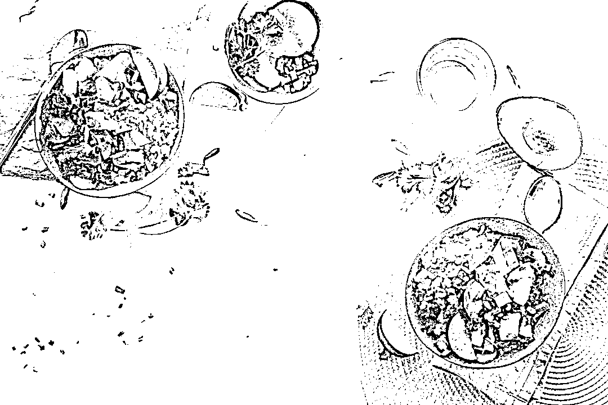

**土象星座：金牛座、处女座、摩羯座**

**12 星座中最务实、最脚踏实地的一组**

务实的态度显然能够为你们的健康加分。但是，务实的观念或许并不容易落实为行动。你们给出的借口常常是“我只是没有时间”，或是“我搬家了，距离我最喜欢的健身房太远”，或“我的基因已经没什么提升空间了，是吧？”

***金牛座***

金牛座人似乎无论如何都会“出现”，但是出现在厨房、沙发上还是健身房或瑜伽教室呢？这可说不好。抗拒改变，可能会让你们原地踏步。一旦动力被激发，你们会坚持到底。但是踏出的第一步就像是尝试挪动一个逐年按规律增大尺寸的物体。是的，你们喜爱美食，尤其是甜食，这是众所周知的。你们通常会从结实的孩子长成富有魅力的成年人，这让你们“看起来”很健康。但是，体重增加和缺乏经常的锻炼会渐渐破坏这些优势。**“迈出第一步吧！”应该成为你们的健身口号。锻炼比节食更适合你们，这也会改善便秘。**

***处女座***

如果担忧能带来健康，处女座人会是 12 星座中最健康的一族。然而，有时，你们会**屈服于消极思维，放弃某种健康饮食或锻炼习惯，这甚至可能会损害你们的免疫系统**。**完美主义和过度的自我苛责**可能会变成自嘲。听起来合理的解释成为你们为何永远无法拥有完美身体的借口，所以“有什么好困扰的呢？”不管怎样，你们中许多人会成为**饮食和锻炼方面的专家**，但结果是其他人的赞赏钦佩在你们看来依旧不够完美。专注和练习是你们的长处，这也有益健康。但是**神经焦虑会有损你们的肠道健康。学会放松，摄入益生菌是明智的选择。**

***摩羯座***

摩羯座人总会制订计划，如果你们的计划中包括营养膳食和定期锻炼，你们会实现自己的健康目标。但是，在你们追求事业成就的过程中，有时候会把膳食和锻炼从计划中剔除。**错过午餐、超时工作、忘记锻炼**很快会成为常态。自律对你们而言从来都不是问题，你们非常自律，会为了实现目标而做出牺牲。但是，你们害怕失败，这会驱使你们做出损害健康的选择，带来一系列不良后果。**不怎么喝水、不去上厕所等等会导致脱水，这可能会给肾脏和关节造成压力，引发各种关节炎和与皮肤相关的疾病。****将合理的膳食和锻炼纳入你们的长期计划中**，有助于预防，或者说减轻这种状况。

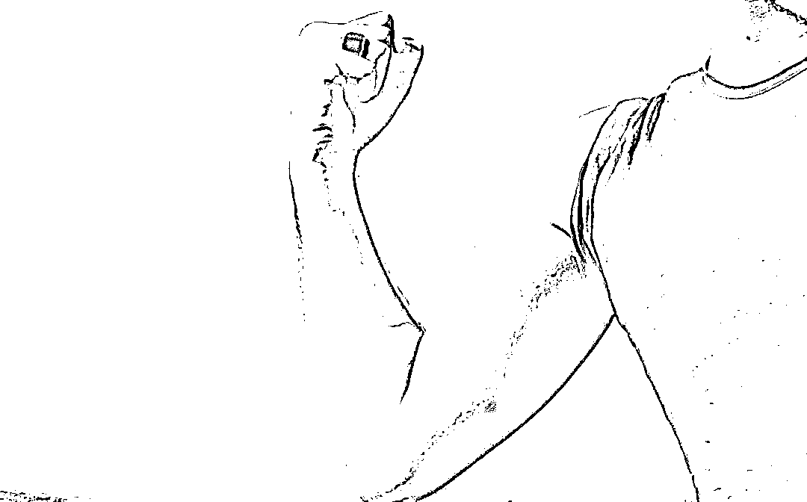

**风象星座：双子座、天秤座、水瓶座**

**在社交方面比较活跃的星座**

良好的关系是健康生活方式的重要部分。伴侣和友人给予支持，同时可以通过一个充满活力的关系网学到新的改善健康的潮流趋势。

潮流意识和好奇心为获得良好的健康提供了显著的信息优势。但是，阅读书籍和网络文章并不能抵消久坐的生活方式带来的不良后果。

风象星座的社交天性可能会让你们参与到**团队运动**之中，比如**足球、网球或壁球**等等。充满活力的好友会推动你们从自己的头脑中走出来，让你考虑一下自身的健康和身体。

***双子座***

**乒乓球或羽毛球**让双子座人走出咖啡屋，除了抽烟之外找些别的事情让你们的双手活动一下！尽管抽烟肯定对所有星座都不好，因为这与肺部的潜在疾病相关，例如哮喘，但对双子座人来说尤其危险。你们是风象星座中最静不下来的一群：**聊天，同时处理好几件事，走来走去，呼吸急促。****但是，长时间的浅呼吸表明持续着一种焦虑模式**。有时候，像胸痛、头晕眼花、虚弱、刺痛、昏厥、心跳急促等症状，都是因为长时间的短促呼吸造成的。深呼吸并不是解决之道，反而会使症状恶化！相反，**进行缓慢、平稳的呼吸，吸气时间至少保持 5 秒钟，停顿 2 秒，然后呼气 6-7 秒。进行这个练习，控制你们的呼吸。**在饮食方面，零食是你们最大的问题。解决方案是，**找到健康的小零食！**

***天秤座***

**天秤座人需要保持水分，将潜在的肾脏疾病，尤其是肾结石的风险降至最低。**你们喜欢甜食，也喜欢偏咸的食物。**适度控制盐分**摄入有助于控制或预防高血压，也有益于你们的肾脏健康。平衡的生活方式对你们而言非常重要。压抑自己的情绪，缺乏倾诉的渠道，会制造一种有毒的内在压力，引起头痛和各种健康问题。

你们喜欢友好而理性的辩论或讨论，这很好。如果不是，请**拒绝情绪化的争执**。作为最善于社交的风象星座，你们很可能会与朋友一起去健身房，或因为朋友而参加足球队等等。

你们会优先考虑别人，但留意不要忽视自己的健康需求。过分妥协的生活会拖累你们的健康。不论好坏，你们伴侣的生活方式也会成为你们的生活方式。他们健康的或不健康的习惯会显著地影响你们的健康。

***水瓶座***

水瓶座人是最聪慧的风象星座，最倾向于在自己的健康和生活方式上进行种种尝试。你们会**尝试没有什么人听说过的事情**，以很好的理由阐释为何某种饮食、维生素或补充剂是最棒的，或哪一种自行车头盔是最轻便又保护性最好的。噢，是的，你们的健身服很可能是环保再生材料制成的，或是你们的运动衫是青海的村民用牦牛的毛编织成的。你们常常会**拒绝建议，不论好坏，除非足够稀奇古怪**。你们可能会因为故意作对而成为糟糕的病人，让医生和医护人员感到费解。不管怎样，只要你们保持身体活力，你们就可能成为你们渴望成为的古怪老人。不过，久坐的生活习惯很可能会引发**循环系统疾病**，这可能会引发**血管方面的疾病**，最糟糕的情况下可能会引发血栓。**尽可能多走动走动，这就是环保。**

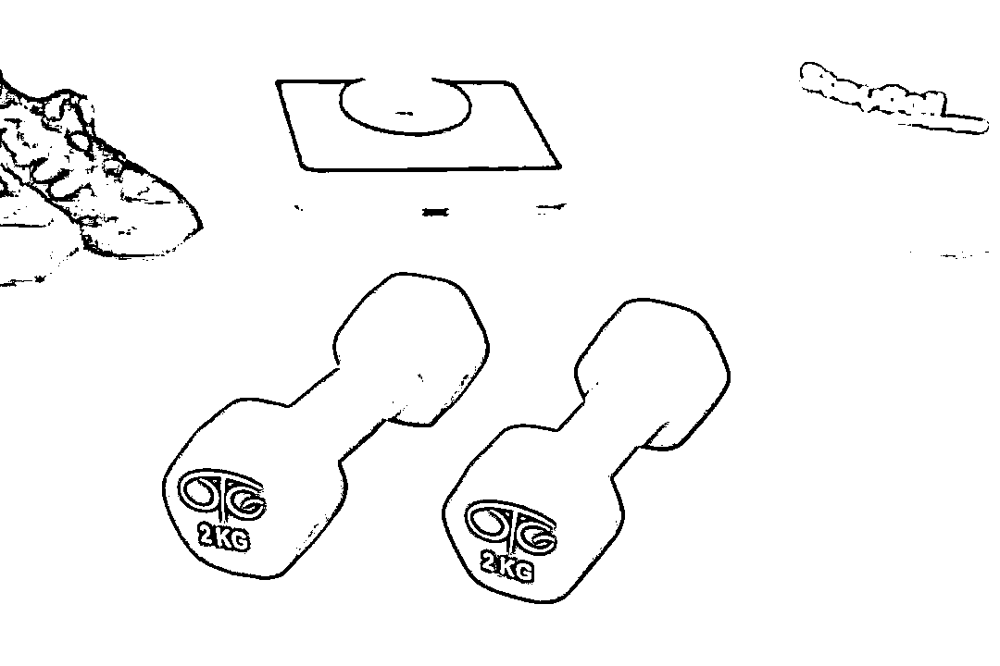

**水象星座：巨蟹座、天蝎座、双鱼座**

**拥有一种对于生命和健康的直觉**

这样的直觉显然有助于感知或感受某些事情是否安全、是否健康。

当然，我们所生活的社会让我们忽略自身的感受，保持逻辑和理性，所以一些水象星座的人或许学会了忽视自己的感受。这些年来，当我的水象星座客户们说起自己感觉有些不适时，我会专注地聆听，建议他们立刻去看医生。

***巨蟹座***

**巨蟹座人对环境因素最为敏感。**

通风良好的窗户被关上了！取暖器打开或关闭了；闻闻看食物坏了没有？你们凭本能意识到一个**安全、富于关怀的环境是保持良好健康的重要因素**。不论是在家里，还是在工作中，**不和谐的情感状况都会立刻让你们的胃部感到不适。**

所以，环境对你们的健康和幸福感都至关重要，你们会因为自己的办公室或职场环境而换工作，为了找一个你们感觉安全的街区而搬家。这通常对你们而言是明智之举，可以预防自己的健康受损。

你们中的一些人随着年龄增长体重也会有所增加，腹部渐渐凸起，尤其是喝啤酒的巨蟹座男性。

一般来说，和其他星座相比，**快乐的家庭生活和安全的职场环境**更有助于你们的健康。反之亦然，你们的许多疾病都源自紧张的家庭生活，或是不和谐的职场环境。

***天蝎座***

天蝎座人一般拥有**出色的生存本能**。但是，你们中的许多人会验证自己的猜测，然后因为后悔而哀叹！幸运的是，你们大部分人拥有极强的韧性，有良好的恢复能力。**极端**是你们的常态，你们可以前一天不吃什么东西，第二天撑得走不动道。极端的情绪，尤其是重要的关系破裂，常常会让你们严重消瘦。在健康锻炼方面，你们具有强迫性，**执迷于某种锻炼或饮食。**天蝎座女性常会出现荷尔蒙方面的问题，天蝎座男性需要注意常识，减少罹患性病的风险。和金牛座人类似，你们也可能会陷入固定模式，但是你们陷入的可能是更具自我破坏性的模式。成年后，你们的健康状况常常会有所改善，你们会修复早年极端状况造成的破坏。

***双鱼座***

双鱼座人是最容易受负面反馈影响的星座，可能会因为最糟糕的想象而陷入暂时的抑郁！你们的病症常常最为复杂，难以诊断。你们大部分人健康问题的源头是**“敏感”**。对于你们来说，过敏反应非常常见。不过，在所有星座中，你们也**最有可能在对自己的康复能力满怀信心时痊愈。**因为对暗示性敏感，你们中更多人可能被分到安慰剂效果组，相信服用的药物能够治愈自己，即使那只是一颗糖豆。当然，这不见得适用于你们所患的所有疾病。不管怎样，你们激发灵感的能力似乎与你们神奇的康复能力相当，它们也能给你们带来疗愈。**冥想**对你们而言是最自然的练习，其他灵性练习也一样。创造性的出口，尤其是音乐，也能疗愈你们。对于双鱼座人和天蝎座人而言，最大的危险是**对药物或酒精上瘾**。天蝎座人更偏向纵酒狂欢，但是对于双鱼座人而言，上瘾则明显意味着逃离生活压力的诱惑。你们需要在良性逃避和忙碌状况之间平稳过渡，从而更能激发你们的灵感。

**版权声明：**原创文章由作者授权发布于若道平台，欢迎转发，反对抄袭。友号转载请申请白名单。

****想阅读更多作者的文章，请在后台回复******大卫****** 即可。****

**大卫·瑞雷**

美国占星师，若道联合创始人，致力于在中国教授和推广西方占星学；2010-2014 年，任全美占星师联盟监督委员会委员；2017 年，被选为 ISAR 委员会成员。ISAR 是世界最大的国际占星机构，会员遍布 45 个国家，2017-2020 年曾任 ISAR 全球副主席、CAPISAR（ISAR 职业占星师资质认证机构）主席。

**拥有****51 年****占星实践经验的**
**若道创始人****前 ISAR 全球副主席****前 ISAR 全球职业占星师资质认证主席****大卫·瑞雷**

**和**

**2019 年第二届、2021 年第三届核心课中**

**与苏·汤普金斯老师****联合授课****的**

**ISAR 认证职业占星师**

**咔咔（Caroline）**

**二人合力打造**

**2022 年 ****若道全新核心占星课程**

**点击下图了解更多课程详情** 

**

**“占星学可以精准定位需要解决的潜在问题。”**

**医疗占星学是一个强大的工具，同时洞察的身体和心理过程，通过更多的自我认知照顾和关爱自我和身边的人。**

**本课程既适合医疗占星学的初学者，也适合已经有一些相关经验的人****。**简·里德·帕特里克老师将运用现实生活中的例子，揭示一个人的性格、症状及其星图是如何相互映照的。课程也会探讨疾病的意义以及可能的治疗方法。

**本课程旨在为学员提供一个运用医疗占星学的框架和方法，**学员将会学到一些有价值的实用工具，在课程结束后，自己使用这些工具研究其中的关联性。

**此课程可作为 ISAR 选修课。**

**点击下图了解更多课程详情**

**20 位来自世界各地的占星师****带来 19 场沙龙——新世界的觉醒****详情可点击下图**

**学习占星学****点击下图了解课程详情**

**微信又双叒叕改版啦，不想错过若道君的推送？**

**就把若道设为星标吧！**

**▼**

**喜欢就点一下“在看”吧！**

********报名直达入口********

# 若道周运 8.15-8.21 丨混乱期即将结束，十二星座将在哪些方面辞旧迎新？（内含 12 星座运势）

> 原文：[`mp.weixin.qq.com/s?__biz=MzA5NjA0NTAxNg==&mid=2651484544&idx=1&sn=5e0cf038bc5ee4f2c6d29e6a5c7b4551&chksm=8b48c337bc3f4a214c8034349c98410db93bb5482ce2c8032aa9d5ccd7178bcafeae5e08f49e&scene=126&sessionid=1692737771#rd`](http://mp.weixin.qq.com/s?__biz=MzA5NjA0NTAxNg==&mid=2651484544&idx=1&sn=5e0cf038bc5ee4f2c6d29e6a5c7b4551&chksm=8b48c337bc3f4a214c8034349c98410db93bb5482ce2c8032aa9d5ccd7178bcafeae5e08f49e&scene=126&sessionid=1692737771#rd)

******☆ ****后台回复“今日”，给你一句生命态度******

作者/朵三三三 ISAR 认证占星师
编辑/翀子 封面/书君 图片/网络**整体氛围**

**在经历一个多月的激烈天象之后，本周终于来到了一个缓冲带。从这周开始，我们会逐渐过渡到一段相对温和的时光中。**

周初，依然残留着一些紧张气息，它与上周五的[【水瓶座满月】](http://mp.weixin.qq.com/s?__biz=MzA5NjA0NTAxNg==&mid=2651484401&idx=1&sn=6983d509093fe8d83f6dd1adb4c51113&chksm=8b48c246bc3f4b5079c2f9019e01e3d7aae6c094158de94e574fa0395f391d6b6bd7bbc480e3&scene=21#wechat_redirect)（点击查看文章）有关。这个满月的威力在于，它刚好发生在土天四分相附近，**会触发这两年我们每个人都在努力攻坚的主课题。**

满月时日月对分，而月亮的移动速度非常快，所以到了这周，月亮已经离开了，但太阳还在。**它会继续完成与土星的精准对分，这个对分相在周一发生。**

所以在周一前后，太阳依然与土星、天王星、火星形成了一个宽泛的 T 三角。这个挑战结构一定让人不太舒服，在上周四，太阳与天王星的四分相已经发生过了，那时我们可能决定不按常理出牌，不走寻常路，做出新的尝试和挑战。

但在本周初，我们可能体验到这个决定的代价：或许是与他人之间承诺、责任的冲突，也可能是规则、制度的限制，让我们感觉尊严受损，感到实现自由意志的过程很艰难；也或许是我们想要独处，切断一些联系，但此时由于土星的影响，又不得不重新回来面对。

**本周的另一个重要星象是，火星在周六进入双子座。**它标志着本年度在固定星座发生的最混乱厮杀已经结束。之前在狮子座的群星已然远离了与土星和天王的刑冲位，虽然 8 月末金星还会来到这里，与土天成相，但毕竟形单影只，也成不了什么气候了。

最重要的是，作为“罪魁祸首”的捣蛋鬼火星离开金牛座和天王星之后，整个世界就安宁了很多，**不会再有那么浓烈的火药味四处迸射了。**

**由于之后的逆行，这次火星将在双子座停留长达 7 个月的时间，**它给我们带来的理性的氛围，让思考和行动相互结合。**我们会更加注重信息交换、资讯收集，头脑和思维也更加活跃。**

不过，火星进入风元素的双元星座时，也会刺激心智，**加重思想负担，可能会引发焦虑。**

另外，双子座很需要新鲜感，对很多事物都好奇，想要去尝试，火星又提供了付诸于实践的动力，**所以我们也会变得很忙碌，**很容易就在两个以上的方向投入精力，但如果目标太过分散，也只能浅尝辄止，无法坚持到底。

我们的选择困难症也可能变得更严重，因为头脑考虑到的方方面面太多，所以更加纠结。

另外，这段时间也要更加注意**口舌是非**，这也是一个非常容易引起争吵、口水战、辩论的星象。

**上述效应对于星图中有双子座、射手座、处女座、双鱼座的人群影响更大。**

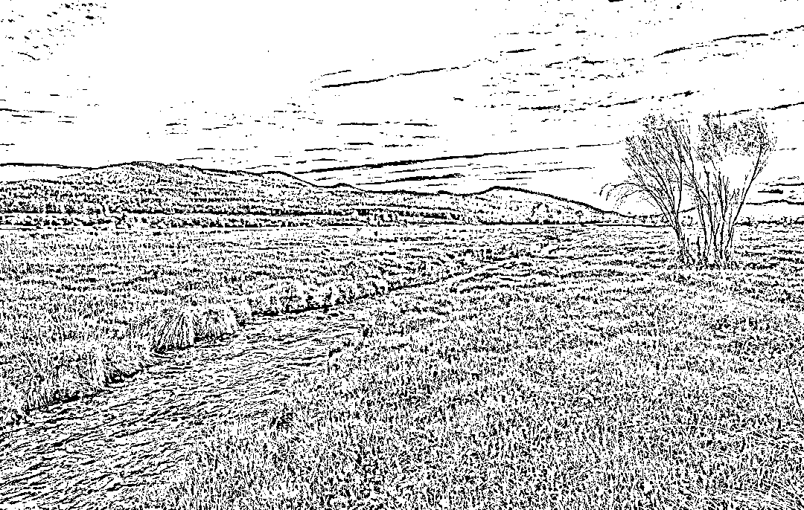

**每日星象****周一**

*   **太阳对分土星、火星三分冥王星 **

*   **先苦后甜的一天**

这个星象下，我们容易跟权威、长辈发生对抗，产生被否定的挫败感。我们能做的，依然是**寻求改变与服从，突破与延续之间的平衡点。**

好在有火冥之间的和谐相位，最终我们有力量控制自己，找到稳妥解决的方式。不过依然要小心火冥激起的负面情绪和愤怒，今天是一个**观察内在恐惧和自我黑暗面**的好时机。

中午之后，月亮与金星、木星陆续形成和谐相位，能量渐趋平顺，能够度过愉悦的下午和傍晚时光。

**周二**

*   **月亮六分土星、三分太阳**

*   **理性踏实的一天**

我们可能收获来自长辈或朋友的建议和帮助，进行一场舒适的交流，感到被激励。或是自己调整心态，得到了实际可靠的启发。

今天我们内心平和，**适合去思考、规划近期重要的事情和目标，**也容易敞开心扉，接纳他人的观念和思想。

**周三**

*   **水星三分天王星**

*   **小亢奋的一天**

今天我们有很多灵感迸发，即便对于熟悉的人事物也能有另辟蹊径的新发现。这种能量很适合用来进行**头脑风暴**，或完成对**细节**要求高的脑力工作。

**周四**

*   **金星三分木星**

*   **岁月静好的一天**

**今天是本周最愉悦的一天，**我们对自己很宽容，也有足够好的心态，来享受当下的生活，从周遭感受到正能量。

与朋友、家人、伴侣互动十分愉快，适合安排约会、告白。由于是在火相星座发生的三分相，也带着热情和冒险特质，不妨安排一些有趣新奇的娱乐活动，会有不错的体验。

**周五**

*   **月亮四分土星、四分太阳、合相火星**

*   **心情多变的一天**

今天可谓是**五味杂陈**了，凌晨月亮与土星的压力相位或许会带来睡眠问题，睡眠浅、易醒，或是有不愉快的梦境。

中午日月四分，我们或许会因为某些事心情低落，有挫折感，或身体不适。

傍晚月火合相，我们容易脾气暴躁，失去耐心，想要追求速度和效率，但小心与周围人发生争吵，也要注意交通安全。

**周六**

*   **月亮六分金星与木星、火星进入双子座**

*   **忙碌又愉悦的一天**

今天是**适合出行**的一天，又刚好是周末。我们非常需要与朋友、伴侣、家人的互动，可以考虑**安排聚会和社交活动**，应该能擦出不少精彩的火花。单身的朋友，今天记得出去玩，能有很大概率认识到默契而互相吸引的人。

即便在家里，我们大概率也是闲不住，收拾房间，或者与朋友聊天、通话，也可能会收看语言类综艺，或不停刷手机，关注社会新闻。

**周日**

*   **水星对分海王星**

*   **浪漫却不切实际的一天**

水星与海王星出现了压力相位，今天，我们容易对这个世界产生滤镜，难以看清事实真相。**不要过度美化，**尤其不要自我感动，甚至要防止被欺骗的可能性。此时若出现让你觉得十分完美的人事物，一定要小心警惕。

**今天的精力也容易分散**，需要注意迷路、丢三落四、健忘的可能性。

所以今天并不太适合学习、考试，以及较为重要的交流、会谈、贸易等，如果无法避开，请多留意细节，并提醒自己聚焦重点。

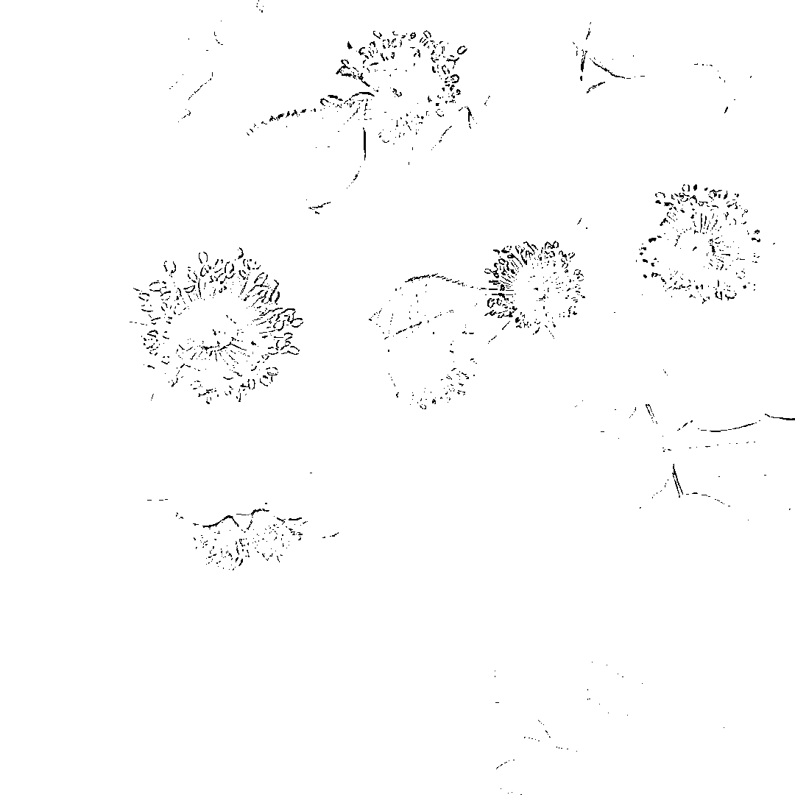

**12 星座一周运势**

**（重点参考上升星座，其次参考太阳星座）**

***白羊座***

**周初，**你与朋友、团队成员或者客户之间可能产生矛盾，你要在坚持自己和实现责任、承诺之间努力平衡，这其中可能涉及到一些金钱利益关系。**工作方面**你很有创意，可能灵感频发，绝大部分时间头脑清楚，逻辑性强，尤其是周三附近，工作效率可以达到一个小高峰。**本周你的桃花不错，**部分人遇见心动对象，有机会发展成一段正式关系。有对象的感情升温，可以一起玩得很开心。**周六，火星换座会给你带来更多的人际关系互动，或是一些短途旅行。**

***金牛座***

**周初，需要注意家庭与工作之间的冲突，**也可能是你在这两个领域内要处理难搞的人际关系，熟悉的压迫感扑面而来，但这一次，你可能换了一种解决思路。部分金牛座**在职场上的担子加重，**会经历愁云惨淡，精神紧张的两天。但周三前后，你自己就能想通一些重要的事情，重燃信心与斗志。本周适合你**放松的方式**是待在家里，多休息，多睡觉，尤其是后半周，独处和充足的睡眠能让你的心情很快好起来。周六的火星换座会刺激你的**金钱流动**，可能会有支出消费的新项目。

***双子座***

周初你的一些想法**容易钻牛角尖**，陷入死胡同，也容易跟他人有言语争执。前几天对于还在上学或者需要旅行的双子座不太友好，会遇到一些麻烦，计划或许要延后或变更。**后半周，双子座的人际运升温**，适合谈合作事项，也适合呼朋唤友聚起来。好运和助力就隐藏在你这些人际关系中。**周六的火星换座对你意义重大，**你的行动力增强，表达欲提升，有迫切展现自己的需求。你变得忙碌起来，也开始主动积极地去解决问题。

***巨蟹座***

周初，你的**财务问题**可能出现一些棘手的情况，或者是心理上的金钱压力让你非常疲惫。这部分也涉及到外部客观环境的影响，让你对于当下自己拥有的事物很难有安全感。周中，你或许能通过与亲近的好友、家人交谈释怀很多，**解开一些心结。**后半周你的财运也会提升，有望拿到一笔收入。也可能是**赚钱机会增加**，能够助力解决你的烦恼。周六，**火星换座会激活你的潜意识**，让脑神经更加亢奋，或许会感受到无来由的恼怒。之后要注意睡眠问题，和情绪问题。

***狮子座***

周初，会遭遇**人际关系**的烦恼，往往是来自于亲密关系和伴侣方面的矛盾，你们容易各执一词，互不退让，也可能陷入冷战中。但后半周你们的关系会缓和，你的心情也会转好，或许你能够收到喜欢的礼物，或是收到来自远方的好消息。**临近周末要注意金钱投资上的诱惑**，部分狮子座甚至可能遭遇诈骗陷阱。周六，**火星换座增加了你与朋友、团体之间的互动频次**，也容易引起你们之间的纠纷是非。

***处女座***

周初，**职场上容易遇见麻烦的人际关系**，对方可能是更年长、更有资历的人，但位阶又跟自己差不多。此时你内在多是自信而骄傲的，较难做出妥协与退让。但临近周中，你能恢复冷静和理性，找到和平解决的办法。后半周的偏财运不错，有可能通过一些隐匿的关系门路得财。周六，**火星换座让你在工作上加满油**，十分忙碌，效率提升。但也要注意跟周围人，尤其是领导上级，容易产生摩擦。

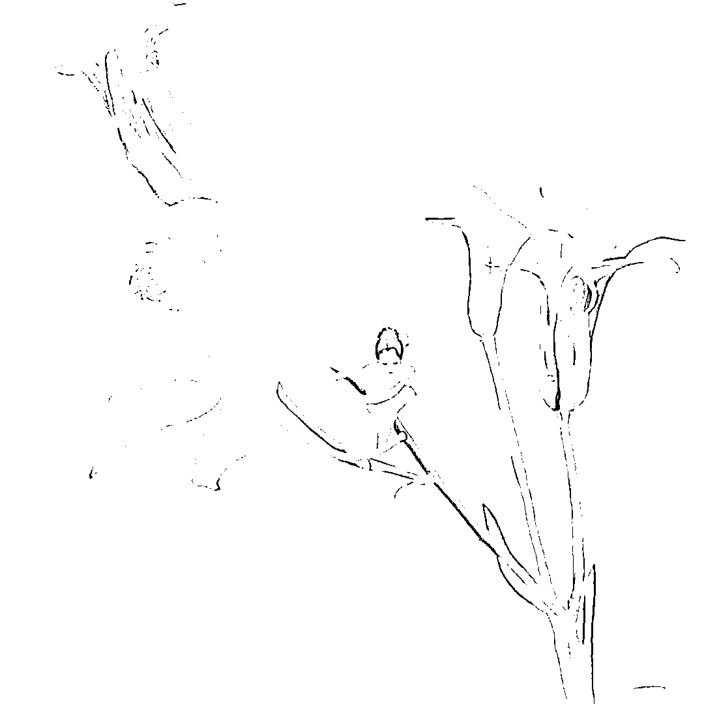

***天秤座***

周初，或许在**恋爱或子女**方面遇到困难，可能是现实的阻碍和考验，也可能是对方表现的态度让自己很生气。但后半周就会发生**人际关系上的喜事**，令你神清气爽。可能是之前困难的关系有所缓和，也可能是其他重要关系取得进展。周六，**火星换座增加了出远门的可能**，也可能是与异地的线上联系。部分天秤座开始进修课程，开启新的学习计划，而这些课程很可能不止一个方向，注意合理分配精力。

***天蝎座***

**周初，可能与家中长辈产生矛盾，也可能是其他亲密的人。**矛盾不会很快解决，需要耐心多一些，沟通无果可以先放置。周中或许会有第三方出来调和，能有效化解冲突。本周**工作运很好**，能得到领导赏识和外界认可，工作任务也相对轻松，与同事相处愉悦。周六的**火星换座可能带来金钱物质上面的不安**，也可能会在压力下冲动消费，建议客观地审视自己内在需求。

***射手座***

**周初，沟通容易出现困难**，可能彼此觉得无法理解对方，产生误会和隔阂，建议冷处理，而不是激化矛盾。等周末火星换座之后再解决问题，效率更高。**周中，很适合处理工作上谈判、沟通、策划方面的事务**，尤其是线上会谈更加顺利。本周迁移运佳，适合出行玩耍，部分射手可能开启一段异地恋。周六，**火星换座之后，带来高强度交流的一段时光，**人际关系活跃，需要你说很多话，可能还要参与一些竞争。

***摩羯座***

周初，或许要处理遗留的财务问题，可能是**清算过往一些账**单。尽管这笔在计划之中的支出是理性消费，一样会带来压力。**周中可能有进账**，能从房产、土地方面的事项获益，也可能是家庭、亲人带来的帮助。周六，**火星换座能让你的财务压力减少**，而工作更加忙碌，日常琐事增多，凡事需要亲力亲为。也要注意健康问题，接下来抵抗力下降，容易上火，建议多运动。

***水瓶座***

**周初，容易跟身边的男性发生矛盾**，你觉得对方很自我，对方认为你很固执，不懂变通。**周中，气氛会变得更适合沟通交流，**可以等两天，再把握时机去化解矛盾，解开双方心结。**周六，火星换座让你的娱乐机会增多，**你自己也对玩耍或兴趣爱好更加关注，需求提升，此时竞技类，或带来刺激感的项目更吸引你。也有部分水瓶座因孩子忙前忙后，为子女劳碌奔波。

***双鱼座***

**周初，你可能因为某些不愉快的记忆闷闷不乐，**或是在职场上再度遇见过往就令你不悦的麻烦事。**周中，**你应该能找到倾诉的对象，让你一吐为快。同时，可能在工作中结识投缘的人。你还可能拿到一笔奖金，或是某个项目的收益。**周末，火星换座带来不少需要处理的家务事，**也可能是房产交易、装修一类的事项。部分双鱼接下来要搬家、改变住所。另外，需要注意与家人之间的关系。

**版权声明**：原创文章由作者授权首发于若道平台发布，欢迎转发，反对抄袭。友号转载请申请白名单。

**END**

****朵三三三****

ISAR 认证占星师

全职占星师/塔罗师/国家三级心理咨询师 

人大文学学士/德国慕尼黑大学文学硕士

**微博/微信公众号**：朵三三三

长按打赏

**20 位来自世界各地的占星师****带来 19 场沙龙——新世界的觉醒****详情可点击下图**

**学习占星学****点击下图了解课程详情**

**微信又双叒叕改版啦，不想错过若道君的推送？**

**就把若道设为星标吧！**

**▼**

**喜欢就点一下“在看”吧！**

********报名直达入口********

# 雷蒙德·梅里曼金融占星周运 | 市场仍处在震荡时期

> 原文：[`mp.weixin.qq.com/s?__biz=MzA5NjA0NTAxNg==&mid=2651484544&idx=2&sn=08da6c3cc242dbe2dd4fdac5e63d48ea&chksm=8b48c337bc3f4a21e44582ce15817d401f413784f65903ec2bbc02a4ae8473c81e31df3226b8&scene=126&sessionid=1692737771#rd`](http://mp.weixin.qq.com/s?__biz=MzA5NjA0NTAxNg==&mid=2651484544&idx=2&sn=08da6c3cc242dbe2dd4fdac5e63d48ea&chksm=8b48c337bc3f4a21e44582ce15817d401f413784f65903ec2bbc02a4ae8473c81e31df3226b8&scene=126&sessionid=1692737771#rd)

作者/雷蒙德·梅里曼 译者/Luke
编辑/玫瑰 图片/pexels

雷蒙德·梅里曼是在金融占星学界稳坐第一把交椅的占星师，同时他也是若道签约的金融占星课老师，我们引进了雷蒙德·梅里曼老师的《[上证指数月度报告](http://mp.weixin.qq.com/s?__biz=MzA5NjA0NTAxNg==&mid=2651482348&idx=3&sn=2ab9c15a94c624c15d96baa433dbf5a3&chksm=8b48da5bbc3f534d77df0a9fe2c3a8858896bab5ca63234db5aacb8e3587724ace0b1f6b1f80&scene=21#wechat_redirect)》及《[黄金报告](http://mp.weixin.qq.com/s?__biz=MzA5NjA0NTAxNg==&mid=2651484461&idx=1&sn=61e82c992f71bf6f16324cb12f7240cc&chksm=8b48c39abc3f4a8ca8fdf71aa0a9b58865e09c2c8b497fd542c1a676ac8241df65751260b404&scene=21#wechat_redirect)》。我们经老师的授权，将每周刊登梅里曼老师的周运，供大家参考和学习。于是，这是本周的周运（8.15-8.19）。

**说明：以下时间采用纽约证券交易所所在地美国东部标准时间。**

**展望与回顾**

****

**拜登的巨额支出账单花费 800 亿美元我们的钱来雇佣更多的国税局特工……花了更多我们的钱来窥探我们在移动支付应用程序 Venmo/Cash 上分享的东西。他们不打击富人。他们冲着小企业、企业家和勤劳的美国人而来。****——图尔西·加伯德@Tulsigabard，推特****2022 年 8 月 9 日****根据最新数据，阿根廷央行周四将基准利率上调 950 个基点。该国正努力遏制不断攀升的通胀，通胀率已升至 71%，创下 20 年来的新高。****央行将 28 天期限的基准“Leliq”利率从 60%上调至 69.5%。就在两周前，央行已经把该利率上调了 800 个基点。****——路透社****《阿根廷在通胀达到 20 年来最高水平的情况下将利率上调至 69.5%》****2022 年 8 月 11 日****www.cnbc.com**就月亮星座而言，上周市场的走势是非常正常的。美国股市在 8 月 8 日创下高点，对应月亮在射手座；周二时创下低点，对应月亮在摩羯座；周五创下高得多的高点，对应月亮在水瓶座。从另一种意义来讲，上周市场（和政治）走势也是非常不寻常的。因为尽管 8 月 1 日火星、天王星、月亮交点在金牛座合相，上周满月与土星-天王星四分相形成 T 三角，然而市场走势没有发生重大的反转下行，唯有道琼斯工业平均指数一天内下跌 400 点，从周一的高点跌至周二的低点。正好相反，股票价格从 6 月中旬以来的新牛市中加速上涨。事实上，此轮市场走势并非完全不同寻常，因为对于天王星来说，正如本专栏多次陈述的，你不知道金融市场会突然反转，还是加速之前的趋势至数月高点或低点。在当前的案例中，发生的是后一种情况，全球许多股票指数上周飙升至今年的最高价位。与此同时，司法部对前总统特朗普在佛罗里达州的家进行了前所未有的突袭，随后国会通过了一项《通胀降低法案》，将美国国税局武器化，对降低通胀几乎没有任何作用。为什么民主党人总想控制我们的董事会，而共和党人想控制我们的卧室？这些政治事件与 8 月前两周生效的地球宇宙学征象完全相符。

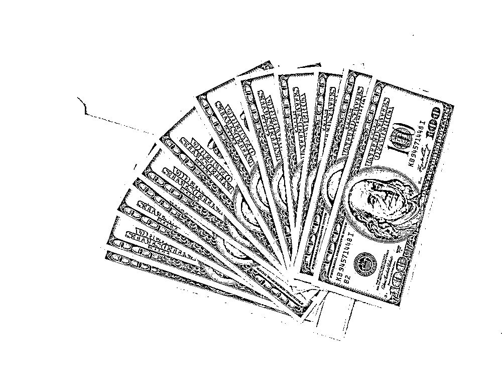

上周全球大多数股票指数创下多月的高点，但并非所有股指都是如此。在亚洲和环太平洋地区，日本日经指数独树一帜，飙升至 1 月 18 日以来的最高价位。印度 Nifty 指数也表现出色，上涨至 4 月 11 日来的最高价。澳大利亚 ASX 指数创下新的 3 个月以来的高点。但中国的上证和恒生股指是例外。上证综指确实于周五上涨至 3288，较之前一周 8 月 2 日的低点 3155 有了不错的上涨，但仍然远低于 7 月 5 日的近期高点 3424。另一方面，恒生指数上周表现惨淡，下跌至 5 月 12 日以来的最低价。在我们追踪的股票市场中，唯有这两个股市没有创下至少 3 个月以来的高点。在欧洲，荷兰 AEX 指数走势完美符合地球宇宙学征象，于三星关键反转日期 8 月 4 日创下新周期和 4 个月以来的高点，于 8 月 10 日月亮在摩羯座时创下低点。上周德国 DAX 指数、苏黎世 SMI 指数和伦敦富时指数都创下了 3 个月以来的高点。在美洲地区，巴西 Bovespa 指数飙升至 4 月 22 日以来的最高价位。所有的美国股票指数都于周五创下新周期高点，其中标准普尔指数和道琼斯指数到达 5 月 4-5 日以来的最高价，纳斯达克指数到达 4 月 22 日以来的最高价。比特币和以太坊前几周涨势不错，两者均飙升至 6 月 18 日低点以来的最高价。比特币已经从低点处上涨 41.6%，以太坊跳涨了 120%。黄金和白银也于上周创下新周期高点，黄金上涨至 1824.60，白银上涨至 20.85。仅在 3 周前，黄金创下 16 个月周期低点 1678。在强有力的天王星征象下，很难准确预测市场走势。天王星作为制造动荡和意料之外事件的大师，将继续主导宇宙叙事，直至 9 月底。**短期占星趋势和长期考量**

****

**芝加哥的一个联邦陪审团判定摩根大通贵金属部门的两名前雇员有罪，他们被指控操纵黄金价格，利用误导性订单操纵价格。摩根大通于 2020 年支付了 9.2 亿美元，以解决针对这两名交易员行为的监管和刑事诉讼。**

**——戴夫·迈克尔斯****《摩根大通前交易员被定罪》****《华尔街日报》****2022 年 8 月 12 日**上面的引文与近期本专栏的观察有关，那就是贵金属市场的走势似乎有点太过于奇怪了。但是，随着行进冥王星与纽约证券交易所星图中的木星-海王星对分土星形成强有力的 T 三角，腐败终于在这场诉讼中浮出水面。在强有力的冥王星行进下，没有人能毫发无损地逃脱。纽约证券交易所星图只是会经历冥王星困难相位行进的星图之一。

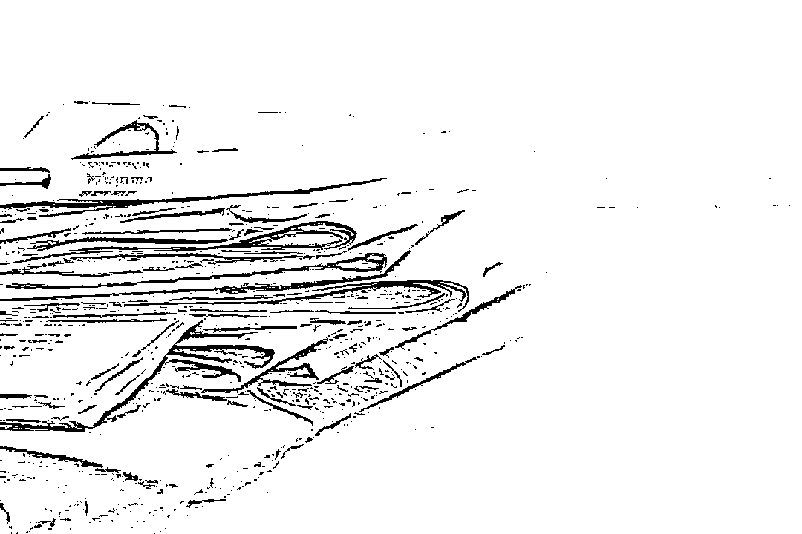

其他星图包括前总统唐纳德·特朗普的星图（每个人都见证了上周发生在他身上的事情），当前的总统乔·拜登的星图（想想亨特和他的笔记本电脑中隐藏的可能的致命信息），美联储及其主席杰罗姆·鲍威尔，以及美国星图。它们（和其他人）都有“出生”星体在基本星座的 25°-28°，那也是冥王星当前和 2023 年大部分时间正在行进的位置。**8 月和 9 月，我们正处于今年最激烈的地球宇宙学气候中。**宇宙天象上的每件事都在指向**9 月 21 日-28 日，届时土星第 4 次也是最后一次与天王星形成 45 年一现的渐亏四分相（尽管有 1 度的容许度）**。这将是美国历史上第六次形成这一相位。每隔一次形成这一相位是 90 年，值得注意的是，“每隔一次”的成相时间分别在 1840 年代和 1930 年代初，都对应了股票市场最具毁灭性的下跌（跌幅分别到达 80%和 90%）。这种跌幅的崩盘会再次于这个十年中发生吗？这是有可能的，但是截至目前为止，近期的下跌似乎只形成一个正常的 23 个月周期波谷，于 6 月 16-17 日结束，道琼斯工业平均指数跌幅为 19.7%。我们预测的跌幅是 10%-26%，之后展开强有力的上涨，持续到 2022 年 9 月-12 月。我们将深化这项研究的细节，以赶上 4 周后的投资者静修营。正如之前指出的，8 月-9 月期间有大量天王星征象生效。**第一个在 8 月 1 日发生。第二个是刚刚发生的 8 月 11 日-14 日太阳对分土星四分天王星。**接下来的一个将是**8 月 24 日的天王星逆行停滞，随后是 8 月 27 日-28 日的金星四分天王星对分土星**。**这些日期很可能对于金融市场有着重大的影响**。同样值得注意的是，**8 月 16 日-29 日，强有力的日心水星在射手座行进，那对于贵金属市场有着重大意义。**市场走势将会是疯狂的。目前为止已经很疯狂了。在市场、自然、天气、政治和旅行方面，依然有大量的震荡即将发生。**长按下图了解更多详情**

这是特别及时的讲座，因为为期 12 年的木星轨道周期会在 5 月 10 日进入白羊座，并且 6 月-11 月是一年中最有力的地球宇宙征象接连登场的重要时间段，因为土星逆行与天王星形成几乎精准的渐亏四分相。

**说明：以上日期基于纽约证券交易所所在的美国东部标准时间，由于存在时差，中国地区可能需要加一天。**

**版权声明：**本文由若道翻译发布，欢迎转发，反对抄袭。友号转载请申请白名单。

**雷蒙德·梅里曼（Raymond Merriman）**

若道签约老师。著名金融占星师，ISAR（国际占星研究协会）前主席，梅里曼市场分析公司的总裁。他由于“提升了占星学的职业形象”，在 1995 年国际占星大会上被授予轩辕十四奖；在 2012 年国际占星大会上，被授予轩辕十四终身成就奖。

1“中国上证指数月度报告”发售**若道推出了****中文版****的雷蒙德·梅里曼中国上证指数月度报告，并持续发行该报告！**当把金融市场的周期和占星学的周期相结合时，雷蒙德·梅里曼老师的金融占星学研究**为投资者应对金融市场的周期波动，并随之调整投资策略提供了极大的价值参考**。
**8 月中英文报告已上线！**2“黄金价格周期月度报告”发售**若道推出****中文版****的雷蒙德·梅里曼黄金价格周期月度报告！**不仅仅为广大读者在中国股市的投资出谋划策，更将视角放眼黄金市场。**每当世界经济形式不明朗的时候，有一个地方是保值的港湾，那就是****黄金**。自 1982 年雷蒙德·梅里曼出版第一本研究《地球宇宙学征象与黄金价格的关联》的著作以来，**他一直作为最重要的黄金市场时机预测者之一享誉国际**。2022 年 9 月黄金报告已上线，梅里曼老师将会告诉你他对这个关键时期如何操作的想法。也可以按照季度和一年期订阅，有更多优惠。季度和年度的好处是，你可以持续了解梅里曼老师对于不断在变化的市场的看法。即便他某一次看法和市场不一致，你也看到在下一期他如何调整自己的看法，并看到金融占星在一个长期时间段内对你把控风险的帮助。而能够长期控制风险、尽量找到安全的投资时机才是投资的长久之计。**9 月中英文报告已上线！****购买套餐**，买得越多越优惠中国上证指数月度报告套餐价

*   **单月报告**：280 元
*   **3 个月套餐**：780 元（260 元/月）
*   **12 个月套餐价**：2400 元（200 元/月）

**长按下图识别二维码****购买金融报告****套餐****▼**

黄金周期月度报告优惠

*   **双报告年度套餐更优惠（直降 900 元）**

*   **12 个月黄金报告+12 个月上证指数报告：仅需 3900 元**

**长按下图识别二维码购买黄金报告套餐**▼

3《2022 年金融预报和沙龙》1976 年以来，由雷蒙德·A·梅里曼撰写的梅里曼市场时机学院每年一次的年度预报沙龙和每年一本的《年度预报》一直在应用占星学原理为投资者们服务，提供卓越洞见，从未间断。 **雷蒙德·梅里曼《2022 年金融预报和沙龙》发售中（报告已发布）。****长按下图识别二维码了解详情**
▼

4《2022 下半年金融占星投资沙龙》这是特别及时的讲座，因为为期 12 年的木星轨道周期会在 5 月 10 日进入白羊座，并且 6 月-11 月是一年中最有力的地球宇宙征象接连登场的重要时间段，因为土星逆行与天王星形成几乎精准的渐亏四分相。

**长按下图识别二维码了解详情**

▼

**点击阅读原文购买金融报告**

# 剖开灵魂伴侣的真相，那“该死的浪漫”里最高的追寻是什么？

> 原文：[`mp.weixin.qq.com/s?__biz=MzA5NjA0NTAxNg==&mid=2651484539&idx=1&sn=eb8930167b6c87a696c1baff9a0ee451&chksm=8b48c3ccbc3f4ada9f75f4f94772e5b8373cfba60b9ced094f04f9b8604559e6922d13be39fa&scene=126&sessionid=1692737771#rd`](http://mp.weixin.qq.com/s?__biz=MzA5NjA0NTAxNg==&mid=2651484539&idx=1&sn=eb8930167b6c87a696c1baff9a0ee451&chksm=8b48c3ccbc3f4ada9f75f4f94772e5b8373cfba60b9ced094f04f9b8604559e6922d13be39fa&scene=126&sessionid=1692737771#rd)

********☆******************后台回复“今日”，给你一句生命态度**********

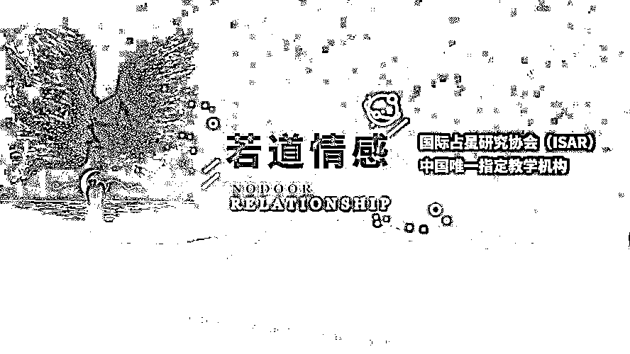

 作者/斯蒂芬·弗里斯特 朱迪·弗里斯特

 译者/胡曦兮 校对/Leisha

  编辑/翀子 封面/书君 图片来源/网络

本文摘自《天空的伴侣 I：爱、性和进化占星学》

“灵魂伴侣”是所有浪漫爱情故事的核心，可大多数人都认为浪漫是一种危险，容易让人精神错乱。在这个稍显过激的观点背后，人类一直不停的在寻找“高贵的爱情”。当我们通过星图看到灵魂伴侣的轮廓，甚至遇到了他（她），又如何让爱持续并变得成熟？另外，斯蒂芬老师马上要在若道开设[【组合图工作坊】](http://mp.weixin.qq.com/s?__biz=MjM5MjQwNjAyMQ==&mid=2649440040&idx=2&sn=04480bf4cfdb0177853d50bf37e65469&chksm=beb9504289ced954f6f4867c83b01e8544f6be8df199eb05b17e0f8c0e558bbe77ae6fa9d57f&scene=21#wechat_redirect)（点击查看课程），如果想跟这位占星大师学习，快来了解详情吧~ 

**前言**

**浪漫是一种危险，**大多数经历过的人都认可这个事实。但有人会抱有一些更负面的观点，认为浪漫是一种精神错乱。他们指出，爱情常常把一个原本理智的人变成一个喋喋不休的精神病患者：

嫉妒、缺乏安全感、占有欲、偏执地要与另一个人厮守在一起，就好像那个人掌握着宇宙中所有幸福和意义的钥匙。

这也许是一个过于激愤的观点，但我们肯定都在我们的伴侣身上看到过，如果我们有勇气承认的话，我们在镜子里也看到过。**是什么让我们做出这样的行为？**

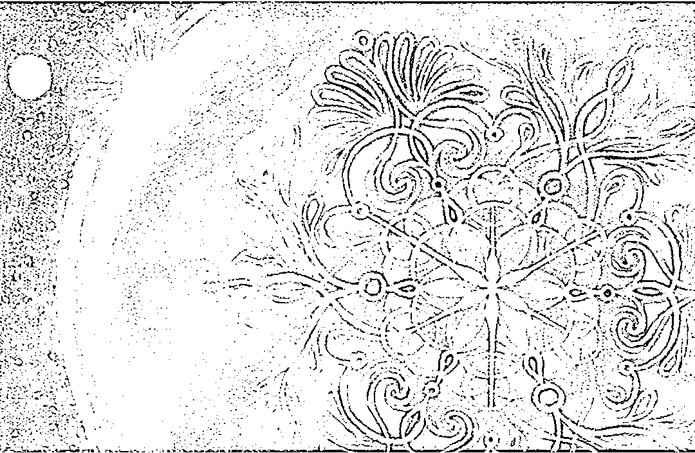

**对“灵魂伴侣”的需求从何而来？**

关于这个主题，荣格分析师罗伯特·约翰逊在他的书《我们：理解浪漫爱情的心理学》(哈珀与罗出版公司，纽约，1984 年)中提出了一些令人信服的观点。

他通过深入分析 12 世纪的骑士神话，发展出了自己的论点，他认为浪漫的爱情相对而言是一个西方文明特有的新事物。就健康危害而言，它与艾滋病毒和废弃的核燃料棒相差无几。

他的概念简单来说就是，**我们的祖先一直以来通过宗教满足很多情感需求**，随着教会绝对权威的崩塌，祖先们试图通过**“高贵的爱情”**来满足这些需求，一个相思成灾的骑士和一个遥不可触、通常是已婚的淑女。

约翰逊暗示，就神的心理替代品而言，遥不可触的淑女是个不错的选择。至少在骑士厌倦了对淑女的渴求，想尽办法与她共赴巫山之前，这种心理替代都是有用的。然后麻烦就开始了，完美的女人很快被证明和其他人一样不过是一只猴子。

试想，当你想象对自己而言理想的性关系时，你想到的是不是狂喜沉迷，神秘的交融，通灵或超感的理解，一种终极意义的感觉？换句话说，**灵性的体验**。

**这是我们过去期望从神那里获得的体验**，而不是从男人或女人那里，对猴子可不能要求这么多。

约翰逊认为，这些不切实际的期望，被好莱坞的神话制造机器所助长，已经不可避免地导致每个人的痛苦和幻灭。他还说到，这些期望已经成为我们世界观中非常重要的一部分，以至于它们会一直存在，并持续伤害人们。

对比当前印度和日本的婚姻观念，他认为西方的婚姻观念更不利。据他的描述，那些文化中的婚姻通常比西方社会的婚姻更有爱、更关怀彼此，而没有夸张的神话。

他还指出，在西方离婚率不断攀升和闹剧式生活的情况下，我们还傲慢地鄙视那种婚姻为“不浪漫”。

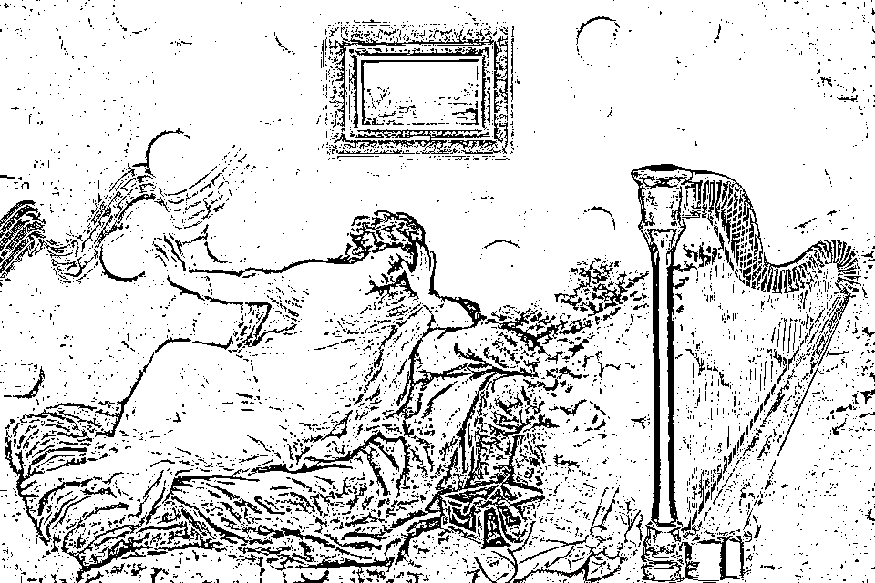

《我们》是一本有力量的书，至少其中的主要洞见对我们而言是真理。**我们都期待爱情在我们的生活中发挥神奇的疗愈作用，**而到 30 岁时，我们中的大多数人都已经不止一次地经历了灾难性的失望。这些与占星有关吗？有非常直接的关系。**从出生星图中，你通常可以清晰明确地瞥见你灵魂伴侣的轮廓，**获得这个信息很容易，难的是，一旦你们找到了彼此，**该如何相处。**我们将在接下来的章节中探讨。**灵魂伴侣！这个概念是所有现存浪漫神话的核心。**你命中注定要与之结合的那个真爱！像钥匙匹配锁眼一样匹配你的人！罗伯特·约翰逊以及任何了解他著作的人听到这个词一定会感到尴尬，让他们尴尬吧。“灵魂伴侣”这个词是我们的理智中太美好、太基本的一部分，我们无法忽视它。如果没有它，心理魔法中另一个不可或缺的部分就会荡然无存。问题在于，太长时间以来，我们任由青少年和言情小说家定义了这个词。

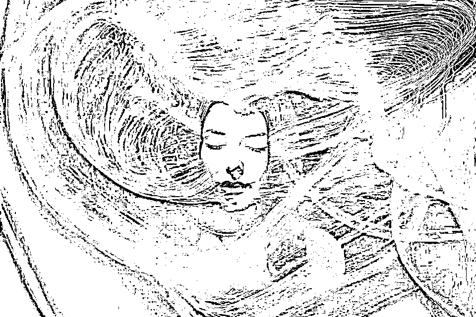

**“灵魂伴侣”的真相**

曾有一位来自北爱达荷州的女性智者，几年前我们成为了朋友。有一次，我听到她为一对我们共同认识的夫妇所做的通灵解读录音，她说：**“你们两个是灵魂伴侣。”**然后戏剧性地停顿了一下，接着说，**“但灵魂伴侣通常自相残杀。”**

与灵魂伴侣相伴到底意味着什么呢？第一步是不要妄想和这个人在一起的每一秒，每个月、几十年都会是某种性高潮式的极乐美梦状态。

这有时会是其中的一部分，但这个想法的核心是，**我们遇到的灵魂伴侣能够帮助我们改变本性，**换句话说，帮助我们改变灵魂，而这个过程就好像把一次云霄飞车之旅看成同未婚的小姨喝个下午茶那样容易。

约翰尼在一个摇滚乐队里弹吉他。他是一个天生的音乐家，但他从来没有真正努力去探索过自己天赋的极限。他已经四处巡演了 10 年，越来越依赖酒精、毒品和愤世嫉俗来度日。

约翰尼的灵魂伴侣泰利走进了他的生活。这类相遇通常都是这样，他们迅速回应对方，进入性关系。蜜月期是短暂的，泰利清楚地看到约翰尼在对他自己做什么。作为他的灵魂伴侣，**她也看到了他的潜力。**

**她打开了他的本性，**使他“颓废摇滚明星”的姿态突然在他们俩人面前显得尴尬和透明，那不过是一种虚弱的防御姿态。泰利的存在似乎要对抗约翰尼，挑战他——**这就是你最好的一面吗？这就是你所知道的最高真理吗？**

在好莱坞版本的故事中，约翰尼顺从地改过自新，娶了泰利，把她奉为自己的救世主，他们从此获得了幸福的生活，声名大作，财源滚滚，最后一定是去了郊区豪宅。

在现实生活中，他们大吵一架。

在现实生活中，吵架激起了他俩的自我防御，约翰尼和泰利很可能会分手，至少会分开一段时间。约翰尼内心深处有种感觉，如果他和泰利在一起，他所熟悉的生活将无可挽回地被改变。

**隐藏在复杂防御机制背后的深层恐惧**，日益凸现，要求战斗。**脆弱的、自我安慰式的谎言**轰然倒下，他童年时期在心理层面做过的“魔鬼交易”突然浮现出来供他重新审视。

为什么约翰逊要为了这些心理创伤自寻烦恼？这个女人带来这么多麻烦，她真的值得吗？还有很多其他的女人。

这些都是很好的问题，也是他一定会问自己的问题。性感的赛迪适时地出现了，约翰尼发现她有着致命的吸引力。

他约泰利喝了一杯咖啡，严肃地告诉她，她的性格对他来说太强了，而赛迪就接受了他本来的样子。他们一致同意这段恋情只是一段**“成长经历”**，它结束了。

为什么泰利能这么快就同意约翰尼这臆造的分析？与他这么快就臆造出这种分析的原因相同：她也很害怕！像他一样，她的潜在本质还有一半未曾暴露。

**灵魂伴侣的关系从来都不是单行道，在这种人类爱情中，拯救者总是成对出现。**

泰利是个诗人，很好的诗人。她写的是成人爱情诗，诗中充满了爱与恨、激情与恐惧。但这个身份没人知道，写诗是她深藏的一个秘密，为数不多的几首发表作品她用了笔名。很久以前，泰利就学会了隐藏自己的感受，她一直都是在照顾别人。

这种模式可以追溯到她的童年，当时的环境迫使她对弟弟妹妹扮演父母的角色。做一个拯救者让她感觉舒服自在，平等和情感的袒露是她从未体验过的东西，会让她害怕。

尽管约翰尼有他自己的问题，但他看穿了泰利的面具，仿佛看穿了一块窗玻璃。当他的目光锁定在她的身上时，她内心深处的某种东西感到非常不舒服。

“**这个人可以让我无处遁形**，这个人似乎已经知道了我的秘密——不仅仅是我的诗歌，还有我的渴望，我的占有欲，还有我保持控制的需求。我要离开这里！”

接下来会发生什么，无从知晓，即便占星学也没有答案，人们自己编写他们的剧本。也许约翰尼和泰利分开了，没有开发出他们潜在的灵魂联结。也许他们继续在一起，但依然没有开发出潜在的灵魂联结。

怎么会这样？也许约翰尼继续做个长不大的孩子，在“受苦受难的妈妈”泰利面前永远扮演那个”坏男孩”。

他们可以有条不紊地建立起一段婚姻，在这段婚姻中，他俩永远不会对视，性爱只在黑暗中发生，他们还会私下里嘲笑其他伴侣们的“成长经历”。

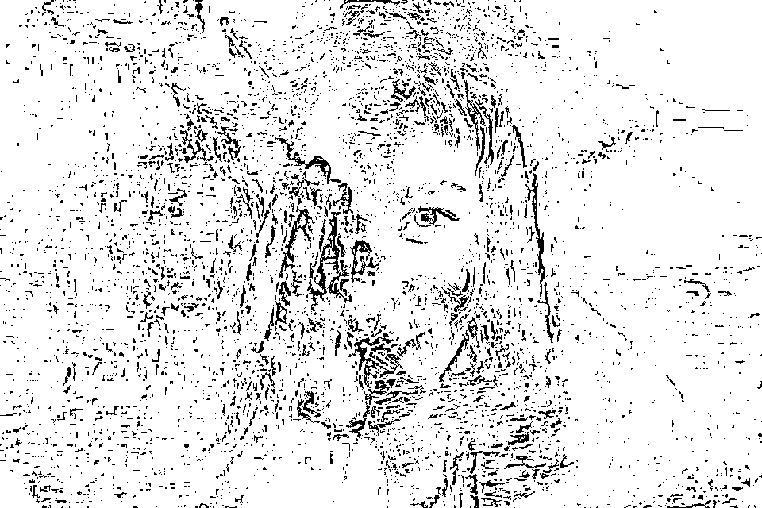

这些都是悲哀的选择，但是可能的选择。你见过多少爱的爆炸破裂不过是只打雷不下雨？你见过多少僵尸婚姻？

对泰利和约翰尼以及我们其他人来说，另一种选择是认识到，**如果爱情要治愈我们，它有时必须先把我们带到忍耐的极限。**

成年人爱情的古老盟友：诚实、勇气、谦卑、信任、宽容，必须向我们心灵中最黑暗、痛苦、窘迫的角落发射出爆炸性的强光。

当然，其中也会有快乐。你手里拿着的并不是一本悲观主义的书！情况恰恰相反。但是近年来，伴侣们常常会分开，不过很少是因为嫌快乐太多而分开。

**当灵魂触碰灵魂时，我们也许可能会体验到我们所知的最深刻的幸福。**我们也会经历进化成长，也是**在进化成长中，我们遇到了我们作为男人和女人的潜力极限。**

约翰尼和泰利，你和我，我们都可以做我们想做的事。占星学并不是灵丹妙药，可以治愈爱情时常带来的伤害。如果真的有灵丹妙药的话，那就是**彻底发展这些美德**——诚实、勇气、宽恕、耐心——**让持续的、成熟的爱成为可能。**

如果约翰尼和泰利分手后，又逐渐回到彼此身边怎么办？如果他们意识到一些无形的链条联结着他们的灵魂，但令他们恐惧的感情游戏正像饿狼一样撕咬这些链条，又该怎么办?

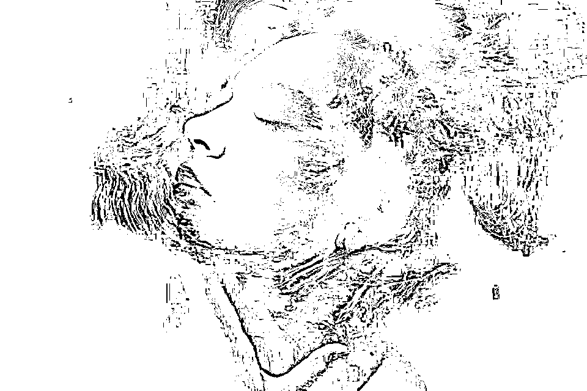

**从占星学看亲密关系**

**也许带着这些困惑，保持心灵和头脑的开放，他们找到了一位现代进化占星师，会怎么样呢？**

约翰尼可能会得知，他是太阳在第四宫的双鱼座，上升射手座。翻译一下，他会得知，他的整个自我身份是锁定在一个神奇、神秘的想象和创造力的领域，但也正是因为这样，他的自我从未完全成形。

他会明白，像他这样的人可以成为他人宝贵的圣使，如果不以放纵沉沦、装腔作势和逃避现实来破坏这种潜力的话。他会知道他的射手座上升给了他一个轻松多彩的“吉普赛面具”，他可以隐藏在后面，只要他自己没有相信他发布的新闻就行。

泰利会了解到她是巨蟹座，上升摩羯座，月亮处女座。她是一位疗愈者（巨蟹座太阳），拥有服务者的灵魂（处女座月亮），带着长者的面具（摩羯座上升）。

很多时候，这是美好的能量——但这也解释了为什么她迫切地想要保护自己，躲在扮演约翰尼的精神导师、母亲和心理治疗师的角色背后，避免与约翰尼真正进入亲密关系。

当约翰尼和泰利坐在那里互相凝视着对方的眼睛，占星师会和盘托出。他们可以像机器一样读出他们在老掉牙的感情戏里的剧情，约翰尼扮演悲催的痞子，泰利则扮演命中注定无论怎样都爱他的天使。

又或者，**他们可以放弃那些死气沉沉，没有灵魂的感情游戏，作为三维立体的成年人那样面对彼此，帮助彼此成长。**

占星师可以更进一步，利用两张星图提升智慧和敏锐度之后，占星师可以透视泰利和约翰尼之间的联结，**查找他们在互动方面的弱点**，而且在许多情况下，还能**为他们的困境提供实际的解决方案**，以及支持性的积极解读。

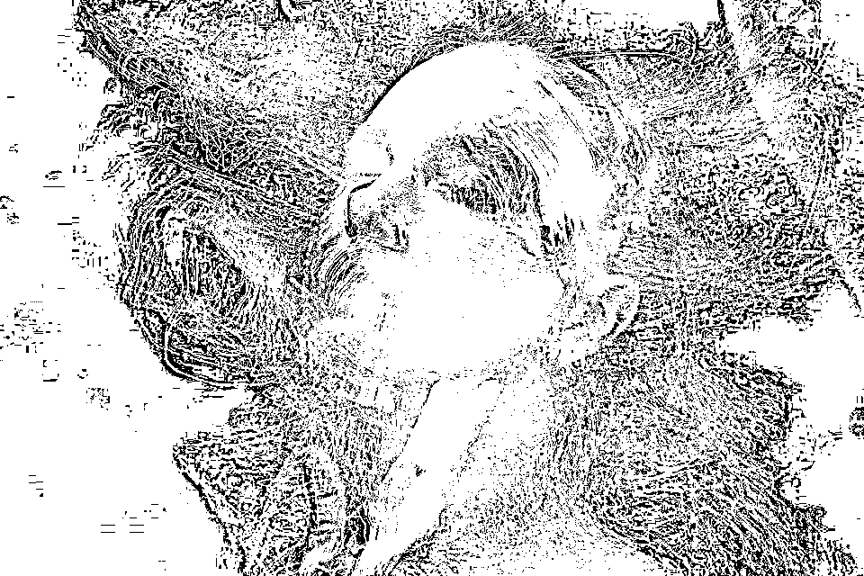

例如，约翰尼第四宫的双鱼座偶尔需要有一段无商量余地的绝对隐私时间，以培养他的创造力和灵性生活。如果他不能获得这些独处的时间，他很可能变得孤僻、喜怒无常，只会盯着电视机。

泰利需要了解，当约翰尼要求一些空间时，这与她的性格或他们的关系无关，她不需要感觉受到威胁。

另一方面，相比约翰尼出于本能就可以为她提供的情感满足而言，泰利在生活中还需要更多的条理、可预见性和情感支持。这去到了巨蟹座、处女座和摩羯座的领域，这三个星座在她的心理构成中非常突出。

在约翰尼看来仅仅是有些冒险但有趣的情况，可能会让泰利感觉是危险地失控。一点点尝试就会让她害怕得噤声，并用其中一个擅长控制的面具隐藏自己的恐惧。

如果要让她感觉足够安全到把内心的诗人展现出来，她首先需要打消很多顾虑。

约翰尼就是约翰尼，让他按照泰利的不安来改变自己的生活是错误的。但在占星师的帮助下，他可能第一次**认识到这些不安全感的真正本质**，并以更敏感的态度对待他的灵魂伴侣。

为了她？是的，当然，这种大度就是爱的本质。**同时也是为了他自己**——和一个心智正常的女人在一起总比和一个疯女人在一起生活更快乐。

**进一步研究他们各自的星图**，加入行星、宫位和其他技术细节，我们将在接下来的章节中展开。占星师可能会打通一条金脉：例如，泰利和约翰尼可能喜欢一起做园艺、旅行或学习一门外语。

那些共同的经历可能有助于他们在快乐的层面建立有力的纽带，把他们联结在一起——如果没有这些一起享乐的方法，那么只有受虐狂才能和灵魂伴侣保持长久的关系！

**找到加强和支持伴侣关系中天然乐趣的方法，和商讨解决那些不可避免的冲突一样重要**，在某种程度上，找到乐趣甚至可能更重要。对我们大多数人来说，让我们努力经营一段关系的是快乐，而不是抽象的灵性成长的承诺。

**这就是关系比对星图的领域，关于伴侣关系的占星学。**从以上内容你可以看到，我们的**目标是建立积极、有活力的伴侣关系**，我们不是算命先生。

**占星学可以引领你穿越这些爆发的状态**，让你平静，为你解惑，让你从在荷尔蒙的迷雾中走出来。如果你刚开始学习占星学，一些征象意义一开始似乎有点技术难度或有些抽象，坚持一下。

占星学没有什么神秘的，就是被译成了一种征象性简述的生活而已。它只是一门技术，**有明确的步骤和技巧**。

要使用占星学，你只需要运用自己的大脑。在几个小时内，你学到的就足够能帮到自己。经过几周的努力，你就能获得足够的技能可以开始帮助别人。

**版权声明：**本文由若道翻译发布，欢迎转发，反对抄袭。友号转载请申请白名单。

**END**

**斯蒂芬·弗里斯特**

若道签约老师。进化占星学的创始人之一，当今世界最有影响力的占星大师之一；1985 年，他凭借《内在的天空》一书获得职业占星师协会奖（Professional Astrologers Incorporated Award）。他四次获得占星界最高的占星学联合协会奖（United Astrology Congress Regulus Award）提名，2018 年获得轩辕十四教育奖。

****探索组合图永恒的三角——斯蒂芬工作坊报名中****

斯蒂芬说，我们的组合图表明无论什么状况我们都能熬过去。

**组合图也像出生星图一样有行进。**在工作坊中， 我们将**探讨一些特殊的技法和考量，来帮助伴侣们应对生活中的挑战和机遇。**组合图的推进会出现一些看似难以解决的复杂问题，斯蒂芬老师创造了一种解决这些问题的技法。他将在工作坊中阐述相关细节，基本的问题是：如你所知，要了解一个人 30 岁生日的推进，我们要看这个人出生后 30 天的行星位置。问题是，组合图与我们在占星学实践中使用的其他星图不同，组合图并不代表某一天的天空。记住，它是基于中点的。**那么我们如何从一个不存在的日期开始 "向下数 30 天"呢？斯蒂芬老师将为我们提供一个行之有效的答案。****点击下图了解更多详情******20 位来自世界各地的占星师****带来 19 场沙龙——新世界的觉醒****详情可点击下图**

**学习占星学****点击下图了解课程详情**

**微信又双叒叕改版啦，不想错过若道君的推送？**

**就把若道设为星标吧！**

**▼**

**喜欢就点一下“在看”吧！**

********报名直达入口********

# 斯蒂芬·弗里斯特工作坊丨探索组合图永恒的三角

> 原文：[`mp.weixin.qq.com/s?__biz=MzA5NjA0NTAxNg==&mid=2651484539&idx=2&sn=19bf1dad38b58ac3e00d36169a296d8d&chksm=8b48c3ccbc3f4ada308c0c81e204ba9c71a9cba29bdb37b5dd5b05f8c8ac7f8bd2fa1f16e0ab&scene=126&sessionid=1692737771#rd`](http://mp.weixin.qq.com/s?__biz=MzA5NjA0NTAxNg==&mid=2651484539&idx=2&sn=19bf1dad38b58ac3e00d36169a296d8d&chksm=8b48c3ccbc3f4ada308c0c81e204ba9c71a9cba29bdb37b5dd5b05f8c8ac7f8bd2fa1f16e0ab&scene=126&sessionid=1692737771#rd)

**1**

********斯蒂芬·弗里斯特老师若道独家三日线上工作坊********

斯蒂芬说，我们的组合图表明无论什么状况我们都能熬过去。

**2**

********此次授课内容********

**组合图描述了如何才能使两个人的关系一直充满活力。**这句话中隐含的意思是假设一段关系有一种区别于这两个个体的独立的生命。有时我们喜欢和一对伴侣共度时光，却从没想过单独见他们其中一人。我们从这对伴侣身上感觉到的 "频率"是对他们组合图能量的直接体验。在某种程度上，可以简单地理解为：**正如每个人都有自己的星图一样，每对伴侣也有他们的星图。**

从简单的描述层面上讲，这就是组合图的意涵。记住，我们可以将这一技法用于任何一种关系：**父母和子女、商业伙伴、朋友。**作为进化占星师，我们的目标要比单纯描述走得更深。解读组合图时，可以着眼于帮助人们，而不仅仅是使他们感到惊奇。对于个体来说，出生星图代表了一条正确的人生道路，一条承诺意义、活力、灵性目标的道路。组合图亦然，只不过它将一段关系看成一个独立的个体，而不是两个人。关系也有进化的路径：人们走到一起是为了学习和成长。个体如果没有领会自己出生星图的要点，会变得疲惫而沮丧。两个人也是如此，**如果没有抓住组合图的要点，我们就会对对方感到厌烦。这段关系似乎也会失去动力。**

伴侣常常意见不一，陷入困境，看不到前进的方向。三是一个更有动力的数字。三个人投票，二个人以多数票击败一个人，推动事情继续发展。**这实际上解释了这次工作坊的主题：永恒的三角。**

**每对伴侣其实都是一个三人组：你、我以及我们。**组合图所代表的那个看不见的 "第三人"经常会"投出打破僵局的一票"，使关系得以发展。**·** 但是如果组合图总是同意一个人的意见，而不同意另一个人的意见，怎么办呢？（这被称为"封建制度"）**·** 如果两个人都安静而保守，但他们的组合图却要求狂野的冒险呢？（这是 "文化冲击"）**·** 如果它同时均衡地反映了两个人的情况呢？我们可以称之为 "民主"，但我们仍可以区分出一个人天然的智慧比另一个人更强的领域，让擅长的人负责擅长的事，这会促进关系蓬勃发展。换句话说，我们开始看到这个技法的咨询维度了。我们将在这个工作坊中探讨这些内容。两个人究竟为什么会走到一起？**在严肃、复杂的关系中，我们可以假设两个人之间有一些未解决的业力。**如果他们在今生是恋人，但在前世中，一个是父母，一个是孩子呢？也许那些直觉和假设仍可以感受得到，极为错综复杂地使得他们在今生想要成为情侣。**这些疑问将我们引向组合图的月亮交点，在那里我们往往能发现当今人类任何伙伴关系问题的真正核心。**

**从理论上讲，组合图是基于中点的。**如果我的出生星图里太阳在摩羯座中段，而你的太阳在双鱼座中段，我们组合图的太阳就在水瓶座中段。换句话说，**在你和我的太阳的中间位置。****其他行星、月亮交点和中天也是如此。**其他宫头的位置，包括上升点则存在一些争议。通常的做法是仍然使用中点，但斯蒂芬老师将会解释他认为这样做存在的技术方面的问题。他更倾向于**使用关系最初开始的地点绘制星图，就像我们使用出生地来绘制出生星图一样。**

**组合图也像出生星图一样有行进。**在工作坊中， 我们将**探讨一些特殊的技法和考量，来帮助伴侣们应对生活中的挑战和机遇。**组合图的推进会出现一些看似难以解决的复杂问题，斯蒂芬老师创造了一种解决这些问题的技法。他将在工作坊中阐述相关细节，基本的问题是：如你所知，要了解一个人 30 岁生日的推进，我们要看这个人出生后 30 天的行星位置。问题是，组合图与我们在占星学实践中使用的其他星图不同，组合图并不代表某一天的天空。记住，它是基于中点的。**那么我们如何从一个不存在的日期开始 "向下数 30 天"呢？斯蒂芬老师将为我们提供一个行之有效的答案。**

并非所有的人都处于伴侣关系中，但**作为人类，就需要与其他的灵魂共舞。占星学能够极大地帮助人们驾驭复杂的关系。**了解我的星图如何与你的星图通过相位和宫位的交互而产生互动，是非常有帮助的。组合图包含了这些技法，提醒我们，整体总是大于各个部分之和，而又与之不同。

**3**

********斯蒂芬的占星著作********

**·** 1984 年-1988 年间，斯蒂芬写作出版了《内在的天空》（已有中文版）、《变化的天空》和《天空的伴侣》三本占星经典著作，奠定了早期在占星学界的地位。**·** 2002 年-2005 年间，他与朱迪·弗里斯特共同创作了两本经典的关系占星学著作《天空的伴侣 I：爱、性、和进化占星学》《天空的伴侣 II：组合图》。**·** 2008 年，斯蒂芬出版了一本非常重要的著作《昨日的天空》，此书是至今为止关于轮回转世跟星图的清晰对应最详尽的著作之一。 斯蒂芬前后一共出版了 12 部占星著作，在世界占星学界拥有很高的声誉。

**4**

********斯蒂芬获得的荣誉********

1985 年，他凭借《内在的天空》一书获得职业占星师协会奖（*Professional Astrologers Incorporated Award*）。1992 年、1995 年、2008 年、2018 年，他四次获得占星界最高的占星学联合协会奖（*UnitedAstrology Congress Regulus Award*）提名，2018 年获得轩辕十四教育奖。

**5**

********斯蒂芬的占星哲学观********

斯蒂芬的占星风格以**自由和选择**为中心，他的解读不是以下定论的方式来“预测”未来，他**强调如何改善生命，而不是宿命式的论断**。他以心理占星学的语言来解读星图上的人格部分，但是**通过南北交点及其相位和守护星来探索星图所揭示的前世业力与今生方向，在灵魂进化的背景里来整体解读星图。**他认为进化占星学的目的在于**鼓励人们做出更符合进化方向的智慧选择，我们学习去了解前世的时侯，关注点应该集中在如何通过意识来疗愈自己。**

**6**

**这些名人怎么说**

斯蒂芬让我们停止了玩责备命运的游戏，而开始看到自己是一个走在进化路途上的勇士。——奥普拉杂志“*O: THE OPRAH MAGAZINE*”

斯蒂芬和杰夫这两位著名占星师创造性地相互应和，展现出他们出色的教师才华，发展并弘扬了占星这门艺术。（对《测量天空：进化占星学和灵魂的钥匙》的书评）——著名心理占星师 现代占星之父 诺·泰尔（*Noel Tyl*）

请享用斯蒂芬和朱迪这两个博大的灵魂在此书中所提供的洞见大餐吧。（对《天空的伴侣》的书评）——进化占星学的创始人之一 杰夫·格林（*Jeff Green*）

我为斯蒂芬解读的精准感到惊叹，他强调没有一件事是坏得无法挽回的，也没有一件事是如此之好以至于它不会因为现在的错误判断而消失的。我怎样推荐他都不为过！——好莱坞著名影星“钢铁侠”男主角 小罗伯特·唐尼（*Robert Downey Jr*）

**7**

**上过课的占星师怎么说**

他关于我星图的解读，让几乎所有在场的人掉泪，我也从此开启了一段灵魂追寻的旅程。我很惊讶他透过星图可以如此深入一个人的灵魂。很多东西你自己都不知道，但是他讲出来你会发现，啊，这是真的，这是占星学的神奇。——《心探索》创始人孟想

每个来参加老师课程的同学，都会被老师深深的慈悲心感动。这种慈悲心，并不是表面上说的一些什么话，而是一种从意识层次上发出的能量。每个来上课的人，都能感受到老师的爱。这种爱，并不是盲目的爱，而是深刻地洞悉真相后的慈悲。

——斯蒂芬老师工作坊翻译逸月

斯蒂芬老师的一对一咨询已经排期到两年之后，我特别幸运，曾在课堂上被老师抽中分析过我的星图，老师充满爱与智慧的指引让我更加清晰的认识了自我。内在的潜能、需求和矛盾被老师娓娓道来。——禄丽荣斯蒂芬老师是位非常非常值得推荐的大师，很粉他，这位进化占星学的创始人，对人的理解是那么的全面完整、深刻洞见、慈悲和温暖，就这方面而言足可以媲美我无比崇敬的荣格和史坦纳（这两位去天堂里玩了）。如果你对西洋占星感兴趣，或者对人的所有角度、各个层次的真相和可能性感兴趣，推荐斯蒂芬老师的书和课程，特别是他的课程，数倍的功力大增的好机会，错过真是占星粉丝的莫大损失。——仁华

**8**

**2019 年工作坊学员感悟**

**9**

**什么人适合这门课程**

✦ 占星师或渴望成为占星师的人群。   ✦ 本课程并非针对初学者，需具备若道核心课程 level4 及以上水平，即了解星座、行星、宫位、相位、综合解读等知识。✦ 课程会涉及组合盘解读高阶内容，不了解相关知识的同学，请提前学习相关内容。

**10**

********授课老师********

**斯蒂芬·弗里斯特（Steven Forrest）**

**·** 进化占星学的创始人之一，当今世界最有影响力的占星大师之一；**· **毕业于美国北卡罗莱纳大学宗教学专业；**· **1984 年-1988 年间，写作出版了《内在的天空》、《变幻的天空》和《天空的伴侣》三本占星经典著作，奠定了早期在占星学界的地位。前后一共出版了 12 部占星著作，在世界占星学界拥有很高的声誉。**· **1985 年，他凭借《内在的天空》一书获得职业占星师协会奖（*Professional Astrologers Incorporated Award*）。1992 年、1995 年、2008 年、2018 年，他四次获得占星界最高的占星学联合协会奖（*United Astrology Congress Regulus Award*）提名，2018 年获得轩辕十四教育奖。**· **斯蒂芬将自己的绝大部分时间都花在教学以及个人咨询上，他于 1998 年创立了占星学徒计划（*Astrological Appretice Program*），这个计划致力于培养职业占星师；**· **至今为止已经有 600 余位学员完成了培训，其中很多都成为了优秀的职业占星师；**· **他是一位脚踏实地的导师，充满快乐和活力，亲和幽默同时又充满了智慧；**· **他的课程不仅仅是一次占星知识和经验的学习，也是一次与智者的相遇。

**11**

********课程费用********

**正价：6800 元****早鸟价：5800 元****早鸟价截止日期：2022 年 9 月 15 日**

**12**

********授课时间、方式、退转********

**授课时间：2022 年 10 月 14 日-16 日（周五、周六、周日）7:00-13:00****具体时间安排：****7:00-8:45****（15 分钟休息）****9:00-11:00****（30 分钟休息）****11:30-13:00**

****授课方式：******线上直播课，英文授课，中文翻译**

**课程退转：退款原则请详看《教学协议》，如有疑问请咨询课程顾问。**

****斯蒂芬工作坊 | 探索组合图永恒的三角****

**授课老师：斯蒂芬·弗里斯特**

**授课时间：2022 年 10 月 14 日-16 日（周五、周六、周日）**

**授课方式：******网络授课，英文授课，中文翻译****

**费用：**6800 元**（早鸟价：5800 元，截止日期：2022 年 9 月 15 日）**

**课程负责人：王老师**（微信/手机：18510107057，请备注“斯蒂芬工作坊”）

长按二维码添加课程负责人咨询

****报名直达入口****

# 周末树洞丨震荡氛围下的水瓶座满月，你有什么感受？

> 原文：[`mp.weixin.qq.com/s?__biz=MzA5NjA0NTAxNg==&mid=2651484461&idx=2&sn=8bf7960f29b4bb9126f32b0501572ee6&chksm=8b48c39abc3f4a8c945573874137fdf1495db9f5c6d2ac2e3c3d19f89c5faf72cf76a7962a59&scene=126&sessionid=1692737771#rd`](http://mp.weixin.qq.com/s?__biz=MzA5NjA0NTAxNg==&mid=2651484461&idx=2&sn=8bf7960f29b4bb9126f32b0501572ee6&chksm=8b48c39abc3f4a8c945573874137fdf1495db9f5c6d2ac2e3c3d19f89c5faf72cf76a7962a59&scene=126&sessionid=1692737771#rd)

**2022 年 8 月 13 日天象：**

*   **02:44 月亮进双鱼座**
*   ******太阳对分土星******
*   ******火星六分海王星、三分冥王星******

今天火星三分冥王星、六分海王星，延续了本周的紧张能量，不过好在月亮在凌晨进入双鱼座，经过一周的压力，终于可以松弛下来。这时候别给自己太多要求，想做什么就做什么，哪怕睡觉和发呆，都有让人”回血“的功效。你也可以在艺术、创意和心灵的世界中积极发挥这股能量，抽时间做做冥想也是不错的选择。
昨天的[【水瓶座满月】](http://mp.weixin.qq.com/s?__biz=MzA5NjA0NTAxNg==&mid=2651484401&idx=1&sn=6983d509093fe8d83f6dd1adb4c51113&chksm=8b48c246bc3f4b5079c2f9019e01e3d7aae6c094158de94e574fa0395f391d6b6bd7bbc480e3&scene=21#wechat_redirect)（点击查看文章）强调了一种直面真相的勇气**。**看到真实的自己，才有可能回归本心，走向真正的自我实现英雄之旅。同时，金星也进入了狮子座，开始一段新旅途。虽然压力重重，考验不断，但只要不停下脚步、一直不停地尝试和前行，我们最终会看到自己的目的地。震荡氛围下的水瓶座满月，你有什么感受？欢迎跟我们分享哦~ 周六快乐！我们明天见！**了解每日天象，可****下载“若道”APP 查看****还有更多精彩等着你哦**

# 黄金已反弹 7.68%，还会持续吗？| 梅里曼 9 月黄金报告上线！

> 原文：[`mp.weixin.qq.com/s?__biz=MzA5NjA0NTAxNg==&mid=2651484461&idx=1&sn=61e82c992f71bf6f16324cb12f7240cc&chksm=8b48c39abc3f4a8ca8fdf71aa0a9b58865e09c2c8b497fd542c1a676ac8241df65751260b404&scene=126&sessionid=1692737771#rd`](http://mp.weixin.qq.com/s?__biz=MzA5NjA0NTAxNg==&mid=2651484461&idx=1&sn=61e82c992f71bf6f16324cb12f7240cc&chksm=8b48c39abc3f4a8ca8fdf71aa0a9b58865e09c2c8b497fd542c1a676ac8241df65751260b404&scene=126&sessionid=1692737771#rd)

“**黄金是金钱。其他的只是信贷。**

**——约翰·皮尔庞特·摩根**

”黄金从 4 月 18 日高点 2003 美元跌到 7 月 21 日低点 1678 美元，跌幅达 16%。在 7 月 19 日发布的 8 月度黄金报告中，梅里曼老师说：**“我们还是倾向于将双底支撑区域 1673-1678（+/-25）作为主要支撑。”****“上周（7 月 4-10 日）金价跌至 1726，尽管这也可能是低点，但我们更希望看到金价在大约 3-6 周内下跌到更低的价位。”****“我们建议在未来 3 周内平仓所有空头，特别是在 1650-1725 左右有报价时，并且做多。”**从 7 月 21 日开始，黄金开始反弹。目前，黄金反弹至 1807，在不到 20 天的时间内，反弹幅度为 7.68%。

| 黄金日 K 线图

7 月 21 日，正好是报告指出的土星半四分木星的 1 个 1 星标记的反转时间。对于黄金的短线操作者，类似的 7%反弹其实还是大有盈利可为之处。不要小看 7%的反弹盈利，毕竟，这短期的操作远远高于 1 年期的定期存款利率。上个月的黄金报告还指出：**“我们将重点关注引言中所提到的 8 月 4 日+/-10 天和 9 月 21 日-28 日+/-1 周。这两个时间段都可能出现 16 个月周期的低谷。”**8 月 4 日+/-10 天是火星、天王星和月亮北交点合相四分土星期间，这个 7.68%的反弹我们已经看到。**问题是，反弹是到此为止，开始下跌知道 9 月 21 日-28 日+/-1 周反转；还是反弹继续直到 9 月 21-28 日+/-1 周呢？**9 月份黄金报告已经上线，上证报告也将在下周上线。欢迎了解。也可以按照季度和 1 年期订阅，有更多优惠。季度和年度的好处是，你可以持续了解梅里曼老师对于不断在变化的市场的看法。即便他某一次看法和市场不一致，你也看到在下一期他如何调整自己的看法，并看到金融占星在一个长期时间段内对你把控风险的帮助。而能够长期控制风险、尽量找到安全的投资时机才是投资的长久之计。点击阅读原文，雷蒙德·梅里曼黄金周期 2022 年 9 月报告带来有 40 年黄金市场研究经验的世界著名金融占星大师雷蒙德·梅里曼对当前黄金市场的研究。

**此外，6 月 23 日雷蒙德·梅里曼的《2022 下半年金融占星投资沙龙》，将帮助你对 2022 年下半年的市场风云变化加深了解。**

**扫描下图二维码了解详情**

▼

**投资有收益，投资有风险，希望金融占星学的研究帮助你更好地评估你的投资。**

**9 月黄金报告上线**

**黄金月度报告价格****单月报告**：280 元/月 **季度套餐价格**：780 元（260 元/月）**年度套餐价格**：2400 元（200 元/月）**双报告年度套餐更优惠（直降 900 元）****12 个月黄金报告+12 个月上证指数报告：仅需 3900 元****长按下图识别二维码购买黄金报告**
▼

**购买者需知**

**① **梅里曼市场时机学院《中国上证指数月度研究报告》是梅里曼市场时机学院（以下简称 MMA）的研究“预报”，而不是市场“预测”，是梅里曼老师及 MMA 金融占星分析师对人类活动周期历史与行星周期之间相关性的研究，二者在大部分情况下具有 80%或更高的相关性，而不是因果关系。报告中的研究完全存在错误的可能性。即便是非常认真的研究和几十年的研究经验，金融占星师无法总是正确地解读出各种征象在实际层面上会如何相互作用，并显化为事件结果。

所以请将报告看作一个研究参考，务必结合其他市场研究和你个人对市场的理解，根据你的自由意志做决策。

**②** 此报告一旦售出，**即不接受退款。**

**③** 上证、黄金月度报告每月固定 1 期，**并非都是在每月相同日期发布。**

**④** **我们收到英文报告的当天，即发布该英文报告。3 天后，上线报告中文版。此报告仅支持手机网页阅读，不支持电脑阅读和下载。****以上须知，请仔细阅读。一旦付款，即视为已了解并接受所有须知内容。**在过去的 40 年中，唯有梅里曼逐渐完善，并在梅里曼市场时机学院月度周期报告中阐释了将地球宇宙学与周期相结合的研究方法，以惊人的精确性预报了黄金价格发生重大变化的时间。**黄金购买 Tip**

各大银行均可购买黄金或黄金 EFT 基金，也可以在诸如天天基金或者支付宝购买黄金及黄金相关产品。不明白的可以百度搜索。

**购买后如何查看报告？**

**购买后有疑问怎么办？**请联系技术客服
**微信：nodoor201705**

**购买报告直达入口**

# 水瓶座满月 | 三阵交界，土星发威，许多年未见的天象来了！

> 原文：[`mp.weixin.qq.com/s?__biz=MzA5NjA0NTAxNg==&mid=2651484401&idx=1&sn=6983d509093fe8d83f6dd1adb4c51113&chksm=8b48c246bc3f4b5079c2f9019e01e3d7aae6c094158de94e574fa0395f391d6b6bd7bbc480e3&scene=126&sessionid=1692737771#rd`](http://mp.weixin.qq.com/s?__biz=MzA5NjA0NTAxNg==&mid=2651484401&idx=1&sn=6983d509093fe8d83f6dd1adb4c51113&chksm=8b48c246bc3f4b5079c2f9019e01e3d7aae6c094158de94e574fa0395f391d6b6bd7bbc480e3&scene=126&sessionid=1692737771#rd)

**☆ 后台回复“今日”，给你一句生命态度**

作者/王芝桦 编辑/玫瑰 图片/pexels

**水瓶座满月****北京时间 2022 年 8 月 12 日 9:35 迎来水瓶座满月，狮子座太阳与水瓶座月亮于 19°21′精准对分。**8 月刚刚走过上旬，却好似走了几年。世事无常，人之所见，不过沧海一粟。就像此次水瓶座满月的天象，说实话，即使写了这么多年的月相文章，但这样的天象我也是第一次遇见。满月总是推动一些事物呈现高潮或走向完结，希望此次水瓶座满月能够引领世界的乱局平稳下来，祈祷世界和平，祝愿众生平安。

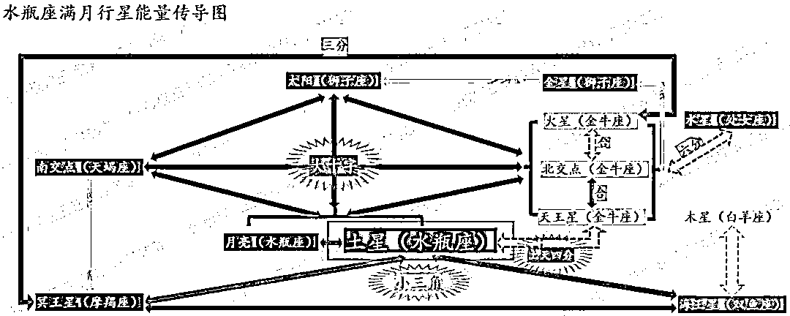

**水瓶座满月重点影响人群**

参考满月峰值影响期间各个行星的行进度数，以及逆行行星的轨迹影响；常规容许度，个人行星入相位 3°，出相位 1°；非个人行星入相位和出相位均为 3°。

**·** 出生星图中，有**行星、四轴、南北交点落入****固定星座（********金牛座、狮子座、天蝎座、水瓶座**************）**0°-5°，14°-30°**的人群； 

**· **出生星图中，有**行星、四轴、南北交点落入******变动星座（******双子座、射手座、处女座、双鱼座******）9******°-17°，19°-30°**的人群；

**·** 出生星图中，有**行星、四轴、南北交点落入****基本星座（******白羊座、巨蟹座、天秤座、摩羯座******）******0°-11°**，23°-30°**的人群。

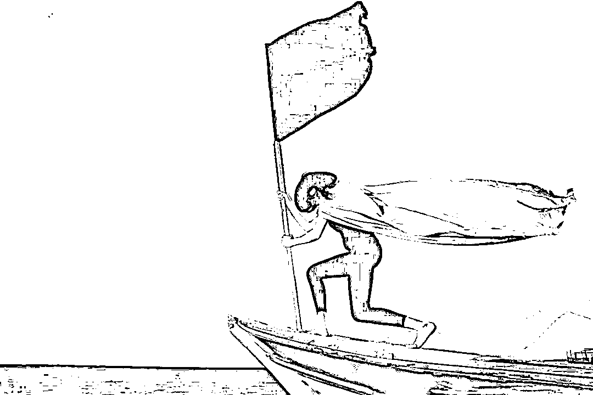

**三阵交界，土爹发威**

> ****天象：****
> 
> **· 固定星座大十字：狮子座太阳、水瓶座上“月亮与土星”的合相、天蝎座南交点、金牛座上“天王星与北交点”的合相，形成“固定星座大十字”结构。****· ******土天四分**：宽泛容许度下，水瓶座土星四分金牛座天王星。****· **冥土海小三角**：宽泛容许度下，摩羯座冥王星、水瓶座土星、双鱼座海王星形成小三角联动结构。**

半个月前，7 月 29 日的狮子座新月（详情点击：[狮子座新月](http://mp.weixin.qq.com/s?__biz=MzA5NjA0NTAxNg==&mid=2651482509&idx=1&sn=7e3731b7cd0d4dffa0f12de8058da204&chksm=8b48db3abc3f522cb22a164f9f340a3f625c8337504fcb4a54c18559f2f70072e56d4d76d819&scene=21#wechat_redirect)），开启了“固定星座大十字”结构的序幕。对，是序幕，**这个大十字格局将会影响整个 8 月的进程，而 8 月也注定是新老周期转换、不破不立进程中的转折点。**

故而，从 8 月开始，影响 2022 年下半年进程的三大结构板块，便成为观测的重点：**“固定星座大十字”结构、“土天四分”结构、“冥土海小三角”结构。**

时隔半月的此次水瓶座满月，合相水瓶座月亮的水瓶座土星，因在三大结构板块之中皆有其身影，便妥妥地站在了 C 位！

**1. 土星的时间功课**

土星，这颗代表着“时间法则”和“因果法则”的行星，制定现实规则，监督现实运行，进行现实考核。土星承载着地上的秩序和人间的生活，记录下时间线上的历史，沉淀出时间线上的经验，但同时也提醒着**历史与经验背后，亦有隐藏的限制**。故而，土星之外还有三王星（天王星、海王星、冥王星）。如果说土星能量还有地上的狭隘和人间的掌控，那么三王星就是超越地上人间的更为宏大、更为灵性、更为精微的宇宙能量——超越土星，才能进入更为灵性的境界；但是，不修好土星的功课，不过好红尘的生活，又谈何高维的意识和灵性的擢升？土星提示我们：没有捷径，不要想一步飞到楼顶，只有持续磨练才能越过挡在面前的挑战，只有主动担当才能收获成熟的实力；而在做到这些之前，我们会因内在的不自信而质疑自己的能力，会因内在的惰性而吸引外在的限制。**12 星座是一个循环发展的序列。土星踩着沉稳的步伐，每隔 2.5 年-3 年便转换一个星座，顺着十二星座的序列，提示我们不同阶段的“时间功课”**。比如：**· 2017 年 12 月 20 日-2020 年 12 月 16 日：**土星行进在摩羯座，这是现实格局开始变化的时期，提示我们校准自我定位并持续沉淀实力；**· 2020 年 12 月 17 日-2023 年 3 月 7 日：**土星行进在水瓶座，这是集体文明深化变革的时期，提示我们带着个人已经准备好的定位和实力，在“不破不立”的集体进程中重建个人化的根基与边界。故而，2022 年的现实境况，其实是一步步顺序演化而来，前期的努力与成长决定着当下的轨迹与境况。

**2. 三大结构板块，推动土星行动**

**“土天周期”44 年左右发生一次，天王星将会在每个周期中行进 6 个星座。****1988 年-2032 年的这一轮“土天周期”，从 1988 年土星和天王星合相于射手座开始；下一轮的“土天周期”将会从 2032 年土星和天王星合相于双子座开始。**故而，当下一轮“土天周期”中天王星的行进轨迹是**“射手座-摩羯座-水瓶座-双鱼座-白羊座-金牛座”**这 6 个星座，揭示出——**全新理念和创新科技开始入世，集体格局重新洗牌和个人根基重新界定的进程。****每一轮“土天周期”的 44 年轨迹，间隔 11 年便有一次重要结构，即敏感的能量释放点：土天合相，上半周期的土天四分，中间的土天对分，下半周期的土天四分。**“土天周期”中，土星和天王星是排序相连的两颗行星，但它们分别守护着“天上和人间”不同意识层面的大门：土星严守秩序，天王星剑走偏锋；土星建立边界，天王星解放天性；土星制定现实规则，天王星超越现实突现灵感；如果只有土星，人间毫无新意；如果没有土星，宇宙和人间毫无干系。故而，“土天周期”总是踏着“不破不立，边破边立”的韵律：土星记载历史，天王星发动变革；天王星推动创新，土星沉淀经验。**2021 年，水瓶座土星和金牛座天王星组成的年度重磅天象“土天四分”结构，是本轮“土天周期”（1988 年-2032 年）的最后一个能量释放点。**但是，这一次“不破不立，边破边立”的起点，却要从本轮“土天周期”的上一个能量释放点开始追溯。

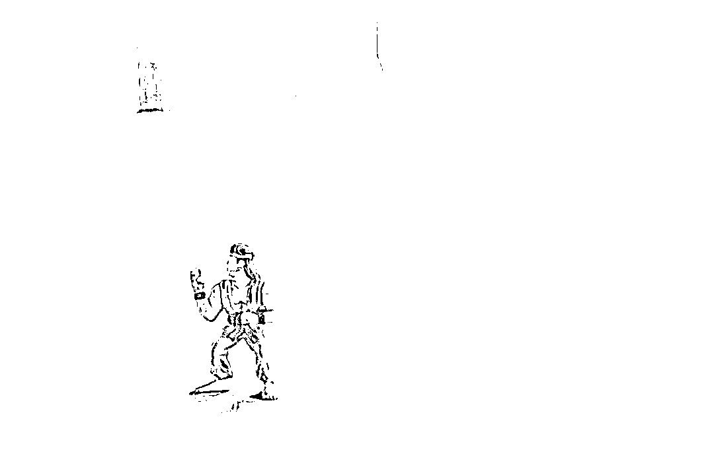

**“宇宙共时性”视角****· 土天对分：**2009 年-2010 年，处女座土星对分双鱼座天王星，意识、金融、科技同时觉醒，超发货币、次贷危机、房市泡沫同时发生；**· 冥王星：**2008 年-2024 年，冥王星行进在摩羯座的 16 年，推动着现实世界的快速发展，也激活了“执着结果”的业力真相，引领我们放下机械的追逐，寻回内在的初衷；**· 海王星：**2012 年-2026 年，海王星行进在双鱼座的 14 年，可谓“造梦”而后“梦醒”，经过一次又一次地缔造泡沫，又经过一轮又一轮地戳破泡沫，引领我们走进真相并回归本真；**· 天王星：**2019 年-2026 年，天王星行进在金牛座的 7 年，掀起一股“现实变革之风”，将那些看似稳定牢固、实则陈旧负累的结构一一瓦解；**· 土天四分：**2021 年，“不破不立”的清算进程覆盖全年；**· 南北交点：**2022 年 7 月 27 日，金牛座天王星与金牛座北交点精准合相，该组结构覆盖 2022 年整个 8 月，为“不破不立”的清算进程带来标志性的转折点，成为 2022 年度重磅天象之一；

**敲黑板！划重点！**

 三阵交界，每一局中皆见水瓶座土星的身影。

**· 土天四分**：2022 年，“土天四分”结构唯一一次紧密成相并精准触发，将会发生在 10 月上旬；7 月底开始，“土天四分”结构开始逐步显露影响；

**· 包含“土天四分”的“固定星座大十字”：**7 月底-8 月，天蝎座南交点、金牛座上“天王星与北交点”的合相、水瓶座土星这三个顶点都行进相当缓慢，意味着只要有行星进入狮子座 14°-21°范畴，“固定星座大十字”结构就会被彻底激活触发。

此次水瓶座满月，水瓶座月亮合相水瓶座土星，狮子座太阳对分水瓶座土星，满月的完结能量步入“固定星座大十字”结构；

**· 冥土海小三角：**宽泛容许度下，水瓶座土星与双鱼座海王星 4 月开始便形成 30°联动，水瓶座土星与摩羯座冥王星 5 月开始便形成 30°联动，摩羯座冥王星与双鱼座海王星 6 月-10 月形成六分结构。故而，4 月-10 月期间，“冥土海小三角”可以视为天象背景。

此次水瓶座满月，站在宇宙天象 C 位的水瓶座土星，可以说是接到了来自四面八方的能量信息。那么，时空大门敞开，又将如何应对呢？

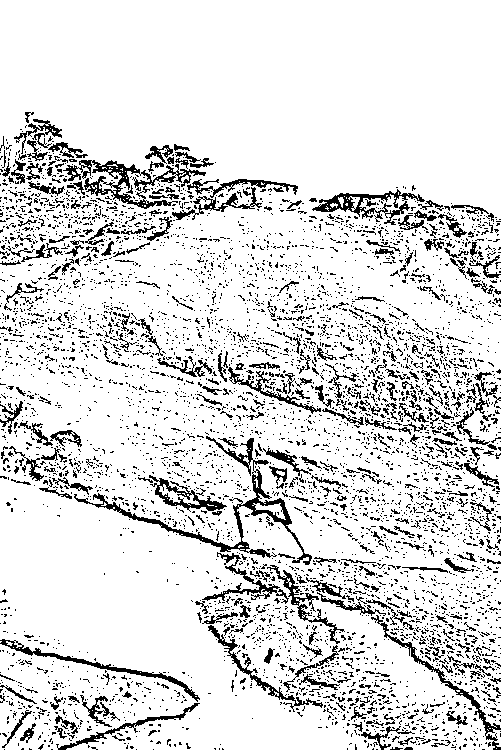

**3. 时空大门敞开，唯有躬身入局**

此次水瓶座满月，代表“时间法则”和“因果法则”的土星位于三阵交界，穿上“超越一己视角，倡导众生平等”的水瓶座的“太空服”！其实……并不好受。**心理层面的呈现****·** 他看着时间线上沉淀下来的成绩和经验，有些不舍。他恐惧现实将过往拥有的东西夺走，但他看着已经妨碍前进的东西又感觉挫败，而合相于金牛座的天王星和北交点正在催促他做出突破——简单一点，换个方法；**·** 紧贴月亮的他感觉时间越来越紧迫，内心的压力越来越沉重；他渴望像对面的狮子座太阳一样真实而快乐地生活，但现实的境况却又让他不知道从哪里突破困局；**·** 但是，土星教导我们做个诚实和成熟的人，对自己说实话，对未来做出承诺！既然时空大门敞开，既然改变不可避免，那么就躬身入局并持续向前；**· 我们可以有意识地调动土星的高阶能量：**不要缩在脆弱的壳中，不要停在恐惧的阴影下，去做！去行动！一点点地行动和尝试，就能一点点地摆脱陈旧和拥抱可能性；带着勇敢，拿出信任，无须猜测结果是什么，将结果交给时间，这可是土星最擅长的“时间法则”。**现实层面的呈现****· 改变：**现实总是制造出挑战和冲击，逼迫我们对那些不想变化和渴望稳定的部分做出改变。如果一定要改变，那么执拗地留在原地才是绝境；**· 自信：**自我质疑，没有力量……其实，自信都是做出来的，真的想不出来。你可以先照顾好自己的情绪，冷静下来，放空大脑，然后能做些什么就去做些什么，不要去想结果，去做才有沉淀；**· 经验：**经验肯定是有用的，但有两点决定经验的实际价值。一是，分享经验的人，分享的是善意和建议，还是说教和贬抑；二是，听经验的人，是在忙着吸收，还是在忙着否定；**· 斗争：**职场的管理层发生变动，权力的争斗开始白热化，互联网领域出现重磅新闻，国际首脑的动态再次引发热议。个人方面，保持低调，学会等待，避免站队，不当炮灰。

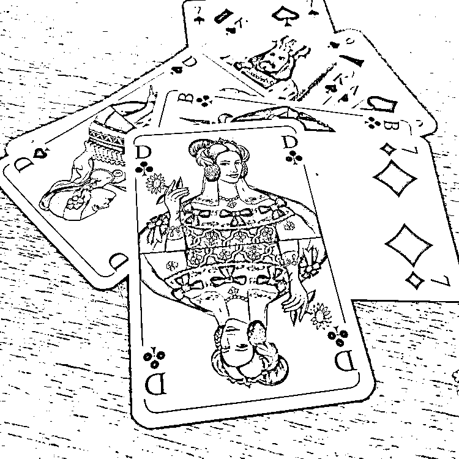

**寄语**写这篇文章的前夜，我做了一个有关“迷路”的梦：我在各种扭曲的梦境里寻找回家的路，荒诞，怪异，唯有一直不停地尝试和前行，最后还是自己做了架飞机，自己开着飞回到家里……我觉着这个梦很像此次水瓶座满月的感觉：有些时候，我们就像被笼罩在一张无形的大网之中，压力重重，考验不断；但是，你一定不要停下脚步，即使跌跌撞撞，即使前途未卜，但只要一直不停地尝试和前行，最终你总会看到自己的目的地。祝愿朋友们：灵魂要安好，身体要健康。

**版权声明**：原创文章由作者授权首发于若道平台，欢迎转发，反对抄袭。友号转载请申请白名单。

**END******想阅读更多作者的文章，********请在后台回复******王芝桦****** 即可。****

****王芝桦****

心理占星师，统合疗愈师，占星专栏作者

若道占星“新月和满月”专栏作者，腾讯视频特约占星师

全职于个案咨询与占星教学工作 18 年

**个案预约咨询微信号**：zhihua0621 

**微信公众号**：daoxi-life

**长按打赏**

********

**20 位来自世界各地的占星师****带来 19 场沙龙——新世界的觉醒****详情可点击下图**

**学习占星学****点击下图了解课程详情**

**微信又双叒叕改版啦，不想错过若道君的推送？**

**就把若道设为星标吧！**

**▼**

**喜欢就点一下“在看”吧！**

********报名直达入口********

# 沙龙回顾丨新闻中的经世占星学，及行星在国家星图中的含义

> 原文：[`mp.weixin.qq.com/s?__biz=MzA5NjA0NTAxNg==&mid=2651484401&idx=2&sn=b32c5edf4dc6ea56d858e79394a4b6e6&chksm=8b48c246bc3f4b5068b8956941f9d199669ed5b2622fd437689fd450dc34fb7c5f6968d46fcc&scene=126&sessionid=1692737771#rd`](http://mp.weixin.qq.com/s?__biz=MzA5NjA0NTAxNg==&mid=2651484401&idx=2&sn=b32c5edf4dc6ea56d858e79394a4b6e6&chksm=8b48c246bc3f4b5068b8956941f9d199669ed5b2622fd437689fd450dc34fb7c5f6968d46fcc&scene=126&sessionid=1692737771#rd)

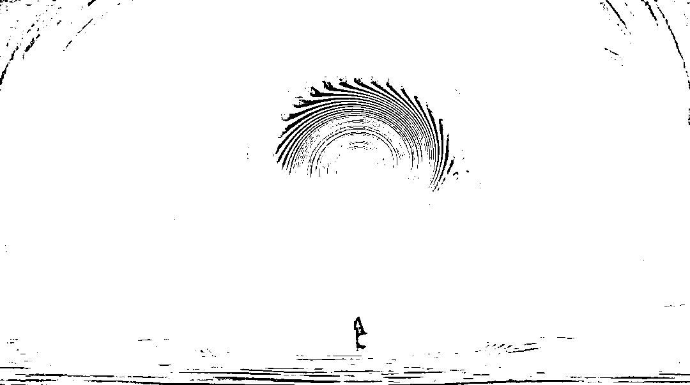

作者/艾德里安·邓肯沙龙记录/若道君编辑/翀子 图片/网络上周，我们举办了一场由艾德里安·邓肯老师带来的经世占星的沙龙，这个沙龙恰好是在火星合相天王星合相北交点的时候，大家反响很热烈。这里，我们摘录出了沙龙中的一部分内容分享给大家。另外，邓肯老师教授的[【ISAR 选修课：经世占星学 3 天线上工作坊】](http://mp.weixin.qq.com/s?__biz=MjM5MjQwNjAyMQ==&mid=2649440040&idx=4&sn=3c3b3c72526833e3ad666a4818dc6c60&chksm=beb9504289ced954b8b480d769d569a5320bd1782be32b197bbc98837fa142336787cf8cae00&scene=21#wechat_redirect)已上线，感兴趣的话可以点击链接查看详情哦~**前言**

大家晚上好。欢迎大家来到经世占星学的沙龙。**在八月底（26-28 日），我会给大家带来为期三天的经世占星学课程。**经世占星学其实是一个非常大的话题，其难点是如何对主题进行一些限制，因为其中有很多不同的面向。

如果学习占星学，我是没有办法想象我们不同时学习经世占星学，因为**经世占星学其实就是研究随着一刻一刻时间的变化，我们周遭的世界所不断展露出来或者发展出来的一种进程。**

通过经世占星学，不仅仅看到我们个人，还看到我们周围的环境、**更大的世界**的一些变化由这些行星的一些运行轨迹来反映出来。同时呢，我们可以看到，一个人跟政治之间的互相关联。

所以，其实我们从去研究周围的一些事件以及去把它关联到经世占星学里面，我们其实是可以学到很多。

****火天北交点合相下的世界大事****

经世占星学会让占星学变得非常有意思，**其实我们作为占星师，我们一直去研究，去看的就是行星的运行轨迹，**比如说一颗行星从一个星座换到另一个星座。

所以，当我们看到当一些重大的行星，像是天王星、冥王星换座的时候，比如说，今天我们就看到有一些不太常见、甚至是比较罕见的行星的组合突然的出现。

**我们看到现在 PPT 右侧的一张星图，这是昨天行星的位置，**昨天那个时候中国发射了火箭，长征五号火箭上天，但是出了一些问题，中国现在还没有具体说到底除了什么问题。据说有一些火箭的残骸掉入到其他的国家。这是被当下的火星、天王星跟北交点的合相反映了。

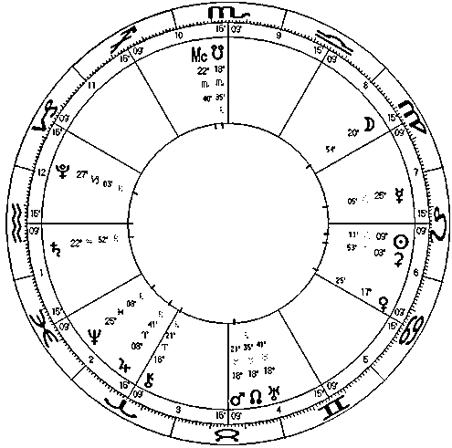

| 火箭发射时的星图

其实**火星跟天王星的合相每两年就会发生一次**，但是，火天合相同时，又合相了月亮交点是**比较罕见**的，上一次的合相发生在 2007 年，是 15 年前。但是，15 年的那前一次，不像我们现在看到的这一次，跟北交点合相如此精确，都是发生在 18 度。

那大家都知道，今天我们比较关注的一件事情是，美国众议长佩洛西会出访台湾，这个事情其实对于中国来讲是具有巨大的挑衅性质的，**我们可以联想到这是火星、天王星以及北交点的合相所对应的事件。**

**其实任何行星合相到南北交点，会带来更加放大的或者是全球性的影响。**火天的合相，再触发南北交点，增大了影响力，那佩洛西访台可能让美中之间的关系发生一些不平衡。

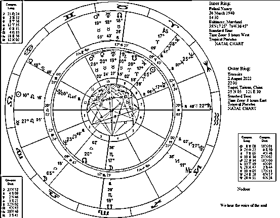

| 佩洛西访台星图

佩洛西自己的星图中，有金星跟天王星的合相落在金牛座的 19 度，她的月亮是在天蝎座 18 度，那她的中天也是在金牛座的 20 度或 22 度。其实现在天象当中的火天以及北交点的合相，正好是完全精准触发了佩洛西星图当中非常具有挑衅性的面向。

那这就是一个案例，我们作为占星师，会去想要看到火星、天王星与北交点合相的意义是什么。我们如果能够了解到一些，比如说现在新闻中出现的名人的星图信息，我们就能够去看到，什么样的人，会触发到现在火星、天王星与北交点合相的能量。

这个案例对应到了非常罕见的火星跟天王星以及北交点合相的一种展现，这样罕见的精准合相，我们要追溯几百年才会发现。

我们可以预期，在这个时刻，在地球上还会有很多其他的事情在发生，不仅仅是我们刚才提到的火箭残骸落入太平洋，以及佩罗西访台，还有一些其他的重大的事件。

| 佩洛西

比如说对美国来讲，当下非常重大的事情是基地组织的二号人物，刚刚被美军的无人机的炸弹给炸死了。

这个二号人物在过去 20 年当中都逃脱了美军的追踪，并且他之前也参与到了 911 双子塔的恐怖袭击当中，所以现在他被无人机的炸弹炸死了对美国人的意义是非常重大的，因为美国人非常喜欢看到他们的总统除去恐怖份子。

这个重大事件涉及到**无人机以及炸弹，也是非常符合火星跟天王星的征象。**这是我们刚才提到的火天跟北交点合相所对应到的第三个重大的事情。

最后，在今天或者说在昨天，因为俄乌战争引发了非常重大的问题，在乌克兰港口停泊的运粮船没有办法通过黑海、通过土耳其向非洲等地区运送粮食。

最近由于在土耳其的协商进展，各方都同意清除港口的炸弹和地雷，也可以去监督运粮船从乌克兰港口驶离，那我猜测呢，其实这是好消息，因为一部分事情的原因，跟火天合相在金牛座有关，这个征象也对应到了食物的供给。

比较幸运的是，**火天的合相跟在巨蟹座的金星之间有非常精准的六分相，**那么巨蟹座金星跟金牛座火星之间的六分相其实就可以对应到，**即使在一些比较危机的、危险的情境下，也可以达成一些共识。**

**通过刚才讲到的案例，我们会发现，看新闻也可以给我们带来很大的回报，因为经世占星学会去研究，去关心历史和新闻。**

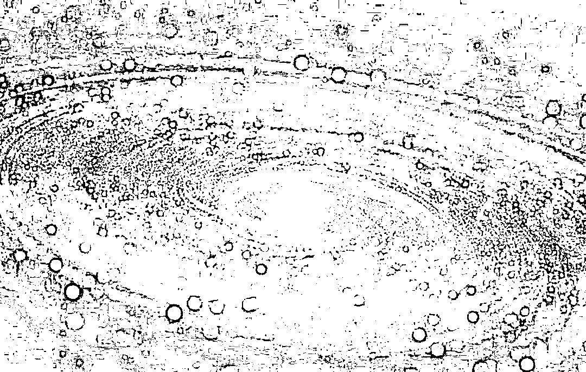

**行星在国家星图中的意义**

在今天的介绍性沙龙当中，我们会保持简单，我们基本上看一下美国的星图，再结合经世占星学的一些基本的原则。

**在经世占星学当中，主要研究国家，看看国家发生了什么。**

我们需要去看一下国家的建国星图。找到建国星图不一定非常容易，对于一些国家是容易的，像中国的话是 1949 年新中国成立，美国是在 1776 年独立，但是像英国，它经历了渐进式的演变和发展，中间发生了很多重要事件，英国的国家星图多达六个。

所以如果国家有比较清晰的诞生星图的话，对于研究还是比较幸运的。

找到一个国家的诞生星图是很棒的。另外还会有一些其他一些额外的辅助星图，比如说国家什么时候宣战，什么时候参与独立战争，或者国家的议会是什么时候成立的。

一般来说呢，我的原则是主要去参考，国家的人民去庆祝国家的独立日是哪一天，我们就更多用这个独立日的星图。

一旦我们有了国家的建国星图，其实我们也会发现，国家在诞生之后也会经历很长的演变过程。比如说美国，在独立之后呢，也是经过了 250 年，那 250 年间也会有很多事情发生，有不同的领导者上台。

**其实国家的领导者的星图，也可以代表在这个领导者执政期间，国家发生了什么。**如果我们能够得到领导者的非常精准的星图信息，是非常有帮助的。像美国的话，一般来说，美国的总统的出生信息都是很精准而且公开的，除了比如像希拉里·克林顿的出生信息好像有一些疑问。

如果我们能够拿到比较精准的国家领导人的星图，那确实真的很好，我们就可以去比较领导人和国家的星图，我们也可以期待说，在国家领导人的星图当中的一些行星的模式，其实是会在国家星图中重复出现的。不然的话，这个人也不会当选成为领导人。

**所以，当我们去看到国家星图中的行星，其实每一颗行星，都有它自己代表的一些事物，也非常有逻辑。**

比如说，国家星图当中的太阳代表国家的领导人，而不是代表国家的政府或者法院，太阳代表被选出来的领袖，或者说夺取政权的独裁者。太阳就是最有权势的人，比如说总统，或独裁者等等。

有的时候，一个国家既有总统也有首相，那时候总统更多是荣誉性的职位，真正掌权执政的是首相，这时，太阳其实代表的是真正掌权的这个人。

**国家星图中的月亮代表人民，代表人民的情绪和民意。**

国家星图中的月亮跟太阳是和谐的状态，比如中国的星图中的太阳和月亮是和谐的，那我们就可以预期说，国家的领导层会回应人民，人民其实也会很好地回应领导层。

**月亮跟太阳之间有良好的关系是比较重要的。**美国星图中的日月，其实是 135 度的关系，这部分我们之后还会做讲解。大体上讲，月亮代表人民的情绪，还有民意和民意的摇摆。

**国家星图中的水星，一方面代表了国家的交通系统、教育体系，另一方面水星也可以代表商业，国家整个的商业情况。**

像在美国的星图中，水星在 8 宫，并且对分了冥王星，代表他商业体系里面有很多非常秘密的金钱，也有很多非常有钱又很强势、强大的一些人，也会有一些幕后的腐败。特别是在政治层面，金钱是决定一切的，水星有非常强的跟商业的联系。

国家星图中的金星，其实我做过一些研究，去研究欧洲一些国家星图中的金星，其实是非常有意思的，因为从研究中，感觉到金星代表了女性的能量。不同的国家，对于女性能量的观点是不一样的，而且女性的地位角色也都是不一样的。

**国家星图中的金星，其实就会显示出女性是怎样的，以及女性的生活，还有关于国家的一些价值，那也对应到国家的经济等等。**

在美国的星图中，金星在巨蟹座。我其实去过美国很多次，我感觉对于美国来讲，理想的女性形象更多像是居家的母亲，好像母亲的形象大于一切，这是我个人的观点。

**那么国家星图中的火星呢，代表男性以及阳性的能量，也代表国家的战斗力**，这个国家的人有多愿意去战斗，或者是如果打仗的话会发生什么。火星还代表军火行业，特别是如果有火土相位的话，有非常重的军火产业。

美国星图中的火星在双子座，四分了海王星。在美国，对于男性的身份呢，是会有一些困惑的。美国其实也可以说是性少数人群文化的诞生地，在美国也有对于性别的流动性和灵活性，这也都可以反映对于男性或者阳性身份的一些困惑。

**国家星图中的木星，**显然代表着国家的法律和法庭，还有法院整个的法律体系，并且它也代表大学、高等教育，以及国家的信念和信仰体系，比如宗教的信仰，或者是形而上的一些信仰。

**木星同时也代表国家的特权阶层，**比如像贵族，或者像俄罗斯是寡头等等。美国的星图中，上升点在射手座，木星作为命主星在巨蟹座，是入旺、比较强大的状态。我们可以看到美国有非常强大的最高法院。

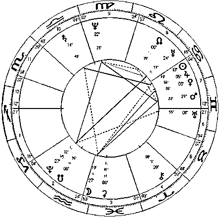

| 美国建国星图

**国家星图当中的土星，**它代表着国家的政府，比如说国家的议会、国会还有政党等等，是土星的层面。那另外的层面呢？它代表国家的比如说矿产业，还有传统上的土星也代表工人阶层，因为工人阶层之前总是被体制压制。

我们来到三王星了，**三王星代表影响国家的一些集体力量，**天王星代表的是现代科技，比如说国家的一些现代科技、新兴媒体、社交媒体、还有像是草根阶层运动，包括具有革命性质的社会运动等等，让国家进入到不稳定的状态的一些运动都是跟天王星有关的。

国家星图中的海王星，其实在美国的案例当中，非常明显，代表好莱坞还有媒体，也对应到一些帮助底层的人的社会体系，医疗、社会保障等等。

**海王星也代表国家运作过程当中的弱点**，比如说腐败和欺骗，海王星在美国的星图当中也是非常强大的，我们一会儿会讲到，因为美国星图当中有火星与海王星的四分相。

**最后是冥王星，**冥王星有时候代表一些比较积极的力量，比如说自动化、机器人 AI，用机器去代表人的过程。冥王星也会代表一些会破坏社会的力量，特别像是恐怖主义。

经世占星学真的是很有意思的。**我们可以通过星图去理解国家、国家的个性、国民的特质。**

**版权声明：**本文由若道翻译、整理发布，欢迎转发，反对抄袭。友号转载请申请白名单。

**END**

**艾德里安·罗斯·邓肯**

若道签约老师，哥本哈根占星学院院长 1985 年开始成为全职占星师，是人本主义占星、卜卦占星和经世占星学领域的知名占星师。开发了占星软件 AstroClock 和多款占星报告。

**大国命运：经世占星学 3 天线上工作坊**

**一个好的占星师必须要懂得时代的声音，必须要洞悉全球的趋势，必须要懂得国家的故事。**

在这个工作坊中，我们将学习**如何专注于能够理解世界大事并对它们做出准确的预测。**这将带领我们踏上**一段重要的行星周期之旅，并延伸到重要国家和世界领导人的星图。**现在正是学习的好时机！

2020 年 12 月，木星与土星合相，这是 800 年来这两颗行星首次在水瓶座合相，预示着地球以及政治和社会趋势将发生巨大变化。我们正在进入一个令人兴奋的奇境，非常适合探索经世占星学。

**点击下图了解更多详情**

**微信又双叒叕改版啦，不想错过若道君的推送？**
**就把若道设为星标吧！****▼**

**喜欢就点一下“在看”吧！**

********报名直达入口********

# ISAR 选修课 | 大国命运：经世占星学 3 天线上工作坊

> 原文：[`mp.weixin.qq.com/s?__biz=MzA5NjA0NTAxNg==&mid=2651484401&idx=3&sn=f90136ae4ce945b9967844ed5e9a7445&chksm=8b48c246bc3f4b50fbf7c5497f71b2368d9a3bc3e9335574f954f05fc33f9425d779b6c8aaea&scene=126&sessionid=1692737771#rd`](http://mp.weixin.qq.com/s?__biz=MzA5NjA0NTAxNg==&mid=2651484401&idx=3&sn=f90136ae4ce945b9967844ed5e9a7445&chksm=8b48c246bc3f4b50fbf7c5497f71b2368d9a3bc3e9335574f954f05fc33f9425d779b6c8aaea&scene=126&sessionid=1692737771#rd)

<mpvideosnap class="js_uneditable custom_select_card channels_iframe videosnap_video_iframe wxw_wechannel_card_horizontal" data-pluginname="videosnap" data-id="export/UzFfAgtgekIEAQAAAAAAfGQB6vQCmQAAAAstQy6ubaLX4KHWvLEZgBPEioJES3BsLK2DzNPgMIsb3nmx3ZXbJKLT1wm45TIu" data-url="https://findermp.video.qq.com/251/20304/stodownload?encfilekey=rjD5jyTuFrIpZ2ibE8T7YmwgiahniaXswqzJqIdveK37RFTeWicFUib7AWD2xnn8iahx0rpMszBgKBAtKicWHDyVeXoOJHYevZXkhfJkmNmz7Efd0DcYdUekYnarA&amp;adaptivelytrans=0&amp;bizid=1023&amp;dotrans=0&amp;hy=SH&amp;idx=1&amp;m=&amp;scene=0&amp;token=AxricY7RBHdVQsXFuaGib0g8Jumv41gZ9xiajOXct5c2j4asexzhVdKzpPLQVlyibSYXZzHGtBVeLmQ" data-headimgurl="http://wx.qlogo.cn/finderhead/PiajxSqBRaEJYnVsqWfEX9qA0sI6hNVKsDfyzfPZ92WZMZyBpZWU5NA/0" data-username="v2_060000231003b20faec8c4e68a1ec2d4ca07e434b07755bbf47e7053a3059defd2c9d6c68a20@finder" data-nickname="若道" data-desc="#ISAR 选修课 经世占星学是什么？会教授哪些知识内容？8 月经世占星工作坊，来提前了解一下" data-nonceid="3653579416430381618" data-type="video" data-width="640" data-height="368"></mpvideosnap>

有一些岁月经历的人，会非常清晰地看到，我们每个人的命运都和国家的命运紧密联系在一起。

以俄国人为例，不论每个俄国人有什么样不同的个人星图，31 年前的苏联解体，今年发生的乌俄战争这样重大的事件，毫无疑问影响了俄国 2 代人的命运。而在一些关键时间点个人的选择，毫无疑问，又影响了个人的生命历程。

而只要你关注世界局势，你也会看到，这样的一个国家发生的重大事件又会对其他国家的各个方面发生重要影响。

我们的命运、我们所获得的事业的发展机会、我们的财富机会都是和整个时代和国家息息相关。

**因此，一个好的占星师必须要懂得时代的声音，必须要洞悉全球的趋势，必须要懂得国家的故事。**

在这个工作坊中，我们将学习**如何专注于能够理解世界大事并对它们做出准确的预测。**这将带领我们踏上**一段重要的行星周期之旅，并延伸到重要国家和世界领导人的星图。**现在正是学习的好时机！

2020 年 12 月，木星与土星合相，这是 800 年来这两颗行星首次在水瓶座合相，预示着地球以及政治和社会趋势将发生巨大变化。我们正在进入一个令人兴奋的奇境，非常适合探索经世占星学。

邓肯老师说：

****

**学习经世占星学，我们可以依靠占星师们过去使用一些技法所做的预测，我们将在这个工作坊中进行探索。**

**比如：占星师迈克尔·贝金特在 1982 年，苏联解体事件发生 7 年前，就对苏联做出如下预测：**

**“从 1989 年 1 月到 1991 年 11 月……在领导和统治风格方面……国家将进行一些基本的重组。这一时期将预示着一些新的革命……严密的控制结构将失败，国家将崩溃，重新回到过去的众多自治国家。”**

**而占星师罗伯特·佐勒在世贸中心遭到袭击前一年的 2000 年写道：**

****“从 9 月份开始，我们西方正进入一个危险加剧的时期……尤其是在东海岸……这将招致乌萨马·本·拉登等冒险家的劫掠……这是一个警钟……2001 年 9 月第一次大危机袭击美国之后，我们将再也回不到从前了。”****

**在 2020 年美国大选前 6 个月，我也写了一篇文章：**

****“他（唐纳德·特朗普）将战斗到底，美国的街道将成为战场，他不会优雅地离去，但在 2021 年，一个新时代开始了，大海将覆盖特朗普总统任期的废墟。”****

出生星图和经世星图都使用相同的基本占星技法，对每一个主题的研究都同时丰富了这两个分支。你从观察世界大事中学到的东西，可以应用到个人客户身上，反之亦然。

**工作坊内容和时间安排**

**8 月 26 日 周五 **

**14:30-15:30**

**1. 基础知识介绍**

-外行星及其在各个星座运行

-外行星周期

-国家星图

-政治领导人星图

-选举星图

-将以上各项按优先级排序

**休息 30 分钟**

**16:00-17:30**

**2. 外行星及其在各个星座运行**

-天王星入座：革命性的变化

-海王星入座：意识的转变

-冥王星入座：危机与重生

**休息 90 分钟**

**19:00-20:30**

**3. 木星-土星的合相周期**

-文明的发展

-水瓶座新电子化时代

**休息 30 分钟**

**21:00-22:00**

**4. 木星与外行星的互动**

-木星-天王星：科技进步

-木星-海王星：媒体的力量；消融，受苦和慈悲

-木星-冥王星：意识形态极端主义

**8 月 27 日周六**

**14:30-15:30**

**5. 了解社会趋势**

-土星-天王星：新的如何取代旧的；科技重组

-土星-海王星：乌托邦梦想破灭；结构消融

-土星-冥王星：独裁与权力瓦解

**休息 30 分钟**

**16:00-17:30**

**6. 长期文明变革**

-天王星-海王星：新世界秩序的梦想

-天王星-冥王星：机械的变革力量；剧变

-海王星-冥王星：意识变化的 492 年周期

**休息 90 分钟**

**19:00-20:30**

**7. 20 世纪地缘政治力量的影响**

-俄罗斯、苏联时代及其衰落

-美国的故事

**休息 30 分钟**

**21:00-22:00**

**8. 中国**

-中国作为全球玩家出现

-科技、领导力和一带一路

**8 月 28 日周日**

**14:30-15:30**

**9. 行星推进的重要性**

-预测选举的结果；特朗普 - 拜登

-预测国家的发展：以色列

-美国：扩张与收缩

**休息 30 分钟**

**16:00-17:30**

**10. 有多张星图的国家**

-英国

-法国

-沙特阿拉伯

**休息 30 分钟**

**19:00-20:30**

**11. 统治者的出生星图**

-普京：克格勃军人，2020 年代的发展

-特朗普：虚假信息之王，获胜者与失败者

**休息 30 分钟**

**21:00-22:00**

**12. 21 世纪的世界发展**

-新时代的人口和气候变化

-独立与全球化

-宗教与科学

-人际关系与游戏

**授课老师**

**艾德里安·罗斯·邓肯（Adrian Ross Duncan）**

**·** 邓肯老师 1971 年在印度游学时开始学习占星学，1985 年开始成为全职占星师，迄今执业已超过 33 年，是人本主义占星学、卜卦占星学和经世占星学领域的知名占星师。

**·** 开发了占星软件 AstroClock 和多款占星报告。

**·** 从 1971 年开始研习佛学，受佛学影响很深，他相信占星学和佛学观点统一、转化的一个基础是在于对现实感知的改变。

**授课方式**

**授课方式：**

**线上网络直播课，英文授课，中文翻译**

**课程价格**

**课程价格：**

**6800 元**

负责人：若道-童童

（微信：nodoorDaivd）

**退转课程**

**退款原则请详看《教学协议》，如有疑问请咨询课程顾问。**

****ISAR 选修课 | 大国命运：经世占星学 3 天线上工作坊****

**授课老师：******艾德里安·罗斯·邓肯****

**工作坊时间：2022 年 8 月 26 日-28 日（**周五-**周日）**

**授课方式：******网络授课，英文授课，中文翻译****

**费用：****6800 元**

**课程负责人：童老师**（微信：nodoorDaivd，请备注“经世工作坊”）

长按二维码添加课程负责人咨询~

****报名直达入口****

# 当一个人逐渐“瓶”化是怎样的体验？

> 原文：[`mp.weixin.qq.com/s?__biz=MzA5NjA0NTAxNg==&mid=2651484258&idx=1&sn=19e39d2fa0467d9d47ffea8cc572f842&chksm=8b48c2d5bc3f4bc31a7b9312cd04a00d1ec5f0b5f068fbab0f2a2762ac5784bb9b30d1786103&scene=126&sessionid=1692737771#rd`](http://mp.weixin.qq.com/s?__biz=MzA5NjA0NTAxNg==&mid=2651484258&idx=1&sn=19e39d2fa0467d9d47ffea8cc572f842&chksm=8b48c2d5bc3f4bc31a7b9312cd04a00d1ec5f0b5f068fbab0f2a2762ac5784bb9b30d1786103&scene=126&sessionid=1692737771#rd)

******☆ ****后台回复“今日”，给你一句生命态度******

作者/大卫·瑞雷 若道占星创始人

译者/聆宇 cora
编辑/玫瑰 图片/pexels 本文节选自大卫·瑞雷著作《一生的旅程》

水瓶座不仅不同于其他 11 个星座，甚至每个水瓶座都是不同的。如果有可能，你这一生一定想要成为一次“水瓶座”，去体验他们体验到的人生！“来看看大卫老师来解读“瓶”化的体验~另外，大卫老师参与授课的【[ISAR 认证职业占星师文凭课程](http://mp.weixin.qq.com/s?__biz=MjM5MjQwNjAyMQ==&mid=2649440030&idx=8&sn=4ce859d104638437c7f91c4c95471d01&chksm=beb9507489ced962e0429b09e6855feeefc9f3041b4224b399a338b3fa02718b9800894d4b3f&scene=21#wechat_redirect)】报名中，点击链接了解更多详情！

**水瓶座：我要酷！**

**每个人都想要变得很酷。酷，酷，酷……聪明就是酷，非常聪明就是非常酷。发明创造是酷。原创是酷。 **水瓶座的詹姆斯·迪恩发明了“酷”；他是上世纪 50 年代好莱坞的第一位叛逆偶像。

保罗·纽曼很酷，他甚至还因为参演了一部名字中带有“cool”的电影《黑狱喋血》（Cool Hand Luke）而获得奥斯卡奖最佳男主角的提名。 

每个人都认为瑞德·巴特勒很酷，他的扮演者是充满传奇色彩的克拉克·盖博，在经典影片《乱世佳人》的结尾，他对思嘉丽说：“坦白说，亲爱的，我根本不在乎！”

即使是做总统也可以很酷，就像罗斯福总统在大萧条时期呼吁美国人民要“酷”，他说：“令人恐惧的是恐惧本身。”这些人全是水瓶座。

曾主演著名美剧《老友记》的演员詹妮弗·安妮斯顿就很酷，而该剧的剧名就非常“水瓶座”。

奥普拉很酷，她将美国女性从妄自菲薄和被情感奴役的消沉意识中解脱出来，她对美国女性的影响超过了争取美国妇女参政权的苏珊·安东尼，她曾为美国女性争取投票权。这几位女性都是水瓶座，还有著名的女权主义作家杰梅茵·格里尔也是水瓶座，她在自己的著作《被阉割的女性》（The Female Eunuch）中写道：**“安全感是对生命的否定”**，这真是水瓶座的最佳宣言。如果你还不确定她的意思，那么她还说过这样的话：**“身份地位不应该以吸引和诱惑男人的能力来衡量。”**喜剧演员、脱口秀主持人艾伦·德詹尼斯说：“我个人喜欢成为独一无二的人。我喜欢做我自己，喜欢有自己的风格，喜欢有自己的想法，喜欢用自己的牙刷。”我们可以称之为“酷”的古怪面……

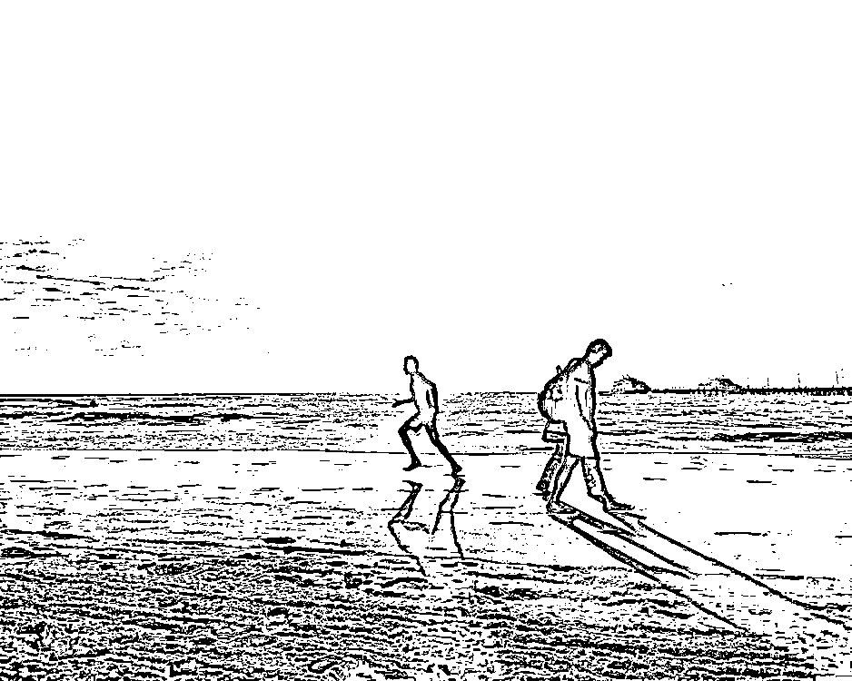

**水瓶座与狮子座**

**独特、原创、发明、别具一格、古怪、与众不同、叛逆、反抗、不墨守成规，这都是典型的水瓶座特征。**

水瓶座人也常常被形容为**人道主义者，具有社群意识，渴望参与到团队和团体中，并做出贡献**。这种社会意识和参与性乍一听与水瓶座的个人主义和叛逆性格格不入，这种矛盾会把水瓶座人逗乐，他们是最不喜欢被模式化定义的星座。

但是，占星学学生想要理解这个星座就需要暂停一下，将目光投向它在黄道带对面的星座——**狮子座**！

每个黄道星座不仅是前一个星座的发展进化，也“制衡着”它对面的星座。狮子座是**最欣赏个人创造性表达**的星座，就像自信满满又充满荣耀感的小孩一样昂首阔步地走在人生的舞台上，早期的占星学书籍中将这个星座的原则定义为**“我是”**。

**狮子座能意识到自己在“被注视”，但狮子会太过沉浸在自己的表现里，任何不能服务于他们的“表演”的事物都会被无视、略过，或被讨厌地推开。**水瓶座所代表的**客观性**平衡了狮子座的自我中心和主观。“是的，你是特别的，”水瓶座对狮子座说：“但每一个人都有他们自己的特别之处。”水瓶座象征着**“个人与群体”的关系**，星图中水瓶座能量显著的人会关注“我”与“他们”的关系。因此，没有任何星座比他们更关心**自己的个性如何融入社会**，也没有任何星座比他们更**抗拒盲目服从**。

水瓶座可以同时**既“融入”又“抽离”**。**水瓶座的天才和原创能力，以及他们的客观见解和理性贡献，正是源自这种“融入”和“抽离”之间的张力。**

要记住，水瓶座是从白羊座到双鱼座的旅程中的最后一个风象星座，它比其他两个风象星座（双子座和天秤座）更具备智能上的优势。水瓶座是唯一的“固定”风象星座，因此**有更强的力量去坚守一种理念，只要这种理念已经形成完整的框架体系。**

**他们会通过热切的观察讨论来发展自己的理念，并且在这个过程中会非常在意获得志同道合者的支持，不管那是朋友还是陌生人。**

星图中太阳落在这个酷酷的星座的人，可能会让气氛一下子冷下来；你们可能会不管好坏地固执己见，唯有经历一番艰难或面对更富智慧的辩驳，你们才可能勉强低头。水瓶座的很多人都非常“睿智”，但这里也存在一种有趣的反讽。聪明绝顶的智者偶尔也可能有自负的表现，这也就是占星师杰夫·焦耳所说的“精英的平等观”，他在暗示**水瓶座所要求的“平等”指向他人而非自己**。

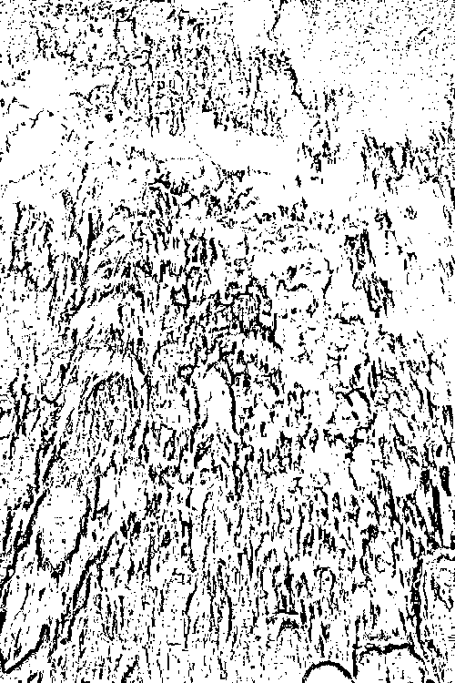

或许就智力上的优越感来说，太阳水瓶座会比月亮和上升水瓶座表现更甚——这是一种狮子座的感觉，因为狮子座的守护星就是太阳。但是，水瓶座也是**最佳的社会观察者**。他们具有**极佳的抽离视角**，许多水瓶座都是天生的**社会学家、人类学家、社会意识作家，或社会改革家，有时候甚至是经济学家**——所有这些角色都在探索人类社会的模式和不平等性方面非常有洞察力。**水瓶座：抽离与融入**

水瓶座**渴望为社会做出贡献**，这促使他们投身到一些社会运动中去，通常涉及到某些团体，这些团体或组织通常带有某种“革新”的性质，也可能有些混乱无序，或是尚未形成权威或阶级。 

亚伯拉罕·林肯是第一位共和党总统，共和党是从老辉格党中诞生出的一个新的党派。当然，社会变革可能趋向解放也可能趋向保守。

前总统罗纳德·里根重塑了共和党，使之成为美国 1980 年代保守运动的旗手，2008 年共和党副总统候选人莎拉·佩林成为极端保守的茶党运动的宠儿。

佩林喜欢自己作为“标新立异”的政治家的角色，标新立异的意思是**“个人主义”和“不是一般或典型的主流候选人”**，这也是里根在其政治生涯的大部分时间里对自己的评价。

与水瓶座的反讽相符的是，里根和佩林的言辞表现都有“草根”的风格——就好像在说：**“我和你们一样就是个普通人”。**

想一想托马斯·爱迪生的话，“国王的垂青”也无法取代他与普通工人的友情。我们再一次看到了对狮子座国王的拒绝，以及对劳动者的身份认同。

虽然爱迪生因为他在新泽西的实验室（工厂）而被称为“门洛帕克的巫师”，但他能够与为他做事的人们相处融洽——与“他们”一起工作，一起放松，启发他们思考。

爱迪生是一位天才，却几乎没有受过正规教育。但他却是首位应用大规模生产原则的发明家，将大型团队合作应用在他的发明创造过程中，他的实验室是最早的工业化实验室之一。

**非常理想的是，水瓶座能将原创性、客观理智与渴望做出贡献的迫切冲动、激励团队协作的天赋结合在一起。**此外他们还愿意去**冒险，不走寻常路。**

查尔斯·林德伯格是第一个独自飞跃大西洋的人；查尔斯·达尔文用他的进化论重塑了自然科学；作家儒勒·凡尔纳描绘出了一个充满奇异发明创造的未来世界——如今大部分已经成为现实。

其他著名的水瓶座人还有：冒着巨大风险拍摄电影《南京！南京！》的电影导演陆川，企业家王石，演员、歌手陈坤，以独特视角报道了自己所处时代的灾难和战争的记者、作家萧乾。

**另外还有 197**6 年诺贝尔物理学奖获得者丁肇中，中国最早的计算机科学家之一李华天**，****“汉字激光照排之父”**王选。

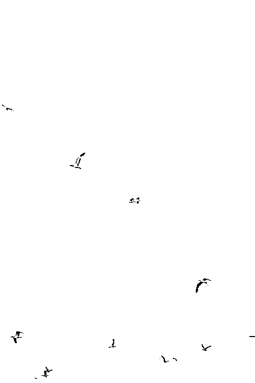

水瓶座的你，或许挺愿意加入这个水瓶座俱乐部，但或许也无所谓吧。你可能根本不在乎呢？可能有很多事你都不在乎。也许你觉得自己那么酷，有什么好在乎的。真的吗？好吧，那么你在乎什么呢？所有事？还是什么都不在乎？

水瓶座的阴影面就是**“疏离感”**。疏离就是**极端的超然，甚至连“自我”似乎都变得很遥远——不重要。**在心理学中，“疏离感”被定义为一种**由于无法融入社会而造成的人格解离，其特征是长期抑制情感**。

这种置身事外或“远离”的感觉是一种常见的水瓶座体验，会很自然地随着对事情的参与程度和友情的影响而产生波动。但是，疏离感代表着**“极端”**。注意一下心理学上对疏离的定义，包含了三件事：

**· **人格解离；

**·** 难以融入社会；

**·** 长期压抑情感。这三个议题都与水瓶座的痛苦和阴影面相关，源自人生早期形成的模式。**水瓶座的事业建议**

水瓶座也会流下泪水！他们可能徘徊踌躇许久，然后砰的一声——水闸被打开！**每个人都有隐藏的痛苦，但是没有任何星座能像水瓶座这样出色地隐藏自己的痛苦——用他们的聪明才智、理性和借口。**

但是，最终他们还是需要做出贡献，让这个世界变得不同——他们的参与，让自己与世界都变得更好。

如果你是水瓶座，**自己做企业**是个不错的选择——对于你们中的许多人来说简直是种必须！不过，**如果公司能够给你足够的自主权，你也可以在别人的企业中获得满足感。找到一个适合自己的组织或团队**对你非常重要。

在加入一家公司之前，你要仔细观察他们是不是真的合你胃口。探索“公司宗旨”背后细的节：他们对员工的态度是怎样的？他们是否真的鼓励创新？他们的决策机制是怎样的，是否允许员工发声？他们是有森严的等级观还是更平等待人？

基本上，你需要找一个**具有长远眼光的机构，他们欢迎你的加入，赏识你的独特想法，能够提供自由创新的平台。 **水瓶座的剑走偏锋可能让他们冒些风险，但往往也能赢得出其不意！企业家王石在 33 岁时辞掉了稳定的工作下海经商，做饲料生意。当时由于媒体报道鸡饲料中有致癌物，导致王石手上的几千吨玉米无法出货，加上台风天非常潮湿，他的玉米积压在货车里濒临变质。

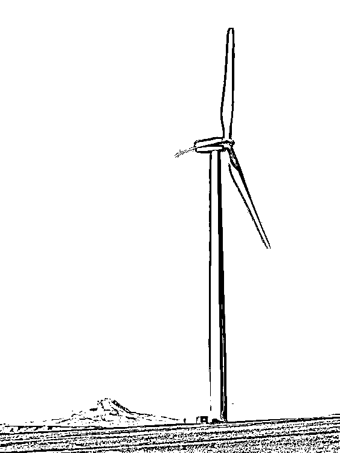

凭着过人的远见和胆识，王石做出了一个惊人的决定，他反其道行之，大量买进受舆论影响而降价的玉米，并说服玉米供应商让他可以延期 100 天再支付。

果然在一段时间之后，媒体承认之前关于饲料中有致癌物的报道有误，原料玉米供不应求，王石储存的 7000 吨玉米全部卖出，他凭此赚到了人生的第一桶金。

37 岁时，王石进入房地产市场，最终将他的公司打造成了行业的“潮流引领者”和“风向标”，他以此区别于那些所谓“行业大佬”的称号。

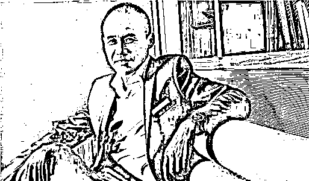

| 王石**水瓶座不喜欢站到领导人的位置上被崇拜和美化，这种反感的根源在于，害怕自己变得腐败、落后。**对你们中的很多人来说，如果所在的机构或公司充满内部的政治斗争，不再推崇创新，你们会感到相当无聊和烦躁。你们对身份地位本身不感兴趣；你享受成功带来的“快感”，但不会对失败耿耿于怀，你会带着开放的态度去寻找导致失败的原因，以确保下一次不犯同样的错误。 **水瓶座有一种潜在的从属于某个更大团体的需求，与此相伴的是做出贡献的需要。**演员保罗·纽曼成功开创了他的纽曼沙拉的调味品品牌，并把此品牌的所有利润捐给了慈善机构。

在中国，水瓶座的演员陈坤在 2011 年推出了公益活动“行走的力量”，亲自带领大学生志愿者走进被称为“世界屋脊”的西藏，感受在挑战身体极限的行走中获得的内心力量。

**大多数水瓶座人渴望通过自己的努力来让世界变得更好，他们中的许多人也是这么做的。**水瓶座在面对压力和挑战时会有的酷酷的态度，反映了一种**依托于智力的“冷酷无情”**。

**因为非常擅长将自我抽离出来，可以“不带私情”地回应危机，所以水瓶座能在更为抽象的角度看清所处境况中的问题。**因此，所下的赌注通常是**“经过了算计的冒险”**。

当然，人们可能会把水瓶座看成“天才”，也可能是“疯子”，不过是成王败寇！关键是**要为自己的天分找到最佳的表达途径**，不管那是做带有革新精神的企业家，还是成为团队的幕后智囊。无论你选择了哪种方式，这里都有一些建议：**· 注意自己对待权威的态度：**因为喜欢人人平等的氛围，所以如果有一个缺乏安全感的老板，他可能因为没有表现出顺服的态度而给水瓶座脸色看。而如果老板是一个开通并有足够安全感的人，那么他会重视水瓶座的贡献，并且可能让水瓶座参与到重要决策之中；**· 集思广益来发展想法：**偶尔跟人讨论一下感兴趣的话题或流行趋势，了解一下他人的想法；

**· 令想法形成体系：**为那些跟人讨论时迸发出的奇思妙想，寻找更多数据和理论上的支持，来形成自己的体系；

**· 达成一致：**与“信任”的伙伴讨论交流，来检验理论；

**· 简明扼要并给出可操作的例子：**在展示想法时，不要太过抽象和理论化了。要更接地气一些，有时想法可能对别人来说太烧脑细胞，不好理解；

**· 跟团队成员分享想法：**即便是已经准备好了，跃跃欲试要推广想法，也最好先拥有团队中一些人的支持，让他们成为强有力的后盾；

**· 保持前卫，与时俱进：**水瓶座确实就是这样做的；不过还是要提醒水瓶座，去关注这个世界上正在发生什么，特别是在科学和技术领域；

**· 保持头脑的活跃：**无聊是首要信号，提醒水瓶座是时候走出舒适区，不要原地踏步了；

**· 社群意识：**经常想想为社会做出了多少贡献。这会让人生更有成就感。

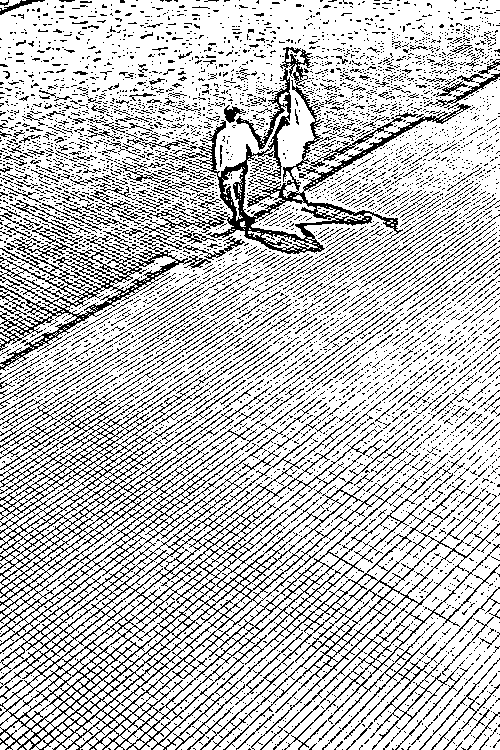

**水瓶座的爱情建议**

****

**我想要的男人，首先要是我的朋友，我们能够平等相处，在一起感到舒服。**

**——詹妮弗·安妮斯顿**

**比起伴侣关系，做朋友会让你觉得更加自然。**这点在你的爱情和婚姻方面表现得很明显。偶尔吃饭看电影你会觉得还不错，但关系一旦变得严肃，你就会开始抽离。

大多数情况下，你更喜欢扮演好朋友的角色，甚至作为对方的爱情顾问为他们出谋划策——虽然你可能也会在脑子里幻想一下与他们一番云雨的模样。

事实上，对你们中的一些人来说，理想的社会结构就是理论上所讲的公共社区，所有人之间不分彼此、友好相处，最好连小孩都大家一起养，诸如此类。

不过，试试在约会的时候跟你的同伴聊聊你的乌托邦理想，看看会怎样？或许他们会把你从通讯录里删掉吧，不过你也不在乎对吗？很多水瓶座人会表现得若无其事，但其实心里很在意——只是在意的方式不同。事实上，很多水瓶座人最终拥有了美满的婚姻，关键是，**他们所找的伴侣，是能够跟他们成为最好的朋友的人。 ** 不过，保罗·纽曼在提到和女演员乔安娜·伍德沃德的五十多年的婚姻时，强调的可不仅仅是成为彼此最好的朋友，他说：**“夫妻双方应该有各自的兴趣爱好，拥有各自的朋友圈子——并且不能把自己的生活强加到对方身上。”**这样的独立性对你们水瓶座必不可少。他还补充说：“人们之所以维持婚姻是因为他们‘想要’这么做，而非不得不这么做。”他在此强调的就是**“自由意志”**，这跟大多数水瓶座人都息息相关。 

以下是一些婚恋关系中要注意的要点：

**· 一开始就明确表达你需要独立空间：**很多人都会说自己需要独立空间，但你需要让对方明白你是“真的”需要；

**· 选择一个头脑聪明、智力上跟你势均力敌的伴侣：**跟不够聪明的人在一起，你很快就会兴味索然；

**· 选择一个跟你一样独立的人：**你会欣赏那些能够跟你的独立天性相匹配的对象，只要他们不是太不稳定就好；

**· 你重视独创性：**比起风格或扮相的古怪前卫，你更欣赏真正的有个性——如果你的朋友觉得他（她）很酷又有点怪，那就更好了；**· 黏腻的爱情不适合你：**如果对方需要向你反复确认你对他（她）的爱，这样的人不适合你！你的又酷又抽离的态度或许让人觉得你就是那类“触不到的恋人”；**· 向恋人证明你很靠谱：**虽然你不喜欢说甜言蜜语，但要让对方知道，当他们需要你的时候，你会在他们身边；**· 选择能够欣赏你的观点的人：**你的头脑是你最性感的部位。如果对方无法欣赏你的睿智，那就不要为这个人浪费时间了；**· 友谊的成分很重要：**如果对方很信赖你，遇事愿意征求你的意见，这是个好兆头。虽然他们不一定总是会询问你的观点，但如果他们这样做的频率越来越高，那你们就可能越走越近，成为情侣；**· 有共同的人道主义或公益方面的兴趣爱好：**这是一个明显有助于维系感情的因素，特别是对婚姻和家庭有益。如果你能够跟你的子女一起参与公益活动，那将带给你相当大的满足；**· 有共同的国际视角：**“地球村”对你来说不只是一个抽象概念。你的伴侣要有广泛的兴趣和宽阔的视野，她的思维最好能够跳出地域限制。

**版权声明：**原创文章由作者授权发布于若道平台，欢迎转发，反对抄袭。友号转载请申请白名单。

**END**

****想阅读更多作者的文章，请在后台回复******大卫****** 即可。****

**大卫·瑞雷**

美国占星师，若道联合创始人，致力于在中国教授和推广西方占星学；2010-2014 年，任全美占星师联盟监督委员会委员；2017 年，被选为 ISAR 委员会成员。ISAR 是世界最大的国际占星机构，会员遍布 45 个国家，2017-2020 年曾任 ISAR 全球副主席、CAPISAR（ISAR 职业占星师资质认证机构）主席。

**拥有****51 年****占星实践经验的****若道创始人****前 ISAR 全球副主席****前 ISAR 全球职业占星师资质认证主席****大卫·瑞雷**

**和**

**2019 年第二届、2021 年第三届核心课中**

**与苏·汤普金斯老师****联合授课****的**

**ISAR 认证职业占星师**

**咔咔（Caroline）**

**二人合力打造**

**2022 年 ****若道全新核心占星课程**

**点击下图了解更多课程详情** 

**

**20 位来自世界各地的占星师****带来 19 场沙龙——新世界的觉醒****详情可点击下图**

**学习占星学****点击下图了解课程详情**

**微信又双叒叕改版啦，不想错过若道君的推送？**
**就把若道设为星标吧！****▼**

**喜欢就点一下“在看”吧！**

********报名直达入口********

# 木星人最需要学习的，就是发现自己“啥也不是”

> 原文：[`mp.weixin.qq.com/s?__biz=MzA5NjA0NTAxNg==&mid=2651484258&idx=2&sn=9f8fc46281fbc92c4e308e0aeb21aa71&chksm=8b48c2d5bc3f4bc34a13f8457089af22a2da39b8034a3621eb3202ab42821af1c0c378528bca&scene=126&sessionid=1692737771#rd`](http://mp.weixin.qq.com/s?__biz=MzA5NjA0NTAxNg==&mid=2651484258&idx=2&sn=9f8fc46281fbc92c4e308e0aeb21aa71&chksm=8b48c2d5bc3f4bc34a13f8457089af22a2da39b8034a3621eb3202ab42821af1c0c378528bca&scene=126&sessionid=1692737771#rd)

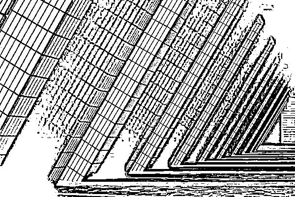

作者/唐娜·坎宁安 

译者/王宏 校对/轩轩

编辑/玫瑰 图片/pexels

对射手座人和受木星影响重的人来说，了解事物和保持正确是让自我感觉良好的关键，而当外行星行进触动出生星图上的木星时，则是治愈自己“无所不知”的重要时期。一起来看看。另外，大卫老师参与授课的【[ISAR 认证职业占星师文凭课程](http://mp.weixin.qq.com/s?__biz=MjM5MjQwNjAyMQ==&mid=2649440030&idx=8&sn=4ce859d104638437c7f91c4c95471d01&chksm=beb9507489ced962e0429b09e6855feeefc9f3041b4224b399a338b3fa02718b9800894d4b3f&scene=21#wechat_redirect)】报名中，点击链接了解更多详情！

**诡辩家苏菲的悲哀****我们的太阳星座和相位揭示了我们为了感觉特别而做的事。**我们变得过度依恋于我们自己的某些部分，以让自己更加确信自己对于这个极为广阔的宇宙是有价值的。**对于射手座人、太阳—木星类型的人，以及其他受木星影响重的人来说，了解事物和保持正确是自我感觉良好的主要关键。**有时他们甚至过分到自认为无所不知，实在令人厌恶。但是，有一些非常重要的事情其实他们并不知道。苏菲，50 岁，**太阳在射手座合相水星，**她自认是非常聪明和世故的人。的确，她接受过良好的教育，但她似乎几近疯狂地向我们其他人证明，她知道的比我们要多得多。

当我们谈论困扰我们的事情时，她还没听几句，就直接插话说出“答案”。**她不仅有“答案”，还有关于我们应该做什么的现成建议，而如果我们没有完全按照她所说的去做，她就会非常生气。**

麻烦之一就是，由于苏菲并没有停下来听取细节，所以她的答案往往不能解决问题。另一个麻烦是，当她打断我们的讨论时（事实上她常常无礼地打断我们），她忽略了我们的感受，让我们觉得一开始有这样的问题就是愚蠢的。

我们中有些人因为她具有很多优良品质而珍惜同她的友谊，现在已经学会了不和她谈论我们的个人问题。

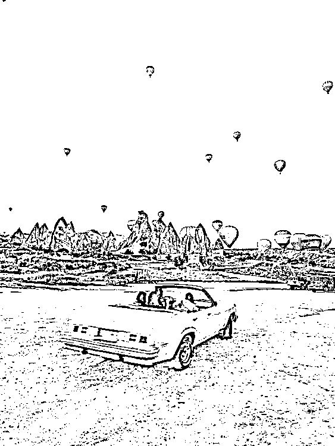

**我曾无所不知，现在却有了困难**苏菲或许是木星人的极端例子。我的太阳合相木星，而且或许由于我的前三次木星回归（3×13 年），我自己非常遭人厌恶。**木星在我的第 12 宫，我全神贯注、竭尽所能地学习有关心理疾病和社会问题的知识，最终获得了社会工作的硕士学位。**随后，你们要知道，在没有他人的帮助下，我自己发现了女权主义、形而上学和占星学，并专注于精益求精。这些学科并不是不重要，但它们都无法让我们完全准备好去迎接和克服生活中所有主要的困境和挑战。总是有更多的东西需要学习。步入中年之后，**我经历了一系列最外层的行星行进**（即土星、天王星、海王星和冥王星）**触动我出生图中的木星。这些行进治愈了我认为自己无所不知的毛病。**对于这些触动了出生图中木星的缓慢行进，恰当的描述就是**“信仰危机”****。**在这些间隔期（可能持续一至两年），**所有你曾自以为确切知道的，所有你热切相信的都遭到了质疑。**它们可能带来黯淡的绝望时光，具体要取决于你开始时具有多强烈的木星人特质。由于**木星代表我们认识真理、保持正确的需求，**因此一旦我们发现自己其实并不是什么都知道，发现自己一直犯着可怕而愚蠢的错误，我们可能会崩溃。**我们越是将自我价值感建立在拥有答案的基础上，我们就越会觉得自己像个废物。**我们最终从这些行进中学到的是，**我们无法为其他任何人，甚至不能为我们自己找到所有的答案。**而带着来之不易的**谦卑**，我们可以更加真诚地帮助其他人，因为我们并非出于傲慢才帮助别人。（如果我的朋友苏菲在她迄今 50 年的岁月里从未有外行星行进触动她的木星，那么她就不会学到有关谦卑的十分重要的课程。）

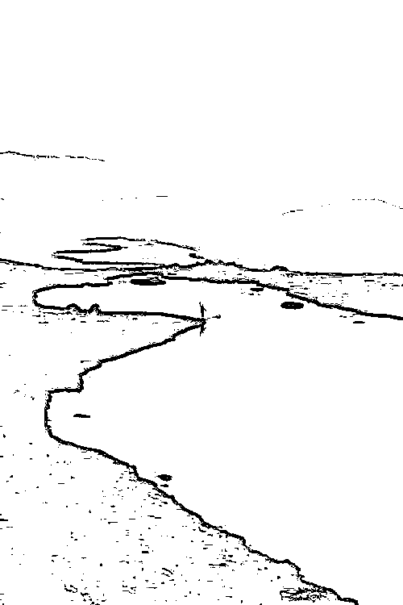

**变动星座和他们的木星行进**我经常感觉**，****变动星座，即双子座、处女座、射手座和双鱼座的共同点是，他们都深深陷入了对知识的终生追求，只不过他们有着不同的追求方式。**我们已经了解了射手座以及他们对高等教育和拥有答案的沉迷。由于这是他们自我价值中如此重要的部分，因此行进触动出生图中的木星所带来的信仰危机可能是一次重大的考验。以下是其他三个变动星座的适应方式。**双子座对什么都好奇，并热切地寻求新知识和新体验。**如果有什么是他们不知道的，他们并不会感觉很糟。对他们来说，正是因为有太多需要学习的东西，生活才成为了一场冒险。他们乐于交换花边新闻，这样每个人都会了解更多。

**行进触动出生图的木星能够帮助他们了解到，他们永远不会学到所有的东西，所以他们经常从永恒的学业中毕业。**

**处女座对知识领域有更强的洞察力——他们的本性更加多疑、挑剔。**他们搜集关于如何提高自己的细节，并分享这些细节，无论听众是否想知道。

**行进触动出生图的木星可能教会他们，对于如何创造完美，并没有完美的、持久的答案，**而且遗憾的是，不管怎样，大多数人对变得完美并不感兴趣。

**双鱼座**也渴望知道答案，但会非常**直接地感知到宇宙有多么广阔和不可知。**他们因那些认知而变得茫然和敬畏，因此他们可能给人以迷糊和困惑的印象。我本身认为他们有潜在的重大发现。只是遗憾的是，他们无法将其传达给我们其他人。读者们，你们又有怎样的经历呢？你的木星在哪里？有外行星行进触动你出生图的木星吗？这带给你怎样的感受？你现在知道你并不是无所不知了吧？请在评论部分跟我们聊聊。**版权声明：**本文由若道翻译发布，欢迎转发，反对抄袭。友号转载请申请白名单。

**唐娜·坎宁安**一位在国际上广受尊敬的占星师，她有超过 45 年的从业经验。她已撰有数十本占星著作以及上百篇占星学和其他形而上学类的文章。于 2017 年 7 月 5 日离世，享年 75 岁。

**版权声明：**原创文章由作者授权发布于若道平台，欢迎转发，反对抄袭。友号转载请申请白名单。

**END**

****想阅读更多作者的文章，请在后台回复******大卫****** 即可。****

**大卫·瑞雷**

美国占星师，若道联合创始人，致力于在中国教授和推广西方占星学；2010-2014 年，任全美占星师联盟监督委员会委员；2017 年，被选为 ISAR 委员会成员。ISAR 是世界最大的国际占星机构，会员遍布 45 个国家，2017-2020 年曾任 ISAR 全球副主席、CAPISAR（ISAR 职业占星师资质认证机构）主席。

**拥有****51 年****占星实践经验的****若道创始人****前 ISAR 全球副主席****前 ISAR 全球职业占星师资质认证主席****大卫·瑞雷**

**和**

**2019 年第二届、2021 年第三届核心课中**

**与苏·汤普金斯老师****联合授课****的**

**ISAR 认证职业占星师**

**咔咔（Caroline）**

**二人合力打造**

**2022 年 ****若道全新核心占星课程**

**点击下图了解更多课程详情** 

**

**20 位来自世界各地的占星师****带来 19 场沙龙——新世界的觉醒****详情可点击下图**

**学习占星学****点击下图了解课程详情**

**微信又双叒叕改版啦，不想错过若道君的推送？**

**就把若道设为星标吧！**

**▼**

**喜欢就点一下“在看”吧！**

********报名直达入口********

# ISAR 认证职业占星师文凭课程 | 开启“爱好变职业”的创收自由之路

> 原文：[`mp.weixin.qq.com/s?__biz=MzA5NjA0NTAxNg==&mid=2651484258&idx=3&sn=1b5a6376c9518c114bba5c8e2d75b07c&chksm=8b48c2d5bc3f4bc3fb12556d6557a7ca5a5da038808803f062d705f18e354e33d82218a32ec9&scene=126&sessionid=1692737771#rd`](http://mp.weixin.qq.com/s?__biz=MzA5NjA0NTAxNg==&mid=2651484258&idx=3&sn=1b5a6376c9518c114bba5c8e2d75b07c&chksm=8b48c2d5bc3f4bc3fb12556d6557a7ca5a5da038808803f062d705f18e354e33d82218a32ec9&scene=126&sessionid=1692737771#rd)

**2022 年，是世界和中国 40 年未有之大变局的开始。**

俄乌战争打破了欧洲大陆乃至全世界的和平局面，而新冠疫情也给中国经济带来前所未有之挑战。

如果你关心经济形势和世界局势，你会有这种的感觉，我们将面临一场深刻的危机，而这不是短期内可以结束的。

**占星学的看法也是如此。**

4 月青年失业率（16 岁到 24 岁）中国达 18.2%，一些背着房贷、教育、医疗负担的中年人突然失业更是整个家庭整个难以承受之重。为了更好准备面对这样的时代变化，连《北京日报》这样的官方媒体也在呼吁：**“开拓副业，让自己有多元化发展的生存能力”。**

**而这门课程，就是为了这样一个目标准备的。**

**占星学是非常好的“开展副业”的选择**

这个**为期 16 个月**的课程通过并不算长的时间和并不算高的投资，不仅可以帮助你学到一个终身可用的技艺，而且也可以选择成为自助助人的占星师，**开启受益终生的第二事业。**未来是个体崛起的时代，大量个体被鼓励独立发展，比如网红、自由职业、自媒体、咨询师等，他们都不需要传统的办公室。社会越发达，人的独立性就越强，未来有能力的人都可以变成独立的经济体。

**占星学也是越老越好的职业**

和一些技术变化非常快的职业不同，**占星学的技术层面非常稳定，不会快速迭代变化，**同时，掌握好占星学、能够做一场好的咨询又需要个人自身大量实践和对生命的深刻理解，而这些都是时间和岁月带来的。

**占星学是现代社会需要的助人职业**

社会快速发展和变化人们似乎越来越无法掌控自己的生活，这给很多人带来巨大的焦虑，**抚慰心灵的咨询市场需求巨大。**而占星学可以让人从前所未有的角度了解自己，了解目前和未来所处的周期，挑战的意义，不论对于深入的个人成长探寻，还是预测未来的周期，都又其独一无二的价值。

**ISAR 认证职业占星师的独有培训**

目前占星学的培训市场鱼龙混杂。而 ISAR（国际占星研究协会）是一个包含了 47 个国家在内的国际占星组织，多年来致力于占星的教育和研究，提升占星教育的品质和职业占星师的能力，在国际占星领域备受尊重。今年，ISAR 对于成为 ISAR 认证职业占星师提出了更高的要求，**所有想要获得 ISAR 职业占星认证的申请者均需要在 ISAR 的附属学校通过 500 个小时的研习（包含****主课****、选修课、沙龙、作业、讲座、工作坊等等）。**

**而这门核心占星学课程就是为此而准备的。**

**2022 年，鉴于对若道在占星教学领域所做的持续努力和高品质的课程服务，ISAR 特别授予若道核心课程为 ISAR 文凭课程，所有在若道学习，并通过若道毕业考试的同学将获得 ISAR 颁发的学历文凭（Diploma）。**

**你的占星核心课老师是谁？**

**拥有****51 年****占星实践经验的****若道创始人****前 ISAR 全球副主席****前 ISAR 全球职业占星师资质认证主席****大卫·瑞雷**

**和**

**2019 年第二届、2021 年第三届核心课中**

**与苏·汤普金斯老师****联合授课****的**

**ISAR 认证职业占星师**

**咔咔（Caroline）**

**二人合力打造**

**2022 年 ****若道全新核心占星课程**

**咔咔老师给同学的寄语：**

（向上滑动查看内容）

**亲爱的同学们：**

我为什么学占星学？

2000 年的时候我还是一个在网上搜索天蝎座和水瓶座配不配的普通白领。我搜索的内容还包括了水瓶座为什么总是这么若即若离？

体贴的搜索引擎给我推送了占星学、行星、星座、宫位、相位等资料，还让我了解到莉莉丝、月亮交点、截夺宫位等占星学概念。

2000 年 10 月我了解到，一个从业 30 多年的美国职业占星师大卫·瑞雷来到了中国，和他的中国合伙人将开办一个专业教授占星学知识的课程。过去 10 个月在网上东拼西凑的占星学知识唤起了我对占星学的兴趣，但是已经不能满足我对星图深度分析的需求了。

2013 年，我通过了若道核心课程的毕业考试和国际占星师研究协会的认证考试。2015 年我离开职场成为一名全职占星师。

到底学习占星带给了我什么呢？

1、它是自我觉知的工具，我现在已经不去纠结哪些星座是否匹配，我相信外在的事件是内在心理矛盾的显化。也就是说，想找到令人满足的亲密关系，要先去了解自己的情感模式和需求，而不是无意识地一次次地试错和撞墙。我开始学习自我关怀和接纳自己。

2、它带来看待世界的全新和全景的角度，天上如是，地下亦然。人类社会和个人生命的进化都有其周期和相似性，作为个体，占星学帮助我思考如何更积极和有建设性地与宇宙的能量合作，认识自己，发挥自己的潜力，度过有意义且自我满足的人生。

3、它带来了全新的职业：占星师和占星老师。除了收入，还有助人育人的满足感和意义感。

4、它带来一群志同道合的伙伴，我们彼此联结又相互独立。

作为中国占星界的“黄埔军校”若道占星的学生、助教和老师，我与很多学员在人生的不同阶段带着各异的需求走进了这所学校，2022-2023 年一年半的若道核心课程设计既蕴含了大卫·瑞雷老师的教学精华，也带入了我在跟随不同国外占星老师学习、助教和教学积累的心得。

有一些学员毕业后从事了占星咨询工作，有的在各大平台成为专业占星学知识的输出者和传播者，有的运用占星学提升他们的工作，也有的在占星学与投资，占星学与名人/八卦、占星学与原生家庭、亲密关系、亲子关系等领域收获了有用的或者有趣的体验。

对我来说，生命是一场自我完整的体验之旅。从 2011 年的那个春节在若道入学之后，我的生命旅程更加充实、有意义、有目标，也更有满足感。

希望在 2022-2023 年的若道核心课程里见到你。希望你此后的生命旅程里，有若道，有占星学。

占星师咔咔

2022 年 5 月 24 日

**大卫老师给同学的寄语：**

（向上滑动查看内容）

亲爱的学员们：

感谢你对我们从 8 月 30 日开始的若道 L1-5 级核心课程的兴趣。我和合作老师咔咔以及我们的核心课程团队期待着为你提供这个机会，来教授各种高品质的地道占星学知识和技巧。

对于那些希望获得 ISAR 职业占星师认证的学生，这是一门适合你的课程！

作为 ISAR 咨询技能培训的一部分，我曾与咔咔合作过，我们期待着再次合作。咔咔和我曾在 ISAR 职业占星师认证委员会（CAP ISAR）一起工作，我们非常熟悉获得 ISAR 职业认证的流程。作为你的老师，我们将陪伴你整个占星学发现之旅，帮助你逐渐认识到占星学有多么的神奇。此外，你还将受益于我们若道的助教和课程顾问，他们是若道核心课程计划的重要组成部分，提供在线沙龙、组织学习小组、指导家庭作业。我们的教育团队是“服务于你的团队”，所以也会根据你的需求进行相应的调整。你专用的核心课程微信群也促进了你的学习过程，使你能够每天与你的同学们一起学习、探讨、成长。

52 年前，当我开始学习占星学时，没有一所像若道这样的学校。如果有这样一所学校，我会尽一切可能在那里成为一名学生。事实上，我很幸运，我的老师都是经验丰富的专业占星师。然而，我花了 6 年的学习时间才通过 1976 年在美国乔治亚州亚特兰大举行的专业占星师考试，又花了 2 年的专业实践时间才通过占星学谋生。我永远不会忘记从 1970 年到 1978 年的 8 年，那些日子的反复试验教会了我如何苦练占星学。作为老师，我一直在努力传授我早年所学的知识，让你的旅程更加顺利，更加全面。

自 1978 年以来，44 年的全职实践教会了我很多，我很高兴有机会与大家分享我所学到的东西。我和咔咔都是现代占星师，虽然我们尊重西方占星学的历史和传统，但我们实践和教授的占星学植根于现代人本主义哲学，这种哲学旨在提高你对自身潜力的认识，并鼓励个人成长。还有什么比了解自己更实际的呢？还有什么比个人成长和发展潜力更有利的呢？这是你将要学习的占星学，一种可以应用于你自己生活的占星学，一种可以为你提供一个充实职业的占星学。

教书是我回馈占星学行业的方式，这个行业拓展了我的视野，远远超出了我曾经想象的可能。谢谢你给我这个机会做你的老师。

大卫·瑞雷

2022 年 5 月 24 日

**连报 L1-5 全阶网络直播课程，你可以享受**

❶ 64 次线上直播互动网络课程+2 场工作坊，全面而详细地讲解占星学知识、技能、案例和重要领域实践运用。

❷ 知识点+学员星图解读有机结合：咔咔老师以讲解知识点和中外名人案例为主，大卫·瑞雷老师以参课学员案例演示及客户案例为主，每个知识点覆盖班级内学员的亲身案例，参与感更强，多位学员都有机会听到自己的星图分析。

❸ 微信群学员互动分享，从真实案例学习生命成长故事。

❹ APP 答疑论坛提问：论坛上每个学员的问题都将得到及时回复。

❺ 若道独有的职业占星师养成计划，为你毕业后独立咨询做准备。

**❻ **提供**咨询平台**，只要努力，优秀毕业生有机会入驻**若道咨询平台**，拓展咨询客户群。

**更多了解老师和助教？**

**大卫·瑞雷（David Railey）**

*   **I****SAR 董事会成员，ISAR 全球副主席，ISAR 全球职业占星师资质认证主席，若道占星创始人**。

*   2016-2019 年，被选为国际占星协会（ISAR）考试委员会成员，国际占星协会（ISAR）是世界最大的国际占星机构，会员遍布 47 个国家。

*   2017-2020 年，被选为国际占星联盟（ISAR）考试委员会主席，理事会成员。

**占星师咔咔（Caroline）**

2010 年师从美国占星师大卫·瑞雷学习，并得到世界名师斯蒂芬·弗里斯特、罗伯特·汉德、苏·汤普金斯传授各种占星学技法。若道首届学员，国内最早获得 ISAR 职业占星师资质的职业占星师，多次担任若道核心课程助教，并于 2019 年第二届、2021 年第三届核心课中和苏·汤普金斯老师一起教授若道核心占星课程。

在国际知名广告公司和市场研究公司从事的市场研究和推广工作十余年，曾任职于阳狮集团、尼尔森市场研究有限公司、MTV 和《Madame Figaro》杂志。

**助教王嘉祺 （Conrad）**

ISAR 认证占星师、若道认证生时校正资质，从 2010 年起自学占星学，2015 年开始在若道系统学习，并开始个案咨询。2018 年担任若道核心课程助教，以及卜卦占星学和太阳返照选修课助教，并带领学员进行经世占星和太阳返照方面的研究。2019 年 11 月作为演讲人之一参加了国际占星协会（ISAR）北京大会，也是 ISAR 星空俱乐部中国区第 16 期的主讲人。

**什么人适合这门课？**

*   对占星学有浓厚兴趣，想要系统学习占星学。
*   对占星学有一定基础，但不知道该如何整合星图复杂的碎片。
*   希望成为优秀的占星师，想要借鉴国际大师解读思路并融入自己的体系。
*   想学习占星学，但不擅长英文，希望有中文老师授课。
*   想结合占星学理论与咨询实践。
*   走在自我探索和个人成长道路上的人。

**课程费用**

**★ 1-5 阶 连报****课程费用：46500 元** **★ 1-2 阶 （8 月 30 日开课）****课程费用：3500 元 ****★ 1-3 阶　连报****课程费用：11500 元 **

**咨询课程请联系顾问**：**王老师（微信/手机：18510107057，请备注“大卫核心课”）**

**退转课程**

**退款原则请详看《教学协议》，如有疑问请咨询课程顾问。**

****2022 L1-5 认证职业占星师必修课程****

**授课老师：大卫·瑞雷、咔咔**

**直播课开课时间：2022 年 8 月 30 日（周二）**

**授课方式：******网络授课，英文/中文授课，中文翻译****

**费用：****1-5 阶连报**：46500 元**；**1-2 阶**：**3500 元；****1-3 阶**：**11500 元

**课程负责人：王老师**（微信/手机：18510107057，请备注“大卫核心课”）

长按二维码添加课程负责人咨询~

****报名直达入口****

# 2022 年若道 ISAR 选修课 | 《医疗占星手册》作者亲授

> 原文：[`mp.weixin.qq.com/s?__biz=MzA5NjA0NTAxNg==&mid=2651484258&idx=4&sn=9535414b4d513a183495362abb0bd7c7&chksm=8b48c2d5bc3f4bc3bd658bcb0a3cd4aac8647edd3e34e0b4181a2614fd2fc1c66ccd0b55825b&scene=126&sessionid=1692737771#rd`](http://mp.weixin.qq.com/s?__biz=MzA5NjA0NTAxNg==&mid=2651484258&idx=4&sn=9535414b4d513a183495362abb0bd7c7&chksm=8b48c2d5bc3f4bc3bd658bcb0a3cd4aac8647edd3e34e0b4181a2614fd2fc1c66ccd0b55825b&scene=126&sessionid=1692737771#rd)

**有四个主要因素影响着我们的生活和健康：基因构成、物质环境、情绪环境，以及我们的占星配置。我们在星图中都存在患病的可能性，而预防的方法在于尽可能充分、真实和健康地生活。****——简·里德·帕特里克****（Jane Ridder-Patrick）博士**

占星学就像心灵的 X 光片。它可以描述个人对世界的看法和反应。我们越不了解自己的天性，面对生活中的挑战，我们就会有越少的选择。

**“占星学可以精准定位需要解决的潜在问题。”**

**医疗占星学是一个强大的工具，同时洞察的身体和心理过程，通过更多的自我认知照顾和关爱自我和身边的人。**

**本课程既适合医疗占星学的初学者，也适合已经有一些相关经验的人****。**简·里德·帕特里克老师将运用现实生活中的例子，揭示一个人的性格、症状及其星图是如何相互映照的。课程也会探讨疾病的意义以及可能的治疗方法。

**本课程旨在为学员提供一个运用医疗占星学的框架和方法，**学员将会学到一些有价值的实用工具，在课程结束后，自己使用这些工具研究其中的关联性。

**此课程可作为 ISAR 选修课。**

1

**课程安排**

**课程时间：2022 年 9 月 20 日-11 月 8 日  每周二 20:00-22:00**

**第*****1*****讲  9 月 20 日 与占星学、心理学、病症一起工作**

*   医疗占星学的组成部分以及如何使用它们

*   行星的作用与相互作用

*   黄道星座人

*   宫位的重要性

*   疾病和健康是如何产生的

**★ 第二、三、四讲的课程内容基于星座以及它们之间的相互作用。**

**第*****2*****讲  9 月 27 日 基本星座**

学习基本大十字星座——**白羊座、巨蟹座、天秤座和摩羯座**——及其功能和相关的健康问题。**这些星座与防御、养育、结构、体内平衡和荷尔蒙控制有关。**

****第*****3*****讲  10 月 4 日 固定星座****

学习固定大十字星座——**金牛座、狮子座、天蝎座和水瓶座**——及其功能和相关的健康问题。**这些星座与习惯和反射、心脏调节、生存、循环和协调有关。**

“固定星座（金牛座、狮子座、天蝎座和水瓶座）在情感和生理上都倾向于**‘难以放手’**，这可能为恶性肿瘤的生长创造环境。所以说，他们可能倾向于沉浸在过去的伤害中，难以自拔。另一方面，这些星座也擅长在艰难的时期坚持不懈并一直**持之以恒**。”——简·里德·帕特里克（Jane Ridder-Patrick）博士

**第*****4*****讲  10 月 11 日 变动星座**

学习变动大十字星座——**双子座、处女座、射手座和双鱼座**及其功能和相关健康问题。**这些星座与呼吸、神经系统、肠道、睡眠以及信息、情感和行动的整合有关。**

**★ 第五、六、七、八讲重点学习行星，它们在身体层面的表达、它们的相位与行进。**

**第*****5*****讲  10 月 18 日 太阳与月亮**

**太阳**掌管视觉、活力、心脏和意识，与心脏、脊柱和视觉问题相关。**月亮**掌管人体的周期，特别是月经周期、饮食模式和体液，与情绪引起的疾病、饮食失调和胃病相关。

**第*****6*****讲  10 月 25 日 土星与天王星**

**土星**掌管着皮肤、骨骼、牙齿和衰老过程。它对应的疾病包括慢性疾病、耳聋、帕金森病、关节僵硬和牙齿问题。**天王星**代表身体活动的协调，有节奏的脉动和身体的“电”。与天王星相关的疾病包括癫痫、痉挛、心律失常，以及阿斯伯格综合症和自闭症样综合症。

**第*****7*****讲  11 月 1 日 海王星与冥王星**

**海王星**掌管松果体、细胞膜渗透和右脑功能，与过敏、上瘾的病症、慢性疲劳综合症和睡眠障碍相关。**冥王星**掌管消除和转化，其病理包括毒性、脓肿、癌症和强迫症。

**第*****8*****讲  11 月 8 日 火星**

**火星是与能量和防御相关的行星**，掌管免疫系统、肾上腺功能、肌肉活动和炎症反应。**它是许多身体和情绪障碍的核心**，如自动免疫障碍、抑郁和发烧，以及由手术或需要手术引发的问题。

2

**此次课程适合哪些人？**

*   有一定占星学基础，若道核心课 L3 以上水平；

*   希望成为优秀的占星师，想要借鉴国际大师医疗占星解读思路并融入自己的体系的人；

*   热爱占星学、健康、养生的研究型占星学者；

*   计划考取 ISAR 认证占星师，寻觅中意选修课的学员；

*   走在自我探索和个人成长道路上的人。

**快来和简·里德·帕特里克老师学习升级版的占星学身体地图吧！**

3

**授课老师**

**简·里德·帕特里克 **博士****

（Jane Ridder-Patrick）

简接受过药剂师、理疗师、草药师、心理治疗师和历史学的专业学习，从事写作、咨询和讲学工作，在英国和全球教授占星学及其历史、当今的心理学和医学应用。她在爱丁堡执业，在爱丁堡大学获得博士学位，研究方向是 17 世纪苏格兰占星学历史。

**她最著名的出版物是《医疗占星手册》。2018 年，她因对医疗占星学的贡献而获得了著名的查尔斯·哈维占星学杰出服务奖。**

《医学占星术手册》（第二版，修订版和扩充版）

(爱丁堡，克拉布出版社，2006 年)

4

**课程信息**

*   **课程时间：**2022 年 9 月 20 日开始，每周二晚上 8 点，每周一次，共 8 次课。

*   **授课方式：**线上直播，英文授课，中文翻译

*   **课程价格：****6800 元**

*   **早鸟价：5800 元（截止日期：2022 年 8 月 23 日）**

*   **课程咨询：**王老师（微信：18510107057，请备注“医疗占星”）

长按二维码添加王老师

5

**退转课程**

*   **退款原则请详看《教学协议》，如有疑问请咨询课程顾问。**

****医疗占星****

**授课老师：**简·里德·帕特里克

**授课时间：**2022 年 9 月 20 日起

**授课方式：**网络课程**，**英文授课，中文翻译

**费用：****6800 元****（早鸟价：5800 元，2022 年 8 月 23 日截止）**

**课程负责人：****王老师**（微信：18510107057，请备注“医疗占星”）

长按二维码添加课程负责人咨询~

****报名请点击“阅读原文”****

# 深度丨在“感觉之爱”中，这颗温柔的行星给我们哪些提示？

> 原文：[`mp.weixin.qq.com/s?__biz=MzA5NjA0NTAxNg==&mid=2651484146&idx=1&sn=72d8e880a13eec50c5790c6193dc4a1f&chksm=8b48dd45bc3f54534cd75642d7a0a42cb618daf13ee22eafe01996fe08397935b15c2f005906&scene=126&sessionid=1692737771#rd`](http://mp.weixin.qq.com/s?__biz=MzA5NjA0NTAxNg==&mid=2651484146&idx=1&sn=72d8e880a13eec50c5790c6193dc4a1f&chksm=8b48dd45bc3f54534cd75642d7a0a42cb618daf13ee22eafe01996fe08397935b15c2f005906&scene=126&sessionid=1692737771#rd)

**☆ 后台回复“今日”，给你一句生命态度 **

作者/爱丽斯·德维尔译者/Jane 校对/江艺
  编辑/翀子 封面/书君 图片/网络

月亮与感觉息息相关，而月亮星座的彼此融洽在爱情中是非常重要的因素。月亮在不同元素的星座时，感情有哪些特质？来看这篇文章吧~如果你想更多的了解月亮的特质，可以点击大卫和咔咔老师共同授课的【[ISAR 认证职业占星师文凭课程](http://mp.weixin.qq.com/s?__biz=MjM5MjQwNjAyMQ==&mid=2649440030&idx=8&sn=4ce859d104638437c7f91c4c95471d01&chksm=beb9507489ced962e0429b09e6855feeefc9f3041b4224b399a338b3fa02718b9800894d4b3f&scene=21#wechat_redirect)】，点击链接了解更多详情~

**月亮星座与感情**

月光可以给萌芽中的爱情创造最完美的背景，抒情歌的作者在他们的爱情歌曲中描绘月亮，浪漫的小说家通过描述飘渺的月亮来传达主人公梦幻的心境和对爱情的追求——恋人们在月光下的海滩漫步，在皎洁的月光下第一次亲吻对方。

月亮，肯定是与感觉息息相关的。

**出生图中的月亮所在的星座描绘了你的感情、早年生活的影响以及情绪变化。**等你成熟之后，这种天性会指引你找到那个理解你、滋养你感情的人。如若不然，你就会感到彼此情感上的疏离和误解。

月亮星座的彼此融洽在爱情中是非常重要的因素。你需要能在另一半的面前真实地表达自己的情感，否则这段关系就会崩塌。

十二星座可以按照火、土、风、水这四种元素来划分。月亮星座的元素彼此和谐的两个人似乎能在关系中更好地相处。

在关系中，**火象和风象的月亮的人之间或者土象和水象的月亮的人之间会更容易融洽相处。**以下的概述可以帮助你了解这些元素是如何运作的。

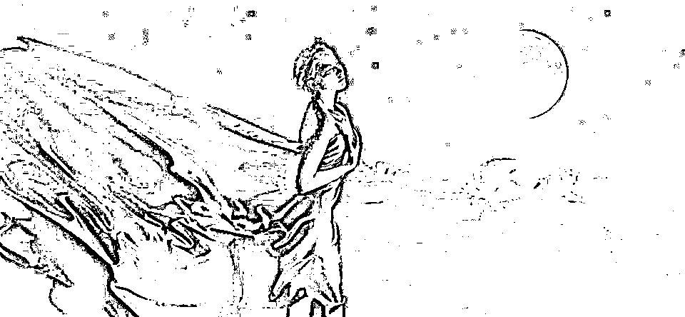

**不同属性月亮星座的爱情****★****热情的火象**

**月亮在火象星座（白羊座、狮子座、射手座）的人热情地追求他们的爱情对象。**他们强调激情，男女皆如此。他们很清楚自己的迷人之处，也很容易陷入爱河。他们强烈地希望自己的体贴能得到对方的爱慕和赞赏。

**他们倾向于主导伴侣的感情，而如果对方限制他们，他们又会表现出强烈的独立性**。

当爱情的火焰燃起时，月亮在火象星座的人是最热情的，当然，**当一段关系结束时，他们也是受伤最深的**。当月亮在火象星座的人中了爱情病毒，那么被爱的人会在生活中体验到些许**戏剧性**。

当他们得到了想要的爱情和浪漫，月亮在火象星座的人会给出不寻常的礼物，比如**惊喜的度假和爱慕**来作为回报。

月亮在火象星座的人拥有很健康的感情动力，并且会用积极的方式表达出来。尽管他们性急、易冲动，但是月亮在火象星座的人会在争吵之后给接吻与合好带来新的内容。

如果一段感情是基于强烈的爱慕，那么你可以亲自去检验一下月亮的爱情机制。

**★****踏实的土象**关于月亮在土象星座（金牛座、处女座、摩羯座）的人的感情需求，他们会**寻找务实、注重安稳和长期承诺的伴侣**。当物质基础稳定之后，他们会感到安宁。无需精打细算，他们也可以一头扎进婚姻和家庭。

月亮在土象星座的人希望另一半可以保持他们的收支平衡，但这不是必须的。**这个月亮群体有很大的野心，以成就为导向，欣赏他们这种工作原则的伴侣可以打动他们的心**。

虽然月亮在土象星座的人外表很保守，但是他们**欣赏幽默的伴侣**，这样就可以在他们陷入沉默的时候打破尴尬。

月亮在土象星座的人会**把时间和金钱投入到个人发展中，他们之中无论是外向还是内向的人都很注意细节**。好好利用这种特质，你们就可以组队参加益智问答或答题竞赛，比如“谁想成为百万富翁”。

**如果你想找一个勤勉的伴侣，欣赏点点滴滴的人间天堂，就把你的心交给月亮在土象的人的稳定火焰吧。**

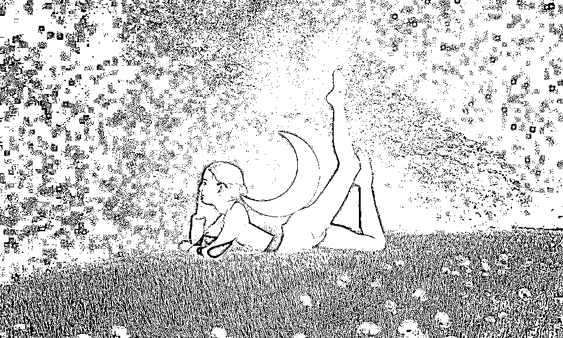

**★****交流的风象**

**月亮在风象星座（双子座、天秤座、水瓶座）的人喜欢与另一半交流，并且在情感上与人类相连。**他们喜欢**与爱人建立友谊、志同道合**。

月亮在风象星座的人约会主要有赖于**风趣的评论、电子邮件和大量的电话**。确实，他们喜欢幻想爱情生活，并且会花费相当的时间去勾画心目中理想的伴侣。**让他们做出承诺是不现实的。**

如果你在跟月亮在风象的人约会，那你可以期待**活跃的社交生活和各式各样扩展思维的经历**了。他们对别人的态度和反应很敏感，尤其是爱人和伴侣的。

月亮在风象星座的人可以从**融洽的关系**中受益，当然，紧张的关系也会给他们的健康带来伤害。

**月亮在风象星座的人与欣赏他们才智和解决问题能力的人会相处得很好，一个轻松愉快并且体贴的爱人，可以让喜欢自由的月亮风象星座的人从幻想中的爱情走进真正的爱情。**

**★****热深邃的水象**

月亮在水象星座（巨蟹座、天蝎座、双鱼座）的人天性中就带着**深邃而强烈**的感情。月亮在水象星座的人的爱情受家庭和童年的影响很大，如果这些经历带给他们滋养，那他们就很容易接受忠诚的关系，**安全**对他们的心灵极其重要。

不管男女，月亮在水象星座的人都**不会忽视他们的伴侣，他们倾向于用温柔的爱紧紧包裹着对方**。

此外，天生的第六感有利于他们**感受到在乎的人的情绪变化**。这个月亮群体的成员喜欢**触摸、情调音乐、温柔的按摩**。

基于水象特有的性格，他们会因为别人注视自己的另一半而有些吃醋，面对拒绝时他们会伤得很深，月亮在水象星座的人要**尽量避开那些公开调情以及在社交场合忽视他们的疏离型伴侣**。

月亮在水象星座的人的伴侣，应该有敏锐的直觉洞察他们内心的秘密，并且在对待感情和亲密关系的态度上与他们合拍。

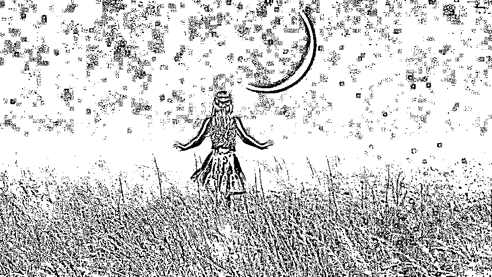

**尾声**

上文所说的月亮是我们诞生的那一刻月亮的位置，其所在的星座和位置是固定的，代表了我们个性中最核心的情感需求。但月亮在那一刻之后依然在不断运转，每两天半，月亮就会改变一次“心境”，因为它将穿行进入另一个星座。

在出生星图所描述的基本情感模式上，月亮的“心境”会为个人生活增添微妙感情的变化。

**新月时的约会可能预示着一段感情的开始，上弦月可能预示着爱人正在评估这段感情，满月则可能预示着感情升温并且会很激烈。****有的时候，下弦月则预示着一对恋人紧张关系的缓解，而如果缺乏融洽，则预示着一段感情的结束。**

根据月亮来帮助你认识和确定你的感觉吧，也利用月亮的“心境”来开始、深化你的感情吧。

**版权声明：**本文由若道翻译发布，欢迎转发，反对抄袭。友号转载请申请白名单。

**END****爱丽丝·德维尔（Alice Deville）**占星师、工作坊讲师和作家，从业超过 25 年。在占星学实践中结合了多种咨询技巧，包括商业、金融和变更管理、房地产以及直觉洞察。**拥有****51 年****占星实践经验的****若道创始人****前 ISAR 全球副主席****前 ISAR 全球职业占星师资质认证主席****大卫·瑞雷**

**和**

**2019 年第二届、2021 年第三届核心课中**

**与苏·汤普金斯老师****联合授课****的**

**ISAR 认证职业占星师**

**咔咔（Caroline）**

**二人合力打造**

**2022 年 ****若道全新核心占星课程**

**点击下图了解课程信息******20 位来自世界各地的占星师****带来 19 场沙龙——新世界的觉醒****详情可点击下图**

**学习占星学****点击下图了解课程详情**

**微信又双叒叕改版啦，不想错过若道君的推送？**
**就把若道设为星标吧！****▼**

**喜欢就点一下“在看”吧！**

********报名直达入口********

# 8 月直播大放送丨 6 场主题研讨分享会，干货满满！

> 原文：[`mp.weixin.qq.com/s?__biz=MzA5NjA0NTAxNg==&mid=2651484146&idx=2&sn=1034111e03eca409b390e0dcda7e1bfb&chksm=8b48dd45bc3f545363c843476f700cc0000105e1d3a2b91d272be5127d5047b37f7426be00a7&scene=126&sessionid=1692737771#rd`](http://mp.weixin.qq.com/s?__biz=MzA5NjA0NTAxNg==&mid=2651484146&idx=2&sn=1034111e03eca409b390e0dcda7e1bfb&chksm=8b48dd45bc3f545363c843476f700cc0000105e1d3a2b91d272be5127d5047b37f7426be00a7&scene=126&sessionid=1692737771#rd)

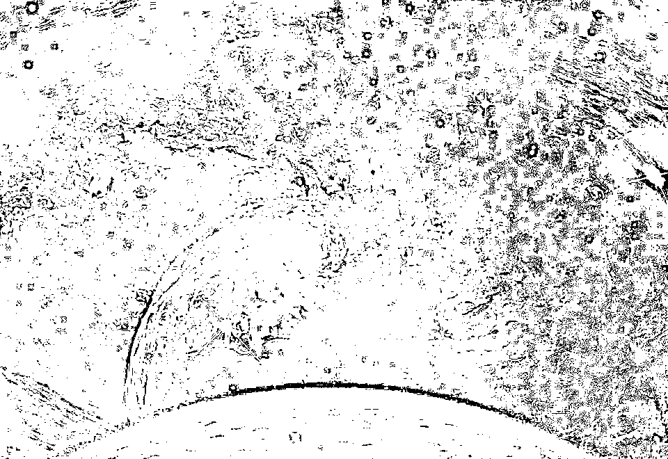

“面对眼前那么多的占星符号、术语、大量害怕记不住的关键词，发懵、神经衰弱，更不用说还要把它们整在一起、组词造句，之后还要写小作文，再之后看符号密布的一整张星图，跟看星罗棋布的地图似的，要把其中的道道说清楚，更是不知所措，不知从何处下手。

啃了一本又一本的占星名著，啃下一阶又一阶的课程，最后书读完，课上完，自己还没回过神似的，只好再花多年时间，边实践边琢磨，慢慢地，和牛似的，反刍消化很久，才有了些运用它的信心。”

**这是我早年学占星的心路历程。**

**2020 年若道开始推行“职业占星师养成计划”：**从苏汤普金教授的核心课程开始，围绕大师核心课程的教学。在搭配**“助教沙龙+学员个人练习”**的基础上，又增设了**“小组研讨项目**”。

由此建立一个教学与实践并举、个人学习与团体研讨结合，全方位多元化的沉浸式学习体系与学习氛围，志在帮助学生**在理论学习的同时，就能边学边用**，实践运用又反过来加深对理论知识的理解和感性认识，希望帮助同学在毕业后，就能拥有系统专业的占星实战技能，也能**快速成为名副其实的“职业占星师“。**

**“若道职业占星师养成计划”**经过两年的打磨，日渐完善，也正好呼应了 2022 年 ISAR 职业占星师认证的新要求——

**想要通过 ISAR 认证的同学要达到 500 小时的培训，这使得有志考取 ISAR 认证的学子们，进入若道学习就可以获得符合新认证体系的完整培训。**

我多么羡慕现在来若道学习的学生们，你们不会重走我以前那条吭哧吭哧的学习之路。

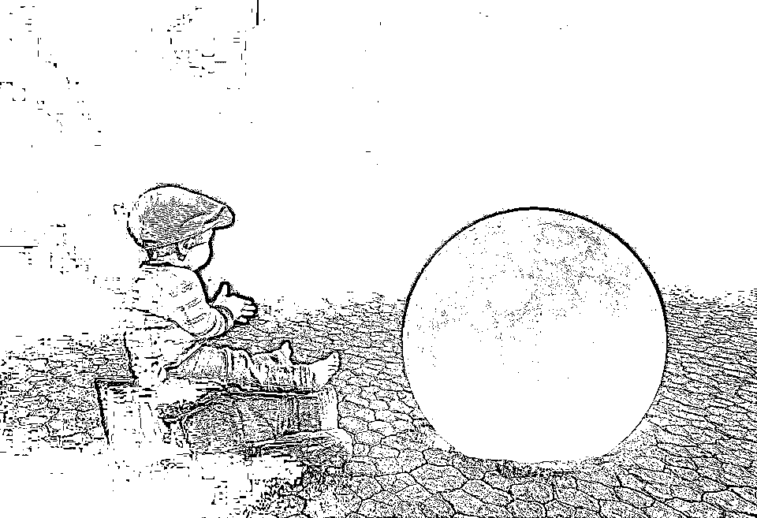

小组研讨项目

今天要重点介绍的是 2020 年开始增设的**“小组研讨项目**”。

若道为每一次的核心课程配备由**多名专业助教和课程顾问**共 5-7 人组成的**”若道专业助教团“**带领和协助该项目的运作：

**根据每个阶段的课程知识点设计相应的研讨主题，进行小组设置、说明研讨方法，参加每一场的小组讨论，及时答疑解惑。**

各小组由热心的志愿者同学担任“组长”和“小蜜蜂”，组织各组学员进行**组内交流，学习互助**，以及定期举行组内**线上研讨会**，并在每阶段课程结束时，**在若道直播视频号公开分享各组的研讨成果。**

这个由若道助教团和学生们共同组织进行的项目，为同学们建立了一个课后**共同学习研讨的机会**，既提升了自身的实践运用能力、团队合作能力、公开表达演讲的能力，还有不少同学在此找到了同道好友，建立了占星学的朋友圈。

2021 年若道四大导师核心课程刚刚结束了 level4 的课程，该阶段的小组研讨主题是“关系解读”。

六个研讨小组分别进行了长达三个月“个人关系解读+名人关系解读”的密集研讨，将于近日在若道视频号直播分享”名人关系解读“的研讨成果。

这届学生即将进入 level5 的课程学习，也会开始全新的课题研讨，未来还会在若道视频号开播分享他们的学习成果。

**2022 年更完善的 ISAR 认证职业占星师文凭课程将于 9 月开课。**我们可以期待的是，即使是刚入学的 level1-2 的初阶同学，也有若道的专业助教团，协助老师，帮你运用所学，进入小组研讨，结识新朋友一起学习。

**在今年的秋天，我们就可以在若道视频号，看到新学子自信的学习成果分享。**

主题研讨直播分享会

以下登场的是 2021 年四大导师核心课程的学员，他们在此预告他们六个小组**“level4 主题研讨直播分享会——《名人关系解读》”。**他们也分享了参加研讨的心得体会。（以下所有文字是各组组长和学员执笔）

【月相组】直播

*   **时间：8 月 13 日，20:00-22:00**

*   **分享主题：《约翰列侬与小野洋子:永恒的爱》**

*   **内容概要：**

    披头士成员约翰列侬与妻子小野洋子，共同奏响一曲——“爱与和平”。就让我们走进他们的世界，并请允许我们引用约翰的名言——五岁时，妈妈告诉我，人生的关键在于“快乐”。上学后，人们问我长大了要做什么，我写下了“快乐”。他们说，我理解错了题目，我说，他们理解错了人生。

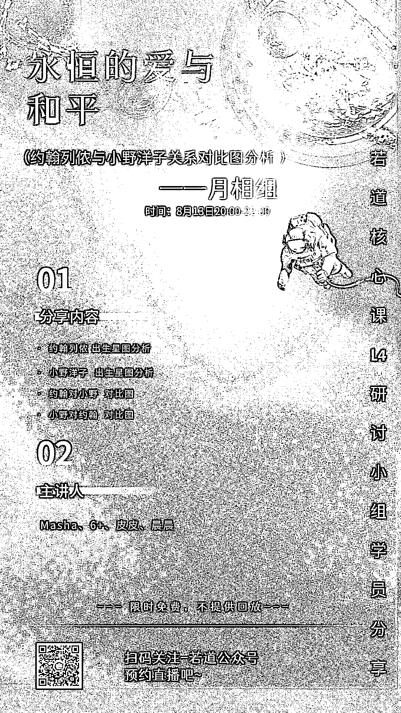

<mpvideosnap class="js_uneditable custom_select_card channels_live_iframe" data-pluginname="videosnap" data-headimgurl="https://wx.qlogo.cn/finderhead/PiajxSqBRaEJYnVsqWfEX9qA0sI6hNVKsDfyzfPZ92WZMZyBpZWU5NA/0" data-username="v2_060000231003b20faec8c4e68a1ec2d4ca07e434b07755bbf47e7053a3059defd2c9d6c68a20@finder" data-nickname="若道" data-desc="将在 08 月 13 日 20:00 直播" data-intro="L4 研讨分享-永恒的爱与和平：约翰列侬与小野洋子" data-noticeid="finderlivenotice-v2_060000231003b20faec8c4e68a1ec2d4ca07e434b07755bbf47e7053a3059defd2c9d6c68a20@finder-1659333747195919-845056468" data-type="live"></mpvideosnap>

【海王星组】直播

*   **时间：8 月 14 日，20:00-22:00**

*   **分享主题: 《王者荣耀为谁谋？——普京与泽连斯基对手关系研讨》**

*   **内容概要:**

    对手，就一定是水火不容吗？你以为的对手出生星图，是不是人生目标南辕北辙？你想象中的对手比较图，是不是充满了激烈的冲突相位？你有没有想过，两个可能惺惺相惜的人，被放到了利益冲突的位置上，他们怎么和对方博弈？两位总统，一场战争，向我们展开了一段耐人寻味的对手关系。

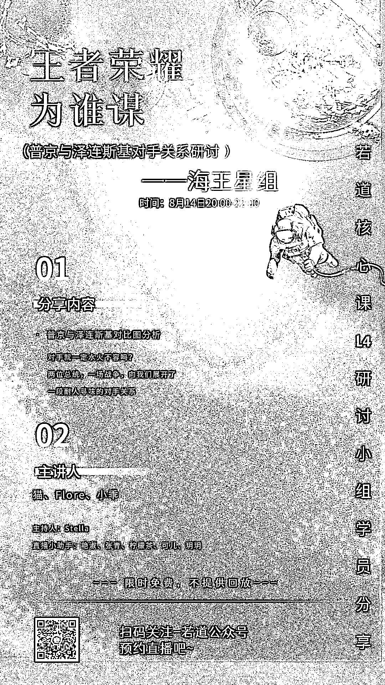

<mpvideosnap class="js_uneditable custom_select_card channels_live_iframe" data-pluginname="videosnap" data-headimgurl="https://wx.qlogo.cn/finderhead/PiajxSqBRaEJYnVsqWfEX9qA0sI6hNVKsDfyzfPZ92WZMZyBpZWU5NA/0" data-username="v2_060000231003b20faec8c4e68a1ec2d4ca07e434b07755bbf47e7053a3059defd2c9d6c68a20@finder" data-nickname="若道" data-desc="将在 08 月 14 日 20:00 直播" data-intro="L4 研讨分享-王者荣耀为谁谋-普京与泽连斯基对手关系" data-noticeid="finderlivenotice-v2_060000231003b20faec8c4e68a1ec2d4ca07e434b07755bbf47e7053a3059defd2c9d6c68a20@finder-1659334226093854-475885255" data-type="live"></mpvideosnap>

【土星组】直播

*   ** 时间：8 月 15 日，20:00-22:00**

*   **分享主题: 《心中是谁，野兽或圣徒——弗洛伊德与荣格关系合盘分析》**

*   **内容概要：**

    每一次我们相遇，灯火彻夜通明；每一次我们分离，思想的交锋被刻进纸背。你是我生命里最重要的人，在第一次遇见你的时候我已经明白；你是我生命里最重要的人，你让我的心识“耳清目明”; 你是我生命里最重要的人，所以我势必违背你，离开你。也许诚如你所说，“背叛你”。

    研讨会从两人理论与生平出发，讨论其与个人星图配置的关联性，以及合盘的两人互动模式与关系变化。

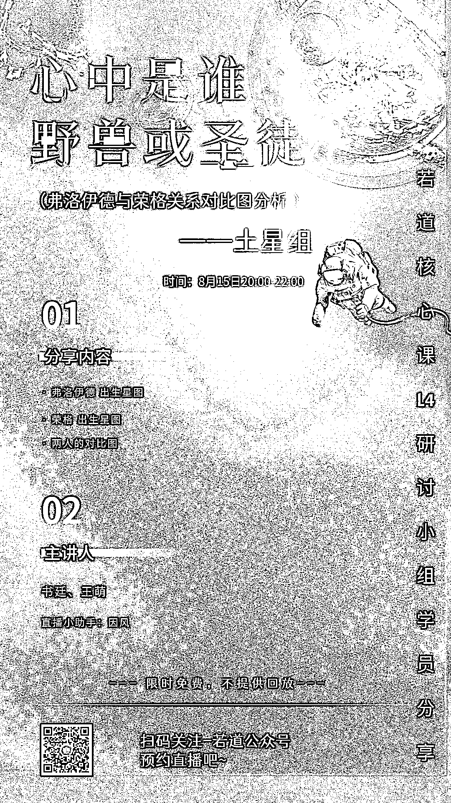

<mpvideosnap class="js_uneditable custom_select_card channels_live_iframe" data-pluginname="videosnap" data-headimgurl="https://wx.qlogo.cn/finderhead/PiajxSqBRaEJYnVsqWfEX9qA0sI6hNVKsDfyzfPZ92WZMZyBpZWU5NA/0" data-username="v2_060000231003b20faec8c4e68a1ec2d4ca07e434b07755bbf47e7053a3059defd2c9d6c68a20@finder" data-nickname="若道" data-desc="将在 08 月 15 日 20:00 直播" data-intro="L4 研讨分享-心中是谁，野兽或圣徒-佛洛依德与荣格关系合盘关系" data-noticeid="finderlivenotice-v2_060000231003b20faec8c4e68a1ec2d4ca07e434b07755bbf47e7053a3059defd2c9d6c68a20@finder-1659334482429999-90293496" data-type="live"></mpvideosnap>

【冥王星组】直播

*   **时间：8 月 20 日 20:00-22:00     **

*   **分享主题：《荒诞世界中的璀璨友情——萨特和加缪关系比对图解读》**

*   **内容概要：**

    “致《现代》杂志主编……"“我们的友谊多艰……使我们接近的事多，使我们分离的事少; 但是，这少仍嫌太多…...“我们的友谊关系非常出色——因为最好的关系是那些彼此互不见面的关系"，“他可能是我最后一位好朋友。"

    20 世纪左岸知识界的传奇故事，战后法国思想界的两大声音，公开摧毁了他们十年的友谊。从神交到决裂，他们从未停止在文字中的隐秘对话。"分裂正是另一种共处的方式"。让我们从星图里，解读他们的故事。   

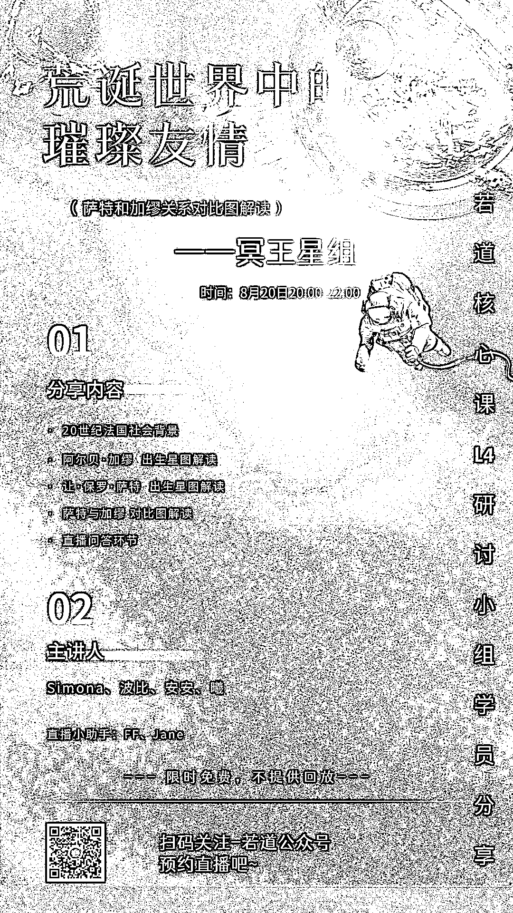

<mpvideosnap class="js_uneditable custom_select_card channels_live_iframe" data-pluginname="videosnap" data-headimgurl="https://wx.qlogo.cn/finderhead/PiajxSqBRaEJYnVsqWfEX9qA0sI6hNVKsDfyzfPZ92WZMZyBpZWU5NA/0" data-username="v2_060000231003b20faec8c4e68a1ec2d4ca07e434b07755bbf47e7053a3059defd2c9d6c68a20@finder" data-nickname="若道" data-desc="将在 08 月 20 日 20:00 直播" data-intro="L4 研讨分享-荒诞世界中的璀璨友情-萨特和加缪关系对比图解读" data-noticeid="finderlivenotice-v2_060000231003b20faec8c4e68a1ec2d4ca07e434b07755bbf47e7053a3059defd2c9d6c68a20@finder-1659509120238849-1591346793" data-type="live"></mpvideosnap>

【天王星组】直播

*   **时间：8 月 17 日，20:00-22:00**

*   **分享主题：《大难不死男孩的造就：J.K 罗琳与哈利波特》**

*   **内容概要：**

    作为《哈利波特》丛书的作者，J.K 罗琳在她的创作中也注入了占星学的魔法，在她笔下的大难不死的男孩是如何走过他的英雄之旅，在占星学上又如何体现呢?人们称 JK 罗琳为“哈利波特之母”，作者和主角之间千丝万缕的关系又是如何体现在星图上呢? 她笔下的这个与她同天生日的小男孩的故事又寄托了罗琳什么样的特殊意义? 今天我们将会用占星学来讨论这一切。

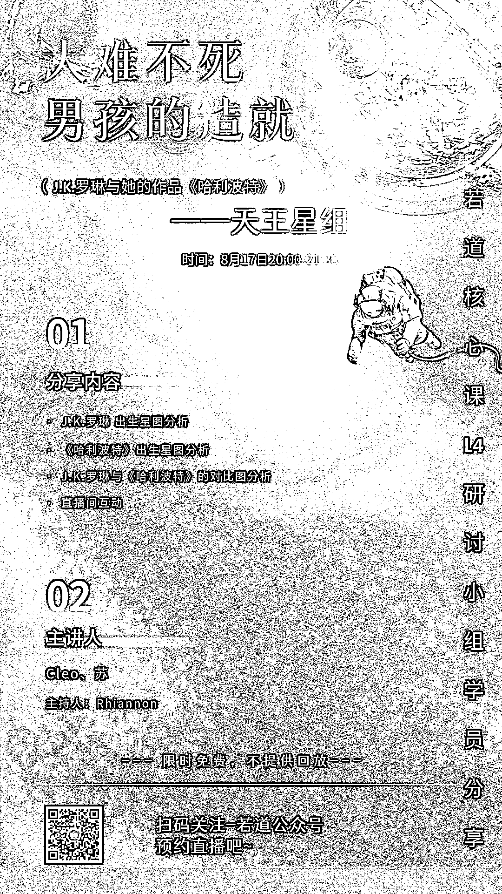

<mpvideosnap class="js_uneditable custom_select_card channels_live_iframe" data-pluginname="videosnap" data-headimgurl="https://wx.qlogo.cn/finderhead/PiajxSqBRaEJYnVsqWfEX9qA0sI6hNVKsDfyzfPZ92WZMZyBpZWU5NA/0" data-username="v2_060000231003b20faec8c4e68a1ec2d4ca07e434b07755bbf47e7053a3059defd2c9d6c68a20@finder" data-nickname="若道" data-desc="将在 08 月 17 日 20:00 直播" data-intro="L4 研讨分享-大难不死男孩造就：J.K 罗琳与哈利波特" data-noticeid="finderlivenotice-v2_060000231003b20faec8c4e68a1ec2d4ca07e434b07755bbf47e7053a3059defd2c9d6c68a20@finder-1659334609120924-994282721" data-type="live"></mpvideosnap>

【木星组】直播

*   **时间：8 月 19 日，20:00-22:00**

*   **分享主题: 《钻石与铁锈——琼·贝兹与鲍勃·迪伦》**

*   **内容概要：**

    琼·贝兹是美国六十年代的民谣皇后，同时她又是一位提倡和平和反战的斗士，她还是乔布斯的女神，她的一生犹如钻石一般坚定如初，璀灿夺目。她是鲍勃.迪伦音乐上的知己和引路人，俩人之间短暂的恋情亦使她意难平。让我们从占星学的角度去解读她的传奇人生，以及是什么样的缘分让她与鲍勃·迪伦从知己到恋人，当爱变质后的十年不再联系的宿命缘分。

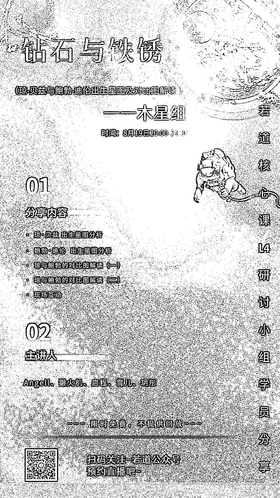

<mpvideosnap class="js_uneditable custom_select_card channels_live_iframe" data-pluginname="videosnap" data-headimgurl="https://wx.qlogo.cn/finderhead/PiajxSqBRaEJYnVsqWfEX9qA0sI6hNVKsDfyzfPZ92WZMZyBpZWU5NA/0" data-username="v2_060000231003b20faec8c4e68a1ec2d4ca07e434b07755bbf47e7053a3059defd2c9d6c68a20@finder" data-nickname="若道" data-desc="将在 08 月 19 日 20:00 直播" data-intro="L4 研讨分享-名人星盘及关系盘解读：钻石与铁锈-琼.贝兹与鲍勃.迪伦" data-noticeid="finderlivenotice-v2_060000231003b20faec8c4e68a1ec2d4ca07e434b07755bbf47e7053a3059defd2c9d6c68a20@finder-1659334894790732-275596370" data-type="live"></mpvideosnap>

研讨学员心得

Flore

从 L2 的研讨会一路参与至今，收获越来越多。从一开始的抓着老师问问题，到 L4 大家真的可以开始切磋探讨，我感受到了自己的进步。我慢慢地找到了研讨的意义，学着独立思考，学着理解别人的解盘思路；从模仿老师的解盘思路，到逐渐形成自己的解盘思路，边学边练的效果太神奇了。

张青

我是上了 L4 才进入了小组的，进的是海王星组。先说一下进组对论了六、七次，整体什么感受。真有开小灶的感觉。

我们海王星组的有十几位小伙伴，那都是真心想磨练技艺的。我们会在每周开会前，准备自己的解盘稿。认真到每周讨论前，都要事先把自己的解盘稿”录音+文字“版发出来。由付组长整理好发给每个人提前预习（这样开会高效高）。每周一例会的时间，每次说两个小时，基本上都是三个小时（大家沉浸式的状态）。

举例：每个人自己写的其他小伙伴们的关系比对图分析。大家现场再集体讨论时，那是有啥问啥，问啥组员都会如实回答。非常方便根据星图中的信息去验证现实的真实状况，学习效果那是突飞猛进。

再有必须要说的，就是我们的助教老师们。我这才发现，若道里真的是藏龙卧虎，助教老师们的水平可真是高。

我真后悔 L3 为什么没有参加小组呢？真是亏大啦……

所以那些未来报名课程的小伙伴，一定要进组。进组每周由助教老师们开小灶，会加速与飞速提升看星图水平的。

王萌

在土星合我太阳、四分本命南北交的行运下，研讨会让我悉数把之前蜻蜓点水看过的书又重新翻出来做了结构化的整理和拼接，之前积攒的美图也用上了，整理名人星图的过程也感觉到相同元素的共振，被狠狠加持了一把，最近梦境的变化就对应了这个部分，真是收获巨大，把学过的东西输出的过程既巩固了知识点也结合了自己的想法和创造，这个过程真是收获满满。

小组汇报完打算把读过的书那些精彩的部分再仔细看一遍，老树发新芽，好像也适合目前这个群星逆行的大背景，真的是太好玩了～

Ophelia

占星的学习，心性的修习，可能通常都是孤独的旅程。很感谢在研讨会与各位同学的相遇，让这一段旅程不再孤独。

我们彼此是同道，一起讨论进步；彼此是镜子，相互对照观察；她们也是我的老师，带我见过我不曾见但心向往之的旅程风景。

我曾经在开课前，许愿我能遇上有共同目标愿景的伙伴，愿望走进了我的生活，非常感谢与若道结缘。

启程

作为占学初学者，在一、二阶第一次参加研讨小组时，有点吓懵了。周围基本都是有一定基础的同学，有些甚至是已经做了咨询师的再次来系统学习。于是，我可耻地噤声了，没敢参加二阶分享会。到了三阶，问题出来了，很多知识点有模糊印象，却不清晰，老师已经在教导知识点的串联运用，我还需要再次查看原来的笔记，复习基础知识。

于是，三阶研讨小组中，我胆怯地发言了，直白的告诉同学们我是菜鸟，知识储备与大家天壤之别。很惊喜，组长和同学会在小组研讨中，给予鼓励，也会帮助指出不足。某个知识点有疑惑，同学会分享她之前的笔记给我，帮我辩晰。大家都很忙，却愿在深夜陪我单独讨论。感谢她们！

三阶研讨的助教老师不固定，每个老师各有特色，他们的点评带来不同的视角和启发。可以感受到他们热切地希望帮助我们成长的心。我们的每个问题，也许幼稚，也许涉及面多，但总是尽力回复。

三阶的分享会前，为了消除我们的紧张，组长和助教老师做了很多工作，不只是分享上内容帮助，甚至结合天象给我们打气。组员里，有热情的设计师同学帮助设计 ppt，让我们的 ppt 大气美观。

参加研讨与分享会的效果，对我而言是基础知识在应用中熟悉得很快。我们都是木星能量强的人，但因为行星宫位、相位的不同，呈现了不同的风格与人生选择。在辩析中理解知识，这对水星双鱼的我很适合。

四阶研讨会，我不再担心组里的大咖们笑我弱鸡，反正不懂就多问。个人星图的结队研讨，会不小心涉及对方过往的伤痛与不安，但在组长的敞开与示范下，我放下焦虑，我开始感应到星图与生动的人生轨迹的对应。

名人星图研讨，助教老师一针见血指出，我想在架构的基础上阐述，却易被细节缠绕。这多么像我的人生，南交双子座，有急智却缺乏深远谋略。我觉得自己在这里了，技术上对比较图的分析不熟练，思想上也缺乏整体论的思维。助教老师却教了我一个简单的方法，如何快速找到某颗行星触发了另一个人星图的相位格局。

我又开始了练习和挑战。隐隐约约中，感觉若道不只教了我技术，似乎也在教我面对人生困局的态度。

感谢一路帮助我的各位助教老师和同学们！

安安

Level 4 先从研究同学的星图入手，可以第一时间得到对方的反馈，找到解读中的盲点。

再到研究名人的星图，结合名人的生平事迹，从第三方客观的视角去解读，能够锻炼大家将知识点落地，以及从名人的行为模式，反推理解星图的配置，引发大家深入思考。

Level 4 通过这种由简入难的学习方法，加上老师们的指导，切切实实地加强了对各个知识点的整合，真正做到了”占星生活化，生活占星化“，让我们爱上占星，使用占星，践行占星！

Simona

L4 的课程很多时候是前三阶知识的进一步深入和整合运用，因此 L4 的研讨也有更多的挑战。老师们采取的两部分由简入繁的研讨结构，以及固定驻扎在一组的方式，对研讨思路的梳理以及针对性提高特别有帮助，这点很惊喜。

组内同学的个人星图整合及关系比对解读，可以让大家更清晰、具象、立体地理解星图元素的表达体现。名人图对于搜集资料，研讨合作、深入研究的锻炼非常强。虽然这一切都很不容易，不过在群体中一起走过这段学习，还是收获颇丰的。

**点击下图了解更多课程信息****

# 今日牌阵推荐 | 事业牌阵：谋生很辛苦，热爱就不一样了

> 原文：[`mp.weixin.qq.com/s?__biz=MzA5NjA0NTAxNg==&mid=2651484146&idx=3&sn=8e1c4bffe233c0d6780f75c8a91519de&chksm=8b48dd45bc3f5453a78b8b230ecdaf2f15e1b1429ce02f1cf4b87a220816db61f46f26ac63f9&scene=126&sessionid=1692737771#rd`](http://mp.weixin.qq.com/s?__biz=MzA5NjA0NTAxNg==&mid=2651484146&idx=3&sn=8e1c4bffe233c0d6780f75c8a91519de&chksm=8b48dd45bc3f5453a78b8b230ecdaf2f15e1b1429ce02f1cf4b87a220816db61f46f26ac63f9&scene=126&sessionid=1692737771#rd)

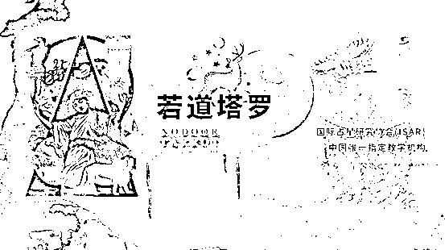

**若道神话塔罗 H5 惊喜上线****文末有扫码通道哦**

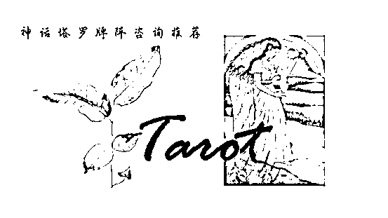

**“我最近意识到，自己好像失去了人生的方向。”**你也曾有过上述这种感觉吗？每天好似很忙碌，但完全感受不到工作的意义，不知道自己真正需要的是什么。**对于想要了解工作状态和意义的人来说，这个通用牌阵就是为你准备的，它可以用于多种工作状态和情况：**

*   你对现在的工作很满意，正在考虑长期发展路线的规划；
*   或者你有些厌倦了现在的工作，想要得到一些提示；
*   又或者你在一个不是特别喜欢的地方，但你因为各种原因坚持在工作……

**这个牌阵都可能帮你找到工作中更积极的时刻，并为你的未来奠定基础。**无论你处于人生的哪个阶段，考虑一个更长远的愿景总是很重要的，无论是找到你可以为之奋斗的目标，还是提醒自己，未来的美好由自己创造。

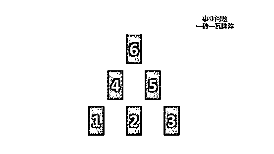

1.  你来这里的**目的**是什么?——**你最初为什么选择这份工作？**
2.  你的**动机**是什么？——**推动你完成每天都要做的工作的动力是什么?是什么激励你做到最好？**
3.  你的**职责**是什么？——**你在这里的角色是什么，是否在职位描述中？**
4.  你的项目**进展**如何？——**你现在的状态/环境怎么样?你觉得这份工作怎么样？**
5.  潜在的**回报**是什么？——**你能从这份工作中获得什么？经济上的、精神上的，或其他方面的。**
6.  这一切将把你**引向何处**？——**这一切可能带来的未来是什么样的？**

“一砖一瓦”牌阵咨询案例解读

案主目前就职于互联网行业，1 年前调岗到了自己比较喜欢的垂直细分领域，负责市场工作，在这家公司工作 4 年了，带小团队，近期项目偶尔有阻力，总体进展正常，感觉自己工作缺乏动力，想寻求建议。

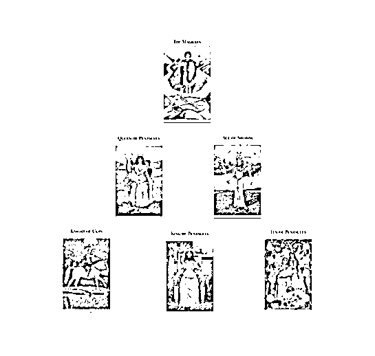

**1****你来这里的目的是什么：圣杯骑士**

**圣杯骑士牌体现了水元素活跃和敏感的一面**，就像无常的生命之流，一直都在不断的变化和运动之中，是双鱼座的能量，和艺术想象力有关，**透露着很强的浪漫理想主义。**

案主对于目前的工作领域还是有着很纯净的喜爱，就像是年少的喜欢，案主选择这份工作的目的是为了**追求自己内心的喜好，做自己喜欢的事情**，实现自己心之所向的艺术创作状态。

当自己感觉到缺乏意义和动力的时候，**可以尝试在工作中找到喜欢的感觉，**细化成可以实现的小事情，一点点让热爱回温。

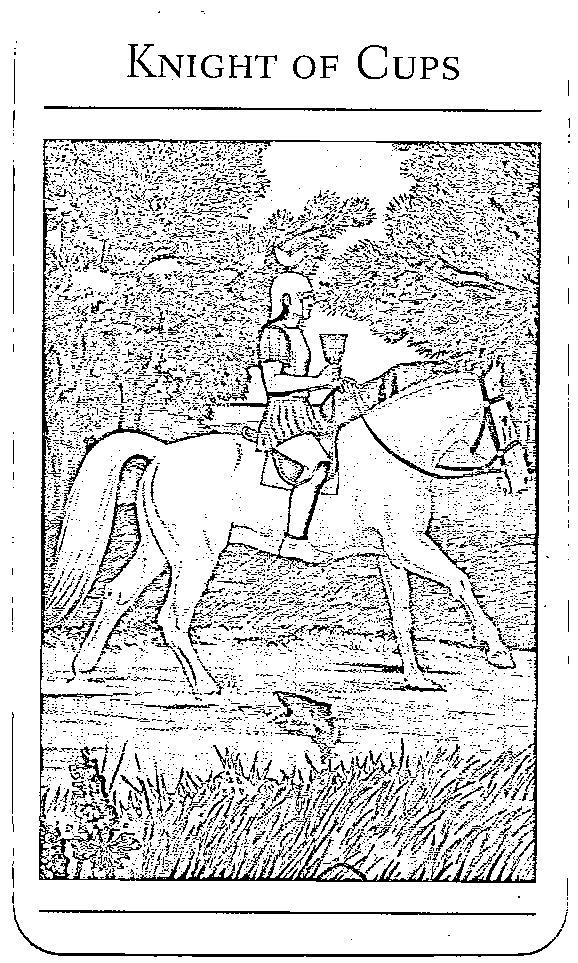

**2****你的动机是什么：星币国王**

**星币国王体现了土元素活跃的动态面向，是摩羯座的能量，流露出对于现实生活中的野心与抱负。**

案主在这份工作中，**晋升和财富收入是很重要的工作动机，**想要获得权利和他人的认可，还有物质安全感的需求和通过自己努力获得事物的自信和满足。

如果目前工作中没有明确的晋升机会，可能是缺乏工作动力的原因，可以跟直属领导有更明确的沟通，梳理自己的职业晋升规划，可能会由此**提升动力和目标感**，更好的激励自己。

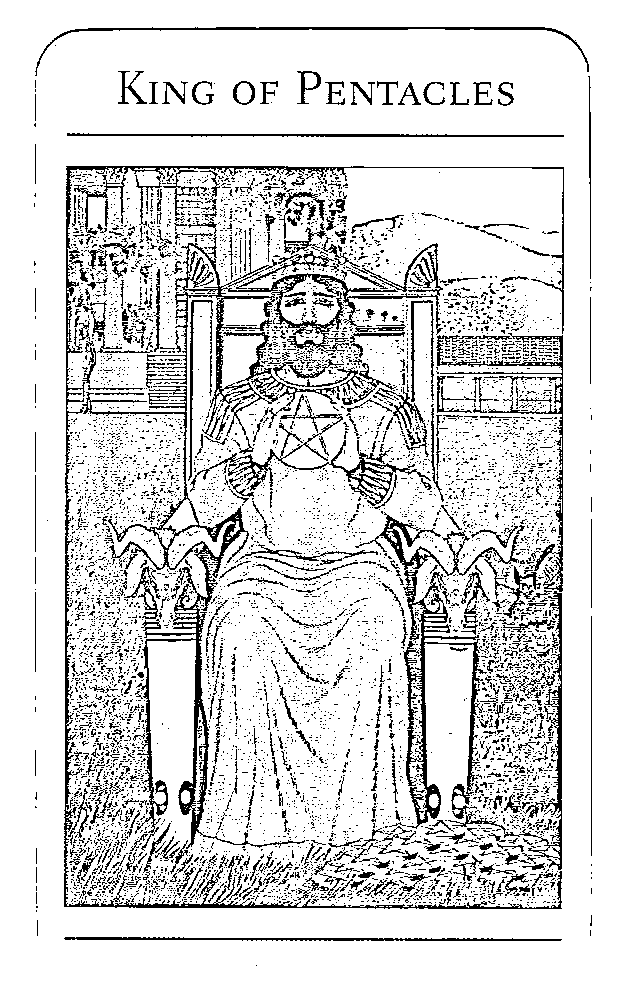

**3******你的职责是什么：星币 10****

**星币 10 体现出案主的职责对于公司还是很重要的，除了创造金钱收益，更是所做的工作是具有创造性的。**

因为案主描述中负责产品是需要给用户带来轻松愉快的体验，那星币 10 的能量更升级，是满足感和安全感，案主需要产出的内容对于公司的品牌和产品的建设性意义很大，可以传递给他人有价值的讯息和理念，对于公司后续的市场工作很有帮助。

**在工作中需要你更多的从公司的利益和价值发展方向出发，带领团队创造出对用户有影响力的内容。**

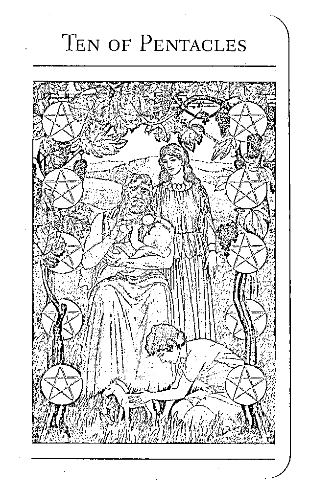

**4******你的项目进展如何：星币女王****

**星币女王体现出土元素稳定、接纳和感官之美的面向，是金牛座的能量，有丰盛富足的感觉。**

虽然案主描述在项目进度方面偶尔有阻力，但是这张牌体现出的发展还是很稳定的，**提示案主不要急躁冒进，稳扎稳打。**

在工作内容中，更多的注重跟感官相关的部分，比如更好看，更有质感，更能引发感官共鸣等等，慢就是快，稳定很重要，目标受众更侧重女性的可能性更大，争取并善用公司的经费投入，产出让用户觉**得舒适、安全、愉悦**的内容，项目进展会更顺利。

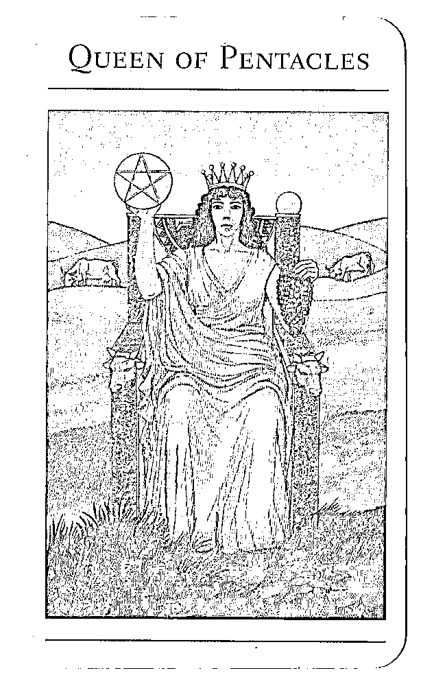

**5****潜在的回报是什么：宝剑 1**

**宝剑 1 体现出思想和创意的重要性，**在这个岗位工作了一段时间之后，很多工作内容可能会进入到程序化的状态里，案主需要更多的解放自己的思维，用一些创新的想法解决问题。

宝剑 1 中雅典娜手中的宝剑也是有两面性的，**也就是全新的尝试是有不确定性的，**但是每一次试错后，你都可以收获经验或者成就感。

自信就是一次次小的成功积累出来的，案主除了日常工作外，**可以给自己和团队设置一些创新的挑战**，在这些挑战中，可能收获潜在的觉醒和自我肯定。

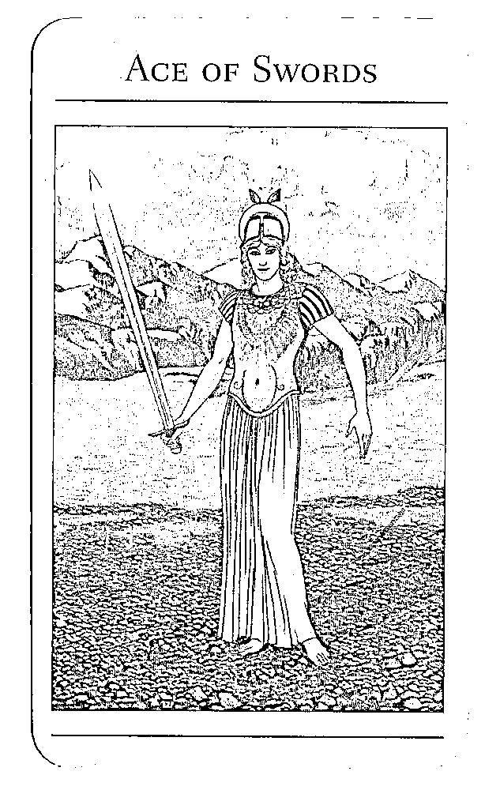

**6****这一切将把你引向何处：魔术师**

魔术师牌中的信使赫尔墨斯，是会在不经意间向案主传递预见性和指导性的，代表四元素的物品摆在分岔路口的岩石上，**需要案主看到这场工作旅途的目的地，明确自己还有很多尚未发展出来的潜力。**

带上需要的元素物品，踏上选择的道路，**止步不前、默守陈规才会造成目前缺乏动力的状态**，无论是为了自己的热爱（圣杯骑士）、或是对于世俗成就的最求（星币国王）、亦或是公司对于你创造价值的期待（星币 10），案主都需要在目前的工作中先前踏出一步，去创造目前工作项目的丰盛的状态（星币女王），从而收获思想上的自我突破和实现（宝剑 1）。

谋生很辛苦，热爱就不一样了，愿案主每日工作，不仅为了谋生还有热爱，动力满满的踏上新征程。

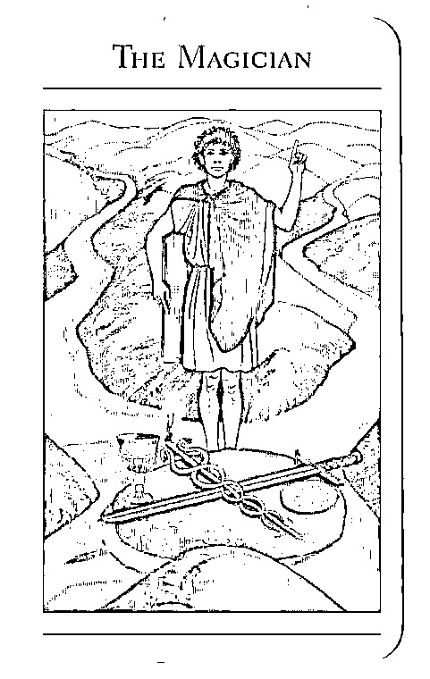

**祝好运！**

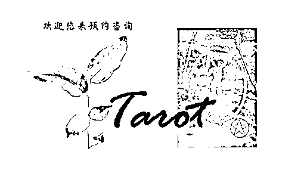

**如何预约塔罗师咨询？****扫码进入全新神话塔罗 H5**

每天有事没事都可以去**神话塔罗 H5**里转转抽取专属于你的今日塔罗

**神话塔罗 H5 问答平台全新上线**

三张牌牌阵，专业塔罗咨询师语音条解读

如果你碰巧有困惑，刚好有**限时优惠价**

如果感到快乐你就用用**神话塔罗 H5****，**如果你感到不快乐，更要使用由专业人本主义塔罗师团队全程陪伴的**神话塔罗 H5 哦！**

**想入驻若道塔罗平台成为职业神话塔罗师？****2022 年最新《神话塔罗认证课程》报名中****点击下图了解课程详情哦~**

# 今晚开讲丨神话塔罗：高效学习班上线，灵活掌握，专业实践！

> 原文：[`mp.weixin.qq.com/s?__biz=MzA5NjA0NTAxNg==&mid=2651484146&idx=4&sn=7aba02c81a947b96ebb6845a780b34e3&chksm=8b48dd45bc3f54539afb555be1f79154b29a090b10c7cc586f45581609e1d5e5e4187f4ebd7c&scene=126&sessionid=1692737771#rd`](http://mp.weixin.qq.com/s?__biz=MzA5NjA0NTAxNg==&mid=2651484146&idx=4&sn=7aba02c81a947b96ebb6845a780b34e3&chksm=8b48dd45bc3f54539afb555be1f79154b29a090b10c7cc586f45581609e1d5e5e4187f4ebd7c&scene=126&sessionid=1692737771#rd)

**2022 年超高含金量的神话塔罗认证课程****高效学习班****开始招生**用**四个月**的时间学习掌握神话塔罗解读喜欢**集中学习，快速掌握**的同学不要错过

黄色日期为**8 节直播课**时间，同学可以自由安排时间学习**18 节录播课**

班级学习群讨论、APP 答疑区提问

课程内容体系让你直观精准地感受到**神话塔罗的魅力**扎实地建构**神话塔罗思维**系统学习**最地道的塔罗知识**课程中老师将**神话、占星、心理学**完美融合进塔罗的**人本主义咨询体系**并进行学员**案例督导**让你更自信的开展咨询工作，学以致用

本期认证课程采取**即报即学的录播课+案例督导直播课**的形式，

*   **18 节录播课：**精编剪辑，随来随学，助教答疑，学练结合。

*   **8 节直播课：**融会贯通，神话心理，塔罗占星，咨询技巧。

为了适配大家的各种学习场景，提高学习&复习效率，我们还将**录播课**剪辑了**中文字幕版**和**翻译音频版**：

*   **中文字幕版：**朱丽叶老师英文原声配中文字幕，适合在手机或电脑前专心致志的学习。

*   **翻译音频版：**翻译老师幼婷的中文原声纯享，适合运动、通勤路上耳机里陪伴式学习。

若道还为塔罗学员开发了**“神话塔罗”**平台，是随身的工具，更是接咨询的平台，录播课程**学成入驻平台**即可链接更多塔罗个案，发展壮大你的塔罗咨询事业。

**如果你想学习塔罗，什么样的老师会让你怦然心动呢？她是三副塔罗牌的设计者，写了 6 本塔罗书籍。她研习塔罗四十余年，教授塔罗三十余年，是丽兹·格林的密友。还有****谁会比塔罗牌设计者更了解塔罗的历史、灵魂与精髓？****所以，这将是你开启塔罗之旅最坚实的一步。**

1

**这位塔罗大师是谁？**

**朱丽叶·沙曼-伯克** 

*   她是**3 副塔罗牌**的**设计者****——**神话塔罗牌、沙曼–卡塞利塔罗牌、“自己着色”塔罗牌；

*   她出版了**6 本塔罗书****——**《塔罗全书》、《新塔罗全书》、《众星的传说》、《理解塔罗牌》、《精通塔罗牌》、《塔罗初学者指南》；

*   她研习塔罗**四十余年；**

*   她教授塔罗**三十余年**；****

*   她是**丽兹·格林**的密友，两人合著了**《神话之旅》**，共同设计了**神话塔罗牌**。

*   她是认证的**心理治疗医师；**

*   她深谙**塔罗、占星学、心理学和神话学。**

**如果你想成为拥有英国神话塔罗认证的塔罗师**

那么她，就是你**最好的老师人选**

2

**塔罗牌有什么用？**

*   塔罗牌是一种**古老的疗愈工具**，同时也是**直观的解惑工具****；**

*   塔罗牌绕过逻辑思维，**和潜意识联结**，通过图像的方式生动地将隐藏在人类潜意识中的画面浮出水面，**揭示心灵的状况和运作****；**

*   塔罗牌**帮助我们和潜意识对话**，可以和现代的心理治疗联系在一起，帮助我们**看清心灵的冲突来源、本质和可以选择的道路；**

*   塔罗牌又和更广阔的**宇宙生命原型**联结，彰显**个人生命发展的阶段**，将**个人生命挣扎、内在冲突**放在生命进化的道途上，让更广大的生命智慧为个人成长照亮道路。

3

**为什么学习神话？**

神话通过**图像和故事**描绘人类生活的**原型模式**。通过瑰丽的想象、诗意的语言、栩栩如生的人物和故事描绘出我们内心的世界，表达出我们经历的那些实现人性的过程，帮助我们将**个体的生活与人类古老且永恒的故事**建立联结。从而在更深处**理解生命**，并学习**古老而长青的生命智慧**。

**神话塔罗**取材于**希腊神话**的无尽沃土，通过故事提供一种**记忆辅助**，在心理和预见层面提升解读的**丰富度**。因为这样更符合塔罗牌的性质，符合人类的想象。**按照故事思考，而不是简单的记忆关键词和固定的意义。**

4

**塔罗预测是什么？**

塔罗牌预测的运作就像是**照向心灵的一面镜子**。在塔罗牌解读时，图像的原型性质穿透隐藏的潜意识脉络，反应出与个人境遇相关但又未被了知的知识与洞见，因此**揭示出按照任何理性方式都无法发现的事情。**

如果你对生命好奇，塔罗学习会帮你**打开一扇通往未来的门****，**让你了解**心灵运作和显化的秘密**，同时赋予你更多关于生命成长的支持和指引的能力！

5

**我们将学习什么？**

**录播课（即报即学）**

**☆****初阶：神话塔罗详解**

**神话故事和预测意涵**

**第 1 讲 塔罗牌介绍 ，讲述它的历史 （中文字幕版）**

**第 1 讲 塔罗牌介绍，讲述它的历史（翻译音频版）**

**第 2 讲 星座形态、元素和宫廷牌&基本星座与基本国王 （中文字幕版）**

**第 2 讲 星座形态、元素和宫廷牌&基本星座与基本国王（翻译音频版）**

**第 3 讲 固定星座与固定王后（中文字幕版）**

**第 3 讲 固定星座与固定王后（翻译音频版）**

**第 4 讲 变动星座与变动骑士（中文字幕版）**

**第 4 讲 变动星座与变动骑士（翻译音频版）**

**第 5 讲 小阿尔卡那牌权杖（中文字幕版）**

**第 5 讲 小阿尔卡那牌权杖（翻译音频版）**

**第 6 讲 小阿尔卡那牌圣杯（中文字幕版）**

**第 6 讲 小阿尔卡那牌圣杯（翻译音频版）**

**第 7 讲 小阿尔卡那牌宝剑（中文字幕版）**

**第 7 讲 小阿尔卡那牌宝剑（翻译音频版）**

**第 8 讲 小阿尔卡那牌星币（中文字幕版）**

**第 8 讲 小阿尔卡那牌星币（翻译音频版）**

**第 9 讲 经典牌阵教学讲解（中文字幕版）**

**第 9 讲 经典牌阵教学讲解（翻译音频版）**

**第 10 讲 牌阵解读案例演示（中文字幕版）**

**第 10 讲 牌阵解读案例演示（翻译音频版）**

**☆****中阶：神话塔罗牌阵应用**

**神话****解读和咨询技巧**

**开启神话塔罗愚人之旅**

****

**第 1 讲 愚人、魔术师、女皇、皇帝（中文字幕版）**

**第 1 讲 愚人、魔术师、女皇、皇帝（翻译音频版）**

**愚人**：永恒的少年（儿童的原型）

**魔术师**：恶作剧者、老师、向导、沟通者的原型；行星：水星。

**女王**：母亲、养育者、丰产的原型；行星：金星在金牛座；小行星：谷神星。

**皇帝**：父亲、供养者、计划者的原型；行星：木星。

**第 2 讲 女祭司、教皇、恋人、战车、正义、节制（中文字幕版）**

**第 2 讲 女祭司、教皇、恋人、战车、正义、节制（翻译音频版）**

**女祭司**：处女——等待被实现的潜力原型；行星：新月。

**教皇**：疗愈者、受伤的疗愈者、牧师的原型，牧师是神与人之间的灵性桥梁；行星：凯龙星。

**恋人**：爱、爱人、所爱之人的原型；行星：金星在天秤座。

**战车**：战争、冲突、战士、斗士的原型；行星：火星。

**正义**：智慧、兵不血刃的胜利的原型；星座：处女座；小行星：智神星。

**节制**：关系、合作的原型；星座：巨蟹座、双鱼座。

**第 3 讲 力量、隐士、命运之轮、倒吊人、死神（中文字幕版）**

**第 3 讲 力量、隐士、命运之轮、倒吊人、死神（翻译音频版）**

**力量**：力量的原型；星座：太阳在狮子座。

**隐士**：晚年、耐心的原型；行星：土星。

**命运之轮**：命运女神与命运的原型。

**倒吊人**：牺牲与有意识的牺牲的原型；行星：海王星。

**死神**：死亡、终点和起点的原型；行星：冥王星。

**第 4 讲 恶魔、高塔、星星、月亮、太阳（中文字幕版）**

**第 4 讲 恶魔、高塔、星星、月亮、太阳（翻译音频版）**

**恶魔**：阴影、人类不文明的面向、本能、欲望天性；行星：火星在天蝎座。

**高塔**：改变、分裂瓦解的原型；行星：天王星。

**星星**：希望的原型。

**月亮**：无意识的原型；行星：暗月。

**太阳**：意识、创造力和文明的原型；行星：太阳。

**第 5 讲 审判、世界（中文字幕版）**

**第 5 讲 审判、世界（翻译音频版）**

**审判**：复活、新生的原型；行星：水星作为灵魂向导普绪科蓬波斯。

**答疑与讨论，学员们分享对自己或客户的塔罗解读，对神话塔罗牌进行更多探讨。**

**世界**：整体、完成和个性化的原型。

**第 6 讲 经典牌阵教学讲解（中文字幕版）**

**第 6 讲 经典牌阵教学讲解（翻译音频版）**

**第 7 讲 咨询案例演示：为一位年轻女性所做的四次解读（中文字幕版）**

**第 7 讲 咨询案例演示：为一位年轻女性所做的四次解读（翻译音频版）**

**第 8 讲** **引导式冥想、荣格的四种意识功能（中文字幕版）**

**第 8 讲 引导式冥想、荣格的四种意识功能（翻译音频版）**

**☆****高阶：神话塔罗直播督导课**

**第 1 讲 塔罗牌中的荣格原型**

**2022 年 8 月 10 日（周三）**

我们将学习荣格是如何理解原型，以及荣格原型如何反映在塔罗牌中。对塔罗牌解读而言，理解原型的普遍性非常有帮助，因为这有助于塔罗咨询师碰触客户的内心世界。

**第 2 讲 塔罗牌是如何与行星原型和其原型体验联系在一起**

**2022 年 8 月 24 日（周三）**

大阿卡纳牌反映了行星神祗的原型，在某些情况下，原型经验意味着它们反映了所有人类的经验。我们将通过这个角度看这些大阿卡纳牌。我们将看到理解原型对解读有何帮助。

**第 3 讲 荣格意识的四种功能与小阿卡纳牌的四种元素及与权杖、星币、宝剑、圣杯四套牌之间的联系**

**2022 年 9 月 7 日（周三）  **

我们将看看小阿卡纳从 1 到 10 如何反映荣格意识功能的各个方面，以及它们如何反映在四套牌四个元素和其心理方面。我们还将对 1-10 的数字学进行修正，看它们在元素中的表现方式。

**第 4 讲 占星学中的 12 星座和宫廷牌之间的联系**

**2022 年 9 月 21 日（周三）**

我们将讨论形态和星座，以及它们如何反映在宫廷牌上。

**第 5 讲 马蹄牌阵学员案例督导**

**2022 年 10 月 19 日（周三） **

**第 6 讲 六芒星牌阵学员案例督导**

**2022 年 11 月 2 日（周三） **

**第 7 讲 凯尔特十字学员案例督导**

**2022 年 11 月 16 日（周三） **

****

**第 8 讲 三个牌阵学员完整案例督导**

**2022 年 11 月 30 日（周三）**

**认证阶段：考试论文**

录播课学习完毕，即可入驻若道神话塔罗平台，以实习塔罗师获得推广流量，对接塔罗咨询个案。

直播课+录播课学习完毕，提交考试论文通过即可获得获得英国神话塔罗认证证书，升级为认证咨询师。

**扫码进入全新神话塔罗 H5**

每天有事没事都可以去**神话塔罗 H5**里转转抽取专属于你的今日塔罗

**神话塔罗 H5 问答平台全新上线**

三张牌牌阵，专业塔罗咨询师语音条解读

如果你碰巧有困惑，刚好有**限时优惠价**

如果感到快乐你就用用**神话塔罗 H5****，**如果你感到不快乐，更要使用由专业人本主义塔罗师团队全程陪伴的**神话塔罗 H5 哦！**

6

**适合人群**

*   塔罗初学者，完全没有塔罗基础；

*   塔罗自学者，也曾上过塔罗工作坊，但仍不懂如何使用塔罗牌；

*   塔罗进阶学习者，有塔罗基础，了解 78 张塔罗牌含义；

*   不知如何解决遇到的情感困惑、职业选择、人际问题，对人生感到迷茫；

*   想要学习深入解读塔罗牌、牌阵的使用、咨询技巧等将塔罗运用于咨询实践；

*   想要深入了解和学习塔罗，希望成为专业的塔罗师；

*   想要借助塔罗进行心灵、灵性成长。

7

**导师简介**

**朱丽叶·沙曼-伯克**

**朱丽叶·沙曼-伯克**从 20 世纪 70 年代早期开始，就对塔罗牌产生了兴趣，并踏入了塔罗的世界。后来，在丽兹·格林的鼓励下，开始研习心理占星学和塔罗。

1984 年，第一本书《**塔罗全书**》（*The Complete Book ofTarot*）出版。之后，与丽兹·格林合作设计并撰写了《**神话塔罗**》（*The Mythic Tarot*），在这本书中，她们将古希腊神话与传统塔罗解读结合起来。朱丽叶写了**十本塔罗和占星学书**，包括一本名为《众星的传说》（*Stories from the Stars*）的儿童读物，以及与丽兹·格林合著的《神话之旅》（*The Mythic Journey*），这是一本详细讲述如何运用神话来指导生活的书。

8

**课程价格**

**认证课程总价：****22000 元**

**联报优惠价：****19000 元**

**限时转发优惠价：18000 元（联系 Echo 老师，获取限时转发优惠价）**

长按二维码添加客服 Echo 老师

9

**退转课程**

*   **退款原则请详看《教学协议》，如有疑问请咨询课程顾问。**

**神话塔罗认证课程**

**授课老师：朱丽叶·沙曼-伯克**

**授课时间：录播课即报即学，直播课 2022 年 8 月 10 日起**

**授课方式：**网络课程**，**英文授课，中文翻译

**费用：****认证课程总价：****22000 元；****联报优惠价：****19000 元；****限时转发优惠价：18000 元**（联系 Echo 老师，获取限时转发优惠价）

**课程负责人：Echo 老师**（微信/手机：nodoor18518412824，请备注“神话塔罗”）

长按二维码添加课程负责人咨询~

****报名请点击“阅读原文”****

# 30 岁第一次土星回归一定倒霉？土星：我没惹你们任何人

> 原文：[`mp.weixin.qq.com/s?__biz=MzA5NjA0NTAxNg==&mid=2651483938&idx=1&sn=6c745324118604002f3c470a1da11b19&chksm=8b48dd95bc3f54836594f714fcfad11468c6792ac442bbf09adb3ce32648869ba81ed834b9f1&scene=126&sessionid=1692737771#rd`](http://mp.weixin.qq.com/s?__biz=MzA5NjA0NTAxNg==&mid=2651483938&idx=1&sn=6c745324118604002f3c470a1da11b19&chksm=8b48dd95bc3f54836594f714fcfad11468c6792ac442bbf09adb3ce32648869ba81ed834b9f1&scene=126&sessionid=1692737771#rd)

******☆ ****后台回复“今日”，给你一句生命态度******

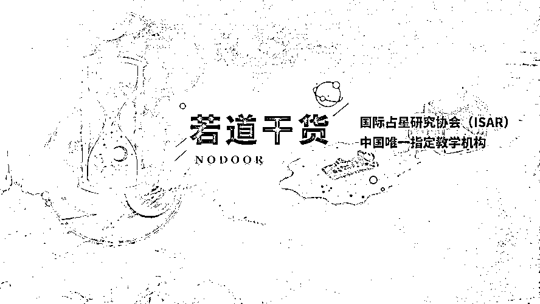

作者/大卫·瑞雷  若道占星创始人译者/李含 校对/Jun 编辑/玫瑰 封面/书君 图片/pexels 文章来源/《风度》杂志

古人有云：“三十而立。”现代人说：“三十而已。”三十岁究竟是个怎样的存在？看看大卫老师如何同占星学来解读。另外，大卫老师参与授课的【[ISAR 认证职业占星师文凭课程](http://mp.weixin.qq.com/s?__biz=MjM5MjQwNjAyMQ==&mid=2649440030&idx=8&sn=4ce859d104638437c7f91c4c95471d01&chksm=beb9507489ced962e0429b09e6855feeefc9f3041b4224b399a338b3fa02718b9800894d4b3f&scene=21#wechat_redirect)】报名中，点击链接了解更多详情！

**“三十而立”**

在现代社会，步入 30 岁是真正的“成人仪式”，对某些人来说可能太过真实了。在中国，有一个关于 30 岁的古老传统，孔子有云: “三十而立。”进一步阐述这句话的意思是，一个人应该“在 30 岁时建立自己的地位、事业和家庭。”

一部热播的中国电视剧《三十而已》，用现代的手法呼应了这个传统。

我看过这部 2020 年由张晓波导演的电视剧，由江疏影、童瑶和毛晓彤主演，故事讲述了三个截然不同的都市女性拥抱 30 岁的“成年”生活，找到什么对她们来说才是真正重要的，她们离开无忧无虑的 20 多岁，变得认真起来，变得善于管理自己的生活。

然而，这部中国电视剧的故事也会引起西方观众的共鸣，因为在西方，30 岁一直是对成熟和严肃的成年考验。所以，面对现实吧，如果你快 30 岁了，你就要被时间之父召进严肃的成年人俱乐部了。如果你现在已经过了 30 岁，那你是如何跨过 30 岁门槛的呢？我 20 多岁的时候，记得我的占星学老师调侃我这个认真的占星学生，他说：“在 30 岁之前，你都算不上是个真正的成年人。我认为在你 30 岁之前都不应该允许你实践占星学。”不用说，我讨厌他的论调，急于证明他是错的；但是回想起来，直到我步入 30 岁的时候，我的占星事业才稳固地建立起来。尽管有些文化差异，但我看到我年轻的中国友人们在临近 30 岁时充满了焦虑；这和我在其他地方看到的情况类似。然而，一旦你跨过 30 岁，很多人会说，这并不像他们想象的那样痛苦或沮丧。事实上，**30 岁可以是一个让人欣慰的经历，让你有机会展示自己在个人生活和职业发展上如何成功管好自己的责任和义务。**

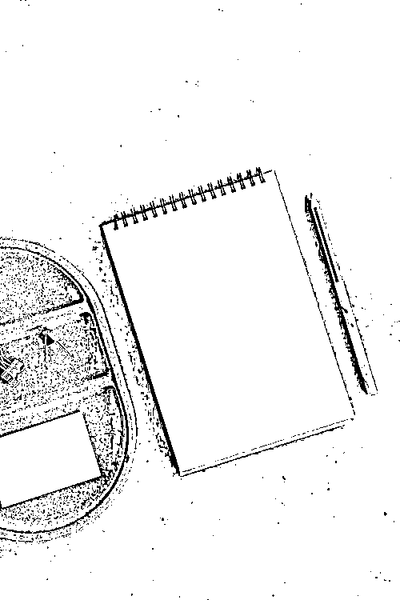

**占星学中的土星回归**

**在占星学中，土星是与成熟、成功管理好责任相关的行星。**你猜怎么着？土星绕太阳运行一周需要**29.5 年**。这个颇为著名的 30 年周期被称为土星回归。**占星学上，在你 29-30 岁之间，土星要么越过，要么接近你的出生土星位置，并最终与之“合相”。**

在我的第一次土星回归（是的，59 岁还有第二次）中，29.2 岁时，土星首先在处女座 26°越过我的出生土星位置，3 个月后土星又逆行回来越过我的出生土星，顺行后，在我 30 岁生日前 2 个月与我的土星最后一次合相。这种来回“逆行和顺行”的波动是土星回归的正常特征，这是由于我们从地球上观察土星的视角发生了变化，因为我们绕太阳公转 365 天，而土星绕太阳公转一周需要 10759 个地球日。事实上，**土星的回归发生在 29 岁之后，30 岁之前，也许这反映了 29 岁的人在 30 岁之前更加焦虑。**一旦到了 30 岁，你就跨过了这道门槛，很多人就不会再想着“从现在开始。一切都是下坡路”，而是开始更加认真地掌控自己的生活。

30 岁的时候，你已经进入了西方社会学家所说的**30 到 60 岁之间的“丰产年纪”**，此时，**你的收入潜力、社会影响力、育儿需求都达到了顶峰。**

事实上，土星回归既是土星周期的开始，也是结束。**第一个土星周期为 29.5 年，标志着童年、青春期和早期成人生活经历，接下来是多产的成人周期，大约在 59 岁左右结束，然后是调整晚年生活的成就和贡献，最终是退休并管理老年生活。**

每个土星周期都呼应了我们如何成功管理事物。例如，如果你快 30 岁了，或者刚刚 30 岁，可以考虑用这些问题从土星的视角健康地衡量你的生活。**· 你是否把自己的时间和精力花在那些对你很重要的事情上？****· 你对自己的个人责任管理得如何？****· 你对自己的职业责任管理得如何？****· 你善于时间管理吗？****界定什么对你来说是重要的，这就是土星回归最基本的问题。**责任始于**对自己负责，为自己负责**。如果你没有在做对自己重要的事，为什么不去做呢？的确，在 20 多岁的时候，我们常常不确定什么是对自己最重要的。我们试图弄清楚作为一个人，我们是谁，我们常常受阻于家庭和社会期望带来的压力。

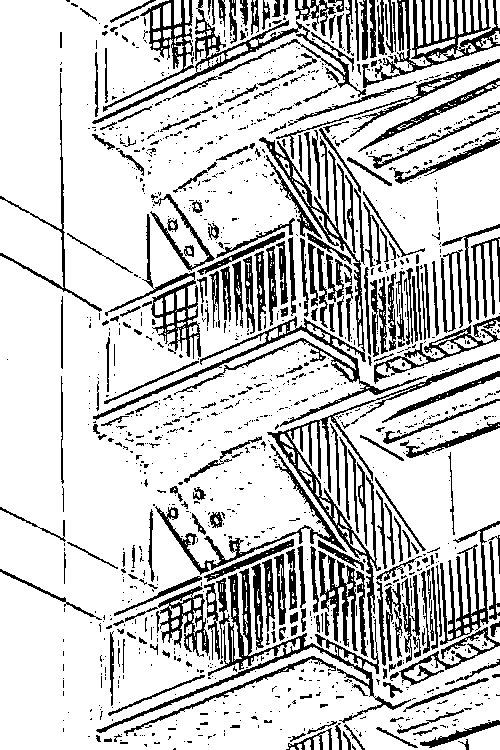

很多时候，在真的知道自己对什么是认真的之前，我们就会结婚、生子、从业。到了 30 岁，我们生活中的义务似乎打消了选择。**为人父母的责任和维持体面的收入，似乎会掩盖我们追求更有成就感的事业的深切渴望。**然而，如果你已经确定了自己重视什么，你更想做的职业是什么，那么请不要放弃，不要让自己陷入职业挫折的人生中。相反，要**制定一个计划，一个随着时间的推移有合理机会成功的计划。土星喜欢计划，尤其是在一个切实可行的时间表内达成目标。**

例如，也许你不能全日制回到大学学习，但你可以在职学习。同样的，也许你只能兼职——每天花几个小时去做你真正感兴趣的事情，但即使这样也会有所不同。

想想看，即使是像阿尔伯特·爱因斯坦这样才华横溢、受过良好教育的人，也无法在 20 多岁时获得一个教授的职位，而是在一家专利局当文员，挣钱维持生计，养活妻子和家人。

爱因斯坦在他 20 多岁的时候，利用业余时间持续发展他的思想，并在科学期刊上发表论文，发表他的理论。

渐渐地，爱因斯坦在科学界引发了争议和讨论，受到了关注，但直到 1909 年，30 岁的他才终于可以离开专利局的职位，成为苏黎世大学的副教授，直到 29 岁才被成功任命为伯尔尼大学的讲师。

是的，我们当然可以在 20 多岁的时候做些重要的学习、发展和工作，但是，**30 岁的转折点也标志着我们对自己做出的承诺，去做那些对我们来说真正重要和有意义的事情**。

即使我们需要许多年才能全职投入自己最感兴趣的事情，我们的承诺也能逐步得到回报——即使是在我们苦干着一份不满意的工作的岁月里，也能有所作为。

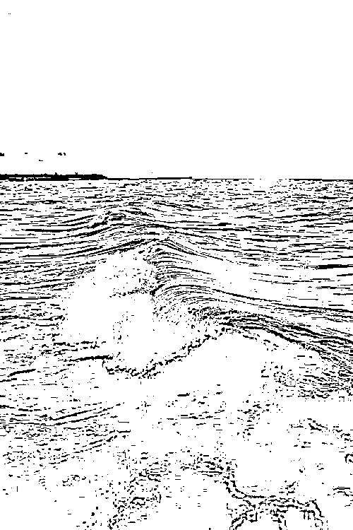

**30 岁，成熟的婚姻感情观**

还有就是你的个人承诺和婚姻问题？在现代中国，成家结婚的原因已经不再是那些传统的刻板观念了。复旦大学与《文汇报》合作于 2020 年 6 月开始的一项最新研究表明，人们对婚姻的态度正在发生变化。

婚结得越来越晚，选择不结婚的人数持续增加。在过去，如果一个人 30 岁之前还没结婚，尤其是女性，会被认为是悲惨的，甚至是可耻的。然而，特别是在中国的现代都市中，女性的结婚意愿创历史新低。

生活的优先级已经发生了变化。然而，说到决定个人生活中什么是重要的，30 岁仍然是一个里程碑。**如果你在 29 岁已经结婚生子，那么，你的责任感和义务会在你的土星回归期间被审视。****责任是一个重要的土星议题，对配偶和家庭的责任经常在土星回归期间重新接受检验。**为你的孩子、他们的教育和大学制定的计划可能会更现实地安排起来。时间表和计划会随着实际情况的变化而变化，现在你已经更加清楚完成目标需要多少时间。**成熟的人际关系无疑是 30 岁的福利之一。**现在，你知道在一段感情或婚姻中你想要什么，不想要什么了。浪漫的爱情仍然是很有可能的，但往往会具有更现实的定义。也许幸福的爱情生活最重要的关键是知道自己看重什么。无论你是想改善现有的婚姻、结婚，还是选择保持单身，成熟的自我认识都是必不可少的。**30 岁可能标志着开始一段更充实的感情生活，现在你开始真的更了解自己了。**

**版权声明：**原创文章由作者授权发布于若道平台，欢迎转发，反对抄袭。友号转载请申请白名单。

**END**

****想阅读更多作者的文章，请在后台回复******大卫****** 即可。****

**大卫·瑞雷**

美国占星师，若道联合创始人，致力于在中国教授和推广西方占星学；2010-2014 年，任全美占星师联盟监督委员会委员；2017 年，被选为 ISAR 委员会成员。ISAR 是世界最大的国际占星机构，会员遍布 45 个国家，2017-2020 年曾任 ISAR 全球副主席、CAPISAR（ISAR 职业占星师资质认证机构）主席。

**拥有****51 年****占星实践经验的****若道创始人****前 ISAR 全球副主席****前 ISAR 全球职业占星师资质认证主席****大卫·瑞雷**

**和**

**2019 年第二届、2021 年第三届核心课中**

**与苏·汤普金斯老师****联合授课****的**

**ISAR 认证职业占星师**

**咔咔（Caroline）**

**二人合力打造**

**2022 年 ****若道全新核心占星课程**

**点击下图了解更多课程详情** 

**

**20 位来自世界各地的占星师****带来 19 场沙龙——新世界的觉醒****详情可点击下图**

**学习占星学****点击下图了解课程详情**

**微信又双叒叕改版啦，不想错过若道君的推送？**
**就把若道设为星标吧！****▼**

**喜欢就点一下“在看”吧！**

********报名直达入口********

# 今晚直播丨职业占星师养成计划：从小白到职业占星师

> 原文：[`mp.weixin.qq.com/s?__biz=MzA5NjA0NTAxNg==&mid=2651483938&idx=2&sn=fd1af3747c35e976f349b9fdf175b3b0&chksm=8b48dd95bc3f54834d2b766de4ace8a01437141f60ffeb6ee8448d2b2f72fb3524f12f6cb595&scene=126&sessionid=1692737771#rd`](http://mp.weixin.qq.com/s?__biz=MzA5NjA0NTAxNg==&mid=2651483938&idx=2&sn=fd1af3747c35e976f349b9fdf175b3b0&chksm=8b48dd95bc3f54834d2b766de4ace8a01437141f60ffeb6ee8448d2b2f72fb3524f12f6cb595&scene=126&sessionid=1692737771#rd)

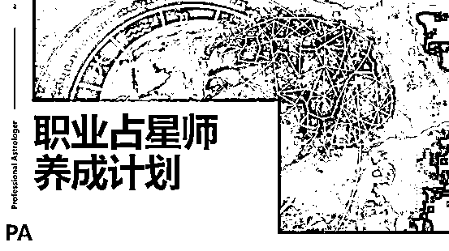

在现在的核心课程中，在适合的时候，我们都会开始占星师养成计划。

职业占星师养成计划的目的：

**帮助那些有志于成为职业占星师的同学，在 2 年的核心课程结束后，能够更加有自信的开始对外收费咨询。**

**职业占星师养成计划的原理：**

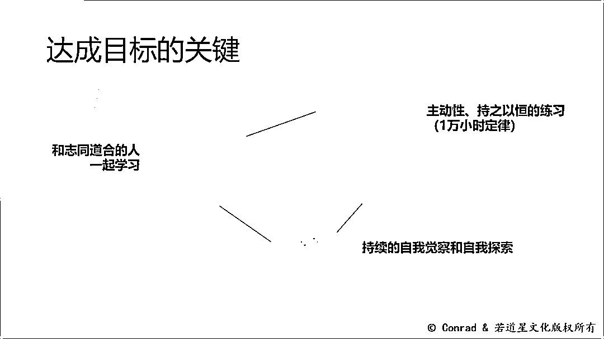

在若道过去的观察中，那些仅仅只是学习听讲的同学们，在毕业后常常不敢开始咨询实践，而那些后来做的好的占星师也是那些练习最多的人。

**占星学本身是一门实践的学问。所以，我们就特意设计了一套在学习中实践体会的体系，来帮助大家用主动学习的方式把知识变成自己的，从而在 1 年半的时间里，一点一滴建立自信。**

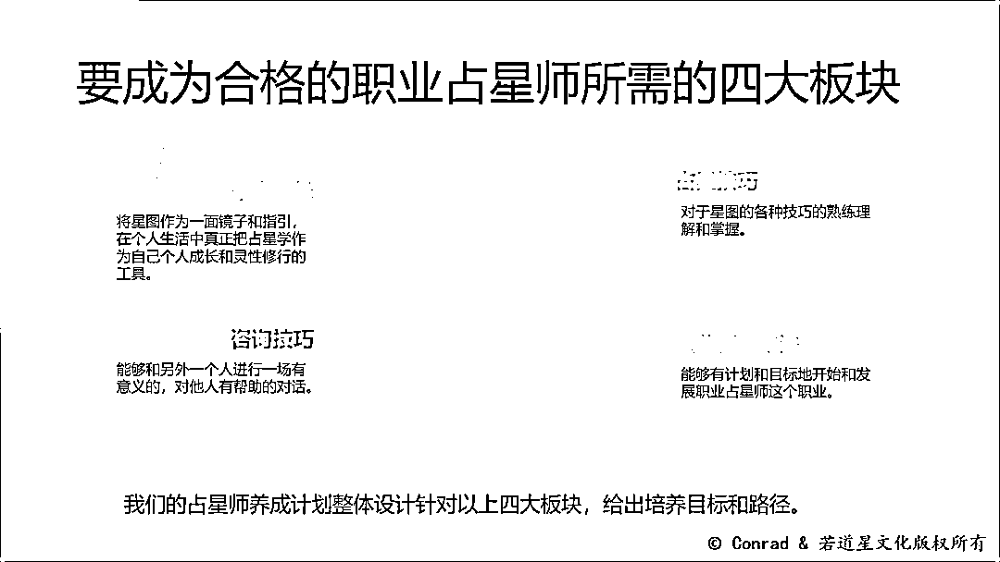

**因此，对于那些想要在 2 年的学习后开始兼职咨询的同学，我们设计的占星师养成计划会非常有帮助。**

而那些仅仅只是把占星作为兴趣爱好、并没有更多的时间和精力投入的同学，也可以不参加这个计划，或者选择只参加计划中自己感兴趣的部分，这是一个非常灵活的自由的选择。

**这个养成计划是 2021 年开始的，目前已经在若道的 2 个核心课程中实践。**

今天，我们采访了一个核心课程的几位助教和同学们关于研究小组。

**助教滴答说**

**问：养成计划的目的是什么？**

**答：**像开辟一个配合教学课堂的“第二空间”，课堂是理论学习的空间，**研究组就是实践空间。让理论和实践并举。**紧扣教学课堂的教学内容和进度，为学生们提供一个可以交流/实践，运用课堂所学的空间，**提升他们对理论的理解和运用能力**，期望他们在毕业时，就可以学以致用。

  **问：作为助教，旁观这些学员的成长，你有什么感受?**

**答：**1.如果我当年学习时也有这样的边学边实践的小组研讨，应该能快速提升运用能力，不会学完后还不知道从哪著手，自己要不断练习和体会很久。

2.若道学子藏龙卧虎，非常优秀，非常有才，参加的学员都很用心，很认真，而且特别真诚的分享，很愿意发展自我觉知，能特别诚恳地做自我认知的解剖。还有志愿者特别无私奉献，无论是组长、副组长，小蜜蜂都耗用很多时间精力和各自的专业能力去组织去准备，还有很多组员也默默奉献他们的专业能力和时间，来帮助研讨的推进和最终成果的展示。

**研究小组组员说**

**问：研究小组对你占星学的学习运用有帮助吗？具体体现在哪里？**

**Cleo：**

先不谈学习运用，我分到天王星组，我完全没想到，我对自己星图里的天王星多一点了解我就多收获一点，我收获了太多了，**我对自己的了解就像剥洋葱一样，**以至于我在提前半个月就开始记录分享会的灵感，分享会前一天晚上还有新的感悟要更新。

**研讨会三位老师的点评太重要了**，滴答老师点拨了我星图里的一个金冥四分相位，我马上明白了这么多年旧有模式的强迫，这部分也借着分享会对自我的挖掘，凿地三尺把它完整地挖出来了，我太高兴了，四阶分享我已经写好了！

我太喜欢分享了，**我希望被听到，我也喜欢与所有分享的同学有共鸣，**虽然这部分非常隐私，但是我愿意和盘托出，希望在四阶能帮助大家对这个相位有更多理解。

我觉得上课，知识是启发的第一步，特别是相位，3 阶我对相位的知识真的大多是讨论出来的，Lynn 老师的课是有门槛的，我一开始消化不了，我需要复习，但是很喜欢 Lynn，感谢天空老师给我们补基础。

我也很开心我因为是组长的原因认识了很多同学，包括其他组的组长们，**与她们私下里的交流也让我受益匪浅，**很多让我自己想，看书，看课不知道什么时候才能想出来的对相位的理解，一聊就有，我们的组员太好了！我们的老师太好了！这让我一个月双鱼 11 宫倍感滋养，我太开心了！

**雪儿：**

很有帮助，能够让我更深刻的理解到自己星图的相位，同时跟组员的讨论过程中可以**看到不同角度的解读，**这个解读又可以促进自己更深刻的思考，也加强了对所学知识的运用和巩固。

在讨论的过程中遇到问题能够**及时得到助教老师的指导，及时解决了学习的难题，**所以很赞同小组研讨。

**Simona：**

很有帮助**。因为大家视角不同，关注点不同，可以更好地理解课堂上学到的技法和知识。**

其次，研讨中彼此分享故事，**彼此产生共鸣和互相寻找解决方案，**是一个非常治愈的过程。同时也让我能够更沉静地听着之前听不太进去的课堂同学案例，明白怎么去更好地学习占星，以及需要跟老师们学习什么。

**小乖：**

很有用。1. 增进学员互动，激发学习热情；2\. 互相体会学员间彼此的相同与不同；3. 助教旁听答疑，也是很好的辅导了我们。

**Angell：**

研究小组在学习占星学的学习运用上非常有帮助。

具体的体现如下：**对于一些原本没有体会的相位有了更清晰的感受，**可以更加深入地体会并最终可以将这部分能量**有意识地整合到自己的内在模式中，**更好地发挥有益的力量。而对于自己没有的相位，可以从其他组员的解读，更加深了对那些相位的了解。

同时，作为组长，为了可以更好地澄现小组的研讨成果，需要去协调，调动，推过，更加有耐心并注意尽量发挥大家的能动性，可以将研讨最终顺利完成，这样帮助我去走向我的北交点水瓶座。

**Rhiannon：**

非常有帮助。重新审视了自己过去比较忽略的行星在星图里的重要性作用及影响，**有了更多的反思，**更深入的去研究和理解并且挖掘。像是两点了一个过去藏在黑暗处的蜡烛，很开心。

**Bobby：**

很有帮助！比如对冥王星有了更深刻的认识也积累了很多实战案例，特别是在相位上，收获了很多。

**启程：**

**在研讨中加深了对基础知识的理解和辩析。**而且慢慢对继续学习产生信心，之前觉得自己跟不上进度，与其他同学差距太大。同时，在了解他人生命故事的同时，也能够尝试与自己和解。

**问：参加研究小组后，你觉得自己最大的改变是什么？**

**Cleo：**

其实如果我不做组长我是不会非常主动地跟人打招呼的，我也不会主动加谁，加了也不会主动聊天，但是去组织这个活动让我强行迈出了第一步，**收获了非常多好的朋友。**

然后就是小组的氛围特别好，大家都是身怀绝技，没有人焦虑，边界感一流，这让我太舒服太放松了，当我们分享会大受好评的时候我真的第一次觉得我成功了，因为第一次我遵循自己的感觉和节奏去做事，它的结果这么好，这对我来说真的是一非常有意义的里程碑。**原来放松也能做好事情。**

平时我的节奏和土星组和冥王星组是一致的，要不然就是严格要求面面俱到，要不然就是垂死病中惊坐起，担心承担失败的后果而百里加急赶工，这次我都没有，就是一切都非常，非常地自然，我有准备，但是我很放松稿子它自然就成了，我有好好准备排练，但是我很放松，效果也很好。

谢谢天王星组的所有同学给了我一次当组织者也可以体验放松的机会，这对我来说真的像一剂及时不能再及时的解药了，**让我看到了更适合我的另一种可能。**

正处在土星回归的我，在过去一年多里的很多时候都不好过，是占星课让我有机会分享自己的对自己的觉察，获得理解和认同。我借老师同学的手转动了我的手电，手**中的光照亮了从未被我看到的黑暗角落，**这一切在被我看到的一瞬间就被疗愈了。

我的变化，收获，太多了，生活上的就讲这些吧，占星上的理解留着以后研讨会慢慢聊~爱你们！三位助教老师比心。

**Simona：**

**让我变得更有勇气和担当，**通过星图的研讨，也更能去理解其他同学。我是个不太容易产生亲密感的人，也不太容易与他人连结。但在研讨中，收获了最不容易又最真实的一些信任和肯定。让我感受到了一点归属感，无论是和我的研讨小组，还是和若道的老师团队。

**Rhiannon：**

让我会去更主动、自主地去研究，与同学建立更紧密的联系，经常在小组群里交流，或交到好朋友私下交流分享探讨！获得了更多的信息面向，很受收获！

**Joy：**

帮助我融入了这个群体 ，不再只是独自听课和学习，而是在人际中学到了其他人的行为模式，接触到不同性格特点的人，这很有意思。

**小乖：**

我的星图缺乏风元素，进组后感受到了自己 11 宫天秤座，以及 11 宫的南交天秤座的能量。以前我都是在 6 宫白羊座，10 宫处女座的领域，意外的发现原來自己可以擅用天秤座的能量。

**以上只是我们计划中研究小组的部分。**

**整个占星师养成计划包含哪些内容，这些内容又可以如何帮助你呢？**

**欢迎你点击视频号，预约 8 月 9 日由 ISAR 认证职业占星师 Conrad 所带来的直播沙龙。**

**‍‍‍‍‍‍‍‍‍‍‍‍‍
‍‍‍‍‍‍‍‍‍‍‍‍‍**

<mpvideosnap class="js_uneditable custom_select_card channels_live_iframe" data-pluginname="videosnap" data-headimgurl="https://wx.qlogo.cn/finderhead/PiajxSqBRaEJYnVsqWfEX9qA0sI6hNVKsDfyzfPZ92WZMZyBpZWU5NA/0" data-username="v2_060000231003b20faec8c4e68a1ec2d4ca07e434b07755bbf47e7053a3059defd2c9d6c68a20@finder" data-nickname="若道" data-desc="将在 08 月 09 日 20:00 直播" data-intro="若道职业占星师养成计划介绍" data-noticeid="finderlivenotice-v2_060000231003b20faec8c4e68a1ec2d4ca07e434b07755bbf47e7053a3059defd2c9d6c68a20@finder-1656484689459229-2081063992" data-type="live"></mpvideosnap>

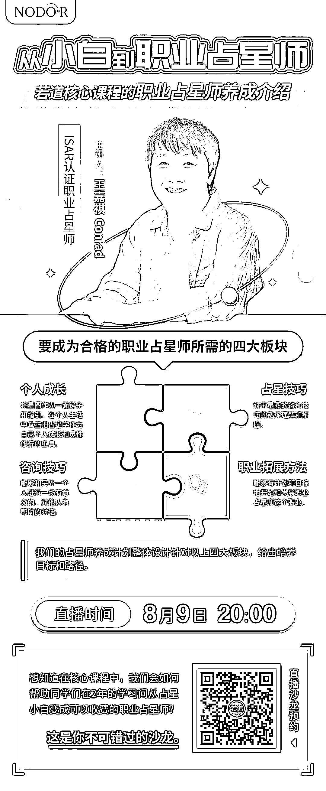

**拥有****51 年****占星实践经验的****若道创始人****前 ISAR 全球副主席****前 ISAR 全球职业占星师资质认证主席****大卫·瑞雷**

**和**

**2019 年第二届、2021 年第三届核心课中**

**与苏·汤普金斯老师****联合授课****的**

**ISAR 认证职业占星师**

**咔咔（Caroline）**

**二人合力打造**

**2022 年 ****若道全新核心占星课程**

**点击下图了解课程信息****

****报名直达入口****

# 雷蒙德·梅里曼金融占星周运 | 注意 8 月 11 日-14 日的行情

> 原文：[`mp.weixin.qq.com/s?__biz=MzA5NjA0NTAxNg==&mid=2651483790&idx=2&sn=a3874d40b938e8eec10fa8ef80c1061c&chksm=8b48dc39bc3f552fc5778b3e9073b3b9593b8182d8384843eb5e46c9a44e8ba2065ace150d3b&scene=126&sessionid=1692737776#rd`](http://mp.weixin.qq.com/s?__biz=MzA5NjA0NTAxNg==&mid=2651483790&idx=2&sn=a3874d40b938e8eec10fa8ef80c1061c&chksm=8b48dc39bc3f552fc5778b3e9073b3b9593b8182d8384843eb5e46c9a44e8ba2065ace150d3b&scene=126&sessionid=1692737776#rd)

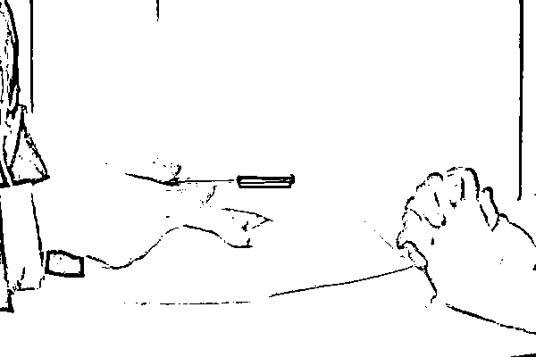

作者/雷蒙德·梅里曼 译者/Luke
编辑/玫瑰 图片/pexels

雷蒙德·梅里曼是在金融占星学界稳坐第一把交椅的占星师，同时他也是若道签约的金融占星课老师，我们引进了雷蒙德·梅里曼老师的《[上证指数月度报告](http://mp.weixin.qq.com/s?__biz=MzA5NjA0NTAxNg==&mid=2651482348&idx=3&sn=2ab9c15a94c624c15d96baa433dbf5a3&chksm=8b48da5bbc3f534d77df0a9fe2c3a8858896bab5ca63234db5aacb8e3587724ace0b1f6b1f80&scene=21#wechat_redirect)》及《[黄金报告](http://mp.weixin.qq.com/s?__biz=MzA5NjA0NTAxNg==&mid=2651480743&idx=2&sn=752fd81d8f47124f5a7e8dad71f2c8d9&chksm=8b48d010bc3f5906173548bf5774473ddb29f5aa29b6f308fd8fc4e08ef5ea32dbf0460f6c67&scene=21#wechat_redirect)》。我们经老师的授权，将每周刊登梅里曼老师的周运，供大家参考和学习。于是，这是本周的周运（8.8-8.12）。

**说明：以下时间采用纽约证券交易所所在地美国东部标准时间。**

**展望与回顾**

****

**尽管劳动力市场面对炽热通货膨胀和不断上升利率的双重威胁，美国 7 月就业增长意外加速，打破了人们对经济放缓的担忧。****劳工部在周五发布的月度工资报告中称，7 月就业增长 52.8 万，大幅超过了路透社经济学家预测的 25 万。与此同时，失业率微跌至 3.5%，为 2 年多前新型冠状病毒肺炎疫情爆发以来的最低水平。****美国现在已经恢复了疫情期间失去的所有工作岗位。****——梅根·亨尼****《美国经济 7 月新增 52.8 万个就业岗位，超出预期》****www.foxbuisnessnews.com****2022 年 8 月 5 日**上周的 8 月 1 日见证了极端罕见的火星、天王星和月亮北交点在金牛座合相。8 月 4 日地球宇宙学关键反转日期前后，许多金融市场展示了有趣的波动。在亚洲和环太平洋地区，澳大利亚 ASX 指数、印度 NIFTY 指数和日本日经指数都在 8 月 4 日创下新的数月高点。然而，中国上证和恒生指数情况正好相反。在 8 月 2 日，恒生指数跌至 5 月 12 日以来的最低点，2 天后的 8 月 4 日上证指数跌至 5 月 31 日以来的最低点。在欧洲，我们追踪的 4 个股票指数都在 8 月 4 日地球宇宙学关键反转日创下新的周期高点。在美国，上周也出现了类似的情况，股票指数创下新周期高点。道琼斯工业平均指数在 8 月 1 日发生合相时触顶。标准普尔指数在 8 月 3 日触顶，纳斯达克指数在 8 月 4 日触顶。巴西 Bovespa 指数上涨了一整周，于周五到达新周期高点。现在的问题是，此轮上涨是否能继续下去，突破重大阻力，这往往是天王星影响力凸显时会发生的情况。或者说，本周反而趋势反转，剧烈下跌，这也是天王星凸显时常见的模式。对于天王星，你永远也无法确定会发生什么，但是周期研究及其模式有助于判断。一个明显的例子是日本日经指数，年度高点分别为 3 月 25 日的 28338 和 6 月 9 日 28389。上周的高点非常接近 28190。贵金属上周的走势也非常有趣，在 8 月 4 日地球宇宙学关键反转日突然发生了反转。黄金从 7 月 21 日的低点 1678 起，飙升至 1812。白银在 8 月 1 日上涨至新的数周高点 20.51。半个月前的 7 月 14 日，它还在测试 18.00。然而，上周五的就业报告发布后，黄金、白银都剧烈下跌。原油是另一个重要的市场，于周五跌至低点 87.01，为 6 个月以来的最低价。

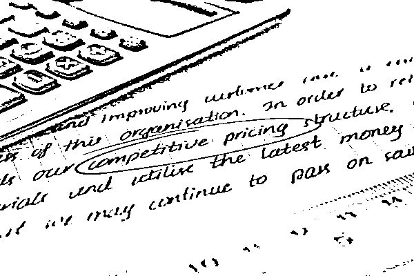

**短期占星趋势和长期考量**

****

**最重要的是，民主制度中有一个重要的政治传统，由下列词语组成：“这要求太过分了。”****不要向人们索取超过他们所能给予的。不要做得太过分，不要在人民想要一步一步缓慢前进的时候，要求他们一次跨出一大步，从而导致失败。****向他们索取他们能给的，把他们拉向你的视野，不要害怕缓慢和稳定的前进，但要害怕电网过载。那就是美国堪萨斯州所发生的事情：人们被要求跨出他们认为极端的一步，但他们并不喜欢极端。****——佩吉·努南****《反堕胎人士应该从堪萨斯州学习什么》****《华尔街日报》****2022 年 8 月 5-6 日****在 2018 年和 2026 年高峰期间，钟摆从最低点大幅摆动至最高点。与此同时，这里有个和谐的土星-海王星合相，正好处于天王星和冥王星的三分相的中点处，与它们都形成令人鼓舞的六分相。****那可能是向更好的改变，届时新闻头条变得更加友好，我们的文明终于走向成熟，开启了新的篇章。****——安德烈·巴尔鲍特****《经世占星学行星周期》****占星学协会首席信息官****法文版 2014 年/英文版 2016 年**尽管上周的地球宇宙学征象已经非常强有力了，本周的征象同样激烈。一切始于上周末的火星四分土星，这是火星传递土星-天王星四分相能量的第二部分。由于火星与攻击性，可能还与军事措辞和作战有关，我们注意到上周的冲突来自众议院议长南希·佩洛西决定与台湾领导人会晤。尽管中国政府要求不要这么做，并警告说“玩火者必自焚”。这个说法实在是非常火星！如果这一事件确实带来了严重后果，那么月底前即可知晓，或许最早在本周 8 月 11 日-14 日，太阳四分土星和天王星时。甚至下周可能也会充满潜在的攻击行为和反制，**因为届时 8 月 16 日-29 日日心水星会进入双子座，那也是黄金和白银呈现强烈价格波动的时期。**如果你认为国际紧张局势在缓和，金融市场在趋于稳定，那么再好好想想。地球宇宙学征象表明情况并非如此。

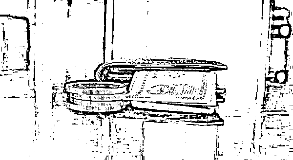

不过，接下来 2 个月可能是过去 2 年社会政治紧张局势的最高峰。土星将很快出离与天王星为期 2 年（2021 年-2022 年）的渐亏四分相，在接下来的 45 年不会回归。这是非常强有力的宇宙征象，象征了极端主义已经在主宰全球叙事。土星离开与天王星的困难相位，加上本专栏常常提到的木星-土星渐盈周期正在发生，可能对应着“开放”，使得集体能在更加自然的周期，即通往成长和成功的温和主义中继续前进。正如先前讨论的，在这一阶段中，适中的道路或中庸之道，看起来总是通往繁荣。值得注意的是，本文引用的《华尔街日报》的佩吉·努南的言论，也在强调从极端主义回到温和主义的重要性。她不是唯一一个，我们也不是。甚至在我们之前，法国经世占星师安德烈·巴尔鲍特预测了相似的社会转变将在 2026 年土星合相海王星，并六分天王星和冥王星时发生。在前面的专栏中，我们提到这一宇宙配置——天王星进入双子座，三分在水瓶座的冥王星将成为下一个伟大的文艺复兴时期。我知道阻力最小的道路是相信世界将毁灭，未来会更加黯淡。现在许多人相信会如此，他们有很好的理由，包括战争、通货膨胀、政治分化和经济增长的不断下滑。此外，我们还知道对于末日论很多人是买账的。如今追随者最多的评论家，总是那些贩售末日、悲观和痛苦的人。但是天堂的信息告诉我们，不远的将来存在希望。是的，市场仍然低迷，在这十年之内，市场有可能跌至 18 年周期波谷。但是**一旦 18 年周期触底，历史告诉我们股票指数会在随后的 9-20 年内，至少增值 225%，有时甚至达到 700%。**这不是放弃和屈服于媒体贩售的焦虑和绝望的时候。一旦我们通过这个周期阶段，战争会结束，世界经济也会反弹。**这是准备好现金的时候（2022 年-2026 年），准备在极其低廉的价格进入市场，以在即将到来的新文艺复兴中受益**：一场革命在我们交流的性质和质量上发生，当前正以微妙的方式建立基础。一旦我们结束了政治和军事冲突的阶段，那将变得明显。这些冲突是有价值的。它让我们意识到，人类生活有多么重要，人类的创造力是多么具有复原力，能为长期存在的问题找到解决方案。一旦我们通过了这个退化成穴居人一样的时期，所有这些品质将再次得到尊重。这么多的行星在金牛座，发出的信息是“坚持住”。这就是金牛座。坚持住。**长按下图了解更多详情**

这是特别及时的讲座，因为为期 12 年的木星轨道周期会在 5 月 10 日进入白羊座，并且 6 月-11 月是一年中最有力的地球宇宙征象接连登场的重要时间段，因为土星逆行与天王星形成几乎精准的渐亏四分相。

**说明：以上日期基于纽约证券交易所所在的美国东部标准时间，由于存在时差，中国地区可能需要加一天。**

**版权声明：**本文由若道翻译发布，欢迎转发，反对抄袭。友号转载请申请白名单。

**雷蒙德·梅里曼（Raymond Merriman）**

若道签约老师。著名金融占星师，ISAR（国际占星研究协会）前主席，梅里曼市场分析公司的总裁。他由于“提升了占星学的职业形象”，在 1995 年国际占星大会上被授予轩辕十四奖；在 2012 年国际占星大会上，被授予轩辕十四终身成就奖。

1“中国上证指数月度报告”发售**若道推出了****中文版****的雷蒙德·梅里曼中国上证指数月度报告，并持续发行该报告！**当把金融市场的周期和占星学的周期相结合时，雷蒙德·梅里曼老师的金融占星学研究**为投资者应对金融市场的周期波动，并随之调整投资策略提供了极大的价值参考**。
**8 月中英文报告已上线！**2“黄金价格周期月度报告”发售**若道推出****中文版****的雷蒙德·梅里曼黄金价格周期月度报告！**不仅仅为广大读者在中国股市的投资出谋划策，更将视角放眼黄金市场。**每当世界经济形式不明朗的时候，有一个地方是保值的港湾，那就是****黄金**。自 1982 年雷蒙德·梅里曼出版第一本研究《地球宇宙学征象与黄金价格的关联》的著作以来，**他一直作为最重要的黄金市场时机预测者之一享誉国际**。2022 年 8 月黄金报告已上线，梅里曼老师将会告诉你他对这个关键时期如何操作的想法。也可以按照季度和一年期订阅，有更多优惠。季度和年度的好处是，你可以持续了解梅里曼老师对于不断在变化的市场的看法。即便他某一次看法和市场不一致，你也看到在下一期他如何调整自己的看法，并看到金融占星在一个长期时间段内对你把控风险的帮助。而能够长期控制风险、尽量找到安全的投资时机才是投资的长久之计。**8 月中英文报告已上线！****购买套餐**，买得越多越优惠中国上证指数月度报告套餐价

*   **单月报告**：280 元
*   **3 个月套餐**：780 元（260 元/月）
*   **12 个月套餐价**：2400 元（200 元/月）

**长按下图识别二维码****购买金融报告****套餐****▼**

黄金周期月度报告优惠

*   **双报告年度套餐更优惠（直降 900 元）**

*   **12 个月黄金报告+12 个月上证指数报告：仅需 3900 元**

**长按下图识别二维码购买黄金报告套餐**▼

3《2022 年金融预报和沙龙》1976 年以来，由雷蒙德·A·梅里曼撰写的梅里曼市场时机学院每年一次的年度预报沙龙和每年一本的《年度预报》一直在应用占星学原理为投资者们服务，提供卓越洞见，从未间断。 **雷蒙德·梅里曼《2022 年金融预报和沙龙》发售中（报告已发布）。****长按下图识别二维码了解详情**
▼

4《2022 下半年金融占星投资沙龙》这是特别及时的讲座，因为为期 12 年的木星轨道周期会在 5 月 10 日进入白羊座，并且 6 月-11 月是一年中最有力的地球宇宙征象接连登场的重要时间段，因为土星逆行与天王星形成几乎精准的渐亏四分相。

**长按下图识别二维码了解详情**

▼

**点击阅读原文购买金融报告**

# 认证职业占星师文凭课程 L1-3 丨想看大卫老师是怎么做课堂演示的吗？

> 原文：[`mp.weixin.qq.com/s?__biz=MzA5NjA0NTAxNg==&mid=2651483790&idx=3&sn=a7f0bb9b678c676921909af54b1a79d0&chksm=8b48dc39bc3f552f15450bce3622992b8ad9faa56ccc39ad85866958c1ce5e484c1a3093194b&scene=126&sessionid=1692737776#rd`](http://mp.weixin.qq.com/s?__biz=MzA5NjA0NTAxNg==&mid=2651483790&idx=3&sn=a7f0bb9b678c676921909af54b1a79d0&chksm=8b48dc39bc3f552f15450bce3622992b8ad9faa56ccc39ad85866958c1ce5e484c1a3093194b&scene=126&sessionid=1692737776#rd)

**在若道核心课程的教学里，****以学员为案例****进行课堂的占星咨询演示，是我们课程的特色环节。**

这样的演示不仅让很多同学有亲身体验咨询的机会，而且这么多真实案例的学习，会让大家看到占星咨询到底是怎么样一个过程。毕竟，大部分人的学习都是要从模仿开始。

记得若道君当年学习占星的时候，可没有这样的机会。那时候主要是听课为主，后来，我们在多年的教学实践中，**越来越发现课堂演示的重要性**。因此，就把这个作为一个主要环节加入到课程中。

在新一期的若道核心课程中，咔咔老师和大卫老师这对组合就会把这个教学特色充分发挥出来。**熟悉中国同学思路的咔咔老师会以知识点的讲解为主，而有 50 年占星咨询经验的大卫老师，则以课堂演示为主。**

有时候，这样的课堂演示的功效是出乎意料的。

一位若道的老同学赵震宇这么写到：

2018 年，我正式开始在若道学习 L1-5。其实我一开始的心态更多的是希望得到系统化的学习来补充我的知识漏洞，以及拿到一个证书可以为自己做背书，增加自己将来转型占星师的筹码，而不是真的在期待可以从若道的学习中得到一些本质上的领悟。

事实上在初期的 L1-3 中，很多知识与课上的内容，也是我比较熟悉的领域，相对而言是驾轻就熟的。但在 L3 的工作坊中和大卫老师的接触以及模拟咨询，让我对占星的态度发生了很本质的变化。

大卫老师对我星图的分析不仅非常准确，更重要的是，他开启了我自身个人成长上的变化，从而成为了我本质上进化蜕变的一个契机。

在短短的 6 个月内，我对人生的认知、对自我的认知、对于人生看待的方式都发生了翻天覆地的质的变化。我意识到了原来跳出自己一直以来无意识间重复的模式，是一件可行、并且会给自己带来无限成长提高自己人生幸福度和质量的事情。这也让我深刻体会到了人本主义占星学的魅力，以及自己之前是多么的“无知“。

于是现在，占星学对我来说，不只是兴趣、宗教信仰、或者是可能的职业道路，而是一种激发自己和他人人生成长和蜕变的工具、一种让自己更幸福的看待世界的方式。哪怕我之后并不会以占星为生，它依然是我人生中不可或缺的一部分，就像一副隐形眼镜，影响着我与世界的互动。

而被大卫老师咨询深深影响的同学还有很多。

**这里，我们节选一些短小的试听片段，让你稍微感觉一下在若道核心课程上，大卫老师的咨询演示是怎样的一个样子。**

**片段一**

<mpvideosnap class="js_uneditable custom_select_card" data-pluginname="videosnap" data-id="export/UzFfAgtgekIEAQAAAAAAMKsWN6BUygAAAAstQy6ubaLX4KHWvLEZgBPEnoIULgMKKb-DzNPgMItC2ZEgiEDMBYjrYHv9wNsO" data-url="https://findermp.video.qq.com/251/20304/stodownload?encfilekey=S7s6ianIic0ia4PicKJSfB8EjyjpQibPUAXolK65qjuvEtF7VE3LuUIfibNBicR6aZMMfP2lV313icg6MQMfqMQqcPFj2m8Hhw10N65gJT2zkNKurNXqiaaAugQpntw&amp;adaptivelytrans=0&amp;bizid=1023&amp;dotrans=0&amp;hy=SH&amp;idx=1&amp;m=&amp;scene=0&amp;token=cztXnd9GyrEzmuleT8ub88RIicgCkUKW4liadDZCTsricEdF98BQMCWkUTxVevglwsb2TzGGW1rUZ4" data-headimgurl="http://wx.qlogo.cn/finderhead/PiajxSqBRaEJYnVsqWfEX9qA0sI6hNVKsDfyzfPZ92WZMZyBpZWU5NA/0" data-username="v2_060000231003b20faec8c4e68a1ec2d4ca07e434b07755bbf47e7053a3059defd2c9d6c68a20@finder" data-nickname="若道" data-desc="#若道核心课 大卫老师用星座、行星、宫位来探索一位同学出生星盘主题的时候，他回顾了解读星盘的优先次序" data-nonceid="7723748345640460016" data-type="video" data-width="544" data-height="344"></mpvideosnap>

**片段二**

<mpvideosnap class="js_uneditable custom_select_card" data-pluginname="videosnap" data-id="export/UzFfAgtgekIEAQAAAAAANycuUwRANAAAAAstQy6ubaLX4KHWvLEZgBPEhYJ0WjYILr-DzNPgMIvjhT14ogdLw3BWd0Tg37w0" data-url="https://findermp.video.qq.com/251/20304/stodownload?encfilekey=S7s6ianIic0ia4PicKJSfB8EjyjpQibPUAXoleMEBO7YqRBdVicTyRbZLSODWa2goURzKktJBq1dd5DIVYjlj926F5hsicv1cBaJ9Rv2mYicYQsNBTeicdAYHyJ6QPA&amp;adaptivelytrans=0&amp;bizid=1023&amp;dotrans=0&amp;hy=SH&amp;idx=1&amp;m=&amp;scene=0&amp;token=AxricY7RBHdWzD8K4WOaXSvyp6Ryjm97TQtPI3Gia6U1Ab852A11RvPCu31V9R4GVy7w9ZhPIpmIg" data-headimgurl="http://wx.qlogo.cn/finderhead/PiajxSqBRaEJYnVsqWfEX9qA0sI6hNVKsDfyzfPZ92WZMZyBpZWU5NA/0" data-username="v2_060000231003b20faec8c4e68a1ec2d4ca07e434b07755bbf47e7053a3059defd2c9d6c68a20@finder" data-nickname="若道" data-desc="#若道核心课 占星学如何反应职业选择？" data-nonceid="629392412247480278" data-type="video" data-width="544" data-height="344"></mpvideosnap>

**片段三**

<mpvideosnap class="js_uneditable custom_select_card" data-pluginname="videosnap" data-id="export/UzFfAgtgekIEAQAAAAAAl_sREJMyhwAAAAstQy6ubaLX4KHWvLEZgBPEtIIkIkRmL7-DzNPgMIsA5PpGB3ReSAYx6ZfSNfZ1" data-url="https://findermp.video.qq.com/251/20304/stodownload?encfilekey=S7s6ianIic0ia4PicKJSfB8EjyjpQibPUAXolicGo48MWlib8wvOFMCMmVRq6heVqPaLZWrZVDpKoE2lcibTklu18ibiabwe5r5MKNnk1B8b1WWwnJJbOKHROCicyOU0A&amp;adaptivelytrans=0&amp;bizid=1023&amp;dotrans=0&amp;hy=SH&amp;idx=1&amp;m=&amp;scene=0&amp;token=AxricY7RBHdWzD8K4WOaXSv7euicLue7HLq5QQtktB0MXqKnDuDFfRdGZicknvicEPXKqiatibVM9Qu1w" data-headimgurl="http://wx.qlogo.cn/finderhead/PiajxSqBRaEJYnVsqWfEX9qA0sI6hNVKsDfyzfPZ92WZMZyBpZWU5NA/0" data-username="v2_060000231003b20faec8c4e68a1ec2d4ca07e434b07755bbf47e7053a3059defd2c9d6c68a20@finder" data-nickname="若道" data-desc="#若道核心课 如何从出生星图的基本要素看到案主生命发展的故事和个人成长经验？
" data-nonceid="6689802853667419635" data-type="video" data-width="544" data-height="344"></mpvideosnap>

**若道新一期的核心课程将在****8 月 30 日****正式开始**，如果你有很浓厚的兴趣，不仅仅是因为好奇想浅尝一下占星学，但还没有想清楚是不是要学习整个 L1-5 的课程，**那么 L1-3 可能是一个不错的选择。**

**谁是你的老师？**

**占星师咔咔（Caroline）**

2010 年师从美国占星师大卫·瑞雷学习，并得到世界名师斯蒂芬·弗里斯特、罗伯特·汉德、苏·汤普金斯传授各种占星学技法。若道首届学员，国内最早获得 ISAR 职业占星师资质的职业占星师，多次担任若道核心课程助教，2019 年第二届、2021 年第三届核心课中和苏·汤普金斯老师一起教授若道核心占星课程。

在国际知名广告公司和市场研究公司从事的市场研究和推广工作十余年，曾任职于阳狮集团、尼尔森市场研究有限公司、MTV 和《Madame Figaro》杂志。

**大卫·瑞雷（David Railey）**

*   **I****SAR 董事会成员，ISAR 全球副主席，ISAR 全球职业占星师资质认证主席，若道占星创始人**。

*   2016-2019 年，被选为国际占星协会（ISAR）考试委员会成员，国际占星协会（ISAR）是世界最大的国际占星机构，会员遍布 47 个国家。

*   2017-2020 年，被选为国际占星联盟（ISAR）考试委员会主席，理事会成员。

**助教王嘉祺 （Conrad）**

ISAR 认证占星师、若道认证生时校正资质，从 2010 年起自学占星学，2015 年开始在若道系统学习，并开始个案咨询。2018 年担任若道核心课程助教，以及卜卦占星学和太阳返照选修课助教，并带领学员进行经世占星和太阳返照方面的研究。2019 年 11 月作为演讲人之一参加了国际占星协会（ISAR）北京大会，也是 ISAR 星空俱乐部中国区第 16 期的主讲人。

**内容是什么？**

**ISAR 认证职业占星师的独有培训**

目前占星学的培训市场鱼龙混杂。而 ISAR（国际占星研究协会）是一个包含了 47 个国家在内的国际占星组织，多年来致力于占星的教育和研究，提升占星教育的品质和职业占星师的能力，在国际占星领域备受尊重。

**2022 年，鉴于对若道在占星教学领域所做的持续努力和高品质的课程服务，ISAR 特别授予若道核心课程为 ISAR 文凭课程，所有在若道学习，并通过若道毕业考试的同学将获得 ISAR 颁发的学历文凭（Diploma）。**

如果你想更多了解 ISAR，请点击[【这里】 ](http://mp.weixin.qq.com/s?__biz=MzA5NjA0NTAxNg==&mid=2651475298&idx=1&sn=b91888b54c14e29068f8b4e2a3452f5d&chksm=8b48ffd5bc3f76c32699f20f5c99e978bbb25551e69d80c70fee361acbd930ba5970ae776cdc&scene=21#wechat_redirect)

**开课时间和课程费用**

**８月 30 日开课，每周一次，20:00-22:00，25 节课+2 天工作坊。**

**★ 1-3 阶 连报**

**课程费用：11500 元 **

**你也可能想学更初阶或者更高阶：**

**★ 1-2 阶　****课程费用：3500 元 ****★ 1-5 阶　连报**

**课程费用：46500 元 **

**退转课程**

**退款原则请详看《教学协议》，如有疑问请咨询课程顾问。**

****2022 L1-3 认证职业占星师文凭课程****

**授课老师：大卫·瑞雷、咔咔**

**直播课开课时间：2022 年 8 月 30 日（周二）**

**授课方式：******网络授课，英文/中文授课，中文翻译****

**费用：**11500 元

**课程负责人：王老师**（微信/手机：18510107057，请备注“大卫核心课”）

长按二维码添加课程负责人咨询

****报名直达入口****

# 若道周运 8.8-8.14 丨在激烈的“角力场”中，勇敢的迈向未知！（内含 12 星座运势）

> 原文：[`mp.weixin.qq.com/s?__biz=MzA5NjA0NTAxNg==&mid=2651483790&idx=1&sn=5e566b6746f47c70c3ef92a3dc4f8c45&chksm=8b48dc39bc3f552f0797f1e7f6fca3479b1fb4d3060a4f9abd43bf39e40bd15a690b8dee1faf&scene=126&sessionid=1692737776#rd`](http://mp.weixin.qq.com/s?__biz=MzA5NjA0NTAxNg==&mid=2651483790&idx=1&sn=5e566b6746f47c70c3ef92a3dc4f8c45&chksm=8b48dc39bc3f552f0797f1e7f6fca3479b1fb4d3060a4f9abd43bf39e40bd15a690b8dee1faf&scene=126&sessionid=1692737776#rd)

******☆ ****后台回复“今日”，给你一句生命态度******

作者/芷菱 ISAR 认证占星师
编辑/翀子 封面/书君 图片/网络本周的宇宙天气依然激烈，不仅土星与天王星之间的四分相正在形成中，而且太阳火星等重要行星在本周都被卷入了土天之间的角力场。但我们仍然可能在寻求突破与碰壁受阻之间不断摸索。12 星座如何度过本周？让我们来看文章吧！（如果着急看 12 星座运势，不妨先拉到最后哦）**整体氛围**

**本周重要星象**

*   **8 月 8 日 周一**

    金星三分海王星（巨蟹座/双鱼座 25°01′）

    火星四分土星（金牛座/水瓶座 22°23′）

*   **8 月 9 日 周二**

    金星对分冥王星（巨蟹座/摩羯座 26°53′）

*   **8 月 10 日 周三 **

    太阳四分南北交点（狮子座/金牛座/天蝎座 17°48′）

*   **8 月 11 日 周四   **

    太阳四分天王星（狮子座/金牛座 18°50′）

*   **8 月 12 日 周五   **

    金星进狮子座（02 点 29 分）；水瓶座满月  （9 点 35 分，水瓶座/狮子座 19°21′，天王星与北交点四分满月，满月合相土星在水瓶座 22°05′）

我们刚刚走出上周的一组火星、天王星、北交点合相的紧张相位，那时大家一起感受过大国间剑拔弩张的对峙气氛。

**进入本周，星象并没有缓和太多，因为土星与天王星之间的四分相正在形成过程中，而太阳火星等重要行星在本周都被卷入了土天之间的角力场。我们仍然可能在寻求突破与碰壁受阻之间不断摸索。**

但，一切的尝试与探索都是值得的。

在写作周运之前我抽了一张塔罗牌：愚人。作为大阿卡纳的第一张，0 号牌，愚人意味着一个全新的开始，也代表着勇气与乐观。**喻示我们听从内心的指引，勇敢地迈向未知。**

这与本周的星象冥冥中产生了关联。本周太阳、火星先后与天王星、南北交点、土星呈困难相位，彷佛在诉说着我们内心的意志与冲动，主动出击想要改变现状，但随即遭遇现实的阻滞。

然而还是会行动，会尝试，是因为借此机会我们得以发现自己内心真正的渴望。愚人行动的勇气，就来自于听从内心。

瑞秋·波拉克在《78 度的智慧》里曾这样解说“愚人”牌：

**希望与恐惧的全然空无。不期待任何事，不计划任何事，全然的随性，只对眼前的情况作出即时的反应。**

愚人能够保持从心所欲的天真与自由，正是来自对自己内心的忠实。

处在时代巨大转折的岔路口上，我们不知道前路会涌现怎样的风景。唯有以愚人般的单纯与勇气，依着本心去尝试和探索。也许看似天真莽撞，却潜藏着一种更高更古老的智慧。

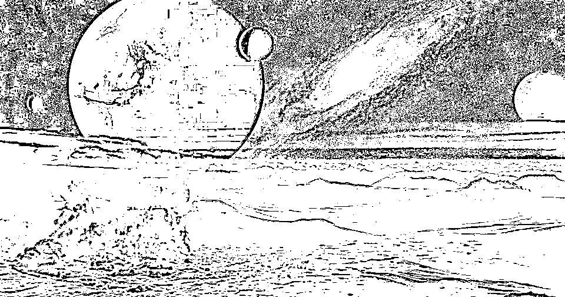

**土天四分相的预演**

本周，土星逆行在水瓶座 22 度附近，天王星则在金牛座 18 度 50 分附近，并逐渐向精准四分相靠近。虽然土天四分相更接近的时点要到 9 月 10 月，但 8 月已经进入影响范围内。

我们曾经在 2021 年经历了三次土天四分的影响，很多人被迫走出稳固的舒适区，作出改变；也有很多人想要自由和突破，却遭遇现实打压。社会经济方面，我们也看到房地产行业的崩塌，互联网行业/教育行业的受限与转型等等。

时代大潮之下，是很多普通人的生活遭遇巨变。我身边的朋友及一些咨询客户就经历了所在行业收缩、转型、裁员、失业，重新寻找方向和定位的过程。

**今年这一次土天四分相虽然不会形成精准相位，但会在一度范围内成相，带来类似的影响。**

一方面是土星代表的维持稳定、保持权威、权力掌控，另一方面是天王星代表的自由、突破、变革与发展。**这组相位会再次让我们领略到现实与理想，保守与变革之间的冲突。**

在这个背景下，本周太阳先四分天王星和南北交点，接近周末又对分土星。火星则在离开了与天王星、北交点的合相之后，于本周四分土星。甚至发生在周五的满月，也分别与土星、天王星发生重要联系。

太阳和火星的轨迹，都在重复着一个“大胆的冲动之后，在现实中遇冷”的情节。先是愚人般的勇敢、冲动，去尝试和探索新变化，接着在现实中碰壁才明白此路不通，或是看到之前考虑不周，需要重新谋划重新来过。

当然，也可能我们遇到另一个版本的情节，是在遭遇意外突变之后，重新控住了方向，找回安全与稳定感。

太阳与南北交点成相，凸显了我们的个人意志与自信心。即便遇到现实阻碍，我们的信念与决心也能支持我们去贯彻自己的想法。

**本周的星象仿佛是对下半年土天四分相的一个“预演”。变或不变，需要我们去追问内心，发乎本心的行动，即便错也不会太远。**

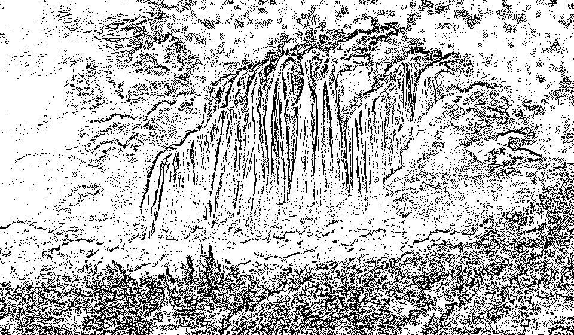

**水瓶座满月：审视自己的勇气**

**8 月 12 日本周五，将发生水瓶座满月。**

太阳在狮子座，象征着我们骄傲的自我，追求自尊、荣誉、生命的热情，对他人的感染力。但另一方面，狮子座也可能为了维护在他人眼中的形象，为了维持面子或自尊心，不惜伪装自己，逃避真实的问题，甚至自欺欺人。

而落在对面水瓶座的月亮，则是一种非常抽离、客观、清醒的状态。月亮水瓶座的管理学之父德鲁克曾经写过一本自传，名字叫《旁观者》。水瓶座正是典型的“旁观者”，追求真实，清醒抽离。与狮子的热情相比，水瓶冷静得近似无情。

满月发生在水瓶座/狮子座 19°21′，与落在金牛座 18°的天王星和北交点呈四分相。水瓶座月亮与天王星能量，象征一种突如其来的情感上的启发、体悟。**也许我们能够看穿自己或他人内心深处，那些虚饰的、逃避的部分。**

我们是否对自己足够诚实？我们内心逃避的究竟是什么？满月往往与亲密关系相关，那么在伴侣关系当中，我们又是否足够坦诚，有没有真实地做自己？我们的伴侣是否足够真诚？

这个满月强调了一种直面真相的勇气**。看到真实的自己，才有可能回归本心，走向真正的自我实现英雄之旅。**一段美好的关系，也与做真实的自己分不开。

在满月发生的同时，金星进入狮子座，开始一段新的旅途。如果满月带来的审视能帮助我们更真实地做自己，那么我们的亲密关系有望走上一段更有活力、更美好快乐的道路。

有意思的是，这次满月又与土天四分相脱不了干系。满月发生几个小时后，月亮来到水瓶座 22°，合相土星。**虽然经历情感上的震动，或被真相震撼，我们仍然不会太冒险，可能还是会选择熟悉的道路，寻求较现实的解决方案。**

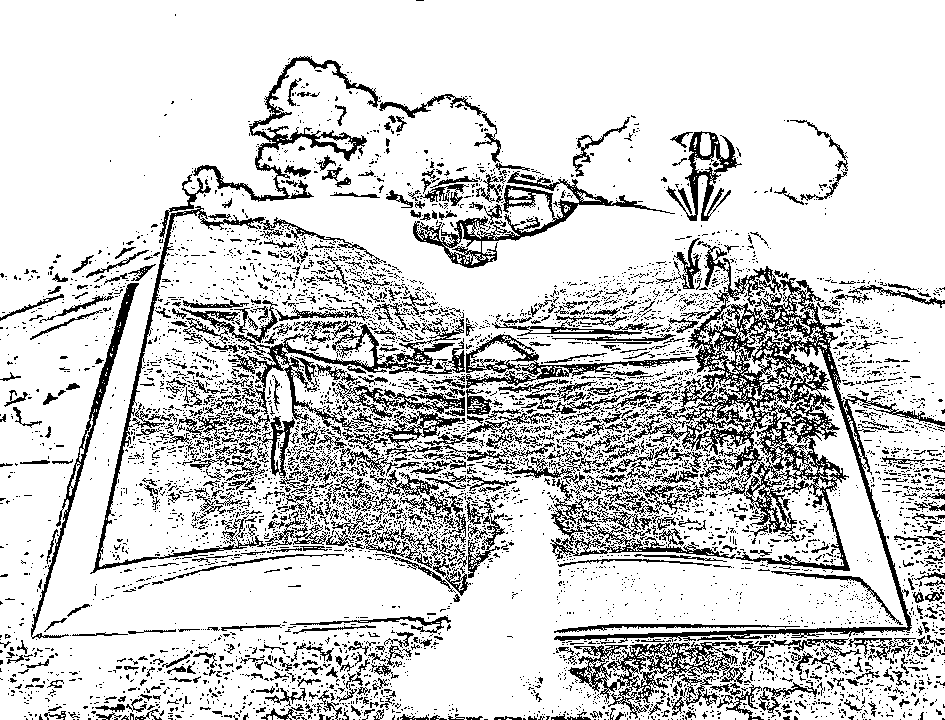

**金星的轨迹：告别与新生**

**本周五，金星将换座进入狮子座。**而就在换座之前，金星在巨蟹座的尾度与冥王星对分。

金冥对分相，一些重要的关系中，可能上演争斗与控制的戏码，巨蟹座的金星加重了激烈的情绪。也可能某些隐藏的情感秘密曝光，我们也许看到名人的情感狗血剧上演。

冥王星的执念关切点在关系中的真相，这与水瓶座满月不谋而合。如果此前彼此间没有足够的诚实，也许本周在关系中会迎来一场风雨洗礼。

但冥王星既是断舍离，也是新生。**逃避问题不能解决问题，直面创伤、挤破脓疮才能获得真正的疗愈。**如果关系本身足够真实有生命力，冥王星只会加深情感的深度，强化彼此的深层联结。

我们也需要注意防范经济方面的风险。比如金融投资市场的变动，或个人的财务安全议题。

周五金星进入狮子座，给我们的关系带来更多明朗的色彩。**也许经过满月与金冥的一番洗礼，解除了隐患，我们正可以全新出发，打造更加乐观、美好的关系。**

狮子座本来就与快乐甜蜜的恋爱密切相关，金星进入狮子座，空气中也会浮动着愉快的爱的味道。爱情让我们懂得欣赏别人的优点，也发现自己的美好。还没有对象的你，学习欣赏和爱自己，是走向美好关系的第一步。

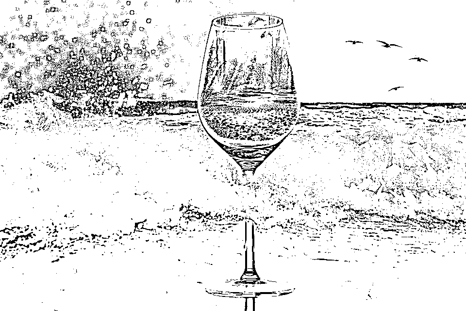

**12 星座的一周运势**

**（重点参考上升星座，其次参考太阳星座）**

***白羊座***

满月发生在 11 宫。你跟伴侣的分歧可能在于，是否顾及到彼此不同的目标。也许伴侣想要一起娱乐，而你却在思考工作，或忙于跟朋友活动。不要忽略了伴侣的感受，良好的家庭关系是你的强大后盾，来面对外界的不如意。

你也许在社交圈子里寻找资源和机会，想要有更大的发展，看起来现在时机还不成熟。继续保持探索和尝试新事物，宇宙终会听到你的心声。

金星本周会进入你的 5 宫。你可能有很多灵感和新点子，也很想要表现自己。可以多向外界表达自己的想法。这段时间孩子也会给你带来很多快乐。

***金牛座***

满月落在 10 宫。你的注意力焦点可能在事业或老板上。

如果你想要对业务作出改变和突破，此时可能受阻，不被支持。或者老板的要求过高，你需要以恰当的方式说服老板降低期待。但火星天王星都在你的 1 宫，注意说话做事不要冲动，保持理性和策略性。

如果与伴侣发生分歧，也多半是你因为工作的关系，忽略了家人。应对工作压力的同时，要注意保持好内心的稳定与平衡。

金星本周将进入 4 宫，与在这里的太阳会合。把家里布置得更舒适一些，或者下班后认真做几道美食，享受与家人的愉悦时光，能够给你更多的内在力量。毕竟，你可是最擅长从实在的日常生活里汲取能量的星座。

***双子座***

满月发生在 9 宫。你可能发现自己固有的一些观点甚至信念遇到挑战，不适应现实，或者不能真正解决问题。你需要反思和学习新知识，或者在实践中验证自己的想法。如果与伴侣发生分歧，多半可能因为你们的观点不合。

金冥在你的 2、8 宫发生对分相，如果有金钱的投资最近要注意防范风险，谨慎保守为上。在关系中也容易因为金钱问题发生矛盾。

金星本周将进入 3 宫，是学习和交流的好时机。一些重要的交流、写作或协商，可以放在本周后进行，你的表达可能更容易受欢迎。

***巨蟹座***

满月发生在 8 宫。你可能关注你的财务或投资状况，或者深层未满足的欲望。此时清醒的梳理，理性的决策是必要的。如果跟伴侣之间如果有分歧，也很可能是关于金钱方面的议题。金冥在你的 1-7 宫对分，你和伴侣之间是否足够坦诚，包括财务方面是否透明，会成为焦点。

周五金星进入 2 宫，解决财务问题的关键，还是发展你自己。充分发挥你的能力、资源，进一步提高你的价值与竞争力。另外拓展自己的社交圈子，或换一个工作团队也可能带来新的提升机会。

***狮子座***

满月发生在 7 宫。你也许发现对伴侣或合作者有新的认识。伴侣身上那些过去被你忽略或没有深入了解的部分，现在让你感到耳目一新，或者有点惊讶。理想的关系，是我们都做真实的自己，而且欣赏和尊重真实的对方。否则可能会引发分歧。

你可能很想在事业上发力，但总是有些意料之外的变化。好的合作伙伴也很重要，如果之前的合作者总有些使不上力，那么本周晚些时候金星进入 1 宫，未来一个月你有机会去吸引更好的合作者来帮助你。

在情感关系方面，金星也会帮助你更有魅力，吸引来愉快的关系。

***处女座***

满月落在 6 宫，你可能关注身体健康的议题，或者发现日常生活需要改善的部分。与伴侣的关系可能因为日常生活细节发生一些分歧。而这些都是你很擅长的领域，发挥你的服务精神，无论是养生食谱，健身计划，把生活做一个更好的安排，调整好彼此的心态与节奏。

金冥在你的 11、5 宫对分，你可能因为朋友或团队关系而烦恼。不过金星很快会进入你的 12 宫，与在这里的太阳会合。你需要暂时慢下来，寻求内心平静。

给自己一些独处的时间和空间，可以沉浸在阅读、冥想、沉思中，接触身心灵领域也很有助益。

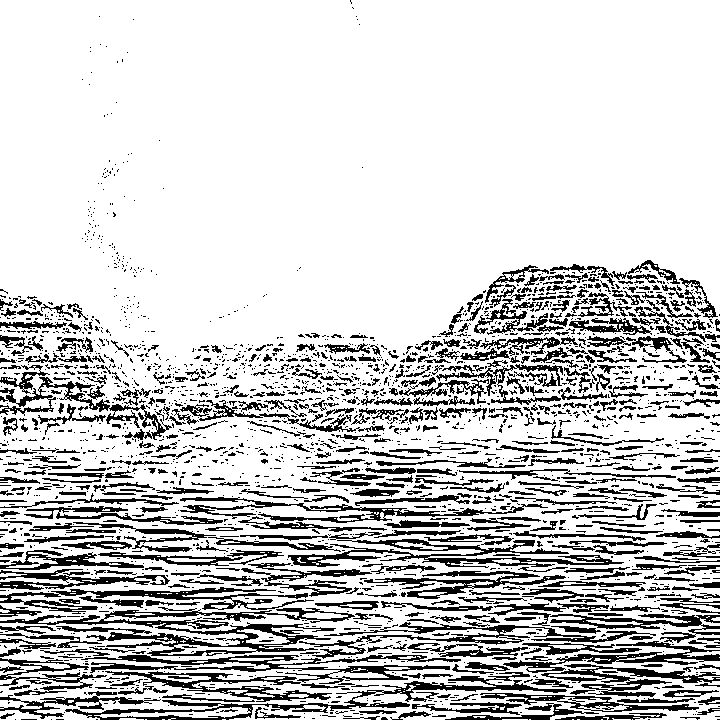

***天秤座***

满月发生在 5 宫。你可能想要好好放松娱乐一下，或者将注意力集中在孩子身上。如果有心仪的对象，满月前后你可能很渴望关系的发展。

但受土星的影响，这些想法可能无法马上如愿。你和伴侣之间也可能因为孩子或自己贪玩而产生矛盾。重点是要尊重彼此的需求和感受。金星与冥王星在 10、4 宫对分，注意在事业和家庭之间找到平衡，以免引发矛盾。

如果有金钱投资，最近要避免冒险，谨慎为上。金星将进入 11 宫，朋友间的联络和活动可能增多，你有机会享受更多愉快的社交生活。

***天蝎座***

满月发生在 4 宫。家庭生活会成为关注焦点。也许是与家人的关系，或者与房屋搬家等相关。另一方面你的工作也在增多，重要的是在工作与家庭之间寻求平衡，家人或伴侣可能对你有更多的需求，不要忽略他们的感受。

金星将进入 10 宫，靠近在这里的太阳。未来一段时间，你可能有更多的动力去发展事业，作出更好的成绩。金星在这里也能吸引来更多认可你实力的人。抓住这段时机，去展现自己的才能，多向外界表达自己。

***射手座***

满月发生在 3 宫。如果有发表写作或演讲，可能收获到好评。如果面临考试，现在也是一个复习和积累的好时机，只要扎实努力会有好的收获。满月前后，和伴侣之间可能因为观点或信息发生分歧，注意沟通方式。

满月也可能提醒你学习的必要性。多读书学习新知，或在实践中检验自己的观点，都是很有益处的。金星与冥王星在你的 8、2 宫对分，要注意财务方面的管理，控制消费，避免不必要的开支。

金星将进入 9 宫，远方或海外的朋友可能联络你。如果你在谋求出版或发表作品，金星也可能带来好消息。学习、思考、写作等精神性的活动，非常适于在这个阶段展开。

***摩羯座***

满月发生在 2 宫。如果你之前在换工作、寻求升职加薪，那么满月前后可能有结果出现。满月也能帮助你更清楚地认知自己，看到自己的优势、资源在哪里，为下一步发展做好打算。

因为土星的压力，你可能感到自己的价值没有得到充分体现，无法支持你更大的野心和欲望。现阶段暂时需要更谦卑的心态，看到自己能力的边界，先夯实核心，把能做的事做好。金星很快进入 8 宫，有机会带来一些外部的资源支持。

关系层面，金星本周在 7 宫对分冥王星，你可能对一段关系紧抓不放或想要控制。但随着金星的换座，学会放手，放下执念会带来关系的新生。

***水瓶座***

满月发生在 1 宫。你可能重新认识自己，重新评估自我或定位。这是一个很好的时机，去发现自己真正想要的是什么，看清你内在的追求。在关系中，你可能因为感到伴侣不够理解自己而产生分歧。

金星将进入 7 宫，与太阳会合。你有机会遇到非常有吸引力，优秀的潜在情感对象，或者是合作伙伴。然而落在 1 宫的土星可能让你不太自信，感到对方太优秀太耀眼，不敢表达自己。不过土星也帮助你建立自己的权威感和责任感。

想要有一段好的关系，可以先从欣赏自己，发现自己的美和闪光点开始。

***双鱼座***

满月发生在 12 宫。你可能发现自己在忙碌的生活之外，内心隐约的渴望或烦恼，但不容易表达出来。精神世界的自洽、宁静、圆满，始终是你向往的。现在你需要适当重视自己内在的需求，通过阅读、沉思、冥想等，给自己创造心灵空间。

另一方面，金星即将进入 6 宫，与太阳会合。日常生活和工作也会更加有活力，可能有些新鲜的事务吸引你的参与。比如运动健身，让自己保持更健康美丽的身体，或者研究美食与养生，等等。

平衡好这两端——美好的生活与心灵的世界，你可以活得更圆融自如。

**版权声明**：原创文章由作者授权首发于若道平台发布，欢迎转发，反对抄袭。友号转载请申请白名单。

**END**

**芷菱**

ISAR 认证占星师/占星作者/媒体人若道 2019 届核心课程毕业生

于 2019 年通过 ISAR 考试，同年获得若道认证神话塔罗师资质

**微信公众号**：芷菱的理想国

长按打赏

**20 位来自世界各地的占星师****带来 19 场沙龙——新世界的觉醒****详情可点击下图**

**学习占星学****点击下图了解课程详情**

**微信又双叒叕改版啦，不想错过若道君的推送？**

**就把若道设为星标吧！**

**▼**

**喜欢就点一下“在看”吧！**

********报名直达入口********

# 今晚 7 点，直播等你丨 71 道练习题考考你的占星学学商

> 原文：[`mp.weixin.qq.com/s?__biz=MzA5NjA0NTAxNg==&mid=2651483786&idx=2&sn=4a474e4721d97e0511433fe8f57451f5&chksm=8b48dc3dbc3f552ba3a6cf2b9ffac0486aa72273f80b98725ec65aaa8c01c99f39224ffbbeca&scene=126&sessionid=1692737776#rd`](http://mp.weixin.qq.com/s?__biz=MzA5NjA0NTAxNg==&mid=2651483786&idx=2&sn=4a474e4721d97e0511433fe8f57451f5&chksm=8b48dc3dbc3f552ba3a6cf2b9ffac0486aa72273f80b98725ec65aaa8c01c99f39224ffbbeca&scene=126&sessionid=1692737776#rd)

**想知道自己是否有 L1-2 的占星学基础？****想知道水平如何？**大卫老师和咔咔老师出的**71**道练习题等着你题目主要是考考你的**星座**和**宫位**知识这些都是占星学的入门基础而这些练习题的答案大卫老师和咔咔老师将在**8****月 7 日晚 7 点的****直播沙龙****中为你揭晓****联系课程顾问，71 道练习题向你招手**

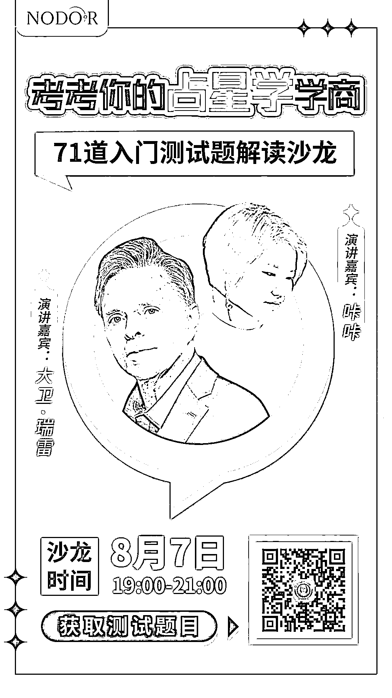

**想知道“宇宙之题”的答案？** **快点击下方按钮预约直播吧~**<mpvideosnap class="js_uneditable custom_select_card" data-pluginname="videosnap" data-headimgurl="https://wx.qlogo.cn/finderhead/PiajxSqBRaEJYnVsqWfEX9qA0sI6hNVKsDfyzfPZ92WZMZyBpZWU5NA/0" data-username="v2_060000231003b20faec8c4e68a1ec2d4ca07e434b07755bbf47e7053a3059defd2c9d6c68a20@finder" data-nickname="若道" data-desc="将在 08 月 07 日 19:00 直播" data-intro="71 道练习题考考你的占星学学商" data-noticeid="finderlivenotice-v2_060000231003b20faec8c4e68a1ec2d4ca07e434b07755bbf47e7053a3059defd2c9d6c68a20@finder-1659580085311843-384860637" data-type="live"></mpvideosnap>

# 若道占星咨询｜2022 年的最后五个月，该如何规划迎接新一年？

> 原文：[`mp.weixin.qq.com/s?__biz=MzA5NjA0NTAxNg==&mid=2651483786&idx=1&sn=a70ec06068a0ca6895b6937fd2ac2d6e&chksm=8b48dc3dbc3f552b28b896bad782df21606835741bc04f6b6c98786b5ac7ed492872603e6198&scene=126&sessionid=1692737776#rd`](http://mp.weixin.qq.com/s?__biz=MzA5NjA0NTAxNg==&mid=2651483786&idx=1&sn=a70ec06068a0ca6895b6937fd2ac2d6e&chksm=8b48dc3dbc3f552b28b896bad782df21606835741bc04f6b6c98786b5ac7ed492872603e6198&scene=126&sessionid=1692737776#rd)

专业的占星师在这里等您

**若道占星咨询平台是以人本主义占星学导向的咨询，期望用博大精深的占星学提供优质信息，并通过和客户的交流，协助客户了解自己和他人、探索潜能、识别破坏性的人生模式、了解生命周期。**

我们期望更多人通过咨询，用占星学帮助自己提高觉察，学习成长，运用自由意志，学习与命运共舞。 

占星学是宇宙送给人类的礼物，我们愿意将这个礼物分享出去，让更多优秀的职业占星师为更多公众服务。

如果你对自己的生命有困惑，不论这个困惑是学业、职业，还是爱情、婚姻、亲子教育、个人成长等，我们都欢迎你来！

**本期我们将为大家推荐以下占星师**

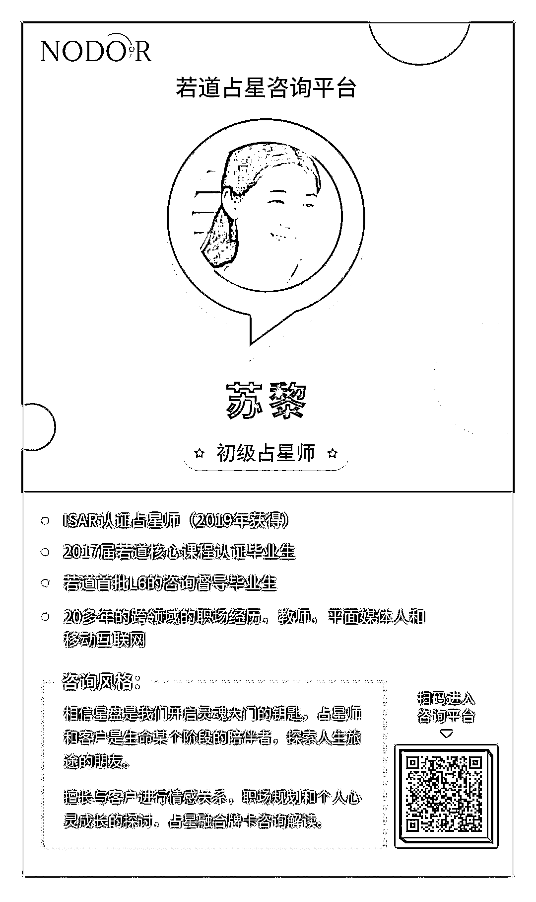

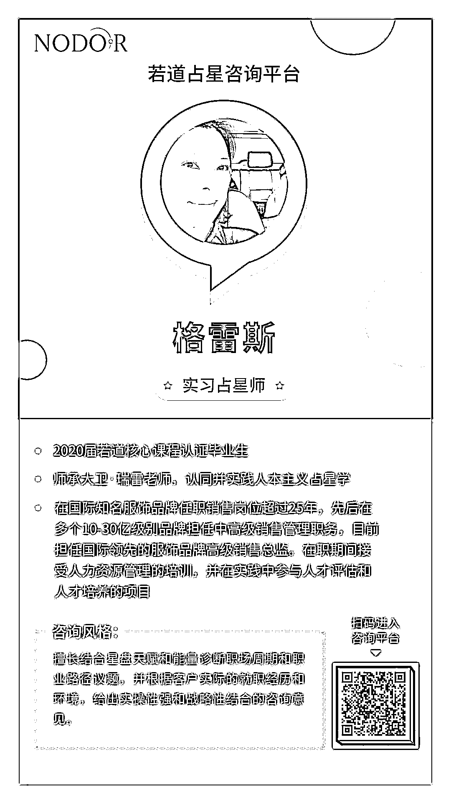

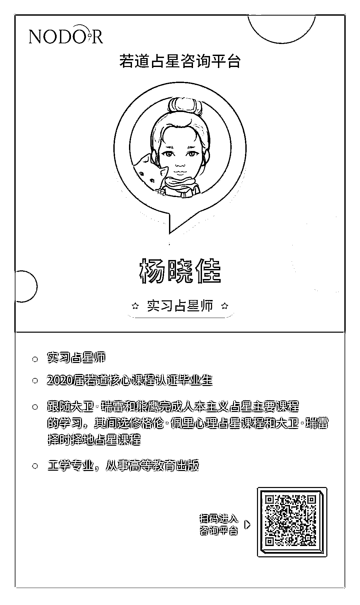

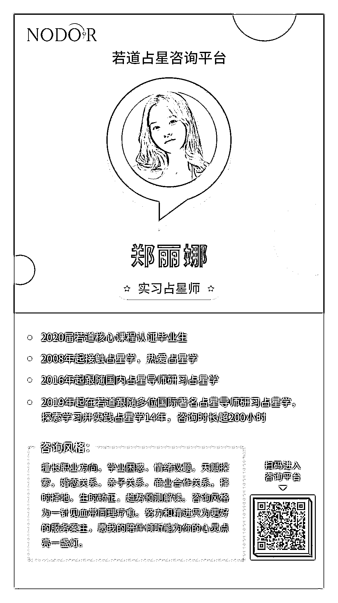

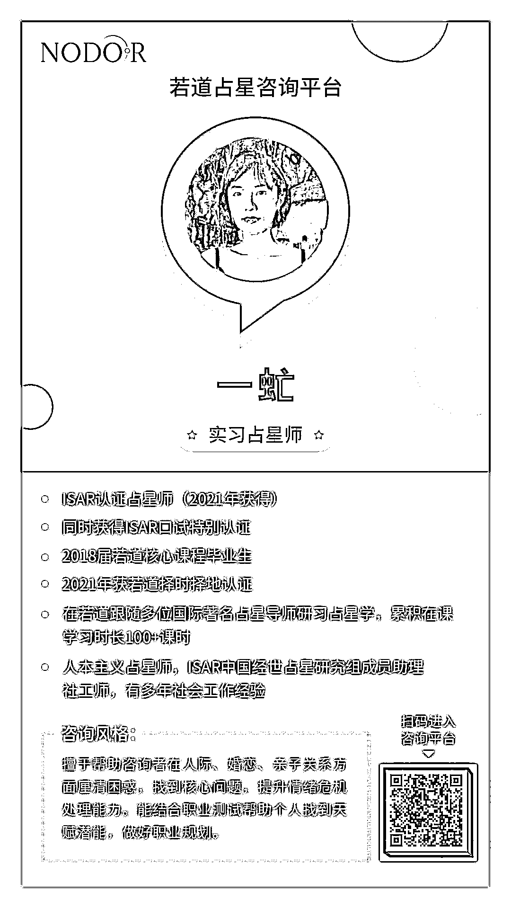

**来看看大家在咨询后的评价~**

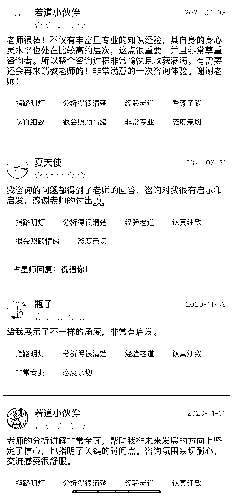

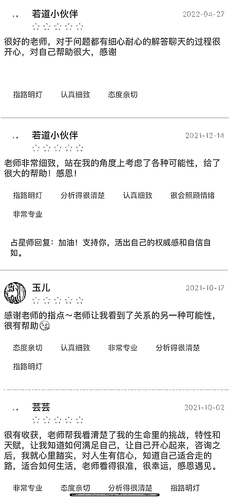

如何预约占星咨询？

**方式一：**

**下载若道 APP，进入占星咨询栏目可以进行预约**

****

**方式二：通过若道服务号**

****

# 12 火星星座 | 你从哪里穿越而来，又要进化到何处去？

> 原文：[`mp.weixin.qq.com/s?__biz=MzA5NjA0NTAxNg==&mid=2651483785&idx=1&sn=5935518c7b3a259a6419d9ce08ef4295&chksm=8b48dc3ebc3f552866e758a7c4bac92f4369ac628b62fcdfa3dcab5e33d54e1ebe3fbda0cdaa&scene=126&sessionid=1692737776#rd`](http://mp.weixin.qq.com/s?__biz=MzA5NjA0NTAxNg==&mid=2651483785&idx=1&sn=5935518c7b3a259a6419d9ce08ef4295&chksm=8b48dc3ebc3f552866e758a7c4bac92f4369ac628b62fcdfa3dcab5e33d54e1ebe3fbda0cdaa&scene=126&sessionid=1692737776#rd)

******☆ ****后台回复“今日”，给你一句生命态度******

作者/斯蒂芬·弗里斯特译者/李含 校对/江艺 编辑/玫瑰 封面/书君 图片/pexels 本文摘自《天空的伴侣 I：爱、性和进化占星学》

你的火星都有怎样的功用和需求，又发展得如何呢？来看看这篇满是干货的文章吧。另外，斯蒂芬老师马上要在若道开设[【组合图工作坊】](http://mp.weixin.qq.com/s?__biz=MzA5NjA0NTAxNg==&mid=2651481876&idx=3&sn=83464a0cd1db7ce8cd45af8f26be3966&chksm=8b48d5a3bc3f5cb593fd3bfee96edc7ef30395b4364ecb894c0b9aa3deff7436b6dcb336dea2&scene=21#wechat_redirect)（点击查看课程），如果想跟这位占星大师学习，快来了解详情吧~

**穿越 12 个火星星座**1 火星白羊座

**进化的意图是学会勇敢而直接地运用自己的性意志**。**有一种灵魂渴望去恢复毫不掩饰的性爱，并解决与自然性欲的压抑或性屈辱有关的业力愤怒。**

以战士为原型的火星人热情奔放，可能会欣赏一场赢得你芳心的战斗。**激情和直率**是这个落点的策略，除非出生图的其他部分非常温和。这个火星星座极具保护性。

竞争使火星在白羊座充满活力。它喜欢**冒险、挑战、追逐的刺激，以及几乎任何考验其意志的相关情境。**感到强大和胜利让火星在白羊座能量旺盛。**持续的失败，或者缺乏令人兴奋的自我选择的挑战，将会耗尽这个火星星座。**

摇滚歌手皮特·汤森的火星落在白羊座，他的歌名显示了这一点：“会得到你”，“粗野的男孩”和“我是一个动物。”克林特·伊斯特伍德的火星也落在白羊座，他在所出演的西部片角色中运用了他的火星。（“来吧，让我也高兴高兴。”）

伊丽莎白‧库伯勒-罗丝，濒死研究的先驱者，火星在白羊座。大河之舞的麦可·佛莱利与摇滚歌手约翰·福格蒂和诗人尼基·乔瓦尼都拥有白羊座的火星。

2 火星金牛座

**进化的意图是将一个人的性意志应用于发展与自然界和他的本能面向的联系。**灵魂的欲望是**恢复对肉体性欲的天生自由的自我表达，暗示着前世经历中，性变得生硬，或者被视为对我们动物本性的羞耻表达。**

这个火星星座可以把自己塑造成一个优秀的供应者，这不仅仅是在经济上。它包括**感官**——所有的五种感官，加上你的脚趾和鼻子。

火星在金牛座会**照顾到你的身体舒适和健康**，无论是把美味的食物放在桌上，帮你平衡支票簿，按摩你的肩膀，还是喷你最喜欢的古龙水。**他们想要安抚你，让你放松**。

他们会争取大自然的支持，在春天带你去动物园，或者在夏天的傍晚带你穿过金银花丛。对于火星来说，这是一个非常**肉体的、享乐主义**的位置，也是一个**坚定**的位置。**与身体和自然界接触的感觉给金牛座火星补充能量，而忽视一个人本能的一面，花太多的时间在室内会耗尽它**。舞蹈搭档鲁道夫·纽里耶夫和玛戈特·方廷都有火星在金牛座，米克·贾格尔、宝拉·阿德布尔和杰米·李·柯蒂斯也是如此。

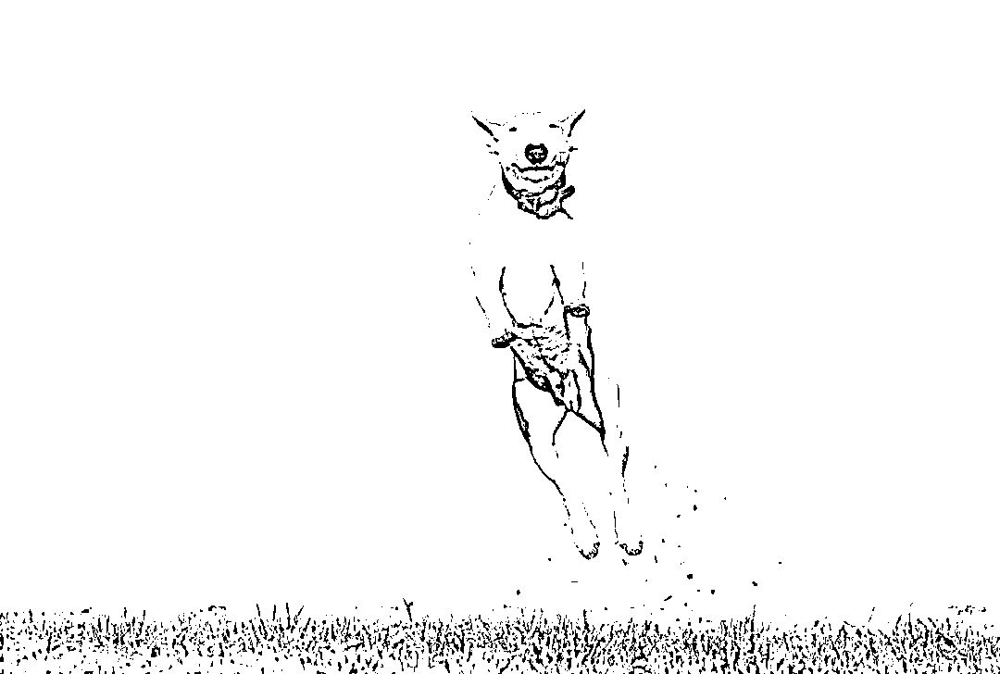

3 火星双子座

**进化的意图是将性意志应用于发展激进的警觉性、纯粹的知觉，最重要的是思想的自由交流。**

在性爱方面，人们往往**渴望多样性**，以回应前世“尽义务”的性功能动力，它会**因早年遭受（和压制）的与性损伤有关的前生创伤而变得复杂**。如果不加以解决，这可能会表现为**幼稚的性态度和行为**。

这个火星星座会用**智慧、才华和早慧**让你眼花缭乱。火星在双子座会想要拜读你的诗作，并带你去镇上每一家极好的书店。他们读你最喜欢的小说，然后把自己的小说借给你，这样你们就可以一起讨论这些书了。

火星在双子座想要**扩大和加深你们之间的交流**。由于渴望分享新的经验，他们可能会建议去参观州立博览会、马戏团或去第三世界旅行。他们给你讲故事；他们在你的电话答录机或电子邮件收件箱里安营扎寨。

所有这些活动都是为了与你**开启一场引人入胜的亲密对话，并说服你继续下去**。这个火星星座充满了**想法、辩论、精心设计的语言、未回答的问题、新的体验和奇迹**。**无聊、确定性和偏见会耗尽它的能量。**

作家 F·斯科特·菲茨杰拉德、罗伯逊·戴维斯和埃里卡·容都有火星在双子座；尼尔·阿姆斯特朗、大卫·杜乔夫尼、艾瑞莎·富兰克林和史蒂夫·马丁也是如此。

4 巨蟹座

进化的意图是**创造一个安全的环境，以安慰和治愈人类最深层的性表达，这是真正与伴侣建立联系的能力**。前世的动力导致了恐惧和不信任：感觉到性行为将失控，痛苦将会产生。有一种灵魂渴望是**找到重建信任的勇气。**

从表面上看，这个火星星座证明了**这段关系能让你得到多么丰富的滋养，你的每一种情感需求都能得到满足。**

巨蟹座火星的人提供保护、安全和一个抚慰和治愈你所有疲惫神经的巢穴，他们的气场仿佛在说，他们会与老虎搏斗，以确保这个巢穴的安全。他们**提供情感上的支持和理解，是你内心生活中一个积极、敏感的参与者**。在内心深处确实希望你回报这些恩惠！**花时间做内心工作，用健康的方式滋养某人或某物，运用想象力，**这些都会让这个火星星座充满活力。**侵略性，对其敏感性缺乏尊重，不断被人利用其滋养的品质，以及没有地方或时间退隐静修，则会让它耗尽精力**。汉弗莱·鲍嘉擅长扮演硬朗、脾气暴躁、内心柔软的男人，他和演员兼导演肯尼思·布拉纳一样拥有巨蟹座火星。威廉·莎士比亚和浪漫主义诗人拜伦勋爵与歌手雷·查尔斯和食品作家 M·F·K·费希尔都是火星落于巨蟹座。

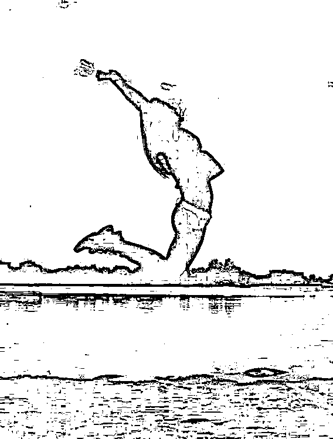

5 火星狮子座

**进化的意图是学会用创造力、毫不掩饰的自信和活力来表达性爱，以回应涉及抑制、压抑和公开羞辱境遇的前世经历**——这是一个微妙的过程，涉及到**恢复性的本质，包括健康自私和天生的骄傲。**

**狮子座的火星擅长“宫廷爱情”，比其他火星星座更能理解爱情的戏剧性。**这些人注重舞台设置和道具：正确的餐厅，正确的手势，正确的礼物。他们可以表现出**真正的高贵，热情，诚实，忠诚，令人鼓舞，并毫不吝啬自己的时间和爱慕**。

创造力、趣味性、幽默感、赞美，以及在狮子座火星有关的领域中成为领导者，这些都会带给火星狮子座人以活力，而**缺乏乐趣和持续的消极性会使他们精疲力竭。**

一些非常受欢迎的艺人有火星在狮子座：罗伯特·雷德福、布鲁斯·斯普林斯汀和弗兰克·西纳特拉。罗伯特·格雷夫斯以他的爱情诗和对伟大女神原型的研究而闻名，他的火星在狮子座。诗人威廉·布莱克、歌手雪儿和女演员朱迪·福斯特也拥有狮子座火星。

6 火星处女座

**进化的目的是为了发展有意义的个人能力，并将其应用于对伙伴的服务中。**驱使这一行为的是一种灵魂欲望，想要解**决来自过去业力中关系或性的罪恶感**。这种负罪感可能来自于**真实的错误行为**，或者来自**父权制压抑文化下对性的普遍羞辱。**

这个火星星座似乎在说：“看看我能帮你多少。和我建立关系，就像是成为动物学家生长培养皿中的变形虫；你肯定会经历一些变化。

你不想成为你所能成为的一切吗？”处女座火星挑战你完善你的人际交往技巧，就像你完善艺术才能一样，注重技巧和细节。它可以在你生活的各个方面为你提供帮助，从你灵魂的进化到在交通高峰期把你的车送到修理工那里。为了建立一段完美的关系，这些人可以仔细观察你的生活，并提出改善建议。他们通过帮助你而充满活力，即使你不希望他们这样做，或者他们的帮助给人以威吓和批评的印象。海明威的火星在处女座。敬业的舞蹈家米哈伊尔·巴雷什尼科夫和演员本·阿弗莱克、布鲁斯·博克莱特纳以及马特·达蒙的火星都在处女座。露丝·金斯伯格和英迪拉·甘地有同样的火星星座。

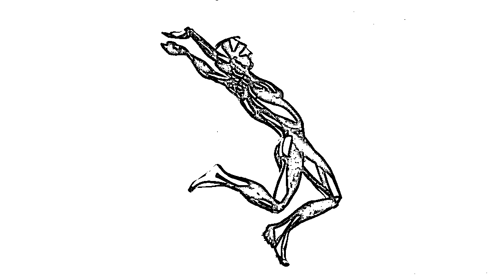

7 火星天秤座

进化的意图是**将意志应用于有效地弥合那些由压抑的愤怒造成的自我和他人之间的鸿沟**。简而言之，灵魂的渴望是去**学习良性的亲密关系冲突的艺术**，这是基于在前世的动力中，这种冲突要么被“适当性”压抑，要么因为伴侣的暴力反应而太危险而不能冒险。

**天秤座的火星会坚持认为它非常了解你（咨询师)），如果你屈服于这种关系（情人），你的生活会是多么平静与和谐（调解人）。**这位艺术家想给你拍照，或者给你买合身的衣服。这位情人运用了浪漫主义，温柔和敏感。这位咨询师和外交官听取你的意见并给你建议。问题是，一旦你上钩了，更深层次的现实就会暴露出来——**冲突**实际上会赋予这一火星星座能量。在最好的情况下，这可以**诚实、健康地探索两个不同个性构造磨合的地方**。即使它走上黑暗的道路，天秤座的火星最终也会**被孤立、不必要的争吵、敌意、不公正和丑陋所耗尽。**浪漫主义诗人珀西·比什·雪莱和前披头士乐队成员约翰·列侬火星都落在天秤座。作家豪尔赫·路易斯·博尔赫斯和导演英格玛·伯格曼都有火星在天秤座，音乐家彼得·加布里埃尔、歌手菲比·斯诺和惠特尼·休斯顿以及女演员艾丽西亚·西尔弗斯通也有天秤座火星。8 火星天蝎座

进化的意图是**将意志应用到一个不懈努力的、极其诚实的、共享的自我审视、揭示和转变的过程中**。这里有一种**对前世性欺骗动力的回应**，以及一种**在真相、全部真相和只有真相的基础上重新建立信任的灵魂愿望。**

这个火星星座会让你**被激情的潮水淹没，或者用敏锐的目光盯着你**。这些人几乎可以用他们的激烈强度催眠你。**他们在性、情感和超个人层面上提供满足感。**他说：“这段关系将深刻地改变我们双方。我已经准备好了，你呢？让我告诉你为什么我认为你害怕。”

**火星在天蝎座强调它的诚实，它处理敏感问题的能力，以及与你分享它的深度的渴望。**这些人会告诉你他们所从事的临终关怀工作，带你去听心理学讲座或降神会，或者只是去他们家吃晚饭，和他们聊一些启示灵魂、令人着迷的话题，直到凌晨三点。

**激情、强烈、深刻的亲密和对禁忌的探索会让天蝎座火星能量十足**。它被**浅陋和那些让它感觉只能表现出其本质中最肤浅的 2%或 3%**的情况所耗尽。

作家亨利·米勒所写下的每一个词都充满激情，他的火星星座落于天蝎座。神秘学家卡洛斯·卡斯塔内达，作家雷·布拉德伯里和 J·A·詹斯，以及音乐家凯蒂莲和库尔特·科本也是如此。

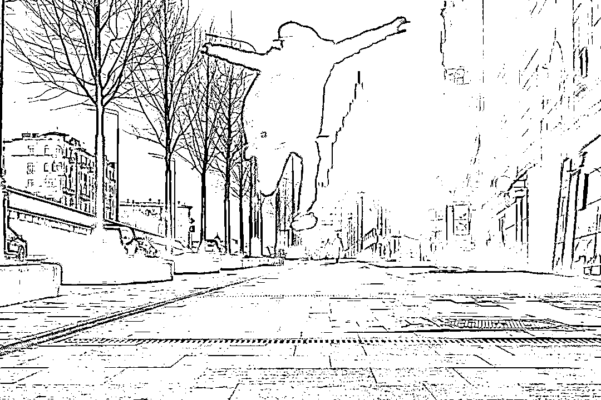

9 火星射手座

对于射手座来说，进化的意图总是**涉及到以道德的方式和符合自然规律的方式应用自己的意志**。同时，也有一种灵魂**渴望去自由地体验性爱的刺激，可能还有一定程度的性爱多样性。**

这些对立的驱动力之间的紧张关系反映了一种尚未解决的前世动力，为此，灵魂现在想要一个解决方案，**在崇高的、深刻的性爱和自由选择的承诺中达到顶峰。**

火星在射手座的追求风格反映了这个星座的原型。这位学者要求你在诗歌朗诵或纪录片中拓展你的思维。这位哲学家或人类学家邀请你超越已知和熟悉，就像吉普赛人和探险家一样。这一切都指向了**冒险：在经历、浪漫爱情或性爱中**。

火星射手座用它的**好奇心、理想主义、道德和有远见的品质**给你留下深刻的印象。**旅行、追求的事业、幽默、有趣的新想法和经历会激发这个火星星座的能量。禁闭，太多例行公事，不道德的情况，以及与世隔绝的生活都会消耗掉它的能量。**

直言不讳的摇滚明星詹妮丝·乔普林的火星在射手座。法国诗人阿瑟·兰波声称诗人必须用经验压倒一切感官，使自己成为一个预言家，他的火星落在射手座。星图中拥有这个火星星座的还包括民族植物学家泰伦斯·麦肯纳、女演员梅格·瑞安、费伊·杜纳威和特雷西·乌尔曼，以及设计师皮埃尔·卡丹。10 火星摩羯座进化的意图是**将意志应用到自我控制、正直和有意义的成就上，从而在生活中获得地位，借此可以为所爱的人提供有效的保护、维持生计和防御。**这一意图是对前世在这一领域所感知到的失败感的回应，这种失败感在他们的意识中留下了羞耻的味道。**这个星座是一位大师级的战略家，利用首相或高管原型的精明和冷静的效率，让你“加入公司”。**在花了巨大的努力在世界上站稳脚跟之后，他们会给你实际的、可证明的、切实的理由，说服你最大的利益在于他们。这些人可能没有丰沛的情绪，但这在很大程度上取决于星图的其余部分。

**从长远来看，他们认为他们对你负责任的行动比表明态度更重要。**这个火星星座的活力来自于**有意义的成就，通常是以长期项目的形式，以及一定程度的孤独。从来没有独处的时间，以及选择了错误的山脉去攀登，让这个火星的能量被耗尽。**

通过改变风格成为音乐界常青树的大卫·鲍伊有火星落于摩羯座，冰岛摇滚歌手比约克也有火星在此。马龙·白兰度以他的摩羯座火星为原型，塑造了教父的形象。作家简·奥斯汀和雪莉·杰克逊也有落于摩羯座的火星。

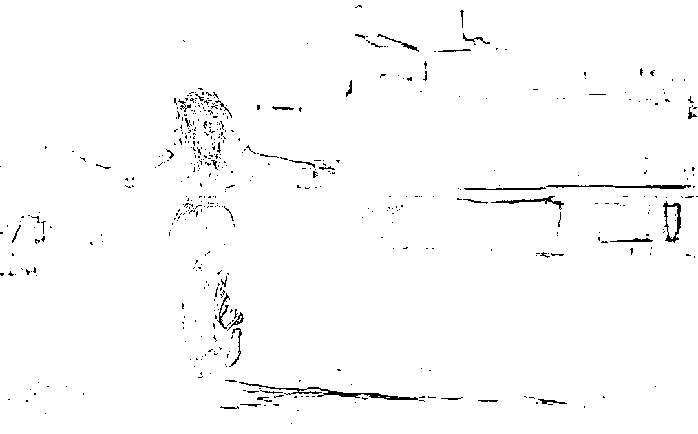

11 火星水瓶座

**进化的意图是应用意志来诉求一个人表达自发性的权利，甚至是叛逆的自己，性或者其他方面。**这里回应了涉及性“规则”的前世动力，通常包括禁欲的修道院规则。这也可能与**前生性胁迫**有关，即社会压力导致了一种不满意的、最终不诚实的性结合。

就像双子座的火星一样，这个火星星座给人留下**知性**的影响，但在水瓶座有不同的基调，仿佛在说：“我是一个天才，每个人最终都会认识到这一点。和我在一起，你会得到真相，以及做你自己的无限自由。

现在，你打算如何对待它？”**这位独特的个体和说真话的人以其独创性和独特的世界观让你兴致盎然**。这位反叛者和流放者提议打破你的枷锁，为你提供一种不受限制、强化个性的生活方式。这位改革者加入你最喜欢的事业，或者让你对他或她的事业感兴趣。

水瓶座火星也可能以**（疯狂）科学家**的身份出现，并提议参加科幻大会或航空航天博物馆之旅。这个火星星座被**心灵、思想、精神和言论的自由**所激励，**通过打破规则，质疑权威，或者探索一些尖端的兴趣来充电。约束、成为习俗和狭隘暴君的奴隶会耗尽它的精力**。

民权活动家威廉·爱德华·伯格哈特·杜波依斯，植物学家路德·伯班克和作家杰罗姆·大卫·塞林格有火星落在水瓶座。作家安妮·麦卡弗里和加布里埃尔·加西亚·马尔克斯与音乐家戴夫·布鲁贝克、宇航员弗兰克·博尔曼和演员布里奇特·方达都有火星落于水瓶座。12 火星双鱼座

这里的进化意图涉及一个深刻的悖论：**找到臣服的力量、意志和勇气**。这里的灵魂渴望是去体验性爱和精神激情的融合，以回应它们在前世的裂变，前世在独身致力于精神之路和屈服于强迫性性欲之间，存在着令人精疲力尽的摇摆。

这个火星星座以精神勇士之名追求你。这是一场十字军东征，你的心是圣杯。他们想轻轻地赤手触摸你的灵魂。他们会编织魔咒和幻术。

既然他们不能为你屠龙，他们就会给你写诗，带你去看奇幻电影，而且通常会尽一切可能帮助和怂恿你探索其他现实和意识状态，无论这些现实是精神的还是艺术的。

**这个火星星座通过冥想或其他建设性的改变状态的经验，以及对精神理想的奉献而激活能量。**双鱼座火星如果**从不花时间冥想、缺乏做白日梦的状态，严酷和缺乏同情心**，则会被耗尽能量。鲍勃·迪伦的双鱼座火星落于第十宫，从很多方面来说，他已经成为这种配置的公共象征。读读他的歌词或他的一些歌名，非常形象地反映出了双鱼座的幻想：“在风中飘扬”，“手鼓先生”，“你就是天使”。魔术师和幻觉大师大卫·科波菲尔有火星在双鱼座，还有音乐家迈尔斯·戴维斯和艾米洛·哈里斯，网球明星玛蒂娜·纳夫拉蒂洛娃，作家简·布罗迪和设计师奥列格·卡西尼。

**版权声明：**本文由若道翻译发布，欢迎转发，反对抄袭。友号转载请申请白名单。

**END**

**斯蒂芬·弗里斯特**

若道签约老师。进化占星学的创始人之一，当今世界最有影响力的占星大师之一；1985 年，他凭借《内在的天空》一书获得职业占星师协会奖（Professional Astrologers Incorporated Award）。他四次获得占星界最高的占星学联合协会奖（United Astrology Congress Regulus Award）提名，2018 年获得轩辕十四教育奖。

****探索组合图永恒的三角——斯蒂芬工作坊报名中****

斯蒂芬说，我们的组合图表明无论什么状况我们都能熬过去。

**组合图也像出生星图一样有行进。**在工作坊中， 我们将**探讨一些特殊的技法和考量，来帮助伴侣们应对生活中的挑战和机遇。**组合图的推进会出现一些看似难以解决的复杂问题，斯蒂芬老师创造了一种解决这些问题的技法。他将在工作坊中阐述相关细节，基本的问题是：如你所知，要了解一个人 30 岁生日的推进，我们要看这个人出生后 30 天的行星位置。问题是，组合图与我们在占星学实践中使用的其他星图不同，组合图并不代表某一天的天空。记住，它是基于中点的。**那么我们如何从一个不存在的日期开始 "向下数 30 天"呢？斯蒂芬老师将为我们提供一个行之有效的答案。****点击下图了解更多详情******20 位来自世界各地的占星师****带来 19 场沙龙——新世界的觉醒****详情可点击下图**

**学习占星学****点击下图了解课程详情**

**微信又双叒叕改版啦，不想错过若道君的推送？**
**就把若道设为星标吧！****▼**

**喜欢就点一下“在看”吧！**

********报名直达入口********

# 斯蒂芬·弗里斯特工作坊丨探索组合图永恒的三角

> 原文：[`mp.weixin.qq.com/s?__biz=MzA5NjA0NTAxNg==&mid=2651483785&idx=2&sn=1dfa520c167070aeba099f6b073f726e&chksm=8b48dc3ebc3f5528b638d5d7890820635b4f4f31c7bd5d4d4194aea60926424caa960b5050a6&scene=126&sessionid=1692737776#rd`](http://mp.weixin.qq.com/s?__biz=MzA5NjA0NTAxNg==&mid=2651483785&idx=2&sn=1dfa520c167070aeba099f6b073f726e&chksm=8b48dc3ebc3f5528b638d5d7890820635b4f4f31c7bd5d4d4194aea60926424caa960b5050a6&scene=126&sessionid=1692737776#rd)

**1**

********斯蒂芬·弗里斯特老师若道独家三日线上工作坊********

斯蒂芬说，我们的组合图表明无论什么状况我们都能熬过去。

**2**

********此次授课内容********

**组合图描述了如何才能使两个人的关系一直充满活力。**这句话中隐含的意思是假设一段关系有一种区别于这两个个体的独立的生命。有时我们喜欢和一对伴侣共度时光，却从没想过单独见他们其中一人。我们从这对伴侣身上感觉到的 "频率"是对他们组合图能量的直接体验。在某种程度上，可以简单地理解为：**正如每个人都有自己的星图一样，每对伴侣也有他们的星图。**

从简单的描述层面上讲，这就是组合图的意涵。记住，我们可以将这一技法用于任何一种关系：**父母和子女、商业伙伴、朋友。**作为进化占星师，我们的目标要比单纯描述走得更深。解读组合图时，可以着眼于帮助人们，而不仅仅是使他们感到惊奇。对于个体来说，出生星图代表了一条正确的人生道路，一条承诺意义、活力、灵性目标的道路。组合图亦然，只不过它将一段关系看成一个独立的个体，而不是两个人。关系也有进化的路径：人们走到一起是为了学习和成长。个体如果没有领会自己出生星图的要点，会变得疲惫而沮丧。两个人也是如此，**如果没有抓住组合图的要点，我们就会对对方感到厌烦。这段关系似乎也会失去动力。**

伴侣常常意见不一，陷入困境，看不到前进的方向。三是一个更有动力的数字。三个人投票，二个人以多数票击败一个人，推动事情继续发展。**这实际上解释了这次工作坊的主题：永恒的三角。**

**每对伴侣其实都是一个三人组：你、我以及我们。**组合图所代表的那个看不见的 "第三人"经常会"投出打破僵局的一票"，使关系得以发展。**·** 但是如果组合图总是同意一个人的意见，而不同意另一个人的意见，怎么办呢？（这被称为"封建制度"）**·** 如果两个人都安静而保守，但他们的组合图却要求狂野的冒险呢？（这是 "文化冲击"）**·** 如果它同时均衡地反映了两个人的情况呢？我们可以称之为 "民主"，但我们仍可以区分出一个人天然的智慧比另一个人更强的领域，让擅长的人负责擅长的事，这会促进关系蓬勃发展。换句话说，我们开始看到这个技法的咨询维度了。我们将在这个工作坊中探讨这些内容。两个人究竟为什么会走到一起？**在严肃、复杂的关系中，我们可以假设两个人之间有一些未解决的业力。**如果他们在今生是恋人，但在前世中，一个是父母，一个是孩子呢？也许那些直觉和假设仍可以感受得到，极为错综复杂地使得他们在今生想要成为情侣。**这些疑问将我们引向组合图的月亮交点，在那里我们往往能发现当今人类任何伙伴关系问题的真正核心。**

**从理论上讲，组合图是基于中点的。**如果我的出生星图里太阳在摩羯座中段，而你的太阳在双鱼座中段，我们组合图的太阳就在水瓶座中段。换句话说，**在你和我的太阳的中间位置。****其他行星、月亮交点和中天也是如此。**其他宫头的位置，包括上升点则存在一些争议。通常的做法是仍然使用中点，但斯蒂芬老师将会解释他认为这样做存在的技术方面的问题。他更倾向于**使用关系最初开始的地点绘制星图，就像我们使用出生地来绘制出生星图一样。**

**组合图也像出生星图一样有行进。**在工作坊中， 我们将**探讨一些特殊的技法和考量，来帮助伴侣们应对生活中的挑战和机遇。**组合图的推进会出现一些看似难以解决的复杂问题，斯蒂芬老师创造了一种解决这些问题的技法。他将在工作坊中阐述相关细节，基本的问题是：如你所知，要了解一个人 30 岁生日的推进，我们要看这个人出生后 30 天的行星位置。问题是，组合图与我们在占星学实践中使用的其他星图不同，组合图并不代表某一天的天空。记住，它是基于中点的。**那么我们如何从一个不存在的日期开始 "向下数 30 天"呢？斯蒂芬老师将为我们提供一个行之有效的答案。**

并非所有的人都处于伴侣关系中，但**作为人类，就需要与其他的灵魂共舞。占星学能够极大地帮助人们驾驭复杂的关系。**了解我的星图如何与你的星图通过相位和宫位的交互而产生互动，是非常有帮助的。组合图包含了这些技法，提醒我们，整体总是大于各个部分之和，而又与之不同。

**3**

********斯蒂芬的占星著作********

**·** 1984 年-1988 年间，斯蒂芬写作出版了《内在的天空》（已有中文版）、《变化的天空》和《天空的伴侣》三本占星经典著作，奠定了早期在占星学界的地位。**·** 2002 年-2005 年间，他与朱迪·弗里斯特共同创作了两本经典的关系占星学著作《天空的伴侣 I：爱、性、和进化占星学》《天空的伴侣 II：组合图》。**·** 2008 年，斯蒂芬出版了一本非常重要的著作《昨日的天空》，此书是至今为止关于轮回转世跟星图的清晰对应最详尽的著作之一。 斯蒂芬前后一共出版了 12 部占星著作，在世界占星学界拥有很高的声誉。

**4**

********斯蒂芬获得的荣誉********

1985 年，他凭借《内在的天空》一书获得职业占星师协会奖（*Professional Astrologers Incorporated Award*）。1992 年、1995 年、2008 年、2018 年，他四次获得占星界最高的占星学联合协会奖（*UnitedAstrology Congress Regulus Award*）提名，2018 年获得轩辕十四教育奖。

**5**

********斯蒂芬的占星哲学观********

斯蒂芬的占星风格以**自由和选择**为中心，他的解读不是以下定论的方式来“预测”未来，他**强调如何改善生命，而不是宿命式的论断**。他以心理占星学的语言来解读星图上的人格部分，但是**通过南北交点及其相位和守护星来探索星图所揭示的前世业力与今生方向，在灵魂进化的背景里来整体解读星图。**他认为进化占星学的目的在于**鼓励人们做出更符合进化方向的智慧选择，我们学习去了解前世的时侯，关注点应该集中在如何通过意识来疗愈自己。**

**6**

**这些名人怎么说**

斯蒂芬让我们停止了玩责备命运的游戏，而开始看到自己是一个走在进化路途上的勇士。——奥普拉杂志“*O: THE OPRAH MAGAZINE*”

斯蒂芬和杰夫这两位著名占星师创造性地相互应和，展现出他们出色的教师才华，发展并弘扬了占星这门艺术。（对《测量天空：进化占星学和灵魂的钥匙》的书评）——著名心理占星师 现代占星之父 诺·泰尔（*Noel Tyl*）

请享用斯蒂芬和朱迪这两个博大的灵魂在此书中所提供的洞见大餐吧。（对《天空的伴侣》的书评）——进化占星学的创始人之一 杰夫·格林（*Jeff Green*）

我为斯蒂芬解读的精准感到惊叹，他强调没有一件事是坏得无法挽回的，也没有一件事是如此之好以至于它不会因为现在的错误判断而消失的。我怎样推荐他都不为过！——好莱坞著名影星“钢铁侠”男主角 小罗伯特·唐尼（*Robert Downey Jr*）

**7**

**上过课的占星师怎么说**

他关于我星图的解读，让几乎所有在场的人掉泪，我也从此开启了一段灵魂追寻的旅程。我很惊讶他透过星图可以如此深入一个人的灵魂。很多东西你自己都不知道，但是他讲出来你会发现，啊，这是真的，这是占星学的神奇。——《心探索》创始人孟想

每个来参加老师课程的同学，都会被老师深深的慈悲心感动。这种慈悲心，并不是表面上说的一些什么话，而是一种从意识层次上发出的能量。每个来上课的人，都能感受到老师的爱。这种爱，并不是盲目的爱，而是深刻地洞悉真相后的慈悲。

——斯蒂芬老师工作坊翻译逸月

斯蒂芬老师的一对一咨询已经排期到两年之后，我特别幸运，曾在课堂上被老师抽中分析过我的星图，老师充满爱与智慧的指引让我更加清晰的认识了自我。内在的潜能、需求和矛盾被老师娓娓道来。——禄丽荣斯蒂芬老师是位非常非常值得推荐的大师，很粉他，这位进化占星学的创始人，对人的理解是那么的全面完整、深刻洞见、慈悲和温暖，就这方面而言足可以媲美我无比崇敬的荣格和史坦纳（这两位去天堂里玩了）。如果你对西洋占星感兴趣，或者对人的所有角度、各个层次的真相和可能性感兴趣，推荐斯蒂芬老师的书和课程，特别是他的课程，数倍的功力大增的好机会，错过真是占星粉丝的莫大损失。——仁华

**8**

**2019 年工作坊学员感悟**

**9**

**什么人适合这门课程**

✦ 占星师或渴望成为占星师的人群。   ✦ 本课程并非针对初学者，需具备若道核心课程 level4 及以上水平，即了解星座、行星、宫位、相位、综合解读等知识。✦ 课程会涉及组合盘解读高阶内容，不了解相关知识的同学，请提前学习相关内容。

**10**

********授课老师********

**斯蒂芬·弗里斯特（Steven Forrest）**

**·** 进化占星学的创始人之一，当今世界最有影响力的占星大师之一；**· **毕业于美国北卡罗莱纳大学宗教学专业；**· **1984 年-1988 年间，写作出版了《内在的天空》、《变幻的天空》和《天空的伴侣》三本占星经典著作，奠定了早期在占星学界的地位。前后一共出版了 12 部占星著作，在世界占星学界拥有很高的声誉。**· **1985 年，他凭借《内在的天空》一书获得职业占星师协会奖（*Professional Astrologers Incorporated Award*）。1992 年、1995 年、2008 年、2018 年，他四次获得占星界最高的占星学联合协会奖（*United Astrology Congress Regulus Award*）提名，2018 年获得轩辕十四教育奖。**· **斯蒂芬将自己的绝大部分时间都花在教学以及个人咨询上，他于 1998 年创立了占星学徒计划（*Astrological Appretice Program*），这个计划致力于培养职业占星师；**· **至今为止已经有 600 余位学员完成了培训，其中很多都成为了优秀的职业占星师；**· **他是一位脚踏实地的导师，充满快乐和活力，亲和幽默同时又充满了智慧；**· **他的课程不仅仅是一次占星知识和经验的学习，也是一次与智者的相遇。

**11**

********课程费用********

**正价：6800 元****早鸟价：5800 元****早鸟价截止日期：2022 年 9 月 15 日**

**12**

********授课时间、方式、退转********

**授课时间：2022 年 10 月 14 日-16 日（周五、周六、周日）7:00-13:00****具体时间安排：****7:00-8:45****（15 分钟休息）****9:00-11:00****（30 分钟休息）****11:30-13:00**

****授课方式：******线上直播课，英文授课，中文翻译**

**课程退转：退款原则请详看《教学协议》，如有疑问请咨询课程顾问。**

****斯蒂芬工作坊 | 探索组合图永恒的三角****

**授课老师：斯蒂芬·弗里斯特**

**授课时间：2022 年 10 月 14 日-16 日（周五、周六、周日）**

**授课方式：******网络授课，英文授课，中文翻译****

**费用：**6800 元**（早鸟价：5800 元，截止日期：2022 年 9 月 15 日）**

**课程负责人：王老师**（微信/手机：18510107057，请备注“斯蒂芬工作坊”）

长按二维码添加课程负责人咨询

****报名直达入口****

# 和这个星座在一起，就像在玻璃渣子里找糖吃

> 原文：[`mp.weixin.qq.com/s?__biz=MzA5NjA0NTAxNg==&mid=2651483408&idx=1&sn=e66be2ecdaa6a5917e8b82c362871792&chksm=8b48dfa7bc3f56b135c467b2f220322176f81fd739d2060443685fb97b8f9f14791a73e708e8&scene=126&sessionid=1692737776#rd`](http://mp.weixin.qq.com/s?__biz=MzA5NjA0NTAxNg==&mid=2651483408&idx=1&sn=e66be2ecdaa6a5917e8b82c362871792&chksm=8b48dfa7bc3f56b135c467b2f220322176f81fd739d2060443685fb97b8f9f14791a73e708e8&scene=126&sessionid=1692737776#rd)

******☆ ****后台回复“今日”，给你一句生命态度******

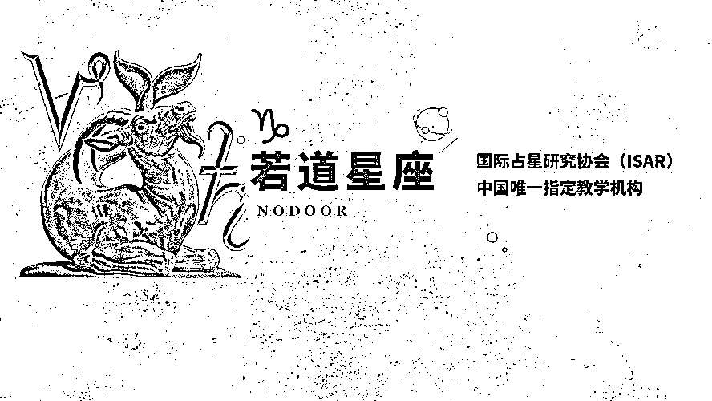

作者/大卫·瑞雷 若道占星创始人

译者/聆宇 cora
编辑/玫瑰 图片/pexels.com

本文节选自大卫·瑞雷著作《一生的旅程》 

摩羯座的大脑是什么东西组成的呢？恐怕连他们自己也很难回答。但是这个星座有他们独特的魅力，一起来看看大卫老师怎么说。另外，大卫老师参与授课的【[ISAR 认证职业占星师文凭课程](http://mp.weixin.qq.com/s?__biz=MjM5MjQwNjAyMQ==&mid=2649440007&idx=8&sn=b8a76adb34a07d1520c4a908d3b2947a&chksm=beb9506d89ced97bc1e382890f40058926812470769d027a0aad621f4b6c68762db921720e75&scene=21#wechat_redirect)】报名中，点击链接了解更多详情！

**当摩羯座们一起旅行**

现在你的黄道列车又回到正轨，你重新确定你的时间表。意识到你到达目的地的时间，只会比你原来计划的晚一两个小时，你松了口气。

到了之后你还有足够的时间去酒店睡一晚好觉。你甚至可能还有时间在第二天的重要会议开始之前检查一下你的笔记。或许现在就是检查那些 PPT 和文件的好时候。

在和你的旅伴交换了礼貌的微笑之后，你们不约而同地打开了各自的手提电脑。“我到站后的第二天就要去参加一个很重要的会议，”你解释道：“我必须提前做些准备。”

“我也是，”他们说：“我们正在争取和电力公司的合约，重建在地震中被毁坏的水坝。”你不敢相信自己的耳朵，你要做的也是一模一样的事！你在旅途中的伙伴原来是你的竞争对手！“怎么了？有什么问题吗？”他们看出了你表情的变化。你不知道该怎么回答才合适。你决定表现得专业些。“看起来我们是竞争对手了。我的公司也在参与这次投标。”“明白了，”他们说：“那么，祝你好运了。”他们说着伸出手来与你握手。这是一次郑重的握手。毕竟，在一场竞赛里，有人输，有人赢。虽然你们都暗自下定决心要成为赢的那一方。你看了一会儿资料，很满意自己对会议的准备相当充分。你们都清楚不能跟对方谈这次竞标的事了，所以关上电脑后，你们开始聊一些生活上的目标。当你听着你的新朋友对你讲他们想要在人生中实现的成就，你感到自己对他们萌生出敬意。

听起来他们的目标和你的非常相像。此外，你也能感觉到他们十分有决心。你意识到你遇上了强劲的对手，然而你也更加欣赏他们了，你在心里谨慎评估，如果跟他们一起生活会是什么样子。这就是列车奔向目的地时，你的心中所想。

这就是**摩羯座**。这是一段严肃的旅程，考验着你对那些你认为重要的东西所做出的承诺。但如果你是摩羯座，**成功的体验值得你付出努力去追求**。你不仅是在向世界证明你的能力，你也要向自己证明。

因此你必须**坚守你对成功的定义**。**失败会带来暂时的痛苦，但品尝失败的滋味，总好过因害怕失败，而让恐惧摧毁了奋斗的意志。**

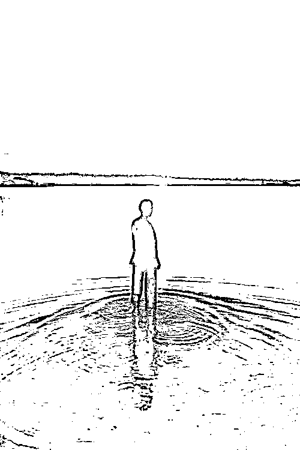

**G.O.A.T**

莎士比亚为凯撒大帝写下了这样一句台词：“那个卡西乌斯看起来又瘦又饿。”那时他一定想到了摩羯座。卡西乌斯的原型是野心勃勃的罗马参议员，在剧情中他非常想要刺杀凯撒。

很有趣的是，拳王阿里的原名是“卡西乌斯·克莱”，这不仅让人想到了那个古老的野心勃勃的姓氏卡西乌斯，他的姓氏“克莱”（译注：Clay，粘土）本身就是一种土，与摩羯座这个土相星座共振。

拳王阿里正是从肯塔基州的路易斯维尔这个小地方平地而起征服了世界舞台。**摩羯座的符号是山羊和鱼尾的组合，象征了从海底攀登至山巅的进化之路。**有一个非常值得注意的有关摩羯座的文化同步现象，摩羯座人会对此非常感兴趣，那就是**G.O.A.T.**这个缩写——它代表 Greatest Of All Time，也就是**“史上最强”**（译注：goat 也是“山羊”的意思）。第一个使用这个缩写的是美国说唱歌手 LL Cool J（詹姆斯·托德·史密斯），他在 2000 年首次使用了这个缩写，作为他的专辑名，那张专辑后来成为排行榜冠军。

| LL Cool JLL Cool J 就是摩羯座，生于 1968 年 1 月 14 日。拳王阿里，在年轻时夺得冠军时也曾喊出“我是最强的！”阿里是如此钟爱这个缩写，他开始把 GOAT 作为他的签名。GOAT 也成为 2003 年出版的有关阿里生平的畅销画册的名字。2016 年阿里去世时，和他有关的一切都和 GOAT 这个缩写关联在一起，有关他的媒体报道中也频繁使用这个词——大家并不知道，这是一个多么生动的摩羯座代号。当然，摩羯座**强烈的成就野心**适用于任何领域，常常伴随着**为达到目的而做出牺牲的坚强意志**。民权运动领袖马丁·路德·金的一生，就是这种牺牲的体现。他是一位牧师的儿子，与父亲同名。他的父亲是浸信会的牧师，每周日向亚特兰大的教众布道。在种族隔离的美国南部，牧师在非洲裔美国人社区中十分受人尊敬。毫无疑问，年轻的马丁渴望这种尊重，也反映出一个**摩羯座的儿子与父亲竞争**的本能冲动——**去成就更多**，事实上他做到了。

不过，马丁·路德·金将个人意志融合进了作为牧师的内在信仰中。“我只是想要履行上帝的意志。他允许我攀登高峰。我极目远眺，看到了应许之地。”

马丁·路德·金引用了圣经中的典故来形容他心中的“高峰”，这再摩羯座不过了。这种象征的说法带有进化的意味，描绘了**经过时间锻造后所能达到的成就**。

然而其中的**等级暗示**也十分清晰，也就是一个人穿越了各种环境“向上爬”的历程，始于海底，到海岸，到海边小镇，到种满橄榄树的山坡，一直到步伐坚定沉稳的山羊居住的峭壁和山顶。

在摩羯座的符号中**保留鱼尾**是非常恰当的，那象征了**对大海的记忆**，**提醒着一个人的过去，以及他已经在来路上走了多远。**

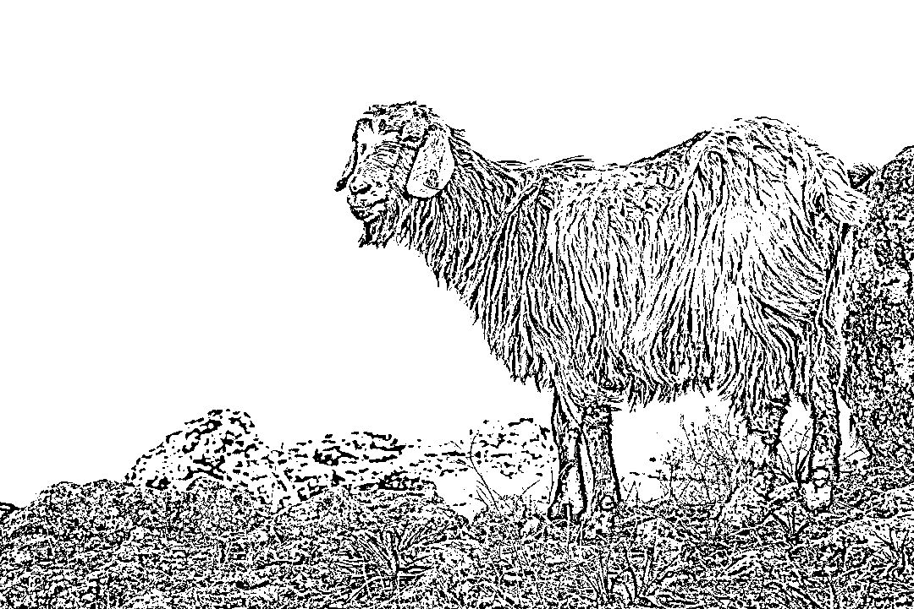

**摩羯座从何处来**

然而在黄道星座的生命之轮中，摩羯座自何处来？是什么样的经历催生了摩羯座对成就的需求？摩羯座之前当然是射手座。

射手座的整个历程就是追求真理、智慧和领悟。但接下来呢？令人惊叹的冒险生涯带来了丰富的领悟，充满智慧的贤哲在教导他人中获得了满足感，但也很自然地开始思考所有的学习是为了什么。

他们看到自己最聪慧的学生运用他们的所学做出了一番事业，在这个世界上有所成就。一个渴望浮现了，“我想知道如果我一早就知道我现在所懂得的一切，我能成就什么呢——如果我更年轻，如果我还有机会？”

将射手座的经验推向极致，如果一个人无所不知，那么他应该无所不能！因此在受过教育之后，灵魂渴望去**成就事业**，在社会上**竞争，学以致用**。

**概念与理论的世界属于射手座，摩羯座要将理论付诸实践**。许多摩羯座选择为工作而放弃度假时，仿佛在说：“已经去过了，玩够了”，就好像对于旅行的渴望已经在热爱自由的射手座那里被满足了。

这并不意味着摩羯座不享受假期，特别是那些能带来“身份感”的旅游胜地！只不过，**度假通常出现在成功之后，而非之前**，并且你们**不会在假期上消耗太多时间，恢复能量之后你们便会奔赴下一个目标**。

如果你是摩羯座，通常有两个议题需要面对。第一个议题是关于**“成功”**本身。你们中的很多人会问：**“这要取决于你怎样定义成功吧？****”**

这是一个非常好的问题，因为成功有很多不同的衡量方式。比如，**达成个人目标**是一种成功；而如同获得外在的成功标志一样，**拥有内在的成就感**也是一种成功。

摩羯座的内在动力源于它的星座极性是**阴性**。黄道 12 星座的极性依次交替，阴阳循环往复，就像电流的极性。

其中**火相星座（白羊座、狮子座、射手座）和风相星座（双子座、天秤座、水瓶座）都是阳性星座，土相星座（金牛座、处女座、摩羯座）和水相星座（巨蟹座、天蝎座、双鱼座）都是阴性星座**。

旧的占星书常将阳性说成男性，阴性说成女性，但现代占星师已经不再使用这种带有误导性的命名。比如，摩羯座是阴性星座，但恐怕没有多少人会觉得摩羯座是典型的女性化的星座。

在中国，摩羯座女性可能还常常被看做是“女强人”，这暗示她们在工作的竞争力上像个男人。

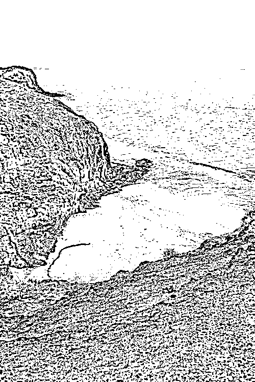

**摩羯座无声的力量**

然而，摩羯座的“能力”，并不像狮子座的能力那样炫目和外露。拳王阿里会有非常戏剧化的行为举止是因为他的上升点在狮子座，并不是因为他的太阳在摩羯座。摩羯座的人身上会有种**从容坚定**的力量，常常伴随着一种**威严**。

他们举手投足间都显示着一种**决心**，神情总是**严肃又坚决**。虽然**当经验不足或缺乏安全感时，摩羯座可能显得古板或笨拙**，但**有安全感的摩羯座总是有种无声的效率**。**无声代表了一种内在的过程，是内在的审慎权衡和计划。**

我认识一位摩羯座的舞台剧演员，有一次在谢幕后，观众起立为他鼓掌，他却在退到后台后显得垂头丧气。有人问他怎么了，他说：“我今晚的表现糟透了。”“但是观众爱你，听听他们的掌声？”“是的，但是我知道我其实有多么差劲。”

在这个例子里，这个摩羯座的演员没有达到自己所认可的成功的标准，尽管他赢得了观众的喝彩。不过，出于摩羯座的专业意识，他响应观众的呼声又进行了返场表演。

这位演员非常敬业，在表演技艺上下足了功夫。摩羯座有种**强大的驱动力**，想要**在专业能力上达到大师级的水平**。

当然，如果观众们和他一样，也觉得他的表演很糟，并不留情面地发出嘘声，那么他的挫败感无疑会更加强烈——即便他也承认他和观众的看法一致。失败是成功的另一面，失败的苦涩会在摩羯座心中留下长久的印痕。**内在的成就感，是外界认可的先导**。一个摩羯座的太极老师可能会在竞赛中证明自己的技艺，但是在他心中，他长期倚重的**内在的自律**，已经奖赏给他一种成就感。一位摩羯座警官的克己自制会赢得他人的尊重；一位摩羯座护士长不用提高嗓门或颐指气使也能将其他护士管理得服服帖帖；她按照规矩做好该做的，其他人也就知道自己也应该这么做。其他护士知道是因为她已经以身作则做出了表率，她一丝不苟，尽到了工作职责。这些简单的例子描绘出摩羯座如何在专业领域获得尊重。当然，有些摩羯座会将失败或失败的感觉隐藏在身份地位之后，这肯定有助于豪车的销量。

不过，**货真价实的成功**才是对摩羯座的真正奖赏，虽然你们中的大部分人在接受因成功而来的赞誉时，已经开始为下一个目标努力了。

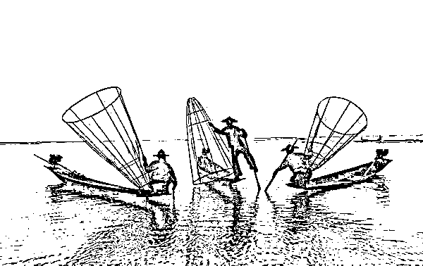

成功显然不限于事业领域。一位摩羯座的父亲或母亲很可能拿出许多耐心来陪孩子一起攻克学业上的问题。看到孩子逐渐发展出之前没有的能力，会让为此付出的摩羯座父母体验到巨大的满足。

事实上，几年前，我在北京电影学院演讲时曾被问到，为什么一个连同太阳在内，群星在摩羯座第 10 宫的女性，会选择当一名全职妈妈、家庭主妇，而没有去追求事业。我的回答是：“做全职妈妈和家庭主妇就是她的事业！”

她的家庭对她来说非常重要；这就是她对成功的定义，她的摩羯座的“责任感”清晰地呈现在家庭事务当中。她的朋友形容她是，充满干劲地经营着她的家庭，就像经营一家成功的公司一样，所有一切都计划得井井有条，运作高效。

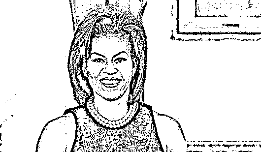

| 米歇尔·奥巴马

米歇尔·奥巴马是另一个为丈夫和家庭奉献的摩羯座女性的例子，虽然在和奥巴马相识之初，她的事业成就是超过奥巴马的。

同样， 她作为第一夫人的兢兢业业，也给人留下了深刻印象。事实上，很多人相信米歇尔拥有比她丈夫更多的管理能力和政治韬略。在 8 年的第一夫人生涯中，她的**强大和坚毅**成为她贯穿始终的标签。

另一个令人着迷的摩羯座故事来自日本的传奇偶像、演员、歌手山口百惠。出道后的 8 年里，她在音乐和电影方面都获得了空前的成功，成为风靡日本和亚洲的巨星，但她为了婚姻和家庭宣布引退。

对她来说，作为一个妻子和母亲的“成功”，比以一个演员的身份去收获赞誉更具意义，而那些她已经在相当年轻时就得到了。

**摩羯式抑郁**

在我的占星实践中，遇到过相当多的摩羯座客户，就是因为**人生早年的困难事件而导致他们的太阳能量被阉割或严重受阻。**

通常这类客户的太阳都有很强的相位，比如**合相、四分相、对分相**（相位是指，在 360 度的黄道圆周上，不同的行星或关键点之间所成的几何角度关系）。

在几乎所有案例中，**野心和抱负都受困于一些负面的信念而无法表达，这些负面信念来自童年和青春期时经历的痛苦。**这种信念系统不仅**瓦解了想要有所成就的动机**，还常常会**降低他们的责任感**，**削弱自律意识和做计划的能力**。

**缺乏自尊，懒惰，总是闷闷不乐**的态度，成为这一类摩羯座人的特征。不过，在每一个此类案例中，我都会发现，这些“摩羯式抑郁”的症状是可以被治愈的。

“摩羯式抑郁”的核心是一个**信念系统**，在这个系统之内，**成功被认为是不可能达到的**，所以“何必找麻烦呢？”

这种情况下，这些摩羯座会将自己视为**“失败者”**，虽然有些人会试图掩盖这一点，故作姿态，假装对成功不屑一顾，就好像厌倦了这个世界——这个他们口中**堕落、可悲、无望**的世界。许多年前，一位年轻的摩羯座女士来找我咨询，是她的一位朋友为她支付了咨询费用，敦促她来见我。我对她的前期了解仅限于知道她在一家相框商店工作，拿着最低工资，以及她之前曾从大学辍学。

她无精打采地坐在我对面的椅子上，看起来已经被生活击垮了，几乎不能跟我有目光接触。“我知道你是个艺术家，”我以这句话开始我们的谈话。“是我的星图告诉你的吗？”她问，我在她的声音中听到某种坚韧。

“嗯，或许是？”我说：“不过这是你朋友告诉我的，她说你在大学时学的是艺术。”“是的。”她耸耸肩，看起来似乎已经后悔来见我了。“

你当初为什么选择学艺术呢？”我问。“难道不应该是你告诉我为什么吗？还是你从我的星图里看出那是个糟糕的选择，或者我是个糟糕的艺术家？”

我停顿了下，看看她的星图，“事实上，你的星图告诉我，这个人有潜力成为一个艺术家，或是艺术家的经纪人。”听我这么说她一下子笑了起来，她刺耳的笑声吓了我一跳。“真是丰富多彩呀！”她断言，“这大概是这世上我最不愿意去做的事了。”

不用说，我依然清晰地记得当时我有多么气馁。那时我才开始占星实践三年多点的时间，之前有六年的学习，面对一位有点不情愿的新客户，确实是个挑战。不过我已经学会相信星图，相信这个过程，所以我决定把球踢回去。“你的父母是艺术家吗？”我问。她很怀疑地看着我，“谁告诉你的？”“没人告诉我，”我说：“但你的星图显示，你的父母很可能都是非常有创造力的人，或是能够以创造力影响他人。”“好吧，确实是，”她如实说：“还能看出什么呢？”“你的父亲可能挣扎于某些成瘾问题……”“这是比较委婉的说法了。”她证实道，现在我赢得了她的关注。

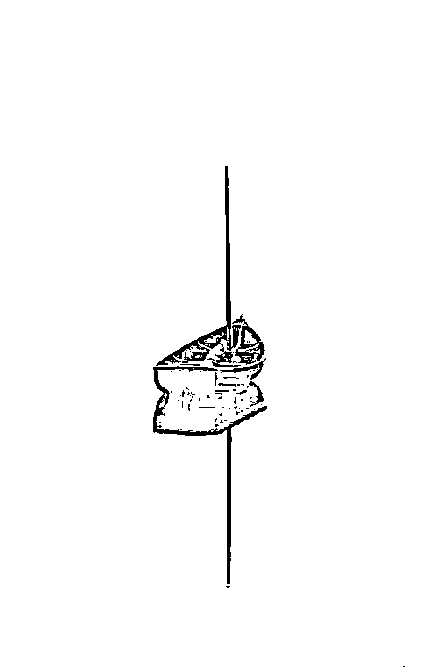

那天渐渐展开的故事，令人难忘又悲伤。她的父亲酗酒，还有暴力和虐待倾向。在我的客户 15 岁时她的母亲选择跟他的父亲离婚，但是伤害已经永远地造成。她的父亲有很多次已经就要成为一个真正成功的画家，但他的酗酒问题总是会妨害他获得持久的成功。

这位客户说，父亲醉酒后会变得非常暴力，会想要毁掉一切。他们当时住在纽约的一套带阁楼的房子里，她会在父亲酒后施暴时躲起来，等风浪平息后再出来收拾被砸碎的物品和撕碎扔得遍地都是的画作。

父亲有时会追打她和她的母亲，对着她们大声尖叫，拿东西砸她们。

我的客户说，她小时候会跟妈妈一起，在事后捡起那些被毁坏的画，将它们重新整理，并打扫画室。

有一次大约在她 9 到 10 岁的时候，她在父亲发飙时带着父亲的几幅画躲进了壁橱，不幸的是，父亲发现了她和那些画。父亲当着她的面将那些画毁掉了，她尖叫、大哭，却阻止不了父亲。与这位年轻的摩羯座女士的第一次谈话，开启了我们后面持续多年的占星谘商。渐渐地，她开始更愿意去直面童年的阴影，并接受了我给她推荐的心理医生的治疗。我们的咨询变成了一种衡量她的疗愈程度的参考框架，这个过程中她也越来越能够意识到星图所显示的她的天性和潜力。后来她搬回了纽约，我们开始变为电话咨询。她最终成为一名非常成功的艺术家经纪人，管理着纽约艺术界一些最具天赋的艺术家。她和那位推荐她到我这里来咨询的女士结了婚。她还在业余时间画画，做雕塑，她开心地称之为“忙碌又疯狂的精彩生活”。她现在和多年前我们初次见面时的那个阴郁消沉的年轻姑娘判若两人。她拥有**毫无差错的、平静的自信，她知道自己在做什么，清楚计划的方向。**

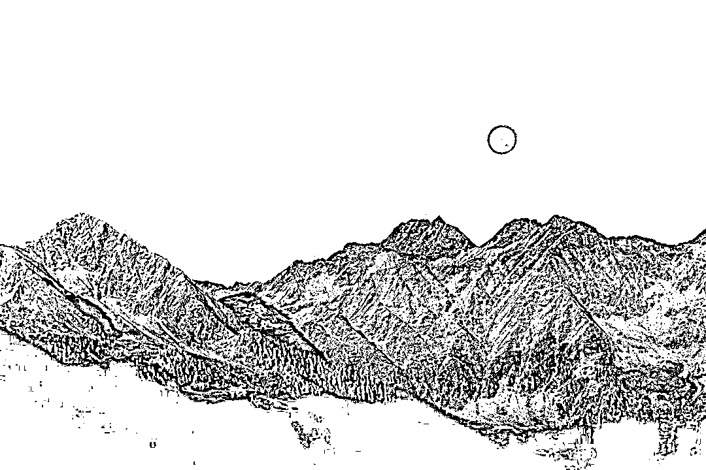

**每个摩羯座都有问鼎成就的潜能**

每一个摩羯座都有问鼎成就的潜能，在通往成功的路上也伴有很多失败。**成功和失败**就是摩羯座硬币的正反面。然而你们必须一次又一次地去使用和消费这枚硬币，才能充分体验到你们追求的东西。

对于摩羯座的批评可能包括：**冷酷、严厉、刻板、野心家、攀附权势、利用他人、竞争狂人、为达目的不择手段**，等等。有时的确如此。但这些指责是针对那些**失衡的、极端的摩羯座**。

对任何星座来说，当某种动机走向极端，制造出失衡的情况，都是让人害怕的！对摩羯座来说，这种走极端不仅源于**对失败的恐惧**，更是**内心害怕“成为”一个失败者的深刻的恐惧**。任何让摩羯座贴上失败者标签的信念系统，都阻碍、延迟了他们成就的显现。这种**基于恐惧的信念系统**，必须**被面对和去除**，这样你们的成就潜力才会得到充分发掘。我接触过的摩羯座人，永远都会超出你的预期，不管他们年纪有多大，或是经历过多少挫折。对摩羯座来说，**成为自己注定要成为的那个人，永远都不晚，事实上很多人随着年纪的增加，会更能够活出自己**。如果你是摩羯座，你需要认识到你对于成功的需求——无论你所定义的成功是什么，然后去成为那个你生而注定要成为的大师。**摩羯座的事业线索**

你是“臭名昭著”的**事业至上**，所以下面的建议你可能非常熟悉。就像前面说过的，你的主要问题是**害怕失败**。在这一点上你需要**对自己诚实**。关键是要意识到，你害怕失败的唯一原因是，你**疯狂地想要获得成功！**

所以，当再有失败的焦虑，或是在压力下感到窒息时，要记住你之所以有这些困扰，只是因为你真的**非常想要成功，**否则就不会有这样的感觉。如果你觉得这些不重要那你就是在骗自己，或者你根本就不是摩羯座。下面是一些要注意的要点：

**·** 明确你的长远目标；

**· **做计划，并列出务实的时间安排表；**· **要对效率和能量进行管理；**· **评估你的对手，学习他们的长处；**· **认识到落后和失败是暂时的，并且重新安排你的日程表。

或许你看了这些建议后只是冷漠地耸耸肩，想着：“我是成不了什么事的啦，何必这么麻烦呢？”但你猜怎样？转身你就给自己的长远目标做好了计划。

任何一个摩羯座都会有**暂时的沮丧或悲观**。事实上，**摩羯座中的一些人可能因严肃保守的举止而让人觉得你们好像不高兴，但其实你们并没有**。

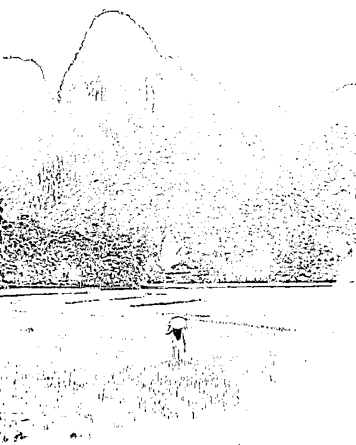

不过，如果有一些负面的模式让你始终在头脑里循环播放“失败录影带”的话，你就需要深入其中，改变故事的调子。谁说你永远不会成功呢？你为什么要相信呢？或者去做做心理咨询！我知道人们不想听到这个，特别是摩羯座！如果你害怕“心理治疗”听起来有些丢人，你可以跟人讲你是去做了“职业咨询”。重要的是去**破除消极的心理机制**，因为那些情绪会破坏你想要努力的意愿，负面的情况想得越多便越容易成真。当然，没人喜欢活在公司金字塔的最底层，或者是在事业低谷中徘徊不进，这是有身份意识的摩羯座最不想要的！然而，摩羯座更有可能在长跑中胜出，成为**后来居上**的那一方。你们似乎不容易成为少年得志的那一类，有些才能昙花一现的人或者学历更高的人或许会赢在起跑线上。但**随着时间过去，你的效率和勤奋会打动那些既欣赏你的抱负又看到你的努力成果的人**。没有哪个星座比摩羯座更擅长赢得最终的胜利了。毕竟，这就是一场“看谁笑到最后”的比赛，不是吗？**摩羯座的爱情线索**

虽然很多人会被你有事业心的一面吸引，但他们常常也会抱怨你太冷漠，一心都在事业上。然而，一旦你对某个人做出**承诺**，你那股子**要让关系有结果**的坚定劲儿，绝对会让人印象深刻。

这很大程度上取决于你在自己的爱情生涯中所处的阶段。如果你还年轻，还在尝试，那么以下有些建议供你参考：

**· **让对方知道可以期待你什么，实事求是，坦诚地去沟通这些问题。这并不浪漫，但是会赢得对方的尊重——这也是一种补偿！**· **对于有“征服欲”的摩羯座男男女女来说，注意不要只是因为想拥有同他们睡觉的“身份”而做出承诺！你会有罪恶感，即使你假装没有，而且你可能会在你的手机上屏蔽他们的号码——不止一次！**· **因为你有强烈的责任感，因此在做好准备之前，不要不小心让自己有了孩子。如果由于私生活而导致事业受到阻碍或拖延，那会带给你加倍的痛苦。**· **了解她们的日程安排和生活方式，看看是不是真的适合你的忙碌节奏。**· **让你们在一起的时间有意义，计划安排一些特殊的活动。比如一起参加电影首映式或去一些能带来身份感的地方游玩。**· **将你的资金预算发挥最大价值。如果你一直忙于工作，却还没有达到你想要的经济条件，就在现有条件下去计划一次真正不同凡响的约会或出游，利用优惠券或会员折扣等。**· **让自己看上去很成功！即使你现在还没有出人头地，也要逛逛名牌折扣商店，寻找让你看上去像个成功人士的行头。**· **不要担心约会时遭遇尴尬或太拘谨。年轻的摩羯座在初次约会时，感到不自在是很正常的。你想要得到对方的尊重，所以害怕出丑！**· **这只是另一种害怕失败的表现。给自己些时间，你会变得更成熟，更能成功驾驭这一切，最终你在社交场合的表现会稳重优雅得多。

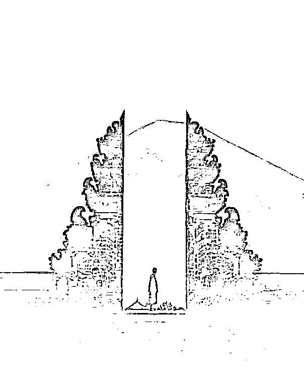

除了个别特例，成熟的摩羯座一般都有**根深蒂固的责任感，天生能够担当**。你想要成功的生活，这通常也意味着**成功的婚姻**——如果你想结婚的话。这取决于你对成功人生的定义。如果摩羯座的男人觉得自己可以拥有婚外情，家里红旗不倒，外面彩旗飘飘，那你可要三思了。想想老虎伍兹！你会为此大破钱财，那真是摩羯座的灾难。你觉得老虎伍兹真的想失去他的婚姻和家庭吗？这是一个特殊的摩羯座的例子。此外，这个例子也说明，作为名人，**享受特权的同时也要承担后果**。**如果你还是经常幻想同时拥有很多女朋友，那你还没有对婚姻做好准备**。而且，你会**将离婚等同于“失败”**，所以在选择婚姻伴侣时需要慎重，慢慢寻找。

是的，你会被**地位**吸引。你常常会追求那些最美丽、优雅、事业成功的女性。不过，不要因为她们的身份地位就忽视她们的缺点。你真正需要的是一位**同样具有责任感、对婚姻和家庭忠贞不渝**的妻子。

最典型的摩羯式婚姻是**“强强联合”**，是**两个合力向阶层顶峰攀登的野心家**，同时也会确保自己的孩子进最好的学校，成为有上进心和竞争力的人。嗨，不过这些也都是老生常谈了。所有的家长都希望自己的孩子是这样的吧！

但摩羯座的家长确实更希望！但不管怎样，就算你的孩子是一个“三倍双鱼座”，在学龄前总是喜欢跑来跑去追蝴蝶，或上课时总是开小差做白日梦，你依然有能力帮他们培养**上进心**。你会想：“爱因斯坦不就是双鱼座吗？他也会做很多白日梦呢！”

比较成熟的摩羯座人，天生就知道怎么做父母。这里的关键是，当你们在心里认定了一件对你们重要的事，比如生儿育女，你们一般都会**坚持到底、恪守职责**，比如按时出席跟孩子有关的重要场合，随时关注他们的学业进展。不管你的孩子是什么星座，他们可能都会记住你是一个**不太容易取悦**的人，但你会让他们了解到**成功的意义**，并帮助他们**出谋划策、实现目标**。你的认可会对他们有很重要的意义，因为他们知道，如果连你都喜欢，那他们一定是做得非常不错了！

你也确实会随着年龄的增长而变得更加**圆融**，或许会成为一个**很有包容心**的爷爷或奶奶，比你当父母的时候要宽容许多。但就算是在扮演父母的角色的过程中，你也会发现你在变得**更加敏感、感性**。

**更多地表达情感，会让你们成为更好的父母**。摩羯座父母的孩子，常常会觉得爸妈太严厉了，有时甚至感受不到他们对自己的情感。摩羯座人会很自然地用**“做事”**来表达关心，会尽力为孩子提供他们需要的东西，但不要忽视孩子的感受，那也很重要。

**版权声明：**原创文章由作者授权发布于若道平台，欢迎转发，反对抄袭。友号转载请申请白名单。

**END**

****想阅读更多作者的文章，请在后台回复******大卫****** 即可。****

**大卫·瑞雷**

美国占星师，若道联合创始人，致力于在中国教授和推广西方占星学；2010-2014 年，任全美占星师联盟监督委员会委员；2017 年，被选为 ISAR 委员会成员。ISAR 是世界最大的国际占星机构，会员遍布 45 个国家，2017-2020 年曾任 ISAR 全球副主席、CAPISAR（ISAR 职业占星师资质认证机构）主席。

**拥有****51 年****占星实践经验的****若道创始人****前 ISAR 全球副主席****前 ISAR 全球职业占星师资质认证主席****大卫·瑞雷**

**和**

**2019 年第二届、2021 年第三届核心课中**

**与苏·汤普金斯老师****联合授课****的**

**ISAR 认证职业占星师**

**咔咔（Caroline）**

**二人合力打造**

**2022 年 ****若道全新核心占星课程**

**点击下图了解更多课程详情** 

**

**20 位来自世界各地的占星师****带来 19 场沙龙——新世界的觉醒****详情可点击下图**

**学习占星学****点击下图了解课程详情**

**微信又双叒叕改版啦，不想错过若道君的推送？**

**就把若道设为星标吧！**

**▼**

**喜欢就点一下“在看”吧！**

********报名直达入口********

# 经世占星丨回看英国脱欧的几年，有哪些值得我们关注？

> 原文：[`mp.weixin.qq.com/s?__biz=MzA5NjA0NTAxNg==&mid=2651483408&idx=2&sn=6c7547ebc95264199339f2fef46d8802&chksm=8b48dfa7bc3f56b1b581b2dc6f85ccf663fb50eb4d395b8d11cb70d4eea6ca740490fc10222b&scene=126&sessionid=1692737776#rd`](http://mp.weixin.qq.com/s?__biz=MzA5NjA0NTAxNg==&mid=2651483408&idx=2&sn=6c7547ebc95264199339f2fef46d8802&chksm=8b48dfa7bc3f56b1b581b2dc6f85ccf663fb50eb4d395b8d11cb70d4eea6ca740490fc10222b&scene=126&sessionid=1692737776#rd)

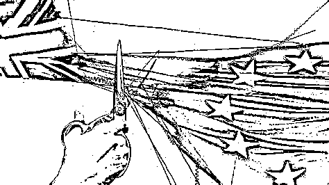

作者/艾德里安·邓肯

译者/Shirley 校对/江艺

编辑/翀子 封面/书君 图片/网络

从占星学看世界局势是什么体验？艾德里安·邓肯老师，将带领同学们进入经世占星学的世界。这篇文章写于 2019 年 3 月，是老师针对英国脱欧所写。现在回看这篇文章，你有哪些体会？另外，邓肯老师教授的[【ISAR 选修课：经世占星学 3 天线上工作坊】](http://mp.weixin.qq.com/s?__biz=MzA5NjA0NTAxNg==&mid=2651482509&idx=4&sn=b80a91a3b3fb7d05f650263734207cfb&chksm=8b48db3abc3f522c4d567a04959da1e682284d708b46ef08aff9968bf0da28629b1a90573cf3&scene=21#wechat_redirect)已上线，感兴趣的话可以点击链接查看详情哦~**英国脱欧的背景**

在过去两年的英国，一周中的任何一天收听新闻，一个主题统治着所有新闻。就连新闻播音员也对此感到厌倦，但随着英国脱欧的决定性日期临近——2019 年 3 月 29 日——他们的语气变得越来越绝望。

在没有与欧盟达成协议的情况下，硬脱欧的威胁引发了人们对卡车大排长龙、边境货物变质、药品短缺、航班中断、爱尔兰边境再次陷入困境以及许多其他潜在灾难的担忧。

怎么会变成这样？英国首相戴维·卡梅伦（David Cameron）批准了脱欧公投，作为对从不喜欢成为欧盟一员的右翼保守党议员的安抚。 

**为什么？ **

部分原因是这些在伊顿公学和牛津大学接受教育的人讨厌欧盟的规章制度，这些规章制度坚持合理的最低工资、对社会负责的立法以及透明度，这限制了这些少数特权人在全球避税天堂搜刮财富的能力。部分原因是他们的文化根植于一个日不落帝国的大英帝国。

但英国脱欧也是欧盟国家在民族主义浪潮影响之下的结果，作为对移民涌入的回应，特别是对于较贫穷的英国社区，来自东欧的移民，他们利用了欧盟关于劳动力自由流动的规则。

这些社区的不满情绪被共同筹划的运动煽动起来，尤其是由亿万富翁阿龙·班克斯（ Arron Banks）资助的脱欧（ Leave.EU ）团队，该团队被指与俄罗斯政府有联系，随后被调查。

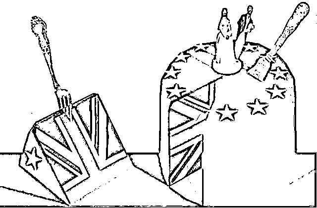

**特蕾莎·梅的星图**

首相特蕾莎·梅将自己的名誉押在了即将到来的最后期限上，并拼命争取所谓的软退欧，以保护英国公民在欧盟的权利，反之亦然，维持当前的贸易协议。 

与此同时，像鲍里斯·约翰逊、迈克尔·戈夫、雅各布·里斯-莫格这样的强硬脱欧者（是的，他们都来自伊顿公学和牛津大学）都乐于让英国在没有协议的情况下退出欧盟。

对特蕾莎·梅来说，自公投结果以来一直很混乱，**这一点通过她的出生星图很清楚地显示出来。**

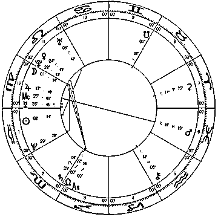

| 特蕾莎·梅：1956 年 10 月 1 日，伊斯特本。日返图：上升点天秤座 0°

**梅是出生于 1956 年的人之一，当时火星在双鱼座逆行，并在推进中与处女座木星长期对分。**这一点，以及其他一些征象，显示了她**强烈的宗教教养**（她的父亲是英国国教牧师）和占主导地位的基督教价值观。 

然而，行进海王星经过双鱼座已经触发了这个对分相长达两年，并且会持续下去，这肯定表明她试图将不守规矩的保守派男性引向一个合理结果的尝试失败了。 

**这一年，推进火星对分她出生星图的水星**，预示着这段时期折磨她的精神压力，并与海王星过境相呼应。

**梅出生时有月亮和冥王星的强大合相，并与位于月亮北交点的土星四分。**如果她在上午 9 点左右出生，月亮将在狮子座；稍后，月亮将在处女座。 

玛格丽特·撒切尔 （Margaret Thatcher）的月亮在狮子座 28 °，再加上特蕾莎·梅 （Theresa May）所获得的声望，**可能预示着她出生在清晨，月亮在狮子座。**她也是一个时尚达人，这反映了她的天秤座行星和狮子座金星。

**土星落在月亮北交点，四分冥王星，**表明特蕾莎·梅陷入了一场**剧烈的政治变革**的漩涡中，这将改变英国与欧盟之间的关系。这个相位描绘了一场**消耗资源的巨大权力斗争**，一方面体现了特蕾莎·梅的固执，另一方面也显示出她的坚韧。 

这个行星组合与保守党的星座有很强的联系。恰好，这个星图显示月亮在金牛座与土星精准对分，**这几乎是完全保守的。 **

**在保守党的星图中，有一个固定星座的 T 三角，与梅星图中的土星、月亮、金星和冥王星产生共振，**这也许就是为什么她是党内的主导因素，而不是其他潜在的领导竞争者。

| 特蕾莎·梅

**英国脱欧**

不管是什么原因，英国脱欧正在发生。 

**1993 年 11 月 1 日（布鲁塞尔凌晨 0 点）的欧盟星图，中天位于金牛座 1.44°，而在英国脱欧的星图中，天王星位于金牛座 1.10°，在英国脱欧后几天与欧盟星图的中天合相——这是一场等待发生的爆炸。 **

**2020 年晚些时候，天王星与欧盟的天蝎座太阳形成三次对分，这对于欧盟的凝聚力来说并不是一个好兆头。**

**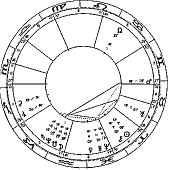**

| 正式脱欧 2019 年 3 月 29 日，23:00，伦敦。上升点：天蝎座 27.33°

英国可以要求延长最后期限，但也许不想削弱她的谈判地位，梅拒绝这样做。然而，英国脱欧的星图看起来像是由一个邪恶的占星家计算出来的。

**上升点落在天蝎座 27 度，上升星座的守护星火星在流放中与下降点合相，**这种设计几乎不会让英国处于较弱的地位。这个国家将受制于其对手的意志，幸运的是，这是由善良的金星在双鱼座擢升象征。

**金星与火星形成四分相，但软化了她的位置。火星正好对分梅的土星并四分她的冥王星。**

**落在摩羯座尾部的月亮在第二宫**给人一种贫穷和疲惫的画面。**月亮也在流放，在与土星，然后是冥王星合相后，它被严重挫伤。 **

这里的征象表明，这既会损害英国经济，也会让人民感到不满。确实，**落在摩羯座的月亮与落在金牛座的火星成三分相**，而我们看到了——典型的英国人在蒙混过关……盲人带领瘸子。

英国脱欧计划于 3 月举行，月亮交点将与罕见的土星/冥王星合相结合，**土星/冥王星合相上一次发生在 1820 年**，当时乔治三世去世，失明、失聪和发疯。 

**土星和冥王星的合相本身每 30-36 年发生一次，**这取决于冥王星在其轨道上的位置。**它总是预示着权力之战和动荡**，在这种情况下落在摩羯座，预示着专制领导人和压迫政治的崛起，最终导致反击和转变。 

**英国脱欧并非孤立发生**。它受到普京等独裁者的欢迎，他们希望看到军事上被削弱的欧盟，而特朗普则讨厌多边主义，他同样认为这会使他在贸易谈判中处于更有利的地位。

**英国脱欧星图的另一个特点是水星（在双鱼座落陷）与海王星的合相。**水星已经走过了一段漫长的旅程。它在 2 月与海王星合相，然后在双鱼座 29 °逆行，**而英国脱欧几乎恰好发生在它停滞在海王星上时。 **

这对于愚蠢的思维和混乱的计划来说几乎是一个更糟糕的迹象，并且有迹象表明，在英国脱欧之前向公众发布的信息具有高度误导性。**慢慢地，水星将直行与土星和冥王星形成六分相，这将导致更大的现实主义和幻想的消除。**

有些人可能希望工党能够取得控制并拯救国家。快速浏览一下党领袖杰瑞米·科宾 （Jeremey Corbyn）的星图并不令人鼓舞。 

**科宾一直对欧盟持矛盾态度，他的星图表明他是一个老式的独裁者，但信奉社会主义。**

此外你怎么能解释他对委内瑞拉独裁者乌戈查韦斯的绝望支持，他在推特上发推文为他的（随后破产的）国家做出了“巨大贡献”，以及他对马杜罗的支持，马杜罗系统地消除了委内瑞拉的所有民主反对派？

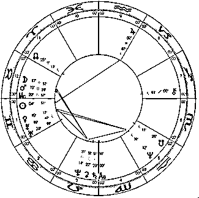

| 杰里米·科宾。1949 年 5 月 26 日，奇彭纳姆。时间未知。上升点：双子座 0.00°

会不会是他的**金星-水星合相三分海王星**使他倾向于理想化，或者只是说错话？或者是他的**月亮-火星合相四分冥王星**，显示了他性格中另一个更不可调和的一面？ 

**作为双子座**，科宾很可能会向人们展示他本性中矛盾的一面，他的**太阳-木星三分相**看起来很适合演讲，但如果他有权力，他会很无情。

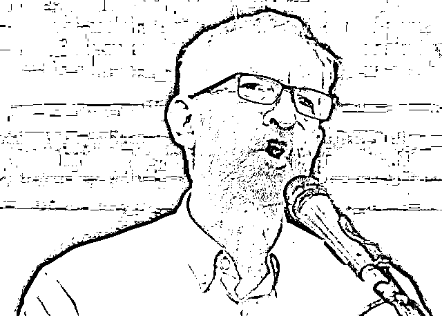

| 杰里米·科宾

**新秩序的来临会带来什么？**

到英国脱欧完全确立时，一个新的世界秩序将呈现出来，**随着木星、土星和冥王星的三重合相以及巨蟹座-摩羯座的食相周期**，独裁的影响在 2020 年达到顶峰，有一种崩溃的趋势。 

**2021 年，水瓶座的木星-土星周期预示着民粹主义上升和独裁主义减弱。**欧洲、俄罗斯、中国和美国可能会有一段大约五年的不稳定时期。

然而，从 2020 年冬至的星图来看，当英国脱欧真的开始时，英国似乎处于一个非常有影响力的位置。太阳进入摩羯座仅发生在历史性的水瓶座木星-土星合相前几个小时（格林威治标准时间 18：20），而这次合相正好落在伦敦的上升点。 

显然，这预示着英国将进入一个新时代，在这个时代，英国——以及伦敦——确实会在全球范围内重新获得了更大的影响力。

有趣的是，**火星在这张星图中位于白羊座 23 °，不祥地四分了冥王星，而这正是英国脱欧公投时天王星-谷神星-阋神星合相的地方。**

**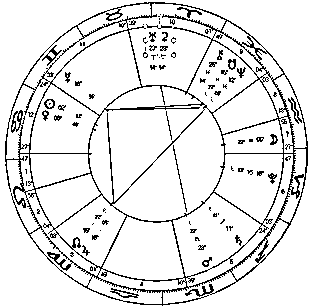**

| 英国脱欧公投：2016 年 6 月 23 日伦敦 上升点：水瓶座 1.44°

世界上已经有许多年没有这么多不确定性了。谁知道英国脱欧会导致什么？

苏格兰会坚持第二次独立公投吗？即将成为多数派的北爱尔兰天主教徒是否会坚持与南方的兄弟姐妹联合并重新加入欧盟，而英格兰是否会与威尔士一样孤独无助？或者英国会从混乱中崛起，在这个很大程度上采用其语言的世界上，成为一盏闪亮的灯塔？

**版权声明：**本文由若道翻译、整理发布，欢迎转发，反对抄袭。友号转载请申请白名单。

**END**

**艾德里安·罗斯·邓肯**

若道签约老师，哥本哈根占星学院院长 1985 年开始成为全职占星师，是人本主义占星、卜卦占星和经世占星学领域的知名占星师。开发了占星软件 AstroClock 和多款占星报告。**20 位来自世界各地的占星师****带来 19 场沙龙——新世界的觉醒****详情可点击下图**

**学习占星学****点击下图了解课程详情**

**

**微信又双叒叕改版啦，不想错过若道君的推送？**

**就把若道设为星标吧！**

**▼**

**喜欢就点一下“在看”吧！**

********报名直达入口********

# ISAR 选修课 | 大国命运：经世占星学 3 天线上工作坊

> 原文：[`mp.weixin.qq.com/s?__biz=MzA5NjA0NTAxNg==&mid=2651483408&idx=3&sn=214395f4f8332f36e68f2945f8b3d323&chksm=8b48dfa7bc3f56b1bc815a6662074b305362fecabce58855f6713a2836558baa4db3c8dd5102&scene=126&sessionid=1692737776#rd`](http://mp.weixin.qq.com/s?__biz=MzA5NjA0NTAxNg==&mid=2651483408&idx=3&sn=214395f4f8332f36e68f2945f8b3d323&chksm=8b48dfa7bc3f56b1bc815a6662074b305362fecabce58855f6713a2836558baa4db3c8dd5102&scene=126&sessionid=1692737776#rd)

<mpvideosnap class="js_uneditable custom_select_card channels_iframe videosnap_video_iframe" data-pluginname="videosnap" data-id="export/UzFfAgtgekIEAQAAAAAAfGQB6vQCmQAAAAstQy6ubaLX4KHWvLEZgBPEioJES3BsLK2DzNPgMIsb3nmx3ZXbJKLT1wm45TIu" data-url="https://findermp.video.qq.com/251/20304/stodownload?encfilekey=S7s6ianIic0ia4PicKJSfB8EjyjpQibPUAXolorph7kXX0G2V8DGSvfR9PkwwbPmosvYicRybibaBiaVv5A38Bc5Re8nsYStXZD7nqrhjvCib7Z8iaC9vlXIpibAjFAuw&amp;adaptivelytrans=0&amp;bizid=1023&amp;dotrans=0&amp;hy=SH&amp;idx=1&amp;m=&amp;scene=0&amp;token=AxricY7RBHdWxX5EuW79OcFLEojiajUVbfrb10projcwzwun3SBUDgOHcwIaMibQEFyWZc9dNWComE" data-headimgurl="http://wx.qlogo.cn/finderhead/PiajxSqBRaEJYnVsqWfEX9qA0sI6hNVKsDfyzfPZ92WZMZyBpZWU5NA/0" data-username="v2_060000231003b20faec8c4e68a1ec2d4ca07e434b07755bbf47e7053a3059defd2c9d6c68a20@finder" data-nickname="若道" data-desc="#ISAR 选修课 经世占星学是什么？会教授哪些知识内容？8 月经世占星工作坊，来提前了解一下" data-nonceid="3653579416430381618" data-type="video" data-width="640" data-height="368"></mpvideosnap>

有一些岁月经历的人，会非常清晰地看到，我们每个人的命运都和国家的命运紧密联系在一起。

以俄国人为例，不论每个俄国人有什么样不同的个人星图，31 年前的苏联解体，今年发生的乌俄战争这样重大的事件，毫无疑问影响了俄国 2 代人的命运。而在一些关键时间点个人的选择，毫无疑问，又影响了个人的生命历程。

而只要你关注世界局势，你也会看到，这样的一个国家发生的重大事件又会对其他国家的各个方面发生重要影响。

我们的命运、我们所获得的事业的发展机会、我们的财富机会都是和整个时代和国家息息相关。

**因此，一个好的占星师必须要懂得时代的声音，必须要洞悉全球的趋势，必须要懂得国家的故事。**

在这个工作坊中，我们将学习**如何专注于能够理解世界大事并对它们做出准确的预测。**这将带领我们踏上**一段重要的行星周期之旅，并延伸到重要国家和世界领导人的星图。**现在正是学习的好时机！

2020 年 12 月，木星与土星合相，这是 800 年来这两颗行星首次在水瓶座合相，预示着地球以及政治和社会趋势将发生巨大变化。我们正在进入一个令人兴奋的奇境，非常适合探索经世占星学。

邓肯老师说：

****

**学习经世占星学，我们可以依靠占星师们过去使用一些技法所做的预测，我们将在这个工作坊中进行探索。**

**比如：占星师迈克尔·贝金特在 1982 年，苏联解体事件发生 7 年前，就对苏联做出如下预测：**

**“从 1989 年 1 月到 1991 年 11 月……在领导和统治风格方面……国家将进行一些基本的重组。这一时期将预示着一些新的革命……严密的控制结构将失败，国家将崩溃，重新回到过去的众多自治国家。”**

**而占星师罗伯特·佐勒在世贸中心遭到袭击前一年的 2000 年写道：**

****“从 9 月份开始，我们西方正进入一个危险加剧的时期……尤其是在东海岸……这将招致乌萨马·本·拉登等冒险家的劫掠……这是一个警钟……2001 年 9 月第一次大危机袭击美国之后，我们将再也回不到从前了。”****

**在 2020 年美国大选前 6 个月，我也写了一篇文章：**

****“他（唐纳德·特朗普）将战斗到底，美国的街道将成为战场，他不会优雅地离去，但在 2021 年，一个新时代开始了，大海将覆盖特朗普总统任期的废墟。”****

出生星图和经世星图都使用相同的基本占星技法，对每一个主题的研究都同时丰富了这两个分支。你从观察世界大事中学到的东西，可以应用到个人客户身上，反之亦然。

**工作坊内容和时间安排**

**8 月 26 日 周五 **

**14:30-15:30**

**1. 基础知识介绍**

-外行星及其在各个星座运行

-外行星周期

-国家星图

-政治领导人星图

-选举星图

-将以上各项按优先级排序

**休息 30 分钟**

**16:00-17:30**

**2. 外行星及其在各个星座运行**

-天王星入座：革命性的变化

-海王星入座：意识的转变

-冥王星入座：危机与重生

**休息 90 分钟**

**19:00-20:30**

**3. 木星-土星的合相周期**

-文明的发展

-水瓶座新电子化时代

**休息 30 分钟**

**21:00-22:00**

**4. 木星与外行星的互动**

-木星-天王星：科技进步

-木星-海王星：媒体的力量；消融，受苦和慈悲

-木星-冥王星：意识形态极端主义

**8 月 27 日周六**

**14:30-15:30**

**5. 了解社会趋势**

-土星-天王星：新的如何取代旧的；科技重组

-土星-海王星：乌托邦梦想破灭；结构消融

-土星-冥王星：独裁与权力瓦解

**休息 30 分钟**

**16:00-17:30**

**6. 长期文明变革**

-天王星-海王星：新世界秩序的梦想

-天王星-冥王星：机械的变革力量；剧变

-海王星-冥王星：意识变化的 492 年周期

**休息 90 分钟**

**19:00-20:30**

**7. 20 世纪地缘政治力量的影响**

-俄罗斯、苏联时代及其衰落

-美国的故事

**休息 30 分钟**

**21:00-22:00**

**8. 中国**

-中国作为全球玩家出现

-科技、领导力和一带一路

**8 月 28 日周日**

**14:30-15:30**

**9. 行星推进的重要性**

-预测选举的结果；特朗普 - 拜登

-预测国家的发展：以色列

-美国：扩张与收缩

**休息 30 分钟**

**16:00-17:30**

**10. 有多张星图的国家**

-英国

-法国

-沙特阿拉伯

**休息 30 分钟**

**19:00-20:30**

**11. 统治者的出生星图**

-普京：克格勃军人，2020 年代的发展

-特朗普：虚假信息之王，获胜者与失败者

**休息 30 分钟**

**21:00-22:00**

**12. 21 世纪的世界发展**

-新时代的人口和气候变化

-独立与全球化

-宗教与科学

-人际关系与游戏

**授课老师**

**艾德里安·罗斯·邓肯（Adrian Ross Duncan）**

**·** 邓肯老师 1971 年在印度游学时开始学习占星学，1985 年开始成为全职占星师，迄今执业已超过 33 年，是人本主义占星学、卜卦占星学和经世占星学领域的知名占星师。

**·** 开发了占星软件 AstroClock 和多款占星报告。

**·** 从 1971 年开始研习佛学，受佛学影响很深，他相信占星学和佛学观点统一、转化的一个基础是在于对现实感知的改变。

**授课方式**

**授课方式：**

**线上网络直播课，英文授课，中文翻译**

**课程价格**

**课程价格：**

**正价：6800 元**

负责人：若道-童童

（微信：nodoorDaivd）

**退转课程**

**退款原则请详看《教学协议》，如有疑问请咨询课程顾问。**

****ISAR 选修课 | 大国命运：经世占星学 3 天线上工作坊****

**授课老师：******艾德里安·罗斯·邓肯****

**工作坊时间：2022 年 8 月 26 日-28 日（**周五-**周日）**

**授课方式：******网络授课，英文授课，中文翻译****

**费用：****正价：6800 元**

**课程负责人：童老师**（微信：nodoorDaivd，请备注“经世工作坊”）

长按二维码添加课程负责人咨询~

****报名直达入口****

# 直播预告丨 71 道练习题考考你的占星学学商

> 原文：[`mp.weixin.qq.com/s?__biz=MzA5NjA0NTAxNg==&mid=2651483408&idx=4&sn=8cfd609b5c6b672cf156bb88ba3166f9&chksm=8b48dfa7bc3f56b1fa6fcb1c2cc91f429d9917e30dc2532c29f244e0724dbc17436187b0fde3&scene=126&sessionid=1692737776#rd`](http://mp.weixin.qq.com/s?__biz=MzA5NjA0NTAxNg==&mid=2651483408&idx=4&sn=8cfd609b5c6b672cf156bb88ba3166f9&chksm=8b48dfa7bc3f56b1fa6fcb1c2cc91f429d9917e30dc2532c29f244e0724dbc17436187b0fde3&scene=126&sessionid=1692737776#rd)

**想知道自己是否有 L1-2 的占星学基础？****想知道水平如何？**大卫老师和咔咔老师出的**71**道练习题等着你题目主要是考考你的**星座**和**宫位**知识这些都是占星学的入门基础而这些练习题的答案大卫老师和咔咔老师将在**8****月 7 日晚 7 点的****直播沙龙****中为你揭晓****联系课程顾问，71 道练习题向你招手**

**想知道“宇宙之题”的答案？** **快点击下方按钮预约直播吧~**<mpvideosnap class="js_uneditable custom_select_card channels_live_iframe" data-pluginname="videosnap" data-headimgurl="https://wx.qlogo.cn/finderhead/PiajxSqBRaEJYnVsqWfEX9qA0sI6hNVKsDfyzfPZ92WZMZyBpZWU5NA/0" data-username="v2_060000231003b20faec8c4e68a1ec2d4ca07e434b07755bbf47e7053a3059defd2c9d6c68a20@finder" data-nickname="若道" data-desc="将在 08 月 07 日 19:00 直播" data-intro="71 道练习题考考你的占星学学商" data-noticeid="finderlivenotice-v2_060000231003b20faec8c4e68a1ec2d4ca07e434b07755bbf47e7053a3059defd2c9d6c68a20@finder-1659580085311843-384860637" data-type="live"></mpvideosnap>

# 七夕快乐！这份爱情指南真的会撞到你的心巴上！

> 原文：[`mp.weixin.qq.com/s?__biz=MzA5NjA0NTAxNg==&mid=2651483239&idx=1&sn=444fdfce22a327240784fa4c0d6220bf&chksm=8b48ded0bc3f57c6c2541716fc07e060608241e0d877c4c054d657c6fe446799f23b889103eb&scene=126&sessionid=1692737776#rd`](http://mp.weixin.qq.com/s?__biz=MzA5NjA0NTAxNg==&mid=2651483239&idx=1&sn=444fdfce22a327240784fa4c0d6220bf&chksm=8b48ded0bc3f57c6c2541716fc07e060608241e0d877c4c054d657c6fe446799f23b889103eb&scene=126&sessionid=1692737776#rd)

☆ 后台回复“今日”，给你一句生命态度

作者/杰夫·焦耳
译者/凤影焰 李含 校对/吴琨编辑/玫瑰 图片/pexels

大多数人在茫茫人海中寻觅深爱的另一半，那个为你驱走冬夜寒冷，铺床暖被，支持你的梦想，倾听你的恐惧的另一半。那么，我们要如何才能捕获一份适合自己的深刻且温暖的情感呢？在七夕节之际，让我们一起来探索爱情的秘密~

**金星****爱情的模式 ღ 致命吸引力 **说到爱情，了解占星学的人很容易就联想到金星。是的，在占星学中，金星代表着爱的女神维纳斯，但是仅仅关注这枚爱情之神，并不足以解析爱情的本质。**金星描述了每个人对爱情不同的认知模式。出生星图金星所落的星座、宫位和相位可以体现出一个人通过什么从家庭结构中获得赞赏。**

金星落在摩羯座的人可能因为他的纪律性而受到赏识；金星落在巨蟹座的人却是因为个人的敏感以及照顾他人的天性而获得嘉奖。

金星，也是一颗高度社会化的行星，但金星的表达却与我们的深层需求没有必然联系，但依然值得参考。金星的认可是跨向亲密关系的开始，它带来最甜蜜的吸引力，把我们推向其他人（或是把其他人推向我们）。

但是，吸引力不意味着亲密，更不是爱情。虽然它很重要，甚至极其重要，但一段有意义的关系必须不断发展。而仅仅构建在金星的吸引力之上的感情却很难持久或是更加深入。

金星是一颗“与地平线平行”的行星。它确实能够帮助我们找到吸引我们的人或物。但是，它却不能反映我们最深层的需求。这些需求，才是通往亲密关系的路径，实际上由月亮主宰。

火象星座（白羊座、狮子座、射手座）的爱情意味着当我想起你时感觉非常棒。就好像狮子座的爱情其实是对自我的投射，他们通过爱情获取荣耀。我对你的爱发自内心。你也许可以触动它，但却依旧是我的创造。倾听在他们的爱情中并不是重点。

**水象星座（巨蟹座、天蝎座、双鱼座）的爱情更像月亮，他们关注怎样对他人的需求给予更好的回应，甚至那些不确定的对象。 **

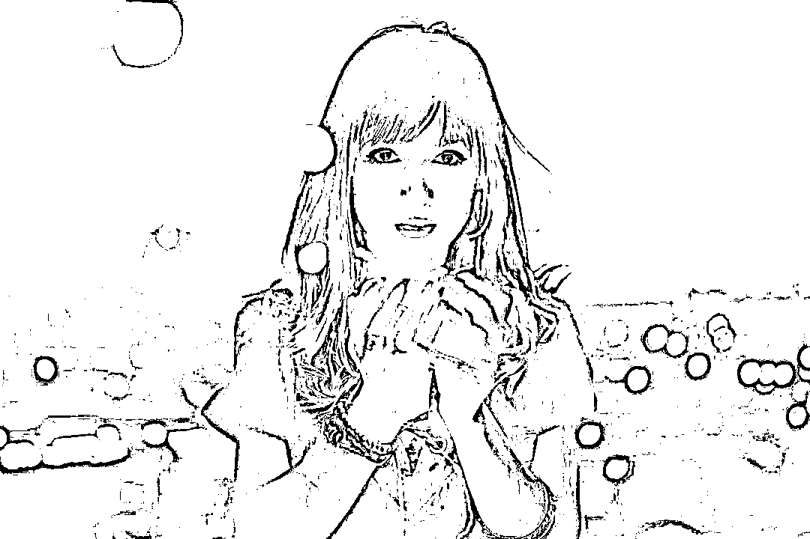

**月亮****情感的本质 ღ 打开亲密关系大门的密匙 ****月亮是占星学中最基本的女性原型。**与母亲的关系也是所有未来关系的基础，因为这是一段完全依赖性的关系，是生命中唯一一段完全由身体决定的必要关系。一个人的存在决不能缺少了母亲的出席（至少在出生以前）。父亲对怀孕而言也非常重要，但在此之后却变成了可选项，尽管他依然值得拥有。等我们相互靠近，月亮的作用将会显现。

**月亮会把人们心底最深处的需求联结起来，认识到自身的需求，然后冒着风险与那些我们所爱的人分享。**这是构成亲密关系的元素之一。如果我们不能让自己的伴侣了解内心的需求，两个人将更像是生活在平行世界中而非真正的亲密关系。

但是，每个人的需求也会有所不同。月亮落在巨蟹座的人与月亮落在水瓶座的人对亲密有着完全不同的概念。每个人都有来自月亮的需求，需要被抚育，需要被倾听，但是每个人的模式却可能相距甚远。

月亮巨蟹座，归属感以及水象元素的熟悉感和在同一个圈子内都非常重要；月亮水瓶座却需要空间和自由，可以通过不算太紧密的捆绑关系获得安全感。不论如何，月亮让我们可以进入更深刻的感情境界。  

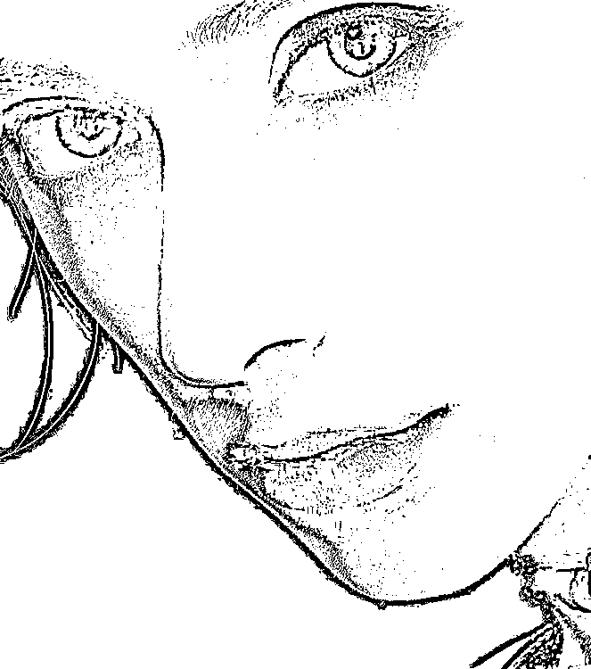

****金星 vs 月亮******触摸你灵魂深处爱的真实渴望****金星>月亮****当我们停留在金星层面时，被喜欢的需求凌驾于被倾听的需求之上。**而亲密关系需要跨越过去传统层面的意愿，然后触摸到灵魂。当我们开始分享内心最深处的感觉、恐惧和秘密，我们才能真正的放开自己。**让它们真正进入自己的内心是一种挑战，尤其对于那些出生星图中拥有强大火元素（白羊座、狮子座、射手座）的男人和女人。**

**接受与给予同样是一门艺术，敞开自己的月亮意味着允许变化，本身就是矛盾。**我们谈论的并非某一种理想关系的固定模式，我们是在寻找可以帮助成长与改变的生动关系。

我们可以理解**金星描述了我们喜欢的东西，哪一些东西更对味，金星带来的愉悦感非常舒服，但却未必能令人满足。月亮描述了什么可以“喂饱”我们**。

因此，了解出生星图中金星与月亮的关系非常重要。**如果金星与月亮相位不良，就必须额外注意这些愉悦感是否真的可以满足我们，而不是让我们感觉营养不良。**

**举个例子**如果某人的金星落在巨蟹座，也许会喜欢爱情中惬意与关怀的一面。但月亮却落在了白羊座，自己的空间必须被满足。这个人在大多数时候(星图中其他元素可以进行调整)对伴侣的需求非常敏感，但却会突然缩回并开始重审自己的私人空间。 这些行为可能会让双方都感到困惑。这种情况根本就是面对两个不同的需求。困难就在于金星与月亮的性质非常相似，非常容易误导我们将两者混淆。喜欢不同于需要。爱情的模式（金星）和感情的本质（月亮）对不同的人来说也许相似也许不同。 

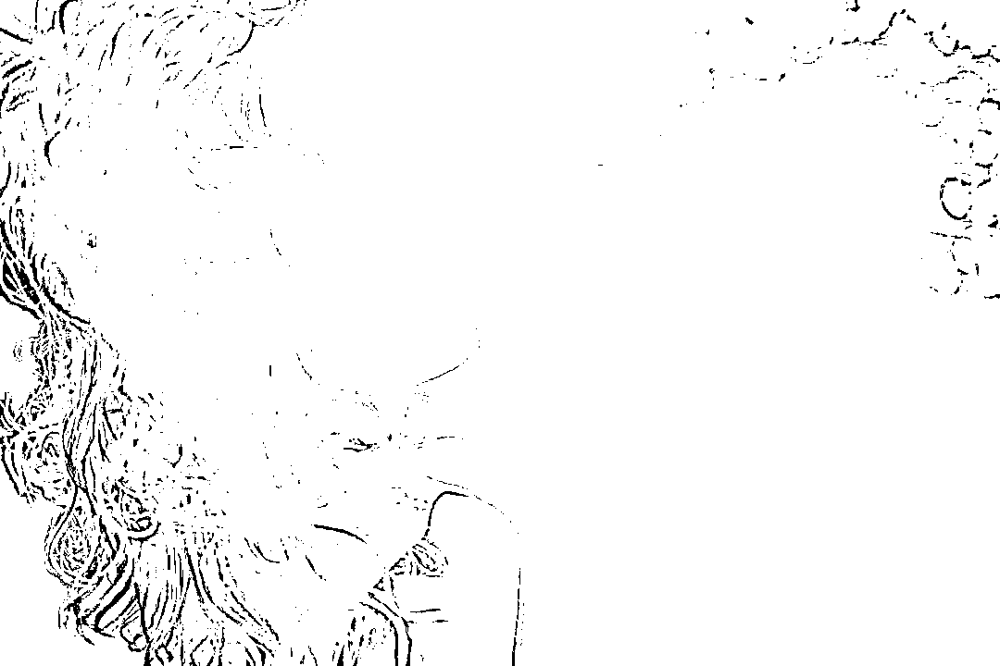

**月亮>金星**

星图中的冲突也就是生活中的冲突，并非一定要两者选其一。**如果将月亮的亲密需求凌驾于金星的愉悦需求之上，我们将无法获得愉快的亲密关系，就好像一对被残酷的生存舞蹈紧紧锁在一起的爱人。**

**如果被过多的肤浅金星相位主导，我们可能在醉生梦死的同时却任然感到内心空虚。**问题的关键在于**了解和接受我们矛盾的需求**。明白在特定的时刻谁才是合适的人才对自己有所助益。

**举个例子**

如果某人月亮落在天蝎座，那么在公共场合把他从对激烈情感的需求中拖出来也许并非最佳选择。又或者在你的伴侣正处于情感危机时。显而易见地表现出你的白羊座金星对独立的偏好，也许时机不对。

**每件事情都有其合适的时机和位置，想要克服许多占星学中的矛盾其实就是要你在恰当的时间做恰当的事情。**另一个需要考虑的矛盾，假设一个人的金星落在白羊座，月亮落在天蝎座时，两个看似相似的位置却失之毫厘差以千里。

我们经常会发现自己卡在两个选择中无法动弹。但是，每个人都是一个整体，宇宙也是一个整体，任何两个存在的元素之间都有关联。从矛盾的焦点之间找出许多细微的步骤也就意味着为完全不同的两部分搭建起一座桥梁。 

个人的出生星图是理解情侣关系的基础，因为它会告诉我们个人的特质。个人出生星图才是通往亲密关系的关键。**如果你无法先爱自己，那也将非常难从他人那里获得爱**。当一个人对自己有健康的期待，通往敏感的亲密关系的意愿才会帮你打开那扇大门。

良好的伴侣关系的基础是两个人都拥有健康的心态。这里的健康并不意味着完美或是完全明了、脱离无知。**健康的心态是一种学习的意愿，放开自己，学会述说与倾听。**当你显现出这样的活力时，亲密关系就会不知不觉的到来。

**版权声明****：本文由若道翻译，欢迎转发，反对抄袭。友号转载请申请白名单。**

**END**

杰夫·焦耳

国际占星大会（UAC）和全美占星师联盟（AFAN）创始人，美国著名占星网 www.stariq.com 创始人。曾任亚特兰大协会主席和亚特兰大占星考试委员会委员。4 本占星书的联合作者，在全世界的 4 个大洲开办过工作坊。2015 年逝世。

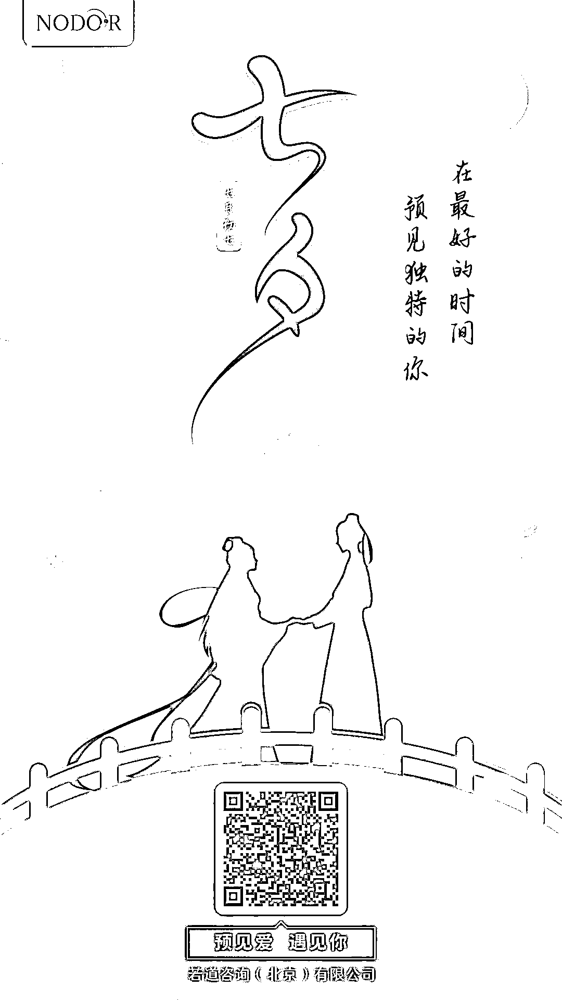

**20 位来自世界各地的占星师****带来 19 场沙龙——新世界的觉醒****详情可点击下图**

**学习占星学****点击下图了解课程详情**

**微信又双叒叕改版啦，不想错过若道君的推送？**
**就把若道设为星标吧！****▼**

**喜欢就点一下“在看”吧！**

********报名直达入口********

# 七夕塔罗牌阵推荐 | 我们都在爱里面找答案

> 原文：[`mp.weixin.qq.com/s?__biz=MzA5NjA0NTAxNg==&mid=2651483239&idx=2&sn=a66da482c5c99f71f2d98b046f760277&chksm=8b48ded0bc3f57c67ceceab2de5eada33bce08fdded89751de1e20fffaaf6181c8a7780d808a&scene=126&sessionid=1692737776#rd`](http://mp.weixin.qq.com/s?__biz=MzA5NjA0NTAxNg==&mid=2651483239&idx=2&sn=a66da482c5c99f71f2d98b046f760277&chksm=8b48ded0bc3f57c67ceceab2de5eada33bce08fdded89751de1e20fffaaf6181c8a7780d808a&scene=126&sessionid=1692737776#rd)

**若道神话塔罗 H5 惊喜上线****文末有扫码通道哦**

**七夕节，我们都在爱里面找答案，推荐三个适合感情不同阶段的爱情牌阵。**

宇宙的有趣我才不在意

我在意的是 你牵我的手 而乱跳的心

——告五人《给你一瓶魔法药水》

1**爱之星牌阵**

适合亲密关系中的各个阶段，暧昧中、热恋中、矛盾中，**可以分析两人当下的心理状态，对未来的期望和发展。**

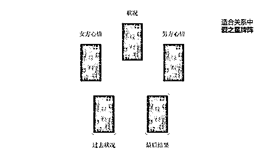

你真的希望你能厘清

闭上眼睛，用心看清

——告五人《唯一》

2**爱之缘牌阵**

旧日恋情已成往事，而生活仍要继续。这个牌阵也许能够帮助你走出失恋阴霾，找回爱笑的自己，就让爱之缘牌阵和你一起回忆和整理，该结束的结束了，该开始的就会开始，让爱情的未来更加美好。

七十亿张面孔交会

我们在人海中四目相对

命运或许站在我们这一方

——告五人《说我爱你的一百种方式》

3**爱之像牌阵**

当你孤身于人潮之中，总有那么一瞬间，想要被爱拥抱。这个牌阵能帮助向往爱情的你评估自己的现状，做好准备，迎接新恋情的到来。

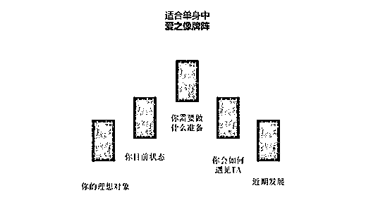

**如何预约塔罗师咨询？****扫码进入全新神话塔罗 H5**

每天有事没事都可以去**神话塔罗 H5**里转转抽取专属于你的今日塔罗

**神话塔罗 H5 问答平台全新上线**

三张牌牌阵，专业塔罗咨询师语音条解读

如果你碰巧有困惑，刚好有**限时优惠价**

如果感到快乐你就用用**神话塔罗 H5****，**如果你感到不快乐，更要使用由专业人本主义塔罗师团队全程陪伴的**神话塔罗 H5 哦！**

**想入驻若道塔罗平台成为职业神话塔罗师？****2022 年最新《神话塔罗认证课程》报名中****点击下图了解课程详情哦~**

# 神话塔罗丨一种古老的疗愈工具，也帮助我们与潜意识进行链接

> 原文：[`mp.weixin.qq.com/s?__biz=MzA5NjA0NTAxNg==&mid=2651483239&idx=3&sn=8b629f51c323e7d17f798440d8e8a450&chksm=8b48ded0bc3f57c67854548c70abfcb1ba6cb243afe00356a2ccb774055e61b567896e3660cd&scene=126&sessionid=1692737776#rd`](http://mp.weixin.qq.com/s?__biz=MzA5NjA0NTAxNg==&mid=2651483239&idx=3&sn=8b629f51c323e7d17f798440d8e8a450&chksm=8b48ded0bc3f57c67854548c70abfcb1ba6cb243afe00356a2ccb774055e61b567896e3660cd&scene=126&sessionid=1692737776#rd)

1

**塔罗牌是什么？**

**它是用来干嘛的？**

塔罗牌是一种**古老的疗愈工具**，同时也是**直观的解惑工具****；**

塔罗牌绕过逻辑思维，**和潜意识联结**，通过图像的方式生动地将隐藏在人类潜意识中的画面浮出水面，**揭示心灵的状况和运作****；**

塔罗牌**帮助我们和潜意识对话**，可以和现代的心理治疗联系在一起，帮助我们**看清心灵的冲突来源、本质和可以选择的道路；**

塔罗使用的过程并不繁琐，通过**“提问、洗牌、抽牌、解牌”**的方式来显现你的潜意识，给予问题明确的分析和建议。

2

**塔罗原理是什么？**

**它为什么这么准？**

塔罗是通往意识的工具，通过图画**帮助我们和潜意识对话**，可以和现代的心理治疗联系在一起，帮助我们**看清心灵的冲突来源、本质和可以选择的道路**。塔罗的心理投射也对应荣格的**“共时性原理”**：看似偶然的事物之间有着必然的联系。塔罗牌又和更广阔的**宇宙生命原型**联结，彰显**个人生命发展的阶段**，将个人**生命挣扎、内在冲突**放在生命进化的道途上，让更广大的生命智慧为个人成长照亮道路。

3

**塔罗预测是什么？**

**它如何帮助我？**

塔罗牌预测的运作就像是**照向心灵的一面镜子**。在塔罗牌解读时，图像的原型性质穿透隐藏的潜意识脉络，反应出与个人境遇相关但又未被了知的知识与洞见，因此**揭示出按照任何理性方式都无法发现的事情**。塔罗可以在你人生各个阶段，基于不同状态，针对具体困惑给予指引的神奇工具，运用古老的智慧工具**解码人生卡点，多维度去看待问题和生命的全貌性，推敲心理动线，更好地梳理生活。**如果你对生命好奇，塔罗学习会帮你**打开一扇通往未来的门**，让你了解**心灵运作和显化的秘密**，同时赋予你更多关于生命成长的支持和指引的能力！

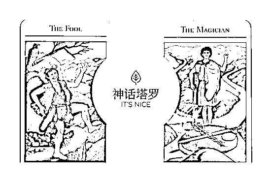

4

**什么是神话塔罗？**

**它和其它塔罗有什么区别？**

神话通过**图像和故事**描绘人类生活的**原型模式**。通过瑰丽的想象、诗意的语言、栩栩如生的人物和故事描绘出我们内心的世界，表达出我们经历的那些实现人性的过程，帮助我们将**个体的生活与人类古老且永恒的故事**建立联结。从而在更深处**理解生命**，并学习**古老而长青的生命智慧**。跟其他塔罗相比，神话塔罗在**塔罗体系**基础上融合了**神话原型、占星原型、心理学原型。**学习、解读、内在成长的**维度更丰富立体。****神话塔罗**取材于**希腊神话**的无尽沃土，通过故事提供一种**记忆辅助**，在心理和预见层面提升解读的**丰富度**。因为这样更符合塔罗牌的性质，符合人类的想象。**按照故事思考，而不是简单的记忆关键词和固定的意义**。

5

**神话塔罗难学么？**

**能不能快速上手？**

神话塔罗认证课程，**不需要任何塔罗、占星、心理、神话基础**，这些知识朱丽叶老师都会在课程中教授，“兴趣是最好的老师，坚持是最大的成功。”塔罗咨询这项门栏不高，却能带来多重回报的“冷门技能”已经被越来越多人发觉，如果你为之心动，不如赶紧行动，初学者在经验丰富的导师教导下学习成果事半功倍，是小白亦能够掌握的课程，只要配合学习进度，不存在学不会的情况**，录播课有专业助教答疑，直播课老师亲自答疑，案例督导，****让你更自信的开展咨询工作，学以致用。**

6

**哪些人适合学神话塔罗？**

**为什么学神话塔罗？**

**1、对塔罗感兴趣的学员**，与其自习研究弯路多多，不如一步到位系统学习；**2、占星咨询师，**可以丰富咨询维度，通过图像更深入的和个案沟通交流；**3、心理工作者**，塔罗牌的原理本身也是心理投射，用于心理辅导是很棒的互动工具；**4、看重授课老师专业水平和能量层级的学员，**神话塔罗创始人亲授，金牌背书；**5、希望更加了解自己和他人内心世界**，想掌握这个疗愈工具自我探索和成长，帮助有困惑的人；**6、成为专业的塔罗师**，想从事这份事业，不论是兼职或全职，增加收入，打造长久稳定抗风险的现金流。

7

**神话塔罗咨询前景？**

**为什么看好它？**

塔罗行业现状鱼龙混杂，有的塔罗爱好者未经过系统学习，无占卜实力，占卜依赖“说明书”一知半解靠运气解读，无法积累实占经验和个人信誉。神话塔罗进入中国市场不久，由创始人亲自教授，**知识体系扎实靠谱，咨询技术纯正丰富，市场认可度高**，让您**无忧起步**，自信的在自我成长过程中成为他人的**塔罗照路人**。有些朋友经过系统的塔罗课程学习后成为**杠杆青年**，将塔罗咨询作为**副业**，无需店面，工作之余在家里就可以进行咨询，多一分收入欣喜满足。也有些学员完成课程后将塔罗咨询发展成**全职事业**，拥有自己的工作室，整合微信、微博、小红书、短视频等自媒体运营，线上线下年收益百万。**疫情环境下，副业刚需**，对于我们未来的事业需要有所规划，而塔罗咨询符合理想职业的所有条件，上手快、无需固定办公地点，是随时随地可接单的自由职业，经营打造属于自己长久稳定可发展的现金流。

8

**神话塔罗认证是什么？**

**如何获得高含金量认证？**

2022 年超高含金量的神话塔罗认证课程强势回归课程内容体系让你**直观精准**的感受**神话塔罗的魅力**扎实的建构**神话塔罗思维****系统**学习**最地道的塔罗知识****联报全阶课程，学成可获得有神话塔罗创始人颁发的****英国神话塔罗认证证书****，也是****若道塔罗毕业证书。****行业内超高含金量双背书。****若道还为塔罗学员开发了****“神话塔罗”APP****，是随身的工具，更是接咨询的平台，****录播课程****学成入驻平台****即可链接更多塔罗个案，发展壮大你的塔罗咨询事业。**

**如果你想学习塔罗，什么样的老师会让你怦然心动呢？她是三副塔罗牌的设计者，写了 6 本塔罗书籍。她研习塔罗四十余年，教授塔罗三十余年，是丽兹·格林的密友。还有****谁会比塔罗牌设计者更了解塔罗的历史、灵魂与精髓？****所以，这将是你开启塔罗之旅最坚实的一步。**

9

**你将跟随哪位大师学习神话塔罗？**

**我的老师是谁？**

****

**朱丽叶·沙曼-伯克** 

*   她是**3 副塔罗牌**的**设计者****——**神话塔罗牌、沙曼–卡塞利塔罗牌、“自己着色”塔罗牌；

*   她出版了**6 本塔罗书****——**《塔罗全书》、《新塔罗全书》、《众星的传说》、《理解塔罗牌》、《精通塔罗牌》、《塔罗初学者指南》；

*   她研习塔罗**四十余年；**

*   她教授塔罗**三十余年**；****

*   她是**丽兹·格林**的密友，两人合著了**《神话之旅》**，共同设计了**神话塔罗牌**。

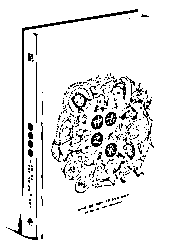

*   她是认证的**心理治疗医师；**

*   她深谙**塔罗、占星学、心理学和神话学。**

**如果你想成为拥有英国神话塔罗认证的塔罗师**

那么她，就是你**最好的老师人选**

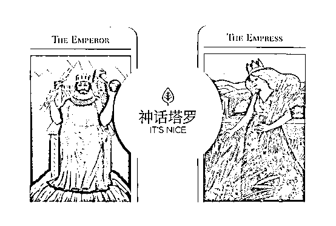

10

**神话塔罗认证课程的课程结构？**

**怎么上课？**

课程中老师传授**将神话、占星、心理学完美融合进塔罗**的人本主义咨询体系，并进行**学员案例督导**，让你更自信的开展咨询工作，学以致用。

本期认证课程采取**即报即学的录播课+案例督导直播课**的形式，

*   **18 节录播课：**精编剪辑，随来随学，助教答疑，学练结合。

*   **8 节直播课：**融会贯通，神话心理，塔罗占星，咨询技巧。

为了适配大家的各种学习场景，提高学习&复习效率，我们还将**录播课**剪辑了**中文字幕版**和**翻译音频版**：

*   **中文字幕版：**朱丽叶老师英文原声配中文字幕，适合在手机或电脑前专心致志的学习。

*   **翻译音频版：**翻译老师幼婷的中文原声纯享，适合运动、通勤路上耳机里陪伴式学习。

11

**神话塔罗认证课程报名流程**

**怎么报名？**

**报名流程如下：****1、报名****添加课程顾问，报名，交学费，进入学员群，邮寄学习工具。****2、开始学习****成功报名，18 节录播课程立即开通，学习过程有困惑可在 APP 内提问，有专业助教答疑，8 节直播课 8 月 10 日开课，录播课和直播课都是朱丽叶·沙曼-伯克老师亲授。****3、入驻平台****学习完录播课程，即可提交咨询案例申请入驻咨询平台。****4、结业证书**学习完直播+录播课程，提交毕业咨询案例，朱丽叶老师批阅通过，即可获得**神话塔罗认证证书。**

12

**具体在神话塔罗认证课程中学习什么？**

**课程大纲**

**录播课（即报即学）**

**☆****初阶：神话塔罗详解**

**神话故事和预测意涵**

**第 1 讲 塔罗牌介绍 ，讲述它的历史 （中文字幕版）**

**第 1 讲 塔罗牌介绍，讲述它的历史（翻译音频版）**

**第 2 讲 星座形态、元素和宫廷牌&基本星座与基本国王 （中文字幕版）**

**第 2 讲 星座形态、元素和宫廷牌&基本星座与基本国王（翻译音频版）**

**第 3 讲 固定星座与固定王后（中文字幕版）**

**第 3 讲 固定星座与固定王后（翻译音频版）**

**第 4 讲 变动星座与变动骑士（中文字幕版）**

**第 4 讲 变动星座与变动骑士（翻译音频版）**

**第 5 讲 小阿尔卡那牌权杖（中文字幕版）**

**第 5 讲 小阿尔卡那牌权杖（翻译音频版）**

**第 6 讲 小阿尔卡那牌圣杯（中文字幕版）**

**第 6 讲 小阿尔卡那牌圣杯（翻译音频版）**

**第 7 讲 小阿尔卡那牌宝剑（中文字幕版）**

**第 7 讲 小阿尔卡那牌宝剑（翻译音频版）**

**第 8 讲 小阿尔卡那牌星币（中文字幕版）**

**第 8 讲 小阿尔卡那牌星币（翻译音频版）**

**第 9 讲 经典牌阵教学讲解（中文字幕版）**

**第 9 讲 经典牌阵教学讲解（翻译音频版）**

**第 10 讲 牌阵解读案例演示（中文字幕版）**

**第 10 讲 牌阵解读案例演示（翻译音频版）**

**☆****中阶：神话塔罗牌阵应用**

**神话****解读和咨询技巧**

**开启神话塔罗愚人之旅**

****

**第 1 讲 愚人、魔术师、女皇、皇帝（中文字幕版）**

**第 1 讲 愚人、魔术师、女皇、皇帝（翻译音频版）**

**愚人**：永恒的少年（儿童的原型）

**魔术师**：恶作剧者、老师、向导、沟通者的原型；行星：水星。

**女王**：母亲、养育者、丰产的原型；行星：金星在金牛座；小行星：谷神星。

**皇帝**：父亲、供养者、计划者的原型；行星：木星。

**第 2 讲 女祭司、教皇、恋人、战车、正义、节制（中文字幕版）**

**第 2 讲 女祭司、教皇、恋人、战车、正义、节制（翻译音频版）**

**女祭司**：处女——等待被实现的潜力原型；行星：新月。

**教皇**：疗愈者、受伤的疗愈者、牧师的原型，牧师是神与人之间的灵性桥梁；行星：凯龙星。

**恋人**：爱、爱人、所爱之人的原型；行星：金星在天秤座。

**战车**：战争、冲突、战士、斗士的原型；行星：火星。

**正义**：智慧、兵不血刃的胜利的原型；星座：处女座；小行星：智神星。

**节制**：关系、合作的原型；星座：巨蟹座、双鱼座。

**第 3 讲 力量、隐士、命运之轮、倒吊人、死神（中文字幕版）**

**第 3 讲 力量、隐士、命运之轮、倒吊人、死神（翻译音频版）**

**力量**：力量的原型；星座：太阳在狮子座。

**隐士**：晚年、耐心的原型；行星：土星。

**命运之轮**：命运女神与命运的原型。

**倒吊人**：牺牲与有意识的牺牲的原型；行星：海王星。

**死神**：死亡、终点和起点的原型；行星：冥王星。

**第 4 讲 恶魔、高塔、星星、月亮、太阳（中文字幕版）**

**第 4 讲 恶魔、高塔、星星、月亮、太阳（翻译音频版）**

**恶魔**：阴影、人类不文明的面向、本能、欲望天性；行星：火星在天蝎座。

**高塔**：改变、分裂瓦解的原型；行星：天王星。

**星星**：希望的原型。

**月亮**：无意识的原型；行星：暗月。

**太阳**：意识、创造力和文明的原型；行星：太阳。

**第 5 讲 审判、世界（中文字幕版）**

**第 5 讲 审判、世界（翻译音频版）**

**审判**：复活、新生的原型；行星：水星作为灵魂向导普绪科蓬波斯。

**答疑与讨论，学员们分享对自己或客户的塔罗解读，对神话塔罗牌进行更多探讨。**

**世界**：整体、完成和个性化的原型。

**第 6 讲 经典牌阵教学讲解（中文字幕版）**

**第 6 讲 经典牌阵教学讲解（翻译音频版）**

**第 7 讲 咨询案例演示：为一位年轻女性所做的四次解读（中文字幕版）**

**第 7 讲 咨询案例演示：为一位年轻女性所做的四次解读（翻译音频版）**

**第 8 讲** **引导式冥想、荣格的四种意识功能（中文字幕版）**

**第 8 讲 引导式冥想、荣格的四种意识功能（翻译音频版）**

**☆****高阶：神话塔罗直播督导课**

**第 1 讲 塔罗牌中的荣格原型**

**2022 年 8 月 10 日（周三）**

我们将学习荣格是如何理解原型，以及荣格原型如何反映在塔罗牌中。对塔罗牌解读而言，理解原型的普遍性非常有帮助，因为这有助于塔罗咨询师碰触客户的内心世界。

**第 2 讲 塔罗牌是如何与行星原型和其原型体验联系在一起**

**2022 年 8 月 24 日（周三）**

大阿卡纳牌反映了行星神祗的原型，在某些情况下，原型经验意味着它们反映了所有人类的经验。我们将通过这个角度看这些大阿卡纳牌。我们将看到理解原型对解读有何帮助。

**第 3 讲 荣格意识的四种功能与小阿卡纳牌的四种元素及与权杖、星币、宝剑、圣杯四套牌之间的联系**

**2022 年 9 月 7 日（周三）  **

我们将看看小阿卡纳从 1 到 10 如何反映荣格意识功能的各个方面，以及它们如何反映在四套牌四个元素和其心理方面。我们还将对 1-10 的数字学进行修正，看它们在元素中的表现方式。

**第 4 讲 占星学中的 12 星座和宫廷牌之间的联系**

**2022 年 9 月 21 日（周三）**

我们将讨论形态和星座，以及它们如何反映在宫廷牌上。

**第 5 讲 马蹄牌阵学员案例督导**

**2022 年 10 月 19 日（周三） **

**第 6 讲 六芒星牌阵学员案例督导**

**2022 年 11 月 2 日（周三） **

**第 7 讲 凯尔特十字学员案例督导**

**2022 年 11 月 16 日（周三） **

****

**第 8 讲 三个牌阵学员完整案例督导**

**2022 年 11 月 30 日（周三）**

**认证阶段：考试论文**

录播课学习完毕，即可入驻若道神话塔罗 APP，以实习塔罗师获得推广流量，对接塔罗咨询个案。

直播课+录播课学习完毕，提交考试论文通过即可获得获得英国神话塔罗认证证书，升级为认证咨询师。

**入驻塔罗平台**

13

**适合人群**

*   塔罗初学者，完全没有塔罗基础；

*   塔罗自学者，也曾上过塔罗工作坊，但仍不懂如何使用塔罗牌；

*   塔罗进阶学习者，有塔罗基础，了解 78 张塔罗牌含义；

*   不知如何解决遇到的情感困惑、职业选择、人际问题，对人生感到迷茫；

*   想要学习深入解读塔罗牌、牌阵的使用、咨询技巧等将塔罗运用于咨询实践；

*   想要深入了解和学习塔罗，希望成为专业的塔罗师；

*   想要借助塔罗进行心灵、灵性成长。

14

**导师简介**

**朱丽叶·沙曼-伯克**

**朱丽叶·沙曼-伯克**从 20 世纪 70 年代早期开始，就对塔罗牌产生了兴趣，并踏入了塔罗的世界。后来，在丽兹·格林的鼓励下，开始研习心理占星学和塔罗。

1984 年，第一本书《**塔罗全书**》（*The Complete Book ofTarot*）出版。之后，与丽兹·格林合作设计并撰写了《**神话塔罗**》（*The Mythic Tarot*），在这本书中，她们将古希腊神话与传统塔罗解读结合起来。朱丽叶写了**十本塔罗和占星学书**，包括一本名为《众星的传说》（*Stories from the Stars*）的儿童读物，以及与丽兹·格林合著的《神话之旅》（*The Mythic Journey*），这是一本详细讲述如何运用神话来指导生活的书。

15

**课程价格**

**认证课程总价：****22000 元**

**联报优惠价：****19000 元**

**限时转发优惠价：18000 元（联系 Echo 老师，获取限时转发优惠价）**

长按二维码添加客服 Echo 老师

9

**退转课程**

*   **退款原则请详看《教学协议》，如有疑问请咨询课程顾问。**

**神话塔罗认证课程**

**授课老师：朱丽叶·沙曼-伯克**

**授课时间：录播课即报即学，直播课 2022 年 8 月 10 日起**

**授课方式：**网络课程**，**英文授课，中文翻译

**费用：****认证课程总价：****22000 元；****联报优惠价：****19000 元；****限时转发优惠价：18000 元**（联系 Echo 老师，获取限时转发优惠价）

**课程负责人：Echo 老师**（微信/手机：nodoor18518412824，请备注“神话塔罗”）

长按二维码添加课程负责人咨询~

****报名请点击“阅读原文”****

# 神话塔罗之大阿卡纳牌｜恶魔

> 原文：[`mp.weixin.qq.com/s?__biz=MzA5NjA0NTAxNg==&mid=2651483239&idx=4&sn=6d06b72b04e813c99bbfe4b8fdc48705&chksm=8b48ded0bc3f57c67f63408d48d08de76a0bd28a26a51194ffb64e8ff6eceadb2a9c3b23a044&scene=126&sessionid=1692737776#rd`](http://mp.weixin.qq.com/s?__biz=MzA5NjA0NTAxNg==&mid=2651483239&idx=4&sn=6d06b72b04e813c99bbfe4b8fdc48705&chksm=8b48ded0bc3f57c67f63408d48d08de76a0bd28a26a51194ffb64e8ff6eceadb2a9c3b23a044&scene=126&sessionid=1692737776#rd)

作者/朱丽叶·沙曼-伯克 丽兹·格林

译者/闫东升 编辑/玫瑰 图片/神话塔罗 网络

本文节选自《神话塔罗》

塔罗牌所承载的原型属性呈现了参与者潜意识里的力量，迄今为止我们还无法用理性去解释塔罗牌和参与者所处的人生境遇之间的关联，但呈现出来的“奇迹”却不容否认。其实每个人心中都隐藏着一个我们不愿直视却又无法躲避的恶魔。今天就来解读大阿卡纳牌——恶魔。

[🔈 神话塔罗·恶魔](https://res.wx.qq.com/voice/getvoice?mediaid=MzA5NjA0NTAxNl8yNjUxNDgzMjM3)

**｜**朗读者小巫

**书名：**

神话塔罗 

**作者：**

朱丽叶·沙曼-伯克   丽兹·格林 

**出版日期：**

2011-08-02

恶魔对应的希腊神祗 **潘·牧神****牧神**

恶魔牌描绘的是萨提尔（*Satyr*）族群里的潘（*Pan*），他是一个半人半（山）羊的怪物，左手拿着排箫，边吹奏边跳舞。他的右手抓着两个长绳，每个绳子的另一端都系在一个裸体人形的脖子上，人形是一男一女，头上都长着很小的角，其位置和形状和潘头上的角非常相像。

尽管两个人形的手和脚都可以自由舞动，但他们都被恐惧的绳索牵引着，排箫吹奏出来的乐曲也让他们像着魔一样如痴如醉。他们四周的环境看得出是山洞里黑暗的石壁。

> **神话中山羊**：和色欲以及淫荡有关，所以它被认为是不干净和好色的动物，但是山羊也象征着代罪羔羊，也就是人们把内在的黑暗面投射到了它的身上，以此来感觉自己的纯洁和正义。
> 
> 所以恶魔——潘（*Pan*）是人们内在的代罪羔羊，我们喜欢把生命中的问题归责于他。
> 
> **跳舞的姿态**：代表自由，如果两个人拥有足够的意愿，他们是可以解开系在脖子上的绳索的，因为他们的双手是自由的。通过绳索被恶魔奴役从根本来说是他们自愿的，因为通过意识是可以解开绳索的。
> 
> **黑暗而且没有门的山洞**：暗示着潘的领域处于很难接近的潜意识领域，只有危机才能冲破石壁，进入潘的秘密空间。

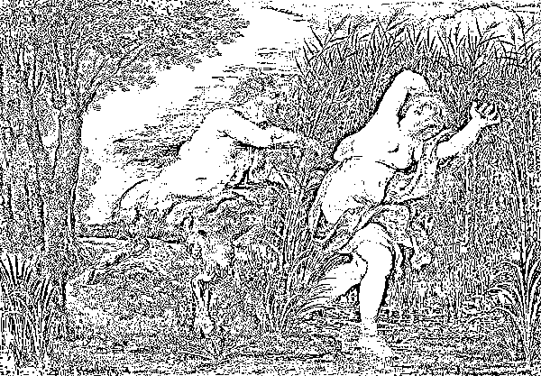

**未被驯服的自然之神**

在这里我们遇到了伟大的潘神，希腊神话中他被看做是伟大的万有（*the Great All*）。

有的神话故事说潘是赫尔墨斯（*Hermes*）和女神戴奥比（*Dryope*）的儿子，他出生的时候非常丑陋，长着山羊的双角、胡子、双腿和尾巴，他的母亲看到后都惊骇得逃走了，赫尔墨斯把他带到奥林匹斯山（*Olympus*）供众神娱乐。

潘居住在阿卡狄亚（*Arcadia*，意味着世外桃源之地）的丛林和草地中，是多产、野蛮的阳物崇拜和未被驯服的动物性的拟人化象征。他有时候也会对人们很友好，保护着羊群、牧人和蜂巢。他常常参加高山仙女们的派对，也帮助猎人找到他们的猎物。

有一次，他一路追逐着贞洁的女神西林克丝（*Syrinx*）来到拉东河（*the River Ladon*），西林克丝变作一只芦苇，想要逃开潘的拥抱。潘无法从大片的芦苇丛中找到西林克丝，就随意砍伐了一些芦苇做成了一个排箫。

潘的名字让我们想到它应该来自“panic（惊惶）”一词，而且潘也经常通过忽然惊吓孤单的旅人来取乐。其他的神祗都轻视他，却经常利用他的力量。

太阳神阿波罗（Apollo）从潘那里骗取了预言的能力，赫尔墨斯仿造了他的排箫，却声称是自己发明的，然后卖给了阿波罗。就这样，光芒四射的太阳神用不正当的手段从丑陋的、半人半羊的、未被驯服的自然之神手中获得了音乐和预言的能力。

**内心深处的原始冲动**

**从内在的层面来看，恶魔——潘的形象和人类的本性中最本能和天然的面向紧密相连。**

因为他居住在山洞中，和恐惧为伴，所以他的意象反映出我们内在即令自己恐惧又深深为其着迷的那种原始的、不文明的和面貌丑陋的性冲动，我们把它经验成恶魔的意象，因为它有一种强迫性的特质。

自从基督时代开始展露曙光以来，潘就和恶魔的形象紧密相连了，他的羊角和一脸坏笑被无限放大，追寻“灵性”的人们就像希腊神话中的阿波罗一样轻视他。

普鲁塔克（*Plutarch*）曾详述过在泰比瑞亚思（*Tiberius*）大帝统治期间，一个水手在航海途中经过艾齐奈德斯（*Echinades*）群岛的时候，听到了一个非常神秘的声音向他大呼三次：“当你经过派洛德斯（*Palodes*）的时候，请宣布伟大的潘神已经死了”。

这也正是基督教在犹太（*Judaea*）出现的时候。但是塔罗中的这张大阿卡纳牌说明，潘并没有死去，他只是被放逐到了潜意识的最底层中休憩，他反映着我们内心深处的恐惧、轻视和嫌弃，而且以此束缚和掌控着我们。

对于身体和性冲动的羞耻感，尤其是近代心理分析领域从潜意识中洞察出来的那些关于乱伦、身体机能和排泄的幻想，都让人们觉得肮脏和邪恶、丑陋和下流，人们把这些内容人格化为恶魔——潘，然后对它投射出各种厌恶和抗拒。

即使是推崇“性自由”的男女，也会以各种方式秘密地经验着对身体的羞耻感。我们或许在力量牌愤怒的狮子身上，或是战车牌狂野的战马身上看到一些高贵和浪漫的元素，但是很难在潘的身上找到它。

然而在神话中他不是恶魔，只是呈现出未经驯化和本能的特质，而且与道德无关。对身体和性冲动的恐惧或者着迷都制造了心理问题，它导致了人们在心理或身体的某个层面陷入麻痹或瘫痪的状态。**恶魔牌暗示着阻塞和压抑，通常是在性的层面上的，其原因来自我们缺乏对潘的了解。**尽管他很丑陋，可他却是伟大的万有——意即身体本身最原始的生命力，他不符合人类的道德标准而且非常粗糙和原始，却还是一个神祗。**我们花了很多精力把潘关在山洞里，我们的人格也因此而失去这些力量，如果敢于正视他的真容，就能释放出巨大的创造力。**愚人必须学会面对自己内在最卑劣的谦卑和羞耻感，否则他就永远被自己的恐惧捆绑。如果愚人想要隐藏令自己羞耻的秘密，他就要假装出高尚和高傲，把自己内在的兽性投射到他人身上，这一定会导致偏见和偏执，甚至对其它个体或种族的进行迫害，“恶魔”就这样被投射到了外界。**恶魔，直面人性的阴暗面**

**从解牌的角度来看，恶魔牌暗示着当事人必须面对人格里面的阴影和羞耻感等基础的本能部分。**愚人必须通过诚实和获取相应的知识才能从潘的手中赢得自由，以谦逊的态度接受潘，他就会把恐惧和自我厌恶的绳索解开，释放出巨大的创造力。

就这样，愚人来到了潘神迷宫的中心，揭开了自己身体本质中的黑暗面，其目的是成为他一直都是的“自然”。

**版权声明：**本文由《自在园》授权发布，欢迎转发，反对抄袭。友号转载请申请白名单。

**朱丽叶·沙曼·伯克**从 20 世纪 70 年代早期开始，就对塔罗牌产生了兴趣，并踏入了塔罗的世界。后来，在丽兹·格林的鼓励下，开始研习心理占星学和塔罗。1984 年，第一本书《塔罗全书》（The Complete Book ofTarot）出版。之后，与丽兹·格林合作设计并撰写了《神话塔罗》（The Mythic Tarot）。朱丽叶写了十本塔罗和占星学书，包括一本名为《众星的传说》（Stories from the Stars）的儿童读物，以及与丽兹·格林合著的《神话之旅》（The Mythic Journey），这是一本详细讲述如何运用神话来指导生活的书。

**点击下图了解课程详情** 

**微信又双叒叕改版啦，不想错过若道君的推送？****就把若道设为星标吧！****▼**

**喜欢记得点一下在看哦☟**

************报名直达入口************

# 神话塔罗之大阿卡纳牌｜高塔

> 原文：[`mp.weixin.qq.com/s?__biz=MzA5NjA0NTAxNg==&mid=2651483239&idx=5&sn=7ede348bc0be8392c27b90ef4d900de3&chksm=8b48ded0bc3f57c62335948f8f3faee498bdc1d91631237077e59ccc496dfbff48b6774d9710&scene=126&sessionid=1692737776#rd`](http://mp.weixin.qq.com/s?__biz=MzA5NjA0NTAxNg==&mid=2651483239&idx=5&sn=7ede348bc0be8392c27b90ef4d900de3&chksm=8b48ded0bc3f57c62335948f8f3faee498bdc1d91631237077e59ccc496dfbff48b6774d9710&scene=126&sessionid=1692737776#rd)

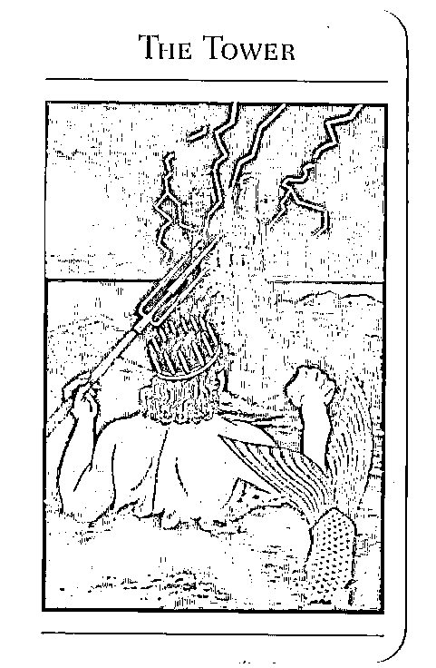

作者/朱丽叶·沙曼-伯克 丽兹·格林

译者/闫东升 编辑/玫瑰 图片/神话塔罗 网络

本文节选自《神话塔罗》

使用塔罗牌的人们无需具有“透视”或者“通灵”等特异功能，只要了解原型模式或生命中的共时性现象，就能够很好地利用它。人生中总有一些难以预料的事情，逼迫我们走出舒适区，是那些高塔告诉我们的故事。今天就来解读大阿卡纳牌——高塔。

[🔈 神话塔罗·高塔](https://res.wx.qq.com/voice/getvoice?mediaid=MzA5NjA0NTAxNl8yNjUxNDgzMjM4)

**｜**朗读者小巫

**书名：**

神话塔罗 

**作者：**

朱丽叶·沙曼-伯克   丽兹·格林 

**出版日期：**

2011-08-02

高塔对应的希腊神祗
**波塞冬·海神****海神**

高塔牌描绘的是一个石头建造的高塔形建筑，位于海面高高的礁石上，俯瞰着大海。茫茫的海水中，一个充满力量、来势汹汹的人形浮出水面，他头顶金色的皇冠，褐色的头发上还粘着湿淋淋的海藻，背后汹涌的波涛中露出他的鱼尾。

他手持三叉鱼叉指着高塔，几条闪电从鱼叉的顶端延伸到阴暗的天空中。海面波涛汹涌，在远处和暗沉的天空连成一片，似乎蕴含着兵临城下的危机，暴风雨已然从电闪雷鸣中开始。

> **三叉鱼叉**：是波塞冬（*Poseidon*）的武器，象征着新月的力量，它把波塞冬的形象与本能和黑暗联系到了一起。 
> 
> **神从大海中冲出海面**：象征着强大的本能驱力从潜意识中翻涌而出，其强度已经超过了压抑它的意愿。
> 
> **尽管波塞冬是一个大地之神，他却是鱼尾人身的形象**：这把他和冷血的海洋生物联系到了一起，与热血的人类生命相去甚远，所以他象征着来自远古世界的本能驱力。

**波赛冬的愤怒**

在这张牌面上我们看到了国王米诺斯（*Minos*）的迷宫（*Labyrinth*），愤怒的波塞冬从海中现身的时候引发了地震，摧毁了迷宫和米诺斯的王国。神话中的米诺斯是克里特（*Crete*）的国王，他拥有强大的权利和巨大的财富。

他的权利是地震和深海之神波塞冬给予的，当时交换的条件是他要给波塞冬一头美丽、纯白色的公牛作为供奉， 而波塞冬则让他成为大海的君王。但是米诺斯又反悔了，他把白公牛藏在了兽群中， 用一只比较小的动物作为替代品。

波塞冬对于米诺斯的违约和傲慢怒不可遏，他找来爱神阿弗洛狄忒（Aphrodite）帮忙。阿弗洛狄忒让米诺斯的妻子帕西法尔（*Pasiphae*） 疯狂迷恋上了白公牛。这位王后贿赂了皇宫里技艺高超的工匠代达罗斯（*Daedalus*），让他用木头制作了一头母牛，然后她钻进木制母牛的体内与白公牛交媾，生下来怪物米诺陶（*Minotaur*），它是一个长着男人身躯和牛头的丑陋怪物，靠吸食人血为生。米诺斯看到怪物后非常羞耻和恐惧，他让人用巨石在皇宫中修建了一座迷宫（*Labyrinth*），把米诺陶藏在里面。

皇室内隐藏着这样一个令人羞耻的秘密，米诺斯的统治当然不会持久。在他女儿阿里阿德涅（*Ariadne*）的帮助下，波塞冬的儿子——英雄赛休斯（*Theseus*）找到并杀死了米诺陶，与此同时，愤怒的波塞冬从海底的居所中冲出海面，摧毁了迷宫。

在波塞冬引发的地震中，迷宫变成了一堆乱石，皇宫也完全坍塌，米诺斯和米诺陶的尸体都被埋在乱石中，被米诺斯控制和剥削的奴隶们都获得了自由。赛休斯成了克里特的新国王，开辟了一个全新的时代，迷宫也随着岁月的流逝被人们淡忘了。

**防御体系分崩离析**

**从内在的层面来看，被波塞冬摧毁的高塔象征着老旧形式的坍塌。**

二十二张大阿卡纳牌中，高塔是唯一一个人造的建筑，所以非常具有代表性，我们就像米诺斯一样，为了保全颜面或者保持舒适等各种理由而抗拒生命中的某些事物，通过在内在或外在（生活中）修建秘密处所来隐藏它们。

例如为了获得社会的接纳，我们会把自己的动物性隐藏于自己在内心修建的高塔之中。

然后我们用自己的职业、获得的各种社会认可的证明、扮演良好的社会角色、与专业机构或团体建立的关系、礼貌的微笑、老练的社交手腕、杂志上推崇的着装和原生家庭灌输的道德，来隐藏自己觉得羞耻的秘密，也就是恶魔牌中等待愚人去揭示的潘（*Pan*）神山洞中的秘密。高塔代表着错误的或者是不平衡的价值观，这种对生命的态度不适合完整的本我（*self*），它更像是演员在舞台表演中为了加强观众的印象而穿着的夸张装扮。同样地，高塔也代表着我们在外在世界修建的某种结构，用来呈现本我还没有完整的部分。

当愚人在迷宫中遇到伟大的潘神时，只要他不逃避，就一定会有所改变，变得更加谦卑、真实和完整。这种改变也不可避免地会反映到他的外在生活中，就像我们了解了潜意识的某些模式后，会改变我们生活中的选择模式一样。

很多人都对于这种内在的探索过程非常恐惧，其中一个很重要的原因是，他们或多或少地知道一旦发现了自己的真实本性，就不能在生活中伪装自己了。

当人们用真诚的态度面对恶魔的时候，就会引发内心深处更趋向于完整的转化，那么代表老旧模式的高塔就会坍塌。愚人一旦察觉到自己违背了真实的自然本性，其震撼程度就像波塞冬的三叉戟摧毁了迷宫一样，相关的防御体系分崩离析，往日被奴役的那部分自我又重获自由。从某种程度来说，米诺陶就是恶魔的另一个化身，因为他们都反映着与身体和令人羞耻的性冲动有关的（动物性的）隐私，甚至人们自己都没有真正看到过他们，因为我们太忙于在社会中表达自己的“清白”和“友善”。**高塔，老旧模式的坍塌**

**从解牌的角度来看，高塔牌出现的时候，预示着当事人身上某种老旧的存在模式正在瓦解。**和死神牌以及恶魔牌一样，判断这张牌的“好”与“坏”取决于当事人的态度以及对相应事件的感受。

当然，最好的方式就是当事人主动去探寻哪种错误（或扭曲）的人格面具或自我认知束缚（或压抑）了自己，打破老旧错误模式的主动意愿会带来事半功倍的效果。

但是无论我们愿意与否，高塔的坍塌是必然的，那不是因为某种外在宿命式的事件，而是因为个体内在的动力已经到了沸点，陈旧冰冷的局限必然消融。

**版权声明：**本文由《自在园》授权发布，欢迎转发，反对抄袭。友号转载请申请白名单。

**朱丽叶·沙曼·伯克**从 20 世纪 70 年代早期开始，就对塔罗牌产生了兴趣，并踏入了塔罗的世界。后来，在丽兹·格林的鼓励下，开始研习心理占星学和塔罗。1984 年，第一本书《塔罗全书》（The Complete Book ofTarot）出版。之后，与丽兹·格林合作设计并撰写了《神话塔罗》（The Mythic Tarot）。朱丽叶写了十本塔罗和占星学书，包括一本名为《众星的传说》（Stories from the Stars）的儿童读物，以及与丽兹·格林合著的《神话之旅》（The Mythic Journey），这是一本详细讲述如何运用神话来指导生活的书。

**点击下图了解课程详情** 

**微信又双叒叕改版啦，不想错过若道君的推送？****就把若道设为星标吧！****▼**

**喜欢记得点一下在看哦☟**

************报名直达入口************

# ISAR 认证职业占星师文凭课程 | 开启“爱好变职业”的创收自由之路

> 原文：[`mp.weixin.qq.com/s?__biz=MzA5NjA0NTAxNg==&mid=2651483031&idx=3&sn=ee2966de9a912302f62f407d99f1dfbf&chksm=8b48d920bc3f503696fd9ea50bac1009fcd7d6da469e4816177a0504413493259660c2e4bafe&scene=126&sessionid=1692737776#rd`](http://mp.weixin.qq.com/s?__biz=MzA5NjA0NTAxNg==&mid=2651483031&idx=3&sn=ee2966de9a912302f62f407d99f1dfbf&chksm=8b48d920bc3f503696fd9ea50bac1009fcd7d6da469e4816177a0504413493259660c2e4bafe&scene=126&sessionid=1692737776#rd)

**2022 年，是世界和中国 40 年未有之大变局的开始。**

俄乌战争打破了欧洲大陆乃至全世界的和平局面，而新冠疫情也给中国经济带来前所未有之挑战。

如果你关心经济形势和世界局势，你会有这种的感觉，我们将面临一场深刻的危机，而这不是短期内可以结束的。

**占星学的看法也是如此。**

4 月青年失业率（16 岁到 24 岁）中国达 18.2%，一些背着房贷、教育、医疗负担的中年人突然失业更是整个家庭整个难以承受之重。为了更好准备面对这样的时代变化，连《北京日报》这样的官方媒体也在呼吁：**“开拓副业，让自己有多元化发展的生存能力”。**

**而这门课程，就是为了这样一个目标准备的。**

**占星学是非常好的“开展副业”的选择**

这个**为期 16 个月**的课程通过并不算长的时间和并不算高的投资，不仅可以帮助你学到一个终身可用的技艺，而且也可以选择成为自助助人的占星师，**开启受益终生的第二事业。**未来是个体崛起的时代，大量个体被鼓励独立发展，比如网红、自由职业、自媒体、咨询师等，他们都不需要传统的办公室。社会越发达，人的独立性就越强，未来有能力的人都可以变成独立的经济体。

**占星学也是越老越好的职业**

和一些技术变化非常快的职业不同，**占星学的技术层面非常稳定，不会快速迭代变化，**同时，掌握好占星学、能够做一场好的咨询又需要个人自身大量实践和对生命的深刻理解，而这些都是时间和岁月带来的。

**占星学是现代社会需要的助人职业**

社会快速发展和变化人们似乎越来越无法掌控自己的生活，这给很多人带来巨大的焦虑，**抚慰心灵的咨询市场需求巨大。**而占星学可以让人从前所未有的角度了解自己，了解目前和未来所处的周期，挑战的意义，不论对于深入的个人成长探寻，还是预测未来的周期，都又其独一无二的价值。

**ISAR 认证职业占星师的独有培训**

目前占星学的培训市场鱼龙混杂。而 ISAR（国际占星研究协会）是一个包含了 47 个国家在内的国际占星组织，多年来致力于占星的教育和研究，提升占星教育的品质和职业占星师的能力，在国际占星领域备受尊重。今年，ISAR 对于成为 ISAR 认证职业占星师提出了更高的要求，**所有想要获得 ISAR 职业占星认证的申请者均需要在 ISAR 的附属学校通过 500 个小时的研习（包含****主课****、选修课、沙龙、作业、讲座、工作坊等等）。**

**而这门核心占星学课程就是为此而准备的。**

**2022 年，鉴于对若道在占星教学领域所做的持续努力和高品质的课程服务，ISAR 特别授予若道核心课程为 ISAR 文凭课程，所有在若道学习，并通过若道毕业考试的同学将获得 ISAR 颁发的学历文凭（Diploma）。**

**你的占星核心课老师是谁？**

**拥有****51 年****占星实践经验的****若道创始人****前 ISAR 全球副主席****前 ISAR 全球职业占星师资质认证主席****大卫·瑞雷**

**和**

**2019 年第二届、2021 年第三届核心课中**

**与苏·汤普金斯老师****联合授课****的**

**ISAR 认证职业占星师**

**咔咔（Caroline）**

**二人合力打造**

**2022 年 ****若道全新核心占星课程**

**咔咔老师给同学的寄语：**

（向上滑动查看内容）

**亲爱的同学们：**

我为什么学占星学？

2000 年的时候我还是一个在网上搜索天蝎座和水瓶座配不配的普通白领。我搜索的内容还包括了水瓶座为什么总是这么若即若离？

体贴的搜索引擎给我推送了占星学、行星、星座、宫位、相位等资料，还让我了解到莉莉丝、月亮交点、截夺宫位等占星学概念。

2000 年 10 月我了解到，一个从业 30 多年的美国职业占星师大卫·瑞雷来到了中国，和他的中国合伙人将开办一个专业教授占星学知识的课程。过去 10 个月在网上东拼西凑的占星学知识唤起了我对占星学的兴趣，但是已经不能满足我对星图深度分析的需求了。

2013 年，我通过了若道核心课程的毕业考试和国际占星师研究协会的认证考试。2015 年我离开职场成为一名全职占星师。

到底学习占星带给了我什么呢？

1、它是自我觉知的工具，我现在已经不去纠结哪些星座是否匹配，我相信外在的事件是内在心理矛盾的显化。也就是说，想找到令人满足的亲密关系，要先去了解自己的情感模式和需求，而不是无意识地一次次地试错和撞墙。我开始学习自我关怀和接纳自己。

2、它带来看待世界的全新和全景的角度，天上如是，地下亦然。人类社会和个人生命的进化都有其周期和相似性，作为个体，占星学帮助我思考如何更积极和有建设性地与宇宙的能量合作，认识自己，发挥自己的潜力，度过有意义且自我满足的人生。

3、它带来了全新的职业：占星师和占星老师。除了收入，还有助人育人的满足感和意义感。

4、它带来一群志同道合的伙伴，我们彼此联结又相互独立。

作为中国占星界的“黄埔军校”若道占星的学生、助教和老师，我与很多学员在人生的不同阶段带着各异的需求走进了这所学校，2022-2023 年一年半的若道核心课程设计既蕴含了大卫·瑞雷老师的教学精华，也带入了我在跟随不同国外占星老师学习、助教和教学积累的心得。

有一些学员毕业后从事了占星咨询工作，有的在各大平台成为专业占星学知识的输出者和传播者，有的运用占星学提升他们的工作，也有的在占星学与投资，占星学与名人/八卦、占星学与原生家庭、亲密关系、亲子关系等领域收获了有用的或者有趣的体验。

对我来说，生命是一场自我完整的体验之旅。从 2011 年的那个春节在若道入学之后，我的生命旅程更加充实、有意义、有目标，也更有满足感。

希望在 2022-2023 年的若道核心课程里见到你。希望你此后的生命旅程里，有若道，有占星学。

占星师咔咔

2022 年 5 月 24 日

**大卫老师给同学的寄语：**

（向上滑动查看内容）

亲爱的学员们：

感谢你对我们从 8 月 30 日开始的若道 L1-5 级核心课程的兴趣。我和合作老师咔咔以及我们的核心课程团队期待着为你提供这个机会，来教授各种高品质的地道占星学知识和技巧。

对于那些希望获得 ISAR 职业占星师认证的学生，这是一门适合你的课程！

作为 ISAR 咨询技能培训的一部分，我曾与咔咔合作过，我们期待着再次合作。咔咔和我曾在 ISAR 职业占星师认证委员会（CAP ISAR）一起工作，我们非常熟悉获得 ISAR 职业认证的流程。作为你的老师，我们将陪伴你整个占星学发现之旅，帮助你逐渐认识到占星学有多么的神奇。此外，你还将受益于我们若道的助教和课程顾问，他们是若道核心课程计划的重要组成部分，提供在线沙龙、组织学习小组、指导家庭作业。我们的教育团队是“服务于你的团队”，所以也会根据你的需求进行相应的调整。你专用的核心课程微信群也促进了你的学习过程，使你能够每天与你的同学们一起学习、探讨、成长。

52 年前，当我开始学习占星学时，没有一所像若道这样的学校。如果有这样一所学校，我会尽一切可能在那里成为一名学生。事实上，我很幸运，我的老师都是经验丰富的专业占星师。然而，我花了 6 年的学习时间才通过 1976 年在美国乔治亚州亚特兰大举行的专业占星师考试，又花了 2 年的专业实践时间才通过占星学谋生。我永远不会忘记从 1970 年到 1978 年的 8 年，那些日子的反复试验教会了我如何苦练占星学。作为老师，我一直在努力传授我早年所学的知识，让你的旅程更加顺利，更加全面。

自 1978 年以来，44 年的全职实践教会了我很多，我很高兴有机会与大家分享我所学到的东西。我和咔咔都是现代占星师，虽然我们尊重西方占星学的历史和传统，但我们实践和教授的占星学植根于现代人本主义哲学，这种哲学旨在提高你对自身潜力的认识，并鼓励个人成长。还有什么比了解自己更实际的呢？还有什么比个人成长和发展潜力更有利的呢？这是你将要学习的占星学，一种可以应用于你自己生活的占星学，一种可以为你提供一个充实职业的占星学。

教书是我回馈占星学行业的方式，这个行业拓展了我的视野，远远超出了我曾经想象的可能。谢谢你给我这个机会做你的老师。

大卫·瑞雷

2022 年 5 月 24 日

**连报 L1-5 全阶网络直播课程，你可以享受**

❶ 64 次线上直播互动网络课程+2 场工作坊，全面而详细地讲解占星学知识、技能、案例和重要领域实践运用。

❷ 知识点+学员星图解读有机结合：咔咔老师以讲解知识点和中外名人案例为主，大卫·瑞雷老师以参课学员案例演示及客户案例为主，每个知识点覆盖班级内学员的亲身案例，参与感更强，多位学员都有机会听到自己的星图分析。

❸ 微信群学员互动分享，从真实案例学习生命成长故事。

❹ APP 答疑论坛提问：论坛上每个学员的问题都将得到及时回复。

❺ 若道独有的职业占星师养成计划，为你毕业后独立咨询做准备。

**❻ **提供**咨询平台**，只要努力，优秀毕业生有机会入驻**若道咨询平台**，拓展咨询客户群。

**更多了解老师和助教？**

**大卫·瑞雷（David Railey）**

*   **I****SAR 董事会成员，ISAR 全球副主席，ISAR 全球职业占星师资质认证主席，若道占星创始人**。

*   2016-2019 年，被选为国际占星协会（ISAR）考试委员会成员，国际占星协会（ISAR）是世界最大的国际占星机构，会员遍布 47 个国家。

*   2017-2020 年，被选为国际占星联盟（ISAR）考试委员会主席，理事会成员。

**占星师咔咔（Caroline）**

2010 年师从美国占星师大卫·瑞雷学习，并得到世界名师斯蒂芬·弗里斯特、罗伯特·汉德、苏·汤普金斯传授各种占星学技法。若道首届学员，国内最早获得 ISAR 职业占星师资质的职业占星师，多次担任若道核心课程助教，并于 2019 年第二届、2021 年第三届核心课中和苏·汤普金斯老师一起教授若道核心占星课程。

在国际知名广告公司和市场研究公司从事的市场研究和推广工作十余年，曾任职于阳狮集团、尼尔森市场研究有限公司、MTV 和《Madame Figaro》杂志。

**助教王嘉祺 （Conrad）**

ISAR 认证占星师、若道认证生时校正资质，从 2010 年起自学占星学，2015 年开始在若道系统学习，并开始个案咨询。2018 年担任若道核心课程助教，以及卜卦占星学和太阳返照选修课助教，并带领学员进行经世占星和太阳返照方面的研究。2019 年 11 月作为演讲人之一参加了国际占星协会（ISAR）北京大会，也是 ISAR 星空俱乐部中国区第 16 期的主讲人。

**什么人适合这门课？**

*   对占星学有浓厚兴趣，想要系统学习占星学。
*   对占星学有一定基础，但不知道该如何整合星图复杂的碎片。
*   希望成为优秀的占星师，想要借鉴国际大师解读思路并融入自己的体系。
*   想学习占星学，但不擅长英文，希望有中文老师授课。
*   想结合占星学理论与咨询实践。
*   走在自我探索和个人成长道路上的人。

**课程费用**

**★ 1-5 阶 连报****课程费用：46500 元** **★ 1-2 阶 （8 月 30 日开课）****课程费用：3500 元 ****★ 1-3 阶　连报****课程费用：11500 元 **

**咨询课程请联系顾问**：**王老师（微信/手机：18510107057，请备注“大卫核心课”）**

**退转课程**

**退款原则请详看《教学协议》，如有疑问请咨询课程顾问。**

****2022 L1-5 认证职业占星师必修课程****

**授课老师：大卫·瑞雷、咔咔**

**直播课开课时间：2022 年 8 月 30 日（周二）**

**授课方式：******网络授课，英文/中文授课，中文翻译****

**费用：****1-5 阶连报**：46500 元**；**1-2 阶**：**3500 元；****1-3 阶**：**11500 元

**课程负责人：王老师**（微信/手机：18510107057，请备注“大卫核心课”）

长按二维码添加课程负责人咨询~

****报名直达入口****

# 行星测试丨你的“太阳能量值”有多强大？

> 原文：[`mp.weixin.qq.com/s?__biz=MzA5NjA0NTAxNg==&mid=2651483031&idx=1&sn=57ceca760601f6cb0f1fb7ab4890ed86&chksm=8b48d920bc3f5036fd851d54665da4046a5bb7ee3d9678e582cd882b256754655fc77e72f965&scene=126&sessionid=1692737776#rd`](http://mp.weixin.qq.com/s?__biz=MzA5NjA0NTAxNg==&mid=2651483031&idx=1&sn=57ceca760601f6cb0f1fb7ab4890ed86&chksm=8b48d920bc3f5036fd851d54665da4046a5bb7ee3d9678e582cd882b256754655fc77e72f965&scene=126&sessionid=1692737776#rd)

**************☆ 后台回复“今日”，给你一句生命态度**************

作者/唐娜·坎宁安译者/靖园 校对/Jun 编辑/翀子 封面/书君 图片/网络太阳同狮子座自然关联。太阳是我们的意志力，生命之火。那么，你是否是一个太阳能量爆棚的人呢？一起来看看你在人群中有多闪耀吧。如果你想更多的了解占星学中太阳的特质，可以点击大卫和咔咔老师共同授课的【[ISAR 认证职业占星师文凭课程](http://mp.weixin.qq.com/s?__biz=MzA5NjA0NTAxNg==&mid=2651481677&idx=3&sn=bb57c9bb868a2413e929b1be657eb2ef&chksm=8b48d4fabc3f5decc90e3c479b1626c697a57e79364a590450a5e130d90c2ae7d52396783ee1&scene=21#wechat_redirect)】，点击链接了解更多详情~**什么是太阳型人？**

这组对行星强度的测试遵循了一套特别的模式，它不仅实行计分制，还根据星图中与测试行星相关的各项特征规定了不同的容许度。

然而，在测试太阳和月亮的强度时，你会发现计分的差异，包括一些附加分、允许更大的容许度，以及其他一些注意事项。

这是由于**太阳、月亮和上升点是一张星图中天生最强、最能说明问题的特征，而计分需要反映出这一点。**

太阳守护狮子座。如果你的太阳、月亮、上升点或一些行星落在这个星座，你会有狮子般的性格。这些是真正的太阳型人。可能影响最大的要算太阳在狮子座了，这是因为太阳落在了自己的星座。

太阳和狮子座也与星图的第五宫有关。拥有任何那些显著的特质都会增强你太阳型的一面。

**太阳能量测试****计分说明：**

本系列中的测试并非一个完美的科学量表，因为那是不可能办到的。它只是一种简单而有趣的方法来找出你出生星图中那些最强的影响因素。注意，**对于太阳能量测试和月亮能量测试来说，其容许度与得分会比其他行星能量测试高。**

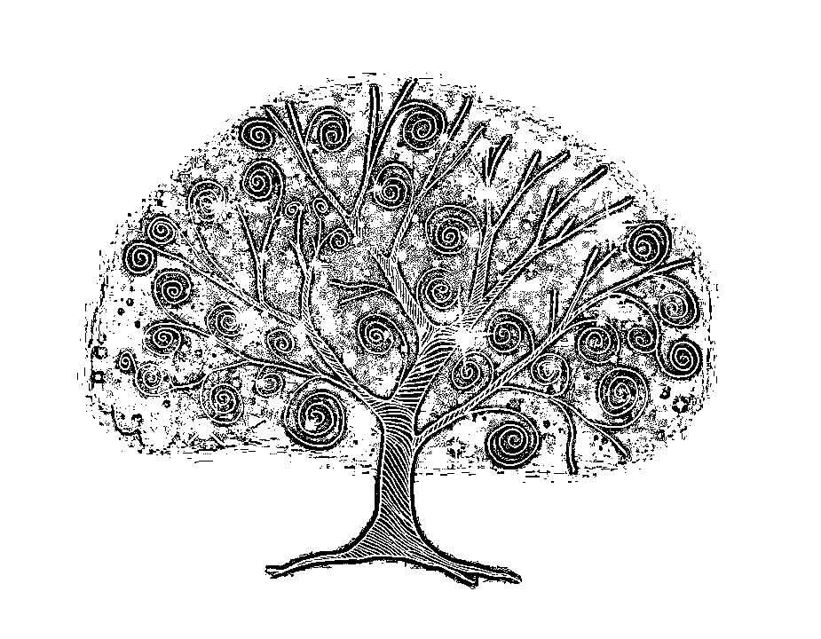

**COME ON**

**开始测试**

﹀

﹀

﹀

❂ 太阳**合相月亮、上升或中天**（每项计 15 分）**四分、三分或对分**月亮、上升或中天****（每项计 10 分）太阳的容许度：合相 10°，对分相 8°，三分相 6°。

❂ 附加分：太阳**合相或对分月亮，并且与北交点或南交点在 3°以内合相**，说明你是在食相前后出生的。

（计 10 分）

❂ 太阳**合相、四分、三分或对分其他行星**，

（每项计 6 分）

❂ 太阳**与月亮、上升点、中天或其他行星形成次要相位**（六分相、十二分相、七分相，梅花相、五分相、八分相或补八分相）

（每项计 4 分）

❂ 太阳与月亮、上升点、中天或其他星体形成次要相位

（每项计 4 分）

❂ 附加分：**太阳在狮子座**

（计 15 分）

**月亮、上升点或中天在狮子座**

（每项计 10 分）

❂ **其他行星在狮子座**

（每项计 5 分）

❂ 附加分：**太阳在第五宫**

（计 10 分）

❂ **其他行星在第五宫**

（每项计 3 分）

❂ **给每个你认为重要的因素加 2-5 分，例如太阳与南北交点形成相位，或者其中一个交点或福点落在狮子座**。逐一计算。

❂ 附加分：**太阳是某个主要格局的一部分，比如星群、 T 三角或大三角**

（计 5 分）

**计算你的总分**

*   0-15 分：你的太阳能量较低；

*   16-25 分：你的太阳能量属于中等; 

*   26-40 分：你的太阳能量强大；

*   超过 40 分：你的太阳能量爆表！

统计所有适用的星图特征。你的太阳有多光芒四射？人们是不是要戴墨镜、擦防晒霜，才能站在你身边？或者你自己每周都需要去日光浴馆做护理？

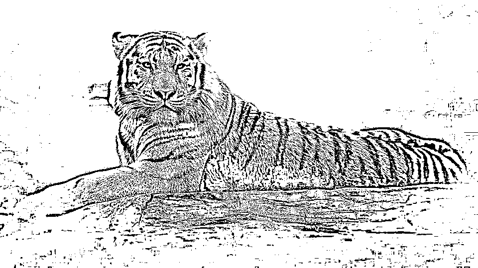

**分数解读：太阳型的人是怎样的？**

**太阳的功能和问题**

**自我概念、身份认同、自我表达、自我价值、自信。**太阳是我们存在的核心，太阳所在的星座、宫位和相位让我们了解到**我们是谁，我们可以胜任什么**。简单来说，它就是我们的身份。当你在用“我是一个……样的人”描述自己时，你最好能列举出你太阳所代表的特质。**当太阳被低估或受到困难相位的挑战时，人就可能会自谦或体验到低自尊、自我评价低，甚至自我憎恨。**

太阳能量强大的人所具有的特质：**天生被赋予太阳的力量，这种多少有些威严的人会有想出类拔萃的强烈需求。**所有关于自我的词汇都会被强调：**自我价值、自我发展、自我表达、自信心或自我意识、自我沉迷，甚至是自私。**

当太阳被过分强调的时候，这个人可能会**自恋，会以自我为中心，对关注提出过度的要求，也会是个爱炫耀的人**。在最糟糕的情况下，这个人可能会**很自负，并对关注和掌声贪得无厌，甚至想成为众人瞩目的焦点。**

即使在这个测试中得了高分，很多人还是会因为自己几乎感觉不到多少太阳能量而感到困惑。以下是一些可以解释你可能不是典型太阳型人的原因。

**一颗合相太阳的行星能使你感受到该行星守护的星座。**如果是火星，你就类似于一个有强大太阳能量的白羊座；如果是海王星，你便会像一个有着强大太阳能量的双鱼座，以此类推。它仍然是一个强大的太阳，只不过表面上看起来不同罢了。

**太阳所在的宫位可以让你感受到与该宫位自然关联的星座。**因为会有大量精力和注意力都放在该宫位的事物上，它们代表着自我价值的一个重要来源。

例如，一个太阳在第四宫的人，会与巨蟹座的人具有相似的特点，他们可能会喜欢待在家里，并且很依恋家人。然而，取决于太阳所落的星座，他们可能并没有巨蟹座的人那么情绪化和敏感。

所以，各位，你们的分数如何？这个测试的结果对你和你爱的人们来说准确吗？

**你的情况如何呢？**

**和大家一起来分享一下吧！**

**留言区等你哦！**

”

**版权声明：**本文由若道翻译、整理发布，欢迎转发，反对抄袭。友号转载请申请白名单。

**END**

**唐娜·坎宁安**

一位在国际上都广受尊敬的占星师，她已有超过 45 年的从业经验。她已撰有数十本占星著作以及上百篇占星学和其他形而上学类的文章。于 2017 年 7 月 5 日离世，享年 75 岁。

**拥有****51 年****占星实践经验的****若道创始人****前 ISAR 全球副主席****前 ISAR 全球职业占星师资质认证主席****大卫·瑞雷**

**和**

**2019 年第二届、2021 年第三届核心课中**

**与苏·汤普金斯老师****联合授课****的**

**ISAR 认证职业占星师**

**咔咔（Caroline）**

**二人合力打造**

**2022 年 ****若道全新核心占星课程**

**点击下图了解课程信息******20 位来自世界各地的占星师****带来 19 场沙龙——新世界的觉醒****详情可点击下图**

**学习占星学****点击下图了解课程详情**

**微信又双叒叕改版啦，不想错过若道君的推送？**
**就把若道设为星标吧！****▼**

**喜欢就点一下“在看”吧！**

********报名直达入口********

# 直播预告丨 71 道练习题考考你的占星学学商

> 原文：[`mp.weixin.qq.com/s?__biz=MzA5NjA0NTAxNg==&mid=2651483031&idx=2&sn=62bfb0cbf1becb724e85ff86227807b1&chksm=8b48d920bc3f5036718ba1fd056639bf97b7482bb9d820d066526cbb0e3f94e07ec0da34a27b&scene=126&sessionid=1692737776#rd`](http://mp.weixin.qq.com/s?__biz=MzA5NjA0NTAxNg==&mid=2651483031&idx=2&sn=62bfb0cbf1becb724e85ff86227807b1&chksm=8b48d920bc3f5036718ba1fd056639bf97b7482bb9d820d066526cbb0e3f94e07ec0da34a27b&scene=126&sessionid=1692737776#rd)

**想知道自己是否有 L1-2 的占星学基础？****想知道水平如何？**大卫老师和咔咔老师出的**71**道练习题等着你题目主要是考考你的**星座**和**宫位**知识这些都是占星学的入门基础而这些练习题的答案大卫老师和咔咔老师将在**8****月 7 日晚 7 点的****直播沙龙****中为你揭晓****联系课程顾问，71 道练习题向你招手**

**想知道“宇宙之题”的答案？** **快点击下方按钮预约直播吧~**<mpvideosnap class="js_uneditable custom_select_card channels_live_iframe" data-pluginname="videosnap" data-headimgurl="https://wx.qlogo.cn/finderhead/PiajxSqBRaEJYnVsqWfEX9qA0sI6hNVKsDfyzfPZ92WZMZyBpZWU5NA/0" data-username="v2_060000231003b20faec8c4e68a1ec2d4ca07e434b07755bbf47e7053a3059defd2c9d6c68a20@finder" data-nickname="若道" data-desc="将在 08 月 07 日 20:00 直播" data-intro="71 道练习题考考你的占星学学商" data-noticeid="finderlivenotice-v2_060000231003b20faec8c4e68a1ec2d4ca07e434b07755bbf47e7053a3059defd2c9d6c68a20@finder-1659427320421374-1631287177" data-type="live"></mpvideosnap>

# 若道周运 8.1-8.7 丨 8 月序幕拉开，勇敢展示你自己！（内含 12 星座运势）

> 原文：[`mp.weixin.qq.com/s?__biz=MzA5NjA0NTAxNg==&mid=2651482852&idx=1&sn=ae7dbead769752d8fcbfee7acd26eab7&chksm=8b48d853bc3f5145490975ceb23f54217ce7f4696755eeace8e9c9dae3f9b18a09a3768fb10c&scene=126&sessionid=1692737776#rd`](http://mp.weixin.qq.com/s?__biz=MzA5NjA0NTAxNg==&mid=2651482852&idx=1&sn=ae7dbead769752d8fcbfee7acd26eab7&chksm=8b48d853bc3f5145490975ceb23f54217ce7f4696755eeace8e9c9dae3f9b18a09a3768fb10c&scene=126&sessionid=1692737776#rd)

******☆ ****后台回复“今日”，给你一句生命态度******

作者/苏黎 ISAR 认证占星师
编辑/翀子 封面/书君 图片/网络 8 月第一周，天王星与北交点依然处在合相中，此外太阳与木星的三分相、金星与火星的六分相，以及水星进处女座给本周增添亮色。12 星座如何借助“宇宙之力”度过本周？让我们来看文章吧！（如果着急看 12 星座运势，不妨先拉到最后哦）**整体氛围**

7 月底燃爆的[【狮子座新月】](http://mp.weixin.qq.com/s?__biz=MzA5NjA0NTAxNg==&mid=2651482509&idx=1&sn=7e3731b7cd0d4dffa0f12de8058da204&chksm=8b48db3abc3f522cb22a164f9f340a3f625c8337504fcb4a54c18559f2f70072e56d4d76d819&scene=21#wechat_redirect)（点击查看文章），拉开了扑朔迷离、难以预测的 8 月序幕。狮子月是展现自我、拼尽全力、渴望勇敢和自信，成为最好自己的时机。狮子月的基调是强势，主导，锋芒外露展现自我。

但随着炎热即将离开，立秋逐渐靠近，强硬和武断，缺乏对话的沟通和虚荣心，我们容易跌入狮子座的陷阱。骄傲是失败的阴影，需要谨慎面对意外。**当我们享受欢乐、勇敢无畏时，也需保持冷静理智的头脑。**

我打开本周的星历表时思考，目前动荡的世界，还有什么意外是我们无法承受和没经历过的呢？本周火星和天王星的相位，让我们保持警惕。

在太阳狮子月，我们渴望展现自我的灵魂，太阳和木星的三分相，展现了乐观和慷慨的未来，我们可能觉得未来不是梦。**但火星和天王星的会合，提醒我们要在飞往太空的旅途中，注意安全。**

回顾 7 月底，明星人物的意外的车祸，自媒体视频爆红后的不同评判声......天王星和意外有关，也和创新有关，我们如何将创新落到实处，保持内在独特的灵魂，而不被火星天王星的合相带偏生活的轨道很重要，要明白谁才是你生活的主角。

**本周重要天象：**

*   **太阳三分木星**

*   **火星合相天王星**

*   **金星六分火星**

*   **水星进入处女座**

**一周重要天象****★ ****8 月 1 日，周一****月亮在处女座，太阳（狮子座）三分逆行的木星（白羊座），水星（狮子座）梅花海王星（双鱼座）**

周一，月亮在处女座行进，开启新的一周。本日的月亮六分金星（巨蟹座），三分火星、天王星、北交点（金牛座）。这是务实、工作效率高效的一天。

狮子座的太阳是自信的，渴望积极展现自己的实力和光芒。逆行的白羊座木星在努力放缓冒险和探索的脚步，这不是冒进的时刻。

当太阳和木星形成火元素的三分相时，我们对实现自我的目标是期待、乐观和憧憬的。我们也愿意在金钱上帮助他人，面对现实的困难挑战也不会退缩。但木星是逆行的，太木三分相有时会忽略自己的承受能力，过度乐观。

水星和海王星的梅花相，我们需要关注沟通中的表达，忽略细节、过度乐观会导致我们祸从口出。我们需要关注工作计划和文字输出的细节，避免陷入主观思维。

**★****8 月 2 日，周二****月亮进入天秤座，火星合相天王星（金牛座），金星六分北交点（金牛座），水星（狮子座）梅花冥王星（摩羯座）**

月亮在中午 12：05 进入天秤座，我们会更关注人际关系和社交，注重关系中的平衡，愿意参与文化活动。但火星与天王星的合相，我们要面对生活不确定性的冲突、变化。

金牛座与货币、商业、财政和金融市场有关，有关金融市场投资政策的调整，也许会给市场带来冲击和震荡。在虚拟货币政策上，如果不是专业的金融从业者，建议避免涉入。

个人层面上，我们需要关注身体健康，比如口腔、咽喉、扁桃体等有关的炎症。身体健康很容易引发焦躁的情绪，和外人引发冲突。建议理性消费，避免金钱纠纷导致生存的压迫感。容易发生自然灾害，关注个人的人身安全，保护好自己很重要。

金星和北交点的六分相，是我们通过人际关系学习如何收获心灵财富、学习爱自己的过程。巨蟹座金星的情感敏感、细腻、丰富，但容易受伤。真实展现自己在关系的喜好，学习到达金牛座稳定和幸福的彼岸。

水星和冥王星的梅花相，这个相位带来沟通的压力与疲劳。这两个星座组合带有控制性的能量，顽固的坚持自己的想法和声音，过度追求认同，导致人际沟通中的专制，缺乏平等的沟通方式，思想压力比较大。

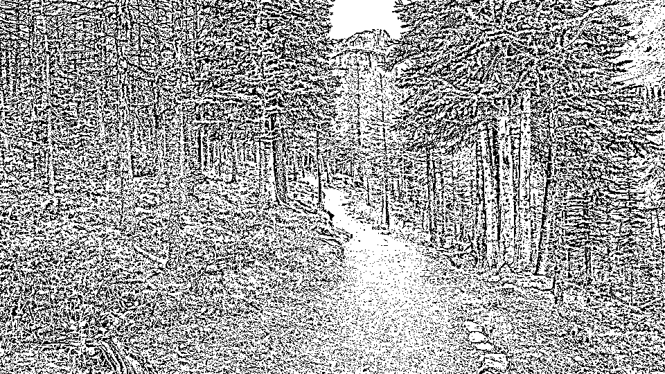

**★****8 月 3 日，周三****金星（巨蟹座）六分火星（金牛座）**

金星六分火星，我们会在人际关系中善用火星的行动力与金星的魅力。在学习和手工创意中，我们可以装饰家居，让家庭环境更温馨；可以在工作或商业合作中，吸引来合作者，共同将创意落地。

这个相位合适关系中的享受，我们可以和朋友，伴侣一起品尝美食，在动荡的日子里享受生活中的小确幸和美好时光。

**★****8 月 4 日，周四****水星进入处女座**

水星进入处女座，一直停留到 8 月底。水星在处女座是入庙，全年水星能量的最佳时期。思路会更清晰、务实、高效。这个时期，工作流程的安排会更合理、有规划，我们愿意有耐心地解决问题。这也是复习考试、学习的最佳时机。

处女座关注事情的细节、解决问题的方法，擅长整理资料和做计划。水星在处女座，我们也会对信息、文件保持评判的质疑态度，容易挑刺。在工作层面，我们可能会做一些琐碎的工作。在建康层面，我们需要避免小虫子的过敏问题。

**★****8 月 6 日，周六****月亮在天蝎座行进，金星（巨蟹座）梅花土星（水瓶座）**

休息日的月亮在天蝎座行进，多少让人不安，隐约感受到生活有事情尚未完成，无法放松神经好好休息，尤其当月亮对分天王星和北交点（金牛座）时，我们需要适当的放松身心。

当金星与土星形成困难相位，我们的内心会很容易被压力、责任压垮。为尚未完成工作而不安，所以无法放松享受休息吗？还是我们渴望得到对方的理解、倾听，但感觉对方不尊重自己、态度冷淡疏离，让我们无法享受愉悦的关系呢？学会放松很重要。

**12 星座的一周运势**

**（重点参考上升星座，其次参考太阳星座）**

***白羊座***

白羊座们这周要学会放松，享受与孩子快乐相处，发挥自己的创造力，展现自己的魅力。

营造优雅舒适的家居环境，与家人更好的沟通，规划未来生活，有助你了解自己财富计划和目标。尤其是周二的火天合相在你的 2 宫，还是需要避免冲动型消费投资。财务问题是本周的关注重点。

水星换座在白羊座们星图的第 6 宫，关注生活和工作中的细节，学会调整，注意皮肤的过敏问题。白羊座们不习惯处理琐碎的事物，这是培养耐心的最好时刻。

***金牛座***

这周金牛座们容易激动，脾气会比较大。火天的合相让你容易被经济、资源的话题刺激，你容易急躁。你很渴望规划的事项早点完成，这容易上火，无法管理好身体健康。

请跟随你本来的节奏，不要过度操心和冒进，你可以和好友一起聚会，通过喝下午茶放松心情。

本周水星换座进入星图的第 5 宫，触动你的倾诉和沟通的表达欲。相信自己的魅力，提升内在的幸福感和自信，会让你更懂得说话技巧。避免钻牛角尖，让你在事业上游刃有余。

***双子座***

这周对双子座们来说，是在群体中积极展现自己的高光时刻。自身优势不错，工作效率高效，社交群体中大受欢迎。财富运势不错，可以通过朋友获得新的机会。对于领导布置的任务和工作，要仔细看清楚文件的细节，避免出错。

双子座们对想学习的新技能很投入，也能激活内在的乐趣和潜力。水星的换座，可以在家居环境事项上做一些收拾和整理工作，也可以加深与家人的沟通。

***巨蟹座***

这周巨蟹座们合适在事业中，通过展现自己的沟通能力、业务能力获得领导的认同和关注，尤其是周一。你们对工作事业的目标将更确定和明晰，审视生活的长期目标，让你对未来更敏锐。理解自己的追求，你们将进入本年最佳的月份。

巨蟹座们心思细腻，思虑过重，在情感、人际关系上容易陷入负面的心理压力。如果群体中有一些意外发生，会影响你们的情绪和自我认知。单身的朋友容易沮丧和孤独。学会对外展现自我很重要，也可以在业余时间学习感兴趣的知识。

本周水星的换座在你星图的第 3 宫，多去社交、和好友沟通，规划和安排好自己作息时间，是发泄情感的最佳渠道。

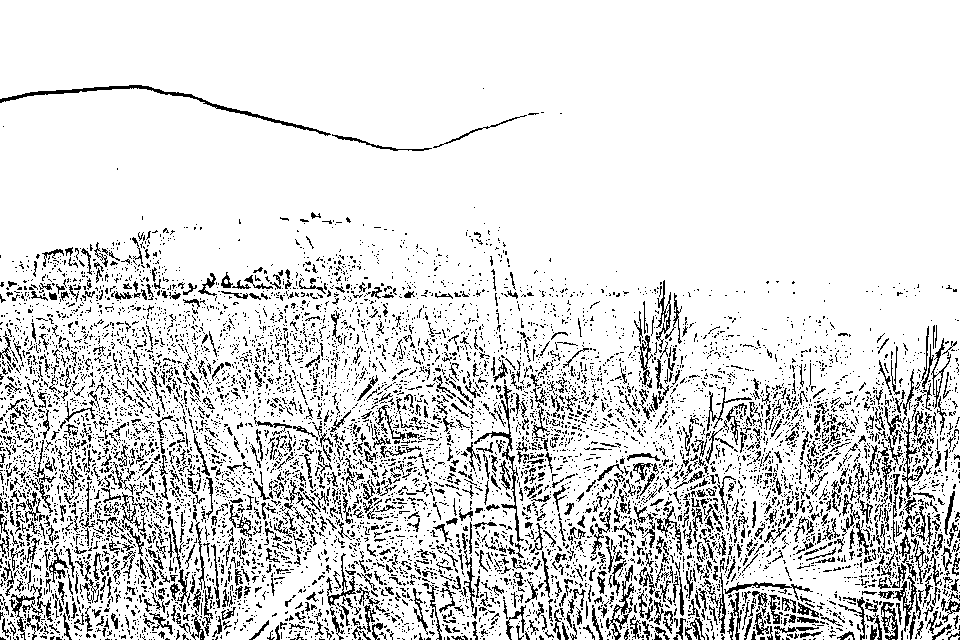

***狮子座***

本月是狮子座们运气最好的月份，但本周的火天合相在星图的第 10 宫，你们还是要注意事业上的意外情况，学会更沉稳、平静的处理问题，不要慌乱。

狮子座们容易被认同或失败影响，需要花一些时间独处，或从信赖的人身上寻求反馈，学会如何积极展现自我的魅力。

你们对想报名学习或考试内容更有信心，在他人的鼓励和触动下，你们会把专注力投入到学习上，获得导师的帮助。水星的换座在星图的第 2 宫，你会在金钱处理事项上更专注，不要高调惹麻烦，多研究市场和客户，会让你财运更佳。

***处女座***

本周处女座会善于发挥自己的专长获得他人的认同，展现自己的专业技能。

水星的换座，让处女座们展现出榜样的角色。他们对事物专注有弹性，紧张而敏捷，细心又优雅，事业上会呈现积极的趋势，求职面试的朋友，也有可能获得比较好的机会。在偏财运方面，也可以有一些小机会出现。

但本周不合适长途外出，有关法律方面的问题如果有触及也需要注意，需要遵守交通规则。如果听到舆论传播的事项，和自己本心或遵守的原则不符合，也没必要较真生气。

***天秤座***

天秤座们本周在事业的舞台展现自己的风采，工作努力积极，进取心很强，享受工作带来的成就感。在人际圈深受欢迎，8 月的第一周开局不错。

收支方面总体平衡，财富上没有太大压力，但需要注意周二的火天合相，当月亮在你们的 1 宫行进时，敏感性会更高，对商业中的意外事件处理，你们会更敏锐和关注。

情感方面会有控制的欲望，如果对方不能给到你足够的安全感，你会有莫名的郁闷和烦躁的感受。

水星换座在你的 12 宫行进中，也许在睡梦中有很多故事发生，可以学习冥想，或给自己安静的空间，不需要他人的陪伴。找到你感兴趣的点，吸收他人的知识，懂得借鉴他人的方法，会有更丰富的收获。

***天蝎座***

天蝎座本周的运势如同过山车，太阳和木星的三分相让你在事业上成为众人瞩目的光芒，但火星与天王星在你的 7 宫行进，意外和无常让人不安。

关系是你本周需要处理的主题。天蝎座善于处理矛盾和危机，但燃爆的狮子月还是需要低调做人，工作中远离是非。

本周的水星换座在你的第 11 宫，你可以在合适的社群组织中找到你感兴趣的朋友或话题，也能通过聚会中的沟通交流获得更多资讯。

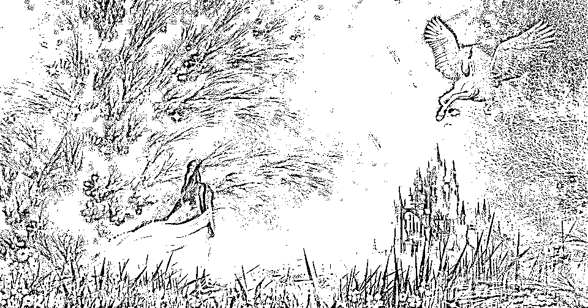

***射手座***

本周射手座可以通过社交活动，游走在聚会活动，把手里的资源发挥最大效用。

工作能力很强，也很忙碌，没有太多处理家庭事情的时间。火天的合相，你需要在工作中处理好人际关系，在工作中使用新技能、做好同事之间的沟通很重要。

这周的情绪波动会比较大，伴随着短暂的紧张，但乐观的射手座可以迅速解决问题。

水星的换座在 10 宫，你会处理更多和事业有关的具体事项，如文件签署，审核，工作沟通的事宜。如果是尚未走入职场的伙伴，你们会学习提升个人的公众形象，学更多的技能和知识。这是在工作中启发自己的一周。

***摩羯座***

这个月对摩羯座们不太友好，很多原定计划和事项容易被打乱。本周的火星与天王星的触碰在你的第 5 宫，如果你尚未结婚，你是否有被电光火石击中的感受呢？什么样的感受可以慢慢体会。

摩羯座们对情感不太自信，本周是学习的最好时机，不要给伴侣压力。和伴侣一起处理孩子和财富的问题，可以增进感情。

水星的换座，会让你在学习上更有毅力、决心，即使身边有事情，也不容易被打扰。但需要关注身体健康，缓解压力。

***水瓶座***

本月逆行的行星虽然对水瓶座们有比较多的影响，但冷静理智的你们，并不会遭遇大麻烦，都可以解决。

火星和天王星在你星图的第四宫，这可能会影响你的内在稳定性，也可能某个家庭成员做出一些事情让你措手不及。逆行的木星，会让你更冷静的反思和处理问题。善用工作的人际资源，这周在工作中表现不错，印象分良好。

水星的行进，你会在合作、商业关系上有更多机会，和他人讨论激动人心的工作或商业提议，可以推动重要项目的实施。

***双鱼座***

本月对双鱼座们是一个考验，需要提升个人的应变灵活处理能力，对计划外事情需要更灵活。这周你的重心就是处理各种职场上的工作合同、协议、财务关系的条款，你需要处理阻碍你发展的计划，所幸运气在你这边。

本周与亲戚，邻居有关的一些趣事或惊喜可能等待着你。也可能在生活中有一次计划外的旅行故事。

水星的行进，会让你在职场与合作关系中有些挑剔，有可能忙于工作忽略了对方，或者生活压力让你和伴侣的沟通有一些隔阂，学会坦诚相待地沟通有助于化解关系中矛盾。

在学习上效率不太高，容易分心，自信心被打击，多和信任朋友沟通倾诉，对化解低落的情绪很重要。

**版权声明**：原创文章由作者授权首发于若道平台发布，欢迎转发，反对抄袭。友号转载请申请白名单。

**END**

**苏黎（Sulis）**

ISAR 国际认证占星师（2019 年获得）/塔罗咨询师

现代占星融合古典解读

20 多年跨行业领域职场经历

**咨询微信**：liuzq26

**公众号**：Sulis_1975

长按打赏

**经世占星学沙龙直播就在今晚****欢迎预约**

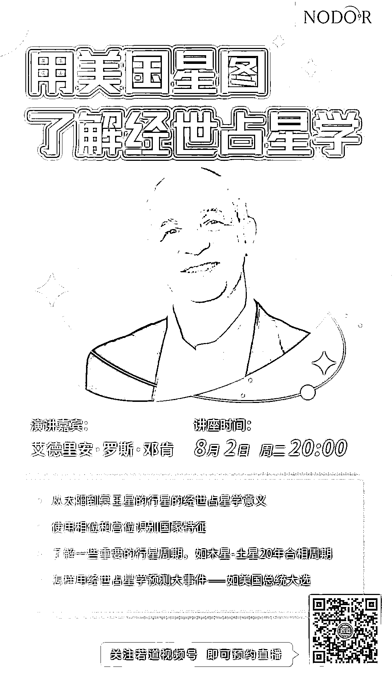

<mpvideosnap class="js_uneditable custom_select_card channels_live_iframe" data-pluginname="videosnap" data-headimgurl="https://wx.qlogo.cn/finderhead/PiajxSqBRaEJYnVsqWfEX9qA0sI6hNVKsDfyzfPZ92WZMZyBpZWU5NA/0" data-username="v2_060000231003b20faec8c4e68a1ec2d4ca07e434b07755bbf47e7053a3059defd2c9d6c68a20@finder" data-nickname="若道" data-desc="将在 08 月 02 日 20:00 直播" data-intro="经世占星学直播-用美国星图了解经世占星学的基本原理" data-noticeid="finderlivenotice-v2_060000231003b20faec8c4e68a1ec2d4ca07e434b07755bbf47e7053a3059defd2c9d6c68a20@finder-1658992810852568-783282600" data-type="live"></mpvideosnap>**20 位来自世界各地的占星师****带来 19 场沙龙——新世界的觉醒****详情可点击下图**

**学习占星学****点击下图了解课程详情**

**微信又双叒叕改版啦，不想错过若道君的推送？**
**就把若道设为星标吧！****▼**

**喜欢就点一下“在看”吧！**

********报名直达入口********

# 当太阳和月亮在 12 星座，你的“爱”与“恨”都是哪些？

> 原文：[`mp.weixin.qq.com/s?__biz=MzA5NjA0NTAxNg==&mid=2651482852&idx=2&sn=7f7162f878af161c0fd7e85b70f99e18&chksm=8b48d853bc3f51452b3e41e838daacd2cdbc749907be3fc70a5000284c477580a79ac0f3c92a&scene=126&sessionid=1692737776#rd`](http://mp.weixin.qq.com/s?__biz=MzA5NjA0NTAxNg==&mid=2651482852&idx=2&sn=7f7162f878af161c0fd7e85b70f99e18&chksm=8b48d853bc3f51452b3e41e838daacd2cdbc749907be3fc70a5000284c477580a79ac0f3c92a&scene=126&sessionid=1692737776#rd)

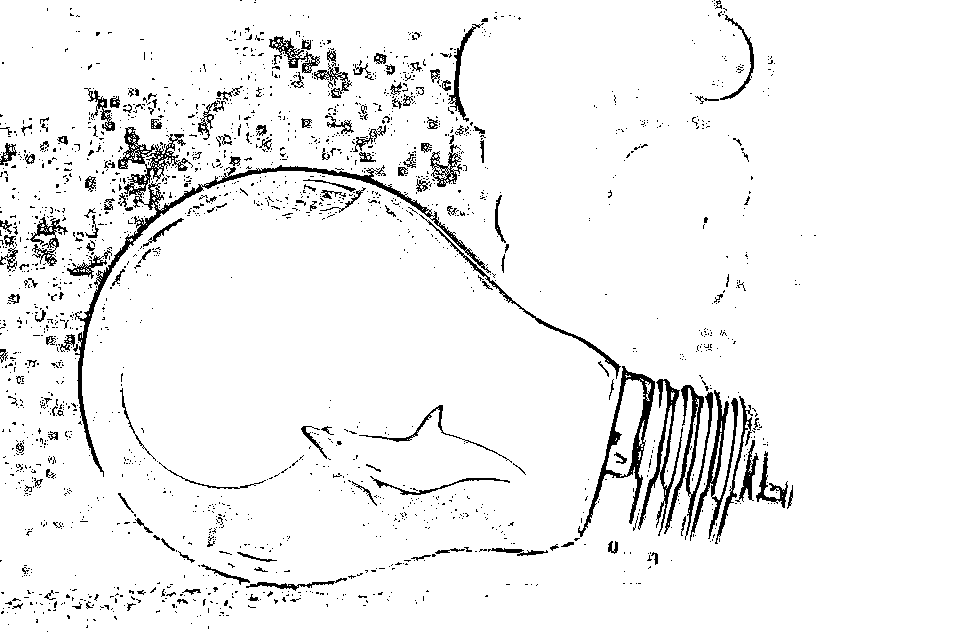

作者/大卫·瑞雷 若道创始人

翻译/若道翻译团队 整理/江艺

编辑/翀子 图片/封面

占星学是一种古老的智慧，是对生命奥秘的理解。今天大卫老师想要和大家分享他眼中的占星学，一起来看看 12 星座落在太阳和月亮各有什么建设性和破坏性的表达吧。另外，大卫老师参与授课的【[ISAR 认证职业占星师文凭课程](http://mp.weixin.qq.com/s?__biz=MjM5MjQwNjAyMQ==&mid=2649440014&idx=8&sn=ef668bade09fd0adb3f44d1706c4fb50&chksm=beb9506489ced9728c959505cf5ab57aa2baaab915c6e3f67e1e71fc449fbc10cb68d5da8980&scene=21#wechat_redirect)】报名中，点击链接了解更多详情！

**什么是占星学？**

**占星学作为一门学科或是一种知识的领域，它存在于严格的科学和宗教之间的地带，但它既不是科学也不是宗教。**

占星学似乎是一种解释生命的语言，正如同数学是科学的语言一样。它是一种非常了不起的语言，就好像在学习一种密码。我想，如果你认真学习占星学的话，你会发现这种密码可以非常显著地应用于生活的方方面面。

当我说占星学栖息于宗教和科学之间的地带时，我的意思并不是说占星学跟它们毫不相干。我想，如今即便是科学也开始探索物质世界中类似于占星学智慧的事物。

你们如果熟悉量子物理学和高等数学中的弦理论（string theory），就会发现它们解释了占星学为什么行之有效。

但是，只有当你去学习占星学的时候，你才会发现占星学在各个领域内是如何行之有效的。

**占星学帮助我们发现那些看起来毫不相关的事物之间的联系，从而让我们获得了对自身的洞察力，不仅让我们更好地觉知到自己是谁，而且还更加明了自己与身边一切人和事物的关系。**

很早很早之前，我们的老祖宗就认识到人的行为和自然节律之间的联系。

比如，在西方占星学的发源地，也就是地中海地区的人们发现大自然影响着人类天性。巴比伦人和希腊人发现出生在不同时间的人个性是不同的。然后西方占星学逐渐显现。到亚历山大大帝的时候，大家所熟悉的 12 星座已确立起来，这大概是在两千三百多年前。

**从那时开始，占星学逐渐发展为非常复杂的系统，不过它也一直在进化、变化、发展。**

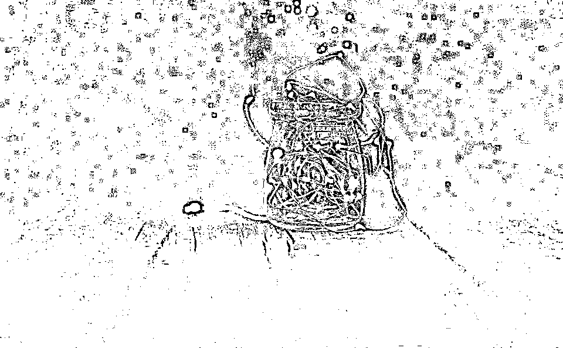

**为什么学习人本主义占星学？**

我们在若道学习的占星学，是 20 世纪初期重新被发现的占星学。**在西方，占星学的复兴，恰好与心理学的出现同步。**

人们开始有兴趣探究为什么人的行为是这样的。在英国、欧洲、美国，很多人开始回过头去看这门古老的学问，发现它的意义和道理。人们带着现代的眼光去重新看它。

自然，当人们的用不同的方式去思考，用不同的方式去看这个世界的时候，占星学被重新创造了。

**在现代思想光芒的照耀下，占星学的古老传统、古老技法和理论被重新检视。在心理学中最具影响力的两个领域，上世纪出现的人本主义心理学和荣格心理学，对现代占星学产生了巨大的影响。**

人本主义心理学的影响之大，以至于现在仍有许多占星师称自己为**人本主义占星师**。

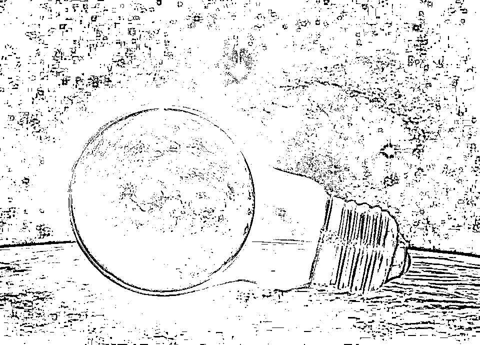

**一个白羊座的例子**

我给大家举一个例子，看看这到底是怎么回事。

白羊座是非常坚持自己主张的星座。它代表我、现在、为自己的利益采取行动的原则，这听起来似乎特别简单。20 世纪 70 年代在美国做过一项调查，结果显示白羊座女性有神经质倾向。

为什么是女性而不是男性呢？因为那个年代，如果女人非常坚持自己的主张、不耐心、咄咄逼人、急脾气，周围的环境就会给她压力，告诉她女人不该这样。

白羊座小女孩的父母会跟她说，你这个样子没有男人会娶你的。所以白羊座女性会形成一种内在的体系，而这个体系跟她的天性是相反的。而如果她有一个兄弟表现出上述白羊座特质，她的父母会奖赏这个男孩子。

但当这个白羊座女性表达自己的天性时，人们给出的都是负面评价，所以她内在会非常纠结。

所以在那个时代，她会被认为是神经质的。**人本主义心理学和人本主义占星学告诉我们，要诚实面对我们的天性，知道自己是什么样的人，接纳关于自己的真相。然后，从诚实这一点出发，我们可以创造我们想要的生活。**

我相信如果现在人们再做这个调查，他们得出的结论将跟 20 世纪 70 年代的结论不同！

因为虽然现在还有一些老旧的社会偏见存在，但是我们的社会已然改变，年轻的女性更多地被鼓励去坚持她们的主张，勇敢地走进外面的世界，更直截了当地为自己利益而奋斗。

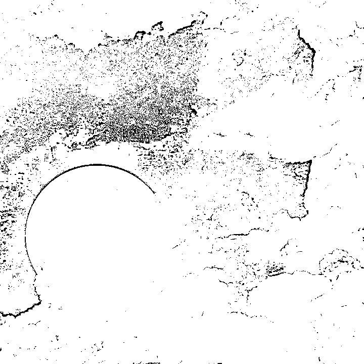

**占星学，解读生命的密码**

**占星学是关于觉察、接纳与改变的三部曲，它可以改变你的生活，在你生活的各个层面都行之有效。**

**如果白羊座接纳自己，会是怎样的呢？**

如果你是一位白羊座女性，你接纳自己有时候好斗、咄咄逼人、不耐烦的天性，如果你接纳它们，那么其他人也会接纳你。你的朋友会对你说，你真是个好斗的女人啊，你当然知道如何为你自己采取行动。

如果有一位月亮在白羊座的男性看到了这位白羊座的女性，他会觉得这个女人实在太棒了！

假设这个男人站在商店的柜台前，看到一个女人冲到柜台前对店员说，这是我昨天才买的，今天就坏了，现在你要给我退钱。如果你不给我退钱，马上叫你们经理出来，快点！

那么这个月亮在白羊座的男性就站在那儿看着那个女人，他的母亲可能就是这样好斗的女性，但是当他看见这个在柜台前发火的女人时，他可能并没有想他的母亲，他只是觉得这个女人的行为太熟悉了，他喜欢她，他觉得她太有魅力了。

这个年轻的女性越接纳她的本性，她的魅力就越强。

**学习占星学就是学习一门语言，它就像宇宙的密码一样，尤其可以说是关于人性和生命的密码。你可以将这个关于个人成长、发展的原则用于所有的星座。**

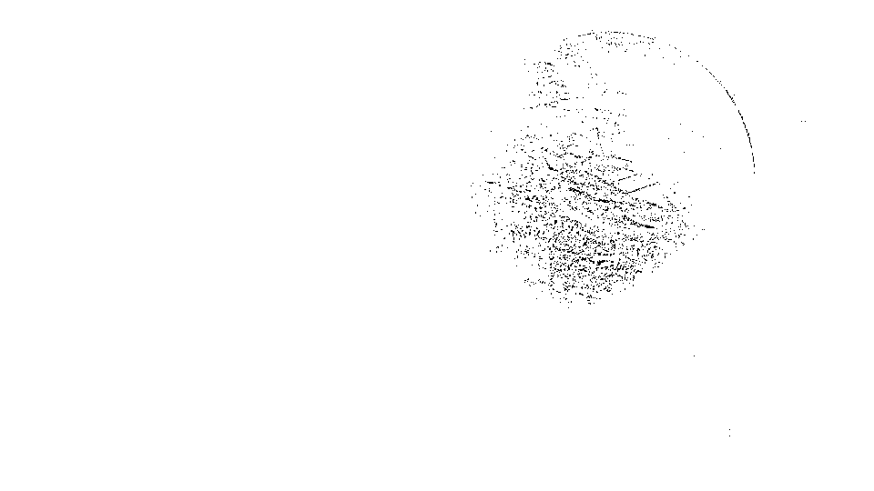

**太阳、月亮星座的“高阶版”与“低阶版”**

大家可能都知道自己的太阳星座是什么，但是你们可能并不知道星座到底是什么。总是说黄道 12 星座，黄道实际上是一个日历，这个日历是建立在一种纯粹的物理现象之上，即地球每年绕太阳运转的轨道。

在占星学中，这个日历并非按月份来划分，而是按星座划分。同样，**占星学日历并非将一个月划分为多少天，而是将星座按照度数分割。所以这个日历并不是拥有 365 天的日历，而是由 360°组成的日历。** 

大家所熟悉的星座的名称，比如白羊座、金牛座、双子座等等，这些实际上是从天文学星座借用而来的。周期会影响我们的行为以及我们的自我认同，生命中的一切都跟周期联系在一起，周期和节奏的变化，与我们的生活息息相关。

太阳和月亮是星图中重要的一部分，其所落星座能得到怎样的表现，影响着一个人的发展。所以，这里让我们来看看太阳、月亮落在 12 星座上，各有怎样的建设性和破坏性。

**太阳星座****的建设性与破坏性表达**

**月亮星座****的建设性与破坏性表达**

**版权声明：**原创文章由作者授权发布于若道平台，欢迎转发，反对抄袭。友号转载请申请白名单。

**END**

****想阅读更多作者的文章，请在后台回复******大卫****** 即可。****

**大卫·瑞雷**

美国占星师，若道联合创始人，致力于在中国教授和推广西方占星学；2010-2014 年，任全美占星师联盟监督委员会委员；2017 年，被选为 ISAR 委员会成员。ISAR 是世界最大的国际占星机构，会员遍布 45 个国家，2017-2020 年曾任 ISAR 全球副主席、CAPISAR（ISAR 职业占星师资质认证机构）主席。

**想了解更多占星师工作时需要注意什么吗？**

**拥有****51 年****占星实践经验的****若道创始人****前 ISAR 全球副主席****前 ISAR 全球职业占星师资质认证主席****大卫·瑞雷**

**和**

**2019 年第二届、2021 年第三届核心课中**

**与苏·汤普金斯老师****联合授课****的**

**ISAR 认证职业占星师**

**咔咔（Caroline）**

**二人合力打造**

**2022 年 ****若道全新核心占星课程**

**点击下图了解课程信息****

****报名直达入****

# ISAR 认证职业占星师必修课 | 这个世界上，没有后悔与占星学相遇的人

> 原文：[`mp.weixin.qq.com/s?__biz=MzA5NjA0NTAxNg==&mid=2651482852&idx=3&sn=cfc567db2b6f224c111546e1405badd8&chksm=8b48d853bc3f514586ba6b4947c37d4ebb28fa7b1beb3f0fcc65f5d8340d8aa5d2839025e5da&scene=126&sessionid=1692737776#rd`](http://mp.weixin.qq.com/s?__biz=MzA5NjA0NTAxNg==&mid=2651482852&idx=3&sn=cfc567db2b6f224c111546e1405badd8&chksm=8b48d853bc3f514586ba6b4947c37d4ebb28fa7b1beb3f0fcc65f5d8340d8aa5d2839025e5da&scene=126&sessionid=1692737776#rd)

5 月，一个若道的老朋友突然发来一段微信，是对木星进入白羊座的感慨。这位朋友创建了自己的公司，他并不在占星行业，但仍经常记录占星日记，因为他总是体会到星体移动和个人生命变化的契合。

过了几天，又一位若道的老朋友发了一张当天新闻的图片，里面有医疗板块产业趋势、有啤酒股的泡沫问题、有千年老二的饮用水公司也要上市。她说，看，举目全是海王星。她也不是占星师。

然而，他们都与占星相遇，占星已经融入了他们的生活。

第一位朋友说：“在若道学习占星，对我来说建立了一个整体的世界观以及对自我内在的解释论。”

第二位朋友说：“学了占星就会知道，事情来时我们不必过度反应，知道一切会过去”。

占星学会改变你，不论你跟随它走多远，不论你是否选择成为占星师。

这个世界在飞快地变化着，占星学可以像定海神针，帮你测度这个世界的变化，也帮助你校正心中的自己和世界的样子。

**这个世界上，应该还没有后悔与占星学相遇的人。**

**8 月 30 日，新的若道占星核心课程要开始了。**

如果你还没有下定决心是不是好好学占星，那么 L1-2 可谓一个轻松的前菜，等着你品尝。

**把这个仅需投资 2800 元的课程作为礼物，送给自己或者自己所爱的人。**

**课程试听：不分组转发本文，找王老师领取。**

长按二维码添加王老师微信

**谁是你的老师？**

**占星师咔咔（Caroline）**

2010 年师从美国占星师大卫·瑞雷学习，并得到世界名师斯蒂芬·弗里斯特、罗伯特·汉德、苏·汤普金斯传授各种占星学技法。若道首届学员，国内最早获得 ISAR 职业占星师资质的职业占星师，2019 年第二届、2021 年第三届核心课中和苏·汤普金斯老师一起教授若道核心占星课程。

在国际知名广告公司和市场研究公司从事的市场研究和推广工作十余年，曾任职于阳狮集团、尼尔森市场研究有限公司、MTV 和《Madame Figaro》杂志。

**大卫·瑞雷（David Railey）**

*   **I****SAR 董事会成员，ISAR 全球副主席，ISAR 全球职业占星师资质认证主席，若道占星创始人**。

*   2016-2019 年，被选为国际占星协会（ISAR）考试委员会成员，国际占星协会（ISAR）是世界最大的国际占星机构，会员遍布 47 个国家。

*   2017-2020 年，被选为国际占星联盟（ISAR）考试委员会主席，理事会成员。

**助教王嘉祺 （Conrad）**

ISAR 认证占星师、若道认证生时校正资质，从 2010 年起自学占星学，2015 年开始在若道系统学习，并开始个案咨询。2018 年担任若道核心课程助教，以及卜卦占星学和太阳返照选修课助教，并带领学员进行经世占星和太阳返照方面的研究。2019 年 11 月作为演讲人之一参加了国际占星协会（ISAR）北京大会，也是 ISAR 星空俱乐部中国区第 16 期的主讲人。

**内容是什么？**

**开课时间和课程费用**

**8 月 30 日开课，每周一次，20：00-22：00，10 节课。**

**★ 1-2 阶 **

**课程费用：3500 元 **

**你也可能想学更高阶：**

**★ 1-3 阶　连报****课程费用：11500 元 ****★ 1-5 阶　连报**

**课程费用：46500 元 **

德国哲学家雅思贝尔斯说：

教育是一棵树摇动另一棵树，

一朵云推动另一朵云，

一个灵魂唤醒另一个灵魂。

你准备好被摇动了吗？

**退转课程**

**退款原则请详看《教学协议》，如有疑问请咨询课程顾问。**

**课程试听**

**不分组转发本文，加王老师获取。**（微信/手机：18510107057，请备注“大卫核心课”）

****2022 L1-2 认证职业占星师必修课程****

**授课老师：大卫·瑞雷、咔咔**

**直播课开课时间：2022 年 8 月 30 日（周二）**

**授课方式：******网络授课，英文/中文授课，中文翻译****

**费用：**3500 元

**课程负责人：王老师**（微信/手机：18510107057，请备注“大卫核心课”）

长按二维码添加课程负责人咨询~

****报名直达入口****

# 8 月宇宙天气丨 5 星逆行！这个 8 月可精彩了！

> 原文：[`mp.weixin.qq.com/s?__biz=MzA5NjA0NTAxNg==&mid=2651482685&idx=1&sn=df2a8eeb50b043695f9a9671a7fc007d&chksm=8b48d88abc3f519c74e30bca86d8b0f68e6caf1c8e8b20ebb8d6fb8229cdf145935f5085cf67&scene=126&sessionid=1692737776#rd`](http://mp.weixin.qq.com/s?__biz=MzA5NjA0NTAxNg==&mid=2651482685&idx=1&sn=df2a8eeb50b043695f9a9671a7fc007d&chksm=8b48d88abc3f519c74e30bca86d8b0f68e6caf1c8e8b20ebb8d6fb8229cdf145935f5085cf67&scene=126&sessionid=1692737776#rd)

******☆ **后台回复“今日”，给你一句生命态度****

作者/Anastasia

编辑/翀子 封面/书君 图片/网络

八月重点天象

*   **水星进入处女座（8 月 4 日）**

*   **金星进入狮子座（8 月 12 日）**

*   **水瓶座满月（8 月 12 日）**

*   **火星进入双子座（8 月 20 日）**

*   **太阳进入处女座（8 月 23 日）**

*   **天王星逆行（8 月 24 日）**

*   **处女座新月（8 月 27 日）**

**整体氛围**

**八月，我们又将迎来群星逆行的日子，**天王星将于 8 月 24 日在金牛座开始逆行。至此，所有外行星，木星、土星、天王星、海王星、冥王星，包括凯龙星都处在逆行状态。九月，水星也将加入逆行大队。十月，水星、冥王星和土星才会先后恢复顺行。

群星逆行可以理解为，这是一段清理、反思、还债的日子。那些未处理的、未偿还的、未清算的，都会一一显露出来。请一起唱：一波还未平息，一波又来侵袭，茫茫人海狂风暴雨。

由于顺逆转换，整个八月天王星都停留在金牛座 18°。北交点的逆行区间是金牛座的 18°-15°。**天王星合相北交点贯穿整个八月。**尤其月初的时候，火星行经金牛座，也会加入到天王星、北交点的合相结构中，激活这股崭新的、陌生的、不稳定的能量。

土星在八月的逆行区间是水瓶座 22°-20°，开始入相位四分天王星，**土天四分正式拉开下半年的动荡大幕。**不稳定因素增多，不确定性增强，大坝撕裂，暗潮开始涌动。请继续唱：一波还来不及，一波早就过去，一生一世如梦初醒。

**八月又是非常务实的一个月，**天王星、冥王星、北交点都在土象星座，水星和火星大部分时间也运行在土象星座，土象能量占据优势。

土元素意味着解决问题，正视现实。在整体天象充满了不确定性的大背景下，土元素的增强可以成为人们生活的锚点和抓手。**关注当下，聚焦具体生活，才是度过风波的最好办法。**

这里有个小建议，在大环境不确定因素增多的情况下，想做的事情要快速决定、快速行动，抢时间差；同时，提前做好计划，多准备几个备选方案，留出腾挪调整的时间和空间，以免遇见突发事件手忙脚乱，引发焦虑。

动与静的胶着；追求稳定与大环境动荡之间的冲突；一边握紧方向盘，一边高声尖叫；构成了整个八月的主旋律。但是，**如果愿意付出一点点努力，我们也会趁此机会收获一种恍然大悟的畅快感和方向感，**那就是天王星在大棒之后给人们的胡罗卜。

八月也是机会满满的一个月，具体怎么做，请往下看。

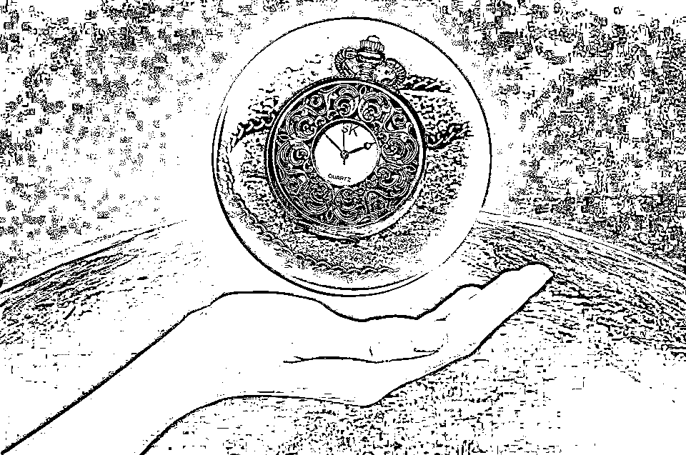

**重点天象****★****火星激活天王星、北交点合相**

8 月 20 日，火星从金牛座换座双子座。八月中上旬，火星、天王星和北交点都运行在金牛座。我们来看一下它们的运行区间：

*   **8 月 1-20 日，火星行经金牛座 17°-30°**

*   **8 月 1-31 日，北交点逆行在金牛座 18°-15°**

*   **8 月 1-31 日，天王星停滞在金牛座 18°，将在 8 月 24 日开始逆行**

我们可以看出，整个八月，天王星都合相北交点；而月初，由于火星的加入，这个合相将会被激烈地触发，同时火星会去四分土星，激活土天四分。社会面将会爆发哪些突发事件，可以拭目以待。在七月末的时候，我们已经有感受了。

金牛座是土象固定星座，守护星是金星，主管财富、健康和价值。这些事件都会触及物质层面，和身体健康、金钱财富相关，并且会冲击原有的价值观，人们将面临抉择和改变。

我们需要自爱，重新和自己的身体建立联接，而不是仰赖药物和科技；我们需要他爱，关心我们生存的环境、我们的地球和我们身边的人。

外行星的相位能量总是会被个人行星点燃。火星提示我们，你死我活的冲突和暴力往往来自于彼此的互不理解、互不包容。**学会接受陌生的价值观、从未想过的立场、超乎寻常的观点，对于拓展我们的人生观和世界观非常重要。**

让我们学会换角度思考问题。当你习惯性地思考，“这件事情对我们意味着什么？”要马上提醒自己，“这件事情对我意味着什么呢？”；同样，如果经常琢磨自己会得到什么好处，不妨换过来想一想，这对我们又有什么好处呢？这就是天王星视角应该看到的东西。

**★****天王星逆行**

**8 月 24 日，天王星开始今年的逆行。**天王星每年都会逆行，为期五个月，逆行区间 4 度。2023 年 1 月 23 日，天王星结束逆行，在金牛座 14°恢复顺行。

**这次逆行的重点影响人群是生日在 5 月 4-10 日的金牛座、8 月 6-13 日的狮子座、11 月 6-12 日的天蝎座、2 月 3-9 日的水瓶座。**不要心存侥幸，安全第一，请戴上头盔，系好安全带。

**整个八月，天王星都停滞在金牛座 18°，生日在 2 月 8 日、5 月 9 日、8 月 12 日、11 月 11 日前后几天的人群一定要谨慎防范，小心意外。**请从自我观察，调节内在开始，为天王星顺行后的改变做好准备。

逆行时候的天王星，其破坏力也会内化，更多作用在我们的内心世界。天王星追求改变和突破，以及与之伴随而来的破坏和颠覆。不管怎样，一切都无法回到从前了。我们只有建立信心，鼓足勇气，重新构建我们的价值观、人生观、世界观，在废土上打造一个新的世界。

也不用太过担心，改变会发生，改变也会再次达到平衡。

**如果你有个人行星或者重要虚点落在金牛座 18°，以及它的相位点附近，**你应该已经感受到生活中发生的巨大改变。或者，你已经有预感，但尚未被证实。逆行的天王星就会从内而外促使你去做出改变。不管是主动，还是被动，改变一定会发生。

真正的改变需要付出很多努力。能够影响和控制整个事件的人，始终是我们自己。换而言之，未来命运都在我们自己手中。这种能力并不是与生俱来的。**天王星逆行期间，试着问自己一个问题：我能够为我的未来做些什么改变呢？**

**★****朔望周期**

八月没有食相发生，我们将经历一次普通的水瓶座满月和一次普通的处女座新月。

**满月发生在 8 月 12 日的早上 9:36 分，水瓶座 19°。**这是一个压力重重的满月。月亮合相土星在水瓶座，四分天王星合相北交点在金牛座。太阳、月亮土星和天王星构成了一个 T 三角结构。火星的允许度稍大，但也参与其中。

满月本身就是关系的相位。火星、天王星、北交点的守护星金星已经进入到狮子座，和摩羯座的冥王星形成了一个跨星座的对分相，关系中的权力斗争将会变得非常激烈。尤其是狮子座，感受会非常明显。

水星在处女座将会提供有益的帮助，用理性来识别感性，而不是被情绪绑架。水星入相位三分北交点 、天王星和火星，也显示出思考和理性的重要作用，用大脑控制情绪，让事情的发展不至于走向失控。

**新月发生在 8 月 27 日 16:17 分**，**处女座 4 度。**生日在 2 月 23 日、5 月 26 日、8 月 28 日和 11 月 27 日前后的人群一定要好好许愿。具体许愿内容请参照处女座 4°所落宫位代表的领域。

这个新月四分火星，来势汹汹；同时，金星、土星、天王星又构成了一个允许度在两度之内的 T 三角结构，势必会提升内心世界的含焦量。一定要戒骄戒躁，牢记一带一盔，冲动是魔鬼。

人在冲动和匮乏的时候，不宜做任何决定。建议安静下来，这并不容易做到，水星还在天秤座对分了白羊座的木星，但要提醒自己做到。**在感到焦虑的时候，不妨坐下来数三十下呼吸，能够很好地建立起和身体的联接，缓解情绪上的焦躁感。**

**一定要记住，新月许愿的时候要写下明确的愿望**，那是白纸黑字的魔力，能够调动强大的内心和行动的意志力。明确说出自己的具体愿望，越清晰的愿望越容易实现。身边现成的例子，“八月份，我一定要减掉十斤！”就比“我一定要瘦下来！”容易实现得多。

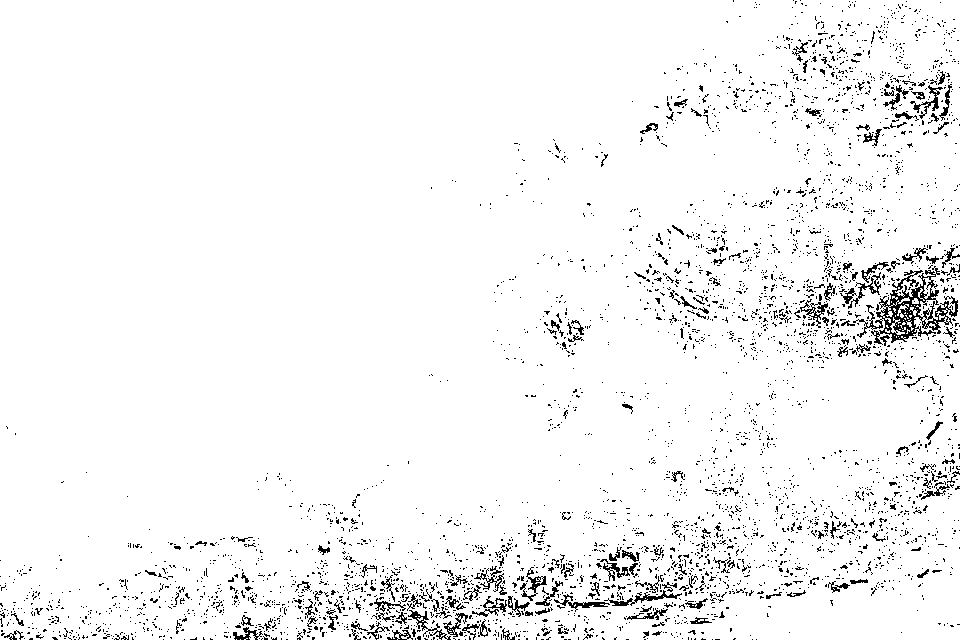

**12 星座八月小贴士**

**（参考太阳星座和上升星座）**

**★ ****白羊座**

*   **深入思考，重新制定计划**

*   **量入为出，控制购物消费**

**★ ****金牛座**

*   **充满活力，提高办事效率**

*   **控制节奏，关爱身心健康**

**★ ****双子座** 

*   **放慢脚步，遇事顺势而为**

*   **魅力提升，或有意外之财**

**★ ****巨蟹座** 

*   **状态良好，社交活动繁忙**

*   **敏捷高效，工作运势提升**

**★ ****狮子座** 

*   **戒骄戒躁，做好后续计划**

*   **协调矛盾，平衡工作家庭**

**★ ****处女座** 

*   **收获灵感，推动未来发展**

*   **贵人相助，进修机会增多**

**★ ****天秤座** 

*   **深思熟虑，小心做出判断**

*   **控制情绪，避免矛盾激化**

**★ ****天蝎座**

*   **注意安全，不要急于求成**

*   **适当交游，促进彼此关系**

**★ ****射手座**

*   **身心放松，顺利推进计划**

*   **适当计划，协调日常生活**

**★ ****摩羯座** 

*   **略有疲惫，放慢生活节奏**

*   **合理安排，加强亲子关系**

**★ ****水瓶座** 

*   **面对压力，制定长期规划**

*   **家事繁重，调整内在平静**

**★ ****双鱼座**

*   **享受生活，我为自己做主**

*   **节奏忙碌，人情往来频繁**

**版权声明：**原创文章由作者授权首发于若道平台，欢迎转发，反对抄袭。友号转载请申请白名单。

**END**

**Anastasia**

职业占星师/专栏作者/策展人

ISAR 认证占星师（2016 年获得）

若道认证生时校正资质（2015 年获得）

**微信公众号**：KairosMoment

长按打赏

**20 位来自世界各地的占星师****带来 19 场沙龙——新世界的觉醒****详情可点击下图**

**学习占星学****点击下图了解课程详情**

**微信又双叒叕改版啦，不想错过若道君的推送？**
**就把若道设为星标吧！****▼**

**喜欢就点一下“在看”吧！**

********报名直达入口********

# 雷蒙德·梅里曼金融占星周运 | 市场会开始看涨吗？

> 原文：[`mp.weixin.qq.com/s?__biz=MzA5NjA0NTAxNg==&mid=2651482685&idx=2&sn=410bc01b93319c6c9216359c35bca4d7&chksm=8b48d88abc3f519ceb30facd8c71aa4783c2a2628fb9c43b2cfa535e377dfaaf7803b78d9ea8&scene=126&sessionid=1692737776#rd`](http://mp.weixin.qq.com/s?__biz=MzA5NjA0NTAxNg==&mid=2651482685&idx=2&sn=410bc01b93319c6c9216359c35bca4d7&chksm=8b48d88abc3f519ceb30facd8c71aa4783c2a2628fb9c43b2cfa535e377dfaaf7803b78d9ea8&scene=126&sessionid=1692737776#rd)

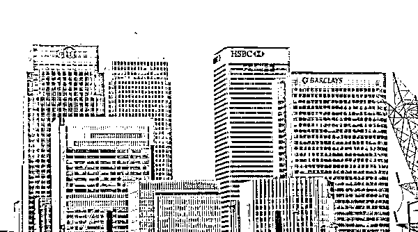

作者/雷蒙德·梅里曼 译者/Luke
编辑/玫瑰 图片/pexels

雷蒙德·梅里曼是在金融占星学界稳坐第一把交椅的占星师，同时他也是若道签约的金融占星课老师，我们引进了雷蒙德·梅里曼老师的《[上证指数月度报告](http://mp.weixin.qq.com/s?__biz=MzA5NjA0NTAxNg==&mid=2651482348&idx=3&sn=2ab9c15a94c624c15d96baa433dbf5a3&chksm=8b48da5bbc3f534d77df0a9fe2c3a8858896bab5ca63234db5aacb8e3587724ace0b1f6b1f80&scene=21#wechat_redirect)》及《[黄金报告](http://mp.weixin.qq.com/s?__biz=MzA5NjA0NTAxNg==&mid=2651480743&idx=2&sn=752fd81d8f47124f5a7e8dad71f2c8d9&chksm=8b48d010bc3f5906173548bf5774473ddb29f5aa29b6f308fd8fc4e08ef5ea32dbf0460f6c67&scene=21#wechat_redirect)》。我们经老师的授权，将每周刊登梅里曼老师的周运，供大家参考和学习。于是，这是本周的周运（8.1-8.5）。

**说明：以下时间采用纽约证券交易所所在地美国东部标准时间。**

**展望与回顾**

****

**美联储周三宣布连续第二次加息 0.75 个百分点，以期在不造成衰退的情况下抑制失控的通胀。鲍威尔说，他不认为经济处于衰退中，尽管第一季度经济是负增长，预计第二季度增长也不会是正的。**

**“想想什么是衰退。那是许多行业普遍性的下滑，持续好几个月以上。这看起来不像目前的情况。”他说，“真正的原因是劳动力市场发出了经济复苏的强烈信号，让你开始质疑国内生产总值数据。”**

**——杰夫·考克斯****《美联储连续第二次加息 0.75 个百分点以抗击通货膨胀》****www.cnbc.com****2022 年 7 月 27 日****美国经济在春季连续第二个季度萎缩，符合技术性衰退的标准。从 4 月到 6 月，3 个月期间国内生产总值按年计算下降了 0.9%。路透社经济学家曾经预计报告会显示经济增长 0.5%。****——梅根·亨尼****《美国经济在第二季度增长下滑 0.9%后进入技术性衰退》****www.foxbusiness.com**

**2022 年 7 月 28 日**

**本周末，两颗摩天大楼大小的小行星正在向地球飞来，其中一颗在周五（7 月 29 日）距离地球最近，另一颗在周六（7 月 30 日）掠过地球。**

**——布兰登·斯帕克**

**《这周末，两颗摩天大楼大小的小行星正向地球飞来》**

**www.livesceince.com、**

**2022 年 7 月 28 日**

利率再次急剧上升，国内生产总值连续第二个季度跌至负值，两颗小行星上周末掠过地球，股票市场喜欢这样！听起来木星在上行。事实上，木星正在抵达顶峰。也就是说，这个大家伙（不，不是指拜登总统，而是众神之王）于周四在白羊座逆行。上周末（7 月 30 日），它三分太阳。**当一颗行星逆行或对分太阳，就可以说它的宇宙能量在抵达顶峰。**用外行的话来说，那意味着**那颗行星掌管的主题和生命领域会凸显出来。**对于木星，那意味着**乐观主义和欢欣鼓舞**。突然之间，叙事从经济正在进入衰退的焦虑，改变为经济正在退出衰退的信念。美联储的激进加息，标志着它已不再落后于通胀曲线，而是领先于它。就像木星本身，市场正在往前看，对未来充满希望。外行没看出来的是，**战神火星正在等待起飞，它将在本周与天王星和月亮北交点在金牛座合相，此时木星刚刚从醉酒中清醒**。但那意味着一轮反转，还是新看涨趋势的加速？对于天王星这个创造意外的专业户，直到那天到来为止，你永远也不会知道答案。

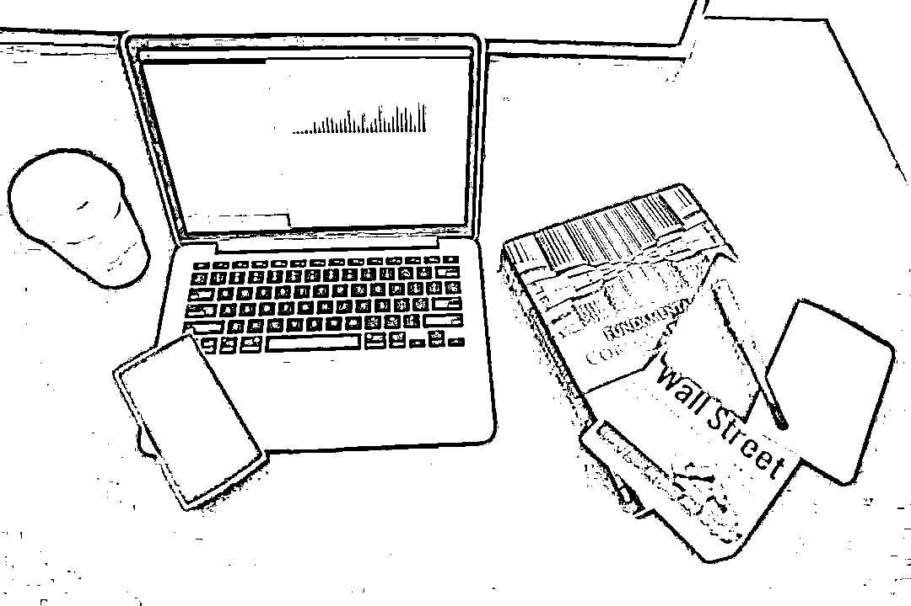

由于太阳在狮子座，这就像一场游戏，派对上的人都赢了。因此，有一种庆祝的气氛，最糟糕的已经过去了。但是过分乐观的弊端在于，市场可能会夸大积极面，过分高估现实。在亚洲和环太平洋地区，日本、印度和澳大利亚的股市有着亮眼的一周，每一个都飙升到了新的月度高点。在印度的例子中，这轮上涨到达了 3 个月以来的高点。然而，中国上证和香港股市没有那么乐观。后者跌到了 1 个月来的最低，上证综指继续在上个月的低点附近波动。在欧洲，上周所有主要指数都上涨了。最令人印象深刻的上涨发生在阿姆斯特丹，也就是我目前的居住地，这里的 AEX 指数飙升到了自 4 月 5 日以来的最高价位。尽管利率上涨，俄罗斯开始切断欧洲国家的天然气供应，德国 DAX 指数、苏黎世 SMI 指数和伦敦富时指数都创下新的月度高点。如果没有足够的取暖油，欧洲的冬天将是一个非常具有挑战性的冬天。但在近期破纪录的热浪过后，看起来没有人关注那么远的事情。情况可能最早在下周开始改变，因为这里的人们真的很担心。他们正在严肃地讨论分配能源的话题，我怀疑 8 月 7 日当火星（热）四分土星（分配）时，那将成为一个关注的热点。在美国，股市上周表现强势，符合木星在白羊座即将抵达逆行停滞点的通常表现。巴西的 Bovespa 指数、道琼斯工业平均指数和标准普尔指数都创下了新的月度高点。纳斯达克指数上涨至 2 个多月以来的最高水平。尽管股票市场上周的涨势令人印象深刻，黄金和白银市场的表现更令人兴奋。在前一周 7 月 21 日跌至数月低点 1678.40 以来（正好进入了我们的买入区间 1675+/-7），黄金在美联储加息的消息下直线上涨，于 7 月 29 日到达 1784.50。白银也有惊人表现，在 7 月中旬于 18.02 触底后，首次上涨超过 20 美元，为 7 月 1 日以来的最高价。比特币、以太坊和原油上周也有不错的涨势。在 7 月 14 日跌至低点 90.56 后，原油飙升回到 100 之上，于 7 月 29 日到达数周新高 101.88。木星也是原油的共同守护星。加密货币也上涨至 6 月中旬以来的最高价位。总的来说，上周对于许多市场这都是很好的一周，仿佛举办了一场木星的夏季派对。

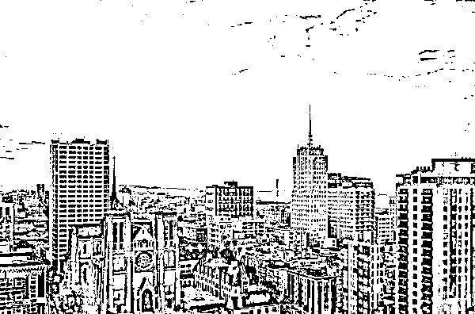

**短期占星趋势和长期考量**

****

**尽管党派分化比前一代人更宽泛更深入，中心却没有消失。对于普遍公认的问题，人们仍渴望常识性的应对措施……****因此，大多数民主党人已经和相当一部分的共和党人联合起来，促进共同防务和普遍福利。当意识形态屈服于现实，进步就是结果。****——威廉·高尔斯顿****《惊喜：分裂的国会正在达成两党合作的进步》****《华尔街日报》****2022 年 7 月 26 日****1938 年 9 月 30 日，阿道夫·希特勒、贝尼托·墨索里尼、法国总理爱德华·达拉第和英国首相内维尔·张伯伦签署了《慕尼黑条约》，决定了捷克斯洛伐克的命运，实际上是以和平的名义将其交给德国。****尽管该条约仅把居住了 300 万德国人的苏台德地区交到希特勒的手里，它也将捷克斯洛伐克 66%的煤，70%的钢铁，以及 70%的电力交给了纳粹战争机器。没有这些资源，捷克斯洛伐克很容易被德国完全统治。****——《纳粹占领捷克斯洛伐克》****www.history.com**[《2022 年金融预报》](http://mp.weixin.qq.com/s?__biz=MzA5NjA0NTAxNg==&mid=2651471782&idx=3&sn=9bf593258b18f05e41b5cd249cdd3a16&chksm=8b488d11bc3f0407bc45215ecb5d6549f25bd505fec12bc160babd12daa3c717f84d69f7d561&scene=21#wechat_redirect)（点击链接可阅读）以及各个专题讲座上解说的木星-土星周期，正如所预测的那样，在集体心理（和大多数金融市场）中展开。也就是说，适中、平衡的路线正开始超越极端主义和阴谋论的势力，后者一度占据了 21 世纪政治和社会叙事的主流。这两颗行星在 2020 年 12 月 21 日展开合相周期，目前正进入它们的第一个 1/8 阶段，这种现象正在开始浮现。在占星学中，木星和天王星是与极端主义相关的行星。土星是与阻力和收缩相关的行星。当木星和土星走到一起，正如在 2020 年 12 月 21 日那样，只有不太大也不太小、不太激进也不太缓慢的政策能够成功。这种温和路线将成为这两颗行星 10 年渐盈阶段的成功指南。**在 2021 年土星四分天王星时非常显著的极端主义和分裂，正越来越多地被平衡与统一的原则所取代。**就市场和地缘政治势力而言，这也预示着新的一天即将到来。不，极端主义没有消亡，因为**土星和天王星会在 9 月 21 日-28 日会形成另一轮渐亏四分相**，它们的影响力会被放大，因为木星将在它们的中点与这两颗行星形成八分相。但是更大的周期是**木星正在离开土星，这 10 年余下的时间都是如此。****在木星-土星合相的 1 年-3 年内，通常世界范围内会出现一场军事危机和经济（市场）衰退或收缩。****经济和市场的低点通常发生在这两颗行星只形成一次精准渐盈八分相的 3 个月内，或连续形成三次精准相位的 1 个月之内。**

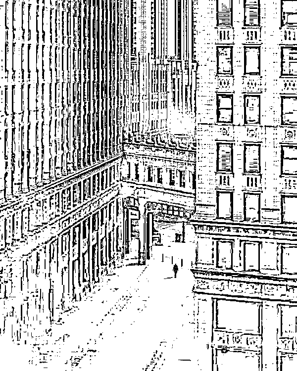

**这次是连续形成三次精准相位。**第一次成相发生在 2022 年 7 月 21 日；第二次成相发生在 9 月 21 日；第三次成相发生在 2023 年 3 月 21 日。通常，低点在第一次和第二次成相之间出现，然后全球股票市场和经济在接下来 2 年-5 年开始扩张。有可能市场低点已经在 6 月 17 日的基本周期波谷处出现了，这发生在这一系列相位展开的 1 个月前。**然而，我们不能排除 9 月 21 日的 1 个月内市场再次测试低点的可能性。**在这个相位的上一个案例中，美国市场在 2002 年 10 月第一次精准成相的一周内触底。那发生在 1999-2000 年土星-天王星渐盈阶段互联网泡沫破裂之后，也发生在 2000 年 5 月 28 日木星-土星合相之后。在这个八分相的第二次精准成相的同一个月，也就是 2003 年 3 月，欧洲市场触底，同时伊拉克战争爆发。

所以，我们又来到了同样的木星-土星周期的 1/8 阶段。考虑到这次我们看起来再次向中心聚拢，也就是木星-土星最可能成功的温和路线，在我的观点看来，人类的未来存在新的希望。

**然而，短期来看，我们即将进入今年最不稳定、可能也是最危险的地球宇宙学时间，8 月-11 月。****它始于本周，火星、天王星和月亮北交点罕见地在与金钱相关的金牛座合相。每颗行星也四分土星。**尽管上周木星的影响力占据主导，金融市场上一切顺利，但**在 8 月的前两周，气氛可能会摆向火星、天王星和土星激进和对抗的主题。**与此同时，在**8 月 8 日-16 日，行进火星也会合相纽约证券交易所星图中的水星和太阳，并四分冥王星。****这些都是股票市场大幅（可能短暂）下跌的征象。**好消息是，许多全球股票市场看起来开始了新的长期看涨周期，所以下行空间可能是有限的。也就是说，**周期的前景是非常看涨的。**地球宇宙学图景非常紧张，甚至可能是暴力的。这带来了下一个话题。这些地球宇宙学征象可能会带来急剧上涨和（或）下跌的价格波动，通常是自然灾害或人类引发的安全威胁所引起的。**长按下图了解更多详情**

这是特别及时的讲座，因为为期 12 年的木星轨道周期会在 5 月 10 日进入白羊座，并且 6 月-11 月是一年中最有力的地球宇宙征象接连登场的重要时间段，因为土星逆行与天王星形成几乎精准的渐亏四分相。

**说明：以上日期基于纽约证券交易所所在的美国东部标准时间，由于存在时差，中国地区可能需要加一天。**

**版权声明：**本文由若道翻译发布，欢迎转发，反对抄袭。友号转载请申请白名单。

**雷蒙德·梅里曼（Raymond Merriman）**

若道签约老师。著名金融占星师，ISAR（国际占星研究协会）前主席，梅里曼市场分析公司的总裁。他由于“提升了占星学的职业形象”，在 1995 年国际占星大会上被授予轩辕十四奖；在 2012 年国际占星大会上，被授予轩辕十四终身成就奖。

1“中国上证指数月度报告”发售**若道推出了****中文版****的雷蒙德·梅里曼中国上证指数月度报告，并持续发行该报告！**当把金融市场的周期和占星学的周期相结合时，雷蒙德·梅里曼老师的金融占星学研究**为投资者应对金融市场的周期波动，并随之调整投资策略提供了极大的价值参考**。
**8 月中英文报告已上线！**2“黄金价格周期月度报告”发售**若道推出****中文版****的雷蒙德·梅里曼黄金价格周期月度报告！**不仅仅为广大读者在中国股市的投资出谋划策，更将视角放眼黄金市场。**每当世界经济形式不明朗的时候，有一个地方是保值的港湾，那就是****黄金**。自 1982 年雷蒙德·梅里曼出版第一本研究《地球宇宙学征象与黄金价格的关联》的著作以来，**他一直作为最重要的黄金市场时机预测者之一享誉国际**。2022 年 8 月黄金报告已上线，梅里曼老师将会告诉你他对这个关键时期如何操作的想法。也可以按照季度和一年期订阅，有更多优惠。季度和年度的好处是，你可以持续了解梅里曼老师对于不断在变化的市场的看法。即便他某一次看法和市场不一致，你也看到在下一期他如何调整自己的看法，并看到金融占星在一个长期时间段内对你把控风险的帮助。而能够长期控制风险、尽量找到安全的投资时机才是投资的长久之计。**8 月中英文报告已上线！****购买套餐**，买得越多越优惠中国上证指数月度报告套餐价

*   **单月报告**：280 元
*   **3 个月套餐**：780 元（260 元/月）
*   **12 个月套餐价**：2400 元（200 元/月）

**长按下图识别二维码****购买金融报告****套餐****▼**

黄金周期月度报告优惠

*   **双报告年度套餐更优惠（直降 900 元）**

*   **12 个月黄金报告+12 个月上证指数报告：仅需 3900 元**

**长按下图识别二维码购买黄金报告套餐**▼

3《2022 年金融预报和沙龙》1976 年以来，由雷蒙德·A·梅里曼撰写的梅里曼市场时机学院每年一次的年度预报沙龙和每年一本的《年度预报》一直在应用占星学原理为投资者们服务，提供卓越洞见，从未间断。 **雷蒙德·梅里曼《2022 年金融预报和沙龙》发售中（报告已发布）。****长按下图识别二维码了解详情**
▼

4《2022 下半年金融占星投资沙龙》这是特别及时的讲座，因为为期 12 年的木星轨道周期会在 5 月 10 日进入白羊座，并且 6 月-11 月是一年中最有力的地球宇宙征象接连登场的重要时间段，因为土星逆行与天王星形成几乎精准的渐亏四分相。

**长按下图识别二维码了解详情**

▼

**点击阅读原文购买金融报告**

# 火天合相北交点四分土星的 8 月初，市场会怎样？丨梅里曼 8 月上证+黄金报告上线！

> 原文：[`mp.weixin.qq.com/s?__biz=MzA5NjA0NTAxNg==&mid=2651482685&idx=3&sn=be39eecf13d041df258865ad9ba15829&chksm=8b48d88abc3f519c8a43094ac98e357e3c2c7b7bc973b668704b25c2161854abbece4e0d908c&scene=126&sessionid=1692737776#rd`](http://mp.weixin.qq.com/s?__biz=MzA5NjA0NTAxNg==&mid=2651482685&idx=3&sn=be39eecf13d041df258865ad9ba15829&chksm=8b48d88abc3f519c8a43094ac98e357e3c2c7b7bc973b668704b25c2161854abbece4e0d908c&scene=126&sessionid=1692737776#rd)

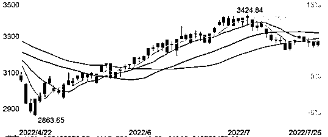

| 上证指数日 K 线

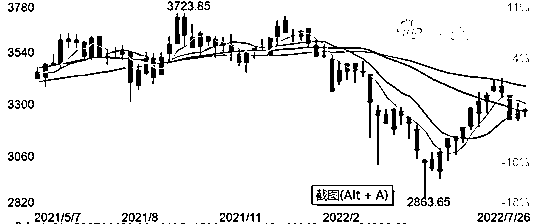

| 上证指数周 K 线

在 7 月，上证出现回调。这个回调在预期之内，毕竟，在 4 月 27 日触底之后，上证已经连续涨了 2 个月而没有一次像样的回调。市场等待的回调在 7 月出现了。**梅里曼老师在 6 月的报告中说，“如果 4 月 27 日是 33 个月周期的底部，那么可以判断至少未来 2-8 个月是看涨的。”**从 2019 年 1 月持续 5.5 年周期的半周期的范围是 27-40 个月，看起来 4 月 27 日（第 39 个月）的低点 2863 完成了第一个半周期。倘若如此，7 月开启了更大的 5.5 年周期中的第 2 个 33 个月半周期的第 3 个月。**上期报告指出，“从 7 月到 8 月初，地球宇宙征象信息好坏参半。最重要的是 7 月 20 日太阳对分冥王星（更多的暴力和对人类生命的威胁），木星逆行，以及 7 月 28-31 日太阳三分木星（对经济形势的乐观态度，这可能导致股市反弹）”。**8 月 1-14 日，火星与天王星、月亮北交点合相，并与土星形成四分相；随后太阳对分土星，四分天王星，这个外行星相位配置开始变得更加强大。

**梅里曼老师如何看待这些天象？股市会继续下跌吗？还是回调结束，市场是否会开始上涨？**

8 月股市应该如何操作，金融占星大师雷蒙德·梅里曼的《2022 年 8 月上证指数报告》已上线，你可以听听梅里曼老师的看法。

**《2022 年 8 月黄金报告》也已上线，欢迎购买。**

**此外，6 月 23 日雷蒙德·梅里曼的《2022 下半年金融占星投资沙龙》，将帮助你对 2022 年下半年的市场风云变化加深了解。**

**扫描下图二维码了解详情**

▼

**投资有收益，投资有风险，希望金融占星学的研究帮助你更好地评估你的投资。**

**8 月上证报告上线**

**上证指数月度报告价格****单月报告**：280 元/月 **季度套餐价格**：780 元（260 元/月）**年度套餐价格**：2400 元（200 元/月）**双报告年度套餐更优惠（直降 900 元）****12 个月黄金报告+12 个月上证指数报告：仅需 3900 元****长按下图识别二维码购买上证指数报告**
▼

“**黄金是金钱。其他的只是信贷。**

**——约翰·皮尔庞特·摩根**

”7 月 14 日，美国发布 6 月 CPI 数据，同比增长 9.1%，高于预期的 8.8%及 5 月的 8.6%，增幅创 1981 年以来最高；美国 6 月核心 CPI 同比增长 5.9%，同样高于预期的 5.7%。市场预期美联储 7 月加息 100 个几点的几率升至 75%。而其他国家也在经历迅速增长的通货膨胀，甚至比美国还严重。对于很多国家，这样的通货膨胀是 80 年代以来的最高水平。令人担忧的是，公众预警预期通胀将持续居高不下。毕竟，通胀有自我实现的预言。美元也继续相对于其他货币走强。今年上半年见证了日元、英镑、欧元相对于美元的大幅下跌。

| 日元/美元汇率

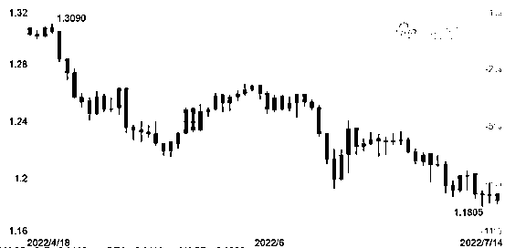

| 英镑/美元汇率

| 欧元/美元汇率

**而黄金也一样。如梅里曼老师一直以来的预测，在 4 月 13 日到达 2003 美元的高点后，一路下跌，与 4 月高点相比，已经跌幅达 15%。**

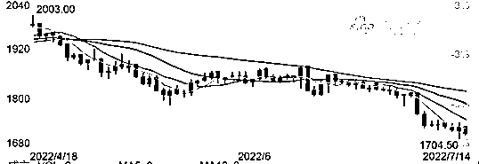

| 黄金日 K 线图

货币的剧烈变动给金融市场带来很多不确定性。然而正如梅里曼老师在[2022 下半年金融占星投资沙龙](http://mp.weixin.qq.com/s?__biz=MzA5NjA0NTAxNg==&mid=2651477281&idx=4&sn=610f22d20ab9ebab93125b9915bb84f6&chksm=8b48e796bc3f6e80a17217569d20456cafa22ee17f5cf6196bf4ee03d6d1bc7c51da3bce46ba&scene=21#wechat_redirect)（点击链接了解更多详情）中的预测，**更强有力的宇宙天象会在下半年到来。****7 月-8 月，有这样一些可能影响市场的天象：**

**· 7 月 21 日 木星半四分相土星**

**· 8 月 4 日 火星、天王星合相月亮北交点**

**· 8 月 12 日-15 日 日土对分**

**· 8 月 26 日 天王星停滞**

**在下跌 15%后，黄金会出现一次有 5%以上盈利的反弹的吗？还有，如上次我们提到，从中期而言，你考虑从做空黄金中赚钱的策略了吗？**8 月份黄金报告已经上线，上证报告也将在下周上线。欢迎了解。也可以按照季度和 1 年期订阅，有更多优惠。季度和年度的好处是，你可以持续了解梅里曼老师对于不断在变化的市场的看法。
即便他某一次看法和市场不一致，你也看到在下一期他如何调整自己的看法，并看到金融占星在一个长期时间段内对你把控风险的帮助。而能够长期控制风险、尽量找到安全的投资时机才是投资的长久之计。点击文末阅读原文，雷蒙德·梅里曼黄金周期 2022 年 8 月报告带来有 40 年黄金市场研究经验的世界著名金融占星大师雷蒙德·梅里曼对当前黄金市场的研究。

**8 月黄金报告上线**

**黄金月度报告价格****单月报告**：280 元/月 **季度套餐价格**：780 元（260 元/月）**年度套餐价格**：2400 元（200 元/月）**双报告年度套餐更优惠（直降 900 元）****12 个月黄金报告+12 个月上证指数报告：仅需 3900 元****长按下图识别二维码购买黄金报告**
▼

**购买者需知**

**① **梅里曼市场时机学院《中国上证指数月度研究报告》是梅里曼市场时机学院（以下简称 MMA）的研究“预报”，而不是市场“预测”，是梅里曼老师及 MMA 金融占星分析师对人类活动周期历史与行星周期之间相关性的研究，二者在大部分情况下具有 80%或更高的相关性，而不是因果关系。报告中的研究完全存在错误的可能性。即便是非常认真的研究和几十年的研究经验，金融占星师无法总是正确地解读出各种征象在实际层面上会如何相互作用，并显化为事件结果。

所以请将报告看作一个研究参考，务必结合其他市场研究和你个人对市场的理解，根据你的自由意志做决策。

**②** 此报告一旦售出，**即不接受退款。**

**③** 上证、黄金月度报告每月固定 1 期，**并非都是在每月相同日期发布。**

**④** **我们收到英文报告的当天，即发布该英文报告。3 天后，上线报告中文版。此报告仅支持手机网页阅读，不支持电脑阅读和下载。****以上须知，请仔细阅读。一旦付款，即视为已了解并接受所有须知内容。**在过去的 40 年中，唯有梅里曼逐渐完善，并在梅里曼市场时机学院月度周期报告中阐释了将地球宇宙学与周期相结合的研究方法，以惊人的精确性预报了黄金价格发生重大变化的时间。**黄金购买 Tip**

各大银行均可购买黄金或黄金 EFT 基金，也可以在诸如天天基金或者支付宝购买黄金及黄金相关产品。不明白的可以百度搜索。

**购买后如何查看报告？**

**购买后有疑问怎么办？**请联系技术客服
**微信：nodoor201705**

**购买报告直达入口**

# 这个星座只要找对了人，就幸福得不要不要的

> 原文：[`mp.weixin.qq.com/s?__biz=MzA5NjA0NTAxNg==&mid=2651482675&idx=1&sn=3123256f7ef56cdee194da04634580d0&chksm=8b48d884bc3f51925cdffb489e25ae0cf6814ea7a602793d3224fdce65479e030e7c25a0953a&scene=126&sessionid=1692737776#rd`](http://mp.weixin.qq.com/s?__biz=MzA5NjA0NTAxNg==&mid=2651482675&idx=1&sn=3123256f7ef56cdee194da04634580d0&chksm=8b48d884bc3f51925cdffb489e25ae0cf6814ea7a602793d3224fdce65479e030e7c25a0953a&scene=126&sessionid=1692737776#rd)

******☆ ****后台回复“今日”，给你一句生命态度******

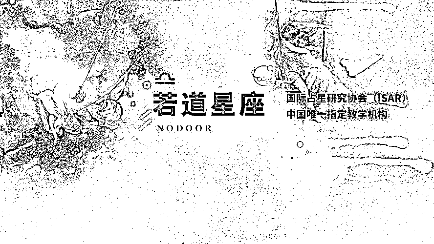

作者/大卫·瑞雷 若道占星创始人
译者/若道翻译团队编辑/玫瑰 封面/书君 图片/pexels

提到天秤座的时候，大家都会有一个大致的印象，但是其实天秤座也有很多种，不过每一种天秤座都会很需要伴侣。看看大卫老师怎么解读吧。另外，大卫老师参与授课的【[ISAR 认证职业占星师文凭课程](http://mp.weixin.qq.com/s?__biz=MzA5NjA0NTAxNg==&mid=2651476700&idx=3&sn=804527ca81139be7d588c15514ea527f&chksm=8b48e06bbc3f697d049b91379d493dbe49fe33f85fc9d3c14fa42fc547619f3db92e83380e88&scene=21#wechat_redirect)】报名中，点击链接了解更多详情！

**天秤座**

随着黄道列车向着地平线之上移动，你的旅途已经过半。你瞅瞅身旁的旅伴，你们友好地相视一笑。你意识到你开始喜欢上这个人，心里揣度着他们是不是已经名花有主。

直接问实在有些失礼，你开始回想你们之前的谈话，你不记得除了父母和同事他们提到过其他人。然后你注意到他们似乎正在用 iPad 上交友网站。

“抱歉，”你有些犹豫地问，“这是交友网站吗？”他们笑了，有点困惑，“不，这是校友论坛，我正在看他们发的帖子。”“哦！原来如此。”你说，有点不好意思。

“你用过交友网站吗？”他们问。“有一次，一个朋友推荐我用，但好像不太适合我。”说完你便后悔了。不过，他们似乎也没在意。

“我跟一些朋友之前也上过交友网站，不过都没什么用。你懂的，爸妈希望你一出校门就结婚，他们就爱念叨那些。所以呢，我也想过试试看，不过我还是觉得缘分到了最重要，当那个人出现的时候我会认出来。”“我也这么想，”你说。

就在那一刻，空气中有些东西发出微微的颤动。你们两个都感觉到了，你们都不确定这种感觉会把你们引向哪里——或许这就是一段有意义的关系的开始。从那一刻开始，你们的交谈变得不一样了。你们踏上了构筑关系的道路，至少是关系的最初阶段。

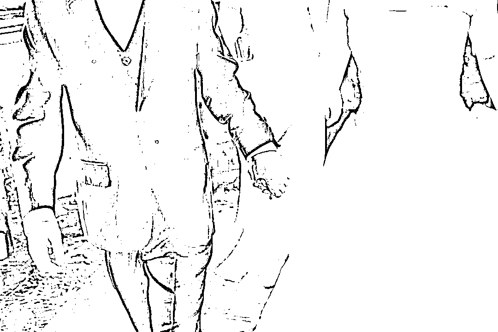

这就是天秤座。**关系——特别是伴侣关系以及亲近紧密的关系是天秤座首要关注的议题。**是否能有效地建立关系，决定了人生的满意度，同时相比其他星座，他们也会**在关系中投入更多时间、思考和能量**。**培养对于他人的意识，会帮助天秤座在谈判中获得更多成功或取得双赢。**同样，发展外交才能，可以让他们成功扮演“人际润滑油”的角色。**很多天秤座天生就有一种亲和力，在多种不同的人际角色中都能令人愉悦。**十二星座当中，要数天秤座**最关心合作，以及和谐的关系。**很多太阳、月亮、上升落在天秤座，或有许多个人行星落在这个社交型的风象星座中的人，都是出了名的**“处事圆滑”或“和事佬”**。

圣雄甘地或许是天秤座中最著名也最受尊敬的例子。他在印度独立战争动乱爆发后，以绝食抗议，拿自己的健康和生命做赌注来要求和平。前美国总统、诺贝尔奖获得者吉米·卡特是另一个天秤座代表，他在卸任之后依然持续通过外交上的努力来促进世界和平。

流行娱乐界中，有前披头士乐队主唱约翰·列侬，他的那首圣歌一般的《给和平一个机会》，成为 20 世纪 60 年代末 70 年代初西方年轻人为之狂热的真言。

| 甘地

当然，即便是希望人们和谐相处，也**并不意味着所有天秤座都会从事跟和平有关的事业。**

我曾经在一篇文章中写过：“天秤座只不过是礼貌的白羊座。”这在另一位上世纪 50 年代的美国总统身上得到应验，那就是德怀特·戴维·艾森豪威尔。在他当选总统之前，作为二战时盟军最高指挥官的经历为他赢得了良好声望。

| 约翰·列侬

白羊座更多与战士的角色共振，不过，这位天秤座军事领袖却因成功维持了盟军中多国将领之间的和平共处而受到极大拥戴，这些暴躁的将军之间的争吵摩擦会削弱盟军的力量，进而大大影响与纳粹德国的交战。

在艾森豪威尔任职总统的早期，他在南朝鲜和北朝鲜达成休战协议后，便结束了美国在朝鲜的军事行动。

并且在他任职总统的八年里，他都没有对朝鲜发起任何军事行动或干预。“和平与繁荣”成了艾森豪威尔在位时的口令，美国人提到这一点对他都会非常怀念。

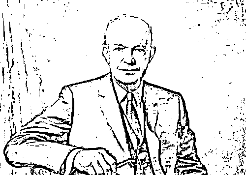

| 艾森豪威尔

**很多天秤座都非常善于倾听，并表现得易于合作，有时会给人一种比较被动的印象。**不过，**天秤座可不是一个“被动”的星座，它是一个社交型的星座，并且是非常“主动”的社交。**天秤座会主动与人建立关系，言谈中惯于使用“我们”或“你”这样的字眼，以示礼貌。

“不如我们去看电影吧？你想看吗？”“我们应该去看看，你觉得呢？”你们会很乐意为他人提供建议，同时也常常向他人征求建议。

**如果出生星图中与天秤座共振的元素被强调，这些人很有可能从事咨询相关的职业，比如心理咨询师，或至少是一个心理爱好者，或是商业顾问。**

大部分天秤座信奉**“以人为本”**，不管从事何种职业，都会对身边的人表现出一种真实的关注和兴趣。也因**能够以公平、公正的态度面对相反的观点**而闻名，经常**在冲突和谈判中扮演调停者的角色**。

这种不偏不倚的态度有时也会给人造成困惑，因为人们不知道天秤座到底是站哪边的。不过，他们的目的就是达到皆大欢喜的结局，相信自己的好意终究能够被他人理解。**天秤座也以良好的审美品味著称，有时这也被称为艺术天分或创造力。**不过，创造力不被哪个星座独揽，每个星座都有自己表达创造力的方式。**天秤座对于美的敏感，更多根源于想要取悦他人、创造和谐环境的欲望。**所以要把墙上歪歪扭扭的画摆正，把家具安排得当，在意物品的配色和美感的搭配，放舒缓的、令人愉悦的音乐，所有这一切都是为了创造一个和谐的氛围，将出现混乱和不一致的可能性降到最低，让每个人都能感到放松和愉快。

高阶的占星学学生会懂得，要想了解一个天秤座的创造力表现方式，需要去参考星图中的其他因素。

**· 如果星图中的冥王星/天蝎座/第 8 宫被强调，**那么他们的“作品”很可能激发出人们内心强烈的激情，或试图探索人与人之间更深层极致的情感联结；

**· 如果是受海王星/双鱼座/第 12 宫影响重，**或许会成为天秤座中创作灵感最易被激发的那一类，或许会想要和大众分享那些为人生指引方向的神秘体验或启迪；

**· 如果是天王星/水瓶座/第 11 宫在起作用，**可能会以给人带来震惊的方式进行表达，或提供一种全新的看待生活的方式——往往是更加“超前”或颇具现代实验性的方式。

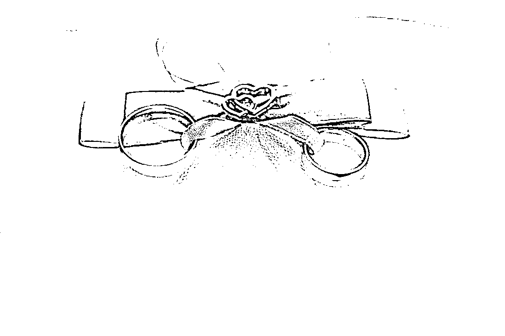

**个人成长的主题和故事**

想象有一个天秤座的孩子画了一幅画，然后迫不及待地向老师或父母展示。如果他们的画得到表扬，他们会继续画很多跟这幅画一样的画；如果他们的画不被喜欢，那他们会转而尝试做其他的事看看能不能获得赞许。

如果老师或家长无视或者嘲笑小天秤座的努力，那他们很可能就此舍弃所有艺术追求。这类现象强调了一个贯穿天秤座人一生的核心议题：**取悦他人会成为你们的自我驱动力。**

天秤座可能因为太想令他人满意而忽视了个人利益。但很多人不了解的是，对于大部分天秤座来说，**看到别人快乐，自己也会体验到巨大的满足感——特别是伴侣或密友的快乐。**

所以，天秤座的“个人利益”，存在于那个因和谐美好的关系而感到快乐的“自己”身上。天秤座想要的是**“共享体验”**。

不过，就像前面说到的，有许多不同种类的天秤座。如果出生星图中双鱼座/海王星/第 12 宫被强调，天秤座会拥有这样一种能力，可以**通过幻想、想象、创造性的活动来让自己快乐，或是通过灵性上的实践来寻求解脱或感受圆满。****他们也会很享受与人互动的时光，但有独处的时间也非常重要。**如果牺牲掉太多独处的时间，那么**面对现实可能很容易想要逃避。怨愤会不断积累，直到最后变得暴躁易怒。**这样的天秤座必须**在独处和与他人交往之间找到平衡。**在我的客户档案里有很多这种“海王星上的天秤座”。他们中的有些需要独处的时间来进行灵性上的修行，还有各种各样的艺术家，包括音乐家、画家、电影工作者，等等。

他们的创作需求太强烈，欲罢不能，这可能会占用他们太多时间，而影响到日常生活中的人际交往。

有些人找到了某种方式来跟伴侣分享他们的灵感或创作。然而**在共享的时间和独自创作之间找到平衡的过程，可能会制造很大压力。这类天秤座或许需要回溯一下在成长过程中，有多少时间是独自度过的，以及为什么会那样。**

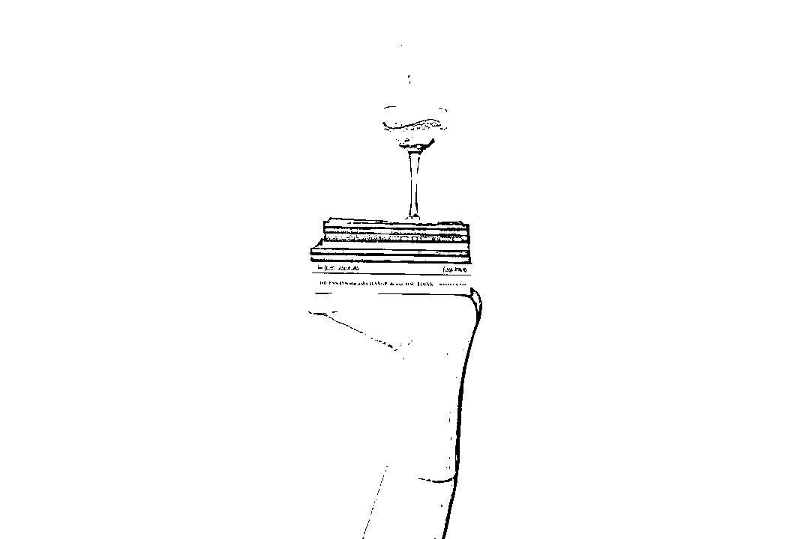

父母工作太忙的时候，可能会把小时候很听话的孩子单独丢在家里。父母或许很高兴孩子这么让人省心，可以自己玩自己的，不需要人陪。或许把课后时间都放在画画、写作或弹吉他上。

他们所学到的就是，**别人不想被打扰，他们可以通过创作来让自己快乐。**如果你是这样的天秤座，那么**这种“习得的模式”就很可能在你后面的人生中留有余波。**

当然也有非常不像天秤座的天秤座。一个例子就是俄罗斯总统弗拉基米尔·普京。他属于受**冥王星/天蝎座/第 8 宫**影响重的天秤座，在他身上，天秤座的主题与天蝎座的控制需求是融合在一起的。天蝎座/冥王星的激烈和强度与天秤座的外交魅力混合在一起。

**这种天秤座的根本议题是信任。**他们不容易信任他人。童年的一些经历或许传递了这样的信息：**人世险恶，没人可以相信。**

普京的父母在他出生之前失去了两个儿子，一个死于疾病，一个在列宁格勒战役中牺牲。他的父亲在二战中受到重伤。所有这些事件带给普京的信息就是，生活是残酷的，成为幸存者不容易。

在 12 岁时普京开始练武，虽然他在大学学的是法律——非常天秤座的专业。他后来加入了克格勃，在 23 岁时成为一名间谍。

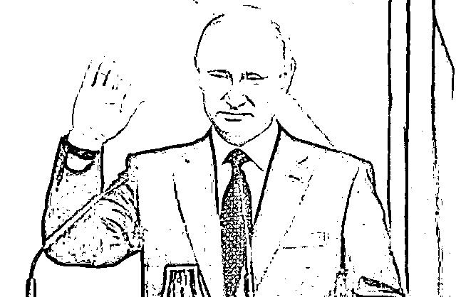

| 普京

撒切尔夫人是另一个天蝎座/冥王星被强调的天秤座。她是连任时间最长的英国首相，也是英国第一位女性首相。

她因其处理政事的强硬作风而被称为“铁娘子”，这当然不是典型的天秤座。在她学习法律并成为一名律师之前，她做过研发药剂师，拥有理学学士学位，专业是 X 射线结晶学——这是天蝎座会感兴趣的。

| 撒切尔夫人

**结合了天蝎座/冥王星特质的天秤座还是会有和普通天秤座一样的建立关系的渴望，只是想要的关系会更有强度。**他们会有某种**强迫性地渴望与人发生激烈碰撞的欲望，想要去深挖别人到底想要什么，他们的真实想法是什么**。

有意识地培养这些天蝎座的能力将有能力更加深入地洞穿人心，揭示别人内心的强大和软弱。

这样的洞察力可以**帮助天秤座建立更多稳固持久的关系，或在谈判中达到目的，从人生的艰难考验中存活下来**。**他们倾向于与人建立更深层的联结，是天秤座里最不愿意终结一段关系的人。**

下面，我们来看一些常见的关于天秤座的负面评价，大家一定都很熟悉。这些负面特质常常根源于童年或青春期时的成长问题：**· 优柔寡断****· 意志薄弱****· 老好人**这三种负面特质是互相关联的。天秤座的犹豫不决简直要把朋友逼疯了！这样优柔寡断是因为他们总在考虑，自己的决定会给生活中那些重要的关系带来怎样的影响。“如果我接受了这份工作，我还有足够的时间陪男朋友或其他朋友吗？”

想要让每个人都开心，会把自己也逼疯！所以，**很多天秤座会在需要做决定时，不停咨询其他人的意见，直到最后自己也无法忍受那股想要“赶紧做”的冲动了，自己对自己恼火得不行。**

比较极端的长期选择困难的情况，往往根源于成长过程中的家庭动力；**因为某种原因，自己做选择的能力被损坏了。**

或许从小父母就包揽了他们的所有决定，甚至是在青春期时，而自己只是扮演想方设法取悦他们的角色。父母或许会为小天秤座的乖巧听话感到高兴，丝毫不会想到他们成年后可能面临选择困难的挑战。

**即便是在由父亲或母亲一方独揽大权的家庭，天秤座小孩也会很努力地调和父母双方的意见。**在这样的环境中成长起来的成年天秤座，要想卸下过度依赖的模式，或在做决定时改变犹豫不决的惯性，都将面临困难。

对大部分天秤座来说，要在个人成长方面取得突破，无意外地，要通过关系来进行——**关系的终结！被拒绝，分手或离婚，会给天秤座的生活带来天翻地覆的改变。**分手之后，所有的事情都受到质疑，所有一切！

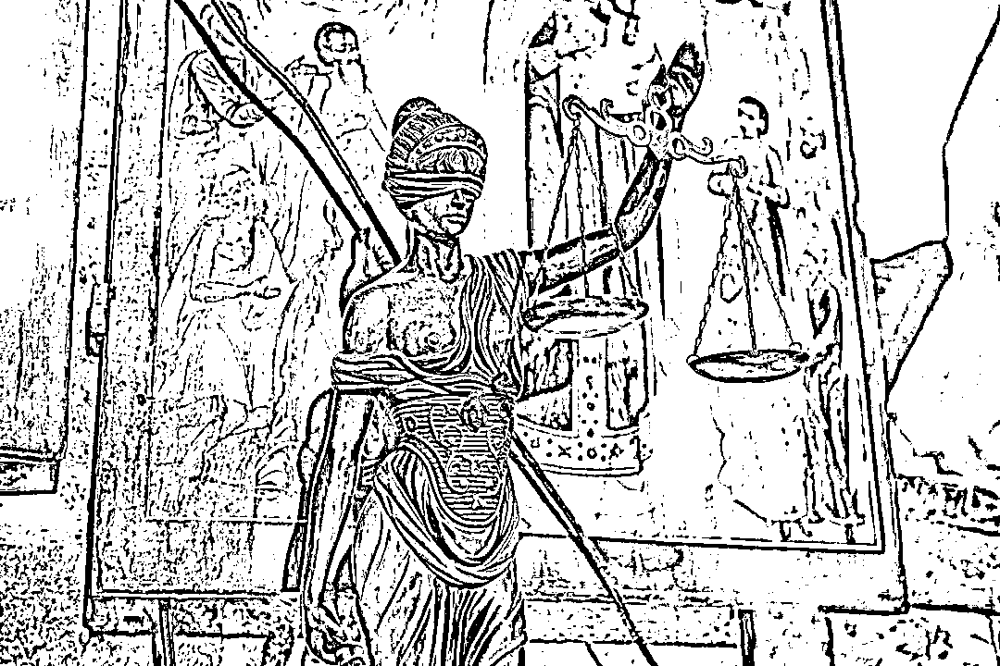

有了这些痛苦不堪、伤痕累累的经历，他们才会意识到自己对每一段感情所付出的时间、努力和能量，觉得生活不公平，并开始感到愤怒！**一个愤怒的天秤座会暂时地向白羊的方向靠拢，这是非常健康的。天平的两端会倾斜摇摆，最终又会恢复平衡。**

**天秤座的事业线索**

**在事业方面，天秤座最明显的特质是搭建关系的能力。****公共关系**是天秤座人的理想职业领域之一。天秤座知道如何取悦于人，也有兴趣了解他人的需求。

从字面意义上看，他们的“外交技巧”真的可以让他们在外交领域一展所长，**外交使节与领事馆人员**中天秤座人的比例比其他星座的人都高，这毫不让人感到意外，特别是那些**需要面对公众或涉及约定、协商的工作岗位**。

事实上，**他们的谈判技巧在商业领域非常受欢迎，特别是在高风险谈判或销售行业——建立关系的才能会为他们带来许多回头客。**

的确，一些天秤座需要注意，**不要在上谈判桌之前就先妥协了，**这对他们来说或许有点难。试图取悦所有人是一个问题，而且会带来很大压力！这是近期我经常从天秤座客户那儿听到的抱怨和体会。

同样，犹豫不决和拖延症也困扰着很多天秤座，所有这些问题都根源于天秤座总是**试图揣测自己的决定和行为会给他人造成怎样的影响**。然而，最终他们会**成为协商的能手，找到双方都满意的途径来实现双赢**，很多天秤座能凭借这种能力在事业上取得成功。作为律师，天秤座可以在谈判桌上一展身手，毫无疑问，**天秤座会非常胜任公司律师的角色。**

其他适合的领域有**营销和广告，特别是那些跟发现大众需求有关的职位。**除此之外，一些天秤座也擅长**以某种能为他人带来快乐的方式，发展自己的创造天分。**他们的审美品味通常颇受赞赏，不过秘密是，**他们很清楚别人会觉得怎样是好的。**

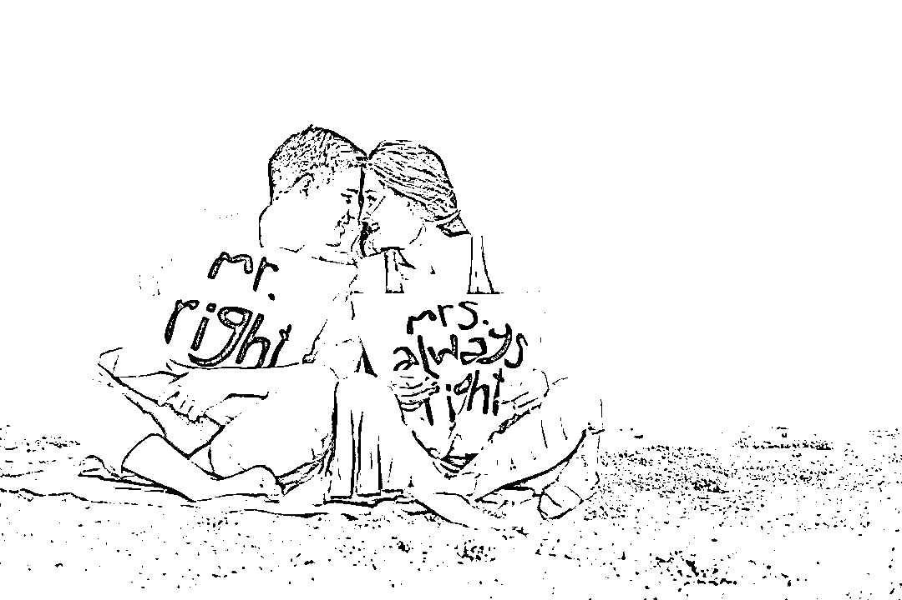

**天秤座天生对人性感兴趣，有一些人会倾向于从事与心理学相关的工作。**作为**天生的咨询师和良好的倾听者**，他们在这一领域有所建树便顺理成章。

同样，他们也适合在公司里承担**人力资源**的工作。不管怎样，在那些人们会带着问题来找天秤座的领域，他们都会有出色的专业表现！

在偏向个人创业的情况里，他们或许会**在一个喜欢的领域扮演“咨询顾问”的角色，与那些寻求洞见和建议的人建立客户关系。**另外，天秤座也可能会**找到生意上或咨询上的“合作伙伴”，来组建专业的机构。**

天秤座和善的性情在所有的领域都是一种资本。**一个“愤怒的”天秤座得问问自己，症结何在？**很有可能**愤怒是一种防御。**幼年遭遇拒绝的经历伤害了天秤座，他们不愿面对未来的风险，依旧沉溺在对过去的愤怒当中。

讽刺的是，这样的行为会招致更多的拒绝，结果愈加阻碍天秤座在事业上获得成功。关键是要**面对早年被拒绝的创伤，这会有助于放下伤痛，化解愤怒。**

**天秤座的爱情线索**

**大多数天秤座是有魅力的，脾气好，通常长相不错，还有一个吸引人的优点是能够认真聆听他人。**天秤座是真的对别人要说什么感兴趣，并且在认真倾听之后可能会给出非常善意的建议。

**他们是天生的心理学家。****会琢磨很多跟人有关的事，去想一个人为什么会成为现在这样，并且会努力跟上关于人类行为和动机研究的前沿理论。**他们最想要的就是**和平**，一段和平的婚姻，一个和平的家庭，一个和平的世界。

没有哪个星座比天秤座更加关心如何处理关系。这不仅适用于结婚，也适用于离婚。我的很多天秤座客户为如何能够和平地离婚，以及跟前配偶保持和平相处的关系伤透了脑筋。

**天秤座就是希望跟每个人都好好的，他们不知道有什么理由要停止对一个人的关心，哪怕和这个人之间的“协议”已经发生了变化。**

关系是天秤座的地盘。**浪漫情事、求爱、约会、婚姻，这些事会占用许多的精力和能量，优先成为生活的重心。**

天秤座的合作天性会给人一种错觉，似乎处理关系对于他们来说比其他星座的人都要容易，这对很多天秤座来说或许是真的，但我也十分确定对更多天秤座人来说，事实并不是这样。部分原因恰恰在于**关系对天秤座实在太重要了。**

**很多天秤座最终会选择围绕身边的关系来建构自己的生活，或是婚姻关系或是商业上的合作关系。**因此，**关系中的选择或决定**会让他们深受其扰**。出了名的拖延根本上是对可能做出错误选择的恐惧。**

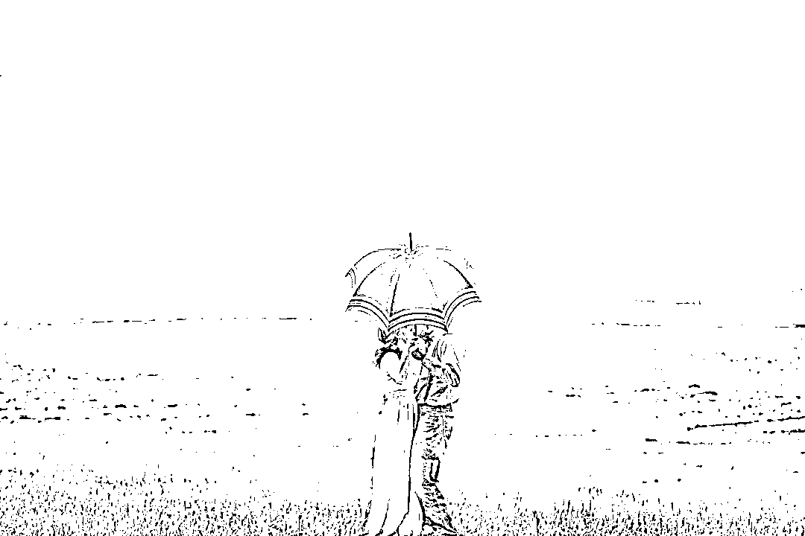

“如果这样行不通呢？”“万一一年后我发现我不是真的爱他（她）呢？”“如果他（她）不爱我了呢？”“如果他们不是我想象的那样，其实跟我设想的大相径庭呢？”

他们也可能会想，“毕竟人总会变化，就算分了又怎样呢！”**对于可能在关系中行差踏错的恐惧，几乎和天秤座建立关系的能力一样强。**

**年轻时他们会四处约会。有些天秤座会非常擅长同时脚踏几条船。**大部分天秤座会为自己协调关系的能力感到骄傲。

所以在年轻时，可能会很享受同时搞定两个男朋友或女朋友的感觉！**当这样的努力最终宣告失败时，他们很有可能回到某位前任的身边，想要和他（她）步入婚姻。**

更糟糕的情况是，**约会对象不再理天秤座了，他们会非常困惑，不知道自己之前的努力都是为了什么。**很有可能天秤座只是**想要去建立一些自信**。建立自信意味着向对方证明，自己是多么擅长给他们带来快乐！

**随着经验的增多，天秤座会认识到盲目取悦别人的不成熟行为会有什么危害，开始带着更多智慧和成熟去行动**。一旦可以带着更多自信经营关系，他们会**更为专一，把目光放到最主要的那段关系中。**天秤座会阅读很多探索人际和关系的书，虽然他们并不希望朋友知道这一点。当天秤座头头是道地分析某两个人在一起配或不配时，身边的人可能听得头都炸了。他们会这么激烈地讨论这件事是因为，他们真的很希望能促成别人关系的顺利进行。**婚姻对天秤座来说是人生大事。某些天秤座会因为害怕这件事带来太大消耗而有意回避，不过大部分会选择结婚。**

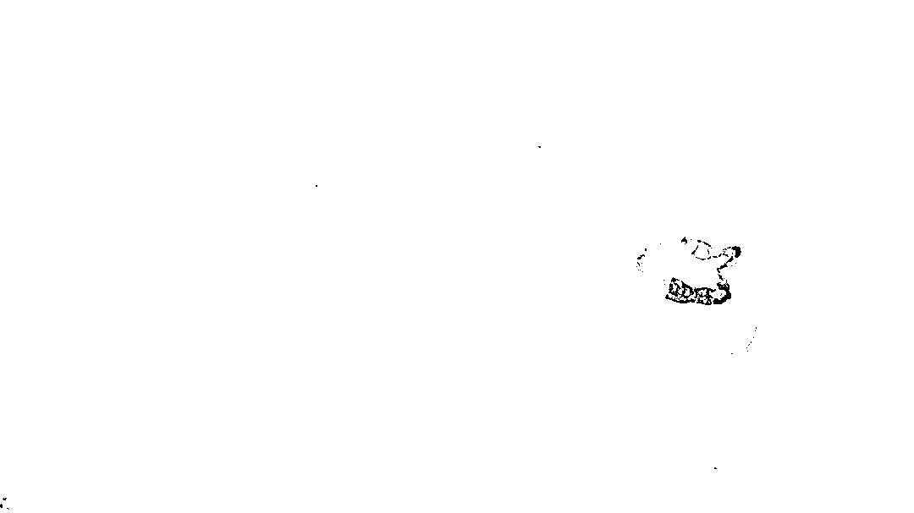

大多数天秤座认为结婚是一件非常自然的事，他们不知道为什么人们会为这件事有那么多困扰。事实上，**拥有幸福婚姻的天秤座真的是非常幸福的人。**当然，相应地，婚姻不幸的天秤座也是比较悲惨的，所以要怎么选择呢？首先，**天秤座需要一个愿意跟自己好好商量事情的伴侣。**

如果他们说话声音很大，总是跟天秤座吵吵，或者总是想要以“他们的”方式来处理问题，或者他们不够精致——所有这些都会让天秤座觉得很倒胃口。

天秤座也喜欢**讨论或智力上的交流**，如果意中人头脑聪明、博览群书，可以跟天秤座进行“友好的”辩论，那么他们或许会成为好伴侣。不过，**总是情绪化地争辩，说话不过脑的人，是完全不会吸引天秤座的。**

**天秤座也会希望你的伴侣不要那么戏剧化。**一点点的戏剧化是刺激的，但过度戏剧化则会让人筋疲力尽。**天秤座希望伴侣是准备好，并且有能力进入一段关系的。**

他们也**不能太过缺乏主见或消极被动**，那也会熄灭天秤座的热情！如果太过顺从，则可能会将天秤座置于与他们竞争的位置，关系变成比赛“谁比谁更好”的游戏。

**最适合天秤座的伴侣应该是能够平等相处的人，可以互相配合；一方面能清楚地意识到个人的利益所在，同时也真心实意地为天秤座的幸福着想。**这样的组合对天秤座来说是一个正确的婚姻选项。

**版权声明：**原创文章由作者授权发布于若道平台，欢迎转发，反对抄袭。友号转载请申请白名单。

**END**

****想阅读更多作者的文章，请在后台回复******大卫****** 即可。****

**大卫·瑞雷**

美国占星师，若道联合创始人，致力于在中国教授和推广西方占星学；2010-2014 年，任全美占星师联盟监督委员会委员；2017 年，被选为 ISAR 委员会成员。ISAR 是世界最大的国际占星机构，会员遍布 45 个国家，2017-2020 年曾任 ISAR 全球副主席、CAPISAR（ISAR 职业占星师资质认证机构）主席。

**拥有****51 年****占星实践经验的****若道创始人****前 ISAR 全球副主席****前 ISAR 全球职业占星师资质认证主席****大卫·瑞雷**

**和**

**2019 年第二届、2021 年第三届核心课中**

**与苏·汤普金斯老师****联合授课****的**

**ISAR 认证职业占星师**

**咔咔（Caroline）**

**二人合力打造**

**2022 年 ****若道全新核心占星课程**

**点击下图了解更多课程详情** 

**

**20 位来自世界各地的占星师****带来 19 场沙龙——新世界的觉醒****详情可点击下图**

**学习占星学****点击下图了解课程详情**

**微信又双叒叕改版啦，不想错过若道君的推送？**
**就把若道设为星标吧！****▼**

**喜欢就点一下“在看”吧！**

********报名直达入口********

# 医疗占星学丨 12 星座被截夺，都有哪些健康隐患？

> 原文：[`mp.weixin.qq.com/s?__biz=MzA5NjA0NTAxNg==&mid=2651482675&idx=2&sn=a7321ab835764abcfd225cb5401ac029&chksm=8b48d884bc3f519277d8fa27902933f2a3ba6f2504da7e2e99816fa6ec4b13fce47899512d99&scene=126&sessionid=1692737776#rd`](http://mp.weixin.qq.com/s?__biz=MzA5NjA0NTAxNg==&mid=2651482675&idx=2&sn=a7321ab835764abcfd225cb5401ac029&chksm=8b48d884bc3f519277d8fa27902933f2a3ba6f2504da7e2e99816fa6ec4b13fce47899512d99&scene=126&sessionid=1692737776#rd)

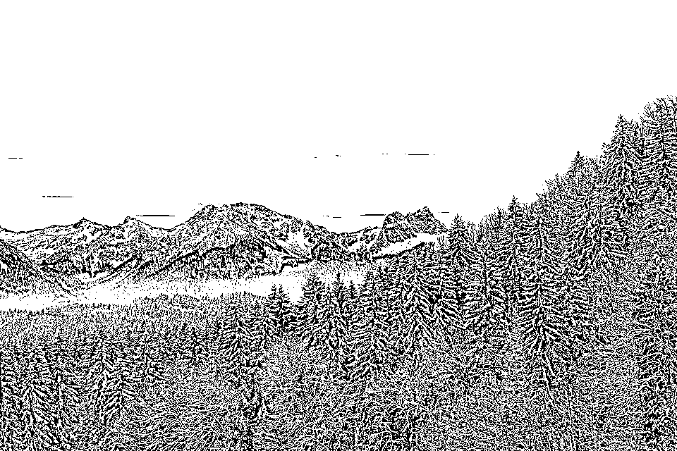

作者/林恩·柯纳译者/王倪明 校对/JUN 编辑/翀子 封面/书君 图片/网络当谈到星图里被截夺的星座时，我们很少将它们和身体健康联系在一起，而在这篇文章中，作者通过多年的观察实践，总结出截夺星座的能量如果没有被发挥，便会影响我们的健康。这是一个新颖的角度，或许能给大家提供一些新思路。另外，如果你对健康感兴趣，也可以点击[【医疗占星学】](http://mp.weixin.qq.com/s?__biz=MjM5MjQwNjAyMQ==&mid=2649440025&idx=5&sn=8ae86d54a9e9311d2b9433ab655b1fcc&chksm=beb9507389ced9653b2a09cd180d7577821674e35ce8acd14ce9c8575903fb5c166237af99f2&scene=21#wechat_redirect)了解课程详情哦~

在我 50 年的研究和经验中，我发现一个**截****夺星座**（当然还有位于截夺星座的行星）**可以为可能的健康问题提供强有力的线索，****特别是当这个星座的能量未能明显发挥时。**任何心理层面的挫折或挫败都可能体现于生理层面。

**（****若道君：截夺就是一个宫位把一整个星座包含在里面，或者说一个宫位，它跨了三个星座，而中间那个星座就是被截夺的星座。****）**

**截夺星座与健康**

在占星执业的早期，我推荐使用生化细胞盐对治截夺星座而非上升或太阳星座。多年后我的推荐被证实有效。

我曾建议一位上升摩羯座、水瓶座在第一宫被截夺的朋友使用生化细胞盐氯化钠，即单纯的食盐。她说，自己所有的血液测试都测出低血钠，而从美国人饮食的用盐量来看，这种情况十分罕见。

举个例子，**我的个人星图中第 10 宫宫头是金牛座**27 度，双子座在第 10 宫截夺，且该宫内有 3 颗被截夺的双子座行星。

**在事业上，我的自然倾向是走金牛座的道路**。上大学时，我主修经济和金融。我有通过经济学考试的天分，但仅限于此。

**我****双子座的才华最初没有被承认**。结果，在主修商业的大学第一个学期，我就**患上了双子座的健康问题**，即窦性过敏。随着学业的继续，过敏越来越严重。

当我离开大学去追求占星学时（在高中我就把占星当爱好来学习），我还没能解决我认为自己应该做的事情与自己真正想做的事情之间的冲突。

过敏依旧继续。但是，在 1969 年我成为一名全职占星师后，过敏问题开始好转。当时我所有的咨询都通过邮件与电话进行，这种方式否认了双子座需要与人直接接触的需求。虽然过敏大为改善，但依旧顽固。

在我最终开始进行面对面的咨询后，**过敏发作终止了。****那一刻，我在事业上完全地展现了双子座的能量。**

有意思的是，我童年时期并没有出现过敏。记住，**当一个星座被截夺时，它的对宫星座也会被截夺。**我有天蝎座在第 4 宫宫头，我确实经历了独生女与专横母亲之间所特有的操控情境。

**但被截夺的射手座却在那些年获充分发挥了出来。**我生活在农场，拥有不少人身自由。搬去城里上大学后，我射手座式的体验结束了，过敏立即发作。

这段经历证实了我的理论，**即为了避免与被截夺星座有关的健康不良，至少有一个被截夺星座必须发挥作用。**直到今天，被困住、被禁锢的感觉，以及社交接触受限的时候，都会给我的免疫系统造成压力，从而触发过敏。

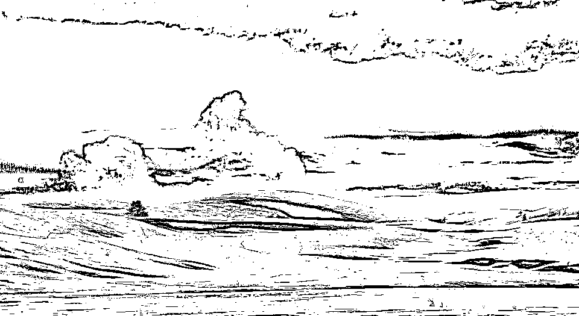

**12 星座被截夺的健康问题**

**宫头*****白羊座*****（金牛座被截夺）**

白羊座的不耐烦会打乱生活中的现状与安全感。白羊座会在宫位中制造危机，而金牛座希望境况保持不变。**未表达的愤怒会影响血糖浓度**并造成咽喉炎症。适合金牛座的细胞盐是硫酸钠。

**宫头*****金牛座*****（双子座被截夺）**

选择更有安全感、阻力最小的道路，而不是自由、改变、多样化及直接与人打交道，这会造成**过敏**和**呼吸道疾病**。适合双子座的细胞盐是氯化钾。

**宫头*****双子座*****（巨蟹座被截夺）**

（由该宫位掌管的）生活中持续不断的变动打乱了安稳与亲密的需求。当个人发现这些变动令他没有充裕的时间参与该宫位的事物，会引发**胃病**和**消化不良**。适合巨蟹座的细胞盐是氟化钙。

**宫头*****巨蟹座*****（狮子座被截夺）**

在关系或情境中扮演依赖的小孩角色，而不去寻求尊重与权威感，会造成**心脏**和**循环系统**疾病。适合狮子座的细胞盐是磷酸镁。

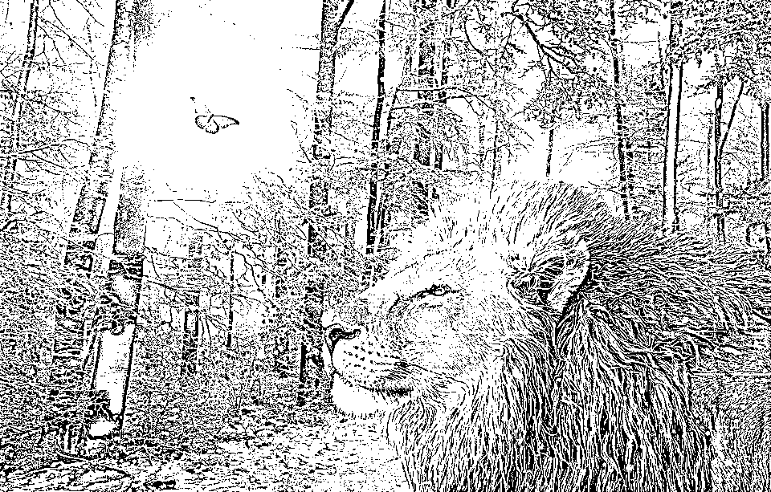

**宫头*****狮子座*****（处女座被截夺）**

人可能觉得自己被迫肩负责任，实际上他更愿意担任从属的角色，照料细节、不出风头。这种张力会造成**低血糖、肠道炎症、便秘或腹泻**，或者因内心挫折感形成的**不良饮食习惯**（可说是让你的“肠子在骚动”）。

回避细节并让它们破坏你的宏大计划，这会引起不平衡。适合处女座的细胞盐是硫酸钾。

**宫头*****处女座*****（天秤座被截夺）**

处女座的批判性倾向会使个人无法接受人、事的本来面貌，令其无法与他人成功建立联系、分享与合作。通过服务他人、凭一己之力做到完美来获得赞许的这种需求，会阻碍分享与互惠。

这种组合让个人在该宫位的某些创造性方面变得过于挑剔（害怕失败或被拒绝）。这有可能引发**糖尿病、低血糖或酸碱失衡**。适合天秤座的细胞盐是磷酸钠。

**宫头*****天秤座*****（天蝎座被截夺）**

在你的生命中，你需要在这个宫位的议题上坚守控制权。在该领域过分迁就会制造压抑的怨恨，当你试图讨好他人而非为自己掌控时，可能会造成**肾脏**及膀胱感染、动脉硬化及其他天蝎座疾病。适合天蝎座的细胞盐是硫酸钙。

**宫头*****天蝎座*****（射手座被截夺）**

渴望掌控权或感觉被该宫位的内容控制，会让个人无法在该领域体验自由和自发性。感觉被困会导致坐**骨神经痛、呼吸道疾病**并易出事故。适合射手座的细胞盐是硅石。

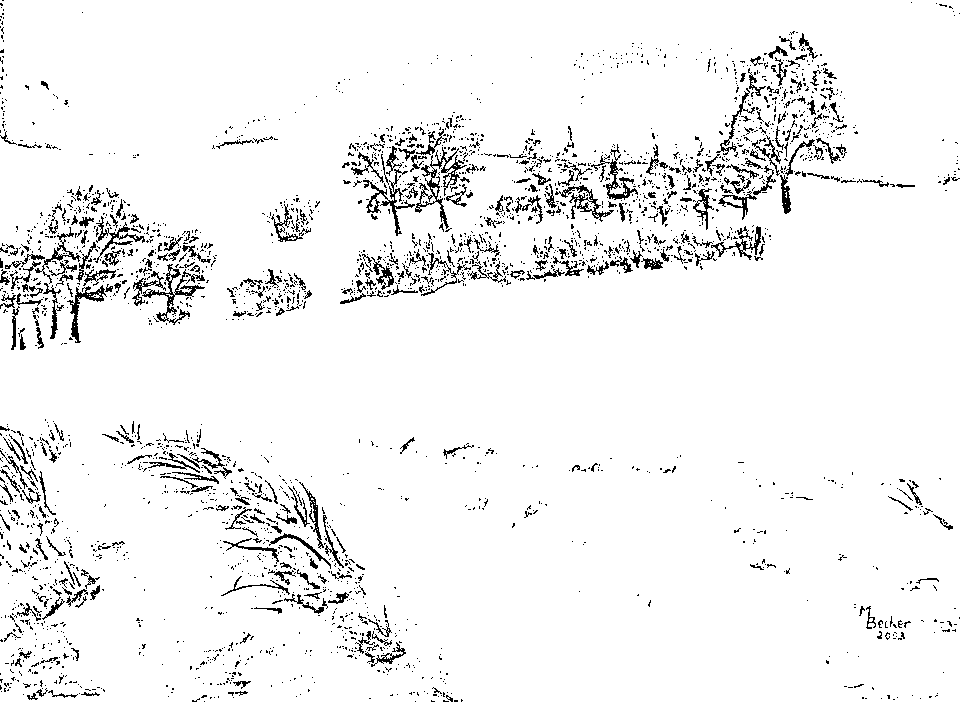

**宫头*****射手座*****（摩羯座被截夺）**

获得自由独立的代价是损害安全感。个人很可能与其野心脱节，他可能难以达成任何永久或安全的事。

如果上升点在射手座，而水瓶座在第二宫宫头，其个性和个人财务均会出现波动。这可能会导致**风湿、关节和皮肤问题。**适合摩羯座的细胞盐是磷酸钙。

**宫头*****摩羯座*****（水瓶座被截夺）**

对保障的强烈欲望压制了对独立和自由的需求。摩羯座害怕依赖他人，恐惧无助失落，他们甚至担心自己陷入需要依赖的境地——一个工作、一段关系或一种财务状况。

在该宫位的领域失去自由会导致**低血钠、高血压和循环问题**。适合水瓶座的细胞盐是氯化钠。

**宫头*****水瓶座*****（双鱼座被截夺）**

水瓶座客观、科学、非黑即白的观点可能与双鱼座的幻想倾向不符。这样的组合往往通过该宫位中的人道主义或慈善活动来解决，个人需要培养与该宫位事物的感觉与共情。

双鱼座的健康问题可能由于**压抑情绪**造成，比如**水潴留、高血压或普遍活力低下。**适合双鱼座的细胞盐是磷酸铁。

**宫头*****双鱼座*****（白羊座被截夺）**

当一个“好人”，而非做自己想做的事，以及在某种情况下不坚定，会导致**紧张性头痛、酸碱失衡或动脉硬化。**适合白羊座的细胞盐是磷酸钾。

**注：**据我所知，下列截夺不会发生在上升点：宫头金牛座时双子座被截夺、宫头巨蟹座时狮子座被截夺、宫头处女座时天秤座被截夺、宫头天秤座时天蝎座被截夺，以及宫头天蝎座时射手座被截夺（除在特定纬度的上升点天蝎座 29 度外）。

**版权声明：**文章由若道翻译发布于若道平台，欢迎转发，反对抄袭。友号转载请申请白名单。

**END**

**林恩·柯纳**

自 1969 年 6 月起成为全职占星师。

诺·泰尔《占星学的具体度量》（*ASTROLOGY’S SPECIAL MEASUREMENTS* ）作者之一。

**ISAR 选修课【医疗占星学】上线**

**医疗占星学是一个强大的工具，同时洞察的身体和心理过程，通过更多的自我认知照顾和关爱自我和身边的人。**

**本课程既适合医疗占星学的初学者，也适合已经有一些相关经验的人****。**简·里德·帕特里克老师将运用现实生活中的例子，揭示一个人的性格、症状及其星图是如何相互映照的。课程也会探讨疾病的意义以及可能的治疗方法。

**本课程旨在为学员提供一个运用医疗占星学的框架和方法，**学员将会学到一些有价值的实用工具，在课程结束后，自己使用这些工具研究其中的关联性。

**此课程可作为 ISAR 选修课。**

**授课老师**

****简·里德·帕特里克 **博士******

**（Jane Ridder-Patrick）**

简接受过药剂师、理疗师、草药师、心理治疗师和历史学的专业学习，从事写作、咨询和讲学工作，在英国和全球教授占星学及其历史、当今的心理学和医学应用。她在爱丁堡执业，在爱丁堡大学获得博士学位，研究方向是 17 世纪苏格兰占星学历史。

**她最著名的出版物是《医疗占星手册》。2018 年，她因对医疗占星学的贡献而获得了著名的查尔斯·哈维占星学杰出服务奖。**

**对医疗占星学有兴趣？**

**点击下图了解更多详情吧**

**

**微信又双叒叕改版啦，不想错过若道君的推送？**
**就把若道设为星标吧！****▼**

**喜欢就点一下“在看”吧！**

********报名直达入口********

# 2022 年若道 ISAR 选修课 | 《医疗占星手册》作者亲授

> 原文：[`mp.weixin.qq.com/s?__biz=MzA5NjA0NTAxNg==&mid=2651482675&idx=3&sn=26429fc130cdb3c8b53f7d4f1d7c88e9&chksm=8b48d884bc3f51929c1263c51f15f5a0b05d709563534b83b580cc8da7014c3fb83b8c797cba&scene=126&sessionid=1692737776#rd`](http://mp.weixin.qq.com/s?__biz=MzA5NjA0NTAxNg==&mid=2651482675&idx=3&sn=26429fc130cdb3c8b53f7d4f1d7c88e9&chksm=8b48d884bc3f51929c1263c51f15f5a0b05d709563534b83b580cc8da7014c3fb83b8c797cba&scene=126&sessionid=1692737776#rd)

**有四个主要因素影响着我们的生活和健康：基因构成、物质环境、情绪环境，以及我们的占星配置。我们在星图中都存在患病的可能性，而预防的方法在于尽可能充分、真实和健康地生活。****——简·里德·帕特里克****（Jane Ridder-Patrick）博士**

占星学就像心灵的 X 光片。它可以描述个人对世界的看法和反应。我们越不了解自己的天性，面对生活中的挑战，我们就会有越少的选择。

**“占星学可以精准定位需要解决的潜在问题。”**

**医疗占星学是一个强大的工具，同时洞察的身体和心理过程，通过更多的自我认知照顾和关爱自我和身边的人。**

**本课程既适合医疗占星学的初学者，也适合已经有一些相关经验的人****。**简·里德·帕特里克老师将运用现实生活中的例子，揭示一个人的性格、症状及其星图是如何相互映照的。课程也会探讨疾病的意义以及可能的治疗方法。

**本课程旨在为学员提供一个运用医疗占星学的框架和方法，**学员将会学到一些有价值的实用工具，在课程结束后，自己使用这些工具研究其中的关联性。

**此课程可作为 ISAR 选修课。**

1

**课程安排**

**课程时间：2022 年 9 月 20 日-11 月 8 日  每周二 20:00-22:00**

**第*****1*****讲  9 月 20 日 与占星学、心理学、病症一起工作**

*   医疗占星学的组成部分以及如何使用它们

*   行星的作用与相互作用

*   黄道星座人

*   宫位的重要性

*   疾病和健康是如何产生的

**★ 第二、三、四讲的课程内容基于星座以及它们之间的相互作用。**

**第*****2*****讲  9 月 27 日 基本星座**

学习基本大十字星座——**白羊座、巨蟹座、天秤座和摩羯座**——及其功能和相关的健康问题。**这些星座与防御、养育、结构、体内平衡和荷尔蒙控制有关。**

****第*****3*****讲  10 月 4 日 固定星座****

学习固定大十字星座——**金牛座、狮子座、天蝎座和水瓶座**——及其功能和相关的健康问题。**这些星座与习惯和反射、心脏调节、生存、循环和协调有关。**

“固定星座（金牛座、狮子座、天蝎座和水瓶座）在情感和生理上都倾向于**‘难以放手’**，这可能为恶性肿瘤的生长创造环境。所以说，他们可能倾向于沉浸在过去的伤害中，难以自拔。另一方面，这些星座也擅长在艰难的时期坚持不懈并一直**持之以恒**。”——简·里德·帕特里克（Jane Ridder-Patrick）博士

**第*****4*****讲  10 月 11 日 变动星座**

学习变动大十字星座——**双子座、处女座、射手座和双鱼座**及其功能和相关健康问题。**这些星座与呼吸、神经系统、肠道、睡眠以及信息、情感和行动的整合有关。**

**★ 第五、六、七、八讲重点学习行星，它们在身体层面的表达、它们的相位与行进。**

**第*****5*****讲  10 月 18 日 太阳与月亮**

**太阳**掌管视觉、活力、心脏和意识，与心脏、脊柱和视觉问题相关。**月亮**掌管人体的周期，特别是月经周期、饮食模式和体液，与情绪引起的疾病、饮食失调和胃病相关。

**第*****6*****讲  10 月 25 日 土星与天王星**

**土星**掌管着皮肤、骨骼、牙齿和衰老过程。它对应的疾病包括慢性疾病、耳聋、帕金森病、关节僵硬和牙齿问题。**天王星**代表身体活动的协调，有节奏的脉动和身体的“电”。与天王星相关的疾病包括癫痫、痉挛、心律失常，以及阿斯伯格综合症和自闭症样综合症。

**第*****7*****讲  11 月 1 日 海王星与冥王星**

**海王星**掌管松果体、细胞膜渗透和右脑功能，与过敏、上瘾的病症、慢性疲劳综合症和睡眠障碍相关。**冥王星**掌管消除和转化，其病理包括毒性、脓肿、癌症和强迫症。

**第*****8*****讲  11 月 8 日 火星**

**火星是与能量和防御相关的行星**，掌管免疫系统、肾上腺功能、肌肉活动和炎症反应。**它是许多身体和情绪障碍的核心**，如自动免疫障碍、抑郁和发烧，以及由手术或需要手术引发的问题。

2

**此次课程适合哪些人？**

*   有一定占星学基础，若道核心课 L3 以上水平；

*   希望成为优秀的占星师，想要借鉴国际大师医疗占星解读思路并融入自己的体系的人；

*   热爱占星学、健康、养生的研究型占星学者；

*   计划考取 ISAR 认证占星师，寻觅中意选修课的学员；

*   走在自我探索和个人成长道路上的人。

**快来和简·里德·帕特里克老师学习升级版的占星学身体地图吧！**

3

**授课老师**

**简·里德·帕特里克 **博士****

（Jane Ridder-Patrick）

简接受过药剂师、理疗师、草药师、心理治疗师和历史学的专业学习，从事写作、咨询和讲学工作，在英国和全球教授占星学及其历史、当今的心理学和医学应用。她在爱丁堡执业，在爱丁堡大学获得博士学位，研究方向是 17 世纪苏格兰占星学历史。

**她最著名的出版物是《医疗占星手册》。2018 年，她因对医疗占星学的贡献而获得了著名的查尔斯·哈维占星学杰出服务奖。**

《医学占星术手册》（第二版，修订版和扩充版）

(爱丁堡，克拉布出版社，2006 年)

4

**课程信息**

*   **课程时间：**2022 年 9 月 20 日开始，每周二晚上 8 点，每周一次，共 8 次课。

*   **授课方式：**线上直播，英文授课，中文翻译

*   **课程价格：****6800 元**

*   **早鸟价：5800 元（截止日期：2022 年 8 月 23 日）**

*   **课程咨询：**王老师（微信：18510107057，请备注“医疗占星”）

长按二维码添加王老师

5

**退转课程**

*   **退款原则请详看《教学协议》，如有疑问请咨询课程顾问。**

****医疗占星****

**授课老师：**简·里德·帕特里克

**授课时间：**2022 年 9 月 20 日起

**授课方式：**网络课程**，**英文授课，中文翻译

**费用：****6800 元****（早鸟价：5800 元，2022 年 8 月 23 日截止）**

**课程负责人：****王老师**（微信：18510107057，请备注“医疗占星”）

长按二维码添加课程负责人咨询~

****报名请点击“阅读原文”****

# 狮子座新月 | 免费新月报告，开启你的英雄之旅！

> 原文：[`mp.weixin.qq.com/s?__biz=MzA5NjA0NTAxNg==&mid=2651482509&idx=3&sn=b8a19b32504e33158311eefb8eef8c03&chksm=8b48db3abc3f522c10afc265aa2ec8dbaad987a811c24f9a7ffd1fde2d578f7b31dc73207016&scene=126&sessionid=1692737776#rd`](http://mp.weixin.qq.com/s?__biz=MzA5NjA0NTAxNg==&mid=2651482509&idx=3&sn=b8a19b32504e33158311eefb8eef8c03&chksm=8b48db3abc3f522c10afc265aa2ec8dbaad987a811c24f9a7ffd1fde2d578f7b31dc73207016&scene=126&sessionid=1692737776#rd)

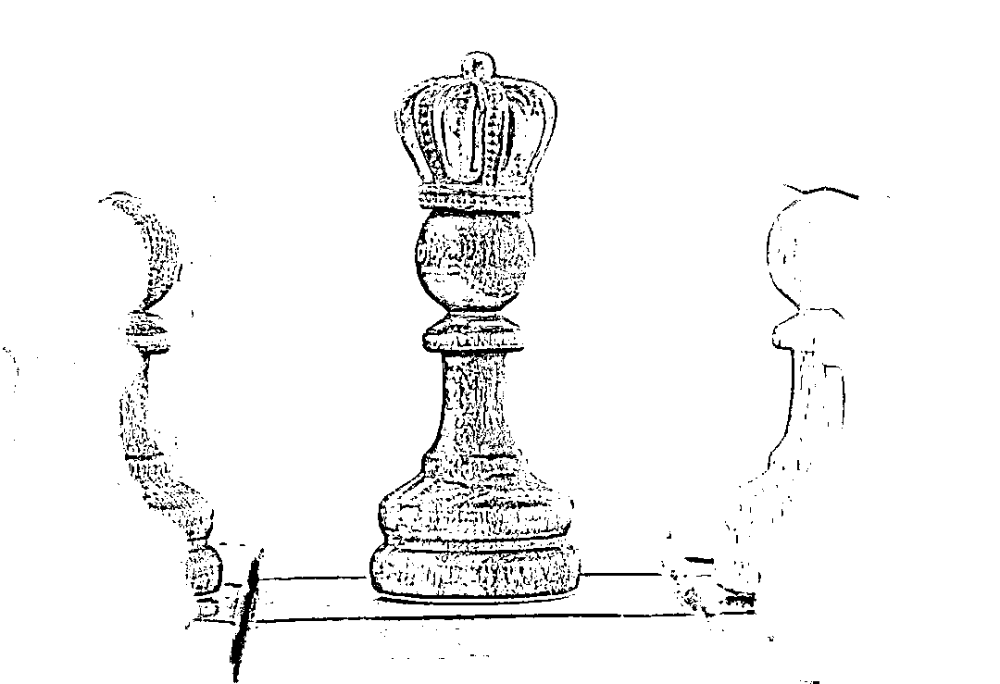

北京时间 7 月 29 日 1:54，新月发生在狮子座 5°38′。每到新月时分，若道君都会为你奉上根据你出生星图量身打造的免费新月报告。可是新月为什么要许愿？新月报告该如何领取？让若道君来教你。

　**什么是新月？**　

从占星学看，新月是月亮周期的一种相位。新月是开始，又称为朔，对应中国农历初一，太阳、月亮在此时合相。此时月亮运行到太阳与地球之间时，月亮以黑暗的一面对着地球，并且与太阳同升同落，地球上看不见月亮。

本次新月时间

**7 月 29 日 1:54，新月发生在狮子座 5°38′。**

为什么新月要许愿？

新月是一个周期的开始，新月发生的时候，太阳与月亮合相，能量很强。当新月出现时，你也许会发现灵感忽现，非常适宜开启新领域、项目与行动，缔结一段新的关系或合作。许愿会加强新月的能量，也有助于你了解自己现阶段适合开启的方向。 

本次新月最佳许愿时间从新月开始到其后的 48 小时内，许愿的力量最强。**最佳许愿时间：7 月 29 日 1:54-7 月 31 日 1:54**

属于你的免费新月报告每到新月时刻，看着占星文章里写着：看看你新月的宫位，如果新月在第 X 宫，你可以许愿的方向是……是不是常常一头雾水？新月的宫位？我到底该看哪里啊？而有时，那些标注上升星座的文章也会让你忍不住想：虽然我的上升星座是这个，可是我的新月好像并不落在你说的宫位啊？你是不是写错了？

虽然这些文章都没有写错，可是好像对你而言都太不友好了。**Don't Worry！**别着急，让博学又体贴的若道君来帮你！我们推出了一份**免费**又**好用**的新月报告！而且是专门为你设计的哦，**根据你出生星图为你量身打造的，只****属于你的独家新月报告**。报告有哪些内容？**新月时间****最佳许愿时间****如何许愿 **属于你的**许愿关键词**本次新月给你的**建议**你会有怎样的**感受 ******机会****

********

如何许愿？许愿方式也很简单。你可以把愿望写下来，或者双手合十后交叉，闭上眼睛来祈祷。 报告中会为你提供**祈祷词示例**，可以多多参考哦～ 你还可以适当添加自己的语言，创造属于你自己的祈祷文！如果报告拿到手了，快对照着许愿吧！

**这份好用又暖心的报告，点击****阅读原文****即可领取！**

****

****点击“阅读原文”即可获取新月报告****

# 早鸟价倒计时 4 天 | 大国命运：经世占星学 3 天线上工作坊

> 原文：[`mp.weixin.qq.com/s?__biz=MzA5NjA0NTAxNg==&mid=2651482509&idx=4&sn=b80a91a3b3fb7d05f650263734207cfb&chksm=8b48db3abc3f522c4d567a04959da1e682284d708b46ef08aff9968bf0da28629b1a90573cf3&scene=126&sessionid=1692737776#rd`](http://mp.weixin.qq.com/s?__biz=MzA5NjA0NTAxNg==&mid=2651482509&idx=4&sn=b80a91a3b3fb7d05f650263734207cfb&chksm=8b48db3abc3f522c4d567a04959da1e682284d708b46ef08aff9968bf0da28629b1a90573cf3&scene=126&sessionid=1692737776#rd)

<mpvideosnap class="js_uneditable custom_select_card channels_iframe videosnap_video_iframe" data-pluginname="videosnap" data-id="export/UzFfAgtgekIEAQAAAAAAfGQB6vQCmQAAAAstQy6ubaLX4KHWvLEZgBPEioJES3BsLK2DzNPgMIsb3nmx3ZXbJKLT1wm45TIu" data-url="https://findermp.video.qq.com/251/20304/stodownload?encfilekey=S7s6ianIic0ia4PicKJSfB8EjyjpQibPUAXolorph7kXX0G2V8DGSvfR9PkwwbPmosvYicRybibaBiaVv5A38Bc5Re8nsYStXZD7nqrhjvCib7Z8iaC9vlXIpibAjFAuw&amp;adaptivelytrans=0&amp;bizid=1023&amp;dotrans=0&amp;hy=SH&amp;idx=1&amp;m=&amp;scene=0&amp;token=AxricY7RBHdWxX5EuW79OcFLEojiajUVbfrb10projcwzwun3SBUDgOHcwIaMibQEFyWZc9dNWComE" data-headimgurl="http://wx.qlogo.cn/finderhead/PiajxSqBRaEJYnVsqWfEX9qA0sI6hNVKsDfyzfPZ92WZMZyBpZWU5NA/0" data-username="v2_060000231003b20faec8c4e68a1ec2d4ca07e434b07755bbf47e7053a3059defd2c9d6c68a20@finder" data-nickname="若道" data-desc="#ISAR 选修课 经世占星学是什么？会教授哪些知识内容？8 月经世占星工作坊，来提前了解一下" data-nonceid="3653579416430381618" data-type="video" data-width="640" data-height="368"></mpvideosnap>

有一些岁月经历的人，会非常清晰地看到，我们每个人的命运都和国家的命运紧密联系在一起。

以俄国人为例，不论每个俄国人有什么样不同的个人星图，31 年前的苏联解体，今年发生的乌俄战争这样重大的事件，毫无疑问影响了俄国 2 代人的命运。而在一些关键时间点个人的选择，毫无疑问，又影响了个人的生命历程。

而只要你关注世界局势，你也会看到，这样的一个国家发生的重大事件又会对其他国家的各个方面发生重要影响。

我们的命运、我们所获得的事业的发展机会、我们的财富机会都是和整个时代和国家息息相关。

**因此，一个好的占星师必须要懂得时代的声音，必须要洞悉全球的趋势，必须要懂得国家的故事。**

在这个工作坊中，我们将学习**如何专注于能够理解世界大事并对它们做出准确的预测。**这将带领我们踏上**一段重要的行星周期之旅，并延伸到重要国家和世界领导人的星图。**现在正是学习的好时机！

2020 年 12 月，木星与土星合相，这是 800 年来这两颗行星首次在水瓶座合相，预示着地球以及政治和社会趋势将发生巨大变化。我们正在进入一个令人兴奋的奇境，非常适合探索经世占星学。

邓肯老师说：

****

**学习经世占星学，我们可以依靠占星师们过去使用一些技法所做的预测，我们将在这个工作坊中进行探索。**

**比如：占星师迈克尔·贝金特在 1982 年，苏联解体事件发生 7 年前，就对苏联做出如下预测：**

**“从 1989 年 1 月到 1991 年 11 月……在领导和统治风格方面……国家将进行一些基本的重组。这一时期将预示着一些新的革命……严密的控制结构将失败，国家将崩溃，重新回到过去的众多自治国家。”**

**而占星师罗伯特·佐勒在世贸中心遭到袭击前一年的 2000 年写道：**

****“从 9 月份开始，我们西方正进入一个危险加剧的时期……尤其是在东海岸……这将招致乌萨马·本·拉登等冒险家的劫掠……这是一个警钟……2001 年 9 月第一次大危机袭击美国之后，我们将再也回不到从前了。”****

**在 2020 年美国大选前 6 个月，我也写了一篇文章：**

****“他（唐纳德·特朗普）将战斗到底，美国的街道将成为战场，他不会优雅地离去，但在 2021 年，一个新时代开始了，大海将覆盖特朗普总统任期的废墟。”****

出生星图和经世星图都使用相同的基本占星技法，对每一个主题的研究都同时丰富了这两个分支。你从观察世界大事中学到的东西，可以应用到个人客户身上，反之亦然。

**工作坊内容和时间安排**

**8 月 26 日 周五 **

**14:30-15:30**

**1. 基础知识介绍**

-外行星及其在各个星座运行

-外行星周期

-国家星图

-政治领导人星图

-选举星图

-将以上各项按优先级排序

**休息 30 分钟**

**16:00-17:30**

**2. 外行星及其在各个星座运行**

-天王星入座：革命性的变化

-海王星入座：意识的转变

-冥王星入座：危机与重生

**休息 90 分钟**

**19:00-20:30**

**3. 木星-土星的合相周期**

-文明的发展

-水瓶座新电子化时代

**休息 30 分钟**

**21:00-22:00**

**4. 木星与外行星的互动**

-木星-天王星：科技进步

-木星-海王星：媒体的力量；消融，受苦和慈悲

-木星-冥王星：意识形态极端主义

**8 月 27 日周六**

**14:30-15:30**

**5. 了解社会趋势**

-土星-天王星：新的如何取代旧的；科技重组

-土星-海王星：乌托邦梦想破灭；结构消融

-土星-冥王星：独裁与权力瓦解

**休息 30 分钟**

**16:00-17:30**

**6. 长期文明变革**

-天王星-海王星：新世界秩序的梦想

-天王星-冥王星：机械的变革力量；剧变

-海王星-冥王星：意识变化的 492 年周期

**休息 90 分钟**

**19:00-20:30**

**7. 20 世纪地缘政治力量的影响**

-俄罗斯、苏联时代及其衰落

-美国的故事

**休息 30 分钟**

**21:00-22:00**

**8. 中国**

-中国作为全球玩家出现

-科技、领导力和一带一路

**8 月 28 日周日**

**14:30-15:30**

**9. 行星推进的重要性**

-预测选举的结果；特朗普 - 拜登

-预测国家的发展：以色列

-美国：扩张与收缩

**休息 30 分钟**

**16:00-17:30**

**10. 有多张星图的国家**

-英国

-法国

-沙特阿拉伯

**休息 30 分钟**

**19:00-20:30**

**11. 统治者的出生星图**

-普京：克格勃军人，2020 年代的发展

-特朗普：虚假信息之王，获胜者与失败者

**休息 30 分钟**

**21:00-22:00**

**12. 21 世纪的世界发展**

-新时代的人口和气候变化

-独立与全球化

-宗教与科学

-人际关系与游戏

**授课老师**

**艾德里安·罗斯·邓肯（Adrian Ross Duncan）**

**·** 邓肯老师 1971 年在印度游学时开始学习占星学，1985 年开始成为全职占星师，迄今执业已超过 33 年，是人本主义占星学、卜卦占星学和经世占星学领域的知名占星师。

**·** 开发了占星软件 AstroClock 和多款占星报告。

**·** 从 1971 年开始研习佛学，受佛学影响很深，他相信占星学和佛学观点统一、转化的一个基础是在于对现实感知的改变。

**授课方式**

**授课方式：**

**线上网络直播课，英文授课，中文翻译**

**课程价格**

**课程价格：**

**正价：6800 元**

**早鸟价：5800 元**

**早鸟价截止日期：2022 年 8 月 1 日**

负责人：若道-童童

（微信：nodoorDaivd）

**退转课程**

**退款原则请详看《教学协议》，如有疑问请咨询课程顾问。**

****ISAR 选修课 | 大国命运：经世占星学 3 天线上工作坊****

**授课老师：******艾德里安·罗斯·邓肯****

**工作坊时间：2022 年 8 月 26 日-28 日（**周五-**周日）**

**授课方式：******网络授课，英文授课，中文翻译****

**费用：****正价：6800 元****（早鸟价 5800 元，8 月 1 日前）**

**课程负责人：童老师**（微信：nodoorDaivd，请备注“经世工作坊”）

长按二维码添加课程负责人咨询~

****报名直达入口****

# 经世占星沙龙丨用美国星图了解经世占星学

> 原文：[`mp.weixin.qq.com/s?__biz=MzA5NjA0NTAxNg==&mid=2651482509&idx=2&sn=480eb61ff6626a3f811fd504d4bac750&chksm=8b48db3abc3f522cbd1d60d5466238844802927e6712b251893d645061d63dd2bf8ae60aab78&scene=126&sessionid=1692737776#rd`](http://mp.weixin.qq.com/s?__biz=MzA5NjA0NTAxNg==&mid=2651482509&idx=2&sn=480eb61ff6626a3f811fd504d4bac750&chksm=8b48db3abc3f522cbd1d60d5466238844802927e6712b251893d645061d63dd2bf8ae60aab78&scene=126&sessionid=1692737776#rd)

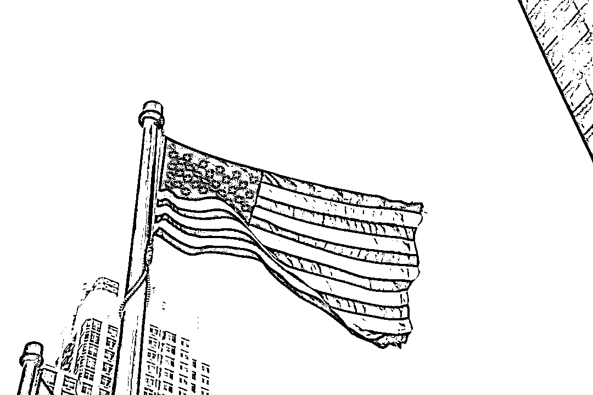

占星学有诸多分支，互为补充。**了解个人需要学习出生星图占星学，了解某个时刻的特点及变化需要学习卜卦占星学，而了解国家和社会的发展则是经世占星学。**在出生星图占星学或卜卦占星学中有效的相同原则也适用于世俗占星学，同时，每个分支又有自己的特别之处。从托勒密时代以来，经世占星学和出生星图占星学又朝着不同的方向发展，这种分道扬镳又因为教会的影响而被强化。基督教因为其关于自由意志的价值观而排斥出生星图占星学，但教接受经世占星学。这是一个关于经世占星学的介绍沙龙。艾德里安·罗斯·邓肯老师将用美国独立星图为例，快速了解经世占星学的基本原则，我们将会谈到以下几个方面的内容：**· **从太阳到冥王星的行星的经世占星学意义**· **使用相位和宫位识别国家特征。**· **了解一些重要的行星周期，如木星-土星 20 年合相周期。**· **怎样用经世占星学预测大事件——如美国总统大选

**沙龙老师**

**艾德里安·罗斯·邓肯（Adrian Ross Duncan）**

**·** 邓肯老师 1971 年在印度游学时开始学习占星学，1985 年开始成为全职占星师，迄今执业已超过 33 年，是人本主义占星学、卜卦占星学和经世占星学领域的知名占星师。

**· **开发了占星软件 AstroClock 和多款占星报告。

**· **从 1971 年开始研习佛学，受佛学影响很深，他相信占星学和佛学观点统一、转化的一个基础是在于对现实感知的改变。

**沙龙详情****沙龙时间**：**2022 年 8 月 2 日 星期二  20:00****主讲人**：艾德里安·罗斯·邓肯**参与方式**：网络直播，点击下方按钮可预约<mpvideosnap class="js_uneditable custom_select_card channels_live_iframe" data-pluginname="videosnap" data-headimgurl="https://wx.qlogo.cn/finderhead/PiajxSqBRaEJYnVsqWfEX9qA0sI6hNVKsDfyzfPZ92WZMZyBpZWU5NA/0" data-username="v2_060000231003b20faec8c4e68a1ec2d4ca07e434b07755bbf47e7053a3059defd2c9d6c68a20@finder" data-nickname="若道" data-desc="将在 08 月 02 日 20:00 直播" data-intro="经世占星学直播-用美国星图了解经世占星学的基本原理" data-noticeid="finderlivenotice-v2_060000231003b20faec8c4e68a1ec2d4ca07e434b07755bbf47e7053a3059defd2c9d6c68a20@finder-1658992810852568-783282600" data-type="live"></mpvideosnap>

**点击下图** 

**了解经世界占星学 3 日工作坊详情**

# 狮子座新月 | 支棱起来！真心想做的，从来不需要借口

> 原文：[`mp.weixin.qq.com/s?__biz=MzA5NjA0NTAxNg==&mid=2651482509&idx=1&sn=7e3731b7cd0d4dffa0f12de8058da204&chksm=8b48db3abc3f522cb22a164f9f340a3f625c8337504fcb4a54c18559f2f70072e56d4d76d819&scene=126&sessionid=1692737776#rd`](http://mp.weixin.qq.com/s?__biz=MzA5NjA0NTAxNg==&mid=2651482509&idx=1&sn=7e3731b7cd0d4dffa0f12de8058da204&chksm=8b48db3abc3f522cb22a164f9f340a3f625c8337504fcb4a54c18559f2f70072e56d4d76d819&scene=126&sessionid=1692737776#rd)

****☆ **后台回复“今日”，给你一句生命态度**

作者/王芝桦 编辑/玫瑰 图片/pexels

**狮子座新月****北京时间 2022 年 7 月 29 日 1:54 迎来狮子座新月，太阳与月亮精准合相于狮子座 5°38′。**新月发生时刻，太阳、月亮与地球形成一条精准的直线；从地球望去，太阳强大的光芒将位于中间的月亮吞没其中，令本就不发光、只反射太阳光的月亮不见了身影，就像——地球上的我们，看见一个人并了解这个人的性格（太阳），却不一定看得见这个人的内心（月亮）。但重要的是：我们能否看见自己的内心呢？占星学中，太阳守护狮子座，“王者风范”的狮子座与“自我核心”的太阳一体共振。故而，每年的狮子座新月都是自我意志（太阳）相当强化的时刻，而这背后的驱动力则来源于内在渴望（月亮）——倾听内在“王者的渴望”，开启外在“英雄的征程”，绽放生命的热情，活出生命的精彩。在这个变化频出、张力凸显的 2022 年狮子座新月里，在我们踏上“自我英雄之旅”的时候，需要做两件事情：**评估和承诺。**

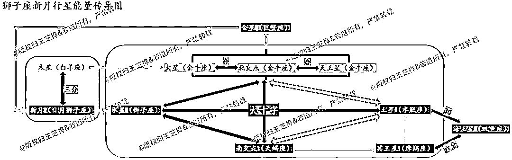

> **狮子座新月重点影响人群****参考新月峰值影响期间各个行星的行进度数，以及逆行行星的轨迹影响；常规容许度，个人行星入相位 3°，出相位 1°；非个人行星入相位和出相位均为 3°。**
> 
> *   出生星图中，有**行星、四轴、南北交点**落入**基本星座（白羊座、巨蟹座、天秤座、摩羯座）0°-11°，12°-28°**的人群。
> *   出生星图中，有**行星、四轴、南北交点**落入****固定星座（金牛座、狮子座、天蝎座、水瓶座）**2°-10°，12°-28°**的人群。
>     
>     
> *   出生星图中，有**行星、四轴、南北交点**落入**变动星座（双子座、射手座、处女座、双鱼座）19°-30°**的人群。

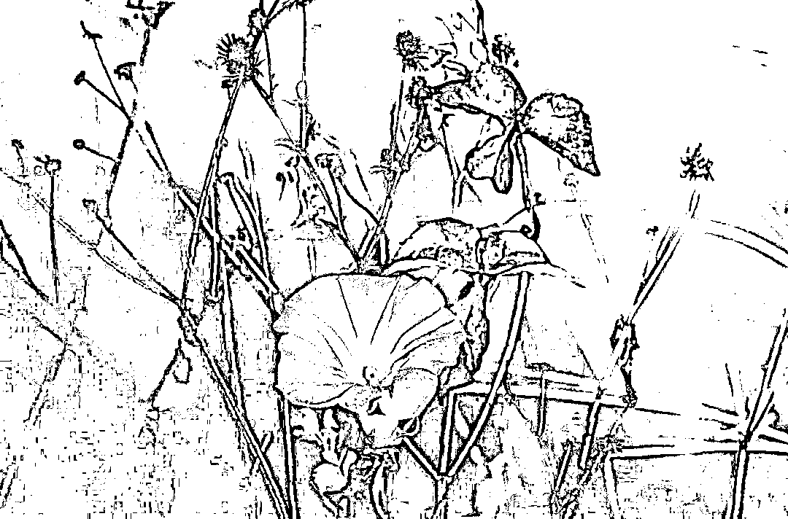

**转折已至，评估先行**

> **天象**
> 
> **· 新月三分木星：狮子座新月三分白羊座木星。**
> 
> **· 固定星座大十字：狮子座水星、水瓶座土星、“合相于金牛座的火星、天王星与北交点”、天蝎座南交点形成“固定星座大十字”结构。**

此次狮子座新月的整体天象主要由“新月三分木星”和“固定星座大十字”这两组结构组成，而这两组结构之间也透过行星之间的能量传导，相互触发，互相成就。

***1. *****时远时近，转折已至**

我们先来了解一下“固定星座大十字”结构中的主角们。我们先把时间拉近一点：**· 6 月 29 日，巨蟹座新月当天，天王星与北交点于金牛座进入合相的容许度范畴；****· 7 月 27 日-8 月 1 日，天王星与北交点合相于金牛座 18°。**一个月的时间，金牛座天王星与金牛座北交点终是见了面。我们再把时间拉远一点：**· 2019 年 3 月天王星进入金牛座，**随后的这两三年，变革之风（天王星）将原有的岁月静好（金牛座）吹了个七零八落；**· 2021 年末，南北交点换座进入“天蝎座南交点-金牛座北交点”轴线，**随后的这半年多，现实的真相触动着情绪的骇浪（天蝎座南交点），令我们开始重新反思生命的本质和生活的意义（金牛座北交点）；如果**天王星与北交点**注定要在金牛座有一场相遇，那么 2022 年就是它们见面的年头；如果非要给出一个时间，那么就是**2022 年夏季的 7 月**。2019 年-2026 年天王星行进金牛座的进程，直至今日已将行至一半，而 2022 年便是这场进程中重要的转折点与分水岭——我们过去以为可以掌控的现实积累和应该持续的岁月静好，其实还有更高的力量可以随时拿走；我们必须真心敬畏并学会臣服，放下执着并返璞归真，才能重建现实的根基和未来的生活。我们再把时间拉近一点：**· 7 月 5 日，**火星进入金牛座，**7 月 19 日，**水星进入狮子座，分别向着 18°位置行进。**· 7 月 29 日**此次狮子座新月当天，金牛座火星进入与金牛座天王星、与金牛座北交点的合相容许度范畴；狮子座水星已至 18°，精准四分“金牛座合相群组”，精准四分天蝎座南交点，并在宽泛容许度下对分水瓶座土星，构成“固定星座大十字”结构。**· 7 月 31 日**，狮子座水星精准对分水瓶座土星；**8 月 1 日**，火星、天王星和北交点精准合相金牛座。7 月 29 日-8 月 1 日，火星与水星将会短暂却有力地撞击这一场现实变革的“转折点和分水岭”，阻力，张力，抗力，激起一片水花，冒出的一堆火花。

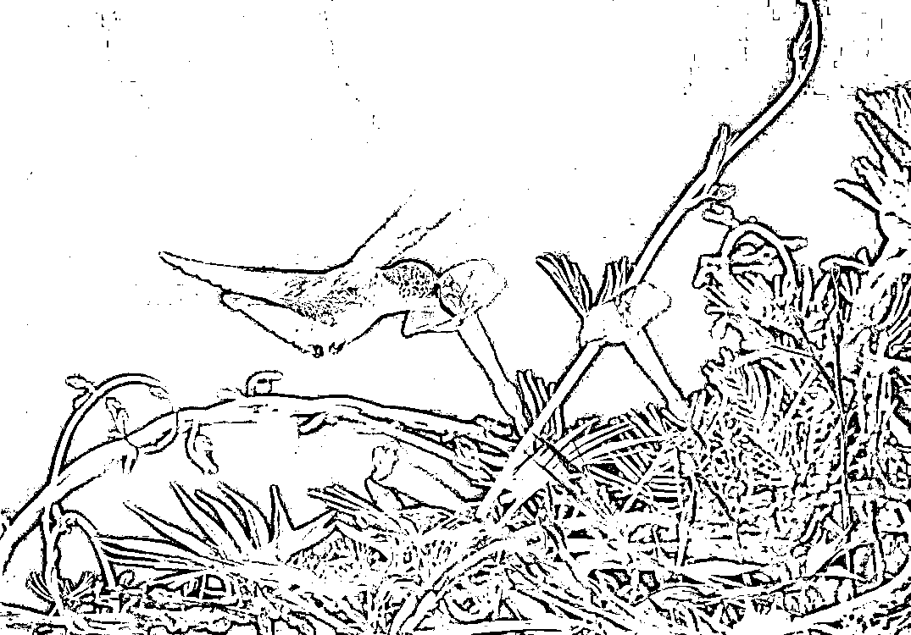

**需要注意的几个方面**

**· 说和听：**要勇敢表达自己，也要允许别人说话，“我不赞同你，但我尊重你”是人类社会基本的礼仪与文明；要求别人按照自己的视角思考，强迫自己活成别人的满意，是制造矛盾和导致失衡的根本原因。我们可以选择说什么和听什么，而这也将决定我们未来的生活；**· 自我与关系：**外部世界不会围着我们转，我们也不能在外部世界转得没有自己的章法；我们需要取悦并成全自己，但也需要有能力影响和说服他人；我们需要深谙成年人世界的规则与边界，但也需要明确自我的原则与尺度。这是学习“成熟视角和建立平衡”的时间；**· 计划和变化：**7 月下旬-8 月上旬，人们对个人主张和个人计划相当看重，但也对进展和结果急于求成，心浮气躁以致难以坚持；再加上这段时间，灵感颇多，想法多变，也导致外缘际遇呈现出波折多舛。故而，**一是要活在当下和随遇而安，二是要坚守目标和不断调试。**真心想做的，从来不需要借口；真心不够的，也不必因为反悔而纠结。**· 集体层面：**因为“固定星座大十字”结构中的金牛座火星接纳了白羊座木星的能量（火星守护白羊座），故而，**这也是国际社会、行业标杆、知名人物可能爆出突发性新闻的时间，而地动火电等方面的灾祸也需要大家关注。**另外，“固定星座大十字”结构中的狮子座水星将能量传导给狮子座太阳（太阳守护狮子座），接纳“固定星座大十字”结构中“金牛座群组”能量的巨蟹座金星（金星守护金牛座）将能量传导给狮子座月亮（月亮守护巨蟹座）。故而，**此次狮子座新月，外部现实的变化起伏也促使我们看向个人的安身根基，而“绽放自我，快乐生活”的内在需求也更加的明确和热烈。**

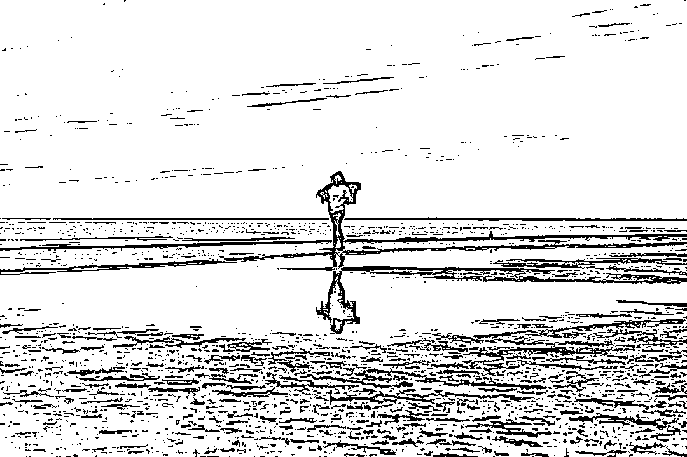

***2. *****你的“孙悟空”怎么样了？**

此次狮子座新月当天，木星于白羊座开始逆行，并与狮子座新月形成三分结构。木星 12 年行进黄道一周天，平均 1 年行进一个星座，其中包括木星逆行的 4-5 个月时间，以及短暂换座试水下一个星座的过程。2022 年是木星行进双鱼座的年份，木星也在 2022 年短暂试水白羊座一段时间：**·** 2021 年 12 月 29 日，木星正式进入双鱼座；**· **2022 年 5 月 11 日，木星换座进入白羊座；**· **7 月 29 日，木星于白羊座开始逆行；**· **10 月 28 日，木星逆行回到双鱼座；**· **11 月 24 日，木星于双鱼座恢复顺行；**· **12 月 20 日，木星正式进入白羊座。这里需要特别关注的是：木星和海王星双双守护双鱼座，2022 年这两颗行星均行进在自己的大本营，故而**，2022 年是“超越狭隘，融合无限”的双鱼座被强化的一年，但也是容易“难以聚焦，模糊混乱”的一年。**2022 年，就像太上老君的八卦炉，神秘莫测，看不清楚，谁知道炼出的是什么样的孙悟空？只不过，这一次的道场真真是在现实红尘。2022 年 5 月之前的进程就像这个八卦炉，特别是 4 月 12 日年度重磅天象“木海合相双鱼座”结构到来的那段时间，一片模糊，前途未卜，谁都想打开门看个究竟；然后，**5 月 11 日-10 月 27 日木星短暂试水白羊座，希望与机会好像来了。**那么，5 月 11 日至今我们看到了什么呢？此次狮子座新月当天，木星于白羊座开始逆行，提示我们**回顾 4 月-5 月初那段时间的选择与决定，以及 5 月-7 月这段时间的推进与发展。**这里还有一个需要特别关注的是：2022 年 5 月之前那个“前途未卜”的八卦炉，已经令人恨不得打开门看个究竟；而 5 月 11 日开始，“扩张能量”的木星进入“冲锋特质”的白羊座，一脚跨过基本星座 0°这个敏感的“开创点”，那股爆发的力量足以一把将孙悟空拽出八卦炉。5 月-7 月木星试水白羊座的这段时间，最大的风险是激进冒险；而 7 月 29 日木星于白羊座开始逆行，提示我们检视一下自己的孙悟空什么样了，是已经火眼金睛了，还是已经历练成佛了呢？被誉为“第一幸运之星”的木星，从来不会给“天上掉馅饼”的幸运，而是慷慨地将幸运赠与那些理想信念非常坚定、自我准备相当充分的人。而这也是此次狮子座新月，“木星逆行+新月三分木星”将要引领我们去做的一项重要功课。**· 动作：**检视，反思，评估**· 过程：**去泡沫，纠浮夸，治激进**· 目标：**关闭美颜，回归真实，脚踏实地，重建根基英雄不问出处，胜败必思缘由。我们看到的英雄，皆是坚持信念、勇敢历练、持续耕耘，不断完善的人。我们每个人都可以成为英雄，也都有责任成为不怕火炼的孙悟空，迎接挑战，达成使命。此次狮子座新月，那个看似张力巨大和阻力频出的“固定星座大十字”结构，既是试金石，亦是分水岭——向困难致敬，向过去感恩，向自己承诺，评估现实的境况，反思自己的准备，寻回内在的英雄，确认自己的目标，如此才能在未来几年金牛座天王星“现实变革”的进程中，重建生命的根基，踩稳现实的土壤。最后，**10 月 28 日木星逆行回到双鱼座、12 月 20 日木星正式进入白羊座**的这两个时间点，将会再次跨过**基本星座 0°**这个敏感的“开创点”，我们现在的评估与反思是为了——**每一个未来的自己都与过去的自己不同，因为只要我们在每一当下做好功课，就会收获前所未有的力量。**

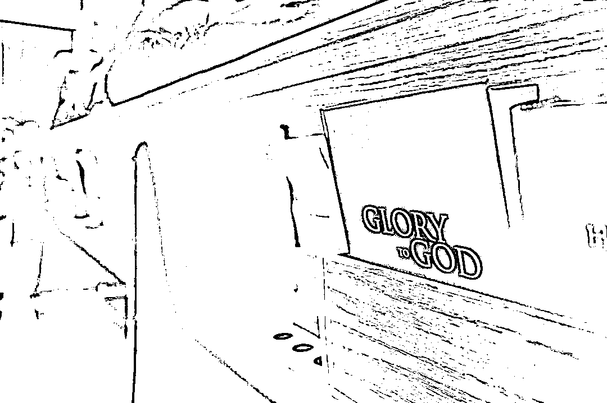

**寄语**写这篇文章的时候，一位学生发来消息说每日优鲜公司解散了。我不觉得意外，我曾经做了好几年每日优鲜的会员，因为他家的品质有保障。但是，今年年初，平台的货品越来越少，而后从收到了两次像蔫韭菜一样耷拉着脑袋的鲜花开始，我知道这个曾经非常信任的平台可能不行了。但是，今天这个消息，我感觉很难过。我相信这是一家曾经尽力打造品质并尽力呈现服务的平台，只是有其原因地遇见了风浪。我在心里默默地祝福，虽然平台倒了，但希望人没倒，寻回初衷，做好准备，英雄依然不问出处。我们每个人又何尝不是如此呢？没什么大不了的，起身，再来！祝福每一个生命健康，祝愿每一个灵魂安好。**新月如何许愿？****许愿时间**：2022 年 7 月 29 日北京时间 1:54 后，48 小时内有效、8 小时内最佳。 **许愿人群**：所有人。**许愿数量**：每人最多 10 个。**许愿方式**：静心冥想，身心祈祷或记录收藏。**许愿格式**：请万能的宇宙赐予我能量，我将以我的能量吸引**（什么）来到生命中……**许愿原则**：发心诚善利人。

**版权声明**：原创文章由作者授权首发于若道平台，欢迎转发，反对抄袭。友号转载请申请白名单。

**END**

****想阅读更多作者的文章，请在后台回复******王芝桦****** 即可。****

****王芝桦****

心理占星师，统合疗愈师，占星专栏作者

全职于个案咨询与占星教学工作 18 年

**个案预约咨询微信号**：zhihua0621 

**微信公众号**：daoxi-life

**长按打赏**

****

**20 位来自世界各地的占星师****带来 19 场沙龙——新世界的觉醒****详情可点击下图**

**学习占星学****点击下图了解课程详情**

**微信又双叒叕改版啦，不想错过若道君的推送？**
**就把若道设为星标吧！****▼**

**喜欢就点一下“在看”吧！**

********报名直达入口********

# 火天合相北交点四分土星的 8 月初，市场会怎样？丨梅里曼 8 月上证+黄金报告上线！

> 原文：[`mp.weixin.qq.com/s?__biz=MzA5NjA0NTAxNg==&mid=2651482348&idx=3&sn=2ab9c15a94c624c15d96baa433dbf5a3&chksm=8b48da5bbc3f534d77df0a9fe2c3a8858896bab5ca63234db5aacb8e3587724ace0b1f6b1f80&scene=126&sessionid=1692737781#rd`](http://mp.weixin.qq.com/s?__biz=MzA5NjA0NTAxNg==&mid=2651482348&idx=3&sn=2ab9c15a94c624c15d96baa433dbf5a3&chksm=8b48da5bbc3f534d77df0a9fe2c3a8858896bab5ca63234db5aacb8e3587724ace0b1f6b1f80&scene=126&sessionid=1692737781#rd)

| 上证指数日 K 线

| 上证指数周 K 线

在 7 月，上证出现回调。这个回调在预期之内，毕竟，在 4 月 27 日触底之后，上证已经连续涨了 2 个月而没有一次像样的回调。市场等待的回调在 7 月出现了。**梅里曼老师在 6 月的报告中说，“如果 4 月 27 日是 33 个月周期的底部，那么可以判断至少未来 2-8 个月是看涨的。”**从 2019 年 1 月持续 5.5 年周期的半周期的范围是 27-40 个月，看起来 4 月 27 日（第 39 个月）的低点 2863 完成了第一个半周期。倘若如此，7 月开启了更大的 5.5 年周期中的第 2 个 33 个月半周期的第 3 个月。**上期报告指出，“从 7 月到 8 月初，地球宇宙征象信息好坏参半。最重要的是 7 月 20 日太阳对分冥王星（更多的暴力和对人类生命的威胁），木星逆行，以及 7 月 28-31 日太阳三分木星（对经济形势的乐观态度，这可能导致股市反弹）”。**8 月 1-14 日，火星与天王星、月亮北交点合相，并与土星形成四分相；随后太阳对分土星，四分天王星，这个外行星相位配置开始变得更加强大。

**梅里曼老师如何看待这些天象？股市会继续下跌吗？还是回调结束，市场是否会开始上涨？**

8 月股市应该如何操作，金融占星大师雷蒙德·梅里曼的《2022 年 8 月上证指数报告》已上线，你可以听听梅里曼老师的看法。

**《2022 年 8 月黄金报告》也已上线，欢迎购买。**

**此外，6 月 23 日雷蒙德·梅里曼的《2022 下半年金融占星投资沙龙》，将帮助你对 2022 年下半年的市场风云变化加深了解。**

**扫描下图二维码了解详情**

▼

**投资有收益，投资有风险，希望金融占星学的研究帮助你更好地评估你的投资。**

**8 月上证报告上线**

**上证指数月度报告价格****单月报告**：280 元/月 **季度套餐价格**：780 元（260 元/月）**年度套餐价格**：2400 元（200 元/月）**双报告年度套餐更优惠（直降 900 元）****12 个月黄金报告+12 个月上证指数报告：仅需 3900 元****长按下图识别二维码购买上证指数报告**
▼

“**黄金是金钱。其他的只是信贷。**

**——约翰·皮尔庞特·摩根**

”7 月 14 日，美国发布 6 月 CPI 数据，同比增长 9.1%，高于预期的 8.8%及 5 月的 8.6%，增幅创 1981 年以来最高；美国 6 月核心 CPI 同比增长 5.9%，同样高于预期的 5.7%。市场预期美联储 7 月加息 100 个几点的几率升至 75%。而其他国家也在经历迅速增长的通货膨胀，甚至比美国还严重。对于很多国家，这样的通货膨胀是 80 年代以来的最高水平。令人担忧的是，公众预警预期通胀将持续居高不下。毕竟，通胀有自我实现的预言。美元也继续相对于其他货币走强。今年上半年见证了日元、英镑、欧元相对于美元的大幅下跌。

| 日元/美元汇率

| 英镑/美元汇率

| 欧元/美元汇率

**而黄金也一样。如梅里曼老师一直以来的预测，在 4 月 13 日到达 2003 美元的高点后，一路下跌，与 4 月高点相比，已经跌幅达 15%。**

| 黄金日 K 线图

货币的剧烈变动给金融市场带来很多不确定性。然而正如梅里曼老师在[2022 下半年金融占星投资沙龙](http://mp.weixin.qq.com/s?__biz=MzA5NjA0NTAxNg==&mid=2651477281&idx=4&sn=610f22d20ab9ebab93125b9915bb84f6&chksm=8b48e796bc3f6e80a17217569d20456cafa22ee17f5cf6196bf4ee03d6d1bc7c51da3bce46ba&scene=21#wechat_redirect)（点击链接了解更多详情）中的预测，**更强有力的宇宙天象会在下半年到来。****7 月-8 月，有这样一些可能影响市场的天象：**

**· 7 月 21 日 木星半四分相土星**

**· 8 月 4 日 火星、天王星合相月亮北交点**

**· 8 月 12 日-15 日 日土对分**

**· 8 月 26 日 天王星停滞**

**在下跌 15%后，黄金会出现一次有 5%以上盈利的反弹的吗？还有，如上次我们提到，从中期而言，你考虑从做空黄金中赚钱的策略了吗？**8 月份黄金报告已经上线，上证报告也将在下周上线。欢迎了解。也可以按照季度和 1 年期订阅，有更多优惠。季度和年度的好处是，你可以持续了解梅里曼老师对于不断在变化的市场的看法。
即便他某一次看法和市场不一致，你也看到在下一期他如何调整自己的看法，并看到金融占星在一个长期时间段内对你把控风险的帮助。而能够长期控制风险、尽量找到安全的投资时机才是投资的长久之计。点击文末阅读原文，雷蒙德·梅里曼黄金周期 2022 年 8 月报告带来有 40 年黄金市场研究经验的世界著名金融占星大师雷蒙德·梅里曼对当前黄金市场的研究。

**8 月黄金报告上线**

**黄金月度报告价格****单月报告**：280 元/月 **季度套餐价格**：780 元（260 元/月）**年度套餐价格**：2400 元（200 元/月）**双报告年度套餐更优惠（直降 900 元）****12 个月黄金报告+12 个月上证指数报告：仅需 3900 元****长按下图识别二维码购买黄金报告**
▼

**购买者需知**

**① **梅里曼市场时机学院《中国上证指数月度研究报告》是梅里曼市场时机学院（以下简称 MMA）的研究“预报”，而不是市场“预测”，是梅里曼老师及 MMA 金融占星分析师对人类活动周期历史与行星周期之间相关性的研究，二者在大部分情况下具有 80%或更高的相关性，而不是因果关系。报告中的研究完全存在错误的可能性。即便是非常认真的研究和几十年的研究经验，金融占星师无法总是正确地解读出各种征象在实际层面上会如何相互作用，并显化为事件结果。

所以请将报告看作一个研究参考，务必结合其他市场研究和你个人对市场的理解，根据你的自由意志做决策。

**②** 此报告一旦售出，**即不接受退款。**

**③** 上证、黄金月度报告每月固定 1 期，**并非都是在每月相同日期发布。**

**④** **我们收到英文报告的当天，即发布该英文报告。3 天后，上线报告中文版。此报告仅支持手机网页阅读，不支持电脑阅读和下载。****以上须知，请仔细阅读。一旦付款，即视为已了解并接受所有须知内容。**在过去的 40 年中，唯有梅里曼逐渐完善，并在梅里曼市场时机学院月度周期报告中阐释了将地球宇宙学与周期相结合的研究方法，以惊人的精确性预报了黄金价格发生重大变化的时间。**黄金购买 Tip**

各大银行均可购买黄金或黄金 EFT 基金，也可以在诸如天天基金或者支付宝购买黄金及黄金相关产品。不明白的可以百度搜索。

**购买后如何查看报告？**

**购买后有疑问怎么办？**请联系技术客服
**微信：nodoor201705**

**购买报告直达入口**

# ISAR 认证职业占星师必修课 | 这个世界上，没有后悔与占星学相遇的人

> 原文：[`mp.weixin.qq.com/s?__biz=MzA5NjA0NTAxNg==&mid=2651482348&idx=4&sn=f725181f77b6475af2a96ae920c63951&chksm=8b48da5bbc3f534dd1b558ba792fd3651beac667a7102587fda851b06d56a8de7c9380971f25&scene=126&sessionid=1692737781#rd`](http://mp.weixin.qq.com/s?__biz=MzA5NjA0NTAxNg==&mid=2651482348&idx=4&sn=f725181f77b6475af2a96ae920c63951&chksm=8b48da5bbc3f534dd1b558ba792fd3651beac667a7102587fda851b06d56a8de7c9380971f25&scene=126&sessionid=1692737781#rd)

5 月，一个若道的老朋友突然发来一段微信，是对木星进入白羊座的感慨。这位朋友创建了自己的公司，他并不在占星行业，但仍经常记录占星日记，因为他总是体会到星体移动和个人生命变化的契合。

过了几天，又一位若道的老朋友发了一张当天新闻的图片，里面有医疗板块产业趋势、有啤酒股的泡沫问题、有千年老二的饮用水公司也要上市。她说，看，举目全是海王星。她也不是占星师。

然而，他们都与占星相遇，占星已经融入了他们的生活。

第一位朋友说：“在若道学习占星，对我来说建立了一个整体的世界观以及对自我内在的解释论。”

第二位朋友说：“学了占星就会知道，事情来时我们不必过度反应，知道一切会过去”。

占星学会改变你，不论你跟随它走多远，不论你是否选择成为占星师。

这个世界在飞快地变化着，占星学可以像定海神针，帮你测度这个世界的变化，也帮助你校正心中的自己和世界的样子。

**这个世界上，应该还没有后悔与占星学相遇的人。**

**8 月 30 日，新的若道占星核心课程要开始了。**

如果你还没有下定决心是不是好好学占星，那么 L1-2 可谓一个轻松的前菜，等着你品尝。

**把这个仅需投资 2800 元的课程作为礼物，送给自己或者自己所爱的人。**

**课程试听：不分组转发本文，找王老师领取。**

长按二维码添加王老师微信

**谁是你的老师？**

**占星师咔咔（Caroline）**

2010 年师从美国占星师大卫·瑞雷学习，并得到世界名师斯蒂芬·弗里斯特、罗伯特·汉德、苏·汤普金斯传授各种占星学技法。若道首届学员，国内最早获得 ISAR 职业占星师资质的职业占星师，2019 年第二届、2021 年第三届核心课中和苏·汤普金斯老师一起教授若道核心占星课程。

在国际知名广告公司和市场研究公司从事的市场研究和推广工作十余年，曾任职于阳狮集团、尼尔森市场研究有限公司、MTV 和《Madame Figaro》杂志。

**大卫·瑞雷（David Railey）**

*   **I****SAR 董事会成员，ISAR 全球副主席，ISAR 全球职业占星师资质认证主席，若道占星创始人**。

*   2016-2019 年，被选为国际占星协会（ISAR）考试委员会成员，国际占星协会（ISAR）是世界最大的国际占星机构，会员遍布 47 个国家。

*   2017-2020 年，被选为国际占星联盟（ISAR）考试委员会主席，理事会成员。

**助教王嘉祺 （Conrad）**

ISAR 认证占星师、若道认证生时校正资质，从 2010 年起自学占星学，2015 年开始在若道系统学习，并开始个案咨询。2018 年担任若道核心课程助教，以及卜卦占星学和太阳返照选修课助教，并带领学员进行经世占星和太阳返照方面的研究。2019 年 11 月作为演讲人之一参加了国际占星协会（ISAR）北京大会，也是 ISAR 星空俱乐部中国区第 16 期的主讲人。

**内容是什么？**

**开课时间和课程费用**

**８月３０日开课，每周一次，20：00-22：00，10 节课。**

**★ 1-2 阶 **

**早鸟价：2800 元（2022 年８月１日之前）**

**课程费用：3500 元 **

**你也可能想学更高阶：**

**★ 1-3 阶　连报**

**早鸟价：10500 元（2020 年８月１日之前）**

**课程费用：11500 元 ****★ 1-5 阶　连报**

早鸟价：33000 元（2020 年８月１日之前）

**课程费用：46500 元 **

德国哲学家雅思贝尔斯说：

教育是一棵树摇动另一棵树，

一朵云推动另一朵云，

一个灵魂唤醒另一个灵魂。

你准备好被摇动了吗？

**退转课程**

**退款原则请详看《教学协议》，如有疑问请咨询课程顾问。**

**课程试听**

**不分组转发本文，加王老师获取。**（微信/手机：18510107057，请备注“大卫核心课”）

****2022 L1-2 认证职业占星师必修课程****

**授课老师：大卫·瑞雷、咔咔**

**直播课开课时间：2022 年 8 月 30 日（周二）**

**授课方式：******网络授课，英文/中文授课，中文翻译****

**费用：**3500 元**（早鸟价 2800 元,8 月 1 日前）**

**课程负责人：王老师**（微信/手机：18510107057，请备注“大卫核心课”）

长按二维码添加课程负责人咨询~

****报名直达入口****

# 爱操心的月亮处女座，12 月亮星座里的内卷小能手！

> 原文：[`mp.weixin.qq.com/s?__biz=MzA5NjA0NTAxNg==&mid=2651482348&idx=2&sn=0c43556662e80023646b1c8170698561&chksm=8b48da5bbc3f534dd7194ab739f503fecd029cc0dcba889a4fe91c5b97785068fec72aab5a76&scene=126&sessionid=1692737781#rd`](http://mp.weixin.qq.com/s?__biz=MzA5NjA0NTAxNg==&mid=2651482348&idx=2&sn=0c43556662e80023646b1c8170698561&chksm=8b48da5bbc3f534dd7194ab739f503fecd029cc0dcba889a4fe91c5b97785068fec72aab5a76&scene=126&sessionid=1692737781#rd)

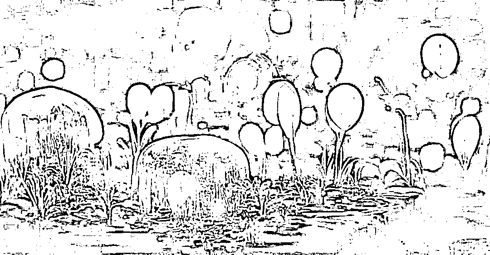

作者/咔咔 ISAR 认证占星师
编辑/玫瑰 图片/pexels 月亮处女座真的太能干了，他们可以说是 12 星座里的内卷小能手！但是这也给他们内心带来了无穷尽的焦虑。怎么解决呢？一起来看看吧！**月亮处女座**

写完月亮摩羯座之后，有朋友点播了月亮处女座、白羊座、金牛座。搞得我想 12 个月亮星座都写一写。照顾小狗还是很花时间和精力，这家伙疫苗没有打完不能出去遛，只能在家大小便。

每次看到他往尿垫跑去，我一个箭步跟上去，先看看是拉还是撒。如果拉撒在了尿垫外面，要赶快去厕所拿手纸、湿巾和除菌喷剂，回去清理现场。这时候恨不能把**月亮换成处女座，耐心处理这些日常琐碎的事情，做得妥妥帖帖**。

**月亮在土象星座的需求是物质上的稳定感，月亮摩羯座需要在社会上有稳定的地位，月亮金牛座需要舒适和安定的生活，月亮处女座则需要内在和外在世界的秩序感。**

娱乐占星的流行让太阳星座的概念深入人心，网上关于太阳星座或者俗称 12 星座的内容数不胜数，但是大众对于与太阳同样重要的月亮星座却知之甚少。

在现代天文学发展之前，古人观测天象看到天空中两个最亮的星体，太阳和月亮。那时候还不知道月亮是围绕地球运转，反射的是太阳的光线，但是古人发现月亮的阴晴圆缺与地面上人们情绪、身体状态，作物生长，海浪潮汐等变化息息相关。

**月亮被认为是女性和妈妈的原型，掌管家庭、房屋、子宫、滋养与被滋养的一切事物。**

虽然太阳代表自我的身份、我们感到荣耀的方式，但是有一个重要的概念，需要被强调一万遍：**太阳星座，是需要随着年龄和阅历的增长逐渐朝之发展的方向**。

**月亮星座，是这个人出生之后的本能、是与生俱来的、熟悉的行为、习惯、态度、身体状态和情绪反应。**用占星大师斯蒂芬·弗里斯特的话说，**一个人的月亮如果是健康的，这个人就不会发疯。**

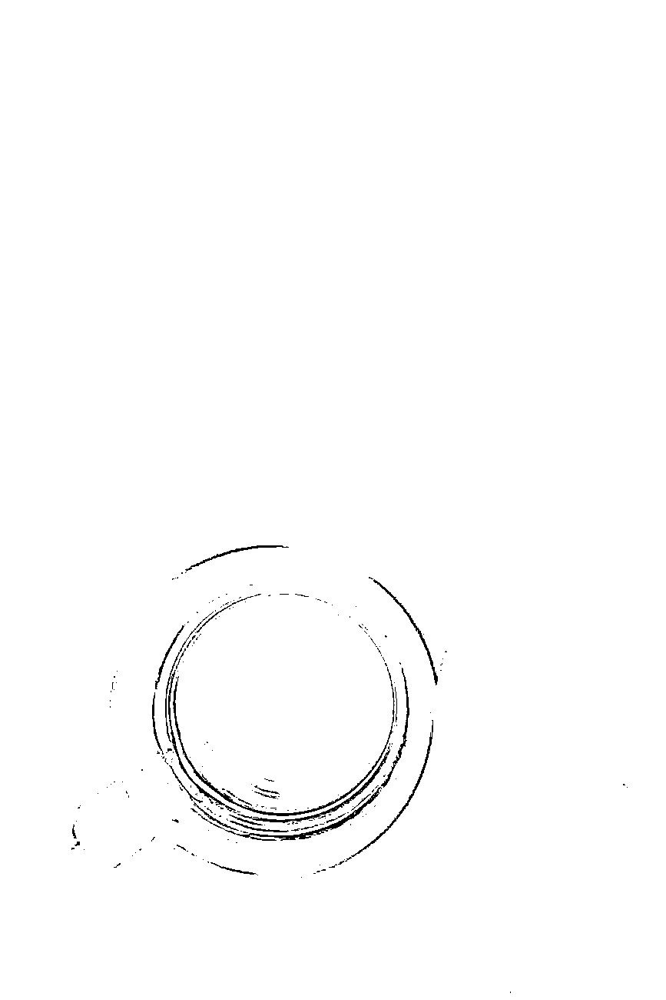

☆处女座

豆瓣小组一直以来是大众对 12 星座兴趣的风向标，处女座和天蝎座的受关注程度非常靠前。如果一个人的月亮在处女座，那根据上述的理论，这个人可能会比太阳在处女座的人更加“处女座”。我们先来说说处女座的普遍含义：

**处女座，被水星守护，与星图里代表日常工作、健康、生活细节的第六宫相关联**。要如何理解处女座头上戴的“龟毛”、“吹毛求疵”、“要求太高”、“追求完美”等标签呢？

在北半球，处女座对应了秋收季节，粮食收割下来有一个重要的环节：将干瘪的谷壳从丰满完整的谷壳里挑出来，即筛掉无用的谷壳。**处女座的核心词汇是分辨、辨析，分辨哪些是良好的，哪些是不合格的，哪些是有用的，哪些是要废弃的。**这是一个需要**心智和头脑**来参与的工作，也就是水星主管的领域。**设定标准，根据标准按照流程，有效率地运作，产出结果，这就是处女座的工作方式。**如果不吹毛求疵，或者换个词“精益求精”，事情就无法有效地产出结果。分辨、辨析、分析、评估的工作会大量使用头脑，这让处女座精神紧张，饱受消化不良的困扰。而且分析评估贯彻在日常生活和工作的每时每刻，加大了精神紧张的程度，人会不自觉感到疲劳、焦躁、不安。☆居家生活小能手

**可能从小，月亮处女座体会到的妈妈是勤劳的、注重细节、讲究卫生，给家人提供无微不至的照顾。**有人回忆里的妈妈除了包揽日常家务，做饭、打扫卫生、清洗被褥衣物之外，做完家务就在灯下给全家人打毛衣，裁制衣服。

**月亮在处女座不是一个温暖的位置，但是他们照顾和滋养他人的方式就是关注他人的需求，做一些实际的、为他人服务的事情。**

我印象中月亮处女座的朋友似乎也**总闲不下来**，和他们交流总能**获得实用的生活窍门**，比如在水池旁边放一块布，洗完手顺便拿布把池子和镜子上的水渍擦干净。他们推荐的生活用品，尤其是和卫生清洁、营养健康有关的，都特别好用。

不过他们似乎对自己这样的聪明才智没有特别的感觉，总像陀螺一样转个不停。以我朴素的观察，**月亮处女座的家居环境相当干净整洁**，但是他们不是断舍离法则的执行者。

尺寸小，功能精，设计精巧的产品非常受到喜爱，家里被这些东西堆得满满当当的。我猜他们可能觉得每个产品都有其独特的用途，以他们善于分辨的眼光，可以区分出产品之间细微的差别，以便针对性使用。

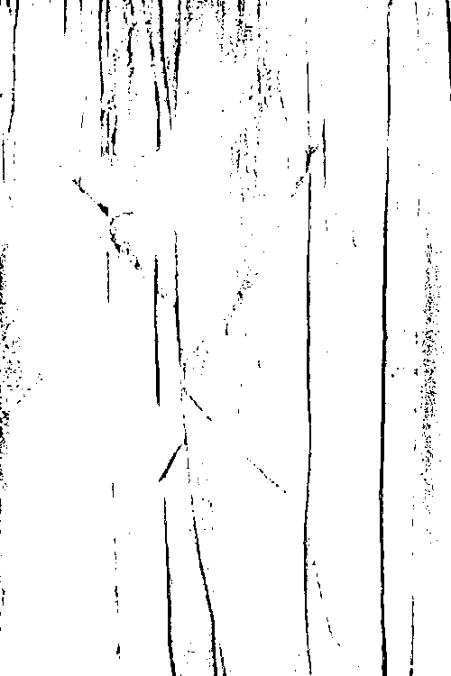

☆总是自我怀疑

**自我评判和自我质疑，给月亮处女座带来很大的情绪挑战。**这还要从小时候和妈妈的关系说起。妈妈勤劳、注重生活细节、不断忙着照顾家人，同时**给孩子植入了一个信念**：人生的各方各面都需要做到尽善尽美，要达到这个目的，需要上紧发条，不断努力。

**处女座作为狮子座之后的星座，修正了狮子座的自我为中心、渴望被关注、被夸赞、戏剧化的特质，发展出谦逊、低调务实、利他的作风；对自我和外在世界具有清醒的辨别能力，并在此基础上找到改进和完善的技能。**

月亮处女座的妈妈很少夸张地表扬孩子，她们通常会给出切实的意见，让孩子知道怎样做会更好，在妈妈看来，批评孩子是为了更好地让 ta 进步。但是在幼年的孩子听起来，这些反馈通常是指出不足，很容易感觉被泼了凉水。

**长此以往，孩子就会习惯性地自我怀疑，对自己吹毛求疵。常常自我反省，有时候反省的过度就会影响自己运用真实的才华。**

☆操不完的心

当他们在工作、生活、教育等方面获得了进步，就会感到更满足、更安全。在关系里，他们容易把自己放的比较低，习惯性地像妈妈一样用服务、做实际的事情表达爱和关怀。习惯帮助对方找到进步的方法，过度使用这种方式会费力不讨好。

有位女士这么评价他们，“有时他们爱管闲事，老是以给人提意见的方式来整理别人的生活。有时候做的有些过分。他们太过忙碌于整顿朋友的生活，连自己家的后院都顾不上了。”

**当月亮处女座被定位星水星影响，过度使用心智和头脑的时候，就会和身体失去联结。过度的操劳，也会给月亮处女座带来健康上的风险。**

这里说的操劳，包括**劳心**，即**大量地分析、强迫性地思前想后，踟蹰不前，犹豫不决**；也包括**劳力**，即**过度地工作、负责太多的项目，还想把每件事情都做到极致**。

健康的风险包括了**消化不良、饮食失调、食物过敏、便秘、溃疡、肠激燥，疑病症和强迫性行为（比如反复洗手、总回家检查门锁）**。

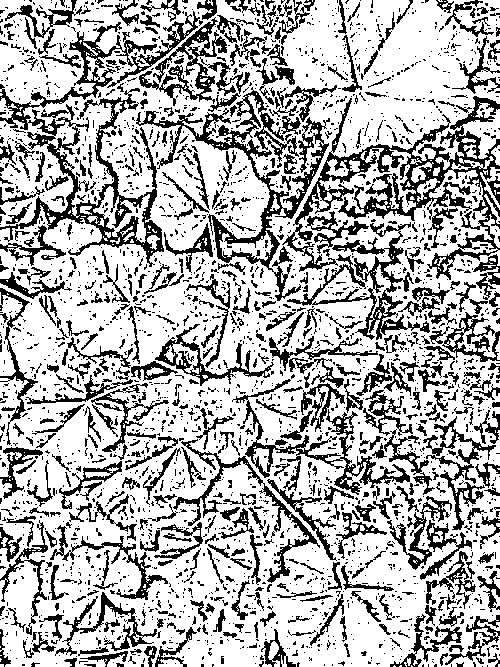

☆定期“关机”，有益身心健康

**让思虑过度的头脑停下来，月亮处女座要定期关机。**有个月亮处女座第十二宫的朋友的睡眠时间比一般人要更长一些，我想睡眠是她关机的方式。

做手工也是月亮处女座擅长的技能（在占星学里水星对应了手臂），有个在第十一宫的朋友特别擅长做羊毛毡，做手冲咖啡，她的产品被很多人喜爱。手作让她非常专注，头脑在那个时刻也关机了。

也有的月亮处女座定期参加禅修、冥想课程。正念和静心的练习也可以让狂奔的心安静下来，与身体重新建立联结。

**以下这个练习非常合适月亮处女座**：**正念饮食**❶ 在自己独处的时候做这个练习，关掉手机，离开电脑。❷ 选择一块一口大小，你喜欢的天然食物，葡萄干、巧克力，坚果。❸ 将食物放进嘴里之前，用一点时间感觉它。看看它的外观、摸摸它的质地，闻闻，撕开包装的时候听一听。❹ 放进嘴里，先不咀嚼，用舌头推着它在嘴里滚一滚，让上膛和脸颊内侧都能触碰到它。可以闭上眼睛再感受一下。❺ 开始咀嚼，一下一下地，尽可能慢地咀嚼。**传递神圣恩赐的使者**

虽然在占星学里，月亮处女座被认为不是月亮曜升入旺的位置，处女座的特性与月亮代表的滋养、照顾、包容、接纳、保护的特性不匹配，但是在远古的神话里，处女座代表了另外一种女性形象，她们勇敢、具有智慧，精通自然法则、魔法与医疗。

| 古埃及神话中的伊西斯（Isis） 

古埃及神话中的伊西斯（Isis），是生命、魔法、婚姻和生育女神，她被视为完美女性的典范。

她的丈夫凯旋归来后，被叛逆者骗进了一口箱子，浇筑了铅水，投到尼罗河里。伊西斯顺着河流找到了现在黎巴嫩附近的比布鲁斯，将丈夫带回埃及安葬。杀害伊西斯丈夫的人又将他的尸体分割成了 14 块，扔到了埃及的各个角落。

伊西斯在妹妹的帮助下寻找这些尸块，但只找到了 13 块。最后的一块-他的生殖器已被鱼吞掉。在托特（Thoth）的帮助下，伊西斯做了一个金的生殖器，把它安在了奥西里斯身上。然后，她变成了一只鸢，在托特魔法的帮助下怀下了年轻的荷鲁斯。

在这个故事里，我们看到一个女性在孕育新的生命之前失去了丈夫，忍着悲痛，寻找丈夫的尸体，想妥善地安葬他。被痛苦情感折磨的同时，她要完成作为妻子的世俗意义的责任，让丈夫得到安息。

为了这个目标，伊西斯奔波千里，从比布鲁斯到埃及全境。不光是勇敢和坚毅，她的智慧和魔法知识也帮助她最后达成使命，她制作金器的技能也使得本来残破的身躯被象征性的修复了。

最后在魔法的帮助下，伊西斯达成了女性身份的转化，成为了一个新生命的母亲。这个神话打动人的地方在于一种**神圣的责任感，要完成使命不止是喊口号，更要面对过程里的种种困难，挑战不可能，也要忍耐一次次地失败和挫折**。**不放弃，在不可能里寻找新的出路。**我个人认为**月亮在处女座非常对应这则神话原型**，占星大师琳恩·贝尔这样写道：“**处女座是谪落地球的天使，被困在物质的形式之中，她负担着自己的任务，从而为她周围的一切带来神性；**

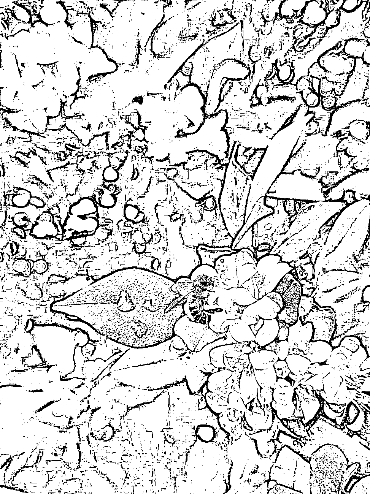

**任务繁重难当，如此艰巨的任务让她的所有注意力都集中在小范围内的完美之上，因为如果她向上看，她就可能在困难的任务中丧失勇气。**”月亮处女座的人对弱势群体、小动物和所爱的人的照顾是细致入微和真诚无私的。看到他们垂首做事的样子，我看到了神圣的服务者的原型。**月亮处女座滋养照顾的核心在于找到忘我奉献的对象**（社会、工作、家庭、朋友、在困境中的生命……），**面对艰巨和繁杂的事物，运用智慧、知识和技能，专注地服务，成为传递神圣恩赐的使者。**

**版权声明：**原创文章由作者授权发布于若道平台，欢迎转发，反对抄袭。友号转载请申请白名单。

**END‍‍‍‍‍‍**

**咔咔**

职业占星师，若道核心课程讲师

ISAR 认证占星师（2014 年获得）

国际知名广告公司和市场研究公司工作十余年

**微信公众号**：咔星人

长按打赏

******你还可以预约作者咔咔的占星咨询****** ******长按下图二维码预约吧******

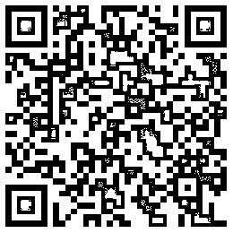

**拥有****51 年****占星实践经验的****若道创始人****前 ISAR 全球副主席****前 ISAR 全球职业占星师资质认证主席****大卫·瑞雷**

**和**

**2019 年第二届、2021 年第三届核心课中**

**与苏·汤普金斯老师****联合授课****的**

**ISAR 认证职业占星师**

**咔咔（Caroline）**

**二人合力打造**

**2022 年 ****若道全新核心占星课程**

**点击下图了解更多课程详情** 

**

**20 位来自世界各地的占星师****带来 19 场沙龙——新世界的觉醒****详情可点击下图**

**学习占星学****点击下图了解课程详情**

**

**微信又双叒叕改版啦，不想错过若道君的推送？**

**就把若道设为星标吧！**

**▼**

**喜欢就点一下“在看”吧！**

********报名直达入口********

# 重大天象丨木星逆行了！！！

> 原文：[`mp.weixin.qq.com/s?__biz=MzA5NjA0NTAxNg==&mid=2651482348&idx=1&sn=78ee41424d97138c2ef2271d6534456e&chksm=8b48da5bbc3f534d109af1cd2cc6008079deb159449c42f6baf38b9482e31c814de501401ec1&scene=126&sessionid=1692737781#rd`](http://mp.weixin.qq.com/s?__biz=MzA5NjA0NTAxNg==&mid=2651482348&idx=1&sn=78ee41424d97138c2ef2271d6534456e&chksm=8b48da5bbc3f534d109af1cd2cc6008079deb159449c42f6baf38b9482e31c814de501401ec1&scene=126&sessionid=1692737781#rd)

******☆ ****后台回复“今日”，给你一句生命态度******

作者/Justine ISAR 认证占星师
编辑/翀子 封面/书君 图片/网络

7 月 29 日 04 点 37 分，木星开始今年的逆行之旅，它从白羊座逆行回双鱼座，推动我们向内寻找自己的信念和天赋。在 2022 年这个“分水岭”之年，木星的逆行让我们获得崭新的内在认知，满怀信心地跨入 2023 的门槛。

**木星逆行了**视频《回村三天，二舅侄好了我的精神内耗》突然“走红”，刷遍全网，上了热搜。截至 7 月 27 日晚 19 点，在哔哩哔哩上的播放量已超过 2500 万，实时播放人数过 8 万。这个视频瞬间感染很多人。二舅的身上重叠了无数平凡人的身影。有人也许会问：平凡人的感人故事随处可见，为什么“二舅”然红了？，为什么是现在？**木星每年逆行 4 个月左右**，在个人层面，大部分人并不会有明显的“木逆”感受。作为社会行星，木星逆行在社会层面的影响更凸显。当下，木星在白羊座 8 度多停滞。当一颗行星停滞即将逆行时，它带来的影响力是最大的。**当白羊座的木星停滞，集体意识在「向内探索信念」上共振。**在这个世界上，几乎每个人都努力项获得物质成就，无论是迫于营生，还是因为灵魂有过去世不值得拥有财富的创伤。而白羊座的木星想要成为第一，不会让任何人挡道。木星行进在白羊座时，不仅会强调白羊的创新与勇气，也可能会扩大白羊好斗与竞争的阴影。但如果世俗的成就是你的主要目标，就很容易失望与倦怠，或许你会发现并非一分耕耘一分收获，或者即使幸运地赢得成功，也非常短暂易逝，并马上有了更大的欲望。总之，无论在什么样的位置，依然对生活充满不满，陷入到对生活的精神内耗中。**对生命的满足感不会来自于物质与外在的成功。只有当每个人向内在探索和寻求，深入审视自己，才会找到生活的真理和意义。**“二舅”让我们共鸣与感动，是因为当一个天才失去一切成为平凡人，却能在逆境中感恩与放下过去的遗憾，这是对生命、最自己和对世界最可贵的信心。

我们都知道，木星统治着射手座（代表着空间和更高层次的思想）和双鱼座（代表着隐藏在我们心灵深处中的东西），同时木星也与金牛座相联系，与物质现实和土元素相联系。

如果你的星图上有一颗平衡、被激活的木星，理论上你可以成为地球上最富有、最有信念、最有远见的人。

因为在客观层面上，强大的木星将提供物质支持和轻松的生活，能扩展任何限制，赋予东西价值，让每个人找到自己的目的与天赋；木星还能帮助你克服自己所背负的重担，对可能发生的事情没有任何不安全感，让生命变得丰盛、轻盈与流动。

但有多少人能真正做到呢？

在 Aleksandar Imsiragic 的占星疗愈体系中，木星对应的是我们的第六脉轮——第三眼。拥有高度发达的第六脉轮的人，能够看到未来。

**这个中心代表了目的和知识被揭示的地方，清晰的预见、直觉和灵性的开放通道的地方。一个木星被完全激活的人，会有一种伟大的目的感和洞察力。**

对于普通人而言，木星灵性领域的愿景和目的、内在的指导灵、高我、与天堂联系，都遥不可及。因此，当木星逆行也好，顺行也罢，唯一带来明显感受的，可能是外在机遇的变化——**现实物质价值的起伏，或某种失去造成担忧、绝望和抑郁。**

在这个过程中，木星根本不会走到聚光灯下，只是背后的隐形的推手，更多通过金星来诠释（财富变化）或由土星来表达（担忧抑郁）。

现实世界中，我们大部分时间都在为下三轮的生存、安全感、性欲、财富、权力挣扎，并没有准备好激活自己的木星。**但当木星行进在双鱼座时，精神世界的面纱就会变薄。**

**木星逆行在个人层面的显化**

**7 月 29 日开始，木星开始从白羊座 8 度逆行。在接下去的四个月里，幸运之神会再一次退回到自己守护的星座——双鱼座，**这也是 12 年来的最后一次。对于在灵性领域有愿景的人，这会是一个绝佳的扩展意识的机会。

让我们先回顾一下，过去一年多来木星的行进。**当前两次木星行进双鱼座时，你内向探索获得了什么样的进展？还有什么尚未完成的？**

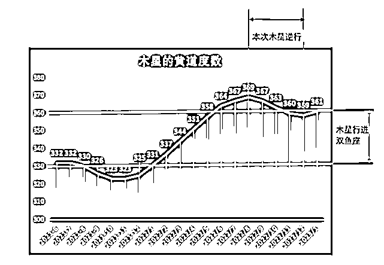

上图：从 2021-6 到 2023-1，木星的行进

横轴：年/月（时间）

纵轴：木星的黄道度数（折算成 360 度）

标注

**1.两条红线之间的区域，是木星行进在双鱼座**

*   2021 年 5 月 14 日～2021 年 7 月 28 日

*   2021 年 12 月 29 日～2022 年 5 月 11 日

*   2022 年 10 月 28 日～2022 年 12 月 20 日

**2.上面的红线跟白色曲线的三个交点，是木星进入白羊座 0 度的时间：**

*   2022.05

*   2022.10

*   2022.12

**3.两条绿色竖线之间，是本次木星逆行的区域**

*   从 2022 年 7 月 29 日逆行到 2022 年 11 月 24 日；

*   从白羊座 8 度逆回到双鱼座 28 度。

2022 年是一个非常重要的灵性时刻，它是 2012 年（标志着整个宇宙提升到一个更高维度的开始）与 2032 年（5D 蓝图就位、新的黄金时代的开启）的中点。

然而，2022 年也是最难的一年。因为老建筑还没有被拆除，在我们开始建造新建筑之前，将会有许多秘密被揭露、财务上的挑战以及全球范围内的大规模动荡。**2019-2021 年只是老建筑拆除之前的酝酿，而 2022 年是真正老旧高塔的倒塌。**

当目睹 2022 年的全球持续震荡，我们会意识到自己也是世界变革的一部分。无论外界如何风云变换，最重要的是关注自己的精神成长。因为每次我们提高频率，都在帮助这个世界转化。

当下，每个人都在面对自己独特的现实挑战，无论是事业、家庭还是亲密关系——没有所谓高大上的“灵性”功课，这就是每个人最重要的灵性功课。

**2022 年会是一个分水岭。**当到了 2022 年底，如果我们回头看，发现一些人的频率已经快速提升，一些人已经被落下在了。我们虽然生活在一个地球上，却生活在两个世界里。

**从占星上解释这个频率“快速提升”的契机，会跟木星逆行过程中三次跨越白羊座 0 度有关联。**

黄道初度（白羊座 0 度）的萨比恩神谕是“人鱼出海”。具体的意象是：一个刚刚从海中升起的女人，一个海豹正在拥抱她。

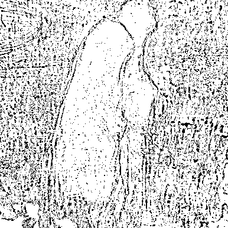

人本主义占星创始人 Dane Rudhyar（丹恩·鲁伊尔）曾写到，这个度数代表**“新形式的出现和个人意识的潜力”**。一切的发生，最初都在潜力领域。一个尚未形成、既未表达也不明确的想法，以种子的形式，包含着成熟实现的无意识潜力。

要成为一个个体，我们都需要从双鱼座集体无意识的海洋中浮现——“离开子宫”，浮出水面。这曾发生在我们出生的那一刻，从十二宫的汪洋大海来到上升点，获得第一口呼吸。

**这样的“出生”或者更新，仍在生命的不同阶段发生着，无论你是否意识到。**

当行进的土星每 29 年左右来到你的上升点，当推进的月亮每 28 年来到你的上升点，当行进的冥王星合相你的上升点……每个个体各自拥有独特的个性“更新”节奏，从上升点一次次重新诞生，展现出新的理解和意识，寻求增长和扩张的新目标。

**当行进的木星进入从双鱼座尾度进入白羊座初度，对于地球而言，是集体意识更新的时刻**。木星今年第一次跨越白羊座 0 度，是在 2022 年 5 月 11 日到 5 月 16 日期间。你可以回忆一下，或者去翻阅下自己的朋友圈，看看当时发生了什么。

那种感受或启发，很可能并不清晰。你不太理解发生的那些琐事，跟你内在要唤醒的创造性种子有什么样直接的联系。但我相信，当木星在**2022 年 10 月（逆行）**和**2022 年 12 月（顺行）**两次穿越白羊座零度，会给你带来更多的讯息，将唤醒任何在深处等待的沉睡的灵性种子。

**这不仅是一个识别潜能的阶段，更是从潜能领域进入现实领域的关键时刻。**

**总之，对于个人而言，接下去的木星逆行，是你可以向内寻找自己信念和天赋的时刻。当木星结束这次逆行时，你可以问自己：我离开了原先的“子宫”，找到了自己新的目标吗？**

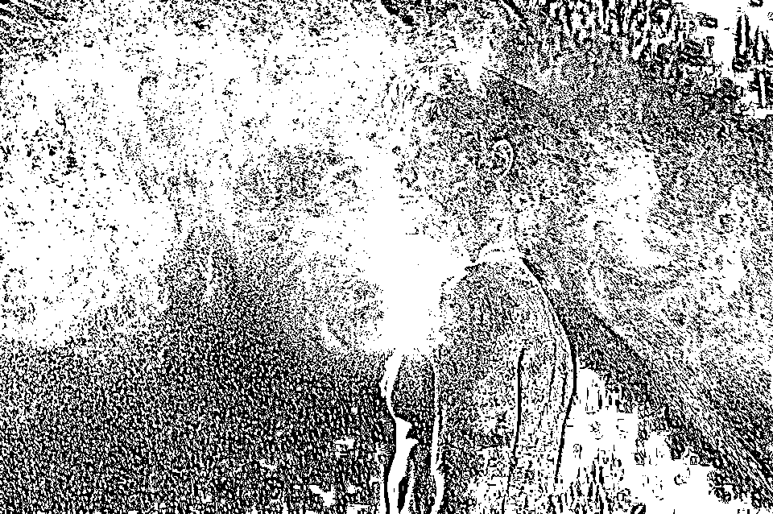

**木星逆行在社会层面的显化**

下面来聊聊木星逆行在社会层面的显化。

**从世界行进而言，2022 年是名副其实的“木星年”。木星不仅行进在自己统治的星座里，而且跟海王星在双鱼座发生了约 160 年一次的合相。**

每当一颗行星回到它拥有统治权的星座，整个宇宙场都会发生重大变化。虽然星座和行星的基本特质保持不变，但由于各种天体轨道相互关联的方式无穷无尽，整体结构会不断变化，于是会如万花筒旋转一般，带来各种奇妙的组合能量。

让我们以木星逆行的四个月为时间轴，看看当木星在开启新一轮 12 年的黄道征程前，最后一次短暂地回到双鱼座过程中，整个星空会发生什么：

1

**木星在 7 月 29 日开始逆行。8 月 1 日，北交点和天王星在金牛座 18 度相遇**，这是期待已久的每 15 年一次的北交点-天王星合相，而且火星也会加入其中。

**天王星的关键词是“范式转变”。**对于个人而言，这个合相要么真的会令人不安，要么真的会因为“出乎意料”带来自由与释放——也许两者兼而有之。

**从社会层面上，会有进一步震撼到核心的自然和社会事件发生，去除所有不再为我们服务的东西，从而为未来创造空间。**

当时，**木星逆行停滞在白羊座 8 度多**（划重点：木星在这个度数会停留 1 个多月）。这个度数的萨比恩神谕是：水晶凝视者。想象一个直觉工作者，凝视着水晶，聚焦着她精微的心智，尝试唤醒无所不知的心灵最微妙的一面。

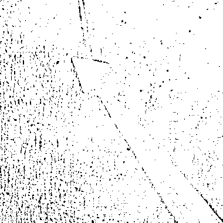

这个萨比恩符号给予我们启发，有关如何去面对“天王合相北交点”可能带来的一系列出其不意的现实。**无论外界如何变化，关键是要有全局视野（木星），并带着敏感与远见（水晶凝视者），从心灵深处去理解发生的一切。**

无论是天王星合相北交点带来的“震撼”，还是当代表乐观、自信、慷慨、扩张木星逆行，也许在现实层面会带来一些暂时的停滞或迟缓，**但外在的挫折，是为了提醒我们可能缺乏意志或远见，是为了鼓励我们深化内心的探索，扩展内在的视野。**

2

**8 月 24 日，天王星也加入逆行队伍。**借此，土星、木星、天王星、海王星、冥王星都处于逆行状态。**五星逆行的状况，将持续半个月，直到 9 月 10 日水星在 2022 年的第三次逆行，达到六星逆行的顶峰。**

据统计，仅有 4％的时间会发生五星逆行，六星逆行则更罕见——仅 0.7％的时间。**六星逆行会让一切放缓，整个世界似乎在减速。**你可能会觉得自己似乎生活在另一个维度、另一个现实中，或者会感到孤独或与众不同。

**这是一个时间上的缓冲带。**你可以把群星逆行看成是宇宙为我们提供的难得的调整机会，更好的休息。

2022 年，很多人都在措手不及地被动地适应外在世界的巨变，只是无意识地求生存。我们都需要休息，休息是最好的疗愈方法。

当我们停下来关注到身心的节奏，就更可能看到眼前的一花一草、树木、阳光、空气的简单美好，从而快乐、轻盈而感恩。**在休养生息之后，再进行下一轮的起跑和创造。**

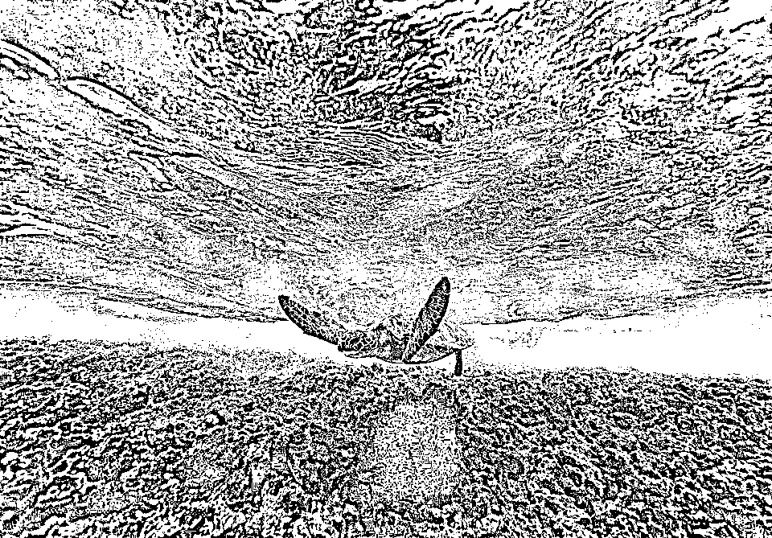

3

**10 月，水星、冥王星、土星依次顺行。同时，10 月 30 日，火星开始在双子座逆行。**

火星逆行每两年才发生一次，每次持续约 80 天。**历史上的不少冲突开始于火星逆行，结束于火星逆行。**

这次的火逆不容小觑。因为火星也是南交点天蝎座的守护星，火逆会让业力层面、集体潜意识中欲望与野心浮现，个体容易有强化的冲动和无法识别的愤怒。如果没有足够的意识，会导致事故、争执和伤害。

火星逆行会从 10 月 30 日持续到 2023 年 1 月 13 日。**2022 年 11 月 24 日，在火星逆行到将近 1/3 的阶段，木星在双鱼座 28 度顺行。**

**2022 年 12 月 20 日，木星再次跨越黄道初度进入白羊座。此后，作为白羊座木星的定位星，火星将完成最后 1/4 的逆行周期。**

火星逆行，实质上是改变火星与太阳的关系，试图找到一种内在的力量直面挑战，而不是屈服于外在的权威。双子座火星逆行确实容易失去控制，但如果火星逆行能帮助我们改变路线，更符合我们的真正目的，火星就可以为更大的利益工作。

**从社会层面，火星在双子座逆行是 2022 年世界大清理的一部分，所有负面的、低频的能量会通过自然灾害、局部战争得到净化。**

对于个人而言，**要获得对双子座火星逆行的驾驭，需要在木星逆行期间深入内在，发现是什么给了自己真正的目标感**，去更新自己的信念，探索自己的灵魂目标和神圣计划。这样火星才能更好地为木星宙斯的神圣目标与愿景服务。

**结语**

**最后，愿大家在经历四个月的木星逆行后，都能带着清晰的意图、崭新的内在认知，披上木星希望的曙光，满怀信心地跨入 2023 的门槛。**

**版权声明**：原创文章由作者授权首发于若道平台发布，欢迎转发，反对抄袭。

**END**

**Justine**

ISAR 国际认证占星师（2014 年获得）/塔罗师

毕业于浙江大学，十年跨国企业 HR 经验

咨询时长超过 1500 个小时

**咨询微信**：Justine_JT

**公众号**：星光体

长按打赏

**20 位来自世界各地的占星师****带来 19 场沙龙——新世界的觉醒****详情可点击下图**

**学习占星学****点击下图了解课程详情**

**微信又双叒叕改版啦，不想错过若道君的推送？**
**就把若道设为星标吧！****▼**

**喜欢就点一下“在看”吧！**

********报名直达入口********

# 这样让人落泪的星图解读，你可能从没体验过

> 原文：[`mp.weixin.qq.com/s?__biz=MzA5NjA0NTAxNg==&mid=2651481876&idx=2&sn=5a44b076d3dde9e0880e290e0a12c7f3&chksm=8b48d5a3bc3f5cb5d4149f1ac0d48c44662bf7ffb9edc1bca71fb05d9042054596b0c87f30d2&scene=126&sessionid=1692737781#rd`](http://mp.weixin.qq.com/s?__biz=MzA5NjA0NTAxNg==&mid=2651481876&idx=2&sn=5a44b076d3dde9e0880e290e0a12c7f3&chksm=8b48d5a3bc3f5cb5d4149f1ac0d48c44662bf7ffb9edc1bca71fb05d9042054596b0c87f30d2&scene=126&sessionid=1692737781#rd)

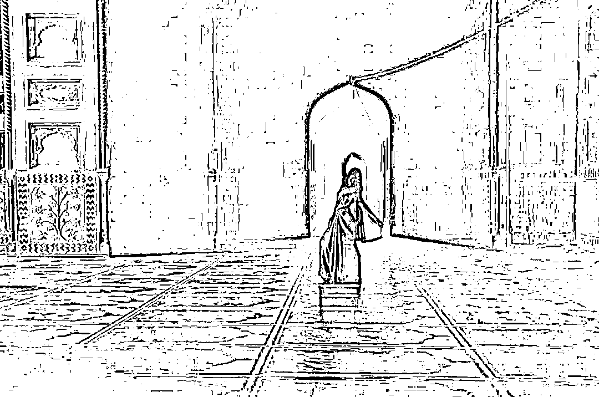

作者/斯蒂芬·弗里斯特译者/孟昕 Sophie 校对/王宏 神婆阿丘编辑/玫瑰 图片/pexels 在今天头条中，我们刊登了《同一天空下》（Under One Sky）一书里，斯蒂芬·弗里斯特在不了解客户的真实情况下，对出生图做的盲解的上半部分，接下来是盲解的下半部分。另外，斯蒂芬老师马上要在若道开设[【组合图工作坊】](http://mp.weixin.qq.com/s?__biz=MjM5MjQwNjAyMQ==&mid=2649440020&idx=3&sn=26be6e53f018b048edb4e6b96444c295&chksm=beb9507e89ced96810f87c3da398dd94090809454b855a9d9a9a752f0855332be83904a2de02&scene=21#wechat_redirect)（点击查看课程），如果想跟这位占星大师学习，快来了解详情吧~ **乔伊斯星图的进一步解读**

在乔伊斯的出生图中，我们观察到两个基本的情感关系指标：她位于第 8 宫的太阳和她金星与水星的合相。“这 3 颗行星都与第 2 宫的行星成对分相。”

太阳对分巨蟹座的木星，而金星和水星对分狮子座的冥王星。让我们通过了解第 2 宫的本质来开始解开乔伊斯出生图的这一维度。

**在传统的占星学中，第 2 宫与金钱有关。**从传统意义上来说，它被更为宽泛地定义为**“可移动财产”**。概括而言，我们可以把它看作**“生存的物质基础”的象征——能使我们生活的一切。**

从心理上说来，物质匮乏会让我们充满“不安全”感，而物质上的安全感支持了我们有能力应对任何可能出现的问题的感觉——于是有：**自信、尊严和合法感**。正是这 2 种内在状态在第 2 宫象征意义的心灵层面上集中体现：**一方面是那种安全感、合法感、尊严和自信的感受；另一方面是自我怀疑和缺乏安全感。**于是，马上显现出来的就是乔伊斯生来就带有强烈的自我怀疑感——简单地说，她来到世间就是为了“向她自己证明她自己”。在我们深入探讨所有这些之前，让我简短地说一下，谈到物质安全感，此处标准的占星解读必然会着重于对乔伊斯物质富足的预测。木星这颗传统上“更大的吉星”预计会带来宽裕的财务状况——由于它与第 8 宫太阳（遗产）的关联，也许是通过继承。在财务方面，冥王星也通常被视为有益的影响力，尽管它在更多的心理层面上有着可怕的名声。它在第 2 宫的位置与“家庭财富”的存在相符——还有那些不祥的背叛、欺骗和其他令人厌恶的行为，大笔的钱财在家庭环境里时常会孕育出这些问题。就算这些可能都是真的，在我看来，第 2 宫内这些行星的核心意义在于它们与乔伊斯心理上自我怀疑的潜在趋势的关联。这些趋势有 4 个来源。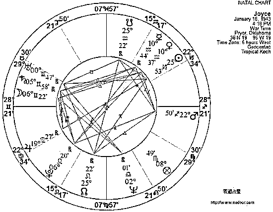

首先，尽管我对于“算命”占星学的信任很有限，但如果乔伊斯确实如同对她出生图的传统解读所表明的那般，出生于一个富有的家庭，她就也成为富有又自省的人之间普遍现象的天生候选人：在他们的“好运”方面感到愧疚和不配拥有。

第二，我们把我们的注意力转向冥王星。这颗行星被誉为“地狱之神”，是第 8 宫天生的守护星，而乔伊斯的太阳就落在第 8 宫。

正如我们所看到的，她一直为她的“心理活动”和她对生活“多疑的”（解读为：有洞察力的）观点系统地感到羞愧。从小时候起，“她有哪里不对劲儿”的信息就一直被强调，让她变得内向——并表现为内在的害羞和自我怀疑。

第三，看着扩张性的、“幸运的”木星，我们意识到，在“证明她自己”方面，乔伊斯实际上为自己设定了非常理想化的标准——而要达到这样的标准并不容易。这是一个微妙的领域。乔伊斯当然是以“武装成佼佼者”的姿态来到这个世界的。

如同我们一直所看到的，她的星图显示出**高度的勤勉、认真、深入，而最有可能的是敏锐的头脑——注定她要在大庭广众面前表达己见。**我们大多数人过着平凡的生活，这就是“平凡”这个词的意思。我们大多数人不会在众所周知的意义上做大事。我们通过在我们简单的胜利中获取喜悦来支撑我们的尊严：抚养好我们的孩子，活得有些诚信，建立良好的情感关系。孩子们也许会受益于他们想成为宇航员和电影明星的梦想。**而另一方面，大人们则受益于更为简单的自我接纳。**在常识的背景之下，我们来看乔伊斯，她实际上来到这个世间是为了做比所有这些更壮阔的事。在她的灵魂里，她对此了然。如果明显缺乏这种伟大的木星愿景的话，她在自己的生活中就会感受到一种相对应的古怪的失败感，甚至是在她表面上的成功之中。“因此，她自己的远大抱负可以构成自我怀疑的第 3 种驱动力。”

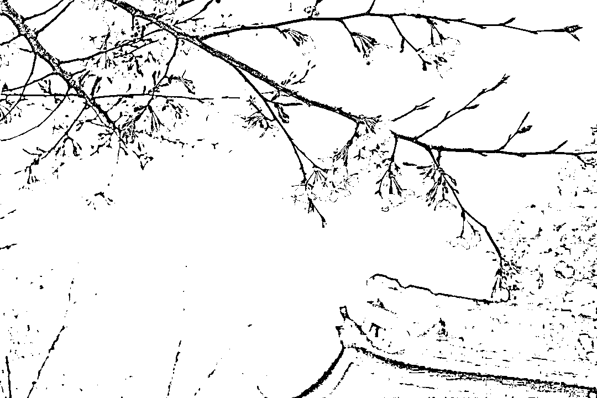

第四，我们必须意识到冥王星对分金星，而木星对分她第 8 宫的太阳。两者都是情感关系的象征，正如我们之前所看到的。

**在乔伊斯心里，任何对“情感关系失败”的自我认知都会迅速内化成一种普遍的自我怀疑主题，通过冥王星或许会内化为自我破坏或牺牲。这是一种潜藏的风险。**

**乔伊斯要求很多，并且紧张不安。**另一种情形是**她极度自给自足和独立，之后几乎直截了当地“存在着”。胆怯者是无法接近她的。但是她天生的灵魂伴侣“也不是胆怯者”！他们也不是那些她被“安排”出于结婚的考虑去迎合的传统人士。**

于是，我们看到在早期亲密关系方面一些类似于对“失败”的设定的事物，它们会按照顺序进入这些自我怀疑的第 2 宫议题中。这反过来也会按照顺序进入她通过躲在“乔伊斯堡垒”里来避免整个痛苦的爱情问题的行为中，从而将混乱整合归位。

我们得记住，尽管自我怀疑是乔伊斯生活中确定无疑的主题，即使她要臣服于这个主题，她的“表现”依然绝对是争强好胜和沉着的。

**进化占星师的提问**在了解了你对上述问题的反馈后，我打算进一步进行以下询问：**·** 你的母亲或者一位扮演母亲形象的人，是否在某些层面上取代了你的父亲，即父亲不在的时候代替他的角色？**· **她是否有一些在心智、感情或者身体上的小毛病需要你应对？**· **你是否希望父母中的一人可以在你需要保护的时候站出来去对抗另一个人？**· **是否父母中的一人联合你“对抗”另一个人，然后似乎又不明不白地把你抛弃给那个人？回答以上任何问题，都能让我将出生图的原型形象和现实生活对应起来，即关于你早年父亲（某些情况下是母亲）是如何“缺失”的问题。我专注于这个问题的细节，是为了要弄清楚它在你漫长生命中所起的作用，即它是如何影响你在这个世界的成就感。再次申明，**那些父亲活着却不在身边的人，他们的内在动因与那些父亲过世的人相比，有着精细而又显著的区别。**在这里我并不能从理论上列出那些不同之处。但是，关于你父亲和家族血统的不确定性或谜团的确是存在的，为此，你的灵魂需要进行一场学习之旅。通过你自有的独特的女性视角，以及你自己深有感触的经历，一种“神圣的思乡之情”会促使你做出更有创意的努力。一种理想的结果是，你最终在世界上找到了一个位置，在这里你能以某种方式感受到联结。

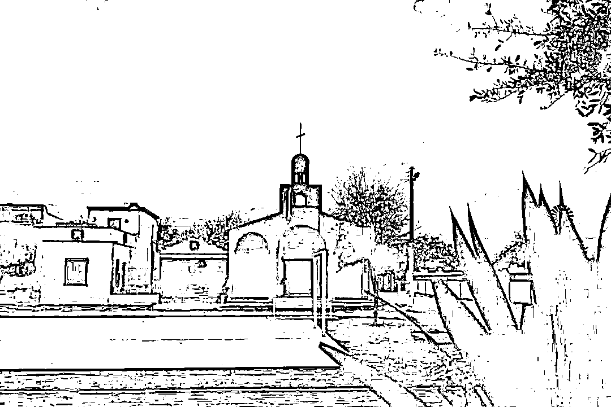

结合以上，我还想了解一下，你是否知道你母亲在怀着你的时候的情况？你受到了她某些特别的恐惧和沮丧情绪的影响，但我并不知道它们来自于哪里。你的父母是否想要你这个孩子？你是否出生在父母还没准备好迎接孩子到来的时候？你是否感觉母亲不喜欢并且（或者）嫉妒你？我察觉到，由于你被母亲（被她有意无意地疏远、忽视）抛弃或拒绝，你花了很长时间才能完全认识到自己是女性，并且以此为荣。最简单的“通道”，便是利用你的聪明才智，让你在这个基本上是左脑思维的、根据我们做了什么而不是我们是谁来进行评估的社会，找出自己的路。你的觉知、想象力、机敏和“操纵全局”的精明必然让你成为一个成就者，甚至还能带给你一定的自主性、声望和权利。但是，这些奖赏也有其自相矛盾的局限性：对男性角色的强烈认同和确定无疑，让你努力把自己打造成一个左脑思维的、迄今为止（或是之后）成功的“男性”形象，以至于你女性的、深入的、性感的和脆弱的一面得不到滋润，无法与你的生活完全整合。

所以，无论你做什么，你都在忍受着过度劳累和被贬低的痛苦。这只是众多可能性中的一种。

一种可能的与上瘾有关的占星征象也在这里展示了出来，我想了解这是否一直是你生活里的一个问题。

你出生图的心理层面显示，当你感觉失落空虚、在这世上没有稳固根基的时候，容易上瘾成癖。从另一个角度看，渴望屈服和被他人他物取代的强烈阴影，以及层出不穷的好奇心，也会滋生瘾溺。

另外，由于金钱和财富，以及它们与你在这个世界的自我价值感之间的关系，是一个值得大量探讨的话题。

因此，你很可能选择金钱作为“药物”，来缓解所有的病痛。在你生命的一段时期里，金钱和物质看上去就像爱情，或者像是解决各种关于孤独和自尊的困惑的答案。

如果瘾嗜在某种形式上是一个议题的话，你自己是如何理解的呢？摆脱瘾嗜是否扩展了你的灵魂视野? 摆脱它是否帮助你更切实地发挥你的创意，并将其更有意识地运用于你的生活里？然而，对于所有这些，我以希尔曼的名言作为警示：**“造就我的不是我的历史，不是我的父母、我的童年和我的成长。它们是映射着我形象的镜子。”**对你来说也是如此，乔伊斯。通过探究你父母在你生活中存在或缺失的种种可能性，以及你被排斥的背景，我们大致了解了你的灵魂在今生想要整合什么。我们可以看到它强烈地需要被认可和被爱，需要和自我深深地联结，需要从排斥、要求及伤害中，有模有样、有威严地摆脱出来，需要重新定义对你而言，什么是真正的“财富”，以便能对自己的天资满怀自信。也需要让心和脑都浸透在你的所知之中，以便于你对禁忌的独特视角能引起别人的谈论。

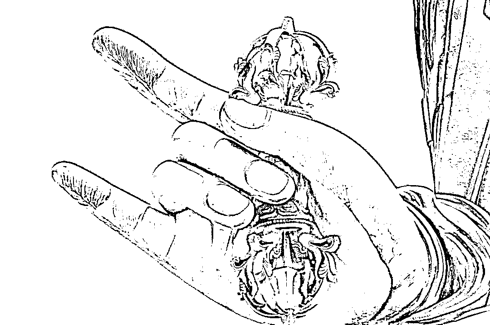

**如何处理愤怒与重生**

**我还想了解你是怎么处理愤怒的。**因为在你的出生图中，独立的自我表达和你让情绪理智化的能力如此让人注目，我想知道你的愤怒是否表现了你直面自己错误的勇气。

或者，是否你会为了照顾同伴（们）而将愤怒“合理化”，导致愤怒以长期抱怨或迁就的形式驻扎于你的身体，但最终却因为无法再“合理化”而突然爆发？

最理想的情况是，你渐渐懂得，在日复一日的生活里，预计后果、学习新的技能、胜任富有挑战的任务，是转化和利用你那些攻击性能量的最佳方法。你的反馈将引导我们讨论，你在达成目标方面是多么成功。

最后，如果我们还有时间，并且你觉得合适的话，我想针对你生命里一段比较紧张又艰难的时期问几个问题，这段时间大约在 1962 年 1 月-1965 年 3 月之间。

多种激烈的宇宙能量汇集，如同“变速杆”一般，试图要让你脱离你的大脑和旧有的防御模式，与你的身体和情绪建立新的关系，并依循你灵魂在今生的修行，进行某种特定的现实核实。换言之，自我和直觉在这段时期试图建立更加灵性和整合的关系。我们总能听到希尔曼所说的“命运的呼唤”，以及“无名恶魔的催促”。可以想象以你的精明，你完全能够绕开这持续整整三年的命运的召唤，但我希望事实不是如此。如果你确实感受到了召唤，我想知道你是如何做到的。你是如同出生图显示的那样，通过早年的独创性成就，还是通过在压抑的情绪下做出了非常之举？或者兼而有之？无论是哪种情况，旧有的身份-人格-价值体系在那时开始破碎，同时有强烈的征象表明，潜意识里不被注意的阴影开始在你生活的众多领域爆发并显现出来。 由于这段期间有大量占星征象集聚，一种可能的情况是无论你做什么都让人（包括你自己）觉得你“很不正常”。灵魂（因为它完全不关心自我或个性的需求）会把这看作是积极正面的事，任何能让你失去理智，沉浸在自己身体、感觉和需求中的东西，都能开启将你从普通金属变成金子的过程。那些被埋葬和隐藏的挣扎着要拥抱自由，走向光明，最终要试图突破业力的阻滞。

我不知道你搭建起了什么，以及（或者）拆解了什么，因为你可能以各种各样的方式去经历旅行（跨文化的经历）、疾病、死亡、遗传、性、婚姻和生育、教育问题、吸食毒品及其后果，以及对信仰体系的挑战，不管是切身的还是象征性的经历，而且它们以某种方式交织进了你的不同层面。

将这些能量释放出去的常见方式是通过性，即：一段让你激情四溢的（“不光彩的”）情事、和某个体现你个人抱负的人的亲密联结、带来各种后果的性行为，如：怀孕，可能会导致你在进退两难的情况下仓促结婚，或者堕胎，亦或把孩子送出去领养。

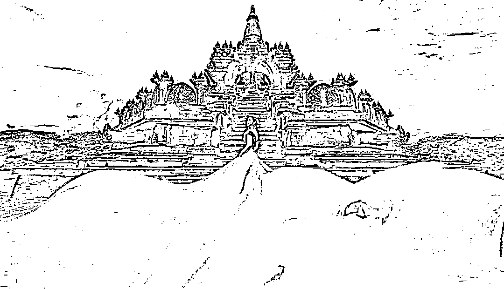

不管怎么说，如果你还没有自己的理想抱负，或者还没觉得自己可以有，如果你对自己的认知是通过财富或财富的增减，如果这种认知还没有进入你的意识（从灵魂的角度看），那么这也是一个很好的时机，可以通过将这一认知投射到其他重要的事物上，把它释放出来。

灵魂去这么做的目的，是让你在家庭（族群）的旧有身份认知“死亡”，从而开始重新为自己定义“成功”，从家庭生活对你的“刻画”以及要求你所要付出的东西中获得解放。

你需要和比生命更宏大的人或物进行联结，并感受这一联结，这样你就能在比生命更广阔的宇宙里找到自己的位置，而不是让其他人为你下定义。

这一世的轮回是带着目的而来的，你现在可以很确信地看到，凡是你在他人身上投射的信任都背叛了你，这是为了让你发展出对自己的信任和对自己认知的确信。这一信任注定会成为和金子一样好，甚至更好的资源！心理学为付诸行动做了许多的解释，但是我相信我们只是去做，有时一遍又一遍地做，只为了最终可以看清我们要整合什么。理想情况下，在这两年多的时间里，你有很多机会去更好地在平衡自己的脆弱和坚强。最后产生的效果或许在很长时间内都不能被理解，但是当你回过头看，你会发现，这些效果恰恰推翻了苏格拉底的格言：“没有被活出的生命不值得去探究”。乔伊斯，探索和分析一幅出生图，对客户和占星师双方来说，是一种神圣的信任。我每一天都在为自己能成为出生图的守护者而感到受宠若惊。我由衷地感谢你给予我这个机会，让我在你的人生旅途里和你有一次这样的分享。

**版权声明：**本文由若道翻译发布，欢迎转发，反对抄袭。友号转载请申请白名单。

**END**

**斯蒂芬·弗里斯特**

若道签约老师。进化占星学的创始人之一，当今世界最有影响力的占星大师之一；1985 年，他凭借《内在的天空》一书获得职业占星师协会奖（Professional Astrologers Incorporated Award）。他四次获得占星界最高的占星学联合协会奖（United Astrology Congress Regulus Award）提名，2018 年获得轩辕十四教育奖。

****探索组合图永恒的三角——斯蒂芬工作坊报名中****

斯蒂芬说，我们的组合图表明无论什么状况我们都能熬过去。

**组合图也像出生星图一样有行进。**在工作坊中， 我们将**探讨一些特殊的技法和考量，来帮助伴侣们应对生活中的挑战和机遇。**组合图的推进会出现一些看似难以解决的复杂问题，斯蒂芬老师创造了一种解决这些问题的技法。他将在工作坊中阐述相关细节，基本的问题是：如你所知，要了解一个人 30 岁生日的推进，我们要看这个人出生后 30 天的行星位置。问题是，组合图与我们在占星学实践中使用的其他星图不同，组合图并不代表某一天的天空。记住，它是基于中点的。**那么我们如何从一个不存在的日期开始 "向下数 30 天"呢？斯蒂芬老师将为我们提供一个行之有效的答案。****点击下图了解更多详情******20 位来自世界各地的占星师****带来 19 场沙龙——新世界的觉醒****详情可点击下图**

**学习占星学****点击下图了解课程详情**

**微信又双叒叕改版啦，不想错过若道君的推送？**

**就把若道设为星标吧！**

**▼**

**喜欢就点一下“在看”吧！**

********报名直达入口********

# 斯蒂芬·弗里斯特工作坊丨探索组合图永恒的三角

> 原文：[`mp.weixin.qq.com/s?__biz=MzA5NjA0NTAxNg==&mid=2651481876&idx=3&sn=83464a0cd1db7ce8cd45af8f26be3966&chksm=8b48d5a3bc3f5cb593fd3bfee96edc7ef30395b4364ecb894c0b9aa3deff7436b6dcb336dea2&scene=126&sessionid=1692737781#rd`](http://mp.weixin.qq.com/s?__biz=MzA5NjA0NTAxNg==&mid=2651481876&idx=3&sn=83464a0cd1db7ce8cd45af8f26be3966&chksm=8b48d5a3bc3f5cb593fd3bfee96edc7ef30395b4364ecb894c0b9aa3deff7436b6dcb336dea2&scene=126&sessionid=1692737781#rd)

**1**

********斯蒂芬·弗里斯特老师若道独家三日线上工作坊********

斯蒂芬说，我们的组合图表明无论什么状况我们都能熬过去。

**2**

********此次授课内容********

**组合图描述了如何才能使两个人的关系一直充满活力。**这句话中隐含的意思是假设一段关系有一种区别于这两个个体的独立的生命。有时我们喜欢和一对伴侣共度时光，却从没想过单独见他们其中一人。我们从这对伴侣身上感觉到的 "频率"是对他们组合图能量的直接体验。在某种程度上，可以简单地理解为：**正如每个人都有自己的星图一样，每对伴侣也有他们的星图。**

从简单的描述层面上讲，这就是组合图的意涵。记住，我们可以将这一技法用于任何一种关系：**父母和子女、商业伙伴、朋友。**作为进化占星师，我们的目标要比单纯描述走得更深。解读组合图时，可以着眼于帮助人们，而不仅仅是使他们感到惊奇。对于个体来说，出生星图代表了一条正确的人生道路，一条承诺意义、活力、灵性目标的道路。组合图亦然，只不过它将一段关系看成一个独立的个体，而不是两个人。关系也有进化的路径：人们走到一起是为了学习和成长。个体如果没有领会自己出生星图的要点，会变得疲惫而沮丧。两个人也是如此，**如果没有抓住组合图的要点，我们就会对对方感到厌烦。这段关系似乎也会失去动力。**

伴侣常常意见不一，陷入困境，看不到前进的方向。三是一个更有动力的数字。三个人投票，二个人以多数票击败一个人，推动事情继续发展。**这实际上解释了这次工作坊的主题：永恒的三角。**

**每对伴侣其实都是一个三人组：你、我以及我们。**组合图所代表的那个看不见的 "第三人"经常会"投出打破僵局的一票"，使关系得以发展。**·** 但是如果组合图总是同意一个人的意见，而不同意另一个人的意见，怎么办呢？（这被称为"封建制度"）**·** 如果两个人都安静而保守，但他们的组合图却要求狂野的冒险呢？（这是 "文化冲击"）**·** 如果它同时均衡地反映了两个人的情况呢？我们可以称之为 "民主"，但我们仍可以区分出一个人天然的智慧比另一个人更强的领域，让擅长的人负责擅长的事，这会促进关系蓬勃发展。换句话说，我们开始看到这个技法的咨询维度了。我们将在这个工作坊中探讨这些内容。两个人究竟为什么会走到一起？**在严肃、复杂的关系中，我们可以假设两个人之间有一些未解决的业力。**如果他们在今生是恋人，但在前世中，一个是父母，一个是孩子呢？也许那些直觉和假设仍可以感受得到，极为错综复杂地使得他们在今生想要成为情侣。**这些疑问将我们引向组合图的月亮交点，在那里我们往往能发现当今人类任何伙伴关系问题的真正核心。**

**从理论上讲，组合图是基于中点的。**如果我的出生星图里太阳在摩羯座中段，而你的太阳在双鱼座中段，我们组合图的太阳就在水瓶座中段。换句话说，**在你和我的太阳的中间位置。****其他行星、月亮交点和中天也是如此。**其他宫头的位置，包括上升点则存在一些争议。通常的做法是仍然使用中点，但斯蒂芬老师将会解释他认为这样做存在的技术方面的问题。他更倾向于**使用关系最初开始的地点绘制星图，就像我们使用出生地来绘制出生星图一样。**

**组合图也像出生星图一样有行进。**在工作坊中， 我们将**探讨一些特殊的技法和考量，来帮助伴侣们应对生活中的挑战和机遇。**组合图的推进会出现一些看似难以解决的复杂问题，斯蒂芬老师创造了一种解决这些问题的技法。他将在工作坊中阐述相关细节，基本的问题是：如你所知，要了解一个人 30 岁生日的推进，我们要看这个人出生后 30 天的行星位置。问题是，组合图与我们在占星学实践中使用的其他星图不同，组合图并不代表某一天的天空。记住，它是基于中点的。**那么我们如何从一个不存在的日期开始 "向下数 30 天"呢？斯蒂芬老师将为我们提供一个行之有效的答案。**

并非所有的人都处于伴侣关系中，但**作为人类，就需要与其他的灵魂共舞。占星学能够极大地帮助人们驾驭复杂的关系。**了解我的星图如何与你的星图通过相位和宫位的交互而产生互动，是非常有帮助的。组合图包含了这些技法，提醒我们，整体总是大于各个部分之和，而又与之不同。

**3**

********斯蒂芬的占星著作********

**·** 1984 年-1988 年间，斯蒂芬写作出版了《内在的天空》（已有中文版）、《变化的天空》和《天空的伴侣》三本占星经典著作，奠定了早期在占星学界的地位。**·** 2002 年-2005 年间，他与朱迪·弗里斯特共同创作了两本经典的关系占星学著作《天空的伴侣 I：爱、性、和进化占星学》《天空的伴侣 II：组合图》。**·** 2008 年，斯蒂芬出版了一本非常重要的著作《昨日的天空》，此书是至今为止关于轮回转世跟星图的清晰对应最详尽的著作之一。 斯蒂芬前后一共出版了 12 部占星著作，在世界占星学界拥有很高的声誉。

**4**

********斯蒂芬获得的荣誉********

1985 年，他凭借《内在的天空》一书获得职业占星师协会奖（*Professional Astrologers Incorporated Award*）。1992 年、1995 年、2008 年、2018 年，他四次获得占星界最高的占星学联合协会奖（*UnitedAstrology Congress Regulus Award*）提名，2018 年获得轩辕十四教育奖。

**5**

********斯蒂芬的占星哲学观********

斯蒂芬的占星风格以**自由和选择**为中心，他的解读不是以下定论的方式来“预测”未来，他**强调如何改善生命，而不是宿命式的论断**。他以心理占星学的语言来解读星图上的人格部分，但是**通过南北交点及其相位和守护星来探索星图所揭示的前世业力与今生方向，在灵魂进化的背景里来整体解读星图。**他认为进化占星学的目的在于**鼓励人们做出更符合进化方向的智慧选择，我们学习去了解前世的时侯，关注点应该集中在如何通过意识来疗愈自己。**

**6**

**这些名人怎么说**

斯蒂芬让我们停止了玩责备命运的游戏，而开始看到自己是一个走在进化路途上的勇士。——奥普拉杂志“*O: THE OPRAH MAGAZINE*”

斯蒂芬和杰夫这两位著名占星师创造性地相互应和，展现出他们出色的教师才华，发展并弘扬了占星这门艺术。（对《测量天空：进化占星学和灵魂的钥匙》的书评）——著名心理占星师 现代占星之父 诺·泰尔（*Noel Tyl*）

请享用斯蒂芬和朱迪这两个博大的灵魂在此书中所提供的洞见大餐吧。（对《天空的伴侣》的书评）——进化占星学的创始人之一 杰夫·格林（*Jeff Green*）

我为斯蒂芬解读的精准感到惊叹，他强调没有一件事是坏得无法挽回的，也没有一件事是如此之好以至于它不会因为现在的错误判断而消失的。我怎样推荐他都不为过！——好莱坞著名影星“钢铁侠”男主角 小罗伯特·唐尼（*Robert Downey Jr*）

**7**

**上过课的占星师怎么说**

他关于我星图的解读，让几乎所有在场的人掉泪，我也从此开启了一段灵魂追寻的旅程。我很惊讶他透过星图可以如此深入一个人的灵魂。很多东西你自己都不知道，但是他讲出来你会发现，啊，这是真的，这是占星学的神奇。——《心探索》创始人孟想

每个来参加老师课程的同学，都会被老师深深的慈悲心感动。这种慈悲心，并不是表面上说的一些什么话，而是一种从意识层次上发出的能量。每个来上课的人，都能感受到老师的爱。这种爱，并不是盲目的爱，而是深刻地洞悉真相后的慈悲。

——斯蒂芬老师工作坊翻译逸月

斯蒂芬老师的一对一咨询已经排期到两年之后，我特别幸运，曾在课堂上被老师抽中分析过我的星图，老师充满爱与智慧的指引让我更加清晰的认识了自我。内在的潜能、需求和矛盾被老师娓娓道来。——禄丽荣斯蒂芬老师是位非常非常值得推荐的大师，很粉他，这位进化占星学的创始人，对人的理解是那么的全面完整、深刻洞见、慈悲和温暖，就这方面而言足可以媲美我无比崇敬的荣格和史坦纳（这两位去天堂里玩了）。如果你对西洋占星感兴趣，或者对人的所有角度、各个层次的真相和可能性感兴趣，推荐斯蒂芬老师的书和课程，特别是他的课程，数倍的功力大增的好机会，错过真是占星粉丝的莫大损失。——仁华

**8**

**2019 年工作坊学员感悟**

**9**

**什么人适合这门课程**

✦ 占星师或渴望成为占星师的人群。   ✦ 本课程并非针对初学者，需具备若道核心课程 level4 及以上水平，即了解星座、行星、宫位、相位、综合解读等知识。✦ 课程会涉及组合盘解读高阶内容，不了解相关知识的同学，请提前学习相关内容。

**10**

********授课老师********

**斯蒂芬·弗里斯特（Steven Forrest）**

**·** 进化占星学的创始人之一，当今世界最有影响力的占星大师之一；**· **毕业于美国北卡罗莱纳大学宗教学专业；**· **1984 年-1988 年间，写作出版了《内在的天空》、《变幻的天空》和《天空的伴侣》三本占星经典著作，奠定了早期在占星学界的地位。前后一共出版了 12 部占星著作，在世界占星学界拥有很高的声誉。**· **1985 年，他凭借《内在的天空》一书获得职业占星师协会奖（*Professional Astrologers Incorporated Award*）。1992 年、1995 年、2008 年、2018 年，他四次获得占星界最高的占星学联合协会奖（*United Astrology Congress Regulus Award*）提名，2018 年获得轩辕十四教育奖。**· **斯蒂芬将自己的绝大部分时间都花在教学以及个人咨询上，他于 1998 年创立了占星学徒计划（*Astrological Appretice Program*），这个计划致力于培养职业占星师；**· **至今为止已经有 600 余位学员完成了培训，其中很多都成为了优秀的职业占星师；**· **他是一位脚踏实地的导师，充满快乐和活力，亲和幽默同时又充满了智慧；**· **他的课程不仅仅是一次占星知识和经验的学习，也是一次与智者的相遇。

**11**

********课程费用********

**正价：6800 元****早鸟价：5800 元****早鸟价截止日期：2022 年 9 月 15 日**

**12**

********授课时间、方式、退转********

**授课时间：2022 年 10 月 14 日-16 日（周五、周六、周日）7:00-13:00****具体时间安排：****7:00-8:45****（15 分钟休息）****9:00-11:00****（30 分钟休息）****11:30-13:00**

****授课方式：******线上直播课，英文授课，中文翻译**

**课程退转：退款原则请详看《教学协议》，如有疑问请咨询课程顾问。**

****斯蒂芬工作坊 | 探索组合图永恒的三角****

**授课老师：斯蒂芬·弗里斯特**

**授课时间：2022 年 10 月 14 日-16 日（周五、周六、周日）**

**授课方式：******网络授课，英文授课，中文翻译****

**费用：**6800 元**（早鸟价：5800 元，截止日期：2022 年 9 月 15 日）**

**课程负责人：王老师**（微信/手机：18510107057，请备注“斯蒂芬工作坊”）

长按二维码添加课程负责人咨询

****报名直达入口****

# 进化占星学大师解读星图的方法，值得反复回味 100 次

> 原文：[`mp.weixin.qq.com/s?__biz=MzA5NjA0NTAxNg==&mid=2651481876&idx=1&sn=40cdb07a8518461af5387c69a6f08fd1&chksm=8b48d5a3bc3f5cb5dfb4d5211318de25276c46f19e3790d2caecadbf317e02a3c5374f2de80a&scene=126&sessionid=1692737781#rd`](http://mp.weixin.qq.com/s?__biz=MzA5NjA0NTAxNg==&mid=2651481876&idx=1&sn=40cdb07a8518461af5387c69a6f08fd1&chksm=8b48d5a3bc3f5cb5dfb4d5211318de25276c46f19e3790d2caecadbf317e02a3c5374f2de80a&scene=126&sessionid=1692737781#rd)

****************************☆ **************后台回复“今日”，给你一句生命态度**************

作者/斯蒂芬·弗里斯特译者/孟昕 Sophie 校对/王宏 神婆阿丘编辑/玫瑰 图片/pexels《同一天空下》（Under One Sky）是一本星图解读的占星书。12 位不同学派的占星师，在不了解客户的真实情况下，对出生图做了盲解。斯蒂芬·弗里斯特就是这些占星师中的一位。一起看看他如何从进化占星学角度解读星图。另外，斯蒂芬老师马上要在若道开设[【组合图工作坊】](http://mp.weixin.qq.com/s?__biz=MjM5MjQwNjAyMQ==&mid=2649440020&idx=3&sn=26be6e53f018b048edb4e6b96444c295&chksm=beb9507e89ced96810f87c3da398dd94090809454b855a9d9a9a752f0855332be83904a2de02&scene=21#wechat_redirect)（点击查看课程），如果想跟这位占星大师学习，快来了解详情吧~ **解读策略**

我并不太关注占星软件。所有可用的占星软件看似都能精准地完成星图绘制的工作。如果让我回到用手绘制星图的年代，我会叹口气，然后拿出我的《宫位表》和《星历表》。

有些占星软件配有各种诱人的外加附属功能，这是其他软件所不具备的；大多数软件都有其独特之处。我每天工作时所使用的占星软件碰巧是 Matrix 的 Winstar II Plus 的第 2 版，它精准、全面，也相当直观。

我也经常使用 A.I.R.的 Star Trax 软件，该软件运行速度快而且有些很不错的网络应用。偶尔，我也用广受欢迎且很出色的 Solar Fire，主要是因为它可以列出行星节点。

在我的 PDA 上，我使用 Delphi 和 AstroPocket，它们的应用范围有一定的局限性，但即使是这些常见的软件也能满足我 90%的职业占星需求。

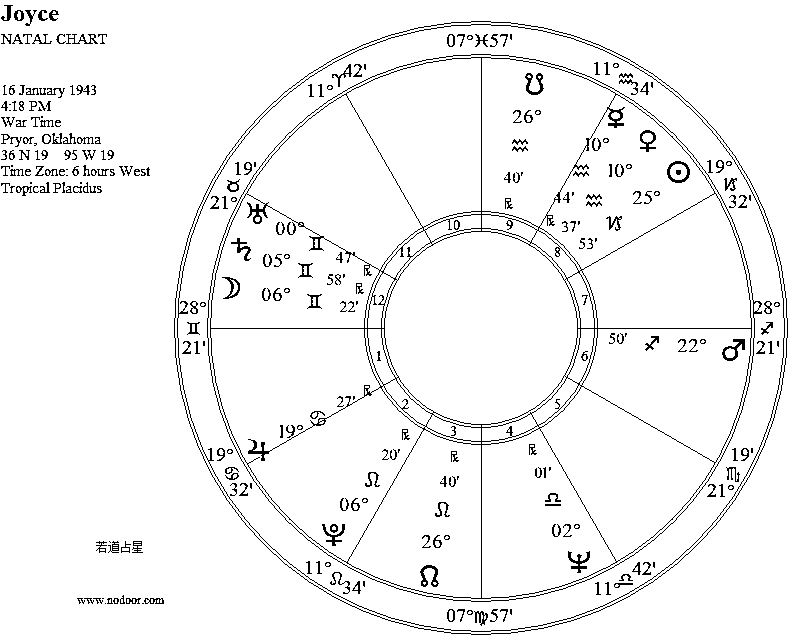

我在 Winstar 中绘制了乔伊斯的出生图。像以往一样，我启用了普拉西德（Placidus）宫位制、平均月亮交点和“标准”相位——可归结成常见的托勒密相位，再加上第 8 次泛音传播，还有同度相位。

在我分析的时候，我主要考虑托勒密相位，但我也会关注其他这些维度。有时候，它们丰富了我关于出生图里更重要的层面所说的内容。例如，我注意到土星与天王星的合相会因同处于平行状态的行星而得到加强。

同时冥王星与上升点的平行强化了乔伊斯第 8 宫的太阳所固有的“冥王星人”特质。但这些对我来说是相对次要的因素，我极力倡导尽量深入思考“极简主义”的占星技巧。

面对乔伊斯的出生图，我开始了真正的工作：解读。在这一部分我的首要目标绝对是感知这张出生图的概貌。占星学提供了无穷尽的细节；象征符号的深度确实没有实际上的限制。我觉得提供对一生的“完整”占星分析比过一生所花费的时间还要长。

因此我最初只聚焦于基本的部分。**解读方式**

我对乔伊斯出生图的书面陈述与我为客户服务时所采用的风格和顺序相符：**通常来说，我从分析“基本三元”，即太阳、月亮和上升点在星座和宫位方面的意义开始，接着按照逻辑顺序逐一分析行星，最后以月亮交点为结尾。**

这样，解读从明显、清晰、易证实的信息展开，再进入更为微妙的领域——把大量更为难懂的业力讯息留到最后。但愿到那时我已经赢得了客户的一些信任，并可以接触到更加深入、不能马上印证的信息。

我对星图进行实际思考的时候并不完全依照同样的步骤。我通常立刻会将注意力集中在月亮交点上，把它们同基本的太阳、月亮和上升点的组合一起考虑。

经验告诉我，对于一个人个性基调的塑成来说，月亮南交点很可能是最关键的占星因素。正如我曾在本书其他部分所描述的，我认为**南交点代表了一个人业力模式的情感基调**。

但即便是一个非常“实际的”占星师也能证实我的核心论点：**南交点的情感特征反映了人类个性的潜在情绪感受、设想和态度，不管它最终意味着什么**。

因此，由于乔伊斯的南交点位于第 9 宫的水瓶座，我从一开始就非常强烈地感受到所有那些创伤性的“被放逐”的情绪。这是其他一切的构建基础。

一看到这种交点模式，我就知道，例如像位于第 8 宫魔羯座的太阳以及第 12 宫中的月亮和土星合相这些更为隔离的维度将会被强调。

我知道月亮交点的第 9 宫特质会支持她在强大的双子座影响下心智扩展的维度——但却不会支持双子座更为轻浮、轻松和好玩的部分。当然，位于水瓶座的南交点也为她出生图里本来就很强势的天王星增添了很多活力。

月亮交点的轴线也教导我，要想将解读的帮助作用最大化，我需要认识到乔伊斯生命的终极进化目标在于朝向她位于狮子座第三宫的北交点前进。于是，她的个性和态度里任何有关于一般的**“温暖和开放”**的议题都需要被特别强调。

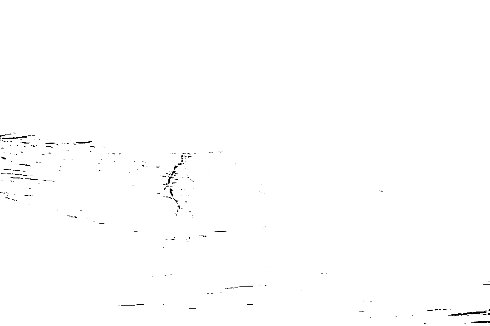

月亮交点的重要性在我早期从事占星学探索的时候就经常给我带来冲击。我几乎在从事占星工作伊始就开始深深依赖于月亮交点。在占星学文献中，对于月亮交点的说明普遍很模糊，或者说有一种从根本上忽略它们的倾向。

我越来越把这种疏忽看作是现代占星实践中系统性的潜在错误。在这一点上，如果我只能了解有关一个人出生图的“一件事”的话，那就不会是他或她的太阳星座，而是**月亮南交点的位置**。这就是月亮交点的强大之所在。回到我对乔伊斯出生图的分析策略上来，在综合考虑太阳、月亮以及上升点时，自然会遭遇天王星和土星——它们通过合相与月亮联系在一起。更进一步地看，土星是摩羯座太阳的守护行星。我在实践中并不总是死板地去进行以上这样的分析，但大多数时候我在分析太阳、月亮和上升点的过程中会查看任何行星与这基本三元的合相，就如同我刚才所做的那样。我认为这样的行星事实上是基本三元本身的组成部分。上升星座的守护行星总是迫切需要被注意到。在乔伊斯的出生图里尤其如此，因为水星不仅仅守护她的上升星座双子座，也是她月亮星座的守护星。这从而继基本三元和它们的合相之后，自然成为出生图分析之旅的下一站。在对出生图进行分析时，我不断在寻找“主题”，寻找出生图进行内在结合的方式。在这张出生图中，我一开始关注水星，一条贯通出生图其他大部分的清晰路径就展现在我面前。水星与金星的合相马上把我带入人际关系这个十分重要的领域。

在引入金星后，我借此机会再次回到基本三元上，从情感关系的角度重新解读并加深我对这些元素的理解。这样的主题整合对我而言是有技术含量的占星分析的标志。我一直在为之努力。

在查看水星和金星的组合并将其与基本三元联系到一起之后，我继续跟随情感关系的象征意义这条线索。金星和水星对分第 2 宫的冥王星。在第 2 宫，我们还看到木星对分第八宫的太阳。

于是，在这张星图里，木星和冥王星都与亲密关系的主题有关。我将这样的视角用作了解它们象征意义的路径，然后敞开胸怀去迎接这两颗行星与亲密关系无关的其他维度。

2 宫所涉及的金钱和资源以及自信这些主题让我很自然地想到第 4 宫（与家庭相关）的海王星。这样一来，只有火星没有被我们考虑到。它与第 7 宫宫头的紧密关联也使得它在引入第 6 宫的层面之前，在情感关系象征意义的大潮之上向前推进。

在乔伊斯的出生图里，强大的情感关系主题具有如菊花链一般的逻辑一致性，这与她南交点和基本三元的“放逐”模式存在有趣又尖锐的紧张关系——当然，这种悖论之后成为解读的主要“后主题”，正如星图本身所确定的。

完成了对行星的分析，我开始尽我所能清晰地去描述整个解读过程中所隐含的内容：**月亮交点及其与行星形成的相位所揭示的业力故事和灵魂意图。**

此处关键在于理解乔伊斯现有的个性反映前世所未能解决的议题的方式，而且更为重要的是理解她现有的个性如何可以被用来达成她自身的进化。

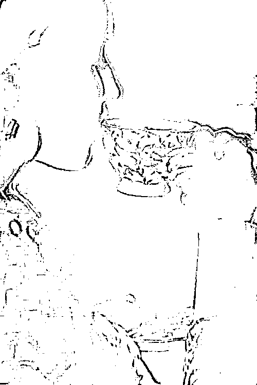

因此，我试图将我对她灵魂的漫长历史和更广大的目标的想象交织进一个人短暂生命的世俗心理现实中。这一目标在我看来日益成为进化占星学最强大的一面。

有些地方我们独自前往。死亡之域便是其中之一。大多数时候，真理之域是另外一个——那些我们看到却绝不会说出的各种凄凉的、令人不舒服的真相：我们感觉深爱的父母将不久于世；朋友甜蜜的毕生梦想永远不会实现。**“残酷真相面前的孤独**”这一主题对我们理解乔伊斯的出生图来说绝对是至关重要的。她的太阳（自我身份）落于魔羯座，这是代表“隐士”的星座。土星为孤独之王，与她的月亮（她的心和灵魂）成紧密的合相。土星和摩羯座也象征着“冬天”——还象征着可能让人挺过这一恶劣季节的品德：**自律、足智多谋、擦干泪水和正视现实的成熟能力。**乔伊斯不同寻常地拥有大量上述品质。与它们所象征的冬天相一致的是，摩羯座和土星都对应**“长者”**的原型——任何一个在乔伊斯还是个 8 岁小孩时遇到她的人都会说：“她将成为一位了不起的老妇人。”这样直觉性的预言的终极真理事实上取决于她在穿过铺陈在她面前的生活迷宫时所做出的一系列明智选择。正如我们将看到的，她将在痛苦和心碎中死去的可能性也是存在的。今生她所面对的真相的极度残酷性由太阳出现在第 8 宫而显示出来。这是传统的“死亡之宫”。通常太阳在这一位置的人在其生活中会经历重大的或过早的死亡，但其象征意义更为深远。

**死亡是第 8 宫现实的“象征标志”，第八宫的现实事实上指任何让人们感觉不舒服的事物，也因此由文化认定为“禁忌”：疾病、衰老、性欲，抑或甚至是我们对他人更为苛刻的心理印象****。**

从小时候开始，乔伊斯就觉得自己着迷于对生活这些更深层面的思考——并很快发现她会为大声说出这些想法而受到惩罚。“于是，她天生的孤独感被社会惩罚和调节所夸大。”

从原型意义上说，她变成了死亡之宫中的隐士。而她与上帝达成的协议的一部分内容是，如果她不通过心理自省去追随她自己内心这些更深层的真相的话，这些真相就会通过创伤性的和极端的事件“显现在她身上”。

“不幸的”事件由最微不足道的失败所引发，从而来坚持她更高的灵魂意图，这一主题因为她位于第 12 宫的月亮而戏剧性地重复出现。这个通常被称为麻烦之宫的宫位，其更深层的意义与意识更高阶的状态相关。

除了具有脚踏实地的又带有都市人精明劲儿的特质（魔羯座太阳和强大的土星）之外，乔伊斯自她童年起就本能地感觉到在这个宇宙里有着“比她自己更加伟大的存在”。

由于质疑权威的天王星在她的第 12 宫中且与她的月亮成合相，所以她也许已经抗拒称它为“上帝”了。怎么称呼并不重要，要点在于此处存在着与生俱来的灵性直觉——脚踏实地的（土星）且破除陈规的（天王星），但仍然是生动的和个人化的。以进化的观点去理解这种第 12 宫的月亮配置的关键，在于认识到乔伊斯来到这个世界是为了独立、客观地，同时也是不屈不挠地学习“实践神性的存在”。

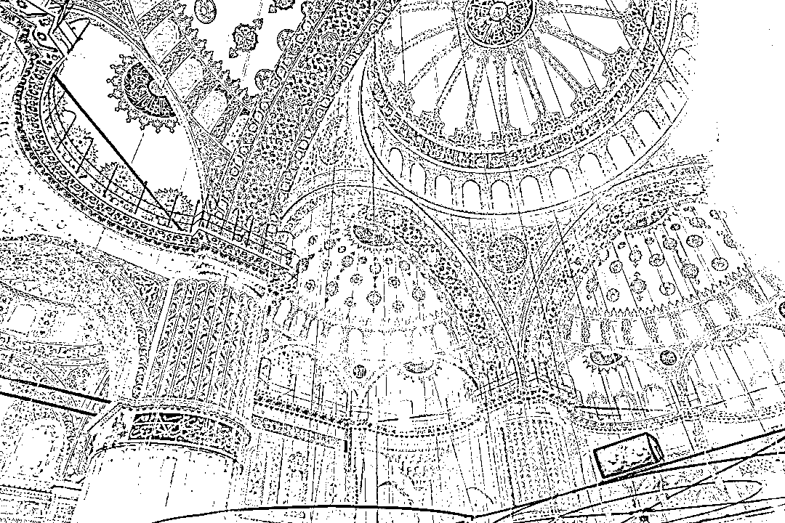

理想的情况下，如果她每天坚持这样的意念并不断扩展，那么花费一些内在的时间，她此生精神的、神秘的和灵性的才能就会意义深远地开放。

另一方面，如果她变得执着于这个世间俯首皆是的焦虑和诱惑，那么她就将触发一种麻木的个人损失模式。从根本上来说，“任何对她来说变得比她的灵性生活还要重要的事物，都将会从她的身边消失”。这是她在开始此生时和“无限”达成的协议。

很明显，乔伊斯来到这个世界是在进行一场豪赌。由于她的太阳落在第 8 宫，她会被要求去面对心理层面的极端条件和环境——人们普遍觉得“不适合”说的那种。

由于她的月亮在第 12 宫，她**频繁被要求去保持高度的精神敏感度——替代物就是触发她生活中甚至更多的损失。**最重要的是，**她被要求以一种从根本上孤独的、无情的和自给自足的方式去进行这种深层次的工作。**

如果她做得还不错，她就将成为一位“聪明的女人”，被她的团体所珍视——之后会有更多的说明。如果她搞砸了，她会变得情绪化、痛苦、忧郁，并很可能去寻找逃避现实和自我麻木的行为模式，以求结束痛苦和孤独。

例如，酗酒常常是拥有这种星图的人所被“预测”出的问题。这是一种可能性，但这当然不是更高层次的发展方向，尽管更高层次的发展也是完全可以实现的，这也不是唯一的黑暗道路。

乔伊斯的月亮和她的上升点都落于双子座，这为整张出生图增添了另一个非常重要的层面。从传统意义上说来，**双子座与语言、机敏和智力相关。上升点本身代表我们如何让人们“理解”我们——我们所戴的“面具”。**于是，我们可以假定**乔伊斯在社交中的自我展示会是语言流利的、机敏的和精神取向的。**出生星图更深的层面透过上升点表现出来，就如同教堂内的光芒透过彩色玻璃窗照射出来一样。摩羯座太阳的条理性、力量和镇定以及土星和月亮的合相在它们进入自我表达的世界时被赋予了双子座的“旋转”，会造就出一种令人印象深刻的、有魅力的，很可能还有些咄咄逼人的面具人格。乔伊斯不会“漏掉什么”。她会流露出一定的韧性和接地气感。她能够“与你相匹敌”。这种韧性和接地气感，伴随她机敏的文字技巧，会成为她的孤独在这个世间戴上的面具之一。语言的面纱也能掩饰她的敏感，而敏感是人们总是低估的一种她的特质。这种敏感性深不可测——因为她的月亮、土星、天王星合相在神秘的第 12 宫。

对此我们可以补充到，当我们“剥开她的洋葱皮”并来到她最深处的核心时——也就是说去研究她的第 4 宫，我们发现了神秘又敏感的海王星。

但这一组合中还存在着摩羯-土星的影响力中与生俱来的“理性”，与双子座月亮和上升点的心理脆弱自然相伴。而她天生的孤独——她很可能愿意将她的敏感留给自己，同时她也具备非常完备的条件去这么做。

将我们早先的参照增添到悠闲感上，带着这样的悠闲感，即便是相对微小的进化失败也会给她带来存在方面格外极端的后果，而我们可以意识到，她与生俱来的敏感很有可能在年幼时就被“瓦解了”。

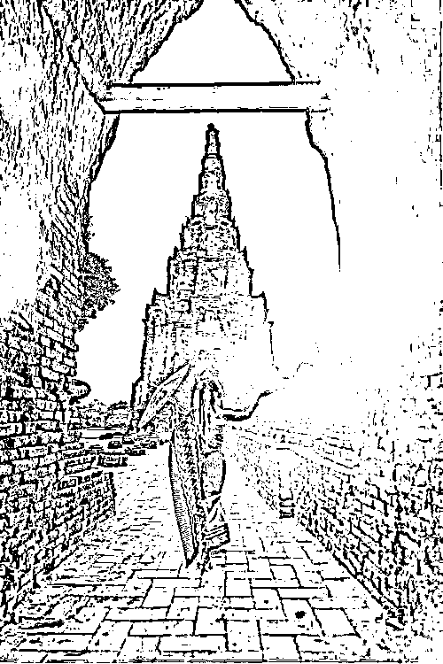

她来到这个世上不是为了极度惊恐，但她得处理好自己的进化以避免这种结果，尽管她具有相当大的力量和弹性。

双子座的高端原型是“教师”。由于乔伊斯的月亮在双子座，我们可以说她有着“教师的灵魂”。由于她的上升点在双子座，她也戴有“教师的面具”——她具有外向的技能，换言之，以教师的身份生活。

不是所有的教师都站在教室前排，然而“教师”在这里基本上是指将信息引入世界的渠道。在这个意义上，所有的作家和记者都是潜在的“教师”，所有的播音员、电影制片人和其他“媒体”人也一样。从最单纯的意义上说，同双子座与任何“专家”的权威学术姿态的关联相比，双子座更多地与对令人惊奇的数据的虚心接纳能力相关。所以说，双子座尽管是代表“教师”的星座，它也是代表奇妙、惊奇和不可思议感的星座。比起“是正确的”，双子座更多地与“好奇”相关。于是，我们观察到乔伊斯对生活具有某种无法抑制的迷恋，这样的特质是痛苦的经历所不能完全消除的。这种“坚持学习”的勇敢动力是她实现“教师”这一高级天命的基础。她是对生活的精准观察者。从这些观察里——通常是对于生活中极端事件的观察，正如我们从她出生图的其他部分所看到的——她呈现出的不是答案，而是令人讶异的提问以及扩展思维和转换典范（天王星）的观点。这些将成为她所“教授的内容”，也位于能让她在她的社区里成为受珍视的“长者”的特质的前列。

以这样的方式教学，她得学会无论她领悟到什么有关生活的内涵，真相总是更大、更广泛的。带有如此多双子座能量的人已经准备去进行狂野之旅。他们要么拥抱生活的混乱无章，要么不断失去依靠——这也从另一方面提醒我们乔伊斯所下的大赌注。

让我们在这部分解读里再加入一个元素。她的双子座月亮位于第 12 宫，因此这些教学内容将带有一些“灵性”。

我将“灵性”二字打上引号是因为我在从广义上使用它——例如，许多小说从不提及“上帝”一词，但却满是灵性的教义。大部分作品值得一读的诗人都是灵修老师。同样的，那也不意味着他们写的是有关神学的内容。

整个宗教问题在此处是一个敏感的问题。摩羯座和土星都受到传统和构架的吸引。只要有点机会，强大的海王星和第 12 宫的月亮就都是天生神秘的。它们甚至为冥想的和隐居的生活的宁静所吸引。

另一方面，与她的宗教直觉在矛盾张力之中一起运行的是不停歇的，几乎是科学的、不断在提问的好奇心，这样的好奇心由双子座的影响所暗示，并进一步由强大的天王星主题中所固有的“与权威之间的麻烦”所协助和煽动。

我于是猜想乔伊斯更多的是“灵性的”，而非“宗教的”。

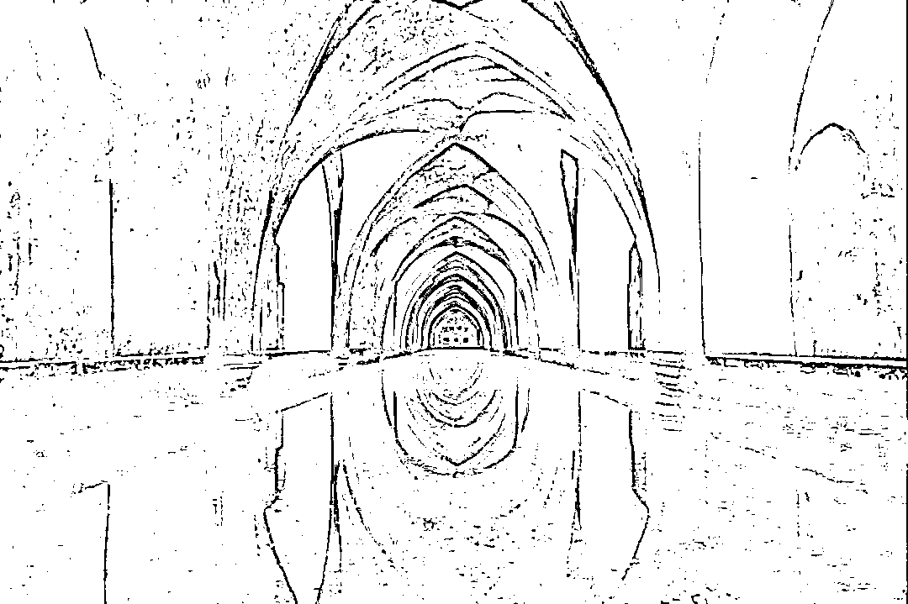

**具体的解读**

至此，我们已经观察了乔伊斯的“基本三元”：太阳、月亮和上升点，以及 2 颗恰好与她的月亮成合相的行星。让我们总结如下：

**· 太阳代表在“自我”和“自我认同”的层面她是谁。**因此她是禁忌之宫的“隐士”，或者是死亡之宫的“长者”。

**· 月亮是她的“灵魂”。**因此她在灵性之宫里拥有“教师”的灵魂，或“观察者”的灵魂——或者说是麻烦之宫，如果她脱离了目标的话。

**· 上升点是她戴的“面具”。**因此她戴上了“教师”的、“观察者”的或是“讲故事者”的面具——她外在的人格带有这些精神、语言原型的特点。出生星图里的占星符号暗示了，你有一种能说服自己及时摆脱自身感受的能力。这也标志着一种激越性抑郁症倾向，或至少是情绪压抑。如果没有干预治疗，它带来的影响会“摧毁”你的能量，而不是驱使你将其导向更有用的渠道，但这样的有用性对你此生的进化至关重要。现在，问题来了：迄今为止，你是否曾经以某种方式，把你大量的思考和想象从防御盾牌（哪怕是一个充满魅力让人无力抗拒的盾牌）转变成能助你在世间获得一席之地的工具？如果你能就这个问题谈一谈，那么将让此次咨询取得实质性进展。这能帮助我了解，是否你早年被抛弃/或者缺少照料的经历激发了你的野心？例如：“有上帝做我的见证，我不会再感觉无能为力，或者身无分文……”

又或者是另一种情况：这一经历似乎削弱了你的某种能力，让你很难去寻找能让你获得自我认同和自我价值感的同伴，而你之所以寻找这样的同伴，是因为他们活出了或者“携带着”你的野心。

对环境的敏锐感知让你天生就是个“记者”。你能收集那些表面上看上去互不相关/毫无联系的零碎信息，当你的多层认知把这些信息带入各级意识层面并加以整合时，你会想出一个能转变周围人观点的心理完形（gestalt）。

在不同场合下，你可以和各种各样不同层面的人建立关系，你言语中所带有的感情冲击力、推销力和诱惑力，大到甚至连你自己都没意识到。就像是一个魔术，你今生的任务就是学习如何使用这一能量。你首次面迎这方面的挑战是在大约四岁半的时候。

只要你愿意，你可以一针见血（并且对愚钝的人缺乏忍耐），但你的方式应该是邀请人们和你一起探究你所说的和所看到的。

你的说服力、聪明、幽默、机敏和生动的表达绝不会让周围的人感到无聊。而且你不是在做表面文章，你态度严肃，追求深刻，并且天生就喜欢探索人类经验中更深更黑暗的部分。

但一次又一次，你的表述和回应如此巧妙，以至于你的智慧本应成为沟通的桥梁，却变成了与人相处时的防护盾。

你的出生星图显示出你是以关系为重的，这也告诉我你的业力功课要依靠与他人的联系来完成。

你也许觉得，你的伴侣（们）满足你需求的最好方式是永远让你觉得有趣，但如果他过于满足你的心智防御，你会在关于亲密关系（彼此深入了解）、稳定和信任这些至关重要的业力经验上自我欺骗。带有各种伪装面具的伴侣在你的生命里逐一出现，帮助你看到更深的悲悯层面，于是你可以用人性而不是用想法去辨识，用自己的心路历程而不是理论和理想化的概念去教导。

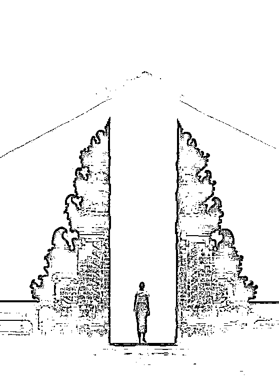

作为一名占星师，我能看到在你生命很早很早的时期（也许甚至是你还在子宫里的时候！）就倾听着、吸收着你周围语言式的和非语言式的线索，最终你得出结论：情感是一片危险的领地，进入的人有去无回，既然如此为何要涉足？

成年后，你的某个部分或许总有这样的直觉和恐惧，那就是如果你真的踏入那片“领土”，你不仅自己变得深深的脆弱和依赖他人，你也会同样无法抑制地对“世间受苦受难的灵魂”易感而伤。

作为一名治疗师，我能看到这是一个“早期的决定”（一个能统治你生命很长时间的决定，因为它在你很小的时候完全合情合理），我想知道在这些年的时间里，你如何理解自己的情感本性。

对这些问题的简短回应便可以帮助我将你出生图里的各种元素交织起来，更好地理解你的灵魂在世间的生活模式。

如果压抑（焦虑或者其他情绪）没有从一开始就控制你，很可能是因为你利用智慧和想象去逃避掉了，变得在情感上隐形，你或许还认为，这是通过抽离情感的纠缠而获得控制权。

作为一名治疗师，我想了解，你是否曾经对那些出现在你盲区的原始需求感觉羞愧？比如，你心里是否自动将这些需求标记为“自私的”“幼稚的”“自我放纵的”？

并且（或者）你是否被卷入他人的生活之中，这些人能明确展现自己的需求，并且依赖你去拯救或者照顾他们？如果是这样，你成年以后是如何处理这些问题的呢？你是否把你的悲悯发展/延展至“拯救”之外呢？你现在是否能了解谦逊和羞愧之间关键性的区别呢？这对你意味着什么呢？又如何影响着你的关系，以及你保持成就的能力呢？你的出生图在我脑海里引出了一个有趣的原型组合：灰姑娘和揭秘者（译注：童话《皇帝的新装》里的那个小孩）。一个是被抛弃后不得不从贵族家庭里消失的小孩，另一个是看到并且大声告诉城里所有人皇帝什么也没穿的小孩。一个从黑暗里被救赎；另一个则是个救赎者。一个挣扎着适应传统；一个对传统公然反抗。两个都在赌博。一旦你懂得说出黑暗的真相，就将导致自己被同族放逐，而你同时找到了入世和出世的方法（这一主题似乎无处不在）。也许，早期对于责任的设想是宝贵的，甚至是舒适的盔甲，能够抵抗你一触即发的回应能力。我敢大胆地说，在你 5 个月大的时候，你的童年就结束了。“情绪的自我满足”似乎是某种矛盾修辞，不能与情绪的成熟混为一谈。但我认为你很早就伪装出了这个样子，以至于你的那些特别的需求对你周围的人来说是很陌生的，他们无法理解。这张出生星图一次又一次地告诉我，这个灵魂与对脆弱的恐惧进行着激烈的搏斗（你也许会把这看作是独立），因此也带来自我需求和他人期望的对峙。“恐惧”和“匮乏”是你早年生活最强烈的主题。我不是很确定你的父母在你的生命里分别扮演了什么角色，因为他们交织在你的心智里。但无论他们在不在你身边，你和他们的关系都在“训练”你远离自我感受。

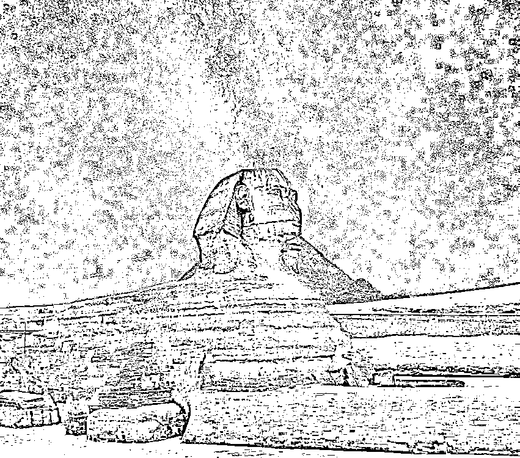

我倾向认为对你造成这种影响的是你的母亲（或者扮演母亲角色的人），如果她在你童年时活着的话，因为我怀疑你曾经为了维持与她的联系而去迎合她的需求，也许你还为她“提供”过你富有创造力的天赋，试着让她开心。这一点，再加上你对于变成有用之人的需求，导致你很早就对别人明示或暗示的要求十分敏感，甚至让你获得一种虚假的力量，但这也逐渐将需要依靠的那部分你投入深深的阴暗之中。由于你越来越坚信自己不需要依靠，这一问题便在你成年后的人际关系中爆发出来。

不管你真实的生活境遇是怎样的（我们的对话将充分阐明这一点），你与你母亲，或是扮演母亲角色的人关系都很复杂。

不管母亲有没有存在于你的生活中，她似乎都对你的智力发展起到了积极影响，“支持”着你想要活出与她不同人生的渴望；但是同样，她也支持或勾勒出你旧有的防御感，以及在更深的情绪层面上对危机的厌恶感。由于你对自我需求和感受的辨识，以及“拥有”的能力，在出生后不久就被消灭，我很想了解是否：你被迫要演绎家庭的痛苦；并且（或者）你被一阵阵的压抑折磨着，因为你要隐藏自己的锋芒；发展老成世故、无需依靠的伪装；并且（或者）通过“躲进”梦想、幻境或自己的世界里，来抵抗这一切。根据出生图的一些特定指征，我比较倾向于后者。更何况你在年轻的时候，社会还要求年轻妇女对家庭困境沉默隐忍，而不是给机会让她们表现出来。多年咨询工作的经验让我观察到，童年时期的环境里，总有些经历、事件、关系概括了前几世生命里的那些未尽事宜，或者未抚平的创伤。因此，我很想和你深入探讨一下 1946 年至 1948 年这段时间，也就是你的“灵魂密码”被激活的时期，你都还记得些什么或者被告知过哪些事。

不管现实的表现如何，他们都携带着你今生灵魂的主题：那就是逐步地把你的心智从一个自我导向的（不管多么不易察觉），或许是约束性-教条式的“武器”，转化成一个用于疗愈和理解，富有创意和充满悲悯的工具。

再次强调，这些根源于你家庭关系的各种关系，是实现这一转化的关键，也是你持续不断修炼和净化自身觉知的关键。

所以，在你生命最初的 20 年里，你的灵魂有意识或无意识地观察着，在某些复杂的情形下，人们是怎样搭建和发展（不管成功与否）彼此间的关系的。你熟练又具战略性地运用你脑力的本领，来自你前世里对未来的描绘或憧憬。

你对某个激进的（“非部落的”）、哲学的/宗教的或者是意识形态上的“目标”、或集体进行的理想主义式的自我牺牲，可能会强迫你封闭个人需求、感情、关系，这个过程可能让你象征性地或者实实在在地牺牲自己，以显著或微妙的方式进行。

在后一个例子中，一个从强权的男人那里讨取秘密，然后再将秘密偷偷转递给同胞的高级妓女的形象出现在脑海里。你的灵魂对塞万提斯理想主义式哀叹非常熟悉：“哦，让人们回归本真，穿越一个真实的世界。”

咨询到这里，我想了解我的这些解读是否让你产生共鸣，虽然我更感兴趣的是锁定一种你正在尝试着要转化的能量，而不是去描述你我都无法具体化的前世生活。无论我们的交流结果如何，我都想将它织入你今生更为紧迫的一些议题里。在这些议题里，从进化的角度，去体验激烈的、情感亲密的、涉及性欲的和心智上的亲密关系，这对你十分重要。虽然你聪慧的头脑或许成为了你早年最好的玩伴和爱人，但它却是一个糟糕的母亲，无法照顾好你内心最深处的渴望。如果我们不会流泪，我们就不会爱。当理智和情感，头脑和心灵分离的时候，灵魂承受着极大的悲悯的丧失。当他们重新联结时，牢狱之门被打开，心灵得以放飞。因此我能感受到，今生你的灵魂决心要从愧疚、恐惧、指责的牢笼里挣脱出来，并解放其他同样在世间受困的灵魂。当你在感觉和亲密关系的世界里变得更加完整和踏实，越来越坚信自己值得被爱时，你就可以像一个“艺术家”，而不是“科学家”那样，把自己的意识和经历相融合，成为你最终达成灵魂目标的核心动力，也成为灵魂目标的一部分。某些情感的纠缠必然会与你相遇，并以这样或者那样的方式要获得你的关注，为的是让这一切转化发生。（未完待续，详见今日二条）

**版权声明：**本文由若道翻译发布，欢迎转发，反对抄袭。友号转载请申请白名单。

**END**

**斯蒂芬·弗里斯特**

若道签约老师。进化占星学的创始人之一，当今世界最有影响力的占星大师之一；1985 年，他凭借《内在的天空》一书获得职业占星师协会奖（Professional Astrologers Incorporated Award）。他四次获得占星界最高的占星学联合协会奖（United Astrology Congress Regulus Award）提名，2018 年获得轩辕十四教育奖。

****探索组合图永恒的三角——斯蒂芬工作坊报名中****

斯蒂芬说，我们的组合图表明无论什么状况我们都能熬过去。

**组合图也像出生星图一样有行进。**在工作坊中， 我们将**探讨一些特殊的技法和考量，来帮助伴侣们应对生活中的挑战和机遇。**组合图的推进会出现一些看似难以解决的复杂问题，斯蒂芬老师创造了一种解决这些问题的技法。他将在工作坊中阐述相关细节，基本的问题是：如你所知，要了解一个人 30 岁生日的推进，我们要看这个人出生后 30 天的行星位置。问题是，组合图与我们在占星学实践中使用的其他星图不同，组合图并不代表某一天的天空。记住，它是基于中点的。**那么我们如何从一个不存在的日期开始 "向下数 30 天"呢？斯蒂芬老师将为我们提供一个行之有效的答案。****点击下图了解更多详情******20 位来自世界各地的占星师****带来 19 场沙龙——新世界的觉醒****详情可点击下图**

**学习占星学****点击下图了解课程详情**

**微信又双叒叕改版啦，不想错过若道君的推送？**

**就把若道设为星标吧！**

**▼**

**喜欢就点一下“在看”吧！**

********报名直达入口********

# 太阳+行星相位最全合集，拿去吧你！

> 原文：[`mp.weixin.qq.com/s?__biz=MzA5NjA0NTAxNg==&mid=2651481811&idx=1&sn=776f8d2c3b964125665a12b4c90fc559&chksm=8b48d464bc3f5d72688561f8acf4c873e5f0340de5bca1bc4f1f904bdb64a137b6d505614697&scene=126&sessionid=1692737781#rd`](http://mp.weixin.qq.com/s?__biz=MzA5NjA0NTAxNg==&mid=2651481811&idx=1&sn=776f8d2c3b964125665a12b4c90fc559&chksm=8b48d464bc3f5d72688561f8acf4c873e5f0340de5bca1bc4f1f904bdb64a137b6d505614697&scene=126&sessionid=1692737781#rd)

******☆ ****后台回复“今日”，给你一句生命态度******

作者/艾德里安·邓肯

译者/林恩 校对/Chang 编辑/玫瑰 封面/书君 图片/pexels

太阳是我们今生最重要的，而太阳同其他行星的相位也很重要，这份全集你一定要收藏，反复查阅。另外，邓肯老师开设的【[经世占星学 3 天线上工作坊](http://mp.weixin.qq.com/s?__biz=MjM5MjQwNjAyMQ==&mid=2649440020&idx=4&sn=bdf6698da320359f9c32dd3612f498e4&chksm=beb9507e89ced968c5cb5600854aec488736052ca8c85cd4aee5c81764479c19fd529504ab0a&scene=21#wechat_redirect)】报名中，点击链接了解更多详情哦。

**太阳相位影响着我们存在的核心**

任何与太阳相关的相位都影响着我们存在的核心。困难相位会在生活中的某些时候表现为身份危机，并对我们每时每刻的自我投射产生深远的影响。疗愈性的处理太阳的困难相位，也许是所有工作中最具挑战的，因为需要精神层面或核心层面的改变。

对身份性的追根溯源，几乎总令占星师把客户带回与父亲、或童年时期有影响力的导师的关系当中。对太阳及其相位的描述，通常会构建一幅相当精确的父亲画像。原因有两个，且相互关联。

**· 首先，很可能个体会转世到最适合它未来发展的完美环境中，因而会被最适合这种发展的父亲所吸引。**从业力的角度来看，也可能他们之间还有未了结的事务，双方都需要在和这个特定父亲共同渡过的童年阶段里进步。

**· 其次，孩子会唤起父亲身上的某些特质，当孩子还未出生时，这些特质可能并不显现。以下文的太阳-木星为例，孩子会把父亲当成导师和向导，问很多关于这个世界的问题，**激发父亲看上去很健谈、睿智的一面。父亲可能实际上并不是这样的，但孩子就是会这么认为。无论如何，这两种情况可能都是对的……父亲是睿智的，而孩子唤起了他自身的智慧。这两者的区分至关重要，因为许多客户都苦涩地抱怨他们的父母，并把相当大的责任归咎于他们。

但事实是，父母是无条件地爱自己的孩子的……他们可能会搞砸养育过程，可能表现的不成熟，他们可能会做糟糕的事情，甚至可能不喜欢自己的孩子，但爱是存在的，因血缘关系而深沉，这意味着他们可以为自己的孩子献出生命。

孩子和父母一样，也要对双方的关系负责，如果不是行为上的，那么肯定是业力上的。只有停止抱怨，承担起个人责任，一段关系才能变得更好。**没有什么比和父母的和解更能治愈孩子的了，当你用正确的视角来看待，真的没有什么能阻挡它的发生。**

**外行星与太阳的困难相位（合相、对分相、四分相），体现了孩子感受父亲时所戴的滤镜。**太阳代表着个体化，而父亲是其第一标志。在被母亲抱着喂奶的小小空间里，孩子经验到父亲的闯入，和随后的消失。

这种情况在传统家庭中时有发生，而每当这种情况发生时，气氛的变化或好或坏，母亲的情绪会随之波动，大地在颤抖。孩子能感觉到一种干扰性和力量感……谁或是什么有如此大的影响力呢？

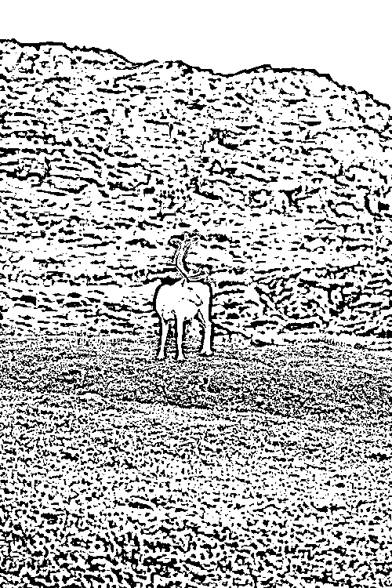

有些人在非传统关系中长大，父亲进行养育，或者在同性恋家庭长大，但重要的是，对孩子来说，童年的一切在当下都有对应的深刻结果。**关键是顺着结果去童年追根溯源，显示出同样的能量是如何既渗透过去、又遍及现在。**父亲就是英雄，孩子的生命之光；童年，是一场认识到（父亲）这个上帝是一个有缺陷的人的漫长旅程。**个体化的进程，就是取代父亲成为了自己的生命之光，具有内在独立的力量感和认同感。**

太阳和它的相位生动地显示出这一进程中会有哪些阻碍。这种体验对儿子和女儿来说些微有些不同。对儿子来说，父亲是英雄，但是在青少年时期会被推翻。女儿则深爱着父亲。对一个小女孩来说，2 到 7 岁之间，父亲都是一个穿着闪亮盔甲的骑士。

父亲在女儿幼年时期的所作所为会对她后来的所有关系产生深远的影响。如果父亲在这个阶段通过分居或离婚离开了家，影响是极其深远的。克服它们将成为此后余生的一项重大挑战，而这一冲突会很清晰的体现在星图中。

分开的状况至关重要。女儿能常常见到父亲么，还是不能？……分开不一定会造成很大的伤害。我们可以离开彼此，只是做朋友。父亲切断了所有的联系吗？

……我的伴侣会离开我，并且再也不会回来。新继父进门了吗？……我一生中会有两个男人。父亲为了另一个女人离开了母亲？……那么，做妻子多愚蠢啊——做另一个女人好多了。

以下对太阳相位的描述肯定是很概括性的，然而每个相位都有一个独特的辨识基调，描述着客户的身份认同。有成百上千的排列组合，但核心能量是相同的，正是通过这个核心能量，改变才得以实现。

**太阳-木星：正确的重要性**这个相位对占星师来说是个有趣的挑战，因为**客户强烈认同于他（她）自己对“生命意义”的解释，并确信这是正确的**。基本上，这类人觉得他们自有答案，并通过他们自己的理解来感知你所说的一切。这种态度在火星-木星型人中也非常明显，而在水星-木星型人中相对较弱。他们很聪明，其他人可不一定。他们欲寻找证据，证明占星师没有赞誉说的那么聪明，而且打赌占星师会在某些点上暴露出他们缺乏对客户预期的洞察和理解。

这是治疗性干预的关键时刻。一位有这个相位的客户在我说完后插嘴：“是的，但是……”。基本翻译过来就是：“好吧，那是你对事件的看法，但现在听听这个，正确的说法”。我的干预非常简明直接：

占星师：你知道吗，每次我试图向你解释某些东西的时候，你都会打断我说“是的，但是……”？你看，这让我觉得我没什么可提供给你。客户：是的，但是……他又说了一遍，完全无意识地。他沉默了，我们彼此对视，了解开始了。

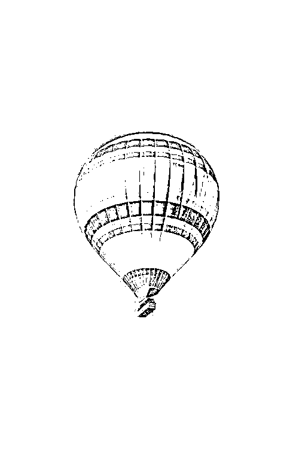

刨去这一点，**太阳-木星型人可能相当有学问，并且为了加强他们的理解而做过深入的研究。**

你很可能处于这样一种状态，觉得自己的智力水平被远远超过，这会唤醒你潜在的自卑情结。记住，这是太阳-木星型人的标准技术……他们很难抵挡优越感的诱惑，周围的人往往感到低一等。

这可能是他们行为习惯的核心，体现在环境中就是，**周围的人都变成马屁精，不会或不敢给他们智力上的打压，而这恰恰是他们的发展所需要的**。因为智力打压是太阳-木星型人最不想要的，所以让他们看到小小的智力谦逊是一种美德，相对来说会简单一些。

如果你的太阳-木星型客户是“聪明”和优秀的，那么很重要的一点，就是摊出你的底牌，明确说明这让你感觉如何。他是来咨询你的，但似乎他自己都有答案。你能为他做些什么呢？一定有什么东西是他没有破解的，否则他就不来了。

**是什么，是什么让他很难解决？**某些情况下，困惑中的人却看上去智力超群，那么最好将他的“智力”纳入到解决问题的进程中来。

**太阳-木星型人还存在一个更深层次的问题，在合相的相位尤为突出。**由于木星象征深刻的精神领悟——与上帝相遇，而太阳是存在的中心，两者的结合会有一种**极强的空间感或无边感，造成相当大的焦虑**。有时这会导致**所谓的“躁狂”行为，如同身份溢出了边界。**这是**狂妄**的典型特征。如果客户的领悟和经验背后没有灵性或哲学的结构来支撑，就会产生一种**被浸没**的感觉**。一股强大的土星力量，以某种严谨的思想、精神行为准则的方式出现，可能会有所帮助。**信仰系统毕竟是为了应对这种挑战而发展起来的。事实上，**太阳-木星型人总是在寻找一个可以信任和学习的导师，且大多在遭遇精神危机的时候找到。**有时太阳-木星型人会觉得自己**处于一场深刻的灵性战争的漩涡之中**，毫不夸张地说，**那些有太阳-木星对分相位的人甚至会和上帝对阵，或者要求一些“上帝”的东西。**这些人可能觉得上帝对他们的要求太多了，或总是在不断地揭露他们。有时这会被更多投射为**社会中的“权力”**。**对于有太阳-木星的对分相，尤其是四分相位的人，在社会中与道德权威的冲突可能一直是痛苦的来源。**这些人可以肩上扛着枪四处晃荡，内心做着自我对话，让自己相信他们所处的社会中，道德权威是多么的愚蠢。

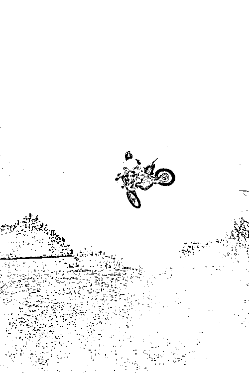

然而，在这种内心谴责的过程中，他们一不小心就有可能像他们批判的权威一样，变得**令人讨厌和教条**。例如，**教会、政治制度、教育界和媒体界有影响力的人士都可以是这样的权威。**

一般来说，**父亲是很有影响力的，见多识广，对各种各样的事情都强烈地表达他的观点。**木星经常带有**强烈的道德色彩，孩子难免产生被批判了的感觉**。和木星所落星座的位置和其他相位相关，**这种批判有时也会很严厉，尽管木星也有关宽容和理解。**可是孩子也有非常强烈的观点（太阳-木星相位可以证明），所以会与父亲或导师发生智力上的冲突。

孩子在很小的时候，就被框定住了，并且形成一种认知，即**权威在智力上或道德上会进行控制。**他们制定法律……这太不公平了！一种内在的对话开始发展，**孩子开始确信自己的判断、结论和信仰是正确的。**

就这样，体验被一个智力化的、精神性的、道德性的过滤器所过滤，这个过滤器微妙地改变着现实。在外在世界获取了权威地位的人被视为是有缺陷的人，而且存在一个内在的自我辩护过程，其特点往往是对他人的负面评判。当然这里有智慧，通常对这一普遍情景的简单描述就足以使这类人调整行为，并且创造一个更好的社会环境。对于这类客户来说，遵从他们的见解是一个很好的做法，避免让他们觉得你已经找到了答案。他们需要参与到治疗的过程中。**让太阳-木星型人起到宣泄效果的，是承认他们暗自知道自己是对的，并且相信自己是优秀的。****太阳-土星：尊重的需求**

**有太阳-土星相位的人在专业领域往往会相当成功，一部分基于想要自我证明的强大驱动力。**

然而，比起对成功的信念，他们的动机更多来源于**对失败的恐惧**。**即使他们实现了目标，也很难感到满意。他们渴望得到承认，但矛盾的是，当得到承认时，他们却拒绝接受。**

一般来说，**太阳-土星型人会发挥强大的自制力，或努力做到这一点**。虽然表面上有时他们看上去散发着自信，特别是在商业场合，但内心里却感到**与世界的对立，担心失去地位。**

追根溯源，**低自信和低自尊几乎都会回到与父亲的关系**。感觉到的是，**父亲不够温暖，没有给予客户认可或表扬。**

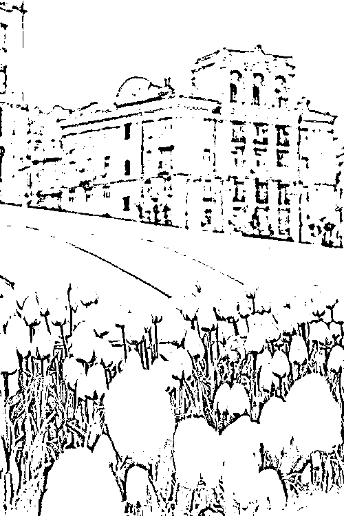

这一类型的人似乎总是能够回忆起这样一个场景：自己带着学校的考试成绩自豪地回家，父亲却冷冷地看着他或她说：“就这，你能做得更好吗？”解读是：“我怎么做，父亲都觉得不够好。”有可能父亲非常严厉，要求很高，但关键是**孩子只是在等待关于他（她）自己不够好的确认。**这类人有一个特别的过滤器，**滤出被“轻视”，并设法将许多来自他人的无辜行为解读为贬损。**
一种处理这个过载的感知过滤器的方法，是**要求客户对另一个人的行为给出不同的解释和动机。**父亲问孩子能否做得更好的背后是否有其他动机呢？客户会茫然地看着你，好像没有其他可能的解释。你可以让客户假装……想象一下还有另一个动机。

勉为其难地，客户会找到其他一些笨拙的解释。实际上在这个例子中，父亲的动机可能非常简单。但肯定不是要让孩子感觉到渺小，不管正确与否，父亲认为过多的鼓励会让孩子自满。其余的部分都在孩子的意识里。

**太阳-土星型人将严格投射到权威者身上，并因此而受苦。**

但无情的法官是在心里。在与上帝的关系中——这是最终极的投射，上帝是旧约中的耶和华，要求自律、不倦的工作、自我克制，但即便这些已经做到了，上帝仍不满足。就如同爱从精神综合体中消失了。

从存在的核心层面上讲，**很少有自爱或自我欣赏，这种态度会明显影响环境，吸引事件来证实内心画面。人们即使赞美太阳-土星型人，次数也屈指可数，因为他们觉得赞美被拒绝了**。鼓掌也要看是否有回应，否则他们会停下。你必须能够**先接受爱才能给予爱**。因此，有意识地努力去接受赞美和回报，对太阳-土星型人是很重要的，即使这种努力一开始会有些笨拙。**基于女性可能在整合她的太阳相位上有困难——就像许多男性和他们的月亮有困难一样，****太阳/土星的相位经常被投射到男性身上，从而吸引权威人物为这位女性设下相当严格的条条框框。**

有**太阳-土星对分相位**的女性，不可思议的是有这么多会**和年龄相当大的、看上去像父亲那样的男性建立亲密关系**。当然，无论是**对分相还是四分相**，都有一种倾向性，**欲否认土星要求的内在纪律性，并将其投射给其他人**。

然后那些人则要承担吃力不讨好的任务，试图让这个人履行他（她）自己的责任（然后因为独裁而受到指责）。与年长的人建立亲密关系当然没有错，但**如果客户实际上在指责对方太专断，或强加限制，那么改变自己的态度则更明智。**

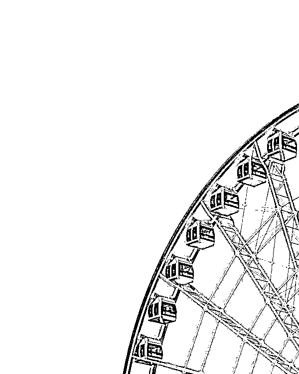

从能量层面来处理这一相位，意味着**让客户进入内心，去接触权威那沉闷的声音，或沉重而缺爱的心……**内心的评判倾向于惩罚而不是鼓励。内心的评判可能认为用大棒激励客户做自我提升更有效，但这可以被证明是无效的，而土星毕竟也喜欢有效性。**一个对强大土星很棒的解毒剂是一颗强大的木星，理想状态下他们应该携手合作。**如果与木星有关的资源先于土星被激活……这意味着**获得希望、远见、信仰和信念，**那么土星就可以参与到更具建设性的行为。

当胡萝卜多于大棒时，结果总是更可靠的，因为**基于对失败的恐惧会产生一种消极动力，而它会破坏成功。**总有一种内心的画面、内心的对话或内心的感觉是太阳-土星型人试图逃避的，正因为这样，失败才总是如影随形。

**让客户通过关注内心的评判，说出内心的评判，与土星相关的、根深蒂固的身体感觉相联结，就有可能利用土星本身来开创一个战略性的改变。**

让太阳-土星型人起到宣泄效果的，是**承认他们暗自确信自己低人一等，并且他们围绕自己建立起的优秀的结构都是假的。**

**太阳-天王星：访问地球**

在天王星的处理上总是很棘手，因为这个行星与**理性和思想**有着密切的联系。当面对那些令人眩晕的情绪时，这个行星组合的个体有一种能力，可以**突然抽离于手头的事务，从望远镜的另一端来看待事物。**

他们倾向于放远视野，冷静地看待事物，就像他们是来自外太空一样（……有人会抱怨说他们觉得自己就是外星人！）

奇怪的是，**一些具有强水瓶座能量或天王星特质的人，或者风元素（双子座、天秤座、水瓶座）很强的人，会有颈部问题，因为他们习惯性地将头微微向后，使自己与关注对象的距离略大于大多数人。**试试看，你会明白。

其次，这类人**很有觉知、非常重视，他们可能对自己的问题有相当清晰的“认知”**。占星师在解释他们的行星动态时，所说的对他们来说没有任何新的东西，并且他们很可能对其中的机制表现出极大的兴趣。

占星师被哄得相信一切都很好，然而咨询却显得诡异的平淡。客户熟练地引导占星师绕着一个情感核心走了很长的弯路，似乎这个核心并不存在。有时童年可能发生过相当骇人的事件，但诡异的是客户似乎并不受其影响。事实上，**太阳-天王星型人激烈的抽离性防御方法意味着情感被麻痹了，发展出一种强烈的分析特质，取代情感上的脆弱。**

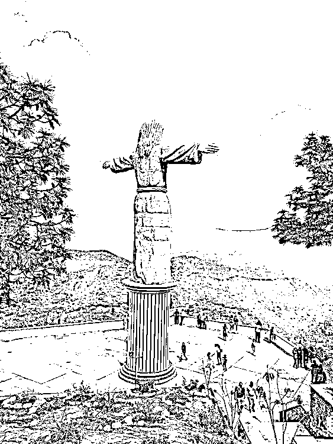

**太阳-天王星相位的特征之一——特别是对分相和四分相是感到自己是社会的局外人。**在某些情况下，这可能导致**极端的社会功能失调**。占星师专注于这块是值得的，它是一种**防御模式**的结果，在这种模式中，**个体试图保护个人身份的完整性，但做过了头**。

**社会疏离感是长期习惯性游离的结果。为了解决这个问题，找出最初的“原因”会很有帮助，这个“原因”在大多数情况下，都是和父亲有关的事件。**

有这样几种可能性。**缺乏和父亲真正的亲密，尽管很可能有很多开心都与他有相关。**在某些情况下，**父亲会与孩子的关系相当友好——甚至是朋友关系**，但深入探查后，会发现**这种友谊不够牢固，无法阻止父亲在其他时候消失或疏远**。孩子习惯了不知道父亲是否在那里，习惯了不知道他是友好还是疏离。因为任何事都可能发生，情感的分离产生了。当对方完全忽视你的情感时，你就无法再炫耀自己的情感。另一种情况是，**父亲不接受惯常的家庭规划，明确表示拒绝成为权威，或行为上完全违背传统的期望**。**孩子被训练得不会仰视英雄人物，不接受或不信任传统模式。**在这个阶段已然可以感受到，孩子在**反抗一个充满敌意的社会**。没有传统的原则或父亲的指导。但也有可能是这样的，**太阳-天王星型的孩子很叛逆，当受到管束时会制造相当多的麻烦，所以父亲无论如何都难以行使一切传统的权威性**。众所周知，让一个天王星能量强的孩子做你想做的事情的方法，就是命令他做相反的事情。

**天王星的特质是惊讶和意外。**因此，**过去的伤痛记忆往往与伤害情绪的突发事件有关，而非一个漫长的过程。**父亲的突然消失，一次意外，一段在国外度过的时间，突然的国内暴动……所有的这些事情都会引发行为模式反应的产生，这都可能是日后生活困境的根源。

在处理这些议题时，占星师会逐渐明白，太阳-天王星型人冷静超然的风格是他们处理事件的一种方式，否则他们可能会非常不安。当客户熟稔这些议题后，可能会触发他们**从理性超然到情绪失控的突然转变**，而占星师应为此做好准备。

**有这个相位的女性往往会拒绝传统的关系，而且不适合那些掌控型的男人。**很多人会选择**来自非传统文化（比如伊斯兰教）的伴侣，既因为受到新鲜事物的吸引和挑战，也作为一种社会声明**。矛盾的是，这些文化中的男人往往期望一定程度的顺从或服从，这就导致了极为有趣的紧张局面。我遇到过许多困惑的伊朗人、印度人、或以色列人，他们无法理解他们的太阳-天王星型欧洲伴侣复杂又矛盾的需求。让太阳-天王星型人起到宣泄效果的，是**承认他们暗自里知道自己是局外人，他们所认识的人会发现自己感觉有多遥远。**

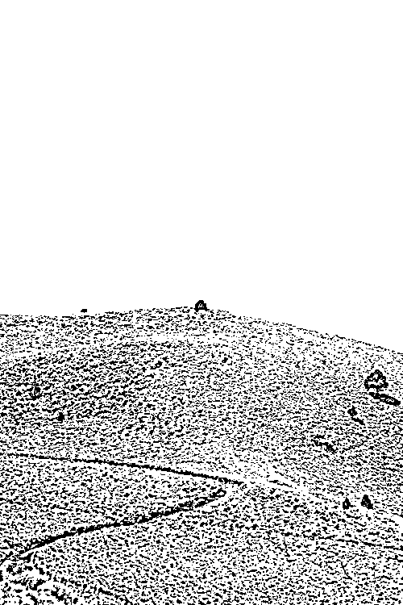

**太阳-海王星：我是真的吗？**

太阳代表身份的内在核心，而海王星有一种超然的影响力，主要作用是**消融对具体事物的依恋，所以这两者的结合会对个人身份产生一种不真实感。**

尽管很多人从不质疑他们是谁，为什么在地球上，但有太阳-海王星相位的人却会**不可避免且自然地提出存在主义的问题**。这种类型的人**很难保持个人的自豪感或自尊感，因为身份体验越强烈，身份感越强烈，就越觉得它，某种程度上，不真实。**

太阳-海王星型客户有一种神奇的能力，他们**几乎可以成为自己选择成为的任何事或任何人——关键是要做出一个从长远来看会令人满意的选择**。一切都充满了无常感……就好像客户已经意识到，**任何累积起来的东西都终将消逝在时间的沙子里**。那何必费心呢？这种核心意识使他们**大多很难坚持自我，因为有一种与生俱来的感觉，即身份的根基就是幻觉。**也许客户这里真的说中了，他认识到了大多数人都不愿去面对的、基础的灵性议题。例如，佛教教义教导我们，认同感来自一个不断自我创造的过程，一个人的业力在这一过程中能创造一种持续的能量。就是这种能量构建了自我，我们的性格和生活就建立于这个构建出的”自我”之上。**越来越深的冥想会使修行者越来越回归到一种存在（或不存在）的状态，这种状态先于构建出的自我，而事实上，这通常被教导为我们死后才会经历的过程。**

对于太阳-海王星型客户来说，**用一个灵性的视角来处理生命是空虚和无意义的感觉**是非常有帮助的。

生命也许的确如此，但周遭还有很多人，在现实中苦苦挣扎。客户可以**从对他人的深切认同感和同情中寻求意义**。这可能让他们**进入社会意识极其重要的职业领域。**

许多受到这种影响的人**在他们生命的某个阶段转向内在，会用瑜伽或冥想这一类的灵性练习，去体验日益微妙的存在状态。**太阳-海王星型人有可能以这种方式获得强烈的自我意识——而强烈的自我意识是在生活中拥有力量的先决条件。**被太阳-海王星相位过滤后感受到的父亲形象，通常有一种强大的理想化。****即使是四分相或对分相，也有一种强烈的认同感，甚至与父亲融为一体，有一种完全理解他最深本质的感觉。**有可能父亲对被太阳-海王星的孩子理想化所做出的回应，是**表现出他本质中更多美好的面向，并引导孩子进入自己的内心世界。**孩子会倾向于**滤掉父亲性格或行为中那些与早期理想状态不符的面向，就像父亲会本能地倾向表现让孩子满意的品质一样**。

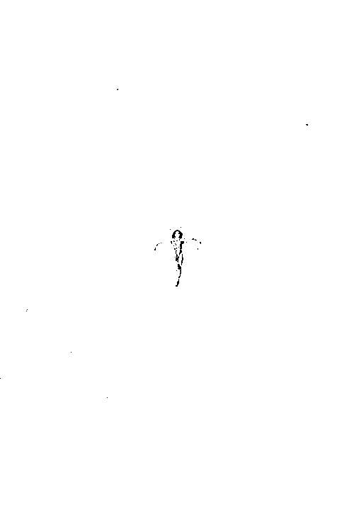

在理想化父亲的同时，也可能会**认为父亲是外部世界的受害者，或者以某种方式被误解了。父亲和孩子串通一气指责母亲的无情行为并不罕见。**

当然，这种美好无法持久，但往往直到到成年早期，客户才意识到**父亲的形象不是父亲本身，他只是一个凡人，与其他人一样，有好的品质也有坏的品质。**

事实上，可能会发现，**父亲由于自己的性格弱点而歪曲了这个世界**——这给我们客户的世界带来了种种后果。**当这种认知出现时，可能是一个重大的转机。**

当然重要的是，占星师需要确定**是否存在理想化父亲，而客户是否清楚这种投射，并已准备好为此承担责任。**

**如果女性客户无法意识到这种投射机制，那么很可能她会选择一个体现自己理想的伴侣，但伴侣本身却觉得自己是被世界误解或挫败的。**可能是这样的，也由于**客户本身无法实现她自己的梦想和愿景，这些梦想和愿景就被投射到了伴侣身上，继而伴侣又会被认为是无法将自己的愿景变为现实的人**。这一生的经历给了客户很高的理想，却只有很低的期待，这通常会转化为一种**顺从感**（尤其如果土星参与到太阳-海王星的相位）或**愤世嫉俗感**（如果火星有参与）。最后分析下，外部世界和内在意识是两个完全不同的东西：世界存在的样子基于行星如何过滤它所经验到的东西。

太阳-海王星型人比大多数人都更能理解这一点，因而给体会到的存在的主义怀疑提供了一剂解药。**这些人往往会被吓倒，因为世界和他们希望的并不一样。**

然而，他们往往会把注意力聚焦在外部世界的事务上，但这会加剧失望，他们需要**把注意力放在“自己能做什么”上面。**也许所有被自我驱动的人类努力都会消融，但**被更高层次的理想所驱动的努力可以成为人类未来的灯塔。**

让太阳-海王星型人起到宣泄效果的，是**承认他们做自我投射的对象是空虚和无意义的，而人们会看穿他们的行为。**

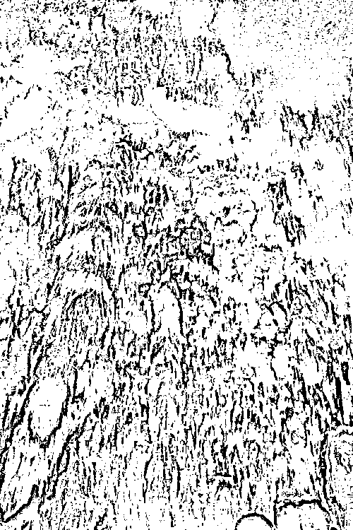

**太阳-冥王星：焦虑与支配**

**太阳-冥王星型人给人以强有力的印象。**他们通常会拥有不同寻常的有魔力的技能，那些成功转变和整合了冥王星影响的人，能**将相当丰富的心理技巧与巨大的人格魅力融为一体，让人格外印象深刻。**

然而，与有其他冥王星相位的人一样，他们有着**对无法控制的焦虑感——在咨询过程中也是这样**。有太阳-冥王星相位，意味着他们**倾向于强烈地将自我投射到自己所处的环境中。**这样做的结果，是**其他人会觉得他们来势汹汹**。

**太阳-冥王星型人担心别人可能会支配他们，因而做出补偿行为，最终自己进行支配，且对这一事实毫无意识。他们关心的是如何在既定情况下生存，因而往往忽视了他们对旁人的影响。**

内在核心似乎有一个真空带，从感受上说，仿佛心脏周围有个黑洞，吸走了生命力。就好像**太阳-冥王星型人只是为了简简单单做自己，就必须投入双倍的能量**。极端情况下，他们**害怕自己是透明的、空虚的或灰飞烟灭**。这种恐惧可能源于**妊娠期或童年早期的濒死经历**。通常也可能找不到根源，但在生活中**找到一系列感觉会威胁生命的事件**却并不难。

其后果是，这些人会**夸大解读所处环境中的事件对他们身份的实际威胁，并且反应过度，从而形成一种实际上能引发权力之争的危机气氛。**

这种行为的核心，是**在成长过程中感受到的父亲的影响。**一般来说，好像父**亲不在场**。**他可能真的消失了，或者虽然在场却似乎忽视了这个孩子。**可能感觉是，父亲隐藏在报纸后面，每隔一段时间出现，只为了试图让孩子符合自己的意愿。

有时会有一种感觉，**父亲不是生父（他可能不是）——冥王星有一种替代效应，用不正常代替正常。**这个孩子**从一出生就感到的疏离感，是贯穿一生的主线。父亲的拒绝会造成精神上的后果，这让孩子很难触碰到自我的根基。**

当然，有可能**父亲曾尝试与孩子接触，但由于孩子的天性而困难重重……**这是一个很好的初阶治疗方法。就好像孩子只是在**等待机会切断与父亲的联系，任何借口都可以。**在某个时刻，孩子会**对父亲的行为产生关键性误解，并用它为随后的拒绝做辩护。**

识别童年时期的这个时刻非常有用。几乎可以肯定的是，太阳-冥王星型的孩子**从第一天起就被驱动着想推翻父亲的权威。**这反过来又可能**引发极端行为、最后通牒和意志之争，最终只能以孩子的羞辱告终**。对父亲来说，这也是输定的局面：**如果他允许自己被孩子威胁，那么孩子会认为父亲是因为软弱而失败**——这是太阳-冥王星一个非常常见的表现。而**如果父亲坚持维护自己的权威，那么童年就是一场漫长的战争，孩子和父亲双输。**

占星师从太阳-冥王星型人进门的那刻起，可能就开始体会**权力和无力的二元对立。**如果**占星师在咨询中含糊其辞或让顾客掌控局面（他们很可能尝试如此），太阳-冥王星型人会对这个占星师毫不尊重**。

在某个时刻占星师必须重演上面描述的父亲-孩子场景。**占星师有机会撕开影响客户所有关系的面纱，那就是重演与父亲的权力斗争，因为在他的根源处存在着深刻的焦虑。**

当客户误会占星师，导致占星师-客户之间的关系力量失衡时，却是与童年时和父亲所发生的事情进行类比的好时机。

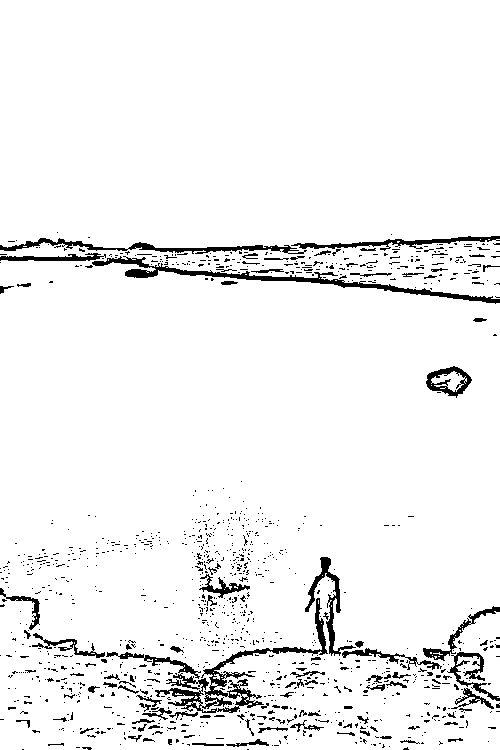

太阳-冥王星是一个非常感恩的相位，因为它**自带转化的种子，藏于与生俱来的心灵智慧中。**当客户了解到焦虑存在的后果是导致权力游戏，使其他人不安，他们便能自发地转变。关注的焦点需要**从关注个人生存，转变为意识到他人的困境。**

**拥有太阳-冥王星相位的女性可能会发现她们将自己强大的阴影投射到了男性伴侣和权威人物身上。**

太阳-冥王星所代表的权力和权威，可能一开始在女性的性格中并不明显，但确实存在。其根源是**认为父亲是一个疏远的、专制的人，或者是软弱、有严重缺陷的，有时是心理上的。****这样的人会被那些有魅力和权力的神秘男人所吸引——这些男人，也许能够保护她躲开世上的危险。**但是，太阳-冥王星的相位也意味着**任性和深层次的权力——被选中的这个男人开始发现他的力量和权威从长远看被削弱了，一种无力感甚至绝望感悄然而至。**由于过度关注这个男人的弱点，这位女性探究调查了他的个性缺陷……他们**神奇地打开了彼此之间的裂痕，让这段感情坠入深渊。**

每个人都有缺点，但**成功的关系关注关系中的优点，而对缺点给予支持。**太阳-冥王星型人倾向于**聚焦结构上薄弱的部分，然后啃掉它，加速这令人恐惧的坠落。**

这位女性需要明白，**是她自己的行为导致了男人的逐渐弱化，以及接踵而至的她对他失去的尊重，这就是童年的重演。**因而，这位女性需要**面对这种行为背后的焦虑，承认它，并改变它。**

**最后分析的焦虑、权力&无力、控制&意志的主题，与空洞感或虚空感有关，客户不断地回避，从未真正面对内心的恶魔。**

使用本书中描述的感官技能——**一旦早期问题这个因被识别，并与当下问题这个果相关联，占星师就可以引导客户进入太阳-冥王星真实能量的深刻感官体验之中。**

这个黑洞已经吸光了漫长的时间，所以它是一个极棒的转化能量的储藏库。黑暗会变成光明，客户也有可能完全改变自我认知，重生为一个强大而有意识的个体。让太阳/冥王星型人起到宣泄效果的，是**承认他们感到无能为力，和害怕失去控制。**

**版权声明：**本文由若道翻译、整理发布，欢迎转发，反对抄袭。友号转载请申请白名单。

**艾德里安·罗斯·邓肯**

若道签约老师，哥本哈根占星学院院长 1985 年开始成为全职占星师，是人本主义占星、卜卦占星和经世占星学领域的知名占星师。开发了占星软件 AstroClock 和多款占星报告。

# **大国命运：经世占星学 3 天线上工作坊**

有一些岁月经历的人，会非常清晰地看到，我们每个人的命运都和国家的命运紧密联系在一起。以俄国人为例，不论每个俄国人有什么样不同的个人星图，31 年前的苏联解体，今年发生的乌俄战争这样重大的事件，毫无疑问影响了俄国 2 代人的命运。而在一些关键时间点个人的选择，毫无疑问，又影响了个人的生命历程。而只要你关注世界局势，你也会看到，这样的一个国家发生的重大事件又会对其他国家的各个方面发生重要影响。我们的命运、我们所获得的事业的发展机会、我们的财富机会都是和整个时代和国家息息相关。**因此，一个好的占星师必须要懂得时代的声音，必须要洞悉全球的趋势，必须要懂得国家的故事。**在这个工作坊中，我们将学习**如何专注于能够理解世界大事并对它们做出准确的预测。**这将带领我们踏上**一段重要的行星周期之旅，并延伸到重要国家和世界领导人的星图。**现在正是学习的好时机！**点击下图了解更多内容****今晚 8 点，大卫和咔咔老师走进直播间****解答大家对占星学的一些问题****预约直播，我们晚上见~**<mpvideosnap class="js_uneditable custom_select_card channels_live_iframe" data-pluginname="videosnap" data-headimgurl="https://wx.qlogo.cn/finderhead/PiajxSqBRaEJYnVsqWfEX9qA0sI6hNVKsDfyzfPZ92WZMZyBpZWU5NA/0" data-username="v2_060000231003b20faec8c4e68a1ec2d4ca07e434b07755bbf47e7053a3059defd2c9d6c68a20@finder" data-nickname="若道" data-desc="将在 07 月 26 日 20:00 直播" data-intro="直播问答-那些关于占星学的问题" data-noticeid="finderlivenotice-v2_060000231003b20faec8c4e68a1ec2d4ca07e434b07755bbf47e7053a3059defd2c9d6c68a20@finder-1658286256547609-1945901536" data-type="live"></mpvideosnap>**20 位来自世界各地的占星师****带来 19 场沙龙——新世界的觉醒****详情可点击下图**

**学习占星学****点击下图了解课程详情**

**微信又双叒叕改版啦，不想错过若道君的推送？**

**就把若道设为星标吧！**

**▼**

**喜欢就点一下“在看”吧！**

********报名直达入口********

# 今日牌阵推荐 | 塔罗问答：如果我们爱下去会怎样？

> 原文：[`mp.weixin.qq.com/s?__biz=MzA5NjA0NTAxNg==&mid=2651481811&idx=2&sn=435c36c1fc2114f5110fb85bbb017ac9&chksm=8b48d464bc3f5d72af7fd9539dcbdca255edb2e951091c74cf49468003655b699bc2d31532f3&scene=126&sessionid=1692737781#rd`](http://mp.weixin.qq.com/s?__biz=MzA5NjA0NTAxNg==&mid=2651481811&idx=2&sn=435c36c1fc2114f5110fb85bbb017ac9&chksm=8b48d464bc3f5d72af7fd9539dcbdca255edb2e951091c74cf49468003655b699bc2d31532f3&scene=126&sessionid=1692737781#rd)

**若道神话塔罗 H5 惊喜上线****文末有扫码通道哦**

**神话塔罗 H5 问答平台全新上线**

**三张牌牌阵**专业塔罗咨询师语音条解读如果你碰巧有困惑，刚好有**限时优惠价**

三张牌牌阵咨询案例解读

案主最近发现男友和前女友有联系，因此爆发了几次争吵，想要咨询该如何解决这次矛盾。

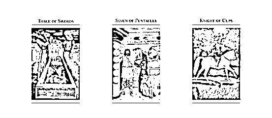

**1****过去：宝剑 3**男友和前任还有联系的问题在过去是存在的，就像是一个暗处的脓包，在未被发现前，**男方可能存在过逃避、拖延解决的侥幸心理。****这次问题的爆发不一定是坏事情，**问题矛盾被发现，爆发出来的同时，其实双方也会有如释重负的感觉，**因为毒素被释放了出来，**也没有了逃避的可能和必要，只要真诚沟通，明确彼此对待这段关系的界限，面对面解决问题，反而会为日后关系的修复打下基础。但如果对于过去仍有留恋，或者这次矛盾没有被完全沟通解决，也会成为之后关系中的“脓包”。**2****现在：星币 7**

**星币 7 预示着关系中的双方都需要做出一个艰难的决定**，就像星币牌主人公代达罗斯需要从已经构建出来的安全感和一个无法预计后果的、全新的方向之间做出选择，选择后者就要冒着失败的风险。

对于男方的选择，一是彻底解决过往，踏实经营现在的关系；二是继续抱有侥幸心理坚持私下联系前任，假意安抚现任……对于女方的选择，一是等对方解决好彻底翻篇；二是对方不能妥善解决选择分开；三是和好但内心仍存芥蒂，为之后埋下信任危机……

塔罗不能代替案主做任何决定，**但星币 7 显示当事人双方现在需要考虑诸多现实因素做出的选择决定，并为之后的选择负起相对应的责任。**

**3****未来：圣杯骑士****未来显示出一张跟双鱼座共振的圣杯骑士牌，**充满了爱、理解、包容的浪漫主义能量，需要双方找到关系中纯爱的感觉。虽然双方的关系还没有发展到非常成熟的状态，但是只要能够看清双方对彼此的真情，用更浪漫感性温柔的方式，**更好的共情彼此的情绪**，用感情刚开始的状态对待彼此，这次危机会得到解决，用浪漫主义者的心态继续经营未来更美好的关系状态。**祝好运！**

**如何预约塔罗师咨询？****扫码进入全新神话塔罗 H5**

每天有事没事都可以去**神话塔罗 H5**里转转抽取专属于你的今日塔罗

**神话塔罗 H5 问答平台全新上线**

三张牌牌阵，专业塔罗咨询师语音条解读

如果你碰巧有困惑，刚好有**限时优惠价**

如果感到快乐你就用用**神话塔罗 H5****，**如果你感到不快乐，更要使用由专业人本主义塔罗师团队全程陪伴的**神话塔罗 H5 哦！**

**想入驻若道塔罗平台成为职业神话塔罗师？****2022 年最新《神话塔罗认证课程》报名中****点击下图了解课程详情哦~**

# 神话塔罗丨一种古老的疗愈工具，也帮助我们与潜意识进行链接

> 原文：[`mp.weixin.qq.com/s?__biz=MzA5NjA0NTAxNg==&mid=2651481811&idx=3&sn=2bc6f6f6a881c5f1cfe7ac6c54876a5c&chksm=8b48d464bc3f5d72bded59c0c3938a2265a87c193aeac7b8cc42c8df56c508c64426ef7c8d48&scene=126&sessionid=1692737781#rd`](http://mp.weixin.qq.com/s?__biz=MzA5NjA0NTAxNg==&mid=2651481811&idx=3&sn=2bc6f6f6a881c5f1cfe7ac6c54876a5c&chksm=8b48d464bc3f5d72bded59c0c3938a2265a87c193aeac7b8cc42c8df56c508c64426ef7c8d48&scene=126&sessionid=1692737781#rd)

1

**塔罗牌是什么？**

**它是用来干嘛的？**

塔罗牌是一种**古老的疗愈工具**，同时也是**直观的解惑工具****；**

塔罗牌绕过逻辑思维，**和潜意识联结**，通过图像的方式生动地将隐藏在人类潜意识中的画面浮出水面，**揭示心灵的状况和运作****；**

塔罗牌**帮助我们和潜意识对话**，可以和现代的心理治疗联系在一起，帮助我们**看清心灵的冲突来源、本质和可以选择的道路；**

塔罗使用的过程并不繁琐，通过**“提问、洗牌、抽牌、解牌”**的方式来显现你的潜意识，给予问题明确的分析和建议。

2

**塔罗原理是什么？**

**它为什么这么准？**

塔罗是通往意识的工具，通过图画**帮助我们和潜意识对话**，可以和现代的心理治疗联系在一起，帮助我们**看清心灵的冲突来源、本质和可以选择的道路**。塔罗的心理投射也对应荣格的**“共时性原理”**：看似偶然的事物之间有着必然的联系。塔罗牌又和更广阔的**宇宙生命原型**联结，彰显**个人生命发展的阶段**，将个人**生命挣扎、内在冲突**放在生命进化的道途上，让更广大的生命智慧为个人成长照亮道路。

3

**塔罗预测是什么？**

**它如何帮助我？**

塔罗牌预测的运作就像是**照向心灵的一面镜子**。在塔罗牌解读时，图像的原型性质穿透隐藏的潜意识脉络，反应出与个人境遇相关但又未被了知的知识与洞见，因此**揭示出按照任何理性方式都无法发现的事情**。塔罗可以在你人生各个阶段，基于不同状态，针对具体困惑给予指引的神奇工具，运用古老的智慧工具**解码人生卡点，多维度去看待问题和生命的全貌性，推敲心理动线，更好地梳理生活。**如果你对生命好奇，塔罗学习会帮你**打开一扇通往未来的门**，让你了解**心灵运作和显化的秘密**，同时赋予你更多关于生命成长的支持和指引的能力！

4

**什么是神话塔罗？**

**它和其它塔罗有什么区别？**

神话通过**图像和故事**描绘人类生活的**原型模式**。通过瑰丽的想象、诗意的语言、栩栩如生的人物和故事描绘出我们内心的世界，表达出我们经历的那些实现人性的过程，帮助我们将**个体的生活与人类古老且永恒的故事**建立联结。从而在更深处**理解生命**，并学习**古老而长青的生命智慧**。跟其他塔罗相比，神话塔罗在**塔罗体系**基础上融合了**神话原型、占星原型、心理学原型。**学习、解读、内在成长的**维度更丰富立体。****神话塔罗**取材于**希腊神话**的无尽沃土，通过故事提供一种**记忆辅助**，在心理和预见层面提升解读的**丰富度**。因为这样更符合塔罗牌的性质，符合人类的想象。**按照故事思考，而不是简单的记忆关键词和固定的意义**。

5

**神话塔罗难学么？**

**能不能快速上手？**

神话塔罗认证课程，**不需要任何塔罗、占星、心理、神话基础**，这些知识朱丽叶老师都会在课程中教授，“兴趣是最好的老师，坚持是最大的成功。”塔罗咨询这项门栏不高，却能带来多重回报的“冷门技能”已经被越来越多人发觉，如果你为之心动，不如赶紧行动，初学者在经验丰富的导师教导下学习成果事半功倍，是小白亦能够掌握的课程，只要配合学习进度，不存在学不会的情况**，录播课有专业助教答疑，直播课老师亲自答疑，案例督导，****让你更自信的开展咨询工作，学以致用。**

6

**哪些人适合学神话塔罗？**

**为什么学神话塔罗？**

**1、对塔罗感兴趣的学员**，与其自习研究弯路多多，不如一步到位系统学习；**2、占星咨询师，**可以丰富咨询维度，通过图像更深入的和个案沟通交流；**3、心理工作者**，塔罗牌的原理本身也是心理投射，用于心理辅导是很棒的互动工具；**4、看重授课老师专业水平和能量层级的学员，**神话塔罗创始人亲授，金牌背书；**5、希望更加了解自己和他人内心世界**，想掌握这个疗愈工具自我探索和成长，帮助有困惑的人；**6、成为专业的塔罗师**，想从事这份事业，不论是兼职或全职，增加收入，打造长久稳定抗风险的现金流。

7

**神话塔罗咨询前景？**

**为什么看好它？**

塔罗行业现状鱼龙混杂，有的塔罗爱好者未经过系统学习，无占卜实力，占卜依赖“说明书”一知半解靠运气解读，无法积累实占经验和个人信誉。神话塔罗进入中国市场不久，由创始人亲自教授，**知识体系扎实靠谱，咨询技术纯正丰富，市场认可度高**，让您**无忧起步**，自信的在自我成长过程中成为他人的**塔罗照路人**。有些朋友经过系统的塔罗课程学习后成为**杠杆青年**，将塔罗咨询作为**副业**，无需店面，工作之余在家里就可以进行咨询，多一分收入欣喜满足。也有些学员完成课程后将塔罗咨询发展成**全职事业**，拥有自己的工作室，整合微信、微博、小红书、短视频等自媒体运营，线上线下年收益百万。**疫情环境下，副业刚需**，对于我们未来的事业需要有所规划，而塔罗咨询符合理想职业的所有条件，上手快、无需固定办公地点，是随时随地可接单的自由职业，经营打造属于自己长久稳定可发展的现金流。

8

**神话塔罗认证是什么？**

**如何获得高含金量认证？**

2022 年超高含金量的神话塔罗认证课程强势回归课程内容体系让你**直观精准**的感受**神话塔罗的魅力**扎实的建构**神话塔罗思维****系统**学习**最地道的塔罗知识****联报全阶课程，学成可获得有神话塔罗创始人颁发的****英国神话塔罗认证证书****，也是****若道塔罗毕业证书。****行业内超高含金量双背书。****若道还为塔罗学员开发了****“神话塔罗”APP****，是随身的工具，更是接咨询的平台，****录播课程****学成入驻平台****即可链接更多塔罗个案，发展壮大你的塔罗咨询事业。**

**如果你想学习塔罗，什么样的老师会让你怦然心动呢？她是三副塔罗牌的设计者，写了 6 本塔罗书籍。她研习塔罗四十余年，教授塔罗三十余年，是丽兹·格林的密友。还有****谁会比塔罗牌设计者更了解塔罗的历史、灵魂与精髓？****所以，这将是你开启塔罗之旅最坚实的一步。**

9

**你将跟随哪位大师学习神话塔罗？**

**我的老师是谁？**

****

**朱丽叶·沙曼-伯克** 

*   她是**3 副塔罗牌**的**设计者****——**神话塔罗牌、沙曼–卡塞利塔罗牌、“自己着色”塔罗牌；

*   她出版了**6 本塔罗书****——**《塔罗全书》、《新塔罗全书》、《众星的传说》、《理解塔罗牌》、《精通塔罗牌》、《塔罗初学者指南》；

*   她研习塔罗**四十余年；**

*   她教授塔罗**三十余年**；****

*   她是**丽兹·格林**的密友，两人合著了**《神话之旅》**，共同设计了**神话塔罗牌**。

*   她是认证的**心理治疗医师；**

*   她深谙**塔罗、占星学、心理学和神话学。**

**如果你想成为拥有英国神话塔罗认证的塔罗师**

那么她，就是你**最好的老师人选**

10

**神话塔罗认证课程的课程结构？**

**怎么上课？**

课程中老师传授**将神话、占星、心理学完美融合进塔罗**的人本主义咨询体系，并进行**学员案例督导**，让你更自信的开展咨询工作，学以致用。

本期认证课程采取**即报即学的录播课+案例督导直播课**的形式，

*   **18 节录播课：**精编剪辑，随来随学，助教答疑，学练结合。

*   **8 节直播课：**融会贯通，神话心理，塔罗占星，咨询技巧。

为了适配大家的各种学习场景，提高学习&复习效率，我们还将**录播课**剪辑了**中文字幕版**和**翻译音频版**：

*   **中文字幕版：**朱丽叶老师英文原声配中文字幕，适合在手机或电脑前专心致志的学习。

*   **翻译音频版：**翻译老师幼婷的中文原声纯享，适合运动、通勤路上耳机里陪伴式学习。

11

**神话塔罗认证课程报名流程**

**怎么报名？**

**报名流程如下：****1、报名****添加课程顾问，报名，交学费，进入学员群，邮寄学习工具。****2、开始学习****成功报名，18 节录播课程立即开通，学习过程有困惑可在 APP 内提问，有专业助教答疑，8 节直播课 8 月 10 日开课，录播课和直播课都是朱丽叶·沙曼-伯克老师亲授。****3、入驻平台****学习完录播课程，即可提交咨询案例申请入驻咨询平台。****4、结业证书**学习完直播+录播课程，提交毕业咨询案例，朱丽叶老师批阅通过，即可获得**神话塔罗认证证书。**

12

**具体在神话塔罗认证课程中学习什么？**

**课程大纲**

**录播课（即报即学）**

**☆****初阶：神话塔罗详解**

**神话故事和预测意涵**

**第 1 讲 塔罗牌介绍 ，讲述它的历史 （中文字幕版）**

**第 1 讲 塔罗牌介绍，讲述它的历史（翻译音频版）**

**第 2 讲 星座形态、元素和宫廷牌&基本星座与基本国王 （中文字幕版）**

**第 2 讲 星座形态、元素和宫廷牌&基本星座与基本国王（翻译音频版）**

**第 3 讲 固定星座与固定王后（中文字幕版）**

**第 3 讲 固定星座与固定王后（翻译音频版）**

**第 4 讲 变动星座与变动骑士（中文字幕版）**

**第 4 讲 变动星座与变动骑士（翻译音频版）**

**第 5 讲 小阿尔卡那牌权杖（中文字幕版）**

**第 5 讲 小阿尔卡那牌权杖（翻译音频版）**

**第 6 讲 小阿尔卡那牌圣杯（中文字幕版）**

**第 6 讲 小阿尔卡那牌圣杯（翻译音频版）**

**第 7 讲 小阿尔卡那牌宝剑（中文字幕版）**

**第 7 讲 小阿尔卡那牌宝剑（翻译音频版）**

**第 8 讲 小阿尔卡那牌星币（中文字幕版）**

**第 8 讲 小阿尔卡那牌星币（翻译音频版）**

**第 9 讲 经典牌阵教学讲解（中文字幕版）**

**第 9 讲 经典牌阵教学讲解（翻译音频版）**

**第 10 讲 牌阵解读案例演示（中文字幕版）**

**第 10 讲 牌阵解读案例演示（翻译音频版）**

**☆****中阶：神话塔罗牌阵应用**

**神话****解读和咨询技巧**

**开启神话塔罗愚人之旅**

****

**第 1 讲 愚人、魔术师、女皇、皇帝（中文字幕版）**

**第 1 讲 愚人、魔术师、女皇、皇帝（翻译音频版）**

**愚人**：永恒的少年（儿童的原型）

**魔术师**：恶作剧者、老师、向导、沟通者的原型；行星：水星。

**女王**：母亲、养育者、丰产的原型；行星：金星在金牛座；小行星：谷神星。

**皇帝**：父亲、供养者、计划者的原型；行星：木星。

**第 2 讲 女祭司、教皇、恋人、战车、正义、节制（中文字幕版）**

**第 2 讲 女祭司、教皇、恋人、战车、正义、节制（翻译音频版）**

**女祭司**：处女——等待被实现的潜力原型；行星：新月。

**教皇**：疗愈者、受伤的疗愈者、牧师的原型，牧师是神与人之间的灵性桥梁；行星：凯龙星。

**恋人**：爱、爱人、所爱之人的原型；行星：金星在天秤座。

**战车**：战争、冲突、战士、斗士的原型；行星：火星。

**正义**：智慧、兵不血刃的胜利的原型；星座：处女座；小行星：智神星。

**节制**：关系、合作的原型；星座：巨蟹座、双鱼座。

**第 3 讲 力量、隐士、命运之轮、倒吊人、死神（中文字幕版）**

**第 3 讲 力量、隐士、命运之轮、倒吊人、死神（翻译音频版）**

**力量**：力量的原型；星座：太阳在狮子座。

**隐士**：晚年、耐心的原型；行星：土星。

**命运之轮**：命运女神与命运的原型。

**倒吊人**：牺牲与有意识的牺牲的原型；行星：海王星。

**死神**：死亡、终点和起点的原型；行星：冥王星。

**第 4 讲 恶魔、高塔、星星、月亮、太阳（中文字幕版）**

**第 4 讲 恶魔、高塔、星星、月亮、太阳（翻译音频版）**

**恶魔**：阴影、人类不文明的面向、本能、欲望天性；行星：火星在天蝎座。

**高塔**：改变、分裂瓦解的原型；行星：天王星。

**星星**：希望的原型。

**月亮**：无意识的原型；行星：暗月。

**太阳**：意识、创造力和文明的原型；行星：太阳。

**第 5 讲 审判、世界（中文字幕版）**

**第 5 讲 审判、世界（翻译音频版）**

**审判**：复活、新生的原型；行星：水星作为灵魂向导普绪科蓬波斯。

**答疑与讨论，学员们分享对自己或客户的塔罗解读，对神话塔罗牌进行更多探讨。**

**世界**：整体、完成和个性化的原型。

**第 6 讲 经典牌阵教学讲解（中文字幕版）**

**第 6 讲 经典牌阵教学讲解（翻译音频版）**

**第 7 讲 咨询案例演示：为一位年轻女性所做的四次解读（中文字幕版）**

**第 7 讲 咨询案例演示：为一位年轻女性所做的四次解读（翻译音频版）**

**第 8 讲** **引导式冥想、荣格的四种意识功能（中文字幕版）**

**第 8 讲 引导式冥想、荣格的四种意识功能（翻译音频版）**

**☆****高阶：神话塔罗直播督导课**

**第 1 讲 塔罗牌中的荣格原型**

**2022 年 8 月 10 日（周三）**

我们将学习荣格是如何理解原型，以及荣格原型如何反映在塔罗牌中。对塔罗牌解读而言，理解原型的普遍性非常有帮助，因为这有助于塔罗咨询师碰触客户的内心世界。

**第 2 讲 塔罗牌是如何与行星原型和其原型体验联系在一起**

**2022 年 8 月 24 日（周三）**

大阿卡纳牌反映了行星神祗的原型，在某些情况下，原型经验意味着它们反映了所有人类的经验。我们将通过这个角度看这些大阿卡纳牌。我们将看到理解原型对解读有何帮助。

**第 3 讲 荣格意识的四种功能与小阿卡纳牌的四种元素及与权杖、星币、宝剑、圣杯四套牌之间的联系**

**2022 年 9 月 7 日（周三）  **

我们将看看小阿卡纳从 1 到 10 如何反映荣格意识功能的各个方面，以及它们如何反映在四套牌四个元素和其心理方面。我们还将对 1-10 的数字学进行修正，看它们在元素中的表现方式。

**第 4 讲 占星学中的 12 星座和宫廷牌之间的联系**

**2022 年 9 月 21 日（周三）**

我们将讨论形态和星座，以及它们如何反映在宫廷牌上。

**第 5 讲 马蹄牌阵学员案例督导**

**2022 年 10 月 19 日（周三） **

**第 6 讲 六芒星牌阵学员案例督导**

**2022 年 11 月 2 日（周三） **

**第 7 讲 凯尔特十字学员案例督导**

**2022 年 11 月 16 日（周三） **

****

**第 8 讲 三个牌阵学员完整案例督导**

**2022 年 11 月 30 日（周三）**

**认证阶段：考试论文**

录播课学习完毕，即可入驻若道神话塔罗 APP，以实习塔罗师获得推广流量，对接塔罗咨询个案。

直播课+录播课学习完毕，提交考试论文通过即可获得获得英国神话塔罗认证证书，升级为认证咨询师。

**入驻塔罗平台**

13

**适合人群**

*   塔罗初学者，完全没有塔罗基础；

*   塔罗自学者，也曾上过塔罗工作坊，但仍不懂如何使用塔罗牌；

*   塔罗进阶学习者，有塔罗基础，了解 78 张塔罗牌含义；

*   不知如何解决遇到的情感困惑、职业选择、人际问题，对人生感到迷茫；

*   想要学习深入解读塔罗牌、牌阵的使用、咨询技巧等将塔罗运用于咨询实践；

*   想要深入了解和学习塔罗，希望成为专业的塔罗师；

*   想要借助塔罗进行心灵、灵性成长。

14

**导师简介**

**朱丽叶·沙曼-伯克**

**朱丽叶·沙曼-伯克**从 20 世纪 70 年代早期开始，就对塔罗牌产生了兴趣，并踏入了塔罗的世界。后来，在丽兹·格林的鼓励下，开始研习心理占星学和塔罗。

1984 年，第一本书《**塔罗全书**》（*The Complete Book ofTarot*）出版。之后，与丽兹·格林合作设计并撰写了《**神话塔罗**》（*The Mythic Tarot*），在这本书中，她们将古希腊神话与传统塔罗解读结合起来。朱丽叶写了**十本塔罗和占星学书**，包括一本名为《众星的传说》（*Stories from the Stars*）的儿童读物，以及与丽兹·格林合著的《神话之旅》（*The Mythic Journey*），这是一本详细讲述如何运用神话来指导生活的书。

15

**课程价格**

**认证课程总价：****22000 元**

**联报优惠价：****19000 元**

**限时转发优惠价：18000 元（联系 Echo 老师，获取限时转发优惠价）**

长按二维码添加客服 Echo 老师

9

**退转课程**

*   **退款原则请详看《教学协议》，如有疑问请咨询课程顾问。**

**神话塔罗认证课程**

**授课老师：朱丽叶·沙曼-伯克**

**授课时间：录播课即报即学，直播课 2022 年 8 月 10 日起**

**授课方式：**网络课程**，**英文授课，中文翻译

**费用：****认证课程总价：****22000 元；****联报优惠价：****19000 元；****限时转发优惠价：18000 元**（联系 Echo 老师，获取限时转发优惠价）

**课程负责人：Echo 老师**（微信/手机：nodoor18518412824，请备注“神话塔罗”）

长按二维码添加课程负责人咨询~

****报名请点击“阅读原文”****

# 神话塔罗之大阿卡纳牌｜倒吊人

> 原文：[`mp.weixin.qq.com/s?__biz=MzA5NjA0NTAxNg==&mid=2651481811&idx=4&sn=6985befe6085a094a9a2bc8ecf97fbeb&chksm=8b48d464bc3f5d72a30c7e983104c4ea94a09ab1a9bb31495b8aa0c3bea254ddb8cb33ad289b&scene=126&sessionid=1692737781#rd`](http://mp.weixin.qq.com/s?__biz=MzA5NjA0NTAxNg==&mid=2651481811&idx=4&sn=6985befe6085a094a9a2bc8ecf97fbeb&chksm=8b48d464bc3f5d72a30c7e983104c4ea94a09ab1a9bb31495b8aa0c3bea254ddb8cb33ad289b&scene=126&sessionid=1692737781#rd)

作者/朱丽叶·沙曼-伯克 丽兹·格林

译者/闫东升 编辑/玫瑰 图片/神话塔罗 网络

本文节选自《神话塔罗》

神话是文艺复兴时期的思想精髓，窥见了隐藏在塔罗牌神秘意象背后的意义。超越了过去四千年文化和意识变迁的塔罗牌，像旧时的记忆体系一样，让我们与古老且永恒的架构建立起联结感。 为了与自己毫不相干的人类，身为神的普罗米修斯背叛了同族，为何他受到宙斯严酷的惩罚依旧无悔？倒吊人这张牌，会为你解答。今天就来解读大阿卡纳牌——倒吊人。

[🔈 神话塔罗·倒吊人](https://res.wx.qq.com/voice/getvoice?mediaid=MzA5NjA0NTAxNl8yNjUxNDgxODA5)

**｜**朗读者小巫

**书名：**

神话塔罗 

**作者：**

朱丽叶·沙曼-伯克   丽兹·格林 

**出版日期：**

2011-08-02

倒吊人对应的希腊神祗**普罗米修斯·先见之神****先见之神**倒吊人的牌面描绘的是一个褐色头发和胡须的成熟男人。尽管他被扭曲地束缚着，倒挂于荒芜的悬崖上，全身几乎赤裸，但是表情非常平静。他身后的悬崖上隐约可见都是凹凸不平的岩石，山崖后面落日的血红色光芒照亮了他的身体，因此可以看清他面部的表情。在他的上面，一只老鹰正在飞来。 

> **落日**：象征着意识和意愿的光亮已经在渐渐消逝中。**普罗米修斯（*Prometheus*）的姿势**：暗示着头脑——理性思维已经不再掌控，就像落日的隐喻，这幅图画象征着精神之光已经要降入潜意识的黑暗中。 **神话中被宙斯（*Zeus*）的鹰袭击**：都与希望和精神的内容有关，因此普罗米修斯的痛苦是失去信仰的意象，在神秘学的教诲中被称为“灵魂的暗夜（*dark  night  of  the soul*）”，此时的当事人只能等待，没有自信的愿景，也不知道一切如何结束。

**叛神的普罗米修斯**

在这里我们遇到了普罗米修斯，他是泰坦（*Titan*）巨神的一员，帮助宙斯制定了律法，他还从神那里偷来火种送给人类，而且完全知道他会为此付出的代价。普罗米修斯这个名字意思是“先见之明”，作为一个泰坦巨神，他拥有预言的能力。

在神话中，据说是普罗米修斯用土地和自己的眼泪混合在一起创造了人类的躯体，雅典娜用呼吸赋予了人类生命力。普罗米修斯对人类有着深深的同情，因为是那是他一手创造的。

宙斯认为自己统辖的神之国度才是至高无上的，人类世界不配拥有神圣的火元素，于是他把火从人类手中拿了回来。没有了火就意味着人类没有了光明和发展的可能，只能像动物一样躲在山洞中，吃着生肉。

普罗米修斯用空心茴香秆从赫菲斯托斯（*Hephaistos*）的火炉中偷取了一些圣火，并把它带到了人类世界中。宙斯对这次盗窃行为非常愤怒，决定用洪水毁灭人类，他的愤怒不仅仅因为神的骄傲，还有一些恐惧，因为人类拥有了火，就可以像神一样地存在于天地间。普罗米修斯知道这个消息后，就警告儿子杜卡利恩（*Deucalion*），于是杜卡利恩修建了一艘方舟，和妻子芘拉（Pyrrha）生活在上面。灭世大洪水持续了九天九夜，第十天洪水停止的时候，杜卡利恩给宙斯献上了虔诚的祭祀。众神之王宙斯被他的行为打动，答应了他的请求，让人类可以重新在大地上生活。

宙斯并没有轻易地赦免普罗米修斯，因为他拥有预言的能力，宙斯决定用一根无法被摧毁的锁链，把普罗米修斯倒挂着束缚在高加索山（*Caucasus*）的悬崖上。

每天一只老鹰都会飞去吞食普罗米修斯的肝脏，而每晚他的肝脏又会重生，所以他的痛苦会永无尽头。

三十年以后，在宙斯的允许下，英雄赫拉克勒斯杀死了老鹰并销毁了锁链，救下了普罗米修斯。在人类眼中，他是永生之神，是给人来带来光明和赐福的恩人，所以人们经常举行庆典，用身披锁链的方式来纪念他。

**灵魂暗夜中的无尽等待**

**从内在的层面来看，倒吊人——普罗米修斯是为了更高的利益而牺牲自我的志愿者意象。**牺牲的东西可能是身外之物，也可能是内在的态度，但是它一定出于自愿，而且也会全然接纳牺牲所带来的苦难。

在命运之轮牌中，愚人遭遇了出乎意料的改变，对于整个生命旅程来说，意义非常深远。

我们和愚人一样，对于此类改变的反应千差万别。有些人不能适应改变，一味想紧紧地抓住过往的生活。还有些人变得悲观和痛苦，认为是命运、神灵、社会或者他人给自己带来了噩运。

普罗米修斯象征着每个人内在的远见性，我们必须依靠它去了解什么样的改变能够把我们内在的生命蓝图落实到外在的生活中。因此，这位泰坦巨神（*Titan*）代表着为了命运之轮背后的神秘核心而自愿牺牲奉献的态度。

**倒吊人——普罗米修斯还暗示着全然地接纳黑暗中的等待。**他倒挂在危险的悬崖上，不知道自己牺牲的结局是什么，为此他可能内心充满了焦虑和恐惧，但表情却云淡风轻。他最后终于被解救，倒悬于悬崖的惩罚改变了他与神界的关系，也改变了他自己，最后他还是获得了永生。**从很多层面上来说，普罗米修斯的意象和放弃掌控有关，他放弃掌控的目的是为了一种全新的、更高的生命力量得以显现。**因为普罗米修斯制造了人类，所以可以说他也是人类，是我们内在富有远见的精神性，我们能够通过他去看到更伟大的可能性，因此愿意抛弃（或奉献）所拥有的过去，从而获得更伟大的意识力量。普罗米修斯开始的时候是非常脆弱的，因为我们如果带着信任去牺牲过去，就要完全地对着生命敞开，那么生命也许会伤害我们。但是当我们无法支撑自己，想要去探索究竟是什么在背后支撑我们的时候，放弃防卫、踏上孤独之旅和自我质疑就是非常必要的了。这就是宗教里所谓的真正的信仰，它必须通过生命的冒险才能获得。**倒吊人牌是命运之轮牌的必然结果，因为它暗示着我们必须自愿去相信“  他者（*Other*）”，因为“他者”比自我（*ego*）更有智慧，“他者”也是我们发展的必经之路。****倒吊人，自我牺牲的意义所在**

**从解牌的角度来看，倒吊人——普罗米修斯预示着当事人为了获得某种更大价值的事物，必须要自愿地做出牺牲。**这可能意味着当事人要牺牲或放弃某种之前曾给他（她）带来安全感的外在事物，这样才能留出空间发展出更大的潜力。

或者它也可能意味着当事人要放弃或牺牲一种自己一直持有的态度，例如智力上的优势和优越感；某种无法释怀的憎恨；或者对于某种不切实际幻想的顽固追寻。

就这样，愚人用看不到的潜意识力量和等待来应对命运之轮的挑战，他常常焦虑和恐惧，但却一直抱着生命将会更新鲜和更美好的希望。

**版权声明：**本文由《自在园》授权发布，欢迎转发，反对抄袭。友号转载请申请白名单。

**朱丽叶·沙曼·伯克**从 20 世纪 70 年代早期开始，就对塔罗牌产生了兴趣，并踏入了塔罗的世界。后来，在丽兹·格林的鼓励下，开始研习心理占星学和塔罗。1984 年，第一本书《塔罗全书》（The Complete Book ofTarot）出版。之后，与丽兹·格林合作设计并撰写了《神话塔罗》（The Mythic Tarot）。朱丽叶写了十本塔罗和占星学书，包括一本名为《众星的传说》（Stories from the Stars）的儿童读物，以及与丽兹·格林合著的《神话之旅》（The Mythic Journey），这是一本详细讲述如何运用神话来指导生活的书。

**点击下图了解课程详情** 

**微信又双叒叕改版啦，不想错过若道君的推送？****就把若道设为星标吧！****▼**

**喜欢记得点一下在看哦☟**

************报名直达入口************

# 神话塔罗之大阿卡纳牌｜死神

> 原文：[`mp.weixin.qq.com/s?__biz=MzA5NjA0NTAxNg==&mid=2651481811&idx=5&sn=de0dec439243a275ae595d2374c96fb6&chksm=8b48d464bc3f5d72c424349a2a79ce244f0203ab5f7eb03d5ea0b1ec923a4293ab320391873d&scene=126&sessionid=1692737781#rd`](http://mp.weixin.qq.com/s?__biz=MzA5NjA0NTAxNg==&mid=2651481811&idx=5&sn=de0dec439243a275ae595d2374c96fb6&chksm=8b48d464bc3f5d72c424349a2a79ce244f0203ab5f7eb03d5ea0b1ec923a4293ab320391873d&scene=126&sessionid=1692737781#rd)

作者/朱丽叶·沙曼-伯克 丽兹·格林

译者/闫东升 编辑/玫瑰 图片/神话塔罗 网络

本文节选自《神话塔罗》

塔罗牌就像是照向心灵的一面镜子，某张牌会在我们内心经历某些原型事件时，在摊开牌的那一刻，神秘地，似乎毫无“理由”地出现。人人都害怕抽到的死神牌，就一定代表着某些“不好”的事情吗？今天就来解读大阿卡纳牌——死神。

[🔈 神话塔罗·死神](https://res.wx.qq.com/voice/getvoice?mediaid=MzA5NjA0NTAxNl8yNjUxNDgxODEw)

**｜**朗读者小巫

**书名：**神话塔罗 **作者：**朱丽叶·沙曼-伯克   丽兹·格林 **出版日期：**2011-08-02

死神对应的希腊神祗

**哈迪斯·冥界之神**

**冥界之神**死神牌描绘的是一个全身黑袍的人物形象，他的脸完全隐藏在黑色的头盔之中。他的双手向两侧展开，去接受跪在他面前三个微小人形所递交的礼物。其中一个成年人手中捧着一顶金色的皇冠；另一个成年人手中捧着一堆金币；还有一个孩子举着一支鲜花。在身着黑袍的人物背后，是一条从远方流过来的黑色河流。远方河岸边的山峦和草地，被正在升起的一轮红日逐渐照亮。

> **冥河**：意味着“憎恨”，它被描绘成一条黑色的、令人恐惧的河流，为了到达丰富的地底世界，我们必须通过冥河，这是生命必经的一段旅程。这个阶段饱含悲伤和痛苦，却是生命的欢喜和庆祝的必需品。**献花的小孩子**：象征着我们在遭遇和死亡有关的悲伤时，像孩子一样的信任能够帮助我们度过这个过程。只有孩子才不害怕全然地表达悲伤之情。 **升起的太阳**：象征着一个全新的未来，尽管跪在哈迪斯（*Hades*）面前的灵魂们还并不知情。

**无法躲避的地府君王**在这里我们遇到了地府的君王——黑暗之神哈迪斯（*Hades*），我们第一次遇到他是在女祭司的牌面上，他绑架了德墨忒尔（*Demeter*）的女儿珀尔塞福涅（*Persephone*）。神话中，哈迪斯一直是无形的，没有人看到他的身体。另外他也常常被称为普鲁托（*Pluto*），词义为“丰饶（*riches*）”的意思，因为他的领域中有大量隐藏的财富。

哈迪斯是泰坦巨神（*Titan*）克洛诺斯（*Titans Cronos*）和瑞亚（*Rhea*）的儿子，他的兄长宙斯（*Zeus*）从父亲克洛诺斯的肚子里把他救了出来。后来宙斯任命他为地府之王，和自己分享继承来的遗产。 

在地府这个黑暗的地下世界中，哈迪斯是绝对的君王。每当白昼他在地面上现身的时候，总是带着一顶头盔，这样人类就无法看到他的样子。有些地方在举行死亡仪式的时候，把一枚金币放入尸体的口中，因为如果不给哈迪斯应付的钱财，灵魂就会被永远流放在冥河之畔，也就是说永远在地府不得超生。尽管哈迪斯没有得到像兄长宙斯一样的名望，但是他拥有极大的权利，因为他的律法是不能撤销的。任何一个灵魂如果进入了哈迪斯的王国，即使是神祗，甚至众神之王，也不能再任意返回了。

虽然有一些像俄耳甫斯（*Orpheus*）和赛休斯（*Theseus*） 这样的英雄，欺骗了冥河摆渡人卡戎（*Charon*），躲开了可怕的看门三头犬克尔伯罗斯（*Cerberus*），违例进入了哈迪斯的领土，他们也没有做到全身而退，回到地上世界的时候也不再和从前一样了。

哈迪斯这种不能撤销的力量，是神界通过冥河之水立下的誓言，它是协商而来的不朽，是令所有生命胆战心惊的致命之毒。**不可撤销的永恒结局****从内在的层面来看，死神——哈迪斯象征着生命循环最终的、永恒的结局。**当我们改变的时候，无论是拥有了一种新的态度，还是进入了一个新的环境，旧有的东西就已经死亡了，而且永远不可能回到原来的面貌。因此哈迪斯象征着我们所经验的所有的终结，他的黑色长袍则象征着哀悼的经验，这是准备进入新循环的必需品。在倒吊人牌中，我们体验到了自愿服从于潜意识中隐藏的律则的经验，从而做出在期待中让事情自然发生的决定，新的生命阶段由此崭露端倪。

死神——哈迪斯代表着我们进入了两个阶段之间的状态，意即停留在无法撤销的失去已然注定和新的开始尚未发生之前。

**死神牌并不是象征着一个“不好”的结局。**无法撤销的完结也可能伴随着像婚礼或者婴儿出生这样快乐的事件，因为它们不仅仅意味着一个新的开始，也同时意味着旧有的生命模式已然告终，失去旧有模式的痛苦和哀伤都在所难免。 

很多地方都兴起了结婚前的告别单身聚会，就是人们向单身阶段告别的仪式类活动。当有些新生儿到来的时候，父母们可能会经历某种抑郁期，因为他们没有意识到当新的生命降临时，就意味着过去的生命阶段已经结束。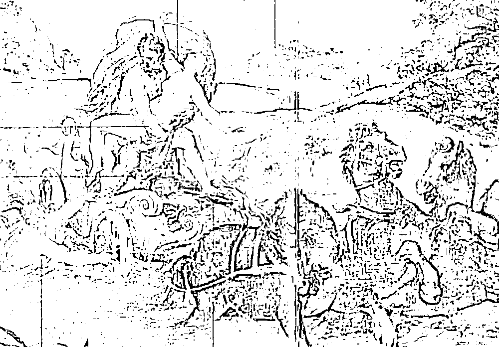神话中，灵魂必须要给哈迪斯奉上金币，因为他主宰着所有的结束和新的开始，结束和开始一样重要，所以我们要认可它并全然地体验它。人们都要赤裸着走进地府，因为我们要放弃所有以前的模式和态度，即使它们曾经给予了我们安全感。由此可见，死神牌并不是只意味着身体的死亡，它反映出生命循环中所有不可避免的改变，只要是改变，就包括了某种终结。 **在哈迪斯的眼中，生命是一连串死亡的过程**，它始于生命离开子宫里温暖的水域，以独立个体的形式进入到粗糙的现实世界。从此以后，我们不再生活于母亲身体的伊甸园中。青春期的到来和性别的发展之前，童年一定要走入终结。

人们无论怎么锻炼身体、节制饮食和细致地化妆，靓丽躁动的青春期都会结束，成熟的中年必将如约而至。

每一段关系，无论多么亲密和美好，都有它开始和结束的时日，因为我们的感觉不断改变，对他人的理解能力也与日俱增。结婚就意味着结束单身的日子，新生儿的出生提醒我们青春的岁月一去不返，毕竟肉骨凡胎的人类世界没有永恒一说。死神——哈迪斯虽然隐身于暗处， 却陪伴我们度过一生，所以奉上金币也是理所当然的报答。**死神，是结束也是开始****从解牌的角度来看，死神牌暗示着当事人需要面对某种结束，至于是否有痛苦的经验，要依赖于他（她）对于这件事结束的认可度和承受能力。**死神牌也预示着生命中的新开始，如果当事人能坦然放下旧有的模式，开始就可能伴随着喜悦。就这样愚人进入了地府，把他以前的生命抛诸脑后，准备走向未知的将来。

**版权声明：**本文由《自在园》授权发布，欢迎转发，反对抄袭。友号转载请申请白名单。

**朱丽叶·沙曼·伯克**从 20 世纪 70 年代早期开始，就对塔罗牌产生了兴趣，并踏入了塔罗的世界。后来，在丽兹·格林的鼓励下，开始研习心理占星学和塔罗。1984 年，第一本书《塔罗全书》（The Complete Book ofTarot）出版。之后，与丽兹·格林合作设计并撰写了《神话塔罗》（The Mythic Tarot）。朱丽叶写了十本塔罗和占星学书，包括一本名为《众星的传说》（Stories from the Stars）的儿童读物，以及与丽兹·格林合著的《神话之旅》（The Mythic Journey），这是一本详细讲述如何运用神话来指导生活的书。

**点击下图了解课程详情** 

**微信又双叒叕改版啦，不想错过若道君的推送？****就把若道设为星标吧！****▼**

**喜欢记得点一下在看哦☟**

************报名直达入口************

# ISAR 认证职业占星师文凭课程 | 开启“爱好变职业”的创收自由之路

> 原文：[`mp.weixin.qq.com/s?__biz=MzA5NjA0NTAxNg==&mid=2651481677&idx=3&sn=bb57c9bb868a2413e929b1be657eb2ef&chksm=8b48d4fabc3f5decc90e3c479b1626c697a57e79364a590450a5e130d90c2ae7d52396783ee1&scene=126&sessionid=1692737781#rd`](http://mp.weixin.qq.com/s?__biz=MzA5NjA0NTAxNg==&mid=2651481677&idx=3&sn=bb57c9bb868a2413e929b1be657eb2ef&chksm=8b48d4fabc3f5decc90e3c479b1626c697a57e79364a590450a5e130d90c2ae7d52396783ee1&scene=126&sessionid=1692737781#rd)

**2022 年，是世界和中国 40 年未有之大变局的开始。**

俄乌战争打破了欧洲大陆乃至全世界的和平局面，而新冠疫情也给中国经济带来前所未有之挑战。

如果你关心经济形势和世界局势，你会有这种的感觉，我们将面临一场深刻的危机，而这不是短期内可以结束的。

**占星学的看法也是如此。**

4 月青年失业率（16 岁到 24 岁）中国达 18.2%，一些背着房贷、教育、医疗负担的中年人突然失业更是整个家庭整个难以承受之重。为了更好准备面对这样的时代变化，连《北京日报》这样的官方媒体也在呼吁：**“开拓副业，让自己有多元化发展的生存能力”。**

**而这门课程，就是为了这样一个目标准备的。**

**占星学是非常好的“开展副业”的选择**

这个**为期 16 个月**的课程通过并不算长的时间和并不算高的投资，不仅可以帮助你学到一个终身可用的技艺，而且也可以选择成为自助助人的占星师，**开启受益终生的第二事业。**未来是个体崛起的时代，大量个体被鼓励独立发展，比如网红、自由职业、自媒体、咨询师等，他们都不需要传统的办公室。社会越发达，人的独立性就越强，未来有能力的人都可以变成独立的经济体。

**占星学也是越老越好的职业**

和一些技术变化非常快的职业不同，**占星学的技术层面非常稳定，不会快速迭代变化，**同时，掌握好占星学、能够做一场好的咨询又需要个人自身大量实践和对生命的深刻理解，而这些都是时间和岁月带来的。

**占星学是现代社会需要的助人职业**

社会快速发展和变化人们似乎越来越无法掌控自己的生活，这给很多人带来巨大的焦虑，**抚慰心灵的咨询市场需求巨大。**而占星学可以让人从前所未有的角度了解自己，了解目前和未来所处的周期，挑战的意义，不论对于深入的个人成长探寻，还是预测未来的周期，都又其独一无二的价值。

**ISAR 认证职业占星师的独有培训**

目前占星学的培训市场鱼龙混杂。而 ISAR（国际占星研究协会）是一个包含了 47 个国家在内的国际占星组织，多年来致力于占星的教育和研究，提升占星教育的品质和职业占星师的能力，在国际占星领域备受尊重。今年，ISAR 对于成为 ISAR 认证职业占星师提出了更高的要求，**所有想要获得 ISAR 职业占星认证的申请者均需要在 ISAR 的附属学校通过 500 个小时的研习（包含****主课****、选修课、沙龙、作业、讲座、工作坊等等）。**

**而这门核心占星学课程就是为此而准备的。**

**2022 年，鉴于对若道在占星教学领域所做的持续努力和高品质的课程服务，ISAR 特别授予若道核心课程为 ISAR 文凭课程，所有在若道学习，并通过若道毕业考试的同学将获得 ISAR 颁发的学历文凭（Diploma）。**

**你的占星核心课老师是谁？**

**拥有****51 年****占星实践经验的****若道创始人****前 ISAR 全球副主席****前 ISAR 全球职业占星师资质认证主席****大卫·瑞雷**

**和**

**2019 年第二届、2021 年第三届核心课中**

**与苏·汤普金斯老师****联合授课****的**

**ISAR 认证职业占星师**

**咔咔（Caroline）**

**二人合力打造**

**2022 年 ****若道全新核心占星课程**

**咔咔老师给同学的寄语：**

（向上滑动查看内容）

**亲爱的同学们：**

我为什么学占星学？

2000 年的时候我还是一个在网上搜索天蝎座和水瓶座配不配的普通白领。我搜索的内容还包括了水瓶座为什么总是这么若即若离？

体贴的搜索引擎给我推送了占星学、行星、星座、宫位、相位等资料，还让我了解到莉莉丝、月亮交点、截夺宫位等占星学概念。

2000 年 10 月我了解到，一个从业 30 多年的美国职业占星师大卫·瑞雷来到了中国，和他的中国合伙人将开办一个专业教授占星学知识的课程。过去 10 个月在网上东拼西凑的占星学知识唤起了我对占星学的兴趣，但是已经不能满足我对星图深度分析的需求了。

2013 年，我通过了若道核心课程的毕业考试和国际占星师研究协会的认证考试。2015 年我离开职场成为一名全职占星师。

到底学习占星带给了我什么呢？

1、它是自我觉知的工具，我现在已经不去纠结哪些星座是否匹配，我相信外在的事件是内在心理矛盾的显化。也就是说，想找到令人满足的亲密关系，要先去了解自己的情感模式和需求，而不是无意识地一次次地试错和撞墙。我开始学习自我关怀和接纳自己。

2、它带来看待世界的全新和全景的角度，天上如是，地下亦然。人类社会和个人生命的进化都有其周期和相似性，作为个体，占星学帮助我思考如何更积极和有建设性地与宇宙的能量合作，认识自己，发挥自己的潜力，度过有意义且自我满足的人生。

3、它带来了全新的职业：占星师和占星老师。除了收入，还有助人育人的满足感和意义感。

4、它带来一群志同道合的伙伴，我们彼此联结又相互独立。

作为中国占星界的“黄埔军校”若道占星的学生、助教和老师，我与很多学员在人生的不同阶段带着各异的需求走进了这所学校，2022-2023 年一年半的若道核心课程设计既蕴含了大卫·瑞雷老师的教学精华，也带入了我在跟随不同国外占星老师学习、助教和教学积累的心得。

有一些学员毕业后从事了占星咨询工作，有的在各大平台成为专业占星学知识的输出者和传播者，有的运用占星学提升他们的工作，也有的在占星学与投资，占星学与名人/八卦、占星学与原生家庭、亲密关系、亲子关系等领域收获了有用的或者有趣的体验。

对我来说，生命是一场自我完整的体验之旅。从 2011 年的那个春节在若道入学之后，我的生命旅程更加充实、有意义、有目标，也更有满足感。

希望在 2022-2023 年的若道核心课程里见到你。希望你此后的生命旅程里，有若道，有占星学。

占星师咔咔

2022 年 5 月 24 日

**大卫老师给同学的寄语：**

（向上滑动查看内容）

亲爱的学员们：

感谢你对我们从 8 月 30 日开始的若道 L1-5 级核心课程的兴趣。我和合作老师咔咔以及我们的核心课程团队期待着为你提供这个机会，来教授各种高品质的地道占星学知识和技巧。

对于那些希望获得 ISAR 职业占星师认证的学生，这是一门适合你的课程！

作为 ISAR 咨询技能培训的一部分，我曾与咔咔合作过，我们期待着再次合作。咔咔和我曾在 ISAR 职业占星师认证委员会（CAP ISAR）一起工作，我们非常熟悉获得 ISAR 职业认证的流程。作为你的老师，我们将陪伴你整个占星学发现之旅，帮助你逐渐认识到占星学有多么的神奇。此外，你还将受益于我们若道的助教和课程顾问，他们是若道核心课程计划的重要组成部分，提供在线沙龙、组织学习小组、指导家庭作业。我们的教育团队是“服务于你的团队”，所以也会根据你的需求进行相应的调整。你专用的核心课程微信群也促进了你的学习过程，使你能够每天与你的同学们一起学习、探讨、成长。

52 年前，当我开始学习占星学时，没有一所像若道这样的学校。如果有这样一所学校，我会尽一切可能在那里成为一名学生。事实上，我很幸运，我的老师都是经验丰富的专业占星师。然而，我花了 6 年的学习时间才通过 1976 年在美国乔治亚州亚特兰大举行的专业占星师考试，又花了 2 年的专业实践时间才通过占星学谋生。我永远不会忘记从 1970 年到 1978 年的 8 年，那些日子的反复试验教会了我如何苦练占星学。作为老师，我一直在努力传授我早年所学的知识，让你的旅程更加顺利，更加全面。

自 1978 年以来，44 年的全职实践教会了我很多，我很高兴有机会与大家分享我所学到的东西。我和咔咔都是现代占星师，虽然我们尊重西方占星学的历史和传统，但我们实践和教授的占星学植根于现代人本主义哲学，这种哲学旨在提高你对自身潜力的认识，并鼓励个人成长。还有什么比了解自己更实际的呢？还有什么比个人成长和发展潜力更有利的呢？这是你将要学习的占星学，一种可以应用于你自己生活的占星学，一种可以为你提供一个充实职业的占星学。

教书是我回馈占星学行业的方式，这个行业拓展了我的视野，远远超出了我曾经想象的可能。谢谢你给我这个机会做你的老师。

大卫·瑞雷

2022 年 5 月 24 日

**连报 L1-5 全阶网络直播课程，你可以享受**

❶ 64 次线上直播互动网络课程+2 场工作坊，全面而详细地讲解占星学知识、技能、案例和重要领域实践运用。

❷ 知识点+学员星图解读有机结合：咔咔老师以讲解知识点和中外名人案例为主，大卫·瑞雷老师以参课学员案例演示及客户案例为主，每个知识点覆盖班级内学员的亲身案例，参与感更强，多位学员都有机会听到自己的星图分析。

❸ 微信群学员互动分享，从真实案例学习生命成长故事。

❹ APP 答疑论坛提问：论坛上每个学员的问题都将得到及时回复。

❺ 若道独有的职业占星师养成计划，为你毕业后独立咨询做准备。

**❻ **提供**咨询平台**，只要努力，优秀毕业生有机会入驻**若道咨询平台**，拓展咨询客户群。

**更多了解老师和助教？**

**大卫·瑞雷（David Railey）**

*   **I****SAR 董事会成员，ISAR 全球副主席，ISAR 全球职业占星师资质认证主席，若道占星创始人**。

*   2016-2019 年，被选为国际占星协会（ISAR）考试委员会成员，国际占星协会（ISAR）是世界最大的国际占星机构，会员遍布 47 个国家。

*   2017-2020 年，被选为国际占星联盟（ISAR）考试委员会主席，理事会成员。

**占星师咔咔（Caroline）**

2010 年师从美国占星师大卫·瑞雷学习，并得到世界名师斯蒂芬·弗里斯特、罗伯特·汉德、苏·汤普金斯传授各种占星学技法。若道首届学员，国内最早获得 ISAR 职业占星师资质的职业占星师，多次担任若道核心课程助教，并于 2019 年第二届、2021 年第三届核心课中和苏·汤普金斯老师一起教授若道核心占星课程。

在国际知名广告公司和市场研究公司从事的市场研究和推广工作十余年，曾任职于阳狮集团、尼尔森市场研究有限公司、MTV 和《Madame Figaro》杂志。

**助教王嘉祺 （Conrad）**

ISAR 认证占星师、若道认证生时校正资质，从 2010 年起自学占星学，2015 年开始在若道系统学习，并开始个案咨询。2018 年担任若道核心课程助教，以及卜卦占星学和太阳返照选修课助教，并带领学员进行经世占星和太阳返照方面的研究。2019 年 11 月作为演讲人之一参加了国际占星协会（ISAR）北京大会，也是 ISAR 星空俱乐部中国区第 16 期的主讲人。

**什么人适合这门课？**

*   对占星学有浓厚兴趣，想要系统学习占星学。
*   对占星学有一定基础，但不知道该如何整合星图复杂的碎片。
*   希望成为优秀的占星师，想要借鉴国际大师解读思路并融入自己的体系。
*   想学习占星学，但不擅长英文，希望有中文老师授课。
*   想结合占星学理论与咨询实践。
*   走在自我探索和个人成长道路上的人。

**课程费用**

**★ 1-5 阶 连报**

**早鸟价：33000 元（2022 年８月 1 日之前）**

**课程费用：46500 元** **★ 1-2 阶 （8 月 30 日开课）**

**早鸟价：2800 元（2022 年８月１日之前）**

**课程费用：3500 元 ****★ 1-3 阶　连报**

**早鸟价：10500 元（2020 年８月１日之前）**

**课程费用：11500 元 **

**咨询课程请联系顾问**：**王老师（微信/手机：18510107057，请备注“大卫核心课”）**

**退转课程**

**退款原则请详看《教学协议》，如有疑问请咨询课程顾问。**

****2022 L1-5 认证职业占星师必修课程****

**授课老师：大卫·瑞雷、咔咔**

**直播课开课时间：2022 年 8 月 30 日（周二）**

**授课方式：******网络授课，英文/中文授课，中文翻译****

**费用：****1-5 阶连报**：46500 元**（早鸟价 33000 元,8 月 1 日前）；**1-2 阶**：**3500 元**（早鸟价 2800 元,8 月 1 日前）**；****1-3 阶**：**11500 元**（早鸟价 10500 元,8 月 1 日前）**

**课程负责人：王老师**（微信/手机：18510107057，请备注“大卫核心课”）

长按二维码添加课程负责人咨询~

****报名直达入口****

# 雷蒙德·梅里曼金融占星周运 | 本周也是很重要的时间节点

> 原文：[`mp.weixin.qq.com/s?__biz=MzA5NjA0NTAxNg==&mid=2651481677&idx=2&sn=ef0ac3a687e29bdbb9d8d91b069ef183&chksm=8b48d4fabc3f5dec931edaf22bcc740b5a76b64d1e081e93270b2fccdb61827801c829a3057e&scene=126&sessionid=1692737781#rd`](http://mp.weixin.qq.com/s?__biz=MzA5NjA0NTAxNg==&mid=2651481677&idx=2&sn=ef0ac3a687e29bdbb9d8d91b069ef183&chksm=8b48d4fabc3f5dec931edaf22bcc740b5a76b64d1e081e93270b2fccdb61827801c829a3057e&scene=126&sessionid=1692737781#rd)

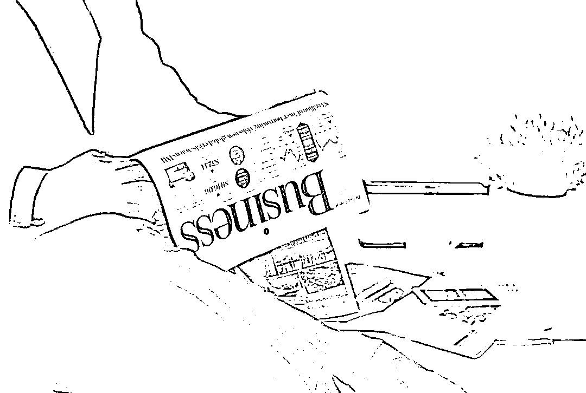

作者/雷蒙德·梅里曼 译者/Luke
编辑/玫瑰 图片/pexels

雷蒙德·梅里曼是在金融占星学界稳坐第一把交椅的占星师，同时他也是若道签约的金融占星课老师，我们引进了雷蒙德·梅里曼老师的《[上证指数月度报告](http://mp.weixin.qq.com/s?__biz=MzA5NjA0NTAxNg==&mid=2651480743&idx=2&sn=752fd81d8f47124f5a7e8dad71f2c8d9&chksm=8b48d010bc3f5906173548bf5774473ddb29f5aa29b6f308fd8fc4e08ef5ea32dbf0460f6c67&scene=21#wechat_redirect)》及《[黄金报告](http://mp.weixin.qq.com/s?__biz=MzA5NjA0NTAxNg==&mid=2651480743&idx=2&sn=752fd81d8f47124f5a7e8dad71f2c8d9&chksm=8b48d010bc3f5906173548bf5774473ddb29f5aa29b6f308fd8fc4e08ef5ea32dbf0460f6c67&scene=21#wechat_redirect)》。我们经老师的授权，将每周刊登梅里曼老师的周运，供大家参考和学习。于是，这是本周的周运（7.25-7.29）。

**说明：以下时间采用纽约证券交易所所在地美国东部标准时间。**

**展望与回顾**

****

**欧洲央行开会决定利率和债券市场干预。欧洲央行曾明确表示，它打算将利率提高 0.25 个百分点。与预定不一样的加息，破坏了欧洲央行的信誉，也无益于通货膨胀。**

**今天将利率提高 0.5 个百分点不会改变通货膨胀的前景。更快的紧缩可以缓慢达成，而不必牺牲央行的信誉。**

**——经济学家保罗·多诺万，瑞银早间评论****www.ubs.com/pauldonovan****2022 年 7 月 21 日****欧洲央行周四提高利率，是 11 年以来首次……欧洲央行基准利率上调 50 个基点，将储蓄利率降低到零，令市场感到意外。交易者本来预期利率小幅上调 25 个基点。“欧洲央行加息大于预期，令市场感到意外”。****——西尔维亚·阿马罗****www.cnbc.com****2022 年 7 月 21 日**上周的全球股市，多头抢占了走势的控制权，突破了许多市场的主要阻力位。尽管欧洲央行加息的幅度是它们声称的 2 倍，美联储继续建议下周大幅度加息，市场还是上涨了。突然之间投资者在买入更高利率的前景，而不久之前他们却在同样的前景下做空。为什么？因为更高的利率意味着软着陆的可能性，回避了严重衰退的风险。不禁让你好奇，是谁在创造（和改变）叙事。这真的无关紧要，因为这一现象符合地球宇宙学周期的剧本。**当木星在白羊座，我们期待投资者和交易者重获信心，更激进地买入而非卖出。**木星在白羊座热爱投机，抗拒共识。共识是看跌的。投资者信心处于低谷。这就是木星在白羊座所乐见的。**市场反转的时机成熟了。**此外，市场正接近 23 个月中周期低点的时间段的终点。条件正是投机者寻求的。基本面稍后将赶上这些领先指标（地球宇宙学和周期）。它们几乎总是延后。全球大部分地区的市场走势都很相似。也就是说，大多数指数在 6 月 17 日金星合相土星前后触底，符合本专栏的观点。此后，大多数指数上周末升至 6 月中旬低点以来的最高价位。

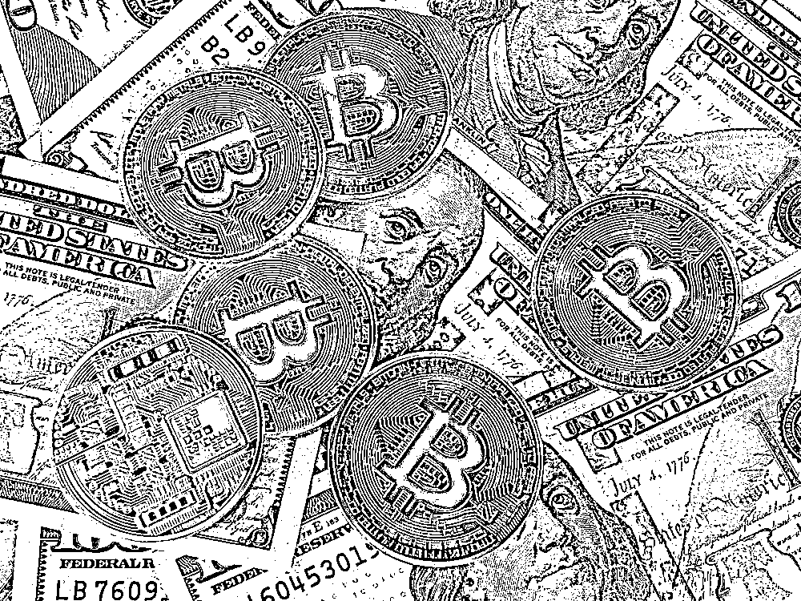

上周可能也是黄金和白银的反转。随着木星与土星形成连续三次精准八分相的第一次，黄金 7 月 21 日下跌至 1678.40。这正好处于我们为梅里曼市场时机学院订阅者提供的支撑（买入）区间，这一区间自 3 月 8 日突破高点 2075 以来就给出了。上周五，黄金价格已经上涨超过 50 美元，回到 1738.30。这是巨大的涨幅，是木星在白羊座式的涨幅。在黄金创下低点的同时，白银守住了前一周创下的低点 18.01，形成了市场间看涨背离。比特币和以太坊继续强势上涨，到达自 6 月 18 日低点以来的最高价。迄今为止，这仍是修正性反弹，完全符合近期讲座和比特币报告中讨论的周期和月相模式。**短期占星趋势和长期考量**

****

**上周申请失业救济的美国人数升至 8 个月来的最高水平，这是最新迹象显示一度火热的劳动力市场开始降温。**

**劳工部周四公布的数据显示，截至 7 月 16 日，申请人数从一周前录得的 24 万上涨至 25.1 万。标志着自 11 月中旬以来申请失业救济的最高水平。**

**——梅根·亨尼****《申请失业救济人数升至 8 个月来的最高水平》****www.foxbusiness.com****2022 年 7 月 21 日****我们正处于美国人生活和工作方式令人屏息的变革之中。在家办公的选项在摇摇晃晃地出炉，其后续影响是巨大的。如果整个过去上班的阶层现在待在家里，这将颠覆现代城市的基础，也就是通勤模式及它为城市提供的收入。****另一个重大问题与工人短缺有关。你在周围都能看到。没有足够的人来填补可用的工作岗位。****——佩吉·努南****《“伟大的辞职”早就开始了》****《华尔街日报》****2022 年 7 月 21 日**上周欧洲很热。我的意思是真的很热，哪怕对我这个在美国亚利桑那州沙漠地带生活的城市牛仔来说也是如此。事实上，英国创下了 17 世纪以来的最高气温。在荷兰阿姆斯特丹，气温上升到华氏温度 100 度（37.8℃）以上，是我过去 25 年来，在此度过夏天时从未见过的。它是我最喜欢的城市之一。许多人引用这股创纪录的热浪，作为全球变暖的进一步证据。但在我的认知中，这反映了下周的**木星（夸大）在白羊座（热）停滞逆行，与此同时 8 月 1 日-7 日火星（热）正快速接近与天王星（打破纪录）的合相，并四分土星（不舒适）**。

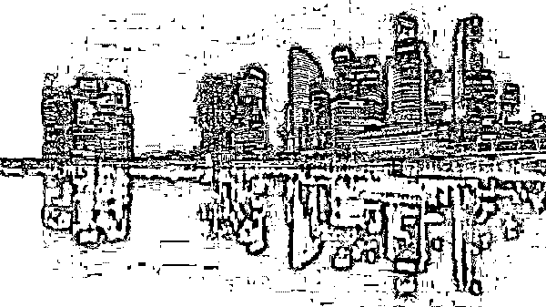

上周月亮也在白羊座（热），前往与火星（热）在金牛座的合相，带来了三位数的华氏温度。热潮可能还没结束。**火星与土星的困难相位（8 月 7 日）发生在夏日时，在 2 周内与极端炎热或寒冷的气温有关，无论在哪个半球。**太阳、火星与土星、天王星之间的困难相位，除了与**极端天气和自然灾害（地震、飓风、龙卷风、停电和大风）**相关外，也对应**政治、经济和银行领域的重大意外和动荡**。正如上周讨论的那样，“很多震荡在发生”。这就好像我们正在进入一个“强烈震荡”的地球宇宙学区间。现在已经处在地球宇宙学影响力的容许度之中了。如果你在寻求稳定和安全，这不是自满或沉睡的时候。如果你想要刺激或者一些混乱，现在正是时候。与此同时，随着**7 月 21 日**木星完成与土星三次渐盈八分相的第一次，“很多震荡在发生”。**这是反转和震荡变得明显的时候**。截至上周五，不仅在股票指数上多头打败了空头，在黄金、白银和货币市场上也是如此。这是“多头的复仇”周。这些不是反转，就是突破信号，目前来看，它们看起来像重大的反转。我们最近对 20 年木星-土星相位的研究显示，它在短期内与道琼斯工业平均指数中周期的低点有显著的关联（感谢梅里曼市场时机学院即将毕业的学生，来自新加坡的文森特·王为这项研究付出的努力）。**6 月 17 日的低点处于这个中周期波谷的时间段。关键时间段是 7 月 21 日-9 月 21 日+/-1 个月。**木星、土星上一次形成八分相是在 2002-2003 年，当时连续三次成相的前两次，分别在 2002 年 10 月和 2003 年 3 月。当时多个全球股票指数完成了 6 年周期或 18 年周期的低点。你可能记得，纳斯达克指数从 2000 年初的高点，一路下跌至 2002 年 10 月第一次精准成相期间。第二次精准成相发生在 2003 年 3 月，当时随着美国在虚假前提下发动伊拉克战争，欧洲市场触底。其他的案例没有这么戏剧化，但仍然令人印象深刻。**本周也很重要，因为它包含三个木星**行进。除了**木星 7 月 29 日转向逆行停滞外，金星将在 7 月 25 日四分这个大家伙，太阳将在 7 月 31 日三分这颗行星之王**。此外，**新月会发生在火象星座狮子座（7 月 28 日）**。通常，当市场上涨进入如此活跃和夸大的行星组合时，会对应波峰。**但在许多情况下，它反而会对应低点，随后展开了另一轮强势的上涨。**

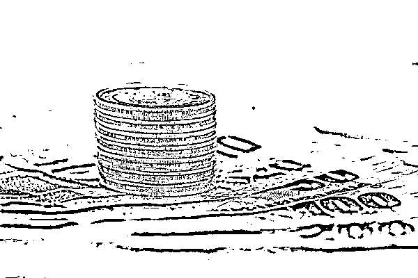

比如说，2021 年 8 月 20 日，日经指数下跌至 16.5 个月周期低点，那是木星和天王星也突显的时刻。日经指数当时创下 16 个月周期低点 26954。3 周之后，2021 年 9 月 14 日，它上涨至 30795，涨幅 14%，到达新的 30 年高点。自那以后它再也没有到达过那个价位。类似的事情可能会再次发生。这是一个充满烟火、热浪、兴奋、混乱和波动的夏天。在一个充满危险和动荡的世界里，这是一个漫不经心无忧无虑的夏天。有些人喜欢热浪。不喜欢炎热的人最好离开。市场可能是疯狂的。这不太可能是一个充满爱的夏天。但这可能是一个充满激情、抗议和狂野生活的夏天。可能会有更多的震荡到来。**梅里曼市场时机学院与若道于 2022 年 6 月 23 日 19:00 举办金融市场最新信息中国专场讲座。**这个 2-3 小时的在线讲座（有两次 5 分钟的休息时间）讨论了几个金融市场的前景，包括黄金、原油和上证综指。**长按下图了解更多详情**

这是特别及时的讲座，因为为期 12 年的木星轨道周期会在 5 月 10 日进入白羊座，并且 6 月-11 月是一年中最有力的地球宇宙征象接连登场的重要时间段，因为土星逆行与天王星形成几乎精准的渐亏四分相。

**说明：以上日期基于纽约证券交易所所在的美国东部标准时间，由于存在时差，中国地区可能需要加一天。**

**版权声明：**本文由若道翻译发布，欢迎转发，反对抄袭。友号转载请申请白名单。

**雷蒙德·梅里曼（Raymond Merriman）**

若道签约老师。著名金融占星师，ISAR（国际占星研究协会）前主席，梅里曼市场分析公司的总裁。他由于“提升了占星学的职业形象”，在 1995 年国际占星大会上被授予轩辕十四奖；在 2012 年国际占星大会上，被授予轩辕十四终身成就奖。

1“中国上证指数月度报告”发售**若道推出了****中文版****的雷蒙德·梅里曼中国上证指数月度报告，并持续发行该报告！**当把金融市场的周期和占星学的周期相结合时，雷蒙德·梅里曼老师的金融占星学研究**为投资者应对金融市场的周期波动，并随之调整投资策略提供了极大的价值参考**。
**8 月中英文报告已上线！**2“黄金价格周期月度报告”发售**若道推出****中文版****的雷蒙德·梅里曼黄金价格周期月度报告！**不仅仅为广大读者在中国股市的投资出谋划策，更将视角放眼黄金市场。**每当世界经济形式不明朗的时候，有一个地方是保值的港湾，那就是****黄金**。自 1982 年雷蒙德·梅里曼出版第一本研究《地球宇宙学征象与黄金价格的关联》的著作以来，**他一直作为最重要的黄金市场时机预测者之一享誉国际**。2022 年 8 月黄金报告已上线，梅里曼老师将会告诉你他对这个关键时期如何操作的想法。也可以按照季度和一年期订阅，有更多优惠。季度和年度的好处是，你可以持续了解梅里曼老师对于不断在变化的市场的看法。即便他某一次看法和市场不一致，你也看到在下一期他如何调整自己的看法，并看到金融占星在一个长期时间段内对你把控风险的帮助。而能够长期控制风险、尽量找到安全的投资时机才是投资的长久之计。**8 月中英文报告已上线！****购买套餐**，买得越多越优惠中国上证指数月度报告套餐价

*   **单月报告**：280 元
*   **3 个月套餐**：780 元（260 元/月）
*   **12 个月套餐价**：2400 元（200 元/月）

**长按下图识别二维码****购买金融报告****套餐****▼**

黄金周期月度报告优惠

*   **双报告年度套餐更优惠（直降 900 元）**

*   **12 个月黄金报告+12 个月上证指数报告：仅需 3900 元**

**长按下图识别二维码购买黄金报告套餐**▼

3《2022 年金融预报和沙龙》1976 年以来，由雷蒙德·A·梅里曼撰写的梅里曼市场时机学院每年一次的年度预报沙龙和每年一本的《年度预报》一直在应用占星学原理为投资者们服务，提供卓越洞见，从未间断。 **雷蒙德·梅里曼《2022 年金融预报和沙龙》发售中（报告已发布）。****长按下图识别二维码了解详情**
▼

4《2022 下半年金融占星投资沙龙》这是特别及时的讲座，因为为期 12 年的木星轨道周期会在 5 月 10 日进入白羊座，并且 6 月-11 月是一年中最有力的地球宇宙征象接连登场的重要时间段，因为土星逆行与天王星形成几乎精准的渐亏四分相。

**长按下图识别二维码了解详情**

▼

**点击阅读原文购买金融报告**

# 若道周运 7.25-7.31 丨七月最后一周，在躁动中保持冷静吧（内含 12 星座运势）

> 原文：[`mp.weixin.qq.com/s?__biz=MzA5NjA0NTAxNg==&mid=2651481677&idx=1&sn=98325cc3f560e5ffc95199154c4cb73d&chksm=8b48d4fabc3f5dec85f962ace94fdb2319b84a45bf7e7c83c61527b8233158e072af63a19bb5&scene=126&sessionid=1692737781#rd`](http://mp.weixin.qq.com/s?__biz=MzA5NjA0NTAxNg==&mid=2651481677&idx=1&sn=98325cc3f560e5ffc95199154c4cb73d&chksm=8b48d4fabc3f5dec85f962ace94fdb2319b84a45bf7e7c83c61527b8233158e072af63a19bb5&scene=126&sessionid=1692737781#rd)

******☆ ****后台回复“今日”，给你一句生命态度******

作者/Dora ISAR 认证占星师
编辑/翀子 封面/书君 图片/网络 7 月最后一周来了！在些许躁动的氛围里，我们迎来狮子座新月和木星逆行。12 星座如何开启本周？让我们来看文章吧！（如果着急看 12 星座运势，不妨先拉到最后哦）**整体氛围**

打开这周的星图，追寻星星们的踪影，我的脑海突然跳出了一个很奇怪的问题，为什么很多中学生爱爆粗口呢？先说明一下：这里不是指所有的中学生，而且，爆粗口和是不是好孩子没有必然的关系。

**本周初期，金星四分木星，金星合相月亮**，有那么一丝宠溺的气氛，而这个时候，火星和天王星已经慢慢开始合相在金牛座（经济或者具体事物方面的焦虑和变化）。

**周三，狮子座水星四分火星和天王星**，有些不满在发生，对自由的渴望在加剧，空气中出现了火药味。有什么没有预料到的争论？有什么难以言说的愤懑？

**周五晚上，狮子座新月。**新月和准备开始逆行的木星呈三分相，这开始了一段反思和探索自我的旅程，像是要逐渐积聚战胜困难的意愿和能力。

**周日，水星对分土星，**激烈的争论得到相应的控制，理性占据了思考和交流，躁动似乎正在平息。

怎么样？青春期的孩子们，就如在狮子座的太阳，急需找到自己的角色和定位。面对世界的广阔和复杂，以及自我成长的压力时，我们有很多的挑战和不安。当情绪不能准确地表述，也许，爆个粗口又酷又帅，帮助宣泄了自己的情绪。

年轻的心，渴望和羁绊自己的条条框框划清界限，宣告自己的独立主张和看法。谁说规定都是对的？我有自己的想法，自己的一套！我想怎么说就怎么说。

当然，随着我们逐渐长大，我们会反思、会探索，会看到更大的世界，当我们具备表达情绪和理性思考的能力时，我们会学到更礼貌流畅的沟通交流方法，知道什么话该说，什么话不该说。不再意气用事，棱角被磨圆，这是一个少年的成长之路、一个孩子的社会化过程。

这也是我们成年人适应社会、在社会中立足的过程。但我们的情绪呢，是不是也就不再被看见？

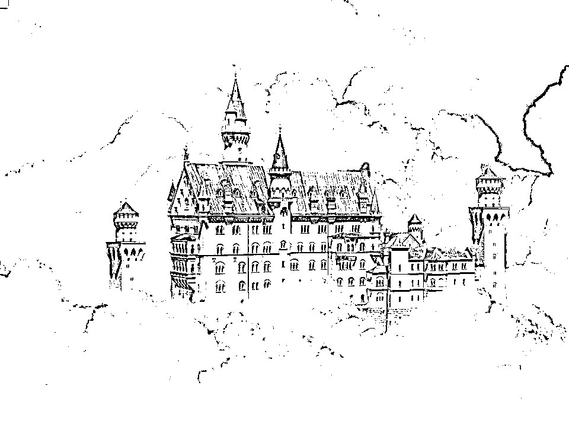

**重要天象**

**★ **周一 ******金星四分木星**

巨蟹座的金星充满了保护和宠溺的意味，当和幸运的木星呈四分相的时候，虽然是不调和的冲突相位，**有可能出现过度消费、乱花钱、过度溺爱的情形，但**毕竟是两大吉星之间的碰撞，还是应该放松一下心情，让自己柔软下来。

生活已经够不容易了，先好好休息，再来迎接本周接踵而来的挑战吧。

**★ **周三 ******水星四分火星**

狮子座的水星四分火星，这时火星正在合相金牛座的天王星。经济上，股市、金融市场等方面的波动给我们带来焦虑和不安，争论的议题将会出现，也许关于经济、战争，也许是关于自我认识和成长，也许是关于娱乐明星。

有可能出现让人觉得意料之外的新闻爆料，口舌之争。

**这个相位是紧张冲突的，给我们带来了不安和浮躁的气氛，就好像在风暴的前夜。在这个时候，尤其需要保持冷静。**

同时，还要注意自己的言行举止，不要轻易发火，口不择言，伤及无辜。也要注意行动上、交通上的安全。提醒路怒症患者，冷静开车。

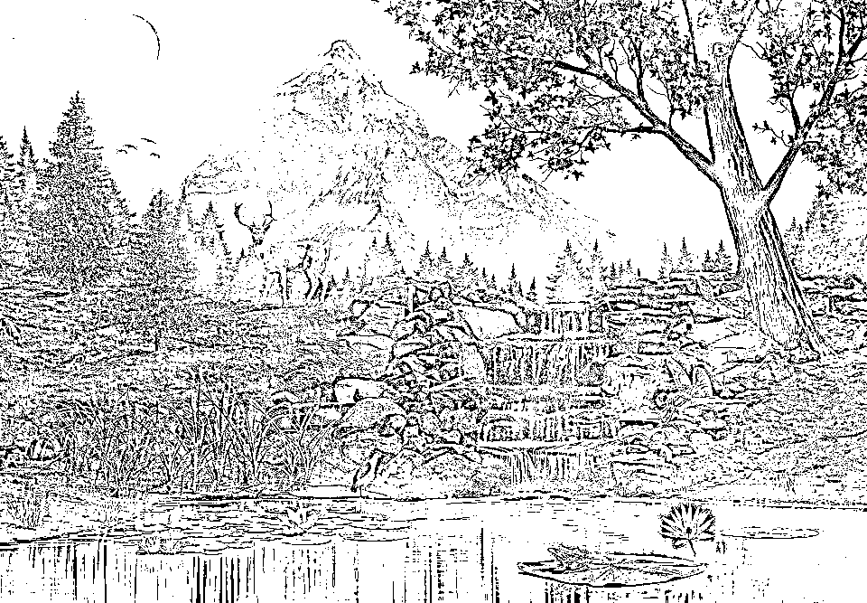

**★****周五 狮子座新月、木星在白羊座逆行**

周五，我们将迎来狮子座新月，同时，木星开始在白羊座逆行 (11 月 24 日在双鱼座 28 度恢复顺行)。

这个新月，正好三分了白羊座的木星。给我们带来了希望和支持。**在我们感到疲惫绝望的时候，宇宙源源不断地给我们输送信心和力量。**

狮子座象征生命的创造力、自我成长的宣告、快乐和热情，哪怕在新月，最暗淡的时光，也在提醒我们，不要忘记你是自己的英雄。

不论外界对你如何无情冷漠，你要百折不饶，百转千回地踏上自己的英雄之旅。你是主宰自己生命的王者。当你相信自己的时候，整个宇宙都支持你！自助者天助！这个新月，让我们祈祷生命的丰盛和蓬勃的力量。

**随之而来的木星逆行，一直会延续到 11 月。**木星是一颗代表好运和扩张的吉星，逆行的时候，有反过来朝内在深入的意思。

法律事务、学业、考试、出国旅行等事情，感觉会变得有些好事多磨。但是用来反思、进行自我探索、倾听内心的声音、重组自己的信念、修正自己的道路，那就再好不过。所谓越是艰难处，越是修心時。

**★****周日 水星对分土星**

本周的争论和躁动，会引出一些权威的声音，大环境下，激烈的争论可能会暂时告一个段落，大家的思考变得更加冷静和理性。

回归到个人，我们的一些想法可能会遭到反对，或者被限制。这时候，无谓的争执也没有太多意义，关键是自己清楚自己的想法和意图，更理性的承担每个选择的后果。经过深思熟虑而决定的事情是值得去做的。

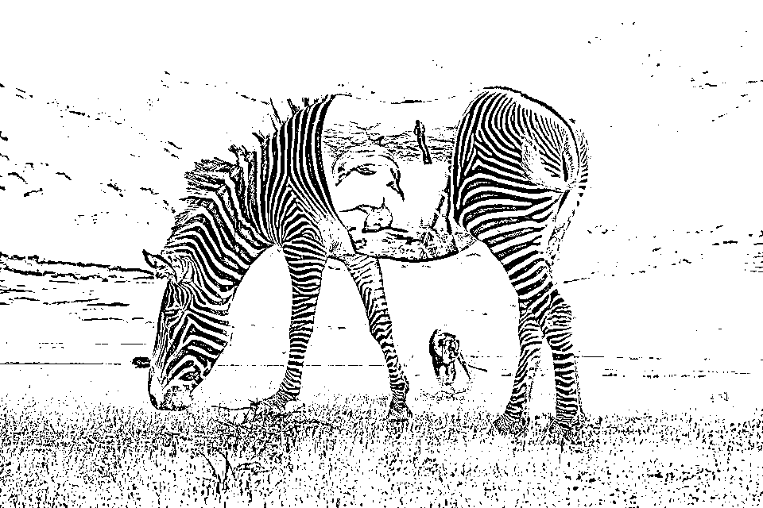

**12 星座一周运势**

**上升*****白羊座***

白羊座们最近要注意财务方面的问题，暂缓大的投资以避免损失。钱款可能会延迟到账，但不用太着急。

多关心自己的孩子，给孩子一些高质量的陪伴时间，或者可以积极备孕。多做一些和孩子有缘的事情。

经常回去看看父母，珍惜和家人在一起的时光。

*****上升**金牛座***

最近金牛座的心情起伏比较大，特别想改变自己目前的状态，也许是希望换一份工作，也许是希望换一个活法。一般来说，金牛座是最希望稳定不变的，可能是各方面压力太大，心生厌倦吧，要注意照顾好自己的情绪，保护好自己。

如果情绪不好，可以多陪伴一下家人，家人永远是你的避风港，你始终可以从家人那里获得力量来对抗现实的压力。

**上升*****双子座***

上升双子座的宝宝们，本周有财运，可以多多和同学好友交流信息，获得一些有帮助的资讯。

也许双子座们最近有点迷茫，看不清自己的未来方向，感到无奈，很想躺平，不如多花一些时间学习，努力提高自己，等待新的机会。     

暂时不要长途旅行，避免出现不必要的意外。

**上升*****巨蟹座***

最近巨蟹座机会较多，也许有更多的工作机会，也许收入会增加。事业心比较强，希望自己能够在职业上获得更多的机会，虽然巨蟹座比较害羞内向，但运势来的时候，也会变得勇敢一些。

事业心强的同时也不要忽略了身边的朋友，要记得照顾朋友们的感受，以免发生不愉快。不要着急得到所有人的认可，自己一步一个脚印就可以了。

**上升*****狮子座***

太阳狮子座的宝宝们生日快乐！狮子座最近非常忙碌，工作的事情一下子变多了，在繁忙中也体现了自己的价值，可以得到大家的关注。当然，再忙也记得照顾好自己，经常放空一下，练练瑜伽之类的安静运动，让自己放松一些。

最近和另一半相处的时间是否变多了呢？也许更甜蜜，也许发现各种冲突和矛盾。如果亲密关系出现困扰，两人不妨坐下来，坦诚聊一下，从心底交换自己的想法。

**上升*****处女座***

处女座本周在工作中也许会有一些压力，感觉要避避风头，独处一下。天气太热了，躲在家里静观其变是个不错的选择。

有些处女座有突然的状况要出门，需要反复核对出行信息，关注天气变化，了解目的地信息，总之，谨慎为好。

可能有些偏财运。意外的一些收获。

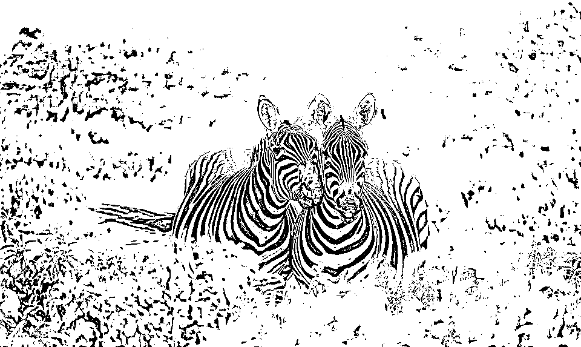

**上升*****天秤座***

天秤座这周的工作运相当可以，金星在你的第十宫，职场上容易得到大家的青睐，面试的机会也会有更多的胜算。之前开展的工作计划，抓紧时间去完成吧，疫情让我们耽搁了好多事情，这段时间需要抓紧。

木星在第七宫，单身的天秤座容易冲动的谈恋爱，但要注意选择在适当的时机表白。

本周挺有桃花运，既可以更多地和朋友们互动联络，也适合和伴侣多多相处，增加感情。

**上升*****天蝎座***

天蝎座们要多多关注自己的身体健康，不要因为过度疲劳消耗太多。最近可以多休息一下，照顾好自己的身体。可以多参加一些富有创意的活动，或者多些娱乐，让自己开心。

注意和另一半的关系，也许会有比较大的争吵。在亲密关系中，我们需要给对方留有更多的空间，只有自由独立的人，才会有平等成熟的亲密关系，操控和过度依赖都是不成熟的情感模式。

**上升*****射手座***

射手座在工作中要改掉粗心大意的毛病，细致认真、做好计划并且严格执行，不要拖延。

生活上养成良好的生活习惯，保护好自己的身体，避免出现意料外的疾病，也记得给家里的宠物做个身体检查，该打的疫苗记得要去打。

如果恋爱已经修成正果，可以考虑结婚安家，这周有利于见双方父母，听取长辈的意见。

**上升*****摩羯座***

摩羯座们这周有更多的机会和另一半度过美好时光，单身的摩羯座脱单机会增加，人际关系方面比较顺利，可以多多开展互动，建立良好的合作关系。

记得多考虑家庭方面的事物，比如装修、买房、学做美食等等，多回家看看父母，和家人一起度过美好时光。这周你会发现，家人是你最强的后盾。

**上升*****水瓶座***

理性的水瓶座这周在职场有新的机会，也许换到了一个新岗位，可以多向同事们学习，一定能够获得非常宝贵的经验。

桃花运旺，单身的水瓶座有机会遇到志同道合的恋人。有另一半的水瓶座可以思考一下，如何增加一些浪漫的共度时光。

记得回家问候父母，关心他们的身体健康，同时打理好家庭事物，不要因为粗心大意出现一些家居方面的意外事件。

有可能有一些短途旅行的机会。

**上升*****双鱼座***

双鱼座在职场上有更多的表现机会，如果有什么好点子，不妨向领导提出你的建议，要相信自己会得到更多机会。

最近财运比较好，可以多关注一下投资。

注意和周围邻居、兄弟姐妹搞好关系，不要被一些小小的不愉快影响自己的心情。

多点时间去玩，做一些和艺术相关的活动。有时候，我们需要发现生活的美好。

**祝大家一周平安顺遂！**

**版权声明**：原创文章由作者授权首发于若道平台发布，欢迎转发，反对抄袭。友号转载请申请白名单。

**END**

****Dora****

若道 2017 届核心课毕业生

若道咨询平台占星师、ISAR 认证占星师

心理咨询师、塔罗咨询师、多年企业管理经验

咨询微信：AstrologerDora

公众号：Dorothy 占星文化

**长按打赏**

**20 位来自世界各地的占星师****带来 19 场沙龙——新世界的觉醒****详情可点击下图**

**学习占星学****点击下图了解课程详情**

**微信又双叒叕改版啦，不想错过若道君的推送？**
**就把若道设为星标吧！****▼**

**喜欢就点一下“在看”吧！**

********报名直达入口********

# 金星四分木星，你“最后悔”的消费经历是什么？

> 原文：[`mp.weixin.qq.com/s?__biz=MzA5NjA0NTAxNg==&mid=2651481672&idx=1&sn=5a0d3711aa0b336a2dc46469060415f6&chksm=8b48d4ffbc3f5de9db452e2ba1bf3b1cefe6f09bbd9527d9b2af87d4b0457542143a3af565ba&scene=126&sessionid=1692737781#rd`](http://mp.weixin.qq.com/s?__biz=MzA5NjA0NTAxNg==&mid=2651481672&idx=1&sn=5a0d3711aa0b336a2dc46469060415f6&chksm=8b48d4ffbc3f5de9db452e2ba1bf3b1cefe6f09bbd9527d9b2af87d4b0457542143a3af565ba&scene=126&sessionid=1692737781#rd)

**2022 年 7 月 24 日天象：**

*   **月亮在双子座**
*   ******金星四分木星******
*   ******天王星合相月亮北交点******

金星在周一进入了巨蟹座（点击[【金星进巨蟹座】](http://mp.weixin.qq.com/s?__biz=MzA5NjA0NTAxNg==&mid=2651480958&idx=1&sn=66223f3b2a0abc53d1946e8dbc3794be&chksm=8b48d1c9bc3f58dfe8f4ca0d6aee18a345455b6c72fe85e9f7876e7bc34458ff6d5e4359c8d3&scene=21#wechat_redirect)查看文章），并在今天和木星形成四分相。当金星和木星呈四分相，它带来温暖、大方、热情、慷慨的关怀。今天适合为家人朋友送上欢乐、祝福，以及小礼物。可以犒劳自己，不过小心沉溺于享乐之中，有过度消费的倾向。太阳昨天进入狮子座（点击[【太阳进狮子座】](http://mp.weixin.qq.com/s?__biz=MzA5NjA0NTAxNg==&mid=2651481577&idx=1&sn=d6a8bf1336abe6ce1a65eb4c0d710388&chksm=8b48d75ebc3f5e4861f1d3d15b8058d3c3e6af26da54b842fcf5179704cc0b326f0452760a8f&scene=21#wechat_redirect)查看文章），让自己光芒万丈的“闪耀月份”到了！感受到内心的热情和创造力了吗？今天月亮在双子座，正是和朋友们享受周末开心时光的好机会！

金星四分木星的时候，我们容易花钱大手大脚，快来聊聊你最后悔的消费经历是什么吧？哈哈~评论区等你哦！ 

周日快乐！我们明天见！**了解每日天象，可****下载“若道”APP 查看****还有更多精彩等着你哦**

# 斯蒂芬·弗里斯特工作坊丨探索组合图永恒的三角

> 原文：[`mp.weixin.qq.com/s?__biz=MzA5NjA0NTAxNg==&mid=2651481671&idx=2&sn=4647b7ea294185fa8638b4450bf2bd88&chksm=8b48d4f0bc3f5de624c609a7b181d0ad427b054f47049a63026584a3b39c8eba925e6b0c6146&scene=126&sessionid=1692737781#rd`](http://mp.weixin.qq.com/s?__biz=MzA5NjA0NTAxNg==&mid=2651481671&idx=2&sn=4647b7ea294185fa8638b4450bf2bd88&chksm=8b48d4f0bc3f5de624c609a7b181d0ad427b054f47049a63026584a3b39c8eba925e6b0c6146&scene=126&sessionid=1692737781#rd)

**1**

********斯蒂芬·弗里斯特老师若道独家三日线上工作坊********

斯蒂芬说，我们的组合图表明无论什么状况我们都能熬过去。

**2**

********此次授课内容********

**组合图描述了如何才能使两个人的关系一直充满活力。**这句话中隐含的意思是假设一段关系有一种区别于这两个个体的独立的生命。有时我们喜欢和一对伴侣共度时光，却从没想过单独见他们其中一人。我们从这对伴侣身上感觉到的 "频率"是对他们组合图能量的直接体验。在某种程度上，可以简单地理解为：**正如每个人都有自己的星图一样，每对伴侣也有他们的星图。**

从简单的描述层面上讲，这就是组合图的意涵。记住，我们可以将这一技法用于任何一种关系：**父母和子女、商业伙伴、朋友。**作为进化占星师，我们的目标要比单纯描述走得更深。解读组合图时，可以着眼于帮助人们，而不仅仅是使他们感到惊奇。对于个体来说，出生星图代表了一条正确的人生道路，一条承诺意义、活力、灵性目标的道路。组合图亦然，只不过它将一段关系看成一个独立的个体，而不是两个人。关系也有进化的路径：人们走到一起是为了学习和成长。个体如果没有领会自己出生星图的要点，会变得疲惫而沮丧。两个人也是如此，**如果没有抓住组合图的要点，我们就会对对方感到厌烦。这段关系似乎也会失去动力。**

伴侣常常意见不一，陷入困境，看不到前进的方向。三是一个更有动力的数字。三个人投票，二个人以多数票击败一个人，推动事情继续发展。**这实际上解释了这次工作坊的主题：永恒的三角。**

**每对伴侣其实都是一个三人组：你、我以及我们。**组合图所代表的那个看不见的 "第三人"经常会"投出打破僵局的一票"，使关系得以发展。**·** 但是如果组合图总是同意一个人的意见，而不同意另一个人的意见，怎么办呢？（这被称为"封建制度"）**·** 如果两个人都安静而保守，但他们的组合图却要求狂野的冒险呢？（这是 "文化冲击"）**·** 如果它同时均衡地反映了两个人的情况呢？我们可以称之为 "民主"，但我们仍可以区分出一个人天然的智慧比另一个人更强的领域，让擅长的人负责擅长的事，这会促进关系蓬勃发展。换句话说，我们开始看到这个技法的咨询维度了。我们将在这个工作坊中探讨这些内容。两个人究竟为什么会走到一起？**在严肃、复杂的关系中，我们可以假设两个人之间有一些未解决的业力。**如果他们在今生是恋人，但在前世中，一个是父母，一个是孩子呢？也许那些直觉和假设仍可以感受得到，极为错综复杂地使得他们在今生想要成为情侣。**这些疑问将我们引向组合图的月亮交点，在那里我们往往能发现当今人类任何伙伴关系问题的真正核心。**

**从理论上讲，组合图是基于中点的。**如果我的出生星图里太阳在摩羯座中段，而你的太阳在双鱼座中段，我们组合图的太阳就在水瓶座中段。换句话说，**在你和我的太阳的中间位置。****其他行星、月亮交点和中天也是如此。**其他宫头的位置，包括上升点则存在一些争议。通常的做法是仍然使用中点，但斯蒂芬老师将会解释他认为这样做存在的技术方面的问题。他更倾向于**使用关系最初开始的地点绘制星图，就像我们使用出生地来绘制出生星图一样。**

**组合图也像出生星图一样有行进。**在工作坊中， 我们将**探讨一些特殊的技法和考量，来帮助伴侣们应对生活中的挑战和机遇。**组合图的推进会出现一些看似难以解决的复杂问题，斯蒂芬老师创造了一种解决这些问题的技法。他将在工作坊中阐述相关细节，基本的问题是：如你所知，要了解一个人 30 岁生日的推进，我们要看这个人出生后 30 天的行星位置。问题是，组合图与我们在占星学实践中使用的其他星图不同，组合图并不代表某一天的天空。记住，它是基于中点的。**那么我们如何从一个不存在的日期开始 "向下数 30 天"呢？斯蒂芬老师将为我们提供一个行之有效的答案。**

并非所有的人都处于伴侣关系中，但**作为人类，就需要与其他的灵魂共舞。占星学能够极大地帮助人们驾驭复杂的关系。**了解我的星图如何与你的星图通过相位和宫位的交互而产生互动，是非常有帮助的。组合图包含了这些技法，提醒我们，整体总是大于各个部分之和，而又与之不同。

**3**

********斯蒂芬的占星著作********

**·** 1984 年-1988 年间，斯蒂芬写作出版了《内在的天空》（已有中文版）、《变化的天空》和《天空的伴侣》三本占星经典著作，奠定了早期在占星学界的地位。**·** 2002 年-2005 年间，他与朱迪·弗里斯特共同创作了两本经典的关系占星学著作《天空的伴侣 I：爱、性、和进化占星学》《天空的伴侣 II：组合图》。**·** 2008 年，斯蒂芬出版了一本非常重要的著作《昨日的天空》，此书是至今为止关于轮回转世跟星图的清晰对应最详尽的著作之一。 斯蒂芬前后一共出版了 12 部占星著作，在世界占星学界拥有很高的声誉。

**4**

********斯蒂芬获得的荣誉********

1985 年，他凭借《内在的天空》一书获得职业占星师协会奖（*Professional Astrologers Incorporated Award*）。1992 年、1995 年、2008 年、2018 年，他四次获得占星界最高的占星学联合协会奖（*UnitedAstrology Congress Regulus Award*）提名，2018 年获得轩辕十四教育奖。

**5**

********斯蒂芬的占星哲学观********

斯蒂芬的占星风格以**自由和选择**为中心，他的解读不是以下定论的方式来“预测”未来，他**强调如何改善生命，而不是宿命式的论断**。他以心理占星学的语言来解读星图上的人格部分，但是**通过南北交点及其相位和守护星来探索星图所揭示的前世业力与今生方向，在灵魂进化的背景里来整体解读星图。**他认为进化占星学的目的在于**鼓励人们做出更符合进化方向的智慧选择，我们学习去了解前世的时侯，关注点应该集中在如何通过意识来疗愈自己。**

**6**

**这些名人怎么说**

斯蒂芬让我们停止了玩责备命运的游戏，而开始看到自己是一个走在进化路途上的勇士。——奥普拉杂志“*O: THE OPRAH MAGAZINE*”

斯蒂芬和杰夫这两位著名占星师创造性地相互应和，展现出他们出色的教师才华，发展并弘扬了占星这门艺术。（对《测量天空：进化占星学和灵魂的钥匙》的书评）——著名心理占星师 现代占星之父 诺·泰尔（*Noel Tyl*）

请享用斯蒂芬和朱迪这两个博大的灵魂在此书中所提供的洞见大餐吧。（对《天空的伴侣》的书评）——进化占星学的创始人之一 杰夫·格林（*Jeff Green*）

我为斯蒂芬解读的精准感到惊叹，他强调没有一件事是坏得无法挽回的，也没有一件事是如此之好以至于它不会因为现在的错误判断而消失的。我怎样推荐他都不为过！——好莱坞著名影星“钢铁侠”男主角 小罗伯特·唐尼（*Robert Downey Jr*）

**7**

**上过课的占星师怎么说**

他关于我星图的解读，让几乎所有在场的人掉泪，我也从此开启了一段灵魂追寻的旅程。我很惊讶他透过星图可以如此深入一个人的灵魂。很多东西你自己都不知道，但是他讲出来你会发现，啊，这是真的，这是占星学的神奇。——《心探索》创始人孟想

每个来参加老师课程的同学，都会被老师深深的慈悲心感动。这种慈悲心，并不是表面上说的一些什么话，而是一种从意识层次上发出的能量。每个来上课的人，都能感受到老师的爱。这种爱，并不是盲目的爱，而是深刻地洞悉真相后的慈悲。

——斯蒂芬老师工作坊翻译逸月

斯蒂芬老师的一对一咨询已经排期到两年之后，我特别幸运，曾在课堂上被老师抽中分析过我的星图，老师充满爱与智慧的指引让我更加清晰的认识了自我。内在的潜能、需求和矛盾被老师娓娓道来。——禄丽荣斯蒂芬老师是位非常非常值得推荐的大师，很粉他，这位进化占星学的创始人，对人的理解是那么的全面完整、深刻洞见、慈悲和温暖，就这方面而言足可以媲美我无比崇敬的荣格和史坦纳（这两位去天堂里玩了）。如果你对西洋占星感兴趣，或者对人的所有角度、各个层次的真相和可能性感兴趣，推荐斯蒂芬老师的书和课程，特别是他的课程，数倍的功力大增的好机会，错过真是占星粉丝的莫大损失。——仁华

**8**

**2019 年工作坊学员感悟**

**9**

**什么人适合这门课程**

✦ 占星师或渴望成为占星师的人群。   ✦ 本课程并非针对初学者，需具备若道核心课程 level4 及以上水平，即了解星座、行星、宫位、相位、综合解读等知识。✦ 课程会涉及组合盘解读高阶内容，不了解相关知识的同学，请提前学习相关内容。

**10**

********授课老师********

**斯蒂芬·弗里斯特（Steven Forrest）**

**·** 进化占星学的创始人之一，当今世界最有影响力的占星大师之一；**· **毕业于美国北卡罗莱纳大学宗教学专业；**· **1984 年-1988 年间，写作出版了《内在的天空》、《变幻的天空》和《天空的伴侣》三本占星经典著作，奠定了早期在占星学界的地位。前后一共出版了 12 部占星著作，在世界占星学界拥有很高的声誉。**· **1985 年，他凭借《内在的天空》一书获得职业占星师协会奖（*Professional Astrologers Incorporated Award*）。1992 年、1995 年、2008 年、2018 年，他四次获得占星界最高的占星学联合协会奖（*United Astrology Congress Regulus Award*）提名，2018 年获得轩辕十四教育奖。**· **斯蒂芬将自己的绝大部分时间都花在教学以及个人咨询上，他于 1998 年创立了占星学徒计划（*Astrological Appretice Program*），这个计划致力于培养职业占星师；**· **至今为止已经有 600 余位学员完成了培训，其中很多都成为了优秀的职业占星师；**· **他是一位脚踏实地的导师，充满快乐和活力，亲和幽默同时又充满了智慧；**· **他的课程不仅仅是一次占星知识和经验的学习，也是一次与智者的相遇。

**11**

********课程费用********

**正价：6800 元****早鸟价：5800 元****早鸟价截止日期：2022 年 9 月 15 日**

**12**

********授课时间、方式、退转********

**授课时间：2022 年 10 月 14 日-16 日（周五、周六、周日）7:00-13:00****具体时间安排：****7:00-8:45****（15 分钟休息）****9:00-11:00****（30 分钟休息）****11:30-13:00**

****授课方式：******线上直播课，英文授课，中文翻译**

**课程退转：退款原则请详看《教学协议》，如有疑问请咨询课程顾问。**

****斯蒂芬工作坊 | 探索组合图永恒的三角****

**授课老师：斯蒂芬·弗里斯特**

**授课时间：2022 年 10 月 14 日-16 日（周五、周六、周日）**

**授课方式：******网络授课，英文授课，中文翻译****

**费用：**6800 元**（早鸟价：5800 元，截止日期：2022 年 9 月 15 日）**

**课程负责人：王老师**（微信/手机：18510107057，请备注“斯蒂芬工作坊”）

长按二维码添加课程负责人咨询

****报名直达入口****

# 星图中的这两个宫位在说：“我想与你一直相爱”

> 原文：[`mp.weixin.qq.com/s?__biz=MzA5NjA0NTAxNg==&mid=2651481671&idx=1&sn=4375aa096654b9fdd1cdc5600743c199&chksm=8b48d4f0bc3f5de6da73748d05d17397c7904d107e9e75f796e03a52053b754807654c21ba8b&scene=126&sessionid=1692737781#rd`](http://mp.weixin.qq.com/s?__biz=MzA5NjA0NTAxNg==&mid=2651481671&idx=1&sn=4375aa096654b9fdd1cdc5600743c199&chksm=8b48d4f0bc3f5de6da73748d05d17397c7904d107e9e75f796e03a52053b754807654c21ba8b&scene=126&sessionid=1692737781#rd)

******☆ ****后台回复“今日”，给你一句生命态度******

作者/斯蒂芬·弗里斯特 译者/逸月编辑/玫瑰 封面/书君 图片/pexels 星图上的第七宫和第八宫，与我们的亲密关系有关，但它们的含义又不太一样。在第七宫，我想要我们的生活交织在一起，而在第八宫，让我既看到你眼中的天使，也看到魔鬼。本文作者斯蒂芬老师即将在若道开设[【组合图线上工作坊】](http://mp.weixin.qq.com/s?__biz=MzA5NjA0NTAxNg==&mid=2651480743&idx=3&sn=a24b3656e04f84f46033da5e808063fb&chksm=8b48d010bc3f5906fd202a475e9ead7ed790b91f0d20db20162f69357c63f10f8a8f367a4fea&scene=21#wechat_redirect)，快点击链接去看看！
**第七宫：一个人不错，两个人更好**七宫是传统上关于婚姻的宫位，当然，**七宫的含义不只是婚姻那么简单，它有着更为深邃的含义。**就好像我们内在渴求的东西，因为它才可以让我们的内在变得完整。当然，人们很快就会个性化那个东西，就是那个人，他会让我成为完整的人；就是那个人，他会让我平衡。**所以七宫的含义，简单来说就是代表另一个人。****七宫代表的并不是陷入爱河，而是代表沐浴在爱河中，即处在关系中。**当一段关系进入稳定阶段，我们才会进入七宫。

这样的关系可能是温柔、甜蜜、浪漫的。这个人说：对面那个人可以让我的灵魂变得完整。这是正确的陈述。**我们需要遇到那些人，他们与我们看世界的视角是如此不同。**

如果没有七宫这样的解药，一宫对我们来说就太自傲了，一宫会对自己太过于认可。独自生活的另一个好处是，家中没有任何争执、争吵。即使我们不喜欢争执与冲突，但它对我们也是有益处的，**他人看到了我们看不到的真相。**

我发现很有趣的一件事：那些传统的占星师好像认为对分相是一个坏的相位。**当我们研究七宫，很快就会意识到，如果不能了解对分相，不去认识上升，我们很难了解真正的七宫。**也就是说，关于爱的宫位是基于对分的，是基于矛盾的。**关于对分相永远有这样三个问题：**

*   他们就是那样的两极性吗？

*   他们会让对方产生矛盾吗？

*   他们会修正对方、平衡对方，让双方变得更强大吗？

这代表了我们去了解与学习对分相在关系中的重要性：**对分相代表两极性与冲突，也代表互相的补充，也代表谦卑的理解。**

在西方有句俗语，在描述关系时，我们总是说：**异性相吸。**这样的原则也帮助我们更好地理解七宫。

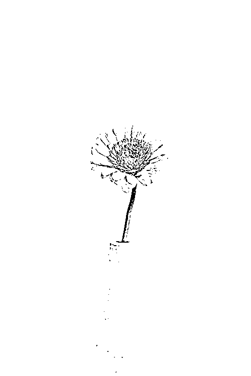

**这一生你会陪伴哪些人？**

如何判断你们的关系已经进入七宫了呢？这里有四个条件需要满足。
1 尊重对方的独立性我们需要意识到：**这是另外一个人，一个与我在不同的进化道路上的个体。**在七宫，我们会遇到与我们的灵魂进化程度相似的个体，因此互相真实的理解成为可能。让我在这里要强调一个非常明显的特点：**我们不需要与人上床才能建立伙伴关系。**我们非常亲密的朋友就是七宫的关系，那些我们会倾诉的、他们也会帮助我们的人；那些我们守护他的秘密、他们也会帮助我们守护秘密的人，都是属于七宫的关系。2 信任这是简单的原则：**我信任你。**但是我们需要多少时间才能开始信任对方呢？除非我们非常天真，否则人们必须要去赢得我们的信任。他们必须要向我们证实他们是可信的。**如果我们真的与对方建立信任，分享我们的秘密、资源、金钱，那我们就真正来到了七宫的关系。**如果还没有建立信任，那也没有关系，这只是意味着我们还处在关系的前期。不用担心，如果是七宫的关系，那么信任就会非常自然地发生。3 自然地做自己就像与一些人相处时，你会自然而然地感到放松一样，**处于七宫的关系时，我们就是可以很简单、自然地做自己。**也许你有非常好的幽默感，火星在天蝎座三宫，有些人喜欢你嘲弄式的幽默，也有些人觉得这过于激烈了。如果他觉得你幽默的方式太激烈，那么他与你的关系就不是七宫的关系。你会尊重对方，但你不可能与之自然而然地相处。**喜欢一个人是柔软的面向，而信任一个人是深邃的面向。但是这两个面向也往往是互相交织的。**

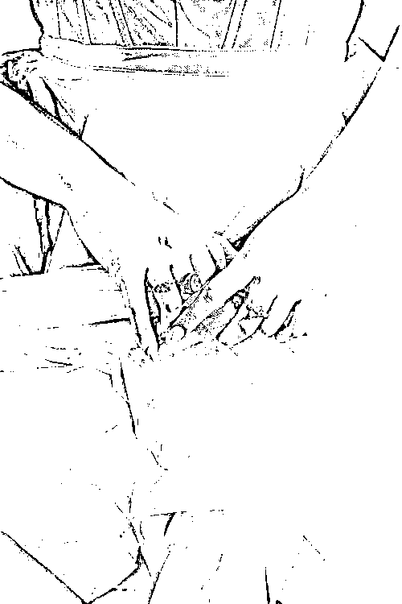

4 意识到永恒的可能我们遇到某个人，与之建立联结，与对方有了七宫的关系。当然我们并不确信与对方一定会天长地久，但天长地久是一个可能性。这是非常重要的一点，即我们意识到天长地久是我们关系中非常可能实现的面向。**也许它们并不持续一生，但在那一瞬间我们感觉到这个天长地久是我们想要的，我们没有任何保留。****第八宫：我要占有你**欢迎来到第八宫，**这是一个非常深刻、非常神秘的宫位。**当我谈到第七宫的时候，我需要强调一个一直被强调的问题，**即七宫的意涵是包含在那些不是性方面的基础上的，也许有性的意涵，但并不是所有的关系都基于性。**我们可以说七宫是**关于友情**的宫位，在所有愉快的、长期稳定的关系中，男人与女人要建立友谊。**所以友谊也是婚姻的一部分，但婚姻要比友谊多一点。**也许我们会遇到那些在很多方面与我们不那么合适的人，只是那个深层的能量如此强烈，让我们无法抗拒对方。**也许我们就会看到那些疯狂的激情，这也是八宫的故事。**

**所以八宫是关于性的宫位，但并不只是狭义的发生性关系的宫位，而是发生性关系那种深层能量交流的亲密关系。**

我们就会问自己**非常基础的八宫的问题：**

*   在我们之间是否有足够的能量交换让我们可以持续地进行下去？
*   还是我们应该互相祝福然后分手呢？
*   如果决定继续，那个古老的关系联结就开始发生了，也许是美丽的，也许不是的，但确实是非常强大而有力量的。

**只有在你面前，我才是脆弱的**

在历史上八宫被称为死亡之宫，八宫确实描述了世界上所有可怕的议题，当然也包括心理上可怕的议题。
**在八宫里，藏着持续的、激情的秘密。**如果我们成为了爱人，我第一次看到你赤裸的时候，我认为那是非常兴奋的时刻。过了一阵以后，我就会习惯，这是很自然的。那么我说，赤身裸体会让我充满兴奋，脱下衣服是个简单的动作，接下来你会脱下什么呢？**你愿意在我面前呈现多少你内在的脆弱呢？我跟你相处的时候愿意展现我多大的脆弱呢？**这是八宫运作的精华。**在八宫，冲突是必然的，而爱人们通常会因此与对方进入更深的领域。**

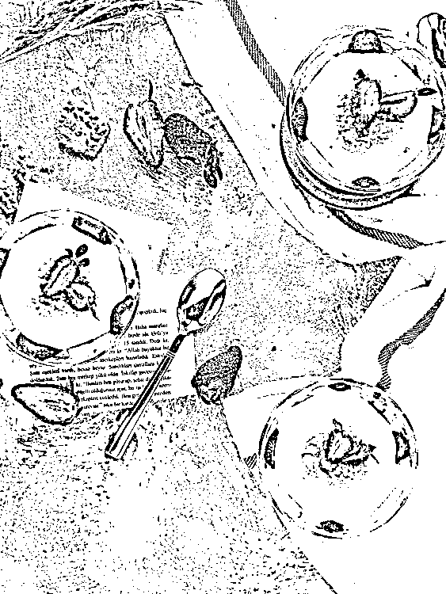

**我曾因为伴侣而看低自己**

接下来，让我们把一颗行星放在八宫中。我想象木星在八宫，**木星在这里有个进化的问题：我是如何看低了自己？我为何选择一个比我灵魂更矮小的对象呢？**传统上，木星通常会被描述为一颗吉星，木星在八宫，也许你会嫁给一个非常有钱的人，这好像就是一个算命式的解读。也许你确实需要嫁给一个有钱人，这并不糟糕，只要你爱他们或者他们值得你爱。想象一个游泳池，一边是 10 米深，这就是你的深度，而你自己认为自己只有 8 米深，所以你就与那个只有 8 米深的人陷入爱河了，这并不是一个空洞的人。

可是你那 2 米的内涵永远不会被触及到，你的某一个层面永远会在关系中感到孤独。在这样的关系中没有任何解药，因为那个人不可能突然进化。

所以你是如何看低自己？**也许我们可以通过看出生星图来回答你这个问题。**

或者可以这样回答：为什么你会看低你自己？也许是一个你前世的业力故事，可以通过南北交来解读。也许这是一个心理上的议题，在你的成长过程中父母亲让你失望了，这使你的自我价值降低。

**所以看低自己可能来自不同的方面。**

最终来说，**你会认识到你的伤口会通过你选择的伴侣对象来表现出来。**为了让你建立健康的亲密关系，你需要把自己的木星扬升起来，你需要建立自信。

但是你如何做到呢？这是一个大的问题，我们也可以回答。但是每个星图都是不同的，我们需要全盘观察之后来回答。简短的回答就是：**真实地做自己。**去延续你的出生星图描述的那条道路，然后你会获得自尊。

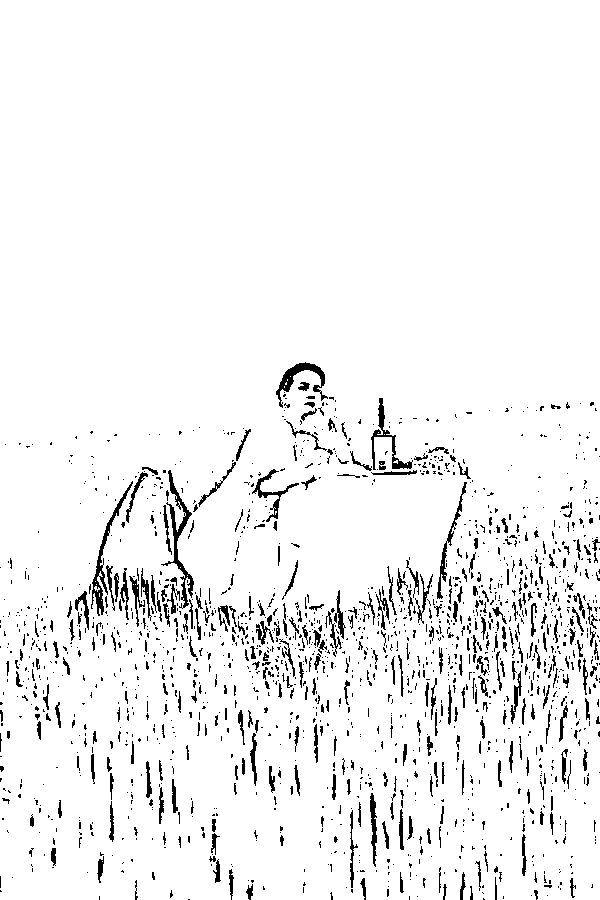

**进一步理解八宫在关系中的运作**

现在讲的案例是：我的月亮与你八宫的木星产生关系，我把月亮的能量投射到你的木星上。
我们要把所有的可能性都摆到桌面上来，我们也意识到，**作为占星师的职责与任务，就是把这对伴侣的功课引到高阶的可能，然后也会警示他们关系中的阴影和负面可能性是怎么样的。**但是我们的任务并不是去预测他们的关系会发生什么，他们之间所产生的实相是他们自己创造的。

我们可以看一下木星与月亮的关系正向、高阶的演化。月亮非常关键的一点是母亲的原型，我们可以想象为人类的母亲，一个充满爱的神圣的母亲，这个母亲倾向于滋养、养育她的小孩，母亲看到孩子长大是充满欢心的。

我的月亮与你的木星产生相位，我在滋养你的木星，我尝试去创造一个安全的、支持性的环境，让你的木星在其中得以成长。**木星的问题是：你如何低估了自己，如何限制了自己的发展？**

所以，作为月亮人，我为你创造了一个安全的环境，就好像母亲为她的小孩创造了一个安全的环境。那么我会说，“如果没有限制，你会做什么，告诉我你真实想要的是什么？”

如果我持续地和你有这样的对话，就好像我创造了这样的一个环境，让你在头脑中探索生命的无限可能，你产生的某些想法可能并不一定是实际的，但让你去想象这些可能性仍然让你感觉良好。

**每一个亲密关系都有一个情绪基调，月亮是和情绪、感受深刻地联结在一起。**在这个交互相位中，因为月亮与木星的关系，这段感情就会有愉悦的基调产生。

**当然我们还是需要从全盘观察。**也许在这个关系中也有非常有压力的冥王星的相位，但是月亮与木星的交互相位确实带来了一种轻松的基调。

那么，**月亮和木星交互相位的黑暗面是什么样的呢？**我在滋养你的木星，鼓励你去想象、去做梦，然后把你自己想象得更高大，这可能会让你自我感觉良好，却也可能是无益的。

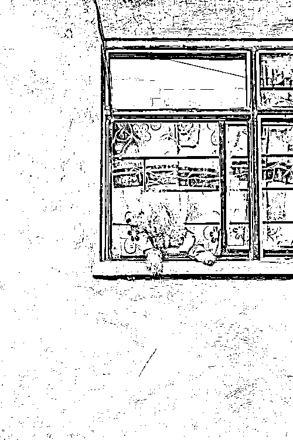

**我想与你一直相爱**

**自从有人类的历史以来，男人与女人都希望去维持一段关系，**就性能量而言，在世界的菜单上有 3 个选项：

*   你可以是一个无性主义者；
*   你可以进入一段有承诺的性关系；
*   你可以在接下来的人生不停地约会。

我们大多数人认为下半辈子不停约会并不是一个非常有价值的事情，我们中也不是有太多人希望独身，即使我们中有单体行星存在。当然，**在座的大多数人最终都要面对这样一个挑战：即与另一个人建立长期、稳定、健康的关系。**自从有人类的历史以来，**就如何建立这样的关系有两个理论：七宫与八宫。**接下来是**七宫的理论：靠近我，让我们的生活交织在一起。**

好的，我觉得我们现在够接近了。

你可以拥有你的秘密，我也可以拥有我的秘密。也许你会经历一些心理进程，我不需要了解那个过程，让我们集中精力对对方仁慈友善，**让我们在关系中尽力营造这样和平、稳定、持久的关系。**这样的一个理论确实是行之有效的。但是别忘了，**还有八宫的理论：****靠近我，再靠近一点，我想要看着你的双眼，我想要看到你眼中的天使，也想要看到你眼中的魔鬼。**也许我对你说：你确定吗？你知道你要求的是什么吗？好的，现在就是我的恶魔了，这也是我的天使。

**版权声明：**本文由若道翻译发布，欢迎转发，反对抄袭。友号转载请申请白名单。

**END**

斯蒂芬·弗里斯特

若道签约老师。进化占星学的创始人之一，当今世界最有影响力的占星大师之一；1985 年，他凭借《内在的天空》一书获得职业占星师协会奖（Professional Astrologers Incorporated Award）。他四次获得占星界最高的占星学联合协会奖（United Astrology Congress Regulus Award）提名，2018 年获得轩辕十四教育奖。

****探索组合图永恒的三角——斯蒂芬工作坊报名中****

斯蒂芬说，我们的组合图表明无论什么状况我们都能熬过去。

**组合图也像出生星图一样有行进。**在工作坊中， 我们将**探讨一些特殊的技法和考量，来帮助伴侣们应对生活中的挑战和机遇。**组合图的推进会出现一些看似难以解决的复杂问题，斯蒂芬老师创造了一种解决这些问题的技法。他将在工作坊中阐述相关细节，基本的问题是：如你所知，要了解一个人 30 岁生日的推进，我们要看这个人出生后 30 天的行星位置。问题是，组合图与我们在占星学实践中使用的其他星图不同，组合图并不代表某一天的天空。记住，它是基于中点的。**那么我们如何从一个不存在的日期开始 "向下数 30 天"呢？斯蒂芬老师将为我们提供一个行之有效的答案。****点击下图了解更多详情********20 位来自世界各地的占星师****带来 19 场沙龙——新世界的觉醒****详情可点击下图**

**学习占星学****点击下图了解课程详情**

**微信又双叒叕改版啦，不想错过若道君的推送？**

**就把若道设为星标吧！**

**▼**

**喜欢就点一下“在看”吧！**

********报名直达入口********

# 太阳进入狮子座 | 12 星座会在哪些方面付出和获得爱？

> 原文：[`mp.weixin.qq.com/s?__biz=MzA5NjA0NTAxNg==&mid=2651481577&idx=1&sn=d6a8bf1336abe6ce1a65eb4c0d710388&chksm=8b48d75ebc3f5e4861f1d3d15b8058d3c3e6af26da54b842fcf5179704cc0b326f0452760a8f&scene=126&sessionid=1692737781#rd`](http://mp.weixin.qq.com/s?__biz=MzA5NjA0NTAxNg==&mid=2651481577&idx=1&sn=d6a8bf1336abe6ce1a65eb4c0d710388&chksm=8b48d75ebc3f5e4861f1d3d15b8058d3c3e6af26da54b842fcf5179704cc0b326f0452760a8f&scene=126&sessionid=1692737781#rd)

********************☆ 后**********************台**********************回复“今日”，给你一句生命态度********************

作者/郑玮玲 ISAR 认证占星师编辑/玫瑰 封面/书君 图片/pexels 北京时间 7 月 23 日凌晨 4:07，太阳进入狮子座，此日正是 24 节气中的“大暑”。这段时间我们需要注意些什么呢？一起来看看吧。**太阳进入狮子座**“暑”字拆解开正是“日土日”，形象地表达了烈日炙烤的体感，在这个夏天火热的高潮，地表都不会因日落夜晚来临而散尽余温。大暑时节的太阳已从北回归线开始日渐南移，白天渐短，黑夜渐长，天地之间阴性能量也在滋长中。一候腐草为萤，二候土润溽暑，三候大雨时行。这正是萤火虫出卵成虫的时节，空气闷热，土地潮湿，正是南方的“桑拿天”。老祖宗在通过生活经验体征记录了大暑时节土厚水深是滋养、宜万物的。

冬有三九，夏有三伏，大暑节气正值“中伏”，此时节一方面阳光充足，另一方面雷雨频繁才会带来农作物丰足，衣食无忧。

正因大暑闷热难耐，任何人都会会升起比其它节气更强烈的体感，感同身受——**此时最容易经由亲身经验带来身心合一，回到内在真实的感受中。****大暑节气对应的卦象：水风井卦。**井在古时不仅是公共设施，还是大自然为人类团体提供的福祉与长久利益。井卦意味着集体的财产和福祉，“君子以劳民劝相”。当透过切身感受理解他人、集体的需求时，便能发自心底去为他人、集体考虑和服务，每个人都互助互利，便能回馈自己，创造绵长的共同利益，这是真正的奉献精神。以上有关的丰足、奉爱与投入亲身经验，发自心底的行动都是属于狮子座的领域。**狮子座，是舞台、国王、表演者、才华、自信、生命力、创造力、孩童和游戏，因为太阳的守护，狮子座代表绝对的荣耀和王者般的自信。**每个人都值得顺应太阳狮子座的能量去创造、发展自己的王国。太阳狮子座的能量正是**鼓励我们慷慨、坚定给予、付出爱**，带着爱去做任何自身热衷并能利益他人的事，便能从中收获爱、荣耀与喜悦，真正激活对生命更深的渴望，创造无尽的生之快乐。太阳、狮子座以及它们共同相关的第 5 宫都是关于**创造力**的。而创造力最初是天神不允许人类拥有的，但自普罗米修斯盗取火种，人类便拥有了与神比肩的创造力。**创造力就是：可以做任何事，创造力就是生而自由的最精彩诠释。**在创造力的最高和最原初的方式都是创造生命本身，**生育**是人类对自身的最初和最终的创造。人类是如何爱着自己，如何享受生命的，便会从这生生之爱中创造新生。生命的创造永远都是与宇宙神圣奥秘同步进行的，我们可以将太阳在狮子座的旅程视为一段朝向内心深处的自由与创造更坚定、深入的进化之旅。每个人在这段旅程中可以尽最大可能去享受生命的创造乐趣，去尝试、享受内在孩童的游戏，与我们天性中从未被压抑的爱与自由的能量共舞，演化内心最精彩的剧情，把爱分享给宇宙天地，万物、众生。

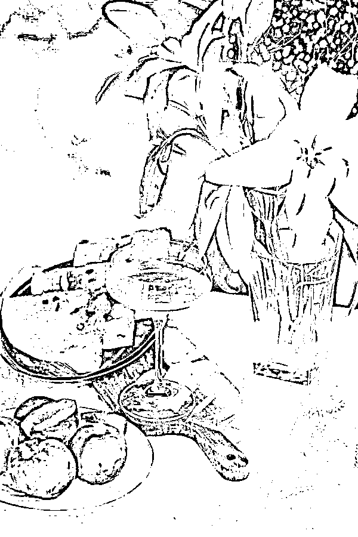

**太阳在狮子座的行进**

**太阳三分木星**

**周期：7 月 23 日-8 月 9 日****重点影响人群：有个人行星、四轴、交点位于狮子座、射手座、白羊座 0°-16°的人。****木星自 7 月 8 日以来一直在白羊座 8°停滞。日木三分期间，木星正值停滞到逆行初期，7 月 29 日正式逆行。**而与木星逆行前的停滞同时发生的正是**日冥对分（7 月 12 日-7 月 28 日）**，冥王星在木星到来之前，已为太阳所代表的个人意志铺垫了转化的道路。在此过程中，**很多人已经经验、触碰了生命的暗层与生活的危机考验，并且穿越了一些内心的恐惧，完成了难能可贵的转化功课**。真实自我得以拔云见日。木星的停滞加逆行，为此轮日木三分带来了向内伸展的助力。对于创造性工作，理想蓝图实施，自我意志的肯定、深化是非常有益的支持。木星的宏大、乐观会给予我们在高瞻远瞩的角度审视自我的机会与眼界，帮助所有拥有稳定自我的人更有效地做出对未来的规划、应对，为那些为着理想而坚定的目标、抉择加分、添彩。**我们可以利用这个相位去实施对信仰的坚定、深化的追寻，或是透过经验兴趣领域获取激励、肯定和自信。**透过才华、游戏、玩乐与分享带来的满足可以让我们从轻松创造的氛围中重新感受创造的乐趣与自我的激情，挥别生命表层萦绕不去的晦涩与麻木，重新焕发活力。**但由于木星逆行，此时并不是张扬向外扩张时机。**向内生长与壮大才能帮助我们透过清醒独立挖掘深度自信，找到爱与自由的力量源。

**太阳四分天王星、月亮北交点**

**周期：8 月 3 日-8 月 19 日****重点影响人群：有个人行星、四轴、交点位于狮子座、处女座、天蝎座、射手座、摩羯座、水瓶座、双鱼座、白羊座、金牛座、巨蟹座 10°-26°的人。**此时的天王星与月亮北交点正处在最紧密的合相之中，而土天四分正在持续加剧。**天王星所带来的震颤、惊恐与不测会显化为诸多令人不解且惊叹的时局变迁和集体事件。**而天王星与月亮北交点的紧密合相，触碰了集体对安定生活、丰饶生命的渴求与愿景。疫情 3 年，国人长期处在危机、外在压力和各种不确定之下。躺平、摆烂已成为越来越多人的心理甚至生活常态。南交天蝎座不让人享用安适的生活，北交金牛座又指出必然要创造新的稳定生活范式。

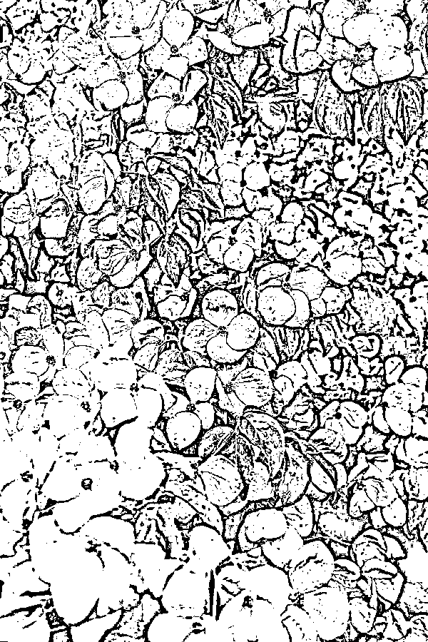

**只有将心灵从摆荡不安、惊恐、受限的模式中解脱出来，才能与天王星的爆发性创造力合作。**否则，我们就会一次次在惊恐与危机中循环往复，一次次被不测、危机掌控，失去生活的焦点与创造的主动性，继而丧失生命的活力，以及对生活的热情。在过去未曾出现的大规模失业、歇业、破产、停贷、法拍房以及猝不及防的封控、大面积核酸，还有战争和疾病带来的死亡······如果我们明白更大的背景，才会明白一切背后有更大的宇宙进化意义。现实演化的一切既是行星对人类的诉说，更是人类心灵对神秘宇宙的回应。天王星既是破坏之王，也是觉醒之力，它提醒我们应当从眼下的集体性危机中清醒，只有越来越多的人醒来，集体的回应才会强大，形成宇宙的波浪。月亮北交点指引了集体的进化之愿——**真正的满足一定是活在现实的安定、丰美之中。**为了此愿，每个人的创新、创造、突破力都将在这个时间点被强力激发。太阳所代表的自我意志正面对天王星的不确定性带来的挑战。我们会以为自己很弱小，但每个人的身体力行都将成为集体进化中的一个模板。我们都有机会成为集体更新前行的引领者。**这段时期努力去实现创造性想法，多问一句：“那又怎样呢？”去肯定自己的勇气和深度，会带来新的出路和解决方案——可能是终极解决方案。**面对固有危机时，也可以换一个角度思考、行事。就像站在敌人前面、后面和侧面其实是有不一样的感觉，如果你都没有尝试过，怎么知道你迈不过眼前的坎呢？天王星永远在告诉我们：**跨出受限、旧有认知，才会有新的洞见，才是革新。新的可能性就是新的世界。**

**太阳对分逆行的土星**

**周期：8 月 7 日-8 月 23 日****重点影响人群：有个人行星、四轴、交点位于狮子座、天蝎座、射手座、水瓶座、白羊座、金牛座 14°-29°的人。**土星逆行过半，正好回顾过去两个月里个人的默默付出与努力，面对现实功课的沉淀与修正是否有了新的进步？对困难的理解是否更进化了一步？**此时的日土对分让我们有机会去与错误对话，对于修正所有过去已发生的事件有强力的校正效果。**狮子座的太阳强化了站在自我的角度去审视，也站在更丰富的角度对待老旧的困难议题。**土星象征的权威与高压正是检验我们自我是否强大、稳定，拷问我们是否认知到，并拿回了自我的权力。**对自我的聚焦才会帮助我们找到旧有困境、议题的解决方案，当日土对分时，就是**正视那些一直没能跨过的问题**的时机了。尤其是**与父亲、领导、权威人士有关的未决议题，或是在自我抱负、职业上的突破。**我们将有机会向内去寻找解决方案，拆解内心的墙，才能打败外在的影子。

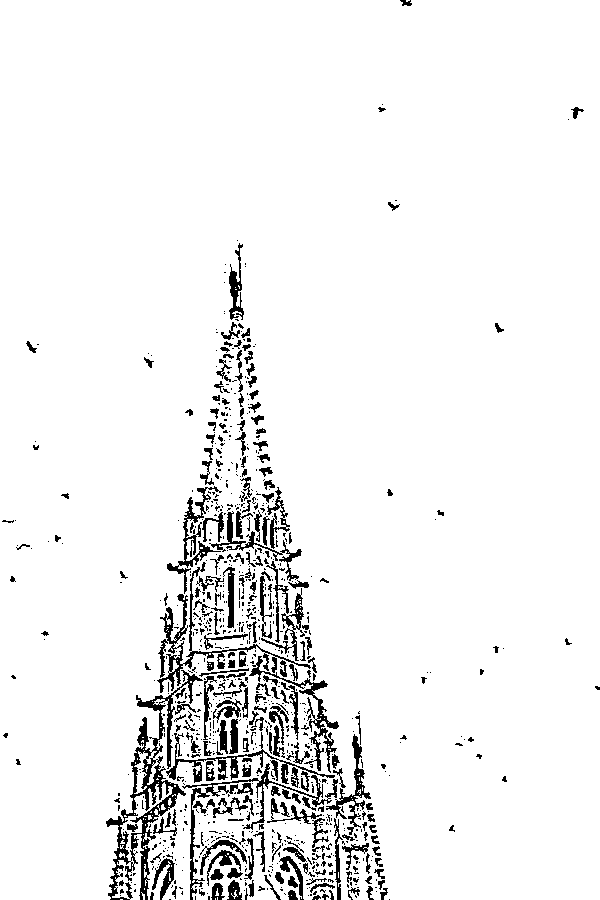

**太阳狮子座对 12 上升星座的加持**

以出生星图上升星座度数 30°范围内的上升星座为准。如你上升在 0°，可以完全参考下列内容；如你上升在 29°，则需参考下一上升星座。

**若道君：****你可以在 app store 或者应用商店搜索“若道”下载 app，输入个人档案，查看行运盘（也可以使用其他星图软件），找到行进太阳落在出生星图的第几宫，然后对照下文查看。****例如下图中，比尔·盖茨上升在巨蟹座，行进太阳在个人星图的第 1 宫。**

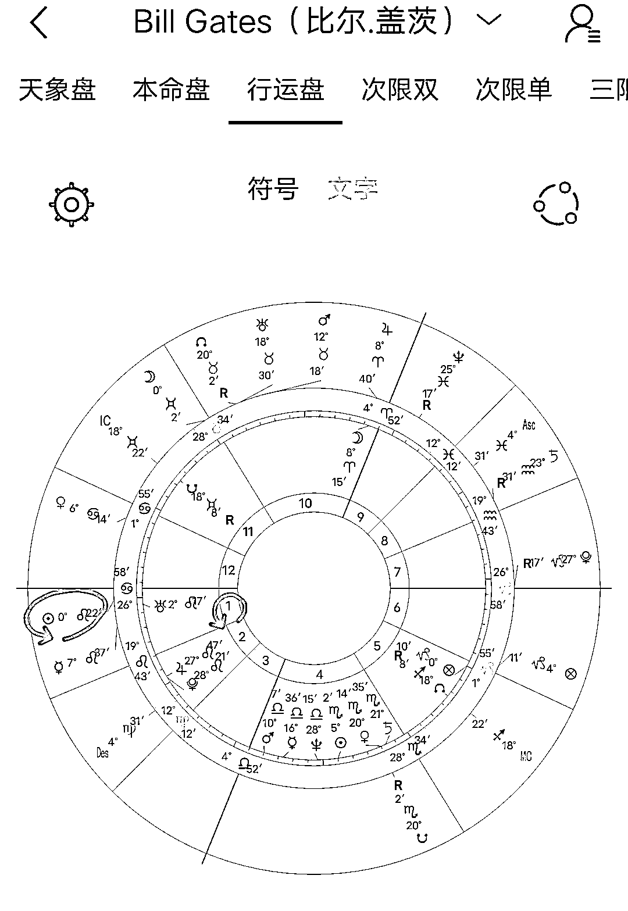

**上升狮子座，太阳行进*****1*****宫**

身体力行去完成活力构想的时机，如你有任何激越的愿望，接下来一个月可不要错过啦！太阳会将光耀照进你的生活，现实中涌动着创造性激情与悦动的灵感，去跟随它们，抓住它们。即使仍要面对诸多你不喜欢的不确定性，未来的很多事变因素也令你烦忧，但眼下若不打破一些陈旧思维和行动模式，只会让一切困在此时此地。大胆勇敢去实践吧，让你的自信指引你，你的智慧之光将如同阳光倾泻，带你到达理想之境。

**上升巨蟹座，太阳行进***2***宫**

没有人能快速渡过苦难和情绪的泥淖，但每个人拥有同等的机遇一次次去挖掘自身的财富，而此刻命运的转盘轮到你了。接**下来一个月你大可在工作中勇敢创造、表达，把你最富创造力的能量展现出来。**

你的敏感性会将你推向最令你心驰神往的事件中，并透过对激烈变化的外境让你不得不学习、发挥情绪调节力。

**你将在一轮忙碌与创造性工作中找到全新的自信，并有可能让更多的人透过你的才华、表演、演讲认识你、肯定你。**这便是你为自己积累的重要财富——充分的自信与享受生活的乐趣。

**上升双子座，太阳行进***3***宫**

**接下来一个月你会投入主动创建的事件中去，大多是关于：演讲、学习、课程、传播、教育和写作输出。**你将有大量的时间沉浸于学习与传播的乐趣中，并为自身未来的发展创造新的模式去适应未来不确定性的变迁。

很可能，你还将**拥有新的身份**——这取决于你对自我愿景的实施与变更，比如在你现有职业中多一个表达端口，但一切仍然服务于你最热衷的理想。你将有机会和更多的人对话、交流，了解到更丰富的讯息、知识。同时，你要学习在这种创造性变革中重新认识自身光华，在新的领域中找到自信。

**上升金牛座，太阳行进***4***宫**

生活也许有点乏味和单调，现实的冲突和摆荡影响着你按部就班的计划与日程。但唯有一颗爱玩的心在牵引着你去跟随快乐的脚步，创造的脚步。**接下来一个月你可能需要更多的时间游戏、休息，让更多享乐的元素填充你的生活，甚至挤走日常的繁忙与秩序。**破坏性的事件仍可能发生，并强烈影响你的情绪和意识。但若明白这一切都在一个伟大的原型之中，一切便有了意义，也让你拥有了稳定深入、前行的勇气。活力不会消失在探索的路径中，除非你放弃了探索。

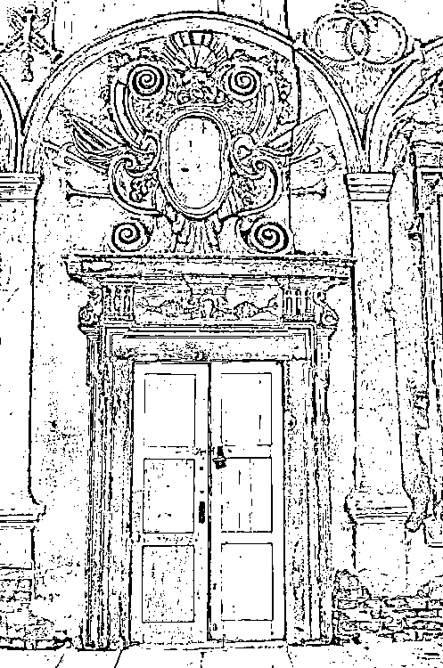

**上升白羊座，太阳行进***5***宫**

现实的冲击越发剧烈，也不能让自己脆弱的心灵击垮、退缩。时不时去寻找、激发生活的信心便是去寻找那些富有创造力又不费力的事。对于你来说奋力拼搏是一种心灵常态，但**接下来一个月尤其要学会放松生活。**

不刻意地专注才能让自己更完美地融入宇宙的韵律，凭借自身优势实现自我的意图。在你感兴趣的领域多些心思，你会发现世界充满着新的可能性，一切都在为你的生命服务着。

**上升双鱼座，太阳行进***6***宫**

不断为自己找寻惬意生活方式，又不断为健康所扰，你需要在想要和必要之间来回调整，直到找到内在平衡可以让你处在忙碌与休闲之间都很舒适的感觉。**接下来一个月的你是忙碌的，工作、家庭和各种休闲娱乐会将你的日程表占据。**也可能因为健康问题，投入了一段时期对**养生、健康、运动**的兴趣之中。当你去重新审视旧有的生活习惯时也许会找到重要的新的指引，是问题所在，也是解决方案。

**上升水瓶座，太阳行进***7***宫**

首先，你可能**从你的伴侣或是合作关系中获得新的支持和展望，或是你在关系中感受到了新的活力，升起了新的共同愿景。**无论如何，你们将通力合作去维护愿景的良性成长。变动的可能性会令你举步不前，现实的困难显得非常巨大，并且随时可能重新来过。当下正是时机勇于让自己跨过旧有的坎儿，去肯定自己已做过的工作，给自己一个强效肯定，告诉自己：最困难的已经过去。新生的太阳已经升起在你的心底。

**上升摩羯座，太阳行进***8***宫**

新的旅程意味着深刻的自我反省，对于你的身份、价值实现你需要作出谨慎的判定。**你最重要的关系会面临新的试炼，乐观看待最困难议题，创造性地解决老旧问题正是当下的挑战。**转化也会在所有面对不确定因素做抉择的时候发生，给自己多留一扇敞开的门，就会发现更加丰富的演化进程。你的活力藏在更深的黑暗中。

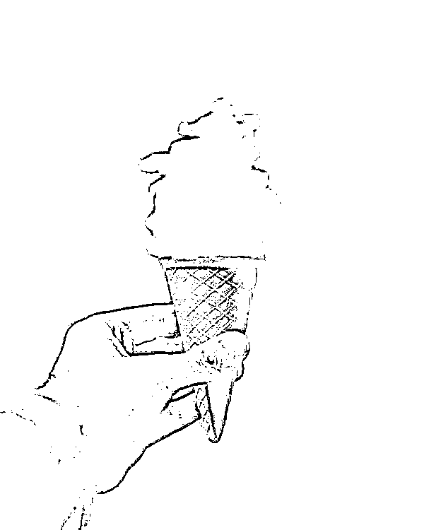

**上升射手座，太阳行进***9***宫**

**如果想去远方，此时要认真去执行。**任何呼唤着你心灵的地方都在向你释放着讯号，即使出行受阻，也敌不过理想的光华。跨越万水千山你都已将愿景伸向未来、真理与世界的尽头。无论是你的身体还是心灵，总有一个会在这接下来的旅程中抵达信仰的高处。

**上升天蝎座，太阳行进***10***宫**

**充满激情与创造性的时刻到来，你将在短期内为自己争取到“表演”机会。**长期以来的积累和努力将不会白费，你完全有机会在你准备好的领域去展示自己，让你的才华与创造力被众人所认识、肯定，也能透过期待的分享去连接到所有的同类们。笑纳一切的掌声和鲜花，这些本就是你从心底馈赠给自己的爱。它们换了一种形式让你看见、收到了。

**上升天秤座，太阳行进***11***宫**

**去看见你的愿景，走到集体中去，寻找那些与你一起享受创造，一起发声，一起受到鼓舞的人们。**接下来一个月你将在群体生活中找到适合自己的舞台。用你的才华、创造力和分享的快乐的能力去感染他人吧，即使生活充满着晦涩、不安与痛苦，创造快乐的本能可以让人们出离现实的烦忧，重新建立和平的内在世界。在变迁与危机之中学会在团体中的独立与大胆，你会发现自己原来不止于此。

**上升处女座，太阳行进***12***宫**

一直以来辛苦努力的你眼下需要一段时间的沉浸与休息，你需要更多的睡眠、做梦与冥想来充电，也值得利用一些疗愈手段让自己恢复体能。**照顾健康，调整生活作息，维护起居是你当下最需要的工作。**而内在的激情会在此进程中越发显化，你会拥有更多的灵感、创想，也会联结到更多意想不到的资源，对未来与不可知有了全新的展望。未来可期，明日已来，把你内心期待、预见的未来显化成现实只是迟早的事。

**版权声明：**原创文章由作者授权首发于若道平台，欢迎转发，反对抄袭。友号转载请申请白名单。

**END**

**郑玮玲**

ISAR（国际占星研究协会）认证占星师（2016 年获得）

若道占星专栏作者

将占星咨询、教学与音乐、舞蹈相结合的疗愈者

**微信号**：zhengviolin

**新浪微博**：@郑玮玲

**微信公众号**：Sampriya-Astrology

长按打赏

**20 位来自世界各地的占星师****带来 19 场沙龙——新世界的觉醒****详情可点击下图**

**学习占星学****点击下图了解课程详情**

**微信又双叒叕改版啦，不想错过若道君的推送？**

**就把若道设为星标吧！**

**▼**

**喜欢就点一下“在看”吧！**

********报名直达入口********

# 经世占星丨木天周期：冒险家的极限飚车

> 原文：[`mp.weixin.qq.com/s?__biz=MzA5NjA0NTAxNg==&mid=2651481577&idx=2&sn=77bb053b2b78924153c292fd532d98c7&chksm=8b48d75ebc3f5e48f4b6735b822cc1011f966ac315129b7e614b954a8647c3d1f3ca200bf1fd&scene=126&sessionid=1692737781#rd`](http://mp.weixin.qq.com/s?__biz=MzA5NjA0NTAxNg==&mid=2651481577&idx=2&sn=77bb053b2b78924153c292fd532d98c7&chksm=8b48d75ebc3f5e48f4b6735b822cc1011f966ac315129b7e614b954a8647c3d1f3ca200bf1fd&scene=126&sessionid=1692737781#rd)

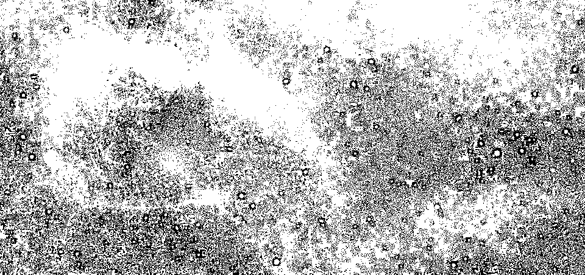

有一句老话：太阳底下没有新鲜事，已有的事、后必再有；已行的事、后必再行。

这句话如果用占星学来注解，是非常容易从逻辑上看清楚的。

《易传》讲天道的变化时说：“易之为书也不可远，为道也屡迁，变动不居，周流六虚”。**而占星学观察天道的变化，看行星周期。**

行星周而复始的运转，从一个星座进入另外一个星座，12 星座转完，重来一遍；某两颗行星之间形成某个相位，过了几年或者几十年、几百年，这个相位又再次出现。**而整个宇宙，就是在行星周而复始的运转中变化和发展。**

看行星的轨迹，就有点像听古典音乐的乐曲，既然行星有非常类似的配置，你也会听见同样的旋律及其变奏。当然，有时候变奏的尺度相当大，如果你没有灵敏的耳朵，可能听不出来。**但是，如果你是专业的研究人士，或者你天生敏感，又好学多思，就可以听到相似的调调。**

比如说，一些占星师会把目前的局势和二战之前的局势相对比。希特勒进攻波兰拉开二战的序幕，那时的星图上，土星合相南交点且四分冥王星，天王星位于金牛座，月亮交点在金牛座-天蝎座轴线，而土木在 1 年后合相。

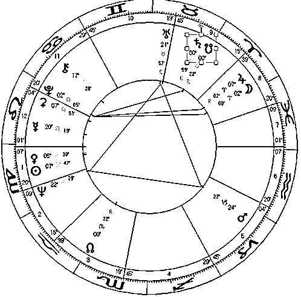

| 希特勒进攻波兰时的星图

而当俄罗斯入侵乌克兰时，月亮交点也在金牛座-天蝎座轴线，天王星也在金牛座，土星四分月亮交点轴线，土木和土冥都刚刚合相不久。

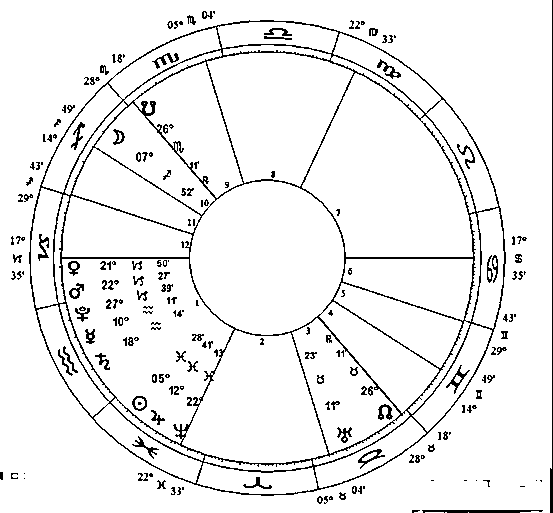

| 俄罗斯入侵乌克兰时的星图

**在两次战争之前，各国都有非常强的民粹主义和保护主义的倾向。**

比如上世纪 30、40 年代希特勒的上台就是德国民粹主义高涨的结果，而在本世纪典型的则是如川普这样的民粹保护主义人物上台。同时，两次战争前也都发生了经济危机，战争进一步恶化经济危机。两次战争，我们也都看到了西方世界组成的联盟。

**所以，如果你想要对未来世界发展趋势有所了解，行星周期，特别是运行比较慢的外行星周期就是你一定要去学习的部分。**

**从今天开始，我们给大家逐一介绍一些外行星周期。**

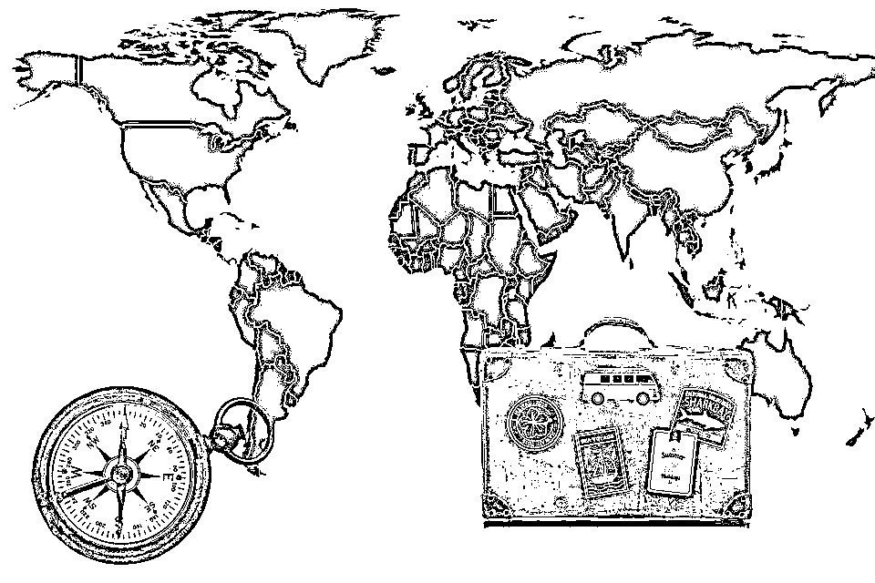

木天周期

**木星和天王星周期间隔 14 年。**

之所以先介绍这个周期，是因为，在经历了 2020-2022 的土冥、木土、木海合相后，下一个合相周期就是木天周期。

**每一个合相就如新月一样，是一个周期的开始。**那个周期种下的种子，在周期发展过程中会逐渐生根发芽开花结果，又逐渐凋零腐朽，出现一个成住坏空的过程。

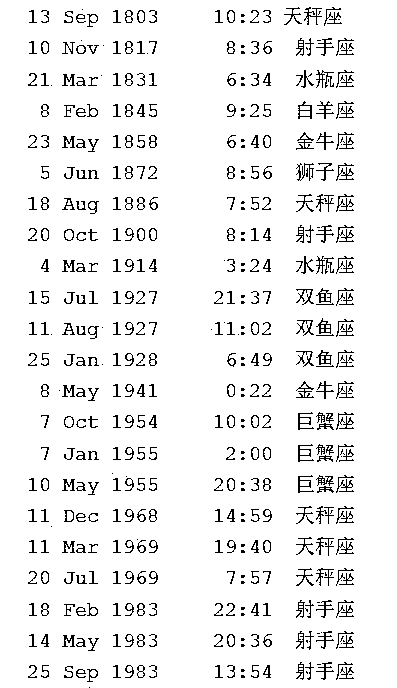

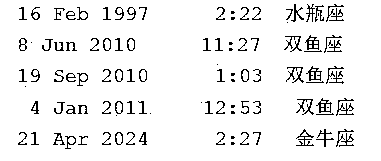

这个表是 1800 年以来，木天合相的年代。可以看到，**在 200 多年的时间里，如果不算因为逆行的原因可能造成的多次成相，木天合相总计 16 次。**而且有趣的是，这期间双子座、天蝎座和摩羯座内一直没有发生木天合相。

**木天合相是什么感觉呢？**

**是冒险家极限飙车的感觉。**

**木星和天王星是两颗性质非常类似的行星，都爱冒险，都不愿意受局限，都喜欢打破约束，**两颗行星碰到一起，天王星的独辟蹊径的创造力和一意孤行的狂飙突进被乐观自信狂妄的木星摸顶，那真是“天王盖地虎，宝塔镇河妖”，玩得就是心跳。

**这样当然有好处也有坏处。**

**好处是**，有些方面会发生不可思议的突变和突破，束缚和边界被打破，新的发明创造，新的观念，全然一新的人类疆界产生；**糟糕的方面是**，刺破本来用来保护的保护层，像不受拘束的烈马闯入人家的农田，先践踏青苗然后踢死人。

**而木天合相发生在哪个星座，自然也就带有那个星座的特色。**

**2024 年木天合相发生在金牛座。**金牛座是一个喜欢稳定，喜欢保有自己的地盘、自己的财务，喜欢自给自足、安适生活的星座，和木天合相的感觉完全不一样，因此也会形成一股对抗的张力，但是木天合相会在这个领域涂抹自己的痕迹。

**1800 年以来，历史上木天有 2 次合相金牛座。**一次是 1858，一次是 1941 年（这两次木天合相周期，同时也是土冥周期附近，1858 和 1941 年都是土冥四分，受该周期影响，所以以下的举例要考虑不仅是木天的作用，也有土冥四分相和当时其他天象的影响）。

**两次合相，世界范围内都出现了一国的国土被船坚炮利的联盟所打破的战争。**

1858 年，是我国第二次鸦片战争期间（1856-1860），当年，英法俄美四国军舰北上天津，大沽口之战大清王朝失败后，和 4 国分别签订了《天津条约》。《天津条约》主要是赔款、通商、外国人可自由旅行、传教，确定领事裁判权和关税税则（感觉一下金牛座和木星、天王星）

而除了《中俄天津条约》外，我们还和俄国签订《中俄瑷珲条约》，除了天津条约中拿一系列条款之外，我们还割让了相当于 4 个河南省大小的 60 多万平方公里领土（这些土地至今也没有要回，而今年俄罗斯在条约签订日 5 月 28 日，还大张旗鼓地进行了纪念）。

当然这种被船坚炮利打破国土的事情不只我们独有，1858 年，印度反抗英国的民族起义失败，随机不得不拜倒在英国女王裙下，奉英国女王为印度女王。

日本也是相似，他们在前几年，木天三分相时期，签订了与西方列强的第一个不平等条约《日美亲善条约》，但日本也从此走上了打开国门的现代化道路。

感觉一下，是不是有大国寡民、自给自足的封闭农业社会（金牛座），被横冲直闯的由工业革命武装起来（木天）的国家（俄国除外）打破的感觉。这些西方国家在工业革命后，通过殖民地开疆辟土，开拓贸易，攫取资源，同时，也把他们的异教信仰传入这些国家。

**当然，如果仔细看星图，又会发现，这些都是在一个更长也更重要的周期，天冥周期的背景下产生的（所以，我们不能仅仅看某一个周期，也必须看到其他周期的综合作用）。**

**83 年后，1941 年木天再次合相金牛座。**那年，也发生了非常类似的事情，这次不仅仅是工业化国家打破闭关锁国的国家的战争，而是互相开打，也互相组成联盟。

这一年是第二次世界大战全面爆发的一年，发生了一系列的宣战，虽然中日已经打了半天，但 1941 年中国才正式对日本宣战、还有德国入侵苏联、日本发动珍珠港袭击，美国对日本宣战，德国对美国宣战等等。

还有一个重要的文件《大西洋宪章》签订，这个文件奠定了现代国家外交的基本原则，即大国不追求领土或其他方面的扩张等原则。当然，这也是二战的转折点。

也是 1941 年，希特勒发出对犹太人的“最后解决”的密令，这是“灭绝犹太人”的隐晦说法。纳粹德国开始从肉体消灭犹太人的大屠杀。

**过去 2 次木天合相，碰巧的不是仅有战争和战争中互相对立方的联盟，还有一些重大的发明和前沿的思想诞生。**

比如 1858 年，工业化革命最重要的发明之一**内燃机**就是那年出现的。**洗衣机**的发明竟然也早到 1858 年。对于现代舒适生活，很难想象没有洗衣机的世界。那一年，还是第一条**海底电报电缆**第一次成功通信的时间，将北美和欧洲之间的通信时间从十天（即通过船传递消息所需的时间）减少到几分钟。

2018 年《 美国经济评论 》的一项研究发现，跨大西洋电报大大增加了大西洋上的贸易并降低了通讯价格，该研究估计电报的效率提高相当于出口价值的 8%。

1857 年到 1858 年也是**资本论**诞生的年代。马克思在 1857-1858 年写了《政治经济学批判大纲》，这是《资本论》的第一稿。在当时的环境下，这毫无疑问是一个让人震惊的革命性的崭新理念。

而 1941 年的一个重要发明是**第一台可编程的电子计算机**。计算机的发明对于战后的世界的重要不言而喻。1941 年，萨特开始写《存在和虚无》这本存在主义的哲学代表作。

**以上所述只是木天合相金牛座的一点点代表性的事件，也许你可以根据行星的意义补充更多。**

**2024 年，木天再次合相在金牛座，合相之前和之后 2 年（我们对于外行星之间的相位用比较宽的容许度，可以是 10-15°），世界又会发生什么样的变化？木天合相在 21°，会怎样触发你个人的行星？你个人的人生如何与世界的潮流联系在一起？**

太阳底下无新鲜事。已有的事、后必再有；已行的事、后必再行。

**但是历史也不会简单重复，因为这些事件的发生也是多重行星周期的综合作用，而人类也在从过去的经验和教训中不断学习。**

**不管怎样，一个好的占星师需要了解时代的背景，感知时代的潮流。这样可以在事情露出非常细微的迹象时，根据自己所了解的行星周期及其历史，更好的理解未来的趋势。**

**而感知时代潮流和国家趋势，你可以从 8 月 26-28 日为期 3 天的经世工作坊中开始。**

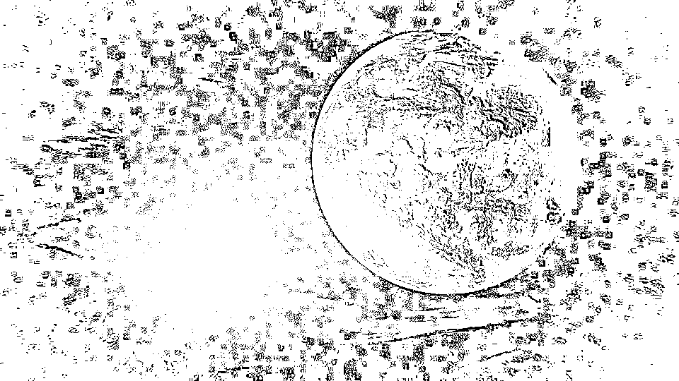

**END****大国命运：经世占星学 3 天线上工作坊来啦！**

在这个工作坊中，我们将学习**如何专注于能够理解世界大事并对它们做出准确的预测。**这将带领我们踏上**一段重要的行星周期之旅，并延伸到重要国家和世界领导人的星图。**现在正是学习的好时机！

2020 年 12 月，木星与土星合相，这是 800 年来这两颗行星首次在水瓶座合相，预示着地球以及政治和社会趋势将发生巨大变化。我们正在进入一个令人兴奋的奇境，非常适合探索经世占星学。

**点击下图了解更多详情** 

**

**微信又双叒叕改版啦，不想错过若道君的推送？**
**就把若道设为星标吧！****▼**

**喜欢就点一下“在看”吧！**

********报名直达入口********

# ISAR 选修课 | 大国命运：经世占星学 3 天线上工作坊

> 原文：[`mp.weixin.qq.com/s?__biz=MzA5NjA0NTAxNg==&mid=2651481577&idx=3&sn=9104667784890534af1e5c83db612e6d&chksm=8b48d75ebc3f5e48e886af0eb287564a46dc15579b0293bcd0909321adfbf18e581ab5231865&scene=126&sessionid=1692737781#rd`](http://mp.weixin.qq.com/s?__biz=MzA5NjA0NTAxNg==&mid=2651481577&idx=3&sn=9104667784890534af1e5c83db612e6d&chksm=8b48d75ebc3f5e48e886af0eb287564a46dc15579b0293bcd0909321adfbf18e581ab5231865&scene=126&sessionid=1692737781#rd)

<mpvideosnap class="js_uneditable custom_select_card channels_iframe videosnap_video_iframe" data-pluginname="videosnap" data-id="export/UzFfAgtgekIEAQAAAAAAfGQB6vQCmQAAAAstQy6ubaLX4KHWvLEZgBPEioJES3BsLK2DzNPgMIsb3nmx3ZXbJKLT1wm45TIu" data-url="https://findermp.video.qq.com/251/20304/stodownload?encfilekey=S7s6ianIic0ia4PicKJSfB8EjyjpQibPUAXolorph7kXX0G2V8DGSvfR9PkwwbPmosvYicRybibaBiaVv5A38Bc5Re8nsYStXZD7nqrhjvCib7Z8iaC9vlXIpibAjFAuw&amp;adaptivelytrans=0&amp;bizid=1023&amp;dotrans=0&amp;hy=SH&amp;idx=1&amp;m=&amp;scene=0&amp;token=AxricY7RBHdWxX5EuW79OcFLEojiajUVbfrb10projcwzwun3SBUDgOHcwIaMibQEFyWZc9dNWComE" data-headimgurl="http://wx.qlogo.cn/finderhead/PiajxSqBRaEJYnVsqWfEX9qA0sI6hNVKsDfyzfPZ92WZMZyBpZWU5NA/0" data-username="v2_060000231003b20faec8c4e68a1ec2d4ca07e434b07755bbf47e7053a3059defd2c9d6c68a20@finder" data-nickname="若道" data-desc="#ISAR 选修课 经世占星学是什么？会教授哪些知识内容？8 月经世占星工作坊，来提前了解一下" data-nonceid="3653579416430381618" data-type="video" data-width="640" data-height="368"></mpvideosnap>

有一些岁月经历的人，会非常清晰地看到，我们每个人的命运都和国家的命运紧密联系在一起。

以俄国人为例，不论每个俄国人有什么样不同的个人星图，31 年前的苏联解体，今年发生的乌俄战争这样重大的事件，毫无疑问影响了俄国 2 代人的命运。而在一些关键时间点个人的选择，毫无疑问，又影响了个人的生命历程。

而只要你关注世界局势，你也会看到，这样的一个国家发生的重大事件又会对其他国家的各个方面发生重要影响。

我们的命运、我们所获得的事业的发展机会、我们的财富机会都是和整个时代和国家息息相关。

**因此，一个好的占星师必须要懂得时代的声音，必须要洞悉全球的趋势，必须要懂得国家的故事。**

在这个工作坊中，我们将学习**如何专注于能够理解世界大事并对它们做出准确的预测。**这将带领我们踏上**一段重要的行星周期之旅，并延伸到重要国家和世界领导人的星图。**现在正是学习的好时机！

2020 年 12 月，木星与土星合相，这是 800 年来这两颗行星首次在水瓶座合相，预示着地球以及政治和社会趋势将发生巨大变化。我们正在进入一个令人兴奋的奇境，非常适合探索经世占星学。

邓肯老师说：

****

**学习经世占星学，我们可以依靠占星师们过去使用一些技法所做的预测，我们将在这个工作坊中进行探索。**

**比如：占星师迈克尔·贝金特在 1982 年，苏联解体事件发生 7 年前，就对苏联做出如下预测：**

**“从 1989 年 1 月到 1991 年 11 月……在领导和统治风格方面……国家将进行一些基本的重组。这一时期将预示着一些新的革命……严密的控制结构将失败，国家将崩溃，重新回到过去的众多自治国家。”**

**而占星师罗伯特·佐勒在世贸中心遭到袭击前一年的 2000 年写道：**

****“从 9 月份开始，我们西方正进入一个危险加剧的时期……尤其是在东海岸……这将招致乌萨马·本·拉登等冒险家的劫掠……这是一个警钟……2001 年 9 月第一次大危机袭击美国之后，我们将再也回不到从前了。”****

**在 2020 年美国大选前 6 个月，我也写了一篇文章：**

****“他（唐纳德·特朗普）将战斗到底，美国的街道将成为战场，他不会优雅地离去，但在 2021 年，一个新时代开始了，大海将覆盖特朗普总统任期的废墟。”****

出生星图和经世星图都使用相同的基本占星技法，对每一个主题的研究都同时丰富了这两个分支。你从观察世界大事中学到的东西，可以应用到个人客户身上，反之亦然。

**工作坊内容和时间安排**

**8 月 26 日 周五 **

**14:30-15:30**

**1. 基础知识介绍**

-外行星及其在各个星座运行

-外行星周期

-国家星图

-政治领导人星图

-选举星图

-将以上各项按优先级排序

**休息 30 分钟**

**16:00-17:30**

**2. 外行星及其在各个星座运行**

-天王星入座：革命性的变化

-海王星入座：意识的转变

-冥王星入座：危机与重生

**休息 90 分钟**

**19:00-20:30**

**3. 木星-土星的合相周期**

-文明的发展

-水瓶座新电子化时代

**休息 30 分钟**

**21:00-22:00**

**4. 木星与外行星的互动**

-木星-天王星：科技进步

-木星-海王星：媒体的力量；消融，受苦和慈悲

-木星-冥王星：意识形态极端主义

**8 月 27 日周六**

**14:30-15:30**

**5. 了解社会趋势**

-土星-天王星：新的如何取代旧的；科技重组

-土星-海王星：乌托邦梦想破灭；结构消融

-土星-冥王星：独裁与权力瓦解

**休息 30 分钟**

**16:00-17:30**

**6. 长期文明变革**

-天王星-海王星：新世界秩序的梦想

-天王星-冥王星：机械的变革力量；剧变

-海王星-冥王星：意识变化的 492 年周期

**休息 90 分钟**

**19:00-20:30**

**7. 20 世纪地缘政治力量的影响**

-俄罗斯、苏联时代及其衰落

-美国的故事

**休息 30 分钟**

**21:00-22:00**

**8. 中国**

-中国作为全球玩家出现

-科技、领导力和一带一路

**8 月 28 日周日**

**14:30-15:30**

**9. 行星推进的重要性**

-预测选举的结果；特朗普 - 拜登

-预测国家的发展：以色列

-美国：扩张与收缩

**休息 30 分钟**

**16:00-17:30**

**10. 有多张星图的国家**

-英国

-法国

-沙特阿拉伯

**休息 30 分钟**

**19:00-20:30**

**11. 统治者的出生星图**

-普京：克格勃军人，2020 年代的发展

-特朗普：虚假信息之王，获胜者与失败者

**休息 30 分钟**

**21:00-22:00**

**12. 21 世纪的世界发展**

-新时代的人口和气候变化

-独立与全球化

-宗教与科学

-人际关系与游戏

**授课老师**

**艾德里安·罗斯·邓肯（Adrian Ross Duncan）**

**·** 邓肯老师 1971 年在印度游学时开始学习占星学，1985 年开始成为全职占星师，迄今执业已超过 33 年，是人本主义占星学、卜卦占星学和经世占星学领域的知名占星师。

**·** 开发了占星软件 AstroClock 和多款占星报告。

**·** 从 1971 年开始研习佛学，受佛学影响很深，他相信占星学和佛学观点统一、转化的一个基础是在于对现实感知的改变。

**授课方式**

**授课方式：**

**线上网络直播课，英文授课，中文翻译**

**课程价格**

**课程价格：**

**正价：6800 元**

**早鸟价：5800 元**

**早鸟价截止日期：2022 年 8 月 1 日**

负责人：若道-童童

（微信：nodoorDaivd）

**退转课程**

**退款原则请详看《教学协议》，如有疑问请咨询课程顾问。**

****ISAR 选修课 | 大国命运：经世占星学 3 天线上工作坊****

**授课老师：******艾德里安·罗斯·邓肯****

**工作坊时间：2022 年 8 月 26 日-28 日（**周五-**周日）**

**授课方式：******网络授课，英文授课，中文翻译****

**费用：****正价：6800 元****（早鸟价 5800 元，8 月 1 日前）**

**课程负责人：童老师**（微信：nodoorDaivd，请备注“经世工作坊”）

长按二维码添加课程负责人咨询~

****报名直达入口****

# 干货丨如果你最近感到自己“倍受摩擦”，快来看看这几颗行星的状态

> 原文：[`mp.weixin.qq.com/s?__biz=MzA5NjA0NTAxNg==&mid=2651481360&idx=1&sn=a94c93b8992d835406adfb83dbc70fa0&chksm=8b48d7a7bc3f5eb1172c8b2638ccdeaa237e4a613122aa9ba5ba2a5202c1c263e7c5ecdf891f&scene=126&sessionid=1692737781#rd`](http://mp.weixin.qq.com/s?__biz=MzA5NjA0NTAxNg==&mid=2651481360&idx=1&sn=a94c93b8992d835406adfb83dbc70fa0&chksm=8b48d7a7bc3f5eb1172c8b2638ccdeaa237e4a613122aa9ba5ba2a5202c1c263e7c5ecdf891f&scene=126&sessionid=1692737781#rd)

********☆ ********后台回复“今日”，给你一句生命态度********

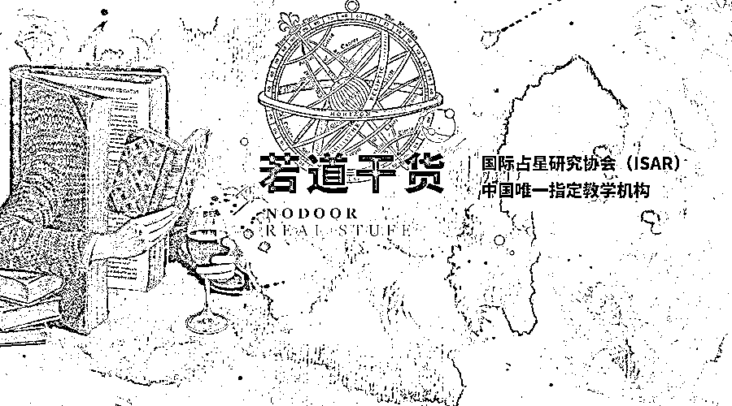

作者/温德尔·C·佩里

译者/Elle 校对/轩轩

编辑/翀子 封面/书君 图片/网络

在星图上，两颗行星间形成的角度被称作相位，其中四分相（90°）、对分相（180°）以及合相（0°）是典型压力相位。人们不喜欢压力，但压力激发人们不断向前。当行进中的行星与出星星图上的行星形成压力相位时，会带来哪些挑战和机遇呢？让我们来看文章吧！
**人生需要一定的压力**

压力常被人们所诟病。诚然，压力会缩短人的寿命，并引发多种严重的疾病。例如心脏病、高血压和癌症等。但这些都只是事实的一部分。

**压力是我们生存重要的组成部分。压力激励着我们，使我们不断向前；压力启发了我们的创造力和创新性**。没有压力，人类可能永远也不会把石头磨成尖锐的工具，也无法造出第一个车轮，或设计出第一个内存板。

我们当然都追求着舒适的生活，但如果没有舒适的对立面——压力，舒适又如何单独存在呢？

**舒适和压力是密不可分的，把任何一个去掉，另外一个就变得毫无意义。**

你是否注意到一些出生在压力很小的环境中，例如出生在有钱有势背景家庭的孩子，会想方设法使他们舒适的生活变得压力重重？同样地，生活在高压下的人，例如生活在战争和贫穷中的人，也常常能在他们最不舒适的时刻找到最甜蜜的欢愉。

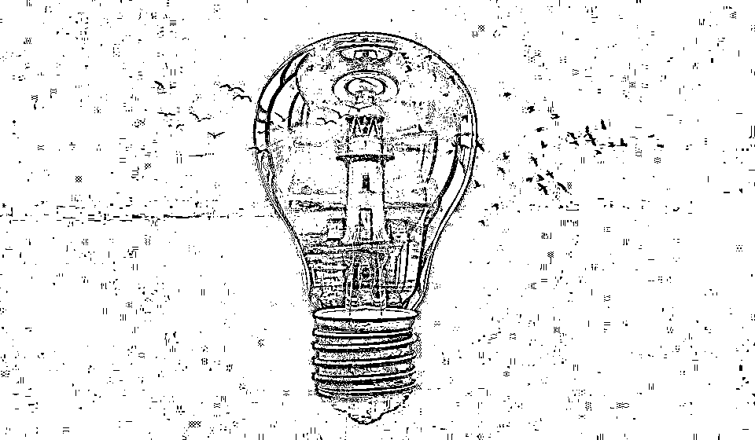

**对压力怀有尊重**

压力以各种方式影响我们。在外在世界中，我们会遇到困难、敌人和竞争；而在我们的内在世界中，我们要面对自己心理和生理上的弱点和失败。

**然而，如果没有面临困难时的压力，就不会有成功和成就感。同样地，只有当我们自己的不足造成了生活中的压力时，我们才会去工作，去努力克服它。**

对压力怀着健康的尊重是很必要的，这一点对于占星师来说尤为重要。**在合相、四分相、对分相、三分相、六分相这些主要相位中，只有最后两个相位被认为是积极的，但即使是它们也可能适得其反。**

（我在冥王星三分我的出生星图太阳的时候做了开胸的手术；虽然这个手术使我今后免受心脏病的困扰，但在当时是一个压力很大的经历）。

如果再加入梅花相位、八分相、十二分相，我们必须承认，**大部分相位都与压力相关。**如果占星师坚持认为压力是负面的，我们能说的积极的东西就太少了。

在本文中，我将描述一些通常被认定为会带来压力的行进，并解释如何正向运用这些压力。

并不是说这些相位没有潜在的危险性，或者它们不会以困难和麻烦的方式展现。但是，我相信每次**当我们把一个“困难”相位的能量用积极的方式表达出来，我们都会减轻其潜在的负面影响**。

我怀着这样积极的视角来写以下的内容。

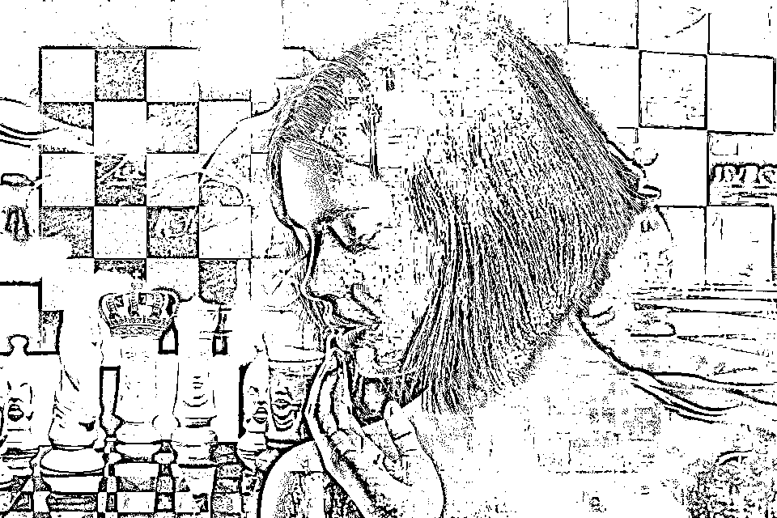

**行进中的压力相位全解析**

**若道君：****你可以在 app store 或者应用商店搜索“若道”下载 app，输入个人档案，查看行运盘（也可以使用其他星图软件），找到相位详情，查看行运行星是否和出生星图行星形成压力相位。**

**例如下图中，行运天王星与比尔·盖茨的出生星图金星形成对分相（180°）。**

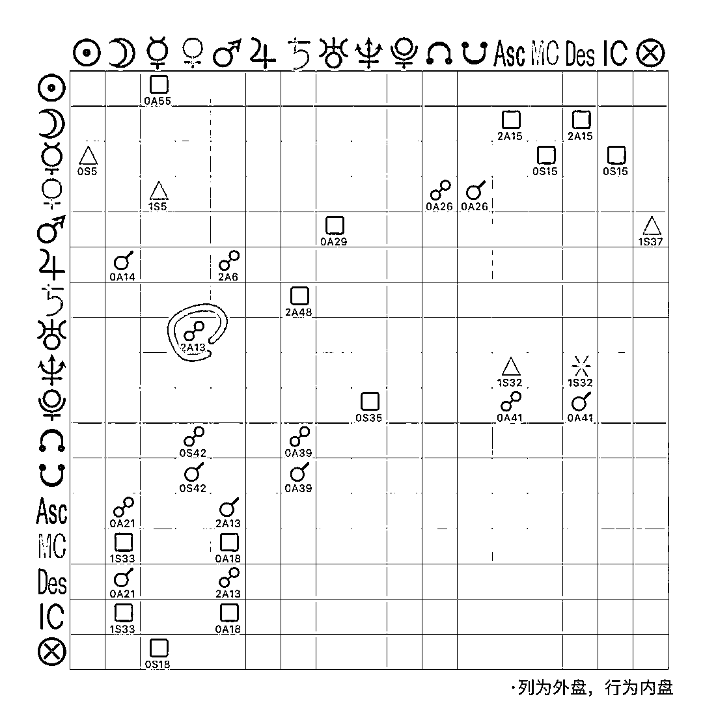

**出生星图*****太阳*****与行进*****火星*****形成压力相位**

这是一个关于**大胆行动、不计后果**的相位。我们对于大胆行动没有问题，但处理这些行动的后果常常令人非常沮丧。如何在经历这个行进以后，保持你发肤完好，并且友谊丝毫无损，这是一个很大的挑战。

这个相位的乐趣在于**大声、骄傲地说出你是谁**。如果汽车坏了，我们有汽车保险，如果友谊受到了伤害，我们可以真诚地道歉。

然而，**找到机会让世界知道，你是可以很大胆的——你是可以很勇敢的、无畏的、甚至有点英雄主义的，这是无价的。**

**出生星图*****太阳*****与行进*****土星*****形成压力相位**

**阴影笼罩着你的自我，你怀疑着自己是否可以重见光明。**这可能是一段令人沮丧的时期，你**对自己充满怀疑，并对自己的目标进行严肃的重新评估**。你**身体的活力可能也会受损，变得昏昏沉沉，并很容易生病。**

在黑暗中找到欢乐看上去很难，但一旦你接受了这个相位的规则，其实也没有那么难。

土星的功能是让我们知道自己的**局限**。**一旦我们清晰理解了自己所不能做到的，剩下的所有事情都是我们可以做的**。如此就可以找到快乐。

**出生星图*****太阳*****与行进*****天王星*****形成压力相位**

你能感受到血管中闪电般的震颤吗？在这个行进中，**你感觉如电击般的兴奋，并可能伴随着一点神经质**。可能会出现意想之外的事情，但最出人意料的是你对这些事件的反应。

你所做的任何事情都与你过去的行为方式截然不同——这可能很有趣，也可能很令人苦恼。

你可以从探索**新的个性**、进入你生命的所有**新元素**（即使是那些让人忐忑的新事物）中找到乐趣。关键在于认识到：所有这些都是**暂时**的，就像一道闪电。

当暴风雨过去，你开始重建你旧时的生活。**那些恐惧和痛苦会很快过去，只留下探索的乐趣。**

**出生星图*****太阳*****与行进*****海王星*****形成压力相位**

这个时间段是很奇怪的——**你每天醒过来，却不知道自己是谁**。你的身份感在改变着。**其中一部分身份感与你当下的生活状态不太匹配，或许它们对你而言已经不适用了。**

这一切让你感到困惑，并且觉得**自己不再属于那个你曾经觉得很舒适的世界。**

在这个行进中，我们常常**由于伤感而停滞不前**。我们感受到**跟自我身份中那些曾经为我们服务得很好的部分有情感的联结**。

事实上，在这个阶段，我们可以获得快乐的一种方式是：**重新回顾那些老旧的依恋**。另一个方式是：**对这些依恋放手**。

**出生星图*****太阳*****与行进*****冥王星*****形成压力相位**

**在这个行进中，你会感到自己被不可抗拒的力量所压抑和阻挡着**。你的直觉想去与这些阻碍你的力量抗争，维护自己的自主权、创造力和身体活力。但是，你越抗争，你的敌人越强大。你可能会感觉自己不得不采取孤注一掷的办法。

这一种行进的乐趣来自于**力量**。**仔细观察那些想要压制你的力量，感受他们的强大能量。**

**如果要制止你、把你推入角落的力量是如此之大，想必你也一定是很强大的**。让他们得意一时，嘲笑他们的胜利。迟早这个行进会结束，**这些力量会消失，而你的力量会一直存在。**

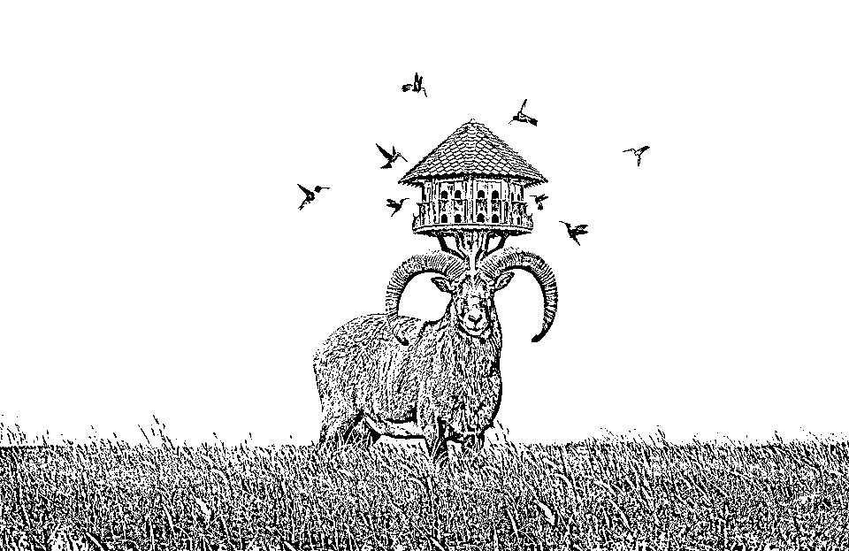

**出生星图*****月亮*****与行进*****火星*****形成压力相位**

**在这段时间，你也许会感觉自己受到攻击，好像有什么人或事将靶心瞄准了你，只是还没有开始射击。**

这个相位的天然倾向是想要**逃跑**，或转过身去张牙舞爪地**攻击**你的对手。但这两者都不会让你快乐。

**快乐来自于克服你的恐惧和愤怒，发现你可以成为一个很勇敢的人**，你可以用发牢骚和争斗以外的方式捍卫自己。发现你灵魂中的这种勇气不仅是欢乐的，也会使下一次月亮和火星的行进变得更容易。

**出生星图*****月亮*****与行进*****土星*****形成压力相位**

在这样的行进下，我们会感受到**沉重的负担**。无论这些负担以什么样的具体形式呈现，他们真正的影响在于让我们有**悔恨、恐惧和内疚**的情绪。

这可能是一段充满了**强烈自我批评**的时期。你**细数并指责自己所有的失败和缺点**，而**外部世界也会不断提醒你关注自己遗漏的失败和缺点。**

然而，当你停止了自我鞭打，你也许应该记得，**压倒你的所有这一切都是情绪，而非事实**。看一看事实本身，你也许会发现，它们并不像你想象得那样可怕。而且，**如果深入去思考，你甚至可能发现，有一丝欢乐隐藏在他们的背后****。**

**出生星图*****月亮*****与行进*****天王星*****形成压力相位**

**这个相位会搅乱你的生活，尤其会撼动你的****情感世界**。听上去很有意思，但其实并非如此。我们的情感生活在有安全感、可预测的情况下可以很好地发展，但**这个相位既不想要安全感也不想要可预测。**

这时，让我们遭受痛苦的并非发生在我们的身上的事件，而是这些事件**如何把我们之前在情感方面形成的观念连根拔起**。改变非常艰难，然而，对改变的恐惧会使我们窒息。战胜恐惧并不容易，尤其是情感上的恐惧。

但是，一旦我们做到了，一旦我们接受了这样的事实：我们情绪上的锚心已被拔起，我们在变化的大海之上漂浮，我们就能享受这样的旅程，即使旅程中会有一些颠簸。

**出生星图*****月亮*****与行进*****海王星*****形成压力相位**

**在这个行进中，你常常会觉得有人让你失望；**或者**你进入了一段关系，但另一方并不可靠，甚至对你幸福感造成了威胁。**这样的怀疑通常并没有可靠的证据支持，但你并不在意事实本身。**你就是想有人告诉你，一切都很好。**

在这个行进中，你可能感觉自己**多愁善感**，**生活一团糟**，而这其实不一定是一件坏事。这个相位使你有机会，**用之前你可能觉得很傻或者“一点也不酷”的方法去探索自己的情绪。**一旦你克服了自己的脆弱和迷茫，这样的探索会变成快乐的源泉。

**出生星图*****月亮*****与行进*****冥王星*****形成压力相位**

这个相位会带领你**深入自我的深处**，并**迫使你面对最顽固的心魔**。

没有那么容易下定决心。你踏上这个旅程并非为了解决问题，这是一个**发现事实的使命**，而在你所要去的地方，**事实是被感受所定义的，而非文字**。**这使得它们看上去很可怕，也使这个使命变得非常必要。**

此时，**快乐来源于发现自我中自己从未知晓的层面**。你可能会**看到一些丑陋的事情**。它们可能会**挑战你“世间的”感情和是非判断**。

但是，**当你了解并拥抱这些坏东西，同时找到方法把这些坏东西转化为真实的、有用的东西，你就会找到快乐。**

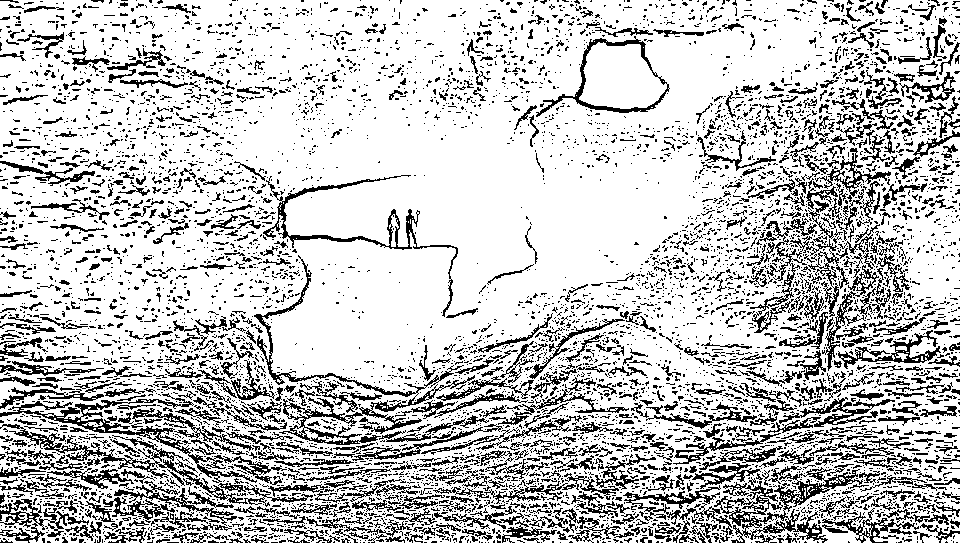

**出生星图*****水星*****与行进*****火星*****形成压力相位**

这个时期适合**处理你生活中的一些愤怒**。为了说明自己的观点，你应该**直截了当**，也许还要有一点咄咄逼人。记住，**你不是来抱怨的，你是来寻找解决方案的。**

当然，在这类行进下，**寻找解决方案的过程很可能会有争论。**然而，**即使是一场争论，如果处理得当，也可以是一次富有成效的信息交换。**

除非每个人都强调说明了自己的处境，否则很难找到中间立场。也只有这样才能清晰明了地表达，而**通过这样的表达，你可以找到这个相位带来的快乐。**

**出生星图*****水星*****与行进*****土星*****形成压力相位**

做出艰难的决定让人感觉很糟。唯一能比这更糟的是，你发现某一个艰难的决定是错误的。但你不应该因此郁闷——你应该因此**扩大视野、多多学习**。

**每一个错误都包含了很多的人生教训，而务实的人不会让这些教训白白浪费。**

这个相位的乐趣在于，知道你的想法和优先级都是合适的。困境会迫使你做出调整，但更重要的是：**困境会理清你的思路，精简你的想法**。

无论如何，当你离开这个相位时，你会带走一些很重要的信息。如果你做对了，离开这个行进时，你会是一个更有智慧的人。

**出生星图*****水星*****与行进*****天王星*****形成压力相位**

**不要再烦躁不安了，请开始用开阔且非常规的方式来思考。**

一些崭新的人或事向你开启了光明的大门。是的，那光耀眼得令人睁不开眼。新的信息会把你仔细预设的计划打乱。你会因为之前的计划而不去探索新世界吗？

这个相位的乐趣在于，**不知道有什么样异想天开的想法会进入你的脑海，或者自己会冷不丁说出什么稀奇古怪的话**。你可能会需要**请求朋友的谅解，并且需要在对你母亲说话时特别小心**。

不管怎样，你已经**进入了一个崭新的、无拘无束的智力领域，这很有趣。**

**出生星图*****水星*****与行进*****海王星*****形成压力相位**

谁说人生必须有意义？你是否被现实所困而没有一点点时间来做梦？在这个行进中，肯定有人会好笑地看着你问你在干嘛。但没什么好道歉的，你唯一在想的事情是希望这个世界变得更好。

在此，**快乐来源于创造力**。一个沉迷于梦境的人可以自由想象和创造。你在这个行进中的创造可能无法进入画廊，但是，那种**随心所欲**的感受，那种指尖流淌着无数可能性的感觉会一直都在。珍惜这种感觉。

**出生星图*****水星*****与行进*****冥王星*****形成压力相位**

**在这段时期，你无法满足于表象。**你必须**深入挖掘**，你必须**提出尖锐的问题**。有人可能不喜欢你如此，但在这样的行进中，你并不那么关心自己受欢迎的程度。你必须要找到答案，即使要上天入地，你也心甘情愿。

如果你不让自己去探索这个世界和其他人，你将会找不到快乐。**快乐来源于在探索世界和他人的过程中，你对于自我的发现。**

因此，当你一只眼睛搜索那些黑暗的角落时，记得用另一只眼睛看看自己的内心，看看自己内心的黑暗角落，并观察光线如何渗入进来。

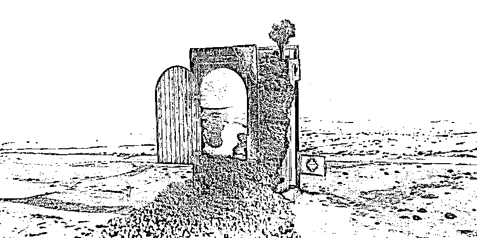

**出生星图*****金星*****与行进*****火星*****形成压力相位**

这是要**坚持自己主张**的时期。你要**让关系亲近的人知道你的需求和愿望**。可能会有**矛盾**发生，尤其是当你的需求和你所爱的人的需求有冲突时。但是**放弃主张只会让你垂头丧气，并怀恨在心。**

有人可能会说，在这个相位之下，**快乐来源于争吵过后的做爱**。但在这里，重要的是**学习到你的哪些关系是可以经得起这样的交换意见的**。

这些历经考验的关系带给你的崭新的喜悦，而即使是争吵过后的做爱也无法挽回那些经不起考验的关系。

**出生星图*****金星*****与行进*****土星*****形成压力相位**

**有的时候，爱不是答案。你必须回到现实，在关系中甚至要有一点点自私。**你在做判断，而判断的目的是**在关系中创造出平衡**。

这个过程并不简单，但**真正的爱经得起现实的考验**。经不起现实考验的爱，不要也罢。

这个相位的乐趣在于**与你所爱的人进行成熟的、理智的、富有成效的互动**。我知道这听上去并不令人兴奋，但是这个过程是**建立牢固的关系**必经的过程。

**清晰地阐明你的需求和期望、真诚地听取爱人的回应，就像把快乐存入个人退休账户**。以后，当你最需要的时候，它会在那里等你。

**出生星图*****金星*****与行进*****天王星*****形成压力相位**

新的开始总是有一些令人生畏，哪怕只是对过去的一点改变。然而，一点害怕并不总是坏事，**害怕可以使感官变得敏锐，并使头脑充满能量**。

如果你更聚焦于这股能量，而不要那么在意行进中可能出现的一些突然的、有时让人伤心的改变，这个行进可以变成让人兴奋的旅程。

在这个过程中，你会有很多机会**接触到很多以前不认识的人**，同时你可能会**受到诱惑去冒点险**。**这些可能是让人兴奋和快乐的，但你可能要付出情感上昂贵的代价**。

然而，快乐也可以来自于对于可能性深思熟虑，怀有“崭新”的想法离开——这样，快乐就不会使你（和你所爱的人）付出任何代价。

**出生星图*****金星*****与行进*****海王星*****形成压力相位**

在这个行进中，你会感受到**伤感和情绪脆弱**。但是，不要总是想着你自己！这个时期你应该**更多关注其他人**。**让自己的同情心流动起来。让想要帮助他人的渴望来指引你。**

你不一定要陷入爱河。（陷入爱河又是关于你自己的事，不是吗？）你只是**必须感受到对于那些正在处理自己脆弱的人们的爱。**

在这个相位中，我们常常**被迫在失望中找到快乐**。即使当你爱你的人辜负了你，甚至你的爱被证明用错了方向，**感受到爱，懂得你曾经爱过**依然是有价值的。而这些价值是无论多少失望都无法从你身边带走的。

**出生星图*****金星*****与行进*****冥王星*****形成压力相位**

**我们在此生中得到的每一样东西，都是注定会失去的。**这是一个基本的真相。另一个基本的真相是：**每失去一样东西，我们就有空间来容纳新的人和事物**。对于冥王星，我们必须从长计议。

是的，有的时候我们细数那些悲伤与哀愁，但现在，**我们必须突破这些细节的局限，看到更大周期的开始和结束。**

这里的快乐来源于，**失去所带来的痛苦代表着转化之门**。无论因为什么原因，当我们所爱的变得遥不可及，我们必须**转化自己爱的方式**。

我们必须到达更深、更远的地方。通过这个过程，于爱、尤其是关于自我，我们都可以学会很多。

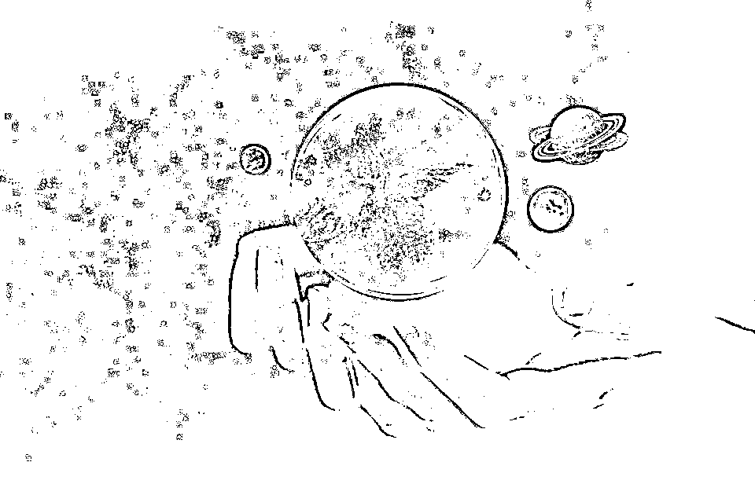

**出生星图*****火星*****与行进*****火星*****形成压力相位**

这是**战斗**的相位。对我们大部分人来说，这并不意味着要找人打架。我们的战斗会更安静些，起码看上去比较文明。然而，在这个行进过程中你**必须进入角色**。

在这个相位下，我们感受到**积极主动**的乐趣，**身心都忙到极致**的乐趣。**重点并非输赢**。这段时期，你应该忘掉你的身份，不要在意别人的观点，而全力感受你与世界的战斗、尖叫、挣扎对你五脏六腑的影响。

**出生星图*****火星*****与行进*****土星*****形成压力相位**

有的时候，我们会感觉自己走在沙地上，或者鞋子灌了铅一样沉重。这就是这个相位带给我们的感受。

我们遇到的困难可能是身体上的，或是情绪上的。可能与你的工作相关，也可能只是心态的问题。然而，处理好这样的问题并不容易。

这个行进的快乐来自于**在困境中保持自律**。把去年你放弃的节食计划重新找出来。拓展你的运动计划。接下那个每个人都避之不及的项目。

当然，这些都不容易，但是“**不容易**”就像是家常便饭。向世界展示你的**力量、耐力和自律**。

**出生星图*****火星*****与行进*****天王星*****形成压力相位**

这个相位与**事故、疏忽和普遍的混乱**相关联。然而，**正是这种潜在的危险给了我们在这个相位中找到乐趣的机会。** 

**在这个行进中的每一天，你都活在不确定的边缘。**即使是最镇定的人也要去处理极端的情况。在这种高度警觉的状态中，每一个感官都被强化了。你要确保自己感受快乐的感官也同时被强化。

**出生星图*****火星*****与行进*****海王星*****形成压力相位**

**你觉得有的地方出了问题，但搞不清到底是哪里。**虽然问题难以捉摸，但还是造成了破坏。

**你既没有能预见到问题的发生，也找不到确切的原因，这些都让你更加沮丧**。你心想：最好能回避整个议题。但这不可能，因此你最终对着影子乱打一气。

这里的快乐来源于**臣服**。与问题抗争不能帮你太多。在和海王星的战斗中，输家和赢家常常都是同一个人，那个你对着打的影子很可能就是你自己。放下你的拳击手套，转向光明，影子就随它去吧。

**出生星图*****火星*****与行进*****冥王星*****形成压力相位**

有人刚把一卡车的垃圾倒在你的正门口，看上去你对此什么都干不了。这可能是很艰难的行进。你感到**被困、无助，觉得自己被无法控制的力量所压倒**。在这个过程中，有时候一丝绝望会渗透进来，但这无济于事。

在此行进中，你通过认识到自己在打一场无关胜负的战斗来找到快乐。唯一重要的是**你在战斗中有多努力**。**这是对你勇气、决心和意志的测试**。快乐来自于了解，通过每场战斗，你都能增加一些力量。

********版权声明：**本文由若道翻译发布，欢迎转发，反对抄袭。友号转载请申请白名单。********END**

**温德尔·C·佩里**

占星师，作家，艺术家

著有《土星周期：人生变化地图》和《太阳母亲、月亮母亲：占星学的活力二人组》

**20 位来自世界各地的占星师****带来 19 场沙龙——新世界的觉醒****详情可点击下图**

**学习占星学****点击下图了解课程详情**

**微信又双叒叕改版啦，不想错过若道君的推送？**

**就把若道设为星标吧！**

**▼**

**喜欢就点一下“在看”吧！**

********报名直达入口********

# 行星、星座、宫位......在医疗占星学里都代表什么？

> 原文：[`mp.weixin.qq.com/s?__biz=MzA5NjA0NTAxNg==&mid=2651481360&idx=2&sn=dfda6be08d8cde8d0f81e19ebd1e386b&chksm=8b48d7a7bc3f5eb10758fa4766273ec5b75aad79770cedce778cb0142ba547dccafdeac8b594&scene=126&sessionid=1692737781#rd`](http://mp.weixin.qq.com/s?__biz=MzA5NjA0NTAxNg==&mid=2651481360&idx=2&sn=dfda6be08d8cde8d0f81e19ebd1e386b&chksm=8b48d7a7bc3f5eb10758fa4766273ec5b75aad79770cedce778cb0142ba547dccafdeac8b594&scene=126&sessionid=1692737781#rd)

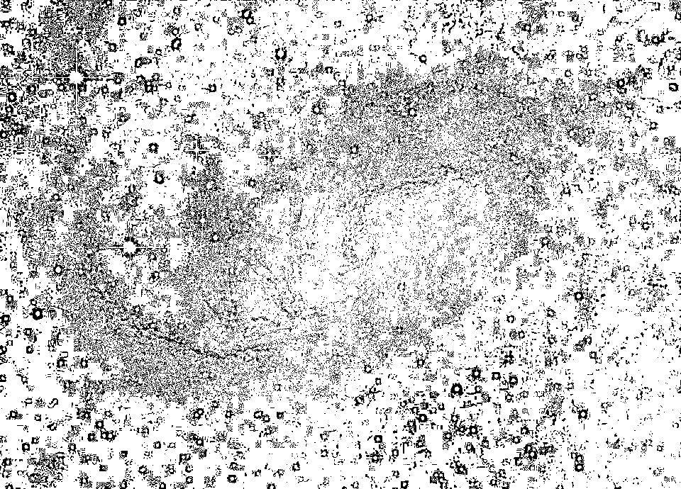

作者/简·里德-帕特里克 译者/黄纤越 张弛编辑/翀子 图片/网络

你知道吗？占星学可以为诊断、预测以及为个体和疾病找寻有效治疗方法方面提供洞见。那么占星学能为医疗带来哪些帮助呢？一起看看吧。如果你对医疗占星学感兴趣，若道开设的 ISAR 选修课[《医疗占星》](http://mp.weixin.qq.com/s?__biz=MjM5MjQwNjAyMQ==&mid=2649440007&idx=5&sn=0c3b75900bbdc76a353af986181f2d45&chksm=beb9506d89ced97bdddaa8a0d79dcf04dec09c8c7e834f89486b7375c330a21550c605b3941a&scene=21#wechat_redirect)课程也在报名中，由本文作者简·里德-帕特里克讲授，欢迎点击链接了解详情哦。

**占星学可以为医疗提供帮助哦****医疗占星学是占星学中的一个重要分支，主要****通过对星体特质和运行的研究帮助我们了解和改善人体健康。**在 17 世纪之前，占星学一直被广泛运用于欧洲医学系统内。**占星学可以为诊断、预测以及为个体和疾病找寻最有效治疗方法方面提供洞见。**尤其在处理一些特别个案时，占星学有着更加明显的优势。颇具影响力的加拿大医生威廉·奥斯勒爵士（Sir William Osler）曾说过，找出哪种类型的病人远比找出病人罹患哪种类型疾病更为重要。**出生星图可以明确地指出哪一类人会罹患疾病，而行进（transits）和推进（progressions）又会告诉你患病原因以及为什么会在特定时间病发。**出生星图也会反映出**个人应对压力的可能反应。**由于难以缓解的压力也是致病的重要因素之一，所以星图反映出来的这一信息也就变得尤其重要。

**医疗占星学能为我们做什么？**

医疗占星学可以为我们做什么呢？

*   **按照潜在的占星学动力分类诊断；**

*   帮助病人找出**最缓和却最有效**的治疗方法，为每个人度身定制；换而言之，医疗占星学可以针对性地指出如何治疗得病的人，而非病人得的病；

*   指出成功治疗的**最佳用药时机。**

**行星、星座等在医疗占星学的象征****—行星—**会显示出心理驱动力以及因此导致的生理反应过程。举例来说，火星是我们坚持个人主张和保护自身的驱动力，而在身体内部则会通过消化系统、肌肉活动和免疫系统释放热能。 **—星座—**代表着行星能量是怎样展现以及在身体的哪个部分展现。举例来说，火星落在天秤座象征着肾炎的可能性。**—相位—**会显示出行星能量如何交互以及相互影响。例如，土星四分火星可以与免疫或消化系统的功能放缓（土星）相关联。**—宫位—**显示出可以影响个人健康的外界和环境因素。例如，火星落在第七宫意味着强势的另一半可能影响你的健康。**—行进—**可以显现出个人在何时更容易罹患疾病或需要为保持健康而做出的改变。

**版权声明：**本文由若道翻译发布于若道平台，欢迎转发，反对抄袭。友号转载请申请白名单。

**END**

**ISAR 选修课【医疗占星学】上线**

**医疗占星学是一个强大的工具，同时洞察的身体和心理过程，通过更多的自我认知照顾和关爱自我和身边的人。**

**本课程既适合医疗占星学的初学者，也适合已经有一些相关经验的人****。**简·里德·帕特里克老师将运用现实生活中的例子，揭示一个人的性格、症状及其星图是如何相互映照的。课程也会探讨疾病的意义以及可能的治疗方法。

**本课程旨在为学员提供一个运用医疗占星学的框架和方法，**学员将会学到一些有价值的实用工具，在课程结束后，自己使用这些工具研究其中的关联性。

**此课程可作为 ISAR 选修课。**

**授课老师**

****简·里德·帕特里克 **博士******

**（Jane Ridder-Patrick）**

简接受过药剂师、理疗师、草药师、心理治疗师和历史学的专业学习，从事写作、咨询和讲学工作，在英国和全球教授占星学及其历史、当今的心理学和医学应用。她在爱丁堡执业，在爱丁堡大学获得博士学位，研究方向是 17 世纪苏格兰占星学历史。

**她最著名的出版物是《医疗占星手册》。2018 年，她因对医疗占星学的贡献而获得了著名的查尔斯·哈维占星学杰出服务奖。**

**对医疗占星学有兴趣？**

**点击下图了解更多详情吧**

**

**微信又双叒叕改版啦，不想错过若道君的推送？**
**就把若道设为星标吧！****▼**

**喜欢就点一下“在看”吧！**

********报名直达入口********

# 2022 年若道 ISAR 选修课 | 《医疗占星手册》作者亲授

> 原文：[`mp.weixin.qq.com/s?__biz=MzA5NjA0NTAxNg==&mid=2651481360&idx=3&sn=bd957b4850a63aeccee9623663552fed&chksm=8b48d7a7bc3f5eb130a78cbaeb9de5cfd2c4eca7691fc00bebccb7a028bed4fa005f7bbec18f&scene=126&sessionid=1692737781#rd`](http://mp.weixin.qq.com/s?__biz=MzA5NjA0NTAxNg==&mid=2651481360&idx=3&sn=bd957b4850a63aeccee9623663552fed&chksm=8b48d7a7bc3f5eb130a78cbaeb9de5cfd2c4eca7691fc00bebccb7a028bed4fa005f7bbec18f&scene=126&sessionid=1692737781#rd)

**有四个主要因素影响着我们的生活和健康：基因构成、物质环境、情绪环境，以及我们的占星配置。我们在星图中都存在患病的可能性，而预防的方法在于尽可能充分、真实和健康地生活。****——简·里德·帕特里克****（Jane Ridder-Patrick）博士**

占星学就像心灵的 X 光片。它可以描述个人对世界的看法和反应。我们越不了解自己的天性，面对生活中的挑战，我们就会有越少的选择。

**“占星学可以精准定位需要解决的潜在问题。”**

**医疗占星学是一个强大的工具，同时洞察的身体和心理过程，通过更多的自我认知照顾和关爱自我和身边的人。**

**本课程既适合医疗占星学的初学者，也适合已经有一些相关经验的人****。**简·里德·帕特里克老师将运用现实生活中的例子，揭示一个人的性格、症状及其星图是如何相互映照的。课程也会探讨疾病的意义以及可能的治疗方法。

**本课程旨在为学员提供一个运用医疗占星学的框架和方法，**学员将会学到一些有价值的实用工具，在课程结束后，自己使用这些工具研究其中的关联性。

**此课程可作为 ISAR 选修课。**

1

**课程安排**

**课程时间：2022 年 9 月 20 日-11 月 8 日  每周二 20:00-22:00**

**第*****1*****讲  9 月 20 日 与占星学、心理学、病症一起工作**

*   医疗占星学的组成部分以及如何使用它们

*   行星的作用与相互作用

*   黄道星座人

*   宫位的重要性

*   疾病和健康是如何产生的

**★ 第二、三、四讲的课程内容基于星座以及它们之间的相互作用。**

**第*****2*****讲  9 月 27 日 基本星座**

学习基本大十字星座——**白羊座、巨蟹座、天秤座和摩羯座**——及其功能和相关的健康问题。**这些星座与防御、养育、结构、体内平衡和荷尔蒙控制有关。**

****第*****3*****讲  10 月 4 日 固定星座****

学习固定大十字星座——**金牛座、狮子座、天蝎座和水瓶座**——及其功能和相关的健康问题。**这些星座与习惯和反射、心脏调节、生存、循环和协调有关。**

“固定星座（金牛座、狮子座、天蝎座和水瓶座）在情感和生理上都倾向于**‘难以放手’**，这可能为恶性肿瘤的生长创造环境。所以说，他们可能倾向于沉浸在过去的伤害中，难以自拔。另一方面，这些星座也擅长在艰难的时期坚持不懈并一直**持之以恒**。”——简·里德·帕特里克（Jane Ridder-Patrick）博士

**第*****4*****讲  10 月 11 日 变动星座**

学习变动大十字星座——**双子座、处女座、射手座和双鱼座**及其功能和相关健康问题。**这些星座与呼吸、神经系统、肠道、睡眠以及信息、情感和行动的整合有关。**

**★ 第五、六、七、八讲重点学习行星，它们在身体层面的表达、它们的相位与行进。**

**第*****5*****讲  10 月 18 日 太阳与月亮**

**太阳**掌管视觉、活力、心脏和意识，与心脏、脊柱和视觉问题相关。**月亮**掌管人体的周期，特别是月经周期、饮食模式和体液，与情绪引起的疾病、饮食失调和胃病相关。

**第*****6*****讲  10 月 25 日 土星与天王星**

**土星**掌管着皮肤、骨骼、牙齿和衰老过程。它对应的疾病包括慢性疾病、耳聋、帕金森病、关节僵硬和牙齿问题。**天王星**代表身体活动的协调，有节奏的脉动和身体的“电”。与天王星相关的疾病包括癫痫、痉挛、心律失常，以及阿斯伯格综合症和自闭症样综合症。

**第*****7*****讲  11 月 1 日 海王星与冥王星**

**海王星**掌管松果体、细胞膜渗透和右脑功能，与过敏、上瘾的病症、慢性疲劳综合症和睡眠障碍相关。**冥王星**掌管消除和转化，其病理包括毒性、脓肿、癌症和强迫症。

**第*****8*****讲  11 月 8 日 火星**

**火星是与能量和防御相关的行星**，掌管免疫系统、肾上腺功能、肌肉活动和炎症反应。**它是许多身体和情绪障碍的核心**，如自动免疫障碍、抑郁和发烧，以及由手术或需要手术引发的问题。

2

**此次课程适合哪些人？**

*   有一定占星学基础，若道核心课 L3 以上水平；

*   希望成为优秀的占星师，想要借鉴国际大师医疗占星解读思路并融入自己的体系的人；

*   热爱占星学、健康、养生的研究型占星学者；

*   计划考取 ISAR 认证占星师，寻觅中意选修课的学员；

*   走在自我探索和个人成长道路上的人。

**快来和简·里德·帕特里克老师学习升级版的占星学身体地图吧！**

3

**授课老师**

**简·里德·帕特里克 **博士****

（Jane Ridder-Patrick）

简接受过药剂师、理疗师、草药师、心理治疗师和历史学的专业学习，从事写作、咨询和讲学工作，在英国和全球教授占星学及其历史、当今的心理学和医学应用。她在爱丁堡执业，在爱丁堡大学获得博士学位，研究方向是 17 世纪苏格兰占星学历史。

**她最著名的出版物是《医疗占星手册》。2018 年，她因对医疗占星学的贡献而获得了著名的查尔斯·哈维占星学杰出服务奖。**

《医学占星术手册》（第二版，修订版和扩充版）

(爱丁堡，克拉布出版社，2006 年)

4

**课程信息**

*   **课程时间：**2022 年 9 月 20 日开始，每周二晚上 8 点，每周一次，共 8 次课。

*   **授课方式：**线上直播，英文授课，中文翻译

*   **课程价格：****6800 元**

*   **早鸟价：5800 元（截止日期：2022 年 8 月 23 日）**

*   **课程咨询：**王老师（微信：18510107057，请备注“医疗占星”）

长按二维码添加王老师

5

**退转课程**

*   **退款原则请详看《教学协议》，如有疑问请咨询课程顾问。**

****医疗占星****

**授课老师：**简·里德·帕特里克

**授课时间：**2022 年 9 月 20 日起

**授课方式：**网络课程**，**英文授课，中文翻译

**费用：****6800 元****（早鸟价：5800 元，2022 年 8 月 23 日截止）**

**课程负责人：****王老师**（微信：18510107057，请备注“医疗占星”）

长按二维码添加课程负责人咨询~

****报名请点击“阅读原文”****

# 这个带着脑子来的北交点，大可不必如此聪明

> 原文：[`mp.weixin.qq.com/s?__biz=MzA5NjA0NTAxNg==&mid=2651481193&idx=1&sn=a71cdf95dff68680e00aa40146260e3a&chksm=8b48d6debc3f5fc8e3f8f9ad1b65d0d72a8912d86c9ed5c1377ffca7472d0d78994c2fe87ee0&scene=126&sessionid=1692737781#rd`](http://mp.weixin.qq.com/s?__biz=MzA5NjA0NTAxNg==&mid=2651481193&idx=1&sn=a71cdf95dff68680e00aa40146260e3a&chksm=8b48d6debc3f5fc8e3f8f9ad1b65d0d72a8912d86c9ed5c1377ffca7472d0d78994c2fe87ee0&scene=126&sessionid=1692737781#rd)

☆****后台回复“今日”，给你一句生命态度****

作者/简·斯皮勒 译者/一诺 校对/Chang 编辑/玫瑰 封面/书君 图片/pexels

南交点处女座是带着满脑子聪明来到今生，可是“聪明反被聪明误”，难得糊涂是正途。为什么呢？一起看看吧！

**北交点双鱼座/第 12 宫综述**

**发展的特质**

在这些领域努力有助于挖掘隐藏的天赋和才能： 

**· **不做评判

**· **慈悲为怀

**· **将焦虑臣服给“更高的力量”

**· **通过冥想和自我省思来解放心灵

**· **专注于灵性之路

**· **相信积极的结果

**· **认识到与宇宙的联系

**· **拥抱变化

**要放下的倾向**

努力减少这些倾向的影响有助于让生活更轻松、更愉快 

**· **极度焦虑的反应

**· **过度分析

**· **强迫性担忧

**· **夸大细节的重要性

**· **批判性的第一反应

**· **找茬——让他人错

**· **对犯错过度焦虑

**· **成为完美先生或完美女士

**· **停留在不愉快的情况中

**· **不灵活

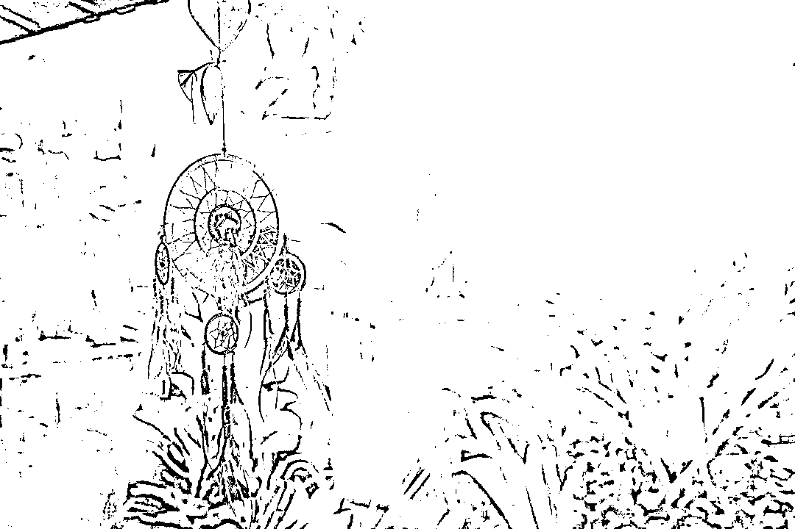

**阿喀琉斯之踵/避免的陷阱/底线**

北交点在双鱼座的人需要注意的阿喀琉斯之踵，是他们**对秩序的强迫性需求**（“我的生存依赖于，一切都按照我的观点来安排，按照我认为生活应该如何以及他人应该如何”），这可能会让他们**陷入无休止追求完美的陷阱**（“如果我周围的人更完美，我可以放松并信任的话”）。

但这是个无底洞：**生活和其他人永远不会处于静态的完美秩序中足够久，不会使双鱼座北交点的人感到安全，他们的期望会导致持续的紧张和焦虑。**因为生活，以及其他人，永远不可能理想到足以让他们放弃控制，他们便不断推迟信任和快乐。

底线包括，接受宇宙的计划优于他们的计划，事情都在恰当地展开，不管表面看起来如何。他们能创造“完美秩序”的唯一地方是内在，**通过臣服于“更高的力量”，相信一切其实都是有秩序的。**

讽刺的是，**当双鱼座北交点的人盲目相信无限，接受一切都有助于他们更多的幸福时，他们突然获得大局的视野，开始理解事情是如何为他们服务。**然后他们就可以**放开控制，获得幸福。**

**这些人真正的诉求**

**这些人真正想要的，是一直保持正确和完美，即他们——以及其他每一个人都在百分之百地遵循“计划”。**但，他们**希望每个人遵从的是他们自认为正确的那个“计划”**。

首先，他们需要**接受他们不知道“计划”应该是什么**。他们需要**摆脱僵化的现实和物质的计划方式，重新关注更大的灵性的愿景。**通过信任和臣服于“更高力量”的智慧，他们可以在观察生活环境时，确信**正在展开的事情确实是“计划”的一部分**。

然后道路就变得清晰了。他们充满了平静并感觉与“计划”一致，因为灵性的愿景正是他们追求的完美能量。

双鱼座掌管开悟的意识状态，与所有生命融为一体的海洋感。有时，**双鱼座北交点的人会进入一种觉醒状态——一种与宇宙完全链联结的状态。**他们的人生目标是培养这种状态，并使之成为他们日常经验的一部分。

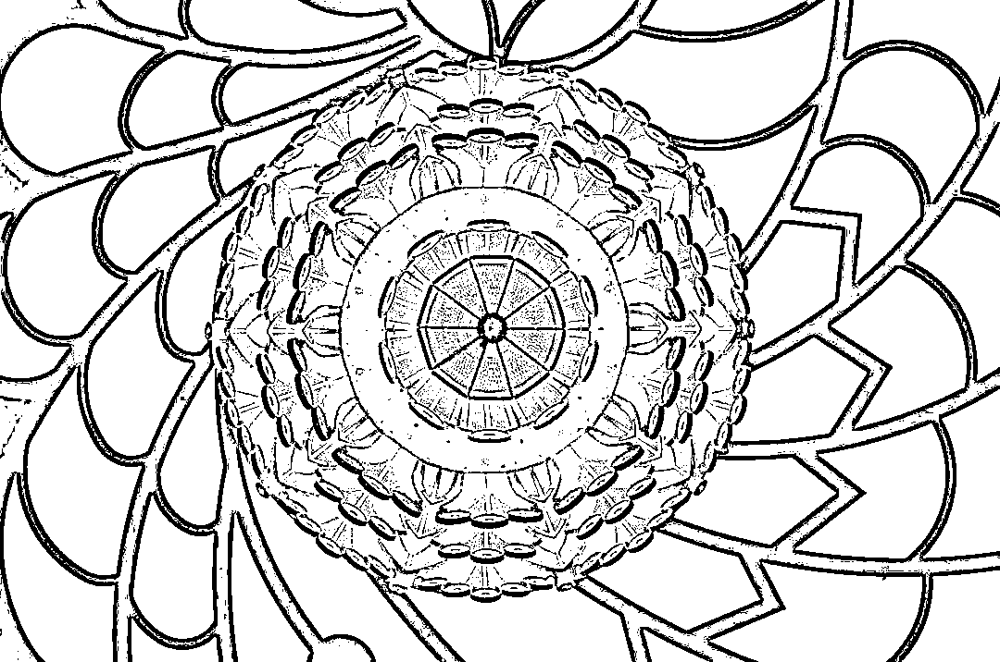

**天赋/职业**

**这些人需要有自己的私人办公室或空间。**他们**独立工作的能力很强，喜欢那些涉及发现和实现愿景的项目，而且这些工作是在私下里完成的（如研究、图书馆工作或计算机工作）。**

双鱼座北交点人，在任何**涉及个人对精神真理追求的职业**上都可以取得成功，比如**在寺院或修道院工作和生活**。他们可以是**出色的艺术家、工匠、表演者或音乐家——将他们的个人梦想带给他人。**

他们也是**伟大的推动者，因为他们非常擅长“幕后”活动**。即使从事常规工作，他们也需要**给自己足够的时间独处和内省。**

双鱼座北交点的人，也有**注意到相关细节、分析信息重要性**的天赋。当他们把这些前世的天赋作为实现梦想的背景时，他们与生俱来的务实将帮助他们。

然而，如果**从事强调关注细节、深入分析、完美或准确性的职业（如记账或系统分析），他们可能会感到焦虑和不安**。当他们的职业专注于实现愿景，使他们能够运用自己的实际技能将愿景变为现实时，这些人的情况会更好。

**双鱼座北交点特定的疗愈誓言**

**·** “一切都很好，一切都在按部就班地展开。”

**·** “神性的精神引领永远不会错。”

**·** “当我‘放手并交予神’时——我赢了。”

**·** “我的生存没有受到无序的威胁。”

**·** “这不是我的工作，这是神的工作。”

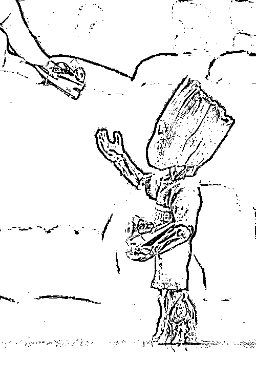

**北交点双鱼座/第 12 宫的个性**

**前世**

双鱼座北交点的人在许多前世中都是**身体治疗者和帮助者**：他们在许多不同文化中当过**外科医生、医生和护士。**这些都是关键的岗位，他们必须**集中精力并“正确行事”，因为一个人的生命取决于此。**

因此在这一生中，**他们对把事情做得完美有很大的依恋和紧迫感。当事情按计划进行时，双鱼座北交点的人会感到自信和强大**；一切尽在掌控，“行动”正在顺利进行。

但**当意外发生时，他们会惊慌失措**。潜意识里，他们认为当事情出了“差错”“，就会有人死亡。

作为医务人员，他们有固定的规则和程序，不能有任何错误。因此，在这个转世中，他们**过分执着于以精准、无瑕的方式做事**。他们**不仅期望自己的行为无懈可击，而且还倾向于对周围的人采用同样严格的标准，尤其是在工作场所。**

**也许是因为他们过去在医疗领域的生活，他们通常非常注重健康，对污染有恐惧感，觉得有必要保持环境一尘不染。**

此外，双鱼座北交点的人过去曾化身为**僧侣、修女和“特蕾莎修女”类型**的人，作为精神真理的代表，在世界范围内以完美的“教科书式的”行为提供实际服务。**他们是榜样；其他人向他们学习灵性之人应该如何行事。**

由于他们的行为带来了赞赏和奖励，他们在潜意识中**把“完美”和需要让物质世界中的事情按照他们的方式进行联系起来。**然而，在过去世中，**他们“被困”在完美的形式上，而与他们疗愈能力的本质失去了联结**。

这是可以理解的，因为他们必须履行仪式，并且总是以某种方式穿着和行为。因此，在这一生中，他们想要**解除对形式的依恋，重新与本质连接**。是时候让他们因为过去世的服务，而获得平静和内心满足的回报了。

**分析性的倾向**

在前世中，双鱼座北交点的人**过度使用和开发了分析过程的做事方法，所以现在他们天生就有分析一切的倾向。**他们不断地把事情拆开，看看它们是如何运作的，而他们往往不满，直到理解了为止。

**他们的心理过程一直处于高速运转状态，经常分析那些应该被忽略的事情。**就像剥洋葱一样，他们一层接一层地剥，直到什么都不剩——**最终感到空虚和焦虑**。这一生，**他们所寻求的答案，并不是要通过分析找到的。**

**这些人从每一个可能的方向分析问题，其强度足以让其他交点类型的人抓狂！**他们想到了所有可能出错的事情——他们无法控制的事情。一旦他们决定有什么事情需要担心，就会让他们处于紧张、疯狂的状态，这种状态一旦被激活，就很难脱离。

**让他们担心的不是现在，而是未来可能发生的事情。**他们绝大多数的担忧从未成真，但这并不能阻止这些人持续生活在焦虑之中。

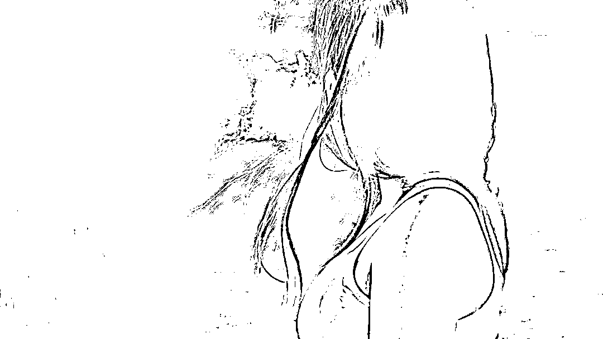

**他们预计的“更糟糕的情况”不太可能发生，**有几个原因：

**·** 他们不考虑可以规避所担心的结果的新见解或行动；

**·** 他们不允许外界干预；

**·** 最重要的是，他们不允许自己的直觉提供对未来的准确“感知”——是否真的有什么值得担心的。**他们必须停止思考，才能调整频道“感受”到未来。**

双鱼座北交点的人过度分析的倾向带来了许多问题。例如，**他们有一个愿景，然后试图强行令其发生，而不允许宇宙以其自己的方式展开。**

他们确实看到一条路，但不一定是整条道路；可能只是一条狭窄的小径。也许一个人可以走那条路，但当有其他人参与时，就需要更大的视野。

**这些人太习惯于执行，以至于他们过于专注手头的任务，而不考虑其他情况。**当事情不按照他们的计划进行时，他们最好的办法就是后退一步。**与其惊慌失措，他们需要提醒自己，一个更大的计划可能正在展开，只是他们没有意识到。**

**北交点双鱼座/第 12 宫的需求**

**放开定义与框架**

**双鱼座北交点的人，注意每个事物的细节，并试图对一切进行分类。**他们这样做的部分原因是，**进入一个没有定义的处境会让他们非常不舒服。**

他们认为，他们**需要对自己的身份——自己的角色、工作、提供的服务、日常生活、规则和条例有一个严格的定义，才能感到安稳。**

但事实上，**自我定义越少，生活会越好**，因为对于他们来说，多与自我联结而少被外界环境的起伏所牵动，更容易过好一生。

这些人需要认识到，**知道自己想去哪里和对如何到达那里有一个严格的定义，是有区别的。**

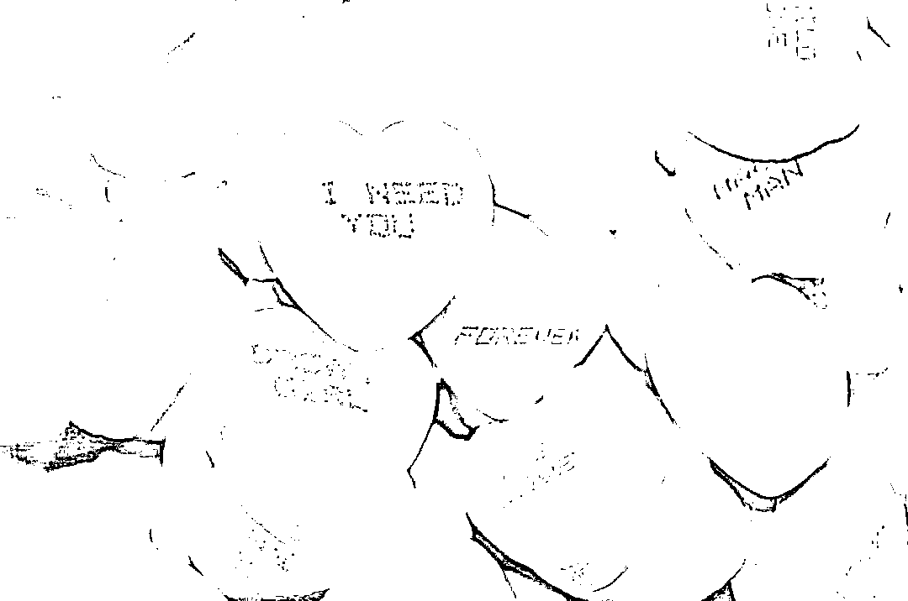

有明确的意图、目标或愿景对他们来说是健康的，也能给予他们所需的稳定感。然而，**他们对于如何实现目标的想法需要保持适应性**——谁知道他们将会需要什么或者事情会怎样展开？

他们需要**抛开关于未来会怎样这种先入为主的观念，只专注于目标。**他们正在学习**让实践先于定义，而不是让刻板的定义限制他们的实践。**

**当他们的想法保持适应性时，他们天生定义一切的倾向会对他们有利。**他们可以粗略地定义当前的情况，看看它们如何与自己的个人梦想适配。但这应该是一个暂时的定义，留下在得到更多信息之后的调整空间。

如果他们定义一种情况的动机是看他们“适合”哪里，他们就会失败，因为**定义成为了一种限制。**如果动机是**看如何最好地将形势与他们的愿景联系起来**，他们就会获胜，因为他们能够接受新的输入。

**拥抱变化**

**双鱼座北交点的人，对可预测性和按部就班感到舒适，对任何变化都有天生的抵触。**即便是晋升，如果是出乎意料的，也可能会被抵触！他们执着于自己的体系，这带给他们一种安全感。不幸的是，这会**引发一种僵化，使他们无法自由体验生活的祝福。**

**在这一世中，这些人正在学习放开他们对“已知”的控制，并欣然迎接变化。**只有当他们有意识地思考自己与“未知”的关系后，才能做到这一点。

如果害怕未知，他们会试图坚持自己的常规，哪怕这样有损自己的利益。当他们处于不愉快的情形下，或者环境开始发生变化，他们需要张开双臂接受。

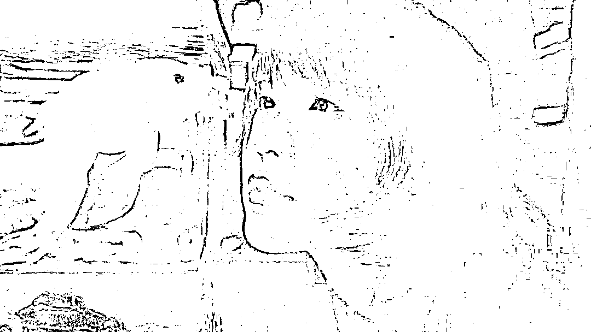

毕竟，也许**现状之所以正在被打破，是因为有更好的东西在等着他们。**如果他们能够承认自己面对的是未知，可能会意识到**周围正在发生的事情，可能是迈向更高层次满足感的一步。**

**事实上，这些人很容易感到无聊，他们需要变化来保持活力和生命力。**他们的**神经系统过于敏感，以致于试图抵制变化或控制周遭就会超负荷，身体或心理就会出现故障**。

因此，**越早放松并接受变化，他们就会越快乐、越平和。**他们的挑战是，允许流经他们生活的变化，重新定位他们，去芜存菁。与其坐着动力船逆流而上，他们需要乘独木舟顺水而行。他们仍然可以掌舵，但不需要对抗水流。

例如，我有一位客户有这个交点位置，为了使他的晨走锻炼更愉快，决定带着孩子一起。仅仅走过几个街区后，他们就遇到了一池水。他的儿子想停下来看，但我的客户想继续走。他的孩子泪眼朦胧，说：“嗯，我累了，不想走了。” 我

的客户因为事情没有按他的计划进行而感到沮丧，威胁说要带儿子回家，再也不带他去走步了。男孩很难过，坐下来看着水。最后，我的客户接受了事实，他们得看看水，否则便无法继续前进。

事实证明，这是个美丽的散步场所！他们停下来看蚂蚁、玻璃碎片和岩石——最后他们确实走了几英里（他沿途跑了一些山路，以使他的心脏得到锻炼）。

他没能按计划进行中等强度的步行锻炼，但他和儿子共度了时光，看到了他之前因为太专注于走路，路过上百次却从来没有注意到的风景。

生活并不总是按照计划进行，但如果这些人顺势而为，实际发生的事情带来的快乐，会比他们以为能从计划中得到的快乐多很多。

**版权声明：**本文由若道翻译发布，欢迎转发，反对抄袭。友号转载请申请白名单。

**简·斯皮勒**

全球占星界的一位领军人物，是美国占星师联盟（AFAN）的教员。她定期在新时代和占星回忆上授课，是畅销书《新月占星学》、《灵魂占星》、《灵性占星学》和《宇宙之爱》的作者。

**20 位来自世界各地的占星师****带来 19 场沙龙——新世界的觉醒****详情可点击下图**

**学习占星学****点击下图了解课程详情**

**微信又双叒叕改版啦，不想错过若道君的推送？**

**就把若道设为星标吧！**

**▼**

**喜欢就点一下“在看”吧！**

********报名直达入口********

# 月亮摩羯座是怎样一种存在？

> 原文：[`mp.weixin.qq.com/s?__biz=MzA5NjA0NTAxNg==&mid=2651481193&idx=2&sn=fd278943edf4c9667cbce54b69ba0253&chksm=8b48d6debc3f5fc83f5461ee2ce9a3a654674000caba1bd0084f4517fe1a88921af139de46c5&scene=126&sessionid=1692737781#rd`](http://mp.weixin.qq.com/s?__biz=MzA5NjA0NTAxNg==&mid=2651481193&idx=2&sn=fd278943edf4c9667cbce54b69ba0253&chksm=8b48d6debc3f5fc83f5461ee2ce9a3a654674000caba1bd0084f4517fe1a88921af139de46c5&scene=126&sessionid=1692737781#rd)

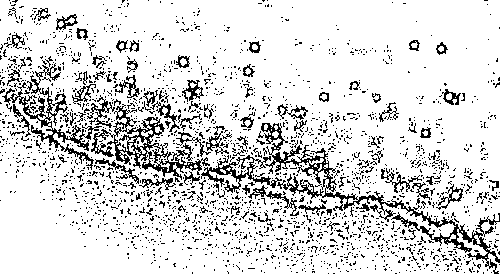

作者/咔咔 ISAR 认证占星师

编辑/玫瑰 图片/pexels 当充满情绪的月亮遇上古板、苛刻的摩羯座，那会是怎样一种存在呢？来看看作者怎么说。咔咔参与教授的【[ISAR 认证职业占星师文凭课程](http://mp.weixin.qq.com/s?__biz=MzA5NjA0NTAxNg==&mid=2651480752&idx=3&sn=b686a9c408d2822d113dfd5a0fb9ce0c&chksm=8b48d007bc3f5911dbc008f07d3e26b4b2a4d56ab80c1b06628c482391e5def46d9c59f35d69&scene=21#wechat_redirect)】报名中，点击链接了解更多详情！**月亮摩羯座**

有朋友留言，说想听我讲讲月亮摩羯座，好像现在的学业上有一些事情让她感到很沮丧。

曾经有一件事也让我很多时候感觉筋疲力尽，我暂时收养了一只三个月的狗狗，北京下大雪的时候他被卡在了一根管子里，疫情期间没办法给他找主人，所以就暂时放在我家。

小狗就和婴儿一样，精力充沛，时刻需要人的关注，表达热情的方式是会咬你的手。三四个月的狗狗还没有形成好的习惯，会在家大小便。**在照顾狗狗的过程里，我发现了月亮在用它的方式工作。****在占星学里，月亮代表了母亲和我们内在的婴儿。**母亲是给予我们生命的人，婴儿刚出生的时候，完全依赖于母亲的照顾，饿了的时候提供乳汁，大小便了要换尿布，哭的时候要抱着它轻轻地拍它轻声地哄它。

因为被月亮式的关怀与照顾，被母亲给予生存的资源，回应情绪的反应，小婴儿因此感到世界是安全的，我是可以被爱的。被爱、被照顾、在生理上和情绪上被滋养，是人类最基本的需求，也是**占星泰斗诺·泰尔所说的，月亮是我们具有统治地位的需求**。

**月亮所在的星座、相位、宫位，描述了我们的体验到的母亲和照料我们的人，我们的家庭和家庭环境。**请注意，这里我们说的是体验到的母亲，而不是母亲作为独立个体的性格。**月亮的配置，还描述了我们的生活习惯、本能、安全感、情绪和感觉。**

我们从这几个层面说说月亮摩羯座吧。★摩羯座

**摩羯座、土星和第十宫，在占星学上有相似的含义，高高的山峰。**刚开始学习占星学的时候，记得老师说，摩羯座和山羊有关，因为山羊善于攀爬最陡峭的山峰。

后来我在网上看到了一张照片，嶙峋陡峭的山壁零星分布着小小的凸起的石块，山羊就站在这些小石块上，一眼望去，好像山羊镶嵌在峭壁上一样。

山峰，陡峭高耸，爬起来特别艰苦，而且非常容易在半山腰感觉绝望、沮丧、无望、挫折，上也上不去，下也下不来，要有自己选的路哭着也得把它走完的决心，忍耐而坚定地继续上路。

**对月亮在摩羯座的人来说，生活就是在攀爬这样的一座山峰，需要决心、毅力和严肃地对待脚下的每一步。**

2019 年最重要的宇宙天象是土星与冥王星在摩羯座的合相，有一部电影《攀登者》，讲述了 20 世纪 60 年代中国运动员攀登珠穆朗玛峰的故事，非常契合当时的天象。

| 电影《攀登者》剧照★月亮摩羯座的家庭

可能从小，月亮摩羯座的家庭给他们传递了这样的一个信息：**life is difficult**，生活不轻松。我的月亮在摩羯座，我记得我父母下班以后在厨房做饭，两个人一边做饭一边交流今天的鸡蛋多少钱一斤。

幼年的我对这个话题印象如此深刻，以至于很久以后都认为每个家庭的父母都关心鸡蛋的价格。

现在想想，可能是当时父母工作得非常辛苦，但是当老师的收入有限，所以要精打细算的过日子，即使如此，打理一个家庭的生活也是不轻松的，甚至可以说是艰难的。

**当然不是每个月亮摩羯座的人都有和我一样的感受，但是早期家庭的氛围可能都有一种摩羯座土星式的沉重感，家庭成员尤其是母亲，特别注重责任，认为照顾孩子不是一个可以被随便对待的事情。**

而且母亲或者主要照顾者在养育这件事上，给自己设立了一个像山峰那么高的标准。

我对待狗狗，也和母亲当年一样，严格按照书本来喂养，特别信赖专家的话。买了七八本书，看网上的训狗视频，还很认真地阅读狗粮成分表，要找到最有营养的狗粮。

但是，当狗狗开始挑食，把头从狗粮碗转开的时候，我会很坚决地掰开它的嘴，想强迫她把该吃的东西吃掉。

现在回想自己当时的那个样子，很像是小时候催促我大口吃饭吃菜，碗里不剩一粒米饭的妈妈，要求我生活作息讲究规则，负起自己该负的责任，行为举止遵守清楚的规范。现在回头看看，可能偏于严格僵化，缺少一些弹性。

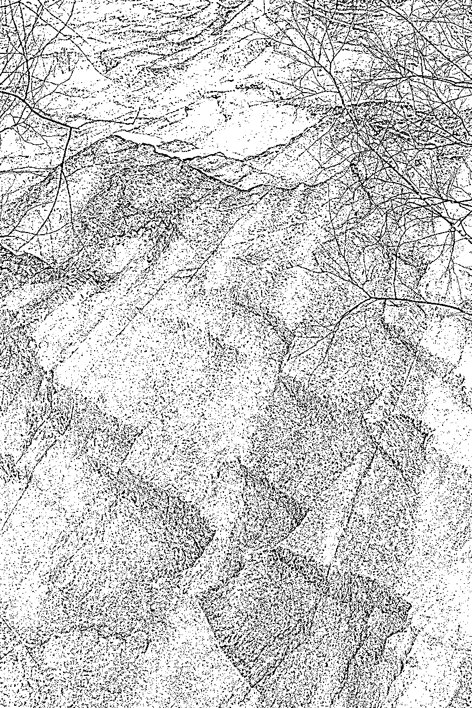

★把所有问题都自己扛

**规范、责任、规则，这就是月亮摩羯座本命的词汇。**月亮摩羯座严肃地对待生活，不相信生活可以是随性的，轻松、可以躺平享受的。

随着时间的增长，我发现，当我过度严肃、悲观和沉重地看待生活，把每件琐事都看成责任和负担，生活果然向我呈现了相同的面貌。

有一些月亮摩羯座的人有胃溃疡的毛病，可能他们的生活被各种事情压得不堪重负，但是他们过度认同自己要对这些事负责，不愿意放手、示弱、求助，压力和焦虑导致了胃部（月亮代表的部位）出现了问题。

**过度认同责任是月亮摩羯座压力的来源**，有句歌词特别生动地描述了月亮摩羯座的习惯，“**把所有问题都自己扛**”。**负起责任和义务，是他们照顾和滋养他人的第一选择。**

摩羯座是个土象星座，是以结果为导向的星座，如果什么事情出了问题，那我们要把它解决掉，而我为你去解决问题，就是我在关心你，照顾你了。

**该怎么办呢？**年纪略大了一些才意识到，别人和你倾诉自己的烦恼，不是期望你去帮他解决，而是他和你在分享自己的情绪和感受，是产生情感联结的一种方式。认为把事情解决了就没有问题了，对方就会开心了，其实是忽视了对方的真实需求。我们可以更多地倾听、共情，与对方在情感上先建立联结，然后再问问，我能为你做些什么呢？月亮摩羯座们，答应我，**以下表达学起来**：

*   你听起来很难过/沮丧/愤怒/绝望/无助

*   你慢慢说，我在听

*   听你这么说，我能感受你是难过/沮丧/愤怒/绝望/无助的

*   抱抱你

*   你太难了

**学习温柔地对待别人之前，月亮摩羯座们需要学习先温柔地对待自己。**在童年被照顾的经验里，妈妈通常会更在意日常生活，吃穿用住，不太关注孩子的情绪。家庭成员有可能也不太习惯表达情绪，认为每个人都要克制和管理自己的情绪。这种体验让月亮摩羯座对自己的感受不敏感，和外界的互动，尤其是两性关系上更加的克制内敛。占星大师斯蒂芬·弗里斯特把月亮摩羯座称为“**身体里面住了一个老妇人**”。

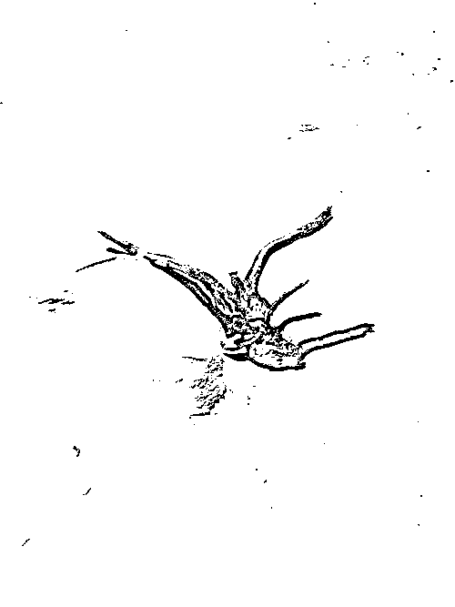

★温柔地对待自己的方式包括***1.***  **关注自己的情绪和身体的感受**今天的感觉，是高兴、愉快，还是紧张、有压力？身体哪个部位是紧张的？我的肩膀经常会感觉僵硬，这会提醒我，我感到压力，有可能我把什么事情想的过于严重了，或者我过度地承担了责任。

**放松僵硬部位的方法非常简单，集中注意力在呼吸上，吸气时关注僵硬的部位，呼气的时候顺着气息放松下来。**几轮呼吸下来，会感觉那个部位有点热或者麻酥酥的。

***2.*****接纳情绪，表达情绪**如果我们去回避脆弱的感觉，将克制和管理自己的情感当做坚强的表现，应该是误解了坚强的真正含义。**真正的坚强是接受自己的情感，感受各类不同的情感。**可能这会让我们情绪崩溃，流泪。但是泪水排出了积累的压力，整个人会感到轻松、真实和自在。当我们对情绪更加清晰、接纳自己的情绪之后，就能和别人表达自己的感受，可以用“我感觉/我感到……”这样的话语开头，而不是月亮摩羯座经常会说的“这件事要怎么解决……”。

**先去感知对方真正的需求，然后再去给他需要的帮助。**我从月亮巨蟹座的朋友身上学到了这个方法，每次当我感觉沮丧和她聊天的时候，她温暖的关怀让我感觉一下子就放松下来。当感觉情绪被支持和接纳的时候，我也自然有了再次面对问题的力量。

***3.*****学习放手和求助**占星大师苏·汤普金斯老师说，月亮摩羯座有与生俱来的组织能力和结构感，能够把任何事处理得井井有条，有明显的实事求是和掌握物质资源的能力。这让**月亮摩羯座在工作和生活里都是一个可以被信赖和托付的人**。我们之前也说了，月亮摩羯座严肃地对待生活，把每件事都看做是责任，设立了非常高的标准，这样也让他们成为困难项目或者处理难办之事的首选。但是环境总有超出人的应对能力的时候，会出现混乱和不平衡，单纯依赖个人的力量是不够的。

月亮摩羯座具有内在的权威感，但是完成一项艰苦的工作不意味着只有月亮摩羯座一个人担负所有的责任。**在适当的时候要放手和臣服，相信生命有更大的力量，相信事物像河流一样，总会奔腾着向前的。**

***4.*****追求成功，也包容挫折**

摩羯座与成功相关，可能月亮摩羯座的妈妈在职场取得了一定的成绩，获得广泛尊重。和妈妈一样，月亮摩羯座的工作和事业也需要成功，走专业性、职业化和路线。攀登顶峰永远充满挑战，**摩羯座的刻苦和毅力帮助他们走的比别人更持久**。

**月亮描述了我们的习惯，所以不管我们的太阳星座指出了怎样一条获得荣耀的道路，月亮摩羯座都习惯于认真、严肃、坚韧地对待。**除非我们躺在那里什么都不动，否则总会犯错和经历挫折。我们在承认“人非圣贤孰能无过”的同时，可以从不同的角度审视挫折。你真的需要为这个错误负责吗？你会从中学到什么新的经验呢？**孤立和苛责不会带来成长**，这个在我个人体验里是非常重要的一课。**愿我们善意关怀自我，善待每个生命。**

**版权声明：**原创文章由作者授权发布于若道平台，欢迎转发，反对抄袭。友号转载请申请白名单。

**咔咔**

职业占星师，若道核心课程讲师

ISAR 认证占星师（2014 年获得）

国际知名广告公司和市场研究公司工作十余年

**微信公众号**：咔星人

长按打赏

******你还可以预约作者咔咔的占星咨询****** ******长按下图二维码预约吧******

**拥有****51 年****占星实践经验的****若道创始人****前 ISAR 全球副主席****前 ISAR 全球职业占星师资质认证主席****大卫·瑞雷**

**和**

**2019 年第二届、2021 年第三届核心课中**

**与苏·汤普金斯老师****联合授课****的**

**ISAR 认证职业占星师**

**咔咔（Caroline）**

**二人合力打造**

**2022 年 ****若道全新核心占星课程**

**点击下图了解更多课程详情** 

**

**20 位来自世界各地的占星师****带来 19 场沙龙——新世界的觉醒****详情可点击下图**

**学习占星学****点击下图了解课程详情**

**

**微信又双叒叕改版啦，不想错过若道君的推送？**
**就把若道设为星标吧！****▼**

**喜欢记得点一下在看哦☟**

**报名直达入口**

# 认证职业占星师文凭课程 L1-3 丨想看大卫老师是怎么做课堂演示的吗？

> 原文：[`mp.weixin.qq.com/s?__biz=MzA5NjA0NTAxNg==&mid=2651481193&idx=3&sn=2c61d86d8d25bf6c78df8321259b8071&chksm=8b48d6debc3f5fc8fa29da7875cd8b40c57cc800aba3b8099d9a355c824e36be53dc85c87454&scene=126&sessionid=1692737781#rd`](http://mp.weixin.qq.com/s?__biz=MzA5NjA0NTAxNg==&mid=2651481193&idx=3&sn=2c61d86d8d25bf6c78df8321259b8071&chksm=8b48d6debc3f5fc8fa29da7875cd8b40c57cc800aba3b8099d9a355c824e36be53dc85c87454&scene=126&sessionid=1692737781#rd)

**在若道核心课程的教学里，****以学员为案例****进行课堂的占星咨询演示，是我们课程的特色环节。**

这样的演示不仅让很多同学有亲身体验咨询的机会，而且这么多真实案例的学习，会让大家看到占星咨询到底是怎么样一个过程。毕竟，大部分人的学习都是要从模仿开始。

记得若道君当年学习占星的时候，可没有这样的机会。那时候主要是听课为主，后来，我们在多年的教学实践中，**越来越发现课堂演示的重要性**。因此，就把这个作为一个主要环节加入到课程中。

在新一期的若道核心课程中，咔咔老师和大卫老师这对组合就会把这个教学特色充分发挥出来。**熟悉中国同学思路的咔咔老师会以知识点的讲解为主，而有 50 年占星咨询经验的大卫老师，则以课堂演示为主。**

有时候，这样的课堂演示的功效是出乎意料的。

一位若道的老同学赵震宇这么写到：

2018 年，我正式开始在若道学习 L1-5。其实我一开始的心态更多的是希望得到系统化的学习来补充我的知识漏洞，以及拿到一个证书可以为自己做背书，增加自己将来转型占星师的筹码，而不是真的在期待可以从若道的学习中得到一些本质上的领悟。

事实上在初期的 L1-3 中，很多知识与课上的内容，也是我比较熟悉的领域，相对而言是驾轻就熟的。但在 L3 的工作坊中和大卫老师的接触以及模拟咨询，让我对占星的态度发生了很本质的变化。

大卫老师对我星图的分析不仅非常准确，更重要的是，他开启了我自身个人成长上的变化，从而成为了我本质上进化蜕变的一个契机。

在短短的 6 个月内，我对人生的认知、对自我的认知、对于人生看待的方式都发生了翻天覆地的质的变化。我意识到了原来跳出自己一直以来无意识间重复的模式，是一件可行、并且会给自己带来无限成长提高自己人生幸福度和质量的事情。这也让我深刻体会到了人本主义占星学的魅力，以及自己之前是多么的“无知“。

于是现在，占星学对我来说，不只是兴趣、宗教信仰、或者是可能的职业道路，而是一种激发自己和他人人生成长和蜕变的工具、一种让自己更幸福的看待世界的方式。哪怕我之后并不会以占星为生，它依然是我人生中不可或缺的一部分，就像一副隐形眼镜，影响着我与世界的互动。

而被大卫老师咨询深深影响的同学还有很多。

**这里，我们节选一些短小的试听片段，让你稍微感觉一下在若道核心课程上，大卫老师的咨询演示是怎样的一个样子。**

**片段一**

<mpvideosnap class="js_uneditable custom_select_card channels_iframe videosnap_video_iframe" data-pluginname="videosnap" data-id="export/UzFfAgtgekIEAQAAAAAAMKsWN6BUygAAAAstQy6ubaLX4KHWvLEZgBPEnoIULgMKKb-DzNPgMItC2ZEgiEDMBYjrYHv9wNsO" data-url="https://findermp.video.qq.com/251/20304/stodownload?encfilekey=S7s6ianIic0ia4PicKJSfB8EjyjpQibPUAXolK65qjuvEtF7VE3LuUIfibNBicR6aZMMfP2lV313icg6MQMfqMQqcPFj2m8Hhw10N65gJT2zkNKurNXqiaaAugQpntw&amp;adaptivelytrans=0&amp;bizid=1023&amp;dotrans=0&amp;hy=SH&amp;idx=1&amp;m=&amp;scene=0&amp;token=cztXnd9GyrEzmuleT8ub88RIicgCkUKW4liadDZCTsricEdF98BQMCWkUTxVevglwsb2TzGGW1rUZ4" data-headimgurl="http://wx.qlogo.cn/finderhead/PiajxSqBRaEJYnVsqWfEX9qA0sI6hNVKsDfyzfPZ92WZMZyBpZWU5NA/0" data-username="v2_060000231003b20faec8c4e68a1ec2d4ca07e434b07755bbf47e7053a3059defd2c9d6c68a20@finder" data-nickname="若道" data-desc="#若道核心课 大卫老师用星座、行星、宫位来探索一位同学出生星盘主题的时候，他回顾了解读星盘的优先次序" data-nonceid="7723748345640460016" data-type="video" data-width="544" data-height="344"></mpvideosnap>

**片段二**

<mpvideosnap class="js_uneditable custom_select_card channels_iframe videosnap_video_iframe" data-pluginname="videosnap" data-id="export/UzFfAgtgekIEAQAAAAAANycuUwRANAAAAAstQy6ubaLX4KHWvLEZgBPEhYJ0WjYILr-DzNPgMIvjhT14ogdLw3BWd0Tg37w0" data-url="https://findermp.video.qq.com/251/20304/stodownload?encfilekey=S7s6ianIic0ia4PicKJSfB8EjyjpQibPUAXoleMEBO7YqRBdVicTyRbZLSODWa2goURzKktJBq1dd5DIVYjlj926F5hsicv1cBaJ9Rv2mYicYQsNBTeicdAYHyJ6QPA&amp;adaptivelytrans=0&amp;bizid=1023&amp;dotrans=0&amp;hy=SH&amp;idx=1&amp;m=&amp;scene=0&amp;token=AxricY7RBHdWzD8K4WOaXSvyp6Ryjm97TQtPI3Gia6U1Ab852A11RvPCu31V9R4GVy7w9ZhPIpmIg" data-headimgurl="http://wx.qlogo.cn/finderhead/PiajxSqBRaEJYnVsqWfEX9qA0sI6hNVKsDfyzfPZ92WZMZyBpZWU5NA/0" data-username="v2_060000231003b20faec8c4e68a1ec2d4ca07e434b07755bbf47e7053a3059defd2c9d6c68a20@finder" data-nickname="若道" data-desc="#若道核心课 占星学如何反应职业选择？" data-nonceid="629392412247480278" data-type="video" data-width="544" data-height="344"></mpvideosnap>

**片段三**

<mpvideosnap class="js_uneditable custom_select_card channels_iframe videosnap_video_iframe" data-pluginname="videosnap" data-id="export/UzFfAgtgekIEAQAAAAAAl_sREJMyhwAAAAstQy6ubaLX4KHWvLEZgBPEtIIkIkRmL7-DzNPgMIsA5PpGB3ReSAYx6ZfSNfZ1" data-url="https://findermp.video.qq.com/251/20304/stodownload?encfilekey=S7s6ianIic0ia4PicKJSfB8EjyjpQibPUAXolicGo48MWlib8wvOFMCMmVRq6heVqPaLZWrZVDpKoE2lcibTklu18ibiabwe5r5MKNnk1B8b1WWwnJJbOKHROCicyOU0A&amp;adaptivelytrans=0&amp;bizid=1023&amp;dotrans=0&amp;hy=SH&amp;idx=1&amp;m=&amp;scene=0&amp;token=AxricY7RBHdWzD8K4WOaXSv7euicLue7HLq5QQtktB0MXqKnDuDFfRdGZicknvicEPXKqiatibVM9Qu1w" data-headimgurl="http://wx.qlogo.cn/finderhead/PiajxSqBRaEJYnVsqWfEX9qA0sI6hNVKsDfyzfPZ92WZMZyBpZWU5NA/0" data-username="v2_060000231003b20faec8c4e68a1ec2d4ca07e434b07755bbf47e7053a3059defd2c9d6c68a20@finder" data-nickname="若道" data-desc="#若道核心课 如何从出生星图的基本要素看到案主生命发展的故事和个人成长经验？
" data-nonceid="6689802853667419635" data-type="video" data-width="544" data-height="344"></mpvideosnap>

**若道新一期的核心课程将在****8 月 30 日****正式开始**，如果你有很浓厚的兴趣，不仅仅是因为好奇想浅尝一下占星学，但还没有想清楚是不是要学习整个 L1-5 的课程，**那么 L1-3 可能是一个不错的选择。**

**谁是你的老师？**

**占星师咔咔（Caroline）**

2010 年师从美国占星师大卫·瑞雷学习，并得到世界名师斯蒂芬·弗里斯特、罗伯特·汉德、苏·汤普金斯传授各种占星学技法。若道首届学员，国内最早获得 ISAR 职业占星师资质的职业占星师，多次担任若道核心课程助教，2019 年第二届、2021 年第三届核心课中和苏·汤普金斯老师一起教授若道核心占星课程。

在国际知名广告公司和市场研究公司从事的市场研究和推广工作十余年，曾任职于阳狮集团、尼尔森市场研究有限公司、MTV 和《Madame Figaro》杂志。

**大卫·瑞雷（David Railey）**

*   **I****SAR 董事会成员，ISAR 全球副主席，ISAR 全球职业占星师资质认证主席，若道占星创始人**。

*   2016-2019 年，被选为国际占星协会（ISAR）考试委员会成员，国际占星协会（ISAR）是世界最大的国际占星机构，会员遍布 47 个国家。

*   2017-2020 年，被选为国际占星联盟（ISAR）考试委员会主席，理事会成员。

**助教王嘉祺 （Conrad）**

ISAR 认证占星师、若道认证生时校正资质，从 2010 年起自学占星学，2015 年开始在若道系统学习，并开始个案咨询。2018 年担任若道核心课程助教，以及卜卦占星学和太阳返照选修课助教，并带领学员进行经世占星和太阳返照方面的研究。2019 年 11 月作为演讲人之一参加了国际占星协会（ISAR）北京大会，也是 ISAR 星空俱乐部中国区第 16 期的主讲人。

**内容是什么？**

**ISAR 认证职业占星师的独有培训**

目前占星学的培训市场鱼龙混杂。而 ISAR（国际占星研究协会）是一个包含了 47 个国家在内的国际占星组织，多年来致力于占星的教育和研究，提升占星教育的品质和职业占星师的能力，在国际占星领域备受尊重。

**2022 年，鉴于对若道在占星教学领域所做的持续努力和高品质的课程服务，ISAR 特别授予若道核心课程为 ISAR 文凭课程，所有在若道学习，并通过若道毕业考试的同学将获得 ISAR 颁发的学历文凭（Diploma）。**

如果你想更多了解 ISAR，请点击[【这里】 ](http://mp.weixin.qq.com/s?__biz=MzA5NjA0NTAxNg==&mid=2651475298&idx=1&sn=b91888b54c14e29068f8b4e2a3452f5d&chksm=8b48ffd5bc3f76c32699f20f5c99e978bbb25551e69d80c70fee361acbd930ba5970ae776cdc&scene=21#wechat_redirect)

**开课时间和课程费用**

**８月 30 日开课，每周一次，20:00-22:00，25 节课+2 天工作坊。**

**★ 1-3 阶 连报**

**早鸟价：10500 元（2022 年８月１日之前）**

**课程费用：11500 元 **

**你也可能想学更初阶或者更高阶：**

**★ 1-2 阶　**

**早鸟价：2800 元（2020 年８月１日之前）**

**课程费用：3500 元 ****★ 1-5 阶　连报**

早鸟价：33000 元（2020 年８月１日之前）

**课程费用：46500 元 **

**退转课程**

**退款原则请详看《教学协议》，如有疑问请咨询课程顾问。**

****2022 L1-3 认证职业占星师文凭课程****

**授课老师：大卫·瑞雷、咔咔**

**直播课开课时间：2022 年 8 月 30 日（周二）**

**授课方式：******网络授课，英文/中文授课，中文翻译****

**费用：**11500 元**（早鸟价 10500 元,8 月 1 日前）**

**课程负责人：王老师**（微信/手机：18510107057，请备注“大卫核心课”）

长按二维码添加课程负责人咨询

****报名直达入口****

# 神话塔罗之大阿卡纳牌｜力量

> 原文：[`mp.weixin.qq.com/s?__biz=MzA5NjA0NTAxNg==&mid=2651480958&idx=4&sn=0ad9cd364618fce0c13e4ee6a40a2d5f&chksm=8b48d1c9bc3f58df22be2eab941ab35849ba8488b0d9b5fe2724d22a206f2afcd9db2201e481&scene=126&sessionid=1692737781#rd`](http://mp.weixin.qq.com/s?__biz=MzA5NjA0NTAxNg==&mid=2651480958&idx=4&sn=0ad9cd364618fce0c13e4ee6a40a2d5f&chksm=8b48d1c9bc3f58df22be2eab941ab35849ba8488b0d9b5fe2724d22a206f2afcd9db2201e481&scene=126&sessionid=1692737781#rd)

作者/朱丽叶·沙曼-伯克 丽兹·格林

译者/闫东升 编辑/玫瑰 图片/神话塔罗 网络

本文节选自《神话塔罗》

神话塔罗牌根据文艺复兴时期艺术家和作家们喜爱的希腊诸神，通过重新设计牌面，让塔罗牌恢复其原始的质朴性和普及性。力量牌的设计就源自于大力士赫拉克勒斯征服猛狮的希腊神话。今天就来解读大阿卡纳牌——力量。

[🔈 神话塔罗·力量](https://res.wx.qq.com/voice/getvoice?mediaid=MzA5NjA0NTAxNl8yNjUxNDgwOTU2)

**｜**朗读者小巫

**书名：**

神话塔罗 

**作者：**

朱丽叶·沙曼-伯克   丽兹·格林 

**出版日期：**

2011-08-02

力量对应的希腊神祗**赫拉克勒斯·大力士****所向披靡的大力士**

力量牌描绘的是一个强壮有力的男人，长着一头栗色卷发，身上只围了一条红色的腰布。他正在和一头雄狮搏斗，用他强壮的手臂紧紧夹住它的喉咙，画面显示出这个男人此时正处于赢得角逐的关键时刻。

搏斗现场的四周是一个布满岩石的黑暗山洞，从远处的洞口望去，外面是棕色的山峦，贫瘠而荒凉。

> **赫拉克勒斯（*Heracles*）赤手空拳和雄狮搏斗**：没有使用任何工具，也没有任何辅助，只有他自身的资源。 
> 
> **赫拉克勒斯身穿的腰布是血红色的**：血红色属于战神阿瑞斯，我们在战车牌中遇见过他，这说明愚人已经学会了运用侵略性，因此可以有创造性地利用它了。 
> 
> **阴暗的山洞**：象征着潜意识的黑暗，其中隐含着原始的本能，日常的意识无法看到它。

**征服刀枪不入的尼米亚巨狮**

力量牌中的勇士是赫拉克勒斯，罗马人称他为海格力斯（*Hercules*），是神话中所向披靡的英雄人物。他是众神之王宙斯（*Zeus*）和人类女性阿尔克墨涅（*Alcmene*）的儿子。

和往常一样，宙斯的妻子赫拉（*Hera*）对于丈夫和阿尔克墨涅通奸并生出儿子的事情妒火中烧，决定给予这个孩子非常严重的惩罚。 

她用手段逼疯了赫拉克勒斯，疯狂的赫拉克勒斯又在无意间杀死了自己的妻子和孩子。

他清醒以后极度悔恨，祈求神灵给予他赎罪的机会，来自特尔斐的神谕命令他去给邪恶的国王欧律斯透斯（*Eurystheus*）完成十二个艰苦的任务，这也是赫拉最想看到的结果。

就这样，所向无敌的英雄心甘情愿地成为了女神的仆人，而这个女神却是他所犯罪行的始作俑者。

国王欧律斯透斯要求赫拉克勒斯去完成的第一个（也是最著名的）任务是征服尼米亚猛狮（*Nemean Lion*），这头巨狮身上的皮毛是刀枪不入的，它几乎吃光了附近的人们，所以赫拉克勒斯找不到人询问它的老巢在哪里。

经过很长时间的寻觅，他终于找到了身上还沾满猎物血迹的狮子。赫拉克勒斯先是对着它射出一箭，却没有对巨狮造成分毫的伤害。他又尝试用刀剑和棍棒攻击，结果自然也是铩羽而归。巨狮躲进了一个有两个出口的山洞里，赫拉克勒斯用网堵住了其中一个洞口，自己则从另一个洞口钻了进去，搏斗中巨狮咬掉了他的一个手指头，而他则成功地用双手牢牢地掐住巨狮的喉咙，直到它死去。赫拉克勒斯利用狮子锋利的爪子剥掉了它的皮，制作了一套盔甲穿戴在身上，于是他获得了巨狮刀枪不入的能力。

**与原始的动物性同行**

**从内在的层面来看，赫拉克勒斯和尼米亚巨狮搏斗的意象，反映出每个人内在强大和原始的动物性一面带来的问题，但是我们不能消灭它，因为它也是我们的创造力和生命力。**

狮子是一种特别的动物，它象征的心理面相和战车牌中顽固的战马并不相同。狮子在神话中一直和皇权有关，即使在它最有破坏性的时候，也反映着人们独特个体性中幼稚的、原始的自我中心特质。

尼米亚巨狮并不完全是邪恶的，它刀枪不入的皮毛能够让人们战无不胜，这种特质反映出人们内在的某种恒久性，它来自于一个稳固的“我（*me*）”的感觉。

当我们披上被我们征服的巨狮的皮毛时，外界的一切都会变得渺小，因为我们内在拥有了坚不可摧的自我身份认同。 

当巨狮的力量还处于原始和邪恶的动物性状态时，它的正面力量就还是潜在的，没有被发挥出来。“唯我独尊”的这一面驱动着人们毫不留情地摧毁着欲望之路上的所有事物，从而获得自我的满足。

暴怒是它的一种表现形式，在很多人生境遇中，怒火都带来负面的结果，它不管是非对错，只是不顾一切地摧毁满足欲望的任何阻碍。

自大也是它的一种表现形式，自大和自尊不同，它夸大和膨胀了自我的重要性，使我们失去该有的明智，幼稚和冷酷地对待那些我们必须依赖的事物。巨狮的意象在很多层面上都像我们内在那个愤怒的婴儿，要求世界围着我们打转，只要碰到任何反对和阻抗就盲目地攻击和破坏。如果我们征服了这头巨狮，就会获得它神奇的皮毛，用心理学的术语说，**就是把动物性的生命力整合到意识中，让它为有意识和负责任的自我服务。****因此，赫拉克勒斯和巨狮搏斗的目的是征服，而不是杀戮，这是一个转化的过程，使动物性的力量和欲望以人类的方式表达出来**。这就是力量牌所象征的矛盾性，赫拉克勒斯不能杀死巨狮，因为杀戮并不会带来任何好处。我们每个人内在都有赫拉克勒斯的黑暗面，意即一味压抑动物性的本能，而不是去转化它，这样做的后果就是在我们心灵的外面形成了一个坚硬的壳子，没有了愤怒，没有了热情，也没有了真正的自我身份。**力量，内在的勇士**

**从解牌的角度来看，力量牌出现的时候，暗示着当事人需要和内在的狮子正面交锋，他（她）要用创造性的方式面对自己内在的愤怒和自大**。

勇气、力量和自律在这时都是非要必要的。通过此时的人生境遇，当事人可以和自己内在的动物性相遇，同时也能看到内心的赫拉克勒斯，他是每个人都拥有的内在勇士，认同他就可以征服巨狮。

愚人在发展出理智和情感的能力后，现在要学习面对自己凶猛的自我主义了，如果赢得了这场搏斗，他就能够用信任和正直去面对自己和他人。

**版权声明：**本文由《自在园》授权发布，欢迎转发，反对抄袭。友号转载请申请白名单。

**朱丽叶·沙曼·伯克**从 20 世纪 70 年代早期开始，就对塔罗牌产生了兴趣，并踏入了塔罗的世界。后来，在丽兹·格林的鼓励下，开始研习心理占星学和塔罗。1984 年，第一本书《塔罗全书》（The Complete Book ofTarot）出版。之后，与丽兹·格林合作设计并撰写了《神话塔罗》（The Mythic Tarot）。朱丽叶写了十本塔罗和占星学书，包括一本名为《众星的传说》（Stories from the Stars）的儿童读物，以及与丽兹·格林合著的《神话之旅》（The Mythic Journey），这是一本详细讲述如何运用神话来指导生活的书。

**点击下图了解课程详情** 

**微信又双叒叕改版啦，不想错过若道君的推送？****就把若道设为星标吧！****▼**

**喜欢记得点一下在看哦☟**

************报名直达入口************

# 神话塔罗之大阿卡纳牌｜命运之轮

> 原文：[`mp.weixin.qq.com/s?__biz=MzA5NjA0NTAxNg==&mid=2651480958&idx=5&sn=dd2aa581206ac9ad25dedade0bc83a17&chksm=8b48d1c9bc3f58df14478c0ccb2475cb65215d28c080cf32a64ea5e3b451413dc73bbeadce18&scene=126&sessionid=1692737781#rd`](http://mp.weixin.qq.com/s?__biz=MzA5NjA0NTAxNg==&mid=2651480958&idx=5&sn=dd2aa581206ac9ad25dedade0bc83a17&chksm=8b48d1c9bc3f58df14478c0ccb2475cb65215d28c080cf32a64ea5e3b451413dc73bbeadce18&scene=126&sessionid=1692737781#rd)

作者/朱丽叶·沙曼-伯克 丽兹·格林

译者/闫东升 编辑/玫瑰 图片/神话塔罗 网络

本文节选自《神话塔罗》

神话塔罗取材于希腊诸神，它们是描绘多面多彩的人类心智活动中最基本、最全面的图像。它们象征着原始自然，也象征着我们原始的人类本性，这种本性中蕴藏着身体与精神的矛盾。

命运之轮的轮转，人生的高低起伏，这个人类逃不开的话题，在神话塔罗中和命运三女神有着不可割裂的关系。今天就来解读大阿卡纳牌——命运之轮。

[🔈 神话塔罗·命运之轮](https://res.wx.qq.com/voice/getvoice?mediaid=MzA5NjA0NTAxNl8yNjUxNDgwOTU3)

**｜**朗读者小巫

**书名：**

神话塔罗 

**作者：**

朱丽叶·沙曼-伯克   丽兹·格林 

**出版日期：**

2011-08-02

命运之轮对应的希腊神祗

**摩伊莱·命运三女神**

**命运三女神**命运之轮牌描绘了三个在黑暗的洞穴中坐着的女人。第一个女人很年轻，她正在从一个金色的纺锤中抽线。第二个女人成熟优雅，她在用双手测量线的长度。第三个女人已经年迈，手中举着一个剪刀。她们三个中间是一个金色的轮盘，轮盘的边缘上有四个很小的人体，姿势各不相同。通过她们背后的洞口，可以看到外面是一片翠绿富饶的土地。

> **摩伊莱（*Moirai*，命运三女神的统称）**：抽取、测量和剪切的线比喻着构成身体的元素，洞穴象征着子宫，因此牌面的核心反映着命运和遗传与身体有紧密的关联。
> 
> **摩伊莱三个不同年纪的形象**：呈现出月亮周期的不同阶段，从开始的上弦月到中间的满月，又到最后终将回归黑暗的下弦月，对应着人生的三个阶段。
> 
> **洞穴**：除了象征子宫外，还象征着坟墓，也就是命运的起点和终点。

**无可躲避的生命之线编织者**在这张牌中我们和希腊神话中的摩伊莱——命运三女神相遇了。摩伊莱是黑夜之母（*Mother Night*）的女儿，她们并没有父亲。其中克罗托（*Clotho*）是纺织者，拉克希斯（*Lachesis*）是测量者，阿特洛柏斯（*Atropos*）是剪切者，后者名字的含义是“没有人能够躲开她”。命运三女神在她们隐秘的黑暗洞穴中编织着人类的生命之线，没有任何神可以干涉她们的工作，即使伟大的宙斯（*Zeus*）也不例外。

只要任何人的命运被织好，就是无法挽回的事实了，而且也不能被更改，生命的长度和终点是三位女神一起决定的。如果任何人想挑战命运，就像古往今来很多英雄人物一样，那他（她）通常会受到可怕的惩罚，因为摩伊莱设定的限制是严禁任何人跨越的。

在神话中，据说太阳神阿波罗（*Apollo*）曾经嘲笑过摩伊莱，他不怀好意地灌醉了她们，试图让好友艾德米塔斯（*Admetus*）免于死亡。

据说宙斯非常敬畏命运三女神，因为她们是黑夜之母独自孕育出来的孩子，和任何其它的神都没有关系，而且黑夜之母是宇宙最古老的神秘力量。

**人生没有偶然**

**从内在的层面来看，摩伊莱掌握的命运之轮象征着在每个人身上都运作着的一种非常隐秘和神秘的律则，人们无法看到和了解它，似乎它给人生带来的忽然的改变，一下子就颠覆了已经建立的生命模式。**

命运之轮牌面上轮子边缘的四个人体形象，象征着不同的生命经验，它反映着当灵魂进入生命之轮时，第一反应并不是去探寻它背后的根源，而只是跟随着命运的改变做出反应。

轮盘顶部的那个人已经通过轮盘的转动到达了成功的巅峰，而轮盘底部的那个人则认为自己遭到了“噩运”，其实他们都只是在某种神秘的模式中不断变换着位置罢了。轮盘右边的那个人开始向上攀登，一种神秘的、不可见的力量在帮助他（她），其实也是这种力量使上面的人到达巅峰，使下面的人跌入噩运；而轮盘左边的人开始下落，这当然违背了他（她）的意愿，但随着轮盘的旋转，他（她）的“好运”已经享用殆尽了。其实命运之轮牌并不是为了呈现人生的机遇、改变或运气的急速变化。**在摩伊莱代表的命运之轮背后，是一个有秩序和善巧的计划，只是从生命的表象看来，好像一切变化都是偶然的。**

这些远古的形象一直保存在我们内在潜意识的深处，所以个体意识无法看到，更无法明白。我们只能通过它对外在的影响力来了解，看起来就像命运一样，其实外在的命运并非源自于外在的力量，而是来自于每个人的心灵深处。

人们对命运之轮的体验，在本质上是对自己内在的“他者（*Other*）”的体验，通常情况下我们把“他者”投射到外在世界里，然后把噩运责怪到他人或生活境遇上，把自己完全置身事外。

命运之轮的旋转强迫我们去觉知到内在的“他者”，意即转轮背后的善巧和秩序，就是每个人承载着的命运。转轮的意象非常深奥，环形的外围象征着每个人生命之路的全景，转轮的中心则象征着不变的本质或根源。

因此，转轮的中心就像隐藏起来的本我（*self*），是它选择［不是意识自我（*ego*）的选择］了让自己通过旋转来遭遇各种事件、人物、路途和环境。可以说不是命运降临在我们头上，而是我们走向了命运。

在女祭司牌中，愚人遇到了自己内在的直觉能力，它化身为珀尔塞福涅（*Persephone*），让愚人可以一窥潜意识的力量。

在命运之轮这张牌里，愚人了解了命运的编织模式和不变的中心点，它无形无相又遥不可及，比最古老的神祗更加年长，却拥有众神之王都不敢挑战的力量。

希腊神话中的命运三女神，即使精神的力量都要服从她们，人类的自满和掌控的幻想在她们面前简直不堪一击。 有些人在了解塔罗、占星或其它预言的艺术时会觉得不安甚至恐惧，可能部分原因是来自意识人格中的焦虑造成的，因为意识人格是日常生活中的决策者，它拥有万能的幻想，当面对潜意识深处的“他者”时，很容易产生焦虑和恐惧。尽管这种力量来自我们内在，但却不属于我们能力所控的范围，就像宙斯也不敢挑战摩伊莱一样。**命运之轮不仅仅是改变的一个预示，它更是愚人（也就是我们每个人）的深入内在之旅的使者，带领他一步步走向宿命的安排。****命运之轮，无可选择的改变****从解牌的角度来看，命运之轮牌预示着运气上一个突然的变化。它可能是“好的”，也可能是“坏的”，但当事人都要步入生命之路上一段全新的旅程了。**我们无法预测什么样的事会发生在自己头上，或者更准确地说，我们无法预测自己会走向怎样的境遇。但是在改变的身后伫立的就是摩伊莱——每个人命运的本质。愚人终将在自满的状态中被一脚踢开，朝着他自己命运的源头跌落。

**版权声明：**本文由《自在园》授权发布，欢迎转发，反对抄袭。友号转载请申请白名单。

**朱丽叶·沙曼·伯克**从 20 世纪 70 年代早期开始，就对塔罗牌产生了兴趣，并踏入了塔罗的世界。后来，在丽兹·格林的鼓励下，开始研习心理占星学和塔罗。1984 年，第一本书《塔罗全书》（The Complete Book ofTarot）出版。之后，与丽兹·格林合作设计并撰写了《神话塔罗》（The Mythic Tarot）。朱丽叶写了十本塔罗和占星学书，包括一本名为《众星的传说》（Stories from the Stars）的儿童读物，以及与丽兹·格林合著的《神话之旅》（The Mythic Journey），这是一本详细讲述如何运用神话来指导生活的书。

**点击下图了解课程详情** 

**微信又双叒叕改版啦，不想错过若道君的推送？**

**就把若道设为星标吧！**

**▼**

**喜欢记得点一下在看哦☟**

************报名直达入口************

# 今日牌阵推荐 | “爱之像”：你既可以爱，又可以被爱，这是世界上最美好的事情

> 原文：[`mp.weixin.qq.com/s?__biz=MzA5NjA0NTAxNg==&mid=2651480958&idx=2&sn=de3233d7bd40f2f06ec656c33e754458&chksm=8b48d1c9bc3f58df9ca7f964239a46d064c63dda2498e6e1fbf394bb9b114b13b2b5274d9e36&scene=126&sessionid=1692737781#rd`](http://mp.weixin.qq.com/s?__biz=MzA5NjA0NTAxNg==&mid=2651480958&idx=2&sn=de3233d7bd40f2f06ec656c33e754458&chksm=8b48d1c9bc3f58df9ca7f964239a46d064c63dda2498e6e1fbf394bb9b114b13b2b5274d9e36&scene=126&sessionid=1692737781#rd)

**若道神话塔罗 H5 惊喜上线****文末有扫码通道哦**

当你孤身于人潮之中，总有那么一瞬间，想要被爱拥抱。**这个牌阵能帮助向往爱情的你评估自己的现状，做好准备，迎接新恋情的到来。**

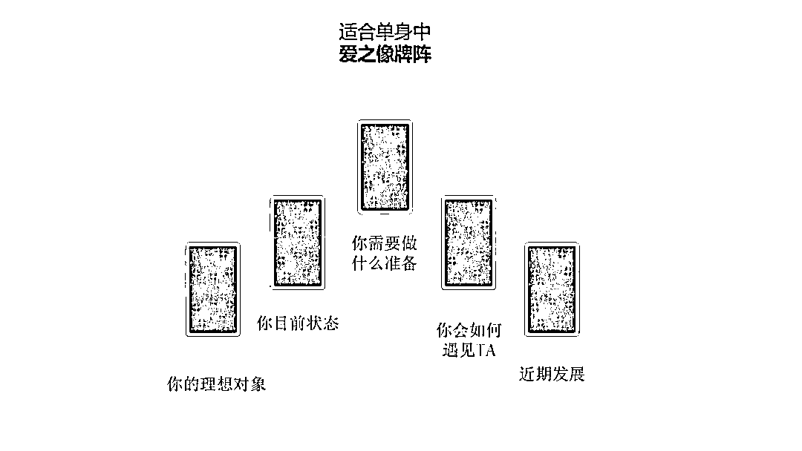

“爱之像”牌阵咨询案例解读

案主是一位刚结束了感情的女生，想尽快走出阴霾，期待新的恋爱关系，并且想在进入关系之前了解自己，寻求建议。

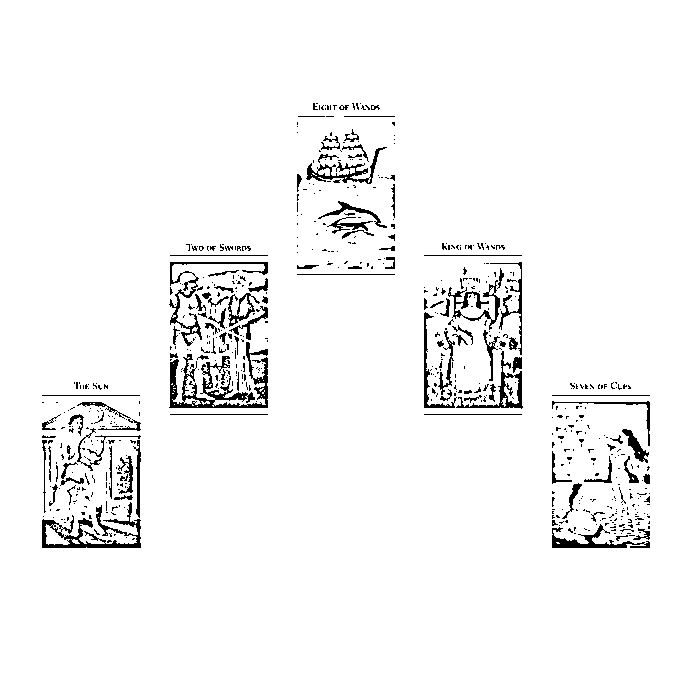

**1****理想对象：太阳****是非常阳光、乐观的人，热爱音乐或其他艺术。****太阳牌****描绘的是一个英俊潇洒、身材匀称的经典美男子形象，智识上也是具有远见的，能看到很多事情背后的原因和目的，有驱散黑暗带来光明的能量，温暖人心。还有一个好消息：****阿波罗每年秋天都会离开他的圣殿德尔斐，游历到神秘的北方净土，要好好把握这个秋天。****2****目前状态：宝剑 2**反映着案主一种瘫痪的状态，**两股对立的力量制造出了一种停顿，**可能是期待爱情又享受单身的矛盾心态，**不愿意打破现状，**宁可闭上眼睛和捂上耳朵，无视渴望的存在。可能是过往感情中的一些创伤还没有完全愈合，或者原生家庭中父母的情感模式带来的顾虑，可以先尝试解决或接纳这些影响，再迎接新的感情。**3****需要的准备：权杖 8****权杖 8 象征着创造性能量克服了焦虑和挣扎之后，进入了释放的状态中。**矛盾和冲突能够激发创造性想象力，如果能够面对冲突并看透它，就会进入一段平稳前行的状态，计划能够朝向目标顺利并快速地进行，带来乐观和自信的感觉。画面中船航行在风平浪静的海面上，船上是众人拾柴火焰高的景象，鱼跃而出的海豚也是成双成对，**除了需要用创造性能量面对冲突克服焦虑以外，也可以告知并留意身旁亲朋好友的支持和帮助。****权杖 8 也可能暗示着旅行，**多安排一些出行游玩也是不错的准备。**4****如何遇见：权杖国王****权杖国王牌中的忒修斯象征着热情如火的精神，**它能够让一个男人或者女人成为真正的领袖。**这张牌也对应这白羊能量，**具有火热的精神，忒修斯不是一个鲁莽的年轻男人，他是一个战略家，一个世间大事的掌控者，这是因为他不仅拥有愿景，还拥有稳定的力量去呈现它们，他热情并有影响力的人格特质能够使其他人信服。他不能够忍受限制和缺乏耐心，总是认为自己是正确的，所以他是一个输不起的人。**可以多参与一些竞争性的活动，**比如体育活动、竞技游戏，留意活动中表现出火象特质的潜在对象，或者激发出自身的白羊能量。**5****近期发展：圣杯 7**圣杯 7 描绘的是女神阿弗洛狄忒现身于普绪克面前，告诉她如果要赢回厄洛斯的爱，就必须完成一些任务。阿弗洛狄忒从海中升起，指着面前漂浮在云端的七个圣杯。普绪克跪在岩石上，看着眼前的阿弗洛狄忒 ，接受爱之女神给予她关于爱的神圣教诲。这张牌隐喻着“空中楼阁”，**案主内心的直觉会意识到将来有很多可能性，但是这些可能如果落实，就需要付出许多艰苦的努力。****也代表着要清晰的梳理出自己期待的伴侣和感情具有哪些特质，在自己内心绘制出一张“灵魂伴侣寻宝图”，**这张寻宝图也是一张**自我精进的计划书，**期许越清晰，努力越精准，吸引来的伴侣才有可能越匹配当下的情感需求。**祝好运！**

**如何预约塔罗师咨询？****扫码进入全新神话塔罗 H5**

每天有事没事都可以去**神话塔罗 H5**里转转抽取专属于你的今日塔罗

**神话塔罗 H5 问答平台全新上线**

三张牌牌阵，专业塔罗咨询师语音条解读

如果你碰巧有困惑，刚好有**限时优惠价**

如果感到快乐你就用用**神话塔罗 H5****，**如果你感到不快乐，更要使用由专业人本主义塔罗师团队全程陪伴的**神话塔罗 H5 哦！**

**想入驻若道塔罗平台成为职业神话塔罗师？****2022 年最新《神话塔罗认证课程》报名中****点击下图了解课程详情哦~**

# 神话塔罗丨一种古老的疗愈工具，也帮助我们与潜意识进行链接

> 原文：[`mp.weixin.qq.com/s?__biz=MzA5NjA0NTAxNg==&mid=2651480958&idx=3&sn=bdf64587107636c92ca44fdbe8187e15&chksm=8b48d1c9bc3f58df39392f53f862b41749fb3e65ad242eae379810665f0741079a28e597d19c&scene=126&sessionid=1692737781#rd`](http://mp.weixin.qq.com/s?__biz=MzA5NjA0NTAxNg==&mid=2651480958&idx=3&sn=bdf64587107636c92ca44fdbe8187e15&chksm=8b48d1c9bc3f58df39392f53f862b41749fb3e65ad242eae379810665f0741079a28e597d19c&scene=126&sessionid=1692737781#rd)

1

**塔罗牌是什么？**

**它是用来干嘛的？**

塔罗牌是一种**古老的疗愈工具**，同时也是**直观的解惑工具****；**

塔罗牌绕过逻辑思维，**和潜意识联结**，通过图像的方式生动地将隐藏在人类潜意识中的画面浮出水面，**揭示心灵的状况和运作****；**

塔罗牌**帮助我们和潜意识对话**，可以和现代的心理治疗联系在一起，帮助我们**看清心灵的冲突来源、本质和可以选择的道路；**

塔罗使用的过程并不繁琐，通过**“提问、洗牌、抽牌、解牌”**的方式来显现你的潜意识，给予问题明确的分析和建议。

2

**塔罗原理是什么？**

**它为什么这么准？**

塔罗是通往意识的工具，通过图画**帮助我们和潜意识对话**，可以和现代的心理治疗联系在一起，帮助我们**看清心灵的冲突来源、本质和可以选择的道路**。塔罗的心理投射也对应荣格的**“共时性原理”**：看似偶然的事物之间有着必然的联系。塔罗牌又和更广阔的**宇宙生命原型**联结，彰显**个人生命发展的阶段**，将个人**生命挣扎、内在冲突**放在生命进化的道途上，让更广大的生命智慧为个人成长照亮道路。

3

**塔罗预测是什么？**

**它如何帮助我？**

塔罗牌预测的运作就像是**照向心灵的一面镜子**。在塔罗牌解读时，图像的原型性质穿透隐藏的潜意识脉络，反应出与个人境遇相关但又未被了知的知识与洞见，因此**揭示出按照任何理性方式都无法发现的事情**。塔罗可以在你人生各个阶段，基于不同状态，针对具体困惑给予指引的神奇工具，运用古老的智慧工具**解码人生卡点，多维度去看待问题和生命的全貌性，推敲心理动线，更好地梳理生活。**如果你对生命好奇，塔罗学习会帮你**打开一扇通往未来的门**，让你了解**心灵运作和显化的秘密**，同时赋予你更多关于生命成长的支持和指引的能力！

4

**什么是神话塔罗？**

**它和其它塔罗有什么区别？**

神话通过**图像和故事**描绘人类生活的**原型模式**。通过瑰丽的想象、诗意的语言、栩栩如生的人物和故事描绘出我们内心的世界，表达出我们经历的那些实现人性的过程，帮助我们将**个体的生活与人类古老且永恒的故事**建立联结。从而在更深处**理解生命**，并学习**古老而长青的生命智慧**。跟其他塔罗相比，神话塔罗在**塔罗体系**基础上融合了**神话原型、占星原型、心理学原型。**学习、解读、内在成长的**维度更丰富立体。****神话塔罗**取材于**希腊神话**的无尽沃土，通过故事提供一种**记忆辅助**，在心理和预见层面提升解读的**丰富度**。因为这样更符合塔罗牌的性质，符合人类的想象。**按照故事思考，而不是简单的记忆关键词和固定的意义**。

5

**神话塔罗难学么？**

**能不能快速上手？**

神话塔罗认证课程，**不需要任何塔罗、占星、心理、神话基础**，这些知识朱丽叶老师都会在课程中教授，“兴趣是最好的老师，坚持是最大的成功。”塔罗咨询这项门栏不高，却能带来多重回报的“冷门技能”已经被越来越多人发觉，如果你为之心动，不如赶紧行动，初学者在经验丰富的导师教导下学习成果事半功倍，是小白亦能够掌握的课程，只要配合学习进度，不存在学不会的情况**，录播课有专业助教答疑，直播课老师亲自答疑，案例督导，****让你更自信的开展咨询工作，学以致用。**

6

**哪些人适合学神话塔罗？**

**为什么学神话塔罗？**

**1、对塔罗感兴趣的学员**，与其自习研究弯路多多，不如一步到位系统学习；**2、占星咨询师，**可以丰富咨询维度，通过图像更深入的和个案沟通交流；**3、心理工作者**，塔罗牌的原理本身也是心理投射，用于心理辅导是很棒的互动工具；**4、看重授课老师专业水平和能量层级的学员，**神话塔罗创始人亲授，金牌背书；**5、希望更加了解自己和他人内心世界**，想掌握这个疗愈工具自我探索和成长，帮助有困惑的人；**6、成为专业的塔罗师**，想从事这份事业，不论是兼职或全职，增加收入，打造长久稳定抗风险的现金流。

7

**神话塔罗咨询前景？**

**为什么看好它？**

塔罗行业现状鱼龙混杂，有的塔罗爱好者未经过系统学习，无占卜实力，占卜依赖“说明书”一知半解靠运气解读，无法积累实占经验和个人信誉。神话塔罗进入中国市场不久，由创始人亲自教授，**知识体系扎实靠谱，咨询技术纯正丰富，市场认可度高**，让您**无忧起步**，自信的在自我成长过程中成为他人的**塔罗照路人**。有些朋友经过系统的塔罗课程学习后成为**杠杆青年**，将塔罗咨询作为**副业**，无需店面，工作之余在家里就可以进行咨询，多一分收入欣喜满足。也有些学员完成课程后将塔罗咨询发展成**全职事业**，拥有自己的工作室，整合微信、微博、小红书、短视频等自媒体运营，线上线下年收益百万。**疫情环境下，副业刚需**，对于我们未来的事业需要有所规划，而塔罗咨询符合理想职业的所有条件，上手快、无需固定办公地点，是随时随地可接单的自由职业，经营打造属于自己长久稳定可发展的现金流。

8

**神话塔罗认证是什么？**

**如何获得高含金量认证？**

2022 年超高含金量的神话塔罗认证课程强势回归课程内容体系让你**直观精准**的感受**神话塔罗的魅力**扎实的建构**神话塔罗思维****系统**学习**最地道的塔罗知识****联报全阶课程，学成可获得有神话塔罗创始人颁发的****英国神话塔罗认证证书****，也是****若道塔罗毕业证书。****行业内超高含金量双背书。****若道还为塔罗学员开发了****“神话塔罗”APP****，是随身的工具，更是接咨询的平台，****录播课程****学成入驻平台****即可链接更多塔罗个案，发展壮大你的塔罗咨询事业。**

**如果你想学习塔罗，什么样的老师会让你怦然心动呢？她是三副塔罗牌的设计者，写了 6 本塔罗书籍。她研习塔罗四十余年，教授塔罗三十余年，是丽兹·格林的密友。还有****谁会比塔罗牌设计者更了解塔罗的历史、灵魂与精髓？****所以，这将是你开启塔罗之旅最坚实的一步。**

9

**你将跟随哪位大师学习神话塔罗？**

**我的老师是谁？**

****

**朱丽叶·沙曼-伯克** 

*   她是**3 副塔罗牌**的**设计者****——**神话塔罗牌、沙曼–卡塞利塔罗牌、“自己着色”塔罗牌；

*   她出版了**6 本塔罗书****——**《塔罗全书》、《新塔罗全书》、《众星的传说》、《理解塔罗牌》、《精通塔罗牌》、《塔罗初学者指南》；

*   她研习塔罗**四十余年；**

*   她教授塔罗**三十余年**；****

*   她是**丽兹·格林**的密友，两人合著了**《神话之旅》**，共同设计了**神话塔罗牌**。

*   她是认证的**心理治疗医师；**

*   她深谙**塔罗、占星学、心理学和神话学。**

**如果你想成为拥有英国神话塔罗认证的塔罗师**

那么她，就是你**最好的老师人选**

10

**神话塔罗认证课程的课程结构？**

**怎么上课？**

课程中老师传授**将神话、占星、心理学完美融合进塔罗**的人本主义咨询体系，并进行**学员案例督导**，让你更自信的开展咨询工作，学以致用。

本期认证课程采取**即报即学的录播课+案例督导直播课**的形式，

*   **18 节录播课：**精编剪辑，随来随学，助教答疑，学练结合。

*   **8 节直播课：**融会贯通，神话心理，塔罗占星，咨询技巧。

为了适配大家的各种学习场景，提高学习&复习效率，我们还将**录播课**剪辑了**中文字幕版**和**翻译音频版**：

*   **中文字幕版：**朱丽叶老师英文原声配中文字幕，适合在手机或电脑前专心致志的学习。

*   **翻译音频版：**翻译老师幼婷的中文原声纯享，适合运动、通勤路上耳机里陪伴式学习。

11

**神话塔罗认证课程报名流程**

**怎么报名？**

**报名流程如下：****1、报名****添加课程顾问，报名，交学费，进入学员群，邮寄学习工具。****2、开始学习****成功报名，18 节录播课程立即开通，学习过程有困惑可在 APP 内提问，有专业助教答疑，8 节直播课 8 月 10 日开课，录播课和直播课都是朱丽叶·沙曼-伯克老师亲授。****3、入驻平台****学习完录播课程，即可提交咨询案例申请入驻咨询平台。****4、结业证书**学习完直播+录播课程，提交毕业咨询案例，朱丽叶老师批阅通过，即可获得**神话塔罗认证证书。**

12

**具体在神话塔罗认证课程中学习什么？**

**课程大纲**

**录播课（即报即学）**

**☆****初阶：神话塔罗详解**

**神话故事和预测意涵**

**第 1 讲 塔罗牌介绍 ，讲述它的历史 （中文字幕版）**

**第 1 讲 塔罗牌介绍，讲述它的历史（翻译音频版）**

**第 2 讲 星座形态、元素和宫廷牌&基本星座与基本国王 （中文字幕版）**

**第 2 讲 星座形态、元素和宫廷牌&基本星座与基本国王（翻译音频版）**

**第 3 讲 固定星座与固定王后（中文字幕版）**

**第 3 讲 固定星座与固定王后（翻译音频版）**

**第 4 讲 变动星座与变动骑士（中文字幕版）**

**第 4 讲 变动星座与变动骑士（翻译音频版）**

**第 5 讲 小阿尔卡那牌权杖（中文字幕版）**

**第 5 讲 小阿尔卡那牌权杖（翻译音频版）**

**第 6 讲 小阿尔卡那牌圣杯（中文字幕版）**

**第 6 讲 小阿尔卡那牌圣杯（翻译音频版）**

**第 7 讲 小阿尔卡那牌宝剑（中文字幕版）**

**第 7 讲 小阿尔卡那牌宝剑（翻译音频版）**

**第 8 讲 小阿尔卡那牌星币（中文字幕版）**

**第 8 讲 小阿尔卡那牌星币（翻译音频版）**

**第 9 讲 经典牌阵教学讲解（中文字幕版）**

**第 9 讲 经典牌阵教学讲解（翻译音频版）**

**第 10 讲 牌阵解读案例演示（中文字幕版）**

**第 10 讲 牌阵解读案例演示（翻译音频版）**

**☆****中阶：神话塔罗牌阵应用**

**神话****解读和咨询技巧**

**开启神话塔罗愚人之旅**

****

**第 1 讲 愚人、魔术师、女皇、皇帝（中文字幕版）**

**第 1 讲 愚人、魔术师、女皇、皇帝（翻译音频版）**

**愚人**：永恒的少年（儿童的原型）

**魔术师**：恶作剧者、老师、向导、沟通者的原型；行星：水星。

**女王**：母亲、养育者、丰产的原型；行星：金星在金牛座；小行星：谷神星。

**皇帝**：父亲、供养者、计划者的原型；行星：木星。

**第 2 讲 女祭司、教皇、恋人、战车、正义、节制（中文字幕版）**

**第 2 讲 女祭司、教皇、恋人、战车、正义、节制（翻译音频版）**

**女祭司**：处女——等待被实现的潜力原型；行星：新月。

**教皇**：疗愈者、受伤的疗愈者、牧师的原型，牧师是神与人之间的灵性桥梁；行星：凯龙星。

**恋人**：爱、爱人、所爱之人的原型；行星：金星在天秤座。

**战车**：战争、冲突、战士、斗士的原型；行星：火星。

**正义**：智慧、兵不血刃的胜利的原型；星座：处女座；小行星：智神星。

**节制**：关系、合作的原型；星座：巨蟹座、双鱼座。

**第 3 讲 力量、隐士、命运之轮、倒吊人、死神（中文字幕版）**

**第 3 讲 力量、隐士、命运之轮、倒吊人、死神（翻译音频版）**

**力量**：力量的原型；星座：太阳在狮子座。

**隐士**：晚年、耐心的原型；行星：土星。

**命运之轮**：命运女神与命运的原型。

**倒吊人**：牺牲与有意识的牺牲的原型；行星：海王星。

**死神**：死亡、终点和起点的原型；行星：冥王星。

**第 4 讲 恶魔、高塔、星星、月亮、太阳（中文字幕版）**

**第 4 讲 恶魔、高塔、星星、月亮、太阳（翻译音频版）**

**恶魔**：阴影、人类不文明的面向、本能、欲望天性；行星：火星在天蝎座。

**高塔**：改变、分裂瓦解的原型；行星：天王星。

**星星**：希望的原型。

**月亮**：无意识的原型；行星：暗月。

**太阳**：意识、创造力和文明的原型；行星：太阳。

**第 5 讲 审判、世界（中文字幕版）**

**第 5 讲 审判、世界（翻译音频版）**

**审判**：复活、新生的原型；行星：水星作为灵魂向导普绪科蓬波斯。

**答疑与讨论，学员们分享对自己或客户的塔罗解读，对神话塔罗牌进行更多探讨。**

**世界**：整体、完成和个性化的原型。

**第 6 讲 经典牌阵教学讲解（中文字幕版）**

**第 6 讲 经典牌阵教学讲解（翻译音频版）**

**第 7 讲 咨询案例演示：为一位年轻女性所做的四次解读（中文字幕版）**

**第 7 讲 咨询案例演示：为一位年轻女性所做的四次解读（翻译音频版）**

**第 8 讲** **引导式冥想、荣格的四种意识功能（中文字幕版）**

**第 8 讲 引导式冥想、荣格的四种意识功能（翻译音频版）**

**☆****高阶：神话塔罗直播督导课**

**第 1 讲 塔罗牌中的荣格原型**

**2022 年 8 月 10 日（周三）**

我们将学习荣格是如何理解原型，以及荣格原型如何反映在塔罗牌中。对塔罗牌解读而言，理解原型的普遍性非常有帮助，因为这有助于塔罗咨询师碰触客户的内心世界。

**第 2 讲 塔罗牌是如何与行星原型和其原型体验联系在一起**

**2022 年 8 月 24 日（周三）**

大阿卡纳牌反映了行星神祗的原型，在某些情况下，原型经验意味着它们反映了所有人类的经验。我们将通过这个角度看这些大阿卡纳牌。我们将看到理解原型对解读有何帮助。

**第 3 讲 荣格意识的四种功能与小阿卡纳牌的四种元素及与权杖、星币、宝剑、圣杯四套牌之间的联系**

**2022 年 9 月 7 日（周三）  **

我们将看看小阿卡纳从 1 到 10 如何反映荣格意识功能的各个方面，以及它们如何反映在四套牌四个元素和其心理方面。我们还将对 1-10 的数字学进行修正，看它们在元素中的表现方式。

**第 4 讲 占星学中的 12 星座和宫廷牌之间的联系**

**2022 年 9 月 21 日（周三）**

我们将讨论形态和星座，以及它们如何反映在宫廷牌上。

**第 5 讲 马蹄牌阵学员案例督导**

**2022 年 10 月 19 日（周三） **

**第 6 讲 六芒星牌阵学员案例督导**

**2022 年 11 月 2 日（周三） **

**第 7 讲 凯尔特十字学员案例督导**

**2022 年 11 月 16 日（周三） **

****

**第 8 讲 三个牌阵学员完整案例督导**

**2022 年 11 月 30 日（周三）**

**认证阶段：考试论文**

录播课学习完毕，即可入驻若道神话塔罗 APP，以实习塔罗师获得推广流量，对接塔罗咨询个案。

直播课+录播课学习完毕，提交考试论文通过即可获得获得英国神话塔罗认证证书，升级为认证咨询师。

**入驻塔罗平台**

13

**适合人群**

*   塔罗初学者，完全没有塔罗基础；

*   塔罗自学者，也曾上过塔罗工作坊，但仍不懂如何使用塔罗牌；

*   塔罗进阶学习者，有塔罗基础，了解 78 张塔罗牌含义；

*   不知如何解决遇到的情感困惑、职业选择、人际问题，对人生感到迷茫；

*   想要学习深入解读塔罗牌、牌阵的使用、咨询技巧等将塔罗运用于咨询实践；

*   想要深入了解和学习塔罗，希望成为专业的塔罗师；

*   想要借助塔罗进行心灵、灵性成长。

14

**导师简介**

**朱丽叶·沙曼-伯克**

**朱丽叶·沙曼-伯克**从 20 世纪 70 年代早期开始，就对塔罗牌产生了兴趣，并踏入了塔罗的世界。后来，在丽兹·格林的鼓励下，开始研习心理占星学和塔罗。

1984 年，第一本书《**塔罗全书**》（*The Complete Book ofTarot*）出版。之后，与丽兹·格林合作设计并撰写了《**神话塔罗**》（*The Mythic Tarot*），在这本书中，她们将古希腊神话与传统塔罗解读结合起来。朱丽叶写了**十本塔罗和占星学书**，包括一本名为《众星的传说》（*Stories from the Stars*）的儿童读物，以及与丽兹·格林合著的《神话之旅》（*The Mythic Journey*），这是一本详细讲述如何运用神话来指导生活的书。

15

**课程价格**

**认证课程总价：****22000 元**

**联报优惠价：****19000 元**

**限时转发优惠价：18000 元（联系 Echo 老师，获取限时转发优惠价）**

长按二维码添加客服 Echo 老师

9

**退转课程**

*   **退款原则请详看《教学协议》，如有疑问请咨询课程顾问。**

**神话塔罗认证课程**

**授课老师：朱丽叶·沙曼-伯克**

**授课时间：录播课即报即学，直播课 2022 年 8 月 10 日起**

**授课方式：**网络课程**，**英文授课，中文翻译

**费用：****认证课程总价：****22000 元；****联报优惠价：****19000 元；****限时转发优惠价：18000 元**（联系 Echo 老师，获取限时转发优惠价）

**课程负责人：Echo 老师**（微信/手机：nodoor18518412824，请备注“神话塔罗”）

长按二维码添加课程负责人咨询~

****报名请点击“阅读原文”****

