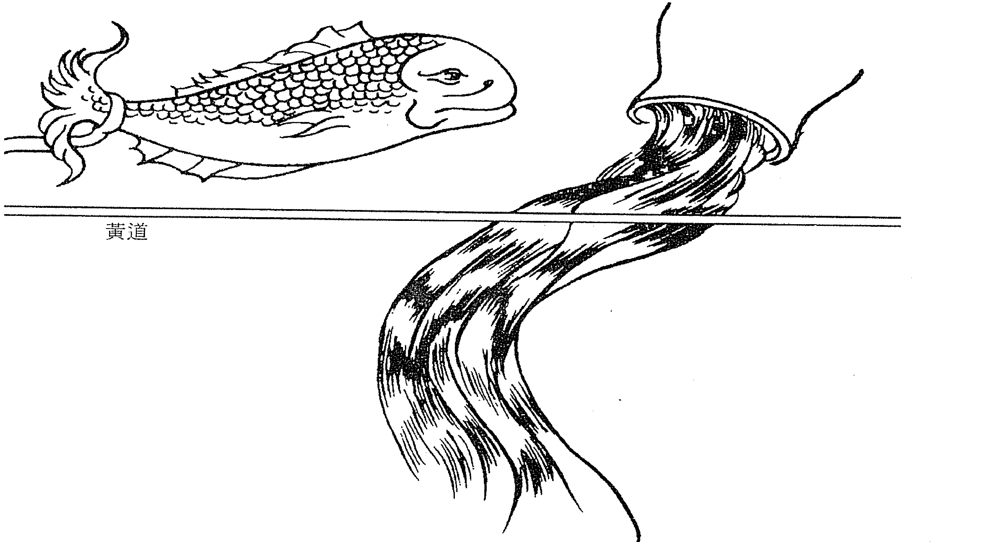
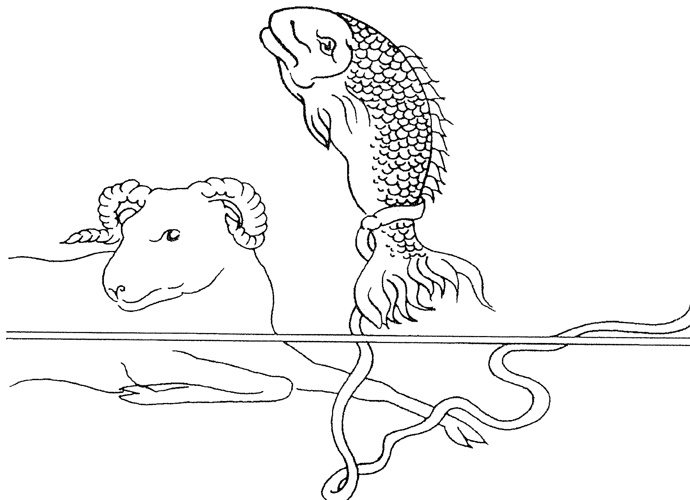
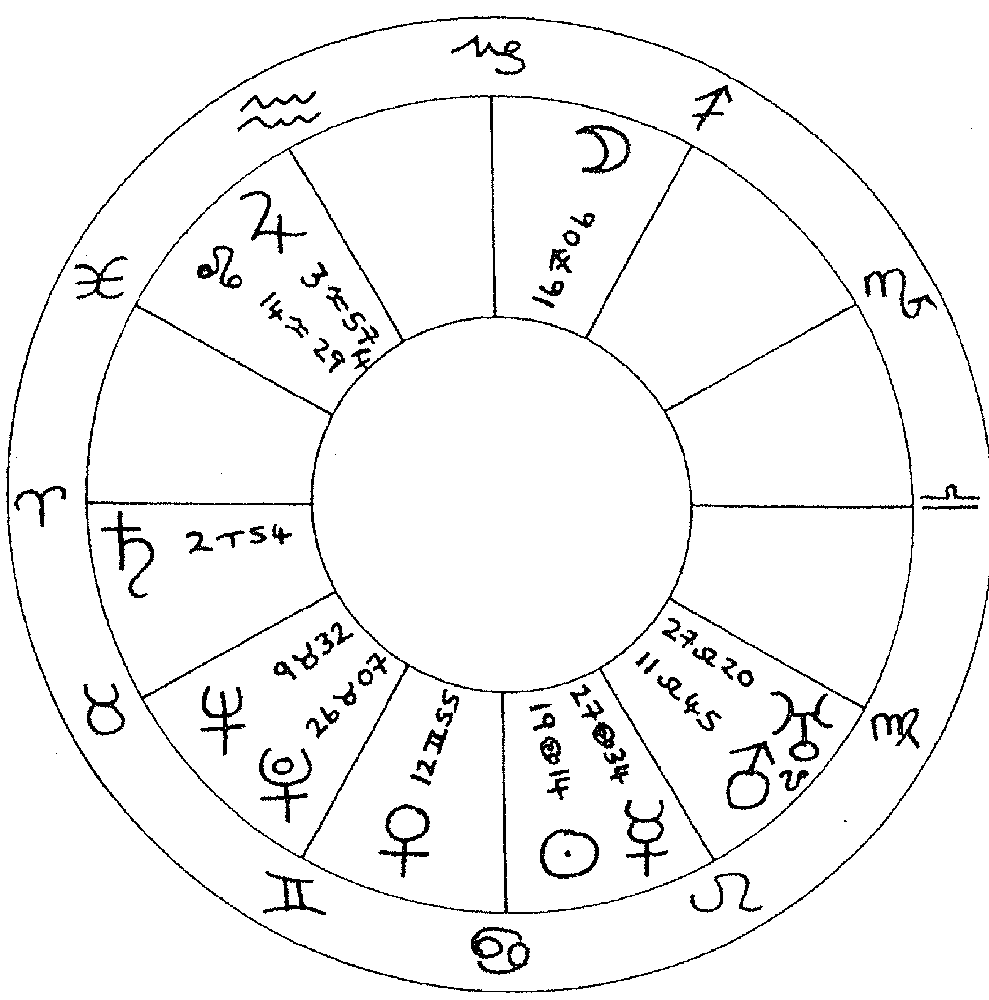
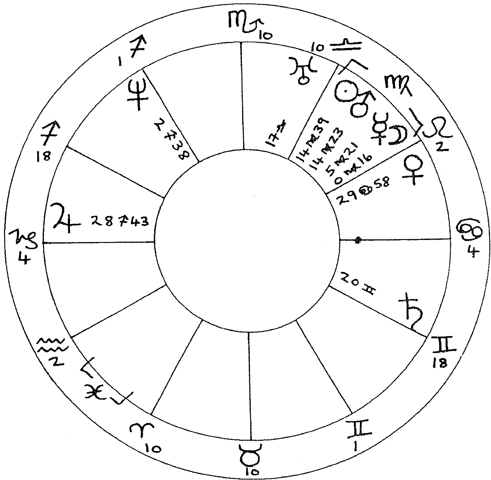
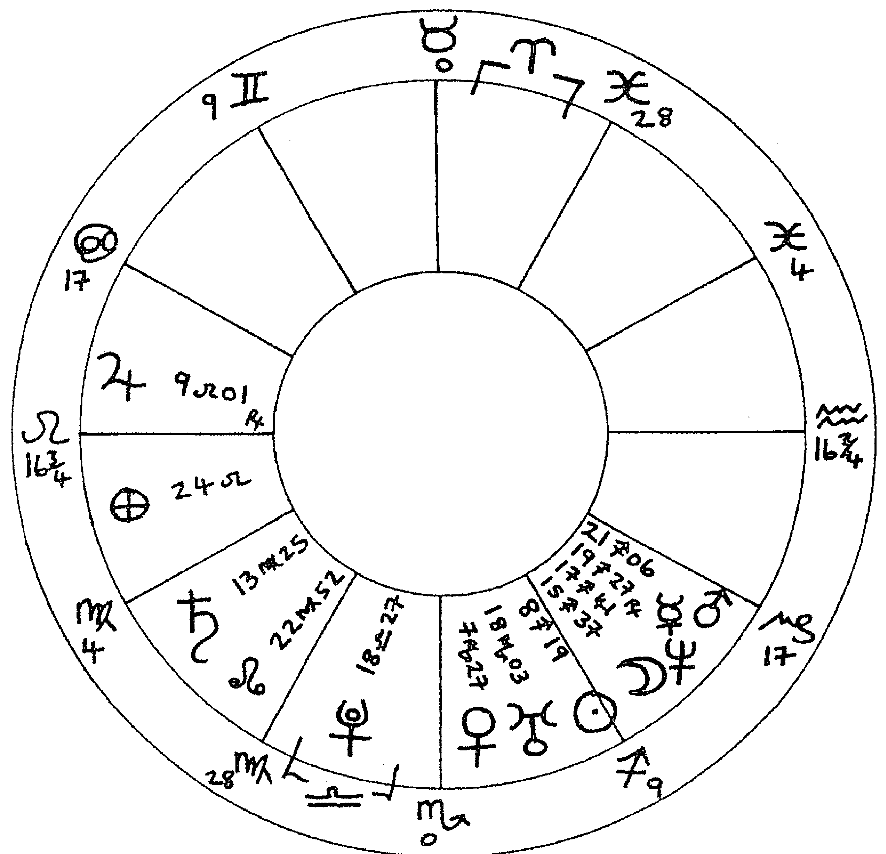
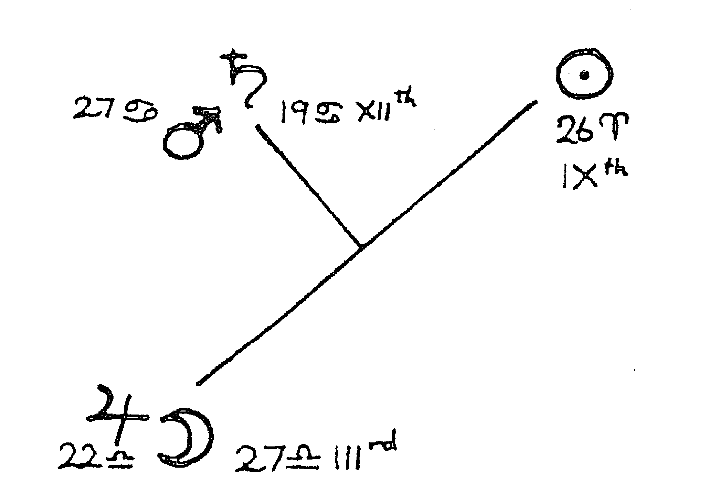
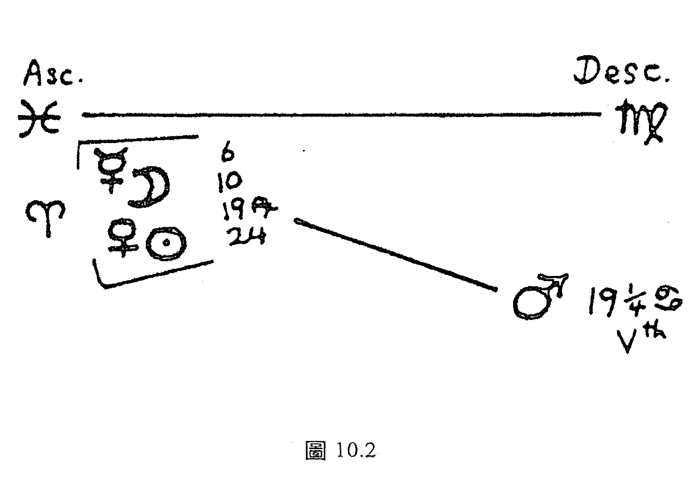
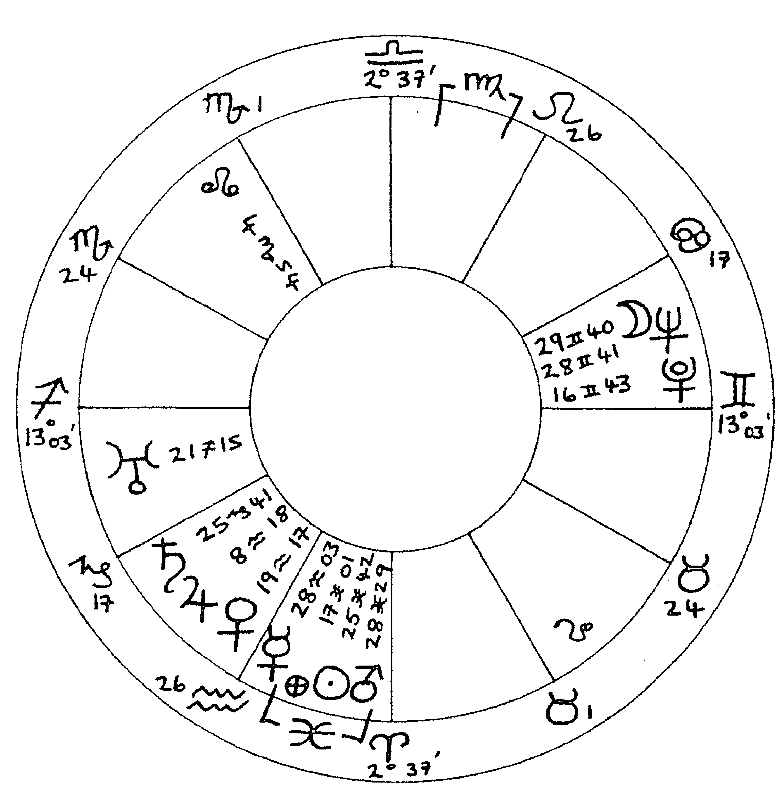

# 榮格·占星學

## 〈閱讀參考〉／李孟浩（心理占星學研究者）輯
占星師的小抄

| 符號 | 名稱 | 含義 |
| :---: | :--- | :--- |
| ☉ | 太陽 | 自我意識、基本動機、人生主題 |
| ☽ | 月亮 | 安全需要、生活習慣、內在情緒 |
| ☿ | 水星 | 認識環境、收集資訊、語言溝通 |
| ♀ | 金星 | 美感品味、愛情投射、社交價值 |
| ♂ | 火星 | 行動意志、生理慾望、個人主張 |
| ♃ | 木星 | 知性學習、人生遠見、個人福報 |
| ♄ | 土星 | 現實限制、責任意識、道德紀律 |
| ♅ | 天王星 | 個人自由、社會改革、破除約束 |
| ♆ | 海王星 | 浪漫想像、宇宙合一、逃避現實 |
| ♇ | 冥王星 | 現實變動、心理重生、穿透人心 |
| ☊ | 北交點 | 今生的學習課題 |
| ☋ | 南交點 | 前世的行為習氣 |

| 元素 | 屬性 | 星座 |
| :--- | :--- | :--- |
| 火象 | 基本 | 牡羊—獅子—射手 |
| 土象 | 固定 | 金牛—處女—摩羯 |
| 風象 | 變動 | 雙子—天秤—寶瓶 |
| 水象 | | 巨蟹—天蠍—雙魚 |
| | 基本 | 牡羊—巨蟹—天秤—摩羯 |
| | 固定 | 金牛—獅子—天蠍—寶瓶 |
| | 變動 | 雙子—處女—射手—雙魚 |

| 符號 | 角度 | 名稱 |
| :---: | :---: | :--- |
| ☌ | 0° | 合相 |
| ☍ | 180° | 對立相 |
| △ | 120° | 和諧相 |
| □ | 90° | 衝突相 |
| ✱ | 60° | 次和諧相 |
| ✱ | 150° | 次衝突相 |

3 占星師的小抄

# 4 榮格與占星學

射手座
11.22-12.21
【火象，變動宮】
要拓展人生的視野
正面與負面風格：
由開放、坦誠直率
到自大、自以為是

天蠍座
10.23-11.21
【水象，固定宮】
我要投入強烈的情感和慾望
正面與負面風格：
心理洞察、深情專注
到權力濫用、嫉妒多疑

天秤座
9.23-10.22
【風象，基本宮】
我要和別人和諧交往
正面與負面風格：
優雅社交、公正講理
到猶豫不決、依賴妥協

處女座
8.23-9.22
【土象，變動宮】
我要提高工作效率
正面與負面風格：
整齊清潔、細節分析
到過度挑剔、過度批評

獅子座
7.22-8.22
【火象，固定宮】
我熱愛表現自己的創造力
正面與負面風格：
自我肯定、熱情管理
到自大驕傲、虛榮愛現

巨蟹座
6.22-7.22
【水象，基本宮】
需要溫暖的保護和安全感
正面與負面風格：
親切愛、細心體貼
到不安、我保護

- 文化宮
高等教育
人生哲學
國外旅行

- 情緒宮
深層情緒
物質擁有
共享資源

- 伴侶宮
親密關係
合作夥伴
社交網絡

- 工作宮
身心健康
工作態度
服務技巧

- 玩樂宮
愛情冒險
才華表現
兒童樂趣

- 巨蟹宮
主養育
情感空間
家庭

5
占星師的小抄

版權：心理占星學報告工作室
網址：www.psychoastrology.com.tw

# 摩羯座 ♑
12.22-1.19
【土象，基本宮】

我要追求社會成就
正面與負面風格：
工作耐力、保守自
盡責沉悶、排斥心！

# 水瓶座 ♒
1.20-2.18
【風象，固定宮】

我要追求新知和兄弟愛
正面與負面風格：
獨特創意、冷靜客觀
情感疏離、極端叛逆

# 雙魚座 ♓
2.19-3.20
【水象，變動宮】

我流浪在浪漫的
夢想世界
正面與負面風格：
仁慈善良、直覺感應
自我犧牲、逃避現實

# 牡羊座 ♈
3.21-4.19
【火象，基本宮】

我有獨立行動的慾望
正面與負面風格：
主動進取、競爭熱力
毛躁衝動、自私好強

# 金牛座 ♉
4.20-5.20
【土象，固定宮】

我注重感官享樂
正面與負面風格：
穩重謹慎
寬厚待人
佔有佔有慾強
頑固倔強

# 雙子座 ♊
5.21-6.21
【風象，變動宮】

我喜歡和人交換訊息
正面與負面風格：
機智溝通、彈性適應
膚淺思考、容易分心

事業宮
事業成就
社會地位
人生使命

朋友宮
朋友和同事
團體合作
社會理想

心靈宮
某種潛意識
復原力量
秘密壓迫

自我宮
人格面具
身體外貌
童年環境

財帛宮
個人資源
賺錢和花錢
能力、自我評價

溝通宮
和家人起居
溝通、資訊
交流、短程旅行

10
11
12
1
2
3

# 6 榮格與占星學

## 〈導讀〉

## 榮格與現代占星學

心理占星學研究者
李孟浩

我成立「心理占星學報告工作室」這個網站已經一年半了。
在第一階段的時候，我先熟悉傳統占星學的基本論斷方法，再消化人本心理學兩位大師但恩·魯德海爾（Dane Rudhyar）和史帝芬·阿若優（Stephen Arroyo）的著作。那時候，我把命盤看成是「貼滿性格標籤和事件標籤的人生棋盤」。因此，我在分析自己命盤的時候，只知道說：命盤分析的基本原則是行星相位的重要性大於行星宮位，行星宮位又重於行星星座。命盤分析的基本重點則在於太陽、月亮和上升星座這個基本人格三角形，亦即基本人格等於月亮星座的情感氛圍加太陽星座的自我認同，再加上上升星座的人格面具。
因此，我那原本好色的太陽天蠍和海王星合相之後，太陽反而會用天蠍座的心理洞察力，來追求海王星的靈修興趣。我那原本多話的月亮雙子和八宮金星形成一百二十度的和諧相位後，月亮反而用雙子座的機智掃瞄能力，多方閱讀金星男女關係的心理學書籍。至於上升摩羯座則能解釋我為何老是擺一張嚴肅撲克臉的理由。
在第二階段的時候，我已經消化完榮格心理占星學兩大天后麗茲·格林（Liz Greene）
和哈瑪克—宗達格（Hamaker-Zondag）的著作，便把命盤看做「埋藏深層心理意義的心靈迷宮」。這時分析自己的命盤，就知道我們必須藉由火星冒險的獨立勇氣，來脫離與母親共生的月亮本能模式，才能展開古代神話所說的英雄之旅，發現自己太陽的人生志趣或英雄意象。當你產生內在英雄的自覺後，就要擺脫上升星座適應社會現實的假面具，整合太陽的存在意義和月亮的情感氛圍，才能活出榮格所說的「真實個體性」。因此，我必須鼓起火星摩羯十二宮和冥王星八宮和諧相的心靈諮商師勇氣，來脫離月亮金星和諧相的安逸生活形態，才能完成太陽海王星合相在第十宮建立身心靈整合事業體系的人生志趣。

在第三階段的時候，我苦練找出心靈宮深處金羊毛（代表本我的深層意義）的詮釋功力，並且知道古代心靈煉金術的目標就是要在上升星座這個煉金術容器中，完成太陽與月亮的神秘婚禮，來誕生神聖的嬰兒（亦即本我）。我也意識到整個心理占星學運動的目標在於完成用心靈學整合煉金術和占星學的大業。因此，我把命盤看成是「反映身心靈整合動態的曼陀羅」，並且打算配合花精能量水的治療效果，加上塔羅牌和卜卦占星學解答問題的快速能力，來幫忙案主解決身心靈整合過程的各種疑難症狀。

此時正好碰到立緒出版公司準備出版《榮格與占星學》，我在校訂譯文的過程中，發現作者瑪姬·海德這位心理卜卦占星學的才女試圖藉由榮格的命盤分析，來徹底反省和批判整個心理占星學的發展史。她企圖指出心理占星學兩位天后只是在盜用榮格心理學的術語，卻忽略了榮格心理學對占星學的真實意義在於重建心理卜卦占星學。我雖然很同情她
和科內利烏斯（G. Cornelius）苦心宣傳「心理卜卦占星學」的努力，但是我認為她沒必要貶低心理占星學，來證明心理卜卦占星學的正當性和合法性。因此，我希望讀者不要太介意作者批判心理占星學的用語。其實，你會發現兩者都是要整合煉金術、心理學和占星學，只不過心理占星學比較強調「本命盤」層面，心理卜卦占星學比較強調「時盤」的層面而已。

接下來，我幫各位讀者做初步的導讀，希望能幫助你們了解作者的論點。

作者在第一章〈雙魚座世紀〉中，指出榮格在研究占星學和煉金術的巔峰時期，非常看重本我如何能用煉金術的婚禮儀式，將兩股內在對立的心靈能量（太陽和月亮）加以融合。因此，作者認為榮格唯有成功融合占卜師的神秘直覺（月亮能量）和科學家的理性分析（太陽能量）這兩項特質，才能寫出《基督教時代》（Aion）一書。所以，作者要在下面的章節當中，透過榮格命盤的分析，來回顧榮格一開始是怎麼樣跟隨弗洛伊德學習當一位精神分析科學家，然後又一頭栽入玄學研究，當起一位占卜師的歷程。

第二章〈榮格、弗洛伊德和玄學〉中，先點出榮格認為自己擁有一號人格和二號人格，分別在世俗世界和心靈世界中運作。榮格的女兒葛雷特·包曼—榮格也是一位占星師，她認為榮格命盤的土星代表世俗世界的一號人格，天王星則代表心靈世界的二號人格。不過，作者不太同意這一點，反而認為二號人格是月亮和天王星的九十度衝突相，一號人格是太陽和海王星的九十度衝突相。因此，我們可以看到作者用「弗洛伊德的太陽金
牛十六度和榮格的月亮金牛十五度合相」這條主線，來分析榮格之所以壓抑二號人格的神秘學興趣（月亮的情感能量投注在天王星代表的玄學興趣），是因為他先扮演月亮秘書的角色，來輔助弗洛依德完成太陽董事長的職責（建立精神分析的事業）。但是，榮格遲早必須經由火星的冒險勇氣，來追求自己太陽獅子座的玄學帝王寶座。因此，作者指出榮格的逆行火星不完全贊同弗洛依德「性本能壓抑」的論點，而想要把性本能擴大解釋為心靈驅力。這正是日後榮格與弗洛依德決裂的關鍵。

第三章〈黑暗大陸〉，指出榮格在一九一三年流年天王星和本命盤太陽形成一百八十度對立相時，終於和弗洛依德決裂，並且像古希臘英雄一樣，展開自己在靈魂海洋的暗夜之旅（太陽和海王星的九十度衝突相）。

第四章〈榮格的吟唱：象徵態度〉，指出榮格認為人類可運用詮釋各種徵兆的象徵態度，來和神聖事物產生有意義的心靈連結感。同樣的道理，占星師就是藉由詮釋命盤象徵的行為，來幫助案主找到自己生命事件與宇宙的連結關係。但是，作者在此開始反省和批評心理占星學如何濫用榮格心理學，特別是很多心理占星師拒絕將占星學視為占卜術的行為，便是忽略了榮格詮釋占卜預兆時所強調的象徵態度。

第五章〈心理占星學：探索深層的意義〉，指出心理占星學運用榮格的原型理論，來強調每個人命盤象徵深層意義的作法，可說是一種木星型的擴大解釋法。可是，心理占星學忽略了傳統占星學的兩大重點：宮位的宮主星和土星型判斷解釋法。

第六章〈精神的地圖〉指出心理占星學把本命盤視為精神地圖的作法並不成功，因為行星象徵和心理功能很難得出大家一致同意的對應關係。因此，她鼓勵心理占星師要脫離本命盤分析的桎梏，而開始學習扮演占卜師的角色。

第七章〈同時性現象〉指出心理占星師拿同時性觀念的第一個版本（客觀事件之間具有相互依存的關係），來證明每一個命盤的出生時刻具有宇宙的客觀性和神秘性色彩。但作者指出榮格已經修正這個早期觀念，而開始強調觀察者的主觀心靈參與態度，才會提出同時性觀念的第二個版本。因此我們必須重視占星師主觀參與案主生活世界的詮釋態度。

第八章〈占星學實務：解釋巧合性〉，指出心理占星師只想找出原型，而忽略了「秘密的交感關係」的存在。因此，她舉了K先生與兒子爭吵的事情為例，說明我們不需要從補鞋匠和士兵的意象追尋原型，而要從時盤當中，看出占星師的主動參與態度，會怎麼左右你提供給個案的詮釋重點。

第九章〈攤開蒼穹〉，進一步強調榮格已經從婚姻實驗中發現占星學未必和出生時刻的行星位置相關，而跟占星師的主觀參與態度有關。她也利用這個機會，正式提出她和同事科內利烏斯的主張：占星學應該超越以托勒密學說為中心的本命盤占星學，而應以下卦占星學為中心。因此，她藉由一位女士為自己女兒所弄的錯誤星盤卻會帶出正確詮釋結果的例子，指出我們不應執著土星詮釋取向所在乎的客觀出生時刻，並借哈丁新書的時盤，來凸顯木星詮釋取向所在乎的占卜態度。因此，她呼籲占星師不要只用同時性I架構下命
運計算機的安全解讀策略，而要開放性接納同時性Ⅱ架構下占卜術的隨機解讀策略。

第十章〈秘密的交感關係〉，她藉日蝕當天遇到的老太太個案說明同時性Ⅰ的架構強調對星盤象徵的客觀解析，同時性Ⅱ的架構強調占星師的主觀參與態度如何影響命盤的詮釋過程。因此又舉一位獅子座行星群的女士為例，說明不應把個案命盤看成是一張客觀中立的「諮商圖」，而應勇敢探討「秘密的交感關係」，才能弄清煉金術與詮釋學的真義。

第十一章〈占星師的宇宙：煉金術的意象〉，指出煉金術的意象和占星學的象徵之間，的確是有不少對應關係。但是，作者指出麗茲．格林沒有考量到墨丘利（Mercurius）的神秘運作問題，就想要把煉金術—心理學—占星學揉合成三位一體的命盤詮釋法，仍然會面臨很多未能解決的困難。因此，作者所討論的第一組煉金術意象就是墨丘利，討論重點則在煉金師必須通過水銀（墨丘利精靈的考驗），才能將賤金屬變成黃金。墨丘利的毒氣代表分析師和案主共同的潛意識污染，也代表占星師對自己的參與性詮釋視而不見。作者最後提出第二組煉金術意象國王和王后的結合，代表移情作用和個體化的過程，也代表每個人都要整合自己命盤的太陽與月亮。

本書的重點在於釐清榮格的同時性觀念，來重建心理卜卦占星學。可惜的是作者並未對心理占星學的本命盤分析流程和心理卜卦占星學的時盤分析流程，提供基本的說明。不過，作者仍然提供非常多的命盤案例和時盤事例，我將會在我的網站進一步分析討論，以便能讓各位讀者更加了解心理占星學和心理卜卦占星學的分析手法。

11 榮格與現代占星學

# 12 榮格與占星學

## 〈作者謝辭〉

## 謹以本書
獻給我的母親

本書中有許多的想法，都是我和友人以及同事們，歷經二十年多的悠悠歲月，才逐漸醞釀成形的。我要感謝皮列姆·阿迦瑪（Prem Agama）在普特尼（Putney）與宛茲沃斯（Wan-dsworth）兩地所播下的因緣種子，想必他做夢也沒想到，這些種子居然會在這麼多的夾縫中開花結果。而占星師工作坊裡的三位共同創辦人，也各以迥然不同的方式，對我的占星研究起著莫大的影響。喬弗瑞·科內利烏斯（Geoffrey Cornelius）從占卜的角度，對占星學所做的重大修正，不但使占星學無論是在哲理或是實用上皆能有所突破，同時也構成了這本書中的許多靈感源頭。高爾登·華森（Gordon Watson）則以心理治療師的專業背景，向我展現如何將這些新的觀念，帶進占星師和案主的互動關係中，而他所引燃的火炬，則逼使我無情且坦然地拷問自己，身為一名諮商者和指導者，動機究竟為何？德瑞克·艾波比（Derek Appleby）則是讓我見識到傳統占星學的繽紛與魅力，同時他更透過卜卦占星學，讓我親睹了占星學中的象徵意義，如何在真實世界當中湧現生機。此外，我也要感謝占星師工作坊裡的所有同仁，感謝他們多年來不吝與我分享彼此的心得，特別是派特·布萊克特（Pat
Blackett)、普如·卡夫 (Prue Cave)、珍·法瑞兒 (Jane Farrer)、亞倫·瓊斯 (Alan Jones)、馬立恩·霍特 (Marion Holt)、葛瑞米·托比恩 (Graeme Tobim) 以及維農·威爾斯 (Vemon Wells) 等人。

在精神分析學的領域裡，我則要格外感謝蘇努·山姆達薩尼 (Sonu Shandasani)，由於他的鼎力襄助，以及對榮格思想的淵博學識，使這整本書獲益良多，尤其是在第二章與第三章的部分。此外，費城學會裡的諸位好友們，特別是喬·弗立德曼 (Joe Friedman)、約翰·希頓 (John Heaton) 與芭芭拉·拉桑姆 (Barbara Latham) 等三人，他們對於榮格所提出的批判，也讓我深銘五內。他們在在提醒我，事情總是有許多不同的思考方式。

此外，我要向所有慨允本書刊登其命盤與故事的案主與友伴們，致上最高的謝忱；同時，我也要特別感謝瑪莎 (Marcia) 和芙芮兒 (Ferial) 兩人，從頭到尾予我如同姊妹般的支
持。最後，我要感謝本書的編輯，當此書寫成於天王星半歸位的期間時，土星所代表的截稿日期其實已經過了，為此我要感謝他的耐心等候。

## 14 榮格與占星學

## 〈引言〉

## 穿越榮格的星象思路

藍色腳踏車帶我遠離榮格，然而，最終它們同樣又將我帶回他的身邊。這些藍色腳踏車出現在我所參與的一個夢工作小組中，該小組每週大約有十二名成員聚集在一塊兒，彼此分享他們所做的夢。在某一次聚會中，同時有為數不下五位的成員在前一週都夢到了腳踏車，且在好幾個夢境中都與藍色有關。這個小組的領導人的確擁有一輛腳踏車，不過並不是藍色的。沒有任何人能夠理解為何在我們這群人中，竟有如此多人同時夢見了相同的意象。

我在歷經無以為業、但卻裨益良多的數年後參加了這個小組，研讀榮格、伊凡·伊里希（Ivan Illich），研究占星學以及作夢等，佔據了我全部的心神。一連數天我埋首於榮格有關煉金術的文章中，燈下苦讀至三更半夜，睡覺時做著週而復始的夢（uroboric dreams）①，我將這些夢所發生的時間記錄下來，然後將夢中所出現的意象、命盤以及煉金術裡的意象全都連接起來，繼而拼湊出天象拼圖。在這個無遠弗屆的領域中，榮格對於精神的結構（structure of the psyche），併同人類的自我（ego）、陰影（shadow）以及靈魂形象（soul-image）的
研究，讓這個領域似乎有了某種秩序可言，也因如此，這個領域遂成了榮格的天下。「同時性」（synchronicity）的現象會隨時隨地進出，而日常生活彷彿也變成了魔術表演。數年以後，我才明瞭為何我這段時期在占星學上會被形容是人馬座裡的海王星，四角運行至雙魚宮的太陽後所產生的負面影響。

就在沉淪於榮格的迷霧當口，我在這個夢工作小組裡尋到了出路。這個小組係由心理治療師喬·弗立德曼（Joe Friedman）領導主持。他很快地便將榮格的精神結構拆成六大部分。我們彼此分享夢境時所發生的情形是：雖然我們事先並不知道每週所要探討的夢境理論家是何許人，湊巧的是，我們在聚會前所做的夢竟然都能用當週那位理論家的論點來加以解釋，不僅如此，這些夢用那位理論家的論點解釋，都會比用其他理論家的解釋來得好。倘若該次聚會的研討主題是弗洛依德，那麼我們就會提出有關火箭與錢包的夢。而假如下週的主題是墨特（Mott），那麼就會出現管子、水池與頭盔等意象。而當研究到塞諾伊部族（the Senoi tribe）②，以及他們慣用來對付夢中所出現的恐懼與老虎的習俗時，我們自身所做的夢也會相對地變得清明透徹。而遇到榮格的討論時，就自然會有孔雀、玫瑰花與曼陀羅（mandalas）出現。這樣的經驗，讓我自原先前度執著於榮格的理論當中鬆綁開來，並且開始對他產生抗拒。我從他的想法中轉身逃離，覺得他那神話般、大一統式的方法悖離了「真正」發生在每位個體身上的情況。他的理論系統似乎是化零為整且無所不包的，對於其他現代哲學與精神分析學的發展無動於衷。然而，隨著這個反動情緒而來的

## 16 榮格與占星學

是，我的思維又再次地轉了方向。我漸漸開始想到，事實上並沒有任何一位榮格之外的當代「思想巨擘」，能夠對藍色腳踏車這件事振振有詞地提出說法，也沒有人能對於同樣令人百思不解的其他怪異現象提出解釋，無論這些現象是發生在夢工作小組中，還是發生在日常生活裡，特別是發生在占星或占卜上。

自一九七○年代以來，我從占星師這個工作的經驗裡，以及與多位精神分析學家的討論當中，越來越明白這類的神秘經驗幾乎可說是未曾被明目張膽地觸及過。諷刺的是，就連占星師本身都有避而不談的習慣。就在我探尋占星學如何運作以及探尋占星師與問卜者之間究竟發生了什麼事，因而理解日深的同時，眼前的道路也就益發向著榮格重新靠攏。榮格不僅僅研究占星學，同時他所使用的「擴大性的解釋方法」（method of amplification）也根源於一種神話創作的思考型態，而這種思考型態對於占星學而言是十分重要的。除此之外，在所有的現代思想家中，他始終是在毫無知音可言的狀態下，獨自嚴肅看待占卜一事，並將占卜列入其所稱的「象徵態度」（symbolic attitude）之中。自世紀交替之際占星學在現代西方死灰復燃以來，便一直持續地開花結果，而無畏高科技時代的迫害。早在許久以前，高科技時代就已經摒棄了繁星竟與我們人類息息相關的無稽念頭。即使在今天，容許占星學存在的全球性觀點仍然繼續受到人們的奚落，並且被目前大行其道的文化精神棄若敝屣。儘管如此，姑且不論咱們的科學家及學者先生們宣稱占星學是如何地不足為信，也不論為反狂潮而進行的異端審判（the Inquisition）③是如何強烈地企圖保護所謂的無知大眾免於受到巴比倫妓女的蠱惑，占星學中所涉及的象徵學對於芸芸眾生而言仍舊意義非凡，這些群眾相信的確有某些事情顯現在占星學中，而這些事對他們來說是至關緊要的。

就是在這樣的氛圍底下，榮格對於占星師而言變得重要。近幾十年來，就在占星學藉著脫去算命的外在形象，並且與心理學、心理諮商與精神分析學互相結合，力求獲得更多責任的同時，占星學領域的內部發生了一場革命性的變化。在這個進展中，榮格扮演著居功厥偉的參考指標。他對於煉金術（alchemy）、諾斯底教派（Gnosticism）④，以及東、西方智慧傳統的興趣，使我們對於一籮筐的神話與意象得以重新醒悟，並能一探究竟。榮格的著作對於神話創作式與想像力馳騁的思考方式情有獨鍾，使得占星師在探索各種象徵符號時，能夠褪去決定論（determinism）與中古宿命論（medieval fatalism）令人不適的外衣，這兩種論調在占星學復甦於世紀更替之時，皆徘徊在占星學的上空不去。

至今為止，占星學與榮格的想法之間到底有些什麼樣的連結？這本書中，我將借重榮格的一些主要觀點，同時檢視它們如何被占星學所運用，藉此，我將企圖解開這個複雜的問題。縱使他的影響力十分廣泛，然而迄今為止，主要的影響範圍仍是在星座象徵的神話性擴大解釋上，以及精神結構與星象之間的連結關係。後者的影響所及，產生了一種星象學即是一張「精神的地圖」（a map of the psyche）之可疑觀念。在第四章和第五章裡，我將針對榮格的擴大解釋方法的使用，及其與星象符號之間的關連做一思考，兼而討論榮格對於「原型」（archetype）的想法。在第六章中，我將檢視陰影、阿尼瑪斯（animus）、阿尼瑪（anima）等觀念，如何從榮格的分析心理學中被占星師引用，而其引用的手法無論是對榮格本身或是對占星學而言，都是不甚公平的，此外，我也將闡釋如何將這些觀念以其他更為有效的方法，活用在我們的實務操演當中。無獨有偶地，榮格的「同時性」觀念——指有意義的巧合事件——同樣也被人們從他的思想脈絡中給斷章取義，因而就簡單地拿來做為占星學運作的一種解釋。然而，榮格本人卻始終因為懸而未決的占星學觀念根本，而掙扎在困境中無可自拔，同時，他所提出的象徵主義看法與象徵符號的本質等重大問題，也都被人們忽略。由是之故，第八章所涵蓋的內容，便是詳細地重新詮釋榮格對於「同時性」的概念。他以占星學所做的婚姻實驗，即是一項顯示「同時性」法則的野心企圖，而實驗的結果對占星學家所產生的挑戰，卻幾乎未被體認，更不用說是被加以採納。

唯有效法榮格對於神秘現象（the Occult）⑤的態度而採取之，我們才有可能全盤洞悉他與占星學之間的關連為何。影響榮格的來源並非只是占星學和《易經》而已，同時還包括了全世界的占卜與超自然現象——弗洛依德將之稱為「靈異情結」（the spook complex）。因此，若要思考榮格與占星學之間的關係，便要省思其著作中所涉及的神秘向度。在此觀點下，我將會重新審視榮格與弗洛依德之間的互動情形，同時研究兩人之間的關係在占星學上的解釋，重新思索精神分析學本身對於神秘經驗的關係。

榮格的主要身分並不是一位占星學家，因此，我們必須隨時警惕在心的是：他是否在某一環節中對占星學有著不正確的觀念。舉例而言，他似乎未曾採取過以每小時為單位的卜卦占星學（horary astrology），大部分的思考步履還是在根源於埃及托勒密宇宙學說為主流的占星傳統。這項傳統近年來在現代占星學的衝擊之下，已然遭到了重大的質疑與轉變，而我也將指出榮格的想法是如何地助長了這項進展。儘管受限於托勒密天文學說的桎梏，他在占星學上所涉足的範圍，無論是學識上或是幻象上，皆一枝獨秀地超越了許多當前的占星學家。而這點，在他的那本卓越非凡而又動人心弦的《雙魚座世紀》（The Age of Pisces）一書，最能展露無遺。本書第一章將針對這部著作做一描述，未擁有占星學知識背景的讀者恐將發現，本章因涉及了占星學上的諸多基本觀念，而無可避免地增添了一些閱讀上的困難。縱然如此，我仍然期望榮格占星學的詩意語言，能為那些對占星學所知有限的讀者綻放光明。

我相當清楚自己不過是在卷帙浩繁的榮格著作中，揀選他所提出與占星學相關的部分議題罷了。然而，即便是在這一挑選的過程中，思索榮格的想法與占星學兩者間的互相融合，也能顯示出如今所形成的混合體，其實經常與榮格的本質精神大相逕庭。而探觸榮格的精神將會為占星學家提供一個全新的方向。重新詮釋他的思想與占星學之間的關連，早是一項逾時而未做的功課，而它將在這新世紀的年代中開啟占星學復活的可能性。榮格早在一九一一年便已經看出占星學能顯示出力比多（libido）的意象，此外，他同時也看出，這位航行於闇夜海洋的英雄邁向復興的奮鬥之旅，已被天體神話學（astro-mythology）給記錄在黃道帶與行星的象徵符號中。追隨並穿越榮格在這些趨勢上的思路，能為當代占星學的實際運用引發根本性的改變。在這本書中，我將會探討這場蛻變是如何實現的。

## 註釋

- ① 譯按：本詞與希臘典故中所出現的原型形象——Uroboros 有關，Uroboros 是一種頭部呈龍狀、全身滿佈鱗片的蛇，最特別之處在於用嘴巴咬住自己的尾巴，因而自成一環。此種動物於是被用來代表生命的生生滅滅、週而復始的循環象徵。而此一循環觀念，同時也是煉金術之首要觀念。
- ② 譯按：馬來半島的維達人（Veddoid），散居在印尼蘇門答臘的西亞克（Siak）沿海平原。
- ③ 譯按：教皇格列戈里九世於一二三一年成立宗教審判所，用以鎮壓異端、煉丹術、巫術以及魔法等。
- ④ 譯按：一種融合多種信仰的通神學和哲學的宗教，主要盛行於第二世紀，教義主要是講人和人在宇宙中的位置，而這個宇宙乃大於且優於人感官所認識的世界，宗旨便是要解救人類，使之不受星象的左右。其迫使早期基督教為了反對它而彙編正典《聖經》，提出教義神學，建立主教制，從而獲得發展。其與正統基督教之差異在於前者強調信心，而諾斯底教派則注重神傳知識。
- ⑤ 譯按：舉凡靈界和宇宙的未知力量皆屬之，諸如煉金術、占卜、魔法、巫術等等。

## 目錄

全書總頁數共 416 頁

- 〈閱讀參考〉占星師的小抄 3
- 〈導讀〉榮格與現代占星學 ◎李孟浩 6
- 〈作者謝辭〉謹以此書獻給我的母親 12
- 〈引言〉穿越榮格的星象思路 14

### 第一部分

- 1 雙魚座世紀 1
- 2 榮格、弗洛依德，與神秘主義 29
- 3 黑暗大陸 69
- 4 榮格的吟唱：象徵態度 107
- 5 心理占星學：探索深層的意義 133
- 6 精神的地圖 169
- 7 同時性現象 203
- 8 占星學的實務：解釋巧合性 239
- 9 撥開蒼穹 259
- 10 秘密的交感關係 293
- 11 占星師的宇宙：煉金術的意象 327

### 附錄

- 〈附錄一〉天王星與海王星的流年 356
- 〈附錄二〉火星—木星—土星：榮格與弗洛依德 367
- 〈附錄三〉弗洛依德的孿生兄弟 371
- 〈附錄四〉奇旺托佩爾的星盤詮釋 372
- 〈附錄五〉永不老者 Puer Aeternus：汞合金 386
- 〈附錄六〉最後的把戲 388

## 1 雙魚座世紀

The Age of the Fishes

榮格在他的《基督教時代》（Aion）一書中，仰賴占星學這門學問之處甚多。談到西方的文明時，他如此總結道：

> 咱們（西方）的宗教史以及某部分精神本質的發展，無論就其時間或者內容，皆可從春分點因為歲差（precession）而進入雙魚座的星象，預知其結果。①

榮格暗示，自耶穌誕生以來，乃至現代，西方宗教史上的重大發展，皆可從星象符號上一窺究竟。這對占星學而言，無疑是項重大的要求，甚至遠遠超出了目前最複雜的占星學能力之所及。②為何榮格認為這是一件可以達成的任務，對此，我將暫且擱置不談，就現階段而言，我將專注於榮格針對基督教與星象二者所揭蘗的驚人關係，並予以扼要總結。在榮格的觀點中，星象符號不僅顯示出耶穌的誕生和祂的使命，同時展現出基督教的二元特性，以及此種二元主義對於現代社會發展的影響。此一象徵符號包含了兩項天文要素。首先是西元前七年時，木星（Jupiter）與土星（Saturn）兩者的合相：其次是春分（Spring Equinox）的歲差現象。

在傳統可目測的行星當中，木星與土星是兩顆距離最遙遠的行星，它們的運行週期被詳細地記錄在占星的歷史中。這兩顆行星扮演著有如計時器般的功能，它們是時間的標示工具，每隔二十年便會合在一塊兒，以顯示出該時代的精神（zeitgeist）。我們在每二十年的後半階段，如風起雲湧的二○年代、活躍奔放的六○年代等，最容易觀察到這兩顆星的作用。它們每隔二十年的相會，都會落在同質元素的星座，一直要過了兩百年之後，才會移至另一種異質元素的星座。③這兩顆星龐大的循環週期，總共要歷經地、水、火、風四種元素的交替，也因此要耗費將近八百年的時間。木星與土星的運行週期，之所以特別受到占星師的矚目，乃因這兩個行星分別象徵著精神與物質、時間與空間的對立。而它們的合相也就被認為是在宣告宗教上與國家領導上的改變，根據阿爾布馬札（Albumasar）④的說法，它們同時也透露出：

> ……預言家與預言的來臨，政黨與政府機關裡頭將會發生奇蹟。⑤

榮格在西元前七年時的雙魚座中，注意到木星與土星的合相。這次行星的運行方位是極不尋常的，不僅因為它正逢八百年一循環的交接，同時，它還是個三重的聚會，也就是說，光是在同一年裡，就發生了三次的合相情形。⑥這也就是東方博士（Magi）所觀察到的「伯利恆之星」（Star of Bethlehem），這位兼具占星師與祭司雙重身分的東方博士，對於《舊約聖經》上所揭示的預言——新紀元之初將會出現一位救星——了然於胸，《聖經》上記載著：

> ……有幾位博士從東方來到耶路撒冷，說：「那生下來做猶太之王的在哪裡？我們在東方看見他的星，特來拜他。」（馬太福音第二章第二節）

木星暗示著耶穌將成為「猶太人之王」，因為其與王位、統治權以及宗教訓示有關。更因為它位在雙魚座中，而尤其顯出尊貴之象；再者，傳統上咸認為，耶路撒冷便是由雙魚座所掌管。土星則向來與以色列人息息相關，至今為止，猶太人仍以星期六（亦即土星之日）做為他們的安息日。於是，這年的木、土星合相，亦即伯利恆之星的出現，便被占星師引以為占星學的絕佳明證。克普勒（Kepler）便說過：

> 祂（上帝）指派其子耶穌基督做為我們的救世主，時間恰巧就發生在春分前後、雙魚座與白羊座的大合相之際。⑦

黄道

圖 1.1　白羊座、雙魚座與寶瓶座

克普勒在此提到了雙魚座與白羊座的星座符號，由此引領我們進入第二個、並且更形重要的天文要素，那就是春分點的歲差現象。何謂歲差現象呢？我們將黃道帶（the zodiac）中的十二個星座，根據恆星星座的名稱命名之。每年大約在三月二十一日的時候，太陽會回到其運行軌道（黃道）與地球赤道之間的交叉點。此一時刻便標示著北半球春天的開始，同時，太陽的位置（白羊座○度，即春分點）也就界定了黃道帶符號的起始點。大約在希臘—羅馬古典占星學發源之初，春分點是落在白羊座與雙魚座的界線上，於是，黃道帶的十二星座便與其背後同名的星座位置相互吻合。無奈的是，宇宙所展現的現象卻是週期中另有週期，天底下沒有一成不變的事。每年當太陽運轉回它的春分點，便會些微地落後於去年的位置。也因此，春分點的位置就會往後退，換言之，其與背後的星座位置兩相對照之下，每年會產生出弧度五十度的位差。此一歲差也就意味著黃道帶上的十二星座，會逐漸向後移動，而經過其背後的同名星座。

春分點緩緩向後移動，因而通過十二個星座，總計將花費二萬五千八百六十八年的時間，此一週期在現代占星學中被稱為一個柏拉圖年（Platonic year），而通過單一星座所花費的時間，則被稱為一個柏拉圖月（Platonic month）。然而，與黃道星座不同的是，這十二個恆星星座之間的距離是不相等的（參見圖1.1），也因此，春分點運行通過每一星座所耗費的時間長度，也有較大的差異。

大約在耶穌降生的年代，春分點是落在白羊座與雙魚座的中間，之後才向後逐漸遠離白羊座，繼而進入雙魚座。如此一來，耶穌便與白羊座時代的結束，以及與雙魚座的開啟有所關連，正如同榮格所說的：

> 祂以雙魚座時代下的第一條魚之姿態誕生，且注定要以日益衰頹的白羊座時代的最後一頭白羊之姿態死亡。⑧

由此之故，在耶穌誕生之際，恰好有兩件重大的天文事件同時發生。首先是雙魚座裡的木星和土星千里來相會，目視可及的結果，便是護祐「猶太人之王」的伯利恆星之出現。其次則是肉眼所無法觀察到的春分點歲差現象，在耶穌降世之時，它剛好是落在雙魚座與白羊座的交會點上。這兩個天文現象加起來，均意味著耶穌將在嶄新時代的開端，以救世主的姿態降臨於世。榮格對於耶穌與雙魚座中的第一條魚，兩者之間的相互關係感到咋舌不已。他表示，春分點進入雙魚座所形成的歲差開啟了——

> ……一個新的時代，在此時代下，化身為人的神被取名為「魚」，祂以魚的姿態出生，並以一頭白羊的姿態壯烈犧牲，他的門徒當中有以釣魚為生的漁夫，而祂則希望將他們變為普渡眾生的漁人，能以生生不息的魚群供養眾生，但自身則有如一條魚般，被人們當做一頓「聖餐」吞噬入肚，而祂的諸位門徒，則成了一條條的小魚（the pisciculi）。⑨

他同時也在這個星座符號中注意到其他事件，諸如耶穌在最後的晚餐中為門徒洗濯雙足（雙魚座），以及耶穌在復活之後，現身在門徒的面前；耶穌的弟子們在岸邊釣魚，因而捕獲了另一大群的魚。此外，就連聖母未婚懷胎一事，也能透過處女座的符號呈現出來，而與雙魚座產生兩極對立的呼應關係。

非僅於此，榮格還將雙魚座的象徵意義，進一步運用在耶穌殞世之後，顯示了這個符號如何表達出基督教的發展歷程。參閱圖1.2b（見頁二十）中的雙魚座圖，我們可以觀察到這兩條魚被一根線條所縛綁，因而彼此相連在首顆星——阿爾法星（α, the star alpha）的位置上，而這顆星被阿拉伯人稱為外屏七星（Al Rischa），又稱做節星（the Knot）。這兩條魚分別游往不同的方向；朝向東邊的魚，乃由黃道垂直移向北方；而朝向西邊的魚，則沿著黃道呈水平游動。由此之故，這個現象便被認為是此一符號所寓含的二元對立之意，一為垂直、一為水平，這兩個相反對立的特質，雖是彼此交叉而過，但卻永遠被一條線相繫在一起。它們分別代表著精神之魚與物質之魚，而出生於雙魚座年代的耶穌救世主，其所遭受的十字架刑，也顯現在這兩條魚的交叉象徵之中。耶穌基督，也就是第一條魚，被釘在物質之魚的十字架上受死。而基督教的偉大宗旨——犧牲奉獻、團結一心、救贖罪愆——同樣也是雙魚座符號的代表特質。

對榮格來說，雙魚座所隱含的雙重特性，正巧反映出基督教教義中水火不容的對立成分。凡是一神論的宗教系統，皆需將天神的「二元」特質合而為一；天神顯現出來的形象既是正面、亦是負面，是男性、亦是女性，是精神、亦是物質。天神通常被視為是將對立特質融為一體的本來面目，然而不幸的是，基督教卻在調合二元對立的過程中，面臨了困難。這點即表現在歐洲知識界中對於「善與惡相互對立」的爭辯上，同時也展現在全善的上帝如何能創造出罪惡的質疑上。假若邪惡的勢力能自絕於上帝的掌握範圍之外，而獨立存在，那麼這也就意味著上帝不是全能的。而此一想法，也可說暗示著上帝其實是透過善與惡同時運作，且其本身也是善惡兼備的，不過，這項另類說法同樣也被基督教的教義所排斥。由此一來，耶穌基督的形象乃全然光明，欠缺黑暗的一面，而這個失衡的現象則反應在撒旦（Satan）此一不可或缺的角色當中，也展現在強調人類的邪惡本質之上。倘若邪惡的力量不可能來自於上帝，那麼它勢必是由人類的意志或無知，亦即他／她的原罪（original sin）所造成。榮格說：

> 在原始的基督教觀念中，體現在耶穌身上的形象（Dei imago，譯按：拉丁文，相當於 image of God 之意），無庸置疑地意含著一種無所不包的整體性，甚而包括了人類的獸性層面。然而，就現代心理學的觀點看來，耶穌這個象徵符號卻欠缺完整性，因為它並未涵蓋萬事萬物的黑暗面，卻將此一黑暗面完全交付在敵對者——魔王撒旦——的形象上，而加以排除之。⑩

耶穌的形象乃是「至高無上且完美無瑕」，除此之外，其他的事物一律淪為黑暗。如此一面之詞的強調，無可避免地將造成一種陰影，因為黑暗的那一面已經被切斷並且排除。然而，這個黑暗面卻會在反基督（Antichrist）的身上失而復得，在整個中世紀的年代裡，這號人物皆被不同的占星師與預言家所推測。但對榮格來說，反基督的來臨「卻不只是一個預言家的臆測而已——它乃是一個無可改變的心理法則」。⑪中世紀和文藝復興時期對於反基督的預言，或許可視為是這種心理作用的一種必要表達吧。

對於反基督降臨的預料，主要是根據木星與土星的合相。諾斯特拉達姆斯（Nostradamus）⑫於一五五八年寫道，他預測在一七九二年左右將會有一股「惡魔勢力」興起。皮耳·艾力樞機（Cardinal Pierre d'Ailly, 1356-1420）則推算出以下這樁將會發生於一七八九年或該年「前後」的事件：

> 假使這個世界能捱到那時，唯有上帝知道，屆時世界將會發生許多重大而驚人的轉換與變化，特別是有關法律的施行以及宗教的派別……反基督這人將帶著他的律法和不可饒恕的教派降臨世間，這些律法和教派將完全與耶穌基督的律法背

## 14 榮格與占星學

道而馳且有害之……一股強大的勢力將會來臨……他會制定一套邪惡而蠱惑人心的律法。⑬

榮格在《基督教時代》一書中揭示，春分點向後移動而通過雙魚座的運行過程，的確和這些關於木星與土星的種種預言，呈現出吻合的情況。耶穌在世的年代，春分點是落在第一條魚的起始處（詳見圖1.3）。此時的耶穌便代表了那隻精神之魚，象徵善良與光明。而當春分點移動並通過第一條魚之時，教會系統便被建立了，同時基督教也獲得了發展。這個情形會隨著春分點沿著連結兩條魚的線段移動而日益興盛，但是接下來，當春分點到達兩條魚的中間時，教會所面臨的挑戰，以及反基督的預言等，就會接踵而至。榮格在書中描述了這些質疑並削弱教會權威的異端邪說，以及十六世紀宗教改革期間，基督教所遭遇的分裂命運。自此以降，經過一五〇〇年至一七〇〇年的科學革命期間，正好就是春分點沿著線段朝向第二條魚邁進之際，此時一種「鏡像過程」（an enantiodromian，或稱 mirror image process）就會開始涉入。第一條魚伸展的方向，是類似哥德式建築的筆直向上，而第二條魚則適巧相反地朝著水平方向往外游動。榮格將此看做是繼宗教改革之後的發現新大陸之旅，以及征服大自然等事蹟，他同時暗示：垂直的線段被水平的線段橫切而過，也就是說，人類的精神與道德發展，會益發明顯地朝著反基督教的方向前進。⑭

春分點大約是在西元一八一七年後，到達第二條魚尾端的第一顆星，亦即霹靂五號星（Omega Piscium）。儘管這是一條代表反基督的魚，但反基督並未具體現在任何一號人物、或任何一位救世主的身上。相反地，反基督乃彰顯在哲學、在「罪無可赦的教派」，以及在「完全與耶穌基督的律法背道而馳且有害之一的「邪惡而蠱惑人心的律法」上。一七八九年法國革命之後聖母院的理性女神獲得王位加冕，此事即被榮格引喻為前述天文現象的縮影。如今，人類的理性思維已被哄抬為神聖的法則。然而反基督的精神，卻在科學物質主義、十九世紀興起的達爾文主義，以及反基督的思想，諸如馬克思主義等等的發展上，一表無遺（湊巧的是，馬克思就出生於一八一八年）。

因此對榮格來說，春分點通過雙魚座時所產生的歲差，便負載著西方宗教史的流變。此時的榮格，正值最具說服力且不斷向上提升的境界。他的著作展現出最高層次的占星詩語，其中並夾雜著專門的技術與象徵概念，所提供的深度、規模、範圍與啟發，也均屬上乘。我們可針對他的著作加以仔細玩味或徹底發揮，而此一舉動同時能進一步地肯定並延伸他的著作。舉例來說，當天王星出現，加上春分點移往第二條魚之際，詩人布雷克（Blake）的聲音——「一位能徹見現在、過去與未來之吟遊詩人的聲音」——混雜著羔羊與獅子的叫聲，兼具純真無知與經驗老到的雙重特質，並融合尤里僧（Urizen）與洛斯（Los）⑮的精神，即遍傳於英格蘭的土地上。他的「耶路撒冷」首部完整版，於一八一八年與一八二○年間銘刻完成。布雷克，這位富有想像力的詩人，不僅深切關心著基督教的精神，對於物質時代下人類所面臨的精神掙扎，也同樣關懷備至。

《基督教時代》一書所蘊含的寓意如此不同凡響，對於這些強而有力地展現於書中的諸多巧合，榮格是如何加以解釋的呢？他本人肯定的是，窮究古老文學，其中並未有任何的證據顯示，用以象徵基督教的魚符號是從黃道星座中援引而來的。此外，他還認為這些天文因素並不是導致這些歷史發展的主因，他們只不過是以「同時性」的方式，在毫無因果的關係下彼此牽連在一起罷了。他提出一種集體精神的假定，這種集體的精神包含著意識與潛意識的雙重成分，它們會透過人類的共同文化當中的神話、圖像等，自由自在地橫跨時間與空間的藩籬。集體潛意識（Collective unconscious）會將它自身投射到外在的世界，於是創造出一種超越性的意義秩序。換言之，生命具有一種模式、一種次序或是一種意義，超越於個人的理解之上。它顯現在我們對於宇宙秩序的看法當中，會藉由人類集體意識的投射而釋放出來。而此一投射出來的影像，也就是榮格所說的——人類的「本我」（the Self）形象。

無論是集體或是個人的精神，都會在潛意識中夾帶著這個「本我」的形象，那是一個代表秩序與完整的形象，而榮格式心理分析（Jungian analysis）的任務之一，也就是要朝向這個形象接近。⑯在個人的精神世界中，想要促使對立的元素彼此握手言和，將會是一個永無休止的過程。榮格對於基督教時期的研究，主要就是將耶穌基督當做是一個自我的象徵而加以分析。人類集體地將耶穌基督等同於自我的形象，但我們在祂的身上卻只看到光明的一面，而將黑暗的那面，亦即陰影的部分摒除在外。集體潛意識則會對此一棄暗投明的舉動加以補償，其方法便是將集體的陰影投射到天空，或是投射到世界上。此一黑暗面即被視為罪惡，或是以女性的形象加以呈現，亦即由永遠無法得到喜悅的聖母瑪莉亞做為代表，因而壓抑了人類有性生殖過程中的「動物」本質。對立元素的調和問題，也因此不斷地出現在基督教中，以及個人企圖了解自我的掙扎裡，而此一對自我的試圖理解，則被榮格稱為「個體化」（individualization）的過程。為了從規模最大的集體層次上著手，榮格於是向占星學與大年（the Great Age）⑰的象徵作用下工夫，以企圖將此一過程象徵化。稍後我們在第三章裡，將會看到他如何從占星學中尋求援助，力圖將其個人所遭遇的相同過程予以象徵化，屆時我們透過他對「闇夜海洋之旅」（the night sea journey）的研究，便可一窺堂奧。

然而，我們的占星學在榮格對《雙魚座世紀》（The Age of Pisces）的研究中，又具有何種地位呢？誠如他所發現的，穆恩特（Muentter）於一八二五年開始強調魚的符號和耶穌誕生之間的關連。而穆恩特本人則是回頭參考阿巴爾柏內爾（Abarbanel, 1437-1508）的著作所得，該著作乃是最早被人引用的資料來源。⑱至此為止，似乎仍未會有任何一位占星學家採用過榮格的方式，亦即透過歲差現象來臆測西方文明的發展歷程。這些驚人的預言乃是根據木星與土星的運轉週期，做為它們的占星基礎。此外，無論是在古典、中古時代或是文藝復興時期的占星學中，也沒有任何跡象顯示出歲差具有象徵上的重要意義。傳統的宇宙論與占星學提出許多不同的「大年」模式，但是所有的證據指出「歲差週期」（The Pre-cessional Cycle）其實是十九世紀占星學的一項新發明。⑲

幾位二十世紀的占星學家，已將歲差的象徵意義做更進一步的發揮。瑪格麗特·霍恩（Margaret Hone）在她的《現代占星學教本》（Modern Textbook of Astrology）中，便提供了一個典型的例子，在此書中，她說明了一段從獅子座的時代，一直到寶瓶座時代之初，亦即從西元前一萬年到西元後二千年之間，歷史發展的必然軌跡。⑳舉例來說，古埃及處於金牛座的時代，因此具有祭拜公牛與建造金字塔之類屬於金牛座的價值觀。而以色列人摩西（Moses）的出埃及、跨越紅海之舉、禁止膜拜公牛以及引入新律法「十誡」（The Commandments）等，皆可視為是從金牛座時代轉變成白羊座時代的跡象。

與每一位談論過歲差時代的作家幾乎相同的是，瑪格麗特·霍恩所提出的方法是以「黃道十二星座」為基礎，亦即恆星黃道帶中的十二星座，每一星座平均等分三十度。其產生的結果是，每個時代都具有二千一百五十六年的相等長度。不過這個方法的主要問題卻在於，假定星座本身具有不同的形狀、大小，並且時常相互重疊的話，如此一來，正確的起始點究竟在哪兒，就會變得莫衷一是。假設依據恆星黃道帶中白羊座零度與其背後星座之間的位置為基準，這麼一來，每個大時代的發軔日期就會差異非常大。反觀但恩·魯德海爾（Dane Rudhyar），他藉由地球南北軸所通過的星座，來研判大年的發生日期，可以因此避免掉上述的問題。②1這是個頗為有趣的想法，只可惜魯德海爾並未針對週期的不同階段，提出任何特定的象徵意義或詮釋，而他所創新的建議也未在實質上做更進一步的發展。

榮格始終固守著產生歲差變化的春分點不放，不過，他卻運用了一套與其他占星學家截然不同的方法。他所採用的，並不是星座間隔呈三十度等距的黃道系統，而是直接運用「雙魚座的形態學」，也就是當我們在夜空中指認出雙魚座時，其所呈現出來的不同樣貌。除此之外，他更進一步地指出組成該星座的實際星球，藉以揭開雙魚座時代的歷史。

《基督教時代》一書於一九五一年以德文首次發表，繼而在一九五九年又以英文出版。自此之後，該書所蘊含的意義，便如滴水穿石般地緩緩滲入占星學的思考當中。羅伯·韓德（Robert Hand）接受了榮格的啟發，從而遵循他的方法，並且藉著將春分點與雙魚座接觸的日期記錄下來，以提升技術討論的層次。②2同時他還指出，雙魚座中的第一顆星即稱為「阿爾法星」（Alpha），而不論它是不是當中最亮的一顆，如此一來，使得這套象徵系統獲得更進一步的詮釋空間。既然第二條魚上的第一顆星是「亞米茄星」（Omega），那麼，耶穌的自況：「吾既是阿爾法星，亦是亞米茄星」，也就承載著引人好奇的星際關連性。

儘管在關於宗教史的詮釋上，羅伯·韓德發展出某些個人的獨到想法，然而其論述的實質部分，實際上是榮格占星學論文的直接翻版。他追隨榮格的觀點，認為所有的現象應被視為不具有因果關係，即便它們是同時發生的，這些現象乃是集體精神的投射結果：

> 我們人類共同創造了這個宇宙，而這個宇宙又反過來，在已然涵蓋著人類形象的宇宙形象中，創造出我們。人類精神與自然世界兩者之間，形成了一個迴路，當彼此一呼一應的結果被精神所感應時，其實就是同時性的現象發生。㉓

他也接受了榮格的看法，認同這套象徵系統乃受到文化範疇的限制。因為不同的文化擁有相異的象徵符號，故而耶穌基督與雙魚座之間的巧合關係「……僅能表示西方世界至今為止所投射出來的精神與集體能量。」㉔

不過，另一位深受《基督教時代》一書所啟發的占星學家喬弗瑞·科內利烏斯（Geoffrey Cornelius），卻顯示出此一歲差象徵系統能夠超越此一明顯的侷限而照常運作。㉕首先他提到，白羊座時代中所發生的巧合事件，幾乎與雙魚座的時代具有等量齊觀的非凡意義。假如我們觀察一下圖1.2a的白羊星座，便可瞧出其中三顆最明亮的星星——婁宿三「Hamal，亦為五車五（El Nath）」、婁宿一（Sharaton）以及婁宿二（Mesarthim）——皆會聚於白羊的頭部。此一情形所暗示的是，這個符號本身所擁有的份量與力量，全都集中在一塊兒。而這點乃與白羊座的象徵意義不謀而合，正如同雙魚座的星座本身所呈現出來的散亂與模糊樣貌，恰好也與雙魚座的象徵特質相映成趣。也因此，當春分點通過白羊座這三顆集中在一起的星星時，我們便得以預測白羊座的時代將會有哪些重大的發展。春分點於西元前七一三年由婁宿二出發，而於西元前四四六年抵達婁宿三。這段兩百七十六年的時期，對於世界歷史而言的確具有孕育上的意義。釋迦牟尼佛大約在西元前七世紀誕生，之後，祂將建立一個快速席捲整個東方世界的偉大宗教。接著在西元前五五一年或五五二年間，孔子的誕生又標示了中國文明形成的重大時期，經其之手塑造而成的文化樣貌，將持續盛行達兩千五百年之久。除此之外，我們也將發現希臘城邦國家在數十年之後興起，這段時期被形容為「希臘的自我覺醒」。由此可知，西方文明的源頭也就象徵性地根植於白羊座的頂端。

如此看來，世界三大文明的形成期雖各不相干，但卻同時與春分點通過白羊座所產生的歲差有關。科內利烏斯也將雙魚座的象徵意義做更進一步的延伸，指出雙魚座與佛教所發生的一場關鍵變革息息相關。以捨棄（捨棄的精神乃屬雙魚座的特質）個人的成道（屬白羊座的特質），而成全有情眾生的菩薩道為其中心戒訓的大乘佛教，其發展的時間恰好與基督教的發軔齊頭並進，兩者同樣都發生在春分點離開白羊座而進入雙魚座的時刻。

這些洞見造就了一件至今仍懸而未決的公開議題，那就是，這些機緣巧合到底是如何作用的。假如這套象徵符號同時適用於中國以及印度，它就比較不像是「東方心靈」的一種投射作用，因為東方的占星師所使用的是另一套不同的象徵系統。尤其是在中國古代的占星學中，其所擁有的象徵形式是迥然不同的。就榮格與韓德的理解得知，占星學乃是透過心靈向天界的投射，而產生出一種「不具因果關係」的作用。然而，在一般性的實際操作當中，每當遇到個人本命盤的占星分析時，這樣一種心靈投射的邏輯說法（或稱「反應迴路」（feedback loop）」，就不是那樣輕而易舉地被大多數的占星師們所接受，甚至包括韓德在內。如此一來，在每兩個占星案例中就有一種情況是，占星所得的現象被視為是相對「客觀的」，亦即與當事人的心靈參與或心靈投射無關。一如我們稍後將看到的，每當榮格的「同時性」觀念，引發能不能被當成是占星學的一項解釋之爭議時，這種左右於心靈投射或是客觀現象的兩難困境似乎也會應運而起。

榮格在《雙魚座世紀》的思索為占星學家提供了一顆種子。此一著作的影響甚深，因其以極為宏觀的角度，揭示出占星符號的意義，並在客觀的天文實況與個人的主觀想像兩者的夾縫間努力。在近幾世紀以來，雙魚座的第二條魚所代表理性與因果邏輯哲學，已在西方世界成為一股盛行的主流精神。此一精神之所以受到高度的重視，並且等同於真理，乃因其所處理的對象是物質，以及「真實存在」的事物。相對之下，非理性的方法則被當成藝術或詩歌看待，而逐漸遭到鄙視，因為它們都是「想像力」的產物，言下之意即表示它們是較不實在的，所以也就較不精確。於是在神話式與理性式的思維中間，產生了一條鴻溝，一邊偏愛占卜問卦，另一邊則獨厚科學方法。然而，困擾占星學家的問題之一是，我們的實際操作會同時碰觸到兩邊的想法，因而會感覺到雙腳跨越在主觀與客觀的兩條船上。我們同時兼具占卜者與科學家的雙重身分，而這個情形也同樣發生在榮格身上。其對於人類精神的研究，以及學習占星學與《易經》之類的預測練習，使他朝著一位占卜者的方向邁進。但在榮格的靈魂裡，仍然存活著一位科學家，會因客觀的事實與實際的證據而勃然動心。就在他致力於研究煉金術，以及探討對立特質如何熔鑄於一個人的內在自我的同時，榮格完成了其生命巔峰的代表作——《基督教時代》一書。他針對耶穌基督與雙魚座年代所做的研究，乃是一塊試金石，在榮格自己身上，展現出占卜家與科學家的完美結合。我們即將見識到，為了要讓這個結晶體達到盡善盡美的境界，榮格是如何盡心盡力地耗費半世紀以上的時間，方才達成爐火純青的地步。

## 註釋

①參見榮格 Aion-Researches into the Phenomenology of the Self. CW9 第11部。英文版由R. F. C. Hull 翻譯，一九七四年版，第九十五頁。

②榮格的占星學知識相當淵博，他通曉托勒密、阿爾布馬札（Albumasar）、卡旦（Cardan）與馬特努斯（Firmicus Maternus）。他也拜讀過瑪格努斯（Albertus Magnus）與克普勒（Kepler）的著作，同時對於皮耳·艾力（Pierre d'Ailly）樞機和諾斯特拉達姆斯（Nostradamus）所做的預言，也曾經仔細地研究過。此外，從十九世紀到現代的德國占星師，也是榮格引經據典的對象；占星師們甚至可以透過榮格的著作，找到一些鮮為人知的資料來源。

③木星和土星每一次的合相，都會比上一次合相位置往前推進大約一百二十三度，或是四個星座的距離。因此，這兩顆行星的合相，總要歷經很長的一段時間，才會落在相同的元素上。舉例而言，自一八四二年（魔羯座）至一九六一年（魔羯座）為止，木星和土星的合相乃連續落在土象星座上。因此，它們要在一個元素上待兩百年之久，直到「變動」發生後，才又往下一元素前進。一九八一年當木星和土星在天秤座裡結合時，便算是進入了風象星座，儘管在二管在二〇〇〇年，這兩顆星體曾經在金牛座裡結合過，使其運行的軌道短暫地回到土象星座上。

④譯按：阿爾布馬札（Albumasar）：西元七八七—八八六年，呼羅珊（Khorāsān）人，伊斯蘭世界的重要占星學家。他提出，世界之始發生於七大行星會合於白羊座一度之時；而世界末日則將發生在七大行星會聚於雙魚座末度之時。其主要的著作有《占星學大入門》、《天體互合之書》以及《世界年來復之書》等。

⑤參考《基督教時代》（Aion）一書，引自第七十八頁，註腳第三十九條。

⑥西元前第七年時，木星和土星於水象星座（雙魚座）的合相，算是通過了四大元素，而完成其八百年循環一次的週期。在元素和元素的交替之間，通常有一段重疊的時期，此時木星和土星的合相將會在這兩個元素之間來來回回；若就西元前第七年的情形來看，木星和土星乃是往返於水象和火象元素之間。而木星和土星於西元前第七年以前的合相，則是落在火象星座上（西元前二十六年，落在獅子座二度）；然而更早之前，則是落在水象星座上。西元前第七年之後的結合，則同樣落在火象星座上（西元十四年，人馬座四度）；到了西元五十四年之時，這兩顆星體的結合則落在水象星座上（雙魚座二十四度）。之後，木星和土星的運行軌道，又再次進入了火象星座的領域。

在西元前第七年的這段重疊時間，應該算是土星和木星每八百年的「大變動」中最重要的的一回，因為這次的合相乃是三顆行星的合相。對於當時的占星師來說，光是這個天文現象本身，就已經夠引人矚目的了，而不論他們是否採取穿越四大元素的變動觀點來看。這次的三重結合，乃是十分不尋常的現象，自西元前一四五—一四六年以降（巨蟹座），西元前第七年算是第一次發生這種三顆行星的合相情形。接著就要等西元三三一—三三三年，才會再度發生（天秤座）。尤其特別的是，西元前第七年時的合相，又因為發生在雙魚座裡，也就是黃道帶上的最後一個星座，所以我們可以毫無疑問地採取克普勒的見解，也就是把該次的結合視為一次「大會合」。西元前第七年的三次大會合，時間大約是發生在五月二十七日（雙魚座二十六度五十六分）、九月二十九日（雙魚座十五度二十五分）以及十二月三日（雙魚座十五度二十四分）。（資料來源：Tables of Planetary Phenomena, Neil Michelsen, ACS, 1990）如欲進一步探討伯利恆之星，請參閱 David Hughes, The Star of Bethlehem Mystery (London: Dent, 1979) 及 John Addey 針對基督降世與東方博士之論文，收錄於 Selected Writings (1976, AFA, Tempe, Az.)。

⑦ 請參考《基督教時代》一書，引自第七十七頁。

⑧ 請參考《基督教時代》一書，引自第九十頁。

⑨ 請參考《基督教時代》一書，引自第七十四頁。

⑩ 請參考《基督教時代》一書，引自第四十一頁。

⑪ 請參考《基督教時代》一書，引自第四十三頁。

⑫ 譯按：諾斯特拉達姆斯：一五〇三—一五六六年，法蘭西占星學家暨醫學家，自一五四七年起更成為預言家，由於一些預言似乎應驗，使其名聲遠播，甚至連法蘭西國王亨利二世之妻凱薩琳也請他占卜；一五五五年時出版預言集。

## 26 榮格與占星學

言集《世紀連綿》（Centuries），一七八一年時遭天主教會撻伐。

⑬ 請參考《基督教時代》一書，引自第九十七頁。

⑭ 請參考《基督教時代》一書，引自第九十五頁。

⑮ 譯按：尤里僧（Urizen）與洛斯（Los）：兩者皆為英國詩人、畫家暨雕刻家威廉·布雷克（William Blake）所創造之神話人物，布雷克曾寫過〈羔羊〉、〈獅子〉、〈無知之歌〉、〈經驗之歌〉等詩作；尤里僧在布雷克的想像之中，乃是宇宙運轉的動力，是天地間一切能量之來源，也是所有智慧的秘密所在；而在〈天堂與地獄之婚姻〉一詩中，洛斯乃是尤里僧所創造出來的能量之一，他可代表人類，有時亦代表月亮的擁有者，或是永恆的先知等。

⑯ 如欲探討榮格對於本我的看法，請參閱 Michael Fordham 所著之 The Journal of Analytical Psychology（一九六三年）。

⑰ 譯按：大年（the Great Age）：亦做 Great Year，天文學上的春分點歲差繞行天球一周即為一個大年。

⑱ 請參考《基督教時代》一書，引自第七十四頁。

⑲ 根據 Nicholas Campion 表示，有關歲差而導致大年的占星探討，其目前所找到的最早資料為皮爾斯（A.J. Pearce）所著之 Textbook of Astrology（1879）——請參閱 Mundane Astrology 一書，由 M. Baigent、N. Campion、C. Harvey 合著（Aquarian, 1984, p.127）。

⑳ 請參考霍恩所著之《現代占星學教本》（The Modern Textbook of Astrology, London: Fowler, pp.276-280）。

㉑ 請參考魯德海爾所著之 The Astrology of Personality（New York: Lucis）。春分點的歲差是經由「南北極軸（Pole Axis）的擺動」才會產生。在二萬五千八百六十八年的週期內，天極（Celestial Pole）會點向一連串的極星（Pole Stars）。而「大年」或許就是根據不同極星的象徵意義而來的。

## 27 雙魚座世紀

②2 請參考韓德一九八二年所著之 *Essays on Astrology* (Rockport, Mass: Rara Research, p.158)。附圖13之年代資料係由韓德所提供。

②3 出處同上，引自第一四八頁。

②4 出處同上，引自第一五二頁，同時參考榮格對於這點的疑問，詳見《基督教時代》一書之第九十二頁。

②5 請參考科內利烏斯之新哲學系列演講，於一九七九年發表於梅菲爾德（Mayfield）苑茲沃斯（Wandsworth）成人教育中心。私人文字紀錄。

②6 請參考克里（G. Murry）一九三五年所著之 *Five Stages of Greek Religion* (London: Watts, p.42)。這段雙魚座的年代對於猶太教的形成也具有同樣的影響力。

## 28 榮格、弗洛依德，與神秘主義

Jung, Freud and the Occult

榮格對於耶穌基督的符號研究，極致發揮了他在宗教心理學上的終生志趣。對榮格而言，宗教議題向來在他的心目中佔據著至關緊要的地位，因為他的父親及八位叔叔都是教區裡的牧師。在榮格的自傳中，他不時提到這樣的宗教背景，對於他的童年造成何等的影響，同時他也提到，每當他感覺到周遭的基督徒，其實並不明瞭神性的顯現時，就會使他對於索然無味的教會，心生一股異教徒式的秘密反抗。九歲以前，榮格一直是家中唯一的小孩，於是就像許許多多孤零零長大的小男孩一樣，身邊缺乏同伴分享他的世界，也因此他一腳跨進了魔術與禁忌的國度中，他雕刻了一尊小矮人，藏在閣樓裡，做為他的另一面秘密自我的護身符。

不過榮格的家人並非全是神職人員，他所具備的異教徒特質，其實是遺傳自他的母親。榮格的女兒葛雷特·包曼—榮格（Gret Baumann-Jung）是一位占星師，她信心十足地認為在榮格的本命盤上，榮格的母親是由金牛座月亮與冥王星的合相所代表。①榮格形容他的母親是個「實事求是、腳踏實地」的人，但由於月亮同時與天王星成九十度衝突相位，因此他也能感覺到母親具有一種出人意表的第二人格，既神奇，又駭人。儘管他的母親是牧師的女兒，也是牧師的妻子，然而，她偶爾會任由她黑暗的另一面自我代表發言，而這點乃遺傳自她的父親。在她的整個童年中，榮格的祖父母每週都會和已過世的妻子進行對話溝通，而每當他撰寫佈道詞以驅趕邪靈時，亡妻就會站在他的身後，助他一臂之力。也因為此，對於同時發生在他母親與地方鄉親身上的靈異及神奇事件，榮格一點也不感到陌生。

由此可知，榮格早年的宗教啟發，與十分虔誠、但又相當無聊的瑞士新教派產生強烈的矛盾衝突。瑞士新教派盛行於十九世紀，對於世俗及原始的靈魂學說視若罔聞。整個童年時期，一直到進入青少年時期為止，榮格對於自己始終抱持著兩種異樣的觀感，他將它們稱為一號人格與二號人格。身為一名學生時，榮格的一號人格會變得缺乏信心，相較於其他的男孩們，他顯得較不聰明、較不清白，也較不正直。榮格看待自己如同：

> ……一種轉眼即逝的現象，會像瞬間蔓延的野火一般，爆發出各種紛雜的情緒，然後又會在俄頃之間灰飛煙滅。②

做為一名學生時，這個一號人格始終是個冥頑不靈、惹是生非、幼稚得令人搖頭興嘆、而又言行不一的小孩。他滋事好動，總是要在此時此地就把事情解決了當。這個一號人格喜歡研究科學，野心勃勃地想要出人頭地。他渴望社會地位，並且期待坐享高尚的生活型態，然而最令他挫折的地方莫過於——他老是想起自己還擁有另一號人格。最後榮格終於體認到，一號人格就是一個人的「自我」（ego），而這個自我是人類忽明忽滅的意識之燭的支撐力量，人們必須不惜一切的代價，以保護這個燭光免於被二號人格熄滅。

至於二號人格是什麼呢？榮格如此形容他在童年時期所感覺到的自己：

> 這位「他者」是位生活在十八世紀的老人，他穿著釦形裝飾鞋，戴著白色的假髮，並且駕著一輛後輪高翹且呈凹形的輕便馬車，而橫互於兩輪之間的包廂，則懸掛在彈簧與皮帶上。③

這位「他者」與榮格經常坐在上面的一尊石頭有關，坐在石頭上的榮格時常苦思著：究竟是他坐在石頭上，抑或是石頭坐在他的身上。二號人格便是這顆「永垂不朽的石頭」，是榮格秘密生活的一部分，它也等同於榮格童年時所夢見的陽具，④以及那尊藏在閣樓裡的小矮人。他孤孤單單而又與人疏離，因為他認為自己的經驗與眾不同，那就是——他感覺到了神性。他與上帝水乳交融，更與大自然、夜晚，以及夢境密不可分。那位「他者」乃是「繁星點點與廣袤無垠的大千世界所吐納出來的氣息」；他具有一種神秘的特質，並對其母親身上屬於靈異的那個面向感同身受。二號人格兼具意義上以及歷史上的連貫性，其與一號人格所顯現的「前後不一、隨意偶然」的生命特質恰成反比。這個二號人格具有卓越非凡的理解力，並且與夢境的生成有關。榮格告訴我們：

> 在他的「二號人格」當中，光明佔領著統治的地位，就如同在皇宮寬敞的大廳上，高挑的窗扉對著沐浴在陽光下大地而敞開。

在榮格的命盤中尋找出他的這些人格特質，是一件讓人躍躍欲試的事，他的女兒葛雷特·包曼—榮格便曾經試圖暗示過，榮格命盤上的土星與天王星，展現出他個人所謂的「作用與反作用」。人們對於榮格出生的正確時間，至今似乎仍有少部分的爭議，一般的說法前後差距大約二十分鐘。⑥這段差距已經足以讓上升星座由魔羯座變成寶瓶座。榮格似乎真的生於寶瓶座的宮頭，可說是在土星與天王星兩者的護祐之下誕生。葛雷特·包曼—榮格使用了一個上升星座（Ascendent）位在寶瓶座零度的命盤說明，這個命盤似乎與榮格極度吻合。她胸有成竹地表示，土星與天王星的流年運勢，適巧反映出其父親在生命歷程與學術研究上的關鍵發展。舉例來說，她觀察到當榮格著手進行《神秘合體》（Mysterium Coniunctionis）一書時，心境流年的太陽光與土星形成一百二十度的和諧相位，再與天王星形成和諧相位，由此使得一號人格與二號人格合而為一。在榮格去世時，這兩顆行星終於又形成一百八十度的對立相位。

圖 2.1 榮格的命盤

19:32 LMT = 格林威治時間 18:55，1875 年 7 月 26 日

地點：Kesswill，北緯 47 度 36 分，東經 9 度 19 分

資料來源：葛雷特－包曼，榮格。

圖 2.2 弗洛依德的命盤

06:30 LMT = 格林威治時間上午 5:17，1856 年 5 月 6 日

然而，一號人格和二號人格的特質，與土星和天王星的象徵意義之間，究竟存有多少的相應關係呢？榮格對於一號人格的部分描述，顯示出這個一號人格具有傳統、野心與講求科學的特質。土星在榮格命盤中佔有強勢地位，則代表著他具有與眾不同的理解力、探索理論原則的寶瓶座特性、固執己見（寶瓶座是固定屬性的風象星座）的傾向，以及採取客觀的立場。這部分乃屬於榮格的理性層面，亦即屬於擅長理論的精神結構。除此之外，土星的老對頭——木星，也與土星形成一百二十度的支持相位。木星位在天秤座第八宮，意味著榮格對於神秘哲學的思考能力，並且展露在榮格的理論中。這個理論主張：潛意識乃是一種補償作用，它會企圖復原人類自我意識（自我意識由第一宮的土星代表）所造成的失衡現象（恢復平衡乃屬於天秤座的特性）。在榮格與弗洛依德以及其他的精神分析家分道揚鑣之後，其原先條理分明的理性態度，也就徹底受到象徵主義與神話思想等龐大主題的渲染。

這或許會導致我們追隨葛雷特·包曼—榮格的腳步，認同土星的確造就了榮格的一號人格。然而，榮格所描述的二號人格，同樣讓人想起了土星（例如老人、石頭與他的歷史感等），以及與土星形成九十度衝突相位的冥王星（諸如黑暗、神秘與秘密擁有者等）。

更令人摸不著頭緒的是，榮格的一號與二號特質，也以光明與火焰的強烈意象表現出來，因而與寶瓶座的土星較不相干，反倒較接近獅子座的天王星。就某個程度上來說，榮格的每一項人格特質，似乎都能用這兩顆星——土星與天王星——來加以描述，但卻不能憑恃單一顆星而以偏概全。在榮格一生的關鍵時刻下，這兩顆行星都會「並肩」地發揮作用。在他二十歲那年，榮格體驗了一次高峰經驗（peak experience），在此經驗當中，他終於從「層層的迷霧」中脫蘊而出，以往這些迷霧似乎總是在他的身後徘徊不去。且讓我們留意在他出生之時，太陽與主管心靈迷霧的海王星形成九十度的衝突相位，然而當太陽繼續向前移動，所碰到的第一顆行星卻是天王星。由此命盤看來，這所代表的意義是：「決定命運的一年」即將來臨。在一次感受到天啟的時刻中，榮格說道：

> 我當下頓悟：現在的我即是我自己！……在此刻中，我遇見了我自己。在此之前我也存在，只不過是每件事情發生在我的面前而已。然而現在，我發生於我自己的身上。如今我明瞭：此刻，我是我自己；此刻，我存在……我的內在擁有主權。⑦

太陽終於找到了上升星座的共同宮主星：天王星——於是榮格說道：「我遇見了我自己」。然而，正如同葛雷特·包曼—榮格所指出，這段時期乃與流年土星和太陽形成相位發生於同時——也正因此，榮格才會說：「我的內在擁有主權」。

當榮格重遊舊地，坐在童年的那顆石頭上時，這兩顆行星彼此之間的作用與反作用，又再度映現：

> 三十年後，我重新站在那道斜坡上……忽地想起在蘇黎士所度過的時光，那段歲月彷彿不再熟悉，就如同來自遠方世界與彼端時間的陌生消息。這真是讓人為之膽寒。⑧

這段文字的象徵涵義聽起來像是來自土星——三十年、石頭、異化、時間與恐懼——然而，這次經驗卻大約發生在天王星回歸的半途（譯按：流年天王星回歸本命盤天王宮位置約需四十二年）。

對於榮格的兩種人格特質，我們實在很難找到前後一致的象徵符號來加以解釋，而這項困難使我們不禁回過頭來，檢視榮格對於「本我」的微妙定義。榮格強調，他終身在兩種對立觀點之間的掙扎，就精神病理學的觀點來看，倒不意味著精神分裂，因為這種掙扎其實「彰顯在每個人身上」。倘若榮格的論點是正確的，亦即這種雙重觀念其實是人類的本質，那麼我們就無法期待在一個人的本命盤中，找著某種特定且恆常的象徵符號，來做為這種雙重性格的一種解釋。這種雙重特性，將會透過任何的符號展現出它的作用與反作用，特別是在那些本身就有（或是經由結合之後才具有）雙重或對立意味的星象符號。土星和天王星均在不明究裡的情況下，夾帶了這種雙重特性。而位在第七宮的天王星，更顯示出這種二元分立所可能導致的潛在精神分裂，因為第七宮的天王星要不就屬於一號人格，要不就屬於第二人格。此外，代表這種雙重特性的，還有另一個更為重要的象徵符號，那便是光亮，包括日光與月光。象徵陽性與秩序原則的太陽，位在具有直覺能力且代表火焰的獅子座。而象徵變動與陰性力量的月亮，則位在金牛座。兩者同時和外行星（譯按：太陽和海王星，月亮則是和天王星）形成九十度的衝突相位。這兩個衝突相位便為榮格的性格形塑了一種複雜的模式，適足以說明他的雙重特質：在任何時刻下，無論是哪一個因素造就了榮格的想法，另一個因素必定會介入來加以阻撓。然而，榮格的天賦異稟也就在於，他能遊刃有餘地擺盪在這兩種對立特質之間。

如此一來，我們能更加明瞭，每當榮格在描述他的一號人格與二號人格之時，更確切地說，其實他是在描述「靈魂」（Soul）的兩種不同特質。學生時代的榮格受過康德的影響，而康德便曾闡述過靈魂的現象。在榮格早年針對心理學所做的演講當中，他曾在佐分根學生協會（The Zofingia student society）的聽眾面前引述康德的看法：

> ……人類的靈魂與精神世界中所有非物質的種種，彼此水乳交融地形成一個共同體：……而只要一切相安無事，人類的本質將無法意識到靈魂由非物質世界所接收到的感覺。⑨

在此，康德所暗示的是靈魂具有兩種不同的傾向，一種是以世俗關懷為中心，另一種則與精神領域有所接觸。在我們的日常生活當中，世俗與精神之間的關連被等閒視之，而唯有當生活發生異常現象時，我們才會更加警覺到靈魂的精神面向。其中的一種傾向，正如同榮格的一號人格，因為與當下的世俗活動唇齒相依，以至於會特別關心自身的歷史定位與身分認同。而與另一種傾向息息相關的，則是上帝的世界、永恆以及超越時空的智慧，此種智慧乃與「點點繁星與無垠宇宙」互為一體。榮格相信，既然那些生活不順遂以及「患有心理疾病」的人們，具有洞察精神領域的能力，所以人類的精神病學，也應該要關照靈魂。日後，榮格對於人類心靈的認識，也就直接導源於此一觀念。當榮格還是一名毛頭小子時，其對於籠罩在該時代的科學界與人文學界的知識氛圍深表不滿，認為它們對於靈魂的本質簡直不屑一顧。在佐分根的演講會上，我們可以想見，有一名天真爛漫的醫學院學生，正站在一具屍體面前，眼睜睜地目睹這具皮囊已然喪失它的生命力，由此讓他深信：靈魂確實存在。擁有此番經驗的榮格表示：

> 有某種奇特的東西離開了這具軀體，而那個東西擁有企圖活下去的意念——那是一種根本的力量，一項攸關生死的準則——且讓我們大膽地將這個超越性的主體命名為「靈魂」。而「靈魂」是什麼意思呢？靈魂乃是一種獨立於時間與空間之外的智能。⑩

榮格於佐分根的演講會，就是企圖要在敵意環伺的現代，彰顯靈魂的存在。假設靈魂果真是獨立於時空之外的智能，那麼，它理應有別於我們對於時間、空間與因果關係的尋常認知。而這點將有助於我們理解，為何早年的榮格對於所有的超自然現象與極端不凡的事態，皆投以無比的興趣，其中包括了催眠術（hypnotism）、心靈感應（telepathy）、事前徵兆（premonitions）、預知能力（prophecy）、千里眼（clairvoyance）以及招魂術（spiritualism）等。他呼籲心理學應當正視靈魂，而假如靈魂會透過神秘現象顯現，我們對此也應該要加以研究。

上述這點已經遠遠地超出一名毛頭小子的理論。撇開榮格對於夢境的關注不談，他曾經明顯感應到的超自然經驗，對於他的一生亦具有決定性的影響。他回想起昔日，正當他徬徨於究竟該專攻哪一門醫學專科的十字路口時，有兩個事件影響了他。第一件事是一張老舊的胡桃木桌。當時他和母親正坐在家中：

> ……突然之間，響起了一聲類似手槍射擊的聲音……只見我母親目瞪口呆地坐在扶手椅裡，毛線掉落到地上……順著她的目光，我看見發生了什麼事。原來是桌子從邊緣到中心處裂開了一條縫，而且不是沿著任何一道接縫處裂開的，這道裂縫就這麼筆直地穿透硬梆梆的木頭。我像遭了電擊般呆住。這種事怎麼可能發生？⑪

榮格的母親以她二號人格的陰沉聲音宣布，這件事情「一定是意味著什麼」，榮格對此卻是一臉茫然。第二件事發生在數週之後，另一次「震耳欲聾的聲響」由餐具櫃傳來。當榮格打開櫃子查看時，他發現一把切麵包用的刀子，刀柄的部分已經崩裂成幾塊碎片。隔天，榮格將刀子拿到刀匠那兒，刀匠證實這把刀子的鋼質沒有任何問題，而且不可能會自動碎裂。這番話讓榮格「印象深刻」，也讓他相信母親所言這兩起接連而來的事件，必定意味著什麼。幾週之後，一群親友正在舉行降神會（seance），眾人要他會見這次降神會的靈媒，也就是他的表妹。榮格立刻想起發生在他家的怪事，於是猜測這些怪事可能與這位靈媒有關。榮格參與這些降神會的時間長達兩年以上，偶爾會與母親一道前來，日後，榮格對於這些降神會的詮釋，便成了他的博士論文主題，標題是《論所謂神秘現象的心理學和病理學》（On the Psychology and Pathology of So Called Phenomena）⑫。葛雷特·包曼—榮格強調，正因這些超自然的事件，致使她的父親決定要專攻精神病學。⑬打從一開始，榮格對精神病學的興趣，即源自於他與這些超自然現象之間的接觸。他相信這些不可思議的現象，能指出那些我們無法在正常狀態下見到的靈魂層面。因此，他的企圖是要在學術的架構之下，為神秘現象與心理學之間建構起連結的橋樑，而這兩個世界的共通點便是靈魂，或可說是心靈。

那麼榮格的命盤上，是如何顯示出這些事件的呢？葛雷特·包曼—榮格記載著，就在桌子與麵包刀這兩件事發生的同時，天王星恰巧越過第十宮天頂的天蠍座，因而指出了這兩件超自然現象的發生以及他的事業將轉入精神病學的領域。他的博士論文完成的時間，正好與心境月亮回歸（Lunar Return，譯按：心境月亮回歸本命盤月亮位置的情感意識成熟週期大約二十八年）的時間不謀而合；而月亮與天王星成九十度衝突相位，恰如其分地象徵這種研究精神病學與神秘學並行發展的情況。就傳統而言，月亮乃是夜之女皇，其掌管的範圍包括了黑暗與神秘的國度、海洋與浪潮、母親與子宮。她總是代表著未知的向度，也因此使她成為潛意識的最佳象徵。做為一種光線的形式，同時也夾帶著視覺的力量，不過那是屬於神秘的「第二視力」，與太陽所發出的白晝光芒恰巧相反。月亮遮蔽太陽的能力，賦予她一種使人盲目或無知的力量，正如同潛意識所看見的幻影，或是屬於神秘主義的第二視力，皆能使人忘卻意識所發出的寶光。自古以來，人們便了解月亮每月循環一次的週期，乃象徵著男女之間的情事浪潮，任何一位忙碌於醫療機構的醫學院學生都會如此告訴你，凡是滿月之際，也就是男性行為最頻繁的時節。同時在傳統上，月亮也是靈魂的象徵，相對之下，太陽則是放諸四海皆準的精神象徵。

潛意識、精神錯亂與神秘現象等陰暗領域，也就是靈魂的領域，在在使得榮格為之醉心。誠如我們所見，他的月亮乃與兩顆外圍的行星有所接觸，一個是形成衝突相位的天王星，另一個則是形成合相的冥王星——幽暗冥府的主宰者。此外，他的月亮在本命盤出生時刻之前，也曾與海王星合相。月亮與三王星的接觸，意味著榮格將會對於土星範圍以

The request was rejected because it was considered high risk

## 56 榮格與占星學

要，因為他始終非常關心自己所特有的雙重特質。然而，這個日月融合的象徵同時證明了這兩個男人以「父子」相稱的關係，終究會是一場空。起初，榮格先是以新手的姿態現身，表露出願意向老師弗洛依德學習的樣子，這就好比月亮是個小孩，而太陽是父親一樣。事實上，太陽和月亮卻是平等的對手。多年後，榮格發現了煉金術，他從一篇十六世紀的煉金術文章中，借用了太陽與月亮、國王與皇后的融合體，做為精神分析師與分析對象所產生的移轉關係之最佳比喻。諷刺的是，太陽神（Sol）與月神（Luna）的對話，也恰如其分地描述出榮格與弗洛依德之間的「聯姻關係」。

> 喔！月神！擁你在我甜蜜的懷抱
> 願你，強壯如我，貌美如花。
> 喔！太陽神！璀璨的光芒世所未聞
> 然而你需要我，一如公禽渴慾母禽。 ⑶

一九○八年四月，榮格的心境月亮與本命盤太陽合相，此時的弗洛依德向榮格表示，他在榮格的身上發現了一顆「偉大的種籽」，一如太陽對月亮的關係。弗洛依德意識到自己已是一道「璀璨的光芒」，他在覓尋指定的繼任者，而那人必須「強壯如我，貌美如花」。他知道自己亟需榮格這個具有學術網絡的非猶太人，來為他推動日後的工作，並將他拱上太陽的地位，使他的光芒能亙古綻放。但對榮格來說，他們之間的關係卻引帶出他的月亮，這也難怪他會在弗洛依德身上尋求光亮，藉以彌補其本身陰暗而神秘的本質。當他倆開始進行結合之際，雙方都必須各進半步，然而弗洛依德的太陽，卻不願意沾染上榮格陰暗的本質。於是弗洛依德的整個人，都站在那座他所希望建立的堡壘之後（太陽在金牛座的保護下），這座堡壘將會為精神分析學，阻擋一切的神秘主義風暴。然而，當弗洛依德的太陽遇上榮格的月亮，弗洛依德便發現神秘主義的浪潮開始一湧而入，著實令他苦惱不已。原來，榮格的月亮就是「神秘主義的爛泥沼的黑潮」——它乃是一顆代表著海洋與浪潮的行星。一如卡努特（Canute）所言，弗洛依德這位國王，因大勢已去而深感惶恐，就像太陽畏懼月亮一般，他害怕自己也會被神秘主義所感染。

只要弗洛依德仍舊是公鳥，榮格也依然是母鳥時，兩人之間的聯姻關係就能天長地久。但無奈的是，榮格本身也擁有一顆顯著且位於七宮主軸旁的太陽。他才是萬獸之王——獅子，而非弗洛依德。圍繞著這場「宇宙聯姻」的主題，還有另一個更為有趣的戲碼，表現在榮格出生於七月二十六日的事實上。這天對於弗洛依德及其家人而言，是個極為特別的日子。為什麼呢？因為那是「……一個我們已然慶祝多年的日子；那天正是吾妻的生日。」

難不成精神分析界的兩道偉大「光芒」，正好是一個銅板的兩面，就像這場宇宙的相會所暗示的一樣？這個象徵符號，不僅描述了這兩個男人對於彼此的強烈青睞，同時也要求我們去思量：弗洛依德的思想是否帶有陽性的、父系的，與主動的特性，而榮格的態度則具有陰性的、母系的，與被動性的特徵。總而言之，他們兩人分別代表了精神分析學的父親與母親角色。這不禁讓人聯想到：之前我們在雙魚座的年代中與榮格的身上，所見到的作用與反作用遊戲，連同他的一號與二號人格，似乎在此又重現舞台了。太陽與月亮各自代表著秩序與變遷、理性主義者與未卜先知者。如同月亮一般的榮格，會轉向弗洛依德的太陽，藉以尋求一種洞察秩序原則的能力，因為他在神秘與瘋狂的世界中所面臨的黑暗變遷，亟需這種秩序原則來給予支持。從占星學的世界觀來看，無論是朝向光明面或是陰暗面的單向思維模式，假使缺乏對方的奧援，都將是徒勞無功的，任何單一的思考途徑，都需要另一種途徑來加以互補與完成。薩賓娜·思琵兒海音早就看出了這點，因此希望能融合這兩者。她告訴過弗洛依德，說他與榮格「……幾乎不曾想過，你們兩人彼此相屬的程度，要比任何人所能想見的來得更加緊密。」(38)

然而，精神分析界卻是以其四分五裂、互別苗頭的局面而著稱於世，這場天作之合的婚姻關係，終歸要以盛大的離婚做收場。自從與榮格絕交之後，弗洛依德便一枝獨秀地被認為是精神分析學的創始之父，他的學說理所當然地成為實用精神分析學的外圍架構，反觀榮格，卻被貼上了神秘論者的標籤。致使後來的人陷入了左右為難的困境，被迫必須靠邊站，還得繼續為以下的問題爭辯下去：到底性的態度是不是弗洛依德老爸與榮格老媽之間的問題所在。

光明與黑暗的對立性，也讓我們在面對金牛座的問題時，得以採用不同的角度來看待。這點在弗洛依德前往蘇黎士拜訪榮格的事件上，便足以證明。榮格帶他參觀了伯格霍茲列精神診所，還為他介紹一名患有精神分裂症的老女人——芭貝塔（Babette）。榮格曾經以芭貝塔的個案，做為其演講與著作的主題。芭貝塔出生於一個窮途末路的寒傖家庭，家中成員還包括一名酒鬼父親和一位賣淫的姊姊，她於三十九歲那年罹患了精神分裂症，自此之後長達二十年以上的時間，她一直在精神病院中接受治療。透過分析她的妄想症與胡言亂語，諸如「那不勒斯（Naples）和我必須為全世界供應麵條」，榮格發現在她偏執的想法中，其實含藏著一個極有意義的核心，而此一核心就她個人的生命歷程來說，的確是具有某種道理可言的。此時的榮格，正試圖要以精神療法來對付精神分裂症，於是他向弗洛依德尋求意見。沒想到，弗洛依德對芭貝塔的個案雖然感興趣，但他對榮格表達出來的主要觀感卻是：

> ……天哪，你怎麼能夠忍受跟一個醜得要命的女人，耗費幾小時甚至幾天的時間呢？

這樣的念頭倒是從未在榮格的心中萌生過，他「……覺得這個女人是個令人快樂的老傢伙，因她擁有如此可愛的妄想，並能說出如此有趣的事情。」⑩

象徵「神秘主義的爛泥沼的黑潮」的月亮，同樣代表著瘋狂的浪潮，而這股浪潮淹沒了像芭貝塔這類的人。榮格在神話學、神秘主義以及瘋狂的世界中，皆找到類似的形象。

他願意竭盡所能地研究瘋狂症所出現的種種形象，並且記錄下他的驚奇發現，那就是——醫學界居然時常將精神病診斷為不治之症，而不願在病患的瘋狂當中，嘗試尋求對治的方法。對榮格來說，芭貝塔的「妄想症」是「可愛的」，從這點我們便可看出，榮格命盤上的月亮與美麗的金星（Venus）不僅形成六十度的次和諧相位，而且這兩顆陰性行星還互為對方星座的宮主星。這點暗示著榮格對於瘋狂的興趣，其實帶有一些情慾的意味，也因為此，弗洛依德有理由質疑榮格對待芭貝塔的態度。的確，榮格幾乎是將精神失常給浪漫化了，誠如弗洛依德所指出的，榮格為瘋狂深深吸引，因而一點也不把一般人對於醜陋老婦的正常反應放在心上，同時對於和一名精神病患瞎耗所夾帶的厭煩與壓力，也絲毫不以為意。長久以來，榮格一直被人指責對神話與意象過於執迷，而這份癡情，往往會使他將眼前所發生的實際情況置於度外。然而，就弗洛依德的看診經驗來說，他那種置身事內的感覺，要比榮格來得強烈許多。由於月亮與金星的相位，使得榮格在診療工作上，較不容易抽離出性愛與誘惑的成分，一如魯斯湯等弗洛依德學派的評論家們所堅稱的。不論他的病患是個發瘋的老女人，或是一名年輕貌美的姑娘，榮格一律會受到迷惑。日後，榮格更宣稱這類的女人，變成了「阿尼瑪」（anima）的人物象徵，而這些女性人物，說穿了也帶有榮格自身的陰性形象，或說是帶有他的靈魂形象。如同他日後所承認的，就當時而言，他身上的阿尼瑪成分只能像芭貝塔那樣，以「一名患病女子」的形象存在。

榮格於一九○九年，發生了許多重大事件，包括思琵兒海音的緋聞事件、書櫃的巨響、精神分析王位的加冕、遷移住家以及離開了伯格霍茲列精神診所與美國——這些林林總總的事件，皆為榮格標舉出人生的轉折點，自此之後，他將重拾既往的態度，探討神祕現象與精神病學之間的關係。

這項變化也透過流年的天王星與海王星，部分反映在他的命盤上。自一九○六年至一九一○年為止，這兩顆行星有多達九次的機會，各自分列於對立的巨蟹座與魔羯座中，因這兩顆行星也造就了榮格命盤上幾次主要的流年事件（附錄一）。當流年天王星進入摩羯座與金星成一百八十度對立相位，此時他與思琵兒海音的爭端便發生了。在該年的頭兩個月裡，榮格在這樁「骯髒醜聞」的處理上，背負著一股「可怕的壓力」，而一月正巧是天王星與金星正面對峙的時刻。如此一來，榮格巨蟹第六宮（即代表疾病宮）中的金星，就成了思琵兒海音的象徵。她是一名隱蔽在榮格保護傘下的患病女子（亦即巨蟹第六宮中的金星），被她的母親（亦即與金星成次和諧相位並互為對方星座宮主星的月亮）送到榮格那兒治療；而就在天王星與金星彼此對立之際，榮格即與她雙雙陷入一種瞬間即逝的浪漫情愫中。到了二月的時候，心境流年的月亮推進至掌管伴侶關係的第七宮，並與天王星合相。因此，天王星這顆代表離婚與絕交的行星，又將再度化身為思琵兒海音，並與榮格兩顆具有女性特質的行星有所接觸。除此之外，那樁書櫃事件發生於四月，而此時恰好是心境流年月亮與心境流年天王星合相的時刻。這也使得思琵兒海音的緋聞案，與榮格受冕為王儲的前夕所發生的書櫃事件，兩者之間的相關性能夠在占星學上獲得昭彰益顯的證明。然而，這整件事情可不單單是性愛的問題而已。就月亮與天王星之間的象徵意義來看，思琵兒海音同時表達了榮格想要脫離他那陰暗的一面。

巨響，或是弗洛依德的昏厥，這些事件都可由上述的流年相位加以連結，並且讓我們確定這時候正上演一齣以背叛為主題的戲碼。榮格背叛的對象，並不只是思琵兒海音與弗洛依德而已，他同時背叛了另一名形而上的女性，那就是隱藏在他身上的「患病女子」。這位女子並不只是代表榮格本性中的女性特質、他的阿尼瑪，或是他的「靈魂形象」而已，同時也代表著靈魂世界當中的二號人格，以及透過神秘現象所表達出來的一切。

一九○九年，榮格再也無法壓抑他對神秘現象的興趣，因而毅然決然地朝著那個方向邁進，而這點也讓我們對於弗洛依德的昏厥事件，產生另一個可能的解釋。倘若弗洛依德果真感受到背叛的危險，他也一定感覺得到榮格內那股逐漸升高的「黑潮」，正在一步步地逼近威脅著他。正當榮格興致勃勃地大談「泥煤沼的屍體」時，弗洛依德變得義憤填膺。因為在泥煤沼的遺體當中，弗洛依德感覺到那股黑潮來勢洶洶，不由得使他企圖要將精神分析學與玄學之間的關連加以摧毀。這一回，弗洛依德的金牛座太陽不敵榮格的金牛座月亮，堡壘終於垮了。於是，弗洛依德就這樣暈倒了。這便是日月融合的象徵意義。弗洛依德喪失了意識，他昏頭了——被神秘主義征服了。然而，這個事件居然發生在這兩個男人正準備登船航向新世界的同時，這個巧合不但與這齣高潮迭起的戲碼相互呼應，同時預告了榮格在面臨中年危機時，將會開啟他航向瘋狂世界的鬧夜海洋之旅。榮格曾經向弗洛依德要求，他們兩人應該攜手共同「征服神秘主義的國度」，然而弗洛依德對此的回應卻是：「這是一段危險的旅程，我不能與你同行」。④他很清楚自己過於「暈眩」，而不適於這種旅行。榮格的追尋之旅，將會使他發現自己太陽星座的力量，然而在缺少弗洛依德的光芒照耀之下，也將令他走上某些既黑暗、又泥濘的水域。

## 註釋

- ① 請參考葛雷特·包曼—榮格（Gret Baumann-Jung）一九七四年所著之 Some Reflections on the Horoscope of C.G. Jung 該篇講稿於一九七四年十月發表於慕尼黑心理學總會，並重登於 Spring 期刊上。
- ② 請參考榮格一九六三年所著之 Memories, Dreams, Reflections（以下簡稱 MDR, Fontana Library, 1967, p.59）
- ③ 請參考 MDR 一著作，引自第五十頁。
- ④ 請參考 MDR 一著作，引自第二十三—三十頁。榮格記憶中最早的夢，出現在三到四歲左右，夢中有一根「儀式用」的陽具，座落在一個金色的寶座上，並埋藏地底之下。榮格表示，這個夢境的意義對他而言，終其一生都揮之不去。
- ⑤ 請參考 MDR 一著作，引自第一〇七頁。
- ⑥ 在 Lois Rodden 所著 An American Book of Chart（Astro Computing Services, 1980）中，提供了好幾種不同版本的榮格命盤。其中一個版本所提出的時間是 7:20 pm LMT。若是在一分鐘前，則是上升魔羯座。另一個版本的時間則是根據 7:37 pm LMT。而我選擇使用榮格的女兒所提供的那張命盤，因為她曾以這張命盤同她父親討論過，而且這張命盤似乎是榮格本人所採用的。

有為數不少的錯誤命盤，似乎都顯示出榮格有一顆海王星位在第三宮的宮頭。Maggy Anthony 也在 *Valkyries-The Women Around Jung.* (Element, 1990m) 一書中，登錄了一張錯誤的命盤。這張命盤固然是根據榮格的女兒所提供的時間（7:32pm），但它卻是按照標準時間而非 LMT 所計算出來的，以致於將上升星座誤判為魔羯座二十四度。而在 Christine Valentine 於 *Images of the Psyche* (Element, 1991) 所提供的版本中，那顆淘氣的海王星又開了另一個玩笑。在這張命盤上，第三宮和第九宮之間的軸線消失了，於是只剩下十個宮位。但願位在第三宮宮頭上的海王星，不會讓愛找麻煩的小精靈在這個版本中作怪才好！

- ⑦ 請參考 *MDR* 一著作，引自第四十九頁。
- ⑧ 請參考 *MDR* 一著作，引自第三十六頁。
- ⑨ 請參考榮格一九八三年所著之 *The Zofingia Lectures* (London: Collected Works, Supplementary A, p.34)。
- ⑩ 出處同上，第二十九—三十頁。
- ⑪ 請參考 *MDR* 一著作，引自第二十六頁。
- ⑫ 請參考榮格一九○一年所著之 *On the Psychology and Pathology of So-Called Occult Phenomena, CW I* 重載於 *Psychology and the Occult* 一書中 (Princeton N.J.: Princeton University Press, 1977)。在與榮格相關的文章中，經常圍繞著榮格與這篇著作之關係展開爭論，關於這點，請參酌 James Hillmann 發表於 *Spring* 期刊（一九七八年）之文章，以及登載於該期刊（一九八五—八六年）之相關辯論。
- ⑬ 引自葛雷特·包曼—榮格之著作。
- ⑭ 請參考 The Zofingia Lectures 一著作，引自第二十二頁。
- ⑮ 請參考弗洛依德與榮格 一九七四年之 The Freud/Jung Letters (Princeton N.J.: Princeton University Press, Harvard edition, 1997) 書信編號第 21J 與 24J。
- ⑯ 在弗洛依德和榮格的合盤中，出現了太陽、月亮、水星以及位在雙子座裡的金星，而水星則座落在下降星座（雙子座十九度）中。
- ⑰ 請參考 The Freud/Jung Letters 一書，信件編號第 50J。
- ⑱ 請參考 MDR 一著作，引自第一七二頁。
- ⑲ 請參考 MDR 一著作，引自第一七三頁。
- ⑳ 請參考 The Freud/Jung Letters 一書，信件編號第 138F。
- ㉑ 請參考 MDR 一著作，引自第一七九頁。
- ㉒ 請參考 The Freud/Jung Letters 一書，信件編號第 139F。
- ㉓ 請參考 The Freud/Jung Letters 一書，信件編號第 138J。
- ㉔ 一九〇九年三月二十五日至三十日這段期間，榮格與妻子愛瑪造訪維也納。根據榮格在 MDR 一書中的記載，那場有關「泥沼的黑潮」的對話，發生時間距離他與弗洛依德於一九〇七年二月首次會面之後，「大約有三年」之久。如欲進一步探討，請參見 The Freud/Jung Letters 一書，第二一六頁。
- ㉕ 請參考 MDR 一著作，引自第一七三頁。
- ㉖ 譯按：恩斯特·瓊斯 (Ernest Jones)：一八七九—一九五八年，英國精神分析學派之關鍵人物，亦為弗洛依德最親密的合作夥伴與最忠實的支持者之一，曾撰寫三部有關弗洛依德詳盡生平的傳記。一九〇八年與榮格一起在奧地利薩爾斯堡組織第一屆精神分析大會，在此初次結識弗洛依德；其後並創辦《國際精神分析雜誌》，擔任主編至一九三九年。一九三〇年代曾幫助許多流亡的德國精神分析學家在英國與其他國家定居。
- ㉗ 請參考恩斯特·瓊斯 Sigmund Freud: Life and Work, Vol. III (London: Hogarth, 1957, p.402)
- ㉘ 譯按：費倫奇（Sandor Ferenczi）… 一八七三年—一九三三年，匈牙利精神分析學家，因其對精神分析理論的貢獻，以及對治療方法所進行的實驗而著名。一九〇八年結識弗洛依德，成為弗洛依德維也納精神分析學會的核心人物之一；一九二九年後，他採取一種新的治療方法，與早年積極介入的方法有些相反；他對患者採取縱容的變通方法，即由醫生創造出一種不受拘束的氣氛，以鼓勵病患表達出與其自我不相容的種種傾向。雖然他從未與弗洛依德公然決裂，但在晚年時，兩人的關係已漸漸疏遠。
- ㉙ 請參考 J. Eisenbud 一九八二年所著之 Parapsychology and the Unconscious (Berkeley: North Atlantic Books)。
- ㉚ 請參考 A. Carotenuto 一九八四年所著之 A Secret Symmetry (London: RKP, p.32)。
- ㉛ 請參考 A Secret Symmetry 一書，引自第二十一頁。
- ㉜ 請參考魯斯湯（F. Roustang）一九七六年所著之 Dire Mastery (Paris: John Hopkins University Press, 1982) 英文版由 Ned Lukacher 翻譯。
- ㉝ 譯按：心靈感應（ESP）… 為 extrasensory perception 之縮寫，意指不受已知感覺過程的支配而產生的知覺，通常包括傳心術、千里眼及預知能力等。
- ㉞ 請參考榮格一九五二年所著之 The Psychology of the Transference (CW5) (Princeton N.J., Princeton University Press. Bollingen ppbk. 1976)。原以 Transformations and Symbols of the Libido 之書名出版（一九一二年）。
- ㉟ 如欲進一步研究榮格之火星，請參見本書附錄Ⅰ。
- ㊱ 請參考榮格一九五一年所著之 *The Psychology of the Transference* CW16 (Princeton: Bollingen, 1969, p.85)
- ㊲ 請參考 *The Freud/Jung Letters* 一書，信件編號第 99F。
- ㊳ 請參考 *A Secret Symmetry* 一書，引自第一一一頁。
- ㊴ 請參考 *MDR* 一著作，引自第一四九頁。
- ㊵ 請參考 *MDR* 一著作，引自第一四九頁。
- ㊶ 請參考 *The Freud/Jung Letters* 一書，信件編號第 133J。
- ㊷ 一九一一年五月十一日弗洛伊德寫給費倫奇的信。摘錄自 *The Freud/Jung Letters* 中信件編號第 254J。

## 3 黑暗大陸
Land of Darkness

自一九○九年秋天榮格返回美國之後，流年天王星與海王星所象徵的全革命，也就開始發揮了作用。在此之前，他從事了一些私底下的治療工作，同時隱居在湖上的新窩，（流年海王星的力量影響到四宮家居生活的金星）。幸虧有少數幾位病患的支持以及妻子的經濟援助，使他無須「沉淪於社交生活與人群中」。此時，無論是在精神上或是知性上，榮格皆處在不安於位的狀態，特別是他和女人們之間的關係，開始有了轉變。當流年海王星第二次與榮格本命盤的金星合相時，他向弗洛依德開玩笑地表示：「良好婚姻的必要條件（就是）要擁有出軌的合法權利」①。到了新年之後，他的心境流年金星進入處女座，此時，身為處女座的托妮·沃爾芙（Toni Wolff）②，成了他的病患之一。爾後，她更成為他的愛侶，並且是榮格的一生當中，永遠的「另一個女人」。若我們將兩人的本命盤加以比對，便會發現托妮·沃爾芙在榮格的一號與二號人格的作用與反作用當中，也扮演著部分的角色，她把榮格本命盤中土星與天王星的對立主題加以現實化。這點可從她的土星正好與榮格的七宮天王星形成一百八十度對立相位，而第七宮正是代表婚姻與伴侶的宮位。

身為教師與分析師的榮格除了豐富的情感轉移狀況之外，也是一位帥氣的獅子座男性，難怪年輕的女人總會情不自禁地跪倒在他的膝前。榮格確實是女人眼中的理想男人；他的熱力火星落在有男女亂交傾相的射手座，他的水星、金星合相也很會講甜言蜜語，他的獅子座太陽更是落在看重伴侶關係的第七宮。截至一九一一年以前，已經有四位女性，為了搶奪他的愛意而爭風吃醋，其中包括他的妻子愛瑪、思琵兒海音、托妮·沃爾芙，以及瑪麗亞·墨姿爾（Maria Moltzer）③等四位，然而由於他的太陽與海王星形成九十度衝突相位，使得他無法嚴格保持精神分析師與病人的界線。終其一生，他的身邊總是圍繞著一大群女性做心理分析的對象。根據他的秘書——阿妮拉·賈菲（Aniela Jaffé）的紀錄，一九三〇及一九四〇年代於愛蘭諾（Eranos）所舉行的精神會議，有許多女性前來參加，她們要不是加入榮格的治療，就是與他一同研究。每當遇到演講的中場休息時間，這些女士便像「圍繞著一罐蜂蜜的蜜蜂」那樣地聚集在一塊兒，為的是要能聆聽榮格著名的「牆垛講課時間」，此時的榮格，會坐在一座俯望湖泊的牆垛上，「滔滔不絕地表達他的思想」④。

葛雷特·包曼—榮格提出了一個頗為有趣的說法，她認為父親的身邊老是環伺著一群女人，那是因為榮格的四顆女性「小行星」（planetoid）「穀女神星（Ceres）、智慧女神星（Pallas）、神后星（Juno）、女灶神星（Vesta）」，全都落在他的第七宮。⑤在他晚年的時候，榮格就像是一位救星，而參與愛蘭諾會議的部分信徒，會在早餐時圍繞著榮格，宛如中國朝廷參見皇上時的情景，他們恭候著榮格，為眾人前一夜裡所做的夢揭示其意義。⑥許多女人將她們的愛慕之意，轉移至榮格身上，因而深陷其中無法自拔，即使在他去世之後，我們從一九八五年所拍攝的《心事》（The Matter of Heart）這部影片當中，也可清楚地看到不少死心塌地的被分析者，仍然將他奉為聖人。榮格的形象變得如此「崇高與無瑕」，使得只有少數幾位追隨者，得以用批判的眼光來檢視、修正或推展他的理論。

榮格在女人心目中的上師地位，似乎和他對「女性意識」日積月累的認同呈平行發展。由月亮所象徵的神秘主義，在希臘羅馬的文化傳統中，向來被認為是屬於女性的特質。對榮格來說，這項關連便展現在他母親身上；他的母親會以陰沉或是其他特異的聲音，不經意地說出二號人格的世界以及一些招魂的事情。榮格的表妹，也就是那位靈媒，也不斷地展露出女人和神秘主義之間的關連，而她那充滿悲劇色彩的命運，更是令榮格感到十分困惑。她在芳齡二十六歲時，即死於結核病，對於無緣和她做更進一步的切磋研究，使得榮格十分懊悔，因為在她身上，展現了某種二號人格與一號人格可以結成一體的可能性。⑦打從學生時代開始，榮格便下定決心，要偏袒個人生命裡所出現的一號人格，而每當二號人格偶爾嶄露頭角時，它總是會以迷上某位失心女子的偽裝姿態出現。而這點，可以他的命盤上月亮與金星的相位關係得到印證。

自一九○九年起到一九一二年為止，榮格對於神話學與日俱增的興趣，連帶地使他更加親近某一名女子。榮格曾經宣稱，這位女子對他而言，可以說是一個「最為」重要的靈魂形象，但他還是花費了許多年的時間，才終於明瞭這點。而這位女士就是美國人法蘭克·米勒（Frank Miller），她和榮格未曾謀面，然而卻是榮格《轉變的象徵》（Symbols of Trans-formation）一著作中的女主角。⑧一八九八年，法蘭克·米勒遊歷了歐洲，繼而返回紐約之後，她接觸了數次極為特殊的經驗，這些經驗或許會被認為跟降神術有關。其中最特別的是，她曾經和一名自稱為奇旺托佩爾（Chiwantopel）的阿茲特克印第安人，在幻境中相逢。她將這個經驗比喻為一場「催眠性的戲劇」，並且相信這件事與任何的降神術、或是一「媒體體上的科幻鬧劇」毫不相干。她認為這些幻想，來自於被她所遺忘的往昔記憶，以及一些仍然存在心中的「生活殘餘印象」，她的這些說辭於一九○五年被佛洛爾諾伊（Flour-noy）引用在著作中，用以支持他對降神論者的反對立場。⑨當榮格讀到法蘭克·米勒對於自身經驗的分析時，深受啟發的他，決定將他對於此事思考分析之後的結果撰寫下來。榮格認為這位女士心醉神馳的情形，可以由兩人的合盤看出。法蘭克·米勒的太陽位在巨蟹座十九度，與榮格的金星巨蟹合相，而且他的金星落在主管疾病醫療的第六宮。由此得知，法蘭克·米勒即是榮格所迷戀之「患病」女子的化身與媒介。⑩

由於涉入了米勒個案的種種，不但使得榮格早期對於神話學與精神分裂症之關連性的研究達到巔峰，最後更引發了他與弗洛依德之間的嫌隙。在《轉變的象徵》一書中，榮格拒絕把本能驅力（力比多）（libido）完全奠基在性慾上面，而主張本能驅力（力比多）帶有古代人原始意識的殘餘物（archaic residues），並且主張我們不能將潛意識力量化約為性本能，而應對潛意識力量的目的加以了解。一九一○年夏天，他將這篇手稿的第一部分，郵寄給弗洛伊德過目，在他流年木星回歸的那一週內，他做了一場驚心動魄的夢，之後，他企圖完成這份報告的慾望變得非常強烈，致使他甚而不惜縮短假期，只為了飛奔回家繼續完成他的工作。第一部分的報告於一九一一年八月，發表在《年鑑》（Jahrbuch）⑪上，它與弗洛伊德的看法其實並沒有太大出入。然而，發表於一九一二年九月的第二部分，對這兩人於數月之後的最後決裂，產生至關重大的影響。榮格的論點是，一個人的力比多——亦即精神的能量——必須自母親的身上脫離，如此才能使其精神得到成長與發展的空間，而這次與母親之間的分離，便相當於精神的再生。由此看來，榮格並不贊同弗洛伊德對於亂倫禁忌的論點，他不認為亂倫的動機力量只是一種表面的慾望，而認為它乃是一種精神重生慾望的載體。對榮格來說很重要的是，一個人不應該被侷限在亂倫關係的束縛當中，而應該「……將這些心靈成長的動力從亂倫關係的綑綁中釋放出來，才能實現自我。」⑫

假使一個人無法掙脫出他與母親之間的牽繫，那麼接下來，心靈驅力所遭到的壓抑，將會導致諸多精神症狀的迸發。

就在心靈驅力掙扎著要與母親分離之際，個體性的意象也就應運而生，儘管這些意象不全然是個人獨享的。這個心靈意象可說是全體人類共有的主題，且無論是在古今或中外的神話中，都可見到這種心靈意象的表現。神話中的英雄人物即是再生或蛻變的主要意象；英雄奮力地自恐怖母親的魔掌中掙脫而出，而這位恐怖的母親，往往是以海洋或是怪獸的形象出現。這位英雄好漢於是展開了他的「闖夜海洋之旅」，直搗怪獸的巢穴，一如約拿（Jonah）進入鯨魚的體內，接著再從怪獸的體內破繭而出。這場與母親之間的分離之戰，必須以犧牲幼稚症（infantilism）的代價方能換取，但如此一來，便能確保這個人與「無限的生命」產生連結——

> ……英雄的神話，即是太陽的神話。然而，英雄的神話故事……更是……我們人類受苦的潛意識所創造出來的神話，人類的潛意識具有一種無可磨滅的渴求，那便是要探尋深藏在生命最深處的一切源頭；我們慾望著母體，並且藉由母體與無限的生命連結起來，而生命以無窮無盡的形式存在。⑬

此處，無窮的生命似乎就是指榮格的二號人格。除此之外，無窮的生命也意謂著太陽，而日升日落的情形，則代表著這位英雄與黑暗之間的不斷搏鬥，直至重生的曙光綻放——

> ……這個世界上最昭然若揭的神明，莫過於太陽。換言之，太陽亦代表著人類靈魂所具有的驅力，而我們將這股驅力稱為「力比多」。⑭

太陽每年的黃道運行週期也是另一個代表心靈成長過程的意象。榮格運用了這套太陽的符號系統，將法蘭克·米勒的幻想加以擴大解釋，藉此顯示出法蘭克·米勒個人的意象，其實是具有普遍的意象做為支撐的，榮格將這些全人類的普遍意象稱為「原始意識的殘餘物」。日後，榮格更將這些普遍意象命名為「原型」（archetypes）。

儘管這些結論已經遠遠地超出了弗洛依德的研究範疇，然而在榮格為法蘭克·米勒所做的分析中，仍然大量地運用性的理論。他認為法蘭克·米勒對於自我分析的嘗試，其實是外行且錯誤的，他同時認為，法蘭克·米勒在潛意識的狀態下，所寫出來的詩篇，根本就是「不倫不類」，只不過表達出「潛意識將情慾的掙扎，轉變成宗教的活動」⑮而已。

在榮格心目中，他將法蘭克·米勒描繪成一位徹底絕望的女人，並且適應社會不良，她被禁錮在家庭的懷抱中有好長一段時間，由此看來，她的病態幻想既不是一種靈媒作用（mediumship），也不是一種隱藏的記憶（cryptomnesia），而是一種被否認的情慾要素。於是，法蘭克·米勒被壓抑的性慾突破進入了她的幻想中；而榮格更將此看做是危險性內向退縮症或潛在精神病的徵兆。之後在一九二四年的版本中，他則向外界宣稱，其對法蘭克·米勒的分析報告，「就各個必要的方向來看，已經畫下了新的指標」，因為自從他的報告出爐之後，他便聽說法蘭克·米勒開始接受精神分裂症的治療，由此更可證明，榮格先前對她所做的分析是正確無誤的。⑯

不過，近來由蘇努·山姆達薩尼（Sonu Shandasani）所做的研究，卻對法蘭克·米勒有另外一番見解。⑰法蘭克·米勒不但與精神錯亂以及變態心理相差甚遠，事實上，她還是一位生龍活虎、足跡遍全球的年輕女性，曾經在歐洲的好幾所大學裡，接受過文學以及哲學的教育。她深受外國文化薰陶，身為大學講師的她，也經常到世界各國巡迴演講，演講時還會穿著當地的傳統服裝，這些「服裝表演秀」為她贏得不少的讚譽。⑱法蘭克·米勒的命盤（詳見圖3.1）上，顯示出她具有巨蟹座⑲的特性，亦即如同榮格所深信的，她確實可能與母親之間產生強烈的情感依賴關係。然而，她的月亮卻是位在具有吉普賽特質的人馬座裡，這就顯示出她具有旅人或是先知的人格。儘管在象徵慾望的白羊座裡，有一顆代表壓抑的土星，然而位在獅子座裡的火星，卻透露出她具有一種戲劇性與戰鬥性的精神。根據榮格的表示，法蘭克·米勒的第一次幻想經驗，是她埋藏在心中的情慾所引發的，而情慾的對象是她在船上遇到的一名義大利籍船長。在法蘭克·米勒的命盤上，愛好藝術的金星位在雙子座中，於是她花了整個晚上的時間，試圖教導這位船長以及他的伙伴們如何說英文。與榮格的觀察大相逕庭的是，法蘭克·米勒似乎相當自覺於她的愉悅之所在，才會在浪高三尺的海上，與這些水手們談天說地。

除此之外，榮格在處理法蘭克·米勒個人資料的態度上，也讓人不禁質疑他的判斷與操守。榮格由另一位醫生的手中，接獲法蘭克·米勒的診療細節，他卻未能善盡保密之責，反而將她接受過精神分裂治療的事實公諸於世。所幸，榮格拿到的這些資料，結果證明是有誤的。法蘭克·米勒當時認為自己「神經兮兮、筋疲力竭，因而需要休息一陣子」，於是她答應住進醫院，但同意的前提是——要將她送往一處秘密的療養院。由此可知，我們根本沒有明確的證據，足以顯示當時她罹患了任何精神病症；當時的她既沒有幻想，也沒有妄想，而且她才住了一個星期就出院了。⑳

如此看來，榮格不但對法蘭克·米勒的觀感有誤、對她的病症形成誤判，同時更逾越了專業上應守的分際。為什麼榮格在法蘭克·米勒的身上，會發生這麼多的紕漏呢？他的問題顯然和他自身懸而未決的心理衝突有關。儘管當時的榮格已經離開了伯格霍茲列精神診所，但仍旧在蘇黎士大學醫學系中擔任講師。他始終以精神病學做為研究的基礎，並企圖成為正統醫學界與科學界的一分子。即使遲至一九五八年，榮格在有關精神分裂症的論文當中，仍未喪失以科學家與精神科醫師所發出的「一號人格聲音」㉑。到了一九一〇年，他汲汲想在主流的論壇中嶄露頭角，同時承認弗洛依德對於潛意識所提出的創新理論，具有居功厥偉的地位。然而他自身與精神病患之間的臨床經驗，再加上弗洛依德過分強調亂倫關係與性的理論，致使榮格的不滿情緒日積月累。自那些意外事件陸續發生之後，例如弗洛依德的書櫃所發出的巨響，再加上他自己不斷努力地想以一號人格的聲音來談論靈魂，終於導致他對神秘經驗的興趣日益增長，因而產生越來越多的內在矛盾。

於是當他正著手研究米勒小姐的幻想時，榮格便試圖向精神病學與精神分析學之外的領域，尋求其他的知識工具。他因此發現了克勞伊澤爾（Creuzer）⑳的神話學著作，於是「瘋狂似地埋首苦讀」，然而卻落得「一頭霧水」的下場。不過他倒是發覺神話學中出現的圖像，似乎與他在精神病與精神分裂症的臨床經驗中所遇到的意象不謀而合。他感覺自己彷彿正走入「神話學中充滿意象的瘋狂小屋」中，在這進展的同時，他更開始——

> ……將出現在克勞伊澤爾的著作中所有半馬半牛的怪獸、仙女、男神與女神等，視同為我的病患，加以探討與分析之。㉓

於是，神話的詩意思維開始與精神分析並行發展，最後它更導入了占星學的領域。一九一一年五月八日，也就是在弗洛依德生日後兩天剛好太陽返照的時候，他寫信給弗洛依德宣稱：

> ……玄學是另一個我倆應當——藉助心靈驅力的理論——攜手克服的領域……此刻，我正在深入研究占星學，這對於神話學的正確認知來說，似乎是不可或缺的一環。在這些黑暗的陸地中，存在著諸多怪異而驚奇的事物……待我歸來之時，終將收穫滿盈。㉔

因此，在他的《轉變的象徵》著作外，榮格也致力於占星學的研究；一個月之後，他果真徹底地染上占星學的癮。六月十二日當天，他告訴弗洛依德，說他在占星學中遭遇了一些「不可思議的事」。每天夜晚，他的心思都被命盤的預測盤據，而且發現——

> ……黃道的星座符號，彷彿像是性格特徵的圖像，換句話說，這十二種心靈驅力的象徵符號，代表不同時期出生者的心靈驅力的典型特徵。②5

一九一一年的整個七月，榮格始終沉浸在占星學的研究中，彼時，流年土星正經過他的金牛座月亮——即代表「黑暗陸地」與「收穫滿盈」。在占星學的領域中，榮格正在探索的是一種玄學（由月亮代表）的傳統形式（由土星代表），而這項探索行動，似乎能為他一號人格與二號人格的衝突找到解決之道。占星學正是那個「擁有點點繁星與無垠空間的偉大世界」，他的二號人格不時受到這個世界的誘導，另一方面，占星學有秩序的數學形式也深深吸引著榮格的一號人格。不論當時的榮格對於這點明瞭與否，占星學都不只是心靈驅力的特定圖像，因為，本命盤代表嬰兒脫離母胎的出生時刻，也就成為精神重生主題的象徵體系，而這正是榮格的興趣所在。不可思議的是，榮格對弗洛依德所提起的第一個命盤，其主人正是一位具有戀母情結的女性。榮格興奮莫名地表示，這張命盤正巧能顯示出她母親的狀況：

> ……她的命盤呈現出一種相當明顯的特徵，當中有某些細密的特質，其實並不屬於她個人，而是屬於她的母親——這點使她的母親與一位T小姐的情形，頗有異曲同功之妙。正因為不尋常的戀母情結，使得這位小姐飽受折磨。㉖

榮格第一次便提到這張與戀母情結相關的命盤，說來既是一種諷刺，但就象徵意義上而言，卻又是全然的適時適地，因為流年的土星正好經過榮格本命的月亮。

誠如我們所見到的，榮格的月亮與金星之間的關係密不可分，也因此使得他一直難逃於神秘與情慾的魔掌。再加上他從母親的身上遺傳了一號人格，以及他對神秘事物的興趣，致使他始終對弗洛依德所提出的伊底帕斯情結（譯按：即戀母情結）無法釋懷。尤有甚者，他實在是無法將自己的神秘經驗化約為伊底帕斯慾望的作祟。他對於那些患病女子的傾心、他的諸多風流韻事以及凡事一頭熱的偏執個性，其背後可能都是由以上這一切的矛盾情結所造成。既然法蘭克・米勒觸動了榮格的金星，於是順理成章地煽起了榮格對神秘與情愛的強烈慾望。然而她既不是一個患病的女子，也不是發瘋的女人，儘管榮格一直想盡辦法為她分析出潛在的精神病徵，好替她冠上精神病患的身分。但事與願違的是，法蘭克・米勒的發言完全來自於一號人格的理性思維，她還特別排斥靈媒之類的降神術。這一種發自內心的壓抑，其實與榮格的一號人格所做的事不謀而合。由此一來，法蘭克・米勒對幻想與降神術的批判，也就代表榮格對此的批判。儘管榮格無法挺身而出為降神論者辯護，然而他卻因為法蘭克·米勒拒斥這些降神論者，而希望將她吸引過來。一旦榮格開始研究米勒的資料之後，他就封鎖了一號人格的世界，如同法蘭克·米勒所做的一樣，接著，他更以性的理論來分析並攻訐法蘭克·米勒。

過了很久之後，榮格才恍然明白，原來自己不過是將內在的幻想，投射在法蘭克·米勒的身上而已。那個時候，他仍然在尋覓著一種可將這些幻想表達出來的知識架構。他在一九二五年坦承：

> ……被動的思考似乎是一件虛弱無能、而又不近常理的事，我只能藉由患病女子方能操控這種思考方式。㉗

在分析法蘭克·米勒的過程中，榮格同時在分析他自身的幻想能力，因為他的幻想「就如同她一樣，被壓抑到近乎病態的地步」㉘。這點在榮格的文章中，最明顯不過了。

《轉變的象徵》是一本晦澀難懂而又撲朔迷離的書，我們可以發現，這似乎正是他三宮海王星與七宮太陽九十度衝突相位的最壞表現。他埋頭苦幹地設法闡釋法蘭克·米勒的幻想，最後使得這些幻想實際上成為他個人「神話學的自由聯想」㉙。

除了兩人命盤的太陽金星合相之外，在榮格和法蘭克·米勒之間，其實還有另一個重要行星相位，那就是法蘭克·米勒的寶瓶座木星與榮格的獅子座太陽形成一百八十度的對立相位，而且，她掌管預言功能的木星落在理性的寶瓶座，這便意味著法蘭克·米勒的幻想背後，其實是在尋求理性的解釋。而由於榮格的上升寶瓶與她的木星僅相差兩度，因此尋求理性的解釋同樣是他的特性。只不過他那富於直覺的、充滿熱情的太陽，恰好與法蘭克·米勒的木星成一百八十度的對立相位，於是在內心深處，榮格對這些理性的思維，產生了抗拒之感。透過這對立關係，榮格方才發現自己的太陽——也就是心靈轉變的主要象徵，同時他也驚覺到，原來這場重生竟發生在自己的身上。如此一來，巨蟹座的法蘭克·米勒很明顯地是對應於榮格月亮金星相位的代表人物，一如榮格所坦承的，法蘭克·米勒成了榮格生命中最重要的阿尼瑪人物，她將帶領著榮格，穿越他的闇夜海洋之旅。榮格為法蘭克·米勒做了預言，說她將會瀕臨精神分裂症的邊緣，然而不久之後證明，幾近陷入瘋狂狀態的居然是榮格自己。事實上並不是法蘭克·米勒需要放棄家庭的安全懷抱，以「追隨個人命定的呼喚」，而是榮格本人。他正一步步地發掘自己位在獅子座中的太陽，同時他自己必須去宣告放棄：

> ……他在運轉體系中所扮演的原子角色，好讓自己成為另一套全新體系的運轉中心。

12:00 LMT = 格林威治時間 17:52，1878 年 7 月 11 日
地點：阿拉巴馬州，莫比爾，北緯 30 度 41 分，東經 88 度 03 分。
資料來源：山姆達薩尼（Shamdasani）所著之《一位名叫法蘭克的女子》（A Woman Called Frank）

## 84 榮格與占星學

藉由分析神話思想以及天體象徵，榮格已讓黑潮洶湧而至。他一方面藉由撰寫論文的最後一章〈獻祭〉（The Sacrifice），以逐漸鞏固他的作家地位，另一方面卻打從心中產生這樣的疑問，不知一個人捨離自己的母親，實際上是否也代表著一個人的自我離棄。此時的榮格，正準備對過往所接受的傳統觀念，做出背叛的舉動，無獨有偶地，他在《轉變的象徵》一書中對於阿貝·歐伊格（Abbe Oegger）的陳述，即忠實地反映出榮格所面臨的兩難困境。⑶阿貝·歐伊格不斷地揣想著猶大的命運，不知大慈大悲的上帝是否已經原諒了這位背叛耶穌的門徒。有天夜裡，阿貝·歐伊格在教堂中祈禱上帝能夠向他顯跡，以證明猶大已經獲得寬恕，就在這時，「他感覺到在他的肩膀上，有來自上天的觸摸。」過了一段時間之後，阿貝·歐伊格便還俗了，他不但離開了天主教堂，還成為史維登堡（Swedenborg）的追隨者。因此我們可以說，這次的幻覺經驗必然夾帶著某種「與靈魂有關的潛意識慾望」。在阿貝·歐伊格的靈魂中，必定期許自己能夠變成猶大，所以他才需要事先確定上帝已經饒恕了他。而榮格自身的處境，也別無二致。他害怕那些經由形而上學的研究所獲得的「來自上天的觸摸」，恐怕無法輕易地從他的啟蒙之父——弗洛依德——身上，得到寬容的理解。

知道榮格醉心於占星學的古怪行徑之後，弗洛依德說什麼也無法快樂起來。不過他倒是曾經自承，自從他和費倫奇連袂拜訪過一位靈媒之後，對神秘現象的態度已經有了轉變。我對於神秘主義的態度已經逐漸轉為謙虛……我發誓將會試著去相信任何可以自成一套合理解釋的事物。誠如眾人皆知的，我不會很欣喜地接受這樣的狀況。無奈我原本自恃的傲慢，已經土崩瓦解。⑶

弗洛依德的謙沖為懷也是受到流年土星的影響，因此流年土星在影響榮格月亮的時候，同時影響到他的太陽。這兩人的宇宙聯姻正面臨著土星的考驗；而這時也與榮格進入占星學領域的時間相符。榮格試著向弗洛依德擔保，說他有朝一日一定會停止這種不務正業的舉動，從「彌漫著宗教氣息與湧動著生命本能的雲霧當中」，「返回原來的陣地」，然而，榮格的內心卻始終擔心眼前山雨欲來的決裂態勢。榮格的妻子愛瑪也是這麼提心吊膽著，因此她主動向弗洛依德表示，說她相信榮格正在透過撰寫這本書，以擺脫他的戀父與戀母情結。就這點來看，至少愛瑪意識到，這本著作正在對於榮格的意義，就如同它之於法蘭克·米勒的意義一樣。心思敏捷的她同時暗示道，榮格對於弗洛依德的恐懼，只不過是個藉口而已，因為榮格對於「他自己的著作也有著同樣的抗拒心理」，至於撰寫這本書時所需要的自我分析，同樣令他排斥不已。⑷愛瑪給弗洛依德的私密信函，寫成的日期也恰好是流年土星影響榮格月亮之際。此時，榮格的妻子正在為兩人婚姻關係所出現的問題而「灰心喪志」，於是她只好向另一名與她的丈夫有過宇宙聯姻關係的男人請益。

## 85 黑暗大陸

## 86 榮格與占星學

然而，這次與土星的接觸並未帶來好結果。在一九一二年期間，流年天王星一再經過榮格的上升星座，並且進入第一宮與第七宮太陽形成一百八十度的對立相位，使得生活中彌漫著離婚的氣息。這次天王星的異動，十分準確地描繪出榮格與弗洛依德之間的分道揚鑣。當天王星第二次與榮格本命盤的太陽形成對立相位之時（正確的日期是一九一二年五月二十七日），這兩個人之間的距離就開始拉大了。正當弗洛依德前往榮格住家附近的城鎮，去拜訪賓斯汪格（Binswanger）時，這兩個男人可以說是在巧妙的安排下，避開了彼此碰頭的機會，此事因而被弗洛依德解讀成榮格背叛他的開始。該年秋天，榮格在美國展開演講活動，藉此發表他對性的理論所持的反對看法，同時也對弗洛依德的觀點，諸如亂倫主題、嬰兒時期的退化與固著現象（infantile regression & fixation）等，深表不以為然。一九一二年十一月在慕尼黑舉行的會議上，榮格對於《中央報》（Zentralblatt）的編輯政策所提出的主張，遭到眾人的駁回，然而就在這個時候，弗洛依德再度暈厥過去。自此之後，兩人的關係每下愈況，而在某次場合中，榮格的一支筆不慎滑落，兩人之間所殘存的一絲情誼，也隨之煙消霧散。在此之前，榮格曾寫信給弗洛依德，信上說儘管阿德勒（Adler）的好友們不會真的把他看成是「你們的一分子」，其實他原來是要寫「他們的一分子」。倘若我們注意到這兩人在金牛座的日月合盤相位，而金牛座正是所有權的符號象徵，那麼顯而易見地，榮格的滑筆事件，事實上關係著所有格代名詞的爭執（到底是你們的，或是他們的）。然而，當弗洛依德注意到這個爭論之後，榮格卻火大了，於是他寫信給弗洛依德，信上說：「我已經決定要和你斷絕一切關係，因為我實在無法忍受這種無理的對待。」

日那天，怒氣沖沖地做出回應，而這個宣洩滿肚子怒火的動作，恰巧發生在流年的天王星與他的上升星座合相的兩天之後。榮格一方面指責弗洛依德，說他無所不用其極地「嗅聞出」大大小小的精神徵狀，只是為了維繫精神分析學之父的地位，但另一方面，他又宣稱：

> ……只要你把這份資料交出來，我一點也不會在乎自己的不正常舉動；和我的兄弟弗洛依德眼中所散發的令人難以招架的光芒相比，這些舉動都是無足掛齒的。

此時的榮格直呼弗洛依德為兄弟，就占星學的角度來看，這種關係正好印證了榮格的月亮金牛落在掌管兄弟姊妹關係的第三宮，於是，我們又回到了之前提過有關光線、眼睛、盲目與神秘的意象當中。

由於這個金牛座的日月合相最後是以決裂收場，使我們在解釋《轉變的象徵》一書當中所出現的一些核心意象時，有了一些脈絡可循。書中提到的意象，是一幅密斯拉神（Mithra，亦即太陽神）以牛做為獻祭品的畫面。對此榮格解釋道，這代表一個人試圖摒除他的動物性以及亂倫的慾望。在此一意象當中，太陽跪倒在太陽神密斯拉的面前，象徵著母親的角色已遭推翻，「而密斯拉則為自己奪回太陽的神力」。然而我們都知道，當榮格在討論〈獻祭〉的主題時，其實反映出來的是他和弗洛依德的關係，而關於這點，榮格也是心知肚明的。一旦兩人在金牛座的日月合相拆夥之後，榮格便和密斯拉一樣，必須「為自己奪回太陽的神力」。除此之外，他也必須拿一頭公牛來獻祭，而這頭公牛就是金牛座中的太陽——亦即弗洛依德本人。

## 87 黑暗大陸

## 88 榮格與占星學

一九一三年一月六日，兩人又一次地交換信件，這次的時間是發生在榮格的天王星第三次（同時是最後一次）與太陽形成一百八十度的對立相位，值此之際，榮格寫了封信給弗洛依德，宣告兩人的友誼關係就此結束。這位加冕的王子終於對他的父王（太陽獅子座），做出反叛的舉動（天王星）。由此看來，這兩個星體在榮格的命盤中所呈現的對立態勢，也就象徵了這兩人之間的分裂。榮格的太陽落在向他人投射的第七宮，而弗洛依德的太陽正好與榮格的月亮合相，因此，他成了榮格的投射目標。在那部顯示出榮格與弗洛依德見解分歧的著作中，榮格將太陽視為一種象徵，它代表一位英雄掙脫母親的必要性。而我們看到的結果就是，榮格迫切地希望將他的月亮（代表母親與神秘）與弗洛依德的太陽分離開來。因為他必須去尋找獅子座的太陽，「好讓自己成為另一套全新體系的運轉中心」。榮格出生在傍晚的時刻，因此當他出生時，太陽已經開始下山了，正準備一步步地沉落到西邊的地平線底下，緊接著便與海王星（海神之代表星）成九十度的衝突相位。此刻，這個逐漸沒落的太陽，正處在闇夜海洋之旅的起跑點上，一旦與弗洛依德訣別，榮格便得獨自踏上這段旅程。

反觀弗洛依德，他也同樣飽受這次分離的苦痛。在弗洛依德太陽返照的當天，他的宇宙伴侶發出一封信給他，信中不斷地堅稱將會克服神秘主義的誘惑。然而，在此之前的十天，卻有月蝕現象落在弗洛依德的第七宮(39)。而這也代表了他最戒慎恐懼的神秘化傾向。無奈弗洛依德與榮格大異其趣的是，他無法在這些「黑暗大陸」上，找到「豐碩的戰利品」。儘管榮格在《轉變的象徵》一書中，仍然彆彆扭扭地把握住性的理論，不過，他還是提出了自己的見地，那便是應該藉助統合與目的的論的手段，將精神分析的觸角延伸至更廣的領域。在他針對法蘭克·米勒的探討中，他開始賦予神話思考特殊的地位，包括占星學等，以期能彌補精神分析學本身的不足。假如這些古老的玄學早就能夠洞悉這些事，弗洛依德就很難保得住所謂「新科學之父」的頭銜，而且，他的著作要是沾染上這些愚蠢的老舊想法，它們很有可能會遭到學術界摒除。

榮格的闇夜海洋之旅，肇始於一九一二年的十二月，正值他的天王星第三次（也是最後一次）與上升星座合相。就在這個時候，榮格做了一個令人困惑的夢。夢中，他坐在一張文藝復興時期的金色寶座上，結果他的面前出現了一隻白色的鳥，就棲息在那張祖母綠的桌子上。接著，那隻鳥搖身一變，成了一位小女孩，並且向他表示，現在雄鴿並不在這兒，他正在加入「十二位死者」的行列之中。多年以後，榮格將這張桌子與煉金術的哲理，以及賀密士·特力斯麥吉斯圖斯（Hermes Trismegistus）(41)那塊祖母綠的碑石兜在一塊兒。

由此我們可以推斷出，他的重生就要來臨了——獅子座的太陽，文藝復興的金色寶座。

## 90 一 榮格與占星學

與弗洛依德分道揚鑣之後，榮格不僅感覺到自己與同儕之間的關係被切斷了，同時他放棄了學術生涯的大好前程，部分原因是再也無法正襟危坐地面對教科書。他正在遭受胃病的折磨，同時感覺自己像是「著了魔」一般。一九一三年十月，他先是看到一幕血流成河的幻象，緊接著在一九一四的春天與夏天，又有更多的幻象紛至沓來，其中牽涉了數座廣袤而荒蕪的大陸，被覆蓋在冰雪之下。非要到第一次世界大戰爆發之後，他才恍然明白，原來這些幻象並不只是關係他個人的處境而已。榮格此時的孤立感與精神崩潰現象，可以由不同的方式加以理解，尤其是可以從他的弒父情結，以及他與弗洛依德的決裂等觀點切入。在這些至關緊要的時刻當中，總是出現一種錯綜複雜的星象模式。葛雷特·包曼—榮格便從天王星的角度下手，以探討這整段時期的來龍去脈。她發現，這場中年危機所發生的時間，正好是在天王星回歸的半途中，而流年天王星與海王星的對立軸通過榮格的下降星座，開始影響到他的太陽海王星衝突相位（附錄一）。在此，我要將焦點集中在榮格的這場闇夜海洋之旅，是如何地展現在命盤中太陽與海王星的九十度衝突相位。

榮格逐漸隱沒太陽與海王星九十度衝突相位，而我們知道，海王星不但象徵著海神，同時代表著一顆充滿幻想、幻覺的行星。不論是榮格的整個精神醫學生涯，或是他對降神論感到興趣的那段時間，還是他經歷超自然事件的當口，凡此時刻下，海王星始終扮演著居功厥偉的角色。當心境水星與海王星形成一百二十度的和諧相位時，榮格發表了一些和那部著作相關的文章。當心境太陽與海王星形成一百二十度的和諧相位時，榮格便將這些文章寄給弗洛依德。而當榮格的心境天頂與海王星形成一百二十度和諧相位時，他的正式著作《轉變的象徵》便開始動筆了。最後，當心境金星與海王星形成一百二十度和諧相位時，這部著作終於發表問世。榮格逐漸找出方法來傳達海王星三宮的隱微訊息。海王星與太陽的九十度衝突相位同時描述了闇夜海洋之旅和人我界線的解消。這正是榮格想像中的精神診所，而無論是在他的精神病患身上、在神話學的研究當中，或是在神秘主義的論點裡，都可以看到它的蹤影，這棟想像中的精神診所，引發了主客對立，同時使得真實的精神本質與物理本質等問題，一一浮上檯面。

在這場中年危機中，榮格就像個瘋子，他開始聽見自己大聲喃喃自語，並把它當做是「潛意識」正在透過他發言，此時，已經完全陷落在陰暗大陸的榮格，開始與往生者——以利亞（Elijah）④③與莎樂美（Salome）④④展開對談。出現在這次「瘋狂」經驗中的關鍵角色，是一個叫做費爾蒙（Philemon）的人，他的第一次現身是在榮格的夢境中。

> ……像大海般蔚藍的天空，天上飄浮著的不是雲彩，而是平坦的棕色土塊。土塊看來像在崩裂，人們可以在這些土塊之間看見湛藍的海水。海水便是藍天。突然間，一位帶有翅膀、長著牛角的老人，從右方飛掠過天空。他繫著串成一串的四把鑰匙，緊握住其中一把，彷彿要打開一道鎖似的。他的身上長著翠鳥的羽翼，顏色也跟翠鳥一樣。④⑤

## 91 黑暗大陸

## 92 榮格與占星學

這些描述恰巧和海王星落在金牛座第三宮相吻合。天空就像是海洋（海王星）一樣，而遍佈褐土的平坦大地（金牛座），則有如雲層（海王星）一般。天與地的位置上下顛倒，於是天變成了地，而地則變成了天。大地（金牛座）崩裂開來，使海洋能夠出現（海王星）。費爾蒙這個人身上具有象徵繁殖力的公牛角（金牛座），手中並握有鑰匙，這些都屬於希臘神話中賀密士（Hermes）的典型特徵，就像海王星落在第三宮一樣。此外，費爾蒙的身上還有翠鳥（kingfisher）的羽翼，而榮格的海王星（亦即雙魚座的主宰星）則與太陽（代表王權的星體）成九十度衝突相位。因此我們可以無庸置疑地說，在榮格的命盤中的確有著費爾蒙的印記，而他正是那顆與太陽形成九十度衝突相位的海王星。

起初榮格並不明瞭這個夢境的意義，於是他將它畫了下來。正當他在塗鴉的時候，卻突然驚覺在他的花園裡，竟然有一隻死去的翠鳥。當時的他「……有如被雷電擊中般震驚，因為翠鳥在蘇黎世附近是相當罕見的，而且，自此之後我也沒有再發現另一隻」。

這個翠鳥的巧合事件具有榮格的典型風格，他實在堪稱是這類「巧合」故事（第三宮）的箇中翹楚；這類的故事往往會為客觀的真相（金牛座），蒙上一層幻想的色彩（海王星）。夢中所出現的地塊崩裂開來，以便能顯露出底下的海水，同樣地，也正是因為這類機緣巧合的事件爆發開來，我們才有幸能夠撼搖常人對於所謂「真相」根深柢固的觀念。海水溶解了土塊，情緒感染了物質。這樁費爾蒙事件使我們不禁要問：一個人的精神狀態（夢見一位帶有翠鳥翅膀的人物）與存在於一個人的外在、顯而易見的客觀物質世界（花園裡發現的那隻翠鳥），兩者之間究竟有些什麼關連。榮格一向認為，精神醫學將有助他解開這個謎團，但非要等到遇見費爾蒙之後，他才體悟到：

> ……原來這兒（指費爾蒙），才是自然與靈魂真正碰撞的地方。⑯

在榮格的心中，費爾蒙一直是一個獨立自主的個體存在，他們兩人更是經常並肩在花園裡散步，來來回回地討論所有的哲學議題。後來，榮格還將費爾蒙視為某種印度傳統的上師一樣。倘若我們試著從神話創作的角度尋找一些線索，那麼，榮格在這樣的一場夢境之後，竟然找到一隻死去的翠鳥，這樣的巧合其實還是有一些道理的。我們可以這麼解釋，化身為翠鳥的費爾蒙精靈，趁著榮格睡眠之際，進入了他的體內。而在擁有一具全新的身體之後，這位精靈便拋棄了他原有的舊軀殼。於是，當流年海王星逐漸影響到本命盤的太陽海王衝突相位時，榮格也就開始體現出翠鳥的精神。⑰

另外一個更深層的解釋，則是由占星學引發而來。因為太陽與海王星的衝突相位，於是兩者的相對關係即顯示出，翠鳥（kingfisher）即是漁人之王（Fisher King，譯按：翠鳥的英文（kingfisher），前後字串倒轉過來，便成了漁人之王（Fisher King）。⑱）榮格過去便曾夢過自己是一位尋找聖杯的中古騎士，在這個尋找聖杯的傳說中，帕西法爾（Perceval）⑲騎士巧遇了身體孱弱的漁人之王，這位王者的膝部因被魚叉刺中而受傷。帕西法爾在不知情的狀況下，和這位漁人之王一同進餐，滿裝著豐盛水果的金色器皿與一只銀色的盤子，數次在他的面前傳來遞去，並由一位美艷的少女，拿到那位不知名的共餐者那兒。儘管帕西法爾一直想探問，這位獨占甜頭的先生到底是何許人也，但他還是忍氣吞聲了下來。直到後來，他才發現這位漁人之王的傷，其實是可以治癒的，只可惜為時已晚，假如當初他有開口，詢問這位少女所服侍的對象是誰的話，那麼整件事情就不一樣了。後來，這位國王和那位婢女雙雙失蹤，徒留下帕西法爾一個人，苦苦地尋覓兩人。

在榮格早期為精神病理學與精神分析學撰寫的論文當中，他就好比那位帕西法爾，始終無法說出潛藏於靈魂深處的迷惑，那個裝滿水果的器皿（代表金牛座的月亮），由一位侍女端到他的面前（代表落在巨蟹座第六宮的金星，亦即芭貝塔、思琵兒海音，以及法蘭克·米勒這幾位女性）。然而他的靈魂，對於這整件事情，卻始終不聞不問。馮·弗蘭茲（Von Franz）認為這位漁人之王乃是耶穌的陰影，他之所以受到病痛之苦，是因為他與那些象徵黑暗與陰性的魚群分隔開來。身為痛苦漁人之王的榮格，也必須尋找自己的獅子座太陽。唯一能拯救他自身的方法，就是必須為月亮海王星三宮的神祕經驗，找出一種發聲的管道。

儘管榮格宣稱，透過煉金術的研究，他終於使自己和費爾蒙這個角色融合為一；然而他始終不容許任何精神分析的理論，凌駕於費爾蒙的自主性之上。這是非常重要的一點。

## 榮格對此的看法是——

> 費爾蒙以及其他經由我的幻想所產生的人物，皆為我帶來不可或缺的洞察力，足以讓我明瞭在靈魂之中，有此事物並不是由我製造出來的，而是他們創造出他們自己，並擁有其獨立自主的生命。費爾蒙所表現出來的，是一股我本身並不具備的力量。⑤

就像那些靈媒與精神病患一樣，榮格也說：「話是他說的，不是我。」那位「他者」正在逐漸掌管全局，因此榮格相信，他的思想是獨立存在的。在他的體內，擁有某種東西，它可以道出一些榮格並不知道或不想說出來的事，而這個東西有時甚至會反過來對抗他。就連榮格自己也體認到，費爾蒙的經驗所顯示的，正是那些「神經病的玩意兒」，也就是那些「貯藏在意識裡的種種形象，最後導致精神病患心智混亂」⑤2。儘管他自身擁有豐富的臨床經驗，但他始終選擇避免使用精神病理學的語彙，來描述這些神奇的經驗，甚至事隔五十年後依然如此。他相信這類經驗是從「神話創造想像力的子宮中」解放出來的，而這種神話創造的想像力「已經自我們這個講求理性的時代中消失了一」。原本這種想像力或多或少都存在於每個人身上，只不過是「被人們列為禁忌，並且避之唯恐不及」⑤3，如此而已。它的存在將會質疑一般人對於真實的普遍觀念，儘管人們經常虛情假意地將之歸為一種「新時代」的意識（New Age consciousness），但在大半的情形下，它在咱們西方的文化中，始終為人所漠視與嘲笑，即使是在那些運用精神分析學的人士當中，情形也好不到哪兒去。由此看來，榮格無與倫比的貢獻即在於他賦予這類感知方式一種嶄新的現代表形式。這項貢獻對於占星學家而言，顯得格外重要，因為這種「神經病的玩意兒」所指的範圍，正包括了神秘主義、占卜以及占星學等。

## 95 黑暗大陸

## 96 榮格與占星學

榮格輕易地容許自己陷入這種可能會迷失自我方向的危險裡，而他之所以能夠安全無虞地馳騁在這種神話創造的想像力中，倒是要歸功於金牛座所賦予他的堅實本性，同時要感謝寶瓶座裡的土星，給予他那種講求邏輯與次序的個性。在這段精神崩潰的期間，他仍然持續地為病人看診，而他的家人更成為一股支持的力量。為了控制這種瘋狂的加劇，他試著玩起一種孩童時代的遊戲，那就是如同儀式一般地在湖邊撿拾一些石頭，再用這些石子堆築成一座小小的村落。他總是感覺到，每每在生命的關鍵時刻，只要接觸這些石頭，便能夠幫助他維繫神智的清醒。而這些石子，正是他據以抵抗黑潮的堡壘。他會身體力行地在湖邊築起石子堆，誠如石頭般堅實的土星，與陰暗冥王星的九十度衝突相位。

榮格這場闇夜海洋之旅的高潮與轉捩點，發生在一九一六年的夏天，當時他感到內心惶恐不安，並且覺得屋子裡鬧鬼了。他的女兒看到一個白色的人影，還有另一幢鬼影甚至在夜裡，將她身上蓋的毯子攫奪而去。榮格的小兒子則做了一個怪夢，之後他將這個夢境畫下來，畫面中有位漁夫正傍著河岸，他的頭上則有座煙囪，正兀自地燃著火焰。這位漁夫夫之所以被魔鬼詛咒，乃是因為他偷了魔鬼的魚，還好有位天使表示，這位漁夫將會受到保護，因為他專釣壞魚。這位專釣壞魚的漁夫，似乎與漁人之王的主題相互輝映；另一方面也讓我們想起那個象徵耶穌與反耶穌的雙魚符號。正是在這樣的脈絡之下，促使我們開始去思考榮格的小兒子做夢之後的第二天，所發生的那樁意義非凡的事件。

那是個夏陽高照的星期天，榮格家的前門大刺刺地敞開著。剎那間，門鈴瘋狂也似地震天價響，因為門是打開的，所以只要有任何風吹草動，都可以盡收眼底，然而奇怪的是，偏偏沒有人在那裡。根據榮格的說法，有一群幽靈蜂湧進他家，將整個空間都占滿了，以致他和他的家人都被逼擠到前門的地方。緊接著：

> ……他們齊聲吶喊著：「我們從耶路撒冷而來，在那兒找不到我們所要追尋的」。這是塞普頓（Septen）佈道詞的起頭幾句。接著，這些佈道詞開始透過我宣洩而出，經過三個夜晚之後，整個佈道詞才宣告完筆。⑭

在榮格的本命盤中，海王星原本與太陽相距九十度，經過流年的推進之後，已經和太陽合相。⑮於是，榮格自己變成了靈媒，靈魂因此可以透過他發言。這些幽魂哀悼的對象是耶路撒冷，也正是耶穌被釘死在十字架上的地方——榮格得耗費三天的時間，方才把他們的佈道詞一一記載下來。這個事件成為榮格生命的轉折點，是他「死而復生」的契機。他的重生，代表漁人之王所受的傷復原了（流年海王星與太陽合相），而這之所以能夠發生，是因為他擁有足以為靈界代言的能力。至此，榮格終於死心塌地擁抱象徵黑暗與陰性的另一半；之前，這半邊一向被耶穌光明的形象排除，但也因為缺少這半邊，才使得這位漁人之王遭到病痛之苦。而這陰暗的半邊，可以被視為神秘事物的等同物。它也經常被認定是魔鬼的產物，一般來說，不外乎被當成怪聲、幽魂、精靈——或是瘋子——來看待。

以快速且古老的語言表達出來的塞普頓佈道詞，可以說是一則潛意識寫作的代表，它讓許多榮格學派的人士感到羞赧，馮·弗蘭茲甚至說，就連榮格本人都很後悔將這些文字發表出來。⑤⑥這樣說來，我們對於這些佈道詞，應該如何加以理解呢？難不成它們果真是「不倫不類的全盤廢物」，就如同「那些靈媒滿口的胡言亂語」嗎？這下子，我們彷彿繞了一整圈，又重新回到法蘭克·米勒那些撲朔迷離的幻想故事。然而與法蘭克·米勒不同的是，榮格不願將這些林林總總的靈異事件，合理化成「生活殘餘印象」。相反地，他讓費爾蒙和「七篇佈道詞」，在他的生命中佔有一種獨特的地位：

我所有的著作以及一切的創造活動，都是源自於這些幻想和夢境，它們於一九一二年開始發生，那幾乎是五十年前的事了。在此之後，我生命中所完成的每一件事，都包括這些成分，儘管它們起初是以情緒或意象的方式存在。⑤⑦

他力求將「這些產品……根植於真實的土壤中」（月亮金牛座）。如此一來，才能讓靈魂的世界被認定為是一種「積極的想像力」，因而也才能允許一號人格的聲音對此高談闊論。最後，正是拜這種「精神結構」之賜，連同它的陰影部分以及阿尼瑪斯、阿尼瑪等等，使他終於能夠親身參與此類的神奇經驗，並能與之對話。榮格更進一步地體認到，古老的智慧傳統，諸如煉金術與占星學等，也都能發揮同樣的功能，只不過是因為它們在西方文化中的地位低落，使得任何在這領域中所做的嘗試引起的問題，甚至比它們所能夠解決的還要多。因此，榮格運用土星寶瓶的組織能力，創造出一套容納心靈暗流的精神結構，同時，他也從未喪失一號人格的聲音，這個講求實證與科學的部分，始終是他的著作中重要的基礎。

我的科學精神，是唯一能讓我自這些渾沌事物中抽離出來的憑藉。若不然，這些事物會將困陷在它們的荊棘中，然後像叢林裡的爬藤類那樣，將我細綁窒息。⑤⑧

榮格終於找到了一種方式，讓他的一號人格與二號人格，亦即那個理性主義者與占卜預言者，能夠彼此作用與反作用。回想起那場中年危機時所面臨的十字路口，榮格如此總結道：

身為一名年輕人的我，目標是希望在科學的領域中能有一番成就。但是接下來，我碰上了一道熔岩流，火焰的高溫重新塑造了我的生命……我的著作或多或少都是努力地要將這個燦爛的事件（incandescent matter），融入當代的世界圖像之中。⑤9

榮格企圖使他人也能夠意識到這股「熔岩流」（獅子座太陽與金牛座海王星的衝突相位），這項嘗試終其一生都在他的著作中，扮演著不可或缺的角色。不過，誠如科林·威爾遜（Colin Wilson）⑥0的觀察，非要等到一九四四年榮格面臨一場瀕死經驗後，他才在為《易經》撰寫的序文當中，徹徹底底地道出那個二號人格的世界。

## 註釋

① 可見 *The Freud/Jung Letters* 一書，信件編號第 175J。

② 沃爾芙 (T. Wolff) 出生於一八八八年九月十八日，詳細時間未知。格林威治時間中午所出現的星體分別為：
⊙ 25 ♌ 58, ☽ 5 ♎ 40, ☿ 15 ♎ 07, ♀ 14 ♎ 38, ♂ 5 ♎ 10,
♃ 1 ♎ 02, ♄ 15 ♎ 53, ♅ 16 ♎ 16, ♆ 2 ♎ 17R,
approx. 5 X 35.

③ 請參考山姆達薩尼 (S. Shandasani) 一九九○年所著之《一個名叫法蘭克的女子》(A Woman Called Frank)，登載於 *Spring* 期刊中。

④ 引自賈菲 (A. Jaffe) 一九六八年所著之 *From the Life and Work of C. G. Jung* (Zurich: Hodder & Stoughton)。英文版由 R. C. Hull 所翻譯，一九七一年，第一一九頁。

⑤ 引自葛雷特·包曼—榮格所著之 *Some Reflections on the Horoscope of C. G. Jung*，第二章。

⑥ 引自布洛姆 (B. Brome) 一九七八年所著之 *Jung-Man and Myth* (London: Scientific Book Club, p.252)。

⑦ 引自 *MDR* 一書之第一一八頁。

⑧ 引自《轉變的象徵》(*Symbols of Transformation*) 一書。

⑨ 請參考法蘭克·米勒 (Frank Miller) 所著之 *Quelqu Fais d'Imaginatin Creatrice Subconsciente*，收藏於日內瓦心理學檔案室（一九○六年），第二十六—五十一頁。

⑩ 如欲探討法蘭克·米勒為何是榮格的阿尼瑪形象，請參閱《一個名叫法蘭克的女子》一文。

⑪ 請參考 *Jahrbuch für Psychoanalytische und Psychopathologische Forschungen* 一書，發表於一九○三年至一九一三年。由 Bleuler 與弗洛伊德共同策劃，榮格負責編輯。

⑫ 引自《轉變的象徵》一書。

⑬ 出處同上，引自第一二七頁。

⑭ 出處同上，引自第四十三頁。

⑮ 引自《轉變的象徵》一書之第四十三頁。

⑯ 引自《一個名叫法蘭克的女子》一文。

⑰ 出處同上。

⑱ 出處同上。山姆達薩尼從報紙上節錄了幾篇有關這些服裝表演的報導，其中寫道：「當演講者穿著中古帝俄時代的貴族服裝現身時，會場的氣氛頓時熱絡了起來，之後，演講者又以北俄羅斯的村姑造型出現」，「這場演講有如針對現代希臘的藝術、社會、文學及政治面貌，做了一次精采絕倫的介紹……希臘的領事告訴她，全場觀眾像是被施了魔咒似地著迷」。

⑲ 法蘭克·米勒於一八七八年七月十一日出生於阿拉巴馬州的莫比爾城（Mobile）。根據格林威治時間正午所出現的行星為：
☉19 ♍14, ☽16 ♈11, ☿27 ♊34, ♀12
☿55, ♀11 ♊45, 2103 ≡57R, 502 ♀54, H27 ♊20, ♄09
☊32, ♄26 ♊07, 814 ≡29.

⑳ 引自《一個名叫法蘭克的女子》一文。

㉑ 請參考榮格一九五八年所著之《The Psychogenesis of Mental Disease, CW3 (Princeton: Bolligen, 1982)》。榮格對於人體新陳代謝出來的毒素以及其他的生化成分，將可能導致精神分裂症的想法感到興趣，而榮格所做的討論與神秘現象之間，實可謂十分遙遠。

㉒ 譯按：克勞伊澤爾（George Friedrich Creuzer）：一七七一—一八五八年，為德意志古典學者，他提出，荷馬和赫希俄德（Hesiod）的神話所根據的是愛琴海地區古老民族皮拉斯基人（Pelasgian）所傳入的東方神話，其中摻雜有古代神祇的成分。其第一部著作《希臘等古代民族的象徵主義》（Symbolik und Mythologie der alten Völker, be-sonders der Griechen）是最著名的作品。

㉓ 引自 MDR 一書之第一八六頁。

㉔ 引自 The Freud/Jung Letters 一書，信件編號第 254J。

㉕ 出處同上，信件編號第 259J。

㉖ 出處同上，信件編號第 259J。

㉗ 引自《一個名叫法蘭克的女子》一文。

㉘ 出處同上。

㉙ 出處同上。

㉚ 引自《轉變的象徵》一書第二五一页。

㉛ 有關這點的討論，請詳見布洛姆所著之 Jung-Man and Myth 一書，第一五八頁。

㉜ 引自 The Freud/Jung Letters 一書，信件編號第 260F。

㉝ 引自 The Freud/Jung Letters 一書，第四六二頁。

㉞ 譯按：賓斯汪格（Ludwig Binswanger）：一八八一—一九六六年，為瑞士精神學家，將存在主義現象學的原則（尤其是海德格的學說）用於心理療法，將某些精神不正常的現象診斷為病人歪曲的自我形象，和他同外界的不適當關係所引起的，因此他提出一種精神分析法，使病人意識到自己是一個完全的個體，獨特地生存在現實的具體世界中，並與之交往。

㉟ 譯按：阿德勒（Alfred Adler）：一八七〇—一九三七年，奧地利精神病學家，建立了個體心理學體系，強調應從整個環境來考慮患者的問題，因而設計了一種靈活而富含人道主義精神的支持性心理治療方法，以指導有自卑感的情緒障礙患者達到成熟，並成為對社會有用的人。其與弗洛依德的合作關係肇始於一九〇二年，爾後他對於弗洛依德「兒童早期的性衝突引起精神病」的觀點不以為然，進而闡明性慾乃是人在克服不足感的奮鬥過程中所引起的一種象徵性作用而已，故於一九一一年坦率地批評弗洛依德，並與之分道揚鑣。

㊱ 請參考 Zentralblatt für Psychoanalyse 一書，弗洛依德統籌，Adler 與 Stekel 負責編輯。

㊲ 譯按：密斯拉神（Mithra）：為印度—伊朗神話中之太陽神，爾後自東方的印度傳遍整個古希臘世界，甚至遠至西方的西班牙、英國、德國等，都對祂十分崇拜。密斯拉神屠牛，是古希臘藝術中的流行主題之一，後來變成密斯拉祭禮中宰牛以求穀物豐收儀式的典型。

㊳ 引自 The Freud/Jung Letters 一書，信件編號第 338J。

㊴ 引自《轉變的象徵》一書，第一六一頁。

㊵ 一九一一年四月二十八日，出現於金牛座七度三十分的日蝕，正好落在弗洛依德的下降星座上（金牛座七度二十六分）。兩天之後，木星和土星則在第九宮的金牛座形成精確的一百八十度對立相位。也因此，弗洛依德下降星座上的日蝕便與土星合相，並與上升天蠍座的木星對立。

㊶ 譯按：賀密士（Hermes）：希臘神話中天神宙斯和邁亞（Maia）所生的兒子，被認為是豐產之神，男性生殖器是主要象徵；在文學中，他也經常被認為是畜牧的保護神。

㊷ 引自 MDR 一書第一九五頁。

㊸ 譯按：以利亞（Elijah）：希伯來先知，強調一神論，宣傳除以色列的上帝之外，別無真神。

㊹ 譯按：莎樂美（Salome）：為希羅底（Herodias）之女，在聖經文學中，她是促使施洗者約翰被處死的直接原因，其更應母親的要求，將約翰的頭顱放在盤子裡送交給她的母親，因而成為基督教藝術中常見的主題之一。

㊺ 引自 MDR 一書第一〇七頁。

㊻ 引自 MDR 一書第一〇七頁。

㊼ 引自 MDR 一書第一三〇頁。

㊽ 欲知更詳細的海王星外境流年狀況，請參見本書附錄一。

㊾ 譯按：帕西法爾（Perceval）：為亞瑟王傳奇中的一位英雄人物，以其孩子般的天真氣質而著稱。

㊿ 引自 MDR 一書第一八八頁。

51 請參考葛雷特·包曼與馮·弗蘭茲一九六〇年合著之 The Grail Legend (Boston: Sigo Press)，英文版發表於一九八六年，第二章。

52 引自 MDR 一書第一〇七頁。

53 引自 MDR 一書第一一三頁。

54 引自 MDR 一書第一一六頁。

55 欲知更詳細的流年海王星狀況，請參見本書附錄一。

56 請參考馮·弗蘭茲（Von Franz）一九七五年所著之 C. G. Jung-His Myth In Our Time (London: Hodder & Stoughton, p.36)。

57 引自 MDR 一書第二二七頁。

58 引自 MDR 一書第二二七頁。

59 引自 MDR 一書第二二五頁。

60 請參考威爾森（C. Wilson）一九八四年所著《C. G. Jung, Lord of the Underworld》（London: Aquarian）。

## 4 榮格的吟唱・象徵態度
Jung Sing: The Symbolic Attitude

一旦發現二號人格的聲音之後，榮格就能充分發揮月亮金牛第三宮與金星巨蟹第六宮次和諧相的魅力。這個月亮金星相位一方面既象徵著患病的女子，另一方面也意味著榮格具有感動靈魂與治療疾病的能力。關於這點，倒是有一個故事能夠加以佐證。曾經有位鄉村的教師，被另一位醫生送到榮格那兒去做診療，飽受失眠症之苦的她，是個「單純而年輕的女孩」。榮格試圖向她解釋，必須適度地放鬆自己，就如同榮格出海航行時那樣，然而這名女孩並不了解榮格的意思，於是——

> ……正當我（譯按：指榮格）暢談著航海和風，這時，我突然聽到我的母親對妹妹唱起了一首搖籃曲；當我還是個八、九歲的小男孩時，她經常會唱起這首曲子；這是一首關於一個小女孩乘坐在一條小船上，和其他的小魚兒們一同漂流在萊茵河上的故事。

不知為何，榮格居然會隨著這首搖籃曲的調子，哼起了有關風和航海的故事。日後，他向一家法國報紙提起這件事，陳述當中夾帶頗為有趣的雙關語：

> 當我輕吟著那些情愫，可以看出她已經浸淫其中。（J'ai chantonné ces sensations. Et j'ai vu qu'elle était enchantée.）

兩年之後，榮格遇見了那位女孩的丈夫，他告訴榮格，那名女孩經過這次診療之後，失眠症已經完全治癒了。然而榮格自己無法細說分由，這件事究竟是怎麼辦到的：

我怎麼能夠向他解釋，說我只不過是聆聽發自於內在的歌聲而已呢？就連我自己也茫然不知所以。我怎麼向他說明，我只不過是用我母親的聲音，對著這位女子唱首搖籃曲罷了？這種陶醉的感覺，正是最古老的醫療形式啊！①

在暈然陶醉的情況下，榮格追隨他的直覺反應（獅子座的太陽與三宮海王星的衝突相位），哼起了那首他的母親唱給妹妹聽（月亮金牛座在第三宮）的搖籃曲（月亮金牛座），而那是一首有關小女孩乘坐船上的曲子（金星巨蟹座）。這正是一號人格所發出的歌聲，這項出於直覺的非理性動作，不僅具有震懾與蠱惑人心的作用，也具有治療的功效（第三宮與第六宮）。

文字和歌曲所蘊含的不可思議的治療力量，自古即為人們所熟知，榮格便會舉出一個古埃及的例子。每當古埃及的男子遭到毒蛇咬傷之後，當地的祭司兼醫師，便會從神殿的藏書室中，摘錄一段有關 Isis（埃及司農業即受胎的女神）與其兒子 Ra 的故事，並且朗讀給這名傷者聽。故事中說道，Isis 製造了一隻有毒的蟲，並將之埋藏在沙土中，不幸的是，她的兒子 Ra 神卻被這隻毒蟲給咬傷了。Ra 神因而遭到極大的痛楚，並且深受死亡的威脅。

這個故事被埃及人當成一種治療的方法，以朗誦給患病的男人聆聽；而榮格對此的解讀則是，這個舉動顯示出：無論是意象或是象徵符號，皆有能力驅動潛意識所隱含的治療力量。而這也是神話創造思考所擁有的神秘功效，正是拜這項神奇作用之賜，方使榮格的搖籃曲得以治癒那名女子的失眠症。然而榮格心底有數的是，他知道在西方人的想法中，這是一件多麼荒誕不經的事：

咱們實在是無法想像，光是從……比如說《格林童話集》中唸出一段故事，這樣就可以治好肺炎所引起的高燒。②

榮格暗示道，古人所採用的說故事和唱歌的方法，也許真的具有治療效果，因為這些方法，能夠賦予人類共有的精神原型一個發聲的管道。在Ra的故事中所出現的蛇，乃是許多不同的文化中廣為人知的主題。於是，藉由這個天神遭到蛇吻的故事，招引出一個舉世皆有的意象，如此一來，這名受傷的男子便能與他自身之外的事物聯繫在一塊兒。他不再是孤立無援、孑然一身；相反地，他能意識到自己目前所處的情況，正是代表一種普遍存在的原型：

> ……假如他能被人提醒，知道他目前所特別感受到的病痛，其實並不是他個人所獨有，而是一種普遍共有的病痛——甚至連天神也會受此折磨——如此一來，他就擁有其他的人以及天神與之作伴，這樣的認知將會製造出治療的效果。③

這種和神聖事物的連結感，對於一個人來說，不僅是在患病期間具有重大的意義，同時在一個人面對危機或是自我發展的時刻，也是如此。

對榮格而言，在運用象徵的過程中，同樣也牽涉到這種和神聖事物之間的連結關係。這些象徵可以在意識與潛意識之間建立互聯網路，而能帶出一種治療過程，這個過程就被榮格稱為「超越功能」（transcendent function）。此一作用既可以由集體的、文化的象徵來驅動，也可以純粹由個人所想像出來的意象加以引發。某些困惑人心的象徵，例如十字架或是夢境中所出現的怪誕形象等，都會使人不由自主地掙扎著想要「理出個所以然來」。

而象徵本身，卻會持續不斷地閃躲掉人們的定義，並且因為它永遠無法成為恆常不變的東西，而使得人類傷透腦筋。此時，人們也就會感覺到他／她的意志受到了阻礙。在這樣的情況下，所有的精神作用也許就會開始啟動，使得潛意識可以「突圍而出」，因為唯有如此，才有可能改變原有的意識態度。

因此，象徵擁有一項特殊的關連功能，可將意識與潛意識串連起來，因而能「塑造與闡述根本的潛意識因素」。人人都知道自己對於某些事情不解其詳，於是我們將揭示奧秘的可能性，寄望在象徵之上。換言之，象徵也就成了「對基本未知事物所預先冠上的稱號」④；因此，若想要探究這項未知的精神要素，最佳的方法就是透過象徵來加以理解。

與一般性的符號（sign）不同的是，象徵（symbol）乃是取之不盡、用之不竭的，因為它所擁有的一切意義，永遠無法被窮究。就拿一個集體的文化意象來說，儘管這個意象本身，的確會被傳統賦予某些「已知」的意義，如此才能使人類的意識態度與這個意象之間，建立起一種關係；然而，每當我們遇見這個象徵時，總還是會有某些未知的部分，超越於上述的範疇之外。所以說，大凡仍有生命力的象徵，總是「富含著無限的意義」。⑤一旦這個象徵中的「未知部分」變成了已知部分，而且可以被逐一地展示與闡述出來，那麼也就表示，這個象徵已經宣告「壽終正寢」了，如今它——

……只能當做一個傳統的符號，在它身上已經無法找到更多的聯想意義，或者

## 112 榮格與占星學

說，它所具備的意義，已經完全為人所熟知……任何一種只能夠用來代表已知事物的傳達媒介，充其量都不過是個一般性的符號而已，它永遠不可能成為一個象徵。⑥

榮格更進一步地以下列這個簡單但卻根本的陳述，來完成他對象徵的定義：

> 欲判斷一件事物到底是不是一個象徵，主要乃取決於人類的意識態度如何看待它。⑦

某些個體對於象徵，已經發展一套既定的感覺，然而在有些個體的身上，則完全付之闕如。這乃是因為象徵態度——

> ……只能有一部分被事物的狀態證明；其餘的部分則需要用一種特定生命觀來對各種大小事情賦予意義，才能在純粹的現實之外，增添深層的價值感。這種看待事物的觀點與另一種觀點截然相反，因為對方把意義附屬於現實事物之下。⑧

這也就意味著，任何事件或情況都有可能以象徵態度來解釋，只要觀察者以理性的思維假定，或是憑著直覺認為，這個事件或是這種情況，具有其他形而上的意義，亦即擁有其他未知的可能性。舉例來說，假如我家的中央暖氣系統突然故障了，而恰巧那天我正要展開一項重要的全新冒險，那麼也許我會不禁懷疑，這個故障事件是否在向我透露，我將會置身在外頭刺骨的寒風中。而這種態度將會演變為一種預兆。我們也可以說，所有的預兆都無法在缺乏這種態度的情況下，而能單獨「存在」。這個大千世界，併同一切的事件和物體，俱以一種非理性的態度，在對每一個人喃喃「傾訴」。榮格的心理分析方法，似乎也就根植於這項直覺的和占卜的舉動。於是他以自家做為起點展開研究，夏天時節，他則會在那個可以臨眺湖泊的避暑居所，為病患診療。任何在診療期間所發生的特殊狀況——諸如一陣風的吹起、一群鳥的振翅而飛，或是一隻小生物的窸窣竄過——都有可能被當成那位診療者的一個預兆。⑨

從解讀這些自動自發的預兆⑩著手，繼而引導出這些預兆的積極意義，乃是一項自然而然而然的步驟。任何一位預言者只要認定一項預兆之後，便會進一步地設法闡明此一狀況所欲傳達的未知因素。因此我們可以說，當一枚銅板往空中一拋後，無論其結果是正面朝上，或是背面朝上，隱藏在這枚銅板背後的，正是人類的象徵態度；而人類的象徵態度，則可以運用任何隨手可得的道具，以「卜出」一項預兆。舉例來說，有一回，我和一位女性友人在森林裡迷失了方向，歷經這次慘痛教訓之後，才知道那位帶我們去這座森林的新朋友很愛搞一些玩弄人的把戲。因此，當一干人已經深入林中之後，那位男性的新友人便獨自開溜，留下我們兩人孤零零地在那兒。對於這個鄉下地方，我倆都很陌生，因此根本不知道自己身在何處。儘管我們都有信心可以找到方向，同時努力地四處摸索著道路，但終究沒有柳暗花明的跡象。於是我們逐漸感到寒冷與疲憊，並且不斷地被自己的胡思亂想給嚇著，我們想像著那名男子也許是個徹頭徹尾的瘋漢，說不定他會從某一棵橡樹的後頭，突如起來地跳到我們的面前，手裡操著一把斧頭，臉上還帶著一絲猙獰的微笑。我們該怎麼辦才好呢？於是我們決定要賭上一賭，看看是否能突圍而出。我們選了一塊平整的石頭，並且規定一邊是正面，一邊是反面。當逐步接近某一條小路時，我們會問問那塊石頭，該不該走上這條路。假如石頭出現的是正面，那麼我們就走；假如是反面，那麼就不走。就這樣，我們一步步地遵循這塊石頭的指示，因而穿越了森林，找到了出口。當我們走到外頭的一條鄉村道路上時，有位怒氣沖沖的農夫衝上前來，斥責我們已經侵犯了他的私人領地。

日後讓我感到十分好奇的是，這次占卜問路的舉動，怎麼恰好會和侵入私人領地的事發生在一塊兒呢？在西方的文化當中，占卜乃是一件遭人恥笑與排斥的事。榮格對於象徵態度的描述，大抵都是出現在治療的領域裡。在這些範圍之外，儘管這類的象徵態度為人所認知，但卻乏人嚴肅以對；並且就算是在這些圈子裡，占卜也只是純屬個人的興趣而已，甚少被人公開加以討論。不少人也許會點頭默認他們的命盤在白紙黑字上所呈現的結果，但卻認為那只是個詭異的巧合，或是一場動人的夢而已，甚少有人會以認真的態度，允許他們的行為按照這些命盤的指示來操作。占卜根本就不具有公開合法的地位，而我們也不會期待政治領導人物在開啟戰端，或是著手於某些國家事務之前，先行占卜以求預知的結果。無論這些大人物私底下都做了些什麼事，總而言之，假如美國總統求助於易經卜卦、依循夢境的指示，或是傾聽占星師的意見，這類事情終究是不被大眾所接受的，就像過去美國雷根總統和第一夫人南茜，因垂詢占星專家的建議而引起眾人的騷動，由此可見一斑。不僅如此，如今就連東方文化，也漸漸停止了以占卜問事的習慣；為此，榮格感到惋惜不已。他說道，日本人——

> ……顯然已經從白人的身上，學會了太多拔根忘本的瘋狂行為，以致他們在戰爭發生之前，或是戰事進行中，不願意求教於《易經》的指示。反觀一次世界大戰期間，日本的政治家總是會針對一些重大的國家議題，從《易經》中得到一些啟發。⑪

此處牽扯到了政治的層面，因為占卜的運用，可能會為政治權威或是勢力，造成某種程度的威脅。⑫不過就集體的觀察而言，根據星象的運行所獲得的預兆，其本身往往具有一種獨立自主的權威，使得這些預兆並不會受到政治力量的壓迫，誠如希律王發現伯利恆之星。頭頂上的蒼穹，仍然是一塊獨裁者所無法染指的淨土；經由觀察天空所出現的種種現象，賦予占星學家一套能夠縱橫時間、種族與文化的共同象徵語言。占星師無論是從巴比倫的瞭望塔上觀察星空，或是在前往伯利恆的旅途上放眼一看，抑或是在滑鐵盧大橋上抬頭張望，只要他們同樣都看到火星與木星的合相，那麼所得的主要觀感，大抵上應該都是相同的。⑬

一九六〇年代風起雲湧的嬉皮運動，雖然夾帶一股懷舊的新時代意識（New Age consciousness），但並沒有將飽受冷落的占卜行為，從邊緣拉到中央位置來。超自然或是通靈的經驗，仍然普遍被斥為無稽之談——要不說它「只是一場夢，或說那「不過」是個巧合，要不就說它「僅止於」個人的想像而已——即便如此，任何一家雜誌社的編輯都會如此告訴你，只要有這些神秘事物的文章，往往都會締造絕佳的銷售成績。在此，我們存在於一種左右兩難的情況下，一方面拒絕在知性的領域上，賦予這些神秘的事物一個嚴肅的位置；另一方面卻又無可否認，它們的確具有沛然莫之能禦的吸引力。我們不難理解，為何這些占卜的事，對於較具理性思考能力的人們而言，是不受青睞的。因為這些事情所指向的，乃是一些在理性世界中站不住腳的情境。⑭占卜者的世界令人感到困惑，它充滿了各式各樣的混亂、層次與妄想，而這些都和精神病患的精神狀態相當類似，因此之故，占卜者也就被冠以智慮不清的污名。大多數的占卜者，都是仰賴著信念以支持他們的行為，因此他們實在是看不出來，到底有什麼足以質疑占卜的地方，而這種無庸置疑的態度所造成的結果便是，神秘學的哲學基礎大體而言都是十分淺顯而薄弱的。由於各種占卜者之間缺少明確的劃分，因此使得所有的神秘現象，通常都被批評者籠統地視為一體。無論是夢境、預兆、巧合、怪誕之事、不明飛行物體、死而復生、《易經》、塔羅牌、茶葉、占星學——凡此種種，究竟有什麼分別呢？它們不過都是無知大眾的鴉片而已，同時也是能夠促銷雜誌、並讓家庭主婦引以為樂的大眾風潮。另一方面，專門研究超自然現象的學生，總是汲汲營營地想在學術的窄門內占有一席之地。因此，在占星的領域當中，那群致力於科學研究的一小撮人，儘管試圖將科學的概念引進，冀望藉此為占星學打開另一道入口，無奈的是，這類「正經」的研究，卻不得不運用一些與他們所要探討的現象毫不相涉的方法。

然而，推擠占卜的壓力，不僅止於現代科學與理性主義而已。創立已久的宗教系統，同樣也喜歡插手打壓這類的事情。由英國教會傳承下來的正統，依然態度堅定地反對占星學；此外還有一些基督教基本教義派的人士，也經常團結起來，以有效地遏止成人教育機構中開設任何有關占星學的課程；倒是在一些較非正式的管道中，占星學偶爾還是會悄悄地抬起頭來。令人難以置信的是，即便到了一九八○年代，有一回我在倫敦市中心內某家影印連鎖店的主要分店內，影印一些命盤，沒想到居然遭到經理拒絕。他遞給我一張書面聲明，要求我應該為自己的行為感到懊悔，因為聲明書上頭解釋，占星乃是「魔鬼」所做的事。

榮格促使神話學與占星學較容易被科學與宗教團體所接受，而這也正是他的卓越成就。在他的著作中，例如他為衛禮賢（Rechard Wilhelm, 1873-1930）翻譯自中國的神諭之書《易經》⑯的譯本所撰寫的序文當中，即有助於創造出一種知性的氛圍。在此氛圍之下，占卜較不像以往那樣，是個無可碰觸的禁忌。除卻他的「心靈結構」理論之外，榮格還將某些舊有的經驗，重新以嶄新的心理學語言加以包裝——例如原型、陰影、靈魂形象等；尤有甚者，他更隨時準備讓自己的行為接受占卜的引導。榮格曾經請示過《易經》，問說該不該撰寫一篇有關《易經》的心理學評論，而當《易經》警告他千萬別著手進行時，榮格便決定不寫了。偶爾，榮格顯然也會遵照《易經》的指示，來決定他該不該接受某一名新的分析對象。⑰

榮格本人十分敏銳地意識到，西方人對於這類占卜之術存有偏見。因此，當有一個人想要設立一間有關《易經》的機構時，榮格反對了這個構想，他警告那人，假如想要將《易經》引入西方世界，絕對需要在科學的掩護下方能達陣：

> ……這類的事情必須要以最小心翼翼的態度來實行，以防止一波波最致命的誤解浪潮。假如你希望避免西方人的偏見心態所帶來的破壞，你必須將這件事先披上科學的外衣之後，再引介進來。⑱

由於榮格成功地使占卜較為大眾所接受，其影響所及，甚至擴延至教會裡的某些派別，如此一來，榮格的思想便成為宗教與神秘現象可以彼此碰頭的土壤。數年前曾經舉行過一場辯論，題目是關於占星學究竟是不是一種「流行宗教」，結果發生了一段小小的插曲，著實讓我震驚不已。占星學家麗茲·格林（Liz Greene）以榮格的專門術語來為占星學辯護；同時，另一位牧師則為基督教的教義挺身抗辯，然而令人驚訝的是，他的啟發導師竟然也是榮格！不管教會方面的立場為何，無可否認的是，宗教本身已經漸漸地敞開心胸，只要這些論點是透過榮格的思想所傳達出來的。假如以上種種，可以化解基督教與玄學之間千百年來所形成的敵意，那麼榮格所立下的汗馬功勞，確實是非同小可。在現世，諸如占星學這類所謂的「流行宗教」，總是在宗教或精神層面的要求上，顯得有些驚忸忸。它們的著作中所涵蓋的宗教哲學，表達出來的結果總是不盡人意，經常讓我們圍繞著所謂業障、靈修、輪迴等混亂概念團團轉。反觀榮格，他總是堂而皇之地從占卜者自身的觀點出發，來理解占卜之術；倘若我們在「黑暗大陸」上遇見了他，那就表示，我們一定會聽到一種真實的聲音，而這個聲音是無畏於暢談他的那些「豐碩的戰利品」的。在日常生活當中所發生的超自然經驗、「命中注定」的感覺，或是神秘的法則而代言的人。進一步我們要討論的是，榮格對於象徵態度的看法和占星學之間究竟有些什麼關連？而他的觀點又將如何影響占星師對於星象符號的運用與理解？這套精密而複雜的符號系統，已為占星師發展出一種高度的「象徵態度」，而他們的象徵態度乃與榮格的定義十分契合。占星師會透過他們的象徵系統，來觀照與「聆聽」這個世界。舉例而言，一位接受星象占卜的人士也許會表示，他近來受到肩上的重擔所拖累，說他的父親受到病魔的纏身，又說他在工作上無法實現雄心壯志。他也可能會表示，覺得十分孤獨與空虛，昨天還蠢得將自己鎖在門外，當他試圖攀上後院的牆壁時，還重重地撞傷了他的膝蓋。對這個人來說，這些事件與感覺，都只不過是生命中不愉快的片段，絲毫不具任何的象徵意義。然而在一位占星師的眼中觀之，倘若他知道這個人今年二十九歲，那麼這些事件或感覺，便成了土星回歸的諸項表徵。如此看來，具有象徵態度的占星師，不僅會透過星象象徵來聆聽這個世界，而且他／她還會進一步地將這套符號系統擴張至整個世界，使萬事萬物皆能在這套星象的參考架構下，為人們所理解。這項將世界轉換（translation）成象徵符號的舉動，其目的是要使占星師能夠在這兩者之間找出關連，除此之外，別無他法。有了這些關連性做為基礎之後，下一步的行動便有可能隨之而來，或者會有新的見解因此產生。

具有象徵態度的個人，往往會在不請自來或出人意表的狀況下，經驗到一些奇特的事件或是有意義的巧合。此時，占星學就能提供一套有系統而複雜的參考架構，能夠使人透過它來探索這些「不期而至的預兆」。而這往往需要對天空直接觀察。某些較為引人矚目的行星相位，例如火星與木星的相合，由於出現在夜空的時間長達數星期之久，於是就集體的層次而言，會給人一種「時代象徵」的強烈感覺。此外，對於個人的情況，這類的星象顯示更具有特殊的意義。記得有一回，我和友人正準備離開一場演講會，就在踏上戶外街道的同時，立即看到月亮與火星的合相，出現在萬里無雲的夜空中。此時，我倆不約而同地聽到了叫囂聲，這才恍然明白原來在街道上有人起了爭執。這場口角之爭旋即爆發成拳腳相向，造成一群人在街道上鬥毆起來。當時在我們這群人當中的確有一位朋友正活在家庭暴力的陰影之下（誠如月亮與火星之合相所暗示的）；事後回想起來，這次的星象似乎也預示了我們當中好幾個人會有一段時間要努力處理暴力侵略的問題。不過月亮與火星的合相每個月都會發生一次，算是一種經常可見的狀況；再說，在這段期間內所發生的街頭幹架事件，也未必會較其他的時刻來得頻繁。因此，對我們兩人來說，整件事的關鍵點在於，這次星體的合相與暴力事件，竟被身為占星師的我們，當場察覺並親眼見證，而且由於這兩起事件同時發生，使我們認定它們具有重大意義。若是缺少了這樣的認知，月亮與火星的合相或是街頭的暴力事件，都不具有任何更進一步的意義。⑳

然而，在處理日常生活的瑣事和煩惱時，我們通常不會呼喚象徵態度來軋上一腳。那些動輒發現每件事物都具有象徵意義的人們，就像是一台調錯頻道的收音機一樣，會不時地發出碎裂聲、叫囂聲或是顫抖聲，因為他們相信，即使是最不起眼的事物，也必然具有「某種意義」。榮格將這種疑神疑鬼的苦惱，視為「隨著潛意識狂奔」。在占星學的觀點中，命盤一方面可以啟動一個人的象徵態度，另一方面也能提供一套準則並立下某些限制，以避免個人陷入上述那種不經大腦的「狂奔」。

即使只是透過占星學的一點幫助，我們也有可能在各式各樣的日常狀況中，觀察到那些象徵的超靈驗功能。舉個例子來說，有位女性友人在經歷一星期的工作不順之後，在某個星期六的早晨，唉聲嘆氣地打了通電話給我。之前她接獲一筆大宗的視覺教具訂單，並早已為此安排妥當，於是她向客戶保證，一定會在下個星期一將貨準時送抵會場。但在送貨日的前一個星期，有一台影印機故障了，一直閃個不停；沒想到影印機才剛修好，倫敦的西區卻來了一場大停電。她只好重新安排進度表；到了星期五那天，看起來似乎可以趕得上最後的期限。但那天早上，她因有事必須離開辦公室，於是將這項耗力費時的工作交給她的上司，並指導他如何將四千張幻燈片一一打洞。然而那天，她的上司卻提早開溜了，不過，他將這項工作託付給他的秘書，說他已經將幻燈片的打洞機設定妥當。這位善解人意的秘書很努力地幫忙打洞，待我的朋友傍晚六點鐘左右返回辦公室時，那位秘書還很高興自己已經完成了為數不少的幻燈片。但經過檢查之後，我的友人卻發現那台打洞機根本就設定錯誤，幻燈底片上的框也對錯了位置。如此一來，為了要讓這批貨能及時趕上星期一的會議，這個週末我的朋友必須到公司加班。

就在此時，在原本很有耐心的金牛座中蟄伏的公牛終於出現了。於是她不由自主地大發雷霆，而且不假辭色地在辦公室裡發號施令，劈哩啪啦地摔起每樣東西，並且對著每個人大聲叫嚷。她足足花了二十分鐘，才好不容易讓自己冷靜下來，失望透頂的她離開了辦公室，並和某人相約於晚上一同出來散心。然而，這個惱人的一天還未結束呢！當她回到家中後，發現室友將走道上的燈給關掉了。這件事真是讓她氣急敗壞，因為她之前已經被竊賊撬開門鎖多次，於是規定只要沒人在的時候，最好要留下一盞燈。當她的室友回到家後，兩人對此展開爭論，語鋒相對的情形逐漸失去控制，最後是以令人不快的吵架收場。此時已經是星期六的早晨，她正獨自在辦公室裡工作著，週末假期全泡湯了。這天下午，她已經約了另一位朋友，準備去採購一些威尼斯式的百葉窗，而且這個約定無法更改。所以，這個星期天她還得進辦公室繼續加班；我們可以說，此時的她，已經深深陷入了金牛座所屬的陰沉而憂鬱的情緒當中。

當她娓娓道出這個充滿憤懣的故事時，我開始以一種不同的角度，亦即以占星學的參考架構，來傾聽這些事件。我發現這些事件可由星期五晚上的月蝕現象加以解釋。這次月蝕發生於她在辦公室內大動肝火的一個小時之內。②而且，月蝕正好落到她第六宮（工作宮）的木星上面，也正好象徵著這位女士當週的工作狀況。太陽和月亮這兩股偉大的創造力量，分別代表天空中的兩道「光芒」，當日蝕或月蝕發生的時候，就表示有一道光芒被掩滅了。根據傳說，這種情形乃是因為天空中出現了一條巨龍，牠將這兩股創造力量的其中之一給吞噬入腹；因此就傳統的觀點來看，日蝕或月蝕代表著不祥的預兆。諸事變得萬般不順，陷入幽暗不明的狀況；人類則失去了視覺，變成盲目。而發生在我這位朋友身上的情況又是如何呢？在該星期之初，她先是著手進行一項有關視覺輔助教材的案子，並且計畫在週末時，以採購百葉窗（譯按：百葉窗的原文為 blinds，與瞎子的英文 blind 十分接近）做為結束。在這段期間之內，卻發生了影印機忽明忽滅的狀況，此外還發生了電力中斷、對錯位置、一場盲目的大發脾氣，以及有關應該開燈或關燈的爭執。我的友人並不是一位占星師，而且身為金牛座的她，需要相當紮實的證據才有辦法說服她這些事情隱含著某些玄機。然而，月蝕現象居然恰巧發生在她於辦公室裡爆發怒火的同時，這點對她而言，倒是一項動人心弦的證據。

所以，當我們把象徵態度引入這類的日常煩惱中，將會發生什麼樣的結果呢？身為占星師的我，還可以對這個月蝕現象做更進一步的闡釋，使這些惱人的事件，可以在更為寬廣的脈絡下加以審視。我的這位朋友才剛剛得到這份足以謀生的工作（第六宮），不過她現在正計畫著要離開這項職務去完成她的法律學位。然而，她的木星（代表法律）卻被月蝕遮蔽，表示她的這項計畫恐怕不會進展順利。這項針對月蝕所做的預言最後證明是正確的；儘管她得到了上課的許可，但她因財力狀況延誤了學習計畫，於是只好在原有的工作崗位上多待一年。在她本命盤裡的木星的確是受到月蝕遮蔽。然而，比這預言意義更為非凡的是，象徵態度與占星學開啟了我倆之間的對話，使我們能更深入地暢談她當前的生命歷程。如今在她的眼裡看來，這個悲慘的星期，並非只是發生一連串毫不相干的事件而已，相反地，她知道這些事情關係到其他更為重大的意義。就在這場關於月蝕的對話即將結束之際，友人無意間透露出，此刻的她已經覺得「釋懷」許多。

從這個話題到深層心理學之間，似乎有一大段的距離。所幸，透過占星學而清楚展現出來的象徵態度，得以使個體找到與宇宙的連結關係。在友人的個案中，這個重大天文現象月蝕的確與她的境遇有直接的關連。因此，她與一種超越於自我之外的事物連結在一起，這種連結性帶來了一種有意義的感覺。有關月蝕的種種傳聞，原本並不屬於她的故事，後來卻與她的遭遇合而為一；這樣的轉變過程，就某種程度上來說，似乎像帶領我們走到神殿裡去聆聽 Ra 神的故事一樣。然而，這並不表示每位占星師都會變成祭司；不過它倒是意味著，占卜者以及那些具有象徵態度的人士，的確會打開我們與神聖事物的連結管道。

而這徹底地凸顯出，占星學究竟算不算是一種占卜術的問題。不同於一般的占卜者，占星師據以預測的事物並不只是一塊石頭、一枚銅板或是一副紙牌。他們的占卜範圍跨越了整個星際，還將象徵的意義寄託在行星與恆星那些最令人敬畏、高不可攀、非屬個人的事物上。然而，儘管大多數的占星師都體認到行星象徵確實具有一種奇特的能力，足以使人產生意識和態度的轉變，但並非所有的人都願意承認占星學是一種占卜術。而那些接受它是一種占卜行為的人，心裡明白的是，當他們不論是針對一個人的出生時刻、一時的問題，抑或是某一樁特定的事件而畫出一張命盤時，其實也就是在「請求」一個預兆，或者說是在問卜。但是，某些占星師把占星學看成是一門處理行星「能量」的科學，因此很排斥占卜的觀念。在占星界中，某些頗負聲望的占星師，諸如丹尼斯·艾維爾 (Dennis Elwell) 等人，致力於將占星學與「手相、塔羅牌、巫術、《易經》以及其他的吉普賽團體」②之間劃清界線。倘若認定占星學是一種占卜術，那麼就隱含著它與玄學掛鉤的意味，此一形像是不會被專業與現代的占星師接受的，甚至還會遭到那些力求將占星學加以「專業化」的人士排擠。那些試圖為他們的活動尋求更多尊重與認同的占星師，之所以會背離玄學，並且透過科學與心理學來與玄學做出區隔，這樣的用心是不難理解的。

然而，這樣的矛盾心理背後其實還有一個更深層的原因。那就是，假如占星學真的是一種占卜的形式，我們就會將注意力轉到象徵的性質，以及它對詮釋行為的依賴等問題上。然而，大半的占星學作者或是其他的心理學作者，通常不會質疑占星師在面對這些象徵符號的態度為何，也不會去討論詮釋層面的諸多問題。他們認為，詮釋象徵的行為是一件頗為直截了當的事情。簡單地說，詮釋行為只不過需要一些練習，再加上一點點神秘而虛幻的直覺能力，這就夠了。所以，我們經常會忽視榮格對於象徵的警告，而一味地陷入「文字圖像」當中，被我們做出來的解釋，則往往會扼殺了這些象徵的生命力。不論土星代表的是限制或陰影，都會因為我們自認為已經解明土星意義的信念，而變得沒有多大的差別。然而，象徵（symbol）不是符號（sign），除了象徵的傳統「核心意義」之外，個體也必須努力替象徵「生產出」針對不同情境的特殊意義。換言之，每一位觀察者都需要用意識和態度來為象徵注入新的生命氣息。

感覺敏銳的占星師，早就憑著直覺得知這項事實，但榮格更提供了一種可以讓占星師對此加以討論的方法。拉得瑪雀（Lindsay Rademacher）便是其中極少數著手研究這項主題的占星師之一。在討論詮釋性質問題的研討會上，她描述了「活的」象徵與「死的」象徵所造成的經驗差異。有一回，在目睹一隻狐狸的當下，她立即卜了一個命盤，因為她覺得這個事件別具意義。但是命盤所顯現的象徵意義，對她而言卻不具有任何生命力，完全無法從上頭獲得任何的訊息。後來在一次討論會上，她為了要向聽眾解釋，為何有些命盤可能是「死的」，於是她利用這張命盤來說明。令她大感意外的是，在那場討論會上，當聽眾逐一從這張命盤中看出狐狸此符號所蘊含的象徵意義時，命盤竟然開始靈活靈現了起來。但事情妙不可言的是，正當眾人在描述這張命盤時，這張命盤似乎也在描述著這些聽眾。但事情還不只是這樣，那天傍晚回到家後，她在象徵的字典中，發現了以下的事實：狐狸之所以被認為狡猾，是因為牠為了要誘拐獵物上當，竟會裝死！(23)

這是一個典型狐狸式的占星學把戲。出於本性使然，象徵能夠揭開人類的潛意識，因而總是一而再、再而三地讓我們大感震驚，同時引領我們進入一個與意識原本想像截然不同的方向上。占星學從來不曾安分守己過，這些象徵的把戲要求占星師自己參與程度和象徵詮釋的關係。假如我們順著榮格的理路，就表示做為占下的占星學涉及解釋象徵者的參與與程度，因此，解釋者的參與的確是定義象徵的重要因素。象徵有賴於「考量象徵者的意識」。從這個觀點來看，也許我們便能了解，為何占星師不希望占星學被當成一種占卜行為。假如人們能夠賦予占星學及命盤某種客觀、科學的地位，那麼對占星師來說，將會是一個較為安全的保障，因為這樣一來，占星師就只需要擔任觀察者的角色，而可以免除親身參與的尷尬。

在實務操作之中，大半的占星師「或多或少」都知道，他們並非處於一種客觀的立場，因為正是出自於他們的詮釋，才使得這張命盤有了生命力。然而，萬一遇上了某些本身即具有象徵態度的個人，那麼整件事情就會變得更加複雜。假如某人活在一個認為中央暖氣系統在對他說話的世界，此人很有可能正瀕臨精神崩潰的危險，甚至會產生一個萬能念頭：萬物皆為「我」的投射。正因如此，每一位具有象徵態度的個人都需要一套理性的語言形式，來做為意義的架構。無論是占星學所提供的系統化架構，或是榮格對於心靈結構的理性分析，兩者都各以各的方式，幫助我們達到以上的目的。然而，擁有此類的理性語言，並不保證我們找到了一個安全的避風港。在任何一套象徵系統中，人們都會發現叢林裡的爬蟲動物，隨時隨地潛伏在那兒，準備將人們制伏於黑暗大陸中。這些象徵的確是反映出男女眾生相，但它們卻是以狡猾多詐的手段，透過潛意識的方式才達成的。因此，拒絕將占星學視為占卜術，也就代表著人們不願多加考量象徵的詮釋問題。倘若占星學採取一種客觀的立場，這個動作就相當於接受一號人格的聲音，以減低靈魂世界中的二號人格所發出令人不悅的聲音。

在榮格的著作中，針對占卜術以及其他超自然現象做的暗示，普遍被占星師忽視。即使是在例外的情況下，大部分的占星師要不就是從榮格的身上，借用他所整理出來的架構——例如陰影、人格面具等理論，要不就是借用一些多采多姿的意象。而這些意象也是榮格從其他的神話或是煉金術當中盜取出來的。然而，將行星或星座與希臘神話及煉金術階段結合起來，畢竟不同於詮釋占卜預兆的象徵態度。拯救榮格免於瘋狂險境的一「科學」，同樣也挽救其他的占星師免於變成野人，而這種科學的精神，正是令占星師為之著迷的地方。諷刺的是，榮格自己倒不怎麼確定，心理學究竟能為占星學提供多少貢獻，他說：

占星學顯然有更多的東西能給予心理學。然而，後者究竟能提供什麼玩意兒給它的老大姐（譯按：指占星學），這就比較不清楚了。㉔

誠如我們將會見到的，站在占星學的立場來看，我們發現有一點相當清楚，那便是榮格的心理學對於占星學所提出的諸多問題，均遭到人們的漠視。這位老大姐對於榮格以他母親的歌聲所唱出的搖籃曲，顯然是充耳不聞。

## 註釋

① 請參考賈菲（A. Jaffé）一九六八年所著之《From the Life and Work of C. G. Jung》（Zurich: Hodder & Stoughton, 1972. p.106）

② 請參考榮格（C. G. Jung）一九六八年所著之《Analytical Psychology》（London: RKP），原以英文《The Tavistock Lectures》發表（一九三五年），第四講，第一一五頁。

③ 出處同上，第一一六頁。

④ 請參考榮格一九二一年所著之《Psychological Types, CW6》（London: RKP）英文版於一九七一年問世，第十一章，第八一四—八二九段落。

⑤ 出處同上。

⑥ 出處同上。

⑦ 出處同上。

⑧ 出處同上。

⑨ 引自賈菲之著作。

⑩ 請參見科內利烏斯（G. Cornelius）一九八四年所著之《The Moment of Astrology-Katache 第三部，收錄於Astrology Quarterly，第五十八卷第一號。另一本主題類似的書，出版於一九九一年（Arkana, Penguin）。

⑪ 請參見《榮格書信集》，第一卷：一九〇六年—一九五〇年（London: RKP），榮格於一九四六年七月十日寫給Dr. Kunkel的信，第四三〇頁。

⑫ 請參見克里 (P. Curry) 一九八九年所著之 Prophecy and Power: Astrology in Early Modern England (Oxford: Polity)。

⑬ 請參見 Robert Chandler 的詩作 Conjunction，收錄於 Bulletin 第11號（一九九〇年夏季刊），占星師工作坊發行。

⑭ 請參見科內利烏斯一九八四年所著之 The Moment of Astrology- Divination and the Subject-Object Split，第五部，引自註釋第十條。

⑮ 讀者只需隨意翻閱 Correlation 這本占星協會所出版的期刊，上頭的任何主題即足以印證這個問題。

⑯ 請參考榮格一九四九年所著之 Foreword to the I Ching，衛禮賢翻譯本 (London: RKP) 一九五一年英文版。

⑰ 請參考安東尼 (M. Anthony) 一九九〇年所著之 The Valkyries (Element, p.85)。

⑱ 請參見《榮格書信集》，引自一九三五年十月二十五日榮格寫給 Mr. N 的信，第二一，第二一〇頁。

⑲ 一九八四年位於倫敦皮卡迪利 (Piccadilly) 大道之聖詹姆斯大教堂。

⑳ 有關「參與的重要性」這個議題，請參酌科內利烏斯於 The Moment of Astrology 第三部所做的討論。

㉑ 月蝕現象發生於一九九〇年二月九日星期五，格林威治時間午後七點十七分。

㉒ 請參見艾維爾 (D. Elwell) 一九八七年所著之 The Cosmic Loom (London: Unwyn Hyman p.3)。

㉓ 請參考拉得瑪雀 (L. Rademacher) 所著之 Charts-Dead Or Alive? 收錄於 Astrology Quarterly，第五十九卷第一號，一九八五年夏季。

㉔ 請參見《榮格書信集》，出自一九五四年五月二十六日榮格寫給巴伯特 (Andre Barbault) 的信，第一七五頁。

# 5 心理占星學：探索深層的意義
Psychological Astrology: the Search for Deep Meaning

占星學到底有什麼用處呢？占星學的象徵又顯示出何種意義呢？傳統的占星學認為，一個人的本命盤（或稱出生圖）象徵著靈魂的播種時刻，能夠解明魅惑學生時期榮格的「奇異事物」為何，這個奇異事物也能在出生和死亡的時刻被認清。占星師總是天經地義地認為，假如他們能夠掌握住靈魂化為肉身的那一刻（譯按：即一個人出生的時刻），就能夠在本命盤中看出靈魂生命旅程的種種象徵。無論這項見解聽起來是如何崇高，但就實際情況來看，理論與實際往往無法齊頭並進。因為占星師對於這些行星象徵所做的詮釋，經常是相當媚俗的，且不免有見招拆招的嫌疑，於是更讓占星學蒙上了一層預言性與宿命論的面紗。在占星學的文章中，只有極少數的人會討論到占星企業和象徵詮釋的性質等問題。此外，大部分的人也只能提出象徵的具體描述和實際應用，以及描述本命盤事件或性格的一般性原則。

翻開歷史的扉頁，偶爾曾經出現過一些作為，不但增強占星學的哲學基礎，同時更探索行星象徵與靈性世界的指涉關係。文藝復興時期由菲奇諾（Marsilio Ficino）①所領導的新柏拉圖學派（neo-Platonist）②，將占星學視為一種神聖事物的揭示，而對當時正統的占星學中枯燥乏味的決定論大肆撻伐。就某方面來看，這項舉動的確可視為現代人本主義占星學的先驅。③

在二十世紀開始之初，艾倫·李奧（Alan Leo）也有過類似的企圖，希望進一步加強占星學的靈性層面，於是他將占星學與通神學（Theosophy）④做一整合，因而達成了部分的目標；在通神論如日中天的全盛時期，對於無數的追尋者而言，它的確埋藏著許多「深層的意義」。由於艾倫·李奧具有通神學的背景，因此他相信一個人的本命盤可以顯示出靈魂在轉世過程的種種進展：

每一張命盤都標明靈魂光榮進化過程中的一小步，並且藉由凸顯靈魂的性格特質與環境，便能顯示出這一世自我所到達的進化階段。⑤

由此看來，李奧的占星學仍然具有一種強烈的實用導向，但他也透過玄學打開占星學的靈性層面。特別是在性格即命運（Character is Destiny）這個他最深愛的學說之中，涉及到他對於「玄秘法則」（occult law）的獨特體認，亦即靈魂未能解決的性格問題與心理癥結，將會在本命盤的問題行星相位中呈現出來，也會招引外界與己意敵對的事件。舉例來說，某人本命盤中有一顆宮位和相位不好的火星，那麼此人將很容易「招惹」來一些暴力事件。近代的心理占星學則乾脆將「玄秘法則」等同於潛意識的運作，因此這顆火星就象徵那股投射到外界人事物上面的內在憤怒。

艾倫·李奧一直試圖讓占星學的象徵能夠直接表達靈性的真理；因此，我們可以理解他為何渴望要發展出一套「玄秘占星學」（esoteric astrology）的系統。這個系統承載太多通神學的內容，導致它不僅欠缺象徵的活力和色彩，也不太具有吸引力和影響力。查理士·卡特（Charles Carter）便曾直言不諱地指出，李奧就這方面所寫的著作「簡直是不值一讀的大部頭」。⑥愛麗絲·貝利（Alice Bailey）⑦也曾做過類似的嘗試，並且造成一些影響力，不過我們依然可以這麼說，「玄秘占星學」至今仍未真正起步。同時，傳統占星學的解盤方法也沒有什麼太大的改變，不論它是被通神論者或世俗的實用主義者所運用。近代幾位執牛耳的英國占星學家，諸如卡特或戴維森（Davison）也同樣十分強調精神的價值，並且不是受到新柏拉圖主義就是受到通神論的啟發。此外，他們對世俗生活的象徵詮釋也同樣生動。然而就和艾倫·李奧一樣，他們的哲學理念與命盤詮釋，往往無法充分整合。就這方面來看，約翰·艾迪（John Addey）有關的著作在整合哲學理念與詮釋內容這方面，可說是現代占星學中最成功的例子。他向我們揭示占星學的「方法」可直接反映出新柏拉圖的理論與畢德哥拉斯數字學說，並且，已經吸引了不少的追隨者。

在艾倫·李奧的時期之後，個體的心理學變成一個重要的主題，然而，老一輩的英國占星師卻不曾受到有關潛意識這類精神分析概念的影響。卡特所著的《心理占星學百科全書》（Encyclopaedia of Psychological Astrology）⑧充滿了對於人性的洞見，也蘊含著各種豐富的象徵，可說是早期傳統占星學的重要著作。儘管本書偶爾會提到潛意識的概念，但讀者在本文中絲毫感覺不到「性格」表層下面的潛意識活動。這也就意味著，儘管英國的占星界擁有許多傲人的成就，但它跟時代的潮流脫節。在我們這個心理學盛行的時代中，占星學不能只是講性格特徵或應付人生運勢的策略。在這個潛意識存在已被視為理所當然的時代中，每個人總是想向占星師詢問深層自我心理、精神和靈魂。現代的深度心理學既然已經成為我們生命「深層意義」的承載者，自然也不可避免地影響了占星學。無庸置疑地，近幾十年來，正統占星學的成長幅度的確可用它擁抱深度心理學的程度來加以衡量。

榮格思想對占星師的影響，也應該在這個較為廣泛的脈絡下加以審視。在現代占星學的種種形成因素當中，榮格的方法可說是卓然出眾，並且與占星學追尋深層意義的驅力搭配得很好。榮格的分析心理學對於意象和象徵的成功處理方式，正好向占星師展現出象徵如何能彰顯靈魂的訣竅，並且激勵他們超越傳統占星學的膚淺關懷，而能帶出更加深奧的東西。傳統占星學不但對於象徵主義加以鄙視，並且流露出一股決定論的味道，許多人對此已經開始顯出不予理會的態度，並將目光轉向榮格。由於榮格對於傳統的智慧，包括占星學在內，皆抱持著相當尊重的態度，因此對於那些企圖將強而有力的心理學新觀念引入的占星師而言，這點倒是使榮格成為一位有吸引力的人物。當他們運用潛意識的心理學概念來做命盤解釋時，已經能夠賦予那些行星象徵更多有意義的啟示，並且遠超過傳統占星師的認知範圍。

在英語世界的占星學中，直接受到榮格影響的兩大主流分別由但恩·魯德海爾（Dane Rudhyar）與麗茲·格林（Liz Greene）為代表。在一九三〇年代的美國，魯德海爾率先捕捉住那一個世代占星師的想像力。魯德海爾是一位深受通神學薰陶的神秘主義哲學家，他在榮格的學說中發現了共通的新柏拉圖思想。因此，他對於榮格的諸多想法，例如個體化的過程，以及人類窮盡畢生之力以達到一種完整感與完全感，顯然都能夠感同身受。由魯德海爾所發展的「人本主義」占星學，恰巧平行於人本主義心理學的「第三勢力」，這股第三勢力與行為主義相互抗衡，同時對於弗洛伊德過度化約與負面的潛意識理論表示不滿。不過，人本主義占星學特別鍾愛一個老觀念：本命盤可以顯示出靈魂的旅程。對此，最佳的比喻莫過於「藍圖」——

本命盤界定了個體的人格結構。就這點來看，本命盤也許是個人如何進入充分成熟和完美「殿堂」的藍圖。我之所以只說「也許」，那是因為本命盤只能代表潛在的可能性而已。⑨

另一個常用的比喻則是「種子」，偶爾也會發展為「種子庫存包」。本命盤所指涉的個人內在潛能就好比是種子庫存包上的花草圖案。這顆種子只能夠按照袋子上的圖樣，長出相同的莖幹、開出相同的花朵，不可能變成別的種類。魯德海爾便曾經陳述過：

種子模式本身已經界定了有機體（或者說活動的機體化範圍）應該會是什麼樣子，只要它完成了自己在宇宙萬物生化機制當中的功能，也可以說，只要它履行了上帝的計畫。⑩

在做為天體園丁的占星師引導下，只要人們能了解何時該播種、收割和除草時間點，將能夠了解和提升個人的潛能。這整個園藝的比喻，不但喚起我們對於自然界循環的記憶，也把我們和宇宙的連結感向上提升。由於人類能夠自由選擇如何發揮內在潛能的方式，也就能沖淡不少傳統關於命運與自由意志的問題意味。儘管這個想法強調的是個人的自由意志，不過，這個種子模式的比喻，仍舊指出人類必須應付某些構成命運的先天限定。假如某人命盤中土星占有重要位置，那麼土星必然會以某種命中注定的方式，成為那個人的生命主題，不論我們的解釋是多麼靈性化。此外，舉凡種子庫存包上的圖樣一定都很美麗動人，因為誰會希望栽培諸如包心菜或威尼斯捕蠅草的潛能呢？這麼說來，在希特勒的種子庫存包上，又會有何種圖案呢？

麗茲·格林則代表新一代的占星學家，她用一種迴然不同但野心更加強烈的方式，將

## 心理占星學：探索深層的意義

榮格的思想引進占星學。她因為拋棄了靈魂成長的感性觀點，而能更加忠實於榮格的思想，這項嘗試顯然與魯德海爾的強調重點不同。她已經準備面對命運的兩難困境，並且用嚴苛的態度對待「潛能、種子、藍圖這類高雅說法的曖昧不明性」。

在麗茲·格林的觀念中，儘管仍然保留了某些傳統的想法，例如生命是有意義的，每個人都有自己的道路與目標，但現在她的觀念裡已經出現了黑暗面：土星、冥王星和陰影。除此之外，占星學和通神學或新柏拉圖主義也不再有關連了。相反地，現代的占星學所側重的是榮格分析心理學的心理動力學，以及了解潛意識運作過程的應用方法。另一方面，占星師將本命盤等同於個人的心靈結構，使得占星學成為心理學計量的一部分。此處的心靈不只是「靈魂」的意思，而是專指榮格後期論文中所謂的整體心靈構造和包含意識與潛意識的心靈過程。

縱然但恩·魯德海爾和麗茲·格林有些相異之處，但在他們看似背道而馳的作風底下，卻具有一種共同的宗旨，而這項宗旨卻與傳統的占星學大異其趣。那就是世界的象徵化。在傳統占星學中，本命盤既代表靈魂，也代表世界。心理占星學則企圖從占星學的外在領域，退縮至內在的領域。因此，它的焦點放在個人的內在心理結構，並且認定潛意識因素會構成和決定一個人的行為模式。因此，占星師的主要課題便是運用命盤來揭發潛意識的動機和感覺。除此之外，心理占星學更與分析心理學的「投射」概念攜手合作。此處的重點在於受到壓抑的潛意識內容，將會投射到其他的人事物身上。這就引發了占星師是否犯了心理化約論的問題。在此一論點之下，外在的世界淪為內在世界的反映，而占星學本身也成為心靈內容的投射，不論是就集體的層面而言，例如大年（the Great Age）的占星學，還是屬於個人的層面。

然而，藉由擁抱潛意識心理學，現代的占星師可以不必觸及明顯具有宗教或神秘色彩的解釋方式，便能夠重新發掘傳統占星學中已然喪失的深層意義。現代占星師就如同精神分析師一樣，揚棄了靈魂的宗教意味，而逐漸趨向於分析「世俗生活的心靈狀態」。同時也因為占星學與榮格思想的連結關係，使得身為占星師的我們有幸能夠進入精神分析學的論述領域，並能打進心理諮商的團體。對於許許多多的占星師而言，這點格外具有意義，因為它使得占星學可以運用精神分析的豐富觀念：解離、投射、抗拒和轉移，來談論人類不愉快的心理狀況，諸如沮喪、焦慮、絕望、失落感等。反過來說，這也吸引了更多心理學界的人們轉而踏入占星學的領域；占星學象徵、神話意象與精神分析概念的整合，更是經常把那些人感動得半死，並且對於個人天命的深層問題產生某種意義感受。不諱言地說，我們與榮格的大部分思想均失之交臂，然而在這個心理學大行其道的年代中，若想要否認陰影、『靈魂形象』或男性與女性的內在形象，可得費好大的一番功夫才行。這些強而有力的形象，一路橫掃千軍地闖進了占星學的領地，且已將許許多多的占星師吸納進榮格的陣營裡。對照於由心理學交織而成的色彩繽紛的錦緞，傳統占星學對於人格所做的陳述，彷彿失去了光環而黯然失色，相形見絀下而顯得無足輕重。一小部分的傳統占星師，在面對精神分析學的黑暗浪潮正衝擊著他們的領域之際，膽戰心驚地將自己蜷縮成一團，然而，他們越是反抗，他們所處的地位就會越加地邊緣與險惡。

「原型」（archetype）是心理占星學直接從榮格那兒援用而來的概念之一。當心理分析對象提出夢境中的某一個象徵或母題時，榮格派心理分析師的主要任務，就是要設法將當事人與埋藏在那個象徵底下的原型連結起來。對此，馮·弗蘭茲說道：

> ……詮釋的目標不外乎要將人類的意識與能量的來源重新連結起來。而能量的來源即是原型。這股力量的源泉是一種原始的精神，換句話說，我們人類的意識，便是從那兒為起點，「一路分化出來」的。⑬

自從《轉變的象徵》完成之後，榮格便開始埋首在法蘭克·米勒的個案中，研究「古代殘餘」的理論，藉此發展與反覆定義原型的概念。由於榮格的思想十分廣博，橫跨了醫學、心理學、文學、哲學與宗教等領域，因此當我們在閱讀榮格時，依照不同的脈絡，便會衍生出不同層次的意義。在我們企圖為榮格對於原型所下的不同定義做出詮釋時，便會遭遇這樣的困境。

原型不具有存在的實體，而且在原始的心智與神話創作的思考中，原型可能被看成是幽靈。就像費爾蒙一樣，它們是「活生生的心靈力量」，而集體潛意識便是由它們所構成。正因如此，原型具有一種獨立自主的特性，透過它們的自主性，能夠對人類整體的精神造成一種決定性的影響力。然而，原型也被看成是一種較為抽象的「規律性原則」，遵循這項原則可以建構起人類的精神，榮格將之比做水晶的轉軸系統，它能使液態水晶轉變成結晶體。原型是永遠無法透過感官察覺到的，不過它們能以意象、過程或是態度等形式，由集體潛意識中迸發出來，尤其值得注意的是，它們也往往會透過隱喻的方式表達出來。諸如「本我」（the self）或是「母親」（mother）這類的原型乃是一種原始的驅動力，這些原型經常透過意象或隱喻的手法描繪出它們的「自畫像」。而太陽／獅子／國王／黃金則屬於與原型相關的母題，因為它們都是從同一個原型中迸發出來的，此處我們可以說，它們都從「本我」這個原型產生。以上那些意象，都圍繞著「本我」這個原型，且讓我們的「智力困擾不已」的是，它們永遠無法「以一種公式涵蓋之」。⑭

當一種原型意象自該原型中出現時，它是可以被辨認出來的，因為它深深地觸動著當事人。榮格不厭其煩地再三強調，原型並不是一種觀念，而是許許多多洋溢著情緒的經驗：

它們既是意象，也是情緒。當人們同時提及這兩個面向時，才算是真正談到了原型。當只有意象出現時，它僅能算是重要性不大的文字圖像而已。當意象充滿了情緒能量之後，它就觸及到神聖本體的層面「或說是心靈能量（力比多）」；它將變得具有活力，而自它身上也將流露出某種意義。⑮

由於國王或皇后的意象都屬於一種原型，所以它們將引起某種情緒反應。從英國皇室在我們心中所佔據的非凡地位，即可得到證明；因為皇室的成員也許是代表「本我」此原型的意象之一，他們經常扮演起「本我」的角色，出現在我們的夢境中。只有極少數的個人能夠不為所動，既不表示認同，也不表示反對。儘管原型是一種規律化的原則，也是一種精神的動態結構，但它們不能被當成是「機械化系統的一部分，因為它們無法以死背硬記的方式加以學習的」。它們必須被視為——

> ……生命本身的部分片段——這些意象經由情緒的橋樑，而與活生生的個體連結起來……只有當你試著把它們的神聖本體層面（numinosity）也考量進來，它們才會具有生命與意義……它們的名稱本身並不具有太大的意義，相反地，它們與你之間的關係模式，才具有至高無上的重要性。⑯

對於占星學家來說，有一個關鍵的問題在於，這些原型究竟能不能與占星學中的象徵交互為用。榮格本人顯然是肯定這兩者之間的關連性。他不但認為占星學與「原型（眾神）的詮釋」⑰有關，他還聲稱：

就如同心理學所關心的集體潛意識一樣，占星學是由象徵性的星體結構所組成：「行星」代表諸神，亦即潛意識力量的象徵。⑱

每一位結合占星學與榮格思想的占星師，都把諸神、原型以及行星象徵的連結關係視為底線。而眾神的故事，特別是希臘眾神殿的種種傳說，更致使這種連結關係唾手可得。占星學的象徵便成為本身帶有原型意味的隱喻。凱琳·哈瑪克—宗達格（Karen Hamaker-Zondag）設法將榮格思想與占星學做出完整的搭配，她相信每一種占星學的象徵——

……一定都具有某種原型為其基礎，如此才有資格成為一個象徵，儘管它並不一定非得要和這個原型百分之百地吻合。⑲

乍看之下，這個方法似乎沒什麼太大的困難，因為有哪一位占星師會認不出太陽／獅子／國王／黃金這四種意象都代表獅子座呢？假如我們腦子裡灌輸了「智慧長老」這個父親角色的原型，難道我們不會立即知道那就是土星嗎？當榮格論及「母親的原型」時，難道我們沒有聯想到月亮與巨蟹座嗎？

然而，傳統的占星師認為占星學的象徵本來就有自己的根源意義，不需把它們看成是某個原型的傳達媒介。對於占星學的象徵來說，總有許多不同的意象，以單一的象徵為中心，環繞在它的周圍，這個情形就如同原型一樣。舉例而言，光是月亮這個占星學的象徵，就具有多重可能的意義，其中之一乃是母親或是生產哺育。月亮同時意味著變動與交替，並且代表了小孩、尋常百姓、夜晚、鏡子、左派分子、器皿、銀、甘藍菜、浴缸以及腹部等義涵，除此之外還有其他源源不絕的可能性。而占星學的操作樂趣之一，也就在於其象徵體系的開放性和豐富性。

當檢視榮格對於「母親原型」所做的討論，占星師們會發現，與該原型相關的一連串象徵意義，其實與月亮的象徵意義極為類似，而月亮本身也具有窮之不竭的各種意義：

最重要的意義首先是母親、祖母、繼母以及岳母；其次是任何與你有關係的女人……：接著是具有象徵意味的母親，例如女神即屬此類，特別是耶穌之母、聖母瑪麗亞、蘇菲亞等。⑳

榮格更圍繞著母親這個核心的意象，進一步向外擴展，因而延伸出關連性更加遙遠的象徵意義：諸如教堂、海洋、冥府、月亮、岩石、洞穴、樹木、火爐、母牛、野兔等不一而足。

儘管占星學與原型心理學這兩大陣營的象徵系列具有廣泛的相容性——這點實在不應該被視為理所當然——然而在「原型」與「象徵」之間仍然存有重大的差異。對榮格來說，以上所列舉的象徵系列不但都起源、同時也可被簡化成「母親」的原型。相對地，對占星師而言，這些象徵系列的核心來源卻是「月亮」，母親（或說是「母親原型」）只不過是月亮所展現出來的一種形式罷了。因此，在占星學家眼裡，月亮這個比「母親原型」，具有更加豐富的潛在意義，前者比後者的開放性更大，侷限性則較小。上述所列的每一個象徵，最終意義都指向「月亮」。不管榮格心裡打什麼算盤，總之，榮格式的「完美意義」（例如「母親」）比傳統占星學中的「完美意義」（例如「月亮」），要來得更容易受到心理學或生物學的化約。在榮格式的方法中，占星學裡的月亮變成一種代表「母親原型」的意象，並由占星師將此一原型投射至月亮上。

而這點又引發出另一個與原型和象徵有關的問題。正因為原型既是一種情緒，也是一種意象，所以在榮格式的心理分析中，分析師會透過夢境、文字聯想、意象、語言等方式，一方面觀察、一方面傾聽出沒於被分析對象的情況中的原型。因此，原型的意象乃是由被分析者親自創造出來的，而這些意象之所以能夠被辨認，是因為它們充滿沛然的情緒。相形之下，占星學中的象徵卻不是由受占者，而是由占星師所製造出來的，這些象徵經由占星師的認可後，被視為是前者的屬性，賦予在他／她的身上。至於這些行星象徵是針對誰而充滿情緒能量的問題，始終未曾被那些引用榮格專門術語的占星師們徹底思考過。然而，這卻是一個重要且微妙的議題，我們將在稍後更為周全地加以討論。因此我們可以說，原型（或稱原型母題）與占星象徵之間的關連，並不像乍見之下那樣簡單明瞭。在借用榮格理論的過程中，大部分的占星師都極不願意接受原型乃是一種「活生生的心靈力量」這個概念。相反地，他們所採納是一種較為具體的定義——原型是一種規律化的原則，並且是本能或驅動力的自畫像。

令人嘖嘖稱奇的是，傳統占星學的陳腔濫調居然能衍生出關於原型與行星象徵之異同的辯論。十七世紀之際，莫琳·維拉法蘭奇（Morin de Villefranche）指出兩種闡釋行星象徵的可能方法。這些象徵可被視為「普遍因子」，也可視為「特殊因子」。舉例來說，月亮等同於母親，水星等同於溝通，諸如此類皆屬於占星象徵的普遍性意義。這些象徵意義在任何時間地點，均可適用於所有的男性與女性。然而，當我們在特定的時空下，為某一個特定的人卜出一張命盤，那麼出現在該張命盤中的「普遍性」行星便具有一種「特殊性」意義。這些行星所落的宮位和統治的宮位，都代表著普遍性主題如何帶有個人特殊焦點的所在地。因此，當月亮並不落在第四宮或第十宮這些代表雙親的宮位時，月亮也許根本就不代表母親。隨著每一命盤的不同，代表母親的行星有可能是任何一顆行星——說不定是侵略性很強的火星、冷淡無情的土星、親和力強的金星或任何其他行星。

然而莫琳卻指出，將象徵區分為普遍性和特殊性的做法是不洽當的，她的這項批判在今日看來似乎頗為中肯，尤其在心理占星學的領域中更是如此。榮格的原型觀念若是要和占星學象徵彼此契合，前提是行星象徵必須做為普遍因子。然而，象徵一旦落入個人的命盤便會具有某種特殊意義，並且成為詮釋方法裡的一環。因此，有人抨擊心理占星師只把行星象徵當成普遍因子（原型），而忽略行星象徵可帶出特殊意義的能力。比如說，心理占星師就忽略了傳統占星學的詮釋重點：宮主星，造成他們解釋宮位的技藝非常拙劣，而無法解析命盤的世俗生活領域。除了漠視宮位之外，再加上漠視世俗生活的占星之術，這就反映出心理占星學囿限於「內在」世界的窘境。

## 利用心理學的題材——

……來擴大解釋占星學中的圖像，俾使我們能夠在命盤中看出一種活生生運作的心理動態，而非只是臚列出一些斷簡殘篇的人格特質而已。②①

在榮格的心理分析學中，神話學的聯想一方面被用來對各種意象做擴大性的解釋，另一方面則被用來幫助個案與這些意象或神話中所夾帶的原型連結在一起。然而，由於神話世界充滿著變動與鬆散的特性，因而涉及了一種迥然不同於傳統占星學的詮釋方式。傳統的命盤詮釋必須依照內建的占星邏輯，來分辨、挑選和精確解讀命盤的重點，這是一種幫個案找出特定象徵意義的精密方法。假如我們將這兩種不同的傾向做一比較，會發現其中一種（譯按：指心理占星學）是屬於木星的特色，亦即會不斷將各種不同的事物連結起來（擴大過程）；而另一種（譯按：指傳統占星學）則屬於土星的特質，不斷地從事分辨與區隔的動作（判斷過程）。這兩種過程只有在彼此相輔相成的情況下，才能真正開花結果。不幸的是，當前的心理占星師只受到榮格獨厚擴大方法的影響，因而忽略了傳統占星詮釋法中所應用的區辨方法。而擴大方法的主要陷阱在於很容易讓人迷失了方向，就如同榮格自己於一九○九年首次接觸神話學時所遭遇的狀況一樣——當時他一心一意分析各式各樣的神話與怪物，因而「心思完全混亂」。當麗茲·格林於《命運占星學》（The Astrology of Fate）一書中，描述她所採取的方法時，不知不覺地透露了許多肺腑之言，比她自己所明瞭的還要多——

對於那些較為務實的讀者來說，占星學的詮釋方式乃無可救藥地與天方夜譚、神話傳說、夢境，以及其他稀奇古怪的事混在一起，致使他們完全感到心灰意冷。②②

一旦傳統占星學的正規架構遭到瓦解，那麼心理占星學在應用的過程中，將從哪裡找到替代的架構和規則呢？幸好，在這些飄忽不定的神話題材中，榮格提出的理論架構，再加上部分傳統的分析訓練，為榮格學派的心理分析師提供了賴以維繫的船錨。因此在麗茲·格林的占星學中，她是讓分析心理學而非傳統占星學來完成使命。以下的主張更將這個做法發揮到了極致。她表示，倘若占星師本身不曾接受過心理分析診療，就妄自為人解讀命盤，如此便「形同一種褻瀆本職的失當行為」②③。這對占星界的許多人來說，無疑是一個嚴重的指控；此外，對於那些原本即不認為占星學的目標與規矩必須等同於精神療法的占星師來說，這個說法更是讓他們感到憎惡。她與傳統占星師的主張之所以決裂，是因為如今無論是占星學的努力方向或是占星學的象徵，都必須用分析心理學做為詮釋媒介。某些較具反省力的傳統占星師，儘管對於精神分析學感到興趣，但仍對於榮格的巨大影響心生抗拒，造成此種抵制心態的理由是，他們對於傳統占星學的詮釋方式所具備的高度區辨能力，仍然視如珍寶。他們始終認為，引導他們穿過那些無可救藥地糾纏在一起的神話、意象與怪事的，正是命盤本身，而非假借他力所能達成。

倘若我們從麗茲·格林對於命盤（或稱本命盤）的詮釋當中舉出一例，便足以說明以上所提出的部分議題。集結在她的《人格之發展》（The Development of the Personality）一書當中，有一篇針對「永不老者」的主題所作的講稿，探討了「puer」與「senex」——亦即「永不老者」與「智慧長者」這兩種原型。起先，文中所表陳的原型心理學，併同占星學中一般性的象徵意義，兩者相輔相成之下所展現的豐富性，的確引起讀者諸多的啟發與好奇。

然而，當我們遇到實際的例子時，關鍵性的問題於焉產生了。

麗茲·格林討論到某人（以下匿名為 Puer B）的命盤，這位 Puer B 曾參與過一位占星師暨心理治療師所舉辦的研討會，於是委託他為 Puer B 占星。Puer B 顯然具有「永不老者」的特徵，顯現出一種拒絕接受成年人的責任與成熟的生命狀態。他的命盤上的象徵，顯現出他的確具有永不老者的原型母題。除此之外，我們也得知他的母親有著一段長達十七年的婚外情，儘管他知道實情，但卻始終隱瞞他的父親。到了二十四歲那年，他歷經了一場具有宗教意味的「震撼性高峰經驗」，此後整個人便「崩潰了」。他深受絕望的煎熬，曾經意圖自殺，於是被送進醫院治療。

在我們進一步了解他的故事之前，且讓我們先觀察他的命盤上，是否出現某些象徵足以說明他的這些狀況（請參見圖5.1）。由於 Puer B 的天頂（MC）與天底（IC）這條軸線落在天蠍座和金牛座，因此，火星和冥王星（天蠍座的統治星）和木星的合相，都可視為父母親狀態的指標。傳統上而言，母親的角色是由第十宮為代表；而天頂的天蠍座十分接近火星和冥王星的和諧相，這點也許就足以充分表達出其母親的秘密戀情。不過一般說來，月亮與海王星的九十度衝突相（square），同樣也能看出其母親的欺騙行為；太陽和土星合相落在雙子座，則顯示了 Puer B 無能向他父親坦言以告的事實。而雙子座的宮主星水星又逆行（譯按：水星的講話能力將會有內向退縮的傾向），並且落在金牛座第四宮。以上皆十分準確地描述出 Puer B 家庭中所出現的溝通困難，以及 Puer B 因母親的秘密而無法向他父親表白的情況。

然而在他的命盤上，我們能否找到與他的宗教體驗相關的象徵呢？此時的他正值二十四歲，這點讓我聯想起木星這顆具有普遍性宗教意義的行星，以及它每隔十二年循環一次的週期。在這張命盤上，木星的位置非常強勢，再加上金星又是第九宮宗教領域的宮主星，使得這個木星金星合相（conjunction）成為 Puer B 那次宗教體驗的主要指標。

我們又進一步得知，某日當 Puer B 正要與他的那位占星師暨心理治療師會面時，他在半途中，從河裡救起了一名差點就要滅頂的小男孩。的確，他的命盤中水星是第五宮（主管兒童教養）的宮主星，水星又與第八宮（主管死亡與再生）的海王星形成一百二十度和諧相。此外，水星也與第七宮的金星木星形成六十度次和諧相。以上種種便標舉出拯救（金星與木星的合相）一名溺水（海王星第八宮）男孩（水星第五宮）的事實。儘管這些

## 154 榮格與占星學

相位代表寫小說的可能性（太陽落在雙子座，逆行的水星與海王星形成和諧相），但是這個拯救一名溺水男孩的故事也相當吻合這些相位，Puer B 接受占星師「談話治療」的主要運勢指標則是流年天王星（代表占星學和占星師）與本命盤水星的一百八十度對立相。很顯然地，到目前為止，我們對 Puer B 的情形所下的任何判斷，都緊緊圍繞著水星與海王星的和諧相，再加上水星與木星、金星的次和諧相。

截至目前為止，我對於 Puer B 命盤的論述方式，仍未進入詮釋的地步，而只是先找出那些與他生命事件相關的象徵而已。一旦我們決定要發掘這些象徵的意義，就看我們詮釋目標為何，就能決定相應的詮釋方法。若是用榮格式的擴大方法加以解釋水星和海王星，是一個非常具有吸引力的可能性。而水星所代表的「永不老者」此一原型，更是具備著豐富多樣的聯想意義。可以想見，神話學的擴大方法，能夠將 Puer B 命盤上的象徵符號與其生命中所發生的事件，闡釋出更多的意義；而單單只是這樣，就引起了傳統占星學的酸葡萄心理，無須其他更加冠冕堂皇的理由。

然而，無論是 Puer B 的那位占星師暨精神診療師或是麗茲·格林，似乎都困陷在他的命盤象徵中，理不出個所以然來。那些傳統命盤詮釋方法所認定的重要因素，在這兩人的觀點之下，卻不具有太大的意義；而且他們還認為，這些元素根本就和 Puer B 的生活和情況不吻合。至於 Puer B 的那次宗教體驗，用流年天王星和冥王星與命盤土星形成九十度衝突相來解釋，我也認為這些占星的解釋並不全然可信，也未必經得起考驗。因為 Puer B 背負著母親戀情秘密的事實，竟然只被看成是雙子座與魔羯座的主題，特別是太陽與土星合相落在雙子座，而絲毫不用參考天頂與天底的軸線。

當然，你們可以說我應該容許麗茲·格林採用一種現代化的占星詮釋方式，亦即強調普遍性的象徵和外行星，而貶低宮位學的重要性。如果真是如此的話，為何麗茲·格林和她的贊同者都不曾解釋過：為什麼心理占星學需要放棄傳統占星學找出命盤重要因素的方法？話又說回來，不論麗茲·格林採行的是傳統的舊手法或較鬆散的新手法，橫豎都無關緊要，因為占星學本身在此已經變成次要的東西。當我們在思考那些被認為具有「深層意義」——拯救溺水的男孩的關鍵事件時，即能夠清楚地得到印證。麗茲·格林說過：「人們會以具體的行為方式，展現內心發生的事件」。據此她所做出的關鍵性詮釋便是，Puer B 所要做的心理治療就是要拯救自己在潛意識中溺水的年輕精神意志。麗茲·格林將 Puer B 看成一名「潛藏的永不老者」，同時也是一位「佯裝的智慧長者」。也就是說，他受到智慧長者的拖累，就像他的太陽受到土星的壓制一樣。

然而，她的這個解釋方法是從哪兒衍生出來的呢？聽起來彷彿是一位精神分析師訓練有素的眼中所看到的結果；在他們的觀察之下，任何由被分析者所呈現的故事，尤其是那些「發生在來此會談途中的軼聞趣事」，都會被視為具有治療的意義。麗茲·格林當然也是，打從一開始起，她便四下尋找永不老者的身影，因為這個命盤是為了她的研討會而特別提出的例子。更重要的是，她的詮釋方法並非建立在命盤的象徵上面。由於水星在金牛座第四宮逆行明顯道出了「慘遭掩埋的永不老者」的義涵，使得占星師更加確信麗茲·格林的詮釋方法走對了門路。這個詮釋似乎和 Puer B 的情況相當吻合，同時也和命盤上的象徵相互呼應；然而，麗茲·格林卻沒有藉助於一絲一毫的占星學，就獲致了這個結論。事實上，麗茲·格林根本就沒有注意到命盤的象徵，因此她完全沒有提到任何關於水星與海王星的和諧相，或是月亮與海王星的衝突相，所以，她也沒看出這些行星象徵代表了拯救一名溺水的男孩。她壓根兒不曾試著要在這樁世俗的事件中，找到一些象徵性的線索，以便對應於命盤的行星象徵；所以，她也就完全不需要透過占星學，來肯定或進而闡明她的理解。在此，占星學的用途極為有限，充其量，它不過是個註解；最糟的狀況，也只不過是阻礙了可能會挖出很多內容的分析動作。

不過這倒是凸顯出擴大法與判斷法的關鍵性差異。當心理學派占星師已經在心底存有一個原型，例如永不老者的原型，那麼他／她必然會進一步地想要在命盤中找出代表這個原型的象徵。在不受到傳統占星詮釋方法的羈絆之下，心理占星師有可能會在命盤上捕捉住任何一個象徵，就認定它與原型間具有某種籠統性與普遍性的關連，接著再對這種關連予以擴大解釋之。然而，倘若一名占星師隨心所欲地挑出一個象徵，接著從這些象徵以及榮格的觀點出發，「做出神話學的自由聯想」，這樣的擴大解釋所傳達出來的東西，恐怕將是占星師自身的潛意識內容而已。相對之下，傳統占星學的最大優點就在於用精確辨認行星象徵意義的方法，來確保我們的分判和擴大解釋不會過度離譜。

諸如麗茲·格林這類心理占星師所使用的刻意造作和不專精的占星手法，反映出心理占星學的目標只是要和榮格所說的深度意義做結合而已。他們的真理和「底線」就是從命盤象徵中印證榮格的觀點。也正因如此，所以麗茲·格林不曾試圖在命盤上一絲不苟地找出永不老者的象徵。對此，她說道：

> 我不認為有人能把永不老者與智慧長者重要的原型支配因子，和占星學的要素畫上嚴格而明確的等號。⑶

但就歷史的角度觀之，傳統的占星學的確是在建立「嚴格而明確的等號」上，不過這些等號倒不是畫在占星學與其他意象之間，而是畫在占星學與當事人所透露出來的事件之間。將個案的世界與命盤的象徵畫上等號是為了要建立占星師的信心，使他們相信自己的象徵分析正確無誤。因為假如我們沒有把握將個案的生活事件和命盤象徵搭配起來的話，那麼，當我們在忖度哪一個象徵表達出當事人未知的心靈內容時，不是會感到更加茫然嗎？外在世界和內在心靈其實從未分開。因此，傳統占星師會先尋找行星象徵在世界的演出象徵，再用運勢來檢驗相關的生命事件是否符合自己的論斷，才會推敲象徵的廣大義涵。

事實上，原型意象並未有助於占星師解決原本面臨的某些問題。就跟其他占星師一樣，心理占星師也面臨了某些命盤詮釋的困境，但這些困難卻被榮格學說加以掩飾。於是，心理學理論與占星學象徵之間便出現一種進退維谷的曖昧狀況。因此，他們根本不會質疑自己詮釋命盤知識的權威，也不會想用腦力搞清楚命盤的象徵，更不會在乎命盤的解讀問題。所以，當命盤與本人不符合的時候，左右兩難的典型困境就產生了。此時，占星師要不得不承認占星學壓根兒就不管用，或者拿個理由來搪塞，說它現在失靈了，要不就得承認他／她的解釋有了失誤。尤其是心理占星師認為自己不需要傳統占星學的訓練，就能夠解釋命盤，將會缺乏適當的方式判斷，他們的占星學何時會是多此一舉的。就像主張種子庫存包的占星師一樣，心理占星師也被迫做出以下的預言：那些他們從命盤中看出來的潛能事物，終將返回那人的生命土壤中萌芽茁壯。

除了在上述所引用的例子之外，麗茲·格林又在其他的個案中，指出另一名永不老者——Puer A。因為他的行為舉止和這個原型相當吻合，儘管他的命盤僅有寥寥無幾的象徵足以代表這個原型。任何一個人用不著具備太深厚的占星學基礎，就可以看出他命盤中有三顆行星合相在金牛座，根本不符合永不老者那種捉摸不定、青春洋溢、不停變動的氣息。假如我們仍然堅持他是一位永不老者，那麼唯一稍可接受的說法便是，Puer A 此刻的行為讓他成了一名「假的永不老者」，而總有一天，他的行為將會符合命盤的象徵。面對 Puer A 命盤所出現的情形，麗茲·格林做出這樣的結論：

……（Puer A）在未來的某一天也許會崩潰，因為他適應現實生活的方式是錯誤的，他必須割捨掉命盤的大部分特質。⑶

的確，命盤大部分的特質都被割捨掉了，但卻不是出自於 Puer A 的主動意願！綜觀整個占星界，各門各派的占星師都在操演著這類越俎代庖的舉動，然而，榮格對於原型與投射的觀念，卻絲毫無助於解決這項普遍存在於占星學中的難題。像麗茲·格林這樣的反應，說穿了其實了無新意，它不但未曾質問占星師與命盤象徵之間的關係，還將問題直接棄置在當事人的門口，藉此為占星失敗的事實粉飾太平。不管怎麼說，對於心理學派的占星學來說，榮格的思想永遠位居首位，其次是個案，命盤的重要性則微不足道地屈居第三；而占星師則始終待在馬廄中不願出場。因此，我們總是得到所謂「遭到泯滅的永不老者」、「假的永不老者」、「可能的永不老者」、「總有一天會真正成為永不老者的暫時性非不老者」等結論——凡此種種，都不是占星師經由命盤引導所獲致的結論。

不過話又說回來，詮釋傳統的占星學也有它自身的侷限。假如我們只憑藉傳統的占星手法，那麼當我們的命盤欠缺意義或深度的時候，就很容易萌生「那又怎麼樣？」的反應。傳統的占星師或許可以在命盤中找到符合的象徵，能夠很漂亮地「找出它的意義所在」⑶，但是，他們能夠為這些意義做出詮釋嗎？倘若只仰賴中規中矩的傳統詮釋方法，那是不夠的。只有為了更進一步的目標或用意，這些詮釋的方法才真正具有意義。除非占星學的象徵能夠靈活運用在生活當中，並能道出當事人真正關切的事物，否則這些象徵將毫無出路可言。

傳統的詮釋方法若是能夠加以明智的運用，的確能夠彰顯出一些重大的議題，而這些議題需要由占星師向個案開誠佈公，否則這些議題和個案便無法產生連結關係。舉例來說，在 Puer B 的命盤上，金星同時掌管第四宮（代表家庭）和第九宮（代表宗教），而且金星又意指著父親的角色，因此我們可以說，Puer B 的宗教體驗可能和他的家庭狀況有所關連。此外，由於金星又和木星合相，於是父親又與宗教情感若相暗合。如此一來，我們便可順著水星逆行與金星木星形成次和諧相這條線索，來和 Puer B 展開一場推心置腹的對談。接著我們不禁要問：他是如何透過那次宗教性的高峰經驗，找到一種洩露母親秘密的聲音？傳統的占星學要求我們將上述兩種天文要素連結起來，但是精神分析家恐怕不會如此輕易聽計從。儘管傳統占星學時常宣稱自己對於靈魂之類的深度議題也有所著墨，然而大部分的占星師在面對精神與生命的奧秘之時，仍然抱持著虛懷若谷的態度。相反地，心理占星學卻可能面臨一種傲慢的危險，尤其當該學派的占星師不認為他們需要解讀象徵的訓練來「佐證」他們的詮釋結果時。他們的所作所為，既不受到精神分析學的程序規範，也不受到傳統占星學精密確實的要求限制。

對於任何作者或讀者而言，把命盤分析做成文字紀錄都需要相當的工夫；也許這就是為何在關於占星學的書籍中，命盤總是被視為本文之外的裝飾品，而非仔細加以研究的對象。此外，為了顧及當事者的隱私權，能不能將個人的生命歷程完全形諸於文，就成了一個棘手的問題了。只有極少數的讀者會殫思竭慮地把這些命盤弄個水落石出；相形之下，那些故事、神話以及在分析過程中聽來的流言蜚語，顯然是有趣多了。因此，對於許多人而言，心理占星學的確為占星學帶來新的生命力，而閱讀這些著作的經驗，可以說是有如木星般地自在快活。讀者將在一個接著一個的強烈意象之間縱橫跳躍，同時又能感覺到生命具有某種意義與目的。在經歷這些之後，還有誰會願意在傳統的宮主星中殺出一條血路呢？儘管在閱讀的過程中，讀者所感覺到的是一種有如木星般的快感，然而諷刺的是，木星在占星學中的象徵意義卻經常為人所輕忽，就像 Puer B 的命盤中所出現的那顆木星一樣。同樣地，儘管心理占星學十分強調土星的角色，認為它乃是意識與潛意識間的大門守衛者，但是它們忽略了土星在運勢方面的用途，也很少論及本命盤的心理流年。

現在我將往前跨進一步，也許這個舉動將會使某些讀者受到驚嚇。當我正在思忖木星與土星的意義，以及擴大法與傳統判斷法之間的差異時，Puer B 的命盤似乎夾帶著這些議題的某些特徵，開始甦醒了起來。像這樣在不同的脈絡之下「重新審視」命盤，將會造成某種劇烈的轉變，而這類的轉變有時將帶來極大的啟發。⑶誠如之前曾經提過的，拉得瑪雀將占星學比喻成狐狸般狡詐；而占星學的象徵確實往往會出其不意地一躍而出，並且開始道出某些玄機，這些玄機不光是關於我們正在思考的客觀事物而已，還會透漏出某些我們刻意閃避的來龍去脈。例如此刻，當我在討論擴大解釋與傳統占星學這個脈絡下「重新審視」Puer B 的命盤，就會發現木星與金星的合相落在巨蟹座，加上金星掌管第九宮，恰好都說明了占星學象徵的擴大作用。這就好比榮格的偉大歌聲，不但能夠激發情緒，同時更能帶來意義。然而，巨蟹座的宮主星月亮落在第六宮與海王星形成九十度衝突相，就表示這種擴大作用只會帶來更多的混淆。傳統占星學的詮釋步驟與判斷方法則由第六宮的宮主星水星所代表，而且太陽與土星的合相也落在水星統治的雙子座。傳統的占星法要困難許多，就像水星逆行落在金牛座一樣。因此，我們必須以緩慢而勤奮的步伐，才能穿越荊棘遍佈的命盤。然而，水星逆行與落在第八宮處女座的海王星相位，也表示它無法清楚道出或宣稱（水星逆行）自己的玄秘學傳承（海王星落在第八宮），便使得自己的詮釋技巧變成一種幻覺（海王星落在處女座）。傳統占星詮釋法的確需要水星與金星、木星的次和諧相，才能揭開自己的秘密。

這點正是傳統占星學所經常缺乏的面向。儘管傳統的占星師有一套詮釋命盤的技藝，但他們的著作沒有活用這些原型。反之，麗茲·格林也欠缺命盤詮釋的技巧，但她卻能盡力為讀者激發出原型與神聖本體層面的意義。

然而我們不應該認為，整個受到榮格影響的心理學派占星界，都和麗茲·格林如出一轍，因為心理學派的占星師未必經常認同原型乃是一種「活生生的心靈力量」。詹姆斯·希爾曼（James Hillman）曾經指出：「……所謂原型（archetype）和典型（stereotype）之間的差別，是很容易為人所忽略的。」^34

心理占星學無論是在尋找深層意義的過程中，或是意圖將傳統的占星學自某些「關鍵字」與特徵臚列當中鬆綁開來，其所獲致的成果，往往只是將原型轉化成典型而已^35。尤其當他們試圖為人類的心靈結構「繪製地圖」時，這個情形更是再明顯不過了。

## 註釋

① 譯按：菲奇諾（Marsilio Ficino）：一四三三年——一四九九年，哲學家、神學家及語言學家，其對柏拉圖和其他古典希臘作家的作品加以翻譯和註釋，因而促成佛羅倫斯柏拉圖主義的文藝復興，影響歐洲思想達兩個世紀之久。其最重要的著作包括《柏拉圖的神學》（Theologia Platonica, 1482），以及《生活三書》（De Vita Libritres, 1489），是關於靈魂的哲學研究，《論基督教》（Liber de Christiana Religione, 1474），這是關於醫學和占星學的一系列論文。他認為柏拉圖的思想是最崇高的精神表現之一，除此之外，唯有基督教的真理可以超越。

② 譯按：新柏拉圖學派（neo-Platonist）：三世紀由柏羅丁（Plotinus）創建，四世紀成為希臘哲學的主流，並保持優勢至六世紀後期非基督教哲學的教義終止傳播為止。主要觀點如下：一、存在具有由高而低的許多層次，最低的一層是可以感覺到的宇宙，存在於時間和空間之中。二、每一級的存在都來自其上一級的存在。三、存在的每一層都是其高一層級的映象。四、存在的等級是統一的。五、用一表示最高層級存在基本原則的完全單純性。六、最高原則既非認識對象，也不能用位語來稱謂它。（摘自《簡明大英百科全書》）

③ 請參考摩爾（T. Moore）一九八二年所著之 The Planets Within (Mass, Great Barrington: Lindisfarne Press, 1990)。

④ 譯按：通神學（Theosophy）：傾向於神秘主義的宗教哲學，具有悠久歷史，在十九和二十世紀對宗教思想的發展有觸發作用。通神學各派內容歧異，但有一些共同點。首先，它們都強調奧秘經驗；古今通神學家都認為人的靈魂深處存有一種靈性實體，可以透過直覺、冥想、聆聽啟示或進入超乎人正常的知覺狀態而與這個實體直接相通。其次，它們都強調秘傳教義，區分內部教義（即秘傳教義）與外部教義（即公開教義），側重於解釋經文的奧意。第三，它們都著眼於超自然現象。據說，人如果了解神的智慧，就可以了解大自然和人內心世界的奧秘。第四，它們都講一元論，認為萬物同根皆出於心或靈。最後，各派通神論都傾向亞洲的宗教哲學。據美國通神學家勃拉瓦茨基（Helena Petrovna Blavatsky）說，通神學有三項基本原理：一、存在著無所不在、永恆的、無限的、不變的本源。它玄妙莫測，超乎人的思維能力。人若描述它或比擬它，只會使它受到貶抑。二、宇宙永恆，如廣漠平原之無始無終，在其中無數宇宙迭次興滅。三、萬人靈魂與普在超靈根本為一體，超靈本身是未知之根的一面，做為它的火花的每一個靈魂反覆投生、輪迴不已。（摘自《簡明大英百科全書》）

⑤ 請參考艾倫·李奧（A. Leo）一九○九年所著《How to Judge A Nativity》（London: Woman's Printing Society），引言部分。

⑥ 請參考查理士·卡特（C. Carter）一九七四年所作《The Astrological Lodge of the London Theosophical Society》，發表於《The Best in Astrology from in Search Vol. I》（Association for Research in Cosmecology, ed. Charles Jayne）。

⑦ 請參考愛麗絲·貝利（A. Bailey）所著《Esoteric Astrology》（London: Lucis Press, 1951）。

⑧ 請參考卡特一九二四年所著《An Encyclopaedia of Psychological Astrology》（London: Theosophical Publishing House）。

⑨ 請參考魯德海爾（D. Rudhyar）一九八○年所著《Person Centred Astrology》（New York: Aurora Press, 1980, p.42）。

⑩ 出處同上，引自第一○○頁。

⑪ 引自麗茲·格林（L. Greene）一九八四年所著《The Astrology of Fate》（York Beach: Weiser; London: Mandala, p. 4）。

⑫ 請參見科利烏內斯一九八四年所作《Psychoanalysis, Divination, Astrology》，收錄於《Bulletin》第四號刊（London: Company of Astrologers, p.2）。

⑬ 請參見馮·弗蘭茲 (Von Franz) 一九七二年所著之 C. G. Jung- His Myth In Our Time (London: Hodder & Stoughton, 1975, p.131)。

⑭ 請參見榮格一九五一年所作之 The Psychology of the Child Archetype，收錄於 The Archetypes and the Collective Unconscious. CW9 (Princeton: Princeton-Bollingen, 1980, p.157)。

⑮ 請參見榮格一九六四年所著之《人及其象徵》(Man and His Symbols, New York: Dell Publishing, p.87)。

⑯ 同上，第八十七頁。

⑰ 請參考《榮格書信集》(London: RKP)，一九五四年五月二十六日榮格的信，第一七四—一七七頁。

⑱ 出處同上。

⑲ 請參考哈瑪克—宗達格 (Hamaker-Zondag) 一九八〇年所著之 Psychological Astrology (Wellingborough: Aquarian Press, p.13)。

⑳ 引自榮格一九五四年所作之 Psychological Aspects of the Mother Archetype，收錄於 The Archetypes and the Collective Unconscious CW9，第一部，第八十一頁。

㉑ 請參考麗茲·格林一九八七年著之《人格之發展》(The Development of the Personality, London: RKP, p.313)。

㉒ 引自麗茲·格林所著之 The Astrology of Fate，第十四頁。

㉓ 根據一九八六年二月八日至九日於帝國大學所舉辦之 Uranua Trust 會議。賈菲於 Astrology Quarterly 期刊（第六十卷第一號）上發表評論道：「麗茲·格林宣稱，那些未曾經歷過精神治療的占星師，其所提供的占星諮詢『乃形同於一種不當的行為』，這項說法使得英國占星界的主流意見開始壁壘分明，而形成兩大爭鋒相對的陣營。」

㉔ 引自麗茲·格林所著之《人格之發展》，第二二二頁。

## 168 榮格與占星學

②5 譯按：天頂（MC）…為 Medium Coeli 之縮寫，指所在地子午線和黃道在空中的交點，亦即第十宮的起始點。在個人占星學中常代表事業。

②6 譯按：天底（IC）…為 Immum Coeli 之縮寫，指所在地子午線和黃道在地下的交點，亦即第四宮的起始點。在個人占星學中常代表家庭。

②7 譯按：即三分相（trine）…指兩顆星體或兩基本點間呈一百二十度的視角。

②8 譯按：即四分相（square）…指兩顆星體或兩基本點間呈九十度的視角。

②9 引自麗茲·格林所著之《人格之發展》，第三〇六頁。

③0 出處同上，引自第三一三頁。

③1 出處同上，引自第三一一頁。

③2 「找出重點」乃是占星師工作坊所使用的專門術語，其在於描述本工作小組於命盤詮釋時所採行的方法。目的在幫助學生能夠便辨認出命盤上所出現的關鍵主題，並能夠整理出這張命盤上的不同象徵符號，以逐一闡明出它們的意義。

③3 如欲了解「取鏡」（Takes）此一概念於占星學上的發展始末，請參考以下兩篇文章：
威爾斯（V. Wells）一九八三年所作之 Takes-Superman，收錄於 Astrology Quarterly 第五十七卷第一號，第四十六頁。
華森（G. Watson）一九八三年所作之 "Takes" and Astrological Interpretation，收錄於 Astrology Quarterly 第五十七卷第四號。本文解釋了占星學何以會用「takes」一詞來描述命盤的理解過程，原意為「拍攝」的「takes」一詞，乃是從電影工業中援用而來的術語：「儘管拍攝的主體相同，但在不同的攝影角度下，將會呈現出不同的面貌；對於同一張命盤也是如此，倘若我們在不同的背景脈絡下加以領會，便會衍生出完全不同的解釋。華森同時也在文中簡要陳述，這樣的「領會」要在怎樣的情況下才可進行；我們不能因為命盤具有多重領會的可能性，而將之簡化成一張任君隨意理解的「白板」。

> ⑶ 請參考柯恩（E. D. Cohen）一九七六年所著之 C. G. Jung and the Scientific Attitude（Tototwa, N. J. Littlefield, Adams & Co.）。柯恩在此參考了希曼（J. Hillman）所提出的見解，但詳細資料付之闕如，見第一四六頁。

> ⑸ 譯按：典型（stereotype）：一個群體成員對另一個群體成員的簡單化看法，乃是一種信念。其基本假設是，屬於一個群體的成員表現出類似的行為，具有類似的態度。李普曼於一九二二年首先採用這個術語，用來指那些事實上不正確、非理性的、刻版的態度。這就是說，他是在消極的意義上使用這個術語的。後來人們使用典型概念不一定都具有消極的意義，而只是表示一個比較公認的刻版印象。典型與原型有所不同，儘管兩者都是圖式的特殊事例，不過典型主要指的是關於某個群體成員的圖式，例如黑人、白人、男性、女性等。原型則主要指與人格類型有關的品質圖式，例如內傾型人、外傾型人等。

## 6 精神的地圖
The Map of the Psyche

一旦通過闇夜海洋之旅後，榮格隨即展開他的終生志業，那便是藉助他對心理學的研究以及精神分析的演練結果，以具體展現他自身的經驗。於是他日漸發展出一套模式，能夠對不同的心理狀況與情結，加以辨別、命名與整理。就如同任何一種成功的理論，榮格的心理結構論也不斷因為經驗與操作的累積而受到肯定、修正與闡述；不過，它仍然不失為一套完整的參考架構，致使榮格學派的精神分析學家能夠據此做為出發點與外圍框架，以觀察分析現實的情況。這套模式乃根基於新柏拉圖式的想法，它假定所有的生命與人類經驗，都具有一套先驗（a priori）的秩序。而這個論點便可由原型展現出來，因為原型正是在顯而易見的現實背後，埋藏著井然有序的原則，並為人性提供了一套普遍而共同的基礎。

榮格對於精神的廣泛認知，涵蓋了集體與個人的層次；榮格將精神定義為：

> 一切心理過程的集合，包括意識與潛意識……精神係由兩個對立但卻互補的領域所構成：亦即意識與潛意識。①

除了以上這項意識與潛意識之間的主要區別之外，榮格也將力比多，或稱做「精神能量」（libido，又譯力比多），分類成好幾種的形態、功能與情結。根據榮格的表示，這些精神能量乃是從原型當中釋放出來的，彼此之間皆具有壁壘分明的關係模式，它們若不屬於意識的範疇，就是屬於潛意識的範疇，並且會在這兩個領域之間相互跨越。以下表1即條列出榮格精神結構當中的幾個主要成分。榮格理解到，人類的精神本質具有一種互補作用，而位在榮格本命盤天秤座（第八宮）的木星，即充分地描述出他的這項認知。此外，榮格將意識與潛意識間的活動，看成是人類的精神企圖創造出一種平衡。舉個例子來說，假如我是一個自視過高的人，那麼在我的精神當中，這種失衡的現象將會被我的潛意識所矯正。而這項潛意識的糾正過程，也許會透過夢境中的意象對內顯現，在我的夢中也許會出現一些明顯具有卑微與渺小意味的形象；又或者，它也會對外彰顯，亦即透過「投射」作用，出現於外在事物上。就上述例子而言，我也許會在現實生活中，經常遇到一些小鼻小眼、心胸狹窄的人物，且在我的想像下，這些人總是一而再、再而三地企圖將我扳倒。

精神
本我
力比多
互補

意識 = 潛意識
兩種型態 = 兩種型態
外傾 = 外傾
或 = 或
內傾 = 內傾

四大功能
一項區辨功能 = 一項區辨功能
兩項附屬功能 = 兩項附屬功能
自我 = 陰影
人格面具 = 靈魂形象
（阿尼瑪／阿尼瑪斯）

此表將意識的主要元素和與其互補的潛意識主要元素並列。
集體潛意識之原型則埋藏在精神結構的底層，並透過精神結構表達出來。

表 1 精神結構的主要元素

潛意識對於意識態度的補償作用，皆可在榮格所言的種種不同形式的力比多中發現。

「人格面具」（persona）②這個名詞，是用來指稱人格、意識的面具，或代表個人賴以掌控這個世界的手段；「人格面具」這個屬於意識範疇的元素，將會被榮格稱為「靈魂形象」（Soul-Image）的潛意識元素所彌補，而這個靈魂形象也就是女人身上的「阿尼瑪斯」（animus），或是男人身上的「阿尼瑪」（anima）。無論是「人格面具」或是「靈魂形象」，皆因以下「四種功能」的相互作用而更加多采多姿：思維（thinking）③、情感（feeling）④、感覺（sensation）⑤與直覺（intuition）⑥，另外，內傾（introvert）⑦與外傾（extrovert）⑧這兩種型態的作用，同樣也在型塑「人格面具」的特質與潛意識的「靈魂形象」中佔有某種地位。假如意識上的我，所扮演的是屬於「情感型」的角色，也就是說，我對待這個世界的方式，經常是根據個人的情緒判斷，那麼我的潛意識就會透過一個理性的角色，也就是雄性的靈魂形象，以便對此做出補償。身為一名女性，我的「阿尼瑪斯」成分將會因此顯得十分理所當然，而它很可能會以一名男性的角色或是一個屬於雄性的意象（例如一隻老鷹）出現在我的夢中。另外還有一種可能是，它會投射於外在的世界中，並由那些被我愛上的男人所夾帶，或者是由那些強烈吸引我的知性媒介所承載。

榮格將人類的心理系統，劃分出許多不同的型態與功能，對於榮格派精神分析者而言，這套系統實在錯綜複雜，儘管以上的說明相當簡略，但我仍希望這已經足以指出，榮格的心理系統不但具有秩序，而且是一套類型學，與充滿變化與混亂的人類精神狀態與想像的世界分庭抗禮。榮格的精神結構當中，擁有一些條理分明的種類，可以相當輕易地為我們所掌握，並且在我們試圖理解心理作用的過程中，可以很方便地任由我們運用。舉例來說，假如我戀愛了，那麼我血脈僨張的情緒，也許會與潛意識中的某此部分連結起來，此時我的潛意識便會設法成為我的意識，並且投射在我所愛慕的對象上。因此說穿了，其實我所愛的並不是那個男人，而是我自己的心裡那個未被認知的部分。從另一方面來說，假如我憎惡住在隔壁的那個小氣的老女人，那麼，她很有可能是我自身陰影的傳達媒介；也許是我自己的小氣，才是我所鄙視與力求抵制的對象。

唯有當一個人情緒對於某個情境的反應，遠大於該情境所應得的分量，此時，這類的投射才會發生；但這些觀念還是不禁會讓我們對外在世界的獨立自主性，以及「他者」的地位，引發惶然不安的疑問。榮格的學說若是推到極致，將會使外在世界遭到內在化的威脅，如此一來，所有的他者，都將被看成是我們個人的延伸而已。⑨

榮格所理解的精神世界，具有如此鮮明動人的結構和型態，致使占星學家禁不住誘惑，於是躍躍欲試地想將榮格學派的精神結構和占星學整合起來。在那些引用榮格專門用語的占星師們所寫的文章中，不但將行星和原型相提並論，還理所當然地認為：本命盤代表個人的「基本驅動力或原型模式」。麗茲·格林便是根據以下前提，做為其研究的出發點：

> ……就象徵的觀點來看，本命盤的確是個人不同能量型態與精神要素的模式。⑩

之前我們會將本命盤比喻為種子庫存包與藍圖，如今這兩個譬喻已經被以下這個普遍的信念所取代：本命盤乃是一個人的「精神地圖」。不過，本命盤究竟是比較符合榮格所定義的「精神」、「本我」或是「人格」，至今仍然爭論不休。麗茲·格林表示：

> 任何足以「引導個人走自己道路」的東西都不會出現在命盤上……因此我們知道，本我的存在不僅包含了整個命盤，也超越了命盤。⑪

然而，心理占星師大都認為本命盤是人類精神領域的「地圖」（map）。而且，這張地圖首先描述一個人的「內在」世界和感知結構，其次才是外在世界發生的事件。

榮格所提出的某些精神模式，在占星師的身上所引發的想像最為強烈。例如四大心理功能（思維、情感、感覺與直覺）與四大元素（地、水、風、火）的連結關係，皆經常被人所引用，誠如史帝芬·阿若優（Stephen Arroyo）⑫的著作可見一斑；此外，占星師也經常使用一些關於潛意識成分的字眼，諸如陰影、阿尼瑪斯與阿尼瑪等。尤其是阿尼瑪斯與阿尼瑪的觀念，可以說是直接命中占星師的心坎，因為無論是對占星師或個案而言，愛情與伴侶關係正是他們最常關心的重點。換句話說，讓占星師為之心醉神馳的，正是榮格學說中有關性愛的部分。正如我們所看到的，占星學本身也在尋找內在的靈魂形象，並且正好大到可與分析心理學談戀情。

然而我們要問的是，究竟是從哪一刻起，榮格的精神結構開始與占星學結合起來的呢？而它們之間的結合方式又是如何？一九六○年代期間，瑪格麗特·莫瑞爾（Margaret Morrel）在一篇針對占星學與現代心理學所撰寫的重要論文中，鉅細靡遺地討論了榮格的觀念和命盤之間的種種關連。⑬她的研究顯得格外有意思，因為它正值占星學兩大主流交接的時刻，這兩大主流均受到榮格學說影響，分別由但恩·魯德海爾與麗茲·格林做為代表。瑪格麗特·莫瑞爾欲找到占星學和榮格精神結構之間的關連，但是在她接近榮格的同時，其背後卻揹負著傳統占星學的強烈意識。她以心理類型與功能皆已被精神分析師評斷出來的個人為研究對象，從這些人的命盤中發現，所有就她所知能夠將榮格的心理類型與占星學連貫起來的不同方法（甚至包括魯德海爾的方法在內），其實都無法完全達到天衣無縫的地步。在某些個案中，心理類型和命盤之間的確有若合符節的地方，但相符之處僅限於「……整體的命盤，然而卻與行星分佈在星座與宮位的任何一組規則未必相符。」

許多占星師也都曾動手做過這類的連結嘗試，但是命盤上的哪一個部分到底和心理的哪一個部分相互應合，結論終究是莫衷一是。臚列於表2當中的，一方面是榮格精神結構裡的主要元素，另一方面與之對應的，則是由不同的占星師們所提出的占星學象徵。這張表當然不夠齊備，而它的目的也只是讓我們能夠稍微知道，這當中的差異情形可說是隨處可見。舉例而言，魯德海爾將力比多對應於火星，而把人類心理的整個補償功能歸諸於木星。另一位占星師哈瑪克—宗達格（Karen Hamaker-Zondag）也曾戮力將榮格的理論與命盤，以點對點的方式詳加串聯。她認為原型乃是整個榮格理論當中極為重要的一環，因此她將這些原型等同於命盤的十二宮。至於這點如何符合她所有占星學象徵都是原型的信念，就不得而知了。反觀麗茲·格林，她與瑪格麗特·莫瑞爾同樣不認為占星學與榮格學說之間有一套固定的關係模式，她們會隨著不同的個案，從命盤中找出哪些才是最適當的要素。

從這張表中顯示出來的是，就人類心理的占星模式來看，並沒有所謂「榮格式占星學」的獨立學派存在，甚而受到榮格學說影響的占星師之間其實也沒有太大的共識。也許我們經常發現，許多占星師會將原型與集體潛意識歸諸於外行星，例如天王星或是冥王星，然而這樣的的看法卻是相當可議的。假如所有的行星都是一種原型，那麼它們必定會與人類的集體潛意識以及 psychoid strata 相符。即使人們相信四大元素（地、水、風、火）與四大心理功能平行，但也沒有任何結論指出哪一個元素與哪一個功能搭配。羅伯·韓德（Robert Hand）便曾言之鑿鑿地推翻水象元素做為情感功能的可能性，⑮莫瑞爾也曾表達過同樣的看法。除此之外，她還反對將火象元素視為直覺功能，反倒另外提出情感功能和固定屬性，以及直覺功能和變動屬性之間的連結關係。儘管占星師們普遍同意太陽和自我的關連性，但還有許多其他的象徵，也被認為可以代表自我。例如莫瑞爾便把自我歸類於月亮，因為自我乃和記憶、往昔的聯想，以及一個人自我認定的所屬物有關。然而，魯德海爾卻把自我等同於土星，他的這項看法乃源自於通神論的學說，因為就通神論的觀點來看，自我與封存或界限之類的議題有關。

這張表的非凡意義在於，它指出有關榮格的一些主要觀念，例如靈魂形象、陰影以及本我等等，其實並沒有真正的共識可言。即便是榮格本人對於這些概念所下的定義，有時也模稜兩可；然而這些專用術語已經在占星師之間廣為流傳，因此缺乏共識便成為一個重要的問題。此外，還有一點格外困難的地方就是，在一些關於占星學的文章中，幾乎大部分的作家都不太會去參考其他人所寫的文章，因此，每當一本新書出爐，都會提出另一番新說法，徒留讀者妄自揣測，但卻沒有任何人認為有必要對這些作家的觀點加以澄清。在凱琳·哈瑪克—宗達格針對這個主題所寫的書中，從頭到尾甚至沒有引用任何一張命盤，以證明她所提出的連結關係在實用上的確可行，此外，她也不認為有必要參酌其他受到榮格學說影響的當代占星學家的著作。

為了說明起見，且讓我們先試著在命盤中找出「靈魂形象」（即阿尼瑪與阿尼瑪斯）的所在位置。在尋找靈魂形象的過程中，榮格始終緊緊地把握住那些放諸四海皆準的象徵，而不拘泥於命盤中那些枝微末節的差異：

> 月神主要乃是一個男人潛意識中女性特質的反射，但她同時也是女性心理所依據的原則。同理，太陽神則是男性心理的主要原則。這點在占星學針對太陽與月亮這兩顆星體的詮釋上，更是格外顯著。⑯

問題是，占星師要如何在命盤中找出靈魂形象的象徵呢？這個靈魂形象的象徵是依據作家而定，有可能會是木星（魯德海爾）、月亮、水星、金星、火星、天王星（馬佑，Mayo）或是第八宮（哈瑪克—宗達格），或者根據麗茲·格林的說法，凡是傳統命盤中處裡關係的象徵，包括地、水、火、風四大元素、下降星座、第七宮裡的行星、女人命盤的太陽、火星與天王星，以及男人命盤的月亮、金星、海王星與冥王星等，通常都具有靈魂形象的象徵意味。另一方面，相當忠於榮格的魯德海爾則提出另一個振振有詞的解釋，他認為月亮代表阿尼瑪或阿尼瑪斯。因此，月亮既可代表男人，也可代表女人，端視當事者的性別而定。對於人類的意識態度而言，月亮也扮演著一種對立性別的補償或平衡作用。

⑰另一方面，在莫瑞爾的觀念中，倘若占星師未將文化與社會的差異性納入考量，那麼其所提出的關連性將很容易造成失誤。她表示，葛雷特·包蔓—榮格曾經針對阿尼瑪斯的占星象徵進行過廣泛的研究，結果發現在美國女人的命盤中代表阿尼瑪斯的是火星；但在歐洲女人的命盤中則由土星為代表，因為後者在文化上比前者更受到「父親」意象的影響。

由此可知，在心理占星師當中，大體有兩種運用榮格式精神結構的方法。第一種是以哈瑪克—宗達格為代表人物，力圖在占星學象徵和榮格式精神結構間，找到一種系統化的明確對應關係。這個方法是希望藉由建立普遍性的連結關係，明確地為人類的精神「繪製地圖」。於是在這個派別的看法中，太陽與月亮的關係，永遠代表著一個人的自我與人格面具之間的關係。然而，誠如莫瑞爾與韓德所指出的，占星學原本就擁有一套自屬的心理學，因此他們對於找出占星學和榮格學說之間明確的關連性，既不表示樂觀其成，同時還顯得意興闌珊。韓德更將這個向榮格靠攏的舉動視為——

> ……占星師試圖將一套象徵系統（占星學）的諸多例子之一。這個做法的目的通常是為了要賦予占星學合法的地位，然而這個做法卻是不幸的。因為我們都知道，占星學本身即自成一套心理學系統，它的象徵架構比任何正統心理學都要強而有力。

第二種方法則以麗茲·格林為代表，因為並不力求在占星學和榮格理論間找出明確的對應關係，因此它比第一種方法更加微妙。在實際的運用上，將麗茲·格林的方法說成是「精神的展覽」似乎較為貼切，而非「精神的地圖」（the map of spirit）。在最好的情況下，

| | 魯德海爾 | 馬佑 | 阿若優 | 哈瑪克-宗達格 | 龐茲·格林 | 莫瑞爾 |
|---|---|---|---|---|---|---|
| 個人意識 | | 所有的行星，特別是：月亮水星+天王星海王星 | 太陽到火星 木星+土星 | 太陽到木星 2-6-10 宮 | 太陽+月亮 天頂 | |
| 潛意識-個人-集體 | (個) 逆行行星 ………… 跨土星群 (集) | 所有的行星，特別是：冥王星 | 所有的行星 ………… - 土星(個) ………… 跨土星群(集) | 所有的行星 跨土星群 4-8-12 宮 | 太陽+月亮 天底 ………… 跨土星群 (集) | ………… 海王星(集) |
| 原型 | | 所有的行星 | 所有的星座 | 12 宮 | 所有的行星與星座 | |
| 力比多 | 火星 | | | 基本星座 固定星座 變動星座 | | |
| 本我 | 太陽與角的關係 | 太陽及木星土星/海王星冥王星 | | 黃道十二星座 | 黃道十二星座 (水星可做為本我與自我的橋樑) | |
| 自我 | 土星 | 太陽及大部分的行星，特別是：月亮水星金星火星土星 | | 太陽 1-5-9 | 太陽 (水星可做為自我與本我的橋樑) | 月亮 |
| 人格面具 | (南交點) | 大部分行星，特別是月亮金星火星 | | 第 10 宮與第 4 宮的軸線 月亮 | | 上升星座 |
| 四大功能 | 四個角 | 太陽/上升星座=強烈的情感 金星=情感功能 | 四大元素 | 四大元素 | 四大元素 | 風象=思維功能 土象=感覺功能 |
| 陰影 | | 冥王星，但其他的行星也有作用 | | 第 8 宮 (個) 第 12 宮 (集) | 土星 | 土星 |
| 靈魂形象 (阿尼瑪/阿尼瑪斯) | 木星 (月亮+土星) | 月亮水星金星火星和天王星 | | 第 8 宮 | 元素：下降星座/第 7 宮裡的冥王星 太陽火星/木星天王星 女人 月亮金星/海王星冥王星 男人 | 金星 阿尼瑪 火星或土星 阿尼瑪斯 |
| 心理情結 | 所有的行星 逆行的行星 | | | 第 8 宮 土星-自我 冥王星-權力 月亮/土星-母親、父親 | | |
| 個體化的歷程 | 兩階段：先土星再木星 (也涉及所有的星座) | 木星和太陽 | | 所有的星座 | | |

表 2 榮格與占星學：相互關係表

## 精神的地圖

麗茲·格林會試圖允許每一張命盤用獨特的方式展現個人的精神模式。不過話又說回來，無論是精神地圖或精神展覽，這兩種方式都必須仰賴榮格的精神結構，才能從個人本命盤中找出一些「深層的意義」。

榮格的影響力顯然已經遠遠超出了所謂的「心理」占星學。一般的命盤解讀都在無形中運用榮格和深層心理學的重要觀念。舉例而言，無論是「陰影」、「人格面具」或是「投射」等等的概念，都已經成為占星學的語彙之一，然而使用這些語彙的占星師，並無意於將自己置身於榮格精神地圖的思考脈絡下，尋找出這些概念的深層意義。現代占星學總是隨性所至地撿拾榮格的專門術語，並且發現這些術語總會在某方面有所助益；於是，這造就了近幾十年來占星學日趨心理學化的過程。然而，這項過程卻帶來了一項相當普遍的負面結果，那就是，傳統占星學對於人格特質的解讀，如今已被一些關於自我、阿尼瑪等枯燥乏味的陳述取代；因此，假如傳統占星學的解讀是：你將會遇見一位「高大和黝黑的陌生人」，那麼現代占星學的說法就會變成：你將會「面臨你的陰影」。

我們是否有可能結合榮格的洞見和命盤的象徵，而絲毫不貶低傳統占星學原有的地位呢？以下的例子將為我們說明其中的問題所在，以及可能的解決方法。圖 6.1 中的命盤主人是一名女士，曾在一九八〇年代參與反對美國在格林罕公有地（Greenham Common）建立空軍基地的激進示威活動。當時這位女士年約五十多歲，而她的政治信念十分強烈，使她甚至辭掉那份在健康服務機構中擔任助產士的正職工作，就只為了要在格林罕公有地的大門外禁營，以便能持之以恆地抗議到底。於是，她在一座歪歪扭扭的塑膠帳棚裡住了兩年，並且數次遭到警方的逮捕與監禁。除了單純駐守在當地，她最重要的抗議手段，就是曾經衝破軍事陣地周圍的藩籬，用紅色的塗料將停放在基地上的數架偵查機胡亂塗鴉一番。

倘若依照傳統占星學的詮釋方法，我們是否能將這位女士的命盤和她的生平事蹟做出令人信服的對應說明呢？她之所以擔任助產士工作，可從天頂的巨蟹座（代表母親的星座）看出來。巨蟹座的宮主星月亮落在代表死亡與再生醫療過程的天蠍座。她的月亮屬於新月期，並且和落在巨蟹座第九宮的冥王星互為對方星座的宮主星。這種月亮與冥王星的組合關係，不但描繪出她事業生涯的中斷，同時表達出那一段她在格林罕期間所發生的動人遭遇。猶記得她在格林罕公有地的大門外駐營的過程中，有位女士在帳棚裡準備生產，此時，身為助產士的她正巧派上了用場。這個事件正好相應於她月亮天蠍所主管的第十宮（代表兒童的出生），接生地點也相應於冥王星所代表的核子武器基地的外圍。這位女士還提到，圍繞在接生現場的那群婦女，莫不噤若寒蟬，宛如一副「佇立在聖靈面前」的模樣（沉默的星座，冥王星落在具有宗教意味的第九宮）。但是，在這位格林罕助產士的命盤中，哪一個象徵代表她那具有破壞性的示威活動呢？這位女士不但帶有隱密的天蠍座特質，而且天蠍座的統治星——那顆熾紅而暴怒的火星——更與太陽合相。當流年冥王星衝擊火星太陽的合相時，這位女士便在一個闃無人聲的夜晚，剪斷了鐵絲網，闖越禁地，並把偵察機塗上紅色的顏料。綜而觀之，她的命盤象徵用一種既精準、有趣和詭異的方式呈現出來。

此外，這張命盤還有另一個引人矚目的地方，那就是水象元素佔有支配地位，因為她足足有六顆行星落在水象星座。除了上升天秤座之外，她的命盤中沒有其他的風象元素，這點顯示出這位女士相當缺乏邏輯與客觀的能力。若以平常的語言來形容，我們可以這麼說，她的行為舉止會非常不理性。她居然捨棄了原先舒適愜意的中產階級生活，寧願選擇在一塊公有地上搭起帳棚，過著單調沉悶的生活，並且居然熬過了兩個英國式的嚴冬。她那非比尋常的情感可由豐沛的水象元素做為象徵。她深覺必須保持貞潔的情操，雖然別人認為這很荒謬，但她認為天底下再也沒有什麼比巡弋飛彈更為糟謬的事了。

然而，當我們將榮格的精神結構運用在這張命盤時，結果將會如何？若我們將地、水、火、風四大元素與榮格的四大功能搭配起來看的話，也許是個不錯的想法。儘管不是每位占星師都能認同這種做法，但大多數人還是能夠普遍接受「風象元素」和「水象元素」分別代表了「思維功能」和「情感功能」。在榮格的人格類型學說當中，這兩項功能可以說完全相互對立；因此，若是一個人的意識由其中一種功能主導，那麼另一項功能勢必會隱藏在潛意識中，而無法被當事人取用。既然她的水象星座行星如此眾多，就表示情感是這位女士的意識當中最為強烈和突出的功能。同理，她的命盤上缺乏風象元素，就表示思維是她潛意識中尚未分化發展的功能。根據榮格的理論，一個女人的「內在男性形象」阿尼瑪斯是由潛意識的功能所想像出來並賦予其特色的。由此可知，這位格林罕女士的阿尼瑪斯形象將會由潛意識的思維功能形塑出來，而我們在這位固執己見的頑強女人的命盤中確實發現一些象徵，足以代表思考類型的阿尼瑪斯。由於阿尼瑪斯是屬於潛意識的形象，會在不知不覺中向外投射，並且會經由其他男人、事物或任何適當的載體（包括信念與主義）展現出來。就拿這位格林罕女士的案例來說，假如我們把她紮營在空軍基地外圍的事實，拿來和榮格的觀念作一對照，那麼這件事將會有另一番相當不同的解讀方式。我們可以這麼說，那座空軍基地是「她的」空軍基地。因為還有什麼意象會比空軍基地，加上象徵陽具的巡弋飛彈，更能強而有力地表達出男性思維能力的至高無上呢？這位格林罕女士乃將她內在的阿尼瑪斯用軍事基地的形象對外彰顯出來；而她的頑強信念也許正是那些「受到阿尼瑪斯主宰」的女人身上，所經常可以看到的「黑色太陽」。此外，在她的命盤上，由於太陽與火星合相落在第一宮，使得這兩顆代表男性的行星占有相當強勢的地位。相反地，月亮和金星這兩顆代表女性的星體，則落在坎陷的星座當中，因而顯得疲弱不振。

足之後，她的確在那兒主導了一場出生大事。

在我們急忙用命盤找出有關這位女士精神結構的其他因素之前，必須留意傳統的占星學已經悄悄開溜了。起初，將榮格的四種心理功能和占星學的四大元素拿來比對，似乎只是一件有趣的事，但是它卻兀自卯足了勁兒，並且開始壓迫我們只能就榮格的精神結構論，來觀察這位女士的精神狀態。於是自然而然地，我們將會被掐著脖子去尋找她的「人格面具」，接著尋找她的「陰影」，繼而是她的「本我」。儘管這個朝著榮格想法靠攏的舉動，也許會為我們帶來豐碩的成果，然而另一方面，卻會帶領我們遠離傳統命盤對那名女子的描述。假如我們繼續沿著榮格的路走下去，很快就會發現命盤和象徵終將消失無蹤，而我們也會讓占星學的象徵淪為榮格心理結構的符號。

這不禁讓我們思索起整個精神分析學所面臨的化約問題，而不只是跟榮格心理類型學相關的部分而已。這位格林罕女士所相信的一切事物，以及她所展現出來的勇敢行為，都有被我們化約為她內心困境和潛意識動機的危險。難道這就是她太陽火星合相落在天蠍座的最終「深層意義」嗎？

在我們導入榮格精神結構的過程當中，將會試圖忽視傳統占星學方法，可是傳統占星學卻能幫我們更加精密闡述這些「占星學的象徵」。傳統占星學與心理占星學之間的關鍵差異在於：前者始終是以當事人於外在世界所展現出來的行為舉止，做為其最首要且最主要的判斷依據，同時不會去預設這些行為底下潛藏著某些動機，無論這動機是屬於意識或潛意識的層面。假如我們運用榮格的方法，可能會搞出一個不是很必要的解釋典範。倘若我們採用心理占星學的觀點，就會對於格林罕女士將偵察機塗成紅色的舉動，說成是她相信巡弋飛彈是個錯誤的單純解釋，感到不足。因此，我們會試圖用她內在的心理結構、心理功能與類型的動態解析，來「解釋」她的舉動。較之於傳統占星學，這種方式的確在邏輯思維上躍進了一大步，然而這種推理過程卻未必真的能夠解釋任何事情。對於這個心理學大行其道的時代而言，每當我們能夠獲得心理學的解釋時，總讓我們較為心滿意足，因為我們會覺得自己找到事情的「真相」。

在尋找個人心靈幽秘的過程中，現代的心理占星學又採取一個不必要的自我設限前提，那就是有關個人心靈的星象只能從「本命盤」中找出來，這點倒是呼應了它只強調個人內在世界，而對外在事物與事件缺乏興趣的一貫作業。但是，這前提非但窄化了心理占星學的成長空間，也限制了榮格思想在占星學領域的發展空間。心靈與世界原本就不會分開；我們要免除心理學化約的首要步驟，就是將我們從本命盤的桎梏中鬆綁。本命盤不一定是我們據以了解精神世界的唯一憑藉，即使是吻合度最高的本命盤也一樣。假如我們認同心理學的投射作用的確存在，那麼，我們將可以從外在的世界與事件中發現我們的心理成分，其數量就和我們在個人「內心世界」所發現到的一樣多。因此，無論是在各式各樣的事件或本命盤當中，占星師都能觀察到一個人的心靈狀態。甚至，我們反而是事件的時盤當中發現代表「生命片段」的原型。

為了說明起見，以下我將舉出發生在另一位占星師身上的一樁實例，就某方面來說，這似乎是件芝麻綠豆的小事，但不知為何，這件事讓這位占星師頗為迷惑，因此使他針對這件事發生的時間點起了個時盤。不過，他卻發現很難為這張時盤所顯現出來的狀況做出解釋，於是轉而向我徵詢意見。但對我而言，這張時盤也唯有在帶入榮格的想法之後，才漸漸明朗起來。在此，且先讓我們看一眼由那位占星師對事件過程所做的自我陳述。也許你在閱讀的同時或在看時盤之前，可以思索一下哪些占星學的象徵或「榮格式」的詮釋比較適合。

我走進高街 (High Street) 的雷曼商店 (Ryman's)，想要買一些工作用的複寫紙。我留意到有人正在叫喊，企圖引起人們的注意，但我不認為那人的對象是我，因此置若罔聞。接著有人開口說：

「你從哪兒弄到那把雨傘的？」接著，那人上前抓住我的手臂。我一回頭，見到一位迷人的黑人女孩，身邊還帶著另一名小孩。她央求我是否能讓她看一下傘，因為她認為那把傘是她的。我拒絕了，因為那把傘的主人是我，而不是她。於是她指責我從聖司百瑞超市 (Sainsbury's) 的外頭拿走了她的傘。我一本正經地告訴她，假如她真的認為是我偷了她的傘，那麼歡迎她去報警處理。但她卻不願這麼做，只是一味地指控我拿了她的傘。於是我说：

「抱歉，這位夫人，您可不能在毫無證據的情況下，四處冤枉別人偷了您的傘，這可是污衊人格的行為。」

她接口道：「是誰的人格啊？」

我回答：「我的人格。」

然而她卻充耳不聞，繼續聲稱這把傘看起來像是她的，並說她有權利檢查這把傘。我處之泰然地加以婉拒，表示我實在看不出有什麼理由需要檢查，因為這把傘確實是我的。

接著她退縮了，並且向我表示，因為我是個男人，所以就屈了。我提出抗辯（說那是女性主義的胡言亂語），另一方面我又說，假如她覺得這對事情有所幫助的話，那麼就把傘拿去檢查好了。兩人之間始終維持著一觸即發的緊張關係。我告訴她，我可以證明這把傘是我的；但她卻說，她也可以證明這把傘是她的。於是我说，我的傘上面有泥漬，但她又說，她的傘上面也有。

等她把傘鉅細靡遺地檢查過後，我說道：「你現在可滿意了嗎？」她雖然表示不滿意，但也莫可奈何。於是她掉頭走出那間商店，同時對她的小女兒說道：「咱們走！」

我感到有些瞠目結舌，但最令我訝異的是我從頭到尾的鎮靜態度，以及我竟然發現她如此具有吸引力。

從上述的描述當中，我們也許會期望在該事件的時盤上面發現金牛座與雙子座頗為強勢，因為這兩個星座正代表著所有權與爭論。而偷竊的這項指控則意味水星也可能居於優勢位置。假如我們將榮格的觀念納進來，那麼，不管我們對於種族成見的敏感度有多少，對於大部分的白人男性而言，一名「黑人」女子很有可能會是阿尼瑪形象的載體。由於這件事發生在大庭廣眾之下，再加上這位男士相當重視自己的形象，因此這個故事可代表「人格面具」和「阿尼瑪」的關係。商店裡上演的情節可看成是心靈的外在化表現，這就意味著那名男子的「人格面具」侵占或盜竊自己阿尼瑪的財物。而代表阿尼瑪的那名女子則感到受騙與不滿，於是企圖奪回她的擁有物。如此看來，這件事乃是關於潛意識內容的分裂、解離與投射；由於這位男子在意識態度上堅持某種類型的人格面具，因此他的潛意識內容便遭到壓抑。而這位女子正代表他潛意識中的阿尼瑪，亦即他的靈魂形象，她正試圖要挽回這位男子的心理失衡狀態，此時的她身邊正拖著另一名小孩，而小孩即是「本我」的象徵。

這位占星師正在雷曼商店裡到處晃盪，他成為一個心智反常的男人，不僅有違常態，同時迷失了正途。因此，他的潛意識正試圖對意識態度的失衡狀態做出補償。當他外出購買工作用的複寫紙時，事實上已經脫離了上班的常軌，這種情況涉及什麼樣的複製呢？這個問題很難回答。所幸當我們將榮格的觀念與占星學加以整合之後，我們似乎有能力對這椿事件以及象徵意義做出某種詮釋（參見圖6.2）。針對這段際遇所起的時盤準確無誤地描述出這位男士的處境：上升星座是處女座，宮主星水星又與上升下降星座的水平軸垂直，正好代表這位男子。此時的他正在蹺班（水星落在雙子座第十宮），到高街上四處閒逛（天頂與雙子座）去購買複寫紙（雙子座）。水星不僅代表著書寫之神，同時代表著竊賊之神，而且它正位在第十宮裡，正與那男人在大庭廣眾下被指控竊盜罪的事實相映成趣。

這顆水星就代表那位占星師的人格面具（第十宮，與上升星座形成衝突相）。根據榮格的性格類型學，「人格面具」是由人類心理的四大功能中最凸顯的一項所構成的。因此我們可判斷這位占星師心理結構的主導角色應當是思維功能，因為水星處於強勢的位置，又落在風象星座。而他最不顯著的功能則是情感，在占星學中，情感功能恰好與「水象元素」相互對稱。他的阿尼瑪便是由這項最不起眼的情感功能所組成。因此，他的阿尼瑪照理說應該會夾帶著某些與「水象元素」相關的意義。無怪乎那位女子會以一把傘做為爭端來向他挑戰，因為雨傘的設計目的正好是用來抵擋雨水，也可以引申為用來抵擋這位女子。那女子迫不及待地想要知道：「那把傘是從哪兒弄來的？」她既不能肯定那把傘一定是她的，同時也無從確定占星師的傘從何而來。我們知道，雨傘並不只是防水的工具而已，它同時有遮陽的能力，所以雨傘（umbrella）也就代表了陰影（umbra）（在拉丁文中，umbra 即等於「陰影」的意思），這片陰影彌補了自我的不足。儘管那名女子代表了這位占星師的阿尼瑪，然而那把傘卻不見得為她一人所獨有。因此我們可以說，這個阿尼瑪的形象融合或浸染了某些屬於陰影的成分。

時盤中又有何象徵描述這位女子呢？首先，主管他人的第七宮可代表與陌生人的相遇。我們發現第七宮的宮頭落在雙魚座（水象星座），雙魚座的傳統宮主星木星落在白羊座第八宮。然而，這顆最大的火象木星卻無法適當描述這名女子的特性與行為，而且木星和代表那名男子的水星之間好像也沒什麼關係。因此，我們勢必要從其他地方下手，才能找到那名女子的象徵。在這類時盤中，月亮總是整個錯綜複雜情境的主要象徵；在這張時盤上，月亮主管代表朋友、期待與願望的第十一宮。此外，第十一宮也是代表「善神」（Good Daemon）的宮位，因此那名男子能夠找到「指導靈」，而步上正途。同時，月亮這個代表女性與靈魂的普遍象徵也可能是阿尼瑪的象徵。不過，這顆落在寶瓶座（具有冷靜、理性與客觀的特質）的月亮似乎與那名女子也不怎麼吻合。除了這些以外，我們實在找不到其他更多的線索足以代表這名女子。儘管代表強烈佔有慾的金牛座足以透露出一些與財物相關的主題，但是金牛座裡的太陽與金星卻都無法代表那名女子。同樣地，時盤中似乎只有火星比較符合這把傘的故事，因為火星是牡羊座（代表女子的木星落在牡羊座）的宮主星，再加上火星落在水星（代表男子）掌管的雙子座。但整體而言，這張時盤仍然未能直截了當地描述出完整的細節，而那名占星師，就和該名女子一樣，全都無法稱心如意。

然而，這張時盤的重要行星活動都是根據卜卦占星學（horary astrology）的方法衍生出來，而且其中還必須運用到月亮。月亮與落在天蠍座第三宮的冥王星形成九十度衝突相，使得月亮無法與水星形成完滿的一百二十度和諧相。這個重要的行星相位充分描述出這一男一女整個相遇的過程。冥王星不僅是地下冥府的閻王，同時也是黑暗（或說是陰影，以及雨傘所形成的陰影）的守護者。而月亮與冥王星的衝突相，正代表阿尼瑪的形象，也就是潛意識中的女性原型。而且由於月亮與冥王星的衝突相，致使月亮無法與水星（代表那名男子）形成和諧相，這點便代表那名男子無法與潛意識的情感功能相互連結。卜卦占星學的傳統術語將這個月亮、冥王星與水星的相位關係稱為「否認」，正好反映了那名男子的心理狀態。

另外，在這張時盤上，我們還可以找到一些蛛絲馬跡，足以代表潛意識內容的浮現，以企圖彌補意識態度的失衡現象。這位男士的意識中最為顯著的是他的思考功能，於是潛意識中的情感功能便以那名女子的形象投射於外在世界中，使兩者得以相遇。然而，這場聚會卻以相當荒誕的場面做為結束。在此，我們可以看到一個西裝畢挺的男士，頗在意自己的形象，他不僅對自己的社會地位感到驕傲，並且對自己能以合宜與理性手腕處理事物深感自豪。當然，他一定不是個無知百姓，而是個必須小心應對的人物。他之所以憤恨不平的地方在於所有人當中，居然只有他在大庭廣眾下雀屏中選，並且被指控從一名黑人女子身上偷走了一把普通的傘。他的確受到公然的侮辱，不過，他卻驚見自己居然能夠「從頭到尾保持冷靜的態度」。如此吃驚或說是陶醉的態度，顯示出他正受到潛意識內容的箝制。起先，他應付這件事的手法相當強硬，十分符合他人格面具的特質，然而，之後他居然讓步了，改採謙遜合宜的手段來處理，這個過程是多麼不合邏輯。他稱呼這位令他心動的女子為「夫人」，並且「相當歡迎她去報警處理」。他不但搬出了「污穢人格」之類的嚴肅用語，最後還同意讓他的雨傘「接受檢查」。到了最後關頭，最極致的理性表現終於出現了，他祭出無可辯駁的所有權證明：雨傘上的泥漬！然而，就連神探福爾摩斯也無法從這些泥漬上看出什麼端倪。這是個三歲小娃都懂的道理。

他與阿尼瑪間的會面究竟有什麼用意呢？當這位占星師正在採購工作用的複寫紙時，卻遭人指控為一名小偷。也許是因為他的人格面具過於強勢，致使他的自我對這件事產生過度的認同。就像許多從事扼殺靈魂拼命工作的人們一樣，他就像是一張複寫紙罷了，而非生機蓬勃的個體。他被囚禁在邏輯思維和裝模作態的推理行為中，因此從沒想到要用其他的方法來應付那位女士。這正是他的人格面具，亦即他學會用來對付這個世界的習慣性面具。事實上，他可以用很多替代方法與那名女子交涉。說不定他會發現這個情況相當有趣，於是試著用幽默的態度加以化解。說不定他還可以和那名女子來一段口角春風，拿雨傘為幌子，以藉機誘惑。或者他可以為那名女子感到遺憾；又或者他可以索性就把那把傘送給那名女子，即使傘是他的。當然，以上這些他通通做不到，因為他的人格面具受到思考功能的支配，無法接收到情感反應。現在，我們終於明白月亮為何會落在注重原則的寶瓶座；我們也終於知道為何他的本能反應會如此理性化。到最後他終於肯定，原來那名女子即是他身上的一部分，而他之所以能夠領悟過來，是因為流年冥王星與這名男士本命盤

## 196 榮格與占星學

的月亮形成相位。那名女子正是他所否認或匱缺的情感功能，因此情感功能就像是本命盤的月亮天蠍座一樣，被人用括弧圍起來，當成是「女性主義的胡言亂語」。

除此之外，這個故事中還有許多細微的枝節，可以用榮格或是占星學的專門術語加以探討，比如說雨傘的泥漬便是其中一例，它可以引入占星學的土象元素和從屬的心理功能：感覺。以上的詮釋與一位駕輕就熟的榮格學派分析師針對榮格的心理類型與心理功能間所做的連結，相形之下無疑相當簡略。不過，榮格所提出的精神結構論之於占星學的實務操作而言，有個意義重大的地方在於：有時它的確能幫助占星師理解當事人與命盤到底發生了什麼事，因而具有卓越的價值。將榮格的四大心理功能與這張時盤配合後，產生的意義對當事人而言，不但動人心弦，而且相當能啟發人心。我們可將原型視為「生命本身的某些片段」，透過這些原型，使我們遭到壓抑與隔離的精神內容得以對外現形。不過，這樣的做法仍有一個問題存在，那就是我們很可能會將外在世界中的人們與事件簡化成個人「內在」所投射出來的內容；然而，這個問題是整個受到心理學影響的時代所應思考的共同課題，而非專屬榮格心理學的範疇。

在思考榮格的精神結構如何能與占星學連結起來的過程中，離開本命盤（出生圖）是占星師們必須踏出的重要一步，因為這將打開更寬廣的空間，使占星師能從「精神地圖」方法（譯按：即心理占星師採用的方法）所遍佈的重重荊棘中脫身而出。當事人將不再是被動地由占星師來告知他的精神狀態為何。相反地，他將主動將自身的經驗傳遞給占星師。這個經驗本身，加上占星學對這個經驗的詮釋，以及榮格的理論等，都將被拿來和當事人共同思考。這項方法和「精神地圖」方法的不同點在於，採用前項方法的占星師所扮演的是占卜者的角色，他之所以引入分析心理學與占星學，是針對「外在」世界中已然發生的事物。而後者則是根據本命盤的分析，來為某人的「內在」心理做出理論性的詮釋，這兩者之間有著相當大的分別。就我所知，心理占星師完全仰賴一個人的本命盤來摸索當事者的精神狀態。有時或許會參考流年運勢（transit）⑲，但幾乎從來不曾參照事件盤（map of an event）⑳或時盤（a horary chart）。因此，若能自本命盤的桎梏中解放，將使我們在榮格對象徵的既有理解之外，開闢出另一個更為重要的面向。不幸的是，這個面向至今仍被大多數的占星師所忽略。

人類的精神本質永遠會因為人類在心理上對於真實的認知不同，而以模稜兩可、捉摸不定的方式呈現。因此，我們可以透過不同的語彙和不同的秩序系統，來描述一項經驗。當一位男士在高街上，因為一把傘而被一名女子盯上，這樣的一件事，對一位擁有象徵態度的人士而言，很有可能會被認為具有超越現實以外的意義。不論我們是否接受榮格的看法，認定這位女子是阿尼瑪的形象，或者寧願單純地將她視為一個「幽靈」（spirit），我們都希望能夠從中找出一些更為顯著的意義。就這點而言，占星學的確可以協助我們進一步「卜出」其中的意義。無奈在此，我們又遇到了叢林裡的荊棘。就像精神的本質一樣，占卜之術也是一個充滿變化與模糊的國度。相較於其他的占卜系統，占星學的不確定性更是不遑多讓，因為占星師自認為他們所處理的對象是一些客觀的現象：行星、星座、宮位和他人心理等。然而，這些占星學的素材，在本質上卻是難以預料的、一團混亂的、突如其來的，且經常會在出人意表的情況下迸發出來。所謂客觀公正的假象有可能會煙消霧散，而令占星師大感驚訝的是，他們往往會與自己不期而遇。當榮格在占星學的研究過程中，出其不意撞見自己的時候，他滿頭霧水的程度可真是非同小可，這點我們稍後便會看到。

## 註釋

- ① 請參考 J. Jacobi 一九四一年所著之 *The Psychology of C. G. Jung* (London: RKP, 1968, p.5)。
- ② 譯按：人格面具（persona）：榮格所創之心理學名詞，意指一個人對他人表露的人格，有別於其本來的自我。榮格認為，一個人可藉人格面具扮演他在生活中擔任的角色，而與周遭世界相互作用，這樣可以達到個人內在心理性質和社會之間的妥協。因此，人格面具可使一個人適應社會的要求。
- ③ 譯按：思維（thinking）：對客觀現實之間接與概括性的反映。客觀現實直接作用於人的感覺器官，因而產生感覺與知覺；而思維乃是以感覺與知覺為基礎的一種更高級的認識過程，它運用分析和綜合、抽象和概括等智力操作，對感覺信息加工，並以儲存於記憶中的知識為媒介，反映事物的本質和內部聯繫。
- ④ 譯按：情感（feeling）：人類對事物之態度的經驗，是人的需要得到滿足與否的反映，有別於認識活動，它具有特殊的主觀體驗、顯著的身體—生理變化，和外部表情活動等。
- ⑤ 譯按：感覺（sensation）：客觀刺激作用於感受器官，經過腦的信息加工活動所產生對客觀事物的基本屬性的反映。依其信息來源分為外部感覺及內部感覺。外部感覺包括視覺、聽覺、味覺、嗅覺、膚覺（膚覺又可分為溫覺、冷覺、觸覺及痛覺）。內部感覺則包括動覺、平衡覺、機體覺。
- ⑥ 譯按：直覺（intuition）：一種不經過分析、推理的認識過程，而直接快速地進行判斷的認識能力。
- ⑦ 譯按：內傾（introvert）：榮格於一九二一年所提出的人格類型概念，與「外傾」相對。他認為一個人的興趣和注意通常指向內部，指向自己的思想和感覺，他的行為由主觀的、個人的、內部的東西所決定，那麼這個人就屬於內傾型的人格。
- ⑧ 譯按：外傾（extrovert）：如果一個人的心理能量、他的興趣與注意通常指向外部，指向他人或外在刺激，其行為主要是由外界事物而不是由個人的思想感情所指示，那麼這個人主要是外傾型的人格。
- ⑨ 榮格慣於將「他者」看成「自我」的傾向，可由他的太陽位在下降星座的獅子座裡顯示出來。
- ⑩ 請參考麗茲·格林（L. Greene）所著之 *Relating* (London: Coventure, p.25)。
- ⑪ 引自麗茲·格林所著之 *Astrology of Fate*，第三二六頁。
- ⑫ 請參考阿若優（S. Arroyo）一九七五年所著之 *Astrology, Psychology and The Four Elements* (California: CRCS, p. 43)。請特別留意阿若優已由原先講求全方位的手法，改朝向一種以能量為導向的方法。
- ⑬ 請參考瑪格麗特·莫瑞爾 (M. Morell) 所著之 *Astrology and Modern Psychology*，收錄於 *In Search* 第一卷，第一號刊。
- ⑭ 同上。
- ⑮ 請參考羅勃·韓德 (R. Hand) 一九八一年所著之 *Horoscope Symbols* (Rockport: Para Research, p.84)。
- ⑯ 請參考榮格一九五五—五六年所著之 *Mysterium Coniunctionis*, CW14 (Princeton: Princeton University Press, p. 178)。
- ⑰ 請參考但恩·魯德海爾 (D. Rudhyar) 一九七六年所著之 *Astrology and the Modern Psyche* (Davis: CRCS Publications)。詳見第五章〈榮格心理分析學中的阿尼瑪與阿尼瑪斯形象，與占星學中的月亮象徵〉。
- ⑱ 引自瑪格麗特·莫瑞爾著作。
- ⑲ 引自羅勃·韓德著作，第一九六頁。
- ⑳ 這位小孩居然有一顆冥王星和上升星座合相——請參見拙作 *Greenham Women*，收錄於 *Astrology Quarterly*，第五十八卷第一號，一九八四年春季刊。
- ㉑ 引自榮格所著之 *Mysterium Coniunctionis*，第二二八—二三一段。
- ㉒ 請參考馮·弗蘭茲 (Von Franz) 與約翰·希爾曼 (J. Hillman) 一九七一年合著之 *Lectures on Jung's Typology* (Zurich: Spring Publications)。詳見馮·弗蘭茲所寫的第四講〈心理發展過程中次要功能所扮演的角色〉。「在安自尊大的優越感下，「我們」藐視那些「未發展的國家」，並將我們身上的次要功能，投射在他們身上。因此這些未發展國家，就被收服在我們的掌控之內。而這些次要的功能，經常以野蠻黑奴或是印第安人的形象出現。」
- ㉓ 譯按：卜卦占星學 (horary astrology) ……以問事或某事發生當時的時盤來判斷事情的占星學。
- ㉔ 譯按：流年運勢（transit）：乃推算流年流月流日流時之星體，基本上就是探討某一時間在天空中實際運行的星體，對命運或事件的影響力。
- ㉕ 譯按：事件盤（map of an event）：為一特別事件發生時所畫的時盤。

## 7 同時性現象
Synchronicity

承先啟後，繼往開來，榮格在他早年的研究中，曾見聞過大小宇宙一體（macrocosm-microcosm）①的古老信念，以及萬事萬物皆為一有機整體的恆常主題。一體世界（Unus Mundus）這個煉金術裡的神秘觀念，對榮格具有重大的影響力。在原型心理學的發展過程中，他經驗了多次不可思議的巧合事件，於是榮格力圖用他的理論，來為這些經驗找出一種模式。除此之外，他也在尋找一種足以說明占卜術如何運作的解釋方法；他相信占卜術一定與這個統一世界的概念有關，若以分析心理學的用語來說，他相信占卜術必然也與潛意識內容所投射的原型有關。

於是榮格針對這些「有意義的巧合事件」，試圖尋找出它們的基本原則，而總結的成果，便是所謂「同時性」觀念。這個觀念經常被拿來做為占星學之所以有效的一項解釋。但無奈的是，引用這個觀念的占星師，卻大都採取榮格學說中最簡單的論調，因此時至今日，占星師完全未曾檢視同時性理論對占星學的深義。當我們認定榮格的「婚姻實驗」，就是他闡述「同時性」概念的關鍵出處，這個問題就顯得更加赤裸，因為這個實驗所涉及的，正是占星學中有關婚姻指標的統計測驗。這個問題之所以遭到占星師的漠視，原因之一無疑是榮格的論點本身即充滿了許多曖昧不明的地方。光是他與編輯先生進行溝通，試圖闡明其所發表的此一觀念時，榮格本身即遭遇了極大的掙扎。除此之外，他還得抵抗外界對於他使用統計方法所做的批判哩。②

然而，榮格所指的「同時性」觀念，究竟代表什麼含意呢？有助於我們理解的是，他在一九五二年的論文中，將「同步性」（synchronism，其形容詞乃是synchronous）這個字眼，與「同時性」（synchronicity，形容詞則是synchronistic）這個字區分開來，並且解釋道：

> ……同時性……（乃是）……在同一個時間點上發生兩件，或更多事情的一種巧合現象，這些事件間並不具有因果上的關連，但卻彼此具有相同或相似的意義；相對之下，「同步性」則是單指兩件事情的同時發生而已。③

這類「同時發生的有意義巧合」，能以三種型態呈現出來。第一種型態是：

> 某種特定的精神內容與其對應的客觀行動，兩者不約而同地相互暗合，而這種契合的情形發生於同時。④

這也就是我們一般所認知的巧合經驗，例如有本書剛好翻到你想打開的那一頁，或是你正在想著某人，而那人卻恰巧在該時間點打電話來。「同時性」的第二種型態是：某種主觀的精神狀態與某種幻象（夢境或幻想），兩者不約而同地相互吻合，且後來證實，這個吻合的情況，或多或少忠實地反映出另一個「同時性」的客觀事件。該事件發生的地點，雖是在一段距離之外，但時間點卻約莫相當。⑤

比如說，有位婦女在她的丈夫到歐洲出差時，做了一個有關世界大戰的惡夢。然而她並不知道，她先生的歐洲行程已經做了更動；於是當她做著那個夢時，她的先生其實正漫步在廣島市的街道上。這個例子便屬於第二種型態的「同時性」現象。

第三種型態的「同時性」現象，與第二種型態類似，只不過是現在所察覺到的事情將發生於未來，而此刻它以一場夢境或是幻象的方式出現。我們可以把透過水晶球預測未來、事前的徵兆、預知的夢境，以及千里眼等等的現象，歸諸於此一型態。此外，某些占星學的運勢推論，也可被認定屬於這個類別。

第二種有意義的巧合現象（例如那位婦女所做的夢）更常被認為是一種「心靈感應」（telepathy）或是「思想轉移」（thought transference）的作用。弗洛依德特別希望將心靈感應，歸類為一種「同時性」的現象，這點對我們而言，尤其具有重大的意義。然而，這項分類方法卻必須放置在心靈感應與神秘現象於精神分析學的脈絡下觀察。在各種琳瑯滿目的神秘現象中，弗洛依德獨挑心靈感應一項，做為其分析的重心所在，同時還試圖將多種難以理解的現象，歸類為心靈感應。⑥就某個程度來說，弗洛依德的做法，使得這些神秘現象能被合理化為一種精神的「能量」，而不至於和自然科學的解釋悖離太遠。然而，除自然科學的解釋外，弗洛依德刻意迴避其他種類的解釋方式——也就是迴避他所說的「泥沼中的黑潮」。正是因為這樣，使他預先阻礙了這些神秘現象，所以有關占卜或預兆到底具不具備客觀真實性的這個問題，便無法在他的理論架構下加以討論。⑦反觀榮格對占卜術的種種議題，始終保持著開放的態度，更具有知識分子的勇氣，坦然面對占卜術的真相。而這也正是為什麼榮格對占星學而言，顯得如此重要的主因。

榮格對於「同時性」的三種定義，全都涉及一種情感上與精神上的成分，以及對於事件產生令人驚奇的有意義感受。還有許多種諸如此類的經驗，雖然無法完全符合榮格的這三種定義，但也可被視為「同時性」的現象，因為它們也都具備一種令人驚奇的有意義的感受。舉例來說，在我撰寫本書的過程中，某日晚餐，我跟幾位友人聊到有關榮格、費爾蒙（Philemon）以及榮格在花園中發現那隻死翠鳥的事。我向他們詢問，是否知道有關翠鳥的行為，或是聖杯傳說中的漁人之王。無奈他們對於翠鳥一概不知，而對於漁人之王的故事，則無法回想起更多的細節。不過數天之後，我卻接獲了一封信，內容寫道：

> 星期日那天晚上，眾人皆感暢懷。星期一的下午，我和母親兩人在一個池面上，瞥見一隻活翠鳥。我母親當場脫口說出一則故事，那是關於她在五年前，如何撿到一隻死翠鳥的事，那隻死翠鳥顯然是一頭撞上了游泳池的透明玻璃。接著，她便將那隻翠鳥帶回家，向她的孫女展示。

除此之外，在我這位友人的回憶中，不記得還有其他見過翠鳥的經驗。諸如這樣的事情，正是在閱讀榮格的過程中，經常會遇到的典型狀況。一旦聊到了翠鳥，翠鳥就會適時出現。然而，這樣的軼聞若要被歸類成榮格所說的「同時性」現象，那它還得「具有意義」才行。而這件事果真是「具有意義」嗎？有人認為是的，因為這兩則關於死翠鳥的故事，再加上一隻活翠鳥的出現，都在同一個時間點上，以某種奇特的方式湊合在一起。我當然很好奇地想要知道，我的友人亦復如是，為何他竟會從母親那兒，聽到一則有關死翠鳥的故事，同時親眼目睹了一隻活翠鳥，並且在距此不到二十四小時之前，聽我說起另一則有關死翠鳥的事。而在這之前，在他的生命中，從來沒有半隻翠鳥的蹤影現身過！對此，有好幾種不同的觀點，都可被拿來當做一種「解釋」，而「思想的轉移」明顯便是其中之一。我們可以這樣解釋，繼那回對話之後，友人的心中便存在著翠鳥的印象。接著，在鄉野漫步之際，他的母親在琳瑯滿目的週遭事物中，出於下意識地挑中了那隻翠鳥，此時，她的思緒之所以會和池面上的那隻翠鳥連結一氣，乃是因為她在潛意識中知道：翠鳥對她的兒子具有某此意義。假如我們追隨著弗洛依德的思路，最終我們可能會將這件事的意義，歸諸那個耳熟能詳的說法——母親與兒子之間的伊底帕斯情境。

另一個分析的方法，則根本不需要牽扯到「思想轉移」的問題。也就是說，這件事純粹是光怪陸離的生活舉隅而已，而我們追尋意義的舉動，只不過是充分代表著一種想要獲得某種解釋的人性渴望罷了。因此，所謂的「意義」，也可以被視為是一種人類渴望著全能力量（omnipotence）的表達。我們害怕自己的脆弱和孤立，同時無法忍受自己與世隔絕。而翠鳥這類偶然的事件，則讓我們希望獲得某些重要意義的「願望」，得以神奇地實現。

這類情形在那些經常「隨著潛意識奔馳」的人們身上格外顯著；對於許多涉足占星學及占卜領域的人們，在他們與一些神秘現象交手的過程中，發現這類的情形將會形成一股神論般的力量。然而，對於那些心智相當健全、知覺靈敏，而且心態又平衡的人，他們可是和那些古今中外的許多哲人大不相同，我們實在不能用「精神異常」這種簡化的說法，來「解釋」他們所經常碰到的現象。採用「精神異常」一言以蔽之，當然是個相當普遍的做法，但在知性的追求上，卻是一種軟弱無能的行為，因為它對令人惶恐不安的真實情況，採取的是一種消極防禦的手法。因此，無論是「思想轉移」這個生理學上的合理化說辭，或是前述的全能理論，當它們被拿來做為這類事件的解釋時，那些神秘現象就會遭到扼殺的命運，就如同弗洛依德將他的書櫃所發出的聲響，斥為「靈異情結」作祟一般。身為二十世紀的思想領導者，榮格卓然出眾且不同凡響的地方，即在於他對這類早已為無數眾生所熟悉的經驗，不僅能夠坦然以對，他的描述方式也允許這些經驗以自己完整的面貌出現，而將發言權交付給這些經驗本身。就是這個道理，使榮格成為一位傑出的現象學家（phenomenologist）而當之無愧。

回到我們提到的有關翠鳥的故事。假如這件巧合事件的確發生在我們正思索著榮格與費爾蒙的同時，那麼翠鳥的出現，就染上了一抹「榮格式」的模糊色彩。翠鳥的出現與榮格式的典型類比不謀而合。例如，「游泳池綜合設施」（swimming pool complex）正是一個代表潛意識國度的鮮明意象，且因為潛意識正是原型的所在地，所以在那裡，我們的眾多情結及經驗全被聚集了起來，故而「匯成了一池」（譯按：「綜合設施」的原文（complex），恰與「情結」的原文（complex）相同）。此外，翠鳥是一種會將魚兒啄奪出水面的鳥類——這行為與我們試圖要將潛意識的內容，搓弄成意識的內容別無二致。據此，我們可以將第二隻死去的翠鳥看成另一種比喻，他代表了飛翔中的意識（翠鳥），寄望從潛意識那兒得到養分（如同翠鳥潛入水中尋找魚群），卻被一種無形的心理情結（玻璃牆）橫加阻礙。

然而，這件事是否構成一種意義呢？在這個「同時性」現象的背後，是否隱藏著某種普遍性的意義，或是某種專對我個人而言的特殊意義，等待著被人發掘呢？一個巧合事件未必會具有什麼特定意義，因為意義乃是參與者所賦予，而這些參與者無可避免地會將百般不同的關係脈絡，帶入他們的經驗中。因此，即使是同一個象徵符號，但對於不同的人而言，便具有千奇百怪的多種意義。就拿這樁巧合來說吧，翠鳥的事件讓我更進一步地聯想其他有關翠鳥的事，包括漁人王、尋找聖杯的傳說以及榮格的學說等。當心理的超越功能開始運作之後，我對於榮格的思考，便受到翠鳥這個象徵符號所驅動。而這將是一個永無休止的過程，因為翠鳥的象徵，將永遠「富含著無限的意義」，成為一個有各種可能意義的負載體。對於那些具有象徵態度的個人而言，巧合事件所夾帶的「意義」，將不會單純且具體地現形。相反地，象徵符號將會猶抱琵琶半遮面般，永遠在幽暗未明的地帶忽隱忽現。在目睹翠鳥的時盤（3.40pm, 24/9/1990, Hindhead）中，射手座月亮與獅子座的木星形成一百二十度的和諧，然而至今為止，我仍然無法對這張圖做出詮釋。若就榮格的觀點來看，這個原型已經開始突進至意識的領域。然而，它卻有可能永遠無法進入意識層面，而我也將持續不斷地被困陷在抒發某種「深層意義」的嘗試中。

乍看之下，巧合事件似乎是微不足道且無足輕重的，就像是說溜嘴的話一樣。某些警告災難將會來臨，或是足以挽救人命的偉大夢兆，的確時有所聞，然而，這樣的夢境畢竟是相當罕見的。事實上，絕大多數的巧合事件並沒有那樣的戲劇化，其最主要的特徵即在於缺乏明顯的意義。然而，正因為它們是如此地光怪陸離，使我們不但能夠對其賦予象徵態度的意義，同時也能啟動心理的超越功能。在這個過程之後，由於其中帶有一種情緒的## 211 同時性現象

作用，使得該巧合事件變得具有意義，於是成為榮格定義下的「同時性」事件。同時我們也將發現有什麼樣的原型基礎在這些事件背後運作。榮格相信，原型對於「同時性」的事件而言，是一項基本的要素，對此他說：

就目前為止，我有幸能夠觀察並分析的「同時性」現象中，絕大多數都可以輕易地顯示出，它們原型之間具有一種直接的關連性。⑧

然而，在實際的案例當中，榮格所假設的原型基礎，卻難被人辨認出來。例如當我正在閱讀一本由馮・弗蘭茲所撰寫的書時，⑨其中有段說法讓我大感困惑。她表示，當人們正在旅行，經常會發生巧合的事件，因為此時所有的事情都在轉移當中。就在隔天，我在一節人潮擁擠的車箱中，正值交通混亂的尖峰時間，欠身擠進了僅存的一個座位，並且取出馮・弗蘭茲的書，準備在車上閱讀。接著當我抬頭張望，發現坐在我正對面的一名女子，竟也在閱讀同樣的一本書。但在這個情況下，除了感到一體世界（Unus Mundus）的奇怪本質以外，我卻沒有任何強烈的情緒反應產生。這似乎是一樁了無意義可言的巧合事件，雖然只要那名女子或是我，稍微摩擦出對話的火花，就可以讓這件事帶有一些意義。然而，我們之間沒有人這麼做。於是對我來說，這個事件的意義只在於它顯示出馮・弗蘭茲的說法似乎是正確的：人們在旅行當中，確實會經常遇到巧合的事情。然而，倘若這當中帶有某些原型為其基礎的話，想必它還未出現。

此外，榮格對於「同時性」現象的陳述，還存在著另一個更為根本的問題。那就是榮格試圖把自己的非理性和存在經驗與理論結合，才會弄出這個同時性的觀念；而就在觀念發展的過程中，榮格不斷地在象徵性知覺（symbolic perception）和理論性建構（theoretical construction）兩極間擺盪。因此，他所努力的成果，總是充滿了自相矛盾的狀況。儘管他悠遊於多采多姿的神話與千奇百怪的故事當中，但根據普羅高夫（Progoff）的記載，榮格本人對於科學仍然讚譽有加，同時他也希望效法愛因斯坦，創造出一套足以和相對論匹敵的理論。⑩無奈，在榮格發展「同時性」觀念的過程中，卻形成了普羅高夫所言的「雙重觀念」，而這點也曾被弗蘭茲指出過：

在推演「同時性」原則的假設時，榮格經常討論到，一個人究竟能不能在同時性事件的底下，找出一種可資依循或規律性的法則：……這項法則至今仍然無法找到。榮格在經過長期的反省與討論之後，終於獲致以下的結論，那就是，儘管這會使我們的理性思維大感困擾，但我們必須承認，同時性的事件只是一些「不謀而合」的故事合」的故事罷了。⑪

榮格針對「同時性」現象所提出的最早論點，出現在一九三〇年他寫給李察·威爾海姆的回憶錄裡，文中大篇幅地探討占星學的問題，同時斷定占星學具有一套「人為造作的純概念性時間系統」基礎：

假如有任何真正準確的占星論斷可言的話，它們絕不是星座的效果，而要歸功於我們所假設的時間特質。換句話說，我們假設，在這個時間當下內發生或進行的事物，皆具有這個時間當下的特質。⑫

以上是占星學家極為鍾愛的一段引文。但總被人斷章取義，且無可避免地被用來支持以下的信念：一個人出生的客觀時間點，是相當重要的一件事。的確，這個早期的「同時性」觀點強調每一個時間當下皆具有一種既客觀且神秘的特質。榮格在一九四九年為《易經》所做的序文當中，即表示道：

有些占星師甚至可以告訴你，太陽與月亮的位置落在哪裡，以及哪一個黃道星座在命盤地平線上升起（譯按：此指上升星座）；儘管在此之前，他們對於你的出生圖毫無所悉。面對這類的事實，我們必須承認，每一個時間當下都會留下長期性影響的痕跡。⑬

## 213 同時性現象

然而，在此階段之前，榮格已經著手針對他的「假設性時間」（hypothetical time）想法，做更為完善的闡述，其中更暗示著一些想像的可能性。五年之後，榮格在一九五五年寫給法國占星師巴伯特（Barbault）的信中，發表了一段同時性觀念的關鍵說法，對此我們實在無法視若罔聞。他徹底推翻了早期認為每一個時間當下具有不同品質和特色的想法，並把這早期的想法和之後的「同時性」觀念區分開來：

這是我之前所採用的觀念，但現在我已經用「同時性」的觀念取而代之……因為所謂有特質的時間（qualitative time）只代表事物的流變，就跟空間只代表「無一物」一樣。這個假設沒有建立任何成果，只有弄出一套重複贅述的邏輯：事物與事件的流變正是造成事物流變的原因……等等。⑭

榮格是如何而又為何得到這個結論呢？答案是，他已日漸體認到自己早期的想法，並無法適切地表達出同時性現象當中的主觀精神成分。就是因為榮格早期在界定這項主觀精神成分的性質時，一直用曖昧不明的描述，才會讓「雙重觀念」有出現的可能性。這點在他為《易經》所撰寫的序文當中，即可一目了然：

「同時性」的現象，乃是空間及時間上具有一致性的事件，然而它的意義，又不只是純屬巧合而已。它不僅是在客觀的事件之間，具有一種特殊的相互依賴性，而且和觀察者的主觀（精神）狀態之間，也具有這種相互依賴性。⑮

這段陳述的曖昧之處在於「而且和」這幾個字。所謂客觀事件和觀察者主觀精神狀態之間的關係究竟為何？對此榮格語焉不詳。而正因為這種模糊性，造就了兩種不同版本的同時性觀念，對此我將以同時性Ⅰ與同時性Ⅱ分門別類。第一種觀念（同時性Ⅰ）所強調的是，客觀的事件之間具有一種（有意義的）相互依賴性。而第二種觀念（同時性Ⅱ），則揭露了觀察者的主觀精神參與。一旦我們了解到榮格的陳述中涵蓋了兩種不同的想法，許多伴隨這個觀念而來的複雜問題，就可迎刃而解了。

第一種版本（同時性Ⅰ）所暗示的是，經由客觀觀察的精神狀態，與經由客觀觀察的事物之間存在著某種關係。果真如此，兩者之間的相互關連性，理應可由客觀的研究得知，而這也正是榮格的希望所在。因此，同時性Ⅰ的觀念鼓勵研究者對於具有特質的時間，採取超然客觀的認知態度，並希望藉此產生一套理論或是法則。然而，第二種版本（同時性Ⅱ）卻體認到在力圖找出客觀法則的觀察者背後，不可忽略觀察者心靈主觀參與的要素，這個現象在那些亂無章法、絕無僅有、不可思議、無可預料、「不謀而合」的「同時性」事件中尤其明顯，對於同時性Ⅱ的情形，相信榮格這位占卜者，是再清楚不過了。

## 215 同時性現象

榮格在一九五二年針對「同時性」的觀念所發表的論文中，殷切地想在事件的吻合之處，尋找出某種「規則」，然而，他卻未能將隱藏在他的定義中的兩種版本明確地劃分開來。反之，他模棱兩可地遊走於這兩者之間，企圖為主觀與客觀這兩個在西方哲學中，始終水火不容的對立元素，縮短彼此的裂隙。榮格心知肚明的是，他無法將「意義」（同時性現象當中的必要成分）與精神活動分開。因此，他不得不假定有一種「精神基質」（psychoïd substrate）的存在，它乃是一種對人類意識而言的先驗性存在，可做為客觀事件與主觀心靈的基底。正是這個實相世界的精神基質層面（煉金術一體世界的玄秘基礎），才能使我們了悟這個一體世界。一個人無法用置身事外的角度，來看待這個一體世界。

占星學顯然是個足以展示出「客觀事件之間相互依賴性」的理想媒介。在占星學中，一組元件（行星群）與另一組元件（客觀事件）被畫上等號。例如車諾比核電廠爆炸案的發生相當接近於太陽與冥王星（主管核能）對立那一天的月蝕時間點，這個事實顯然與任何精神的參與無關，但回想起來，它的確是個意義重大的事實。同樣地，在稍早的章節裡，我曾經將榮格命盤中的行星位置，和他的生平事蹟與研究工作串連起來；而這所顯示的正是「客觀事件之間的相互依賴性」。由於行星和事件之間不具有任何明確的因果關係，因此占星學乞求一套「同時性」的觀念來解釋。而透過婚姻的實驗，榮格不僅希望能夠證實同時性的觀念，同時也期盼找出一種「非因果性的連結原則」，亦即一種足以「與因果關係等量齊觀的解釋原則」。

即便是到了年逾七十的生命階段，在接觸了象徵世界與神秘國度的數十寒暑後，榮格對占卜術仍然存在著矛盾的心情，值此同時，他也依然假定自己可以運用科學的方法展開研究，而這是相當重要的一點。一開始，榮格相信：

我不需藉助占星學的任何信念，便能完成這項研究調查，除了出生日期、天文曆書 (astronomical almanac) 以及對數表 (table of logarithms) 這三樣能幫我完成命盤的要件之外。

這顯然是同時性 I 的觀點，亦即客觀事件之間是具有相互依賴關係的。另外，在此也凸顯了科學家與占卜師的分野。一位科學家如何能夠尋找出埋藏在底下的原則，來解釋這些巧合，以及偶發事件中那種超乎尋常、「不謀而合」的特質呢？此外，他們又將如何找到一些科學的證據，來說明占星學的象徵如何讓投入的占星師覺得很有意義？榮格就好比是朱尼波神父 (Father Juniper)，亟欲解開聖路易王橋 (the Bridge of San Luis Rey) 之所以會倒場的謎團。

「譯按：此典故出自美國作家威爾德 (Thornton Wilder) 的小說《聖路易王橋》，曾獲普利茲小說獎，故事由五位因聖路易王橋斷裂而喪命深谷的人物交織而成。」凱斯特勒 (Koestler) 也曾提出過類似於「相繼原則」 (law of seriality) 的報告，他對於榮格和卡默勒 (Kammerer) ②兩人如此評論道：

神學家的假設是，上帝的心智是超乎人類理解之外的，接著以此假設為起點，進一步地闡明上帝的心智是如何運作的；而他們兩人也像神學家一樣，先是假設一套非因果關係的原則，然後進一步地以擬似因果關係 (pseudo-causal) 的用語加以解釋之。②

榮格起初的假定，來自於早期的想法。他認為，每一個時間當下，皆具有某種客觀的特質（同時性 I 的觀念）；一九三〇年時，他也曾秉持著相同的立場相信：

我們所追尋有意義的巧合事件，可以立即在占星學中得到昭然若揭的顯現，因為占星師能夠道出天體資料與個人性格特徵的呼應關係。②

值得注意的是，榮格在此並沒有特別強調他所定義的「象徵」。他之所以沒有這麼做，一部分可能反映出占星學表現成很「客觀」的非凡力量，以致完全掩蓋了它以象徵和占卜為基礎的事實。由於榮格承襲了整個占星學的古老傳統，因而深受占星學客觀主義論的影響。從他的同時性 I 的觀點來看，榮格已經犯了一個錯誤，那就是把天體資料當成是象徵，由是，天體資料便能與性格特徵相符；但是，這個等式並不包含占星師對這些象徵的主觀詮釋。

若想從個人的性格著手進行評估，勢將難以達成任何結論，於是促使榮格對婚姻關係展開調查，因為這是一個較為特定的事件。於是他以夫妻雙方的出生圖為對象，研究兩者之間有何共同之處。在各式各樣代表愛情與關係的行星組合中，榮格唯獨從托勒密占星學中，挑出三種代表婚姻的傳統組合方式，分別是：太陽與月亮的合相、月亮與月亮的合相，以及上升星座與月亮的合相。榮格熱切地想要分析出實驗的結果，因此他等不及資料全部蒐集妥當，就決定展開分析。心急如焚的榮格，要求他的工作夥伴莉蓮·法蕾—蓉恩（Lilian Frey-Rhon），對已經蒐集完成的第一組資料先行分析。而其結果似乎明顯地證實了占星學的正確性，因為第一組資料中的夫妻檔，和太陽與月亮的合相之間，展現出高度的關連性。榮格明白除非其餘兩組資料也呈現相同的結論，否則這個統計結果並不能算是有效。馮·弗蘭茲回憶起榮格正坐在他的花園中，兀自沉吟著實驗的結果，然後一剎那間，他看到——

> ……一張奸險狡猾的臉孔，正從牆壁的石縫間對他嘲笑……於是他被這個想法給震懾：難不成墨丘利（Mercurius）(24)這個自然界的精靈，正在玩弄著他？(25)

## 219 同時性現象

這個對於實驗結果產生懷疑的本能反應，更被接踵而來的另外兩組資料給證實了。第二組的資料無法肯定第一組的結果，不過它卻顯示出這些夫妻檔與月亮和月亮的合相，呈現高度的相關性。第三組資料則顯示出與上升星位和月亮的合相高度相關，自此完全抹煞了第一組實驗結果的重要性。從整體看來，這三組星體配置方式，沒有任何一組具有統計學上的意義。但對榮格而言，這當中卻有另一番不同的重大意義。這些統計結果，拐了個有趣的彎；榮格原本企圖尋找的三種星體組合方式——太陽與月亮的合相，月亮與月亮的合相，以及上升星座與月亮的合相——居然分別在三組資料當中單獨出現。

榮格無法在統計學上為命盤和夫妻之間，建立起一種客觀的對應關係。因此，也就代表了他無法證實「客觀的事件之間具有一種（有意義的）相互依賴性」（同時性Ⅰ）。不過，正因為實驗的結果，竟然與他心裡正在尋找的事物相互輝映，所以反倒牽涉了觀察者自身的主觀心態（同時性Ⅱ）。於是接下來，榮格採取了一個較像是占卜而非科學的步驟：他決定和這些資料玩上一把，並和同時性的現象賭一回。假如第一個實驗當中的，的確涉入了他個人的主觀心態，那麼，當他換上別的觀察者時，其結果將會如何呢？於是他挑選了三位「心理狀態已被準確掌握」的人士。每一位皆被要求從一大疊夫妻檔的命盤中，隨機抽樣挑出二十對。接著針對夫妻雙方的合盤進行檢驗。第一位展開挑選作業的是一名女性，其心理「明顯處於情緒亢奮的劇烈狀態」。而她所挑選的夫妻檔與一般人的結果相較之下，火星的部分顯然具有較大的比重，這和實驗者的心理狀態完全吻合。㉗

在第二個案例中，挑選命盤的同樣是一名女子，但她卻「具有一些自我壓抑的傾向，因此無法了解與主張她的人格」。她所選擇的夫妻，則偏重於上升／下降星座與月亮之間的關係。對此榮格表示：「若從占星學的角度來思考，結果完全吻合這位實驗者自身面臨的問題」。最後，第三位女性實驗者，則具有「強烈的內在對立傾向，她的主要課題在於融合與調解這些對立元素」。她所選中的夫妻，多半具有太陽與月亮的合相，因此同樣明顯地展現出對立元素的融合。

榮格的這項遊戲，當然在統計學上是不周全的，而且與較為精心設計的第一個主要實驗之間似乎也沒有什麼雷同之處。然而，這個實驗對於占星學來說，卻有不凡的意義。由於榮格對於「同時性」的討論，是伴隨著心靈感應現象（ESP）的研究而來的，並且出現在萊因博士（Rhine）㉘對於心靈感應的實驗當中，因此，實驗對象的精神涉入，無疑十分明顯。在這個占星學的實驗當中，榮格將自己和心靈感應的實驗對象做一比較，起先他興致勃勃，但當他逐漸感到無聊時，實驗所產生出來的結果，也就跟著缺少了意義。更重要的是，藉由引進其他的實驗者，出現的結果竟然是反映出實驗者本身。於是，有意義的巧合現象，似乎並非侷限於婚姻關係和天文星象之間（同時性Ⅰ）。事實上，夫妻檔的合盤顯然也反映出挑選命盤者的精神狀態（同時性Ⅱ）。這整個「科學的實驗」如今已經淪落成占卜之舉，但榮格仍舊試圖堅持他的科學立場，並讓自己保持為超然中立的觀察者。對於隱藏在這些心靈學實驗當中的「危險」，他說：

我從長期觀察這類事情的經驗中得知，那些「自發性」（spontaneous）與「同時性」的現象，將會用鉤子或是曲柄，將觀察者拉進正在發生的事件當中，而且偶爾還會讓他淪為其行為的附庸。⑲

身為一名企圖在客觀的時段中，尋找出現象底下運作原則的科學家，榮格覺得自己被「拉進」占星學的世界裡；然而，身為一名占卜者，他卻懷疑自己可能從頭到尾都不曾離開過這個領域。他逐漸了解到，占星學以及自古以來的占星師——

……乃立足在一個搖搖欲墜的基礎上。我所想像的是，在那些資料與占星師的精神狀態之間，存在著一種「秘密的交感關係」（The Secret Mutual Connivance），他們就和我的情況如出一轍。這個對應關係硬生生地出現在那兒，好比任何一件令人喜悅，或是令人苦惱的意外事件一樣，我懷疑到底能不能以科學的方法，證明它還具有其他更甚於此的意義。⑳

這個令人喜悅，或是令人苦惱的對應關係，由於充滿情緒的反應，因而正是屬於一種「同時性」的現象。然而占星學的同時性現象，並非全然意味著天文星座與人世事件的對應關係，甚至也不代表著天文星座與個人性格的對應關係。同時性便將占星師的參與，以及他/她的情緒，或是精神狀態也納了進來。綜觀所有的占星學文章，那些十分樂於且勤於從榮格那兒盜取想法的占星師們，竟然無一引述榮格針對婚姻實驗所做的結論！

無論是身為占星師或是科學家的榮格，都發現這項「秘密的交感關係」，並非那樣輕易地就可以為人所明瞭或是闡述。在婚姻的實驗當中，實驗對象挑出代表自我形象的占星結果。因此我們可以說，是投射發揮了作用「……精神所觀察的對象，並非外在的軀體，而是它本身。」⑶

難道這是前人所認為的古老而神奇的因果關係嗎？榮格的看法卻不然。他始終堅信，原型在同時性的經驗當中，扮演著根本的角色，儘管原型是伴隨著具有因果關係的過程而產生，但本身是不具有因果關係的。原型會藉情緒的反應而表現出來，同時意指一種「集體潛意識中無法傳達的精神要素」。因此，一位情緒激動的女人會挑出具有火星共同特質的夫妻檔；而追求心理和諧的女子則會選出太陽與月亮合相的夫妻等。甚至那些參與其中的觀察者，他們的情緒或是精神狀態，皆會超出個人的範疇之外。這些情緒或是精神狀態，會以某些特殊的方式，連同其他顯著的客觀要素，一起發揮關鍵性的作用，於是它會使得天體資料和夫妻之間，產生出對應的關係。因此，無論是參與其中的觀察者、夫妻雙方或是天文學上的具體事實，這三者的基底，皆有一個集體潛意識的原型所支撐，而該原型則以獨立自主的方式運作。當榮格開始談論起原型以及集體潛意識的概念時，他又往「超越性意義」的方向靠攏；而由於「超越性意義」（transcendental meaning）的概念並不直接涉及觀察者的精神狀態，因此我們可以說，榮格又遁回到同時性I的陣營裡，產生「平行的事件具有同等重要性」的想法，他還認為這種同等的重要性，是不受人為所影響的：

「同時性」的現象對於人類的意識而言，理所當然具有一種先驗性的意義，而且這種意義顯然獨立於人類之外而存在。這樣的假設，特別可在柏拉圖的哲學中發現，認為超越性的意象、或是具體事物的原型，乃是天經地義地存在。⑶

由於同時性I，對於人類的意識來說，代表著一種先驗性的意義，使得同時性I，亦即客觀事件間的相互依賴性得以成立，不過誠如普羅高夫的認知，同時性觀念的部分問題在於它應該被放置在什麼樣的脈絡下加以理解呢？

「同時性」是一種專門針對人類經驗的解釋性原則嗎？……假如真是如此，那麼它將是一個明確的領域，且僅限於有人類生存的地方。另一種可能性是，「同時性」是一種普遍性的理解原則，適用於自然界中的一切現象。⑶

然而榮格最後所獲得的論點，並未能為我們釐清這兩種版本的同時性觀念。從一方面來看，他不但試圖尋找埋藏在現象底下的原則，並戮力找出客觀性的模式；但另一方面，他卻從經驗當中得知，每當同時性的現象發生時，它們總是以隨機的面貌出現，顯得既不可思議、難以捉摸，而且毫無規律可言。於是榮格用詩意的語言，做了以下的總結：

> ……這些精神秩序所展現出來的形式，是各種在時間當中所出現的創造行為：……只要這種自古以來即持續存在的創造模式仍會零零星星地重複出現，並且無法從任何已知的前例當中推論出來，那麼，我們就必須把它們視為一種創造性的行為。③4

它們也許可說是某一段時間當中所出現的創造行為，然而在此我們要問的是，它們的創造者又是誰呢？

現在，我將稍微詳細地研究榮格自身所遇見的兩樁同時性事件，我想這會比任何純理論性的討論，更能夠闡明同時性觀念的兩種版本所產生的矛盾所在。當榮格正埋首於發展同時性的觀念時，啟動同時性現象的魔法師，便在他的身上玩弄了幾個把戲，榮格全把它

## 225 同時性現象

## 226 榮格與占星學

們記錄在論文的註腳當中。這件事是發生在他撰寫《基督教時代》（Aion）一書的那六年當中。當時他正致力於研究雙魚座符號的歷史，與耶穌基督和雙魚座世紀之間的關係，榮格回想起有「一連串」的事情都和魚牽扯不清，他把這一連串的事情視為「思想的食糧」：

我於一九四九年四月一日當天，注意到以下的事：今天是星期五。我們午餐吃魚。然後恰巧有人提到「愚（魚）人節」（April fish）的習俗。同一天早上，我記下了一段碑文，上頭寫道：「Est homo totus medius piscis ab imo」（人類猶如存在於反向游動的雙魚中間）。到了下午時，有一位我已經數月未見的病人，向我展示了幾張令人印象極為深刻的魚圖片，那是她在這段期間內所畫下的。傍晚，有人又給我看一幅刺繡，上面有幾隻像魚一樣的海怪。到了四月二日的早晨，又有另外一位我已多年未曾謀面的病人，向我傾訴一場夢。夢境中她佇立在湖邊，並且看見一條巨大的魚，筆直地朝她游過來，接著在她的腳邊登岸。這段時期的我，正致力研究歷史上有關魚的各種象徵意義。然而以上所提到的人當中，只有我知道這件事情。

以下是榮格的文章中最有趣的一則註腳：

我想附帶提起另一件事，以做為前文所言的續篇。那就是當我提筆寫下這些文字的同時，我人就坐在湖邊。而當我完成這段句子之際，我走到防波堤上，那兒躺著一條死魚，約莫有一英尺長，顯然並未受傷。但在前一天傍晚，並未有任何一條魚出現在那兒（牠也許是被一隻覓食的鳥、或是一隻貓給揪出水面的）。這已經是一連串出現的第七條魚了。⑶

這些事件在榮格的心中，造就了一種深刻而神聖的印象。當他正埋首於魚的研究時，這些魚便逐一地出現在他的身邊。它們具有什麼樣的意義呢？榮格將這一連串事件，和他正熱中於研究魚的象徵歷史聯想在一塊兒。在《基督教時代》一書中，榮格做出以下的結論，他認為占星學中的魚符號象徵著「本我」的原型。然而，反諷的地方在於，榮格竟然立刻從理論與客觀的角度來探究魚符號的意義，並將它定位在自身之外的地方，亦即歸放在「本我」的原型之上。

由於最後一條魚，出現在榮格撰寫同時性觀念的同時；因此我們要問的是，這一連串的魚事件，是否與同時性的觀念息息相關呢？第一條魚出現在四月一日愚人節，那是一個大夥被派遣去捉弄人的日子。根據部分資料顯示，這個節日是從基督教衍生而來的，因為

## 227 同時性現象

## 228 榮格與占星學

耶穌基督在被處以十字架之前，被人來來回回地遭來送去。此外，四月一號愚人節，向來也與春分點有所關連。這是個值得注意的一點，因為此刻的榮格正在針對「大年」（Great Ages）以及春分點的移動情形進行研究，並將它們和耶穌的誕生與雙魚座世紀連結起來。

然而，若我們直接朝向一個客觀而普遍的意義邁進，恐將造成失衡偏頗的情形。因此，我們至少應該提出這樣一個重要的問題，那就是：夾帶著同時性觀念的榮格，會不會淪為愚人節當天的特務？他會不會正在從事一件不可能的任務？而啟動同時性事件的魔法師，是不是又重現江湖了？榮格認為，前面所出現的六條魚，象徵著他所期待發現的基本原則。第六條夢中出現的魚，在那名女子正佇立在湖邊時朝著她泗游前進，並在她的腳邊登陸。而正坐在湖邊的榮格，也目睹了一條上岸的魚，但他卻兀自狐疑著，這條魚究竟是怎麼上岸的，牠又是怎麼死的？難道同時性的事件，就像是那條死去的魚一般？結果，被人從水中與夢中給揪了出來的魚兒，卻不能在空氣中與陸地上存活。就好比同時性的現象，無法以因果的關係來理解，也無法由理性的分析支持。同時性的現象，並非遵循著一套可以覺知的法則。接著，第七條魚神秘地出現了，而「七」本身即是一個神秘的數字。榮格深知這當中所隱含的幽秘，並且心有所觸，因此，它在榮格心中烙下了深刻的印象；不過本性難移，榮格即便只是在訴說魚的故事，也不忘提出一套理性的解釋：

在前一天傍晚，並未有任何一條魚出現在那兒（他也許是被一隻覓食的鳥、或是一隻貓給揪出水面的）。

是被翠鳥給叼出來的嗎？或許吧！他試著解釋那條魚是怎麼上岸的，但卻不怎麼有把握，所以榮格將他的解釋放置在括弧裡。雖然他不希望將一個合理的解釋放在括弧裡面，但是他又無法將它釋放出來。在處理同時性觀念的過程中，榮格從頭到尾都面臨這樣的問題。

他在愚人節當天的任務，就是把魚拖出水面，並且設法讓牠存活下來。這個任務終究是無法達成的，而這便反映出榮格對於同時性觀念的掙扎和矛盾。當他正試圖尋找同時性觀念（同時性I）所涉及的基本原則時，那些在他周遭所發生的事皆指出，榮格自身也參與並涉入了這項「秘密的交感關係」。然而，因為他汲汲想找出其中運作的法則，於是最後只獲得一條死魚。儘管他知道，之前在那兒並未有任何一條魚，但他還是依然故我地繼續尋找一種先驗式的意義，並且堅信這些事件關係著本我的原型。然而，這些事情難道不也同樣是關於榮格自己嗎？榮格自己就是那條覓食的魚，是那隻潛入水中攪奪魚類的翠鳥，他也是漁人之王。

誠如雙魚座中那兩條呈相反方向滑動的魚，榮格對於同時性的「雙重概念」，同樣顯示出其自身的兩大部分，正在彼此爭鬥著，一邊是科學家的陣營，另一邊則是占卜師的屬地。同樣地，雙魚座中也分別代表精神之魚和物質之魚；這兩條魚在春分點相互會聚，代

## 229 同時性現象

## 230 榮格與占星學

表了黃道與赤道的完美結合，同時也代表了柏拉圖哲學中所說，相同軌道與相異軌道的交會，而這個交會點，亦是但丁宏觀視野中的上帝之眼。在《基督教時代》一書中，榮格以獨一無二的方式，創造出一套卓越的雙魚座神話觀，可說是有史以來最為驚天動地的占星學家之一。其所投射的規模，達到能力可及的最大範圍，同時也是人類試圖整理出宇宙秩序的一項偉大嘗試，更是一件「在時間中所出現的創造行為」。然而，若我們將這套模式看成一種先驗性的存在，那麼，我們可能會全都淪為愚人節裡的傻子。在蘇格蘭當地，被愚弄的對象有時會被人派遺去尋找一個四方框；難不成榮格認為，他已經找在十字架、或是在曼陀羅中找到目標物嗎？

在榮格進行婚姻實驗期間，啟動同時性現象的魔法師，又趁機玩弄了他一把。榮格在另一則註腳當中告訴我們，有一回，他的一名工作夥伴為一群晚宴的賓客排定座次。但是到了最後一刻，有一位「地位顯赫」的不速男客竟然出現在會場，因而「不得不大費周章地為他安排座位」，如此一來，原先的座次便在倉皇之間做了更動。榮格回憶：

當我們就座之後，那位貴賓的周圍即展現以下這張占星圖：

| 女士（太陽獅子座） | 女士（太陽雙子座） | 賓客（太陽金牛座） | 女士（太陽雙子座） |
| --- | --- | --- | --- |
| 女士（月亮獅子座） | 女士（月亮雙子座） | 榮格（月亮金牛座） | 女士（月亮雙子座） |

其中有四組太陽與月亮的配對。我的同仁對於占星合盤的相位關係，有著相當透徹的了解，同時他也對這群賓客的命盤了然於胸。然而，重新安排座位是如此地倉促，因此他並沒有多做思量，如此一來，我們可以判斷，是潛意識秘密地自行安排了這些「配對關係」。

榮格的月亮落在相得益彰的金牛座，這或許充分地為他生命中的女性特質增加強度，因此十分樂於和六名女性圍坐共進晚餐。這的確是一件相當詭異的事，但其中到底意味著什麼呢？榮格企圖使我們相信，在這些占星學的要素和餐桌的排序間，存在著某種同時性的現象，然而我們唯一知道的是，這個同時性的現象和那個婚姻的實驗有所關連，除此之外，我們再也找不出這對該事件中的每位賓客，具有什麼樣的意義。榮格的確提出了一項解釋——潛意識可自行創造這一切——然而這項解釋，卻未能揭露底下的原型基礎。

此外，它也偏離了榮格此刻正專注描述的人類情境。我們也許會問，此處的人際配對關係代表著什麼？而又是誰的潛意識，在這件事當中恣意妄為呢？後來我們知道，為這次晚宴安排座次的同仁，乃是莉蓮·法蕾—蓉恩，而我們發現，原來她就是那位遵照榮格的指示，對第一次婚姻實驗當中第一組命盤進行分析的工作夥伴。結果，那組命盤產生出太陽與月亮的合盤。如今，我們又與莉蓮·法蕾—蓉恩碰頭了，此刻的她同樣在為宇宙的配對

## 231 同時性現象

## 232 榮格與占星學

工作努力奉獻著。⑶

這件晚宴餐桌的事件，再次向我們顯現出同時性Ⅱ的作用。正當我們試圖在夫妻檔和行星相位之間，找出一種根本的原則，以做為我們理解同時性現象的一種方法之時，榮格竟然發現身邊的每個人，包括他自己，全都成為一場宇宙婚禮之中成雙成對的配偶。六位女士、六條魚，以及第七位遲到的人士——再加上榮格自己。然而，這些故事到底說出了什麼呢？若從榮格的整個人生和研究的脈絡來看，我們的目光會不由自主地轉移到榮格的另一則個人故事。我們將會再次回想起榮格和弗洛依德之間的關係，以及這兩人的那場宇宙聯姻——弗洛依德的金牛座太陽與榮格的金牛座月亮共結連理。難道說，那位「地位顯赫的男賓客」，他的現身，又再次反映出金牛座的日月合相嗎？雖然在這件事發生時，弗洛依德已辭世多年（一如第七條魚），但是誰曉得他與榮格之間的離婚關係，將會影響榮格多久呢？當榮格致力研究占星學中的配對關係以及神秘融合之際，會不會在他的潛意識中，仍然不斷地尋找著與弗洛依德複合的可能性？

榮格和弗洛依德的「婚姻」發生在金牛座裡，而榮格所代表的是月亮。他被其他的女性包圍，就像一隻公雞孤立在一群母雞中，但他熟知女性的語言。他那屬於月亮的陰柔本質，需要燦爛而雄壯的太陽加以彌補和孕育。就如同公雞和母雞、弗洛依德和榮格、科學家和占卜師、主觀事物和客觀事物，以及一號人格和二號人格之間的關係一樣。這當中並沒有一種「明確肯定」的解釋。象徵總是往前進。榮格所做的婚姻實驗以及那些揭發奧秘

的註腳，都不過是他冒險穿越象徵性的語言以及詮釋學神秘國度的縮影而已。這是一個煉金術與詮釋學（hermetic-hermeneutic）之神所掌管的國度。起初，榮格是以同時性 I 的觀念看待占星學，然而一次又一次的經驗，使他的精神作用陷入了那個「秘密的交感關係」當中。啟動同時性現象的魔法師，迫使他與那名不速之客共進晚餐，並且支使他必須「大費周章地」為這位貴賓安排座位，倘若他想要完成最後一本偉大著作《神秘融合》（Mysterium Coniunctionis）的話。

這又讓我們回到之前榮格在雙魚座的兩條魚上所發掘的主題——基督與反基督；精神和物質。主客分裂的神秘十字架已然在西方人的心中，造成左右為難的困境，而這點更是表現在占星師操作時的每一個步驟中。占星學究竟是屬於一門（客觀的）科學，或是屬於一門（主觀的）詩學？我們在命盤當中所看到的，究竟是客觀的真實，或者是主觀的想像產物？榮格對於雙魚座世紀的資料提出，西方宗教與哲學的發展歷程與春分點在雙魚座的移進速度呈現出一種客觀的對應關係。而在我們所接觸的每一則占星實例當中，都可發現占星學跨越主客分裂的神秘方式。我們畫出一張命盤，並且藉由一套經過認可的象徵系統，對於其中的象徵進行詮釋，然後經常令我們瞠目結舌的是，人們的生活、性格以及行動相當獨立客觀地符合這些描述他們的象徵。但由於這兩者之間缺乏明確的因果關連，因此我們不免假定，這當中所顯現的，可能是某種宇宙性與超越性的秩序。然而，不論我們所研究的象徵事件為何，雙魚座裡的那兩條魚，亦即主觀與客觀事物之間的分裂，始終在

## 233 同時性現象

## 234 榮格與占星學

該事件中扮演著水火不容的對立角色。我們經常以為所面對的是客觀的事物，然而讓我們大感意外的是，正如榮格在針對占星學所做的婚姻實驗中所發現的一樣，我們實非自認為的那樣置身事外。

## 註釋

- ① 譯按：大小宇宙一體（macrocosm-microcosm）：哲學術語，指出人是一個小世界，而在人的身上可以反映出一個宏觀的大世界。這個認為人與自然界的其他部分具有類似之處的觀念，對於占星學有重大的影響。
- ② 請參考榮格與 Fordham 主編之間的通信。
- ③ 請參考榮格一九五一年所著之《同時性》Synchronicity-An Acausal Connecting Principle (London: RPK, 1972, p. 36)。
- ④ 出處同上，引自第一四五頁。
- ⑤ 出處同上，引自第一四五頁。
- ⑥ 請參照第二章註釋③。
- ⑦ 請參考弗洛伊德所著之《Introductory Lectures on Psychoanalysis》（London: Penguin-The Pelican Freud Library），詳見第二講：〈動作倒錯〉（Parapraxes）一九一六年，第三十九頁。
- ⑧ 引自《同時性》一書之第八十九頁。
- ⑨ 請參考馮·弗蘭茲（Von Franz）一九七二年所著之《Jung, Synchronicity and Human Destiny》（New York: Julian, p. 152）。
- ⑩ 請參考普爾高夫（I. Progoff）一九七三年所著之《Jung, Synchronicity and Human Destiny》（New York: Julian, p. 152）。
- ⑪ 請參考馮·弗蘭茲一九八〇年所著之《On Divination and Synchronicity》（Toronto: Inner City Books）。
- ⑫ 請參考榮格發表於一九三〇年五月十日的，收錄於《In Memory of Richard Wilhelm》一書中。威爾海姆所著之《The Secret of the Golden Flower》於一九三一年出版，但其中榮格所撰寫的序文與評論部分，並未包含這篇紀念文章，直到一九五七年第五版之後，才將它收錄進來。
- ⑬ 請參考榮格一九四九年所著之《Foreword to The I Ching》（London: RKP, 1957）。
- ⑭ 請參考《榮格書信集》（Letters, London: RKP），於一九五四年五月二十六日寫給巴伯特的信，第一七五—七十七頁。
- ⑮ 引自《Foreword to The I Ching》一作。本文原以英文寫成。
- ⑯ 引自普爾高夫一九七三年所著之《Jung, Synchronicity and Human Destiny》，第一五二頁。
- ⑰ 譯按：天文曆書（astronomical almanac），記載包括一年中日期、星期、月份的一覽表，其中包括基督教節日和聖徒紀念日的紀錄、各種天象的紀錄以及附有供鄉民參考的天氣預測和季節啟示等內容。

## 235 同時性現象

## 236 榮格與占星學

- ⑱ 譯按：對數表（table of logarithms）…十六、十七世紀為了化簡天文、航海、工程等應用中的算術計算而產生的數學函數或關係，對數的概念分別由蘇格蘭人納皮爾（John Napier, 1550-1617）和瑞士儀器製造者比爾吉（Joost Burgi, 1552-1617）各自發現。
- ⑲ 引自《同時性》一書之第五十六頁。
- ⑳ 請參考威爾德（T. Wilder）一九二七年所著之《聖路易王橋》（The Bridge of San Luis Rey, London: Penguin）。
- ㉑ 譯按：卡默勒（Paul Kammerer, 1880-1926）…奧地利生物學家，聲稱已通過實驗證明，性是可以遺傳的。但他的理論缺乏科學依據，並且拒絕接受檢測，因而受到許多科學家的批評。最著名的著作為《相繼法則》（Das Gesetz der Serie, 1919），該書試圖說明，相似的災難（如火車失事等）似乎總是接踵而至，但這項說法幾乎不為科學界所接受。
- ㉒ 請參考凱斯特勒（A. Koestler）一九七二年所著之《The Roots of Coincidence (London: Picador, p.98)》。亦請讀者參酌麥可·沙利斯（Michael Shallis）於 On Time 一書中，針對描述性科學與解釋性科學所做的區分，這對於理解「同時性」的概念有相當的幫助。
- ㉓ 引自《同時性》一書之第五十九頁。
- ㉔ 譯按：墨丘利（Mercurius）…古羅馬宗教所信奉的神靈。
- ㉕ 引自馮·弗蘭茲一九七一年所著之《C. G. Jung - His Myth In Our Time》，第二二八頁。
- ㉖ 想必只有榮格一人「確切地掌握」了這些人的心理狀態吧！
- ㉗ 引自《同時性》一書之第七十九頁。
- ㉘ 譯按：萊因博士（Rhine）…美國心靈學家，乃是以實驗方法開始測試心靈感應現象的先驅之一。最有名的實驗

為卡片預測，於一九三○年時在美國杜克大學（Duke University）採用一組由五種圖案（一個方形、一個圓形、一個加號、五顆星、三條波浪紋）構成的卡片，以測試實驗者事先猜中卡片圖案的機率有多高。

- ㉙ 引自《同時性》一書之第八十六頁。
- ㉚ 引自《同時性》一書之第八十五頁。
- ㉛ 引自《同時性》一書之第八十九頁。
- ㉜ 引自《同時性》一書之第一一八頁。
- ㉝ 引自普爾高夫所著之 Jung, Synchronicity and Human Destiny，第七頁。
- ㉞ 引自《同時性》一書之第一四二頁。
- ㉟ 引自《同時性》一書之第十四頁。
- ㊱ 引自《同時性》一書。除了那七條魚之外，也請讀者特別留意，榮格對於那七位賓客所做的討論，竟然巧合地出現在第七十七頁之第七條註腳中！當榮格首次發表這篇同時性的論文時，年齡正好也是七十七歲。同時也請讀者留意，身為雙魚座的我，似乎不斷地在這些與魚相關的註腳中悠游。
- ㊲ 請參考榮格一九五八年所著之 An Astrological Experiment，收錄於 The Symbolic Life, CW18 (London: RK, 1977)，第一一七七段，第四九五頁。由此看來，即使是這項「科學實驗」的第一組資料，似乎也反映出參與者本身的精神狀態。

## 237 同時性現象

## 8 占星學的實務：解釋巧合性
Astrology at Work: Interpreting Coincidence

我們從榮格的婚姻實驗裡，得知以下這個淺顯的事實，那就是占星學的內容似乎以某種神秘的方式，將占星師給牽扯了進來。然而，占星學在悠久的歷史當中，卻發展出一套相對安全的方法，能夠客觀地解讀命盤，藉此在這些神秘的現象中，開闢出一條道路。面對一些詭異的巧合、特殊的夢境或是精神感應的經驗，擴大性的解釋有時的確能夠做出說明，然而當擴大性的解釋被運用在精神分析的領域之外時，所創造出來的連結關係，卻往往使我們更加茫然不知所以。當榮格流年的土星，越過金牛宮裡的月亮之際，榮格除了繼續早年的神話學閱讀之外，也開始致力於占星學的研究，也許是因為他企圖要穿越個人的「黑暗大陸」，以尋找出一種象徵性的結構吧！縱然占星學本身，是一個不具因果關係的領域，不過它仍然提供使用者一個高度解析的焦點，使他們能夠據以描述，或是詮釋那些神秘的現象。

在此我將提供一個例子，盡力保持在客觀的範圍之內，說明傳統占星學的方法，如何

## 240 榮格與占星學

闡明與解開「同時性」（Synchronicity）的經驗。然而正如我將展現的，在此過程之中，我自身的參與，將無可避免地發揮作用。榮格所面臨的「秘密的交感關係」（the Secret Mutual Connivance），不應該被當成一件惱人的玩意兒，也不應被當成一個有趣的註腳而玩笑以對。它不但能夠、而且也應該形成占星師詮釋象徵的整體能力之一。

這個故事是關於一位曾經碰上一件奇特巧合事件的男子，他懷疑這樁巧合事件當中，也許隱含著「某種意義」，儘管他並不知道那意義是什麼。在某個手忙腳亂的一天，我正坐在書桌前埋首工作，眼前有堆積如山的行政工作等待處理。這時，那位我稱為K先生的男士，走進我的辦公室裡四下梭巡，並以零零星星的對話干擾著我。他說的是有關於時間以奇特的方式消失的事。他問我是否曾經察覺到，有些星期過得特別緩慢，但有些星期則過得特別快速，彷彿時間本身具有某種特性似的？

我知道這位男子此刻心裡徬徨，其實具有占星學上的意義；然而，我卻感到心煩氣躁，因為我還有工作要做，並不希望被攪進有關占星學的對話裡。一方面我盡可能保持禮貌，另一方面繼續手邊的工作，希望藉此能夠讓他明白，此時我不便和他聊天。詎料他卻不為所動，只是一味地滔滔不絕。他說道，有些巧合的事件會發生在人們的身上，而有趣的是，某天有件奇特的巧合事件，就會發生在他的身上。當他開始述說起這個事件時，很明顯地讓人感覺到，這件事對他而言具有相當大的影響力，但他並不明瞭這當中究竟有什麼樣的涵意。於是，我心不甘情不願地決定放下手邊的工作，騰出時間聽他講故事，儘

## 241 一占星學的實務：解釋巧合性

管我十分明瞭，占星師對這類事件的意義，未必能夠帶來任何曙光。

在數年前的一個早晨，K先生和他的兒子因為工作態度的問題引發了一場爭執。他怒斥兒子懶惰成性，因為他的兒子已經休了好幾天的假，對於上班總是顯出一副消極怠惰的模樣。然而，他的兒子卻反過來指控K先生，滿腦子只想到工作，說他做牛做馬了大半輩子，卻只換得微薄的報酬。他說K先生真是蠢蛋，竟然以為有個工作非他不可，還說他真是被人給利用了，全世界根本就沒有人在乎過他的工作時數有多長，他有多賣力，特別是那群K先生所效力的對象。這些話深深地刺痛了K先生，於是父子兩人展開一場尖酸刻薄的唇槍舌戰。

那天早晨稍後，K先生在工作時向一位同事說了一個老掉牙的笑話，不過他將故事的主角做了更動，讓這個笑話聽起來像是他的故事。這個笑話是關於一位士兵，將一雙鞋子送到補鞋匠那兒修理，然而在他來不及取回鞋子前就被徵召到戰場上。過了幾年之後，戰爭結束了，這位士兵回到家鄉，想起了他的那雙鞋。他在母親的壁爐架上左翻右找，終於發現那張證明單，於是前去補鞋匠那兒，取回他的鞋子。那位補鞋匠接過了那張證明單，並從鞋架上將鞋子取下來，吹了一口氣，將上頭的灰塵除掉，然後說，星期二那天他可以把鞋子修好。

那天下午，K先生必須帶太太到醫院，因為她患有靜脈曲張的毛病。當她正在接受醫生的診療時，K先生在醫院的候診室中，隨手拿起了一本《讀者文摘》，接著，他的目光被這本雜誌中的兩篇文章所吸引。第一篇是關於工作狂的文章；第二篇則是今天上午他向同事所說的那個笑話。K先生顯然對於當天上午的兩次心情抒發，感到耿耿於懷，一則是他與兒子之間的爭吵，一則是他對同事所說的笑話。

K先生說完這些故事之後，我倆不約而同地說道，這真是一件奇特的巧合啊，同時也認為，這個世界似乎總是要告訴我們一些事情，可惜我們無法確定那是什麼。我向他表示，占星學那套具有系統和條理的傳統，有時的確可以幫助我們理解。我在某一瞬間提出我的見解：從K先生所描述的事件當中，占星師也許會認為，它們聽起來像是處女座與雙魚座所代表的象徵意義。對此，K先生竟然一時語塞，似乎受到了驚嚇。接著他回答，假如有位占星師這樣表示的話，那麼他／她離事實並不遙遠，因為他的星座正是處女座，而他兒子則是雙魚座！

當我聽到這話的時候，感到相當意外，因為在此之前，我還未全然體悟處女座與雙魚座的象徵意義和K先生的這則故事有多麼吻合。一旦這個事實被道出之後，這件事就更加地一目了然了。那天先是由一件關於工作的爭執為開端，而工作正是處女座的人們關心的事。身為處女座的K先生與身為雙魚座的兒子，分別彰顯出處女座與雙魚座間兩極的對立關係。K先生所說的那個笑話，是關於一位補鞋匠，在歷經多年之後仍未開始補鞋的故事。儘管工匠師通常是由處女座所掌管，然而鞋子和補鞋匠則是雙魚座的象徵，同時，拖泥帶水也屬於雙魚座的特徵。K先生帶著老婆上醫院，這又是另一件跟雙魚座有關的事。

他的老婆患有靜脈曲張的毛病，這個毛病經常出現在必須站著工作的人們身上；處女座和雙魚座的象徵意義，在此同時出現。在候診室中，K先生找到了一本《讀者文摘》；你還能找到比這更能代表處女座的事物嗎？最後，雜誌上所刊載的兩篇文章，同樣也反映出處女座和雙魚座這兩者。其中有一篇是關於補鞋匠的笑話，而另一篇文章則是關於工作狂（workaholics），字根與「酒精中毒者」（alcoholics）相關，因而再次將嗜酒的雙魚座，與講求工作原則的處女座結合起來。

K先生印證了處女座和雙魚座的象徵意義，的確對於他的故事具有重大的意義，我立刻體會到，這當中必然存在著一種「秘密的交感關係」。這些星座的象徵意義，不但與他所陳述的故事有關，也必然與我們兩人之間的情況有所瓜葛，儘管呈現出來的型態適巧相反。當時的情境是，身為雙魚座的我，正在辦公室裡埋首於文書工作，而K先生的出現令我討厭，因為我還有很多事要做呢。而身為處女座的他，卻無所事事地在辦公室裡四處閒晃，一邊聊著一些情緒沸騰的事，一邊試圖尋找出這些事件的真相和內涵。這種詭異情況簡直是把我們兩人的太陽星座整個對換過來。最重要的一點是，K先生一意孤行地宣洩下去，直到我決定「奉獻」自己的時間，來聆聽他的故事。因此我們可以說，他已經成功地召喚出我體內的雙魚座特質了。到了會談結束之際，K先生在我的央求下，自動答應要試著找出數年前他太太前往醫院就診的確切日期和時間——這對處女座的人來說，只不過是個小小的請求罷了！

## 242 榮格與占星學

自此之後，我有數週的時間沒有K先生的消息。在我倆會面結束後的當天，我記下一些我對處女座和雙魚座象徵意義的看法。我認為除了這些訊息之外，在其他的命盤中，很有可能再也找不到更進一步的意義。占星學有時就是這麼一回事，而且不管怎麼說，象徵已經在我倆意見交換當中，彰顯出它的意義了。假如K先生和我之間的相互影響作用的確實存在，那麼我當時對於爾後將出現在命盤上的預期是什麼，就成了一件值得關注的事，因為這類的預期，將會決定下一步的詮釋。我以處女座和雙魚座的對立關係做為主軸，同時決定只將重點擺在這個事件上，因此對於K先生的生命歷程以及他的本命，不做詳細的研究。我準備尋找與K先生或他兒子命盤相關的外境流年線索，而把心境流年因素擺在次要地位。最後，我推測火星的象徵因素將會顯現，因為事關打仗的士兵、靜脈曲張、鞋子會在星期二（火星日）修好等訊息。

K先生確實找到了當年前往醫院就診的時間和日期，同時也查出自己和兒子兩人的出生時間。由於他們兩人的太陽只差兩度就形成精確的一百八十度對立相，因此更加強化了之前已經成立的處女座和雙魚座象徵意義。而父子兩人的對立性，更進一步地表現在：其中一人出生於日升之際，而另一人則誕生於日落之時（詳見圖8.1與8.2）。這使得兩人命盤上升下降星座的水平軸都落在處女座和雙魚座。K先生的日出太陽落在處女座第十二宮，而第六宮原本是雙魚座的宮位。他兒子的日落太陽則落在雙魚座第六宮，而第六宮原本是處女座的宮位。此處我們應該格外留意：落在第十二宮處女座的太陽，和落在第六宮雙魚座的太陽究竟有什麼樣的差異。根據一般性的解釋，處女座太陽代表著一位務實且渴望為他人服務的工作者。但是對於雙魚座太陽而言，為服務人群的目的，其實是希望達到一個更為長遠的理想，而不單是為了實際的需要而已。因此我們可以說，本命盤中太陽所落位置的差異在於，其中一人將會奮力工作到把自己監禁的地步；而另一人則覺得自己受到工作的監禁。K先生的太陽落在處女座第十二宮，代表他會藉由過度工作來「復原」自己；因此，這顆太陽使他成為一個工作狂。但他兒子的太陽落在雙魚座第六宮，顯示出他的工作態度很鬆散率性；因此，這顆太陽使他成為一名補鞋匠。

補鞋匠和工作狂則是迥然不同的，特別是當我們以處女座和雙魚座的對立主軸觀察時。一位工作狂（亦即處女座）會具體表現出認真負責和吹毛求疵的態度。羅納多·戴維森（Ronald Davison）①便曾暗示過，處女座渴望能為他人服務，因為如此一來，他也許就能巨細靡遺地實現宇宙的「偉大計畫」，所以他會依照務實有效的觀點，孜孜不倦地付諸行動。然而，此一狹隘的觀點將使得處女座喪失心智，因為它會導致一種偏頗而苛刻的態度，不但會對他人吹毛求疵，也無法接受他人的批判。反之，補鞋匠（亦即雙魚座）則具有一種本能性的了解，知道這個世界不應光看它的表面價值；任何的服務都應該展現出生命的意義，而且必須符合雙魚座所要求的高貴信念，才值得奮鬥成功。若非如此，那麼雙魚座的人們，便無法享受他的自我犧牲。因此，為了要逃避責任，雙魚座有可能會迷失方向，並且變得目無法紀、亂無章法，並且自欺欺人。

## 243 一占星學的實務：解釋巧合性

截至目前，本命盤所透露出來的象徵意義，的確支持了之前我們對於處女座和雙魚座對立主軸的認知。由於兩人的太陽落在對立的宮位，使我們更加確定了原先的理解。然而，火星這個象徵符號以及流年的命盤又是如何呢？根據K先生針對當天所畫的命盤中，流年木星與本命盤火星合相，這使得原本只居次要地位的火星頓時變成重要的象徵焦點。

但是，這張命盤當中最顯著的象徵仍然是處女座和雙魚座的對立軸；因為本命盤的上升下降水平軸和太陽都落在這個對立軸上面。不過，這些事件的意義與那則士兵的笑話，則必須藉由流年木星與K先生本命盤火星的合相才能理解。因為，這正是愛開玩笑的木星將這個經驗帶給K先生，進而凸顯出他本命盤火星落在金牛座第九宮的情形。這顆火星意味著K先生主張務實行動的哲理觀念。②然而，火星落在金牛座算是落陷的情況，因為火星的能量與行動力等於是落在金牛座固定屬性的土壤。在最好的情況下，火星能夠成為一股受到控制的持久力量；但火星仍會染上金牛座占有慾強、固執己見、缺乏彈性的色彩，而變得像一根榔頭那樣又硬又鈍。而且，K先生的火星與水星形成九十度的衝突相，水星又是上升處女座的命主星和太陽處女座的統治星。水星獅子座在思考方面具有高度的創意和組織能力；此外，它也是個講笑話的箇中好手。然而，獅子座的固定屬性，卻會造成一種傲慢的態度，不容許任何口頭頂撞。水星與火星的九十度衝突相繃緊心智與生理的能量。因此，水星、火星的衝突相可說是認為自己必須過度工作的古典指標。對此，查理士·卡特（C. Carter）表示：

從道德的角度來看，一個人最需要的教訓，並且應該被奉為圭臬的，便是學會去讚賞那些與我們相左的價值觀和意見，同時應當明瞭，我們偶爾都有出錯的可能。③

無奈這個教訓對於處女座的人來說，卻顯得格外困難，因為他們實在無法接受他人的批評，尤其是他的死對頭——雙魚座。於是我們可以說，因為流年木星（雙魚座的傳說統治星）做為第七宮的宮主星，才為K先生帶來這個教訓。換言之，木星為他帶來了雙魚座（補鞋匠）所倡導的教誨。

然而，這些事件發生的當天，在他兒子的命盤上發生什麼樣的狀況呢？我們發現流年水星與他本命盤的木星正好形成一百八十度的對立相。而木星落在射手座表示他很能享受一種自由和不下承諾的人生信念。木星又與天底（IC）第四宮的宮頭合相，表示他很能享受得開的家居生活。因此，木星會和天頂（MC）形成一百八十度的對立相，代表木星會質疑和追尋天頂人生目標的意義。再加上天頂代表父親的權威，木星自然也會挑戰父親的權威。

因此，K先生可說是由他兒子天頂星座雙子座的宮主星水星所代表。父子爭吵那一天，流年水星剛好進入雙子座與本命盤木星形成對立相：父親責罵兒子在家吃閒飯，不願出去幹活兒。

## 244 榮格與占星學

而兩人的流年盤再次顯示出處女座和雙魚座的對立關係。對於太陽處女座的K先生而言，主要的流年行星是木星，亦即雙魚座的統治星；但對於太陽雙魚座的兒子而言，主要的流年行星是水星，亦即處女座的統治星。此外，K先生和兒子在工作態度上面的爭執，也可由兩人的合盤（synastry）中觀察出來。他兒子的本命盤具有一個由太陽冥王星對立相，和火星、木星對立相所組成的變動宮（四顆星分別落在三、六、九、十二宮）大十字格局。兒子的冥王星和老爸的太陽合相便把我們帶進伊底帕斯的領域，不過他的兒子也有一股力量，足以激勵和轉化K先生的工作狂傾向。這點正是由兒子的本命盤火星所引動。這顆火星不僅與自己的雙子座天頂合相，造成他有一種質疑權威的論戰態度。再加上火星又與K先生的天頂合相，迫使K先生不得不經由這場憤怒的爭吵，來檢視他個人的工作生涯與生命意義。由此可知，火星的象徵意義，的確和這對父子的命盤十分契合。

因此，透過本命盤和流年盤的觀察，可以使我們多少理解這個情況和巧合為何會發生。那張根據赴醫時間（亦即該件「同時性」的現象所發生的時間點）所畫下來的時盤，可以說是其中最重要的一張圖。不過，這張時盤除了再次彰顯出處女座和雙魚座落在上升下降水平軸的情形之外，似乎並未透露出更多的訊息，而且它與事件之間的關連性，也有待商榷。④從某個角度來看，這是令人失望的一張圖，因為它不具有任何強烈的指標。儘管一如我們的期待，它和K太太的流年盤之間的確有諸多密切的關連，因為這張圖所依據的，正是她前往醫院就診的時間。⑤然而這兩張命盤所透露出來的相似性，卻又矛頭一致地指回本命盤的重要性，並且懲罰我們格外留意K先生當天的舉動。同時性現象所發生的時間，在占星學上未必具有重要性，因為那些在醫院裡發生的「同時性」事件，只不過是一些已經發生過的事件之匯集而已；它們所反映的，是當天早晨所發生過的事，而這些才是我們應該關注的重點。在無法掌握那場父子爭端發生時間的情況下，我們手邊所擁有的這張命盤，所根據的是K先生講笑話的時間。⑥然而正是在這張命盤上，我們發現了一段神話寓言，以及埋藏在情境底下的原型作用，同時也發現了處女座和雙魚座之間的對立軸。正是在這個述說著補鞋匠笑話的時間點上，K先生主動地關心起他的死對頭——雙魚座。

即使只是乍看之下，這張說笑話的事件盤（參見圖8.3），看來也像是在「上映」中。上升星座落在享受樂趣的獅子座，太陽則是落在第十一宮這個朋友宮。然而，有些地方卻沒有我們之前所提過的那樣明顯。例如水星這顆代表機智與機敏的星體落在雙子座，並且是第三宮的宮主星；它也因為與太陽合相的緣故，而有燃燒自己光與熱的傾向，但是水星又逆行，雙子座又被整個包在第十一宮之中。因此我們知道，他所說的話語並非全然屬實，由K先生把自己當成是笑話中的主角——將自己偽裝成那位士兵，可見一斑。此時，火星這個象徵開始發揮了力量。火星獅子座是說笑話的盤第五宮的宮主星，代表這是一個關於士兵的笑話。當K先生把自己當成那名士兵而說出這個笑話的同時，他的本命盤和笑話事件盤形成一種度數互補的情況，這點便說明了他的角色互換情形。⑦在K先生的本命盤中，水星和太陽也互為對方星座的統治星。但這兩者在度數互補之後，水星便由獅子十五度移至處女座十五度；而太陽則由處女座二度移至獅子座三度，同時與說笑話事件盤的上升星座合相。由此可以得知，他把自己當成是那名士兵，彷彿這個笑話是關於他自己的。在這個過程中，他的太陽不但移至本命盤的第十一宮，使它因此發出溫煦的光芒，同時，他本命盤的水星、火星衝突相，也變成一百二十度和諧相，因為水星進入處女座十五度。這個和諧相也使得K先生能夠把自己等同於那名士兵，同時有能力讚許他的本命火星。正因為他的太陽在說笑話事件盤的上升獅子座中大放光芒，使K先生能夠在「良好的光線」下看待他自己。⑧

除此之外，火星雖然使這個笑話似乎與一名士兵有關，但火星又與落陷在第十二宮巨蟹座的土星合相。無論是太陽或月亮皆與土星有關：且由於太陽與土星形成六十度的次和諧相；落在魔羯座的月亮則與土星互為對方星座的統治星。就K的那則笑話來看，土星與火星的合相，象徵著「延遲」的意思。所以說，非要等到數年之後（土星），那雙鞋子才會在星期二（火星）那天修補妥當。至於時間上的巧合部分，由於位在巨蟹第十二宮（代表醫院）裡的土星與第六宮（代表健康）的月亮互相接納，這便指出有位女士前往醫院就診的事實。以上這些行星相位，也透露出傳統的工作態度以及工作的沉悶和繁重等主題。然而，巨蟹座土星站在火星的背後，可能暗示這個家庭隱含了某種情緒壓抑的狀況，一如那些塵埃，散落在母親的壁爐架上多年（月亮魔羯座，土星巨蟹座）。而這些全被火星獅子和上升合相的勇敢外表所掩飾，亦即那則關於士兵的笑話。

## 245 占星學的實務：解釋巧合性

這張說笑話時盤的關鍵點在於水星逆行。這顆水星正巧與兒子的木星形成對立（一百八十度）的局面，因此，若就占星學的觀點來看，可以肯定的是，說笑話的事件確實與那場父子口角爭執有關。此外，水星的象徵意義，也給了我們一點線索解釋這當中的牽連糾葛。由於水星的特性使然，我們的注意力將會被引至那些秘而不宣且看似無關緊要的事實上。接著我們便會了解K先生藉由說那則笑話，達到了什麼樣的目的。首先，由於他的本命水星和火星（九十度）的衝突相，轉變成（一百二十度的）和諧相，使他開始懂得讚賞他人的價值觀，誠如卡特的見解，這點對於原本相衝突的水星和火星而言，是一件難以做到的事。這時，K先生開始覺得那位補鞋匠真是有趣。他的洞察力不但能夠徹見那位補鞋匠的天生本質，同時也可以絲毫不帶批判眼光地接納這位補鞋匠。儘管工作未能如願達成、鞋子未能按時修好，這些事情橫豎都無關緊要了。但是，在他和兒子之間起口角爭執的彼時，他卻無法接受這樣的態度。這個由水星所象徵的說笑話事件，恰好也適切地反映出K先生身為「信使」的神話角色，其任務是在天庭和人間，以及意識和潛意識之間傳遞訊息。弗洛依德曾說，笑話是潛意識的一種自發性的表達方式，顯出那些不為意識所接受的訊息。因此，透過說一則笑話，K先生將自己從工作狂的桎梏中鬆綁。他不但將他的太陽從第十二宮中釋放出來，同時也將他自己從他兒子的影響力中解放出來。

K先生並不是一個具有象徵態度的人，儘管他對於發生在他身上的巧合事件，感到十分好奇，但他卻不會輕易倚賴象徵性或分析式的觀點加以思考。舉例來說，他壓根兒沒想到這件巧合事件會與他有何干係；也沒想過這件事，或許跟他與兒子之間的爭吵會有些關連。這種視若無睹的情況，在那些具有象徵態度的人們眼中看來，也許會覺得匪夷所思，但我的確經常見識到，有些人們只要稍微耳聞某件事或是某個夢，可能與他們自身有關時，就會覺得瞠目結舌，大嘆不可思議。因此，我們有充足的理由向K先生提出他個人的問題，也就是針砭出他那種吹毛求疵、拼命工作的本性，以及堅持（火星金牛座第九宮）要不計代價「蠻幹下去」的一意孤行（譯按：「蠻幹下去」的原文為 soldier on，恰與「士兵」的原文 soldier 成一語雙關）。無論是這個故事或是隨之而來的占星解釋，都可以用許多不同的角度來看待。然而，在我倆討論此事的脈絡下，若想要仿效那位士兵，對著母親的壁爐架上的那張票根大口一吹，好除掉上面遍佈的塵埃，這恐怕將是一個不甚恰當的舉動。

在此我告訴諸位這個故事，用意是想展示出傳統的占星學方法的確可以提供我們觀察的焦點，並且幫助我們解開這些神秘事物的謎團。這個故事同時也顯現了占星學的「自我指涉」（self-referencing）性質。身為處女座的K先生，在他身上發現了雙魚座的特性，然而，這個雙魚座卻以處女座的偽裝姿態現形，所以他在辦公室裡，工作狂似地做著工作，而且他還以為他將自己的故事，告訴了他的同類。

假如我們運用占星學的象徵，即可探知K先生的故事，那麼我們是否還有必要依照榮格的觀點來看待這個故事呢？

## 256 榮格與占星學

格的方法，尋找埋藏在這個「同時性」事件底下的原型呢？我認為這對於占星師來說，並不是一個必要的步驟。榮格需要把原型給找出來，以便提供他一個參考的架構，如此，才有辦法思考這到底是怎麼一回事。在K先生的故事中所出現的意象，諸如補鞋匠、士兵等，幾乎毫無意外地可以透過神話故事加以擴大解釋，因此最後，我們也許真的可以找到某種原型。然而，這個故事所出現的意象與象徵，原本就相當豐富了，因此設法想像出更多的意象，恐怕將無助於身為占星師的我們。縱使擴大解釋的方法，在妥善的運用之下，的確可以命中某些原型，然而對於占星師而言，許多的情形都是不需此招的。相反地，我們甚至可以運用占星學的方法，針對那些K先生本人所表達出來的紛亂意象，進行慎選、區分和辨別的動作。無論是處女座和雙魚座或是火星、水星和木星，這些占星學上的象徵，皆提供給我們一個明確的方向。非但如此，它們不只涉及了K先生和他的兒子，同時也涉及了我這位主動參與的占星師。無論是K先生與兒子之間的本命盤，或是兩人之間的流年盤所明顯呈現出的客觀相關性，似乎都意味著占星學是以同時性I的形態在運作著。

除此之外，還有另一個占星學上的「同時性」現象產生，那就是當我提出處女座和雙魚座對立軸的解釋時，這個看法在K先生和我的耳中聽起來，竟然都是正確的，而且K和我恰好又是另一對處女座和雙魚座的組合。這個巧合與同時性II之間，雖不中亦不遠矣；因為這些命盤主要都是關於K先生和他兒子兩人，並可用客觀的方法加以研究。K先生所說的那則笑話，彷彿正是關於他自己；而我們經常在占星學上所看到的笑話便是，當我們說著別人故事的同時，最後的結果卻是，我們有可能正說著自己的故事。

## 註釋

- ① 請參考羅納多·戴維森（Ronald Davison）一九六二年所著之《Astrology》一書（London: Granada）。
- ② 它也同時顯示出K先生堅持（金牛座裡的火星）於尋找出這項巧合事件的意義（第九宮）。
- ③ 請參考查理士·卡特（C. Carter）一九三〇年所著之《Astrological Aspects》（London: Fowler, p.85）。
- ④ 赴院就診的時間為：一九七六年五月十七日下午兩點，倫敦。
- ⑤ K太太的正確出生時間未知。據說是在倫敦一九二七年五月三十一日的「深夜裡，幾乎要進入翌日的凌晨」。
- ⑥ K先生並不記得這次爭吵的發生時間。而當我問他說笑話的時間，他立刻回答：「大約是在上午十點鐘。」
- ⑦ 「度數的相容」乃是由Ivy Goldstein-Jacobson所發明的一種卜卦占星技巧，運用於她的《Simplified Horary Astrology》一書中；這項技巧有時也可適用於本命盤上。凡是相容的星體，將會進入其本身的星座中，但仍維持相同的度數。相容的星體將可開創嶄新的局面，而在卜卦占星學中，這種情形則象徵著一個人可能會隨著新局面的產生，而採取某種相對應的行為模式。德瑞克·艾波比（Derek Appleby）也為這個方法注入不少活力，他並且在《Horary Astrology》一書中（London: Aquarian, 1985），巨細靡遺地闡述這項技巧的實用方法。
- ⑧ 上升星座中的太陽象徵著「重生」的意義，不過K先生所說的笑話，也算是透過象徵作用而獲得重生的一種形式。這點與榮格對於象徵符號的理解是完全一致的。要請讀者特別留意的是，笑話事件盤中的上升星座以及K先生的太陽，兩者都位在獅子座第三度上，恰巧與榮格本命太陽的刻度相同。

## 9 攤開蒼穹

占星學是否有助於闡明榮格的同時性觀念呢？榮格曾為李察·威爾海姆（Richard Wilhelm）寫過一篇回憶錄，發表於一九三〇年五月十日，①文中討論到威爾海姆將中國的《易經》翻譯成德文時，榮格首度提到「同時性」（Synchronicity）的概念，而這件事居然和現代占星學發現冥王星的重大時刻約莫同時。②這不禁使我們懷疑起榮格、「同時性」和冥王星三者是否具有某種關連性，而當我們參照榮格的命盤時，這項懷疑果然得到了證實。在這整段期間中，流年冥王星正在逼近榮格本命盤的金星。而最引人好奇的地方是，當冥王星被命名的時候，它竟然正好進至和榮格金星的度數（巨蟹座十七度三十分）。③這彷彿暗示著，冥王星和「同時性」的命名，是兩件彼此相關的事情。之前我們已經揭示過，榮格的金星所代表的是思琵兒海音與法蘭克·米勒這兩位女士，而此刻它也代表著同時性的觀念。此外，冥王星原本就與月亮合相並且從此出發，這意味著「同時性」的觀念很可能與榮格命盤上月亮與金星的相位有關。這些都隸屬於榮格的二號人格世界，也就是那個充滿著神秘色彩、迴盪著母親搖籃曲的世界。在一九三○年，榮格的心境水星與本命盤金星形成衝突相，這個世界的某一神秘得到命名。同時榮格的心境上升與月亮合相，代表榮格用「同時性」觀念解明二號人格的世界。由於金牛座月亮與巨蟹座金星形成六十度的次和諧相，再加上互為對方星座的統治星，使我們不禁想起在煉金術裡的一體世界（Unus Mundus）。在「同時性」的經驗中，有不止一件事情「不約而同地發生在一塊兒」，並且個人和世界之間的分野也隨之消失。若從這個角度來看，它似乎和伊底帕斯想重回子宮和母親懷抱的渴望不謀而合（月亮和金星互相接納，巨蟹座和金牛座）。但當榮格在《轉變的象徵》（Symbols of Transformation）一書中，重新閱讀這項伊底帕斯的願望時，他的解讀卻是伊底帕斯所慾望的對象，其實並非個人的母親，而是那個無上老母，亦即萬物之母。如此說來，這整個重返母體的過程，也就標示出一個人精神重生的開始。「同時性」的經驗和這項「回歸子宮」的過程是類似的，因為其原本的空間和時間範疇同樣遭到了瓦解，而且個體本身缺乏明顯可辨的身分。當然，這點對於走進精神病患的世界來說，頗具有里程碑的意義，但是它也是許多置身於傳統精神領域的個人「墜入萬丈深淵的一步」。此外，隨著這個步伐而開啟的一體世界，一點兒也不安全。在此我們可以理解，為何流年「冥王星」從榮格的月亮移向金星時，會在這個過程當中扮演影響者的角色。冥王星掌管代溝與空洞，是一顆代表拆毀的行星。由於「同時性」觀念蘊含著一體世界的內涵，所以一方面將土星所代表的時間界線給拆毀了，另一方面也把任何一處可供居住的地方夷為平地。在一體世界的經驗當中，個人將會經歷到榮格所說的「恐怖母親」（Terrible Mother），因此必須奮力創造出個人獨有的身分認同，就像榮格本人在那場閻夜海洋之旅和親臨幽暗冥府時的遭遇一樣。

當榮格將他所遇到類似於一體世界的經驗，統稱為「同時性」的現象時，他心裡所思索的，除了是「時間上的吻合」之外，同時也圍繞著時候（Chronos）④、土星、時間這幾個字眼及涵蓋的觀念打轉。而這會不會是一個錯誤的用詞呢？榮格的本命土星與冥王星原本就成九十度衝突相，意味著土星正試圖要將通往冥府的開口給封住；所幸在一九三○那年，無論是就外境流年（transit）或心境流年（progression）來說，土星都不起眼。榮格在一九五二年所撰寫的論文中，提出「同時性」現象的三種類型，其中之二顯然與「時間上的吻合」毫不相干。但當初榮格為何會著眼於時間上的巧合，而他又為何會相信每一段時間皆具有某種特性呢？答案也許就橫亙在占星學的入口階梯上。當榮格在有關《易經》的文章裡，首次論及「同時性」概念時，他的心裡很明白存有占星學的想法，這點在他為威爾海姆所撰寫的回憶錄，以及一九四九年為《易經》所撰寫的序文中都可一覽無遺。在一九四九年的那篇序文中，他甚至還大力讚揚某些占星師的能力，說他們能夠在事先並不知道某人的出生資料下，便能夠辨認出那人的太陽、月亮與上升星座，同時還表示：「我們必須承認的是，時間的確會留下難以磨滅的痕跡。」自一九一一年起，榮格便開始鑽研占星學，在他的著作目錄中，有幾部與占星技巧相關的書籍發表於一九二○年代，其中有一些更涉及了占星學推論運勢的方法。⑤然而，儘管榮格對占星學的知識如此淵博，他卻似乎不曾運用過卜卦占星學（horary astrology）⑥的方法。有鑑於他對《易經》占卜的興趣如此強烈，我們可以因此推論假如當年榮格曾經體驗過卜卦占星學的方法，可以提供有效的闡釋的話，榮格也許就不會如此耽溺於以托勒密天文學說和出生時刻為主軸的本命盤占星學（natal astrology）了。⑦

榮格在一九三〇年寫給威爾海姆的回憶錄中，說他引領期盼有朝一日人們能發現一套統計學的方法，如此占星學便可透過這個方法，顯示出「同時性」現象的存在。二十年後榮格所進行的婚姻實驗，可說是這個期望的後續發展。在他為「同時性」觀念命名的過程中，不可避免地落入了土星的陷阱。他遵循許多占星師的想法，認為占星學之所以靈驗，是因為它所根據的是一個人客觀的靈魂播種時刻（出生時刻）。假如托勒密為占星學如何運作所下的定義，不會如此強烈地影響榮格的話，那麼榮格所發展的「同時性」觀念，也許就無須如此強調時間的特質。如此一來，無論是《易經》的錢卦、塔羅牌、心電感應或是偶然發生的吉兆都可隨意拿來討論，而不需認定它們必須具有時間上的巧合。

在占星學以外的領域，許多人會以詩意的角度，來看待生命的「時間性」特質。無論是出生的時刻、死亡的時刻、歡笑的時刻或是哭泣的時刻——這些在「適當的時刻」下進行某些事情的規矩，既神奇而又神聖，不但與自然界的韻律和諧與共，也是許多人所擁有的一種感覺。由於占星師所關注的焦點是一個人的出生時刻，再加上他們是根據星體的運行來衡量時間的——一天、一個月或是一年，因此他們經常被認為是生命時間韻律的仲裁者，而他們也經常自認為如此。一位專攻財經問題的占星師也許會提示你，何時該買進賣出股票；而一位鑽研醫藥問題的占星師則可能會告訴你，何時該請牧師送終；至於一位致力心理分析的占星師或許就會問你，假如你正設法支撐下去的話，那麽也許是該放手的時刻了。時間的特性，是如此根深柢固地存在於占星學中，於是占星師經常拿它做為占星學如何運作的一項解釋。不過自一九七○年代開始，我的同事——喬弗瑞·科內利烏斯（Geoffrey Cornelius）便不斷質疑客觀時刻能否成為探討占星學做為占卜術的依據。⑧科內利烏斯這項針對占星學的歷史與哲學所做的研究，開啟了現代重新思考占星學的本質與其如何運作等問題的關鍵時刻。這個想法在整個一九八○年代中，對占星界裡的一小撮人產生了潛移默化的作用，也使得占星學的詮釋方法不必受到客觀時刻的束縛。關於這點，正是我現在所要討論的內容。

我們已從婚姻的實驗當中得知，榮格發現占星學有時未必會和出生時刻的行星位置有所關連，反倒是和占星師的參與較有關係，而這些占星師是在多年之後才開始分析這些星體的象徵意義。假如「同時性」的現象中確實隱含著時間與空間的扭曲失真，那麼我們便可以推測，在占星學內除了具有占星師與占星學「秘密的交感關係」之外，應當也夾帶著時空的扭曲現象。

以上這些，皆是占星師們所經常反應的事實，也許從我們啟用占星學的那一刻開始，這項「秘密的交感關係」就已經存在了。就像我們在解開象形文字的過程中，經常會面臨某些老是被我們所遺忘或是難以理解的象形文字，而這些情形也有可能恰巧發生在我們自己的命盤上。以下這張命盤（圖9.1），是由某位剛剛踏進占星界的人士提供給我的，這個人對占星技巧的可信度仍然相當存疑。這是她生平頭一回計算的命盤，當她交出這張命盤請我幫她檢視時，她說這張命盤具有十分重要的意義，因此應該會顯現出某些非比尋常的訊息。而我究竟能從它看出什麼端倪來呢？她表示，萬一我無法從中看出那件非比尋常的訊息，她可能會從此放棄占星，因為這表示占星學根本一無是處。這真是新手經常提出的典型苛求啊！

這張命盤到底暗示了些什麼呢？上升魔羯座的宮主星土星落在雙子座第六宮，此外，土星還是唯一落在命盤地平線之下的行星。在此，我們必須遵照時盤大師莉莉女士的殷切叮嚀，小心翼翼地運用占星的技巧。一般而言，非比尋常的事件往往透露著不幸的意味，而邪惡多端的土星影響到第六宮的宮頭，因此很有可能是一個有關健康的問題。於是我向那位小姐試探是否是有關健康方面的問題，她的回答是肯定的。接著我又思索到底是身體哪一個部分受到影響，然後我推測應該和雙子座有關，顯示出可能是溝通方面出了毛病——或許是失聰吧。但事實並非如此，於是我接著把注意力轉移到水星上面，水星既是第六宮的宮主星，屬於夾在第八宮內處女座的行星群之一。由於太陽、月亮以及水星都落在處女座，增加了處女座強度，因此暗示著身體上屬於處女座部分——消化及腸胃系統，可能發生了問題。那位小姐說，它的確是和腸子的部分有關。然而除此之外，這張命盤是否還顯示出其他更進一步的線索呢？以上這些行星儘管都落在主管死亡的第八宮，但卻是在處女座形成緊密的合相。第八宮的宮主星太陽與火星合相，相差不到十七分，因此可算是一種 cazimi 合相，從傳統占星學的角度看來，這使得火星具有優勢的地位，因為它居處「太陽的心臟地帶」。第八宮在醫學占星學裡，代表著手術與死亡，而位在處女座的火星，則代表著手術用刀的尖端。

圖 9.1 命盤

然而此處的重點卻是，這張「錯誤的」命盤竟然會顯示出「正確的」結果。太陽與火星合相落在處女座的確是發生在九月，但不是發生在小孩的出生當天。太陽處女與火星的合相精準地象徵著那場性命攸關的腸手術。顯然有不少新手都會犯下許多錯誤，但不見得所有的新手都會像她一樣，賦予這個事件如此重大的意義。這張命盤是在占星學可能遭受砲火攻擊的情況下被提出的，這個情形就如同太陽與火星聯手提出挑戰，企圖考驗土星的有效性。由於我身為那位小姐的占星指導者，因此這挑戰便落到我的頭上，假如讓我再次觀察這張命盤的話，也許我便會從這個角度切入。占星學屬於第九宮的主題，而第九宮的宮主星金星落在巨蟹座的後端，並且接近第八宮的宮頭。而我個人的命盤則和這顆金星有不錯的合盤關係。如果我算得上是那位小姐的「占星學啟蒙」的話（第九宮巨蟹座的金星），這張命盤便可說象徵著她的占星學探索之旅，而我則成為這趟旅途的嚮導。她對數學和技巧的心生畏懼，事實上就和許多初學者突然間發現占星學居然靈驗時所嘗到的怖懼之感相同。數學在天體測量上所呈現的精確本質，輾轉表露在占星學的整體努力當中。當我們發現某一個符號的象徵是「正確的」，將會使新學者覺得，他們與友人高談闊論之後所得到的占星結果，竟然如此準確而令人毛骨悚然，同時，這也會使他們原本對所謂「真實」的理解遭到空前的挑戰。每當占星學「靈驗」時，結果看起來是如此精確、注定，也神奇得令人害怕。但對我來說，這張命盤所隱含的意義是那位小姐對數學的恐懼，實際上替代了她涉足這個神秘領域時的擔憂害怕（雙子土星落在代表技法與巫術的第六宮，而處女座則被夾在主管玄學的第八宮）。除了她所錯誤的估算之外，我也必須多加著墨於這項恐懼之感。而究竟這種恐懼的感覺意味著什麼呢？

這位女士創造這張命盤的方式，正巧與榮格在婚姻實驗中所理解到的那種「秘密的交感關係」完全一致。就好比是弗洛伊德所形容的走岔意外，也就是某些遭到壓抑的事情，不慎滑進了意識的領域當中。但唯一例外的地方在於這張令那位小姐感到恐懼的命盤，同時承載著一項屬於潛意識的因素，並且顯現在這張命盤的象徵當中。除卻這項因素之外，這張命盤是以相當平常的方式表達出它的作用，足以向任何一位占星師透露出有關「健康狀況／手術／腸子」的訊息。然而，重要的是這些研判不是根據某段時間而產生的，因為沒有任何一個時段會出現這樣的行星配置。有句古老的諺語：「在某一段時間中所誕生或完成的任何事物，必將擁有該段時間的特質。」顯然此話在這回占星經驗當中是說不通的，因為在這回占星過程中，我們並未掌握正確的時段。事實上，我們所獲得的是一次同時性II的案例。所有的參與者，全被錯綜複雜地捲進這件他們正在調查的事件之中。

我並不是在鼓吹占星師應該運用「錯誤的」命盤，一副好像以為萬事皆可，只要占星師和案主兩廂情願，就可以為對方捏造出命盤似的。客觀的時間仍然是占星學裡一項重要的傳統要素，可以為我們提供一個共同的參考點，並使占星學能以同時性 I 的形態發揮作用。若抽離了這項要素，我們將會缺乏一套基本的遊戲規則，就如同橄欖球比賽，缺少了投球的動作一樣。有位朋友曾和我一起做過實驗，想知道我們是否可以隨性所至地編造出一些命盤。我們用一些紙片，分別代表著每一個星體、星座、宮位以及度數，再將紙片放進一個帽子裡，然後問道：「我們能夠創造出命盤嗎？」當我們從帽子裡將整個命盤取出後，接著便用卜卦占星學的方法，試著詮釋這個由我們一手創造出來的命盤，結果問題的答案，竟然是堅定的「不能」！⑨

因此我們可以這麼說，客觀的時間也許不盡然承載著某些意義或是特質，但它卻像扮演著一種外在的傳遞媒介，占星師們可以透過這個媒介，進行指定意義的過程。於是宛如一種儀式，我們選擇某些無論是在傳統上或是日常生活上，都認為重要的時刻——諸如出生的時刻、事件發生的時刻、當選的時刻等等——做為我們研究的起始點。在《占星學的時刻》（*The Moment of Astrology*）一書裡，科內利烏斯要求占星師們想一想，為何他們能夠假定意義是根植於時間當中。正因為我們與時間的合作關係如此緊密，使我們很容易落入土星（象徵束縛與壓迫）的陷阱，而淪為其「邪惡本性」的犧牲者。除了時間之外，現代的占星師也關心與土星相關的一些議題，諸如個人的焦慮、痛苦與折磨等等。現代占星學希望從精神分析學和深度心理學中，借用某些與土星相關的方法——例如分析時段、限制、界線等，以便對付這些問題。麗茲·格林所著的《土星》（*Saturn*）⑩向來是在占星學推廣上，最具潛力與影響力的一本書，它也與榮格的觀念有著密切的關連。我們從書名即可得知，對於許多占星師而言，星體的象徵意義導向土星、天王星、海王星和冥王星。儘管一般人都認為，由於外行星的作用，致使占星學的象徵意義可以超越土星的時間範疇。不過現代的占星學卻仍然承襲著傳統的土星包袱，也就是認為每一段時間皆具有某種客觀的特質。

但在占星學中，土星卻始終和木星合作無間。儘管我們透過象徵來尋找意義和內涵（木星），卻必須藉助時間和客觀性來達成此一目標（土星）。木星和土星就像是占卜者和科學家一般，我們藉由某一張特定時間（土星）的客觀命盤，遂行占卜之舉（木星）。但在過程中，我們卻很容易受到土星的束縛，在某一段時間（土星）裡，我們開始思索著埋藏於其中的意義（木星）。在榮格的命盤上，這兩顆行星形成一百二十度的和諧相並且在他的全盛時期，例如他在研究「大年」的那段時間，榮格對於這兩顆星都是推崇備至的。

以下這個例子，最能夠展現出木星取向和土星取向所造成的差異。這張命盤是關於道格拉斯·哈丁（Douglas Harding）的一次開悟經驗，他在《放下頭腦》（On Having No Head）中，描述他在西藏山區裡的一次禪坐過程中，如何遇到一場宗教體驗，而這個經驗本身——既非一場夢，也非什麼無可告人的天啟。適巧相反地，它卻像是從日常生活的沉

## 271 攤開蒼穹

睡中雲時甦醒一般。它是一種本自妙明的真實狀態，可以使得一切朦昧無知的心境，一掃而空。⑪

從這張命盤上來看（圖9.2），我們可以發現具有宗教熱忱的木星落在日出地平面上，因而成為水平線上方的唯一行星，它不但統治著代表宗教和異國的第九宮，同時也是代表創造性經驗第五宮的宮主星。此外，它還落在代表個體性的獅子座，尤其木星也和這張命盤的命主星太陽（落在具有宗教性格的射手座，並與第五宮的宮頭合相）形成一百二十度的和諧相，且互為對方星座的統治星，如此一來，便更加肯定了這張命盤代表著個人的宗教體驗。而射手座的合相行星群中，也包括了一輪新月，同樣涵蓋著精神上的訊息。而木星和太陽、獅子座以及第五宮之間的牽動關係，則道出了哈丁所經驗到的那種「本自妙明的真實狀態」。不論那是什麼意思，總之告訴我們，那不是一場夢，而是一種十分特殊的經驗，並且是從「日常生活」當中獲得一種解脫。此外，哈丁還說：

> ……停止了思考活動……推理和想像，心智上的一切胡思亂想，全都靜謐了下來。有史以來僅此一次，我的體驗非由任何言語所能道斷。⑫

且讓我們看看代表語言和思想的水星，在這張命盤上居於如何弱勢的地位，它的力量不但在射手座落陷，而且逆行並與代表無限的海王星合相。此外，哈丁也經歷到一種時間消失的感受：

> ……過去和未來，一點一滴地消失了……彷彿我誕生於當下，煥然一新、無憂無慮、不復存有一切的記憶。⑬

這點可從命盤上新月與土星（位於處女座，代表時間、歷史以及「現實生活」）的九十度衝突相得到證明。哈丁覺得自己彷彿「卸下了一個無可忍受的負擔」，就如同月亮離開土星一般。受到太陽和木星相位力量的影響，使得土星在這張命盤上並不具有太大的影響力。哈丁這回宗教似的開悟經驗，賦予他一種具有活力與創造力的感覺，他不但覺得自己和宇宙之間合而為一，同時更看清了這個宇宙，「乃是從其自性大海中所流露出來的，此外別無他物」。且讓我們再看看太陽木星的一百二十度和諧相，以及這兩顆星體之間的融合關係和哈丁的這段描述有多麼地吻合。關於這點，我將在內文中以註解的方式加以說明：

此刻，當創造出一切生命（太陽）的存在根源（太陽、獅子座）顯現之時（木星，第五宮的統治星，升起），他即回復本然的自性（太陽和木星之間的相互接納）。總而言之，他已經升格為神了（木星，代表眾神之王，統治著第九宮），而立足於獨一無二的本源上（太陽，第五宮）。他吶喊著：「我是中心（太陽和木星的相容），我是宇宙（木星、射手座），我是造物主（太陽和木星的相容）！」又說：「我即是自我與萬事萬物的成因（太陽和木星的相容）！」若以禪宗的用語來形容，這個猶豫竟然成了金毛獅，不但在沙漠中正聲吼叫（木星，獅子座，第十二宮），而且是渾然天成（射手座）、自由自在（射手座、木星）、源源不絕、俱足萬本（太陽與木星的相容），並孑然一身（木星獨自位在第十二宮裡）。⑭

這項桀驁獨立的特點，更進一步地顯現在命盤上。儘管木星本身充滿著光輝與尊榮，但它卻是位在一個令人遺憾的第十二宮宮位裡，代表著孤立、桎梏和「消除小我」。此時的哈丁正處在一種無所不能的境界中，不受到土星的疆界限制，並且否定父親或任何權威的存在。因此他會說出天上天下、唯我獨尊的話來。土星統治著代表他人的第七宮，此時並未出現在命盤上，而同樣意味著他人的第三宮和第十一宮，則由一顆疲弱不振的水星統治。金星這顆普遍守護著人際關係的星體，更在天蠍座裡給悶壞了，由於它和具有破壞性的冥王星互為對方星座的統治星，因而遭到了阻礙，又和木星形成九十度衝突相，碰到應方面的麻煩。不論這個開悟的時刻，對於哈丁來說是多麼地歡欣鼓舞，它卻無法與任何人分享。這張命盤的確描述出哈丁的這個經驗，然而隨著天生活潑的木星從獅子座裡升起，它向我們開了玩笑。哈丁表示，這樣的宗教經驗就像是「腦袋消失」了一樣，而有趣的是，我們發現掌管著腦袋瓜的白羊座，此時竟然被包夾在代表宗教的第九宮裡。

此外，這張命盤還隱藏著另一個玩笑。月亮和海王星合相，海王星是代表占星學第九宮的宮主星。但親愛的讀者啊！你們都被蒙在鼓裡了。在哈丁的書中，壓根就沒提到這次經驗的確切時間或是日期。既然這次的經驗，超越了土星的限制之外，他又何須道出這些呢？這張命盤實際上並不是根據他在西藏山區的開悟時刻所畫出來的，而是根據一次與這本書有關的巧合小事所發生的時間。數年前，我參加了一場成人教育課程，研究的主題是占星學的哲學，在此辯論的焦點，經常集中在占星學的主觀性和客觀性的問題上。有一天晚上，某人提到了哈丁的這本書，巧的是，另外一人剛好就在當天下午買了這本書。因此，這張命盤和任何一段在西藏裡的客觀時間都不相干。事實上，這張圖是為了某個在宛茲沃斯（Wadsworth）的人士在十一月的某個潮濕夜晚裡所說的一段話：「真有趣，你竟然會提到那本書。我今天下午才剛把它買了下來。」而畫出來的。這並不是什麼趣味十足的巧合，但對一位具有象徵態度的人來說，任何一個微不足道的巧合都可能涵蓋一番大道理，就好像一位卑賤的老女人，最後卻成了危難時的仙女一樣。

依據這張命盤被提出的來龍去脈，我們可以將它看成是一個班級裡的學生（第五宮的合相行星群），正在研究占星學的哲學（木星，第九宮的宮主星），這群學生對於上師的傾心，偶爾也會轉移到這位老師的身上（太陽與木星的相互接納）。但若從另一個角度看，這張命盤不僅相當準確地展現出那本書的內容，同時也彰顯出這門占星學課程的主題之一，即有關主客對立狀況的哲學討論。這些在宛茲沃斯一地所排列出來的星體，正確無誤地描述出哈丁在多年前的經驗。然而，關於哈丁在西藏體會這項經驗的正確時間，至今仍然多所揣測。此外，哈丁的這次經驗，若就占星學的觀點來看，所謂正確的時間究竟是什麼呢？難道說這樣的經驗非得要根據客觀的時間才行嗎？或者它能不能以那些擁有象徵性態度的占星師們所認為重要的時刻來做為依據呢？這當中或許還潛藏著另一個玩笑。有回我聽說，哈丁本人根本就不曾擁有過這樣的經驗，而他之所以「捏造」這件事，只是為了將佛教中某些深奧的義理，以直接明瞭的方式傳達出來而已。假如真是如此，我不知道這是不是只是道聽塗說而已，就像命盤裡的那顆水星一樣，那麼這張命盤就更加有趣了，因為它不僅展現出那個發生在宛茲沃斯的時刻，還描述出一場想像中的經驗哩！

此外，這張命盤也展現出否定客觀時間的立場。一方面，那些代表主觀與占卜經驗的象徵，在此發揮著強大的力量，另一方面，那些掌管著客觀性與時間的象徵（土星），則相對顯得弱勢。這兩方面便是這張命盤顯現「本自妙明」的方法。現在，我們可以在遠離客觀時間的束縛下（月亮與處女座土星的九十度衝突相），重新看待這張命盤，以滿足我們從象徵中創造出意義的占卜態度（太陽—木星、獅子座—射手座，第五宮—第九宮以及相互接納）。在這樣的過程中，我們將會遠離土星（代表科學家）而貼近木星（代表占卜者）。也許這會令我們落入唯我論的窟窿裡，使占星師和占卜者扮演起上帝的角色，就像那頭「在沙漠中正聲吼叫的金毛獅」。不論我們對此的看法是什麼，很顯然占星學的象徵無需客觀時間的前提也能夠具有意義。「在此一時段中所誕生或完成的事」，也能在其他的時段中再次發生，說不定更能顯示出它的象徵意義呢！關於這點，榮格所扮演的占卜者角色，已經略有所悟，但身為科學家的部分，卻仍引導他專注在時間的因素上面，日後榮格方才體會到，這是個錯誤的舉動。而占星師們也紛紛追隨著榮格這個徒勞無功的原始想法。倘若我們所追隨的是榮格身為占卜者時的發現，也許我們就能讓占星學從土星的桎梏下鬆脫開來，並更加能體認到占星學乃是一種占卜的媒介。

假如占星學的確是一種占卜的媒介，那麼我們又該如何加以理解呢？在其他形式的占卜之術中，例如塔羅牌或是《易經》等，占卜者會有擲銅板或是切牌的動作，然而並沒有人會認為，那一小枚銅板或是那一張牌，隱藏著某些足以讓占卜者據以論斷的「特質」。占星師參與詮釋象徵的過程是一件顯而易見且廣被接受的事。不過，假如我們將占星學視為一種占卜行為的話，那麼這件事就會變得更加詭譎多變了，部分的理由是因為占星師並沒有對天上的星體做出任何洗牌或是切牌的動作。這些星體顯得既遙遠且客觀，彷彿完全超越個人的精神影響範圍之外。命盤本是根據實際星體的正確位置所畫出來的，而這些星體早在占星師仍對它們一無所知的多年以前即已存在，由於它們的客觀性，使得占星學是一種占卜行為的這種想法，似乎站不住腳。然而，占星學真的是一種占卜行為嗎？榮格發現在他針對占星學所進行的婚姻實驗中，受到了個人慾望的影響，而其他的占星師也經常發現，他人的命盤似乎夾帶著某些和他們的生命有所關連的事物。

## 272 榮格與占星學

圖 9.2 無想狀態
格林威治時間上午 21:16，1978 年 11 月 30 日，木星日，太陽時。

## 273 攤開蒼穹

## 274 榮格與占星學

## 275 攤開蒼穹

## 276 榮格與占星學

## 277 攤開蒼穹

## 278 榮格與占星學

## 279 攤開蒼穹

## 280 榮格與占星學

## 281 攤開蒼穹

## 282 榮格與占星學

## 283 攤開蒼穹

## 284 榮格與占星學

## 285 攤開蒼穹

所以說，占星學到底是一門科學，因為它所處理的對象，是星體與人類生命之間的客觀關連性？或者是一套象徵系統、一種占卜行為呢？令人不安的答案是，它似乎兩者皆是。星體可以被視為原型意象的承載體，並由占星師將這些原型意象投射在這些星體上。如同所有的投射作用一樣，投射的內容彷彿都被認為是客觀的，因而與投射者似乎並不相干。真正困難的地方是我們如何才能將個人的出生命盤，看成是占星師們所進行的一種占卜行為呢？你的出生命盤是根據多年前的星體位置所繪製而成的，它如何能變成你的潛意識內容所投射的對象與承載體呢？更何況出生命盤上的象徵，真的能夠客觀地表露出有關於你的事實嗎？對於榮格來說，這個問題的答案存在於他的假設裡，他認為現實中具有某種精神的層面，可以將所有的生命融合在一體世界裡，並且偶爾會在「同時性」的現象中展現出來。

這些都是令人費解的問題，而榮格所提供的答案，也未必總是盡如人意。無論是同時性I或是同時性II的概念，似乎都可適用於占星學的經驗中。起初榮格錯誤地把天文學的資料（astronomical data）和占星學的象徵意義（astrological symbolism）混為一談。此外，他還深陷於托勒密式的占星學而無法自拔。托勒密式的占星學認為，出生的時刻具有某種特質，或說是一種「氛圍」吧，會在新生兒的身上烙下印記。隨之而來的天體運行，則可看成是出生時所被賦予的模式，逐一展開的過程。如此一來，天文學的要素和星體的運行，皆可等同一個人的命運。這乃是屬於同時性I的觀念——強調客觀的事件之間，具有某種相互依賴性。諷刺的是，心理占星師一方面試圖要與強調宿命論的「中古」占星學劃清界線，然而另一方面，卻又完全承襲古老的傳統，接受星體的運行和命運之間具有一定的相關性。誠如科內利烏斯所表示的：「……那些想像自己與老一輩的占星師截然不同的現代占星師，其實仍然棲息在托勒密寬闊的肩膀上呢。」⑮

在最極致的情況下，托勒密的方法可以讓我們獲得直接而客觀的預言，儘管心理占星師對於預言的可能性感到相當不安。不過，固守同時性I的觀念不放的托勒密占星學，卻導致了其他的結果。它確保了占星師的形象，認為占星師可以「得知」他人的命運與心理，因為占星師是天體運行的中立觀察者。這些占星師就像剛開始著手於占星實驗時的榮格一樣，以為有了天文學的資料就一本萬利了。畢竟，他可不就是懷抱著一本星曆書（ephemeris）⑯嗎？他不是能夠畫出命盤，翻閱邁克雷森（Michelsen）⑰與拉斐爾（Raphael）的著作，然後觀察時間的週期嗎？流年的土星來了又走，心境太陽朝向木星前進，當種種巨大的宇宙週期揭開人類命運之際，潛藏於本命盤中的力量，便綻放出光芒並啟動了活力。擅於計量的占星師，就如同詩人布雷克（William Black）筆下的尤里僧（Urizen）一樣，志得意滿地吹噓道：

> 「難道我不是上帝嗎？」尤里僧說道，「誰能與我匹敵？難道我不是將穹蒼當成袍子一般，攤開又折起嗎？」⑱

當然，知道星體在天文學上的位置和占星學的詮釋行為本是兩碼子事。大凡象徵性的語言皆含有一項傳統，就是認為詮釋行為是一件天經地義的事。倘若我們認為，占星學是依賴對客觀事物的衡量，以及依賴客觀事物之間的相關性，那麼就無異於將占星學僅僅看成是同時性I的概念。所有的心理占星師都是採用這古老的模式，儼然他們在案主的生命當中，見證了超越性意義的存在，以及潛藏在案主生活形式背後的原則。正如同古典的占星師一樣，他們也用物理世界做為一種儀式的架構來論述人類的情境，然後假設物理世界具有一種先於人類存在的客觀真理，這些真理可藉由占星師揭露。

每一位占星師都希望他人能夠和他們的本命盤，以及占星學的推論運動方法「搭配得天衣無縫」。流年土星若是經過天頂，將會帶來權力的垮台，若是經過金星，則會結束一段戀情；若是經過火星，將會試探慾望。然而，由於占星師可能會偏向於外在世界的事物，或是偏向於個人的內在，因此強調的重點也就理所當然會有所偏差。傳統的占星師，會將流年土星和第二宮太陽的合相，視為一種貧窮的象徵。心理占星師則可能將此詮釋為自我價值或內在價值感的喪失或凝聚；而一位榮格學派的占星師，則可能將它當成道德的議題來看待，視之為一種與陰影密不可分的罪惡感，並透過神話與故事加以擴大解釋。無論是哪一種方法，占星師都一致採取客觀的立場。無論我是用銀粉抹過你的掌心，然後由你來訴說我的未來，或是用金粉抹過，由你來告知我的精神狀態，並且將我送往精神分析師的面前，這似乎並沒有什麼太大的差別。占星學所內含的「命運計算機」，始終是一種一成不變的模式。⑲而占星師和他／她的詮釋行為，全都不算在內。占星師所觀察的對象是客觀事物之間的彼此相關性——無論是星體的運行和生活事件之間，或是星體的運行和個人的內在心境之間。每個人都「擁有」某種特定的星象配置，而命盤顯然是在自然而然的情況下賦予個人的，這當中似乎沒有占星師插手的餘地。每個人都可以選擇用正面或是負面的角度，來對待這張星象配置圖，但無論如何，它始終是一張潛在的生命藍圖，而它的目標，將可從星體的運轉週期中窺知一二。同樣地，榮格學派的占星師也將那些外在的客觀要素（例如行星與他人）和榮格的精神結構論結合。這項綜合的成果，也許令人感到十分疑惑，不過這並不重要。橫豎命運終歸是屬於當事人所獨有，其中沒有任何一部分是由占星師創造出來的。占星師所扮演的只是天體園丁的角色，遍覽四方的他可以告訴當事人，何時該對他／她的精神秧苗進行除草或是栽植的動作。而當事人就如同一棵樹——而非一個人——被耕種在一個充滿著超越性意義的世界中。

此外，占星學的預測能力，似乎是有立足空間的，因為天體的運動總是那樣穩當可靠，而占星學本身，也總是那樣巧妙地避重就輕。那些擁有「精神地圖」並且企圖進入內在世界的心理占星師們，已為自己製作了一個安全氣墊，足以避免古典占星學中所隱含的預言性以及明顯的宿命論。然而，占星師強而有力的形象，仍然從固有的傳統中一貫承襲下來，他始終是那個可以體察未知事物的人物。世上有誰能夠比一個洞悉潛意識內容的人，還更具權威的呢？這項認知儘管可能出現在深度心理學的諸多學派當中，但至今仍未會出現在精神分析師和被分析者之間。然而占星師卻在和案主進行會談以前，便已暗自了解了這點。占星師和案主的關係，打從一開始起就已夾帶著同時性I的模式，沿著某些既定的路線展開。占星師將會觀察個案的命盤，以及推運方法所顯示出案主當時的生命歷程，然後試著將這些和人類的精神模式連結起來。在此過程中，占星師杜絕了個人的精神參與，也關閉了同時性II的作用可能性。

儘管榮格一如其他的占星師，已經明白地告訴我們有關原型、象徵作用、精神，和時間的本質等議題，可惜他最重要的觀點仍然被束之高閣，他所研究的內涵，也尚未被拿來擔負占星學的哲學基礎。相反地，受到榮格所影響的占星師，更是把命運計算機內的齒輪給抹了油，然後袖手旁觀地看著機器兀自轉動。

魯德海爾將「同時性」的觀念，全然看做與時間的特質有關。⑳此外，就如同新一代大部分占星師一樣，哈瑪克—宗達格也只是把「同時性」的觀念拿來做為占星學如何運作的一種解釋罷了，就像大小宇宙體的古老信念一樣。然而，「同時性」的觀念和占星師在大小宇宙的位置，兩者間究竟有什麼什麼關連，卻始終是個乏人問津的議題。在心理占星師中，唯獨麗茲·格林曾以嚴肅的態度，試圖探討過「同時性」的議題。在《命運的占星學》（The Astrology of Fate）一書中，儘管牽扯到有關命運、時間和天意之間的複雜討論，麗茲·格林卻發現自己別無選擇的餘地，因而不得不採取榮格一開始所推陳的觀念，認為同時間具有客觀性與某種特質。她對「同時性」的觀念，幾乎完全侷限在同時性 I 的範圍之內。當她針對一位案主的丈夫，討論他死亡時刻的命盤時，麗茲·格林如此說道：

> ……「同步性」的現象與個體之間的關係一樣，「同時性」的原則與時間的特質息息相關。某些時刻會比其他的時刻，更加「瀰漫著死亡的氣息」，而這個例子便是其中之一。⑳

所謂「同時性」的現象，被認為是一個人生命情境的內外發展能夠符合他本命盤和推運方法的解讀結果。實際上，這點與傳統占星學的主張似乎並無二致，而傳統占星學向來的主張便是：命運等同於行星的運行——

> 正因為天空的發條是依序轉動的，可見得那些與外在事件及內在經驗同步發生的行星位置，早在一個人出生的時候便已經「注定」了。㉑

「同步性」這個用詞，經常和「同時性」交替使用。不僅是如發條般轉動的流運與推運，被認為是「同時性」的現象，就連占星學裡的傳統技巧，也被認為屬於「同時性」的範疇，例如家族成員之間的合盤以及針對他們命盤所推斷的家族事件等。

由置身事外的占星師來觀察客觀事物之間的相關性，這完全是屬於同時性I的觀念。若就最極端的情形來看，它必須對當事者來說不具絲毫意義，而任何一點心理上的訊息，都只能由占星師負責辨認出來。占星師就如同一位客觀中立的觀察者一般，見證此事的發生。反觀當事者，他根本就不需要從中察覺出任何意義，反正星體的運行，終究是會產生出它的效果的。舉例來說，不管我們是否了解占星學，流年的命盤總是會影響我們，因為它們與「原型的潛能」同時出現，而這種原型的潛能「會在適當的時機啟動潛意識」。麗茲·格林相信：

> ……這類的時間安排，早就隱藏在生物的誕生之初，正如同一棵番茄樹，由開花到結果的時間，早就隱藏在它的本質中是一樣的道理。⑳

而針對大衛·貝提斯（David Bates）及家人所做的個案研究，也表明了如出一轍的立場：

> 在大衛·貝提斯（的個案當中），對他個人而言，並未感覺到任何明顯的意義。然而對占星師來說，其意義卻是一目瞭然的，特別是在大衛的生活模式與命盤結合起來之後，就可以在行星位置和當事人的內在與外在生活之間，看到同時性的現象。⑲

但是，到底是誰看出了這點？此處的問題發生在榮格所提出的「同時性」這個關鍵字眼，它不僅是一種在占星學中普遍存在的情形，而且自古以來就經常可見。它和幾個世紀以來占星師所做的事其實別無二致。我的友人在月蝕期間，發生了視覺輔助幻燈片的失誤以及情緒失控的事件，這些與麗茲·格林所描述的大衛·貝提斯個案屬於同一種情形。實際上，是我在行星位置和友人的「內在與外在生活」之間，看出了一種連結的關係。然而，若是將這項連結關係等同於一種「同時性」的現象，那它肯定是專指著同時性I的概念，除非發現這件事具有意義的觀察者，也就是我本人的精神狀態也被納進了這個等式當中。唯有如此，我們才會更進一步地踏進一個更為活潑、更難以預料、也更加豐富的象徵世界中，而這個世界是由同時性II的現象所體現出來的。

麗茲·格林也認為「同時性」的現象，是經由占星師所觀察到的，不過占星師則是採取客觀觀察者的感知方式，以洞察他人身上所發生的「同時性」現象。對此，現代的心理占星師和古典占星師的所見略同，他們也是從古典占星學的傳統中，承襲了超越性意義的觀念。天文學上的各種要素，揭露時間似乎真的具有某種特質，並且誘使人們將這些特質當成是一種「正確無誤的知識」，進而投射在占星學上。如此一來，占星師便很容易感

## 286 榮格與占星學

覺自己就像是個「靈視者」一般，「……越過時間和空間的連續體，進而到達一個過去、現在、未來全都同時發生的『當下』（immediate place）。」⑲

假如占星學真的能夠到達這個知識境界，那麼我們就可以揮手向瑪格麗特·霍恩（Margaret Hone）所謂的「趨勢與潛能」道別。儘管榮格學派的心理分析師，可以從被分析者的夢境、文字聯想或是擴大解釋中，挖掘出他們的精神動態，然而，榮格學派的占星師，則更是超前了一步。這些占星師們早就從命盤的研究中，獲知被分析者的精神動態。麗茲·格林便曾暗示過，占星師所接觸的是一個「隱藏在眼前世界背後的另一個世界」，體驗這個世界，你將會「……感覺到某種絲線交織而成的網，絲線上散發著光芒，向未知的遠方綻放。」⑳

然而這段話又引申出另外一個問題——到底誰才是織網的蜘蛛？而誰又是落入網中的蒼蠅呢？同時性I的觀念向我們暗示，這張蜘蛛網若非由集體潛意識編織而成，便可能與天體的運行相關。無論是哪一種情況，當事人都無可避免地被纏繞其中，而無所不見的占星師則藏匿在看不見的暗處裡。然而，若從同時性II的觀點來看，我們的心中便會藏著這樣的一個疑問：難道占星師不正是那隻蜘蛛的頭號人選嗎？他可不就坐在占星學的網心裡嗎？此刻，我們踢到了一塊令人困窘的鐵板，那就是，對於那些具有象徵態度的個人而言，他們似乎被纏陷在自己一手織就而成的網子裡。

命盤詮釋過程中出現的「秘密的交感關係」，似乎牽扯到那些只能用同時性II觀念方能描述的現象，同時也涉及了占星師本人的參與。麗茲·格林是一位天資聰穎而且思慮縝密的占星師，她知道無論是外在事件或內在心境，都可能與占星師以及個案同時相關，而兩者之間的界線，甚至有可能會完全瓦解。因此我們會發現，某些代表當事人的象徵，竟然也會出現在占星師自己的命盤上。她了解到，當事人的處境：

> ……未必和當事人的命盤有任何的瓜葛，反倒經常和我自己的流年命盤不謀而合。⑰

所以說，到底是誰的心理和誰的命盤相配呢？對此，答案從缺。誠如我們所見到的，命盤可以被各種的方法觀察與再觀察，而不受到時間因素的限制。各種象徵意義總是翻來覆去，抗拒著我們想要將它固定下來的企圖。與占星學有關的種種實務和經驗，非僅單純地牽涉到占星師的客觀詮釋而已，同時也與占星師本身的心理狀態產生共鳴。對此，榮格的見解倒是相當貼切，他說過：「……精神所觀察的對象，並非外在的軀體，而是它本身。」⑲

在他人的生命或命盤當中，所出現的某些固定不變的星體運行，與同時性Ⅱ的現象其實並不相關。同時性Ⅱ的現象，要比這來得更加難以逆料、無可預期。在那台由命運和同時性Ⅰ共同組成的機器當中，由它負責擔任螺絲扳手的角色。同時性Ⅱ的經驗，某部分可說是占星師與象徵的一場有意義的邂逅，此外，它也包含著一種奇特的感覺，那就是「同時性」的經驗，似乎也關係著占星師本身。就某方面來說，其實我們並不知道，自己已經主觀地參與了事件的象徵意義，然而按理說，我們應該是要置之度外的。

在占星學中所發生的情況是，我們大半都在一套由同時性I的概念所建構的普遍傳統下，以及在客觀時間的古老架構中進行操作。然後，在這個時間、傳統和命盤詮釋技術的「容器」中，同時性II的可能性卻冒出頭。在大多數的占星操作中，占星師所表現出來的態度，儼然是在處理「客觀事件之間的相互依賴性」，也就是星體與「他者」之間的關連性。然而，這個處理方式卻只是銅板的一面而已，而銅板的另一面，卻是將人格、心理、事件等問題加以無生命的機械解讀。那些令人感動的行為、真相的道出以及寬慰人心的言行，經常都是伴隨著突如其來、不按牌理出牌的同時性II現象一起出現的；同時性II的現象彷彿是一個把戲或一道轉彎，也像是把躍入生命中的象徵符號，以別出心裁的手法重新玩味一番。

出現在占星學裡的同時性I和同時性II之間的作用與反作用，其實對應了出現在榮格身上的一號人格與二號人格世界。我們就像榮格一樣，總是在占星學的操作當中，獨厚一號人格的世界，目的是為了要讓我們的操作得以實行；然而另一方面，為了要讓占星學擁有生命，我們也必須對二號人格的世界，保持著開放的胸襟。榮格的婚姻實驗，便展現出這兩個世界之間巧妙而複雜的融合關係。那位自動登門、與榮格共進晚餐的不速之客，實際上也經常帶著咱們占星師上館子吃中餐哩！

## 註釋

- ① 出自 *In Memory of Richard Wilhelm* 一書，另請參見本書第七章註釋⑫。
- ② 冥王星大約是在一九三〇年十一月十八日下午四點（2300 UT），由位於亞歷桑納州 Flagstaff 一地的羅威爾（Lowell）天文台所發現。
- ③ 一九三〇年三月十四日早上八點，冥王星於牛津大學為人所命名。請參閱 *Astrology Quarterly* 第五十八卷第四號中，有關冥王星的討論。
- ④ 譯按：時候（Chronos）…本字為希臘文，英文的 chronology 正由此字而來，這字可譯為「時間」、「時候」，或是一連串偶然出現又偶然逝去的時刻。我們不能制止它的出現，也無法挽留，只能任憑時刻消逝，毫無意義。
- ⑤ 十九世紀末到二十世紀初，榮格所收藏的占星書中，包含以下幾部由英國占星家所執筆的著作：
    - 艾倫·李奧（Alan Leo）一九〇四年所著之 *Astrology For All*，一九〇八年所著之 *How To Judge A Nativity*，及一九一〇年所著之 *The Key To Your Own Nativity, The Progressed Horoscope and Saturn the Reaper*。
    - 塞法瑞爾（Sepharial）所著之《The New Manual of Astrology》，全四冊。
    - 皮爾斯（Pearce）一九一一年所著之《Textbook of Astrology》。
    - 卡特（Carter）一九二六年所著之《Encyclopaedia of Astrology》。
    - 此外，榮格還收藏了幾本一九一〇年代德國出版的占星書，主題特別是與計時方法有關。
- ⑥ 榮格的拉丁版占星學教科書，根據的是托勒密的占星傳統，顯然他並未擁有任何與卜卦占星學有關的權威參考書。
- ⑦ 請參考科內利烏斯（G. Cornelius）一九八三年所著之《The Moment of Astrology - The Moment of Astrology in the Ptolemaic Tradition》第一部，收錄於《Astrology Quarterly》，第五十七卷第三號。同時參考本書第四註釋⑩。
- ⑧ 請參考科內利烏斯一九七八年所著之《Old Lumps of Rock - Conceptual Foundation of Astrology》為紀念卡特而發表於占星學會會議上之演講。
- ⑨ 在這張命盤上，月亮出現於第六宮（代表技術）宮頭的人馬座末端，並與第十一宮雙子座的金星形成對立相。
- ⑩ 請參考麗茲·格林一九七六年所著之《土星》（Saturn, New York: Weiser）。
- ⑪ 請參考道格拉斯·哈丁（D. E. Harding）一九六一年所著之《放下頭腦》（On Having No Head, London: The Buddhist Society）。一九六〇年代時，哈丁的開悟體驗啟發了 Incredible 弦樂團的成員邁克·哈倫（Mike Heron），因而寫出了《Douglas Traheme Harding》這首歌。歌詞的開頭如此寫著：「放下頭腦，雙眼放光。」
- ⑫ 出處同上。
- ⑬ 出處同上。
- ⑭ 出處同上。
- ⑮ 同註釋⑦。
- ⑯ 譯按：星曆書（ephemeris）... 記載宇宙中星體運行狀況的圖表。在占星學中以太陽系各星曜的位置為主，通常以格林威治時間零時整（子正）或十二時整（午正）為計算基礎，在台灣也可買到以中原標準時間十二時整為標準的星曆書。
- ⑰ 譯按：邁克雷森（Michelsen, 1852-1931）德裔籍物理學家，於一八七八年開始一生熱愛的工作：光速的準確測定。實驗的方法是靠著一台干涉儀，這是一台高靈敏度的光學儀器，用來研究光分別沿著兩個方向線上運動時光程的差別，以便測定地球相對於「以太」運動的速度。最後更促成愛因斯坦於一九○五年提出光速不變的假設。
- ⑱ 請參閱布雷克（W. Blake, 1797-1800）所著《Vala, or The Four Zoas》的 Night the Third（London: Longman, 1971）。
- ⑲ 請參考註釋⑦同書的第四部，收錄於 Astrology Quarterly，第五十八卷第一號。同時參考本書第四章註釋⑩。
- ⑳ 請參考魯德海爾（D. Rudhyar）一九二六年所著《The Astrology of Personality》（New York: Lucis Publishing）。詳見該書第二章。
- ㉑ 請參考麗茲·格林（L. Greene）一九八四年所著《The Astrology of Fate》（New York: Weiser; London: Mandala, p. 295）。
- ㉒ 出處同上，第三二二頁。
- ㉓ 出處同上，第二七七頁。
- ㉔ 出處同上，第三二三頁。
- ㉕ 出處同上，第二八六頁。
- ㉖ 出處同上，第三二二頁。
- ㉗ 出處同上，第二八三頁。
- ㉘ 引自所著之《同時性》(Synchronicity, p.89)。

## 10 秘密的交感關係
The Secret Mutual Connivance

占星學中多半是利用個人出生的時間，對命盤進行解讀的工作，我們心裡頭所認定的是，這張代表著某人出生時刻的命盤，必然屬於該人無誤。因此，我們便是從這張命盤的蛛絲馬跡中來研判一個人，就如同我對榮格命盤所做的判讀一樣。我們不但要求而且期盼占星學應該做到這點，而占星學也果然不負所託地一再證明它的能耐。文字風格獨特的巴伯·狄倫 (Bob Dylan) ①，水星落在雙子座第七宮；強調自力解脫的靈性導師克里希納穆提 (Krishnamurti) ②太陽和天王星形成一百八十度對立相；此外，弗洛依德和勞倫斯 (D.H.Lawrence) 兩人的上升星座都落在性慾十足的天蠍座。為了要使占星學得以發揮作用，我們必須掌握客觀的出生時刻，並且認定這個時刻屬於他個人所獨有。占星學的運作方法就是這麼一回事。

這個客觀時刻，始終是我們觀察命盤時的重心，它的象徵意義也總是一再應驗。為何會如此？這乃是整個占星學謎團中的核心問題。對此，答案似乎永遠遙不可及。我們實在無法了解，為何我們可以一邊觀察這些象徵符號，一邊說出八九不離十的判斷，這些判斷不但關係著一個人的精神狀態，而且關係著過去的歷史，甚至有時還關係到未來的事物。若我們認為占星學是藉助時間的特質或說占星學是一套象徵性的語言，這樣的解釋似乎都不足以說明為何占星學可以使我們獲得如此正確的結果。

每一位占星師所經驗到的「客觀性」，都具有相當可議的地方。我們幾乎完全無法藉由統計學上的證據，來建立占星學的合法地位，甚至是那些最令人嘆為觀止的研究，像是米歇爾·高格林（Michel Gauquelin）的研究，似乎也未能為占星學的主體架構締造出明顯的結果。假如我們夠誠實的話，那麼我們不得不承認，事實上占星學並不像我們所期待的那樣安全可靠。假如每一次的土星回歸，都為每一位二十九歲的個人製造一場危機的話；又假如流年的命盤，必然分毫不差地按時作用的話，那麼我們可以想見，占星學必然不會受到主流意見如此的排擠，而運用占星學的人們也就會更有地位可言，他們的作為將能真正得到市場價值的肯定。占星學的詭譎之處就在於儘管它有令人折服的能力，足以揭露真相，也能夠做出準確無比的預測，但無可奈何的是，占星師們卻拿捏不準何時占星學將會預測或揭露這些真相。③

除了扮演天體發條的角色之外，占星學也具有其他的作用。在我多年來和形形色色的占星師對談的過程中，幾乎所有經驗老到的占星師都會默認，當他們操作占星之術時，其中的確存有某種「秘密的交感關係」。有時，你會一連發現三個獅子座相繼出現；有時，你的問題恰巧就是他們的問題；甚至，同樣的星象配置會在不同的命盤中重複發生，引導占星師繼續前進，促使他／她不斷地學習新的占星法則。對於這類經驗，我們只能以一些老舊的模糊概念來形容，像是直覺的引領或是精神的指導等。就如同進行「婚姻實驗」時，儘管是在欠缺正確時段的情況下，占星學的象徵仍然能夠道出有關他人的客觀事實，因此，那位母親為她的小女孩所畫的錯誤命盤，才能夠正確無誤地說出小女孩動過手術的事實；而Puer的命盤也能夠反映出他的處境。然而，命盤也有可能涉及到占星師自身的參與以及占星師在面對這些象徵時的背景脈絡。同樣一張命盤，可以在許多不同的脈絡下反覆領會，而每一回的結果，經常會讓占星家大感意外。

當這種「秘密的交感關係」發生時，首先要注意的是它是一種「秘而不宣」的情況。占星師認為，他們所擁有的是一張關於他人的命盤，結果卻是這張命盤好像也牽涉到其他的事情。而這些「其他的事情」，最後往往指的就是占星師自己。假如我們體認到這點的話，我們不但會覺得這種出乎意料之外的結果實在是令人傷透腦筋，也會更加要求命盤所透露出來的訊息，其對象應該是當事人，而非占星師自己。在這樣的要求下，我們所背負的乃是整個傳統占星學自古以來的包袱。不過，借精神分析學的術語來說，我們之所以會拒絕看清自己已經投入或參與象徵的詮釋過程，其實就相當於我們的意識在抗拒潛意識內容的曝光。然而，誠如榮格所言，假如占星學真的是藉由一種投射的過程而發揮作用的話，那麼個人主觀的精神內容，理應也會對外彰顯無疑。且正因為投射作用是屬於潛意識的範疇，所以我們會對它的存在渾然不覺，堅持相信投射的內容是客觀中立的。當然，某方面它們的確如此，但另一方面卻不盡然。不過，占星師個人所投射出的潛意識內容，畢竟不能和巴伯·狄倫帶有一個能夠代表集體性他人的水星原型相提並論。這樣說來，我們似乎又回到了同時性I的立場。然而另一方面，我們也無法摒除這樣的可能性，那就是命盤偶爾也會以同時性II的型態發揮作用。因此當我在觀察巴伯·狄倫的命盤時，我實在無法確切掌握在何時以及在何種方式之下，會有一件與我息息相關的事情，栩栩如生地出現在我的眼前，並且揭露我自身的潛意識。但這個情形也有可能不會發生，它有可能自始至終都保持著同時性I的客觀型態。占星學的詮釋，就在這兩種極端的情形間來回擺盪，而其中一種情形必然會對另一種情形構成不同程度的陰影。

正因為會有各式各樣的可能性產生，所以占星學也就更迫切地需要客觀時間的幫助做為基石。客觀時間的要素，於是成為占星學這個象徵化的過程之所以能夠成立的根據。然而另一方面，行星象徵同時也能夠顯示出占星師自身的參與。在這個認知架構下，才能夠引領我們了解占星師和個案之間究竟發生了什麼事。

就如同煉金術中的一體世界（Unus Mundus）一樣，占星師、案主、象徵符號以及外在世界等，全都融合為一、不分彼此，同時跨越了主體與客體之間的界線，這個情形最能夠展現在以下這個例子當中。為了呼應這個類似古代神話中那條口尾相連之蛇（uroboros）的主題，我再次選了一個與日月蝕有關的個案。根據古人的說法，日月蝕的由來是因為行星發光體被巨龍吞入腹中。在本命占星學中，日月蝕的南北交點（nodal points），經常象徵著一種轉變的情況，因為它們代表那條巨龍的頭部和尾巴，同時也代表我們向內投射以及向外投射的內容。因此，我們通常可以在一對戀人的合盤中發現兩人的南北交點頗有關連。

以下這個占星實例發生在一段節慶期間。在慶典的現場進行占星判讀是一種相當有趣的形式，儘管其中涉及了不少難度，但我仍舊在這個為時十分鐘、瞬間即逝的占星過程中發現一種生機蓬勃、成果豐碩的解讀方式，值得做進一步的研究。對於一位案主來說，如同清教徒般焚膏繼晷的辛勤努力與埋首研究，未必會比認出一個貼切的象徵，或是在占星師的眼底，捕捉住某個一閃即逝的目光帶來更多的成果。大眾之中便有許多人心態來看待這些占星解讀的，一如他們絕對不會對一次五塊錢、為時十分鐘的吃角子老虎機做過多的期待。

解盤的當天，日蝕發生在白羊座八度，並與木星合相。當天，有位女士前來找我，詢問有關情感的問題。她將自己和伴侶的本命盤一併交給我。當時，她的伴侶並不在場，由此可知，這天所出現的日蝕象徵，已經顯出意義來了，因為這次的日蝕現象是月亮遮蔽了太陽。換句話說，那位女士（由月亮所代表）坦然現身，反之，那位男士（由太陽所代表）卻隱而不見。在這位女士的命盤上，最主要的行星相位是T型直角三角形中的滿月（圖10.1）。

太陽和月亮，各自落在白羊座和天秤座這條軸線的兩端，分別代表自我和他人。太陽白羊座顯得火爆、桀傲、獨立而又倔強。相反地，月亮天秤座則顯得猶疑不定、躊躇不前。太陽和月亮對立相位的不相容性，可以透過T型的壓力頂點行星彰顯出來。那便是落在陷在第十二宮巨蟹座的火星——表現出悶悶不樂、忿懣不平、抑鬱寡歡和畏畏縮縮的樣子。也許是火星統治太陽所在白羊座的緣故，使得這位女士無法採取任何決定性的舉動。此外，火星的潛能也因為和土星合相，而受到更大的阻礙；至於月亮，又因為與木星合相而顯得更加猶豫不決了。

這位女士解釋說，她已經陷入愛情的漩渦中，而她所愛戀的對象，正是她這輩子夢寐以求的男人。他的個性火爆、獨立而又固執，就和她一樣。事實上，這位男士本身也是白羊座。誠如莉莉（Lily）對於合盤所發表的看法：「相似性乃是熱戀之母」④。這位男士不但是個白羊座，而且白羊座的月亮還是新月，並與水星、金星合相，這三者的位置關係圖如10.2。

水星在白羊座的月亮旁邊，然而慶典當天，白羊座八度的日蝕和木星卻落在那位男士的水星和月亮之上。這些星象配置看來像是在表示：那位女士開始向一位占星師（木星）述說起關於那位男士（月亮—水星）的種種。但就傳統的觀點來看，日蝕乃一個不祥的徵兆，特別是對於兩人的合盤來說。

讓我們暫且將這個占星結果扼要重述如下：有位女士出生在滿月之時；另一位男士則出生在新月之際；此外，還有一位占星師，恰好在日蝕（與木星合相）正跨過那位男士的月亮當天獲得這兩人的出生時間資料。而這個時刻，也正是讓我面臨到那種「秘密的交感關係」而感到惴惴不安的時刻。難道這次的日蝕現象，代表這兩人的關係將會以悲劇收場？或是因為我對他們說起日蝕的事，才使他們兩人的關係蒙上了陰影？身為占星師的我，難道只是單純地見證了兩人之間的客觀事實嗎？又或者我是假借象徵之名，無端地為那位女士製造了問題？甚至這些象徵居然還厚顏無恥地表示：這一切都是我自己的參與所造成的？

這就是占星學中所經常面臨的「秘密的交感關係」，而它的出現往往使占星師陷溺在客觀與主觀的兩難困境當中。⑤我之所以選擇這個例子說明，是因為它並不是發生在正式的會談或是諮商時段。假如它是發生在長達一小時的會談中，那麼我將會要求那位女士說出更多的事情原委，以便讓她自行揭發其中的象徵意義。但正因為我們的會面是以傳統占星學中所謂「占卜預言」的形式進行，所以更加露骨地顯示出占星學的本質以及當占星師自身也加入象徵作用時，他／她將會以何種方式應對。不過話又說回來，假如占星學真的突顯了以上的問題，那麼一個人究竟是擁有一個小時或是十分鐘的時間來討論此事，似乎也沒有什麼太大的不同。

正處於進退維谷的我，於是決定將焦點放在那些其他人也可能會向當事人透露的象徵上。這對白羊座戀侶共有的問題是他們的熱情很可能都會遭到澆熄的命運，因為兩人都各有一顆火星落在巨蟹座。此外，這位男士的火星又與這位女士的土星（巨蟹座十九度）合相，於是更加惡化了這位女士原本即有的火星和土星合相。這兩顆落陷凶星的合相構成這對戀人合盤的最密切相位。假如因為日蝕的緣故，使我們相信這段戀情出現了棘手的難題，那麼火星和土星的合相，想必就是問題所在了吧！但這對一位身陷愛情泥淖中的女人來說，將會是多麼刺耳的話啊！那麼，這時身為占星師的我該怎麼辦才好呢？這座花園裡的每一樣東西，看來都不具有欣欣向榮的前景，我想即使是最具人道精神的占星師，恐怕都免不了要硬拗一場，才能把第十二宮裡那些落陷凶星的合相以及本命盤的月蝕現象，扭轉成一幅美好的畫面吧！這可不只是鬧著玩的遊戲。

正自忖度該如何回答才好，剎那間我竟不明所以地詢問那位女士：現在幾點了？這真是個奇怪的舉動啊！彷彿我試圖要從時間中找到某些客觀的保障。答案是下午一點四十分，而我知道這和日蝕所發生的時間點（下午一點四十七分）相當接近。身為占星師，我深知自己實在無法漠視這個日蝕現象所代表的象徵意義，而慈眉善目地謊稱白羊座之間的相處有多麼融洽。同時我也了解自己已經完全被捲入其中，也許正在促成那場我已經在象徵上瞥見的悲劇吧。此刻我只能將指望寄託在木星上，希望它能讓逆耳忠言為對方所接受。木星不但與那位女士的本命月亮合相，同時也與當時的日蝕合相。於是我決定放手一搏，告訴對方她位在第十二宮的土星，和那位男士第五宮的火星合相的事實。我逐一述說著他們關係中充滿的內疚與恐懼、怨忿與任性、受挫的慾望與壓抑之情。我說這個情形應該與小孩（那位男士的第五宮）和遺憾（這位女士的第十二宮）有關，但這位女士卻直截了當地否定了這樣的說辭。她以白羊座的悍然態度辯解說那位男士是她所遇過最熱情奔放的人，他們兩人的性生活可謂高潮迭起。她滔滔不絕地表示，我所說的有關於小孩的理由絕不可能是實情，因為那位男士並不想要有小孩。至於她本人，不但比對方年長而且基於某些生理的因素，使她根本無法生育。在她的否定態度中，我們似乎可以見證她的土星（落在巨蟹座）——代表一位超出生育年齡的年長女性，正座落在那位男士的火星（落在巨蟹座第五宮）上。聽到她對此事的反應後，我所能扮演的角色也只能建議她冷靜思考一下，這件事會不會比她原先所想像的來得重要許多，這可能正是她愛情的「盲點」，而這個盲點也許正是日蝕的象徵意義所在。假如透過占星學的「技法」可以使我「看穿」這一點，那麼我非得據實以告不可，否則她很有可能會認為我在閃爍其辭。這個日蝕現象所暗示的是，無論這對白羊座的佳偶有多麼地火熱，但是，太陽和月亮的結合必定無法圓滿，並且會產生一些問題。然而，這個由傳統占星學所獲得的無情奉告，又能帶來什麼樣的後果呢？我只能盼望自己可以幫助對方更清楚地洞悉她的真實處境，儘管她也許會否認這個事實。

從這類的經驗當中，占星師體會了一件類似於榮格對婚姻實驗裡所發現的事實，那就是：

……「同時性」的現象，將會用鉤子或是曲柄，將觀察者拉進正在發生的事件當中，而且偶爾還會讓他淪為其行為的附庸。⑥

儘管占星師總是留意到自身的參與以及他們的涉入如何展現在象徵上，然而他們還是得把這張命盤「假定」是關於別人，而非自己。除非有這個「假定」的前提存在，否則沒有任何的事物可以發揮作用。在操作占星學的時候，我們必須追隨心理分析師的腳步，也就是即使是在毫不知情的狀況下，仍要假裝我們是「洞察真相的人」⑦。在進行占星學的過程中，我們必須把命盤當做是他人所有，並且展現出我們可以獲知他人訊息的模樣，但在此同時，我們又不能任由自己盲目地相信事情果真永遠如此。無論是占星學的技法、參與遊戲的規則或是我們所依循的傳統，這些全都必須被奉守到底，如此才能使任何一項研判得以實行。但對於每一個步伐，占星師都必須小心警覺自己的參與，也要謹慎留意到，那些象徵所代表的訊息和對象分別為何。在這樣的過程中，也就是在這種「秘密的交感關係」存在的狀況下，我們有些部分勢必是盲目的，有時甚至只能在事後反省時才會體悟到這中間究竟發生了什麼事。為了闡明這點，現在我將詳細地探討占星學如何顯示出我與個案之間所發生的事，儘管在當時我倆對於這些事都是一知半解的。

這位案主是由我的一位友人推薦而來，她對於占星學和象徵性的想法有些興趣。這位女士先前寫了一張彩色的明信片給我，請我跟她聯繫；而我則被卡片上的鮮紫色墨跡所吸引。這使我想起木星這顆主宰著紫色的星體，同時我也留意到明信片上的內容，洋溢著一種木星式的自由精神，上頭提到：

> 希望您能享受上星期的南方氣候——今日我休假，一整天盡情地徜徉在陽光之下。

與她聯繫之後，我們一方面談妥了占星的費用，另一方面也同意見面兩次以便討論占星的結果。從她出生的資料中，我知道她今年二十八歲，而我認為今年對她來說，應該不屬於木星的時光，因為她正在準備面臨土星的回歸。此時，我請她提供一兩件往事，俾使我能夠觀察心境流年的狀況，於是她給了我一個日期，那是她姊姊在童年時過世的日子。

光是從她的出生日期中，我便知道這張命盤將是個難題。她的出生月份對我來說頗為熟悉，因為當我還在自學階段時，便曾在瑪格麗特·霍恩（Margaret Hone）的占星學教本中，領教過一張月份相同的命盤。當時的那張圖，就已經顯得難如登天了。誠如你們看到的這張命盤（圖10.3），光是在獅子座裡就會聚了六顆星，並且全都與土星形成九十度衝突相。

想像一下，當我還是個完全遵照瑪格麗特·霍恩的方法，有樣學樣的生手時，這個情形可不是什麼好玩的事：……你的太陽落在獅子座，所以你的力量和活力將會恣意而燦爛地爆發出來；而你的水星也落在獅子座，所以你的溝通能力將會恣意而燦爛地表現；你的金星又是落在獅子座，所以如此這般……。對於這群富有獅子座創造力與行動力的行星，我們勢必藉助其他的方法，才能為它們帶來生命與意義。

為了了解獅子座的合相行星群，我們必須小心謹慎地繞過外圍的其他因素。我們發現這其中沒有土象元素，風象元素也很弱。獅子座合相行星群的兩顆外圍行星（月亮和土星）全都落在命盤地平線的下方，也落在由火星統治的星座（白羊座和天蠍座），使得火星在獅子座星群中，具有更強的影響力。天王星、海王星和冥王星也具有相互連結的關係。太陽乃是這個合相行星群的中樞，並且與土星形成九十度衝突相。太陽與土星的衝突相正是這張命盤上最重要的特徵之一。

當我觀察她姊姊去世時的心境流年，我留意到木星是主管兄弟姊妹第三宮的宮主星。木星就在太陽旁邊，這使我想起那張用紫色墨水寫成的明信片（木星，第三宮的宮主星）。我又聯想到在某些國家裡，紫色代表著哀悼的意思，於是我不禁懷疑這是否意味著她在哀悼她的亡姊。然而，若我們再徹底地檢驗心境流年的狀況，將會發現在她姊姊去世的時候，木星的角色其實並不顯著。此時最主要的心境相位乃是心境天頂（MC）與天王星合相——這意味著她在震驚之餘，突然發現自己竟然成了長女。

在思忖這張命盤的過程中，我只是盡力地找出一些意義重大的地方，以便掌握應該探索哪些問題。在心境月亮回歸後，接著便是外境流年土星的回歸，除了這些之外，圍繞在一九八三年夏天會談前後的主要心境流年，出現的日期分別如下：

- 一九八二年十月二十九日：心境木星與火星合相
- 一九八二年十一月八日：心境月亮回歸
- 一九八三年六月六日：心境木星與水星合相
- 一九八三年七月十二日：心境太陽與木星形成三十度弱和諧相

接下來的主要心境流年，就要再等到隔年的十一月。在以上所有的主要心境流年狀況中，幾乎都可看到木星的蹤影，而早在我倆初次接觸時，木星便已經現身了。明信片上的日期標示著七月十二日，根據我的推算，這天正好是心境太陽與木星形成弱和諧相的時候，於是她用紫色的墨水寫下：「一整天盡情地徜徉在陽光之下」這樣的話來。

因此，我決定要進一步探索命盤上這個太陽與木星的合相。心境木星必定會在某個時候與她的本命太陽合相。當時是一九六九年，在她的生命中發生了什麼事呢？我滿心盼望著如果我向她詢問這段時間的往事，說不定她自己就能夠釐清這個太陽與木星的合相關係，這將有助於我們了解當前的處境。

下一個步驟便是加以對照。至今為止，我只是單純地判斷出哪些是重要的部分。當然我心中已有定見，知道這些重要因素可能的意義為何。既然獅子座如此強勢，我們可以期待的是，它可能涉及生命中的一段戀情、一種活力、戲劇情節、忠誠度以及組織技巧等訊息。且由於這些星體落在第十宮，因此以上這些訊息可能會透過事業或抱負的形式展現出來。代表現實限制的土星落在第二宮，意指這件事是圍繞在金錢、財產以及價值觀等問題上。落在第七宮白羊座的月亮，顯示出一種本能衝動和一頭栽入的人際關係。而由於太陽和土星形成衝突相，因此我們可以預期當獅子座的合相行星群準備要實現它們的憧憬與才幹時，將會有某種奮鬥的情況產生。不過這些詮釋都純屬臆測而已，非要等到當事人本身喚醒這張命盤的生命力後，方才得以確定。

以及擁有權力等議題。

此外，我們也約略談及她姊姊的遭遇。之後，我向她問起一九六九年夏天，也就是當心境木星與太陽形成弱和諧相的時候所發生的事。她仍然記得這段時間，於是說了以下這個故事。當時她還是個小女孩，與父親、兄弟等人到鄉間共度暑假。她興高采烈地為家人煮飯，喜歡演啞劇，那真是個快樂的假期。唯獨有一天，當大夥外出郊遊時，起初氣候宜人、陽光燦爛，但等到眾人逐步往山上越爬越高，天空的雲竟陡然變色，開始下起雪來，她心想這下可要喪生在此了。還好有賴於父親的「英明領導」使大夥終能倖免於難。事情原本是以光明和歡樂為開始，但接著卻被烏雲所覆蓋，一切轉趨黑暗、「猶如降至冰點」。這個由光明走向黑暗、溫暖轉為寒冷的主題，於是成為她生命中反覆出現的基調，這與獅子座太陽和天蠍座土星（冰點）的九十度衝突相完全類似。我試圖運用占星學的象徵向她顯示這件事的來龍去脈，也就是運用流年土星來指出要點。但非要等到許久之後，我才恍然明白，同樣的事情居然也在我倆之間悄悄發生。一開始，兩人的會談充滿了陽光，但在我們到達某一點後，事情卻開始烏雲密佈了起來。或許這就是為什麼在她離開時，竟然會忘了付錢的緣故吧！而我居然也忘了向她索費。我倆於外在世界的遭遇，正與第二宮土星所反映出來的象徵意義如出一轍。

兩次會面之間，土星又玩了另一手把戲。那位女士因為感冒的緣故而感到身體虛弱，所以打了通電話來，為下一次的聚會延期。同時她還提到，在第一次面談之後的當天夜裡，她做了一場令人又驚又怕的夢，而她很清楚地知道，這場夢必然與我倆的占星討論有關。夢境的出現，又再次暗示著木星的象徵意義，因為在希臘神話故事中，宙斯（又稱丘比特，譯按：丘比特的原文為 Jupiter，與木星的原文相同）代表的正是夢境的遣送者。且讓我們留意到，木星如何伴隨著土星以如此醒目的方式，一而再、再而三地出現在我倆會面的過程中——先是出現在紫色的墨跡裡，接著出現在心境流年，如今又出現在一場夢境中。誠如獅子座裡太陽和木星透露出多采多姿和直覺強烈的意味。我們可以預期的是，這位案主必定有想像力豐富的內在生活。以下是她於當時記錄下來的夢境：

## 首次占星面談當夜所做的夢

我夢見自己正漫步穿越郊野，春光明媚、丘巒起伏，眾人相偕同行，但我只記得其中有一位年輕的男老師（高大英俊、正氣凜然，正是學生們可能一見傾心的那種類型）和一位五歲大的小女孩。另外我記得有一棵花團錦簇的樹，但卻沒有樹葉（也許是棵果樹吧），然後我們三人全爬到樹上，俯瞰四郊的景致。接著，我們用腹部橫跨在堅韌的樹枝上，展開雙臂以平衡，然後樹木開始緩緩地轉動了起來（由右向左），而底下那個丘巒起伏、似曾相識、風光綺麗的郊野，也隨之緩緩移動，就這樣轉完了一圈，我們也綜覽了鄉間的全景。然後我記得，夢中的情景歷歷分明，而出現的場景和特殊的感覺也更為清晰和真實。我們又再次啟程，這回走進了一片碧草如茵的田野景致中，丘陵的起伏甚是平緩，一片建築殘骸出現在這片草原之中，佇立著一個鋪著織錦華蓋的台座，上頭的雕像已不見蹤影。驀然間，台座內的空氣旋轉了起來（宛如科幻電影中的情景），接著有位婦女從虛空中現形，步下台座上的階梯，接著走回家去——她的村落就在近處。這是一幅完全平淡無奇的景象，對我們來說，幾乎沒有一點神秘的感覺，彷彿她只是剛從商店裡採買回來而已。

接下來，我們來到一處村莊（與我曾經見過的村莊類似）或說是幾處毗鄰而居的村落，鄉間小徑則穿過住屋兩旁的前方花園——一簇簇美麗的花園，種植在石雕花園內，以金箔覆蓋的石塊，還有馬賽克拼圖和各式各樣銀匠和金匠的工藝品陳列其間。我告訴其他兩人，據說有一位極負盛名的金匠就住在這兒，他可打造價值連城的寶石。此時的氛圍已略有轉變，而住屋週遭的空間，也變得越來越侷促、越來越黑暗，然後，鄉間小路也下沉了一點（村落的盡頭仍然在右手邊），路邊茂密的樹木叢生，兩旁還有籬笆環伺。而小路的盡頭則是一個花園的入口，說不定還鉛引（120原文筆誤）了進去，不過其中有一扇旋轉門（像是百貨公司的那種），在天色黯淡下來時給人一種幽閉恐懼的感覺，因此你無法清楚得知花園裡的一切。而在另一側，我們（仍然是那名小女孩、老師和我三個人）遇到了某種「地獄之犬」——事實上，牠更像是博斯赫（Hieronimus Bosch）⑧所畫的狗，或是出現在中古繪畫上的狼犬——表情邪惡，全身披著烏黑的破布條，眼睛還透露出炯炯有神的黃色目光，簡直就像要噴出火花一般——這隻狗張開猙獰的大口，向我們展開攻擊。由於其他的人都惶然不知所措，於是我拿起手中的幾塊破布（諸如泳裝和奇形怪狀的內衣等），朝著牠丟擲過去。起先，這方法似乎奏效，那隻狗收斂起地獄般的恐怖臉孔，逐漸顯露出一張有血有肉的人類面孔。但是牠的雙眼，仍舊激射出令人毛骨悚然的黃色凶光；然後，牠的真面目再次現形，於是又開始向我們攻擊，這回使我完全一籌莫展，沒有回頭的餘地，因為花園的大門無法由這一側開啟。因此，我們只得硬著頭皮穿越花園，沿著花園中的蜿蜒小徑到達這片郊野的另一邊。我醒來之後的第一個念頭是：「這一定是我的土星——撒旦在作怪」（土星 Saturn 的原文與撒旦 Satan 發音相近）。

還有，我忘了一件事，起先當我們站在樹下時，那位年方五歲的小女孩很認真地告訴我她想嫁給那位老師，而我立刻加以勸阻，並向她解釋說她年紀尚輕，實在不該妄下決定，因為等到年齡稍大之後，她的想法可能全然改觀。一方面，我對她的心意堅定感到驚訝，另一方面也暗忖道，假如沒有人規勸或保護她的話，她會多麼容易受到傷害啊！

原本，我就因為紫色墨跡和心境流年的緣故，而不斷尋找木星的象徵意義，如今，還有什麼事物比這個夢境更一表無遺呢？這真是個精采絕倫的夢，不但蘊含著豐富多樣的象徵內容，而且十分適用於榮格式的擴大解釋方法。這位案主自己的想像力，已經把這些占星學的象徵納為己有。按照榮格的見解，一個人的夢具有四重結構⑨，就好比一齣希臘戲劇。首先，開幕將逐一展現劇中的角色，同時陳述出戲劇的衝突點，而這個衝突點將會在做夢的過程中，不小心由潛意識脫口而出。在這個夢境的開幕場景中，我們看到一些令這位做夢者感到歡愉的意象，包括那名男老師和小孩全都用腹部橫跨在樹枝上，隨著這棵樹緩緩地向左轉動。根據榮格的看法，樹木正是代表本我的絕佳象徵，而左方則代表潛意識。因此，這個夢意味做夢的人就要展開一場個體化的嶄新歷程。而心理那些渾沌未明的潛意識成分，一如「眾人相偕同行」，則必須變成有意識的內容以便加以整合。此處出現了一位小女孩，她也是本我的象徵；此時正值春天，做夢者正要展開這段旅程。樹上雖然開滿了花，但卻不見葉子。它可能是一株果樹，而就原型的意義來說，它或許正代表著伊甸園裡的那棵「生命之樹」。這位做夢者試圖保護那位小女孩，以斷除她嫁給那位男老師的慾望，也就是讓她遠離那顆禁果。而性的意象則代表心靈融合的指標，這表示此一個體化的過程，必須將她心靈的陽性和陰性對立成分加以統合。

第二個主要的意象，則是那名全然平淡無奇的婦女，她在採購結束後，以科幻電影的形式出現。她和做夢者的性別相同而且平凡無奇，這意味著她所代表的是一個陰影的形象，與下一幕中金匠花園的「珍貴無比」恰成強烈的對比。那位金匠的房屋加上那些「以金箔覆蓋的石塊」，使得這位金匠如同一位尋求「真金」的煉金師。他所居住的村落，既是個體化過程將要到達的目的地，也是煉金師所欲提煉的真金，簡而言之，那便是一個人的本我。而導向此一目標的鄉間小徑，正是個體化過程的本身，潛藏著黑暗與危險，並由一條凶狠的「地獄之犬」守衛著。而博斯赫所畫的狗就像地獄之犬一般，牠看守著通往冥府、地下世界以及潛意識國度的入口，這位做夢者則必須坦然面對自身的陰影與黑暗面，才能夠到達這片鄉野的彼端。由於她聯想到土星，這使我們更加肯定，那棵樹很可能是一棵果樹，它使我們想起了伊甸園裡的那條毒蛇——另一隻「地獄般」的怪物。

對於單一夢境來說，我們已經竭盡所能地詮釋。榮格從來不傾向分析一場單獨的夢境，因為他認為夢境總是以一連串的方式產生的。⑩以上這些「榮格式」的詮釋，以及夢中所出現的煉金術意象，皆與這位做夢者的出生盤出奇地吻合。這位當事人的太陽落在獅子座第十宮，並且與木星合相，意味著這場夢與「一位極負盛名的金匠」有關。第十宮獅子座的合相行星群，又與第七宮的月亮（代表金、銀等金屬）形成一百二十度和諧相，因此會有「一簇簇美麗的花團……馬賽克拼圖和各式各樣銀匠和金匠的工藝品陳列其間」。岩石遍佈的土星落在巨蟹座第二宮，並與獅子座太陽形成九十度衝突相，這便相當於「在石雕花園內……石塊以金箔覆蓋」。此時正值春天，而她則與一位男人和小孩結伴同行，並且認為這名小孩太過天真爛漫，實在需要好好保護，就好比是第七宮的月亮白羊座一般。在這場夢裡，做夢者必須通過那座花園的大門；對應於命盤而言，她正準備展開一個全新的向度。心境流年的月亮才剛剛回歸到本命盤月亮的位置，如今她又要面臨外境流年土星二十九年的回歸週期。由此可知，這張命盤上的象徵與這場夢境中的象徵，幾乎完全相稱，彷彿她所夢見的正是她的命盤一般。這樣的完美搭配，讓人頗感歡欣鼓舞，藉由擴大性的解釋，進一步地對那些原始的意象加以確認與闡述，使每一件事似乎都天衣無縫地恰到好處，儼然是天庭的金匠所塑造的一件絕美作品。

不過當然，為了要理解這些精采絕倫的象徵意義，我的嘗試或許只是「將各種神話的起源湊合在一起，事實上沒有一條道路會通向完美的境地」。就像是占星學上同時性I的型態，試圖要將個案與命盤之間用客觀的方式搭配起來。至於同時性II的型態則涉及我個人的參與，就像榮格見到牆上那張邪惡的面孔一般，我也在這些象徵中，遇到某些奇怪的逆轉情形而成為被戲弄的對象。打從一開始，我便一直以木星為獵尋的目標，然而木星卻總是將我引到土星的方向。例如心境木星與太陽形成相位後，便出現那則與土星有關的故事——與父親漫步山野時，突然遇到了一場大雪，猶如降到了「冰點」。接著，那場與木星有關的夢，則以撒旦的角色（撒旦 Satan 的發音與土星 Saturn 相似）以及那隻「地獄之犬」所引起的恐懼做為終結。因此，木星和土星這兩顆星體總是一塊兒出現，誘導我去思索木星和土星的衝突相關係。此外，這兩個相同的象徵也在我和個案之間產生了作用。無論是往事的追憶、那場夢的出現或是那張命盤，均在我倆解讀占星的過程中發

## 316 榮格與占星學

生。起先一切進展順利，兩人開始尋找木星的意義並且「盡情地徜徉在陽光之下」，無奈最後的結果卻是遭逢那條地獄之犬。這如同我的太陽與木星，在潛意識中遇到了土星，於是冰點降臨、賒欠酬勞、「因為感冒而延期」等情形接連發生。接著透過那場夢（木星），案主向我展示她在這次占星諮詢中體驗到土星的存在。於是我們可以將整個夢境，重新看成是這次占星會談發生的經過。開幕的場景是關於請我研究她的命盤，而命盤上所出現的合相行星群就彷彿是她的家譜與世族中的親人一樣「成群結隊地聚在一起」。然後我們環繞著命盤一點一點地移動，於是「樹木開始緩緩轉動了起來……就這樣轉完了一整圈，我們也綜覽了鄉間的全景」，就好比我倆正在討論的心境月亮和外境土星的運勢週期。

那位渴望嫁給男老師的小女孩出現在夢境中，顯示有某種情感轉移的現象。那位小女孩極為脆弱，需要受到保護，這如同我的這位案主正在尋求他人的意見，所以她的月亮便落在代表他人與占星師的第七宮。接下來發生了什麼事呢？週遭的景觀開始轉變，於是我們發現一尊少了雕像的空台座。且不論台座上原本安奉的是不是占星師，畢竟它是「鋪著織錦華蓋」的。它不僅是由華貴的絲綢與金色的錦緞所編織而成的寶幢華蓋，同時也代表著滿天星斗的天篷。然而，台座上卻少了的雕像，這暗示命盤的解讀必定有某些未盡圓滿的地方。有位女士在夢中倏地現身，讓人回想起「科幻電影中的情節」，效果就如同《星際大戰》（Star Trek）一樣（「史考特，將我發射升空」），而這點更加確定了這場夢與繁星和占星學有關。我的這位案主在命盤中所見到的女人，就如同出現在她夢中的那位女士，彷彿都是「憑空」捏造出來的一樣。這張命盤令她感到失望，所以「對我們來說，幾乎沒有一點神秘的感覺」。夢中的那位女士顯出一副「平凡無奇」的模樣，一點兒也不像獅子座合相行星群所透露出來的特殊感覺。她剛從上街購物回來，就像所有的採買一樣是一項需要花費的活動。至於夢境的其他部分，則意味著這位做夢者原以為她會買到的貨品。

那位金匠所居住的地方，不但散發著誘人與魔幻的氛圍，而前方的花園更是陳列著各種珍貴的寶物，這正是一般人對於占星師的能耐所想像的畫面。當你造訪一位占星師，你當然期望能從他那兒獲得「價值連城的寶藏」，所以看見那位「極負盛名的金匠」也就等同讓占星師來打造她的命盤。然而，這位金匠所居住的村落卻顯得侷促、黯淡、草木蔓生，不但有籬笆夾道，而且這條小路（因為筆誤的關係）還是「鉛」造的呢！換句話說，這回占星的經驗對她而言，就像是土星或是鉛塊一樣沉悶。這整個過程不但與尋找真金的初衷相距甚遠，還把金條變質成鉛條，正如同命盤上的土星對太陽的影響一般。至於夢境的其他部分，天蠍座的土星是以那條「披著黑色破布」的狗呈現。牠使做夢者想起了博斯赫所畫的狗或是中古時期繪畫裡的狗，而無論是中古時期或是博斯赫那充滿謎樣色彩的藝術，似乎都與宗教、煉金術以及占星學的意象有關；而這點又再度指出，這場夢的確是關係著這場占星學的會談。我的案主認出那條地獄之犬，正代表她自己的土星，此外她也感覺到，在會談過程中的我，就如同那條地獄之犬一般。也許是因為透過運勢的說明，再加上我極擅長引發一些神秘的聯想，所以當我試圖向她表達天蠍座土星所扮演的角色時，可能促使她的土星回歸，在她心中形成了許多駭人的意象。她曾經試圖要避開我，但我卻沒有讓步的意思。我這條地獄之犬正蓄勢待發，準備隨時展開攻擊（譯按：此處的「攻擊」，原文所用的是 charge 一字，亦有「索費、收費」之意）——於是到了第二次會談，她以這場夢還我顏色，而我也正準備向她索費，如同土星落在第二宮（代表金錢）的宮頭。

還有另一樁更為重要的土星代表事件，便是那扇無法由另一側開啟的大門，它顯示出這位案主的潛意識對於占星學的觀感。她知道一旦被引進命盤上那些象徵所構築的世界裡，她便會成為有去無回的過河卒子。一旦那些象徵被喚醒了之後，它們再也不可能消失或是被人遺忘。這完全沒有退路可回——一如那扇無法從另一邊開啟的大門（土星）。

有些占星學派會訓練占星師們，要記得將這些象徵擱在一旁，以遠離他們的案主，一方面是為了要避免費時的解說，另一方面也是為了案主免於承受這些命盤上象徵所帶來的負擔。然而，我的這位案主卻因為對藝術及想像的世界早已熟悉，並且擁有相當靈敏的象徵態度，所以她會對占星學那種顯而易見的宿命論感到惶恐不安，因而決定自行掠奪這些象徵。於是這位當事人便將這些占星學的象徵，翻譯成自己的語言，以便用自己的方式來思考我倆在會談中所提出的一些主題。這張命盤和這場夢，起先只是針對這位案主而已。不過假如我非要把它們硬扣在這個案的頭上，那麼我很可能會錯失另一種可能性，那就是這張命盤和這場夢，也有可能意味著我倆之間的關係變化。從占星學的角度來說，當我正設法找出木星的意義時，其實已經跨越了土星的界線。當一個人試圖對象徵進行擴大解釋時，即使心存好意與善念，仍然是不夠的。因為好意與善念有可能會適得其反，而造成失望與恐懼的反效果。這位個案所描述的那則故事——一開始陽光明媚，接著驟降至冰點——其實就和她的夢境如出一轍，但更重要的是，同樣的情景也發生在占星解讀的過程中。在我操作占星學的當時，或許是因為一時疏忽，也或許是因為經驗不足，使我未能如同現在這樣清楚地體認到這件事。

事實上，等到第二次會談接近尾聲時，那出現在夢中並由天蠍土星所象徵的恐懼之感，才終於獲得直接的表達。這種恐懼感比我當時所體會到的更加深刻，就像天蠍座一樣，它被完全地隱藏了起來。的確有些歷歷可陳的原因，足以說明為何我的案主會感覺到，起先的陽光燦爛，最後卻滿佈烏雲並降至冰點。在會談接近結束的時候，她又揭露了她家族更多的歷史。事實上，她不僅失去她的大姊而已，早在她出生以前，她母親所產下的四名小孩，全都在出生後一天左右相繼喪命。這四名小孩中還包括一對雙胞胎，而我這位案主的名字，便是根據這對雙胞胎而命名的。由此可知，她姊姊那場突如其來的意外死亡，理所當然使她驚駭萬分，如她所言，這使她覺得自己將是「承接死亡包袱的下一位」。由此看來，她姊姊的喪生便和心境天頂與天王星合相的狀況更加符合了。她總認為以這些死去的小孩做名字，使她成為他人的替身。此時，占星的結果變得更有道理可言。木星不但是主管兄弟姊妹第三宮的宮主星，而且每次木星開始活躍之後，也會同時帶動與它形成九十度衝突相的土星，亦即代表死亡的恐懼。心境木星與太陽形成相位的時間點，正好與那次快樂的度假同時發生，但不巧的是與木星形成九十度衝突相的土星，卻為這次假期帶來死亡的威脅。儘管在父親的「英明領導」下，使她得以安然無恙，然而令人懷疑的是，假如她父親無法保護其他五位小孩的性命，那麼他的領導能算是萬無一失嗎？假如她父親無法保護她（木星），那麼他就得付出代價（落在第二宮的土星是第四宮的宮主星）。因此，天蠍座的土星，不僅代表著她的父親，同時也代表了死亡的恐懼。有鑑於她過往的經驗，這恐懼感實在不能說是無中生有。而不幸的是，占星學更加深了她的惶恐不安，因為她曾經讀過幾本占星學的手冊，內容提到土星落在天蠍座的狀況，以及土星與獅子座行星群形成九十度衝突相的情形，她看到了某些有關「小孩將會死亡」的悲觀而又邪惡的說法。對於這些說法，她除了按照字面的意思領首以對之外，似乎別無他法。因此她的夢境告訴她，大門無法由另一邊開啟。假如我們將這項事實，與命盤上的象徵做一比對，那麼我們的注意力將會再次被獅子座和天蠍座的衝突相吸引。對她而言，這象徵她生命不時由光明轉向黑暗、由生命化為死亡的過程。這種轉變總是從獅子座移向天蠍座，而且「大門」不會無法從另一端開啟。也就是說，移動的方向不可能是由天蠍座到獅子座。關於這點，占星學的象徵意義若是能為她帶來一線曙光的話，那是因為占星學暗示著這些大門偶爾的確可以從另一邊開啟。轉變過程確實可由天蠍座移向獅子座，黑暗同時也能轉為光亮；同理可證，從她的死亡經驗中，也能夠如同獅子座一般，綻放出對生命的偉大熱愛。

現在我要探討的問題是，這場夢及其周圍的情境，如何向我揭露出占星學裡「秘密的交感關係」。假如一張命盤，非但屬於案主所有，同時也描述出占星家和案主之間的際遇，那麼這對於占星學的實務操作來說，勢將開啟一個全新的向度。假如我們自以為所使用的工具是一張客觀中立的「諮詢圖」，那麼我們可能會錯失了這項「秘密的交感關係」，因為唯有在占星師對這些象徵的親身體驗中，它才有可能被尋獲。這將會引領我們進入一個禁忌的國度，而此刻的我，正如履薄冰地沿著那條黑漆陰沉、雜木蔓生的小路行走，目的地是到達那位金匠所居住的村落。我之所以甘冒風險，是因為我認為占星師象徵態度的參與，原本即是一件稀鬆平常的事，但在占星文獻中，人們卻始終對它不聞不問。

當艾倫·李奧（Alan Leo）談及占星學的「咒詛和祝福」時，曾經碰觸過這個問題。而某些心理占星師，也體認到這種經驗的存在，可惜卻欠缺一套適當的占星學理論基礎做為討論的出發點。於是，這些人便從精神分析的領域中，借用某些觀念為應對的方法。早在許久之前，精神分析師便在實際操作的過程中，發現這群不可思議的怪獸蟄伏其間，於是他們發展出一些方法，設法將牠們圍困在精神分析學的術語當中。基本上占星師始終很難對這些問題暢所欲言，因此以下的討論，便是希望能為這些占星學上的禁忌，打開一扇更為寬敞的大門。

這項「秘密的交感關係」，主要的特徵之一便是打破各種藩籬，所以占星師無法知道，這些象徵究竟是屬於何人或是何物所有。這在占星師的心中，通常會造成某種恐懼感，一如我們之前在討論合盤上的日蝕現象時所遇到的情況。在這位案主和其夢境的例子中，就在我試圖要解開命盤的意義時，有件事情發生了。在她將要抵達第二次的約談地點之前，我正在獨自沉吟著太陽與土星的衝突相，究竟有些什麼樣的象徵意義，恰巧此時我的電話鈴響了。那是一位工作同仁打來的電話，告訴我老闆因為心臟病發而危在旦夕的不幸消息。當時，我感到一陣天昏地暗，於是直愣愣地坐在那兒，一手拿著那張命盤，另一隻手還握著電話筒。這件消息就如同這張命盤所顯示的狀況一樣，而就在聞知這項消息的同時，我的門鈴居然也響了起來，原來是那位案主到了。這正是「秘密的交感關係」的不二證明。對我而言，有位權威人士遭到心臟病的威脅，就如同天蠍座土星和第十宮獅子座太陽形成九十度衝突相時所透露出來的玄機。天蠍座的土星為光明與生命帶來威脅，就像是重演了那則燦爛陽光轉為恐怖黑暗的故事一般，只是如今這些意象是伴隨著占星學本身衝著我來的，因而使我不禁懷疑界線究竟在哪裡。

當身為一位占卜者時，許多占星師都不免會在命盤上，發現這些奇怪的跡象與徵兆，而且會接受它們的引導。然而，這類由光明轉為黑暗的事件，竟然會伴隨著命盤一同發生，其中靜靜透露出什麼樣的意義呢？而我是否能認定此事，純粹代表著我的案主以及她的健康情形呢？判斷界線該畫在什麼地方，真是一件難如登天的事啊！而精神分析師所抄的捷徑，便是選擇那些安全無虞的地方，不但將這類的事情看成是操作者自身心理的困惑所造成的，而且也質疑以下這個廣泛的假定，那就是占星師有可能會發現一個足以預知未來的徵兆。假如這類的情況不會偶然發生的話，那麼我想我也會選擇走上那些安全無虞的道路。但是當占星學碰上這類神秘的事情時，我又應該做何感想呢？可喜可賀的是，我的老闆終於康復，然而這件事的確在我心中短暫地蒙上了一層陰影。我面臨了死亡的恐懼（天蠍座的土星），起先，這恐懼之感只涉及我的老闆，其後又與我的這位案主有關。在當時我還不知道她家族所發生的一連串死亡事件，而我對於她的擔憂，恰巧也就是她埋藏在內心深處的憂慮所在（天蠍座的土星）。就精神分析學的術語來說，這個情形可被描述為「投射性的認同」（projective identification），而此處卻以生理與心理的真實狀況表現出來。

回想起來，由於這位獅子座裡合相行星群的案主，使我經歷了命盤解讀過程中的種種困難之後向我展現出在占星師的道路上，經常出現光明與黑暗、咒詛與賜福等交替情形，這倒是一件恰如其分的事。當我自身正深陷於主、客對立的困境中，她適時地出現了，並帶來一份屬於獅子座的禮物，也就是那場夢。而電話鈴聲響起的巧合事件，則是在要求我應該要將當時我所面臨的問題也一併納入考量，如此才能對於整件事的情況，做出正確的詮釋。因此，我們現在可以將那場夢的意象以及命盤上的象徵等，重新看成與占星學的操作有關。那棵會旋轉的樹，正代表著命盤；金匠代表占星師；馬賽克和金、銀製品，代表詮釋的成果；而那條地獄之犬，便是藏匿在詮釋行爲中「秘密的交感關係」。而占星師本身，同樣也遭遇了大門無法從另一邊開啟的窘況。面對惡犬與大門的挑戰，我們只能一鼓作氣通過它們。而行經的道路上，則會遇上土星，代表著一種判斷的行爲，一種能夠探測界線所在的直覺能力。唯有通過層層關卡，我們才算安全抵達象徵的國度，並且能夠滿載著金銀珠寶，回到那個由明顯的客觀事實所構築的平凡世界。

一如煉金術中那條咬著自己尾巴的蛇，占星學的象徵意義也必須被轉動著看，苗頭不應只是針對占星師和當事人之間所發生的事，也必須針對操作占星學的占星師本身。在煉金術中，墨丘利（Mercurius）精靈爲我們提供了「英明的領導」，因爲他告訴我們，真金是「無所不在且唾手可得」⑪。同樣地，命盤上的象徵意義，也不會只在眼前的會談當中自動現形。它會出現在其他的道路上，等待我們主動拾起，並且經由我們的努力詮釋出它們的意義。而這也正是賀密士神，亦即煉金術（hermetic）和詮釋學（hermeneutic）的守護神所經常玩弄的正面與反面把戲。而榮格這位大名鼎鼎的金匠，對這位詭計多端的神靈倒是瞭若指掌，因此他還是有不少的壓箱法寶可以傳授給占星學的初學者呢！

## 註釋

① 譯按：巴伯·狄倫（Bob Dylan）：出生於一九四一年五月二十四日，為美國知名歌星及作曲家。其歌曲以嶄新而富有詩意的手法，加上充滿幻想力的歌詞，而於二十世紀的六○年代在流行樂壇上獨樹一幟。

② 譯按：克里希納穆提（Krishnamurti）：生於一八九五年五月十一日午夜過二十分，是印度一個婆羅門家庭中的第八個孩子，他和他的母親，據說都有天生的眼通能力。一九二二的八月十七日至二十日，克里希納穆提突然進入一種急遽的「意識轉化」期，在此期間，他經由打坐而見到彌勒尊者，也感受到佛陀的磁力。一九二五年十一月，克里希納穆提又因弟弟尼亞的驟然去世而頓悟。印度的佛教徒認為他是「中觀」與「禪」的導師，印度教徒承認他是徹悟的覺者，而近代則認為他是一位偉大的靈性導師。他於九十歲圓寂。

③ 請參考約翰·希頓（J. Heaton）一九九○年所著之 *Metis - Divination, Psychotherapy and Cunning Intelligence* (London: Company of Astrologers)。

④ 請參考莉莉女士（W. Lilly）一六四六年所著之 *Christian Astrology* (London: Regulus, 1985, p.627)。

⑤ 如欲了解主、客體分裂所造成之矛盾情形，請參見 R. M. Pirsig 一九七四年所著之 *Zen and the Art of Motorcycle Maintenance* (London: Bodley Head)。

⑥ 引自榮格《同時性》（Synchronicity）一書之第八十六頁。

⑦ 請參考高爾登·華森（G. Watson）一九九一年為占星師工作坊所撰寫之課程描述。在精神分析師 Jacques Lacan 的著作影響之下，華森認為，一張命盤同樣會呈現出該命盤之洞察者的情況。

⑧ 譯按：博斯赫（Hieronymus Bosch）：一四五○—一五六一年，為荷蘭中世紀晚期重要作家。在當時的文獻中，被公認為「獨特的畫家」，作品主要以複雜而獨具風格的聖像畫為主。學術界更尊之為對人性具有深刻洞察力的天才畫家，和第一個在作品中表現抽象概念的畫家。

⑨ 請參考 J. Jacobi 一九四一年所著之 *The Psychology of C. G. Jung* (London: RKP, 1980, p.82)。

⑩ 日後這位做夢者表示，這是單獨的一場夢，而非連續出現的夢境之一。

⑪ 請參見 *Aurelia Occulta* 一文，收錄於 *Theatrum Chemicum* 一書，第五〇一頁，並由榮格引用於 *Alchemical Studies*, CW13 (London: RKP, 1967, p.218)。

## 11 占星師的宇宙・煉金術的意象

The Astrologer's Universe : An Alchemical Image

占星學是如何幫我們面對生命呢？所有的占星師都知道一個人是如何反映出自己的命盤：牡羊座戴紅領帶，上升天蠍保持沉默。當身為一名占卜者時，占星師親身參與了一場個人的象徵展示會，聆聽人們訴說自己命盤的概況。記得有一回，某位請求與我約談的女士，在我的答錄機裡留了言，於是我回電話給她。當她接起電話後，我先自我介紹一番，沒想到她卻回答：「我快凍僵了，冰箱的門是開著的。」一語畢，她便離開了話筒，留下我一人乾愣了好一會兒，她卻自願去關上那扇令她凍僵的冰箱門，然後才回來繼續安排兩人的會面事宜。之後當我觀察她的命盤，我發現那段期間內有一件重要的星象訊息，那就是流年天王星正與本命盤摩羯座土星合相，令她冰凍三尺的大門，果真是大刺刺地敞開呢！

命盤展現生命的方式，經常是將占星師與案主雙方，同時扯進相同的象徵當中。在上一章裡，那位作夢者的命盤象徵不只涉及了她個人，同時也與身為占星師的我，以及我倆會面時的情況若有關連。有一回，當我正在觀察一名男士的命盤時，發現他的火星巨蟹座和上升合相，對於火星這顆代表自我主張的陽性行星而言，是個相當不利的位置，因為在水象巨蟹座的母性心理會削弱火星的直接強大行動力。當時我正打算向他談起這個象徵的意義，然而，到了約定當天，他並沒有準時出現。時間十分鐘、二十分鐘、三十分鐘，一點一滴的流逝，最後，大約在四十分鐘過後，門鈴響了，於是我上前開門，方才發現這位全身溼透的男士。這果真應驗了火星落在巨蟹座的象徵。天空剛剛降下傾盆大雨，使他渾身淋成落湯雞，而且還迷了路。他為自己「有點遲到」一直說抱歉，還央求我讓他進門擦乾身體，並一如約定地解讀他的命盤。於是，全身溼漉漉的他，就這樣進了門，盼望有人為他打理一切，就像那顆巨蟹座火星一樣。而當時的我也如同那顆巨蟹座火星一般，開始怒火高漲了起來。此刻，時間的浪費已讓我感到惱怒不已（火星），但是另一方面，我也因為同情心（巨蟹座）而做了妥協。不過我卻漸漸明白了一件事，原來這是那位男士對所有人玩弄的伎倆。他老喜歡引人同情（巨蟹座火星）來應付這個世界（上升星座），並且佯裝一副軟弱的姿態來保護自己，因此經常會引起他人的憤怒，而我的不耐便證明了這點。總的來說，若在雙方會面的脈絡下觀察，這位男士命盤上最重要的象徵，正同時描述了我們兩人。

因此我們可以說，對於象徵的詮釋，實則牽涉了一個人主觀上的參與，無論是意識或是潛意識的參與都包括在內。也因此，命盤的詮釋絕對不是一件開門見山、客觀中立的過程。不論一開始，我們有多公正超然，但卻無法保證最後我們能否堅持這個立場下去。

種神秘經驗的出現，再加上命運的曲折離奇，以及那種「秘密的交感關係」在暗盤下的握手言合，在在使我們對眼前的事件產生一種不確定感。在這個火星巨蟹座的例子中，那位男士好歹仍舊是他命盤上這些象徵的主要對象，儘管我身為占星師也「軋上了一腳」，但是一旦我們能夠接受命盤也可能指涉它主體以外的對象，並且以命盤被提出時的背景脈絡做為觀察的重點，而重新「取鏡」加以領會，那麼，所謂壁壘分明的界線問題就會開始土崩瓦解。

由於「取鏡」這個概念所著眼的是一種創造性的詮釋方式，因此必然與主流占星學背道而馳。主流的占星學仍然承襲托勒密的傳統，固守強調客觀性的立場。然而，我的幾位同仁已經開始針對占星學進行重新審視的工作。在某次座談會中，為了要向聽眾示範何謂「取鏡」，科內利烏斯（G. Cornelius）於是舉出一個例子，說明一九七六年由一百八十六位頂尖科學家，連手針對占星學所展開的一場撻伐，如何能透過重新「取鏡」其中所刊登的一張命盤來加以理解。這次言論攻訐事件的協調人之所以會將這張命盤納進來，只是為了對外說明所謂的命盤到底長什麼樣子。然而，對於一位占星師來說，這張命盤卻一針見血地顯示，有一群聲名顯赫的人士（木星落在第十宮獅子座）正在攻擊占星學（與第九宮的宮主星水星形成九十度衝突）。此外，這張命盤所根據的是一九○七年隨機抽樣的某段時間。科內利烏斯針對這張命盤做了另一番更重要的重新詮釋，不但準確地描繪出我們對於占星學的看法，同時也說明了占星學如何自我欺瞞的方式，①一如落在天蠍座的逆行水星。

## 330 榮格與占星學

一旦我們接受這類的可能性，那麼我們就可以明顯地看出命盤上的象徵似乎總是一再地回過頭來說明它當初被提出時的狀況。諸如此類的例子，經常為人津津樂道。舉例來說，有一回，維農·威爾斯（Vernon Wells）正準備要為一場馬賽畫出一張時盤，然而他的計算過程卻被鄰居的一場嚴重口角給打斷，起因則是為了垃圾應該倒在哪裡。威爾斯在盛怒之下，親手搬出一袋袋堆積如山的垃圾，傾倒在一位喜歡惹是生非的鄰居門前。之後他表示：

> 我的怒氣宣洩了，於是我回到家中，繼續完成這張時盤。但令我瞠目結舌的是，我發現火星和月亮落在上升白羊座。②

有時，一張命盤（或時盤）的確能跨越時間和空間的所有藩籬，喚起一種超凡絕俗的驚人之感，讓一位占星師完全始料未及。葛瑞米·托比恩（Graeme Tobyn）便曾記錄過一次類似的經驗。當時他正埋首研究一張十七世紀的命盤，這張命盤是由卡爾佩柏（Culpeper）為一位女子開始生病的時間所畫的。卡爾佩柏舉出這張命盤說明一位靈媒若是少了占星的幫助，那就好比是一盞油燈少了油一樣。他把這張命盤當成是一個代表例子，向世人展現出占星學的本質，而這點同樣反映在命盤上太陽與天頂的合相之中。此外，月亮在第五宮中也很強勢，於是讓卡爾佩柏不禁揣測，這名女人的病痛是不是因為她「懷有身孕」的緣故。當葛瑞米・托比恩正在觀察這張命盤時，他告訴我們，在某個星期天午餐用畢之後——

……我的太太瑞絲克（Renske）剝開一顆柳橙，結果發現裡面還有一顆柳橙，形狀完好無缺，但比起那顆較大的柳橙，裡面的這顆體積要小上許多。我姊姊心頭一凜，立刻表示這可能是一個懷孕的象徵。

事實上，托比恩的太太近來一直氣色不佳，並有嘔心之感，於是托比恩心裡暗自考慮，是不是要畫張時盤看看他的太太到底是生病還是懷孕了，然而托比恩說：

我卻突然靈機一動，想到預測的結果其實早已顯現在我的眼前，那就是我正在研究的一六五一年的命盤。

這場星期天的午餐與那顆柳橙，皆由落在天頂星座的太陽彰顯出來，然而更重要的一點是，在托比恩太太的命盤中，第五宮的因素與卡爾佩柏的那張命盤有主要的合盤相應，因而使他相信，他的太太應該是懷孕了，而且事實證明的確如此。日後，他們的女兒琳蒂亞（Lyndia）的出生之日，剛好是她的太陽與卡爾佩柏命盤上升星座合相之時。對於這則動人的占星案例，托比恩如此總結道：

總之，占星學又在玩起它的老把戲了。儘管這張命盤是在三百三十七年前所畫的，但它對於一九八八年的事件而言，仍具有重要的意義。此外，它也是「秘密的交感關係」的代表例子之一，這項關係存在於看似毫不相關的現象之間，並且只要我們能定睛細察，便可使我們對過去、現在和未來，進行象徵詮釋的動作。③

但這則占星事例的重點究竟為何？就精神分析的觀點來看，它並不具有任何「深層的意義」，而準確的預測，其實也沒有什麼意義，因為他太太的真實狀況，旋即就可以知道了。此外，很顯然它也未將任何埋藏於潛意識裡的心理要素，帶進意識層面之中。葛瑞米·托比恩既是一位藥草專家，也是一位占星師，在他開始鑽研這張命盤之初，心中並未存有任何和孩子有關的念頭，而只是單純地想要研究卡爾佩柏這個人而已。這次莫名其妙的「腦筋急轉彎」，真可說是一場富於詩意的經驗，然而女兒琳蒂亞的誕生的確是與這首「詩歌」有關，因而使我們再次回到「自然與精神融合變成現實」的地方。

這起特殊事件，的確具有一種不尋常的美感，但是這類的經驗，在占星師所觀察的宇宙中，事實上並非罕見。只要我們採取一種獨特而個別的詮釋手法，往往就能夠獲得超越尋常的觀感，並且保持一種神奇而又神秘的效果。能夠到達這個目標的占星師，不論或多或少，都會因此愛上占星學，而我們也可以這麼說，無論是占星學或是其他的象徵系統，目的也正是享受這些象徵所帶來的快感。詹姆斯·希爾曼（James Hillman）在談到煉金術和精神分析學之間的語言差異時表示，隱喻本身即具有一種價值，而參與象徵的詮釋過程本身也會帶來不少的好處。正因為煉金術裡的意象既實在而且具體，所以它本身便有一種真實感，這卻是精神分析學的抽象概念永遠望塵莫及的——

我們學會如何將混沌不明的情況濃縮與會聚，以便從中取得堅實的結晶。我們學會如何凝結與固定、如何融化與分解、如何羞辱與詆毀。現在，讓我們聽聽心理學的行話：分析情感轉移狀況、為滿足自我而退化、替代情感、支持量表、展現敵意、協調性的認同、改善、否認、抗拒……等等。這些說法不但抽象，而且也不夠嚴謹……總是讓人有一種一無是處的感覺。④

占星學的語言也具有一種類似煉金術語言的力量，然而就像那位詭計多端的墨丘利（Mercurius）精靈一樣，星象符號所展現出來的結果，往往出人意表且難以預料，因而跳脫出占星師的能力範圍之外，就如同那位啟動「同時性」現象的魔法師，在婚姻實驗中玩弄了榮格，讓他大為光火。這位魔法師經常趁著占星師在為人解釋命盤時，展現出他十足的手腕，把主客區分的界線搞得天翻地覆。假如我們要問誰是這張命盤的主體，那麼我們絕不能千篇一律地認為命盤必屬當事者無疑，即使這張命盤所根據的出生時間確實是當事者所有。傳統占星學會認為一張命盤的主體，肯定是當事人無誤。這張命盤既是根據當事人的出生時間所畫，所以理當屬於這人所有。然而，當我們這樣斷言時，事實上我們已將這張命盤的主客體轉換了。但是，誠如我們所見識的，一張命盤可以同時關係主客體兩者，就像墨丘利這位精靈是雙重的複合體。唯有摒除客觀性的「固定凝視」⑤，同時拋棄命盤是一個人特有「精神地圖」的想法，我們才有可能在占星學的晤談中聽見墨丘利的腳步聲。

人之間的關係；也可能所展現出的結果，似乎與占星師沒有太大的關連，甚至與案主之間也同樣乏善可陳。我們無法事先臆測，該用什麼方法來解讀一張命盤。也許在著手分析之前，我們會在意識上假定這張命盤所關連的對象正是我們的案主，因而根據此一前提做為我們的出發點。除此之外，我們別無他法。然而一旦起步之後，我們便要小心謹慎、步步為營。這張命盤的象徵，是由占星師和案主雙方共同賦予其生命的，這是占星師據以探知真相的方法，而其對於象徵的詮釋則包含了正面與反面發揮，那是一場來回跨越主、客體分界嶺的快意飛翔。

這點和精神分析學之間，著實有著異曲同工之妙。精神分析師和被分析對象之間的關係，經常牽涉了一種在技術上被稱為移情與反移情（transference and counter-transference）的作用。

簡言之，所謂移情作用指的是被分析對象將過往經驗中的某種人際關係，投射在分析師的身上，經常是父母親在他心目中所扮演的角色，有時則是他的兄弟姊妹或是其他意義重大的人物。於是這個埋藏在潛意識中的人際關係，便會重新發生在分析師的身上。而反移情作用則是表示分析師將他的潛意識內容，投射在他與被分析對象的關係中。對這個移情作用進行分析，被視為是分析師的主要課題之一，尤其對於弗洛依德學派而言更是如此。然而榮格的看法卻不然。他對移情作用的探究，並不像那些深受弗洛依德所影響的正統分析方法。此外，他根本就不認為移情作用是必要的。適巧相反地，他甚至暗示許多精神病患之所以產生移情作用，是因為「分析師煽動」所造成的。他認為弗洛依德式的分析方法：

……一直在病患的腦中灌輸一種觀念，那就是他們必須產生一種移情作用，否則他們的病情將永遠無法痊癒。這全然是一派胡言。無論有或沒有移情作用的產生，都與治癒與否無關。⑥

榮格認為，移情作用並不一定會出現，即使出現也未必是一件好事，而我們發現這點同樣也在占星學的實際操作中反映出來。有時，占星師和案主之間的互動關係未必會和象徵的意義有關，使得這張命盤純粹只是道出案主的部分而已；然而有時若是某種移情關係發揮了作用，那麼這張命盤也許就會象徵出這個關係。

榮格的看法是，當一種移情作用產生後，那麼「同時性」的現象以及那些帶有「秘密的交感關係」事件，就會更為頻繁地發生在分析師身上。由此看來，分析師本身也必須接受他人的分析，才能了解潛藏在反移情作用中的各種併發症。⑦分析師必須格外警覺自己對病患的情緒反應，同時也必須體認到病人的情緒具有感染力，有些人甚至比其他人來得強烈，尤其是當被分析對象的潛意識內容，恰巧和分析師不謀而合時，那麼這些隨之而來的情緒反應，就更容易投射在分析師的身上，反之亦然。當反移情的作用造成「共同的潛意識內容並且相互污染」時，就會讓分析師和案主都陷入混滑狀態。那麼——

……所有的治療方向將會蕩然無存，這類的分析將會以徹底的失敗收場。⑧

這也就更加說明了為什麼占星師必須不厭其煩的質疑那些莫名其妙的巧合事件，以及發生在占星學中的「秘密的交感關係」。以上這些不僅是占星學何以具有自我指涉性質的關鍵，同時也表明了移情作用和反移情作用，從中扮演著重要的角色，促使占星師必須對它們多加留意與了解。

榮格對移情和反移情作用的研究，通常夾帶在煉金術研究的脈絡中。而煉金術這門神秘的技術，往往被人拿來和占星學相提並論。榮格針對西方占星學的傳統，重新進行曠日費時的檢視工作。他發現煉金術的象徵，和他所研究的潛意識和個體化過程，似乎有許多的相似之處。然而在榮格這位煉金師著手將賤金屬淬煉成真金的過程中，卻遭遇到墨丘利精靈的居間作祟。假如我們把煉金師的作業過程比喻成個體化的過程，那麼，榮格則將煉金師和墨丘利之間的爭鬥，視為一個人欲將潛意識內容帶進意識領域時所面臨的掙扎。

榮格於一九三〇年代對煉金術的早期研究中表示，占星師的所作所為也許可和煉金師相比擬，因為這兩者都將自身的潛意識內容投射在他們的操作工具上面——

煉金師或許會感覺他的投射物具有一種實質的屬性，但其實他真正感覺到的，只不過是他自身的潛意識而已……而占星學則是一種和煉金術類似的原始經驗。⑨

然而，這項就投射的觀點所做的重要比較，卻幾乎在占星學的相關文章中被人視若無睹。不過，榮格所發展的這項觀念，卻也留給我們一些詮釋上的模糊空間。難道煉金術與占星學，非得是「內在」的內容——無論是個人或是集體的——投射到真實世界中所造成的結果嗎？或者它們有沒有可能是真實世界與想像世界彼此串通與交感的結果，就如同精神世界與物質世界一體兩面的現實一般？後面這項說法，顯然正是後期的榮格對一體世界的研究中所暗示的。在煉金術與占星學的平行關係中，兩者皆涉及投射的作用。煉金師的投射目標是賤金屬，而占星師的投射鵠的則是出生時刻的天體與行星。這兩者都符合投射的特性，那就是未能察覺到投射作用的存在，所以會將投射的潛意識內容，當成是另一位客觀的「他者」所有。或許，喜歡暢談「哲人試金石」的煉金師較能察覺到自身的參與，不像那些占星師老是固執己見地相信他們能夠給予一個人有關其出生的「客觀訊息」，甚至包括那人的潛意識精神結構。

榮格對煉金術和心理學所做的對照，已被幾位榮格學派的心理分析師所接受，包括馮·弗蘭茲和詹姆斯·希爾曼等人，其中尤其是麗茲·格林，更是將這兩者的等式廣泛運用在占星學裡。在麗茲·格林的操作方法中，她將一個人的出生星盤視為「首要原料」（prima materia），於是致力解析命盤的占星師暨煉金師，便形同於——

……將命盤所描繪的原始心靈材料取來，再透過意識的調停加以轉化。⑩

同樣的道理，神話學也可被運用在擴大解釋命盤上的象徵——

……煉金術的意象是一種非常有效的擴大解釋方法，能夠幫助我們了解命盤行星配置的深度意義。⑪

情況也許真是如此，但是麗茲·格林所釀製的占星學—煉金術—心理學三位一體詮譯法仍然有很多未能解決的困難，就跟我們之前提到的心理占星學擴大解釋法的困境一樣。意象所夾帶的力量，尤其是煉金術裡所提到的作業階段，往往能創造出一種「深層意義」的感覺而觸動人心。煉金術的意象能夠將一種心理狀態或是一則夢中的影像，歷歷如繪的描述出來，而且它也很容易和占星學的象徵之間做一對一式的搭配。例如，煉金術裡的鍛燒作業可和占星學裡的火象元素相提並論。不過，要想「制伏」墨丘利這個傢伙，可沒那麼容易。當心理占星師照本宣科解讀命盤時，它偏偏就一溜煙地避不見面。相反地，它卻化成許多分身以象徵的形式出現在案主的潛意識與其個體化的過程中。墨丘利的神秘運作和流年行星的運行息息相關，就像鐘錶的發條一樣為案主的生命階段逐一記錄時間；而占星師則始終保持著一名觀察者的角色，三不五時將頭探入蒸餾器中觀測。

煉金師必須透過墨丘利這號人物，才得以完成工作，因為唯有藉助其力，賤金屬才能轉變成金和銀⑫。墨丘利看守寶藏的方式可由雙子座的統治星水星看出來（參見圖11.1）。水星正是墨丘利精靈的普遍象徵，守護兩側的獅子座太陽與巨蟹座月亮。而太陽與月亮分別代表了金和銀、國王和皇后、精神和物質、主體與客體。由此可知，水星可說是日月融合的看守者。

然而，透過墨丘利的運作究竟意味著什麼？水銀這種金屬，具有一種形成汞合金的卓越能力。在煉金術中涉及了一項技術：將含有金礦和銀礦的石塊，放在水銀裡面浸泡；接著，水銀便會和這些貴金屬合為一種汞合金，而與石塊分離開來。⑬當這些汞合金經過高溫加熱後，水銀的成分便會揮發出來。所以從理論上來說，煉金師最後會得到純金——至少他是這麼希望的。不過當水銀受熱時，它會散發出一種危險而無形的有毒氣體。因此，和墨丘利一同攜手合作的煉金師，可能會因為吸入這些看不見的氣體而使生命受到危害。

當我們在操作占星學的過程中與墨丘利這號精靈狹路相逢，這意味著我們發現了汞合金。最重要的一點是，墨丘利這位精神與物質間的聯繫者，除了可在占星學的操作中發現外，也可在令人費解的詮釋中、在象徵的曖昧本質上，以及在我們經常渾然不知的參與過程中找到它的蹤影。而在心理諮商的領域裡，汞合金則存在於分析師和被分析者之間、或占星師和個案之間，此外也存在於移情作用和雙方私下的握手言歡之中。因此，墨丘利的毒氣可說是分析師和個案共同盲目的潛意識污染。墨丘利的蒸氣也可說是我們視而不見的參與性詮釋動作。因此，它也是一種「秘密的交感關係」。通常，唯有我們透過象徵瞥見藏匿於潛意識裡的動機，因而驚覺我們自身的參與時，才會意識到這個交感關係的存在。

墨丘利的形象，對於占星師來說，同樣具有重大的意義，因為在占星學中墨丘利的對應物——水星，代表著語言之神。因此，所謂透過墨丘利的考驗，也就意謂著透過言語來表達並詮釋出一張命盤。另一個換湯不換藥的說法，則可見於漁人之王和尋找聖杯的傳奇故事中。我們知道，除非帕西法爾開口說話，道出他心中的疑惑，否則，漁人之王是永遠無法痊癒的。如果我們不對命盤做出詮釋的承諾，一樣會只能從命盤中得到幻想、疾病和荒廢的意象。墨丘利本人也向我們警告過在煉金術的操作中，「許多人將會抑鬱以終，而平白葬送了他們的財富和光陰」。對於部分的占星操作，不但執意於尋找汞合金的存在，並將希望完全孤注於精神或物質的某一邊，下場或許便如墨丘利所言中。儘管人本占星學和心理占星學皆已忽略命盤詮釋技術（horoscopy）和外在世界，然而在占星界中，始終有一些人仍然孜孜不倦地尋找著「轉瞬即逝的真金」，同時堅決否認自身的涉入。而他們的努力經常是徒勞無功的，因為占星學始終抗拒著被人拿來做為達成私人目的的工具，也不太可能成為可靠的斂財工具。

這又讓我們聯想起榮格所說的一組煉金意象。我們曾經提過十六世紀有一本有關煉金術的鉅作——《哲學家的花園》（Rosarium Philosophorum），其中說明了煉金過程的各種階段。在這本巨著的改編版中，國王和皇后在煉金術的容器中相遇，進而結合與死亡。經由兩人的結合，則誕生出一名雌雄同體的子嗣。榮格的解釋是，這一過程不但代表著愛情關係，同時也相似心理分析學中的移情作用和個體化的過程，也就是女性和男性角色內在的結合。國王和皇后的結合發生在墨丘利的噴泉中，而我們在占星學上同樣也可以看到這兩者的構成物——由七顆行星組成的星輪。因此對於煉金師來說，占星學的象徵是他們煉金工作的一環；至於榮格，則是利用這些煉金術的意象來描繪心理學上的移情作用。這點對占星師來說，具有格外重要的意義。由於煉金的容器是由行星組成，所以它不屬於任何人所有，因而是一項最具客觀性的容器。比起其他的占卜法，占星學更具有一種超越性的意義感，並成為一種全然客觀而獨特的方法。那些星體既是遙不可及的，並且超越於任何一方的親覦與獨占之外。在一個人的出生時刻下所出現的任何行星配置圖，都被看成是天空所擲出的骰子點數。沒有人能夠控制或操控上升土星、雙子座太陽、第五宮月亮，抑或是任何與我們的「命運」恰巧相符的星體。因此，在精神和物質的等式中，行星和星座擔任起物質陣營裡的最佳代表。

一旦我們承認命盤可以成為占星師與案主雙方的容器，偶爾還會洩露出這兩人之間「潛意識的互通款曲」，那麼，占星師對這張命盤的詮釋行為，或許也會在那些象徵中呈現出來。

### 圖 11.1 星體與星座的守護關係

星體與其守護的星座之間，具有一種鮮明而固定的模式。以上這張加爾底亞（Chaldean）的次序圖，是根據由地面上觀測星體的平均運轉模式所得。它是以太陽和月亮這兩顆星體為起始點，這兩個天空中的主要光線來源，分別掌管著白天與黑夜。太陽所守護的是陽性獅子座；而月亮所守護的則是陰性巨蟹座。托勒密告訴我們，為了要與這張圖一致——

他們（指古人）將獅子座到魔羯座的這半圈，認定為太陽的範圍，而寶瓶座到巨蟹座的這半圈則屬於月亮的範圍。這樣每一個星座，都可從五顆行星中分配到一顆屬於自己的行星，其中一個半圈內的星座和太陽有關，而另一個半圈的星座則和月亮有關，這些星座都與星體的運轉範圍和其所擁有的特性相互吻合。

星體的運轉次序決定它所守護的星座為何，其中以水星做為開始，以土星做為結束。

## 344 榮格與占星學

現出來。這就好比是煉金術裡自咬尾巴的蛇所形成的意象，或說是週而復始的循環。在這樣的過程中，到底是誰來擔任我們的指導者呢？似乎沒有人能比墨丘利更能勝任的了。

它告訴我們：

> 我所依賴的事物，以及依賴我的事物，將會被那些遵循技法而展開研究的追求者，在我的體內尋獲。⑭

墨丘利囑咐我們要在它的「體內」尋找，而這同樣也是那位詮釋之神（亦為解釋之神）的舉動。因此我們可以說，技藝的法則（也可說傳統的詮釋方法）便是我們的指導者。換言之，墨丘利所施下的把戲，需由墨丘利自己的引導才能破局！命盤詮釋規則的重要性有一部分在於宮位的使用，我們才能詮釋現實世界世俗架構。占星學裡的象徵就像煉金術的意象一樣重要，而且也都與物質脫離不了關係。唯有對於現實世界（土星）加以詮釋（墨丘利），我們才能在占星學中獲得一絲一毫的真金，而這往往還包括我們必須對於自身的主觀參與（太陽）有所體認。一如煉金師，我們也需透過墨丘利的協助才能將鉛塊變成黃金、將土星轉成太陽、將物質化為精神。傳統的占星師之所以會抱守著出生時刻的占星不放，乃是因為他們深信在汞合金的有無尚在未定之天時，傳統的技法仍是帶領我們前進的最佳方法。相形之下，心理分析學的訓練無法提供占星師一套辨識命盤象徵要素的指導原則。據此以觀，有些人天真地想要以榮格式的心理分析取代占星學，只是一種「無望的組合」，並且會讓占星師和案主更加滿頭霧水。

截至目前，我們已經探索過墨丘利在煉金術和占星學的平行關係中所扮演的角色，然而還有另一個問題的是，我們從占星學中所獲取的黃金到底是什麼呢？答案並不容易確定，而且就像煉金師一樣，占星師或許也會發現真金實在是「難以到手」。也許，真金便埋藏在占星學的語言本身；也許，占星學象徵的力量，正是關係並感動人們的地方。在占星師和案主之間的互動中，所謂的黃金有時指的是揭發某個人的生命真相。除此之外，當占星師和案主雙方共同認出某一個象徵，以及此一象徵在兩人之間所發揮的作用時，偶爾也會暴露出少許礦石的蹤影。舉例來說，當我和那位火星巨蟹座的落湯雞男子，在門梯上互相碰頭的時刻，也許我便可趁機透過占星向這位男子坦露他的生命真相之一。儘管希望渺茫，但這卻是唯一的機會，我有必要揭發出他的火星，並將「天上的星星摘下來」給他，好讓他知道天上如此、地下亦然的道理。

在世界和象徵的內在連結關係下，占星師就和案主一樣，經常十分訝異地發現，象徵和外在世界竟會彼此展露出對方。當占星師和案主觀察到這點時，常會為他們帶來一番樂趣。舉個例子來說，有一回，我和一位女士討論到她對工作的強烈不滿。這位女士目前在城裡上班，過去已經嘗試過許多不同的工作，但卻沒有一樣讓她感到滿意。而這正是命盤上的金星所呈現出來的情況，這顆位在第十宮（代表事業）裡的女性星體，正在白羊座中落陷。於是我問她，在她的生命過程中，是否曾對任何一項工作感到熱中（白羊座）。她幾經回想終於道出在她年輕時，有一年夏天在一座牧場牧羊的工作經驗。當她津津有味地訴說如何捕捉綿羊和山羊的樂趣時，她的臉龐登時容光煥發了起來。而這點便清晰地表達出，她的金星位在白羊座裡的事實了。我從來沒想過可以用這樣的方式來詮釋白羊座的金星。然而，在我聽完她的陳述後，關於這個星象符號的意義，我實在想不出還有什麼更為貼切的表達方式。這個說法非但使我永誌難忘，也使我的占星辭庫變得更加豐富。而且更重要的是，圍繞著這個象徵，我也逐漸理解到這位女士為何對辦公室裡的工作，無法感到稱心如意了。光是體悟這個象徵的適切性，本身即帶有一種動能。無論是太陽神（☉）遭到蛇吻，或是我那位友人的視覺教材專案受到阻礙的故事，都向我們說明了一則道理，那就是，當一個人透過占星學的象徵語言，會感到自己和某種超越於他／她之外的事物連結起來。此處，我們又看到墨丘利這位聯繫之神再次現身。希爾曼指出，我們可在煉金術的語言中，發現一種治療的功效，而這項推論同樣也適用於占星中——

> 它的治療效果在於：將譬喻強加在我們身上。一旦我們說出那個譬喻，就可進入一個精神物質化與物質精神化的「彷彿是：……」世界。⑮

在針對「同時性」所發表的論文中，榮格提到某個事件說明一個人如何被這種精神和物質共同出現的情形所感動。儘管是個老掉牙的故事了，然而在此我將樂此不疲地再說一遍，因為故事中的意象是我所見過最能一表無遺展現出這個主題的。榮格告訴我們，有位正在接受治療的女士，身上帶有阿尼瑪的形象，這個阿尼瑪的形象總是「滿腦子沉浸在笛卡兒的哲學思想裡，並且固執地抱守著自以為是的想法」。⑯榮格對她進行的治療始終不見成效，直到有一天，那位女士告訴榮格，她曾在夢中得到一隻金色聖甲蟲（scarab beetle）。

榮格繼續說道：

> 當她告訴我這個夢的時候，我正坐在椅子上背向一扇緊閉的窗戶。突然間，我聽到背後有個聲音，像是一陣輕輕的拍打。我回過頭去，瞥見了一隻飛蟲，正在外頭敲著窗玻璃。於是我打開窗戶，並趁著它飛進來時，逮住了這隻在空中飛舞的蟲子。那是一隻在我們這個緯度裡最接近於金色聖甲蟲的玫瑰色金龜蟲（Cetonia aurata），這隻昆蟲竟然會在這個特殊的時刻下，如此急切地想要飛進一處昏暗的房間，這顯然有違牠的常態。⑰

在這隻金色聖甲蟲飛進來時，榮格伸手將它一把捉了下來，這個大動作完全吻合榮格第七宮獅子座的太陽，而且，彷彿是為了實現那場夢似的，榮格還將那隻蟲子送給了那位女士。她被這個完全不合情理、簡直不可能發生的巧合事件給愣住了。沒想到，當她說出一個內心與主觀所屬的夢中意象時，牠竟然活生生地出現在外在世界中。她身上那個仰慕笛卡兒的阿尼瑪，還真需要好好地重新思考一下自己！榮格根據古埃及的傳統體悟到，這隻聖甲蟲是一個重生的象徵，因此，它的出現便證明了這場治療將會有所轉折——那名女子將可獲得重生的契機。

這個不凡的故事，除了是另一個「同時性」的例子外，也代表一場幻想成真的感人實例。當然，榮格非得「捕捉」不可。於是榮格一手逮住了牠，再將之送給那位女士。這個「致贈與捕捉」動作，同樣也發生在占星學的會談中。占星師以某種方法「捕捉」住一張命盤，並將它賜予某位案主或是某個情境，然而，卻不能就這樣直截了當地說出有關案主的訊息，而必須要捕捉發生在他和案主之間的象徵，並將之呈現在當事人的面前。這一切就發生在轉瞬之間，就像那隻聖甲蟲一般必須在飛過身邊之際，快速抓住牠的翅膀。但我們經常連看到牠的機會都錯過，更遑論要逮住牠了。

榮格的這則故事向我們說明了，在諮商的過程中真相會以什麼樣的方式出現，以及如何使一個人不再受原先堅持的立場束縛，同時它也顯現出一股力量，致使榮格的那位病患，在面臨主、客體分裂的交叉口時，可以暫停下來休息一下。那隻金色的聖甲蟲是由太陽做為象徵，而太陽所代表的重生義涵，又讓我們回想起《轉變的象徵》（Symbols of Transformation）裡的核心意象。那位航行於闇夜海洋之旅的英雄，也訴說著主題相同的故事——一個人試圖與母親分割開來，並且獲得精神重生的掙扎過程。這場奮戰未必會以高潮迭起的戲劇型態出現，或是像榮格的精神崩潰那般，以靈魂驟然面對黑暗的情況發生。相反地，我們知道，一個人經常是在體驗到魔幻現實的當下，就引發一場心靈與心智的轉型過程。

當榮格正在撰寫《轉變的象徵》時，他在占星學裡，特別是在太陽的神話中發現了關於精神重生的象徵性描述。這讓我們想起本命占星學的一個核心問題以及其中所指的「出生時刻」到底有什麼樣的特性？無論是古典或現代的占星學，都企圖在生物學上的出生時刻裡，尋找一種重要的意義，同時利用出生時的象徵意義，來描述一個人的生命旅程。然而，生物學上的出生時刻，恰好也是一個人與母體脫離的時刻，而這個分離的過程，便是榮格認為一場精神重生所必備的動作。由此可知，出生命盤也可看成是一個人精神重生的主要指標。

這又使我們回到占星學的時間觀點上。由於受到托勒密占星模式的誤導，難怪榮格會如此喚起時段的重要性。占星師們早已探測出「出生時刻」的意義，但姑且讓我們再看一次榮格所說的話：

> ……無論在某一時段所誕生或是完成的事物，皆擁有此時段的特質。

假如我們不提出生的時刻或是眼前的流年，而把這句話應用在此時此地的占星詮釋上，那麼我們便可明瞭在占星師接觸一張命盤的情境中，或是在接觸一張命盤的時刻下，無論發生了什麼事情，也許都會出現在該張命盤的象徵上。在這整本書裡，我們已經看過許多諸如此類的例子：例如我和K先生在辦公室裡的碰面、占星之可能遭到毀謗、無想狀態、永不老者Puer B、腸子動過手術的小孩、那位作夢的女士，以及出現在她夢中的金匠、葛瑞米·托比恩在研究卡爾佩柏的命盤時意外發現的真金等。在占星師和案主相遇的情境下，當占星師透過象徵的力量向一個人指出彼時彼地所發生的狀況時，事實上占星師即是將那人帶進重生的時刻，若以象徵性的角度來說，即是他／她又再次地「誕生」了。高爾登·華森（Gordon Watson）更是特別強調這項看法，他早已一馬當先地倡導，我們應該在占星諮詢的過程中，將命盤解釋看成是幫案主接生。⑱

對於占星師來說，這些重生的象徵具有格外重大的意義。現代占星學始終致力於尋找一個人的靈魂，並經由接觸精神分析學的思想，而獲致某些更為深層的意義。然而，儘管心理占星師受到榮格所影響，但他們對占星學所做的修正，反而缺少了許多榮格在「同時性」研究中所留意到的結果與可能性。這也就是為什麼榮格對我們而言，具有如此重大的意義，因為他不像帕西法爾那樣三緘其口，而始終堅持為精神和物質世界的謎團代為發言，並且不斷摸索一套神話創造式的解釋，以描述人類存在於世間的方式。榮格所採用的煉金術譬喻，十分高明地提醒了我們占星學的本質也是如此。做為一種媒介，占星師的精神生命與占星學之間確實有著千絲萬縷的連帶關係，然而這點卻幾乎完全被我們遺忘。具有煉金師與占星師雙重身分的亞歷阿斯·阿什莫爾（Elias Ashmole）便曾在十七世紀時寫過這樣的話：

> 占星學（與一切為人所知的相關層面）就像煉金術一樣奧秘與神奇，難以被人徹底完整地了解。⑲

榮格透過煉金術的研究，嘗試將對立的元素加以整合。誠如我們所見的，他的這項企圖終其一生都跟隨著他。打從一開始起，康德便在他的身上，發現了靈魂的兩種面向：一面是朝向是人類的世俗實體，而另一面則朝向「那浩瀚繁星與無垠星空所吐納出來的氣息」⑳，我們也可以說，這兩方面其實也就是他的一號與二號人格。而對立之物所指的便是雙魚座裡的那兩條魚，分別代表著精神和物質的交錯。此外，對立的元素也出現在榮格身上，一則為科學家，一則為占卜者。同時，它們也反映在榮格對「同時性」的「雙重觀念」上，我分別稱之為同時性Ⅰ與同時性Ⅱ的概念。這兩個對立的元素，也能以太陽和月亮做為象徵，在兩者的會聚下往往會有掩星現象（occultation）與神秘主義（occultism）的可能產生。然而，我們也曾在榮格與弗洛依德的那場宇宙聯婚中，見證這種對立性的存在。榮格被認定是屬於黑暗的那一邊，這點不禁讓我們再次想起弗洛依德對西方思想的卓越貢獻，因為他向世人展示出理性與意識的部分，是有可能被潛意識所推翻的。榮格將弗洛依德的研究計畫，交付予那些「神秘學科」來處理，但諷刺的是，卻可由占星學中得到印證。無論我們在意識上或理性上，對於研究占星學所做的一切努力皆可能會在任何階段下，出其不意地被潛意識一舉推翻。假如身為占星師自認為可以毫無顧忌地採納精神分析學的概念，因為它們與星體的象徵意義之間顯然是那樣完美無瑕的「吻合」，那將是愚蠢至極的。倘若我們想要擁抱心理學和精神分析學，那麼我們也必須對占星學做一番徹底的重新體檢。因為假使我們能夠接受潛意識的存在，那麼這項舉動顯然是必要的。然而，在占星學對心理學的求愛過程中，占星學也開始向它的這位新的愛侶，提出一些嫁妝上的要求，也就是設法迫使對方承認，那些在精神分析學中所發生的怪異現象，其實與神秘主義正是「同樣的東西」。誠如榮格所體會的，隱藏在這兩門學科背後的正是宗教的問題以及所謂靈魂的「奇怪東西」。

當我們貼近審視榮格對現代占星學所做的貢獻，我們將會發現榮格的影響幾乎可說是無所不及。就宏觀的角度來說，榮格不但肩挑起占卜與科學之間的辯論，同時更提供了多種思維方式，試圖解釋占星學是如何「運作」的，由是構成了占星學的哲學基礎。榮格對於神話創造思考的接受態度，不僅使占星師對一些宗教上的直覺能夠直言不諱，同時也提供了許多占星師們所尋尋覓覓的「深層意義」。榮格對象徵和原型的研究結果，也許某部分會和占星學固有的象徵系統背道而馳，然而他對象徵態度的強調卻在在提醒著占星師，他們的象徵態度或許會涉入詮釋的行為當中。榮格對移情作用的心理學以及「同時性」現象的本質所做的研究，則有待占星師們做更進一步的探索，以期能為占星學找出更多的討論方法。榮格甚至曾將西方文化放置在占星學的架構下觀察，同時透過雙魚座年代的研究找出一套象徵性的手法，藉此顯示出西方的哲學史和宗教歷史。

諷刺的地方在於，對二十世紀的占星學而言，最偉大的貢獻者，竟然不是任何一位占星師，而是榮格。不過話又說回來，占星師對於榮格的研究真正理解到的是什麼，這仍然是個有待商榷的問題。不過占星學對靈魂的追尋不懈，即使在邁入新世紀的今日，仍然一如往昔。

## 註釋

- ①請參考科內利烏斯（G. Cornelius）所著之《An Anti-Astrology Signature》，收錄於《Astrology Quarterly》，一九七八年秋季刊。
- ②請參考維農·威爾斯（V. Wells）一九九〇年所著之《The 2.15 at Catterick》一文，收錄於《Bulletin》第11號刊，占星師工作坊出版。
- ③請參考葛瑞米・托比恩（G. Tobyn）一九九一年所作之《An Omen in the Light of Astrology》一文，收錄於 Bulletin 第四號刊，占星師工作坊出版。
- ④請參考約翰・希爾曼（J. Hillman）所作之《The Therapeutic Value of Alchemical Language》一文，收錄於 Methods of Treatment in Analytical Psychology 一書。
- ⑤請參考高登・華森（G. Watson）所作之《Astrology As a Spiritual Vehicle》一文，收錄於 Astrology Quarterly，一九八一年秋季刊。
- ⑥請參考榮格一九三五年所著之《Analytical Psychology - Its Theory and Practice: The Tavistock Lectures》（London: RKP, 1968）第五講，第一七〇頁。文中表明，榮格由於受到醫學訓練的影響，因而認定心理分析具有「治療」的功用。
- ⑦出處同上，見第一五七頁。
- ⑧出處同上，見第一五七頁。
- ⑨請參考榮格一九四四年所著之《Psychology and Alchemy, CW12》（London: RKP, 1953, p.245）。
- ⑩請參考麗茲・格林（L. Greene）與 H. Sasportas 一九八八年合著之《Dynamics of the Unconscious》（London: Penguin Arkana）。
- ⑪出處同上，見第三四頁。
- ⑫請參考瑪姬・海德（M. Hyde）一九八四年所作之《Planetary Rulerships: Old and New》一文，收錄於 Astrological Association Journal，一九八四年秋季刊。
- ⑬請參考 N. Kollerstrom 一九八四年所著之《Astrochemistry - A Study of Metal-Planet Affinities》（London: Emergence）。
- ⑭請參見 Aurelia Occulta 一文，收錄於 Theatrum Chemicum 一書，第五〇一頁，並由榮格引用於 Alchemical Studies, CW13（London: RKP, 1967, p.218）。
- ⑮請參考約翰・希爾曼之著作，出處同註釋④。
- ⑯引自榮格所著之《同時性》一書，第三十三頁。
- ⑰出處同上，引自第三十一頁。
- ⑱請參考占星師工作坊所開設之課程。
- ⑲請參考 E. Ashmole 一六五一年所著之 Theatrum Chemicum Britannicum 一書，於倫敦發行。
- ⑳引自 MDR 一書之第八十四頁。

## 〈附錄一〉天王星與海王星的流年

天王星與海王星這兩顆遠超越土星的行星，分別與榮格本命月亮和太陽形成九十度衝突相（太陽和海王衝突相、月亮和天王星衝突相）。這些星體說明著什麼意義呢？由於這天王星和海王星，曾經試圖要趕走木星（雙魚座的守護星）和土星（寶瓶座的守護星）這兩顆古老的計時星，因此我們可以揣測，它們或許也象徵著時代的精神。這兩顆行星被發現的時間，分別是在一七八一年和一八四六年，中間包涵了一八一七年當春分點抵達雙魚座第二條魚的尾端時。因此我們可以說，這兩顆星體與我們當前的時代，有著格外密切的關連。天王星通常與理性主義及科學發現有關。在神話學中，他是一位遭到閹割的人物，因而經常象徵著分離（divorce），而另一個較屬於精神分析學上的說法則是解離（dissociation）。海王星這個無遠弗屆的海神，則一顆代表著神秘主義、富有浪漫色彩的理想主義以及妄想紛飛的行星；同時也具有以偏概全、歇斯底里的可能性。這兩顆行星大約每隔一百七十一年，便會聚集在一起。而我們的時代，則由這兩顆行星於一九九三年在魔羯座中合相標舉出來。此時我們對於「虛擬實境」的科技狂熱，似乎應驗了這兩顆星體在魔羯座合相所象徵的意義。

自一九〇六年至一九一〇年期間，天王星和海王星各在巨蟹座和魔羯座中，產生九次的對立相位，因而構成榮格命盤上的主要流年。而海王星與位在魔羯座裡的天王星，兩者呈現對立相（一百八十度）時的日期臚列如下：

| 日期 | 天王星位置 |
|---|---|
| 一九〇六年 三月一日 | 天王星魔羯座七度四十二分 |
| 一九〇六年 五月七日 | 天王星魔羯座八度十五分 |
| 一九〇七年 二月一日 | 天王星魔羯座十度二十七分 |
| 一九〇七年 七月十三日 | 天王星魔羯座十一度三十三分 |
| 一九〇八年 一月十二日 | 天王星魔羯座十三度二十分 |
| 一九〇八年 十二月二十三日 | 天王星魔羯座十六度六分 |
| 一九〇九年 十二月二日 | 天王星魔羯座十八度五十四分 |
| 一九一〇年 九月二十三日 | 天王星魔羯座二十一度十八分 |
| 一九一〇年 十月二十八日 | 天王星魔羯座二十一度三十四分 |

流年天王星和海王星的對立軸，更在一九〇七年與一九一〇年之間，掃到榮格的本命水星和金星，它們與海王星合相而與天王星成對立相。當天王星與海王星的對立局面分開後，兩顆星則繼續向前跨過榮格的水平線，接著在一九一二年至一九一六年期間，又掃到榮格命盤上太陽與海王星的衝突相。以上整個過程總共歷時九年，其肇始的時間，恰巧與榮格和弗洛依德之間的首次接觸同時發生。因此我們可以說，這個過程其實涵蓋了弗洛依德與榮格之間的關係。

## 358 榮格與占星學

德和榮格交往的全部歷程，而它的結束時間，則剛好是榮格自「精神崩潰」狀態中復原過來的時候。

對於天王星和海王星的象徵，有個廣義的詮釋方式，或許可由理性（由天王星所代表）和神秘（由海王星為代表）的角度分別下手。由於它們與榮格本命盤上的星體形成對立相位面，因而適切地顯示出榮格對於科學家和占卜者這兩種角色的掙扎困惑。此外，這兩顆星體的象徵意義，同樣也反映在榮格對於精神醫學的態度上。榮格認為，他在精神醫學中發現了——

> ……一個相似於生理和精神事實並存的實證領域，一直是我千尋萬覓，但卻遍尋不著的目標。但至少在這裡，是一個自然和精神可以產生真正碰撞的地方。

然而，弗洛伊德卻悍然拒絕參與這場碰撞的過程，這點逐漸讓榮格感到忍無可忍，於是這種矛盾的心理情結，終於在諸如書櫃發出巨響之類的神秘現象中爆發開來。由此可知，天王星和海王星的對立，同時也表達著神秘的現象以及與「精神」世界碰撞的情況。由於這兩顆流年行星又和榮格本命盤第二宮金牛座的海王星形成九十度衝突相，因而榮格引發了整個有關精神和物質世界的問題。

以下這些簡略的生平紀錄，皆附帶著流年天王星和海王星與榮格本命盤上星體所形成的重要外境流年相位。此外，我也為每段時期，記下一些主要的心境流年狀況，俾利那些想要對榮格這段生命和研究的塑造期做進一步探討的占星師們，能夠有所依據。

## 榮格命盤的水星：一九〇七年——一九〇八年

流年海王星與水星合相：一九〇七年八月十五日
一九〇七年十二月二十五日
一九〇八年六月十五日

流年天王星與水星對立相：一九〇八年一月二十一日
一九〇八年八月六日
一九〇八年十一月六日

一九〇七年八月十二日，榮格在一封寫給弗洛伊德的信中，描述他為一場會議撰寫講稿時所遇到的種種困難，講稿的主要內容，即是探討弗洛伊德對於性傾向和歇斯底里的見解。而那顆代表著言語乏味、難以理解、歇斯底里的海王星，與水星之間正好發生第一次的接觸，於是體現了隨之而來的溝通障礙。他告訴弗洛伊德：

> 對我來說，我實在無法將一項產品灌水，以讓它或多或少更容易被無知的大眾所接受……徹底絕望的我，經常想要就此放棄算了。然而最後，我總是用這樣的想法來安慰自己，那就是，反正百分之九十九的聽眾都無法理解，所以在我這部分的講稿中，就可以隨心所欲地漫談。橫豎怎樣都不會有人了解。

一九○八年二月，榮格著手組織第一屆國際精神分析學會議，預計四月舉行，但他卻因為會議的名稱，引發了不少爭議與問題。這一年，他也因為一連串的「流行性感冒、情緒低落、操勞過度、久病纏身」等問題而不勝其苦，同時他記載道，家中大大小小的問題，更是在「暗中作祟」（水星，第六宮的巨蟹座）。他的兒子法蘭茲（Franz），則在一月底誕生（水星，第五宮的統治星）。

### 一九○七年——一九○八年之主要心境流年

在一九○七年榮格生日前後，他的心境上升星座正準備要進入牡羊座，而心境天頂則正要進入魔羯座。在榮格的一生中，命盤的兩大軸點僅此一次與春分點、冬至點合相，這對榮格來說，意味著一個關鍵性的轉捩點，致使榮格遠離了精神醫學的領域，轉而進入精神分析學的陣營。同時，他也在這一年裡，和弗洛依德有了首次的接觸。

## 榮格命盤的金星：一九○九年——一九一○年

天王星與金星的對立相：一九○九年一月十六日
一九○九年八月二十七日
一九○九年十月二十七日

海王星與金星合相：
一九〇九年七月二十八日
一九一〇年一月二十五日
一九一〇年五月二十八日

一九〇九年一月中旬，榮格於伯格霍茲列所擔任的教學工作受到審查，繼而在三月離開了那份工作。二月，他飽受來自思琵兒海音緋聞事件的「可怕壓力」。在三月二十五日至三月三十日這段期間，他前往威尼斯拜訪弗洛依德；接著，當弗洛依德授與他加冕王儲的頭銜時，卻發生了那樁書櫃巨響的事件。榮格的這次訪問，恰好也與離開伯格霍茲列精神診所的時間約莫相當。然後，他在五月二十五日遷至湖上的新屋。八月二十日，正當榮格與弗洛依德在不來梅港候船，準備前往美國之際，弗洛依德竟然當場昏厥過去，使兩人的行程延宕至八月二十七日方才抵達紐約。當榮格在秋天返鄉時，他感到自己「處於一種巔峰的狀態」。那時，他私下接了一些診療的工作，但由於病患寥寥無幾，使他可以如飢似渴地研讀神話學的著作，並且「縱情於人群和社交生活中」。

一九一〇年初，托妮·沃爾芙（Toni Wolff）成了他的病患；一月三十日，他向弗洛依德表明，他太太的妒意是不必要的，此外他還半開玩笑地表示，出軌的自由乃是良好婚姻的必要前提。到了三月時，他又再次啟程前往美國。整個三月和四月他在國際精神分析學會裡，都周旋於維也納和蘇黎克之間的政治角力當中。到了七月底，榮格度過了一場為期兩週的航海假期（心境天頂與本命海王星形成一百二十度和諧相），他「像是瘋子一般四處遨遊，並在許多不同的湖灣中航進航出」。（引自布洛姆（Brome）之《榮格，人類與神話》（Jung, Man and Myth））。繼而在該年的秋天，他又陸續進行了幾次短期的旅遊，前往倫敦、巴黎以及荷蘭等地。他的第二個女兒—瑪麗安（Marianne）則於九月三十日出生。在不到一星期後，他又到義大利展開一場腳踏車之旅。正是在這年十月，榮格做了那場怪夢，致使他決定縮短假期，以便趕回家繼續完成《轉變的象徵》（Symbols of Transformation）一書的撰寫工作（十月十四日，正是木星回歸的日子）。

### 一九○九年——一九一○年主要心境流年

- 一九○九年：一月二十八日 心境上升與本命盤太陽形成一百二十度和諧相
- 四月十四日 心境金星與心境火星形成一百二十度和諧相
- 一九一○年：一月三十一日 心境金星進入處女座
- 七月三十日 心境天頂與心境海王星形成一百二十度和諧相
- 九月十六日 心境天頂與心境海王星形成一百二十度和諧相

## 天王星的流年：一九一二年——一九一三年

- 流年天王星與上升星座合相：一九一二年二月二十八日
- 一九一二年七月二十三日
- 一九一二年十二月二十日

- 流年天王星與太陽形成對立相：
- 一九一二年四月二十日
- 一九一二年五月二十七日
- 一九一三年一月二十一日

當天王星於一九一二年初，接近榮格的上升星座時，人們請他為精神分析學挺身辯護，以回應報紙上所刊載的一連串攻擊。到了四月，他已接近完成《轉變的象徵》一書的最後章節（〈獻祭〉）。同時，他更藉此來迴避到此造訪賓斯汪格的弗洛依德。九月期間，榮格人在美國四處演講，公開反駁弗洛依德對於嬰兒期的退化與定型理論。此時他也發表了《轉變的象徵》一書的第二部分（第一部分已於一九一一年八月發表）。到了十一月二十五日當天，弗洛依德又在慕尼黑的會議上，第二次暈厥了過去。

弗洛依德和榮格兩人之間友誼的結束，肇始於一九一二年十二月十四日，榮格在信中把「他們的一分子」誤寫成「你們的一分子」；接著在十二月十八日，榮格又寫了一封盛氣凌人的信給弗洛依德。到了聖誕節期間，他做了那場有關白色的鳥以及十二名死者的夢。那封寫給弗洛依德以斬斷私人情誼的信，則是完成於一九一三年一月六日。由此可見，流年的天王星與上升星座合相，並與太陽形成對立相的情況，的確強有力地指出了兩人的決裂。

葛雷特—包蔓·榮格（Gret Baumann-Jung）將這顆流年天王星經過上升星座的天文現象，和榮格進入亡者國度的事件串連起來，不過根據榮格本人的說法，這個事件可能要到一九一三年的十二月十二日才發生。榮格對於日期的記憶並不十分牢靠。榮格在一九一三年十二月十二日這天記載著，他讓自己「掉下來」，然後降臨在一片「柔軟而泥濘的東西上」。他覺得自己如臨深淵，並且回憶道：

> 它就像一場奔月之旅、或是掉進虛空裡。首先是隕石坑的出現，接著我覺得自己已經置身在亡者的國度中。（引自 MDR 一書第二〇五頁）

這個「泥濘的東西」，不禁讓人聯想起弗洛依德所說的神秘主義的黑暗泥濘，它是以榮格金牛座（接近天底）中月亮和冥王星的合相關係做為象徵。榮格的用語本身——月亮的隕石坑、亡者國度——即道出了這點；但是此時並沒關於月亮冥王星合相的重要流年相位。從這個觀點來看，榮格的女兒將這個事件，歸類為榮格跨越土星的界限所反映出來的情況之一也許是個正確的判斷，而跨越土星的情形則是在一年以前，當天王星最後一次跨過榮格的上升星座時所發生的。（附注：榮格天王星的半歸位狀態，分別發生於一九一五年四月六日、一九一五年七月七日，以及一九一六年一月二十二日。與以下所列海王星的外境流年狀況發生於同時。）

### 一九一二年——一九一三年主要心境流年

一九一二年：七月十五日
心境金星與本命盤海王星形成一百二十度和諧相

一九一三年：十一月二十六日
心境上升與水星形成九十度衝突相

## 海王星的外境流年：一九一五年——一九一七年

- 流年海王星與下降星座合相：
- 一九一五年九月一日
- 一九一六年一月十三日
- 一九一六年七月二日

- 流年海王星與太陽成一合相：
- 一九一六年八月二十日
- 一九一七年一月三十日
- 一九一七年六月二十一日

榮格在幾次的幻境中，看到一片被冰雪覆蓋、杳無人煙的大地，這些幻境開始於一九一四年；而他與亡者國度以及費爾蒙（Philemon）的接觸，則從一九一四年持續到一九一五年，此時正是流年天王星回歸的半途中（參見前文）。榮格家中的撞鬼事件以及那七篇佈道文，全都發生在一九一六年夏季的某個星期日裡。我們留意一下七月二日星期天，海王星正不偏不倚地越過榮格的下降星座；而在八月二日星期天，海王星又與榮格的太陽正式接觸。

### 一九一五年——一九一七年主要心境流年

- 一九一五年：六月七日 心境水星與本命盤冥王星形成一百二十度和諧相
- 八月三十一日 心境上升與本命盤金星形成九十度衝突相
- 一九一六年：六月二十六日 心境水星與第八宮宮頭合相
- 一九一七年：七月十二日 心境上升與本命盤火星形成一百二十度和諧相
- 八月九日 心境太陽與幸運點形成六十度次和諧相

一九一五年，榮格的心境水星與本命冥王星形成一百二十度和諧相，並繼續往第八宮的宮頭移動。這點絕佳地表明了榮格與死者（冥王星）攀談（水星）的情形。當弗洛依德接獲安娜·歐（Anna O）小姐的個案資料，並著手進行「談話治療方式」的研究時，他的心境流年狀況也與此類似。有關這點，請參閱拙作〈談話療法〉（The Talking Cure）。

## 〈附錄二〉火星—木星—土星・榮格與弗洛依德

在弗洛依德與榮格的合盤中，扮演核心角色的是太陽與月亮的合相，不過在榮格的命盤上，弗洛依德也以位在第十一宮（代表友人）的火星做為象徵，而且火星落在木星和土星一百二十度和諧相位的中點，剛好與木星土星形成六十度的次和諧相，而木星則守護著榮格的第十一宮。弗洛依德透過命盤上的南交點與這個火星—木星—土星的星象配置產生接觸，而這個南交點更與榮格的木星幾乎合相。這也許意謂著弗洛依德希望藉由榮格的一臂之力，宣揚（木星）自己的成果（黑手工作，南交點）以便獲得世人的榮耀與尊敬。此外，弗洛依德位在十一宮的火星也與榮格的太陽形成六十度次和諧相，從這點我們可以得知，弗洛依德期盼著（位於第十一宮的火星）榮格能夠成為他的繼任王儲（與榮格獅子座太陽形成六十度次和諧相）。在兩人相遇的那一年，榮格的心境太陽與海王星形成一百二十度和諧相，而當兩人開始書信往來之後，榮格的心境流年狀況顯示出心境火星正與心境木星形成一百二十度和諧相位。此外，心境火星也與心境上升形成九十度衝突相位。

從這些星體之間的接觸情況，我們可以更加肯定在榮格的命盤上，弗洛依德是由火星和木星的六十度次和諧相代表，這點更可在兩人相遇的前的一封書信中得到印證（見《榮格與弗洛依德書信集》（Freud/Jung Letters），一九○六年十二月二十九日）。在這封信中，榮格為一位「X先生」所做的夢向弗洛依德徵詢意見。榮格本身也曾對這個夢做過分析，結果發表在 The Psychology of Dementia Praecox 一書中。這個夢是關於一匹棕色的壯馬被人用粗厚的繩索吊掛在半空中，但繩索卻應聲斷裂，於是這匹馬摔落在地上。還好牠縱身躍起，拔腿死命脫逃，身後還拖著一根圓木，直到最後有一位騎士騎著一匹體積較小的馬，再加上一輛馬車的通力合作，才抵擋在這匹受到驚嚇的壯馬之前，使牠停了下來。弗洛依德對這個夢的主要詮釋是，這個夢關係著「一場富裕婚姻的破裂」。待弗洛依德做出這個詮釋後，榮格方才坦承他正是這場夢的主人翁。此外，關於這個夢，還出現了好幾種不同的詮釋方式，大部分都圍繞著圓木與陰莖之間的象徵關係，以及榮格所面臨的性問題與婚姻問題上。布洛姆（Brome）採取榮格自己的說法，表示這個夢乃代表著「一個非法的性慾望，最好永不見天日」，同時認為這個性慾望，可能與同性戀的情結有關。日後榮格向弗洛依德表明，他之所以會對弗洛依德如此崇敬，其實與他小時候的一次經驗有關。當他還是個小男孩時，曾是個性侵害事件的受害者，而施暴者正是一位「曾經令我崇拜的男人」（見《榮格與弗洛依德書信集》，一九○七年十月二十八日）。

從上述種種因素中，我們似乎可以聽見榮格的十一宮火星和八宮木星六十度次和諧相的訊息。一場關於馬的夢（第九宮宮主星火星射手座與木星形成六十度次和諧相）、渴望得到超越於婚姻之外的性自由（第八宮宮天秤座木星與火星形成六十度次和諧相），以及曾被一位他所仰慕的男人（木星）性侵害的事件（火星）。榮格在弗洛依德的詮釋中，看出了一絲真實性。他的太太確實相當富裕（第八宮天秤座木星代表伴侶的資產，木星又是第二宮的宮主星加上月亮又落在金牛座），但他的婚姻關係也已經搖搖欲墜。從另一個觀點來看，弗洛依德在兩人友誼萌芽之初做出這個詮釋，日後證實它簡直有如預言般地準確。這個夢境所指的，不光是榮格和他太太之間的關係而已，同時也代表著榮格和弗洛依德的情誼。因此，所謂「一場富裕婚姻的破裂」也可看成是弗洛依德和榮格之間，那場「華麗」（金牛座）宇宙婚禮的告吹。

榮格與弗洛依德之間決裂，除了可由流年的天王星與榮格的下降星位和太陽形成一百八十度對立相位的情況中顯示出來（同第二章中的討論），此外也可由火星的心境流年狀況得知。那些政治爭論，特別是與精神分析期刊編輯有關的爭戰，皆可由榮格的心境流年狀況展現，包括心境上升星座和本命火星形成九十度衝突相，以及心境水星和本命火星形成九十度衝突相。尤有甚者，弗洛依德還撰寫了一篇火藥味十足的文章攻訐榮格的立場，揚言要在榮格的陣營上投擲「炸彈」（水星與火星的九十度衝突相）。這個心境流年的狀況，同時也標明了榮格身為學徒的時期已經結束（位在第六宮的水星，亦為第八宮的宮主星），他就要開始成為自己的主人了（火星，第十宮的宮主星）。

另外兩件主要的心境流年狀況，則與最終導致榮格和弗洛依德的情誼畫下句點的事件同時發生。一九一四年五月，榮格辭去國際精神分析學會主席的職務，在不到兩個星期之前，他的心境上升正與天王星形成一百二十度和諧相位，於是又重複上演了天王星的外境流年狀況。另一個同樣重要的是，就在同一個月裡，榮格的心境土星和本命火星正逐漸形成準確的六十度次和諧相位，因而顯得更有份量。這些心境流年狀況都牽涉到火星，使我們更加肯定榮格命盤上的火星即代表弗洛依德。從土星和火星的心境流年狀況來看，再加上水星（統治著代表死亡的第八宮）和火星（統治著代表父親的第十宮）所形成的九十度衝突相。因此，若我們將榮格的舉動照弗洛依德的典型說法，詮釋成一項殺父行為，這似乎並非毫無道理可言。這兩次的心境流年狀況，更在一九一二年六月和一九一三年三月間，被流年土星與天底（IC）合相的狀況所強化，此時也正是榮格與弗洛依德開始分道揚鑣的時候。

當心境火星和獅子座木星形成六十度次和諧相位時，表示弗洛依德和榮格的情誼。一開始是懷抱著高度希望與共同夢想。然而當心境土星與本命盤火星形成六十度次和諧相時，這場情誼關係便煙消雲散，弗洛依德更直言不諱地指責那一「野蠻粗俗、假裝聖潔的榮格」。因此，除了我們在第二章所提到的天王星和海王星的外境流年狀況，以及第三章中海王星的心境流年狀況之外，榮格和弗洛依德之間的冒險歷程，也可從榮格本命盤裡火星—木星—土星的行相相位中一窺堂奧。

## 〈附錄三〉弗洛依德的孿生兄弟

占星學上有個驚人的巧合，那就是大探險家羅伯特·皮列（Robert Peary）居然和弗洛依德出生於同一天的同一時間，儘管地點各在不同的大陸上。①

皮列這位史上到達北極的第一人，於一九○九年四月六日完成這項壯舉，也就是在弗洛依德書櫃發生那件「催化性具體彰顯」（catalytic exteriorisation）的幾天之內。或許神秘現象的問題正是精神分析學賴以轉動的軸心。潛意識、神秘現象、北極——這三個名詞，究竟哪個才是哪個的象徵呢？

## 註釋

① 12:04pm LMT，一八五六年五月六日，美國賓州葛雷森市（Cresson），月亮位於雙子座十四度二十二分。資料來源：婁伊斯·羅登（Lois Rodden）所著《美國星盤書》（American Book of Charts）。

## 〈附錄四〉奇旺托佩爾的命盤詮釋

《轉變的象徵》（Symbols of Transformation）是榮格的首部重要著作，當中揭櫫了他與弗洛依德所定義的精神分析學自此以後開始分道揚鑣。這本書的架構是圍繞著一位美國女子——法蘭克·米勒（Frank Miller）的三場如詩如幻的經驗進行分析。這些幻覺第一次發生時，法蘭克·米勒正在航海的旅程中，有天夜裡，她突然驚醒過來，不假思索地提筆寫下這首題為〈造物頌〉（The Hymn of Creation）的詩。整首詩以完整的面貌躍入她的心中。第二次發生幻覺是在她正搭乘一輛夜行的火車，注視著一隻飛蛾圍繞在一盞燈火飛舞之時，另一首詩再度油然而生，於是她又不自覺地將它書寫下來。第三次是發生在兩年之後，這次的幻覺範圍更加廣泛，並且有特定的對象，那一位名叫奇旺托佩爾（Chiwantopel）的阿茲特克人。幸運的是，法蘭克·米勒在描述過程之前，順帶記下了這場「催眠式的劇情」所發生的時間（摘自《轉變的象徵》第四五七頁）：

於一九○二年三月十七日，午夜後半小時之觀察所得。

有哪位占星師可以抵擋住這樣的誘惑？我相信這張有趣的命盤至少可以提供三種不同層次的詮釋，而感覺敏銳的讀者必定可以找出更多的解盤方式。就我看來，這張命盤以占星學的用語描述出法蘭克·米勒和故事主角之間的關係。此外，這張命盤也披露出榮格於《轉變的象徵》中所採納的態度和分析方法。因此，它也觸及了弗洛依德和榮格之間的爭執所在。同時，這張命盤也可被看成是榮格對「古老意象」（archaic images）的全新看法。而我則希望將這張命盤，進一步地引申為占星學上的一個特殊代表命盤，以展現出榮格對原型的觀念。

### 奇旺托佩爾

儘管法蘭克·米勒已經筋疲力盡地想要上床休息，但卻輾轉無法成眠，她隱隱覺得有事情就要發生了。「吾王，請開尊口，您的僕人願樂與聞——有勞您開啟我們的耳朵吧」。這些句子縈繞在她的腦海中，然後一個人面獅身的影像奔然赴目。隨之而來的是一位阿茲特克的幽魂，頭上帶著羽毛頭巾，一隻有著碩大指頭的手攤了開來。接著，他的名字「奇——旺——托——佩——爾」逐漸成形。然後又出現許多不同的意象——一窩蜂的人潮、馬匹、一場戰爭、夢幻城市的一景、一棵棕葉樹、一道紫水海灣、一個懸崖，最後是混雜成「娃——媽、娃——媽」的一團聲音。奇旺托佩爾出現在林中的一匹馬背上，但是突然間，有位男士揚言要用弓箭將他射穿。當奇旺托佩爾敞開胸膛迎面對抗時，那人卻趁隙溜逃。然後，奇旺托佩爾便唱出一段輓歌，以對那些愛慕虛榮、欠缺大腦而又膚淺

## 374 榮格與占星學

的女人表示哀悼之意，儘管他對這些女人掏心挖肺，卻可惜無人能解其風情。在哀嘆自己缺乏靈魂伴侶的同時，奇旺托佩爾哭訴著：

她的靈魂，有如冰山雪蓮般萬年難得一見。

這時，有條毒蛇咬住了他的臂膀，開始攻擊他的馬匹。這隻馬因而當場斃命，接著，一座熱氣騰騰的火山出現了，大地開始震動了起來，然後山崩將他吞沒在泥土中。奇旺托佩爾伴隨著最後的話語：「嘉——妮——娃——瑪，嘉——妮——娃——瑪，知吾心者，非卿莫屬！」而逐漸消失於無形。

## 第一次取鏡：法蘭克·米勒——一場催眠式的劇情

法蘭克·米勒本身，對於這一切所理解的是什麼呢？她宣稱這些幻境是一場「催眠式的劇情」，因為當時她並不是在睡覺或是在做夢，只能算是在半寐半醒的狀態下。由於受到佛洛爾諾伊（Flournoy）批判招魂術的影響，使她將這個幻境視為一種「邊緣性的現象」，也就是倘若經過知性的檢驗，它是可以被合理地解釋的。然而對於一位靈媒而言，奇旺托佩爾卻可能是一個人的精神導師或是靈魂的操縱者。但法蘭克·米勒卻不認為自己會和所謂「精靈」，或是「靈媒口中的那些胡言亂語」扯上任何關係。她從奇旺托佩爾的名字下手，一路延著印第安人、火山等線索加以聯想，於是她看出這場劇情正是她「生活殘餘印象」的拼圖，是她每日生活當中半被遺忘的斷簡殘篇。她並未賦予這些意象任何意義，也並未將這些意象看成是有意要向她透露一絲訊息的象徵，進一步加以詮釋。對她來說，這些意象之所以出現，只是因為——

一個人在市聲鼎沸的紐約生活中，經常有千奇百怪的元素被攪和在一起，而構成一日的整體印象。

於是，法蘭克·米勒就這樣合理化了她的幻想，這倒是與她的本命木星寶瓶座的精神貫徹一致（參見頁七十七，圖3.1）。在這場幻境發生的期間內，並沒有顯著的流年相位。最近的相位要算是流年木星回歸本命盤木星位置僅差四度。當我們在午夜之後觀察這張命盤半個小時，相當於這場戲開演的時間（參見圖A4.1），我們將會發現上升射手座。這是一個代表夢想和先知幻相的星座，由此看來，法蘭克·米勒這位幻想家，便可由落在寶瓶座第二宮的木星做為代表。

而她所目睹的那些景象出現在這張命盤上的什麼地方呢？那些「閒雜人物」的出現，或許是可由第七宮展現出來，而這個宮位之所以如此顯赫，乃是因為它涵蓋了月亮以及兩顆外行星——海王星和冥王星，而這兩顆行星乃是水平線上方唯一出現的兩顆星體。冥王星和下降星座的合相，很接近月亮與海王星的合相。月亮位在雙子座的末端，呈現虧缺的狀態，她正準備跨越夏至點（solstice point）①進入巨蟹座，當她抵達之後就會變得耀眼起來，而唯有完全進入之後，她才會再次得到圓滿。

## 375 奇旺托佩爾的命盤詮釋

圖 A4.1 奇旺托佩爾
00.30 EST = 格林威治時間上午 5:30，1902 年 5 月 17 日，紐約。
資料來源：摘自《轉變的象徵》一書，法蘭克·米勒提供

法蘭克·米勒一開始的幻象，可由雙子座的月亮與天王星的合相做為完美的象徵。首先，那頭半人半獸的神話怪物——人面獅身，以匪夷所思的謎語把人們搞得團團轉。這位神話故事中的怪獸（女人，月亮——海王星）具有雙重的特質（雙子座），並向人們提出一些詭譎多端的問題（雙子座）。其次是奇旺托佩爾的形象，「一隻有著碩大指頭的手攤了開來」，這又是另一個屬於雙子座的描述。緊接著則是一些與月亮有關的意象——人（47）、城市、港灣等。最後構成一片聽起來像是娃——媽、娃——媽的雜聲，聲音（雙子座）的混亂（海王星）以及「娃——媽」（母親——月亮）的重複（雙子座）。

對法蘭克·米勒來說，這些意象僅是「生活殘餘印象」而已，猶如月亮的落陷，守護著代表死亡的第八宮，空蕩蕩地位在雙子座的尾端。但對於一位靈媒而言，這卻是一個可以和靈魂國度溝通的媒介——一如第八宮宮主星（代表死亡）月亮和第七宮海王星（代表靈魂的國度）合相。月亮不僅座落在雙子座的末端，同時也位在銀河之上。這個位置具有重大的意義，因為據說黃道帶和銀河的交叉點，即代表了亡者的靈魂離開這個世界的出發點。而地府的統治者——冥王星和下降星座的合相，更確切地指出了亡靈現身在法蘭克·米勒夢中的事實。對法蘭克·米勒來說，這些不復存在的「他者」只不過是一些被遺忘的記憶而已。然而他們到底是生活印象的殘餘、還是精神的導師呢？無論我們採取哪一個立場，奇旺托佩爾所傳達的訊息都是十分明確的，那就是：「愛慕虛榮與欠缺大腦的女人們」，一點都不了解他的心意——這點足以應驗了第七宮雙子座的月亮海王星合相。

## 377 奇旺托佩爾的命盤詮釋

## 378 榮格與占星學

說不定這些沒有大腦的女人，還是一(47)女巫師呢（月亮和海王星落在雙子座）！

而奇旺托佩爾本身又出現在這張命盤的何處呢？身為阿茲特克戰士的他，敞開胸脯迎向挑戰，一副成功在望的模樣，並且不費吹灰之力地殲滅敵人。與他十分吻合的乃是雙魚座的太陽，不但守護著滿是憧憬的第九宮，並且與火星合相。太陽和火星都是代表著熱血沸騰、英雄氣概的男性星體，但卻因為座落在雙魚座這個充滿憂愁與犧牲性的女性星座中，因而遭到澆息與減弱的命運。此外，這兩顆星體的行動力也由於和海王星形成九十度衝突相的緣故而顯得更加疲弱不振。奇旺托佩爾渴望一名知心的靈魂伴侶，呼應了太陽火星合相與第七宮月亮海王星合相形成九十度衝突相的情形。而奇旺托佩爾自報姓名以及他望自興嘆的愛情獨白，都可由水星這顆第七宮的宮主星（亦為月亮和天王星合相星座的統治星）做為象徵。從這顆水星的訊息中，我們不難看出奇旺托佩爾如何棄而不捨地追逐遙不可及的愛侶。儘管水星與追求理想的海王星形成一百二十度和諧相位，但由於命盤上出現了一個重要的細節，致使這兩者的關係橫遭阻斷。那就是海王星的九十度衝突相，致使那位「理想中的他者」終究是無緣到手（第七宮的宮主星水星追求第七宮的海王星對象）。而火星和海王星的衝突相所透露出來的象徵意義，具體地展現在火山和地震的意象中（海王星即代表「大地的撼動者」），並將奇旺托佩爾一口吞噬進去。倘若我們在其他不同的脈絡下重新「取鏡」這張命盤，便可以看出水星和海王星和諧相遭到火星阻礙的情況，將會以許多不同的方式呈現出來。

## 第二次取鏡：幻想的宮殿

在首次「取鏡」中，假如我們一旦確認這張命盤具有重大的意義時，那麼我們便可進一步做第二次「取鏡」。而榮格對此一個案的分析與詮釋究竟能在這張命盤上得到多少的印證呢？榮格認為，法蘭克·米勒對這些幻境所做的自我分析，其實是搞錯了對象。事實上他相信，法蘭克·米勒就是那些愛慕虛榮、欠缺大腦，而又不了解奇旺托佩爾的女人之一。榮格將這三場幻境串連起來，暗示它們異曲同工地代表著一股遭到扼制的情慾。舉例而言，當法蘭克·米勒發生第一次幻想時，她在一艘船上不知不覺地寫下了一首詩，於是我們知道，這應該與她對那位義大利籍船長的壓抑之情有關。榮格更認為它暗示著戀父情結，而這項情結便在那首〈造物頌〉的詩歌當中彰顯出來。當榮格向我們顯示出，那位水手所唱的歌曲，其中有關於暗夜漂流的情景描述，卻輾轉被法蘭克·米勒拿來運用在她的詩中，並加以改頭換面一番成為朝晨的群星齊唱，他的說法似乎是頗足採信的。榮格將性慾與被壓抑的力比多（libido）詮釋為法蘭克·米勒的幻想來源，這項說法幾乎與弗洛伊德的想法相去無幾。但他與弗洛伊德相互悖離的地方在於，榮格認為與法蘭克·米勒遭到性壓抑綁在一起的精神能量，並非存在於個人的亂倫慾望當中。他認為這項亂倫的慾望，是一種更為原始的慾望，也就是精神重生的渴望。

在這個觀點下，榮格不禁要問法蘭克·米勒是否就像是一位藝術家或是詩人一樣，成功地創造出某些具有文化價值的事物。但他的看法卻是否定的；榮格認為，法蘭克·米勒的詩作「全然一無是處」。榮格對法蘭克·米勒的觀點，可由月亮和海王星在雙子座的合相看出。法蘭克·米勒是一位富於幻想的女人，就像那顆空洞的月亮一樣無處可走。而榮格則將她所描述的三個幻想，全看成是力比多往內退縮的作用，認為它們重新喚起了——

……那個主觀的世界，而在此，那座虛無飄渺、一 ㉕ 即碎的幻想宮殿正向人招手示意。

榮格的結論是，法蘭克·米勒的能量內縮現象，是一項即將喪失現實感、瀕臨精神崩潰的預兆——

……在遭到抑制而殘餘下來的力比多所形成的雲霧中，將升起一種有害的物質足以蒙蔽真相，致使一個人若想適應真實的情況，幾乎是一件不可能的事。

榮格所用的字眼，諸如一捏即碎、虛無飄渺的宮殿、充滿著幻想、雲霧和蒙蔽等，全都意味著月亮和海王星於朦朧的雙子座中合相的景況。他對法蘭克·米勒的力比多遭到壓抑的看法，或許也可從這張命盤的象徵意義中得到印證。對榮格來說，內傾的力比多有一部分是屬於性慾的層面，另一部分則屬於一般的層面。而力比多內縮的方向則是朝著一深藏於潛意識中一個強烈吸引著它的事物」前進。而太陽與火星（第四宮的宮主星）的合相，在第三宮雙魚座落陷的星象配置即巧妙地描述出力比多的內縮現象。它有一部分是屬於性慾的層面（火星），另一部分則屬於一般的層面（太陽）。誠如我們所見到的，由於這些象徵也代表著奇旺托佩爾的情況，因此榮格將奇旺托佩爾這號人物的出現，看成是法蘭克·米勒的力比多遭到了壓抑，這項詮釋與占星學所顯現的結果，基本上是一致的。此外，由於火星是第四宮的宮主星，而第四宮則代表著根源、出身以及雙親，因此，火星有可能象徵著法蘭克·米勒的父親或母親；再加上火星處於一個女性的星座當中，並朝著月亮的方向，所以，此處的火星最有可能是代表法蘭克·米勒的母親。在榮格的詮釋下，他將奇旺托佩爾的形象，和法蘭克·米勒心目中的「恐怖母親」（Terrible Mother）連結起來，並認假如她想要擺脫母親的控制，就必須捨棄這種幼稚的態度。因此，這張命盤的關鍵主題正是與母親分離。月亮與火星（第四宮的宮主星）的九十度衝突相代表她必須切斷（火星）臍帶（月亮）。而被榮格視為屬於幼兒的人格特質（雙子座的火星）連同一個人對母親的慾望（月亮——火星）都必須加以捨棄。火星和太陽都與代表拋棄與犧牲的海王星形成九十度衝突相，所以緊跟著這個拋棄動作而來的便是一場即將展開的闖夜海洋之旅。因此，太陽和海王星這組衝突相，不但描述出個體化的過程，同時也意味著幻想的可能性、現實感的喪失以及精神分裂的徵兆等。

我們可以看到，這個火星和海王星衝突分相的切斷動作，事實上也正是榮格本身施展在法蘭克·米勒身上的舉動。位在第三宮寶瓶座的水星，也就是月亮和海王星合相星座的統治星，或許說明了法蘭克·米勒為何會以「生活殘餘印象」的論點來合理化她的幻象。然而接著，榮格卻站在火星的位置上強制介入，他不認為奇旺托佩爾是生活印象的殘餘，而認為它與法蘭克·米勒的性慾有關。於是就這樣，他以性的理論（火星）硬生生地切斷了法蘭克·米勒的詮釋（一位在第三宮寶瓶座裡的水星）。然而，我們可以完全肯定在這張代表著奇旺托佩爾的命盤上，太陽與海王星衝突相所象徵的闇夜海洋之旅，的確相當顯著，因為這個衝突相也出現在榮格本人的命盤上。由此看來，榮格對法蘭克·米勒的幻想以及迫在眉睫的精神危機所做的詮釋，其實也正指出了榮格本身日後將會面臨的精神崩潰。倘若弗洛伊德和榮格的確是在《轉變的象徵》這本著作之後分道揚鑣的，且在兩人的合盤中，最主要的特徵乃是太陽和月亮的合相，那麼我們在這張命盤上，倒是可以特別注意月亮與太陽的九十度衝突相。從這兩組的象徵中，我們似乎都可以看到榮格的(48)影。儘管榮格在尋找著他的太陽，但在這張命盤上太陽卻琵琶別抱，而與火星合相，這意味著弗洛伊德終將抱守著性的理論不放。反觀月亮則與海王星合相，且正準備要進入巨蟹座，這便意味著榮格就要乘著神秘主義的浪潮，出帆航向大海的懷抱了！

## 第三次取鏡：原型

法蘭克·米勒所遇到的「邊緣症」經驗發生在太陽與土星形成六十度次和諧相的同一個晚上。我們知道太陽是英雄和力比多的主要象徵，土星則是界線、形式和時間的代表。土星所蘊含的長壽意味，更因為座落在一個耀眼的位置上——亦即代表傳統的魔羯座裡——而益發顯著。法蘭克·米勒向我們表示，她在晚上十一點三十分上床就寢，但在十二點以前都覺得忐忑不安無法入睡。巧的是，太陽在子夜的幾分鐘過後，也就是在法蘭克·米勒正輾轉難眠的期間，移動到與土星距離六十度的位置上。而這組星象配置也就象徵著法蘭克·米勒所形成的幻象。第九宮的宮主星——太陽，與主宰形式的土星相距六十度，而土星不但在魔羯座裡佔有強勢的地位，並且也是這張命盤的最終統治星。不過還有另一個地方，致使太陽和土星這組星象配置具有絕對的重要性。正當太陽和土星呈現精確的六十度次和諧相位時（美國標準時間，上午零點四十七分），太陽也正分毫不差地落在紐約的經線上。因此太陽和土星出現六十度相位的時間，恰好就是當地時間的子夜之時。非但如此，這個時間更發生在三月十七日，也就是聖巴特瑞克節（St Patrick's Day）②的凌晨。

在法蘭克·米勒剛開始出現幻象時，她聽到「吾王，請開尊口，您的僕人願樂與聞」的話語。這點則可由命盤上太陽守護著具有宗教意味的第九宮表達出來。這個典故出自於聖經，其中提到上帝探訪撒母耳（Samuel）好幾回，但撒母耳卻總是把上帝的聲音誤認為一位老預言家以利（Eli）。

當太陽離開土星之後便朝著海王星前進，至此我們將會逐漸領悟到，榮格所指的「古代殘餘」（archaic residues）是什麼了。對榮格來說，法蘭克·米勒幻想中的奇旺托佩爾，其實與人類由古至今（土星）所創造出來的集體意象息息相關。關於這個歷史殘餘物的想法，日後更被榮格進一步發展成原型的觀念。誠如我們在第五章所見到的，原型本身並不具有自我彰顯的能力，就像是這張命盤上落陷的太陽一樣。然而它們卻具有跨地域的普遍性，並且可透過意象與神話的形式，為各個年代的人們所周知，就如同雙子座太陽和魔羯座土星形成六十度次和諧相位時的情形一樣。原型的本質雖然捉摸不定，但卻具有重大的歷史意義，對此，占星學所描述的結果正和榮格日後的說法如出一轍。榮格表示，原型就彷彿是「水晶（土星）」的轉軸系統，能夠使水晶由原本的液體狀態（位在雙魚座裡的太陽與海王星相關，並與月亮合相）變成結晶體（土星）。

這張命盤或許還可更深入地展現出榮格的原型理論。代表著模式與系統的處女座，乃在象徵知識的第九宮裡遭到落陷的命運，而它的守護星——水星，則位在第三宮的寶瓶座裡。榮格的原型理論（寶瓶座的水星）是以新柏拉圖的理想主義為基礎。然而，這個由觀念和理想所構成的柏拉圖世界（以水星和海王星的和諧相為象徵），自古以來即是不可信賴的，就如同水星和海王星所形成的和諧相，永遠無法臻至完美的境地。原型本身並無法自我彰顯，因為在水星和海王星形成和諧相之前，火星已經與海王星形成衝突相，如此一來便切斷了水星和海王星之間的和諧關係。這個星體的移動情形，十分貼切地表達出為何原型只能透過潛意識的慾望以情緒化的效果表現出來——就如同那顆陷落在雙魚座裡的火星一般。

因此我們可以說，奇旺托佩爾的這張命盤也代表著榮格的原型概念。這些有關原型的概念，可由占星師所在的位置（第九宮的宮頭，獅子座二十六度）得到啟發。儘管對於榮格來說，守護著第九宮的太陽是代表著「轉變的核心象徵」，然而，這張命盤上的太陽，卻是位在午夜點上並與土星「古代殘餘」（archaic residues）相距六十度。由於在法蘭克·米勒的幻境中，對撒母耳說話的王者，正是上帝本人，而非年邁的預言家以利，因此呼應了榮格對於法蘭克·米勒的詮釋，認為這正是伊底帕斯情結與亂倫慾望的表徵。但與弗洛依德不同的是，榮格認為在個人的亂倫慾望背後，其實埋藏著一種宗教性與精神性的慾望，那就是企盼重生。所以，開口說話的才會是上帝，而不是預言家以利。太陽越過午夜點，的確象徵著「靈魂遭逢黑夜」的情形，因此在法蘭克·米勒的幻象中，那位英雄（太陽）最後被毒蛇（土星、撒旦）所征服。然而，她的故事是在午夜剛剛落幕、聖巴特瑞克節來臨之時所發生，由是透過聖巴特瑞克將愛爾蘭島上的蛇全部驅離的故事，因而顯示出一個有趣的反面訊息。不過在此，英雄卻遭到毒蛇所打敗，或許我們可以這麼說，榮格從法蘭克·米勒的資料中所承襲的「古代殘餘」，正是自古以來異端邪說和基督教義之間的纏鬥不休。

## 註釋

① 譯按：夏至點（solstice point）：天文學名詞。指太陽的視徑到達南北赤緯最大值的兩個點。每個至點都在黃道上，並位於二分點中間，因而距二分點各為九十度。

② 譯按：每年三月十七日舉行，為紀念在愛爾蘭建立基督教会的傳教士——巴特瑞克主教，羅馬教廷諡之為聖徒。有關他的傳奇故事甚多，其中之一即是將愛爾蘭土地上的蛇全部驅入海中溺死。

## 385 奇旺托佩爾的命盤詮釋

## 386 榮格與占星學

## 〈附錄五〉

## 永不老者 Puer B · 永合金

Puer B 的故事摘自麗茲·格林（L. Greene）的演講稿，收錄於《人格之發展》（The Development of Personality）一書中。在這本書的第一版（一九八七年）及近來的幾個版本中所刊載的 Puer B 命盤，其實與麗茲·格林在講稿中的解析並不吻合。顯然她是在討論另一張命盤。出現在這兩張命盤上的星體確實是相同的，但是四大主軸點或是宮位都截然不同。在她談論的那張命盤上，上升星座是魔羯座，天頂星座是天蠍座，而太陽則位在第五宮裡。

但是書上所出現的那張命盤，上升星座卻是雙子座（參見圖A5）。基於我在外境流年的討論過程中所獲得的聽眾回應，於是我重新為 Puer B 算出另一張命盤。我在演講時所依據的便是這張新的命盤，同時，我在第五章中所發表的論點，指的也正是這張命盤。由於欠缺完整資料，顯示上升星座的實際出現位置有可能會在幾度之後，不過實質上，這並不會影響我的那些論點。

而 Puer B 這張「錯誤」的命盤，到底是從哪兒冒出來的呢？我們從這張命盤的討論中得知，為 Puer B 占星的這位人士上升星座落在雙子座十九度上，而這正是錯誤命盤的上升星座。這顯然是在資料混淆之下，使占星師的上升星座和當事人的出生日期被混在一起了，因而製造出這件奇特的汞合金。一如逆行的水星和海王星的一百二十度和諧相所透露出來的訊息，這張命盤暗藏著一個謎團、一個秘密，所呈現出來的樣貌並非代表真正的命盤。然而我們知道，占星學詮釋時的背景脈絡是一項重大的因素，特別是針對這類技術失誤的案例時。因此，這張命盤便可說是我在擴大解釋和判斷之間拿捏所做的重新「取鏡」，關於這點我們已在第五章中討論過。此時，金星和木星在第三宮宮頭合相，意味著擴大解釋與好的解讀方式。太陽和土星的合相落在上升星座，而此時的土星是第九宮的宮主星，代表著傳統的占星學。誠如上升星座的宮主星：水星，所透露的訊息，當我重新替命盤取鏡時，不知不覺當中往後退到水星與金星木星合相形成的六十度次和諧相位（但請留意的是，水星在金牛座二十七度一分並未逆行）。

這種資料合成的方式所產生的命盤，也指出了將擴大解釋帶入占星學中所引發的問題。這些星體和星座，對於 Puer B 而言大致上是正確的，而這些也都是擴大解釋方法中被人所使用的一般因子。然而，錯誤的宮位卻指出，心理占星師經常忽略了那些特殊因子，同時也反映出心理占星師獨厚內在世界的情況，而坐視外在世界於不顧。

## 最後的把戲

一直到榮格生命結束之前，他始終沉浸在煉金術意象的研究當中。榮格於一九六一年溘然長辭，最後一本偉大的著作《神秘合體》（Mysterium Coniunctionis）主題便是煉金術。榮格在煉金術的意象中，特別是那些與國王和皇后結合有關的意象，發現這兩個擬人化的對立之物，均可在個人的精神以及集體潛意識中尋獲。《神秘合體》這本書所關注的重點，便是這兩種對立之物各種面貌的分離與結合。

當我們觀照榮格去世前幾年的處境和他的命盤，將會發現一套驚人的真實紀錄。一九五五年至一九五七年這段期間，命盤上最主要的是流年的天王星與下降星座和太陽的合相，最後導致一九五八年至一九五九年時的土星回歸。《神秘合體》的第一冊寫成於一九五五年，到了該年的秋天，當天王星首次與下降星座合相時，榮格的太太與世訣別。我們或許還記得，大約在四十年前或是更早，天王星曾經與榮格的上升星座合相，當時它所象徵的是榮格與弗洛依德（他的宇宙伴侶）之間的決裂。如今，榮格已是個八十歲的老翁，在他痛失妻子愛瑪後，據說讓他「完全變了個人」似的「引自賈菲（A. Jaffe）所著《生平與著作》（Life and Work）」。在愛瑪的喪禮後，榮格情緒崩潰地啜泣道：「她是皇后！她是皇后！」（參見賈菲的著作）他竭盡所能的想要完成這部有關國王和皇后結合的煉金術著作，然而當天王星接近他的太陽和心境的滿月時，他的統治地位便算是全盤告終了。

此外，還有一個更為關鍵的象徵符號，在榮格致力煉金術研究的最後幾年發揮著一定的作用。當然，那一定與水星脫不了關係，因為這個土星的符號，正是墨丘利精靈的象徵。當榮格正在撰寫《神秘合體》時，位在天蠍座裡的心境水星（代表「滴著毒液的龍」）正與榮格水星形成和諧相，而與本命天王星形成衝突相，後面這個情況或許象徵著他將個人的哀傷傾注在他的寫作中，同時也可能意味著另一個飄忽不定的局外人、一項外在的因素，相當於月亮與天王星衝突相時所形成的神秘二號人格世界，也就是榮格從他母親身上遺傳而來的特質。透過墨丘利，這位守護與促成對立合體的神祇，榮格試圖用言語表達出國王和皇后，以及精神和物質之間的神秘結合。儘管心境的水星正緩緩地朝著與榮格本命月亮形成對立相的位置前進，不過最後卻在榮格身上玩了個把戲。這顆心境水星只差四分之一度就與榮格的本命月亮形成精確的對立相位，但它卻駐足不前，而且還開始往後逆行，以致無法和月亮之間準確地相距一百八十度。於是再次地，金牛座裡的月亮、那件銀製的器皿以及聖杯等全都證明了難以捉摸的事實。榮格體認到，在他試圖表達出這場煉金術結合關係所隱含的精神意義時，將會面臨各種棘手的掙扎，同時他也在煉金術的兩造締結關係中，看出西方文化中隱含著對立之物，以及主、客體分裂等問題。榮格自喻為煉金師，在年復一年的辛苦磨難後坦承自己所製造出來的成果，既不是黃澄澄的金塊，也不是哲學家的寶石。窮盡畢生之力於「解決神秘合體的謎團」，但卻毫無斬獲的榮格，在八十二歲高齡時表示——

冥冥之中，我知道問題的背後潛伏著某種事物——那是超越於水平線以外的龐然巨物……欲以人類的文字來處理這個合體，將是一項窘況畢露的任務，因為你被迫表達和闡釋的過程，是發生在「墨丘利所管轄的國度中」，而不是發生在人類的思考和語言的層次上。換言之，它並非發生在具有區辨能力的意識領域中。（《書信集》第二卷，一九五七年十月十五日）

## 內容簡介

### 重新評估——榮格對現代占星學的影響

以榮格為馬首是瞻的深層心理學，已然為近代占星學的發展構成了一股決定性的力量。在榮格本人的命盤象徵引導下，本書作者描述了榮格如何理解星象中所隱藏的力量，並且將占星師與當事人之間的命盤與事件千絲萬縷的關係，生動地映現在你我的面前。

有關占星學的觀念根本，始終是一個讓榮格掙扎不已的難題。榮格所構思的心理模式，一向被現代的「心理占星師」妄自運用，然而榮格所提出的象徵態度，卻始終遭人棄若敝屣。藉由許多生動活潑的實例，作者將「同時性」及「秘密的交感關係」等觀念，首度向世人如此做詳實的剖析與展現，但另一方面亦未忽略，這些觀念在整個占星學的實務操作當中，所代表的根本義涵。

占星學與其他的神秘現象，對榮格的研究十分重要，確已超出尋常的理解之外。在這本備受爭議的著作當中，占星師工作坊執行長——瑪姬．海德，正面回應了當前的呼聲，不但重新審視占星學對榮格心理學的貢獻，同時也再次評估榮格為現代占星學所帶來的衝擊。

### 作者

瑪姬．海德（Maggie Hyde）

占星師工作坊執行長。該工作坊成立於一九八二年，宗旨是為提升傳統占星學，以做為人類洞察與了解自我的一種方法。為此工作坊提供了一套完整的教學課程，從初學到專業的層次一應俱全，同時也開闢為占星經驗交流的論壇。

### 譯者

趙婉君
台灣大學外文系學士，美國紐約大學藝術及人文教育學碩士。曾譯《讓愛傳出去》、《亨利·詹姆斯自傳》等。

### 校訂

李孟浩
東海大學哲學研究所碩士，曾任《東風雜誌》主編，現從事翻譯與寫作及主持心裡占星報告工作室，並與中區五位精神科醫師合組《蜉蝣論壇》半月刊讀書會。

### 校對

彭瑜貞
台大外文系畢

馬興國
中興大學社會系畢，資深編輯

