## 莎拉的塔羅筆記

莎拉 著

# St. Royal College
天使神秘学院

- ※ 神秘学资料库
- ※ 神秘学培训机构
- ※ 水晶能量研究中心
- ※ 专业占卜预测机构
- ※ 官方微信：strcdts
- ※ 微信公众平台：strc2011
- ※ 官方店铺网址：http://strc.cr.cx
- ※ 读书交流QQ群：
    - 占星塔罗占卜师交流群：814594478（加入密码：PDF）
    - 神秘学其他综合群：659338717（加入密码：PDF）

微信号：strcdts
天使神秘学院

微信公众平台：strc2011

# 制作说明：

本书由《天使神秘学院》出重金从台湾购入的原版书籍扫描制作完成。为达到最好阅读效果，特地把书全部切开后，再经由专业扫描设备高精度扫描完成，并经过一张张的PS后期处理最终成书，其间花费大量的人力、物力以及时间，只为能给大家提供经济并优质的神秘学学习资料而努力。

本学院强力谴责某些机构和个人，把本学院花心血制作完成的电子书籍，包装后直接放在自家淘宝网上低价倾销的行为，以谋取不劳而获的经济利益。如果长此以往最终将无人愿意再为大家花心思制作电子书，那以后可能大家再无新书可读。

为让大家以后能够读到更多的好书，也为了本学院的良性发展。本学院恳请大家尽量做到如下几点：

- 一、尽量在天使神秘学院的官方网站购买电子书籍。
官网电脑访问地址：http://strc.cr.cx

- 二、在收到电子书后小范围传阅即可，千万不要公开传播，更别挂到淘宝网上低价销售。

同时为答谢广大支持者，学院电子书将做如下调整：

- 一、学院会把一些早已收回制作成本的电子书折价销售。
- 二、最新制作的电子书籍会开放打印功能，大家购买后有条件的可自行打印成书。

天使神秘学院
2020年 5月

## 莎拉的塔羅筆記

莎拉 著

# 作者簡介

莎拉（Sara Dreamily），香港著名身心靈導師，曾以其他筆名：羅善姿、約言、Dreamily 等發表文章。

莎拉早年遠赴台灣、印度、非洲及歐洲各地探索身心靈文化，曾接受戲劇訓練並持有藝術治療證書，同時具備 NBPES 認證 NLP 專業技巧高級執行師及 NBPES 認可催眠治療師、希臘 KODIKO 生命密碼導師、Mandala 曼陀羅彩繪心靈導師，及英國巴哈花藥治療師等多項資格。現主要從事心靈治療工作，除個別輔導外，亦擔任學校及企業培訓，對於城市人的情緒問題和靈性需求，深具研究經驗。

莎拉同時積極參予藝術及文創活動，亦兼任客席主持及專欄寫作。其身心靈作品《曼陀羅心靈之旅》曾獲漫畫月刊 Comic Fans 之邀，成為故事發展元素並出版漫畫版閱讀卡；社會題材劇作「火星人」獲香港電台之邀改編成廣播劇，後更搬上舞台，兩度重演。

Facebook: Dreamily 靈性工作生活日常
https://saradreamily.wordpress.com

# 個人作品：

- 2003 《五類十型占命法》（陰陽五行算命）
- 《我學會了愛的魔法》（小說）
- 《異人》（小說）
- 2004 《莎拉的塔羅筆記》（塔羅入門手冊）
- 《曼陀羅心靈之旅》（附靈修圖卡）
- 2005 《偉特塔羅愛的魔法》（美國偉特塔羅牌授權，中文版塔羅手冊）
- 2006 《再見！波拉・波拉》（小說）
- 2008 《星光塔羅 The Astral Tarot》（二十二張大阿克羅）
- 2009 《火星人》（共融愛情觀舞台劇本）
- 《幸福掌面相》
- 《淘金掌面相》
- 2010 《童心塔羅》（二十二張大阿克羅）
- 2011 《曼陀羅命運之預境》（附靈修圖卡）
- 《生命數字能量卡》
- 2019 《塔羅外傳》

# 自序

去年我和編輯梁小姐用了差不多五個月時間整理好塔羅專業班的課堂筆記，終於在二〇一九年初出版了《塔羅外傳》。

過往每當一本書完成後，我就會把心思抽離，繼續去忙其他的事。不過，因為今次遇上了很好的製作團隊，新書美輪美奐，叫我愛不釋手。上架數月以來，我還是忍不住一再跟進新書的情況，又會與讀者交流，感覺相當充實。

有不少讀者向我表示新書內容豐富而深入，加上我使用塔羅的方法跟坊間流行的不盡相同，對於不是我的學員、客戶或長期讀者而言，一下子走進職業階級可能有點吃力。其實，該書既名為《塔羅外傳》，正是因為裏面記載的本就是我從未公開的用牌法門，若非經驗豐富的塔羅用家，一時間的確不易消化內容。

說來，早在十多年二十年前我曾經出版了一本名為《莎拉的塔羅筆記》的塔羅入門書，當時得到讀者的支持，很快就被香港雅虎網站購入了版權。後來，市面上的《莎拉的塔羅筆記》銷售一空，可惜再版一事擱置下來，連我自己亦僅餘數本留念（有興趣的朋友，現在仍可以到香港公共圖書館借閱此書）。

如今，原先版權合約已到期，又有讀者們的需求，我和製作團隊決定重新出版這一本塔羅入門筆記。除了重新審閱內容之外，亦會大幅度加入過去十多年來的經驗實錄，增加每一張牌相對於不同問題時的簡易解說。這樣，親愛的讀者們就能夠同時得到同氣連枝的初階（《莎拉的塔羅筆記》）和高階（《塔羅外傳》）的筆記內容，好好享受塔羅的樂趣了。

莎拉
二〇一九年

# 目錄

- 自序 4
- 第一部分．塔羅是甚麼？ 11
    - 塔羅牌的演進 13
    - 偉特與史密斯的塔羅牌 16
    - 傳說 23
    - 塔羅的內容、原則和條件 26
    - 塔羅牌系統與結構 27
    - 大阿克羅 28
    - 小阿克羅 31
    - 準備 32
    - 不可不知的塔羅出版社 36
- 第二部分．初與塔羅做朋友 39
    - 溝通前的準備 40
    - 善用塔羅，它就是我們「人生的地圖」 45
    - 塔羅的提問方法 47
    - 初與塔羅做朋友 50
    - 塔羅牌系統與結構 51
    - 閱讀大阿克羅 54
- 第三部分．閱讀大阿克羅 57
    - No.0 愚者 (The Fool) 58
    - No.1 魔術師 (The Magician) 62
    - No.2 女祭司 (The High Priestess) 66
    - No.3 女皇 (The Empress) 70
    - No.4 皇帝 (The Emperor) 74
    - No.5 祭司 (The Hierophant) 78
    - No.6 恋人 (The Lovers) 82
    - No.7 战车 (The Chariot) 87
    - No.8 力量 (Strength) 93
    - No.9 隐士 (The Hermit) 98
    - No.10 命运之轮 (Wheel of Fortune) 103
    - No.11 正义 (Justice) 108
    - No.12 吊人 (The Hanged Man) 112
    - No.13 死亡 (Death) 116
    - No.14 节制 (Temperance) 120
    - No.15 恶魔 (The Devil) 124
    - No.16 塔 (The Tower) 129
    - No.17 星星 (The Star) 133
    - No.18 月亮 (The Moon) 137
    - No.19 太阳 (The Sun) 141
    - No.20 审判 (Judgement) 144
    - No.21 世界 (The World) 148
- 第四部分 · 阅读小阿克罗
    - 五角星组 · 土（地）元素 154
        - 五角星国王 155
        - 五角星女皇 158
        - 五角星骑士 161
        - 五角星侍从 164
        - 五角星 no.10 167
        - 五角星 no.9 170
        - 五角星 no.8 173
        - 五角星 no.7 176
        - 五角星 no.6 179
        - 五角星 no.5 182
        - 五角星 no.4 185
        - 五角星 no.3 188
        - 五角星 no.2 191
        - 五角星 Ace 194
    - 聖杯組・水元素
        - 聖杯國王 198
        - 聖杯女皇 201
        - 聖杯騎士 204
        - 聖杯侍從 207
        - 聖杯 no.10 210
        - 聖杯 no.9 213
        - 聖杯 no.8 216
        - 聖杯 no.7 219
        - 聖杯 no.6 222
        - 聖杯 no.5 225
        - 聖杯 no.4 228
        - 聖杯 no.3 231
        - 聖杯 no.2 234
        - 聖杯 Ace 237
    - 寶劍組・風（空氣）元素
        - 寶劍國王 241
        - 寶劍女皇 244
        - 寶劍騎士 247
        - 寶劍侍從 250
        - 寶劍 no.10 253
        - 寶劍 no.9 256
        - 寶劍 no.8 259
        - 寶劍 no.7 262
        - 寶劍 no.6 265
        - 寶劍 no.5 268
        - 寶劍 no.4 271
        - 寶劍 no.3 274
        - 寶劍 no.2 277
        - 寶劍 Ace 280
    - 權杖組・火元素 283
        - 權杖國王 284
        - 權杖女皇 287
        - 權杖騎士 290
        - 權杖侍從 293
        - 權杖 no.10 296
        - 權杖 no.9 299
        - 權杖 no.8 302
        - 權杖 no.7 305
        - 權杖 no.6 308
        - 權杖 no.5 311
        - 權杖 no.4 314
        - 權杖 no.3 317
        - 權杖 no.2 320
        - 權杖 Ace 323
- 第五部分・與塔羅溝通 327
    - 塔羅問清楚 328
    - 心理上的準備 332
    - 閱讀塔羅時會遇上的詞彙 333
    - 牌陣介紹 336
        - 牌陣 1：「單一抽取法」 336
        - 牌陣 2：「吉普賽牌陣」 337
        - 牌陣 3：「二者關係牌陣」 338
        - 牌陣 4：「逆三角關係牌陣」 339
        - 牌陣 5：「四季牌陣」 340
        - 牌陣 6：「追加牌陣」 341
    - 塔羅的提問技巧 343
    - 實例說明（一）「一張牌」、「二者關係牌陣」 346
    - 實例說明（二）「十字牌陣」 350
    - 實例說明（三）逆三角關係牌陣 354

# 第一部分

## 塔羅是甚麼？

很多人都會說，塔羅，就是二十二張大阿克羅加上五十六張小阿克羅而成的一套占卜牌。這說法沒錯，但卻未免太過簡化了。

對於這個問題，很難簡單地給出答案；因此，直到目前，對於塔羅是甚麼，一直都沒有一個簡單直接而又得到各界認同的官方說法。

現今普及的塔羅牌，是經歷了數百年，甚至乎上千年的發展而形成的綜合體。塔羅的定義在歷史上不同時期都有些微調、不盡一樣的解讀。如果需要一個比較簡單的說法，通常我會說塔羅牌是一組經過特定設計的畫面，印在卡片上以紙牌形式呈現。在特定的操作程序下，紙牌的圖案具有刺激聯想的功能。我們可以藉由操作牌組的過程中，聯想起一些事情，並且得到一些智慧，以助了解事件中某些人的想法；再進一步，卡片上的圖案可以結合天象資訊幫助了解環境因素，從而達到推敲事態發展的效果。

## 塔羅牌的演進

既然這一本書是因為對應簡易明快的需求而生，我亦不妨直說，如果你是一個塔羅入門者，從這刻開始，可以直接從這裏跳進本書的下一部分，立即體驗塔羅的樂趣。情況就像正在做模擬練習的學生，直接跳去翻閱練習本背後的標準答案一樣。

不過，如果你能夠花少少時間追源，看一看有關塔羅的一些傳說、歷史點滴，將有助於未來在這個範疇的精進，甚至建立自己的塔羅事業。

塔羅的定義和歷史，從來沒有一個公認的說法。不過，多數人認為塔羅小阿克羅部分是由古代歐洲遊戲用紙牌演變出來，本來作遊戲道具的四式共五十二張花式點數卡，後來衍生出占卜算命用途，正是塔羅小阿克羅四式共五十六張的原型。

至於大阿克羅部分，現存最完整的發現要算是十三世紀由意大利宮廷畫家 Bon Ifacio Bembo 所繪製的威斯康提塔羅（Visconti Tarot）。Bon Ifacio Bembo 技巧卓越，除了美感，亦能在畫作中展現出大量當時社會的文化氣息，作品深受當時意大利上流社會歡迎。

據說，當時他共製作了數百張威斯康提塔羅，由當時某大家族的幾個家庭分別收藏。可惜，現時這套製作精良的塔羅牌，只能找回七十四個不同的畫面，當中缺了寶劍 no.2、五角星騎士、No.15 惡魔和 No.16 塔。現代的完整版，是由後人模仿前人畫風繪製增補而成。

古董真品目前分別收藏於歐美各地，當中包括著名的耶魯大學、法國巴黎國家圖書館，以及世界各地的塔羅收藏家手中。後來有記載指流傳出來的威斯康提塔羅一共有二百七十一張，分別由歐洲幾個顯赫家族所擁有，作藝術觀賞或以當中的寓言故事作靈修用途，可見當時塔羅牌仍屬少數富有人家的收藏。

同屬早期的，還有目前正收藏於米蘭布雷拉博物館的索拉·布斯卡塔羅（Sola-Busca Tarot）。據後來的研究顯示，目前廣受歡迎的萊德偉特塔羅（Rider-Waite Tarot）正是取材自索拉·布斯卡塔羅。

大約十五世紀，歐洲印刷術興起，歐洲各地的出版業急速發展，加速了塔羅牌普及化。塔羅在民間流通，更發展出遊戲以外的其他用途。十八世紀初，受惠於印刷術而廣受歡迎的馬賽塔羅牌（Tarot of Marseilles），可說是一副專為占卜而改良誕生的塔羅牌。

據資料顯示，馬賽塔羅牌原型由意大利傳入，後來在法國南部興起，輾轉經過多位畫家修復和增補內容，最後形成了目前出版的模樣。

目前已發現最早的馬賽塔羅複印本，正保存於瑞士蘇黎世國家博物館。直到十八世紀後期，具有豐富神秘學知識的亞瑟·愛德華·偉特博士（Dr. Arthur Edward Waite）聯同具有神秘學背景的畫家 Pamela Colman Smith 創作了直到現今依然相當受歡迎的偉特塔羅牌。自此，塔羅牌與占星、宗教、神秘學或占卜等事情的關係就更為密切。

直到一九六九年，由芙瑞坦女士（Lady Frieda Harris）按著名的神秘主義者和「黃金黎明協會」成員阿歷斯特·克勞利（Aleister Crowley）概念所創作的托特塔羅（Thoth Tarot）面世，又掀起了另一陣塔羅狂熱。雖然阿歷斯特·克勞利被後世形容為史上最邪惡的人和撒旦主義者，亦無阻托特塔羅成為當今熱門塔羅之一，甚至與馬賽塔羅及偉特塔羅形成塔羅三大系統。

### 偉特與史密斯的塔羅牌

我們這一本塔羅筆記，以一九○九年出版的萊德偉特塔羅牌作為解說基礎。為甚麼很多專業的占卜師或心靈導師都認為偉特塔羅是初學者的不二之選？即使最後使用了其他塔羅，還是不能否定它的重要性。要認識偉特塔羅，我們就從作者開始。

### 亞瑟·愛德華·偉特

亞瑟·愛德華·偉特博士（Dr. Arthur Edward Waite，一八五七年十月二日——一九四二年五月十九日），是一個在美國出生的英國學者，亦是一位多產作家和詩人，曾創辦神秘主義題材雜誌，作品在當時的學術界很受歡迎。

愛德華·偉特博士的母親是一位天主教徒，他有一位早逝的妹妹弗雷德里卡·偉特（Frederika Waite）。弗雷德里卡的去世推使愛德華·偉特博士走向精神研究領域。他是當時第一個嘗試系統化地研究西方神秘主義歷史的人，他的作品中有大量關於占卜、神秘組織、卡巴拉、煉金術、魔法儀式等神秘主義的題材，他還翻譯了一些神秘主義題材研究的作品。

愛德華·偉特博士在一八九一年一月加入了英國著名的神秘學團體「黃金黎明協會」，一八九三年時曾經中途退出，於一八九六重新加入。他於一九○一年成立共濟會，翌年進入安格利亞的 Socicas Rosicruciana。一九○九年與英國藝術家帕梅拉·科爾曼·史密斯（Pamela Colman Smith）聯手出版了偉特塔羅牌。

### 帕梅拉·科爾曼·史密斯

帕梅拉·科爾曼·史密斯（Pamela Colman Smith，一八七八年——一九五一年），是英國藝術家和作家，同時亦是神秘學家。她最著名的其中一項作品，必定是偉特塔羅牌（Rider-Waite Tarot），可是，歷年來不少人都忽略了她的功勞。有關偉特塔羅牌的命名故事，我們在後面會再作詳談。

史密斯的雙親於她青年時期相繼去世，她並沒有待到大學畢業，為了生計開始當起插畫師，又在全國各地兼任戲劇設計、服裝工作和舞台設計。

一九〇一年史密斯加入「黃金黎明協會」，並認識了愛德華·偉特博士。一九〇九年，偉特委託史密斯製作了一套偉特塔羅牌。根據偉特提供的指引，史密斯一共花了六個月來完成七十八張大小阿克羅。最後完整的牌組由 William Rider & Son of London 出版。

### 偉特與史密斯的塔羅牌

由偉特設計、史密斯執行繪畫，一套共七十八張的塔羅牌於一九〇九年十二月在英國首次出版，當時只簡稱為塔羅牌，隨牌有偉特所撰寫的指導書 THE KEY TO THE TAROT。第二年，偉特將史密斯的黑白圖畫添加到書中，並將其命名為 THE PICTORIAL KEY TO THE TAROT 出版。從此，偉特與史密斯設計的塔羅牌大受歡迎，直至現在，仍然是世界上銷量最高、最受歡迎的塔羅牌之一。

目前銷量最高的普及版，幾乎是每位占卜師必然之選。

一九七一年，美國著名撲克牌出版商 U.S. Games 購買了該套牌的版權，並以 The Rider Tarot Deck 之名出版，後來又改名為 Rider Tarot，然後是 Rider-Waite Tarot。使人忽略了史密斯在這項創作中的貢獻。

近年，有學者主張應重正史密斯在創作中的重要性，又出版了名為 Waite-Smith Tarot 的塔羅牌，塔羅收藏家愛簡稱這一套牌組為 RWS。

自從一九○九年偉特塔羅牌問世以來，世界各地不同出品商都推出了很多不同的版本，又衍生了很多模仿創作，逐漸形成了一個大系列。因為偉特塔羅而衍生的塔羅牌，被稱之為偉特系列。

以下為其中一些不同版本的偉特塔羅牌。

- **Rider-Waite Tarot Deck**
  重新印製一九○九年經典原版的，恢復二十世紀初的原始色調和設計，比較忠於原著。
- **Giant Rider-Waite Deck**
  出版的時候號稱世界上最大的塔羅牌。擴大了的畫面，讓人更容易觀察所有細節，特別適合初學者使用。

## 巨人版與普及版塔羅

- **Tiny Waite Tarot**
  由藝術家 Mary Hanson-Roberts 重新着色，極細小的套裝，方便隨身攜帶。

## 普及版與迷你版

- **Universal Waite Tarot**
  由藝術家 Mary Hanson-Roberts 精心重新着色，將細節勾畫得更為清晰，輕柔溫暖的色調有助用者心靈更易達致寧靜的境地。
- **Radiant Rider-Waite Tarot**
  依原版畫面作為基礎進行微調，部分畫面改變了角度，用了現代化字體，色調對比較為強烈，更新了陰影，為偉特塔羅牌提供多一個視角。
- **Smith-Waite Tarot**
  是紀念繪者史密斯的版本，除了保留了當時配色的七十八張塔羅牌外，更特別收錄了四張非塔羅的藝術品。
  此外，也有一些從偉特塔羅中得到靈感而產生的塔羅牌，像 New Vision Tarot、Gummy Bear Tarot 及 African Tarot。

- **New Vision Tarot**
  二〇〇三年由聖甲蟲出版社出版的新視覺塔羅曾經掀起了好一陣熱潮。作者以偉特塔羅為基礎，作一百八十度的轉向，為讀者們展示各個畫面人物的背後正在發生甚麼事情。我們可以在新視角中看到極具個人魅力的魔術師，正在迷惑大眾。聰明如他本人，卻逃不過小猴子頑皮的戲弄。權杖女王石座後面的慈愛畫面，又可以看到究竟有甚麼事情使權杖騎士猶豫起來。翻閱着一張張畫面，就像揭秘一樣的心情。

- **Gummy Bear Tarot**
  雖然，有一個家傳戶曉的警世魔法故事叫做《糖果屋》。不過，應該沒有太多人會將啫喱糖和塔羅牌聯想起。直到二〇〇五年，U.S. Games 出版了「小熊軟糖塔羅牌」，直叫玩家們驚覺，原來塔羅竟然可以如此可愛。魔鬼和死亡予人的恐懼感，一下子變成了黑色的甜蜜。七彩的小鐵罐外盒，使這件事變成了玩具一般，添加了不少正能量。

- **African Tarot**
  作者 Marina Romito 出生於南非約翰內斯堡。一九九七年，她以可愛的畫風，重新詮釋了偉特塔羅的傳統圖像，畫面的人物全部改造為非洲土著，又在當中加入了一些南非本土文化的符號。U.S. Games 以特別的短度設計配以極具有環保感覺的瓦坑紙盒包裝，童心滿滿，可愛非常。

看完前文，大概你會有一點頭緒，為甚麼偉特塔羅會成為多位塔羅教師的首選推薦。市面上最少有近百款偉特系統塔羅牌，學懂使用偉特，幾乎就等於學懂了其他牌套。而且，以偉特塔羅作為解說基礎而出版的參考書更是多不勝數，非常便利於自學以及進修研究。

再說，相對於早期出版的馬賽塔羅牌，偉特塔羅牌出版的時候，印刷技術更為先進，因此，偉特塔羅圖像的表達就可更為清楚細緻；再加上偉特和史密斯的身份和背景，才能夠巧妙地把大量神秘資訊輸入畫面，大大提升了塔羅的可讀性。

## 傳說

雖然我們仍然可以在博物館或者大學圖書館內看到早期的塔羅真品，但是塔羅的起源，已經無從稽考。有關塔羅的起源，坊間的傳說很多，有充滿科學性的，有充滿傳奇性的，可惜至今仍未有一個說法，能夠受到一致的肯定。對塔羅愛好者而言，這無疑是一個遺憾，然而亦因為這一個遺憾，數百年來為塔羅加添了不少神秘色彩，使塔羅更加引人入勝。

在這裏跟大家分享幾個比較深入民心的傳說，而這幾個說法，分別和塔羅的名字由來，以及其結構亦有着很大的關係。

### 第一個傳說的背景—古埃及

據說，塔羅前身是一本畫冊，其內容主要以畫像的形式，記載了一些古埃及人的歷史和神諭。當時的埃及人認為這一本畫冊記錄了他們先祖輩的大智慧，其內容和訓示可助國君管治國家，故他們把畫冊稱為 Tar-Ro，長久以來視之為民族的「智慧之書」。

在古埃及人的語言中，Tar 的意思是「王」，Ro 的意思是「道」，即為王者之道的意思。他們一直把 Tar-Ro 收藏在神壇，只有祭司和國君才能與 Tar-Ro 接觸。

Tar-Ro 一直掌管在埃及王族的手中，被認為是神聖的寶物，相傳每當王室有重要決定或祭典時，他們都會拿出 Tar-Ro 來參閱，尋求最有效的行事方式，以助事情得到最理想的效果。

後來，埃及王朝衰敗，Tar-Ro 散落民間，不知底蘊的人們更把 Tar-Ro 的圖像刻繪在木片上面，Tar-Ro 便成為了一項民間遊戲用具；只有少數知情的人或智者，暗地裏把 Tar-Ro 的智慧和部分內容以某種形式保存下來，使它成了一項問卜的工具。

後來卡片當中的圖像，經過無數改良和發展，便逐漸衍生了塔羅牌。

### 第二個傳說的背景——希伯來

傳說中，在猶太語 Tarah 這一組字母意謂「法制」。十九世紀時，曾經有神秘學家就塔羅牌與卡巴拉數（Hebrew Kabala）作結合研究，終發現二十二張大阿克羅跟希伯來文中二十二個字母有不少關係；而他們更認為在萊德偉特的塔羅中，大阿克羅系統 No.2 女祭司（The High Priestess）一牌的畫面中，女祭司手捧着的一份書卷，上面寫着 TORA，正在暗示一些與猶太教有關的事情，因為猶太人把他們的聖經稱為 Torah，Torah 亦即是我們所認識的舊約《聖經》。

另外還有大阿克羅 No.10 命運之輪（Wheel of Fortune），畫面中命運之輪上面的字母，據說是一些希伯來文，這亦被認為是「希伯來起源說」的證據之一。不過，這亦是傾向於偉特塔羅牌的傳說。

雖然後人為塔羅的「希伯來起源說」提供了不少證據，然而這一些引用資料的出處，不少是來自萊德偉特塔羅。而按照該塔羅牌內附的小冊子上的說明，偉特塔羅於一九○九年才首次以標準版面世；而目前可供我們參考的塔羅牌文件，最早來自大約十四世紀左右。這一個說法雖然是證據多多，然而在時間上，證據似乎留了一大片空白。所以，如果說這是塔羅牌的背景，我覺得這是偉特塔羅的背景更為貼切。

## 塔羅的內容、原則和條件

無論塔羅的真正起源是怎樣，它被冠上甚麼名字，塔羅（Tarot）在一般人的認知裏，都是一些畫滿了圖案的紙牌。

時至今日，相關功能的閱讀紙牌比天上飛鳥的種類還要多，除了在前文提過的三大體系塔羅牌，我們還可以找到各種神諭卡、花療卡、曼陀羅牌、草藥卡、藥輪牌套、天使卡、靈修卡、心理反應卡，藝術治癒牌套等。

如果要問一副紙牌需符合甚麼原則和條件，才能稱得上是一副塔羅牌？那麼，我會告訴你，只要這一些紙牌上的圖案具有刺激潛意識的功能，令我們可以從功能結果中聯想起一些事情，並得到一些智慧，同時助我們達到了解事態發展和提升自我表現的效果，我們便可以把它稱為塔羅牌。

沒錯，這就是塔羅牌。塔羅的預測原理就是這麼簡單，它不是鬼不是神，簡單來說它只是一項刺激潛意識、聯想力的工具。你可以把它當成是我們常玩的心理測驗一樣；又或者可以把塔羅當成是一個新相識的朋友，以放鬆的心情跟它相處，坦誠地打開心窗跟它交往，在它身上看看自己優劣之處，又或者向它討教討教。

一副實用性高的塔羅牌，往往包含了神學、東西方神秘學、心理學和哲學等資料。因此我們可以藉着了解塔羅的過程之中提升自己的精神層面，提示自己，以助了解生命的本質和意義，活得更加充實和快樂。

## 塔羅牌系統與結構

說了一堆歷史故事，也是時候說一下塔羅本身的系統與結構了。

打開了塔羅牌的包裝盒，我們通常會發現裏面有二十二張大阿克羅（The Major Arcana）和五十六張小阿克羅（The Minor Arcana），即一共七十八張牌。有時，某一些出版社會附加一至兩張空白的紙牌，作用是當遇上其中有牌破了或者是遺失了，空白的白牌便可作為補足之用。

又有用家會把空白牌與七十八張大小牌一起使用，若閱讀過程中遇上空白牌，就會稱之為命運的提示。在這個情況下，空白牌的意义就好像如尼石（Runes）的空白石一樣。

亦有不少塔羅師，會把自己對命運的看法以圖案形式記錄在白色卡片，讀牌的時候與其餘七十八張牌合併使用，據說此舉能夠把自己獨特的靈性能量注入牌組之中，增加溝通力。

### 大阿克羅

Arcana 一字意謂秘密，大阿克羅（The Major Arcana）即大秘密的意思。大阿克羅一直被認為是描繪了人生的成長過程。它的一般排序為 0-21，每張牌上面都有一個獨立的人物故事，並清楚列明了畫面的名稱和序號。大阿克羅的畫面內容較為豐富，可讀性亦較高。

### 一般大阿克羅的順序排列及基本牌義

- **No.0 愚者（The Fool）**：正向著夢想前進並打算犧牲一些東西。一些輕率、不成熟的行為。
- **No.1 魔術師（The Magician）**：創新、一切創造理想的能力，有本領、自信。
- **No.2 女祭司（The High Priestess）**：智慧、安詳、直覺、第六感、特別強的感應力、觀察力。
- **No.3 女皇（The Empress）**：物質生活相當豐富、美好。充滿了愛、慷慨的、愛給予的。
- **No.4 皇帝（The Emperor）**：皇帝的形象，象徵了一個父親型、嚴肅和積極、成熟或有吸引力的男人。
- **No.5 祭司（The Hierophant）**：祭司，代表精神力量和信仰，一個專業的人，一個善良、正面積極的人。
- **No.6 戀人（The Lovers）**：戀愛的局面說明了和睦、協調、完美、愛等氣氛。
- **No.7 戰車（The Chariot）**：欠缺安全感的狀態。費神、努力、障礙、戰爭。亦暗示占問人可能要離開一個十分熟悉的環境。
- **No.8 力量（Strength）**：少女與野獸的組合。暗示了以柔制剛，堅定的意志力、大無畏的精神。
- **No.9 隱士（The Hermit）**：隱士牌象徵退出社交對孤獨的渴求，而前因可能是一些挫折和不滿。
- **No.10 命運之輪（Wheel of Fortune）**：一個改變、命運、宿命，一個幸運的改變，一些回報。
- **No.11 正義（Justice）**：公義和公平，劍，有決定的意思。
- **No.12 吊人（The Hanged Man）**：倒掛的動作帶有一種暫停、過渡時期、懸而未決的意思。
- **No.13 死亡（Death）**：死亡牌象徵了一些必須面對的改變、失敗，或經濟上有損失。
- **No.14 節制（Temperance）**：天使把杯子裏的東西倒來倒去，象徵調和、忍耐和結合。
- **No.15 惡魔（The Devil）**：我們可以把惡魔理解為一個滿心都是金錢或性愛的人。
- **No.16 塔（The Tower）**：欠缺穩固的基礎，破碎的石象徵了一些令人感到震撼失望的消息。
- **No.17 星星（The Star）**：星星象徵了一些希望、信心、有前途、好預兆。
- **No.18 月亮（The Moon）**：月亮有在黑暗中照亮視野的意思。嚎叫中的狼，暗示了野性。
- **No.19 太陽（The Sun）**：小孩有純潔和新生命的意義，年輕而充滿力量。
- **No.20 審判（Judgement）**：檢討過去，衡量一下目前的一切，考慮一下是應該停止，抑或是繼續。
- **No.21 世界（The World）**：圓滿、盡善盡美、一趟長途而美妙的旅程。

### 小阿克羅

小阿克羅（The Minor Arcana）即小秘密的意思，整個組合以四種不同的圖案分類，分別是五角星、聖杯、寶劍和權杖。每組圖案都有十四張牌，十四張牌當中可再分為兩個層次，分別是四張宮廷人物牌和十張編號牌。小阿克羅畫面內容以描寫精神層面為主，描繪出我們在面對人生不同局面時的情緒。看到畫中人物的形態，往往會令人感同身受。

小阿克羅畫組合順序表列如下：

| 五角星組 (Pentacles) | 聖杯組 (Cups) | 寶劍組 (Swords) | 權杖組 (Wands) |
| --- | --- | --- | --- |
| 土（地）元素等於遊戲紙牌的方塊 | 水元素等於遊戲紙牌的紅心 | 風（空氣）元素等於遊戲紙牌的黑桃 | 火元素等於遊戲紙牌的梅花 |
| 五角星國王 (King of Pentacles) | 聖杯國王 (King of Cups) | 寶劍國王 (King of Swords) | 權杖國王 (King of Wands) |
| 五角星女皇 (Queen of Pentacles) | 聖杯女皇 (Queen of Cups) | 寶劍女皇 (Queen of Swords) | 權杖女皇 (Queen of Wands) |
| 五角星騎士 (Knight of Pentacles) | 聖杯騎士 (Knight of Cups) | 寶劍騎士 (Knight of Swords) | 權杖騎士 (Knight of Wands) |
| 五角星侍從 (Page of Pentacles) | 聖杯侍從 (Page of Cups) | 寶劍侍從 (Page of Swords) | 權杖侍從 (Page of Wands) |
| 五角星 Ace | 聖杯 Ace | 寶劍 Ace | 權杖 Ace |
| 五角星 no.2-10 | 聖杯 no.2-10 | 寶劍 no.2-10 | 權杖 no.2-10 |

## 準備

想要學塔羅，最重要當然是挑選自己的塔羅。我們這筆記以萊德偉特塔羅作為解說基礎，所以最適合的塔羅牌當然是偉特塔羅。當你熟用偉特塔羅以後，很自然就會懂得使用某一些偉特系統的塔羅，例如前文提過的 Gummy Bear Tarot 和 African Tarot。之後你亦可能會遇上其他更為適合或者更與自己個性相近的塔羅牌，於是又可以透過另一些畫面作為切入點，用另一個角度來看待命運。

### 選擇塔羅應注意的地方

市面上的塔羅種類繁多，有古董的、有畫家精心繪製的，有很多甚至以禮盒裝的形式出售（裏面包括了塔羅牌、牌義及占卜桌布）。可是在選購學習用的塔羅牌時，絕不能着眼於這些小便宜。

若購牌作為收藏用途，可以無需顧慮太多甚麼特定的準則，喜歡就好。當然我還是主張不要選擇畫面牽涉太多黑魔法的牌套，以免一旦錯誤使用的時候，會引起負面效果。不過，若購買一副新牌的目的是作為往後日常操作的工具。大家可以參考以下建議：

1. **究竟由二十二張大阿克羅開始學習，還是由七十八張一整副塔羅牌（二十二張大阿克羅 + 五十六張小阿克羅）作開始？**
   有一點大家是要清楚的，由七十八張開始學習的方式，並不等於比由二十二張開始學習的方式優勝。這不過是方式問題罷了，事實上不少塔羅師都會只用二十二張大阿克羅來占卜的，而坊間流傳的牌陣，亦有不少是專門設計給大阿克羅的。
   不過，這亦不等於說五十六張小阿克羅是其次的、不需要學習。因為二十二張大阿克羅與五十六張小阿克羅本來就是一套的，相互配合，互補不足。

2. **避免選擇一些發放負面信息的牌**
   例如一些用色看來比較沉鬱的，又或者畫中人物以一些比較沉鬱或恐怖的形態出現的紙牌。因為這一些畫面會比較令人難於投入，影響閱讀者的解讀能力。恐怖的畫面更會使氣氛緊張，影響閱讀者的直覺，令人產生負面的情緒。

3. **別過分注重畫面的美工**
   如藝術品一樣的塔羅，可能會因為遷就畫面的美感而忽略了一些能夠引導靈感的細節，大大影響了牌面的實用性，使人感覺難於閱讀，同樣嚴重影響閱讀者的解讀能力。

4. **考慮選擇一些顏色鮮豔、畫面氣氛愉快的牌**
   美麗而和諧的畫面，除了使人易於投入，亦會帶來一些比較正面的信息，提升閱讀者的情緒。有一些塔羅愛好者相信，利用一些描繪愉快氣氛的畫面進行冥想，可以為自己帶來幸福。

5. **不要選一些在題材上過分創新的牌作起步**
   對於初學者來說，要掌握七十八張塔羅的意義已經不是一件容易的事，如果還要再花心力在創新的題材上面，一定會影響學習成果，而且亦會影響閱讀者日後對傳統塔羅的吸收能力。

6. **憑感覺選牌**
   到書店和專門店，看看不同類型的塔羅牌，感受一下它們給你的感覺，然後選一副給你最強感覺的。塔羅牌跟人的溝通，就好像是朋友的溝通一樣，如果你們之間沒有感覺、沒有交流，是很難溝通的。只有你真的喜歡它，才會有興趣繼續去了解它。

7. **憑性格及專長選擇塔羅牌**
   熟習了塔羅牌的基本使用方法後，我們可以嘗試選擇一些配合自己性格及專長的塔羅牌。如果你本身擁有不少占星學的資料，可以考慮一下選用一些以中西占星學作背景的塔羅，例如羅素·葛蘭特編繪的「星象塔羅」。假如你想加強自己在處理戀愛問題方面的能力，你可以考慮一下選用專為戀愛而設計的「戀人塔羅」，又或者以女性神話作背景的「女神塔羅」等。

### 其他工具

每一位塔羅使用者，都有自己的習慣和喜好，無論是桌布、收藏袋、金屬盒或木盒。桌布和收藏袋易於攜帶，鐵盒和木盒保護力強，所有外在的配件，目的都是收藏與保護，按照自己的習慣選購即可。

如果你對於使用水晶球沒有特定的概念，也不要為了裝飾而特地花錢去買一個水晶球。一顆小小的白水晶可以在混亂的時候淨化氣場，黑髮晶、黑瑪瑙或黑色電氣石等都很好用，有助於梳理複雜的情緒。

如果你是一位職業占卜師，可以配備一些黃晶或金髮晶，這樣有助吸引財富。

有人會在桌布或收藏盒上畫上正位五角星或大衛星，目的是為了防止邪惡力量。

也許你會見過一些人在桌布上畫上七角星以及一些符文，這是不少魔法師的做法。

## 不可不知的塔羅出版社

### 美國遊戲公司 [U.S. Games (USGS)]

現今網絡發達，搜購塔羅牌較從前方便得多了，只要在搜尋器輸入 Tarot，大家就可輕鬆愉快地好好欣賞和選購心水牌套。

要是想把搜購範圍稍為集中，建議先從幾家出版社入手，首推當然是剛慶祝成立五十週年，被公認為身心靈題材出版社的先驅，美國遊戲公司 [U.S. Games (USGS)]。它於一九六八年由 Stuart R. Kaplan 創立，廣受歡迎的牌套例如 Rider-Waite Tarot、Crowley Tarot、Motherpeace Tarot、Medicine Woman、Morgan-Greer Tarot 等，都是其出品；另外如 Chrysalis Tarot、Dreaming Way Tarot、Wonderland Tarot、Motherpeace Tarot 等更是獲獎之項目。

### 盧埃林 (Llewellyn)

Llewellyn George 於一九〇一年在俄勒岡州波特蘭市開辦了自己的出版公司。最初，公司業務方向主要為推廣占星術。後來，Llewellyn 開始涉足其他新時代運動及神秘學主題。二十世紀七十年代時曾舉辦大量身心靈課程及活動，並開辦了諾斯底主義教學 (Gnostica)。

Llewellyn 可算是世界上歷史最悠久、規模最大的身心靈項目出版商，自一九〇一年以來一直處於先鋒位置，除了塔羅牌或神秘學科讀物，亦出版了大量有關占星、身心健康或超自然現象的書籍。然現象書籍，亦開發了不少上述題材的應用程式，腳步從未落後；近年更與意大利出版商 Lo Scarabeo 合作推廣其出品，翻譯了一系列塔羅及相關資料。

## 聖甲蟲 ( Lo Scarabeo )

金黃色的聖甲蟲在古埃及神話中有崇高的象徵意義，象徵金黃的太陽，也是「拉」（Ra）的化身。

Lo Scarabeo 是一家意大利公司，一九八七年由 Pietro Alligo 於都靈成立。三十多年來一直致力推廣及生產古代和現代的塔羅，以及各類占卜卡。現在已成為世界上最大的兩個塔羅牌生產商之一。

Lo Scarabeo 在二十週年紀念時發行由 Mark McElroy 創作、Anna Lazzarini 繪製的「聖甲蟲塔羅牌」，集結三種不同的塔羅系統創作而成；美麗的畫面，除融合了萊德偉特、馬賽和托特三大系統的特色外，更加入不少占星和神秘學元素，大大豐富了七十八張塔羅的詮釋空間。一推出已經大受歡迎，目前更升級成為了出版社的招牌塔羅牌，並得到美國塔羅協會的高度評價。

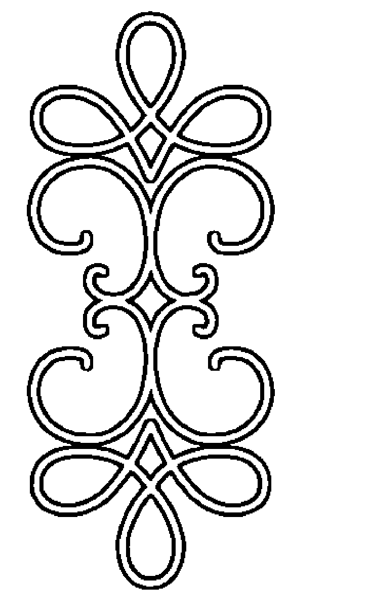

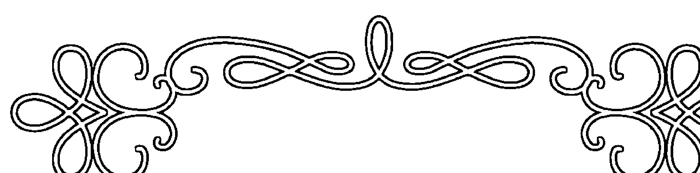

# 第二部分

## 初與塔羅做朋友

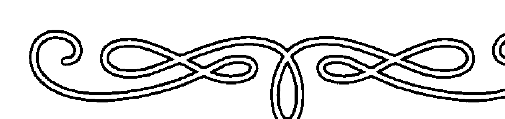

## 溝通前的準備

### 如何增強設計問題的技巧

在讀牌的過程中，想獲得理想效果，除要了解每一張塔羅的意義外，設問和解讀技巧亦是非常重要。在介紹設問技巧之前，我們先來了解一下塔羅的運作原理。

### 塔羅的預測原理與功能

#### 預測原理

塔羅的預測原理不算得很複雜。簡單來說，預測運作原理可分為四部分，塔羅的預測能力就是這四部分結合運作下的效果。

第一部分：它主要是運用我們腦袋內的資源，即我們的生活經驗和知識。

第二部分：是我們與生俱來的原始預測能力。

第三部分：那是與潛意識的溝通。

第四部分：是巧妙的天意，亦可以理解作自然界的能量溝通。

#### 預測原理的運作過程

先舉個簡單的例子來說明預測原理的運作過程。例如：看到心形圖案你會想起甚麼？

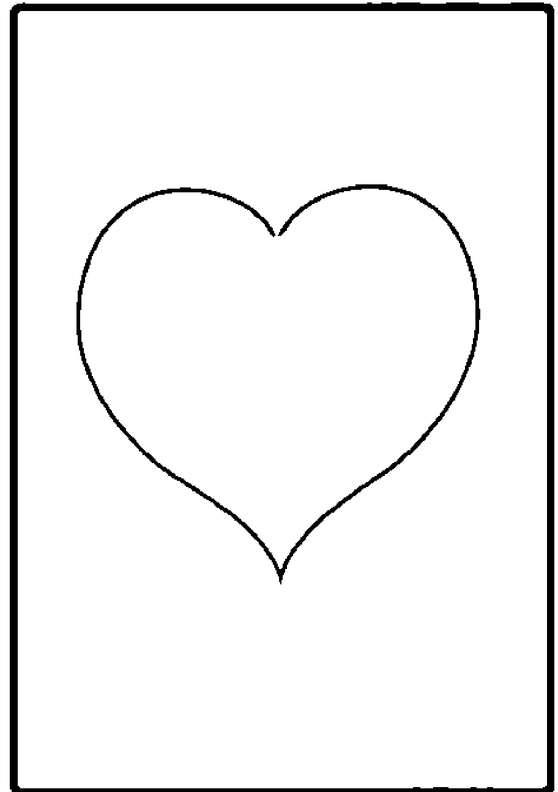

一個心形圖案可能會令你想起愛情、一些你所喜愛的人和事、人的心臟，或者一些情感等和「心」有關的東西。

拉得再遠一點，你或許會想起一些書本或歌曲，然而這一些書本或歌曲，大概都是和「心」或情感的事情有關吧！你該不會因為看到心形圖案而想起洗衣機或牙刷吧，除非洗衣是你最喜愛的活動，又或者你想起的是你最愛的那一支牙刷。

餘此類推，兩個心形圖案可能會令你聯想起兩份情感。破碎了的心形圖案會令你聯想起令人心痛的情感。

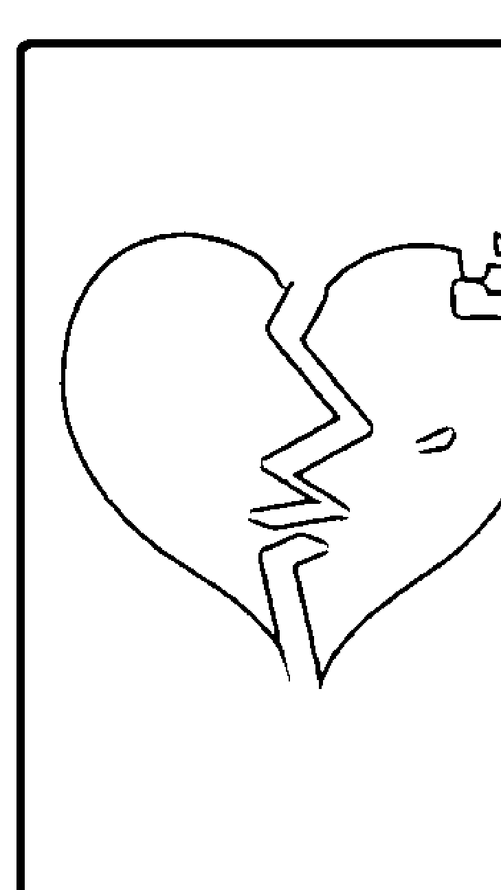

那麼，心形圖案給插上了劍又如何？你也許會聯想到心被傷害了。

圖中正是偉特小阿克羅寶劍 no.3，而「心被傷害了」亦正是這一張牌的基本寓意。

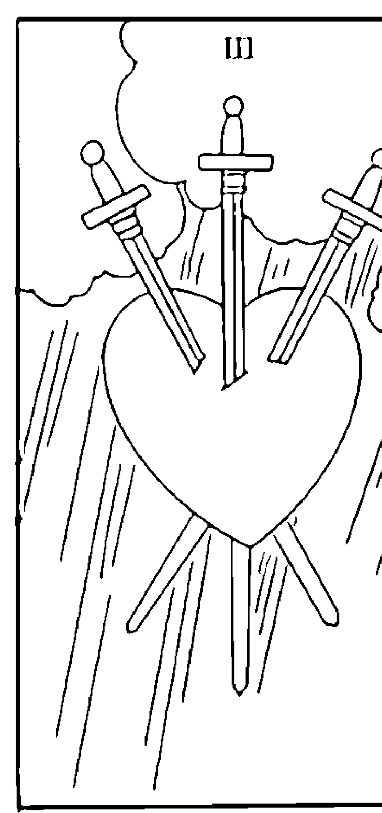

### 我們與生俱來的原始預測能力

我們又談一下第二部分，我們與生俱來的原始預測能力。也許你曾聽說過有關動物能預測天氣的事，有一些人稱這一種功能做「敏感」，有一些人稱這一種功能做「直覺」，亦有人稱這一種功能做「預感」。

無論別人如何稱呼這一種感覺，它依然是上天送給我們每一個人的禮物。利用這與生俱來的原始預測能力，配合人生經驗，我們便可以預計各種事情的可能性和結果，在災難前作點自我保護的措施。

可是，這一種感覺說到底亦只是一種預感，它不足以助我們改變世界；我們只能利用它來提醒自己，在某一些時候作一些保護的準備，避免一些苦難，我們卻不能改變天意。正如那些小動物只能利用預感避開風吹雨打，但牠們不能利用預感改變大自然中的生態循環。

在高級班的課程中，我們會教授一些培養直覺力的方法，有興趣的朋友可以參考《塔羅外傳》一書。

### 潛意識溝通又是甚麼呢？

意識雖是人皆有之，然而要解釋意識和潛意識，我們得花上不少篇幅。為了節省大家的時間，以及更快踏進塔羅之門，我在此嘗試以一個比較簡單而生活化的例子，來說明「潛意識溝通」究竟是甚麼一回事。

我想，你大概都遇過相類似的情況：你一個人走在街上，忽然感到在你視線範圍以外，有人在盯住你，那個人並沒有作出任何大動作，他沒有作聲，也沒有人告訴你他在那裏。你感覺不自在，隨着那感覺回頭一望，原來，在那個你不曾留意的角落，真的一個人在注視着你。

這一個情況，就是兩個人的「潛意識溝通」。

你也許會問，為甚麼占卜師會知道當事人在想甚麼？其實那便是兩者的潛意識在溝通，這亦是一種感應力、一些感染力。因為有「潛意識溝通」，再加上塔羅作媒，占卜師便可以替人作出心靈閱讀。

### 巧妙的天意

我們不難發覺，人生之中，實在有着太多的巧合。原來巧合並不全然是迷信的事，巧合在科學裏頭亦有一個學名，瑞士心理學家榮格認為，那一切一切的巧合，並不是偶然，他給「巧合」冠了一個聽起來十分科學的學名——「共時性（Synchrony）」。榮格更花了不少筆墨去讓我們明白，所有巧合事件，實是宇宙中一個非因果法則，「共時性」的運作目的在於促進人類意識的成長。從不斷的偶然和巧合之中，我們會得到經驗，我們會從經驗中學習、改進、提升人生。

他認為「共時性」其實是一個自然界的定律。情況就好像烏雲出現然後會下雨，我們不會因為每次下雨都見到烏雲而感覺奇怪。（因為我們有科學解釋嘛！可是很多年前沒有科學解釋又如何？）

在此我得向榮格說聲多謝，有了「共時性」的說法，令我們可以更完整和具體地解釋塔羅的運作原理。我們終於知道塔羅閱讀的過程之中，畫面中那一些象徵性的符號與圖案，可以刺激我們的潛意識、記憶和聯想力。

按照這一些資料，配合巧妙的天意，再加上我們與生俱來的原始預測能力、占卜師與占問人之間潛意識溝通，我們便可以利用塔羅預視事態展向，預測各種可能性。

## 善用塔羅，它就是我們「人生的地圖」

不少塔羅師都喜歡以人生的地圖來比喻塔羅。

塔羅牌的圖像，描繪我們心中的風景和人物。塔羅的系統、牌陣設計，就仿如一幅地圖。我們漫遊人生路上，於不同的階段，會遇上不一樣的風景、不一樣的人和事。

假設，人生旅途之初，我們隨身行李就只有意識。然後我們的意識，令我們有了感覺。身處於無邊無際的世界，我們的感覺為我們作決定，選定了我們人生路的方向。我們沿着無形而既定的路線行走，無論走得快一點，還是慢一點，在既定了的路線上，我們還是會遇上一些既定了的景物。

當日月無光，我們會拿出地圖來查看，地圖上面描繪了世界的大綱，除了我們走過的路線，還有我們即將到達的目標。宏觀一點，我們還可以看到其他無窮無盡的路向和路標。按照地圖上的顯示，我們既可探知前路，亦可重畫我們的方向。

人生路的地圖，就是塔羅的預測原理。塔羅所預計的，其實是我們心中所預計的，只是我們看不到，或者不懂得去面對。有時我們身上欠了一盞燈，看不到地圖上的啟示，便會請教一些提燈的人，這一些人就是靈性導師、塔羅師又或者一些善於閱讀塔羅牌而又了解你的人。

與其說塔羅是一件占卜的工具，我覺得它更像一面鏡子，一件顯示潛意識的工具。又或者它真是一幅地圖，它會告訴你，當你向某一個方向走的時候，你便會遇上某一些人和事。

因此，塔羅的閱讀並不等於算命，雖然兩者同樣能夠為我們作出某程度上的預測，然而兩者的運作，是基於兩個完全不同的系統。我不否認當塔羅結合某種算命術時（例如占星術），我們會獲得更多更詳盡的資料。然而，當你獨立使用塔羅進行閱讀時，它只是會按照你目前的行事方式及可見的環境因素，去助你分析並推斷出各種可能性。

塔羅閱讀的結果，絕對會因應當事人改變行事方式而有所轉變。它是短暫性的、事件性的，它會在途上幫助你觀測周遭的景物。因此，塔羅並不會告訴你，何年何時何月你會結婚生孩子，何年何時何月你會死去；雖然，在高級班的課程，我們都會教授一些如何以偉特塔羅結合星象資料來計算時效的方法，但在這之前，你需要一些根基，才能把這些資料運作自如。

如果你對塔羅和占星還未算很熟悉的話，當你在閱讀的過程之中希望獲得某一些資料或意見，建議先設下一個問題，你才能有效地找到所需要的答案。正如你的心中要有一個目的地，你才能在地圖上找到一條最佳路線。否則，每一次打開地圖，你只會漫無目的地看到一些山水人物。所以，當你打算使用地圖的時候，你一定要先了解使用地圖的方法。

## 塔羅的提問方法

塔羅的閱讀方式很多，我知道某一些占卜在閱讀的過程之中會採用「單向」的閱讀方法，即是不需要占問人提出問題，而是直接按牌陣中的指引，向占問人作出某程度上的提示。

這一些塔羅提示，通常因應占問人的內在需要，由占問人，或占問人與占卜師的潛意識合作下牽引出來的。因此，占問人在這一一種閱讀過程之中，可能會得到很多對於日常生活或親密關係有用的資訊，甚至會驚訝於占卜師能夠如揭秘一樣，把一些私隱和經歷一一講出來。可是說到最後，卻不一定能夠從畫面中獲得表意識所需求的答案（即理性上需求的答案）。

某些塔羅解說者會在解讀之後，給予對方時間提出問題，以便更深入了解整個牌陣內容。不過很多人因為一時間得到太多資訊，腦袋轉不動，未能好好把握這個時機。又有一些新手更會在解讀牌陣的時候，出現不知從何說起的情況。所以，最直接的方法，就是說出當事人的問題，找出問題的重點，然後配以適當的牌陣去找答案。

可是當遇上「只知道自己有問題，而不知自己的問題在哪裏」的情況時該怎樣？

無論你是一個占卜師或是想占問的人，你或許都有機會遇上這一一種情況。你也許真的希望能夠在人生的地圖上找一些意見，可是你又不知道自己的目的地是甚麼地方。在這一一種情況下，你可以參考一下接下來的設問技巧引導。

我們先來了解一下，這一套充滿智慧的卡片，在我們遇上問題時，能給我們怎樣的幫助。

### (1) 在人生地圖上，你會得到甚麼資料？

- 目的地是否真實存在——
目前你可能感覺十分困擾，然而你有沒有想過，也許你所憂慮的問題並不存在，你一直擔心會發生的事也許根本不會發生。

- 出發點和目的地之間的障礙和景物——
當你為某一些事情作出了決定以後，你可以利用塔羅來預視一下，在整個過程之中你會遇上甚麼困難？在甚麼途徑下，你會得到一些額外的幫助？

- 你選擇的交通工具（前行模式）的可行性——
塔羅會告訴你，你現在的行事方式、決定，於該事件上是否可行？你身邊夥伴的性格，他或她的價值觀、行事方式跟你是否合拍？會否有衝突出現？會否影響事態發展？

- 出發日期跟限期配合的可行性——
在牌陣之中，塔羅會告訴你目前是否最佳的時機；是否應該再等待一下，待一切就緒才起行；還是應該加緊腳步，因為最佳時機即將過去。

現在，大家都知道這一張人生地圖能為你提供甚麼資料了。我們可以開始談一下提問的技巧。

### (2) 提問的技巧 = 如何使用人生地圖

- 你選擇的交通工具 = 你目前的行事方式。
假如你的出發點是香港，目的地是美國，而你現在選擇的交通工具是巴士，那麼你如何飄洋過海？塔羅可能會建議你改乘船。又假設你希望於三十小時內到達美國，塔羅可能會建議你改乘飛機。這亦即是建議你改變你的行事方式。

- 確認你的出發點 = 你目前的狀況。
- 確認你的目的地 = 你所定下的目標。
- 確認預定到達日期 = 就是指如果你想在限期前到達，那麼你的限期是甚麼？你的出發日期又是甚麼？哪一個才是跟占問人直接有關的人物？例如是情人或正在暗戀的人之類。

## 初與塔羅做朋友

種種古怪的傳說使塔羅廣為人知，可是疑幻疑真的故事，亦為塔羅蒙上了一片灰暗的神秘面紗。使人誤會這一頁頁古老而美麗的圖畫、人類經年累積的智慧和經驗，是一些與邪惡溝通的道具。不少人曾經對塔羅產生好奇，最後卻只能敬而遠之。

為甚麼我們可以閱讀《聊齋誌異》，把從故事中得來的領悟叫做啟示，而把從塔羅畫面故事中得到的啟示叫做通靈？

為甚麼我們可以接受《易經》的卦象對前途的提示，並視之為中國人智慧的經典，卻不願打開心窗去接受另一種來自西方的智慧？

究竟我們該以怎樣的態度去接觸塔羅？

塔羅是鬼還是神？

塔羅不是鬼不是神，就如你所看到的一樣，塔羅只是一些美麗的圖畫；只是圖中一些圖案經過設計後，多了一種刺激人類潛意識的功能，我們可以藉功能結果，了解人的心態和事態。情況就好像我們常常玩的心理測驗一樣。現今發現的一些五百年前的古代塔羅牌，上面會有一個人的圖像，旁邊有些文字，講述有關這一個人的寓言故事。

我們可以把塔羅當成是一個新相識的朋友，以放鬆的心情跟它相處，坦誠地打開心窗跟它交往。從了解塔羅的過程之中了解自己，讓它了解你、提示你，助你了解生命的本質和意義，活得更加充實和快樂。

## 塔羅牌系統與結構

打開了塔羅牌的包裝盒，我們會發現裏面有二十二張大阿克羅和五十六張小阿克羅。有時，某一些出版社會附加一張空白的紙牌。當遇上其中有牌破了或者是遺失了，白牌可作為補足之用。

### 大阿克羅

大阿克羅的一般排序為 0-21，每張牌上面都有一個獨立的人物故事，並清楚列明了畫面的名稱和序號。

大阿克羅順序排列如下：

- No.0 愚者（The Fool）
- No.1 魔術師（The Magician）
- No.2 女祭司（The High Priestess）
- No.3 女皇（The Empress）
- No.4 皇帝（The Emperor）
- No.5 祭司（The Hierophant）
- No.6 戀人（The Lovers）
- No.7 戰車（The Chariot）
- No.8 力量（Strength）
- No.9 隱士（The Hermit）
- No.10 命運之輪（Wheel of Fortune）
- No.11 正義（Justice）
- No.12 吊人（The Hanged Man）
- No.13 死亡（Death）
- No.14 節制（Temperance）
- No.15 惡魔（The Devil）
- No.16 塔（The Tower）
- No.17 星星（The Star）
- No.18 月亮（The Moon）
- No.19 太陽（The Sun）
- No.20 審判（Judgement）
- No.21 世界（The World）

### 小阿克羅

小阿克羅以四種不同的圖案分類，分別是五角星、聖杯、寶劍和權杖。每組圖案都有十四張牌，包括四張宮廷人物牌和十張編號牌。

組合順序排列如下：

#### 五角星組

- 五角星國王
- 五角星女皇
- 五角星騎士
- 五角星侍從
- 五角星 Ace - no.10

#### 聖杯組

- 聖杯國王
- 聖杯女皇
- 聖杯騎士
- 聖杯侍從
- 聖杯 Ace - no.10

#### 寶劍組

- 寶劍國王
- 寶劍女皇
- 寶劍騎士
- 寶劍侍從
- 寶劍 Ace - no.10

#### 權杖組

- 權杖國王
- 權杖女皇
- 權杖騎士
- 權杖侍從
- 權杖 Ace - no.10

## 閱讀大阿克羅

市面出售的塔羅，很多都附有牌義以供用者參考。可是，看參考書不等於死背書。對於每一副塔羅的象徵意義，一定要盡量去理解它的由來，活學活用，更加不能把 A 牌的牌義硬套在 B 牌上面解說。

要真正了解塔羅，一定要懂得閱讀塔羅的技巧，掌握了塔羅技巧以後，無論拿着哪一副牌，都可以很快使用流暢，得心應手。

### 一般閱讀方法

(1) 買了一副塔羅牌回來，打開了包裝，把裏面的卡片全數取出，抽起了白卡和介紹卡後，細心地把卡片的次序重組。在過程之中，利用自己的直覺去理解畫面的構圖，感受一下畫面帶出的氣氛和感覺，並且用紙筆記下你在畫面中所觀察得到的事物。這樣有助你在了解卡片之餘，亦能檢查錯漏；而你所記下的一切，就是你個人的筆記了。

(2) 以牌中人物故事、性格作為解說的參考。別忘了思考畫中的每一個符號、裝飾和背景，每一個微細的畫像，在畫中都有它的存在價值。無論畫中的人物在故事中擔演的是主角還是配角，他們的出現，都會帶着一些靈意。我們在課堂上甚至常常會笑說，沒有出現的細節也有它的存在價值。

這樣當然不是隨便說說而已，如果你夠細心，或許會留意到 RWS 的 No.0 愚者畫面少了一些重要的甚麼。

快快把牌拿出來看，找到了沒有？讓我開估好了。

請留意一下，這一張牌並沒有畫家 Pamela Colman Smith 的簽名。通常她會把自己的簽名放在畫面的右下方，偏偏這一張牌就沒有。據說是她本人不大滿意這個畫面的安排，但為了成全整體的出版，最後就以不簽名來表達自己對這事情的不同意。為甚麼她會不同意呢？對這一張牌本來希望展現的意義有甚麼影響？或許，你又可以從她的背景和身份找到一些線索，豐富你的個人塔羅牌義。

(3) 想一想畫面故事中一些已經出場或一些即將出場的人物。這一些資料沒有在牌陣中出現，卻有助推測事態發展。

### 逆位時的閱讀方法

當塔羅牌義以逆位出現，可解說的內容其實比正位畫面還要豐富。由於原創者本身並沒有特地設定逆位牌義，以致逆位牌義的發展變得廣闊、無邊無際。在高級班和專業班課程，我們有幾十個小時的專門課堂去教導逆位牌義，比起教導正位牌義的時間還要長得多。

我們從來不建議用家急於以逆位解讀塔羅。在開牌的時候，扶正本來倒轉的牌，以正面解讀，其實亦有相當豐富的內容和資料可以提供。

在不理解的情況下胡亂估量逆位牌的意義，很容易造成誤導。不過，如果你是一位初學者，可以先看看下面的方法，試試創作自己的逆位牌義，然後反覆驗證，待有了一定的把握就拿出來應用。

(1) 當牌面倒轉出現時，可以理解作為正面牌義的相反意思。
(2) 別忘了雖然牌面倒轉了，但當中的部分意義依然是存在的，只不過它們已經過去或失效了。
(3) 還有，倒轉了的牌，可能是在說明一個無法改變的事實。
(4) 倒轉了的畫面，可能與現況有一種因果關係。

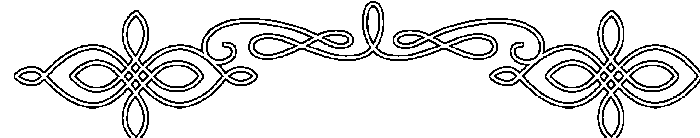

# 第三部分

## 閱讀大阿克羅

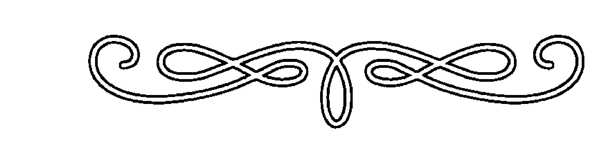

## No.0 愚者 (The Fool)

掌管星座：天王星 (Uranus)
元素：風 (空氣)

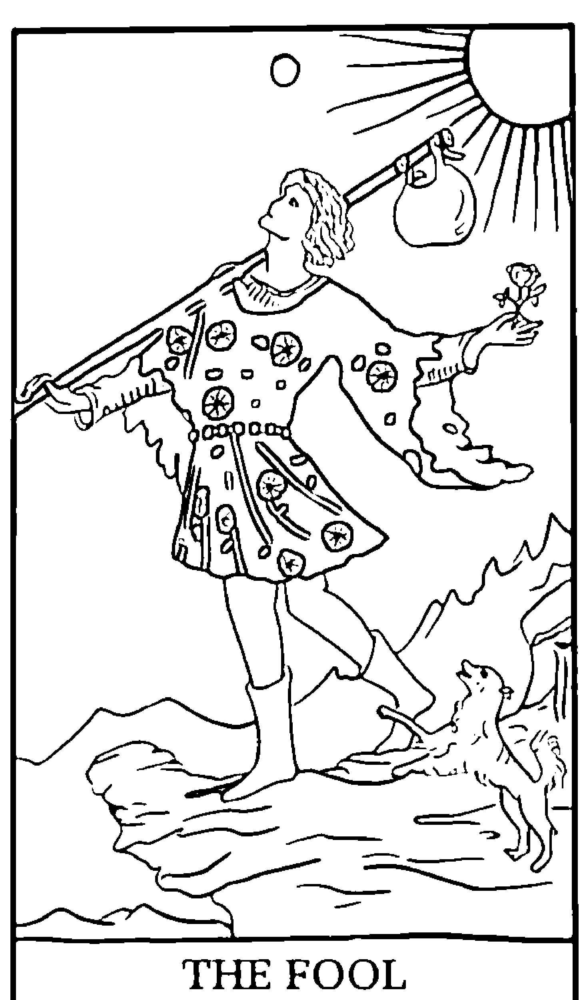

### 畫面主要組合：

環境：明朗的天空，午間的太陽，懸崖，浪濤，遠處是冰山。
人物：太陽下，一個打扮得七彩繽紛的人，手握白色小花，肩挑著小包袱。他輕提步，身心開展，站在懸崖旁。他臉上掛著輕鬆的微笑，腳下是波濤洶湧的大海，右腳邊有一隻白色的小狗，小狗似乎正想與他溝通。

### 基本解說：

- 愚者造型設定表達他多采多姿的內心世界，不從俗的打扮，象徵著無盡的可能性。

## 愚者

+   * 愚者肩上挑着的小包，就是他在冒险旅途的一切所想所需了。当事人可能有一个梦想，此刻他正向梦想前进并打算随时作出有限度的牺牲。（看他的小包，他的资本应该不会很大啊！）

+   * 愚者正全心向着一个新的方向进发，他的视线向前朝上，表情轻松，象征充满了信心。

+   * 牌中白色的小狗，对应现实生活，可以理解为当事人身边的一个跟随者，一个行为实际、支持愚者的忠心人。他的动态可能是附和愚者的决定，亦有可能正在对愚者发出忠告。请提点当事人，应务实一点去行事，小心自己过分轻松的步伐，要理解梦想与理想的分别，看清在幻想与现实中的分界线。不要让自己真的变成一个愚人。

+   * 这一张牌的元素是风，象征了一些比较不实在但不能欠缺的事情。例如一些传统的法规、守则、默契等等。

+   * 白色的小花有浪漫和讨好自己的意思。

+   * 愚者虽然拥有不多（只有一个小包袱），但至少还有一个忠心的人（小狗）守在他的身边。

### 逆位的解说：

+   * 当愚者牌逆位的时候，当事人的生活会出现变动，可能是迁居、可能是一个新的工作环境或者是一种新的生活方式。总之是要带着不确定的心情，轻装上路，离开既有的模式。

+   * 逆位牌中的小狗，暗示了一个危机，一个对你带来坏影响的人。他可能是一个不起眼的人，亦可能是一个既定形象十分优良的人，令你忽略了他所带来的负面影响。所谓的负面影响，并不一定是直接诱惑你去作出坏事，可能只是彼此的价值观不相同，影响了你做事的意向，以致令事情最终得到不良结果。同时，这一个人亦有机会是久别重逢的旧朋友；但眼前这一个人，已经不再是过去的那一个人。岁月令他的个性改变了。

### 对应指定问题的附加提示：

### ❖ 工作

正位：当事人正考虑作出一些转变，例如转换工作环境，甚至转换工作性质。内心有一股极大的推动力，使其希望尽早跳出熟悉的版图。他期待的并不全然是物质上的回报，更多是想实践心内的想法，得到满足感。

逆位：渴求转变的心情实在强烈得过分，三言两语未必能够阻碍当事人的决定。唯有提示对方在作任何决定前都应要先调查一下新环境中的人事状况、行业的整体环境因素，以及在经济上作出准备，以防万一。

### ❖ 个人发展

正位：近月的连串经历，令当事人产生了对生活上的反思、对未来生活的新构思，以及自我发展的各种可能性。虽然这些改变不一定可以持续发展，但在心灵层面上，这一切都是正面而具有生命力，影响深远。

逆位：在不良的环境中，因为受到身边的人所影响，当事人产生要逃避现状的想法，孤注一掷的心情在不理性的情绪带动下，想在目前的环境中挣脱出来。

### 健康

正位：注意因为行动不小心所引起的损伤。成长中的孩子们须注意有关手脚协调的训练。如家中有饲养宠物，应多关注它们的生活状况。

逆位：登山或远足时要特别小心，注意路面情况。愚者牌逆位出现，表示当事人的生活中正出现一些过度的情况，例如过量饮食、过度玩乐而忽略休息等。

### 学业

正位：产生转换专修科目的想法。选择比较冷门的科目会有突围的表现。适合学习有关身心灵整全的学科。

逆位：玩乐过度、荒废学业。需注意成长中的学童有没有过度活跃的表现。

### 爱情

正位：浪漫的邂逅。一段看似没有结果的爱情。个性带点飘忽，性格独特而可爱的恋人。朋友之间的暗恋。

逆位：非常亲密的朋友，但未发展到恋人关系。要好好看守恋人，小心有人乘虚而入。爱情关系中不成熟的表现。

### 友情

正位：对别人没有伤害性的小圈子活动。臭味相投的友伴。来自两个不同世界的人，却具备良好的沟通。

逆位：要小心误交损友，或者误信别人的流言，对自己造成负面影响。应该保持理性，坚守自己的价值观，不要受到别人所影响。

## No.1 魔术师 (The Magician)

掌管星座：水星 (Mercury)
元素：土 (地) / 风 (空气)

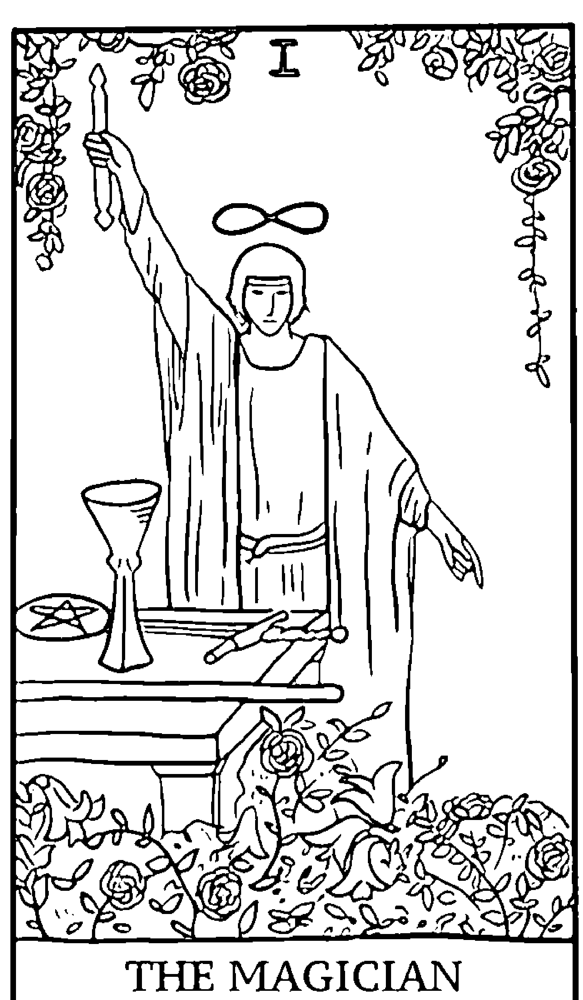

### 画面主要组合：

环境：明朗的天空下，开满了玫瑰和百合的花园里，画面前方有一张工具桌，桌上放置了四件工具，包括圣杯、五角星、权杖和宝剑。

人物：一个头上有一个双扭线（象征无限的符号），身穿红白两色衣服的年轻男士，腰间围着一条灰色、红眼睛的蛇。蛇的口咬着自己的尾巴。年轻男士站在放满魔法工具的工作桌后，举起了右手，看来正要施法，奇异的白光围着他整个人。

### 基本解说：

+   * 男性、魔术师。象征了一个充满欲望和创造力的男性。他懂得掩饰，化腐朽为神奇。正要施法的姿态、白光，象征了他正在发挥魅力。
+   * 头上的双扭线（象征无限的符号），象征了自制力和毅力，这一些力量赋予他无限的创造力、无限的可能性。元素是土和风，象征介乎于现实与虚幻之间。
+   * 四件工具中，五角星代表了财富、圣杯代表了爱、剑是决策力、权杖就是控制力。
+   * 美丽的环境，象征了他正被幸福或幸运所包围，环境中充满正能量和生命力，令人感觉欢愉。
+   * 但请不要忘记，魔术师的戏法，无论多么吸引，到底还是变戏法。
+   * 放置在魔术师面前的四件工具，代表四个方式。可是，这四个方式被一些法制限制了，就会令它们本身失去了发展性。只有魔术表演才能令人暂时放下理性头脑、放宽既有的法规。
+   * 魔术师牌的出现，是要提醒当事人已拥有一切创造理想的能力，有一个充满爱的生命，以及对于金钱、前途等问题的解决能力。

### 逆位的解说：

+   * 魔术师拥有弄假成真的魔法，象征一个性格充满了吸引力的男人，他的能力使人信服。可是，别忘了魔术师的一切，都可能是一种魔法罢了。
+   * 他可能虚有其表，只是一个说谎者。
+   * 提醒当事人小心一个和男性有关的诱惑。
+   * 魔术师需要舞台和观众。一个人能够成功，背后有赖很多因素。除了个人能力，还有环境因素。一旦失去了环境的利好因素，个人再努力也是事倍功半。

### 对应指定问题的附加提示：

### 工作

正位：当事人正遇上了适当的发展机会，应该好好把握，注意与其他部门的合作，借助旁人的力量来获得更大的成功。

逆位：在职场上容易成为焦点，被委以重任，却没有良好的配套。应尽量避免单独行事，好好与人合作，借用旁人的力量，渡过危机。

### 个人发展

正位：在某个与工作有关的场合中，良好的表现引起别人注意。遇上发展自己理想的机会，收获却不是物质。特别有利于正在表演事业中发展的人。

逆位：不是大展拳脚的时候，过度乐观轻率的行动，会招致失败或名誉上的损失。

### 健康

正位：身心愉快，居安思危，要好好保养身体，不要过度浪费体力。

逆位：太多想法，脑袋转个不停，没有好好休息。

### ❀ 学业

正位：青少年朋友在学习环境中得遇机会为众人解决难题，展现出少年领袖才能，得到赏识。

逆位：不要仗恃着凭小聪明得来的一时优势，而忽略培养实力。

### ❀ 爱情

正位：如果你是一位男性，会因为有机会为对方解决一些问题而得到对方的好感。如果你是一位女性，会遇上一位非常有魅力的对象，但不要太早投入感情。

逆位：小心感情骗子。恋爱过了甜蜜期，两个人的关系正迈向另一个阶段。

### ❀ 友情

正位：朋友运走俏，得到大家的喜爱。职场上的朋友会在社交场合中遇上贵人。好好把握机会，扩展自己的社交圈子。

逆位：不要轻易相信别人，即使对方的条件很好、外表很吸引，亦应该花一点时间，看清对方的为人，才更深入交往。这个时候，如果有朋友建议当事人投资，应该三思。

## No.2 女祭司 (The High Priestess)

掌管星座：月亮 (The Moon)
元素：水

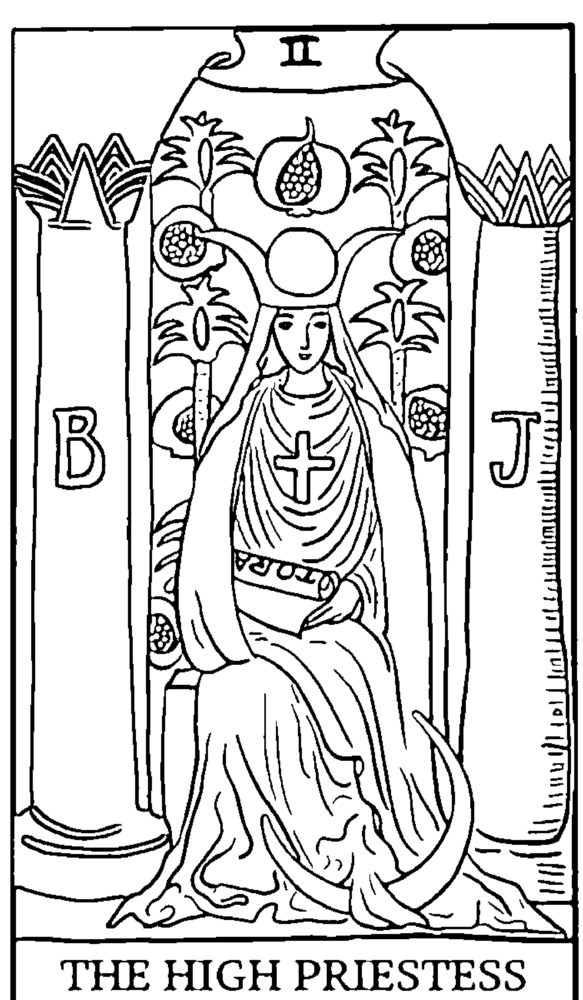

### 画面主要组合：

环境：晚上，蓝调画面。背景是海洋，前景左右两旁分别有一条黑色和一条白色的柱子。白色的柱子上写上了 J 字，黑色柱子上写上了 B 字。两处之间有一道帘幕，幕上绘上了成熟了的石榴图案。

人物：女祭司身穿蓝白色衣服，戴上了新月圆月冠冕，一脸冷静的坐在两柱之间。她胸前挂了一个十字架，手上拿着书卷，书卷上有 TORA 字样。脚边有一件新月形物件，看来是一件法器。

### 基本解说：

+   * 女祭司身份加上卷起来的书卷，象征了一些不会向人随便展示知识和学问的人，一些人类的原始本能、潜意识、一些超自然的力量。书卷上 TORA 字样，可以被绎作犹太人的经典，或一些由字母组合而成的神谕。
+   * 女祭司头上的新月圆月冠冕，提醒人要注意月相周期。
+   * 脚边的新月形法器，暗示她比较阴性而低调，同时却有一个使命，要去照亮大众平时看不到的地方。月亮法器所发出的光芒，可以照亮一些大家忽略了的暗处，揭示一些秘密，以助人去为一些事情作决定。
+   * 女祭司背后的窗帘，被认为是未来通道的帘幕。石榴图案有丰盛的意思，如果女性得到这张牌，亦暗示了一些有关受孕或生育的事。
+   * 两条柱子的设定，被认为是在描写所罗门圣殿的现场。黑白两柱，有二元相对的暗示，而两条柱之上的字母，被认为是《圣经》中两个人物：字母 B 是 Boaz，字母 J 是 Jachin。通过他们的故事，让人理解严谨与慈悲的力量。女祭司坐在中间，正是平衡之道。
+   * 女祭司象征了一个有内涵的人，又或者是一个灵修的人。女祭司亦象征精神力量，一种觉知能力。
+   * 水元素提供了想象的力量，阴性而深不可测的。

### 逆位的解说：

+   * 逆位的女祭司代表一个心思细密或者古板的人，当事人可能是一位女性，也可能是一位浑身都是阴性能量的男性。
+   * 女祭司逆位牌亦表示当事人会遇上一个对其不信任的女性，现阶段对方不会作出任何行动，但已经在当事人的言行上加强注意力。
+   * 当事人身边有一位对俗事表现冷淡，但其实十分神经质的、容易被惹怒的女人。

### 对应指定问题的附加提示：

### 工作

正位：如果你在工作上正遇上瓶颈，留意一下身边有否一位平常表现冷淡，但言行并不负面的女性，试着找她倾谈一下，可能会获得突破性的想法。

逆位：留意那位态度阴森、言行负面的女同事，又或者拖泥带水的男同事，尽量避免接触，他们会是你工作上的最大障碍。

### 个人发展

正位：黑白两柱可以理解为在黑暗和光明之间、正面和负面之间、精神与物质之间。女祭司坐在隔着过去和未来的窗帘前面、黑白两柱之间，象征她有能力把你从一种生命带领到另一种生命，由一个阶段提升至另一个阶段。

逆位：当事人会遇上一个有能力改变目前生活或想法的女人，但结果是好是坏还是未知之数。

### 健康

正位：当事人需要一些能够令到身体与灵性连结的保养运动，例如瑜伽或冥想，日常生活要多加放松和休息。

逆位：注意家中的成熟女性是否正受到精神困扰。女性得到逆位女祭司，要特别注意有关女性周期的健康问题。有空的话，不妨去做一些基本的妇科健康检查。

### 学业

正位：在一些宗教、哲学、文化、心灵、精神或文艺意味比较重的科目上发展，较容易取得良好成绩。

逆位：学习遇上瓶颈，遇上难以理解的课题，又得不到师长的帮忙。

### 爱情

正位：如果你是一位男性，留意一下身边是否有一位经常表现得比较严谨的女人。虽然她平常表现冷淡，但交往之后，就会发现她有过人智慧，能够给予你心灵上的满足。如果你是一位女性，目前对方对你虽有好感，但未有激情。

逆位：如果你正处于单身状态，目前的言行，并未有利于找到对象。如果你正和某人暧昧交往中，二人的关系因为环境条件和彼此不同的价值观，不容易再进一步。

### 友情

正位：当事人会遇上一份难得的友谊，双方不一定会有频密的见面或活动，但言谈间能够达到很好的心灵交流。

逆位：小心身边正有一位心思细密的女性闺蜜，满肚密圈，没有人知道她正在打谁的主意、打什么主意，只知道她的伪装能力很好，是一个利己主义者，无谓多作深交。

## No.3 女皇 (The Empress)

掌管星座：金星 (Venus)
元素：土 (地) / 风 (空气)

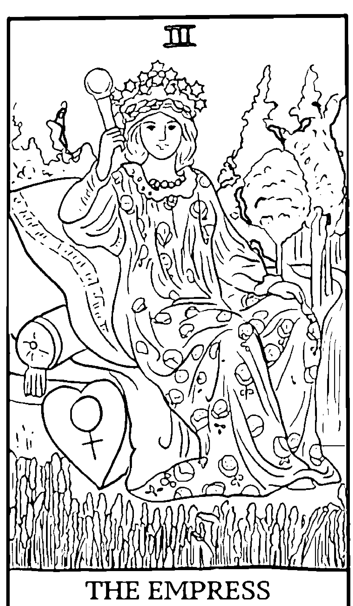

### 画面主要组合：

环境：天色明亮，看似黄昏时分。远处是一片树林，小小的河流，水源流入女皇的庭园，园中有一个铺上红色毛毡和软枕的石座。图中有一些圆圈加十字的标记，这个符号，被认为是与爱、美、金星有关的标记。石座的四周长满了金黄色的成熟麦子。

人物：一个身穿装饰了石榴图案礼服的女皇，头顶着有十二颗六角星的冠冕，颈戴着珍珠链，安和地坐在麦田之中。她手持一支短小的球形权杖，座下放有一面心形的盾，盾上有一个罗马女神维纳斯的标记，又或者是金星的标记。

### 基本解说：

+   * 周围成熟了的麦田，象征生命力、发展和成长，丰盛的生活环境。
+   * 座下维纳斯女神标志，象征了女性的成熟和智慧。心形的盾象征了有爱心的保护。
+   * 女皇象征一个物质生活相当丰富的女性，球形权杖代表实而不华、不卖弄权威。女皇的打扮和姿态，代表一个温柔得有点像母亲一样的人。
+   * 如果你在问一件事情的进度，一切都已经在你掌握之内。
+   * 如果你在问事情的结果，这一张牌正在告诉你，一切都是那么美好。
+   * 女皇的皇座在大地之上而不是在皇宫，意味她是大地之母，拥有良好的判断力、理智而有耐性，她的心中充满了爱，她为人慷慨，喜欢从给予的过程中得到满足感。

### 逆位的解说：

+   * 一个母亲或一个女性，正为自己所照顾的人而忧心。可是在不断付出的同时，她忽略了她给予的方式出了问题，以致对人过分的溺爱，引来不良后果。
+   * 当事人有恋物的癖好，太多物质的积存。
+   * 女皇逆位，放下盾牌，即是放弃了保护自己的装备，以及自己的身份。当事人太过感情用事，以致忽略了自我保护。
+   * 当事人不清楚自己在环境中的定位或局面中的身份，害怕有人会抢走她的东西，以致失去理智，言行不当，误用了权力，予人强烈的占有欲以及妒忌心。
+   * 当事人会遇上一个贪心的人。
+   * 女性得到逆位女皇牌，要小心自己在某个环境中的地位开始动摇了。

### 对应指定问题的附加提示：

### ❖ 工作

正位：一贯的认真态度加强了实力表现，终于在职场上获得认同，得到物质上的回报。如果你正在找寻工作，将会获得一份优差。

逆位：小心因为过分照顾下属，在职场上的地位受到动摇。在工作环境中予人慵懒的感觉。小心态度不良的女同事。

### ❖ 个人发展

正位：在某个范畴已经培养出一定的实力和信用，可以为个人独立发展或升级试作一些准备工夫。创业的人可以考虑一下成熟女性的消费市场。

逆位：不要高估自己在某个范畴的存在意义。不进则退，已经有很多人超前了，应该急起直追。

### ❖ 健康

正位：养尊处优，小心发胖。女性得到这一张牌，容易有怀孕的机会。

逆位：应注意因为肥胖而带来的亚健康问题。因为生活环境、生活习惯等因素影响，不容易受孕。

### 学业

正位：进修一些与奢侈品、美丽或关爱女性有关的科目，会比较有经济效益。如果想提升学业运，应注意阅读环境的布置。

逆位：因为过度注重享乐，以致忽略了应该要为学习所作的准备工夫，影响学业成果。母亲的过度溺爱，影响孩子身心发展。

### 爱情

正位：女皇牌代表美丽善良的女性。如果正在发展一段关系，这一段关系当中充满了爱和包容。单身女性如果寻求恋爱机会，应该多到外面走走，让人见识你的好处。

逆位：已有对象的朋友，应该多注重爱情保鲜。如果之前曾有一段暧昧的关系，这一张牌正要提醒当事人，关系可能会有转变，对手的地位会下降。

### 友情

正位：当事人有机会遇上一位比自己年长的友人，从对方身上学习到有关人与人之间相处的课题。参加朋友的家庭聚会，获益良多。

逆位：即使初遇的时候交流愉快，但因为地位和身份悬殊，友情在现阶段未能得到进一步发展。

## No.4 皇帝 (The Emperor)

掌管星座：白羊座 (Aries)
元素：火

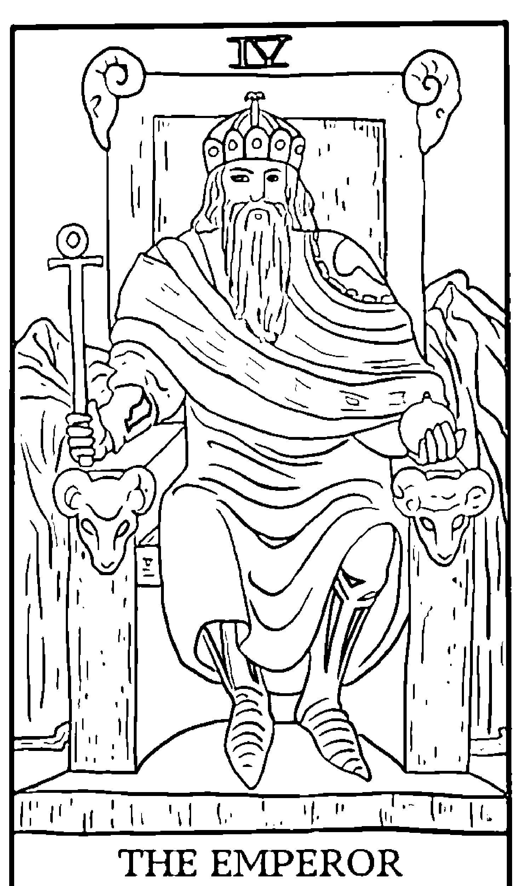

### 画面主要组合：

环境：户外，黄昏。背景是严峻的、光秃的山丘。前方有一方正的石制皇座，以公羊头作为装饰。石座后面有一条细小的水流。

人物：满面白胡子的国王，头戴着镶有蓝色和红色宝石的金皇冠，身穿红色衣服和披肩。衣服下露出穿着盔甲的双脚。他的人端正地坐着，右手拿着权杖，左手拿着金球，眼睛却望向自己的右方。

### 基本解说：

+   * 皇帝牌的排序在女皇牌之后，代表男人对女人的尊重。当事人虽然比较自我中心，却是一个懂得尊重女性的人。
+   * 石座上公羊的头部是白羊座的象征。白羊座是黄道十二宫里排行首位的星座，白羊座热心而具有积极性，充满活力，善于进攻，性格倔强、直接又略带有婴儿的天真气质。代表当事人性格直率而不狡诈，如孩子般直白。
+   * 手持权杖，象征当事人重视权力，同时亦具有良好的领导才能。球体代表物质、实际和安全感。
+   * 石制的皇座，象征了不容易改变的思想。他的王国有着一个坚实不虚荣的基础。
+   * 掌管这一张牌的元素为火，暗示了动力和热心。皇帝面部表情严肃，代表当事人性格严肃、积极而有智慧，对待感情态度认真；但在不自觉的情况下容易为人带来压力，或为自己造成压力的感觉。
+   * 皇帝的形象，象征了一个父亲型、成熟或有吸引力的男人。这一个人在某环境之中，具有一定权力或影响力，很多人都以他的决定为依归。

### 逆位的解说：

+   * 当皇帝牌倒转出现，思想单纯的皇上会变成一个幼稚的暴君。他可能只是单纯地喜欢控制事物，而没有行使权力的智慧。
+   * 皇位，可能只是一个名誉圈套、权力的陷阱。堕入陷阱的人，会因为保障这一切而得不到足够的休息，慢慢出现了厌倦和不满意。
+   * 皇帝倒转了，亦有很大可能是主权出现了问题。
+   * 严肃的表情可能是发脾气、情绪变坏的象征。应多留意环境中成熟的男士或团体中男性主导人的情绪状况。
+   * 不期然流露出来的严肃表情，过度保护自己的行为，虽然不带恶意，但令人产生距离感。
+   * 环境中出现了男女不对等的待遇、性别歧视等状况。

### 对应指定问题的附加提示：

### ❖ 工作

**正位**：皇帝牌的出现，特别有利于经验丰富、作事态度成熟的专业人士。当事人不高调，在环境中得到尊重。

**逆位**：职权划分不明确，职场上有人滥用权力，令人产生抗拒感，影响工作进度。晋升路上遇上障碍。因为得不到下属的支持，影响工作进度。

### ❖ 个人发展

**正位**：在特定的范畴中已经获得不少经验和认同，可考虑以顾问形式发展。

**逆位**：在熟悉的环境中，产生时不与我的心情。虽有丰富经验和过人能力，却没有发挥的空间。面对困难的工作却没有适合的合作伙伴。

### 健康

正位：三十岁以下人士得到这一张牌，代表身体出现未老先衰的情况。成熟的男性得到这一张牌，要多注意与心肺功能有关的健康问题。

逆位：逆位皇帝牌的出现，提醒当事人要多注意因为过劳或压力过大所引起的亚健康问题。

### 学业

正位：皇帝牌的出现，建议当事人可以选择一些比较传统、务实、与物质或管理有关的科目作为进修方向。虽然过程十分刻苦，但努力终会得到回报。

逆位：会遇上古板、严谨的老师。

### 爱情

正位：皇帝肯定不是一位善于展示温柔的恋爱对手。在爱情关系当中，皇帝的优势是给予对方安心与责任感。

逆位：霸道专权的个性，影响恋爱发展。

### 友情

正位：皇帝带有孤僻感，不合群、不善于经营热闹的人际关系。不过一旦认定你是朋友，就会很坚定的把你当成深交。

逆位：执着于过去一时的成功，倔强地坚持无谓的观念，令人不想与其接近，难以建立真挚友谊。小心被人暗箭伤害。

## No.5 祭司 (The Hierophant)

掌管星座：金牛座 (Taurus)
元素：土 (地)

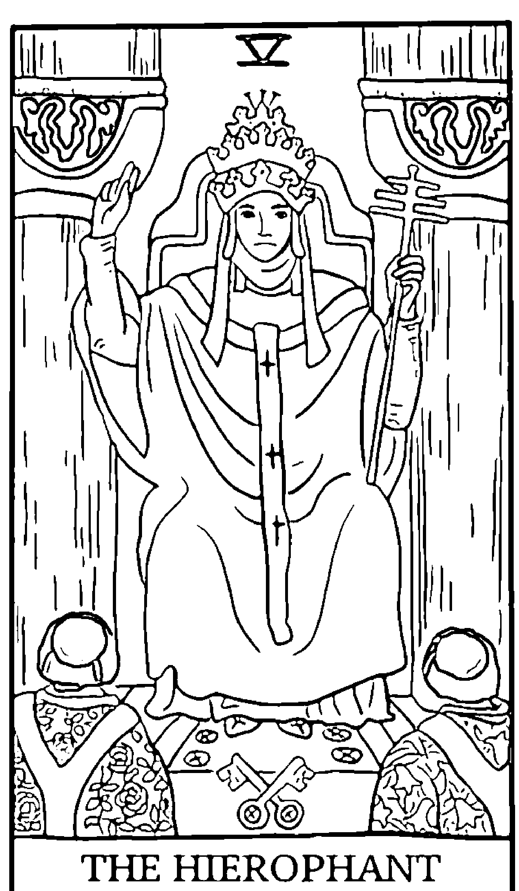

### 畫面主要組合：

環境：建築物，看似是教堂。左右兩邊有白色的石柱。石柱中間是石製的皇座，皇座前面有看似祭壇的佈置，枱面上有兩把交疊的鎖匙。

人物：教堂內，祭壇之上。頭戴著象徵三合一黃金十字冠冕、身穿正統紅衣佩帶三合一十字飾帶禮服的祭司，左手執著三重十字架黃金權杖，右手舉起二指向天，一臉莊嚴。祭壇前面有兩位看來是助手或信徒的人，畫面左下方的一位身穿紅色的玫瑰花式樣衣服；畫面右下方的一位，身穿藍色衣服，上面有白色百合圖案。

### 基本解說：

- 傳統中祭司的形象，通常代表精神力量和信仰。他的形象是專業的、正面的，周遭人士都偏向以他的意見為依歸。
- 祭司象徵了一種跟神明聯繫的角色，以人性的形象來傳達神諭，他的形象是公正而有一點神秘。祭台，處理祭祀之事，代表與神明溝通。代表當事人是一個善於處理俗世問題的人。每遇上人事需要中介人時，他總會成為一個中心人物。祭司在古代常常都擔當一個中間人或安撫驚慌的角色，他會提供一些良好和實際的意見。
- 掌管這一張牌的土元素，有實際的意思。金牛座暗示當事人的性格頑固、聰明。如果不觸及他價值觀的底線，他會是個十分容易相處的人。
- 當事人其實已經知道如何去解決他的問題，雖然方法並不是容易的，也不是一時半刻間可以完成，但它卻是實際而可行的。

### 逆位的解說：

- 金牛座的性格特徵是倔強，而祭司象徵了守舊或保護舊有制度的人。祭司亦可以被演繹成一個令人厭惡的、太過保守的人。當事人可能是一個古肅頑固、忠於書本的知識或舊有價值觀的人。
- 祭司捍衛着教派的制度，當祭司倒轉過來，可以理解為制度嚴苛、不講理，以制度作為藉口或手段去滿足個人利益。

### 對應指定問題的附加提示：

### 工作

正位：教會，代表大公司、大組織、大規模、大制度。祭司，代表專業、經驗、公信力。職場上，祭司牌能量偏向正面。建議以務實、公平的態度去工作，自然就能得到眾人的認可和支持。

逆位：工作環境中，會出現一些變化，打破一些慣性流程。這些變化通常來自新的從屬關係。同時，局面中有人正利用制度去滿足一己私利。建議當事人不應在現階段選擇靠向任何一方，應該以中立、踏實的態度去工作，才能避免因為錯誤選擇靠向而產生的煩惱。

### 個人發展

正位：人與人之間的交流、知識的傳承，可以有很多種方式。祭司牌提示未來的進步是循序漸進的、令人感恩的。這個時候，十分適合發展一些師友計劃，一個經驗深厚的老師，帶領着經驗尚淺的新老師，亦師亦友地一起進步。

逆位：眼下的知識傳遞方式，似乎並不是最適合現在的環境。可以試着考慮轉換方向，離開本來的環境透一透氣，才考慮有關未來的問題。

### 健康

正位：是祭司（人）與神之間的溝通橋樑，祭司牌的出現，是提醒人要特別注重精神健康和滿足感。當事人目前需要一個信仰或者一套哲學去應對目前生活環境所遇上的種種問題。

逆位：每個人的生命和時間都是屬於自己的。不要因為只顧回應別人的需求、滿足別人的期待而犧牲了自己的感受，逐漸形成壓力，令身心失去平衡。

## 學業

正位：這一張牌特別有利於宗教哲學或文化研習。在這一個階段，如果想獲得良好的學習成果，正統的學習環境以及一位願意溝通的好友是最重要的。

逆位：進修是為著追求知識的本質，不要因為崇尚名牌的心理而執意進入某個環境學習。

## 愛情

正位：當事人善於為別人解決問題，形象正面，令人不期然產生好感。在發展關係之前要辨清，這一種好感是出於崇拜還是愛慕。

逆位：不要只為了討好別人，把自己的問題放在一邊不理，甚至乎引來身邊人的不滿。

### 友情

正位：當事人會遇上一份難得的友誼，彼此的交流可以超越年齡、身份、階級等界限。打開心窗坦然交流，會讓人看到不同界別的人事，令人獲益良多。

逆位：成長背景不同、價值觀差異、階級觀念等成為了發展友誼的障礙。

## No.6 戀人 (The Lovers)

掌管星座：雙子座 (Gemini)
元素：風 (空氣)

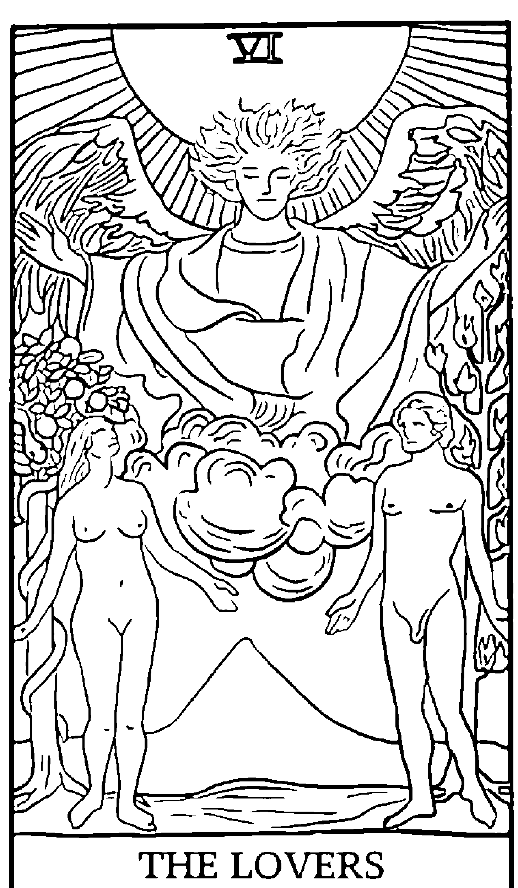

### 畫面主要組合：

環境：晴朗的藍天掛着大大的太陽，遠處有一座山。畫面前方左邊有一棵蘋果樹，右方有一棵火焰樹。

人物：太陽下，天使從雲層中浮現出來，天使的頭髮由火焰形成，背部長着一雙大大的、紅色的翅膀。蘋果樹上有一條蛇，前面站了一個裸體的女人。右方火焰樹前站了一個裸體男人。（普遍認為這一張牌描繪了亞當和夏娃的故事。）

### 基本解說：

- 因為牌面故事在描寫某一刻戀愛的局面，而不止是描寫一對情人，所以一般來說我們都會叫這一張牌做「戀愛」而不是「戀人」。戀愛隱喻了一種結合的方式，但並不表示一種永恆的結合。
- 牌面人物的設計提示當事人，戀愛其實是一種推動力，當你對某種事情迷戀，這種事情會迫使你去思考一些你時常都想不通的原因，然後又會迫使你去作出取捨和抉擇。
- 畫中裸體的成人造型，提醒當事人要以成熟的角度去處理人和事。
- 戀人以外的所有場景佈局（山、花、樹），對一雙戀人來說，既有吸引力而又帶有阻力。
- 天使傳達神諭，在這裏可以理解作為一個天意、生活中的巧合，又或者是一個幫助這對戀人的人。
- 特別大而光亮的太陽，是強大的生命能量，亦可以為環境帶來正面積極的能量。
- 你將會因偶然遇上的事物而沉迷，有趣的是，這些事物卻不是你一直以來所追求或欣賞的。

### 逆位的解說：

- 當牌面倒轉了時，要提示當事人注意有人正向一對頭腦不清醒的男女作出攻擊，而這一個人可以理解為一個第三者、一個破壞者。
- 雙子星本來象徵了完美的溝通，牌面順逆轉了，就可能是占問者與人溝通方面出了問題。
- 雙子星有二合為一的意思，兩部分對於事物的完整性都十分重要，牌面順逆轉了，就等於失去了對整體來說十分重要的一部分。

### 對應指定問題的附加提示：

### ❖ 工作

正位：會因為朋友的幫助，或與其他部門合作時在工作上得到好處。如果正在尋找新工作，會在偶然的機會下，獲得介紹新工作。

逆位：如果局面中有人身任管理階層，要提醒須小心留意下屬的行動，當中可能有人圖謀不軌。未能與工作上的合作夥伴達到良好溝通。

### ❖ 個人發展

正位：未來將會遇上一個事業上的發展機會、一項可以展示能力的挑戰。雖然這些可能並不是你一直所追求的，卻會把你的個人發展帶去另一個層次。

逆位：當事人的身心狀態不佳，思想混亂。現階段不適合作出任何重大決定，亦不適宜對周遭的任何事物作出評價。被動比主動更容易帶來好結果。

### ❖ 健康

正位：對自己好一點，逐步遠離壞習慣。每天都留一些空間和時間給自己，自我對話，好好溝通。了解自己的真實感覺和需要。

逆位：提醒當事人不要過度放縱自己的情緒發洩方式，控制無止境的頭腦活動。遠離負面的人、負面的評價、負面的對話。

### ❖ 學業

正位：最近受到環境中的人事影響，例如朋友們正在分享的熱門興趣、環境中某個潮流話題等，令到當事人很想去作短期進修。能力許可之下，學習知識本來就是一件幸福的事，無需要太過計較是否與經濟掛鉤。

逆位：學習生活遇上了瓶頸，是時候調整一下學習的方向和方式。學習興趣是一種強大的求知能量。

### ❖ 愛情

正位：雙子星是象徵孿生的，暗示當事人會遇上另一個自己。在朋友的介紹下，認識了一個人，這一個人不一定是和男女戀愛有關，可是他或她有力量改變當事人的人生觀或生活方式，使其走進另一種生活方式。

逆位：當事人將會與偶然遇上的一個人發生一些浪漫的情節。可是，時間總會讓人明白有些人事組合，只能在特定環境中才會產生感覺，並不一定適用於現實生活。

### ❖ 友情

正位：雙子星的特徵是親近、相同卻又變幻莫測。當事人將會遇上一位價值觀非常接近的人，彼此溝通交流相當美滿。可是，卻會因為大家都同樣都是比較敏感、受情緒主導，關係有點喜怒不定。

逆位：提醒當事人在短暫的未來將會有一個專門製造麻煩的人在朋友圈中出現。緊記要保持冷靜和觀察，不要對不明不白的事隨便作出評價，更不要因為沒有根據的流言，對別人產生錯誤的觀感。

## No.7 戰車 (The Chariot)

掌管星座：巨蟹座 (Cancer)
元素：水

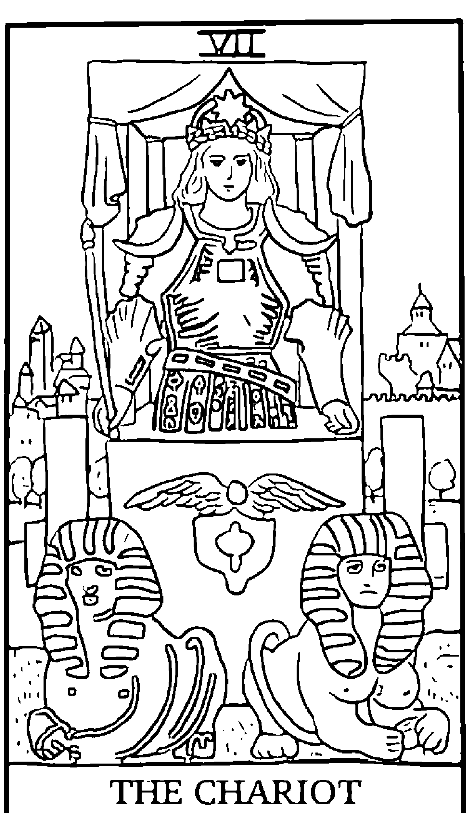

### 畫面主要組合：

環境：戶外，金黃色的天空下，似是黃昏時分。背景遠處是一座城，城的前面有一個水域。畫面的正中央，有一輛以星光藍布作遮篷、以黃金作輪子、以藍色翅膀作為標記的戰車。看似是凱旋歸來，亦似是準備出戰。

人物：戰車上有一位戰士，他頭戴星月冠冕，身上的盔甲刻滿了神秘文字，腰間有一條黃金腰帶，左右兩邊肩膊各有一新月形面相面具。戰士的右手持着權杖，權杖的形態與魔法師使用的魔杖相似。兩頭獅身人面雌性神獸，一黑一白，伏在戰車前面。牠們的目光分別向着兩個方向，牠們的前腿亦向着不同的方向擺放。有人認為神獸是希臘神斯芬克司——有翼的獅身女怪。

### 基本解說：

- 當事人需要面對一些持有不同的立場的人。與當事人鬥爭的可能是一位女性，又或者彼此之間的衝突源自於與女性有關的話題。
- 背景是一座城，戰車停在前面。當事人可能被迫要為了維護某個組別或一群人的利益而與人對抗。當事人正考慮要離開一個十分熟悉或十分有安全感的狀態。
- 戰獸上的標記可以理解為出師有名或行動是有原因的，可不是無緣無故的。
- 黑色和白色的戰獸，可理解為當事人心中的野獸。此刻，戰獸的腳是向着不同方向擺放；然而，作為拉動戰車的戰獸，牠們其實應該只向着同一個方向。這是暗示當事人內心有一個或以上的慾望，而這些慾望是不能並存的，或是有利害衝突的。
- 戰車凱旋歸來，暗示了戰爭和奮鬥，一場激戰後的勝利結局。而跟當事人戰鬥的可能是藏於他自己心內的野獸。
- 戰車上的人就等於一個控制力，他拉着繮繩要把兩獸前行的方向統一起來。情況就好像要當事人用控制力使心內不同的慾望、不同的需要統一起來，並會給予它們一個明確的目標，而這個目標，就是他即將要走的方向了。
- 生活上，戰車的出現，亦可以理解為一次短途旅行。
- 雖然戰車是凱旋歸來，卻不代表一切就是定局，可能是一個殘局，即將要花上很多心思去收拾。亦可能是一場戰爭即將開始，所以要提醒占問的人保留實力。
- 戰鬥並不是一件簡單的事，戰鬥一定有戰鬥的動機，明確的動機是一種激發能力，激發無限的動力和靈感。無限的動力甚至可以使停滯了的狀態再次行動。
- 戰爭不一定是指一場真正的戰爭，亦可以是一場內心的戰爭、有關個人自制力。

### 逆位的解說：

- 如果這一張牌倒轉出現，它暗示了一輛交通工具，需要停下來作出維修。
- 當事人內心正在交戰，而氣氛多數是不愉快的，他有極大機會要作出一些左右做人難的決定，或者是當一個兩面不討好的中間人。
- 如果有人想知道計劃中的事情的結果，你要讓他有一個心理準備：為了一己之成功，他即將要背棄一些事情。
- 戰士的一身盔甲，本來有保護的意義。如果牌面逆轉了，就失去了保護力。不適當的保護，反而成了一種束縛、一種使自己和外界隔絕的東西。

### 對應指定問題的附加提示：

### 工作

正位：職場上有表現自己的機會，贏得一陣子的讚許，可是卻未能從容下來，因為即將要面對另一場挑戰。而勝負並不是個人的，而是團隊性的。當事人會遇上出差、外勤工作、借調人手的情況。正考慮轉職的人將會找到新工作。

逆位：留意與下屬之間的溝通或者部門與部門之間的合作關係，同時要小心商業對手有暗箭傷人的情況。進展中的計劃，可能因為某些環境因素而被迫停下來。

### 個人發展

正位：環境因素以及各種偶然出現的狀況都有利於當事人展示自己的實力，能量狀態相當好。可以考慮乘勝追擊，將發展推向更高層次。

逆位：接連的不如意事情、過度的壓力、體能上的超支，令到當事人感覺身心俱疲，戰鬥力下降。應該暫停手上的計劃，好好休息一下。應該捨棄不恰當的人和事，重整旗鼓恢復能量，再次面對挑戰。

### 健康

正位：充滿活力，腦袋中亦充滿想法。不妨把這些想法拿出來好好研究一下，並以行動實踐，將會有意外收穫。如果正考慮發展一項與運動有關的興趣，可以考慮學習騎術。戰車牌的支配星座是巨蟹座，元素屬水；游泳，亦是一項有益於當事人身心的活動。

逆位：當事人可能有感於近日活動狀況常有失控，例如走路時容易失去平衡、視力欠佳、女性月經失調、長者失禁、男性小便不暢順、小孩子容易因為手腳不協調而碰傷等。可以提醒當事人多喝水，休息一個月相週期（二十八天）時間，讓體能恢復，情況自然有所改善。

## 學業

正位：這一張牌通常與轉校、改變學科或者海外升學的事有關。在職人士學習駕駛技術有助於掌握未來在工作上的機遇。

逆位：因為生活中的閒雜事情太多，同時時間管理能力欠佳，以致欠缺時間和良好的學習空間，影響學業成績。應該考慮放棄一些無謂的社交，暫停某一些興趣活動。

## 愛情

正位：單身的人，是時候要離開熟悉的社交圈子，認識多一些新朋友。多在戶外活動，會有浪漫的際遇，可以理解為兩個性質不一樣的人走在一起。不過，戰車始終是戰場上的工具，意味這些浪漫的故事，亦有一定程度上的危機。建議當事人應該用一些時間去觀察對方的為人，了解一下對方過去的感情生活，才開始一段關係，以免踏進三角關係而不自知。已有對象的人，亦有機會在新的活動圈子中遇上能產生感覺的對手。

逆位：遇上逆位戰車牌，意味當事人有很大機會會遇上一段頗費心力的戀愛，要提醒他好好守住自己的心，不要輕易踏入三角關係，被一時激情蒙蔽，愛到失去了自己，最後成為戰場上的失敗者。已有對象的人如果遇上疑似對手，甚至有人介入既有關係，不要輕易放棄，因為既然戰車尚在啟動，即仍有戰勝的機會。

### ❀ 友情

正位：偶然的機會下，重遇舊朋友，大家重新建立聯繫。好朋友產生誤會，站在中間左右為難。與好友結伴出外旅行。

逆位：一些曾經合作過、一起為共同目標奮鬥過的夥伴，因為某些因素逐步變成對立關係，甚至產生敵意。重遇舊朋友，卻發現對方已經和從前很不一樣，甚至很難再找到共同話題。難得大家都能一起出席的活動，卻因為某些環境因素被迫延後或取消。

## No.8 力量 (Strength)

掌管星座：獅子座 (Leo)
元素：火

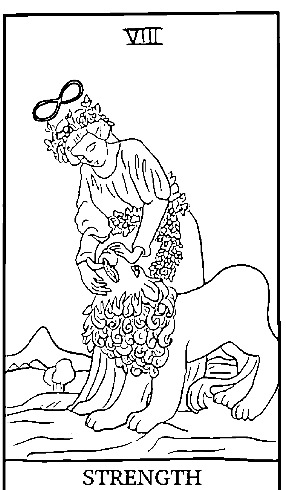

### 畫面主要組合：

環境：黃色的、晴朗的天空，似是黃昏時分。遠方背景，有一座雪山。雪山前有一些高樹。畫面前景是一個平原。

人物：平原上，一個神態溫柔的少女，身穿白色衣服，頭戴花環，腰間亦圍有紅花綠葉裝飾。少女頭上的半空中，有一個橫放着的無限符號。她的雙手正放在跟前一隻獅子的口鼻上，似乎正在安撫獅子，企圖把牠的口合上。獅子眼望着少女，並沒有掙扎。

### 基本解說：

- 這一張牌的掌管星座是獅子座，熱熾如咆哮的力量，亦象徵著勇敢和力量。
- 少女表情安定，身上的花飾強化了女性溫柔的特質。圖中獅子被描繪成張開口的狀態，而少女竟然能伸手把牠的口合上。暗示了堅定的意志力、大無畏的精神再加上溫柔，可以以柔制剛。
- 這是一張提示人要控制情緒、好好管理一下激動和憤怒的牌，少女的故事暗示，內在的潛力可以戰勝原始的情緒力量。和魔術師一樣的頭上無限符號，提示當事人要好好運用腦袋。
- 老人家總愛對孩子說大象怕老鼠的故事。自然界中，每一種能量都有相對應的剋制力。即使是野性不馴的猛獸，亦有被收服的時刻。力量牌提醒當事人，若面對失控的場面，應保持冷靜，運用頭腦思考對應的方法。以暴易暴，未必是最好的對策。

### 逆位的解說：

- 當事人心裏出現了害怕和敬畏，特別在於對象是一個言行溫和、表現冷靜、意志堅定的人。
- 環境中，粗暴的能量干擾了當事人的思考力。
- 假如當事人正處於對立的能量之中，又或者正面臨強大而野蠻的力量，不應該與對方對抗，會因為思考力受到干擾，政策失誤而受傷。
- 提醒當事人要留意局面中會有心機不純的女性，想以自己獨有的溫柔，達到成功的目的。

### 對應指定問題的附加提示：

### ❀ 工作

正位：工作上面對麻煩的人事及巨大的壓力。提醒當事人保持冷靜，運用自己的經驗和智慧，還有溫柔的能量，所有問題最後都能夠解決。

逆位：職場上出現一個麻煩的人，自我中心，無事生非，四處挑起紛爭，說話沒有分寸，常常口出狂言，唯恐天下不亂。

### ❀ 個人發展

正位：成長的路上，不是到處都有轉車站和休息站。身心早已疲累不堪，但眼前還是荊棘滿途，看不到盡處。力量牌帶給人最重要的信息：切勿放棄，發揮勇敢精神直到成功為止，堅持樂觀和溫柔的信念會帶來成功。

逆位：雖然不滿現狀，但又看不到其他可行的方向。每天，精力和時間都花在沒有意義的人事上，令人感覺十分疲累，失去活力。

### ❀ 健康

正位：提議當事人把注意力放到運動上，按照自己身體狀況進行一些會出汗的帶氧運動。鍛煉一下心肺功能和塑造肌肉，改善體質與體態。被情緒控制是一件令人很疲累的事，如果可以控制情緒，生活就會變得美好起來。

逆位：運動要適可而止，不要操之過急，以免弄傷身體。這一張牌的掌管元素是火，意味當事人身體內的水分不夠，要多喝水和休息。

## 學業

正位：這一張牌特別有利於正在修讀有關人體肌肉活動的研究或與運動有關的同學們。另外，力量牌提醒當事人，學習上需注意調節體力。

逆位：課外興趣發展雖然有益身心，但過度安排，學童會消耗體力，亦會影響學業成績表現。是時候重整時間表，好好了解一下真正的興趣、能力傾向，無需白白浪費金錢和時間。

## 愛情

正位：本來生活在兩個不同世界的人因為愛情而走在一起，一起生活的日子，磨擦是少不免的。只要大家都願意共同面對，解決難題。慢慢去習慣、理解或者自我調節，感情自然會變得更加牢固。單身的人，不妨把一向的堅持放在一邊，以放鬆的心情去感受和觀察，會有意外的收穫。

逆位：單身的人或會遇上一些機會，但對象性情古怪，不適合發展。已有戀愛對象的，對方因為外間的一些事情產生情緒問題。這個時期伴侶間要小心言詞，以免造成情感上的傷害。

### ❀ 友情

正位：一個堅定溫柔的人，正利用自己的特質來助朋友控制失控的情緒。

逆位：有朋友突然情緒失控了，愈是安慰愈是惡化，令人不知所措。

## No.9 隱士 (The Hermit)

掌管星座：處女座 (Virgo)
元素：土 (地)

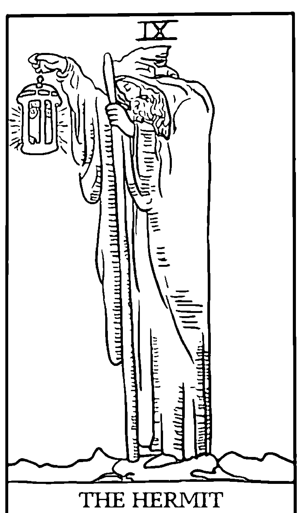

### 畫面主要組合：

環境：戶外，灰藍色的天空，空洞的環境，雪地。
人物：雪地上，一個蓄有長長白鬍子的老人，有人認為他是一位隱居者或者僧人，他身披著灰色的長長的斗篷，右手提著一個內有發光六角星的燈籠，左手拿著長長的金色的權杖，低著頭閉著眼睛在空洞的環境中佇立著。

### 基本解說：

- 獨自一個的老人家在空洞的環境，是當事人心底對和平以及孤獨的渴求的寫照。隱士牌象徵了當事人希望退出一些社交圈，前因可能是感覺一些挫折和不滿，對人際關係失望，所以想自環境中撤退。

隱士挑燈探求的形態，可以理解為思考、組織、反思。當事人可能需要對自己前陣子的某些言行作出反思，在這一種反思與審判行為當中，無需要刻意為某人的行為介定對錯，只是單純地透過回顧整個事件的過程，吸取一些經驗，增長智慧，來為自己作一些儲備。

穿上長袍的老人，象徵了一個具有靈修經驗、對某種文化有所研究、在某個範疇有深厚經驗、心智成熟、有生活智慧的人。

老人低頭或內斂的表情，說明他的外表可能給人古怪的感覺，但他其實並沒有殺傷力，他只是選擇低調處世，享受孤獨甚至想避世。

挑燈的神秘人，亦可以理解為一個低調的、能夠為人帶來一點曙光的智者。平常表現低調，在局面中沒有太大的參與度，只是一個頭腦清晰的旁觀者，一直以不同的角度感受和理解事件。

當事人不想別人來打亂了他個人的平靜，寧願保持低調，從眾人的眼光中退下來。

六角星向來被認為是具有神秘意義的的圖騰，帶有保護、召喚、許願等能量。老人提着一個亮着六角星的燈籠在探索，從中可以理解當事人對於宗教或傳統文化的看法和態度，他守護着這些事情，這些事情也守護着他。

### 逆位的解說：

隱士牌逆位，代表當事人對某些事情心存懷疑，可是環境中並未見有其他支援，因而並沒有就此採取行動，暫時低調退場作旁觀者。

逆位隱士又可以是一個滿心計謀、脾氣古怪、不愛社交的人。

某個團體中，有人因為受不了人言的壓力，孤立無援，意圖逃離現實。

環境中，有一經驗豐富或資深的人，對局面中的氣氛深感不滿，正密謀對策，希望以一些舊有的、為人所忽略的事情，推翻目前的局面。

### 對應指定問題的附加提示：

### ❖ 工作

正位：有人在某個範疇經驗豐富，而且淡泊名利權力。在俗世中，令人費解。其實當事人對於工作的熱愛程度遠比金錢物質為高，而且因為獨特的成長環境，培養出與別不同的價值觀。

逆位：環境中正瀰漫着一股不良的氣氛。大戰在前，低調行事也許是保住地位的其中一個方法。這一張牌的掌管星座是處女座，工作上需注意同事之間的通融性。

### ❖ 個人發展

正位：當事人可能會因為對於目前的狀況感覺沉悶或不滿，希望有一些新的發展，甚至已經開始計劃一些事情，不過隱士牌不是一張主張行動的牌，建議細心觀察，再作分析。

逆位：綜合當事人的心理質素以及環境因素而言，目前絕對不是適合新發展的時候。建議當事人從既有的環境中抽離，以比較宏觀的角度去理解事情的整體，並爭取獨處的機會，在不斷反思的過程中，尋求答案。

### ❖ 健康

正位：因為過勞、壓力，令體力超支。留意生活環境中的空氣質素，會引起呼吸系統的毛病，請清洗空氣調節系統。如果你有吸煙習慣的話，好好考慮一下吸煙與健康的問題。

逆位：掌管這一張牌的星座為處女座，其特徵是重視精神生活，亦容易胡思亂想。隱士牌以逆位形式出現，提醒當事人應放鬆精神，收斂一下對別人言論過度敏感的反應。

### ❖ 學業

正位：這一張牌特別有利於正在修讀一些與歷史、哲學或宗教有關的科目的朋友。當事人需要運用記憶力和分析力。學業成績並非突飛猛進，而是隨着時間，加上自己的努力，一點一滴累積而來。

逆位：因為一些問題而鑽了牛角尖，影響了整體表現。建議先從局面中退下來，好好清醒頭腦，休息一會，待腦力和體力恢復以後，再去溫習，一定有更好的效果。

### ❖ 愛情

正位：如果占問的人在查詢有關戀愛的情況，你可以告訴他，二人的感情正在模糊階段。暗戀、忘年戀、師生戀、曖昧關係等不清不楚的感情事件。

逆位：當事人有機會遇上一個滿心計謀或者性格古怪的交往對象，對方言行不一，難以捉摸其心意。相處日久可見人心，唯有用時間去找出答案。局面中有人對關係不滿，希望退出或暫停，但又不想為此承擔任何負面後果。徘徊在兩個決定之間，舉棋不定。

### ❖ 友情

正位：曾經有過感覺存在，但這份感覺很快就消淡，心裡明白已經對對象產生好感，但不知為着甚麼原因，始終沒有衝動去開展這份感情，感覺一旦開始了，最後亦會無疾而終。在這個前提下，兩人的關係比友誼多一點，但又未到愛情的知己關係。除非遇上甚麼衝擊，又或者當中有熱心人士幫忙推動，不然，可能就此成為一世的朋友。另一方面，這張牌亦代表當事人在這個階段享受孤獨的自由和樂趣，不太喜歡社交。

逆位：雖然感覺寂寞，亦一直積極開拓新社交圈子，但從一個圈子走到另一個圈子，始終都覺得時不與我。難以與環境中的人好好溝通，無法建立新的友誼。問題可能不在於圈子中的人，而是在於當事人本身早已與時代脫節，話題沉悶或對社會現況不理解，加上性格倔強不願接觸新事物，停留在過去。

## No.10 命運之輪 (Wheel of Fortune)

掌管星座：木星 (Jupiter)
元素：水 / 火

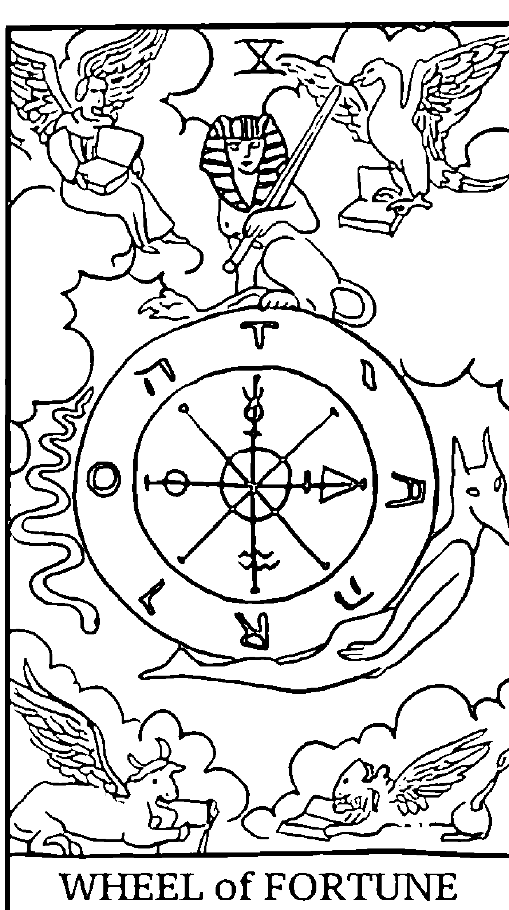

### 畫面主要組合：

環境：藍色的晴空中飄着幾片白雲，中間有一個橙色的輪，輪中有一些希伯來文字以及煉金術的標誌。

人物：畫面上下四角分別有《聖經》中經常登場的四活物，很多先知都曾經在靈視中得見四活物的樣子。右下第一個活物像獅子，左下第二個活物像牛，左上第三個的臉像人，右上第四個像一隻飛鷹。輪的上方當眼處出現希臘神斯芬克司（有翼的獅身女怪）。輪的左方是一條蛇，有人認為牠是魔鬼的使者，更多人同意這條蛇是埃及的黑暗之神塞特，塞特掌管着死亡與敗壞，祂的出現伴隨著負面能量。塞特的頭正向著輪盤下方；而右方向上升的正是另一埃及神祇阿努比斯，祂的工作與死亡息息相關，帶領亡者的靈魂進入來世，因此象徵死亡後再生。

### 基本解說：

運程上的轉變改變、因果報應，如果當事人曾經作過一些好事，會得到一些好的回報。由於塞特伴隨著阿努比斯一起出現，所以過程中必然包括黑暗，結束後才能得到正能量的新生。

命運之輪的旁邊有著很多的東西，暗示這一個改變是有很多方面的，當事人可能會得到一些金錢、一份工作、一次升遷、一個特別的人（一個貴人）。四角的神獸可以理解為來自多方面的、意料之外的幫助。

命運之輪的出現，暗示了一個氣氛快樂的聚會、一個交流會。來自不同範疇的人，偶然的機會下聚在一起，竟然激發出一些新的想法。

雖然這一張牌是命運之輪，不過畫面中塞特的頭正向著輪盤下方，令人覺得黑暗能量即將過去，因此很多人更愛將這一張牌叫做幸運之輪，是希望每一個人都要帶著快樂的心去迎接幸福。

### 逆位的解說：

既是幸運之輪，它當然不會令人失望，就是倒轉了，寓意依然不壞。它暗示一個變動，當事人或要面對一些改變或進展。即使在不愉快之中，但很快就會有轉機了。

環境的變動，讓一些人有機可乘。

### 對應指定問題的附加提示：

### ❖ 工作

正位：工作環境中正醞釀變動，未來一些轉變，今日是有跡可尋的。是好運或是壞運，都是未知之數。保持樂觀的心態，轉變中可能存在機會。外出履行公務。業務上的交流會。一個重要的會議。跨部門合作計劃。

逆位：因為之前一些不良政策，不久的將來，大家將要承擔惡果。管理階層會作出一些應變措施，但都是緩衝之計。最適合的人、最有效的方法還未出現，見一步行一步是目前的唯一方法。

### ❖ 個人發展

正位：偶然遇見的朋友帶來新的思考方式，不禁反思人生。多外出與人交流，接觸新資訊，有助對於未來方向的設定。

逆位：新的人際網絡和新的機會就放在眼前。反覆思量後都明白這是一個良機，可是卻因為某種惰性，不願離開舊有的人際和壞習慣，顯得猶豫不決。

### ❖ 健康

正位：過於頻繁的人際關係，令到身心疲累。小心暈眩。人口稠密的城市，短期內會爆發流行病或傳染病。過量繁雜的資訊，令人失去判斷力，疑神疑鬼，擔心健康出問題。因為不良的生活習慣，引致健康出現小問題，應及早處理。

逆位：傳染病或流行病的感染。因為長期忽略健康保養，引起整個循環系統失調，需要從生活上多方面着手，改變生活習慣重拾健康。

### ❖ 學業

正位：少年人受到同學或友伴的影響，對學業前途有新的想法。已踏入社會的朋友，行業資訊推陳出新，需要進行一個相關的短期進修。

逆位：當這一張牌以逆位出現，正要提醒當事人是時候離開煩囂紛擾的生活，作一個短暫的靈修，又或者去遠足，親近大自然，重拾身心平衡。以更為接近宇宙的頻率去接收資訊，將會有另一番理解。

### ❖ 愛情

正位：單身的人偶然遇上一個來自不同背景範疇的發展對象。雖然不容易得到好結果，但兩個人的交流對當事人帶來很大的影響，使人自然地走向另一個心靈層次。已有對象的人，和伴侶一起經歷一些事情，一起成長。

逆位：人生的歷史，竟然成為感情的障礙。假如某人曾經在愛情中作過一些壞事，那麼要準備承擔後果了。

### ❖ 友情

正位：開拓新的社交圈認識了不少新朋友，雖然大家來自不同的圈子，卻又有說不盡的話題，甚至令人發掘出新興趣，生活又變得熱鬧起來。

逆位：一對好朋友的其中一方受到外來事情的吸引，與另一方的關係暫時疏遠。偶然認識的朋友，很快就熟絡起來，急不及待分享對事物的看法，甚至互相進入對方的生活圈；但這一張牌以逆位出現，正是要提醒當事人，不要因為這些喜樂感而變得鬆懈，需保持警惕，不要太早透露自己的事情。

## No.11 正義 (Justice)

掌管星座：天秤座 (Libra)
元素：風 (空氣)

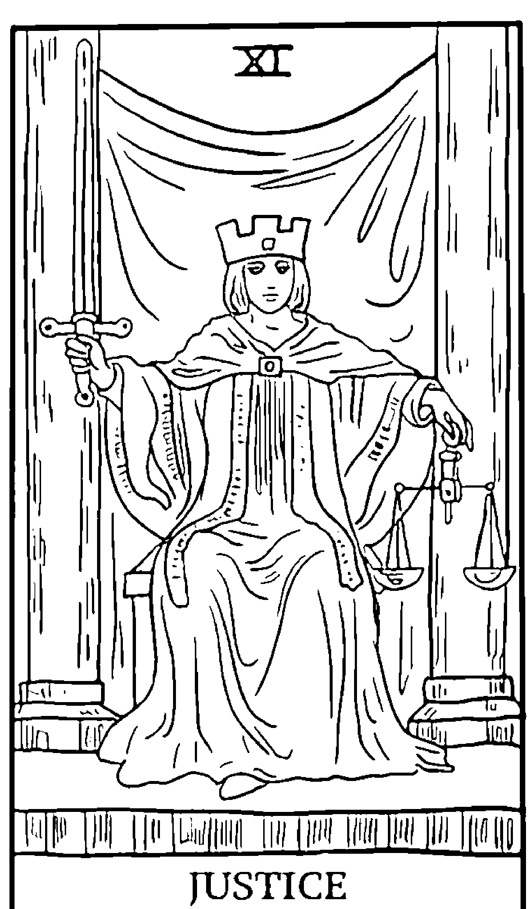

### 畫面主要組合：

環境：黃色的天空。畫面的左右兩邊各有一白色的石柱，兩柱之間掛起紅色的紅色的簾幕。簾幕前面是一張石座。

人物：一個金髮的年輕人，頭戴黃金冠冕，皇冠上有一顆方形的藍色寶石。他一臉冷靜，身上穿著紅色的衣服，右腳輕輕踏出長袍外。衣服上有金黃色的斗篷。他的右手舉起寶劍，垂著的左手拿著一個天秤。

### 基本解說：

中性。性別平等。

掌管這一張牌的天秤座，象徵公義和公平、一些平衡力量。

畫中人冷漠的表情，代表當事人的處事傾向較為理智。

寶劍是作戰或保衛的工具，通常會伴隨傷痛或者紛爭。在公堂之上，寶劍亦有權威、決定的意思。這一張牌暗示了一個仲裁的氣氛，仲裁的結果不一定是愉快的，但一定是強硬的並且帶有分配性的。

由於這一張牌的支配元素是風，在這裏寶劍帶有判決的氣氛。當事人將需要面對一件案件、一份法律文件、一段要重新估計的關係。

左手上有一個天秤（左腦是思考導向），右手舉起寶劍（右腦是行動），無論如何，結果是公平的。這一張牌帶出的信息是：去做應該做的事，無論是如何不愉快，也需在得失之間找出平衡。

當事人可能需要為一些人調解紛爭。

### 逆位的解說：

歧視。

如果這一張牌倒轉出現，就失去了公平的意義，暗示局面中有偏袒，或者在法律事務上出現了阻滯。

當事人可能要面對一個不理性的、偏袒的待遇。

寶劍逆向，象徵了局面中有人正要作出一個令人受傷的決定，或為了使兩方面的比例變得更平均而要削減一些東西。

因為一個錯誤的決定，造成影響深遠的後果。有人在一時衝動之下說出令人感覺受傷的說話，造成難以彌補的遺憾。

有人需要你的意見，其實那已經是既定的事實，無論是誰，給出甚麼意見，最後都無補於事。

### 對應指定問題的附加提示：

### ❀ 工作

正位：需要認真專注，小心工作，特別留意合約細節，公平對待每一個人，不要出現偏袒。這一張牌特別有利於從事法律事務的人員。

逆位：職場上受到不公平的對待，又或者因為疏忽而作出抵觸合約條款的事。因為有人沒有好好遵守一些條款、條例或程序，引起惡劣的後果。

### ❀ 個人發展

正位：正是當事人的自我審判的時刻。過去的發展已經有了定位，是時候計劃下一個發展方向，在這一個期間特別適合為專業考試作準備，向專業或管理階層進發。

逆位：因為一時大意，錯失機會，前功盡廢，又要從頭來過，甚至要承受言論批評或處分。

### ❀ 健康

正位：當事人在忙亂或高壓力的生活環境中，忽略了健康保養，飲食失控。過量工作使精神狀態不穩定，應該決心來一個小休假。

逆位：身體健康亮起了紅燈，找醫師檢查一下，盡早處理，恢復健康。

### ❖ 學業

正位：這張牌特別有利於專業進修，又或者一些與法律、醫療有關的課程。學生們若想得到理想成績，不要抱有僥倖心態，公平的付出，公平的收穫。

逆位：如果正面臨考試，需要加倍小心。因為考試內容將會比預期中困難，老師的態度也傾向嚴格。

### ❖ 愛情

正位：已發展了一段時間的感情，一直在冷靜與熱情之間。當事人正處於一段要重新估計的關係中。

逆位：寶劍在逆向，象徵了一個令人受傷的決定，或為了使兩方面的情感投入比例變得更平均，而削減一些東西，改變一些習慣。

### ❖ 友情

正位：朋友之間有人發生了需要調解的事，調解人即使感情傾向任何一方，都應以公平公正的原則去處理這一件事。

逆位：朋友之間，因為堅持自己的立場和價值觀而產生了疏離感，外人難以插手介入。局面中出現一些謠言惑眾或惡意中傷。

## No.12 吊人 (The Hanged Man)

掌管星座：海王星 (Neptune)
元素：水

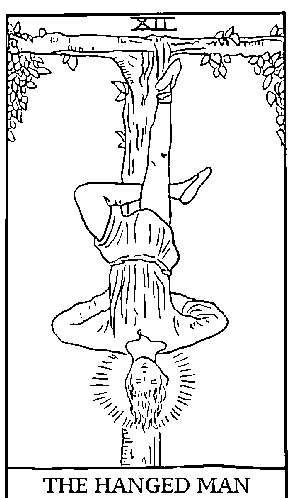

### 畫面主要組合：

環境：灰白色的天空下，T 字型的樹幹，兩邊長有葉子。有人稱這一棵樹為智慧之樹，亦有人認為這是生命樹。

人物：一個身穿藍衣紅褲的男人，一隻腳被倒吊在樹上，另一隻腳屈曲起來，令畫面看來成了一個倒轉的 4 字。他頭部發光，臉上的表情平靜安詳，沒有痛苦。他的手翹起，看來有點輕鬆的樣子。有人認為這一張牌的靈感是來自希臘眾神之父，智慧之神奧丁的故事。

### 基本解說：

倒掛的形態代表暫停、中止、懸而未決或延遲的狀態。

我們或者可以從奧丁的故事中找到一些解讀靈感。奧丁因為希望獲得更大的智慧，就把自己獻祭給自己。他用槍在自己身上刺了九個洞，再將自己倒吊在生命之樹（亦有說是世界之樹）上。經過九日九夜，奧丁終於在靈視中發現了如尼（Runes）。圖中男人的雙手翹起在身後，象徵減低了保護力。他放棄抵抗，似乎早已有了心理準備，隨時會作出犧牲；而他可能早已知道，在犧牲的過程之中，他將會得到一些啟蒙。

倒掛的視野，會令人用了另一個完全不同的角度看世界。事物的形態沒有改變，狀況卻改變了。這樣的新視覺，反而充滿洞察力，看到了本來隱藏的答案。

掌管這一張牌的海王星，象徵了一些較為靈性的、屬於精神上的能力。這一張牌的出現，寓意是時候作出沉思或冥想。

吊人象徵了人生中一個懸而未決的階段，那正是處於物質世界和精神世界中的抉擇。這個階段不會維持很久，但可能要當事人作出一些犧牲。

當事人對事物的看法有所不同。

生命步伐太快，會令人遺漏一些人事，請大幅放慢速度，好好感受人生，重新定位。

### 逆位的解說：

當事人可能要被迫停下來，作出一些檢討，舊有的方式必須切換。在新方法出現之前，一切將會暫停下來。

當事人可能要放棄一個信念或觀點，否則，事情難以繼續進行。

當事人可能要犧牲他一個很重視的位置，事情不能重來或逆轉，在這一個關頭，一定要開放自己去面對另一些真理，看真一點去找出解決的方法。

### 對應指定問題的附加提示：

### ❖ 工作

正位：突然間被委以重任，可是環境條件未能支援，極具挑戰性而且沒有前車可鑑，沒有經驗可以參考，需要自行尋求解決方法。轉換工作環境，但未遇上新的機會。

逆位：會被迫暫停進行中的計劃，職權受到影響甚至被懸空，沒有任何人可助你渡過難關，猶幸暫時未有大危機，但要非常小心對應。

### ❖ 個人發展

正位：個人發展進入了瓶頸，可能已經有了新的打算，但心裏明白若要走出一步，就必須作出一些犧牲。

逆位：在某個環境、某段時間內犧牲了大量心力而得不到任何回報，但開始了的事情又不容易一下子停止，正尋求轉變的方法和方向。

### ❖ 健康

正位：需特別注意有關頸椎、脊椎、筋腱粘連所引起的毛病。頭腦轉得太快，無法好好休息。

逆位：需特別注意有關視力方面的問題。因為外事所引起的情緒反應，令精神受到困擾。

### ❖ 學業

正位：慣用的學習方法未能在學業上帶來新的突破。嘗試拜訪新的老師，又或者與同學交流分享，會從中獲得靈感。

逆位：精神分散，未能高效吸取資訊。稍作休息後再重拾書本，能更有效地集中精神。

### ❖ 愛情

正位：戀愛關係中有人希望換一個相處方式。其中一方可能表現得比較冷淡，以爭取時間去思考下一步的行動，假如另一方急著尋求答案，將會把感情推向結束。

逆位：現階段不要企圖用任何方式去規管對象或者規劃愛情發展，用力過度會適得其反，順著自然反應，用心去感受雙方的交流。

### ❖ 友情

正位：因為事務繁忙，未能參與朋友聚會。用一個新的角度看待某段友誼。

逆位：時間、經驗令人成長，卻拉開了跟舊朋友的距離。

## No.13 死亡 (Death)

掌管星座：天蠍座 (Scorpio)
元素：水

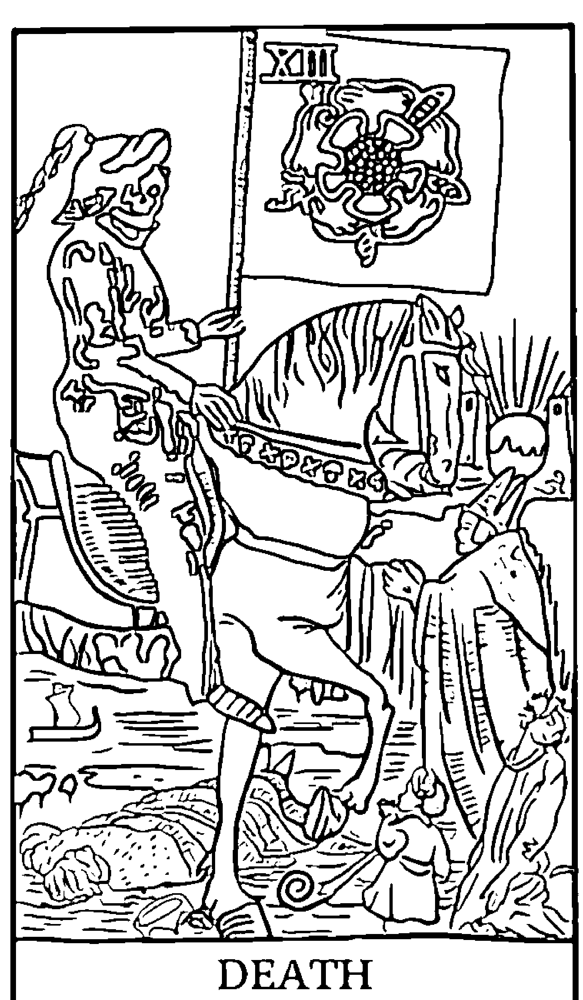

### 畫面主要組合：

環境：背景深遠，可分前後兩部分。後遠處背景是白色的天空，很遠處日正出。太陽前面有一座小山的陰影。小山前有兩個沒有亮燈的燈塔。水流從小山一直流出來潤澤了草地。較前的背景是斷崖下的低窪地帶，從遠到近有草原、平湖、乾地。平湖上有船揚帆出海，有人認為這是神話中護送死者到來世的冥河船。旱地上正重新長出一些樹木。

人物：一具骸骨穿着黑色的盔甲，騎着白馬進入旱地，他左手拿着白玫瑰旗幟，大家都認為他就是傳說中的死神。白馬身上的裝飾，刻有死神標記，馬腹下橫臥着一個死人和皇冠，馬腳下有一個號角，馬頭前有三個人。兩個跪着的分別是兒童和女人，他們旁邊站着一個全身金黃色打扮的宗教人士，正合十面向死神。

### 基本解說：

面對死亡，害怕是很自然的事；不過，害怕不會改變事實。事實上，死亡是很自然亦很公平的事。每個人最終都要面對，即使是世上的王者，亦避不過。人類可以選擇的，是面對死亡的態度。生活中出現死亡牌，更多情況是提示當事人將要面對一些改革、一些嚴峻的考驗。明顯地當事人不能逃避或者改變事實，但可以選擇面對事情的態度。

玫瑰、初升的太陽和小孩都是一些新生的象徵，亦可以理解為一些死亡過後重生的生命力。

死亡是一種結束的形式，之後可以帶來新生。意味當事人如果能夠通過一些考驗，將可以提升到另一個層次或者到達一個從未到過的階段。

### 逆位的解說：

一個終結。

已有一定基礎的事物，因為一些突變，化為烏有。

某種慣性關係因為某些人事介入，起了變化。

當事人需面對一個迫不得已的轉變，這可能是新的機會，但必需要放下很難放棄的過去。

### 對應指定問題的附加提示：

### 工作

正位：職場中有重大變革或轉型，有更大的力量介入，一些舊式權力將被打散。

逆位：突如其來的人事變動。當事人會被迫去面對一些人事、處理某項不在行的工作、完成不可能完成的任務。要有心理準備面對失敗。

### 個人發展

正位：死神出現提醒當事人未來將要面對非常多變化。生活中幾乎每個範疇都有不能逆轉的變動。待一切安靜下來，已經完全是另一種生活方式。

逆位：在未來，當事人要應對連串難題。分離、考驗，儘管過程很痛苦，但這是不可逃避的。因為只有親身經歷這一些事情，才能獲得真正的感悟。

### 健康

正位：處理健康問題的時候，很多人都害怕面對這一張牌。然而死亡牌的出現並不代表真實的肉體上的死亡。當事人可能會收到一些與健康有關的信號，或者要面對一些健康問題。不過，通過積極地改變原有的生活方式，重新建立恢復健康的習慣，問題就可以解決。

逆位：一些已知的健康問題，甚至會影響日常生活，例如長期痛症、頻繁的腸胃病、偏頭痛、耳鳴或者各樣敏感症，還有經常被忽略的極度負面情緒所引起的困擾。要找出源頭並不容易，當事人可能需要來一個徹底性的改變，例如轉換生活地點、考慮離開損害健康的工作、戒掉某種喜歡但對身體沒益處的食物等等。

## 學業

正位：一直沿用的方法並不適合現階段的考核，如果你企圖根據過去的經驗和紀錄猜測未來考試的出題，死神的出現提示這個方法並不恰當，今次考試出題將會有意外「驚喜」。

逆位：生活上某個壞習慣，或者某一班不良朋友正在干擾你的集中力，影響學習情緒。

## 愛情

正位：死亡牌有關掉過去的意思，單身的人若想尋找愛情，應該盡快忘掉從前情人們帶給你的感覺。即使一時之間未能放下，亦絕對不要把從前的感覺拿出來跟現在的生活以及現時遇上的人事作比較。已有對象的，注意戀人心內對你有所不滿，應該多作溝通，避免關係惡化。

逆位：舊友重逢產生感覺、舊戀人再遇舊情復熾、離婚後再婚成功、冷戰後恢復聯絡，但感情未恢復。

### 友情

正位：因為環境的轉變令友誼變得疏遠冷淡。新朋友加入圈子中，引起一陣風波。

逆位：重遇舊朋友。曾經發生誤會的好朋友恢復聯絡。

## No.14 節制 (Temperance)

掌管星座：人馬座 (Sagittarius)
元素：火

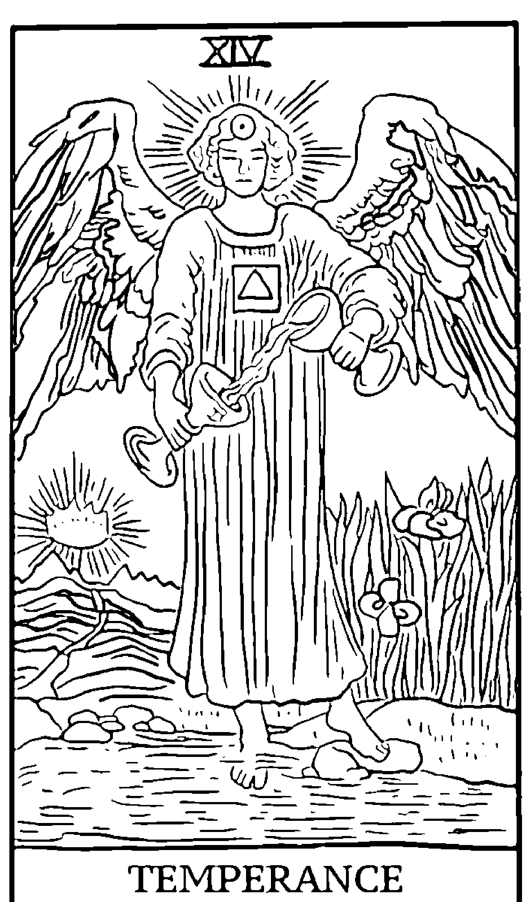

### 畫面主要組合：

**環境**：白色的晴天，遠處是鋪了白雪的山脈，山脈後面有一個與火焰一樣的初升旭日。雪山下一片綠茵，草地中間有一條小路一直通到畫面前方的湖邊。湖邊有一些小石塊和草地，草地上有一些黃色的花。

**人物**：畫面中央有一個天使，黃色的頭髮散發着金光，前額有一個象徵太陽的符號，背後有一雙紅色的大大的翅膀。白色的長袍上有一個外面是正方形裏面是紅色三角形的標記。天使一腳踏在湖中，另一腳踏在湖邊的石頭上，依然能夠維持平衡。用雙手拿着金杯，把液體從一隻杯倒進向另一隻杯之中。

### 基本解說：

- 傳說中，天使手中的兩隻聖杯裏面，一隻載了水能量，另一隻載了火能量。天使把杯子裏的東西倒來倒去，象徵了把兩種截然不同的能量調和的意思。最後天使把一些不可能結合的結合了，就好像是這一張牌的星座人馬座，人馬是人與獸的完美結合。或者我們再看看人馬座射手的弓箭，弓和箭總是一動一靜的在運作，如果配合得好，它們會變成一件非常有用的工具。
- 當這一張牌以正位出現時，象徵了一個不錯的溝通。
- 如果你正在跟人吵架，會因為第三者的幫忙而和好。
- 這是一張名為節制的牌，當然是有節制的意義。它的出現是要提醒當事人，要小心控制脾氣、奇怪的飲食習慣、奇怪的興趣。
- 弓箭的出現同時亦提示出，「不一樣」不等於是「不協調」。提醒當事人一定要改變這一個想法，小心的在兩方面作出衡量，將會得到新的啟發。

### 逆位的解說：

- 有的言行擾亂了一些人際關係。
- 兩個對立的陣營（可能是選擇、信念、家庭或朋友），因為我們錯失了溝通的最好時機，現在沒有方法使兩者聯合起來。
- 一把弓和一支箭分開存放，只會埋沒了它們的用途，但當它們聯合起來，便可以成為一件十分可怕的武器。這一張牌是提醒當事人，必須把支持和反對的理論結合變成一個更有用的理論；可是，這樣是需要時間、小心、忍耐和不斷實驗的。

### 對應指定問題的附加提示：

### ❖ 工作

正位：節制牌象徵聯合共融的力量，最後能夠發揮作用。職場上，如果有人帶領眾人發揮團結精神，與來自各方的人共同合作，最終每一個人都會得到回報，自己亦會更上一層樓。

逆位：當事人可能需要面對一個非常棘手的問題，想解決這個問題，只有個人力量是不足夠的。需要聯合各方的力量，才能尋得解決的途徑。

### ❖ 個人發展

正位：即使有新構思，但目前還未是完全脫離舊有軌道跳進新路向的最佳時間。可以發展正職以外的興趣或兼差。接受新任務之前須考慮工時與回報之間的平衡。

逆位：職場上，小心向你主動示好，甚至主動幫忙介入工作的人。自己的事還是自己處理比較好，以免洩露了不該洩露的資訊。

### ❖ 健康

正位：節制牌出現，提醒當事人特別要注意飲食節制。過量當然不好，會引起肥胖問題。雜亂無章的飲食，亦會影響健康。

逆位：因為長期的壞習慣，令內在循環系統失去了正常的運作能力，除了請教醫生，自己亦需要下定決心重建正常的飲食習慣、著重運動與休息，才能恢復健康。

## 學業

正位：除了本科學業外，亦可以在興趣活動中有所發展。

逆位：身兼多職，無法事事兼顧、面面俱圓，最後影響學業成績，應該重新調節生活時間表。

## 愛情

正位：已有伴侶的話，應該與伴侶分享自己的真實想法，多作溝通。單身的人，要離開目前的生活圈子，在另一個領域尋覓對象。

逆位：節制牌逆位出現，提醒當事人不要太著重個人感受，忽略與伴侶的溝通。單身的朋友，應該爭取與人溝通的機會，好好認識別人，同時讓別人好好認識你。

### 友情

正位：人緣運很好，在不同的圈子都給人留下良好的印象。合作關係運作良好，得到美好的結果。宜建立新的朋友圈。

逆位：熟悉的朋友圈中，有人正在使用言語藝術，製造出不少事端。

## No.15 惡魔 (The Devil)

掌管星座：山羊座 (Capricorn)
元素：土 (地) / 火

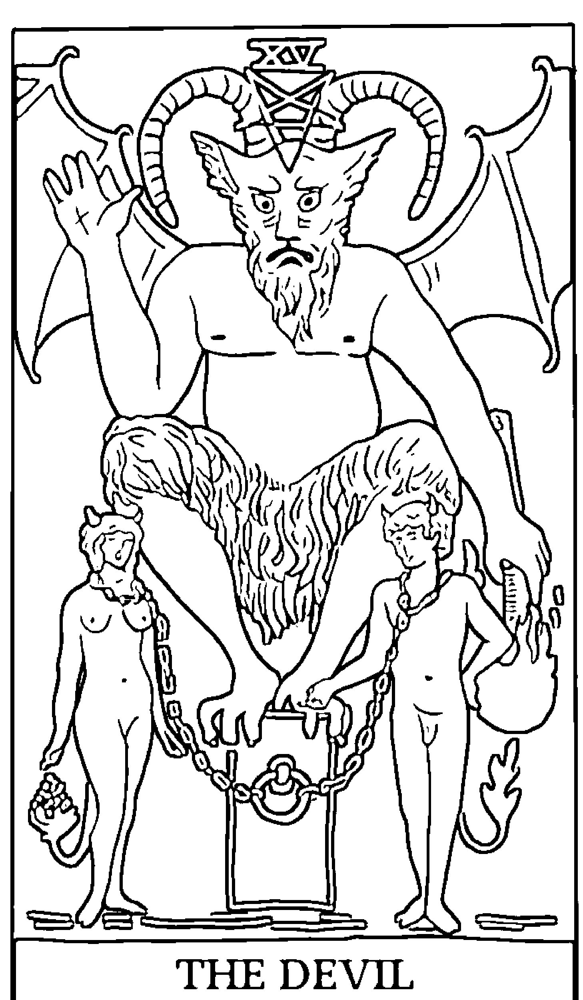

### 畫面主要組合：

**環境**：黑漆漆的背景中間有一黑色石座，前面連著兩條鎖鏈。石座上有一個背部長著大翅膀、公羊頭人身的生物，他的右手舉起，垂下的左手拿著火把，頭上有一顆逆位五角星，大家都認為他就是傳說中的惡魔。

**人物**：惡魔腳下，左右兩旁分別有兩個頭上長著尖角的男女。畫面左下方是一個女性，她的背部有一條尾巴，尾巴的末端有一串葡萄。畫面的右下方是一個男人，背後同樣有一條尾巴，尾巴的末端是一團火焰。男女的目光，分別望著不同的方向，二人的頸上同樣鬆鬆地圍著鎖鏈，連接著魔鬼腳下的石座。

### 基本解說：

- 鎖鏈象徵着有人受到約束，可是這約束卻是自找的，看看他們頭下的頸圈，只是鬆鬆地掛在他們的頸上，並不是把他們牢牢鎖着的，惡魔的目光亦並非注視着他們。
- 當事人經常極力在保護自己的正面形象，卻不代表他的內心沒有惡魔的因素存在，那可能是對事物、權力或情愛的慾望；亦有可能正對某人懷恨在心，等待報復的時機。
- 倒轉了的五角星和裸體在畫面中一起出現，可以理解為一個滿心都是金錢或性愛的人。
- 權杖可以理解惡魔是一個有能力的、有控制力的人。而惡魔頭上的角，意味了侵略性，但這一切的出現卻不能把惡魔定性為一個壞人；他只是一個具有壞能力而又令人感到難以抵禦的人。
- 惡魔的權杖並未有舉起，目光亦不是放在兩個沒穿衣服的人身上。暗示惡魔的目的不是困守這兩個人，而且兩個人鎖鏈上的頸圈是鬆鬆的，這種種都在告訴我們，所有束縛其實都是可以解放的，只不過是因為當事人容許約束存在。
- 要謹記一點，惡魔並不完全等於撒旦，只是其中一種邪惡的象徵。
- 由於受到山羊座的掌管，使這一張牌充滿着山羊座的特徵：野心、誘惑與沉迷。
- 火元素象徵這一切都是來勢洶洶的。
- 這一張牌雖然在發放着一些有關邪惡的信息，可是它的目的並不是想令人恐懼。它的出現，只是想我們看清一些邪惡或慾念，以作出迴避或者自我保護的對應方法。
- 惡魔的出現是要提醒當事人收斂放任，並把內在的野心轉作力量，努力向上爬。
- 男人和女人身後的尾巴，暗示了他們各自的追求。

### 逆位的解說：

- 當這一張牌倒轉出現時，意味了一種在惡習上的沉迷、束縛。一些感情上的誘惑、不正常的性關係、一些同時與感情和金錢有關的勾當。
- 惡魔亦象徵了一個誤用了權力的人。
- 倒轉了的五角星，象徵了一些浪費金錢的行為。
- 一個組織中出現了互相猜忌的行為。
- 當占問有關感情問題時，可以把這一張牌與 No.6 戀人牌拼合聯想。

### 對應指定問題的附加提示：

### ❖ 工作

正位：不良的從屬關係，上下級未能好好溝通達到共識。有人在職場上濫用權力。雖然團隊中各人的想法不一致，但正好可以利用這一點作為良性競爭。

逆位：雖然十分努力工作，卻因為局面中有人用權力令你得不到應有的回報。因為工作壓力過大，以花費來平衡心理，浪費金錢。

### 個人發展

正位：環境中不良氣氛限制了你的發展，若要有更好前途，離開是必然的選擇。當事人可能遇到一些誘惑，聽起來好像是一個不錯的機會，但會與某人的價值觀或者道德觀有所抵觸。

逆位：明明知道這不是一個適合發展的地方，卻因為某些與當事人自我發展不符的原因，例如貪戀某些人，或者不願放棄某些壞習慣，就留在一個沒有發展的空間消耗青春。

### 健康

正位：因為過度專注於某些不切實際的事情，忽略了身體的不良反應。

逆位：不良的飲食習慣、暴飲暴食、酗酒或者不當使用藥物。

## 學業

正位：不良的資訊傳遞方式，學員無法好好理解課題內容。校園中正廣傳一些不恰當的想法，影響學習情緒。

逆位：錯誤的溫習方向。考試作弊被揭發。錯誤預測考題。因為沉迷一些嗜好，疏於學習。被不良友伴影響，拖累了學業。

## 愛情

正位：無法滿足戀人慾望。戀人壞脾氣。不恰當的發展對象。如果當事人在查詢一段關係，這不是一段容易的關係，兩個人的目的並不一致，相處動機並不單純，這很大可能是一段三角關係，或建立在慾望上的感情。

逆位：戀人因為一時沉不住氣，說了不恰當的話。不倫關係被揭發。感情世界中，多不一定等於好，三角關係過了蜜月期，開始抱怨有人時間分配不均。

### ❀ 友情

正位：誤交損友、沉迷惡習、偏離正軌。

逆位：遇上困難，不但不能得到朋友的幫助，反而被朋友出賣。

## No.16 塔 (The Tower)

掌管星座：火星 (Mars)
元素：火

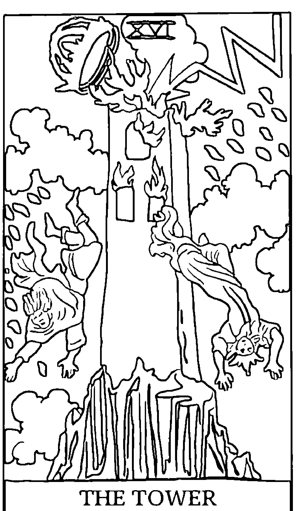

### 畫面主要組合：

**環境**：黑夜，漫天雲霧，天上閃電打到建築在懸崖的高塔頂，激起了火花釀成火災。

**人物**：兩個人從高處墮下，一個身穿藍袍披了紅圍巾；另一個身穿藍衣，頭戴冠冕。他們看來是高塔上的人。

### 基本解說：

- 破碎的石塔象徵崩潰，此刻崩潰的可能是一個信念、一段感情或一些精神上的支持。
- 當事人會收到一些令人感到震撼的消息。
- 塔的倒下，象徵一個組織、團體的崩壞。一些原以為很堅固的事物，原來一擊即倒。一件一直被眾人視為是事實的事情給揭發了，事實原來並不是這個樣子。
- 掉下的人本來是站在高位的，現在掉了下來，可以理解為名譽上的損失，或者是一些地位上的下降。
- 電擊暗示了一切是突然而猛烈地一次過來臨，是一種天意，是一個必須經歷的過程。
- 這一張牌的元素是火，象徵這一切都是來勢洶洶的，動力很大。
- 夜晚的背景暗示了有人似乎還未意識到失敗已經來臨，相反他們依然覺得自己的信仰是正確而真實的，各方面的人事結構堅固。
- 石塔依山崖而建，意味著沒有事情能夠在虛假或凶險上建立並保持恆久。把一切重新建立在真實的事情上是最好的方法。

### 逆位的解說：

- 當這牌倒轉出現時，象徵一些結構或制度的失敗，一個腐敗的思想已經被打倒了。
- 凶兆倒轉出現，意味現況並沒有很圓滿的補救方法。此刻可以做的，就只有減低打擊帶來的傷害。
- 外來的勢力入侵，既有的權力瓦解。
- 誤會加上爭吵，關係面臨破裂，要先沉著氣，好好溝通，才有挽回的餘地。

### 對應指定問題的附加提示：

### ❖ 工作

正位：職場上出現重大變動，愈高層的人危機感愈大。愈大的公司，經濟問題愈嚴重。

逆位：有人可能會因為某一間公司作出大刀闊斧的整頓之後得到一個機會。這個是危機，亦是一個機會。因為之前的種種不良管理手法，公司千瘡百孔，存在十分棘手的問題，然而，如能化解這些危機，就會得到更多的權力和回報。

### ❖ 個人發展

正位：目前不是投資的最佳時機，無論是環境或是自己的能力，都未能達到可以開創出另一條出路的能量。

逆位：因為自視過高，不聽勸告，過度急速發展而招致損失。

### ❖ 健康

正位：特別注意有關碰傷或跌傷等情況。頭部或脊椎容易出現毛病。獲得一些有關健康的資訊，推翻了當事人一向的想法，令其感覺震撼。

逆位：小心舊病復發、積勞成疾。因為受到驚嚇或連串打擊所引起的情緒健康問題。

### ❖ 學業

正位：因為社會上一些因素或者學校一些政策轉變，打斷了自己的學業計劃。一下子放鬆，學業就一落千丈，要好好急起直追。

逆位：在校園裏曾經作過一些不為人知的壞事情，終於被揭發了。看到別人的成功，知恥近乎勇，發力力挽狂瀾。

### ❀ 愛情

正位：戀愛中的人，可能因為一些環境因素，迫於要改變交往形式。一時意氣用事令感情進入冷凍期。

逆位：再遇舊情人，希望重新開始關係，但又未能抹去舊有的痛苦回憶，難以重新建立信心。

### ❀ 友情

正位：發展得太快的友情，終於要經歷考驗，通過了，友誼會更為牢固。

逆位：因為某些原因被迫要和曾經發生誤會的友人共處，感到既可惜又無奈，卻無法改變感情已變質的事實，不勝唏噓。

## No.17 星星 (The Star)

掌管星座：水瓶座（Aquarius）
元素：風（空氣）

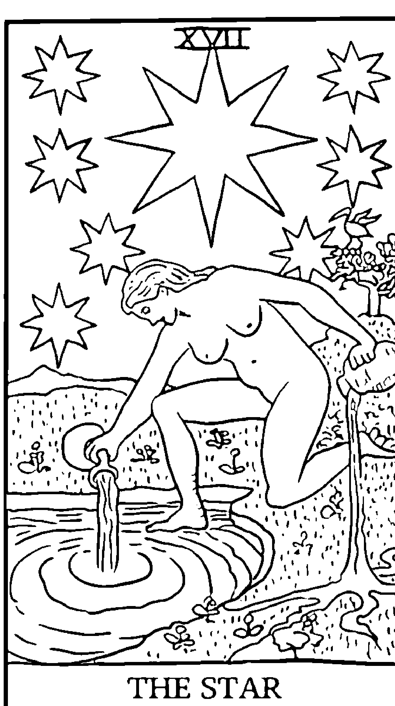

### 畫面主要組合：

**環境**：清朗的藍色夜空中，有八顆八角星，其中一顆特別大，散發出金黃色的光芒。畫面遠處是一座山，山下一片綠茵草原，上面長著一些細小的紅色的花朵。草原連接著一個小小的湖。畫面的右方有一個小山坡，上面有棵細小的樹，矮樹上有一隻紅色小鳥。

**人物**：一個金頭髮的女人，全身赤裸、單膝跪在草原上，一隻腳在草地，一隻腳踏在湖面，雙手各拿著一個水瓶。她正在把水瓶內的水灌注在水池中以及大地上。

### 基本解說：

- 留意畫中平靜的水池面，它為人洗滌負面情緒，帶來了和悅的氣氛，同時亦映照出每個人內心的真實面貌。
- 畫中的星星暗示了當時是夜晚，日光尚未出現，但相信不久就會出現太陽。提醒當事人無論是甚麼希望或預算，它們都不是即時出現的，但終會出現。
- 星星象徵夢想與未來，提示當事人可以找到自己將來的路向，但這一切只是個開始，未來還有很多路要走。最起碼在生命中的這個階段，能夠找到方向，不用站在十字路口，停滯不前。
- 掌管這一張牌的元素是風，有抽象、不具體的意思，亦象徵了不切實際的人事和想法。
- 在不同的塔羅牌組，通常都會把星星牌畫得十分美麗，象徵了一些美好、人見人愛的事物。

### 逆位的解說：

- 反過來說依然是好事，只是它帶來的利益會比較抽象或不實在，例如是一些名譽之類的東西，又可以是一些意料之外的幫助；但請勿忘記，這不過是一個起步的助力，大家仍須努力。
- 赤裸的女性提示當事人需要好好保護自己，直率坦白容易讓人有機可乘。

### 對應指定問題的附加提示：

### ❖ 工作

正位：在人事複雜的工作環境中，待人坦誠。熱心助人的態度，猶如一股清泉。每個人都樂於與當事人合作。

逆位：由於過度熱心，竟然被人誤解，幸好只是一些小誤會，事情很快就會過去。星星牌逆位在工作環境中出現，同時亦要提醒當事人，並不是每個人都歡迎工作勤奮、熱心助人的人。因為，這樣會把一心蒙混的人突顯出來。

### ❖ 個人發展

正位：這一張牌特別有利於發展演藝事業或者與人溝通有關的工作。

逆位：得到一時的掌聲，滿心歡喜，希望大展拳腳。星星牌的出現是要提醒當事人，不要過度樂觀。

### ❖ 健康

正位：近來日間生活節奏比較緊張，建議做一些放鬆運動，例如晚上散步、瑜伽，又或者一些輕鬆的自然律動等。

逆位：提醒當事人進行水上活動的時候要加倍小心。

### ❖ 學業

正位：教學相長，在教導別人的同時，自己又可以溫故知新。回應別人的問題時，又可以用另一個角度去重溫事件，得到新的想法。

逆位：某種課題的研究方向出現偏頗，因為誤信流言，偏離了事實，需要重新調整深入研究的切入點。

## 愛情

正位：單身的人，多參與晚上進行的社交活動，會在朋友的介紹下，認識有發展潛質的對象。應該先花一點時間好好了解，才去考慮對方是否適合的戀愛對象，不要過早對關係有太多的幻想和設定。

逆位：曖昧關係目前不能升級，若一時衝動說穿了，反而會更快結束。

### 友情

正位：主動幫助別人，留下良好印象。在朋友的引薦下，進入一個新的社交圈子。

逆位：朋友圈中出現一個外表看來單純天真的人，其實內心複雜暗黑，但他的掩飾伎倆非常高超，建議當事人只看破，不說破，以免到頭來反被誤解成一個滋事分子。

## No.18 月亮 (The Moon)

掌管星座：雙魚座 (Pisces)
元素：水

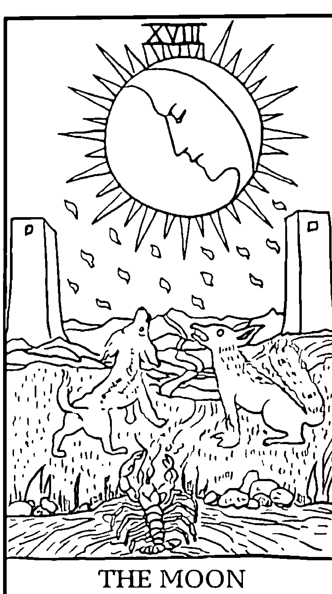

### 畫面主要組合：

**環境**：晚間，藍天上有一個滿月，畫面的下方是一片波濤洶湧的海洋，海洋之中又有一片陸地。海中兩個燈塔並沒有亮光，只有月光照射着大地上的一切。

**人物**：滿月中有一個形態溫柔的女人側面，女人的表情有點忍耐、憂鬱而溫柔。岸上兩隻看來像狗又像狼的動物在向着月亮嚎叫，龍蝦從水中爬出來。

### 基本解說：

- 月亮的光耀，在黑暗中給人照亮視野，當事人有照亮人心的天賦。
- 嚎叫中像狗又像狼的動物，暗示了局面中一些野性瘋狂的行為。
- 女人忍耐、憂鬱的表情，意味當事人將會受到精神上的考驗。要提醒當事人在這些情況下，不要輕率行事、單憑感覺去胡來。
- 龍蝦的外形正要提醒當事人要留意，事事圓滿的背後，可能有一個隱藏了的敵人或危險。
- 月亮，有陰性、柔弱、母性或女性的意義。
- 女性特有的體質問題。
- 局面中有一位女性正在犧牲自己的感受，對某些人事作出容忍。她明白到不能改變眼前的局面，因為這都是這些人事的天性。
- 掌管這一張牌的元素是水，象徵了天才和幻想力。亦意味了一個偉大的創意、一些強大而有作為的精神力量。
- 留意月相週期與自己情緒的關係。

### 逆位的解說：

- 白日夢，浪費時間的空想。
- 月亮牌逆位的時候，月亮象徵了黑暗的力量，令人驚慌、夢幻、欠缺安全感。

### 對應指定問題的附加提示：

### ❖ 工作

正位：本來穩健的制度，因為有人行為不當，導致管理不善。局面中開始充斥着負面能量，混亂的營運令人感覺不安和不快樂，同事之間不合作的態度引起恐懼和焦慮的情緒。

逆位：職場中，職務分工不清，有人為了保護自己，作出一些欺瞞行為，但卻引起預期以外的後果，令局中潛伏着危險。

### ❖ 個人發展

正位：個人經驗和能力足以作為邁向下一階段的條件，但因出身平凡，以及過往失敗所留下的深刻記憶與恐懼感，成了邁步的絆腳石。

逆位：不是運氣不好，只是自己未準備好。在未發掘過人之處之前，管理好自己的恐懼和焦慮，就會發現負面能量會逐漸消失。當人以積極的視覺看待世事時，自然會看到好的時機。

### ❖ 健康

正位：月亮牌通常反映一些心理健康問題，有時間的話，找個明白你的朋友傾訴一下，或者約見心理健康工作者。

逆位：雖然已經從最壞的狀況中走出來，但仍未達到最佳狀態，建議多作日間課外活動，盡快恢復能量。

## 學業

正位：月亮牌通常有利於一些與美術創作表演等有關科目。不適合夜間溫習。受誤導未能掌握科目重點。

逆位：因為太過擔心學業表現，產生壓力，甚至影響了校園內的人際關係。

## 愛情

正位：不應該讓傷害你的人留在身邊，要快些從過去的經驗中走出來。碰上一些人，但因能量不同，不適合發展。

逆位：戀人之間欠缺溝通，誤解了對方的感受。疏於維繫、感覺平淡如水的關係，小心有人想乘虛而入。

### 友情

正位：因為害怕孤獨，而強迫自己置身於格格不入的朋友圈。單向地包容朋友不恰當言行，感覺委屈。倒不如決心走出來，多參與一些新活動，認識更多志同道合的朋友，不要在能量不合的環境浪費自己時間。

逆位：當事人或感覺有點寂寞，懷念從前與某些友伴互動的日子，但一想到大家不合之處，就寧願退出舊有社交圈。

## No.19 太陽 (The Sun)

掌管星座：太陽 (The Sun)
元素：火

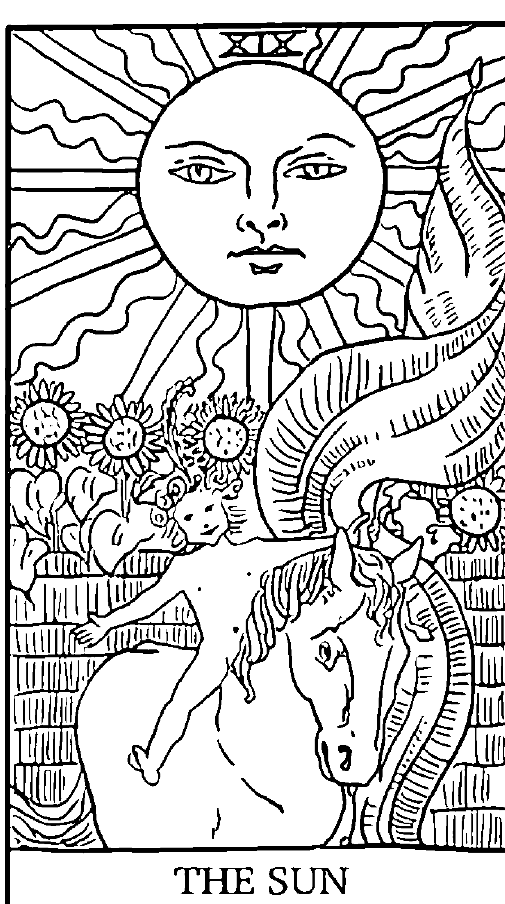

### 畫面主要組合：

環境：明朗的藍天之中掛着一個很大的太陽，太陽中有一張平和的面孔。日光照耀下是一個開滿了太陽花的花園。太陽花長在石壁之上。

人物：石壁前面有一個沒穿衣服的小孩，他騎着白馬，撐起大幅橙色的旗幟，笑容滿臉。

### 基本解說：

- 堅固的石壁象徵了安全感和保護力。
- 橙色旗幟象徵了權力和成功。
- 小孩和太陽含有純潔和新生命的意義。
- 太陽象徵了明朗、光榮、收穫、勝利、歡欣、真實和成功。相比起星星和月亮牌，太陽無疑是比較正面和實在的。

### 逆位的解說：

- 反過來說依然是一張好牌，象徵事情由混亂變為清晰。
- 當事人目前可能遇上一點困難，但很快就會遇上能夠提供協助的人士，得到一些美好的回報。
- 欠缺經驗、過早獲得成功，會令人降低危機意識。

### 對應指定問題的附加提示：

### ❖ 工作

正位：這是一個幸運的時機，即使當事人經驗未夠、能力尚淺，還是會在天時、地利、人和的好條件下，獲得展現自己能力的機會。

逆位：因為被高估了實力而獲得委以重任，不敢如實相告，又不想推掉可以發展的機會，以戰戰兢兢的心情去面對。

### ❖ 個人發展

正位：雖然明知自己的能力和經驗未達指標，但機會一到，還是鼓起勇氣去實踐一下心內的想法，見步行步。

逆位：想法太過天真，距離目標尚有很大距離，實力不夠，不足以應付任何突發場面。

### 健康

正位：心理年齡比實際年齡輕，具有相當活力的身體。

逆位：局面中如果有小朋友的話，需注意精力過剩的問題。

## 學業

正位：掌握到學習的方法。成績有進步。小孩子因為表現活潑開朗，得到老師們的喜歡。

逆位：高估自己的實力，加上輕率的態度，以致學業成績未如理想。

## 愛情

正位：物轉星移，運氣又重臨，此刻正是充滿魅力的時刻，容易吸引對象。當事人會遇上一段極有繼續發展潛力的關係。這一張牌亦象徵被祝福的結合。太陽牌表示，交往對象的性格單純。小孩背後堅固的石牆暗示有人對交往的確定和決心。

逆位：關係發展得太快，需要停下腳步來審視一下。保持耐性，可以渡過難關。

### 友情

正位：在新的社交圈中，遇上志同道合的朋友。大家互相支持，生活十分愉快。

逆位：重遇以前曾經很密切的舊友，發覺大家的成長步伐不同，溝通有點困難，感覺可惜。

## No.20 審判 (Judgement)

掌管星座：冥王星 (Pluto)
元素：水

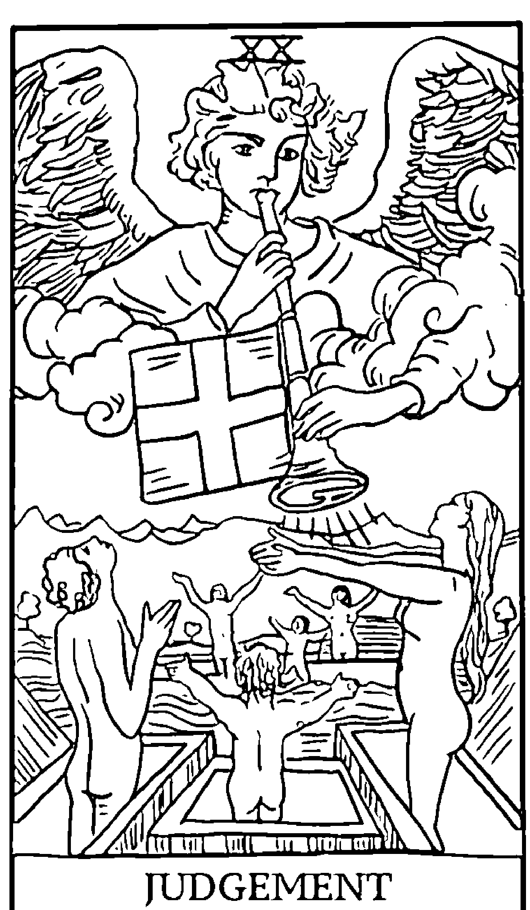

### 畫面主要組合：

環境：明朗的藍天之中，白雲浮在半空，遠處有連綿的冰山，冰山前有些小陸地連接着海洋，海上浮起一些石棺木。

人物：白雲中浮出了一個紅翼天使，天使吹起掛着紅色十字旗號的號角，人們從海邊的石棺中升起或走出來。

### 基本解說：

- 顧名思義，這一張牌有着審判的意義。石棺中升起了人，提醒人要正視過去的一些事情或過失，還有一些沒有勇氣去放下的壞習慣。然後去確認它們是曾經存在，並且已經過去了，是絕對不能消除的，但過去了的經驗，若能從正面的角度去理解和吸收，可以變成對靈性有益的養分。亦要提醒自己，曾經錯的不能再犯。
- 是時候去衡量一下目前的一切，檢討過去，考慮一下目前的狀態應該停止抑或是繼續。
- 當事人經衡量之後，可能需要面對一個大轉變，或者可能要作出一個令人難以取捨的決定。
- 建議當事人去正視某人的錯（當然那個某人可能正是自己），不要再為錯誤找藉口。然後原諒過去了的這一切，前行，並警醒不要再犯，亦不要只顧後悔，這是無補於事、浪費時間的。

### 逆位的解說：

- 當事人將要面對很多人的評論，局面中有人正在對某人的能力作出不公平評估，甚至把過去的一些人和事，拿出來結合審判。
- 當事人將要面對一個大轉變，這個轉變是有前因的，是由當事人之前的各種行為所造成，目前正是承受結果的時候。
- 局面中有人被誤解了，而且同時受到多方面的攻擊。

### 對應指定問題的附加提示：

### ❖ 工作

正位：一個將帶來大轉變的意見召集活動。工作環境發生連串變動。高層巡視業務。工作表現評核的時間。問責。

逆位：工作環境中有人因為一時大意，疏忽一些事情，需要面對和解決一些合約條款上的難題。

### 個人發展

正位：有人正在評價你的表現，誠懇地接受意見，這些意見可以令你更加清楚了解自己的能力，以及各種環境因素，改善了再重新出發就會獲得成功。

逆位：好好想清楚自己的心意和對人生的追求。不要人云亦云、隨波逐流，胡亂改變自己的發展方向。

### 健康

正位：一些不良習慣所引起的病痛。小心做好保護措施，生活環境會出現傳染病、流行病。

逆位：大病初癒，逐漸恢復健康。因為精神上的困擾、壓力等，造成病痛的錯覺。

## 學業

正位：當事人要面對比賽、公開考核、不在預期中的測驗，又或者一個重要的面試。

逆位：表現遜於預期，比賽或考試成績欠佳。局面中有人正承受被孤立。

## 愛情

正位：舊朋友再遇，彼此竟然產生出火花。重遇舊情人，回想起過去的點滴，感覺猶在。

逆位：懷緬失去的感情。錯過最佳的發展時機。因為別人的評論影響了對象的感覺。

### ❀ 友情

正位：在集體活動中認識到新朋友。有人正召集舊朋友聚會。

逆位：局面中，有人正在評論某人的言行，友誼受到衝擊。

## No.21 世界 (The World)

掌管星座：土星 (Saturn)
元素：土 (地)

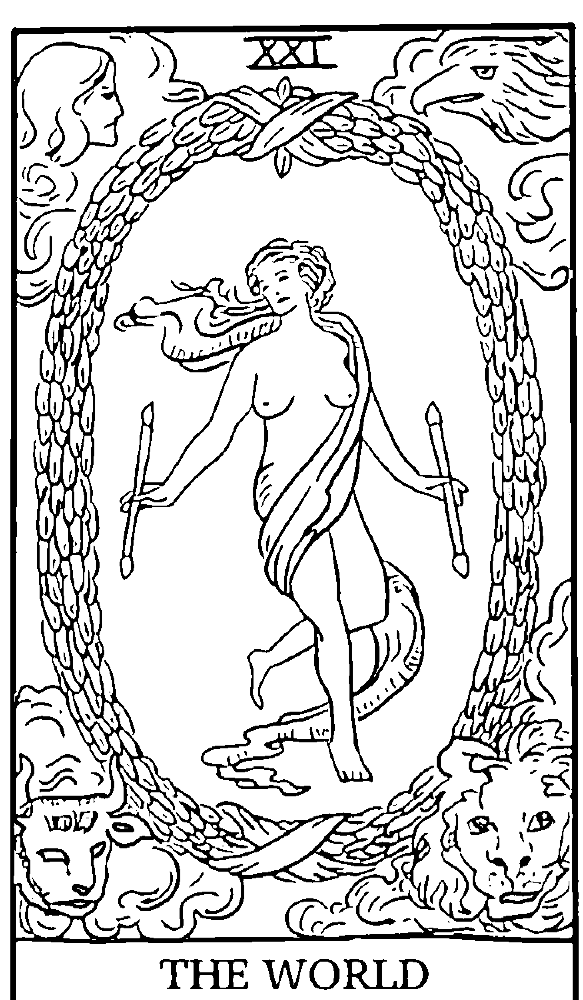

### 畫面主要組合：

環境：畫面以明朗的藍天作為背景，四角浮出四片雲，中間一個大大的象徵勝利的草環。

人物：雲中分別浮現出《聖經》中的四活物〔有關四活物的資料可以參閱 No.10 命運之輪（見第 103 頁）〕。草環中有一個幾乎赤裸的女人在跳舞，她雙手拿着兩支看來像權杖又像樂器的東西，身上繞了一條布巾。

### 基本解說：

- 圖中的女人象徵一個偉大的母親，孕育大地上的一切，她的舞步就像是在慶祝豐收，亦暗示了快樂和幸福。
- 圓形的草環，暗示了一個完整的循環系統、一個圓滿的結局。
- 世界牌亦暗示了一趟出行，不是短程商務的行程，而是一趟長途而美妙的旅遊，或者是一次收穫豐裕的考察。
- 旅行。完成夢想。完美快樂而滿足的感覺。
- 當事人將與很多不同的人事走在一起。
- 充滿魅力，贏得眾人的目光。

### 逆位的解說：

- 一次集會，一個不能改變的結局。
- 由於舞者是動態的，意味是沒有不勞而獲。
- 陶醉在自己的成功之中，忽略了曾經提供幫忙的人。
- 過分高調，招來妒忌的眼光。
- 屬於團體的成功。

### 對應指定問題的附加提示：

### ❖ 工作

正位：勤力的表現、友善的態度得到讚賞，自己亦滿意目前的成就，成了職場中的中心人物。外勤或出差。

逆位：獨自完成工作，克服了挑戰，充滿了成功感，卻沒有能夠分享感受的朋友。忽略了工作夥伴的感受。四周充滿不友善的目光。

### 個人發展

正位：遇上很好的機會，可以向自己的夢想進發。可以計劃走向人生另一個階段。

逆位：想法太多，嗜好也太多，對於未來，只有空想而沒有好好規劃。

### 健康

正位：戰勝疾病，恢復健康，甚至比以前更好。

逆位：過度應酬，體力透支。健康計劃未能持之以恆，半途而廢。

## 學業

正位：好老師。渴望精神上的滿足感。需要擴闊視野，可計劃海外進修，將會獲得成功以及一些美滿的友誼。

逆位：雖然有美好的想法，但欠缺堅持，最後半途而廢，未能收穫成果。

## 愛情

正位：性格充滿魅力，在很多人眼中留下良好印象。不止一個的仰慕者，但因為太忙，忽略了別人的注視。外出旅遊能提升戀愛運。

逆位：不習慣被關注，顯得有點不自然，未能盡情展示最美好的一面。不善於表達自己，常常遭到誤解。

### ❀ 友情

正位：計劃與朋友結伴，研究行程的過程中，已經充滿火花，不過亦喚起不少友伴專屬的回憶，友誼又提升一個層次。又或者在獨自旅遊的過程中，認識了不少新朋友。

逆位：因為生活中有些事情引致壓力很大，需要一個自我對話的空間和沉澱的過程，暫時遠離熟悉的社交圈或者社交媒體網絡。

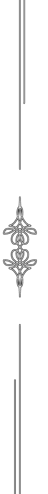

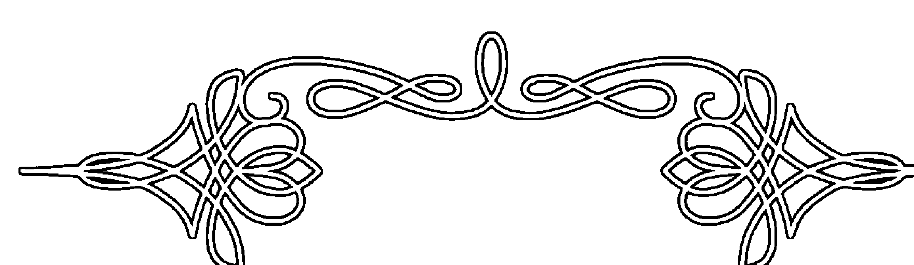

# 第四部分

## 閱讀小阿克羅

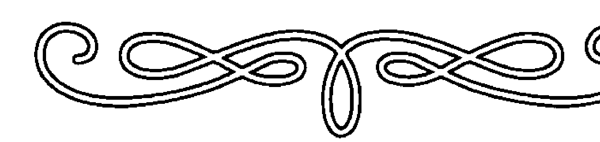

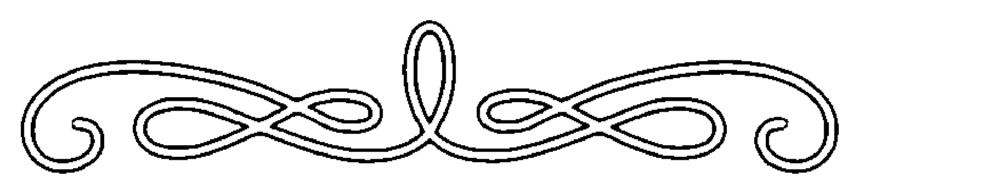

## 五角星组 · 土（地）元素

## 五角星國王

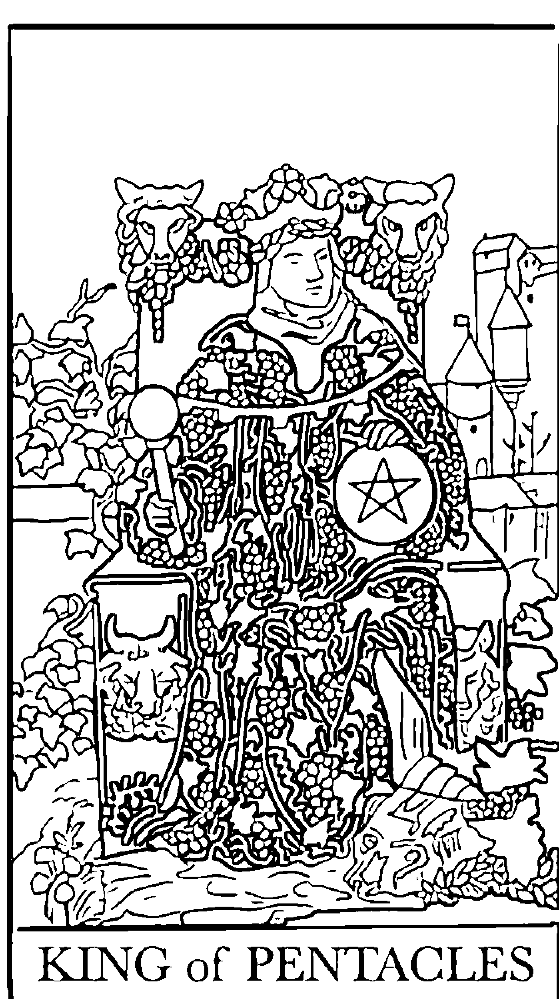

### 畫面主要組合：

環境：黃昏時分，庭院之內。背景是一座城堡，前方是一個種滿植物的花園，中間有一張黑色的皇座，座上全都是公牛圖案裝飾。

人物：五角星國王閉起眼睛坐在皇座上，他的皇冠點綴了小紅花和橄欖葉。身上穿著盔甲，一隻腳展露在外。身上長袍上是豐盛的葡萄圖案。頸上圍着紅色圍巾，右手拿着球形權杖，左手按着五角星。

### 基本解說：

- 五角星的出現，很多時都暗示一些與金錢或土地有關的事。透過五角星國王，我們可以知道當事人是一個善於管理財富，在商界具有領導力，講求紀律，在所需範疇經驗豐富的人。
- 當事人與有關銀行、金融和財務界的人關係密切。
- 由於土元素具有穩定的、實際的靈意，五角星國王亦可能是一個實業家，或一個理財觀念很強的人，作風予人安全感。
- 五角星國王坐在黑色的寶座上，顯示他已經駕馭了某些精神力量。
- 他手抱五角星的姿態，正好說明了他是一個理財觀念穩定的人。他甚至是一個有財力的老闆級人馬，有踏實的財力背景。
- 他閉上眼的表情，說明了他正在享受豐碩的物質生活，但仍喜歡工作，對商界活動相當熱衷。

### 逆位的解說：

- 當五角星國王倒下來，我們可以知道有人正過分專注於物質和金錢，或者可以說是一個守財奴。
- 一項財政上的錯誤決定。
- 一個自以為是、態度惡劣的人。
- 財務管理上無能，痴迷於財富和地位，頑固。

### 對應指定問題的附加提示：

### 工作

正位：局面中有人雖然十分着重經濟效益，有時顯得不近人情，但在很多人眼中仍深具領導風範。

逆位：有人雖然位高權重，但卻十分利己主義，沒有關顧一起工作的同伴。

### 個人發展

正位：在某範疇已有一定經驗，發展基礎穩固，可考慮扶植後輩，回饋社會。

逆位：曾經有過不錯發展，但因為向來著重自己利益，沒有好好經營人際關係，未能保持長久成功。

### 健康

正位：在努力下，保持良好習慣令健康穩定。

逆位：身體雖然沒有大問題，但精神狀況不穩定，容易暴怒。

## 學業

正位：嚴格但能夠讓人明白學科的老師。專業課程進修。

逆位：學科老師甚為嚴格，想通過考試要加倍努力。

## 愛情

正位：關係中以男性主導。一段欠缺溝通的關係。對象比較注重自我感受。

逆位：遇上比較自我的對象，彼此之間無法表達最真實的感受，感到孤獨。

### 友情

正位：雖然自身條件優厚，但不願對人作出幫忙。

逆位：看到有需要的人，不但沒有伸出援手，還會作出奚落。

## 五角星女皇

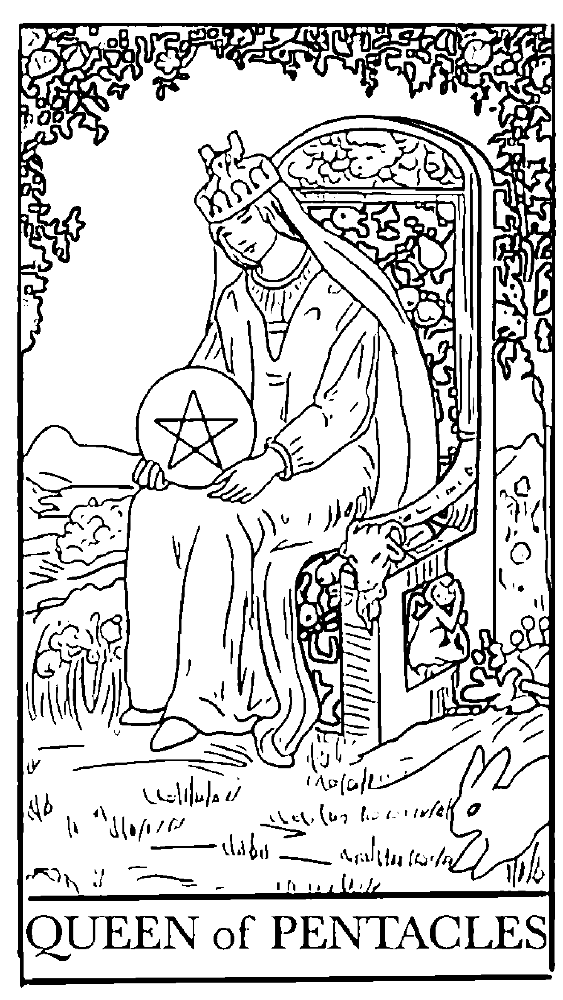

### 畫面主要組合：

**環境：** 黃昏時分，花園之中。背景遠處是一座雪山和小河流，近景是一個開着玫瑰花的花園。花園裏有小草和其他花卉。花園的中央放着一張石製的皇座，上有不同的裝飾圖案，包括嬰兒、山羊和石榴。畫面的右下方有一隻正在躍動的小兔子。

**人物：** 五角星女皇坐在石座之上，身穿紅色長袍，頭戴小皇冠，皇冠伸延出長長的綠色披風。她的視線落在雙手捧着的一顆五角星上。

### 基本解說：

- 五角星象徵了金錢、土地、物質生活等實際的東西。我們可以把五角星女皇理解為對這幾方面都十分重視的人，但我們卻不應因此而把她定義為一個貪心的女人，只是她的價值觀比較實事求是而已。
- 一個物質觀念成熟並且懂得享受物質而不受物質支配的女性。
- 畫面溫柔的姿態正好說明了她是一個溫和的人，她是一個喜歡在物質方面發揮母愛的人，以物質作為愛的表現的人。
- 美麗的環境象徵了一些豐裕的物質生活。

### 逆位的解說：

- 一個虛榮的人，特別是女人，她陶醉於物質生活，忽略了一些需要她照顧的人（啡色的小兔子）。
- 女性在金錢交易上顯得有點猶豫。
- 女人的表情暗示，有人因為一些物質引誘而變得優柔寡斷。

### 對應指定問題的附加提示：

### ✿ 工作

正位：某人的工作極講求經濟效益，他亦能夠恰如其分地處理好分內事。

逆位：某人對於團隊要求極嚴格，非常重視效益，有時甚至不近人情。

### 個人發展

正位：在某個範疇的發展已經有了很好的基礎，考慮安排一次徹底的休息，充電後再衝刺。

逆位：雖然有過一定的回報，但內心仍未感覺滿足。

### 健康

正位：感覺身心疲累，希望作出休息，重拾健康。

逆位：經過一輪衝刺，雖然獲得不錯的物質回報，但無法填補心靈空虛。

## 學業

正位：面臨一個學業上的考驗，內容不簡單，需要認真應付。

逆位：因為太大壓力，反而表現失準，應該好好放鬆。

## 愛情

正位：個人條件不錯、面對愛情十分認真的女性，因為不敢貿然行動，反而錯失了不少機會。

逆位：在兩性關係上，非常着重物質享受的女性。

### 友情

正位：獲得了一些成功，想和朋友分享，才發現之前過度努力，疏於聯絡，友情生疏不少。

逆位：朋友之間的交往，最好不涉及金錢，不然會蒙受損失。

## 五角星騎士

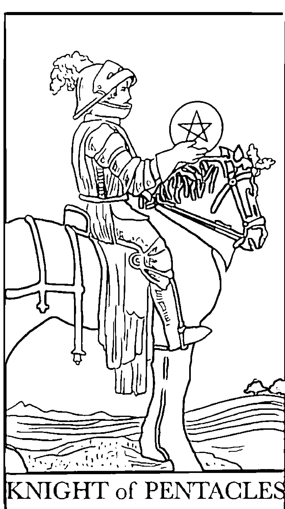

### 畫面主要組合：

環境：黃昏時分，野外上有草地和小樹。

人物：五角星騎士坐在他的黑色坐騎上，黑馬靜立著。騎士穿著盔甲，身披紅色披肩，頭盔上裝飾著樹葉。他態度安靜，右手捧著五角星，目光望向前方。

### 基本解說：

- 受到土元素的影響，我們可以把五角星騎士理解為一個對金錢有積極觀念的青年人，為了得到更好的物質上的成就，他會細心地作出計劃。相對另外幾位騎士，五角星騎士會表現得比較成熟。
- 一個願意透過積極努力換取物質回報的年輕人，會因為物質而努力。
- 一個積極的人，展開了一個新的價值觀，成為未來前行的推動力。
- 希望作出一些投資。

### 逆位的解說：

- 當五角星騎士倒下來，他希望提醒年輕人別因為偏重物質，為了金錢而追逐一生，浪費青春，忽略了精神生活。
- 執著舊有的觀念，未能與時並進。

### 對應指定問題的附加提示：

### ❖ 工作

正位：勤奮、有責任感。願意對團隊作出幫忙。

逆位：行動緩慢，未能配合團隊活動速度。

### ❖ 個人發展

正位：經過一輪發展，對於自己的未來規劃有了一定的方向，目前需要增加自身能力和金錢上的儲備，以應付未來的其他不明朗因素。

逆位：過度小心謹慎，判斷力欠佳，影響行動速度，錯失不少機會。

### ❖ 健康

正位：年輕力壯，亦十分重視健康保養。

逆位：雖然有保持健康的心，卻沒有為此作出行動。

## 學業

正位：獨自溫習比起和同學一起溫習，更有效益。

逆位：對於某個務實性學科，理解力不足，正往錯誤的方向溫習，未能獲得良好成果。應該與一起面對測考的同學們，分享交流溫習的心得和方向，重訂溫習方針。

## 愛情

正位：遇上了喜歡的對象，卻不知如何表達自己的想法，亦害怕失敗。

逆位：放不下過去了的感情。

### 友情

正位：最近不大喜歡熱鬧的交往，反而享受和幾個志同道合的朋友，安安靜靜地分享時光。

逆位：對於好朋友無心的說話耿耿於懷。

## 五角星侍從

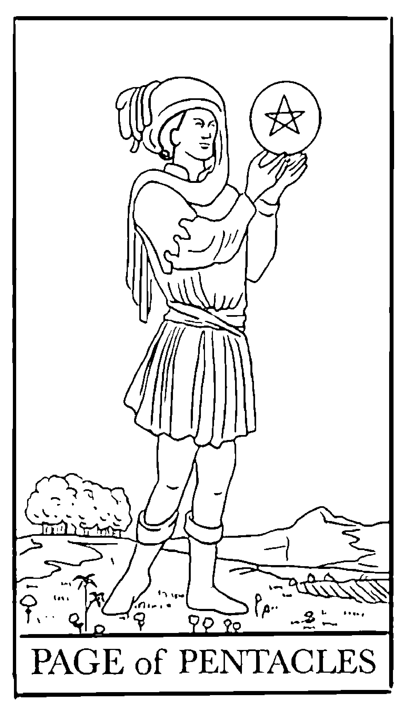

### 畫面主要組合：

環境：黃昏時分，室外。遠景是雪山和小樹林。前景是高原平地，長着小花草。

人物：侍從打扮的少年，視線集中在雙手捧着的五角星上。

### 基本解說：

- 豐盛的畫面象徵了豐富的物質生活、與家人分享生活、一些令人快樂的事。
- 快樂地享受物質上的成果，而且不是孤獨的，而是與人分享的。
- 與人分享而帶來更多的歡愉和更大的成就。

## 五角星 no.10

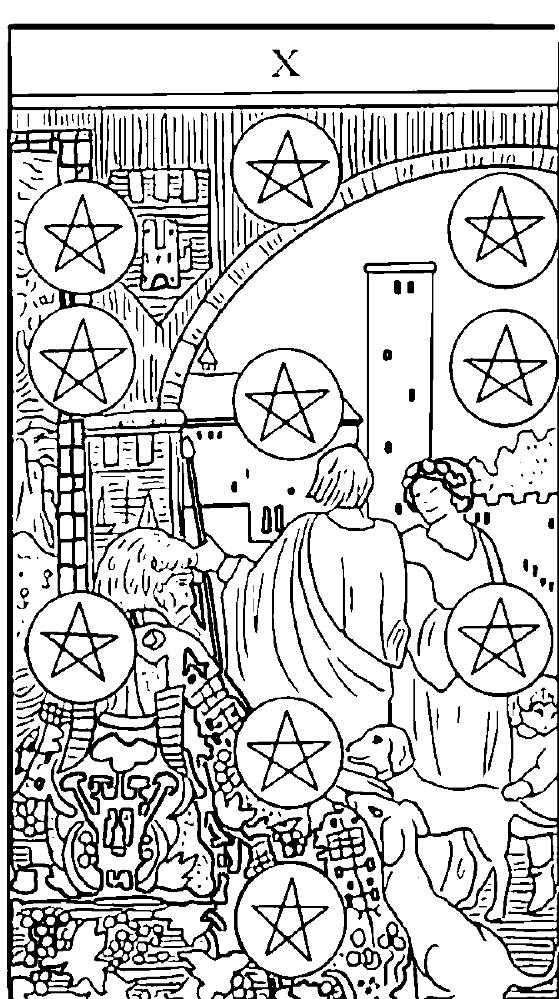

### 畫面主要組合：

環境：晴朗的藍天，庭園內外。背景是一座建築物，前景是庭園之內，庭園的拱門旁邊有不少畫作。

人物：一個老人披着長披肩坐在畫面前方，兩隻白犬，一隻伏在他的膝上，一隻站在他的面前。老人身上的披肩圖案複雜，他的眼目閉起，一隻手搭在其中一隻白犬頭上。拱門下方一男一女正在交流。女人的左手旁，有一個小孩子，目光望向外面。畫面的最前方半空之中，有十顆排列成生命樹形狀的五角星。

### 基本解說：

- 無論是哪一個年紀、哪一個階層的人，都得到了物質上的快樂。
- 畫面中的人正快樂地享受物質上的成果，而且不是孤獨的，是與人分享的，這會帶來更多的歡愉和更大的成就。

### 逆位的解說：

- 為了從物質換來的快樂而變得有點浪費。
- 當這一張牌以逆位出現，象徵有破財的機會，不如買禮物逗人開心一下來應化。
- 是時候去買禮物逗親愛的人開心。

### 對應指定問題的附加提示：

### ❖ 工作

正位：雖然很努力投入工作，但未能發揮最好表現。
逆位：對於新的工作感覺吃力，但又不知如何處理，亦未找到適合的同事或前輩請教。

### ❖ 個人發展

正位：對於目前發展未感如意，但又未了解自己的興趣和實力所在，徘徊在進與退之間。
逆位：有利於自我發展的機會，卻因為能力不足，欠缺勇氣嘗試，白白浪費了。

### ❖ 健康

正位：覺得身體出現了一些小問題，但未能找到原因，慶幸未有影響日常生活。
逆位：生活上一些不良的小習慣，正逐漸蠶食身體健康。

### ❖ 學業

正位：忽然興起了想努力獲得好成績的意向，以行動作出配合，理想達到。
逆位：學習沒有恆心，容易半途而廢。

### ❖ 愛情

正位：心裏有喜歡的人，雖然知道目前沒有發展機會，心裏還是放不開。
逆位：遠距離暗戀，不敢了解對方，自信心不足。

### ❖ 友情

正位：自我價值觀並不清晰，經常為了迎合別人而改變自己。
逆位：和舊朋友的發展步調並不一致，愈行愈遠。

## 五角星 no.9

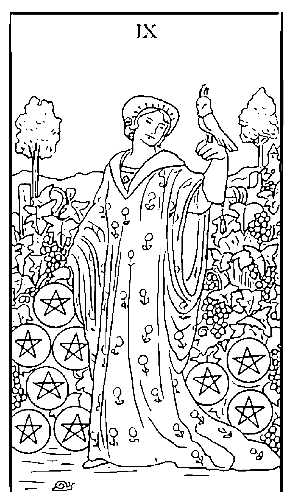

### 畫面主要組合：

環境：黃昏，葡萄園內。背景有樹、山和塔。前景是豐收的葡萄園和九顆五角星。

人物：一位婦人站在葡萄園中，右手垂下按着六顆五角星，左手舉起托着一隻鸚鵡。婦人的左腳旁邊有三顆五角星，她的目光落在鸚鵡身上。

### 基本解說：

- 局面中有人正享受自己一直努力換來的成果，培養了一些興趣。
- 當事人十分滿足，安於現況後會想想將來，展開新的計劃。

### 逆位的解說：

- 這一張牌逆位出現，正要提醒人不要玩物喪志。

### 對應指定問題的附加提示：

### ❖ 工作

正位：在本職發展穩定，同時可以發展兼職又或者其他投資。
逆位：同時兼顧多個不同職務，雖然能夠獲得理想回報，卻要承受巨大的壓力。

### ❖ 個人發展

正位：活力、體力、能力都處於巔峰狀態，可以同時兼顧多種不同範疇的發展。
逆位：雖然有一定的計劃和充分的準備，但還是有一些未能預見的因素，令計劃受阻。

### ❖ 健康

正位：健康狀況良好。能夠好好享受飲食與休閒，身心平衡。
逆位：近日很多應酬，飲食過量，需要開始多加節制。

### ❖ 學業

正位：這一張牌比較有利於一些實務性的科目，又或者商業意味稍重的科目，例如地產、行政管理、經濟學、財政學或酒店管理。
逆位：局面中，學生們最近被一股不良氣氛圍繞着，沉迷奢侈品。

### ❖ 愛情

正位：兩性關係中，女性作主導。單身的人，同時會遇上多位追求者。
逆位：局面中有女性在處理愛情關係時，會比較傾向重於物質。

### ❖ 友情

正位：物質豐富，重視生活享受，但不嚮往熱鬧的社交聚會，反而比較享受和知心好友分享美妙時光。
逆位：局面中某人喜歡跟人比較物質生活。在社交圈中並不討好。

## 五角星 no.8

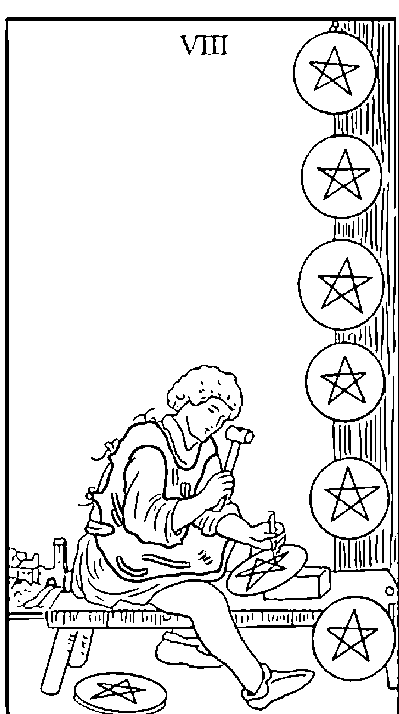

### 畫面主要組合：

環境：晴空之下，背景是一個小城市。近景是一個工作場所。右前方有一條高高的木柱，木柱上掛着五顆五角星。工作場中另外散放着三顆五角星。地上有一張小木凳。

人物：一個工匠打扮的男人坐在木凳之上，他手上拿着工具正在製作五角星，地上分別有兩顆已完成的五角星。

### 基本解說：

- 這一張牌描寫了工匠生活的畫面，暗示局中有人能透過從事一些技術性的工作而獲得金錢回報。
- 如果在查詢財務問題，暗示當事人需要以努力換取金錢，是多勞多得的活動模式。
- 一個勤力、擁有專業技能，並且懂得創造商機的人。
- 如果在查詢一個過程，暗示一切還在建造中。

### 逆位的解說：

- 有人只顧為著金錢而忽略了心靈上的滿足。
- 過分執著物質利益，不近人情。

### 對應指定問題的附加提示：

### ❖ 工作

正位：雖然工作很辛勞，最後亦得到合理的回報。把薪水扣起做一些儲蓄，有利於計劃將來。
逆位：雖然十分勤力工作，但生活經濟壓力大，經常入不敷支。

### ❖ 個人發展

正位：找到了初步的發展方向，但與成功仍有一段距離。
逆位：試過不同的發展方向，仍然未見成績，開始有點氣餒。

### ❖ 健康

正位：健康狀況尚算穩定，但要小心不良姿勢所引起的腰部痛楚。
逆位：長期的不良姿勢，引起很多痛症。

### ❖ 學業

正位：測考程度不算太艱深，在努力之下可以獲得好成績。
逆位：時間緊迫，應該要專心溫習。

### ❖ 愛情

正位：已有對象的，二人關係將進入穩定期；未有對象的，可以藉著轉換工作認識新對象。
逆位：戀愛中的人不要因為疏懶，被習慣沖淡了關係。

### ❖ 友情

正位：這是一份用時間、經歷累積而來的珍貴友誼。
逆位：想和曾經的幾個好朋友聚舊，不過，因為各有各忙，不容易約齊所有人。

## 五角星 no.7

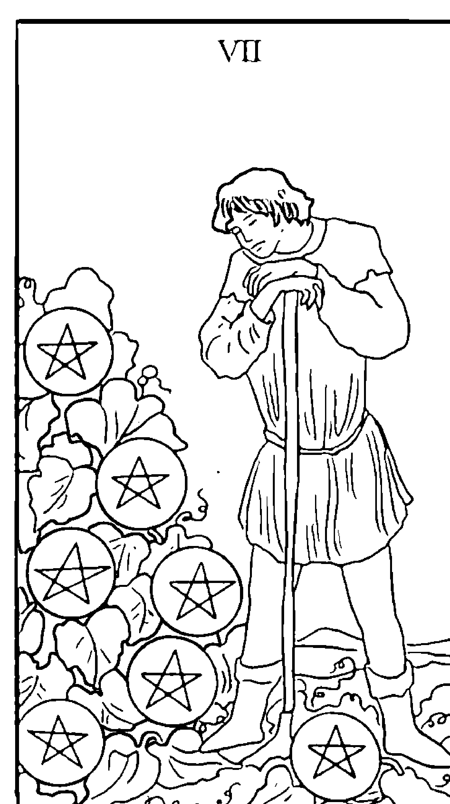

### 畫面主要組合：

環境：晴天，室外，矮樹旁，堆着七顆五角星。

人物：普通工人打扮的男子撐着鋤頭，目光望着矮樹上的六顆五角星，地上另有一顆五角星。

### 基本解說：

- 男人的表情暗示他正在為自己計劃，特別是有關金錢方面的。
- 如果正在查問一件事的進度，這一張牌顯示，目前正是一個中止時刻，需要一些物質上的吸引作為推動力，才能重新啟動。

### 逆位的解說：

- 提醒局面中有人正漫無目的地等待機會，然而這個方法是肯定行不通的，只會白白浪費時間。了解清楚自己的需要，再觀察市場上的狀況。
- 某個計劃暫停，因為當中主導的人不知自己想要甚麼。

### 對應指定問題的附加提示：

### ❖ 工作

正位：在現有的工作環境，無論在職位或物質回報上都難以有突破性的發展。
逆位：付出了很長時間的努力，最後得到的收穫卻遠遠不如預期，非常失望。

### ❖ 個人發展

正位：經過一輪努力，發現目前的發展方向不會帶來很大的成功，正考慮放棄或是繼續。
逆位：開始了一些新計劃，仍未知結果是好是壞，排山倒海的工作接踵而來，沒有放鬆和思考的空間。

### ❖ 健康

正位：運動過量或不恰當地運用肌肉，令身體負荷不了，應該稍作休息或請教專業人士指導。
逆位：長期休息不足，需要稍作暫停，讓身體恢復狀態。

### ❖ 學業

正位：對學科感覺沉悶，失去了學習的興趣。
逆位：經過多番努力，還未找到合適的溫習方法，成績未有顯著進步。

### ❖ 愛情

正位：單身的人，如果希望改善愛情運，應該先改變自己的形象。已經發展了一段時間的戀人，開始檢討彼此間的關係。
逆位：不滿感情狀態，正考慮是否要改變彼此間的關係。

### ❖ 友情

正位：雖然有時覺得與朋友的喜好不盡相同，但仍樂於互相配合，十分珍惜彼此間的友誼。
逆位：局面中，有人為了利益打算出賣友誼。

## 五角星 no.6

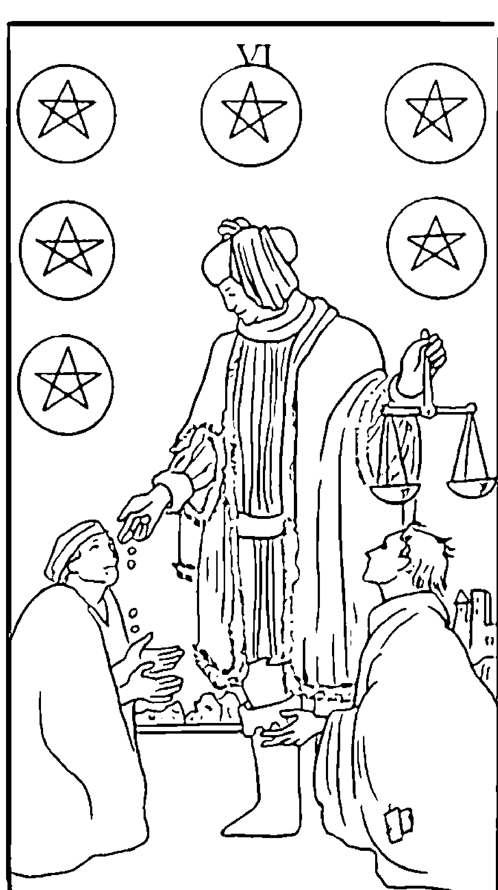

### 畫面主要組合：

環境：晴天，空地上。背景遠處有一座城堡和小草叢。

人物：空地上有三個男人，左方跪地的一個頭裹着布、身披着長袍。另一個跪地的男人，衣衫破爛。這兩個人似乎都正在向中間一個衣着打扮光鮮整齊的男人尋求協助。而這個站立着的人，左手提着一個天秤，目光望着右方的人派送金幣。

### 基本解說：

- 這一張圖描述了一個幫助別人的畫面，象徵了一些慈善、助人的行為。
- 助人為快樂之本，可是男人手上的天秤正暗示助人亦有學問，方法要公平而有效，否則便不能發揮效果。
- 現在的付出將得到公平的回報。
- 這裏描寫了一個宇宙的法則，在人為宇宙作事的同時，宇宙亦會回應當事人的需求。

### 逆位的解說：

- 當事人的付出未能得到讚賞或應有的回報。
- 局面中有人幫助別人不是出於真心，只是一些表面工夫。
- 當事人會遇上一位曾經接受其幫忙的人，然而這一個人似乎早已忘記這一段恩情，而且表現出得意揚揚，甚至不想別人知道曾經接受他人的幫忙。當事人心感難受。

### 對應指定問題的附加提示：

### ❖ 工作

正位：這一張牌的出現，正要提醒職場上的人，多注意上級與下屬之間的溝通和互動，能夠大大改善目前的工作質素。
逆位：作為管理層的人士，需要特別關注下屬的行為，當中有人會因為行為失當而拖累整個局面。

### ❖ 個人發展

正位：對現況感到不滿，但是自身能力仍未達到可以對外大展拳腳的水平。環境能量亦未見得有助於推動發展，應該三思而後行。
逆位：局面中有人希望作出新嘗試，可是因為計劃不足、有勇無謀，最後以失敗收場。

### ❖ 健康

正位：健康尚算穩定，只是有一些小毛病。
逆位：注意天氣轉變可能會引發一些敏感徵狀。

### ❖ 學業

正位：同時應付校內考試和課外活動，分身不暇，十分疲累。
逆位：興趣多多，又要兼顧學業，需好好分配時間。

### ❖ 愛情

正位：有人在感情上需要同時照顧多人感受，感情並未進入穩定狀態。單身的人有機會認識新對象，但發展之前要了解對方的背景，不應操之過急。
逆位：雖然會有浪漫的愛情，但小心感情並不穩定，容易墮入三角戀。

### ❖ 友情

正位：同時兼顧兩個不同的社交圈，生活繁忙。
逆位：友誼的世界中，亦有爭風呷醋的事件。

## 五角星 no.5

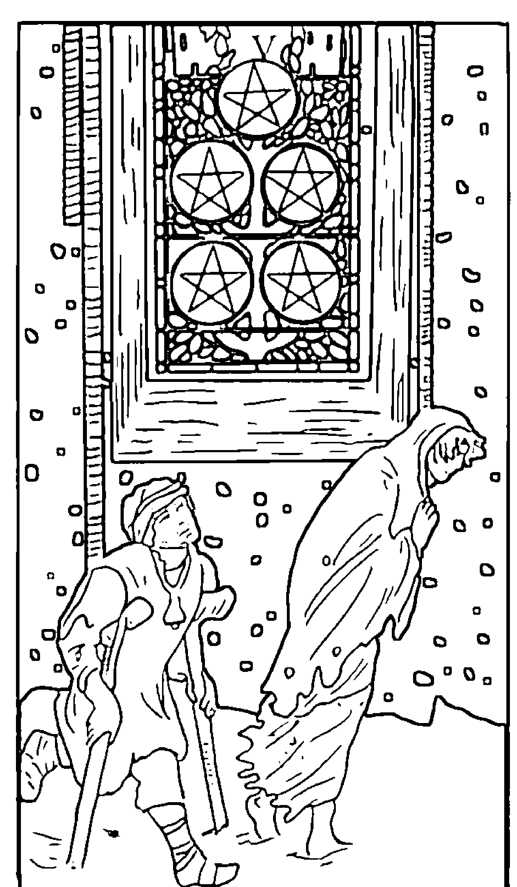

### 畫面主要組合：

環境：晚上，室外，正在下着雪。建築物的玻璃彩繪上有生命樹與五顆五角星圖案。

人物：穿着破爛的婦人，赤腳在雪地上行走。背後跟着一個腳部受傷，撐着拐杖的男性。

### 基本解說：

- 面對一些困境，身邊一些有能力的人卻未有給予援助。
- 局中有人正面對一些困苦、逆境，雖然遇上同路的人，但原來大家的狀況都不好，未能在困境中給予對方實際上的助力，只能作為心靈上的支持。

### 逆位的解說：

- 有人正陷於一些困擾中，心裏卻不願接受旁人援助。
- 資源分配不均，貧富懸殊的情況。

### 對應指定問題的附加提示：

### ❖ 工作

正位：即將要和同事一起面對一個大難題，在沒有外力的幫助下，大家只能互相扶持渡過難關。
逆位：工作上，有人前來尋求協助，但你亦自身難保。

### ❖ 個人發展

正位：目前發展未見理想，但亦不是出去闖蕩的時候。
逆位：因為計劃不夠週詳，新發展難以成功。

### ❖ 健康

正位：健康開始發出警號。要多注意身體保養。
逆位：身體頗多小毛病，要注意恢復健康。另外，亦要關注目中無人的精神狀態過於負面。

### ❖ 學業

正位：學業遇上困局，一向友好的朋友都未能幫忙，應向師長求助。
逆位：不要被同學們誤導，學業上要付出努力才有收穫。

### ❖ 愛情

正位：戀愛中的人，伴侶會面臨難關，一起面對可令感情升溫。單身的人，會遇上一位新對象，但對方的生活正面臨難題。
逆位：經歷重重困難，終於能夠穩定下來。

### ❖ 友情

正位：當事人身邊出現了能一起共渡難關的朋友。
逆位：身邊雖然有人能夠助當事人渡過難關，卻因為某一些特別的原因，例如時間上的錯失、溝通上的誤會等，最後受困者得不到幫助。

## 五角星 no.4

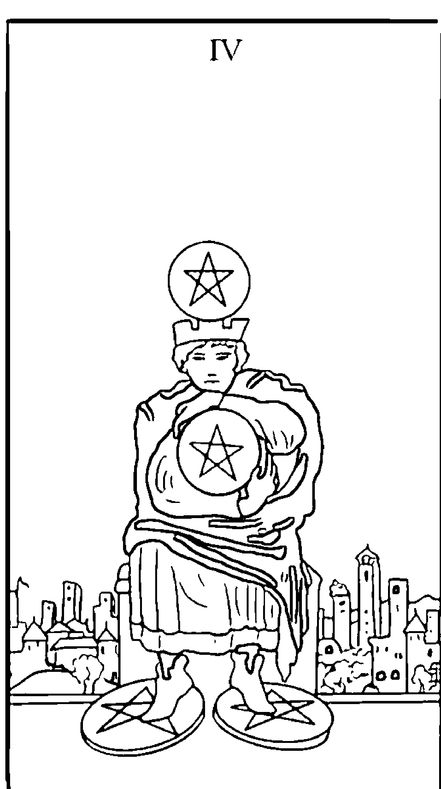

### 畫面主要組合：

環境：晴天。背景是小城市，前景是平地，平地上有一石座。

人物：一個打扮樸素、頭戴皇冠的男子。頭頂着一顆五角星，雙手又捧着一顆，雙腳則踏着兩顆。

### 基本解說：

- 金錢分開了三個部分，一部分是流轉的、一部分是收藏的、一部分是從上而下的（可能在承繼一些東西，也可能是上天給予的）。
- 局面中有人表現冷淡。其實內心有強烈的佔有慾。
- 畫面中五角星的排列狀況，暗示了一種安定但不算豐裕的財運。

### 逆位的解說：

- 一個守財奴，一個計算著別人財產的人。
- 局面中負責資源分配的人，並沒有恰當地做好自己的工作。

### 對應指定問題的附加提示：

### ❖ 工作

正位：工作量大，甚至需要接收別人處理不來的事情。在這個時候應該要學會對不合理的事情說「不」。
逆位：舊工作未完又要接受新的任務，明顯地，能力與環境條件都未能配合完成，要及早跟上級商量，找其他同事分擔，不然最後會連累整個部門。

### ❖ 個人發展

正位：發展方向正確，但發展速度較為緩慢，要按部就班。
逆位：目前的環境與未來方向有衝突，需要二者擇其一。不能一心二用，否則最後兩邊兼顧不來，兩方面都失敗。

### ❖ 健康

正位：健康狀況穩定，需留意有關飲食過量引起的消化問題。
逆位：這一張牌的逆位出現，如果牌陣中配有 No.15 惡魔或者 No.16 塔，需要注意有關囊腫問題。

### ❖ 學業

正位：學業成績逐步趨向穩定，若多加些少努力，很快就會有明顯進步。
逆位：自信心不足，壓力過大，反而會影響表現。時間許可的話，稍事休息，放鬆心情後，再重拾書本，定有更好效果。

### ❖ 愛情

正位：有關於談情說愛的事，不能一味衡量得失、以理性行事。過度估量，反而會令感情停滯不前。
逆位：雖然開始了新的關係，但還未放下舊有的感覺，徘徊兩種感覺中間，十分迷惘。

### ❖ 友情

正位：自信心不足，幸得朋友鼓勵和支持，最終能樂觀面對困難。
逆位：過度保護自己，沒有跟朋友坦誠，影響友誼。

## 五角星 no.3

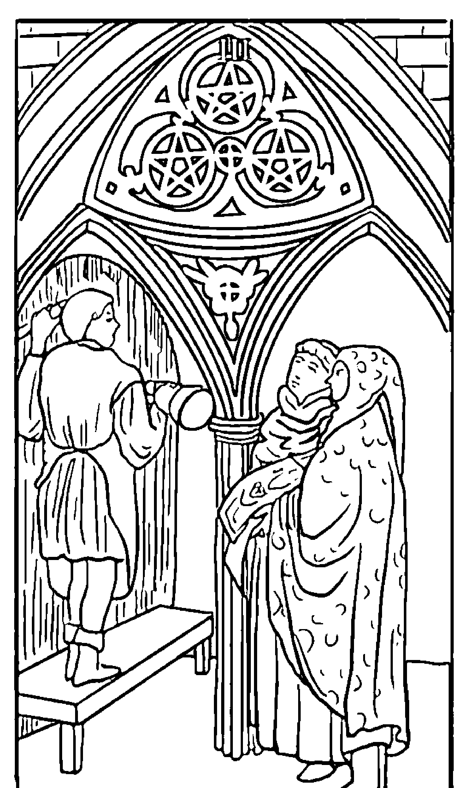

### 畫面主要組合：

環境：室內，石造的建築物。拱門上有石雕裝飾。地上有小木凳。

人物：圖中一共有三個人，左方一位應該是石匠身份的人正站在木凳上，拿着工具瞧向另外兩人。右下方兩個人的視線正望着石匠，其中一位手拿設計圖，三人像在為着工程進行商討。

### 基本解說：

- 三顆灰白色的五角星暗示有人的價值觀與平常的不同。
- 一些自我表現的行為。一個不公開的組織。
- 有人陶醉於自我的表現之中而忽略了回報。

### 逆位的解說：

- 為了表現自我而帶來的金錢損失。
- 局面中有人正不滿某些人的行為，但又不敢勇於表達。
- 因為程序操作失誤，計劃受到阻延。

### 對應指定問題的附加提示：

### ❖ 工作

正位：局面中，有人正在按照某些規則來審視某人的工作進度。
逆位：未能依時完成工作，能力備受質疑。

### ❖ 個人發展

正位：局面中有人自視過高，希望能夠在某一個範疇有所發展，行動之前卻未有好好考慮局面中其他因素。
逆位：發展初期即受到打擊，應該停下來好好作出檢討，才繼續向前。

### ❖ 健康

正位：局面中，有人最近特別迷信於某種健康食品的功效。
逆位：如果有人正因為生病去看醫生，這一張牌以逆位出現，暗示某個醫療方案並不是最好的方法，不妨嘗試聽取其他專業醫學意見。

### ❖ 學業

正位：雖然盡力做好功課或計劃書，但似乎沒能打動評分的人，成績沒預期中理想。
逆位：經過失敗，早已獲取教訓，重新出發，成績有所進步。

### ❖ 愛情

正位：單身的朋友，因為社會或周遭的壓力，開始意識到需要找個伴侶，但同時內心並未準備好去對應這事情。對於應該找一個怎樣的人、如何去與人相處等實際問題，內心十分模糊。
逆位：對伴侶容忍度愈來愈低，從而導致對整個感情生活不滿，情緒亦愈來愈不穩定。

### ❖ 友情

正位：心中有一個想法，卻得不到朋友的支持和體諒。
逆位：本來想與朋友分享自己的成果或成就，卻招來嫉妒之心，意料不及。

## 五角星 no.2

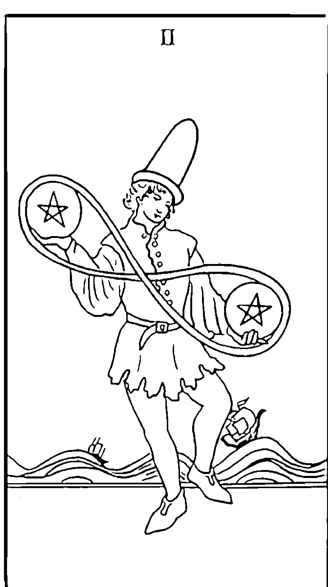

### 畫面主要組合：

環境：晴天，室外，海邊。背景是翻起了高浪的大海，海中有兩隻帆船，前景是平地。

人物：一個平民打扮的年輕男子，頭戴着特別高的紅色高帽。男子手捧着兩顆五角星，五角星之間有一條八字形的紐帶，男子目光落在右下方的五角星上。

### 基本解說：

- 一些交替、交換或交易的事，特別在於金錢或物質上。
- 男子背後的波濤，暗示有人陶醉於玩樂，忽略了一些隱藏性的危機。

### 逆位的解說：

- 局面中有人正對某人作出金錢上的欺瞞。
- 有些事物不是想像中那麼有價值。

### 對應指定問題的附加提示：

### ❖ 工作

正位：這一張牌顯示局中人一種衡量得失的心情。其實兩者之間分別不大，要衡量的不應該只是物質上的利益和效果，應該審視這一個決定對未來會帶來甚麼影響。
逆位：因為猶豫不決，最後白白錯失了能夠獲取利益的好機會。

### ❖ 個人發展

正位：因為知道自己實力不足，對環境了解不深，即使機會來到，亦無法衡量輕重。
逆位：明明有一個可以發展的機會，卻因為太過執著於物質回報而錯過了。

### ❖ 健康

正位：注意一下日常生活姿勢，小心因為脊椎骨位置不良而引起的痛症問題。
逆位：未來數月，小心留意身體上一些對稱器官，例如雙眼、雙耳、雙手、雙腳之類，其中一邊會出現毛病或與另一邊不協調等。

## 學業

正位：心中疑惑正在選讀的學科，是否適合自己未來的發展。

逆位：學業壓力沉重，未有足夠實力應付，應考慮向外尋找名師幫助，渡過艱難時期。

## 愛情

正位：已有關係的人正在衡量目前的對象，例如對象的自身條件，又或者拿眼前對象與從前的一位作比較。

逆位：三角關係曝光。局面中有人移情別戀。與從前情人舊情復熾。未有戀情的人會遇上新對象，不過對方條件與心目中預設的有很大出入。

### 友情

正位：得到舊朋友的幫助，渡過難關。心裏懷着感激，希望作出回報。

逆位：好朋友之間曾經發生一些誤會，表面上已經解決了，但關係仍未能回到從前。

# 五角星 Ace

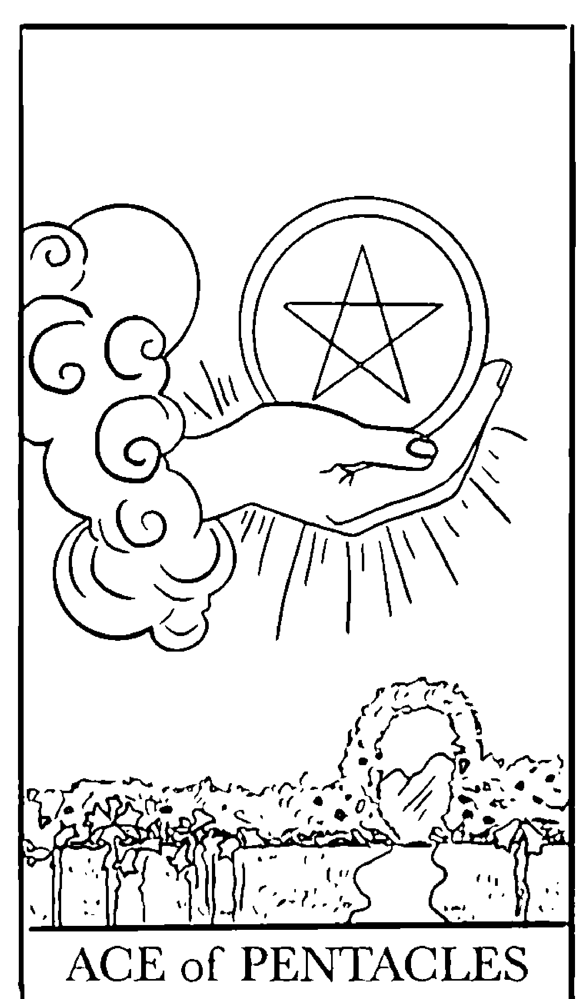

## 畫面的主要組合：

環境：晴空之下，室外。花園中開滿了玫瑰和百合，從花園的拱門望出去，遠處是一座高高的雪山。

人物：半空之中，從雲朵伸出一隻手，手捧着一顆大大的五角星。

### 基本解說：

- 一些上天給予的金錢回報。
- 一個和金錢有關的新計劃。

### 逆位的解說：

- 一些未能預計的損失。

### 對應指定問題的附加提示：

### ❖ 工作

正位：職場上出現一個新計劃，如果能夠好好把握，表現自己，事業將會有更大的發展。一次轉工的機會，條件優厚。

逆位：一份條件優厚的兼差，不過不能明目張膽進行。

### ❖ 個人發展

正位：在新的人際關係上遇上新的發展機會，無論自己、地點、人物都似乎在最佳的狀態，可以細心考慮是否要參與其中。

逆位：目前有一個表面上十分吸引的發展機會，不過裏面充滿危機，如果一時不慎，就會容易導致損失。

### ❖ 健康

正位：如果某人的健康出現了問題，這張牌提示將會遇到好的醫生。

逆位：將會發現身體出現一些毛病，需要一段頗長的時間調節，才能恢復健康。

### ❖ 學業

正位：這張牌出現，正要提醒當事人可以考慮選讀一些與商業實務、會計、經濟、酒店或地產有關的科目，會事半功倍。如果某人正在報考學校，將會獲得很好的學位。

逆位：雖然如願獲得理想的學位，不過未來學業將會相當沉重。

### ❀ 愛情

正位：如果局中某人已經有戀愛對象的話，這一張牌出現正要提醒當事人，是時候好好考慮跟伴侶再進一步。

逆位：有機會偶然再遇舊情人，不過沒有重拾舊歡的緣份。

### ❀ 友情

正位：一份珍貴的友誼就放在眼前，要好好珍惜。

逆位：重遇舊朋友，對方帶來好消息，大家重新建立友誼。

# 聖杯組 · 水元素

# 聖杯國王

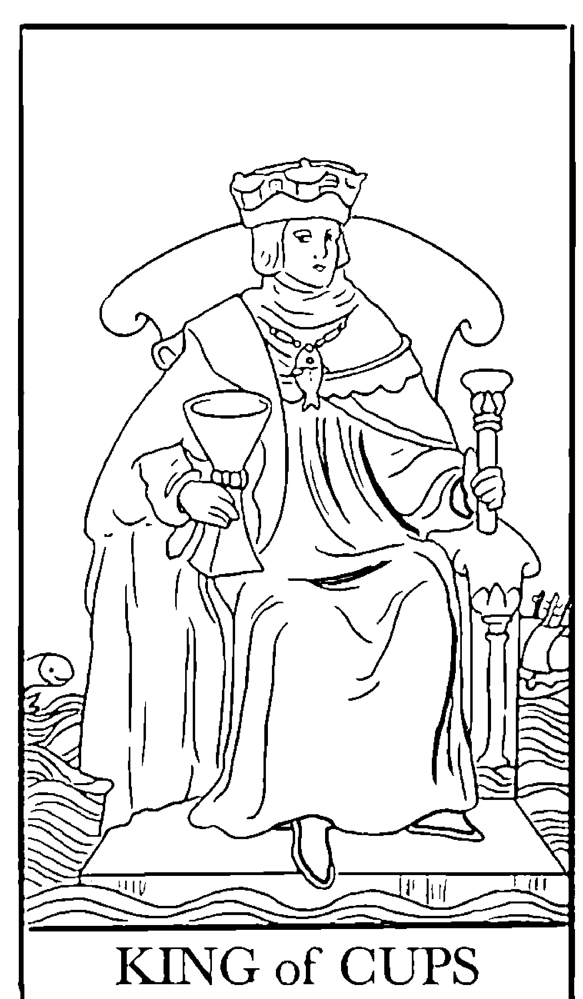

### 畫面主要組合：

環境：天晴，海洋泛起波浪，海面上有一張設計簡單的石製皇座。皇座一旁有小魚，皇座背後有一帆船。

人物：聖杯國王戴着設計簡單的皇冠顯得一臉猶豫，身上戴有魚形飾物，右手拿着聖杯，左手拿着權杖，聖杯體積比權杖大。

### 基本解說：

- 一個感情豐富的領導人，一個帶有溫柔的威嚴慈父，社會地位優良的男性。
- 水元素，暗示藝術方面的才能，或者是文化方面很出色的人，例如是一個宗教家、學者。
- 感情豐富的、成熟的男性。
- 他雙手分別拿著黃金聖杯和形象不明顯的權杖，暗示了權力與感情並重。
- 一個以和為貴的人。

### 逆位的解說：

- 當聖杯國王倒轉出現，顯示當事人被感情蒙蔽了理智。容易出現拖泥帶水、意氣之爭或過分縱情享樂的情況。

### 對應指定問題的附加提示：

### ❀ 工作

正位：職場上某位管理層將會陷入一個兩難的局面，既要面對工作進度，又要面對人事之間的管理問題，左右做人難。

逆位：局面中有人因為偏私，任用了不適當的人選，導致工作程序出現問題，影響整體表現。

### ❀ 個人發展

正位：明白目前的狀況沒有更大的發展空間，希望尋求突破，但卻又因為不想離開舒適圈，敢想而不敢做。

逆位：某人因為之前分析力低、感情用事，在某項重要事件中作了一個錯誤的決定，得不到預期的結果之餘，反讓自己陷入了困境，目前後悔不已。

### ❀ 健康

正位：最近沉迷於某種不健康的飲食習慣，健康出現警號。

逆位：當這一張牌以逆位出現，正提醒當事人應該要注意有關脂肪積聚、肥胖、水腫等問題。

### ❀ 學業

正位：這一張牌與海外升學、轉換科目等有關，特別有利於藝術創作、飲食、酒店管理等科目。

逆位：沉醉於玩樂、飲食，過度放鬆，疏忽學業。

### ❀ 愛情

正位：遇上喜歡的對象，但不知如何令雙方關係更進一步。

逆位：在感情上搖擺不定、沒有主見、縱容伴侶不合理行為。

### ❀ 友情

正位：樂於幫助別人，喜歡照顧異性。容易因為過度熱情，引起異性誤會。

逆位：暗戀，或朋友間的曖昧關係。當事人可能正面臨一些忠義兩難全的抉擇。

# 聖杯女皇

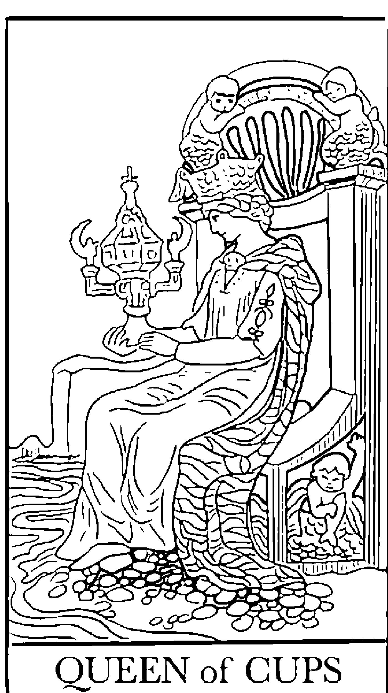

### 畫面主要組合：

環境：天朗氣清，海岸旁邊的皇座上有嬰兒圖案及華麗裝飾。

人物：女皇手捧着儀式用的聖杯，聖杯有蓋並佈滿華麗裝飾。女皇身上的衣物有象徵水元素的水波圖案。

### 基本解說：

- 女皇象徵了一個充滿母愛的女性。
- 美麗的聖杯象徵美化了的事物，可是這一些事物可能因此而失去了實際的功能。蓋起了的聖杯意味着收藏了的、美化了的感情。
- 這一張牌亦象徵了藝術及文化方面的才能。
- 女皇視線集中在她手中的聖杯上，暗示了她是個愛幻想、享受感情的女性。
- 女皇的表情象徵了偏愛或令人陶醉的氣氛。
- 女皇象徵了成熟溫柔、深具母性的女性。
- 畫面美麗的組合象徵了安定的生活。

### 逆位的解說：

- 暗示了一個女性正在縱容自己的感情，以愛情作為武器，任性地輸出自己的佔有慾，甚至對對象造成滋擾，卻自覺是受害者。
- 感情上容易受到傷害。過分的迷戀。戀母情意結。對伴侶過度照顧，形成依賴。

### 對應指定問題的附加提示：

### ❖ 工作

正位：對目前工作感到厭倦，希望能夠停下來，稍為休息一下。

逆位：工作上需要面臨一個重大的決定，卻因為當事人過度感情用事，作出錯誤的選擇，而更令人擔心的是，有關人士目前仍未意識到這個錯誤所帶來的影響。

### ❖ 個人發展

正位：有一個夢想，但內容並不實際，不能取代現有的生活模式；但夢想可以平衡心理，不妨在生活中騰出些少時間，稍作發展。

逆位：希望任性一次，放棄一些優厚的條件去追逐虛無縹緲的事。

### ❖ 健康

正位：有關於婦科的保養。有關於懷孕或餵哺母乳的事情。有關皮膚方面的健康問題能夠得到改善。

逆位：中年女性需特別注意有關婦科健康問題，應定時作身體檢查。

### ❖ 學業

正位：這一張塔羅牌特別有利於藝術發展，例如設計、創作、藝術、表演等學科。如果當事人是一位女性的話，亦可以考慮選修有關醫學或健康護理等科目。

逆位：當事人因為陶醉於愛情感覺而疏忽學業。

### ❖ 愛情

正位：女性正處於熱戀期。過度沉迷於某種愛情感覺，生活失去重心。懷緬過去的感情。

逆位：未婚懷孕。對於舊感情過度執著。陷入某段不該發展的感情，不能自拔。

### ❖ 友情

正位：重遇舊朋友，忽然產生了愛情感覺。懷念因為誤會或地域距離而疏遠的朋友。與好朋友因為某種現實原因需要分別。

逆位：因為一些謠言，影響了彼此的友誼。急着解釋也無補於事。時間能夠證明一切。

# 聖杯騎士

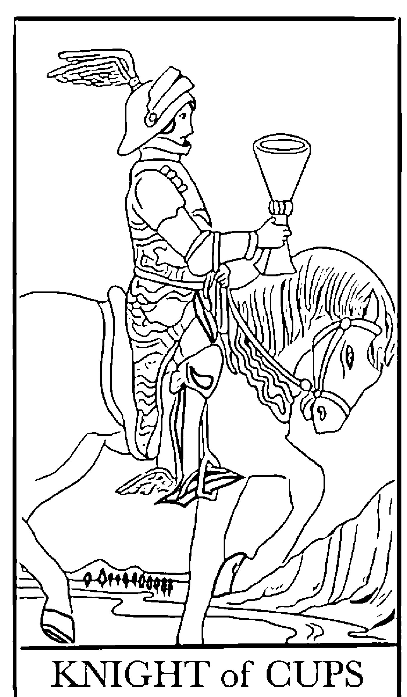

### 畫面主要組合：

環境：天朗氣清，山谷中，聖杯騎士與白馬停在低地、小河旁邊。

人物：聖杯騎士手持聖杯，坐在白色的坐騎上停在小河旁邊，白馬提腿欲動。白馬和騎士身上的服飾都有象徵水元素的水波紋和風元素的羽翼裝飾。

### 基本解說：

- 騎士象徵了積極而有行動力的人，並會為夢想全力進發。
- 聖杯騎士象徵了對感情的渴望。
- 戰勝了一些考驗，努力之下得到了小成功，可是仍然需要努力。

### 逆位的解說：

- 當這一張牌逆轉了，象徵會遇上一些在感情上追追逐逐、感情用事的人。
- 小心有人正利用愛情作工具。

### 對應指定問題的附加提示：

### ❀ 工作

正位：經過一番努力，終於能夠邁向自己喜歡的行業，大展拳腳。

逆位：生命之道，在於知道自己真正追求的是甚麼，但為了生計，短期內需要與夢想背道而行。

### ❀ 個人發展

正位：心中有一個想法，但亦知道單憑一己之力無法完成，正努力游說別人參與其中。

逆位：有一個人突然出現，並提議當事人參與一些事情。表象看來充滿了發展性，其實一點都不切實際。

### ❀ 健康

正位：找到一些對健康有益的飲食方法，希望推廣給朋友。

逆位：小心因為抵受不住推銷手法，購入一批沒用的純商業健康食品。

### ❀ 學業

正位：找到了喜愛的科目，評估了自己的能力能夠勝任。

逆位：受到朋友的影響，對自己選擇的學習方式感到懷疑。

### ❀ 愛情

正位：找到了愛情的目標，正在等待表白的機會。

逆位：小心一個不懷好意的追求者。

### ❀ 友情

正位：希望藉着參與一些興趣活動認識新朋友。網絡友誼。曖昧關係。

逆位：雖然發生了一些小誤會，但很快就冰釋前嫌，無損友誼。

# 聖杯侍從

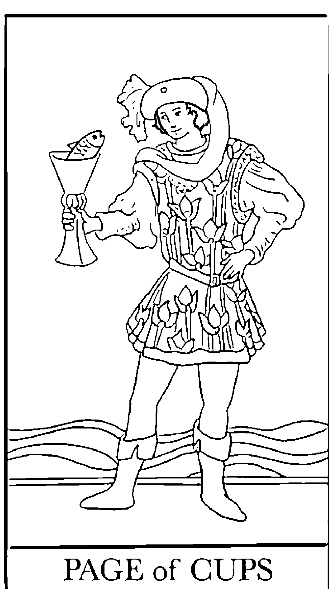

### 畫面主要組合：

環境：天晴，海岸，微浪。

人物：裹著象徵水元素頭巾的聖杯侍從，拿著聖杯站在岸邊，眼睛望著聖杯中的小魚，身上的衣物有象徵水元素的生命力和純淨的蓮花圖案。

### 基本解說：

- 侍從的姿態，說明一些浪漫的幻想，或者一個夢想般的志向。
- 侍從有未成熟的意思，這一張牌的出現，說明了一段天真的愛情。
- 侍從沒有權力，是年少的、被支配的。他更可以是一個傳遞信息的人。
- 侍從對聖杯之中小魚，流露出欣賞的目光，暗示了一種傾慕的行為。

### 逆位的解說：

- 一些表裏不一的愛情，不一定具有欺騙成分，可能只是有人期望過高，幻想與現實不符。

### 對應指定問題的附加提示：

### ❖ 工作

正位：轉職成功。年輕人在不斷的努力下，終於在夢想的行業裏得到工作機會。

逆位：加入了自己喜歡的工作環境，很快卻發覺事與願違。雖然未至於後悔，卻不得不重新計劃未來。

### ❖ 個人發展

正位：趁著年輕的時候應該拿出勇氣，朝著夢想的路走一趟，青春在前，不管得失成敗也有回頭的路。

逆位：後悔一直把想法收藏在心裏，最後與夢想擦肩而過。

### ❖ 健康

正位：身體最近出現小毛病，正疑惑是否應該去做一次檢查。

逆位：男性得到這一張牌，小心容易扭傷筋骨。女性得到這一張牌，要小心水腫問題。

### ❖ 學業

正位：經過努力，成績獲得進步。

逆位：光說不做，成績沒有大進展。

### ❖ 愛情

正位：初戀。暗戀。單純的戀愛。未有建立性關係的愛情。懷念舊戀人。

逆位：感情上的誤會。關係中，有人過度敏感，令對方透不過氣。幻想中的戀愛關係。扭曲了的關係。

### ❖ 友情

正位：兒時好友。重遇小時候感情非常好的舊朋友。懷念純真的友誼。人與寵物之間的感情。

逆位：舊友聚會。在興趣活動中認識了新朋友，大家一見如故。

# 聖杯 no.10

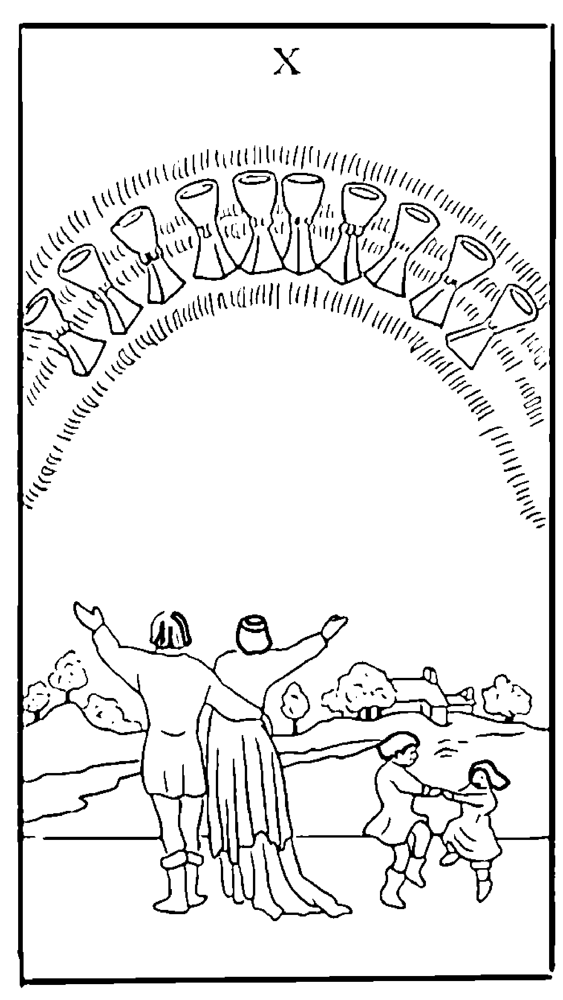

### 畫面主要組合：

環境：晴天，天上有彩虹，彩虹上有十隻聖杯。平地，小山坡，山坡上有小屋，旁邊有小河。

人物：一對溫馨相擁的成年男女，一對玩耍中的小孩。

### 基本解說：

- 一些甜蜜的關係、一些幸福快樂的時光。
- 當事人希望與重要的人一起分享美好的事物。
- 重要的家庭聚會。
- 彩虹，暗示了一些美好的前景。

### 逆位的解說：

- 快樂過後的平淡。
- 提示你別習慣了幸福的感覺，忘記感恩，應多關心關愛你的人。
- 別把你的美好送給外人，把最醜陋的一面留給家人。

### 對應指定問題的附加提示：

### ❖ 工作

正位：工作單位內難以有新的突破，但公司福利良好，與同事之間亦總算合作愉快。

逆位：為了對應大環境，公司亦加快了發展步伐，壓力愈來愈大。

### ❖ 個人發展

正位：目前發展穩定，未來仍有進步空間。

逆位：已經過了最佳的時機，不過，仍然有些微發展空間。

### ❖ 健康

正位：健康狀況良好，應多關注家人的身心健康。

逆位：小心關注家中最親近的人的心理狀況或健康問題。

### ❖ 學業

正位：有足夠能力應付學科未來的測考。

逆位：對學科的熱情漸減退，不過仍能保持成績理想，同時應該要為未來學業鋪路。認真去考慮一下是否要改變未來的研習方向。

### ❀ 愛情

正位：短期內將會遇上很好的對象，彼此性格相合，可以考慮長線發展。

逆位：感情進入轉變期，曾經熱烈的關係，逐漸趨向平淡，如能過渡，將會提升為更深厚的情感關係。

### ❀ 友情

正位：幸運地，身邊有一位感情極佳的好友，彼此的關係就如家人一樣。

逆位：有一班頗為談得來的朋友，但因為彼此家庭背景不同，成長、價值觀亦不一樣，感情暫時未能有更突破的發展。

# 聖杯 no.9

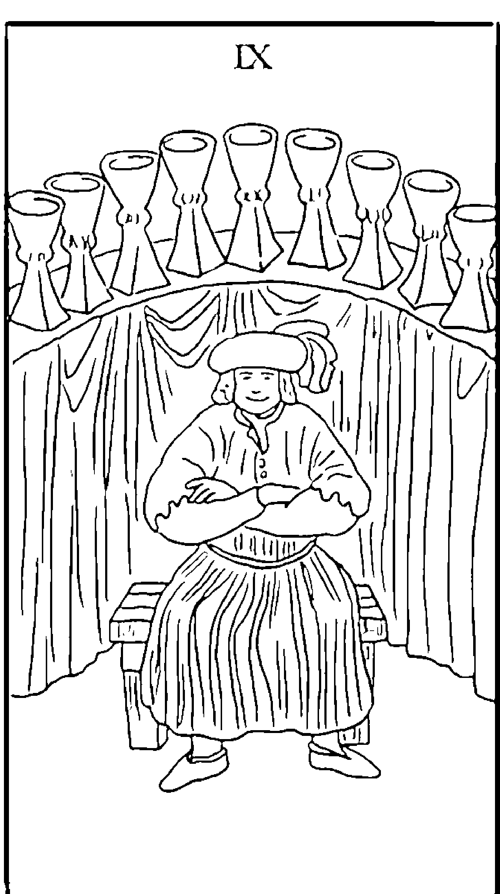

### 畫面主要組合：

環境：室內，光明。蓋着桌布的高台上有九隻聖杯。

人物：裹着頭巾的男人，面露微笑、翹起雙手，坐在高桌前的木凳上。

### 基本解說：

- 經過一番努力之後，當事人在物質上已經有了一些儲備，生活感覺滿足，而且願意與人分享美好的事物。
- 局面中有人需要代表某一些人士出席一次面談。
- 有人一方面保護自己的成就，一方面向眾人炫耀，以自己的成就為榮。
- 男人的姿態、笑容說明了當事人目前的安定狀態。
- 男人坐在高台的前面，暗示他在一定的基礎上，再為將來作打算。
- 如果某人正在計劃一些事情，說明已經有了很好的準備，亦得到了很多人的支持，正是行動或談判的最佳時機。

### 逆位的解說：

- 過分安於現況、縱情享樂、欠行動力、產生了惰性。
- 男人守在聖杯前面，暗示某人是一個守財奴。面對感情態度非常保守，十分貪愛，目前絕對不是一個能與人一起安定下來的對象。

### 對應指定問題的附加提示：

### ❀ 工作

正位：雖然不在其位，但因為過去良好的信譽，即將接手一個能夠有所發揮的新計劃，毋用擔心，真誠面對，將得到同事以及上級的支持。努力以赴，將會獲得更好的回報。

逆位：職場上有一個人，表面殷實，其實滿肚密圈。待人熱情的目的，其實只是希望透過某些人際關係，得到一些秘密信息，作為未來得到更大利益的工具。

### ❀ 個人發展

正位：能力出眾，受到讚許，更有信心在新的方向發展。

逆位：未能即時離開舊有環境，只能偷偷為新的發展方向綢繆。

### ❀ 健康

正位：目前健康狀況良好，不過未來需要出席頗多飲食活動，小心注意消化不良或發胖。

逆位：這一張牌以逆位出現，通常暗示一些有關泌尿系統的問題、因為飲食失衡而發胖，女性會出現水腫等問題。

### ❀ 學業

正位：未來半年學業運上升，得到同學、老師、家人的支持，以樂觀的心情面對學業。

逆位：在學業以外，偷偷參加一些課外興趣進修，竟然得到驚喜成績。

### ❀ 愛情

正位：當事人正在走桃花運，遇上很多條件不錯的對象，偏偏自己並不知道想要一個怎樣的人，遲遲未能作出選擇。

逆位：以平實的外表、誠懇的言行作為包裝。其實內裏是一個貪愛的人，用情不專。

### ❀ 友情

正位：某人在社交圈受到熱烈的歡迎。

逆位：社交圈中有很多流言出現，令到當事人形象受損。

# 聖杯 no.8

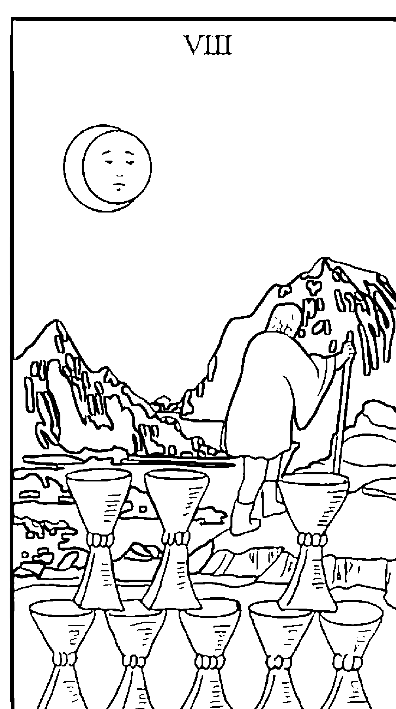

### 畫面主要組合：

環境：暗夜，天空上有一圓月和新月，山谷中夾有水道，岸上排放着兩層一共八隻聖杯，一排三隻，一排五隻。上排三隻的一層，有一缺口。

人物：有一個人撐着拐杖朝着山洞方向走去。

### 基本解說：

- 畫面中的主角正在離開現場，暗示有人對某些事物失去了興趣。
- 背對着一些杯子，暗示有人忘記了一些重要的事。
- 有人想逃避一些感情和責任。
- 放棄一些曾經令人失望的事情，然後再去追尋另一些事情。

### 逆位的解說：

- 一些迷失、空洞的感覺，特別在於情感方面。
- 因為重遇舊朋友或者受到環境中某些事物的刺激，重新想起情感世界內令人極失望的過去，才明白自己從來沒有放下或忘記，唯有逃避現實讓心情安定下來。

### 對應指定問題的附加提示：

### ❖ 工作

正位：希望逃避某一些工作。

逆位：小心短期內會出現有幾個人聯合而來的負面力量，不能據理力爭，最好暫時迴避。

### ❖ 個人發展

正位：雖然還未有新的方向，但對目前的環境感到非常失望，想盡快從中撤離。好好休息，培養實力。

逆位：因為對某些人際關係感到失望而另覓發展方向，卻得不到朋友或親人的支持，獨自面對這一種感覺。

### ❖ 健康

正位：心理健康出現問題，情緒受到困擾。

逆位：因為舊有的傷痛，留下了陰影。

### ❖ 學業

正位：面對未來的測考，獨個兒溫習比較適合。

逆位：雖然有大量資訊支持某個學科比較適合，但還是想逃離眾人的價值觀，去追尋自己的理想。

### ❖ 愛情

正位：感情中出現不適合的人和事，不知如何處理，只好逃避。

逆位：陷入不佳的局面，慶幸仍未是結局，還有轉彎的餘地。

### ❖ 友情

正位：社交圈中過分熱情的人和事，並不適合當事人。

逆位：從一個圈子走去另一個圈子，表現有點孤獨冷漠。其實是因為曾經在舊友圈子中受到情感傷害。

# 聖杯 no.7

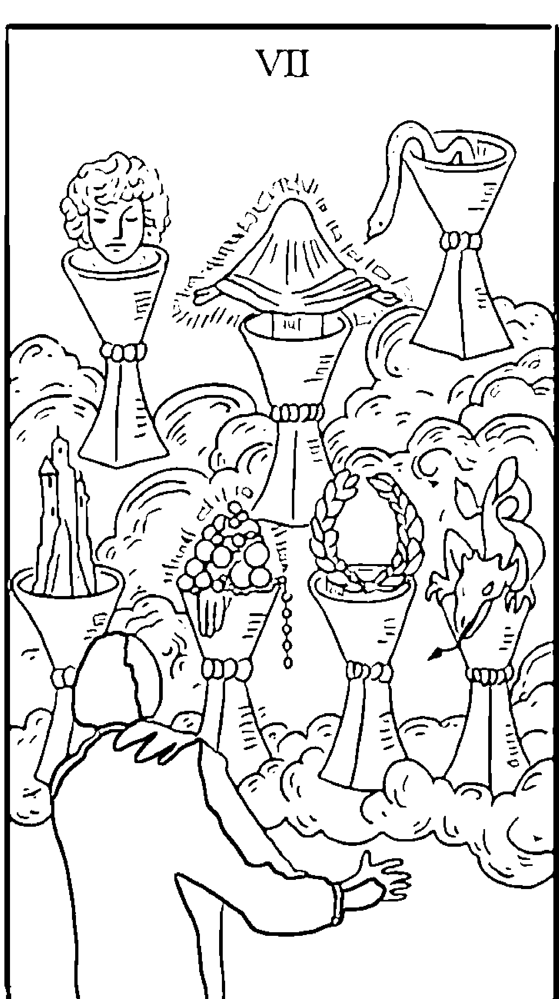

### 畫面主要組合：

**環境**：不明朗的空間之中，飄着白色的煙霧。煙霧中有七隻聖杯，每隻聖杯都盛載着不同的東西。包括人頭、聖像、蛇、高塔、珠寶、橄欖花環和魔鬼。

**人物**：一個黑色的人形背影。

### 基本解說：

- 疑神疑鬼、欠缺安全感，甚至產生幻覺。
- 意外地獲得一些資訊，看到了人事的另一個面貌，打破了舊有的價值觀，一輪迷失的感覺。
- 當事人需要作出一些抉擇。
- 容易迷惑於虛榮、不實際的生活之中。

## 聖杯 no.6

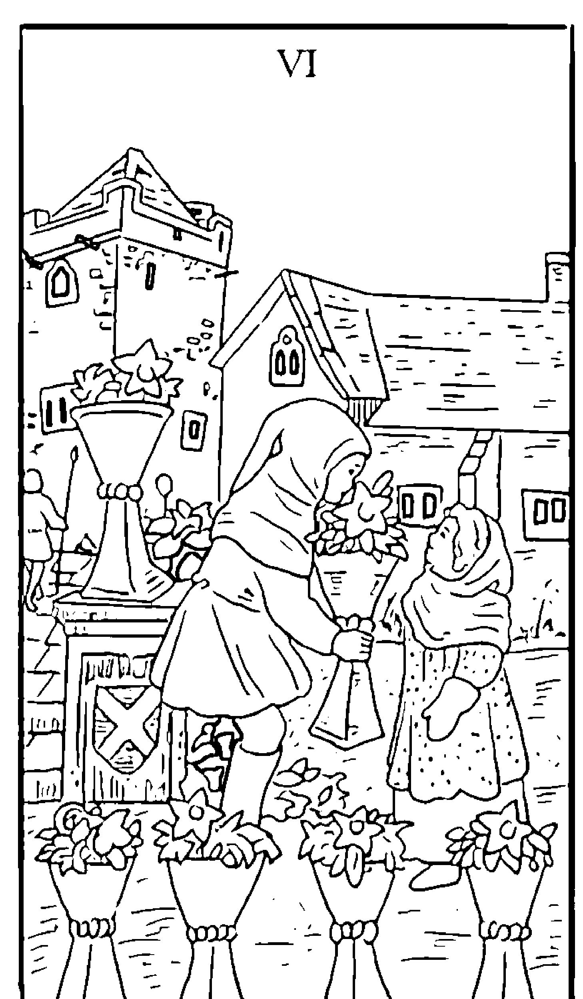

### 畫面主要組合：

環境：晴空，室外，小村莊之中有小屋和花園。花園中有六隻盛載了百合花的聖杯。

人物：前景是兩個小孩形狀的人，拿着盛載了百合花的聖杯，狀在溝通。左方有一個成年人，拿着矛經過。

### 基本解說：

- 懷舊的情懷，想念一些失去了的東西。
- 暗戀、一些純真的愛的感覺、純愛的表現。
- 一些有關小朋友的事。
- 一個好的依靠（多數是友誼方面）、一些志趣上的交流。
- 一些令人安心的、平靜快樂的感覺。
- 一些與童年有關、過去了的事。
- 家庭聚會。舊友重聚。熟悉的環境。回鄉。回到舊有的熟悉地方。

### 逆位的解說：

- 一個年長的人思想幼稚。
- 沒有好好珍惜，錯過了才後悔。
- 幼稚，不切實際的想法。

### 對應指定問題的附加提示：

### ❖ 工作

正位：這一張牌特別有利於從事教育或幼兒工作的人。在職場中找到能夠真心交往的朋友。

逆位：一般職場上，這一張牌代表局面中有人思想幼稚，想法和作風未能與團隊配合。

### ❖ 個人發展

正位：雖然在新的發展方向中能取得初步成果，但要注意當中或多或少有其他因素幫助成功，而非全靠自己實力，不應操之過急。

逆位：新的發展方向聲勢不錯，但沒有實際的經濟效益。

### ❖ 健康

正位：健康狀況理想。這一張牌，亦代表一些有關懷孕的事情。

逆位：小心由不良飲食所引發的健康毛病。

### ❖ 學業

正位：這一張牌特別有利於十二歲以下兒童的學業發展。成年人得到這張牌，可以按照自己的喜好去選擇學科，發展不錯。

逆位：小時候的成績理想，但年齡漸長經常分心，學業成績退步。

### ❀ 愛情

正位：純情的戀愛。初戀情人。

逆位：來去匆匆的戀愛關係。想法過分簡單，感情基礎不穩固。

### ❀ 友情

正位：純真的友誼，分享興趣，互相支持，愉快的交流。

逆位：懷念單純的友誼，慨嘆成年人世界人性複雜。

## 聖杯 no.5

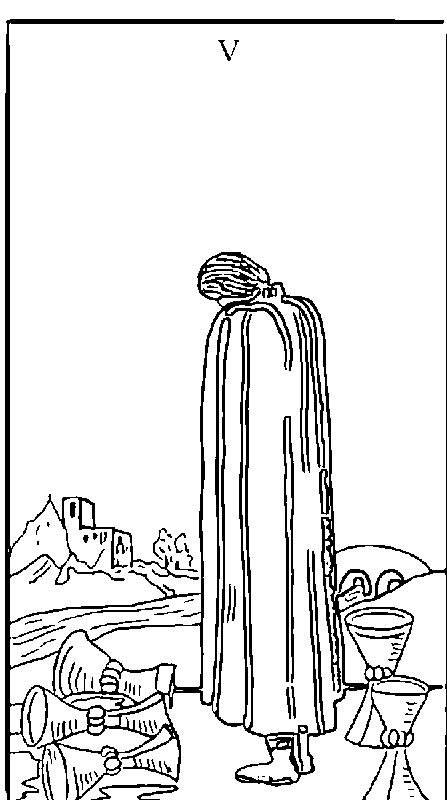

### 畫面主要組合：

環境：室外，山谷中有小河、小型建築物、矮樹和小橋。前景有五隻聖杯，其中三隻倒下。

人物：一個穿着黑色長袍的人，正低着頭，面向倒下聖杯的方向。

### 基本解說：

- 有人因為意氣用事，做了一些令人後悔的事，傷害了十分重要的關係。
- 失去了一些重要的東西。
- 蒙受到一些損失、一些欺負，自己無能為力，亦得不到一些幫助。
- 懷念一些失去了的事，無法面對分離的事實。
- 背棄了一些美好的人事，感到後悔。

### 逆位的解說：

- 不能再逃避，應該從失敗中站起來。
- 身份神秘，帶著過去創傷的人。
- 因為過去的一些打擊，改變了對人生的看法。

### 對應指定問題的附加提示：

### ❖ 工作

正位：因為一次失敗，失去了自信。

逆位：受到別人的誤導，錯誤操作，蒙受失敗。

### ❖ 個人發展

正位：發展未如理想，自信心受挫。思想和眼光變得狹隘起來，看不到身邊正有其他機會。

逆位：連環的失敗，無法振作。怨天尤人，卻沒有檢討自己的誤失。

### ❖ 健康

正位：因為壓力和不良的心理狀況，令健康欠佳。

逆位：從傷痛中走出來，逐漸振作，身體亦恢復了活力。

### ❖ 學業

正位：無法集中精神溫習，影響測考，學業壓力漸大，無法承受，須尋求協助。

逆位：一時失手，測考成績欠佳。

### ❀ 愛情

正位：雖然遇上追求者，但另一方面卻得不到喜歡的人垂青。

逆位：放不下舊有的感情，經常因此與現任發生爭執。

### ❀ 友情

正位：受到不明因素影響，與朋友關係逐漸疏離。

逆位：因為曾經被朋友出賣，現在對於友誼交往，抱着戰戰兢兢的心情。

## 聖杯 no.4

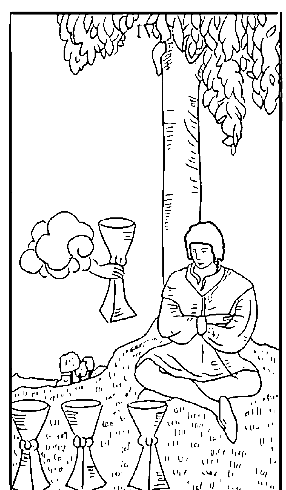

### 畫面主要組合：

環境：晴天下，草地上有一棵樹。樹下坐着一個男人，他面前的草地上排着三隻聖杯。半空浮着一朵白雲，雲中伸出一隻拿着聖杯的手。

人物：一個穿着普通工人服飾的年輕男人盤坐在樹下，翹着雙手。他的目光並不落在任何一隻聖杯上。

### 基本解說：

- 一件從未預期會發生的事，成了一個誘惑，帶來一個選擇的機會。
- 可能要考慮選擇一些事情，一些多方面都很吸引的事情。

### 逆位的解說：

- 當事人可能因為一些不能控制的安排，而邁向一個新的方向，意想不到路上充滿美麗的風景。

### 對應指定問題的附加提示：

### ❖ 工作

正位：正是時候考慮轉換新工作，甚至可以跳出本來的範疇。有的是機會，欠的是勇氣。

逆位：因為考慮太多而錯失不少機會。

### ❖ 個人發展

正位：因為表現良好獲得賞識，機會接踵而來，不要急於作出選擇，應先安靜下來，好好了解自己的真實意向。

逆位：為了未來的發展方向做了很多準備，但仍未遇上合適的機會，好好展示出來。

### ❖ 健康

正位：因為懂得自我節制，健康能保持狀況良好。

逆位：飲食不定時、過量，引起健康問題。

### ❖ 學業

正位：學業能有不錯的發展，課外活動的表現亦十分出色。

逆位：面對選擇，卻不知道甚麼才是最適合自己的學科。

### ❀ 愛情

正位：多作戶外活動，能改變氣場，短期內會出現多位追求者。

逆位：雖然有追求者，但並不是心中的那杯茶。

### ❀ 友情

正位：君子之交淡如水的友誼。

逆位：有人正在搬弄是非，影響朋友之間的友誼。

## 聖杯 no.3

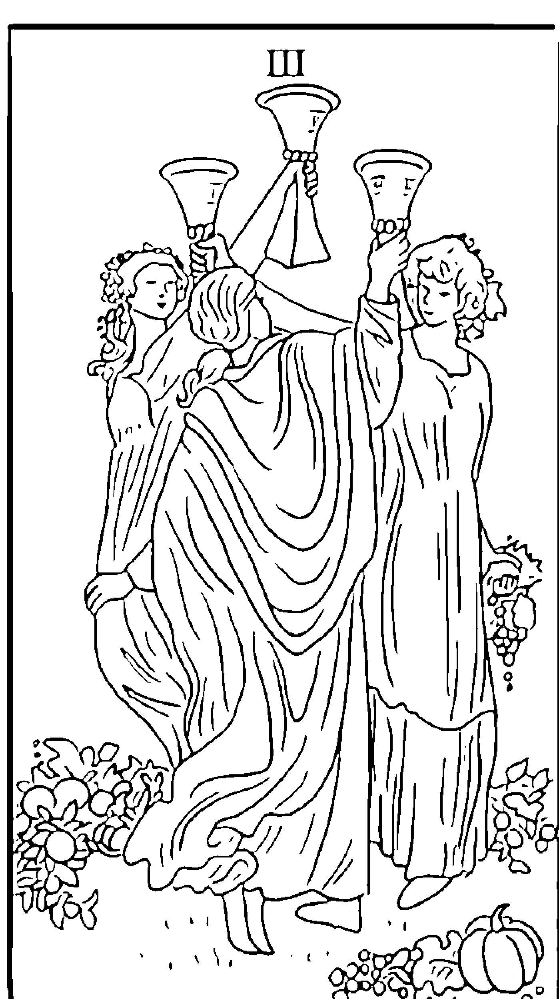

### 畫面主要組合：

環境：晴朗的天空下，像是正在舉行慶祝豐收活動的場地上，堆滿了農作物。

人物：三位刻意打扮的女性，各自高舉聖杯，像在進行慶祝活動。

### 基本解說：

- 一些集體慶祝、一起快樂的事。
- 一些朋友之間的快樂事。
- 分享成果，一些小成績。
- 有人在分享的過程之中自我保留。
- 重要的文化慶典儀式。

### 逆位的解說：

- 一班表面是好友或好拍檔的人之中，有人中飽私囊。
- 暗示有人花了太多時間在玩樂之上。

### 對應指定問題的附加提示：

### ❖ 工作

正位：公司的團體慶祝活動、慶功宴。計劃得到成果。

逆位：有人在公家環境謀取私利。

### ❖ 個人發展

正位：發展令人滿意，忍不住要展示自己的成果。

逆位：發展有了初步的成果，但迷失在喜悅中，忘記了為下一步鋪排。

### ❖ 健康

正位：健康狀況良好，有精神餘力與友伴一起玩樂。

逆位：玩樂過度，需要休息。

### ❖ 學業

正位：在學校表現很好，獲得讚賞。

逆位：玩物喪志，疏於學業，應該收拾心情。

### ❀ 愛情

正位：局面中有人雖然表現熱情，但內心仍未選定對象。

逆位：第三者介入。建基在物慾上的關係。

### ❀ 友情

正位：和朋友一起分享和慶祝。令人快樂的友誼。

逆位：一班好朋友，因為一些誤會令友情起了變化。有人需要放棄一些事情，才能證明自己的真心。

## 聖杯 no.2

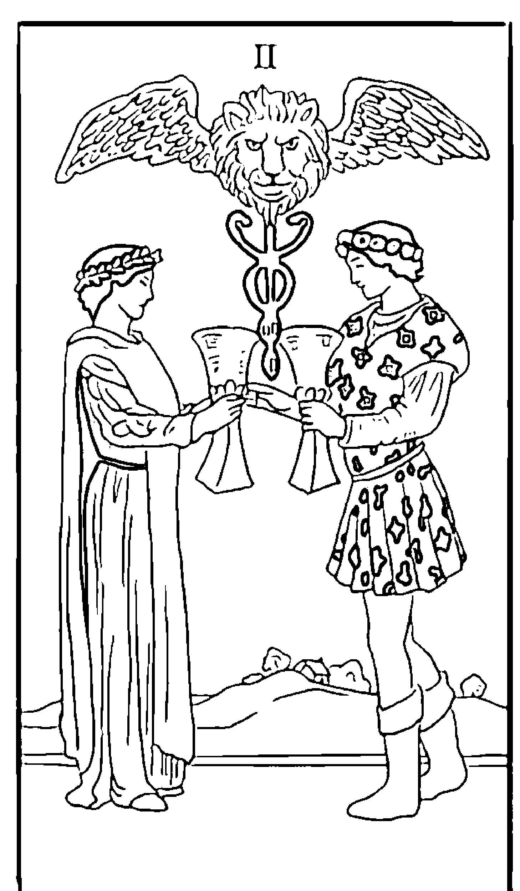

### 畫面主要組合：

環境：晴空，前景是平地，背景是小山丘與小屋。半空之中有一個有翼的獅頭像，獅頭像下是雙蛇頭權杖。

人物：一男一女手持聖杯作交換。女的穿上藍色長袍，打扮樸素，頭戴橄欖葉花環。男的作流浪者打扮，頭上有玫瑰花環。

### 基本解說：

- 氣氛和平的分享、交流、約會。
- 這一張牌的出現，見證了一段真實而雙向的感情。
- 有翅膀的獅頭標記，意味一個組合的開始。

### 逆位的解說：

- 在同一目標或同一組織下的對立關係。
- 職場上發展出來的曖昧關係。
- 互動一段日子以後，發現大家意向不同，逐漸淡出關係。

### 對應指定問題的附加提示：

### ❖ 工作

正位：一次和諧而有效的合作方式。

逆位：在一次合作關係中，不小心洩漏了一些資料。

### ❖ 個人發展

正位：當事人會在一次與工作有關的社交活動中，認識一位新朋友，對方的意見對將來發展很有幫助。

逆位：受到朋友的慫恿，希望離開現有的發展環境。不過這一張牌的出現是要提醒當事人，這一個是由感性意向選擇的決定，當中有一定的危機。

### ❖ 健康

正位：透過轉換一些飲食方式，重獲健康，身心愉快。

逆位：身體出現了些小問題，本來應該暫時戒掉某種食物，但最後還是抵不住誘惑。

### ❖ 學業

正位：在合適的環境中，遇上志同道合的朋友，令苦悶的學習生涯添上繽紛。

逆位：在學校發生的曖昧關係。

### ❀ 愛情

正位：單身的人，會在一個社交活動或興趣活動中認識新對象。已有對象的人，感情跨進一步。

逆位：初步的交往。未能公開的關係。

### ❀ 友情

正位：能夠交換心事的朋友。

逆位：朋友之間，有人收藏着一些秘密。

## 聖杯 Ace

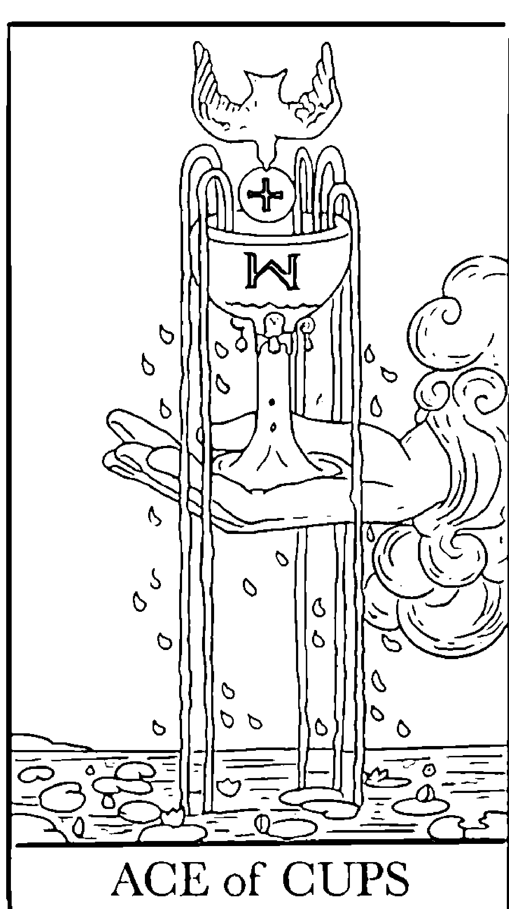

### 畫面主要組合：

環境：晴朗的大白天下，有一蓮池。半空雲朵伸出一隻手，托著聖杯。聖杯滿溢，杯上有吊鐘裝飾，聖杯的正前方，有一倒轉了的「M」字符號。

人物：有一隻白鴿叼著一片圓形、上面有十字圖案的小物，正放進聖杯之中。

### 基本解說：

- 愛心滿溢、情感滿載，自然流露的快樂和幸福。
- 不在預期之中的戀愛即將來臨。
- 一些在情感上有重要影響的事情即將出現，無論如何，結果都會比預期中好。
- 一次懷孕的機會。

### 逆位的解說：

- 付出了太多的感情和關心，反而對人造成了壓力。
- 對感情失望。
- 有了孩子之後，感情生活有所改變。

### 對應指定問題的附加提示：

### ❖ 工作

正位：工作上遇上一個新嘗試，這是一個善意的安排，專心面對就能完成工作。

逆位：提醒當事人近期會容易出現溝通不足、處事不小心等情況。

### ❖ 個人發展

正位：當事人會遇上一些人、計劃一些事，雖然沒有很大的物質回報，但卻是一個難得的機會。

逆位：某人的發展受到環境影響需要暫停，前功盡廢。

### ❖ 健康

正位：健康狀況穩定，會有好消息出現。已婚婦女有機會懷孕。

逆位：要注意有關女性生殖器官的健康。

### ❖ 學業

正位：得到高人提點，解決了一些難明的課題。

逆位：學習環境中，將會有一位好老師或者好朋友要暫時退席。

### ❀ 愛情

正位：新的戀愛機會。海外發展的愛情。感情更進一步。

逆位：偷偷進行的戀愛關係。暗戀。

### ❀ 友情

正位：一位優秀的新朋友。

逆位：某個朋友不遵守諾言，讓人失望。

## 寶劍組・風（空氣）元素

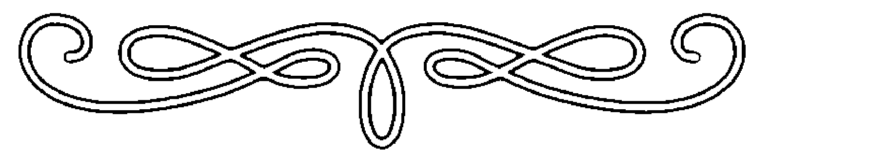

## 寶劍國王

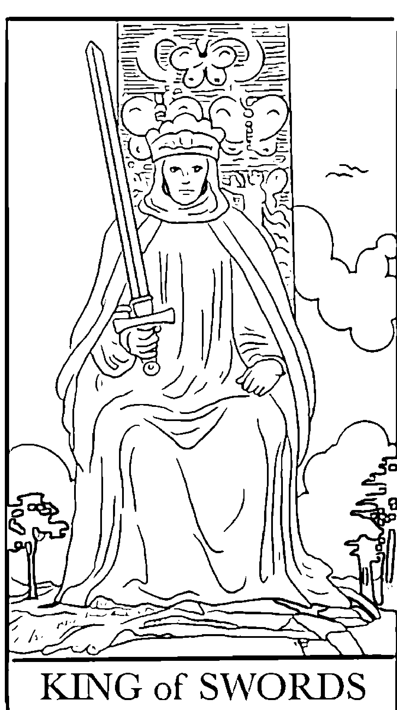

### 畫面主要組合：

環境：高地，遠景有雲霧、山巒，兩邊有樹木，天空有兩隻飛鳥。前景，高地上有石製皇座，皇座上有蝴蝶及月形裝飾物。

人物：寶劍國王冷靜的坐在石座上，左手握拳，右手舉劍。

### 基本解說：

- 國王，通常代表了一個成熟的人、成熟男性或在某方面有一定成就的人。
- 情感內斂，理性重於感情，控制情緒。
- 寶劍，象徵了判決力、正義、理性、智慧。
- 因此我們可以把寶劍國王理解為一個理性的、在某專業範疇已獲得成功的人士，例如是律師、會計師、醫生等，而他的成功模式是理性而循序漸進的。
- 男人坐在皇座之上，表情冷酷象徵了他打算以理智去作決定，不會受到感情因素干擾。
- 國王深沉的表情，表示局中有人很懂得隱藏自己，城府很深。
- 高地、風吹動的雲朵、高處的皇座，畫面的佈局想說明，局中有人位居要津，不受外來因素干擾，能在孤獨中自處。

### 逆位的解說：

- 一個過分自我保護、孤獨、冷酷無情的人。
- 處事過分理論化，不切實際，不近人情。
- 自視很高，囂張，不理會他人感受。
- 不同的價值觀。

### 對應指定問題的附加提示：

### ❖ 工作

正位：這一張卡片的出現，提醒當事人即將要面對一些決定，要摒除感性，以理性去對面。

逆位：當事人可能要面對上級不公平的批評或待遇。

### ❖ 個人發展

正位：這是一張象徵更上一層樓的塔羅牌，專業精神和管理能力是成功的因素。

逆位：銳意去發展一些事情，但環境因素不能配合。

### ❖ 健康

正位：提醒當事人，為了保障健康，需要戒掉一些任性的習慣。

逆位：與身體檢查有關，甚至可能要面對一些醫療措施。

### ❖ 學業

正位：考核試題與預期接近，用功努力將會獲得好成績。

逆位：錯誤判斷，考試失誤。因為一些與學習或工作無關的因素，錯失了專業考試。

### ❖ 愛情

正位：認真地對於關係作出審視的時刻。停止或繼續、開始或結束。欠缺溫柔、甜蜜的戀愛關係。

逆位：面對不和諧的關係，無法忍痛作出決定。在感情上拖泥帶水。

### ❖ 友情

正位：對朋友一些不恰當的行為，認真正地作出提醒。

逆位：不公正的批評，影響友誼。

## 寶劍女皇

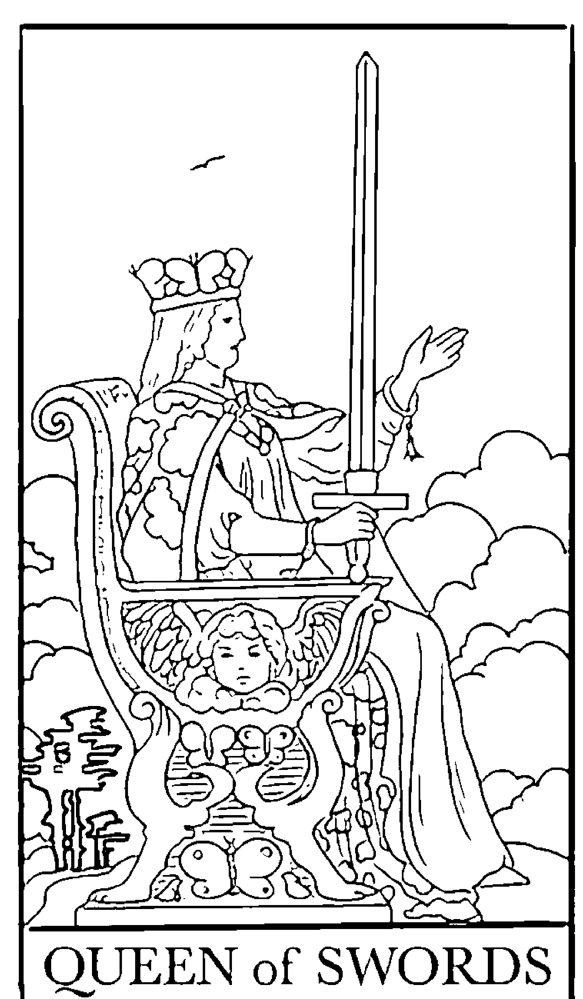

### 畫面主要組合：

環境：晴空，高地。遠景是雲霧，風吹擺動的樹，天空有一小鳥飛過。近景，高地上側放着一石製的皇座，座上有蝴蝶及嬰兒裝飾。

人物：寶劍女皇身披雲圖長袍，頭戴着蝴蝶形皇冠坐在皇座之上，右手高舉寶劍，左手戴着祝福的手串。

### 基本解說：

- 女皇通常意指一些成熟的、在某範疇有成就的女性。
- 女性主義、女權主義。尋求兩性平等。
- 有時代感、獨立自主而有過人智慧的女人。對事物有着獨特的理解力，喜歡跟有深度的人交往。
- 有人表面看來理性而冷酷，但從女皇手上的手串，我們可以知道他有自己的宗教與生活哲學，亦有心地善良的一面。

### 逆位的解說：

- 當女皇的劍鋒向下，代表局面中有一位女性是一個聰明而帶點危險性的人，能言善道似是而非地把事情弄得複雜。
- 她那獨特的理解力形成極端的價值觀，並不容易溝通相處。
- 獨坐高處的人，性格孤獨、自我中心的人。

### 對應指定問題的附加提示：

### ❀ 工作

正位：局面中某位女性的工作能力上佳，待人處世情理兼備。

逆位：局面中有人雖然主理高位，但作事不公正，常以個人的感覺或利益作出決定。

### ❀ 個人發展

正位：本屬的工作範圍，未能提供更好的發展方向，開始考慮本職以外的發展。

逆位：小心局面中有人以權謀私，又或者偷偷賺取外快。

### ❀ 健康

正位：暫停某部分工作，放下壓力，好好面對自己的身體，重拾健康。

逆位：因為時常忽略照顧身體，開始走向失衡狀態。

### ❖ 學業

正位：學業成績已經有一定的基礎，報讀一些外語進修，增加競爭力。

逆位：學業成績有走下坡的趨勢，尋求協助，例如請教主任老師、同班同學又或者課外補習。

### ❀ 愛情

正位：重新審視兩個人之間的互動。在查詢有關愛情狀況的時候，單身女性遇上這一張牌，應該好好跟過去的感情羈絆告別，除了在互動關係上停止，內心亦要放下。

逆位：有一個局外人正在對某一段關係給予意見。要好好照顧雙方家長，特別是母親方面對這段感情的看法和感受。

### ❀ 友情

正位：和朋友相處時要注意自己的用詞、疑問詞，以免一時心急，詞不達意，造成誤會。

逆位：有一位局外人搬弄是非，擾亂一些社交關係。

## 寶劍騎士

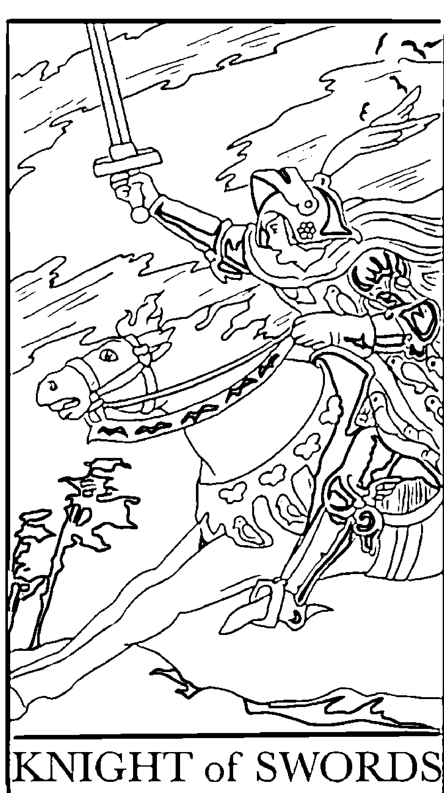

### 畫面主要組合：

環境：天清，空中有五隻飛鳥，風吹動的雲。曠野中，有被風吹動的樹。

人物：寶劍騎士正策騎他的白色戰馬，他身穿全副盔甲，披上紅色的有鳥兒圖案的外套，頭盔上有翅膀裝飾。他的戰馬身上有鳥兒和蝴蝶裝飾。

### 基本解說：

- 在宮廷牌組，騎士象徵了一個積極的年青人，他們會為成功而付出努力。加上寶劍的特性和風元素的影響，我們可以把寶劍騎士理解為一個年輕有為的人，他擁有理性的腦筋，充滿幹勁和活力。
- 策馬前衝的畫面象徵了一種征服的心態，他可能想透過征服某一些事物來印證自己的能力。
- 整個畫面氣氛充滿了速度感，風吹動了白雲，騎士全速策騎的姿態，意味當事人性格急進。這一種情況特別顯現於男性。
- 基於風元素，寶劍組本來就有決定的意思，加上各種景物的映襯，正說明了當事人需要作出一個爽快的決定。

### 逆位的解說：

- 這時候，寶劍隱喻了一種因為一時衝動而產生的行動。
- 局面中有人因為意氣用事，說了不恰當的話，可是他並不知道已經引起了別人的反感，仍然堅持自己的想法。
- 倒下了的騎士象徵了一位個性衝動的年輕人，這一種個性為他招來失敗。
- 局面中充滿不良的氣氛，令人迷失。

### 對應指定問題的附加提示：

### ❀ 工作

正位：局面中有人積極行動，帶動起團體的工作氣氛。

逆位：局面中有人意見多多，工作效率卻奇低，而且經常出錯，連累同事。

### ❀ 個人發展

正位：當事人積極而正面，為理想全力以赴。

逆位：局面中有人對於目前發展不滿意，處處作出批評。

### ❖ 健康

正位：因為過度積極投入工作，忽略了自己的健康。

逆位：急病、傳染病、因為壓力而引起的情緒問題。

### ❖ 學業

正位：為了專心應付重要的考試測驗，要暫時放下其他興趣活動。

逆位：遇上突如其來的測考，表現不佳。

### ❀ 愛情

正位：情緒不穩定的伴侶，心壞不軌的追求者。

逆位：因為朋友的意見，與伴侶引起誤會。追求者因為旁人的意見，止住了熱情。

### ❀ 友情

正位：出於對朋友的緊張，誤用了比較嚴重的語氣。

逆位：在未清楚了解事情的來龍去脈前，就對朋友的行為作出了錯誤的批評。

## 寶劍侍從

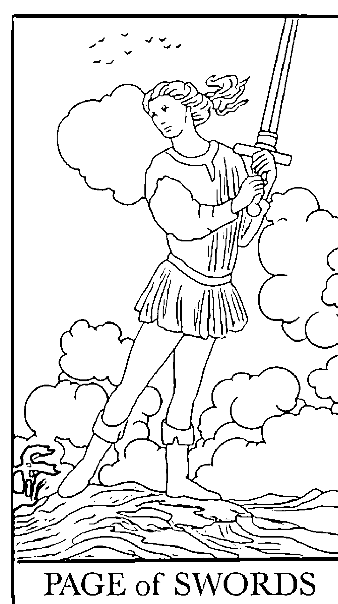

### 畫面主要組合：

環境：日間，空中有雲霧，天上有一群飛鳥，遠處有樹。

人物：寶劍侍從站在高地，雙手握着寶劍，眼睛望向遠處，微風吹起他的頭髮。

### 基本解說：

- 在古代宮廷中，侍從除了打理日常雜務之外，很多時都要兼顧一些通風報信的角色。他們都是比較年輕、成就比較小的。
- 一個謹言慎行的年輕人。
- 局面中，一個經驗尚淺的年輕人，對事情產生了疑惑，但又不敢直接說出自己的感受。
- 一個愛好和平的人。

### 逆位的解說：

- 當侍從拿著寶劍倒下來，我們可以把當事人理解為一個優柔寡斷的人。
- 這一種人在戀愛方面會顯得比較幼稚和自我中心。
- 我們可以把逆位寶劍侍從理解為一個容易作出輕率決定的年輕人。他的輕率言行常會惹起批評，甚至在局面中引起紛爭。

### 對應指定問題的附加提示：

### ❖ 工作

正位：局面中有人經驗尚淺，對於需要獨立處事感到有壓力。
逆位：有人對事情心生疑問，但又礙於面子問題，不向人請教，最後弄得一團糟，要人來收拾殘局。

### ❖ 個人發展

正位：不滿於目前的發展，但又未想到哪一方面才是更好的發展方向，對自己的能力，亦未有具體了解。
逆位：因為被別人批評，尚未了解實際內容，就已經自信心下跌。

### ❖ 健康

正位：身體產生小問題，心情不安。
逆位：有不舒服的情況，不同醫生卻有不同的意見，感到十分迷惘。

### ❖ 學業

正位：對於自己的選擇，開始感到懷疑。
逆位：遇上壓力，感到透不過氣來。

### ❖ 愛情

正位：正在考慮是否應該放棄暗戀對象。已有對象的人，正因為彼此溝通不良而感到懊惱。
逆位：對伴侶感覺不滿，但又不敢直接提出意見。

### ❖ 友情

正位：受到朋友的影響，對自己的處事方式產生疑惑。
逆位：發現朋友的不良行為，正考慮用何種方式作出提醒。

## 寶劍 no.10

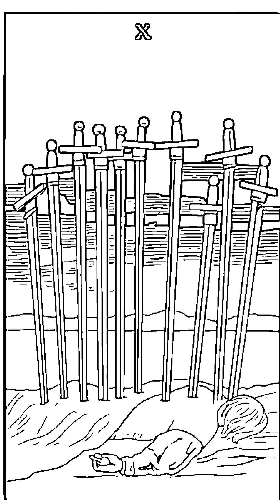

### 畫面主要組合：

環境：晚上，海岸旁邊，遠處有雪山。

人物：一個人伏在地上，背上插着十把寶劍。

### 基本解說：

- 當事人受到來自多方面的傷害，可惜卻未有能力作出抵禦。
- 一些難以避免的犧牲，無法改變的事實。
- 當事人可能要背負令人感覺痛苦的過去，影響目前的生活。
- 不能推卻但令人感覺痛苦的責任。
- 在背後受到傷害，暗示當事人被重要的人背棄了。

### 逆位的解說：

- 黑夜的環境，暗示當事人正面對一個痛苦的結束。
- 當這一張牌倒過來，暗示當事人被迫要面對一些痛楚。

### 對應指定問題的附加提示：

### ❖ 工作

正位：局面中，有人需要接受一項不可能完成的任務，而且四周並沒有助力。
逆位：當事人需要承擔因為前人判斷錯誤而遺留下來的難題。

### ❖ 個人發展

正位：感到目前的環境十分困難，想離開，卻又因為某種原因而被迫留下來。
逆位：因為過去一些在舊有環境中的失誤，影響了目前的發展。

### ❖ 健康

正位：如果你在占問健康，這一張牌暗示了一些和針灸有關的事情。
逆位：小心舊病復發。

### ❖ 學業

正位：對於科目並未有良好的理解，已經要面對測驗或考試。
逆位：因為學習基礎不好，愈來愈感到有壓力。

### ❖ 愛情

正位：單身的人，倍感孤單。已有對象者，容易因為小事與伴侶陷入冷戰。
逆位：未能放下已經失去的感情。

### ❖ 友情

正位：當事人需要面對朋友的誤解與指責，感到十分傷心。
逆位：曾經的誤解，終於會水落石出。

## 寶劍 no.9

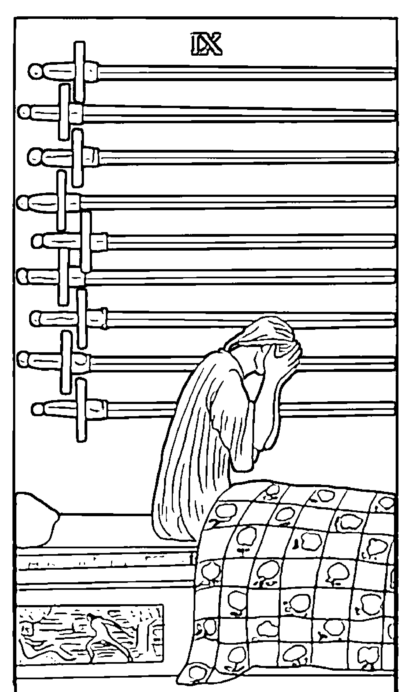

### 畫面主要組合：

環境：晚上，室內，有一張睡床，床的旁邊刻有戰爭圖案，牆上掛着九把寶劍。
人物：一個人掩面坐在床上，腿上蓋着被子，被子上有玫瑰花圖案。

### 基本解說：

- 一些困擾了很久的不安情緒，甚至影響了日常生活。
- 過分擔心使人鑽了牛角尖，反而想不出應對的方法。
- 胡思亂想，擔心被人出賣。
- 持續發惡夢，影響休息質素。
- 內心想逃避一些競爭（床上的雕刻正是當事人內心的寫照）。

### 逆位的解說：

- 生活迫人，想逃避現實。
- 處於長期的精神壓力之中。
- 孤獨、焦慮，沒有分享的對象，長期壓抑引致心理扭曲。

### 對應指定問題的附加提示：

### ❖ 工作

正位：工作過勞，工作量太多，工作壓力過大，影響作息。
逆位：曾經犯過錯誤，正在擔心被揭發的後果。

### ❖ 個人發展

正位：離開舊有的環境後，在新的環境又未有得到理想的發展。
逆位：在新發展的環境中重遇以前曾經發生誤會的人，心裏害怕會影響目前的發展。

### ❖ 健康

正位：如果有人正在查問一些有關健康的問題，這一張牌想說明一些有關失眠或精神上的困擾。
逆位：抑鬱病復發，過度猜疑引發心理壓力。

### ❖ 學業

正位：壓力、休息不足、睡眠質素不佳、影響學習，是個惡性循環。
逆位：在某科目曾經失敗，目前欠缺信心。

### ❖ 愛情

正位：單身的人，受到批評，開始疑惑自己待人處世的態度，是否會影響戀愛運。已有對象的人，受到伴侶的批評，內心不認同，但不敢表態。
逆位：戀愛中的人，未能獲得身邊的朋友或家人支持。單身的人，掛念舊情人。

### ❖ 友情

正位：若干人同時批評某人的待人處世，令人感覺困擾。
逆位：重遇小時候的舊朋友，對方似是未能了解或接受成長後的你，仍然以舊有的方式與你相處，感覺有點格格不入。

## 寶劍 no.8

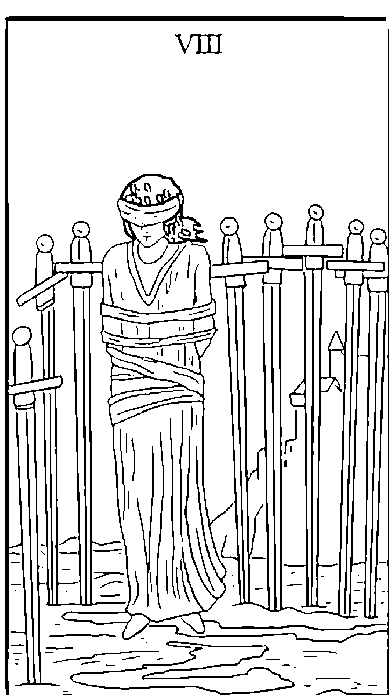

### 畫面主要組合：

環境：晴空之下，遠景是高山上的城堡。近景是一低窪地帶，有水流經過。地上插着八把寶劍。

人物：一個身穿紅色長袍的女人被蒙着眼睛、捆綁雙手和身體，站在寶劍堆中。

### 基本解說：

- 八把寶劍帶來了一些叫人不想面對的消息，大家都沒有應對的方法，只可以焦急的心情等待外來的力量協助。
- 當事人受到很多理性原因的束縛，無法逃離困境。
- 畫中女主角被綁起來，顯示當事人被迫忍耐一些人事，未能逃避。
- 當事人意識到一些危機，可惜因為身份問題，未能參與一些決定或在過程中表達自己的意見。
- 當這一張牌出現，正要提示當事人，他身處的環境危機四伏，一不小心便會受到傷害。要小心地思考，引領一些遠處的人來作出幫助。

### 逆位的解說：

- 女人蒙住了眼睛，象徵占問者可能在某些事情上給蒙騙了。
- 身體有一些長期痛症，屢醫未癒。
- 被人誤解，百辭莫辯。

### 對應指定問題的附加提示：

### ❖ 工作

正位：需要在限期內完成一項計劃，可惜無論環境因素或者同事，都未能配合運作，甚至產生障礙。
逆位：因為受到他人的連累，未能順利完成工作。

### ❖ 個人發展

正位：明白到目前環境並非長遠發展之地，不過基於種種羈絆，暫時未能離開。
逆位：錯過了外出發展的好機遇，唯有等待下次的機會。

### ❖ 健康

正位：開始感到身體負荷不來，需要作出休息，但一時間又未能離開工作或生活上的崗位，感到無奈。
逆位：病後初癒，未有足夠的精力。

### ❖ 學業

正位：未來需要集中精神應對學業，可能要考慮放棄一些公職或者興趣活動。
逆位：需要與別人合作完成某一些功課，但組員態度不佳。

### ❖ 愛情

正位：單身的朋友，工作忙碌，無暇結識異性。已有伴侶的朋友，開始意識到與伴侶溝通不良，但又不知如何改善。
逆位：寂寞的時候，又遇上不好的舊情人，對方態度曖昧。答應伴侶的，未能遵守諾言，雙方關係又起了波瀾。

### ❖ 友情

正位：在社交圈中因為一些誤會受到誤解，感到百辭莫辯，又不知如何為自己洗白。
逆位：一個人的時候，想到過去的幼稚行為，心情有些失落。

## 寶劍 no.7

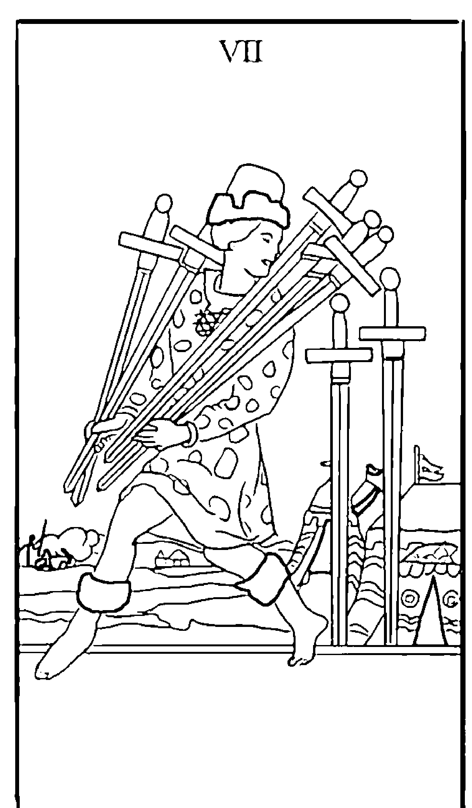

### 畫面主要組合：

環境：黃昏時候，曠野之中，遠景有烽火，近景有數個帳幕。帳幕前面的平地上插着兩把寶劍。

人物：一個男人手抱着五把寶劍前行，面露笑容。他的視線卻回頭落在後方地上的兩把寶劍上。

### 基本解說：

- 一個男人抱着五把劍正準備離開。離開之前，他回望，似乎對落在地上兩把寶劍打主意。正是人在亂世時力求自保的心情和表現。
- 寶劍 no.7 的出現，象徵當事人不甘心守在不安定的環境，正在收集對自己有利的人事，隨時準備離開。
- 男人走前視線卻落在地上兩把寶劍之上，暗示有人想在混亂的環境之中得到一些利益。

### 逆位的解說：

- 寶劍 no.7 以逆位出現，象徵當事人心中有了一個計劃，但受到環境限制，沒有能力實行。
- 反映某人是一個貪得無厭的人。

### 對應指定問題的附加提示：

### ❖ 工作

正位：職場上小心有人心懷不軌，四處收集別人的資料和信息，隨時出賣以作交換。
逆位：某位同事態度不合作，實際上他是一個利己主義者，只作對自己有益的事。換個角度，用一些益處作引誘，好望完成工作。

### ❖ 個人發展

正位：從各種情況看到目前的環境，不利長遠發展。
逆位：這一張牌以逆位出現，正提醒當事人，假如有人邀請你以某種方式合作，不應心急答應，要好好了解對方的為人，以及掌握了發展的大致情況，才作出行動。

### ❖ 健康

正位：有人因為貪吃而引發某種腸胃不適。
逆位：身體上有些小毛病，卻未能對症下藥。

### ❖ 學業

正位：獲得一些有關考試出題的消息。
逆位：局面中有人為了得到勝利而放出假資訊。

### ❖ 愛情

正位：未有伴侶的人，將會遇上一位心機複雜的追求者。已有伴侶的人，小心有人心意不專。
逆位：曖昧的關係出現變化。

### ❖ 友情

正位：局面中有人一方面向人示好，一方面又抹黑某人。
逆位：發現了出賣別人的黑手。

## 寶劍 no.6

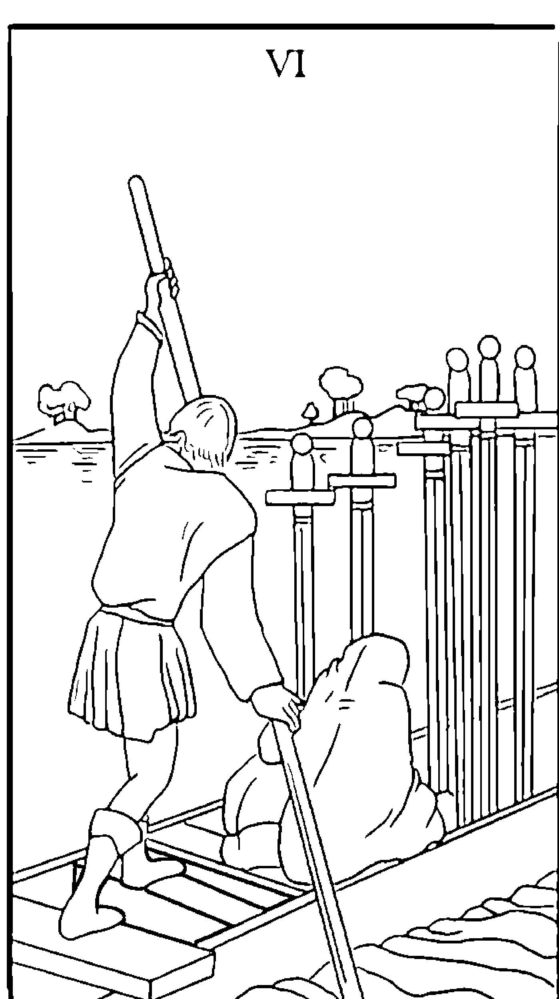

### 畫面主要組合：

環境：白天，晴空。遠處有雪山和冰封了的樹木，海上有一隻木舟。木舟上插着六把寶劍。

人物：兩個成年人和一個小孩正在木舟上。其中一個站起來，撐着船竿。三人前面插有六把寶劍。

### 基本解說：

- 船，帶有離開的意思，它通常暗示一次旅行，離開一個水域、一個地方、一個城市、一個環境或一段關係。
- 背對畫面，象徵了一種逃避的心情或一次有目的交往。
- 汪洋，象徵了平靜但欠了安全感的環境。
- 男人的姿態、六把劍的排列方法，象徵了保護和照顧。
- 事件所牽涉的不止當事人，可能還包括了他身邊的人。

### 逆位的解說：

- 當寶劍 no.6 以逆位出現，隱喻了一個沉重的責任。
- 外遊遇上阻滯。
- 為親近的人解決問題。

### 對應指定問題的附加提示：

### ❖ 工作

正位：除了完成自己的工作，還要照顧能力不佳的同事。
逆位：部門與部門之間產生抗衡，偏偏自己卻身處在能力稍弱的一方。

### ❖ 個人發展

正位：幾個際遇和想法相同的人，在目前的環境感覺有心無力，希望一起出走，去新地方、新的發展平台。
逆位：滿心歡喜向外發展，最後發現一切未如理想，失望而回。

### ❖ 健康

正位：為了回復健康，需要遵守一定的戒條。當事人需要照顧家中某位成員的健康問題。
逆位：本來下定決心為了恢復健康，戒掉某種壞習慣，卻因為某種情緒而故態復萌。

### ❖ 學業

正位：考慮轉變學習環境，甚至往海外升學。
逆位：因為一些流言而胡思亂想，無法集中學習。學校中，有重要的師長離開。

### ❖ 愛情

正位：一段關係中，有人十分有責任感。因為照顧家人，無法好好發展戀愛。
逆位：掛念已分手的人。

### ❖ 友情

正位：和朋友一起面對困難，感情更進一步。
逆位：和朋友冰釋前嫌。

## 寶劍 no.5

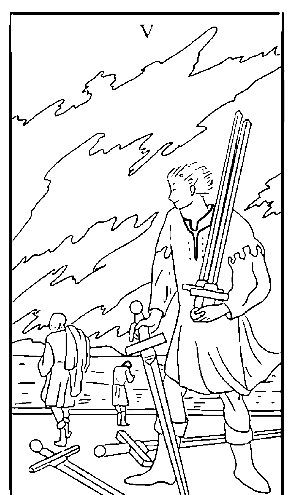

### 畫面主要組合：

環境：室外，白天，風吹雲動。遠處有山頭，背景是海，地上橫放著兩把寶劍。

人物：遠處有兩個背向的人，其中一個掩面低頭。畫面前方有一個面帶笑容的人，左手捧著兩把寶劍，右手正在拾起另一把寶劍。整個畫面一共有五把寶劍。

### 基本解說：

- 鬥爭之後的境況，雖然有人能夠從中獲利，但亦有不少人嘗到失敗的滋味。
- 紛爭之後的結果，當然有人能夠從中得益，可是在享受利益之餘又有沒有想過會在過程之中失去甚麼？

### 逆位的解說：

- 在紛爭之後，失去了戰鬥力（特別在於心理方面）。
- 因為之前的失敗影響了決策力。

### 對應指定問題的附加提示：

### ❖ 工作

正位：職場中競爭對手不少，處理工作時不能猶豫，只能全力以赴，否則就會被別人佔了先機。
逆位：如果眼前有一個機會，請先了解機會的歷史，了解一下為甚麼機會會來到你的手上，了解一下前人如何失誤之後，才決定是否應該接受這一個機會。

### ❖ 個人發展

正位：某一些新興事情，別人曾經嘗試也放棄了，然而你還是滿懷信心，蠢蠢欲動，希望放手一試。
逆位：不要因為小小的挫折，或者朋友的三言兩語，輕言放棄自己想做的事。

### ❖ 健康

正位：身體出現小問題，試過了不同的方法，還是未能徹底根治，最後竟然在意外的情況下好轉。
逆位：因為不良的小習慣，引起了身體的敏感症。

### ❖ 學業

正位：選擇學科應該按照自己的興趣和能力，不要人云亦云。
逆位：暫時遠離那些只管吃喝玩樂的朋友，投入功課，很快就會獲得好成績。

### ❖ 愛情

正位：當事人遇上一位交往對象，然而對方的背景頗為複雜，偏偏二人此刻相當投契，心裏疑惑是否應該再進一步。
逆位：快來快去的戀愛故事。

### ❖ 友情

正位：某個社交圈中人事進出頻繁。
逆位：憶起成長中某個階段，曾經一起玩樂的朋友。

## 寶劍 no.4

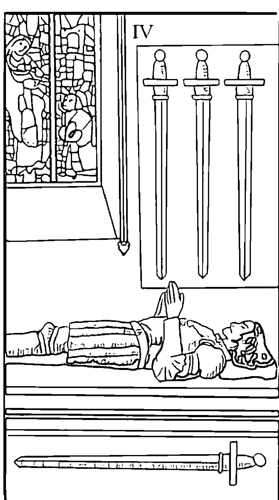

### 畫面主要組合：

環境：室內，有一扇於教堂常見的彩色玻璃窗。牆上掛着三把寶劍。畫面前方是一個人像棺木，人像面朝天，雙手合十。棺木外橫放着一把寶劍。

人物：——

### 基本解說：

- 畫中主角曾經參與一場戰爭。可是目前他已經躺下來，戰爭雖然尚未停止，但他已經要在戰鬥中休息了。
- 當事人曾經經歷一些考驗，目前需要退下來，稍事休息。
- 從四把劍的排列方法暗示，目前只是一個表面的休息狀態，當事人的心仍離不開戰爭，他可能只是被迫停下來。
- 受到風元素不穩定的特性所影響，目前的情況可能只是一刻間的穩定。

### 逆位的解說：

- 四面楚歌，自己卻無還手之力。
- 因為身體狀況或精神狀況不理想，無力應對目前的問題。

### 對應指定問題的附加提示：

### ❖ 工作

正位：職場中大家都面對着一個大難題，當事人因為某些原因要暫時退下來，未能與同事共同進退。
逆位：權力被架空。

### ❖ 個人發展

正位：對目前環境感覺不滿，但未有能力離開。
逆位：面臨在目前環境被淘汰的恐懼。

### ❖ 健康

正位：健康受到考驗，被迫從火線退下來，認真休息。
逆位：身體逐漸好轉，需認真重新計劃一下生活時間表。

### ❖ 學業

正位：面臨考試，卻又生病了。
逆位：面對功課壓力，不知如何解決，亦未有親朋戚友可以分擔。

### ❖ 愛情

正位：當事人面臨感情危機不知如何處理。單身的人，不知如何尋覓對象，心裏有危機感。
逆位：發現戀人做出一些不恰當的事情，內心掙扎。

### ❖ 友情

正位：希望跟好友聚會，分享內心一些煩惱，卻因為某些環境因素未能實現。
逆位：被誤解，不知如何對應。

## 寶劍 no.3

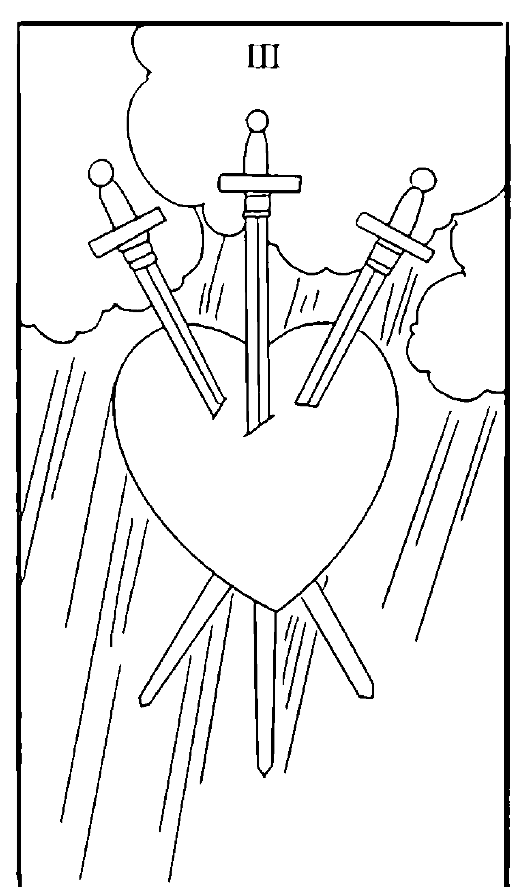

### 畫面主要組合：

環境：雲霧中，下着雨。畫面中間有一顆心，插着三把寶劍。

人物：——

### 基本解說：

- 一些哀傷的感覺，特別是和感情有關的。
- 因為一些決定而受到傷害。
- 天氣不佳。
- 一段悲傷的關係，特別是三角關係。

### 逆位的解說：

- 失戀，無法挽回對方心意。
- 傷心，久久不能平復。
- 即使盡了力，卻因為環境因素而導致失敗。心有不甘。

### 對應指定問題的附加提示：

### ❖ 工作

正位：整個團隊都盡力而為，卻因為環境因素，最後不能成功，大家都十分氣餒。
逆位：因為過去的失敗，仍然未能重建信心。

### ❖ 個人發展

正位：當事人經歷了多次失敗後，對未來欠缺信心。
逆位：失敗後重建的動力。

### ❖ 健康

正位：小心有關心臟的問題。
逆位：因為情緒困擾或過度傷心所引起的健康問題。

### ❖ 學業

正位：付出了努力，成績卻未如理想。
逆位：大部分人都未能獲得好成績。

### ❖ 愛情

正位：孤單、被遺棄、傷心、背叛、被迫分手、被第三者介入。
逆位：傷心及一些負面情緒過後，再檢討關係。

### ❖ 友情

正位：朋友間的誤會，小爭吵。
逆位：爭吵過後，一時間未能恢復感情熱度。

## 寶劍 no.2

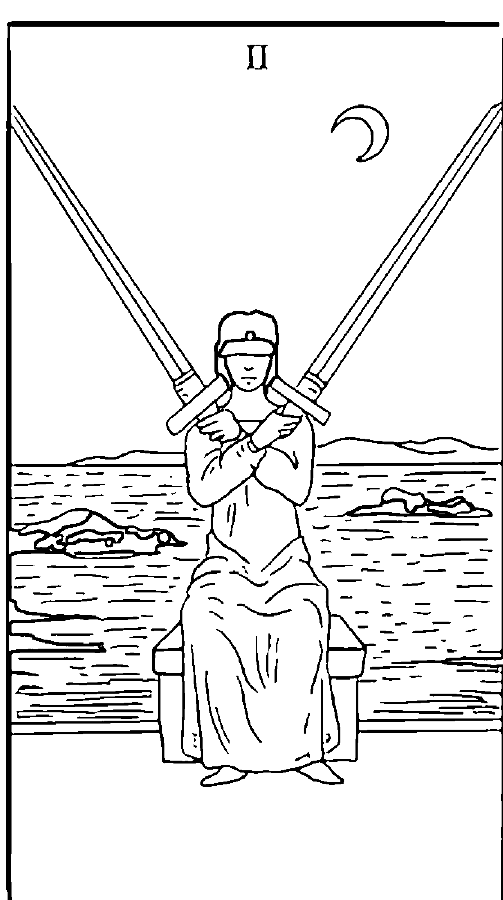

### 畫面主要組合：

環境：晚上，海邊有一石座，夜空中有新月。

人物：一個人蒙着眼坐在石凳上，兩手各舉一把寶劍交叉於胸前。

### 基本解說：

- 畫中主角置身於兩把寶劍之間，反映了一種取捨的心情。當事人迫着在兩件十分重要的事情之間下一個決定。只有下了這一個決定，才能取得平衡。
- 男人蒙上了雙眼，正提示當事人應以心和感覺做決定。
- 平靜的畫面暗示有人需要安靜一下，反思自己的生活。

### 逆位的解說：

- 兩把交叉擺放的寶劍，暗示了一些困擾、一些阻礙。
- 黑夜，暗示問題不能即時解決。

### 對應指定問題的附加提示：

### ❖ 工作

正位：工作量過多，未能依時完成。遇上困阻，不能即時解決。
逆位：局面中有人把一些過去的問題重新拿出來討論，希望尋求解決方法。

### ❖ 個人發展

正位：眼前有兩個選擇，不知如何是好，一時間朋友都未能給予意見，只好自己憑感覺決定。
逆位：被人蒙騙了，對發展中的人事產生了疑惑。

### ❖ 健康

正位：當事人懷疑自己的身體出了問題，卻沒有勇氣去看醫生了解清楚。
逆位：小心有關女性週期的毛病。很快就可以走出病痛的困局，重拾健康。

### ❖ 學業

正位：面對前途感覺迷惘，希望尋求意見。
逆位：仍在尋覓最佳的溫習方法。

### ❀ 愛情

正位：單身的人仍未知自己正在追求甚麼，因此難以遇上適合的對象。已有對象的人，正在思考彼此間的相處問題。

逆位：未來將遇上新的戀愛機會。爭吵中的情侶，很快就會走出困局。

### ❀ 友情

正位：社交圈中有朋友希望你能幫忙調解一些紛爭，令你感到兩難。

逆位：聽到一些有關朋友的消息，不知應否轉告當事人。

## 寶劍 Ace

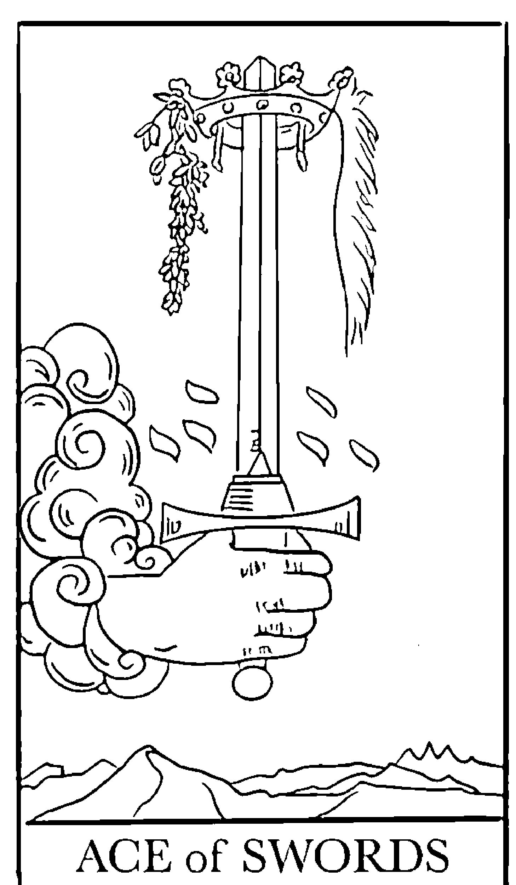

### 畫面主要組合：

環境：晴天白日，曠野。

人物：半空的雲朵中伸出一隻手，握着寶劍，劍尖上有皇冠和橄欖葉。

### 基本解說：

- 本來叫當事人深感為難的疑團，在天意的安排下，終於順利作出了一個良好的決定。
- Ace 牌同時象徵了一個重要的開始，由於是寶劍 Ace 的關係，這一個時刻必須把握決定權，今日的決定有助日後得到成功。

### 逆位的解說：

- 寶劍 Ace 逆轉，暗示有人作出了一些令人反感、損人利己的決定。
- 局面中有人正刻意製造事端。

### 對應指定問題的附加提示：

### ❖ 工作

正位：職場中，眾人將面對公司一個大決定、大變化。
逆位：有人正以權謀私，影響了當事人工作的日常運作。

### ❖ 個人發展

正位：作出大決定，尋求新發展。
逆位：環境中出現新的人事組合，為未來發展帶來希望。

### ❖ 健康

正位：獲得一項對健康有利的新資訊。
逆位：在偶然的機會下發現，原來某個生活習慣正在影響自己的健康。

### ❖ 學業

正位：早前付出的努力終於得到回報。
逆位：參加比賽，創下佳績。

### ❖ 愛情

正位：為了大家的關係，終於坦白說出了自己的感受。
逆位：害怕會影響彼此關係，一直忍耐。

### ✿ 友情

正位：與朋友分享喜悅。

逆位：朋友之間的良性競爭。

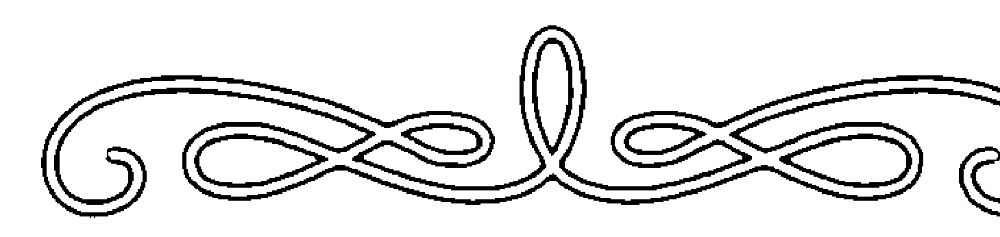

## 權杖組・火元素

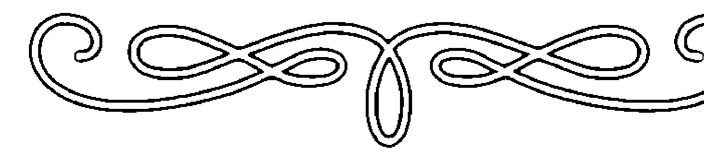

## 權杖國王

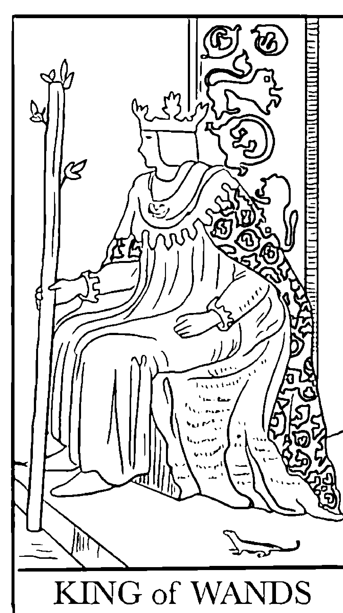

### 畫面主要組合：

環境：晴空之下有一石台，石台上有一高高的皇座，皇座旁有一條小小的四腳蛇。

人物：權杖國王側坐着，左手握拳，右手握權杖，眼望前方。

### 基本解說：

- 權杖，是權力的物化象徵，我們可以把權杖國王理解為一個在某範疇或某特定圈子具有特權的人，他對於這一種待遇非常享受，一點都不謙虛，並且以此為榮。
- 除了權力，長出綠葉的權杖亦是生命力的象徵。象徵當事人個性強烈、自我、作事有衝勁，同時給人朝氣勃勃的感覺。
- 從畫面中權杖國王手持權杖的姿態，可看出當事人是一個有威嚴、位居要津的人。
- 黑色的四腳蛇是火元素的象徵物，與權杖國王一樣，同受火元素所支配。四腳蛇在這裏出現，正提示當事人，局面中有一個趨炎附勢的人，而且行動力強，對於自己的目標意向明確，非常積極。

### 逆位的解說：

- 一個衝動而暴力的人，這種特徵特別顯現於男性身上。
- 國王的視線只集中在權杖之上，除了說明他重視權力外，亦是一個非常自我中心的人，在火元素的影響下，性格衝動、性子急。

### 對應指定問題的附加提示：

### ❖ 工作

正位：當事人所屬團隊正要面對一項計劃，但目前資源不足，慶幸在具有經驗的前輩帶領下，最終都能完成。

逆位：上級精力過剩，在他的帶動下，整個團隊都缺乏休息。

### ❖ 個人發展

正位：雖然具有個人實力開拓新的發展方向，然而新的版圖目前資源不足，事倍功半，要好好三思而後行。

逆位：有關的計劃雖然曾經美好，但目前已經過了最佳的發展時間。

### ❖ 健康

正位：活力充沛，需要找一些活動來消耗精力。

逆位：腦袋過度活躍，身體卻感覺疲倦，精力不足，欠缺耐性。

### ❖ 學業

正位：若想成績進步，需要單打獨鬥。同學幫不上忙，亦沒有師長可以提供有效意見。

逆位：誤花精力在不重要的課題上，白費工夫。

### ❖ 愛情

正位：這一段關係由男性主導。交往中某人存在頗大控制慾，是一種臣服性的交流。

逆位：來自男性的嫉妒心，甚至傾向仇恨或報復心理。

### ❖ 友情

正位：有情有義，在困難的關口，願意為朋友出頭。

逆位：朋友圈中，有人正想透過某些操控慾控制另一位朋友。

## 權杖女皇

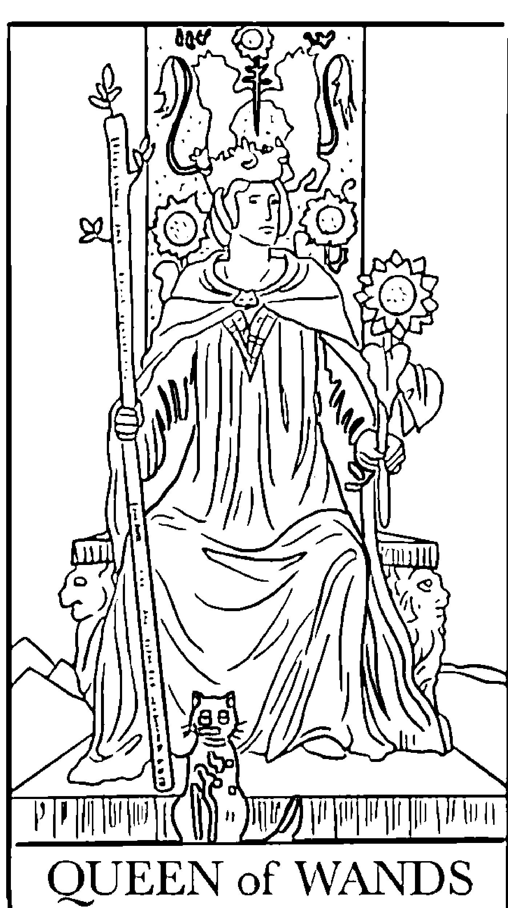

### 畫面主要組合：

環境：晴空下，沙漠中有一石台，上面有一高高的皇座，皇座上面有獅子和太陽花圖案。皇座前面有一隻黑貓。

人物：權杖女王戴著皇冠坐在皇座上，右手握著權杖，左手拿著太陽花，眼睛望向左方遠處。

### 基本解說：

- 權杖是生命力和權力的象徵，受到火元素的影響，權杖亦代表了一些衝動、刺激的行為。從這一些資料，我們可以知道權杖女皇應該是一個熱情而具有生命力的女性。開明的性格，使她擁有獨特的懾人氣質，令人心生拜服。
- 女皇手持開著的太陽花，暗示當事人在享受權力之餘，亦樂於照顧別人。
- 她的跟前有一隻黑色的貓，正提醒當事人，要小心局面中有一個不懷好意的人，表面看來像一個支持者，但實際上可能是一個深不可測的人。

### 逆位的解說：

- 倒下來的權杖女皇可能會給人一種衝動霸道的感覺。
- 女皇容許那隻黑貓守在跟前，說明了她身邊存在負面力量的人。局面中某位具有權力的女性，享受被人奉承。
- 一些和詛咒或黑魔法有關的事。

### 對應指定問題的附加提示：

### ❀ 工作

正位：有一位女性掌權者能夠同時在付出努力、衝動和理性三種不同性質的心理中取得平衡。
逆位：局面中有人濫用權力，以權謀私，特別關照與自己有關係的人，並且縱容這些人欺負弱小。

### ❀ 個人發展

正位：一位能夠兼顧家庭和事業的女性。局面中某位女性在處理好自己工作之餘，還可以照顧其他同事的需要。
逆位：分身不暇，未能兼顧，沒有遇上能夠分擔工作的人，只好放棄某方面的發展。

### ❀ 健康

正位：除了照顧家庭和工作，還能好好照顧自己的健康，身心愉快。

逆位：忘我地照顧身邊的人，消耗不少能量，應及早遠離負能量的人，或者避免介入他們的麻煩之中。

### ❖ 學業

正位：這一張牌並不特別有利於傳統學科，反而有利於運動學科發展。

逆位：把時間和精力都投放在課外活動方面，未能好好兼顧學業。

### ❖ 愛情

正位：兩性關係中，女性作主導。女強男弱的關係。

逆位：單身的女性，因為性格過強，同時又聽信了朋友對於感情不恰當的想法或價值觀，不容易覓得伴侶。

### ❖ 友情

正位：當事人的心性開明，能夠和不同年紀的人相處，在社交活動中面面俱圓。

逆位：局面中有一位女性氣場過大，常常不自覺地干擾他人的想法或行事方式，令人敬而遠之。

## 權杖騎士

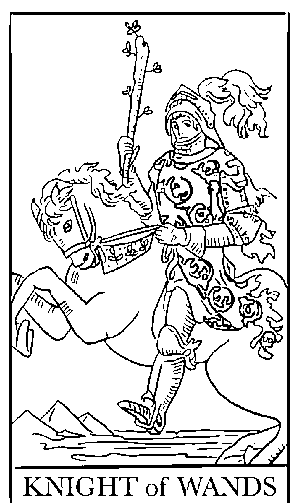

### 畫面主要組合：

環境：晴空下，沙漠中，背景有小山丘。

人物：權杖騎士穿著盔甲，外披著有四腳蛇圖案的外衣，正在拉扯他的戰馬。他手拿著長有樹葉的生命樹權杖，一臉疑惑，望著遠方。

### 基本解說：

- 權杖象徵了生命力和權力，再加上火元素的影響，我們可以把權杖騎士理解為一個年輕而有生命力的人。
- 受到「火」的帶動，他總是表現得充滿衝勁。他追求刺激的經驗，無論面對甚麼，依然能夠表現出勇敢和行動力。
- 騎士打扮象徵了積極的人生觀，當事人是一個年輕而有生命力的人。
- 咖啡色的馬暗示了旁邊有人抱持一個較為現實的價值觀，他可能是當事人的同伴或合作夥伴。
- 畫面的背景顯示目前的環境可能會艱苦一點。不過，當事人可以憑個人力量，開創更好的環境。

### 逆位的解說：

- 當權杖騎士倒下來，我們可以把他理解為一個容易不小心開罪別人、做事衝動的年輕人。
- 目前的環境困難，令人卻步。
- 只顧為別人付出，沒有為自己打算，未有得到回報。

### 對應指定問題的附加提示：

### ❖ 工作

正位：工作環境資源欠奉，發展困難。如果能夠克服這些問題，很快就會得到進步。
逆位：付出努力，得不到回報，看不到前景，亦未看到轉機。

### ❖ 個人發展

正位：在新的環境發展未如理想。
逆位：因為過去的失誤，走進困境。

### ❖ 健康

正位：生活忙碌、飲食不定時、要格外注意腸胃健康。
逆位：因為工作或生活繁忙，體力超支、精神不集中。

### ❖ 學業

正位：當事人正面臨一個短暫的衝刺期。

逆位：錯誤的學習方向，成績沒預期中理想。

### ❖ 愛情

正位：單身的人將會邂逅一位對象，但發展過程有些障礙。

逆位：過度熱情，會令對方感到害怕。

### ❖ 友情

正位：步入一個新的社交圈。

逆位：不明不白地受到誤解或孤立。

## 權杖侍從

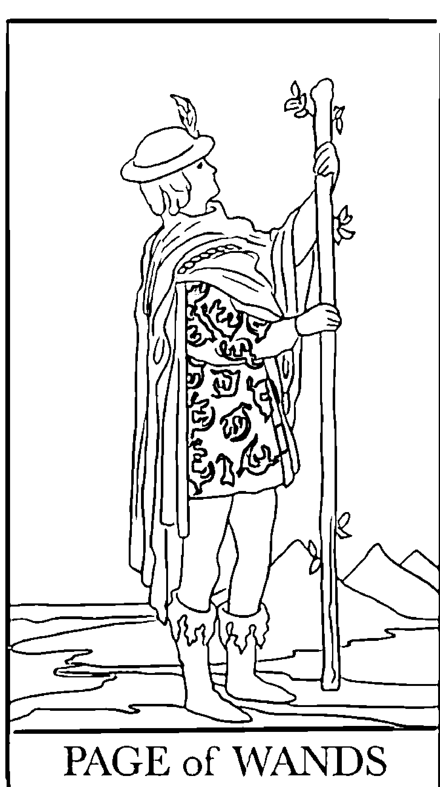

### 畫面主要組合：

環境：天氣晴朗，沙漠中，遠處有小山丘。

人物：權杖侍從頭戴著帽子，帽子上有羽毛，身上的衣物有四腳蛇圖案。他雙手執著權杖，眼睛望著權杖上的樹葉。

### 基本解說：

- 畫面之中，侍從靜立的姿態使他看來比其他侍從更為成熟和穩重，加上火元素的特性，我們可以把權杖侍從理解為一個行動實際，值得信賴的年輕人。
- 年輕人視線集中在手中的權杖上，象徵了認真和專注、對權力的渴求。
- 四周的風景，暗示目前的環境可能較為艱辛。

### 逆位的解說：

- 容易因為沉迷權力而忽略物質上的回報，到頭來白忙一場。
- 只是沉迷於權力帶來的威望，而未能真正了解擁有權力的義務，讓人不敢接近，敬而生畏，愈來愈孤獨。

### 對應指定問題的附加提示：

### ❖ 工作

正位：當事人需要處理一些職權以外的工作，如果處理得好，將會獲得嘉獎。

逆位：有人對某些事情產生好奇，於是濫用權力去獲得資訊。

### ❖ 個人發展

正位：當事人心中有一個想法，不過未能分清楚理想與夢想的差別，影響了思維模式，因此有很多事情都無法落實執行。

逆位：局面中有人個性自我、倔強，忽略了與人合作之間的通融性，限制了未來發展。

### ❖ 健康

正位：當事人一時間被某種事物吸引，沉迷當中，忽略了健康與平衡。

逆位：少年男性對性產生疑惑。

### ❖ 學業

正位：因為對學科有了不錯的理解，而產生更強的求知慾。

逆位：沉迷於一些非主流的科目，朋友認為浪費青春，當事人卻自得其樂。

### ❀ 愛情

正位：有暗戀對象，卻不敢追求。

逆位：與伴侶發生衝突，不知如何和好。

### ❀ 友情

正位：對某些事情產生興趣，想與朋友分享，不過他們卻對此提不起勁，無法了解你的心情。

逆位：在既有的社交圈感到沉悶，希望認識更多新朋友。

## 權杖 no.10

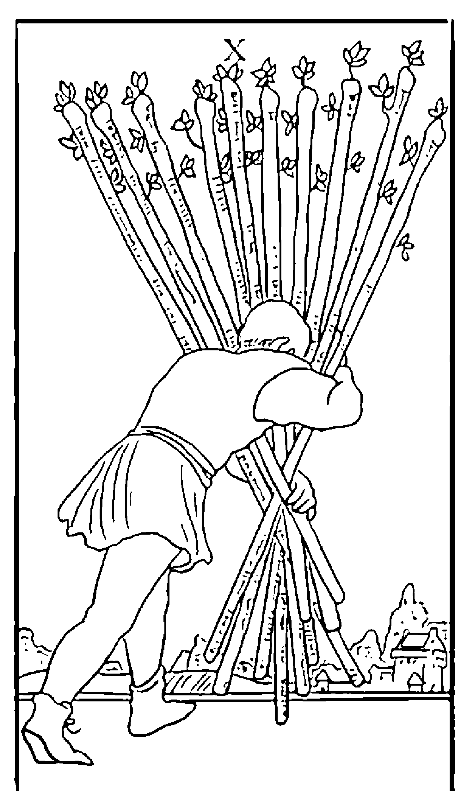

### 畫面主要組合：

環境：晴朗的天空下，遠處有一小莊園，有幾間小屋。

人物：一個工人打扮的男人，手捧着十支權杖，前行時視線被擋。

### 基本解說：

- 局面中有人過分着重在事件中的控制權，反而讓人不願接近，亦為自己造成了壓力，忽略了整體前景的重要性。
- 畫中的主角吃力地抱着十支權杖，暗示他目前正承受沉重的壓力，蒙蔽了視野，限制了想法，反而解決不了問題。
- 十支權杖亦可以被理解為很多有待完成的目標。
- 有人正忍受着某人衝動的行為，感到十分吃力。

### 逆位的解說：

- 請勸導當事人要放下沉重的壓力，眼光放遠一點，換個角度思考，自然看到出路。
- 別把目光聚焦在生活中單一範疇的得與失，而忽略了其他方面的情況。

### 對應指定問題的附加提示：

### ❖ 工作

正位：太多工作，以致忽略生活上其他的事情，被壓力壓得透不過氣來。

逆位：對於過去的事情感到後悔，無法彌補。

### ❖ 個人發展

正位：想跳出目前的框架另覓發展，然而又對自己的能力沒有信心，亦未得到朋友和身邊人的支持。

逆位：曾經為夢想作出努力，未取得成功，唯有回歸舊有方向發展，等待下一次機會來臨。

### ❖ 健康

正位：小心有關肋骨、心臟的健康問題。

逆位：壓力過大，精神繃緊，身心得不到放鬆，引起肌肉痠痛，小心有關盆骨的健康問題。

### ❖ 學業

正位：功課沉重，加上即將面臨測考，壓力甚大。

逆位：因為躲懶，之前的作業還未完成，又有新的功課。

### ❖ 愛情

正位：在情感上過度執著，放不開舊戀情，忽略了周遭的新機會。

逆位：終於發現誰才是適合自己的人。希望能夠與舊情人重拾舊歡。

### ❖ 友情

正位：太多社交活動，生活忙碌。忽略了對家人的照顧。

逆位：對某個活動圈子的人事深感不滿。

## 權杖 no.9

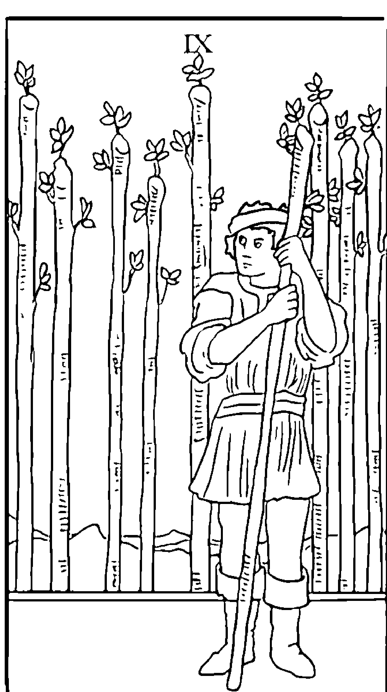

### 畫面主要組合：

環境：天氣清朗，室外。背景是草地，前景是平地，上面直豎着八支權杖。

人物：一個工人打扮的男人站在平地上。頭裹着布，一臉疑惑地望着自己的右方。他手上拿着一支權杖，加上背後八支權杖，畫面一共有九支權杖。

### 基本解說：

- 雙手抱着權杖，反映出一種保持防禦的心情。他的眼神，驚惶中又帶一點小心翼翼。當事人未來需要在沒有充足準備下，被迫面對一些事情。
- 圖中男人的背後有八支權杖，暗示一些來自不同權力的保護力。
- 男人偷看的表情，反映出當事人對自己欠缺信心，對前景保持觀望態度。
- 在未有信心下被推薦成為一個代表人角色，唯有硬着頭皮面對，見步行步。

### 逆位的解說：

- 當事人正處於困局，同時明白自己沒有能力解決問題，唯有在不安中等待一些奇蹟發生。
- 在最重要的關頭被同伴遺棄，只能夠獨自面對困境。

### 對應指定問題的附加提示：

### ❀ 工作

正位：在沒有更適合的人選之下，雖然當事人能力未達標，仍被推薦應付一項艱辛的任務。拿出勇氣，付出雙倍的努力完成任務，將會有意外收穫。

逆位：職場上，本來約好了一些人一起面對某一項計劃，最後很多人都沒遵守諾言，剩下當事人獨自一個去應對，只好改變計劃，超時完成。

### ❀ 個人發展

正位：雖然得到很多來自各方的支持力量，但因為對事情沒有處理經驗，當事人仍欠缺自信。

逆位：高估了自己的能力，以及各項環境條件不合的影響下，發展遇上阻滯。

### ❖ 健康

正位：生活上承受不少壓力，但暫時不能離開這個環境，需要硬着頭皮去應對。

逆位：已經沒有多餘精力去應對面前排山倒海而來的瑣碎事情。

### ❖ 學業

正位：被推薦參加一些考核或比賽，但自信心不足，其實只要認真一點，多加努力，便會有奇蹟出現。

逆位：失敗之後，再作準備，捲土重來。

### ❖ 愛情

正位：遇上喜歡的對象，雖然獲得朋友的支持，但由於對對象不了解，自己仍未有信心作出主動。

逆位：某人遇上了喜歡的人，亦曾經作出試探，被拒絕後，仍然放不下。

### ❖ 友情

正位：需要面對一些挑戰，得到朋友精神上的支持。

逆位：幾個好朋友正商量一項計劃。

## 權杖 no.8

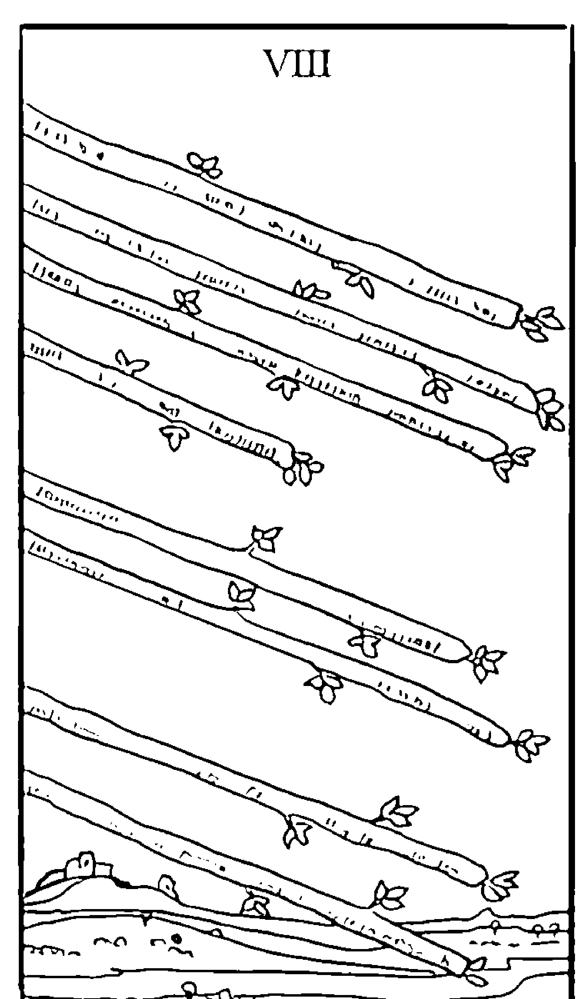

### 畫面主要組合：

環境：晴空之下，有一平原，平原遠處有河流。畫面前方有八支橫放的權杖。

人物：——

### 基本解說：

- 八支權杖的排列方式，暗示了很多人事在同一時間出現。這對於當事人來說是一些機會，不過受到火元素的影響，所有事情都是來去匆匆的，快得幾乎沒有思考和分析的餘地，遇上適合的人便要好好把握。
- 一次迅速行動。
- 一些權力上的競爭。
- 各持己見。

### 逆位的解說：

- 有人借助權力針對某人，造成一些集體而來的傷害。

### 對應指定問題的附加提示：

### ❀ 工作

正位：大量工作和機會在同一時間出現，要好好安排時間。職場上出現權力鬥爭，這個階段不應選擇任何陣營，明哲保身。

逆位：職場上有人因為一時大意犯錯，現在要面對大家的聲討。

### ❀ 個人發展

正位：希望作出一些重要的決定，討教於朋友，最後獲得大量意見，反而更覺迷惘，一時之間不知如何選擇。

逆位：希望作出一些新嘗試，卻得不到旁人的支持。

### ❀ 健康

正位：過度勞動，引起肌肉痠痛。

逆位：如果最近健康出現問題，可以考慮一些與物理治療或者針灸有關的處理方法。

### ❀ 學業

正位：受到外來事物影響，未能專心學習。

逆位：突如其來的一些事情，打亂了溫習計劃，花一點時間先處理好外頭的事情，再集中精神溫習，會有更加好的效果。

### ❀ 愛情

正位：認識了不少新朋友，當中卻找不到適合的戀愛對象。

逆位：過去的回憶湧現。舊情人又出現，但對方沒有複合的意思。可以緬懷一下過去，或者轉變方向，保留一份友誼，別多作其他幻想。

### ❀ 友情

正位：不同社交圈的朋友同時都有活動，分身不暇。

逆位：生活忙碌，無暇出席朋友聚會，感到相當無奈。

## 權杖 no.7

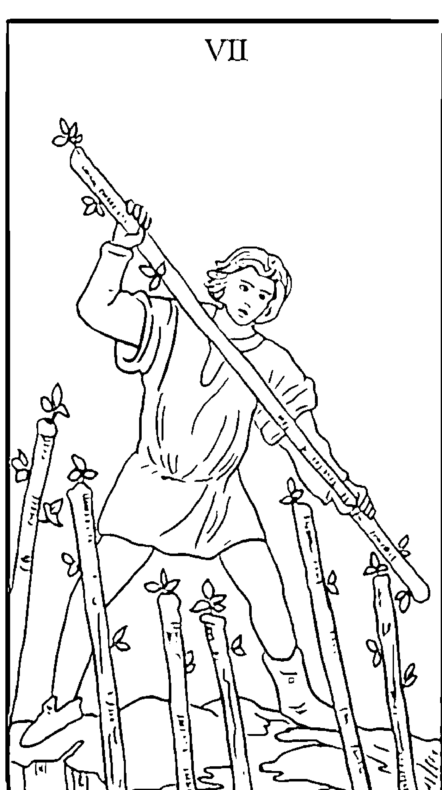

### 畫面主要組合：

環境：藍天之下，小高原上有些少水流。畫面前方有六支權杖。

人物：一個工人打扮的男人，拿着自己的權杖，面向眼前六支權杖，畫面一共有七支權杖。

### 基本解說：

- 權杖隱含了衝突的意思，當事人可能需要為保衛自己的一些事情作戰。另外，畫面的佈局亦反映出當事人一些與別不同的表現。
- 主角站在高處，反映當事人擁有表現自我的勇氣。
- 一支權杖突圍而出，隱喻了一些新的建議。

### 逆位的解說：

- 當事人需要獨自去解決問題，但一切仍在他的掌握之中。
- 當事人要面對一些聯合而來的對抗。

### 對應指定問題的附加提示：

### ❖ 工作

正位：職場上，因為某些觀點不同，形成了對立的陣營。
逆位：當事人需要面對有關人事上的難題，看不清情況，只好兩面都討好。

### ❖ 個人發展

正位：未來發展遇上很大的競爭。要好好裝備自己，不妨留意一下四周的朋友是否有潛質成為未來發展的合作夥伴，以增強實力。
逆位：已經錯過了最佳的發展時間，應該靜候另一個時機。

### ❖ 健康

正位：最近身體多方面出現小問題，仍未找到妥善的處理方法，加上生活忙碌，令心情受到困擾。
逆位：小心特別會容易發生扭傷、與人碰撞而受傷的情況。某人會因為一時意氣，因打架而受傷。

### ❖ 學業

正位：學業成績各有千秋，無法分出高下，需要透過其他的表現或獨特的想法突圍來獲得注意。
逆位：測驗考試期間，記掛着其他事情，無法專心溫習。

### ❀ 愛情

正位：愛情遇上競爭對手，在心儀對象的心目中，各有優勢。

逆位：旁人的意見，影響了對戀人的印象，戀愛是兩個人的事，應該親身感受對方，才更為真切。

### ❀ 友情

正位：社交團體中，出現人事不和。

逆位：社交團體中，有人正暗地深入分化的力量。

## 權杖 no.6

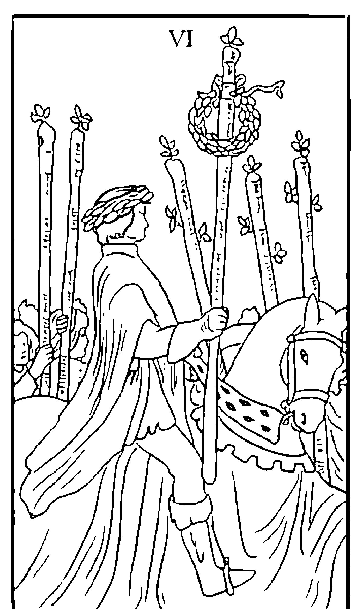

### 畫面主要組合：

環境：晴天，戶外。

人物：畫面中有一個人頭戴著橄欖葉，騎著白馬，高舉權杖，權杖上同樣綁著橄欖葉。畫面背後，另有幾個人舉著權杖跟在白馬後面，整個畫面一共有六支權杖。

### 基本解說：

- 這一張牌描繪出一些凱旋歸來的情境，主角騎在白馬之上，暗示當事人有一些與別不同的表現和勇氣，表現受到認同。
- 由於受到火元素的影響，這一張牌亦象徵了因為一時衝動而產生的想法或建議。
- 暗示當事人因為一些突出的表現而得到一班支持者。

### 逆位的解說：

- 當事人需要獨自去解決問題。
- 當這一張牌以逆位出現，正提示某人要面對一些聯合而來的對抗。
- 某人假意接近，其實是想套取資訊。
- 有人提出一些獨特的意見，並得到大部分人的支持。
- 旅遊、出行、遊行。

### 對應指定問題的附加提示：

### ❖ 工作

正位：面臨一項挑戰，在同事的支持下，超額完成。得到讚賞之餘，同時收穫友誼。彼此建立默契，有助於將來再次合作。

逆位：下屬不合作，未能如期完成目標。有人正在妒忌某人的成功。其他部門的人主動提出幫忙，其實並非出於真心協助，不過是好奇想了解別人的營運方式。

### ❖ 個人發展

正位：最新的發展方向中獲取了初步成果，收穫了一些人事以及些少物質上的回報，有利於計劃下一步的發展。

逆位：在未有得到支持下，獨自在新的方向，力排眾議努力向前。雖然旁人不看好，但只要保持耐性，加倍努力，仍然有獲得成功的機會。

### 健康

正位：平日生活繁忙，加上受到天氣和環境影響，疏忽了管理自己的健康。建議和家人、朋友一起做運動。

逆位：一起參與運動，體能卻不及他人。操之過急，會產生不適。不應放棄，按部就班，自然有進步。

## 學業

正位：經過一番努力，終於獲得好成績，自信滿滿，亦似乎獲得了理解某一門學科的途徑。只要不放棄、不疏懶，成績將會逐步看好。

逆位：有很多人都在努力溫習，不能鬆懈。過了這一關，就能夠有一個小小的喘息空間。

## 愛情

正位：單身的朋友能夠在新的朋友圈中認識到對象。建議多外出，多參與新的興趣活動。

逆位：在新的互動關係下，不應自視過高，某人並不是對象的唯一選擇。平常心、和平相處，隨着時間日久，了解加深，就能展示出性格的優點。

### 友情

正位：有共同興趣的朋友。一趟和朋友一起的旅行。

逆位：表面支持，暗地出賣。在新相識面前，應好好保護自己的私隱。

## 權杖 no.5

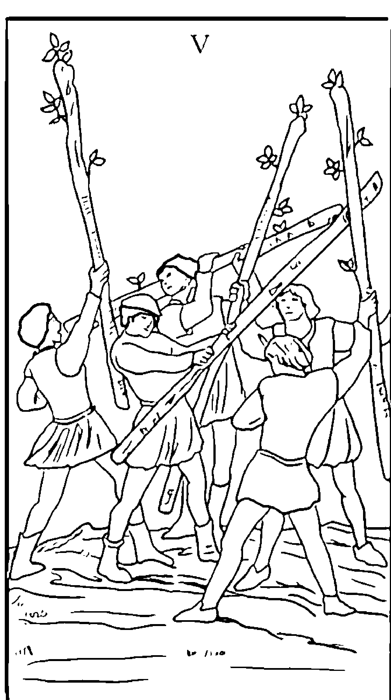

### 畫面主要組合：

環境：天氣清朗，平原上。

人物：五個男人各持權杖正在爭執。

### 基本解說：

- 一個鬥爭中的狀態，沒有一個人特別強。沒有一個人穩操勝券，大家只是在消磨精力。如果可以的話，盡快在局面中退下來，才是最終的勝利者。
- 捲入一些鬥爭，被迫面對一些挑戰。
- 一些均衡的權力發展，最後誰也不能凌駕於誰，只是各自得到自己的有利空間。

### 逆位的解說：

- 假如你在擔任占卜師的角色，你最好提醒當事人稍為引退一下，保留實力。待這場競爭過後，才重新考慮自己在局面中的目的。
- 一些沒有意義的鬥爭。

### 對應指定問題的附加提示：

### ❀ 工作

正位：需要和其他人一起完成一個計劃，但大家都堅持自己的意思，不願合作，遲遲未有進展。需要當中有人放棄自己的想法，與他人聯合力量成就大局，才能有突破性的推進。

逆位：職場內充滿了明爭暗鬥。整個局面既混亂又熱烈。結局是鬧劇一場。沒有正負之分，只是集體虛耗自己的實力而已。及早離場才是上策。

### ❀ 個人發展

正位：雖然內心有很強的實踐意向，但是客觀而言，計劃中的發展方向未能突圍而出，應該重新研究發展方式。

逆位：本來有不錯的發展進度，可是最近卻受到別人拖累，要狠下心腸及早釐清關係，以免因為一時心軟，最後導致失敗。

### ❀ 健康

正位：飲食過量，消化不良。

逆位：出外用餐要小心。這一張牌提示當事人特別容易因為進食不潔食物，腸胃受到感染。

## 學業

正位：局面中，大家的實力接近，要領先須加雙倍努力。

逆位：大家表面放鬆，其實都在偷偷努力，希望獲得好成績。

## 愛情

正位：一對溝通不良的情侶，各持己見，不容易共融互動，應該互相體諒，給予對方空間。單身的人會遇上一個來自不同環境、擁有不同價值觀的對象。不應過早對彼此的發展下了判詞，好好觀察，有意外發展。

逆位：有外人在情侶中挑撥離間。

### 友情

正位：雖然大家有不同的理想，但命運安排，同在此刻面對困境，一起成長。

逆位：為了保障自己的利益，發生了衝突，令建立不久的友誼受到考驗。

## 權杖 no.4

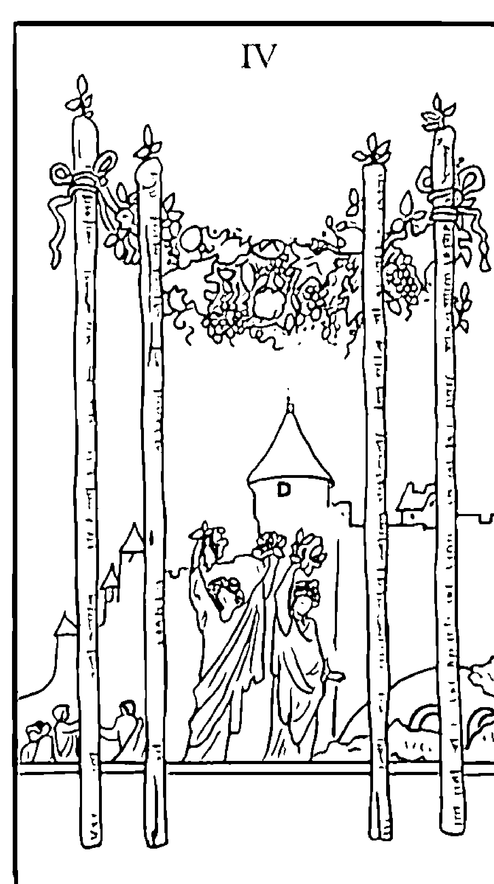

### 畫面主要組合：

環境：黃昏時分，室外，背景是城堡，城堡前面有小橋。前景是由四支權杖與花果組成的佈置，狀似慶祝氣氛。

人物：遠處，城堡前有三個人在聊天。畫面中間，有兩個人高舉着花球。

### 基本解說：

- 這一張牌象徵了一個熱情的組合。當事人有很大機會在短期內要參加一個慶典場面、與人快樂地分享成果。
- 當事人得到了幸福的感覺，想與人分享。
- 表演、紀念活動、與眾同樂。

### 逆位的解說：

- 當這一張牌以逆位出現，正要提醒當事人要適應燦爛之後的平淡，並為將來打算。
- 時移世易，雖然已經不再是局面中的中心人物，但可以學習以另一種身份或形式在局面中活動，把能量回收，轉移到生活當中，體驗另一種快樂。

### 對應指定問題的附加提示：

### ❖ 工作

**正位：** 當事人要面對一項臨時措施或一個突如其來的新計劃。最後表現理想，與人合作獲得成功。

**逆位：** 短期內，職場上會發生人事變動，一些勢力將因為某個原因聯合起來，一切都不在預期之中，眾人顯得措手不及，唯有見一步行一步。無論如何，這一件事對整體來說都是一件好事。

### ❖ 個人發展

**正位：** 新的想法被市場受落，短期內將會有不錯的發展，可說是一個好的開始；但這不代表一個長遠的力量，只是一個幫助起步的力量。

**逆位：** 希望經營的項目已經過了熱門期，發展不容易，應該改變策略以實力取勝。人與人之間的溝通，說話方式十分重要，但身體力行才能真正展示實力。讓人信服，產生具體的結果得到認同。

### 健康

正位：健康狀況良好，精力充沛。

逆位：活動過後，需要休息。

## 學業

正位：課外活動中獲得理想成績。這一張牌特別有利於表演、話劇、創作、展覽。

逆位：學習熱情消退。

## 愛情

正位：單身的朋友，多出外走走，會在不熟悉的環境中遇上新對象，發展出浪漫但不穩定的戀愛故事。

逆位：受到火元素的影響，這可能是一段因衝動而結合，或一種不見得光的戀愛。異地情緣。兩個人的身份、背景有距離。

### 友情

正位：志同道合的朋友走在一起，做一些一直很想嘗試的事情。應該享受過程，珍惜體驗，不要過分執著物質上的收穫。

逆位：局面中，有人對於某些曾經熱衷的事熱情不再，打算從人際圈中淡出。

## 權杖 no.3

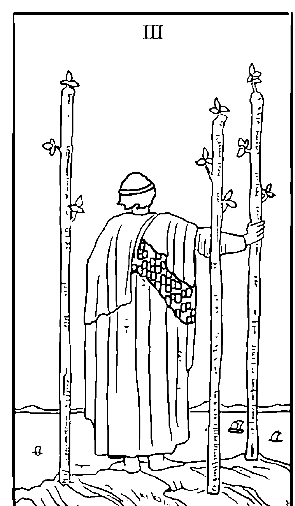

### 畫面主要組合：

環境：黃昏時分，沙漠中，遠處是乾涸了的沙地，中間有幾隻船。前景直豎着三支權杖。

人物：一個男人，披着披風，背向畫面，右手握着其中一支權杖。

### 基本解說：

- 身心已經做好了準備，正式告別過去，展望將來。
- 從畫中主角望着前方的姿態暗示，當事人在某一個範疇中已經得到了一些成果。現正是停下來，重新計劃自己路向的時候。這一刻的成果可能和權力或佔有慾有關。
- 從三支權杖的排列方法中，我們可以知道，除了一些已得的權力外，背後亦有另一些權力作支持。

### 逆位的解說：

※ 當這一張牌逆轉過來，反映了當事人對前景憂慮的心情。另一方面，他亦有可能被迫去面對一些事情。

### 對應指定問題的附加提示：

### ❖ 工作

正位：面對新工作，得到支持和鼓勵。開始的過程雖然比較辛苦，但未來有十分廣闊的發展空間。

逆位：人事變動，被迫代替別人去完成一項不熟悉的工作。

### ❖ 個人發展

正位：想法得到支持，有助未來發展。應該好好準備一下，待時機一到就可以全力出擊。

逆位：希望實踐想法，卻受困於某種因素，不能公開，只好偷偷進行。

### ❖ 健康

正位：因為某些事情，忽然感悟到健康的可貴，開始希望建立新的生活習慣。

逆位：惰性、躲懶、肥胖。

### ❖ 學業

正位：付出心血會得到回報，但若想更上一層樓，便要更加努力。

逆位：成績退步，要急起直追。不要相信試前預測消息，要憑實力取勝。

### ❀ 愛情

正位：有對象的會得到伴侶的支持，感覺溫暖。單身的會在朋友介紹下認識新對象。

逆位：有人近日情緒緊張，對伴侶一言一行甚為敏感。

### ❀ 友情

正位：得到朋友的支持。

逆位：從朋友那裏獲得一些消息，對於生活中某件煩擾的事情迸發出新靈感或想法。

## 權杖 no.2

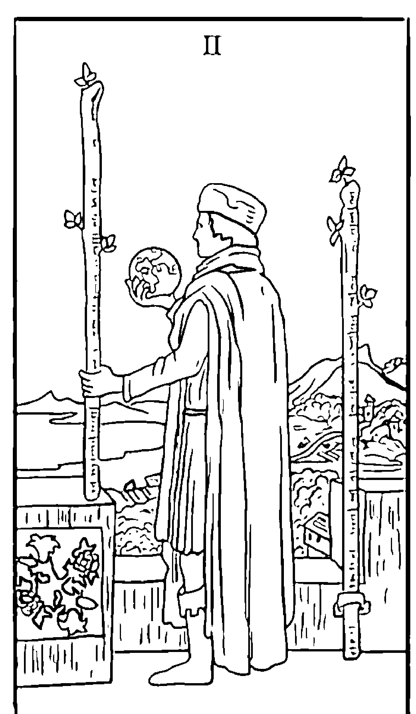

### 畫面主要組合：

環境：晴空之下有山巒，小城，城堡。瞭望台上有兩支權杖。

人物：一個男人站在瞭望台，右手捧着球狀物體，左手握着一支權杖，眼睛望着遠方。

### 基本解說：

- 局面中某個年青人擁有權力並享有很高的社會地位。
- 男人站在高處觀察，暗示他是一個觀察力強、深謀遠慮的人。
- 主角手捧彩色的球體，有實際的意思。

### 逆位的解說：

※ 暗示有人正為將來而憂慮，被迫為將來下一些決定。這個決定會影響當事人在某環境的地位。

### 對應指定問題的附加提示：

### ❖ 工作

正位：某個計劃中表現卓越，得到嘉獎或升級。

逆位：有人在局中暗地監控計劃進度。

### ❖ 個人發展

正位：市場氣氛良好，當事人能力達標、有遠見，是十分適合發展的時機。

逆位：為未來新發展做準備。

### ❖ 健康

正位：健康狀況穩定。

逆位：睡眠質素欠佳。

### ❖ 學業

正位：得到師長的有效意見，考慮升讀更高級別。

逆位：基礎不穩，要重新學習。

### ❖ 愛情

正位：已有對象的，感情穩定，邁向另一階段。單身的人得遇新對象。

逆位：對感情欠缺安全感，表面溫和，但很想操控他人。

### ✿ 友情

正位：圈子不大，但都是談得來的好朋友。

逆位：掛念舊朋友，想找藉口嘗試聯絡。

## 權杖 Ace

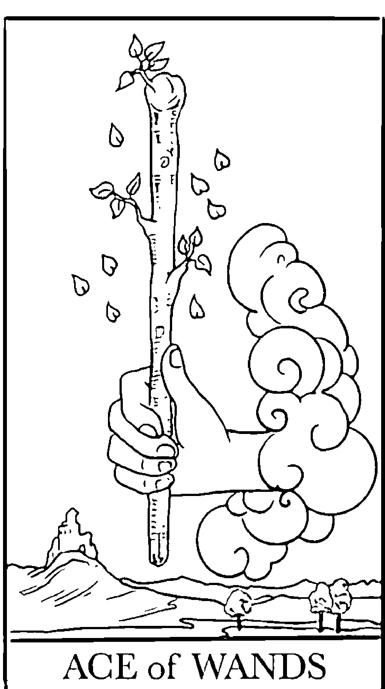

### 畫面主要組合：

環境：晴天之下，有一個低谷，中間有小河，遠處有一城堡。

人物：半空中的白雲伸出一隻手，手握長滿樹葉的權杖。

### 基本解說：

- 一個上天注定的開始。一些強而有力的事情。
- 天意的安排使你獲得一些計算以外的力量，或突如其來的靈感構思，好好把握，這一些力量有助你日後得到成功。
- 工作上獲得晉級。
- 找到新的興趣。

### 逆位的解說：

- 權杖 Ace 逆轉，暗示有人誤用了權力，傷了和氣。
- 受到火元素的影響，這張牌亦象徵了一些衝動的行為，為時不長，卻帶來不少負面影響。

### 對應指定問題的附加提示：

### ❖ 工作

正位：職場上有新嘗試，亦是轉換工作的好時機。在這個特別的時刻除了考慮轉換工作時所能獲得的物質回報，亦應該考慮有關理想和實際生活的平衡。自己真正的追求是甚麼？自己的能力有多少？是否應該考慮改變發展的方向？

逆位：一時衝動，不恰當的說話脫口而出，影響形象。

### ❖ 個人發展

正位：當事人一直想有新的發展，但不能操之過急，目前並非最佳發展的環境和時機。

逆位：有人提出一些發展建議，聽起來相當吸引，但事實不如想像中般理想。

### ❖ 健康

正位：個人潛力被激發，充滿活力與希望。

逆位：對運動訓練不能操之過急。病後初癒。

### ❖ 學業

正位：突如其來的測考。

逆位：為測考作準備，但溫習欠缺計劃，影響進度。

### ❀ 愛情

正位：來自遠方的機會。傾向於情慾關係的戀愛。

逆位：愛情遇上考驗。

### ❀ 友情

正位：在生活上帶來不少新靈感的朋友。在外遊或者新的環境中認識的新朋友。

逆位：生活苦悶，想找個好友一起消遣。

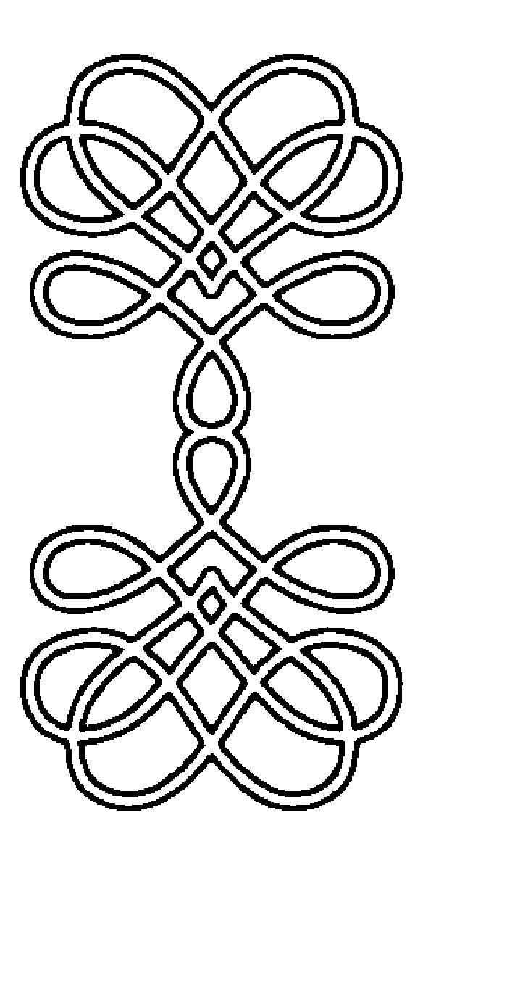

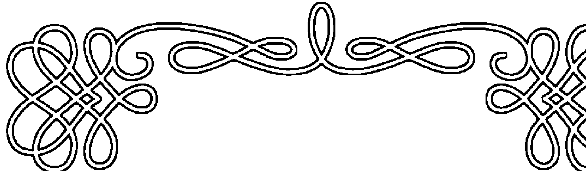

# 第五部分

## 與塔羅溝通

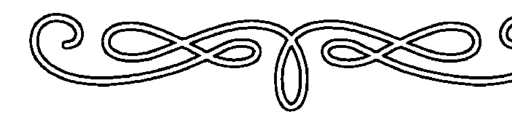

## 塔羅問清楚

坊間有「養牌」一說，究竟是甚麼？應該如何去照顧塔羅牌？

傳說中有不少人會把塔羅牌拿去做供奉、曬月光、放在水晶堆中吸收水晶能量等。當中有可能是以訛傳訛、可能有人胡亂創作，亦有一些是摻雜了宗教元素的儀式，在未了解清楚之前，不要隨便跟著嘗試。

前文曾經介紹過，目前流傳的塔羅牌種類多不勝數；當中有不少以特定宗教作為題材的塔羅，內含各種神秘學，若果亂用不恰當的儀式操作，或會帶來嚴重後果。再說，塔羅牌只是一副紙牌，它不需吃不需喝，哪需要人來「養」？如果真的跟著傳言把塔羅拿去曬月光，塔羅只會提早發黃，不破也殘。

所謂「養牌」，其實只是希望用者能夠好好「保養」自己的塔羅而已。

## 不能讓別人碰到自己的塔羅？

有人說不能讓人碰到自己的塔羅，否則塔羅沾了對方的「氣」，便會變得不再純粹，本來是你的塔羅亦不再屬於你了。如果對方的運氣不佳，更會把不好的運經由塔羅傳給別人，因此還是不要讓其他人碰自己的塔羅為妙。

其實，塔羅本身並無此規定，這是部分占卜師的個人習慣而已。可能基於衛生問題，亦可能是基於對塔羅的珍愛；但我亦不會在這裏否定，萬物間的接觸與能量間的互動關係。這有關宇宙萬物共震的概念，正是莎拉塔羅專業課程的其中一個重要課題，有興趣多了解的朋友，可以參考我的另一本專業塔羅師學習筆記《塔羅外傳》。

## 夜間閱讀塔羅，會準確一點？

事實上，任何時間都可以閱讀塔羅。晚間閱讀的建議，大概是因為大部分人都認為晚上的氣氛較為適合占卜。可是，如果當事人的精神疲倦，就會影響專注力和分析力，甚至可能錯誤解讀畫面信息。因此，無論白天或晚上，任何人在精力不足的情況下，也不適宜閱讀塔羅。

## 晚上閱讀塔羅，容易招靈體騷擾？

經過一天活動下來後的晚上，人通常容易感覺到疲倦，精神難以集中，解讀畫面結果的時候就會很虛耗心力，而且亦未必能夠好好運用腦袋去整理資料；要是加上日間曾發生一些小插曲，產生了負面情緒的，在看牌時若遇上比較負面的畫面，就會產生很多聯想，令睡眠時有可能做惡夢，嚴重影響睡眠質素。所以，無論日間或晚上，若當事人的精神狀態不好，都不適宜開牌，以免誤人誤己。

## 不應重複占卜問題？如果覺得占卜不準確，要等多久後再占卜？

如果有明確的證據證明某一次的讀牌結果（或者有人會稱之為「占卜」，但我始終強調，閱讀塔羅並不等同占卜）與事實偏離，是沒有再次開牌的期限。這可能基於讀牌時其中一方精神不集中、心緒不寧，或有人刻意誤導；又或者兩方面的思想價值觀有太大的分歧，未能作出良好的互動和溝通。在這種情況下，只要立即去找另外一位可信的人去開牌就可以了。

但如果重複讀牌是因為不想接受結果，倒不如在現實生活中想想有甚麼辦法，可以令結果變得更好。因為由始至終我都強調，塔羅給予的意見，是對未來的建議或按目前情況、時間、地點、星象、人物心情等因素去推測未來發展的可能性。即使結果未如理想，不等於未來不可改變。

## 閱讀塔羅的有效期是多久？

塔羅所預知的結果，基本上是按照當事人目前行事方式的因果關係作出推測，如果當事人改變了行事方式，對時間或事態發展會有直接的影響。因此占卜時所得的時間提示，隨時會因為當事人行事方式而有所變化。

不過，某幾副塔羅牌由於在設計時早已加入不少神秘學元素及星象資料，所以在讀牌的過程中如能配合適時的星象資訊，以及局面中相關人士的生日資料所製作的專屬星圖，是可以推敲出不少時間資訊。有興趣的讀者們，可以參考《塔羅外傳》的第四部分，多作了解。

## 自己的問題不能自己閱讀嗎？

紙牌是很公平的，每個人都可以替任何人用塔羅去閱讀問題。只是不同的人會以不同的觀點去理解畫面結果，不同的人在不同的演繹裏都滲入了各自的人生歷史體驗、個人情緒、偏見、學識與價值觀。

找到了對的人來解讀塔羅，可以把迷失者從問題中帶領出來。遇上不適合的解讀者，就像兩個迷路的人在森林中相遇，最後都沒有人找到出路。

是否應該自己替自己看牌，應該先問問自己的身心狀態，是否適合為自己解讀畫面。同樣地，是否應該找某個人來看牌，亦可以看看對方有否受上述因素所影響。

## 心理上的準備

- 想在閱讀塔羅的過程中獲得更有效的資訊，首先當然要準備好問題。如果問題太多太雜亂的話，就要明確地組織一下。提問技巧在下文會詳細介紹。
- 確立問題之後，就可以按照問題的人物和需要，選定一個適合的牌陣。
- 無論你正在扮演問者或是解讀者的角色，都要保持忠實、放鬆的心態。只有這樣才能完整地接收來自大自然的信息。
- 解讀者一定要誠實並完整地解讀塔羅牌中的啟示，不能斷章取義，要小心用詞，不要誤人誤己或製造恐慌。
- 保持中立，把事情逐一分析，令問者明白甚麼才是對他們最有利的決定，更加不能藉此發放一些負面的信息。
- 塔羅的預知能力，很大程度上是按照當事人目前行事方式的因果關係作出推測，如果當事人改變了行事方式，對事情的結果當然有相應的影響。所以無論結果是好是壞，都要保持一個積極的導向，這樣才能享有一個積極充實的人生。
- 要尊重別人的私隱。

## 閱讀塔羅時會遇上的詞彙

- **洗牌**
  把塔羅的畫面向下，然後隨意打亂次序，再將牌隨意排好。洗牌過程並沒有時間限制，只要當事人認為舒服、合理便行了。

- **切牌（cut 牌）**
  切牌的意思是把塔羅牌的背面朝上，由問者用手隨意分開兩至三份，然後又隨意疊好。又或者由問者挑一張牌，再把這一張牌隨意插入一整疊牌中。

  **可是「切牌」是否一個必需的程序？**

  雖然有不少塔羅牌用家都覺得，切牌是一個十分重要的程序，他們普遍認為切牌這個動作，意味了問者確立了自己的問題，又或者是雙方能量正式開始交流的一個啟示動作，而解讀者亦可從切牌的過程之中，略窺問者的心態；但這並不表示切牌是一個閱讀時的必需程序。

  問者不切牌，亦不代表他的問題不能確立，更加不會使結果變得不準確。切牌與否，都不過是一種個人習慣而已。

  如果你們堅信切牌的魔力，又或者你們覺得不切牌會令你渾身不自在的話，我不會反對你繼續這一個習慣。可是如果你一向都沒有這個習慣的話，我勸你還是多花時間去學習牌面意義好了。

## Spread、展開、牌陣、扇形展開

Spread、展開、牌陣、扇形展開的意思是指用一些特定的形式來展示塔羅牌。一個問題如果能夠配合适當的牌陣，可以達到更佳的效果。所以我們閱讀塔羅的時候，最好能夠小心選用牌陣。

當閱讀牌陣的時候，除了注意牌面帶來的靈意啟示，亦要留意每一張牌在牌陣中所擔演的時間導向和角色。

例如，如果某張牌出現在一個屬於過去的位置時，無論它的象徵靈意是好是壞，它也不過在說明一些過去的事，又或者一些與現在的因果關係吧了，別把它解讀為將來的事啊！

## Querent

問者，一般指前來問事的人。

## Reader

閱讀者，一般指解讀塔羅靈意啟示的人。

## Advisor

顧問，一般指按照塔羅的靈意啟示，為人提供生活意見的人。

## 正位及逆位

正位是指畫面以一般最正常的情況出現，例如 No.0 愚人牌，主角愚人便是頭部仰天腳踏地；如果是 No.12 吊人牌，主角吊人便是頭部向下腳朝天。

逆位是指畫面以倒轉了的情況出現。故此逆位的時候，吊人牌的主角便會頭部向上而腳尖踏地。可是，在這裏我得說明一點，雖然不少人都覺得逆位牌義對解說有很大的幫助，但並不是所有塔羅玩家都認同逆位的重要性。尤其早期的塔羅書籍，更是少有記載逆位牌義。所以採用逆位牌義與否，純粹是一種個人習慣而已，只要在雙方閱讀牌陣之前定下立場便可以了。

如果初學者對逆位解說未有充分的信心時，更加不應胡亂就逆位的畫面為人進行解說啊！

## 牌陣介紹

牌陣，是指以一些特定的形式來展示塔羅牌，來配合相關問題，以達到更佳的閱讀效果。我們使用牌陣的時候，除了要注意牌面帶來的靈意啟示，亦要留意每一張牌在牌陣中所擔演的角色、和每一張牌在不同時段的影響力。

## 牌陣 1：「單一抽取法」

重點在觀察事情現況或某種可能性

「單一抽取法」亦叫「一張牌」，這是一種最簡單直接的設問方式，問者在設定問題後，便可以開始洗牌，或加入切牌等程序。然後，可以把一整疊塔羅牌以扇形展開然後抽牌，或者直接抽牌，再按照牌面進行解讀。

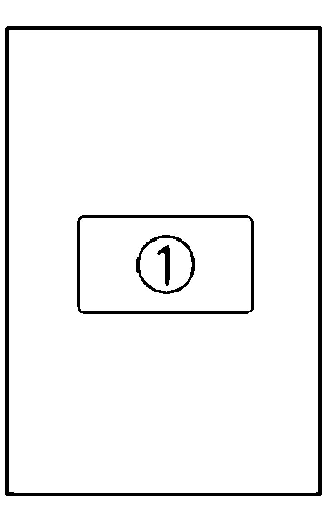

## 牌陣 2：「吉普賽牌陣」

閱讀事情在過去、現在和未來的狀況。

設定問題和範疇後，便可以開始洗牌，或加入 cut 牌等程序。然後，可以把一整疊塔羅牌以扇形展開然後抽牌，或者直接抽出三張牌。按抽出次序把塔羅由左至右並列。

- 第一位置（①）：左邊的一張代表過去。
- 第二位置（②）：中間的一張代表現在。
- 第三位置（③）：右邊的一張代表未來。

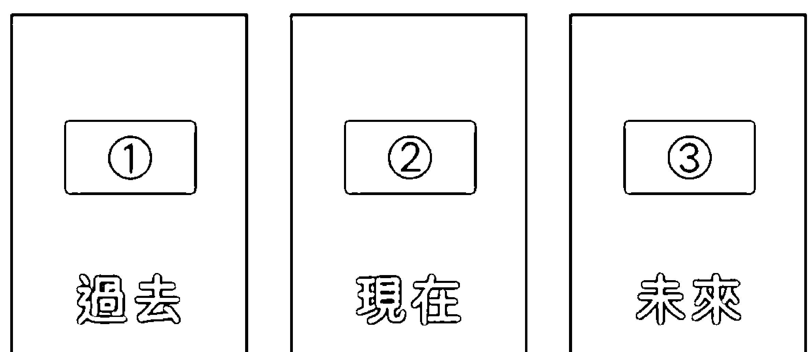

## 牌陣 3：「二者關係牌陣」

除了可用來閱讀情侶關係，亦可用於其他兩者之間關係。

其他兩者之間關係，包括例如父母、朋友、師生、受薪者與上司等關係。這個牌陣亦適用於人與事或人與物的關係，例如某人於這份工作的相合度，某人與某事某物的相合度等等。

設定對象後，便可以開始洗牌，或加入 cut 牌等程序。然後，可以把一整疊塔羅牌以扇形展開，然後抽牌，或者直接抽出四張牌。

- 第一位置（①）：左上角一張代表問者的現況、心態，及對於對方的看法。
- 第二位置（②）：右上角一張代表對方的現況、心態，及對於問者的看法。
- 第三位置（③）：左下角一張代表雙方的現況。
- 第四位置（④）：右下角一張代表塔羅對雙方前景的意見。

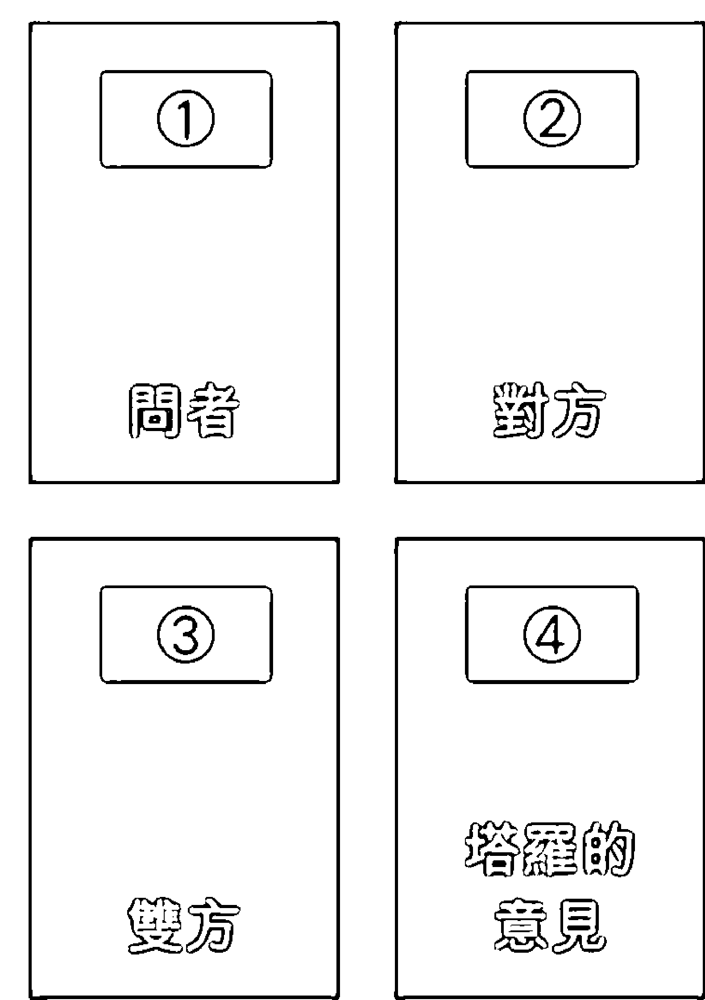

## 牌陣 4：「逆三角關係牌陣」

非常有效於閱讀情場上的三角關係，亦可用於各種抉擇情況。

各種抉擇情況，意指如轉換工作、選擇不同的合作關係、學生選讀科目等。這個牌陣亦適用於人與事或人與物的關係。例如某人正在考慮兩個不同的方案，又或者某人正在兩個不同的機會中疑惑，不知如何選擇，就可以使用這個牌陣分別分析兩者的利弊，才去作出抉擇。

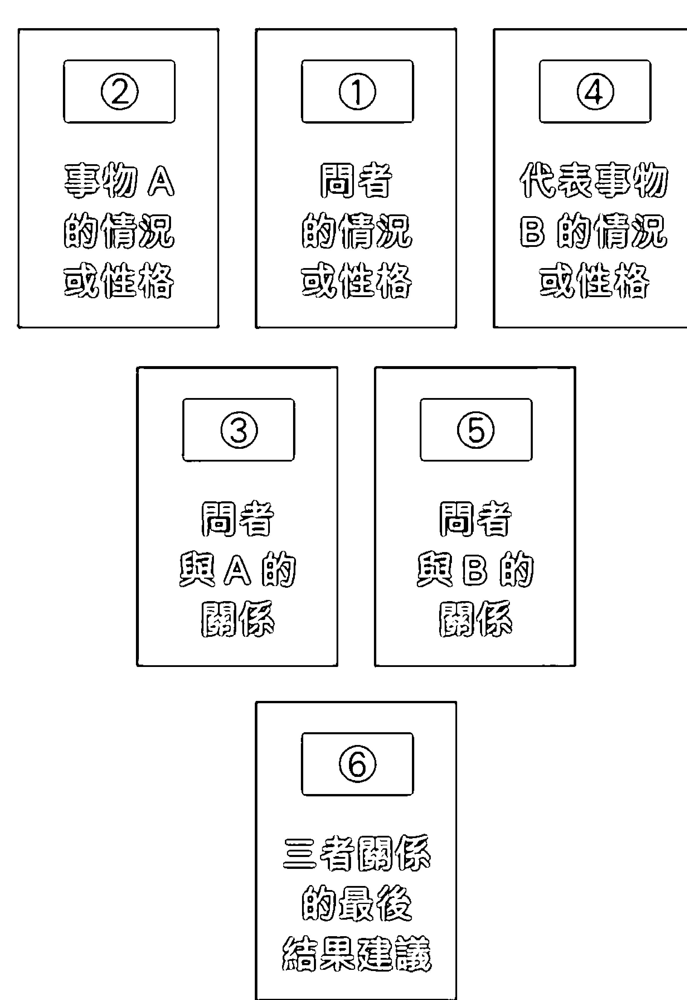

設定對象後，便可以開始洗牌，或加入 cut 牌等程序。然後，可以把一整疊塔羅牌以扇形展開然後抽牌，或者直接抽出六張牌。

- 第一位置（①）：代表問者的情況或性格。
- 第二位置（②）：代表事物 A 的情況或性格。
- 第三位置（③）：代表問者與 A 的關係。
- 第四位置（④）：代表事物 B 的情況或性格。
- 第五位置（⑤）：代表問者與 B 的關係。
- 第六位置（⑥）：三者關係（問者、A、B）的最後結果建議。

## 牌陣 5：「四季牌陣」

看出未來四季的運氣

設定問題後，便可以開始洗牌，或加入 cut 牌等程序。然後，可以把一整疊塔羅牌以扇形展開然後抽牌，或者直接抽出五張牌。

- 第一位置（①）：最上中間的一張代表問者的現況及心態（本季）。
- 第二位置（②）：中間右方的一張代表問者下一季的運勢。
- 第三位置（③）：中間下方的一張代表問者六個月後的運勢。
- 第四位置（④）：中間左方的一張代表問者九個月後的運勢。
- 第五位置（⑤）：中間的一張代表問者本人的能量。

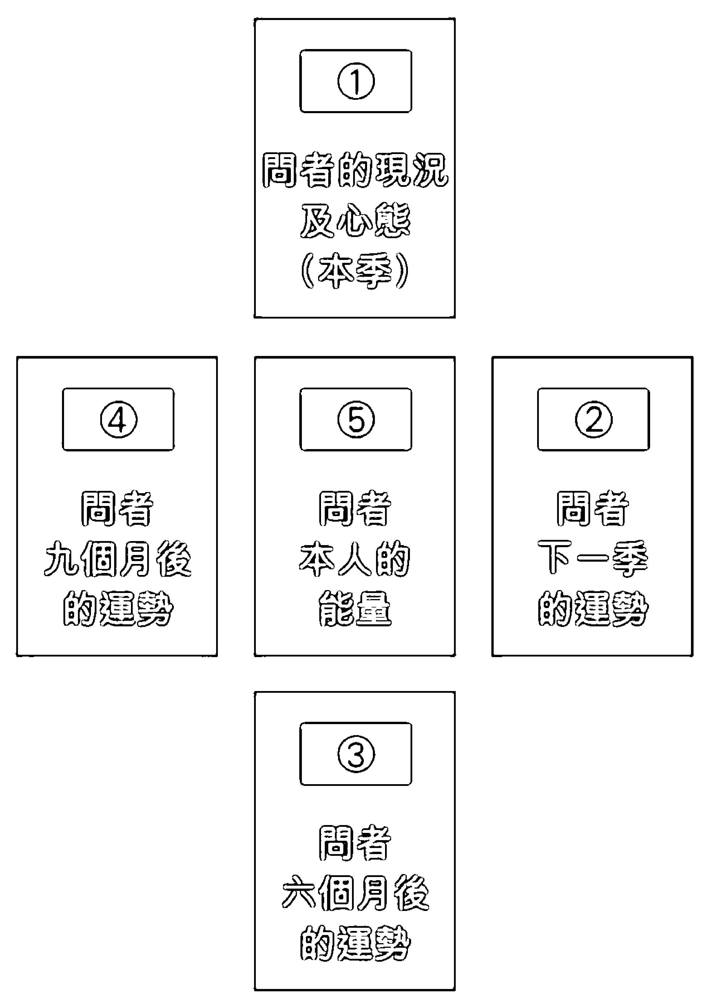

## 牌陣 6：「追加牌陣」

一個牌陣的延伸

嚴格來說，這不算是一個牌陣，而是一個牌陣的延伸。

當使用二者關係牌陣的時候（見 338 頁），如發現未能於第四位置（④）找出適用的意見和方法，可以嘗試追加另一張塔羅，尋找更多提示。但使用追加牌陣，是有一定的限制，如下：

條件一：第四位置的牌需要是小阿克羅。因為小阿克羅屬於反映心情的牌，並未反映局面條件。所以，如果當事人改變心情，會對未來的結果有很大影響。

條件二：第四位置的牌需要是正位牌。因為，逆位牌有當事人在環境中言行不恰當的意思。如果當事人願意改變行事模式，或對事物的想法，對結果會有很大的影響。

條件三：如果第四位置是一張大阿克羅，不適合追加其他塔羅。因為這反映了當事人以外的其他因素，即使當事人用力改變，對結果的影響亦甚小。

另有注意事項如下：

- 第四位置，如果是小阿克羅 Ace，不可以追加。因為 Ace 牌涉及一些絕對性的改變或新開始，而追加牌有按照現時情況再深入探討的意思，與第四張牌的提示背道而馳。
- 第四位置如果是小阿克羅宮廷牌，亦不可以追加。因為宮廷牌人物暗示外來的助力，當事人不妨先留意有沒有能對事情提出協助的人，並請求幫忙。

初階的朋友，建議先只加一張。無論追加的牌是大阿克羅還是小阿克羅，都以此牌為牌陣的終結。

日後，我們將會介紹追加多張牌的方法。

## 塔羅的提問技巧

有很多初期用家或新學員會跟我說：「塔羅不易用，甚麼牌陣都好像回答不了我的問題」、「不是說畫面不準，但不知從何說起」、「塔羅的提示很表面，未能回應問題的核心」、「雖然已經選用了最傳統最神聖的牌陣，但當中好像沒有一張能夠跟我的現況聯繫起來」等等。因此，他們雖然一開始會對塔羅牌充滿興趣，但沒多久就會把牌放下來，寧願花錢去找塔羅師處理。這的確是很真實的現況，但並非是不能解決的問題。

簡單來說，如果某人目前沒有等著要去解決的問題，只是想透過塔羅給予一些生活上的提示，這樣可以選用一張牌或一些傳統的、神聖的牌陣。如果某人正感到非常迷失，但又未能了解自己的需求或問題所在，則可以透過一張牌去了解究竟當事人到底只是一時情緒困擾，抑或正身處於某個困局之中。

如果某人心裏有一個問題，而且能夠直接表達出來，我們可以使用對應的牌陣去看一下。若某人明白自己生活中某個範疇出了狀況，但不知如何提問，我們可按照以下的建議，組織一個能夠有效找到答案的問題。

## 組織一個能夠有效找到答案的問題

問題可細分為：

- ❖ 工作
    - 某人在某一個工作環境的發展情況如何？自身能力是否能夠對應環境的需求？（二者關係牌陣、十字牌陣）
    - 這個工作範疇是否適合自己的身心發展？（二者關係牌陣）
    - 在目前的工作環境是否能夠遇到期待中的事物？（二者關係牌陣）
    - 目前的工作環境，有甚麼需要注意的地方？（十字牌陣）
    - 與上司下屬的關係，與同事之間的活動？（二者關係牌陣、十字牌陣）
    - 某人在目前工作環境中的存在性？有否增值的需要？（一張牌、十字牌陣）

## 生活

- 當事人感覺迷失，這是自身的問題？還是第六感有所提示？（一張牌、十字牌陣）
- 當事人希望作出一些轉變，不知道這一些變化對自己有何影響？還是應該留守舊有的生活模式？（逆三角關係牌陣）
- 當事人希望置業，心目中有兩個心水單位。想知道哪一個比較適合未來的生活？（逆三角關係牌陣）

## 愛情

- 未來一年的愛情運如何？當中有沒有談戀愛的機會？（十字牌陣）
- 在戀愛的氛圍中，如何使自己變得更美好？（十字牌陣）
- 與某人的關係發展如何？（二者關係牌陣）
- 已經結束的關係，能否再有發展？（追加牌陣）
- 三角關係，如何選擇？（逆三角關係牌陣、二者關係牌陣）

## 學業

- 甚麼科目比較適合？哪一間學校比較適合？（逆三角關係牌陣）
- 在學習環境中，可有精進的空間？（十字牌陣）
- 了解一下師長的看法？（二者關係牌陣）

## 健康、身心發展和靈性成長

- 哪一個醫生適合應付某一個病症？（逆三角關係牌陣）
- 某人目前身心健康狀況，未來需要注意的事項？（十字牌陣）

## 財富

- 某個項目是否具有真正的價值？（一張牌）
- 某一個項目是否適合發展，能否帶來效益？（二者關係牌陣）
- 未來一年，在某個範疇內，是否能夠得到更好的發展和回報？（十字牌陣）

## 實例說明（一）

## 「一張牌」、「二者關係牌陣」

阿健正攻讀大學最後一年，未來幾個月，需要面對繼續升學與就業的抉擇。他的母親察覺了兒子的不安情緒，希望透過閱讀塔羅了解一下兒子的情況。

就塔羅閱讀的技巧而言，在這一個情況下，可以選擇兩種不同的方式去替阿健以塔羅閱讀有關情況，下文與大家分享一下當時的處理方法。

- 開牌前應該提醒一下有關人士，無論如何親近的關係，都應該留有空間和尊重。所有塔羅閱讀，都是由事件中有關人士親自操作較為適合。建議阿健最好考慮親自來閱讀塔羅。
- 塔羅師亦應該以上述的角度去展開塔羅解讀，不適宜透過第三者傳達的意見，就不要在第三者面前說出。
- 在阿健母親這一個情況看來，由於個案中的主角已經二十二歲，是一個成年人。解讀者應該以長輩角度來為後輩給予一些意見的心情來閱讀塔羅；又或者以母親的朋友的身分視點，來開啟阿健母親，讓她更有能量去行使自身的智慧，以母親的身分去為阿健作出提點。

只有這樣閱讀塔羅才不會流於迷信，並且能夠帶領當事人走向更清晰明朗的道路。至於當事人會否親自前來查詢，最後能否得到有效的建議等等問題，命運自有安排。

## 第一種方式：「一張牌」

塔羅閱讀結果：

代表阿健的牌是權杖 no.3。

解讀：

要解讀這一張牌，可以有兩個切入點。首先，這是一張火象小阿克羅。（基於大阿克羅代表當事人正受某種環境因素影響而產生目前的局面，而小阿克羅反映當事人正受某種情緒影響而產生目前的局面。）

如果這一張牌是理性的風元素或者務實的土元素，阿健的不安是由於理性審判或實際考慮而衍生。如果這一張的結果是大阿克羅，則表示阿健的不安是基於環境因素影響。但目前的結果是小阿克羅權杖 no.3，所以，阿健可能只是因為某一種焦急的情緒（火元素）影響，才會產生抉擇困惑。

由於阿健已經是一個二十二歲的成年人，我們可以提醒阿健的母親不妨先給予空間讓孩子作情緒轉換，待理性或務實思想回歸，阿健可能會有一些更好的想法。

回到畫面分析，火元素象徵動力、快速，代表阿健身處環境的人事營運速度較快，對於經驗尚淺的人來說可能會造成壓力。同時畫面背景是一片荒漠，代表在阿健眼中，他所考慮的發展方向，並不是一個資源豐富、回報良好的市場。

## 第二種方式：「二者關係牌陣」

用二者關係牌陣看看阿健和他正打算發展方向的關係如何。從阿健母親的口中得知，阿健在大學修讀兒童教育課程。

## 塔羅閱讀結果：

第一位置（①）：代表阿健的塔羅牌，是聖杯 no.6。
第二位置（②）：代表阿健發展方向的塔羅牌，是 No.4 皇帝。
第三位置（③）：代表二者關係的塔羅牌，是 No.12 吊人（逆位）。
第四位置（④）：代表對這種關係發展意見的塔羅牌，是 No.1 魔術師。

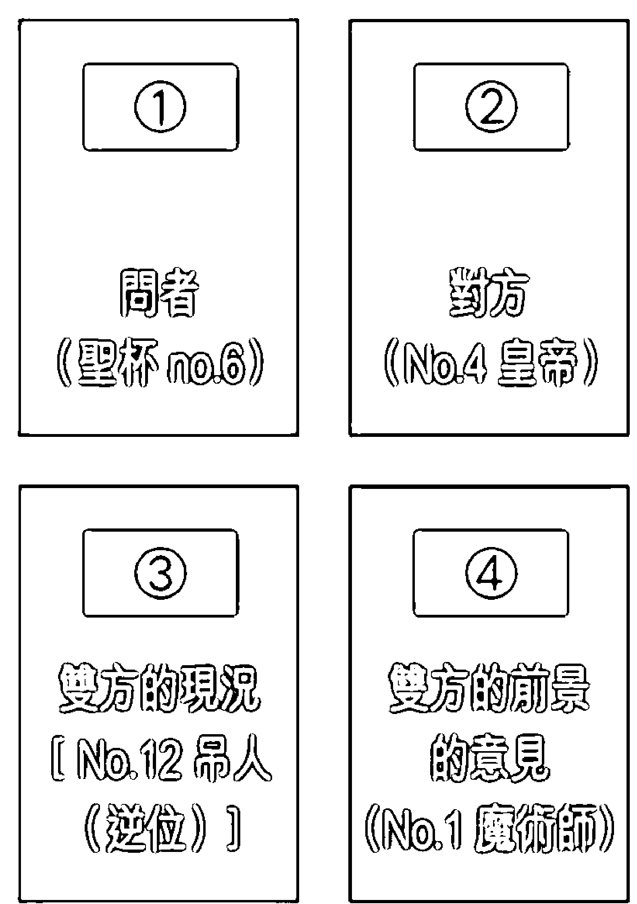

- 第一位置（①）：聖杯 no.6，小阿克羅。阿健雖然有照顧孩子的心，不過目前的自身能量較低。加上聖杯元素是水，能量傾向感性。作為未來的教育工作者，如能以理性（風）或同時加上對應第二位置火元素去面對工作會更適合。
- 第二位置（②），即兒童教學事業的塔羅牌是 No.4 皇帝。需要當事人對工作投入強大的熱情，同時具有管理及領導能力；加上大阿克羅能量需求較大，相對聖杯 no.6 在這一種互動關係，就顯得能量不足，未能對應需求。
- 第三位置（③），代表二者關係的塔羅牌是 No.12 吊人（逆位）。代表兩方面觀點不一致，仍然需要觀望，發展偏向緩慢。
- 第四位置（④），代表對這種關係發展意見的塔羅牌是 No.1 魔術師。可以建議阿健仿效魔術師的性格特質與做事能力，保持思想的靈活性，發揮頭腦的創造力，強化自己的獨立處事能力，利用有限的工具去對應不同的狀況，同時注意外型打扮得亮眼一點，開放自己與人溝通，可有利於未來發展。

## 實例說明（二）

## 「十字牌陣」

陳小姐，現年二十七歲，任職採購文員。前來想了解一下自己在愛情路上的發展，時間正值當年二月。我們可以用十字牌陣來了解陳小姐未來一年的愛情運如何？當中有沒有談戀愛的機會？

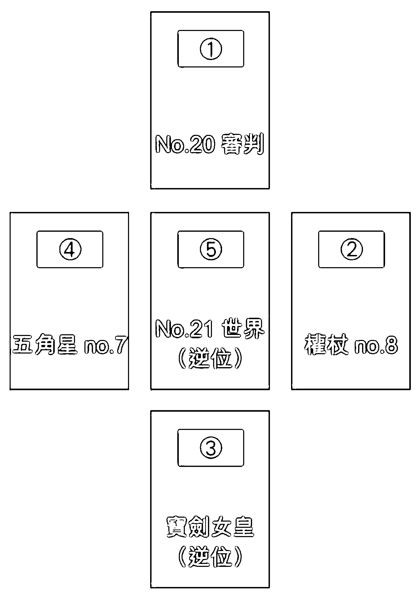

## 塔羅閱讀結果：

第一位置（①）：最上一張代表問者本人的能量，即二月份至五月份的牌，是 No.20 審判（正位）。

第二位置（②）：代表六月份至八月份的牌，是權杖 no.8（正位）。

第三位置（③）：代表九月份至十一月份的牌，是寶劍女皇（逆位）。

第四位置（④）：代表十一月份至翌年一月份的牌，是五角星 no.7（正位）。

第五位置（⑤）：代表陳小姐目前個人能量的牌，是 No.21 世界（逆位）。

※ 通常在處理有關情感問題時，如果能夠找到如 No.6 戀人、No.19 太陽等非常正面的大阿克羅，又或者有關水元素的正面畫面，都是透露着戀愛信息的提示。

但目前綜觀整個牌陣，沒有一張牌特別顯示陳小姐在本年內有一個很明顯的愛情機遇。所以，我們無需要在素食店內找西冷牛扒。冷一點的方法，就是直接告訴她當年並非容易找到戀愛機會的年份。當然，我還是主張用暖一點的方法（笑）。

如果在牌陣中沒有明顯的信息回應當事人的提問，讀牌者可以嘗試花一點精神在牌陣中，看看為甚麼會有這樣的結果。

※ 整個十字牌陣，中間一張牌代表陳小姐的個人能量，外圍四張牌，代表環境能量，同時亦是時間指標。代表陳小姐目前個人能量的牌是 No.21 世界（逆位）。

世界牌本來象徵圓滿、美好，個人能量暢旺。逆位的時候，意味這些優點可能被過度使用，引起反效果。陳小姐對此表示認同，她表示，在大學時期追求者眾，不過因為在求學時期，不急於在感情上穩定下來，於是對於感情不甚強求，合則來不合則去。

進入社會以後，陳小姐發現愈來愈不容易與新結識的異性朋友培養感情，加上工作繁忙，自己又年歲漸長，覺得自己的吸引力逐漸減退，明白最好的時間已經過去，就開始為這些事情擔心起來。

當時我跟陳小姐坦言，牌陣中並沒有一些象徵戀愛機會的畫面。不過，我們或者可以趁這一年好好做一些準備，從畫面中找出提示，或作出一些轉變，以更好的自己，去迎接未來的愛情。代表二月份至五月份的牌是 No.20 審判（正位），正是提醒當事人，要從過去的經驗中獲得智慧，然後放下過去，帶著智慧離開。不用多言，陳小姐都明白要跟青春無敵的自己告別。未來吸引別人的陳小姐，應該是一個大有內涵的新女性。

展望六月份至八月份的牌是權杖 no.8（正位）。火元素象徵一些新的機會、新的感覺、新的靈感，而這一些新事物會發生在帶有火元素的活動中。建議陳小姐在這個時期多參與一些藝術活動、演藝活動、運動、遠足、野火會等。

權杖 no.8 的畫面內並沒有人，這些活動並不會直接帶來一個談戀愛的對象，但有助陳小姐轉換氣場，認識新朋友。

順時針至下方代表九月份至十一月份的牌是寶劍女皇（逆位）。這一張牌，可說是牌陣中的溫馨提示。寶劍女皇在戀愛場面中並不討好，建議陳小姐在這個時候應該特別收起成熟女性通常具備的理性。多感受、少批判，不然就可能會流失一些人際關係。

代表十一月份至翌年一月份的牌是五角星 no.7（正位）。這一張牌的主角正考慮是否繼續一些事情，而五角星的元素是土，代表一些穩定的關係。陳小姐不妨在該段時間，留意一下身邊感情穩定的異性朋友，可否有進一步的發展機會。但無論如何一切都不能操之過急，應該按部就班。

## 實例說明（三）

## 逆三角關係牌陣

韓小姐，三十四歲，未婚，已有一交往三年的男朋友。韓小姐現職日本名牌化妝品公司市場部經理，從人事中介公司中得到消息，有另一國際品牌化妝美容用品公司打算開展東南亞市場，希望邀她加盟於開發團隊之中。韓小姐覺得難以抉擇，想從塔羅牌中取得一些意見。

這一次讀牌過程，我們使用「逆三角關係牌陣」，一共抽出六張牌。

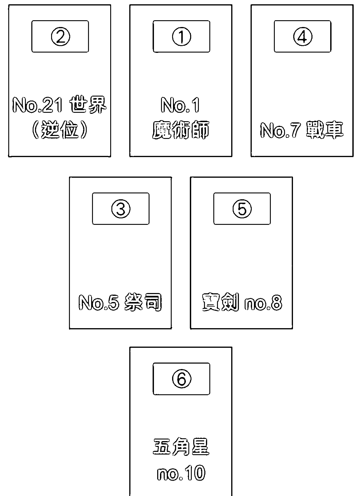

## 塔羅閱讀結果：

第一位置（①）：代表韓小姐的塔羅牌，是 No.1 魔術師（正位）。

第二位置（②）：代表日本化妝品公司的塔羅牌是 No.21 世界（逆位）。

第三位置（③）：代表韓小姐與日本化妝品公司關係的塔羅牌是 No.5 祭司（正位）。

第四位置（④）：代表國際美容品牌的塔羅牌是 No.7 戰車（正位）。

第五位置（⑤）：代表韓小姐與國際美容品牌關係的塔羅牌是寶劍 no.8（正位）。

第六位置（⑥）：代表意見的塔羅牌是五角星 no.10。

- 我們可以從第一位置（①）代表韓小姐的塔羅牌去了解她在職場上的表現：大阿克羅系列中的正位 No.1 魔術師聰明、機智、小心謹慎、應變能力高，與人溝通的時候充滿魅力，輕易就能夠透過小把戲，把別人的注意力轉移到他的身上。就所有條件看來，韓小姐顯然就是市場推廣策劃的傑出人才，難怪僱主們都喜歡，搶着要與她合作。

魔術師枱面的四件工具包括聖杯、五角星、寶劍和權杖，表示韓小姐本人早已擁有能夠實踐分內工作需要的全部工具和資源。這些資源是與她本人結合的，無論她去到哪一個環境，這都是韓小姐本人自身擁有的工具。

- 第二位置（②），No.21 世界（逆位）是看韓小姐目前的工作場地，一家著名的日本化妝品公司。反映該公司目前的情況是世界牌逆位，我們可以知道這公司去年曾經定下一個大目標或者一個大項目，但似乎並未有好好完成，或未能達到預期中的效果。

從這一張牌並未有反映出，公司未達目標的事情與韓小姐有直接關係，這可能由於市場的其他因素所造成。不過這並未有影響公司的發展，因為大阿克羅中的 No.21 世界牌，本來就是說明這是一家具有國際視野、早已發展圓滿、成熟而宏大的機構。大阿克羅即使逆位，依然是能量強大的。

※ 再看第三位置（③），代表韓小姐與日本化妝品公司關係的塔羅牌，大阿克羅正位 No.5 祭司。這一張牌的出現，可以更加肯定韓小姐與公司關係圓滿，而且在公司內得到眾人的信任和愛戴，與其他部門以及下屬相處情況良好。相信二者如果繼續合作，來年仍然能夠在良好的環境下，彼此得到健康的成長。

※ 我們又看一下另一間公司。第四位置（④），代表國際美容品牌的塔羅牌是正位 No.7 戰車，與該公司目前的發展方向相符。同樣是大阿克羅牌，表示兩間公司在國際舞台上，同樣擁有舉足輕重的地位。戰士的姿態正是國際品牌對於進攻東南亞市場的銳意和決心。

不過從牌中兩隻神獸的姿態與眼神看來，戰士所欠缺的正是具備異能、願意受戰士所操作，同時又能夠與其他擁有不同想法的同伴好好合作的人。作為魔術師，韓小姐擁有過人的表達能力，與人溝通無疑有一定的優勢。但我們絕對不能忽略第五張牌所給予的提示。

※ 代表韓小姐與國際美容品牌關係的塔羅牌是寶劍 no.8〔第五位置（⑤）〕。這一張小阿克羅一出現，立即把整個牌陣的能量拉低下來，所有來勢洶洶的事情都被這八把劍擋住了，究竟這八把寶劍象徵了甚麼呢？一切一切，待韓小姐上班後，自然能夠一清二楚。不過，這一刻，韓小姐來閱讀塔羅的本意，就是要在上班之前了解一下需要注意的事項。這些事項，很可能就是影響進退決定的重要因素。我們不能因為這一張是小阿克羅，能量偏低就忽略了解讀的重要性。

寶劍象徵理性決定或一些與法律、條款、條例合約有關的事情。把這些因素放到事情中去理解，一家國際公司進攻東南亞市場很可能會牽涉不同國家的產品條例或者安全標準等。無論是產品本身、包裝設計以及宣傳都會跟這些事情扯上關係；而剛好，這些事情正是韓小姐上任以後需要面對和負責的範圍。

韓小姐現職的日本公司發展成熟，自然對於這些事情早有一定的應對方法。再看新公司那邊，竟然還未處於一個十足的狀態。接下來，無論任何人坐上戰車，除了處事靈活之外，都需要對準備發展的城市政策和法規有深入的理解。寶劍 no.8 的出現，並不是要阻止某一些事情或某一種關係發展，這一張牌是要提醒當事人，在進入這一一種關係之前需要準備充足，因為一切問題都需要當事人單獨應對。做好準備，解決了問題，自然又是另一番光景。

※ 第六位置（⑥），代表塔羅的意見，通常這一張牌不一定會直接為當事人選擇哪一個方向，有時候這一張牌會給予一些提示，這一些提示可能是當事人從來未有考慮過的觀點，讓當事人可以從另一個角度去考慮這個問題，除了兩者的直接利害關係，還加入其他考慮的因素，才去作出抉擇。

在韓小姐的排陣中這個位置的塔羅牌是五角星 no.10。在解讀這一張牌之前，我們先重溫一下韓小姐的個人資料：韓小姐今年已屆三十四歲，已有一位交往三年的男朋友。

說到這裏，大家可以猜一猜五角星 no.10 的畫面會讓韓小姐聯想到甚麼?!生命並不只止於事業，事業有成、財富豐盛其實又是為了甚麼？安穩的環境自然未能即時有所突破，在戰場中發展，自然有勝有負。勝者為王，敗者為寇。人生發展事業究竟是為了證明自己的能力，還是獲得更多的生活條件？

最後，韓小姐自然有了自己的決定。

## 莎拉的塔羅筆記

作者
莎拉

策劃 / 編輯
梁美媚

美術統籌及設計
Amelia Loh

美術設計
Chan Chui Yin

插圖
Angel Hung

出版者
萬里機構出版有限公司
香港鰂魚涌英皇道1065號東達中心1305室
電話：2564 7511
傳真：2565 5539
電郵：info@wanlibk.com
網址：http://www.wanlibk.com
http://www.facebook.com/wanlibk

發行者
香港聯合書刊物流有限公司
香港新界大埔汀麗路36號
中華商務印刷大廈3字樓
電話：2150 2100
傳真：2407 3062
電郵：info@suplogistics.com.hk

承印者
美雅印刷製本有限公司

出版日期
二〇一九年七月第一次印刷

版權所有．不准翻印
All rights reserved.
Copyright ©2019 Wan Li Book Co. Ltd.
Published in Hong Kong
ISBN 978-962-14-7021-8

## 塔羅外傳

本地資深靈性導師莎拉，首次以文本方式公開自己的學習過程，與讀者分享如何以塔羅作工具，既寬且深地連結各類資訊，讓靈性得以在更高維度，獲取宇宙信息的方法。

本書內容較適合對塔羅已有一定認識的愛好者、業界或作為身心靈導師閱讀的專業操作手冊。

## 莎拉的塔羅筆記

本地資深靈性導師莎拉，二十多年來透過塔羅牌作為靈性導引工具，除了為眾多客人解決問題之外，更培育了不少塔羅人才。本書特別與讀者分享她的經驗實錄，並詳述 78 張牌於不同問題時的簡易解說，以及關於塔羅的一些傳說、歷史點滴，內容條理清晰、深入淺出，即使是塔羅入門者，也可立即體驗塔羅的樂趣！

### 特選內容包括

- 78 張大小牌正逆位的詳細解讀
- 介紹提問技巧及塔羅的運作原理
- 以淺白注釋揭示塔羅圖象密碼
- 教授接觸塔羅的正確態度
- 牌陣及真實案例分析

擁有初階（《莎拉的塔羅筆記》）和高階（《塔羅外傳》）的筆記內容，從此可以好好享受使用塔羅的樂趣！