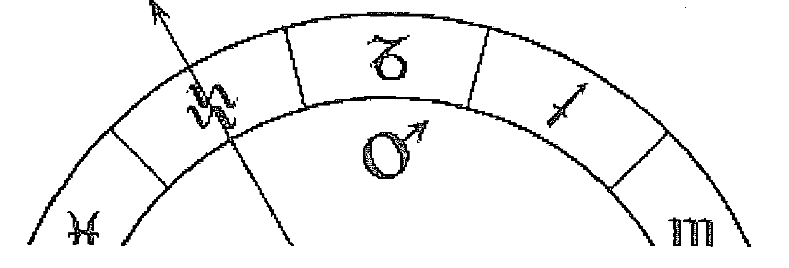

班傑明·戴克 博士
Benjamin N. Dykes, PHD. // 英文原版

邵捷 Zora Gao // 中文翻譯

## 薩爾占星全集 ①
導論、判斷法則、卜卦

## The Astrology Of
Sahl.b.Bishr
Introduction, Aphorisms, Questions

- 圖示目錄 / 6
- 出版序 / 9
- 英文編譯者中文版序 / 11
- 中文譯者序 / 13

## 編者引論

- §1 薩爾生平及著作 / 22
- §2 本卷概覽 / 35
- §3 薩爾對馬謝阿拉資料的引用 / 48
- §4 薩爾著作對都勒斯與 Bizidaj 的引用 / 50
- §5 安達爾札嘎——瑞托瑞爾斯著作傳承中消失的環節 / 55
- §6 始、續、果宮，整宮制及象限制 / 63
- §7 特殊詞彙 / 66
- §8 編輯準則 / 70

## 導論

- 第1章 星座的分類 / 75
- 第2章 十二宮位之本質及各宮類象 / 78
- 第3章 生滅之說明 / 87

## 五十個判斷 / 115

# 論卜卦

- 第 1 章 上升星座及落入其中者 / 133
- 第 2 章 卜卦中的第二個星座及落入其中者 / 142
- 第 3 章 卜卦中的第三個星座及落入其中者 / 143
- 第 4 章 卜卦中的第四個星座及落入其中者 / 144
- 第 5 章 卜卦中的第五個星座及落入其中者 / 148
- 第 6 章 卜卦中的第六個星座及落入其中者 / 151
- 第 7 章 卜卦中的第七個星座及落入其中者 / 159
    - 章節 7.1 婚姻及關係 / 159
    - 章節 7.2 訴訟 / 163
    - 章節 7.3 交易 / 165
    - 章節 7.4 逃亡者與逃犯 / 166
    - 章節 7.5 盜竊 / 168
    - 章節 7.6 合夥與會晤 / 179
    - 章節 7.7 戰爭 / 180
- 第 8 章 卜卦中的第八個星座及落入其中者 / 191
- 第 9 章 卜卦中的第九個星座及落入其中者 / 193
- 第 10 章 卜卦中的第十個星座及落入其中者 / 202
- 第 11 章 卜卦中的第十一個星座及落入其中者 / 217
- 第 12 章 卜卦中的第十二個星座及落入其中者 / 219
- 第 13 章 論書與信差 / 221
- 第 14 章 論報告 / 224

## 目錄

- 第 15 章 論報復 / 227
- 第 16 章 關於多個選項或主題的卜卦 / 229
- 第 17 章 狩獵與捕魚 / 230
- 第 18 章 論宴請 / 232

# 論應期

- 第 1 章 概述 / 241
- 第 2 章 應期判斷法則 / 245
- 第 3 章 選取應期徵象星的說明 / 246
- 第 4 章 生命之宮、上升位置 / 250
- 第 5 章 資產之宮 / 251
- 第 6 章 子女之宮 / 251
- 第 7 章 疾病之宮 / 252
- 第 8 章 戰爭的應期 / 252
- 第 9 章 論旅行——據古人所言 / 255
- 第 10 章 論接收書或報告——據馬謝阿拉 / 257
- 第 11 章 論蘇丹——源自馬謝阿拉的論述 / 258

## 詞彙表 / 264

## 參考文獻 / 308

## 圖示目錄

- 圖 1 : 被薩爾歸於安達爾札嘎的內容 / 59
- 圖 2 : 火星落在整宮制尖軸，但是退出的，不活躍。 / 64
- 圖 3 : 扭曲星座與直行星座 / 75
- 圖 4 : 三分性主星 / 78
- 圖 5 : 八個有利或適宜宮位的體系（灰色部分） / 83
- 圖 6 : 七個有利或適宜宮位的體系（灰色部分） / 83
- 圖 7 : 薩爾著作與《詩集》中的七個宮位體系排序 / 84
- 圖 8 : 與射手座的木星形成相位的星座（白色部分） / 85
- 圖 9 : 前進的（灰色部分）與後退的（白色部分） / 88
- 圖 10 : 光線傳遞 / 90
- 圖 11 : 光線收集 / 91
- 圖 12 : 阻礙 #1（切斷） / 92
- 圖 13 : 阻礙 #2（介入） / 93
- 圖 14 : 阻礙 #3（取消） / 93
- 圖 15 : 會合取消來自其他星座的連結 / 94
- 圖 16 : 月亮被（廟主星）火星容納 / 96
- 圖 17 : 土星與火星不接收、不容納月亮 / 97
- 圖 18 : 不容納的五種類型 / 98
- 圖 19 : 月亮空虛 / 99
- 圖 20 : 被放逐的或野性的火星 / 99
- 圖 21 : 返還 #1 / 100
- 圖 22 : 返還 #2 / 101
- 圖 23 : 交付權力 / 102
- 圖 24 : 行星有力與無力對照表 / 106
- 圖 25 : 以度數包圍或圍攻 / 109
- 圖 26：喜樂宮 / 111
- 圖 27：喜樂星座 / 112
- 圖 28：相對於太陽的喜樂位置 / 112
- 圖 29：喜樂象限 / 113
- 圖 30：吉星化解困境（判斷法則 #36） / 125
- 圖 31：行星在東方及西方升起（判斷法則 #40） / 126
- 圖 32：直立的中天與下降的中天 / 138
- 圖 33：薩爾關於權威的卜卦盤（手稿數據） / 141
- 圖 34：薩爾關於權威的卜卦盤（現代計算） / 141
- 圖 35：尖軸在購買土地與耕作中的象徵意義 / 145
- 圖 36：尖軸在租賃中的象徵意義 / 147
- 圖 37：尖軸在治療中的象徵意義 / 152
- 圖 38：關鍵日期 / 154
- 圖 39：尖軸在盜竊中的象徵意義 / 170
- 圖 40：尖軸在合夥中的象徵意義 / 179
- 圖 41：十二宮位在戰爭中的象徵意義（《論卜卦》章節 7.7，90—101） / 191
- 圖 42：尖軸在旅行中的象徵意義（《論卜卦》第 9 章 2，2—25） / 195
- 圖 43：十二宮位在宴請中的象徵意義（《論卜卦》第 18 章，36—61） / 237
- 圖 44：象限與半球的應期（《論應期》第 1 章，12—14） / 242
- 圖 45：與太陽形成的星相之應期（《論應期》第 1 章，17—21） / 243
- 圖 46：行星與星座對應的基本時間單位 / 245
- 圖 47：行星年與其他時間單位 / 248

## ——出版序——

星空凝視占星學院院長 韓琦瑩

SATA 開始從事翻譯出版書籍一事，緣起於與戴克博士的深厚情誼，繼而建立這樣的合作關係。他願意肩負起文獻翻譯做為職志，但拉丁文文獻語意艱澀，可能造成翻譯上的誤解，這促使他決心找到解決方法——他開始學習阿拉伯文，目前其阿拉伯文水準已可達到直譯阿拉伯占星文獻的程度。這種捨我其誰的精神，令我十分感動與折服，也讓我暗許下承接博士工作的心願，讓這項文獻翻譯計畫延續至華文世界。

受限於人力與經驗值，初期選書時我不敢輕易接下古文獻的翻譯任務，只能以博士的著作作為起點，由我自己擔任譯者，完成了《當代古典占星研究》的翻譯。再到 SATA 首部出版品：《占星魔法學：基礎魔法儀式與冥想》，我們也累積了初步的經驗值。更重要的是發掘了能擔當古文獻翻譯的大將：邰捷。我對她的信心是基於其過去在新華社的外稿翻譯和編審的經驗，再加上她的水月等群星都在第九宮和摩羯座。

《占星魔法學》一書中，占星學的技術內容主要聚焦在擇時上，由此延伸出第一本古文獻選書《選擇與開始》。此書讓讀者可以循著占星擇時這一途徑，進入古文獻原本的世界。邰捷也不負所望，出色地完成了任務。我們取得這個成功的果實後，更有信心進行後續的選書，也就是《選擇與開始》所收錄文獻的共同源頭：都勒斯的《占星詩集》。

《選擇與開始》引介讀者們認識了四位中世紀的阿拉伯占星名家，也見識了阿拉伯占星學的璀璨時代之作，這其中也包含薩爾的《擇日書》。薩爾的作品完整地涵蓋了本命、預測、卜卦、擇時與應期，他的著作係傳承自馬謝阿拉——開啟阿拉伯占星黃金時期的名家。戴克博士在翻譯薩爾的著作時，已完全直譯自阿拉伯文本，使得本書的文字較為淺白易讀，降低了讀者的閱讀門檻。在出版本書之前，SATA 的出版品中仍未有哪本書能夠涵蓋占星學的主要學科。有鑒於此，《薩爾占星全集》將是我們在占星文獻翻譯和出版道路上的里程碑之作！

## ——英文編譯者中文版序——

班傑明·戴克 博士

中世紀的巴格達占星家薩爾·畢·畢雪生活在著名的阿拔斯王朝，我很高興為大家介紹星空凝視占星學院（SATA）翻譯的他的占星著作。由於薩爾的許多作品是集合在一起出版的，在中世紀它們既適合教學，也適合譯成拉丁文，因此廣受歡迎。事實上，在卜卦和擇時占星領域，對占星學子最有助益的諸多拉丁文著作都可以直接追溯至薩爾。例如，波那提的《一百四十六條判斷法則》大約有三分之一都來自薩爾的《五十個判斷》。

薩爾是一位波斯占星家。西元九世紀初，兩個敵對的哈里發之間爆發了一場激烈的內戰，其間巴格達城的大部分都慘遭焚毀，在這場戰爭中，薩爾受雇於後來獲勝的一方。彼時，雖然上一代波斯和阿拉伯占星家，如馬謝阿拉與塔巴里，早已享譽盛名，但他們年事已高，並在內戰前後故去。薩爾在他自己的著作中抄錄、彙集並為後世保存了前輩的資料。這些占星家包括都勒斯、托勒密、維替斯·瓦倫斯、瑞托瑞爾斯、安達爾札嘎、埃澤薩的西奧菲勒斯、馬謝阿拉，以及其他一些我們幾乎一無所知的占星家。薩爾的文字清晰而有條理，因此對於教學與研究而言尤為適宜。

對於大多數占星學子而言，薩爾的系列著作中最具價值的莫過於《導論》《五十個判斷》《擇日書》及《論卜卦》。《導論》為古典占星學中的諸多概念作出定義，並且常常附有很好的、清楚明白的案例。《五十個判斷》是對解讀星盤很有用的五十條建議的合集：逆行與停滯的區別，吉星與凶星應如何解讀，等等。薩爾的《擇日書》是有關擇時占星學的著作，除針對具體事項的擇時建議外，它亦清晰地論述了為所有事項擇時的一般性建議。而他的《論卜卦》則是所有學習卜卦占星的學生必須認真閱讀的書籍，同時也是大部分中世紀卜卦著作的基礎。

在這部譯作中，對讀者而言較為新鮮陌生亦尤為重要的，是薩爾的《論本命》。它或許是中世紀最優秀的本命占星著作，篇幅也是最長的——直至幾個世紀後，里賈爾的阿拉伯文彙編問世。這部著作的大部分內容都以安達爾札嘎的資料為基礎，安達爾札嘎根據客戶可能向占星師提出的問題，諸如「我會有子女嗎？有多少個？他們會有成就嗎？」，對他的資料進行巧妙編排。他為每個問題列出了需要檢視的星盤中的要素，以及應如何解讀。薩爾還補充了都勒斯、馬謝阿拉及其他占星家的重要內容，以幫助學生輕鬆作出解讀：例如，各個宮位主星落在其他各宮位，或是特殊點落在十二個宮位意味著什麼。

薩爾著作的這一阿拉伯文版本，也讓我們更好地理解了某些占星學術語。例如我們現在了解到，中世紀占星師已經意識到整宮制與象限制之間的差異——我已盡力為讀者指出這一點。有了這些新的改進，我們在解讀星盤時便可以做得更好，並且能夠訂正拉丁文版本中的一些錯誤。

我要衷心感謝 SATA 的各位成員，他們為當代占星學子出色地翻譯並推廣了這一珍貴的文獻資料。在我看來，SATA 是古典占星教學領域的佼佼者，我們應該為擁有他們而感到慶幸！我相信在未來的許多年中，你們在閱讀這部著作時，都會欣賞它、享受它。

2022 年 8 月

## ——中文譯者序——

郜捷

翻譯《薩爾占星全集》在我看來似乎是冥冥之中的安排：早在 2018 年底《選擇與開始》剛剛翻譯完成的時候，韓老師曾與我討論過另外兩部古文獻的翻譯計畫，但都因為各種原因擱淺。彼時，戴克博士推薦了《薩爾占星全集》這部不可多得的優秀著作，希望我能待他把英文版翻譯完成後將它譯為中文。

轉眼到了 2019 年春天，英文版如期面世。書到手的那一刻，愛啃硬骨頭的我幾乎對它一見鍾情：這個大塊頭足足有八百多頁，是我所知戴克博士譯作中最厚的一本！然而興奮之餘，我心中卻也十分清楚，這將是一個空前艱難浩大的工程，如此鴻篇巨制，不但考驗譯者的占星知識儲備與翻譯功底，更需要付出巨大的心力和漫長的時間。不過因為有了之前翻譯《選擇與開始》的經驗，我對於完成這一任務並不擔心——直覺告訴我，我們一直在等待彼此。

翻譯過程果然如同所料。一開篇戴克博士就在《編者引論》中介紹了薩爾的生平與相關歷史背景。薩爾生活在占星名家輩出的阿拔斯王朝極盛時期，彼時占星師們在政治舞臺上扮演著重要角色，甚至左右著帝國的走向。薩爾亦因為服務於官方而參與和見證了著名的「兄弟內戰」。因為對這段歷史和阿拉伯文化並不熟悉，我專門買來好幾本這方面的書籍，學習鑽研了將近一個月才下筆翻譯。

從《編者引論》中我也瞭解到，薩爾的著作有著極為重要的學術與歷史價值，是那個時代的珍貴檔案。它廣泛使用了古代及當時的資料，但凡我們有所耳聞的占星家幾乎無一不在薩爾的引用名單之上，它甚至還為我們展示了迄今為止被忽視的傳奇占星家安達爾札嘎的著作，照亮了占星學歷史上鮮為人知的波斯時期。除經典名作《導論》《五十個判斷》《論卜卦》《擇日書》《論應期》之外，這卷著作還包含首次被譯成英文的《論本命》一書，它為我們呈現了上至都勒斯，下至西元八世紀晚期波斯占星師的一整套真實的希臘占星資料，其篇幅在古代本命文獻中數一數二，被戴克博士評價為「涵蓋內容最廣泛、最有條理的本命大全」，因此這一卷著作亦被他定為古典占星課程的兩本教材之一。——而這一切無疑為翻譯工作增添了沉重的責任感與使命感。

所幸我已經翻譯過《擇日書》，對薩爾的內容與風格並不陌生，再加上這卷著作是由阿拉伯文原作翻譯而來，文句清晰直白、簡潔明瞭，因此前幾篇作品的翻譯過程如同行雲流水一般順暢。偶爾也會遇到薩爾試圖在一個簡短的句子裡表達多個含義，從而導致語意不清，不過請教戴克博士之後，問題都輕而易舉地解決了。

正當我以為前方一片坦途的時候，大BOSS卻攔路殺出：長達一百二十多頁的《論本命》第1章簡直就像是一場噩夢，耗費了我整整一年的時間！其中有兩件事給我的印象尤其深刻：首先，開篇十句話因為手稿泡水受到嚴重污損，令本就晦澀的語言變得斷斷續續。由於我的翻譯一向忠實原文，不做意譯與簡化，因此如何把這些內容原汁原味又有可讀性地呈現出來，實在是迄今為止我在翻譯工作中遇到的最大挑戰。此外，生時校正的部分因為包含大量計算步驟，還涉及一些不知為何的表格，導致難以理解，給我帶來極強的挫敗感。我像個考試不及格的小學生一樣忐忑不安地寫信詢問戴克博士，沒想到博士卻安慰我說，他在翻譯這部分內容的時候也有和我完全相同的感受！——那一刻我真想和博士隔著太平洋握握手！

在那段日子裡，種種的考驗與挑戰伴隨著生活中的變故一同向我襲來，令翻譯瞬間變得舉步維艱。恰逢其間我又接到《占星詩集》與《智慧的開端》兩部文獻的審校任務，更是不得不放緩甚至暫時停下手頭的翻譯工作。漫漫長路，終點似乎越來越遙不可及，我甚至一度覺得譯完這一章都是個奢望，但是我知道，我必須堅持。

如今，《論本命》的翻譯仍在繼續，但至暗時刻已經過去，完成也指日可待。我亦驚喜地發現，自己的 A*C*G 月亮線竟然從薩爾晚年著書立說的地方——或許也是他的家鄉——經過，而他也的確如同一位老熟人，陪我走過將近一半的月亮大運。幾年來，無論外面的世界還是我自己的生活都發生了翻天覆地的巨變，而翻譯《薩爾占星全集》的工作卻不曾改變，早已成為我的日常……

最後，我要衷心感謝韓老師和戴克博士對我的信任，將如此重要的古文獻交托到我手上，戴克博士更是不僅全程給予耐心專業的指導，還根據我的提問對英文版的一些用詞做了修改，對一些段落進行了重新劃分——中文版也依照他的回覆加入了許多譯註，以便於讀者理解。亦萬分感謝我的朋友們及 SATA 團隊，沒有大家的鼎力支持與盡心付出，就沒有這部皇皇巨著中文版的面世。此外還要向各位讀者說明的是，因為篇幅原因，中文版在出版時作了一些調整，將原書分為三冊，而《擇日書》亦不包含在內——讀者可在 SATA 占星學院 2019 年出版的《選擇與開始：古典擇時占星》一書中找到這部著作（譯自拉丁文版本）。

相信《薩爾占星全集》這部來自阿拉伯占星黃金時代的精心編排的集大成之作，定能令每一位占星學子及執業占星師受益匪淺！

## 編者引論

當我從古德·波那提 (Guido Bonatti) 的著作《天文書》 (*The Book of Astronomy* ; 2007) 中第一次了解到占星師薩爾·賓·畢雪 (活躍於西元 810 年—825 年) 的時候，便對他產生了濃厚的興趣，並決定翻譯全部我所能搜尋到的他的著作。在 2008 年，我出版了《薩爾與馬謝阿拉著作集》 (*Works of Sahl & Māshā’ allāh*) ，其中包含薩爾的五部著作，均譯自拉丁文手稿。此外，針對他所著《導論》 (*Introduction*) 的部分內容，我還收錄了並列譯文，它來自史岱格曼 (Stegemann) 不完整的阿拉伯文版本 (1942) ，由特里·林德 (Terry Linder) 翻譯。

我依稀知道薩爾的其他阿拉伯文著作，但那時我僅僅通曉拉丁文，並且還有大量其他手稿需要翻譯。許多讀者都了解，我計畫推出詳盡涵蓋古典占星學全部領域的系列翻譯作品 (中世紀占星精華系列 [the *Essential Medieval Astrology series*]) ，雖然我在過程當中作出了一些調整，但我認為已完成大部分計畫。到 2019 年為止，我已經翻譯了古典占星學所有領域的主要及次要作品，與出版波那提、薩爾—馬謝阿拉的著作時相比，這方面的譯作變得十分豐富和全面。

十年過去了，我再次翻譯薩爾的著作，部分原因是我已幾乎完全專注於阿拉伯文文獻的翻譯，並且最終想要翻譯他的全部阿拉伯文著作。不過，更直接的原因在於，這一卷著作 (譯註：包含中文版 1—3 冊) 是我即將推出的古典占星學課程的兩本教材之一。另一本教材是阿布·馬謝 (Abū Ma’ shar) 的著作《本命的週期》 (*On the Revolutions of Years of Nativities*) 完整版，譯自阿拉伯文原作，以「《波斯本命占星》第 4 冊」 (*Persian Nativities IV*) 為名出版。(我所翻譯的不完整的拉丁文版本即為《波斯本命占星》第 3 冊 [*Persian Nativities III*]) 。

為何會選擇它作為教材呢？因為基於研究，我發現薩爾的《論本命》 (*On Nativities*) 幾乎包含了拉丁文著作《亞里士多德之書》 (*Book of Aristotle*) 中全部的本命內容——我已經以「《波斯本命占星》

### § 1 薩爾生平及著作

薩爾全名阿布·烏茲曼·薩爾·賓·畢雪·賓·哈比卜·賓·哈尼¹·伊斯雷利·耶乎德 (Abū ‘Uthmān Sahl b. Bishr b. Habībl b. Hāni’ al-Isrā’ īlī al-Yahūdī)², 納迪姆 (al-Nadīm) 說有時會簡稱他為哈亞·耶乎德 (Hāyā al-Yahūdī)³ (猶太人哈亞)。薩爾的具體生卒年月不詳，不過他似乎活躍於西元 811 年至 825 年之間 (見下文)。塞茲金 (Sezgin) 稱他既是占星家又是數學家⁴。在拉丁西歐，他的名字常常被音譯為扎赫爾 (Zahel)，這有時會造成混淆，因為阿拉伯文稱土星為祖哈爾 (Zuhal)，而這個名字常常出現在論述魔法的內容中。

在《西奧菲勒斯占星著作集》(Astrological Works of Theophilus of Edessa) 的前言中，我描述了西奧菲勒斯 (695—785 年) 的生平及其所處時代。他是最後一位真正的希臘化占星家，也是阿拔斯王朝哈里發 (譯註：即阿拉伯帝國最高統治者) 馬赫迪 (Caliph al-Mahdī，775—785 年在位) 的御用占星師。隨著馬謝阿拉、烏瑪·塔巴里 (‘Umar al-Tabarī)、諾巴赫特 (Nawbakht the Persian) 等波斯占星師在西元 760 年代被引入巴格達宮廷，希臘影響及希臘文化漸漸衰落，使用阿拉伯文的波斯占星學 (尤其是條理清晰的卜卦占星學及世運占星學) 蓬勃發展，而占星師們亦扮演著重要的政治角色。

馬赫迪之子哈迪 (al-Hādī) 即位僅僅約一年就突然去世，由他的弟弟哈倫·拉希德 (Hārūn al-Rashīd，786—809 年在位) 繼任。這位哈里發赫赫有名且成就卓著，《一千零一夜》的許多故事都以他為背景。

我們的薩爾便成長於這一時期，不過，隨後的阿拔斯王朝內戰（811—819 年）是他最活躍的（或者說參與政治活動最多的）時期——那時他服務於幾位關鍵的政治人物。由於這一時期還涉及其他有影響力的占星師，讓我們先來介紹幾個人物，以便理解薩爾可能看到的陰謀。他們包括兩對兄弟：一對占星師—維齊爾（譯註：穆斯林國家的高級行政顧問及大臣）兄弟和一對哈里發兄弟。

我們先來看其中的一對波斯兄弟，他們既是占星師，又是維齊爾，或者說是朝廷要員。他們的名字中都有「薩爾」，這對我們而言並不是件好事，因為很容易混淆。他們都是「薩利德」（Sahlids），即「來自薩拉赫斯（Sarakhs）⁵的拜火教（Zoroatrian）貴族」高官與學者，在西元八世紀晚期及九世紀初期，這些人的家族控制著阿拔斯王朝的政府高層職位」⁶。

#### 薩利德兄弟：占星師、維齊爾

- 法德勒·本·薩爾（Al-Fadl b. Sahl，771—818 年）⁷：原本是為哈里發哈倫·拉希德服務的占星師，後來被哈里發馬蒙（al-Ma’mūn，813—833 年在位）任命為維齊爾和東部總督。
- 哈桑·本·薩爾（782—851 年）：馬蒙派駐巴格達的維齊爾（814—819 年），著名女占星家布蘭（Būrān，817 或 818 年嫁給馬蒙）的父親⁸。我們的薩爾·寶·畢雪就受雇於他（見下文）。

除了這兄弟二人之外，據說馬謝阿拉與烏瑪在馬蒙執政的部分時期依然健在（他們最初可能是站在巴格達的哈里發阿敏 [al-Amin] 這一邊的）。所以儘管他們年事已高，或許已經退休了，薩爾仍有可能與這些前輩占星師有私交——這取決於他來到巴格達的具體時間。

#### 哈里發

- 哈倫·拉希德（786—809 年在位）：一位享有盛名的哈里發，他身後留下了富饒、統一的阿拔斯帝國。
- 阿敏（809—813 年在位）：哈倫·拉希德的長子，他的統治中心在巴格達。
- 馬蒙：哈倫·拉希德的次子，與阿敏同年出生，統治東部地區，後來宣佈爭奪哈里發之位。

#### 將軍

- 塔希爾·本·侯賽因 (Tāhir b.al-Husayn)：人稱「獨眼」（822 年卒）。他在馬蒙統治呼羅珊 (Khurāsān) 時任將軍，後來成為了那裡的統治者（821—822 年）。
- 哈薩馬·本·阿彥 (Harthama b.A’ yan，816 年卒)：來自呼羅珊的將軍，自哈迪時期至馬蒙時期一直為哈里發效力。

故事的開始就如同許多朝代一樣，作為父親的哈倫·拉希德試圖避免在傳位過程中出現問題。⁹ 他明確了繼承人、繼承順序，以及每個兒子擁有的權力。長子阿敏將繼任哈里發，次子馬蒙則相對獨立地統治呼羅珊。呼羅珊包含了伊朗東部的部分地區和如今的阿富汗，是阿拔斯王朝著名而富庶的發祥地，它曾經是薩珊王朝的一個行省，在阿拉伯人入侵期間基本上保持完好。不幸的是，巴格達和伊拉克的政治派系對於呼羅珊半獨立的地位以及它所擁有的財富感到不滿（這個問題存在已經超過百年）。因此當哈倫·拉希德的兩個兒子各就其位時，一些軍事與政治人物就開始勸說阿敏違背繼承規則，接管呼羅珊並廢黜馬蒙。

於是阿敏便向弟弟索要土地與錢財，而如果不是因為馬蒙的維齊爾、占星師法德勒·本·薩爾，馬蒙很可能就會放棄。在法德勒的影響下，馬蒙與地區內的其他重要人物建立了聯盟，阿敏則以宣佈自己的兒子為繼承人（這公然違反了繼承規則）作為回應。西元 811 年，阿敏集結軍隊東進，欲攻佔呼羅珊並擒拿馬蒙。馬蒙派遣塔希爾·本·侯賽因（人稱「獨眼」）將軍抵擋入侵，在呼羅珊西部的雷伊（Rayy）城大敗阿敏。

自這時起（811—812 年），馬蒙忽然之間被自己的臣民擁為哈里發，而阿敏卻失去了各方支持。帝國境內的眾多城市開始轉而效忠馬蒙，最後阿敏的勢力範圍實際上僅僅剩下巴格達——甚至連軍事高層也歸順了馬蒙和塔希爾，除了一些市民（實際上是社會底層的人）之外，沒有人保衛阿敏。塔希爾與其他人在西元 812—813 年對巴格達進行了毀滅性的圍困，西元 813 年阿敏被擒，隨後被處決。

這對我們的故事至關重要，因為法德勒的政策——在一定程度上由占星學所驅動——指導著馬蒙的行動。在法德勒的激勵下形成的聯盟，使馬蒙獲得了最終的勝利並成為唯一的哈里發，然而受到呼羅珊的傳統思想影響，法德勒認為首都及權力中心應該位於波斯東部的木鹿城（Merv，譯註：即今土庫曼斯坦的梅爾夫），而不是巴格達。另外，其他人的影響力也為法德勒所忌，他於西元 814 年將塔希爾流放拉卡（Raqqa，譯註：今敘利亞北部城市），又在西元 816 年以涉嫌叛國的罪名處決了另一位將軍（哈薩馬·本·阿彥）。更令人驚訝的是，後者正在幫助法德勒自己的弟弟哈桑。

西元 814 年，法德勒派哈桑同樣以占星師—維齊爾的身份管轄巴格達。但哈桑沒有能力做到，尤其他身為波斯人和拜火教教徒，受到阿拉伯精英階層排擠，因此他向哈薩馬將軍求助以粉碎叛亂（815—816 年）。與此同時，法德勒也讓馬蒙立西部的穆罕默德後裔為儲君，試圖統一帝國的種族與宗教。令人遺憾的是，這種做法適得其反，因為不滿的真正原因在於西部及阿拉伯人受到呼羅珊勢力的統治。許多行省都叛變了，或者至少不再支持馬蒙，伊拉克陷入內戰，帝國四分五裂。在這一事件當中，哈薩馬對法德勒的權力構成了威脅，因為他試圖提醒馬蒙問題的深層原因。在法德勒的影響下，馬蒙與哈薩馬翻臉，將他關進監獄，法德勒秘密處決了他（816 年）。

統一的嘗試失敗成為壓垮馬蒙在東部統治的最後一根稻草，他終於明白薩利德兄弟隱瞞了問題的嚴重性。因此在西元 817—818 年，他離開呼羅珊前往巴格達，並殺死了法德勒（818 年）。西元 819 年，馬蒙一抵達巴格達就讓哈桑退休了。塔希爾——他曾經拒絕幫助哈桑——則被從流放地召回，在西元 821 年初成為呼羅珊的統治者，並於西元 822 年去世。馬蒙持續在位直到西元 833 年。

儘管我們對薩爾的生平所知甚少，但他參與並見證了上述許多事件。據納迪姆說，薩爾先是服務於塔希爾將軍，然後又為哈桑工作，而且事實上，他至少有一張世運始入盤 (ingress chart) 似乎討論的就是哈里發之間的戰爭（儘管沒有指出名字）。10 看起來，薩爾之後退休來到呼羅珊——這裡可能就是他的故鄉——將他的著作彙編成集（《第十部書》[ *The Tenth Book* ]，見下文）11。

根據納迪姆所言可以知道，薩爾（1）曾在呼羅珊為塔希爾服務，(2) 可能跟随他去往巴格达，然后 (3) 留在了巴格达直到西元 814 年塔希尔被流放，由哈桑接管。倘若如此，那么萨尔就是波斯传统悠久的占星师官僚中的一员，这些人曾经是萨珊王朝统治者的顾问，并且一直活跃在呼罗珊，从西元 760 年代开始为巴格达的阿拔斯王朝哈里发们管理政务。我们只能想象萨尔来到巴格达见到其他人，与他们一起工作并接触他们的研究，是怎样的景象。但是另一方面，我们没有理由认为萨尔是个没见过世面的乡下人。毕竟，不仅他是呼罗珊当权者（具有深厚历史渊源）的一员，而且他的著作显示，或许当他还在东部的时候，就已经接触到了特别的占星学著作。例如，萨尔拥有安达尔札嘎《本命占星》（*Book of Nativities*）的抄本——这部书将瑞托瑞尔斯的研究传至使用阿拉伯语的占星师。鉴于当时安达尔札嘎—瑞托瑞尔斯的著作似乎没有被其他占星师以大篇幅传播12，因此萨尔很可能在来到巴格达任职之前就已经获得了这一资料：他是有备而来的。

至于他职业生涯的其余时间，我们可以作出猜想与推测。除了纳迪姆提到的「退休后在呼罗珊编著《第十部书》」之外，他的一些世运盘发生在后几十年也是可能的。但我们可以确定，在西元 824 年他依然活跃，因为在《论卜卦》第 1 章，53—66 中，萨尔描述并分析了一张关于获得要职的卜卦盘，这张盘的时间为儒略历西元 824 年 7 月 5 日13。虽然不知道萨尔使用的确切地理位置，但这张星盘的上升—中天与巴格达这一地点——而不是木鹿城或其他地方——完美契合，因此有理由推测，萨尔在内战结束后依然活跃在巴格达。不过，他扮演着怎样的角色呢？这张星盘是为一位想谋求要职的询问者所起的，鉴于萨尔提到，谋求的过程将由于权威人物（或者简单来说就是「苏丹」[Sultan]）而出现麻烦或失败，因此萨尔的身份也许是为精英阶层提供咨询的独立占星师——我们只能猜测。不过，或许在哈桑于西元 819 年被解职后，其政府也被解散，萨尔便不得不自谋生路或是另寻东家。最后，萨尔收了一名叫胡拉扎德·本·達爾沙德 (Khurrazādh b.Dārshād) 的學生，他寫下了《論本命》 (*Book on Nativities*) 和《論擇日》 (*Book on Choices*) 兩部著作。$^{14}$ 據塞茲金稱，里賈爾 (al-Rijāl) 引用了他論王朝壽命長短的片段$^{15}$。

以下是薩爾指出名字的資料來源——或許出於政治考量，其中既沒有法德勒，也沒有哈桑。我們能夠注意到他十分依賴波斯占星家的資料，儘管這些資料實際上引用自瑞托瑞爾斯、都勒斯、瓦倫斯和托勒密（此處省略）。

- 赫密斯 (Hermes)：有時是西奧菲勒斯的假名（或是相似的軍事主題的資料來源）$^{16}$，或是瑞托瑞爾斯$^{17}$，或與阿布·馬謝在《占星學全介紹》 (*Great Introduction*) 中使用的特殊點公式的資料來源一致$^{18}$，或是托勒密$^{19}$，或是其他人$^{20}$。
- 布哲米赫 (Buzurjmihr，約西元 500 年代早期—約西元 580 年)$^{21}$：波斯薩珊王朝統治者庫斯勞一世 (Khusrau I，西元 531—579 年在位)$^{22}$ 的維齊爾或宰相。他根據納迪姆的資料對瓦倫斯的《占星選集》(*Anthology*) 一書作出評註，命名為 *Bizidaj*$^{23}$。不過塞茲金指出，根據伊本·希賓塔 (ibn Hibintā）的說法，布哲米赫彙編的是先前波斯占星家們的觀點，並且對它們作了評註。無論是哪一種情況，我們都可以由薩爾的資料清楚地看到，*Bizidaj* 一書中包含大量都勒斯的內容。這說明這部書的彙編與西元六世紀波斯版本都勒斯著作的修訂和增補大致是同時進行的。因此，無論 *Bizidaj* 原作是怎樣的，它都不僅僅是一本關於瓦倫斯著作的評註。更多內容見下文。
- 札丹法魯克·安達爾札嘎（Zādānfarrūkh al-Andarzaghār，活躍於大約西元 650 年？）24：安達爾札嘎（意為「法則之師」[teacher of precepts]）25 著有《本命占星》一書，被許多作者或長（例如在卡畢希 [al-Qābisī]《占星學入門》[*Introduction to the Science of Astrology*] 中）或短（例如在達瑪哈尼 [al-Dāmaghānī] 和阿布·馬謝的著作中）地引用。不過，根據薩爾在《論本命》中明確的引用，我認為安達爾札嘎就是拉丁文著作《亞里士多德之書》的原作者。換句話說，薩爾的《論本命》包含了阿拉伯文版本的安達爾札嘎《本命占星》的大部分內容（關於宮位主題的部分），而達瑪哈尼和阿布·馬謝的著作則包含了這本書有關預測的大部分內容。我會在下文對這一觀點作出論述。
- 波斯的諾巴赫特（卒於約西元 775 年）26：著名占星家，曾奉哈里發曼蘇爾之命（與馬謝阿拉等人一起）在西元 762 年為巴格達建都擇時。他顯然是首席占星師中的一員，還經常陪伴哈里發出巡。薩爾在《論本命》章節 1.15（壽命）、1.30（成長）及 6.2（疾病）中都引用了他的內容。
- 希巴爾馬赫納爾 (Sibārmahnar，سبارمهنر)：不詳（這可能是錯誤的拼寫），不過《論本命》章節 2.2，6 指出他是「學者們的導師」（the master of the scholars）。這個名字明顯源於波斯$^{27}$。
- 西奧菲勒斯（約西元 695—785 年）：講希臘語的基督徒占星師，也是「最後一批」真正的希臘化占星師中的一員。他尤其擅長軍事占星，並在這方面大量應用都勒斯的資料。他為阿拔斯王朝統治者服務多年，並且是哈里發馬赫迪的御用占星師。薩爾在此的大部分作品都（或明或暗地）使用了西奧菲勒斯的資料，這顯示了對他的仰慕。
- 馬謝阿拉·本·阿塔里 (Māshā’ allāh b.Atharī，卒於約西元 815 年)$^{28}$：來自巴士拉 (Basrah)$^{29}$ 的波斯猶太裔占星家，也是阿拔斯王朝早期最著名的占星家之一（後世僅有阿布·馬謝超越過他）。馬謝阿拉是奉哈里發曼蘇爾之命在西元 762 年為巴格達建都擇時的團隊中的一員。他的著作眾多，幾乎涉及所有主題（包括一本有關星盤儀 [astrolabes] 的著作）。實際上，薩爾在每一部著作中都大量地引用馬謝阿拉的內容，可以說他是馬謝阿拉資料的重要保存者（見下文）。

---

¹ 納迪姆遺漏了這個名字。
² 塞茲金，第 125 頁。
³ 納迪姆，VII.2，第 651 頁。
⁴ 塞茲金，第 125 頁。
⁵ 呼羅珊（Khurāsān）東北部城市。
⁶ 霍伊蘭（Hoyland）2015 年出版的著作，第 221 頁及第 274 頁，註釋 17。
⁷ 下文中的時間並不確切，由於伊斯蘭曆與我們並不完全一致，誤差可能在大約 6 個月之內。
⁸ 塞茲金，第 115 頁及第 122—123 頁；塔巴里，第 32 卷，第 82 頁。
⁹ 下文特別參考了甘迺迪 (Kennedy) 2006 年出版的著作，第 142—153 頁。
10 我現在正在翻譯他的著作《論世界的週期》（*On the Revolutions of the Years of the World*），其中包含許多歷史的星盤。
11 納迪姆，第 652 頁。
12 我們還需要完成更多的資料翻譯才能確定這一點。
13 使用「薩珊」黃道（「Sassanian」zodiac），以 Janus 占星軟體計算。
$^{14}$ 塞茲金，第 129 頁；納迪姆，第 655 頁。
$^{15}$ 塞茲金稱引自 146—147a，不過我不清楚這指的是哪一部手稿。
$^{16}$ 《論應期》第 8 章。
$^{17}$ 《論本命》章節 1.4，6；章節 5.6，2。
$^{18}$ 《論本命》章節 3.11，2；章節 5.1，92。
$^{19}$ 《論本命》章節 10.2.6，1 及隨後的句子。
$^{20}$ 《論本命》章節 1.10，所謂「赫密斯的平衡生時校正法 (Trutine)」。
$^{21}$ 塞茲金，第 80 頁；霍伊蘭 2015 年出版的著作第 221 頁。
$^{22}$ 布哲米赫也是之前以及隨後統治者的大臣。
$^{23}$ 納迪姆，第 641 頁。
24 塞茲金，第 80—81 頁。
25 伯內特與哈姆迪 (al-Hamdi) 1991/1992，第 295 頁。
26 塞茲金，第 100 頁。
$^{27}$ 伯內特和賓格瑞在他們出版的《亞里士多德之書》中認為這是赫密斯。他們指出，在札拉達斯特 (Zarādusht) 的阿拉伯文手稿中，有一張薩爾星表的早期版本，標題寫著它源於赫密斯。但雨果的拉丁文版本《亞里士多德之書》把這個名字拼作「Sarhacir」，而且在阿拉伯文中，不可能把薩爾誤拼成「赫密斯」（هرمس）。此外，薩爾並沒有在其他手稿的標題中提到赫密斯——「智者之首」（chief of the sages，رأس الحكماء），而是稱希巴爾馬赫納爾為「學者們的導師」（سيد العلماء）。考慮到薩爾是如此熱衷於抄錄安達爾札嘎的內容，很難相信他會改動或是弄錯名字和標題。也許在未來，我們能夠找到安達爾札嘎著作的阿拉伯文版本或薩爾著作的其他版本進行對正。
$^{28}$ 塞茲金，第 102 頁。
$^{29}$ 有很多資料稱來自「埃及」，因為這個詞在阿拉伯文中與巴士拉的拼寫十分相似。

---

星》第 1 冊」(Persian Nativities I ) 為名將後者翻譯並出版。西元十二世紀早期，雨果 (Hugo of Santalla) 將《亞里士多德之書》的阿拉伯文原作譯成拉丁文，查爾斯·伯內特 (Charles Burnett) 與大衛·賓格瑞 (David Pingree) 在他們於 1997 年出版的版本中，提出這部書的原作者是馬謝阿拉；在註釋中，他們進一步明確指出，薩爾《論本命》中的許多段落都源於此書。這部拉丁文的《亞里士多德之書》充滿了源於都勒斯 (Dorotheus)、瑞托瑞爾斯 (Rhetorius) 的論述與法則，也有一些來自托勒密 (Ptolemy) 和其他人。此外，它還為執業占星師進行了精心的編排：前三部論述基本概念及本命盤的解讀，第四部則論述預測方法。鑑於這部書對於早期作者內容的使用以及精心的編排，就理論上而言，它是一本理想的教材。

《亞里士多德之書》的主要問題在於它令人不勝其煩的文風，因為我的翻譯忠實於雨果的拉丁文原作，並非意譯或簡化。即便是已經熟悉古典占星學概念和方法的人，也很難理解這本書的內容。不過，在深入了解薩爾《論本命》之後，我有兩個發現：第一，所謂《亞里士多德之書》根本不是馬謝阿拉的著作，而是由更早期的波斯占星家安達爾札嘎 (al-Andarzaghār) 所著；第二，薩爾《論本命》的內容遠比它多得多，收錄了來自瓦倫斯 (Valens)、都勒斯著作的其他譯本、西奧菲勒斯 (Theophilus) 以及其他作者——包括馬謝阿拉本人的許多資料，而它們都沒有出現在《亞里士多德之書》當中。簡而言之，我認為除了薩爾精彩的《導論》《五十個判斷》（Aphorisms）以及關於卜卦、擇時和應期的著作之外，他的《論本命》是我所見過的涵蓋內容最廣泛、最有條理的本命大全，並且展示了迄今為止被忽視的占星家——安達爾札嘎的著作。這使得薩爾的此卷著作成為課程教材的不二之選。

總之，這一卷內容顯示出希臘占星學由薩珊王朝波斯人所傳承，且彼時它剛剛被巴格達的阿拔斯王朝 (‘Abbāsid) 宮廷所翻譯，由一位占星師匯整並重新編排。這位占星師服務於阿拔斯王朝，並能夠接觸到瑞托瑞爾斯的手稿及更多資料——包括波斯文版本的都勒斯及瓦倫斯的著作。它包含以下六部著作和兩篇附錄（緊隨其後的是薩爾第二卷關於世運占星的著作）：

1. 《導論》
2. 《五十個判斷》
3. 《論卜卦》 (On Questions)
4. 《擇日書》 (On Choices) (譯註：中文版不含)
5. 《論應期》 (On Times)
6. 《論本命》
7. 《有關上升位置及本命判斷的66個片段》 (The 66 Sections on Ascendants and the Judgments of Nativities，見附錄 A)
8. 《上升主星的連結》 (The Connections of the Lord of the Ascendant，作者或許是馬謝阿拉，見附錄 B)

### § 2 本卷概覽

儘管納迪姆列出了薩爾的眾多著作，但在手稿集中它們卻很少以獨立的名稱出現。正如上文所述，本卷中的三部作品——《導論》《五十個判斷》《論卜卦》就是出現在同一部著作中的，這是一個典型的例子。在萊比錫、Hathi（譯註：HathiTrust 數位圖書館）和倫敦手稿中都是如此。萊比錫手稿稱這部合集為《天空指引的論斷》（*the Book of Judgments on the Celestial Guideposts*）。耶魯手稿除了涵蓋這些作品之外，還增加了《論應期》——而在其他手稿中，《論應期》都是獨立的著作。但這些手稿都不包括《擇日書》，這部著作我主要採用了克羅夫茨（Crofts）的校訂版。而《論本命》是一部完全獨立的著作，僅僅見於兩部手稿中。以下是關於每一部作品的簡要說明，首先是主要的阿拉伯文手稿簡稱：

- **B**：耶魯，拜內克（Beinecke）523（《論應期》《導論》《五十個判斷》《論卜卦》）。
- **BL**：倫敦，大英圖書館，東方 12802（《導論》《五十個判斷》《論卜卦》）。
- **E**：埃斯庫里埃爾（Escurial），阿拉伯 1636（《論本命》[部分]）。
- **Es**：埃斯庫里埃爾，阿拉伯 919（《論應期》[部分]；馬謝阿拉所著《蘇丹之書》[The Book of the Sultan]）。
- **H**：Hathi Trust 1701（《導論》《五十個判斷》《論卜卦》）。
- **L**：萊比錫，沃勒斯（Vollers）0799（《導論》《五十個判斷》《論卜卦》）。
- **M**：德黑蘭，馬吉里斯（Majlis）6484（《論本命》）。
- **N**：伊斯坦堡，奴魯奧斯瑪尼耶（Nuruosmaniye）2785（《論應期》[部分]）。

本卷包含許多表格與圖例，不過在薩爾的手稿中，僅《導論》第 3 章和《論卜卦》第 1 章出現了描述行星的位置和度數的圖例與星盤，其餘都是我製作的。儘管如此，我們仍可以通過薩爾的這些圖例試探性地推斷這三部作品合集的創作年代。在《論卜卦》中有一張星盤，日期可以追溯到儒略曆西元 824 年 7 月 5 日，即兄弟內戰結束之後。如果以薩珊黃道去查看《導論》中圖例所對應的年代（忽略度數，因為這可能是出於教學目的標註的），那麼它們中的大部分都可以對應西元 822—825 年的具體日期，其中有兩個例外：光線收集的圖例對應西元 817 年或是 828 年，而取消 (nullification) 的圖例可能對應西元 811 年或 832 年。不過取消的圖例使用的是非常快速的行星，因此很難確定到底是這兩年中的哪一年。鑒於由卜卦盤可知薩爾在西元 824 年依然活躍，所以我認為這兩部作品都成書於西元 825 年左右，薩爾使用的大部分行星配置的例子，都是通過翻閱那幾年的星曆表找出的，而其餘是從時間更早或更晚一些的星曆表中找出的。

#### 1. 《導論》

我所謂薩爾的《導論》指的也是那三部書——它們常常被合在一起，卻沒有規範化的名稱（見上文 #1）——當中的第一部：在此，文獻以簡單直接地引用薩爾的話作為開始。這可能是納迪姆提到的短篇《導論》，也可能是長篇《導論》（見上文 #a）。本書使用的手稿如下：

- B：耶魯，拜內克 523，幻燈片 2139—2177。
- BL：倫敦，大英圖書館，東方 12802，幻燈片 15—29。
- H：Hathi Trust 1701，圖 4—16。
- L：萊比錫，沃勒斯 0799，2b—9a。
- 巴黎 BN16204 與威尼斯 1493 中的拉丁文手稿。

延續《占星四書》（Tetrabiblos）、都勒斯、安提歐切斯 (Antiochus)、費爾米庫斯·馬特爾努斯 (Firmicus Maternus) 等的傳統，《導論》將內容分為星座、相位、宮位意涵、行星配置 (planetary configurations) 等類別：

第 1 章介紹星座的分類及三分性主星。建議讀者將此處的星座分類與《論本命》章節 1.38 對照，後者包含更多內容和其他觀點。我的註釋會引導讀者參考分佈在本書中的其他列表和分類。

第 2 章介紹宮位意涵、吉宮以及相位。這裡有幾點很有趣。首先，《導論》顯然是為卜卦占星師設計的，因為它強調卜卦以及事件的來龍去脈（第 3 章）。其次，當談及宮位時，薩爾強調了星座——他基本上是傾向於使用整星座宮位制 (whole-sign houses) 的，尤其是他指出這些分類與星座之間的相位及不合意有關：當使用象限制時，不合意就說不通了。另一方面，薩爾很清楚基於星座的相位形態、象限宮位以及行星如何以主限運動經過尖軸度數之間的差異，因此在談到尖軸時，究竟是指整星座制的尖軸還是象限制的尖軸，仍然存有一些歧義。（詳見下文 §6。）最後，在介紹相位與不合意之前，薩爾概述了兩種有利宮位的體系：其一是八個有利宮位的體系，強調始宮與續宮；其二是七個有利宮位的體系，強調與上升位置形成相位的宮位。

第 3 章的內容最為豐富多樣，論述了行星配置與其他的行星狀態：薩爾再次強調了在卜卦中它們是如何影響事情的發展的。在行星配置方面，我覺得最有趣的是歷史轉型的出現，即薩爾時代的占星師正在研究他們新的阿拉伯文術語，這使舊有體系更加複雜，但不如我們在阿布·馬謝《占星學全介紹》中看到的那樣系統化。例如，有關行星之間連結受阻，薩爾描述的情況要比之前的著作（如瑞托瑞爾斯的著作）多得多。他甚至以三種不同術語描述他所列舉的三種阻礙 (blocking)（而我從未在其他著作中見過），並且我們還能夠看到不同類型的「交付」(handing over)⁴⁶。另一方面，薩爾卻沒有描述全部逆行組合以及星座的改變——而我們在晚些時候的阿布·馬謝的著作中就可以看到這些內容。在《五十個判斷》中，薩爾甚至還描述了後來被阿布·馬謝稱為「逃逸」（escape，見下文）的情況，不過顯然它在薩爾的年代還沒有正式的名稱⁴⁷。因此我認為，《導論》提供了一個有趣的窗口，使我們可以看到薩珊王朝的波斯占星學向阿拔斯王朝的阿拉伯占星學轉型的過程。

#### 2. 《五十個判斷》

《五十個判斷》是有關行星狀態與相位形態判斷的一系列便捷法則與要訣，它很有可能是為卜卦而撰寫的，但顯然也適用於其他占星學分支。它是那三部作品（見上文 #1）中的第二部，並且可能就是納迪姆所列出的《判斷之書》（見上文 #i）。與《導論》不同的是，這部作品的名稱幾乎是順帶被提出的：《導論》的結尾簡單地寫道「判斷法則由此開始」，所以我們可以稱它為《判斷法則》。而我遵循拉丁傳統，稱之為《五十個判斷》。（實際上，其阿拉伯文含義更接近判斷的「傳聞」，不過這在英文中顯得不那麼鄭重）。這一版本採用的四部手稿如下：

- B：耶魯，拜內克 523，幻燈片 2177—2195。
- H：Hathi Trust 1707，圖片 18—23。
- L：萊比錫，沃勒斯 799，9a—12a。
- BL：倫敦，大英圖書館，東方 12802，幻燈片 29—35。

所謂法則，並不意味著在使用與解讀上如同「算術」一般精確，我們不應被它們斷言式的風格所誤導：有時，一條法則中的要素與另一條法則是不相容的，應用者必須權衡孰輕孰重。其中一些法則可以追溯至西奧菲勒斯或都勒斯，不過我懷疑很多都來自馬謝阿拉。

我在這一章的開始列出了一張表格，按照主題將許多法則歸類，其中有一些值得注意。法則 #25 論述一顆得到容納的凶星影響如何，稱在這種情況下，該凶星所帶來的傷害將會更大：但我在註釋中給出了理由與資料來源，證明這種說法是錯誤的。此外，如同上文所述，法則 #16—17 描述了一種被阿布·馬謝稱為「逃逸」的相位形態：在此處，薩爾僅僅對其進行了描述，這顯示它還未成為一種得到正式命名的相位形態。這是一個很好的跡象，顯示即便到了西元九世紀早期，仍然存在具有創造性的想法，將傳承自古希臘與波斯的占星學進行系統化。

#### 3. 《論卜卦》

事實上，這部作品在手稿中並沒有標題，而是以「第 1 章，論開始判斷所求之事」（*On starting to look at things sought*）作為開頭。我遵循拉丁文版本及納迪姆的資料，將其命名為《論卜卦》。阿拉伯文資料來源如下：

- B：耶魯，拜內克 523，幻燈片 2195—2349。
- BL：倫敦，大英圖書館，東方 12802，幻燈片 35—101。
- H：Hathi Trust 1707，圖片 23—76。
- L：萊比錫，沃勒斯 799，12a—41b。

除此之外，我還參考了我所翻譯的雨果拉丁文版本《判斷九書》（*The Book of the Nine Judges*）、阿拉伯文版本的里賈爾《行星判斷技法》（*The Book of the Skilled*），以及拉丁文版本《論卜卦》——我曾在《薩爾與馬謝阿拉著作集》中使用過這個版本，並且設想它是由西班牙的約翰 (John of Spain) 所翻譯的，不過現在我簡稱它為「拉丁文」版本。

自薩爾以後，這本書中的卜卦主題被波那提與其他眾多占星師長期沿用。它們當中的許多都可以追溯至都勒斯，這顯示了波斯占星師們正在把擇時資料改寫為卜卦資料：這可能是始於薩珊王朝的正規卜卦著作主要的創作方式。然而，正如我在一些註釋中所指出的，也有不少卜卦主題可以追溯至馬謝阿拉所著其他有關卜卦的作品。（薩爾經常簡化馬謝阿拉的版本）。不過，簡單對比一下薩爾與哈亞特的作品，就會發現薩爾直接抄錄了許多哈亞特的內容，因此與馬謝阿拉之間的關聯是間接的。將來我會翻譯那些作品，我們就可以更清楚地了解薩爾所做的事情。最後，鑒於薩爾在論述戰爭主題時廣泛使用了西奧菲勒斯的資料，顯然，他要麼擁有西奧菲勒斯《軍事行動開始盤研究》(Labors Concerning Military Inceptions) 的希臘文或阿拉伯文版本，要麼抄錄了哈亞特的著作（他的卜卦著作也至少包含其中的一些內容）。

一個有關語言方面的說明是，偶爾有跡象顯示，有一些手稿是通過口述的形式由另一些手稿抄錄而來的。例如第 10 章，6 當中 كوكين 一詞，在大英圖書館手稿中的寫法發音類似 tanwīn，像是雙數的主格形式（كوكين）；其他手稿並不存在這個錯誤——合理的解釋是：快速聽寫造成了這一錯誤。

#### 4. 《擇日書》

> (譯註：本中文版不含。讀者可參見薩爾：《擇日書》，班傑明·戴克：《選擇與開始：古典擇時占星》，郜捷譯，星空凝視古典占星學院，2019 年，第三部)

薩爾《十二宮位擇日書》（又稱《擇日書》）的這一版本翻譯自克羅夫茨阿拉伯文版本（1985年出版），它源於三部手稿：（1）貝魯特，聖約瑟夫大學（University of St.Joseph），199，5；（2）開羅，埃及國家圖書館與檔案館（Dar al-Kutub），塔拉特（Tal’at），米卡特（miqat）139/2；（3）埃斯庫里埃爾919/2。克羅夫茨的版本也將阿拉伯文版本與諸多拉丁文版本進行了比對。

正如讀者將會看到的那樣，《擇日書》中的許多段落都來自都勒斯：第2章，19—28（譯註：見前引《選擇與開始》，第三部，《擇日書》，§22a—f）關於月亮受剋的內容可以追溯至都勒斯《占星詩集》（譯註：以下簡稱《詩集》）V.6，便是一個很好的例子。但如同賓格瑞所指出的（2006，第235—236頁），其他段落來源於迄今尚未被翻譯的馬謝阿拉的卜卦與擇時資料⁴⁸：實際上，薩爾著作中的第4章，21及其後有關種植樹木的內容，就源於萊頓（Leiden），東方891，第23b頁（第六行及其後）。（我已經根據馬謝阿拉的手稿補充了一些註釋，不過尚未徹底翻譯。）此外，薩爾有時也引用西奧菲勒斯的資料，例如第2章中有關四正星座（quadruplicities）的應用，可以追溯至《論各類開始》（On Various Inceptions），第7章中一些有關戰爭的資料也如此（來自《軍事行動開始盤研究》）。

#### 5. 《論應期》

這一版本使用的手稿有：

- B：耶魯，拜內克523，幻燈片2108—2136。
- Es：埃斯庫里埃爾919/4，47b，48a—51b（殘缺）。

---

葉海亞·本·賈里卜（或伊斯梅爾·本·穆罕默德）·阿布·阿里·哈亞特（Yahyā b. Jālib [or Ismā’īl b. Muhammad] Abū ‘Alī al-Khayyāt，活躍於西元八世紀早期）。³⁰ 哈亞特是馬謝阿拉的學生之一，寫下了有關諸多占星學主題的著作。薩爾在《論應期》（應期計算）、《論本命》（論財務與父母）中明確地引用了哈亞特的資料，此外《論卜卦》與《論本命》（章節 9.5 論宗教信仰，以及論格局的內容）有許多內容與哈亞特的資料來源也是一致的——最有可能源於馬謝阿拉。

哈桑·本·易卜拉欣/穆罕默德·塔米米·阿巴克（Al-Hasan b. Ibrāhīm/Muhammad al-Tamīmī al-Abakh，活躍於大約西元 813—833 年）³¹。阿巴克完全與薩爾同時代，活躍於哈里發馬蒙在位時期（但我不清楚他所在地點）。他為馬蒙寫下了《論擇日》(Book on Choices)，另外還著有《論本命》(Book on Nativities) 和《論降雨》(Book on Rain)。薩爾摘錄的有關確定受孕時間的內容應來自阿巴克的《論本命》。³²

一位名叫穆罕默德·賓·畢雪·呼羅珊尼（Muhammad b. Bishr al-Khurāsānī）的人（不詳，但顯然來自呼羅珊）。薩爾在《論本命》章節 3.4，5—6 有關手足的內容當中，引用了這位身份不明的占星師的資料。

一位名叫阿布·蘇富揚（Abū Sufyān）的人（不詳）關於受孕和生時校正的資料³³，而他的資料顯然來自名為 Thayūghūrs 的作者或著作³⁴。

一位名叫阿布·希尼納 (Abū Sīnā) 的人 (不詳)，同樣是關於受孕和生時校正的資料³⁵。

據塞茲金稱，薩爾著有以下著作 (本卷涵蓋的著作以粗體字標出)³⁶：

1. 一部大致涵蓋《導論》《五十個判斷》與《論卜卦》³⁷ 的著作，它有好幾個名字。
2. 《論本命》
3. 《十二宮位擇日書》
4. 《論應期》
5. 《有關上升位置及行星判斷的片段》
6. 《論月蝕與日蝕》 (the Letter on the Lunar and Solar Eclipse)，我準備於下一卷中收錄這部作品。
7. 《論 [世界的] 週期》(the Book of the Revolutions of the Years [of the World])，³⁸ 將收錄於下一卷當中。
8. 《法則之書》(the Book of Precepts)。我希望在未來能夠翻譯這部著作。
9. 《卜卦與判斷之書》 (the Book of Questions and Judgments)，這可能是《論卜卦》與《五十個判斷》的彙編，不過是獨立命名的。

據納迪姆（英文版）³⁹ 與塞茲金⁴⁰ 稱，薩爾還著有以下作品，但它們尚未在任何手稿集中得到確認：

a. 一篇短小的《導論》和一部長篇《導論》。我懷疑本書收錄的《導論》即是長篇《導論》，而短篇《導論》則另有其文。
b. 《卜卦總論》（*The Large Book on Questions*）。這可能就是上文 #9 提到的著作，或者是本卷收錄的《論卜卦》（上文 #1）。
c. 短篇著作《論本命》
d. 《配置⁴¹與科學計算之書》（*The Book of Organization and the Science of Calculation*）
e. 《論降雨與風》（*The Book on Rains and Winds*）⁴²
f. 《論工作與結婚的應期》（*The Book on the Time of Labor and Marriage*）⁴³
g. 《判斷要訣》（*The Book of the Key of Judgment*）——納迪姆稱這是一本關於卜卦的小冊子。他還列出了另一本叫做《要訣之書》（*Book of the Key*）的著作，可能也是這本書。
h. 《含義之書》（*The Book of the Meanings*）
i. 《判斷之書》（*The Book of Considerations*）。這可能就是上文 #1 提到的《五十個判斷》。
j. 《本命的週期》（*The Book of the Revolutions of the Years of Nativities*）
k. 《兩個特殊點》（*The Book of the Two Lots*）⁴⁴
l. 《建造之書》（*The Book of Construction*）
m. 《第十部書》，成書於呼羅珊，顯然是薩爾重要的十三部系列著作之一。
n. 《釋放星與居所之主》（*The Book of the Releaser and the House-master*）⁴⁵

---

³⁰ 塞茲金，第 120 頁；納迪姆，第 655 頁。
³¹ 塞茲金，第 117 頁；納迪姆，第 654 頁。實際上，名字末尾的 kh 出現了兩次，即 al-Abakhkh，不過從英文的角度看這很奇怪。
³² 《論本命》章節 1.10，57—61（或許還有其他）。
³³ 《論本命》章節 1.10，75。
³⁴ 目前不詳 (تئوفورس)。這與「西奧菲勒斯」十分相似，不過我認為兩者風馬牛不相及，尤其考慮到西奧菲勒斯生活的年代與薩爾十分接近。
³⁵ 《論本命》章節 1.14。
³⁶ 塞茲金，第 125-128 頁。
³⁷ 這部作品也獨立出現，見 #9。
³⁸ 全稱：《世界的週期與即將發生之事，以及每個氣候區與城市的統治、憂患、戰爭、災難之影響因素》。
³⁹ VII.2，第 651—652 頁。
⁴⁰ 塞茲金，第 128 頁。
⁴¹ 關於英文版「天文學」（astronomy）一詞，我採用了塞茲金版本的直譯。
⁴² 不在塞茲金所列清單之內。
⁴³ 不在塞茲金所列清單之內。
⁴⁴ 雖然我們或許會認為這是幸運點與精神點，但波斯的世運占星家們也稱木星與土星為「兩個特殊點」，我並不完全理解其中的原因。
⁴⁵ 在塞茲金所列清單之內，卻未見於納迪姆的英文版中。
⁴⁶ 在以前的譯作中，我按照伯內特及其他人的翻譯，誤稱之為「推進」（pushing），但現在我稱之為「交付」——這是更準確的翻譯。
⁴⁷ 在一個相關的主題中，薩爾使用了「反射」這個術語來描述一種特殊的相位形態，但有時又解釋說它等同於光線傳遞；而在阿布·馬謝時代，這個定義已更為確切，並且在某種程度上發生了變化。
⁴⁸ 見伊斯坦堡，蘇萊曼尼耶（Suleymaniye，拉勒里[Laleli]）2022M，或萊頓，東方891。（2022M是拉勒里手稿現在的排架號；早些年是2122b，賓格瑞採用的是這個編號。）

#### 6. 《論本命》

我根據手稿 E 明確給出的標題，稱這部作品為《論本命》（*The Book on Nativities*）；但它也可能被稱為《本命之書》（*Book of Nativities*），或者也許是納迪姆提到的《本命大全》（*The Great Book of Nativities*）——顯然以它的篇幅之長，這個名字當之無愧。目前這部書僅存於兩部已知的手稿中，但二者都不完整（不過每一部的內容都足以完善全書）：

- E：埃斯庫里埃爾，阿拉伯 1636。
- M：德黑蘭，馬吉里斯 6484。

手稿 E 從《論本命》章節 2.19，7 開始。手稿 M 則幾乎包含所有內容，但零零散散地缺失了幾頁——包括標題頁。早先的學者們對手稿 M 感到困惑，他們認為《論本命》十分突兀地從第 61a 頁開始，而在此之前的那些頁則是另一位作者所著——「或許是阿布·馬謝」。但是，如果我們了解到這部手稿在裝訂之前曾經掉落在地上，這個謎團就迎刃而解了：將這些手稿按照內容排序整合之後，顯而易見，這是薩爾的一部完整著作（起始頁仍然缺失）。

正如我曾經談到的，薩爾的著作是那個時代的珍貴檔案，一則因為它廣泛地使用了古代及當時的資料，二則因為它的篇幅——大概只有里賈爾《行星判斷技法》中的本命章節篇幅比它還要長。藉由這部著作，我們獲得了上至都勒斯、下至西元八世紀晚期波斯占星師的一整套真實的希臘占星資料。我們可以把這部著作的資料來源總結如下：

1. 都勒斯與瑞托瑞爾斯，通過：
2. 安達爾札嘎的《本命占星》與布哲米赫的著作 Bizidaj（它也包含一些瓦倫斯的資料），並且：
3. 巧妙而合理地大量插入馬謝阿拉的資料，以及：
4. 包括托勒密在內的其他幾位作者。

因此，就資料來源而言，除了有關成長及壽命的章節比較多樣化（主要來自波斯作者們）之外，這部書主要由三位古代作者（都勒斯、瑞托瑞爾斯、托勒密）以及一位中世紀作者（馬謝阿拉）的資料組成。

但《論本命》對於占星學子仍有其價值，因為薩爾採用並調整了安達爾札嘎的編排結構。薩爾通常按照安達爾札嘎不斷擴充目錄的方法來構建章節。他從安達爾札嘎的簡短目錄開始，這個目錄列出了屬於一個特定宮位的許多個「主題」。再在每個主題之下列出從哪些「方面」——至少有一個「方面」——來判斷，然後詳細闡述這些「方面」的判斷法則。

舉個例子，在第 5 章，1—6 當中，薩爾列出了與子女有關的六個主題，比如當事人會有幾個小孩（1）。（我往往根據不同主題將一章劃分為若干節。）而這一主題從四個方面判斷，列在章節 5.1，1—5 中：木星及其三分性主星、子女點、中天及其主星、第五宮。隨後，薩爾遵循安達爾札嘎的資料，闡述了這些方面的判斷法則。不過，他並未拘泥於此，無論在末尾還是其他各處，薩爾都補充了來自托勒密、馬謝阿拉及其他作者的資料。故而，章節 5.1 的全部內容都是與子女數量有關的：薩爾在闡述安達爾札嘎的判斷法則之後，增補了馬謝阿拉有關這一主題的段落（61—110）。然後在章節 5.2 中，他進入下一個主題（不孕），論述方式與之前的章節類似。當薩爾重新構建安達爾札嘎的目錄及判斷方面列表時，我會引導讀者閱讀相關段落；除此之外，讀者還應參考附錄 C，其中羅列了薩爾引自《亞里士多德之書》的全部語句。

薩爾對恆星的使用也很有趣，因為儘管擁有安達爾札嘎的抄本——安達爾札嘎使用一些恆星的巴列維文（Pahlavi，譯註：中古波斯文）名稱——但薩爾使用的卻是阿拉伯文名稱：有時比我們迄今發現的名稱更為古老。例如，薩爾稱角宿一（Spica）為「不設防者」（The Defenseless One），這既不是傳統的希臘名稱，也非傳統的波斯名稱（「谷穗」[Ear of Corn]）。薩爾還將「降落的禿鷲」（Falling Vulture，天琴座α星。譯註：即織女星）這一傳統的希臘名稱翻譯為阿拉伯文。因此，雖然安達爾札嘎使用了古老的波斯星表，薩爾卻使用了更新的阿拉伯星表，或是自己進行了翻譯。

#### 7.《有關上升位置及本命判斷的 66 個片段》

這一包含 66 段論述的短篇作品見於塞茲金所提到的兩部手稿當中（第 127 頁，#5）。本書採用的版本源於奴魯奧斯瑪尼耶手稿 2785/3，13a—15a；另一部手稿（我尚未見過）是開羅的塔拉特 139/4，62a—65a。這些論述涉及古典占星學的所有領域：卜卦、擇時、本命以及世運占星。

碰巧的是，其中每一段都與著名的《曼蘇爾之見解》(*Propositions of al-Mansūr*) ——風行拉丁中世紀的百言集之一——的內容相對應。有時，拉丁文文獻有助於釐清手稿 N 中的某些信息。我在每一段開頭都標註了「薩爾編號」[S] 與「曼蘇爾編號」[M]，以便將兩者比對。

#### 8.《上升主星的連結》

這部分內容出現在手稿 M 薩爾《論本命》第十二宮的結尾處。儘管沒有指出作者的名字，但我懷疑是馬謝阿拉。將宮主星相結合是馬謝阿拉的經典方法，就像他在關於特殊點的論述中偶爾按類型將宮位分組一樣。

這一短篇作品為上升主星與其他宮主星之間的連結提供了簡單的、菜單式的解讀。作者的解讀著重於以下準則：

1. 上升主星是否將管理交付於其他宮主星，反之亦然。
2. 管理交付自哪個宮位（換句話說，正在入相位的行星落在哪裡）。
3. 管理即將交付於（即入相位於）吉星抑或凶星。

### § 3 薩爾對馬謝阿拉資料的引用

雖然在拉丁文版《亞里士多德之書》中尋找馬謝阿拉的資料是一種誤導（見下文），但薩爾的確大量引用了馬謝阿拉的資料，並且頻繁提到他的名字。事實上，根據薩爾的《論本命》，我們可以重新構建大部分或罕見、或失傳的年代更早的占星家的著作。以下是指明引自馬謝阿拉或被證實來自他的主要參考資料：

- 除馬謝阿拉的阿拉伯文星盤案例外，《特殊點》（*Book of Lots*）大部分內容的譯文（見於《論本命》）。
- 關於上升主星與其他大部分宮主星之間連結的解讀（見於《論本命》）。
- 關於每一個宮位的宮主星分別落在十二宮位的完整解讀，它們遍佈於《論本命》當中。（這可能是我所翻譯的拉丁文作品《論本命盤之行星徵象》[*On the Significations of the Planets in a Nativity*]——收錄於《薩爾與馬謝阿拉著作集》——的阿拉伯文原作）。
- 從一部本命占星著作中摘錄的許多有關本命主題的內容。其中有兩處（章節 2.13 與 10.2.3）顯然是哈亞特《論本命之判斷》（*On the Judgments of Nativities*）第 11 章與第 31 章的寫作依據，其他亦是如此。我懷疑章節 9.5 中論宗教信仰的內容同樣源於馬謝阿拉，因為它也是哈亞特《論本命之判斷》第 29 章的寫作依據。
- 有關卜卦與開始或擇時的資料（《論卜卦》及《擇日書》），引自馬謝阿拉關於相同主題的著作。
- 一些關於行星配置的評論，它們出現在《導論》當中（或許也出現在《五十個判斷》當中，源於《八十五句箴言》[Book of 85 Proverbs]）。
- 《蘇丹之書》的全部或大部分內容，論述國王的統治（《論應期》第11章）。

同樣，這些屬於馬謝阿拉的內容全部未出現在拉丁文的《亞里士多德之書》中。

關於宮主星落在各個宮位以及它們與上升主星結合（入相位、離相位等）的資料，顯示馬謝阿拉的方法代表了一種與卜卦占星高度相關的獨立的波斯傳統。

縱觀薩爾的著作，我們可以發現，馬謝阿拉的占星理論因為幾個反覆出現的主題而引人注意：(1) 經常談及逆行；(2) 不斷地使用容納 (reception)；(3) 當使用時間主星 (time lord) 法預測到某段時間將發生某一事件時，便為這些年份起太陽週期盤；(4) 以第十宮作為自第三宮起算的第八宮，代表手足的麻煩；(5) 超乎尋常地依賴衍生宮 (derived house)。

### § 4 薩爾著作對都勒斯與 Bizidaj 的引用

比起薩爾的其他著作，《論本命》更能顯示都勒斯的內容對波斯、阿拉伯占星學的滲透是多麼全面徹底。但在此也要談一談 Bizidaj（一部被歸於占星家布哲米赫的波斯文著作），因為薩爾對它的引用顯示這部著作比我們通常想像的複雜許多。簡而言之：(1) 薩爾有多種途徑接觸都勒斯的資料；(2) 他的資料來源有時具有更好的解讀，並且可以補充烏瑪的《詩集》譯本中缺失的語句；(3) 此外他對於 Bizidaj 的引用顯示，除安達爾札嘎之外，Bizidaj 也是瑞托瑞爾斯資料流傳的渠道之一。

希臘占星家都勒斯（活躍於西元一世紀晚期）曾寫下極具影響力的詩文，共分為五部（《五經》[Pentateuch]），其中包含占星學的基礎概念、本命解讀、預測方法、壽命的計算以及擇時或開始。在希臘文資料中，我們對它最廣泛的了解源於底比斯的赫菲斯提歐（Hephaistion of Thebes，活躍於西元五世紀早期）的著作《結果》（Apotelesmatics），書中常常逐字引用《五經》詩文，或是在散文式複述中加入長篇章節。西元三世紀，波斯薩珊王朝國王沙布爾一世（Shapūr I）下令將《五經》翻譯為巴列維文，譯本後來因各種增補而被改寫。

因此，截至西元五世紀，也就是赫菲斯提歐仍可直接引用都勒斯著作的時代，僅有兩部完整版本：希臘文《五經》原著與巴列維文譯本。但在隨後的幾個世紀裡，其他人在他們自己的彙編著作中引用都勒斯的資料，尤其是瑞托瑞爾斯、札丹法魯克、安達爾札嘎、布哲米赫以及西奧菲勒斯四人。

埃及的瑞托瑞爾斯通常被認為生活在西元七世紀，但正如我在其著作最新版的《緒論》中所論證的，他更有可能生活在西元五世紀晚期或六世紀早期。他的主要希臘文著作顯示了都勒斯對他的影響，這也說明任何擁有瑞托瑞爾斯著作抄本的人，都會間接地受到都勒斯的影響。

波斯占星家安達爾札嘎可能生活在倭馬亞王朝（‘Umayyad）哈里發征服波斯薩珊王朝的年代（西元 651 年），他在撰寫自己的著作《本命占星》時也引用了都勒斯（顯然還有瑞托瑞爾斯）的資料。而《本命占星》就是我們所知的拉丁文版《亞里士多德之書》。在下一節中，我將論證安達爾札嘎就是這部書的作者，不過在此要指出的是，薩爾在《論本命》中大量抄錄了安達爾札嘎的著作。

波斯占星家布哲米赫的著作在阿拉伯文中稱為 *Bizidaj*（這是巴列維文標題的音譯），據說它包含瓦倫斯資料的部分翻譯、評論以及其他一些內容——但正如我們將在下文看到的，其中還應包含大量都勒斯的資料，它們很可能源於巴列維文譯本。

最後，西奧菲勒斯（約西元 695 年—785 年）擁有都勒斯（我不確定是《五經》還是巴列維文譯本）與瑞托瑞爾斯兩人的資料。作為一名軍事及政治占星家，他以擇時和卜卦的形式，為戰爭與軍事行動大範圍改寫了都勒斯的資料——卻沒有明確指出哪些源於都勒斯或瑞托瑞爾斯。如此一來，讀者就無法知道資料最初的來源。

根據上文羅列的資料來源，我們能夠發現四種途徑，薩爾時代的占星師可以通過它們接觸到都勒斯的資料。現將它們大致按照引用都勒斯資料的直接與明確程度排序如下：

1. 直接引用巴列維文譯本（無論是特意為此而翻譯成阿拉伯文，還是引用自其他阿拉伯文版本）。薩爾似乎並沒有烏瑪·塔巴里翻譯的《詩集》。
2. 摘要與評論，如 *Bizidaj*。正如我們將在下文看到的那樣，薩爾明確指出了這些段落中的三處，第四處則使用了瑞托瑞爾斯版本的都勒斯資料。
3. 校對、重新整理及剪貼。這其中包括瑞托瑞爾斯與安達爾扎嘎的著作，他們重新編排了都勒斯的資料，但同時又保留了句子的原意。薩爾《論本命》中有相當大的篇幅直接來自安達爾扎嘎的著作。
4. 在其他情境下被改變用途的段落。包括薩爾《擇日書》《論卜卦》中的許多段落，以及西奧菲勒斯為軍事用途而改寫的都勒斯的資料。

這其中，第一種引用可能遍佈各處，有時不知道直接的來源是什麼。舉個例子，《擇日書》第 2 章，41（譯註：見前引《選擇與開始》，第三部，《擇日書》，§ 28）就是對都勒斯段落的引用或總結，但不清楚薩爾是直接引用（1），還是引自其他人，例如馬謝阿拉（3）。而在《論本命》章節 1.15，15 中，薩爾加入了諾巴赫特的一段內容：諾巴赫特總結或引用的是他自己擁有的都勒斯的資料。

無論哪一種途徑，這些資料來源在文化和語言上都與巴列維文譯本及 *Bizidaj* 接近，有時，相同的段落不止一次出現，顯示了多位作者與譯者的影響。例如以下三處有關手足的判斷，都源於都勒斯著作的相同章節：《論本命》章節 3.1，3—7；章節 3.5，2—6；章節 3.13，5—13。

我們也可以說，薩爾所接觸到的一些都勒斯資料，比烏瑪譯本的訊息量更大：可以確認論友誼這一章節（《論本命》章節 11.4，1—2）中的比對盤（synastry）內容來自都勒斯——通過赫菲斯提歐的著作以及都勒斯的希臘文散文作品《摘錄》（*Excerpts*）。

在此讓我來談談 *Bizidaj* 這部著作。儘管（作為《占星選集》的部分翻譯與評論）瓦倫斯的名字似乎與它相關度最高，伊本·希賓塔卻指出，該書源於其他先賢們的資料。如今，這種說法得到了確認。一方面，我們藉由希臘文的《摘錄》得知，比魯尼 (al-Bīrūnī) 所描述的某些星座分類是都勒斯著作中出現的——而它們至今未見於瓦倫斯的著作當中。另一方面，在《論本命》中，薩爾有四處明確引用了 *Bizidaj*，其中一處稱之為「羅馬的」*Bizidaj*（與比魯尼一樣），這也揭示出更多訊息：

- 章節 3.2，37—47，論手足。在此，薩爾引用了「*Bizidaj* 與都勒斯」的內容——這一表述不同尋常，它意味著要麼薩爾藉由 *Bizidaj* 的記載得知這是都勒斯的內容，要麼他分別擁有兩者的抄本，並且已經比對過它們。
- 章節 3.13，論手足。薩爾引用了「羅馬的 *Bizidaj*」，並且這段話還包含一些十分有意思的地方。首先，其中一些句子，例如 2，使用的術語與希臘文術語一致；而 3 則可能是都勒斯佚失的內容，此外 5—13 能夠與瑞托瑞爾斯版本的資料相對應，這表明 *Bizidaj* 的作者擁有瑞托瑞爾斯的抄本。
- 章節 4.3，論父親。1、2 可以在《詩集》中找到出處，但 3、4 卻不能——儘管它們似乎應該可以：它們應該也是都勒斯著作中佚失的句子。其餘內容既非來自都勒斯（目前據我所知），也非來自瓦倫斯。
- 章節 6.2，69—72，論傷害視力的恆星度數。此處羅列的恆星源於瑞托瑞爾斯第 62 章的開頭——這再次顯示作者可以接觸到瑞托瑞爾斯的資料。

在這些來自 *Bizidaj* 的內容當中，有兩段能夠證明瑞托瑞爾斯的資料是通過 *Bizidaj*，而不是安達爾札嘎，傳承至阿拉伯占星師的。現在我們來談談這一點。

### § 5 安達爾札嘎——瑞托瑞爾斯著作傳承中消失的環節

在此，我們必須重溫我在西奧菲勒斯著作集（2017）前言中所進行的一系列討論。這其中包括針對大衛·賓格瑞所述瑞托瑞爾斯著作傳承至巴格達占星師的過程，以及《亞里士多德之書》（我翻譯了它的拉丁文版本並收錄在《波斯本命占星》第 1 冊中，於 2009 年出版）阿拉伯文原著作者的討論。

在澄清這些誤解時，薩爾的《論本命》發揮了關鍵作用。簡而言之，瑞托瑞爾斯著作傳承至巴格達占星師的過程，被賓格瑞縮短為一本書在兩個人之間的私下傳遞：西奧菲勒斯把自己擁有的瑞托瑞爾斯著作交給了馬謝阿拉，然後馬謝阿拉根據它寫出了一部阿拉伯文著作——其拉丁文版本就是我們所知的《亞里士多德之書》65。令人遺憾的是，賓格瑞的說法雖是錯誤的，卻得到了廣泛認可，並且至今仍影響著學術界對於占星學歷史的看法。我並非對此津津樂道，但新譯本的出現為我們提供了最新的訊息，因此指出這一點是非常重要的。

你或許想知道為何關於瑞托瑞爾斯著作傳承者的身份會存在疑問：書籍難道不是藉由各種渠道流傳的嗎？事實上令我感到困惑的是，據我所知，說阿拉伯語的占星師們從未提到過瑞托瑞爾斯的名字，儘管我們可以將一些阿拉伯文的內容追溯至他。目錄學家福阿特·塞茲金 (Fuat Sezgin) 甚至沒有列出任何獨立的瑞托瑞爾斯著作的阿拉伯文譯本（你可能原本期待會有）。因此，從某種意義上我們可以說，這裡不存在任何需要被解決的疑問，因為從一開始就沒有任何一位說阿拉伯語的占星師意識到這一傳承。而另一方面，我們要回溯問題的癥結之處，即似乎賓格瑞首先相信馬謝阿拉就是《亞里士多德之書》的原作者，並且因為其中包括瑞托瑞爾斯的段落，於是他試圖解釋當沒有其他人獲得瑞托瑞爾斯著作抄本時，身在巴格達的馬謝阿拉是如何能獲得的。一個顯而易見的答案就是通過西奧菲勒斯，他看起來擁有該著作的抄本，而且毫無疑問認識馬謝阿拉本人。因此，關於傳承的問題源於賓格瑞對《亞里士多德之書》原作者先入為主的看法，西奧菲勒斯被他用來為這一看法辯護。

但正如我在西奧菲勒斯著作集中所論證的——並且在此我們要回顧這一論證：賓格瑞的觀點是錯誤的。在薩爾《論本命》的幫助下，很容易發現是安達爾札嘎寫下了《亞里士多德之書》的阿拉伯文原作，因此他是瑞托瑞爾斯資料的首要傳承者，但並非唯一傳承者（上一章節提到 *Bizidaj* 也包含一些瑞托瑞爾斯的資料）。馬謝阿拉在這裡僅僅是一個誤導，而目前我們也沒有理由認為任何讀過安達爾札嘎作品的人都知道瑞托瑞爾斯，更不用提擁有他的著作了。這引出了一個更有趣的問題：身為（或許是）倭馬亞王朝早期的波斯占星師，安達爾札嘎是如何獲得瑞托瑞爾斯的抄本的呢？——尤其倭馬亞王朝的哈里發似乎對占星學並不是特別感興趣。它是早期阿拉伯人征服亞歷山大時的戰利品嗎？或者，它在更早以前就被複製，並在伊斯蘭教起源之前被帶到大馬士革（倭馬亞王朝的首都）？又或者，通過兩個交戰的帝國——羅馬與薩珊的占星師們的共同努力，這部著作早已流傳於波斯？這其中有許許多多的可能，或許在未來我們能夠知道答案。

在談論安達爾札嘎本人之前，讓我們回顧一下馬謝阿拉與《亞里士多德之書》的關聯這個問題。賓格瑞根據兩點聲稱，馬謝阿拉是該書阿拉伯文版的原作者66。第一，一張來自馬謝阿拉的中世紀希臘文書單顯示他曾依據其中的書籍寫下由四部分組成的本命彙編著作；而一張內容幾乎相同的拉丁文書單——它並沒有提到馬謝阿拉——構成了拉丁文《亞里士多德之書》的序言。第二，《亞里士多德之書》迄今尚存的兩部抄本中的一部出現在緊鄰馬謝阿拉手稿的位置（牛津，博德利 [Bodleian] 薩維爾 [Savile]15）。

上述理由太過間接，並且存在幾個問題。我們可以立刻否定第二個理由：兩部作品在手稿中相鄰這一事實與它們的作者是沒有關聯的。在此要指出的是，《亞里士多德之書》沒有任何一個地方提到過馬謝阿拉：序言中的書單沒有，中間的內容沒有，結尾也沒有。如果我們不知道希臘文的書單，就沒有理由認為《亞里士多德之書》與馬謝阿拉有任何關聯。

基於兩張書單的這個理由更加重要。首先要（再次）注意的是，拉丁文《亞里士多德之書》從未提及馬謝阿拉，雨果也並沒有把它劃分為四部，是賓格瑞作了劃分67，雖然這種劃分似乎是合理的。然而就名義上說，這一編輯行為等於把沒有提到馬謝阿拉的書單以及一部沒有被劃分成四部分的著作，轉變成了由馬謝阿拉所列的書單以及一部被劃分為四部分的著作。

其次，更重要的是，書單的所有版本及《亞里士多德之書》的內容當中都未提及瑞托瑞爾斯。鑒於他是該書的兩個主要資料來源之一，我們原本期待他的名字會與其他人一起出現在書中：要記得，賓格瑞的理論認為，瑞托瑞爾斯的著作本身被交給了馬謝阿拉，隨後他根據它寫下了《亞里士多德之書》。而與此同時，書單所列著作中有數十部似乎並未被引用，或者根本不存在（或者不是以書單所列的形式存在），例如都勒斯關於歷史上的占星學的著作，共 13 冊 89 章。因此這張書單可能與阿拉伯文版《亞里士多德之書》沒有任何意義上的關聯。

第三，我們已經知道，事實上《亞里士多德之書》第 4 冊（論預測方法）的每一句話都與安達爾札嘎的句子相對應（並且因此可能就是由他所著），正如伯內特與哈姆迪在他們 1991/1992 年出版的達瑪哈尼彙編著作譯本中所指出的那樣。所以，如果我們認為是馬謝阿拉寫下了《亞里士多德之書》，並且其中第 4 冊引用了安達爾札嘎的著作，那麼我們會期待在書單上看到後者的名字。然而，並沒有。但如果安達爾札嘎是《亞里士多德之書》的作者，這一現象就是非常合理的：他不會引用他自己的著作。

第四，如同本書附錄 C 所示，《亞里士多德之書》第 3 冊大部分關於本命盤解讀的內容逐句出現在薩爾《論本命》中，薩爾常常根據自己的意圖將它們整塊整塊地重新排序。他沒有指出其中任何一個段落來源於馬謝阿拉。正如上文所述，薩爾也許已經在《論本命》中收錄了馬謝阿拉的幾部完整作品，同時還有其他人的部分內容，而他不遺餘力地將資料歸於馬謝阿拉。所以，這不像是薩爾在試圖掩蓋馬謝阿拉所扮演的角色。這只不過是因為薩爾對馬謝阿拉以及《亞里士多德之書》的引用之間沒有重疊。《論本命》章節 5.1，61—76 就是很好的例子，薩爾在這裡插入了馬謝阿拉論子女數量的一整段內容，緊隨其後是另外的大量來自《亞里士多德之書》同一主題的段落，它們包含了與前者不一樣的方法。

馬謝阿拉及哈亞特有關成長的論述68與薩爾《論本命》章節 1.29，15—23——來自《亞里士多德之書》的段落——有緊密聯繫，這顯示出它們有著共同的資料來源，甚至可能馬謝阿拉擁有安達爾札嘎著作的抄本。一個原因是，馬謝阿拉與哈亞特收錄了其他許多判斷法則，還增加了出生前的新 / 滿月的三分性主星——該內容並沒有被薩爾 / 《亞里士多德之書》收錄。另一個原因是，在《亞里士多德之書》中，這段話緊跟在《論本命》章節 1.25，8 所引用的內容後面，而薩爾確認《論本命》章節 1.25，8 來源於安達爾札嘎。

| | 薩爾《論本命》 | 《亞里士多德之書》 | 瑞托瑞爾斯 |
|---|---|---|---|
| 1 | 1.16，1—6 1.16，7—11 | III.1.9，3—16 III.1.9，25—30 | |
| 2 | 1.25，8—1469 | III.1.2，1—7 | 第 55 章（第 41 頁） |
| (3) | 1.29，15—2370 | III.1.2，8—25 | |
| 4 | 1.30，36—50 | III.1.3，1—17，26—27 | |
| 5 | 2.16，1—5 | III.2.3，1—5 | |
| 6 | 3.2，12 3.2，13 3.2，14—16 3.2，17—24 3.2，25—26 3.2，27—31 | III.3.3，18—19 III.3.3，19—20 III.3.3，22—23 III.3.4，1—7 III.3.4，8—10 III.3.4，11—13 | 第 108 章（第 155 頁） 第 108 章（第 155 頁） 第 108 章（第 155 頁） |
| 7 | 3.4，1 | III.3.6，1 | |
| 8 | 4.1，4—5 | III.4.2，1—4 | |
| 9 | 4.2，1—2 4.2，3 4.2，4—9 | III.4.1，1—2；III.4.3，7 III.4.3，1—6 | 第 97 章（第 146 頁） |
| 10 | 8.7，5—6 | III.8.1，28 | 第 77 章（第 127 頁） |
| 11 | 11，5 | III.12.1，1—2 | |

圖 1：被薩爾歸於安達爾札嘎的內容

然而最重要的是，薩爾明確指出十一段內容來源於安達爾札嘎，而它們都與《亞里士多德之書》吻合，其中有四段可以追溯至瑞托瑞爾斯，詳見列表。71

我們可以看到，在三個彼此不相關的章節中（《論本命》章節 1.25，3.2 及 8.7），薩爾所引用的安達爾札嘎的內容逐句與《亞里士多德之書》及瑞托瑞爾斯的著作吻合。在第四個章節中（4.2），薩爾的第 3 句與瑞托瑞爾斯的內容精準地吻合，位於《亞里士多德之書》相關段落的中間部分（但缺失）。除了文句及其順序引人注目之外，在薩爾章節 1.25 這個例子中，薩爾—《亞里士多德之書》—瑞托瑞爾斯有三部分內容是其他資料來源——如《詩集》Ⅰ.3 和赫菲斯提歐《結果》第 3 冊附錄 A——所沒有的。（1）凶星位於上升位置，這部分內容《詩集》與赫菲斯提歐都未提及。（2）月亮被圍攻 (besieged)，《詩集》沒有提到，而赫菲斯提歐稱它來源於曼涅托 (Manethō，譯註：古埃及祭司和歷史學家)。（3）月亮位於扭曲星座 (crooked signs)，這部分內容《詩集》沒有，但赫菲斯提歐有提及。因此，只有瑞托瑞爾斯直接為我們提供了這段內容。

除了所有這些之外，我們或許可以嘗試補充《論本命》章節 1.33，17—20：它無疑來自《亞里士多德之書》Ⅰ.1，21—24，儘管薩爾沒有指出它源於安達爾札嘎，但拉丁文版阿布·巴克爾的著作Ⅰ.9 卻包含這些內容，並稱其資料來源的拉丁文音譯為 *Andoroar* 或 *Amdasoar*。與此類似，《論本命》章節 5.6，20 一部分源於《亞里士多德之書》Ⅲ.5.4，14—15，且阿布·巴克爾明確指出，這段篇幅較長的論述來自安達爾札嘎。

此外，在《論本命》章節 2.2（其內容完全與《亞里士多德之書》吻合）中，薩爾添加了編號為 71 的句子，其內容與月亮會合恆星有關：拉丁文版《亞里士多德之書》中沒有這句話，但瑞托瑞爾斯的著作有。這似乎顯示拉丁文版《亞里士多德之書》此處有誤。

另一個涉及安達爾札嘎的有趣關聯是《論本命》章節 3.11，3，論述與手足有關的水星—木星特殊點。薩爾的著作與《亞里士多德之書》都包含該內容，並且都稱它源於瓦倫斯。但阿布·馬謝所列的特殊點清單（《占星學全介紹》VIII.4，48）稱，是安達爾札嘎說該內容源於瓦倫斯的。由於薩爾抄錄的是安達爾札嘎的著作，因此他也将這一內容歸於瓦倫斯是十分合理的。

還要指出的是，上述表格中《論本命》章節 4.1，4—5 實際上源於安達爾札嘎，但《亞里士多德之書》稱它源於布哲米赫。所以很可能安達爾札嘎擁有布哲米赫的抄本，但薩爾僅僅抄錄自安達爾札嘎，因此只提到他的名字。

並且我注意到，根據伯內特和賓格瑞的說法72，薩爾的章節 1.16，1—5 及《亞里士多德之書》III.1.9，3—13 都提及的內容（見本書附錄 C）與瑞托瑞爾斯的希臘文摘要第 17 章 *Peri oikodespotou*（譯註：即《論廟之主人》或《論壽命主》）有關。這或許就是海倫將要出版的著作中的同名章節，不過我並不確定，我甚至不確定作者是否真是瑞托瑞爾斯。但如果是，那麼它就是證明安達爾札嘎傳承了瑞托瑞爾斯著作的第五個段落。

總而言之，除非存在奇蹟使我們發現一部阿拉伯文《亞里士多德之書》抄本，它的封面上寫著作者的名字，否則我們可以得出結論：該書的作者就是安達爾札嘎。我們還可以認為，在瑞托瑞爾斯著作傳承至巴格達的阿拉伯占星師們這一過程中，安達爾札嘎是首要的渠道——不要忘記，上述表格僅僅列出了明確指出安達爾札嘎名字的段落，薩爾的《論本命》中還包含其他眾多《亞里士多德之書》與瑞托瑞爾斯的內容，而其中沒有提到安達爾札嘎的名字。（《論本命》章節 3.13，15—18 即是一個有趣的例子。）

鑒於上述所有證據，瑞托瑞爾斯的著作不存在阿拉伯文譯本，而且也無人提及他的原因可能在於，安達爾札嘎之後的波斯或阿拉伯作者沒有他著作的抄本，或者不知道他是誰：他們只知道赫赫有名的安達爾札嘎。因此，賓格瑞有關馬謝阿拉與《亞里士多德之書》的理論依據是錯誤的，薩爾的《論本命》解決了這個疑問，將安達爾札嘎推上了更重要的位置，並且藉由阿拉伯文傳承，照亮了占星學歷史上鮮為人知的波斯時期。

### §6 始、續、果宮，整宮制及象限制

接下來我們繼續探討整個星座宮位制 (whole-sign houses) 與象限宮位制 (quadrant houses) 的對比。眾所周知，這兩種宮位制都被阿拉伯時期的占星師們所使用，他們通過「計數」（counting，عد）得出整星座宮位，通過「計算」（equation /calculation，حساب）或「劃分」（division，قسمة）得出象限宮位73。在某些情況下，占星師們同時使用兩者，而且他們只是簡單地把不同系統下的宮位含義都放在一起，然後看看會有什麼結論，這種做法顯然是值得批評的。關於他們為何及如何從始、續、果宮與活躍度 (dynamic power) 的角度區分它們的含義，我們所知甚少：例如，如果有一顆行星落在整宮制的果宮 (cadent) 中，同時又是象限制的始宮或尖軸 (angular)，代表什麼意思呢？通常果宮被認為是「虛弱無力的」，始宮是「強而有力的」。除了把兩者平均得到一個含糊不清的中間狀態之外，我們在實際解盤時還能作出什麼判斷呢？這部薩爾著作的最新譯本提供了答案，它或許會徹底改變我們對圍繞尖軸的三個星座和宮位含義的理解，以及對整宮制與象限制宮位不同之處的認識。我將在我的課程和其他出版物中做更多解說，不過，在此讓我們先來了解一些基本理論。

首先，有一些關於整宮制與象限制的術語是模糊不清的：「尖軸」（標樁 [stake]，وتد）一詞有時指的是整宮制的始宮，有時指的是軸線度數，有時指的是象限制的始宮；同樣，通常「果宮」（下降的 [falling]，ساقط）一詞既可以指整宮制的果宮，又可以指象限制的果宮。但是，這些阿拉伯文文獻（以及其他後來的文獻）還創造了專門（或者幾乎專門）用來說明動態位置的詞彙：「前進的」（advancing，مقبل）指的是藉由主限運動（primary motion）朝向某一軸線度數移動，因此它代表落在象限制的始宮或續宮；「後退的」（retreating，مدبر）或「撤退/退出的」（withdrawing，زائل）代表越過尖軸，進入了象限果宮。我們可以看到它們努力從天文學的角度區別整星座宮位與象限宮位——但不是從解讀星盤的角度。

其次，薩爾在兩個段落中強調了軸線度數或尖軸「直立」（upright）的重要性：這與中天度數是否如期待的那樣落在第十個星座有關74。如果落在第十個星座，那麼尖軸就是「直立的」，並且象限制尖軸與整宮制尖軸是重合的；如果沒有落在第十個星座，那麼落在第十一個星座是次好的；落在第九個星座是最糟的。在此處，薩爾開始進行解讀。若中天落在第十個星座，則命主的聲望（中天）尤為卓越；若落在第十一宮，則是次佳的，因為續宮的星座至少是朝向第十個星座的位置前進的；若落在第九個星座，則命主鮮少有聲望，因為這個星座是果宮。換言之，儘管中天被定義為活躍度的尖軸或始宮，但它仍然受到其所在星座是果宮的影響。

圖 2：火星落在整宮制尖軸，但是退出的，不活躍。

如果我們把「前進—後退」的活躍度意涵與三種星座類型結合，會得到六種可能性：一顆行星可能是（1）尖軸—前進的或（2）尖軸—後退的，（3）續宮—前進的或（4）續宮—後退的，（5）果宮—前進的或（6）果宮—後退的。我們並不了解所有這些組合相互作用的背景理論，但憑藉明確的詞彙和相關知識，我們應該能夠對它們作出一些判斷。事實上，薩爾的著作對其中的四種作出了清楚明白的解讀，它們是 (1) (2) (3) 和 (5)75。我的看法是：整宮制的始、續、果宮代表了對實際生活中該主題預期獲益與表現的一種既定假設；宮位的吉凶（即它與上升位置之間的相位關係）代表了該主題的價值與獲益；而活躍度的始、續、果宮代表了實際的結果，與預期或名義上的情況相對。因此，如果一顆象徵資產的行星落在尖軸星座，例如第十個星座，那麼我們可以設想它會帶來財富，並且有益於聲望（即人們的印象與期望）——第十個星座、落在尖軸、與聲望有關的吉宮象徵了這些。但如果這顆行星從活躍度的角度看是後退的（也就是說，中天在這個星座內比這顆行星靠後的度數，或者甚至在第十一個星座中），那麼他所獲資產將被揮霍。如此一來，整宮制與象限制始、續、果宮的差異，在很大程度上是對幸福原型及現實生活的期望與實際結果的對比：那些期望能否實現、速度快慢、在多大程度上實現以及它們會否消失。

關於這一主題，我還有更多內容要講，但目前這應該足夠了。我建議同學們閱讀這些段落，並思考如何在不同情境下應用它們。

### § 7 特殊詞彙

如同我的大多數譯作一樣，本卷有一些新詞彙與觀點需要強調。以下術語在詞彙表中也可以查到。

**東方化 (easternization) 與西方化 (westernization)**：讀者們應該已經熟悉「東方」(eastern) 或「東出」(oriental)、「西方」(western) 或「西入」(occidental) 以及這些詞彙的模糊之處（見詞彙表）。但阿拉伯人在這些詞彙的基礎上恰當地補充了兩個詞，即東方化 (شرق) 與西方化 (غرب)。它們特指與太陽形成星相 (solar phase) 的過程：東方化指離開太陽光束下，或者至少距離太陽足夠遠，而能夠在未來 7—9 天之內離開光束下；西方化指真正進入光束下，或者距離太陽很近而將要進入光束下。（這可能偶爾存在歧義，要視外行星抑或內行星而定，因為金星和水星無論位於太陽的哪一側，都可以離開或進入太陽光束。）特別參見《論本命》章節 1.22 以及我在那一章節的評註。

**閃耀光芒 (glow)**：區分 (sect) 或發光 (light)。閃耀光芒 (ضوء) 是另一個重要的詞彙，它有三種含義。第一，它是「區分」的同義詞，因此如果一顆行星「閃耀自己的光芒」，那麼它就是這張星盤同區分 (of the sect) 的行星。第二，僅指一顆行星放射光芒的多少，尤其是月亮：所以如果她閃耀的光芒增強，那麼她是漸盈的。第三，指一顆行星離開太陽光束下，從而可以被看到。通常結合上下文很容易分辨這個詞的含義。

**領主星 (overlords) 與管轄星 (governors)**：這兩個術語均指具有特定主管關係或影響力的某一重要行星。在薩爾的著作中，「領主星」(المسطر) 指某一位置的第一三分性主星或廟主星。管轄星 (المسولي) 指某一位置的勝利星 (victor)：在《論本命》章節 1.7 中特指托勒密勝利星。

**主人 (owner，صاحب)**：這指的是星盤的主人。命主或案主是他/她自己本命盤的主人，詢問者是卜卦盤的主人，等等。

**部分 (portions)**：度 (degrees) 或界 (bounds)。在本書中我們可以進一步看到，對於早期文獻所述的度與界，阿拉伯占星師（可能還有波斯占星師）是如何使用他們的詞彙來表述的。通常阿拉伯文「度」（درجة）的含義與拉丁文 *gradus* 相同，即一「段」：圓周有 360 段。但有時，度被稱為「部分」（جزء），與拉丁文 *pars* 及希臘文 *moira* 含義相同。當它不代表度的時候，通常指特定的界，例如上升點所在的界或出生前新/滿月所在的界。

**位置 (position) 與宮位 (place)**：首先，「位置」一詞頻繁出現在我們通常認為應該是「宮位」的地方：星盤中適宜的位置、某行星所在的黃道位置等等。除非指特定度數，否則幾乎在所有情況下，這兩個詞的意思都是相同的——指星座或宮位。比起「宮位」一詞，阿拉伯占星師更偏好使用「位置」，這似乎沒什麼理由，但無論如何，我還是將它們作了區分。

**在右側 (right-siding)、致敬 (paying honor)、護衛 (spear-bearing)**：希臘占星師們繼承了源於巴比倫人（或許是早期波斯人）的一種概念，即「護衛」或「護衛星」（bodyguarding，希臘文 *doruphoria*）。根據這一概念，如果本命盤中存在皇家 (royal) 行星（通常是發光體），它被「護衛」星以某種方式伴隨或保護，那麼命主的社會地位將得到提升：不同占星師列出了有關護衛的不同評估標準。在阿拉伯文中，它通常被譯為 *dastūriyyah*（دستورية），源於具有軍事意義的波斯文詞彙。然而在薩爾的著作中，還有兩個阿拉伯文同義詞，我將它們譯為「右側」或「在右側」（right-siding 或 being on the right，يمين, ميمنة）、「致敬」或位於「儀隊」（honor guard）中（نكرة）。重要人物擁有起護衛作用並彰顯地位的衛隊，因此關於致敬或儀隊的說法十分直觀。「在右側」則與太陽的護衛星通常是東出的、在太陽之前升起（位於他的右側）有關。見《論本命》章節 2.5 及章節 10.2.7。

**分配 (share)**：尊貴 (dignity) 與區分。薩爾著作的阿拉伯文版本頻繁稱尊貴為「分配」（حَظَّ，*hazza*；但也有時稱 نَصِيب，*nasīb*）。因此，一顆行星落在自己的旺宮，便位於自己的一個「分配」之處。不過薩爾偶爾用這個詞表示區分，即一顆行星是星盤同區分的行星。或許一些波斯占星師實際上把尊貴與區分都視為行星的「分配」。但在阿拉伯文中，「分配」聽起來更像「場域」（domain，حَيِّز，*hayyiz*），即一種與區分有關的狀態，在拉丁文中稱為 *hayz*（並且它有時僅僅指區分）76；因此這可能反映出抄錄過程中的錯誤，或者這是一個不斷發展的詞彙。無論是哪種情況，我已在這幾個地方添加了註釋加以說明。

**適宜 (suitability)**：有益與吉祥。讀者們還將了解「有益的」「忙碌的」宮位或「吉宮」，行星在這些宮位中會特別活躍或有利（無論對於它自身的運作還是對於當事人而言）：這其中最好的是上升位置、第十宮及第十一宮。薩爾通常使用「適宜的」與「適宜」（صالح، صلاح），而沒有使用表示「吉祥」的常規詞彙：這兩個詞都有比較的含義，顯示這些位置對於某些事情來說是適宜的，而不僅僅是吉祥的或符合它們自身權益的。我不清楚這是不是當初的譯者們刻意為之，不過我認為這個微妙的不同之處非常有趣。薩爾也使用這個詞描述行星處於一種適宜的狀態，這時它的含義相當豐富：位於適宜的宮位、擁有尊貴力量或被吉星注視等等。

**蘇丹 (Sultan)、權威 (authority)**：在阿拉伯文中，「蘇丹」這一用於稱呼個人的詞彙，也可以指「政府」或「權威」：因此你會看到第十宮被認為是「蘇丹之宮」，或與「權威」保持良好關係。我已盡力結合上下文從這些詞當中挑選適宜者，但對於每一處提及的「權威」是廣義的還是狹義的，讀者仍應保持開放的心態。

**旋轉 (turing) 與終點 (terminal points)：小限 (profection)。**
一個令人驚喜的發現是，這裡出現了描述小限的新詞彙——「旋轉」(الدور)。它十分貼切，因為小限是一個星座接一個星座推進的，就如同星座隨著天空的旋轉按順序穿越地平線。然而碰巧的是，都勒斯本人也稱小限為「沿圓周旋轉」(turning in a circle) 77，因此這類詞彙是關於資料傳承的最佳證明。有趣的是，這個阿拉伯文名詞也隱含管理的意義，並且代表事物從一個人手中傳遞到另一個人手中——小限從一個星座移動到另一個星座，一段時期的管理權從一顆行星交付給另一顆行星，恰恰就是這樣一個過程。旋轉或小限來到哪個星座，該星座就被稱為「終點」(المنتهى)。詳見《論本命》章節 1.24 及我在那一章節的評註。

77 | *Kuklōmenon*，赫菲斯提歐引用自希臘文詩歌原作（《結果》III .20，3）。

### § 8 編輯準則

在本卷中，我使用了方括號與尖括號：

- 方括號 [] 用來標示我為方便讀者而劃分的章節、指明有別於前文的作者、補充詞語以使內容清晰易懂，或指出某些內容是難以辨認或無法確定的。例如，如果有兩顆行星都被稱為「他」，我會寫作 [火星]，以便指明在特定的情況下所說的是哪一顆行星。如果有些內容難以辨認或不確定，我會以斜體字 [不詳] 標示手稿此處存在問題。因此，方括號中的內容都是我對讀者的提示78。欲知薩爾的哪些內容與安達爾札嘎《亞里士多德之書》拉丁文版有關，請參見附錄 C。
- 尖括號 <> 僅僅用來指出原本應該存在卻在手稿中遺漏的詞語和段落。例如如果某句話需要加入「不」字，我會寫作 <不>。（有時通過對照其他手稿，我們知道某處缺失了一個詞。）如果某句話中的一部分佚失或被遺漏，我會寫作 <佚失> 或 <遺漏>，同樣使用斜體字表示手稿存在問題。

此外，我也開始用粗體字為句子編號，以方便參考。當指出參考內容時，我通常會寫出著作的名稱、章節以及句子編號：例如《論本命》章節 1.28，3。有時，斜體字的章節標題來源於手稿，並且擁有自己的句子編號，但當我將標題放在正中時，出於審美考慮省略了編號。

薩爾著作的章節劃分往往不清晰或不連貫，我偶爾加入自己所擬章節標題以便於內容劃分——同樣以方括號標示，說明這是我插入的內容。

78 | 儘管如此，當薩爾把好幾位作者的短句整合成一大段內容時，我通常不會在其中加入方括號去區分它們，但我會在註釋中說明。我會在篇幅更長的章節中使用方括號和斜體字標題。

最後，我大量使用象徵花朵的圖案作為內容之間的分隔。除了分隔薩爾的內容與我的評註之外，當某處內容出現了明顯的主題變換，而我不確定作者是誰時，也會使用這個符號。例如，當我知道某些段落來自托勒密，但隨後的內容來源不明時，我會在他的段落之前標明 [ 托勒密 ]，然後在結尾處加入花朵將它與後面的內容分隔開。由於薩爾並不總是指示這些作者之間的變換，我也不確定花朵插入的位置是否都正確：請讀者從提示與審美的角度看待它們。我往往會在註釋中說明我對這些內容的分隔到底有幾成把握。

## 導論

奉至仁至慈的真主之名

### [ 第 1 章：星座的分類 ]

2 以色列人薩爾·寶·畢雪言道：須知曉十二星座六屬陽、六屬陰。3 故牡羊座為陽性星座、日間星座，金牛座為陰性星座、夜間星座；如此陽隨陰後、陰隨陽後，直至窮盡。

4 ¹十二星座分為直行上升星座 (the signs straight in rising) 與扭曲上升星座 (the signs crooked in rising)。5 自巨蟹座至射手座末端為直行上升星座：因其中每一星座的廣度皆大於長度，上升時間亦大於兩個均等的小時，故謂之「直行上升」。6 自摩羯座至雙子座末端為扭曲上升星座：因其中每一星座的廣度皆小於長度，上升時間亦小於兩個均等的小時，故謂之「扭曲上升」。

7 ²其中四個星座為「轉變 (convertible)」星座，即牡羊座、巨蟹座、天秤座、摩羯座。8 因自太陽進入這些星座開始，轉變 (is converted) ³為下一季節，故謂之「轉變」星座。

9 其中四個星座為固定星座，即金牛座、獅子座、天蠍座、水瓶座。10 因自太陽進入這些星座開始，季節固定於某一狀態，不會變動：若熱則熱；若冷則冷；若為春，則為春；若為秋，則為秋。

11 其中四個星座為雙體 (two bodies) 星座，即雙子座、處女座、射手座、雙魚座。12 因自太陽進入這些星座開始，季節變得混雜，前半部熱而後半部冷，[抑或相反]。⁴

13 四足星座有：牡羊座、金牛座、摩羯座前半部、射手座後半部。⁵

14 火象星座為牡羊座、獅子座、射手座：它們為火象三方星座 (the triplicity of fire)。15 象徵植物及土地生長的一切之三方星座為金牛座、處女座、摩羯座。16 象徵人、風及空氣中的一切之三方星座為雙子座、天秤座、水瓶座。17 象徵水及水中一切之三方星座為巨蟹座、天蠍座、雙魚座。

18 所謂黑暗 (dark) ⁶ 星座為天秤座與摩羯座。

19 所謂「燃燒之處」 (burned place) ⁷ 為天秤座的末端及天蠍座的開端。

20 ⁸ 半有聲 (half a voice) 星座為摩羯座、水瓶座、處女座。21 [全] 有聲星座為牡羊座、金牛座、雙子座、獅子座、天秤座及射手座。22 無聲星座為巨蟹座、天蠍座、雙魚座。

23 ⁹ 不育、少子女 (barrenness, few in children) 星座為：牡羊座、獅子座、處女座。24 多子女星座為巨蟹座、天蠍座、雙魚座。¹⁰

25 牡羊座、獅子座、射手座象徵山與人跡罕至之處。26 處女座、金牛座、摩羯座象徵耕地與平坦之處。27 雙子座、天秤座、水瓶座象徵沙漠¹²。28 巨蟹座、天蠍座、雙魚座象徵潮濕、水源豐富及近水之處。

29 火象星座象徵火及生成於火中之物，珠寶¹³ 及其他事物。30 植物星座象徵土地、耕種及其產出的一切。31 人之星座象徵人、風及升起於地上之物。32 水象星座象徵潮濕之處及一切源於潮濕之物。33 多子女星座象徵成群結隊14的人。

34 牡羊座及其三方星座既熱且乾，具有黃膽汁屬性，方位為東方。35 此第一組三方星座的日間主星為太陽，夜間主星為木星，日間與夜間的伴星為土星。36 金牛座及其三方星座既冷且乾，具有黑膽汁屬性，方位為南方。37 此一組三方星座的日間主星為金星，夜間主星為月亮，日間與夜間的伴星為火星。38 雙子座及其三方星座既熱且濕，具有血液質屬性，方位為西方。39 此一組三方星座的日間主星為土星，夜間主星為水星，日間與夜間的伴星為木星。40 巨蟹座及其三方星座既冷且濕，具有黏液質屬性，方位為北方。41 此一組三方星座的日間主星為金星，夜間主星為火星，日間與夜間的伴星為月亮。

| | 日間 | 夜間 | 伴星 |
|---|---|---|---|
| ♈ ♌ ♐ | ☉ | ♃ | ♄ |
| ♉ ♍ ♑ | ♀ | ☽ | ♂ |
| ♊ ♎ ♒ | ♄ | ☿ | ♃ |
| ♋ ♏ ♓ | ♀ | ♂ | ☽ |

圖 4：三分性主星

### [ 第 2 章 ] 十二宮位之本質及各宮類象

2 須知曉，我們已發現，任何渴望或謀求之事的發展皆基於卜卦盤顯現的吉凶：換言之，學者們使用一些方法，依據十二星座的本質、七顆行星的屬性，指定問題與所求之事的徵象以及代表所求之事的宮位，諸如行星有何屬性及象徵意涵、十二宮位有何意涵；我將對此作出論述，托靠主（祂超絕萬物！）。

#### 卜卦中的上升位置與落入其中者，以及其他與十二宮位相關之事¹⁵

4 ¹⁶[在] 卜卦盤中，從東方 [升起] 的第一宮：在宣告 (report) ¹⁷之時、一個人出生之時、事項初始之時，開始即是上升位置。5 它象徵生命與死亡，因他自母腹誕生時從此處得到他的壽命；此星座自黑暗上升至光明，自地下來到地上，命主自黑暗的腹中離開，袒露於空氣之中，而詢問者將透露藏在心中的疑問，它將照亮前方，並使隱藏於心中之事變得清晰。6 它象徵身體與來自一方 (contingent) ¹⁸的一切，或任何顯現的事物、付諸行動之事、演說¹⁹以及事項的開始。

7 自上升起算的第二個星座緊隨 (follows) ²⁰ 上升；它未注視上升位置。8 它象徵資產²¹、助手、獲利與工作。²²

9 自上升起算的第三個星座自尖軸²³下降。10 它象徵兄弟姐妹、親近的夥伴²⁴、旅行與親戚。

11 自上升起算的第四個星座為大地之軸。12 它象徵產出、父親、建築物 $^{25}$、土地以及地下埋藏的一切。

13 自上升起算的第五個星座緊隨大地之軸，此乃上升位置的喜愛與樂趣所在。14 它象徵子女及所有與此相關的願望。

15 自上升起算的第六個星座遠離上升，亦未注視它，此乃邪惡的宮位。16 它象徵疾病與奴隸。

17 自上升起算的第七個星座為西方之軸。18 它象徵女人們、戰爭、訴訟 $^{26}$、任何兩人之間的交易、搜尋者以及被搜尋者（逃犯、小偷、失蹤者，諸如此類）。19 此星座（與落入其中的行星）乃是上升位置的敵人，因它們在上升位置對面。

20 自上升起算的第八個星座緊隨西方之軸。21 它象徵死亡、遺產、一切已經毀滅的事物、廣義的災禍、悲痛、毀壞、欲要回 $^{27}$ 之物、被搜尋者的盟友。

22 自上升起算的第九個星座自尖軸 $^{28}$ 下降。23 它象徵旅行、宗教、神的學問、未來之事、無形的事物、虔誠、已為人所知之事、退縮的、遙遠的，以及已被解職之人。

24 自上升起算的第十個星座為天空之軸。25 它象徵蘇丹 $^{29}$、已被

#### 八個有利或適宜宮位的體系

就力量而言，大圈中的一些位置比其他位置更具優越性，故大圈被劃分為十二個星座：

其中四者稱為「尖軸」，即上升位置，第四、第七與第十個星座。這些尖軸象徵事項中已經呈現的、存在於其中的，以及每一事項中強而有力的因素。另有四者稱為緊隨尖軸的（即，向尖軸升起的），即自上升起算的第二、第五、第八與第十一個星座。它們象徵事項中將要發生的。還有四者稱為自尖軸下降的，它們已經自尖軸後退、遠離，即自上升起算的第三、第六、第九與第十二個星座。它們象徵事項中已經消逝的、過去的，蒙主應允。

大圈中最強而有力的宮位是上升位置，它亦是最優越的星座，落入其中的行星最為強力，尤其若此行星落在自己的廟、旺、三分性、界或外觀位置上。中天在力量上僅次於上升（它是第十個）。緊隨其後的是西方之軸，它是自上升起算的第七個星座。隨後是大地之軸，它是自上升起算的第四個。自上升起算的第十一個星座的力量在它之後。隨後是第九個星座，因它乃是太陽的喜樂宮。隨後是自上升起算的第五個星座。這七個宮位是被讚美的、有力的；且第一個 [被提及的] 比第二個更佳，第二個比第三個更佳。

#### 七個有利或適宜宮位的體系

在有利的星座之後，自上升起算的第三個星座是首選，因它乃是月亮的喜樂宮；隨後是自上升起算的第二個星座，因它朝向上升位置升起。

至於自上升起算的第八個星座，的確十分不幸，因它乃是死亡的星座，且未注視上升位置。而大圈中剩餘的兩個星座（它們是自上升起算的第六與第十二個星座），是所有宮位中最不利、最邪惡的，任何落入這兩個宮位的行星都毫無益處。因自上升起算的第六個星座為疾病與缺陷之宮，遠離上升，亦未注視它，且為火星的喜樂宮。而第十二個星座為監獄、疾病、悲傷與苦難之宮，遠離上升，亦未注視它，且為土星的喜樂宮（事實上，他的喜樂在於悲傷、哭泣與苦難）。

| | 有利 | 中等 | 不利 |
|---|---|---|---|
| 薩爾 | 1 | 10 | 7 | 4 | 11 | 9 | 5 | 3 | 2 | 8 | 6 | 12 |
| 《詩集》Ⅰ.5 | 1 | 10 | 11 | 5 | 7 | 4 | 9 | 3 | 2 | 8 | 6 | 12 |

圖 7：薩爾著作與《詩集》中的七個宮位體系排序

#### 論相位或「注視」

「注視」，即會合 (union)、六分、四分、三分以及對分。

至於會合（即聚集 [assembly]），若兩行星落在同一星座中，慢速 (heavy) 行星位於快速 (light) 行星的前方，相距 12° 或小於 12°，便會發生：此為聚集之界限。

至於六分相（即大圈的六分之一），即若一行星自第三個星座、從前方注視另一行星（此謂之「第一」六分相），或自第十一個星座、從後方注視它（此謂之「第二」六分相）。

至於四分相（即大圈的四分之一），即若一行星自第四個星座、從前方注視另一行星（此謂之「第一」四分相），或自第十個星座、從後方注視它（此謂之「第二」四分相）。

至於三分相（即大圈的三分之一），即若一行星自第五個星座、從前方注視另一行星（此謂之「第一」三分相），或自第九個星座、從後方注視它（此謂之「第二」三分相）。

至於對分相（即「沖」[confrontation]），是為大圈的二分之一，即若一行星自第七個星座注視另一行星：此謂之對分相，即是沖。

故，六分相來自第三與第十一個星座，四分相來自第四與第十個星座，三分相來自第五與第九個星座，對分相來自第七個星座。

諸相位中最強而有力者為聚集與對分相——且[對分相]因位置而更激烈、更極端，此相位象徵敵人與對手，以及對立與競爭。四分相在[對分]相的中間，並非公開表明敵意。此外，「第二」六分相強於「第一」六分相，「第二」四分相強於「第一」四分相，「第二」三分相強於「第一」三分相（且此類相位稱為「優勢的」[superiority]）。

至於未互相注視的星座，即若落入其中的行星一顆未注視[另一顆]，它們為第二、第六、第八與第十二個星座，及諸如此類者：因它們是敵對的。

### 第 [3] 章：生滅之說明

須知曉，眾星共依 16 種途徑顯示事物之生成與毀滅。它們是：
[1] 前進、[2] 後退、[3] 連結 (connection)、[4] 分離 (separation)、
[5] 傳遞 (transfer)、[6] 收集 (collection)、[7] 阻礙、[8] 容納、
[9] 不容納、[10] 空虛 (emptiness of the course)、[11] 返還
(returning)、[12] 交付權力 (handing over power)、[13] 交付
管理與屬性 (handing over management and nature)、[14] 有力
(strength)、[15] 無力 (weakness) 以及 [16] 月亮的狀態。

所謂 [1] 前進，即行星落在尖軸或緊隨尖軸處。

所謂 [2] 後退，即行星自尖軸下降。

[3] 連結，即若一快速行星朝向一慢速行星移動，且快速行星度數小於慢速行星，[快速] 行星向 [慢速] 行星趨近，直至到達與後者同度同分之處：此謂之連結。當它來到與後者同分之處，連結（譯註：指它向後者趨近的過程）便結束，此情境如兩人同在一條毯子下。[如此] 的連結即是一條延伸的線，自快速行星星體中央延至慢速行星星體中央。

行星的連結（譯註：即連結的狀態，尤其指以相位連結的狀態）將持續直至兩者分離超過整整 1 度。

當兩行星會合於同一星座時，若快速行星自慢速行星離開，但距離未達到自己星體的一半——星體即它的光線，每顆行星都有星體或光線，一半在行星前方，一半在後方——則不可視為與後者分離。當超過我對你所說的，它方才真正與後者分離。

此段為關於七顆行星光線的知識。須知曉太陽的星體為 30°，一半在他之前，一半在他之後：故若太陽與某一行星相距 15°，則他已投射出光線，已與 [那行星] 連結。月亮的光線為前後各 12°。土星與木星（每一個）為前後各 9°。火星為前後各 8°。金星與水星為前後各 7°。故在光線所及範圍內，它們與另一行星相連結。

而若一行星 [自不同星座] 注視另一行星，且它已投射自己的光線至後者所在度數，則它與後者相連結；若它尚未投射自己的光線，則它正朝連結移動，直至連結。

若一行星位於星座末端，未與任何行星相連結，且它已投射自己的光線至下一星座，則它與那光線中的第一顆行星相連結——無論後者是何行星。若它未在那星座之中，則無法看見後者。

所謂 [4] 分離，即若快速行星自慢速行星所在度數離開，且快速行星度數大於慢速行星。故，從星座至星座，稱為注視，從度數至度數，稱為連結：此乃馬謝阿拉所言。

所謂 [5] 傳遞 [或] 光線傳遞，即若快速行星自慢速行星離開，且與另一行星相連結：則它們之間形成等同 (equivalence)，它將第一顆行星之屬性傳遞予已連結的第二顆行星。例如，若上升位置為處女座，卜問婚姻；月亮位於雙子座 10°，水星位於獅子座 8°，木星位於雙魚座 13°。水星（為上升主星及詢問者的徵象星）並未注視木星（為婚姻之星座的主星），因他位于自他起算的第八個星座之中。因此我查看月亮，發現她與水星分離並與木星連結，故她於它們之間傳遞光線：預示在送信人及來回走動之人的協助下，此事可成。

[6] 光線收集，即若上升主星與所求事項的主星都與一顆比它們慢速的行星連結，後者便收集了它們的權力，並獲取了它們的光線與屬性。

有一張關於蘇丹的卜卦盤即為一例：上升位置為天秤座，金星（為上升主星及詢問者的徵象星）落在牡羊座 10°，月亮（為中天主星及蘇丹的徵象星）落在金牛座 12°，故它們並未注視彼此；木星落在巨蟹座 15°，位於中天的尖軸，而月亮、金星皆與他連結。故木星於尖軸、所求事項的宮位收集它們的光線：此預示在賢者或中間人的協助下獲得成功，他們將通過他達成協議。

[7] 阻礙有三種方式。其 [一] 為「光線切斷」：若有一行星位於上升主星與所求事項主星之間，度數小於二者之一，則此行星之連結將早於 [上升主星] 與所求事項主星之連結。

有一張關於婚姻的卜卦盤即為一例：上升位置為處女座，水星（為上升主星及詢問者的徵象星）落在巨蟹座 10°，木星（為第七宮主星及女方的徵象星）落在雙魚座 15°，火星落在牡羊座 13°。故火星切斷水星與木星之間的光線；且火星落在自上升起算的第八宮、代表女方資產之星座中：預示此事之失敗與嫁妝有關。

第二種方式，若有一快速行星與一慢速行星位於同星座，且快速行星與慢速行星相連結，而在 [兩者] 的會合之間，有第三顆行星與慢速行星相連結，[度數] 小於快速行星，則此第三顆行星已介入 [快速行星] 與 [慢速行星] 之間的連結。例如，若上升位置為巨蟹座，卜問婚姻，月亮落在雙子座 8°，火星落在雙子座 10°，土星落在雙子座 12°，位於火星前方。故火星已介入月亮與土星之間的連結：預示所求之事失敗。

#### 圖 13：阻礙 #2（介入）

38 第三種方式，若一行星以會合與較它慢速的行星相連結，而另一行星以相位與那慢速行星相連結，且 [度數] 小於會合之快速行星。39 如此，則會合之行星阻礙注視之行星的連結⁶⁶。40 若它超出那範圍（譯註：即注視之行星度數大於會合之行星），則連結有效。41 此種方式

#### 圖 14：阻礙 #3（取消）

66 | 這令人費解，但在下面的例子中，月亮是「快速」行星，火星是「慢速」行星，土星是「更慢速」的行星。

阻礙所求之事，拒絕它們，如同另兩種方式一樣。42 例如，若上升位置為巨蟹座，卜問婚姻，上升主星月亮（她為詢問者的徵象星）落在天蠍座 10°，火星落在金牛座 15°，土星落在金牛座 23°。43 火星度數大於月亮，他切斷月亮與土星之間的相位，因火星與土星會合，會合較相位更強力 67。44 68 連結不會取消會合，但會合會取消連結，而相位不會切斷相位，[只會]交付 69 所求之事，但會合會切斷相位。

45 若一行星已與另一行星於同一星座中形成會合，且它又正在將自

#### 圖 15：會合取消來自其他星座的連結

67 | 在這個例子裡，月亮想要以相位與土星連結（因為他是第七宮主星），但因為火星正在以星體與土星連結，他的會合「取消」了月亮想要進行的連結。

68 | 在這句話中，薩爾對三種情況劃出了優先順序：(1) 基於度數的「會合」、(2) 來自另一個星座的基於度數的連結、(3) 基於星座的相位。換句話說，儘管在方式 #1 中基於度數的連結會切斷，但基於星座的相位不會切斷。另見下文第 48 句及《五十個判斷》#17。

69 | خَفْض. 此處含義不明。因為這個動詞既可以指敦促、推動等（如我所翻譯），也可以指推開、取消。我認為薩爾的意思是，如果有兩個整星座相位同時影響某一顆行星，它們不會切斷它的行動，但它們會競相對事項施加自己的影響力——或許是以彼此矛盾的方式。

自己的管理交付於第三顆行星（即，它與它相連結），在那之後，它來到與它會合之行星所在位置，實則影響將歸於會合之行星70。**46** 例如，若月亮落在金牛座 10°，火星落在金牛座 20°，且月亮與金星相連結（金星位於巨蟹座 15°）。**47** 故她與金星的連結先於與火星的會合，但71 月亮 [與火星] 的會合比相位及連結更強力72。**48** 此為一例，以說明我所謂「連結不會取消會合，但會合會取消連結」[之事實]。

**49** 所謂 [8] 容納，實為一行星自另一行星的旺宮或廟宮與後者相連結：故此它擁有完美的、真心實意的容納。**50** 次之為，若它自另一行星擁有三分性之處與後者相連結。**51** 若非上述情況，則占星師不予處理，他不理會它，亦不採用它，亦未見它適宜任何事項73。**52** 一個容納的例子為，若月亮位於牡羊座，與火星相連結：如此則他容納她，因 [牡羊座] 為他的廟宮；或她與太陽相連結，因他為旺主星。**53** 或，[若] 她位於金牛座，與金星相連結，或位於雙子座，與水星相連結：此為完美的容納。

**54** 所謂三分性及界容納，即若卜卦盤中的月亮落在金星的界內，且 [月亮] 與她相連結，同時金星亦為月亮的三分性主星；或，月亮位於雙子座土星的界內，且她與土星相連結，土星亦為三分性及界的主星。**55** 若如此，則月亮得到容納：此乃馬謝阿拉對於三分性及界容納之論述。

70 | 換句話說，即便先完成基於相位的連結，以星體所連結的行星依然佔據主導地位。
71 | 原文作「因為」(li-anna)，在此按 li-anna 翻譯。
72 | 拉丁文版本以源於第 45 句的內容結束這一論述，即因此「結論與火星有關」。在這個例子中，月亮和火星似乎是主要徵象星，它們已經以星體會合。但因為會合取消來自其他星座的連結，因此在會合完成之前月亮先與金星形成相位並不重要：月亮—火星的合相依然起作用，是有效的。注意，這不是「切斷」的案例，它只包含一個來自不同星座的連結；這不是「介入」的案例，因為它們並沒有全部落在同一個星座；嚴格來說，這也不是一個以取消的方式進行阻礙的案例，因為金星並不是我們要考慮的徵象星。
73 | 見下文第 58 句「不容納」。不過顯然，行星彼此之間不是接收光線就是不接收光線，因此我不明白為何薩爾說占星師不採用它。薩爾可能指的是，如果沒有適當的容納關係，占星師不能向客戶保證事項會成功。

#### 圖 16：月亮被（廟主星）火星容納及被（旺主星）太陽容納

56 若月亮與一行星相連結，且此行星與月亮所在星座之主星或其旺主星 74 相連結，則月亮得到容納。75

57 若月亮空虛 76，且隨後她進入下一個星座，與她之前所在星座的主星（或旺主星）相連結，則視同容納；而若與她連結之行星既非她之前所在星座的主星，亦非其旺主星，則它削弱她 77。

74 | 即月亮所在星座的旺主星。
75 | 這類似光線傳遞，間接地存在容納關係。
76 | 另見下文第 63 句。
77 | 這是「逃逸」(escape) 的一種說法（見《五十個判斷》#16—17），如同這裡的許多配置一樣，它針對的是卜卦盤中不斷變化發展的情況。在「逃逸」中，行星 A 想要和行星 B 連結，但 B 進入了下一個星座。通常事情到此就結束了，因為星座的邊界明確了現在的狀況。但如果在 B 與其他行星連結之前，A 能夠進入下一個星座與 B 連結，那麼原本遺留的狀況是可以完成的。在這裡，薩爾說，我們希望月亮與她所在星座的主星連結（這樣也得到了容納），但她空虛了；然而如果她能夠在進入下一個星座以後跟它連結，就「如同」我們所希望的原本的容納一樣。另見《論卜卦》第 6 章，44—45，它指出，與那顆行星連結的意願是不是真的有很大差異。

58 所謂 [9] 不容納78 或不認可 (no recognition)79，即若月亮或上升主星與一行星相連結，[且] 那行星在月亮或上升主星所在位置無任何證據，則那行星不認可亦不容納它。59 同樣，若月亮或上升主星自 [另一行星的弱宮] 與之相連結，則恰似一人自敵人的房間走向它，不接受它，亦不與它接洽。60 例如，若月亮位於牡羊座且與土星相連結，或位於巨蟹座且與火星相連結，或位於處女座與金星相連結，或位於摩羯座與木星相連結，或位於天秤座與太陽相連結80。

61 若徵象星81 入弱，且它與一行星相連結，[而] 此行星在徵象星

#### 圖 17：土星與火星不接收、不容納月亮

78 | 這也可以理解為「不接收」，這一句的末尾處也是（「不會接收它」）。
79 | 見上文第 51 句及《論卜卦》第 1 章，40—42。
80 | 此處唯一缺失的組合是雙魚座—水星，它包含在拉丁文版本中。此外手稿 B 顯示它的編者參考了多份手稿，因為它在「或位於處女座」之前提到「在其中一個抄本中」。
81 | 在《五十個判斷》#1 第 2 句中，薩爾說月亮是徵象星，但我不明白為何他在此處沒有直接說「月亮」。或許他的意思是也包括上升主星，幾乎在所有星盤中它都是一顆默認的徵象星。

所處位置並無分配82（即入廟或入旺），則諸事不利，猶如詢問之人是失敗者83，不會得到認可。

62 而若一行星與另一行星相連結，且後者落在自身入弱之處，或 [落在] 交付者入弱之處84，則它會拉低交付者，並減弱其帶來的一切。

| 第3章 | 描述：A → B | 例：☽ → ♄ |
| :--- | :--- | :--- |
| 58 | B 在 A 所落星座是異鄉的 | ☽♏ → ♄ |
| 59—60 | A 落在 B 入弱的星座 | ☽♈ → ♄ |
| 61 | A 落在自己入弱的星座，B 在 A 所落星座是異鄉的。 | ☽♏ → ♄ |
| 62 | B 落在自己入弱的星座 | ☽ → ♄♈ |
| 62 | B 落在 A 入弱的星座 | ☽ → ♄♏ |

#### 圖 18：不容納的五種類型

63 所謂 [10] 空虛，即若月亮未與任何行星相連結或會合：事實上，這便是所謂月亮及其星體的空虛，將導致事項無效。85

64 被放逐的 (banished)86 行星，即未與任何行星形成連結的行星。

65 所謂 [11] 返還，即若一行星或月亮正與逆行或在光束下的行星

82 | 即尊貴 (nusib)。
83 | 或，「僅僅是個」碎片 (kisra)。
84 | 例如，如果月亮與土星連結，土星位於牡羊座（土星入弱的星座），或位於天蠍座（月亮入弱的星座）。
85 | 另見《五十個判斷》#6。在阿布·馬謝《占星學全介紹》中，這一概念更為清晰，即月亮在當前星座中無法與任何一顆行星完成連結。另見下文 111。
86 | al-matroud，這似乎是「野性行星」(wildness) 的早期型態。根據《古典占星介紹》III.10 的定義，如果一顆行星沒有得到其他任何行星的注視（換句話說，它與其他所有行星都不合意），即為野性行星——我設計了一張圖來說明這一較晚出現的、更為清晰的定義。另見下文 111。

#### 圖 19：月亮空虛

#### 圖 20：被放逐的或野性的火星

連結：如此後者會返還從前者接收的一切，且已破壞它的管理，此預示問題無始亦無終。⁸⁷

66 ⁸⁸ 另一種返還的方式為，快速行星（即交付者）位於尖軸，與一遠離上升⁸⁹ 的行星相連結：則所求之事有其開始——因交付者（它象徵事項之開始）位於尖軸，卻無有終結——因接收者（它象徵事項之終

#### 圖 21：返還 #1

87 | 此處「始」（beginning，البداية）這個詞也指事物缺乏基礎。「終」（end，الخرية）這個詞或許是薩爾創造的，但合乎語法：它意味著沒有後續（因為管理無處可去）。但兩個詞合起來的意思是「既沒有開始也沒有終結」。

88 | 所有的手稿在這裡都附有一張星盤作為例子，它描述的是下文（68）所說第二種類型的返還。抄錄者們似乎已經意識到存在錯誤，因為在手稿 H 和 L 中，這個例子的標題看起來就是第二種類型，而第二種類型看起來對應的就是這個例子。我在此處已經把句子按照看上去正確的順序進行了調整。

89 | 即不合意於上升位置。僅當我們需要最終起決定作用的行星注視上升位置時，這才是合理的。但或許應該從「尖軸」的角度去理解，這樣一來接收管理的行星因為太過無力而不能保存它，並且將它退回。問題在於，第 68 句中返還管理的行星既不合意於上升位置，又落在相對上升而言的果宮之中。

結）是下降的。67 交付者為快速行星，即為開始，而接收者為慢速行星：這便是所謂「管理的接收者」，而快速的交付者便是所謂「管理的交付者」。68 例如，若上升位置為巨蟹座，月亮位於射手座第六宮，遠離上升，與火星相連結，而他位於自上升起算的第十二宮、雙子座，是下降的。69 如此則預示問題的開始與終結皆受到破壞。

70 所謂 [12] 交付，即若一行星由自己的廟宮、旺宮或擁有三分性之處與另一行星相連結。71 例如，月亮位於巨蟹座或金牛座，與木星或 [任何] 一顆行星相連結：她將權力交付於他，因她由自己的廟宮或旺宮將管理交付於他。72 若其他行星由自己的廟宮或旺宮交付管理亦是如此。

73 所謂 [13] 交付管理與屬性 90，即若一行星位於另一行星的廟宮或旺宮，並與它相連結：則前者將自己的管理與屬性交付於後者。74 例如，若月亮或任何行星落在牡羊座並與火星相連結，或落在雙子座並與

#### 圖 23：交付權力

水星相連結（即具備容納關係）。75 而若月亮落在金牛座或巨蟹座，則她交付權力以及管理。76 若落在除此之外的其他星座，則她僅僅交付管理。

77 所謂 [14] 行星有力，即在判斷 (judging) 91 所求之事的時刻，接收 [管理] 及做出承諾的行星沒有缺陷，此共有 11 種類型：

78 其中第一種為，行星位於相對上升而言的極佳宮位，即位於尖軸

90 | 根據手稿 H 補充「與屬性」。考慮到尊貴力量時，這個定義似乎僅僅指出了三種交付方式。在第 76 句中，薩爾說任何入相位或連結都交付管理，例如如果月亮沒有任何尊貴，也沒有交付於她的任何一顆主星。更進一步的是，當她位於自己的廟宮或旺宮時，將交付她的權力與管理 (75)。與此相關的是，與她的主星相連結，或交付管理與屬性——但這與容納 (74) 是一樣的。令人遺憾的是，這裡並沒有告訴我們如何解讀：月亮落在自己的尊貴位置並形成入相位，與她入相位於自己的主星之間的區別到底是什麼呢？

91 | 這個詞 (قضى) 也可以指事項的「實現」或「完成」。

或緊隨尖軸，且注視上升的宮位。⁹²

79 第二，行星位於自己擁有分配之處，即位於自己的廟宮、旺宮、擁有三分性之處、界、外觀，抑或喜樂之處。

80 第三，順行。

81 第四，沒有凶星與它落在同一星座，與它相連結⁹³，抑或以四分相、對分相注視它。⁹⁴

82 第五，它未與遠離上升或入弱之行星相連結，且它自身亦未入弱。

83 第六，它是前進的。⁹⁵

84 第七，一顆陽性行星（即土星、木星 < 與火星 >）位於東方，於黎明升起。⁹⁶

85 第八，行星閃耀自己的光芒，即，白天的陽性行星與夜晚的陰性行星。⁹⁷

86 第九，行星落在固定星座。⁹⁸

92 | 參見第 1 章，30 及隨後的句子。此處的定義僅包含六個吉宮，不包含第九宮 (因為它是果宮)。

93 | 這也許是「聚集」，因此這句話僅指整星座相位，與下文第 94 句 (指基於度數的相位) 有區別。

94 | 嚴格來說，這允許一顆凶星與它落在同一星座中，只要它們相距很遠或彼此分離。

95 | مَقْبِلٌ，是第四類型的分詞，不是史岱格曼及拉丁文版本中的第一類型的過去分詞 (「被容納」)。這指的是就活躍度來說位於始宮或續宮，與主限運動有關，而不是就整星座來說的。

96 | 第 130 句的論述更好，因為它包含了夜間行星。這裡提到火星是有問題的，因為雖然他是陽性行星，但之所以他在太陽之前升起很重要，是因為他是外行星 (見下文 131)。

97 | 此處有誤，應該是白天的日間行星與夜晚的夜間行星。

98 | 見《擇日書》第 2 章，6 (譯註：參見薩爾：《擇日書》，班傑明·戴克：《選擇與開始：古典擇時占星》，郜捷譯，臺南市：星空凝視古典占星學院，2019 年，第三部，§ 14a)。

87 第十，行星位於太陽核心內（即與太陽相距1度之內）：因此時吉星之吉象增強，凶星之凶象減弱。

88 第十一種與大圈的象限有關，即陽性行星位於上升的陽性象限（即自中天至上升，以及自第四宮至第七宮），陰性行星位於陰性象限（即自第七宮至中天，以及自上升至第四宮），陽性行星位於陽性星座，以及陰性行星位於陰性星座。

89 上述即為行星有力的證據，如此在判斷所求之事的時刻，接收[管理]及做出承諾的行星沒有缺陷。

90 所謂[15]行星無力，以及它們在本命盤與卜卦盤中所受傷害，實有十種類型：

91 其中[第一種為]，若一行星自尖軸下降且未注視上升位置，即它位於第六宮或第十二宮。

92 第二，行星逆行。

93 第三，行星位於太陽光束下。

94 第四，它以聚集、對分相或四分相與凶星相連接。

95 第五，行星遭逢凶星包圍（enclosed，譯註：即圍攻），即若它與[一顆]凶星分離，並與[另一顆]凶星連接。

96 第六，行星入弱。

97 第七，它與遠離上升之行星相連接，以及它離開容納它的行星。99

98 第八，行星落在自己沒有任何證據的宮位（既非它的廟宮，亦非旺宮，亦非擁有三分性之處）100。99 以及，行星位於西方，太陽已追趕上它（若它在太陽前方101）。102

99 第九，行星會合龍首或龍尾，若它沒有黃緯緯度103。（譯註：此處句子編號有重複，原文如此。）

100 第十，行星是反向的 (inverted)104，即它們位於自己廟宮的對立處105，換言之，它們位於自己廟宮起算的第七個星座，此謂之「不健康的」106。

101 上述即行星在本命盤、卜卦盤或其餘行動中受剋的情形：故須小心所遇行星107——為所求之事作出安排者108——存在上述狀況。

102 所謂 [16] 月亮的缺陷，尤其在一切卜卦盤及開始盤中月亮的不良狀態，實有十種類型。

99 | 我不確定這些條件是否需要同時滿足。
100 | 即，它是異鄉的或外來的。
101 | 這個詞（قَبْلَ）不是薩爾通常用來表述「在……前方」的詞（أَمَامَ），這表明或許他所羅列的這些內容抄錄自另一份年代更早的資料。
102 | 這似乎指行星位於太陽後面的度數，並且已經沉入太陽光束下，因此在傍晚無法被看到。對於五顆行星而言，這種情況會阻擋吉象。
103 | 如果這裡指月亮的交點（因為每顆行星都有交點），那麼這是很罕見的情況，即同時位於月亮的交點和行星自己的交點（因此沒有黃緯緯度）。但極有可能指的就是月亮的交點。
104 | مُضَادَةٌ，敵對的或抵觸的。
105 | ضِدٌ（與上一個註釋的詞根相同）。
106 | الرِّيَاحُ，也有壞空氣的含義（如同瘴氣理論所說的）。總體而言，即一顆落陷行星處於與自己的利益、甚至它自身對立的狀態，這是分裂的、不健康的。這種內在矛盾、衝突的感覺與行星在自己廟宮時的和諧、舒適感形成對比。另見《五十個判斷》#50 第 107 句。
107 | الْمُقَبِّلُ，指接收管理的行星：見《論卜卦》第 1 章，18—19，31—32。
108 | 手稿 B 作 الْمُوَاعِدُ（做出承諾者），此處根據多數手稿使用的 الْمُوَاعِدُ 翻譯。因為「做出承諾」聽起來更具決定性、更肯定，但「作出安排」更不確定、更複雜——這更適用於狀態不好的行星。

103 其中第一種為月亮被焦傷，距離太陽 12°之內，未超越他，而在他之後亦是如此。

| 行星有力 | 行星無力 |
| :--- | :--- |
| (78) 位於極佳的宮位 | (91) 下降且不合意於上升 |
| (79) 擁有尊貴 | (98, 100) 異鄉的、落陷 |
| (80) 順行 | (92) 逆行 |
| (81) 未落在凶星的整星座尖軸上 | (94) 落在凶星的整星座尖軸並與凶星相連結 |
| (82) 未與不合意於上升的行星相連結 | (97) 與不合意於上升的行星相連結 |
| (82) 未與入弱的行星相連結 | 與入弱的行星相連結 |
| (82) 未入弱 | (96) 入弱 |
| (83) 前進的 | 後退的 |
| (84) 日間行星位於東方 | 日間行星位於西方 |
| (85) 同區分 | 不同區分 |
| (86) 位於固定星座 | 位於轉變星座 |
| (87) 在太陽核心內 | (93, 99) 在光束下 |
| (88) 所在象限與自身陰陽性相符 | 所在象限與自身陰陽性相悖 |
| 被吉星拱夾 (Besieged) | (95) 被凶星圍攻 |
| 趨近容納它的行星 | (97) 離開容納它的行星 |
| 遠離交點 | (99) 會合交點 |

圖 24：行星有力與無力對照表

109 | 參見《詩集》V .6，4。

110 | 在這張表中，我根據上文內容將有力與無力的情況進行配對。以正常字體列出的標有編號的條目是薩爾提到的，斜體字標出的是我認為與之相對的內容，但薩爾沒有列出。

104 第二，月亮位於她入弱的天蠍座的那些度數，或與落於它入弱之處的行星相連結。

105 第三，她與太陽對分，距離他 12° 之內 [但] 未到達對分的位置。

106 第四，她與凶星聚集，或以四分相、對分相注視凶星，或她遭逢兩顆凶星包圍，與 [一顆] 凶星分離並與 [另一顆] 凶星連結。

107 第五，她與龍首或龍尾落在 [同一] 星座，相距不超過 12°。

108 第六，她落在從自己的星座起算的第十二個星座（即雙子座），或諸星座的最後幾度（因它們是凶星的界）。

109 第七，她自尖軸下降，或與自尖軸下降的行星連結。

110 第八，她位於燃燒途徑，即天秤座的末端與天蠍座的開端。

111 | 這既可以指月亮本身入弱的位置，也可以指另一顆行星入弱的位置，見第 64 句的說明。另見《論卜卦》第 1 章，40—42。
112 | 見《詩集》V.6，8。
113 | 見《詩集》V.6，32。
114 | 見《詩集》V.6，3。
115 | 即她與交點之間。
116 | 見《擇日書》第 2 章，27（譯註：見前引《選擇與開始》，第三部，《擇日書》，§ 22e）。
117 | 見《詩集》V.6，13。
118 | 參見《詩集》V.6，14。
119 | 見《詩集》V.6，12。
120 | 但有些權威占星家認為是天秤座 19°（太陽的弱宮度數）到天蠍座 3°（月亮的弱宮度數）之間：見《古典占星介紹》IV.3 中引自阿布·馬謝《占星學全介紹》的內容。

111 第九，她是野性的，即空虛，未與任何行星連結。

112 第十，她的行進速度慢（即減去偏差值），或她減光（即處於月末）。

113 上述即所謂月亮的缺陷與受剋，不可於此時開始行動，且無論在出生抑或開始旅行的時刻，它們皆不為人所稱道。

114 亦須了解月亮在增光與減光時受剋的情況。

115 事實上，當月亮自身光芒增加時，若火星與她會合，或自第四或第七個星座注視她，則會對月亮施暴：因若月亮增光（即一個月之開端）則性熱，土星不會傷害她，因他性冷，而火星會傷害她，因他性熱。

116 若她減光（即一個月之末端）則性冷，火星不會傷害她，而土星會傷害她，因他性冷。

117 且須知曉，在白天的本命盤與卜卦盤中，在一個月之開端，在陽性星座，土星的傷害會減弱；在夜晚、一個月之末端、陰性星座，其傷害增強。

118 而在夜晚、一個月之末端、陰性星座，火星的傷害會減弱；在白天、一個月之開端、陽性星座，其傷害增強。

121 | 見《擇日書》第 2 章，30（譯註：見前引《選擇與開始》，第三部，《擇日書》，§ 22g）。

122 | 但晚些時候的阿拉伯占星家對野性行星的定義條理更清晰，它是一種加強版的空虛：也就是她與所有其他行星都不合意（見《古典占星介紹》III .10）。

123 | 見《詩集》V .6，11。

124 | 簡而言之，指她的移動速度比每日平均速度慢。在托勒密天文學中，所謂「偏差值」是加在行星預期位置上的修正值，以說明它的行進比正常速度更快或更慢。因此，當月亮比正常速度慢時就落後了，或者說位於比預期位置更靠前的位置，所以必須從預期位置減掉修正值，得到她慢速行進的位置——位於黃道更靠前、更小的度數。

125 | 即形成四分相或對分相。

126 | 根據拉丁文版本補充。

127 | 並非因為火星是陰性的，而是因為他為夜間行星以及陰性星座是夜間星座：因此當他落在陽性或日間星座時，與自己的屬性相悖。如果薩爾能從日間、夜間星座的角度闡述，要比從陰陽性的角度闡述更好。

119 當行星、月亮及星座與凶星會合，或凶星自第四、第七、第十個星座注視它時，方稱為「凶」。

120 而當吉星落在那行星的尖軸，或那行星落在相對上升位置的尖軸時，那行星方稱為「吉」。

121 所謂被包圍的行星，即若一顆行星位於兩顆凶星之間，與其中一顆分離 [且] 與另一顆連結，沒有其他行星投射光線至兩者之間；若分離與連結相差 7°之內，則更具影響力，亦更為凶險。

122 例如，若火星位於巨蟹座 10°，土星位於牡羊座 18°，月亮位於天秤座 13°。

123 月亮自 [火星的]「第二」四分相與火星分離，以對分相與土星連結：此時她遭逢包圍，因她與火星的光線分離且與土星的光線連結。

圖 25：以度數包圍或圍攻

128 | 即位於它的整星座尖軸。
129 | 此處至這句話最後一個逗號之前是我根據拉丁文版本翻譯的，原文為「落在尖軸或行星落在相對上升位置的尖軸」。
130 | 也稱為「圍攻」。
131 | 參見上文第 2 章，52 的註解。

124 所謂行星閃耀自己的光芒，即火星在夜晚閃耀光芒：他閃耀自己的光芒，因他乃是夜間行星；土星在白天閃耀自己的光芒，因他乃是日間行星。

125 至於他所言行星落在擁有證據、分配或友誼的星座中，實為行星位於其廟宮、旺宮、擁有三分性之處、界或外觀。

126 而高高在上 (towering) 的行星，即落在自身擁有證據的星座中之行星。

127 所謂行星的喜樂，實有四種類型：

128 第一種類型與它們在大圈中的位置有關，即水星於上升位置喜樂，月亮於第三宮喜樂，金星於第五宮喜樂，火星於第六宮喜樂，太陽於第九宮喜樂，木星於第十一宮喜樂，而土星於第十二宮喜樂。

129 它們的第二種喜樂即落於自己的宮位：土星喜樂於水瓶座——因它為陽性星座，木星喜樂於射手座，火星喜樂於天蠍座，太陽喜樂於獅子座，金星喜樂於金牛座，水星喜樂於處女座，而月亮喜樂於巨蟹座。

132 | 這說明火星必須在地平線上可見。關於火星的這個定義等同於 *halb*（譯註：一種與區分相關的喜樂狀態，詳見詞彙表）——至少是夜間盤的；但關於土星的定義就不等同於此，只需要他屬於星盤的同區分即可。

133 | 另見《論本命》章節 1.23，17（據稱源於馬謝阿拉）。實際上，這可能正是那句話，因為緊隨其後的第 125 句就是《論本命》章節 1.23，18。

134 | 很可能是馬謝阿拉：見上文第 124 句的註解。

135 | المُنْطَلِي，這個詞形容事物很高或感覺很高、驕傲等等。我不確定在此處的準確含義是什麼，但史蒂文·伯奇菲爾德 (Steven Birchfield) 的建議很有幫助，他指出這就如同英文習語 *standing tall*（譯註：字面意思是昂首挺胸），形容勇敢、誠實、光榮與強而有力。

136 | 更確切地說，是日間星座，因為土星是日間行星。

137 | 同樣，因為火星是夜間行星，如果薩爾指出「天蠍座是火星主管的夜間星座」就更好了。見上文我對 118 句的註解。

110 —— 導 論

130 它們的第三種喜樂，即當日間行星位於東方（換言之，它們於黎明升起）；夜間行星喜樂於夜晚（換言之它們於黃昏出現於西方地平線之上）。

131 它們的第四種喜樂，即土星、木星與火星喜樂於陽性區域（自中天至上升，以及自第四個星座至第七個星座），月亮與金星喜樂於西方、陰性區域（自第七個星座至中天，以及自上升至大地之軸）。

132 而水星喜樂於兩類區域：若他會合陽性行星，則喜樂於陽性區域，若他會合陰性行星，則喜樂於陰性區域，由這些行星及其宮位之區別決定。

圖 26：喜樂宮

138 | 火星照例仍是一顆吊詭的行星：到底要把他視為夜間行星來處理，還是說因為他是外行星而應該早於太陽升起呢？見上文第 84 句。

139 | 在這一段中，星座與軸線之間的區域混合在一起，這或許是整宮制和象限制日益衝突的一個例子。

140 | 我不清楚最後這個分句是什麼意思。

圖 27：喜樂星座

圖 28：相對於太陽的喜樂位置

圖 29：喜樂象限

# 五十個判斷

戴克評註：這一系列便捷的判斷將許多基本占星法則與關鍵詞及具體解讀聯繫起來，主要涉及卜卦、擇時或開始。它們中的大部分可能引用或改寫自馬謝阿拉的資料，而許多最終將追溯至其他作者（有幾條可以確定來自西奧菲勒斯）。但是，所有這些判斷並非都相互兼容，而且其中一些判斷的措辭過於絕對化，需要憑藉其他判斷或經驗加以調整。

現將這些判斷按主題歸類如下，以便查閱：

| 主題 | 判斷條目 |
| :--- | :--- |
| 始、續、果宮 | 24、27、31、37、44、45、49 |
| 相位與連結 | 2、4—5、19、22—23、31、36 |
| 尊貴 | 9、18、20、21、26—30、32、37、41、50 |
| 順行 / 逆行、停滯 | 10、11、13、18、20、24、38、41、48 |
| 東出 / 西入、太陽光束下 / 焦傷 | 18、29、38、39、40、42 |
| 吉星與凶星 | 2—5、12、18—20、22—36、43 |
| 吉 / 凶宮 | 41 |
| 月亮及其行進與狀態 | 1、6、7、8、14、49、50 |
| 其他 | 15 |
| 四正星座 | 46、47 |
| 容納 | 19、25 |
| 區分 | 32、33 |
| 特殊配置 | 16、17 |

1《判斷法則》由此開始，共五十條。

2第一條：須知曉，徵象星（即月亮）是天空中最接近大地的行星，亦是與世間萬事萬物最為相似的行星。

3試看人之身形生來弱小，逐漸長大，直至完滿。

4月亮亦復如是，故以她為一切事物之徵象星。

5她的興旺即為萬物之興旺，她的衰敗即為萬物之衰敗。

6她將管理交付於與她相遇並連結的第一顆行星，因它接收她所交付的。

7她便是這些行星的送信者，亦是兩行星之間的斡旋者與傳遞者。

8第二條：凶星因它們的極端性與本質而象徵破壞與邪惡。

9但若行星位於凶星之廟宮（或旺宮），則將得到它的容納，且它會抑制自身的凶性，使它（譯註：指此行星）免於傷害；[若]與凶星形成三分相或六分相，則它們亦會抑制[自身的凶性]，使它免於傷害，因它們的注視是友好的，並非懷有敵意的。

10至於吉星，它們的屬性是均衡的，混合了熱與濕，故無論是否得到它們的容納，皆是有益的（若[行星]得到它們的容納則是理想的，更佳）。

11第三條：行星分為吉凶兩類：若見凶星，則論凶；若見吉星，則論吉。

12第四條：行星並非不吉的，除非凶星投射光線至它的光線上——依據我關於它們的光線所述。

13當它行進於光線範圍之外時，即所謂「注視著」凶星，則此凶星不具破壞力。

14當行星離開凶星滿1度時，此凶星雖帶來焦慮但不會傷害身體，且其影響力僅限於此，因它正在離開。

15 吉星亦如此，若它離開行星滿1度，則雖付出努力卻未完成事項。

16 一切凶星皆帶來不幸，但[若它是]下降的，則帶來焦慮但不會造成傷害；吉星亦如此，若它們遠離上升，則他雖付出努力，卻未完成事項。

17 第五條：若行星位於凶星的尖軸（即，若行星與凶星會合，或位於自它起算的第四、第七或第十宮內），則在它逗留[於此]期間，如同一個人被自己的靈魂所攻擊。

18 當它行進於凶星的範圍之外、離開凶星滿1度（如我所述）時，則凶星之傷害必將停止，除焦慮外，凶星不會造成其他影響。

19 此乃卜卦與本命之秘訣，須謹記之。

20 第六條：若月亮空虛，未與任何行星連結，預示空虛、怠惰、無[功]而返、[其所]求皆失敗。

21 第七條：月亮的連結依據接收其管理之行星的屬性，象徵事項未來的發展及所獲：若為吉星，則享好運，若為凶星，則遭厄運。

22 第八條：月亮離開之行星依其屬性象徵事項中已然消逝、過去的事物。

23 第九條：若行星入弱，則象徵不幸、擔憂與限制。

5 | 此處有歧義，因為通常我們會認為這指的是落在象限「果宮」，但後面的句子很清楚地說吉星遠離 (falling away from，也就是不合意於) 上升。下降與遠離是不同的。考慮到語句之間的對仗，那麼這兩句話都應是「不合意」，但如果薩爾想要表達的是「不合意」，那麼這是很容易做到的。
6 | 這句話也可以理解為「雖欲做此事，卻未完成」。
7 | 指藉由過運。
8 | 見第四條判斷。
9 | 或者也許是「無效」 (البطالة)。
10 | 或者也許是「壓抑」或「壓迫」 (الضيق)。

24 第十條：逆行的行星象徵違逆、崩潰、重複及分歧。

25 第十一條：停滯的行星象徵厄運與困難，且其中的一切已中止。

26 第十二條：凶星象徵行動中的背離與困難。

27 第十三條：若行星行進慢速，則將推遲其允諾之事，無論是好是壞。

28 當它位於土星或木星的廟宮時亦如此。

29 若位於輕的 (light) 廟宮，則加速。

30 第十四條：若月亮與一行星相連結，且她完成了連結（即，她與它位於同一分），則應藉由月亮隨後連結之行星，探尋所問事項未來之發展。

31 第十五條：若行星位於星座最後一度，則其力量已從那星座移開，進入下一星座。

32 恰似正跨出門檻離去之人：故即便房屋倒塌，亦不會傷害於他。

33 若行星位於第二十九度，則其力量實位於那一星座之中。

34 所有行星的力量分佈範圍均為三度：它所在度數、之前一度與之後一度。

35 第十六條：[假定] 行星正尋求連結，[但] 未在它所落星座中完成，那行星（譯註：指第一顆行星連結的行星）便移 [入下一星座]。

11 | 參見西奧菲勒斯《論各類開始》章節 1.28，18。

12 | 或「反抗」（الانتقاض）。手稿 L 寫作 الانتقاص（障礙），就占星學邏輯而言也是合理的。

13 | الفسق，這個詞在日常交流中通常意為「有罪」和「邪惡」。但我認為此處薩爾是從實際運作層面而非道德層面來闡述的。手稿 BL 寫作（源於同樣的詞根）「暴行、罪惡」，這無疑具有道德色彩。

14 | 第 28—29 句，另見《論應期》第 2 章，2—3。

15 | 即，位於快速行星的廟宮。

16 | 這令人聯想到瓦倫斯的著作 III .3（修密特，第 41 頁；賴利 [Riley]，第 61 頁），他談到以星體或相位連結的範圍是 3°。但與其他希臘化占星師一樣，瓦倫斯每一側都使用 3°。感謝史蒂文·伯奇菲爾德指出這一點。

120 —— 五十個判斷

36 若它於下一星座中與它完成連結，且它（譯註：指第一顆行星）尚未與其他行星連結，則所求之事能夠完成。

37 若它移入下一星座後先與其他行星連結，則所求之事無法完成，因它已融合了 [最初那顆行星] 之外的行星光線。

38 第十七條：若行星欲 [藉由星體] 與另一行星在某星座中會合，但尚未在此星座中完成（後者便進入下一星座），則除非它在與它會合之前先與其他行星會合，否則所求之事可成。

39 若 [藉由相位] 與其他行星連結，則無礙，[如] 我所言，連結不會取消會合，但會合會取消連結，而相位不會切斷相位：須領會此點。

40 第十八條：若凶星東出（即在清晨於東方升起），位於自己的廟宮或旺宮，且未與傷害它的凶星連結，則勝於一顆逆行、折返的吉星。

41 第十九條：若所求事項的主星為凶星，上升主星或月亮以四分或對分相（我所指為，從 [自它們起算的] 第四、第七或第十個星座）與它們連結，則它們使事項變得艱難並遭到破壞（除非那裡是它們的廟宮）。

42 [若] 此時凶星為交付者（即連結者），則好於它們為接收管

17 | 指通過相位連結；下一段闡述的是以星體會合。
18 | 這是「逃逸」的一個例子：見《古典占星介紹》III .22。
19 | 我認為這指的是先進入下一星座的那顆行星。
20 | 這是「逃逸」的一個例子：見《古典占星介紹》III .22。
21 | 見《導論》第3章，44—48。
22 | منكوس. 這個被動分詞特指遭逢逆轉、退回原點、受挫、動搖等，因此薩爾可能意為：它是逆行的，並且/或者遭逢某些困難。（這個詞在《論本命》中被使用了三次，僅僅表示逆轉：章節 2.5，9；章節 4.2，12；章節 10.3，7。在《論應期》中被使用了兩次，表示一顆行星通過天體運動返回或折返：第1章，12，13及22。）
23 | 薩爾以「它們的」(لهم -) 指代「凶星的」：這是一種容納，如同手稿 L 的補充說明所指出的那樣 (قبول)。

## 第二十條：若凶星位於自己的廟宮或旺宮，則會抑制凶性，除非它在上升位置逆行：因若其逆行，則苦難加重，分歧加劇。

## 第二十一條：若行星位於與自己同類型的星座，則對它而言是適宜的（即土星位於自己的廟宮、旺宮或冷的星座，火星位於我所述位置或熱的星座）。若位於與自身屬性相悖之處，則對它而言是不利的，恰似混合的水與油，無法融合。而若它位於相似的星座，則如同水乳交融一般。

## 第二十二條：若吉星注視著凶星，則會消滅它們帶來的厄運。

## 第二十三條：若凶星以四分相或對分相注視著吉星，則會減損它們帶來的好運。

## 第二十四條：若吉星遠離上升，或逆行，則它們將以凶星之方式造成破壞。

## 第二十五條：若行星得到容納且它為吉星，則更強而有力；若它為凶星，則傷害性更強。

## 第二十六條：若凶星落在異鄉的星座（即它們不在自己的廟宮、旺宮或擁有三分性之處），則它們的凶性增強，帶來的苦難更甚。若它們落在擁有證據的星座，則會抑制凶性，但仍無法擺脫傷害性。

## 第二十七條：若凶星落在自己的廟宮、旺宮、擁有三分性之處或界，且位於尖軸或緊隨尖軸，則其力量如同吉星：須領會我對你所言。

## 第二十八條：若吉星未落在擁有證據的星座，則吉性與助益將減損。若它們落在擁有證據的星座（即廟宮、旺宮、擁有三分性之處或界），則吉性增強，事項能夠完成，且它們的助益更大。

## 第二十九條：若吉星或凶星落在不利的宮位（即落在我所述宮位之一）或在光束下、被焦傷，象徵事項低下、微小，行星因虛弱無力而無法示現吉性或凶性。因若行星位於光束下、被焦傷或對分太陽，則是無力的，此位置對吉星不利，對凶星亦不利：若吉星位於光束下，則吉性不足；同樣，若凶星位於光束下，凶性亦減弱。

## 第三十條：無論吉星抑或凶星，若它位於自己的廟宮、旺宮或擁有三分性之處，則其傷害將轉化為助益：須留意我對你所述，並依此下結論。

## 第三十一條：若凶星位於相對上升位置的尖軸，或它們藉由四分相、對分相令上升主星呈現凶象，則它們是邪惡的，凶性巨大，且為禍尤甚——尤其當它們壓制因它們而受剋的行星時（即當它們強於那些行星時）。若它們自三分相或六分相離開，則它們的凶性會得到抑制，厄運亦會消滅。

## 第三十二條：除吉祥外，吉星不象徵其他，除凶險外，凶星亦不象徵其他（原因在於其過度的屬性與混亂的核心）。然則有必要查看行星所處位置（即它相對於上升的位置）及星座：因即便為凶星，若它閃耀自己的光芒，或位於自己的廟宮、旺宮、擁有三分性之處或相對上升的極佳宮位，則象徵吉祥。

## 第三十三條：若吉星未閃耀自己的光芒（即它為夜間行星，且為日間盤的徵象星，或它為日間行星，且為夜間盤的徵象星），或位於異鄉的星座，或遠離上升，或位於光束下，實則會帶來傷害而非助益。

## 第三十四條：若木星注視一顆凶星，則他可將它的性質轉化為吉祥的。就大事而言，金星無力轉化，除此之外，她堪比木星：木星會紓解土星造成的困境（即若木星與土星相連結，他會中止並消除土星帶來的災禍），而金星會紓解火星造成的困境。

## 第三十五條：若凶星交付於凶星，則由一個困境轉入另一個困境；若凶星交付於吉星，則由困境轉入順境。若吉星交付於吉星，則由一個順境轉入另一個順境；若吉星交付於凶星，則他將於順境之後遭逢困境。依此方法將境況結合。

## 第三十六條：若月亮或上升主星藉由聚集、四分相或對分相而呈現凶象，且彼時吉星以四分相與它連結，則將消除那人的磨難，令他得以脫身。同樣，若它以四分相與凶星連結，且吉星以三分相注視它，則那人將自困境中逃脫，陷入另一困境之中。

## 第三十七條：若行星未落在自己的廟宮、旺宮、擁有三分性之處、界、喜樂之處或外觀，且它自尖軸下降，則實為不祥之兆，毫無助益，那行星亦毫無助益。

## 第三十八條：若行星位於光束下，向西方行進（即，若它於傍晚升起），則實為虛弱的，它與它的光線皆無力——若它為凶星，則凶性減小。若它逆行，則對於一切事項而言都是艱難的。

## 第三十九條：若行星位於光束下，則它們在整個事項中都是無力的，即若它們與太陽相距小於 12°——除非行星與太陽同度，因若如此，則它強而有力。

## 第四十條：若行星於黎明升起時，距離太陽 12°，則它在一切開始與事項中皆強而有力。若距離為 15°，則彼時行星之強力為它所能達至的極限。若行星在太陽前方且位於西方（即，若它於傍晚升起於西方），與太陽相距 7°至 15°，則開始衰弱。自 7°至它在核心之間，行星之無力達至極限。若它在核心，則強而有力（我所謂「核心」，即它與太陽會合於同一度數）。

## 第四十一條：若行星被放逐（即外來的），它與它的屬性都會變壞。若它未落在自己的廟宮或旺宮，但順行且位於極佳宮位（上升、中天或第十一宮），亦是極好的。

## 第四十二條：若接收管理者位於西方（即在太陽前方），則虛弱無力、受挫、無法達成使命。若它位於東方，則活躍、強力、能夠達成使命。因遭逢破壞的行星如同被拆毀的建築：重建將令其得以改善，成為好的。

## 第四十三條：若行星落在自上升起算的第八宮，且它為吉星，則既不帶來助益，亦不造成傷害。若凶星落於此處，則危害巨大。

## 第四十四條：任何行星落在星座開端皆為無力的，直至它在其中立足已穩，達到 5°。距離其後方的尖軸不超過 5°的行星，並非自尖軸下降的：意即，假使尖軸位於牡羊座 10°，則任何行星，若與尖軸有 5°以內間距，皆算作落在尖軸。任何行星若距它超過 5°，則不算作落在尖軸。

## 第四十五條：任何緊隨尖軸的行星，距尖軸 15°以內，即為落在尖軸；若度數超過此範圍，則不具有力量。例如假定尖軸為牡羊座 10°，則至牡羊座 25°之內，實際上位於那一尖軸。若超過 15°，便不是。

## 第四十六條：若行星落在固定星座，預示所問之事穩定。若它們落在雙體星座，預示一次接一次的動蕩，另一事物附著在那一事物上，以及那一事項之外的另一事項。若它們位於轉變星座，預示迅速轉變為順境或困境。

## 第四十七條：固定星座預示所問之事穩定以及一切不易改變之事，對問題極有助益。雙體星座預示事情不止一件，一切事皆會重複。轉變星座預示事情迅速改變。

## 第四十八條：若行星停滯將轉逆行，預示事項崩潰以及違逆。若它停滯將轉順行，則預示事項向前發展，毫無困難。任何順行的徵象星皆預示事項是適宜的，強而有力，將向前發展。若它停滯將轉逆行，則預示破壞、困難與崩潰。

## 第四十九條：須知曉在月亮呈現凶象的日子裡，任何人所問事項皆不利，僅有相對上升的位置會改變此狀況，令其加劇或減輕：若月亮呈現凶象又遠離上升，則會帶來焦慮。若她位於尖軸及續宮，則不幸將發生於身體上。

## 第五十條：須知曉，月亮連結之行星預示未來將要面對之事，故若她與吉星連結，則預示未來是吉祥的。若她與凶星連結，則預示未來是凶險的。還須知曉，若上升主星（或月亮）位於自其廟宮起算的第七宮，則問事人對所問之事並非心甘情願，且它將為他帶來沉重負擔。

# 論卜卦

# 論開始判斷所求之事

## [第 1 章]：上升星座及落入其中者

當有人向你詢問某個問題時，須依我對你所言開始判斷；針對一切所求之事，我均已闡述你應使用的方法：切勿更改之。

勿處理別人未向你詢問之事，因為當你已被人問及時，你方將困惑引入自己的心靈之中：例如有人卜問婚姻，而當你查看此事時，他又向你詢問他於那一時刻想到的另一件事。若在你判斷另外的事項之前他心中便隱藏著這件事，則你不妨分別根據每個所問事項的主題為他作出判斷。

你不可於同一次卜卦中詢問兩件事——若它們的方法是同樣的一個。

除非來訪者或尋找、召喚你之人十分迫切、處於困境或滿懷悲傷，否則切勿為他卜卦查看。若來訪者別有用心或意在戲弄，切勿為之：因所問事項在卜卦盤中的顯現與詢問者的憂慮是相稱的——你應謹記這些原則。

若有人卜問與自己有關之事，或派遣關心他的事項之人來卜問，乃是最適當的。故須了解人們的意圖，因判斷與處理的基礎實乃詢問者的意圖。

若有人提問，而他關心之事與其命運有關，則卜問之時行星的位置便預示他畢生努力所達狀況。同樣，若他關心數年或數月或數日之事：它便預示那個狀況。

故在評估之前，須盡力了解他們的意圖，因所有詢問者卜問好運與厄運，皆透過他的主宰者（天空大圈之屬性）連同他所卜問之境況（大圈的結合）判斷：它們實為支脈或局部。若上升主星與月亮呈現吉象，則此人是幸運的；若它們呈現凶象，則此人是不幸的。只有不幸、痛苦之人或當逢厄運之人，方會在卜卦盤或本命盤徵象星（即月亮）與上升主星呈現凶象時卜問；呈現吉象亦同此理：只有幸運之人或當交好運之人，方會在此時卜問。

若上升在同一位置時你被問及不同的問題，無需驚慌：因若所問事項不同，而它們的詳情與某一種吉或凶的狀況吻合，則它們便會如此。事實上，可見有人交好運，有人遭厄運：故須領會。

若你被問及一事，其本質是前進，則查看上升。

### 主星與所問事項主星之連結，以及接收它的行星（即接收管理的慢速行星）之活躍度，無論是上升主星抑或所問事項主星——取二者中的慢速者。19 查看它是否避開我曾提及的行星之困境13。20 但若問題本質與後退有關，例如旅行、遷移、囚禁之人自獄中離開、從痛苦中解脫14，則藉由後退或退出的宮位15查看這些事項。

21 若問及十二星座（譯註：指宮位，因在整宮制下一個星座對應一個宮位。文中諸多類似之處不再一一註釋，請讀者結合上下文理解）代表之事（例如，若問題涉及詢問者自己、他的財產或兄弟）——參見我所述十二星座之意涵，則以上升位置及其主星、月亮為詢問者的代表因子，所問事項之星座及其主星代表詢問之事。

22 而後，查看上升主星與月亮，找出其中強而有力者（即位於尖軸者）與注視上升者：由此開始。23 若其中之一與所問事項之主星連結，則事項將因詢問者的爭取而得以完成；若事項之主星與上升主星連結，則事項的完成將輕而易舉且如詢問者所願，不需爭取與懇求16。

24 若見上升主星或月亮落在所問事項之宮位，抑或見所問事項之主星落在上升位置，則此事可成，除非所問事項主星在上升位置入弱，或它於其中被焦傷：因若如此，則事不可成。

25 若見上升主星或月亮與一顆落在所問事項宮位的行星連結，且那行星在其中擁有證據（為它的廟宮或旺宮或擁有三分性之處），則事亦可成。

26 若未見任何上述情況，須查找來自月亮或快速行星的光線傳遞：若見它離開上升主星並與所問事項主星連結，或離開所問事項主星並與上升主星連結，則藉由送信人或往返於他們之間者的幫助，此事可成。

27 若未見兩者之間有行星傳遞光線，則須查找光線收集：若見所問事項主星及上升主星均與同一顆比它們慢速的行星連結，且那顆行星注視著所問事項之宮位，抑或落在上升位置或中天，則在法官或他信賴之人的幫助下，此事可成。

28 故由此三種途徑判斷17一切所問事項。29 第一，上升主星、月亮與所問事項主星之連結；第二，若有行星於它們之間傳遞光線（即與其中一顆分離並與另一顆連結），則所問事項將藉由送信人的幫助而辦成；第三為光線收集（即二者都與同一顆更慢速的行星連結），如此它收集二者的光線或接受它們的影響力，並且藉由對他們[作出的]裁決或他信賴之人，他們可達成一致。30 故由以上所述可判斷所問事項。

31 之後，須查看兩者中管理之接收者（即慢速的行星，無論它是上升主星抑或所問事項主星），或收集光線之行星：若它擺脫凶星，18落在尖軸或緊隨尖軸處，且未逆行、未被焦傷，亦未自尖軸下降，則所問事項可成。32 若它呈現凶象，則在他達成目標之後，事項將遭破壞；若接收[管理]者逆行，則在他認為已達成目標之後，事項將被終止。

33 若被問及達成之難易：若上升主星與所問事項主星以三分相或六分相連結，則容易達成；若以四分相或對分相連結，實將經歷困難、懇求、拖延，之後方可達成。

34 若被問及是藉由詢問者之爭取而達成，抑或不需爭取、自然19發生於他身上：若上升主星及月亮皆與所問事項主星連結，抑或上升主星或月亮落在所問事項之宮位，則事項的完成須藉由詢問者之爭取與渴望，並伴隨艱難困苦等等。35 若所問事項主星與上升主星連結，或所問事項主星落在上升位置，實則那事項需要他並且會被自然而然地交付於他。36 若問題與就任總督之職有關，則他無需為此謁見蘇丹 [ 便可獲得 ]。

37 若事項之達成與光線傳遞有關，則與送信人或往返於他們之間的人有關。38 若月亮或傳遞光線者與上升主星分離，且與所問事項主星連結，則送信人將自詢問者處出發；若月亮與所問事項主星分離，且與上升主星連結，則送信人會前來見他並希望他參與。

39 若事項之達成源於光線收集，則實歸功於介入兩者之間的權威，或協調他們達成一致之人。

40 須知20若上升主星及月亮自某行星入弱之處與它連結（例如上升主星自巨蟹座與火星連結，或自摩羯座與木星連結），預示所問事項遭破壞，不會得到好結果。41 同樣21，若它們從自己入弱之處與另一行星連結22，則它不會接受它們，此象徵詢問者對想要採取的行動感到心煩意亂23，因此他所問事項無法完成。42 例如若月亮白天蠍座 3°（她入弱之處）與一行星連結，抑或上升主星為火星，自巨蟹座末端（他入弱之處）與其他行星連結。

43 須知曉，若所問事項主星為凶星，上升主星或月亮以四分相或對分相與它連結，則它不會接受它們，當它為詢問者帶來災禍與不幸時，他寧願不曾做過此事。44 若以三分相或六分相連結，則可避免此種情況。

45 若上升主星與所問事項主星為同一顆行星，且它得到容納（即它與自己的廟主星或旺主星連結），亦擺脫凶星，所問事項可成；若非如此，則事敗。46 同樣，若月亮與它連結且它 24 不存在缺陷，則事可成。

47 須知曉，以星座而言，所問事項可達成的證據為：上升為固定星座或雙體星座且尖軸直立25——即若中天落在第十個星座，未落在第九個星座，大地之軸亦未落在第三個[星座]，這便是所謂尖軸直立。

48 以行星而言，所求事項可達成的證據有三：它們是上升主星、所問事項主星與月亮。49 當兩顆徵象星（即上升主星與事項主星）[彼此]相遇，其中之一未受傷害，他將獲得所求的三分之一。50 若有兩個證據（即它們皆未受傷害），他將獲得所求的三分之二。51 若全部證據集合在一起（即上升主星、事項主星與月亮皆免於逆行、焦傷、凶星、下降的傷害），他將獲得全部所求。52 若除此之外它們還得到容納，容納它們的行星亦得到容納，實乃錦上添花：故須熟知於此，因它們適用於一切事項。

53 例如卜問會否獲得權威。54 上升位於雙子座 20°；中天位於雙魚座第一度；太陽位於巨蟹座 12°；月亮位於處女座 17°；水星位於雙子座 27°；火星位於金牛座 8°；金星位於獅子座 3°；木星位於雙魚座 20°，停滯將轉逆行；土星位於雙子座 6°。

55 我查看卜卦盤的上升位置，它的主星與月亮（它們為詢問者的兩個代表因子），中天星座及其主星（它們是他所問權威的兩個代表因子）。56 上升為雙子座，是水星的廟宮，他落在上升星座的末端；木星為所求事項宮位之主星，位於中天，在 20°：於是我發現，上升主星已與所問事項主星分離。57 故我查看月亮，發現她落在大地之軸，以對分相與木星連結：此預示獲得的過程伴隨懇求與困難，因兩者以對分相連結。58 若它們以三分相或六分相連結，則預示輕鬆獲得。59 因月亮乃是與事項主星連結的行星，故預示藉由詢問者的爭取與渴望而獲得。60 若所問事項主星與月亮連結，則他將從負責此人手中自然而然得到它，無需爭取與懇求26。

61 我又查看木星，它乃是管理的接收者，我發現他位於中天，停滯即將轉逆行：此預示我提及的情況將中斷並迅速失敗；其肇因在於權威（第十宮），與木星（權威的徵象星）有關。62 若管理接收者為上升主星，且它受剋，則我會認為所問事項失敗之肇因在於詢問者及他自己的行為。

63 因上升主星將由他自己的宮位進入資產之宮，此預示詢問者會迅速轉移，（為謀求金錢）去往另一個地方居住；但他難以接受，因當 [水星] 離開他的星座，便與火星連結，他不接收 [水星]27：此預示他會在離開後開始工作，自此動盪與焦慮將降臨於他的身上。

64 因火星為自上升起算第六宮——奴隸與疾病之宮——的主星，象徵我所述情況與奴隸、地位低下之人、疾病有關。65 因木星為所問事項主星，意欲中斷 [它]28，且他會合龍尾，預示發生於此人身上的變化原因在於被求者，他的頭腦一片混亂。66 水星與事項主星分離，象徵詢問者之前的確對此充滿渴望，但當他離開事項主星之時，他便喪失了希望；一切事項皆以此類推。

戴克評註：在此，1493 拉丁文版本（波那提 [Bonatus Locatellus]，威尼斯）有一小段文字「論上升位置受剋」，它被歸於馬謝阿拉，論述了卜卦盤中某種勝利星的應用。但顯然薩爾的阿拉伯文手稿中沒有這一內容。波那提似乎使用了一份手稿，它是 1493 版本的一部分，因為他在《天文書》論述六，第二部，第 5 章插入了自己的版本。

我們期待薩爾在這一章加入與第一宮有關的問題，但看來他並沒有這樣做。讀者能夠在《論應期》第 4 章中看到關於壽命的問題，也可以在《判斷九書》§1中找到相似的內容。

## [第2章]：卜卦中的第二個星座及落入其中者

### [他是否會獲得資產]

2 若問及期望得到的資產，或詢問者是否會獲得資產，則須查看上升主星與月亮（此二者為詢問者之代表因子），以及代表資產的星座與其主星（此二者為所問資產之代表因子）。3 若上升主星或 29 月亮與資產之宮主星連結，抑或資產之宮主星與上升主星連結，抑或你見月亮將資產之宮主星的光線傳遞予上升主星，或將上升主星的光線傳遞予資產之宮主星，則他確將獲得資產。4 木星或金星（即兩顆吉星）落在資產之宮亦如此。

5 若未見上述情況，他實則無法得到它。6 若凶星落在資產之宮（即自上升起算的第二宮），預示卜卦盤主人的衰落 (decline) 30（譯註：即詢問者自身或其資產的狀況變差）。7 若月亮空虛，則詢問者終其一生都將停留於當下的狀態。

### [何種資產？]

8 若被問及將獲得何種[財富]，則須查看管理的接收者——無論它是上升主星抑或所問事項主星（它是那慢速的行星）。9 若它落在上升位置或第二宮，他將藉由自己雙手勞作獲得或提供[它]；若它落在第三宮，則與兄弟姊妹有關；若它落在第四宮，則與父親、家庭及土地有關；若它落在第五宮，則與子女有關；若它落在第六宮，則與疾病、奴隸及地位低下之人有關；若它落在第七宮，則與女人有關（若為陰性星座），或與戰爭、爭吵有關（若為陽性星座）；若它落在第八宮，則與遺產有關；若它落在第九宮，則與旅行、宗教及清真寺有關；若它落在第十宮，則與蘇丹、為他工作之人及他的貴族31有關；若它落在第十一宮，則與朋友及商業有關；若它落在第十二宮，則與敵人有關（若為四足星座，則與可騎乘的動物有關；但若為人性星座，則與監獄及其中之人有關）。

10 故上述即為十二星座之意涵：若見吉星，則[財富]之獲得與吉星及那個宮位的本質有關；若見凶星，則損害及破壞與那個宮位的本質有關。11 一切所問事項皆如是查看，由此你會知曉安樂源於何處、分散源於何處32。

## [第3章]：卜卦中的第三個星座及落入其中者

2 若被問及兄弟的狀況如何，則須查看第三個星座（即代表手足之星座），觀察吉星、凶星以及它們與它形成的相位。3 若見自上升起算的第三宮主星落在第六宮，則論斷他的兄弟身患疾病；若第六宮主星落在第三宮，亦復如此。4 若第三宮主星落在第五宮或第十一宮，則其兄弟外出33。5 若見第三宮主星呈現凶象34，則他的兄弟心中悲傷、身患疾病。

6 若它即將被焦傷，則他無法自疾病中恢復健康35；以此類推，依星座本質論斷。

7 若有人向你問及他的父親或母親，則藉由第四宮；問及他的子女，藉由第五宮；問及他的奴隸，藉由第六宮；問及他的女人，藉由第七宮，依我對你所言作出判斷。

## [ 第 4 章 ]：卜卦中的第四個星座及落入其中者

### [ 他會否獲得土地或不動產 ]

2 若有人向你問及他謀求的住所或不動產——關於他是否會得到它，則查看上升主星與月亮（此二者為詢問者之代表因子），以及第四個星座與它的主星（此二者為土地之代表因子）。3 若上升主星或月亮與第四宮主星連結，抑或第四宮主星與上升主星連結，抑或第四宮主星落在上升位置，抑或上升主星或月亮落在第四宮，則他確實會得到它。4 若月亮將光線自一顆主星傳遞至另一顆主星，則將藉由 [ 他 ] 人之協助得到它。

### [ 土地狀況 ]

5 若36有人向你問及將要購買的土地——關於它的狀況如何、草木及其中一切的狀況如何，則應確定提問時刻的上升位置，以它象徵［土地的］租賃及那些在土地上勞作的農民。6 第四個星座象徵土地及其樣貌、類型，第七個星座象徵其中之物（比樹木低矮的植物），中天為其中之物（樹木）。

7 若 37 凶星落入上升位置，則承租者是強盜、騙子；若凶星順行，他們將留在此地，而若它逆行，他們將自此地逃離。8 若吉星落入上升位置，則承租者正直、有誠信；若吉星順行，他們將不會離開此地，而若它逆行，他們將會離開。

9 若吉星落入中天，順行，則樹木茁壯、碩果累累；若它逆行，則它們狀況一般，除非他開始出售並賣掉那土地上的所有樹木。10 若凶星落入中天，則預示樹木稀少；若它逆行，則他將賣掉［土地］上剩餘之物。

11 若無行星落入中天，則須查看中天主星：若它注視中天，則土地上會長有樹木。12 現若它東出，則樹木就在那時被種下，而若它西入，則生長之樹木是原有的或古老的。13 若它順行，則樹木將保留下來；若它逆行，則它們將無法保留（故它們將遭破壞）。14 若中天主星未注視它的宮位，落在自它起算的第十二宮（或第六、第八、第二宮）38，則土地將不會長有樹木。

15 依我關於中天所述，自第七個星座查看植物狀況。

16 至於39土地本身，你須查看自上升起算的第四個星座：若它為牡羊座、獅子座或射手座，則那土地必為群山之一、堅硬之地，塵土遍佈且十分炎熱40。17 若它為金牛座、處女座或摩羯座，則那土地是平坦的；若它為雙子座、天秤座或水瓶座，則那土地將兼具兩種類型，介於高山與平原之間；若它為巨蟹座、天蠍座或雙魚座，則那土地將是密林，位於水邊。18 若第四個星座為雙體星座（我所指為處女座、射手座、雙魚座與雙子座），則那土地將兼具兩種類型：它 [同時] 為荒漠與高山。

### [租賃土地]

19 若41你欲接收一片土地、出租它、開拓它或從事任何租賃活動，則 <由上升位置> 可知 [事項] 發起方之狀況，由第七個星座可知被動方之狀況，由中天可知費用及完成之狀況，由第四個星座可知結果。

20 若吉星落入上升位置，則 [事項] 發起者是適宜且迫切的；若凶星落入其中，則自它離開者或它的接受者存在欺騙行為（譯註：參考《詩集》V .9，2—3，此處的意思應為「無論他拒絕還是接受，這樁交易都存在欺騙」），他不會完成此事。

21 若凶星落入第七個星座，則被動方將在隨後的日子裡返回且不會給他任何東西；若他果真給了 [什麼]，不幸與災難便會降臨，他不會完成此事；若吉星落入其中，則被動方是適宜的。

22 若凶星落入或懷有敵意地注視中天，則事項不會有進展。

23 若見凶星落入或懷有敵意地注視第四個星座，則結果將 [趨] 向痛苦、不幸及他的死亡；托靠主（讚頌真主，超絕萬物！），若為吉星，結果將被安排妥當。

## [第5章]：卜卦中的第五個星座及落入其中者

### [他是否會有子女——有特指對象]

2 若有人向你問及他會否同這個女人擁有子女，則須查看上升主星與月亮：若它們與子女<之宮>（即自上升起算的第五個星座）主星連結，或見子女之宮主星落在上升位置，或上升主星與月亮落在子女之宮，或見有行星於上升主星、子女之宮主星間反射光線，則他確會有子女。3 但就反射光線而言，須查看管理的接收者（即慢速行星）：若它擺脫凶星（即它未與它們連結，它們亦未與它連結），且未遠離上升，亦未被太陽焦傷，則可達成所願。4 若它呈現凶象，或遠離上升，或被焦傷，則此事可成 [但] 隨後會被破壞。5 若見木星位於極佳的宮位，且未呈現凶相，亦不在光束下，則預示懷孕。7 若月亮與凶星連結，則判斷她不會懷孕。8 若見吉星落在第五宮（此乃子女之宮），則那女人將會懷孕。9 若凶星落入其中，或以對分相注視它，則預示不會懷孕。

### [他是否會有子女——無特指對象]

10 若有女人或男人向你問及她（譯註：或他）[究竟] 會否有子女，則須查看上升位置：若吉星落入其中，抑或上升主星落在上升、第十宮、第十一宮或第五宮，且木星位於適宜的宮位，則此人會擁有子女。11 若上升主星落在第四宮或第七宮，且木星位於極佳的宮位，則在卜問之後推遲一段時間此人才會擁有子女。12 若見凶星落在上升位置或以對分相、四分相注視它，且上升主星未落入極佳的宮位，反而落入凶宮，木星亦下降或落於死亡之宮、或在光束下，則預示即便有子女，亦數目稀少、發育不良。

13 勿忘查看自上升起算的第五個星座（此乃子女之星座）：若吉星

### [她是否已懷孕]

若被問及某個女人是否已經懷上[孩子]，以及她是否能夠完成妊娠並生產，則須查看上升主星與月亮（它們是這個女人的代表因子），以及第五個星座及其主星（它是孩子的代表因子）。若見上升主星或月亮落在子女之宮，且子女之宮主星落在上升位置（且它擺脫凶星），則她已懷有身孕。若上升主星或月亮將其管理交付於一顆落在尖軸的行星，則確已懷孕——若它得到容納更佳。若它們雙雙與一顆遠離上升的行星連結，則預示遭逢破壞，妊娠亦是徒勞的；相較之下，若上升為轉變星座或有凶星落在尖軸，或月亮與凶星連結，則更甚：因這一切皆預示它遭逢破壞。

若被問及懷孕是真是假，則須查看第五宮主星：若它與上升主星連結，或它所連結之行星落在相對上升而言的極佳宮位且它在那裡擁有證據（譯註：手稿不清晰，可能指落在極佳宮位的那顆行星是上升位置的尊貴主星之一，也可能指那顆行星在自己所落位置擁有尊貴），則象徵已懷孕。而若上升主星與一顆遠離上升且未容納它的行星連結，則預示事敗。

### 【他們是否會有雙胞胎】

若被問及某個懷孕的女人將產下雙胞胎抑或[單]胎，則須查看提問時刻的上升位置：若它為雙體星座，抑或有兩顆吉星落入上升位置或子女之宮，則她確懷有雙胞胎；若見太陽或月亮落在雙體星座，亦是如此。若上升位置與子女之星座皆非雙體星座，且我所提及的吉星亦未落入此處，兩顆發光體亦未落在雙體星座，則她所懷是單胎。

### 【是男孩抑或女孩】

若有人向你問及她將產下男孩抑或女孩，則須查看上升主星與子女之宮的主星：若它們皆落在陽性星座，則她腹中所懷為男孩；若它們皆落在陰性星座，則她腹中所懷為女孩。若其中之一落在陽性星座而另一個落在陰性星座，則須查看月亮所落星座以及她所連結之行星：若月亮落在陽性星座，抑或她所連結之行星落在陽性星座，則她將產下男孩；若她落在陰性星座抑或她與陰性行星連結，則她將產下女孩。須知曉，若水星東出（即在太陽之前升起），則為男孩；若他西入（即在太陽之後升起），則為女孩。

## [第 6 章]：卜卦中的第六個星座及落入其中者

若被問及患病之人將會康復抑或死亡，則上升位置象徵醫生，中天象徵病患，第七個星座象徵疾病，第四個星座象徵治療。

若凶星落於上升位置，則醫生的治療對他無益；若吉星落於此處，則醫生的用藥及治療對他有益。

若凶星落於中天，則病患不會保護自己，卻會引病上身；若吉星落於此處，則病患會以讓自己受益的方式對待自己。

若凶星落於第七個星座，則會由一種疾病變為另一種疾病；若吉星落於此處，則其他因素——而非他所接受的治療，將對他有效。

若凶星落於第四個星座，治療將加重病情；若吉星落於此處，治療將對他有益。

而後查看上升主星與月亮，由二者中落在尖軸及注視上升者入手。若它擺脫凶星且未注視死亡之宮（自上升起算的第八宮）主星，亦未在光束下，則預示康復。若它與吉星連結，亦預示康復。若那吉星逆行，則患病時間延長，但他會痊癒。

若月亮落在地平線下方且與落在地平線上方的行星連結，則預示康復——除非管理的接收者即將被焦傷，因這象徵不幸。若月亮落在地平線上方且與落在地平線下方的凶星連結，則預示不幸。

### 圖 37：尖軸在治療中的象徵意義

若月亮與上升主星連結，且她增光，運行數據亦增加 (increasing in calculation，譯註：見詞彙表)，則象徵迅速康復。

若上升主星落於地平線下方，而月亮與一顆落在自上升起算第九宮（正在下降）的行星連結，則他將會死亡。

若上升主星與死亡之宮主星連結，且月亮受剋，則預示毀滅。若她將上升主星的光線傳至第八宮主星，則他恐將死亡。若她得到容納，則患病時間延長。若上升主星與第八宮主星以三分相連結，且上升主星位於尖軸，則當第八宮主星抵達上升度數時，不幸將會降臨。若第八宮主星落於上升位置，且上升主星或月亮呈現凶象，則預示不幸。若凶星接收管理，則預示痊癒之後會舊病復發。

第八宮主星出現在尖軸是不利的。若上升主星落於地平線上方，且與落在第四宮或死亡之宮的第八宮主星連結，則預示不幸。若第八宮主星未注視上升主星，而有某顆行星反射它們的光線，且上升主星下降，同時第八宮主星卻位於尖軸，則預示不幸。若上升主星即將被焦傷，它與太陽相距小於 12°，則他將會死亡；若它被焦傷且未得到容納，亦是如此。

若行星未交付管理（即它為慢速行星），且它擺脫焦傷，月亮亦未受傷害，則預示痊癒。

若疾病之宮為轉變星座，則病情一時輕微一時沉重；若為雙體星座，則由一種疾病變換為另一種疾病；若為固定星座，則病情會穩定於一種狀態。

若月亮離開一顆西入的行星（即 [ 脫離光束 ] 在傍晚於西方升起），則他患病已久；若月亮離開一顆東出的行星（即在黎明於東方升起），則他剛剛患病不久。若月亮與一顆東出的行星連結，則預示迅速痊癒；若她與一顆西入的行星連結，則預示疾病長久纏身。

對於上升主星而言最佳的狀況是，當它呈現吉象時，有吉星注視它且它落在相對上升而言的極佳宮位中。凶星的相位中最凶險的是它們以四分相、對分相注視或聚集。

### 圖 38：關鍵日期

### 【關鍵日期】

須明了自病發之後第七、第十四、第二十一及第二十八日月亮所在位置。因若在上述某日中，月亮與凶星接觸，則當日病情加劇。若她接觸吉星或它們注視於她，則病情有所緩和。第七天（譯註：指月亮所在位置）自月亮所在位置（譯註：指初始位置）增加 90°，第十四天增加 180°，第二十一天增加 270°，第二十八天回到她的 [ 初始 ] 位置——此處重複上述位置之論述。每當月亮位於上述位置與吉星連結，病患便將得以喘息；若她與凶星連結，則疾病將加劇。

### [他是否已患病]

若被問及某人是否已患病，則須查看上升主星與月亮之中更強而有力者（即，正進入尖軸或緊隨尖軸處者）。若它落在自上升起算的第六宮（此為疾病之宮），或與第六宮主星連結，或入弱，或在光束下被焦傷，則他已患病；若非如此，則未患病。

### [釋放：會發生嗎？]

若被問及受到控制之人會否被釋放，則須查看上升主星及月亮：若見此二者之一離開中天主星、太陽或凶星，且未與上述行星連結，則斷言他會被釋放；若非如此，則不會。

### [離開而歸於另一個主人]

若受到控制之人向你問及他會否因其他狀況而離開主人，會否被賣掉，則由上升主星查看此事。若它位於尖軸且未與遠離上升之行星連結，則他實不會離開；若它所連結之行星位於自上升起算的第九或第三宮，則預示離開。若上升主星位於尖軸，藉由對分相、聚集、四分相呈現凶象，或它正在進入焦傷範圍，則他會在脫離主人的奴役之前死去。

### [哪個主人更好？]

若受到控制之人向你詢問：「我的主人與另一個主人誰待我更好？」，此外若他想要換 [另一個] 主人，抑或他想要主人將他轉給 [另一個主人]（參考作者所述，這對他亦是一種改善），則須查看上升主星。若它於所落星座得到容納（即它與自己的廟主星或旺主星連結），則對他而言他的主人及 [目前] 所在之處更佳；若第七宮主星得到容納，則他所屬意者待他更好。

而後，查看月亮離開之行星以及她所連結之行星：若月亮離開之行星容納月亮，則他的主人待他更好；若月亮連結之行星容納她，則他所屬意者待他更好。

若無法採用此步驟，則須查看上升主星及月亮：若兩者之一在所落星座中得到容納，或落在它自己的星座之中（即若它落在自己的廟宮、旺宮或擁有三分性之處），則他的主人待他更好；若它在下一個星座中得到容納，則對他而言 [另一個] 更適宜，他即將投奔的主人比他的主人待他更好。

同樣，關於旅行者所在之地是否適宜、他欲去往之地是否適宜，亦可據此方法提供建議。此外，重新開始任何事項，將它轉換 [為其他]，從他 [目前的] 位置去往另一位置，從一個居住地去往另一個居住地，從一片土地去往另一片土地，以及從一項工作轉換為另一項工作，皆可依此方法查看。每當你被問及二者之中何者更佳，便可依我所述進行判斷。

### [ 能否買到某個奴隸？ ]

若想要購買某個奴隸之人向你問及是否能買到他，則須查看上升主星、月亮與第六宮主星。若月亮或上升主星與第六宮主星連結，或第六宮主星與上升主星連結，則他的確能夠買到。抑或，第六宮主星落在上升位置，或有行星於上升主星與第六宮主星之間傳遞光線，則他可達成所願。若未見上述情況，則他實無法達成所願。

### [ 能否買到或僱用他的奴隸？ ]

若有人向你詢問，某人想要從他手中得到一個奴隸，則上升位置及其主星、月亮代表詢問者，第七個星座及其主星代表被索要奴隸之人，自上升起算的第十一個星座代表那奴隸。依我在此章節之前所述，查看上升主星與月亮之間的連結，或行星在兩個 [ 代表因子 ] 之間的傳遞光線。

### [ 他能夠得到奴隸的遺產嗎？ ]

若你被問及 [ 主人 ] 是否會獲得奴隸的遺產，則查看上升主星及月亮。若兩者皆與自上升起算的第七宮（此為自奴隸之宮起算的第二宮）主星連結，則他的確會得到它。同樣，若第七宮主星與上升主星連結，抑或第七宮主星落於上升位置，抑或上升主星或月亮落於第七宮，抑或有行星於它們之間傳遞光線，則他亦會得到它。

### [ 他會獲得牲畜嗎？ ]

若有人向你問及他能否得到某些牲畜，則須查看自上升起算的第三個星座（此為自奴隸之宮起算的第十宮）。若見上升主星或月亮與自上升起算的第三個星座之主星連結，或見第三宮主星與上升主星連結，則他確實將獲得牲畜。同樣，若它的主星或月亮落於第三宮，抑或第三宮主星落於上升位置，抑或有行星自兩者之間（即，自上升主星至第三宮主星，或自第三宮主星至上升主星）傳遞光線，則他會藉由傳信人的幫助獲得牲畜。

## [ 第 7 章 ]：卜卦中的第七個星座及落入其中者

### [ 章節 7.1 婚姻及關係 ]

#### [ 他們會結婚嗎？ ]

若問及婚姻：是否能夠成婚；雙方關係如何；倘若無法成婚，是何因素從中妨礙——則上升位置及其主星、月亮代表詢問者，第七個星座及其主星代表女方。若上升主星或月亮與第七宮主星相連結，抑或上升主星落於第七宮，則他將輕而易舉得到那個女人。若第七宮主星與上升主星相連結，抑或第七宮主星落於上升，則亦可輕鬆獲得，且相較男方而言，女方對這樁婚事更加翹首以盼。而若月亮於兩者之間傳遞光線，則雙方將藉由傳信人的幫助得以成婚。

而後，查看接收管理的行星（即慢速行星）：若它因四分相、對分相或下降而呈現凶象，在未來，所問事項將被破壞。

若問及緣何遭到破壞，則須查看那顆凶星。若它為自上升起算的第二或第八宮主星，則因嫁妝而遭破壞；若為自上升起算的第十二宮主星，則原因在於女方的出身；若為第四宮主星，原因在於父親；若為第三宮主星，原因在於兄弟；以此類推，依星座本質論斷。若有行星於兩者間切斷連結，則破壞源於它所主管之宮位。若它為第二宮或第八宮主星，則與嫁妝有關：[ 其中 ] 將生變故。若為第五宮主星，則女方為寡婦且有子女，因此而生變故。若為第六宮主星，則原因在於疾病或殘疾。若因傳遞光線之行星而遭破壞，則原因在於傳信者。

#### [關係的品質]

至於他們關係的好壞，則須查看上升主星與所問事項主星的連結：若它們自第七個星座注視對方（即形成對分相），則預示[雙方]將勢同水火，爭吵不斷。若形成四分相，則雖然關係尚好，但偶爾仍爆發爭吵。若形成三分相或六分相，則雙方恩愛有加，相敬如賓；若月亮得到容納亦如是。若上升主星位於尖軸，且為慢速行星（即[管理的]接收者），則男方佔據上風且可[掌控]女方。二者（上升主星、所問事項主星）之中下降或交出管理者，為處於下風、屈從的一方。若它們在同一星座中會合，則預示著惱怒。

若月亮注視上升位置，且她呈現凶象，則雙方之間存在嫌惡之意。若那顆凶星位於上升，則嫌惡之意來自男方；其餘星座亦依它們的本質類推。

若見太陽呈現凶相，則對男方不利；若金星呈現凶象，則對女方不利；若月亮受剋，則對雙方皆不利。

#### [出走的妻子]

若有人向你詢問，因對丈夫生氣而離家的女人能否回家，則查看金星與太陽（象徵女人與男人）。若金星位於地平線上方，落在## 相對上升而言極佳的宮位，而太陽位於地平線下方，則象徵妻子將會返家，但須克服巨大的困難84。

25 若月亮（在妻子離家的時刻或提問的時刻）已越過對分的位置（即已是後半月），則妻子將迅速返回。26 若月亮增光（即在前半月），則她將遲遲不歸。

27 若妻子離家時，金星逆行且西入，則她會懷著悔過之意自行歸家。28 而若金星東出，正在離開太陽光束，逆行，則她雖可歸家，卻會後悔回來——她對自己的所作所為不思悔改，不似前一種情況那樣。

#### 她是處女還是寡婦

29 若問及某個女人是處女還是寡婦，則須查看卜問時刻的上升位置、上升主星及月亮。30 若落在固定星座，則她是處女，清清白白；若落在轉變星座或雙體星座，則她是寡婦，已結過婚。31 若此女為奴隸，聲稱是處女，則有人已做出不道德之事，她的貞操已被奪走。

32 若月亮落在雙體星座或轉變星座，而上升位置及其主星位於固定星座，則她已與另一個人分開，且仍保有貞操。

33 若月亮與火星會合於轉變星座或雙體星座，則她的貞操已被喜愛的男人奪走。

84 | 我認為這一金星、太陽的組合象徵著妻子不會返回。因此薩爾可能是為了安慰丈夫才說：妻子可能會回家，但要克服巨大的困難。問題是所有行星最終都會回到太陽身邊，因此無論用哪顆行星代表妻子，都象徵她會回家；關鍵在於判斷哪種狀況更輕鬆愉快，哪種更困難（見下文）。
85 | 轉變星座的內容參見《詩集》V .17，6—7。
86 | 薩爾如果在此指明主語就好了。從語法角度看，這可以是任何人，包括詢問者本身。但由於他提到奴隸，因此或許指的是女奴的所有者或主人。

34 若土星與月亮會合於上升，且落在雙體或固定星座，則他人與她發生性關係時，她的年紀尚且幼小，且她的貞操並未被奪走。35 若火星位於自金星起算的尖軸，傷害月亮，且金星落在天蠍座，則此女並非處女。36 若水星或木星落在牡羊、獅子或射手座，且火星遠離二者亦未注視它們，則此女為處女。

#### 她是否已有子女

37 若問及某個女人是否已有子女，則須查看金星。38 若她位於水瓶座或獅子座，且與水星會合，則她未曾生育過子女。39 若金星與水星落在天蠍座或金牛座，則她已有子女。

40 若月亮與火星或金星落於雙體星座（射手座除外），則她已有子女；若落於射手座，則象徵此女人沒有子女，且未來也不會生育（若她曾生育，則子女將死亡 87）。41 若凶星落在轉變星座，則其子女的來歷帶有禁忌色彩，或源於情人、不道德的關係，且她正在背叛丈夫；若吉星落在轉變星座，則她的子女來歷光明正大。42 若吉星與凶星皆落在轉變星座，則她將為他悲傷不已。

#### 她的子女是否合法

43 若被問及某個懷孕的女人腹中之胎兒是否身世清白，則須查看自上升起算的第五個星座。44 若火星、土星或水星注視於它，則胎兒源於不道德的關係。45 若吉星注視於它，則胎兒源於合法的關係。

87 | 或許是「已經死亡」（تلا）。
88 | 阿拉伯文（為陽性形式）看起來與個人無關，但薩爾的意思似乎是指那個女人將會悲傷。但也許是詢問者將對子女的狀況感到悲傷。

#### 她是否有情人

46 若問及某個女人是否有心上人，抑或是否有男人愛著她，則須查看上升主星與月亮。47 若二者之一與火星會合於相同度數，則她與喜愛之人共居一室。48 若它們位於同一星座，但並非相同度數，則她喜愛之人在鄰近之處。49 若二者之一離開火星，則她曾有所愛之人，但如今她已離開他。50 若二者之一與火星連結，且火星位於自己的廟宮，則她已愛上一位追求者並願以身相許。51 若二者之一與木星連結，則她已愛上一位比她身份更高貴的男人，且她深愛著他。52 若與水星連結，則她已愛上一位比她丈夫年輕的男人，且他為書寫者或商人。53 若與金星連結，則她已愛上一位迷戀女性的女人89。

54 若木星注視它，則她因顧及顏面而離開他90。55 若為太陽，則一位有權有勢的男人垂涎於她，而她亦已離他而去。56 若金星注視它，則一個女人已心儀於她——其餘行星以此類推。

57 此外須知曉，若水星與土星落於同一星座，注視月亮或上升主星，則有白髮老者傾心於她，他為了顯得年輕而染過髭髯。58 且若月亮同時與兩者相連結，則她已愛上這個男人。

### 章節 7.2 訴訟

1 若問及兩人之間的訴訟，誰將擊敗對方91，贏得勝利，則以上升位置及其主星與月亮代表詢問者（即前來問卜的一方），第七宮及其主星代表對手。2 若兩顆行星以三分相或六分相連結，雙方將於開庭前和解。3 若它們以四分相或對分相連結，除非對簿公堂，否則雙方無法和解。4 若它們會合於同一星座，則無需他人介入，雙方之間的問題即可解決。5 若中天主星同時注視兩者，且於兩者完成連結之前，其中一者先行與中天主星完成連結，則直至面見蘇丹，雙方方能和解。6 若月亮於兩者之間傳遞光線，問題之解決始於傳信者的幫助。

7 隨後查看兩顆行星（上升主星與所問事項主星——第七宮主星）的位置以及力量，據此判斷雙方孰強孰弱：其中代表主星落在尖軸者為強，得到容納者則擁有更多支持者。8 且須知曉，問題之解決始於交付者（即快速的行星）。9 此外，若第七宮主星落入上升位置，象徵詢問者強勢；而若上升主星落於第七宮，則象徵對方強勢。

10 若兩顆徵象星之一逆行，則其所象徵的一方做賊心虛、詭計多端、背信棄義、謊話連篇：換言之，若上升主星逆行，則詢問者虛弱無力；若第七宮主星逆行，則對方虛弱無力。11 若中天主星同時注視兩者，且它逆行，則判決有失公允，訴訟亦曠日持久；而若一顆徵象星離開另一顆徵象星（所謂兩顆徵象星，指上升主星與所問事項主星），亦同此論（譯註：即訴訟曠日持久）。

12 且須知曉，若兩顆發光體之一與兩顆徵象星之一連結，或落在其廟宮，則此一方更強而有力亦更具優勢。

13 若上升主星與中天主星連結，則詢問者會求助於蘇丹；若中天主星與上升主星連結，則不需詢問者開口，蘇丹便會幫助他。14 若第七宮主星與中天主星連結，對方將對蘇丹自誇；而若中天主星與第七宮主星連結，蘇丹將會幫助對方。

92 | 此句參見《軍事行動開始盤研究》第 2 章，34。
93 | 根據拉丁文版本補充。
94 | 13—15，參見《詩集》V .34，22—23。
95 | تَعَرُّزْ 即他將積極爭取蘇丹站在他一邊，或作出有利他的判決。

星連結，則蘇丹會幫助對方。15 當你已明了雙方力量孰強孰弱，且知曉他們不會和解時，則須查看權威——中天主星對二者的注視情況：觀察它注視著兩顆徵象星（即上升主星與第七宮主星）中的何者：判決將有利於它注視的一方。16 若有異鄉的行星位於中天且同時注視二者，而中天主星卻未注視二者中的任何一個，實則雙方將利用他們之間的公正⁹⁶。

17 若土星位於中天，且為中天主星，則法官的判決罔顧真相；若火星令土星呈現凶象，法官將因此而聲名狼藉⁹⁹。18 若火星位於中天，則法官敏捷、犀利且迅速。19 若為木星，則公正無私；若為金星，則溫文爾雅，友善隨和；若為水星，則明察秋毫。20 此外若中天落在雙體星座，則第一位法官無法作出裁決，須交由另一位法官方可塵埃落定。

### 章節 7.3 交易

1 若問及購買或售賣，則須查看第七宮主星與上升主星。2 若它們相連結，則雙方將會進行交易；若它們未連結，但有第三顆行星於二者之間反射光線，則交易須藉由第三方的幫助方可完成。3 若上升主星落於第七宮，則買方將向賣方妥協；但若第七宮主星落於上升位置，則賣方將向買方妥協。4 若有吉星落於上升，象徵買方隨和且真誠（若為凶星，則相反）。

5 若月亮並未與行星分離，而是正與行星連結，則賣方將出售貨物，但買方不會購買，抑或他將以繼承的方式獲得它們，抑或他不會為此支付分文。6 若月亮離開一顆行星，卻沒有與任何行星連結，則買方將以租用的方式買下。7 且若月亮離開的行星即將被焦傷，則賣方將在資產被歸還之前死亡。

### 章節 7.4 逃亡者與逃犯

#### 能尋獲他嗎？

1 若有人向你問及逃亡者或走失者——關於能否尋獲他，則以上升位置及其主星與月亮代表詢問者，第七宮及其主星代表奴隸或走失者。2 若上升主星自上升位置與第七宮主星連結，則詢問者可藉由全力搜尋抓獲逃亡者；當上升主星落於第七宮時亦如此。3 若第七宮主星與上升主星連結，或落於上升位置，則他將於去往他鄉之前自行歸來。4 若見月亮離開上升主星，正向第七宮主星交付，則有人將為卜卦盤的主人指明僕人的下落。5 若她離開第七宮主星且與上升主星連結，則奴隸將遣人面見主人，以求保全自己。6 若隨後第七宮主星與上升主星連結，則逃亡者會自行回到主人身邊。

7 若第七宮主星與落在尖軸的凶星連結，則逃亡者將被他人帶走。8 若上升主星注視那顆凶星或第七宮主星，則隨後他的主人將得到他並為此大費周折。9 若其中一個發光體與第七宮主星連結，則逃亡者無處藏身。10 若第七宮主星位於光束下，預示逃亡者被抓獲；若與此同時上升主星亦注視於它，則有更充分的理由下此結論。

11 若月亮與凶星連結，預示逃亡者將被帶走；若她與吉星連結，則他不會被帶走，除非此吉星即將進入光束下，抑或逆行，抑或呈現凶象。12 若它即將被焦傷，則預示逃亡者將死亡；若它與凶星連結且即將被焦傷，則預示他死後隨身財物亦被奪走。

13 若月亮與凶星連結，他將可尋獲逃亡者；若她與逆行的行星連結，逃亡者將自行返回；若她與一顆停滯的行星連結，且此行星落在尖軸或緊隨尖軸之處，則逃亡者或走失者不會離開他所在之地，且被尋獲時狀況良好。14 若此行星處於第一次停滯期，即將逆行，逃亡者將被抓獲並以繩索捆綁，送返主人身邊。15 若它處於第二次停滯期，即將順行，則他將於逃亡途中被捕：他會被捆綁，但將從中逃脫，隨後主人可抓獲他。16 若月亮所連結之凶星順行，則逃亡者被捆綁後即可被送返。17 若月亮位於光束下且與火星連結，則逃亡者將遭火焚；若她與土星連結，則他將溺水而死。18 若月亮注視她所落星座之主星，則逃亡者的財產將被奪走。

19 此外須知曉，若凶星落於第七宮，則逃亡者將被抓獲；若吉星落於此處，則詢問者無法抓到他，且他將遠走高飛。

20 若月亮運行數據增加且增光，會延緩抓獲逃亡者；若月亮運行數據減少且減光，則將迅速抓獲他。

#### 他逃往何方？

21 若問及逃亡者、搜尋對象所在地點或被盜之物所在地點，則須查看月亮的位置：若她落於上升位置，則逃亡者在東方；若她落於中天，則逃亡者在南方；若她落於第七宮，則他在西方；若她落於第四宮，則他在北方。22 若月亮未落於尖軸的方位，則查看她所落的區域與她所落星座之方向，並依據月亮所落區域與星座進行判斷。

#### 逃走抑或返回，何去何從？

23 若逃犯或流亡者向你詢問「返回我逃離之處抑或逃向我欲去往之地，何者更佳？」，則須查看月亮。24 若她正離開凶星，則返回他所逃離之處是不利的，若她離開吉星，則返回他所逃離之處對他更為有利。25 若她與吉星連結，則他欲去往之地極為有利，若她與凶星連結，則他欲去往之地乃是不利的。

### 章節 7.5 盜竊

#### 尋回失物與抓獲竊賊的證據

1 若有人向你詢問被盜之物能否物歸原主，則以上升位置及其主星與月亮代表詢問者，第七宮及其主星代表盜竊者，中天代表被盜之物，大地之軸代表被盜之物的藏匿之所。2 若上升主星與第七宮主星連結，或上升主星落在第七宮，則詢問者會藉由全力搜尋抓獲竊賊。3 若第七宮主星與上升主星連結，或第七宮主星落在上升位置，行竊之人將歸還所盜之物。4 而若兩者存在連結的同時，自上升起算的第二宮（即代表財物的星座）主星位於光束下，則他雖可抓獲竊賊，卻無法拿回被盜之物；若它正脫離焦傷，則他既可抓獲竊賊，亦可拿回一些被盜之物。

5 若上升主星與一顆落在尖軸的行星（落在中天更佳）連結，他可抓獲竊賊。6 若它與一顆下降且未注視上升位置的行星連結，則他已逃之夭夭，不見蹤影；若那行星注視上升位置，則仍有希望。

7 若第七宮主星位於光束下，則預示盜竊者落網（譯註：可能指落入別人手中而不為物主所知）；若上升主星注視它則更佳，預示盜竊者將落入物主手中。

8 若第七宮主星與中天主星連結，他會因懼怕蘇丹而拿出失物。9 若上升主星與它連結，則物主會以蘇丹威脅他，他將取走他的財物。10 若它們（即上升主星與七宮主星）未注視彼此，則蘇丹自己或被他問及此事的另一個人將取走財物。11 若上升主星與中天主星連結，則物主將獲得蘇丹的支持；若第七宮主星與中天主星連結，則行竊之人將獲得蘇丹的支持。

12 若月亮將兩顆徵象星（即上升主星與第七宮主星）的光線連結在一起，則預示盜竊者落網。

13 若第七宮主星與第三宮主星連結，則盜竊者已然逃之夭夭。14 若它位於尖軸，則盜竊者尚未離開他所居之地。

15 藉由第七宮主星與吉星或凶星形成的相位，可知盜竊者所遇之情況。

111 | 在後面這種情況下，行星落在果宮代表距離遠或逃脫，與上升位置有相位代表仍然有找到他的希望。
112 | 這似乎指的是，蘇丹（或權威人物）將代主人取走物品。
113 | 此處也可以理解為「另一個詢問此事的人」。
114 | 這裡似乎是說蘇丹會將物品據為己有。

#### 圖 39：尖軸在盜竊中的象徵意義

16 若月亮與凶星連結，則預示財物消失不見；若她與吉星連結，而那吉星位於光束下或呈現凶象，亦預示財物消失不見。17 若她與一顆落在上升或第十宮的行星連結，且那顆行星擺脫凶星，預示財物可失而復得。

18 若兩顆發光體以三分相或六分相注視彼此，則預示可獲取被盜之物或所尋之物（若其中一顆發光體落在上升或中天則更佳）；而若它們以四分相或對分相彼此注視，則在喪失希望、幾經周折之後方可獲取它。

19 若發光體之一注視幸運點或與幸運點同星座，則可迅速取回被盜之物（若是太陽注視則更快）。20 若是月亮注視幸運點或與幸運點同星座，則尋找過程較為困難。21 若發光體皆未注視幸運點，亦未注視上升位置，且兩顆發光體未彼此注視，則被盜之物永無尋獲之日。

#### 再論尋回失物

22 欲知被盜之物能否失而復得，則須查看上升主星與月亮：若二者之一與自上升起算的第二宮主星連結，或有行星於二者之間反射光線（即它於二者之間傳遞光線），預示此物失而復得——即便需假以時日；若第二宮主星與落在第二宮內的行星連結，亦是如此。

23 若自上升起算的第八宮主星（此為盜竊者之財物的代表因子）落在第七宮，抑或第二宮主星（此為詢問者之財物代表因子）落在自上升起算的第八宮，則預示財物消失不見。24 同樣，若自上升起算的第二宮主星與第七宮主星（此為盜竊者的代表因子）連結，抑或第七宮主星與第二宮主星連結，亦預示財物消失不見。

25 若第八宮主星（此為盜竊者之財物的代表因子）與第二宮主星（此為詢問者失物與財產的代表因子）連結，則他可找到失物並從盜竊者手中取回其中的一部分——若上升主星同時注視兩者則更佳，但倘若中天主星注視它，則會被蘇丹拿走。26 若第八宮主星與中天主星（此為蘇丹之代表因子）連結，則行竊之人將賄賂蘇丹。

27 若自上升起算的第二宮主星未注視上升，亦未注視其主星，則財物將消失不見，音信皆無。28 若自上升起算的第二宮主星與第三或第九宮主星連結，抑或與落在第三或第九宮的行星連結，抑或第二宮主星落在此兩宮之一，則失物已運往城鎮中的市場。

29 此外須知曉，若兩顆發光體皆位於地平線下方，他將永遠無法抓獲竊賊。30 若太陽注視月亮與上升位置，則那日逃亡、走失或行竊之人將被找到並迅速返回。31 若形成三分相，則更加輕而易舉。

#### 盜竊者是誰？

32 若欲知曉盜竊者是否為異鄉人，則須查看兩顆發光體。33 若它們皆注視上升位置，則盜竊者來自本家；若一者注視上升而另一者未注視上升，則他與他們有關聯，但並非其中一員。34 同樣，若見上升主星落於上升位置，抑或第七宮主星落於第七宮，則盜竊者來自本家。35 若發光體落在自己的廟宮，注視上升或其主星，則盜竊者來自本家；若它們落於自己擁有三分性之處，則他雖為本家人，卻不與他們在一起；若它們落於自己的界或外觀，則他與本家人關係融洽，他素來宣揚他們之間的血緣關係並常常探望他們。36 若發光體並未落在上述任何位置，但它們注視上升且未注視其主星，則他以前從未進過這家——除非它們落於雙體星座：若一顆發光體落在雙體星座，則他雖曾到此，卻對這家並無了解。37 現若發光體注視上升主星且並未注視上升位置本身，則他雖為本家人所知，此前卻未曾來過。38 而若上升主星已然遠離上升度數，且有另一顆行星與它落在同一星座（它比它更接近上升度數），則盜竊者來自本家。

39 若第七宮主星落於自第七宮起算的第九宮，則行竊之人來自國外。40 若上升主星落於上升位置或自上升位置起算的尖軸，顯示盜竊者來自本家。

#### 關於盜竊者的具體細節

43 若你已知曉盜竊者為家族中人，且太陽為徵象星，則行竊之人是他的父親；若為月亮，則是他的母親；若為金星，則是他的妻子；若為土星，則是外國人或奴隸；若為木星，則為家族中的佼佼者，且那個人不會承認偷竊；若為火星，則是他的女兒或兄弟；若為水星，則是與他們關係融洽的朋友之一。44 若盜竊者為外國人，則查看幸運點：若它擺脫凶星，則盜竊者此前從未行竊；若第七宮主星擺脫凶星，亦是如此。45 若火星離開第七宮主星，則他此前便已受過懲罰。

#### 財物是如何被盜或丟失的？

46 若土星注視月亮或上升位置，則行竊之人以陰謀詭計盜走財物。47 若木星為盜竊者的徵象星（即第七宮主星），則他並非為行竊而進入房間：他出於其他原因進入房間，碰巧行竊，盜走了財物。48 若火星為他的徵象星，則他在行竊之前已仔細研究過放置財物的房間，抑或他鑿牆而入，抑或他將門鎖破壞或拿到了鑰匙。49 若金星為徵象星，則他憑藉交談或友誼，由於一位朋友或旅行者的原因而進入其中，隨後行竊。50 若水星為徵象星，則他藉由耍花招進入家中，且他巧言令色又善於捉弄人。

#### 盜竊者的年齡

51 至於太陽與月亮，若它們注視上升位置，則行竊之人為家族中人。

52 若盜竊者的徵象星為吉星，則他是自由人；若為凶星，則是奴隸。53 若盜竊者的徵象星為金星或水星，則為女僕或男僕（且水星象徵之人較金星更年輕）。54 若盜竊者的徵象星為火星，則他為已成年的青年；木星象徵之人較火星更年長。55 若它為土星，則為老人（若他東出，則為中年人）。56 若月亮為徵象星且處於太陰月的開端，則他是年輕人；若處於月中，則是中年人；若處於月末，則是老年人。57 若太陽為徵象星，且他落在上升位置與中天之間，則盜竊者是年輕人。58 然後年齡不斷增加直至太陽到達大地之軸：此位置象徵老年的終結。

#### 財物的下落

59 若問及被盜之物的下落，則須查看大地之軸。60 若它落在巨蟹座或其三方星座之中，則財物被藏匿在近水之處。61 若它落在牡羊座或其三方星座之中，則位於供騎乘的動物所在之處或近火之處。62 若它落在金牛座或其三方星座之中，則金牛座對應牲畜所在之處，處女座對應植物或食物所在之處，摩羯座對應羊群所在之處。63 若它落在雙子座或其三方星座之中，則它被放在架上或盒中，或在高處，高過地面。

64 若被盜之物位於家中，欲知具體位置，須查看第四宮主星或落在其中的行星。65 若它為土星，則被盜之物在家中廁所，抑或偏僻、低窪、晦暗之處。66 若為木星，象徵花園或清真寺。67 火星象徵廚房或有火之處。68 太陽象徵中庭與主人的起居室。69 金星象徵女人的起居室。70 水星象徵與建造、書籍或小麥（尤其位於處女座）有關之處。71 月亮則象徵位於井中或盥洗室內。

72 須知曉若吉星落於第四宮，則被盜之物位於潔淨之處，且已交付於有聲望之人手中；若凶星落於其中，則位於污穢之處，且已交付於毫無聲望之人的手中。

#### 財物的數量

73 若被問及被盜之物或財產數量幾何，則須查看月亮與水星之間的星座：若為偶數，則他所問之物被捆綁在一起或不止一個，而若它們之間星座數目為奇數，則僅有一個。

#### 他是盜竊者嗎？

74 若問及遭到指控之人是否為盜竊者，則遵循判斷報告（是真是偽）的方法進行檢視，同時查看月亮。75 若她與凶星連結，則他即為盜竊者。

76 若問及某人過去是否有盜竊行為，則查看上升主星與月亮（兩者之中更強而有力者）。77 若它自凶星處有所接收（即自它們離開），則他有過偷盜行為——尤其當它離開資產之宮（即自上升起算的第二宮）的主星時，更加確定；但若它並未自凶星處有所接收，則他未曾有過偷盜行為。

#### 失竊之物：月亮的界

78 若問及失竊之物為何，則須查看月亮在星座中所處位置。79 若她落於土星的界，則失竊之物為耕種所需之物，當土星位於上升位置、第十宮、金牛座或其三方星座時亦如是；若他位於自上升位置起算的第四宮，則為金錢。80 若他遠離上升位置，且兩顆發光體皆未注視他，抑或他位於牡羊座，則象徵不良之物、骯髒污穢。81 若土星位於雙子座或其三方星座之中，則為珍貴之物：若木星落在中天，注視土星，則為黃金，而若他落在自上升起算的第四宮或第七宮，則為白銀；若他自尖軸下降，則為鉛或諸如此類之物。

82 若月亮落於木星的界，則查看她的狀態、位置以及她受何者注視。83 若它位於牡羊座或其三方星座之中，則失竊之物為黃金或白銀，或任何以火加工之物；若金星注視木星或他位於她的界內，則為寶石。84 若木星位於金牛座或其三方星座之中，則為適於國王穿著的衣物或以服裝為基礎的珠寶。85 若它位於雙子座或其三方星座之中，則失竊之物具有精神意義抑或源於具有精神意義之物。86 若它位於巨蟹座或其三方星座之中，則為源於水中之物，例如珍珠或其他珍貴之物。

87 若月亮落於火星的界，則失竊之物已然經火加工；且若月亮注視金星，則它們已被染色。

88 若月亮落於金星的界，且月亮位於牡羊座或其三方星座之中，則失竊之物為黃金或白銀。89 若位於金牛座、巨蟹座或它們的三方星座之中，則為帶有裝飾的服裝或經過刺繡、手繪的織物（可藉由金星所在星座判斷物品有多麼珍貴美麗）。90 現若金星落在雙子座或其三方星座之中，則失竊之物為可隨身穿戴之物，且其中包含動物成分。91 若金星正離開光束下，則物品是新的；若她逆行或位於她行進的盡頭，或運行數據減少，則物品為金錢或經過加工之物。

92 若她落於水星的界，失竊之物為書籍。93 若她位於牡羊座或其三方星座之中，則為第納爾或迪拉姆（譯註：阿拉伯貨幣）。94 若她位於雙子座或其三方星座之中，則那些第納爾或迪拉姆取自袋子裡或包裹紅色皮革的盒子當中。

#### 失竊之物：月亮的星座

95 而後檢視月亮的位置。96 若她位於牡羊座，則失竊之物為戴在頭上或面部之物。

97 若她位於金牛座，則為經過裝飾、刺繡或手繪之物，戴在頸上之物或珍貴之物。

98 若她位於雙子座且水星注視她，則為迪拉姆或第納爾；若他未注視，則為皮革。

99 若她位於巨蟹座，則失竊之物源於水中或含有水分。

100 若她位於獅子座且太陽注視她，則為黃金或白銀；若他未注視她，則為鐵或黃銅。

101 若她位於處女座且水星注視她，則為第納爾或迪拉姆；若他未注視她，則為服裝。

102 若她位於天秤座且金星注視她，則為被售賣且具芳香之物、女人的裝飾品；若她未注視她，則為動物或當中含血之物。

103 若她位於天蠍座且火星注視她，則為黃金或白銀；若他未注視她，則為銅或以火加工之物，且它閃閃發光。

104 若她位於射手座且木星注視她，則它包含不止一種材料或為製成品；若他未與她連結，則失竊之物不及以上所述，它們並不值錢。

105 若她位於摩羯座，則失竊之物又舊又破；若土星注視她，則它由土、植物構成。

106 若她位於水瓶座且它的主星注視她，則為一隻動物或源於動物之物；若木星注視她，則為黃金或白銀；若太陽與水星注視月亮，則為第納爾或迪拉姆，且放置在皮革之中。

107 若她位於雙魚座且木星注視她，則為珍珠或龍涎香，或產自水中之物；若他未注視她，則為五顏六色的絲綢。

### 章節 7.6 合夥與會晤

1 若問及合夥或結盟，則以上升位置代表詢問者，第七宮代表他的合夥人，中天代表雙方之間的狀況，大地之軸代表結果。

2 若上升主星與月亮落在轉變星座，則合夥關係不會持久；若它們皆落在固定星座，則合夥關係將長久延續；若它們皆落在雙體星座，合夥將有利可圖，且雙方忠誠互信。3 若有凶星落於上升位置，則會因詢問者而造成不公、欺騙與傾軋；同樣，若有凶星落於第七宮，則論斷不公源於他的合夥人。4 若月亮與她所在星座之主星連結，他們分開時心滿意足且有所獲利；若她未注視它，分開時一方將受到另一方的非難。5 若有凶星落在地平線下方，則分離時雙方已喪失信任。6 若有吉星落於中天（且凶星不在中天），他們的獲利將會增加；若凶星落於此處，他們的獲利將會減少。7 若月亮與她所在星座的主星會合，且它們皆與同一顆凶星連結，則只有死亡才能將他們分開。

#### 與某人會晤

8 若有人欲動身前去拜訪另一個人，向你卜問能否見到他，則須查看第七宮主星。9 若它落在尖軸，則那人就在他應在之處；若它落在緊隨尖軸之處，則他在那處所附近；若它遠離上升，則那人不在他應在之處。

### 章節 7.7 戰爭

#### 概述：戰爭、戰爭的過程、指揮官

1 關於戰爭的問題：若一位指揮官向你卜問出征作戰（抑或某人為他的事情擔憂，前來向你卜問），則以上升位置及其主星、月亮離開的行星代表詢問者與事項的發起者，第七個星座及其主星、月亮連結之行星代表敵人。2 但若月亮既未離開，也未連結任何行星，則在此類卜卦中不需考慮她。3 須知曉，在有關戰爭的卜卦中，外行星比內行星更強而有力。

4 故，查看兩顆徵象星（即上升主星與第七宮主星）：若它們以三分相或六分相連結，並且其中一者容納另一者，則預示和解，且交付者（即兩者之中的快速行星）象徵主動和解的一方。5 若它們以四分相或對分相連結，並且其中一者容納另一者，則雙方於爭執之後方可和解。6 現若其中一者逆行或落在凶宮，而容納它的行星亦狀態不佳（例如落在入弱之處，抑或位於第六、八、十二宮），則前者象徵之人將受到保護，但隨後後者會阻礙他並為他帶來災禍。7 且若它位於第八宮，他將殺死他、毀滅他。8 若除以上我所言之外，第七宮主星亦是逆行的，則象徵敵人在獲得安全之後逃離。9 若其中一顆徵象星自另一顆離開，戰爭將曠日持久。

10 若見兩顆徵象星之一為外行星，且它落在尖軸並得到容納，則論斷它所象徵的一方獲勝——除非它即將被焦傷。11 現若上升主星為外行星且它遠離上升，同時第七宮主星為內行星且落在尖軸，則須查看第七宮主星與何者連結，否則不可判斷詢問者戰敗：若它與一顆落在尖軸且容納它的行星連結，則敵人將戰勝詢問者，鑒於第七宮主星連結之行星的力量，他實力強大且將贏得勝利。12 若第七宮主星強而有力，同時與一顆下降的行星連結，因此產生凶象，則只要它仍位於極佳的宮位，敵人就擁有力量。13 若它離開那宮位，則變得虛弱且不斷衰弱直至第七宮主星呈現凶象或被焦傷——彼時，敵人將被消滅。14 現若它於所在星座之中未與任何行星連結，則須查看它進入下一星座後所連結的行星。

15 判断内行星状态的依据仅有：其所落宫位是否为相对上升位置的极佳宫位，以及它是否未受到其他行星的伤害。

16 若上升主星落于第七宫，象征敌人强势，因为它犹如一个战败者；尤其若第七宫主星注视于它，此象征敌人击败询问者。17 若第七宫主星落于上升，则象征询问者强势；若上升主星注视于它，则询问者将战胜敌人。

18 若上升主星落于第八宫，且第八宫主星与它连结，预示卜卦盘的主人遭歼灭。19 第七宫主星亦同此方法论断：若它落于第二宫，且第二宫主星与它连结或它与第二宫主星连结，则预示敌人全军覆没。20 若那宫位之主星呈现凶象且不接收交付，则更甚。

21 若上升主星与中天主星连结，或中天主星与它连结，同时上升主星位于中天，则预示询问者实力强劲，大权在握，且他将击败敌人——若接收管理者位于尖轴，则更佳：如此，则敌人既不会坚持下去，亦不会觊觎他的权威。22 自上升起算的第七宫主星亦同此理论断：若它落在第四宫，且与其主星连结或第四宫主星与它连结，接收者亦位于尖轴，则敌人将会坚持下去，且恐询问者的权威难保。

23 若两颗行星中的一颗与落在尖轴或主管尖轴的行星连结 (若它落在尖轴更佳)，则那颗征象星对应的一方强而有力。24 此外，若两颗征象星之一落在尖轴，摆脱凶星，且落于转变星座，预示获胜之后旋即遭到歼灭。

25 若上升主星落於自上升起算的第十二宮，預示卜卦盤的主人會逃跑。26 第七宮主星亦同此理，若它落在第六宮或第十二宮，預示敵人會逃跑。

27 若兩顆徵象星之一逆行，預示它所對應的一方破碎且疲弱。

28 若第十宮主星落在上升位置，預示詢問者獲蘇丹相助；同樣若它落在自上升起算的第七宮，預示敵人獲蘇丹相助。

29 若一顆發光體向兩顆徵象星之一進行交付（即與它連結），預示那顆徵象星對應的一方強而有力且得到蘇丹的幫助。

30 若月亮與第九宮主星分離且與第七宮主星連結，則勝利屬於敵人。

31 須知曉，若土星落在卜卦盤的尖軸，當它沒有證據時，預示戰事經久不息，直至土星退出，若它逆行則更甚：如此將屢屢交戰。

32 若月亮與火星會合且吉星遠離於她，則詢問者彼時將被殺或入獄。

33 若他開戰之時太陽會合龍首或龍尾，則雙方之間將爆發凶殘的殺戮，且無和解之時。34 若上升主星與第七宮主星會合龍尾，則雙方兵力都將所剩無幾。

35 欲知戰爭之激烈、恐怖程度，須藉由火星、他相對於上升的位置及正在注視他的行星查看；欲知殺戮多寡，須藉由月亮的狀態與位置查看。

36 欲知雙方指揮官之狀態、行事作風，須藉由兩顆徵象星查看。

37 此外須查看火星離開之行星，視它為詢問者與戰爭發起方的徵象星，並視火星所連結之行星為敵人的徵象星。

38 而後，分別查看兩顆徵象星，落於轉變星座者為弱勢的一方（恐他將會戰敗）；落於雙體星座的一方嗜武好戰；落於固定星座的一方則自給自足。39 隨後，依我以下所述判斷它們的力量強弱。40 若二者之一落在自己的旺宮，則比落於廟宮更強而有力；而廟宮比三分性之處更有力，三分性之處比界更有力，界比外觀更有力。41 行星受所落星座之主星注視更為有利，因如此則其力量倍增。42 最具傷害性的狀況是，行星落在自己的弱宮或有敵意的宮位，且未受所落星座之主星注視。43 若兩顆徵象星之一落在自己的旺宮，則它所象徵之人為國王；若它落在自己的廟宮，則他為王宮中人；若它落在自己擁有三分性之處，則他為貴族子弟；若它落在自己的界上，則身份在那之下。44 若兩顆徵象星之一受其主星注視，象徵指揮官英勇而堅韌，與國王赤誠相待；若其主星未注視於它，則他與國王之間有所保留。45 兩顆徵象星當中無論何者逆行、呈現凶象，都將帶來欺騙；無論何者呈現吉象、順行，都將帶來真相與信仰。

#### 徵象星火星

46 查看火星：若它落於自己的旺宮或太陽的旺宮，則戰爭將變得聲勢浩大，為人們所談論。47 若它落於中天，則戰爭將愈加慘烈，直至驚動四方；若它落於上升，則程度不及上述；若它落於西方，則其中有詐，戰事持續且將會加劇。48 若火星落於固定星座且未落於尖軸，則戰爭規模不大；若他落於雙體星座，則戰事頻頻且將日益加劇；若他落於轉變星座，則戰事緊張激烈。49 若他落於自己的廟宮或擁有三分性之處，則戰爭規模中等；若他落於自己的弱宮，則戰爭影響不大且將迅速終止。50 須依火星的強弱下論斷。

51 且須知曉，若月亮落於上升位置且火星落於第七宮，抑或火星落於上升位置而月亮落於第七宮，則前去征戰之人、發起方將被殺死。

#### 盟友——據西奧菲勒斯

52 此外，須藉由其他行星與兩顆徵象星形成的相位，以及它們是否落於兩者的宮位，查看兵力與盟友的強弱多寡。53 以第二個星座及其主星象徵詢問者的士兵，以第八個星座及其主星象徵敵人的士兵，以第十一個星座及其主星象徵輔佐國王之人及國王的侍從，以第五個星座及其主星象徵他的城市之資產及城中之人。54 現若有吉星落於自上升位置起算的第二個星座或注視於它，抑或第二個星座之主星落於極佳的宮位，則象徵詢問者之士兵實力強大，他們赤誠相待，士兵們相助於他；同樣道理，若落於自上升位置起算的第八個星座，則象徵敵人士兵實力強大。

55 若落在自上升起算的第二宮之吉星位於雙體星座、多子女星座或轉變星座，則預示他的兵力充足。56 若那行星東出，位於自己的廟宮，抑或第二宮主星東出，則詢問者的士兵追求真理；若它逆行，則他們將會背叛。57 若見凶星落於自上升起算的第十一宮，抑或第十一宮主星逆行，則蘇丹的侍從、他的盟友以及他位高權重的代理人毫無誠信——尤其若凶星落於自太陽起算的第二宮，抑或水星，且龍尾與太陽會合：如此，則國王亦與他的多數盟友一道墮落，多行不義。

#### 斡旋者——據西奧菲勒斯

58 若你知道兩位指揮官將會和解，則查看象徵的行星。59 若它落在自己的廟宮，則斡旋者來自他們自己；若它被放逐，則為外國人。60 若它為土星，則為年長者；若它為木星，則為有權勢之貴族；若它為火星，則為他們自己的指揮官之一，並且他曾經說過謊；若它為太陽，則為軍隊統帥；若它為金星，則他既無良好教養亦非狡詐之人；若它為水星，則他為管家、書寫者或學者；若它為月亮，則此人對雙方都心懷善意且不偏不倚，抑或他將會於取得授權後呈遞它。

#### 欺詐

61 欺詐與詭計須查看水星。62 若他受剋或在光束下，則二者皆會誑騙、欺詐對方。63 若火星與水星會合，則那詭計與騙局將顯露並擴散，無法遮掩。

64 若月亮與土星在上升位置擁有證據，則象徵背叛——它已然發生或即將發生。65 木星亦同此理，若他於月亮所落之處或上升位置擁有證據，則象徵不存在欺詐亦不會背叛。66 若金星於所落之處或上升位置擁有證據，象徵不會背叛亦不存在欺詐。67 若水星注視月亮或上升，代表背叛與欺詐。

#### 間諜——據西奧菲勒斯

68 至於雙方之間的間諜，藉由水星判斷。69 若他位於光束下，且月亮會合火星或火星離開的行星，則間諜將被俘。70 若水星東出，則他將逃脫。71 若水星落於雙體星座，則往來於雙方之間的間諜不[僅]一[人]。72 若凶星向下注視水星，則間諜將受酷刑折磨或被拷打。73 若吉星向下注視水星，則他將逃脫。74 若水星因火星受剋，則拷打他的人為主管征戰之人；若為太陽，則為國王或軍方領袖。

#### 戰爭的起因——據西奧菲勒斯/尤利安努斯

75 至於戰爭起因相關的信息，須查看火星的位置：若他與吉星分離，則戰爭起因於發起方的正義訴求；若他與凶星分離，則起因於發起方的非正義訴求；若他與吉星連結，則敵人是正義的一方，而若凶星與他連結，則敵人是非正義的一方。

76 若火星落在上升位置，則戰爭起因於生計。77 若他落在第二宮，則起因於財產。78 若他落在第三宮，則與信仰、宗教有關。79 若火星落在第四宮，則與土地有關。80 若他落在第五宮，亦顯示戰爭與財產有關，抑或雙方指揮官之間存在血緣關係（或許他們將會議和、放棄交戰），抑或與女人或城市有關；尤其若見月亮與水星形成友好的連結，則戰爭與他們渴望征服而前往的一座城市有關。81 若他落在第六宮，則戰爭[的起因]是微不足道之事，且其中的傷亡將會增加。82 若他落在第七宮，則戰爭源於宿怨，並且他們不會謀求財產。83 若他落在第八宮，則與年代久遠之事以及復仇有關；若月亮注視中天主星，則起因在於資產，且雙方陣亡人數都會增多。84 若他落在第九宮，則他們為宗教而戰。85 若他落在第十宮，則起因在於統治權。86 若月亮落在中天，且她藉由四分相、對分相或聚集與火星連結，則戰爭起因於國王的炫耀以及尋求權力。87 若他落在第十一宮，則源於盟友以及那些比國王小的人。88 若他落在第十二宮，則源於久遠以前的仇恨，且不會發生戰爭，他們將聽從並屈服於前來之人。

#### 兵力多寡——據西奧菲勒斯

89 若問及兵力多寡，則據月亮到水星判斷：若二者之間的星座數目為偶數，則兵力眾多；若為奇數，則兵力稀少。

#### 有關戰爭的宮位分析——據西奧菲勒斯

90 而後，在此一章節中查看戰爭的全部相關事項，因它涵蓋戰爭的所有主題：你須知曉上升位置為戰爭的發起者及原由的代表因子，象徵戰爭由何事引發以及發動戰爭的初衷是正是邪。91 自上升位置起算的第二宮亦代表戰爭，[不過]它象徵著戰爭是否會發生，以及是有利抑或有害。92 自上升位置起算的第三宮代表武器與武器所屬種類，亦象徵使用何種武器能夠獲勝，以及在那次戰爭中不需要使用何種武器。93 自上升位置起算的第四宮代表戰爭爆發的地點：它是岩石覆蓋之地、崇山峻嶺之中抑或何處，是否為河邊或海邊，是大是小，是峽谷、長有樹木之處，還是沙漠。94 第五宮象徵士兵們是熱情的抑或溫和的，是勇敢的抑或懦弱的。95 第六宮象徵軍中的動物，有哪些動物，是馬、驢、騾子抑或駱駝。96 第七宮象徵敵人、石弩的建造、巧妙（或不巧妙）的戰爭器械。97 第八宮代表與傷者和俘虜有關的情況、支持者、被擊潰者、落敗者。98 第九宮代表間諜、放哨者、敵人的秘密想法、他們的通訊與策略。99 自上升位置起算的第十宮象徵最高指揮官的行進，以及那些在他旗下的指揮官。100 第十一宮象徵動員、他們的軍銜、他們的小冊、晉升情況以及他們的對敵戰線是怎樣的。101 第十二宮象徵城市及被圍困其中之人，遭受攻擊並留在其中之人。

102 故須觀察十二個宮位、它們之主星所落位置、每個宮位受何者（凶星抑或吉星）注視、有何者落入宮內（它是吉星抑或凶星），以及注視每個宮位之主星的行星是吉星抑或凶星。103 而後，據你所見之吉凶與強弱狀況進行判斷：若受吉星注視，則象徵那個宮位是幸運、有利的。104 若凶星以四分相或對分相注視，或落在那星座之中，則產生傷害與破壞（蒙主應允，讚頌真主，超絕萬物！）——依我此前所述星座之象徵。

## 第 8 章：卜卦中的第八個星座及落入其中者

2 若問及一個外出之人（或其他的人）是生是死，則須查看上升主星與月亮：若它落於自上升位置起算的第四宮，或落於死亡之宮（自上升位置起算的第八宮），或它們雙雙被焦傷、入弱，或會合死亡之宮的主星，則他已死亡。3 若見其中一者如同以上所述，則須查看凶星、吉星與它形成的相位。

4 現若上升主星逆行於第四宮，或逆行於[它的]弱宮，或逆行於第八宮，或藉由逆行離開死亡之宮的主星，則須注意：若它正在返回被焦傷的度數，他將會死亡。

5 若月亮與一顆落在地平線下方的行星連結，則他已死亡；若她與一顆落在地平線上方的行星連結，則他尚在人世。

6 若見上升主星落於第十二宮並會合凶星（或受凶星注視），且兩顆發光體之一呈現凶象，則判斷他已死亡。

7 若凶星會合發光體，[卻]未與吉星形成相位，則象徵死亡。8 若幸運點與凶星會合落在自上升起算的第四、第六或第十二宮，且無吉星注視於它，亦是如此。9 若月亮在第四宮會合火星，且吉星未注視於她，則亦如此。

## 第 9 章：卜卦中的第九個星座及落入其中者

### 旅行及其結果

2 若被問及旅行——它是否能夠實現，它是否能夠完成，何事會中止它，則須查看上升主星與月亮（它們是詢問者的兩個代表因子），以及旅行的星座與其主星（它們是旅行的兩個代表因子）。

3 現若上升主星或月亮落於第九宮，抑或二者之一與第九宮主星連結，則他自願動身去旅行，並非勉為其難。4 若第九宮主星落於上升位置或與上升主星連結，則它將發生在他身上，如此他無法避免旅行。5 若未見上述與上升主星、第九宮主星有關的狀況，且有一顆行星在二者之間反射光線（即光線傳遞的一種），則象徵旅行。6 若不存在上述情況，但上升主星與第九宮主星皆與一顆慢速行星連結，且那顆行星注視旅行之宮，則象徵旅行；若它並未注視，則他不會去旅行。

7 若上升主星落於尖軸，且正與一顆落在上升位置左側（即落在上升位置與第三宮之間）的行星連結，且它擺脫凶星，則象徵旅行。8 若上升主星及月亮與一顆落在尖軸的行星連結，則他不會去旅行。

9 若兩個代表因子（即上升主星與第九宮主星）彼此連結，同時有一顆被放逐的凶星落於上升位置，它使上升主星或第九宮主星呈現凶象，則無法成行，並且障礙源於那人[自身]抑或有人阻撓於他。10 若那凶星落於自上升位置起算的第七宮，則它源於他欲[去往]之地，他所謀求之事令他擔驚受怕並阻礙於他。11 若那凶星落於中天，則他所受干擾來自蘇丹或位在[詢問者]之上的人。

12 若上升主星與旅行之宮的主星連結，[但]隨後與一顆凶星藉由聚集、對分或四分相連結，則應依據那行星之敵意判斷他將於旅途中遭遇何種不幸。13 若它為自上升位置起算的第六宮主星，象徵疾病；若它為第四宮主星，象徵監禁與悲傷；若它為第八宮主星，象徵厄運與毀滅（真主全知一切）；若它為第十二或第七宮主星，則象徵遭遇強盜。14 若該相位來自上升位置，恐他將遭殺害。15 若該相位來自從上升起算的第二宮，象徵財產損失。16 同樣，「第一」四分相象徵身體的毀滅，「第二」四分相象徵財產的損失。17 若見上升主星位於第七或第八宮，尤其當它為凶星時，旅行將磨難重重。

18 若上升主星已然開始東方化或自它所在的困境之中解脫，則旅行將是順遂的。19 若見上升主星落於上升位置或它主管的另一個星座之中，則他無法成行——尤其當那個星座為固定星座時。

20 若見月亮於那星座之中得到容納，預示順遂；若她未得到容納，則預示困難與周折，他實無法達成目標，並將於他負責的事項中為人所深深憎惡。21 若上升主星以對分相注視於她，亦是如此。

22 須知曉上升位置象徵旅行者，中天象徵他所求之事，自上升位置起算的第七宮象徵他去往之地，自上升位置起算的第四宮象徵事項的結果。23 若吉星落於上升位置，則他的身體與靈魂將平安無恙；若吉星落於中天，則他所求之事可成；若吉星落於第七宮，則他將於所達之地順遂。

### 圖 42：尖軸在旅行中的象徵意義（《論卜卦》第 9 章，22—25）

地見到夢寐以求的一切。24 若見凶星之一落在上升位置或第七宮，則不僅病痛與艱辛將折磨於他，減損亦令他受苦。25 若見吉星落於自上升位置起算的第四宮，則事項之結果將稱他心意。

26 此外，若你見旅行將會完成，而欲知旅行者前去會見何人，則須查看月亮。27 若她與太陽連結，則論斷他前去會見國王或蘇丹；若她與土星連結，則論斷他前去會見下層之人；若她與木星連結，則論斷他前去會見貴族；金星為女人，水星為書寫者、商人或學者。28 若她空虛，則他前去尋找 [他] 認識之人。29 若她與土星分離，則他因疾病與責備而離開，抑或他為求借款而離開（譯註：可能是因為土星象徵貧窮）；若她與火星分離，他乃是一名逃亡者，如一個正在逃離蘇丹之人。

30 而後，查看月亮所連結的行星：若它落在自己的廟宮，他所會見之人為本地人；若它落在自己擁有三分性之處，那人雖非本地之人，卻已在此生活、經商。31 若（月亮所連結的）那顆行星受到所在星座之主星的注視，則他在那國家之中眾所周知；若主星未注視它，則他在那國家之中寂寂無名。32 若形成四分相，則他在那國家之中毀譽參半；若形成對分相，則他令人憎惡，為好勇鬥狠之徒。33 若形成三分相或六分相，則他受人喜愛。34 若二者會合，則他為謀取不義之財的人。

35 隨後，查看令上升主星或月亮呈現凶象的凶星：若它落於人之星座 (sign of people)（即雙子座及其三方星座），則他須謹防盜賊與攔路搶劫者。36 若它落於水象星座，他須謹防溺水。37 若它落於馴養星座 (sign of livestock)，他須當心被坐騎拋落或被石弩的投擲物所傷。38 若它落於植物星座，他須小心樹木與荊棘、凸起之處、有毒的食物。39 尤其當它落於獅子座時，傷害與獅子、蠍子有關，抑或源於害蟲。40 而雙魚座尤其與生活在水中之物有關。41 此外，陸路旅行時火星造成的傷害更嚴重，海上旅行時土星造成的傷害更嚴重。

### [進入城市]

42 當旅行者進入他去往的國家時，須觀察他進入時刻的上升位置。43 若自上升起算的第二宮之主星逆行，預示 [他] 旋即返回，且無法完成 [其] 謀求之事，亦無任何收穫。44 若它處於第一次停滯（即它將轉逆行），他將久久滯留且無功而返。45 若它處於第二次停滯（即它將轉順行），則他的返回介於迅速與緩慢之間，且他將在 [對謀求之事] 感到悲傷之後得償所願。46 若第二宮主星落於上升位置、中天或第十一宮，則旅程安好 (sound)。47 若它落於第七宮，則他將在旅途中遭遇磨難與紛爭。48 若它落於第九或第三宮，則他不會逗留在那裡，會立即動身去往他處。49 若它落於第四宮，且有一顆凶星注視於它或與它會合，他將推遲旅行且恐將客死他鄉，有去無回。

50 現若月亮會合或注視第二宮主星，抑或她與水星會合，抑或火星注視於她，則他將會受傷、[骨]折，遭遇令人厭惡之事。51 若與此同時月亮又落於大地之軸，他將因此而死亡。52 但若她落於其他尖軸，則磨難與破壞帶來的影響將遺留在他身上。53 若月亮注視火星且無吉星注視她，則他所在星座的象徵即為傷痛折磨的來源。54 而若此時有吉星注視月亮，上述磨難將可消除，疾病、創傷將可痊癒。55 若吉星未注視，[困難] 將延續直至他因此而死。

### [國王的遠行及留守之人]

56 若問及國王或蘇丹遠行的狀況及留守之人的狀況，須查看第二宮：若有一凶星落入其中，且無證據，則他動身之後，（其家人與王國）將遭毀滅。57 現若它為火星，則象徵紛爭、兵戈及火焚；若它為土星，則 [象徵] 賊寇、疫病或水患。58 而若此凶星得到容納，則不會造成傷害，它將得到改善；若它入弱，[問題] 便會出現並變得極具影響力，若它逆行則更甚：因這預示叛亂與崩壞。59 若吉星落入第二宮，亦同此論斷與之相應的適宜、吉祥之象。

60 且須知曉若上升主星與月亮皆受剋，預示旅程伴隨悲傷與磨難。61 現若那凶星落在地平線上方，位於上升位置與第十宮之間，則它將於返程途中襲來；若那凶星位於第七宮與第十宮之間，則它將發生於他 [去往目的地] 途中。62 若落在地平線下方，位於上升位置與第四宮之間，則 [於] 他去程途中發生在留守之人身上；現若那凶星位於第四宮與第七宮之間，則於他返程途中發生在留守之人身上。

### [哪一個國家更好？]

63 若他向你問道：「我所在國家與我欲 [去往的] 國家哪一個更好？」，則須查看月亮：若她與凶星分離，則離開更佳；而若她與吉星分離，則留下更佳。64 若上升主星狀態良好，則留下更佳，而若第七宮主星狀態良好，則離開更佳。

65 若他詢問「可否請你幫忙查看我應不應為此目的而動身去旅行」抑或「我是否要如此這般行事」，則須觀察上升主星與月亮。66 若二者皆與凶星分離，與吉星連結，則告知他：應做他所欲為之事；若它們與吉星分離並與凶星連結，則他不可如此行事。

### [囚犯]

67 若被問及囚犯，判斷方法如同旅行主題一樣，因二者皆關注從他們 [ 當下 ] 所在之處離開——僅有一點不同，即 [ 對於 ] 監禁這一主題 [ 而言 ]，若尖軸主星落在尖軸並且它們中的一些落在另外一些的廟宮，則象徵在那一年被監禁。

68 而後，首先應查看上升主星及其位置：若它落在尖軸，他的監禁時間將被延長（其中尤以大地之軸為最）。69 現若第十二宮主星或一顆凶星注視於它，他將於監禁過程中歷盡艱辛。70 若上升主星遠離上升位置，且與一顆落在尖軸的行星連結，則在有望獲釋之後，他的監禁時間實將被延長。71 若它落於尖軸並與一顆下降的行星連結，預示他在絕望之後將獲得自由。72 若它與位於大地之軸（即第四個星座）的凶星連結，且若第八宮（即死亡之星座）主星落於上升位置，他將至死無法出獄。

73 若上升主星或月亮與一顆落在第三宮或第九宮的行星連結，預示獲釋——若 [ 那行星 ] 並非四個尖軸的主星之一則更加有利。74 而若二者之一與第三宮或第九宮主星連結，且接收者落在上升位置左側（即從上升位置至第三宮），則預示獲釋，且完全憑藉他一己之力，無有他人協助。75 若第三宮或第九宮主星與上升主星連結，則無需他提出要求便有人施以援手。76 若上升主星與第十二宮主星連結，且它位於上升位置左側，預示自獄中逃脫；同樣，若第九宮（或第三宮）主星與第十二宮主星會合，亦是如此。77 若上升主星與第三宮或第九宮主星連結，且接收者（即慢速的行星）位於尖軸，則他無法出獄直至接收者離開當前星座並自尖軸退出；若月亮所在星座主星與上升主星連結，預示他能夠出獄但伴隨困難。

78 當你查看過上升主星及它與其他行星的連結（以及其他行星與它的連結）之後，須查看徵象星（即月亮）所在位置。79 現若她落於轉變星座，預示迅速獲得自由，但巨蟹座除外（它實為緩慢的，因這是她的廟宮；牡羊座與天秤座比摩羯座慢），他將繼續被關押並在那裡找到諸多盟友。80 若她落於固定星座，則預示耗時長久方可離開，其中以水瓶座為最。81 而若她落於雙體星座，則在月亮離開當前星座之前他不會獲釋，監禁將被延長並且更為嚴酷；木星主管的星座亦是如此——倘若他並未注視它。82 若為水星主管的星座，他將於監禁中領略美好與喜悅。

83 隨後查看她的連結：若她落於尖軸並與一顆落在上升位置左側的行星連結，且亦在此範例中被上升主星目睹（譯註：同「注視」），則預示獲得自由。84 若月亮下降並與一顆落在尖軸的行星連結，預示監禁時間延長，除非此行星為第三宮或第九宮主星：如此，若那行星落於尖軸，他將獲得自由。85 若她下降並與一顆下降的行星連結，而後者主管四尖軸之一，則他將對出獄滿懷希望，直至那行星進入相對上升而言的尖軸之一——彼時，他的希望將破滅。86 若她所連結的行星為某尖軸之主星，且它落於第三或第九個星座，實有利於獲得自由。87 若她與尖軸主星之一（尤其是上升主星）連結，則預示困難。

88 若上升主星即將進入光束下且有凶星落於第四個星座，將減損他的壽命。89 現若那顆凶星為火星，他將於離開監獄後被殺。90 但若上升主星已然脫離焦傷，且凶星落在尖軸，則他將患重病；它距離太陽所在度數越遠，病情越輕，康復越快。91 若它與自上升起算的第八宮主星連結，抑或有一顆凶星落於大地之軸，他將死於獄中。92 若它與土星會合，抑或他從強而有力之處注視於它，預示長久的監禁、悲傷、[他的]資產及身體的損傷。93 若它與火星會合，象徵傷害與枷鎖。94 若月亮於此時受剋，艱難困苦已然降臨於他身上。95 若月亮注視她的廟宮，則是輕鬆的；若她未注視，則是困難的。

96 而後，由自上升起算的第七宮主星及它相對於上升主星的狀態查看此囚犯的敵人：若二者以三分相或六分相彼此注視，則實有一名與真理為伴者將會付諸努力，尋求了結與和解。97 若形成四分相或對分相，則與真理為伴者將行事嚴厲，[且]堅持己見。

### [外出之人]

98 若被問及出門在外之人能否返回到家中，須查看上升主星及其位置。99 若它落於上升位置或第十宮，抑或將它的管理交付於落在它們之中 的行星，則他將會回到家中。100 若上升主星落於第七宮或大地之軸，他難以返回，並且預示此外出之人[仍]在[另一個]他所在之地，之後亦不會離開。101 若上升主星落於自上升起算的第九宮或第三宮，並與一顆落在上升位置的行星連結，則他已在途中並且一心想要回到家中。102 若上升主星落於自上升起算的第八宮或第二宮，並與落在第十宮的行星連結，亦是如此。103 現若上升主星下降，且未與落在尖軸的行星連結，亦未注視上升位置，則預示延遲。104 若上升主星或月亮與一顆逆行的行星連結，抑或上升主星逆行並注視上升位置，則預示返回。105 若上升主星呈現凶象，預示會遇到阻礙並會延遲返回。

106 現若上升主星未出現上述情況，則須查看徵象星（即月亮）。107 若她將管理交付於上升主星，且它落於上升位置或緊鄰上升位置，預示迅速返回；若它落於第七宮或隨後的宮位，則預示拖延。108 現若月亮離開第四、第七、第三或第九宮的主星，且她與上升主星連結，則實預示返回。109 若她與位於上升位置左側（即地平線下方）的行星分離，並與落在上升位置右側（即地平線上方）的行星連結，亦預示返回。110 若月亮下降，且她自上升位置右側與一顆落在第十宮的行星連結，則預示返回，但會延遲，因月亮位於上升位置右側；若她位於其左側，則更為迅速。111 若月亮呈現凶象，象徵遇到困難與阻礙而無法返回。

## [第 10 章]：卜卦中的第十個星座及落入其中者

### [他會獲得權威嗎？]

2 若有人向你問及權威——關於他所求之事能否獲得成功，則須查看上升主星與月亮。3 若上升主星或月亮與第十宮主星連結，且 [ 管理的」接收者注視中天，則藉由詢問者的努力，所求之事可成；若上升主星或月亮落於第十宮且未呈現凶象，亦復如此：他所求之事實可獲得成功。4 若中天主星與上升主星連結，抑或中天主星落於上升位置，他不需爭取或懇求即可得償所願。5 若中天主星與一顆落在上升位置的吉星連結，且該吉星在其中擁有證據，亦同此論。

6 若未出現上述情況，而你見有一顆行星反射它們的光線（即將其中一者的光線傳遞予它的同伴），則詢問者不會親自謀取權威，但他會求助另一個能夠為他辦事之人。7 若管理的接收者注視中天且擺脫凶星，則他將獲成功。8 若它呈現凶象或未注視中天，則此事將在有所進展之後失敗。9 且須知曉，若凶星藉由四分相或對分相令[它]呈現凶相，卜卦盤的主人將生硬地拒絕同伴；而若形成三分相或六分相，他將委婉地拒絕。

10 若有一顆行星收集上升主星與中天主星的光線（即二者皆與它連結在一起），且此行星落於上升位置或中天，則須同時觀察月亮。11 若她與上升主星或中天主星連結，則可如願。12 若她與二者皆無連結，且她得到容納，亦擺脫凶星，則他可獲成功並會向許多人求助。13 若月亮未如上所述，同時收集光線的行星落於或注視中天，且它未下降，亦未在上升主星或第十宮主星連結它之前離開當下的星座，並且它擺脫凶星，則他實將獲得成功。

14 當你見到上升主星或第十宮主星連結時，斷言[此事]可成為時尚早，還須檢視月亮。15 若她將管理與權力交付於二者之一，則確認[此事可]成。16 若她未向它們中的任何一者交付，而她得到容納，則事亦可成；若她未得到容納亦未呈現凶象，則須查看（二者之中）接收管理者：若它擺脫凶星且注視自己的宮位，則他所求之事將取得部分成功。17 但若它呈現凶象，則如同我關於月亮受剋所述，[即]他不會成功。18 當中天主星與結果之主星連結，抑或結果之主星與上升主星連結，他將會成功。19 若上升主星正與結果之主星連結，並且結果之主星與中天主星連結，他實將於喪失希望之後獲得成功。20 若上升主星接收月亮的管理，詢問者所求之事將易如反掌。21 須知曉若上升主星落在自己的廟宮，他將被任命掌管自己所在之地；若它落在自己的旺宮，他將被任命掌管眾多地方，令人肅然起敬的光榮事業將歸屬於他；若它落在自己擁有三分性之處，象徵傑出的工作，但並非在他出生之地。22 若它於所在位置無有證據，則他於所在及所掌管之地不為人知。

23 須知曉，上升主星與第十宮主星或許會是同一行星，例如若上升位置為處女座、第十宮為雙子座：現若如此，且月亮得到容納，並自某一尖軸將她的管理與權力交付於[水星]，則他將獲成功。24 若他未被容納，而月亮得到容納、落於極佳位置並注視她自己的宮位，則他所求之事實將取得部分成功。25 若他未被容納，月亮亦受剋，則他所求之事不會成功。

26 亦或許上升主星並未準確注視中天主星，例如若上升位置為獅子座且尖軸直立：分別查看太陽、金星的位置，若它們確實皆得到容納並注視中天，則預示成功。27 若其中一者得到容納而另一者未被容納，

### 【他的花銷及未來】

若被問及他所積攢的金錢將花費在何處，則須查看資產之宮的主星。若它為火星，他會將錢財揮霍於罪惡之事；若為土星，他會將它浪費於自己身上並消耗他人的錢財；若為木星，他會將它施捨、贈予[他人]；若為太陽，他會因父親而破財，以金錢謀求高升；若為金星，他會縱情盡享歡愉；若為水星，他會交易買賣，謀求利潤；若為月亮，則依據她所連結之行星屬性而定（若她空虛，他將揮霍錢財至其消耗[殆盡]）。

上升主星象徵他後來的狀態。現若見上升主星落於第十二宮、第六宮或第八宮，則被免職將令他羞愧難當——其中尤以第六宮與第十二宮為最，因如此他將感到憤怒並痛苦不已，且將被繼任者掌控。若上升主星得到容納，則可免遭厄運，他不會受到妨礙亦不會身陷囹圄；若它未得到容納，且除伴有上述情況之外它亦呈現凶象，則他在被免職後處境之艱難遠遠超過被免職本身。

若第十二宮主星與上升主星連結，且它未容納它，則權威的擁有者將入獄；若它位於尖軸尤為不利。現若它位於中天，則他定將於掌權期間在眾目睽睽之下銀鐺入獄；若它位於上升位置，則將較以上所述程度輕微；若它位於第四宮，則此事是秘密的，但他將在其權威之位上；若它位於第七宮，在他統治之下的人們將成為統治他的權威，他亦將因他們而陷入困境。若它自尖軸下降，且位於上升位置右側，並與第十二宮主星相關聯，他於掌權期間必不會身陷囹圄，直至歸於塵土。現若它位於上升位置左側，他將於旅途中入獄。若它離開第十二宮主星之後與第八宮主星連結，預示毀滅與監禁。若它離開第十二宮主星之後與中天主星連結，他將於監禁之後獲得權威。

且須知曉，如同第十二宮主星一樣，火星亦象徵監禁（譯註：即鐵鏈）——倘若他與上升主星為敵（即若為第二、第八、第六、第四或第十二宮主星；若為第八宮主星尤甚，因它象徵死於獄中）。亦須查看令上升位置呈現凶象的凶星。若為土星，象徵刑罰與監禁的厄運或以棍棒毒打，如我之前所述。若此凶星為火星，則象徵手銬、鐵器造成的傷痛以及鞭笞。

### 【權力的移交】

現若欲知被繼任者接替後詢問者的地位如何，則以上升位置及其主星代表詢問者，第七個星座及其主星代表繼任者。若第七宮主星藉由四分相、三分相或六分相，容納上升主星或將其權力交付於它，則二者之事務將有所銜接[且]是有利的。若月亮於二者之間傳遞光線，且若接收月亮光線的行星喜愛月亮所在位置，則將有人周旋於雙方之間，使[事務]得以妥善處理。至於凶星，它們藉由四分相與對分相為一切事項帶來損害，而吉星在形成四分相與對分相時依然會帶來助益。現若兩個代表因子彼此無連結，亦無行星從中傳遞[光線]，則雙方之間無有貴人相助。

### 【領導者來自何處？】

若欲知權力的擁有者來自何地，須查看位於中天星座的行星。若它位於自己的廟宮，他為本地中等階層之人；若它位於自己的旺宮，則出身貴族名門；若它擁有三分性，則階層低於上述。若此行星既未在廟宮，亦未在旺宮，亦無有三分性，此人為異鄉人。若此行星為東方的，此人來自東方；若它為西方的，他來自西方。若它位於自太陽起算的第四宮，他來自北方；若它位於自太陽起算的第十宮，他來自南方。若行星為異鄉的，且既未注視它自己的廟宮，亦未注視其旺宮，則他為毫無價值之人。若無行星位於中天，則你須依以上所述檢視中天主星。

### 【統治期的長度——據西奧菲勒斯】

此時須查看蘇丹就任並開始行使權威、發號施令的時刻。若他於白天就任，而太陽會合土星，可判斷他將迅速被免職。若吉星注視太陽，且見上升主星與太陽落在相對上升而言的極佳宮位，並位於固定星座，則他將長久在任且可稱心遂願。若凶星注視太陽且此凶星為火星——他自中天向下注視[太陽]，而太陽落在上升位置、位於轉變星座，則為另一番景象：在工作中將有人一再威嚇於他，最終他[將]被殺害並遭毀滅。若見木星位於中天且太陽位於強而有力的位置，他將聲威日盛並享譽四方，亦可累積財富。若見太陽位於第八宮或第六宮，且上升主星為吉星並位於上升或中天，他在任上表現良好，但任命他的人將遭毀滅。

現若他於夜晚就任，須依上述檢視太陽的方法查看月亮。故，須查看月亮是否受到凶星傷害：若她未受凶星傷害，且落於極佳的宮位，預示他安康無恙。若凶星會合月亮或與月亮連結，他將迅速被罷免並為此忿忿不平。若月亮會合龍首或龍尾，相距 4° 以內，則他施政無方。若相距超過 4°，則當月亮行進至距離龍首或龍尾 12° 以上時，她的凶性將有所減輕：因為此乃她脫離凶險之時。若月亮及上升主星注視它們所在星座的主星，吉星亦注視著它們及它們的主星，並且它們的主星雙雙落在極佳的位置，同時凶星下降而吉星位於中天，他將諸事順意。若月亮及其主星位於凶宮，他將在那些社區中遭受厄運的折磨。

而後，須查看[他]就任時的上升位置：若它位於凶星的界內且凶星注視上升所在的界，則他軟弱無能，在任期間的醜事亦將被人傳揚。若上升度數位於吉星的界內，且吉星注視於它，則他勝任此職且離任時將贏得人們的讚美與厚愛。

若有一顆凶星落於上升位置，他的工作將遭遇挫敗，因他將陷入困境，或許會死於任上。若吉星落於上升位置而凶星落於第四宮，工作開始是順利的，結果卻是糟糕的。若凶星落於上升位置而吉星落於第四宮，工作在開始時受挫，結果卻是良好的。若見龍尾位於上升且上升主星位於凶宮，同時有一凶星位於四尖軸之一，而月亮又受剋於凶星，他的統治將受到來自低下階層的助手的破壞，並且只要他在任，就不會停止悲傷與擔驚受怕。

若就任之時見吉星落於上升位置，且上升主星落在中天、位於強有力的位置，清除了凶星，預示統治者是勝任的且將長久在[位]。而若凶星落於上升位置，且上升主星與中天主星落於凶宮，則論斷他將迅速被罷免。但若見上升主星為木星，東出且位於上升位置或中天，則任何事都無法讓他離開。

而後，須查看中天星座及其主星：它位於何處，何者注視於它，又有何者注視中天。現若它落於尖軸，且吉星注視於它，預示此人狀況良好。若吉星位於中天，他將勝任此職，成就超乎預期且威加四方，而所獲亦成倍增長。若凶星落於彼處，他在任時將為艱難困苦所折磨，所獲一切將因受罰與監禁而遭剝奪，在上位的權威人物亦會對他不滿而將他免職。若吉星注視中天，且無凶星落於彼處，此工作對他而言將是適宜的；若凶星注視中天，此工作對他而言將具破壞性。若吉星與凶星同時注視中天，則須查看何者更強[以及]何者度數更大，它將勝過另一顆行星並取代後者的一部分。

若水星於中天會合木星，他在任之時文化繁榮、實力強盛，他亦將因此而赫赫有名，此外（依據他的職責）他將使國家的影響力或版圖得以擴張，當二者皆注視月亮時尤其如此。現若太陽與此二者會合於中天，且無凶星的光線，預示他將聲名遠播、戰無不勝，亦長久在任。若見木星於中天會合月亮，且金星落於極佳的宮位，亦復如此。若見吉星之一落於中天，則論斷他發政施仁且得享好運。若凶星落於中天，且中天主星與上升主星皆下降，則他的生命所剩時日不多。

若見火星落於自上升起算的第七宮，且無吉星落於上升，他亦將死於任上。現若土星落於第七宮，且有吉星落於上升或第七宮，則他不會死於任上，亦不會遭殺害。若吉星落入第七宮，他被免職時亦可享有尊嚴且不會受到傷害。

若吉星落於第四宮，他身體安康，結局亦將[如]他所願。若凶星落於此處，免職之後厄運與傷害將降臨於他，同時伴隨嚴酷的監禁與懲罰。但若有吉星注視第四宮，他將於歷盡千難萬苦之後從中逃脫。而若有凶星注視上述位於第四宮的凶星，他將鐐銬加身、飽受折磨，最終死於獄中。但若第四宮主星落於上升或中天，抑或落於其餘極佳的宮位，且未受凶星傷害，而月亮的主星亦如是，則此工作最終可獲好結果。

### 【他會下台嗎？】

若被問及權威之位是否穩定，抑或他是否會離開，須查看上升主星與第十宮主星。若它們相連結並且管理的接收者（即其中慢速的行星）位於尖軸，當權者不會離開其位；若管理的接收者位於上升位置左側（即在地平線下方），他將會離開，而後返回；若管理的接收者得到容納，預示他會迅速返回且備受尊敬。若上升主星與第十宮主星已將光線拋在身後（即它們已分離），則預示權威將會離職。

現若月亮將她的管理交付於一顆行進慢速[且]位於尖軸的行星，則他可保權威之位直至該行星被焦傷或在其宮位中呈現凶象，或自尖軸退出：因若出現上述狀況，預示權威之位不保。

若上升主星與它的弱宮主星連結，他所從事的工作將引他走向毀滅。若上升位置的弱宮主星與上升主星連結，他將遭人造謠中傷，直至身敗名裂。若中天主星與中天的弱宮主星連結，任職之人將禍國殃民。若中天的弱宮主星與中天主星連結，則預示國家走向滅亡。

若上升主星即將把管理交付於一顆位於尖軸的行星，則當權者的統治是穩固的；若管理的接收者位於（除大地之軸外的）尖軸則更佳。現若上升主星與一顆落在自上升起算第九宮或第三宮的行星連結，無疑他將會離開權威之位。若在此之後它與一顆落在尖軸的行星連結，他將於旅行之後重返權威之位。

現若中天主星落在它的宮位，且若月亮與中天主星連結，此權威之人將不會自其權威[之位]離職。

若木星位於尖軸，且他或上升主星擁有此尖軸的一部分，則他可保權威之位直至凶星與木星相呼應之時，抑或木星被焦傷或自所在宮位退出之時。

且須知曉，若上升主星與中天主星連結，且管理的接收者位於極佳的宮位，未呈現凶象但亦未注視中天，權威的所有者將被安排掌握不屬於他的權力；但若它注視中天，則預示他的權威之位十分穩固。

若上升主星與月亮未落在轉變星座之中，且月亮未獲得容納，則權威將會離職。

隨後須查看月亮：若她將管理交付於一顆落在尖軸的行星，且中天主星注視它的宮位，則權威的所有者不會離開他的權威之位。若月亮與上升主星連結，且後者自尖軸退出，而在月亮與上升主星分離之前，有一顆凶星與上升主星相呼應，則他將被撤職。若月亮自第三宮或第九宮與一顆異鄉的行星連結，抑或與第九宮或第三宮主星相連結，並且它們二者皆落在放逐的宮位，他將自權威之位遠行。若它位於第四宮且落在轉變星座，則權威將會離職。最穩固的狀況為，月亮與代表結果的主星（即自上升起算的第四宮主星）連結——而若它為月亮所在星座的主星，對她而言尤為理想；對月亮最不利的狀況為，她與入弱或落在它自己廟宮對面的行星連結。若月亮落在強有力的宮位卻空虛，預示[他的]權威將中斷。

### 【他會重返權威之位嗎？】

若問及某個離開其權威之位的人會否返回權威之位，則如同我所述第一個主題，查看上升主星與中天主星之間的連結。若它們相連結，且其中管理的接收者注視中天，月亮亦與一顆落於中天的行星連結，則他將會返回。若上升主星逆行，他將返回其權威之位；若與此同時月亮落於轉變星座，他會更快返回。若上升主星並未逆行，而月亮與一顆落於上升或中天的行星連結，他將會返回；若月亮與上升主星連結，亦是如此。若她與旅行之宮的主星連結，他將出於自身意願外出旅行。

若中天主星與其弱宮主星連結，預示權威將離職。若二者皆位於兩個尖軸，且天空之軸的主星落於自己的宮位，那旅行之人實將返回其權威之位。

## 第 11 章：卜卦中的第十一個星座及落入其中者

### 他會得償所願嗎？

若問及希望得到的事物，抑或從國王處獲得職位，須查看自上升起算的第十一宮主星。若它與上升主星連結，抑或上升主星與它連結，他將會如願以償。現若二者以三分相或六分相連結，則過程輕而易舉；若以四分相或對分相連結，則須歷經艱辛。

若第十一宮主星落於尖軸且月亮得到容納，事項將以他所期待的方式完成。

若接收月亮管理的行星位於雙體星座，他將可輕鬆實現一部分願望；若它位於轉變星座，則為荒唐無益之舉；若它位於固定星座，他的願望將可完全實現。

現若見接收月亮管理的行星呈現凶象，事項將於成功之後被破壞。若接收月亮管理的行星得到容納，其願望的大部分將可實現。若上升主星獲得容納，其願望將可完全實現。

### 我們會成為朋友嗎？

若有人向你問及他能否與某位有聲望之人成為朋友，詢問者問道：「你看我們會不會走到一起成為朋友呢？」則須查看上升主星與月亮。若它們與自上升起算的第十一宮主星連結，他們的確將會走到一起。且若它們以三分相或六分相連結，喜悅而融洽的氣氛將洋溢於他們相見之時；若以四分相或對分相連結，矛盾與衝突將發生在他們相見之時，並且他們將會激怒對方（對分相衝突尤為嚴重）。

### 希望辦成某件事情

若被問及某一所求之事，而它的主人（譯註：詢問者）並未透露具體是何事，他問道：「你看我能否辦成心中所想之事？」則須查看上升主星與月亮。若它們自尖軸或緊隨尖軸之處與吉星連結，則他能夠成功；否則便不會成功。

若他已說明具體是何事，托靠主（讚頌真主，超絕萬物！）按照我已為你闡述的十二星座之本質，從大圈上尋找它所屬位置。

## 第 12 章：卜卦中的第十二個星座及落入其中者

### 哪一匹動物將會獲勝？

若問及競賽——關於哪一匹供騎乘的動物將獲得第一名，且詢問者自己的騎乘動物或走獸亦在參賽動物之中，則須查看他提問之時的時主星。現若它落於上升位置，則他的動物將擊敗其他動物；若落於中天，它將屈居第二（若位於第十一宮亦是如此）；若落於自上升起算的第七宮，它排名中等；若落於自上升起算的第四宮，它將排在最後一名。若時主星落於自己的弱宮，騎手將受傷並從動物身上跌落。若與此同時，凶星亦注視於它，則那星座（譯註：應指時主星所在星座）所象徵的身體部位將受到損傷。若凶星以對分相注視或與它會合，且時主星位於從自己的廟宮起算的第八宮，騎手將因此次跌落而死亡；若此宮位之主星或月亮呈現凶象，則更為不利。

若向你詢問之人並無動物參賽，則查看時主星。現若它落於上升位置，抑或你見有一顆行星落於上升位置、中天或第十一宮，則那天在比賽中獲勝的動物顏色即為那顆行星對應的顏色。若獲勝者之代表因子位於自己的廟宮、旺宮、擁有三分性之處、界或外觀，則獲得第一名的動物是有名氣、有血統的。其中尤以廟宮與旺宮為佳，餘者不如它們強而有力。若它並未落在上述任何一個位置，則那動物是獲勝機會甚微、名不見經傳的。若與此同時，它亦落在自己的弱宮，那動物不但名不見經傳，而且樣貌醜、脾氣壞。而位於廟宮與旺宮象徵它血統優良，擁有三分性象徵它既無名氣亦無血統，位於界或外觀象徵它雖無血統卻舉國聞名。

若問及它年齡幾何，則須查看代表因子。若它東出，它（即那匹供騎乘的動物）為二齡；若西入，它為熟齡；若介於兩者之間，它為四齡。

若未見上述我所提及的狀況，則須查看上升位置。現若它為太陽的廟宮，獲勝者為國王的動物；若為土星的廟宮，獲勝動物屬於某位長者（且除非土星位於尖軸或極佳的宮位，否則恐怕他並不受人尊敬）；若為木星的廟宮，獲勝動物屬於某位達官顯貴、侍奉蘇丹之人；若為火星的廟宮，獲勝動物屬於某位指揮官、持有武器之人、戰爭統帥；若為金星或水星的廟宮，則屬於某位國王、女人或書寫者；若為月亮的廟宮，則屬於某位商人或參與買賣之人。

### 敵人？

現若問及有關敵人的一般性狀況，可藉由第十二宮及其主星得知：依據我對你所述，查看它們之間的連結。

我已將十二宮位對應的所求事項與問題闡述完畢，未避免你誤入歧途，我還將為你闡述不屬於十二宮位的問題：因為學者們在此的確曾有錯謬。世間事項之多絕非精通一本書就能全部知曉，故此針對十二宮位不涵蓋的問題，須藉由行星的本質進行判斷。

## 第 13 章：論書與信差

若問及某書或者信差，以上升位置或月亮離開的行星代表寫書之人；以第七個星座及其主星代表寫書的對象；至於希望什麼、害怕什麼、此二人的靈魂以及狀況如何，則須查看上升主星、第七宮主星及它們的位置，依二者與吉星、凶星形成的相位作出判斷。它們當中落在尖軸或得到容納，並且注視自己宮位之行星，所代表之人地位更高。

若見月亮離開之行星為吉星或落在自己的旺宮，則此書來自蘇丹的夥伴。現若它自尖軸退出，則他曾擁有權威，後來離開了權威之位。若它落於自己的廟宮且位於尖軸，則來自出身名門望族之人，且此人亦擁有社會地位。三分性位在廟宮之下，同理，界位在三分性之下，而外觀位在界之下。現若它落於自上升起算的極佳位置而未獲容納，則他無有社會地位，既不受人們稱讚，亦非低賤之人。若它落於自己的弱宮且位於尖軸，寫書者雖不受人尊敬，卻同權威或顯赫之人關係密切。若它落於自己的弱宮且下降，他既不受人尊敬，亦寂寂無名。若它未注視上升，亦未注視自己所在宮位的主星，此書的所有者除每日所食之外，對一切皆無力掌控。若與此同時有一吉星注視於它，則寫書者為自食其力之人。若月亮離開凶星，亦與以上所述相似，只不過他為人邪惡、不真誠。

若月亮自四分相、對分相或聚集之處離開，象徵書的所有者陷入困境；若此時月亮位於尖軸並落在她自己的星座，則較上述情況為強，因這象徵寫書者自身狀況良好，而此書內容卻令他煩惱不安。

隨後，再由月亮所連結的行星查看此書送給何人，依照我關於月亮離開的行星所述內容判斷此人狀況。須知曉若月亮離開土星且水星呈現凶象，信中會提及勞苦之事與困難；若她離開木星，信件來自貴族；若離開火星，則來自被甲執銳、出生入死的戰士；若離開太陽，則來自國王；若離開金星，則來自女人（但若來自土星，她會有缺陷）；若離開水星，則來自書寫者或商人。若問及接收者之屬性，須查看月亮及她的連結：若她與土星連結，信件是寄送給老者的；若為木星，寄送給貴族；若為金星，寄送給女人；其餘行星亦同此理，依它們的本質論斷。

若問及書的內容大致是好是壞，須查看水星離開的行星或月亮離開的行星：因為水星與月亮代表書寫與報告（第三與第九宮主星在此亦有弱的關聯）。若此二者皆自吉星離開，書的內容是有益的；若二者皆自凶星離開，則相反。

隨後，查看月亮離開的行星以及水星本身（二者孰強），以此作為徵象星。若它落在上升位置，則其內容涉及健康、利益、歸還債務。若它落在自上升起算的第二宮，則涉及（給予或接受）資產及諸如此類之事。若它落在第三宮，則涉及兄弟或朋友，他亦會在書中描述與自己有關的旅行或詢問它的情況。若它落在自上升起算的第四宮，書中將提及土地，抑或此書來自他年長的親戚，抑或與古老的事物有關。若它落在第五宮，此書與他的心願有關，抑或來自子女或友人。若它落在第六宮，此書來自奴僕；若有凶星注視此宮位，此書來自一位病人或與病人之事有關。若它落在第七宮，則來自女人。若它落在第八宮，則此書與不公正或遺產有關。若它落在第九宮，則為佈道之書且它提及真主，抑或它會提及旅行或蘇丹離職之事。若它落在第十宮，此書來自蘇丹，它提及國王或偉人。若它落在第十一宮，則來自友人，書中所言令他喜悅。若它落在第十二宮，此書與爭執有關，抑或來自敵人。

若你為寫書人，欲知此書送達的情況，須查看第一個連結（它象徵首先發生的情況）與第二個連結（它象徵書到達的情況）。

若問及書是否密封，須查看月亮。若她與水星連結，則論斷它不是密封的（有人認為應去掉上升位置）（譯註：此處阿拉伯文版本可能有誤。不知何故，它認為「不」這個詞與「上升位置」有關，因此才有括號中令人困惑的說法。鑒於此內容的文獻源頭不明，尚無法確切解釋其中發生了什麼）。若她已離開 2° 或 3°，亦可論斷它是密封的；若非如此，則不是。

若問及書是否來自蘇丹的居所，須查看水星。現若見他與太陽或中天主星分離，且距離緊密，則論斷它的確來自那裡；若非如此，則不是。

若問及書是否會送達蘇丹或國王處，須查看水星。若它與中天主星或太陽連結，則論斷它將會送達；若非如此，則不會送達。

## 第 14 章：論報告

### 報告是真是假

若問及報告是真實的還是虛假的，須查看上升主星與月亮。

## 第 15 章：論報復

2 若問及某個被殺之人（的夥伴能否為他復仇），抑或某個被冤枉之人（能否反制冤枉他的人，或他會否賠償他），則須查看上升位置與結果之軸（即自上升起算的第四宮）。3 若它們皆落在轉變星座，且月亮亦落於轉變星座，則他對任何事情都無能無力。

4 現若上升主星注視上升位置，他將可迅速如願以償。5 若如我所言，同時第四宮主星注視第七宮，他所求之事將可遂願，讓凶手血債血償，除非月亮與吉星連結且隨後未與凶星連結：因若如此，象徵被殺之人的夥伴將接受撫卹金；但若在與吉星連結之後，她又與一顆凶星連結，則凶手將於和解之後被殺死。6 而若她與凶星連結，他將被殺死——除非以三分相或六分相連結：因若如此，他將受到懲罰且鐐銬加身。7 但若那凶星落在固定星座，他將死於獄中。8 若它落在轉變星座，且其主星以快速行進，同時它友善地注視著主星，他將可擺脫牢獄、獲得解救。9 若形成四分相或對分相，他將以搏鬥或諸如此類方式逃脫。10 而若形成聚集，他將受到傷害並被釋放，抑或受到驚嚇並消失。

11 若見有吉星落於上升位置，受害人支持者的憤怒將會平息。12 若除吉星落於此處之外，亦見月亮與凶星連結，且那凶星位於自己的宮位中，強而有力，預示復仇並非來自受害人的支持者，而蘇丹將會報復於他。

13 若有凶星落於上升位置，而月亮呈現吉象，則受害人的支持者將會抓住他，但蘇丹會相助於他並努力將他遷走。14 現若上升主星注視上升位置，受害人的支持者會因蘇丹的憤怒而受苦，隨後將成功復仇。15 但若上升主星並未注視上升位置，同時月亮所在星座的主星注視著月亮，則在受害人的支持者感到滿意之後，蘇丹會將他遷走。

16 此外須知曉，火星象徵一切與鐵器和鞭子相關的懲罰，而土星則與棍棒、長期監禁以及限制有關。

## 第 16 章：關於多個選項或主題的卜卦

1 若問題涉及煉金術這一主題——關於它是真是假，則須查看上升主星與月亮。2 現若二者皆未受凶星傷害，事物為真並將成為現實；若它們受到凶星傷害，則事物為假。3 此外若它為金，則以太陽為證；若為銀，則以月亮為證。

4 若問題涉及一或兩件事情，抑或三件事情——關於它們之中何者將獲成功，抑或關於兩個人誰將於所求事項中獲得成功，則須查看上升主星。5 若它位於尖軸，擺脫凶星，得到容納，則他說出的第一件事最佳，他能在此事項中獲得成功。6 若它位於尖軸卻呈現凶象，他說出的第一件事將會實現，但隨後遭到破壞。7 若上升主星位於緊隨尖軸之處，擺脫凶星，得到容納，他說出的第二件事將獲成功；若它呈現凶象，事情雖可完成隨後卻會遭到破壞。8 若它下降，擺脫凶星，得到容納，他說出或問及的第三件事將獲成功；若它呈現凶象，他所提及之事將一無所成，希求皆會破滅。9 當月亮所連結的行星出現上述狀況，亦同此論。

10 若問及數個所求事項，則以月亮代表詢問者，且她為徵象星（即月亮），行星為他所求事項：故須將幾個所求事項按順序分配給各個行星。11 月亮連結的第一顆行星代表第一個問題，第二顆行星代表第二個問題，以此類推。12 查看每一顆行星是否落在尖軸或緊隨尖軸，有無逆行，是否受到凶星傷害，而後作出綜合判斷。

## 第 17 章：狩獵與捕魚

### 陸上狩獵

1 若問及搜尋獵物之事及收穫如何，須查看上升主星與時主星（因它對狩獵具有影響力）。2 當你動身前去狩獵或有人向你問及狩獵時，須了解上升星座的本質（它是否為四足星座），亦應觀察自上升起算的第七個星座：它是何星座、其主星所在位置與上升主星關係如何？3 若它們形成友好的連結，預示他可成功且輕而易舉地捕獲想要的獵物；若它們以四分相或對分相連結，他亦可成功，但過程艱辛。4 若它們未形成連結，他將一無所獲，無功而返。

5 若見第七個星座為四足星座，其主星與時主星落於其中或落於其尖軸之一，則他將可捕獲獵物。6 若時主星為凶星，且吉星落在遠離它的位置，他會於搜尋過程中自討苦吃，此外這預示所獲無幾，他的身體亦恐將遭受痛苦。7 若為木星的小時或位於尖軸之一時，獲取獵物的過程令人愉快。

8 若第七個星座的主星為凶星，且吉星落在遠離它的位置，他會於搜尋過程中自找麻煩，此外這預示所獲甚少，且若土星落在第七宮或為第七宮主星，他的身體亦將承受勞苦。9 若火星為第七宮主星且落在它擁有力量的位置，則他將可捕獲獵物，但某個同他一起辛苦狩獵之人將導致他遭遇挫折——不過他仍可保平安，因火星與狩獵的本質相吻合。10 現若木星注視火星，且木星為時主星或上升主星，他所顧慮之事皆不會發生，狩獵過程易如反掌，他不費吹灰之力便可達成目標。

11 若第七個星座為風象或土象星座，且有吉星落入其中，與此同時其主星為凶星或時主星為凶星，狩獵過程雖然安全，他卻無法獲得想要的一切，獵物將會逃脫，搜尋亦辛苦費力，且他會自找麻煩——除非木星或水星與作為時主星的凶星會合：因如此將制止凶星作惡，不會妨礙狩獵（因在狩獵中，水星是火星強而有力的夥伴）。

12 至於所獲獵物多寡，須查看他動身外出之時的中天位置。13 若見中天主星為火星，且落在中天，並審視水星或木星，抑或時主星或上升主星為水星或木星，則他收穫甚多並且是安全的，他僅憑自己的雙手便可應付獵物，不會經受勞苦，除非土星自尖軸審視火星，抑或土星位於中天或為中天主星：若如此，狩獵的主人將因所希求之物而遭受巨大痛苦。14 現若木星落於遠離火星的位置，且土星如前所述，火星亦落在尖軸，狩獵的主人將遭遇意外且狩獵過程艱難，不見任何獵物的蹤跡，因就陸上狩獵而言，土星將造成破壞與拖延。

### 捕魚

15 至於海上捕魚，須查看上升主星、月亮與第七宮主星。16 若上升位置落在水象星座，且月亮與火星連結，結果之主星亦與火星連結，與此同時金星遠離月亮的審視，則須盡可能拒絕此次捕魚之行，因除非伴隨著傷害，否則既不會有收穫亦不會持久。17 現若月亮與土星連結，金星亦注視月亮，則漁獲頗豐：因就捕魚而言，除非同時火星亦審視月亮，否則土星不會傷害於她。18 此外火星會削弱金星，因火星是金星的敵人。19 若土星注視於她，捕魚之行的主人恐將溺死或遭遇與潮濕有關的傷害。

## 第 18 章：論宴請

### 宴席本身

2 若你受邀赴宴抑或被問及籌備中的宴席，他們所食為何物，則須查看上升位置。3 現若它位於轉變星座，無疑有眾多菜餚；若在固定星座，則有一道菜餚；若在雙體星座，則有兩道菜餚。

4 若月亮落於上升位置，菜餚的味道是鹹的。5 若火星落於上升位置，菜餚是辣的；而木星象徵甜的，太陽為辣的，金星為油膩的，水星為酸性的或什錦菜餚，土星則令人不悅。

6 隨後須查看月亮離開及連結的行星：若她與凶星分離，並以四分相或對分相與一顆吉星連結，則卜卦盤的主人無法逃避此事——它是諸如結婚、割禮、宴會等人們時常從事的活動。7 若它以三分相或六分相連結，則是為親愛之人設宴，抑或為建立連結而宴請，抑或諸如此類。8 若月亮所連結之行星位於尖軸且落在固定星座，他們將僅僅聚會一天；若它落在雙體星座，則不止一天。

9 若月亮所在星座主星注視於她，席間他將心情愉悅，不必為他擔憂；現若它未注視於她，席間他將多有不便，且聚會中有人令他惱怒，他將離席並責備他的夥伴。

10 若月亮與木星連結，象徵宴會盛大、菜餚豐富。11 若她與太陽連結，象徵食物潔淨且有大量辣味菜餚。12 若她與金星連結，象徵食物精美且甜味菜餚豐盛，並伴隨歌樂弦管、笑語歡聲，空氣中亦瀰漫著芳香。13 若她與水星連結，象徵高朋滿座，席間人們交談甚多且不乏睿智之言，而他們所食為禽肉。14 若與土星連結，象徵所食之物不潔且有大量古怪的菜餚，抑或所食為魚類、水中之物。15 若與火星連結，象徵發生傷害，並且食物是辣的。16 若它位於中天，象徵他們之間將會發生之事。

17 當你受邀赴宴之時，若月亮與火星會合或自尖軸與他連結，切勿前往，否則後悔莫及；土星亦如此，它象徵不潔淨的食物以及愚蠢的行為。18 若你前去赴宴，席間不會感到絲毫愉悅。19 若她與水星及金星會合，則宜前往，因你將可見到心中所愛。20 若她與木星會合亦如此，宴席之上穀米豐盛。

21 隨後須查看時主星：若它落於上升位置或中天，則他為第一批就座之人，菜餚將被奉上供他享用；若它正在從這兩處位置退出，則在菜餚被奉上之前他已用過餐，且直至那顆行星退出之後，才有人為他端上菜餚。22 若它落於第七宮或第四宮，直至所有人到齊，才有人為他端上食物。

23 每當月亮與火星連結之時，食物皆是辣的。

24 若他召喚你時月亮位於水象星座，並以三分相或六分相注視土星，他應食用魚類。25 若月亮位於天秤座，他應食用穀物。26 若她位於雙子座或水瓶座，則為禽肉。27 若她以四分相或對分相注視土星，他應食用魚類。視土星，他應食用冷肉。28 若太陽與火星連結383，食物大體是烤焦的。29 若月亮位於天秤座或它的384四分相位置，你不應食用豆類——無論是烹製過的抑或是生的。30 若位於處女座、天秤座，不應食用穀物或蔬菜沙拉。31 若她位於天蠍座會合龍尾，避免食用鵪鶉385。32 若她位於獅子座，避免食肉。33 若位於射手座，切勿食用野外的肉386及掠食動物的肉。34 若位於雙魚座，勿食用醃製的以及新鮮的魚肉。35 故，須當心月亮與凶星會合於這些星座，因它們將造成嚴重的傷害。

### 關於宴請的宮位分析

36 須387知曉上升位置象徵事件的原由。37 若它為金星的廟宮，象徵婚禮；若為水星的廟宮，是因為小孩；若為木星的廟宮，則是朋友邀請他赴宴。

39 自上升起算的第二宮象徵宴飲使用的器皿以及房間的陳設佈置。40 現若第二宮為雙體星座，則他們使用兩種類型388的器皿。41 若火星落於其中，則器皿為銅製的；若金星落於其中，為銀製的；而木星[象徵]銀製或金製的；<月亮象徵玻璃>389；土星象徵木製或陶製的。42 若吉星落於第二宮，象徵房中織物品質上乘（若吉星為異鄉的，織物來自國外390；若它在此擁有證據，織物屬於房中之人）。

43 第三宮象徵宴飲的見證人。

44 自上升起算的第四宮象徵他們落坐之處。45 若它為雙體星座，他們將在陽台上用晚餐391。46 若太陽或木星落入此星座，晚餐將於家中的中庭或南方392進行。

47 自上升起算的第五宮象徵他們的飲品。48 現若它為雙體星座，他們將會飲用兩種飲品。49 若木星或水星落入其中，他們將飲用棗[汁]393。50 若土星受到火星傷害，< 飲品的味道是辛辣刺激的 >394。51 若為火星，飲品是酸的。52 若為太陽，則帶有苦味與酸味。53 若為金星，[則為]棗酒。54 若為月亮，飲品為水。

55 自上升起算的第六宮為僕人。

56 自上升起算的第七宮代表 [ 就某些事情 ] 向你徵求意見之人。

57 第八宮與第九宮為管理廚房之人395。

58 第十宮代表在宴席當中最出眾396者為何、席間他是否感到歡喜。59 現若吉星位於中天，他將樂在其中；若凶星位於此處，則不利，且有生命危險397。

60 第十一宮為兄弟與朋友。

61 第十二宮為房子主人的代表因子，無論他是否願意 398。

62 故須查看吉星與凶星於十二宮位之中所落位置，凡有吉星落入或其主星呈現吉象的星座，與此宮位相應之人、事、物皆為吉祥、喜樂的。63 而凡有凶星落入或其主星呈現凶象的星座，與此宮位相應之一切皆遭破壞、毀滅。

64 真主全知一切，祂乃是吾等之依怙與歸宿，祈主賜福先知穆聖，並賜福他的家人彼此友愛、和睦。

# 論應期

# 奉至仁至慈的真主之名

# 《應期之書》

薩爾·賓·畢雪

## 【第 1 章：概述】

2 須知曉，運動的種類繁多，應期亦因此各不相同，一切運動之開始皆在天空的大圈上。3 它們之間的時間段即為應期（譯註：「它們」似指一顆行星運行狀態的改變。例如行星停滯轉逆行，而後又停滯轉順行，則兩次停滯之間的時間段即可視為應期），[並且] 任何運動的開始至完成皆與其綜合徵象相應。4 事實上，此亦為示現吉凶的應期。5 我將為你闡述一切運動之根據。

6 須知曉，儀態 (figures) 的交替¹ 與 [它們] 在天空大圈中狀況的改變，皆會示現與它們相符合的好運或厄運。7 所謂儀態的改變，即行星由東方到西方、由西方到東方、由北方到南方、由南方到北方的轉移（這與黃緯、黃經有關），以及行星自東向西每晝（夜）旋轉一圈的圓周運動。

8 至於行星黃經方位的轉移：自外行星、月亮脫離太陽至它們與太陽相距 180°（即中點，在此太陽的星體與它們對分²），其間它們為東方的；而由此處至 360°結束，其間它們為西方的。9 以上我所述自東方至西方的運動 [ 對它們而言 ] 為偶然的，並非本質的 $^{3}$。

**10** 此外，「行星是東方的」這一說法亦與至高天穹的旋轉有關，指行星位於上升位置與中天 $^{4}$ 之間的區域，以及與此相對的區域（即下降點與大地之軸之間）：在大圈中，這些區域象徵快速。**11** 而行星位於西方即它位於第四宮尖軸與上升位置之間的區域，以及與此相對的區域（即第十宮與第七宮之間）：依古人所言，在大圈中，這些區域象徵緩慢與延遲。

**12** 馬謝阿拉之見卻與此不同：他劃定 $^{5}$ 的快速區域為，自行星在大圈中開始向上升高之處（即第四宮的度數 $^{6}$）——行星由此逐漸升起並顯現——至中天：此謂之「在升高的一側，它基於 [ 行星的 ] 上升過程中大圈的旋轉」。**13** 而中天與第四宮之間的區域稱為「回到緩慢、降低的一側，大圈開始下降，行星亦向下降落，它的顯現是緩慢的」。14 從類比的角度而言，以上兩句論述最為貼近⁷。

15 至於東方點 (the point of the east)，它乃是上升位置的部分 (portion，譯註：見本書《編者引論》§ 7 與詞彙表)；而西方點乃是第七宮的部分，第十宮⁸ 點乃是中天的部分，第四宮⁹ 點乃是地底的部分¹⁰。

16 所謂「在黃緯上的運動」，乃指行星在北方上升、在北方下降、在南方上升以及在南方下降。

17 而論及行星儀態的交替，[自] 某一行星¹¹ 與太陽聚集開始，至它東方化的時刻為止，是為應期。18 自此開始至第一次停滯為止，是為應期。19 自第一次停滯至它逆行所達極值點為止，是為應期12。20 第二次停滯開始之時，是為應期，順行開始之時，是為應期。21 此外，自它順行開始至與太陽聚集為止，是為應期。

22 此外13 應期亦源於行星與至高天穹一同運動，在它對其他行星度數與星座過運的過程中，掉轉方向朝著太陽移動，亦為應期。

23 應期亦源於至高天穹（自東向西）的運動，它14 藉由星體或光線移動到行星所在位置，是為應期15。

24 應期亦源於上升度數與行星的部分之向運——以每一度對應一年、一個月、一天或一小時：向前或向後16 達至任何行星及其光線、任何星座與特殊點，是為應期。25 馬謝阿拉與哈亞特曾論及於此，他們稱：度數的向運在黃經、黃緯上皆可進行17，向前、向後亦皆可進行18。

26 故，大圈上的一切運動——由它們獲知應期——皆源於以上我為你闡明的運動。

## [ 第 2 章 ] : 應期判斷法則

2 須知曉，快速行星主管的星座與轉變星座象徵迅速的應期：日與月 19。3 慢速行星主管的星座與固定星座象徵年與月 20。4 大體而言，若應期徵象星位於固定星座便對應年，若它位於雙體星座便對應月，而若它位於轉變星座則對應日。

5 相對上升而言的快速位置（即升高的一側）對應迅速的應期，而大圈上的慢速位置（即降低的一側）對應緩慢的應期 21。

6 上升與中天皆象徵迅速的應期，第七宮象徵月（較為緩慢），大地之軸更為遲緩，象徵年。

7 若應期徵象星落於包含星座 (embodied sign) 22，則令應期加倍。

| 行星 | 星座 | 時間單位 |
| :--- | :--- | :--- |
| 快速行星 | 轉變星座 | 日、月 |
| | 雙體星座 | 月、加倍 |
| 慢速行星 | 固定星座 | 月、年 |

## [ 第 3 章 ]：選取應期徵象星的說明

2 須知曉，你不必藉由所有行星計算應期，事實上，倘若此行星在卜卦盤中無有證據，則它應強而有力，抑或它應對某些事物擁有權威，方可選用——但發光體例外，因它們對於計算應期具有意義，而其餘行星卻並非如此。

3 無疑你應藉由以下代表因子計算應期：上升主星、所求事項主星、從二者之一處接收管理的行星、（若二者並未彼此注視）二者之一正在連結的行星，抑或兩顆發光體，抑或即將接收月亮管理的行星。4 故，須觀察上述行星何者更強、在卜卦盤中更具權威性 23、更勝一籌，將其作為應期之徵象星。

5 若你難以判定何者為應期徵象星，則以發光體之一（它們中注視上升位置者）充當。6 而若你能夠確定何者為應期徵象星，則就應期而言，此行星比發光體更具權威性。7 以發光體計算應期時，須選取其中注視上升位置者。

8 須知曉，所有卜卦中的應期皆依以下幾種方法計算：

9 [第一種方法] 為：觀察（[藉由相位] 或行星實體）交付光線者與接收光線者之間相距的度數，根據其位置對應的快慢緩急，將每一度視為一年、一個月、一天或一小時。

10 第二種方法為：觀察傳遞者何時以星體抵達被傳遞者所在的度與分（即快速行星的星體抵達慢速行星所在位置） 24。

11 第三種方法為：藉由星座數目觀察連結者與被連結者之間 [有] 多少部分 $^{25}$，以此作為天數。

12 第四種方法為：自上升位置起算至管理的接收者所在位置，抑或自管理的接收者所在位置起算至上升位置，以一個星座作為一個月。

13 第五種方法為：查看應期徵象星，它的行星小年為何，此數字對應的月數或年數即應期。

14 應期僅可藉由上述五種方法計算。

15 [當] $^{26}$ 承諾與所求事項的應期 [取] 自月亮時，通常為一個月或兩個月；若她負責管理（譯註：即她為應期徵象星），則為 25 個月。16 若金星或水星允諾所求事項，則金星的應期為 10 個月或 8 個月，水星的應期為 5 個月或 3 個月 $^{27}$。17 若它們負責管理，則水星（若無行星切斷他）實對應 20 個月，至於金星，則為 8 年。18 至於太陽，為 1 年又 $^{28}$ 19 個月。19 火星為 18 個月 $^{29}$ 或 15 年。20 木星為 12 個月或 12 年。21 土星為 30 個月或 30 年。

22 以下我將為你闡述前述五種情況快慢緩急的判斷依據。

| 行星 | 行星小年 | 其他時間單位（薩爾） |
| :---: | :---: | :---: |
| ♄ | 30 | |
| ♃ | 12 | |
| ♂ | 15 | 18 |
| ☉ | 19 | 1（年） |
| ♀ | 8 | 10 |
| ☿ | 20 | 5、10 |
| ☽ | 25 | 1或2（月） |

23 須知曉，若交付與接收的行星皆位於東方區域——即自上升位置 [至中天] 之間（此象徵迅速），且二者皆以快速行進，則以它們之間（連結相距的度數）的每一度對應一小時 30。24 若兩顆行星落於中天與第七宮之間，它們之間的部分 31 為多少，即多少個月。25 若兩顆行星落於第七宮、第四宮、上升位置之間，且二者自身權益（right，譯註：阿拉伯文亦可理解為「本質」。在此可能指快慢徵象）一致，它們相對於上升位置的關係 32 [亦] 一致，則對應年或月。26 若它們不一致，並且行星本身東出、快速，卻位於相對上升位置的西方、慢速 33，則速度是中等的。27 此時，以它們之間相距星座的每一度對應一天。28 故須依我所述，綜合考慮行星所落區域與上升位置的相對關係、行星本質、其所在星座本質以及行星儀態 34。30 而後，盡你所能對快慢作出判斷，托靠主，它必將準確無誤。

31 須知曉，以上應期乃是基礎。32 但應期的計算也許會脫離上述基礎：若月亮位於所求事項的宮位（或 35 她位於代表所求事項之特徵的強力位置）36，且與上升主星連結，抑或與所求事項主星連結，同時它 37 注視所求事項的宮位，則事項將於彼日發生（若所問事項是快速的，則為當日）38。33 若連結的日子遇到此兩行星中靠後者 39，則直至經過一個月亮週期之後，應期方可以月計算。34 另外亦須知曉，或許此兩行星正在分離，同時月亮正從它們之間經過且與所求事項主星、上升主星等距離 40，抑或她將進入上升位置或所求事項宮位，則此即是應期，彼日所求之事可成。

35 應期亦可能由更具價值的 41 [行星] 所在度數至上升部分的距離判定，以每一度對應一天。

36 應期亦可能由太陽進入上升位置、所求事項宮位、上升主星所在位置或所求事項主星的位置判定：類似於太陽進入 [一年中的] 不同季節，事情將被付諸行動、成為現實；他們亦將 [太陽] 比作靈魂 42。

37 在此之後，有關全部十二個宮位主題之應期，須依我以下對你所述作出判斷。

## 第4章：生命之宮、上升位置

2 若問及某人的壽命，依古人所言，須查看提問時刻之上升位置及其主星、發光體、幸運點及其主星、提問時刻之前的會合或對分（譯註：新月或滿月）。3 在以上代表因子之中，選取較為有力且擁有較強證據者，作為勝利星及應期之代表因子。4 如你向運[壽命]釋放星一般，將它向運至與凶星聚集及與它們形成相位之處，按各星座在那一城市之赤經上升度數計算，以每一度對應一年。5 現若吉星未向此界中投射光線，詢問者將在此年死去。6 [凶星的]光線中更強、更致命的是四分相與對分相：事實上，[在此種情況之下]，即便有吉星投射光線至此界中，詢問者亦可能喪命。

7 現若勝利星被容納，或釋放星[自身]為主管者，則若此主管者位於尖軸、東出，它會賦予它的大年；若位於緊隨尖軸之處，則賦予中年；若它下降，則賦予小年。

8 馬謝阿拉稱：須查看上升主星與月亮，因為壽命實得自上升主星，而災禍得自月亮。9 故，若此二者皆（或其中一者）與凶星連結或即將被焦傷，則應計算它與凶星之間有多少度數，或距被焦傷有多少度數，並將此謹記於心。10 現若上升主星落於固定星座，則每一度對應一年；若它落於雙體星座，則每一度對應一個月；若它落於轉變星座，則每一度對應一日。11 如此由上升主星得到壽數，由月亮與凶星或被焦傷之間距得到災禍之應期；真主全知一切。

## 第5章：資產之宮

2 至於資產問題的應期，如事項多[久]會發生或他多[久]能夠成功，你須查看兩顆徵象星之間的度數：如我們所知，應期以它們之間合計有多少度數為基礎，依其快慢對應日、月或年。3 此外亦可觀察資產之宮的主星何時進入上升位置或它自己的宮位，抑或上升主星何時進入資產之宮，抑或二者何時聚集——我遵循此法。

4 與第三[宮]、第四[宮]有關的應期包含於其他章節之中。

## 第6章：子女之宮

2 若問及懷孕的女人何時生產，則須查看第五宮主星。3 觀察它與子女之宮相距多少個（星座及度數），以一個星座對應一個月，一度對應一日，她將於彼時生產。4 真主（祂超絕萬物！）全知一切。

## 第7章：疾病之宮

2 切勿忽略查看月亮，應以她作為病人一切狀況之見證。3 至於康復的時間，若月亮未注視她自己的位置，勿令她在進程中下降 (fall down in course)。4 若她呈現凶象，則將她向運至凶星的度數及死亡之宮主星的度數。5 若月亮在抵達死亡之宮前先與凶星會合，則恐病人將於她抵達死亡之宮時死去。6 若那凶星為土星，則視所在位置的力量與快慢，以它們當中兩者相距的每一度對應一個月或一年（若為火星，則對應一日或一個月）。7 此外，勿忽略焦傷的度數（真主全知一切）。

## 第8章：戰爭的應期

2 據西奧菲勒斯所述：欲知戰爭何時發生，須查看（提問時刻的）兩顆發光體。3 若它們彼此對分，將加速戰爭的發生。

4 若月亮與連結的度數相距 20°，將延緩戰爭。5 若月亮在她自己的廟宮之中與任何一顆行星會合，尤其若太陽亦注視於她，將會速戰速決。

6 若月亮的十二分部位於上升位置、中天、太陽所在宮位或太陽所在宮位主星所落之宮位，抑或與一顆剛剛出現的行星會合，預示戰爭是迅速的。

7 此外他亦言道：欲知戰爭之應期及它將於何時塵埃落定，須查看兩顆發光體。8 若它們以三分相注視彼此，且二者皆注視上升位置，戰爭將迅速結束；若它們以四分相注視 [彼此]，則不會在短時間內見分曉，戰爭將持續進行，戰場會從一個地方轉移到另一個地方——尤其 [在] 戰爭初期。9 若它們以對分相彼此注視，則不會迅速休兵罷戰。

10 若幸運點位於中天，戰爭將於上弦月或下弦月之時見分曉。

11 若提問之時太陽與上升位置或月亮呈四分相，戰爭亦會在它們呈四分相（譯註：即過運太陽來到與上升或月亮四分處）時終止。12 若提問之時太陽以對分相注視上升位置或月亮，則戰爭結束之時它們亦呈對分相；若以三分相注視，則結束之時它們亦呈三分相。13 並且彼時，木星、月亮皆以太陽注視卜卦盤的方式注視著上升位置。

14 此外亦須查看信仰點 (Lot of religion)，以及會合火星或在他的四分之一處的行星。15 若它們為吉星，戰事將迅速平息；若它們為凶星，戰事將陷入膠著、激烈且曠日持久。16 若吉星與上述特殊點的主星混合，則可依吉星相對於特殊點主星所落的位置，論斷其中一方將毫不猶豫地棄戰而逃。

17 赫密斯稱：欲知任何戰爭及事項終止之應期，皆須查看兩顆發光體與上升位置，以了解它們與吉星、凶星 [相距] 的度數。18 以此對應年、月或日，從而獲知事項之應期及它們歷經的時間。

19 他亦言道：欲知勝利的到來是快是慢，須查看土星與木星，若它們快速行進，則火星落在何者的區域——它為東方的抑或西方的——何者便會迅速獲勝。20 若它們皆慢速行進，勝利將姍姍來遲，事項亦會拖延，難以了結。21 事實上，[若]其代表因子（土星與木星）於火星順行後順行，則[雙方]之分離發生於兩次交戰之間的土地上。

22 此外若它們皆位於包含星座，戰火將遍及所有土地並多次爆發。23 若它們位於固定星座，戰事將會緩和並變得微不足道。24 若它們皆位於轉變星座，戰事會愈演愈烈，世界局勢變得艱難，事情將因此發生必要的改變。25 此章節源於赫密斯的秘密教言。

26 第八章論死亡的相關內容已闡述於論生命的章節中。

## 第9章：論旅行——據古人所言

2 現若你欲知旅行者返回家鄉的應期，須查看旅行伊始時刻的太陽。3 若見凶星位於四分或對分 [太陽] 之處，他的旅途漫漫，且回程時速度將會放緩。4 若 [太陽] 與吉星連結，則他將迅速返回。5 若他與凶星連結之後又與吉星連結，則他雖在旅行時遭遇困境，卻可從中脫身並返回家鄉。

6 亦須觀察月亮，如此一來你可藉由她了解返程及逗留的情況。7 若見旅行開始之時月亮位於上升位置，他在旅途中停留的時間將延長，若月亮又位於土星的廟宮或界則更甚。

8 當你見太陽（於旅行伊始）未呈現凶象，則他繞行至與自身形成四分相、對分相的位置，抑或回到出發當天的位置之時，若他於所在星座並未受剋，則旅行者將會歸來。9 同樣當太陽向運至他在根本盤中的位置，或三分、四分該位置時，亦是如此。10 若根本盤中的太陽呈現凶象，旅行者將久久不歸，直至那顆凶星離開原本所在星座，且吉星之一進入該星座。

11 同樣，亦須了解 [旅行] 開始之時其餘行星的力量及它們的管轄（governance，譯註：見詞彙表「管轄星」）：依前述它們的時期論斷年數或月數。12 以土星為例，若他為上升主星，或土星為旅行之宮的主星，旅行將是漫長的，與土星的時期一致。13 同樣，若你見土星與木星落在尖軸，且二者皆逆行，旅行者實將長期滯留不歸。14 其餘行星之行進皆快於此二者。

15 馬謝阿拉談及旅行者的歸期時說：須查看月亮與時主星中強而有力者。16 現若此強者位於第十宮與第四宮之間，則取上升位置與它之間的距離。17 若時主星為強者，則計算得到的度數對應小時數；若月亮為強者，則計算得到的部分以 13 為基礎，對應天數。18 當它在大圈中落在上述位置的對側時，若時主星為強者，則計算它與上升位置之間的度數，所得結果即為天數。

19 若以上所述未提供信息，且上升主星比較強而有力，則當上升主星進入中天或回到上升位置時，旅行者便會歸來。20 若月亮擁有諸多證據 [且] 強而有力，同時上升主星未注視上升位置，亦未注視它所落星座的主星，則他之歸期實應以此為依據計算。21 若月亮所落星座之主星位於凶宮，而月亮位於相對上升位置而言的極佳宮位，且她注視自己的廟宮，則應計算她與自己的廟宮之間的度數，托靠主，此即為歸期。

## 第10章：論接收書或報告——據 [馬謝阿拉]

2 他亦言道：若問及書或報告何時送達，須查看水星。3 現若他落於上升位置或第十二宮內（欲進入上升位置），抑或月亮與上升主星連結，抑或月亮與水星連結，抑或水星為上升主星（或他在上升位置擁有所有權 [claim，譯註：即擁有五種尊貴力量之一]），則水星與上升主星連結之時即為應期，書將於此時送達。4 若他接近上升位置，則他進入上升位置之時為應期。5 若月亮與水星連結，[它們] 相會或月亮抵達上升位置之時即為應期，書將於此時送達。6 若月亮自水星離開，與上升度數（或上升主星）連結，則傳遞者抵達傳遞對象之時即為應期。

7 若問及修書時間為多久之前，須查看月亮與其離開的行星之間的度數，據此推斷。

8 同樣，查看月亮與她所連結的行星相距的度數：[此為] 書送達之應期。

## 第11章：論蘇丹——源自馬謝阿拉的論述

2 欲判斷蘇丹離開的應期時，若你已知他開始掌權的時間（或即位、提問的時間），由此便可推知他的統治會延續多久，以及其間他的狀況如何。3 你可從建立之時刻，了解其征服與威勢之狀況。4 故若見行星落在上升位置並在此擁有證據，則當此行星位於相對上升而言的尖軸被焦傷時，蘇丹將會離去。5 若無行星落在上升位置，則須查看權威之宮：若見行星落於此處且在此擁有證據，則當凶星（或權威之弱宮主星）（譯註：可能是權威之宮主星入弱星座的廟主星）再現於此處，且注視著用以推斷 [應期] 的行星之時，蘇丹將會離去。

6 若上述兩個位置無行星落入，又為日間盤，則須查看太陽與何行星連結。7 若他與土星或火星連結，則當他觸及所連結之行星的度數並且位於尖軸之時，蘇丹必將離去。8 若 [太陽] 與木星連結，當土星抵達太陽所在位置或與太陽對分、四分之時，抑或 [當土星] 再現於上述位置之時，他將離去；若 [太陽] 與金星連結，亦如是。9 現若太陽正離開上述位置，抑或他落在第十一宮或第九宮並擁有證據，則當土星或火星再現於此處或與其對分時，蘇丹將會離去。

10 正如日間盤依太陽進行判斷，若為夜間盤，則依月亮判斷，但無需觀察月亮與行星連結的時間：[反而] 應查看月亮是否與太陽連結。11 若她與太陽連結，抑或她在與凶星連結之前與太陽分離，則應期實源於太陽，可藉由我以上所述他的應期之計算方法獲知。12 若她既未與太陽分離，亦未與他連結，請記住我對你所言：[縱然是] 一年，他也無法任滿——是故，以此作為結論。

13 此外須知曉，若上升主星與第十宮主星被焦傷且位於尖軸，預示 [他的] 離去。14 若太陽所在星座的旺宮主星呈現凶象，他不會任滿一年，故應期出現在此年 [結束] 之前，可觀察上升主星、第十宮主星被焦傷及凶星與它們的位置產生關聯之時刻。15 若月亮並非那個星座的旺宮主星，則須查看她與其他行星的連結。16 若她與水星連結，且他落在固定星座或雙體星座，預示 20 個月；若落在啟動星座，則為 10 個月。17 觀察月亮所連結的行星，若它因凶星而受剋或被焦傷，計算它距離凶星或被焦傷有多少度數：此為應期。18 若月亮及她所在星座的旺宮主星未呈現凶象，他將任滿一年，如此再查看第二年，並為他迴轉各個年度（譯註：指為就任的時刻起各年度的太陽回歸盤）。19 且須知曉，若主星擺脫凶星乃是月亮之福，他的權威實將延續不止一年。20 而若月亮得到容納，須查看凶星何時抵達容納月亮的行星之度數，抑或上升主星的行星小年：將其與當年之週期盤、[當年] 抵達之處合併判斷。

21 若他開始掌 [權] 之時，上升位置落在外行星主管的星座，同時賜福月亮的主星顯示可任滿一年時，則須為他迴轉各個年度。

22 若有凶星再現於中天，或上升主星於尖軸被焦傷，預示蘇丹的毀滅；若凶星再現於上升位置，且上升主星於中天被焦傷，其統治將遭摧毀。23 若它再現於第二宮，預示他的資產將遭損毀；而若在中天，則工作遭破壞；若在第十一宮，則土地稅受損；若在上升位置，則身體受創。

24 亦須查看管轄的行星：若它們位於尖軸且擁有力量，將授予與其行星小年數相同的月或年。25 故若土星落於上升位置或中天，且擁有證據，又得到容納，[同時亦] 接收其他行星的證據，則象徵 30 年。26 若 [這些年數] 已經任滿，則須對此年進行迴轉。27 此時若上升主星或徵象星被焦傷於尖軸，此事將遭逢破壞。28 若土星強而有力，且當年之年主星相助於他，蘇丹將繼續穩居 [其位] 直至週期盤遭逢破壞，[彼時] 他的證據與力量將不復存在。29 若土星並未擁有上述證據，則須在 30 個月後為他進行迴轉，因為此應期實乃虛弱的。30 隨後，查看當年是否因焦傷及呈現凶象而遭逢破壞：若管轄者逆行或處於其末端 (at the end of its stake)，事項將遭遇突如其來的破壞。

31 若木星落於上升位置或中天，且擁有證據，則象徵 12 年。

32 若金星落於上升位置或中天，且擁有證據，計為 10 個月。33 若她於尖軸被焦傷，他將失去權威。34 現若她得到容納，擺脫凶星，則象徵 8 年，你須迴轉她的年數。35 若在第八 [年] 到來之前，她在週期盤中與凶星產生關聯，並且它再現於她的位置，預示蘇丹遭逢傷害，虛弱，痛苦將降臨於他的身上。

36 若水星落於上升位置或中天，且擁有證據與力量，又得到容納，象徵 20 個月，你須迴轉他的年數。37 若他虛弱無力 [且] 未擁有證據，則計為 5 個月。38 此時若他於尖軸被焦傷，同時凶星或凶星之光線與中天的尖軸相關聯，抑或與天空之軸的主星相關聯，蘇丹將會離去。

39 若火星落於上升位置或中天，觀察他在 15 個月之內是否被焦傷：若他於尖軸被焦傷，蘇丹實會離去；如此你須迴轉他的年數。

40 若為月亮，且她得到容納，擺脫凶星又擁有證據，則象徵 25 年；若她並未擁有證據，則為 25 個月。41 抑或，你可查看她即將交付管理的行星：若它於尖軸被焦傷，他將會離去。42 若它未被焦傷於尖軸，且得到容納，則該行星之年、月為應期。43 你亦應按前文所述觀察太陽的方法——即凶星何時抵達 [ 太陽所在 ] 度數——對此進行觀察（譯註：即觀察月亮連結的行星）。

44 此外，若負責管理者為太陽，且他接收其他行星的證據，則他象徵 1 年。45 當你計算年數時，若太陽擁有顯著證據，則他象徵 19 年，除非凶星於開始之時對管理造成破壞（傷害上升位置或中天或管理的主星）；若 [ 太陽 ] 受剋，他將賦予 19 個月。

46 此外須知曉，若某一行星賦予管理之數字，[ 但 ] 在此之前它於尖軸受剋（譯註：即在行星顯示的應期結束之前，該行星過運至開始盤或擇時盤的尖軸並受剋），則須為他迴轉該年。47 現若它未被焦傷亦未呈現凶象，則在達到此數字對應的時間前，事項可保無虞；但 [ 在此之後 ] 破壞與衰敗將降臨於他。

48 在為蘇丹查看年度週期盤的同時，亦應如檢視本命盤那樣，以每一年對應一個星座檢視光線所落之處。49 由該星座之主星開始查看，它所在位置如何，狀態又如何，有何者（吉星或凶星）落於該星座之中，該星座主星相對於吉星、凶星的位置如何，它位於何處，它是否獲得容納，呈現凶象（抑或未呈現凶象），以及中天主星相對於當年之上升的位置如何？50 此外，年度週期盤務必以精確的計算為基礎，如此週期盤的上升位置才是無誤的。

51 隨後，查看上升主星與中天主星：若它們相連結，預示蘇丹持續在位。52 若月亮擺脫凶星，且交付管理於一顆落在尖軸的行星，預示蘇丹統治延續；日間盤的太陽亦可依上述方法判斷，上升主星亦如此。

53 若中天主星於週期盤中被焦傷，抑或有凶星再現於中天，預示蘇丹的離開（上升主星亦如此）。54 若中天主星於週期盤中東出，象徵工作的確立，他將持續在位。55 若它西入，象徵破壞及他的毀滅。56 若他的中天主星與結果之主星連結，預示蘇丹的離開；而若結果之主星與它連結，預示蘇丹統治持續。57 此外，預示蘇丹離去的最顯著徵象為，太陽正離開尖軸，且月亮落在相對此年上升位置的第六宮或第十二宮。

58 年主星到達吉星或凶星所在星座亦對判斷這一主題有所幫助。59 一對一釋放此年輪值 (shift) 的行星、落在此年上升位置的行星、上升主星、第十宮主星。60 並依我所述尋找它們的證據，你實可獲知應期及 [他的] 免職。61 成功唯憑真主襄助。

## 詞彙表

以下詞彙表包含了到目前為止我所翻譯的文獻中所有古典占星學分支的術語。其中大部分還提供了希臘文、拉丁文及阿拉伯文詞源（譯註：本中文版略）。定義中有些術語以粗體字標出，這代表該術語亦收錄在本詞彙表之中。

- 自……遠離 (Absent from)：詳見不合意 (Aversion)。
- 意外事件 (Accident)：「降臨到」或「發生在」某人身上的事件，但是不必然壞事。
- 進程增加 (Adding in course)：詳見進程 (Course)。
- 前進的、前進 (Advancing, advancement)：行星落在象限制的始宮 (angular) 和續宮 (succeedent)，即通過主限運動 (primary motion) 向某個軸線 (axial) 度數移動。（但偶爾也指整個星座宮位制 [whole signs] 的始宮和續宮。）與它含義相反的兩組術語是後退 / 後退的 (retreat/retreating) 和撤退 / 退出的 (withdrawal/withdrawing)。它也可以指 (2) 東方象限 (eastern quadrants)。
- 吉宮 (Advantageous places)：兩種宮位 (houses) 系統中的一種，它顯示出某些行星或事項在星盤中更忙碌或更有益。第一種是七吉宮系統，它以《蒂邁歐篇》 (Timaeus) 為基礎並記載於《占星詩集》中。它僅僅包括那些通過整個星座 (whole signs) 注視 (look at) 上升星座 (Ascendant) 的星座，並認為這些位置對當事人有益，因為它們注視著上升星座。而第二種是八吉宮系統，它來源於尼切普索 (Nechepso)，包括所有的始宮 (angular) 和續宮 (succeedent)，指出了對於行星本身而言活躍並且有益的位置。
- 生命時期 (Ages of man)：托勒密將標準的人的一生劃分為數段生命歷程時期，每段時期由不同的時間主星 (time lords) 主管。
- 同意星座 (Agreeing signs) (譯註：原譯「友誼星座」)：星座的一種分組形式，每組內的星座相互之間具有某種和諧的性質。有時亦稱一顆行星同意另一顆行星，不過其含義須視上下文而定。
- 壽命主 (Alcochoden)：拉丁文對 *Kadkhudhāh* 的直譯，亦稱為居所之主 (House-master)。
- 異鄉的 (Alien)：字面的意思是「陌生人、外國人」。形容一顆行星於所在位置上五種尊貴 (dignities) 中任何一種都沒有。在後來的占星學中，它在英文中被稱為外來的，源於拉丁文 *peregrinus* (外國人、流浪者)。
- 最強主星 (Almuten)：這是阿拉伯文 *mubtazz* 的拉丁文翻譯，詳見勝利星 (Victor)。
- 始宮 (Angles)、續宮 (succeedents)、果宮 (cadents)：將宮位分為三種類別，以此判斷行星在這些類別中呈現的力量與直接表現的能力。始宮為第一宮、第十宮、第七宮和第四宮，續宮為第二宮、第十一宮、第八宮和第五宮，果宮為第十二宮、第九宮、第六宮和第三宮。但是在卜卦中，確切的宮位位置取決於判斷時使用整個星座宮位制 (whole signs) 還是象限宮位制 (quadrant houses)，尤其鑑於古典文獻提到始宮或尖軸 (pivot) 的時候指的可能是 (1) 相對於上升星座 (Ascendant) 的整個星座宮位制尖軸，或者是 (2) ASC-MC 軸線度數 (axial degrees)，或是 (3) 以兩條軸線的度數計算的象限宮位 (以及它們的相關力量強弱)。
- 映點 (Antiscia，單數形式為 antiscion)：希臘文所謂的「投射陰影」。指任意度數以摩羯座 0°至巨蟹座 0°為軸線，所產生的反射度數的位置。例如巨蟹座 10°的映點反射位置為雙子座 20°。
- 偏心遠地點、均輪遠地點 (Apogee of eccentric /deferent)：係指行星在其均輪 (deferent circle) 的軌道上與地球相距最遠的位置；從地球上來看，則為這個位置投射在黃道上的度數。
- 趨近、入相位 (Applying，application)：係指處於連結 (connection) 狀態的行星持續移動以形成精準的連結。而聚集 (assembled) 在一起或藉由星座注視 (looked at)，但尚未以度數連結的行星，僅僅是「想要」去連結。
- 拱點、拱線 (Apsides, apsidal line)：係指地心天文學中，從行星均輪 (deferent) 軌道上的遠地點 (apogee) 連結至近地點 (perigee)，並通過地球中心的一條直線。
- 上升 (Arising)：詳見赤經上升 (Ascensions)。
- 上升位置 (Ascendant)：通常是指整個上升星座，但也經常會特指地平線的度數 (軸線度數 [axial degree])。在象限宮位制 (quadrant houses) 中，也指從上升度數至第二宮始點的區域。
- 赤經上升 (Ascensions)：係指天赤道 (celestial equator) 上的度數，用來衡量一個星座或是一個界 (bound) (或其他黃道度數間距) 通過地平線時，在子午線 (meridian) 上會經過多少度數。這經常會使用在以赤經上升時間作預測的方法中，以計算向運 (directions) 的近似值。
- 相位 (Aspect)：若作為動詞，詳見注視 (Look at)。若作為名詞，係指兩個事物（例如兩個行星或者行星與星座）之間的相位形態：詳見六分相 (Sextile)、四分相 (Square)、三分相 (Trine)、對分相 (Opposition)。亦參見連結 (Connection) 和聚集 (Assembly)。
- 聚集 (Assembly)：係指兩顆以上的行星落在同一星座中，並且若相距在 15°以內則更為強烈（在阿拉伯文獻中，偶爾亦可指新月時太陽與月亮的會合，不過這種情況下另一個術語「相會」[meeting] 更常被使用）。
- 不合意 (Aversion)：係指從某個星座位置起算的第二、第六、第八、第十二個星座位置。例如，由巨蟹座起算時，行星落在雙子座為巨蟹座起算的第十二個星座，因此為不合意於巨蟹座的位置。這些位置無法與那個星座形成整星座相位 (configured)，因此不能以古典相位 (aspects) 注視 (look at) 或看見它。
- 軸線度數、軸線 (Axial degree, axis)：地平線或子午線 (meridian) 所在黃道 (zodiac) 度數：上升點 (Ascendant)、中天 (Midheaven)、下降點 (Descendant) 與下中天 (Imum Caeli/IC)。
- 黃道起始點 (Ayanamsha)：係指恆星黃道占星學中，黃道帶上的某個點或度數作為黃道的起始點。分點 (equinoctial point) 則為回歸黃道帶 (zodiac) 的黃道起始點。
- Azamene：同「慢性疾病度數」 (Chronic illness)。
- 凶星 (Bad ones)：詳見吉星 / 凶星 (Fortune/Infortune)。
- 禁止 (Barring)：詳見阻礙 (Blocking)。
- 舉止 (Bearing)：這是源於雨果的術語，係指任何可能的行星狀態與相互關係。
- 吉星 (Benefic)：詳見吉星 / 凶星 (Fortune/Infortune)。
- 善意的 (Benevolent)：詳見吉星 / 凶星 (Fortune/Infortune)。
- 圍攻 (Besieging)：同「包圍」 (Enclosure)。
- 雙體星座 (Bicorporeal signs)：同「雙元」星座。詳見四正星座 (Quadruplicity)。
- 阻礙 (Blocking)：有時稱「禁止」 (prohibition)。行星以自己的星體或光線阻礙另一顆行星完成某一連結 (connection)。阻礙會以多種方式發生：詳見薩爾《導論》第 3 章，31—48。
- 星體 (Body)：通常考慮的是行星自身所在的度數。但是在相位 (aspect) 理論中，也等同於容許度 (orb)。
- 護衛星 (Bodyguarding)：詳見護衛 (Spear-bearing)。
- 界 (Bound，bounds)：係指在每個星座上分成不均等的五個區塊，每個界分別由五個非發光體 (luminaries) 的行星所主管。有時候也稱為「terms」（譯註：中文同樣譯為「界」）。界也是五種必然尊貴 (dignities) 之一。
- 光亮度數、煙霧度數、空白度數、暗黑度數 (Bright，somky，empty，dark degrees)：在黃道上的特定度數會使行星或上升位置代表的事項變得顯著或不明顯。
- 燃燒 (Burned up, burning)：有時也稱為「焦傷」。一般而言，係指行星位於距離太陽 1°—7.5° 的位置。另見在核心內 (In the heart)。
- 燃燒途徑 (Burnt path)：拉丁文為 via combusta。係指當行星 (特別指月亮) 落在天秤座至天蠍座的一段區域，會傷害其代表事項或無法發揮能力。有些占星家定義這個區域係從天秤座 15° 至天蠍座 15°；另一些占星家則認為位於太陽的弱宮 (fall) 度數天秤座 19° 至月亮的弱宮度數天蠍座 3° 之間。
- 半日時 (Bust)：係指從新月開始計算的特定小時，在擇時 (election) 或採取行動時，一些時間被視為有利的，而另一些時間則是不利的。
- 忙碌的宮位 (Busy places)：同吉宮 (Advantageous places)。
- 果宮 (Cadent)：即「下降的」。通常指在整星座宮位制 (whole sign) 或象限宮位制 (quadrant houses) 下的第三宮、第六宮、第九宮、第十二宮——稱為自始宮 (angles)「下降的」。但請另見遠離 (falling away from)，它是不合意 (Aversion) 的同義詞。
- 基本星座 (Cardinal)：同「啟動」星座、「轉變」星座。詳見四正星座 (Quadruplicity)。
- 基本宮 (Cardine)：同始宮 (Angle)。
- 核心內 (Cazimi)：見在核心內 (In the heart)。
- 天赤道 (Celestial equator)：係指地球赤道投射至天空的一個大圈，為天球三種主要的座標系統之一。

### 月相點 (Centers of the Moon)：亦稱為「駐點」或「基點」。係指陰曆月中月亮與太陽形成角度時所在的點，代表天氣變化或下雨可能的時間。
- 選擇 (Choice)：詳見擇時 (Election)。
- 膽汁質 (Choleric)：詳見體液 (Humor)。
- 慢性疾病度數 (Chronic illness [degree of])：有時稱為「azamene」度數。係指某些特定度數因為與特定的恆星有關，尤其被認為象徵著慢性疾病。
- 所有權 (Claim)：詳見尊貴 (Dignity)。
- 清除 (Cleansed)：理想的狀態下是指行星與凶星 (infortunes) 不合意 (aversion) 之時，但至少肯定不能與凶星聚集 (assembly)、形成四分相 (square) 或對分相 (opposition)。
- 披覆 (Clothed)：等同於一顆行星與另一顆行星聚集 (assembly) 或形成相位 (aspect)，這時這顆行星分享了（或「披覆」上）另一顆行星的特質。
- 光線集中 (Collection)：係指兩顆行星已形成相位 (aspecting) 關係，卻並非以入相位連結 (connection)，而它們都趨近或入相位 (apply to) 於第三顆行星。
- 焦傷 (Combust)：詳見燃燒 (Burned up)。
- 命令 / 服從 (Commanding/obeying)：係指將星座劃分為命令星座與服從星座（有時會應用在配對盤 [synastry] 上）。
- 雙元 (共有) 星座 (Common signs)：詳見四正星座 (Quadruplicity)。
- 混合 (Complexion)：主要指元素及其特質經混合之後產生某種效應。其次指遵循自然主義理論，由於行星的元素特質具有因果效力，因此行星相結合時彼此會產生互動。
- 授予 (Confer)：詳見交付 (Handing Over)。
- 相位形態 (Configuration)：使得行星等事物能夠彼此注視 (look at) 或連結 (connection) 的幾何關係、圖形抑或星座之間的相位 (aspect)。
- 星座相位 (Configured)：形成整個星座 (whole-sign) 相位 (aspect) 的關係 (而不必要形成以度數計算的連結 [connecting])。
- 會合 (Conjunction)：用來描述行星之間的關係時，該術語等同於聚集 (assembly) 以及以星體連結 (connecting)。在世運占星學中，它指的是平均 (mean) 會合 (通常是土星與木星的平均會合)。
- 會合 / 妨礙 (Conjunction/prevention)：係指在本命盤 (nativity) 或其他星盤中，最接近出生時刻或星盤時刻的新月 (會合) 或滿月 (妨礙) 時月亮所在位置。對於妨礙而言，有些占星家會使用月亮的度數，而另一些占星家則使用妨礙發生時落在地平線上方的發光體所在度數。
- 連結 (Connection)：係指行星 (在同一星座中以星體靠近，或是在形成星座相位 [configured] 的星座中以光線 [ray]) 趨近 (applies) 另一顆行星，從相距特定的度數開始直到抵達精準的度數。
- 征服者 (Conquer)：一般而言等同於勝利星 (victor)，兩者源自相同的拉丁文動詞。
- 轉變的 (Convertible)：詳見四正星座 (Quadruplicity)。但有時也形容行星（特別是水星）是可轉變的，因為它們的陰陽性 (gender) 會受到在星盤中所落位置的影響。
- 傳遞 (Convey)：詳見交付 (Handing over)。
- 受剋 (Corruption)：通常指行星受到傷害，例如與凶星 (infortune) 形成四分相 (square)。但有時等同於陷 (Detriment)。
- 建議 (Counsel)：詳見管理 (Management)。
- 計數 (counting)：在宮位制理論中，係指整星座 (whole-sign) 宮位（即按照星座計數給宮位排序）；它與象限宮位 (quadrant houses)（以區間 [division] 或等式 [equation] 來劃分）是相對的概念。
- 進程增加 / 進程減少 (Course, increasing/decreasing in)：在應用時，這係指一顆行星的運行比平均速度更快。但在幾何天文學中，這與行星本輪 (epicycle) 的中心位於均輪 (deferent) 上的哪個扇形區 (sector) 有關。（行星位於本輪上的四個扇形區中的哪一個也會影響它的視速度 [apparent speed]。）在緊鄰行星近地點 (perigee) 的兩個扇形區中，行星看上去以更快的速度移動；而在緊鄰遠地點 (apogee) 的兩個扇形區中，行星會看上去以較慢的速度移動。
- 扭曲的 / 直行的 (Crooked/straight)：係為一種星座分類方式：有些星座升起較快速，較為平行於地平線（扭曲的）；另一些星座上升較為慢速，且接近垂直於地平線（直行的或筆直的）。在北半球，從摩羯座到雙子座為扭曲的（但在南半球，它們是直行的）；從巨蟹座到射手座為直行的（但在南半球，它們是扭曲的）。
- 跨越 (Cross over)：係指行星開始從精準連結 (connection) 的位置分離 (separate)。
- 光線切斷 (Cutting of light)：係指幾種妨礙行星產生連結 (connection) 的狀況，例如通過阻礙 (blocking) 切斷光線。
- *Darijān*：係指一種由印度人提出的不同的外觀 (face) 系統。
- Dastūriyyah：詳見護衛 (Spear-bearing)。
- 十度區間 (Decan)：一種劃分黃道帶 (zodiac) 的方式，即把它劃分為 36 個各佔 10°的區間或外觀 (face)。
- 十宮壓制 (Decimation)：支配 (overcoming) 的另一種說法，尤其指來自「優勢四分相」（即自某星座等起算的第十個星座）的支配。
- 赤緯 (Declination)：等同於地球上的緯度相對於天赤道 (celestial equator) 的位置。位於北赤緯的星座（自牡羊座至處女座）在黃道 (ecliptic) 上向北延伸，而位於南赤緯的星座（白天秤座至雙魚座）向南延伸。
- 降落 (Decline, declining)：等同於整宮制的果宮 (cadence) 或下降 (falling)，但或許在有些阿拉伯文文獻中是指象限宮位制 (quadrant house) 的果宮。
- 運行數字減少 (Decreasing in number)：詳見運行數字增加 / 運行數字減少 (Increasing/decreasing in number)。
- 均輪 (Deferent)：偏心 (eccentric) 於地球的大圈，行星系統在其上繞行。
- 均等的度數 (Degrees of equality, equal degrees)：係指黃道度數，與赤經上升 (ascensions) 度數或以天赤道 (celestial equator) 度量的度數相對。
- 下降 (Descension)：同「弱」 (fall)。
- 陷 (Detriment)：係指行星廟 (domicile) 宮對面的星座。例如，天秤座為火星入陷的星座。
- 右旋 (Dexter)：右方。詳見右方 / 左方 (Right/left)。
- 直徑 (Diameter)：同「對分相」 (Opposition)。
- 尊貴 (Dignity)：係指黃道的某部分以五種方式被分配給行星 (或者有時也被分配給南交點或北交點 [Node]) 來主管或負責。它們通常會按照以下順序排列：廟 (domicile)、旺 (exaltation)、三分性 (triplicity)、界 (bound)、外觀 / 十度區間 (face/decan)。與廟相對立的是陷 (detriment)，與旺相對立的是弱 (fall)。
- 向運法，向運 / 推進 (Directions, directing)：係為一種預測推運的方法。該方法將星盤上的一個點 (徵象星) 視為靜止的，而其他行星及它們以度數計算的連結 (connections) (或者甚至是界 [bounds]) 會被放出 (作為兌星 [promittors])，就好像是天體以主限運動 (primary motion) 持續運轉一樣，直至它們抵達徵象星的位置。而徵象星與兌星之間相距的度數則會被轉換為生命的年歲。配置法 (distributions) 即使用該方法。使用赤經上升 (ascensions) 計算從天文學角度來看是不太精確的版本。有些占星師也使用逆向推進，也就是將徵象星沿著與主限運動相反的方向推進。
- 忽視 (Disregard)：同「分離、離相位」 (Separation)。
- 配置法、配置 (Distribution)：係指釋放星 (releaser) (經常就是指上升位置 [Ascendant] 的度數) 推進 (direction) 經過不同的界 (bounds)。配置的界主星 (lord) 稱為配置星 (distributor)，而釋放星遇到哪顆行星的星體或光線 (ray)，這顆行星就是搭檔星 (partner)。
- 配置星 (Distributor)：係指釋放星 (releaser) 推進 (directed) 時所至位置的界主星 (bound lord)。詳見配置法 (Distribution)。
- 日間 (Diurnal)：見區分 (Sect)。
- 區間 (Division)：就宮位 (house) 制的理論而言，係指任何將每一象限 (quarters) 再分割成三個宮位的象限宮位 (quadrant house) 系統。亦與以等式 (equation) 來分割宮位的系統同義，而與通過計數 (counting) 確定的整星座宮位制 (whole-sign) 為對立的概念。
- 場域 (Domain)：有時是區分 (sect) 的同義詞。但也特別指建立在區分與陰陽性 (gender) 基礎上的行星狀態，即行星落在與自身同陰陽性的星座，同時相對於太陽而言也落在自己偏好的半球 (例如，木星落在陽性星座，並且與太陽一同落在地平線上方，或者與太陽一同落在地平線下方)。
- 廟 (Domicile)：係指五種尊貴 (dignities) 之一。黃道帶 (zodiac) 上的每個星座會由某一顆行星來主管，例如牡羊座由火星主管，因此火星就是牡羊座的廟主星 (lord)。
- 持矛者 (Doryphory)：同「護衛」 (Spear-bearing)。
- 雙體星座 (Double-bodied)：同「雙元星座」(common signs)。詳見四正星座 (Quadruplicity)。
- 龍首尾 (Dragon)：詳見南北交點 (Node)。
- 後退的 (Drawn back)：等同於落在相對始宮 (angle) 或尖軸而言的果宮 (cadent) 之中。
- Dodecametorion：同「十二分部」 (Twelfth-part)。
- 十二體分 (Duodecima)：同「十二分部」 (Twelfth-part)。
- Dustoria：阿拉伯文 *dastūriyyah* 的拉丁文音譯。同護衛 (Spear-bearing)。
- 東方 (East)：即上升位置 (Ascendant)。
- 東方和西方，東出和西入 (Eastern and western)：主要有以下四種含義：(1) 行星位於太陽或月亮之前的黃道度數從而先於太陽或月亮升起 (東方、東出)，或行星在靠後面的度數從而晚於太陽或月亮降落 (西方、西入)；(2) 行星脫離太陽光束 (Sun's rays) 而可以被看見 (東方、東出)，或者行星在光束下而不可見 (西方、西入)。另見東方化 (Easternize, easternization)。(3) 係指行星位於星盤中的東方 / 日間或西方 / 夜間象限：東方象限為從地平線 / 上升位置到子午線 (meridian) / 中天，以及下降位置到天底。其餘兩個象限為西方象限。(4) 係指相對於太陽的東方象限或西方象限：在黃道上領先於太陽 90° 的範圍，以及在此象限對面的 90°，稱為東方象限。另外兩個稱為西方象限。
- 東方化和西方化 (Easternize, easternization and westernize, westernization)：有以下兩種含義：(1) 係指一顆行星脫離或進入太陽光束 (Sun's rays)。對此，不同的行星有不同的距離標準（通常以距離太陽 15°為準）；(2) 係指當行星與太陽之間的距離足夠近，從而能夠在 7 天或 9 天之內脫離或進入太陽光束的情況。外行星 (superior planets) 在太陽之前升起為東方化，在太陽之後沉落為西方化。而內行星 (inferior planets) 金星和水星則含糊不清，因為它們都可以在任何一側脫離或進入太陽光束。見東方和西方，東出和西入 (Eastern and western)。
- 偏心 (Eccentric)：作為形容詞可形容「偏離」地球的中心；同時也是均輪 (deferent) 的同義詞，即行星運行模型中的大圈（它亦有偏心的現象）。
- 黃道 (Ecliptic)：係指太陽沿著黃道帶 (zodiac) 運行的軌道。此軌道也被定義為黃緯 0°的位置。在回歸黃道占星學中，黃道（以及黃道帶星座）的開端位於黃道與天赤道 (celestial equator) 交會處（春分點 [equinoctial point]）。
- 擇時 (Election)：字面含義為「選擇」。刻意選擇一個適當的時間採取某個行動（即所謂的開始 [inception]），或避免某些不希望發生的事情。
- 元素 (Element)：一組四種基本性質（火、風、水、土），用來描繪物質與能量的運作方式，也用來描繪行星與星座的徵象與運作形態。它們通常由另一組四種基本性質（熱、冷、濕、乾）中的兩種來描繪。例如牡羊座是火象星座，性質是熱與乾的；水星通常被視為擁有冷與乾的（土象的）性質。
- 空虛 (Emptiness of the course)：在中世紀占星學中，係指行星無法在它當下的星座內完成連結 (connection)。在希臘占星學中，係指行星無法在接下來的 30° 內完成連結。
- 包圍 (Enclosure)：係指行星兩側的星座或度數都有凶星 (infortunes) (或相反，皆有吉星 [fortunes]) 的星體或光線落入。
- 本輪 (Epicycle)：係指行星在均輪 (deferent) 上運行的圓形軌跡。
- 偏心勻速點 (Equant)：托勒密天文學中，在外層空間進行測量的數學點。在偏心勻速點觀察，行星的運行速度是恆定不變的。
- 偏差值 / 等式 (Equation, Equate)：(1) 在天文學的理論中，為了將行星的理想或平均位置轉換成真實運行 / 真實位置 (true motion/ position)，而要對行星的平均運行 / 平均位置 (mean motion/ position) 作出修正，每個行星的偏差值都已經過計算並可在行星偏差值列表中找到。(2) 在宮位 (house) 制的理論中，它是指以精確計算與等式來劃分宮位區間的象限宮位制 (quadrant house) 體系；同義詞還有以區間 (division) 來劃分的宮位，而整星座宮位制 (whole-sign) 則以計數 (counting) 來劃分。
- 中心差 (行星理論) (Equation of the center[planetary theory])：係指從行星的偏心勻速點 (equant) 上所觀察到的本輪 (epicycle) 中心點 (亦即行星平均的位置 [mean position])，與從地球上觀測到的真實位置 (true position) 所形成的角距。
- 中心差 (太陽理論) (Equation of the center [solar theory])：係指平均的太陽 (mean Sun) (我們認為太陽應該在的位置) 與真實的太陽 (true Sun) (我們實際測量到的位置) 所形成的角距。
- 天赤道 (Equator [celestial])：地球赤道投射到天空中的大圓圈。緯度的投影稱為赤緯 (declination)，經度的投影稱為赤經 (right ascension) (自天赤道與黃道 [ecliptic] 的交會點——牡羊座的開端起算)。
- 分點 (Equinoctial point, equinox)：黃道 (ecliptic) 與天赤道 (celestial equator) 的交會點，是春季或秋季的開始 (回歸黃道 [zodiac] 上的牡羊座 0°或天秤座 0°)。
- 逃逸 (Escape)：當一顆行星想要與第二顆行星連結 (connect)，但是在連結未完成時，第二顆行星已經移行至下一個星座，於是第一顆行星便轉而與另一顆不相關的行星連結。
- 本質 (Essence)：拉丁文作 substantia。此術語由亞里士多德的哲學論衍生而來，係指行星或星座的基本屬性或特質，而這些屬性或特質能引發特定的效應 (例如火星的本質代表火、鐵器、戰爭等等)。而這一術語常被較不確切地翻譯成「實質」 (substance) 一詞。
- 必然 (尊貴)/ 偶然 (尊貴) (Essential/accidental)：一種常見的區分行星狀態的方式，通常依據為尊貴 (dignity) 高低 (必然尊貴) 與其他狀態，例如相位形態 (configurations)、連結 (connections)、主管關係 (偶然尊貴)。
- 旺 (Exaltation)：五種尊貴 (dignities) 之一。行星 (或者有時是南北交點 [Node]) 在此星座位置時，其所象徵的事物將會特別具有權威並得到提升，入旺有時專指落在此星座的某個特定度數。
- 極佳的宮位 (Excellent place)：包含幾個吉宮 (advantageous places)，其中經常指的是上升、中天和第十一宮。(也有可能僅指這三個宮位。)

### 放逐 (Exile)
在阿拉伯占星學中，係指異鄉的（或「外來的」）行星。但在後來的一些拉丁占星學文獻中，它指的是「陷」(detriment)。

### 外觀 (Face)
五種尊貴 (dignities) 之一，係以牡羊座為起點以 10°為一個單位，將黃道帶 (zodiac) 分為 36 個區間，每個區間為一個外觀，又稱為十度區間 (decan)。

### 照面 (Facing)
詳見適當的照面 (Proper face)。

### 弱 (Fall)
係指在行星旺 (exaltation) 宮星座對面的星座；有時也稱為「下降」(descension)。

### 衰弱的、下降的 (Falling)
即在果宮 (cadent) 之意，但究竟是就象限宮位制 (quadrant division) 的活躍度而言，還是就整星座宮位制 (whole sign) (整宮制中亦稱為降落 [declining]) 而言，則並不明確。當就活躍度而言時，它等同於後退的 (retreating) 和退出的 (withdrawing)。

### 從……遠離 (Falling away from)
詳見不合意 (Aversion)。

### 熟悉的 (Familiar)
這是一個很難定義的術語，它指的是一種歸屬感與緊密的關係。
(1) 有時它與異鄉的 (alien) 相反，一顆熟悉的行星即為某個度數或宮位 (place) 的主星 (lord) (換句話說，它在那個位置擁有尊貴 [dignity])：因為尊貴代表歸屬。
(2) 有時它指一種熟悉的相位形態 (configuration) 或連結 (connection) (或許特別是六分相 [sextile] 或三分相 [trine])：在星盤中，所有家庭成員的宮位都與上升位置 (Ascendant) 形成整星座 (whole-sign) 相位。

### 法達、法達運程法 (Fardār, Firdāriyyah)
為一種時間主星 (time lord) 法，以每個行星主管不同的人生時期，每段時期再細分為幾個次要時期 (另外還有幾個世運占星學的版本)。

### 陰性 (Feminine)
詳見陰陽性 (Gender)。

### 野生的 (Feral)
同「野性的」 (Wildness)。

### 圖形 (Figure)
由一個相位形態 (configuration) 所暗示的多邊形。例如，一顆落在牡羊座的行星與一顆落在摩羯座的行星雖然沒有真正形成一個正方形，但是它們暗示著一個正方形，因為牡羊座、摩羯座與天秤座、巨蟹座一起會組成正方形。

### 法達運程法 (Firdāriyyah)
詳見法達 (Fardār)。

### 穩固的 (Firm)
當指星座時，即固定 (fixed) 星座，詳見四正星座 (Quadruplicity)。當指宮位時，同「始宮」 (Angles)。

### 固定星座 (Fixed)
詳見四正星座 (Quadruplicity)。

### 固定盤 (Fixing)
詳見根本盤 (Root)。

### 離開 (Flow away)
詳見分離 (Separation)。

### 外國的 (Foreign)
通常等同於「外來的」 (Peregrine)。

### 吉象、呈現吉象 (Fortunate, made fortunate)
通常係指一顆行星的狀態通過與吉星 (fortune) 形成三分相 (trine) 或六分相 (sextile) 而變得更好。

### 吉星 (Fortune) / 凶星 (Infortune)
係指將行星分成幾個群組，即代表一般所認知的「好事」的行星（木星、金星，通常還有太陽與月亮）與代表「壞事」的行星（火星、土星），水星的性質則視情況而定。

### 月亮的基點 (Foundations of the Moon)
詳見月相點 (Centers of the Moon)。

### 擺脫 (Free)
有時指清除 (cleansed) 了凶星 (infortunes)；也有時指脫離太陽光束 (Sun's rays)。

### 陰陽性 (Gender)
係指將星座、度數、行星與小時分為陽性和陰性兩個類別。

### 閃耀光芒 (Glow)
主要含義有三：
(1) 行星「閃耀自己的光芒」是指與星盤同區分 (sect)，或者處於某種與區分相關的喜樂狀態；
(2) 月亮增光、減光，或以漸盈、漸虧的方式閃耀光芒；
(3) 當行星脫離太陽光束 (Sun's rays) 而可以被看見時，稱它能夠「閃耀自己的光芒」。

### 吉星 (Good ones)
詳見吉星 / 凶星 (Fortune/Infortune)。

### 有利的宮位 (Good places)
同「吉宮」(Advantageous places)。

### 管轄星 (Governor)
通常係指某個位置的勝利星 (victor)，例如托勒密勝利星（由主管關係與相位所決定）。有時也用來指居所之主 (house-master) 或時間主星 (time lord)。

### 大年、中年、小年 (Greater, middle, lesser years)
詳見行星年 (Planetary years)。

### *Halb*
可能是**區分** (sect) 的巴列維文，但是通常用來特指一種與區分相關的喜樂狀態。對於**日間** (diurnal) 行星而言，須與太陽同（上或下）半球；對於**夜間** (nocturnal) 行星而言，則位於太陽對面的半球。例如日間的土星在地平線上（因為此時太陽在地平線上）。

### 交付 (Handing over)
係指一顆行星以趨近或入相位的方式去連結 (connection) 另一顆行星，此時它將它的**管理** (management) 交付出去。

### 傷害 (Harm)
泛指令行星呈現**凶象** (unfortunate) 的狀態。

### *Hayyiz*
場域 (domain) 的阿拉伯文。就技術層面而言等同於 *halb*，只不過行星還要落在與自己同**陰陽性** (gender) 的星座中。但有時該術語指的就是**區分** (sect)。

### (龍) 首 (Head [of the Dragon])
詳見**南北交點** (Node)。

### 六邊形 (Hexagon)
同「**六分相**」 (Sextile)。

### *Hilāj*
「釋放星」的巴列維文，同「**釋放星**」 (Releaser)。

### 盤踞 (Hold onto)
雨果使用這個詞形容一顆行星落在一個星座 (sign) 或在一個星座內**過運** (transiting)。

### 儀仗兵、致敬 (Honor guard, paying honor)
「**護衛**」 (Spear-bearing) 的同義詞。

### 卜卦占星 (Horary astrology)
即**詢問** (questions) 在較晚歷史時期的名稱。

### 行星時 (Hours [planetary])
係指將白天與夜晚的小時分配給行星主管。白天被劃分為 12 個小時（夜晚也是一樣），每一個白天或夜晚都由當天的日主星主管第一個小時，然後再以行星次序讓行星依次主管隨後的每個小時。例如，星期天由太陽主管日出後的第一個行星時，然後依次為金星、水星、月亮、土星等等。

### 宮位／廟宮 (House)
將整個星盤劃分為十二個區塊，其中每一個宮位象徵一個或多個人生領域。有兩種基本的宮位體系：
(1) 整星座宮位制 (whole-sign)，即每一個星座 (sign) 為一個宮位；
(2) 象限宮位制 (quadrant house)。
但當上下文談及的是尊貴和主管關係時，則指廟 (domicile) 宮，例如牡羊座是火星的廟宮。

### 居所之主 (House-master)
在拉丁文文獻中通常稱為壽命主 (alcochoden)，來源於波斯文詞彙 (kadukhudhāh) 的音譯。即壽命釋放星 (releaser) 的主星 (lords) 之一，最好是界 (bound) 主星。但在希臘文中這個詞也用來泛指任何的主星，甚至是勝利星 (victor)。

### 體液 (Humor)
(根據古代醫學的定義) 係指身體內的四種混合物或物質，體液的平衡決定著身體健康與否以及氣質 (temperament) (包含外觀與能量水準)。膽汁質或黃膽汁質與火象星座及易怒氣質有關；血液質與風象星座及樂觀氣質有關；黏液質則與水象星座及遲鈍氣質有關；黑膽汁質與土象星座及憂鬱氣質有關。

### 百年主星 (Hundred，Hundreds)
波斯世運占星學中的時間主星 (time lord)，主管世界的期限是 100 年。

### 壽主星 (Hyleg)
詳見 *Hilāj* 和釋放星 (Releaser)。

### 天底 (IC)
詳見下中天 (*Imum Caeli*)。

### 下中天 (Imum Caeli)
拉丁文意為天空最低的部分。即子午圈 (meridian circle) 下半部投射在黃道帶上的度數或軸線度數 (axial degree)；在象限宮位制 (quadrant house) 中為第四宮的始點。

### 在核心內 (In the heart)
通常在英文文獻中稱為 *cazimi*。行星位於太陽核心內，即行星與太陽同度數（根據薩爾·賓·畢雪和瑞托瑞爾斯的說法），或行星與太陽在黃經上相距 16 分以內。

### 開始 (Inception)
詳見擇時 (Election)。

### 運行數據增加/運行數據減少 (Increasing/decreasing in calculation)
當行星在黃道上的真實運行/真實位置 (true motion/position) 比其平均位置更靠前時，就必須將其平均運行/平均位置 (mean motion/position) 的數據加上偏差值 (equation)，這種情況即行星的運行數據增加。而當需要減去偏差值時，即運行數據減少。

### 運行數字增加/運行數字減少 (Increasing/decreasing in number)
係指行星每日運行的速度（或至少是指行星本輪 [epicycle] 中心的運行速度）看起來是加快（或減慢）的。當行星從近地點 (perigee) 向遠地點 (apogee) 前進時，由於離地球愈來愈遠，其運行速度看起來是減慢的，即它的運行數字減少；若行星從遠地點向近地點移動，則因距離地球愈來愈近，其運行速度看起來是加快的，即它的運行數字增加。

### 代表因子/指示者 (Indicator)
代表因子是一個通用術語，與徵象星 (significator) 同義。「指示者」請另見指示者 (namūdār)。

### 內行星 (Inferior)
係指在地球至太陽軌道間的行星：金星、水星，有時還有月亮。

### 凶星 (Infortunes)
詳見吉星 / 凶星 (Fortune/Infortune)。

### 審視 (Inspection)
等同於形成相位 (aspect) ，但可能特指來自另一個星座的基於度數的連結 (connection) 。

### *Ittisāl*
同「連結」 (Connection) 。

### 喜樂 (Joys)
係指行星落在它們「喜歡」表現或顯示它們的自然象徵意義的宮位或星座。

### *Jārbakhtār*
係源於「時間的配置者」 (distributor of time) 的巴列維文，同配置星 (Distributor) 。詳見配置法、配置 (Distribution) 。

### *Kadkhudhāh*
係為阿拉伯文對巴列維文或中古波斯文「居所之主」 (House-master) 一詞的音譯，在拉丁文中通常音譯為 *alcochoden* 。

### *Kardaja*
源於梵文 *kramajyā* 。係指當給出一個變量然後在天文表中相關的列找到結果時，各行的數值間隔 (因此有時似乎指的是天文軌道本身的一部分) 。托勒密的天文表經常使用 6° 作為間隔，而印度天文表則往往使用 3° 45' ，即 90° 的 1/24 。

### *Kasmīmī*
詳見在核心內 (In the heart) 。

### 王國 (Kingdom)
同「旺」 (Exaltation) 。

### 賞賜與償還 (Largesse and recompense)
係指行星間的交互關係，當行星在其入弱 (fall) 的位置或在井 (well) 中時，被另一顆行星解救，隨後當後者入弱或在井中時，前者回報以幫助。

### 帶領主星 (Leader)
等同於某個主題的徵象星 (significator)。阿拉伯文「徵象星」的含義是，以指出通向某事物的道路來指示某事物：因此某一主題或事項的徵象星「帶領」占星師去找出答案。該詞彙為比較小眾的拉丁譯者（例如雨果和赫曼）所使用。

### 逗留 (Linger in)
雨果使用這個詞形容一顆行星落在一個星座 (sign) 或在一個星座內過運 (transiting)。

### 寄宿之處 (Lodging-place)
雨果使用它作為宮位的同義詞，特別指佔據這個宮位的星座 (sign)。

### 注視 (Look at)
係指兩顆行星或兩個宮位形成六分相 (sextile)、四分相 (square)、三分相 (trine) 或對分相 (opposition) 的星座相位 (configured) 或相位 (aspect)，詳見整星座宮位制 (Whole signs)。而行星、宮位無法彼此看見或注視的情形則稱為不合意 (aversion)。

### 向下注視 (Look down upon)
為支配 (overcoming) 的同義詞，尤其是指十宮壓制 (decimation)。

### 年主星 (Lord of the Year)
係指小限 (profection) 或小限終點 (terminates) 的廟 (domicile) 主星 (lord)。但在世運占星學中，它也可以指某種勝利星 (victor)，該行星在星盤中最強而有力，並可以總結這一年的意義。

### 主星 (Lord)
係指定一顆行星主管某種尊貴 (dignity)，但有時直接用這個詞代表廟 (domicile) 主星 (lord)。例如，火星是牡羊座的主星。

### 環繞主星 (Lord of the orb)
詳見環繞 (Orb) 。

### 卜卦盤之主 (Lord of the question)
詳見主人 (Owner) 。

### 特殊點 (Lot)
英文有時亦稱 Parts 。 係以星盤中的三個位置計算出的比例所對應的某個位置 ( 通常以整個星座去看待這一位置 ) 。 一般來說，會按照黃道順序計算其中兩個位置的間距，然後再以第三個位置 ( 通常是上升位置 ) 為起始點，將這個間距向前投射，終點即為特殊點的位置。

### 幸運的 / 不幸的 (Lucky/unlucky)
詳見吉星 / 凶星 (Fortune/Infortune) 。

### 發光體 (Luminary)
係指太陽與月亮。

### 月相 (Lunation)
詳見會合 / 妨礙 (Conjunction/prevention) 。

### 凶星 (Malefic)
詳見吉星 / 凶星 (Fortune/Infortune) 。

### 惡意的 (Malevolent)
詳見吉星 / 凶星 (Fortune/Infortune) 。

### 管理、管理權 (Management)
這一通用術語係指一顆行星如何藉由代表某一主題來「管理」這個主題。最典型且最簡單的情況是，行星藉由趨近或入相位 (applying) 另一顆行星來交付 (hand over) 管理，而另一顆行星則「接收」管理。

### 管理者 (Manager)
有時係指配置法 (distributions) 中的搭檔星 (partner) ; 有時則指壽命的釋放星 (releaser) 。但同時亦泛指任何擁有管理權 (management) 的行星。

### 陽性 (Masculine)
詳見陰陽性 (Gender) 。

### 最大中心差 (Maximum equation)
在太陽理論中，係指中心差 (equation of the center) 的最大角度，它在平均的太陽 (mean Sun) 與拱線 (apsidal line) 垂直時產生。

### 平均運行 / 平均位置 (Mean motion/position)
係指假設行星以勻速運行時，在偏心勻速點 (equant) 所測量的行星的運行或位置。與之相對的概念為真實運行 / 真實位置 (True motion/position) 。

### 平均的太陽 (Mean Sun)
為一整年中環繞著地球運行、平行於真實的太陽 (true Sun) 的一個虛構點。平均的太陽代表我們期望太陽以完美的圓形軌道繞行地球時的所在位置。它將與真實的太陽在遠地點 (apogee) 與近地點 (perigee) 重合。

### 相會 (Meeting)
新月時太陽與月亮的會合，亦即二者在星體上產生連結 (connection) 。詳見會合 / 妨礙 (Conjunction/ prevention) 。

### 憂鬱質 (Melancholic)
詳見體液 (Humor) 。

### 子午圈 (Meridian)
中心位於地球中心的大圈，它指示出相對於地平線的北方與南方。子午圈與黃道 (ecliptic) 交會的度數 (或軸線度數 [axial degree]) 稱為中天 (Midheaven) 度數及下中天 / 天底 (Imum Caeli/IC) 度數。

### 中天 (Midheaven)
係指由上升位置 (Ascendant) 起算的第十個星座，也指天球子午線 (meridian) 所在的軸線度數 (axial degree) 。

### 首長星 (Minister)
為管轄星 (Governor) 的同義詞。

### 啟動星座 (Movable signs)
詳見四正星座 (Quadruplicity)。

### *Mubtazz*
詳見勝利星 (Victor)。

### 變動星座 (Mutable signs)
同「雙元 (共有) 星座」 (common signs)。詳見四正星座 (Quadruplicity)。

### *Namūdār*
波斯文的「指示者」 (Indicator)，專用於確定受孕或出生的時刻 (如果僅僅知道它們的大概時間)。

### 命主、案主 (Native)
係指出生星盤的所有者。

### 本命盤 (Nativity)
確切的詞義就是出生，但占星師用來稱以出生時刻繪製的星盤。

### 九分部 (Ninth-parts)
係指將每個星座分為九等份，每個等份為 3° 20'，每個等份由一顆行星主管。有些占星師會在週期盤 (revolution) 判斷中加入此方法進行預測。

### 高貴、貴族 (Nobility)
同「旺」 (Exaltation)。

### 夜間 (Nocturnal)
詳見區分 (Sect)。

### 南北交點 (Node)
係指行星向北黃緯運行時與黃道的交會點 (稱為北交點 [North Node] 或龍首 [Head of the Dragon])，以及向南黃緯運行時與黃道的交會點 (稱為南交點 [South Node] 或龍尾 [Tail of the Dragon])。

### 北方 / 南方 (Northern/southern)：係指行星在黃道帶 (zodiac) 上位於北黃緯或南黃緯，或是指行星位於相對於天赤道 (equator) 的北赤緯 (declination) 或南赤緯上。

### 不容納 (Not-reception)：係指一顆行星位於它所趨近或入相位 (applying) 的行星入弱 (fall) 或者沒有尊貴 (dignity) 的位置。

### 數 字 (Number)：就宮位制理論而言的含義詳見計數 (counting)。當這個術語使用在計算行星位置時，詳見運行數字增加 / 運行數字減少 (Increasing/decreasing in number)。

### 斜升 (Oblique ascensions)：以赤經上升時間或主限向運法 (directions) 進行預測推算時使用的赤經上升。

### 妨礙 (Obstruction)：詳見阻礙 (Resistance)。

### 西入 (Occidental，occidentality)：詳見東方和西方 (Eastern/Western)。

### 門戶洞開 (Opening of the portals/doors)：係指天氣變化或下雨的時間，可由特定的過運 (transit) 來判斷。

### 對分相 (Opposition)：係指整星座宮位制 (Whole Sign) 或以度數計算的一種相位形態 (configuration) 或相位 (aspect)，形成此相位的兩顆行星落在相距 180°的兩個星座上：例如，落在牡羊座的行星與落在天秤座的行星形成對分相。

### 最優宮位 (Optimal place)：詳見極佳的宮位 (Excellent place)。

### 環繞、環繞主星 (Orb，lord of the orb)：係指一種本命時間主星的方法；輪替 (Turn，世運占星的一種方法) 也根據這個詞而來，有時旋轉 (Turning，詳見小限 [Profections]) 亦同。

### 容許度、星體 (Orbs/bodies)：拉丁文稱「容許度」 (orb)，阿拉伯占星師稱「星體」 (body)。係指每個行星在星體或其位置兩側產生能量或影響力的範圍，以此決定不同行星間交互影響的強度。

### 東出 (Oriental，orientality)：詳見東方和西方 (Eastern/Western)。

### 支配 (Overcoming)：係指一顆行星落在自另一顆行星起算的第十一、第十、第九個星座 (也就是在優勢的六分相 [sextile]、四分相 [square] 或三分相 [trine] 的位置)；落在第十個星座被稱為十宮壓制 (decimation)，是更具支配力、甚至是傷害力的位置。

### 領主星 (Overlord)：係指某個位置的勝利星 (victor)，但通常用來指第一三分性主星 (triplicity lord)。

### 擁有光 (Own light)：詳見閃耀光芒 (Glow)。

### 主人 (Owner)：一張星盤的所有者，或者是作為星盤主體的人：命主 (native) 是本命盤的主人，詢問者 (querent) 是卜卦盤的主人，等等。

### 特殊點 (Part)：詳見特殊點 (Lot)。

### 搭檔星 (Partner)：係當推進的釋放星 (directed releaser) 配置 (distributed) 經過不同的界 (bound) 時，其星體或光線遇到的行星。

### 外來的 (Peregrine)：字面上的意思是「陌生人、外國人」。詳見異鄉的 (Alien)。

### 偏心近地點、均輪近地點 (Perigee of eccentric/deferent)：行星均輪 (deferent) 上最接近地球的位置；從地球上觀察，它位於黃道上的某個度數。它與遠地點 (apogee) 相對。

### 不當的 (Perverse)：雨果偶爾使用這一詞彙指代 (1) 凶星 (infortunes) 以及 (2) 在整星座宮位制 (Whole-sign) 下不合意 (Aversion) 於上升位置 (Ascendant) 的宮位 (Places)：確切說是第十二宮和第六宮，或許還有第八宮，也可能還有第二宮。

### 黏液質 (Phlegmatic)：詳見體液 (Humor)。

### 缺陷度數 (Pitted degrees)：同「井度數」 (Welled degrees)。

### 尖軸 (Pivot)：同「始宮」 (Angle)。

### 宮位 (Places)：同「宮位」 (House)，且更為常見 (也更為古老) 的說法是指整個星座制 (Whole-sign) 的宮位，即星座 (sign)。

### 行星年 (Planetary years)：在不同的條件下，行星象徵著不同的年數 (或其他時間單位)。

### 部分 (Portion)：通常指的是 (1) 特定的黃道度數，尤其是上升度數或光線 (ray) 所落的度數，或者 (2) 一個特定的界 (bound) ——尤其是上升位置所在的界——之內的度數。

### 佔有 (Possess)：雨果使用這個詞形容一顆行星落在一個星座 (sign) 或在一個星座內過運 (transit) 。

### 駐紮點 (Post)：標樁 (stake) 或始宮 (angle)。有時亦翻譯成點 (centers)，例如月相點 (centers of the Moon)。

### 月駐點 (Posts of the Moon)：詳見月相點 (Centers of the Moon)。

### 妨礙 (Prevention)：詳見會合 / 妨礙 (Conjunction/prevention)。

### 主宰者 (Predominator)：詳見勝利星 (Victor)。

### 主限向運法 (Primary directions)：詳見向運法 (Directions)。

### 主限運動 (Primary motion)：係指天空以順時針方向自東向西運動。見次限運動 (secondary motion)。

### 小限法 (Profection)：拉丁文 *profectio*，意為「前進、出發」。為流年預測的一種方法，以星盤的某個位置 (通常是上升位置 [Ascendant]) 為始點，每前進一個星座或 30°即代表人生的一年。

### 禁止 (Prohibition)：同「阻礙」 (Blocking)。

### 允星 (Promittor)：字面含義是某事物被「向前發射出去」。係指以主限運動 (primary motion) 推進 (directed) 至徵象星 (significator) 的某個點，或徵象星釋放 (released) 或推進所到達的某個點 (取決於觀察推進的角度)。

### 適當的照面 (Proper face)：係指行星與發光體 (luminary) 之間的一種關係，當它們各自所在的星座 (signs) 之間的距離與它們主管的廟宮 (domiciles) 之間的距離相等時，例如獅子座 (由太陽主管）在天秤座（由金星主管）右側（right），當金星在西方（western）且相距太陽兩個星座的位置時，則稱金星在太陽適當的照面。

### 推進（Pushing）：詳見交付（Handing over）。

### Qasim/qismah：見配置星（Distributor）與配置法（Distribution）。

### 象限（Quadrant）：係指天空被地平線及子午線，亦即上升－下降（Ascendant-Descendant）以及中天－下中天（Midheaven-IC）的兩條軸線所切分出的四個部分。

### 象限宮位制（Quadrant houses）：係指將天空或地平空間劃分為十二個區間，它們與十二星座交疊，並被賦予不同的人生主題，也以此衡量力量（例如普菲力制 [Porphyry]、阿卡比特半弧制 [Alchabitiu Semi-Arcs] 或雷格蒙坦納斯制 [Regiomontanus]）。舉例來說，如果中天（Midheaven）落在第十一個星座，從中天至上升位置的空間便被分隔成幾個區間，這些區間會與星座有重疊的部分，但並非與星座完全重合。

### 四正星座（Quadruplicity）：係指一種星座的分類方式，以四個具有共同行為模式的星座作為一組。啟動（或基本 [cardinal]、轉變 [convertible]）星座的共同特質為快速形成新的狀態（包括季節）：這些星座為牡羊座、巨蟹座、天秤座、摩羯座。固定（有時也稱穩固 [firm]）星座的共同特質是事物會穩定且持續：這些星座為金牛座、獅子座、天蠍座、水瓶座。雙元（或變動 [mutable]、雙體 [bicorporeal]）星座的共同特質是過渡，且同時具備快速變化及固定的特質：這些星座為雙子座、處女座、射手座、雙魚座。

### 詢問事項（Quaesited/quesited）：在卜卦（Horary）占星學中，係指所詢問的事項。

### 詢問者 (Querent)：係指在卜卦占星 (Horary) 中，提出問題的人（或代表提問者的那個人）。

### 詢問、卜卦 (Questions)：占星學的一個分支，針對所詢問的單獨的事項起星盤作答。

### 光線 (Ray，raying)：係為假想的一條直線，它由一顆行星投射到另一個星座當中的形成正相位的度數上。例如，假設一顆行星位於雙子座 15°，那麼它的四分相 (square) 光線會投射至處女座 15°。另見太陽光束 (Sun's rays)。

### 容納 (Receive，reception)：當 A 行星向 B 行星交付 (hand over) 或趨近、入相位 (applies) 於 B 行星時，尤其是當它們之間有尊貴 (dignity) 的關聯，或是來自不同形態的同意星座 (agreeing sign) 形成三分相 (trine) 或六分相 (sextile) 時，B 行星的行為即為容納。例如，如果月亮入相位於火星，火星就會接收她的入相位；而當火星主管月亮所在的星座時，火星就容納月亮（強化條件）。

### 反射 (Reflection)：當兩顆行星彼此不合意 (aversion) 時，有第三顆行星可集中 (collect) 或傳遞 (transfer) 它們的光線。如果它將光線集中，那麼它就會向別處反射光線。

### 逆轉 (Refrenation)：詳見撤回 (Revoking)。

### 關注 (Regard)：等同於「注視」(looking at) 或「相位」(aspect)。

### 釋放星 (Releaser)：係為向運法 (direction) 的關鍵點，通常為兩個發光體、上升位置、幸運點、出生前的新月或滿月五者之一。在判斷壽命時，釋放星為一系列具備可能性的點之中的勝利星 (victor)，這些點通常都包含上述五者。

### 遠離的 (Remote)：等同於「果宮」 (cadent)，詳見始宮 (Angle)。但另見《判斷九書》§ 7.73，烏瑪·塔巴里 (或是雨果) 在此闡述了「在果宮」與「遠離的」兩者之區別，可能譯自阿拉伯文「退出的 (withdrawing)」與「衰弱的 / 下降的 (falling)」。

### 提交 (Render)：係指一顆行星向另一顆行星或位置交付 (hand over)。

### 阻礙 (Resistance)：係指當一顆行星前移至第二顆行星 (想要與其完成連結 [connection])，但落在較後面度數的第三顆行星卻逆行 (retrograde) 先與第二顆行星完成連結，再與第一顆行星完成連結。

### 後退、後退的 (retreat, retreating)：係指 (1) 行星落在果宮 (cadent)，也就是說藉由主限運動 (primary motion) 逐漸遠離某個軸線 (axial) 度數。(但偶爾也可能指整星座宮位制 [whole signs] 的果宮)。它的近義詞是撤退 (withdrawal)，反義詞是前進 (advancement)。這個術語也可以指 (2) 西方 (western) 象限。

### 逆行 (Retrograde, retrogradation)：係指一顆行星在它的次限運動 (secondary) 中看起來正在倒退。

### 太陽回歸盤 / 月亮回歸盤 (Return, Solar/Lunar)：同「週期盤」 (Revolution)。

### 返還 (Returning)：當被燃燒 (burned up) 或逆行 (retrograde) 的行星得到另一顆行星的交付 (hand over) 時發生的情形。

### 撤回 (Revoking)：當行星正在以趨近或入相位連結 (connection) 時，卻停滯或即將轉為逆行 (retrograde)，因此無法完成連結。

### 週期盤 (Revolution)：有時稱為一年的「循環」 (cycle)、「轉移」 (transfer) 或「改變」 (change-over)。以定義來說，係為太陽回歸黃道特定位置的時刻之上升位置與其他行星過運 (transit) 所至位置：以本命盤為例，即為太陽準確地回到本命盤中位置的時刻；以世運占星為例，通常為太陽回到牡羊座 0°。但判斷週期盤需合併其他預測方法，例如配置法 (distribution)、小限法 (profecions) 以及法達運程 (fardārs)。

### 赤經 (Right ascensions)：指天赤道 (celestial equator) 上的度數 (如同地理經度)，特別以此計算子午線所經過的度數去推算赤經上升 (ascensions) 與向運法 (direction) 之弧角。

### 右方 / 左方 (Right/left)：右方 (或稱「右旋」 [dexter]) 度數、相位形態 (configurations) 或相位 (aspect)，指就一顆行星或一個星座而言較靠前的黃道度數、相位形態或相位，到對分相 (opposition) 為止。左方 (或稱「左旋」 [sinister]) 度數、相位形態則位於黃道上靠後的位置。舉例來說，如果行星落在摩羯座，它的右方相位在天蠍座、天秤座和處女座，它的左方相位在雙魚座、牡羊座和金牛座。

### 右側、在右側、右側狀態 (Right-siding, being on the right, right-sidedness)：護衛 (Spear-bearing) 的同義詞。

### 根本盤 (Root)：指一張星盤是另一張星盤的基礎；根本盤特指某些被認為有它自己的具體存在的事物。例如，本命盤 (nativity) 為擇時盤 (election) 的根本盤，因此在確定擇時盤時，一定要讓它與本命盤調和。

### 安全的 (Safe)：指一顆行星未受到傷害，尤其是沒有與凶星 (infortunes) 形成聚集 (assembly)、四分相 (square) 及對分相 (opposition)。詳見清除 (Cleansed)。

### 年主星 (Sālkhudhāy/sālkhudāh)：來自巴列維文。同小限 (profection) 的年主星 (Lord of the year)。

### 血液質 (Sanguine)：詳見體液 (Humor)。

### 灼傷 (Scorched)：詳見燃燒 (Burned up)。

### 次限運動 (Secondary motion)：係指行星順著黃道向前運動，而不是天空繞地球所做的主限運動 (primary motion)。

### 區分 (Sect)：係指一種將星盤、行星及星座區分為「日間」與「夜間」的方式。相似的術語請見閃耀光芒 (Glow)、分配 (Share) 和場域 (Domain)。

### 扇形區 (Sector)：將均輪 (deferent) 或本輪 (epicycle) 劃分為四部分，用於確定行星的位置、速度、可見度及其他特徵。

### 看見 (See)：詳見注視 (look at)。

### 看見、聽見、聽從星座 (Seeing, hearing, listening signs)：這些星座相似於命令/服從星座 (commanding/obeying)。

### 分離、離相位 (Separation)：係指當兩顆行星已經以相位 (aspect) 或是聚集 (assembly) 完成連結 (connection)，之後逐漸分開。

### 六分相 (Sextile)：係指以整星座制 (Whole Sign) 或以容許度計算的一種相位形態 (configuration) 或相位 (aspect)，形成相位的兩顆行星落在相距 60°的星座：例如牡羊座與雙子座。

### 分配 (Share)：通常等同於尊貴 (dignity)，有時亦指區分 (sect) (這時或許會與場域 [domain] 混淆)。

### 輪值 / 轉移 (Shift)：(1) 等同於「區分」 (sect)，不僅指日間和夜間的交替，也指夜間或日間時間段本身。太陽是日間輪值或日間區分的主星，而月亮是夜間輪值或夜間區分的主星。(2) 在世運占星學中則為轉移，指木土大會合約每 200 年 (回歸黃道) 或 220 年 (恆星黃道) 就從一組三方星座 (triplicity) 轉移到另一組三方星座。

### 星座 (Sign)：將黃道 (ecliptic) 或黃道帶 (zodiac) 劃分為十二個 30°區間，以曾經與它們大致重合的天文星座命名。

### 徵象星、代表因子 (Significator)：係指 (1) 星盤中的某個行星或位置代表某個主題的事物 (無論是透過它的自然特徵，或是宮位位置，或是主管關係等)，或 (2) 在主限向運法 (primary direction) 中所釋放 (released) 的點。

### 國王徵象星、國王代表因子 (Significator of the king)：在世運的始入盤中，代表國王或政府的勝利星 (victor)。

### 左旋 (Sinister)：即「左方」 (Left)。詳見右方 / 左方 (Right/ left)。

### 奴役 (Slavery)：同「弱」 (Fall)。

### 所求之事、所求之物 (Sought matter，sought thing)：詳見詢問

## 参考文献

Abū Bakr, *On Nativities*, in Dykes 2010 (*Persian Nativities II*)

Abū Ma’ shar, *Persian Nativities IV: On the Revolutions of the Years of Nativities*, Benjamin N. Dykes trans. and ed. (Minneapolis, MN: The Cazimi Press, 2019)

Allen, Richard Hinckley, *Star Names: Their Lore and Meaning* (New York: Dover Publications Inc., 1963)

Al-Bīrūnī, Muhammad, trans. Mohammad Saffouri and Adnan Ifram, *Al-Bīrūnī on Transits* (American University of Beirut: 1959)

Burnett, Charles and Ahmed al-Hamdi, “Zādānfarrūkh al-Andarzaghār on Anniversary Horoscopes,” *Zeitschrift für Geschichte der Arabisch-Islamischen Wissenschaften*, Vol. 7, 1991/1992, pp. 294-400.

Burnett, Charles, and David Pingree eds., *The Liber Aristotilis of Hugo of Santalla* (London: The Warburg Institute, 1997)

Dorotheus of Sidon, *Carmen Astrologicum*, trans. and ed. Benjamin N. Dykes (Minneapolis, MN: The Cazimi Press, 2017)

Dorotheus of Sidon, *Carmen Astrologicum*, trans. David Pingree (Abingdon, MD: The Astrology Center of America, 2005)

Dykes, Benjamin trans. and ed., *Works of Sahl & Māshā’ allāh* (Golden Valley, MN: The Cazimi Press, 2008)

Dykes, Benjamin, trans. and ed., *Persian Nativities I: Māshā’ allāh & Abū ‘Alī* (Minneapolis, MN: The Cazimi Press, 2009)

Dykes, Benjamin, trans. and ed., *Persian Nativities II: ‘Umar al-Tabarī & Abū Bakr* (Minneapolis, MN: The Cazimi Press, 2010)

Dykes, Benjamin trans. and ed., *Introductions to Traditional Astrology: Abū Ma’ shar & al-Qabīsī* (Minneapolis, MN: The Cazimi Press, 2010)

Dykes, Benjamin, trans. and ed., *Astrology of the World I: The Ptolemaic Inheritance* (Minneapolis, MN: The Cazimi Press, 2013)

Dykes, Benjamin, trans. and ed., *Astrology of the World II: Revolutions & History* (Minneapolis, MN: The Cazimi Press, 2014)

Dykes, Benjamin, “Planetary Magic among the Harrānian Sābians,” in *The Celestial Art: Essays on Astrological Magic*, Austin Coppock and Daniel A. Schulke eds. (Three Hands Press, 2018)

Firmicus Maternus, *Mathesis*, ed. P. Monat (Paris: Les Belles Lettres, 1992-1997)

Firmicus Maternus, *Mathesis*, trans. and ed. Benjamin N. Dykes (forthcoming)

Hava, J.G., *Arabic-English Dictionary for Advanced Learners* (New Delhi: Goodword Books, 2011)

Hephaistio of Thebes, *Apotelesmatics* vols. I-II, trans. and ed. Robert H. Schmidt (Cumberland, MD: The Golden Hind Press, 1994 and 2009)

Hephaistion of Thebes, *Apotelesmatics Book III: On Inceptions*, trans. Eduardo Gramaglia and ed. Benjamin N. Dykes (Minneapolis, MN: The Cazimi Press, 2013)

Hermann of Carinthia, Benjamin Dykes trans. and ed., *The Search of the Heart* (Minneapolis, MN: The Cazimi Press, 2011)

Holden, James H., *Porphyry the Philosopher: Introduction to the Tetrabiblos and Serapio of Alexandria: Astrological Definitions* (Tempe, AZ: American Federation of Astrologers, Inc., 2009)

Hoyland, Robert G., *In God's Path: The Arab Conquests and the Creation of an Islamic Empire* (New York, NY: Oxford University Press, 2015)

Kennedy, Hugh, *The Prophet and the Age of the Caliphates* (Harlow, Great Britain: Pearson Education Limited, 2004)

Kennedy, Hugh, *When Baghdad Ruled the Muslim World: The Rise and Fall of Islam's Greatest Dynasty* (Cambridge, MA: Da Capo Press, 2005)

Kunitzsch, Paul and Tim Smart, *A Dictionary of Modern Star Names* (Cambridge, MA: New Track Media, 2006)

Lane, Edward William, *An Arabic-English Lexicon* (Beirut: Librairie du Liban, 1968)

Leopold of Austria, *A Compilation on the Science of the Stars*, trans. and ed. Benjamin N. Dykes (Minneapolis, MN: The Cazimi Press, 2015)

“Al-Mansūr,” *Almansoris astrologi propositiones, ad Saracenorum regem*, tr. Plato of Tivoli and

### 2017年
占星魔法學
——基礎魔法儀式與冥想

作者／班傑明·戴克博士
(Benjamin N. Dykes, PHD)
珍·吉布森 (Jayne B. Gibson)
譯者／陳紅穎、孟昕

身為凡夫，我們都投生於不完美的星盤底下，看見自身的欲望、無知、脆弱、匱乏、自欺的習性，上天創造這些缺憾，是為了讓我們持續前行。本書為了占星師、有志於提升靈性者、魔法愛好者而量身打造。讀者若能確實照書中儀式施行，能與內在靈性連結，提升自身的覺知，接納小我的不完美，連通完美的宇宙意識。

書中的魔法儀式結合所有元素、行星、星座、塔羅冥想等神秘學知識。每一個行星及星座，皆有其對應的塔羅牌，書中對於隱含在行星與星座的精神力量，有深刻的描寫，讓讀者能深入瞭解背後意涵，也能協助占星師更掌握星座與行星的本質與樣貌。

本書也將教導古典占星中的簡易擇時概念，以利挑選進行魔法儀式的良辰吉時，熟悉書中所有魔法儀式後，你將瞭解如何祈請元素、行星與星座的神秘力量，甚至能根據自我靈性的成長需求，為獨特的自己打造專屬的魔法儀式。

### 2018年
古典醫學占星
——元素的療癒

作者／奧斯卡·霍夫曼
(Oscar Hofman)

譯者／李小祺

長久以來，歐洲醫學一直與占星學息息相關。在古代沒有涉獵占星學的醫者，會被視為對醫學一無所知，這樣的醫者為病人帶來的可能是傷害而不是療癒。十八世紀早期，因為科學方法的崛起，致使古典醫學占星最終被擱置一旁無人聞問，這項古老傳統因此被烙上危險迷信的印記。

然而，二十一世紀初期的現在，古典醫學占星已重回固有地位，不再流離失所，蓄勢待發地準備再次證明自己的偉大價值和實用的有效性。許多人因為根據星盤做出的判斷和療程計畫而得到療癒。

在這本書中，猶如百寶箱的古典醫學占星首度於現代重新開啟。書中清楚且實際地解釋用於病情判斷、預後推估和療程的占星方法，完全沒有避重就輕。

即使未專精於現代醫學知識，只要是能夠解讀星盤的占星師，都有可能提供協助並帶來療癒。

### 2019年
選擇與開始
——古典擇時占星

作者／班傑明·戴克博士
(Benjamin N. Dykes, PHD)
譯者／郜捷

擇時經典名著，兩千年來從希臘文至波斯文、阿拉伯文、拉丁文、英文，終於傳承至中文！

選擇吉時去開始一件事，即擇時，是古典占星學的一個重要分支。《選擇與開始》是迄今為止古典擇時占星領域篇幅最長的一部現代語言著作集。

本書由班傑明·戴克博士自中世紀拉丁文翻譯而成，包含有關月宿與多種行星時的論述，以及三部最為重要的論述「完善的」擇時之古典著作——薩爾《擇日書》、伊朗尼《抉擇之書》、里賈爾《行星判斷技法》VII。

本書還附有長篇緒論，甚至分析了擇時占星涉及的倫理與哲學議題，這對於當代占星師來說亦是十分必要的。

### 2020年
預測占星學
——從星盤預視幸福的你

作者／奧內爾·多塞 (Öner Döşer)
譯者／巫利 (Moli)、陳萌

預測存在於生活的所有領域當中，因人類邁向未知時總會步步為營。毋庸置疑，預測在占星學裡是個極為重要的領域；事實上，它就是占星學的核心。為作出精確預測，便需要像藝術家對待其作品般進行詳盡精巧的研究。因此，古代占星師經常稱占星學為「神聖的藝術」。只有將技法與藝術融合為一，才能做出準確的預測。

現代占星師雖然廣泛使用預測方法，古典占星學裡的一些預測方法卻尚未普及至為人熟悉。事實上，古典占星學的預測方法憑藉高度準確性，為占星學作出巨大貢獻。在現代占星學及心理學概念的新趨勢中，這些預測方法應被結合使用。

書中除了涵蓋古典預測方法，還詳細介紹了其他方法，如過運法、次限推運法、太陽弧向運法、太陽回歸法、月亮回歸法，以及其他回歸圖和蝕相。本書旨在為所有古典及現代預測方法提供一個寬廣視角，附以案例星盤及解說，以幫助占星工作者作出準確預測。希望我們能夠藉本書實現此一目標。

### 2021年
西頓的都勒斯：占星詩集
（烏瑪·塔巴里譯本）

作者／班傑明·戴克博士
(Benjamin N. Dykes, PHD)
譯者／陳紅穎

活躍於西元一世紀的占星師都勒斯（Dorotheus of Sidon）所著作的《占星詩集》（Carmen Astrologicum）對後世的波斯、阿拉伯及拉丁占星學扮演十分關鍵的角色，成為之後的本命、擇時與卜卦占星等文獻——例如《亞里士多德之書》（Book of Aristotle）、里賈爾（al-Rijāl）《行星判斷技法》以及薩爾·賓·畢雪（Sahl b. Bishr）的著作等——的基礎。本書曾在西元三世紀翻譯成波斯文，並由後來的占星名家烏瑪·塔巴里（Umar al-Tabarī）翻譯為阿拉伯文。

英文的版本則由塔巴里版本翻譯而來，內容涵蓋許多都勒斯著作中重要的特色，例如三分性主星的應用、過運、小限法、赤經上升時間及其它。書中還有許多的附註、圖表、以及希臘文獻《摘錄》（Excerpts）（由埃杜阿爾多·格拉馬格利亞[Eduardo Gramaglia]所翻譯），超越了 1976 年由學者賓格瑞（Pingree）所翻譯的版本，是古典占星的學習者必備的基礎著作，值得一再研究品味。

### 2021年
智慧的開端

作者／亞伯拉罕·伊本·伊茲拉
英文譯註／梅拉·埃普斯坦
(Meira B. Epstein)
英文編註／羅伯特·漢 (Robert Hand)
中文譯／邢欣

《智慧的開端》由猶太占星家伊本·伊茲拉于西元 1148 年以希伯來文撰寫，是中世紀占星學最重要的基礎性著作之一，幾個世紀以來被不斷翻印並譯成多種語言。梅拉·埃普斯坦的英文譯註版本是其中的佼佼者。

本書不僅詳細介紹了阿拉伯時期占星學的基本知識，如星座、行星、宮位、相位、尊貴力量、特殊點等，還包含很多在其他著作中沒有涉及或言之不詳的內容，例如與外觀相關的形象，九分部與十二分部，光亮度數、暗黑度數與空白度數，以及恆星等等。書中亦涉及部分卜卦占星的內容並羅列有諸多判斷法則。

此外本書還附有羅伯特·漢的評註，對原始希伯來文文本、拉丁文譯本、《神秘哲學三書》（De Occulta Philosophia）和《賢者之書》（Picatrix）的交叉引用也使得本書更具有學術研究價值。無論對占星初學者還是進階研習者而言，本書都是必備且不可多得的珍貴資料。

### 2022年
星盤上的恆星
星座、月宿與神話

作者／奧斯卡·霍夫曼
(Oscar Hofman)

譯註／巫利 (Moli)

審訂／陳紅穎、馬憶然

國際古典占星學院 (ISCA) 創辦人奧斯卡·霍夫曼透過 24 個案例，展示了恆星背後豐富的象徵意義及神話，是如何為星盤分析增添更深入、更富靈性的維度的。

- 一級方程式賽車手尼基·勞達曾經歷過一次廣為人知的事故，當恆星水委一被一次重要的次限推運引發時，他的臉部遭到嚴重燒傷。這顆恆星與法厄同的故事有關，法厄同高估了自己的力量，試圖駕駛太陽戰車穿越天堂，最後因失控而墜落火焰之中。
- 在電氣設計與發明領域上無人能及的天才——尼古拉·特斯拉的星盤中，太陽與恆星北河二位於天底。北河二是天界著名的雙胞胎——卡斯托耳和波呂丟刻斯中逝去的兄長，特斯拉在年青時期所經歷的重大事件之一，就是哥哥逝於意外墜馬。而這對由雙子座代表的天界雙胞胎則是以馴馬師而聞名。

## 薩爾占星全集 ①

導論、判斷法則、卜卦

THE ASTROLOGY OF SAHL.B.BISHR

Introduction, Aphorisms, Questions

英文編譯 | 班傑明·戴克 博士 (Benjamin N. Dykes, PHD.)

翻 譯 | 邰 捷

審 譯 | 韓琦瑩

編 輯 | 邰 捷

責任編輯 | 李少思

版 權 | 邰 捷

行銷企劃 | 李少思

總 編 輯 | 韓琦瑩

發 行 人 | 韓琦瑩

出 版 | 星空凝視文化事業股份有限公司

發 行 | 星空凝視文化事業股份有限公司

銀行帳號 | 【台灣】玉山銀行(808) 成功分行

收款帳號：0510-940-159890

收款戶名：星空凝視文化事業有限公司

【大陸】招商銀行上海常德支行

收款帳號：6232620213633227

收款戶名：魚上文化傳播（上海）有限公司

官 網 | https://sata-astrology.com

地 址 | 11049 臺北市信義區莊敬路 186 號

服務信箱 | skygaze.sata@gmail.com

國家圖書館出版品預行編目（CIP）資料

薩爾占星全集. 1, 導論、判斷法則、卜卦 / 班傑明·戴克 (Benjamin N. Dykes) 英文編譯; 邰捷 Zora Gao 中文譯. -- 初版. -- 臺北市 : 星空凝視文化事業股份有限公司, 2022.12

320面 ; 15×21公分

譯自: The astrology of Sahl.b.bishr : introduction, aphorisms questions

ISBN 978-986-98985-5-3(平裝)

1.CST: 占星術

292.22

111020761

裝幀設計 | 老屋Studio 231742409@qq.com

印 刷 | 佳信印刷有限公司

總 經 銷 | 星空凝視文化事業股份有限公司

初 版 | 2022年12月

定 價 | 780元

ISBN 978-986-98985-5-3

有著作權·翻印必究