# 萨提亚家庭治疗模式

# 推荐序

1988年，我第一次到美国学习萨提亚家庭治疗，一边学习一边哭，一直哭了很多天。好像生命中所有的感动都在那些日子里倾泻而出。随后，我每年都不止一次地去美国、加拿大学习访问，同时在香港从事萨提亚模式的治疗与培训工作，至今已有十八年了。在我从事萨提亚模式治疗与培训工作的十八年中，收到了数以百计的家庭与学员的反馈与分享，从他们中间，我看到了生命和家庭系统的转变，看到了向着更良好、更积极、更高自我价值的状态发展，看到了一张张充满幸福、自信的笑脸，那就是萨提亚的魅力！

中国社会历来重视家庭建设，《大学》中的“修身、齐家、治国、平天下”所强调的就是首先做到个人心智成长和家庭和谐，而后才有力量治理国家，以至矗立于世界之巅。也许是因为人性最本质的东西总是相通的，所以萨提亚理论虽诞生于西方，却极其适用于中国的家庭。

萨提亚生前每年都到台湾、香港讲学和举办工作坊，在她去世后，她的亲密战友，也是著作的合作者Maria Gomori博士和John Banmen博士，继续到亚洲国家和地区进行专业培训，推动萨提亚模式的发展。2004年，两位大师接受我的邀请开始到中国大陆讲学，把萨提亚理念带到中国心理界和中国家庭。

出版萨提亚的《新家庭如何塑造人》、《萨提亚治疗模式》和《萨提亚治疗实录》大陆版，是我多年的心愿。几经周折，这三本经典著作终于与大陆读者见面了。希望每一位阅读本书的朋友，都能静下心来，跟随萨提亚的引导，理清自己的生命脉络，觉察自己的内在生活状态，寻找出更丰富的内在资源，让我们的生命更加完整，让我们的家庭更幸福圆融。

在此，我要感谢世界图书出版公司的李征小姐为本书的出版所做的努力；感谢北京大学易春丽老师辛勤的翻译工作；感谢北京萨提亚中心和广州萨提亚中心为萨提亚治疗模式的推广所做的贡献；感谢北京师范大学和首都师范大学在萨提亚专业发展中给予的合作；感谢广东电视台的萨提亚心理访谈节目；感谢我的家人多年来给我的支持，是他们的理解和配合，让我有更多的精力投身于萨提亚模式的推广和应用。衷心感谢大家！

蔡敏莉
中国国际萨提亚学院
著名萨提亚治疗模式导师
2006年4月于香港

2 萨提亚家庭治疗模式

# 译者序

维吉尼亚·萨提亚，家庭治疗流派创始人，国际著名心理治疗师，被美国著名的《人类行为杂志》（Human Behavior）称之为“每个人的家庭治疗大师”。在其72年的生命历程当中，萨提亚一直怀着“人可以持续成长、改变，并开拓对生活崭新的信念”这一信仰，孜孜不倦地致力于对家庭治疗的教育和写作工作当中。

本书正是凝聚了维吉尼亚·萨提亚与其三位重要弟子——约翰·贝曼（John Banmen）、简·格伯（Jane Gerber）和玛利亚·葛莫莉（Maria Gomori）的心血，体现其高超的治疗理念与娴熟治疗技术结晶的作品。从结构上来说，本书虽然每一章都有清晰的标题，理论与实务的论述相互渗透，相得益彰，但是仍然可大致分为三大部分。第一个部分是从第一章到第六章，主要涵盖的是理论基础部分，详细探讨了包括基本三角关系、常见的四种应对姿态、表里一致性等重要的治疗理念；第二部分则是从第七章到第十二章，通过重点描述例如个性部分舞会技术、家庭重塑技术等实用性的家庭治疗方法，让读者在理论的基础上拥有实践技术的支持；而本书的第十三章成为独立的第三部分，以三位弟子缅怀追忆的形式，记述了萨提亚的生平和她未尽事业的发展。

作为一名年轻的临床心理学工作者，能够承担这本内容详实、结构清晰的大师级著作，既是我的荣幸，也多少让我惶恐不安。作为一名杰出的家庭治疗大师，萨提亚书中的每一句话，都凝结着自己几十年临床实践的感悟和心得，更是蕴涵着深厚的临床治疗功底作为背景。这对于临床经验尚浅，理论功底又相对薄弱的我来说，如何将书中的字字珠玑进行恰当通顺的翻译，无疑是一项巨大的挑战。而另一方面，由于书中的内容深深植根于美国本土，十分贴近民间生活，许多用词是非正式和口语化的，甚至包含很多有典故的话语，极具萨提亚的个人色彩。这也给我的翻译工作带来了很大困难。所幸在整个翻译的过程当中，有众位师友同事的热情帮助，让我在众人智慧的基础上能够勉力地将书中精粹尽可能展现给读者。当然，本书一定还有很多疏漏与不足之处，希望读者多多指正。

最后，要感谢在翻译过程当中给予了我很多支持和帮助的朋友和同事：感谢北京大学心理系易春丽老师在审校方面的大力支持，感谢我的同学高隽在翻译方面给予的帮助。感谢我的师姐师兄，北京大学临床心理学博士黄峥、张黎黎、刘兴华，感谢我的同学和挚友，临床心理学硕士研究生邓晶、郝坚和李扬、秦漠、王雨吟。他们所给予我的，不仅仅是专业方面的建议和帮助，更有生活上的支持和鼓励，没有他们真诚的关怀和帮助，我不知道自己能不能独立完成这本书的中文翻译。

翻译的过程是痛苦，但也是快乐的，正是在这项工作中，我开始深入了解了家庭治疗的原理与技术，更是在心灵的层面上触摸到了萨提亚的热情，执着，以及她对人性的看法和理念。正如本书最后一章当中，三位作者对萨提亚的评论一样“就像卡尔·罗杰斯、亚伯拉罕·马斯洛等革新者一样，萨提亚发展并深化了一种看待人类的方式，将他们看作是拥有巨大潜能，可以将自身的内部资源、自尊以及生存和行动的选择权最大化的生物个体。从早年一直到生命的最后，她始终站在人类发展进程的最前沿上。”

因此，我希望阅读本书的作者，能够和我一样，不仅仅局限在照搬萨提亚的家庭治疗技术，而是能够感悟到一种崭新的对人生和对人类的看法。就像萨提亚本人所宣扬的治疗理念一样，我们的目的不是彻底摧毁原来的东西，而是在原有的基础上进行修改和添补，使之成为最适合我们的东西。那么，读者如果可以在阅读本书的时候做到这一点，通过借鉴和利用，形成适应自身的独特治疗风格和治疗技巧，就将是对维吉尼亚·萨提亚大师最大的缅怀和尊敬了。

聂 晶
2007年5月

# 维吉尼亚·萨提亚的序

我很高兴本书能够在此时被编写完成。与约翰、简和玛利亚一起撰写这本书给我带来了很大的快乐和享受，而这种快乐同样在我们共同工作的这些年月中一直伴随着我们，特别是从1981年过程社区国际夏季研究所（Process Community International Summer Institute）成立以来。我将他们三个人看作我最亲密的朋友、我的同事和我的建议者。

我希望本书可以在我从前的学生、各种治疗取向的咨询师，以及所有对人类潜能发展感兴趣的专业人士的思想和心灵中占据一席之地。

尽管在这个领域内我已经工作和奋斗了50多年，我仍然对人类为了将这个世界变成更美好的居住家园而表现出的精神力量寄予了高度的希望和极大的热忱。我希望你们当中的大多数人可以加入我的行列，在我们的有生之年中将这个梦想转变为现实。

维吉尼亚·萨提亚
1988年3月

# 中文版前言

萨提亚模式的创建者维吉尼亚·萨提亚女士相信，通过使用我们的内部资源和我们的力量，去成长和发展为更具责任感的人类，我们都能够使自己变得更快乐、更健康。首先，她对她的治疗师进行工作。逐渐地，她和每个人一起工作，帮助人们获得更健康的内部生活和人际关系。

为纪念萨提亚女士，本书被命名为萨提亚模式，这是一本有关我们的信念如何控制着我们的生活，以及我们可以如何获得健康的信念的实用性书籍。这本书也向你展示了如何解决过去的负面经历造成的影响。它将帮助你改善与其他人沟通的技巧。本书还包括许多实用方法，让职业助人者和商业人士可以更有效率，更成功。

萨提亚模式和中国文化有许多相似之处，因此它补充完善了我们的许多信念：改变是可能的，过去的经历对现在产生影响，祖上传统在我们的成长过程中扮演着重要的角色，以及我们能够学会为我们自己负责。在萨提亚模式中，中医学的系统思维方式非常重要。

我希望你们能够注意到本书所提倡的积极的生活观和人类观。这本书能够给您带来新的希望。

萨提亚模式也给治疗界带来了新的希望。它为我们提供了比过去更深刻、更快捷的方法去帮助其他人。正因为如此，当前在中国，经过启发，越来越多的专业人士、商业人士和一般大众积极地练习使用萨提亚模式，以使生活变得更快乐、健康和成功。我希望你们能够善用本书所教授的内容，使你们自己更加健康快乐，拥有一段激动人心、硕果累累的成长历程。

约翰·贝曼
萨提亚治疗模式 联合作者
2006年6月14日

# 作者简介

约翰·贝曼博士，心理学家，家庭治疗师，英属哥伦比亚大学附属教员，在Vancouver, B.C.附近开展私人执业。他是具有国际名望的作家、治疗师和教育家，在亚洲、南美洲、美国和加拿大都培训过治疗师。他参与编辑了《Satir Meditations: Peace Within Peace Between and Peace Among》（1991）。他是美国婚姻与家庭治疗学会委员会成员（1989-1991），西北萨提亚中心的创立者，在那里担任项目指导，也是委员会成员之一。

简·格伯是伊利诺斯州Evanston市的一名家庭治疗师和心理治疗师。绿洲中西部培训中心的共同创立者和副主席，也是芝加哥格式塔中心的创立人之一。在芝加哥的青少年研究中心，她运用萨提亚模式发展了一个长达一年的实验家庭治疗培训项目。1988年她参与创立了位于芝加哥的中西部萨提亚中心，并担任培训指导。

玛利亚·葛莫莉是马尼托巴湖大学医学部的副教授，也是美国婚姻与家庭治疗学会的临床成员及督导。她生于匈牙利，1966年在马尼托巴湖大学获得社会工作专业硕士学位。她因为在加拿大、美国、欧洲、南美洲、泰国、香港、台湾和澳大利亚教授和展示萨提亚模式而享有国际声誉。她也是神经语言学项目的认证执业者和高级程序师。1990年她建立了马尼托巴湖萨提亚职业发展中心。

# 1

# 感知我们的世界

任何治疗模式都是由对人类的基本假设所构成的。而长久以来，这些模式对于人类本身往往持有一种狭隘的看法：他们要么是错的，要么是对的。由于我们处于一个建立在以支配服从力量为基石的社会体系当中，不同的人们遭受着不公平的待遇。这也导致大部分早期的治疗师持有这样一种基本看法，即人们要么是好的，要么是坏的，或者说他们要么是健康的，要么是病态的。这无疑是一种过于简单的划分，但不管怎样，人们对这个世界的感知决定了他们如何进行治疗干预。

在近50年的时间里，维吉尼亚·萨提亚将大量的时间用于观察病人、验证自己的理论假设和创建干预方案，并在此基础上发展出了她独有的家庭治疗模式。萨提亚的方法反映出她对于整个世界的观察，即人们具有内部资源和选择，他们也拥有改变的可能。

在1951年，萨提亚采用联合治疗（conjoint therapy，通过这种疗法，治疗师在同一个疗程中会见所有的成员）接待了她的第一个家庭。事情起源于她对于一个已经被诊断为精神分裂症患者的青年女子的治疗。经过了大约六个月的疗程之后，这位病人的情况得到了极大的改善。但是在这之后萨提亚却接到了来自病人母亲的一个电话，她的母亲声称自己将要控告萨提亚离间她们母女之间的感情。

萨提亚并没有按照字面上的意思来理解这位母亲的话，而是听出了她声音中隐含的请求。于是，萨提亚邀请这位女士与她的女儿一起来参加下一个疗程的治疗。当治疗开始之后，女儿与萨提亚之间的关系顿时开始瓦解，这位年轻的女性似乎回到了她治疗过程中的起点。

而当萨提亚继续与她们两个开展治疗的时候，一种崭新的治疗关系渐渐在母亲、女儿以及治疗师之间形成。由此，萨提亚想到邀请这个家庭中的父亲/丈夫也来加入进来。但是当他真的成为治疗过程中一部分的时候，刚刚建立起来的治疗关系再一次土崩瓦解。

此时此刻，萨提亚意识到她开始接近事情的核心。

她询问在这个家庭中是否还有其他成员存在。余下的这个成员被家人描述为“黄金宝贝”，他是家庭当中的儿子（同时也是女儿的兄弟），当他进入治疗室，并展现出他在家庭中的权力地位时，萨提亚更加清楚地看到了女儿所扮演的毫无地位可言的家庭角色，以及她为了在家庭系统当中生存下去而做出的种种痛苦挣扎。

这些早期的经验以及接下来许多相似的案例让萨提亚意识到了在家庭体系中存在的动力和力量。治疗开始更明显地选择多个家庭成员的参与，而不仅仅对被认定为病人的个体进行工作。萨提亚不断发展和尝试各种各样的方法，以达到干预整个系统的目的。这意味着她可以通过改进家庭成员之间的沟通方式，将改变带入整个家庭（或体系）中。

上述这一切无疑将帮助每一个单独的家庭成员以及整个家庭系统，从一种功能不良和紊乱的状态蜕变为一种更加开放、灵活，并且充满令人满意的内部关系的状态。

雕塑技术的运用同样给了萨提亚一个非常良好的开端。在这项技术中，她要求来访者雕塑出一些姿势，通过身体语言来强调他们正在沟通的信息。雕塑技术外化了我们内心世界的应对过程。这些身体姿势将那些通常超出来访者意识范围的隐蔽信息重新带入了他们的意识觉察之中。来访者因此可以获得一种对于自己感知觉的身体意识，如果不通过这种方式展示出来，他们很可能否认或投射这些感受和知觉。

举例来说，萨提亚想象着“黄金宝贝”站在一把椅子上，他的父母摆出一种对他顶礼膜拜的姿势，而不给自己的女儿留下一点空间。通过让整个家庭将这个场景表演出来，萨提亚让他们意识到了自己常常试图否认或是投射的感受。而正是这种认识同样使得他们开始思考如何改变彼此之间的互动和沟通。

萨提亚将上述这些观点和其他想法一并描述在她的第一本著作——《联合家庭治疗》（1964）之中。随着这一经典著作的出版，心理治疗界掀起了一股从系统的角度来帮助来访者解决家庭问题的风潮。由于精神分析的方法更加提倡分开会见家庭成员，并且不与其他咨询师相互讨论病人的情况，因此萨提亚的著作无疑是与那个时代的精神分析主流观点背道而驰的。

作为一个创新的、独立的思想家和科学工作者，萨提亚探索到了当时存在的治疗惯例之外的领域，并帮助人们发展出有助于人们成长并变得健康的两个新概念。第一个概念抛弃了古老的亚里士多德理论中充满线性、单一因果论的看法，而是提倡阿尔弗雷德·科尔兹布斯基（Alfred Korzybski）、路德维希·贝·塔朗菲（Ludwig von Bertalanffy），以及后来的葛瑞利·贝特生（Gregory Bateson）等人系统性的思考方式。第二个概念建立在克尔凯戈尔（Søren Kierkegaard）、马丁·布伯（Martin Buber），以及海德格尔（Johann Heidegger）等人的积极存在主义的理论基础之上。它认为人类能够展示出积极的生命力量，而正是这种力量可以将人们功能不良的应对方式转化为高自尊情境下的高水平自我关怀。

萨提亚的《联合家庭治疗》中合并了一些其他元素，这些元素是她在当时已有的包括精神病学、社会工作、心理学在内的治疗性职业中所没有发现的。萨提亚分别讨论了爱在治疗过程中所起到的作用；人们的意愿以及他们所表现的行动和言语之间的差异，以及这些差异为什么会如此频繁地存在。同时，她也强调了每一个个体都需要他或她自己的个人空间，不论这种空间是大还是小；强调他们也需要一些可以证明自己价值的东西。综上所述，萨提亚发现人们需要具备高水平的自尊，以让自己很好地生活下去，并发挥出最大的社会价值。

在探索如何帮助人们的道路上，萨提亚无意中发现很多独特的解决方法，正是这些方法构成了她联合家庭治疗模式的基础。最终，她将之发展成为了一个适用所有人的全面的成长模式。

在萨提亚早期的实践过程中，她常常会治疗一些没有人愿意治疗的病人。她还会去治疗那些经历了许多小时其他治疗方法仍然无法走出困境的来访者。在州立医院工作的时候，她会去处理那些用她自己的话来说，属于“不可救药”的个体。总而言之，对她来说一件非常重要的事情就是治疗那些从任何角度看上去都不存在希望的病人。

若干年后回顾往昔，萨提亚仍然坚信，作为女性和非精神病学家的身份给予了她一个机会，在最小程度的职业干扰下去发展她自己的理论。即便在治疗自己的病人方面已经卓有成效，萨提亚仍然坚持在一个漫长的实践过程之后，才将她所做的工作整理成著作。她说自己在那个时候还无法将她工作的理论内容加以清晰地表述。那些对她的理论方法感兴趣的人，每次花上一个月的时间，通过观察和参与到她的改变过程当中来学习。

她所做的一切就是帮助人们找到她称之为智慧盒的东西——他们的价值感、希望，对自我的接纳，赋予自己力量，以及担负责任和抉择的能力。她同样关注每一个来访者所具有的独特性；她建议大家在每一个早晨站在镜子前，并且对自己说三遍：“这个世界因为我的存在而变得更加美好。”她帮助人们寻找他们的资源，并培养在高自尊水平上做出决策的能力。通过不断地向来访者展示接纳和理解，而不是评判，萨提亚鼓励他们以欣赏的眼光来看待自己内心的每一个角落，并利用这些内在部分来帮助自己成长，成为一个更加完整的人。

当萨提亚接待了数千名遍布西方世界的来访者，治疗了越来越多的家庭之后，她确定出了一些普遍的沟通和应对模式（在本书的后续章节中将详细描述）。与此同时，她还发现了普遍存在于人们心中的渴望，可以帮助人们向着更高的自尊和完整性迈进。

随着继续深入定义自己的治疗体系，萨提亚越来越深信，在这个世界上的任何一个人，不论他（她）拥有怎样的外部条件和环境，都可以在内部加以改变。人们因为拒绝改变而付出的代价通常都包括疾病、内疚，亲密感和生产力以及快乐的丧失。她认为人们完全可以要求更好的生活，而不是忍受痛苦或是勉强生存。她相信人类可以完成他们打算完成的一切，也可以更多选择、更加有效地利用他们自己本身的资源。与马斯洛（Abraham Maslow）和罗杰斯（Carl Rogers）的观点相似，维吉尼亚·萨提亚倡导这样一种关于人类的信念，相信他们可以从内在的力量、动机和真实感中发展出自我成长和管理的能力。

我们怎样才能看到自己所拥有的全部可能性和选择呢？要想洞察整幅画面，我们就需要找到一个可以看到全部风景的地方。这就好像身处于飞机场的控制塔中一样：我们要能够看到人与人之间的关系，而不是仍旧身在地面并卷入与他们的互动。

获得这样的视角就意味着对上下之间、内外之间的距离有清楚的了解。机场交通管理员的工作就是给予信息，以确保不同航班的飞机可以安全地飞行。管理员告诉飞行员他们的班机与其他飞机之间的相对位置。与之类似，一个处理家庭问题的治疗师能够意识到一些家庭成员无法意识到的自身问题。比如说，你也许会看到某个人眼里正闪烁着泪花，并由此问道：“你们中有谁注意到了那颗欲滴的眼泪？”然后你可以继续说：“我很想知道你们对此的感受。”正是对于这类信息和关注的表达，标志着你正处于控制塔管理员的位置上。

完整的自我总是比人们所能够看到的自己更多。它包括所有存在的东西，不论它们是否明显。通常，在一位局外人——咨询师的帮助下，那些并不明显的方面可以被带入意识觉察的范围。这种有意识的觉察有益于我们的应对方式。举例来说，我们虽然看不到自身手指中的骨骼，但是当我们移动手指时，却同时伴随着自己对于这些骨骼的认识和知觉。自我完整性是我们自己对存在于我们自身内部的事物的调查结果，而不论这些事物能否被我们所看到。

对于治疗师来说，非常重要的一点就是要从各种角度来看待来访者和问题：从底部、从顶端、从所有的侧面、从近处、从远处。正是这种多角度的观察帮助我们看清了事情的全貌。我们也许可以更改观察的顺序，但是却必须将它们全部囊括其中。

## 感知世界的普遍方面

萨提亚通过研究和实验建立了她自己的成长模式。在她的描述下，人们对于世界的感知方式要么可以被归入等级模式，要么被归入成长模式当中。我们究竟怎样看待世界可以通过四个方面加以评估：我们怎样定义一段关系；我们怎样定义一个人；我们怎样解释一个事件；以及我们对于改变抱有怎样的态度。这四种现象是普遍存在的，而它们可以极具个性化地刻画出所有个体以及他们与他人之间关系的特点。

萨提亚常常说，如果她能够明白人们怎样理解这些现象，他们怎样在其中表现，以及他们怎样沟通这些现象，那么她就可以明了这些个体的一切。接下来的部分将具体地分析等级模式和成长模式是怎样看待上述这四种现象的。

### 对关系的定义

在等级模式中，仅仅有一种关系存在：某些人处于优势，而某些人处于劣势。这是一种支配—服从式的安排，有时也被称作威胁—奖赏模型。几个世纪以来，这种关系模式都被认为是正常的。唯一的问题通常是：“它是善意的还是恶意的？”而这种支配—服从式关系的表现往往包括一个变化的连续体，从冷酷的暴君到好心肠的人，从伤心的受害者到温顺的仆人。

等级式的关系常常被描述为以下几种角色形式：父亲—孩子、老板—工人、牧师—教徒、老师—学生。不论是否出于良好的目的和愿望，这些角色往往都蕴涵着某种形式的优越感。无论谁处于屈从或是“低下”的位置都是脆弱的，并且可以被冠以“弱小”、“可怜”、“少数派”等等称谓。而那些处于优势的人则不论从思想还是行动上都好像更加“优越”或是“强大”。简单地说，每一段这种模式的关系都包含了一个‘不是/就是’的对比。抛开那些特殊的人物角色和他们的地位，这些配对全部以支配—服从模式为基础。

出现在这种等级关系中的感受包括空虚、愤怒、恐惧和无助。与之伴随的身体语言则包括讨好、指责、超理智，以及打岔等姿态。这些姿态无疑是在昭示我们那些掩藏在表面之下的心理创伤。

因此，将个体在一段关系中所扮演的角色与对他（她）本人的定义加以区分，是十分重要的事情。举例来说，在第一次见面时，有人会问我们：“你是谁？”我们也许会给予这样一个回答：“我是一个艺术家。”或者“我是一名医生。”为了区分我们所扮演的角色与作为人类本身的自我之间的差异，我们也许可以这样问自己：“现在我正在做的是这个吗？”为了让这种区分更加清晰敏锐，我们可以练习使用动词来阐释角色，比如将“我是一名教师”变成“我目前正在教书。”

没有上述这种区别，我们就可能冒忽视每一个个体独特、特殊的存在风险。我们总是在自己以及整个世界面前用各种标签来代表自己，代价就是这些标签让我们失去了对自己身份的关注。例如，在一个家庭中，成年男性和女性被贴上了丈夫和妻子的标签。而一旦他们有了孩子，他们又增加了父亲和母亲的角色。这些定义往往会导致个性变得模糊，而让我们将注意的重点放在了所扮演的角色上。角色变成了身份，而个人的独特性却渐渐消失了。由此，人们通过他们的角色来证明自己，有时甚至会忽略掉自身特有的想法和兴趣。

产生于我们西方文化中的大部分关系模式曾经，而且现在依旧建立在支配—服从的基础之上。按照传统的理念，治疗师通常都被看做是健康、神智健全和“好”的；而病人则被认为是不健康、疯狂和“不好”的。我们怎样知觉这种关系以及其他关系，决定了我们如何行动和表现。根据萨提亚的观点，非常不幸的是，我们中的大部分人会通过讨好、责备、超理智或是心不在焉的方式来增强自己的现实感、自我价值感，以及对沟通的掌控能力。

萨提亚认为影响个体自身安定、人际和睦，以及世界和平的最大障碍，就是人们并不知道如何去感知和接纳他们自身价值的平等。我们彼此之间存在的差异往往作为一条不言而喻的公理，让大家接受存在于我们关系中的支配—服从力量是如此不同。对此，萨提亚希望能够推动平等，并在治疗师和来访者之间巩固这种平等关系。她的前提假设是我们所有人都拥有让自身变得整合统一的能力，只不过我们不常使用它而已。而当我们最终触及到这种能力时，那种认为自己是美好的，而且有能力掌控自己生活的想法和感觉就会将我们紧紧环绕。

不论年龄、肤色、性别，还是健康状况如何，每个人都拥有平等的价值。关系的等级模式却否认了这种原则，以非好即坏的方式来对待人们。而萨提亚的成长模式推崇平等的观念：众人皆生而平等。

### 对个体的定义

让我们来看一看这两种模式是怎样来定义一个人的。对于那些利用关系来达到支配他人目的的人来说，他人就是顺应和服从的个体。等级模式倡导从众和循规蹈矩，陷入其中的人们常常会想：“我太胖/太瘦/太蠢了。”并感到他们应该成为别的样子。

一旦我们感到自己在某个方面有些过度，并且认为自己应该变成其他的样子，就等于否定了我们自己的个性。我们正在通过某些外部条件来衡量自己，而如果不符合，就表明我们不符合标准。在很大程度上，这种做法就好像削足适履，不断遵循和顺从。对此，萨提亚以隐喻的方式提到了“普罗克鲁斯忒之床”（procrustean bed），这是一种中世纪的残酷刑具。一旦有人背离了主流的观点，他（她）就会被送去“复原”。这种特殊的方法通过砍掉他（她）的脑袋、腿，或是身体的其他部位来保证人们完全符合模具的标准，没有一丝一毫的偏差。人们通常无法在这种“治疗”中生存下来，但是人们最终符合了这个模具。

人们的成长仍旧不断面临着许多外部的期待和对比。标准和判断存在于人际、政治，以及家庭的层次中。总体来说，这些标准和判断要求我们抛弃自己的本质而成为其他样子。我们当中的很多人都会经常长期听到一些说明我们有问题的信息，我们并不符合某些权威的标准，因此十有八九其他人会更加符合。而我们接下来所表现出的屈服和顺从会使我们对自我的感知严重扭曲。

当以顺应和服从为标准来判断我们自己时，我们常常会感到焦虑。我们也许会认为自己根本无法做出任何正确的事情。然而，我们当中的很多人却花费了巨大的能量来改正那些“错误”。而在一些极端的情况中，当人们被迫去做一些事情并变成其他样子时，他们也许会彻底放弃，并陷入抑郁。当接受了我们的价值来自于外部自我这一观点之后，我们将试图在长时间内保持顺从，并希望通过自己的服从来获得别人的接纳。

这种逼迫我们去服从的暴政是如此强大，以至于大部分的人从生命的初期就开始过着遵从他人意愿的生活，我们不断错过并最终忽略了我们自己。尽管这种暴政从未产生完全的顺从性，但我们却经常感觉糟糕，忽视并贬低我们自己的感受，并逐渐丧失我们对自身的认同。我们将自己与其他人进行比较，然后说：“如果我可以像某某某一样就好了。”

暂时先将他人的期待抛开，不用反抗，找回我们自己是一项非常重要的任务。即便仅仅是注意到没有人可以和我们完全一样，这一点也会帮助我们增加对自己的接纳程度。接着，如果有人提醒我们注意彼此之间的不同时，我们就可以坦然地回应道：“谢谢你的提醒。”

在等级模式中，个体对自己的定义取决于其他人的准则。萨提亚发现这非常限制人。当她帮助人们释放他们内部的资源，并通过内部的力量源泉对自己重新定义的时候，她发现大部分的人渴望并且有能力来达成这一目标。而这一过程就成为她的成长模式中“成为更整合统一的人”这一概念的一部分。

萨提亚认为每个人所具有的价值都是平等的。每个人都是人类相似性和差异性的独特结合。没有两个人能够拥有同样的指纹，然而，我们又如此相似，外科医生可以对任何一个人进行手术，都会发现人类内脏器官之间的位置是一样的。

萨提亚的观点涵盖了一个针对所有人类的精神基础。无论种族、性别还是国籍，我们每个人都起始于精子和卵子的结合，并由此成长为一个独立的生命个体。她希望终有一天人们可以克服偏见，特别是克服对别人的歧视。虽然这种平等的观念现在仍然处于萌芽状态，但是和几十年前的状况相比，它已经为更多人所接受，具有更大的影响力。

### 对事件的解释

在以顺从和服从为基础的支配—服从模式中，对事件的解释通常是线性的。也就是说，只有一种正确的方式存在，而且任何结果只有一个诱发原因。在这种“唯一正确方式”的思考框架中，人们接受了这种“只有一种正确方式可以解释现实”的外部期待。由此，他们转而互相求助，为任何问题寻求唯一的答案，或是为任何困境寻求唯一的解决方式。

当然，即便我们努力尝试，也不可能找到唯一正确的方式。常常，总会有某个人想出并提供一种更好的解决方法。而即便知道了这个情况，人们还是会预期我们能够表现出相信他们的方式才是唯一正确的。

由此导致的一种后果，就是我们会常常表现得好像并没有看到我们实际所看到的，没有听到我们实际所听到的，以及没有感受到我们所感受到的。为了努力保护别人的自我，我们表现得就像在颠倒是非。这通常很难去做，而它也是导致我们感到不确定的另一个原因。我们竭尽全力去寻找唯一正确的答案来回答我们的问题，或是解决我们的困境。而等级模式的作用就是使这种期待和限制永世流传。令人悲哀的是，我们却固执地怀着这种希望，相信人们会因此认为我们是优秀和可爱的。

在萨提亚的成长模式中，她将一个事件定义为一系列重要变量，及其产生的综合性后果之间的关系。换言之，我们并非要寻求一个简单的原因，而是需要认识和了解位于各个事件当中的交互关系。我们同样需要考虑这些事件发生时的情境。

按照这种观点，事件A是事件B、C、D、E的后果，各种各样的事情同时发生，并通过某种互动的方式相互关联。它们之间并不是线性的关系（单独的B并不能引发A）。更进一步地说，事件的发生与它们的历史、出现地点以及时间息息相关。比如，当一个家庭中父亲跺脚，母亲哭泣，而孩子叫喊的时候，到底发生了什么事情？是不是要责备某个人？这些事件之间有着怎样的联系？

我们可以不去评判人们的反应、行为或互动方式，而是首先去探索不只是表面的行动，同时也包括隐藏在表象之后的事件。要想解释一个已经发生的事件，需要了解人们的内心正在发生着什么，他们的内部加工过程是怎样的。事件只有通过与其他事物接触和联系才能发生，不论是通过外部或内部的方式，还是两者兼而有之。

由此，我们可以将行为看做是存在于我们内部和外部世界之间联系的结果。这样，我们就可以看到那些联系，并看出什么是现在存在、但并不明显的东西。这里有一个熟悉的例子：一个家庭中有两个小男孩，他们正和父母一起吃晚餐。安德鲁忽然非常恼怒地打了鲍勃。父母亲立即将安德鲁带回他的房间，并惩罚他不许吃饭。但是整个事件当中不易被人看到的事实却是，鲍勃一直在桌子下面用脚踢安德鲁。

如果想要帮助改变人和事件之间互动的系统，我们就需要不带任何评价或是责备地寻找这样的联系。

### 对改变的态度

这也是我们怎样知觉世界的第四个方面。那些以支配—服从模式为基准的人，那些坚持顺从的人，以及那些寻找唯一正确答案的人不喜欢变化的出现。维持现状意味着他们无法前进或是成长。当然，保持目前的秩序完好无缺是一种让人感觉安全的方式，因此必须拒绝任何新的可能性。像“你并不知道自己将陷入何种境地”、“不要捣乱”，以及“你将会失败”这样的想法在支配—服从模式中极为常见，并因此巩固和强化了事件的现存状态。

这个世界上很多人仍然认为离开他们安全的现状就意味着承受死亡的风险。这种对于改变的态度可以说是阻挡个人发展和有效治疗的最大障碍。在这种思想框架中，人们有时宁可选择一种熟悉的功能不良的反应方式，也不会去选择未知的改进方式或是令人舒适的模式。

在萨提亚的成长模式中，改变是重要而且不可避免的。当人们知觉到他们价值的平等性，并意识到他们具有的独特性和相似性时，就会接受和欢迎改变的到来。当然，他们也会对于未知的东西心存恐惧，但是甘冒风险的态度已经成为他们尝试改变的意愿的一部分。安全感和信任是基于信心而并非基于熟悉感。如果他们尝试了一些新的事物，他们就可以辨别它是否适合自己。而一旦他们对改变持开放的态度，就能够获得新的选择和可能性。

成长模式为冒险提供了机会和鼓舞的力量。爱，则是这个模型当中稳定的元素，它意味着人们可以自由地去表达他们的感受和差异性。

下两页的表格将对发生在等级模式和成长模式中看待世界的四个方面予以概括和总结。

## 萨提亚的成长模式

直到最近，很少有人会进行从心理上去感知世界的讨论。马斯洛从上个世纪40年代中期开始传播他的观点。与此同时，罗杰斯以相近的思路探讨了我们

### 知觉世界的方式

### 对关系的定义（我们怎样知觉两个人的关系）

| 等级模式 | 成长模式 |
| --- | --- |
| 人们具有不平等的价值。 | 人们具有平等的价值。 |
| 人们要么支配对方，要么服从对方。 | 人与人之间的关系是平等的。 |
| 角色与地位常常与自我认同发生混淆。 | 角色和地位与身份截然不同。 |
| 角色通常意味着优越感和权利，或是劣势地位和无能为力。 | 角色仅仅意味着在某一时刻的某一段特殊关系中的作用。 |
| 等级观点意味着权势和顺从。 | 平等表现在：人际平等、彼此联系、个人兴趣，以及对相似性和差异性的接纳上。 |
| 人们拥有超越他人的力量，但是却会感到孤立、恐惧、愤怒、怨恨以及不信任。 | 人们感受到爱、自我拥有、对他人的尊重、表达的自由，以及自我确认。 |

### 对个体的定义

| 等级模式 | 成长模式 |
| --- | --- |
| 人们需要去服从和顺应那些“应该怎么做”的规定，以此让自己在生理上和情感上存活下来，并被别人所接纳。 | 每个人都是独特的，而且有能力通过来自内部的力量和自我确定来定义他或她自己。 |
| 人生来就具有邪恶的潜能。 | 人们生来就具有精神基础和崇高性，而他们也证明了一种普遍存在的生命力量。 |
| 人们被期望能够像别人一样去思考、感受和行动。并通过竞争、评价、顺从和模仿来达到外部标准。 | 整合与尊重、相似与差异，人们通过合作、观察和分享，发现了真正的彼此而欢喜雀跃。 |
| 人们忽视或是否认他们的感受和彼此间的差异。 | 人们可以清晰明白地表达感受，并接纳彼此间的差异。 |

的内部加工过程和关注自我的成长。

与此同时，第二次世界大战帮助我们开启了其他治疗方法的大门。那个时候对工人有大量的需求，所以很多正在接受治疗的人们想要恢复全职的工作。基于这一考虑，正统的精神分析治疗渐渐被认为进展太过缓慢，人们不断鼓励和接受一些新的观点和方法。

### 知觉世界的方式

### 对事件的定义

| 等级模式 | 成长模式 |
| --- | --- |
| 事件A以一种线性的、因果效应的方式引发事件B。 | 任何事件都是很多变量和事件叠加的结果。A=B+C+D…… |
| 做某件事情只存在唯一正确的方法，只有占据主导地位的人才知道这个方法是什么。 | 每件事情往往存在许多种解决方式，而我们可以利用自己的标准来选择恰当的方法。 |
| 人们否认他们自己的经历和体验，以便接受来自权威的看法。 | 人们超越事情的表象来理解它所处的情境，以及许多对它产生作用的因素。 |
| 诸如“它本来就是这样”和“这是清楚明了的”这样的想法，导致了操纵的产生，并封闭了原创性和发现精神。 | 反复的思考和系统的方法（行动-反应-交互作用）将会导致实用性、新发现、信息、秩序和联结的产生。 |

### 对改变的态度

| 等级模式 | 成长模式 |
| --- | --- |
| 要获得安全感就需要维持当前的状态。 | 安全感来自于在变化和发展过程中所获得的信心。 |
| 人们认为改变是不正常和讨厌的。他们因此反对和排斥它。 | 人们认为改变是持续、至关重要和不可避免的，他们因此欢迎和期待改变。 |
| 熟悉的东西要比舒适的东西更具有价值，即便代价是痛苦的。 | 人们将不舒服或是痛苦看做是需要改变的信号。 |
| 人们害怕未知的东西。 | 进入未知的领域对人们来说既是机遇也是挑战。 |
| 人们只用对和错来评判改变。 | 人们为发现新的选择和资源而欢呼雀跃。 |
| 面对变化的未来时，人们会感到恐惧和焦虑。 | 遭遇变化的未来时，人们会体验到兴奋、联结和爱的感受。 |

其他方面也在发生改变。少数民族群体、女性，以及处于殖民地环境中的个体，渴望人们能够倾听他们的声音，承认他们的价值观，并接纳他们的平等性。很多神圣不可侵犯的事物最终遭到挑战，而许多支配—服从模式的信条和实验也已经被修正。为了寻求平等和公正，人们开始用不同的方式来知觉这个世界。

萨提亚在早期就是平等价值观的拥护者，这种倡导既体现在她的人际关系当中，也体现在治疗过程中。她的成长模式是基于人类的能力去改变、拓展和展示这种发展进程。伴随着爱，人们发现并自由表达自己的情感和差异，构成了该模式最重要的部分。

## 萨提亚的治疗信念

在接触人类的基本三角关系（父、母、孩子）之前，让我们先陈述一些萨提亚模式当中比较普遍的信念和原则：

1. 改变是可能的。即便外部的改变非常有限，内部的改变仍然可能存在。
2. 在任何特定的时间，父母都要尽其所能地做到最好。
3. 我们所有人都拥有让自己成功应对和成长所需的内部资源。
4. 我们拥有很多选择，特别是在对压力而不是对情境做出反应的时候。
5. 治疗需要关注健康和可能性，而不是病理学的方面。
6. 希望是变化的一个极其重要的因素或是成分。
7. 人们在彼此相似的基础上建立联结，而在各具差异的基础上得以发展和成长。
8. 治疗一个主要目标就是成为我们自己的决策者。
9. 我们所有人都是相同生命力量的展示。
10. 大部分人会选择熟悉而不是舒适的方式，特别是在面对压力的时候。
11. 问题本身并不是问题，应对问题的方式才是问题。
12. 感受属于我们自己。我们每个人都拥有它们。
13. 人们在本质上是好的。要想与他们的自我价值感相联结并确认它们，他们就需要找到自己的内部财富。
14. 父母通常会重复他们在成长过程中熟悉的家庭模式，即便这种模式是功能不良的。
15. 我们不能改变过去的事情，但是可以改变它们对我们的影响。
16. 欣赏和接纳过去可以提高我们管理现在的能力。
17. 迈向整合统一的一个目标就是接纳我们的父母亦是普通人。在他们本身具有的个性水平上与他们交往，而不是仅仅与他们的父母角色沟通。
18. 应对是在我们自我价值水平上的展示。我们的自我价值越高，我们的应对方式也就越健康。
19. 人类的过程具有普遍性和共通性，因此它可以发生在不同的情境、文化和环境当中。
20. 过程是通往改变的途径。内容形成了改变得以发生的情境。
21. 在萨提亚模式中，表里一致和高自尊是最主要的目标。
22. 健康的人际关系是建立在价值平等的基础上的。

以上这些就是构成萨提亚模式的主要信念。这些信念在全书中都将得到详细讨论，并应用于治疗过程中。而我们也希望能够鼓励读者对自己的信念做出评估，特别是针对在咨询和家庭治疗中改变是如何产生的这个方面。

# 2 基本三角关系

我们感知世界的方式首先在家庭中形成它的雏形。从我们来到这个世界的那一刻起，就成为了某个最初的，或基本的三角关系的一部分：父亲、母亲和孩子。在众多由我们参与构成的体系当中，它既是最先接纳我们的，同时也可能是最具影响力的。而在这个基本三角关系当中，孩子既是改变的媒介，也是改变的体现者。

我们人类的本质属性就是相似性与差异性的结合，正如人类胚胎的形成必须源于一个男人和一个女人的结合，一个精子和一个卵子的相遇。根据萨提亚的理论，我们每个人都由相同的生命力量所组成；我们激活了生命，而不是创造了生命。萨提亚相信，人们具有内在的驱动力，使自己变得更加完善。而正是这种与生俱来的积极能量，也被称为生命力量，从身体上、情感上和精神上给我们以健康的推动，贯穿我们的整个生命。

上述有关普遍生命力量的观点来自这样一个前提：我们每个人生来就具有平等的内在价值。所以，关于自我价值的问题决不是我们是否拥有它，而是我们应该如何去体现它。自我价值永远植根于我们的心底，并不断挣扎着，希望被发现、被承认和被证实。

萨提亚关于人类发展的理论起始于人类胚胎形成的时刻，她认为这个时刻是一种独特的动态平衡，保持在稳定和变化之间。刚出生时，我们还处在阿尔法状态（alpha state），即大脑右半球的自然状态。所有刺激信息都可以毫无遮拦地通过我们的感觉通道。这意味着我们在环境中十分脆弱，几乎没有任何保护。我们所吸纳的东西也许是混乱的，无法拼接在一起的碎片，以及养育的体验。在基本三角关系的情境中，我们所需要的哺育超越了生理上的生存需求，要能够让我们发展出更为完善的功能，成为具有意识的人类个体。

在接下来的九个月里，婴儿的发展取决于其身体所预期具备的能力。我们的学习就是身体的学习。我们会从照看者的呼吸、触摸和运动中进行学习，而不只是通过他们的言语。与之相对，他们也会通过婴儿的咕哝、哭喊和活动揣度我们的需求和意愿。正是基于对这些经历和互动——所有被我们存储起来的东西——不加区别地积累，我们才形成了有关自我的意象。

面对每一个成员的不断成长和变化，整个家庭的发展和适应过程，既可能像一首与生命和谐一致的交响乐一样美好，也可能成为一场令人绝望的斗争，在痛苦和自我挣扎中不断被塑造，并最终发展为一个功能不良的家庭系统。

到三岁时，我们的言语已经发展到了一个相当的水平，足以影响我们对世界的感知和互动。我们也许会对很多早年的学习体验开始产生怀疑。比如，设想一个经常看到母亲哭泣的小男孩。如果以非言语化的方式来理解这件事，他也许会感到这全是自己的过错。而一旦他发展出了语言能力，他可能会发现母亲的哭泣与他毫无关系，而是一些外部事件所导致的。

然而，我们在蹒跚学步时获得的经验，常常会持续巩固和强化自身的躯体感受。有时候，生活会不断重演我们早年所学到的东西。起初，我们所学到的一切都来自我们自身以外。它会影响我们的基因特质，并建立我们的生理基础、我们的某些易感倾向和独特性。

最开始时，我们需要外界来肯定我们自己。我们的父母会将他们对这个世界的了解传授给我们，肯定和否定围绕在我们周围数以千计的事件中的一些事件。正是从这里开始，我们了解到可以期望从别人那里得到什么，怎样与别人打交道，可以预期从自己身上得到什么，以及人们对我们又抱有哪些期待。我们很快发展出了对周围环境的某种掌控能力，使得我们的生活变得更加安全和舒适。

就这样，当我们感觉脆弱时，我们发展了一些应对办法。我们如何学习应对，在很大程度上取决于那两个激活我们并成为我们父母的人。但是，他们在为人伴侣和为人父母之前，都做过那些准备工作呢？

- 当他们第一次见到对方时，分别是多大的年龄？
- 第一次见面之后，是什么使他们继续保持接触？
- 有哪些说出来或是未曾言明的希望和梦想，是他们期待对方去实现的？
- 他们各自学会了哪些家庭规则（应该、必须、做和不能做）？

一个共同的兴趣可能让他们走到了一起。萨提亚曾经说过，人们会在相似的基础上相聚在一起，在发现和尊重彼此差异的基础上得到成长。然而，这种尊重和成长并非是自动产生的。正是由于人们彼此之间存在着最初的希望，失望的情绪常常会歪曲实际所发生的一切。那些未能实现的梦想可能会引发一些自我怀疑、责备、冲突，有时甚至是暴力的内部或外部对话。或者，人们也可能会认为他们的梦想已经不再有存在的必要，床铺已经准备好，现在该是躺下的时候了。

当夫妻双方发现无法在对方身上实现自己的愿望时，孩子常常成为他们实现愿望的下一个目标，我们也许会将自己的配偶和孩子当做另一块试验田，尝试完善我们并不完美的生活。通常，我们会否认自己的梦想，但却期待我们的孩子能够代替我们去完成这些梦想。就这样，我们的愿望构成了我们的孩子如何感知和应对这个世界的一部分。也正是通过这样一种投射的方式，生活得以自我完善。

作为抚育者，父母同时也会教给孩子行为的准则。在基本三角关系里，孩子们将学到有关安全，他们的身体，他们可爱的地方，以及他们爱的能力等家庭规则。家长们会期望，并且常常念叨他们的孩子应该成为怎样的人，以及如何成为这样的人，并在对某些行为表现出赞同的同时，对另外一些行为予以惩罚。在这种由三个人构成的学习情境中，孩子形成了自己的身份。而他们的自我价值感和独特本质，则是在更早的时候开始发展起来的。

就这样，当婴儿成长为儿童的时候，他们从在生存状态上对他人的依赖变成了在身份认同上对他人的依赖。从新生时对任何事物保持开放和接纳的状态，孩子们很快就学会了如何去避免那些可能会带来痛苦的情景，包括别人的不赞成。最终他们将家庭规矩作为尺度来衡量自身的价值，如果他们遵从了这些规矩，他们会感到更可能得到别人的爱和尊重。照此发展下去，他们就培养了或是约束了自己作为人类的各个不同方面的独特本质。

孩子们需要家长的赞同，而家长则希望他们的孩子能够健康和成功。自然的，父母教给他们孩子的，并不包括所有值得学习的东西，而只是他们所知道的最好的东西。在任一个时刻通常会有上百件事情同时发生，而父母只会对他们认为和孩子的学习关系重要的事情给予正性或负性的选择性注意。然后，孩子们会在基本三角关系这个最早的社会单元中学会这些知识，并在与他人交互的其他情境中重复这些知识，直到他们学会如何进行区分的管理和应对。

就像一个没有意识到阅读重要性的孩子一样，没有认识到自我价值的孩子同样会在生活中面临非常严峻的阻碍。低自尊会损害我们学习、工作以及与他人交往的能力。如果不觉得我们天生就具有价值，我们将没有足够的信心去尝试新鲜事物，追求自己的目标，或是探索自己的意义。

正如前面所说，重要的是我们的自我价值感处于怎样的状态，而不是我们是否拥有价值。隐藏在每一个防御性姿态和不一致反应背后的，是我们每个人都拥有的自我价值感。它常常会提出相同的要求：“我只是想有人爱。”我们所有的关系——不论发生在家庭中、朋友与恋人之间、生意场上，还是其他任何地方——都是建立在爱和信任的基础之上。一旦某个事件引起我们质疑这种爱和信任是否真的存在，我们就会激活自己的生存反应。而隐藏在生存问题背后的通常却是这样一系列信条：其他人在掌管着我们的生活；没有他们我们将无法应对生活；他们决定了我们的意义。

让我们来看一看由情境、自我以及他人共同构成的生存模型：

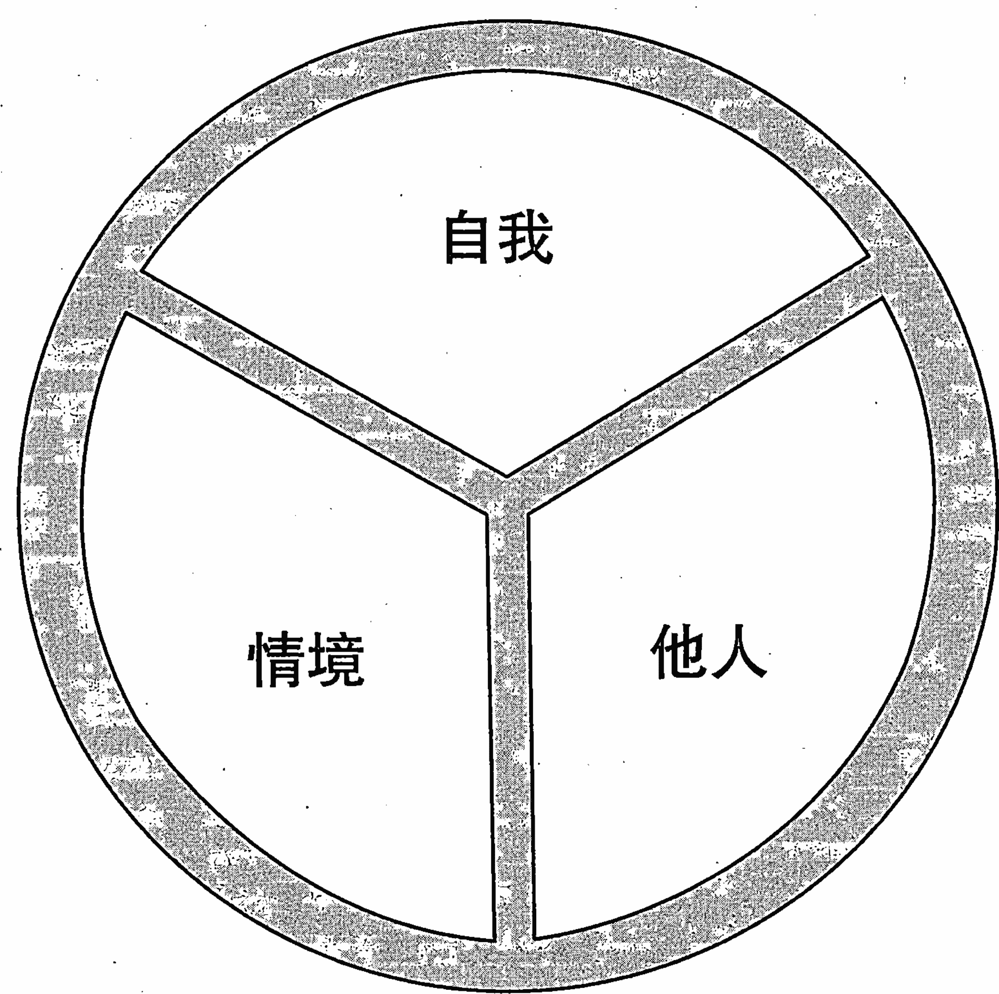

同样，我们也常常会认为别人正掌管着我们的自尊，决定我们的自我价值。而一旦我们接受了自我，也就等于我们承认自己都是有价值的人。这并不意味着我们可以认为自己是完美的，或是我们所有的行为都伟大非凡。事实并非如此。成为更加整合统一的人并不需要将个体本身与他们的行为等同起来。我们的工作是帮助人们进入一个属于他们自己的全新空间，在这里，任何行为都不再仅仅出于对生存的需求，而是折射出人性的光辉。它意味着我们将不再说：“哦，我是多么愚蠢，我怎么可以做这样一件事！”而是说：“嗯，让我来仔细看看自己。也许我可以从所发生的事情中学到些什么。”

在达到这个自我接纳水平之后，我们就可以与他人联结起来。这并不意味着我们会喜欢别人所做的一切，或是每个人都崇敬我们的所作所为。事实上，我们完全可以在考虑了他人和自己双方各自情况的基础之上，对自己做出合适的评价。我们可以描述自己的感受，而不是对自己或他人进行评判。当我们这样做的时候，也就拥有了高度的信任，同时也让许多新的选择机会成为可能。

让我们再思考一下这个例子。一位丈夫下班之后回家，面对的是妻子花费了大量的时间和心血精心准备的晚餐。而当他切开烤肉，说道：“这个肉硬了点。”妻子就立即跑回卧室痛哭了起来。

这个故事向我们展示了丈夫对于烤肉的评价如何激发了妻子的低自尊。妻子将丈夫的评论当做是对她自我价值的宣判，而那些拥有高自尊的人则可以将她的价值感与牛肉的烹饪状态区分开。

萨提亚在她的一首诗里对价值感进行了很好的描述*：

## 我就是我

遍及整个世界，再没有一个人与我如此相似。
我所做的一切都是真实可靠地属于我，因为那是我依靠自己的力量做出的选择。
我拥有关于我的一切，我的身体，我的感觉，我的嘴，我的声音；
以及我所有的行动，不论它们是针对他人还是我自己。我拥有我的幻想，我的梦，我的希望，我的恐惧。
我拥有我所有的胜利和成功，所有的失败和错误。
因为我拥有全部的我，我可以变得与自己如此亲密无间。
通过这样做，我用身体的每一个部分来爱自己，并与自己友好相处。
我知道关于我的某些方面正在困扰着我，而其他一些方面并不为我所了解。
但是只要我友好地爱着自己，我都可以鼓励自己，并且充满希望地寻找解决困境和了解更多自我的方式。
在任何一个时刻，无论我怎样看和听，无论我说或做些什么，也无论我怎样思考和感觉，这些都是真实的我。
之后，如果发现某些我看、听、想和感受的部分已经不再适合，我将抛弃那些不再适应的部分，保留其余，并创造出新的东西来取代我所丢弃的那些。
我可以看、听、感觉、思考、说和做。
我拥有这样的本领，可以生存，可以与他人亲近，可以具有生产力，还可以了解和动员这个世界上除我以外的人和物。
我拥有自己，并因此可以设计和管理自己。
我就是我，而这让我感觉良好。

* 重印得到Celestial Arts Publishing（Millbrae, CA）的许可。

## 重建自尊

接待一位来访者的时候，我们会知觉到来访者已经习得的经验，并基于我们的知觉来构建治疗性问题和干预方案。因此，在运用萨提亚模式时，最初的基本三角关系就成了支撑治疗过程的主要理念构架。过去的经历可能会持续影响到现在，而我们在自己家庭中学到的生存法则，并不总能在我们成年后进入的其他体系中良好地运作。因此，好的治疗必须检验这种代际传承下来的不良模式，从不同的视角（今时今日的角度）来看待它们，并予以转化。因此，萨提亚将大部分的工作重点放在以下两个方面：更新人们的体验，并将他们从童年习得的、受限制或是功能不良的应对模式当中解放出来。

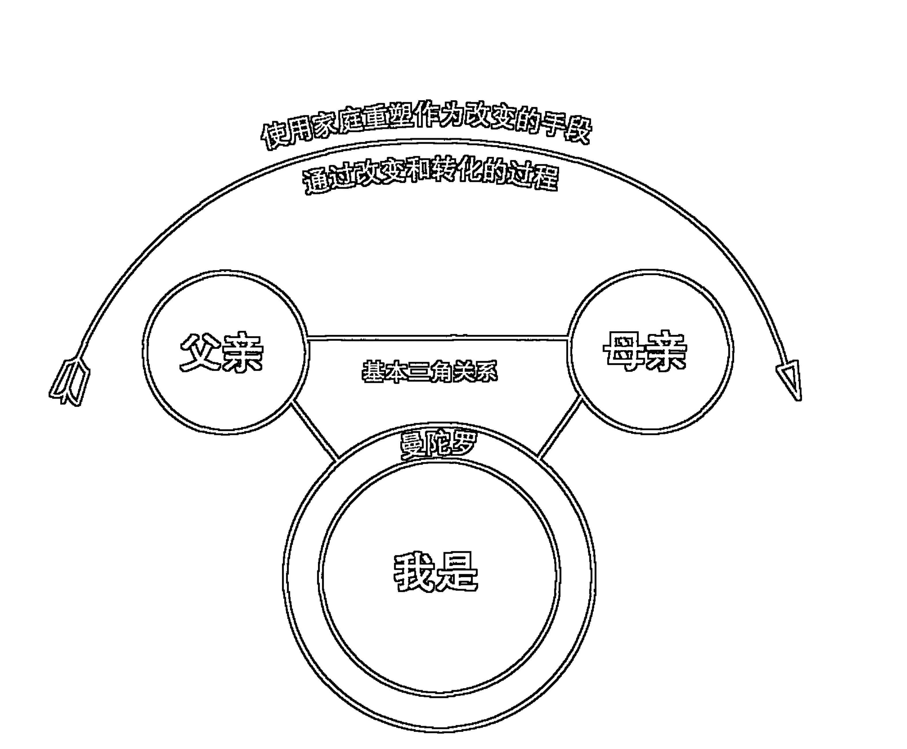

作为外部因素，治疗师是家庭系统发生改变的基本媒介。正因为如此，萨提亚模式最重要的部分就是治疗师如何使用他或她自身。那些能够展现出高自尊的治疗师，往往能够照亮来访者探寻有效应对方式的道路。在接受每个个体独特性的同时，通过承认人类的相似性，以及通过产生特别的意义，帮助来访者强化他们对自我的感知，萨提亚流派的治疗师有效地影响着来访者。

萨提亚常常强调的一种方法，就是针对改变的“添加”概念。绝大部分从功能不良到适应良好的转变，都需要我们在已经存在或知晓的事物当中添加一些新的内容。这一概念在治疗的早期阶段通常十分重要，在来访者的感知这一方面尤其如此。

要想重建高自尊，我们需要让个体经历整个改变和转化的过程。过程是通往改变的唯一道路。过程当中包含了众多层面，从简单的1—2—3序列，到仔细审视发生了什么、怎样发生的，以及对知觉、预期和感受的改变。充分意识并欣赏这一转化过程，是萨提亚方法的核心。

萨提亚坚持认为：无论年龄和所处环境如何，改变——特别是内部的改变，对于每个人来说都是可能发生的。对于那些陷入困境并感到自己毫无希望的人来说，这一理念格外重要。积极的改变，通常会聚焦于人们的预期、知觉和感受，并在此基础上发挥作用。

如果我坚持一个已经无法再实现的期望，例如希望父亲可以在我年幼的时候陪我玩耍，那么这说明我仍旧将自己的注意力放在过去。这不能促进我的成长，或是实现自我完善。

只有放弃这一特定的期望，我才能够将自己的渴望聚焦到今时今日的情境中，并找到实现的方式。同样的方式也适用于处理愤怒或是伤害的情绪：我们可以仔细审视自己心中潜在的期望，并将这些期望加以更新，以此来修通这些感受。

外部的改变同样可能发生，这种改变表现在我们如何对外部事件做出反应。这并不意味着一旦我们有了某种特定的感受，就得立即否定它。我们也许会希望自己从来没有产生过某种特定的感受（“哦，我是多么微不足道！”），但是回避这种感受并不能消除它。

检验我们的外部反应，意味着承认我们的行为反应，而不担忧它们是好的或是坏的。即便那些令人厌恶的事件也具有特殊的价值：它们同样是我们内部资源的一部分。我们只有尊重自己所有的感受，才能够对如何处理它们做出由衷的选择。

换句话说，在如何反应、应对和存在的问题上，我们拥有多种选择。我们选择怎样的应对方式与我们自己的自尊水平息息相关。在低自尊水平下，我们会倾向于认为是某些“原因”决定了我们所能做出的反应。有时候，我们相信是某些事件让我们恼怒，但事实上，我们可选择的反应范围十分宽泛，从极端功能不良的反应，到能够带给我们理想行为和非常积极、富于成长性的精神状态的反应。诱因并不能决定我们的反应。我们不但可以掌控对自己、他人以及我们所处的情境所做出的解释，还可以掌控自己的感受，以及自己对于这些感受的感受。这种能力可以让我们发生重大的转变，不再做环境、他人，或是我们自己的牺牲品，而是被赋予了力量，为自身和情绪担负起完全的责任。我们可以利用自己的内部资源，将自己的生活方式从仅仅维系生存的水平，转变为更好地应对，并最终形成更加健康的机能。

但是为什么我们总也不能让自己过上本应该属于自己的生活呢？萨提亚认为，这是由于我们对熟悉的感觉太过偏爱，而在大部分的内部或外部世界里，又常常会依靠自动化的反应模式。在我们能够改变这种状况之前，需要首先意识到这些自动化的模式。

| 低自尊 | 高自尊 |
| :--- | :--- |
| 我想要被爱 | 我正被自己和他人所爱 |
| 应对姿态：不一致的： 我将做任何事情（讨好） 我要让你感到内疚（责备） 我要从现实中分离出来（超理智） 我要否定现实（打岔） | 应对姿态：一致的： 我会做最适合的事情 我尊重我们的差异性 你我都是整体当中的一部分 我接纳所处的环境 |
| 僵化的 评判性的 | 确证的 充权的 自信的 |
| 消极反应 | 积极响应 |
| 由家庭规则和“应该”所驱使 | 能够意识到多种选择和责任 |
| 通过外部定义 防御 压抑感受 停留在熟悉的环境中 | 接纳自我和他人 信任 诚实 接纳我们的感受、完整性和人性 愿意为不熟悉的事物冒险 |
| 关注过去；希望维持现状 | 关注现在，愿意改变 |

即便是一个看上去微不足道的习惯，当尝试去改变它的时候，大部分人仍然会感到极大的困难。而那些处于意识层面之下的自动化模式就更难改变了。它们是一些相对较小的外部突触，标志着大量隐藏在下面而不可见的，我们对于整个世界的信念和态度。

萨提亚由内而外审视着人们可能的选择：人们对于这个世界的早期经验激发了内部的生存法则，而他们现在仍然依据这些法则来行动。不幸的是，很多观察者常常只关注萨提亚极具特征的雕塑技术，或是对外部行动和改变的演示，而遗漏了萨提亚模式中这个原理。对于那些积极参与的来访者或是来自她演讲听众当中的志愿者，萨提亚会安排他们摆出某些姿势，以此来描绘某种情景。之后，她还会进一步请他们在给定的角色范围内继续保持互动。她拥有数不清的剧本来呈现不同的模式，而这种做法的效果常常是令人难以忘怀的：不论是参与者还是观众，都会逐渐深刻地认识到和重拾他们自己有价值的方面。

萨提亚的演示常常以戏剧作为开场，从根本上帮助人们接触到他们隐藏在认知水平之下的深层渴望。知道认知层面上的改变还不足以转变我们更深层的应对模式，萨提亚广泛地采纳了经验性的模式。对她来说，直接的体验远比某种技术更具效力。而这些实践经验不但改变了萨提亚最初的实践方针，为她的治疗模式和人类发展模式奠定了坚实的基础，也激发了组成她理论体系的大量元素。

在下一章，我们将更加深入地了解人们怎样表现他们的生存应对模式，萨提亚怎样将这些模式描绘为内部和外部姿态，以及我们可以怎样修正自己的旧有模式来实现表里一致的目标。

# 3 生存姿态

上一章当中提到的四种生存姿态全都来自于一种低自尊和不平衡的状态，在这种状态下，人们将属于自己的权利拱手让给他人。而个体之所以会使用这些生存姿态，完全是为了保护他们的自我价值免遭那些言语或非言语的、知觉到或是假定存在的威胁。

新生儿在降临这个世界的时候是处于平衡的状态，并具备发展的潜能。感到疼痛时，我们会哭泣；遇到讨厌的事物时，我们会躲避。作为婴儿，我们会尝试通过各种各样的行为来满足自己的需求。举例来说，微笑也许可以让我们得到关注和宠爱，而哭喊则可以带给我们食物。不久之后，我们就了解到了什么可以带给我们认同，什么则会带来反对。

早在学会说话以前，我们中的大部分人就可以给自己下一个清晰的定义了。我们会通过声音、视觉、触摸、活动，以及人们说话的语音语调来获得信息，并据此对有关自身的含义和信息进行推断。通过这种方式，我们在与家庭成员及其他人沟通时，发展出我们的自我价值感。

沟通可以被定义为人们如何传递信息，如何增进彼此的了解，以及如何做出内部和外部的反应。在辨别内部和外部加工过程、如何掌控现实世界，以及怎样定义自身价值这三个方面，我们的沟通方式是个关键。

尽管我们无法如自己所愿获得所有可以利用的信息，但是在内心里，我们仍然会尽力对自己所看到或听到的一切做出最好的解释。通常，我们对事件的理解与真实发生的事件几乎没有什么相关，因为那些影响我们的人并不需要与我们进行清晰的沟通。从这个角度讲，我们身为婴儿、儿童和成年人时所理解的问题含义，可能并不是说者原本打算表达的意思。结果，我们也许会感受到许多种情感，而这些情感的不断出现和重复，渐渐限制了我们的自我价值感。

让我们来打个比方，当我还是一个婴儿的时候，我父亲失去了他的工作。对此，我的父母都深感焦虑，而他们似乎也改变了对我的态度。事情变得与以往不同了，我得到的关注和宠爱都在减少。基于我的这种感受，我很容易就得出了这样一个结论：要么是我的父母不再爱我了，要么是我做了什么错事。

在发展出言语技能之后，我们就更加容易被周围的人发出的信息所影响。任何一种沟通都包含着两方面的信息：言语方面的和情感方面的，或是说非言语方面的。某个人在做言语陈述时，同时也会自动地表达出包括表情、姿态、皮肤色泽、语音语调，以及呼吸频率在内的多种信息。这些非言语的表达往往反映了人们内心的真实状态。

当人们的言语信息与非言语信息相互矛盾的时候，我们称之为不一致的沟通。这时，我们一方面会在头脑中对可信度产生怀疑，另一方面又迫使自己在两类信息之间做出选择。举例来说，当某人用阴沉忧郁的语调说：“现在，我的朋友，我打算谈一点高兴的事情。”我们所听到的言语信息就与情感信息相冲突了。通过图画的方式，我们可以看到，言语指向一个方向，而情感则指向另一个方向。

究竟哪一种才是真实的信息？又或者这种矛盾意味着什么？要想做出反应，我们需要了解情况，或是做出猜测。

当询问别人感受如何时，我们常常会接收到相互矛盾的信息。“我很好，”他们用抑郁的腔调说。这种不一致极其常见，而当我们还是蹒跚学步的孩子时，我们会同时吸收这两种信息，同样被我们所吸收的，还有那些言明或未言明的掌控沟通方式的家庭法则。

刚开始学习说话的孩子通常会在他们的家庭里度过一段关键时期。在那些具有信息混淆特点的家庭当中，孩子早年的沟通方式会反映出他们在学习过程中的不一致和空白。在任何一个家庭里，孩子所表达的东西都会明显地反映出他（她）在家庭环境当中学到的。所以，父母和他人在为孩子的沟通提供更多信息或是规则的时候，同时也是带着屈辱、尴尬、快乐或是兴奋的情绪在做出反应。这样一些规则的例子包括：

- “我们家的人从来不会在家庭以外讲自己的私事。”
- “我们从来不批评我们的母亲。”
- “如果我们认为别人没有什么可以给予我们的，就不向他们要求什么。”
- “我们从来不展示我们的爱，除非有人做了一件值得大家这么做的事情。”

我们学到的这些规则，会告诉我们什么是可以看和听的，什么是我们应该感受到的，以及什么才是我们可以评论和置疑的。同样，我们也会学到有关改变的规则。当我们还是孩子的时候，这些规则具有生死攸关的重大意义。因此不得不信服和遵从。对于孩子来说，违背这些规则将会让自己陷入对下面这些事物的恐惧之中：不再被爱、被遗弃，或者更极端一些——立即死去。

由于一些家庭规则会危及我们的自我价值，所以当我们遵从它们的时候，常常会发展出一些疾病的生理症状。我们的症状实际上是一些绝望的妥协，它们在一些微小的方面保护我们的自我价值——同时也保护了规则。

就这样，我们会从家庭规则和他人沟通的两面性中进行学习，保护自己能够继续存活。我们发现成人在对我们讲话的时候常常会表现出矛盾的言语和身体信息，这也许让我们体验到一种负面的反应。但是我们必须学会它来保证自己的生存，我们必须取悦他人。当我们感到愤怒时，我们也许会想：“我不能让自己表现出愤怒，因为我的家庭规则不允许这样（好人是不会愤怒的）。我要做一个好人。”就这样，我们说：“我很好。”我们拿出来展示的那一部分只不过是冰山的一角，而大部分真实的自我则隐藏在表面之下。

同样，我们表现出来的也仅仅是我们所知道的一小部分。就像一台电脑，我们的大脑会不断对所有的事件、经历和想法进行归类和解释。为了给我们的经历赋予意义，我们需要将自己遇到的每一条信息加以分类和编码。一些储备的信息常常会因为某些明显或是不明显的原因浮出脑海，但是其中绝大部分都被家庭规则中那些“应该”“不应该”或是“为什么不”所践踏。

作为孩子，我们还会效仿父母的沟通模式。有时我们会去模仿一位不断讨好别人的家长，有时则会模仿不断责备别人的家长。如果两个家长都表现出责备或是讨好的姿态，我们也许会为了得到他们的注意而表现为打岔的姿态。而这之后，社会进一步强化了这些姿态，因为人们常常会将讨好与善良、责备与决断、超理智与客观，以及打岔和自发性相互混淆。

如果我们被这些生存姿态所操纵和控制，那么就不得不在试图获得接纳的同时，隐藏起自己想要与他人联结的强烈渴望。从本质上来说，人类是一种群居动物。而这些生存姿态却命令我们绝不可以让其他人知道自己对于亲密关系的需求。我们在潜意识层面相信，如果没有了其他人的接纳，我们就只有死路一条。

我们的应对过程产生于我们对自己的感受。如果有任何事情影响了我们的生存问题，我们立即就会感到防御。例如，在任何关系当中，如果有什么让我们对彼此间的爱和信任是否真实存在产生了怀疑，那么我们的生存反应就会立即付诸行动。这是因为我们相信其他人正在控制我们的生活，没有他们我们将无法继续活下去，而他们的意见和感受总是能够正确地定义我们自身和我们的价值。

为了表现出（以一种夸张的方式）人们对自我价值的内心感受，萨提亚发展出了沟通姿态的概念。就像刚才提到过的，这四种生存姿态分别是：讨好、责备、超理智，以及打岔。第五种则是表里一致。

## 讨好

当我们感到自己的生存受到威胁的时候，讨好是四种主要的反应方式之一。讨好他人时，我们漠视了自己的价值感受，将我们的权利拱手让给他人，并对所有的事情点头称是。萨提亚用下面这张图表来描绘这种状态，在这张图中，讨好者会对他们在交往中的人和情境予以充分的尊重，但却毫不在意他或她自己的真实感受。

讨好常常以一种令人愉快的面目出现，因此在大部分的文化和家庭中得到高度的接纳。然而，讨好与具有表里一致性的使他人愉快的尝试截然不同。讨好以牺牲自我价值为代价，它否定我们的自尊，并传递给人们这样的信息：我们是不重要的。

讨好的时候，我们常常会有这样的内心独白：

- “我不值一提。我不值得被爱。”
- “我应该永远对别人和颜悦色。”
- “我决不能让别人生气。”
- “我不可以冒犯任何人。”
- “这全是我的错。”

当我们讨好别人时，即便自己感觉不好，也会对别人和颜悦色。我们常常一边掩藏起自己紧咬的牙齿，一边说出令人信服的谎言。讨好者的另一个明显的特征就是忙于平息各种麻烦。只要人们看上去有一点点痛苦，我们都把自己的时间、金钱，甚至生命献给对方，以减少他们的困扰和麻烦。我们会表现得好像自己存在的唯一目的就是解决他们的问题。

除此以外，我们还会坚持为那些出错的事情背负责任。哪怕不得不用放大镜来寻找自己犯错的证据，我们也要承担起全部的责任。例如，“造成你的痛苦完全是我的错，因为我没有一个好母亲。而假如我是在一个不同的母亲身边成长起来的，你就会好过得多 了。”我们会试着用这样的话来平息事态：“哦，对不起，我并不是这个意思。”就这样，我们希望用一种让每个人都满意的方法来取悦别人。

一种典型的讨好姿态是，我们单膝跪地，向上伸出一只手给予，另一只手则紧紧捂住胸口。这一姿势向人们表明：“我愿意为你做任何事情。而如果你看到我正在保护自己的心脏，也许就不会杀死我。”

通常，我们在讨好别人的时候，会表现出这样的姿势或是身体语言：

又或者我们会双膝跪地，一只手撑在地面上，而用另一只手挡开一个迫近的攻击。有时，我们的第二只手环绕在自己颈部，让人们搞不清楚我们是想要求什么东西，还是在保护我们自己。

不论出于上述哪种姿势，我们都会张开嘴巴，气喘吁吁，好像在等待从别人那里落下来的面包屑。我们用高亢的、哀求的声音说话，并且不自然地弓着背，试图减轻这些姿势带来的痛苦和疲劳。这类人的呼吸会表现出又短又浅的特点。因为要想维持上述这些极度脆弱的姿态，都需要消耗巨大的能量和承受极度的焦虑。

摆出这些显而易见的夸张姿势，关键就是要认清我们自己的讨好行为，以及我们对那些讨好自己的人的反应。我们同样还要思考，我们的讨好行为怎样引发他人的可预期反应。最常见的不一致反应，就是想要辱骂或是伤害讨好者。一些人对他们感到轻蔑，另一些人则觉得他们令人作呕。讨好者常会显得非常幼稚和依赖，并且常常激起人们这样的回应：“把你的屁股挪开，不要表现得像一个流鼻涕的白痴一样。”

我们无法有效地讨好那些保持表里一致的个体。从本质上说，每一种生存姿态都需要得到另一类同样表现出不一致沟通的人支持。那些讨好者衷心地对他们的伙伴说：“我要你对我负责！”通常最可能接受这种全能角色的人往往采取责备的生存姿态，这是一种与讨好姿态形成互补的生存姿态。为了感受到“我是重要的”，我们放弃自己的权利，并依赖其他人或事物来定义自身，这是一种不安全也不完善的方式。当通过讨好成功地取悦了一个人时，我们会感到非常满足。而这种感觉会一直持续，直到另一个人开始变得不快。

讨好意味着这样来处理压力，即告诉我们自己，“要想让自己能够活下去并且保持安宁，唯一的方式就是不顾自己的感受，对所有事情表示顺从。”这种态度会导致我们压抑自己的愤怒并代之以生理紊乱。不断讨好别人常常会使我们患上肠胃疾病，特别是溃疡、腹泻、便秘和呕吐。更极端地说，讨好会导致我们通过自我牺牲、自我伤害和自杀来表达自我价值感的完全缺乏。

讨好型的治疗师经常会遇到麻烦。一天中花上8小时或更长时间来取悦病人，很可能已经让他们筋疲力尽。为了缓解这种筋疲力尽的感觉，他们常常会更进一步地讨好，用下班时间来回复其他病人的电话。讨好型的治疗师有时会发展出与病人之间的依赖性关系，并维持数年。他们的自杀率也是异乎寻常的高。这种取悦的行为也可以向我们解释，为什么在服务行业中，产生工作倦怠的个体比例是如此之高。

萨提亚用了超过50年的时间与人们打交道，并发展她的生存姿态或者说应对姿态理论，为了总结她从中得到的观察和发现，我们将用下面这张表格来描述讨好姿态。

### 讨好反应

| 言语 | 情感 | 行为 |
| :--- | :--- | :--- |
| 同意： “这全是我的错。” “没有你我什么也不是。” “我在这儿就是为了让你高兴。” | 乞求： “我很无助。” 恳求的表情和声音 虚弱的身体姿势 | 依赖型的受难者： “好得过分”的行为操守 道歉、请求宽恕、哀诉和乞求 屈服 |
| 内心体验 | 心理影响 | 生理影响 |
| “我觉得自己无足轻重。” “我毫无价值。” | 神经质 抑郁 自杀 | 消化道疾病 肠胃问题，如恶心等 糖尿病 偏头痛 便秘 |

## 责备

责备是一种与讨好截然相反的姿态。责备的姿态用不一致的方式反映了这样一条社会准则，即我们应该维护自己的权利，不接受来自任何人的借口、麻烦或辱骂。我们决不可以表现得“软弱”。

为了保护我们自己，我们不断烦扰和指责其他人或是环境。责备意味着藐视他人，而认为只有自己和情境是需要考虑的。

当责备别人时，我们常常会被形容为敌意、专制、爱找麻烦，或是暴虐的。相对于在讨好姿态中的卑躬屈膝，喜欢责备的我们会大叫大嚷地表达出下面的态度：“我真想把该死的你打到地狱里去。如果不是因为你，我们就不会陷入麻烦。”除了不断地挑剔苛责，我们还倾向于拒绝别人的请求，一有机会，我们就会对别人的提议表示反对。

由于具有爆发性的特点，我们当中那些经常责备他人的人，也会时常断绝自己与其他人的亲密关系。我们将大量时间用于自我惩罚和自我放逐。而当我们渐渐意识到自己的孤独，又常常会酣畅淋漓地大哭，并声称如果不是因为其他人的缘故，我们就会一切都好。由于不肯承认自己的脆弱，我们只有在单独一人时候才能哭泣。我们深深相信，如果将自己的低自尊暴露给别人，我们就会死去。

由责备姿态所带来的极端症状包括强奸、夫妻某一方的家庭暴力，以及其他形式的暴行。在责备别人的过程中，我们认定，在生活中获得成功的唯一方式，就是通过战斗扫清我们前进的道路。

责备的姿态看起来就像是这样：

要雕塑出责备者的身体姿势，我们需要挺直脊背，并用一根挺直的手指指向他人。我们迈出一只脚来达到唬住别人的目的，为了保持身体平衡，我们将另一只手放在腰际。我们皱起眉毛并绷紧脸部肌肉。而我们可怜的背部则忍受着巨大的痛苦，但是只要我们想以这样一种功能不良的方式存活，这种痛苦就无法避免。

责备可以激发他人心中的恐惧。青少年，特别那些处在强调秩序和安静的家庭中的青少年常常会选择这种应对姿态，因为它可以带给他们自主独立的感觉。而我们中的其他人之所以选择责备的姿态，是因为我们相信，只有通过周期性地爆发敌意，才可以让自己过上美满的生活。一些治疗师会表现出“责备者”的风格，因为他们受到的培训常常强调如何寻找错误。

如果一个拥有强大力量来源的人去挑战责备者，他们很容易就会被击垮。尽管责备者在责备别人时常常会有一种控制感，但是这种感觉是虚幻的。肾上腺素快速进入他们的血液中，让他们感到兴奋，但同时也加速了血流，让他们无法获得足够的氧气来供应呼吸。如果这种状况不断持续，责备者就会陷入盲目的暴怒中，并变得对这个世界的其余部分视而不见。发展到极端的情况，责备可能会让人们变成偏执狂和杀人犯。

责备的另一个生理反应特点就是快而浅的呼吸。保持这种姿态时，呼吸往往很浅很薄。人们不得不迅速吸气来保证他们能够大声喊叫。由于肌肉和组织无法得到足够的氧气来满足需求，它们会变得越来越僵硬。慢性的肌肉僵直也是责备带来的一个症状。由于责备者持续地与紧张感作斗争，他们的声音也会变得非常生硬和刺耳。

对于一些治疗师，特别是活跃于60年代的治疗师来说，他们的治疗目的就是让人们表达敌意，这一行为对于那些责备者来说格外容易上手。倾吐愤怒的时候，人们可以听到自己的声音提高，并感受到肾上腺素的分泌，这让他们体验到一股原始的力量。他们因此感到自己还活着。如果治疗仅仅止步于此，那是不充分的，因为它没有帮助人们处理自己的感受。而就像我们在下一章即将见到的，萨提亚的模式超越了仅仅是倾诉感受的方法。

我们所有的行动和语言都是自身生存手段的体现。例如，苛刻的责备显示出我们对帮助的祈求。即便某种应对技术现在已经不再为我们所需要或是具有帮助作用，它仍然因为曾经帮助过我们生存而值得尊重。它代表了我们的自我价值和生存意愿。而不管怎样，治疗师所遇到的最困难的任务之一就是帮助人们深入到这些生存姿态的背后。

### 责备反应

| 言语 | 情感 | 行为 |
|---|---|---|
| 否定： “你从来没做对过一件事。” “你怎么回事？” “这全是你的错。” | 责备： “在这里我是头儿。” 强有力的身体姿势 僵硬紧绷 | 攻击： 评判 命令 寻找错误 |
| 内心体验 | 心理影响 | 生理影响 |
| 孤立： “我是孤独而且不成功的。” | 偏执狂 违法 杀人 | 肌肉紧张和背部问题 血液循环问题和高血压 关节炎 惊恐 哮喘 |

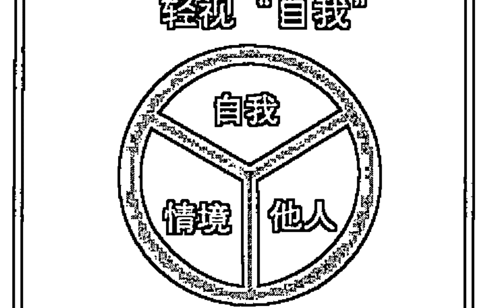

## 超理智

超理智的沟通模式漠视自己和他人的价值。表现得超理智意味着仅仅关注环境背景，并且通常仅限于数据和逻辑水平。

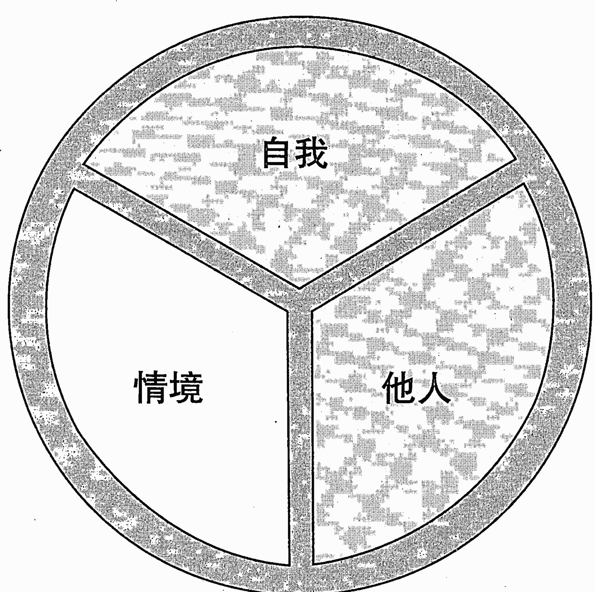

要表现出超理智的姿态，我们需要站得笔挺僵直，毫不动弹，将胳膊放在体侧，或是对称地抱在胸前。由于站得太过僵直，我们很快就会感到严重的背痛。我们的双脚完美地紧贴对齐。总是一本正经的样子，让我们的脸变得毫无表情。当人们与我们交谈时，我们滔滔不绝地发表看似绝对正确的意见，显得明智而善辩。

这种姿态的显著特征就是保持非人性的客观。以这种方式行动时，我们既不允许自己，也不允许其他人关注自己的感受。它同样反映出一个社会准则：成熟意味着不去触碰、不去审视、不去感受也不去抒发我们的情绪感受。

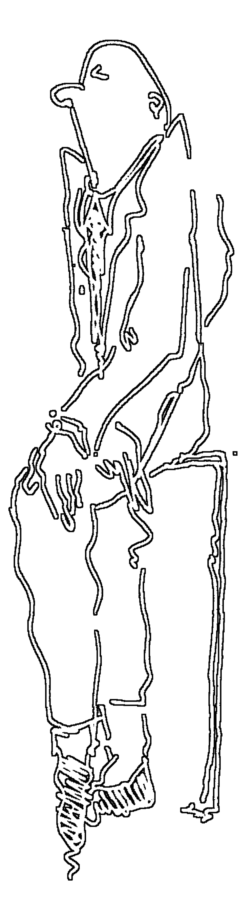

人们常常会混淆超理智和智慧。作为超理智的沟通者，我们无论是说话还是思考都力求尽善尽美，不断运用复杂的术语，琐碎的细节，以及详尽的描述。我们通过变成一个学术上的沙文主义者来获得快感，从不为听众根本不能理解而感到困扰。我们会通过引经据典、罗列数据来支持自己的观点，以这种方式处理矛盾和冲突。我们想要证明自己是永远正确的。

为了达到绝对的客观，我们重新表述别人说过的任何话语，例如将“我今天觉得很冷”这句话重新整合，变成了不牵扯任何个人色彩的语句：“今天天气很冷。”这种做法再一次将注意力从我们的感受转移到了客观环境上。

当表现得超理智时，我们退出人群，承受孤独。人们将我们看做是严厉的、原则性的、令人烦闷的，或是强迫性的个体。在一些极端的例子中，超理智意味着远离社会或是陷入紧张症的状态。

在生理上，超理智限制了我们的腺体分泌，萨提亚常常说，“当表现得超理智时，我们的乳汁、精液、汗水、眼泪和内脏黏液都无法畅快地分泌……这些液体会渐渐干涸。”当表现得超理智时，我们会通过稳定而谨慎的呼吸来维持一个干瘪、单调的声音，就好像我们非常缺少空气供给，不得不尽量节省以维持长久的使用。

某些职业的从业者常常被认为具有超理智的特点。如果家庭本身就鼓励我们采取超理智的态度，那么选择这样的职业只会让我们变得更加计算机化。我们中的很多人，特别是那些步入中年的人，常常沉迷在自己的工作领域当中，这是因为工作中那些未被言明的准则可以让我们舒畅自如地展示自己超理智的本质。然而，我们却很少感觉到内心的舒适和安宁，更不能自由地对自己遇到的任何困境发表评论。

治疗师常常会面临使用这种生存姿态来对待来访者的诱惑。表现出超理智的行动，常常意味着治疗师被那些本该由他们提供给来访者的信息迷住了。而这样做的结果就是失去对任何治疗性洞察和改变的贡献。

### 超理智反应

| 言语 | 情感 | 行为 |
| :--- | :--- | :--- |
| **极度客观：** 经常提到准则和“正确的”事物  抽象的言语和冗长的解释： “一切都是学术的。” “一个人必须有才智。” | **严厉、冷淡：** “一个人必须冷静、镇定——不惜任何代价。”  僵硬的身体姿势  如果要表述，就一定要做到最好 | **独裁主义：** 僵化的、原则性的行为 理性化的行动 操纵的 强迫性的 |
| **内心体验** | **心理影响** | **生理影响** |
| “我感到脆弱和孤立。”  “我不能表现出任何感受。” | 强迫性的 反社会的 社会退缩 紧张症的 | 干燥性疾病，包括黏液、淋巴液以及其他分泌液  干涸  癌症  单核细胞增多症  心脏病  背痛 |

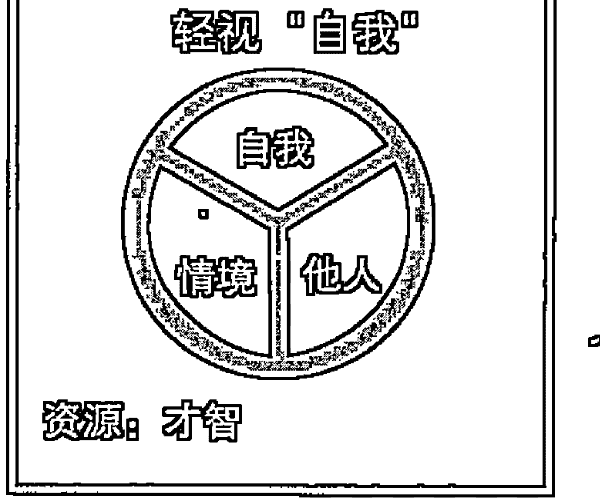

## 打岔

第四种生存姿态被称为打岔，这种姿态常和搞笑或滑稽相混淆。打岔模式是超理智的对立面。与打岔者相比，那些超理智的人通常显得沉默而稳定。

处于打岔姿态的人们似乎一刻也不能保持静止。他们企图将别人的注意力从正在讨论的话题上引开。打岔者不断变换想法，并且希望能够在同一时间做无数的事情。

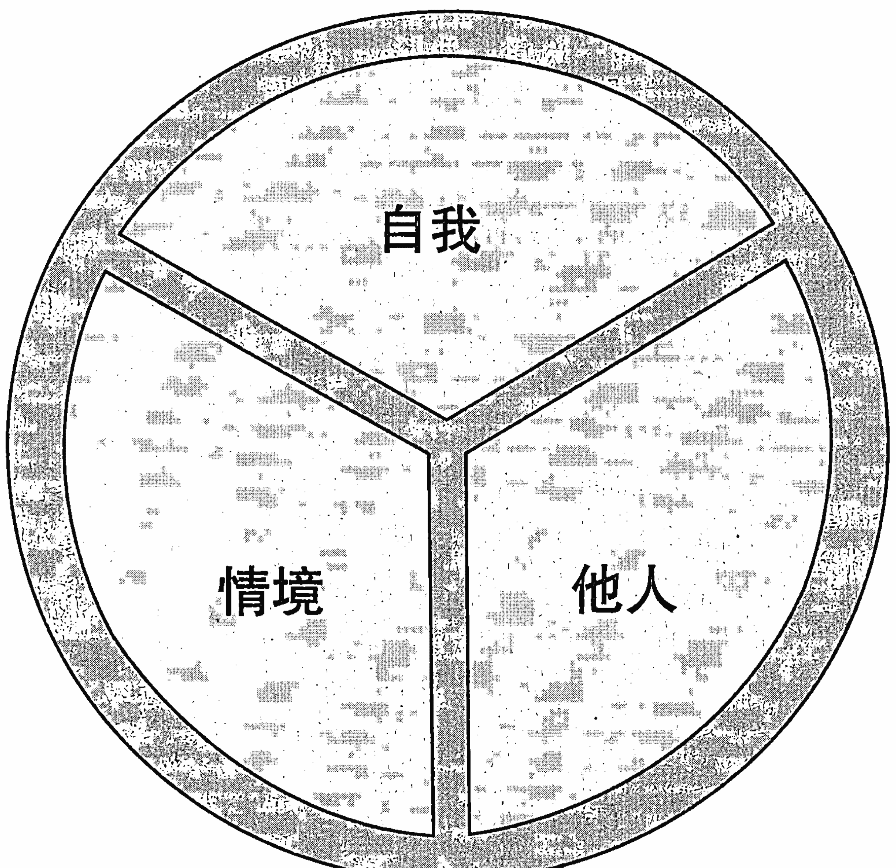

对打岔者来说，自我、他人以及他们互动的环境背景都不具任何价值。

社会会给打岔者贴上自主和快乐的标签。人们常常对他们的出现充满欢喜，因为他们总是可以打破各种绝望的氛围。由于这个理由，许多多动的孩子，或是像校园里的小丑一样的孩子并没有得到帮助，反而被看做是开心果。而时至今日，他们的打岔行为常常是不稳定和无目的的。打岔者相信，只要他们能够将注意力从任何有压力的话题上转移开，就可以生存下去。

他们不能将注意力集中在某一个客体上。例如，当人们问他们现在怎样时，他们也许会谈论高昂的生活费、天气，或是最近的足球比赛结果。在行为举止上，他们同样无法集中注意力，他们会不断移动身体的某些部位，吹口哨、唱歌、眨眼、扯某人的头发，或是坐立不安。

打岔者的一种身体姿态看起来就像这样：

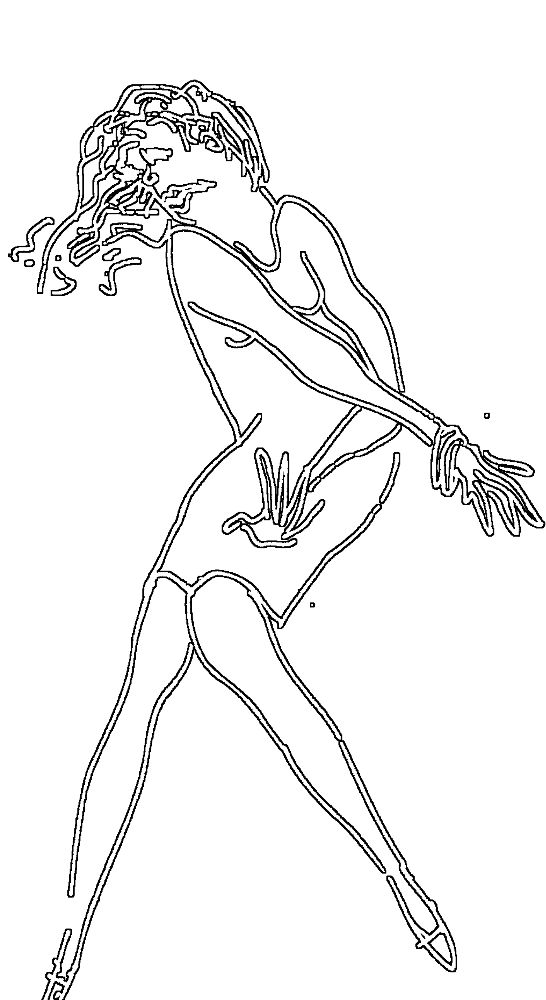

这个人看起来歪歪斜斜。处于一种背部扭曲但仍然站立的姿态，她的两膝相对，两只胳膊和手掌都面向上伸出。她的头竖起来，严重地倒向一侧，两眼凸出，嘴巴张开并扭曲着，脸上很多部位都在抽搐。要想在这种极端不稳定的状态下维持平衡，打岔者必须不断移动。他们的姿态和动作总是显得不合时宜、多动并且毫无目的。

### 打岔反应

| 言语 | 情感 | 行为 |
|---|---|---|
| 无关的： 毫无意义，脱离重点 常常在对话当中离题千里 | 混乱： “我并不真的在这里。” 有持续活动的特点 生硬和松散的身体姿势 | 心烦意乱： 不合时宜的行为 多动 打断别人 |
| 内心体验 | 心理影响 | 生理影响 |
| “没人关心这个。” “没有属于我的地方。” 缺乏平衡 通过打断来获得别人的注意 | 迷茫 不合时宜 精神病 | 中枢神经系统问题 肠胃疾病，恶心等 糖尿病 偏头痛 便秘 |

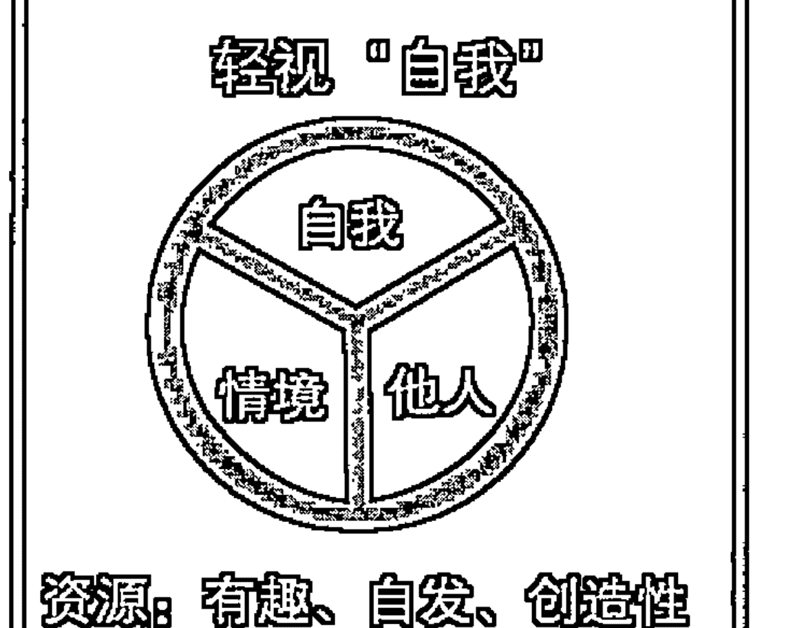

根据萨提亚的观点，习惯于打岔的沟通者往往患有中枢神经系统的疾病。无规则的呼吸进一步加剧了他们不稳定反应的倾向。他们有一种独特的不平衡感。所有这些导致了头晕和震颤的身体反应。一些极端的心理症状表现包括精神病和青春期痴呆。

## 转换姿态

为了缓解长时间维持某种生存态度所带来的痛苦，人们常常会转换他们的生存姿态。而上述四种生存姿态没有一种是健康平衡的。为了缓解讨好别人所带来的痛苦，我们开始责备别人。然后又从责备转变为超理智。如果用身体雕塑的方式展示这种转变，我们可以慢慢将脚趾向内偏转，并试着在全身晃动的情况下保持身体平衡。如果身体运动的幅度足够大，就可以避免自己翻倒在地。这就是对打岔者特征的展示。

我们中的大部分人并不能忍受一直保持同一种姿态。在不同的情境中，我们也许会采用不同的应对风格。例如，如果受到太大的威胁，我们可能会失去理智，变得比我们的对手声音更大。而当我们看到对方气势渐弱，也许会说，“哦，天哪，我做了些什么？”我们也许会因此收敛气势，并试着去安抚他或她。但是这样做的时候，我们也许会对这种软弱感到厌恶，并再一次回到责备的姿态，在我们的模式中开始一个新的循环。

当在压力下沟通时，我们往往会更多地采用某一种姿态。例如，当父亲因为某事责备我们时，我们常常会去讨好他。只要我们仍然在意，那么与父母的关系的重点就会是一方在上，另一方在下，而且这就是为什么情况总是这样。因此，我们常常会觉得被他们打压下去，而他们似乎永远占据我们的上风。

虽然我们中的大部分人被深深禁锢在这些模式当中，但是大多数人并不会在所有时间内都只处于某一种典型的生存姿态。只要有足够的机会出现，不论是内部或外部的机会，都可能激发出我们的另一种应对方式。问题的关键在于，除非我们能够学会如何达到表里一致，否则我们将始终受到某种形式的讨好、责备、超理智或是打岔的生存姿态的限制。

## 生存姿态是怎样发展出来的

每一种沟通姿态都包含着达到完善的种子。讨好当中隐藏着关怀的种子，责备当中隐藏着决断的种子，超理智中有才智的种子，而藏在打岔中的则是创造和变通的种子。我们需要清晰地区分自己的外在行为和内心渴望。当最基本的爱和被爱的渴望受到威胁时，我们也许会去讨好、责备、超理智或是打岔，从而维持一段关系。

第一段让我们每个人努力维持的关系，就是与父母或看护者之间的关系。如果他们不能给予我们足够的温暖和良好的喂养，我们就会失去生命。作为孩子，我们很快就了解到，只有按照别人说的去做，才能够继续生存下去。正是在这段关系背景当中，我们形成了条件化的生存反应。

直到成年，我们中的许多人仍旧沿袭这个不变的生存反应。我们早年的学习具有强大的影响。就像很多案例所展示的，如果威胁—奖赏模式是我们学到的唯一沟通方式，那么我们将无法在成长过程中获得属于自己的力量。如果父母对我们的需求总是会做出延迟的反应，我们也许会认为他们根本不关心我们。这个结论很可能是错误的，但是却会被我们保持多年。

家长们总是怀有良好的意愿，并依据他们学到的东西尽可能做到最好。很多这类学习经验会一代代传承下去。因此，萨提亚的模式采用了跨越祖孙三代的视角。她是这一领域中的先驱者之一。她的改变方法，不只是处理来访者从他或她的父母那里学到的功能不良的方面，也会关注来访者的父母从他们的祖父母那里学到了什么。从而治疗师可以帮助来访者重新评估他们童年时的学习经验，并将这些当做资源加以利用，而不是对他们自身及其家庭的抨击和评判。

萨提亚认为，孩子们希望能够改变父母的生存行为，但是常常失败。孩子们总会觉得自己知道怎样令他们的父母更开心，而且频繁地采取行动将自己的设想变为现实。这种做法总是以评判的风格表现出来，但实际上是出于帮助和关心的目的。

长大成人之后，绝大部分这类孩子会挑选那些与父母有着相同行为的人作为伴侣，并再次尝试改变他们。而在配偶身上的努力失败之后，我们又会尝试让自己的孩子实现这种变化。当我们试图改变他人的努力反复失败后，我们也许会谴责他们：“你辜负了我，我记得你曾说过你爱我。”这反映出我们试图让别人来为我们自己的期望负责。代价就是我们通过其他人的行为来定义自己，最终降低了我们自己的自尊。

造成我们失败命运的，既不是我们的家庭也不是我们的伴侣。相反，我们需要承认他们是有缺点的人类个体。我们每个人都有这样或那样的缺陷，如果我们不能把我们的父母当做普通人来接纳，而是继续指责他们，那么面对威胁情境时，我们将继续使用功能不良的应对模式。

### 使用我们的感觉

否认自己的感觉，是我们取悦父母和忽视自身需求的一部分。我们很少被鼓励去珍惜我们自己的感觉，并创造性地使用它们。我们中的大部分人至今仍然遵循着这样一条禁令：不要感受你皮肤所感觉到的，不要看“不应该”去看的，也不要谈论“不应该”谈论的。

但是人类并非在与世隔绝的环境中生存。我们需要对各种各样的刺激做出反应。而每一个身体反应都会伴随着感受和想法，并形成了一个身体、情绪和智能信息的循环。这个循环从我们的皮肤开始，在皮肤上有几百万个毛孔，这些毛孔有两种功能：接收刺激和释放信息。而我们身体的每一条通道——鼻子、眼睛、耳朵等等——都在以相同的方式运作。如果没有这些通道，我们的神经系统将无法工作：没有任何信息进入或离开我们的身体。

“感觉通道”是这些身体通道的另一个名字。耳朵负责听觉，鼻子掌管嗅觉，而嘴巴控制味觉。我们的感觉通道是传递身体、情绪和智能刺激的感受驿站。抛开营养方面不谈，用母乳喂养婴儿的最好理由，就是这种行为包含充足的感觉刺激。由此，婴儿可以感受到愉悦，并与成人建立起亲密的联系。

感觉通道对我们的生存起着至关重要的作用。我们通过感官接收信息，经过神经系统的体验，然后在大脑中将信息加以转换。我们的感官、神经系统和大脑就像有三个头的司机，掌控着我们的身体。我们希望这三者可以协同工作，彼此了解、接受并重视各自的存在。萨提亚使用了一个泉眼的形象来展示这三者的整合：视线、声音、气味、味道和思想川流不息地进入我们的大脑中，和谐地交融在一起，并且随时可以自由地从我们的嘴里奔腾出来，告诉我们什么正存在于我们的神经系统中。一个自我整合得较好的人，可以完全不受约束地报告出他或她看到、听到、想到，以及感受到的一切。如果没有得到完全的整合，我们可能会忽视或是否认很多感觉通道，并将它们关闭。当然，只要愿意，我们可以合理地关闭任何特殊的感觉通道。只有丧失了对感官的选择控制时，我们才会将自己置于危险的境地。

### 童年时的误解

神经系统会携带着有关身体、情绪和智能的信息流经我们的整个躯体。这一传输系统的各分支部分之间息息相关。例如，当身体的某一处受到伤害，整个神经系统都会意识到疼痛，并且采取措施来平衡这一状况。就这样，神经系统不断引导着信息的流通。

这种情况与人际交往有非常明显的差异。因为在人与人的沟通当中，我们并不总是能如此准确地接收到或是传递出信息。由于自身具有的生存模式的阻碍，孩子和父母常常无法像对方预期的那样了解信息的含义，而是会错误地理解他们接收到的信息。作为孩子，我们时常会误解一些来自父母的信息，特别是当沟通不带有任何解释成分，更像是命令的时候。例如，我们也许会听到“脱下你的裤子。”而不是“我想看看你是不是得了麻疹，所以可不可以脱下裤子让我看一看？”

要想让人们能够准确地察觉到我们真实的意图，我们需要将自己心中的意象与他们分享。只有当沟通的双方共同分享的是一个简单的意义或是理解时，速记形式的沟通和沟通方式才能有效发挥作用。否则一旦我们对自己接收到的信息感到迷惑，就会开始相信自己正在失去控制，或是太过愚蠢。这常常会引发出关于我们生存的问题，正是这些问题导致我们发展出某一种应对模式。

一种我们可以用来处理这种紧张压力的方法，就是证明自己的正确性。我们中所有人都倾向于从生活中选取某些事件经历来巩固自己的信念。通常，我们可以找到一千条经验来证明自己的正确，因为每个人都具备某些过滤功能，让我们只去注意那些与我们对自己和世界的观点相一致的事件。

其实早在生命开始的阶段，我们就开始发展出对自己和世界的观念了。尽管我们中大部分人在18个月到2岁之间才学会说话，但是在2岁之前，我们就已经学到了大量的东西。我们的父母也许会通过言语与我们沟通，但是我们却通过他们的触摸和语气，他们的手和声音来理解他们传达的信息。

这些我们早期学习的主要渠道——触摸和语气——同样可能成为一种功能不良的学习通道。成人们通常不会考虑这些。在学会说话之前，我们会记住成人的言语，随后，我们会将这些言语和感觉体验结合起来。步入成年后，言语通过左脑进入我们的意识，而我们已然忘记了作为婴儿时曾依赖过的语气和触摸。婴儿可能会将父亲强有力的双手或母亲焦虑的言语记忆为威胁性和没有爱心的，而他（她）的父母在发出这些非言语信息的时候却并不带有这样的意图，或是根本没有意识到这些信息的存在。

### 童年时的无助感

除非父母教给我们，否则我们将无法发展出有效的方式来应对威胁。通常，作为成年人的我们会延续在童年时期学会的应对方式。那些在早年被看做威胁的事物将会促使成年的我们对它采取相同的反应方式。不同的情境会对不同的人形成威胁，并引发不同的应对行为。

孩子们会根据父母如何对待他们来发展自己的无助感。成年人常以为如果婴儿不会说话，他们也就不能看、听或思考。然而就像前面提到过的，婴儿在能够开口说话之前就已经学会了很多关于人类的知识。他们同样也了解到了自己在生命发展过程中所处的位置。紧挨着成年人站好，并向前直视，孩子们最先看到的是长辈的膝盖。随着孩子不断成长，他们的视线渐渐与成人的生殖器、腹部，然后是胸部相平齐。在这一阶段的大部分时间里，孩子们必须仰视才能看到父母的脸庞。这进一步强化了反映在支配—服从模式当中低人一等的地位。

在治疗过程中，很多人对自己父母的描述很不准确。这是因为他们的影像形成于童年时受局限的视角，并且直到现在从未更新。

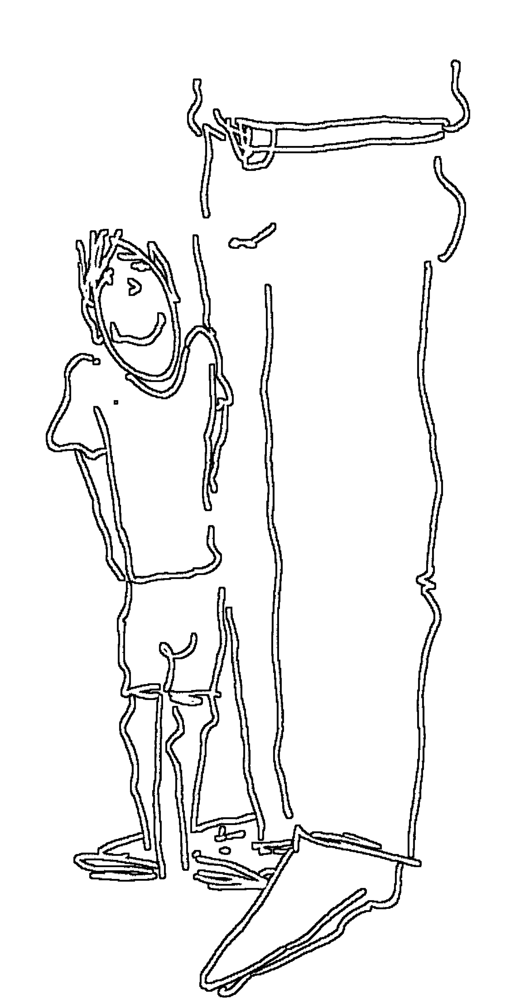

### 学会评判

当成人对孩子的需求、快乐和好奇心表现得无动于衷时，孩子们常常会备受打击并感到无能为力。他们对此可能做出的选择包括抵制这些强有力的威胁或是顺从他们。而实际上，并没有人真的打算这样来伤害我们。不管怎样，孩子们从父母那里学会责备和评判。成年人常常用手指指着儿童的鼻子警告他们，并试着教会他们，他们的坏行为意味着什么。父母伸出的手指，显示出了他们对于儿童的异常行为感到多么绝望。

通常孩子们并没有认真听取成人对他们的教育，然而他们学会了被责备的感觉是怎样的。这种学习经验达到这样的程度，以致他们在没有受到批评时也会感受到责备。面对责备，功能不良的应对方式包括躲开那根指向自己的手指，或是忽视它。

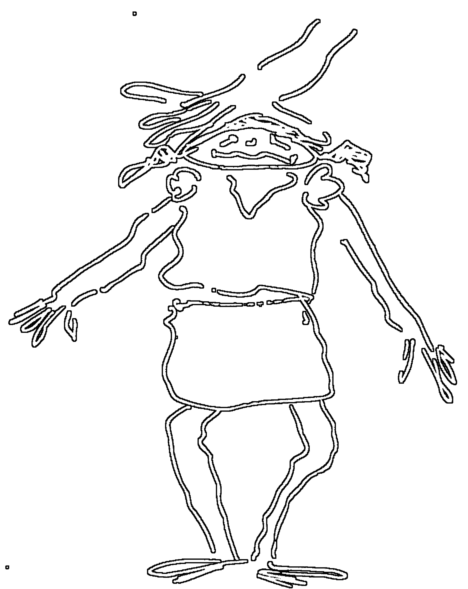

另一个让儿童感到无能为力的例子就是抚拍头部。一些人由于孩童时的体验，至今仍然不能容忍别人拍自己的头。头部是一个非常脆弱的部位，而一些成人在拍孩子头部的时候如此用力，从没想过这会是怎样一种感受。对于孩子来说，被人拍头部可能并不是爱和赞同的表现，而更像是贬低和轻蔑。

### 混淆的信息

即便感到无能为力，我们仍然可以获得一些信息，让自己通过体验到责任、顺从、成就和职责的感觉来证实自己的有生力量。而对于那些没有感觉到任何个人力量的孩子来说，这些无疑都是沉重的负担。由于这种矛盾的信息，我们发展出了对自己的令人沮丧的看法。过去由成人无意识地通过爱无所教会的东西，进一步强化了我们对自己的分裂的期望。

要想达到表里一致的沟通，我们的爱必须发自对人类自我价值感的尊重。如果家长决定成为他们孩子生活的中心，并放弃一切来和他们在一起，结果可能会导致一种情感上的窒息状态。那些被封闭着，每天接收这种混合信息的孩子需要非常努力才能说出：“我爱你，妈妈，爸爸。”由于被不一致的沟通所包围，对他们来说，爱和亲密感变得等同于错误。这种情境同样会导致低自尊。

### 生存姿态如何保护我们

我们的大部分沟通都是在努力保护我们自己。在学龄前，我们就通过人际互动和阐释学会了这些沟通方式，尽管没有人有意让这些互动和阐释发生。这些具有生存意义的沟通方式，是在不了解任何其他生存方式的基础之上形成的。很多人会告诉我们，袒露感受会使自己陷入被攻击的危险。而不幸的是，不能表现自己的任何感觉，同样也暴露了他们可能存在的健康问题。

人类的身体总是力图维持某种平衡。问题在于，在这一过程中是否有某种事物一直在承受痛苦。一个胖子和一个瘦子同样可以在跷跷板上维持平衡，只要胖子更移向中点，而瘦子移向尾端。这样，当他们一上一下地进行游戏时，胖子的上下位移较小，而瘦子则产生巨大的起伏。而这实际上是一种不稳定的交易。

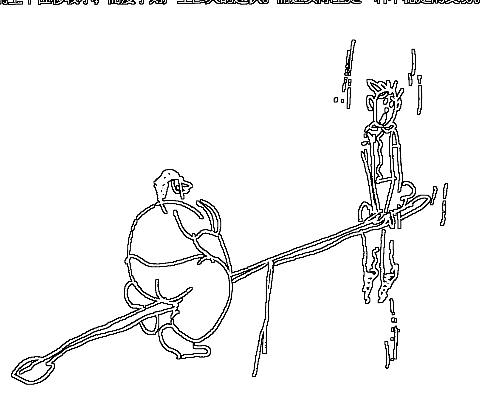

处于自我表达和自我压抑之间的生存姿态，也像是一种不安全的平衡。自我表达指向完善的健康目标。我们的准则和信念——那些“应该”和“不应该”却通过限制自己的感觉和言语起着反作用。

这些限制之一，就是我们必须去看和听那些“应该”存在，而不是实际上存在的事物。我们同样也约束自己不去争取我们想要得到的，不要代表自己去冒险，不要说我们想到和感受到的，而是说我们认为自己应该说的。体验我们所体验到的，这是一种自由，而体验我们“应该”体验到的，则变成了一种强迫。

“我不能感受我所感受到的”同样是一个基本的限制，它是对我们感受并表达自己的所有限制和规则的基础。我们从这里开始了自我谴责。这种限制可能起源于我们还处于襁褓之中的时候。之后，它以四种生存姿态的形式出现，所有这些姿态都传达了另一条自我诅咒的预言：“我无法成为自己的决策者。”

萨提亚的“五种自由”表达了积极利用我们自身的资源，创造性地进行选择的机会和可能性：

## 五种自由

- 自由地去看和听存在于这里的一切，而不是那些应该存在、过去存在或是将要存在的；
- 自由地去表达你的感受和想法，而不是表达那些你应该表达的；
- 自由地去感受你所感受到的，而不是感受那些你应该感受的；
- 自由地去要求你想要的，而不是永远等待许可；
- 自由地代表自己去冒险，而不是仅仅选择“安全”和不捣乱。

沟通方式只是我们过去生活经验的冰山一角，而这是一个充满了可怕认定、自动化和习惯化的过去。我们需要帮助人们开始意识到有这样一个领域，在这个领域内，从很久以前，他们就将自我放在了自动驾驶的位置上。如果代表自己的意愿去尝试冒险，也许可以帮助我们重新建构起自由。但是我们常常会乐于在不自由的状态下，让他人来为我们做出决策和指出方向。因为这样可以让我们感受到更多的稳定和安全。正是这种压力使大多数的人禁锢在他们的生存姿态当中，而不再对此进行思考。

在某种程度上，我们也许愿意通过其他方式来让自己感到舒适。毒品、酒精、疾病以及循规蹈矩都属于功能不良的应对方式。它们是为了寻求某种解脱和关注而做出的努力。我们当中很多人转而寻求上述这些方式或是类似的外部满足，以此来迎合我们未实现的需求和企盼。

不可思议的想法和逃避式的幻想，就是我们用来满足这些需求的其他方式。我们设想如果离开我们的家庭、工作或社会，事情就会变得美好了：“如果我可以找到另外一个人，生活就会变好了。”或者“如果我可以进入另一个环境，生活就会改善。绝对有一个地方可以让生活变得更好。”

出走的青少年已经不只限于幻想了。他们中很多人离家去寻求那些他们自己也不知道是什么的东西。很多丈夫和妻子也彼此逃离：他们花大量的时间在工作上，并尽可能少地待在一起。他们将工作变成了另一种逃避的方式。

那些应对方式存在问题的人，常常会因为缺乏自我价值感而遇到困难。而他们认为是不幸的根源的问题通常并不是关键所在。相反，如何应对才是最困难的地方。

萨提亚将家庭成员的症状看做是成长的努力和一种警示信号：“我活不下去了。”表达这种生存呼声的另一方式是：“我感觉不到自己是一个有价值的、拥有爱的人。”

循着这些线索，治疗师常常可以看到愤怒、惩罚性的父亲与他们处于青春期的儿子一同走进治疗室。儿子同样具有惩罚性和报复心。我们将着重关注这些人各自的失望、疏远、脆弱以及不被爱的感受。相对于处理那些有关报复的话题，我们更应该探讨如何帮助他们了解彼此的感受，并在此基础上搭建相互沟通的桥梁。尽管不能很快构建起来访者的自尊，但是我们仍然需要将注意重点放在有助于他们构建自尊的方面，而要做到这一点，就必须认真审视每一个人的真实意图，而不是他们所表现出的反应性行为。

第五章将探讨上述这一点，以及将我们的生存姿态转变为表里一致的沟通模式的其他方面，同时详尽地讨论表里一致这一概念的细节。

#### 表里一致

上一章讨论了四种生存姿态，所有这些都是低自尊应对方式的表现。在这一章中，我们将阐述“第五种姿态”——表里一致。确切的说，它并不是另一种姿态，而是一种完满的状态，是我们决定成为更加完善的个体的选择。在本书余下的大部分内容当中，我们将重点描述为了使人们达到这一状态，萨提亚所运用的手段和方法。

表里一致是萨提亚模式中众多基本理论构念之一。它既是一种存在状态，也是一种与自我和他人进行沟通的方式。高自尊和表里一致，是检测个体是否具有更加完善的机能的两项重要指标。表里一致具有如下特点：

- 一种对自我独特性的欣赏
- 一种自由流动于自身内部和人际之间的能量
- 是对个性的主张
- 一种乐于相信自己和他人的意愿
- 愿意承担风险，并处于易受攻击的位置
- 能够利用自身具有的内部和外部资源
- 能对亲密关系保持开放的态度
- 拥有能够成为真实的自己，并且接纳他人的自由
- 爱自己也爱他人
- 面对改变，具有开放和灵活的态度

萨提亚用下面这张图表来展示表里一致，在图中，自我、他人和情境全都得到了应有的尊重。

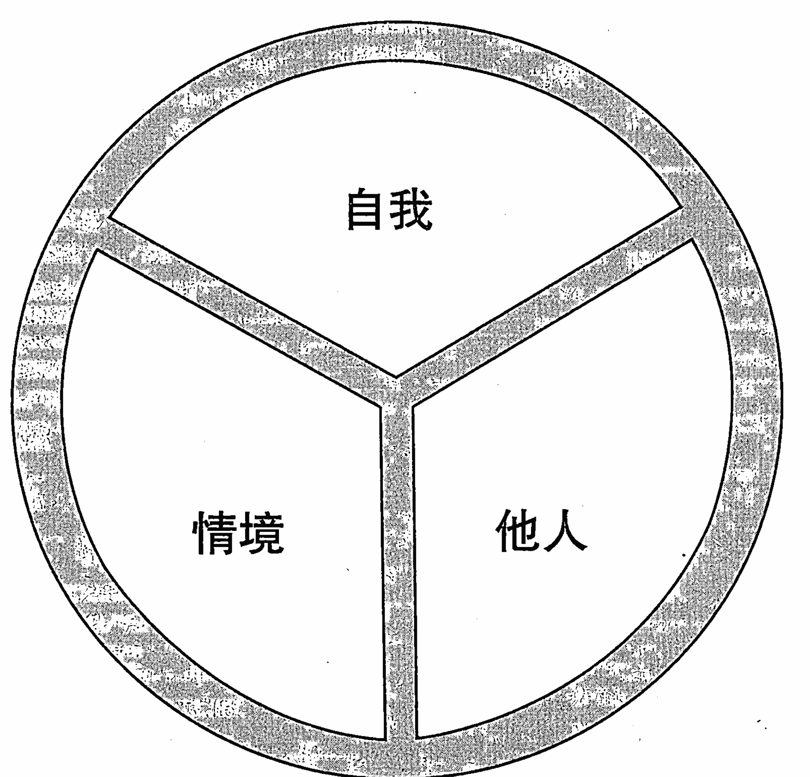

当我们决定做出一致性反应的时候，我们想到的不是去赢得某场胜利；不是去控制他人或情境；不是保卫我们自己，或忽视他人的存在。选择的一致性意味着我们选择成为真实的自己，选择与他人进行接触沟通，并与他们建立直接的联系。我们希望能够站在一个既考虑自己，又关心他人，同时也充分意识到当前情境的角度上，对问题做出反应。这一目标并不意味着一直开心没有烦恼，也不意味着在任何情境中都表现得礼貌得体。

### 表里一致的几个层次

通过我们遍布全世界的培训项目，我们已经发现表里一致拥有三个不同层次。萨提亚在20世纪50年代所做的工作着重于我们所称的第一层次；到了60年代，她开始强调第二层次；而在80年代，她花了越来越多的时间对表里一致的第三层次进行概念化和探讨。下面这张图向我们展示了表里一致的不同层次。

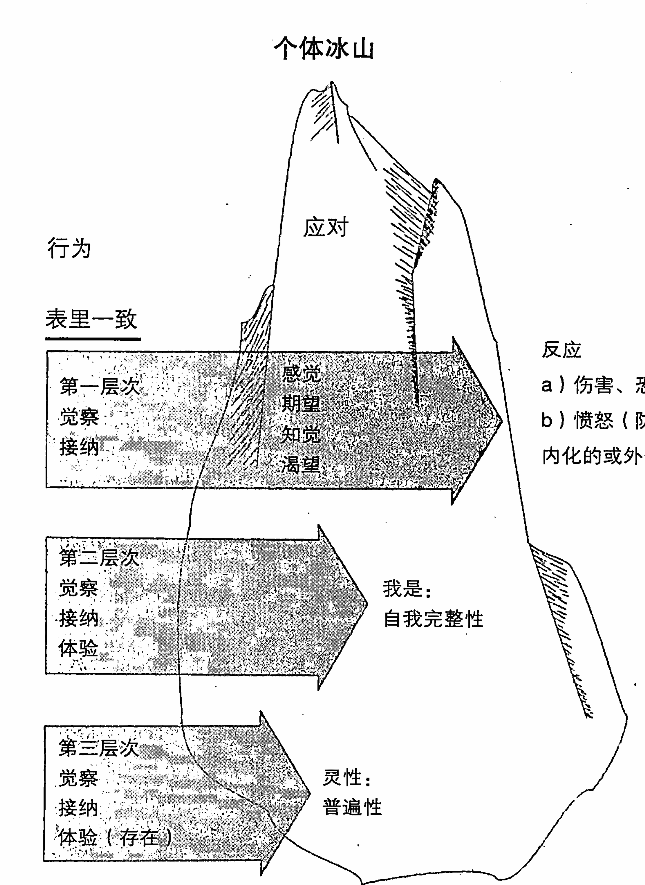

当处于第一层次时，我们既可以意识到自己的感受，也能够理解和接纳它们。它们是属于我们自己的，我们愿意在不带任何否定或是投射成分的基础上加工和处理它们。我们以诚实的态度面对自己的感受，让它们毫无阻力地产生和流淌。我们知道这些感受就像是一把双刃剑：一方面，我们可以利用它们为自己带来更多痛苦或欢乐，另一方面，如果愿意，我们也可以自由地与他人分享自己的感觉。

萨提亚模式对治疗界最主要的贡献，就是向我们展示了如何在第一层次帮助来访者增进表里一致性。人们不但可以学习如何用健康有益的方式来管理他们的情绪，还学会了享受存在于我们人性当中的许多积极感受。

表里一致的第二层次以更加戏剧化的方式对我们的生活产生影响。第二层次是一种注重内心感受的圆满状态。它将注意的重点放在更深层也更内在的自我上。处于这一层次的人们通过和谐、积极的方式来展示他们的高自尊，同时也能够与自己、他人及情境和平共处。

#### 表里一致

| 第一层次：感受 | 觉察、承认、拥有、管理、享受 | 高自尊 |
| :--- | :--- | :--- |
| **第二层次：自我（“我是”）** | 中心化、完整、和谐 | 高自尊 |
| **第三层次：生命力量** | 普遍性、灵性 | 高自尊 |

第三层次进入了普遍性和灵性的领域。在萨提亚的晚年，她发现这些方面对于成为更加完满的人越来越重要。《新家庭如何塑造人》（*The New Peoplemaking*）一书在萨提亚逝世之前刚刚问世，在这本书中，萨提亚花了整整一章来描述对灵性的探索的重要意义。而在其他方面，她也鼓励我们去体验和意识一种普遍存在的生命力量，正是这种力量创造、支撑和促进了人类和其他生命形式的成长。

### 表里一致的沟通

除了作为一种生存状态，表里一致还是一种传递信息的方式。在沟通过程中，我们至少拥有三种选择：

- 使用不一致的言语和一致性的情感
- 使用一致性的言语和不一致的情感
- 使用一致性的言语和一致性的情感

情感包括声音特征、面部表情、身体姿势、手势、肌肉颤动、皮肤色泽和呼吸等方面。萨提亚发现并且常常指出，在大部分互动过程当中，非言语沟通往往可以提供一半以上的信息。多年来萨提亚不断强调治疗过程中的非言语方面，并鼓励治疗师对自己和来访者的情感状态给予特别的关注。对萨提亚来说，让那些运用她的治疗模式的咨询师变得更具表里一致性，并且能够觉察到自身的不一致，是一件非常重要的事情。

随着电视录像带的普及，萨提亚率先将使用它们来帮助人们了解自己在言语和非言语方面的差异。举例来说，如果一张面孔在微笑的同时却伴随着高度的焦虑，这无疑暴露出了个体对自己这种混乱的信息缺乏觉察。通过观看录像带这样一种动态的方式，人们可以对自己不一致的方面获得自我觉察。

另一种理解表里一致及其本质的方式，就是分别将言语和非言语信息想象为不同走向的箭头。具有方向性的沟通可以通过下面这些图来表示：

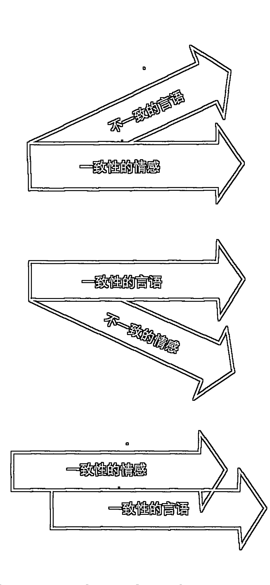

当言语指向某个方向，而情感指向另一个方向时，我们就得到了一种双重信息。这种沟通无疑处于不一致的形式。例如，如果某人说：“我感觉好极了，”同时他摇动的头部却在说“不”，那么他内心的加工过程可能是：“我的身体告诉我感觉不好，但是现在我应该说自己感觉很好。”

身体反应通常携带着即时的信息，而言语则会传递一些过去的信息，这种信息通常建立在家庭规则的基础之上。这两类信息可能都是正确的，但是来自不同的地方，甚至可能来自不同的时期。因此它们可能看起来是不一致的。

言语来自人类大脑的左半球，并且与我们的生存法则、防御方式和那些“应该”式的命令紧密相连。即便知道这些生存法则已经不能很好地为他们服务，低自尊的个体也常常会坚持使用这些古老的法则。而对于他们当中很多人而言，这一法则的内容就是不要告诉别人自己的感受。因此他们常常会一边说“我很好”，一边忍受着真实的痛苦感受。

言语表达是我们意识的一部分，并且可以反映出我们的过去、现在和未来。另一方面，情感则常常反映了我们的现在。非言语表达来自大脑的右半球，与我们每时每刻体验到的感受和知觉息息相关。言语和非言语水平上的沟通差异由此显现了出来。这两个层面上的沟通虽然都给出了真实的信息，但却并不完整。在我们努力维系生存的努力下，讨好、责备、超理智和打岔这些生存姿态，无一不是在试图帮助我们应对自己、他人和情境。我们试着更完整地表达自己，最终却只是传达出相互矛盾的信息。

同样真实的情况发生在那些日光浴者身上。他们会笑逐颜开地谈论生活有多么糟糕。他们的微笑发自此时右脑体验到的由阳光带来的欢畅的信息，而言语描述的主题则与过去的惨痛经历相联系。

治疗的目标之一就是帮助人们意识到自己的矛盾之处，并以此为起点，让他们开始朝着表里一致方向迈进的旅程。这同样也是成长过程当中的目标。不一致的信息代表着某种形式的否认、投射或是忽视。而不一致的行为则表达了当我们自己身处一段危如累卵的关系当中时，对于生存的需要。不一致的存在，仅仅表明我们缺乏觉察，并不表明我们缺乏意愿。

我们的身体提供的信号可以帮助我们觉察到自己传达的信息。如果我们说自己感觉良好，但是身体却感到紧张和僵直，就表明我们正在表达一种双重信息。留意这种紧绷感是明智的举动，正是它指出了不平衡的状态。这种不平衡可能来自我们的家庭规则，这一规则要求我们即便在别人踩到我们的脚趾，或是自己刚刚撞得头破血流时，仍然要表现得温和而优雅。

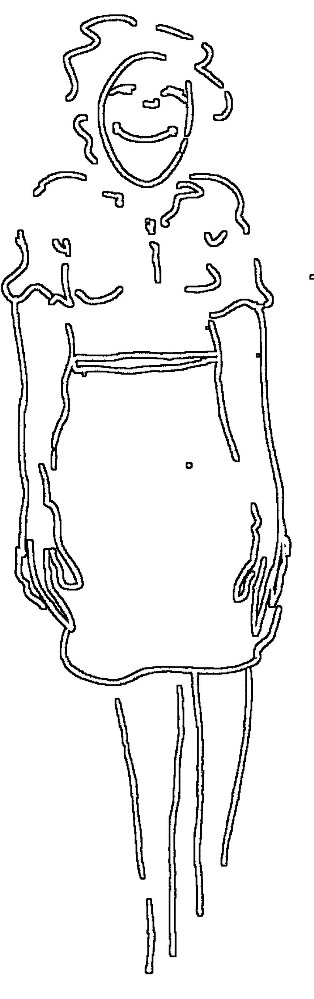

就像前面展示过的，当言语和情感都指向同一方向的时候，来自两个水平的信息就表达了相同的意义。例如，当一个女人说“我很快乐”时，她的声音显得心满意足，而她的身体动作、皮肤色泽、眼神，以及其他非言语表达都支持她的言语，那么她就是在用一种表里一致的方式进行沟通。类似的，当她说自己感到失望时，她的声音听起来充满悲伤，而她的身体动作、皮肤色泽、眼神和其他非言语表达都支持了她的言语，那么她同样是在以一种表里一致的方式进行沟通。

以表里一致的方式进行反应是一种选择。它不是另一种规则，或是某种控制周围环境的方式。在意识水平上做出这种选择，需要我们充分地觉察、了解和接纳自我、他人以及情境，并为自己负责。在与他人进行沟通的时候，我们常常会发现自己试图传递的信息并不是别人所接收到的。导致这一问题的根源就是我们的言语和情感之间的差异。下面的图表将对表里一致反应进行概括和总结。

#### 表里一致反应

| 言语 | 情感 | 行为 |
| :--- | :--- | :--- |
| **现实：** 言语与身体姿势、语调以及内心感受相匹配。 言语体现出对于感受的觉察。 | **与言语一致：** 表达的流动 | 生动的 创造性的 独特的 有能力的 |
| **内心体验** | **心理影响** | **生理影响** |
| 和谐 平衡 高自我价值 | 健康 | 良好的健康 |

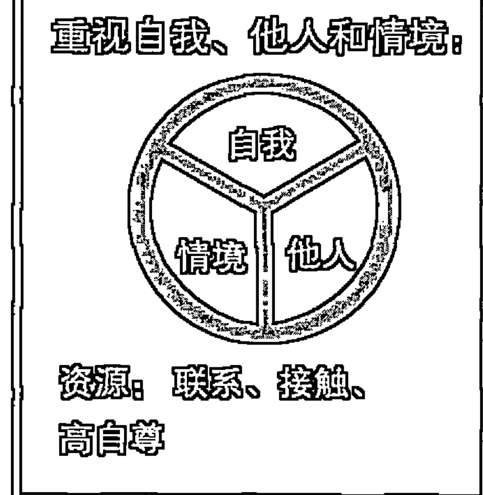

要想评估个体当前的应对模式与表里一致之间存在的距离，我们可以考虑以下八个要点。萨提亚认为，只有当个体做到以下八点时，才能表现出表里一致：

1. 直接回答问题而不是首先回问“为什么你想知道这个？”
2. 展示出某种程度的性活力。
3. 提出自己具体的需求，而不是给出冗长的原理。
4. 诚实地说“是”或“不”（做出诚实的选择）。
5. “戴上侦探帽”来检验那些评论、想法、行为和情景，而不是先入为主地形成评判。
6. 在打消所有恐惧之前，就能够按照自己的意愿进行尝试和冒险。
7. 不断对生活提出疑问，对于任何新的可能性保持开放的态度，并且不要在新情况发生之前，就假装自己已经掌握了全部的答案。
8. 在面对任何新的可能性、选择，以及解决方式的时候，听从自己的直觉或“智慧盒”的意见，并在所有制定决策的情境中充分考虑这些。

### 向表里一致的目标努力

帮助一名来访者建立表里一致性并不是问题解决式的方法。问题解决式的方法关注内容，并暗示和预期由治疗师来帮助来访者解决他们的问题。相反，建立表里一致性是一种以过程为导向的方法，它关注来访者想要学习和改变什么。这反映了萨提亚发展模式对于世界，对于人类自身所给予的接纳。同时，这种方法还会帮助来访者进入自己的内部资源，并找回选择的权利。

在这个过程中，了解和接纳来访者的感受，通常是我们使这个个体燃起希望的开始。这种希望可以帮助来访者走上治疗性改变的未知旅程。在治疗当中，如果一个人表现出在言语和感觉上存在差异，那么治疗的任务就是首先去探索，究竟是什么阻止了言语和非言语信息达成一致，然后再消除这一差异。

在萨提亚模式中，表里一致的实质并不是让我们在两种信息中选择一方，丢弃另一方。

事实上，萨提亚将那些不一致沟通者的知觉看做是不能与自身达成和谐的结果。要构建表里一致性，我们需要改变自己的解释风格，然后在自我水平（“我是谁”）上巩固我们的自尊。我们需要教会自己，同时也教会来访者如何均匀地呼吸；如何通过深入内心世界，进行某些自我确认，从而确立自己的中心位置；以及如何通过接纳情境、他人和我们自己，来使自己保持在当前时刻。

否则，当我们对某个情景做出反应时，我们的感受和内部解释常常会带出过去的经验痕迹。任何一种储存在我们内心的伤害、恐惧或愤怒的感受，都可能会被我们当前遇到的情景所触发。早期的习得、经历、感受以及应对模式全都在我们的神经系统当中得到了分类、编码和储存。所以，当我们因为一句对话、一段感情、一缕声音、一幅图画、一种味道或气味而感到胃部刺痛时，我们常常是在用早期应对方式对它做出反应。

就像是萨提亚展示过的，我们需要在体验到威胁的时候，仍然能够保持自我价值感的完整性。幼年时，我们学到的是因果律的概念，它指的是个体A的反应引发或是合理化了个体B的反应。而萨提亚的观点认为，我们有权利去选择如何行动，如何做出反应，并对自己的选择承担责任。

只有对于自身内部存在的想法、感受、身体信息以及从经验中得到的含义予以充分的觉察，我们才能够在此基础上建立表里一致性。长久以来，我们学到的都是如何以不一致的方式维系生存，而要学会表里一致的方式，就需要重新评估自己，重新倾听自己内心的声音，需要能够在任何一个时刻衡量我们的自我价值，并且能够从支配—服从模式转变为萨提亚的发展模式。

通过回顾萨提亚的这一“添加”理论，我们现在可以通过四种生存姿态的形式来审视表里一致的概念。例如，给讨好者增加一些自我关怀的资源，就可以让他们恰当地关怀自己和他人。同样的，如果能够为责备者增加一些对他人的肯定，就可以同时达到表里一致和自信的效果。

处于超理智姿态的人需要增加一些对于自己和他人的承认，该个体的智能资源可以帮助他（她）表现出表里一致性。而对于那些处于打岔姿态的人来说，包括自我、他人和情境在内的所有方面都需要得到很好的接纳和整合。这样个体才能够利用自身的创造力、玩笑，以及恰当的幽默感来实现表里一致的目标。

如果要描述表里一致的“姿态”，那就是用自己的双脚站立在地面上，通过自身的力量支持身体。身体表现出平衡、协调、灵活和活跃的特点。表里一致不但是一种开放的沟通方式，更是一种力量的体现，一种存在的状态。

我们的身体需要不断对此进行练习。到目前为止，我们每个人都已经经历过数以千计的体验。基于这些体验，我们的大部分行动已然变成了一种自动化的过程。当我们开始重新聆听自己时，也就等于重新检验我们的自动化模式。仅仅理解和思考这些常常是不够充分的，练习很重要。只要我们给自己一个机会，再次有意识地去看、去听，我们就可以找到自己所有过去的影像，过去的应对方式，以及所有过去熟悉的感觉。

### 努力实现表里一致的沟通

我们常常会在其他人那里发现自身内部加工过程当中一些未完成的事物。特别是在长期的关系中，我们常常希望自己的伴侣可以改变他们现有的不一致的生活方式，从而我们的感觉会更好。实际上，我们之所以对别人的改变寄予希望，是因为这可以让我们免于处理自身功能不良的应对风格。

幸运的是，即便需要对那些沟通方式不一致的人做出反应，我们仍然可以发展出有意识的、表里一致的生存方式。虽然我们通常倾向于本能地对他人做出反应，但不管怎样，我们总还是拥有一致的反应作为选择。在实践过程中，这通常看起来很难，但却是可能实现的。同样，其他人所说的话语并不能决定我们的一切，除非我们允许他们这样做。

当我们达到表里一致的状态时，情绪的扳机也就失去了它们的火力，而我们也就摆脱了作为过去经历受害者的命运。一旦承认并接纳了我们的经历，我们的过去和现在，我们也就脱离了“自动驾驶”的状态，不再依赖和使用那些在生命中其他时期形成的规则和功能不良的姿态生活下去。同样，我们也不会再故意尝试去忽视、否认或者重新命名那些过去的经历和体验。

为了帮助人们进行表里一致的沟通，萨提亚发展出了一些指示：

1. 要能够意识到自我、他人和情境。
2. 在和其他人相联系的时候，给予他们完全的注意。
3. 要意识到他们的身体信息。例如，萨提亚将一些生存姿态概念化，并用表演展示，从而人们可以识别并开始觉察到他们的身体，以及他们的身体信息。
4. 要充分意识到他们的防御机制和他们的家庭准则。

下面的这些步骤也展示在附图中。

1. 关注自我
   a. 留意身体信号
   b. 通过呼吸保持冷静
   c. 巩固自我价值
   d. 建立自己的中心位置，并具有洞察意识
2. 创造接触
   a. 审视和倾听
   b. 留意身体信号
   c. 表现出尊重
   d. 接纳并信任

## 3. 在情境中改变
- a. 将“问题”转变为应对方式
- b. 处理感受
- c. 重构期望和知觉
- d. 增加机会和可能性

4. 将自我、他人和情境，以及多种体验水平，与最新的现状进行转换和整合。

## 第一层次的工作

表里一致的第一层次主要关注与我们的感受保持接触，接纳它们，向别人承认它们，以及对它们进行处理。所以，如果一个来访者感到愤怒、受伤害，或是同时有这两种感觉，要鼓励他去承认并接纳这种感觉，并依据它们来行动。他也许会说：“我很愤怒，因此在讨论这个话题之前我需要一点时间。”

当我的愤怒与一件外部事件相关联时，对于如何处理自己这些感受，我有不止一个选择。我也许需要检查一下我过去的家庭规则，看看有那些信息是我仍旧在遵循的。例如，我过去的规则也许是：“我不应该生气。”而如果我可以用表里一致的方式来对待自己，我将会承认自己的愤怒，从而获得对它的掌控权，而不是让它来指引我的行动方向。

我们常常会用某些事件来对自己做出界定。例如，琼斯先生想要在某一天拜访他的好友。而当他到达的时候，好友的其他朋友离开了这里。琼斯先生立即觉得他们不喜欢自己，他根本不值得他们停留。

这种知觉基于琼斯先生对人们行为的解释。后来，他发现原来他们离开是为了赶飞机。但是与此同时，他已经用他们的离去消极地定义了自己。

在表里一致第一层次上开展工作，治疗师需要帮助琼斯先生承认、接纳并与之分享他这些感受。随着新信息的获得，他可以对自己和他人产生全然不同的感受。

## 第二层次的工作

在表里一致的第二层次上，人们常常需要改变他们的知觉，然后重新巩固他们的自尊。这可以让他们的知觉、解释和自我达到和谐融洽的状态。从而他们可以在第二层次表里一致地表达他们自己。

人们的预期也必须经历相同的改变过程。否则，我们可能会根据一个无法被满足的期望来定义我们自己。例如，当我们期望被别人接纳，却感到自己毫无价值、被拒绝或是不受重视的时候，我们需要处理自己的知觉和期望。要做到这一点，就需要改变自己的知觉，并放开我们对于自己和他人的期望。这可以在自我的水平上建立起一致性。让我们的自我期望与自我感知达到和谐状态，这可以帮助我们建立我们所需要的信心、力量和自尊。

在第一层次，最根本的要点就是去倾听我们的感受与身体信息，继而承认和拥有它们。在第二层次，要点是改变知觉，并放弃我们曾经投射在他人身上的未实现的预期。这让我们自己，以及我们的沟通方式与内心体验保持和谐一致的状态。

## 第三层次的工作

在表里一致的第三层次上，我们得以与自己的灵性精华，即萨提亚称之为普遍生命力的力量保持和谐一致。在萨提亚晚年的一些思考中，她通过如下的语句展现了表里一致的第三层次：

> 请同样记得，存在于宇宙当中的我们，已经触及到了一种能量，它来自于地球中心，带给我们一种根基感；它来自于天堂，带给我们自身的直觉。它们在任何时刻都会在静候在那里，等待我们去加以利用。我们也已经成为了它的一部分。我们的工作就是去了解它并抓住它。当我们这样做时，我们创造出了第三种能量，正是这种能量，可以从我们的身体中涌出，传递给周围那些已经做好充分准备的人类个体。要注意，这些个体并不是那些我们希望应该做好准备的人，而仅仅是那些已经做好准备的人。

在谈到表里一致的第三层次时，萨提亚还说道：

> 当我可以触摸到另一个人的精神能量，或是他（她）可以触及我的能量时，意识状态总会发生一种变化。我们每个人都在内部拥有了整个世界，我们每个人也都拥有了特别的功能。我们并不隶属于另一个人，而是通过彼此之间的空间紧密相连。我们是一个完整的整体的一部分。我既是整体的一个部分，同时也是一个整体。生存和死亡是一种转换的过程。我不断深入了解这个宇宙的更深层面，而不再被迫放弃我自己的任何意识。这是生命与生命之间的交谈。

*摘自《维吉尼亚·萨提亚的沉思》（Meditations of Virginia Satir），由安妮和约翰·贝曼编辑（Palo Alto, CA: Science and Behavior Books, 1991）。

表里一致的第三层次反映了萨提亚整体的哲学观，这种哲学观承认人类个体内部生命力量的存在。当我们与我们世界的本质建立起联系时，我们也就拥有了这样一种能力，可以达成崭新的普遍性意识与世界和平，而这也正是萨提亚努力的目标。

## 表里一致的治疗师

萨提亚鼓励治疗师在“作为具有平等价值的人类”这一基础上与来访者接触和沟通。这种做法同时赋予双方权利，并增加了每个人的内心力量。

萨提亚也强调对表里一致做出示范的重要性——它使来访者的成长机会最大化。为此，萨提亚鉴别并挑选出了实现表里一致的沟通所需要的主要步骤：

1. 能够意识到并且接纳这样一点，你可以选择如何进行反应。
2. 与当前在你内心发生的事件的所有水平（期望、知觉和感受）保持接触。
3. 承认那些来自你本身的事物，你的语言、身体信息或行为。
4. 用带“我”的信息进行反应：“我是/我决定/我听到”等等。
5. 清晰地传递出这样的信息，你主宰着自己所说和所做的。
6. 当你看到和听到别人所说的话和所做的事时，通过描述性（而不是评判性）的语言，与他们分享你内心中正发生的事情。
7. 当你与某人接触时，注意你们之间的物理距离或接近度。让自己与别人视线相平，并和他（她）保持舒适的接近程度。

在实践表里一致的过程当中，萨提亚认为下面这些因素具有重要的意义：

萨提亚式的基础培训贡献大量时间来帮助治疗师变成一个表里一致，并且能够进行表里一致的沟通的人。其结果就是使这些治疗师能够在具有深刻意义的程度上给予他们的来访者力量。

| 信念 | 所有人都是同一种生命力量的体现；所有人都可以成长；所有人都可以建立亲密关系；所有人都是有能力的；所有人都是有意义和价值的；所有人都可以自主自立；所有人都可以成为选择者 |
| :--- | :--- |
| **姿势** | 面对别人时，目光保持平视；在一臂的距离之内进行目光接触 |
| **注意** | 在意识水平上完整地吸收所有的感觉：视线、声音、气味、触觉、味道和内欲 |
| **赋予意义** | 清晰地理解被说出来的言语；理解人们的本意；将抽象的变为具体的，被掩盖的变为公开的；将隐藏的含义变得明显；将概括的信息具体化，并澄清你、我、这里、现在以及特定情景之间的关系；理解性特征：女性特质和男性特质 |
| **分享** | 报告内心世界的体验；揭示，但不暴露 |

## 小结

表里一致指的既是一种存在状态，也是一种有价值的沟通方式。在它的三个层次中的第一个层次上，表里一致具体指的是承认并且接纳我们的内心体验（感觉、解释，以及随后对于这些感觉的感受），并且能够表达它们。第二层次的表里一致包括倾听我们的知觉和期望，并通过触摸我们深层的渴望，将这些期望和知觉转化为一种满足我们需求的可靠方式。在第三层次上，我们得以与自身的灵性精华，或者被萨提亚称为普遍生命力的力量达到和谐的状态。

# 5 改变的过程

改变是一切治疗和教育工作的基础。本章的重点就是改变，特别是那些由治疗师来控制过程的改变。在萨提亚模式中，这种改变常常超出了仅仅对结构进行修正的范畴。例如，如果家庭关注他们孩子的行为问题，则一种干预措施可能是直接指向强化父母的角色，以及他们在与孩子关系中的权威性上，并将家庭结构的界限和控制问题作为治疗的焦点。

相对的，萨提亚治疗模式将重点放在如何在渴望、期待、知觉以及感受水平上将父母和儿童联结起来。这样做可能会产生一个包含分享、接纳和尊重的系统，作为选择物。它为所有的家庭成员提供了一种内部转换，从而在根本上改变了每个人的自我价值。

这样看来，我们所使用的术语改变，主要是指一种内部的转换，它可以反过来带给我们外部的变化。这一理论虽然并不为萨提亚所独有，但是与其他从外部进行改变，或仅仅致力于改变行为的方法相比，还是有很大的区别。

治愈的效果在我们不断体验和学习表里一致的过程中产生。萨提亚用水管工人做类比。水管工人不会坐下来听你讲自己管道上的漏洞是如何形成的。相反，他或她会直接跑到漏洞处，并采取行动。水管的维修与漏洞究竟是怎样形成的几乎没有什么关联。也许漏洞是铁锈导致的，但是水管工人却不会用铁锈来修理它。

以萨提亚模式为理论指导的治疗师，可以帮助他们那些不一致的来访者发展出表里一致性。这使人们无需首先忘却不一致，就可以学习表里一致性。要将生存姿态转变为一致的沟通，或影响任何其他的改变，我们需要检验“发现”、“觉察”、“理解”以及“新的应用”这些概念。

发现指对过去发生的和现在存在的事物，以及它们之间的关联性的探索。举例来说，我们会探索来访者对事件的描绘，以及症状产生的背景。我们同样需要发现或是揭示那些隐藏于事件之后的应对模式。个体的反应常常包括被压抑的愤怒、恐惧和无助感。从这些反应的背后，我们可以找出那些未被满足的期望和渴求。在增强自我价值和表里一致性的过程当中，这些发现可以帮助我们。

觉察意味着发展出双重的倾听态度。我们既要倾听内容，也要倾听过程。内容可以回答我们关于“发生了什么”的疑问。它给予我们一个背景来对过程进行探索。我们需要探索和倾听言语背后的内部加工过程。这一过程与意义、感受、对感受的感受、家庭规则和防御机制息息相关。

我们要学会在倾听一个来访者说话的同时，保持对他（她）加工过程的敏锐洞察。将内容和过程整合为一体的沟通是高自尊的体现，因此当我们对别人进行工作的时候，对这两个水平都保持觉察是非常重要的。

理解意味着找出“整个过程是如何进行的？”这一问题的答案。例如，“当我的母亲亲吻父亲时，父亲给我使了个眼色，意思是让我离开房间。我当时认为他想要把我驱逐出去。但是现在我明白了，他只是想和母亲享受一次二人世界。我现在能够理解了。”理解意味着学习如何为事件和信息赋予意义。理解意味着接收说话者的真实意图，而不是基于我们自身的投射来评判这些信息。

新的应用指的是通过新的、可以帮助我们成长的方式，来运用我们已经发现的、值得被欣赏和重新理解的东西。这些新的方式包括：收集信息而不是制造假设；检验自己的理解而不是主观臆断；知道如何协商和发展，而不是争强好胜和过分苛求。

## 改变的原则

在处理“发现”、“觉察”和“理解”并且不断寻找新用途的过程当中，我们可以帮助人们将他们的生存姿态转换为更加表里一致的沟通方式。我们所使用的“转换”一词具有“改变”的特殊目的，而非清除或是消灭。萨提亚并不倡导消灭“讨好”或是任何其他生存姿态。相反，她会给那些已经存在的事物增加别的内容，让每一种生存姿态都以新的面貌出现。转换的原则成为了我们所有治疗工作的主旨，并贯穿本书的始末，不断予以详尽的说明。

### 转换生存姿态

我们可以为这四种生存姿态分别增加些什么，来让它们变得不同呢？就像上一章所提示的，我们可以增加一些新的知觉、新的关联方式、对自身感受的新体会、重新修正的期望，以及新的选择。萨提亚的众多工具和方法可以告诉我们如何实现这一目标。

我们关注的重点从来不是如何清除掉某些事物，而是通过增加一些觉察、了解、证实和体验，让别的事件得以发生。其实，每一种生存姿态都蕴涵着自我完善和表里一致的种子。例如，给讨好者增加一些对自我的觉察，意味着让他（她）像关怀别人一样关怀自己。这就将旧的应对模式转变为包含对自我价值和平等性更充分体验的新模式。

给责备者增加一些对他人的觉察，可以激励他们保持自信和决断，而不带有责备或是评判。这使责备者内心的空虚转变为自我确认和对其他人的接纳。

当为责备的反应方式添加新内容时，我们不能说：“为什么你总是责备别人？你难道不知道，当你责备别人的时候没有人愿意靠近你。”相反的，我们通过观察下述现象来得出需要增加的内容。这个现象就是：没有人会靠近那些正用手指着别人的人。由此，通过询问“这样做的感觉如何？”我们增加了个体的觉察。这帮助他（她）触及自己孤独的感受。

给超理智的人增加一些对自我和他人的觉察，可以帮助他们将自己的整个情感、感受和身体意识与他们已经拥有的才智整合在一起。而如果能够对“感受”和“高智能”这两者赋予相等的价值，那么，达到和谐和完善的机会也就变得极其巨大了。

给打岔者增加一些对自我、他人和环境的觉察，可以帮助他们在适宜的情景中释放自己对于改变的灵活性、创造性和开放性。这让他们可以脚踏实地，停留在当前的实际。

改变上述应对姿态的过程包括以下干预方案：寻求可能性和选择的新图像来拓展自身的知觉；重构过去的知觉；努力探索过去的学习经验是怎样与我们现在的知觉联系起来，又是怎样污染我们现在的知觉的。通过这种方式，我们将自己现在的知觉与我们的过去区分开。我们帮助人们在内心做出决定，愿意冒险以新的、更具责任感的方式来看待自己。

当我们仔细审视那些未被满足的期望，并放弃它们时，我们的反应性感觉（对自己感觉的感觉）也就改变了。一旦我们探索了自身的期望，它们就无法再控制我们，然后我们能够做出表里一致的反应。转变那些我们曾用于生存的应对姿态，可以产生更大的自由，并减少由防御机制带来的种种限制。此外，这种转变还让我们拥有更多的选择来决定如何定义和尊重我们自己。

当然，萨提亚也承认，在某些场合，我们可以选择以表里一致的方式来运用生存姿态。例如，由于超速驾驶而被一名盛气凌人的交通警察拦截下来的时候，我们可以选择应用我们的讨好技能。在这种情况下，我们并不是在贬低自身的价值，而是为了自身利益而有意识地讨好。其他一些情景也许适合我们选择愤怒、防御或是超理智的反应方式。我们可以有意识地利用每一种应对姿态，而不是面对威胁情景时的自动化处理。

### 产生改变的环境

维吉尼亚·萨提亚相信，改变对于我们所有人来说都是可能的。即便外部环境的改变不可行（这种情况非常少见），我们的内部世界仍然存在着改变的可能。

从某个角度来看，改变是自发而且恒久的。时间的流逝并无需我们参与。而我们可以做的唯一事情就是决定如何利用自己的时间。四季更替，周而复始。我们只能决定自己如何体验它们，或是对它们做出怎样的反应。在这个“自动化”的水平上，改变可以说是连续不断的，而意识水平上的改变则通常更加潜在或隐蔽。

改变本身无所谓好坏。它既可以带给我们建设性，也可以带给我们破坏性。因此，问题的关键在于什么样的改变是我们所寻求的。萨提亚曾经明确指出，治疗性的改变不仅仅反映在个体的行为上，还会提供个体内部加工过程中更强的表里一致性，更多的选择自由，以及更强的责任感。

很多个体和家庭仅仅在维持生存的水平上运作，有时长达数年。并固执地认为改变是不可能发生的。是痛苦将他们带到我们的治疗室。他们为现状付出的代价是如此高昂，以致他们感到自己深陷其中、无法自拔。

意识的改变，包括治疗，是人们为了发展出不同的存在感、不同的期望和知觉、不同的处理感受的方法，以及更多有效的应对模式所做出的努力。这种改变当然也会导致不同的行为，但是行为代表的仅仅是复杂的内部基础中可见的外在形式。

然而，就像曾经提到的，成长的需求并不总是能够引发变化。牛顿运动第一定律就是：如果没有外力作用于物体上来改变它们的状态，物体将永远保持静止或是匀速运动。对人类而言，我们中的大部分人会选择停留在现状而不是改变。我们需要强大的动力来激发我们从熟悉的状态移动到一个新状态或舒服的位置。这些动力可能是外部动机：一把顶在脑袋上的手枪、一场草原上的龙卷风，或是一场大火。当然，很多威胁性较小的外部情境有时也同样可以催生出改变。

引发改变的内部因素似乎可以被限定在以下三个方面：

1. 威胁、痛苦或恐惧
2. 希望
3. 觉察

对于因为威胁、恐惧或痛苦来参加治疗的个体和家庭，他们在将自己的动机重构为更加积极的目标时，往往要做出重大的调整。他们不再关注如何摆脱某些东西，而是为了达成某些事情而努力。例如，人们刚来的时候希望得到帮助来减少殴打和可能的家庭暴力，而慢慢的，目标被重新设定为学习更好地接纳彼此，并获得更强的亲密感。

例如，设想在某个家庭中，父亲多年来一直忙于建立自己的事业，而很少将时间留给儿子。这个孩子在整个小学阶段都表现得非常合作，但是到15岁时，他开始变得反叛并且与父亲发生争执。父亲变得越来越沮丧和粗暴，儿子也加以反击。最后，母亲说服父子两个共同来参加治疗。

在萨提亚模式中，干预的重点放在人们对于彼此接近的渴望和企盼、关怀和亲密关系，以及未被满足的愿望带来的失望和伤害上。父亲和儿子之间在感受层面上更紧密的联系，可以让双方表达并协商出新的方式来接纳和理解彼此的需求。换言之，干预并不关注他们的行为，而是关注那些可以连接和满足每个人的需要和期望的新方式。

其他层面的改变动机来自我们的生存驱力。这一层面的威胁包括：

> “如果不停止抽烟，我会因此送命。”

> “如果没人帮助我治疗这个伤口，我会流血致死。”

> “如果不能停止对配偶的身体虐待，我将被送进监狱。”

面临这些威胁的来访者会感到绝望。这种感觉又进一步导致了无助感，从而驱使他们“不得不改变”。

### 接纳我们的来访者

作为萨提亚流派的治疗师，我们接纳人们绝望、恐惧、生存威胁和痛苦的感受。我们将他们的内部自我与他们的渴望联结在一起。在有效地接纳他们的恐惧和绝望情绪的同时，我们也要靠近他们，并确认他们作为有价值的人类个体。

要让整个家庭系统能够对改变足够开放，家庭成员需要得到充满关爱、接纳的氛围，一种具有信任和安全感的环境。治疗师需要在比已经出现的问题更深的层面上与来访者建立联结。在萨提亚模式中，与每一个家庭成员进行接触和沟通可以通过如下步骤来实现：

- 进行直接的目光接触
- 触摸（例如，握手）
- 保持同样的物理高度
- 询问每个人的名字，并就如何称呼他（她）征求他（她）的意见
- 通过分享来树立平等的榜样

过程中的这些步骤可以帮助家庭成员体验到更多的接纳和确认，让他们乐于承担更多风险。在完成这样一次初次接触之后，萨提亚模式的治疗师会询问每个家庭成员在这一疗程中持有的希望和心愿是什么，并对每个人给予足够的关注，而不是将注意的重点放在“问题”上。重要的是记住：对于应对方式和改变来说，问题本身并不是问题。

### 传播希望

人们并不需要等到消灭了自身存在的大量特性，才能学会新的、更加健康的反应方式。这一点是很多来访者预期会在治疗中遇到的困难之一：他们认为在学会并且使用新方法之前，一定得与很多旧的习得反应作斗争。

治疗师可以传达这样的希望：我们每个人都可以在生命的任何阶段重新学习。在任何时候，人们都可以说，“一定有更好的方法，而且我将找到它。”这常常可以帮助来访者摆脱这样的态度：“唉，这个习惯已经伴随我30年了，改变是没有用的，而且我根本做不到。”或是“你无法教老狗学会新把戏。”其实，这种说法并不符合狗的实际状况，而它肯定更不适用于人类。

在这里，信念扮演了非常重要的角色。那些相信事情总会有所不同的人通常都拥有信念，并因此愿意开始改变的过程。然而，即便他们知道改变是可能的，也不能担保它的成功。改变需要人们对一个积极的目标持有期望的态度，而不只是盼着摆脱痛苦或恐惧的状态。比起说“我想要摆脱这种孤独的感觉”，说“我想要参加一门新的课程，并且结识更多对这门课程感兴趣的人。”的作用要大得多。一个积极表述的目标可以带给我们一幅画面、一张地图、一个想要的结果。

人们通常还需要大量帮助来引导改变的发生。仅仅依靠希望无法产生改变。过去的经历可能仍然对现在产生着强大的制约；过去的感受可能仍然被否认或是没有得到解决；而人们拥有的技巧又太少，以至无法实现他们希望产生的改变。

治疗师可以帮助人们看到，他们拥有资源来学习这些技巧并做出必要的改变：对抗他们熟悉的、功能不良的反应模式，并做出改进。在改变的最初阶段，家庭成员们往往只是依赖治疗师的信任。但逐渐的，一个接着一个，他们都会发展出对于治疗过程，以及对于他们自身的信赖。

### 建立可靠性

引发改变的情境也要让人感到安全可信。人们需要发现他们渴望的改变是可能实现的。而治疗师也需要令人感到可靠。如果因为来访者因为抑郁来寻求帮助，而一名治疗师用大量琐碎且非个人的问题来追问其早年的如厕训练，那来访者是肯定不会与他（她）建立起稳定的治疗关系的。以这种方式忽视其自身可靠性的治疗师，就像是在路灯下面寻找汽车钥匙的醉汉一样——这个醉汉说，他之所以在路灯下面寻找钥匙，是因为这里比他丢钥匙的地方更明亮。

此外，治疗师还可以通过向来访者展示自己的自信、能力和高自尊来建立可靠性。他或她可以营造出舒适的情境，没有任何干扰和最少的分心物。对于有关职业背景、认证资格、从业经验以及个人信息的问题，治疗师要保持开放的态度。为了增加内部觉察，治疗师要对家庭成员的评论和互动进行即刻的处理，并且不带任何评价或诊断。

### 灌输意识

激发改变的第三种内部因素就是一种意识和认可：改变是一直在发生的。这帮助人们产生这样的态度：事情可以并且将会变得更好，而且我们完全可以做到。

在改变的第一步，人们会问，“对于那些已经存在的，我能够增加些什么来使它变得有所不同呢？”其实，添加这个过程本身就会改变事物的原貌。我们并非不得不尝试改变它，只是简单地加入别的东西，就可以拉开这一过程的序幕。这样做可以让每件事都在积极的水平上向前发展。

### 跟随过程

同样，发展的过程也依赖于信念。这意味着一个从内容结果到过程结果的重大转变。如果我因为没有得到晋升（内容结果）而感到愤怒，恰当地处理我的愤怒情绪并不能使我重获晋升。但是它可以让我更加现实地对待自己的期望，并且要求我在没有得到晋升的情况下也能够积极地界定自己。

一旦开始重视过程结果，我们也就同样开始重视对自己的关注。如果我们对于结果的预期超越了过程，我们也就由此来界定自己。而如果结果遵循我们的过程，那么我们不但保持了表里一致性的完整，同时也有机会选择如何处理失望的情绪。当我们保持表里一致时，任何结果都可以为我们的下一步成长创造出积极的能量。

例如，当山姆期望能够在晚上7点为他的妻子准备好晚饭却没有实现时，他可能会因为妻子表现出失望而感到自己被完全贬低。在这个例子中，山姆正是通过一个超越了过程的内容结果来评定自己的。

萨提亚曾使用过这样一个隐喻：当以圆的方式呈现事物时，我们知道那里是不会有死角的。想象一下两个相对滚动的球，它们表面上的任意一点都可能与对方发生碰撞，因为它们是圆的。换言之，当彼此都以表里一致的方式相遇的时候，我们也就拥有了无限的可能。

要正确评价改变的复杂性，我们需要像一些物理学家和生物学家所做的那样，将目光超越线性模型（一个原因，一个结果）的局限。改变的过程并不取决于一个单一的变量。事情往往是成串发生的。

一串也就意味着一个系统：一个行为、一个反应，以及它们之间的一个交互作用。而改变，则以一种包罗万象的形式，囊括了所有发生在生活当中和具有众多不同维度的事物。它可以被概括为一只幼虫破茧成蝶时发生的蜕变。

## 萨提亚理论中的改变阶段

一旦治疗师为改变的发生建立起一种接纳、积极的环境，他们就可以帮助来访者开始改变的过程了。不论动机如何，希望得到改变的人们总会经历一系列特定的步骤。根据萨提亚的理论，整个过程分为六个阶段：

1.  现状：在个人或系统的当前状态中，出现了对于改变的需求。
2.  引入一个外部因素：系统或个体明确地向另一个人——朋友、治疗师，或是系统之外的某个人表达改变的需要。
3.  混乱：系统或个体开始从现在的状态转变为一种不平衡的状态。
4.  整合：新的学习内容被整合，新的存在状态开始发展。
5.  实践：通过不断实践新的学习内容，新的状态得到强化。
6.  新的状态：新的状态代表了一个功能更加良好的存在状态。

### 阶段1：现状

当一个系统正处于现状时，我们可以对它的运作方式做出可靠的预测。因为这个体系已经建立起一套清晰的期望和反应方式，可以作为我们预测的依据。它们的不断重复使自身不断得到强化，并且通过这种重复，家庭系统中的成员渐渐觉得这些预期和反应方式是正确的，变得对此习以为常。

由此，一个家庭的现状慢慢地渗透到了日常的经历和体验当中，并产生了强有力的生存姿态和信念。当家庭处在健康的平衡状态时，每一个家庭成员所贡献或付出的，会和他或她所得到的一样多。例如，当母亲因为工作需要而晚归时，她的丈夫和/或孩子将会准备晚餐。又或者，当新生儿诞生时，稍大的孩子仍然会感到被爱和被需要。如果他们确实感到自己被取代了，那也只是在一个健康的平衡状态重建之前的很短时间。因此，这种价值的交换是公平和公正的。人们几乎很少会留下“后遗症”。

同样，在一个健康、平衡的家庭中，如果孩子回家时带着一张老师写给家长的便条，上面说他在考试中作弊。通过一种教育性的方式，父母、孩子和老师可以在一起讨论这个事件。他们需要通过某种方法，在保证孩子的自尊不会因此受到损害的基础上，向孩子说明他（她）的欺骗行为是不能被接受的。孩子了解到他（她）是被爱的，但是他的欺骗行为却是不被接受的。他们可以做到将行为与个人区别开。

而在一个不健康的系统当中，每一位家庭成员都不得不奉献出比他（她）所得到的更多的东西。然而，也没有人会跳出来抗议或是罢工。这种价值交换既不公平也不公正，可它同时也是稳定的。经过多年这样的生活，诸如愤怒、恐惧、未被满足的期望、缺乏亲密感，以及有限的亲密关系等等后遗症，会在家庭的各个不同成员身上积累。

这些后遗症当中有一部分转而成为生理症状，像是溃疡、头痛和背痛。有时候家庭中的一个成员会变成背黑锅的人或替罪羔羊，这种做法可以在不改变系统现状的同时，减轻过度的压力带来的痛苦。在一个不健康的体系中，许多成员都可能变成这种或是那种症状的受害者。

当一个系统中的成员习惯性地以讨好、责备、超理智或是打岔的姿态来应对时，我们就知道这个系统是不健康的。我们也知道至少有一个人所付出的超出了他（她）所得到的。这就是为什么每一个我们访谈的家庭成员都会告诉我们，他或她比起其他人承受了更多的负担，这个系统是不公平的。

以功能不良的方式维持平衡的家庭将会继续它们的模式，直到某些相对急剧的事件发生。某些事情发生了，而最终系统中的某个人会出去寻求帮助。也许新的伤痛太过巨大，也许由危机所引发的行为无法被接受，也许不寻常的冲突公开爆发了。

治疗只是应对危机的一种可能性。家庭成员也许会求助于朋友、宗教、分居、药物滥用、暴力或是抑郁症。在一个不健康的体系中，当平衡突然瓦解，上述都是常见的选择和可能的反应。例如，当一个家庭系统中的痛苦到了无法让人忍受的程度，一些家庭成员可能会尝试通过大量使用酒精和毒品来应对这一切。在经过一段酗酒的日子之后，酗酒变成了新的问题。而当这个家庭最终来进行治疗时，酒精滥用常常会成为关注的焦点，而最初的家庭痛苦则被隐秘地掩盖在底层。但是，在萨提亚的模式中，治疗任务却是去寻找那些可以将我们带回到原始家庭危机中去的蛛丝马迹。

在改变过程的第一阶段，一旦家庭的现状被破坏，我们就可以看到许多保护性模式出现。举例来说，当父亲沉浸于酒精当中的时候，我们常常发现母亲会用一系列托词来对她丈夫的酗酒行为进行否认和辩解。在治疗过程中，这个家庭往往会将某个孩子的行为当做问题加以呈现。在一个层面上，这种做法转移人们对于酗酒的关注；而在另一层面上，它也将人们的注意从功能不良的家庭系统上引开了。

防御，包括我们有关阻抗的概念，对于大多数非健康系统中的成员来说却是一种生存资源。萨提亚模式中一个十分重要的基本概念：人们可以在他们的知觉和理解范围内，做到他们可以做到的最好。理解这一点让我们可以接纳人们的立场，以此作为起点，并帮助他们从那里离开。

### 阶段2：引入一个外部因素

进入阶段2，就标志着将一个外部因素，也就是那些以前并不在这里的人，引入系统之中。以治疗为例，外部因素就是心理治疗师或家庭咨询师。就治疗所要做的工作来说，这个处于外部的个体需要被系统中绝大多数成员所接受，这也就是为什么在治疗的初期建立一个可以产生改变的情境是如此重要。

#### 保持接触

除了传递接纳、希望、可靠性以及对改变的意识之外，萨提亚流派的治疗师还发现，对表里一致进行示范也起着至关重要的作用。表里一致的沟通在任何干预方案中都是一个强有力的方面，而在家庭系统中的干预格外需要效力。毕竟，我们是在要求家庭成员们敞开他们自己的心扉，接受一个与他们感到安全和熟悉的现状有所不同的未来。

治疗师需要控制的是整个治疗过程，而不是家庭。最初，一些成员可能想要讨还其他成员拖欠他们的债务，或是要求更多。因此，治疗师需要非常迅速地与每一个个体进行联系，保持接触，并且强化每个人的人性。在此最重要的一点就是，要在动力学的应对模式和生存姿态的表象之下，形成深层的个体联结。

这个时候会存在许多危险因素。一个危险就是治疗师与一位或是多位成员串谋，这个成员通常会是家长（或是那些拥有最多权力的人）。另一个危险就是陷入到家庭系统当中，并失去客观性，或者更糟糕的，给予了系统过度的权力，而使得治疗师的权力被剥夺。

第三种危险来自系统想要维持现状的一种自然趋势。这意味着家庭在治疗过程的早期可能会试图排斥任何外来因素。如果这种情况发生，治疗师也许会感到非常孤立，继而受到强大的诱惑，试图表现出讨好、责备、超理智或是打岔的姿态来获取接纳。

恰恰就是这个时候，我们所要做的就是保持表里一致。我们想要促成一些新的可能性发生，并且希望努力提高每一位家庭成员的自我价值感。对表里一致性进行示范，是我们给予他们希望的方式。如果拿身体来打比方，我们也许可以认为自己正在帮助他们了解他们的后背，尽管他们无法看到。

#### 检验预期

帮助人们以新的方式来了解自己的方法之一，就是探讨他们对于改变的态度和预期。人们往往会持有这样一种态度，期望另一个人可以发生改变，从而解决我们自身的问题。等级模式会认为这是人类进化过程中存在的一种与生俱来的权力斗争。那些以这种观点行事的人并不会讨论手头的问题，而是关心（并且争论）谁对谁错，谁高谁低，谁是胜利者谁是失败者，以及谁才拥有告诉别人怎样去做的权利。

掩藏在这种艰苦斗争之下的是一条有关自我价值的信息：“我究竟重不重要？如果我重要，你就应该按照我所说的去做。”这种想法通常意味着我们会为了适应外部的要求而调整我们的看法，甚至矫正我们自己。出于对被人拒绝的恐惧，我们封闭了自己的内心。

达到自我完善与好坏、对错无关。它仅仅意味着我们通过表里一致的方式与自己和他人保持接触。我们的言语是对自己的身体信息的进一步说明和强调，反之亦然。我们勇于面对和处理出现的任何问题。我们分享自己的感受。我们甘冒被攻击的风险。我们要求自己想要的。

#### 检验改变中存在的障碍

有时候，仔细审视那些我们相信自己无法改变的情形，不论对于我们自己还是对于我们的来访者，都是有帮助的。这样做可以让我们看到我们究竟在自己前进的道路上设置了什么障碍。萨提亚曾经治疗过一个试图减肥的妇女。“卡罗尔”在她的治疗时段里，对于各种信息都持非常开放的态度，畅所欲言。她特别强调自己曾经寻求过所有改变体重的方法，但是没有一条是成功的。

萨提亚最后问道：“如果你真的减轻了体重，你认为自己可能会遇到什么问题呢？”卡罗尔回答说，她可能无法控制自己与那些觉得她有魅力的男人之间的性行为。

这无疑给卡罗尔的治疗提供了一个新的参考观点，一个具有承前启后作用的情境。这个问题本身不再是简单的减轻体重。它成了一个处理卡罗尔的幻想、恐惧、防御性部分、她的自我定义（包括她的自我价值），以及她的选择的过程。

改变中存在的一般障碍包括觉得“太多”或是“不够”的态度，它可能出现在智力、年龄、金钱、尺寸、能量、教育程度、经验、恐惧、信心或是自我价值等多个方面。两个重要的障碍是：

1.  任何要求你否定自己感受的规则
2.  任何使你相信自己无法改变的感觉

比起任何特殊的感受本身，那些要求你否定自身感受的规则，往往会产生更加深远的影响。这些规则一般是以家庭为基础建立起来的，通常会导致人们产生不能整合、缺乏兴趣、空虚、永远不会感到足够好，以及被赶入死胡同的感觉。为了让我们的生命力量能够再一次自由地奔流，我们需要鉴别并且改变这些规则。

#### 将阻抗重构为尊严

阻抗的概念是什么？根据萨提亚的理论，即便人们感觉并不那么好，他们也会说自己一切正常。人们以这样一种方式来表现他们自己，而我们的角色就是接纳他们，而不担心“阻抗”。毕竟，阻抗在过去曾经很好地服务于他们的生活。

萨提亚模式建议我们，在最大程度上承认来访者的尊严。然后我们可以审视他们是怎样发展出自己的尊严，又是怎样保护它们免于遭受伤害的。这种方法远比采用粉碎或是压制的方式来对抗阻抗要有效得多。通过新的视角，我们可以注意到什么是我们的来访者还没有看到的：那些过去一直被他们小心保护的事物，那些在过去具有重大意义的事物，已经不再需要被掩藏或是防御起来了。

让我们来看一个简单的例子。“艾利克斯”说他想要拥有更多的伙伴。他喜欢别人喜欢他。但是每一次当别人靠近他时，他似乎都表现得很冷淡。一些人也许会说他正在表现阻抗。其他人则可能会问艾利克斯，“你说你想要朋友，那为什么你的行为表现是这样？”这种方法无疑是在试图瓦解他的自我防御。

而萨提亚的办法则是问：“艾利克斯，我注意到当卡罗尔走向你，而她的手伸向你时，你后退了。我想知道是否你注意到了这一点？”他可能会回答“是的，我注意到了。”或者说“没有，我没注意到。”

如果他的回答是肯定的，我们可以依照顺序询问下面这些问题：

1.  当你后退的时候感觉如何？
2.  这种感觉让你产生什么样的感受？
3.  你是否意识到了它所体现出的模式？
4.  你是否曾经体验过接受来自卡罗尔或是其他人对你的靠近？
5.  了解所有这一切之后，你会感到哪些不同的感受？
6.  你打算做出哪些新的决定？
7.  有那些新的活动是你打算去筹划和执行的？（例如，艾利克斯可能会发现，充分想象他自己对别人的靠近表现出欢迎和接纳，对他是有帮助的。）

上面提到的每一个问题都需要一定程度的探讨。我们需要谨记，那些表现出高度阻抗的人常常会将问题看做是责备，从而他们常常会变得更加抵制。为了避免这一点，我们需要展示给像艾利克斯一样的来访者高度的接纳，并让他们按照自己的时间进程行事。我们要不断努力，让他们能够觉察和承认自己在生存水平表现出的防御性行为，并进一步与我们谈论这些行为。

如果艾利克斯说：“不，我从来没有注意过自己的退却。”那么他可能仍然缺乏觉察。所以我们可以这样说：“有没有可能你在退缩的时候根本就没有意识到它？”

“是的。”

“那么仔细思考一下造成你退却的可能性，它是什么感觉呢？这种感觉让你产生什么感受呢？有没有什么过去的退缩或是否定的模式和经历进入你的脑海中？”探讨这些感觉和模式，它们常常可以反映出来访者早年的生命历程。

在具备了接纳、温和的探讨，以及对于治疗师的信任的基础上，人们常常可以承认，他们的防御性部分的价值在于“保留面子”或是维护他们的尊严。带着这种新的觉察，他们可以预想到各种新的可能性，来获得他们真正想要的东西：亲密感和友谊。就这样，他们在自我接纳方面深入到了一个新的程度，并有了进一步冒险尝试的意愿。

所谓的阻抗其实包含了重构所需要的所有成分。在萨提亚的模式中，重构指的是这样一种干预方法：治疗师帮助来访者看到他们自己具有改变的能力，并且对改变持开放的态度。然后他们可以探索到更多的实践方式来处理他们心中的恐惧和防御。

另一种看待阻抗的方式是将它比做在一个寒冷的房间中钻出被窝。比起离开被窝，我们或许可以从让房间变暖和开始。一旦我们感受到温暖、安全和可信，我们就会离开被窝——我们的保护——并且放松。

通常，我们赋予改变的生存意义越大，对自己的逼迫就会越多，也会因此变得更加抵触。这种情况会激发我们的担心和恐惧，而让我们对改变越来越没有信心。最终，或者通常仅仅在一段很短的时间之后，我们就会彻底放弃。

要改变任何习惯——吸烟、暴食、不锻炼等等——我们首先需要像接受一个朋友一样接受我们的习惯。就像萨提亚在一段演讲中所说的，接受那些你已经不再需要的事物，为它曾为你做的一切心怀感恩，然后放它自由。通过某种“奇怪的”方式，许多习惯都曾为我们抵挡住了某些东西。有了这种想法，我们就可以接纳它们，并通过这种接纳降低我们的恐惧。

甚至更好的是，我们可以用接纳取代恐惧，建立一个更加可靠的改变环境，并努力增强自尊，因为它是与这一习惯有关的。就这样，在我们在改变自己对于习惯的需要之前，它已经成为了我们的一个朋友。

在艾利克斯的例子中，退缩曾经保护他免于被人摆布。还是一个孩子时，他习惯于通过愤怒来组织自己的生活。愤怒就此成为了他生存的保护伞。通过体验他的愤怒感觉，他可以免于感受到自己的孤独和对于亲密感的渴望。由于担心被伤害，他将自己与他人隔离开，不再与别人进行接触。

随着他逐渐长大，人们告诉他必须停止愤怒。他这样做了。可是愤怒已经成为了他维持自己完整性的一种形式。只要人们强迫他表现得不同，他的愤怒就会增强，并且变得越来越退缩。

既然大部分这种模式都是在生命的早期习得的，治疗师需要帮助来访者在一个新的情境中看待他们的整个经历，并找到更好、更有效的方式帮助自己生活和成长。对于艾利克斯来说，这意味着需要开始重新认识愤怒和退缩，并将它们看做自己的朋友，是他对于那些并不了解（而且也不准备了解）他的感受的人的一种防范措施。一旦可以承认并接受愤怒和退缩的功能，艾利克斯也就能够开始在治疗中谈论它了。

晚一些的时候，在一个安全的、此时此地的情境中，治疗师可以帮助他寻找一些新的选择来保护他自己。这些选择为他提供了更多有效的方式，来帮助其他人来理解他的基本需求。

如果我们可以在内心祝福并放开自己身上的习惯和评判，我们也就同样可以放开我们对改变的阻抗。事实上，这两者都在为相似的目标服务，而且都可以通过相似的方法加以转变。祝福是一种增强我们自身力量的形式，它并非来自我们的外部。而它让我们能够走得更远，找到一种更加成功的方式来应对自我。

### 阶段3：混乱

当治疗师成功地介入之后，家庭系统渐渐开始开放，至少到达了可以仔细审视它自身的程度。仅仅通过识别、承认和检验自身常规的预期和反应模式，这个系统就可以开始它的改变过程。甚至不需要意识到这一点，家庭就脱离了它的现状（理所当然地遵循那些不成文的规则），并冒险向一套新的动力系统转变。在这种情况下，混乱的状态也就不可避免地产生了。

混乱意味着系统现在正在以某种我们无法预期的方式运行。对于很多成员来说，如果不能预料到他们家庭的期望和反应方式，就意味着他们丧失了自己的安全感和稳定性。他们正处于地狱的边缘，有时会被对毁灭的恐惧所麻痹。同样，他们还可能会体验到丧失感，或即将发生的丧失和接下来的恐惧。萨提亚叙述了下面的例子。

1951年，我第一次成功地运用家庭治疗方法治疗了一个精神分裂症患者的家庭。当我和患了精神分裂症的女儿在一起时，关于现状的一些想法浮出了我的脑海。当这个女孩开始改变的时候，混乱的阶段开始了。母亲险些心脏病发作，而父亲看起来方寸大乱。事情似乎已经到了无法控制的地步。我对自己说：“哦，我的上帝，我都做了些什么？”

就在这个时候，我开始意识到混乱是治疗过程当中一个自然而且必须的部分。我最需要去做的就是稳定我自己，让自己集中精力，不要畏惧。我所做的，仅仅是继续维持对这个个体以及她父母的咨询和治疗，陪伴他们度过混乱的阶段，开始了一个新的起点。对我来说，这实在是非常重要的一课。

#### 将恐惧和焦虑正常化

在治疗的早期，家庭成员也许会感到支撑整个家庭的基石正在他们的脚下晃动。他们感到自己正在失去控制，而他们对于未知事物的恐惧则显得越来越突出。而在这个时候，新的可能性对于整个家庭来说仍然并不十分明确。

通过中和来访者的恐惧和焦虑，治疗师可以将混乱的阶段正常化。展示新事物——新的可能性出现的机会，移除那些不允许对自我进行审视、感受和评论的禁忌。这样做可以帮助家庭成员变得开放，并意识到他们自己的内部加工。过程。而治疗师此时仍然需要保持表里一致，不要恐慌，并且在家庭成员们经历混乱阶段时，给予他们坚定的支持。

萨提亚模式认为，在来访者最为混乱的时刻，一定要将个体紧紧锚定在现在。在这个阶段，只能制定那些十秒钟后就可以执行的决策。在混乱阶段做任何长期规划，都会产生在暴怒状态下制定长期决策一样的效果。

在混乱阶段，来访者的焦虑水平会达到最高。在敏锐地感受到自己脆弱性的同时，他们也正在开始对安全的探寻。这时候，人们最容易做出一些绝对化的批评，以及具有保护色彩的绝对化陈述，像是“我永远也不会再和你说话了”，以及“我发誓再也不会管你的任何事情”。

当某个来访者采取了上述这样一种立场的时候，萨提亚模式会倡议大家退后一步，沉着下来，并使谈话内容渐渐转向对个体感受的关注。从而探讨隐藏在这些情感爆发下面的渴求和期望。

在改变过程的这个阶段，萨提亚会倡导，同时也进行大量的身体接触。你也许会希望亲密地靠近个体来访者或是家庭成员，也许甚至会触摸他们的手、肩膀，或是任何看起来适合的部位。

要使改变从混乱最严重的时刻产生出来，治疗师需要保持精神集中、稳扎稳打、积极关注，并且对整个过程有所掌控。否则，来访者也许会退回到他们最初的不健康模式当中去。当然，如果他们这样做了，治疗师只需要再一次重新开始整个过程。

同样，治疗师还需要保持身体的平衡和均匀的呼吸，带着尊严和希望接近家庭和治疗过程。如果治疗师试图回避或忽视混乱，“治疗”可能会拖延数年，而几乎没有任何深层的改变。一些治疗师不愿意让他们的来访者体验到痛苦或焦虑，因此会允许甚至鼓励他们退回到旧的、熟悉的模式当中去。有时，治疗师会感到惊惶失措，而来访者则丧失了对他们的信任，从治疗中脱落，不再继续参加以后的疗程。

混乱阶段恰恰是治愈的开始。来访者从那些已经不再适合，或是代价太过高昂的立场或知觉中解脱了出来。他们会对自己和他人的知觉进行新的思考。只有通过处理混乱阶段，治疗师才能够帮助来访者们重新排列和建构他们的知觉和期望，并对此加以更新和改变。

与此同时，治疗师还要给予来访者大量的接纳、爱、希望和鼓励。而正直、诚实和坚定同样是治疗当中必不可少的部分。幽默可以帮得上忙，而好的笑话，特别是那些宇宙类的笑话，常常都会非常适合。所谓宇宙笑话指的就是，在我们曾经非常严肃认真对待的方面，即一种让我们觉得生死攸关的情景当中，看到荒谬可笑或是幽默的地方。

然而，这时候并非回避压力的好时机。对于大多数来访者，这个阶段是一段背负沉重负担的时期，有时会持续几分钟，有时甚至持续几天。要帮助个体和家庭管理好压力，非常重要的几点就是：

- 承认他们的压力以及其潜在的动力性原因，如恐惧。
- 帮助人们将压力作为改变过程的一部分来接受，从而将这种压力正常化。
- 利用压力推进整个过程向前发展：给予他们关注和接纳，增进家庭成员的自我效能感，并鼓励每个人利用她（他）包括支持系统在内的资源，继续改变的进程。
- 让来访者将注意力放在他们当前的感觉上。

改变过程的深度与治疗师的技术水平直接相关。在充分信任治疗师的基础上，来访者才能承担改变的风险。而这种信任在很大程度上取决于治疗师身上散发出的自信。随着系统开始冒险向各种新的可能性开放，这种信任也会随之发展。

#### 陷入僵局

我们已经发现，如果一个治疗师在治疗过程中会陷入僵局，那么它通常发生在这个阶段。她或他开始变得过分认同来访者的进程，或是在某种程度上陷入与个人或是家庭的关系中。导致这些情况发生的，常常是治疗师本人生命中那些未完成的部分。

如果这种情况真的发生了，我们建议治疗师通过咨询同事来获得帮助。而最为持久和有效的方式，则是让治疗师完成自己的家庭重塑（参见第九章）。

#### 让家庭规则浮出表面

对于来访者在原生家庭当中学到的规则，萨提亚会在其中增加一些新的维度，以此来提高个体的自我价值感。像“我永远也不可以与大人顶嘴。”这样一条规则，完全可以被转变为一条包含更多选择可能性的方案，像是：

我在某些时候可以与大人顶嘴：

- （a）当我想要表达自己感受的时候。
- （b）当我感到自己正在被辱骂和虐待的时候。
- （c）当我感到自己一文不值的时候。

要了解更多关于如何将规则转变为指导方针的办法，请参见第十一章。

僵化的规则和低自我价值感常常会导致家庭成员们出现生理、情绪和认知症状。表里一致的沟通本身就是发展自我价值感的机会。个体的沟通方式反映出了他或她到迄今所学的大部分。与此同时，我们还可以探讨他或她在学习这些应对方式时使用的方法和手段。例如，如果某条家庭规则规定不能表达愤怒，那么成年以后，这个孩子也许会不惜任何代价回避那些可能激发自己愤怒情绪的情景。而如果这种情况发展到极端，他或她可能会使用暴力来应对自己所有的愤怒感受。

家庭规则的功能也包括保持一个封闭的家庭系统运作。根据萨提亚的理论，一个封闭的系统常常是由具有下述特点的家庭成员构成的：

- 彼此警惕
- 具有敌意
- 感到无能为力，被控制，消极
- 观点和行为上僵化
- 用冷漠的面孔对待彼此

当家庭规则将一个成员的自我价值感压迫到某种程度，以致她或他的生存成为问题的时候，上述症状就会出现。

#### 在混乱阶段为改变的发生提供情境

作为一个整体，即便是功能不良的系统通常也拥有一整套可预测的期望和行为模式。在每个成员的应对模式下面，是未表达的内心世界的个体冰山。一旦我们看清每个家庭成员为了保持平衡所采取的行动，就可以将重点放在产生改变的某些可能性上。

尽管每个人的应对风格各具特色，但是其动机的动力学则遵循一个普遍的过程。要减少系统运作带给人的痛苦，治疗师需要对特殊和普遍的动力因素进行处理。

作为治疗师，我们利用来访者带入治疗的事件情节，帮助他们思考改变可能达到的范围。例如，如果我们发现在一个家庭中，青少年常常在饭后洗碗的时候爆发争斗。那么我们也许可以将这一情况作为情境，对下面这些问题进行检验：

- 权力斗争
- 父母间的冲突
- 缺少认同感
- 缺乏亲密感

当然，还有很多其他的可能性以某种方式影响了这些青少年的自尊。问题的重点在于，他们正在使用功能不良的行为来满足自己的需求。治疗师可以使用这一内容帮助创建一个可供改变发生的情境。

无论家庭的症状是通过言语、非言语、认知，还是以某种相互结合的形式展示出来，个体的自我价值感都需要找到其他的方式来表现它自己。对此，心理治疗可以成为一种卓有成效的探索方式，而在混乱阶段所采取的一系列步骤则可能昭示出问题的本质。

##### 在混乱阶段采取的步骤

1. 与个人或是家庭保持接触
2. 建立契约
3. 为改变的发生建立情境
4. 与每个成员的内心过程建立联结
5. 如果某个“事件”是问题所在：
    a. 塑造出一个场景（提高觉察）
    b. 识别预期（努力形成接纳）
    c. 确认感受（从而人们可以体验到它们）
    d. 区分过去和现在（要通过循序渐进的方式达到这一目标，特别是对那些存在于家庭成员们之间的知觉、期望以及感受）
    e. 重新看待内心的渴望，并触碰内心的资源
    f. 不带任何期望地接纳存在于我们记忆当中的过去
    g. 回到现在：重新建构当前的知觉和期望，并致力于转变
    h. 为当前的自我而骄傲
6. 提供支持、接纳、希望和多种可能

重新认识并利用混乱阶段，是萨提亚为“改变过程”的概念化做出的最主要贡献。由于这个阶段接纳了人们对于未知事物的恐惧、焦虑、不确定感和担忧，它的意义就显得格外重大。另外，它还以一种积极和富有创造性的方式来利用这些感受，并由此将个体或系统从功能不良的现状，转变为一种崭新的、功能良好的存在状态。

萨提亚发现，如果没有了混乱阶段，我们过去拥有的、熟悉的生存应对方式将不会发生任何深层的转变。因此，只有亲身经历一段混乱的时期，才能够获得更加积极、健康和功能良好的可能结果。

### 阶段4：新的选择和整合

阶段4的内容包括：发展新的可能性，利用潜在的资源，整合我们的各个部分，以及重新评估我们过去和现在的期望。我们会接纳自己对于父母、生活经历、自我价值和未来的新知觉。

只有放弃许多生存应对模式，我们才可以接纳新的存在方式。如果我们从来没有探究过什么是自己想要的，那么现在就开始。我们要打破长久的寂静，在决定我们如何感知和接受自己的同时，也探求自己希望别人如何知觉和接纳我们。我们要接管那些曾经自动化操作的东西，让我们的控制重新回到意识范围之内，并且渐渐开始对自我的内心过程承担更多的责任。

当我们使用各种崭新的、健康的、开放的方式来接纳、体会、分享和评价自己的内心体验的时候，我们同时也学会了，如何将伴随我们过去经验和新学到的知识的躯体线索区分开。

例如，处于封闭系统当中的人们常常不能区分焦虑和兴奋。他们将任何事情都理解为焦虑。随着他们转变自己，进入一个开放的系统，他们开始注意并接受这两者的差异，并宽慰地发现，自己体验兴奋的时刻远比体验焦虑的时刻更多。欢乐、新的希望以及那些新得到或是重新找回的能量，开始成为他们新状态的一部分。

### 阶段5：执行

阶段5是一个实践的阶段。我们需要谨记，过去的模式仍然拥有强大的力量。要维持并且实践自己的新选择，我们需要发展出强大的支持系统。如果我们能够很好地做到这一点，就可以在建立起健康的新状态的同时，获得一种更加着眼于现在的生命能量。

在这个阶段中，治疗师也许需要让来访者将事情记录下来，或是在汽车里、冰箱门上、厨房的公告板或是浴室中粘贴一些提示留言。治疗师可能还会鼓励来访者利用护身符、断言、冥想和锚定练习来减少过去的模式带给自己的诱惑。

人们常常会惊叹，他们的行为已经变得如此自动化和反应性。而与此同时，随着他们不断练习那些一度陌生的方式，它们同样也会变得熟悉和舒适。在经过这样一些实践之后，系统和个人会再次发展出可预测的行为和存在模式。同样，这个阶段也是让人们在如下方面演练新方式的时期：

- 观察和审视
- 与他人建立接触和联系
- 享受亲密关系
- 对自己和他人进行确认
- 依据自己的意愿采取行动
- 探索自己、他人和环境
- 探索自己的感觉

此时，最根本的问题变成了：“伴随着更高的表里一致性和自尊水平，在我继续自己生命的历程当中，我该怎样才能在各个不同的水平上达到并体验到整合？”现在，是到了我们该关注如何让自己的成长、完整性和功能变得更加完善的时候了。

问题已经不再是“我是否想要成长和改变？”而是“在使自己的功能更加完善的自然发展趋势中，我们该怎样避开那些已经成为我们前进中的障碍的事物？”

为了帮助你将注意力集中在改变上，我们希望你能够完成这样一项练习。如果你能够与另一个人一起来做，它将会对你具有非常大的帮助。如果你是自己完成的，那么之后与他人一起分享你的答案也会有很大的益处。

考虑一下最近12个月内你生活中发生的主要变化，并把它写在一张纸上。你也许辞掉了工作；找到了新情人；儿子或是女儿搬出了家里；买了辆新车；亲密的朋友和你断绝了来往；决定去动一个手术，或是进行了一次旅行。

接下来，请逐一回答下面这些问题。

- 这一改变是你自己选择的吗？
- 它是否是“自动的”改变——某件你并没有予以计划或是过多思考的事情？
- 这个改变是不是从外部强加给你的？
- 如果这个改变确实是强加给你的，有哪些选择是你拥有但是却没有采用的？
- 如果改变确实是强加的，你都有哪些反应？对这些反应你都做了什么？
- 这个改变是不是由许多你没有留意的结果或是事件所导致的后果？
- 它是由痛苦引发的吗？还是由于看到了新的可能性？又或是因为感到枯燥厌倦？
- 它是突然发生的吗？还是已经酝酿了一段时间？
- 它是否与深层的渴望有关？它是否让你有机会实现更完善的功能？
- 这一改变是否与你多年持有的期望有关？
- 它是否与你对自己应该完成什么的预期有关？
- 这个改变是否基于某种强烈的感觉？
- 它是否基于对某种强烈的感受、期望或是知觉的反应？
- 这个改变是否基于某些生存问题而产生？它是否给你提供了一些更好的应对机会？

这些问题来自萨提亚有关改变的模型。它们探讨了在做出一个重大改变的过程中包含的多个层面。当改变已经发生的时候，下面的问题是有用的。

- 改变带给你的是内疚、愤怒、伤害还是沮丧？
- 你是否感到欣喜、快乐、高兴？
- 你是否感到舒缓，紧张减轻，压力变小？
- 你是否发现自己的情况已经有所不同（变好或是变坏）？
- 你是否在这个改变过程当中丧失或是获得了信心？
- 改变之后，你对他人的知觉是否变得不同（更喜欢或更不喜欢）？

你也许会简单地说“那要视情况而定”，并将它作为问题的最终答案。你也许会把这个练习当做是一次激动人心的探索，探讨你为自己做的决策有多少，对自己感受的管理有多良好，以及你是怎样激励自己做出改变的。

我们建议你将自己从这个练习当中获得的洞察和学到的东西与其他人一起分享。这样做可以帮助你整合自己的体验。我们同样建议你邀请一或两个朋友来做这一练习，并与他们一起分享所得到的体验、意识、想法和感受。

### 阶段6：新的状态

阶段6为我们提供了一种新的状态，一种更加健康的平衡，它让个体和关系的功能都更加完善。新的舒适感取代了过去的熟悉感。关于系统如何运行的新的预期也发展了起来。新的自我形象和新的希望开始浮现。更多的自主性和创造性得到解放。而更进一步的康乐感开始显露出来。

当然，在治疗过程当中也会发生许多小的变化。来访者或是他们的家庭可能需要做大量工作——在重大的转变发生前，可能需要在阶段1和阶段6之间重复多次。

- 阶段1：现状，预示需要改变，痛苦、不平衡，等等
- 阶段2：清晰地表述对改变的需要，外部因素介入
- 阶段3：混乱，从功能不良向功能完好的方向运动，从熟悉到未知，恐惧、焦虑
- 阶段4：将新学到的东西加以整合，新的安全感，新的舒适感，新的希望
- 阶段5：实践，强化新状态
- 阶段6：新的状态，平等，和谐，完善，平衡，向新的可能和舒适感，而不是熟悉感开放

## 小结

在萨提亚模式中，改变的过程包括六个阶段。每一个阶段都建立在前一阶段的基础上，就像是我们在过去知识的基础上学习新知识。所有这些阶段都不是单一的，相反，它们是多面的、可重复的。也许，我们可以首先沿着从童年早期到现在的时间线索进行思考。一旦我们触及到自身人性的复杂，关注点就可以拓展和成倍增加。最终，我们将能够在同一时间处理大量不同的线索。

改变的过程将贯穿我们的生命。而每次我们经历一遍这些阶段，它们就变得更容易，更快乐，也注入更多希望。也许终会有一天，每个个体在经历这些阶段的时候，都可以利用他（她）自身的能量资源，为自己提供环境、信任、冒险精神和支持系统，为自己带来实现更深层突破和进一步成长的机会。

下一章我们将探讨更激动人心的改变技术之一，这个技术被称为“互动成分”（Ingredients of an Interaction）。

# 6 互动中的成分

维吉尼亚·萨提亚没有去开发一套简单易学的技术，而是发展出了一套她称之为“改变工具”的干预技术。这些相对广泛而又全面的干预方案可以在个体和家庭系统，或其他各种系统中引发重大的改变。她最被世人熟知的两项技术方法就是“个性部分舞会”（Parts Party）和“家庭重塑”，前者是整合个体内心各个部分和资源的技术，后者是让人们重新体验他们那些格式化的成长经历，这些经历可能受到了他或她的家庭三代或三代以上的影响。

在更晚的时期，萨提亚开发出了第三种重要的技术手段——互动成分。一开始，这一技术只是用于近距离审视我们的内部沟通过程，渐渐地，它发展成为萨提亚模式中的主要改变策略之一。我们可以独立使用这些“成分”，无需任何其他技术或是手段。就像本章下一个部分将要展示的，这一技术同样也是教来访者了解整个加工过程的好方法。

成分干预技术关注我们在加工信息时所进行的一系列内部的精神和情绪步骤的模式或序列。例如，感到迷惑时，我们也许会依照内心的理解和诠释做出反应，而不是去确证我们所接收到的信息的现实性或意图。这种内心的诠释可能是，也可能不是建立在现实基础上的。事实上，我们当中大部分人的加工模式都稳固地植根于过去的经历。

互动成分技术探讨了两个影响我们互动模式的因素：

1. 我们在加工信息时所遵循的家庭规则。
2. 我们的应对风格，它反映出我们的自我价值感，并成为我们聆听、感受、反应、防御和评价的基础。

萨提亚发现，人们对其自身价值感的知觉，与他们如何应对、行动和表现他们自己有关。相对于行为，她更关注人们的知觉、感受和期望。她理解人们的行为并不总是与他们的内心状况或加工过程相匹配。

她也知道，我们的行为和知觉模式反映了我们过去学到的生存技能。除非将孩提时发展出来的生存模式加以转化，否则我们将一直沿用它们。这些模式包括我们如何对待自己，如何对待其他人，以及我们期望别人如何对待我们自己。

我们每个人都在展示着自己学到的经验，通常是我们在早期三角关系中学到的。尽管我们学到的大部分经验已经不再适用，但是由于在潜意识中对某种应对模式的熟悉，我们仍然自动地继续使用它们。

## 治疗目标

互动成分技术是一种有效的工具，可以鉴别出什么是我们已经学到的，并将以前的学习经验替换为更加相关的、最新的、更加健康的互动方式。它让我们清楚地看到，试图在一个功能不良的系统中维持生存的时候，我们的整个学习过程。

一旦了解并且可以遵循自己的内部加工过程，我们就可以改变自己对评论的防御和规则。这样做可以在提升我们的自我价值感，同时允许我们以更加健康的方式将自己、他人以及情境连接起来。我们可以改变自己的加工过程和沟通方式，使之更加表里一致。

换言之，在使用成分技术的过程中，我们可以学到：

1. 改变我们的应对模式，学会表里一致地沟通
2. 提升自我价值感
3. 将规则更新为指南
4. 降低防御

阻碍表里一致的沟通的最大障碍，就是我们过去经历中存在缺陷的方面至今仍然控制着我们。而使用成分技术的目的是为了达到更加完善的功能状态。这意味着具有更大的真实性、完整性和联结性；意味着一个自由流动的内部加工过程，以及更少的来自过去（特别是来自家庭规则）的污染。

## 过程

成分干预技术以六个有关具体互动过程的自我问答式问题作为开始。这六个问题分别是：

1. 我听到和看到了什么？
2. 对于我所看到和听到的一切，我给予了什么解释意义？
3. 对于我所做出的解释，我产生了什么感觉？
4. 对于这些感觉我又产生了怎样的感受？
5. 我运用了哪些防御方法？
6. 在评价时，我采用了哪些规则？

治疗师和来访者可以详细地对上述所有问题进行探讨。

### 我听到和看到了什么？

简单地讲，在互动的这个阶段，我们人类就像是一部摄影机。我们抓拍图片，并记录下声音。我们通过自己所有的感觉通道来获取信息，并认定我们所听到和看到的信息都是客观和不带有任何偏见的。

然而在现实中，我们当中几乎没有人可以报告出我们真实看到和听到的东西。一些警官可以在他们的培训项目当中学到这一技巧。但是却很少有治疗项目来教授它。这个技巧当中最关键的部分就是将我们的感官知觉从我们的理解和诠释当中分离出来。例如，我们需要利用我们的感官去看、去听、去闻、去尝、去触摸，并由此形成“那是什么”的概念。而通常，我们做出解释的速度是如此之快，以致我们的感官知觉受到了歪曲。

- 只有通过被教授，我们才能学会对于事件和解释产生出区分意识或者说进行分离。一种简单的入门方式就是要求来访者陈述她（他）所看到和听到的。例如，当帕特和苏第一次见面时，他既没有看她也没有与她握手。

### 我做出了怎样的解释？

我们人类拥有一种很强的驱力，会对所有我们经历过的事件赋予意义和解释。从对摆放在黑暗街道上的细长物体做出解释这样一个简单的水平，到决定生命本身所具有的含义，无一例外。

很多我们赋予事件、人物和体验的意义都建立在我们过去的习得经验，以及自身具有的自我价值感水平的基础之上。要想将我们的解释转而建立在当前的现实基础上，我们需要认识到和区分出，我们是怎样对“那是什么”赋予意义，或者当它们以某种方式表现的时候，意味着什么。

让我们继续帕特和苏的例子，治疗师可以询问苏她都看到帕特做了些什么。当苏能够不带任何解释成分地描述这一事件之后，她就可以直接询问帕特到底是什么意思了。只有把自己的解释与帕特的真实意图区分开，苏才能够以不同的方式听取信息。

### 我对这种解释的感觉如何？

通常，当我们决定对自己所看到和听到的一切赋予某种意义的时候，我们的认知加工过程扮演着最重要的角色。而在目前这个阶段，认知加工过程在后台进行，而我们的感觉处于前台位置——我们兴趣的中心。我们现在可以个人化我们所看到和听到的一切，并接触到我们对于这种解释的感受。我们已经不再仅仅“客观地”关注什么是我们所看到和听到的。

在实践过程中，我们发现人们有时候很难将自己的感受与事物的含义区分开。作为一种有效的治疗经验，萨提亚模式当中非常重要的一点就是将自己的感受与意义分离。我们都已经看到了，如果苏没有检验帕特的意图，并且根据她自己的解释做出反应，那么她也许会因此体验到被拒绝和无足轻重的感受。而如果她发现帕特的行为与他自身的害羞和不安全感相关，那么她也许会主动一些并邀请他与自己握手。

将我们所知觉到的从我们对它的解释中分离出来，可以让我们重新认识到还有其他可能的意义存在。而有效地区分我们的感受和解释，则可以让我们在选择做出何种反应之前，核实其他人的真实意图。

### 我对自己的感觉有何感受？

我们如何感受自己的感觉，表明了我们对自己的感觉做出的某种决定或是判断（例如，“我不应该这样觉得”）。而在表里一致的行为和关系当中，我们可以不带任何评判地接纳并拥有自己的感受，并且以一种积极、开放的态度来处理它们（就像对待其他因素一样）。

当处于自我不一致的状态时，我们会决定拒绝接纳或是表达自己的感受。例如，如果感到愤怒，我们会对此感觉很糟糕，并决定不让任何人知道我们正在发怒。如果受到伤害，我们也许会对自己这种感觉感到羞耻。如果感到被拒绝，我们会对此感到恐惧。而如果我们感觉受到邻居配偶的吸引，我们会感到有罪。

认识到人们如何感受他们自己的感觉，可以最为清晰地为我们指明，哪里最需要得到治疗性的干预。人们需要大量的帮助来处理这些反应性的感受，而不是处理他们对所赋予的意义产生的感觉。为他们自己的感觉而难过，常常会让人们陷入各种各样的情绪困扰、内部冲突和躯体反应症状当中。

萨提亚最具创新性的治疗干预方法，就是让人们带着特别的关心和注意来检验这种反应过程。它为人们提供了一个机会，改变他们对自己、对自己的感受做出的功能不良的决策。评判自身的感觉，通常可以激活人们的生存和应对行为，正是这些行为引领我们进入下一个步骤。

### 我运用了什么防御机制？

就像我们所赋予的意义，所拥有的感觉，以及我们对于这些感觉的感受一样，我们的防御机制同样也常常建立在我们过去的习得和经验基础之上。三种主要的防御机制包括投射、否认和忽视。

向他人投射意味着试图将我们自己的责任转嫁到别人身上。这样做虽然可以帮助我们减轻自己的内疚感，但是却让我们放弃了个人责任感。由于没有人愿意接受这一责任，也没有人尝试进行改变，投射的做法强化了现状。

否认是人们熟知的一种防御机制。如果我们否认有问题存在，就不用再关注它或是对它负责。同样，这种防御机制也是生存模式的一部分，通常已经不再被需要。然而在找到一种更加现实意义的知觉、期望和行为之前，我们不得不一直使用这种机制。

忽视是这样一种防御机制，指我们虽然承认某个情景或模式存在，却避免面对任何可能的改变。拖延常常与忽视相关。经过一段时间之后，这种模式渐渐变得熟悉，让我们乐于接受，从而难以改变。

在使用成分技术的过程当中，我们会与来访者一起致力于鉴别这些防御机制，探讨其他可能的知觉方式，并将这些防御机制的模式转变为更加健康的行为。

### 我运用了哪些规则来进行评价？

通常，仅仅家庭规则就有足够的力量影响我们的内部世界，甚至控制我们的言论。而有的时候，重要的他人或机构，如教堂也会给我们提供一些规则。

在这个步骤中，我们会鉴别出那些限制来访者自我价值、约束他们的选择，并且通常已经不再相关或是适用的家庭规则。一旦来访者辨别出他们的规则，就可以重新评估、矫正、保持，或是替代和转换它们（参见第十一章有关规则转换的讨论）。

## 应用这一过程

我们可以使用这一系列有关人们内部加工过程的问题，帮助来访者了解和认识他们自己。我们也可以帮助他们转变自己的应对过程，从而将他们的生活管理得更加令人满意。例如，一个常常被提出的问题就是“我在工作中认识的这个人的动力学情况如何？”将这些成分问题当做加工的模板来使用，我们可以帮助来访者发现在与其他人沟通互动的过程中，哪些是让他们陷入僵局或失去控制的地方。

下面的附图展示了这样一个内部加工过程：在接收到来自A的初始评价之后，B在做出反应前所经历的一系列步骤。除了听到评价，B同时注意到了多种非言语信息：A的面部表情、身体姿势、肌肉紧张度、皮肤色泽、气味、呼吸的深度和频率、语音和语调，以及其他身体活动。

当我们听到和看到某人谈话时，我们常常只能注意到沟通过程中的某些方面。我们如何选择自己的意识范围，往往取决于我们自己的内部加工过程：我们赋予的意义，我们对于这些感觉的感受，我们的防御机制，以及我们的评价规则。我们的意识同样也会受到我们所处的情境，以及我们与他人的关系影响。我们所处的环境越安全，我们与他人建立的关系越是坚固可信，我们的选择也就越少偏见和歪曲。

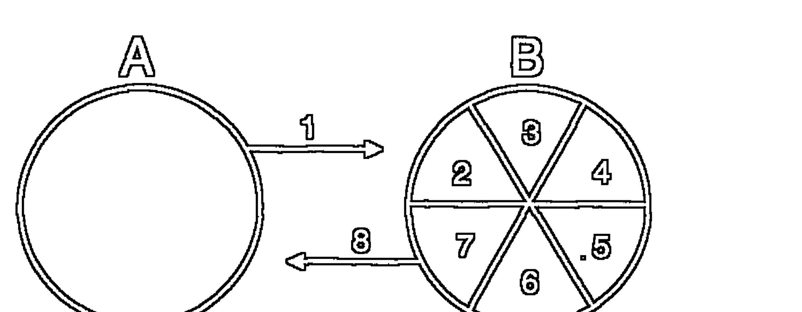

1. 发出者的信息
2. 接收者对于多种感觉道的使用：眼睛、耳朵、皮肤等等
   - 我看到和听到了什么……
   - 对所感觉到的进行筛选……
3. 赋予含义……与过去的经验和习得相联系
   - 创造
4. 对于所赋予的含义产生的感受
   - 激活
5. 对于感受的感受
   它激发出了生存规则并
   - 激活
6. 防御机制：
   - 投射
   - 否认
   - 忽视
7. 评价的规则
   反应：角色、感受等等
   - 看到你应该看的，说别人期望你说的，感受你应当感受的
   - 等待许可，选择安全
8. 可观察到的后果：B对A做出反应
   然后A开始经历步骤2-8

| 情感 | 言语 |
| :--- | :--- |
| 面部表情 | 身体姿势 |
| 肌肉紧张度 | 皮肤色泽的变化 |
| 气味 | 嗅觉 |
| 呼吸 | 语音语调 |
| 运动等等 | |

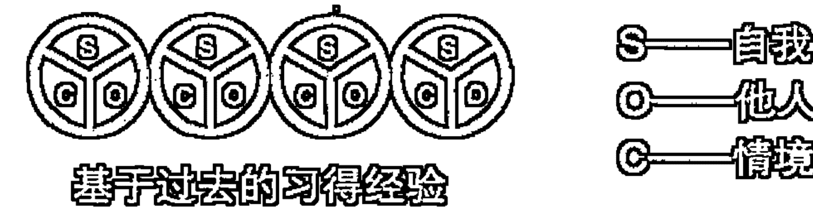

### 呈现问题

我们的内部加工过程在经历上述一系列步骤时是非常迅速的。审视存在于两个人之间的互动——来访者呈现出的问题，一种方法就是将之分解为6个成分，分别表明6个问题。当我们把某件事分成几个部分来看时，就可以发现那些我们以前没有注意到的，各部分之间的内部关系。当我们这样对一个互动过程进行分析的时候，它会变得更加清晰，也更容易发生改变。

#### 苏珊和汤姆

让我们一起来看一看苏珊和刚刚回到家的汤姆之间发生的一次简单的交流。

汤姆：为什么晚餐还没有准备好？

苏珊：对不起。哦，我多么愚蠢啊。它本该在几分钟之内就准备好的。我实在是感到抱歉。

表面上，这看起来像是一次表里一致的沟通中的一段简单对话。当我们将它拆开来看时，仍然可以发现这是一次相当复杂然而很常见的应对处理。通过仔细品味每个陈述下面的许多层内容，以及每个人真实的意图，我们可以制定出治疗性的干预方法，既帮助苏珊也帮助汤姆认识到他们是怎样困在彼此的沟通中，以及为什么有时候自己很难与他人进行接触。

当汤姆询问晚餐的时候，苏珊很可能从中听出了指责的意味。她看到了汤姆脸上的表情，并将之理解为了批评和恼怒。他的语调让苏珊回忆起当她还是孩子时，父亲对她的责备。她感觉到一种能量正在他的身体当中流动，好像他即将要爆发并攻击她。汤姆的脸微微泛红，苏珊对此理解为是不耐烦的表现。

苏珊对这件事情做出的所有解释都是汤姆对她感到愤怒，而她即将受到惩罚，即将被告知自己已经做了错事，或者告诉她她是坏的。苏珊对于即将要发生的一切感到非常害怕。而她继而又对自己产生的这种感受感到无助。

苏珊认为将她的恐惧说出来是一件不可以接受的事情。因为在她成长的年月里，家庭当中的一条生存规则就是：分享感受是不安全的。她必须要表现得像是什么都没有发生一样。在一天的大部分时间里，她可以装做什么都没有发生，而到了晚上，她却得时常伴着胃痛上床睡觉。

苏珊所学到的规则包括：评论是不好的；她不可以表现出恐惧或是愤怒。正是因为如此，今天她才会忽略或是否认自己与汤姆之间所发生的一切。

所有这些步骤——观察和倾听、赋予意义、感受意义、感受自己产生的感觉、遵循规则，以及运用防御机制——都是在内部发生的。汤姆虽然能够看到苏珊，但却根本意识不到上述任何步骤。

苏珊可以做出各种不同的反应：

- 忽视汤姆的问题，什么也不说，但是体验到一种被伤害的愤怒。
- 表达出愤怒并责备汤姆。
- 为自己解释。
- 不陷入以往套路地做出相应的反应。用符合自己内心的声音来积极一致地表达她自己。

在这个例子当中，苏珊在对汤姆表达自己歉意的同时，也在否认和忽略她自己的感受。而问题的重点在于，她实际上还拥有其他的选择。而如何运用这些选择则取决于她如何知觉汤姆，如何知觉他们之间的关系背景，以及如何知觉她自己。

面对苏珊的道歉，我们同样可以利用相同的六个组成成分来分析汤姆做出反应时的心路历程。他听到了一个哀鸣的，带有部分讨好色彩的声音。他看到了苏珊脸上充满歉意和内疚的表情。他本打算晚上带她出去，并且已经买好了剧院的票作为惊喜。

假定汤姆对于他所看到和听到的一切做出的解释是，她再一次拒绝与他分享亲密关系。那么他可能会对此感到失望。而他对于这种失望的感觉则是他根本没有价值，也没有希望：他打算放弃，好像在说“有什么用呢？”

汤姆是一个大家庭中的长子。由于周围没有足够的情感滋养，他常常会感到情感匮乏。他的生存规则就是不去要求自己需要或是想要的东西。因为人们也许会说“不”。在没有询问的前提下，汤姆就将他自己（预期到的）的拒绝投射到了周围其他人的身上。

从此，他渐渐学会了通过责备他人来保护自己。他对如何做出评价的一条规则就是隐瞒自己真实的要求和需要，并且不能分享他的感受。因此，他以责备作为自己的反应，而没有表达什么是他真正想要去做的——和苏珊一起度过一个令人愉快的夜晚。

汤姆：真糟糕，你从来不能留出一点时间给我，我买了两张电影票，而你恐怕太累了无法前往。所以我还是叫上杰夫和我一起去吧。

苏珊和汤姆这两个人都在否认、忽略或是投射他们的感受。没有人表达出他或是她自己的感受，或是他们对于这些感受的感受。也没有人核实他人的意图或是别人言语背后的真正含义。苏珊在讨好汤姆，汤姆在责备苏珊，而他们的争执很可能会逐渐升级到这样一个情景：他更多地批评，而她更加讨好。苏珊越是想要去道歉，汤姆就可能变得越愤怒。他们很容易就陷入了无休止的，责备和讨好的怪圈。

当这种情况发生时，他们将再也不能谈论手边的话题（关于晚餐和夜晚的安排）。两个人都感到被拒绝、被隔离、被误解、没有人倾听和无足轻重。同时，也没有人会体验到亲密的感觉。他们全都感到低自尊，并且以低水平的应对方式来行动。

他们要走到哪里才能脱离这个循环的轨迹？又是什么让两个意图良好的人在互动时产生了更大的距离和被拒绝的感觉。如果我们回顾他们所看到和听到的一切，就立即可以发现他们每个人赋予的意义都是建立在过去经验和决定的基础上的。功能不良的沟通常常植根于童年早期，以及那些我们在生存水平上学到的东西。

当我们所赋予的大量含义统统建立在过去学到的有关生存经验的基础之上时，我们并没有给予自己足够高的尊重。很容易理解，当我们笼罩在过去阴影中的时候，我们将会一次次地重复自己过去的模式。而通过这种方式赋予的意义，也同样会激发来自过去的相应感觉。继而，我们对于这种感觉的感受又会激发我们的生存规则，正是这种规则激活了我们的防御机制。

就这样，我们以防御性的反应代替了自己清晰和表里一致的反应。而不论是我们的防御性反应当中的言语和还是情感部分，都不能准确地反映现在的情况。

从总体上讲，我们会从我们的内部和外部环境当中选择自己已经计划好去看和去听的东西。无论我们所期望或是恐惧的是什么，它们都是那些我们相信自己会看到和听到的东西。我们的反应完全建立在自身选择的基础上。

如果汤姆的父亲常常用愤怒的方式来看待他，那么汤姆很可能更多地记住父亲身上这一特点而非其他。他也许会因此在记忆中挑选某些表现出他父亲是一个愤怒的人的图像和声音。许多年过后，如果处于汤姆环境中的某个人使用了同样的音调或者表情，那么它立即就会触发汤姆在过去所体验到的感受。如果他曾经对自己的父亲的充满恐惧，并且为自己这种害怕的感觉感到不恰当和内疚，那么面对当前的情景，汤姆将会继续沿袭他以前习得的应对方式。

如果我们是自由的，那么只有“现在”才是我们唯一的生存空间。而如果我们的“现在”仍旧笼罩在过去的阴影当中，那么即便我们不会重复过去的行为，也将继续重复过去的模式。萨提亚模式会利用过去来启迪现在——既不活在过去，也不否认或是消灭过去。通过过去的经验教训，我们可以学着改变自己现在的人生路线，为自己提供机能更加完善的生活。

在对家庭和夫妇进行治疗的时候，我们需要鉴别出这些模式，并帮助来访者将他们的动力性因素带入意识范畴中。一旦他们承认了某种模式的存在，就可以摆脱那些由早期看法带来的情绪触发和期望，并由此针对自己和他人建立起一套稳定、自我负责和现实取向的观念。

#### 马克斯和艾伦

让我们通过另外两个简短的例子来追踪个体的内部加工过程。第一个案例中的两位主人公是24岁的艾伦和35岁的马克斯。他们已经在一起生活了两年半，而马克斯最近刚刚从家里搬出去。造成他们分手的争吵是这样发生的。

艾伦下班回到家后告诉马克斯，她打算晚上和一个女朋友一起去参观展览。马克斯告诉她不要去。他的声音听起来很刺耳，脸绷得很紧。艾伦所看到和听到的一切让她回想起了自己的父亲在告诫自己应该做什么时的样子。尽管她为此感到愤怒和无助，但还是决定留下来（就像她总是服从自己的父亲一样）。这是她过去旧有的、习惯的方式。在这之后，艾伦给她的女友打电话说：“马克斯不让我去。”听到这句话时，马克斯立即收拾起行李，离开了他们的家。

在仔细审视马克斯的内心成分之前，我们并不能理解他的行为。他看到艾伦的下巴收紧了，她的眼睛眯了起来。她的声音变得尖锐，而她所说的话并不符合她的情感反应。即便艾伦取消了她的约会，她表现出的行为仍然不符合他的期望。马克斯原本打算按照他们更早前制定的计划，那天晚上出去看房子的。

马克斯认为，对于艾伦来说，展览要比遵守她对自己的承诺更加重要。也就是说他自己是不重要的，而他们共同的生活并不在艾伦心中占据第一的位置。同样，马克斯还将她的言语看做是一种嘲讽。上述所有这些就是马克斯对艾伦的反应方式赋予的意义。

这个事件同样触发了马克斯对自己前妻的一幅记忆画面：他的前妻总是单独出去，把他一个人留在家里。因而，他对当前这个事件的解释是“事情又一次发生了。我必须小心——我正处于危险之中。”这种想法激发了他的愤怒、恐惧和失落情绪。而这些感受带给他的则是无助和深深的挫败感。因此，马克斯决定通过退缩——离开这个情景来保护他自己。

这个例子再一次向我们展示了，当那些未被预期的行为触发了人们的低自尊、他们以往的失败经历，以及自动化的应对反应时，他们很难处理这些行为。

#### 皮特和露西

在下一个案例中，皮特和露西坐在他们的车子里。皮特正在开车。

露西：皮特，你真是一个糟透了的司机。你为什么不能待在自己的车道上呢？

皮特：你说起话来真像你妈妈。

从表面上看，上述对话虽然很无礼，听起来却非常熟悉。从露西的内心加工过程来看，她其实是在说自己很不舒服，并且对皮特的驾驶充满担心。而皮特则听到了一个愤怒的声音，看到了一个紧张的身体、一张扭曲的脸，以及一双颤抖的手。他对此做出的解释是：露西对他感到愤怒。

注意他的这种选择性解释：愤怒。皮特忽略了露西的担心和害怕，并把她的意思理解为：自己根本不是一个有能力的司机，而她知道如何做得更好。他有一种被攻击和贬低的感觉，感到自己就像是一个“无足轻重的人”。对此，他的一种防御方式就是对她采取攻击和投射。

皮特对于如何进行评价的规则就是：绝不可以谈论自己的感受。他所知道的唯一一种可以保持控制权的方式，就是待在自己的防御后面，对露西予以责备。

面对指责，露西的反应是：“你总是指责我。”而这种争执将会继续重复下去。

要描述他们的关系，我们可以这样说，他们相互指责，却既不涉及重点，也不分享彼此的感受。这种交流逐渐演变成一场权力的争斗，一种输赢关系。两个人都感到被拒绝、被误解、不被倾听、孤独和空虚。

多年来，职业助人者一直试图帮助人们改变他们的沟通模式，却不曾审视或是改变他们的内部加工过程。一些从业者利用萨提亚的应对姿态理论来改进人们的沟通方式，却没有使用她更加卓越和强大的互动成分技术。生存姿态是具有戏剧性效果和说明意义的，而互动成分则更多地推进人们表里一致的沟通。

有些人认为人们常会说或是做一些没有意义的事情，但萨提亚并不接受这种观点。与前人一样，她发现如果知道“人们从哪里来”，我们就可以理解绝大部分的反应方式。她相信一个人无论采用怎样的沟通，对个体本身而言，一定具有某种意义和目的，即便从表面上也许看不出来。

随着不断深入探索互动成分技术，我们将越来越透彻地了解到，要让人们进行有意义的接触和沟通，是一件多么困难的事情。因为我们的过去留下了太多的阴影，同时又有太多自动化的应对反应在干扰着我们。

我们同样可以利用互动成分技术来帮助来访者了解如何让互动变得更加表里一致。在表里一致的状态下，每个个体都对自己感觉良好，并有机会与他人进行持续和积极的接触。

### 探索新的含义

在汤姆和苏珊的例子中，我们可以探索新的解释和含义（在他们已经重新认识并同意改变他们生存模式的时候）。

汤姆：为什么晚餐还没有准备好？

从汤姆的表情中，苏珊看到了困惑和不安。他的身体显示他正感到紧张。他的声音听起来很愤怒。对所有自己看到和听到的东西，她所赋予的意义都转化为了一个问题：“我想知道汤姆到底在心里想些什么。这并不意味着他正在生气。”

苏珊并没有选择直接做出反应，或是让恐惧占据她的整个身体，而是决定对此进行详细的核查。她感到迷惑，并且接纳了自己这种感受。这并没有激发她任何的防御机制。她承认了自己的感受，拥有了它们，并且有意识地选择在当前情境中如何评论汤姆的行为。

苏珊：汤姆，我很奇怪你为什么这么着急吃晚餐。有什么急事吗？

通过核查汤姆的真实意图，她了解了他的打算。苏珊并没有固着于她的感受，也没有被未解决的过去经验或自动化的应对模式所控制。当她允许自己自由地评论所看到和听到的一切时，也就可以从众多的反应选择当中进行挑选。

而另一方面，汤姆看到了一个迷惑的表情，听到了苏珊的疑问，并由此得出自己并没有给予苏珊足够的信息。苏珊想要得到更多信息，这让汤姆感觉非常好。同样他也感到与对方分享自己的意图，这是可接受的。

汤姆：因为我想要带你出去。我买了两张电影票。我想这可以成为一个美好的惊喜，所以我希望我们可以早点吃完晚餐，然后出门。

这个例子显示，通过将相同的内容变得更加清晰、直接和非反应性，可以有效地将互动转变得更加具有联结性和培育性。那些最初听起来像是攻击的言语，现在却变成了一个实现彼此间理解和联结的机会。

### 打破防御性的习惯

在不能肯定他人意图的情况下对自己看到和听到的东西做出反应，我们的意见不合常常会升级为争执。我们常常为了保护自身的感受、知觉、期望和自我价值感做出反应，而不是将关注点放在眼前的问题上。即便只是某人对我们的意见表示反对，一旦我们感到自己受到攻击，我们就会陷入自动化的应对循环来进行防御，而不是想办法处理自我、他人和情境中的问题。

陷入困境时，我们常常会执着在内容水平之上：“你做了这个或那个，而你本不应该做那些。”一旦这种反应性的自我防御模式开始启动，有关对与错、公平与不公平的整个循环就会被激活。而要打破这个防御性的模式，并深入理解某人的沟通过程，我们需要仔细核查他人的意图。而内容所能够提供的，仅仅是检验自我与他人的需求是否得到满足的情境。

让我们看一下艾伦和马克斯的例子。当两个人的互动目标相去甚远，而第三个互动反应又没有能够澄清当时的情境时，我们可以推断，过去经历的碎片已经与当前情景混淆在了一起。由于彼此体验到的知觉感受并非显而易见，澄清就显得格外有用。下面的对话摘自本书作者与这对情侣在咨询过程中的一段对话。

艾伦：我当时想要和鲁比一起去看展览的。
治疗师：[转向马克斯] 你当时听到了些什么？
马克斯：我听到她说她打算和鲁比一起去看展览。
治疗师：那对你来说意味着什么呢？
马克斯：出去看展览比和我待在一起做我们已经决定了的事情更加重要。
治疗师：你当时是什么感觉？
马克斯：我感到愤怒和被拒绝。
治疗师：[转向艾伦] 你是否意识到马克斯和你已经对那天晚上做出了计划和安排？
艾伦：是的。我还知道我们第二天是很空闲的。
治疗师：[转向马克斯] 你是否知道艾伦已经为你们两人的第二天做出了安排？
马克斯：不知道。
治疗师：当你现在发现这个事实的时候，感觉如何？
马克斯：我感到自己被忽视了。她自己做出了安排。
治疗师：[转向艾伦] 你是否记得自己已经为那天晚上安排好了计划？
艾伦：是的。
治疗师：当你知道对马克斯来说，那个晚上和你在一起非常重要时，你有什么感觉？
艾伦：我对此感觉很好，但是我并不了解当他很忙时，我和鲁比一起出去他会如此介意。

治疗师：你现在的感觉是什么呢？
艾伦：我感到很困惑。
治疗师：这又会让你有什么感觉呢？
艾伦：当他离开时，我感到很愤怒。
治疗师：[转向马克斯] 现在当你听到艾伦所说的，有些什么感受？
马克斯：我感到很困惑。
治疗师：当艾伦告诉你她想去看展览时，你都做了些什么呢？
马克斯：我告诉她不能去。
治疗师：对此你现在是什么感觉？
马克斯：困惑。这也是为什么我会来到这里。

此时，治疗师继续让这对情侣一步步地剖析他们的困惑。困惑是从功能不良的状态转变为更加健康的存在阶段的一个必要的混乱步骤。同样，困惑也很好地指示出，两人正从熟悉的情景过渡到不熟悉的情景，而正是在不熟悉的情景中，改变才得以发生。

治疗师：[转向马克斯] 当你对艾伦打算和鲁比一起外出感到愤怒和失望的时候，首先进入你脑海的画面是什么？
马克斯：[他低头思索了一会儿，然后用一种非常温柔的声音说] 这样一幅画面：我前妻经常与她的朋友出去，而我则被她们甩在身后。我们最后以离婚告终。
治疗师：现在当你渐渐意识到这两者的联系时，你感觉如何？
马克斯：我不想让相同的事情发生……我感到害怕。
治疗师：这让你有什么感受？
马克斯：我害怕失去她……我爱她。
治疗师：[转向艾伦] 听到这些时，你有何感受？

艾伦：[眼中含着泪水] 我并不知道他会这样想……我感到很难过。同时也很愤怒他并不相信我。

治疗师：[转向马克斯] 你相信艾伦吗？

马克斯：是的，我相信她。

治疗师：[转向艾伦] 你相信他吗？

艾伦：不，因为他离开了。

治疗师：[转向马克斯] 当你选择收拾好行囊离开时，内心都想了些什么呢？

马克斯：当我听到艾伦对鲁比说“他不让我出去”时，我不知道那意味着什么，我就是变得如此沮丧，我感到一切都完了。

治疗师：[转向艾伦] 当马克斯说你不可以出去时，你有什么感觉？

艾伦：我觉得自己就像一个小女孩，而我的父亲不让我出去。因为我觉得马克斯对我就像我爸爸对待我一样，所以我感到很愤怒。我希望他了解我很生气，并且通过对鲁比说“好”来进行自我防御。

治疗师：[转向马克斯] 当你听到这些时，你是否能够回忆起当你告诉艾伦不要出去时，自己的音调、姿态，以及你自己的感觉？

马克斯：是的，我很生气。

治疗师：有没有可能你当时听上去很像她父亲？

马克斯：是的。[提高嗓音] 她父亲所说的一切都比我说的重要得多。

治疗师：你对此有何感受？

马克斯：我觉得自己从来没有被人重视过。

治疗师：这又让你感到了些什么？

马克斯：我永远也无法战胜她。

情况已经昭然若揭，他们的争吵已经演变成了一场为胜负而进行的权力斗争。即便艾伦因为马克斯告诉她不要出去而决定不出去，她也同样是在另一个层面上对她的父亲做出反应。马克斯意识到这一点，并且对此做出反应，下结论认为自己对她来说并不重要。他明显地感到低自尊，以及保护自己的需要。

通过运用互动成分技术，治疗师给艾伦和马克斯带来了一些改变。下面是同一次治疗面谈中更多的互动。

治疗师：[转向马克斯] 你是否相信有这样一种可能，艾伦想要和你在一起？

马克斯：不，我不相信。

治疗师：现在问问她。[治疗师转向当前]

马克斯：为什么你决定留在家里？

艾伦：因为我记起我们已经有了安排，并且出去看展览并不那么重要。

马克斯：那你为什么要那么说？

艾伦：因为我对你告诉我去做什么时那种腔调感到愤怒，我不喜欢我的父亲用那种腔调，也不喜欢你用。

治疗师：你现在相信她了吗？

马克斯：我对发生的一切更加了解了。我并不知道她会做出那种选择……不和鲁比出去而选择和我在一起。

治疗师：[转向艾伦] 听到马克斯在你们的关系中有如此强烈的不安全感时，你现在有什么样的感受？

艾伦：我不知道，我觉得很难过。我爱你，马克斯。

通过这种意见的交换，治疗师继续利用互动成分技术来探索这对情侣的假设、感受、对他们感受的感受、防御机制，以及评判的规则。最初的面谈给马克斯和艾伦提供了一个机会，来审视他们自己的加工过程，聆听彼此所做的一切，并逐渐将他们的恐惧和过去经历建立联系。他们可以就此慢慢接近自己当前的渴望和向往，也就是爱与被爱的需求。

双方在进入这段关系时都带着低自尊。马克斯已然经历了先前那一段痛苦的关系。而在与艾伦在经历了整个治疗过程之后，他逐渐从攻击的态度转变为理解，然后是接纳。这对情侣决定继续努力改善他们的关系。而在接下来的治疗中，他们致力于分享他们的感受，建立彼此间的信任，区分过去与现在，释放他们过去的痛苦和应对动力，并且现在以开放的态度接纳彼此。

治疗师将互动成分技术当做引入改变的工具来使用，由此帮助这对情侣看到、听到和感受现在，并最终生活在现在。当我们可以表里一致地做到这点时，过去的防御机制和规则就不再在当前的沟通互动当中被激活了。由此，我们强化了自我，并且接纳了任何我们所拥有的感受。我们拥有自己的感觉，分享它们，继而为我们真实的渴望采取行动。

### 探索新的选择

在我们仔细思考如何改变旧有模式的时候，如果能够想出三种选择、三种含义、三种反应以及三种行动，将会非常有帮助。萨提亚鼓励人们拥有至少三种可能的选择。她认为一种选择并不算是选择；拥有两种选择只是让我们处于两难的困境，只有拥有三种选择的机会才能够为我们提供新的可能性。

就这样，评价的规则被转化为指导方针，并对所有适合的可能选择敞开了大门。当经过转化的规则允许我们进行选择时，我们也就不再会被局限于仅仅一种反应方式，而是可以拥有多种选择机会（参见第十一章）。

当来访者开始重新认识到自己是如何被条件化，如何在试图保护自己熟悉的事物不受改变的洪流冲击时，丧失了自己的整体性，以及如何度过自己的人生，就好像永远只存在一种选择的时候，他们也就最终发现了自己完全可以掌控那些无止境的可能。觉察、接纳，以及与他人的联结，成为了向自我完善迈进的几条重要途径。

### 处理过程还是处理内容

一条基本的提示就是：我们工作的重点是过程，而非内容。内容可以提供给我们的，就是来访者生活的环境背景，我们在这个背景中审视个体和家庭成员的反应方式。将内容作为环境背景使用，也为我们增加了对过程的熟悉感和有效性。

让我们再回顾一下当艾伦决定和她的朋友外出时，马克斯的离家出走。在这个例子中，我们并不将艾伦对情景的描述当做工作重点，而是作为改变这两人之间的动力关系的环境。通过这种方式，治疗师将内容当做改变发生的环境来使用。这可以帮助我们更容易地探测到来访者受困的地方，并进而通过帮助他们探索和接受新的可能选择，来解决这一困境。

### 在不同水平上进行工作

一旦我们鉴别出某个来访者互动中的各种成分，就可以选择进入个体内部系统的任意一个水平：感觉、知觉、期望或渴求。

如何运用互动成分技术，主要取决于你希望在哪个水平上治疗来访者。你也许打算从简单的开始，先处理来访者的感受。而许多治疗师仅仅将这一工具作为一种手段来帮助人们审视他们所看到、听到和感受到的一切。

事实上，大部分与我们一起工作的治疗师都非常善于澄清人们看到和听到的东西，并且鉴别和反射出他们的感受。然而，通常他们也会略过这样一个要点，那就是来访者对所看到和听到的东西赋予的意义。

另一个需要我们格外强调的方面就是询问人们有何感受，而不是直接告诉他们。同样，我们也需要询问他们对此赋予的意义和解释。意义完全形成于内部而非外部的视角。意义完全是主观的。

感受则源于我们对自己所看到和听到的东西赋予的意义——或者更常见的，我们认为自己看到和听到的东西。如果一位来访者对于某些意义的感受是基于此时此地的体验，那么这个来访者仅仅需要决定如何处理这些感受。换言之，他或她可以考虑多种选择和反应方式（而不是做出反应性的回应）。

对于过去的经历和当前功能不良的反应方式，无论来访者对这两者之间的联系的认识程度如何，解决这一问题都需要基于当前的现实基础。这意味着我们需要帮助来访者核实他们所赋予的意义，确定他们的感受与这些意义相一致，获得对自己感受的自主权，并且能够自由选择如何进行反应。最后，我们还需要帮助他们评价他们自己真正想要的东西。

互动成分技术的强大力量既可以运用在一对一的个体咨询中，也可以运用在夫妻、团体和家庭治疗和咨询当中。在帮助来访者坚定他们的知觉、感受、期望和渴求方面，互动成分技术无疑是一种极为有效的方式。我们同样也开始利用这种方法来改变组织形态，改善雇员与雇主之间的关系，以及解决跨文化冲突。

到目前为止，我们已经深入了解了如何追踪人们的内部加工过程：从人们看到和听到的东西开始，经历了多个步骤，直到最后的评价。下一章我们将重点讨论如何通过萨提亚的转换干预来帮助来访者改变他们的知觉、感受和期望。

# 7 转化的过程

在与维吉尼亚·萨提亚共事多年之后，我们三个合作者感到自己仍旧遗漏了一些东西。我们知道如何操作个性部分舞会和家庭重塑技术，我们也知道如何雕塑家庭关系。但是，和萨提亚的其他干预方法一样，这些技术所探讨的已经远远超越了我们最初对问题的鉴别。到此时，参与者们看上去已经有所不同，他们的脸更加容光焕发，展现出更多的自信，他们身边的氛围也发生了改变。

多年来，我们一直将这种巨大的转化归功于萨提亚的神奇和力量，或是她的干预方法。此后，随着我们越来越紧密地在一起工作，我们发现自己已经无法再对自身所看到和所做的一切仅仅给予如此片面的解释。渐渐的，我们的理解有所增进。而这并不是突然出现的。

我们首先检验的是萨提亚对于感觉的处理。她并没有遵循弗洛伊德的方式来获取洞察和理解。弗洛伊德关注的是人们的感受与过去经历的关联。萨提亚也没有信奉和运用谈话活动小组的方式，让来访者带着对上帝的虔诚倾诉感受——任何感受。这种方式只是鼓励人们表达他们的感受，而没有任何其他的治疗目标和预期。我们同样看到她的心理治疗方法与卡尔·罗杰斯所教授和相信的方法之间的主要差别。罗杰斯引出人们的感受，并要求他们去拥有自己的感受，从而掌控它们。

萨提亚不仅让人们承认、拥有并且表达他们的感觉，还会鼓励人们依据自己的感觉做出如何行动的选择。

萨提亚曾经使用过这样一个比喻：“感受就像是一支人类温度计。一支温度计可以告诉我们现在是什么温度，从而帮助我们决定该穿什么衣服。而感受则告诉我们自己内部加工过程的状态，并帮助我们决定如何应对和表现。”

就像上一章提到的，萨提亚也倡导人们转化对自身感受的感受，本章将更加具体地描述这一转化过程。

## 体验的六个水平

作为我们内心体验的源泉，自我始终处于一种核心地位。萨提亚发现体验可以分为多个层次或水平：

1. 渴望
2. 预期
3. 知觉
4. 感受
5. 应对
6. 行为

上述这些体验全都会在某个时刻，在属于我们的特定的情境中发生。人们常常把它们作为内容展现出来。例如，我们常常会听到来访者说：“我的父亲不爱我。”对于这一陈述内容的深入探索可以会引向一个或是更多的具体事件，如父亲只带一个儿子出去钓鱼，而小儿子由此得出父亲并不爱他的结论。

小儿子的渴望就是能够得到同等的爱。他的预期是，如果父亲同样爱他，就会也带他去钓鱼。对此他的解释是父亲并不爱他。他体验到了失望和被伤害的感觉，以及对兄长的愤怒。

这个具体的例子阐释了萨提亚的模式是如何运用内容来发现个体体验的六个水平的。来访者问题的内容，只不过是一种情境，让改变在这种情境中显得可信而又相关。同样，具体内容还可以为我们提供鉴别人们应对过程的环境背景。就像萨提亚常常说的，“问题本身并不是问题，应对方式才是问题。”如果我们可以帮助来访者在他们所有的预期、知觉以及感受水平上做出良好的应对，并通过最可能实现的方式完善他们的渴望——如果我们可以帮助他们将所有的水平纳入考虑之中——那么，我们就可以帮助他们取得更大的进步。环境背景将变化锁定在人们的真实体验当中。

下面的图向我们展示了体验的各个独特的水平。在现实生活当中，“自我”影响外部行为，而情境则会对“自我”产生影响。这种影响效果从外而内，又从内而外。各个体验水平之间互相依存，并且以非线性序列的方式运行。通常情况下，这个六个体验水平会同时受到影响。

每一个水平的体验都会对个体及其与他人的关系提供特殊的加工过程。因此，尽管萨提亚可以在任意一个水平上采用干预方法，开始她的转化性治疗过程，但是对于每一个体验水平，我们仍然需要给予足够的核查。

其他治疗流派会强调某一个层次胜过其他层次，更有甚者，会选择用一个层次来概括其他所有层次。一些治疗仅仅作用于行为，希望通过它来改变整个系统。另一些治疗则仅仅作用于感觉水平。而萨提亚倡导对所有的体验水平展开工作（即便许多人只想到她的应对姿态和沟通的工作）。她的发展模式处理所有六个水平，她的改变工具则有助于在所有这些水平上进行转化。

前面的例子向我们阐释了小儿子内心体验的六个水平。而鉴别和确认所有这些水平的过程，则给了来访者一个机会去：

- 表达伤痛。
- 通过回忆与父亲在一起的其他事件或体验，或某些父亲的独特品质及资源，来拓展和扩充自己的知觉。
- 识别并拥有其自身所包含的相似品质和资源。
- 增加他对于作为一般人类而存在的父亲的理解和接纳。
- 发现和拥有其自身持有的未被满足的期望，并且对自己说：“是的，我想要与父亲一起去钓鱼。这是我的期望。他并没有实现我的愿望。我现在可以放弃这个期望了吗？”
- 去实现当前的渴望和期盼，在不将它们投射到他人身上的前提下承认并拥有它们。

探索这些体验水平时，常常会发现它们负载着许多需要改变的东西。大部分这些东西以及许多模式都是以过去的经历为基础的。每一个体验水平都需要一些改变和干预，从而可以更加开放和表里一致地运作。

### 渴望

渴望的水平指每个人对于被爱、被接纳、被确认和被肯定的渴求。这些对爱自己、爱他人，同时也被他人所爱的渴望是普遍存在的。当我们渐渐成长时，这些渴望得到满足或是未得到满足的方式，都将会对我们未来的发展、成熟，以及处理我们自身感受有很大的影响。在生命早期，通过不断进行尝试和体验，自我受到反复的“轰击”，并由此形成了对自己的定义，并限制了自身的发展。生命也渐渐变成了仅仅是一个维系生存的过程。从另一方面来说，如果孩子的渴望得到了满足，个体就有机会发展出高自尊、表里一致的生存方式、健康的压力应对模式，以及爱自己和爱他人的能力。

### 预期

卡尔·罗杰斯以及其他人关于“无条件的爱”的大部分文献，提出了人们普遍具有对亲密感、完善、亲密关系、自由、兴奋和创造性的追求和渴望。我们发现这些基本渴望往往通过各种期望表现出来。

例如，我们常常期望自己可以幸福快乐。我们当中大部分人期望外部世界可以满足我们的需求。我们还期望别人给我们提供资源，就像童年早期一样，那时候我们主要依赖他人来生存。

让我们以汤尼这个孩子为例，他渴望能够亲近自己的父亲，以此来获得亲密感、自我确认和接纳。如果这些预期得到了满足，汤尼将不会出现任何问题。而如果期望没有被满足，他就需要调整和适应这些未被满足的期望。在整个童年阶段，他可能仅仅是忍受它。而在这之后，那些未被满足的期望很可能进入感觉水平，并转化为受伤、孤独，甚至愤怒的感受。多年之后，汤尼也许偷偷将这些渴望带入另一段关系当中，或一直由于期望没有得到满足而产生的不适感生活下去。如果在晚一些的时候这一期望得以实现，那么当前的关系将会呈现出它们所具有的价值，而过去的渴望和不适也将消失。

很多时候人们并没有表达出他们的期望。而在治疗当中，来访者需要接触他们在过去未被实现的期望，并对它们进行转化。我们的期望通常来自人类普遍存在的渴望。例如，想象一下，假如我们的“自我”始终没有得到确认，或是仅仅在某些由其他人限定的特殊情境下，才能够得到确认。那么，要想生存下去，我们就必须不断放弃自己的期望和被爱的需求。这些经历不但会导致我们产生低自尊、痛苦、伤害和自我贬低，还会让我们对自己产生这样的结论：“我不好，我不值得别人爱。”

人们同样会从外部的比较中发展出期望：“他们都拥有它，所以我也想要它。”他们隐藏的希望是：他们对自己的感觉和看法会更好，或是提高自己的自尊。如果一个人买了一辆美洲虎牌轿车，并期望这可以满足他获得他人肯定和尊重的需求，那么当他拥有这辆车的时候很可能会感到失望。买车可以让他对自己的感觉更好吗？或是这样做可以让其他人对他感觉更好，从而他可以对自己感觉更好？

自我价值感并不仅仅包括满足我们自己的期望，尤其是那些表达出来的期望。它同样基于我们对于能够赋予自己权力和重要性的感受。就以这个美洲虎轿车购买者为例，它听上去就像在说：“我想要它，我应该拥有它，并且这会让我对自己感觉更好。”因此，拥有这辆车子的价值仅仅是反映出了个体的欲望，并不意味着可以提升他的自尊。

与人们信念有关的另一个普遍期望就是：事情总是不公平的。因此他们感到自己的反应方式非常合理，不需要做出任何改变。例如，一个儿子可能说他受到的对待不如兄长好。因此，他感到自己不需要做任何家务杂事，他有权表现得懒惰。

对于这个孩子来说，公平，意味着实现他有关平等和公正的预期。同样，这个孩子也可以通过其他方式来表达和反映自己对于现实情境的知觉。对公平性的预期，意味着让外部世界先改变，而个体的内心世界仍然维持原状。显然，人们常常需要首先放弃他们的“公平”立场，然后才能做出重大的转化和改变。

在家庭治疗中，值得我们关注的大部分预期都建立在过去经历的基础之上。也许5岁的时候我们想让爸爸把我们抱在膝上，如果我们至今仍然心怀这个未被满足的愿望，那么它可能已经变成了一种需要进行处理的怨恨情绪。我们无法让时间倒转，满足这一过去的需求。我们所能够做的就是接纳自己的期望，并就此放手，然后观察我们如何在此时此地实现自己的渴望。

例如，“当我还是一个孩子的时候，我拥有这样一个期望。我承认自己拥有它，它属于我。现在我可以放弃它，并且不再为没有实现它而责备或批判我的父亲。我接受这样一个事实：我无法实现过去的期望。但是，我同样拥有机会来选择如何实现当前的期望和渴求。”

有时候，萨提亚流派的治疗师会在一个预先设置好的童年场景中让人们进行角色扮演，并允许家庭成员体验坐在“爸爸”（某个被选做扮演父亲角色的小组成员）膝上的感受。这种做法常常可以帮助一部分人放弃他们的期望，投入现在的生活当中。

来访者们需要认识到：未被满足的期望与普遍存在的渴望之间存在相互影响，并对这种影响进行处理。当人们重新评估他们的期望的时候，他们同时需要将这些期望与自己潜在的渴望联系起来。这样做不但可以帮助他们在当前环境中，通过现实的方式来实现自己内心的渴望，同时也将过去的经历带给我们的阴影加以转化，让人们在现在的生活中拥有更多新的选择。

在多种引发改变的工具中，萨提亚发展出了一种将过去的影响从现在的生活当中分离出去的流程。我们称之为“去除纠结”（de-enmeshment）。当人们已经能够描述出存在于一个家庭内部的羁绊和困境的时候，我们需要一个“去除纠结”的过程，将受到过去玷污的内容与他们的当前体验分离开。而萨提亚的转化性治疗（在下一部分描述）将为上述目标的实现提供了理论和实践的基础。

### 知觉

体验的第三个水平被称为“知觉”。有时也被认为是信念、态度、价值观或印象。我们的知觉常常与我们对自己的感受交织联系在一起，强大、牢固而难以拆分。

我们往往会依据极为有限的知识基础来形成知觉，特别是在我们年幼的时候。当我们还是孩童时，妈妈告诉我们，当她和爸爸在一起说话的时候，不许进入他们的房间。由此，我们可能会得出“自己根本不被需要”的推断。而事实上，他们仅仅是想享受一下亲密的二人世界。

有限的信息常常会让我们对现实事件产生一个不同的、更狭隘的印象。我们因此对现实产生了扭曲的看法。这进一步导致了我们在不完整的信息基础上，做出解释和结论。

我们每个人都会对同一个事件产生属于我们自己的独特知觉。同样，家庭中的每个孩子也会用不同的方式来描述相同的事情。在萨提亚的模式中，心理咨询和治疗的一个任务就是帮助人们拓展他们受限制的知觉。这种拓展可以让我们对自己的经历做出新的解释，并且理解在同一时间内发生事件的多重性。

例如，一个人也许会说：“三岁那年，我知道妈妈不再爱我了。”当在家庭编年史中探索那时候到底发生了什么时，个体发现母亲那时有了另一个孩子，而父亲在那年丢了工作。于是整个家庭决定搬迁。

现实同样也表明了，这个孩子并没有意识到她父母身上的压力。她断定妈妈已经不再爱她了，而没有了解和认识到她的父母全神贯注于当时的艰难处境，这与他们对她的爱毫无关联。

### 感受

体验的第四个水平就是感受。感受常常强烈地依赖于过去的经验基础。即便我们此刻的感觉是由当前的事件所激发出来的，我们也常常会使用自己长期积累的感受来进行反应。而这些积聚起来的感受也就是我们需要在治疗中进行探讨和处理的。我们的反应性感受——我们对自己感受的感受——是建立在我们的期望和知觉基础之上的，而它们又与我们自己的自我价值和自尊密切相关。

最普遍的反应性感受包括伤害、恐惧和愤怒。我们的文化仍然区分了男性和女性的反应性感受。人们更接受女性感到受伤害和哭泣，而男性则感到愤怒和叫喊。这两种感受可以看做是一枚硬币的正反面：一个人不可能在没有受到伤害的时候感到愤怒。在我们的文化背景中，似乎仍旧更容易通过伤害进入女性的感受水平，而通过愤怒进入男性的感受水平。但事实上，治疗往往需要对两者都进行处理。

### 应对

应对模式是一种所谓的防御或者说生存机制。在压力情境下，应对模式会表现为四种生存姿态。作为压力的症状表现，这些姿态成为在更深层次上解决冲突的不良方法。应对模式常常作为保护和求生方式服务于我们。它们同样可以显示出个体在一段与他人的关系当中，是如何看待他（她）自己的。帮助来访者意识到他们的生存姿态，就相当于给了他们一只“温度计”，在检测自己的自尊水平的同时，审视自己就如何生存而产生的知觉。

### 行为

行为是体验的第六个水平，也是人们应对模式的最终结果和个体内心世界的外在表现。换言之，行为是我们自尊的一种外部表现。

## 转化

在这一部分当中，我们将首先探讨转化的过程，然后再描述一些具体技术。

### 转化过程

萨提亚模式更强调过程的重要性。很多人认为过程就是内容的反面。它意味着事情是如何发生的，而不是发生了什么事。同样，过程也指事件发生的先后序列。一些人可能会讨论他们所看到和听到的东西，并且将这些事件发生的序列称为“过程”。许多人至今仍然对过程持有这样的看法。

萨提亚将过程的概念当做通往转化的主要途径。过程概念指的是个体的能量从功能不良的模式转化为更加开放、自由和健康的模式。如果通过比喻来说明的话，这种转化的类型更像是在清理河道，让河水可以更加自在地奔流，在源头和最后的终点海洋之间没有任何地方受到阻碍。

因此，萨提亚并不鼓励人们将注意的重点放在对问题本身的描述上，而是注重帮助人们了解整个内部加工过程。这样做可以让他们触及自己内心的渴望，并由此改变：

- 他们的知觉
- 他们所赋予的意义
- 他们的感受
- 他们对于这些感受的感受
- 他们的期望
- 从渴望衍发出来的，他们的动机和行为

这些改变是重大的，而来访者无疑必须经历很多混乱的场景。因此，非常重要的一点，就是改变的促成者需要坚定地依靠他们自己的能量，才能在来访者冒险尝试转化的过程中，为他们提供足够的支持和稳定。

要对已经存在于各个体验水平的内容材料进行转化，我们需要进行以下三个步骤：

1. 探讨每一个水平，寻找那些可能来自来访者整个生命历程当中任何时期的功能不良的内容。
2. 转化这些功能不良的内容。在这个过程中可能需要一些“去除纠结”的技术。
3. 以可接受的方式进入现在的生活，积极地确认自我，并且为它所起到的积极贡献而感到光荣。

由于这种转化会发生在每一个体验水平上，所以下面要进行的讨论将在每一个水平上对各个步骤进行具体详细的描述。仅仅将我们自己限定在某一个干预水平上通常是不够充分的做法。

转化过程包括触碰我们的渴望：我们需要帮助人们逐步意识、承认，并且接纳他们自己的内心渴望。它是联结我们的内部核心或者说生命力量的一个基本过程。

我们同样希望帮助人们鉴别出他们未被满足的期望，这些期望通常会从过去一直保持到现在。通过承认这些预期，人们可以：

1. 放弃那些他们期待或是希望可以达成自身愿望的做法。
2. 回归自己更加普遍的渴望，并且寻找满足这些渴望的方式。
3. 放弃他们未被满足的期望（例如，仍然希望自己能够成为高中毕业典礼上的致词者），承认自己再也无法实现这些愿望。
4. 发展出与他们的内心渴望和当前现实生活相匹配的期望。

转化过程的另一个方面就是知觉重构。知觉转化过程的一部分包括增加一些新的信息来修正或是更新人们的解释和决策。新的知觉通常又会反过来影响并可能改变人们的预期和感觉。

知觉重构可以算是萨提亚经常使用的一种非常有效的干预方法。用比喻的方式来重构人们的知觉往往尤其有效，因为它可以激活大脑的右半球，避免我们通常用来抵制转化或者合理化现状的神经通路。（关于重构技术的更多内容将在下一章讨论。）

在转化的过程中，我们往往需要对感受，以及我们对于这些感受的感受予以更多的关注。因为它们与我们的期望和知觉有着密不可分的内部关联，这些影响当中的任何一环发生改变，都可能改变其他环节。探索我们的感受包括以下几个步骤：

1. 在一个安全的、接纳性的环境中，让来访者重新体验来自他们过去的感受。线性的、认知上的“理解”在这里是远远不够的；人们需要联结自己大脑右半球的真实感受。探索感受最简单的方式之一，就是雕塑出来访者心中的画面、关系和姿态。然后让我们的身体智慧帮助进行加工。
2. 让人们承认并接纳自己这些感受。
3. 通过让人们变得更加表里一致来释放感受。要做到这一点，同样需要将他们潜在的期望和知觉带入意识，并与他们的感受联系起来。换言之，我们需要创造一个恰当的情境来处理他们的感受。释放期望和知觉可以清除我们反应性感受的根源，从而让来访者不再把时间花费在沉浸于过去的感受和自怨自艾当中。

一旦你已经通过重构技术产生了新的知觉，那么你的感受通常也会发生改变。同样的事情还会发生在任何由这些反应性感受产生的反应性行为上。

### 转化对感受的感受

在我们各自的临床实践当中，我们都曾经看到过许多来访者，他们要么以一种相对无意识的方式屈从于他们的感受，要么带着极其强烈的拒绝和否认，不断与自己的感受进行斗争。然而从萨提亚身上我们学到了，感受是属于我们自己的。我们要么选择让自己的感觉管理我们、控制我们，要么我们利用它们来维护整个体系，跨越生活的起伏，并增强我们的快乐、兴奋和积极性。

了解如何管理和享受我们的内部体验的过程，看起来更像是一个令人兴奋的新的挑战。当我们开始确信这些感受真切地属于我们，是我们自身的一部分时，我们也就在这些感受和自我——拥有者，即“我是”（I am）之间建立起了新的关系。如果能够承认自己的感受，我们也就可以带着正确的意识和评价，朝着管理或是驾驭它们的方向迈进了一大步。

许多人现在的感受都受到过去经历的污染，为了帮助他们，萨提亚发展出了她的家庭重塑过程（参见第九章）。这种诱发改变的复杂方法，不但能够联结、更新个体过去产生的感受，还可以将它们转化为一种具有自我关怀和自我管理性质的系统。掌控自己的感受可以赋予人们力量，让他们生活在现在，并给予他们一种完善的感觉。

到了学习的这个阶段，我们开始意识到，某些加工过程是发生在人们的自我与他们的感受之间的。萨提亚有关加工过程的问题为我们提供了一些很有趣的线索，让我们得以探讨事情发生的真实情况。让我们以一个参加工作坊的志愿者为例，这是他（她）第一次站在一大群人的面前，被询问到自己对于工作坊的希望和要求的问题。萨提亚对加工过程的提问包括下面的内容：

萨提亚：你的感觉如何？
参与者：害怕。
萨提亚：闭上眼睛，看一看什么图像进入了你的脑海。
参与者：在小学时，我当着全班被叫起来。
萨提亚：你当时几岁？
参与者：10岁。
萨提亚：你当时在害怕什么？
参与者：人们会嘲笑我。
萨提亚：嘲笑对你来说又意味着什么呢？
参与者：说明我很愚蠢。
萨提亚：在那之后又发生了什么？
参与者：我试图从众目睽睽之下逃走。
萨提亚：你现在多大了？
参与者：32岁。
萨提亚：现在张开眼睛，环顾一下周围，你都看到了些什么？又感受到了什么？
参与者：我看到人们都非常关注和支持我。我感到轻松多了。

有时候，让参与者来询问在座的听众中是否有人有同样的感受也会非常有帮助。它可以显示出个体正在代表大多数人讲话。

当帮助者问到“你现在有何感受？”时，成长了的自我可以建立这样的联结，即现在的恐惧感属于过去的情境，而不是当前的现实状况。由此，个体可以将过去和现在分离开。这种分离通常会改变个体害怕的感觉，并给予人们力量来掌控他们的现在。

萨提亚的一系列问题让人们不但可以意识到自己的感受，以及对于这些感受的感受，同时还可以觉察到在这些感受背后发生的加工过程。我们最终会发现加工过程的多个层面，就像是古老的比喻所说的：对待隐藏的真相如同抽丝剥茧。

继续这一转化过程，我们将向着探索新的应对方式进发。萨提亚模式可以在让人们放弃自己保护性的生存模式之前，就教给他们其他可供选择的行为、存在和变化方式。

一旦探索到新的应对模式，人们就可以让自身的行为发生改变。行为常常只是人们复杂的内心加工过程的外在展示。单纯改变行为往往只能获得有限的成功。萨提亚模式相信，行为的转化实际上是在其他水平上发生的一系列改变的延续。当然，如果某个人的行为充满暴力，那么对他的行为加以限制无疑是恰当而且有用的。

萨提亚模式认为，治疗和转化过程需要在所有的水平上发生，并贯串个体的整个生命历程。并没有一个明确的规定告诉我们转化应该从哪一个特定的水平开始。当治疗师和来访者能够步调一致、和睦共处，并且朝着可能转化的方向进发的时候，治疗师要么已经知道该从哪个水平开始工作，要么这一点根本就无足轻重。

已经证实的一点是，单纯的认知并不足以推动转化发生作用。因此，萨提亚通过使用幽默、催眠、冥想、音乐、身体接触和歌唱这些形式，来激发人们大脑右半球的活力。通过为认知加工过程增加一些实证性的学习经验，萨提亚让改变的过程变得更加全面。正因为如此，萨提亚的所有改变方法和手段中都会大量运用实践性的角色扮演、雕塑和比喻，以引发改变。我们同样也建议使用来访者的逻辑、理性和认知这三个方面，为个体提供一个改变发生的情境。我们将在下一章阐述这些。

如果给人们一个机会，让他们在各个水平上处理属于过去的内容，并使它们渐渐脱离与现在生活的纠结，则个体可以将自我、他人以及环境整合为一个整体，一股表里一致地流动的能量。这样做不但可以鼓励人们利用自己的资源，也帮助他们对当前的形势做出最恰当的选择和判断。当来访者从对过去经历的关注和应对当中解脱出来的时候，他们也就可以带着更多的能量和好奇营造现在的生活。

一些人将这种“去除纠结”的过程称为第二水平的改变。当我们超越了问题的内容和个体的行为的时候，也就进入了萨提亚概念中的第二个改变水平了。这通常包括改变我们的预期、知觉和感受。要让这种改变成为可能，同样需要我们回归自己内心的基本渴望。

### 转化性干预

萨提亚极为小心地提醒人们，不要用僵化的、不交通的方式来使用任何技术。我们需要时刻记住，一种简单的转化干预技术，就是为原本存在的事物添加一些新的东西。比方说，与其与黑暗斗争，倒不如为它增加一些光明。在增加光明的过程当中，黑暗也就消退了。与此类似，当我们为自己增加新的知觉、新的感受和新的期望时，新的应对模式也就产生了。就这样，我们通过为过去的事物增加某些东西，来对它进行转化。

另一个类比就是化学反应。在原本存在的物质中加入新的成分，会形成新的化合物。例如，氧和氢的结合让我们得到了水。在治疗过程中，我们可以帮助来访者在他们已经存在的资源中增添一些具有帮助或是治疗性的部分。首先需要添加的治疗性成分就是觉察。某个特定的模式，即便是令人痛苦的，当它变成一种自动化的反应之后，如果没有意识的帮助，它会一直持续下去。经过逐渐觉察的过程之后，来访者可以从自动的反应水平上升到意识层面上的反应水平，并给予自己更多机会和改变的可能。

一种反复出现的模式就是来访者将他们的父母作为榜样。即便人们在意识层面决定不去遵循父母提供的样例，行为上往往还会继续这么做。他们也许不会在一些相同的情境中照搬父母的行为，并因此在某些时候看上去与父母表现得不同。但是一旦我们仔细审视他们所遵循的模式，两者的相似性就会变得格外明显。

一个常见的例子是一些家长会对如何参加常规的礼拜活动制定严格的规则。不管是否有其他的活动或是打算，他们的孩子必须一直参加宗教礼拜。当这些孩子长大也成为家长之后，他们大多不会再要求自己的子女去这些宗教机构，这既可能出于他们自身的经历，也可能是因为他们想要成为更好的父母。然而，他们僵化的模式可能表现为：要求孩子不论生病与否都必须去学校上学。通过这种方式，僵化的模式继续在不同的情境中保留了下来。

上述例子让我们看到，回顾自己过去的习得，以及如何运用它们来应对当前的环境，是一件多么重要的事情。有时候，治疗师需要花费相当大的时间和精力帮助来访者逐渐脱离他们父母的榜样。当然，如果这个榜样是一个表里一致、具有高度自尊的产物，那么来访者必然可以从中得到许多积极的结果。

在当前的社会中，人们对于处理性虐待和酗酒拥有着浓厚的兴趣。我们发现，萨提亚模式中的转化方法对于那些试图解决自己过去的性虐待经历的人极为有效，也能很好地帮助那些有酒精依赖问题的人们。这种转化方法并不限于帮助他们处理过去发生的事件以及由此产生的感受，还会帮助他们在所有的六个转化水平上进行处理和加工，并将成功和幸福带到他们的生活中。

对于酒精依赖者，转化方法可以迅速地捕捉到人们的内心渴望，并且帮助这些个体和家庭检验他们的生存模式。将生存模式替换为应对模式，再将应对模式替换为健康的自我关怀模式，这一系列替换引发了最主要的转化过程，而不仅仅是改变一些简单的行为模式。

自尊并不仅仅建立在感觉良好的基础上。它包括让我们人格的所有水平都和谐相处。评估自己需要我们用现实的态度对待现状。我们每个人都拥有体验自身感受的能力，如何处理这些感受才是问题的实质。例如，我们都曾多次体验到愤怒的感觉。愤怒就其本身来说是一种自然的感受，但同样也是一种可以消耗或者转移我们的能量的感觉。因此，当我们试图开始以表里一致的风格生活时，如何修通这种愤怒的感受就变得十分重要了。

## 愤怒的转化

以一种负责任的、有意识的方式来与我们自己打交道，恐怕是我们人生当中最为重要的任务之一。这项任务的一个重要组成部分就是处理我们的感受。而愤怒则是我们最常体验到，同时也最难控制的情绪之一。

愤怒是一种反应方式。它并不是指我们会变得愤怒，而是说我们会感受到愤怒。愤怒属于我们，但它并不是我们。我们当中有些人认为愤怒来自我们自身之外，也许由某个事件触发。另一些人则认为愤怒是某些发生在我们内部的事件的结果。

不管怎样，愤怒只是一种反应。当某个事件发生的时候，我们会对它进行解释和归因。而这些解释和归因的结果又会进一步成为我们对此的反应。哪些发生在你身外的事情最容易让你陷入愤怒的反应当中？你在这之后又做了什么？你是如何让自己摆脱愤怒感的？

当客观地审视自己愤怒感觉的同时，我们将会注意到所有对于自己来说可能采取的选择：

- 我们可以攻击其他人。
- 我们可以通过言语的形式承认自己的愤怒，或只是简单地对自己承认我们的感觉。
- 我们可以责备别人，指责说是他（她）“让我们愤怒”。
- 我们可以将这种愤怒保持在内心里，并渐渐将它压制。
- 我们可以在更深层的水平上思考我们的体验，看看究竟是什么激发了我们的愤怒。
- 我们可以将自己的愤怒转化为硬币的另一面——伤害或恐惧，并首先面对这些感受。

愤怒会慢慢积累。人们可能在多年之前经历了某个事件，并且渐渐积累起他们愤怒的感受。一些以这种方式积累起愤怒的人通常都有非常火爆的脾气，几乎任何事情都可能让他们爆发。这种情况通常表现为，他们对于任何一件简单的恼人小事都做出过度的反应。

让我们将注意转向人格冰山图，我们需要仔细思考究竟是什么掩藏在愤怒的水平之下。与愤怒相伴的情感通常是伤害和恐惧。当我们引领来访者意识到其自身具有的愤怒情绪时，也同样需要触及他们被伤害和恐惧的感觉，并对这三者都进行处理。尽管这三种感觉的其中一种通常比另外两种更活跃、更容易出现，也更强大。但不管怎样，所有这三者都需要得到治疗师同等的重视。

就像我们前面指出的，掩藏在这三种感受下面的，是人们的知觉和预期。如果将一个外部事件知觉为对自身的蔑视，那么我们很可能对此感到愤怒。如果我们持有一个无法满足的期望，一个无法遵守的许诺，那么我们可能会体验到恐惧，并进而爆发愤怒。所以，要帮助人们处理他们的愤怒，我们还需要帮助他们转化自己的期望或恐惧，或是这两者。

当人们拥有高自尊水平时，他们很少会对别人的行为做出自动化的反应，因此也较少体验到愤怒的情感。如果可以接受愤怒是我们每个人都拥有的自然感受，那么在面对愤怒的感觉时，我们就会多出许多选择。要找到这些选择，我们需要仔细审视自己的期望和知觉，并寻找可以表里一致地处理这两者的方式。

根据萨提亚的应对姿态理论，具有讨好姿态的人们常常会隐藏或压抑他们的愤怒。通过一些治疗性的帮助，当讨好型的个体不再通过取悦他人的方式来处理他（她）的自尊时，个体也就开始释放自己多年禁锢的感受，特别是愤怒的感觉。曾经接纳这个个体的人通常会感到失落和沮丧，因为过去那个不断取悦和讨好自己的朋友开始表达出他（她）的愤怒。幸运的是，在完成转化过程之前，这段愤怒的时期并不会持续很久。

讨好者常常会觉得他们很难释放自己的愤怒。由于如此多的愤怒情绪被储存起来，它感觉更像是一种暴怒。一旦闸门打开，我们可能会变得完全失去控制。这种可能性无疑是一种威胁。因此，我们需要提醒讨好者，在承认自己的愤怒的同时，我们对自己的行为仍然拥有选择权。

责备者的问题恰恰相反。他们会不问青红皂白地表达自己的愤怒。我们当中一些人仍然记得六十年代那场“谈心运动”（encounter movement），那时候，人们不仅仅被鼓励去表达自己的感受，同时也据此做出行为反应。对于那些喜欢指责他人的人，我们最好帮助他们承认自己的感受，并接纳它们。然后，在高自尊的状态下，他们可以决定对自己和自己的感受采取哪些行动。换言之，我们可以帮助人们了解他们自己是如何感受的，并且在不跳入某类反应性行为怪圈的前提下，对这些感受进行处理。当某个人感受到某些东西的时候，并不意味着他或她必须遵照这种感受来采取行动。

下面这张图向我们展示了处理愤怒感受的步骤。第二个水平的改变过程包括对这些感受的转化。同样，它也意味对其他必要的体验层次进行处理。根据个人和环境的特点，你可以从这些水平当中的任何一个开始，然后不断前进，直到所有的领域都得到覆盖、清理和改变。

## 愤怒的转化

行为 —— 感到愤怒时，你会采取那些措施？
应对 —— 你在试图向其他人表达什么？你可以怎样使用愤怒进行更好的应对？
感受 —— 你会有怎样的感觉（愤怒）？还有没有其他与愤怒相关的感受？（伤害、恐惧）
对于感受的感受 —— 你对自己愤怒的感觉有何感受？
知觉 —— 如果现在让你描述一下自己愤怒的感觉，你有什么想法？除了变得愤怒之外，还有没有其他可能的选择。
期望 —— 你是否意识到自己可能期望从愤怒中得到的结果？
渴望 —— 在期望的背后，你拥有怎样的渴望和追求？你可以怎样以一种不同的方式来承认并表达这些渴望？
自我 —— 你的自尊水平如何？
a) 在愤怒之前？
b) 在愤怒的过程中？
c) 在愤怒之后？

下面所呈现的对话片段，摘录自我们对一位接受我们督导的咨询师的治疗时段的观察。他当时正在接待一对有“婚姻问题”的夫妇。在他们第二次咨询过程当中，妻子对丈夫如何“经常贬低她”，以及自己对此的糟糕感觉表达出了强烈的愤慨。

治疗师：这是否让你想起了早年生活当中的一些东西？
妇女：是的，他就像是我的父亲。
治疗师：你的父亲做过些什么？
妇女：嗯，他认为我既没有大脑，也没有姿色，他让我觉得自己毫无价值。
治疗师：你希望从父亲那里得到些什么？
妇女：更多的爱，更多的接纳。
治疗师：对此，你现在打算做些什么呢？
妇女：嗯，也许我可以放弃，放弃这些期望。但是我的丈夫仍然会带给我这种毫无价值的感觉，而我对此很愤怒。
治疗师：你打算如何放弃关于自己的感受？
妇女：唔，也许我可以不再用他们看待我的方式来看待自己。

在这里，咨询师和来访者完成了两个非常重要的任务。一方面，他们将过去与现在分离开，另一方面，来访者正在开始改变她的预期和知觉。在进行了一些更加深入的工作之后，丈夫和妻子之间开始了一种新的交流模式。他开始更清晰地聆听妻子的话，并对她的重要性予以确认。这种做法开启了一个更加开放的交流过程，并创造出了更多的亲密感。与此同时，妻子也开始关注她自己的自我认同和价值感。不久以后，也许她的丈夫也会出现类似的转化。

## 转化与表里一致

愤怒的感受可以通过更深层的转化过程来处理，引导人们在自我水平上变得更加真实、完整、表里一致。最初的时候，表里一致被定义为，与我们的感受协调一致，并接纳它们。就像第四章描述的，萨提亚模式鉴别出表里一致的三个层次。要想变成更加完善的人类个体，这三个层次都十分重要。

让我们重新回顾一下，在表里一致的第一层次，我们接受自己的感受原本的样子。在第二层次，我们与自我保持和谐。如果拥有某种感受和与自我保持一致之间存在矛盾，就需要我们对此进行审视，并可能需要转化我们的感受。在这个层次上，愤怒、伤害或恐惧的感觉都暗示着矛盾的存在。

表里一致的第三层次就是让我们的自我，与我们的生命力量、灵性或者说灵魂保持和谐。表里一致的第三层次既没有在理论，也没有在实践当中得到足够的关注。经过时间的磨砺，萨提亚开始越来越多地将这个维度进行整合，先是体现在她的冥想技术当中，继而又渐渐渗透到她大部分的实践和培训过程当中。

上述任何一个层次上的转化都会引发内部的变化，这个变化可以让人们体验到更多的责任感。这种转化还会带来几种别的副产品：自信、对更多选择的觉察，以及通往更多内部资源的途径。这些副产品转而又会帮助来访者改变他们对外部世界的处理方式，包括让他（她）的关系更加亲密，让他（她）的沟通更加有效。

这个个体周围的人也同样会发生变化。例如，在一个行为不良青少年的家庭中，我们有时候仅仅会对父母进行咨询干预。当他们比较成功地转化了自己的生活之后，同样也会报告说，他们自己与孩子的关系，以及孩子的行为都有大幅度的改善。

## 个体冰山

这个例子很好地体现了系统改变的方式。改变某个成分或成员，不可避免地会影响到系统的其他部分。就像这一章描述的，我们的六个体验水平在内部相互联系，并对彼此的改变做出回应。一旦我们建立起治疗性关系和支持性的环境，来访者就可以为改变的发生创造了一个情境。

利用萨提亚的创造性方法，我们可以在任何体验水平，运用任何特定的干预技术协助改变过程的进行。任何一个层面上的转化都会引起其他层面的混乱。这也符合萨提亚的改变原理。在经历过所有这一切之后，来访者最终会变得更加自我整合和表里一致，这也正是萨提亚原理当中最普遍的治疗目标。

下一章将通过被称为“个性部分舞会”的改变方法，详细阐述自我整合的概念。

萨提亚的转化过程

# 8 个性部分舞会：整合内部资源

每当我们与别人相遇时，我们总会认为他们表现出的就代表了他们的一切。而实际上在那个时刻，我们体验到的仅仅是人们本质的一部分。随着我们彼此渐渐变得熟悉，我们开始更多地了解到他们身上的其他部分。例如，我们可能在下午4点半的时候看到他们表现得志得意满，而清晨一大早却显得狼狈不堪。尽管他们常常看起来判若两人，但却仍是同一个个体。

萨提亚的一个主要改变工具称为“个性部分舞会”。这一章将详细描述这种技术，近距离地审视我们作为人类个体所拥有的许多部分，深入地探讨我们可以如何控制它们，以及怎样才能将它们转化为一种使自己变得更加完善和一致的资源。事实上，个性部分舞会技术是一个鉴别、转化并整合我们内部资源的过程。

我们习惯于将某一个部分看做整体的倾向，让人想起盲人摸象的故事。在这个故事中，他们每个人摸到的都是大象的某一部分——尾巴、腿、鼻子和耳朵，却将自己摸到的部分推广为全部。一个与之相关的概念——人们拥有许多不同的层面——构成了个性部分舞会技术的理论基础。萨提亚用这种技术创造出了一种崭新的学习情境。

运用个性部分舞会技术的一种典型方式，就是让15到40个左右的人组成小组，分别扮演“主人”（希望转化和整合自己各个部分的个体）的多个不同组成部分。一个比较大的房间可以为这一想象的聚会提供足够大的空间；而引导者（咨询师）则需要一张大活页纸和许多其他的道具，从而营造出聚会的氛围，并增强各个被扮演部分的可视化特征。

我们当中很多人都会否认自己并不喜欢的部分，并且将注意的重点放在我们认为可以接受的部分上。我们试着让自己保持单一——如优秀、正确、自信或搞笑——就好像我们只能表现出这一种品质一样。努力去掩饰那些自己认为不可接受的东西时，我们也就丧失了真实的自我：我们没有意识到，自己身上的每一种成分都能够进行多种转化并可以被使用。

一种可以让我们接受并转化自己“不可接纳”成分的方式，就是利用个性部分舞会，这样一个有着看似自相矛盾的名字的技术。将严肃的思考和娱乐性的聚会形式相互融合，让我们可以后退去体验某些别的感受，而不是一直与某些特质、环境或是事件相连的痛苦感觉。萨提亚的工作方式也让人们在感到兴奋的同时，被一些戏剧性的场景所吸引。这无疑为他们营造了一种新鲜的学习环境。例如，我们之所以会喜爱和牢记那些优秀的电影，是因为它们拥有某些戏剧化的场面。这些戏剧效果使新的学习体验可能实现，也让大家感到兴奋和舒适。

个性部分舞会技术一共有五个主要步骤：准备好“主体”；描述出他或她的各个部分都是怎样行动的；各个部分之间怎样发展出不可避免的冲突；对这些部分加以转化，以使冲突得到解决，以及完成最后的整合仪式。在本章后面的内容中，上述这些步骤将得到详尽的描述和讨论。有关干预的部分则为这些步骤提供了理论背景。

## 部分和规则

我们所有人都拥有许多不同的层面或是部分，萨提亚称之为我们的“很多张脸”。实际上，这说明我们拥有很多的可能性。每一张脸都拥有一种声音、一套意象，以及一系列与我们的早年生存体验相关的期望。这种拥有不同面孔的概念，与罗伯托·阿沙吉奥里（Roberto Assagioli）的精神综合理论有着异曲同工的妙处，只不过在罗伯托的理论中，不同的组成部分被称为子人格。

我们当中大部分人都会将这些部分贴上积极或消极、好或坏的标签。一些人将他们内心的部分——例如他们那些充当法官、孩子、老人、恐惧死亡，渴望快乐的成分标记为不好的。这些人必须用尽他们所有的能量来保持这些“不好”的部分不显露出来。

相对的，要让我们所有的部分都变成可用的资源，就需要对它们进行转化。我们同样可以转化那些存在于自己意识之中或是意识之外的规则。这些规则同样也是一种资源。我们所拥有的每一样事物都是资源，只不过一些人并不会以这样的方式来知觉他们自身的部分。只要我们被迫压抑、排斥或是否定任何属于自己的东西，我们就无法自如地运用我们的能量。

我们不断地整合自身内部的大量组成部分，并给这些部分赋予不同的含义和生存价值。例如，我们也许会分配给孩子的部分较低的，或是消极的价值，这意味着我们永远不能让这一面展现出来。简单地说，这种价值感常常与我们成长时，我们的父母认为不可接受的部分有关（“不要这么孩子气！”）。

这就好像我们在看待自己时划分了两栏：“好的”和“坏的”。通常，当我们做出这样的划分时，也就是在通过忽略、否认或是歪曲来除掉那些“坏的”部分。当我们试图隐藏起那些自己认为是“坏的”的组成部分时，我们也就削弱了成长的可能性。我们内部的管理者将其他部分组织起来，以符合我们对自己的看法，而不是适应我们的内部智慧。

我们可以在任何时间，对自身的任何部分的状态或是条件进行拓展。我们同样可以对任何我们认为消极的东西进行转化。

一些人总认为他们自己并没有很多的资源。当他们发现自己的资源之后，才会了解原来自己有那么多沉睡的部分需要得到唤醒。很多人内心中，各个部分之间一直在进行斗争，有的甚至已经到了让人丧失能力的程度。我们可以结束这种迟疑和拖延，结束说一套做一套的方式，也结束我们三心二意的感觉。继而，通过将我们的资源整合到和谐的状态，个性部分舞会技术的价值得以体现。而检验自身各个部分的运作模式，不但能够展示出我们的内部加工过程，同时也提供了增加其有效性的方法。

与此同时，我们持有的规则也会阻止我们承认、整合并且转化自身的各个部分。这些规则会控制我们的人际关系，并且告诫我们哪些部分是可以表现出来的。所有的人类规则都有一个积极的目标：保护我们的自我价值。例如，如果我们有这样一条规则——不能表现愤怒，预想一下压抑愤怒得来的生活是什么样子。这个积极的、具有生命保护意义的目标，带给我们的却常常是这样消极的后果。

我们之所以发展出压制愤怒的规则，完全是因为我们相信，如果直接表现出愤怒，就会将自己置于一个易受攻击或是不光彩的位置上，从而受到拒绝或是惩罚。这些规则是在我们的童年阶段，通常是在我们与父母的关系当中形成的。在孩童时期，所有我们内化了的行为和知识都基于父母的期望之上。因此，如果母亲说“不要生气”，我们会做出与之相应的行为。我们内化了母亲的信息，并认为只要我们按照这些规则来行动，就会得到大家的接受和爱护。（从另一个角度来看，如果我们的自我价值被太多“应该”所淹没而窒息，那么我们也许会表现出反叛或者退缩。）

要防止自己表现出那些打破规则的部分，我们的智慧不得不背上一个沉重的负担。我们无法表现出自己的智慧，因为维持某个特定形象的尝试和忧虑已经完全压制了我们的智慧。那些爱开玩笑的人将自己所有的能量用来做一个小丑，这个例子很好地说明了，某些人会仅仅依赖自身表现出的某个部分来维持生存。同样的事情还会发生在那些试图仅仅基于表现才智来达到自我认同的人身上，他们通过被别人称为“专家”来界定自己的身份。将我们的全部精力倾注到一个形象，不但压制了我们的其他部分，还会让我们长期处于一种极度贫乏，并且时常觉得孤独和空虚的感觉当中。

如果无法承认属于自己的部分，我们就无法继续发展和成长。例如，某个成长在政治体系中的人，如果在他（她）所处的系统当中，权力被知觉为危险、残忍、具有操纵性和控制性的东西，那么该个体很可能会对自己的权力有消极的看法，并且因此对它充满畏惧。另一个无法承认自身某个部分的人可能会说：“我无法变得出类拔萃，因为我的家庭中已经有了一个出类拔萃的人。她所有的分数都那么高，而我却没有取得这些分数。”当我们忽视或是否认那些我们知觉为不可接受的部分时，我们成长的可能性也就变小了。例如，我们当中大部分人会假装我们的愤怒并不存在（“我并不真的生气”）。我们也许并没有认识到自己的愤怒蕴含着维护自身利益这样一个事实基础。否认自己的愤怒时，我们也同时拒绝承认或是实现我们的自我决断。如果我们不尝试通过不同的方向继续探索成长的可能性，并发展出打破这个恶性循环的交流模式，我们的权益将继续遭到侵犯，而我们也将继续体验这种愤怒的感受。

拒绝自己的组成部分，就像是截肢。我们否定的部分越多，我们的“应该”列表就越长，我们对自己的削弱也就越大。这样做的结果常常也只是徒劳：那些我们决心不表现出来的部分最终会通过迂回的方式浮出水面，并且通常是以毁灭性的方式。这样做也经常让我们承受情感或身体上的痛苦，或者同时承受这两者。

例如，不对其他人表现愤怒，可能导致我们对自己产生糟糕的感受，并用较差的方式来对待自己。而如果我们遇到了一个以同样的方式否定他或她的愤怒的人，我们可能会发现，尽管在表面上我们交流得十分礼貌，但是在一个不可言明的水平上，双方各自否定的部分却在进行着一场争斗。

对于我们自身部分的否认，同样表现为四种不平衡的交流模式：讨好、责备、超理智和打岔。因此，萨提亚的干预针对人们的内部加工过程和冲突，而不是言语。例如，听到讨好式的反应时，她会洞悉到这个个体正在通过贬低自己来取悦他人。与此同时，他们也在将自身价值感的控制权拱手让与他人。

当我们的自我价值依赖于别人对我们的评价的时候，我们就会以别人的看法来决定我们的自我形象。在这个过程中，我们会依据自己对获得别人赞同的期望，来对自己的各个部分进行截肢。一个形象的比喻，就是一个人可能会在某个画廊发现一幅他（她）希望达到的形象的画像。画像上的人绿色眼睛，5英尺2英寸高，101磅重。而在镜子中，这位观看者看到自己棕色眼睛、5英寸8英寸高，体重170磅。如果可能，他（她）是多么希望能够切除掉自己那些与幻想中形象不匹配的部分。

在参与个性部分舞会的过程中，主体的一些需求会渐渐被唤醒，开始去承认曾经忽略的部分；重新评估一直隐藏的部分；清楚地看到曾经被歪曲的部分，并且重新评价那些需要更多注意的部分。通过承认那些被歪曲了的部分，我们可以将自己整合为更加完善的个体。承认，包括意识到目前的一切现实，既不生活在过去，也不生活在假定的未来当中。接纳我们所有的感受，可以帮助我们走出因为否认、歪曲或是忽视自己不喜欢的部分所带来的恐慌和焦虑。显而易见，这种做法也可以有效地降低我们强加给自己的压力。

感到紧张通常是一个线索，表示我们需要转化自己的内部过程。压力往往意味着在我们的现存状态和我们的理想自我——我们认为自己“应该”成为的样子之间存在差距。生存在我们的现状和我们对于这一现状的规则（“我感到愤怒，但是我不应该这样”）的夹缝中，会让我们备感束缚，无力维持。如果在这个阶段产生恐慌，那么我们将会彻底爆发。

识别、承认、检验并使用我们的各个部分、规则和内心智慧，可以帮助我们转化自己的内部加工过程，并恰当地处理当前的情境。通过移除那些自己设定的限制和束缚，最终我们可以拓展自己的选择。

## 内部冲突

我们每一个人都拥有大量的组成部分、资源和个性特点，它们可能以多种变化的形式呈现出来。一些部分具有普遍意义，并且需要我们在个性部分舞会中以某种形式承认和接纳它们。例如，每个人都拥有智慧。但是如果我们感到自己很渺小，毫无价值，那么我们的智慧就无法施展。通常，我们并没有注意过自己的智慧，而它也许正在通过一个微弱、细小的声音与我们说话。我们需要强化我们的智慧，并用它来帮助我们成长和发展。

另一个普遍存在的部分就是我们内心的法官，它总会说：“你不应该做那个。”我们内心世界中的法官和那些“应该”的假设总是一同出现。萨提亚提醒我们，我们完全可以选择属于我们自己的法官。我们可以将他的工作指定为既监督我们的所作所为，又对我们的所作所为给予支持。我们中大部分人在内心中都拥有一个苛刻的、喜欢责难的法官，而我们都需要把自己心中法官的部分发展成自己的一个朋友。

在我们每个人的心中还分别拥有下面这些部分：孩子、成人、管理者、老人、性的部分，继续我们生命力的希望、对死亡的恐惧、对快乐的需求，以及一个歌唱的部分。这些部分并不总是和平共处，例如有时候，对于生命的热爱和对于死亡的恐惧就会发生冲突。当对死亡的恐惧和对生活中悬而未决的事情的担心占据了主导地位时，心中歌唱的部分常常会归于沉寂。孩子也许想玩耍，而成人的部分则说：“不行！我要把你永远关在监狱里。”

萨提亚在人们的各个部分当中寻找内部的对话，她深知，通过对这些动力性因素更深刻的自我觉察和接纳，冲突常常可以得到解决。冲突之所以产生，就是因为我们大部分人都将自己的各个部分打上了“好”或是“坏”的标记。这就好像我们在看待自己的时候划分出了两个阵营，一个是“好”的品质，另一个则是“不好”的品质。就像前面提到的，我们的价值分配，往往是依据自己成长时父母认为可以接受和不可接受的事情。通常，做出这种划分时，我们也就通过忽略、否认或是歪曲的形式去除了那些“坏的”部分。例如，我们也许会给孩子的部分赋予较低的生存价值，这意味着我们需要用自己所有的能量阻止这个“不好”的部分显露出来。

由于受到压抑，我们身体内那些“坏的”部分一直叫嚷着要求释放。它们发出的声音如此之大，以致我们的内心智慧无法应付。一个沉重的负担就这样落到了管理者和成人的部分身上，它们不得不承担起了隐藏我们不可接受的方面的责任。

由于极度担心我们内心那些不受欢迎的部分会暴露出来，我们不断绷紧神经，并由此减少了成长发展的机会和可能性。与此同时，我们自身的生命力也受到了相当大的压榨。

## 发现内部资源

通过重新标定我们的各个部分，并将它们作为内部资源进行再整合，我们可以在生命中的任何时刻改变这种内部冲突。例如，今天坐在这里时，我们会忽然发现自己一直贬低的孩子的部分竟扮演着至关重要的角色。我们仍旧活着，我们已经达到目标，暂且成长过程经历了怎样的痛苦或是破坏性体验，我们仍然挣扎着存活了下来。既然这个孩子可以生存下来，那么他（她）的应对历史都可以成为值得借鉴和学习的经验。

下一章将讲述一个36岁的男人的故事，还是孩子的时候，他总觉得孤独，并且确信父亲想要杀死他。这个男孩就这样带着愤怒、痛苦和低自尊渐渐成长起来。不管环境如何，他都发展并且强化了自己的应对方式。当他学会了重新认识和肯定自己作为孩子那部分，以及自身的生存力量时，他开始以不同的方式来对待他的孩子和自己了。

我们的孩子部分为我们提供了一个平台，能够最大限度地展现各种可能。我们孩童时的体验是那么广博，而大部分人随着年龄渐长，看待自己的视角却变得越来越狭窄。我们也许会感到自己几乎没有智慧、创造性和充裕的资源。当重新发现自己的许多部分，并且看到它们是如何彼此相联的时候，我们就会意识到自己可以重新唤醒这些资源，不再需要限制自己基本的孩子的部分。预先判定或是否认自身的某些部分，只会让我们感到自己资源匮乏。如果我们能够及时地想起自身具有的部分是怎样相互联系和彼此依赖的，我们就可以体验到多样化而又统一的形象。

参加个性部分舞会的大部分人都会持续地体验到这种形象。无论他们的处境有多么孤立，他们再也不会像以前一样感到贫乏空虚。我们需要明白的重要一点，就是我们可以穿越生命的轮回，并成长和拓展。在这个过程中，即便是内心中的老人，一样能够享受生活，这一点对于我们所有人都至关重要。体验个性部分舞会技术意味着打破那些“应该”的禁忌，继而让我们自由地发展成为更加丰富多样、与周围相关联的、和谐一致的个体。由此，我们可以更加坦然地接受和表现自己。

### 承认我们的各个部分

在承认的过程中，我们了解了那些顶着“不应该”的标签的隐藏部分。感到愤怒、脆弱、性欲、恐惧或自负的通常都是我们否认或歪曲的部分。这也包括委婉的表述或修正，如“我感到沮丧”，或者“我感到有一点被激恼了”（而不是愤怒）。

通过承认它们，我们同样使那些曾经让我们感到模糊和朦胧的部分变得清晰。此外，我们也许可以找到某些部分，它们会告诉我们：“我应该表现得紧张”或是“我应该表现得像被激怒了，但是实际上我很喜欢。”别忘了，我们同样还拥有那些已经承认和接受了的部分。我们所有的部分都具有进一步成长的能力，因此，除了给予它们继续发展的机会之外，我们并不需要再做其他的事情。

我们身上的某些部分仍然在沉睡着。就像是冬眠中的蓓蕾，不仅仅需要被承认和唤醒，还需要我们的培育和呵护。而这种转化的过程将一直持续到生命的尽头。

### 接纳我们的各个部分

一旦承认了自身拥有的各个部分，我们就可以致力于学习如何接纳它们了。这拉开了一个序幕，我们可以开始将这些部分转化为与其他部分相关，并对它们具有强化作用，这个过程也正是个性部分舞会技术的主要功能。

萨提亚常常将人们对待自己各个部分的态度，比喻为对待恶犬：将它们禁闭在一个狭小的空间，锁上大门，围栏高耸。那些饥饿的恶犬不停地咆哮，一旦开启牢笼，它们就会残忍地撕咬。在这之后，人们会告诉我们“看到了吗？”或是“我早就告诉过你会这样。”但是如果我们爱护我们的犬，照顾并且接纳它们，我们就可以安全地将它们放出来。它们也许仍然会吠叫，但是不会咬人。

在接纳的状态下，我们可以关注自己的犬，并且喂养它们。我们可以从将“好的”和“坏的”部分两极分化的僵化状态，跨越到这样一个状态：每一个部分都具有平等的权利被整合和获取价值。

### 转化我们的各个部分

在接纳某个部分之后，对它进行整合之前，我们需要转化它。这并不意味着我们要消灭任何东西，我们的每个部分都可以被转化，而且包含着成长的力量，只要我们发现如何去使用它。

在原始的状态下，被赋予消极价值的部分蕴含的能量常常并没有什么用处。愤怒、傲慢、破坏性和操纵性都蕴含着潜在的创造性能量，只是并不位于它们现有的表现形式当中。萨提亚模式帮助我们解放自己这些部分，并允许我们以协作的、培育性的方式去利用它们蕴含的创造性能量。

触及每个部分蕴涵的能量的过程，就像是掌管一系列的开关。我们可以开启体内任何一个部分的开关——孩子的部分、享乐主义者的部分、法官的部分、智慧的部分，等等。当然，我们同样也可以在不影响系统当前电流状态的前提下，关闭这些开关（“我再也不想要这样的法官了”）。通过练习，我们逐渐可以熟练操作这些开关，根据自身的能力和需求自如地打开和关闭它们。

使用这个比喻帮助人们意识到，在生活中有多少权力是由我们自己控制的。萨提亚同时借用了种子的形象来比喻其中蕴含的巨大潜能。尽管这粒种子开始很小，但是如果我们给予它阳光、养分和生长的空间，它很快就可以长成一株茂盛的植物。将我们的各个部分想象为一粒在合适的条件下时刻准备繁茂生长的种子，可以帮助我们形象化自己的能量和转化的能力。

我们可以创造性地，或者破坏性地使用这种能量。如果感到自己无能为力，我们通常会试着从别人那里获得价值感。这表现出了我们的内心呼唤：“我毫无价值，而你必须帮助我，如果你也弃我而去，我将一文不值。”又或者我们也许会让自己的精神生存状态依赖于物质基础，如金钱财富。由此，我们发现如果失去了金钱，我们也就失去了价值感和生存的目标，甚至可能去自杀。

个性部分舞会技术致力于形成一种平衡的力量观念，它需要承认我们自己的资源，并且创造性地使用这种综合能量。例如，它可以转化我们的敌意。敌意是指一种结合了无助、努力以及将痛苦投射给他人的综合情绪。如果我们保持这种敌意——“这不是太可怕了吗？”或是“我多么可怜！”又或者“这全是你的错！”——那么我们也就阻碍了自己的成长。如果逐渐转化我们的敌意，我们会发现自己完全有能力来应对无助的感觉。而进行更深入的转化之后，我们就拥有了采取行动的能力。经过转化之后的敌意，实际上可以给我们提供更多的能量。

与之相似的，我们同样也可以转化嫉妒的情绪。和前面的情况一样，嫉妒也会引发我们心底的细语：“你拥有我所没有的东西，有了它，你变得很可怕，而没有它，我却变得很卑微。这不公平。”经过转化之后的嫉妒可以变成我们的一种能力，让我们可以更好地在与他人的关系当中看待自己，并得到成长，而不是竞争。同样，嫉妒也可以变成一个机遇，让我们为可以拥有相同或是不同的资源而感到快乐，甚至进而去分享这些资源。

我们当中很多人无法转化自身的部分，这是因为他们接纳了自己“正确的”感受，而否定了“错误的”感觉。然而，仅仅接受自己“好的”、“干净的”和“正确的”部分，通常都会导致我们感到衰竭、乏味和空虚。由于每个部分对于整体都具有非凡的意义和价值，并且可以帮助整体变得更具效力，这种片面的接纳无疑会损害我们的整体价值。即使不考虑每个部分的特殊功能，每个部分都是对我们生存本质的全面展示。它们就像是我们身体内的一个细胞，在包含着有关自己功能的独特信息的同时，也展现着我们整个人所具有的遗传编码。同样，我们的每一个组成部分都包含了我们存在的完整性。反过来，一旦我们对各个不同部分加以整合，完整性就可以变成这些相异的部分的共同特征。

### 整合我们的各个部分

个性部分舞会的目标就是转化和整合我们的各个不同部分，并使用萨提亚所称的“朝向完善的生命力”。对于许多人来说，这种与生俱来的朝向整合的力量正处于休眠或者萌芽的状态。在使用个性部分舞会的过程当中，随着我们渐渐对自己的各个部分获得整体性的看法，这种力量也渐渐增强。我们不再感到自己比别人卑下或是优越，而是开始发现我们可以理解自己的每一个部分，它们全都在我们的内心占有独特的位置，并且每一个都与其他部分息息相关。我们同样会意识到，这些部分是否来自我们的父母或是其他家庭成员，根本无关紧要。

在获得对各个部分的整合感觉之后，我们就可以以一种非片断性的风格来表现不同的行为了。我们的各个部分不再相互争斗，我们也不再心口不一。每当我们的一个部分战胜了另一个部分时，实际上我们都是在分裂我们自己。如果我们将自己的工作限制在某个单一的水平上，那么它同样会增加我们自身的分裂感。一个典型的例子就是检验我们的母亲是怎样对待我们的，而不关注我们的父亲如何对待我们，不关注母亲对于父亲对待我们的方式有何感受，不关注父亲对于母亲对待我们的方式有何感受。

在整合的过程中，我们需要对所有的水平层次进行处理，并检验我们所有的部分。这样做的目的是揭示我们的各个部分在执行其各自功能的同时，能够如何支持、帮助，以及关爱其他的部分。一些部分在完成任务的时候需要别的部分的帮助，而整合允许我们聚集所有的资源，从而可以做到这一点。例如，我们的手指无法承担心脏的工作，而手指与心脏之间又彼此关联。我们可以用手指来爱抚别人，而正是这些手指帮助我们实现了我们心中的意图。

## 结构化个性部分舞会技术

在勾勒个性部分舞会技术的基本过程——承认、接纳、转化和整合之后，我们现在可以具体探讨该技术的背景，并结构化地阐述这些阶段了。

### 背景

萨提亚认为，创造一个良好的、充满幽默和快乐的环境是非常重要的。在她的工作中，快乐常常会带来幽默和戏剧化的效果。她同样也会使用一些自相矛盾的话题。在一个由玩耍、游戏或是聚会形式构成的框架中，萨提亚要求人们从那些被知觉为威胁性经历的体验当中寻找幽默的成分，从而创造出一种自相矛盾的情境，并在此情境当中处理那些严肃的话题。

此外，她还将全面的视角融入新的学习经验中。例如，治疗一名惧怕在公众场合接吻的女性时，萨提亚问道：“这样做会杀死什么人吗？”这名女性大笑起来。在这样的场合中谈论死亡，可以成为一种简单的激发人们幽默感的方式，同时，这也扩展了看待当时情境的视角。

尽管我们在对待一些事情的态度常常表现得像是它们具有攸关生死的重要性，可事实上它们根本不是什么大问题。如果某人同意我们的观点，并且说：“哦，天哪，事情真的很糟糕。”我们也许会因此得到强化，但是也同时会感到窒息。如果有人能够用幽默的形式使我们的观点变轻松，那么情境会变得更加有趣和富有创造性，我们也可以更容易地进行新的学习。

旧的学习方式常常会阻碍我们看待新的环境。我们的左脑倾向于从单一的现象当中得出结论。如果过去有一条狗咬过我们，我们也许会认为所有的狗都会咬人，自己应该永远躲开它们。可是我们可能忽视了这样一个事实：这条狗是一条年老的母狗，它攻击我们是因为我们打扰了她的幼崽。我们同样还忽略了另一个事实，某些狗是不咬人的。因此，我们有时需要得到别人的帮助，让我们可以在一个更广泛的情境中看到新的学习经验，就像个性部分舞会提供给我们的。

### 步骤

下面是对个性部分舞会技术五个主要步骤的概括。

1. 为聚会准备好引导者和主体
   a. 用著名人物来辨识和代表主体的各个部分。
   b. 为这些部分选择形容词。
   c. 将这些形容词归类。
   d. 选择恰当的角色扮演者。
2. 让各个部分见面
   a. 让各个部分见面和互动，以此作为聚会的开场。
   b. 让各个部分停下来，然后鉴别它们各自的感受。
   c. 与主体一起验证这些感受。
   d. 让各个部分重新开始互动，并且让它们将自己随后产生的感受夸张地表现出来。
   e. 再次让各个部分暂停，并鉴别它们的感受。
   f. 和主体一起验证新的感受。
3. 出现矛盾
   a. 让各个部分根据它们自身的印象来塑造这个聚会。
   b. 让其中一个部分占据主导地位。
   c. 让所有的部分暂停，识别它们各自的感受。
   d. 与主体一起验证这些感受。
4. 转化冲突
   a. 让各个部分互动，并达到协作的状态。
   b. 让这些部分在彼此之间建立起和谐的关系。
   c. 让它们彼此接纳对方。
   d. 与主体一起审视思考整个过程。
5. 举行整合仪式
   a. 让每一个部分展现出它所拥有的众多资源以及所做出的转化。
   b. 让每一个部分请求主体的接纳。
   c. 让主体整合并接纳所有属于自己的部分。
   d. 让主体带着更多新的选择和新的能量来掌控所有的部分。

#### 准备引导者和主体

作为治疗师的你，可以被称为个性部分舞会中的引导者。而某个愿意去接纳、转化并整合其各个部分的人就是主体。

使主体做好准备，我们需要预先和他（她）进行探讨，并找到他（她）希望自己通过个性部分舞会的整合过程达到的目标。目标越是清晰，整个体验过程也就越有说服力。

同样，你自己也需要做好准备，收集尽可能多的必要信息，对主体想要整合的部分形成清晰的印象。

在聚会开始之前，排除自己的所有杂念，这样，你的认知才可以毫无阻碍地从你的左脑流向右脑。由于个性部分舞会带来的体验，是自发产生的、充满令人激动的成分，它既需要我们的一般智力，也需要即兴的灵感天分，因此，保证认知的流畅性是十分重要的。

作为指导整个活动过程的人——引导者——你在个性部分舞会的整个过程中有很多责任和义务。其中包括在角色扮演过程中指出具有特殊意义的事件，并通过询问相关的问题，让主体可以更明显地看到这些事件的非凡意义。你的引导风格和方式可以推进整个转化过程，并使之更缤纷多彩。

要想让这个聚会成功，至关重要的一点就是需要你在使用个性部分舞会的过程当中帮助众人发展出信任感。这种信任感源自这样一个信念，即承认我们每个人都拥有的一些碎片，可以组成一个更加完整的整体。除了信任感，我们还需要再度唤醒主体心中的希望。这可以释放我们的能量和兴奋，并以戏剧化的控诉创造出转化的方法。

你与参与者之间发展出的高度信任同样非常重要。这种信任可以让参与者们在个性部分舞会的过程当中进入一种改变了的觉察状态，这种状态是让人们充分意识到自己内部各个部分的必要条件。萨提亚并不会使用催眠技术来建立信任感，相反，她会创造出一种可以让信任繁荣滋生的环境。信任是在引导者对主体积极关注的接触当中发展起来的，这种接触不但体现出情感的激荡，也提供了一种安全和接纳的感觉。

引导者中的新手常常会过度关注微小的细节，并且过于严格和僵化地指导所有的部分。这样做可能会让那些角色扮演者对他们自己的表演感到十分焦虑。萨提亚告诉那些引导者，要想创造出更加舒适的氛围，就不要将注意的重点放在分析性的细节上，而是要鼓励主体自己来传递和表达信息，并观察这些信息的发展和变化过程。由于参与者并不了解这些信息将得到怎样的表达，你就需要充分意识到如何在聚会当中逐步推进每一个步骤。

#### 鉴别主体的各个部分

最好选择一些人们熟知的形象或人物来代表主体拥有的六到八个需要处理的部分。这些人物形象既可以来自幼儿园的歌谣或文学著作中的人物形象，也可能是著名的历史人物、政治人物或电影明星等等。

极端的例子会格外有帮助。一些人物形象应该让主体感到毛发直竖，另一些则会让他（她）感到兴高采烈。在此，你可以询问的问题包括：“有哪些著名的人物形象会让你觉得‘哦，我无法容忍这样一个人！’或者‘这个人让我感觉非常好’？”

你引导的聚会越多，就越会发现，主体所选择的那些部分往往具有很大的普遍性。不论在哪种文化和语言体系当中，人类总会拥有相似的经历和体验，并且为了整合它们而遭遇相同的困难。例如，一个常常被人们选中的人物形象就是阿道夫·希特勒。如果得不到转化，我们内心的希特勒会大搞破坏。而治疗的目的并非不问青红皂白地将这个部分抛弃。在转化之后，它将成为一个源泉，为创造性的和切实有效的自我保护方法提供能量和力量。

为了方便讨论，我们将假定你的主体给了你下面这些人物形象：

- 佛祖释迦牟尼
- 玛丽莲·梦露
- 魔鬼撒旦
- 小狗史努比
- 理查德·尼克松
- 阿尔波特·爱因斯坦

主体可以毫无限制地选择各种角色来代表他们的部分。你也可以进行一些调整和改良，来满足每个个体希望整合自我各个不同方面的独特需要。例如，如果托马斯打算致力于处理自己的体像，他也许可以选择身体的各个部分——手臂、腿、脑袋、心脏、面孔和胃——来代表让他困扰的自身形象的部分。而对于盲人，萨提亚会用声音作为聚会的客人。

个性部分舞会技术并不只限于特定的人群。萨提亚能够与精神病患者建立起足够好的信任关系，并使用这种技术让他们达到令人惊奇的整合水平。事实上，每个人都可以成为个性部分舞会当中的一个良好的参与者，特别是那些有大量内部冲突的人；那些希望更加了解他们自己的人；还有这样一些人，他们需要更重大的整合，而其他治疗过程不能提供。

#### 为各个部分选择形容词

让主体说出在面对每一个人物形象（或身体部分）时进入脑海的第一个形容词。佛祖释迦牟尼也许代表了纯洁；梦露代表了性感；而魔鬼撒旦则代表了邪恶。由于这些形容词会与主体的内部加工方式相匹配，所以非常重要的一点，就是要让他（她）在没有你或者其他参与者提供“帮助”的条件下，自己独立地思考出这些形容词。虽然我们的各个部分具有普遍的意义，但是我们每个人都会对它们产生不同的体验，并使用不同的形容词。而这些形容词正是个性部分舞会技术试图寻找和转化的东西。

在下面这个例子中，主体首先想到了这些形容词：

- 释迦牟尼佛祖 —— 纯洁
- 玛丽莲·梦露 —— 性感
- 魔鬼撒旦 —— 邪恶
- 史努比 —— 有趣
- 理查德·尼克松 —— 欺骗
- 阿尔波特·爱因斯坦 —— 聪明

需要注意的是，我们每个人都像是旋转木马一样，在许多张不同的面孔之间不断转换。通常，由于无法意识到我们正在用哪一张脸面对外面的世界，我们总会展示出身上一些并不为自己所知的部分。

#### 将形容词分类

让主体指出，她或他认为哪些形容词是褒义的，哪些是贬义的。例如：

- 纯洁 —— 褒义
- 性感 —— 褒义
- 邪恶 —— 贬义
- 有趣 —— 褒义
- 欺骗 —— 贬义
- 聪明 —— 褒义

在开始转化过程之前，让主体思考，在哪些情景下，褒义的形容词可能会变成贬义的，在哪些情景下，贬义的形容词又会变成褒义的。这种做法不但可以质疑各种全或无的线性思维方式，也给予了主体拥有多种选择的体验，而后者正是个性部分舞会希望达到的一个主要目标。

一个例子就是关于谎言的使用。我们也许会将其他人形容为说谎者，并且将撒谎的行为标定为负面的。然而，通过上述的质疑过程之后，大部分人都可以思考出一个需要谎言的适当情境。当说谎可以挽救一个人的生命的时候，相信每个人都会这么去做的。

这种将问题真实化的做法，可以帮助人们承认，任何一种消极的行为或是品质，都可以在某个时间变成一种支持力量，并得到积极的使用。认识到这些可能的选择，意味着主体已经开始将特定的事件和他（她）对它们的使用区分开了。换言之，事件（或者人物）并不会引发我们的反应。我们究竟如何反应取决于自己的选择，而不是由我们外部的事件所控制。

### 选择角色扮演者

到这时候，主体也许已经处于轻度的恍惚状态，或者至少开启了大脑中掌管直觉的一侧（右半球），并且进入了治疗过程中（要了解关于恍惚状态的更多情况，请参见第九章）。在这个阶段，请主体从在场的观众当中选择并邀请一些志愿者，来扮演这些人物形象。

给在座的每位观众一个选择机会，可以明确地接受或是拒绝主体的邀请。这可以在主体和角色扮演者之间产生一个重要的互动过程。一旦某人接受了一个角色，主体就需要向他（她）解释每一个特定的形容词是如何通过身体活动、互动、声音、言语及其他形式表现出来的。例如，引导者也许需要询问，在主体的知觉中，释迦牟尼佛祖的纯洁性是如何体现的。

如果每个个体都能拥有一些简单的道具或是装束来突出他（她）所扮演的人物特性，那么这一部分的效果无疑会大大增强。所以，在开始聚会之前，萨提亚常常特别安排出让角色扮演者寻找衣服和道具的时间。

描述整个聚会的场景布置同样非常有用，它可以帮助人们想象。有时，音乐会增强身处聚会中的幻觉效果。作为一名引导者，你同样可以有意识地尝试在操作过程当中增加一些娱乐、欢笑和幽默的成分，并尽可能多地利用包含直觉和情感成分的大脑半球。

例如，在人们重新聚集之后，聚会正式开始之前，萨提亚会引导人们做一个短暂的冥想，将注意力放在呼吸上。这让参与者可以行动、观察，并且接触所有自己将会遇到的部分。在这段冥想过程中，萨提亚会告诉角色扮演者，他们已经收到了一张邮寄来的聚会请柬。在结束冥想之后，萨提亚将宣布聚会正式开始。

### 让各个部分见面

各个部分的会面和互动拉开了整个聚会的序幕。主体和引导者分别站在场地两侧，观察角色扮演者的行动。就像在任何真实的聚会中一样，宾客们会随机地先后到达会场。在主体始终保持“隐身”的状态下，这些宾客可以依据他们的刻板印象或是歪曲的模仿形式发表自己的开场白，并与其他人进行互动。在每个个体进场之后，仔细地观察他（她）几分钟。每一位角色扮演者的姿态、手势和言语都是对他们所扮演的指定角色的体现。

萨提亚试图向我们阐明，我们正在审视的是自己各个部分的真实表现，而不是他们“应该”具有的表现。对于那些无法意识到自己拥有的各个部分的人来说，这种强调格外重要。一旦了解了自己的所有权，我们就可以观察自身的各个部分，并且说：“是的，这就是我身上发生的一切。”而不是说：“是我身上那些部分让我这么做的。”

让各个部分停下来，并鉴别他们的感受。当这些部分持续会面到一定程度时，你（引导者）可以宣布让大家完全定格，保持现在的动作。通常，在治疗过程的这一阶段，会有三次这样的暂停。首先，你需要帮助主体清楚地看到，这些部分是如何应对、如何聚集，又是如何分开的。观察各个部分的互动过程，就像是在观察自己的内心世界。你也许可以对这些部分发出指示，让主体能够看到特定的组合。通过与主体一起进行核实，则可以保证这些组合符合他（她）的体验。你需要保证做到的一点就是，不要根据自己的某些预想来塑造各个部分。你的指导一方面要来自对角色扮演的观察，另一方面则要将主体可能的反应纳入考虑。在这之后，询问每一个部分在角色扮演过程当中获得的个人感受。

与主体一起验证这些感受。向主体请教，以确定每位角色扮演者的感受——既包括身体语言也包括口头语言——是否与主体对于这一部分的知觉相符。例如，要强调个体在欺骗方面的特质，也许需要告诉理查德·尼克松的扮演者，以夸张和紧张的方式做出不屑一顾，回避目光接触，迅速环顾四周，向前探着头的表演。

重新开始互动之后，让各个部分将他们随后产生的感受夸张地表演出来。我们很难在外部做些什么，来匹配自己内心越来越紧张的情绪。而随着互动的继续，各个部分表现得越极端，对主体各部分的转化起的作用就越大和越成功。

例如，佛祖释迦牟尼可能在宣讲世界和平，梦露也许会试图去诱惑尼克松，而尼克松则一边装作正在聆听爱因斯坦的谈话，一边窥视着撒旦。撒旦也许想要毁灭史努比，而史努比则觉得整个场面都滑稽有趣。爱因斯坦也许正试着与佛祖释迦牟尼一起来了解正在发生些什么。

如果角色扮演者们正处于改变了的觉醒状态，他们可以自发地反映出主体的内部加工过程。当我们记起主体曾经有目的地选择所有这些部分以及描述它们的形容词时，这种神奇的镜像反射也就不那么让人惊讶了。在这个过程中，主体与每一位角色扮演者都在潜意识层面建立起了协作。而接下来所发生的一切，只能通过人类体验的共通性、潜意识，以及内心世界的普遍性来解释了。

无论在第一次暂停时各个人物的主要感受是什么，对他们来说，下一步要做的就是继续这个聚会，并随着继续交往互动的过程不断夸大他们的感受。

让他们再一次定格并识别自己的感受。作为引导者，你需要时刻保持对整个局面的掌控。此时这个聚会已经不再是各个部分的表演了，它成为了对主体内部加工过程的外在展示。

与主体一起验证这些感受。对主体的反应予以密切关注。看看所发生的一切是否熟悉到可以让主体联想起自己的内心加工过程。让主体尽可能多地内化这种体验。萨提亚也常常会敦促主体用最少的语言来刻画她（他）当前的感受，以此重新认识和消化这些体验。

在经历了分享感受的过程之后，让每一个人物形象鉴别一下，上述新的感受中有哪些是他（她）接下来将会夸张表现出来的。然后，再次开始新一轮的互动，而你和主体继续在一边旁观。

### 发展出冲突

随着个性部分舞会的深入展开，某些部分之间的碰撞和摩擦渐渐开始变得明显。你看到某些部分不断向前发展，同时另一些部分之间则陷入了僵局，它们无法再继续顺畅地交往下去。

让各个部分尝试去塑造这个聚会。此时，你在询问每个部分各自的感受的同时，也需要询问他们希望如何改变现状，从而改善这个聚会。然后，在下一个场景中，指示他们采取行动来控制聚会。通过这样做，你在要求他们每一个去主导这个聚会。

这种做法代表了当我们不但没有在各个部分之间减少矛盾，增加协作，反而使整个局面失去控制，遇到很大压力的时候，进行整合的尝试。

让某一部分主导整个聚会。例如，如果“愤怒”控制了聚会，它也许会大声喊叫、责备别人、踩在别人头顶上，或是约束别人。在这个过程中，其他部分会通过从别的部分那里获取新的信息来努力保持共存。让某个部分来主导整个聚会，代表了我们努力尝试获得线性的聚焦。

将聚会的主导权完全交给一个部分并不会获得成功。而某个部分越是想要去控制，就越是会出现更多的混乱和分裂。这种状况持续一段时间之后，萨提亚有时会让三个不同的部分试着去主导聚会。这种做法同样也不会获得成功。

让所有的部分暂停并鉴别他们的感受。你可以询问每一个部分，为了获得控制权，他们分别为自己做了哪些事情：“你们全都打算去主导，而当它无法实现的时候，状况是什么样子的呢？”

愤怒典型的反应常常是：“哼，我无法掌控聚会是因为撒旦不允许这样做。”

“那么你打算对魔鬼撒旦做些什么呢？而撒旦，对此你又打算怎么处理呢？”

此处的要点就是整合行为的努力拉开让各个部分和谐共处的序幕。

与主体一起验证。在经历了整个主导过程之后，与主体一起检查角色扮演的效果。由于在这个阶段中，理性的认知并不重要，所以萨提亚常常会问：“这个场景对你来说是不是意味着什么？是不是很熟悉？”这种检验方式让你了解是否有任何不协调的事物进入了情景中。如果是这样，它也许意味着主体正在否认某些新的信息；或是那种信息确实不适合当时的场景。不论属于上述哪种情况，你都需要通过转移到其他事物上来继续这一过程。

萨提亚常常会先让各个部分暂停，再让他们各自按照自己想去的方向移动。同样，只要时机合适，你都可以将行动定格，并且让每个部分与大家分享他或她的体验、想法和感受。

在不常出现的极端情况下，由于主体内心的斗争太激烈，他或她无法在这个冲突阶段识别各个部分。（如果真是这样，你可以鼓励主体先停留在内心的斗争中。）更常见的情况是，主体发现观察和验证各个部分对自己非常有帮助，因为这个过程常常可以为我们的内部加工提供新的洞察和视角。

### 转化冲突

在下一个阶段，我们需要将各个部分进行转化，以解决冲突。萨提亚常常会建议从观众当中选出一位志愿者为每一次转化进行记录。如果主体能够在此之后获得一些书面材料以供参阅，那么，对于那些在聚会的实际过程当中并没有得到激发的知识，他（她）也可以进行有效的整合。

当主导整个聚会的行为无法实现时，萨提亚会询问每个部分各自有什么意见和建议，他们想要其他部分表现出怎样的行为。对此典型的反应包括：“我已经让聪明闭嘴了。”以及“我让性感不要表现得如此具有支配性。”

让各个部分互动并达成合作。在激发出这些反应之后，萨提亚会询问每个部分，它们都需要些什么才可以和其余各个部分建立起合作关系：“你需要谁来帮助自己？你需要它们的哪些帮助？你想要做些什么？”

引导者需要帮助主体，让他（她）能够渐渐了解和接受属于自己的各个部分。这也是迈向整合——自由并和谐地一起行动——的第一步，同时也是至关重要的一步。为了达成这个目标，所有的部分都需要表现出，它们如何才能与其他部分协调共处，以及怎样才能对其他部分有帮助。

当我们看到自己身上的某个部分（诸如愤怒）得以释放，并且被转化为另外一种资源（如自我决断）时，我们再也不会心怀畏惧地对待这个部分。通过让自己表达一个曾经一直受到压抑的部分，我们所获得的反馈足以让自己做出完全不同的行为反应。我们仍然会保留自己的各个部分，但是通过增加一些新的维度，我们已经对它们进行了转化。

让各个部分在彼此之间建立和谐的关系。随着所有部分开始在某种程度上建立起和谐的关系，我们也清晰地看到了它们是如何形成彼此之间的关系的。例如，尼克松部分可能在最开始的时候以不诚实的面目出现，在经历了一段绝望和孤独的过程之后，又会带着希望接近他人，希望与其他部分建立有意义的接触的状态结束。而在每一次转化过程当中，它都会得到其他各个部分的帮助。

当受到压抑时，我们最基本的欺骗态度，会渐渐变成一种绝望的感觉。在这种绝望之下，我们看到了孤独，而在孤独的背后，又隐藏着无助的感受。在经历了所有的转化之后，欺骗渐渐变得具有表里一致性，成为了一种对于帮助的坦诚召唤。

在每次的个性部分舞会上，一旦萨提亚感到主体已经做好准备，她就会将人们的注意引导到不同于各个部分自行建立的联结上。作为一名主体，琼已经发展到这样一个程度，可以完全清晰地意识到自己的孤独感。与此同时，她也开始注意到自己内心当中那个充满力量的部分正在变得想要去保护。当萨提亚听到这个力量部分说“现在，我就是你保护自己的能力”的时候，她问琼：“你是否听到了，孤独在那里说‘我很孤单’。”

萨提亚记录下了她问琼“何时可以形成新的知觉”这个问题的时间。琼看到了新的可能性：她的力量部分还有另一个维度，而且现在可以保护她。而她也可以接纳自己孤独的部分了。

让各个部分彼此接纳。当主体意识到了新的可能性时，可以让相应的部分通过行动将这种可能性展现出来。

与主体一起验证整个过程。在这之后萨提亚会说：“现在，你所有的部分都在聆听正在发生的一切。这与你现在的处境相匹配吗？”在努力调和自己的多个部分，并让它们得以和谐相处的过程中，琼一直都在忽略她内心孤独的那部分。通过这种干预方式，她认识到这一点，并将它进行了整合。

### 履行整合仪式

个性部分舞会技术能够让人们产生一种整合的体验，这种体验是无法用指令的形式达到的。如果只在看到各个部分如何聚集的时候就停止舞会，那么我们仅仅是重复了主体现在整理其自身的方式。只有所有的部分做好准备和转化发生之后，人们才能够履行整合的仪式。有时候，整个准备和转化过程会持续好几个小时。

整合仪式可以说是个性部分舞会的最后一个技术环节。它是一个相对比较短，又充满力量的过程，需要主体对自己的各个部分以及它们的转化予以完全的承认。这个仪式以象征性的方式强化了主体对于内在每一个部分的接纳。同时，仪式也帮助我们作为一个完整的统一体，对自己所见证的和接纳的整个转化过程加以整合。

让每一个部分展示它的众多资源。要想将我们从个性部分舞会技术当中学到的东西加以整合，我们需要保证自身的每一个部分都能够得到有效的利用。包括那些一直处于沉睡状态，刚刚才被我们唤醒的部分。这些沉睡的部分当中，有很多曾经一直被我们否认和忽视。当看到转化的可能性时，我们也就向重生的过程开启了自己。

作为引导者，你要安排所有的部分肩并肩地站成一个圆圈，将主体围住。让第一个人物面向主体伸出一只手，在识别这个部分以及它发生的所有转化之后，引导者询问主体是否愿意接纳这个部分。如果主体的回答是肯定的，那么该部分的角色扮演者将轻轻地将手掌放在主体（或者说主人）的胸口上方或是肩膀上。这么做并不会带来很大的压力，它只是一种轻微的身体接触，让我们可以稳固这种体验和感觉。

在这之后，让主体继续保持不动，而第一个部分维持这种接触，所有其他的部分向两侧移动几小步，以调整彼此间的距离。一个新的人物现在面向主体，重复识别的过程，请求接纳，并再次进行身体接触。最后，一条由手臂组成的项链环绕在主体的胸口和后背上方。（你所要做的工作就是确保主体不感到负担过重，并帮助他或她保持身体平衡。）

让每一个部分请求主体的接纳。你需要确保，主体对每一个部分的重新认识既包括思考也包括接纳的成分。在每一个部分请求接纳的时候，保证该部分所有可能的转化都涵盖在了请求当中。

例如，作为尼克松的部分可能会说：“我是你心中的尼克松。我是你具有卑劣潜质的能力。我有时候是令人同情的，另一些时候则会与我的力量以及其他好的品质混杂在一起。你是否愿意接纳我？”如果停在这里，主体也许会迟疑着回答：“我恐怕很难和它共处。”

你需要让尼克松这个形象提出其他的可能性：“我是你的力量，而且是一种让你获取能量，与别人协同工作的能力。我拥有与他人建立关系的才能。我是如此害怕，而这种恐惧常常会干扰我想要实现的目标。你是否愿意接受我？”

对某个部分所包含的更深入的可能性和转化予以更充分的解释，常常可以使主体全心全意地接纳它。

让主体接纳并整合所有的部分。个性部分舞会技术能够产生的最成功的结果，就是让主体完全承认并拥有自己所有的部分。这样做可以让主体感到完整，并且充分意识到所有可以被利用的资源。

我们当中的一些人常常会发现，很难接受自己各个部分的不同状态。我们不想承认存在于自己身上的邪恶、仇恨、愤怒或报复心。我们当中很多人会尝试通过暴力，而不是成长来整合这些部分，这种缺乏必要的承认和转化步骤的做法，无疑不能维持长久的益处。

让我们感到难以接受的，不仅仅是自身那些卑劣和“消极”的部分。如果将自身的任何部分或能力放置在一个积极的框架之中，例如它的明智、舒适、创造性，或是善意的用途，通常可以帮助主体在整合仪式中更容易承认这些部分。

重新审视自己时，我们常常会看到自己的荒谬之处。我们也许会奇怪为什么自己从来没有以另一种方式来思考或行动。当意识到自己拥有这样一种潜能，可以以更多爱意和友好的方式来对待自己的时候，我们也许会将自己过去的某些行为看做是偷偷摸摸和报复性的。而当我们看到自己作为荒谬的讽刺形象出现时，又会忍不住大笑。这一悲剧和喜剧结合的形式强化了我们在个性部分舞会过程中学到的东西的现实本质。在体验我们自身的转化之前，我们也许会害怕暴露自己所有的部分，而在这之后，我们可以轻松地向别人展示它们，并且友好地对待它们。

如果有任何部分被忽视或是遗漏，那么整个转化过程就会遭受失败的命运。如果主体不能完全认领他或她所有的部分，那么你就会知道，一定有某个部分被遗忘了。我们经常忽略的一个部分就是自己的性欲（并不一定指的是生殖器的性）。除非将性纳入考虑范围，否则我们的各个部分将无法达到和谐。发现自己缺少什么时，我们也就可以发现自己需要的部分了。其实，每个人都拥有自己需要的资源，我们所要做的就是去唤醒它们，并且以新的方式来看待它们。

如果主体难以承认并拥有自己所有的部分，你可以这样问：“对于你自己各个部分表现出的形象，你有哪些拒绝的理由？”一旦了解了这些拒绝理由，就可以让主体召集其他部分，协助自己处理这些问题。例如，如果主体无法接纳尼克松的部分，孤独感可能会说尼克松需要感到被保护。这也许会帮助主体克服他的拒绝。

另一种策略就是询问：“这个部分有哪些方面是你可以坦然接受的？”你可以就此致力于构建主体对于这整个部分的接纳。我们身上所有的部分都具有能量，在我们了解、关怀并且转化它们之前，它们都会是潜在的麻烦制造者。而在这之后，它们就会成为我们内部资源的一部分。

让主体带着新的选择和新的能量来管理这些部分。一旦主体接受组成圆圈的所有部分，就可以引导他或她表达出对这个仪式的感激和欣赏了。萨提亚常常将个性部分舞会技术与一种宗教体验相提并论，并使用如下的赞美词：

> 让我们的身体保持平衡。让你所有部分的手自然地保持平衡……我想要让你在这一刻领悟到这样一个事实，那就是你已经看到了自己身上的许多部分。你已经看到了它们互动当中的许多状态。你已经看到了它们在转化过程中所有的可能性。
>
> 我想要让你——在这一刻，就像是你自己所感觉到的，环绕着你肩膀的每一只手的物理存在——去触碰你在这些部分当中体验到的所有意义和价值。所有这些部分在任何时间，都可能以任何状态出现在你的身旁。在进行彻底转化的过程当中，这些部分会不断移动和转化。
>
> 我想要让你的各个部分所做的，就是当你保持在一个位置时，轻轻地围绕着你移动。当它们绕着你移动时，你会感觉到它们把你从它们的表征当中获得的含义留在你的身体里。在你的身体中感受它们，并让自己去触摸来自大地和天堂的能量。请闭上你可爱的眼睛，在此时此刻意识到你现在的感受。你正与自己身上所有的部分息息相通。
>
> 如果你有什么话要说，可不可以与我们分享它们？

在所有部分慢慢围绕主体转动的时候，萨提亚会通过仪式的结束语来引导主体审视这些部分，并帮助主体意识到自己所拥有的丰富资源，以及管理所有这些部分的能力。在这之后，随着这些部分一个接一个地把自己的手挪开，萨提亚会建议它们将自己带有的意义留在主人的身体当中。当主体祈求祝愿时，她或是他可以张开自己的眼睛。

如果角色扮演者讨论他们在聚会的转化过程中的感受，这通常对所有参与者都有帮助。角色扮演者往往会强烈地认同自己所饰演的部分，所以可以从主体的评价当中获得相当多的洞察，而反过来，主体也会从他们的表演当中获得极大的收获。

本章描述了萨提亚的个性部分舞会技术当中最为经典的形式。其他许多变式都保留了这一技术的精华和流程，如神经语言学中的重构技术。在个体治疗情境当中，我们同样也可以让主体通过可视的场景和想象来体验上述每一个步骤。在帮助来访者接触并且整合自身的各个部分，以及内心的加工过程方面，这种技术无疑是有效的。

# 9

## 家庭重塑

家庭重塑（family reconstruction）技术是由萨提亚发展出的一种干预方法，它能够帮助人们重新整合进入在原生家庭的历史和心理剧本中属于自己的位置。作为萨提亚的主要改变手段之一，它同样提供了一种崭新的视角，让我们可以重新看待我们的父母和我们自己，并以一种新的观念来看待现在和未来。这种新的观念既包括给予我们自己更大的可能性、更多的自由，也包括让我们自己变得具有责任感。

## 预备阶段

主角——他的家庭将被重新演绎——常常会在进入重塑阶段之前就被选定。主角和引导者（咨询师）在一起花费大约3个小时来进行事先准备，这些准备工作包括完成主角的家谱图（the family map）；家庭生活编年史（the family life chronology）；以及“影响力车轮”（Wheel of Influence）（所有这些都将在本章加以描述）。这些工具将帮助我们澄清什么是主角想要改变的，并且协助我们探索主角原生家庭中的特定事实。

在引导者和主角之间的准备会议同样也可以起到以下作用：创造良好、可信的接触和协议；熟悉所有的材料（不论是材料的内容还是其运作过程）；澄清主角想要创造的具体改变；并且开始整个变化的过程（例如，治疗师进入家庭系统中）。

### 家谱图

一般的家谱图，或者说最基本的家庭平面图，主要由三个人物构成：一位成年男性，一位成年女性，以及一个孩子。萨提亚通过下面的方式来呈现这种关系：

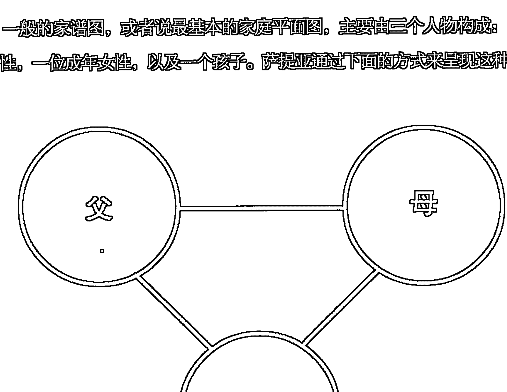

由于萨提亚的家庭概念要跨越祖孙三代，我们还需要将这个示意图拓展到主角的外祖父母和祖父母。

对于这个示意图的类推，可以有效地帮助我们勾勒出家庭重塑所涉及的范围，并且使探索路径变得更加容易。家谱图只是通过展示那些卷入主角早期生活中的人，来帮助我们了解自己的内部和外部现实——即便那些早年的亲戚现在可能已经不再活着了。家谱图象征性地向我们展示了一份将会出现在家庭重塑中的“演员名单”。

准备家谱图需要四个步骤。第一个步骤就是询问有关主角父母的一些细节问题：

- 结婚的日期
- 父母双方的名字
- 生日和出生地
- 目前的年龄或是去世时的年龄
- 宗教信仰
- 职业
- 民族
- 教育
- 业余爱好

为了方便展示，我们在这里使用的是生物意义上的原生家庭。但是对于单亲家庭、继父继母家庭，以及其他非生物意义上的原生家庭来说，可以对家谱图进行适当的调整和改动来适应现实情况。

在第二个步骤中，引导者需要让主角为父母双方增加一些元素：

- 三个描述性的形容词
- 他或她在压力情境下采用的主要应对姿态
- 他或她在压力情境下采用的次要应对姿态

主角对于现实的构造正是家庭重塑中需要处理的一部分，因此它的客观准确性并不重要。如果主角对此并没有特定信息或是意见要提供，那么引导者可以鼓励他（她）去进行“虚构”。

步骤三如下所示，主角需要补充：

- 从最年长到最年幼，所有的孩子
- 第一个步骤当中针对每一个孩子的问题（如上所述）
- 第二个步骤当中针对每一个孩子的问题（如上所述）

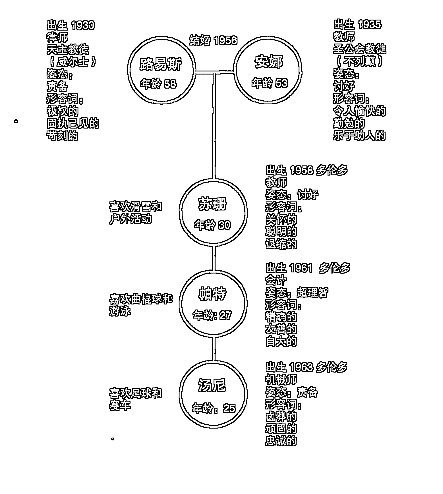

在步骤四中，主角创造了三个分离的阶段三示意图：他（她）的祖父母、外祖父母，以及主角自己的原生家庭。除了阶段三的数据，主角还需要根据他或她自己的观点指出：

- 父母和祖父母持有的家庭规则
- 任何家庭模式（例如，职业、疾病、应对姿态、死亡原因等等）
- 家庭价值和信念（例如，对教育的价值观，对金钱的价值观等等）
- 家庭神话和家庭秘密
- 家族主题

为了向整个小组展示，主角通常可以将所有这些家谱图放在大张的活页纸上，在实际的家庭重塑过程中进行展示和悬挂。

对于家谱图的编译为我们建构下一个工具——家庭生活编年史铺平了道路。（参见附录）

### 家庭生活编年史

在实际的家庭重塑技术开始之前，家庭生活编年史是第二个必要的操作步骤。它涉及祖孙三代人，起始于主角的（外）祖父母辈中最老的一员，截止于主角成年（18，19或21，依据法律而定）。例如，主角祖父母辈中年纪最大的一员可能出生于1901年，而主角可能在1975年达到法定成人年龄。

可以将下面的信息以编年体的形式整理为表格：

- 每一个家庭成员的生日
- 重大家庭事件的日期（例如，搬家、结婚、离婚、死亡、重聚、灾难）以及取得成就的日子（例如，毕业、晋升）
- 一些重要历史事件的发生日期（例如，战争、天灾、经济动荡）

家庭生活编年史常常可以写满四到五页大张的活页纸。

### 影响力车轮

影响力车轮图表可以向我们展示每一个在主角童年和青少年时期给予他（她）智力、情感或是物理方面影响的人。这些人可以给予主角许多学习经验，而主角也会以某种方式对他们做出响应或反抗。

在主角的“车轮”上的人越多，主角在发展过程中需要标注出的影响和资源就越多。这些人通常包括：祖孙三代的家庭成员；其他生活在主角家庭里的人（或是主角曾经寄居的家庭中的成员）；特殊的老师，以及朋友。其他影响因子则包括：想象中的玩伴；宠物；珍惜的玩具，以及个人的特殊事件和物品。

主角将他或她自己的名字写在中间，在自己的名字周围一圈圈地列出其他人的名字——像是一个装有辐条的车轮。而辐条的宽窄可以变化，线条越粗，代表关系越亲密。

在每一个名字下面，主角需要列出三个形容词来描述这个个体。（对于家庭成员，可以使用在前面家谱图中提到的那些形容词。）然后，主角就像在附图当中所展示的一样，将每一个形容词用符号标记为积极的或是消极的。

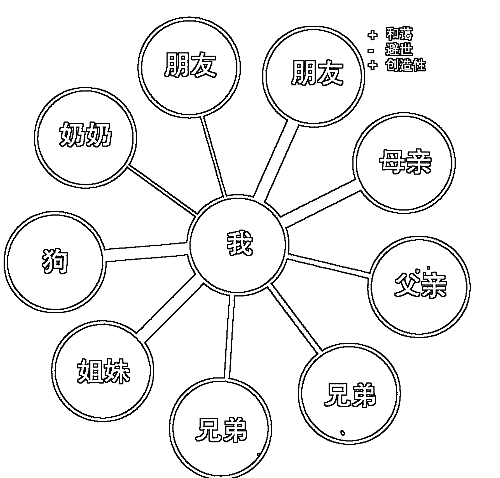

许多主角担心自己无法记起，或是不能向亲戚询问有关童年事件和他们家庭编年史的事情。对此，引导者可以让他们完全放宽心。年幼的时候，我们会将所有学习到或是体验到的东西储存在大脑的右半球（有时也被称为潜意识）中。更进一步地说，我们完全应该相信，自己仍然有能力将它们回忆出来。而家庭重塑技术，恰恰可以让这一切成为可能。

家庭重塑希望达成的目标，就是将主角左脑和右脑中的知识和智慧加以整合。即便在作为孩子的时候我们并不能特别意识到这一点，但是我们在认知层面上的理解，常常为发生的事件提供了一个环境背景。与之相似，当萨提亚谈论到一种变化的状态，或恍惚时，她也就是在谈论如何超越认知的部分，用自身的直觉部分来触及自我的智慧，并提供转变的过程。即使主角不能在意识层面记起一些童年时的细节，必要的内容材料还是可以在另一个意识层面获得。

不论所处的环境如何，躯体都有能力来记录和保存信息，这就解释了为什么我们完全可能回忆起它们。我们也许会用下列说法来限制这类信息的可靠性，像是：“如果非得要猜的话，我想事情可能是这样发生的。”或者说“我不知道，但是我猜是……”不管怎样，从家庭重塑技术当中得到的经验向我们表明，许多人的“猜测”随后都得到了其他家庭成员的证实。

换言之，没能在意识层面记起他们个人成长历史的人，实际上仍然可以为家庭重塑技术提供资料。萨提亚认定，每一个人类个体都了解关于他或她自己的所有一切，而问题仅仅在于如何接触到这些信息。对于那些“不了解”的事实，她会告诉人们去“虚构想象”。通过运用大脑右半球，或是在恍惚状态下，主角常常可以给予准确的信息，至少在家庭动力因素和应对过程的形式上是如此。

我们大脑右半球的“猜测”是否具有客观准确性并不重要。重要的是主角对于事实的构建正在得到开发，而家庭重塑正是通过这些构建的知觉得以实现。同样，任何变化也只有在此才能发生。

## 家庭重塑的过程

一旦引导者熟悉了主角的家谱图、家庭编年史，以及影响力车轮，就可以将它们悬挂在工作坊的墙上作为参考了。家庭重塑也就正式拉开了序幕。

经典的重塑方式通常是在一个大组当中（从15人到几百人）完成的，并需要1-3天时间（6-20小时）。在一些介绍性陈述之后——包括对当天的活动安排介绍，引导者告诉大家主角的家族历史。主角常常坐在一边倾听。这种做法提供了一种简单的方法来激活我们的大脑右半球，从而帮助主角进入重塑的体验过程。

讲述故事不仅包括主角家庭中那些表面的信息，还涉及下列目标：

- 为家庭重塑提供一个背景环境。
- 回顾主角的生活历程，并将当前的问题、家庭模式、过去的事件，以及影响主角发展的人物之间建立一些重要的联结。
- 向人们展示这个家庭是如何应对和处理压力、愤怒、冲突和痛苦的。
- 通过将主角的许多消极体验重构为人们应付压力时的反应形式，凸现出家庭的资源。
- 增加更多有用的可能性，如注意到某个名字反复出现在家庭编年史当中，因此这个人物可能对整个家庭具有重大的意义。
- 通过构建起一个思维框架，让参与者做好准备，帮助他们一同进入主角的发现之旅。
- 以“人格冰山”的形式来讲述故事，指出主角的渴望、期待、知觉和感受。
- 指出家庭的价值观、信念、规则，以及家庭如何定义它自己和其中的成员。
- 识别出需要被改变的模式，以及需要被转化的，过去的消极影响。
- 揭示大部分家庭主要成员，特别是主角的希望和梦想，以及它们是否得到实现。
- 展示在生活中的牺牲和奉献，并庆祝新的可能性、选择，以及发展机会的到来。

一旦故事得到讲述，并且主角吸纳了其中蕴涵的大量信息时，引导者就可以让主角去选择并邀请工作坊中的其他参与者来扮演在他（她）童年生活中具有重要意义的亲戚和其他人物。演员通常包括主角，一位主角的代言人（这样主角就可以在角色扮演的过程当中观察他或是她自己了），引导者（或是一组引导者），以及扮演主角的兄弟姐妹、父母、祖父母及其他重要人物形象和/或资源的人。

萨提亚相信，考虑到我们具有普遍的联结性，任何人都可以扮演任何角色。然而，重要的一点是让主角挑选出人来扮演自己的家庭成员或其他重要人物，通过戏剧的形式来展现家庭的动力性结构。最初，挑选角色扮演者的过程同样可以帮助主角看到，家庭成员们作为独立的个体，都在竭尽所能地让他们自己过上最好的生活。

作为小组的成员，参与者们不论是接受主角的邀请，还是给予拒绝，都应该得到鼓励。接受邀请的人就此拥有了一个“进入角色”的机会——各自融入到他们将要扮演的特定家庭成员的形象当中去。这是通过让自己熟悉各自的形容词和应对姿态，并聆听关于其他成员和共同生活环境的描述来实现的。除此以外，我们并不需要再做其他的事情来保证每一个角色都做好了重塑的准备。

萨提亚常常鼓励参与者即兴创作一些道具，以此来增强角色的视觉冲击力和现实感。通常，在经过茶点时间或是午餐休息之后，人们可以找到一顶帽子、一条缎带，或其他道具来改进他们的扮相。

同时，重塑在开始部分需要进行的一项工作，就是在引导者、主角和扮演者之间建立起某些契约。这些相互的理解可以凸现出彼此间的信任、开放以及工作的意愿。例如，引导者需要在确保与主角拥有亲密的情感联系的前提下，邀请参与者加入主角的生命之旅，然后让主角指出他（她）希望通过家庭重塑达到的目标——有哪些改变是她或他希望实现的。

就像它本身具有的形式一样，家庭重塑在两条途径发挥作用。一是释放被压抑的感受并克服来自过去的影响：功能不良的模式、知觉和期望。另一条途径则包括突破我们目前所知的局限。这可以帮助我们向着成长、完善，以及健康和最优的功能迈进。

因此重塑的过程开始的时候，非常重要的一点就是花时间来澄清主角的目标，将它们记录下来，确保每个人都可以看到。主角经常会谈及的一个目标，就是达到一种崭新的生存状态。然而，这样的目标常常是从简单的行为改变进化到以更多加工为基础、并且更强烈地与深层渴望相联系的东西。例如，在我们与布鲁斯一起进行的一次家庭重塑活动当中，他说自己希望达成的目标是减少对父亲的轻蔑和不敬。当引导者与他一起探讨这一目标的时候，布鲁斯真实的希望开始变得渐渐清晰，那就是他希望能够接近自己的父亲，能够对父亲的行为给予更大的接纳和更少的苛刻批评。他渴望与父亲待在一起。在此之后，引导者与他一起探讨了有哪些结果是布鲁斯可能实现的。他开始意识到，他可以对自己和父亲产生更好的感觉，这无疑可以帮助在他们之间建立起更健康的关系。

一旦完成介绍阶段的工作，经典的家庭重塑就可以开始遵循下面四步骤行动模式来开展了，这四个步骤分别为：

1. 雕塑原生家庭
2. 雕塑主角父亲和母亲的原生家庭
3. 雕塑主角父母的约会、求爱和婚礼场景
4. 重新雕塑主角的原生家庭

就像下面对每一个部分的描述所展示的一样，以戏剧化的形式展示维持了三代的家庭动力结构，可以给主角一个机会，去实现早先确定的个人目标和普遍目标。

### 雕塑主角的原生家庭

引导者让主角描述这样一个时刻，全家都处于压力状态下，而家庭成员们并不能在意见上达成一致。最好是选取一个主角离开家之前发生的创伤性事件。通常，它会是某个主角在准备阶段就谈论过的事情。

这样做的目的是让主角将他或她对于家庭动力因素的构建外化表达出来，并且识别这种压力情境所唤起的知觉和感受。这同样也给了主角一个机会，让他或她可以用成年人的视角来看待在自己的家庭中可能存在的某些令人痛苦的应对模式。

在主角描述完整个事件之后，引导者可以询问主角对此的感受。这种做法可以将注意力集中在感觉或是任何新的觉察上。完成之后，第二部分就开始了。

### 雕塑父母的家庭

主角首先雕塑他或她生身（或者收养、养育的）母亲的原生家庭。此处的目的是让主角注意到他（她）的母亲是怎样成长的。在她的原生家庭当中，她主要的学习经验是什么？

要做到这一点，主角和引导者需要询问各种关于这个家庭的问题。其中某些问题可能涉及的内容是主角以前从来不知道，或是从来没有问起过的。而问题的答案常常涉及每一个家庭成员的经历（如至今仍然住在主角家里的叔叔，他可以谈论在主角的母亲私奔那一天晚上，自己的父母的反应）。这给了主角一种新的知觉，与祖父母心心相连的感受，它也让主角可以识别自己身上的某些来自他们的部分。这可以成为一种给予力量的体验。

这个过程还让主角接触和了解了年轻时的母亲。她的梦想、希望、奋斗是怎样的？主角常常可以由此产生对自身力量的新的欣赏，以及对母亲更大程度的接纳。任何累积的消极评价或愤恨情绪都会因此得到缓解。

在此之后，引导者可以以类似的方式对主角父亲的原生家庭进行引导。对于那些没有得到解决的事件，我们需要利用每一个机会来进行处理。例如，主角也许需要一场对自己的祖父母，以及童年阶段的其他重要人物的道别仪式。

引导者同样需要鼓励主角在一个更深程度的关怀、亲密和接纳水平上接触自己的父亲。在早先介绍的布鲁斯的案例中，深化起始于询问父亲的角色扮演者，他对自己儿子的希望和期盼是什么。听到这些渴望可以帮助主角触碰到自己对于亲密感的渴求。它同样也在一个更深的层次为他和他的“父亲”建立了联结。家庭重塑常常是儿子或女儿第一次与自己的“父母”分享深层感受的场合。正是这种新的体验和觉察产生了更大的自我完善。

### 雕塑主角父母的约会、求爱和婚礼场景

在这个活动中，演员需要重新演示主角父母的约会和求爱场景。而这些情景也正是在主角的原生家庭当中发展出的第一种关系模式。对此进行雕塑同样给了主角一个机会，去聆听父母双方的愿望和梦想，这愿望和梦想既是作为个体所产生的，也是以他们彼此之间的关系为依据而产生的。

大部分人会带着喜悦的心情来观看恋爱部分的表演。它的目的在于，与在主角出生前的这对伴侣，他们各自的渴望和预期，以及他们各自带入这段关系中的应对模式建立联结。这样做也为这两个后来在戏剧当中成为了主角父母的演员提供了更广阔的环境背景和更深入的评估。

下一步，一个具体的雕塑造型让人们经历这一对伴侣的婚礼。而两个家庭之间可能存在的冲突也可以表现出来。

在仔细地遵循整个流程之后，引导者可以询问主角对早期家庭历史的感受。由于主角本身并不可能参加那场婚礼，这些问题可以引导他或她对于这一对法律意义上的夫妇之间的动力性关系，以及即将到来的争斗产生新的看法，并投入新的洞察。

### 重新雕塑主角的家庭

在婚礼之后，演员通过描绘主角以及主角每一个兄弟姐妹的出生来营造主角的原生家庭。引导者和主角都需要小心地关注每个孩子的到来给整个家庭系统，以及各个成员之间的关系带来了怎样的改变。主角同样可以体验自己是怎样参与到这个过程当中去的：在与家庭其他成员的互动过程中，以及在整个家庭动力系统当中，主角是如何展示出自己的应对和生存模式的。

引导者常常会让主角回忆并塑造一个创伤性场景或重要的经历，并从每一位演员那里收集他们对它的评论。这样，每个家庭成员的内心加工过程就得到展示，而主角则获得了对他（她）自己以及其他所有家庭成员的新的觉察和评估。

要实现主角早期制定的目标，引导者还需要让角色扮演者们展示出一些特殊的场景。例如，假设一个妇女在她50岁时想要变得更加具有决断性，并且打算联系将自己抚养成大的姐姐。那么这两者之间的模式将会表现为一个控制性的姐姐和一个讨好型的妹妹之间的关系。而现在，主角想要逐步实现权力的平衡。尽管她现在24小时照顾自己患病在床的姐姐，然而在姐姐面前，她仍旧表现得像一个随和、讨好的两岁小孩。

在这个案例当中，引导者可以选择一个可以展示这种互动关系的早年场景。将包含着主角时至今日仍然无法表现出来的无助和愤怒感的情况，以极端或夸张的形式通过戏剧展示出来。引导者鼓励并支持主角确定自己的立场（主角年幼的自我），停止使用过去的应对模式，并做出新的选择。年幼的自我需要站起来面对她的姐姐，告诉她自己的感受，与她分享自己对打算和不打算做的事情的新决定。

上述过程利用过去来改变一个主角至今仍然在沿用的模式。然而，只有当主角是在自尊水平上做出改变的决定时，这种方式才能成功实现。这也就是为什么家庭重塑被设计用来帮助我们触及内心真实的自己，我们拥有的内部资源，我们可能变成的样子。家庭重塑是一种有效的方法，可以帮助我们重新认识和承认我们自己拥有的无限可能性和独特美丽。

在雕塑主角原生家庭过程的最后部分，就是让主角：

1. 承认任何未被满足的预期和渴望，并用言语将它们表达出来。
2. 描述和表达他或她对自己未实现的渴望和预期的感受。
3. 辨别父母的优势和弱点，对他或她自己讲述这些，并由此在自己与父母之间建立新的联结。
4. 在更高的水平上，对自己拥有的人格特点，以及父母拥有的人格特点予以接纳。
5. 接纳自己和父母的相似性和差异。
6. 接纳自己的父母作为普通人，承认他们已经做到了他们能够达到的最好。
7. 带着高自尊接纳自己，并且与父母分享这一接纳。让他们了解，主角已经不再渴望过去缺少的认可和赞同。

要做到上述这些，引导者需要在过去与现在、优点与缺点、差异和相似性之间进行紧密和巧妙的编织。它也意味着主角需要放弃那些没有实现的期望，并增加对自己的掌控。

### 结束

当主角已经达到了更高的自尊、充满力量和希望的状态时，引导者就可以结束家庭重塑活动了。结束过程包括解除角色扮演者的演出任务，并花时间让每个扮演者分享她或他的体验：扮演角色的感受，或者个体自身产生的重塑效果。

没有扮演任务的小组成员同样有机会分享他们对整个过程带给他们的影响的体验。这些观众常常会以三种不同的渠道参与到家庭重塑过程当中：描述他们自己的经历和体验；关注主角的加工过程；以及关注引导者的加工过程。正如家庭重塑带给我们的普遍意义一样，每个人都可以以某种方式触及生命的过程，并释放自己的能量，既可以通过点燃希望，也可以通过清除某些阻碍物的形式。

## 重塑原生家庭

我们每个人都是自身思想、感受、知觉，以及实现或未实现的期望综合得到的产物。同样，我们也是某些关系和学习经验的产物，而这些经验都是基于与我们周围鲜活的人物形象（通常是我们的父母）的互动得来的。人们的应对问题往往不可避免地与孩子——家长之间未取得一致的经历有关。过去的习得经历阻止我们从整体上看待和评价自己，它们常常会让我们将注意力滞留在过去，并继续使用那些我们作为孩子时的不完整的知觉。

我们一出生就必须学会如何对待自己，如何对待他人，同时也学会期待他人如何对待我们自己。我们同样必须学会家庭中的生存规则。到开始说话时，我们已经学会了如何定义和保护我们自己这些基本生存机制（包括使用萨提亚鉴别出的那些生存姿态）。

成长并不意味着减少童年规则和关系对我们的影响。“现在”，是我们在物理上存在和生活的唯一维度，但是当过去不断污染现在时，萨提亚知道，我们正在持续重复旧的模式。因此，治疗目标之一就是将这种污染转变为阐释：利用过去让自己更清晰地看待现在，更完整地生活在现在。这一目标可以帮助我们从被动的应对，转变为在充分认识到我们自己的选择的状态下，自由地应对。

就像下面对萨提亚如何发展家庭重塑方法的描述所展示的，她深知责备父母并不能改变我们早年获得的应对策略。起关键作用的并不是一个责备的情景，而是一个人性的场景。就像萨提亚所看到的*：

> 整个宇宙都是具有秩序的。作为人类个体的我们同样也遵循这一方式。我们无法总是看清我们人性的秩序所在，最主要是因为我们没有看清，或是没有睁开眼睛去看。

> 发现这一秩序对我来说非常重要，我知道它总会在某个地方。对我来说，这种秩序的基础就是生命力量。我同样发现事情总是因果相承，而几乎每一件事情都有一个序列，而这种感觉同样告诉我们，每一件事情既有代价也有回报。从而我开始以这种思想框架来看待周围的一切。

*Avanta 网络组织年会，1987年6月，Mt. Crested Butte, CO。

我开始从每个个体独有的痛苦当中看到一种普遍性的存在。我看到了与对父母的忠诚相联系的痛苦。就其本身来说，这并不新鲜。弗洛伊德对此早就有所了解。而我则开始追寻存在于人们行为和他们从家庭中习得的东西之间的关系。

早些时候，我会参加周末马拉松。正是在这里，我看到了许多人正试图用一些看起来并没有什么帮助的方式来将自己从消极的体验当中解放出来。但不管怎样，我还是将这些事情综合起来，并整理如下：

1.  就像精神分析试图让我们去相信的那样，父母并不是孩子天生的敌人。
2.  人们一直都在尽力做好。为什么对他们的孩子事情总会变得一团糟？
3.  人们时刻背负着对他们家庭的那些构想。
4.  人们是在与自己的构想，而不是与真实的父亲或母亲斗争。需要改变的是他们对自己经历的解释。
5.  接下来我学到了有关创伤事件的信息。造成人们痛苦的并不是创伤事件，而是人们对创伤事件的反应，是人们的应对方式。我看到了人们在经历同样的事件时会受到完全不同的“影响”。
6.  我发现问题本身并不是问题，而应对方式或者缺乏应对方式才是问题。我将寻找一些方法从内部找到这些构想，并将它们外化。
7.  将内部加工过程外化的想法让我创造出了角色扮演的方式。我一边为过程增加背景，一边开始让人们去扮演母亲、父亲、兄弟姐妹，以及在三代原生家庭当中的其他重要人物。由此，故事内容变成了情境（也就是说，故事提供了场景或容器，在其中，引导者可以促进主角表达的改变和转化目标。）
8.  在这之后，我开始将这种形式慢慢等同于一个戏剧。我发展出了一套戏剧形式，其中包含有欢乐和幽默的成分，并且可以让我们激活大脑的右半球。
9.  我同样发现，即便只拥有非常有限的信息，角色扮演者们也能够知道应该怎样表现。我开始意识到整个过程存在普遍性，以及角色扮演者在资料非常有限的情况下融入角色的能力。
10. 我发现这个过程是多层次的、位于精神层面上的，而且具有强大的力量。到目前为止，这个方法已经日渐成熟，而且以“家庭重塑”技术为世人所知。
11. 家长们实际上是已经长大了的孩子，而他们正在用自己所知道的方法，尽可能地做到最好。

上述部分向我们描述了，萨提亚是如何将经典的家庭重塑技术发展成为一种改变工具的。她随后又开发出了两个简易版本：关键影响重塑技术，以及内部可视化版本。对此，我们将在本章的最后加以详细的描述。

### 普遍目标

家庭重塑的结果之一，就是让我们有这样一个机会，能够作为价值平等的人类个体与父母进行交流。通过自身的体验和对他人的观察，萨提亚强烈地感到，除非可以在人性的层面上与父母接触，否则我们将无法达到彻底的完善。如果我们是作为独立的个体出生，而且个性化十足，那么我们早就应该明白，自己的父母也不过是普通的人类。相反，如果我们的父母不是不得不表现出父母的样子，那么他们应该在很久以前就意识到了，自己的孩子同样也是普通的人。我们每个人都应该用整体的、价值平等的视角来看待他人。然而，我们却放弃了这样的做法，而是通过各种标签和角色来界定自己和他人。

第一次看到某个事物时，我们总会依据自身的位置、理解以及我们对自己的感受来形成知觉。还是婴儿的时候，躺在床上，向上仰望的我们形成了自己对于成人的第一印象。这些印象与其他早期体验一起，不但可以影响，甚至会歪曲我们成年之后的知觉。而这些初次习得的东西有时要比以后学习到的东西具有更大的影响。

例如，萨提亚曾经奇怪为什么她所治疗的人有那么多都声称自己拥有像魔鬼一样的、懦弱的，或是愚蠢的父母。当真正遇到这些所谓的怪物时，她才发现，他们看上去并不那么可怕。她开始明白，人们常常会依据生命早期的经验发展出日后深信不疑的观点。例如，一个小男孩也许会想“我的妈妈总是很虚弱。”而他之所以会得出这样一个结论，完全是依据自己童年时的理解、他的知觉以及他对自己的感受。改变这三个方面当中的任何一个，都可以使他得到一个不同的、更不受局限的结论。

家庭重塑的另一个重要目的，就是对我们自己进行更新。尽管存在于现在的时空当中，但是我们仍然持有混乱的期望，感受着多年前发生的事情带来的痛苦。家庭重塑技术是一种关怀性的、有效的方式，帮助人们将他们自己从被压抑的童年生存信念当中解放出来。而在发掘生命丰富多样性的旅程当中，将过去的经历与现在的体验区分开，无疑是至关重要的一步。

-   萨提亚强调，如果不能做到这一点，人们将继续限制自己展示其生命活力。作为支撑人类生命的普遍能量的一种展示，人类的精神具有众多的层面。而直到人们整合他们的体验，并且以一种丰富多彩的状态来理解和看待这个世界之后，他们才不会将自己局限于仅仅表达自身的某几个方面。

家庭重塑技术为我们提供了一个契机，让我们可以理解自身的经历中的所有相关部分。这些部分被组织起来的方式依据主角独特的历史、家庭编年史、机会和家庭规则而不同。

让我们回到布鲁斯的例子上：他独特的成长史包括在5岁那年失去了自己的母亲，并不得不开始与继母一起生活。而他既不能完全接受继母，也无法与自己的父亲建立起亲密的个人关系。布鲁斯对于这些事实的知觉，可以帮助他将有关自己的一些感受组织起来，这包括作为一个低自尊的人的感受，以及脱离与别人的联结时的感受。布鲁斯会在取悦他人的同时，贬低他自己的感受和渴望，他正是通过这种方式来保护自己。他的家庭规则就是“必须不惜任何代价保护好父亲”以及“不要表现出你的感觉”，这些规则无疑进一步强化了他的孤独和无价值感。

我们如何对待自己和他人取决于我们在原生家庭当中学到了什么，以及我们对自身独特性的展示程度。在布鲁斯的例子中，他对于自己独特性的感觉，已经在与他控制性的继母的交往当中被损耗殆尽了。随着修通痛苦的过去，他渐渐开始能够接纳自己，并且显示出许多一度被压抑的资源。这其中的一个得以发展的资源就是他对于写作的兴趣和能力。

当我们失去与强大自我——对于自我的强烈尊重，并且相信世界因为我们的存在而变得更加美好——的联系时，就会存在情感上的痛苦。对这种痛苦的觉察与过去的学习经验，以及人们如何知觉他们的父母有关。萨提亚发现仅仅演示核心的原生家庭是远远不够的。她为家庭重塑增加了祖辈的内容，让这一技术成为一场由几辈人组成的，关于学习经验、规则和交往模式的演出。

家庭重塑带来的另一个强烈冲击，就是让我们可以重新评估积极和消极体验的权重。例如，儿童学习到的主要生存信息被理解为：“我必须一直照做父母希望的事情，否则他们将再也不爱我。”如果取悦无法达到目的，孩子也许会感到愤怒或挫败，并以责备或退缩的方式来应对。而家长则会针对这一行为，而不是针对孩子的生存需要做出反应。

我们人类必须经历很多痛苦，才能适应那些对我们来说毫无意义的反应和感觉。我们的防御机制在约束了开放性的同时，也阻挡住了外部的世界对我们内心的伤害。因此，我们会更轻易地沿用一些消极的学习经验，而将积极的体验看做是理所当然的。

我们的结论常常建立在消极的经验基础之上。例如，如果我们做了17件效果良好的事情，而第18件事情则非常失败，那么我们可能会感到自己度过了非常糟糕的一天。另一个例子就是，如果16年来你的父亲从来没有打过你，而就在你16岁生日那天，他打了你。那么你可能会在事后声称——带着绝对的肯定——他在你的一生当中都在不断打你。因为对于消极事件的记忆远远超过了对积极事件的觉察。消极的事件关闭了觉察积极事件的大门，因此我们的知觉常常被自身的消极体验所左右。

萨提亚发现，如果我们可以检验关于自我价值的大部分消极信息，就会发现它们大多建立在下述基础之上：

-   信念——与自我和父母相关
-   忽视——与有限的信息相关
-   缺乏觉察——与我们理解这个世界的歪曲方式有关
-   目的——与我们在行为层面下错误地理解意图相关

萨提亚用家庭重塑技术给了人们一个机会，让他们以一种暴露出他们的信念、忽视、缺乏觉察，以及误解的方式来看待他们自己和他们的家庭成员。它同样也让人们体验到了其他人充满接纳和关怀的真实意图。当看到在与父母的关系中，这些模式展现出的人类脆弱性时，大部分的人都可以发展出更高的自我价值感。正是在这个自尊水平上，改变才能够发生。

### 情境的重要性

用成人的视角来看待以前的学习经验，我们就需要理解和体验这些习得的情境。我们的生存模式是年幼无助时在家庭中发展出来的，而家庭这个情境正是萨提亚干预方法的重塑目标。情境的特殊性——我们所处的时间、空间，以及每一个独特家庭的场景——塑造了我们的学习经验，同时也为我们提供了改变它们的方法。

也就是说，如果我们看到：我们所采用的生存模式在当时的时间和地点是必须的，但是却不适合现在的情境，那么我们就可以开始改变了。我们完全能够找到一些方式让自己生活得更加和谐，并带着新的理解来评价和使用自己的学习经验。

有时，在当前的情境中使用以前学到的东西会显得很不适合。在家庭重塑过程中，萨提亚会鉴别出旧的学习经验，并追溯到三代或三代以前。这帮助我们认识到使家庭规则产生并流传下去的环境。然后我们可以选择保留、修改或是抛弃自己的童年规则。

家庭主题、家庭神话和家族秘密会以同样的方式产生和发展。很多家庭都活在一个生活在百年以前的人物的阴影中，他（她）的存在、恐惧、希望以及信念至今仍然被现在的家庭成员所承受和体验。当我们回顾祖上三代的历史时，这种家族秘密或阴影常常变得清晰起来。

即便家庭重塑的过程会展现出许多人们存在误解的地方，但是它并不会影响到主角早年知觉的有效性。与父母一样，我们的知觉和观念是在特定情境下自己所能得到的最好的东西。也就是说，我们每个人都在背负着误解或是错误结论的同时，努力做到我们能够做到的最好。

例如，一个在整个童年和青少年期都感到毫无价值感的妇女，当她还是一个婴孩的时候却并不会自动感到自己与他人的不同。而一个有孩子之前就脾气暴躁的男人，在他成为父亲之后仍然会延续这种行为方式。

在家庭重塑过程当中，萨提亚并不会置疑在父母和孩子之间是否真的存在爱的感受。她了解人们完全可以通过和谐一致的方式最好地表达自己心中的爱意。只要他们仍然通过责备、讨好、超理智和打岔的方式来表达自己不一致的感受，他们就无法很好地传递爱的讯息。家庭重塑技术恰恰扫除了这些阻碍，帮助人们看清来自父母的爱的讯息，并通过可识别的方式来沟通、发出和接收这些消息。

当我们降临世间的时候，每个人都是一个完整的生命个体。不论发生什么，我们向完善性进化的潜能总会一直保留下来。我们是自己的想法、感受、生命力量、自己的行为，以及自己对于所有身体加工过程的知觉（特别是由于我们当中的一些人被教导认为自己身体的某些部分，或是某些身体功能是不好的）的产物。使用所有这些方面，本身就是一种创造意义的方式。

所有我们过去体验中的痛苦和困境都蕴涵着发展出新的机会、新的选择和新的可能性的契机。困境已经过去——它已经成为了历史的一部分——而我们今天所经受的所有痛苦都是我们自己告诉自己的。继续沉浸在过去的已经不适应的知觉中，这也是一个选择。我们的知觉是属于我们自己的。

就像前面提到过的，发生在我们身上的每一件事情都被记录在我们意识当中的某个地方，并且可以在某种特定的条件下被提取出来。人类的身体通常可以迅速地对他人传递出的能量进行辨认和反应。例如，躺在婴儿床上的小宝宝一样可以对声音和触摸做出反应。也许一个大的声音会让它感到紧张，而一只大手则让它感到焦虑。婴儿可能并不能对事物的真正意义产生认知层面上的觉察。但是这些感觉却会被记录下来，并且在之后的生命过程中埋下伏笔，条件成熟的情况下便可以进入个体的意识。

我们需要通过某种方式来将这些体验进行分类，并在自己的意识层面上对它们赋予意义。总会有这样一种方式，可以帮助我们理解并且利用这些体验。

一个婴儿无法将自己与外部世界加以区分，并且对于背景环境没有任何意识。例如，如果父母的争吵处于听力可及的范围，那么孩子很可能仅仅对争吵的声音做出反应并且由此产生感受。

回顾过去发生的事件，并且将种种行为重新放回到当时的情境之中，可以帮助我们改变自己现在的知觉和态度。家庭重塑的一部分内容就是审视我们对下列问题的结论：

-   我是谁？
-   我对自己的感觉如何？
-   在与男性和女性的交往过程中，我是如何应对的？
-   我被人爱吗？
-   我值得信赖吗？

如何回答这些问题取决于我们如何知觉自己与周围世界的关系。我们自身的知觉和体验又转而构成了对我们此刻的存在，对过去所发生的事情的觉知，以及应对的方式这三者的基础。还是孩子的时候，我们通过触摸、声调和目光接触来学习。在这个阶段，我们同样会体验到双重信息的存在。例如，爸爸也许看起来非常伤心，却拒绝承认这一点，而是说：“我很好，不用替我担心。”孩子会如何理解这其中的含义呢？

另一个例子发生的情境与父母双方的关系有关，当他们两岁大的孩子吮吸自己的大拇指时，妈妈会向他微笑。而孩子的父亲只要在场，就不会允许他这样吮吸大拇指。所以当孩子的父亲和母亲同时在场时，母亲不再对他微笑，而是告诉这个小男孩，把手指从嘴里拿出来。对此孩子可能产生的感受包括拒绝、困惑和低自尊。

面对这种情况，家庭重塑的主旨并不是试着确证这个人的父亲和母亲是不是真的爱他。相反，通过增加一些新的信息和知觉，我们希望可以创造出一种环境，让他在其中能够对父母的爱产生新的觉察和理解，并意识到问题在于父母的关系，而不是他的行为。

家庭重塑是一段提供了人性化情境的旅程。例如，当人们失控或是陷入痛苦之中时，我们可以观察他们的行为后果。将这些行为置于事情发生的情境中，可以有效地提升个体的自尊。要想做到这一点，我们可以利用下面这些问题：

-   它是如何发生的？
-   它具有怎样的意义？
-   它是怎样从A发展到B又发展为C的？

回答这些问题可以澄清体验产生的情境，并提升个体的能量与自我价值。

将所有注意力放在过去的时候，我们不得不提醒读者，“现在”才是我们唯一活着的时间，也是我们唯一可以在其中做出改变的时间。我们无法改变过去发生的事情，唯一能够做的，就是改变过去对现在产生的影响。

### 改变的水平

在家庭重塑技术当中，有三种不同水平的转变是可能发生的。而在每一个水平上，重塑的目标都贯穿在萨提亚的整个理论系统当中。

#### 水平一

水平一的特征是一种贯穿整个重塑过程的改变，它从主角被选定的那一刻开始，一直延续到重塑阶段结束。下面的几个段落将描述该水平上的改变及其结果。

建立联结。引导者与主角会晤，确认主角想要通过即将开始的家庭重塑达成的希望和目标。双方还需要准备好家谱图、家族编年史及影响力车轮等相关资料。这个部分可以帮助主角在某种程度上知觉到生命力量的连续性，这种连续性既表现在个人身上，也体现在他或她的家庭当中。

在家庭重塑的准备阶段，主角需要达到的一个目标就是以更连贯、更全面和更有凝聚力的方式来描述他（她）的生活。在重塑过程中，雕塑技术无疑是达成这一目标的一种非常有效的技术。

抒发感受。这一目标是让主角触及自己的感受，并在安全和接纳的环境当中体验或是再体验这些感受。这是一种宣泄的形式。一旦人们可以体验并拥有这些感受，他或她也就可以在重塑过程中任何恰当的时刻释放它们。

更新体验。当主角在家庭重塑过程中回顾自己作为孩子时的世界时，他或她也就为自我、他人和情境添加了新的信息和新的觉察。成人的视角使此时此地的现实不致受到过去经验的污染。

要达到这一目标，引导者可以引导主角问一些以前因为觉得不够安全而从来没有问过的问题，并鼓励角色扮演者对这些问题做出回应，并与主角进行交流。

发现未知。这一阶段的工作重点就是发现他或她所不知道的东西。主角需要挖掘那些被自己歪曲了的结论并发现重要的新想法。引导者常会帮助主角唤起新的可能性、新的联结、新的解释和新的洞察。

识别自动化。我们大部分的内心加工都已经成为自动化的过程，其中也包括我们的生存模式。在重塑技术的这个层面，主角尝试去识别和承认他或她的家庭规则、家庭主题、家族神话，以及功能不良的应对模式。

接受过去。家庭重塑最主要的目标就是帮助主角接纳自己的感受、知觉和关于过去的期望，尽可能多地释放它们，同时欣赏它们。

改变行为。一旦人们看到他或她所做的一切真的得到确认、接纳和归属，他们通常都可以改变某些行为。当然，只有在达到前面提到过的其他所有目标的基础上，改变才能够发生。

水平一的家庭重塑对个人的生活产生影响，并且被认为是一个重大的治疗性成功。很多学派认为达到水平一的目标就是治疗的全部。萨提亚则发现这个水平的改变还不足以达到并维持个体的高自尊。

#### 水平二

水平二的改变会对主角产生转化的效果。下面是水平二的目标。

能量转化。家庭重塑可以在感受、知觉和期望水平上将消极的能量转变为积极的能量。我们不是压抑或防御那些过去的伤痛，而是让主角放弃自己没有得到满足的愿望，由此帮助他或她释放自己无限的潜能，并将这些能量用于满足当前的需求和愿望。

提升觉察。通过重塑的各个阶段，主角在渐渐意识到他或她自己的生命力的同时，也开始意识到自我以及自我的普遍渴望可以在什么水平上得以实现。

整合资源。在第二个转变水平上，主角开始整合他或她自己的内部资源，以及自身的各个部分。这一整合发生在自我的水平之上，可以帮助个体产生更高的自尊。主角会因此达到更高的表里一致性水平。

改变关注点。主角发生的第二水平改变的特征是一个大的转化，转化的方向就是重新认识自身的自由、选择、内部资源和更加亲密的关系的可能性。个体转向更直接的内部关注，并且从过去经历的污染当中解放出来。

个性化。通过回顾他或她的学习经验和家庭环境，主角开始逐步去除功能不良的模式和自我限制的纠结。通过区分和辨别自己的价值观、需求和资源，个体可以在尊重相似性和独特性原则的同时，赋予她或他自己平等的人类价值。

#### 水平三

萨提亚有时也在第三个水平进行工作。当主角做出的决定无法提高自己的生活质量，并且仍然挣扎于生存的边缘时，萨提亚会创造出一个环境，让个体重新进行选择。

这个水平上的工作包括帮助主角回到早年的时间和地点，当自我觉得自己的生活根本不值得进行下去的时候。例如，对一个因为多次试图自杀而入院治疗的病人来说，引导者可以首先寻找一个最重要的情境，正是在那时，病人得出了自己毫无价值的结论。

重新创建情境或场景的目的在于检验主角做出的生或死的抉择，因为他或她可能在面对防守不住的形势或事件时，在无意识水平上做出了这种决定。当回到这个情境中，引导者可以帮助主角将他或她最初的结论转变为一种更具建设性、更加积极和更有帮助的生活选择。

第三个改变水平的目标就是帮助主角萌发出新的生命力量。这可以帮助人们触碰到自身存在的生物心理和灵性层面。

## 关键影响重塑技术

在萨提亚生命的最后五年里，她创造出了一套经典家庭重塑技术的简化版本。这一版本被称为关键影响重塑技术，是以经典的范式和趋向为基础建立起来的。不论是经典范式还是简化版本都采用了相同的改变过程，并拥有相同的普遍目标。两者都使用家谱图、家庭编年史和影响力车轮作为工具，并且都使用角色扮演作为治疗方法。

关键影响版本通常更加简短，仅用大约三个小时时间。治疗过程的焦点放在与主角的目标相关的生存应对模式的选择上。这个版本更加强调转化的过程，并且通常聚焦于主角感到自己深陷其中的一到两个主要问题。同样，治疗过程也强调“自我”的水平（如第三章当中人格冰山模型所示），以及自尊的增强。

重塑技术强调创造出具体的、重大的转变。如果用比喻的方式来阐述，它

### 关键影响重塑版本

更像是清除河流中的淤泥。一个有能力的工程师需要清除一根堵塞河道的原木，从而其他的堵塞物可以顺流而下。在关键影响重塑版本中，某个主要领域中发生的改变可以产生与清除阻塞相似的效果，并且就此引发其他许多相关的改变。

这一过程通常会将功能不良的自动生存模式加以转化，或者它可能会致力于某种需要在自我水平上痊愈的创伤经验。关键影响版本往往可以用来处理下列的一些问题：

- 重要他人的突然死亡
- 创伤、暴力或是悲剧性的体验
- 暴怒和被压抑的愤怒
- 令人恐惧的幻想
- 在当前根据新的应对模式做出的决定

慢性疾病患者同样可以从这一版本中获益，尤其对于那些病况从成长的年月就开始的病人。究竟这一过程是如何让我们发现成长的意义，并学会了解自我的？我们将通过下面的案例概述来进行展示，案例中的A先生正是本书某位作者的一名来访者。

A先生44岁，已婚，上班族，同他的妻子和两个孩子生活在一起。他第一次出现在精神科是在1979年，当时他32岁，主诉是无法继续承担某一工作。高中毕业后的12年里，他已经换了一打以上的职业。他曾经做过房地产销售、出租车司机，并且短时从事过很多其他职业。

他刚刚辞掉了最近的一份工作——一家货运公司的仓库主管和部门经理，因为他常常会感到心情沮丧和抑郁。A先生患有紧张性头痛，从高中起，就在一段时间内断断续续地哭泣，并且无法弄清楚自己在生活中究竟想要做什么。

他第一次过来治疗的时候，他的父亲已经70岁，母亲67岁。他描述与自己的父亲“疏远”，而与母亲“非常亲密”。他说，他的一个年长8岁的哥哥同样承受着抑郁的折磨，并且曾一度企图自杀。

A先生报告说他既不酗酒也不嗑药。他的主要兴趣是举重、摄影和读书。他现在饮食和睡眠都很好，也没有自杀倾向。

A先生被推荐到全日制治疗机构参加团体治疗，但医生并没有给他开出任何精神类药物。同时，由于长期严重的后腰疼痛，A先生还在进行疼痛的治疗。1982年之前，他一直在门诊进行治疗。

他的团体治疗进行了大约一年的时间，但是他仍然时常泪眼婆娑，并且无法用言语表述自己的感受。他开始表达出带有暴力和性色彩的幻想，告诉自己的团体治疗师，如果他看到一位长发的女性坐在公车上，就会产生冲上去割掉她的头发的欲望。一年之后，也就是1980年，A先生开始过量服用安眠药。

1988年，他回到门诊部重新接受治疗。当时，他感到非常恐惧、愤怒、挫败和烦躁，同时还有婚姻问题。就连对自己6岁和8岁的两个儿子，A先生也同样会发怒。

被介绍参加婚姻咨询和团体治疗之后，他依旧感到脆弱和伤感。最后他开始服用抗抑郁药物。在个体治疗中，他渐渐专注于自己早年的生活经历。对于自己对儿子表现出的愤怒，A先生感到非常内疚，因为A先生自己的父亲就经常表现出愤怒。他回忆了下面的一些场景：还是婴儿时，他站在婴儿床上不断哽咽和抽泣，而某个人正冲他大声叫喊。

当治疗进行到此时，他被介绍到参加家庭重塑治疗。引导者首先与他进行了三次会面，发展出了信任和和谐的关系；详细地告诉了他有关家庭重塑的过程；向他展示了另外一次干预的录像，并让他选择是否参加他自己的重塑。

当他同意加入治疗之后，引导者协助他一起编辑了自己的家谱图、生活史及影响力车轮。在几次会面之间，A先生用更多的细节描述填补了所需要的信息的空白。在这段准备过程中，他请求精神科医生提高咨询的频率，因为描绘家谱图激发了他更多的焦虑和恐惧。

家庭重塑小组包括大约30名成员。其中有一些受到邀请而来的医院员工（他们当中的大部分人因为A先生之前的数次拜访而认识他），还有一些曾经参加过由引导者主办的家庭重塑技术研讨会的专业人员。

治疗的时程被限定为不超过三个小时。当人们介绍完他们自己之后，引导者邀请A先生展示他的家谱图，并介绍自己父母的背景资料。在这之后，从小组中挑选出的角色扮演者开始通过一段简短的雕塑表演来展示父母双方各自的家庭背景和成长历程。接下来，演员们将塑造A先生的原生家庭，以及A先生自己所描述的场景：两岁大的他默默站立，耳畔传来的争吵声让他备感恐惧和孤独。

在整个过程中，注意的焦点是对A先生的父亲，以及他的挣扎、他的应对方式和他的痛苦增加新的了解，以及将这些觉察与主角现在的应对和斗争方式联系起来。此时此地的父子关系被给予特别的注意。

A先生的父亲是家里三个孩子中的长子。A先生的祖父是一名农场工人，家境非常贫寒。后来，全家搬到了城市中，在那里，祖父每一天都要在铁路上工作。A先生的父亲12岁的时候，祖母去世了。照看弟弟和妹妹的重担落在了A先生父亲的肩上。祖父一生结过两次婚，但是却没有时间陪伴自己的孩子。

A先生的母亲是家里三个孩子当中最小的一个。她还很小的时候，母亲就撒手人寰，而她的祖母则与自己的家庭一起生活了很长的时间。她的父亲被描述为“卑鄙”。

A先生的父母在学校的一次社交聚会中相遇。经过几次约会之后，两个人在1939年结婚了。他们的头生子是一个男孩。在第二次世界大战期间，A先生的父亲被征召入伍，并且在欧洲前线经历了创伤性体验。重新回到家庭时，他已经变成了“一个完全不同的人”。A先生的母亲回忆说，他变得更加严厉、忧伤和抑郁，也很少谈及在前线的经历。1948年，A先生出生了。

发生在A先生父亲生命当中的一段值得我们注意的小插曲就是他在12岁那年失去了母亲。下面一段内容是有关父亲的原生家庭的雕塑。

引导者：所以，我想这对他来说仍然是一段痛苦的体验。他在很早的时候就失去了她，而自那之后，他就不得不开始接管一切。我只是想让你能够了解这一点。我不认为在12岁的时候他得到了足够的帮助，因为他的父亲必须不断工作并且料理一切，这种情况下，一个小男孩能够从哪里得到支持呢？

主角：没有任何地方可以让他得到支持。他几乎全靠自己。他的父亲每天早上7点乘坐火车去上班，晚上7点以前不会回家。

引导者：发现了这一点之后，你有什么感想？一个12岁的男孩子，就像你儿子现在这么大。如果你的儿子忽然失去了母亲，而你不得不每天工作12个小时，他需要照顾两个更小的孩子，那会是怎样一种情况？那就是你父亲曾经度过的生活。

主角：想到这些真让我感到惶恐。而他的应对方式似乎就是将这一切都推到一旁，置之不理。

引导者：他应对那些艰难情境的方式，反过来也塑造了他的性格。我们提到他习惯于将一切置之一旁，不去谈论它，在之后的生活中，他对自己的家庭采用了同样的方式。也许那就是他开始学习到的如何应对痛苦的方式。你是否能够意识到，你也会将那些非常痛苦的事情放在一旁。

主角：是的。当我还很小的时候，如果事情无法解决，我就会那么做。我们上周在小组中谈到过这些。我将自己所有的希望紧扣在几个人身上，如果事情不照着我希望的方式进行，我就会感到极度失望。我最小的儿子才6岁，他有一个习惯，当事情不能按照他的意图解决时，他就会开始哭闹。我曾经也是这样的，为什么他也会变成这样，我不知道。他无法从我这里学会哭闹的把戏，因为他从来没有看到过我哭泣。但是从某种程度上，我们又是如此相像。

引导者：也许你和自己的父亲也非常相像。而他可能也并不会哭泣。

主角：是的，他不会的。

引导者：我不认为在那种充满艰苦工作的生活中，他有哭泣的时间。

主角：是的，他根本没有时间去哭泣。

通过将这些相似性串联起来，并且建立起联结的机会之后，引导者转向了雕塑中那位12岁的父亲。当时正是他母亲过世的时间，而这留给他极大的空虚。站在一个远离父亲，以致无法依靠他的地方，这个12岁的男孩子正被他的两个弟弟用力拉着。

引导者：［对12岁的父亲说］你的感觉如何？你现在只有12岁，而你的母亲忽然间过世了。

父亲：我感到失落、空虚——我现在该做些什么？我的妈妈走了，而她是我所拥有的全部。我可以从谁那里得到支持和依靠呢？现在她离开了，而我肩上的担子更加沉重了。

引导者：你有什么感觉？

父亲：我真的感到很害怕——真的，真的害怕她的离去，因为她是我生活的依靠。她支撑着我们所有人。现在她走了。

引导者：你还有什么感受？

父亲：我想要抓住某人的手臂，我现在正在向前跌倒，所以我需要这样抓住。［他向自己的父亲伸出双手。］

引导者：这很可能是真的。［转向主角］所以他在努力抓住他（祖父），而你认为你的祖父会怎样做？

祖父：嗯，我觉得自己从来没有在这里，所以我真的无法做任何事情。我的工作太忙了，无法为孩子们做任何事情。

引导者：［转向主角］现在，我想你的父亲已经从他的父亲那里学到了一些东西。你认为你的父亲学到了些什么？

主角：我认为，爸爸你学到的就是不要表达自己的感受。你学会了隐藏自己的感受。你学会了如何应对，如何变得独立。从上个周末你告诉我的内容里，我认为你从以前就一直非常独立。作为一个独立自强的个体，你有能力做自己所做的事，但是你必须隐藏起一个12岁的孩子的感受，不得不去做所有这些事情。

引导者：[转向主角] 我认为你也做了与此相同的事情。你知道如何去隐藏你的感受。你经常哭泣。你能不能告诉我你是怎样隐藏自己对他的感受的？你是怎么了解他的想法的？

主角：[转向父亲] 当我很小的时候，我是如此害怕你。你的脾气总是很不好，而那些琐碎的事情又是那么容易让你烦恼。你总是带着糟糕的情绪从工作地点回到家。我无法告诉你我的感受和心情，因为如果我哭出来，你就会叫我爱哭鬼。所以我不会那么做。

引导者：他可能也无法在自己的父亲面前哭泣。

主角：是这样的。

引导者：所以他也不想看到自己的孩子哭泣。他并不了解哭泣是一件正常的事情？一直如此？但是你已经学到了不同的东西。告诉他，你的儿子可以哭泣，你不会再对自己的儿子做同样的事情。

主角：好的。尽管他（儿子）所做的其他一些事情已经快把我逼疯了。

引导者：没有关系。我想这个世界上没有哪个家长能够不被自己的孩子逼疯。问题在于，你会怎样去做？

主角：好的，当我的儿子受到伤害的时候，我会允许他哭泣，但是当他做那些我不喜欢的事情时，我还是会感到非常激动。我会试着告诉他，他所做的一切快把我弄疯了，也会试着告诉他为什么我如此激动，尽管有时候我也不知道原因……很多时候，并不是他所做的一切让我发疯，我是在对其他事情或是其他人生气。

引导者：告诉你的父亲你是如何处理自己的愤怒情绪的。

主角：当事情出了麻烦，而我认为自己无能为力的时候，我会感到非常惊慌。我不能承认自己的恐惧。无论身处何地，我能够意识到的就是感到自己不再属于那里。因此我离开了。如果那是一份工作，或是我待的一个地方，我就会起身离开。这就是我常常去做的事情。我再也不会这么做了。在我的生活中有很多次，因为对你的愤怒，我产生了一丝想要杀死某人的愿望。[转向引导者]几个星期之前，我去看望我的父亲，他让我陷入了我不喜欢的困境中，而我几乎要结束他的生命。

引导者：请回到这里。张开你的眼睛，看着我。这个世界上每个人都曾经有过想要杀死某人的念头。我希望你能够了解到这一点。特别是当心中充满了如此多的愤怒的时候。这没有关系。你并没有杀死任何人，不是吗？你打算怎样处理这种愤怒呢？

主角：掐住喉咙，夺去他的生命。

引导者：而那就是你所惧怕的？

主角：没错。

引导者：为什么呢？

主角：因为他做不到。

引导者：因为他做不到什么？因为他不能养育你，他无法以你想要的方式将生活展现在你眼前？他无法达到你的期望。你期望从父亲那里获得什么呢？你的期望是什么？每个小男孩都有自己的期望。告诉我。

主角：某个会关心我的人。如果我觉得自己正在死去，他会关心我。而不是当我觉得自己快要死去时还忽视我的人。

引导者：那你又是如何生存下来的呢？你是怎么做到的。请告诉我。

主角：我是如何生存下来的？我没有做到。

引导者：不，你做到了。而我认为一个小孩子本可以指望自己的父母来照顾和看护自己，帮助自己生存下来。

主角：是的，我活下来了。

引导者：[用强有力的声音] 所以我认为你至少应该告诉你的父亲，没有他你一样活了下来，该死的。

此刻，A先生进入了自己的内部核心，在好几分钟里，他没有与任何人，甚至没有与周围的环境发生任何接触。引导者紧紧站在他的身旁，不断重复着让他回到现实的世界中。

在这之后，一个巨大的转变发生了。从一个受惊的孩子的世界里，他忽然睁开了眼睛，环视四周，展现出得到释放的能量。他用左脚踢墙，转着圈跳舞，然后，凝视着站在房间另一侧的他的治疗师。

主角：他（他的父亲）并没有说过他要杀死我。是我说我要杀死他。

引导者：告诉他。

主角：[转向父亲] 我认为我曾经听你说你想要杀死我，实际上你从来没有这么说过。是我说我想要杀死你。[他的声音开始颤抖，而他的情绪则非常快乐]

引导者：但是你没有这么做。尽管你很想这么做。

主角：很多次都想。

引导者：你能告诉他什么时候你想要杀死他吗？因为这是合理的。请告诉他。

主角：[转向他的父亲] 当作为婴儿的我哭泣而你却不过来把我抱起的时候；当你从来不把我带在身边时；当你情绪激动却不告诉我为什么时；当我认为你因我而狂怒，并因此哭泣，可是你却不告诉我你究竟为哪一点而发狂，而仅仅停留在这种发狂的状态中的时候。

引导者：当他忽视你的时候。

主角：当你忽视我的时候；当你期望我去做那些你年轻时候做的事情，我只是想和你一起去做，而你从来不和我一起的时候；当你把我打发到主日学校，却不肯接送我的时候；当你想让我出去玩棒球，我想让你带我去，你却不肯和我一起去的时候。你试着向我展示如何接球，我没有接住。我仅仅是不擅长运动，而你却放弃了，带着厌恶的表情转身走进房间，将满面泪水的我留在了后院独自站立。

引导者：告诉他你是多么渴望能够被他爱，而这正是你缺少的。他也许是爱你的，但是却不知道如何表达。我不知道是不是这样，他也许可以告诉你。你觉得呢？

主角：[转向父亲]在我生命的大部分时间里，我唯一希望的就是能够让你接纳我。希望你说我是你的儿子，就像我告诉自己儿子的方式一样。我告诉他们，他们都是我的儿子，我爱他们。

引导者：你能够告诉他你希望成为什么样的父亲吗？从与他在一起的那些体验当中，你都学到了什么？

主角：我想成为这样的父亲，不会因为自己的鱼线打结或是丢失了一个鱼漂等等而愤怒发狂；因为爱我而做一些事情，而不是表现得很不情愿或是出于职责才做那些事情，自己一点也不喜欢那么做。我希望成为这样的父亲，他会为孩子们说的笑话而开心大笑，并且尊重孩子们本来的面貌和个性。

引导者：你可以告诉自己的父亲，有时候你发现自己也会做一些和他做过的类似的事情，但是现在你已经意识到了这一点吗？

主角：我知道我是做过一些这样的事情，而且我做这种事情比你还要多。我现在有时候仍然在很不情愿地做一些事情。我会带他们去一些地方，但是却感到非常愤怒，因为我不得不带他们去那里。我知道我确实做了一些这样的事情，而我试着去避免这些情况发生。

引导者：所以你了解那种感受，不想再继续那样做。他是那么做的；而你试图避免这种做法。但是每位家长有的时候都会感到，不想去做孩子们想让你们去做的事情。我希望你不会因为你的父亲没有做到，你就把所有他们（孩子们）想让你做的事情都做到。

主角：不，我不会那么做的。

引导者：你正在使用自己的判断。你可以不可以告诉你的父亲，你从他那里都学到了那些东西？哪些让你欣赏称赞的东西？作为一种男人与男人之间的交流。他当然没有达到你的期望——那些你可以告诉他。无论他之前的生活境况如何，都不能原谅他没有成为你期望的那种父亲。那就是你丧失的东西。但是如果把他看做一个完整的人类个体，有没有什么地方是你可以欣赏和称赞的？

主角：我钦佩你对于家庭的观念，那是你为了家庭付出一切的原因，也是你克服一切阻碍和困难的原因。

引导者：还有没有什么是你从他身上学到的？我有一种感觉，你们有很多相似之处，而你希望从自己身上把这些地方挑选出来：你怎样应对？你怎样变得不同？以及你希望怎样变得不同？

主角：你是在说好的地方还是在说我不喜欢的地方？似乎我不喜欢的东西更多一些。

引导者：那就首先告诉他你不喜欢的地方？

主角：我不想总是坏脾气而且容易愤怒。我希望从工作地点回到家时能够给我的孩子们一个大大的拥抱。我希望能够与孩子们一起做些事情，能够为他们做一些事情，而不会因为必须要做这些事情而感到情绪激动失控。我希望能够帮助他们做一些事情，而不计较结果如何，这就是我认为事情应该进行的方式。我想要他们能够按照他们自己的方式来行事，想要自己能够接纳他们所做的事情。我想要他们能够了解我可以接纳他们所做的事情，那些他们尽了全力去做的事情，而且他们也可以接受这一点。我不想让他们从我这里得到这样一种感觉：自己所做的一切都不够好。

引导者：你想要为自己做些什么呢？你可以把一切都给孩子，但是你自己呢？你欣赏自己吗？你能够看到自己的脚步。

主角：我希望我的孩子在遇到问题的时候，能够来找我探讨这一切。

引导者：所以你会与你的孩子们分享这些。

主角：这真的很难做到，但是我会试着与孩子们一同分享。

引导者：你想为自己做点什么呢？现在你在做的是为了你自己。你可以告诉你的父亲什么是你真正想成为的样子吗？不仅仅是作为一个父亲，而是作为一个人的你自己。由于你拥有这么多美好的资源来成为一个完善的人。你可以决定让自己不必在所有的时候都表现出愤怒。当你愤怒的时候，你可以接纳自己的愤怒，但是不会在所有时间里都表现得愤怒，可以吗？你打算怎么处理自己的愤怒呢？

主角：我希望自己能够在愤怒的时候有所意识。知道自己愤怒的原因是什么，并在那个时候去处理它。

引导者：你能意识到自己的愤怒吗？我对此感到很欣慰。你可以告诉他自己有多么生气，你现在的感受是什么？

主角：我仍然感到害怕。

引导者：你能够告诉他你现在的感受吗？

主角：事实上，我父亲和我在某种程度上非常亲密。我们的亲密就像一对79岁和41岁的父子，以这种方式，我们非常亲密。

引导者：你母亲呢？她本可以为你的问题做些事情。你对她感到愤怒吗？她给了你哪些养育和关怀？

主角：我不再生气了。当我8年前参加团体治疗之后就不再生气了。[转向母亲] 8年前，我非常愤怒，我猜自己是为了爸爸而恼恨你。[转向引导者] 她不能解决我和父亲之间的任何问题，不能谈论自己的感受，也不能找出任何帮助我脱离当时困境的途径。所有她能够说的就是：“没错，他也以同样的方式来对待我。”

引导者：现在我要让你去做另外一件事情，而我知道这非常困难，因为你曾经告诉过我。现在，我想要让你听我说，你已经41岁了，你拥有自己的生活，你对自己的孩子已经分别抚养了12年和6年的时间，而且你还有一个深爱的妻子。你拥有自己的家庭，而这些人是你的父亲和母亲，那是他们的角色。而他们并不符合你的要求和期望。他们有自己的艰难生活。你能够像看待一个活生生的人，一个鲜活的男人一样看待自己的父亲吗？作为父亲，他并不符合你的期望，而很可能他的父亲也不符合他的要求。他有艰辛的一生。而对你的期望而言，这种艰辛并没有任何意义。

我唯一想要让你做的事情，就是接纳他过去和现在生存的方式。你并不需要为此影响自己现在的生活，也不必继续为过去所发生的一切而担心害怕。你能够放弃这些期望和要求吗？

你期望他能够成为某种类型的父亲。这和他无关，这只和你自己的期望有关。我要求你去做的事情非常困难，你需要承认自己这些渴望和要求，然后彻底放开它们，并且对自己说，尽管发生了所有这些事情，今天你仍然是一个感觉良好的人。而他是他，你是你。

我知道这其中仍然会存在一些痛苦，仍然会留有一些悲伤，但是你可以应付它们。对于你所应对的这些问题，这些年来你一直辛苦应对的问题，你能够心存欣赏和感谢吗？

主角：[转向父亲] 我可以接受你的生活方式，并且我也能明白，你并不是真的有意去伤害我。

引导者：你可以依靠自己的力量对你父亲说，他用自己的方式来过自己的生活，而你只需要成为自己想要成为的那一类父亲吗？

### 内部可视化

萨提亚家庭重塑技术的第三个变式就是内部可视化版本。主角坐在引导者面前，被引导着经过各种各样的场景、家庭动力过程、应对模式、未被满足的期望，以及在原生家庭中的感觉等等。没有外在的戏剧化表现过程，而是由引导者帮助主角逐渐觉察、接纳和改变那些仍然需要注意的方面。通过可视化，引导者在时间允许的情况下帮助主角尽可能多地面对各个方面，并重新做出选择。

这个版本与经典的家庭重塑有相同的目标和准备工作（家谱图、家族编年史和影响力车轮）。它也采用了相同的识别特定的改变目标的过程，将注意重点放在某个关键的影响或是未得到满足的期望上。它可以在短时间内完成，并且在中间可以多次暂停。从本质上来说，这一变式，以及关键影响版本在心理治疗当中的设置与家庭重塑技术非常相似。

这个模式对于那些初出茅庐的引导者来说是比较困难的。它很容易就变成一种仅仅充满幻想的旅程，最终没有发生任何改变。在展开这种变式之前，引导者们可以通过体验和学习经典的模式来获得较大的收益。同样，我们也推荐引导者们在开展内部可视化之前，先学习使用关键影响版本。这一学习顺序帮助引导者学会触碰人们的深层渴望，并且改变他们的自动应对模式——在所有这三种模式中，学习和掌握这两点都是获得成功所必需的。一旦学会了，在个体治疗中使用这一模式是最容易的。

## 结语

萨提亚并没有被病理学、疾病或痛苦这些观念占据头脑，而是将注意的重点放在促进个体康乐的方面。家庭重塑技术帮助我们的身体和思想跨越压力、生存和应对，而用更积极的方式来表达和体验我们的生活。让我们用新的视角在新的框架中看待过去的情景，特别是那些与自我有关的情景。

引导者的工作并不仅仅是描绘家谱图，而是构建出一张人类完善性的图画。在生命的过程中，身体会记录下所发生的一切事情，以及它们对我们产生的影响。我们每个人都在某种水平上了解这一点。要成为一个更加完整的人，就需要我们表达和转化自己过去感受到的痛苦，以及由过去所引发的，至今仍然感到的痛苦。

家庭重塑提供了一个灵性的、情感的、哲学的、物理的，以及宇宙般无限的体验。它是一种重新获得和承认我们完整性的方式。在需要的时候，它也可以与其他改变方法一起使用，包括下一章将要描述的那些方法。

# 10 雕塑、隐喻和曼陀罗

这一章里将讨论一些改变工具和方法，它们同样是萨提亚整个模式中重要的组成部分。本章的前两部分是萨提亚特地为本书接受的访谈。本章所涉及的方法包括：

- 创造接触（making contact）
- 隐喻（Metaphors）
- 雕塑（Sculpting）
- 自我的曼陀罗（The Self Mandala）

以上这些工具几乎可以在任何治疗情境当中使用。创造深层接触、使用隐喻，以及雕塑对现存和渴望的事物的知觉，通过增强这些方面的能力，治疗师得以拓展治疗师自己的干预。这些工具同样也可以运用在个体治疗中。

## 创造接触

萨提亚有一种神奇的方式与人们进行接触和交流，无论他们是陌生人、朋友，还是来访者。我们（“JMJ”）与她（VS）在这个话题上进行了探讨。

JMJ：你可以针对每个人进行特定的接触。而这些接触似乎又表现为许多不同的形式。我们很想知道你的心里究竟是怎么想的，你又从对方身上体验到了什么呢？

VS：让我想想是否可以像这样回答你。要记住我所看到的是个体的内心精髓，那才是我所接触和沟通的东西。我要让自己伸展出去，接触他们，我可以用我的眼睛、我的声音、我的肩膀来伸展出去。所以，我要告诉你们，必须要伸展出去。

JMJ：你可以对不同的人采用不同的接触方法。这是不是意味着你内心有一些不一样的东西，或是已经对他们具有的不同特点进行了加工？[我们希望知道她是如何以不同的方式感知人们的，并想询问她怎样处理这些不同点。]

VS：我并不很清楚自己是如何了解这些事情的。如果我的注意焦点落在一个人身上，那么每一件与这个人有关的事情就与我建立了联系。我以两种途径来看待事物，一种是人们告诉我他们看待自己的方式，另一种是我的身体在接触他们身体时得到的感受。

信息通常有三个来源。第一个是他们自己告诉我的。第二个是他们的身体告诉我的，是我能够看到的。他们的身体语言当然也包括他们的语音语调。第三个来源则是我的身体告诉我的，他们的身体正在做些什么。所有这些都是很快发生的。

JMJ：是需要按照你刚才所说的顺序吗？

VS：并不总是这样。当我与我的（美国）印第安朋友一起工作时，我们几乎从来没有在第一次会面时拥抱过。而到了第二次或是第三次会面，我们也许会拥抱很多次。现在，如果拿我与那位印第安朋友的相处作为例子，这并不意味着其他人大过拒绝或是抵制（拥抱）。对他们来说这只是一种新东西。将这些新异事物与令人惊恐和混乱的东西进行比较，我还是会知觉到很大的差异的。当你看到某个个体，或是听到他们的声音的时候，立即就可以探察到这种差异。

JMJ：当你与个体第一次会面的时候，你对他们产生的影响就非常引人注目，远远胜过别的咨询师对相同的个体产生的影响效果。

VS：对此我要说两句。如果对我来说最重要的东西是人性的价值，那么第二重要的就是去尊重他们的价值。因此，我试着用各种可以做到的方式，通过我自身对这些价值予以确认。这种尊重和确认需要先于对个体可能存在的任何问题的承认。这一点是高于一切的。在我能够在个体的本质层面上予以尊重和确认之前，我决不会去想如何去改变别人。

JMJ：这看起来好像并不容易。其他的领导者好像并不强调这一点。

VS：一个人需要展示自己的表里一致性和甘于为亲密关系冒险的意愿。我不会去听从任何同事关于情境信息、语音、触摸和空间的意见。

我比其他人要更加强调尊重和肯定这个方面。我认为它超越了言语，超越了文化。这种尊重和肯定是具有普遍意义的。我采用的创造交流和接触的形式才是独特和具体的——它也许是一个拥抱，一次握手，一个惊奇的声音，或是一个令人安心的语调。

你同样也适用于这种个体的普遍性。我希望能对个体所表现出的生命力量，给予自己所有能够给予的支持和联结。所有这些都将带给自我（即“我是”）一个被关注、被倾听和被爱的机会。

JMJ：现在让我们把话题转回到你身上。在这个加工过程当中，你的内心世界又发生了什么呢？

VS：我问自己的问题是，“我可以这样做吗？情境允许我采用某种形式，或是以任何特定的形式与别人建立联结吗？”例如，在大街上和在舞会上，你将自己伸展出去的方式会非常不同。如果当我靠近，对方立即转开，那么我将会注意到这一点，可能会清晰地说出来，然后对此采取一些措施，如果这样做适合他或她的情境，同时也适合我们的情境。

JMJ：有没有什么关于你自己的事情是需要注意的？

VS：是的，我的语音语调，我的面部表情，我的手，我的呼吸，我的眼睛，我的皮肤色泽都会向对方传递出信息。我需要格外小心，自己是否向来访者呈现出了一个完整的、令人信任的整体。

事实上，个体在某个时刻体验到的混乱越多，就越是需要我表现得专心致志和稳定可靠。否则人们将会丧失战胜混乱的决心和勇气。同样，如果我做不到，人们也会利用我缺乏表里一致性这一点，并将它个人化，内化它来定义他或她自己。

JMJ：如何与人类的普遍性进行联结这一点似乎已经清楚了。但是你是怎么区分自己的个人化反应的呢？

VS：我从每个人那里获得有关他或她可以被联结的模式的信息。所以看起来正是对方给了我最可接纳的环境和条件，来创造深层的联结。

有时候我也会犯错误，但是并不经常。也许有三个方面需要提及：（1）在自我的种种非言语展示上，我已经成为了一个彻底的观察者。（2）我也许寻着一点线索，凭着自己的直觉与个体建立更深层次的联结。带着我早先表达过的基本信念，我相信你们全都可以学会这种联结和确认的方式。当我们这么说的时候，我才开始意识到，早在我开始对个体或家庭进行治疗工作之前，我就已经这么做了。（3）在接触和沟通的过程中，我同样也会寻求反馈。例如，当我和某个人握手的时候，我发现他的手绷得非常紧，那么我就会放松自己握手的力度，同时说“谢谢你”，对对方的私人空间和感受予以认可。

JMJ：什么时候是完成或者中止的时刻呢？

VS：我想接触一旦达成，我就可以停止了。数年以前，我常常会用大量的时间，几乎是不断地创造接触的机会。现在，只要经过一段短暂的接触，我就可以感受到自己与对方的联结已经达到深层的尊重和确认的水平，而个体的自尊也得到强有力的推进。

JMJ：明显的身体姿势能够产生足够的效力吗？

VS：对我来说，那常常只是一个开始。例如，如果一个人双臂合抱在胸前，你仅仅能够得到内部加工信息的行为展示。通过粗略的身体姿势来对内部加工过程下结论，常常会导致严重的凭空猜测。我们可以将它作为一个起点，并由此展开下去。

当然，有时也会有双重信息出现。情感与言语、身体与言语之间的分歧都会产生。在早期，我常常会说它们一方是真实，另一方则是虚假的展示。现在我们知道这两者都可能是真实有效的，仅仅是来自不同的地方。在任何特定的时刻，这种分歧都可以告诉我们很多关于人们整合水平的信息。双重信息通常包括“应该”部分和“需要”部分。隐藏在“应该”部分之下的，是我们常常可以听到的恐惧感。

当我发现并没有什么可怕的东西，人们却毫无道理地感到恐惧的时候，我开始寻找某些存在但是并没有暴露给任何人的东西，即这个个体学会并携带着的一些东西。现在，我已经可以毫无困难地将这些习得的东西表面化。

在工作坊的演示中，这种情况通常出现在早期，我与整个小组进行接触的开始。触及个体的普遍资源，并利用普遍的加工来达成这一目的，对当前的学习有重大影响。到达这里的个体常常会发现自己的经历和体验变得富足。我感觉到自己当时所做的事情，就是与个体建立深层的联结，肯定他，并向小组展示整个过程是如何运作的。我们现在可以以更加清晰的方式教授这些了。

JMJ：让我们回到分歧（双重信息）上来。你是如何处理这种差异的呢？

VS：你要掌握声音、身体、听觉、情感，以及分歧点。在一个更深的层次上，你可以形成一个完形。在这个意义上，每一个组成部分都会说出关于自我的相同的东西。

有多少次人们一旦观察到了一个分歧，然后指责某人说谎？而实际上这种分歧只是缺乏整合的表现。

JMJ：当你治疗这些人的时候，是什么成为了背景呢？

VS：我的背景就是普遍性。这就像是字母表，我用它来帮助我理解每个个体的独特性。因此我们每一个人都可以站出来成为与普遍性背景成对比的前景。

JMJ：到目前为止，你会如何总结我们的讨论？

VS：我很欣赏你们提出的这些问题。它们给了我一个机会来反映我做了些什么，并且提醒我，我的工作来自这样一个基本信念，即以某种方式对人们给予尊重和肯定，让他们能够感受到自己的力量和自尊。即便我是在一个独特的、个性化的基础上与每一个个体进行联结，治疗的目标和过程仍然具有普遍意义。

我们常常会听到个体描述他们与萨提亚第一次见面的体验和经历。不论他们所处团体的大小，每个人都会因为与萨提亚的联结而感到被肯定，被联结，感到重要，得到承认，被倾听，被赋予力量，也被激励。她所创造的联系和接触似乎对每个人都能够产生相同的积极效果，不论他们来自哪个国家，哪种文化背景。

## 隐喻

萨提亚将隐喻看做是促成改变的有效工具。在下面的这段访谈中，萨提亚为我们总结了她是如何理解和使用隐喻的。

JMJ：你似乎在治疗干预中使用大量的隐喻。你会怎样总结和概括治疗当中隐喻的使用。

VS：对于人类个体，涉及到意义的时候，有如此多的事情要做，通常语言的表述是一个非常具有局限性的因素。当我想要获得一些特别的意义时，我就会引入隐喻。通过使用隐喻，我可以在任何事物和我打算了解的事物之间创造出一个空间。从这个角度来讲，隐喻就像是一位助理治疗师。

例如，让我们假设你是我的一个来访者，你正在苦苦寻求一些途径，试图通过照顾的方式来帮助某个家庭成员，与此同时他却对你存有很强的依赖性。我会这样对你说，“你知道，我想要告诉你一个小故事。”我会告诉你这样一个故事，有两个在同一个村庄长大的男人，他们从孩子时候起就是一对好朋友了。其中一个长大后成了一名富裕的渔夫，另一个仍然很贫穷。

他们彼此相亲相爱。所以这个富裕的渔夫20年来每天都会送给自己的朋友一尾鱼。就这样，经过多年每天相同的帮助，这个渔夫对自己说，“其实我根本没有帮助到他。我实际上是在侮辱他。”他苦苦思索了一整个晚上自己该做些什么。最后他想出了一个办法，到了第二天早上，他的好朋友来了之后，渔夫对他说，“瞧，我的朋友，这里是今天给你的鱼。我还带给了你一支鱼竿，我会教你如何为自己捕鱼。”

就像你听到的，我将这个故事引入了我和来访者之间。而这个隐喻本身就包含着许多信息。通过这种方式，我可以给予人们极大的帮助。

JMJ：所以你从个体的系统中走了出来，从外部来审视它，你让这个故事成为治疗的媒介？

VS：是的，我对此做了很多工作。它在个体的头脑中创造出了一幅图画，言语没有这样的传达能力。它开启了一个完全不同的改变过程。

在那些母语为非英语的国家里，我同样使用了大量的隐喻。我之所以对此有大量的经验，是因为我所需要做的，就是寻找各种方式来使意义得到传达。而来自自然生物世界的隐喻，常常是最有效的传达意义的方式。

JMJ：当你在不同的文化背景下工作时，会发生些什么呢？

VS：例如，我很喜欢我在东方国家的工作。看起来我好像非常适合那里。在对那里的人们开展工作的时候，我没有因为他们而遇到任何问题，他们似乎也没有因为我而产生问题。我认为必须就这样一个事实开展工作，那就是，很快人们就会发现我真的在与那个个体建立联结，所以他们会给予所有我需要的东西来帮助对方传达出意义。

JMJ：隐喻的使用是怎样将大脑的左半球和右半球联系起来的呢？

VS：对整个大脑和大脑的各个部分的使用会产生大量的活动。对此已经有很多文章和书籍出版，其中包括约翰（贝曼）的一篇论文。*

我最感兴趣的东西往往超越了逻辑，依靠直觉产生画面，产生可以促发更深层次改变的感觉。隐喻可以带给人们画面、激活感觉，视觉、听觉和触觉都可以为我们的大脑提供“一个意象”，这个意象又转而提供了一个知觉改变的过程。

JMJ：为什么这一点在治疗中如此重要？

VS：我认为绝大部分的治疗都被当做是一个智力练习来实施。即使一些治疗师询问他们的来访者“你的感觉如何？”，他们得到的答案却是来访者的想法；他们接受了这些回答，所以整个治疗活动仍旧仅仅是一个智力练习。我相信并不断实践雕塑、隐喻和图像技术，以激活整个大脑，从而激活整个个体。

JMJ：你是否有某种将隐喻归类的方法？

VS：让我这样来归纳它。有时当我想要引入一些看起来非常具有威胁性的事物时，我就会寻找一些隐喻来使用。因为隐喻的部分作用就是在来访者和我所说的东西之间创造出一定的距离，从而减少威胁。

> * Banmen J. (1983). “Cerebral laterality and its implications for psychotherapy.” *International Journal for the Advancement of Counseling*, vol.6, pp. 99-113.

当你谈论到“去除纠结”的过程时，不论是在父母某一方与来访者之间，或是一种强烈的情感与来访者之间，使用隐喻都是非常有帮助的。

一些隐喻是为了让来访者可以通过聆听故事做好准备，对他们已经拥有或是知道的东西获得一个大致的了解。例如，某些人也许想知道他们究竟应该如何行动。那么我将会对他们说，“你是否曾经有过这样的经历或体验，就是你曾经认为自己并不知道该怎么做，但是后来却发现自己实际上已经把它完成了？”

然后我会说一些非常浅显易懂的东西，比如“我记得有一次我想要在花园里种上一些花草，但是不知道该选哪些种子。我陷入了对种子的苦苦思索中，却忘记了去考虑准备土壤和场地，当我真去种植的时候才发现，自己竟然已经将准备工作做完了。之后我再问对方，“你是否也曾经有过这样的经历呢？”

我常常会像这样使用隐喻，以此表达出所有的步骤、选择，并为这个个体唤醒他已经知道，但还没有使用的过程，通过观察他们拥有的，应对他们自身，以及当前处境的新的可能性。

我也常常使用隐喻来缓和一个被知觉到的威胁。我记得有一次，一个男性来访者非常害怕与自己的母亲之间的一些事情。他想了各种不同的方法来应对这一问题。于是我对他说：“我知道有这样一个人，他说自己非常想杀死自己的母亲，因为他找不到任何其他方式来让她闭嘴。”就这样，我有时会用一种极端的方式来降低来访者可能感受到的威胁。

JMJ：你还会利用隐喻做些别的用途吗？

VS：有时候隐喻也会被用来引入一种新的思考方式。重点之一就是人们会因此联想到许多别的东西。这是一种引入现象学思考模式的方法。

我试着通过隐喻来让一些不熟悉的东西变得熟悉。当我与美国印第安朋友一起工作时，我了解到他们有一个关于“生命之轮”的概念。我将这个概念作为隐喻来使用，它帮助我将人们与他们的生命力量联结起来。

## 自我的曼陀罗

自我的曼陀罗描述了萨提亚的一个核心概念，即资源普遍存在于所有人类个体身上。尽管每个人各具特色，但是他们持有的基本资源却是相同的。对萨提亚来说，这一观点意味着“不论去到世界的哪一个角落，我从来不会问自己‘我是不是正在寻找某些自己从来没有发现过的普遍存在的东西？’从来不会。但是我会去寻找各种各样的变式，我也总会知道事物的核心是什么。”*

萨提亚关于曼陀罗的图画包含八个同心圆。它们的中心就是“我是。”其中“我”代表每一个人类个体——一个人，一个神圣而有尊严的自我。八个圆环则分别代表了下列普遍存在的资源。

1. 每一个“我”，不论肤色、性别、信仰和文化背景，都居住在一座圣殿，一个“我”生存的地方：身体。所有物理的部分都被囊括其中。
2. “我”被装备了一个大脑，它的智力部分。这个圆环指的是思维、组织、逻辑的使用，以及大脑的情绪、创造力和感性的部分。
3. 每一个“我”都拥有感受和情绪。
4. 所有的人类个体都拥有感觉。当想到感觉通道的时候，我们也许会想到自己的眼睛、耳朵、嘴巴、鼻子、乳头、肚脐、生殖器和皮肤。我们的皮肤上有几百万个被称为毛孔的小孔，每一个小孔都能够接收和发送信息。
5. 下一个圆环是“我—你”维度，一个交互作用的部分。人类个体并不是独自来到这个世界上的。我们常常身处各种关联当中。因此“我—你”总会存在。当女性的卵子和男性的精子结合在一起，创造出一个新的自我时，一种交互作用——一个“我—你”事件也就发生了。
6. 然后我们来到了养育的部分：我们摄入身体中的所有液体和固体。
7. 下一个圆环是情境的部分。情境通常包括光线、声音和某种空间。它也包括某些时间、运动、颜色和温度。它通常会包括空气，它总是存在于“现在”。它是唯一一个可以让我们直接体验到现在的元素。其他任何东西都是一种记忆或者幻想。每一个情境都拥有这些方面，其中每一个都会产生震动和摇摆，并将它们产生的效果作用于我们，因为我们同样也在对它进行作用或是接受它产生的作用。
8. 第八个圆环是灵性，是我们的生命力量。这个部分是一种普遍存在的力量，它让我们可以与其他人，与整个宇宙的能量联结起来。

我们在对待这八个部分的时候，常常会表现得好像它们之间是相互独立和分开的。在这一点上，一个典型的例子就是我们对职业的划分。我们往往会认为只有宗教才能完全掌控灵性力量。而直到近些年，环境问题才得到人们的承认和重视。最近二十年左右，我们才认识到并且开始关心我们的环境，以及现代化工业对于整个星球的环境发展的影响。而有关空气、色彩和光线构成了我们生命的主流这一概念，则是一个相对较新的觉察。

我们现在知道，人的舒适感和墙壁涂料的颜色之间有很大的相关。结果现在人们开始在医院、办公楼及其他建筑的设计时更多地考虑色彩。我们同样知道，人的工作效率和他们的工作环境之间存在着显著的相关。

长时间以来，几乎没有人把注意的重点放在养育的部分，除非某个人患病了。营养学家仅仅为医院工作。只有在近几十年，我们才开始意识到营养和健康有着紧密的联系。

---

第安人一起工作的时候，我也许会采用来访者的视角，将“野牛般的女人”作为具有积极价值的事物——他熟悉的事物来使用，并将它与一个渴望然而不熟悉的知觉、模式或是改变联系起来。

让我告诉你一些别的东西，让你看看是否可以称之为隐喻。我曾治疗过一个家庭，这家的男孩偷了一辆车。当我对家庭开展工作的时候，才发现这个男孩实际上已经偷了13辆车。我说“上帝啊，你是怎么让这些车跑起来的？”而他告诉我，他通常是怎样拆这个卸那个的。他开始变得积极和主动，我开始与他建立起了联结，而他似乎也显得感受到了更多的欣赏。

“你知道吗？你已经具备了做一个工程师的素质。”在我说这句话的时候，我知道他的父亲也是一名工程师。“现在你唯一需要做的就是发挥自己非凡的工程技术，并学着以不同的方式来运用它们。”

我们不用具体介绍这个隐喻怎样帮助这位父亲以不同的方式来看待他的儿子，我只告诉你这个故事的结局：在很短的时间里，这个家庭就取得了显著的进展。当然，这同样也需要我们将熟悉的事物变成陌生的。

JMJ：你是怎样区分隐喻的使用和重构的使用呢？

VS：有时候我认为是一个导致了另一个。一个区别就是重构的一部分是为了改变形式，同时突出积极的意图。拿我早先提到过的那个例子来说，来访者也许会说他想要杀死自己的母亲。我也许可以通过这样说来达到重构的目的：“我所听到的是，你说你看到了某些处理与母亲关系的可能性，但是你还没有找到一种方式很好地告诉母亲，你并不喜欢她所做的事情。”

通过这种方式，重构在某种程度上与隐喻起作用的方式产生了区分。

JMJ：隐喻还有其他的用途吗？

VS：我还会运用隐喻来增加备选项。我最常使用的拓展技术，就是帮助人们从拥有两种可能的选择变成三种选择。

J/M/J：现在我们想回顾一些具体的例子，就是你在家庭系列录像带（Chico 录像带）*中运用的隐喻技术。我们将展示其中一些特定的部分，并希望你可以对它们进行点评。下面两个案例节选来自你的治疗过程。你正在对儿子讲话，他对你做出了反应。

下面的案例节选来自萨提亚与父亲、母亲及一个15岁的儿子的面谈，这个孩子经常不上学了。我们节选了第一次会面时的情况。

父亲：如果你不上学了，我真的很担心你，我害怕你可能会和坏人混在一起。你也许会出什么问题，我曾经看到过这种事情发生在别人身上。

VS：你曾经经历过这种事情吗？告诉他。

父亲：是的，这种事情曾经发生在我身上。我曾经与那些坏人混在一起，并且走上了错误的道路。

VS：［转向儿子］和那些你认识的人待在一起，会让你感到危险吗？

儿子：我一点也没有觉得危险。我感到很安全。

VS：我知道你对此很确信，但是有的时候人们看到的是事情的不同方面。［转向父母］现在在你们的头脑中，是否有一些想法在告诉你们，你儿子看到的事情并不全面。

父亲：如果我现在采取行动，也许可以阻止某些事情发生。

VS：你觉得他可能会卷入哪一类问题中？

父亲：也许那些人会卷入毒品交易当中，或者他们会抢劫、杀人，做其他类似的事情。

> *1982年萨提亚在芝加哥加利福尼亚大学举办了一个为期三天的大众工作坊，并录了像。这些录像现在被广泛地用于培训目的。你可以从Avanta网络组织取得这些录像。

VS：那就是你内心深处最为担心的东西，你害怕他也会卷入到这些事情当中，对此你害怕得要死。

父亲：没错。

VS：[转向儿子] 当你不上学的时候，都是怎么安排自己的时间的？

儿子：唔，我会读很多书。而且我会找一些朋友来做一些有趣的事情，一些令人高兴和快乐的事情。

VS：我想告诉你我现在想到的一幅画面。你知道蘑菇是什么样子吗？我看到一只巨大的蘑菇，而你就坐在它的蘑菇伞下面。你想要拥有刺激和新的兴趣等等，而你并没有注意到蘑菇伞的外边有那么多令人开心和感兴趣的东西。这种说法可以让你意识到什么吗？

儿子：也许我看得不够远。我看到的还不够开阔，还没有看到未来可能发生的事情。也许我应该走出去，寻找更多的想法和更多可以做的事情。

JMVJ：那就是你所说的蘑菇的比喻了。在我们问你一些问题之前，你能否对此做些评论？

VS：你是否注意到，这对父母给我带来的是一个“可怕的孩子”，他不肯去上学。我发现直接的提问会给我们的面谈带来一些十分消极的东西，而这并不能帮助我给他们的咨询带来任何好处。

在这里，隐喻至少有两个功能：它为我们带来了某些事情发生的可能性，同时它也完全转化了我们当时谈话的情境。它将我们的谈话主题从他是否要去上学转换到了是否要致力于某些对他确实有用的东西上。同时，我也希望能够将责备的情景转化为令人兴奋的情景。而再一次，我们成功地发现了新的可能性。

就在这之后，你看到了，他有所悔悟，并且告诉我外面的世界有所有他所需要的东西。

JMVJ: 回顾这一切，你认为是什么触发了你的灵感，在那个特殊的时刻使用隐喻技术呢？

VS: 唔，因为我不愿意过多地陷入问题当中。我发现那些人无法找到进入另一种情境的途径。事实上，他们完全僵化了，只看到了一种解决方式：让儿子每天按时去上学。不去上学就意味着陷入严重的毒品和暴力的危险之中。所以，我引入了一些来自左边大脑的东西，一些画面进入了人们的直觉部分。

JMVJ: 你认为这个隐喻为儿子带来了哪些影响？

VS: 我发现他对此立刻有所回应。他立即转换到了一个新的谈话内容中，同意自己可以向着更开阔的生活方式迈进，并且以更加积极的方式来体验事物。

现在，假设他并没有这么快地做出反应。那么我可能会说：“你能够想象自己像一个小男孩坐在蘑菇伞下面吗？我也许会朝那个方向推进得更远一点，让他能够脱离线性思维，尝试去解决冲突。

JMVJ: 可是那个男孩反应得那么快，这真让人感到惊喜。

VS: 确实如此。那就是为什么我会鼓励大家使用隐喻。如果你看到面谈余下的部分，就会发现我可以推动他开始采取一些针对未来的行动。他的父亲后来也变得更加关注如何建设更加积极的关系，采取更积极的活动，以及如何更加接纳他的儿子。

JMVJ: 在这次面谈当中，隐喻的使用为你和你所讲的故事之间创造了一个空间，而这个男孩可以从故事当中找到意义。

现在重新回想起来，你会采取任何不同的方式吗？

VS: 我认为不会。我感觉自己达到了我想要的目标，而这个男孩非常戏剧化地很快从受困的处境转向了新的可能。

实际上，就像我们所谈论的那样，我必须提醒自己，隐喻常常会在同一时刻，在很多不同的层面上运作——所有运作的目的都是帮助人们迈向新的可能性。

JMVJ：我们很想回顾一下你下一个使用的隐喻，它同样出现在这次面谈当中，就在你将话题转到上学问题上的时候。

VS：[转向儿子] 在学校里发生什么样的事情，是可以让你在早上对自己说：“噢，伙计。我要做的这件事情可真是令人激动啊”？

儿子：也许当我期待做某件事情的时候，比如说去参加野外旅行。

VS：所以说，当学校里面有令人感兴趣的事情的时候，你就会去上学了。我想你会这么做的。但是现在，我们拥有一个现实的难题。难道你不想要一个“管道工执照”（你的学位）吗？

儿子：是的，我想要。

VS：如果你想要获得自己的“管道工执照”，那么要怎样做才能让你的学校生活变得更加快乐和有趣？

儿子：也许我应该多去上学，这样也许会让我发现课程更加有趣。也许我应该多考虑一下未来，也许我应该学习更刻苦一点。

VS：我想所有这些都会起作用。你会怎样告诉你的父母，你现在准备考虑未来的新的可能？

JMVJ：我们全都注意到你一直将话题停留在新的可能性和选择上。

VS：我试图将注意的重点放在他对去上学所带来的新的可能性的接纳上。在这一新的话题上，他看起来能够将学校想象得更加轻松和容易一些了。而现在，要迎接未来就需要让自己做好准备。有关管道工的隐喻则包含着幽默的成分，同时也便于他的父母理解。

JMVJ：当你在运用“管道工执照”这一比喻的时候，你在想些什么呢？

VS: 我当时希望试着帮助这个孩子将自己打算前进的方向看得更清楚一点，帮助他形成某些想法。有某种特定的元素一直在我的咨询工作起着交织的作用。这种事实与想象的交织形成了对新的可能性的隐喻。

JMVJ: 他的父母又是如何反应的？

VS: 我明白，家庭体系中的规则是非常重要的。我对此的感觉就是父母正在尝试所有他们知道的方法来帮助这个孩子。只是他们知道的方法实在是太有限了。

JMVJ: 你觉得这个孩子表现出的反应方式是你希望看到的吗？

VS: 哦，是的。我对他的表现感到非常高兴和满意。很快他就可以与父母直接交谈了。

JMVJ: 看起来，在这两个案例中，隐喻的使用都错综复杂地交织在整个治疗过程当中。

VS: 绝对是这样的。当人们可以做一些隐喻式的思考的时候，他们就已经做好了解决任何问题的准备。在给予力量和带来变化的方面，线性方法完全无法与隐喻技术相比。

JMVJ: 当你听了自己对这个家庭面谈的录音节选之后，有没有什么进一步的评论或想法？

VS: 我想到了一个比喻。我沿着一条路开始行走，这条路看起来非常清晰。顺着这条路来到一个地方之后，我发现道路开始变得不那么清晰了，那里有一扇门。现在，我无法看到门另一边的路，但是我仍然会打开那扇门。

这扇门就是一个隐喻。当我打开它，那里总会出现一些我从来没有预料到或是怀疑过的东西。而不论如何，我都会直面它，因为我感到那才是正确的方向。这种信任一部分来自对于整个治疗过程的确信。隐喻是帮助人们克服障碍和困难的一种工具。它们是照亮新的可能的明灯，是为我们燃起改变希望的蜡烛。

JMJ：从根本上来讲，你是在帮助人们在不同的情境中，以不同的眼光重新体验自己，并为整个情景和个体赋予一种新的含义。

VS：是的，完全正确。让我告诉你另外一幅此时此刻浮现在我脑海当中的画面。想象一个房间，里面只有一盏老旧的台灯，带着一个只有15瓦的灯泡。墙面上没有挂任何图画。我们都坐在硬木椅子上，地板上也没有地毯。房间里面甚至没有一盆绿色植物。整个屋子显得昏暗、单调和荒凉。

而我所要做的事情就是带来一些植物、一张地毯、一些家具，以及更多的光明。我会为人们提供一些温暖，因为它会让机体有可能积极地进行反应。而隐喻、沉思、幽默和意象都是让暖流在我们心中流淌的方式。

JMJ：这样表述也许会有帮助，就是隐喻的目的是过程指向，而不是内容指向的。

VS：没错。隐喻中涉及的内容往往是与治疗过程相关联的。让我们回到那个有关蘑菇的比喻上：我们所关注的并不是蘑菇的养殖，但是与这幅图画相关的过程是非常重要的。

JMJ：那么人们的感受呢？

VS：隐喻是另外一种谈论人们感受的方式。有关感受的英语词汇是非常有限的。隐喻产生了这样的可能，获得一个新声音、一幅新风景、一次新碰触、一种新感受，以及一些新想法。正是这一切创造出了改变。

JMJ：在你使用隐喻的时候，来访者的年龄会造成效果上的很大差异吗？

VS：假设我现在正在接待一位75岁的老人，他感到十分枯燥和厌倦，并觉得生活没有带给他任何东西。那么我将会表达一些类似这样的话：“你知道，现在有某些东西刚好跳进了我的脑海中。我看到一位年迈的父亲正坐在山脚下的一张长椅上，他的手中捧着一本厚厚的书，里面记载了他30年来所做的一切，但是其中有很多页还是空白。”

我也许会使用这样的一个比喻来告诉这个个体，仍然有山头可以攀登，仍然有很多页可以书写，生活仍然在继续。换言之，隐喻不仅仅必须与你正在致力产生的改变有关，还必须与你正在治疗的个体有关。

JMMJ: 隐喻不应该是静态的，而应该是灵活、全面和切题的。

VS: 一个人需要非常灵活多变才行。我常常用一本书作为隐喻的对象。在我的著作《冥想与灵性》*中，我描述过这样一个冥想：“跟随我来到一间图书馆，一个你从来没有到过的图书馆。在这间图书馆里，所有事物都恰好是你想要的样子。那里有一本书，它引起了你的注意。你走过去，拿起它来看。书上有你的名字。你开始阅读第一章，它的名字是‘我想从生活当中获得什么？’”

从那里开始，我将向这个个体展示他所意识到的责任，以及书写后续章节的机会。

JMMJ: 当你进行引导想象工作的时候，你在寻找什么呢？

VS: 近年来，人们对于想象、引导幻想以及可视化练习产生了浓厚的兴趣。而我之所以最关心这一点，是因为很多人会将这种练习看做是以内容为基础的。他们会提供很多细节性的静态画面，而不是去提供那些强调积极预期、知觉、感受和可能性的，以过程为指向的改变。

JMMJ: 幽默成分又是怎样配合隐喻起作用的呢？

VS: 我要给你举一个例子。我记得有一个人总是抱怨，他不断抱怨哪里都是那么拥挤和嘈杂。于是我对他说：“我想花点时间给你讲个笑话。这个笑话是关于一个住在中东郊区的犹太男人的故事。他是一个虔诚的犹太男人，所做的一切都是他认为自己应该去做的，特别是他所做的宗教教学工作。然而，他总会抱怨自己所居住的拥挤、狭小的房间。他的岳母、他众多的子女，以及他的妻子全都挤在这个狭小的空间当中。最后，这个男人不得不去找当地的犹太牧师，向他倾诉自己心中的抱怨，希望就此得到一些帮助。

在聚精会神地倾听了这个虔诚的男人的诉说之后，牧师告诉他自己可以给他一个解决的方法，但是条件是他必须按照自己所说的去做。这个男人爽快地答应了。然后，这个牧师告诉他说：“我的孩子，现在出去给自己买一只山羊，让它和你的家人一起住在那间屋子里，这样做就可以了。六个月之后你再回到这里告诉我这个做法是怎样改变你的生活的。”

这个虔诚的男人感到非常困惑，但是他仍然遵照牧师所说的去做了。六个月之后他回到牧师这里，告诉他自从让山羊与自己的家庭一起居住之后生活变得非常糟糕。这一次牧师又专注地倾听了他的诉说，然后对他说：“你必须出去再买一只山羊。”

这个男人感到非常不高兴，但他还是照做了。六个月之后他又回到了这里，再次诉说与岳母、孩子们、妻子以及两只山羊共同挤在一个狭小、拥挤的房间当中是多么困难。

而不论他的述说如何，牧师指示这个男人去买第三只山羊。他又照做了。六个月之后，这个男人回来了，再次抱怨和诉苦。在这一次拜访之后，牧师告诉这个虔诚的男人卖掉这三只山羊，六个星期之后再回来。

当这个男人再一次回来的时候，他眉开眼笑地告诉牧师，自己的家发生了多么巨大的变化，他们拥有了多大的居住空间，以及他和他的家人对此感到多么满意和欣喜。

JMJ：这个比喻强调了个体的知觉。

VS：你需要先从个体的信念开始，然后是知觉，然后是各种赋予意义的方式，最后才是对于所有因素以及个体自我的各种感觉方式。

JAMJ：因此整个治疗过程几乎是独立于原因和结果的。物理环境或问题也许仍然保持不变。

VS：我觉得，以一种不同的眼光重新看待情景，可以首先为来访者提供一种知觉、一种观念、一些希望，以及一幅崭新的图画。在这之后，其他的改变也常常会迅速发生。一旦你可以改变自己的知觉，你同样也就可以重新塑造自己的信念。

隐喻是我所知道的最有帮助的干预方式，通过它你可以让人们以不同的方式来看待他们的信念，然后拥有崭新的、不同的知觉，不同的画面。改变也就随之发生了。

JAMJ：看起来它也会以相似的方式对个体的期望和感觉起作用。

VS：非常对。治疗师需要了解这一点，那就是我们可以直接面对个体的期望、知觉和感受，以此帮助他们改变。事实上，改变上述这些也就改变了个体的自尊水平。

JAMJ：人们也可以更好地应对了。

VS：当人们改变他们的知觉时，也就彻底改变了他们的应对方式。例如，我曾接待过很多人，他们都告诉我他们在过去曾经做过非常糟糕和可怕的事情。当我问他们那些可怕的事情对他们现在的影响时，他们说“糟糕极了。”他们仍然为此感到非常愧疚。

而我会对他们说：“你可以在接下来的十年时间继续背负这个愧疚，也可以将它转移到他人身上（责备其他人）。或者你可以对自己曾经做过的事情，以及你对它的看法产生新的知觉。

有时候我会提到这三种选择。在另一些时候我会直接指向第三个选择，并且致力于改变他们的知觉、预期和感受。

我觉得自己已经把我们希望涉及的所有内容都谈到了。回答你们的问题以及与你们一起进行讨论让我感到非常快乐。

我们感到在治疗过程当中使用隐喻是一种强有力的激活大脑右半球的方式，它可以为我们带来深层次的改变和转化。因此我们会鼓励大家使用这一技术。实际上，萨提亚的许多工具，例如应对姿态、个性部分舞会，以及对绳索的使用都是一种隐喻的过程。它们将个体的内心加工过程外化，并展示出个体间的关系模式。

> 隐喻也许是人类所拥有的最为丰富的力量资源。

JOSE ORTEGA Y GASSET
1883-1955
《艺术的非人化》

* Satir, 1984, 过程社区, Crested Butte, Colorado.

人们对于互动部分的关注主要集中在“不良行为”上。当涉及到肉欲部分时，唯一以接纳的态度利用这种互动的人群就是行为艺术家。情绪的部分实际上已经被划分到了道德学家的研究范围中，医生负责身体，而智力部分则归到教师的管辖范畴。大部分时间里，这些人并不会相互沟通，因为他们掌管的每一个部分都被认为是一个完整的整体。

直到1946年左右，第一次出现了这样的看法，所有这些部分是在内部相互联系的，而人类则是整合后的个体。由于各种身心疾病的显现，人们渐渐意识到，个体的思考和感受与他们的身体所做的事情（器官执行的功能）之间存在某种密切的联系。

身心症状常常被看做是一种“疯狂”。然而，身心疾病的基础却非常单纯地说明：在我们的思想、精神、情绪和身体之间存在着一种联系。这也是整合概念的雏形，通过它我们发现自己拥有的各个部分是在内部相互作用的。而在主流文化和社会当中，我们并没有将所有这些部分进行很好的整合。而现在，我们正向着“整体性”的概念迈进。例如，我们正试着去发现，一个想法是怎样让我们浑身起鸡皮疙瘩的。

萨提亚不断找到一些途径，通过它们可以让我们看到自己的各个部分相互影响。她还发展出了一些演示和练习来展示“完善”的概念。继而她发现，直线型的诊断方式并不适用于她的系统。为了代替这种诊断体系，她发明了“系统化诊断”，描述了一系列相关的变量是如何以特定的次序发展，最终实现一个共同的目标的。

这意味着人们的身体是在他们的感受、想法、情境等诸多方面的影响下运行的。个体的情感和精神生活具有同等的重要性。萨提亚强调的是一个平衡、协调的方式，每个部分都具有同等的价值，彼此联系和依赖。任何后果（症状）都需要作为构成曼陀罗的八个部分的合成物被分析、理解和接纳，并与一个持续的转化过程相联结。对自我完善的需要构成了这八个普遍成分的内部作用的基础。

萨提亚建议大家依据上述八个部分的形式来看待任何行为或生理症状。这其中的问题包括人们在以下各方面表现怎样：

- 她或他是如何生活的？（是不是像25个人挤在一间没有空气和色彩的黑暗屋子里？）
- 她或他吃些什么？
- 他或她跟哪些人有联结？
- 有哪些东西是他或她允许自己去看、去激发想象和梦想的？
- 他或她对自己的感觉如何？
- 他或她的身体如何？（他或她给了自己的身体哪些机会？他或她又是怎样与自己的身体相关联的？他或她是不是给了自己许多禁忌？这个个体是不是将自己的身体当作一间需要关怀、需要用心接触、需要了解、需要爱和尊重的圣殿来对待？）
- 他或她的想法是什么？（这个人是不是只想找到“正确的方式”，或者他或她想要给自己一个使用创造力的机会？）

我们拥有的并不是一个简单的“因果式”回答，而仅仅是一个发现的过程。当我们了解并接纳了自己所有的部分，我们也就拥有了由这些部分交互作用产生的灵性。有时一个部分会凸现出来，有时又会是另一个。如果我们能够记得它们都是互相联结的，就会使自己受益。

因此当某个事件发生的时候，我们可以问问自己有关那八个部分的问题。我有多么爱我自己，爱我的生命力量？当我在吃饭、思考和感受的时候，我是如何表现的？我的身体又在做些什么？我是怎样与其他人进行互动和交流的？

我们可以通过自陈问卷的形式来发现自己所处的位置和表现。如果我们正在通过忽视、否认或是拒绝的方式，来消极地知觉八个部分当中的任何一个，那么我们很可能正在经受某种压力。而这也就给了我们一个自我挑战的机会，让自己去理解所有这些部分之间的关系，去寻找重新看待自我，看待自我当中的内部关联的机会和可能。让我们以一个简单的生理症状：感冒为例。正是感冒这一条件影响了我们的思想和行为；我们对社会化的感觉；我们对食物的需求；我们对自己的觉察；我们的信念；我们选择停留的环境，以及我们对存在的普遍感受。

我们需要关注自己的意识。首先，我们可以调查自己是如何对待自己的。这样做的目的并不只是要我们发现自己哪里做错了，同时也让我们可以关注那些令自己困惑或喜悦的部分，以及它们提供给我们的新的选择。

### 萨提亚对曼陀罗的展示

萨提亚用来展示某个概念的一种最有效的工具就是“绳索”的使用。在这里，绳索是一种对联结的隐喻，即自我曼陀罗中的生命线。它以隐喻的形式表征了萨提亚对宇宙的描述，在这个描述当中，每一个个体都与资源和他人相关联。在这个展示当中，绳索作为生命线常常结束于拥有其自身的理性。同时它也适应于个体以及个体各个部分的存在和表现。

要对此进行展示，萨提亚会首先请一位志愿者上来扮演一个“普遍的人类”——“我”。她会将绳子绕住这个个体的腰部，作为脐带的象征。然后扮演“我”的个体可以邀请小组中的人们来扮演他或她的不同部分。随着不同的部分聚集在一起，他们被一根连续的，系在各自腰部的长绳将每个人相互联结起来；而绳子的长度需要足够让每个人彼此之间可以保持三英尺的距离。

上述过程完成之后，扮演“我”的个体站在中间，将绳子的尾端握在手中，与其他的部分相互联结，并被它们所围绕。然后，萨提亚会指示每个“部分”想象出八种以“我”为圆心环绕的轨迹。之后，她会让这些部分各自沿着属于他们的轨迹向前运动，彼此分离，并不关注其他部分。而“我”仍然保持绝对静止，站立在中心的位置。

这一场景向我们展示了这样一幅图画，我们所有的资源都拥有保持和谐运作的潜质和能力。它们各自拥有平等的地位和力量，可以被我们识别和接纳。

同样，这一场景也可以代表我们诞生时所拥有的普遍资源。

下一步，萨提亚会让其中四个部分以顺时针的方向行走，其余四个部分以逆时针的方向运动。当他们这么做的时候，绑在他们手腕上的绳子会纠缠在一起，这让他们步履艰辛，无法再继续移动。而扮演“我”的个体，各个部分的主人，开始感受到压力和紧张，并承受着来自八个不同部分的推动和撕扯。（由于这是一幅系统化的场面，一个个体的运动会影响其他部分，这一影响通过联结整个系统的绳子，形象地表现出来。）

此时，萨提亚会告诉每个人停下。她会让“我”仔细观察并描述自己看到的一切。渐渐的，这个个体能够意识到各个部分分别处于什么位置，他们的感受如何，以及哪里太疏松，哪里又太密集。（在这一刻，某些东西是“我”可以看见的，有一些则是不可见的。）萨提亚可以问问“我”，哪个部分传递过来的扯动会引起“我”腰部的疼痛感，而她会鼓励“我”去询问那些部分，让他们去发现当前正在发生什么事，以及谁正在和谁纠缠在一起。

这样做可以赋予“我”一种力量，并提醒“我”是自己正在控制和掌管这些部分。在这之后，萨提亚会告诉“我”指挥各个部分，一步接一步，让他们最终可以形成舒适和自由的姿态。随着这一过程的进展，萨提亚会让各个部分与自己的主人交谈，并在感到疼痛的时候发出声音。因为每个人都会因为他人的运动受到影响，所以“我”需要指挥、认可、重新安排、关注各个部分，并且与各个部分交谈。

这是一种对于我们身体各个部分的潜在关联性的展示。我们对于自身的疼痛究竟从何而来所知甚少。而当绳子渐渐解开纠缠，而各个部分仍旧与“我”相连的时候，这一场景对于治疗同样具有象征性的效果。这向个体传递出这样一个概念：是“我”而不是治疗师在掌控一切。这一点非常重要。治疗师则需要在这段混乱的时期为大家提供安全、方向、鼓励、希望和支持，并为“我”赋予力量，让他或她相信自己可以掌控自身各个部分的斗争。

有时候，需要花上一到两个小时的时间，才能让所有的部分和“我”一起回到初始的位置，在保持绳索联系的同时自由而又和谐地移动。此时，从各个部分传递来的，是熟悉的声音和反应，以及新的觉察，而正是这样一种渐渐变得无痛和自由的过程，可以让自我学到新的东西。同样，这一过程也引导“我”去整合自己的各个部分。

### 自我接纳的展示

在另一个不同的展示中，萨提亚会让扮演“我”的个体指出自己最为熟悉和骄傲的部分。然后，由于“我”在成长过程中受到的规则的约束，可能有另一套资源是他或她不会承认，想要隐藏，感到羞耻，或是没有使用的。

例如，如果“我”认为自己的身体没有吸引力，并且在成长过程中伴随着这样的规则，“不应该表达或显示自己的感受”（继而她或他又会认为，根本不应该承认有这些感受），那么这些资源就会被忽视、隐藏，或是否认。

萨提亚会指挥所有这些部分（例如这个例子中的身体、感觉和感受）低下头，紧密地坐在一起，然后用一条毛毯将每一个部分都盖住。将他们全部隐藏好之后，她会让这些部分的主人坐在他们身上，然后其他的资源绕着“我”和那些隐藏好的部分移动，象征着他们就是“我”用来与外部世界沟通和接触的部分。

那些被遮盖住了的部分，虽然无法移动，但是也毫无疑问拥有他们自己的需求和生命。他们想要获得自己的空间，想要去活动，却无法做到。萨提亚告诉他们可以表现出自己的力量，来做任何事情：可以挤压撕扯坐在他们身上的“我”；可以试着去抓住那些绕着他们走动的部分，可以利用他们的力量来改变当前的状况。

当没有人可以再做出任何行动，而“我”通常已经陷入纠缠和痛苦之中的时候，萨提亚会让每个人都停住。（“我”的疼痛可以象征症状：他或她所坐的部分正在推挤他或她，而其他的部分则同样会受到影响。）萨提亚之后会让“我”与所有的部分进行交谈，询问他们各自的感受、需要，以及他们如何能够达成自己想要做的。她会告诉“我”去控制和指挥各个部分，到达一个舒适、自由、相互联系，并且能够与其他部分和“我”协同合作的位置。

在这个过程当中，会不断有冲突发生，但是每一个冲突都可以被转化为个体独特的特性。例如，如果全体人员停住之后我们发现，智力部分和情绪部分遥遥相对地站着，那么萨提亚可能会询问“我”是否对这种经历感到熟悉，或是感到什么显著意义。通常，个体都会意识到并且承认，在现实生活当中，这两个部分常常都会站在对立面，而“我”则会加入他们当中的一方，而不是想办法让他们和谐共处。

“我”和“我”的各个部分由此可以在意识水平建立起新的联系。这个过程就像是花时间深呼吸，安静下来，环顾四周，看看我们现在身处何地，然后再接管一切。每当我们感到紧张的时候，都可以先停下脚步，将这种紧张状态当做一个信号，提示我们哪里有不协调的地方需要处理。

这一过程同样也带给我们这样一种觉察，当我们拥有那些自己深入了解的部分时，我们不仅仅是熟悉对方，更会开始欣赏他们。我们可以在掌控所有部分的同时，也从它们那里获得各种信息。

在其他的文化背景下，我们可以用许多创造性的方式来使用这种演示方法。它可以有效地展示各种各样的理念；同样，你也可以运用它来进行诊断和干预。

## 雕塑

在一个给定的情境中，如何帮助人们为自己，而不是为他人和情境承担责任，是萨提亚不断思考的问题，而正是由于她不断思考和创新实现这一目标的方法，雕塑技术才得以产生。“表里一致”是萨提亚对这一最终目标的称呼，这是一种她认为需要在言语和情感（非言语）方面达到的状态。随着人们内心的觉察不断增加，他们可以描绘出自己内心的风景，并将组织、定义和阐释这些景象。这样做的时候，他们也可以尝试添加新的维度。在这之后，他们会为自己的生命找到新的意义，并且成为更加具有自主性的自我。

萨提亚会通过雕塑来展示她对于一个家庭形象的刻画。例如，家庭成员们的应对方式可以通过不同的身体姿态来展示；力量可以通过垂直位置不同的高度来展示；彼此间的亲密关系，则可以通过人与人之间的水平距离来显示。那些通过应对姿态来学习的家庭可以找到一种实用的速描方式来识别在他们身上到底发生了什么。他们常常会为自己能够认识到“哦，我现在正在责备别人”或是“你现在正在表现出超理智”而感到非常愉悦。做到这一点就是觉察自己的第一步，它帮助人们意识到别人是如何感知他们自己的。

一幅全家四口人的家庭场景可能会是这样：父亲表现出超理智的姿态，并高高站在一把椅子上（以此来表现他的力量）；母亲双膝跪倒在地板上（以此来表现她讨好他人的应对姿态）；一个孩子可能与父亲靠得很近，并指责另一个孩子；另一个孩子则会表现为打岔，并且站在离其他人最远的地方。

当每一个家庭成员与他人分享了他们在雕塑中体会到的感受之后，每个人将轮流用雕塑塑造出他或她自己对于整个家庭关系的知觉。而通过分享和讨论，引导者将邀请每一位家庭成员展示他或她所渴望的家庭关系的场面。这一治疗过程将帮助整个家庭从他们早先功能不良的场景转变为更加被大家所渴望和具有支持性的关系系统。

基于多年来对于上千个家庭的咨询和治疗工作，萨提亚深知，既然我们可以在自己的原生家庭当中学会我们自己的沟通、应对和行为方式，我们也就能够重新改造这些模式。如果它们无法在当前很好地适应我们，那么我们完全可以为它们增加一些新的内容，并将它们转化。作为婴儿裹着尿布是一件再普通不过的事情，但是作为一个成人，包裹尿布对于我们当中的绝大部分人来说已经不再适合了。我们已经学会了新的行为，并且转化了我们过去的模式。

雕塑技术正是通过非言语加工过程促进了这种转化。当萨提亚将言语和它们的含义作为一种沟通形式的时候，她感觉到那些夫妇、家庭成员、个体来访者，以及治疗师常常会将言语当作一种躲避他人或是疏远他人的方法。因此，言语常常是一种行为上的防御措施。

因此她将雕塑技术作为一种摆脱言语束缚的工具。她将这一技术定义为（常常）自我在空间中的非言语运用。它为我们提供了另一种觉察，让我们可以深入到否认、忽视和歪曲的防御机制内部。正是它触及了我们的运动知觉反应，这种反应可以带给我们极其强大的影响。

就像我们所看到的，雕塑技术，以及萨提亚的其他许多练习、干预和针对改变的方法多少都包含着戏剧或话剧的成分。早在远古，希腊人就确切地知道怎样让一部戏剧达到更好的效果：他们会有效地利用面具、合唱和宣泄的方法。而作为心理剧之父的J. L. Moreno，同样也对姿态的运用给予了极大的关注。

萨提亚第一次认识到雕塑技术对自我和他人知觉所产生的强力作用，是在1951年，在她对“黄金宝贝”的家庭治疗中（参见第一章）。其他许多治疗师也曾经运用过这种干预技术。随着她渐渐将注意转向对于自我的运用，萨提亚知道能够展现我们自己，并为意识到他人是如何知觉我们，我们又是如何与他人分享自己的意义而兴奋和惊喜，这是多么具有治疗性。而对于大多数人来说，这些想法我们可能从来没有思考过，或是从没表达过。

雕塑技术是一种方式，向自己和他人宣告我们自身与自己或是他人相关的内部加工过程。萨提亚建立了一系列场景，在这些场景中，我们可以形象地展示我们的关系和感受，而不是通过言语来谈论它们。对于一个家庭系统来说，雕塑技术是一种让我们更加了解家庭所处的情境，以及每一个独立的表演者所处情境的有效方式。由此，我们可以获得一幅内容更丰富，含有各种变量的全景图，正是这些变量塑造了一个特定的家庭，家庭的含义，以及每一个家庭成员的生活——他们的价值观、信念和规则。将这些人在空间中进行排列，每个成员都可以表达出她或他的知觉、准则、期望、感受、渴望、向往，以及真实面目。

雕塑技术对于物理空间中肌肉运动知觉的运用，可以帮助一个家庭成员向另一个人展示她或他所感到的两人的距离有多远（或是多么令人窒息）。它同样也是一种相对快捷地描绘家庭角色、家庭规则，以及个体好恶的方式。例如，某个家庭有这样一条规则，认为愤怒的情绪是不可以表现出来的，那么雕塑者可以让家庭成员们各自摆出愤怒的身体姿势，同时对彼此保持微笑。

除了展现事物的本来面貌，雕塑技术还会向我们昭示那些更深入的探索所能够带来的多种选择，以及可能引发多位家庭成员问题的敏感地带。通过暴露和呈现，那些浮出意识表面的感受和身体反应将再也不会重新陷入无意识当中。在一位称职的治疗师手中，这些新的发现可以成为新的觉察，而不是批判或批评。雕塑技术是一种外化我们的所知、所想和所感的安全的方式。它是一种以隐喻形式表达我们内心交互作用场景（或它的缺乏）的技术。

一位治疗师也许会对一对夫妻说：“让我们采用非言语化的雕塑技术来审视你们各自对于彼此之间关系的知觉。你觉得两个人之间保持多大的空间可以让你们感到安全、舒适和熟悉？”这也许第一次给了这对夫妇一个机会去描述，同时也去知觉他们需要多大的空间或亲密度，以及这一点对于对方和他们自己来说意味着什么。

举个例子来说，一位五英尺高的女性在与她六英尺高的丈夫交流的时候，也许当相隔一步或是一张凳子的距离可以让她能够与丈夫进行目光接触，并获得更加完整的平等的感觉。如果没有了这段距离，她也许会陷入某种由屈服和支配引发的恐惧当中，并感到受威胁或是被压制。而对丈夫的仰视姿态可能会使她的眼睛和颈部过度疲劳。

类似的，对一个小孩子来说，站立的成人可能就像是一个可怕的巨人。以这种姿势与孩子交谈绝对不是一种理想的沟通方式。当你将这一切通过可视的方式呈现给自己的时候，想一想是不是有什么以前的画面闪现在脑海中。而如果人们可以在目光上保持平齐的话，体验又会有怎样的不同。

作为另一种重要的觉察，个人边界也可以通过雕塑技术呈现出来。我们每个人的周围都环绕着一个能量场，通常的范围大约是我们身体以外18英寸。有时候我们会放开自己，打破这个界限；而另一些时候，我们却希望别人能够尊重这个界限。这是一种可以被感知到的感觉，亲密的朋友或是治疗师都会对此保持敏感（就像对他们自己的边界一样敏感）。来访者也许需要接受一些有关个人边界的教育，而你可以鼓励他们通过实验的方式来了解他们自己的和其他人的边界。

雕塑技术可以外化一个家庭的沟通方式，个体与家庭的生命周期及其不同发展阶段，代际模式，以及包含或排除、羁绊或疏远、控制或屈服的感觉。每一个家庭成员也许都会对空间中的家庭形成截然不同的意象，而你可以利用这一点指出我们的独特性和差异所在。同样，这一发现可以是丰富的资源而不是一个阻碍。例如，当每个家庭成员对最小的儿子在家庭中的行为表现产生不同的知觉时，将这些差异雕塑出来也许会使家庭成员彼此之间产生更深入的理解、接纳和开放。它可以为所有的人带来新的选择。

### 如何使用雕塑技术

在使用雕塑技术的过程中并不存在任何既定的公式。就像任何有效的干预方法一样，只有在充满互动联系、信任和安全的环境中，这一技术才能够发挥出最大的效力。作为一名引导者，治疗师需要对当前的情况保持高度集中的注意力，并且与整个家庭动力系统和每个个体建立起密切的联系。

治疗师通过敏锐的时间调控能力和创造能力，努力谋求家庭的合作，并达到动态的平衡。然后家庭成员们可以得到支持，并支持他们自己对新的可能性保持开放的态度。最初的雕塑并不是一剂万灵药，但是它们可以展开一个过程，为新的觉察、问题和更深入的探索扫清障碍。

对任何人在观察别人或是被观察时体验到的顿悟、知觉上的改变、感受、想法或反应进行加工，这一点非常重要。而将这一信息呈现出来无疑是一件精巧而又复杂的工作。对于治疗师来说，重点就是创造性地引导反馈，有时候甚至可以开始让家庭成员从他们熟悉的姿态和模式当中摆脱出来。

让每一位家庭成员按照他或她期望的样子来塑造整个家庭（包括雕塑者本人），这一做法可以为人们带来希望、预期、向往和自我价值感。它同样可以将那些平时在人们心中或是整个家庭当中未曾言表（或是被认为“不能说”）、被否认、被忽视或被歪曲的事物统统暴露出来。

当你帮助个体通过这个阶段后，将他们带回到最初的、存在压力的雕塑中，问他们采取哪些精确步骤可以为他们带来身体上的舒适感。在接下来的过程中，我们需要通过言语或是隐喻的方式来探索和发现，每一个家庭成员如何让他们自己获得更多想要的东西。这个任务在人们想要拥有的东西和现实已经拥有的东西之间，建立起了一座桥梁。

治疗师越多地融入她或他自己的个人生活经验，在引导雕塑时就会更具创造性。对自我的运用来自我们在自身原生家庭的体验。而当治疗师能够意识到或是解决他们自己的心结时，他或她自身的创造性和有效性也会得到提升。

雕塑技术对于处理家庭之外的系统同样有效。雕塑技术本身就是一种可以改变任何系统的工具，包括教育、宗教、职业等等。权力结构、兴趣的冲突、边界、联结——这些都是人类系统中普遍存在的，并且可以通过雕塑技术得到表现和证实。

综上所述，雕塑技术是一种不断运动的交互作用，它利用物理空间中的身体塑造出鲜明的家庭（或是其他系统的）内部关联模式。它同样可以将人们的内部加工过程外化。

与本章的其他改变方法——创造接触、使用隐喻，以及处理自我曼陀罗的各个水平相互配合，雕塑技术可以帮助人们深化治疗过程。下一章将继续探讨促进这种深化的其他方法和工具。

## 其他改变工具

这一章包括萨提亚经过多年使用和发展得到的一些其他治疗方法和工具：

- 冥想（Meditations）
- 家庭规则转化为指南（Family rules transformed into guidelines）
- 温度读取（Temperature Reading）
- 幽默（Humor）

除此以外，我们还会看到如何在个体治疗中运用萨提亚模式。

## 冥想

萨提亚会利用各种方式帮助人们进入和使用自己的大脑右半球。冥想正是这些方法当中的一个。在她的教学和工作坊当中，萨提亚常常会以一个冥想作为开始，再以另一个冥想作为一天课程和工作的结束。这样做可以帮助参与者：

- 聚焦他们的能量
- 提前预习要开展的工作
- 开放情感和直觉的大脑右半球
- 平息内部对话
- 更加充分地生活在“现在”
- 开创新的可能性和新的选择
- 整合他们的各个部分和资源

萨提亚曾经说，“通过冥想获得的感悟，可以帮助我们确定和巩固这样一个事实：我们是神圣而又卓越的个体；我们具有学习能力；我们是被人爱的、值得别人爱的，而且也能够去爱别人；我们每一个人都是生命的见证，而我们的生活就掌握在自己手中。”

萨提亚成长在威斯康星州的一个农场里。由于受到了自己的母亲——一位虔诚的基督教科学家的巨大影响，她也对积极而又不具惩罚性的上帝充满信仰。纵观她生命走过的73年，萨提亚始终坚信，我们每个人都置身于无限的可能当中。

随着萨提亚不断用灵性论补充和完善她的信念体系，步入晚年的她开始可以更加清晰地表达出自己的这一观念——再没有什么地方比她的冥想更能完美地对此加以阐释了。萨提亚开始认识到，整个生命不过是不同形式的冥想。她认为这种冥想不仅是领悟自身灵性的途径，还是一种仪式，一种对治愈过程有强大影响的仪式。

萨提亚早期的冥想往往着重于呼吸、感觉和凝神这三个方面。她将这三个方面当做通往我们直觉部分的途径。后来，她的冥想技术在深度和重要性方面进一步得到发展。萨提亚深信，我们可以更加充分地生活在现在这个瞬间，她说，“我之所以运用冥想技术，就是希望你和我自己能够提高对现在所发生的一切的觉察水平。”因此，她后期的冥想技术更加集中于强化肯定、积极的知觉、恰当的选择、新的可能，以及对自我的接纳。

尽管在冥想的过程中会迸发出思想的火花，但是冥想本身却并不是一个智力加工过程。萨提亚非常重视大脑右半球，也就是掌管我们直觉的大脑部分。只有通过这里，改变和成长才成为可能。利用冥想技术，萨提亚将我们头脑中的碎片聚集起来，并给予我们力量感，对自己的积极想法，同时也带给我们机会，让我们意识到对自己的爱。当人们努力去实现更高的自我价值时，萨提亚还会帮助他们整合内心加工过程。她做了大量的工作，对那些已经不再适应，或是不再为我们所需要的部分进行重构。

在晚年，萨提亚同样将她的冥想看做是对个体之间进行联结的一种方式，这种联结伴随着这样的意识，我们每个人都不是孤独的。

萨提亚让工作坊当中的参与者舒适地坐好，闭上双眼，进行深呼吸之后，就会开始引领他们进入冥想中。下面这个例子，将对我们前面谈到的各个不同方面进行展示。

## 开发你自己的自尊维护工具箱*

此时此刻，我想该是给你们每人一个自尊维护工具箱的时候了，我希望你们能够得到它，接纳它，同时也能够熟练地使用它。

这个工具箱里的第一件物品是一顶侦探帽，当你遇到难题、疑问，或是需要付出努力才能理解某些问题的时候，例如这些片断该如何拼到一起？我该如何探索自己内心的空白并找到适合的填充物？，你可以立即戴上这顶侦探帽。它与评判完全相反，你会发现很多人在开始探索之前就妄做评判，而我会建议你戴着你的侦探帽来应对任何时刻出现的疑问、谜团或空白，以便你继续下一段的探索旅程。

维护箱中的下一件物品是一枚可以挂在你脖子上的大奖章。奖章的一面是用美丽的珠宝镶成的字，写着：“是”，在“是”下面写着，“谢谢你注意到了我。此刻，你对我的要求非常恰当，我的回答是‘是’。”

> *除非另外注明，本章中提及的所有冥想全部转录自作者参加的萨提亚各种工作坊。其他的冥想技术，可以参见《维吉尼亚·萨提亚的冥想技术》(Meditations of Virginia Satir)一书，该书由安妮和约翰·贝曼编辑（Palo Alto, CA: Science and Behavior Books, 1991）。

而在奖章的另外一面，同样是用珠宝镶嵌成的字“不”，在“不”的下面写着：“谢谢你注意到了我。此刻，你对我的要求很不恰当，我的回答是‘不’。”

这一步是保持你自身诚实的关键。不论“是”还是“不”都是充满爱意的词汇。当你说“是”却想着“不”，或者当你说“不”心里却想着“是”的时候，你的诚实也就被侵蚀了，你的自我也会因此受到削弱。所以，你需要让这枚奖章在自己的意识中时刻保养得光亮如新，并永远说出自己心中真实的“是”和“不”，以此来保持完整的诚实和强大的自我力量。

工具箱中的再下一件物品是一根同时蕴含着能力、勇气和愿望的魔棒。这三者的名字也代表了它们的作用。一旦你决定了前进的方向，就可以挥动自己手中的魔棒前行，而将可能存在的恐惧远远抛在身后。要是坐等自己所有的恐惧都得到缓解和处理，那么你可能永远也无法前进。如果你能够将那根充满力量、愿望和勇气的魔棒握在手中并前行，就会发现，很多次当你到达了自己心中的目的地时，那些曾经困扰你的恐惧已经烟消云散了。

握住这根魔棒，并用它来增加自己的力量，这意味着你可以用自身作为参考标准：它是否适合我？我想要达成什么目标？要知道，你是能够看到自己愿景的唯一一个人，其他人并不能看到它，而许多人——他们既不了解你的愿景，也不会理解它——却试着去阻止你，因为他们认为你会因此受到伤害。

很多人不能放心地进入未知的领域，但是有愿景和希望的引导，你是可以到达那里的——而我们当中的大部分人不得不独自前行。否则，如果不是独自一人，你要做到不能被周围的人所劝阻，因为他们会出于自己的恐惧而试图去阻止你。在我们每个人心中蕴涵的成长力量都非常强大，并且渴望得到持续的表现。所以，如果你能够允许自己按照自己的愿景——它凝聚着你的梦想、你的希望和你的愿望——的方向前进，那么它将把你带到一个新的发展水平。

工具箱中的再下一件物品是一把金钥匙。这把金钥匙可以帮助你打开任何一扇门，询问任何问题，让无法启齿的东西能够表达出来，让你去尝试那些无法完成的事物——让它变得可以完成，开启所有的可能，倾听任何细微的声响，注意那些最微小的变动。这就是你的金钥匙。

工具箱中的另一件物品是一个智慧盒。这个智慧盒是你从祖先那里继承的遗产的一部分，它在你出生时一起来到这个世界。对我来说，我发现它位于我脐部向内两英寸并向上朝向心脏。就在这条路径的半途，我找到了这个智慧盒。

这只智慧盒联系着宇宙中所有的智慧——所有有关过去的智慧，以及所有蕴藏在你心中的智慧。正是它，给了你向哪个方向迈进的灵感；有时候，它被称为寂静、微弱的声音。正是这个深藏于内心的部分，对你的一切了若指掌，并且试着告诉你前进的方向。

就像你无法通过外科手术找到自己的一丝想法或是一丝感受，你也无法在手术台上找到自己的智慧盒，但是我决不会怀疑它的存在。它是我们的一部分，当我们清除掉自己所有的恐惧和防御时，就可以听到自己的成长力量和智慧在心中涌动的声音。也许我们生命中最重要的一项工作，就是移除所有阻挡在我们自己和我们的智慧之间的障碍物，然后认识到每一个人类个体都拥有这样一个智慧盒，我们唯一需要去做的就是接触到它。

让我们再看一看你的自尊维护工具箱：一顶用于探索的侦探帽；维护你的诚实的奖章；一根让你可以朝着愿景的方向勇往直前的魔棒；看到一切事物真实面貌的金钥匙，以及一个与宇宙中所有智慧相联系的智慧盒。你的身体就是对宇宙的展示，它包含了所有的东西。

现在，让你自己再次把注意力放在呼吸上，而如果你还没有完全掌握所有这些工具，或是还没能使用它们，你能不能给自己一个机会，尝试一下它们是否得心应手，并试着把它们变成你自己的。

随着你更多地使用自己的智慧盒和所有工具，你就可以进入自己的心理密室，看看那里有什么东西是为你而设的——你现在需要的是什么。你也许会发现，当你嘴上说“是”而心里说“不”的时候，会产生哪些后果——这其中也许包括愤怒、疯狂或是憎恨。或者，你也许会发现一些自己曾经说过的话，像是“你根本就不需要前进，你已经做错了事情。”但是现在，你可以理解它的真实面目了：它是一种对你，对你的自我的误解。而随着你不断清理这间心理密室里的物品，将它们进行分类，注意它们的存在，并释放它们，你就可以整理出一片空间来迎接新事物的到来，而这些正是你通过新的方式重新看待自己的结果。

要增加产生新愿景的机会，以及促进实现它的方式，就需要你与地球的中心进行联结，这样做可以使能量向上从你的脚流向你的腿，并给予你立足的根基——思考、了解、收集信息，并变得明智的能力。同样，你还是一架传感器，接收来自宇宙的能量，这些能量从你的面部和颈部向下流往你的肩膀和躯干，它为你带来了想象、直觉和感觉的能量——正是它们，为你的生命增添了色彩、歌声和质地。

当这两股分别来自宇宙和地心的力量交汇在一起时，它们会共同创造出第三种能量——正是这股能量让你可以从自己的内心世界走向外部世界，在那里，你可以与那些已经做好准备的、开放的眼睛、耳朵、手臂、皮肤，以及想法联结在一起。而对于那些尚未成熟，还没有做好准备的事物，你可以去关注它们，爱它们，然后绕过它们。

所以，就在你来的这一天，就在今天早晨，给你自己一个机会去认识和了解：支持你的基础是稳固而坚实的；你是宇宙当中一个美好而又庄严的生命，而你所要做的唯一一件事情，就是去领悟它的美妙。

而现在，如果在这个世界上，包括你在内，还有别的什么人需要从你这里汲取能量，或是你想要将能量传递给某人——世界领袖、家庭成员或是朋友——抓住这一刻，释放你自己的能量吧。在传递能量的同时，也请发出一个爱的讯息：“尽你所能来充分使用吧！”现在，慢慢让你的注意力完全集中到这里，并且渐渐张开你美丽的眼睛，舒缓地环顾周围。而如果你想发出任何声音，做出任何行动，请无所顾忌地表现出来。

自尊维护工具箱是一种仪式化、象征性的隐喻，萨提亚利用它来增强人们对内部资源和自尊水平的意识。这一方法的主旨就是让我们为自己承担更多的责任，并且与自己更深层的智慧资源建立联结。在经过侦探帽、奖章、许愿棒、金钥匙和智慧盒这些可以激活我们大脑右半球掌管象征功能部位的练习之后，萨提亚会让我们将注意的重点重新放回到我们的自己的身体、呼吸，以及我们此刻与他人的联结上。

下面这个例子展示了萨提亚的冥想技术是如何对个体自我价值感予以生动的肯定和说明的。

## 成为更加完整的我*

我需要记住一点，
我就是我。
走遍天涯海角，没有一个人和我一样。
我给予自己一个机会，
能够满怀爱意地发现并使用我自己。
我望着自己，
看到的是一件美妙的作品，
而在我的目光当中，它会变成事实。
我爱我自己；
我欣赏我自己；
我珍视我自己。

萨提亚的兴趣在于如何以积极的能量形式来建构每一天，她将整个世界看做一个可以为我们提供无限的选择和行动机会的地方。在下一段冥想中，她着重强调了我们可以利用自己的独特性来赋予自己力量，以此创造出机会，并带着爱意和欣赏的态度释放那些已经不再适于服务我们的那一切。

### 开启新的一天

开启新的一天
这一天也许会带给我们许多不曾料想到的东西
不论它是好还是坏
这一天都还没有到来

> * From Making Contact by Virginia Satir (Millbrae, CA: Celestial Arts, 1976).

给你自己一个机会
可以完全注意到这一天可能带来的东西

给你自己一个机会
仅仅接受那些对你来说适合的东西
请为你拥有能够成功筛选出适合自己的东西这一能力
而感到欣然愉悦
无需为你需要告别那些不适合自己的东西
而感到难过不舍

你会发现，认识和了解
是我们爱自己的一种方式

最后，我们再举一个冥想的例子来展示她对于增加选择和提高联结性这两点的强调。

### 联结自我与他人

让你变成一个与自己所有的部分亲密联结的人，
自由地产生选择，
并能够创造性地、自如地运用这些选择。
了解过去发生了什么，
什么是我们可以做到的最好，
因为它代表了我们所知道的最好，
随着我们知道得越来越多。

我们的意识越来越清醒，
我们也因此变得
与自身的联结更加紧密。
而通过与自我的联结，
我们可以形成与他人的联结。

萨提亚的冥想技术提升了我们每一个人的灵魂高度：那个内心深处的、宝贵的“我是”。她将我们的智力——我们思考和了解事物的神奇能力与直觉和情感部分联结在一起。这帮助我们创造出了一个完整和统一的自我。

通过另一种形式，萨提亚的冥想同样处理了前一章描述的自我曼陀罗的各个部分。贯穿整个冥想过程，她凸显了我们内部和外部的联结能力——我们每个人的“我—你”部分。

萨提亚的冥想，是用诗歌的咏叹形式来表达她的整个范式。她深信：我们每个人都是同一种普遍生命力量的展示。而每一次冥想都像是一口深井，我们可以在其中寻找和探索。最终，我们得以发现，在每一口井下都有一道地脉甘泉，将我们每个人联结起来。

## 家庭规则转化为指南

我们曾在第三章、第五章和第八章分别接触过家庭规则。下面是对规则及其转化更彻底的讨论。

### 规则是如何产生的

作为人类个体，我们每个人都曾经学习过如何与我们自己、我们周围的人，以及我们的环境打交道。最初来到这个世界的时候，我们发现自己处在一个充满声音和光线的物理环境当中。然后，我们会慢慢学习如何按照别人的预期来应对这一神奇的世界，应对我们自己：我们的身体、思想和感受。哪些感觉是好的，哪些不是？哪些想法是我们可以拥有的？哪些事物又是我们不应该去看的？我们是不是只能去思考父亲和母亲让我们思考的东西？如果他们不同意，或者遇到某些他们根本不会相互谈论的东西，又该怎么办呢？

我该如何对待自己的身体？我可以正视它吗？如果我看了不该看的东西，是不是会被打手板？在面对这些问题的时候，每个人都受到了不同的教育。而这些答案则变成了我们的生存法则，我们学会它们的时候时那么早，以致我们通常都不记得这个学习过程。家庭规则既可以是外显的（言语化的），也可以是内隐的（非言语化但是极其统一的）。

萨提亚总结说，以一种非常普遍的方式，我们当中的大部分人正过着一种非人的生活，因为我们要求自己遵从非人的规则。下面是来自工作坊参与者的一些常见例子。

- 不要表现出自己的感受
- 不要炫耀自己
- 不要顶嘴
- 永远保持亲切和蔼的态度
- 性是邪恶的
- 乖乖的，不然妈妈会担心
- 要听话，否则爸爸会惩罚你
- 总要准时准点
- 不要洋洋自得——骄傲会让人失败
- 错误是可以致命的，所以永远不要犯错误

在我们的成长的种种经历和习得产物当中，家庭中的规则是一种非常动态，同时也是至关重要的生命力量。规则的本意是让我们逐渐社会化：它们为我们提供了指导、动机和限制。然而，很多规则限定了我们评论，以及对谁评论的自由，例如：“孩子们不可以跟大人、老师或者有权力的人顶嘴。”这一点暗示了孩子们应该把成年人看成是完美无缺、高高在上或无所不知的。

其他规则是有关感受的。我可以表达出恐惧、无助、孤独、舒适或是温柔吗？对谁可以呢？家庭规则常常会规定人们不能去感受他们所感受的，而必须去感受他们“应该”感受的：“如果我感到自己很虚弱，那么我应该表现得非常强大。如果我感到恐惧，那么我应该表现得勇敢。”这些规则告诉我们，哪些感受是我不可以拥有的，哪些感受是我可以与人分享的，以及哪些是我应该假装或是相信它们不存在的。一些家庭认为不应该表达愤怒的感受，或是人们根本不应该谈论这些感受。

另一套规则涉及我们的性别和角色。谁可以做什么？谈论什么？可以和谁一起？在一些家庭中，女性被认为不可以强大有力，而男性不可以表现得温柔软弱。特别是在西方社会中，男人被认为绝不可以害怕，也不可以承认他们不知道如何去做。如果一个男性有恐惧或软弱的感受，那么他必须把这些感受藏在自己内心中。

我们很容易就将自己的人格与我们的生存法则混合在一起，然后将自己的行为方式归因于遗传。一旦我们截断自己的感觉通路，或只承认某些感受是正常的，那么我们也就更改了我们能量的流向，使之远离我们自身对世界的体验，压抑或抵抗我们的感受，并尽自己所能来遵守这些规则。在这种情况下，能量以身体、心理或是社会问题的形式出现。

其他两种常见的规则包括：“不要主动要求你想得到的东西，而是一直等待，直到别人把它给你。”以及“提出要求是不好的行为。”一些家庭会通过下面这种方式来表达彼此之间的爱：“不要要求爱。乖乖等待直到我给你爱，只有这样才意味着你是被爱的。”例如，我们当中许多人都曾经从爱我们的人那里收到过毫无使用价值的圣诞礼物，而我们仍然会给予他们万分的感谢，并收藏起这些礼物。这个例子很好地证实了上述法则，那就是我们既不可以要求我们想要的东西，也不可以说自己不喜欢。

一旦我们放弃了要求自己想得到的东西的自由，我们也就为自己制造出了一种依赖性的环境。我们必须将另一个人作为自己的信息传递管道。在通常的情况下，爱被条件化了：有一系列的附属品与它同时出现。这样的例子包括“如果你爱我，你就会知道我的用意，”或是“如果你爱我，你就会按照我说的去做。”换言之，我们期待别人可以读懂我们的思想。

这种态度常常会波及到那些爱我们的人身上。我们坐在A车当中，却希望B车的司机为我们驾驶。这种认为别人可以用读心术读出我们自己想法的预期，对我们的健康，甚至我们的生命来说，都是十分危险的。

到目前为止，我们的规则包括“我不能说出自己的感受；我必须说自己应该感受到的”，以及“我不能要求自己想要的；我必须要求你希望我想要的，或者我应该想要的。”要保持这样一种一致性，第三个法则也就自然而然地产生了：“不要去看和听现实存在的东西。去看和听那些应该存在的东西。”换言之，对于真实的自己要视而不见充耳不闻。

让我们举一个有关“咒骂”的例子。父亲在咒骂——我可以听吗？我能够对此加以评论吗？我该怎样处理不同的意见？当我不明白的时候该怎么询问？回想一下你的家庭是怎样处理这些问题的。有没有很多事情是你不能够谈论的？有没有一条法则规定，只可以谈论“好的、对的、恰当的和相关的事情”？你是否听到过“不论怎样，你都应该显得很高兴”？

随着这些限制渐渐发展，很容易就衍生出了下一条规则：“不要搅局，试着保持现状。不要尝试任何冒险的行为，因为如果你这样做了，某些可怕的事情就会发生。会出现混乱，或者坏事将会发生在你身上。每个人都知道混乱是可怕的。”

这种态度限制了我们改变的自由。它给变化贴上了一个“不正常”的标签。在一些家庭中，这些规则并不会因为孩子的成长而改变。相同的规则应用在12岁的孩子身上就像应用在6岁的孩子身上一样。人们将一致性转译为相同性：“相同的规则对每个人都有好处。”他们抵制发生在自己和其他每个人身上的正常的发展变化。

另一条规则就是在言语上否认我们事实上已经做了的事情。例如，我们认为应该说：“我不会去搅局的。”（而实际上我们已经做了），或者“我不会去要求我想要的东西”以及“我不想看见那些我看见的东西。”

“文明的”人不会说出他们真实的感受。无论他们的感觉如何，他们只能说“我很好。”或者说“你惹怒了我。”由此将自己的感受投射他人身上。

换言之，我们所采用的方法就是对自己撒谎或是责备其他人。大部分人都以不过分要求，不采取冒险行动，并且从不谈论他们自己感受的方式生活着。通常，他们会将自己的处境归咎为外部因素。

我们希望能够你花一点时间回想一下当你还是孩子的时候，有哪些东西是你“不应该”看的，哪些是你“不应该”去听、去说或是去接触的。然后，让你自己认识这样一个事实，一个我们将用来概括所有这些规则的事实。这个事实就是我们几乎既瞎又聋，在许多方面几乎处于全身瘫痪，不能行动的状态。自然，这个世界也就变成一个令人惊恐害怕的地方。我们的各种禁令不允许我们去检验我们自己的处境，也不允许我们做出改变。

同样，这些规则还会被当做父母想让我们健康成长和保护我们免受伤害的方式。在这个过程中，你所接受的这些方法事实上却是在削弱自身的能力。这并非你父母的本意，他们只是根据自己的所知和所学尽力做到最好。让我们以有关愤怒的规则为例。愤怒是标志某个事物正处于不协调状态的信号，就像是汽车亮起的红灯，表示某些重要的部件正处于非正常状态。在一个持有不可以表露愤怒这一规则的家庭中，愤怒这一重要的能量不能得到展现，然而它仍然存在着。当一个孩子表现出愤怒的情绪，家长会惩罚他或她。由于对成人的依赖性，孩子会对表达愤怒产生恐惧和灾难性的预期。这一规则同样会变得与生存相关：“如果我表现出愤怒，妈妈将不再爱我，而我会死去。”

“应该”、“必须”、“从不”和“总是”会导致威胁的产生，就人们常说的“你最好……，否则……就会发生。”对孩子来说，最可怕的威胁就是不再被爱，或是被抛弃。任何可能击毁我们现存状态的事情都有关乎生死的重要意义。在这种情况下，规则变成了法律，变成了强制的义务。我们“被迫”遵从这一规则，以达到成功生存下去的目的，例如，被爱。如果这样做，我们知道自己将会得到惩罚，而这也许会让我们死亡。

家长们遵循他们学到的和熟悉的东西。一些规则会从一代传承到下一代。家庭秘密、“不许”和“不应该”常常通过言语和非言语途径作为一种“没有选择”的信息传递给孩子。从而它们也变成了强制性的。就像在下面这个例子中，规则可以变成一种极具破坏性的错觉。三岁的南希想要问母亲一些问题。母亲变得非常愤怒和惊恐，并警告南希保持安静。南希学到了“我永远不可以问任何问题。”慢慢的，这条规则对她来说变成了法律。由于害怕被拒绝，她不再问任何人问题。作为一个孩子，她没有任何相反的经历和体验帮助她反对这一错误的信念。渐渐的，她也许会在自己成人后的生活中也将它固化为一条生存法则。

当我们还是孩子的时候，我们受到的惩罚往往来自外部。后来，我们会依据自己是否遵从规则而在内心对自己进行判决和惩罚。我们大多数人今天所生活的环境，恰恰强化了我们的非人性规则，从而我们继续对自己和他人采取非人性的行为。对此，萨提亚说：

> 我们目前生活的环境需要被改变，从而让它更适宜人们生存和居住。对我来说，最简单和直接的方式就是帮助个体发展出下面五大自由：看和听的能力；承认我们所看到的是正在发生的事情；为改变冒险；行动；以及要求我们想要的。从各方面来看，我都不认为我们现在已经实现了这些自由。尽管如此，我仍然相信终有一天我们可以实现这一目标，因为在这个星球上的许多不同地方，出现了那么多成长的事例。

* 来自1973年在加拿大温哥华世界联合协会精神健康会议上的演讲。

### 转化规则

任一行为至少有一条规则作为基础。规则具有生存价值，我们需要尊重规则在我们成长的时候帮助我们生存。当我们的父母不知道如何处理差异的时候，他们也许会用生存规则来维持家庭的“安全”。这样的例子包括“永远不要让其他人知道（有关差异）”或是“你永远不可以谈论这个。”

尽管这些规则甚至渗透到了我们的成年生活中，但是它们也许已经不适应我们当前的情境了。它们会使我们挫败，并变成我们生活中的阻碍。因此，萨提亚发展出了将规则转化为指南的流程。如果非人性的规则无法变得人性化，至少家庭和个体可以带着五大自由来操作它。这一过程在转化我们各个部分的同时，增加了新的选择和可能性。转化并不意味着放弃任何东西，相反，我们通过增加来产生改变。

萨提亚依照下面三个步骤来将规则转变为指南。一个根本原则就是不要抛弃规则中蕴含的基本智慧和规则的目的。相反，要点是将这种强迫性变为选择。

在南希的例子（“我应该永远不问问题”）当中，将强迫变为选择的第一步就是把“应该”变为“可以”：

> “我可以永远不问问题。”

这让我们得以用一个选择性的词汇，一个“可能可以”取代了“必须”。

第二步是拓展这个选择，将“永远”变为“有时”：

> “我可以有时候问问题。”

第三步骤就是将“我可以”拓展出三种或是更多的可能：

> “在与学校有关的场合，我可以问问题；当我不明白的时候，我可以问问题；当我想要探讨某些事物的时候，我可以问问题。”

通过这一过程，我们拓展了我们的选择，而不是由一个提前决定了的结果所驱使。

萨提亚常常会让参加她工作坊的志愿者编制一个家庭规则问卷，与我们在家庭重塑中所做的工作非常相似。这一任务有五个步骤：

1. 制作一张有关你家庭规则的问卷。看看你是否能够罗列一打以上的幼年时期的家庭规则。
2. 有哪些规则是你现在仍然遵守的？看看每条规则涉及的生存意义。也看看每条规则包含的核心智慧是什么。
3. 如果你将这些规则转化为指南，它们看起来会是什么样子？（按照前面部分提到的三个步骤来进行）
4. 在当前和过去的家庭规则中，有哪些仍然适用。遵守它们是否需要付出高昂的代价？
5. 你在童年学到的哪些家庭规则被你传递给了其他人？你能否改变这些规则中强迫性的部分，并帮助将它们转变为适用于他人的指南？

我们需要给自己一个许可，让自己去注意我们如何将旧有的法则合理化。过去习得的法则可以变成通用的，并通过多种方式被伪装。两岁的我们感到愤怒的时候可能会大发雷霆。到了四十岁的时候，我们叫它“进入争斗”（get into a fight），从而将它合理化地归因于环境。还是孩子的时候，我们可以说“我不能要求自己想要的东西。”长大之后，我们仍然不能去要求，却对自己说这是因为礼貌。

我们寻找各种方式来掩饰事物的本来面目，并将它合理化，从而免于直接应对它。这几乎就像是殚精竭虑地想出各种理由来保持我们自己的无助状态。例如，假如我们相信“我必须控制住每一个人和每一件事”，我们的内心对话可能会是这样，“如果我不这样做，事情将会分崩离析，如果这样的情况发生，那都是我的错，而我会愤怒到去杀死某人。当然，我也会因此付出代价，我也会被杀死。”（注意到最终的结论，规则通常都以“……否则我就会死去或其他人就会死去”作为结束。）

将规则转变为指南可以促进表里一致的沟通，增强自尊，帮助人们变得更加放松、自由，并接触到自身的价值和真理。正是在这个过程当中，言语和身体之间的生理联系变得极其清晰和明净。当人们完成上述所有为他们的规则添加新的选择性的步骤之后，他们的呼吸加深了，肌肉更加放松了，而整个生理系统的变化也变得清晰可见了。所有这一切，都让他们可以在思想、身体和感受的层面上，充分地显示出新的自由与和谐。

不论是在家庭重塑、个体治疗、家庭治疗，还是我们个人的成长和发展过程中，使用家庭规则转化为指南的方法都是适宜的。

## 温度读取

在萨提亚帮助小组成员改进他们的沟通技巧和自尊的努力中，让人们直接体验到改善，可以说是一个主要的组成部分。其中她开发出的一个方法就是“温度读取”技术。这是一种让小组成员分别从内部和外部来体验他们所处的人类环境，从而改变个体内部、两个人之间，以及多个人之间“温度”的方法。这一练习直接聚焦于加工过程，内容包括下面五类：

1. 欣赏和激动
2. 忧虑、担心和迷惑
3. 抱怨以及解决的途径
4. 新的信息
5. 希望和梦想

温度读取技术是一种有效的工具，可以帮助个体变得对自己和他人更具责任感。这一技术是响应某种需求而产生的，即在小组成员为参加咨询而到达并聚在一起的时候，通过发现他们的感受来澄清和排除潜在的棘手情景的需求。例如，在家庭中存在着共同分享许多欣赏、埋怨、迷惑、新的信息，以及希望的潜能。温度读取给了每个人一个机会，在一个相互的情境中吐露自己满意和不满意的地方。它为我们提供了一个安全和信赖的氛围，让我们可以用表里一致的方式直接地沟通、确认，发出和接收信息。

温度读取的操作过程十分简单，并且在任何团体小组中都可以有效使用。我们推荐大家每天花上大约半个小时来做这个练习。一旦人们熟悉了这一过程，半个小时就足够让关键问题浮现出来了。最开始，人们为了找到协作的最好方式，在使用温度读取技术时也许需要超过半个小时的时间。随着他们克服有关评论的旧规则，他们就会逐渐习惯于运用可能的最好方式来沟通。

在家庭治疗中，当治疗师教授家庭运用日常的读取技术时，这种读取技术格外具有效力。通常，这个练习可以就此成为一个经常性的活动，或每周的家庭聚会的一部分。为每一天预留出相同时段（例如在晚餐后或早餐时），可以帮助家庭合理安排好他们的时间。在一个特定的、事先预定的时间里，将注意力集中在五个种类的内容上，同时也可以帮助每个人自由地继续他们的工作。因为他们知道在下一次温度读取中，自己将会有机会说出自己的需要和兴趣。

开始通常由一个人来引导读取的过程。当这个流程渐渐变得熟悉，每个人可以轮流引导或促进这一过程。孩子们常常会乐于开始温度读取的过程。他们也许想要或是需要了解父母的更多感受和想法。重要的是记住，在整个过程中，不仅参与的人具有价值，他们所说的话也同样具有价值。

### 欣赏

我们要提到的第一个种类，欣赏和激动，是指向他人的。这是一个包容并鼓励小组或家庭成员开启生活的积极方面的努力。这一目标非常契合萨提亚的整体主旨：去寻找、承认并分享彼此的积极成分。它同样可以增加人与人之间的信任和亲密感，并帮助人们更具建设性地应对焦虑和问题。欣赏可以帮助我们开始建立起合作的平台。

不知何故，人们常常会为彼此做一些事情，但是却不常谈论这些。我们往往更容易指出那些出差错的事情。我们当中很多人是带着这样的信念成长起来的，就是如果某件事没有出问题，就不需要说什么。不论是在工作中还是在家庭中，我们常常会将某些东西看做理所当然，不肯用言语来表达我们的欣赏和感激之情。

在温度读取中，我们会分享自己对他人的欣赏，尽可能地做到细节化和关注当前。要做到这一点，第一步就需要个体使用第一人称“我”来表达对小组中的其他人的欣赏。远离“我喜欢你做的菜”这样的概括性语句，代之以更加具体的信息，像是“我喜欢你昨天烹饪的晚餐，特别是你做的那道鸡肉”。我们可以直接告诉对方，让我们的身体靠近他或她，并保持目光接触。

分享欣赏可以减少这样的情况出现：当我们晚上躺在床上时，不断地想，“值得吗？我不认为有人会注意到我为他们做了些什么。”相反，我们说出别人为我们做的那些好的事情。我们的欣赏集中于积极的感受，并公开地与别人分享它们。

人们可以轮流分享他们的欣赏，也可以是随机的。我们并不期望在温度读取过程中每个人都要对其他所有人表达欣赏，更自然和自发的分享才是我们所推荐的。

### 忧虑

下一个种类的内容我们将称之为忧虑。它包括担心和迷惑。（事实上有时候我们会将这个种类统称为“迷惑”。）因为害怕显得不够独立或是太过愚蠢，成年人常常不敢表露出自己的忧虑。为了掩饰自己的忧虑，父母们常常会教育他们的孩子相信，成年人是无所不知的。

当人们无法处理自己对其他家庭成员的忧虑和担心时，他们会创造出一些可能的流言和假设。通过表达自己的忧虑，他们可以澄清这些流言，弥补他们的不确定性，并且更深入地了解自己、他人和世界。

要做到坦然面对每个家庭成员的行为，人们需要表达出他们的担心或迷惑，并提出恰当的、非责备性的问题。可以帮助我们清除疑虑的问题，通常以什么、怎样、何时、何地，可能还有为什么作为开头。这样的提问和回答使我们可以在不激活其他人的防御机制的前提下，建立起澄清事情的自由。

为沟通创造出不具威胁性的环境，对于整个家庭的康乐和学习都是非常重要的。要尽量避免那些实际上表达出陈述意味的问题，例如“谁昨天晚上没有刷碗？”相对的，要鼓励人们用第一人称“我”做陈述，来表达他们不满的感觉，并用问题来表达忧虑或困扰。

人们同样需要澄清这一点，他们需要多少信息。萨提亚常常会讲一个故事，一个新妈妈知道她的儿子早晚有一天会问她关于性的问题。为了做好准备，她参加了性教育的课程，并研究了大量的书籍资料。一天她的儿子说：“妈妈，我是从哪里来的？”这让她感到自己终于等到了机会向儿子阐释她所学到的一切。最后，当她终于讲完，慢慢深吸了一口气之后，她的儿子却说，“不，我并不想知道这些。我的意思是，我们从哪里来的？汤米是从芝加哥来的。”

没有得到解答的迷惑或担心常常增强了不安全的感觉，并使低自尊得以维持。温度读取技术提供的结构性方法提前排除了这样的后果。否则我们会因为关注自己的忧虑，又不分享和重构它们，而给自己造成麻烦。

### 抱怨和建议

第三个种类是分担问题。识别出问题的人通常也会提供可能的解决途径。一个原因是发现问题或发出抱怨那个人常常也是对可能的解决方法最了解的人。在人们抱怨某些事情出错之前，他们往往已经将当前的情景和以往的经历进行了比较，或是他们有一个未实现的期望或理想。

孩子们常常会从抱怨中找到乐趣，特别是当他们可以将自己的建议发展为可能的解决方案时。

说出抱怨也可以揭示出潜在的愤怒感。当我们感到到愤怒的时候，承认它是非常重要的。通过向别人承认这种感受，从而成为愤怒情绪的主人，可以帮助我们正确地应对和处理它。同样，我们也需要承认自己的伤痛、恐惧以及潜在的期望，但是我们无需将愤怒发泄到他人身上。

一个例子就是，“爸爸，当我在鲍勃（弟弟）这个年龄的时候，你从来没有给我什么特权，现在你却给了他，这让我感到非常愤怒。我想让你知道我内心的感受，因为有时候我会把火撒在鲍勃头上。有时候，我会觉得你更爱他。”

萨提亚的意图就是帮助人们，通过分享他们内心的忧虑和担心，继而从他人哪里获得更加直率、坦诚和支持性的反馈，来为这些忧虑和担心承担更多的责任。她鼓励人们以表里一致的方式与他人沟通和做出反应。温度读取的目的并不是让参与者讨论或解决自己的所有担心，而是聆听彼此，学会沟通，也许还要学会接受彼此的不一致。

### 新的信息

分享信息属于第四个种类。新的信息以多种形式出现，它也许是下周举办音乐会的通知，也许是打折商品的宣传。我们常常会假定如果我们自己了解关于事件、约会，以及优先选择的信息，那么其他人也同样一清二楚，无需我们多费唇舌。这样的假定往往会给沟通带来困难。

温度读取也会强调更多的个人信息：新的决策、成就和活动。分享这些信息是建立一个家庭团队的重要方面。它帮助我们确保每个人都得到了相同的消息，并且在同等的理解程度上运作。没有人会感到自己被排除在外或是被人忽视。被别人聆听，可以带给我们被认同的感觉，并提升我们的自尊。

### 希望和梦想

第五个种类的关注点转移到了不远的将来，在这个阶段，人们可以分享希望和梦想——就像萨提亚常常说的“将我们的希望洒向整个宇宙。”一个没有用言语表达出来的希望几乎没有机会实现，一个清晰说出的希望则有很多达成的机会。当然，没有人能担保我们的愿望可以实现，但是当我们将自己的希望用言语表述出来的时候，我们也就可以和他人一起，将能量和资源直接调配到实现这些希望的方向。

我们当中很多人都曾经学到过不要谈论自己的希望和梦想。还是孩子的时候，我们就开始审查和评判这些希望，害怕父母听到这些梦想会变得不高兴。允许我们谈论自己的希望和梦想，其本身就往往足以使我们从审查带来的不适感当中解放出来。

一旦我们能够以开放的态度来面对机遇，寻找资源也就成了让我们实现梦想的一条途径。其他人常常会对我们的梦想产生兴趣，并且能够帮助我们来实现它们。通过支持个体的希望和梦想，家庭生活也会变得更加丰富多彩。

在家庭之外，萨提亚的温度读取技术最常被使用的地方就是教室。很多教师每天都会与他们的学生一起做这件事。萨提亚本人就曾在工作坊当中使用日常的温度读取。它也常常会成为帮助参与者提升自尊、建立亲密关系，以及使工作坊运行得更加顺畅的手段之一。

在员工集会中使用温度读取技术的人同样报告得到了极好的效果。这些人告诉我们，这一练习帮助他们发展出了更健康的工作氛围。组织发展咨询师们往往会在那些强调通过个人努力来达到出类拔萃的环境中使用这一技术。

当然，人们同样可以自己使用这五个步骤，从“我最欣赏自己什么？”一直到“如何实现自己的希望和梦想？”我们鼓励你在你的工作地点、你的家庭中，以及与你的来访者相处时使用这一技术。

## 萨提亚模式在个体治疗中的应用

人们常常会问萨提亚，她的理论贡献中哪一部分对于从事个体治疗的咨询师最具价值和帮助。在经过了对家庭治疗30多年的发展和改进之后，她是否可以为个体心理治疗提供一些重要的信息。在本书的这一部分，我们只能就这些问题提供一部分答案；对于萨提亚模式如何应用于个体治疗的更详细的描述超越了本书的范围。

萨提亚有关个体治疗的最重要的一个概念就是基本三角关系。其理论假设认为，来访者持有的众多功能不良的习得经验，都来自他或她最初的基本三角关系——父亲、母亲和孩子。这些习得经验需要被识别、接纳和转化，从而帮助来访者重新获得自己生而具有的高自尊。

对萨提亚来说，最初的基本三角关系是获得我们身份认同的最小社会单元。正因为如此，它为我们发展出高或低的自尊水平提供了一个环境。在这个环境当中，我们还学会了种种沟通和应对模式。使用人际关系和应对行为的雕塑，萨提亚通过她的经典生存姿态，激发出这些模式。

从最初的基本三角关系当中得到的体验，同样为我们如何承受压力、如何处理自己的感受、如何体验独特性和相似性，以及如何应对亲密关系提供了一个模板。我们学会了过度卷入或缺乏个人边界，疏远或缺乏亲密感。家庭规则常常会变得如此根深蒂固，以致这种熟悉感的强大力量远远超过了它提供给我们的健康或舒适的感觉。

来访者对他或她最初的基本三角关系的表征，为治疗师即将做出诊断和评估的领域提供了一张蓝图。这张蓝图还可以帮助为必要的改变和转化设计出日程。最初的基本三角关系则成为来访者在其中进行改变的历史背景。当然，这一过程并不需要父母在场，也不需要父母为了让来访者获得治疗性改变而做出改变。事实上，即便来访者的父母在治疗开始之前就已经去世，整个治疗过程仍然可以使来访者在他或她的成长问题上受益。

基本三角关系为来访者提供了一个机会，帮助他或她获得被肯定、被接纳和被确认的感受。它同样是一整套人际关系，让个体开始形成健康的人格，并发展出较高的自尊水平。也正是在这些基本三角关系中，孩子获得了信任、亲密感和冒险的勇气。最初的基本三角关系具有这样一种潜能，可以成为孕育和培养我们力量的土壤。它是我们主要的学习来源，最重要的认同感的获得渠道。而它同样可以成为一段学习功能不良的行为，以及体验痛苦和拒绝的时期。

在早期与父母的成长性体验当中，孩子们常常可以发展出自己的应对机制。如果这个基本三角关系是一个功能不良的系统，孩子往往就会发展出功能不良的应对模式。父母对孩子的示范效应是如此强大，以致需要我们在治疗中予以特别的关注。

萨提亚强烈地体会到，心理治疗可以被看做对基本三角关系的一种治愈行为。当在三角关系中出现的问题重新出现在个体治疗当中，并得以在它们最初的情境中被理解和接纳的时候，这些问题就变得对于现在具有了启迪意义，而不是污染现在。例如，一个在治疗师面前表现得苛求、严厉、依赖和极度贫乏的个体，可能在重复他或她与父母在一起时的旧有模式。通过探讨过去的应对方式，我们可以找到新的选择，为自己提供成长和改变的机会。而通过将旧的习得经验重新建构为更新颖和更健康的学习经验，来访者可以将自己从最初三角关系造成的消极影响中解放出来。由此，他们可以将自己的内部资源转化为积极、可靠的自我管理模式。

### 来访者拉尔夫

拉尔夫的案例向我们展示了萨提亚模式如何应用于个体治疗。后面的附图展示了拉尔夫的原生家谱图。

拉尔夫前来咨询的主要原因是因为他感到抑郁。两年前，他与一位非常成功、自信，有时会表现得盛气凌人的女人结了婚。婚后的第一年，拉尔夫并没有表现出任何抑郁的征兆。现在，在他们婚后第二年快要过去的时候，拉尔夫变得像五年前一样情绪低落，并表现出退缩的行为。最后，他变得抑郁了。

在第一次治疗中，拉尔夫重新审视了他的原生家庭。他发现自己的父亲是一个盛气凌人、固执己见和严厉苛刻的人。在压力情境下，他常常会推卸责任。

### 个体治疗与家庭规则

在萨提亚的模式中，家庭规则是我们从最初基本三角关系中学到的知觉、行为和信念，这些规则至今仍然对我们的自尊产生着巨大（通常是消极）的影响。我们的规则在童年时期常常具有生死攸关的重大意义，并因此日后生活中常被我们看做“朋友”——尽管这些充满约束和限制的朋友会带给我们很多痛苦。

这些家庭规则隐藏于意识觉察范围之外，往往需要探查技术才能将其揭示出来。有时候，间接的证据会提醒我们它们的存在：家庭规则通常是隐藏在消极情绪、反复的消极行为、防御机制以及低自尊背后的能量。

根据萨提亚有关最初基本三角关系的观点，以及她整个转化体系中的理念，治疗性干预需要在以下体验水平上进行：

- 期望
- 知觉
- 感受，以及对这些感受的感受
- 行为

例如，拉尔夫仍然希望年幼时他的父亲可以多花一些时间与他玩耍。我们需要帮助拉尔夫识别出这一期望，并放弃它，然后在今时今日的现实生活中寻找和他所倾慕的某个人的亲密关系，以此来实现心中的渴望。

让我们再看一看拉尔夫的家谱图，治疗师询问他，在他最初的基本三角关系中曾经应用了哪些家庭规则。拉尔夫报告说自己曾经内化了下面这些规则：

1. 父亲拥有权力，他永远是正确的。
2. 要想生存下去，你必须忽视自己的感受。你必须讨好别人。
3. 母亲和妻子是令人愉快、乐于助人和无私的。
4. 工作远比自我要重要得多。
5. 在家庭生活中，亲密关系并不重要。
6. 自我的价值来自外部。

萨提亚深信，恐惧、伤害和愤怒是三种最主要的、需要得到治疗性关注的感受。它们是多年以来我们的期望和知觉发展出的结果。这些感受在遇到相同的生活经历时就会展现出来，可以说，它们是同一枚硬币的不同侧面。一旦我们认识到自身的消极感受不过是我们对于自己期望和知觉的反应，我们也就可以更加成功地应对它们。这种成功的应对既可以发生在家庭环境中，也可以发生在与治疗师的一对一关系当中。

很多人发现很难从自我和感受的羁绊当中解脱出来。为了帮助人们做到这一点，萨提亚可能会首先运用一些广为人知的技术帮助来访者建立自尊：

- 与来访者进行身体接触
- 在治疗中加入幽默成分，鼓励来访者把问题中的情境看得轻松一些
- 通过无条件接纳与来访者建立个人接触
- 帮助来访者确认他们的资源和选择
- 建造希望

在上述这些方法和其他相似技术的协助下，萨提亚得以帮助来访者更多地体验到被赋予力量的感觉，并因此能够直面和接纳那些被隐藏或是痛苦的感受。一旦迈出脱离困境的第一步，来访者们常会产生新的被授予权力的感觉，以及重新掌握自己的生活的新希望。

对于最初基本三角关系的探索，为来访者和治疗师们提供了那些需要改变的，功能不良的素材。如果不解决存在于基本三角关系中的问题，由于来访者一直延续着功能不良的应对模式，这些问题造成的消极影响将会波及人们现在的生活。因此，只有改变来访者在基本三角关系——这些模式形成和建立的情境中的反应，才能够改变当前的感受和应对机制。

随着治疗顺利进行，拉尔夫很快开始能够更好地掌控他自己的感受、知觉和期望。治疗师和拉尔夫一起检验了他父母至今仍然持有的对他的期望，这让拉尔夫发现，自己已经内化了他们的期望，并且现在仍然在试着去满足他们。一旦拉尔夫开始意识到自己有能力从父母的期望中分离出来，并更接近地倾听自己想要的东西，他也就开始体验到极大的宽慰。

萨提亚有关最初基本三角关系的概念，为治疗师提供了一个机会去建立某种情境，从而接受个体心理治疗的来访者可以将他们自己的经历与一种改变和转化的过程联系起来。在拉尔夫的案例中，这种联系正是通过使用原生家庭家谱图、修通未满足的期望和功能不良的应对机制，以及修通他未曾表达的消极感受来实现的。

萨提亚对于过程而非内容的关注，让她的个体治疗格外有效。相对于处理经历和体验本身，她更关注由这些体验和经历带来的影响。在她的理念中，问题本身并不是“问题”（被确定的主题，或是内容），我们如何应对这些问题（我们的加工过程）才是。萨提亚运用在个体治疗当中的方法，不但识别出了功能不良的应对机制发生和发展的前提，还提供了各种方式，将我们从它们的影响当中解放出来。

## 结语

最开始的时候，我们本打算用这一章详细描述萨提亚对于未来的一些设想：她的计划、她的承诺，以及她的关注点。而在萨提亚撒手人寰之后，我们三位合著者决定重写这一章，把内容放在讨论萨提亚已经建立起来的教学网络，她在生命最后几个月进行的活动，以及一些继续她未完成使命的计划上。

1988年，萨提亚和她的一些同事在苏联度过了几乎整个5月。萨提亚长久以来一直希望能够在苏联留下自己的足迹，现在她做到了，她的美梦终于成真。在这次涵盖了40个城市的旅行当中，她向人们介绍和展示了自己治疗和处理家庭问题的方法。而所到之处，专家、教授、研究生，以及普通民众无不给予她积极和热情的接待。

在这次旅行后的归国途中，萨提亚感到自己的身体状况不是很好。但是她认为自己的胃痛可能是因为食物引发的，并相信自己可以很快恢复。同年6月，她参加了在安大略湖举办的Avanta网络年会。7月份，她的身影出现在了科罗拉多州的克雷斯特德比特山（Mount Crested Butte），参加萨提亚夏季机构第八次国际年会。我们四个人在大会开始前三天就赶到了当地，为大会进行最后的筹备和计划，并着手准备高级培训项目（模块2），这已经是它开展的第5个年头了。萨提亚感到非常疲倦，没精打采，看起来已经筋疲力尽了。

在高级培训开始的第一天，萨提亚就出现了黄疸病的症状。在当场一位内科医生的建议下，她同意被人开车送往大章克兴（Grand Junction）接受一些诊断检查。检查发现她的胰腺上出现了肿瘤。

几天之后，萨提亚前往地处加利福尼亚州的帕洛阿图（Palo Alto），并进入斯坦福德医疗中心接受更详细的检查和治疗。检查结果认定，她的肝脏和胰腺上都出现了癌变的病灶。对她的治疗意见包括采用化学和放射性疗法，但是这些方法只能对她的症状起到减缓和拖延的作用。因此，她拒绝了上述方法，而选择营养性的治疗方案，在自己家里进行治疗。

在这段时间里，我们亲眼见证了她巨大的精神力量是如何与病魔进行搏斗的。然而，几个星期之后，她的身体却再也承受不了沉重的营养治疗方案了。

在她最后的日子里，萨提亚的大量时间都是与她的同事们一起度过的，她为自己的离开做好了充分的准备。并从行动和精神这两个方面，积极地参与到临终所有的准备工作和最终的决策当中。她也会常常说起，希望自己能够活上125岁来完成所有她认为必要的工作。在当时的情况下，萨提亚做出了一个艰难但是意愿明确的选择——放弃治疗，接受死亡。

她修改了自己的遗嘱，将财产送给亲密的人，并带着优雅和尊严，等待死神的降临。在最后的日子里，她对我们当中的一个人说，不要去颂扬和美化她这个人，而是要去护卫她的信念、她的模式，要以全部的奉献精神来继续传扬她的精神。她还让我们不要效仿她毫不关心自己的生活方式。她说，“我一直留意和照顾这里的每一个人，除了维吉尼亚。”

就在即将溘然长逝之前，萨提亚这样写道：

1988年九月五日，星期天

致我所有的朋友、同事和家人：

我把爱送给你们。也请你们继续支持我走向通往新生活的道路。

除此以外，我没有别的方式来表达我对你们的感谢。你们曾经在我的爱的滋长过程当中扮演着极为重要的角色。

最终，我的生活变得丰富和充实，所以我会带着巨大的感激之情离开。

> ——维吉尼亚

5天之后，下午4点50分，她在自己家中安详而又舒适地离开了这个世界，陪伴着她的是她所有的家人和一些朋友。

当整个世界获悉了她的死讯之后，在美国、加拿大、爱尔兰、德国、英格兰、中国香港和其他地方均举行了大量的纪念仪式和追悼活动。一些杂志期刊和专业机构，如美国婚姻与家庭治疗联合协会为萨提亚刊登了悼词，歌颂了她在服务性职业，特别是家庭治疗领域中做出的贡献。

在系统性方法中，“对过程的关注可以带来改变”，这一观点常常被认为是萨提亚最重大的治疗贡献。她不仅相信转变是可能的，而且还为我们提供了有效的工具和方法来促成改变的实现。在编写本书的过程当中，我们重新查阅了相关文献，发现在萨提亚之前，几乎没有治疗系统清晰地阐释过变化是如何产生的。

尽管实际上萨提亚是因为她所发展出的那些方法、那些用于改变的工具才变得为人们所熟知的，但是所有这些方法和手段都只是通往最终结果的途径。它们可以帮助人们变得更加表里一致，具有更高的自尊，更加完善，并且能够承担更多的个人责任。一次又一次，萨提亚不断发现人们的心理是具有弹性的，他们拥有巨大的能力来做出改变，能够从功能不良的应对模式转变为完善的、表里一致的生存和互动方式。

就像卡尔·罗杰斯、亚伯拉罕·马斯洛等革新者一样，萨提亚发展并深化了一种看待人类的方式，将他们看做是拥有巨大潜能，可以将自身的内部资源、自尊以及生存和行动的选择权最大化的生物个体。从早年一直到生命的最后，她始终站在人类发展进程的最前沿。

萨提亚非常关注将个体的问题拓展到他或她的核心家庭及其系统上，再延伸到扩展后的家庭和社会体系当中。最终，她将自己的注意力转向世界和平。她致力于使个体间保持自我一致的工作，在有意义的背景下不断延伸，必将最终实现全球的和平。而她最后的论文展板“一个人的和平，两个人的和平，以及所有人的和平”，是对她有关世界和谐一致理念的最基本、最深刻也最完整的阐释。当我们在没有她的情况下完成了本章的写作之后，我们将萨提亚有关人类沟通和成长的理念看做是当今历史阶段的一个非常重要的选择对象，正是通过这个理论模型，更大的开放性、个人尊严和尊重，以及民主化的观点开始席卷全球。

萨提亚在全世界发展和教授自己的理论模式，同时她还成立了两个组织。这两个组织现在正在继续她未完成的工作。

## 国际人类学习资源网络

在1969年，萨提亚建立了她的“美丽人类”组织。这是一个由参加过萨提亚数月之久的长期实践培训研讨班的人组成的机构。他们聚集在一起，主要是出于对萨提亚以及她所代表的理念的强烈信奉和推崇，他们将自己的组织注册为国际人类学习资源网络（International Human Learning Resources Network, IHLRN），一个非盈利性的组织，并开始每年在世界的各个不同地方举行年度会议。

他们相聚起来，在一个更深刻的层次上体会来自萨提亚，来自彼此，以及来自自己内心当中的博爱和人性，并分享他们的治疗技巧。他们还发展出了一种对于联结性的强烈关注。现在，在为期一周的年度会议上，通常会有超过一百名来自世界各地的成员济济一堂。而申请参加会议的人员往往比能够参加的成员多上许多。

整个大会的形式灵活多变，并且会随着一周的时间推移而发展变化。参与者拥有很多机会去分享他们的专业技术和意见。他们可以即兴演说，参与多种主题演讲，并享受许多社会活动。整个会议都在充满关怀和激励的氛围当中进行，并不断对人们的创造性予以鼓励。

1989年，国际人类学习资源网络在墨西哥的Vista Hermosa庄园举行了第十二次会议，在20年前，这里也恰恰是第一次会议的举办地。在得悉萨提亚的死讯之后，该组织仍然决定继续他们的年会、时事通讯及其他相关活动。对于任何申请加入组织的萨提亚工作坊成员或是参与者，该组织都会热情地向他们敞开大门。（要了解更多信息，请致信国际人类学习资源网络，c/o Michele Baldwin博士，1550N. Lakeshore Drive，芝加哥，IL，60610。）

对于IHLRN组织来说，20世纪90年代无疑是光辉和活跃的时代。带着组织成员的极大热诚，该组织计划对那些有潜质的学生提供奖学金，以资助他们参加和完成萨提亚培训项目。

多年以来，IHLRN组织主要的负责人是Robert Shapiro，一位萨提亚的亲密朋友；以及Michele Baldwin，《萨提亚治疗实录》（*Satir Step by Step*）一书的合著者。在萨提亚与世长辞之后，Baldwin被选举为这一组织的第一任主席。

### Avanta网络

自她的著作《家庭如何塑造人》一书于1972年面世以来，萨提亚每年都会收到上百封请求她组织工作坊或是邀请她参加会议的信函。而她会最大程度地利用自己的工作时间满足尽可能多的这类要求。

在1976年，萨提亚邀请大约50名来自美国和加拿大的朋友相聚在加利福尼亚州的森林小山（Forest Knoll），共同参加了为期几周的培训，并着手探讨组建一个教育性培训组织的想法。这一想法包括建立一个核心机构，为大家教授她针对改变和发展的干预方法，同时也可以满足一些她自己无力满足的工作坊培训请求。

42名志愿者对她的邀请做出了回应。他们所做的准备包括，在萨提亚的督导之下，将一些培训和咨询技术传播给地方上的社区机构。他们还志愿参加到萨提亚开创的一些项目当中，这些项目的重点放在教授家庭治疗、进行家庭治疗，以及开办交流性的工作坊上。

所有工作都会先从基本三角关系做起，正是这一做法拉开了我们练习处理三角关系问题的序幕，时至今日，在萨提亚研讨会上，这一传统仍在继续。当然，维吉尼亚也曾计划通过实践帮助人们解决从他们基本三角关系中衍生出的问题，并让他们在治疗过程中重新形成适于成长的三角关系。对于在基本三角关系和祖孙三代家庭的情境中应用萨提亚模式，这是重要的一步。

在1978年，一个正式的组织机构建立于科罗拉多州的阿斯本（Aspen）。直到下一年，当萨提亚了解到Humana已经是某个健康关怀传输系统受法律保护的注册名时，它才被正式更名为Avanta网络。

在1979年3月，该组织在圣弗朗西斯科的葛瑞丝大教堂（Grace Cathedral）第一次与公众见面。当天早晨，萨提亚对大约100名来自助人行业的员工进行了一次总结经验性的演讲。而在当天下午，Avanta组织的成员们分成小组进行了讨论和演示。

到1980年为止，Avanta网络一直在州联邦享有免税政策，它由接近100名来自各个国家和地区的成员组成，这些国家和地区包括：美国、加拿大、法国、前西德、委内瑞拉、爱尔兰、荷兰、捷克斯洛伐克和中国香港。很多积极热情的人被萨提亚深深吸引，他们愿意将她对未来的愿景当做他们自己的愿景的一部分。Avanta组织的目的就是通过各种传播和发展方式：

- 提高自尊
- 增加人际内部的沟通技巧
- 为个人和职业的发展提供一个过程典范

Avanta组织致力于帮助人们学习一些新的方式，以便在任何有助于他们转变的过程当中，创造性地使用他们自己。这个组织的使命可以被陈述为：

> 当我们通过萨提亚的发展模式与组织和人员进行合作和接触的时候，要对个体的能力和权利给予支持，要尊重彼此间的差异，将冲突进行转换，发展出更多的可能性，并让个体能够为他们自己的生活、工作和关系承担责任，并由此向在世界上实现人类联结性和治愈的目标努力迈进。

在1981年，Avanta开办了它的首届国际夏季机构培训项目（俗称“过程社区”）。萨提亚成为了Avanta培训项目的指导者，而不是成为了该组织的主席或是会长，在这个职位上，萨提亚一直工作到去世为止。她说，这样的安排给了她更多的变通性，也创造出了一个不那么等级化的组织。

在第一届“过程社区”大会上，萨提亚挑选出了九名成员协助自己对超过90名志愿者进行了培训。在犹他州城市公园（Park City）的三个星期当中，培训者每三人一个小组，共同领导三个30多人组成的团队，通过实践的方式学习了诸如个性部分舞会、家庭重塑，以及其他有关原生家庭工作方式的技术。活动的重点放在过程和个人成长方面，其理念就是帮助个体首先将萨提亚模式运用在自己身上，然后再运用于他们的职业工作领域当中。

作为本书的合著者，我们三个都发现，第一届“过程社区”大会带给我们的是感人而又意味深长的体验。能够让如此多的专业人士出席并予以积极的反应，这鼓励我们继续策划类似的项目。这是第一次让Avanta组织的成员在对他人进行萨提亚模式的培训当中担任主要的教学工作，而与此同时，我们自己也获得了相当多的培训和演练。

经过了第一届成功的“过程社区”大会，Avanta组织移师到了科罗拉多州的克雷斯特德比特山（Mount Crested Butte）开展培训项目，同时也将时间延长到四周的时间。到1985年，参与者们开始不断建议萨提亚开始第二层次的培训（模块2），这个层次的培训与第一层次的培训类似，但是更关注技巧的发展。

（在1981年，我们三人组成了一个培训三人组。到1985年，我们成为了模块2的培训者，这也正是我们下面将要描述的）。

国际夏季机构的运作目标，就是帮助人们从个人和职业两个层面来理解家庭和工作系统。培训中心担负的主要使命包括：

- 增加个体的自尊和个人竞争力
- 实践自我关怀
- 管理冲突
- 增加团队效能
- 创建出可以发展信任关系的氛围
- 增强沟通的有效性

理解我们的原生家庭是如何反映在我们当前生活中的，了解对此该如何去做，并运用我们自身的资源来为自己创造新的选择机会。

当国际夏季机构成为Avanta组织最主要的年度事件时，萨提亚不得不在她剩余的日程中写满了遍布世界各地的培训项目安排。在这段时间，她不断地剥削自己，尽最大的可能把精力投入在那些一天、两天或一周的工作培训项目当中。在她生命的最后几年时间里，萨提亚仍然会出于教育的需求和目的继续保持高强度的工作状态（将她的方式方法制成录像带的形式并出版发行）。

从Avanta网络建立的那一年开始，萨提亚常常会在年度大会上为该组织的成员提供新的培训经验。而在这些为五到七天的大会中，常常会挤着超过100名热心听众。萨提亚会利用这个机会与他们重新联结、更新他们的培训经验，并帮助大家建立起支持和协作性的社团。

1985年，由埃里克森基金会发起，在亚利桑那州的菲尼克斯召开了“心理治疗发展”大会，在这之后，萨提亚将大量时间花在了维护世界和平这一目标上。1988年，她对前苏联的访问，正是她与Mary Goulding在那次大会所举办的和平倡导活动之后的一次实践结果。在那次大会上，超过800人参加了她们的活动，而几千名与会者在一份发给美国总统罗纳德·里根和前苏联总书记米哈伊尔·戈尔巴乔夫的电报上联合署名，倡导世界和平进程。

Avanta组织由一个管理委员会（由九名成员组成，每三年进行一次选举）领导。这个管理委员会的任务包括监管整个组织、筹措资金，并执行长期的计划和部署。该委员会的成员都是由萨提亚挑选的，都曾经接受过她密集的培训和指导。现在，要选出新的委员会成员，不仅需要由三名Avanta组织人员推荐，还需要得到管理委员会的同意和认可。在萨提亚的模式方面的领导品质和高强度的培训至今仍然为大家所倡导和需要。

由执行官和员工组成的Avanta机构的领导办公室的地址位于：

AVANTA: The Virginia Satir Network
2104 S.W.152 nd Street
Suite #2
Burien, Wa.98166
206-241-7566
e-mail: Avantan@aol.com

### 未来计划

在萨提亚离世之前，Avanta成员就曾开发过他们自己的培训项目，而这些项目代表了萨提亚模式的过去、现在和将来的一些发展。由个体成员开办的家庭重塑工作坊受到几个“家庭塑造人”组织的追随。这些非盈利性质的志愿者组织会向公众传播萨提亚的理念和技术内容。科罗拉多州的“家庭塑造人”组织和中西部“家庭塑造人”组织就是最早的两个这样的组织。隶属于Avanta组织的个体成员也会在世界各地提供丰富多彩的萨提亚项目活动。我们三位作者就曾经于1985和1987年，分别在中国香港和台湾地区开办了一项年度培训计划。

下面要介绍的是萨提亚研究所，Avanta成员和其他对此感兴趣的朋友共同建立了地方性的培训中心，教授和学习萨提亚的改变和发展模式。西北部萨提亚研究所（华盛顿州和哥伦比亚地区）最初建立于1987年，成为了这一发展计划的先锋。在建立后的最初两年时间里，它为自己培训了18名教员，现在这一机构已经可以提供专业性和大众性的工作坊和培训项目。类似的机构还包括位于芝加哥的中西部萨提亚研究所、位于北卡罗来纳州的东南部萨提亚研究所，以及位于亚洲的香港萨提亚研究中心。就如何联系各个不同机构，Avanta网络组织办公室拥有进一步的信息。

Avanta网络组织计划将它们的培训扩展到短期（例如七天）的工作坊，这类工作坊将会对某些领域予以特别关注。这些领域包括：

- 运用萨提亚模式治疗物质滥用
- 萨提亚模式下的男性小组
- 教育中的萨提亚模式和方法
- 萨提亚模式的家庭治疗
- 萨提亚模式下的女性小组
- 萨提亚模式在大学员工中的运用

Avanta组织的成员正在计划着，将上述这些项目与萨提亚机构所举办的其他项目一起，推广到美国和加拿大的各个不同角落。

当然，萨提亚也有她自己的打算。就在与世长辞前的一个月时间里，她还动用了自己大部分财产建立起一个萨提亚学习中心。她指派了一个由七位成员构成的执行委员会来从事这项工作，这七个人从1989年起，就每三个月碰面一次，共同处理萨提亚所托管的重要事务。

由于人们非常反对中心的形式——员工在同一座建筑物同时进行教学课程，并举办工作坊，执行委员会正在试图寻找新的解决方法。在萨提亚的哲学理念当中，学习中心应该是这样一个地方，我们每个人既可以在其中接受她的培训，又可以传授和使用她的模式。一些Avanta组织的成员可能会成为萨提亚学习中心的员工，并在这个中心里面生活和工作。这个“中心”应该成为一个核心，一个跳动的脉搏，可以为这些教工和成员的工作补充能量，促进协作。

这些员工可以为大家提供项目，开办各种课程和工作坊。他们也可以将萨提亚模式运用在自己的职业、教育、治疗、医药、宗教、商业或艺术领域内。在组织培训活动的同时，学习中心还会继续对萨提亚的录像带、教学手册和相关书籍进行开发和整理。

每一次我们观看萨提亚的录像带，看到在她的帮助下，人们变得越来越完善，越来越表里一致，看到人们开始远离那些根深蒂固的功能不良的应对模式，我们仍然会为她表现出的神奇和魔力而惊叹。当我们把这一切呈现给你——亲爱的读者，呈现给你萨提亚模式及其万千层面带来的感觉，如果你愿意选择将她的模式应用于自己的个人和职业生活当中，那么，我们希望你能够尽可能多地参加Avanta的培训项目。仅仅阅读这本书是远远不够的，只有体验到你自身的成长、改变和内心的治愈性力量，神奇的魔力才会发生。

如果你能够接触到自己的内心资源，并用心呵护它们，那么，你和那些受到你帮助的个体就会发现，自己究竟需要什么来促进健康的功能。你们可以学会如何与自己和他人建立起更好的联系，也可以为自己添置更多的助人法宝。当你与别人建立起联系，并且给予他们确认和肯定的时候，他们也就开始确认和肯定自己了。就这样，我们为彼此赋予了力量，让我们进一步成为更真实的自我。

我们希望你可以将它纳入自己心灵地图的另一个观点就是：过去的经历可能会以多种方式影响我们现在的生活。而将这种过去所带来的消极影响分离出来，可以帮助人们现在解放自己的灵魂。

而最最重要的，我们希望你可以从你自己、你的家庭、你的同事以及整个世界身上找到更多的希望和快乐。

# 附录一

## 我在与谁共欢乐

生命带给我们的意义和满足，在很大程度上需要依赖于我们与他人的关系。由于真诚的、表里一致的关系是个体自尊水平的一种表达，它们自然也就成为了萨提亚模式中常用的指示器，用于显示个体所达到的自我完善程度。

很久以前，当萨提亚发现我们会与不同的个体建立起截然不同的联系的时候，她就很希望能够找到导致这种差异的原因。她发现，造成两个人交往困难的情况中，有百分之九十的原因在于人们会根据对对方的描述和假定，而不是通过相互接触和沟通来建立起彼此间的关系。

正因为如此，我们首先面对的是对一个人的陈述和表象，而我们最初的交往也正是建立对他或她的描绘的基础之上的。对于那些曾经受到过诊断和分类培训的治疗师来说，这种交往模式很可能成为一个陷阱。这类治疗师也许会对一个描述（“我以前看到过妄想症患者”或是“我曾经治疗过其他精神分裂症患者”）进行治疗，而不是真正地接待一个个体。每当我们开始一段新关系的时候，一个非常有益的问题就是“我是在与对这个人的描述打交道，还是在与这个人本身打交道？”

萨提亚相信，要实现表里一致的目标，觉察和认识上述现象是基础部分。要表里一致地面对某个人，首先需要我们充分认识到，我们最初是依据对对方的描述在进行交往。还有没有其他可以接触的东西呢？在我们得到新的经历和体验之前，对以往类似经验的描绘就是我们拥有的全部了。

萨提亚说，每当她参与一个由12个组员或者更多人组成的小组的时候，总会发现对每个人都有一种似曾相识的感觉。对她来说，这个发现意味着我们每个人作为人类生命个体，彼此的相似性要远大于差异性。所以，如果要在每个人身上找到相似之处，其成功的机会接近百分之百。

如此说来，我们“见到”某个人决不会是刚刚才开始的。问题的关键在于，我们是否能够找到适当的方法，随着时间流逝，慢慢了解人们真实的面貌。我们每个人都曾戴着面具说话，将来也会戴着面具生存，我们为了维护自己面具所做出的努力也不会比其他人少。而任何不一致的交流都会鼓励我们继续将面具戴在脸上。

在萨提亚的经验当中，那些在应对方面存在困难的个体和家庭，往往不是没有发现自己的真实面目，就是没有发现与他们共同生活的人的真实面目。相反，他们有一些言语描述：“你是我的母亲/督导/医生/承包商。”这些都是角色，它们就像是人们头上戴着的不同的帽子。依据人们的角色来给他们贴标签，除了能够表明你是如何与这个角色建立起某种联系之外，无法说明任何东西。

所有可以被带入第一次交往当中的东西，就是我们以往的经验。我们对某个陌生人的第一次体验，将会成为一种内在的体验，一种与我们自己有关的经历。是什么改变这一点，并让我们超越这一程度呢？是分享。鼓起勇气，我们要表达出一些我们内心正在体验到的东西。我们要与其他人一起检验某些东西。

在检验任何东西之前，我们需要先把它拿出来。我们当中某些人从没有表达过他们的经历和体验。我们仅仅是假定自己对他人的看法是准确无误的，就像：“你知道，你就是很了不起，”或是“你在想什么我一清二楚。”要检验这些体验，需要我们不断问自己这样一个问题“真的是这样吗？”

下面即将为读者们展示的，是维吉尼亚·萨提亚在一次工作坊中做的一项名叫“我在与谁共欢乐”的小游戏的记录。我们希望借此来呈现给你这项练习的操作方法，告诉你“如何去运用”。

我想要做一个小的实验，这个活动需要我们彼此结成二人小组，并深入地了解我们是如何与另一个人进行接触的。你们想要尝试这个练习吗？好极了。我希望你们做的，就是从外圈的观众当中挑选一个人，尽你所能挑选出一个与你不同的人。如果你是一个男人，那么就挑选一个女人。如果可能的话，最好肤色不同，眼睛的颜色不同，年龄段也不同。总之要找一个与你最不相同的人。那么，现在，开始去找某个人，然后我们整个小组将会两两结成对。去找某个像我所说的人。你不可以向别人展示你的肚脐。所以请不要向任何人展示它。我们需要将它保留到稍后再进行。

如果你已经找到了某个人，并结成了对，那么请坐下。好极了，现在能不能请你们一对一对地分开坐好，确保你们没有掺杂在别人的小组里面，而你们自己的小组拥有充足的空间。现在，我希望你能够把肚脐朝向你的伙伴，如果你可以做到的话，向他（她）展示你的肚脐。如果你做不到，请想象一下他（她）的肚脐。现在，在你的脑海当中，现在在你的脑海当中，我需要你做的，就是闭上你的眼睛，我需要你对自己说“我有一个肚脐，而我的搭档也有一个肚脐。”依旧闭着你的眼睛。“这个肚脐意味着我们每个人降生的时候都有相同的纽带，它同样意味着我们每个人降生的时候都是微小的。”请让你自己了解这一点，了解它的含义。

让你自己了解，你知道这就是事物的本来面貌。然后让你自己了解，这是一个普遍的平等的象征。它同样也是一项真实的、带有普遍意义的指示物，提醒我们自己从何而来。

我希望你在脑海中把肚脐想象为中心，自身康乐的关键所在。然后，当你闭着眼睛的时候，你正在想象中把你的肚脐当做中心来看待，然后你朝心脏的方向向上看，你看到心脏是在偏右的位置，如果你以脐部为圆心，以13英寸（或18英寸）为半径画圆，你的心脏就在这个圆圈的范围之内。所以，当你想到自己的肚脐的时候，同样也请思考一下你的心脏。

现在，继续闭着眼睛，把注意集中在呼吸上，感觉一下自己吸入的空气怎样在体内流动，怎样充满你的身体。当你呼出一口气的时候，它会将你体内的紧张情绪带走。让这种紧张的情绪流出体外。随着呼吸的继续，给自己一个信息，欣赏自己的独有的特性。同样也给自己一个信息，来发现自己与他人的关系，其他人与自己的关系，自己与自己的关系，以及他人与他（她）自己的关系，其本质是一个发现而非判断的过程。

当你能够做到的时候，慢慢睁开你的眼睛。现在我想要你站起来。我想要你通过各种方式来观察对方。现在，我想要你去做那些我刚才说不要做的事情。从各个方面从对方身上寻找与自己不同之处。通过每一个你可以想到的方面：身高、体重、年龄——任何你可以想到的方面——通过你看待问题的方式。

然后设计出一些问题，直到自己发现所有你与别人不同的地方。如果需要，可以看一看对方的眼皮，然后说“哇塞，我的眼睑比你的宽四分之一英寸。”你可以仔细观察每一样东西，然后发现彼此之间的差异所在。首先是相貌上的，然后通过问题探索其他不同的方面，尽你所能地想出自己与他人的不同之处。

要做到这一点，你们需要相互审视和检查。你们已经了解了彼此的肚脐，就不必再担心其他任何东西了。只要去检验、观察，然后分享，你我之间有怎样的不同。“我的耳朵比你高半英寸”，或是“低半英寸”。“你有一个……，我没有”或者“我的脚比你大。”

你们是否明白了我们要做什么？请切实地做好观测，并看清一切。那么现在你们就开始吧。15分钟之后我就会回到你们中间，到时我会看看究竟发生了什么。

这种方式的目的就是考察你与对方究竟有那些不同。你是否喜欢这种方式呢？我们当中的一些人常常忙于让自己变得与别人相同，从而忽视了我们自己所具有的那些差异。此时此刻，当你闭着眼睛的时候，请问问自己，比起刚才你坐着的时候，现在你是否从你的搭档身上感受到了更多差异？你觉得与他（她）更贴近了还是更疏远了？当你回顾刚才自己与搭档相互分享体验的时候，当你们讨论到某些差异性的时候，你是否会感到温暖柔和的感觉？有没有什么差异性话题，让你在提及的时候有切实的美好感受？有没有过类似的经历呢？

现在，把注意力集中在呼吸上。不论刚才你得到了什么样的体验，现在，都请恢复到自己原来的状态，保持正常、均匀和舒缓的呼吸。在某个时刻，我会让你睁开眼睛，并让你温和地注视着你的伙伴。

现在，张开你的眼睛，并温和地注视你的伙伴，而你的伙伴也将注视着你。就这样保持一刻。当你们张开眼睛注视对方的时候，再一次去触碰你对自己和对他人的感受，然后再一次闭上你的眼睛。

这一次。闭上眼睛的时候，让你自己回想一下第一次见到你的伙伴，第一次和他（她）坐在这里是什么样子的。你的伙伴是不是真的看起来和你很不一样？你是否觉得自己与他们也很不一样。好的，无论你的答案是什么样子，这都是一种体验。

现在，让自己再一次调整呼吸，正常、舒缓、有节奏，给自己一个信息，对自己所有的优点和特长表示感激和欣赏。也许在精神上给自己一个信息，你是一个宝藏：唯一和你自己完全一样的，一座宝藏。然后，你也许可以将自己称之为一个奇迹。

随着你对自己说“我是一个奇迹，我是一座宝藏”，当你用这些词汇来描述自己的时候，会产生什么样的感受？尽管这些词语对你来说是新奇的，或者你从来没有这样使用过它们，也请用心体验一下当你认为自己是一座宝藏和一个奇迹的时候，它们所带给你的那种感受。

保持正常、舒缓和均匀的呼吸，感受一下你的身体，你的脚给予你来自地板的支撑，认识到你自己拥有移动的能力，拥有思考和感受的能力。再一次，正常而又舒缓地呼吸，感受自己在你的资源和宝藏，在你的可爱和美丽当中膨胀和拓展，而当你这样做的时候，请再次睁开你的眼睛，注视着你的伙伴。同样，也请把他们视为一座宝藏和一个奇迹。

再一次温柔地闭上你的眼睛，带着这样一种感觉，你正处于一片宝藏和奇迹当中，而你自己同样也是一座宝藏和一个奇迹。看一看自己对此有何感觉。并温柔地睁开眼睛。

我现在想要做一些其他的事情。现在正是时候。我称它为“我在和谁共欢乐，是你还是我对你的描绘？”而我即将要你们去做的，就是去审视某些东西，并接触某些东西。

你要做的第一步，就是把椅子面对面地摆好，这样就可以让你们四目相对。[人们开始移动他们的座椅。]

好极了，现在，还有几件事需要你们关注。你们需要闭着眼睛、竖起耳朵来做一些事情。那么，我现在需要你们去做的一件事情，就是让自己尽可能地保持舒适。虽然你现在正径直地坐在你的伙伴对面，但是请集中精神。现在只需要你集中精神。

好极了。现在，当你集中精神调整呼吸的时候，也给自己一个感谢和欣赏自己的信息。这个信息将会最终将你引领到内心深处的一个地方，这个地方可以被知觉到，也可以给你一些支持。

现在，当你闭着眼睛的时候，我希望你能够想象自己是一台照相机，你的眼睛则是镜头。所以，此时此刻，我想要让你张开眼睛，看着你的搭档。你正在拍摄一张照片。然后闭上你的眼睛。

好的。对于一台照相机来说，只需要一秒钟的时间就可以曝光了。而现在，请闭着你的眼睛，我想让你仔细看一看你为坐在你面前的人所拍摄的照片。这并不是一个人，而是你为这个人拍摄的照片。思考它，如果可能的话，不论通过何种方式，请你用自己心灵的眼睛来观察它。现在，就让你自己对那张照片做出反应。

你对这张照片有何感想？对照片上的人呢？对你来说，这张照片清晰吗？很多时候，这部照相机的快门，正是构成我们人生道路上所有的知觉和体验的根本所在。

很好，既然现在你已经为你的拍档拍了一张照片，我希望你能够把它放在你心灵的储物柜里，一个很容易拿到的地方，因为我们一会儿还会用到它。

现在，当你再次睁开双眼，看看你面前的这个人，如果他（她）能够让你想起某个曾经见到过的人，或是任何你曾经在娱乐杂志、电影、你的家庭、你的原生家庭、你的社区或是历史上听说过的人物，那么就请仔细审视你的伙伴与他们的相似之处。请注意眼前的伙伴让你想起的以前认识的人哪些地方。现在，请温和地睁开眼睛，看看你的伙伴有哪些地方让你想起了曾经认识的人。

在这之后，闭上你的眼睛。如果你的伙伴让你想起了某个人，那么让自己想一想你对那个人的感觉如何。[停顿。]我们需要让你想起的那个人的照片进入脑海中。现在，从心灵的储物柜当中把你为拍档拍摄的照片找出来，将这两张照片并排放在一起，看一看它们究竟有多么相似。

当你进行这一比较的时候，请抓住自己可能产生的任何躯体反应：是紧张还是放松，亦或是潮水般的往事历历在目。请及时意识到任何类似的反应。

现在，此时此刻，当你轻轻睁开你的眼睛，请注意一下自己最先关注的是眼前伙伴的哪个部位？你注意到了他（她）的头发、牙齿、眼睛，还是交叉的双手等等。你最先注意到了什么？当你看到了那个部位之后，再次闭上眼睛。然后，让自己回忆一下你所注意到的东西。是不是一副眼镜？

好的，你对所注意到的东西又赋予了什么含义？戴眼镜的人对你来说意味着什么？聪明？近视？炫耀？究竟是什么呢？你将这副眼镜与什么进行了关联？你对戴眼镜的人有何期望？请在心底里为自己描绘出来。

当你这么做的时候，如果你的身体给你发出了任何的信号，请一定意识到它。[停顿。] 那么再一次，把注意力放在呼吸上，就像你记得怎样做的。你也许一直都在呼吸，但是你现在可以有意识地进行呼吸。

现在，随着你慢慢睁开眼睛，告诉你自己，你认为你的伙伴从你身上看到和听到了什么，他（她）在内心深处又对你产生了什么样的想法。你认为自己的伙伴从你身上看到和听到了什么，她（他）在内心当中又是怎样思考和感受你的。也就是，你对他（她）对你的想象的看法，“我认为你是怎么看我的。” 然后，再次闭上眼睛，请充分意识到自己对此的回答。不论这个回答是好还是不好，请让你自己明白，这都是你所认为的，自己的伙伴对你的想法和感受。

然后，让你自己了解，当你告诉自己这些回答的时候，你产生了怎样的感受。你是否让自己感到恐惧？你是否让自己感到快乐有趣？对于伙伴对你的想法和感受，你有一些想象和描述，对此你都做了什么？

现在，继续闭着眼睛，回忆自己是否通过其他途径听说过这个人。你是否对他（她）做过任何评论？你是否在报纸上读到有关这个人的消息？你是否从其他人或是其他任何渠道获得了相关的信息？如果你真的有过，请仔细回忆一下。

在你将所有过去的信息或是来自其他渠道的信息搜集起来的同时，问问自己此时此刻的感受。当你将这些信息拼凑在一起的时候，你有何感受？

再一次，当你将信息拼凑起来的时候，你的身体内部有怎样的感受和想法？例如：“我儿子的女朋友的母亲的第二任丈夫的祖母告诉我说，你……”或者，“我曾经在报纸上读到你从某个比赛中获得了1000美元，”或是任何类似的东西，所有来自第三方的信息。

现在，继续闭上眼睛，回忆一下自己是否曾经与这个人有过任何接触。尽管你们第一次会面是在这次小组讨论活动中，但是你们可能以前就有过接触和联系。如果你的伙伴和你在上幼儿园的时候就认识了，那么你也许会与她（他）有过事先的接触。此刻，你要让自己明白这种接触是什么，以及你此时此刻对它的感受。现在，请继续闭着眼睛，我想要提醒你，你的头脑里充满了各种信息，而所有这些信息都是你自己创造出来的。

那么，如果我现在告诉你，“很好，我们现在要结束这个练习了，而你可以用自己的方式继续下去。”那么，你对面前这个人的描绘就是你现在脑海中所思所想的呈现。我发现这也正是大多数人采用的方式。但是我即将要让你做一些不同的事情。我要让你悄悄地对自己说：“这是我此刻拥有的信息，而我需要对它进行检验。”

现在，当我这样对你说，你是否会告诉自己：“哦，我不能那么说，那太隐私了”？你只需要去接触你具有的任何阻碍或是刺激。现在，请与你的伙伴分享。

而此刻，让自己意识到，与你的伙伴分享自己的信息对你来说意味着什么。当你开始用言语表述自己曾经感受到，但从没有用言语表述过的事物时，你有什么样的感受呢？

而此刻你对自己的伙伴产生了什么样的感受？对自己又产生了什么样的感受？

现在，你即将拍摄另一张照片，而这张照片会与以往不同。你需要让自己意识到，这件事情会怎样发生，这张照片会有怎样的不同？时间并没有过去很多，所以人们决不会因此而变老——变得太老。

好的，让我们来检查一下。请再次打开你的照相机镜头。张开你的眼睛。现在，为你的伙伴拍摄另外一张照片，看看它这次会是什么样子。然后再次闭上你的眼睛。你一定还记得第一次拍摄的照片是什么样子，看看这次的照片和第一次相比有怎样的差异：更丰满、更清晰，还是在别的什么方面有差异。

那么，请做好准备睁开眼睛，我将会问你一些问题。

你们当中有多少人第二次拍摄的照片与第一次有所不同？让我看一看。这很有趣不是吗？哦，我伟大的上帝啊！看看——几乎所有的手都举起来了。那么，你们有没有思考一下，这种变化是怎样产生的？就像我在前面说过的，没有人变老，大家甚至连出去散一圈步的机会都没有。

好极了。现在，让我们来检查一下其他的一些东西。你们当中有多少人确实发现自己的伙伴让你想起了其他某个人？让我看看，看看有多少只举起的手。

好的，你们当中又有多少人清楚地意识到，在某个人身上，会有某些特定的东西比其他东西更容易引起你的关注？他们的头发，他们的鼻子，他们的衣服或是其他什么。你们当中有多少人注意到了这一点？

好的，现在，你们当中有多少人清楚地意识到了这一点，你会对自己的伙伴怎么看你和感觉你有一个想象？你们当中有多少人注意到了这一点？

很好，现在，你们当中有多少人对自己的伙伴拥有来自第三方的信息？一些别人曾经告诉过的你的事情？让我看看，第三方信息。你们当中的一部分人有。很好。

好极了，你们当中有多少人曾经与自己的伙伴事先有过接触？在你做这个练习之前就有？好极了，我们的大脑常常会脱离现实的基础得出结论。我们无法回避这一现象，因为那就是它的天性。所以有时候你会在这里看到尾巴，在那里看到脑袋，尽管这两者之间可能会相隔50英里，但是你能看到它们，所以它肯定是一只长长的动物。那就是你所能够看到的。这些可笑的事情常常会发生在我们自己身上。所以说我们会断章取义。在那之后，如果我们必须表现得好像我们知道自己在谈论什么一样，我们就不能让任何人改变我们的思想。

好极了，现在我们已经获得了第三方的信息。无论是作为孩子、学生，还是任何处于学习阶段或者处于较低权力阶层的成员来说，第三方信息都是具有强大的影响力，非常强大。例如，当我上学的时候，一看到那些留言夹我就会瑟瑟发抖。现在想象一下，假如你去年在念六年级，你的老师为你写了很多评语，而继任的老师会阅读这些写满了评语的留言夹，并根据它们来对待你。这个老师得到的有关你的描述是什么呢？在医生的办公室里，在治疗师的办公室里，你认为什么东西会被记录下来？治疗师的描述，那就是全部。

说到第三方信息。你知道的，就像你的祖父，你的曾祖父，住在你隔壁的女士，或是其他类似的人——对于大多数人来说，这些成年人总会比作为孩子的你拥有更多的真理。你是否曾经有过这样的经历？住在你家隔壁的女士会告诉你母亲你做了什么。当你说“我没有”的时候，你母亲会说：“等一下，她是个成年人，她了解事情的真相。”有人遇到过类似的事情吗？

现在，我们需要谈一谈以往的接触。我们当中大多数人曾经有过接触。因此很容易就联想到过去的接触，并认为人们在这期间不会改变。而实际上，我们每天都在尝试新的东西，做新的事情。

现在，我们要进行下一个环节了，这是有关抑制的部分：我无法与你分享我的想法和感受。我想要按照自己的所思考和感受的来对待你。而如果我爱你，并想要表里如一，我就需要让你知道事情是怎样，从而你可以帮助我来检验。

现在，我们要开始相互分享了，实实在在的分享。这就是你要做的。同样，它们是一些步骤，可以帮助你建立新的亲密关系、帮助你与他人一起产生新的激动。

很好。让任何一个小组的成员做完这整个练习，你们将会提升自己感受爱的能力，并变得更自信、更能干。你可以见证这一切是如何发生的。

好的，现在我需要你们去做的，就是转向你的伙伴。随着你们这么做的时候，我希望你们能够闭上双眼，开始关注自己的呼吸，你给自己发出一个欣赏和感谢的信息，看看它现在听起来是怎样，以适合你的方式离开你的伙伴。

接下来要介绍的，是上述过程的另一个版本，对这一与人会面时的直接体验的指南。我们鼓励读者用磁带记录这个练习，然后与其他人进行这个流程，或请第三者作为引导者。对于那些你希望与她（他）增进亲密关系，或是你认为很难与他（她）建立和保持接触的人，如果对方能够与你一起进行这个练习，将会对你们之间的关系有帮助作用。它可以在你和另一个人之间创建一片清洁的空间。

开始这个练习有两个要求：一个集中精力的身体和一个舒适的坐姿，让你可以在一臂的距离里，与另一个人面对面，目光相接。任何时候你打算创造出学习的气氛，你需要从集中精神开始，并将注意力集中于自己的呼吸。

闭上眼睛，并保持对呼吸的关注。感觉它缓缓流入，认识到那就是生命的气息。感受它的宏大，然后让它从体内流出。在这之后，你内心某个深藏的角落允许你打开心门，认识到你可以消化和保持那些经验中适合你自己的部分。

现在，睁开眼睛，看着你的搭档，你乐于和这个伙伴分享接下来的半个多小时，做一些自我探索，学习新的联系方式，学习联结的过程。现在思考你们即将要做的事情。请注意自己身体内发生的任何反应。允许自己冒险按照自己的意志来行动。深呼吸，你可以确信，你和你的伙伴既有大量共同点也有很多差异。你们都不了解对方的内心。

### 照相机

闭上眼睛。把你的眼睛看做是有快拍功能的照相机。眼睛可以像照相机的快门一样瞬间打开和关闭。你可以马上拍一张照片，并在你的心灵之眼中将它冲洗出来。

现在张开眼睛，为你的伙伴拍一张照片，然后再闭上眼睛。审视你刚刚拍摄的照片。你有什么想法？有什么感受？你的身体内部正在发生什么？

请注意自己的呼吸，以及任何可能在你身体中产生的紧张感。

让你自己充分地放松。

### 投射（“戴帽子”）

现在，集中精神，睁开眼睛，看看坐在你对面的人，用你的照相机，为她（他）拍一张照片，温和地闭上眼睛。问问你自己，“眼前的这个人让我想起了谁？”他（她）身上的哪些东西引起了你的熟悉感？仔细思考你所有的亲戚、你的原生家庭、你当前的家庭、电影中的角色、历史、娱乐杂志，以及神话故事等等。

然后问你自己，“对于伙伴让我想到的那个人，我有什么感觉？”留心当你思考伙伴让你想起的那个人时，身体内部正在发生什么，无论是小的还是大的方面。你在想些什么？感受到了什么？你的身体内部发生了什么？

### 刻板印象

现在，张开你的眼睛，看看你的伙伴有哪些地方格外吸引你的注意。它可能是这个人的性别、眼镜、发型、肤色、牙齿排列或头发颜色——任何最吸引你注意的东西。

然后闭上眼睛，将这张带着个体特点的照片清晰地呈现在脑海中。不论吸引你注意的东西是什么，请意识到此刻自己心中有哪些成见被激活了，无论是积极的还是消极的。

仍然闭着眼睛，再次问自己现在正在思考什么。你的感受是什么？你的躯体反应又是怎样的？你此时此刻拥有的信息是拉大了还是缩小了你和伙伴之间的距离？有什么是你刚坐下的时候并不知道，而现在知道了的？

### 期望

闭着眼睛，想象你的搭档会对你有何想法和感受。当他（她）已经看到并体验到你的时候，这个人对你有怎样的想法和感受，你对此的幻想是什么？

不论它是激情洋溢还是色彩绚烂，是繁花似锦还是令人胆战心惊，或是介于两者之间，让自己了解自己就此产生的幻想是什么。然后，慢慢张开你的眼睛，看着你的伙伴，并且给自己一个信息，告诉自己他（她）对你有怎样的想法和感受。

再一次，闭上眼睛，让你能够像明镜般洞悉自己的幻想是什么。然后问问自己，你对此有何感受？而作为结果，你这些幻想又引发了自己什么样的感受和躯体活动呢？

深呼吸，然后给自己一个爱的信息。放松，你的警觉性会慢慢增加。

### 第三方信息（闲话和流言）

现在，继续闭着眼睛，静静地回顾对于伙伴你持有的所有第三方信息。也就是说，所有的闲话，你在任何地方读到的有关这个人的信息，以及任何你从别人那里听到的有关这个人的事情。

看清楚第三方信息究竟是什么，然后问问你自己，当你触及到这一类信息的时候，会产生怎样的感觉？当你的头脑当中响起这样的话语的时候，又会产生怎样的躯体反应？

继续闭着眼睛，让自己回想起任何与眼前这个人在过去发生的直接接触。让自己了解你现在对过去经历所赋予的意义。再一次，让你在意识到过去沟通经历的含义的时候，触碰自己深层的感受和想法。

### 有关评价的法则

继续闭着眼睛，你现在已经清晰地意识到自己的头脑当中塞满了各种各样的信息。在最后的15分钟左右的时间里，你会以一种飞速、娴熟的速度产生新的信息。

请同样意识到，成千——也许是几百万——的人，对他人的了解也就到此为止。所以，此时此刻，如果你不能超越这一点，你头脑当中的他人形象就是由你自己所粉饰完成的。也可以说，你独自为他（她）创建了一幅图像。

这有没有帮助你意识到，我们平时是如何不加检验？如何歪曲信息？又是如何轻易感到被误解、被分离等等？

继续闭着眼睛，你现在可以考虑去做一些大部分人不曾做过的事情。首先，请意识到，你拥有的所有信息都是最好的，它们让你知道自己是谁。你的经验属于你，是你最宝贵的财富，但它确实与其他人毫无关系。它只与你紧密相连。因此，你的经验可以被用做探索的资源，却不能成为塑造你现在行为的一种结论。

所以，现在请给自己足够的自由，与其他人一起分享发生在你身上的情境。要清楚地知道，别人正在仔细聆听你描述的画面。

集中注意力，如果有任何细小的念头插入你的头脑，叫嚣着：“哦，我不能那么说”，请注意究竟是什么禁忌或阻碍在这个时候阻断了你的感受和思考。

现在，让自己充分分享：

- 你看到了什么——你的照相机
- 那个人让你想起了谁或是什么——你的投射
- 最吸引你的是什么——你的刻板印象
- 想象一下你的搭档会对你产生哪些想法和感受
- 对你的搭档，你都听到过哪些第三方信息——你的闲话
- 你与搭档过去的交往经验（如果有的话）会对你现在造成什么影响

### 有关自我揭露的法则

轻轻地睁开眼睛，开始告诉你的伙伴，你对上述分享的感受。然后，继续尽可能多地分享你们想要讨论或是关心的话题。

### 讨论

闭上眼睛，放松，保持舒适。当内心平和安静的时候，看看有哪些你刚才与伙伴分享和讨论的东西进入你的脑海。关注它们。现在，看看你是否有一些不同的方式来看待你自己和你的伙伴。如果现在让你再为对方拍一张照片，它会与你第一次拍摄的照片有所不同吗？如果你发现两者并没有任何差异，问问自己为什么会这样？你只需要关注这一点。

然后回顾一下刚才的过程，看看是否有任何阻碍使你无法对此发表评论。如果你已经跨越了这些障碍，在这之后又发生了什么呢？

现在，再一次让自己保持全身舒畅，放松身体，而在精神上保持警惕。睁开眼睛，看着你的伙伴，意识到当你看着他（她）那一刻，你看到了什么。你由此产生了什么样的感受？当你看着自己的伙伴的时候，他（她）又会产生怎样的感觉？

再次闭上眼睛，问问自己看到的东西是否与以前不同，你是否看到了对方身上更多的东西，产生了不同的感觉？还是你更透彻地看到了自己？在这之后，当你感到身心舒畅时，慢慢地睁开眼睛，并与伙伴分享你的感觉和体验。

问问自己下面的这些问题，请注意在每个问题之间留下回答的时间：

- 当你最后回顾前面的过程时，是否看到了伙伴的许多不同方面？
- 你是否发现自己的伙伴让你想起了其他某个人？
- 你是否意识到自己的伙伴身上有某些东西格外引起你的注意，而这是你以前从来没有注意到的？
- 你是否知道任何第三方信息或流言？
- 在你的头脑中或内心深处是否存在着从过去的经历中衍生出的想法或者感受？
- 和过去的经验相比较，你会采用哪些不同的方法来处理自己内心的信息？

请相互讨论一下这些问题。

## 结语

闭上眼睛，把注意力重新放回到自己身上。请注意当你这么做的时候，自己的身心都发生了哪些细微的反应。

你是否感到自己可以与伙伴走得更远、相处得更加和谐，同时也加深了联结？请记住这一点。张开眼睛，注视着你的搭档，并表达你对自己，以及对方的感受。然后做个结束。

第一步要做的，就是接受这样一个观点，我们遇到的每一个人都会激发出我们所有的投射、我们给别人“扣帽子”的习惯，以及我们旧有的刻板印象，而这些都是我们不曾意识到的。在这之后，我们就会开始明白，表里一致的沟通有这么多困难。

这个方法帮助我们了解和切实地感受到，这与我们将过去经验投射到他人身上有关。它也可以帮助我们找出自己的问题和障碍所在，例如“哦，我最好小心一点，”或是“我感到很羞耻（或是僵住了）。”当我们冒险去找出那些可以丢弃或转化为指南的投射倾向、刻板印象和陈腐规则时，我们也就发现了自己成长所需要的真金。

随着我们不断增强觉察，不断减少自己“扣帽子”的习惯，不断消除自己的刻板印象，我们也就逐渐能够与我们自己和别人形成更好的联结。我们为自己赋予了力量，让自己能够在为他人着想的同时，也学会更多地关心和爱护自己。

按照我们自己的印象来与别人打交道，这似乎是人类的天性。对大多数人来说，我们既然在这种方式的影响之下成长起来的，也就很自然地不会选择从外部、通过相对客观的角度来看待我们自己。例如，“扣帽子”这个习惯，与我们从重要他人学到的生存经验有着密切的关系。在我们生命的早年，这些重要他人对我们的影响往往比我们对自己的影响更大。当我们往别人的头上扣帽子，并根据各自的角色来与他们交往的时候，我们自然也就无法在这样的背景下完全认识到自身拥有的力量和人与人之间的平等性。

当我们与他人的关系陷入麻烦的时候，我们需要一种解决问题的方式。通常，使我们陷入麻烦的往往是我们自己的防御方式和生存法则。然后，我们会不再观察、聆听，也不再信任自己内心的智慧。如果我们仅仅通过自己对山姆的一张“照片”来交往——这张“照片”充满了假设、没有经过验证的想法，以及没有和别人分享过的印象，那么只会让自己与山姆之间的误解逐步升级。

与之相对的，则是真正与另一个人联结所带来的巨大喜悦。在那种情况下，真挚的情感会在我们之间奔流和涌动，而我们则会与对方在阳光下共舞。

当你能够意识到“扣帽子”和投射、刻板印象、幻想，以及来自过去经验和流言蜚语的影响时，就已经完成了一件值得恭喜的事情。如果你愿意，请给自己一个机会，检验一下你的“照片”、你的幻想、你的信息。然后做出改变，让自己可以与其他人更接近。

我们每个人都有一些特定的注意方式。现在的我们也许会用一些来自过去的额外信息来填补自己习得的经验。当我们看到某样东西，我们会想：“这意味着……”，并用自己的主观想法和形象填满故事的其余部分。这就好比我们抱着一本“梦之书”。我们看待外部世界的方式就像是在做梦：某些事情发生了，我们假定它意味着X，而X意味着Y。最终，我们对现实发生的事情形成一个自己的想象，而不是检验它们并做出反应。

例如，假定你长着黑色的眼睛，而“每个人都知道”黑色的眼睛有这样或是那样的含义，因此现在我们也就将你与“这样或那样的含义”联系起来。

两个人在一起的时间越多，他们共同拥有的过去经历也就越长久。过去经验可以通过某种方式被转化为预期。“上星期五我看到你的时候，你正伸着舌头，三个星期以前我也看到了你伸着舌头，因此我认为你是一个伸着舌头的人。”从这个细微的现象当中，我们可以窥见自己的印象和预期是如何产生的，而在我们发现更多的信息之前，正是这些印象和预期决定了我们如何与别人交往。

我们需要尊重自己的过去，但同样也需要记住这一点：我们对过去的知觉是可以改变的。例如，如果我们认识两个长着橙色眼睛的人，他们都具有正直诚实的特点，由此在我们眼中，橙色眼睛就意味着诚实，这一结论成为了我们个案研究的结果。

诸如此类的“研究”几乎无时无刻不在进行。而我们会依据那些来自小范围的经验，提取出一些抽象的概念。另一方面，具有可重复性的研究，不论属于何种门类，都会注意收集到足以代表整体情形的数据。合理的结论不可能仅仅建立在两次经验的基础上，而这两次经验则让我们以为这就是全世界的普遍规律。

思考一下你在成长过程当中有过多少经历和体验。我们每个人都有生物意义上的父亲和母亲，也许有的人会在成长过程当中找到替代父母的重要他人，但是很少有人会拥有两个或是三个以上的父母替代者。依据与重要他人的交往经验，我们当中的一些人会编织出对整个世界的印象：“男人就是那样”，“女人就是这样。”我们对少得可怜的证据进行概括和总结，然后在成年生活中巩固和强化自己童年时的结论。

这是人类很自然的思维方式，而它会一次又一次地浮现出来。人们常常说：“事情本来就是这样。”萨提亚往往会这样回应：“当然，事情确实是这样。”然后帮助人们成为这样一类研究者，每当找到新的信息，就修改自己的结论。某些人也许会说“我知道，45年前我见过一个男人，他就穿着红裤子，而你现在也穿着红裤子，所以……”并由此找到一种方式，将所有新的信息和材料都塞到过去的结论里。这听起来很可笑，但是每天都会发生。

另一种人类天性就是喜欢去想象他人会对我们的看法。我们的大脑可以为任何事物赋予意义和解释。但不幸的是，我们当中很多人常常带给自己可怕的幻想，诸如：“哦，他们一定在对我动什么坏念头。他们想要从我这里多拿走10英镑（或是我的这样和那样东西）！！！”而更可怜的是，我们中的绝大部分人从来没有发现自己在读心术方面做得有多么失败。

我们没有一个人能够脱离第三方信息的影响而独立存活于这个世界。第三方信息通常被称之为“闲话”、“流言”，好听一点的说法则叫做“推荐证明”。例如，爸爸会从妈妈那里了解孩子们的情况，而妈妈则会从邻居那里打听自己大女儿的消息。而妈妈和爸爸则会共同从老师那里得知孩子的表现。与之类似，治疗师们也许会分别约见一个家庭的三个成员，然后聚在一起讨论他们的发现。

那么，怎样才能在治疗中帮助人们掌握新的信息，从而用新的意象替代过去的意象呢？治疗师如何才能帮助某个人改变过去的体验？“完形”这个词涵盖了属于同一整体的所有部分，而这些部分之间存在顺序和排列。萨提亚曾经谈到她认为的人类完形是什么。其目的就是希望我们了解，每一次我们看着某个人，我们看到的只是我们看到的东西。由此产生的意象是属于我们的，我们可以描述它，但是它对另一个人并不意味着任何事情。完全不能。

令人悲哀的是，很多人，尤其是治疗师和处于权威地位的人并没有认识到这种观念。他们看到了自己所看到的东西，并由此得出结论，认为那就是所有可以看到的东西。某些人在第一次短暂地与别人见面之后，就会捕风捉影地根据假设写出对对方外形和内心动力的长长描述。问题在于，他们错误地将部分当成整体，并坚持这一错误的信念。这种对于人类完形的误用，以及缺乏觉察，导致了我们用非人性化的方式对待他人。

思考一下，如果我们对自己说：“我看到的东西就是所有可以看到的东西。我看到你在动”，或是“我听到你在吹口哨”，那么在我们的人际关系当中会出现什么样的状况。我们没有看到，并不意味着别的事物不存在，它只能说明我们没有看到更多的东西。举例来说，如果和某个人进行面谈，就会发现，在一秒钟时间里，我们每个人周围至少会发生19 742件事情。我们根本不可能看到所有的一切，而只是看到我们所看到的东西。请想想看，如果我们能够理解这一点，并且清楚地告诉别人：我们在任何时间内给出的反馈，不过是我们自己在特定的时间、特定的地点，对特定的人的描述。那么情况会是怎样呢？

问题的关键在于，每一次我们看的时候，总会看到一些东西。某些人会对我们说一些事情，而我们的大脑则会很自然地对它们赋予意义。这种现象是我们无法避免的，因为我们每个人的大脑都是这样构造的。根据这些我们自己赋予的意义，我们又会产生感受。这种感觉与大脑告诉给我们的信息有关，而不是与别人所说的话无关。

假设你看到了一位妇女穿着红色的裤子，而你很喜欢红裤子。因此你说：“我喜欢她。”在这个情境中，有很多可以被观察到的信息，而你只看到了自己看到的东西。它不代表能够被看到的全部，不代表任何你明天看到的东西，也不代表任何你昨天看到的东西。它仅仅代表了现在的一个小碎片，我们也只能据此进行表述。

我们看了第一眼之后，就可以再看第二眼、第三眼、第四眼，依此类推。每一次我们都会从中获得一些信息。当萨提亚进行婚姻咨询的时候，人们常常会告诉她：“我了解自己的伴侣，我们已经在一起生活了将近二十年了。”萨提亚会说：“哦，每一件事情吗？那么你现在一定感到很枯燥。再没有别的什么可以发掘的吗？”这样问的目的是想告诉他们，无论是我们的第一次观察，还是对于一段关系的多年体验，每一次观察都是一个开始，一个由我们开创的起点，有太多后续工作需要我们接着去做。

下面的案例记录来自萨提亚在工作坊中的一次演示，它向我们展现了个体所看到的东西不过是整体中的一个小碎片。

> “我想要给你们一个小小的例证。米奇，请你站起来。杰勒德，请你站在原地，看着米奇。比尔，你也看着她（指米奇）。格雷，你看着米奇。大卫，你站在那儿也看着她。”

现在，你们每一位，能不能告诉我米奇是什么样子的。请你们告诉我她看起来什么样子。

她长着棕色的头发，穿着一件白色的上衣？你是如何知道的？你仅仅看到了她的后背。她衣服的前面也许是与长裤配套的颜色。你在进行推测。

好的，格雷，能不能请你告诉我，她是什么样子的？[停顿。]你是否画出了一幅画像？请把它放在台上，好让我们能够看到。[看他的画。]那是她的嘴。

很好，比尔，告诉我们你看到了什么？[他回答了。]那么，你觉得米奇的嘴唇是像格雷所描绘的那样吗？很好。

你看到了什么，大卫？[他回答了。]非常好。

我还让谁去看了？桑德拉，你看到了什么？从她的头发当中露出了一只耳朵。她的眼睛是蓝色的。半张微笑的脸。完整的半副牙齿。一条强壮的胳膊，上衣下部有很多装饰品。充满了血液的血管。你看到了那些血管，并认为它们充满了血液。你在推测。这是一个很好的推测，只不过……

观察是一件非常重要的事情。什么才是真正的观察，什么又是解释和推断？你知道，那可是截然不同的两件事情。

你想说什么，鲍勃？[他对米奇发表了一番充满溢美之辞的评论。]他刚才所说的内容，完全不是在观察她。这并不是说她不是世界上最美的女人。并不是那样。你们可以发现，他在给出一个结论。它听起来很好，而他可能也确实是这样觉得的，很好，但是我在这里试图区分的，就是每个人都只能说出他们所了解的那一部分事实。并且抓住所有可以证明事实的机会。

一个人在某个时刻对某人做出的评论，其实与整体的效果并没有任何关系。从来不会产生什么效果。这就像是你的成长过程。一天，你会听到妈妈说：“哦，我的老天呀！你的这条胳膊可真结实！”然后，你会想：“哦我的上帝啊，我的另一条胳膊一定很瘦弱。”或是“你几乎和你的哥哥一样高了，真不知道该拿你怎么办？”你的哥哥已经6英尺高了，而你产生了一些可怕的念头。你的妈妈只不过想说你正在越长越高，而她又加上了一句几乎像你的哥哥一样高。你看到了自己的哥哥有多高，并产生各种想象。我们会做出很多类似这样的可笑的事情。

所以，注意的焦点成为了所有这些问题的源泉。事情就是那样。那是你自己的想法，你并没有看到事物的全貌。在幻想当中，事情总是那样。

在这项练习中，随处潜伏着陷阱，让我们可能就某些东西衍生出自己的解释和假设。我们很容易就会在很多东西上添加我们自己的假设。替代的，我们可以说：“这就是我此时此刻看到的东西。”然后我们可以补充说明：“这就是我对此的解释，以及我由此产生的感受。”萨提亚试着帮助人们获得这种觉察，从而他们可以减少陷入自动化模式的圈套，同时也可以减少一些使他人陷入圈套的情况。

我们每个人都爱听好话，但是绝大多数时间里面，我们并不知道这些顺耳的言论都是从哪里来的。比如说，在我们成长的过程当中，母亲也许会说：“你是一个好女孩”，或“你是一个好男孩”，或是在我们做某事的时候向我们微笑，我们常常不知道这是由什么引发的。又或者某个人会跑过来对我们说：“不行！”而我们却对“什么不行？”感到一头雾水。

我们常常会忽视我们或其他人当时在观察与观察的所有权之间建立的联结。举例来说，有的时候只看到一个鼻子，就会让我们记起各种各样的嗅觉气味，让我们闻到那些曾经拥有的、知道的或是记得的气息。你也许会记得自己父亲身上的气味，或是母亲身上的气味，而你一定也亲身体验过因为看到了某人的鼻子而回忆起这些气味的经历。要将所有这些联系起来，觉察是一个开始。

当我们迅速对某个自己并不了解的人做出消极或积极反应时，这种反应一定来自于我们过去的经历。我们带着过去的图像彼此接触。虽然这些图像与别人此时此地的存在毫无关系，却构成了我们对他们行为反应的基础。有时候，我们的反应里会包含痛苦，某种锥心刺骨的痛楚或是一种想要推开他（她）的感觉。这表明我们现在还在沿用自己孩提时使用的解释和应对方式。认识到这一点具有重大的价值，可以在我们遇到特定情境时，帮助清除常常产生的那些假设、解释和误解。

让我们更加细致地探讨一下，与某个人的相处、对某件事情的感知，是怎样让我们想起另外一个人的。这是一种感觉刺激，不论是通过视线、声音还是触摸，都可能激发某些事情发生在我们身上。而这也正是建立联结的开始。如果我们看到某个人，并产生了强烈的印象，我们可以做两件事。我们可以筛选一下，看自己是否根据自己已有的某些材料来接收那些印象或做出反应。假设我们看到了一位可爱的白皮肤女士。当看到她雪白的肌肤，立即引发出了我们这样的想法：“白皮肤，漂亮女人，温柔娇嫩。”如果我们只知觉到这些，然后我们也能够看透我们自己的解释，我们就区分了对我们看到的东西的反应，以及看到真实存在在那里的东西这一看的行为。

在一次治疗干预当中，如果萨提亚认为一个来访者感觉很不好，她这样表述：“现在，我注意到，你的双肩有点下垂，你的声音听起来好像憋在喉咙里，你的眼皮看起来有点下垂。根据这些，我得到这样一个印象，你也许感觉很糟糕。”就这样，她汇报了自己的描述和由此得到的解释。然后，她会检验这些描述是否符合来访者的真实情况。

让我们把话题转到想象上，在这个方面，我们发现了更多可以实现觉察的机会。我们常常会利用自己的想象力——除了它，还有别的什么方式能够让我们对于别人正在想什么形成看法吗？不幸的是，我们的大部分想象只会坑害我们自己，因为我们根本无法检验它们。在这本书前面的部分，我们已经描述了我们是怎样给自己消极的信息。当我们将这些消极信息与想象融合起来，并由此对他人进行归因，认为我们所想的就是他们所感受的，我们也就将自己头脑中的想法投射到了他人身上。我们也因此受到局限，只能通过我们对自身的感受和想法来推测他人。

要培养我们在这一方面所欠缺的能力，一个很重要的方式就是聆听他人。“这是我对你的想法的想象和猜测，告诉我它是否符合。”而对方无非存在两种可能：回答“是”或者“不是”。如果我们的想象与他们的想法相互匹配，那很好。如果不是，有什么是我们可以补充的？

举例来说，如果托尼招待大卫吃菠菜，而大卫没有吃，这意味着什么？托尼也许会揣测各种可能的理由，包括自己是不被爱的。如果不区分真实事件和它们所引发的想法，托尼可能并不必要继续询问大卫这样做的意义和目的。如果他真的去问，结果可能非常简单：只是大卫不喜欢吃菠菜。大卫不喜欢菠菜与任何其他事物都无关，更不牵扯他对托尼的感情。菠菜让大卫恶心——除此以外再没有别的什么了。我们不能就此对任何别的人或是任何别的事情做出揣度和评价。

将此类情境作为一种练习，可以引导我们通过各种方式培养、强化、发展并开拓我们的人际关系，以及我们与他人的相处方式。而在这个问题上可能存在的陷阱，就是我们继续保持自己的揣测和想象，并将这些想法和感受归因于他人。走出困境的途径就是从这种练习开始，这是我们力所能及的最好方法。然后我们可以创建出这样一种情境，让他人可以在其中肯定或是否定我们的种种猜测和想象。

某个人在某个特定时间肯定的东西也许并不适用于下一个人，甚至对于相同的人在不同的时间也不适用。所以，仅仅做出这样的假定：“我问过一次，那就足够了。我曾经在1972年对此进行过检验。”是远远不够的。每一次在不同的时间、面对不同的人，对我们来说都是一场新的体验。在任何时刻，任何人都会带来一些不同的东西。我们如何知道别人在看什么？我们怎么知道他（她）从何而来？我们每个人都可以从各个不同方面被审视，而每个人的想象也不同。一旦我们说出自己的幻想，并和他人来检验它们，我们也就向实现表里一致迈出了一大步。

所有这些都取决于我们观察到的东西，我们为他（她）扣上了谁的帽子（别人让我们想起了谁），以及我们的刻板印象（“你就是那个样子，所以……”）。此外，它还牵涉到我们的想象。萨提亚有时会对人们彼此之间存在的疑惑做出这样的回应：“我不知道他们的想象是什么。你可以去问问他们。”

我们的头脑能够很好地处理很多事物。来自外部世界的信息通过我们的大脑，传递到周身的其他部分。因此，让自己保持一对新鲜的眼睛来看待事物，是非常重要的。在运用自己的想象，而不是针对此时此地的现实这一问题上，每个人都不是无懈可击。在这方面，我们全都有过足够的体验，比如经历这样的事情：“哦，老天呀，我刚刚在和我丈夫（哥哥/老板）说话，我竟然叫他比尔！”

只有认识到我们可能会被自己的想象所蒙蔽和牵绊，我们才可能在与别人恢复彼此间关系的过程中，用完全不同的眼光来审视自己。这个练习——“我在与谁共欢乐，是你，还是我对你的印象？”——可以帮助我们在意识当中时刻记得，我们一直带着信息过滤器在看待别人。我们有自己的透镜，并且我们已经过滤掉了如此多的东西，以致有时候，我们甚至没有真正看清楚站在那里的那个人是谁。

在萨提亚模式中，一个重要的信条就是：人们在第一次接触的时候，就可以在彼此之间建立起某种联系。当我们遇到问题，不能与对方融洽地交往的时候，我们会发现，下面的这些——我们旧有的图像、解释、想象、刻板印象或是角色标签当中至少有一样已经不再适用于此时此地这个我们想要与之联结的人。

无论是在治疗、工作坊还是培训过程中，附录中这个练习材料都可以帮助人们逐渐摆脱自己功能不良的现状——包括未曾表达的愤怒、敌意和恐惧，形成更高的自我意识水平，建立更亲密的联结，并带着更多的尊重和接纳来看待自己和他人。

# 附录二

## 家庭重塑工具

一旦家庭重塑活动的日期确定，主角也已经选定，治疗师（“引导者”）就可以开始和来访者会面，建立接触和联系，检验主角想要改变的东西，并对其原生家庭中的某些事实进行探讨。而在这一探索过程当中，第一个要用到的工具就是家谱图。

### 家谱图

最普通的家谱图，或者说最基本的家庭构成，通常包括三个人：一位成年男性，一位成年女性，以及一个孩子。萨提亚通过下面这张图来展示三者之间的关系。

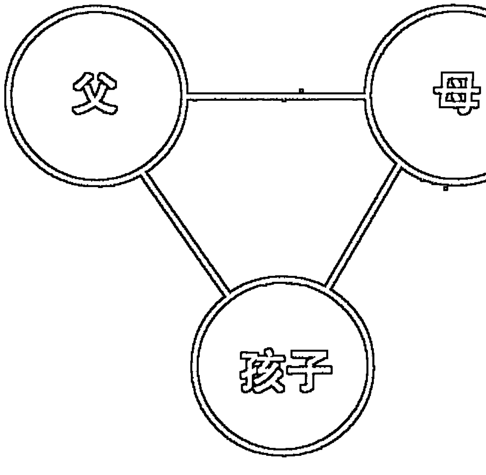

当萨提亚有关家庭的概念跨越了三代人之后，我们将这张图加以拓展，包括了主角的祖父母和外祖父母。

对这张家谱图的分析，有助于我们概括性地整合家庭重塑的范畴，使我们前进的道路更加平坦。当然，我们要时刻记得，家谱图并不是我们要涉及的全部领域。它只能通过向我们展示那些卷入主角早期生活当中的亲属——即便他们现在已经不再存在，从而帮助我们了解自己的内心和外部世界。家谱图通过符号的形式，向我们显示了大量出现在家庭重塑当中的“人物角色”。

描绘家谱图需要经过四个阶段。首先询问有关主角父母的一些细节性问题：

- 结婚日期
- 父母双方的名字
- 生日和出生地
- 当前年龄或去世时的年龄
- 宗教信仰（可选问）
- 职业（可选问）
- 种族背景（可选问）
- 教育水平（可选问）
- 业余爱好（可选问）

为了方便演示，我们选用的是一个生物意义上的核心家庭。那些来自单亲家庭、继父母家庭，或是其他收养家庭的孩子（们）可以根据自身情况对上述步骤做出相应的修改和调整。

在第二个阶段，引导者可以让主角为双方父母分别增加下面一些元素：

- 三个描述性的形容词
- 他或是她在压力情境下表现出的最主要的应对姿态
- 他或是她在压力情境下表现出的次要应对姿态（可选问）

就像第九章所讨论的那样，主角对现实的构建是家庭重塑活动操作的对象，所以其客观性和准确性并不重要。如果主角对某方面的信息不了解，引导者可以鼓励他（她）进行“虚构”。对阶段三的展示如下：

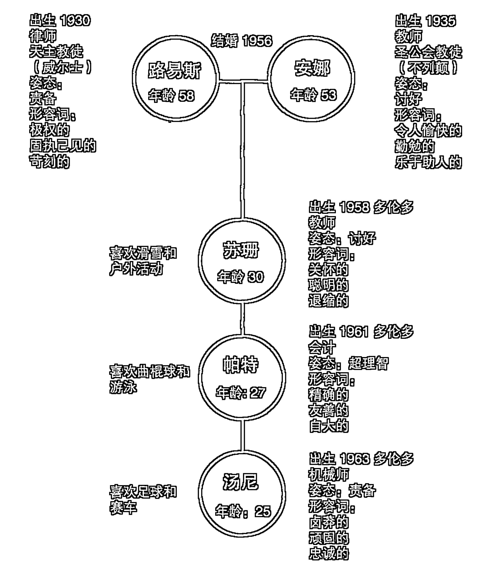

主角需要补充：

- 所有的子女，按照长幼顺序排列
- 为每一个孩子补充第一阶段的信息（如前面所列）
- 为每一个孩子补充第二阶段的信息（如前面所列）

到了第四个阶段，主角已经可以画出三个独立的三阶段家谱图了：他或她祖父母的家庭；他或她外祖父母的家庭；以及主角当前的家庭。除了第三阶段的资料，主角还需要补充说明：

- 父母和祖父母的家庭法则
- 任何家庭模式（例如，职业、疾病、应对姿态、死亡原因等等）
- 家庭持有的价值观和信念（例如，对于教育和金钱等的价值观）
- 家庭秘密
- 家庭主题

为了向整个小组展示，主角通常可以将所有这些家谱图画在大张的活页纸上，在实际的家庭重塑过程当中悬挂展现给观众。

对家谱图的编译使我们可以更顺利地使用下一个工具：家庭生活编年史。

### 家庭生活编年史

在真正的家庭重塑活动开始之前，家庭生活编年史是第二个必要的步骤。它涉及祖孙三代，从主角年纪最大的（外）祖父母开始，并以主角到达法定成人年龄的时刻作为结束（根据法律规定，采用18岁、19岁或是21岁）。例如，主角最老的（外）祖父母也许生于1901年，而主角则于1975年到达法定年龄。

编年史的图表可以通过年代顺序总结下列信息：

- 每一个家庭成员的出生日期
- 重要的家庭事件的日期（例如，搬家、结婚、离异、死亡、聚会、灾难），以及获得重大成就的日期（例如，毕业、晋升）
- 重大历史事件的日期（例如，战争、自然灾难、经济动乱）

一部家庭生活编年史通常需要四到五张活页纸。

- 1917年 卡斯特罗祖父出生
- 1918年 琼斯祖父出生
- 1920年 琼斯祖母出生
- 1923年 卡斯特罗祖母出生
- 1931年 卡斯特罗祖父失学
- 1934年 琼斯祖母家搬到了西海岸
- 1936年 琼斯祖父高中毕业

列举下一代的出生、重要生活事件和历史事件等等。

- 1958年 父亲高中毕业
- 1963年 母亲高中毕业
- 1963年 肯尼迪被枪杀
- 1965年 父亲和母亲结婚，并搬到宾夕法尼亚州
- 1970年 乔恩出生

更多的搬家、历史事件、死亡、退休等等

1988年 乔恩到了18岁

### 影响力车轮

影响力车轮展示了每一位在主角童年和成人阶段给过她（他）情感或物质支持的人物。这些人曾给予了主角一些东西，而主角也会以某种方式对自己的所得到的进行反馈和回应。同样，主角还会对这些人彼此之间的交往做出反应。

主角在他或她的车轮上写下的名字越多，说明在他（她）的发展过程中获得了越多的影响和资源。这些具有影响力的人包括：三代以内的家庭成员、其他住在主角家中的人（或是主角所生活的家庭中的人）、特殊的老师、朋友、想象中的玩伴、宠物，以及珍惜的玩具。

主角将自己的名字写在中心，环绕在中心四周的圆环代表其他人——就像一个带着辐条的车轮。辐条的宽窄可以变化，线条越粗，代表关系越亲密。

除了写下名字，主角还需要列出三个形容词来描述车轮中的每个人。（对于家庭成员，完全可以使用在家谱图中出现的相同的形容词。）在这之后，就像图示中那样，主角需要为每一个形容词进行标定，标出它们是正性还是负性。

在家庭重塑活动的过程中，这一附录中描述的图和表可以用来帮助引导者、主角以及观众更好地确定方向和重点。重塑完成之后，主角则可以随意处置这些图表工具。

# 参考文献

## Books

Bammen, Anne; and John Bammen (Ed.). *Meditations of Virginia Satir: Peace Within, Peace Between, and Peace Among*. Palo Alto, CA: Science and Behavior Books, 1991.

Bammen, John; and Jane Gerber (Ed.). *Meditations and Inspirations of Virginia Satir*. Millbrae, CA: Celestial Arts, 1985.

Englander-Golden, Paula; and Virginia Satir. *Say It Straight*. Palo Alto, CA: Science and Behavior Books 1991.

Grinder, John; Richard Bandler; and Virginia Satir. *Changing with Families*. Palo Alto, CA: Science and Behavior Books, 1976.

Satir, Virginia. *Conjoint Family Therapy*, Third Edition. Palo Alto, CA: Science and Behavior Books, 1987.

——. *Making Contact*. Millbrae, CA: Celestial Arts, 1976.

——. *The New Peoplemaking*. Palo Alto, CA: Science and Behavior Books, 1988.

——. *Old Sayings I Just Made Up*. Palo Alto, CA: Avanta Network, 1989.

——. *Self-Esteem*. Millbrae, CA: Celestial Arts, 1975.

——. *Thoughts and Feelings*. Palo Alto, CA: Avanta Network, 1989.

——. *Your Many Faces*. Millbrae, CA: Celestial Arts, 1978.

——; and Michele Baldwin. *Satir Step by Step: A Guide to Creating Change in Families*. Palo Alto, CA: Science and Behavior Books, 1983.

——; James Stachowiak; and Harvey A. Taschman. *Helping Families to Change*. New York: Jacob Aronson, 1977.

Schwab, Johanna; Michele Baldwin; Jane Gerber; Maria Gomori; and Virginia Satir. *The Satir Approach to Communication: A Workshop Manual*. Palo Alto, CA: Science and Behavior Books, 1989.

## Audiotapes

Satir, Virginia. *The Memorial Series: Teachings of Virginia Satir*. Palo Alto, CA: Ayanta Network, 1989.

## Videotapes

Satir, Virginia. *Blended Family with a Troubled Boy*. Kansas City, MO: Golden Triad Films.

—. *The Essence of Change*. Kansas City, MO: Golden Triad Films.

—. *A Family at the Point of Growth*. Kansas City, MO: Golden Triad Films.

—. *Family Series I [including a family interview, various Parts Parties, and Family Reconstructions]*. Available through Dr. John Banmen, 11213 Canyon Crescent, N. Delta, BC V4E 2R6, Canada.

—. *Family Series III [including Family Reconstruction]*. Available through Dr. John Banmen, 11213 Canyon Crescent, N. Delta, BC V4E 2R6, Canada.

—. *Of Rocks and Flowers: Dealing with the Abuse of Children*. Kansas City, MO: Golden Triad Films.

—. *A Step Along the Way: A Family with a Drug Problem*. Kansas City, MO: Golden Triad Films.

—. *Virginia Satir on Communication, Parts I and II*. Palo Alto, CA: Science and Behavior Books.

# 中国国际萨提亚学院

## 简介

中国国际萨提亚学院（The Satir Institute of China）致力于在中国和华语世界研发、发展和推广萨提亚成长模式。其成立宗旨是以萨提亚人文发展理念为基础，推广萨提亚工作方法及适于华人的个人、家庭及团体工作，使个人拥有更整合圆融的人生，促进家庭的幸福美满和社会的和谐进步。

中国国际萨提亚学院在香港成立，并在北京、广州等地设立了萨提亚中心。该中心成员包括各领域心理辅导员、大学教授，培训师及企业等社会各界人士。目前推动中的主要工作为：

- （一）举办萨提亚系列训练工作坊；
- （二）建立萨提亚模式教学支持系统、评估系统、督导系统；
- （三）维持专业水准与职业操守；
- （四）引进、介绍国际国内萨提亚模式相关资讯；
- （五）推动萨提亚模式专业人员间的国际交流。

网站：www.satir.com.cn
www.qijiangrowth.com

维吉尼亚·萨提亚（1916—1988），家庭治疗创始人，国际著名心理治疗师。美国著名的《人类行为杂志》（Human Behavior）称她为“每个人的家庭治疗大师”。

在1988年维吉尼亚·萨提亚去世之前，她开始和三位同事合著一本关于她的治疗方法的理论书籍。这本书历时三年完成，是关于萨提亚方法的构造、应用和创新的最权威的著作。

《萨提亚家庭治疗模式》涵盖了她的信念系统、对改变的洞察性方法，以及她三十多年工作在家庭治疗前沿发展出的强有力的干预技术。这些技术包括对雕塑和“生存姿态”、隐喻、个性部分舞会，以及家庭重塑的治疗性使用。我们探索了“交互”的成分，以及自我曼陀罗中的众多元素，这些元素影响着我们如何看待世界并对其做出回应。我们也会读到关于学习（转化）彼此间互动的方式。

像其他的萨提亚著作一样，《萨提亚家庭治疗模式》也是一本关于人类尊严和力量的书。与其他萨提亚家庭治疗书籍不同的是，它提供了对萨提亚工作各个主要方面的坚实基础和详尽描述。它全面、广泛的范围和样例对于学生和有经验的从业者都极具吸引力。

美国婚姻与家庭治疗学会基金会授予《萨提亚家庭治疗模式》1994年度的萨提亚教育和研究奖。

http://www.wpcbj.com.cn
