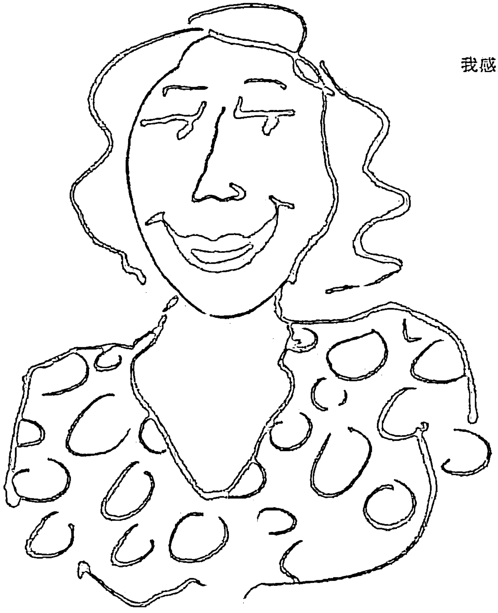
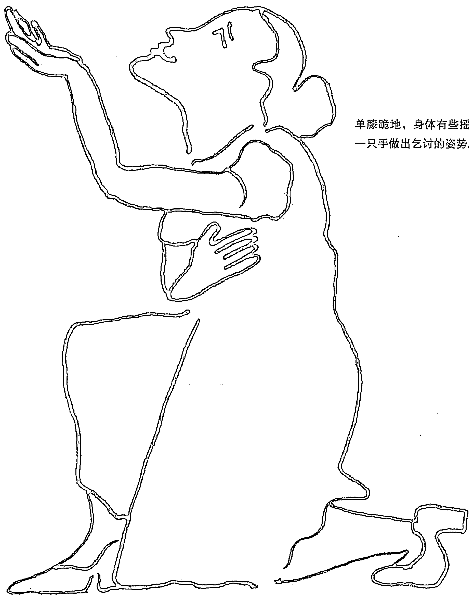
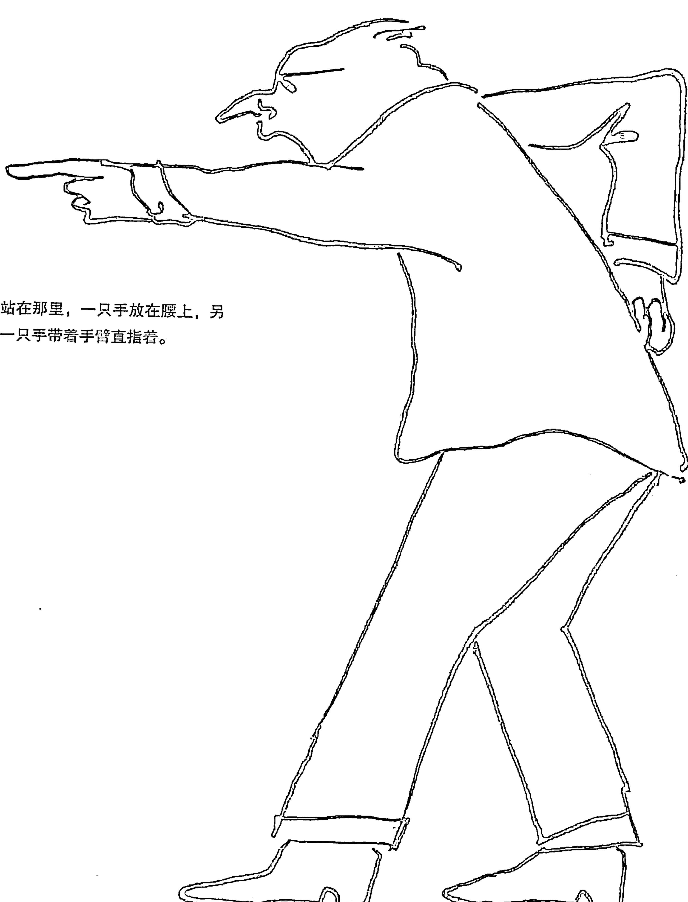
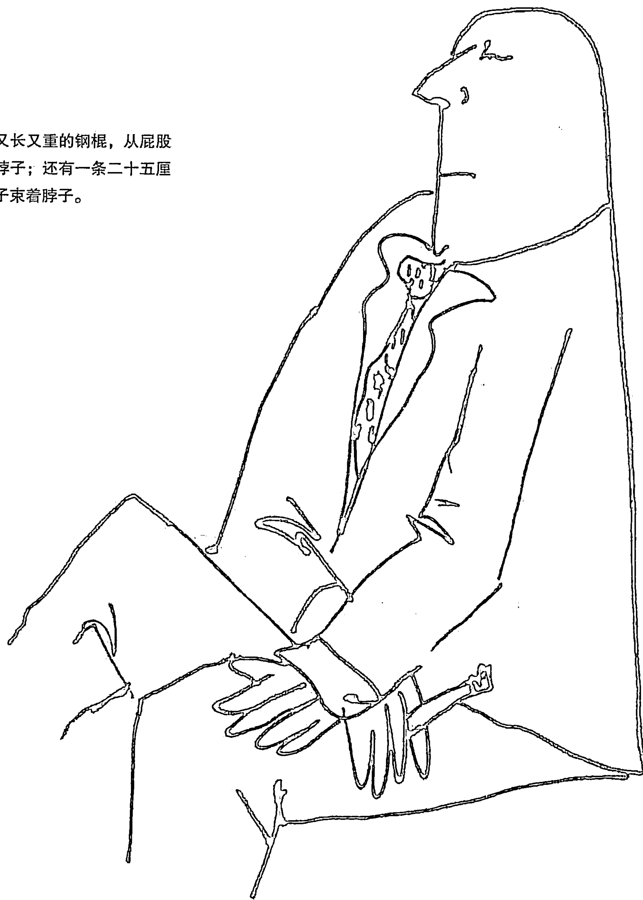
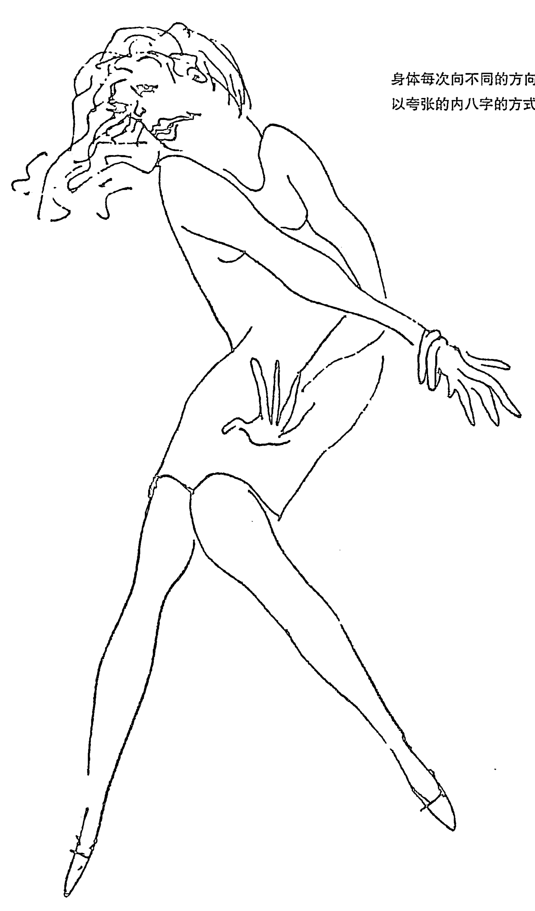
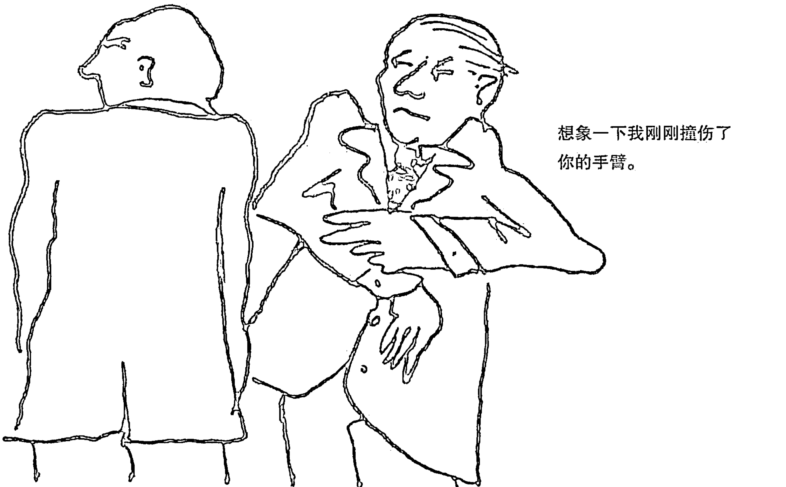
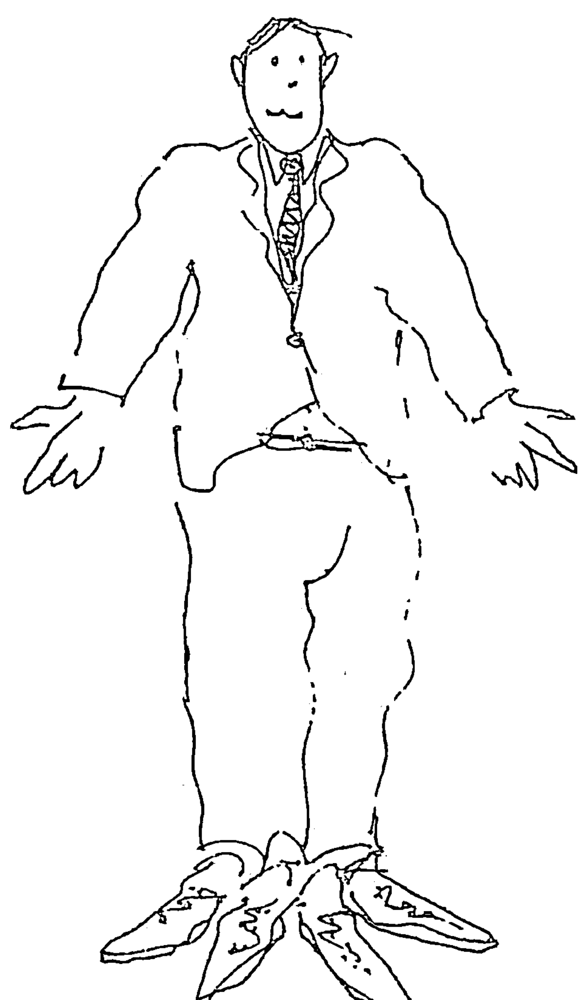
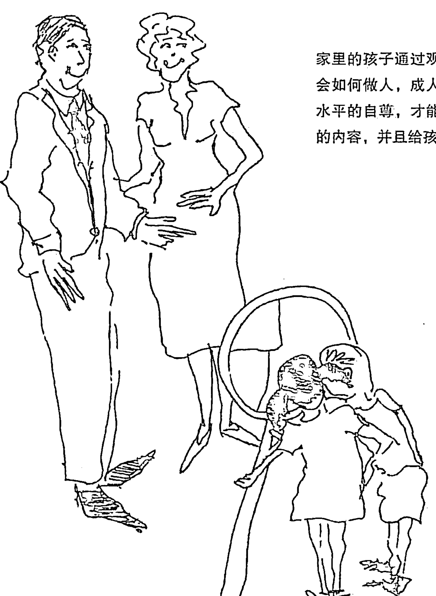
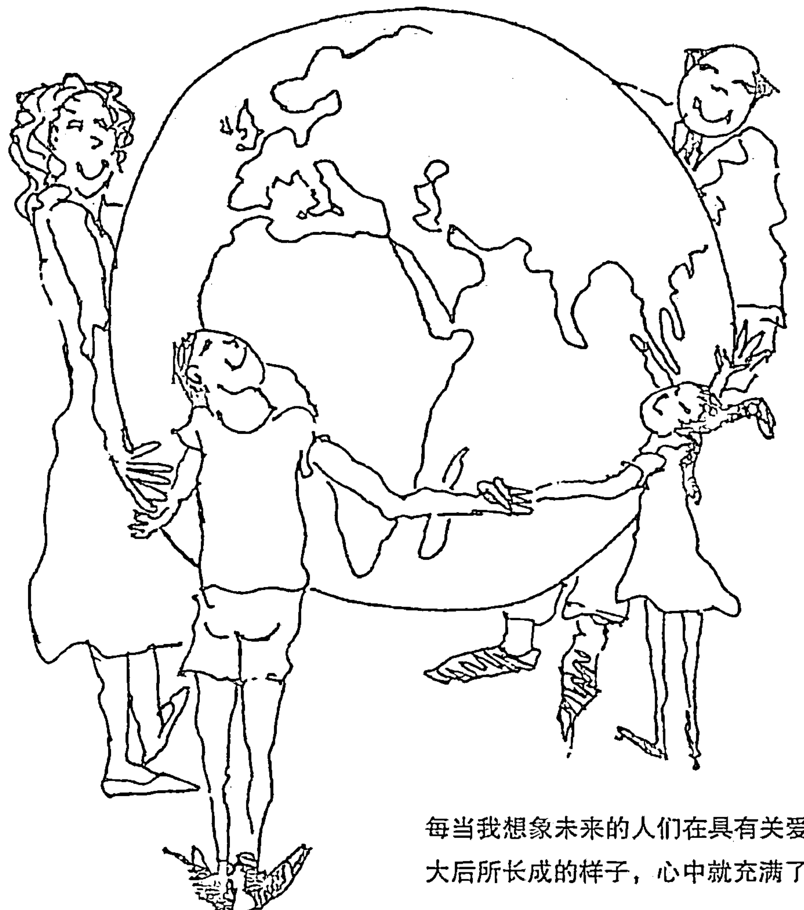

# 萨提亚：新家庭如何塑造人

## 推荐序

维吉尼亚·萨提亚（1916—1988），她是家庭治疗的重要创始人之一，还发展出可为专业与非专业人士共同使用的沟通技巧。所有这些沟通技巧全部汇集在这本《新家庭如何塑造人》中。

在这本书中，萨提亚教会我们如何更好地照顾自己以发展出健康的家庭生活，如何进行清晰和坦诚的沟通，面对人与人的不同。

我们将学会如何对自己的经历特别是来自于家庭的经历表示感激，同时学会应对来自过去的负面影响。一如萨提亚的一贯观点，她将告诉我们如何在不能改变外部环境的情况下，改变我们自己的内心世界。

我们还将学会如何应对自己的失望情绪，把这种情绪对我们的人生及人际关系的影响降到最低，学会更多的接受、理解与自我照顾……

萨提亚的学问可以应用于全世界各个国家和文化中，在她所到之处，无论什么国家与文化背景，人们都发现她的观点与自己密切相关和很有用处。现在，萨提亚过去的同事也是她的学生进一步发展了萨提亚模式，同时在很多国家进行了成功的传播。

中国的读者将会发现，萨提亚模式与自己的生活特别地贴近，这不仅是因为中国历来重视家庭，还因为萨提亚模式中的很多重要思想都与中国传统的阴阳平衡理论息息相关。可以说，萨提亚从中国思想中吸取了许多养分。

本书适合所有人阅读，简体中文版的出版，可以说是中国大陆所有读者的福音。如果维吉尼亚·萨提亚能够看到，她会很高兴自己的书可以为所有人，尤其是中国大陆的读者所阅读。如果你能够在生活中真正实践从萨提亚的书中所学到的内容，那你和你的家庭都将会因此而获得更多的快乐，生活得更幸福；如果你是一位从事助人工作的专业人士，那么本书将会帮助你更好地改善你的来访者的生活；如果你是一位商界人士，那么本书也可以帮助你在取得财富的同时获得更多快乐。

希望你能够实践本书中的所学，并因此而成功获得你期望的生活。

约翰·贝曼
著名家庭治疗师、萨提亚模式培训师
萨提亚机构亚太区培训主任
香港大学名誉教授
前加拿大咨询协会主席

## 英文版编者按

对我来说，维吉尼亚·萨提亚的作品就像家里自制的面包。它们是松软、爽口、有营养的。它们承诺了很多东西，味道极佳、便于消化、完全令人满意。

为什么要修订这本书呢？维吉尼亚在她的前言中描述了新加入的材料。我想强调的是她对世界和平的投入和献身。维吉尼亚通过探讨她自己的精神生活，勇敢地接下了艰巨的任务，写出了和平与灵性这两章。

和维吉尼亚一起工作是一种幸福，对此我存有深深的感激之情。我还要感谢安·奥斯汀·汤普森，她认真地校对了手稿；感谢贝新迪和埃伦·史蒂文斯母女，她们从母女的角度对青少年那一章提供了建议；感谢路德·惠特科姆，他对“晚年生活”那一章给予了特殊的关注。

琼·施瓦茨

## 前言

在《家庭如何塑造人》于1972年首次出版之际，我邀请读者来分享他们对这本书的反应，分享在运用这本书时自己所获得的体验和结果。我收到了数百封信，每封信都有一些有价值的东西：富有思想性的反思、印象、问题、建议和建设性的批评等。人们要求在保留旧有分类的基础上，增加新的题目作为延伸。

这个修订版是我对读者的要求做出的反应。读者要求我对以下题目做出讨论：

- 青春期
- 老年生活：退休和转变
- 世界和平
- 灵性

我把这些内容作为新的章节加到了这本书里。

读者还要求对以下内容有更深入的理解：单亲家庭、混合家庭、同性恋家庭；健康的二人关系；性；家庭的未来。我也在本书中补充了在过去15年里学到的东西，并将其编入了原有的章节中。这本书无法做到对所有家庭进行同样程度的关注，因而，我推荐了一些参考书，以便读者能获得更多的信息。

我非常高兴读者给了我这么多回应。这意味着有许多人在关注着家庭。《家庭如何塑造人》已经被翻译成许多种语言，包括日语、希伯来语、汉语、盲文，我想读者也会很高兴知道这个消息吧。很明显，这本书得到了广泛的阅读，我希望读者继续将自己的想法告诉我。

我所传递的基本信息一直是，家庭生活和家庭中的孩子会成为何种人之间存在着很强的联系。社会是由一个个独立的个体组成的，因此，发展出最为强健最为和谐的人将是非常重要的。而所有这些都是从家庭中开始的。同时，由和谐的人领导将会改变我们社会的特征。

《新家庭如何塑造人》这本书是我的努力之一，是要对产生“和谐的”成人做出积极的推动。我在和世界各地的家庭接触中获得了许多经验，写这本书是要支持、强化、教育家庭并赋予家庭权力。我们应该知道，在处理自身与他人之间的关系方面存在着更好的方式，我们要做的只是将它们付诸实践。我们每个这样做的人都是在为发展一个更强的、更积极正性的社会做着贡献。

我们每个人都可以有所不同；每个人都是被需要的。当我们作为个体发展出高自尊时，差异就显现出来。我写这本书的最大愿望是帮助我们每个人获得成为和谐的人的权利。书中所展现的经验和榜样会引导我们用创造性的方式去理解彼此，关爱自身和他人，为孩子提供一个让他们得以发展出力量和完美人格的基础。

重要的是要记住，我们用于和自身、彼此争斗的每一点能量都会分割和弥散我们用于发现和创造的能量。毕竟，当争斗结束时，我们仍旧不得不回到谈判桌上。我们能够发现更为容易、更为有效的方式处理矛盾；我们会从中获益，而不是毁掉我们自身。

我相信，我们正生活在最具历史性的时候。读过这本书的大多数人

## 第一章 绪论

在5岁时，我决心长大后成为“孩子们的侦探”，帮他们侦察父母的情况。我并不完全了解我要寻找什么，但是我知道在家庭中有许多看不见的事物，有很多难题我不知道怎样去解开。

在5岁时，我决心长大后成为“孩子们的侦探”，帮他们侦察父母的情况。

在多年的工作中，我接触了几千个家庭，现在，我仍然有大量困惑。我从工作中学习到很多东西，这种学习为我的发现提供了新的可能和新的方向。现在我清楚，家庭是世界的缩微景观。研究家庭就可以了解世界：家庭中的问题，例如权力、亲密、自主、信任、沟通技巧等，是奠定我们如何在世界上生活的重要部分。改变家庭即改变世界。

家庭生活就像一座冰山：大部分人只意识到正在发生的事情的十分之一——他们能够看到和听到的那十分之一。有些人猜想除此之外还有更多事物，但是他们不知道是什么，也不知道怎样去发现。而“不知道”会让家庭置于危险的进程中。就像海员的命运依赖于他们知道冰山的大部分在水下一样，一个家庭的命运依赖于理解日常生活事件下面隐藏的感受和需要（在桌子下面发生了什么）。

有些人猜想除此之外还有更多事物，但是他们不知道是什么，也不知道怎样去发现。而“不知道”会让家庭置于危险的进程中。

这些年来，我已经发现了很多问题的解决方法；我会在这本书中与你分享它们。在下面的章节里，我们将看看冰山下面的部分。

在这个知识爆炸的年代，小至组成物质的基本粒子领域，大至银河外的天文学领域，所有领域的知识都在不断发展；我们也能够学到人与人之间关系的新知识。我相信一千年以后的历史学家会指出，我们这个年代是人类发展的新时代，是人们开始更舒适地与彼此相处的新时期。

多年来，我已经发现了人类人性化生活的图景。他们是这样一群人，能了解、珍视自己的身体，强身健体，发现自己的美丽与价值。他们真诚、友善地对待自己和他人。这些人愿意冒风险，喜欢创新，能展示能力，而且能在环境要求的情况下做出改变。他们能够找到方法来接纳新的和不同的东西，保留旧的有用的那个部分，丢弃没用的部分。

当你拥有了上述所有的特点，你就成为身体健康、内心敏锐的，富有同情心、爱心的，有趣、真诚、有创造性、能干、负责的人。有这样一些人，他们能够脚踏实地、深深地去爱，公平有效地竞争。他们既温柔又刚强，并且了解温柔与刚强之间的不同。

家庭是一个人发展出上述特点的环境。成人扮演着塑造者的角色。

在从事家庭治疗的过程中，我发现家庭生活的四个方面不断出现：

- 一个人对他自己的感觉和想法，我称之为自我价值感；
- 人们之间传递信息的方式，我称之为沟通；
- 人们遵循着他们应该如何去感受和行动的规则，这些规则最终发展成为我所说的家庭系统；
- 人们与其他人以及家庭外的组织发生关系的方式，我称之为与社会的联系。

不管最初是什么样的问题让一个家庭进入我的办公室——不忠的妻子还是抑郁的丈夫，违法的女儿抑或是患精神分裂症的儿子——我很快就发现解决的处方是相同的。为了减轻家庭的痛苦，必须找到办法来改变这四个核心因素。在所有有问题的家庭中，我注意到通常都存在着：

- 成员的自我价值感很低；
- 沟通间接、含糊，不真诚；
- 规则严格、非人性化，而且不可谈判、永恒不变；
- 家庭以畏惧、谴责的方式与社会发生联系。

我很高兴去了解没有问题的家庭，尤其是在发展家庭教育能力的工作坊中进行了解。在这些有生机、教养良好的家庭中，我通常看到不同的模式：

- 成员的自我价值感很高；
- 沟通直接、清楚、明确、真诚；
- 规则富有弹性，又很人性化，恰当而且可变；
- 与社会的联系是开放的、充满希望的，是在选择的基础上建立的。

这些改变全部依赖于新的知识、新的理解和新的意识。每个人都能够获得这些改变。

不管一名外科医生是在哪里学习的，他都能够为世界上任何一个地方的任何一个人进行手术，因为人的内在器官和四肢在相对一致的位置上。通过与有问题的家庭以及教育良好的家庭接触，我认识到在世界的绝大多数地方，任何家庭都涉及同样的问题。在这些家庭中：

每个人都有价值感，可能是积极的，也可能是消极的，问题是——
是哪种价值感？

每个人都进行沟通，问题是——
沟通是如何发生的？结果如何？

每个人都遵守规则，问题是——
什么种类的规则对他（她）起作用？效果如何？

每个人都与社会有联系，问题是——
以什么样的方式与社会发生联系？结果如何？

不管是在自然家庭、单亲家庭、混合家庭，还是在机构化家庭中，这些事情都是真实的。在自然家庭中，创造孩子的男人和女人会照顾那个孩子直到成年；在单亲家庭中，父母中的一人因死亡、离婚或遗弃而离开家庭，留下来的另一人承担所有养育任务；在混合家庭中，孩子是由继父（母）、养父（母）或同性恋父母抚养的；在机构化家庭中，一群成年人共同抚养成批的孩子，这种机构化的家庭包括公共机构、公社或扩大的家庭。如今，孩子们在许多模式下被抚养长大。

每一个家庭都有它自己特定的问题和可能发生的事情，我们以后再回到这些问题上。基本上，同样的因素会在所有家庭中起作用：自我价值感、沟通、规则以及与社会的联系。

本书将帮助你发现这些因素是怎样在你的家庭中起作用的，同时指出改变的新方向。请将我的话看作包括我的家庭在内的诸多家庭经验的结晶，而这些经验则是在分享快乐与忧伤、伤害与愤怒，以及分享爱的过程中积累起来的。

本书并不是要指责父母亲，可能他们已经尽了全力，而且发展一个家庭是世界上最困难也是最复杂的工作。如果你在读这本书，那么这一事实已经告诉我，你关心你自己以及你的家庭的幸福。我希望我们能找到一种更好的家庭生活方式，使我们能够在相遇时真正感受到对方眼睛里闪现出的光芒。

关系是家庭成员之间的动态联结。通过探讨这些关系的主要部分，你能够理解你现在的生活系统，能够在与他人的团队合作中创造新的活力与喜悦。

要记住，你要进入水中才能学会游泳。

在阅读时，你有时会遇到我所建议的试验或练习，它们会带给你新经验以及新方式去理解可能会发生在你身上的事情。我希望当你遇到试验或练习时，你能够逐一去做。即使最开始的试验或练习看起来很简单或者很愚蠢。了解是改变的开始，体验使改变发生。这些试验可以使你的家庭中的问题有所减少并能促进其成长。在你的家庭中，有越多人加入，效果就越明显。要记住，你要进入水中才能学会游泳。

如果邀请家庭成员和你一起练习让你感觉害羞或者迟疑，那么就要完全熟悉你要问的内容，在你的心中感受它，然后简单、直接地表达你的愿望。如果你对要问的东西充满热情、满怀希望，你就能够用兴奋的感觉进行沟通，这会让你的邀请变得有吸引力，会鼓励你的家庭成员和你一起练习。尝试用简单、直接的语言说出你的请求——“你愿意和我一起做个试验吗？我认为这个试验可能会对我们有帮助。”——你得到积极反应的机会就变大了。

使用强迫、过分要求或者挑剔的方法让人们加入试验，则会让事情进入权力的争夺之中，其效果与个体努力的方向恰恰相反。在这一点上，关系会破裂以至于任何事情都无法完成。然而，如果你的家庭成员与你仍然住在同一屋檐下，则是很好的机会，倘若你恰当地提出要求，他们至少会愿意进行尝试。要有耐心，要充分信任他们。

我看过诸多家庭的痛苦。每个家庭都深深地触动了我。我希望能够通过这本书缓解那些我没有接触过的家庭的痛苦，也希望能防止痛苦在他们孩子的家庭中继续出现。当然，人类的一些痛苦是无法避免的。我看到过两种痛苦：一种是识别了问题的痛苦，另一种是指责的痛苦。我们无法避免第一种痛苦，但可以避免第二种。我们可以将努力的方向放在改变我们能改变的事物上，并努力找到创造性的方法与我们不能改变的事物和谐相处。

### 平静的祈祷

> 上帝准许我平静地接受那些我不能改变的事物，
> 有勇气改变我能够改变的事物，
> 以及有智慧去了解二者间的差异。
> ——莱因霍尔德·尼布尔

阅读本书可能因为会带来回忆而引起你的一种或两种痛苦。毕竟，面对我们自己、学着为自己负责任往往会伴随着痛苦。如果你认为，与你现在的生活方式相比，可能有更好的家庭生活方式，那么你会发现这本书很有帮助。

## 第二章 你拥有一个怎样的家庭

你对现在的家庭生活感到满意吗？

要不是我提起，似乎我接触过的大多数家庭都未曾考虑过这个问题。他们都把这种共同生活的状态看作理所当然。如果没有发生明显的家庭危机，大家就都认为这个家庭里的其他人对这种生活是很满意的。很多家庭成员也许不敢正视这样的问题，他们觉得自己被家庭生活束缚住了，好也罢坏也罢，都是无法改变的现实。

你觉得家里人都似朋友般亲切，彼此爱护、相互信任吗？

同样，对于这样一个问题，大家的答案也是含混不清的。“哦，我从来没想过这个问题，他们就是我的家人嘛。”好像家人是不同意义上的人似的。

作为家庭里的一员，你认为这是一件令人愉悦、兴奋的事吗？

的确，对于一部分人来说，家确实是最有趣、最令人舒心的地方。然而，很多人可能会觉得家是一种威胁，是负担，是令人厌烦的地方。

对于以上三个问题，如果你的回答都是肯定的，那么无疑，你所生活的家庭就是我所说的那种和谐家庭。如果你的答案是否定的或是不确定的，那么你的家庭就可能或多或少地存在些问题。我的意思不是说你的家庭一无是处，而是家庭成员似乎都不开心，都不知道如何敞开心扉地相互爱护，彼此珍惜。

在接触了上百个家庭后，我发现每个家庭都可以在我所说的从“和谐家庭”到“问题家庭”这个范畴中找到自己的位置。和谐家庭有很多共通之处。同样，对于问题家庭来说，尽管存在的问题可能各不相同，但它们之间还是有许多相似之处。下面我会分别描述我所观察到的这两类不同的家庭。不管哪种描述，都不可能和某个具体家庭的情况完全吻合，但你总能或多或少地在我的描述中看到一点你的家庭的影子。

问题家庭中的那种特殊的气氛是很容易被感知的。每当我处在那样一个家庭中时，总是很快就能感觉到不适。你会觉得很冷清，就好像家里的每个人都被冻僵了一样，彼此间过于客气，每个人都表现出很明显的厌烦情绪。有时我会感觉头晕目眩，失去平衡，就好像有个盖子似的东西在不停地旋转。或许你还会有一种不祥的预感，就好似暴风雨前的平静，而电闪雷鸣随时都有可能将这种平静打破。有时这种家庭里会有种神秘的气息。有时我又会感到莫名的悲伤，我意识到那是因为导致悲伤的根源被掩盖着。

每当我身处上述任意一种使人不安的氛围时，我的身体就会有强烈的反应。我的胃会不舒服，觉得想吐，而且肩酸背痛，头也疼得厉害。开始的时候我一直在想，这种家庭里的人是否会有和我一样的反应呢？后来，当我们渐渐熟悉了，他们也可以敞开心扉向我讲述家里的状况时，我才知道他们确实也有同样的感受。这样的经历多了之后，我逐渐明白了为什么问题家庭的成员大都伴有身体上的疾病，那是他们的身体对这种死气沉沉的气氛做出的反应。

可能我上面所讲的这些会让你感到吃惊。每个人的身体都会对其周围的人做出生理上的回应。许多人可能并不了解这一情况：在成长过程中，我们被教导要摆脱这些感觉。经过多年的训练，我们可能已成功地摆脱了这些感觉以至现在根本无法感知生理上的反应，直到我们头也疼，肩也痛，胃也不舒服。即便是在那个时候，我们可能还没弄清楚原因。作为治疗师，我不仅对自身的这些感觉很熟悉，而且能够从其他人身上看出某些迹象。他们和我讲了许多自己的感受。我希望这本书可以对你有所帮助，使你能够识别出自身的这些迹象。想要做出改变，第一步就是要弄清楚问题是什么。

在问题家庭中，成员的身体和五官就可以将其状态泄露出来，身体或僵硬或紧绷或无力；脸色或阴沉或忧伤或似面具般毫无表情；故意躲开家人的目光，对人充耳未闻；说话声音或尖锐刺耳或呢喃不清。

在问题家庭中，他们的身体和五官就可以将其状态泄露出来。

在这样的家庭里，人与人之间毫无友谊可言，更谈不上能给彼此带来欢乐了。大家都在忍受着、煎熬着，似乎与家人共处只是为了履行义务。有时我可以感受到有些人也试图做些努力来改变现状，但都未能付诸实践。在这种家庭里，偶有的幽默都是尖酸刻薄、富有讽刺意味的，甚至是残忍的。做家长的没有时间来教育子女什么可为，什么不可为，他们从来享受不到作为一个人应有的幸福。对于问题家庭里的成员来说，能够彼此欣赏和喜爱是不可思议的事情。

看到家庭中的每个人都生活在这样一种氛围中时，我总是在想他们是如何生存下来的呢。我发现，在一些家庭中，人们很明显地在彼此躲避，他们埋头工作或忙于外面的应酬，几乎不与家里人接触。当然，即便处于同一屋檐下，想要互相之间几天不接触也是完全可能的。

和这种家庭在一起对我来说是一种折磨，它让我感受到的是绝望、无助和孤独。我看到了人们试图掩盖事实的勇气，而这种勇气是多么容易被扼杀啊！在一些家庭里，似乎还存有一线希望，至少他们还会彼此吼叫、抱怨、发牢骚。最可怕的是那些表现出冷淡与漠然的家庭。这些人或年复一年地自我忍受着痛苦，或者干脆在绝望中摧残其他人。我再也无法忍受和这样的家庭接触了，除非我在他们那里还能看到希望，事实也确实是大多数家庭还有转变的希望。家应该是一个可以找到理解与支撑的爱的港湾，是在辛劳之后可以放松和恢复精神以更好地应对外面世界的爱巢。但是对于上百万问题家庭的成员来说，这是个遥不可及的梦。

在当代城市化的工业社会中，一切制度似乎都变得重实际、讲效率了，都在关注如何实现低成本高收益，却很少关注人性的需要。几乎每个人都在经受着贫困、歧视、压力或是这种非人性化的社会体制导致的其他负面产物。而那些问题家庭的成员即便在家里也看不到丝毫人性的一面，所以对他们来说，这些困难就更难以承受了。

没有谁会特意选择这种令人不快的生活方式。然而人们只能被动接受，因为除此之外别无他途。

读者朋友们，请在此停留片刻，想一想在你所知道的家庭中有没有这种问题家庭呢？你所生活的家庭是否具有上文提到的某些特点呢？你的家庭是否偶尔会冷冷清清、死气沉沉，家庭成员间过于客气，有时又神秘兮兮，令人不解呢？你现在的家又有哪些特征呢？你现在是否发现了以前从没注意到的问题的迹象？

在和谐家庭中，情况是多么不同啊！在那里，我立刻就能感觉到生机、真诚和爱意，还体会到我的心灵、思想和灵魂的存在。这样家庭里的人展现出了他们的爱心、智慧和对生活的热爱。

在这样一个家庭中，我可以自由地倾诉，也乐于去倾听，我会得到关心也愿意为他人着想。我可以毫不掩饰地流露爱意，也能同样地表露痛苦和不同意见。我不会害怕冒险，因为大家都能理解冒险就必然会犯错，而这些错误又是我成长的标志。我能享有作为一个人应有的权利——我会受到关注、被珍视、被关爱，当然我也要以同样的方式对待他人。有了好笑的事，我的感情会自然流露，我可以随意地笑。

你很容易就能感受到这种家庭里的活力。他们身体健康，表情放松，享受着彼此相伴的感觉，而不是相互漠视或故意躲闪。他们的声音富有磁性，清晰悦耳。家里到处充满着和谐的气息。小孩甚至是婴儿在家里也能受到平等的待遇，连他们都看起来那么友好和坦诚。

他们生活的房间通常是灯光明亮、色彩丰富的。很明显，这样的家就是为了使生活在里面的人得到享受，而不是为了展示给别人看的。

家里的寂静是一种平和安宁的静，而非恐惧所引起的，更不是任何危机来临前的征兆。家里吵闹是因为有意义的活动正在进行，而非企图盖过他人声音的狂吼。大家都知道他们自己总有机会向他人倾诉。如果还没轮到他，不是因为其他人不爱他，而是因为时候未到。

家人可以跨越年龄的界限，自由地表现出彼此间的爱意，身体的接触也不会让人觉得有任何不自然。彼此的关爱不是表现在倒倒垃圾、准备三餐，或是拿回薪水的那一刻，而是体现在自由的交谈和用心的倾听中。能够以诚相待、彼此珍惜，就是对关爱的最好诠释了。

和谐家庭的成员之间无所不谈，可以随意地倾吐、表露自己的想法。失望、恐惧、伤痛、愤怒，被批评或是开心之事和取得的成就都能成为聊天的话题。如果赶上爸爸今天心情不太好，孩子就可以坦率地说：“嘿，老爸，你今晚可不太对劲哦。”他不会担心爸爸会教训他说：“你怎么敢这样和我说话？”爸爸这时也会坦诚地说：“我确实心情不太好，今天实在是太糟糕了。”

在和谐家庭中，如果制订好的计划因故不能实行，他们会采取一种乐观的方式来做出调整。正因如此，他们可以从容地解决生活中出现的问题。现在我们假设孩子打碎了杯子。在问题家庭中，这种情况通常会引发半个小时的训斥，最后很可能会以孩子的号啕大哭告终。而在和谐家庭中，大多数家长会说：“哦，小托尼，你把杯子打破啦？有没有伤到哪儿啊？我去给你拿个创可贴，然后你用扫帚把地上的碎片打扫干净。我再给你拿个杯子去。”如果父母发现小托尼杯子拿得很不稳，他（她）就会再说一句：“你刚才因为没有用双手拿着杯子，它才会掉的。”就这样，一件小事给了孩子一个学习的机会（这样会增强孩子的自尊），而不会成为损伤孩子自尊的惩罚的理由。在和谐家庭中，你很容易体会到人的生命和情感是重于一切的。

在问题家庭中，这种情况通常会引发半个小时的训斥，最后很可能会以孩子的号啕大哭告终。

这些父母将自己看作被授予了权力的领导者，而不是发号施令的老板。他们时时处处教导自己的孩子，培养其成人。无论自己做得好不好，他们都愿意让孩子知道真相，也乐意与孩子分享痛苦、悲愤和失望，当然也有欢乐。这样的家长言行一致。而问题家庭中的家长却如此不同，他们经常教育孩子不要去伤害别人，而自己一不高兴，就会对孩子动武。

家长也是普通人，并不是说从孩子出生的那天起，他们就自动成为领导者。他们应该明白，一位优秀的领导者是很会把握时机的：他们寻找机会，等到确定孩子会认真倾听时，再对他们进行说教。当孩子犯错误时，父母会走到近前做他们的支柱。他们的帮助能使受惊的孩子战胜恐惧感和罪恶感，同时又达到了最佳的教育效果。

我去给你拿个创可贴，然后你用扫帚把地上的碎片打扫干净。我再给你拿个杯子去。

前不久，我看到一位和谐家庭中的母亲，她很有技巧又很人性化地处理了这样一件事。她有两个儿子，一个5岁，一个6岁。有一天，她看到两个孩子正扭打在一起，她很冷静地将他们分开，拉着他们的小手让他们坐在自己的两边，耐心地听他们讲到底发生了什么。在这个过程中，母亲一直握着两个孩子的手。她也会不时地问个问题，最后终于弄明白了，原来是弟弟从哥哥的盒子里拿了一枚一角的硬币。在听了两个孩子诉说了自己的委屈后，她让弟弟把硬币还给哥哥，使得两人重归于好。而且，她通过这种建设性的解决问题的方式，给孩子们上了有意义的一课。

和谐家庭中的父母知道孩子并不是有意地犯错误。如果孩子的行为不当，他们会意识到肯定是有什么误解或是孩子的自尊心受到了伤害。家长很清楚，人只有在认识到自己的价值并被别人认可时，才能有所收益，所以他们不会采取任何会伤害孩子自尊的方式来解决问题。即便指责或惩罚在有些情况下可能是有用的，但由此留在孩子心灵上的创伤却不容易治愈。

是孩子就难免会犯错。当孩子确实有错误需要被纠正时，充满慈爱的父母通常会采取很坦诚的办法：他们会询问原因，倾听孩子的心声，给予关爱和理解，同时能体会孩子的感受，利用恰当的时机，即当孩子自然地想要倾听时再给他们讲道理。这些都会使你成为一名称职的老师。教育孩子的最好方法就是言传身教。

养育孩子恐怕是世上最具有挑战性的任务。就好比两个独立的经济实体要融合他们各自的资源共同生产一种产品一样，当一对成年男女要共同将一个襁褓中的婴儿抚养成人，一切潜在的问题都有可能出现。和谐家庭中的父母会预见这些问题，因为生活本来就是这样的。因此他们无时无刻不在寻求新的办法来应对不断出现的新问题。而问题家庭里的父母却竭尽全力徒劳地想阻止问题出现，然而现实中总是会有各种问题，一旦问题来了，这些人反而没有精力来应对危机了。

和谐家庭中的父母能够意识到变化是不可避免的：孩子们在飞快地改变，成年人从未停止过变化，我们周围的这个世界也没有一刻是静止的。他们接受了生活就是伴随着变化的这样一个事实，而且努力地在想如何能更好地利用这些变化使家庭变得更加和谐。

你能够想到有哪个家庭可以被看作和谐家庭吗？或者至少在某个阶段是这样的。你能回忆起你的家庭近来是否有过某些和谐家庭应有的特征吗？想想那时候的家给你一种什么样的感觉呢？那种状态常出现吗？

有些人可能会对我所描述的和谐家庭感到不屑，认为根本就不存在这样的家庭。人们似乎已经对那种不完美的家庭生活习以为常，认为再不会有其他方式了。我想对这些人说，我很幸运地和许多和谐家庭亲密接触过，而且这种家庭确实是存在的。因为人的心灵无时无刻不在寻求着爱。

有些人可能会反驳说他们没有时间来审视自己的家庭生活。对于这些人，我想说的是，人只有依靠家庭的支撑才能生存。在问题家庭中成长的人也是不健全的，而且这种家庭氛围会使人降低对自我的评价，从而导致犯罪、心理疾病、酗酒、吸毒、贫困、问题行为、恐怖主义和其他社会问题的出现。如果我们竭尽全力使我们的家成为一个培养真正意义上的人的港湾，那么这个社会也会变得更安全，更人性化。我们是能够使家变成这样一个港湾的。我们每个人都是与众不同的，每个人也都能有所贡献。

世界上所有有地位、有影响的人都是从婴儿时代成长起来的。他能怎样发挥自己的影响力在很大程度上取决于其曾生长在一个什么样的家庭中。当我们帮助问题家庭变得和谐，使和谐家庭越发和谐时，每个人的爱就会在政府、学校、商业界、宗教界以及一切有助于建设一个和谐社会的机构中传播开来。

我坚信所有问题家庭都会变得和谐，导致家庭出现危机的大多数问题都不是固有的。既然是后天获得的，我们就可以选择不去获取，这样就有精力来学习新的事物。现在的问题是如何才能实现这一目标呢？

- 第一，你必须承认你的家庭就是会偶尔出现问题。
- 第二，你要原谅自己以前所犯的错，允许自己做出改变，并相信事情一定会出现转机。
- 第三，下定决心做些改变。
- 第四，采取行动进行改变。

当你对家里出现的问题逐渐明了时，就会意识到过去发生的一切可能都在告诉你今后该如何去做。任何人都不用觉得罪恶，也不要指责家里的其他人。过去的问题会发生是由于你们无法看到家庭痛苦的原因，不是因为你们不想去面对，而是因为你们或者不知道该往哪儿看，或者已经被教会要通过在头脑中戴上一副眼镜来看待生活，这副眼镜让你无法看清外面的世界。

这本书将告诉你如何摘掉眼镜来正视家庭生活中的苦与乐。这其中最重要的就是自我价值。

摘掉眼镜来正视家庭生活中的苦与乐。

## 第三章 自我价值——被忽视了的罐子

自尊是种理念，是种态度，是种感觉，也是头脑中形成的概念，它是由人的行为表现出来的。

我的童年是在威斯康星州的一家农场里度过的。我们家的后门廊里放着一只很大的黑色铁罐，罐子有三条腿，圆圆的很可爱的那种。我母亲向来都是自己做肥皂用，所以，一年中的大部分时间，这只罐子里都装着肥皂水。每到夏天打谷队来的时候，罐子里就装满了炖菜。其他时候，我父亲就会用它们来积攒肥料，给我母亲种的花施肥。渐渐地，我们就称它为“三用铁罐”。谁要是想用罐子，就要先考虑两个问题：一是现在罐子里装着什么，二是罐子满到了什么程度。

后来，每当有人给我讲述他们的故事，不管讲述的人当时是什么心境，充实也好，空虚也罢，或是不快甚至癫狂，我都会不由得想起那只旧罐子。许多年前的一天，有一家人来到我的办公室，家庭中的每一个人都想尽办法向其他人表述自己的想法。我想起了那黑色铁罐，就给他们讲述了这个故事。听完之后，他们就讲起自己的“罐子”来，这罐子或是盛着自信，或是装着罪恶感、羞愧感甚至自我否定。后来，他们告诉我，这个罐子的比喻对他们帮助很大。

谁要是想用罐子，就要先考虑两个问题：一是现在罐子里装着什么，二是罐子满到了什么程度。

不久以后，这个简单的代名词使好多人能够表达出自己的感觉，而在此之前，这似乎是件很难的事。父亲可能会说：“今天我的罐子很满。”这样家里的其他人就会知道他今天确实很高兴，充满活力，精神饱满，对自己的价值坚信不疑。或者儿子可能会说：“我的罐子很空。”这就是在告诉其他人他找不到自己的价值了，他感到疲倦、无聊、有挫败感，尤其觉得自己不受欢迎。这可能意味着他一直都不够自信，他对一切都只能被动地接受，而不敢有任何抱怨。

“罐子”在这里是个很简单的词，也可以说是个没有任何意义的词。专业人士在谈起自信这个问题时所使用的词汇通常是很枯燥的，给人以毫无生气的感觉。有了这个“罐子”的比喻后，人们觉得表达自己和理解别人都不那么难了。突然间他们觉得自己可以摆脱文化禁忌的限制，更自由地表达自己的想法了。妻子以前可能会犹豫是否该告诉丈夫自己觉得空虚、沮丧、有挫败感，现在她就可以坦白地和丈夫说：“别来烦我，我的罐子已经让我觉得不堪重负了。”

在这本书中，我用“罐子”这个词来指自尊或自我价值。在我这儿，这些词是可以互换的。（如果你还有其他有意思的更适合自己的词也尽可以去用。）正如我之前提过的，每个人都有对自我价值的感觉，或强或弱，因人而异。和有关我家里的那个“罐子”的问题一样，我们也要问一问自己：现在我的自我价值是强还是弱，是什么程度。

自尊是一种自我评估的能力，是以尊严、爱和现实的方式面对自己的能力。被爱的人都对改变持开放的态度。我们大家都是一样的。在这么多年的教学过程中，我接触了有着不同的经济和社会背景的家庭，也遇到了各行各业的人，基于日积月累的工作经验和生活体验，我确信无论是对人自身还是对人际关系来说，自我价值——也就是自己的那个罐子——是最重要的。

正直、诚实、责任感、同情心、博爱和出众的能力等在一个高自尊的人身上都能得到充分的体现。我们应该认识到自己的价值，相信世界因我们的存在而更加美好。我们要对自己的能力有信心，可以向别人寻求帮助，但在该做决定时也要足够果断，相信自身就是我们最宝贵的财富。在自我欣赏的同时，我们也应该看到别人身上的闪光点，要尊重他人的价值。我们要在人与人之间播撒信任和希望的种子。我们不需要用规则来对抗我们的感受，也不用总是根据感觉来做事。我们可以做出自己的判断和选择，是智慧在指引着我们的行为，欣然接受人性带给我们的一切吧！

富有朝气的人的罐子在大多数情况下都是满的。诚然，每个人都有想要放弃的时候，都有身心疲惫的时候。有时，我们会不断地受挫，一时间各种问题接踵而至，让人无法招架。乐观的人会平和地看待一时的不顺，把它看作暂时的危机。这种危机极有可能引发痛苦，而伴随这些痛苦的是新的可能性。有时，我们可能会觉得不舒服，但完全没有必要掩饰自己的感情，要相信，我们总会战胜危机，重见光明的。

当人们感到他们的价值很低的时候，他们总是觉得自己会受骗，会被人羞辱鄙视。正是这样，他们把自己推向了受害者的深渊。他们总是设想事情会变糟，最后也只能走进自掘的坟墓了。为了保护自我，他们将自己封闭起来，不愿相信别人，独自吞咽着孤独和隔离的苦果。因为与外界隔绝，对周围的一切人和事，他们都显得麻木不仁，冷漠无情。他们不愿去看，不愿去听，也不会用心去感受这个世界，而是习惯于挖苦、蔑视他人。这类人会在心里设道高墙，把自己隐藏起来，然后通过否定周围的一切来寻求自我保护。

这类人会在心里设道高墙，把自己隐藏起来，然后通过否定周围的一切来寻求自我保护。

不信任和自我隔绝必然会使人产生恐惧感。恐惧使我们退缩，使我们丧失判断力，让我们不敢冒险去探索新的方法来解决问题，而是转向那些使我们感到挫败的行为。（恐惧感向来是针对没发生的事情的。我注意到一旦问题真的来了，恐惧感反而消失了。）

低自尊的人一旦遭受挫折，就会以失败者自居。他们内在的反应通常是：“要不是我这么没用，这一切倒霉的事就不会发生在我身上了。”久而久之，他们就会采用酗酒、吸毒或其他逃避式的应对方式。

情绪低落和低自尊不是一个概念。低自尊主要是指，当你体验到你不喜欢的感觉时，你的表现就好像那些感觉不存在，不愿去面对自己的真实感受。只有那些高自我价值的人才敢于承认自己情绪低落。

要记住高自尊的人也会有情绪低落的时候，不同的是，高自尊的人从来不会认为自己无用或是试图掩饰自己的情绪。他们也不会将自己的感受投射到别人的身上。偶然的情绪低落是很正常的。不同的处理方式会导致截然不同的结果，你是谴责自己还是把这看作生活中必须面对的一部分呢？在这里，我会不断地提醒大家该如何应对这一问题。

情绪低落却不愿承认，对人对己都是一种欺骗。用这种方式回避自己的感情会直接导致你看低自己，使你更加不自信。许多事情都取决于我们的心态，既然是心态，就是可以改变的。

现在让我们放松片刻，闭上眼睛想一想你现在的心境。你是怎么看自己的呢？在你身上发生过或正在发生什么？你的反应是什么？你觉得自己的表现如何呢？如果你觉得现在的生活很紧张，那就给自己点爱，让身心放松，做做深呼吸。现在睁开眼睛，你会感觉自己更强了。

这个简单的办法可以帮你建立对自我价值的感觉，很快，你的心境就会有所改变了。然后，你就能以更清醒的头脑和更坚定的毅力来应对一切了。

邀请你的家人和你一起来做这个练习。先选好一个搭档，然后互相倾诉自己的感情（如，现在我感到恐惧，我觉得压力大，我有点窘迫或我很开心，等等）。每个人都只要感谢对方愿意和自己分享就好，不要做任何判断或评论，这种交流可以增进彼此间的了解。我们需要不断地练习来跨越心理障碍，多与他人分享自己的感觉。要尽量与你信任的人多练习。

现在告诉对方，是什么使你情绪不高或是什么让你这么兴奋，你可能会找到新的角度来看与你共同生活了这么多年的人。这样你们会觉得彼此间更亲密也更真诚了。完成这个练习后，再交流一下现在的感受。

刚出生的婴儿没有过去，也没有如何看待自己的经验，更没有衡量自我价值的标准。婴儿只能通过与人接触，根据别人对自己的看法来形成价值观。在他们长到五六岁之前，孩子的自尊是通过家庭这个外界因素建立起来的。在上学之后，其他的因素也会有影响，但家庭的作用仍然很重要。外力或增强或削弱孩子在家庭教育中形成的价值观，自信的孩子可以经受住许多挫折，不管是来自学校生活的还是源自同龄人的；而缺乏自信的孩子即便是在取得了许多成功之后还是会自寻烦恼地怀疑自己的价值，一个小小的打击也会让他有天塌下来的感觉。

父母的一言一行、一举一动或者一个面部表情都是一种信息，会影响孩子对自我价值的判断。遗憾的是，有这么多家长竟然意识不到自己在向孩子传递怎样的一种信息。母亲可能会从自己三岁的孩子手中接过一束花，然后面带微笑温和地说：“你是在哪儿采到的这些花啊？真是个乖孩子！告诉妈妈这么漂亮的花是哪儿来的呢？”这样做会增强孩子的自信。

另一种情况就是做妈妈的可能会说：“好漂亮的花啊！”然后再用讯问的语气加上一句“你是在邻居家的花园里摘的吧”，暗示孩子这种行为属于偷盗。这么做就会使这个三岁的小孩产生罪恶感和不自信。

在你家里，长辈帮孩子树立了怎样的一种价值观呢？做完下面这个练习你就会找到答案了。

今天，当全家共进晚餐时，留意一下当别人和你说话时自己的感受。当然，一些话可能不会让你有什么特别的反应，然而，你也会惊奇地发现即便是“递给我一下那个马铃薯”这么简单的一句话也会让你有不同的感觉，或愉悦或消沉，这主要取决于讲话人的口气，表情和讲话的时机以及你当时的心情。如果你当时自我感觉还不错，就会觉得怎么做都可以；可要是正赶上你情绪低落，你就会觉得不知所措。（参见第六章。）

饭吃到一半的时候再换个角度，现在来听听自己是怎么对人讲话的。设身处地地替别人想想，如果有人和你这样讲话，你是什么感觉。比如，你会觉得自己惹人爱，受重视吗？

第二天再将这个小游戏讲给家人，邀他们和你一起做做看。在做之前，将这章的内容大声地读给全家人听，会有很好的效果。晚饭后，再聚到一起交流一下自己的想法和发现。

自我价值的培养是需要一种氛围的，在那里，个人的特点得到赏识，人们从不吝啬对别人的爱，犯下的错误是被用来学习的，人与人之间可以畅快地交流，你不需要中规中矩，人们言行一致，有责任感，彼此间能够以诚相待。和谐家庭就有这样一种氛围。所以，在有着上面那种氛围的家庭里成长起来的孩子自信、可爱、健康、能力出众是很自然的事。

与之相反，问题家庭里成长起来的孩子会觉得自己无用，因为他们成长的环境里没有真诚的交流，他们受到各种规矩的约束，与人不同就会遭到指责，犯错就会受到惩罚，也没有机会学习什么叫作责任。这样的孩子极有可能变得自甘堕落，最后变成对社会有害的人。在这种情况下，人的大部分潜力都得不到发挥。如果你正处于这样的环境中，我希望你能够从现在开始走出牢笼。这本书将告诉你该如何去做，尤其是在讲述交流和自我价值的那两章中，你会找到答案。

在一个家庭中，每个成年人的自信程度也有所不同。自信的父母会营造一种和谐的家庭氛围，不自信的父母就会导致问题家庭，但家庭氛围对成年人的价值观的影响没有那么大（尽管曾经可能会有些影响）。家庭系统的演变基于家庭中最为基本的结构：父母。

这么多年来，我接触了许多家庭，结果发现我不应该再继续责怪做父母的了，尽管他们的行为可能很愚蠢或极其不当。但我认为做父母的可以为他们的行为负责，并且学习一些不同的行为方式，这是改变家庭氛围的第一步。

令人欣慰的是，所有人的自尊都是可以提高的，不管他现在是什么年龄或处于什么样的境地。因为低自我价值不是与生俱来的而是习得的，所以我们可以选择不去学习这些不好的东西，而是通过学习一些更有价值的东西取而代之。这种学习的过程是贯穿人的一生的，要活到老学到老。在人生中的任何阶段，我们都可以让自己变得更加自信。

“因为你总能学到新的东西，所以你的生活总是可以改变的”，这是我在本书中最想告诉大家的一点。人的一生就是一个不断变化和成长的过程。当我们老了的时候，要想变化可能会有点难，也可能会需要更多时间。但是否愿意做出改变就主要取决于我们抱有怎样的一种人生态度。第一大步就是认识到改变是可能的，然后再努力去做。有些人可能学得慢一点，但我们都是可以被教化的。

下面的这段文字包含了我对自信这一问题的理解和看法。

### 自尊宣言

我就是我。

在这个世界上再也没有第二个我。我和某些人可能会有些许相似之处，却没有一个人能和我完全相同。我的一切都真真实实地属于我，因为都是我自己的选择。

我拥有自己的一切：我的身体，以及我的一切行为；我的头脑以及我的一切想法和观点；我的眼睛以及它们所看到的一切；我的所有感觉——愤怒、喜悦、沮丧、友爱、失望和激动；我的嘴巴以及由它说出的一字一句——或友善亲切或粗鲁无礼，或对或错；我的声音——或粗犷或轻柔；还有我的所有行动，不论是对自己还是对他人。

我拥有我自己的想象，自己的梦想，自己的希望，自己的恐惧。

我的胜利和成功乃因为我；我的失败与错误也出于我。

因为我拥有自己的全部，我和自己亲如手足。我学习跟自己相处，爱惜自己，善待属于自己的一切。现在我可以为自己做一切了。

我知道，我的一些方面让我困惑，另外一些则使自己不解。但只要我仍然善待自己爱惜自己，我就有勇气、有希望解决困惑和进一步认识自我。

不管别人如何看我，不管那时我说了什么做了什么，想什么感觉到了什么，一切都真真实实地属于那时的自我。

当我回想起自己的表现、言行、思想和感受，发现其中一部分已经不再适宜，我会鼓起勇气去抛弃不适宜的部分，保存经证实是适宜的部分，创造新的以代替被抛弃的部分。

我要能够看、听、感觉、说、做。我能够生存，能融入群体，能有所贡献，有所作为，让我所处的世界、我周围的人和事因我的存在而井井有条。

我拥有自我，那么我就能自我管理。

我就是我，自得其乐。

## 第四章 自我价值——个人力量的源泉

想象一下，我们每个人的身体内部都是一个能源中心，专门负责维持生命和与宇宙能源场的连接。每个中心都有一台发电机，用来产生延续生命的能量。这个中心通过呼吸来添加燃料，而燃料又来自中心能源地，停止呼吸也就终止了生命。

每台发电机都有许多阀门用来调节个人能量的流动速度、流量大小及其疏导的方向。再来想象一下，是我们对自身的了解程度和自我感觉在控制着这些阀门。我们的肢体语言和行为反映了我们的思想和情感状况，当我们欣赏、喜爱自己时，我们的能量就会增加。如果能够积极协调地利用这种能量在自身内部构建一个运转顺畅的系统，那么就会生成一个坚实的基础，它能够支撑我们富有创造性地、实际地并怀有同情心地面对生活呈现给我们的一切。

换一种表达方式，也就是说：“当自我感觉良好、自我欣赏时，我就极有可能以一种高贵、真诚、勇敢的姿态，充满活力和爱心地来应对生活。”这就是拥有自信时的精神状态。

另一方面，如果一个人对自己不断地贬低、限制、憎恶或是采取其他什么消极的态度，那么他的能量就会消散减弱，自身就会变得懦弱，成为被生活击败的牺牲者：“如果我不喜欢自己，就会贬低自己、惩罚自己。对于生活，我总是很恐惧，觉得自己无能，从而形成了一种状态——以受害者自居，不思进取。我盲目地责怪自己同时加罪于他人，一会儿屈从，一会儿暴虐，将自己的过错推卸于他人。”与此相伴的心理状态就是他会觉得自己一文不值，总是感觉会被拒绝，缺乏远见，这种状态就是自卑。

不珍视自己的人，通常想要从他人那里得到肯定，如妻子、丈夫、儿子或女儿。这就会导致他总是想操纵别人，而结果往往事与愿违，通常会使双方都受到伤害。

对许多人来说，“要珍爱自己”这种说法是很激进甚至是具有破坏性的，爱惜自己就是自私，会导致人与人之间的冲突和战争。

为了避免这种冲突，人们被教导要关爱他人而不是自己。这就导致不断地自我贬低。那么问题也就出现了，如果一个人不爱自己，他又怎么会知道该如何爱别人呢？我们有足够的理由相信爱自己才能爱别人，自信和自私不是一回事。自私是那种什么都高人一等的态度，它传递的信息是“我比你强”。爱自己是认可自我价值的一种表现。当我珍视自己的时候才能同样地爱别人。如果我不喜欢自己，那么对别人就可能会感到嫉妒或是恐惧。

我们或许会害怕别人批评自己以自我为中心。我发现消除恐惧的第一步就是要敢于公开承认它。例如你可以说：“如果我告诉你们我爱自己，我很害怕会被你们拒绝。”在这种情况下，“不，我不会拒绝你，我觉得你是很有勇气才敢这么说”——这种答案出现的概率是95%。当你以这样一种简单的方式面对自己内心的魔鬼，也就是面对被拒绝的恐惧时，所产生的效果会令你惊异不已。

只有自信的人才能建立良好的人际关系，才会举止得当、受人欢迎。简单一点说也就是，只有珍爱自己的人才会珍爱他人，才能很好地面对现实。拥有自信可以使你生活得更有意义，令你健康快乐，并建立和维持良好的人际关系，同时使你成为一个举止得体、有效率且负责任的人。

一个在意自己的人绝对不会做任何伤害、贬低、羞辱或是毁坏自己或他人的事，也不会将自己的过错推卸给其他人。例如，一个在意自己的人绝对不会以吸毒、酗酒或嗜烟来虐待自己，也不会允许别人伤害自己的身心，更不会用暴力的方式破坏自己的人际关系。

不知道爱惜自己的人很容易沦为那些不讲道德的人发泄愤恨、实施暴虐行为的工具。他们会放弃自己的权利从而沦为情感的奴隶，并表现为不断地讨好别人。

一个人的自信心越强，他就越有勇气改变自己的行为。对自己多一点珍爱就会对别人少一点要求。对别人要求得越少，对自己就越信任。越相信自己和他人，就越愿意付出爱。对别人多一点爱意就会少一丝恐惧。与人多一点沟通就会增进一份了解，对一个人了解得更深，你们之间的纽带和桥梁就会越宽。由此，自信可以帮你摆脱孤独，不再疏远他人、集体和我们的民族。

现在我邀请你和我一起来了解两个事实。

事实一，我们都有指纹，且每个人的指纹都是特有的、独一无二的。在这个世界上，除了我自己再没有其他人是和我完全相同的了，因此我有足够的理由表现得与众不同。

事实二，所有人类都有着相同的身体构造——足、臂、头等，而且各部分之间的关系也是相同的。因此，从生理结构上看，我们和其他人没有什么不同。

因为我是独一无二的，所以我与他人不同，然而，在许多方面我又同于其他人。

这些事实对发展人的自尊都是很重要的。每个人都是我们新的发现。我们无法将一个人按另一个人的想象来塑造，这就意味着我们应该让孩子以父母期望的方式来生存。

当我认识到自己是一个与别人有着共同点也有不同之处的独一无二的人时，我就不会再拿自己和别人做比较，也不会再自我评判、自我惩罚了。

许多人认为是相似性让彼此间产生了爱，不同只会引发争论和麻烦，并以这种态度作为自己的行为准则。如果我们持有这样的观点，就无法拥有完整的感觉（feeling whole），而是总会感到四分五裂。我主张彼此间是因为有了共同点才走到一起，但又以不同为基础而共同成长。

尊重和接受属于自己的一切是形成较高自尊的基础。不这样就会违背人的本质。许多人给自己惹来严重的问题就是因为他们认识不到自己的独特性，而总是试图将自己置于一个模子中，想要与他人同一。

许多父母都是通过不断地对比力图实现“同一”的模式来教育子女的，这种方式很有可能导致孩子的低自尊。接受自身的独特性是奠定自尊的基础，父母应该帮助孩子来认识自己的价值。

现在让我们将孩子想象成两粒种子结合的产物。这两粒种子都带有这个孩子祖先的生理特征，包括秉性天赋和身体上的特征。而每个精子和卵子都是由过去通往现在的通道。

我们每个人用以汲取能量的宝库都是不同的。父母遗传给我们什么并不重要，重要的是我们对这笔财富做出的反应和处理方式，并因此使我们有了不同的人生。我们具有一些与生俱来的独特品质，这是精选了家族里前人的众多特性后形成的独特整体。

另一种理解这个问题的方式就是：一个男人的精子包含了他的前人（也就是他的父母、祖父母和一切与其有血缘关系的人）的生理特征，同样，一个女人的卵子也含有她家族里前人的生理特性。这些特性形成了最初的我们。

每个人的独特之处都是值得研究、需要探索的。人们要针对这些特性做出回应。我们每个人都像是一粒没有任何标记的种子，播种之后我们要等待，看看它会长成什么样子。一旦种子发芽了，我们就要了解其需要，记住它的样子，弄明白它如何才会开花等问题。作为一个成年人，如果我们对自己的这些方面还不够了解，那么现在是该开始的时候了。

也许做父母的面临的最大挑战就是要真心诚意地培育这粒种子，然后等着看它会结出什么样的果实来。我们切记不要对孩子该成为什么样的人有先入之见。我们必须接受这样一个事实，那就是每株植物本身都是独特的。孩子和其父母以及其他人会有相似之处也会有所不同。这样父母就会成为发现者、探索者和侦察者，而不是评判家或塑造家。父母需要花时间耐心地观察，来逐渐了解这个新生的珍宝。

每个人都在不停地改变和变化，十六岁时的你和五岁时的你或八十岁时的你有着不同的生理特征。对于人的经历也是一样的：将要生产的妇女和已为人母的女人是不一样的。鉴于这个持续变化的过程，我强烈建议大家要有意地了解变化中的自我。我们可以把这看作一个不断更新的系统。重新认识一下你自己和你的家人吧，让自己跟上变化和发展的步伐。

了解这一情况的家庭发现，每隔几个月安排一个时间大家共同分享一下新的情况是很益的。找出一个星期六的上午或是星期天的下午来讨论一下这个问题：最近在我身上发生什么新状况了吗？不只是孩子，家里的所有人都可以和你一起分享这些新变化。大家可以轮流做领导者。

良好的环境对孩子的成长是很有利的，在这里，人们会无条件地爱别人，对任何事情也都不会妄加批判。孩子的身体会发育（“我又长高了十厘米”）；他们会掌握新的技能（“妈妈，快看，我可以撒把骑车了”），也会形成新的观点，产生新的疑问，发现新的乐趣。

过后不要忘记开一个庆祝会。你会发现这些时光很令人陶醉。你也可以试着营造一种或有趣或浪漫的基调。

这个过程会使每个人的自信心大增。现在的我们才是真正的自我，我们再也不是五个月前或两年前的那个我了。这样我们也会对自己的过去有个正确的认识。

我曾经听到十几岁的孩子说：“我再也不是个孩子了。”这种千篇一律的想要证明自己已经长大了的宣言是个很好的迹象。跟上别人变化的步伐可以增进彼此间的了解，找到新的联系纽带，发现新的乐趣。尽管有时你所发现的可能是让人痛苦的，但那仍然是生活的一部分，也需要被呈现出来。

许多家庭认为我下面的这个比喻对他们很有帮助。想象一个有着许多喷射孔的圆形喷泉，把每个喷射孔都当作我们成长的一个标志。随着我们逐渐地成长，越来越多的孔被打开，有些人的孔可能已经全部打开了，但喷泉的设计是不断变化的，它总是呈现出美丽的一面，所以我们是存在于持续运动中的动态的人。

即便是在婴儿时期，我们的喷泉也是运转着的。婴儿获取自尊的心理源泉来源于与看护者的关系及看护者的所有行为反应。

每个婴儿刚来到这个世界的时候都是一块白板，他们对自己价值的认识是大人的教育产生的副产品。有些人可能并不清楚自己抚摸孩子的方式会对小孩的自尊产生影响，孩子通过观察照顾自己的成人对自己的语调、眼神、口气以及他们在自己哭时的反应形成了自我认识。

如果婴儿能讲话，他可能会说“我招人喜欢”“我不被重视，大家都疏远我，我觉得很孤独”“我是最重要的”或“我毫无价值，是别人的负担”。这些都预示着这个孩子将来会形成怎样的自我价值观。

那些刚为人父母的人如果能注意以下几点，就能很好地帮助孩子提升自我价值。

- 要清楚自己平时是怎么抚摸你的小孩的。以同样的方式抚摸一下自己，你有什么感觉呢？想象一下，当你这样抚摸自己的小孩时，他们会有怎样的感觉呢？你的抚摸是生硬的、温柔的、无力的、柔弱的、充满爱意的还是让人恐惧或令人焦虑的呢？将你的感受告诉自己的孩子。
- 要清楚自己的眼神是怎样的。要敢于承认自己的感受：“我很生气”“我很害怕”“我很开心”，等等。最重要的是要能用眼神向你的小孩传达你自己的感受。
- 非常小的孩子很容易认为周围发生的一切事——好的也好坏的也罢——都与自己有关。帮助孩子树立自信心的重要一步就是要教孩子明确区分哪件事和自己有关，哪件事是别人引起的。当你和孩子讲话时，一定要将自己所用的人称代词是指何人说清楚。比如说，一位母亲因为孩子不守规矩而生气，她可能会说：“你这个孩子，怎么这么不听话！”尽管她只是在嗔怪那个犯错误的孩子，可她所有在场的孩子都听到了这番话，都会认为是在说自己。
- 鼓励孩子多发表意见多问问题，这样大家就都能弄清楚他心里是怎么想的。在上面那种情况下，愿意提问的孩子就会说：“您是在说我吗？”

所有发生在婴儿周围的事件，以及他们所看到的行为、听到的声音等都会在他们内心留下烙印，而且对他们来说也都或多或少有些意义。运用催眠法使成人退回到孩童时代的练习验证了这些结论。婴儿通常只会记住事件本身，而完全不在意可以使事件变得明晰的大环境是怎样的。因为不了解事情发生的背景，这些事件就成了导致他们错误判断的根源，也会影响他们后来的行为。

我建议父母在告诉孩子发生了什么的同时，明确地向孩子说明事件发生的大背景和相关人物。例如，当你们夫妇吵完了架的时候，你们两个都应该到孩子的床边，轮流告诉他发生了什么。如果在吵架过程中，你们中的任何一方有提到过孩子的名字，这么做就尤为必要了。例如：

妈妈（从婴儿床里抱起孩子，慈爱地抱着他）：
我刚刚和你爸爸吵了一架。因为今晚我想带你去外婆家，可你爸爸不同意。我脾气不好，当时很生气，就骂了他一句。

爸爸（抱着孩子直视着他）：
我刚刚和你妈妈大吵了一通。一有不同意见时，我们还是控制不住要发脾气。今晚我想待在家里而你妈妈想出去。你要知道我们吵架并不是因为你。都是我们自己的问题。

当你们夫妇吵完了架的时候，你们两个都应该到孩子的床边，轮流告诉他发生了什么。

你真的生气和你描述自己生气时的状态绝不是一回事，体现在说话的语调变了。我看到过四个月大的婴儿在父母吵架时大哭。当他们吵过以后，开始以我前面提到的那种方式告诉孩子发生的一切时，孩子破涕为笑，慢慢就睡着了。

并不只是负面的事件会让孩子迷惑不解，正面的情况也一样。比如“你奶奶今天要来了”或“你爸爸抽奖中了一百万美元”这样的事也是一样的。事件都会引发人情感上的反应。事件会对人的情绪有渲染的作用，也将这一点告诉你的孩子。

没有大人的帮助，婴儿是无法区分事件本身和其发生的大环境的，也弄不明白这件事是否和自己有关。我们的目标就是用言语澄清事情，让孩子明白到底发生了什么事。

另一种帮助孩子获得自我价值的方法就是和他讲话时看着他的眼睛，直呼他的名字，并不时关爱地拍拍他，同时清晰地说出“我”和“你”这两个字。当你这么做的时候，一定要全身心地投入，不要想其他事情。这样做，你与孩子间就有了真正的沟通和交流，你也做到了成功地传达爱意。

唤起孩子对自身与他人的相似性与差异的注意也能进一步增强其自尊。你要以一种发现的心态而不是在竞争或比较的环境下让孩子意识到自己的独特之处（参见第三章最后一部分）。

当你不断地找机会激发孩子的兴趣，并耐心地引导使其具有主宰感时，这些行为也可以帮其树立自信心。

作为父母，你们如何执行规则也会对他们的自尊造成影响。当你意识到有必要强化孩子的自我价值而同时你又很现实时，你的努力就会转化成勇气和力量来重塑孩子的行为。如果你以尊重的方式对待孩子，那么孩子对你的教导也会反应良好。

假如你让自己三岁的孩子把他的玩具收拾起来，而他对你的话置之不理，没有做出任何反应，那么以提高孩子自尊为目的，你会意识到是你们之间的沟通还不够。你回想一下，当一个人在沉思或沉浸在某项活动中时，外界的声音对他来说是很微弱的。

你也可能认识到孩子的这种表现或许是对你生硬的语调的一种反应。或许是你要求他的方式是不一致的或者唠叨的。另外你也可能认识到你的孩子可能正围绕权利的争夺和你玩着游戏。

你可以用以下方式有效地处理这个事件：和孩子保持目光的平视，用一种爱抚的方式拍拍他，然后以一种轻松但却不失坚定的语气告诉他该把东西收拾起来了。当事情以这种方式发展时，这就成了值得庆祝的部分。这段小插曲成了孩子轻松学习的过程。

对孩子自我价值的支持可以使孩子不断地进行创造性的自我调整，并敢于对自己的行为负责。这也是将责罚的过程转化为学习过程的又一种方法。大人因为孩子不得体的行为就羞辱他，使他丢脸，剥夺他的权利或是惩罚他，这样做对其自尊的伤害可能是最大的了。

觉得自己惹人喜爱，能认识到自己价值的人更容易接受改变。

成人是帮助孩子树立自尊的领路人，是他们的老师和榜样。然而，如果我们自己都不知道该怎么做，又怎能教育好孩子呢？聪明的人在意识到自己的无知时，就会马上去学习。当已为人父母的人们自己也没有高自尊时，在指导孩子的过程中，他们还是有新的机会培养出自己的高自尊。

许多家长可能还没走出自己成长过程中形成的自卑的阴影。让我们教给孩子自己从未学过的东西还真是有点难度。然而，幸运的是，在任何时候你都可以重塑自我价值。一旦一个人认识到自己很自卑并愿意去承认和做出改变时，他就可以达到高的自我价值。发展自我价值需要时间，需要耐心，也需要敢于探索新事物的勇气。愿意做出这些努力就意味着我们可以通过不断地认识自己的价值而释放出自身的巨大能量。

我常常幻想，如果明早大家醒来都成为了高自尊的人，那将会是怎样一番景象呢？我想我们的世界会大有不同。人们将会用爱心、仁慈和真诚对待自己和他人。

## 第五章 你自己的曼陀罗

本章内容旨在激发你自己，并以你的精神状态影响到周围的人，尤其是你的家人，激发他们对生命和生活的热情。

下面我想要介绍一下人类的各部分机体是如何运作的，希望可以引发你的兴趣，并由此了解自己是多么珍贵。我们人类才是造物主的宠儿。

现在，假设我们透过一副有着八个镜片的透镜观察自己，每个镜片都折射了你自身的一个重要部分：

- 身体——你的生理部分
- 思想——你的智力部分
- 感情——你的情感部分
- 感官——你的感觉器官：眼睛、耳朵、肌肤、舌头和鼻子
- 关系——你与外界交互的部分或功能
- 环境背景——你生活的空间、所处的时代、呼吸的空气，以及环境中的色调、声音状况和气温条件
- 营养——你的饮食
- 心灵——你的精神部分

透过第一个镜片，你将看到自己身体的各部分系统。如果你从未见过身体的内部结构——事实上，大多数人也确实没看过，那么就找一本解剖学的书来看看。你能从书里看到身体各部分的图片：骨骼、肌肉、内脏器官，还能了解到各种各样的人体系统（呼吸系统、循环系统等）。你一定会为自己身体内部的完美构造惊叹不已：那里原来是一座资源如此丰富的宝库！如果你能在图书馆里找到一本相关内容的录影带，那就再好不过了。

结合这些信息想象一下自己的身体，作为主人，你满足它的需要了吗？你是否关注过自己的感觉呢？每当饥饿的时候、疲倦的时候或压力过大的时候，身体都会向你发出信号。对于某些需要特别注意的部分，身体也会以特殊的方式引起你的警觉。

第二个镜片展现出的是你的智商，是你头脑中的认知部分。透过第二个镜片，你会了解到自己接受了什么信息，有什么想法，又赋予了这些信息什么意义。通过身体中具有认知和推理能力的这部分，你就可以回答这样的问题了，如“我知道什么”“我如何学习新事物”“我如何分析情况，解决问题”。

我们刚刚了解到的只是头脑和思维在学习方面的作用，这不过只是其出色表现的九牛一毛。在参考书目里，我列出了一些有关这个主题以及相关内容的有趣书籍。

第三个镜片反映的是你的情感和感觉。你能自由地识别和了解你的情感吗？你对自己的情感表达有哪些限制吗？你是怎样表达你的情感的？你能善待自己的所有情感吗？你知道对待它们的方式不同就会产生截然不同的效果吗？每种情感都是人类固有的，它们给生活增添了光彩和活力。没有情感，我们就会变成机器人。你的感觉表现出了你现在的心境。你对自己这些感觉的反应可以表明你在这方面是否足够自信。

第四个镜片能让你了解你对自己的感觉。你的感觉器官是怎样一种状态呢？你给自己的视觉、听觉、触觉、味觉和嗅觉多大程度的自由呢？你会对自己这些绝妙的感觉加以限制吗？你能够让自己摆脱这些束缚吗？大多数人在孩童时代就被教导只能看该看的、听该听的、碰那些该碰的，这导致人们会限制自己的感觉。承认自己的感觉，尊重它们并给它们绝对的自由，是我们与外界接触和激发自我潜能的重要方法。我们需要不断的感官刺激来激发自己的感觉器官，转而来沐浴我们的内心世界。

第五个镜片折射的是你是如何与周围人交往的。你的交往方式塑造了你的人际关系状况。你是如何评价自己的人际关系的呢？你又是如何利用自己的影响力的呢，你是干脆放弃这种力量让自己沦为牺牲者呢，还是会好好利用使自己成为支配者？你会利用这种影响力使自己内心和谐、与人融洽，从而使自己成为具有权力的领导者吗？换句话说，你是利用自己的影响力滋养自己教育他人，还是让其成为一种威胁力量呢？你知道如何与他人共事吗？你会和他人嬉闹、开玩笑或是用你的幽默感使自己和他人的生活变得轻松愉快吗？记住，幽默和关爱是治愈伤痛的两剂最有效果的良药。

第六个镜片是有关你的营养的。你的饮食是什么样的呢？你知道自己的身体需要营养吗？最新的研究表明，人的饮食与其感觉和行为是有关系的。

第七个镜片展现的是你生存的环境。这指的是你周围的景物、声音状况、事物的触感、气温条件、光线、色调、空气质量以及你生活和工作的空间环境。这些因素都会对你的生活产生重要的影响。例如，灯光的类型和亮度就会对你的健康有影响，我们还开始注意到色调、声音、音乐和人体之间的关系。

最后一个镜片表现的是你的精神联系。这代表的是你和你的生活动力之间的关系。你如何看待自己的生命呢？你对自己的生命有崇敬之心吗？在日常生活中，你会运用自己的精神联系吗？

这八个部分中的每个部分都有自己的任务，分开来看也都是可以理解的。然而，在人体内部，没有哪个部分可以独立发挥作用。各部分无时无刻不是相互作用的。换种说法也就是，一个部分的状况会影响到其他部分。

下面的这幅图以八个独立的盘子来代表这八个部分，这八个盘子都聚集到中心，也就是你的周围。

假设所有盘子的颜色都不相同。你可能想自己做个模型看看效果。那么就用八张不同颜色的纸裁剪出八个大小相同的盘子。

把你的照片放在正中心的一张盘子上。你可以把这个称作你自己的曼陀罗。现在停下来想一想，你对自己的各部分了解多少呢，你又是如何使他们发挥作用的呢？例如，你很可能有过食物过敏的经历，或是经受过别人的批评谴责，或是有过明明很愤怒却不得不压抑自己的时候，这些消极方面都是我们身体各部分的反应。

只是在这近四十年间，我们才认识到人体各部分是相互作用的。在此之前，尤其是对西方医学界来说，这一直是个很陌生的概念。后来，内科医生逐渐意识到人的思维、情感和身体的不和谐是导致溃疡的主要原因。自此，一门新的学科——身心医学诞生了。由此推理下去，我们也可以认为如果这三部分交互和谐的话，人就会身心健康。

这是一个极好的开端。我们现在知道了这八个部分是相互影响的。我们需要尽可能多地了解这种相互作用是如何进行的，而且也渐渐掌握了一些能够帮助我们了解这一过程的技术。譬如，现在我们就可以监控到消极的思想在人体内引起的化学反应。

尽可能地丰富自己这方面的知识。有关这方面知识的文章读起来就像科幻小说一样。我们在科学上，尤其是在物理学方面正在取得有如科幻小说描述的那样令人惊异的进展。

一个新的信息化的世界正逐渐呈现在我们面前。今天，我们经常听到有关压力的话题，讨论压力给我们的身体、思维和情感带来的负面影响。既然你已经知道了这种相互作用的存在，那么就应该学会如何注意观察自己、察觉自身的变化，此时你将发现许多以前所不知的东西。

在增进自我了解的过程中，我们会发现改进自己的健康状况，保持身心健康永远是最重要的事情。为了能使自己尽可能地健康快乐，我们应该：

1. 关心、留意、爱护自己的身体，多做运动。
2. 通过不断地改进学习方法来促进提高我们的思维能力，让自己置身于有启发性的思想、书籍和学习经验中，多寻找机会与人交流。
3. 学会善待自己的感觉，要知道它们是为我们服务而不是和我们作对的。
4. 发展自己的感知能力，要明确感觉器官的作用，了解其需要，并把它们当作我们接收外界事物的主要渠道。
5. 开发出解决问题和自我发展的有效方法，建立平等和谐的人际关系。
6. 提供给自己所需的营养，要知道我们每个人的身体都是独特的。一个人的美食，对另一个人而言可能是毒药。
7. 使自己居住和工作场所的视野、声音、温度条件、灯光、色调、空气质量和空间结构更适合人类生活。
8. 时刻明白生活的意义，我们不仅是作为世界的一部分，也是为了完全展现自我而活着的，在自身之外也还有其他推动生活的动力。

因为开始关注自己的身心健康了，我们就很有希望过上一种更加快乐的生活，使自己成为一个更负责任、更有效率的人。我们也许还会因此而取得更好的奖赏，那就是使我们和所生存的这个星球的联系更加紧密。我们现在的这个时代被核武器的阴影笼罩着，人的生命随时可能走到尽头。

不久前，我在一个电视节目上看到了一幅核武器的画面，几分钟后，电视上又出现了一幅宇宙飞船发射的画面。从形式上看，这二者极其相似，但带有截然不同的目的。一个是毁灭，另一个是探索。

作为人类，我们被赐予了美好的天资，如何利用好这些资源却取决于我们自己。我确信我们有足够的精力、智慧、知识、毅力、爱心和技术来做出推进人类发展的选择。人类的确是更高级的动物，但只有完全了解自身的各部分机能，我们才能真正到达人类的更高境界。

## 第六章 交流——诉说与倾听

我将交流看作一把巨大的伞，它覆盖和影响着人类社会发生的一切。人一来到这个世界上，他（她）的沟通能力就成了决定其人际关系和生活状况的最重要因素。我们如何生存，如何发展与人的亲密关系，如何让自己活得有乐趣、有意义，如何与自己的内心沟通，这些都在很大程度上取决于我们的沟通技巧。

交流包含很多层面。它是两个人用以衡量彼此自我价值的标尺，也是使自己的那个“罐子”的水平线上升的工具。交流涵盖了人类间传递信息的各个方面：它包括人们接收和发出的信息，信息的利用方式，以及人们是如何赋予这些信息以实际意义的。

所有交流都是后天学来的。刚出生的婴儿只有一副躯壳，他没有自我概念，没有与人接触的经历，也没有应对这个世界的经验，这一切都得通过与照看自己的人进行沟通而获得。

等长到五岁的时候，我们已经有了上百万次与人交流的经验。到那时候，我们已经初步形成了对自己的认识，也知道能够从别人那里得到什么，这个世界上什么是可能的，什么是不可能的。除非有什么巨大的力量改变了这些结论，否则这种早期形成的认识将会成为我们余生中各种认识的根基。

一旦意识到沟通技巧是可以通过学习获得的，有这种愿望的人就会开始自己学习的过程。首先我们来回顾一下构成交流的各要素，不论何时，每个人都是带着同样的元素来进行沟通的。

我们带来了自己的身体——这是可以运动的，并且形态各异。

我们带来了自己的价值观——代表着一个人的求生方式和追求美好生活的理念（也就是一个人的生存原则）。

我们带来了自己此刻的期望——这是由过去的经验总结而来的。

我们带来了自己的感觉器官——眼睛、耳朵、鼻子、嘴巴和皮肤，是这些感官使我们有了视觉、听觉、嗅觉、味觉和触觉。

我们带来了自己说话的能力——语言和声音。

我们带来了自己的头脑——这里储藏着我们的知识，包括我们从过去的经历中获取的，也包括我们从书本上学到的或是他人传授的和已经记录在我们两个大脑半球中的全部信息。我们就像一架装有录音设备的摄像机，对沟通做着反应。我们的大脑会以声音和图片的形式记录下当前你我之间发生的一切。

这就是交流是如何运作的。当你和我面对面的时候，你的感觉器官就会向你传达这些信息：我的长相、声音和散发的气息，如果你碰巧碰了我一下，那你还会知道我摸起来是什么感觉。然后你的大脑就会根据以往的经验——尤其是你从父母那里或其他对你很有影响力的人那里得到的经验——给这些信息赋予意义。在这一过程中，你也会用到自己从书本中获得的知识和你解读感官传达给自己的信息的能力。这些信息或让你觉得舒服，或令你感到厌烦，或使你身心放松，或让你觉得压抑，这主要取决于你的大脑是如何解读这些信息的。

与此同时，我也经历了同样的过程。对于你的样子、声音，你给我的感觉，我也会形成自己的看法，我会联想起自己以往的经验，也会有自己的价值判断和期望，我的身体也会相应地做出反应。你不会真正明白我的感觉，也无法体会我现在的感受，你不了解我的过去，不清楚我的价值观，也不能完全弄明白我身体的真实反应。你只能猜测和想象，我对你也是一样。除非这些猜测和想象得到证实，否则它们就会使人与人之间产生误解，使双方都掉入陷阱。

为了阐明人的感官传递了怎样的信息，大脑如何解读这些信息，以及由此引发的人的情感反应和感受，我们有必要先考虑一下下面的问题。假设你是一个男人，我看到你的时候可能会想：“你两眼间距离很宽，所以你一定是个思想很有深度的人”；或是“你留着长头发，所以应该是个游戏人生的年轻人”。根据我以往的经验和所掌握的知识，我给自己看到的景象赋予了某种意义，在我们开始说话之前，我的这些先见就会使自己产生某种感觉，也使我对你产生了特定的印象。

比方说，如果我认为你是个嬉皮士，而我又很害怕这种人，那么我的内心可能就会充满恐惧感，而且对你很恼火。我可能会起身离开这个可怕的环境或是把你打昏。也许我会觉得你很有学者风范，而我又很钦佩有学问的人，觉得你和我是同类人，所以想要和你交谈。还有一种情况会是，我觉得自己很无知，而你的学者身份使我自觉惭愧，那么我就会低下头，觉得自己很丢脸。换句话说，我根据自己的理解形成了对你的印象。你不可能轻易地弄清楚我是如何看你的，我对你的反应可能和我对你的看法并不相关。

同时，你也一定在默默地揣测我。也许你闻到我身上有香水的味道，就断定我是夜总会里的歌手，这可能令你很反感，所以不愿搭理我。你也可能由我的香水味判断我是个爱整洁的女孩，那么你就会想尽办法与我搭讪。同样，这一切都只发生在我们开始交谈前的一刹那。

我现在是和谁一起享受欢乐呢，是你还是你的照片呢？

我发明了一套游戏和练习，有助于加深你对交流的认识并做出正确评价。在这一章下面的内容里，你就会发现所有这些游戏都要求你留心地去看和倾听，要注意观察，还要有理解能力和领悟能力。

你最好找个搭档和你一起做这个游戏。从家人中选一个你中意的人。凡是参加这个游戏的人都会有收益。如果没人愿意和你一起做，那么就在你想象力的帮助下自己尝试一次。

坐在你搭档的正对面，距离以两个人可以伸手碰到对方为宜。你可能会不习惯做我接下来要你做的事，或许你会认为那样做很可笑或让你感觉不舒服。即便你真是这么认为的，也要坚持做完这个游戏看看会发生什么。据我所知，到目前为止，还没有人因为这个游戏而受到伤害。

现在想象一下，做这个游戏的两个人都拿着一部照相机在拍摄对方的一举一动。当两个人面对面的时候，情形也就是这样的。可以有其他人在场，但参与游戏的两个人必须要一直注视对方。

照片是要冲洗出来后才能看到我们到底拍下了什么。而人类是在脑海中形成图片，然后再用自己的思维来理解这些图片，并依自己形成的看法来做事。

现在让我们开始做这个游戏吧。

首先，让自己舒服地坐在椅子上，注视你面前的那个人。不要再顾及父母说过的什么“盯着别人看是不礼貌的”之类的话。让自己随意地注视。

### 人类是在脑海中形成图片，然后再用自己的思维来理解这些图片，并依自己形成的看法来做事。

视你前面的这个人，在这么做的同时不要讲话。注意对方脸上每个可以活动的部位。看看他（她）的眼睛、眼睑、眉毛、鼻孔，以及面部的肌肤、颈部的肌肉，注意他的脸色变化，是变粉了、变红了，还是变白了、变青了？你也要观察一下他（她）的身材和衣着，看看他（她）身体的各部位是否在活动——他（她）的胳膊和腿在动吗？他（她）的脊背是否挺直？

让这种状态持续一分钟左右，然后闭上眼睛，看看自己的头脑中是否形成了有关这个人的面部结构和身体的清晰图像。如果有某个部分你想不起来了，就睁开眼睛再看一下你刚才没有注意到的部位。

这是个形成图片的过程。我们的大脑可能会这样形成一幅图像：“他的头发太长，他应该再坐直一点，他长得很像他妈妈”，或是“我喜欢她的眼睛，我喜欢她的手，我不喜欢她衣服的颜色，我不喜欢她皱眉的样子”。你也可能会问自己：“他总是这样皱着眉吗？为什么他不多看我几眼呢？他为什么要浪费生命呢？”你还可能会拿自己和她对比：“我永远不如她聪明。”你还会想起以前他给你造成的伤害：“他曾经有过风流韵事，还叫我怎么相信他啊？”

这些都是你在内心和自己对话的一部分。你意识到了这种类型的对话总存在于你的头脑中吗？当你的心思都集中在一件事情上的时候，这种内心的对话就很容易被意识到了。

当你了解了自己的想法后，可能会发现一些想法让你感觉很不舒服。你可能也已经注意到自己身体的反应，或许会觉得身体僵硬、心慌恶心、手心出汗、双膝发软、心跳加快，也可能会头晕目眩或面颊绯红。如果你的想法让你感觉很好，那么你的身体就会放松。你们的想法和身体的反应会对彼此造成很大的影响。

好的，现在我们准备好继续这个游戏了。你已经仔细观察过自己的搭档了，现在闭上眼睛想一下，他（她）是否让你想起某个人呢？几乎所有人都会让人联想起别的人，可能是你的父母，或是以前的男朋友或女朋友，或是一名影星或童话故事、文学作品中的一个人物，可以是任何人。如果你想到了那个和你的搭档相似的人，回想一下你对那个人的印象。如果联想到的那个人给你留下的印象很深刻，那么你偶尔会将面前的这个人和那个人混淆。你接下来的反应可能是针对你的搭档的，也可能是对其他人的。在这种情况下，你的搭档就会觉得自己对你的行为完全不能理解，觉得正在发生的一切都不真实。

一分钟后睁开眼睛，和你的搭档分享一下刚才的发现。如果在闭眼的那段时间里，你找到了那个和他（她）在某方面相像的人，就告诉搭档那人是谁，他们在哪方面有相似之处，还有你自己的感觉。当然，你的搭档也应该这么做。

当这样的情况发生在我们所做的这个游戏以外的场合时，人与人之间的沟通受到的就是过去的人和事的影响。我就碰到过这样的情况，有位妻子把丈夫当作父亲看待，就这样一起生活了三十年。当然，结果是她承受着失望带来的痛苦。最后，做丈夫的终于勃然大怒，向妻子嚷道：“我不是你爸爸！”

如前文提到的，我们对别人的反应是在刹那间形成的。你是否会将自己的真实感受说出来，取决于你和那个搭档之间的关系，你们双方在一起的时候，能够做到很随意吗？你对自己有多大把握呢？你很清楚怎么表达自己吗？尽可能地说出自己的全部想法，但不要强迫自己，也不要勉强对方。

你已经观察过对方，也清楚自己内心的想法了。现在，再把眼睛闭上片刻，想一想当你看着他（她）的时候：你的身体有什么反应，有什么想法和感受？想象一下你将自己全部的内心活动都告诉给对方的场景。是不是只要想到这一点，你就已经怕得发抖了呢？你会觉得兴奋吗？你敢这么做吗？把你的内心活动尽可能地转化成语言，平静地说出来，让对方和你一起分享。

你愿意与你的搭档分享多少自己的内心活动呢？对这个问题的回答足以表明你和对方之间的关系是否自然轻松。如果你一想到要和对方讲自己的感受就害怕得发抖，那么你可能不会告诉对方太多。如果你对他有不好的感觉，你就会很想将这种负面的感觉隐藏起来。如果这种不好的感觉有很多的话，那么说明你们的关系可能已经出现问题了。当你感觉自己不得不小心翼翼地处理你们的关系时，你会想要找出原因吗？你能坦诚地表达自己的想法吗？

下面这个游戏和我们刚才做过的那个游戏相关，我把它称作“让自己跟上变化的脚步”。

每个人都和自己的家人有过这样或那样的纠葛。有时因为一直没有机会说开过去的某件事，所以在心中形成了一块伤疤或一个疑问。但我们的内心似乎有样东西一直驱使着我们要了结未完成的事情。

现在让我们把这些遗留的事件都做个了结吧！这样做，你就跟上了家人的脚步，使你们的关系有个全新的开始。过去没能解释清楚的事总是会成为你们后来交往中的障碍，使彼此不能真诚相待。如果你们想摆脱这种境况，就按我下面说的做吧！

邀请一位家人和你一起来完成这个练习。千万不要把它当作对质，其实这么做更类似于你合上了一本话题很古老的书，因为你真正读懂了，已经不需要再翻开它了。如果你的邀请被接受了，那么先找个舒服的地方坐下来，双方的目光要保持水平，然后做个深呼吸，让自己平静下来。现在告诉对方，你想要澄清、说明或了结一些事情。也许你要做的就是把事情用语言表达出来。有些情况可能要复杂一些，如你对一直缠绕你的这件事有自己的猜想，那么你可能想要问些问题。

你们的对话可能会这样展开：“两周前的那个星期一，我曾约你一起去散步，可后来我没去找你，因为我把这事忘了。你要知道，我不是存心的，我其实是很想遵守诺言的。”或者你会说：“昨天晚上你选择了别人而没选我，我很不高兴。你能告诉我那是为什么吗？”又或者：“昨天在音乐会上，你的表演很精彩，我真为你感到骄傲。我想我也有点嫉妒你，但我昨天没说。”

许多家庭告诉我，这种“跟上时代”的练习让他们避免了好多可能产生的不和，也消除了以前存在的误解，加深了彼此间的感情，增进了相互间的了解。

当你说完了自己想说的，让你的家人也和你分享一下他（她）的感受和对这一问题的看法。练习结束后，向他（她）表达你的谢意，再交流一下问题解决了以后自己的感受。

你一定要记住，是邀请就有可能被接受，也有可能被拒绝。如果你邀请的那个人没有答应你的请求，同样要怀着感激的心情谢谢他（她），至少他（她）听完了你意图，然后等有机会再约他（她）。

做完了关于图片形成过程的练习后，我们现在来看一下你录像中有关声音的那部分内容吧。当你的搭档开始喘粗气、咳嗽，发出其他声音，或开始讲话时，你的听觉会使你觉察到这些。你所听到的和你所看到的都能激起你对往事的回忆。

你所听到的和你所看到的都能激起你对往事的回忆。

当你注意听一个人的声音时，其他声音就会变得模糊了。你听到的这个声音或响亮或柔和，或高亢或低沉，或清晰或模糊，其讲话的速度可能快也可能慢。同样，你听到的声音会使你产生某些想法或感觉。你会注意到这个声音的音质，也会对其做出反应——有时你甚至会因为太注意声音本身而错过了对方说话的内容，所以不得不让他再重复一遍。

我相信大多数人在听了自己讲话时的声音后都不会再那么说话了。声音和乐器一样，可能合调也可能走调。既然我们发出的声调不是与生俱来的，那么就还有改变的可能。如果人真能听到自己讲话时的声音，他们就很有可能想要做出改变。我想大多数人都听不到自己讲话时的真实声音，他们听到的都是自己理想化的那个。

一次，我的办公室里来了一对母子。当时，母亲很大声地对她的儿子说：“你总是大吵大嚷的。”儿子很平静地答道：“你现在不就在嚷吗？”这位母亲当时还不承认。碰巧我的录音机正开着，我就让她听了听自己的声音。听过之后，她严肃地说：“我的天啊，那个女人说话声竟这么大。”

她并不知道自己讲话时的声音是什么样的，只关注自己讲话的内容，但她的意思没能被很好地传达给别人，因为她的声音淹没了她要说的内容。你周围可能总有那种说话语调很高、声音很刺耳的人，或有那种声音低到你无法识别的人，还有些人讲话时就像口里塞满了东西，这些对你的耳朵来说都是种摧残。一个人讲话的声音可以帮你理解或暗示你他想要传达的意思。

告诉你的搭档他讲话的声音给了你怎样的一种感觉，然后让他也说说对你的声音的感受。

我们中的大多数人在听到了自己讲话的声音后，都会做出相当大的改变。

用录音机把自己的声音录下来听听，做好将会大吃一惊的准备。如果你是和别人一起听，那么你很有可能是所有人中唯一的一个觉得录音机里的声音变了的人，而其他人都会说：“没错，那就是你，录音机没有任何问题。”

现在我们继续来探讨沟通这个问题。这次是和你碰触别人时的动作有关。为了使你认为下面的这个练习很有意义，你先想想看，关于肢体接触这一点，我会告诉你什么呢？

就像呼吸能使我们活着一样，肢体接触是两个人之间传递感情信息的最主要的方式。我们对所有事物最形象的了解就是通过手的接触实现的。肢体的接触也一直是人与人之间最值得信赖的联系方式。我可能还没有相信你的话就相信你的动作了。亲密的关系都是在人们经历肢体接触的过程中建立起来或被毁掉的。

想一想你的手一般都会做哪些动作：举、摸、握还是平衡身体。每种动作都伴随着某种感情，这些感情包括：关爱、信任、恐惧、疲惫、兴奋和厌烦。

下面我会告诉大家如何才能知道自己的肢体动作带给了别人怎样的感觉。你先要问一下别人：“我那样碰你的时候，你有什么感觉？”我们在这方面受过的训练少之又少，所以上面的那个问题看起来可能难以回答。但在你尝试之后，就会明白这么做的意义了。

这个练习的另一部分就是你也要告诉别人他碰你时你的感觉。你要明白除非有人唤起我们对这个问题的注意，否则我们很少会去想自己的动作给人怎样的感觉，然而知道这一点是很重要的。我想起有好多次，我的手被热情的人弄出了血，因为我手上带着戒指，而他们真诚地和我握手，把我的手指捏得太紧了。

我也相信大多数父母在打孩子的时候并没想要真正伤害他们，而是他们没意识到自己的巴掌有多重。许多父母在看到自己把孩子打得那么严重后都被吓坏了。这一点尤其适用于那些长得很健壮又没有人提醒他会对别人尤其是对孩子造成怎样的伤害的那些人。

我认识一名警察，在拥抱自己小别了一段时间的妻子时，弄断了她的三根肋骨。我知道这个人对他的妻子肯定没有恶意，他只是没意识到自己的力气会有那么大。

我想强调一下，我们有必要了解、感觉一下自己的动作，也要认真思考一下这个问题。由于没受到重视，我们中的大多数人都没有接受过这方面的教育。如果我们能拿出勇气问一下别人“当我碰你的时候，你是什么感觉”，我们就会有所改变。

下次当你再和别人握手或抚摸别人的时候，注意一下你碰对方的一刻，他是什么反应。然后再来确认一下你对他的观察是否正确，你可以说：“刚才我觉得……你呢？”

现在我们准备做下一个练习。同样要坐在可以碰到对方的位置，彼此注视一分钟，然后握着对方的手，闭上眼睛。慢慢地感觉一下对方的手，想想它们的形状和纹理，体会你对这双手有什么感觉。感受一下在彼此这样抚摸对方的手时，你有什么感觉，再试着感受一下每个指尖的搏动。

两分钟以后，睁开眼睛，在继续这样握着的同时注视着对方，你的感受是否有什么变化？约半分钟后，再次闭上眼睛继续抚摸对方的手，你的感受是否有变化？一分钟以后，以一种惋惜的感觉而不是排斥的感觉松开手。靠在椅背上，感受一下整个过程给了你怎样的冲击。睁开眼睛和对方交流一下自己心灵上的感受。

再试一下这种办法：一个人闭上眼睛，而另一个人用手抚摸对方的整张脸，记住自己的感受。互换角色做一次，交流一下感受。

当练习进行到这步的时候，许多人说他们觉得不舒服。有些人说这样做会激起他们的性欲望，就好像在公共场合性交一样。对此我的回答是：“你就当你摸的是自己的手和脸，而不是别人的。”有些人说他们什么也没感觉到，整个过程看起来是那么的愚蠢可笑。这使我感到很悲哀，因为这意味着这些人已经在自己的周围建了一堵墙，身体的接触已经不能给他们带来愉悦了。真的有人会丧失对生理上的慰藉和身体上接触的渴望和需求吗？

告诉对方自己的感受是很重要的。如果我想给你的是爱抚，而你却觉得我很粗暴，那么告诉我你的感受。我们经常意识不到自己给别人的视觉、听觉和触觉造成了怎样的冲击，而又一味地对并未达到的预期效果有所期待，所以难免会觉得失望，甚至会在交往中受到伤害。

现在试着闻一下对方的气息，这听起来可能会有点粗俗或无礼。可是用过香水的人都清楚地知道嗅觉也是我们感知的一个重要部分。许多本有可能发展成为亲密关系的两个人，就是因为无法忍受对方难闻的气味而疏远了。尝试一下打破禁忌，去闻一下别人身上的气味，看看会怎样，然后彼此交流一下对方身上的气味给了你什么感觉。

到目前为止，你们已经进行了视觉、听觉、触觉上的接触，并交流了自己内心的想法，你们对彼此的评价应该有所提升了。也有可能是你一看到对方，记忆中那段痛苦的往事就浮现出来占据了一切，使你无法再看其他。我把这看作“坐在垃圾车上的旅行。”如果你总是回避过去、只看现在，你们中间的壁垒就会越筑越高。当你遇到了这种垃圾车时就要勇敢地面对，将垃圾倾倒一空。

一定要牢记，以新的眼光看彼此，只在意此时此刻的他是怎样的就好了。不管你相信与否，我遇到过上百对这样的夫妇，他们只有在极其愤怒时或性交时才有身体上的接触，他们从来不真正看对方，要看也是用眼角的余光。他们的眼中充满了对过去的愧疚和对未来的恐惧，他们的眼光很局限，也很少寻找机会来使境遇有所改变。

下面的这个练习是和身体位置有关的，通过练习，我们将了解到身体位置是如何影响交流的。

把你们的椅子背对背放着，中间留出二十厘米左右的空隙，然后你们坐在椅子上，就这样和对方聊天。很快你就会感觉到有些异常，你The request was rejected because it was considered high risk

如果你有小孩子，那么想办法在交流时使你们的眼睛能够平视。

因为我们思维的运转速度比嘴要快，所以就会采用速记的方法说出要表达的内容，但说出来的话就有可能同讲话人要表达的意思有很大出入。

图片形成的那个练习使我们知道，尽管我们认为自己在看，但在大多数情况下，我们是在将看到的一切重新组装。对于别人说的话也是一样的道理。我们试着做一下下面的练习。

和你的搭档讲一句你认为是对的话。然后让他逐字地重复你的话，同时还要模仿你的声音、语气、音调变化、面部表情和肢体的状态以及动作。检查一下他模仿得是否精确，如果是的话就算了。如果模仿得不准确，就告诉他你的理由，一定要说清楚，不要有半点猜测。然后转换角色。

这个练习能帮助我们真的集中注意力来倾听和观察另一个人。倾听和观察需要我们的全部注意力。要是看得或听得不准确，我们就要付出沉重的代价：最后只能根据自己的猜测下结论，并把这个结论当作事实。

一个人既有可能集中精神观察也有可能走神。被观察的人可能觉察不出有什么不同，会认为对方一直在看着自己。同时，观察者也会想当然地认为自己所看到的就是事情本来呈现出的样子。如果这个观察者恰巧处在强势的地位，如父母、老师或管理者，他（她）就会给对方造成痛苦。

让我们考虑一下听人讲话时的情景。有人和你说话的时候，那些词对你都有意义吗？你相信那些话吗？它们是不是听起来怪怪的，或毫无意义呢？你对对方和自己有什么感觉吗？你会因为听不懂而觉得自己愚蠢吗？你会因为弄不明白意思而觉得困惑吗？如果是的话，你会承认这个事实，然后问问题吗？如果你不敢问的话，你是不是就会开始猜测呢？你不敢问是因为害怕别人笑你笨吗？所以你就一直让自己无知下去？必须要静静聆听是一种什么样的感觉呢？

存在上述这么多种内心的问题都是很自然的事情，偶尔问题也会集中在某个特殊方面。如果你全神贯注于这些问题，你就会停止听对方讲话。我用这种方式表达前面的情况：“当你在内心和自我对话达到一定的程度，你会适时地停止听对方讲话。”

因为你努力地在听他人讲话，所以你至少经历着三个过程：既要注意听对方的声音，又体验着有关你们俩的情绪，可能是过去产生的也可能是针对未来的；同时认识到自己有自由表达的权利；最后还要尽力弄清楚对方话语的意思。每个人的内心都在进行着这种复杂的心理活动，人与人的交流就是以此为基础、由此展开的。

让我们再回到刚才的练习中去。

你能感受到这种全身心地投入去领会别人的感觉吗？你知道所用的词汇和它要表达的意义并不总是一致的吗？你知道全身心地听和只集中一半精力来听有什么区别吗？当你模仿的时候，你是否发现自己刚才走神了，而且自己的观察有很大的失误呢？

我希望你在听的时候能全身心地投入。如果你不想听或是没法集中注意力，也不要装出正在听的样子，就坦诚地说：“我现在没法集中精神。”这样你就会少犯错误。这对任何交流都适用，对大人与孩子间的交流就更适用了。要想顺利地听完对方的话，需要做到以下几点：

- （1）听者必须集中精神，投入全部精力。
- （2）听者不对说话人将要说的话做任何猜测。
- （3）听者要描述性地说明自己听到的，而不能妄加判断。
- （4）对有疑义的地方，听者应该能觉察出来，并及时提问将问题澄清。
- （5）听者应该让对方知道他在倾听而且明白对方所讲的意思。

现在我们进行下一部分有关意义的练习。

像以前那样，和你的搭档面对面地坐着。现在你们中的一个人说一句自己认为是对的话。另一方要回应道：“你的意思是说……”让对方明白自己是否真的听明白了。我们这样做的目标是要得到三个肯定的回答。例如：

> “我觉得这里很热。”
> “你是说你感觉不舒服吗？”
> “是的。”
> “你的意思是我也应该觉得这里很热吗？”
> “不是。”
> “你是想让我给你倒杯水吗？”
> “不。”
> “你的意思是想让我知道你不舒服吗？”
> “是的。”
> “你想让我为你做点什么，对吗？”
> “是的。”

在他们进行此番谈话的时候，至少听话人已经听懂了说话人的意思。如果听话人不能得到肯定的回答（“是的”），那么听话人需要解释他的意思。

对同样的陈述，再多试几次，每次都变换一下角色。然后试着使用一个问句。记得你要努力弄懂这个问题的意思，而不是给出答案。多试几轮。

你现在可能已经意识到对别人的话产生先入为主的理解会让人很容易产生误解。正如我们谈到的，这种误解会带来严重的后果，但有时候也很有意思。

我还记得一位年轻的母亲，她非常渴望能够解答她儿子有关性方面的问题。一天，她终于得到了这个机会，儿子问她：“妈妈，我是怎么来的呀？”请相信我，她尽了全力向儿子解释“人之初”的问题。当她讲完之后，她的儿子极度困惑地问道：“我的意思是，我们是坐火车还是坐飞机来这里的呀？”（这家人几个月前刚搬到这里。）

这种误解会带来严重的后果，但有时候也很有意思。

在你进行理解练习的时候，当你努力想了解一个人，并享受这种过程的时候，你是否能充分感受到信任和愉悦？你是否更清楚地了解到其实每个人对于同样的词语都会产生不同的“画面”，了解这些“画面”就被称之为理解。

下面的这些场景在你家发生过吗？在一天的工作结束之后，你见到了你的伴侣。你们中的一个说：“来，说说你今天过得怎么样？”另外一个则回答道：“没什么特别的。”

从这段对话中，我们能够读出什么呢？对于一位经常遭遇这种状况的妇女来说，她会认为是丈夫在扫她的兴。而她的丈夫则告诉我，他的妻子用这种方式表示她对他漠不关心。

“你今天过得怎么样”的意思可以是：“我今天过得很糟糕，真高兴你能够陪伴我，也希望事情会有转机。”

也可以是：“你总是爱发牢骚，现在又有什么牢骚呀？”

还有另外一种解释是：“我想知道今天你身边发生了什么事情。我愿意听到你身上发生的任何有意思的事情。”

“哦，没什么特别的。”的意思可能是：“真的吗？你真的感兴趣吗？我喜欢这样。”

但也可能是：“你这次又想要什么花招？我可得小心一点。”

可以提供一些你家里的例子吗？

许多人都假定其他人能够彻底了解自己。这是一种常见的沟通陷阱。另外一种是暗示法（hint method），也就是人们用一个字来回答。还记得这个古老的故事吗？一位好发问的记者到一位导演的豪宅中拜访。正当这位导演自豪地带领客人参观房间的时候，记者听到从邻近的房间中有人大喊“31”这个数字。接下来是大笑。这个步骤后来又重复了几遍，只是数字不一样，但是效果是一样的。最后有人叫到“11”。结果是一片死寂。记者问发生了什么事，这位导演回答说里面的这些人都是老相识了，所以都明白对方的笑话。为了保存精力，他们为每一个笑话编号。“我明白了”，记者说，“但是11号是什么呢？”导演回答道：“这个可怜的人讲的笑话从来都不好笑。”

还有一个沟通陷阱是假设不论一个人说了什么，每个人都应该能理解他。这就是读心法（mind-reading method）。

我记起一位年轻人，他的母亲指责他在出门的时候没有按照约定通知她。相反地，这位年轻人坦然地告诉母亲：“你那天看到我熨衬衫了呀，你知道如果我熨衬衫就肯定要出门。”

我想我们已经证明过人类沟通包括互相拍照的过程，人们对于同样的事情可能不会有共同的“图像”，我们给图像赋予的意义也不同，而且同一幅图像给我们的感觉可能也不同。因此我们猜测对方的图像的含义，并且将我们的猜测当成事实，这点是十分可悲的。为了解决这个问题，我们要养成好习惯，尽早查看你所指的事物是否与别人所指的相匹配。

我们对彼此的猜测绝对不可能完全正确，我相信这种猜测的过程是造成人与人之间不必要的疏远的重要原因。产生这种现象的原因之一是我们在谈话时都是漫不经心的，我们用诸如“它”“这个”或“那个”这样的词，而不去指明它们所指的事物。这对于经验较少的孩子来说，理解起来就更难了。而所有的听话者在这个时候又表现得很盲从，似乎有什么规则在约束着他们，要他们一定要表现出自己很明白的样子。

我已经上万次地听到一个人对另外一个人嚷道：“把那个停下来！”但“那个”指的是什么呢？第二个人可能并不明白。因为我看到你在做一件事情，所以我想让你停下来，这并不意味着你知道我所指的是什么事。描述一下你的所见所闻——在说的时候要尽可能地具体，只要记住这一点就能很容易地避免许多不良的互动。

讲到这里，我要说一下我认为的人际关系中最大的障碍：假设“你”总能明白“我”的意思。前提是这样的：假如我们彼此相爱，我们就应该能读懂对方的心。

我听到人们最喜欢这样抱怨他们的家人：“我不知道他的感觉是什么。”如果彼此间不了解的话，就会产生被排斥的感觉。这种感觉会给任何关系带来巨大的压力，特别是家庭关系。人们常告诉我，如果他们的一位家人不愿表现或表达自己的感情，任凭他们再怎么努力地想要在彼此间架一座桥，还是会觉得自己在无人的荒野里。

然而，被人这样责难的人，其情感反应往往是很激烈的。他们可能没有意识到他们一直没表达自己的感情。他们相信自己对于别人来说就像是对自己一样的透明，他们会辩解道：“她了解我，所以她会知道我的感觉。”

我有一个小练习可以帮人们来了解这些情况。我让两个人讨论点什么，然后我把他们谈话的过程录下来，再给他们看回放。让他们把现在的感觉和记忆中的当时的感觉进行对比。许多人都很震惊，因为他们现在看待事物的方法和录像时的那个自己的看法竟是那么地截然不同。

我还记得有一场家庭风波是这样的：父亲要儿子去木材堆找一块木板，孩子很顺从地去了，他很想取悦父亲，也自认为很了解父亲的需要。他完成任务回来后，却发现带回的木板短了十厘米，那位父亲非常失望，进而大发脾气，指责孩子不聪明，而且没把自己的要求放在心上。

这位父亲知道自己需要多长的木板，但他显然没意识到自己的儿子并不清楚这一点。他从没想过这一点，直到我们在讨论会上提起这个问题，他才意识到他并没有对木板的长度提出特殊要求。

还有一个例子。十六岁的儿子在某个周五的下午五点半左右问道：“爸爸，你今天晚上做什么呀？”

父亲特德回答道：“你用吧！”

儿子汤姆说：“我没什么要用啊。”

特德被激怒了，呵斥汤姆说：“没事你干吗问？”

汤姆也很气愤地说：“我干吗一定要有事啊？”

他们在说什么呢？原来，汤姆想知道爸爸晚上会不会去看他打篮球，但是他没有直接问，因为害怕爸爸回绝，所以用了暗示法。

当然，特德知道他的儿子正在向他发出暗示，但他以为儿子是想用家里的车。汤姆认为爸爸是在拒绝自己，而特德又觉得儿子一点都不知道感激。这段对话的结局是父子俩都很生气，都觉得对方不够关心自己。我相信这种对话对好多人来说都是非常熟悉的。

有些时候人们已经习惯了在特定场合说特定的话，以至于他们自己的反应也变得自动化了。即便感觉很不舒服，但当有人问她感觉怎么样的时候她也会回答：“很好。”因为过去她反复告诉过自己：“你应该觉得很好。”此外，她可能已经下了这样的结论，没有人会真心关心你，那何必不给别人他们期待的答案呢？她已经将自己的小提琴设定为只有一根弦，而不论这种设置是否适用，奏出的音乐是否能成为悦耳的乐声。

人们可以通过描述自己的所见所闻来检视自己的大脑图画——使用描述性而不是评价性的语言。许多人想要描述，但是他们在描述中加入了评价性的语言，因此扭曲了自己的图画。例如，在我的摄像头中，你的脸上有一块泥渍。如果我使用描述性的语言，则会说：“我看到你的脸上有一块泥渍。”如果我使用评价性的方法（“你的脸上一团糟”），会让人想要自我辩解。而在使用描述性陈述方式的时候，你可能只会感到有一点不适。

这里隐藏了两个陷阱：我用自己的眼光来看你，然后给你贴了个标签。例如，你是一个男人，我又看到你的眼里有泪水。我认为男人是不该哭的，因为那意味着懦弱，所以我就下结论说你很懦弱，并从此以后都用这种眼光看你。（从我个人来讲，我的看法是正好相反的。）

如果我可以客观地向你诉说我对一幅图画的感觉，而不做任何评价，告诉你我的真实感受，而你也以诚相待，那我们起码能够做到对彼此坦诚。也许我们并不喜欢对方的想法，但是我们起码可以互相了解。

现在你应该准备好与你的搭档尝试做最终的冒险。

这次，你要坦诚地告诉你的搭档你对于他做出的自认为正确的三个判断以及你对自己做出的类似的三个判断。你应该知道这些是你此刻的想法，它们会随着时间而改变，以后的会不同于现在的。自始至终你要保证你所说的都是自己的真实感受，你可以试着这样开头：“现在我觉得你是……样的。”如果你持有的是负面的看法，那就看看你能不能把它用合适的言语表达出来。我觉得一段感情只有在双方对任何问题都可以开诚布公地讨论的情况下才能更好地发展。

我以前一直跟我的学生们说，直接地告诉某人他有口臭比绕圈子的效果更好，通常更容易为对方接受。也许开始的时候不好开口，但长远来说，直接的交流方式更加有助于感情的维持。很多人告诉我他们在这方面的经验。出乎意料的是当双方可以就他们觉得好和不好的方面进行直接的沟通的时候，感情往往能够维持得更加牢固和持久。我们不一定非要用一种刻薄的方式来指出别人的缺点。完全可以采用比较容易让人接受的方式。不同之处就在于你如何表达。

另外，很多人从来不去赞扬别人。他们想当然地以为别人知道自己的想法而吝于开口。当一个人总是说自己的不满，而满意的时候却从不说出来，他就会被疏远甚至被憎恨。又有谁会不喜欢（或不需要）不时地有人拍打一下自己的背呢？这个动作就和下面这句话一样简单：“我很欣赏你。”

我建议大家在家里至少每周做一次我上面提到的那个有教育性的练习，毕竟，最基本的也是最重要的沟通技巧都是从家庭教育中得来的。和大家分享你的内心活动可以产生两个重要的效果：一是可以熟悉其他的人，使你们由陌生变得熟识；二是可以培养你的人际交往技能——这将是使你受用一生的本领。

又有谁会不喜欢（或不需要）不时地有人拍打一下自己的背呢？

现在你清楚了，每当两个人在一起的时候，他们以前的经历总会在某个方面对他们造成影响。这份经历可以使其更坚定自己的预想，不管这预想是正面的还是负面的。这份经历可能会使他们对对方的价值产生怀疑，从而导致彼此的不信任，也可能进一步加深对双方价值的认可，从而增进彼此间的信任，使他们变得更加亲密。两个人之间的所有交流都会对双方的价值观产生影响，也会影响他们之间所发生的一切。这包括需要共同承担的责任，如抚养孩子。

如果一对夫妇的遭遇使他们彼此不再信任对方，那么他们两个都会开始怀疑自己的价值，也会为了保护自己而和对方发生冲突。他们开始将自己的精神寄托在其他方面，如工作、孩子或其他性伴侣身上。如果夫妻间的生活变得死气沉沉、毫无生气，最后他们就会厌倦对方。厌倦会导致冷漠，这可能是人类所有感情中最糟糕的一个，也是导致离婚的重要原因之一。我相信任何使人振奋的事，哪怕是危险的也比令人厌倦的要好。打架就比彼此厌烦好。你可能会在争斗中被打死，但在打架的过程中，你至少还知道自己是活着的。

你可能会在争斗中被打死，但在打架的过程中，你至少还知道自己是活着的。

当任何两个人或任何群体之间的交流过程中出现了有趣的新鲜事物时，你就会感觉到生机，并好像获得了新生。一种日益深化的让人满意的人际关系可以使每个人提升对自我和他人价值的认可。

做了这么多练习后，现在我希望你们可以从我最开始说的有关交流过程的那句话中解读出更深层的含义：沟通交流是能影响人的健康和其人际关系状况的最重要的因素。

## 第七章 交流的模式

多年来，在聆听人与人交流的过程中，我逐渐认识到，人们的交流普遍具有某些特定的模式。我一再观察到人们在处理压力带来的负面结果时所应用的四种模式——我把这四种模式称作讨好、指责、超理智和打岔。个体会在应对压力时使用这些模式。与此同时，个体的自尊也降低了——“自尊被钩住了”。而这一点并不会得到那个被“钩住”的人的承认。

当我更加全面地了解这些交流模式时，我发现，如果一个人没有发展出稳定、肯定的自我价值感，那么他的自尊就很容易被“钩住”。如果一个人怀疑自身的价值，那么他很容易通过他人的行为和反应来定义自己。举例来说，假如有人说我们是绿色的，我们就会接受这个观点而不去检查它是否符合我们自身的情况。就因为他人这么说，我们就认为自己是绿色的。

那些怀疑自我价值的人很容易掉进这个陷阱。我劝诫你们把外来的事务看作你需要处理的，而不是用来定义你自己的。

同样，不必将压力本身视为对自我价值的攻击。承受压力可能是令人痛苦和厌烦的，但这和怀疑你自身的价值完全没有关系。

你知道当你的自尊被“钩住”的时候你的内在感觉么？我遇到这种情况时，胃里就像打了结，肌肉变得紧绷；我还会尽量控制呼吸，有时甚至会感到眩晕。在这个过程中，我发现我的思想集中于自己内心的对话上。这些对话类似于：“谁会关心我？我一点都不可爱。我从来没做过正确的事。我一无是处。”描绘这种情形的词语是令人难堪的，让人感觉焦虑、无能、无助和害怕。

在自尊被“钩住”的时候，我说的话可能与我所感觉到的或想到的完全不同。倘若我觉得能够摆脱当前困境的唯一方法是做些你认为正确的事情——这样你就会认为我可爱、可以接纳，等等，我就可以说那些我认为合你意的话，而内容是否真实并不重要。我之所以这样做，关键是因为我把自己存在的决定权交给了你，而放弃了自己的力量。

设想一下，与上文描述的相反，如果我将自身的生命力和决定权掌握在自己手上，那么我可以直接说出自己的所想和所感。在最初暴露自己的脆弱并面对随之而来的风险时，我可能会感觉痛苦，不过这样做可以避免因为进一步伤害自己而带来的身体、情感、智力、社交和精神上的更大痛苦。

当你说话时，你的身体的所有部分都在传达信息，你的脸、声音、肢体、呼吸和肌肉都在“讲话”，了解这一点非常重要：

- 言语交流 —— 语言
- 非言语交流 —— 面部表情 肢体姿势（伴随着语言或完全没有语言） 肌肉配合 呼吸节奏 音调 手势

言语交流和非言语交流之间的差异产生了双重信息。你的言语在讲述一个意思，而你的身体的其他部分却在表达另外的意思。你是否看到过有人边摇头边说“噢，我真是喜欢这个”；并为此感到奇怪呢？

问题家庭中的交流存在双重信息。当一个人持有下面这些观点时会传递出双重信息：

1. 我的自尊水平很低，因为我感到低自尊所以认为自己很差劲。
2. 我害怕伤害他人的感情。
3. 我担心遭到他人的报复。
4. 我害怕我们之间的关系破裂。
5. 我不想强迫别人。
6. 我不在意除自己以外的任何事情，也不想让自己对他人或是一段人际关系具有任何重要意义。

在几乎上述所有的例子中，人们都在无意识地传递出双重信息。

由于收听者面临双重信息，他（她）的反应将在很大程度上影响交流的结果。一般而言，有以下几种可能性：选择部分语言而忽略其他内容；选择非言语的部分而忽略言语部分；通过转换话题、离开或去睡觉等方式来忽略整个信息；评论信息的双重特征。

举个例子，假如我的脸上洋溢着微笑，而我的口中却说“我感觉很糟”，那么我就给出了两个信息。你的反应会是怎样的呢？将上述两个信息进行选择后，你可能会回应我说的话：“那真是太糟了。”而对此我给你的回复是：“我只是开开玩笑而已。”你的第二种选择是回应我的笑

### 讨好者

语言 表示同意 “无论你想要什么都没问题。我在这儿就是为了让你开心。”

肢体 安抚 “我是无助的。”——表现出受害者的姿态。

内心 “我觉得自己什么都不是，没有你我已经死了。我没有任何价值。”

讨好者（placater）使用讨好、逢迎的语气说话，努力取悦对方，表示抱歉或者从不反对，他们会使用所有诸如此类的方式。这是个“什么都说‘是’的人”，用言语表示他不能为自己做任何事，他总是需要得到别人的认可。如果你保持这个角色五分钟以上，你就会感觉恶心，想要呕吐。

做好讨好工作的一个要领是认为你自己确实分文不值。你会因被准许吃东西而感觉幸运。你欠每个人一份人情，同时你要为所有做错的事情负责。你知道你可以运用自己的智慧停止下雨，但是你并没有一点智慧。很自然地，你会赞成别人对你的批判。你为其他人跟你谈话而心怀感激，并不在意他们说了什么或是怎样说的。你不愿意为自己要求任何事情。毕竟，你能向谁要求呢？而且，如果你做得足够好，你的要求就会被满足。

尽你所能做个乐于奉承、牺牲尊严、低三下四的人。想象你自己单膝跪地，身体有些摇晃，伸出一只手做出乞讨的姿势。昂起你的头会伤害你的脖子，会使你的眼睛疲劳，会让你的头立刻疼痛。

当你用这个姿势说话的时候，你得不到足够的空气以发出饱满的声音，所以你的声音听起来焦躁不安，类似尖叫。你会不顾自己内心的感受和想法，对任何事情都说“是”。这种讨好的姿态与所做出的和解回应的身体姿势相符合。

我相信除非一个家庭使用真实、直接而单一含义的表达方式进行沟通，否则不会带来彼此的信任和关爱，不会让家庭中的成员怀有希望。

两个人之间的交流除了表面可见的以外还有更多层次的含义。表面的含义仅仅表达了真实意图的一小部分，就如同仅仅看到冰山一角。

例如，看下面这段对话：

> “你昨夜去哪里了？”

> “你总是冲我唠叨不停！”

对话的两人之间一定发生了些事情。一方对另一方的理解出现了问题。

这样的关系会带来不信任、低自尊或受挫感。另一方面，这也可能是新的深度沟通和彼此信任的开始。最终的结果取决于个体是如何回应对方的。

让我们进一步看看人们为了避免被拒绝的威胁而使用的四种表达模式。在感觉到威胁并对此做出回应的时候，个体会尝试使用下面的方法以掩饰自己的软弱：

+   （1）讨好以使对方不至于发怒；
（2）指责以使他人认为你是坚强的（如果他人走开了，那过错就在他身上——而不是在自己身上）；
（3）超理智将一切事件理性化，使个体能在应对威胁时好像那威胁是无害的，将自己的自尊心很好地隐藏在大话和充满智慧的辞藻下面；
（4）打岔或者心不在焉可以忽略威胁的存在，表现得好像威胁并不存在一样（倘若一个人长时间使用这种方式，可能威胁确实不复存在了）。

不管我们是否觉察到，我们的身体都在描绘我们的自我价值感。如果我们的自我价值感正遭到质疑，那么我们的躯体就会通过某些形式表现出来。

带着这种想法，我设计出一些肢体姿态来帮助人们感知他自己没有意识到的部分，而这些部分在他人面前是非常明显的。我将面部表情和声音所传递的每一个信号用整个身体夸张地表现出来，这样它们就不会被忽略了。

为了澄清人们的反应（我们将在下一个章节中通过沟通游戏的方式对这些反应进行说明），我引入了一个简单的语言图表，每个语言图表都配有描述性的片段。请注意，无论男女老幼，人们都会使用这些反应。

单膝跪地，身体有些摇晃，伸出一只手做出乞讨的姿势。

### 指责者

语言 表示不同意 “你从来都没做过正确的事情。你到底是怎么回事？”

肢体 控告（指责） “我是这里的老大！”

内心 “我觉得孤独而失败。”

指责者（blamer）是高高在上的检察官、独裁者和老板，他好像在说：“如果不是你，所有的事情都会很顺利。”指责者的身体的内在感觉是肌肉和器官变得紧绷、血压升高，同时声音冷酷而严厉，经常又尖又大声。

有效的指责需要你表现得尽可能地高声和残暴，仿佛要砍倒任何人和任何东西。想象你用手指指着对方，开始控诉：“你从来不这么做”“你总是那样做”“你为什么总是……”“你为什么从不……”，等等。对问题的回答并不重要，不必为此烦心。因为指责者更感兴趣的是将自己的压力和负担施加给他人，而不是为了寻求回答。

当你在指责之时，你的呼吸急促，或者通过保持喉咙的肌肉紧绷而控制呼吸。你是否见到过一流的指责者呢？他在指责时眼睛突起，肩膀上的肌肉隆起，鼻孔外翻，皮肤泛红，声音听起来像是挖掘机在掘矿。

想象你站在那里，一只手放在腰上，另一只手连带着手臂直指着。在你大声叫嚷、呼喊名字、批评天下所有的事物时，你的脸抖动着，嘴唇卷曲着。你指责的姿势看起来是下页图中的样子。

与此同时，你不会觉得自己有任何价值。因此，如果你能让某些人顺从你，你会感觉自己有些价值。当他们表示顺从时，你感觉自己充满力量。

站在那里，一只手放在腰上，另一只手带着手臂直指着。

### 超理智者

语言 超理智 “如果个体能进行细致的观察，他就会注意到某些人表现出的每一个细节。”

肢体 精算地 “我很冷静，很镇定。”

内心 “我感觉很脆弱。”

超理智者（computer）就像电脑一样，是非常准确、理智的，却没有情感表达。这样的人看起来非常冷静和镇定，以至于可以与真正的电脑或字典相提并论。他的身体僵硬，通常有些冰冷而不易接近。他的声音单调，语言抽象。

当你成为超理智者时，尽可能使用最长的词语，即使你不确定它们的准确含义，但这至少使你听起来很聪明。当你说完一段话之后没有人会再听你讲话。为了使你真正体验到这种情绪，设想你的脊柱是一条又长又重的钢棍，从你的屁股一直延伸到脖子；还有一条二十五厘米宽的铁领子束着你的脖子。保持你的身体静止，你的嘴巴也不要动。可能你需要极大的努力才能克制你的手乱动，但要坚持这样做。

当你正在运算时，你的声音要低沉下去，因为从你的头盖骨往下是完全没有情感的。你的思维集中于不要轻易移动身体，同时要选择准确的词语。毕竟你永远都不能犯错。令人悲哀的是，对很多人来说，这看起来是一种理想的表达方式，“讲正确的话，不表露任何情感，对事物没有反应”。

你的超理智者的姿态看起来是这样的。

脊柱是一条又长又重的钢棍，从屁股一直延伸到脖子；还有一条二十五厘米宽的铁领子束着脖子。

### 打岔或心不在焉者

语言 不相关的 话语是没有任何意义或者不相关的事情

肢体 有倾角的 “我已经离开这里了。”

内心 “没有人关心我。这里没有我的空间。”

打岔者（distracter）所做的和所说的都与他人所说所做的毫不相关。这类人不会对那些观点做出回应。他们内在的感觉是混乱的。他们的声音听起来像唱歌，但是和所用的词汇不协调，声音没有原因地忽高忽低，就因为没有中心内容。

当你扮演一个打岔者时，想象自己是一个倾斜的陀螺，不停地旋转却始终不知道自己将去向哪里，即使到了目的地也不会发觉。你忙于开闭你的嘴巴，移动你的身体、手臂和腿。你要确保你的话语从不对题，要忽略每个人的提问，做出的回答可能是毫不相关的。想象一下要脱下一个人的衣服，却解开了鞋带。

想象你的身体每次向不同的方向移动着，将你的两膝以夸张的内八字的方式靠在一起。翘起你的屁股，使你更容易地耸动肩膀，再向相反的方向挥舞胳膊和双手。

这个角色开始时好像能减轻痛苦，但几分钟后，可怕的孤独感和无目的感就会在心头涌现。当然，如果你能使自己移动得足够快，你可能不会有这么多感受。

你看起来就是这样的。

身体每次向不同的方向移动着，两膝以夸张的内八字的方式靠在一起。

当你进行练习时，逐个做出我所描述的四种姿势，保持这种姿势60秒钟，看看你身上发生了什么。因为很多人不习惯去感知身体的反应，所以开始的时候你会发现自己一直忙于思考而不能去感知。坚持下去，你将开始找到以往经历过无数次的内在感觉。接下来，当你用双脚站立起来，能自由地、放松地、不受拘束地行动时，你会发现你内在的感觉发生了变化。

我的直觉是我们早在童年时期就学到了这些交流方式。在复杂的、充满威胁的环境下成长起来的孩子们，他们尝试过以这些交流方式求得生存。使用这些方式的次数足够多之后，孩子就不再能区分回应（response）与自我价值感（feeling of worth）。

使用以上四种回应方式中的任何一种都表明个体的低自我价值感或低自尊。这些交流方式又被家庭中的权威和社会中普遍存在的态度所强化：

“别影响别人，为了自己而向别人提出要求是自私的”——强化了讨好的做法。

“不要让任何人拒绝你”“别做懦弱的家伙”——强化了指责的做法。

“别这么愚蠢”“你很聪明不会犯错的”——强化了超理智的做法。

“别太认真”“纵情快乐吧，谁会在意呢”——强化了打岔的做法。

这会儿你可能会质疑这四种极端的交流模式是否就是我们交流的全部方式。当然不是！还有一种被我称为一致的（leveling）或流动性的反应方式。这种回应中的每部分信息都表达同一种意思：话语中的意思与面部表情、肢体姿态、语调所传达的内容相一致。人与人之间的关系平等、自由而真诚，人们几乎不会感觉到对自尊的威胁。这种回应方式使人们避免了讨好、指责、退行为超理智者或者处于永远不停地变换姿势之中。

在这五种回应方式当中，只有一致的交流方式能够缓解彼此间的敌对状态，打破僵局，建立人与人之间的沟通桥梁。为了避免你觉得一致的交流方式太不现实，我向你保证，如果你选择或者你喜欢，你仍然可以采用讨好、指责的方式，或者做一个头脑的旅程，或者游离在外。区别在于你知道你正在做什么并已做好准备承担后果。

当你用一致的方式交流时，你会为无意中做的事情而向他人道歉。你会为一个行为道歉而不是为你自己的存在去道歉。同样地，你会用一致的方式进行批评或评价，对事不对人。通常你能够选择新的处理方式。

有时，你会谈论知识性的话题、做报告、给出解释或指导，此时准确的用词是最基本的。若你在这种场合中表现得很一致，那么你仍然可以在解释的时候表达你的感受、自由地移动身体，而不是表现得像一台机器。（很多以头脑思维谋生的人——科学家、数学家、会计师、教师和临床医师经常希望自己表现得非常客观。他们的表现如同机器，用计算的方式去回应。）另外，有时候你想变换话题，若使用一致的交流方式，你可以说出自己想做什么而不必将话题换来换去。

以一致的方式进行交流，其效果也表现出一致性。当一个一致的人说“我喜欢你”，他的声音是温暖的，他的眼睛会注视着你。假如他说“我实在受不了你啦”，他的声音会变得刺耳，脸上的肌肉也会紧绷起来。所传递的信息都是单一而直接的。

一致的回应同样可以表现一个人当时的真实状态。比较一下，例如对一个使用指责方式的人来说，他的内心感觉非常无助却表现得很生气，或者内心被伤害却表现得很勇敢。

一致的交流的第三个特征是它是整体的反应而非局部的反应。肢体上、思想上、情感上的反应全部表现出来；而一个超理智者除了嘴唇在轻微运动之外再无其他表达。一致的人表现出整合、平滑、活泼、公开，以及被我称为情感丰富的特征。一致的方式不是僵死的方式，它让人充满活力。你信任这样的人，和他们在一起你知道自己的位置，他们的出现让你感到愉快。他们的姿势是整体性的，可以自由行动。

现在，为了帮助你区分以上五种不同的表达方式，我将展示五种道歉的方式。这也可以作为你参与下章中的游戏之前的示范。让我们想象一下我刚刚撞伤了你的手臂。

讨好（低头看着地面，绞着手）：请原谅我吧！我只是个笨拙的呆子。

指责：天哪，我怎么会碰了你的胳膊！下次你把胳膊收好，这样我就不会碰到了！

超理智：我希望能向你道歉。我经过的时候无意中撞击了你的胳膊。如果你的手臂受到了伤害，请联系我的律师。

打岔（看着其他人）：咦，有人发狂了。一定是撞上了。

一致（直接看着对方）：我撞伤了你，非常抱歉。你这里痛么？

让我们想象另外一种情形。假设我是你的父亲，你是我的儿子，你的生活出现了点问题。

讨好（很低的声音，沮丧的表情）：我……嗯，嗯……唉，这，吉姆……对不起……你感觉还好么？你知道……答应我你不能激动。不，你做得还行，只是……可能你需要做得更好些？就好一点点，好不？

指责：你到底怎么回事？怎么什么都不懂，你这个只会支吾的哑巴！

超理智：我们正在对家庭事务的效率问题进行调查。我们发现在这间属于你的屋子里面，做事的效率正在下降。对这点你有什么要说明的吗？

打岔（和站在吉姆旁边的另一个儿子说话）：阿诺德，你说，你的屋子是不是和吉姆的一个样？不，没什么不对的——我只是在屋子里走动一下。告诉吉姆上床睡觉前找一下他的母亲。

一致：吉姆，你的屋子太乱了。你从昨天起就没收拾床铺。让我们停下来，好好看看哪里出了问题。

破除旧的习惯模式，成为一个一致的人绝不是件容易的事。能帮助你达到这个目的的一个方法是，认识到你心中那些阻碍你变得一致的恐惧是什么。我们害怕被拒绝，因而我们倾向于使用下面的方法来恐吓自己：

+   （1）我可能犯了个错误。
（2）可能有人不喜欢这样。
（3）有人会批评我。
（4）我可能影响了别人。
（5）她会认为我没什么优点。
（6）人们可能认为我不完美。
（7）他会离开我。

当你能对上面的陈述给出下列回答的时候，你将获得真正的成长：

+   （1）我确信，当我采取行动尤其是采取新行动的时候，我就可能会犯错。
（2）我非常确信总有人不喜欢我所做的。不是所有人都喜欢同样的事物。
（3）是的，有人会批评我。我确实不是完美的。一些批评是很有用的。
（4）当然！我一说话就是打断了另一个人的谈话，我就是影响了他人啊！
（5）她可能会觉得我简直一无是处。对此我能承受得了吗？可能有时候我不是很热情，有时候是别人在拿我开涮。这之间有什么差别呢？
（6）即使我告诉自己需要做到完美，其实现的可能性也要有赖于我会经常发现自己的不完美之处。
（7）他离开了，可能他应该离开。无论如何，我会挺过去的。

这样的态度会让你更容易自立。要做到这点不容易，过程中也会有痛苦。如果我们敢于自嘲，这个过程就会容易得多。你会获得成长，并对自己感到满意。经过努力换回的结果是值得的。

我想我们用来恐吓自己、影响自我价值的大部分事物就好像茶壶中的湍流。这是我们看到自己是如何恐吓自己的好时机。我帮助自己面对这些威胁的另一种方法是，询问自己倘若所有假想的威胁成为现实，我是否还能活下去。如果我回答“是的”，那么说明我没有问题。现在我能对这些问题回答“是”了。

我永远无法忘记当我发现他人被同样愚蠢的威胁困扰时对我的冲击。多年来我一直认为我是唯一一个受此困扰的人，我在努力战胜它们的同时，尽最大努力隐藏起我的焦虑与不安。我害怕的是，“如果被他人发现了该怎么办？”好，就算有人发现了又能怎样呢？现在我懂得了，所有人都在用同样的东西吓唬自己。

到这里，你应该意识到这种一致的回应方式并不是什么神奇的处方。它是一种在真实情境下回应真实的人的交流方式，你认可它并不是为了赚取什么，而是你确实需要这样做。一致的方式使你可以自由地运用智慧，而不损害你的情感和精神。它还可以使你根据自己的期望和需要随时改变策略，而不是为了摆脱困境才这样做。

一致的回应方式使你能够成为一个完整的人：真实，而且与你的头脑、心灵、感受、身体密切联系。做个一致的人使你具备正直、负责、诚实、易接近、有能力、富有创造性，以及用真实的方式解决实际问题的众多素质。其他四种交流方式带来的结果，其完整性是值得怀疑的，那是通过讨价还价、不诚实、孤独、伪装的行为得到的许诺，用破坏性的方式解决空想的问题。

成为一个一致的人需要勇气、鼓励、新的信念和新的方法。这些是你无法伪装出来的。

人们渴望直接、诚实和信任。当他们知道这些并勇于实施时，他们就会缩短与他人之间的距离。

在走过了艰辛、不断尝试错误的道路，在努力帮助有严重生活问题的人们之后，我才慢慢意识到这一点。我发现人们通过找回他们的心灵、感受、肢体和思维来治愈“疾病”；这个过程让他们再一次找回了灵魂，然后找回了人性。于是他们可以完整地表达自己，反过来这又帮助他们更深刻地理解自我价值，培养人际关系，获得满意的结果。而这些结果不可能通过上面四种极端的交流方式获得。

当接触新的人群时，我根据自己的所见提出对他们的推测。一般而言，无论他们的感受和想法如何，有50%的人都会回答“是”（讨好型），有30%的人都会回答“不是”（指责型）；15%的人既不回答“是”也不回答“不是”，也不会给出他们真实感受的任何线索（超理智型）；还有0.5%的人会表现得若无其事、毫无知觉（打岔型）。最后只剩下4.5%的人是真实的，他们是一致型的。我的同事们说我过于乐观了，很可能仅有1%的人采用一致的回应。（重申一下，这并不是一个实证性研究，而是临床工作中得到的直觉。）

通俗点说，我们看起来就像一群情绪化的骗子，隐藏我们的感情，跟彼此玩危险的游戏，并称之为社会。假如我们希望自己生病、和他人脱离联系、丢弃可贵的智慧、又聋又哑还失明，那么我们可以继续使用以上四种极端的交流方式。

当我写下这些文字的时候，我的感受非常强烈。对我来说，孤立、无助、缺少被爱的感觉、缺乏自尊和能力，所有这些构成了人类最真实的不幸。一些交流方式让它们永存，而另外一些可以改变它们。假使我们能够理解并承认一致的交流方式，那么我们就能学会使用它。

我希望看到每一个人都能肯定自己的价值，懂得欣赏自己，并且能够感知到完整、创造性、能力、健康、温顺、美丽和可爱。

尽管我夸大了前四种交流方式（它们甚至看起来很有趣），但我极其认真地指出，这些方式具有致命的破坏力。在下个章节中，你将看到我设计的游戏，并能亲身体会到这些交流方式到底是怎样的。你将很快懂得它们给你的身体带来的伤害，给你的人际关系造成的不信任感，给你带来的消沉压抑的情绪以及无数次惨重的损失。

## 第八章 沟通游戏

现在我们已经做好玩沟通游戏的准备了。我将把游戏细节清楚地讲出来，希望你能对它们充满好奇心和好胜心，认真地进行尝试。仅仅是听到某些事情与看到它们、实际执行它们，是非常不同的。我希望你能拥有三方面的体验：阅读并了解这些游戏，亲身实践它们，介绍给其他团队去玩而你可以进行观察。每一个步骤都能增加你新的认识层面。

这就像你可以阅读有关游泳的知识，观看他人游泳，但是只有当你亲自去尝试的时候，你才会真正懂得怎样游泳。

我把这些游戏介绍给世界各地的人们，包括幼儿园的孩子们（这些孩子称之为“过家家”）和不同的成人团体中的人们。这些成人团体的成员有商人、牧师、医务工作者、职员，以及一些独立的家庭。我还没有遇到过不能玩这些游戏的人。我认为有些人不愿意玩是因为他们害怕尝试，通过说不能玩来进行掩饰。

这听起来可能很奇怪，但是当人们开始玩这些游戏的时候，他们会懂得我的意思。对我来说，这恰恰说明我的游戏是家庭和社会中真实经验的反映。不论个体是什么样的经济地位、种族、年龄、性别、国籍或宗教信仰，每个人都明白这些游戏中语言和动作的含义。

我力劝你亲身尝试这些游戏。你将为学到的东西感到惊奇，你会更了解自己以及家庭中的其他成员，知道你是怎样整合自己的所有功能的。在尝试之后，大部分人都说这些游戏为他们打开了新的大门，让他们更加深入地认识了人类交流沟通的模式。而且我发现每次玩这些游戏的时候，我都会从中学到新的东西。这些游戏能有效地帮我找回暂时失去的信仰，促进成长。你可能也会有同样的感受，那么加油吧！

除了获得知识和成长，你还可以从这些游戏中得到很多乐趣。

开始的时候，三人组成一组来进行游戏——其他人在一旁观看。从三人一组开始是因为一个基本的家庭中通常有三个人（母亲、父亲和孩子），家庭是我们每个人学习交流方式的地方。你可以选择家庭中的任意三个人参与到游戏中，不过我建议从年纪最大的孩子开始。顺便说一下，参加游戏的孩子至少要有三岁，这样玩起来才不会有障碍。

第一个三人组可以包括丈夫、妻子和他们的第一个孩子。为了更好地了解家庭中的交流方式，我建议你组成所有可能的三人组合去玩这个游戏。如果你的家庭中有五个人，那么每次玩游戏的三人组合可以像下面这样：

- 丈夫、妻子和第一个孩子
- 丈夫、妻子和第二个孩子
- 丈夫、妻子和第三个孩子
- 父亲和第一、二个孩子
- 父亲和第二、三个孩子
- 父亲和第一、三个孩子
- 母亲和第一、二个孩子
- 母亲和第二、三个孩子
- 母亲和第一、三个孩子
- 第一、二、三个孩子

这样就有十种不同的组合方式，玩起来可能需要三到四个小时。不必着急，如果游戏中出现一些有帮助效果的因素，就顺其自然，不必强行推进。

如果可以，对游戏的过程进行录音或录像。游戏结束后，当你们收听录音或收看录像时，你们会得到惊喜。

好，现在家庭中有三个人同意玩这个游戏。邀请队伍中的其他成员来观看。他们过一会儿会给你们有用的反馈信息。游戏中的成员坐得紧密一些，每个人挑选一个新名字，新名字中的姓和名都与原来的不同。大声说出你们的新名字。凭我的经验，当人们使用新名字时，会在学习方面更为自由。

在做游戏的时候，每个人选择一种交流的方式（可能你们需要参看前面的章节，我在其中讨论了讨好型、指责型、超理智型、打岔型和一致型的交流方式）。举个例子，你们当中的一个人采用指责的方式，另一个人采用讨好的方式，第三个人也可以采用指责的方式。下一个游戏回合，所有的人都选择完全不同的方式。下面是我经常使用的组合：

| 人物一 | 人物二 | 人物三 |
| --- | --- | --- |
| 指责 | 讨好 | 指责 |
| 讨好 | 指责 | 讨好 |
| 指责 | 指责 | 讨好 |
| 超理智 | 指责 | 打岔 |
| 指责 | 超理智 | 打岔 |
| 超理智 | 超理智 | 指责 |
| 打岔 | 超理智 | 讨好 |
| 超理智 | 打岔 | 指责 |
| 讨好 | 讨好 | 打岔 |

当你以这些组合玩游戏的时候，可能会发现其中一种交流方式的组合与你们现实中的交流方式很相似。如果是这样，就继续下去。试着去了解这对你们产生了怎样的影响，听取旁观者的意见。

现在你们已经确定了每个人所要采取的交流方式，大声地告诉其他人。先摆好符合你的交流特点的身体姿势。还记得讨好者、超理智者、指责者和打岔者交流时相应的动作特点吗？在这里，我将这些交流的姿态以组合的方式呈现给你们。

保持你们的姿势一分钟。在这个过程中，让自己清楚地感知自己和他人。接下来就座，使用对话来演示这些交流方式。下面是一个对话交流的例子：

摆好符合你的交流特点的身体姿势。

萨姆［父亲-丈夫］（指责）：为什么你还没做好我们的休假计划？

艾尔莎［母亲-妻子］（指责）：你在瞎嚷嚷什么？你的时间比我的多多了！

卡尔［儿子］（指责）：哎呀，都闭嘴吧！你们俩总是吵来吵去。不管怎样，我都不会去度假。

萨姆（指责）：说谁呢？年轻人，你最好少管这事！

萨姆（或者讨好）：那么你想去哪里呢，宝贝？

艾尔莎（超理智）：按照最近一期《妇女之友》的说法，改变生活步调是一种很好的度假方式。

萨姆（讨好）：你想做什么都行，亲爱的。

卡尔（讨好）你总是能做出很好的安排，妈妈。

艾尔莎（超理智）：太好了。早晨我就开始列计划。

将游戏时间限定为五分钟。如果家里恰好发生了某种冲突，就把这个冲突作为你们的主题。如果没有，就尝试设计一些情境：吃饭、度假、清扫车库，或者是任何你的家庭成员可以想象得到的情境。在进行游戏时，不要害怕夸大你们的交流过程。定时器一响，游戏就结束了，即使你们还在对话也要停下来。立刻坐回自己的位置，闭上双眼，去感受你的呼吸、你的想法、你的情绪、身体的感觉以及对游戏伙伴的感觉。

试想一下，如果你的家庭一直以这样的交流方式生活，将会是什么样的情形？你的血压可能会升高；你可能会出虚汗或忍受着各种各样的疼痛。闭上双眼让自己放松下来，如果需要，稍微动一动以放松你绷紧的肌肉。接下来，在精神上脱离你所扮演的角色，轻轻地对自己说出你的真实身份。

慢慢睁开双眼，告诉同伴你在扮演角色的过程中内心的感受。实际上发生了什么？你的想法和感觉是怎样的？涌现出过去和现实中的哪些景象？你的身体做了哪些动作？告诉你的同伴你在玩游戏时对他们的感觉。

你可能已逐渐意识到，任何讨论计划或解决冲突的结果都与你们的交流方式密切相关。使用不同的交流方式会得到不同的结果。

在游戏中，有些交流方式的组合同你在现实中与他人交流时所采用的模式是相似的，而且你可能会发现其中一些是令人痛苦的。玩这个游戏还能使你找回真实生活中的一些记忆，也许是当你还是个孩子时和父母在一起的时光。如果是这种情形，不要认为这是对自己的一种惩罚，而要把它作为一个发现。运用这个发现指引你前行，而不是告诉自己当时你或他们有多么坏或多么愚蠢。

尝试组合不同的交流姿态玩这个游戏。也可以尝试变换角色。举个例子，在游戏中，父亲可以扮演儿子或者女儿。

每回合游戏结束的时候，尽量多花些时间向你的同伴们讲述你的内心感受。接下来更换角色，设定计时器，做出下一轮游戏的交流姿势，直到游戏结束。

当彼此分享内心的感受时，你们可能会发现自己感觉不舒服。当你讲出自己的不适之处时，这种感觉会减轻。你也可能发现在自己讲述内心感受的时候使用了一种不同的音调，此刻，你的回应方式已经接近一致了。

当人们刚开始进行这个游戏的时候，他们经常厌恶公开他们一直暗自恐惧的事情。举个例子，一些人对于讨好的方式感到极端厌恶，因为他们希望别人认为自己是强有力的。另一些人十分抵触指责的方式，因为他们不愿意因此被别人评论。如果你能让自己充分地进入这些角色，你会学到很多东西。请记住，你可以选择是否消除这些影响。

如果你是个女人，你可能会使用铁的手腕约束自己不去抱怨，控制自己永远、永远不要成为泼妇。这种控制手段是极其沉重的，使得你不得不偶尔将它放下。嘿！结果就真成了一个泼妇。与之相反，在任何时候你都可以选择你的行为。泼妇行为很可能变成健康的决断行为，这是所有人都需要的。

这个概念可以与下面的故事相比较。你照看着六条饿狗，其中三条经常挨饿，总想跑到笼子外面；另外三只被喂养得很好，一叫它们，它们就很快过来。如果你忘记关笼门，那些饥饿的狗可能会跑出来甚至把你吞吃掉；而喂养得很好的狗可能跑出来甚至跑到外面去，但它们绝不会吃掉你。

因此，即使你有成为一个泼妇的秉性，也可以把它呈现出来，再把它打扮一下，将这种秉性看作你自身的一部分。爱护着它，给它一个空间，让它与你其他的情绪共同存在。你可以对自身所有的秉性做同样的处理。使用这种方法时，一种秉性不会践踏你其他的感知。它们会按照你的指示出现并产生不错的效果。当你越来越少地召唤它时，它会发生转变，就像你有一件外出时穿的礼服，因为很少有机会穿或样子过时了，你可能会将它改造成小女儿的戏袍，或者将它丢弃，或把它当作抹布。

如果你试图掩饰或者压抑你的秉性，那你就无法处理好它们。它们会等待时机逃出来四处撒野。

如果你是一个男人，你可能在努力使自己成为一个强者或可怕的家伙而避免表现成胆小鬼，那么你就与上面的情形相同了。你的秉性经常会把你引入歧途。通过一些训练和改造，那些懦弱的特性会变成你这样的男人非常需要的亲切温和的特质。它可以使你的身体保持活力与健康，让你与妻子和孩子保持亲密的联系，和你的同事们保持友好的关系。变得温和可亲并不意味失去了坚韧和刚强。你可以同时拥有刚强和温柔，不必只满足于其中之一。

一旦人们决定去观察他们自身全部，他们会发展出洞察力和幽默感以帮助他们做出更好的选择。他们也将学会中立地看待所有对于自身秉性的负面态度，并学会更加积极地去运用这些秉性。

还有另一种有效的练习。当所有的三人组合玩过一轮之后，可以全家一起来玩这个游戏。至此，你们所有人都很熟悉这个游戏了，或许还找到了一些游戏技巧。

每个家庭成员选择一个名字并告诉大家。接下来，每个人都从四种回应方式中选出一种，但不要告诉别人。所有人都选好后，尝试一起计划某件事情。同样，使用录音机录音。

游戏时间定为三十分钟，当你产生不适的感觉时尝试变换角色。如果你采取的是讨好的方式，那就试试其他的——比如指责的交流方式。如果再次感觉到不舒服，那么再次更换方式。

在游戏结束时，把你所有的感受尽可能完整地告诉你的同伴，包括你在游戏中对别人和对自己的感觉和想法。你可能已经注意到了，在距离游戏结束还有很久时，即使改变了角色，你也会觉得不适，直到你将自己的感觉统统讲出来为止。这个游戏将再次让你接近一致的回应方式。

在彻底了解这些游戏之后，人们往往发现自己比想象中更有能力。每个人都通过扮演不同的角色提高了自己的沟通技巧。你会发现事情并非只有我们所坚持的一种可能，你有四种甚至五种选择。认识到这一点能使你更好地做出选择，并培养自信心。

告诉自己：“我可以成为讨好的人、指责的人、超理智的人、打岔的人或一致的人。我可以选择。”我个人更倾向于一致的方式，它会带来最好的结果。而且正如你们所了解的，它也是最难学的。难学的唯一原因是我们没有从小学习过它。

道歉的时候不必讨好，反对的时候也不需指责，讲道理时无须无情冷淡或者令人厌倦，转移话题时无须心猿意马，这些方式给我带来了很大的满足感，减少了内心的痛苦，赢得了更多成长的机会，帮助我与他人建立满意的人际关系。当然，它首先使我增长了能力。另一方面，假使我选择使用其他的交流方式，我必须为这种方式带来的结果负责，并承受因为损害了我的交流所带来的痛苦。

你在玩这些游戏的时候能否感觉到自己身体承受的折磨呢？你可能会感到身体不适，比如头痛和背痛、高血压或低血压、消化困难，等等。当我们意识到这些症状是我们交流或拒绝交流时所使用的方式的结果，那么就容易理解它们了。你是否可以想象得到，如果我们仅使用这样的交流方式，那么我们接近或者了解其他人的机会有多小？这些人际关系将会恶化！

当你开始感觉到伴随交流方式而产生的内在压力、挫折与绝望时，你能否进一步想象得到，当你陷于这些反应中时，你可能试探着想去生病、寻找外遇、自杀甚至谋杀别人呢？一种强大的控制力量限制着你。倘若你把自己的全部能量用来服从这种控制，你就很容易给自己带来不必要的麻烦。我将在下面的章节中对这些控制力量或者说规则进行深入探讨。

你想想看，几乎每个在生活中遭遇困境的人使用的都是前面提到的四种极端的交流方式，他们遭遇的困难可能是学校中的问题、酗酒、外遇，等等。我从未见到过使用这些交流方式而可以成功生活的人。我想强调的是，这四种交流方式起因于我们从小培养起来的低自尊和低自我价值感。

现在你能清楚地知道你的自尊是如何与你的交流方式紧密联系的，看到他人的行为是如何从其交流方式中产生的。这就好像一个旋转木马：开始时我有低自尊，和一些人的交流很糟糕，我感觉更差了，行为将我的感觉反映出来，再次循环。

让我们看一个很常见的例子。一大早你不悦地起床，你得去上班并面对一个你认为总是与你对着干的老板。你有条原则就是任何人都不能知道你的忧虑是什么。你的丈夫或妻子注意到你郁闷的表情，问：“咦，你怎么了？”

“没什么”，你冷冰冰地回答，没有与他（她）告别就奔出家门，“砰”地关上了房门。你并不知道你的行为会带来怎样的影响。

你的配偶会非常不开心，因而也会按你的样子行事。当你下班回家，你会发现他（她）留了一张便条，告诉你他（她）出去了。他（她）到家时会忽略你提出的同床的要求。于是这样下去。

这四种交流方式证明，个体使他人成为自己的决策者。我们把自己的命运交给了别人或别的事物，放弃了对自己的行为进行选择的自由。当然，我们可以很容易地抱怨他人对待我们有多恶劣。

在这种情况下，每个人都使其他人的特点“变本加厉”了。指责的人使讨好的人更加软弱，讨好的人令指责的人更加苛责。这仅仅是我所说的一个封闭系统运行的开始，后面我将详细讨论。

当这样的交流方式持续了几年之后，你会认为你自己将要毁灭而整个世界则充满了腐朽与不可思议。你会停止成长而过早地衰亡。

我们需要认识到这些交流方式对他人产生影响的力量，这是非常重要的。

讨好者的回应会唤起内疚。

指责者的回应会让人产生忧虑。

超理智者的回应使人产生嫉妒。

打岔者的回应使人想开玩笑。

因此：

如果我唤起你的内疚，你可能会宽恕我。

如果我让你忧虑，你可能会听从我。

如果我使你嫉妒，你可能会支持我。

如果我让你想开玩笑，你可能会容忍我。

但是，在上述任何情况下，你都绝对不会喜爱或信任我。通过这种分析，会产生一种促进成长的人际关系。我们所要做到的就是生存。

我想我们应该多讨论些内心感受。我遇到过很多从来不公开自己内心感受的人——他们很可能不知道该如何分享或是心存恐惧。我希望你已经了解自己是否能分享内心的情感。如果你发现自己没有这样做，那么记住，分享内心情感关乎你的健康，而健康是你从一开始就非常关注的。

顺便说一下，成功地掩饰情感是一种大多数人不能够掌握的技巧。因此他们的努力看起来就像鸵鸟将自己的头埋在沙土中：它觉得自己已经躲藏起来了，很安全；可实际上不是。当我们像鸵鸟一样被自己迷惑了的时候，经常会感觉他人误解或背叛了我们。

噢，如果你非要坚持的话，这里有让你成功隐藏自己的方法。你可以将自己的身体放在一个大黑箱中，在箱子上只留下一个小洞传递你的声音。你需要用单调平缓的声音说话。你的生活可能没有什么意义，不过你成功地隐藏了自己。

正如我们在基本练习中学到的，你可以通过不断地与背对着你的人讲话来掩饰自己的感觉。你们不能清晰地看到和听到对方，你的情绪也不会表露出来。如果你与一个人相距三十或四十米，你的感觉就能很好地隐藏；如果你们之间有其他东西存在，比如另一个人或是一张桌子，那么你的情绪就能隐藏得更好。在家庭中，婚姻中的伴侣经常把他们的孩子放在中间来达到这样的效果。

然而，非常确定的是，当个体努力掩饰自己的情感时——尤其是非常强烈的情感，这种情感总会通过他的身体或表情表现出来。最终的结果就是，掩饰者看起来更像是一个说谎的人或者伪君子。

正如上文提到的，你一直在实践的四种交流方式被用来掩饰或削弱你的一部分。如果你已经使用这些方式很长时间了，那么你将不会对你的其他部分再有感觉。你可能会有意识地认为，这是一种生活方式，或者你只是不知道怎样做更好。

在讨好的回应中，你将自己的需要隐藏起来；在指责的回应中，你把自己的需要隐藏到他人身上；超理智的回应隐藏起你情感上的需要和对他人的需要；打岔的回应方式不仅忽略了情感上的需要和对他人的需要，还忽略了与时间、空间和目的的关系。

这些都是人们用来掩饰情感、保护自己不被伤害的挡箭牌。改变这种状况的关键是使这些人确信表达自己的情感是安全的。而这占据了心理治疗师90%的工作，也是个体最重要的任务——了解自己，对真诚地表达自身情感感觉安全。

我的经验表明，那些不能或者不愿意表露内心感受的人是非常孤独的，即使他们的行为并没有显示出这一点。这其中的大部分人在儿童时代被长时间的严重伤害或忽视过。不表露自己的情感可以防止再次被伤害。治疗他们将需要些时间，需要有爱心和耐心以及对于改变的新的认识。即使这样，治疗也不一定成功，除非本人很想改变并懂得改变是必需的。

另一方面，个人隐私是人际关系中的重要部分。有时，你不知道说什么，或者不想分享你的感受。在这种情况下，你可以毫不隐瞒地说“我不想告诉你”或“我不知道该对你说什么”。但是，告诉你亲近的人你不想表露一些隐私很容易引起彼此间不舒服的感觉。保守秘密容易给人造成伤害。尽管如此，如果你们双方清楚自己可以与对方分享私密的空间，无论是分享内心的隐私还是共用一间浴室，那么你们就能忍受这种不舒服的感觉。问题的关键在于，如果你不想在此时此刻说出内心的想法，直截了当地说“现在我不太想谈我的想法和感受”会比使用挡箭牌掩饰情感好得多。

如果有人希望你能时刻“说出你的秘密”，这也会令你感觉很不舒服。一致的交流的关键是你可以选择在什么时候以怎样的方式进行交谈，并能为话题找到合适的语境。拥有隐私也是在维护自身的完整。

你习惯于怎样对待你的隐私呢？这样的处理方式让你感觉如何？你如何判断这种方式是否行得通呢？

现在回想一下之前玩游戏时获得的经验。如果你认真参与了游戏，你可能会惊奇于你的发现：虽然你很清楚自己只是在扮演游戏中的角色，但你的身体、感觉和思维都被调动起来了。你的反应说明这些角色是多么强大有力，它们对于你的那些脆弱之处是一种警告。

至今为止，你可能还会意识到，玩这些游戏是多么辛苦、疲惫。那么试想一下，假使你只知道这四种交流方式，对于其他的交流方式一无所知，那将会是什么情景呢？在大多数时候，你会感觉疲惫、绝望和不被关爱。你经常感受到的疲惫感不仅仅是你努力工作造成的。

不管你当时说了什么，还记得你体验到的孤独、绝望和被隔离的内心感觉么？你是否注意到你的视力、听力和思维能力都减弱了呢？

当我发现成千上万的家庭正以这种方式生活的时候，我感觉这是多么悲惨。他们完全不知道其他的事情，因而生活在痛苦、隔离、无意义的状态中。

现在你应该知道在面对压力时应该采用怎样的交流方式与家人共处了。将你自己放置在特定的交流姿态下看看会发生什么。我猜你会发现，当你有回应的机会时，完全诚实而完整地做出回应并不像想象中那样简单。如果你碰到了这种情况，你可以努力找出你和家里其他人之间的障碍，这是非常有帮助的。在与他人的交流当中使你自己保持不断更新的状态。

无论你能否按照自己期望的那样进行一致而真诚的交流，你都会比以前更清楚，你有更多的反应方式可以选择。当你尝试做出选择的时候，你会更加喜欢自己。

第二点，你可能意识到你并不了解自己的交流方式。这种意识会在他人以你意想不到的方式对你做出回应的时候帮助你。

第三点，你可能意识到你从未有意地运用你的交流方式。虽然这种意识在开始时往往是痛苦的，但它会帮助你更好地理解你身上发生了什么。了解是实现变化的第一步。

过一段时间，你会发现确实能从这些游戏中获得乐趣。在你发展出“自己做主”的戏剧团体的过程中，你会发现自己做了一些令人振奋的、生气勃勃的事情，大大提升了自己的幽默感。

过一段时间，你会发现确实能从这些游戏中获得乐趣。

## 第九章 你所遵守的规则

在韦氏字典中，“规则”的定义是“为行为、举止、方法或者排序所建立起来的一套指南或准则”。在这一章里，我想要抛开这种单调的定义，向你展示规则在你家庭生活中实际起到的一种至关重要的、动力性的趋力作用。我的目标是帮助你以个人或家庭的身份去发现你所遵循的生活规则。我想你会惊奇地发现，你可能一直遵守着一些你从未意识到的规则。

规则与应该和不应该这些概念有关。它们形成了一种缩略符号，在两个或更多人开始一起生活时变得非常重要。在本章中，我们将关注下列问题：谁来制订规则、根据什么材料来制订规则、规则的内容是什么，以及当它们没被遵守时要做些什么。

当我和一些家庭谈到规则时，他们通常最先提到的内容是管理金钱、处理家务、计划个人需要和处理违规行为。作为其他贡献性因素的基础，规则的存在使人们生活在一起并共同经历成长成为可能。

为了找出你家庭中的规则，请和你现有的家庭成员一起坐下并询问自己：“我们现在的规则是什么？”选择一个所有成员都有空的时间，大约两个小时。围着一张桌子坐下或坐在地板上。选出一个人作为秘书在纸上记下这些规则以帮助你明了它们。不要就规则是否正确这点起争执。也不要去弄清楚它是否被遵循了。你并不是要揪出某人。这个练习的精髓是去发现，就像在一个老旧的阁楼里探寻宝物。

或许你有一个十岁大的男孩。他理解的规则是，在他十一岁的姐姐忙于其他家务的时候，他必须清洗盘子。他认为自己是一个替补的盘子清洗工。而他的姐姐却认为，规则是她的弟弟在爸爸叫他去做的时候才需要洗盘子。你看到了这个误解了吗？这听起来可能很愚蠢，但是请不要取笑你自己，因为这很有可能就发生在你的家庭里。

对于很多家庭而言，坐下并去发现他们的规则是一件全新的事，但这种行为经常被证明是很有启发性的。这个练习可以给你带来一些令人兴奋的发现，使你能够用更为积极的方式与家人一起生活。我发现很多人往往假定其他人知道自己所知道的事。生气的父母告诉我：“她知道规则是什么！”而当我就这个问题追问时，却经常发现事实并不是这样。假设人们知道规则并不总是有根据的。和你的家人一起商讨你们的详细规则能够帮助你们找出产生误解和行为问题的原因。

举例来说，你的规则在多大程度上被理解了？它们是被清楚地说明了，还是你认为你的家人能够读懂你头脑里的规则？在确信他人违反规则之前确认他们对规则的理解程度是明智之举。或许就像你现在看你自己的规则一样，你可能发现有些规则是不公平或不合适的。

在你写下你认为你的家庭存在的规则，并清除了其中的误解后，请继续下个阶段。尽量找出哪些规则是还能跟得上时代的，而哪些已经过时了。就像世界的千变万化一样，规则也很容易就过时了。你有没有以驾驶Model T的方法驾驶新型汽车？很多家庭正在这样做。如果你发现你是这样，那么你能否更新你的规则，抛弃老的规则？成长型家庭的特点之一就是能够将规则不断更新。

现在，请问一下自己，你的规则是帮助性的还是阻碍性的。你想要通过它们实现什么？好的规则能够促进而不是限制你所要实现的东西。

好的。我们已经看到规则有可能是过时的、不公平的、不清楚的或者不合适的。

那么，对于你的规则，你做出了怎样的改变？谁被允许提出改变的要求？我们的法律体系提供了上诉的权利，你的家庭成员是否也同样拥有上诉的途径呢？

我们将更进一步对家庭进行探索。你家庭中的规则是怎样制定的？是你们中的一员制定了它吗？是那个年纪最大的、最亲切的、最弱势的，还是那个最有权力的人（制定了规则）？你是从书本中得到规则的吗？还是来自邻居？抑或是来自你父母成长的那个家庭？你的规则是从哪里来的？

到现在为止，我们所讨论的规则都是那些相当明显和容易被发现的规则。然而，还存在另一种形式的规则，这种形式的规则经常被隐藏，很难触及。这些规则形成了一个强大的、不可见的力量，对所有家庭成员的生活产生影响。

我要谈的是那些未被记录下来，却管理着每个家庭成员言论自由的规则。在你的家庭里，你能就你所感到、想到、看到、听到、闻到、接触到，以及尝到的东西说些什么吗？你是否只能对“它应该是怎样的”做出评论，而不是表达现在的真实感受？

言论自由包括四个主要方面。

- 你可以就你所看到和听到的东西发表怎样的看法？
- 你可以向谁表达？
- 如果你不同意或者不赞成某人某事，你会怎样做？
- 当你不理解时，你是怎样发问的（或者你是否会发问呢）？

如果你是一个小孩，刚听到爸爸在诅咒别人。但是家庭的规则是不允许诅咒的。你能够提醒他吗？

如果你十五岁大的女儿或儿子浑身散发着大麻的臭味，你会怎样说？

如果一个家庭成员表达得不清楚，你觉得要求澄清是不是一件非常简单的事呢？

生活在一个家庭里，你会看到和听到各种各样的事情，有各种各样的经历。有些经历会给我们的内心带来欢乐，有些会带来痛苦，可能有些还会带来羞耻的感觉。如果家庭成员不能对被唤醒的情感做出识别和评论，这种感觉将会转入地下，啃噬着家庭幸福的根基。

让我们就这个问题思考一下。你的家中是否会发生一些事情，但你希望它最好从没发生过。我指的这类事情包括：你最大的儿子生来就没有胳膊；祖父正在监狱里服役；父亲患有痉挛；父母相互争吵；或者父母的其中一方曾经结过婚。

或许你家里的一位男性成员比平均男性身高矮。那么，全体家庭成员所尊崇的一条规则是没有人谈论他的缺点；更没有人谈论这样的事实，这个事实就是不允许别人谈论他的缺点。

你怎么能够期望可以表现得就像这些家庭事实根本不存在一样呢？家庭对于谈论这些现在存在的和以前存在过的事实的阻碍是家庭问题滋生的温床。

让我们从另一个角度来思考这些令人困惑的情况。家庭的规则是只能谈论好的、正确的、合适的和恰当的话题。在这种情况下，很多现实存在的问题不能被讨论到。在我的观点里，生活在家庭中或其他地方的人，没有一个大人和孩子能够做到永远是好的、正确的、恰当的。那么，当规则说没有人可以就这一类事做出评论时，他们可以做些什么呢？结果，有些孩子就会撒谎；有些孩子会发展出对其父母的憎恨和疏远。最坏的是，他们将会发展出低的自我价值感，并将其描述成无望的、敌意的、愚蠢的以及孤独的。

其实，最简单的事实就是：一个人看到的和听到的所有的事都会对这个人产生影响。他（她）会自动地对事情做出一个内部的解释。正如我们所看到的，如果没有检验这种解释的机会，那么这个解释就会成为“事实”。这个“事实”可能是正确的，也可能是不正确的，但是每个人都会把它当作自己行为和观点的基础。

如果在家庭中禁止发表评论和提问，那么这种家庭的孩子在成人后可能会以一种看待神或魔鬼一样的视角看自己，而不是一个活生生的、有呼吸的、有感受的人。

那么这种家庭的孩子在成人后可能会以一种看待神或魔鬼一样的视角看自己……

在家庭中更经常发生的一种情况是，家庭规则只允许表达被证明是合理的情感，而不是表达存在的情感。所以，你会听到类似“你不应该感到那样”或“你怎么可以那样觉得呢？我就从来不这样觉得”这样的话。这里的关键是要学会区分按照感觉行动和说出感觉两者之间的区别：这就好比声称要自杀和真正的自杀是不一样的。这个区别会使你更加容易放弃“你只该拥有合理的感觉”这个规则。

如果你的规则能够承认你所产生的无论怎样的感受都是人性化的、都能够被接受，那么你的自我就能够得到成长。这并不代表所有的行为都可以被接受。如果能够坦然接受你的感受，那么你就拥有了一个很好的机会去发展出各种不同的应对行为，而且还是更多合适的行为。

从生到死，人们持续不断地经历着各种各样的感觉——害怕、痛苦、无助、生气、欢乐、嫉妒，以及爱，并不是因为它们是对的，而只是因为它们存在了。允许自己深入接触家庭生活的所有部分，能够使事物戏剧性地发生好的转变。我相信任何存在的事物都是可以被谈论的，并且都是可以在人性上被理解的。

让我们进入一些真正的细节。以愤怒为例，很多人没有意识到愤怒是一种人类在面临紧急情况时所必需的一种情感。由于愤怒可能最终会以破坏性的行为方式来爆发，所以一些人就认为愤怒本身是具有破坏性的。但这并不是因为愤怒，只有愤怒的行为才是有破坏性的。

思考一个极端的例子。假设我朝你吐口水，对于你来说，这可能是个紧急事件。你可能感到自己被攻击了，对自我的感觉很差，同时还对我很生气。你也许会认为自己是不讨人喜欢的。（还有什么理由会使我攻击你？）你感到受伤害了、自尊降低、孤独，并且可能有不被爱的感觉。虽然你的行为是生气，但是你的感觉是受伤了——这种伤害可能只会被模糊地意识到。你怎样表现你的感觉？你会说些什么？你会做些什么？

你当然可以选择。你可以选择朝我吐口水；你可以打我；你可以哭泣并乞求我不要再做这样的事了；你可以谢谢我；你可以跑掉；你可以诚实地表达你的感受，告诉我你有多生气，然后，你或许能够感受到你所受到的伤害，也能够告诉我你所受的伤。接着，你还可以问：“我该怎么样才能把口水吐在你身上呢？”

你的规则将会引导你如何表达你的反应。如果你的规则允许提问，那么你就能问我，随后得到理解。如果你的规则不允许提问，那么你将猜测，或许你会得到一个错误的结果。吐口水这个行为能够代表很多东西。你可以问问自己，她向我吐口水是因为不喜欢我吗？因为她对我很愤怒？因为她觉得自己很挫败？因为她的肌肉控制能力不好？还是说她向我吐口水只是为了引起我的注意？这些可能性看起来似乎很牵强，但是再想一下，它们也就不是那么牵强了。

因为愤怒非常重要，所以我们多谈论一些。愤怒并不是一种恶行，它是一种可以用在紧急情况下的值得尊敬的人类情感。人们在自己的一生中不可能从不遇到突发事件，我们会经常发现自己处于一种愤怒的状态下。

如果想要有资格成为一个好人（谁会不想呢），他（她）就会试着去约束偶尔的愤怒感。然而，没有人会被他们所欺骗。你是否见过这样的人——他（她）显然非常愤怒却尽量像没有生气那样讲话？肌肉紧张，嘴唇紧绷，呼吸变得起伏，皮肤的颜色改变，眼皮绷紧；有的时候整个人甚至会肿胀。

随着时间流逝，把规则定为愤怒是不好的或者危险的那个人将会把这种紧张进一步内化。尽管外表看起来还是很冷静、冷酷、镇定，但是肌肉、消化系统、心脏薄膜、动静脉血管壁都变得紧张。只有偶然的冷酷的眼神或者左脚的抽搐在提示着这个人真正的感觉是什么。不久，由于内部紧张而引起的身体疾病就开始显示出来，例如便秘和高血压。一段时间以后，那个人将不再感受到等量的愤怒，而只能感受到来自身体内部的痛苦。然后，他（她）就可以诚实地说：“我没有生气。只是我的胆囊运作得不太正常。”这时，这个人的感受才变得是可以理解的；尽管这种规则会带来伤害，它们仍这样运作着，却在意识之外。

很多人并没有走到身体伤害这一步，而是发展出了一个愤怒的储藏罐。它每隔一段时间就会被填满，然后因为很小的事情爆发出来。

很多孩子被教育说打架是不好的，伤害别人也是不好的。而愤怒导致争斗，所以愤怒是不好的。我们太多人的哲学观点是：“想要培育一个好孩子，就要消除愤怒。”几乎无法衡量这会给孩子带来多大的伤害。

如果你允许自己相信愤怒是在特殊情况下一种自然的人类情感，那么你就会尊重它并以此为荣，直率地承认它就是你的一部分，并且学习很多利用它的方法。如果你能直面你的愤怒，并明确而坦诚地与参与其中的那个人交流，你的破坏性行为的“蒸汽”和需求就会枯竭。你是做出选择的人，同样地，你会获得一种能够自我控制的感觉。所以，你会对自己感到满意。家庭关于愤怒的规则，是你到底随着愤怒成长还是一点一点因它而死去的基础。

现在，让我们来思考另一个在家庭生活中非常重要的领域：家庭成员之间的情感，它是如何被表达的，以及关于情感的规则。

我发现所有家庭成员都过于频繁地在他们的情感生活里相互欺骗。因为他们不知道怎样确保情感的安全，所以他们发展出了用来应对所有情感的规则。我要讲的是这样一类事：父亲们经常觉得在女儿5岁以后就不能再拥抱她们了，因为这种拥抱会是性刺激。相同的情况——虽然程度更浅一点——也发生在母亲和儿子的身上。类似的情况，许多父亲也拒绝表达对他们儿子的爱，因为男人之间的情感可能被当作同性恋。

我们需要重新思考一下我们对于情感的定义，包括性、年龄或者关系等各方面因素。最主要的问题是人们对于躯体情感体验和性体验之间的混淆。如果我们不能区分感觉和行为，那么最好是抑制感觉。坦率地说，如果你想要家庭出现问题，请减少你们的情感，并且在家里制定很多关于讨论性或拥有性的禁忌。

情感的表现有很多含义。我以这种方式拥抱你是因为我想要打击你。其他时候，一个拥抱可能是性行为的邀请；也可能仅仅是想要被注意到或是喜爱的暗示；或是一种温柔的表达，想要给予安慰。

我想知道，由于家庭关于情感的规则里掺杂了对性的禁忌，会有多少家人还能真正享受到彼此间令人满意的、滋养式的情感呢？

让我们来谈一谈这个问题。如果你看到我因对性的野蛮和压抑的态度而受了那么多苦，你就会立刻将自己的内心转向一个对性的精神开放、接受、自豪、享受并且感激的态度。然而，我发现大多数家庭实行的规则是：不要以任何方式享受性——你的或任何其他人的。这条规则通常开始于对阴茎的否认，并把它当作一件必要的肮脏的物体。“保持它们干净并使之处于视线和可接触的范围之外。只在有必要的时候有节制地使用它们。”

由于家庭关于情感的规则里掺杂了对性的禁忌，会有多少家人还能真正享受到彼此间令人满意的、滋养式的情感呢？

毫无例外，每个我见到的在婚姻中有性生活问题的人，或那些因为任何形式的性犯罪而被逮捕的人，在他们的成长过程中，都有对于性的禁忌。进一步地说，每个我所见到的有应对问题或情感障碍的人也都在性的禁忌中长大。这些禁忌包括裸体、手淫、性交、怀孕、生产、月经、勃起、卖淫，所有性行为、性爱艺术以及色情小说。

我们的性，我们的阴茎，是我们整体的一个部分。除非我们公开地承认、了解、重视并且享受我们的性，否则我们不可能没有严重的个人痛苦。

有一次，我在一所高校里发起了一个关于家庭生活教育的活动，大约八百名学生参与了活动。这个活动的一部分内容是关于性教育的。我准备了一个箱子，年轻人们可以将他们觉得不好意思公开问的问题放在这个箱子里。这个箱子通常都是满的。我在课间的时候看了这些问题。几乎所有的学生都陈述了至少三个不能询问父母这些问题的原因：他们的父母会很生气并谴责他们这是不好的操行；父母们会感到羞辱和难堪，还可能撒谎；或者父母也不知道答案。所以这些学生为了替自己和父母省事，以无知为代价，不再问父母这类事，只能在其他地方寻找信息。这些年轻人表达了他们对这个课程的感激之情，以及对于我对性的接纳、了解和喜爱的感激之情；他们同时也对自我感觉更好了。特别是，我记住了两个问题：一个十八岁的年轻人问：“我的精子中有结块，这代表着什么？”另一个十五岁的男孩问：“我如何确认我的妈妈是否在更年期？她现在非常易怒。如果是，我可以理解她并能很好地对待她；否则我会告诉她她有多么令人不舒服。我应该告诉我的父亲吗？”

作为父母，当你被问到这样的问题时，你会有怎样的感觉呢？如果被问了，你会怎样回答呢？

在该课程结束后的一个后续活动中，学生们问我是否可以给他们的父母举办一个类似的课程。我同意了。大约有四分之一的父母来参加了这个课程。我同样也准备了一个箱子，并且得到了类似的问题。

简单来说，我想我们可以原谅自己不总是知道在自我中性的部分存在这么复杂的问题。但是如果我们继续保持无知和用一种避而不谈的态度来掩盖，暗示对性的了解是不好的、是罪恶的，这对人们的心理健康将是危险的。将它掩饰起来的社会和个人将会为这种无知付出巨大的代价。

对于部分家庭成员的恐惧与这种对于秘密的禁忌和规则有很大关系，尽管大人们可能会将这些规则表述成“保护孩子”。这是我发现的家庭中最猖獗的禁忌：大人的秘密。这些规则几乎都是成人创造出来“保护孩子”的，而这些规则通常表达的意思是：“你太年轻了，不能做……”这句话的含义是：对你——纯粹的孩子——来说，大人的世界太复杂、太可怕、太庞大、太邪恶、太……孩子会觉得这里肯定有什么奇幻的密码，只要他（她）达到某个年龄，这扇门将会自动地打开。我却发现大量成人都还没有找到这个密码。

同时，这种“你太年轻了，不能……”的表述也暗示孩子的世界是低级的。成人会说“你只是个孩子，你知道什么”或者“这是幼稚的”。显然，一个孩子准备做的事情和可能会做的事情之间存在缺口，所以我认为最好的准备是教导孩子如何为这些缺口建立桥梁，而不是否认他们建立桥梁的机会。

另一个方面的家庭禁忌是关于秘密的。家庭秘密的常见例子有：这个孩子是婚前怀孕所生的；配偶所生的孩子被领养了；配偶正在就医或被监禁着。这类秘密通常因为涉及羞耻感而被隐藏得严严实实。

有部分秘密涉及家长自己在青少年时的行为——他们把规则定义为，没有家长曾经做错过事；只有“你们小孩”才会有不良行为。这类事情发生了太多次，以至于每当我听到一个家长对他（她）的孩子所做的事情歇斯底里时，我会立即看一下这个行为是不是家长年轻时也有过，而现在已经成了秘密。孩子的行为就算可能与家长的不完全相同，也应该很接近。在这个例子中，我的任务是帮助家长去除他们旧的羞耻感，使他（她）不需要将秘密隐藏起来。

当前的秘密也会因羞耻而被掩盖着。许多家长都尽力掩藏着他们的举动（“为了保护孩子”）。这类当前的秘密包括父亲或者母亲（或者双方）有情人；其中一方或双方酗酒；或者他们不睡在一起。人们再一次告诉自己，如果事情不被谈论到，那么它就是不存在的。但这是永远不可能实现的，除非你所“保护”的人是哑的、聋的、瞎的。

现在，让我们看一看在下面三个领域中你会在你的评价规则中发现些什么。

- 人性—非人性序列意味着你要求自己遵守难以维持的规则：“无论发生什么，都要让别人觉得你是开心的”。
- 公开—隐蔽序列中，一些规则是不公开的，一些规则尽管被遵守了也要对其讳莫如深：“不要谈论它，就当它不存在”。

人们再一次告诉自己，如果事情不被谈论到，那么它就是不存在的。

然后，是建设性—破坏性序列（the constructive-destructive sequence）。在处理事件的方法上，一个有建设性的例子是：“这个月，我们有资金短缺的问题。让我们来讨论一下。”一个阻塞性的或破坏性的例子是：“不要跟我说你的财务问题——这是你的事。”

让我们来总结一下这章所讨论的主要问题。任何阻止家庭成员对事物现在的样子和原来的样子做出评论的规则，将会是培养出一个受限制的、没有创造力的、无知的人的来源，并会创造出与其相匹配的家庭环境。

从另一个角度来说，如果你能够接触到家庭生活的所有部分，那么你的生活将会有不可思议地好转。如果一个家庭的规则能够允许自由地对所有事情做出评论，不管这件事是痛苦的、欢乐的还是罪恶的，那么这个家庭将会有最好的机会成为成长型家庭。我相信任何事情都能以人性的方式加以讨论和理解。

几乎所有人都有一把通往密室的万能钥匙。难道你不是至少有一把吗？在成长型家庭中，钥匙可能仅仅是对人类弱点的提示，并且它们能够被轻松地讨论和学习。而其他家庭可能会把它们隐藏起来，并且把它们当作一个令人厌恶的对人类缺点的提示，这些缺点是永远不可以被谈论的。开始谈论这些难以处理的事是非常困难的，但肯定是可以做到的。交谈能够帮助家庭里的每个人学会如何去挑战这些困难，并在困境中存活——甚至改善情况。

规则是家庭结构和功能中的一个重要部分。如果规则能够被改变，家庭里的互动关系也能够得到改变。检查一下你遵循着怎样的规则。你是否能够理解家里正在发生的与你有关的事呢？你是否允许自己去向改变做出挑战呢？你所产生的新的意识、新的勇气和新的希望可以使你将新的规则投入运行。

而勇气是在你接受新思想的过程中产生的。你可以抛弃旧的、不适当的思想，选择你所发现的有用的思想。最简单的逻辑就是：没有什么会永远保持不变。想想你的储藏室、冰箱和工具架，它们总是需要重新安排、整理，丢弃其中不用的物品、增添新的东西。

到现在为止，你已经回想了你的规则并检查了它们。你可以根据下面的问题重新检查一下你的规则清单：

- 你的规则是什么？
- 到现在为止，它们为你带来了什么成就？
- 就你现在所见，你需要做出怎样的改变？
- 在你现在的规则中，哪些是合适的？
- 哪些规则是你想要抛弃的？
- 你想加入哪些新的条目？

## 第十章

## 系统——开放的还是封闭的？

在这章我想讨论一些最初你们也许认为与你们的家庭和家庭如何塑造人没多大关系的事情。系统（systems）的概念是人们从工业和贸易世界中借来的。它成为了一种方式，用来理解人们如何在团体中工作。

任何系统都包括一些独立的部分。每一部分都必不可少，通过与其他部分的相互联系以获得某个结果；每个行动对其他部分来说都是一个激励。系统有一种序列，它是由各部分间的行动、反应和相互作用决定的。这种不断的相互作用支配着系统如何展示自己。一个系统只有在各部分都存在的情况下才有生命力。

听起来很困惑？其实不然。举个例子，你将发酵粉、面粉、水和糖混合起来做面包。做出来的面包不像它的任何一种原料，却包含了所有原料。

所有人们的生活都是这个系统中的一部分。我们听到许多关于攻击系统的说法，似乎在说所有系统都是不好的。其实并非如此。有的是不好的，有的不是。现如今，在思考个人、家庭以及社会行为时所隐含的系统化的观点比比皆是，但在20世纪70年代早期，当这本书首次出版时，这些概念才刚刚开始出现。

一个运作的系统包括以下几个方面：

**目的或目标** 这个系统为什么会出现？在家庭中，目的是用来增加新的成员并使已有的成员获得更多的成长。

**基本组成部分** 在家庭中，这代表了成年人和孩子，男人和女人。

**各部分工作的次序** 在家庭中，这表示不同家庭成员的自尊、规则和交流。

**系统中供给能量以使各部分运转的能力** 在家庭中，这些能量来源于食物、房屋、空气、水、活动，以及家庭成员对情绪、智力、身体、社会和精神生活等方面如何一起运作的信念。

**与外界相互作用的方式** 在家庭中，这意味着与变化的内容相联系，新鲜且不同。

家庭中通常存在两种系统：封闭的和开放的。二者的主要区别在于对变化的反应：包括系统内部的和外部的。在封闭的系统中，各部分之间是僵化的联结或完全不联结。两种情况下，信息都不会在各部分之间流动，也不会流出或流入系统。当部分之间没有联结时，系统表现得似乎正在运转，信息渗入渗出，但没有任何方向性。系统中没有边界。

在一个开放的系统中，各部分是相互联结的，彼此之间互有回应且敏感，允许信息在内部和外部环境中流动。

如果想精心设计一个封闭的家庭系统，第一步要尽可能完全地将系统与外界干扰分离，还要每时每刻都严格地安排所有角色。事实上，我认为没有人能精心设计一个封闭的系统。封闭系统是从某些特定信念发展而来的：

- 人们从本质上来说是邪恶的，必须持续受到控制才能表现得好。
- 关系必须通过强制的力量或者对惩罚的恐惧而得到规范。
- 有一种正确的方法，并且由最有权力的人拥有它。
- 总有人知道什么是对你最好的。

这些信念是非常强大的，因为它们反映了家庭对现实的知觉。然后家庭根据他们的信念制定规则。换句话说，在封闭系统中：

- 自我价值次于权力和成就。
- 行动受老板的心血来潮支配。
- 变化受到抵制。

在开放系统中：

- 自我价值是首要的；权力和成就是次要的。
- 行动代表了一个人的信念。
- 变化得到欢迎，被视为是正常的和可取的。
- 交流、系统和规则都彼此联系。

大多数社会系统是封闭的或是非常接近封闭的。在我看来，我们之所以能蹒跚而行至今的原因是还有那么一点可变化的空间。

现在我们来看一个重要的哲学问题。你相信所有人的生命都值得拥有最高的优先权么？我完全相信这一点。因此我无愧地承认我可以做任何力所能及的事情将封闭的系统变为开放的。一个开放的系统可以根据其需要选择何时开放或封闭。重要的是选择。

我相信人类不可能在一个封闭的系统中繁荣兴旺。最多，他们也仅仅是活着。人类想要的不止这些。治疗师的任务是找到照亮每个人或家庭的那盏灯，揭开缠绕着灯的层层包裹。

现在你我可以找到数不尽的封闭系统的例子，包括现今社会、学校、监狱、教会和政治组织中的独裁统治。你家庭中的系统是什么样的？是开放的还是封闭的？如果你现在的交流是阻碍发展的，且如果规则是非人性化的、隐蔽的和过时的，那么你很可能处于一个封闭的家庭系统中。如果你的交流是促进发展的，且规则是人性化的、公开的和顺应时代的，那么你处于一个开放的家庭系统中。

下面我们开始做一个以前做过的练习，不过现在有了不同的目的和原因。询问你的家庭成员或任意五个和你一起工作的人。他们可以来自一个家庭、一个团体或一个理事会。开始之前，让他们选择不同的名字，并挑选一种阻碍发展的交流方式（讨好、指责、超理智或打岔）。用十分钟时间试着在一起计划一些事情。

注意系统的本质特征在多长时间后开始呈现。在我询问你和其他人这个问题之前，先看看你自己发生了什么。这次你也许开始发现封闭系统是如何发展的。除了背痛、头痛、看不见和听不到之外，你可能开始感到被禁锢。人们看起来像陌生人或负担。他们不会给予彼此信息，只有忧伤。

现在用平等的反应来尝试相同的计划练习。你能看到一个开放系统开始形成吗？与你在封闭系统中的经历相反，你会感到更放松、更清醒。你的身体可能会感觉舒服些，呼吸也变得容易起来了。

下面的图表展示了封闭系统如何在有问题的家庭中被应用，以及开放系统怎样在滋养性的家庭中被应用。

### 封闭系统

- **自尊**：低
- **交流**：间接、不清楚、不具体、不一致、阻碍发展
- **方式**：指责、讨好、超理智、打岔
- **规则**：隐蔽、过时、非人性化的；人们需要适应已经确立的规则
- **结果**：意外、混乱、具有破坏性的、不合时宜的

自我价值的成长变得更不确定并越来越依赖于他人。

### 开放系统

- **自尊**：高
- **交流**：直接、清楚、具体、一致、促进发展
- **方式**：平等
- **规则**：开放、顺应时代、人性化的规则；当有需要时，规则就会改变，人们有完全的自由可以评论任何事情
- **结果**：与现实联系；符合时宜，有建设性的

自我价值的成长变得更可靠，并且更多的是来自自我的，个体变得更自信。

好了。当三人或三人以上以任何方式相互联系并参与到一个共同的目标中时，他们将会发展出一个系统。这种情况会在家庭中、朋友之间和工作中发生。一旦建立起来，系统会维持运转，即使没有明显迹象。如果是一个封闭的系统，该系统会在生—死、对—错的基础上运转；恐惧弥漫在整个氛围中。如果是开放的系统，该系统会在成长、亲密和选择的基础上运转。

简单来说，自尊、交流、规则和信念是组成你的家庭系统的元素。平等的交流和人性化的规则是开放系统的特征，并且允许系统中的每个人蓬勃发展。破坏性的交流和非人性化的规则导致了封闭系统，以及迟滞和紊乱的成长。

逐渐意识到自己所处的系统将会为家庭成员开启一道门，让他们变成审查者，当事情出现问题时能够及时地停止指责自己和他人。人们可以用“怎样”的问题来代替“为什么”的问题。总的来说，“怎样”的问题可以带来信息和理解，但“为什么”暗示着指责和由此引发的防御。任何能够引发防御的情况都会引起低自尊并导致潜在的不满意的结果。

对任何系统来说，另一个重要的问题是系统持续存在的倾向。系统一旦建立起来，会一直持续不变直到灭亡或以什么事情来改变它：由于缺少关注或某个过失毁掉了一个部分；或者一件灾难性的事情侵袭了系统。

对于保持系统正常运转或改变系统，其中的每一个成员都是非常重要的因素。发现系统中你自己和他人的位置是一件激动人心的事情，虽然有时是很痛苦的体验。你可以很清楚地看到系统的重要性——家庭生活中的每件事情在很大程度上都依赖于系统。

现在让我们从另外一个角度来看看家庭系统。在这一点上，也许另一个比喻能帮到忙。

一只风铃的所有部件——无论其大小和形状如何，人们可以拉长或缩短牵线、调整部件之间的距离或改变重量，总之——可以被整合在一起。家庭也一样。在家庭成员中，没有完全相同的两个人，每个成员都是不同的，处于不同的成长水平。在制作风铃时，你需要安装一个部件的同时不忽视其他部件。

试试这个。

随便挑选几样物品，为它们找到一个平衡。挑选出和你家庭成员数量一样多的物品，将它们视为你的家庭成员。你的风铃的部件越多、差异越大，你将会拥有更多变化和乐趣。

> 在家庭成员中，没有完全相同的两个人，每个成员都是不同的，处于不同的成长水平。

如果你满足于你所达到的第一个平衡，那么你将会和大多数人做的事情一样：将他们知道的“正确的”方式作为唯一的方式。你害怕尝试，所以你拒绝任何其他能够给你的家庭带来平衡的方式。

为了防止这种盲目，找到至少两种其他方式使这些部件平衡。存在很多方式，但是我会说服你找到三种。现在你有了三种观点，你不必仅仅拘泥于一种。

建立一个有生命力的家庭系统的诀窍在于使每个家庭成员拥有自己真正的私人空间，并且能够在其中获得快乐。运用这个诀窍需要你改变和调整你家庭风铃中的“牵线”。这些牵线指的是你的感受、规则和交流的方式。它们是有弹性的还是固定不变的？

当你制作风铃时，想想你的家庭成员。家庭可以分为两个主要的类别：成年人和孩子，男人和女人。无论什么时间，即使是对这种分类最漫不经心的一瞥，也能发现人们在互相给予时的极大差异。

没有任何规则可以规定一个人必须承担全部给予的责任，而其他人可以尽情索取。即便如此，一些家庭仍指定了一个特定的人做给予者，并且不做任何改变，由此削弱了这个家庭的功能。在平凡的生活中，即使一个人同意这么做，他（她）也不可能总是毫无损失地给予。有时候可能仅仅是丈夫能够给予，有时候可能是妻子或孩子。很多家庭遵循着这样的规则：

- 男孩总是给予女孩。
- 母亲总是给予孩子。
- 丈夫总是给予妻子。

最终，每个人都被骗了。如果今天一个家庭的理想结果是所有成员的共同成长，那么家庭的工作是利用所有部分来确保这个结果。

成年人如何利用自己以使孩子们能够成长？孩子们如何利用自己以使成年人成长？男人怎样为女人提供发展的可能性？女人呢？每个人如何帮助其他人——成年人、孩子、男人和女人？这些是家庭在努力变得更成熟的过程中最重要的问题。

每一个群体都拥有一个互补群体没法分享的世界。谈论各自的世界，提供它们的多样性和激励，不仅增加了兴趣，而且拓展了我们的整体现实。没有一个女人知道拥有阴茎的感觉，也没有男人知道生孩子的感觉。太多成年人忘记了如何像孩子那样享受生活中简单的快乐。群体间的分享可以在这些领域上提供很多帮助。

所有家庭都处于平衡之中。问题是：每一个家庭成员要付出多大的代价来维持这种平衡？

我想这与你的家庭的本质直接相关。家庭是我们所有人期望得到成长的地方：抚慰受伤的心灵，提升自我价值，以及独自享受一些东西。

家庭是能够学习到这种成长和成熟的地方。为了实现这些目的并且使家庭变得真正富有生命力，家庭中必须有不断地观察、改变和重塑。这一切都只能发生在开放的系统中。

## 第十一章

## 夫妻——家庭的建筑师

你为什么要结婚？为什么要嫁给这个人？为什么要在这个时间结婚？无论你如何回答，可能的理由都会是：结婚代表了给自己的生活增添一些东西的机会。只有不寻常的人或出于不寻常的理由，人们才可能在明知道婚姻会使他们的生活变得更加糟糕的时候还选择结婚。

我能肯定，你对婚姻抱有很大的希望，认为事情在婚后应该变得更好。这些梦想正是你开始想要创造的家庭这个建筑的一部分。当这些希望出现问题时，离婚的危机就开始了。这些危机将持续存在，直到其中的某个人决定辞去他们的职务或死亡——或者改变。本章将会谈论夫妻关系中的乐趣，以及各种可能威胁甚至破坏夫妻关系的事情。

我相信大多数人都会说我们结婚是因为爱，我们期待爱带给我们的东西——注意、性满足、孩子、地位、归属感、被需要、物质享受等等——使我们的生活品质得到提高。

我相信爱——爱别人或被爱。我认为爱（包括性爱）是所有人最值得体验和拥有的感受。没有爱和被爱，人类的灵魂和精神将会凝固和死去。但是爱不能满足生活的所有需求，智慧、信息、知觉、竞争也都是至关重要的。

我们的自我价值感与如何标定一段爱的经历和对爱有着怎样的期望关系密切。我们的自尊程度越高，将越少依赖于伴侣给出的持续而具体的爱的证据。相反，自我感觉越差，将会越多地依赖于对方提供的持续保证，而这些持续的保证可能导致人们对爱产生错误的信念。

真正的爱意味着“我不会加桎梏于你，你也不要求我接受你的桎梏”。每个人的完整性都应该受到尊重。我喜欢凯罗·纪伯伦（Kahlil Gibran）在其著作《先知》（The Prophet）[1]中对爱和婚姻的描述：

> 不过在你们的合一之中，要有间隙。
>
> 让天风在你们中间舞荡。
>
> 彼此相爱，但不要做成爱的系链——
>
> 只让他在你们灵魂的沙岸中间，做一个流动的海。
>
> 彼此斟满了杯，却不要在同一杯中啜饮。
>
> 彼此递赠着面包，却不要在同一块上取食。
>
> 快乐地在一处舞唱，却仍让彼此静独，连琴上的那些弦子也是单独的，虽然他们在同一的音调中颤动。
>
> 彼此赠献你们的心，却不要互相保留。
>
> 因为只有生命的手，才能把持你们的心。

[1] 凯罗·纪伯伦（1883—1931），叙利亚作家、画家，是和泰戈尔一样使近代东方文学走向世界的先驱。《先知》是纪伯伦步入世界文坛的顶峰之作，曾被译成二十多种文字在世界各地出版。中译本由冰心先生于1931年翻译出版。——编者注

> 要站在一处，却不要太密迩——
>
> 因为殿里的柱子，也是分立在两旁，
>
> 橡树和松柏，也不在彼此的荫中生长。

及时回想一下，你在结婚时曾希望婚姻带给你哪些好处呢？你的期望是什么呢？

让我来回顾一下这些年来人们与我分享的期望。女人们的期望通常围绕着希望拥有这样一个男人：在全世界的人中，他只爱她一人，尊重她，重视她，以一种会让她以身为女人为荣的方式跟她讲话，支持她，给她安慰，给她满意的性生活，并且能够在各种压力下永远站在她这边。

男人们通常说他们想要这样的女人：能够看到他们的需要被满足，喜爱他们的力量和身体，把他们看作英明的领导，并且在他们表达需要时会帮助他们实现。他们的需要是美食和美满的性。正如一个男人所说的，他想要一个人——“她的所有都是我的，我想要感到自己是被需要的、有用的、受尊敬的和被爱的，是家中的王。”

> “她的所有都是我的，我想要感到自己是被需要的、有用的、受尊敬的和被爱的，是家中的王。”

很少有女人或男人能够在他们父母的关系中看到这些需求被具体地表现出来。事实上，几乎没有这样的模范存在。这些期望是人们的真情告白，但要让我们打开心房去接纳，还是会感到难堪并有阻抗。很多人认为心是脆弱的，他们认为只有头脑才是强大的。我们忘了优秀的建筑应该二者兼有：我们应该设计一个同时能够行使职责又能取悦我们的关系。

在我事业发展的早期，我经常感到非常迷惑，那么多人无论他们多么努力都不能得到他们想要的东西。现在我终于了解了，非常悲哀地，大多数失败在很大程度上都要归咎于无知——对于爱究竟能够做些什么的天真而又不切实际的期望，以及对于顺畅交流的无能为力。

开始，人们常常与他们并不真正了解的伴侣结婚。性吸引使人们走到一起，但不能保证两人的相容和友谊。互相适合的人意识到他们可以被很多人吸引。而想要拥有一个令人满意的、创造性的生活则需要多方面的融洽。相对来说，我们花在床上的时间是很少的。请不要误会，我不是说性生活在成人的亲密关系中不重要，我要说的是日常关系的满足需要很多性吸引以外的东西。甚至在某些时候，出于各种各样的原因，性的部分是不活跃的，而关系仍可以很成功。

我想很少有孩子在成长过程中有一个健康的、令人满意的性模范，尽管他们有父母。他们成长过程中所见的父母之间的事可能与西方文化宣传的浪漫的理想主义很不相符。我曾听说有的成人表示对父母曾在一起感到惊奇。他们难以想象他们的父母一起在床上，更不用说拥有浪漫关系了。

孩子不能在小的时候了解父母的关系是很悲哀的：什么时候他们互相爱慕着，什么时候他们是在调情。

父母是孩子们浪漫意识和性自我的建造者，但这一点没有得到人们必要的了解。熟悉感发挥着着一个强大的作用：人们日复一日观察到的和经历过的事会对他们产生强大的影响。就是因为这种力量，多数人会选择熟悉的人，就算不舒服，也不会选择不熟悉的人。你难道没见过这样的女人吗——拥有一个残酷的父亲还选了一个残酷的丈夫？你难道没见过这样的男人吗：有一个唠叨的母亲还娶了一个唠叨的妻子？人们最终会得到与他们自己父母相似的婚姻——不是因为遗传，他们只是追寻了一种家庭模式。

我们要谈到教养方式了，但我想将这个重要的话题留到后面的章节。现在，我还是想关注夫妻关系。

每对夫妻关系都包含三个部分：你、我和我们。两个人，三个部分，每个都很重要，每个都有自己的生活。每个部分都使其他部分变得更为可能。如此一来，我使你变得更为可能，你使我变得更为可能，我使得我们变得更为可能，你使得我们变得更为可能，我们一起使得我们各自变得更为可能。

夫妻间最初的爱是否能持续并如花儿般盛开取决于他们如何运作这三部分。这三个部分如何运作是我所称的过程（process）的一个部分，它在婚姻中至关重要。举例来说，夫妻需要共同决定那些以前只需一个人处理的事情——例如金钱、食物、休闲、工作以及宗教。爱是一种感觉，能让人开始一段婚姻，然而也是日常的生活——他们的过程，决定他们的婚姻会如何进行。

我发现想要爱能真正兴盛，要使三个部分都有空间，而不是由一个部分主导。在爱的关系中，唯一要特别突出的因素是各自的自我价值感。它会依次影响每个人如何表达自我价值感，对彼此的要求是什么，以及如何对彼此做出反应。我会在本章中以积极的方式做出更充分的阐述。

爱是一种感觉，它不能通过立法而产生。它可以存在，也可以不存在。它可以毫无缘由地出现，但持续和成长则需要被滋养。爱就像一粒种子，努力发芽，穿破土壤，探出脑袋。没有合适的食物、阳光和水分，它将会死去。求爱时期的爱的感觉、照顾的感觉只有在夫妻明白爱情需要每日灌溉的情况下才会开花结果。

所有夫妻都会不时地犯错或把事情弄糟。所有人都有过受伤、失望和误解。他们能否超越这些、再次成长，取决于他们之间的过程。

我见过很多夫妻以爱的感觉开始，后来却混合了愤怒和无助，而他们的爱则退到幕后。当他们在别人的帮助下去理解和改变他们的过程时，爱又重新显现出来。从另一个角度看，有些夫妻互相忍受着，以至于自己对对方而言就像死去了一样。我在唤醒死者方面并没有太多成功的先例，因此我认为对待这种案例最好的方法是给予这段关系一个丰厚的葬礼，然后重新开始。如果这种事情曾发生或正发生在你身上，那么请把这个经历当作学习或获益。

> 我认为对待这种案例最好的方法是给予这段关系一个丰厚的葬礼，然后重新开始。

配偶间拥有共同点的概率可以有100%，他们从彼此身上发现差异的概率也是100%。照顾孩子会扩大这种差异。所以，“做决定”是每一对夫妻过程中的主要部分。对许多夫妻而言，做决定就像一场战役，无论是安静的还是吵闹的，总要决定出到底谁说了算。在这种情况下，每做一个决定，双方对自己和对方的感觉就会变得更糟。各自开始感到孤独、被孤立、被牺牲、被背叛、愤怒、郁闷。在做出决定之前，每个人都会将自我价值感搁置。在经历足够的战争之后，爱和被爱的感觉都将消失。

有时，夫妻为了避免这些问题，会同意让其中一个人成为老板，而让另外一个人追随其决定。另外一个解决的方法是让第三个人来决定——一个亲戚，一个孩子，或者某个来自家庭之外的值得信赖的人。最后，也会做出所有决定。但是这些决定是如何得到的？结果会如何？

让我们想一想在有关交流的章节中谈到的反应，并将其运用到你和你的伴侣做决定的这件事中去。

你是用讨好的方式来做决定的吗？还是用威逼的方式、说教的方式或打岔的方式？还是用冷淡的行为？

谁做的决定？如何做的？是否每个决定都是真实意愿的表达？每个决定都切合实际并且发挥了每个人的才能吗？

你是否表现出你知道处理金钱的能力和自我价值感之间的差别？（填一张支票就是填一张支票，这并不是一种表示爱或不爱的方式。）

运用交流中的反应和姿态去演示你最近所做的决定或最重要的决定。接着，努力记住这个决定是怎样达成的。这其中是否有一些共通点？

这里有一个例子。结婚前，曼纽尔自己处理他的钱，阿丽希亚也是。如今他们结婚了，他们希望一起处理。他们需要做一个重要的决定，这或许是他们婚后的第一个重要决定。

曼纽尔自信地说：“好吧，我是这个家里的男人，所以我来管钱。另外，我的父亲一直是这样做的。”

阿丽希亚的反应有些讽刺：“曼纽尔，你行吗？你花钱从来都是大手大脚的！我本来以为会由我来管账的。另外，在我家就是由我母亲管账的。”

曼纽尔的反应非常平静。“好吧，如果你想这样，我希望它是对的。我自然地认为我是你的丈夫，你爱我，所以你会想要我来管账。毕竟，这是男人的事。”

阿丽希亚有一些害怕了。“噢，曼纽尔！我当然爱你！我并不想伤害你的感觉。让我们不要再讨论这件事了。来，给我一个吻。”

对于这个决定过程，你会说些什么呢？你认为它会走到怎样的结局？它会导致更多的爱还是更少的爱？

五年之后，阿丽希亚生气地对曼纽尔说：“这家公司威胁说将会控告我们！因为你没有偿付他们的账单！我已经对躲避别人的上门讨债感到很疲惫了。我将会支付这笔钱，我再也不会理会你的感受了！”

曼纽尔咬牙切齿地说：“去死吧！你去做呀，看你能不能做得更好！”

你发现他们的问题了吗？他们不能区分自我价值感和应付财政问题的事宜。

或许，对于发展、维持或扼杀一段爱的关系来说，没有什么会比决策过程更重要了。具体的问题和围绕问题存在的自我价值感，这两者之间的差异是非常值得学习的。

现在，让我们进入一些稍有不同的内容。让我们来考虑一下求爱和婚姻之间最基本的差异，以及这些差异显示出的一些问题。在求爱期间，两个准配偶是在有计划的情况下见对方的。他们为了给对方争取时间而安排自己的生活，他们都知道彼此把在一起作为最优先的事，自然地，这会让双方都感觉对方将自己看作最重要的人。

结婚后，这种感觉发生了猛烈的变化。在求爱期间，人们通常很容易忘记对方有家庭、朋友、工作的责任、特别的爱好，以及其他职责。求爱期间更像一种艺术情景，直到生活被牵扯进来。婚后，生活中的其他相关事宜重新出现并且开始竞相引起当事人的注意。当其中一个人认为自己是对方的全部，但对方必须把时间分配到其他人和责任上时，问题开始出现了。自己是对方的生活中心是求爱期间所暗示的，之后要接受自己不是对方的生活中心是非常困难的。例如，“我从不知道你竟然如此依赖你的妈妈”，或者“我不知道你竟然如此喜欢打桥牌”，这样的新发现是一定会发生的，并且通常会导致更严重的失望。一个好的补救方法是大家坐下来，就发生了什么好好谈一谈。

通常情况下，在伴侣的眼中，配偶的某一个特点是他（她）最关注的。我认识的一个男人娶了一个看起来永远保持整洁的女人。然而事实是，男人的妈妈总是很邋遢，他很讨厌这点。当他的妻子因为这样那样的原因不时地表现出邋遢时，他开始以对待妈妈一样的负性态度对待他的妻子。人们似乎总是没有意识到他们所嫁或所娶的对象并不是完人。

> “我从不知道你竟然如此依赖你的妈妈。”

很多对夫妻总是信赖一种错觉——因为彼此爱慕，所以所有事都将自动地发生。让我们将这种情景进行一个比喻。这就好比一个工程师不会仅仅因为喜欢建桥而尝试建造一座桥。在一座桥成功建造起来之前，工程师必须具备相应的专业知识，了解建桥过程的所有细节。这个类比也可以运用于夫妻关系的建立上。

夫妻需要知道建立伴侣关系的全部过程。幸运的是，很多夫妻已经意识到了这点，他们正在利用一些时下流行的夫妻或家庭生活的教育课程来学习。在家庭的建筑中，我们需要爱和过程，缺一不可。

让我们进一步类比。相对于那些对造桥不关心或没有预期到会有问题的人来说，一个喜爱这项工作的建筑者可能更能忍受学习过程中的挣扎和挫败。尽管如此，这个投入的建筑师仍需要不时地感觉到自己的进步以坚持这项工作。

夫妻间也是如此。如果婚姻没有满足他们的愿望和梦想，爱就会消失。许多夫妻意识到，在他们毫无知觉的情况下，他们的爱正在渐渐消失——他们婚姻中的过程排挤了爱。

你还记得结婚时对配偶的爱的感觉吗？你能记起你认为自己的生活会有怎样的不同吗？你是否还记得你认为某些问题会因为爱而得到解决？你们是否能共同分享一些感觉和问题，以及它们是怎样发生的？现在你是否能为你的关系建立一个新的、更现实的基础？

婚姻比恋爱更能揭露彼此。很多时候，恋爱中的男女都不愿意自己知道太多对方的缺点，可能是觉得如果他们知道了，那么这场婚姻将难以继续。然而有些缺点是很明显的。因此，有些人计划改变它们；而有些人将它看作人性的一个部分，接受它，并带着它愉快地生活。

想要和另外一个人非常接近地生活在一起，却不遭遇他身上不合人意的特质，这是不可能的。这对于很多人来说是产生痛苦失望的基础。已经醒悟了的配偶经常对我说：“你从来不会真正了解一个人，直到你与他结婚。”

这种由于错误推理而导致婚后失望的例子还包括：一个女人告诉自己“他真的喝太多了，但是我们结婚后，他会因为我是那么爱他而戒酒的”；一个男人可能会说“我真的觉得她有些无知，但是在婚后，她会为了取悦我而去念书”；我认识的一个男人说“我不能忍受她嚼口香糖的方式，但是我如此爱她，以至于可以忽视这点”。

两个人生活在一起去组成一个家庭是很困难的事情。若能成功地完成这件事，则非常值得嘉奖。我经常想，结婚就像建立一个公司：它能否成功取决于它的组织、它“如何”努力和它的过程。

我知道多数人在求爱期间深深地爱着他们的伴侣。然而，他们不能很好地运作一个婚姻，这是因为他们不能和另外一个人融洽相处。这再次证明，只有相互吸引是不够的。你如何与一个人相处，你期望从婚姻中得到什么，以及你们是如何互相交流的，这些都是你们会创造一个怎样的婚姻的重要影响因素。

一个问题是，我们社会的婚姻关系几乎是完全靠爱来建立的，然后却强加给它一些爱不可能独自完成的需求。

> “如果你爱我，那么没有我，你不会做任何事。”
> “如果你爱我，那么你会做我所要求的事。”
> “如果你爱我，那么你会给我我想要的东西。”
> “如果你爱我，那么你应该在我告诉你之前就知道我想要什么。”

很快，这种行为使爱变成一种勒索，我称之为操控（clutch）。

这种行为使爱变成一种勒索，我称之为操控。

更特别的是，如果我的自我价值感不高，并且我们的关系仅仅基于爱，那么我很容易就会去依赖你的称赞、你的注意、你的赞同、你的金钱等，这样可以让我自己感觉好点。如果你没有常常表现出你是为了我而活，那么我会觉得自己一无是处。这种感受很快会扼杀我们的关系。

在你经历的爱和被爱的关系中，你处于什么位置？诚实地面对这个问题可能会帮助你重塑你正在做的事，甚至可能扩充你的爱情生活。如果你能将问题和答案转变成语言，那么你的伴侣就能知道你正在经历些什么事。

另一件危险的事是使用水晶球（crystal ball）技术。这种情况是指，你假定因为那个人爱你或是你爱那个人，所以双方都应该提前知道对方的需求、感受或想法，并据此采取行动。如果不是这样，就代表你不爱对方或不被对方所爱。事实是，无论我或你有多爱对方，爱都不可能告诉我任何关于你是否喜欢菠菜这样的事，或者是你喜欢吃怎样烹饪的菠菜。

我记得有这样一对夫妻，他们来到我这里，因为他们对婚姻感到不满意已经二十年了。在与他们交谈的过程中，我发现他们明显地运用了水晶球原则去预测对方：“如果我们真的爱对方，我们应该总是知道对方想要什么。”因为这是他们的前提假设，所以他们从来没有好好问过对方，这种互相猜测会中伤他们的爱情。

他们的互相猜测在一些地方可能适用，但是现在已经成了他们争执的症结所在。他们不可能总是猜对。经过我们的共同努力，这对夫妻接受了我的建议和鼓励，去更坦诚地交流。当我们进行到要求他们坦诚地说出怨恨对方的事时，这位丈夫突然感情爆发，大哭起来：“我希望你不要总给我吃那讨厌的菠菜！”

他的妻子从震惊中恢复过来后，回答说：“我憎恨菠菜，但是我以为你喜欢。我只是想让你高兴。”

我们回溯这件事。真相却是，在刚结婚时，妻子曾问过丈夫想要吃什么。丈夫告诉她只要是她煮的，什么都可以。于是，妻子悄悄做了大量研究，想找出究竟什么可以让他高兴。就这样，有一次她无意中听到丈夫申斥侄子不吃菠菜，她便将此解释为丈夫对菠菜的热爱。

她的丈夫已经不记得这件事了，却记得自己当时觉得弟媳妇非常糟糕，因为她没有给孩子养成良好的饮食习惯。当然，我对那个丈夫提出了这个问题——既然你憎恨菠菜，为什么没有对此做出任何评论而是继续吃菠菜呢？他说他不想伤害妻子的感情。“另外”，他补充说，“如果她喜欢，我不想剥夺她的喜好”。

然后，他转向她。“但是难道你没有注意到我吃的越来越少吗？”

“噢，”她说，“我还以为你在减肥呢。”

这个插曲使他们创造出一个口号，每当他们意识到正在运用水晶球原则时，就说“想想菠菜”！

或许这个世界上再不会有一对夫妻经历这样离奇的事情了，但是我猜你们所有人都有类似的体会。回头看看，这种事情绝对可笑，但它一次次地发生。

另一个破坏、毁灭爱的神话就是爱代表着相同的期望。“你的想法、感受和行为应该永远和我的一样。如果不是，你就是不爱我。”根据这个观点，任何差异都可能威胁感情。

让我们再思考一下相同和差异。我相信两个人开始互相感兴趣是因为他们的相同点，但是让他们能够持久地保持这种兴趣的却是他们能够享受彼此的差异。换个方式说，如果人们从来没有发现他们的相同点，他们永远不会走到一起；如果他们没有发现彼此的差异，他们不可能发展出一段真实的人性化的关系。

但是，如果没有对相同点的赞赏，就很难处理差异。尽管每个人都是独特的，但是所有人都有某些相同的特质。

每个人都：

- 通过一个精子和一个卵子的结合来到这个世界，从一个女人的身体里生出来；
- 被包裹在皮肤里，里面含有所有维持生存和成长所需的组织；
- 拥有一个已预知的解剖结构；
- 需要空气、食物和水才能生活；
- 拥有一个能够思考的大脑，有看、听、触、尝、闻、讲、感、想、动和选择的能力（除非是出生时就不健全的人）；
- 有能力做出反应；并且感受生活中所有的事。

现在来说说差异。许多人被教导得害怕差异，因为他们视差异为争端或争吵的开始。争吵意味着愤怒，愤怒意味着死亡。所以为了生存，要避免差异。

一次良好的、健康的争吵并不一定代表死亡——它可以为你带来亲密和信任。耶特·博恩哈特和乔治·巴赫在“干净的争吵”方面做了非常杰出的工作，这是每对夫妻都应学会的事。我的重点是干净的争吵。我们所知道的是肮脏的争吵，它才会引起恐慌甚至导致死亡。

一个良好的、健康的争吵并不一定代表死亡……

我们拥有如前所述的共同特质。同时，我们也与其他任何一个人不同，这是身为人类的一个自然结果。现在有超过五十亿人生活在这个世界上，每个人都可以通过他（她）的指纹得到肯定的身份确认。没有副本，每个人都是独特的。所以任何两个人，无论他们有多相似，总会发现他们的差异。差异万岁！想一想，如果我们都一样，那我们的生活将会多么枯燥和贫瘠。差异为我们带来兴奋、兴趣和活力。当然，它也会带来一些问题。挑战就在于我们要找到建设性地处理差异的方式。那么，我们怎样才能把差异当作学习的机会而不是分离和战争呢？

聪明的夫妻会提前努力学习他们之间的差异。他们会尽力学会如何让差异为他们工作，而不是反对他们。并且作为家庭的建筑师，他们的以身作则会对孩子产生不可替代的影响。

如果你拥有高自尊，那么你需要知道这些事：

没有两个人是完全相同的；每个人都是独特的。

没有两个人的时间表是完全一样的，即使他们行事的方式是相似的。

两个人可能都喜欢牛排，但并不一定喜欢按相同的方式烹制；或者他们并不总在相同的时间感到饥饿。

另一个更重要的知识是你不会因为孤独而死去。周期性的孤独是身为一个独立的人的自然结果。

当我快要结束这章时，我意识到我谈论了很多关于伴侣间要形成令人满意的、成长性的关系时，可能经历的复杂过程和潜在的痛苦。我希望前面所介绍的内容会成为你的希望之灯，让你能看到新的可能性，并实现这些可能性。

人们在处理复杂的伴侣关系时通常会经历以下几步。第一步，理清人是怎样的这个信念。意识到人们在实践中很少能表现得完美无缺，并且很少有人有计划地表现出破坏性，这将有助于你将配偶看作一个普通的人，就像你自己一样。第二步，认识自己，与自我保持良好的沟通，能够清楚地说出自己现在所处的位置。这种意识将帮助你建立信任和自信。第三步，要刻骨铭心地记住，每个人都必须脚踏实地。没有任何人可以替你站立。这会在接近事实真相的同时也接近生活的乐趣：没有人能够永远背靠着另一个人而不会变成瘸子。在婚姻的过程中，我们有无限的机会去享受对方的身体、智慧、感受和兴趣爱好。

我们的挑战是培养高的自我价值、有冒险精神和有动力去创造新的可能性。只要我们永远保持开放的态度并随时做好准备，我们的生活必将充满无限可能。

## 第十二章

### 特殊家庭

如今，有很多孩子并不是由亲生父母带大的。我主要指的是这样的家庭：父母离婚、父母一方或双方死亡、未婚夫妻，或亲生父母由于各种原因无力照顾孩子。被同性双亲带大的孩子的数量在增加，大多数是女性夫妻。当为了这些孩子而创建了新家庭时，这些家庭被称为继养、领养、养育家庭。我称这些重新组合的家庭为混合家庭（blended family）。若这个家庭没有重新组合，则称为单亲家庭（one-parent family）。

如果你正准备建立一个混合家庭或单亲家庭，请允许自己去了解，这将是最好的选择。你的家庭可以成为一个最完美的地方。所有可能性和可用的技术都是为了保证完美家庭而存在。将所有你需要做的事当作挑战，然后成为一个热心的侦探和实践者。

家庭之间，更多的是相似点，而非不同点。至今为止我所提到过的所有因素——自尊、交流，以及成人作为家庭的建筑师，都适用于混合家庭和单亲家庭。尽管这些家庭有一些额外的方面需要注意，这可能会使得它们有些不同，但是其他需要考虑的事项与普通家庭相比都只有很小的差异。如果成人能以一致的和富有创造性的方式管理，那么所有形式的家庭都可以成为一流的家庭。

单亲家庭会面对特殊的挑战。目前，这种家庭共有三种形式：父母其中一方离开了，而留下来的另一方没有再婚；一个单身的人合法地领养了一个孩子；未婚妈妈。单亲家庭，无论它的起因是什么，比较常见的是一个妇女和她的孩子。它的挑战是，一个只有一名成人的家庭如何能为孩子和成人提供成长所需的东西？在这里，我们能够看到过去的幽灵和阴影所起的作用。为了建立一个健康的家庭，怨恨和悲痛需要被优先解决，否则这会成为探索和指责为什么会成为单亲家庭的部分理由。

单亲家庭中一个很大的问题是对男人或女人的完整画面的呈现。留下来的父母很容易传递给孩子离开的那方的负面信息，特别是如果那个人的离开是造成离婚、遗弃或痛苦的原因。那个留下来和孩子在一起的女性必须努力工作，而不去告诉孩子他们的父亲的“坏处”。一个耳濡目染这一切的男孩将会发现很难去相信男性是好的。如果他不能相信男性是好的，那么他怎能去感受自己是好的？

女性可能会因为对于男性的歪曲认识而使成长受阻。这正是后来与男性相处不愉快的基础。同时，母亲非常容易让最大的儿子去扮演丈夫的角色，而模糊他作为母亲的儿子和弟妹们的哥哥的角色。

在越来越多的家庭中，父亲开始成为唯一的家长。感到难以处理孩子所有需求的父亲往往会请一个管家来帮助处理家务和监管孩子。然而，管家能够顾及孩子对于亲密关系的需求吗？这在很大程度上依赖于管家的人格特征、对于父亲的态度，以及孩子自己。这种情况绝不简单，它需要每个人的耐心和理解。

最后，由于单亲家庭的孩子们在生活中缺乏以父母为榜样的异性交往经验，所以他们的成长缺失了关于异性交往的范本。这个因素在同性恋

### 混合家庭与单亲家庭

双亲中同样存在。

这些问题并不是不能克服的。非常可能的是，一位女性对男性有着健康、接受的态度，并且足够成熟到不会传递给她的孩子关于男性的负面信息。她愿意创造和鼓励这种关系——孩子和她所认识并仰慕的男性成人之间的关系。这些男性成人可能是她自己的父母，可能是朋友的丈夫，可能是她的男性朋友。如果一位单身母亲想要通过邀请孩子与她一起成为家庭的领导者而将孩子放在负责任的位置上，她可以向孩子解释完成一项既定的任务和一个全职的角色之间的差异。例如，如果你十七岁了，那么你当然应该比十岁时更懂得何时以及如何去抬起屏风窗户，并且你的身高也足够让你去完成这件事。抬起屏风窗户，或是做其他你母亲需要你帮助的工作，并不意味着你需要与母亲一起扮演一个全职的共同领导者。

单亲家庭中的男孩可能面临的最大的陷阱是：被母亲过分地照顾，并且（或者）形成了女性是社会主宰的印象，感到男性什么都不是。很常见的情况是，男孩感到需要为他母亲的无助感做些什么，而这会使得他不能发展出自己独立的生活。很多男孩选择继续与母亲生活在一起，并且不表现出对于异性的兴趣；或者他们反抗并离开家庭，感到女人都是敌人。接着，他们会交替地虐待和崇拜女人，由于这些情况过于频繁地发生，使得他们的余生陷入混乱。与人们所关注的家庭模式相比，单亲家庭被认为是不完整的。接受这个观点的成人会做一些事情使得完整成为可能。这甚至可能包括定期地让孩子与一个充满爱和信赖的家庭一起生活——一种非正式的领养家庭安排。

单亲家庭中的女孩对异性关系也会有歪曲的认识。她对于身为女性的看法会有很大的跨度，从作为仆人——付出所有却一无所获——到感觉她不得不自己完成所有的事，要完全独立。

现在，让我们转向混合家庭。对于那些初婚者的婚前准备工作，前人已经谈论过很多了。事实上，在这本书中我也是这样做的。但是这种准备对于那些以前结过婚而现在将要尝试另一段婚姻的人更为重要——这一次，他（她）有了孩子。所有混合家庭的开始都有很大的阻碍。我想如果这些阻碍能够得到理解，它们就能被克服和被有效地加以利用。

混合家庭有一些共同的特点。它们将过去家庭的部分放到一起。混合家庭主要有三种形式：

- 1. 一个带着孩子的女人嫁给了一个没有孩子的男人。
- 2. 一个带着孩子的男人娶了一个没有孩子的女人。
- 3. 双方都有与以前的伴侣所生的孩子。

在第一种情况下，这个混合家庭由妻子、妻子的孩子、丈夫，以及妻子的前任丈夫组成。在第二种情况下，组成这个家庭的是丈夫、丈夫的孩子、妻子，以及丈夫的前任妻子。在第三种情况下，家庭包括妻子、妻子的孩子、妻子的前夫、丈夫、丈夫的孩子，以及丈夫的前妻。

即使这些人不一定（更有可能的是不会）都住在同一个屋檐下，但不管是否愿意，他们渗透在彼此的生活中。因此，混合家庭仍不得不给每个人留出空间。每一个成员都对混合家庭的成长和成功有重要的作用。混合家庭中的很多人都试图这样生活：好像其他成员不存在一样。

所有成员都会以这样或那样的方式拥有权力。当他们没有时间坦诚地谈一谈时，问题就产生了，可能是意见不合，或者在有些情况下，是公开地敌对。

让我们关注这样一个孩子。在这个家里，有母亲和继父，而父亲和继母在另外一个家里；这四个大人都对这个孩子负有某种责任。如果每个大人都能以不同的方式要求这个孩子，你能想象这个孩子生活在这样的氛围里会是怎样的情景吗？特别是如果大人们还没有意识到这一点，或者如果他们互相不说话，那事情又将如何？

面对两个矛盾的指导，一个孩子将会做出怎样的反应？（有时，他们或许会有与家长的指令相同数量的应对措施。）为了孩子，有两件事是必须的：第一，关心孩子的亲人需要鼓励孩子说出他们得到了怎样相反的指令；第二，大人们要与孩子定期聚会，以便孩子去发现每个大人在做什么，他们之间的意见有怎样的相同和不同。可能的情况是，如果大人们能够坦诚相见，那么孩子至少能做出选择，而不会成为大人们秘密的保守者——这是离婚的夫妻间常存在的一个问题，他们将彼此视为敌人，并将自己的孩子作为间谍来利用。

他们将彼此视为敌人，并将自己的孩子作为间谍来利用。

我记得有一个十六岁的女孩，她间歇性地表现出疯狂和抑郁。她的症状是在这样的环境下发展起来的：平时她与母亲和继父住在一起，到了周末，她与父亲和父亲的未婚妻住，下个周末回来与母亲和继父住，第三个周末则与她的姥姥姥爷住。每个地方的大人都要求她告诉他们另一个地方的大人过得怎样；同时他们又要求她做出承诺——不告诉其他人“这里”的大人生活得如何。最悲哀的是，所有大人都真的喜欢这个女孩并想要帮助她，但是他们在不经意中将他们对对方的嫉妒、敌对和怨恨的重担放在了这个孩子的身上。

相同的事也可以发生在一个自然家庭中，一个丈夫和一个妻子，如果他们不能坦率地对待彼此。他们无意中会要求孩子去做一些他们自己无法处理的事。当然，孩子不可能以任何建设性的方式完成这些事，所以孩子经常以生病、学坏、疯狂、犯傻，或者其他这类行为来做出反应。

不必说，在我将与这个十六岁女孩有关的所有人集中在一起时，我们经历了好几个小时的暴怒后才将所有真相呈现出来。事情有了进展，这个女孩不需要再疯狂或抑郁了。当然这种改变不是一个晚上就能发生的，她需要慢慢地重新学会信任。

当孩子周围的大人都能够彼此坦诚相待并且承担他们的责任时，孩子就能从中获益。对某个人坦诚并不意味着你需要爱这个人。不能期望过去的婚姻对象会继续爱对方，但是他们可以互相坦诚而不将他们之间的问题强加于孩子身上。这个可能是混合家庭最关键的问题：让孩子摆脱成人的负担。

身为混合家庭的事实并不能阻止我们成为一个好家庭。我见到过很多各种各样非常成功的混合家庭。要达到这个目的，他们必须了解很多潜在的阻碍，并以一种充满爱的、现实的、一致的方式去处理这些阻碍。再一次强调，家庭成员之间的过程决定了家庭中会发生什么。

让我们详细地审视其中的一些问题。对于一个结婚不久的离异者而言，离婚的经历可能非常痛苦。离婚包含失望，并且有可能发展出对婚姻的不信任。从某种程度上来说，第二个配偶比第一个更难维持这个婚姻。这其中有一条非常微妙的信息：“你必须比之前的那个人好。”离婚后再婚的人们已经被伤害过一次了，他们不会轻易忘掉这种感觉。

这就是为什么对于离婚者而言，去弄明白他们各自之前的婚姻是如此重要，要去理解它，并且运用任何你可以发现的事情去教导自己。这是最可取的一种方式，而不是去哀叹自己的命运，或者吝啬、不肯给予，或者承受巨大的失望。

有孩子的再婚女人经常会倾向于对待孩子就像对待她自己的私有财产一样。这将会在一开始时就给她的新配偶带来阻碍。她相信自己并不想给她的新丈夫施加压力，觉得也许她的丈夫不能理解她的孩子或她与孩子的特殊经历。有时她会感到对她前夫仍旧寄予忠诚，但她本不该这样做的。任何（或所有）模式都会强化这样一个事实，即她的新丈夫不能扮演一个很好的帮助者的角色。她也忽视了这样一种可能性，即一个男人进入这个家庭有他自己的新视角和处理事情的新方式，这些新方式可以使新家庭融为一体。

女人可能会感到非常需要一双“父亲的有力的手”，她希望新丈夫能够发挥一种力量和影响，而这是他还没有机会和孩子发展起来的力量和影响。这种要求非常强烈，特别是当她感到孩子已经处于她的掌握之外时。新丈夫们可能会倾向于尽量满足他们妻子的期望和要求，却经常办不好这件事。他们可能是这个新家庭的一家之主，但是就像一家公司或其他地方的新老板一样，他们需要在新环境中找到自己的位置。如果新丈夫过早地承担了这个责任，他可能会陷入来自孩子的不必要的麻烦。特别是当孩子处于青少年阶段时，这种情况常常会发生。

家庭中包含一个继父（继母）在其他方面也会有困难。亲生的父母和孩子已经一起度过了很多年，因此形成很多默契，比如所开的玩笑或家庭中的专用语，这类事会让继父（继母）感到被排除在外。几乎每个家庭都会发展出一些仪式性的、或传统或特殊的做事方式。这些习惯都应该被介绍给每个家庭成员并被其理解，否则它们真的会成为麻烦的制造源。

当我在给那些将要组成混合家庭的人们做咨询时，我的其中一个建议是，他们需要时时记住每个人之前都有过一段生活，并且现在所进行的许多事都有过去的参照点。如果一个人听到了一些事情不能理解，那么坦诚地问才是解决问题的方法。很多继父（继母）不是通过问，而是通过想来处理这个问题：“哦，这可能不关我的事”，或者“我最好不要问这件事”，或者“我可能不被希望知道这件事”，再或者表现得就像他们知道一样。一个人的这种想法经常可以被直接解释为自尊低。另一个他们常用的合理化解释是：“如果她想要我知道，她早就告诉我了。”

这种情况的另一个方面是过去的财产、朋友以及联系无意间侵犯了现在的婚姻。当然，这些人包括姻亲、祖父母，以及前夫（前妻）的其他亲戚。很少有夫妻离婚而双方亲戚不对其发表任何意见的，在大多数情况下，他们往往说得太多。我们需要将这些事情都考虑进去。每个人清楚发生了什么事并能以坦率的方式相互交流是很重要的。听起来简单，做起来并不容易。尽管这样，我们不能掩盖事实，或者毁灭和抛弃我们过去所拥有的东西。我们需要接纳并整合我们的过去。

到现在为止，我所谈论的都是离婚并再婚了的人，以及他（她）所面临的一些紧张和困难。我想要提醒你的是，新的夫妻也同样有一段过去的生活。当他（她）有孩子时，同样的问题也可能发生。如果新丈夫的孩子不与他住在一起，那么与他自己的孩子相比，他可能花了更多时间与他的继子女生活在一起，这是真正的接近。然而，这种情况经常会让他感觉不舒服，因为他觉得他正在忽视自己的孩子。让丈夫的孩子到新家来看望父亲，会给他的前妻，也就是孩子的亲生母亲带来困扰，因为在这种状态下，亲生母亲像是在和另一个女人分享身为母亲教养孩子的权利。

我们需要接纳并整合我们的过去。

为了做好自己身为父母的工作，再婚的成人必须调整自己的教养方式。他们必须教养自己的孩子和配偶的孩子，不忽视和欺骗任何一方。我们容易看到混合家庭的情况有多么复杂。如果离婚的家长或是再婚了的家长都是成熟的，那么他们可以一起解决问题，以便让孩子都有所收获而不是损失。

第一，要记住大人们已经结婚、离婚或再婚了，这很重要。孩子只是情愿或不情愿的跟随者。他们必须要被允许为自己原来的父母留有位置，并且得到帮助去寻找一种方式以便让新的父母能够加入。这个过程需要时间和耐心，特别是在刚开始的阶段。我不得不特别强调这一点。继父（继母）是一个陌生人，孩子甚至可能会将其看成闯入者。这和孩子是否善良和可爱几乎完全没有关系。

现在，请你看看混合家庭的孩子充满困惑的眼睛，他们面临的问题将会是：“我该如何对待我的新父亲（母亲）？我应该怎么称呼我的新父亲（母亲）？新父亲（母亲）会怎样看我以及我和另一个父亲（母亲）的关系？”

也许，混合家庭中的孩子面临的最严重的问题是，他们或许会感到没有自由去爱自己想爱的那个父亲（母亲）。爱那个已经离开了的父亲（母亲）可能会给孩子带来麻烦。混合家庭中的孩子需要确信他们拥有爱的自由。

很多大人都希望保留离婚的另一方在孩子心中的位置，但这是很困难的。如果你是一个母亲，你将怎样向你的孩子描述你的前夫——一个酗酒者，结婚这么多年来经常会打你、让你挨饿。现在，你嫁给了一个不会有这些行为的男人。你可以帮助你的孩子评价他们的亲生父亲，帮助他们接受这个新的父亲，而不传递给孩子关于生父的不好的信息吗？你当然可以，如果你能够将一个人的价值与他的行为分离开来看待。

有的时候，当父母中的一方被送进监狱或者精神病院，或者有很长一段时间不对家庭负责任——无论如何，这种情况会让人感到羞耻——时，剩下的一方会试图以好像另一方不存在的状态去生活。就在我坐的这个地方，我见过数百个案例，每次当孩子被要求去忽视或谴责亲生父母中的任何一方时，这个孩子都在经历发展出低自尊的危险。如果你觉得自己拥有一个坏的血统，又怎么可能说得出“我是一个好人”？

我当然不是建议父母说家长做的所有事情都是好的，无论这是否是真的，这都不是关键问题。最重要的事是引导孩子意识到人由很多部分组成，有的时候，关系使两个部分聚集在一起，但这两个部分无法契合。有这样一个部分并不会使一个人成为坏人。有问题的关系也不代表它是一段坏的关系：有时候我们知道怎样去改变事物，去继续滋养我们自己和其他人；但有的时候，我们不知道如何改变。

我从未发现一个人是彻头彻尾的坏蛋。例如，一个遭受伴侣暴力攻击的人也能从对方身上获得一些东西，因为他（她）看到伴侣的攻击性行为是因为低自尊。尽管他们双方之间的互动可能会触发暴力行为，但是我们关注的应是交流和契合，而不是指责。

任何程度的摩擦都可以提醒我们去放松。作为混合家庭的继父（继母），你应该放松而不是推进。在这个时候，你在孩子的生活中可能还是个闯入者和陌生人，但是你也要给自己一个机会。

在你自己的意识中给你的继子女的其他家长留出空间。尽管那个人可能生活在其他地方，但他（她）对你的继子女来说也是一种存在。提供足够的机会让孩子知道你并不是要取代那个人的位置。没有人说你必须自发地爱孩子。然而，你可以给孩子作为一个人所拥有的身份，留出空间让信赖和爱去生长。

很重要的问题是：为了孩子的福祉，现在的配偶计划怎样处理与前配偶的关系？你希望前配偶以怎样的状态存在于现在的家庭中？

这给我们带来了探视和抚养的问题——非常困难的问题，特别当涉及未成年的孩子时。答案几乎完全取决于离婚双方在离婚问题上达成的协议。如果紧张仍然渗透于双方的关系中，那么这些问题就更不容易解决。

来自过去的阴影是非常真实的，并且需要新婚夫妻来处理。孩子们也不能完全摆脱这个阴影，他们可能是旧伤痕的一个部分，可能会偏袒一方。他们的忠心被撕裂了，而且经常不能与自己偏袒的那一方生活在一起。他们的问题不会仅仅因为更换了父亲（母亲）而消失。

来自过去的阴影是非常真实的，并且需要新婚夫妻来处理。

将互相不认识且不能确定自己位置的几个孩子放在一起，会给婚姻带来极大的压力，因为这些孩子并不一定会表现出对父亲（母亲）的新配偶的喜爱。混合家庭也可能包含“你的孩子”“我的孩子”以及“我们的孩子”——这会引发更多的问题。应对的过程还是一样的：问题的关键不是压力，而是压力将会怎样发展以及被怎样应对？这是新婚姻要面临的一个巨大的挑战。

时间、耐心以及忍受不被爱（至少在一段时间内）的能力是极其重要的。毕竟，我们有什么理由要孩子自动地去爱继父（继母）多于继父（继母）自动地去爱孩子？

一个帮助许多家庭处理这种情况的方法是，新丈夫和妻子都非常清楚地知道他们的家庭将会面临的阻碍，并且能够坦率地对待对方和孩子。他们不要求孩子假意地对待他们，每个人都有保持诚实的自由，但这并不容易。我们之中只有极少数人学会了如何在感情上做到诚实。当我们与习惯做斗争时，需要对自己有耐心。

对于成人来说，婚后与孩子的生活是非常不同于恋爱时与孩子的生活的。意外会大量产生。

我记得一个十岁大的孩子，父母在他五岁时离婚了。他八岁时，妈妈再婚了。在他妈妈第二段婚姻开始的一年后，有一天，这个孩子突然问他的妈妈：“嘿，妈妈，哈罗德怎么了？”哈罗德是在这两段婚姻之间的时间经常过来并在他母亲的房里过夜的男人。

他的继父立即要求知道：“谁是哈罗德？”妈妈红着脸让她的儿子回到自己的房间里去。他走开了但偷听了他们的争吵。丈夫指责妻子有事情瞒着他，并最终以咒骂她荡妇、说谎者等而告终。

很明显，这个男人后来因为攻击别人被送进了监狱。所以当她的小儿子对她说“不”时，她所看到的景象是一个在监狱里的人，她因此无情地责打他——为了阻止他成为一个犯罪分子。这是一个非常典型的例子，显示了这位女士的态度如何制造了更多问题。她对孩子的期望以及孩子的“不”代表的意思属于她的过去，而不是现在她和她儿子之间正在进行的事。

孩子要明白他们的父亲现在已经和另一个女人结婚并且有了和The request was rejected because it was considered high risk问题马上就出现了：戴夫将要对孩子们扮演怎样的角色？他的角色是继父。但它的真正意义是什么？妻子通常都会期望丈夫共同参与孩子的抚养工作，并且可能在没有意识到的情况下，会假定因为她的丈夫爱她，她也爱她的丈夫，所以他会知道关于孩子们的某些事情。

然而，继父很少知道这些事实，因此，不应该要求他进入孩子们的生活并立即对孩子们有所帮助。很多继父也对自己有这样的期望。对于珍妮弗的孩子们来说，戴夫是个陌生人，并且在一段时间内都将是陌生人。来自吉姆的阴影仍然存在，并且在某种程度上将永远存在。

有时候，人们觉得他们的自我价值感依赖于能立即带来多少改变。然而当我们进入一个新的环境时，我们真正需要的是时间——那种让人完全熟悉环境所必需的时间。

再回来看珍妮弗和戴夫。过去发生在珍妮弗和吉姆的婚姻中的事情可能并不能全部被孩子们接受，这可能会成为他们接受继父的一个障碍。假设孩子们接收到了他们必须站在母亲这边而反对父亲的这种非常敏感的信息，并且了解到必须把她的新丈夫当作父亲，珍妮弗可能仍感到痛苦、辛酸和失望——随时面对前次婚姻的遗物。很多女人会有这种感觉，同时希望自己的孩子也有同样的感受。当吉姆打电话或者写信来要求见一见孩子们时，珍妮弗可能会用一种坚决的或冷漠的眼神看着孩子们：“好吧，这是你们的决定。你们可以去，如果你们想要这样做。”或者，这个信息一点也不避讳：“如果你到你父亲那里去了，那么就跟我没有任何关系了。”无论是避讳的还是直接的，或是其他任何身处其境的人都期望她的孩子们对她的前任丈夫有跟她一样的感受，她都是在通过这种方式自找麻烦。

这种来自前一个婚姻的痛苦也是另一种麻烦的根源。人们对于第二份婚姻的期望会是不朽的——亲密，有的时候，甚至会期望它像天堂一样。很多混合家庭的大人都期望发生奇迹。因为他们已经摆脱了那个麻烦的伴侣，并且又有了一个更好的，“所有的问题都能被解决了”。他们忘记了，人永远与人有关，永远会有像砒霜一样的时刻（这种时刻指的是当一个人的需要远远大于任何人能够满足他的程度的时候），这时，相同的事就会发生，例如人们会对另一个人无礼、冒失、生气或固执。

问题可以真正归结为这样一个事实：人就是人，会有类似的行为，无论是在一个自然的家庭中，还是在一个混合家庭中。例如，我记得有一个女人在她最大的孩子十一岁的时候再婚了。孩子十四岁时，母亲感觉他太沉静了。她立即就得出结论：再婚是错误的。如果她没有再婚，她的儿子就不会像现在这样。当然，这种情况的形成可能与她和儿子之间的交流，或者孩子与继父之间的交流有关，也可能与孩子对外界事物的感受有关。没有她的第二次婚姻或继父，这也可能发生。

简单来说，任何人结婚都是想让生活变得更美好，第二次婚姻也不例外。进一步说，若你想从生活中获得更多，对生活的期望和预期更多，那么你可能会感到失望。

混合家庭的另一种类型是两个人在一方或双方的前一任配偶死亡后组成家庭。那么，这将会存在陷阱。假设一个女人结婚十五年了，并且她的丈夫死了。不久之后，她遇到了一个男人，他从来没有结过婚。让我们假设她的前夫的死亡是一个悲剧，死于意外。他们的婚姻是平淡的：并不太令人激动，属于乏味无趣的。但是他的死亡的冲击将她关于对婚姻的厌倦和无趣的记忆全部抹除，留给这个女人的是关于他们的婚姻是如此美好的感觉。然后，这个女人嫁给了一个能够供养她的男人，她关心他，而他也可能比她的前夫更加有趣。但是有时，当她对现在的丈夫感到失望和疲倦时，她可能会说以前与前夫的生活比现在好得多，而将现任丈夫与前夫进行不适宜的比较。当然，这种事情也可能发生在一个妻子死后再婚的男人身上。

我的观点是人们都不是天使，每一段关系都有它的难处。由于我们对待死亡的特殊态度，我们倾向于抬升离去的那方的地位，将其视为圣人。但这不是真实的。没有一个人可以与圣人竞争。

夫妻双方都接受这样一个事实是非常重要的：之前确实有人真实存在过，作为一个人，有着他（她）自己的权利，并且曾占有一席之地。这个位置必须得到承认。例如，我知道有一些人在他们的配偶死后再婚。新的伴侣坚持不允许有以前那个人的照片和私有物品，就好像要求他的伴侣将前夫的记忆也去除干净一样。这又是一种低自尊的反应，似乎在说：“如果你仍然承认你的第一段婚姻，那么就不可能承认第二段婚姻。”我认为这是情绪方面没有得到很好发展的一种表现。

当大人不提死去的那个人或是将其神化时，孩子有可能出问题。在这种情况下，一个孩子要与恶鬼或圣人建立关系是很困难的。

当大人不提死去的那个人或是将其神化时，孩子有可能出问题。

另一个陷阱发生在新伴侣对提起过去表现得很敏感的时候。我知道有些人在进入有一方死亡的家庭后，他是真的想并且也非常愿意为这个家庭付出，但是会要求家庭成员改变他们之前的习惯，因此弄得整个家庭的成员都不高兴。我想如果这个人能够与孩子们建立沟通并且以一种渐进的方式为新事物争取空间，那么事情将会变得非常不一样。一个人的自尊并不依赖于他能立即做出多少改变。

领养家庭是混合家庭的另一种形式。它可能包含一个领养的孩子而没有其他的孩子；一个领养的孩子和一些亲生的孩子；或一个亲生的孩子和一些领养的孩子。不同的家庭组合需要克服的困难会有所不同。

被领养的孩子以前的情况也是一个影响因素。一般说来，一个孩子会成为领养儿都是因为他的亲生父母出于各种各样的原因不能再照顾他了。这可能会是因为孩子的行为使得家人不能再容忍其与他们一起生活了，也可能是一个官方机构认为这个家庭会对孩子造成伤害，而他可以在另一个家庭中得到更安全的生活。通常情况下，父母有非常严重的忽视孩子的情况——父母的行为对孩子而言是如此严厉、具有破坏性，甚至是伤害性的，以至于有人把孩子从这个家庭带走。

几乎所有被放置在领养家庭中的领养儿都是因为法庭的裁决，这在整个问题中增加了另一个因素，就是法庭。现在，对于这个孩子的管理，不仅涉及领养父母与亲生父母，还涉及法庭。

有时候，父母双方都死去了，留下一个没有家的孩子。亲戚或监护人不想将孩子放在孤儿院里，所以他们寻找了一个领养家庭。出于某些原因，这个孩子可能是不能被收养的，这就意味着这个孩子在领养家庭中的地位是无法持久的。这个孩子有可能已经在领养家庭住了很久，但从某种意义上来说，他只是寄宿者。

在另一个例子中，孩子唯一的家人不得不去精神病院或监狱。对于孩子来说，所有的事都很好，直到这位家人被送走（让我们假设孩子的另一位家人死了或者孩子的父母离婚了）。现在，这个孩子需要在领养家庭中居住到家长回来为止。这种安排相对而言是暂时性的。

所有情况都暗示着有关这个孩子将会在他的领养家庭中拥有怎样的地位的信息。这个信息回答了领养家庭其他成员心中的问题：“为什么你不能待在自己的家中了？”关于这个信息有另一个信息。这就是我想说的：如果领养夫妻领养的孩子在家中非常调皮，那么他们可能会将严格管教孩子视为自己的任务，以防止孩子再调皮。如果孩子来到这个家庭是因为原父母有虐待行为，领养父母可能会觉得这个孩子特别可怜，而倾向于补偿给孩子更多的爱。没有什么能够像父母虐待这样激起领养者的愤怒和保护欲。这里的陷阱是领养父母可能会给孩子关于他（她）的亲生父母的负性评价，结果将损害孩子发展出整合的自我概念的机会。我已经反复地表达了这个观点：没有一个人在感到自己是恶魔或坏人的孩子时，还能有较高的自我价值感。

如果孩子已经没有了在世的父母，那么领养父母会感觉更好，付出他们的所有给这个孩子。毕竟，他不是自己的孩子。而在相反的情况下，领养父母可能会更机警，不要让自己牵涉太深，因为表面看来，这孩子只是临时与他们在一起。（领养的时间范围为一晚到二十一年。）有一件事是确定的：一个孩子会来到领养家庭肯定与孩子自己有关，并且一个很强的信息通常是孩子的亲生父母在某些方面是失败的。这种“坏种子”的心理状态究竟会不会成为孩子真正的阻碍，很大程度上取决于领养父母的情绪稳定性和情绪的发展状况。如果他们认为自己不仅能够提供时间，还能向孩子提供通往新的成长的桥梁，并且他们能够将自己自由地融入这个新家庭，以父母—孩子的互动方式教育孩子，那么他们的领养家庭会有很大的机会成功，并培育出拥有高自尊的均衡发展的人。

通常情况下，孩子的亲生父母被允许有特权探望或以某种形式接触领养家庭中的自己的儿女。孩子的亲生父母能否成为孩子正在进行的生活中的一个整合的部分，并且参与到孩子的成长中来，取决于领养父母怎样看待亲生父母。在某种程度上，这种情况与将离婚的家长整合进孩子的生活的情况差不多。我知道有的领养家庭对孩子亲生父母的行为感到厌烦，当他们来访时，想要以任何形式的接纳来对待他们都是非常困难的。

举个例子，如果孩子曾被亲生父母殴打或灼伤，领养父母如何能把孩子的亲生父母当作好人对待？显然，一个成人会殴打和灼伤孩子，他肯定是破坏性的和不理智的。我们也应该意识到，一个人会做出这种行为是因为他有极低的自尊，这会帮助你理解这个人，而不再是谴责他。为了每一个领养儿童的安置，我希望能够有人去帮助那些亲生父母成长和改善，使他们能够再次成为有责任心、有爱心、能够很好地承担作为父母的养育工作的人。如果这种情况发生了，那么这些帮助都来自领养父母。我曾见到一个堪称完美的例子：一对领养夫妻将他们三个领养孩子的亲生父母看作需要成长的人，他们创造机会向这些父母展示如何做一个父母，用这种方式帮助他们成长、学习、改变。

再来说一说另一种家庭：公共家庭。一般来说就是指，由于很多原因，一群有孩子的成人住在一起而形成的联合体。他们分享工作，甚至财产。他们同时分享对于孩子的养育，有些大人甚至分享性生活。

这种形式的家庭的一个优点是孩子能够接触到很多家庭。当然，最大的问题是，所有大人之间的关系必须很好，这样才能确保给孩子提供有益的养育家庭。

以色列集体农庄就是这种公共家庭生活形式，但是大多数养育工作都由一名辅导员和一个女人来承担。生理上的父母更多地像一个探望者，他们不会充分地参与决策的制定。

有家庭教师和护士的家庭常常也是一些非正式的领养家庭。同样存在孩子与父母间的距离的问题，就如我们在这章中已经讨论过的那样。

很多孩子会有混合家庭的体验。在他的生活历程中，可能会属于一个继父母家庭，一个单亲家庭，或者领养家庭。对于一个孩子来说，从出生到成熟，经历过五个执行父亲职责的男性，这也是可能的。假设这个孩子的亲生父亲死了或离开了，然后他与他的祖父母一起生活。母亲再婚，继父出现。可能继父又死了，母亲又再婚，孩子有了另一个继父。在这种情况下，孩子很有可能会有问题，从而去了一个领养家庭直至特定年龄。

有一个思路贯穿了所有家庭形式：大人们正试着把自己的资源借给孩子去帮助孩子成长。同时，他们自己也在试着成长——在某些方面，这将与孩子的发展一致。我提到的所有发生在领养家庭的情况都可能发生在自然家庭。丈夫和妻子可能互相猜忌；孩子可能感受到被排挤或嫉妒他们的兄弟姐妹；他们所有人都可能有过让他们觉得被其他成员孤立的经历，并且觉得自尊低下。

家庭的形式并不完全决定家庭中会发生什么。形式将给家庭呈现不同的挑战。家庭成员间进行的过程最终决定了家庭成员将如何相处，成年人如何成长，孩子如何发展成一个有创造性的、健康的人。为了这个目的，自我价值、交流、规则，以及系统都是使一个家庭得以运作的重要保障。

在这个方面，所有家庭都是相似的。

## 第十三章 你的家庭图

当我第一次和整个家庭一起工作的时候，我被从各个方向来的大量互不相关的信息所冲击：生理信息、心理信息、不完整的语句，等等。这最能够让我想起我父亲钓鱼时用的那个装蚯蚓的罐头。蚯蚓纠缠在一起，不停地翻腾扭动。我无法分辨出它们的头和尾。它们哪里也去不了，却仍然向四周不停地蠕动，但是他们给人一种充满活力的和有目的性的印象。如果我能够和其中一只蚯蚓进行对话并去了解它的感受，我想它大概会告诉我那些我反复能够从家庭成员中听到的话：我会往哪里去？我正在做什么？我是谁？

很多家庭成员用来管理他们自身的方式与那些无目的地挣扎蠕动的蚯蚓如此相似，因而我把家庭成员之间的网络称为“蚯蚓罐头”。

这一章的目的是让你看到你的家庭网络是怎样的，以及教你绘制你的家庭网络。我认为最好的方法是以一个想象中的家庭作为开始，比如林顿家，让你看看他们的家庭网络是如何支持和反对他们的。顺便说一下，没有人可以真正看到这个网络，但是你一定可以感觉到它，我们先在这里列出一些练习，在下一章中，我们将详细地向你证明这一点。

### 林顿一家

拿出一张足够大的白纸，贴在墙上，让所有人都能够清楚地看到。然后开始用尖的钢笔为你家里的每一个人画一个圆圈。你的家庭可能包括了祖父母或其他人。那么，请你在其他人一栏中画上圈。

如果某个人曾经是你们家的一员，但现在已经不在了，那么把代表他的那个圆填满。如果丈夫或者父亲亡故、抛弃了这个家庭或者和他的妻子离婚了，并且他的妻子没有再婚，你们的家庭图应该如下所示：

如果女性再婚，那么就应该如下图所示：

如果第二个孩子死亡或者被送往专门机构，你的图应该是下面这样的：

我相信任何曾经是这个家庭一员的人都会对家庭留下一定的影响。那些离去的人通常都会非常生动地活在留下的那些人的记忆中。同时，那些记忆会对当前的事件产生重要影响——这种影响往往是负性的。这不是必然会发生的。如果某个家庭成员的离去能够被所有人接受，那么即使想到那个离去的人，当前的情景也是清晰的。

每个人都可以从不同角度来描述分离的自我，比如姓名、身体特点、兴趣、口味、才能和习惯——这些特质都和他这个个体是相联系的。

目前为止，我们的图呈现的每一个家庭成员都是孤立的，但是任何一个生活在家庭中的人都知道，没有人可以长时间地孤立存在。不同的家庭成员通过整个家庭网络的纽带联结在一起。这些联系可能是看不见的，但是确实存在，坚硬牢固得就像钢铁焊接在一起一般。

让我们给家庭网络添加另一条线：二人关系。二人关系在家庭中有特殊的角色名称。下面的图例呈现的就是林顿家的二人关系和他们的角色名称。

家庭中的角色和二人关系可以归入三个类别：婚姻的，以丈夫和妻子作为标记；父母—子女，以父亲—女儿，母亲—女儿，父亲—儿子，母亲—儿子等作为标记；还有兄弟姐妹，以兄—弟，姐—妹，兄—妹等作为标记。家庭角色总是意味着二人关系的存在。比如没有丈夫，你就不能执行一个妻子的角色，没有儿子或女儿，也就不可能有父亲或母亲的角色，等等。

对于不同角色的意义的信念是可以不同的。每个角色都会让人有不同的预期。对于家庭成员来说，重要的是找出不同的角色对于他们的意义。

当那些家庭带着一些困扰来找我的时候，我首先会做的事情之一是问每一个成员他们如何看待自己的家庭角色的意义。我对一对夫妇有非常生动的印象。她说：“我认为做一个妻子就应该按时做好饭菜，确保丈夫的衣物都是整齐有序地摆放，并且让那些和孩子以及生活相关的不愉快的事情远离他。我认为丈夫应该为家庭提供良好的生活条件，他不应该给妻子带来任何麻烦。”

而丈夫说：“我认为一个丈夫就意味着是这个家庭的领袖，他提供收入，并和他的妻子分担他的问题。我认为妻子应该告诉她的丈夫家里发生了什么。她在床上应该是一只柔软的小猫。”

她在床上应该是一只柔软的小猫。

你可以看到他们都在按照自己对角色的理解进行实践；他们没有认识到其实他们的理解相差有多远。他们从来没有谈论过此事，满心以为他们对于各自角色的看法是一致的。当分享自己的观点时，他们对彼此产生了新的理解，并且得到了更加令人满意的关系。在那些向我寻求帮助的陷入困境的家庭中，我一遍又一遍地看到了发生在这对夫妇身上的事情。

你的家庭和你本人对自己的角色的期望和定义是怎样的呢？为什么大家不一起坐下来分享一下你本人、你的伴侣以及子女对各自角色的看法呢？我想你会得到一些惊喜。

现在我们来检验角色问题的另一个方面。爱丽丝·林顿是一个普通人，她生活着，呼吸着，穿着一定样式、大小的衣服。而和约翰在一起的时候，她是一个妻子，和乔、鲍勃或特鲁迪在一起的时候，她又是一个母亲。我们可以把她的各种角色看作她在不同场合戴的各种帽子。除了她始终戴着的自我角色的帽子之外，爱丽丝面对不同的人时会戴上各种特别的角色帽子。因此，在她的生活中，她需要不停地摘下和戴上各种帽子。如果她或者约翰一次戴上了全部角色的帽子，他们看起来就会像这样，显得有点头重脚轻。

现在，在你的家庭图中添加网络连线，把每一个成员都和其他成员连接起来。当你画每一条线时，思考一下他们之间特别的关系。想想这两个人彼此对关系的卷入是如何的。所有家庭都要分享这个练习过程，这样，每个人都能够体会到不同的关系是什么样的。

现在，我已经向你们呈现了林顿家的每一个个体和他们的关系对——五个个体和十对二人关系。如果这就是家庭图的全部，生活在这样的家庭中会是一件很轻松的事。然而，当乔来到的时候，三角关系产生了。图形变得更加复杂，三角关系往往是困住很多家庭的陷阱。我随后会谈更多关于三角关系的事，但首先让我们给林顿的家谱图添上三角关系的网络连线。

现在，林顿的家庭网络看起来就是这样的了。很难看清这个图中的任何一部分，对吗？你可以看到三角关系是如何令事情变得模糊和复杂了。在家庭中，我们不是生活在二人关系当中，而是生活在三角关系当中。

当乔出生时，不是一个，而是三个三角关系产生了。一个三角意味着两个人外加上一个，既然只有两个人可以在同一时间内产生联系，三角中的另一个人必然是单独被孤立的。三角关系变化的核心本质取决于谁是那个单独被孤立的人，所以一个三角实际上有三个三角关系（在不同的时间）。

上面的三个三角包括约翰、爱丽丝和乔。第一，约翰是那个单独的人，看着他的妻子和儿子之间的关系。第二，爱丽丝看着她的丈夫和儿子在一起；第三，小小的乔看着他的父亲和母亲在一起。任何一个三角关系的复杂程度都取决于谁是那个被单独孤立的人以及他是否对被孤立感到不舒服。

有一句古老的谚语说出了真相：“两个人是陪伴，三个人是拥挤。”那个在三角关系中被孤立的人可以选择插入并打破另两个人的关系，或者撤出他们的关系，或者作为一个饶有兴致的观察者去支持他们。这个被孤立的人的选择对于整个家庭网络的功能是十分关键的。

人类参与的所有游戏都涉及三角关系。当两个人谈话的时候，第三个人可能会打断他们或者试图吸引他们的注意。如果这两个人对某件事情产生分歧，其中一个可能会邀请第三方成为他的支持者，这个关系就发生变化，原来关系中的一个人被孤立起来了。

你还记得最近一次和另外两个人在一起的情景吗？你是如何处理那个三角关系的？你的感受是怎么样的？在你的家庭中，三角关系是如何被处理的？

## 第十四章

### 蚯蚓罐头在活动

到目前为止，我们已经讨论了家庭图中的各种连线，它们就像用来传递信息和情感的电视频道一般。就现况来说这是对的，但是这些连线同时也是家庭的纽带。这些连线把所有个体联系起来，这样每个人都会受到其他人的影响。任何一个人都可能同时成为很多拉力的中心。我们话题的焦点将不是如何去避开这些拉力（因为那是不可能的），而是如何有创造性地与这些拉力共处。这正是我想在这一章中处理的问题。

顺便说一下，在这一章中我将让你们做的一些练习可能会看起来有些傻，可能比较费时，或者太麻烦。但无论如何，我都强烈建议你们去做。那些在你们看来可能毫无艺术性的、非常简单的游戏将会令你们大吃一惊。因此它值得你们投入一些时间和精力：你们将得到的回报是更加深入的理解，更具有完善功能的和有创造性的家庭生活。

我们将以林顿一家作为开端。约翰下班回到家。爱丽丝希望能够得到他的陪伴。乔、鲍勃和特鲁迪可能也希望能够得到他的关注。如果他们同时希望得到约翰的注意，那么他将处于这样的境地：

你可以想象一下他会感到被拉扯得多厉害。你还可以亲自体验一下这种拉扯的力量，以更清楚地认识到它。

他可以坚持下去，变得越来越麻木直到不再能感觉到任何事情。

让我们从你们的“约翰”开始吧。他应该站在地板的中央，直立并保持平衡。然后让爱丽丝去拉他的右手；让乔去拉约翰的左手；让老二鲍勃从正面抱住约翰的腰部；让特鲁迪把手从背部环住他的腰。如果你们还有第四个孩子，让他（她）抱住约翰左边的膝盖；第五个孩子就可以抱右边的膝盖。就一直这样下去，直到每个人都把手放在了约翰的身上。现在，每个人轻轻地拉动，慢慢地，但是持续地拉，直到每个人都能感觉到这种拉力。然后停止。过了一会儿，约翰会感到被拉伸，不好受，不舒服，并且痛苦。他甚至可能会害怕失去平衡。

约翰在这个练习中的感觉跟他在现实生活中有很多要求加在他身上时的感受是相似的。他不可能永远处于这样的状态，他必须做点什么来解决他的困境。他可以坚持下去，变得越来越麻木直到不再能感觉到任何事情。一旦他变得麻木，他可以无休止地等下去。最终人们将会放弃，只留下“爸爸不在乎我们”的印象。或者，约翰可以使用粗暴的力量把自己解脱出来。而一些家庭成员就会不小心被撞到，然后约翰就会看到他伤害了自己的家庭。他可能会为自己没能实现家人的愿望而感到内疚或自责，或者他可能会指责家人把负担强加给他。而其他人很可能会感到爸爸很自私、没有爱心，会伤害别人。

约翰还可以做的是在他感觉到压力的时候崩溃。他倒在地板上，生病或者表现出无助是他的一种解决问题的方式。当这种情况发生时，他的家人会因为伤害了爸爸而感到自责。而约翰可能会因为家人令他变得无能而迁怒于他们。

约翰可以选择的另外一个方法是，他可以通过贿赂或者许下他无法做到的承诺来帮助他摆脱困境。在这种情况下，约翰会询问每个人可以放开他的条件，而且是没有任何限制的。不论他们要求什么，约翰都答应，但是由于他的许诺并不真诚，因此这些承诺很可能不能实现。这种临时的应变就会产生出不信任感，同时还伴随着其他一切对于不守承诺者的不良感受。

约翰还有另一个选择。当他感到不舒服的时候，他可以大叫着寻求帮助——向他的母亲、他的治疗师、他的牧师、他的邻居，或者一个来访的朋友：“帮助我从这混乱的局面中解脱出来吧！”如果他寻求帮助的那个人非常有技巧、有能力，或者足够值得信任，约翰会得到解脱。然而，一个外部参与者的进入可能会给家庭内部带来新的裂痕。家庭外部的很多秘密关系——比如情人之类的，都是通过这种方式发展和结束的。

还剩下一个可供约翰使用的选择。他可以意识到他对于那些有求于他的家庭成员来说是一个非常重要的人物。他认识到所有拉扯着他的人的感受和他自己是不同的。他可以告诉其他家庭成员自己的感受并且充满信心地要求他们减轻自己的痛苦。他可以直接做出这样的要求——不需要任何暗示。

约翰现在以角色扮演的方式体验一下所有可以把他从束缚中解脱出来的方法。然后所有家庭成员可以讨论一下在这个过程中他们各自的感受。我相信你们都将学到一些东西。然后重复同样的程序，让每个人都有机会站在中间体验被拉扯的感觉。

我想强调一个事实，那就是每当你在一个团体中，你就会让自己处于这种束缚当中。我只知道有三种方法可以完全避免被束缚：成为一个隐士；制定你们的家庭守则，没有人可以在未经事先计划和允许的情况下接近其他任何人（“你可以在星期四下午五点见我五分钟”）；或者只是简单地不去关心任何其他人。如果你认为还有其他途径，我还没有找到它们。

没有任何一个避免束缚的方法是特别令人满意的。事实上，那些使用它们的人们往往同时也在抱怨它们。我所提到的真正的技巧，不在于回避束缚而在于懂得如何去处理它们。然而，大部分人确实在使用刚才“约翰”在那个练习中采取的各种方法：殉道者策略（忍耐）；威吓（斗争解决）；脆弱的自我策略（崩溃）；骗子艺术家（承诺，承诺）；或者推诿责任（寻求外部帮助）。几乎没有直接和其他家庭成员的对话，也没有要求他们去帮助改变现状。而我发现，当你直接、真诚地要求人们给予帮助时，他们总是会有所回应。

当然人们总有一些时候需要忍耐痛苦、作斗争、承认疲惫，或者寻求帮助。这些状态没有什么错。只有当它们被用来避免束缚的时候，才会变得具有破坏性。

我们一直在谈论约翰的情况，但是这些情境对于其他家庭成员来说也是相同的。当约翰等着他的晚餐，乔割伤了他的膝盖，鲍勃上竖笛课快要迟到了，而特鲁迪在楼梯上叫着“妈妈”的时候，每个妻子和母亲都能够理解爱丽丝此时此刻的心情。

现在，爱丽丝成了束缚中的人。她同样有约翰可以采取的选择。她会采用哪一个呢？每一个都练习一下，来体会在不同过程中的感受。

乔要去赴他的第一次约会。爱丽丝正在给他一些行为举止方面的指导；约翰正在警告他不要在外面待得太晚；鲍勃正在戏弄他刮胡子的样子；而特鲁迪正在发脾气，因为她希望乔那晚带她去看电影。

他当然也有同样的选择。他会选择哪一个呢？让你们的乔像他的父母那样练习打破束缚的方法。

鲍勃刚刚割伤了他的膝盖。爱丽丝正在骂他粗心大意；约翰正在告诉他要勇敢，男人不应该哭；乔则在叫他“笨蛋”；特鲁迪正在哭。鲍勃也拥有相同的选择，他会采取哪一个呢？

特鲁迪在她的成绩单上得了两个较低的分数。爱丽丝正在安慰她；约翰则在责骂她，告诉她得在他的指导下每晚花两个小时来完成家庭作业直到下一次成绩单的下达；乔正在对她眨眼；而鲍勃则在叫她“笨蛋”。特鲁迪将会采取哪一个可供选择的策略呢？

你现在处于这个束缚的中央。其他家庭成员都给予了你什么样的压力呢？去感受它们，然后对你的家人描述这些压力。每个人都要轮到一次，然后试着想象一下你会对其他人施加什么样的压力。

像我说的那样，你必须通过谈论那些束缚来打破它们。重要的是随后会发生的事情：一个人做出的选择会有后效，这决定着他的名声，并且引导着其他人对待他的方式。

现在我们要做一个练习，让你们的家庭网络生动地呈现在你们的面前。全身心地参与其中将会推进你们的家庭成为一个有生机和教养的家庭。

把粗麻绳或者晒衣绳剪成四米长的二十根，每个人分到四根（在一个五口之家）。此外，剪五根一米长的绳子，绕在每一个人的腰部（可能你们有些人喜欢把它绕在脖子上，但我倾向于腰部）。然后，让每个人把他们的四根长绳子系在腰部的绳子上。现在从形式上看，你们每个人都有了通向其他家庭成员的连线。

你们每个人都有了通向其他家庭成员的连线。

让每根绳子都代表一种家庭身份，并把绳子的另一端交给对应它的人。比如，约翰把他代表丈夫的绳子交给他的妻子；爱丽丝会把代表妻子的绳子交给约翰。当每个人的绳子的另一端都有人之后，你们就准备就绪了。而且，你应该谅解我的这种说法，你看你们已经忙得不可开交了，不是吗？

把你拿到的绳子系到你腰间的绳子上（很多人会在根本没有意识到这一点的情况下，立刻就这么做的）。你将看起来像下面这幅图所描绘的那样。

在做下面的练习时，请注意保持这些绳子是系紧的。

首先，把椅子摆成一个半径不大于一米的圆圈。大家可以坐下来。现在你还几乎注意不到那些绳子的存在。每个人都坐在椅子上，你们可以相互交谈、阅读，或者做一些其他安静的事情。

好的。现在想象一下电话响了，你们最大的孩子跳起来去接。电话可能在十米远的地方。看看你们剩下的人将会发生什么。你们将全部被摇动！个体会感到被侵犯、被推搡，或者感到愤怒。你可能会意识到不论你的感受是什么，这种感受都是你曾经体验过的。（“乔，你为什么引起那么大的骚动？”“你为什么动得那么快？”）我们假设来电话的人是乔同龄的玩伴，至少要打十分钟的电话。

那么当乔在聊天的时候，剩下的这些人会发生什么呢？也许其中一些人会开始拉他，以便让自己更舒服一些。“赶快讲完电话，乔！你已经聊了三分钟了！”

乔开始大叫：“让我自己待着！”他可能会变得喘不过气来并提高他的嗓门。

请你站在乔的立场亲眼看看，亲身体验一下当你生活在这种情况下时你会发生的事。

现在回到你的座位上，我们将开始另一个场景。爱丽丝，现在轮到你了。你想起在五米远的地方正在煮着一些东西，它可能快着火了。当你冲向炉子的时候，看看其余人都会发生什么。然后回来并保持平衡。

这一次，约翰，你感到累了或者无聊了，你想要站起来出去散散步。当你走向门口时，你感到拉扯着你的力。“天啊，难道一个男人就不能不受其他人的束缚去散散步吗？”剩下的人会发生什么呢？你对于自己和你的家庭会有什么感受呢？

现在，特鲁迪，你累了想要上床睡觉。你走到妈妈面前，把你的头枕在她的膝盖上。看看会发生什么。

鲍勃，你决定要和乔玩一会，于是开始跟他摔跤。现在看看每个人都会发生什么。

好啦！回到你们的座位重新保持平衡。这一次为我们这个小小的情景剧安排一个极端的情节。乔，去接你的电话；爱丽丝，去看看你煮的东西；约翰，试着出去散步；特鲁迪，你困了靠在你妈妈的膝盖上；鲍勃，你开始跟乔玩游戏。请你们同时做这些事情。

到现在为止，你们可能全部扭在一起了，还感到很愤怒和沮丧。有些人可能还摔倒在地。食物还在煮；电话仍在响；鲍勃和仍试图去接电话的乔在挣扎；特鲁迪在她妈妈转过来的时候抓住了她的膝盖；而约翰，你甚至连一个机会都没有，是吗？（难道明天回去上班不是很美好吗？）

这个练习引起的感觉对你来说可能很熟悉。你当然不可能整天系着绳子跑来跑去，但是我敢肯定你能感觉到它们好像真的存在一样。或许下一次，你就能察觉到家庭成员是如何轻易地彼此妨碍，而他们根本是无意的。

把这些绳子看作代表着“爱—照顾—责任—安慰”的家庭成员之间的关系。我们很容易看到在没有任何故意的情况下，每个人是如何令整个家庭的苹果车翻倒的。我们也应该从这里学习到，我们需要重新认识各自的生活。

现在，让我们再来做一次上面的练习。这一次，当你感到拉力的时候，说出你的感觉，并且说出你所注意到的事情。然后你将会有一次机会从其他人那里收回你的绳子并且解开它们获得自由。这对解救困境来说是最直接、清晰而充分的交流。

你也许会注意到只有五个人，但你们之间有二十条绳子。而拉扯丈夫和妻子之间的细绳会影响到每个父母亲和孩子们之间的绳子。

这是另一个你们可以做的练习。当你们仍旧都系在一起时，约翰，你和爱丽丝开始彼此拉扯。看看对其他人来说发生了什么。如果你轻轻地拉，也许你的孩子不会注意到。（毕竟，他们不应该看到你们两个吵架，是吗？）如果你拉得足够轻，也许你们两个自己也不会察觉到。但是如果你们故意去拉扯它，那些连着孩子们的绳子也会绷紧，那就会引起孩子们的注意并导致三角关系的移动。

现在，约翰，你和爱丽丝彼此靠近，拥抱。看看孩子们发生了什么：他们不得不移动。试着在任意两个人之间做同样的事，然后看看发生了什么。

你们准备好做另一个练习了吗？

现在，到了有家庭成员决定离开这个家的时候了。这是乔婚礼的那一天。你们的纽带会发生什么变化呢？约翰，你会把属于你的那根乔的绳子交出来并让他离开吗？你会解开你那一端的绳子并把它收藏起来，作为你曾经养育过他的纪念吗？他现在已经长大成人了。

乔，你会做什么呢？仅仅让你的父母解开他们的绳子还不够，你也要解开系在你身上的。鲍勃和特鲁迪也要对他们的绳子做点什么，而乔也要对连着他们的绳子做点什么。乔需要解开他的旧绳子，然后在他准备他自己家庭的过程中系上新的绳子。

最后一个练习。

想一些在你的家庭中发生的重要事件，或者一些经常发生的日常生活的情景。然后在系着绳子的情况下把它们表演出来，看看不同的家庭成员之间的纽带发生了什么变化。哪里被拉紧了？你可以做些什么去松解它？

家庭图所面临的真正挑战之一是保持更新。比较一下林顿家现在的情况和十二年之前的情况；那时，约翰二十八岁；爱丽丝才二十六岁；乔只有五岁；鲍勃四岁；而特鲁迪还是个婴儿。现在和那个时候唯一相同的就是家庭人员的数量。需求、愿望和个人的外貌都发生了巨大的变化。如果家庭图没有记录下这些变化，你会感到迷失方向，就好像你拿着1920年的芝加哥地图去寻找一个现在的地址一样。

你的家庭图更新了吗？那个叫作威廉的儿子，虽然他已经长到一百九十厘米高了，但你是否仍然称呼他“威廉肯”或其他可笑的名字呢？

我听到一个母亲描述她二十一岁的女儿为“我的宝贝”，我注意到她的女儿此时畏缩着。

我听到一个母亲描述她二十一岁的女儿为“我的宝贝”，我注意到她的女儿此时畏缩着。

家庭中经常会发生的另一种情况是几个家庭成员可能同时经历着剧烈的变化。我将这个现象称作正常发展危机群。简单说来，就是事情都堆成一团了。这并非罕见，比如，妻子—母亲正怀着她的第三个孩子的时候，她的第一个孩子要进入幼儿园，第二个孩子刚刚学会说话，而丈夫—父亲则刚从军队服兵役回来。

让我们看看林顿家现在这一年。乔即将满十八岁，很可能面临着一个大的跨越。特鲁迪可能正开始她活跃的约会生活，爱丽丝也许正进入更年期，而约翰可能要重新评估他的梦想。当他们都在经历这些深刻的变化时，尽管是正常的成长危机，所带来的压力也会很大。当有一些这样的危机存在时，一些人可能会离开这个家庭一会儿。剩下的每个人都会感到受挤压，而家庭成员之间可能暂时都变成了陌生人，那将是比较令人恐慌的场面。

这将是产生代沟和婚姻裂缝的肥沃土壤。比如，我知道有一位年轻的母亲，她六岁大的儿子乔尔对小蛇非常感兴趣。对于乔尔来说，蛇是兴趣和快乐的来源。而对他母亲来说，它们是可怕而令人讨厌的。另一个例子，一个被我叫作乔希的男人有一天对他的妻子说，他决定独自出去旅行，他希望有一个完全远离家庭需求的机会。这对他的内部状态来说是非常合适的，但是对他的妻子来说，这意味着拒绝。

假设爱丽丝·林顿决定接受一份工作，来为她的生活增加一点变化和趣味，或者帮助家庭增加经济收入。这对她来说意味着成长，但对于约翰来说，这可能表示她对于他提供家庭生活保障的能力不满意。还有无数这样的例子。

虽然这些情况通常反映了个人成长的需求，但是往往不是这样被理解的。人们将采取的行动取决于与家庭成员碰撞时产生的后果。乔尔能够继续保留着那些蛇而不令他的母亲神经衰弱吗？乔希能够不令他和妻子的关系破裂而去度假吗？爱丽丝能够去参加工作而不失去约翰吗？

我将描述当家庭成员在成长的时候，一个家庭会经历的主要的、自然发生的阶段。这些阶段都意味着危机和暂时的焦虑，需要进行调整和重新整合。第一个危机是受孕、怀孕和一个孩子的出生。

第二个危机随着孩子开始使用智慧的语言而到来。很少有人意识到这需要采取多大程度的调整。

第三个危机来自孩子和家庭外部世界产生正式的联系，也就是上学。这会把学校里的世界带入家庭中，并为父母和孩子们带来一个陌生的元素。老师通常是父母的延伸。即使你欢迎这样的情况，它仍需要你做出调整。

第四个危机是一个很大的危机，就是孩子进入青春期。

第五个危机是孩子长大成人并离开家寻求独立。这种情况往往会使人产生巨大的丧失感。

第六个危机是当年轻人结婚的时候，配偶将作为一个陌生的元素被家庭所接受。

第七个是女性的绝经期的到来。

第八个危机，叫作更年期，涉及男性的性活动水平的下降。这不是一个生理问题，他的危机似乎和他有种丧失能力的感觉相关。

第九个危机——成为祖父母，充满了特权和陷阱。

最后一个就是死亡降临到配偶中的一方，然后是另一方。

家庭是我所知道的社会组织中唯一一个在如此小的空间、如此短的时间周期内，包含了如此多的变化的。当三个或者四个危机同时发生时，生活将比平时显得尤为紧张和令人担忧。若是运气好的话，你能够理解正在发生着什么，那么你将会感到放松一点。也就是说，你可以清楚地看到应该向哪个方向做出改变。我想要强调的是，这些都是正常的、自然的压力；他们对于大部分人来说都是可预测的。请不要将他们误解为异常的。

其实这些也都有积极的一面。通常，没有一个家庭成员可以跟另一个人活得一样长。没有人可以拥有与另一个人完全一样的经历，每个人都有很多宝贵的经验可以和其他人分享。比如林顿家，有总共一百二十三年的人类经验可以来描绘，那真是极其了不起的经验。但据我所知，很少家庭能够以这种方式去看待他们积累的岁月。

变化和差异是日常生活中始终存在的、恒定的、正常的、健康的因素。如果家庭的成员对于变化没有预期或者没有为突如其来的差异做好准备，他们就可能冒着俯身摔倒的危险；因为他们希望根本不存在的同一性的出现。人们出生、长大、工作、结婚、为人父母、变老，然后死去。这是人类都会面临的状况。

对家庭网络的清晰认识可以帮助我们理解家庭生活中的挤压和压力，也可以更充分地理解人们在家庭生活中的角色。但仅仅通过角色的名字来描述家庭——丈夫、妻子、父亲、母亲、儿子、女儿、姐姐和弟弟会使人忽略在这些角色之外的人们的生活。就我所知，一个角色的名字仅仅描述了一种关系的一个方面。我认为角色同样给那个关系设定了界限。角色暗示着人们期望彼此之间存在着以亲情连接的、积极的纽带：丈夫爱他的妻子，妻子也爱丈夫，妈妈爱她的女儿（儿子），爸爸爱他的儿子（女儿），孩子们爱他们的父母，等等。

如果我说我对你的感觉就好像对我父亲的感觉，那就表示我感到你是能给予我保护的而不是把你看成一个性伴侣。同样，我把你看成兄弟、儿子或女儿：我都是在表达我们之间的亲密而排除你作为一个性伴侣的角色。

有两种被我称作角色—功能分离（role-function discrepancy）的形式经常在家庭中出现。如同我们在特殊家庭那一章中看到的，一种情况是儿子成了家庭的领导者，那一般都是他父亲的角色。这可能是由于父亲的亡故、与母亲离婚、抛弃家庭、丧失劳动能力、不能胜任，或者忽视。另一种情况是女儿变成了母亲的角色，大约也是因为母亲缺失等类似的原因。

在这种情况下，孩子将肩负起新角色的全部责任，却得不到任何新角色的特权。为了成为那个新的角色，孩子把自己真实的角色抛在脑后，他将待在一个非常孤独而不确定的地方。举个例子，假设乔·林顿在十八岁的时候成了这个家庭的主要支柱，因为他的父亲得了慢性病。作为家庭收入的主要创造者，他可能会觉得有权力决定如何支配这些钱，他因而可能会像一个丈夫那样和母亲商讨这件事。他的母亲可能会像对待丈夫那样对他，并要求他帮助养育年幼的孩子们。乔并不能完全成为一个丈夫、一个儿子，或者一个兄长。

最年长的孩子似乎很容易陷入这样的束缚当中，而一个角色在家庭中生活的方式会严重影响个体的自我价值。

我认为任何人做些事情去帮助别人并没有什么错，问题在于这些行为所传递的信息。

再一次看看你的家庭图。是否有什么人表面上有着一个角色名字，实际上却在履行着另一个角色的职责呢？

很不幸的是，由于各种各样的原因，很多家庭都有一个不太活跃的父亲。他们离开，或者因为工作的要求而离婚了，或者是丧失了劳动能力，或者从情感上背离了父亲的角色。结果就是他们的儿子背负起了不可想象的重担。如果父亲不在，对于女性来说，找儿子作为丈夫的替代品是个巨大的诱惑，而这通常都会给儿子带来损害。

如果我已经让你们像我自己一样搞清楚了状况，那么你一定会对自己的家庭图中的某些事情感到震撼。让我简短地描述一下令我震撼的事情。

每个家庭成员都有一个位置，简单地说就是因为每个人都是一个人，都存在着。对于每一个家庭和家庭成员而言，让每个人的位置被充分认识、接受和理解是至关重要的。

每个家庭成员都和其他家庭成员相联系。这里最重要的还是这些关系要被清楚地理解。

每个家庭成员都影响着其他成员，也被其他成员影响着。因此，每个人都很重要，并且每个人对于另一个人正在发生的事都有影响，也可以对于那个人的变化起到帮助的作用。

每个家庭成员都是潜在的很多拉力的中心，因为每个人都拥有这么多关系。这是正常和自然的。重要的不是去避免这些拉力而是去适当地处理它们。

家庭是随着时间不断发展的，因此它总是建立在已经发展好的事物的基础上。我们站在以前建设的事物的顶端。因此，要理解当前发生的事情，应该回顾一下过去。我还要说，回顾自己过去的经验和教训能够更清楚地看清当前的情况。不要介意把过去标记为正确的或者错误的。

每个家庭成员在家庭生活中至少戴着三顶角色帽子。重要的是你戴的帽子和你当前在说的和做的是否匹配。你需要变得很敏捷，成为一个快速切换的艺术家，这样你就可以在合适的时间戴上正确的帽子了。

## 第十五章 家庭蓝图

对每对父母来说，有两个重要的问题会轮流出现，即“我希望我的孩子成为一个什么样的人”和“我怎样才能实现这个目标”。家庭蓝图就是从这些问题的答案发展出来的。因为父母是两个人，而不同的人会产生不同的想法。作为父母，你解决这些分歧的过程就是在给孩子树立榜样。如果你和配偶关系很好，对这些分歧应付自如而不会给孩子增加不必要的负担，那么你对于以上问题的答案和你树立的榜样就是你塑造人的设计和蓝图。关于这些问题，每对父母都有自己特定的答案，可能是清楚的、模糊的，或者不确定的，但是它们确实存在。

在最好的情况下，父母的工作也不容易。父母在世界上最艰难的学校——育人学校——教书。你们是教育委员会，是校长和班主任，还是看门人，所有事情都合在一起，由你们两个人决定。你被期望成为生活和生计中所有事情的专家。当你的家庭成长时，这些事情都要跟着改变。更难的是，世界上没有几所学校能训练你完成你的工作，并且关于课程的设定也没有达成统一，你只能事必躬亲。你的学校没有节假日、没有联盟、没有提升也没有加薪。你一直在上班，或者至少随叫随到，一天24小时，一年365天，对你的每个孩子来说都要至少持续工作18年。除此之外，无论在哪种情况下，你不得不对付有两个领导或老板的管理部门。

在这样的背景下，你继续着你的育人计划。我把这视为世界上最艰难、最复杂、最令人忧心忡忡、甜蜜但痛苦的工作。接下来则需要无限的耐心、常识、责任心、幽默感、机智、关爱、智慧、洞察力和知识。与此同时，这也包含着享受到一生中最有回报、最快乐经历的可能性，也就是说，成功地指引一个新的、独特的人成长。当孩子闪烁着明亮的眼睛说：“哦！妈妈、爸爸，你们是最棒的！”父母将会品尝到世界上最甜美的甘露。

> 我把这视为世界上最艰难、最复杂、最令人忧心忡忡、甜蜜但痛苦的工作。

育人包括广泛的尝试—错误体验。通过在职培训，你将学到很多。当然，之前的准备会有所帮助。涉及角色扮演和其他试验性练习的养育课程及专题研讨会也会有所帮助。尤其是角色扮演能给你可选择的感觉。

我想起了一个故事，说的是一名未婚的心理学家写了篇如何养育孩子的论文。论文的题目是“养育孩子的十二个必备条件”。后来他结婚了，有了一个孩子，于是将题目改为“养育孩子的十二个建议”。生下第二个孩子后，又将题目改为“养育孩子的十二个提示”。在第三个孩子出生后，他干脆放弃了自己的课题。这些都说明了养育孩子根本没有必须遵守的规则，只有一些指导，并且需要针对每个父母和孩子做出改变。

我想大多数父母在描述希望他们的孩子成为什么样的人时，都会使用几乎相同的方式：诚实、自重、有能力、上进、干净、强壮、健康、聪明、善良、漂亮、可爱、幽默，并且能够和他人愉快相处。父母会这么说：“我想为我的孩子感到骄傲。”

这些品质是否符合你对一个理想的人的描述？你还要添加或删减什么？

问题是父母如何才能实现他们的教育目标。再一次强调，父母间的和谐一致是最有用的技能。

将“什么”和“怎样”结合是我在这章和下一章重点要讲述的内容。进而，我会谈到父母希望他们的子女能拥有的目标和价值观，以及父母如何实现他们的期望。每个家庭的蓝图都不同。我认为有的蓝图能够带来成熟的家庭，而有的蓝图则会导致问题家庭。你必须能够很清楚地描述它们之间的区别，这是非常重要的。

读了这些之后，也许你可以清楚地知道自己在使用哪种蓝图，也许可以用批判的眼光看待你的计划如何在你和你的家庭中运作。无论这个计划现在是否运作得很好，我都希望你能有一些改变计划的方法。也许你还能为你现在正在做的事情找到一些支持，甚至发现一些能拓宽和为目前的实践增色的方法。

很多家庭都由成年人开始，他们处于这样一种位置——不得不教会孩子们一些父母自己还没有学会的东西。比如，如果一个父亲（母亲）没法很好地控制自己的脾气，那么他（她）也无法教会孩子怎样做。没有任何事情能像养育孩子一样显示出成人知识的匮乏。当这样的匮乏出现时，明智的父母应该成为学生，和他们的孩子一起学习。

据我所知，成为父母的最好的准备工作是父母能够发展出对待新事物的开放的态度、幽默感，能够洞察自我、坦率而诚实。若成年人在自己达到成熟之前准备建立家庭，其过程将是极其复杂和冒险的——不是不可能，但非常艰难。不过也会获得巨大的快乐，毕竟人无完人。

幸运的是，如果一个人愿意冒险的话，那么人的一生随时都可以发生改变。请记住，你的改变必须从这种观点开始——你知道你总是尽己所能做到最好。通过“事后的认识”，我们总能明白之前怎样做就会更好。这就是学习的本质。知道你在尽自己所能做到最好会帮助你建立信心，远离现在的状态。

当你成为父母时，你可能已经经历了自身发展的所有阶段。你完全没有必要用“事后的认识”来指责和埋怨自己：结婚的时候我没在“应该在”的地方，成为父母的时候也是这样，等等。重要的问题是：你现在在什么地方，现在正发生着什么，以及你想去什么地方？花费时间在任何一种指责上都会让你失去效率，并且限制你做出改变的能力。指责是在以一种昂贵、无用且具有破坏性的方式使用你的能量。

大多数父母想让他们的孩子能够生活得像自己一样好，甚至超过自己。他们希望通过自己实现这一愿望，这使得他们感到骄傲和富有成就感。

如果你喜欢你的父亲和母亲养育你的方式，并且认为他们对待对方的方式很不错，那么对你的蓝图来说，他们将是可接受的榜样。你会说：“我会按照他们的方式去做。”并且觉得可以在其中增加其他一些看起来适合的东西。

如果你不喜欢你的成长过程，那么很可能你想要改变你做的事情。不幸的是，决定不做什么只是故事的一部分。从“不做什么”中我们几乎找不到一点方向感，你必须决定你要做什么不同的事情，以及怎样去做。麻烦就从这里开始了：你在一个“无人岛”上，没有榜样可以学习。你必须自己创造出新的榜样。你从哪里找到榜样？你会在新的榜样中加入什么东西？

想要改变建立在一个人早期经历上的行为模式是十分困难的事情，这就如同要打破一个养成多年的习惯。由于我们在儿童时期的经历（无论舒适与否）年复一年、日复一日地出现，已经成了我们生活中一个基本的部分。我曾听过父母的哀叹：“我不愿意像我的父亲和母亲一样，但是我总是做出和他们相同的事情。”这就是榜样的影响。你对自己在儿童时期所经历的事情很熟悉，熟悉的力量是十分强大的，往往强过了想改变的愿望。强有力的干预、大量的耐心，以及持续的觉察会帮助我们挑战熟悉的力量。

大多数人可能希望他们养育孩子的方式能和他们自己被养育的方式有所不同。一句经常被重复的话是：“我肯定会用不同的方式养育我的孩子，跟我自己被养大的方式完全不同！”这句话可能意味着：从更严厉到更宽容，从与孩子更亲近到更疏远，从做更多的工作到做得更少，等等。

现在花一分钟时间回想一下你自己的经历，找到哪些是在你成长过程中经历过的，而现在你想和你的孩子一起改变的部分。你试图用什么东西来代替呢？它运作得如何？允许你自己寻找方法让这些改变运作起来。

写下五个对你有帮助的家庭经历，看看你是不是能指出它们中的什么对你有帮助。再找出五个你认为很糟糕的家庭经历，用同样的方式分析它们。让你的配偶也做同样的事情。

讨论并且记录你想怎样和你的孩子一起做些不同的事情。和你的孩子一起分享你想要做什么事情，并让他们帮你出主意。回想一下当你还是个孩子的时候有多么聪明。

写下五个对你有帮助的家庭经历……

回到你自己的家庭经历中，比如，你可能会想起如果你的母亲直接而清楚地告诉你她要你做什么事情，要比间接地告诉你有帮助得多。也许你还记得她怎样直视着你的眼睛，怎样温柔地将她的手放在你的肩膀上，以及怎样用坚定、亲切而清晰的声音和你说话：“我希望你在今天下午五点之前整理好草坪。”这会让你觉得整理草坪也是件很不错的事。相反，你的父亲也许在工作结束后回家开始大喊大叫：“为什么你什么都没干？如果你再不小心的话就扣你的零花钱！”这使你害怕，你想要防御。

也许你记得祖母不太能帮到你，因为无论你问她什么，她总是回答“是的”。然而不知为什么，你会感到对她有太多责任，面对祖母时，很难一直表现得诚实，也许这个回忆会激发你教育孩子要诚实回答问题。

也许你发现当你遇到问题时，父亲总是非常有帮助的。他会仔细听并且耐心地帮助你做出决定以战胜困难。这可能与你的叔叔相反，他总是替你解决问题。你的叔叔因为没有让你亲身实践而延迟了你的学习。很明显，父亲对你更有帮助。

也许你发现你的父母中的任何一个人都不是很有帮助，因为无论什么时候你去打扰他们，他们总是会停下来将所有注意力集中到你身上。这让你感到了不能承受的重要性。以后你会感到困惑和受伤，因为其他人并不会用同样的方式对待你。当你得不到你想要的东西时，你开始发脾气，生活变得很痛苦，你没有学会有耐心，也不明白有的时候你需要等待才能轮到你。

对你来说，糟糕的经历可能意味着当你说了一句“脏话”，你的母亲用肥皂洗你的嘴，并把你关进储藏室。你的身体因为恐惧而疼痛，然后你密谋复仇。但最后你哭了，因为你感到没人爱你，你被抛弃了。

当你完成了你的列表，下一步是决定如何运用你所学到的来适应你自己的情况。

拿起“糟糕的列表”，试着指出什么是你的父母曾经试图教给你的。当你用成年人的眼光看待这份列表时，也许能看到一些当时看不到的东西。你有机会发现你想教给你的孩子一些同样的东西，但是只有现在你才能找到一种更有建设性的方法。比如，当孩子说了脏话时，是不是有一种比用肥皂给他洗嘴或把他关在储藏室里更好的办法？你能找到吗？

也许你发现父母教给你的一些事情是完全错误的。比如，在哥伦布证明地球是圆的之前，父母一直告诉他们的孩子世界是平的。当我们知道地球是圆的之后，父母的话不再是准确无误的信息。另一个例子可能是“手淫会让你发疯”的观点。在一段时间内，这个观点是正确的，甚至连内科医生都认为手淫会导致精神错乱。现在，几乎每个人都知道这是错的。关于手淫的想法可能会扰乱一些人，但这个行为本身是无害的。

在二十世纪四十年代，父母们被建议按照严格的时间表喂养婴儿，不能有偏差。现在我们知道这对孩子是有害的。重要的一点是要知道哪些是错误的以及学习目前的真理。这并不总是容易的，因为我们周围总是有如此多“真理”。我们需要学会鉴别真理的方法。广告宣传经常会对我们的情绪起作用，有时也会隐藏事实。

年轻的父母总有很多事情要学习。比如，很多成年人并不知道人类的身体是如何成长的，很多人不熟悉全部的情绪心理学，以及情绪是如何影响行为和智力的。学习儿童是如何发展的对于年轻的父母来说将非常重要。正确的信息可以给你一种安全感。

不知怎么，我们长期以来发现，知识是育人的一个重要的工具。这一理念在养殖工作中被贯彻良好，但是在养育孩子方面的推行却很缓慢。在某些方面，我们认为养育家庭都是出于本能和意向。我们的行为表现得好像每个人都可以成为很好的父母，只要他们愿意，或者他和她恰巧受精并怀孕。养育是世界上最复杂的工作。尽管我们所有人都具备足够的智慧，但为了获得帮助，我们也要利用知识。

我们也需要接受训练。父母需要各种帮助、知识和支持。我认为每个社区都会因为建立了应付这些需要的养育中心而受益。也许这本书的其中一个读者已经开展了这样的服务。也许应该为父母准备一个拥抱房间，他们能从中得到很多支持。父母给予的太多了，得到的却很少。

父母需要各种帮助、知识和支持。

抚养一个婴儿成为一个完整的人，需要知道很多特殊的事情。让我们看看一个家庭的开始——当一对夫妇有了一个孩子，曾经是两个人的世界现在有了第三个人。

一个孩子的到来，即使是意料之中的，也需要夫妻生活做出重大调整，以适应婴儿的需要。那些能够在彼此关系中找到健康平衡的人们可以更容易地应对这种改变。对那些没有处于平衡位置的父母，这些改变很可能会引起失调，表现为身体或心理上的应激或两方面同时出现应激。

当这些应激出现的时候，我提供给父母如下建议：

- （1）让你信任的人帮你照顾孩子，在你家之外找到一个安逸、中立的地方，这样你们可以坦白地、毫不犹豫地互相倾诉。花些时间分享你们各自的感觉，包括怨恨和失望、无助和恐惧。当你们彼此间的梦想似乎已经破灭时，在这种情况下，机会就出现了。孩子被别人带走了。这段时间对父亲来说尤为艰难，因为他们没有母亲与孩子间那么明显的联系。应该告诉父亲，他们是被需要的，是十分重要的。女人有心理上的优势，应该将这种身份授予父亲。

- （2）互相倾诉你们对彼此意味着什么，以及你们对彼此的期望。这会使你重新建立自我价值，给你增加足够的力量，让你与对方、与孩子和谐相处。

除了这样坦诚的谈话外，你也可以给自己承诺每天都安排一些接触的时间，以及每周都做些对你们两个人来说特殊的事情。保持你们的接触，让它作为迈向成功父母的基本步骤，这是你要优先解决的。这需要强有力的承诺，也依赖于有意识的坚持。

过一段时间，你将出现对丧失自主权的恐惧。“哪里有我私人的时间”经常是一个没有问出口的问题。夫妻需要有意识地为彼此安排时间。为了实现这个目的，说出你的需要，同时要求配偶合作（过一段时间，扩展到其他家庭成员）。机会在于可以解决某些事情。但你必须事先计划好。

- （3）关注你自己，以便接近你的内在智慧，看看你是不是违背了你的初衷，在和你自己或其他人对着干。如果是这样，查明差异在哪里。你的内部智慧将会是很好的资源，用来产生新想法以应对现状。

大多数人会走得更远，他们将这些危机视为挑战，而不是某种失败。我建议使用与解决谜题相似的方法来处理这些危机。两个相互在乎的人怎样才能让他们的力量合作，使事情按照他们自己、彼此之间，以及他们的孩子喜欢的方式进行呢？要知道我们都是有智慧的，如果我们集中精力，那么我们的智慧将发挥最大的作用。

如果以上的任何一种方法都无效，我劝你去寻求专业的帮助。

父母的养育经常变得异常重要且近于苛求，而夫妻间的生活则退到了背景的位置。如果这些都是在不经意间发生的，那么孩子将会为此付出沉重的代价。孩子会成为夫妻生活在一起的理由；或者夫妻会将他们的困难投射到孩子身上，公开地或秘密地表达：“如果不是因为你，事情会好得多。”

在这段时间，也有可能配偶中的一人与婚外的某个人发展出情感上的依恋关系。通常父亲会感到孩子取代他得到了妈妈的爱。

停下来看看，清点一下存货。这些在你身上发生了么？在你配偶的身上发生了么？现在，你想做些什么？或者想改变些什么？记住，你结婚和成为父母的理由将会增加你生活中的快乐。

当尽力而为却得不到想要的结果时，人们通常会泄气。如果你能够积极主动地坦然接受这些，那么这将会成为你的一个转折点。无论事情以错误的方式持续了多久，你都可以学习以不同的方式做事。其实，我们离改变做法的距离并不会比改变想法、允许自己朝新的方向前进的距离更远。

首先，你必须找出正在发生什么以及你必须学习什么，然后寻找学习的方法。有人曾经说过：“生活是你现在对事情的看法。”改变你的看法，即改变了你的生活。我听说过一个人总是抱怨无论他去哪里四周都是黑的。有一天，他失去平衡的时候，这一切都改变了：摔倒时，他的眼镜掉了下来。看看吧！亮起来了！他不知道自己一直戴着一副墨镜。

我们中的多少人在不知道的情况下戴着这副墨镜？而有时这副墨镜会给我们带来危机。如果我们能够知晓自己的无知，这难道不是一件值得庆祝的事情吗？

他不知道自己一直戴着一副墨镜。

如果你发现你的家庭中什么地方出了问题，就想想当你的汽车里红灯亮起，表示某个部件没有正常运转时，你所采取的解决方式，你可以采用相同的方式来处理：停下来，检查，分享你的发现，然后看看可以做些什么。如果你不能改变它，找一个你相信能做到的人来做。无论你做什么，不要把时间浪费在抱怨“我真倒霉”或者“是你不好”上。

将我们这章所讨论的内容应用在家庭中。把家庭转变成一个“研究小组”，而不是“指责的社会”。如果你将注意力集中在消极的、痛苦的事件上，你能看到家庭会变得多么不同吗？完全没有必要去指责，去扯掉你的头发。留着你的头发，为你能最终找到那个信号而高兴，无论信号到底是什么。可能它不那么让人高兴，但它是诚实而真实的，你可以就此做些事情，不要等待。

我记得曾经治疗过的一个家庭。父亲带着妻子和二十二岁的儿子一起来，儿子有严重的心理疾病。在他们采取行动之前，红灯已经亮了很久。当治疗结束后，父亲的眼中噙着泪，把手放在儿子的肩膀上说：“谢谢你，儿子，因为你的病，我能够康复。”每当想起这件事时，我都很激动。

我们有时会不知不觉地走入陷阱：用我们曾经被养育过的方法来指导自己养育下一代。还有一个陷阱就是父母把自己在成长过程中没有得到的东西给予自己的孩子。父母的努力可以很好地付诸实施，但是结果可能是令人失望的。

我曾经见过一个生动的例子。那时刚刚过了圣诞节，一个被我称为伊莱恩的年轻母亲来找我。她对六岁女儿帕姆感到非常生气。伊莱恩省吃俭用好几个月，攒钱给帕姆买了一个非常漂亮的娃娃，帕姆却表现得无动于衷，伊莱恩感到心碎和失望。表面看来，她表现得很愤怒。

通过我的帮助，她很快认识到其实这个娃娃是她小时候一直渴望却从来没能拥有的。她把寄托了她自己没能满足的愿望的娃娃给了她的女儿，她希望女儿能够像她自己——伊莱恩——六岁时的反应一样。她没有注意到她的女儿已经有了很多娃娃。帕姆也许更愿意得到一副雪橇，这样可以和她的兄弟们一起去滑雪。

这个娃娃实际上是伊莱恩的。我建议她给自己买一个娃娃以满足自己的愿望，她做到了。这个来自她儿童时期的渴望直接得到了满足，而不必间接地通过她的孩子得到满足。作为替代，她给帕姆买了一副雪橇。

有没有很好的理由来解释，为什么成年人不能公开地实现一些他们在儿童时期渴望的但没有满足的愿望？通常的情况是，如果他们没有满足，他们将把这些愿望传递给孩子。孩子很少感激那些传递下来的东西（除非他们已经学会了如何做一个只会说“是”的人）。孩子也不喜欢父母留恋于他们的礼物。我时常可以看到，一个父亲给他的儿子或女儿买了一列玩具小火车，然后父亲总是玩这个玩具，还定下严格的条件什么时候孩子才能玩他们的火车。说实在话，在买玩具火车的父亲中有多大的比例是父亲要为自己买一列玩具小火车？这是他的火车，他可以允许或不允许他的孩子去玩。

从父母个人的过去延伸而来的那些不完整或没有实现的事情，经常会成为他们不合理的养育方式的一部分。我把这个称为被过去污染的阴影。这经常被许多父母完全忽视。另一个陷阱是当父母开始对孩子的将来产生一个梦想的时候。这个梦想经常包括让孩子去做父母自己没有做到的事情，比如“我希望他成为一个音乐家，我一直很热爱音乐”。很多孩子为了不让父母失望，把自己绑在祭坛上献祭。

对父母来说，很容易不知不觉地就为孩子制订计划——可能符合父母的愿望，但对孩子来说不一定必要。我曾听已故的亚伯拉罕·马斯洛说过：这种对孩子寄予的愿望和计划就像给他们穿上了一件看不见的束身衣。

我曾在成年人中见到这样的结果，他们想做些不同的事，但是不知道如何处理来自父母的压力。总之，要付出很大的勇气，孩子才会知道怎样才能成功挑战父母，尤其是当面对很多爱的时候。

作为父母，如果你被自己的父母束缚，那么这是另一个障碍。你也许感觉到无法自由地用不同的方式养育你的孩子，因为害怕被你自己的父母批评。这很容易导致你“不诚实地”对待你的孩子。一些欺骗的情况也会出现。我将这称为被父母束缚的手。

这种对孩子寄予的愿望和计划就像给他们穿上了一件看不见的束身衣。

比如，我知道一个叫作杰克的三十四岁的父亲，他从来不直接惩罚他的孩子，因为他的父亲总是站在孩子那边。于是杰克总是和他的父亲吵架，杰克对此很忧虑，因为他同样害怕父亲的拒绝。结果当然是杰克采用不合适的方式对待他的孩子。在他的家庭蓝图中，他所做的和他的理想不相符。如果让他做个讲座，主题是怎样养育孩子，那么他所讲的肯定和他实际做的相差甚远。

现在我想说说我称之为父母的斗篷（父母的角色）的一些事情。我之所以使用这个短语，是因为成年人的生活还有除了父母这种角色之外的部分。在我看来，只有在孩子还不能照顾自己并需要父母的指导时，父母的斗篷才有作用。问题之一是斗篷可能会固着在一个人身上，从来不改变。曾经是母亲就永远是母亲，即使孩子们都已经长大成人。

蓝图中的一个重要的因素是你身穿哪种父母的斗篷，以及你是否感觉到你一直穿着它。当你不再养育孩子的时候，你能否将斗篷脱下来？总之，有时候，你想做“配偶”或者“自己”这样的角色，但是你仍旧穿着那件父母的斗篷，看起来十分古怪。

父母的斗篷有三层主要的衬里：“老板”的衬里、“领导者和指导者”的衬里、“伙伴”的衬里。对于一些人来说，斗篷一层衬里都没有：没有证据显示他们采用了任何一种养育方式。我想这种斗篷要远少于其他类型的斗篷。

老板有三种主要的面孔。第一种是暴君，夸耀权力，知道所有的事情，像道德模范一样四处炫耀（“我是权威，你要按我说的做”）。这样的父母成为指责者，并且通过恐吓来控制。老板的第二种面孔是殉难者，除了为他人服务之外什么也不想得到。殉难者做了很多却毫无价值，并成为一个讨好者，通过内疚来实现控制（“不要管我，只要你快乐就好”）。第三种是巨大的石头脸孔，对正确的事情不停地、冷漠地说教（“这是正确的方式”）。这种人成了一台计算机。通过博学和随后的暗示——“有人很蠢，而且这个人很可能是你”——来实现控制。

伙伴式的父母纵容孩子并为自己寻找借口，这是一种不顾后果的亲密关系。这种父母通常表现得事不关己（“我没办法——我不是故意的”）。在这种态度的影响下，孩子通常都会变得不负责任。

我想我们为父母使用权力的方式、他们的斗篷衬里花费了太多精力。对我来说，最具破坏性的衬里是暴君，只能不停地制造出服从和顺从的人。在每个案例中，我都会看到这样的行为，主要是因为一个成年人试图通过孩子立即的顺从来掩饰不确定感，即使这样做是不合适的。还有什么方法能让那些不确定的父母感到所作所为行之有效呢？

很多父母也许偶尔会有这样的想法——敲孩子的头，但很少付诸行动。很多孩子会和父母有类似的感受，但是极少能按照这些感受行动。这些感受最终体现为沮丧。

在顺从的体制中长大的孩子很少能成为暴君或受害者以外的人，除非在他们的生活中发生不寻常的事情。顺从的主题可以概括为：“做任何事情只有一种正确的方法。从根本上来说，就是我的方法。”我无法理解怎么会有人觉得通过“服从我”的方法可以教导出正确的判断力。如果我们只需要这世界上的一样东西，那就是有判断力的人。不能使用常识的人是那些感到自己必须按照其他人的想法或者期望来做事的人。

我听过太多“正确的方法”，于是我研究了一下到底有多少种刷碗的方法。二百四十七种。这些方法都能够让盘子从肮脏变为干净。不同之处在于使用的设备不同，等等。你知道有的人被某种特定的清洁剂所诅咒么？或者发誓在盘子被清洗之前必须先漂洗一遍？当你生活在一个总是坚持“正确”方式的人周围，你很可能会想杀了他。

生活在暴君周围的人们会听到暴君说“因为我说了，所以你必须做”或“因为我说了，所以事情必须是这样的”，常常因此感觉人格上遭到了侮辱。就好像其他人说：“你是个笨蛋。我知道怎么做最好。”这样的话会长时间削弱一个人的士气。

使用以上任何一种衬里都不能使父母与孩子形成一种信任的氛围，而有效率的学习无法在不信任、恐惧、不关心和胁迫的氛围中产生。

我的建议是父母要努力成为有影响力的领导者。这意味着要成为友善、坚定、鼓舞人心和善解人意的人，这样的人必须直接从现实和爱的立场出发，而不是消极地使用权力。

人们在成为父母后会对自己变得残忍起来。忽然有一天，他们要“承担自己的责任”，变得严肃，并且放弃了轻松和快乐。他们再也无法纵容自己，甚至没有快乐。但我相信事实应该是相反的。那些相信家庭成员间可以真正欣赏和感激彼此的人，他们也会以非常不同的方式来看待出现在日常生活中的困难。

我记得有对年轻的父母，劳丽和乔希，他们告诉我他们最重要的事就是让孩子快乐。很明显，他们已经能够彼此欣赏。通过让他们的孩子快乐，他们教会孩子与他们一起享受快乐。这种快乐一直持续到今天，已经有十五年了。他们后来又有了两个孩子。我每次和这个家庭在一起的时候都感觉非常好。成长是明显的，每个人都会为自己和他人获得的成就感到骄傲并且彼此之间都有好感。这不是一对纵容的父母，这个家庭也不是没有安全和清晰的界限。“不是”和“是的”一样清楚，在这个家庭中都被视为健康的词语，并使用得十分诚恳及适合。

快乐意味着灵活、好奇、有幽默感。在不同的家庭中、不同的处理方式下，一个打翻了牛奶杯的5岁孩子将会有完全不同的经历。世上也没有一种普遍的方法来处理这件事。

我的朋友劳丽和乔希很可能会对他们的孩子戴维斯说：“唉哟！你让杯子成了你的老板，而不是你的手！你必须和你的手好好谈谈。我们赶快冲到厨房找块海绵把这些都吸干净。”然后劳丽和乔希真的就会照他们所说的和戴维斯一起把这些清理到厨房，甚至很可能在回来的路上唱首歌。

我几乎能听到乔希说：“啊，戴维斯，我记得我小时候也发生过这样的事。我感到我做了非常可怕的事，觉得糟透了。你感觉怎么样？”戴维斯会回答：“我也感觉不好。但是更重要的是要把这些脏乱的东西弄干净。我不是故意弄洒的。”这是一种正常的道歉的感觉，而不是对自我价值的一次侵犯。

我能想象相同的情景发生在另一对父母艾尔和埃塞尔身上。埃塞尔抓住戴维斯使劲摇晃，问他为什么会打翻杯子。孩子离开后他会对艾尔说：“我不知道该怎么对待这个孩子。他快要变成一个笨蛋了。”

我所知道的另外一对夫妇，伊迪丝和亨利，会出现另一种场景。牛奶洒了之后，亨利抬起眼睛看看伊迪丝，然后继续吃饭。伊迪丝安静地拿起海绵将牛奶擦干净，在与戴维斯的眼睛对视时给他一个指责的眼神。

我相信劳丽和乔希处理问题的方式能让每个人都受益。而另外两个例子则不能。你怎么认为？你能想象你对消极情景的反应基于这样一个前提吗——一切事情都在拥有美好愿望和互相关爱的人们之间发生？因此需要的是教育和幽默感，而不是惩罚？在你的家庭中，你如何处理这类事件？

在你的家庭中，人们有没有时间作为个体和家人一起娱乐？如果你发现没有，看看你能不能找到方法改变现状。那些不能和家人融洽相处的人很可能是在互相关爱的道路上放置了障碍物。

一个孩子对自身的喜爱很大一部分是学来的，孩子被鼓励喜爱身体的每一部分、皮肤的感觉、触摸、颜色和声音——尤其是孩子自己的声音，以及观察的乐趣。父母通过自己将积极的学习方式展示给孩子，使孩子在成长中捕获爱和欢笑。

快乐也是一种美的哲学。总的来说，在我们所习惯的养育孩子的实践中，在帮助孩子有意识地学习欣赏自己这方面，我们做得很少。我看到很多家庭有关养育孩子和做父母的整体观念是一种很严酷的体验：充满了繁重的工作、歇斯底里和负担。我注意到一旦父母没有了享受快乐生活的阻碍，生活在所有的方面都会变得容易起来。他们对待自己和孩子都更轻松、灵活。我不知道你是否意识到成年人生活中所充满的沉重和严酷。我一点都不惊讶听到很多孩子说他们不是很想长大，因为做一个成年人一点都不快乐。

我觉得拥有快乐或幽默感不会带走责任感和能力。实际上，我认为真正的能力包括欣赏自己、欣赏工作伙伴和欣赏正在做的事情。在最近的一次会议上，我得知一个大型的、成功的企业在挑选职员时有了三个新的标准：他们寻找友善、能与人快乐相处、有能力的应试者。现在，这些品质受到每个人的赞赏，我们不妨也将其作为孩子和我们自己的生活目标。

学习如何自嘲以及在自己身上寻找玩笑是非常重要的。将来你受雇之后，拥有这种态度可能会让生活变得不同。我们对这种技术的学习和实践来源于我们的家庭。如果我们必须将父亲或母亲说的、做的视为最终的智慧和权力，那么我们将几乎没有机会发现每件事情中有趣的一面。我曾经到过一些家庭，他们将冷酷和严肃悬挂在房间中，如同空气中正酝酿着一场即将爆发的风暴——优雅的气氛如此浓重，以至于我感到只有鬼魂生活在那里，而不是人类。在另一些家庭中，一切都那么整洁有序，让我觉得我应该是一块从洗衣房出来的经过特别消毒的手巾。我不会期望在以上任何一种氛围中培养出快乐的人。

你的家庭的氛围是哪种？你相信欢笑和快乐能滋养身体吗？

我们刚刚开始理解并一起讨论欢笑和幽默如何为身体提供养料和康复。长久以来，我们已经认识到担心、恐惧、怨恨等负性情绪怎样产生破坏性的结果。我相信我最可靠和最严肃的工作都是在温和的氛围中完成的。乔希和劳丽对待孩子泼洒牛奶事件的方式比起那些包含惩罚和谴责的方式，能帮助他学到更多东西。

为了鼓励欢笑、快乐和幽默，你会把什么放进你的蓝图中呢？

与快乐一样，关爱也是生活中非常重要的一部分。你是否曾经停止过理解爱的感觉是怎样的？当我感受到爱，我的身体是轻盈的，我的能量流动得更加自由，我感到愉悦、开放、不害怕、信任和安全。我感到自我价值和愿望的提升。我将这些感觉投向人们，对他们的需要和愿望有更深刻的觉察。我不想伤害或欺骗我所爱的人。我希望和他（她）一起，分享思想、相互触摸、相互观察、相互欣赏。我喜欢爱的感觉，并将其视为体现我的人性的最高形式。

我发现爱的体现在很多家庭中是稀缺品。我听了太多家庭成员间的痛苦、挫败、失望和愤怒。当人们将过多注意力放在这些负性情绪上时，他们的正性情绪由于没能受到关注而逐渐萎缩。

我绝不是说生活中不存在艰难以及相应的负性行为和情绪。我只是说如果我们把注意力都集中在这里，那么我们将失去看到其他东西的机会。希望和爱是我们前进的动力。如果我们花了太多的时间关注怎样做“正确的”事情、怎样完成工作，就常常没有时间来相爱和彼此欣赏。我们发现这些道理的时候往往太迟了，甚至是在葬礼上。

好吧，我们已经讨论了很多有关做父母的挑战。也许你开始找到一些方法能够帮助你起草一幅更重要、更坚固的家庭蓝图。

关于这点，我想起了一个经典的罗伯特·班奇勒[1]的故事。当班奇勒还是个大学生时，他的一份期末考试题目是写一篇有关鱼类孵卵的文章。整个学期，他没有读过一本相关题目的书。他大胆地在他的期末考试中这样写道：“很多文字写了有关鱼类孵卵的内容。但是从来没有一个人能从鱼类的角度来看这个问题。”接下来他就开始创造了也许是哈佛大学历史上最有趣的期末考试试卷。

从来没有一个人能从鱼类的角度来看这个问题。

[1] 罗伯特·班奇勒（1889—1945），美国幽默作家、剧评家、演员。1912年毕业于哈佛大学，1920年在《生活》杂志担任剧评。——编者注

由此受到启发，现在我们从一个婴儿的角度来看看家庭的情形。

我想象自己处在一个叫乔的婴儿体内，他大概出生了两周。

“我感到身体有时会疼痛。当我被包裹得太紧，或不得不在一个位置躺很久时，我的背会很痛。饿的时候，我的胃会收缩，吃得太饱又会疼痛。灯光直接照射到眼睛时，眼睛会痛，因为我没法移动头，转过脸。

“有时，我在太阳下会感到热、灼烧。穿太多衣服时，我的皮肤会很热，穿得太少我又会很冷。有时，我的眼睛会痛，而且我厌倦了总是盯着一面空白的墙看。如果我的胳膊被裹在身体底下太长时间，它们会失去知觉。有时我的屁股和胯部会因为长时间的潮湿而变得疼痛。便秘时我的胃会抽筋。如果在风中待太久，我的皮肤会感到刺痛。

“有时，所有东西都静止不动，我的皮肤会感到干燥和不舒服。如果洗澡水太冷或太热，我的身体都会疼痛。

“我被很多手触摸。如果有的手抓得太紧，我会很痛。我感到被紧紧握住并挤压。有时候，那些手像针一样。有时候，它们过于软弱无力以至于我感到自己就要掉下去了。这些手会做所有事情：推我、拉我、支撑我。当这些手看起来似乎知道我想要什么的时候，它们感觉起来非常好。它们强壮、温柔且富于关爱。

“当我被一只手提起来，或者换尿布时，我的脚踝被紧紧抓在一起提起来，那真的非常痛。有时我会感到窒息，因为被一个人抱得太紧都不能呼吸了。

“如果有人朝我的婴儿床走来并突然把他的大脸伸向我，会是一件非常恐怖的事情。我觉得一个巨人就要把我踩死了，我所有的肌肉都紧张起来并且疼痛。只要我一感到疼痛，我就开始哭，这是我让别人知道我受到伤害的唯一方法，但人们不总是知道我是什么意思。

“有时候，周围的一些声音会让我感觉很好。有时候，这些声音会伤到我的耳朵并让我感到头痛，我也会哭。有时候，我的鼻子会闻到很香的味道，但有时也会让我不舒服，这也会让我哭。

“在我哭的大多数时候，我的爸爸或妈妈会注意到我。当他们知道我受到伤害并找到什么在伤害我时，我感觉好极了。他们会想到有针扎到我、我的胃需要食物、我便秘或感到孤独。他们抱起我、摇动我、喂我、轻轻抖动我。我知道他们想让我感觉好些。

“但是这很难，因为我们说的不是同一种语言。有时我感到他们只是想让我闭嘴，然后去做其他事情。他们会抱着我摇一小会儿，好像我是杂货店的货物，然后就离开我。我感觉比之前更糟了。我猜他们有其他的事情要做。有时我想我必须骚扰他们。我真的不是故意要这么做的。我没有任何更好的方法告诉他们什么地方不对。

“当人们触摸我仿佛他们很喜欢我时，我的疼痛感会消失。他们似乎自己也感觉很好，我知道他们确实在努力理解我。我也尽我所能来帮助他们。我试着让我的哭声听起来不同。当某个人的声音听起来丰富、轻柔、悦耳时，我感觉非常好。当我的爸爸妈妈看着我，尤其是直视着我的眼睛时，我也会感觉很好。

“我想我的妈妈不知道她的手什么时候对我来说很痛苦，以及她的声音什么时候很刺耳。我想如果她知道，她会试着改变。那些时候，她看起来心烦意乱。当妈妈的手变得让我痛苦、她的声音持续不愉快时，我会害怕她。当她来到我周围时，我会僵硬并后退。她看起来像受了伤，有时会愤怒。有时爸爸会更温柔，和他在一起我会感到温暖和安全。当爸爸感觉很好时，我会十分放松。

“有时，我想妈妈并不知道我的身体反应其实和她的一样。我希望我能告诉她。有时我在婴儿床里，她和她的朋友在一起，她会谈论一些有关我以及家庭中其他成员的事情，如果她知道我的听力非常好，我想她不会说‘乔很可能像吉姆叔叔一样’，然后她开始哭。有很多类似的事情发生，我开始感到我做了一些很糟糕的事情。”

（很多年以后，我发现吉姆叔叔是我妈妈最喜欢的兄弟，并且一定曾经是个很不错的家伙。我经常听到妈妈提起我有多像他。她哭是因为他死于一场车祸，而当时开车的是妈妈自己。对我来说，这让事情变得完全不同；但是我多年来一直不知道。我想如果她告诉我她对吉姆的爱以及对吉姆的死感到多难过，尤其当我在某些方面开始像他的时候，我不会感觉这么糟糕！我会明白为什么当她看到我的时候会哭，那是因为她想起了吉姆。）

无论孩子的年龄多大，对成年人来说，告诉孩子自己的感受和想法都是十分重要的。孩子很容易接收到一些错误的信息。

“从出生起，我花了大部分时间躺着，所以我渐渐从这个位置学会和人们打交道。更多时候，我了解的是爸爸妈妈的下巴，而不是其他什么。当我躺着的时候，我看到事物通常都在我的上面，我从下面看到他们。世界上的事情都是这样的。”

现在我来想象一下乔长大后的观点。

“我非常惊奇地发现，当我学会坐起来后，事物变得多么不同。当我学会爬行，我看到事物都在我的下面，然后我确实渐渐熟悉了脚和踝关节。当我开始站起来，我更多地了解了膝盖。我第一次学习站起来时，只有大概六十厘米高。我向上看，看到妈妈的下巴很不一样。她的手看起来这么巨大。实际上，很多次，我在爸爸和妈妈之间站起来时，他们看起来很遥远并且有时候很危险，我觉得自己非常非常小。

“我学会走路之后，记得有一次和妈妈一起去杂货店。她很着急，抓着我一条手臂向前走。她走得太快了，我的脚很难接触到地。我的手臂开始疼痛，我哭了。她非常生气。我觉得她从来不知道我为什么哭。她的手臂垂下来，她用两只脚走路；而我的手臂被拉起来，一只脚刚刚能触到地。我一直找不到平衡。当我失去平衡时，我感到很不舒服并且有时会晕眩。

“我记得当我和爸爸妈妈一起走，他们每人拉起我一只手臂时，我的手臂有多累。爸爸比妈妈高。我必须把手伸得更高才能够到他的手。因此我处于某种形式的不平衡中，一半的时间，我的脚够不到地。爸爸迈的步子特别大，如果我的脚能够到地，我必须努力跟上他。最后，当我再也坚持不住的时候，我乞求爸爸抱我。他答应了。我猜他以为我只是累了。他不知道我扭曲得有多厉害，我的呼吸都变得艰难起来。也曾有一些非常美好的时刻，但糟糕的时刻更多。

“我的爸爸妈妈一定是去了某个研讨会，因为他们改变了。在那之后，无论何时他们想和我说话，他们总是让我站在什么东西上，好让他们能和我的视线保持在同一水平线上，能够温柔地抚摸我。这样感觉好多了。”

我试图和孩子们在同一视线水平上交流。这通常意味着我要蹲着和他们说话，或者让他们站在什么东西上和我一样高。

由于第一印象可以产生如此大的影响，我想知道婴儿对成年人的第一幅图画是不是不再是一个巨人——意味着强大的力量和权力。这样虽然可以感到强烈的舒适和支持，但对于弱小无助的孩子来说也是一个巨大的危险。

之前我曾经提到过这点，现在很有必要重复一下。当一个成年人第一次慢慢熟悉了他的孩子时，那时的孩子确实是弱小无助的。父母眼中的孩子也是弱小无助的，条件允许的话，这种印象会持续很长时间。也就是说，儿子或女儿甚至到了十八岁，在父母眼中仍旧是“孩子”。无论孩子多么成熟、强大、有能力。以同样的方式，长大的孩子也会一直存有父母都是强大的这样的印象，即使凭借他自己的能力他已经变得比父母强大了。

儿子或女儿甚至到了十八岁，在父母眼中仍旧是“孩子”。

意识到这种可能性的父母会尽快帮助他们的孩子发现他自己的力量。他们直率地用自己做例子表现给孩子看，如何变得强大以及什么东西会限制力量的出现。如果没有这种学习，孩子在成年之后会变成一个依靠他人生存的寄生虫，支配别人，或者对其他人扮演上帝——善意的或恶意的。

婴儿拥有所有和成年人一样的身体反应。他们的感觉从出生起就准备运转，因此，这使得凡是一个成年人能感受的婴儿也都能感受到。即使无法告诉任何人他们的感受是什么，婴儿的大脑依然在不停运作以理解他们的感受。通过这种观点，我们更容易将婴儿看作人。

人类的大脑是一台不可思议的电脑，一直不停地工作，将事物整合在一起，并且将感受到的一切都赋予意义。如果大脑不能对事物赋予意义，那么它将赋予无意义。像电脑一样，大脑不知道那些原本它不知道的；它只能使用已经存在的东西。

当我和父母们一起工作时，经常会做下面这个练习。

一个成年人被要求扮成婴儿床里的婴儿，脸朝上躺着。还没有到会说话的年龄，这个人被要求只能用声音和简单的动作做出反应。我请另一对成年人俯向这个婴儿，努力根据婴儿的线索来满足他的要求。每个成年人轮流来扮演婴儿。角色扮演情景结束后五分钟，我让每个成年人告诉其他两个人扮演时他（她）的感受。

在另外一轮中，我宣布会有一些外界的干扰，比如电话或门铃响。我选择在婴儿十分急躁的时机插入干扰，然后观察父母和婴儿会有怎样的反应。再一次，我让角色扮演者互相诉说干扰对他们来说有什么不同。你也可以自己试试。

这是一个简单的方法，可以帮助成年人觉察婴儿可能的体验，以及婴儿怎样利用这种体验来建立对他人的体验。

人类的手的触摸，声音的响起，房间里的味道都是体验，通过这些体验，婴儿开始学习新的世界到底是怎样的。父母的触摸和声音成为孩子学习的基础。婴儿必须整理好周围成年人的所有触摸、脸孔、声音和气味，并将它们赋予意义。新生儿的世界是一个令人非常困惑的世界。

我相信当孩子可以自己吃饭、走路、控制肠道和膀胱，以及说话时，他们已经有了一些相当清晰的体验。这时候，孩子大约三岁。在此之后，孩子仅仅是发展各种可能。在这个时期，孩子要学习如何对待自己、如何对待他人、对他人的期望是什么，以及如何对待他们周围的事物。此时，家庭蓝图就变得十分重要：你要教给他们什么以及如何去教？

没有一种学习是单一水平的。孩子们学习如何用腿走路的时候，他们也在学习人们如何看待他们以及对他们的期望。婴儿同样在学习这个他们正在探索的世界，学习如何在这个世界中行动：“不，不，不要摸”或者“摸这个，是不是感觉很好”。

在生命中的第一年，孩子将要学习许许多多重要且不同的东西，比他（她）余下生命加起来学的总和都要多。孩子不可能再经历这样一个时期：用最短的时间、面临最多的阻碍而学习到最多的东西。

这些学习的影响比大多数父母认识到的要深远得多。如果父母能明白这一点，他们将会更好地意识到他们所做的和孩子不得不做的庞大工作之间的联系。我们将太多注意力放在训练方法上，而忽视了每个孩子心中都有的理解、爱、幽默以及发现生活中美好的一面的能力。

在家庭中，有三个因素会使完成蓝图变得困难起来。它们处于冰山之中，在家庭能知觉到的功能之下。第一个是无知。你仅仅是不知道某些事情。接着，你可能没有意识到你不知道，所以你不会意识到需要找出答案。如果父母能用十分开放的态度对待孩子的意见，实际上，孩子能在这方面为父母提供很大的帮助。所以请家长们留心孩子们对信息的提示。

第二个是你们的交流可能是无效的。你可能会提供一些你并不了解的信息，或者当你实际上没有提供信息时，你觉得你在提供信息，因此孩子没有得到你应该给的糖果。观察他人的那些意料之外的行为可以帮助你注意到这点。

很多父母惊讶于孩子从他们明显并无恶意的叙述中学到的东西。比如，我知道一对白人夫妇想教会他们的孩子忽视种族差异。一天，他们邀请一些孩子到家里来玩，其中包括一名黑人小孩。随后父亲问他的孩子：“你觉得他的卷发怎么样？”但是他用一种揭示差异的方式表达了他的意思，这样就铸造了两个孩子之间距离的第一个圆环。如果父母能够意识到发生这种事情的可能性，他们就能偶尔监控自己，看看孩子从他们这里得到了什么。

我想起了另一个故事。一位年轻的母亲通过冗长的表述告诉她六岁大的孩子亚历克斯生命的实质。几天以后，她发现亚历克斯总是用探询的眼神看着她。被问起的时候，亚历克斯回答说：“妈妈，你用头站立不会很累吗？”母亲感到十分困惑，她让亚历克斯解释一下。他说：“嗯，就是说，在爸爸把种子种进去的时候。”他的妈妈忽视了描述性交的过程，所以亚历克斯凭自己的想象完成了图画。

冰山的第三个方面是确定你自己的价值观。如果你并不清楚你自己的价值观，那你也无法教会孩子任何确定的事情。如果你不能诚实地面对你的问题，那么情况很容易变成“照我说的做，不要照我做的做”“真的没什么关系”“为什么问我”或“自己判断”。以上任何一种回答都会让孩子觉得你不公正或虚假。

下面的故事表现了父母另一个疏忽的信息。我拜访了一位年轻的母亲，她有一个四岁的女儿。电话铃响了。母亲接起电话，并在通话中说：“不，我今天不能去。我不太舒服。”

她四岁的女儿面带关心，问道：“妈妈，你病了吗？”

母亲回答：“不，我很好。”

小女孩尝试处理这个明显的矛盾：“但是妈妈，你告诉电话里的阿姨你不太舒服。”

母亲的回答是：“别管它。”

听了这个后，小女孩出去玩她的沙盘。午饭时间，她的母亲叫她进来。小女孩回答：“我不能来，我病了。”

母亲的反应是走到了沙盘边，明显很愤怒：“我告诉过你不要违抗我。”

在母亲惩罚孩子之前，我打断了她，并把她请到一个私密的地方谈话。我给她演示了事情的过程，告诉她孩子仅仅是在模仿她。她看到了这之间的联系，而在此之前，她却把自己的行为忘得干干净净。她为自己即将错怪孩子而战栗。

我建议这个母亲用一种更有用的方法应对最开始的那个问题，她可以回答说：“我不是病了。我这样回答那位女士是因为我不想和她在一起，同时我又不想伤害她的感情。我很难对人们说‘不’。所以我撒谎了。我需要学习更好的方法来解决这个问题。或许我们可以一起学习。”

这个母亲不是怪物，孩子也不是不服从的小鬼。但是在这个场景中，孩子却因为学习和以她的母亲为榜样而受到了惩罚。孩子会逐渐形成一种必要的体验——不能信任妈妈，却不知道为什么。

就像我之前说过的，家庭蓝图中的主要资料来源于我们自己的家庭和那些与我们有亲密来往的家庭中的经验。那些我们称之为父母的人，或者那些我们不得不承认其为父母的人，都会提供给我们经验，在某种程度上，我们会将其运用到自己的养育方式中。其中一些会对我们有所帮助，而另外一些则不然。不过这些都是有效的。

我们当中那些可以自由运用内部智慧的人还有另外一种奇妙的资源，信任那种智慧是需要勇气的。这意味着我们可以摆脱评判、指责和讨好，我们期望自己不仅仅是一致的，也能去冒险。

## 第十六章

### 家庭蓝图的一些基本要素

每个出生在这个世界的孩子都和其他人有着不同的生长环境和不同的生活氛围，即使他们由同一对父母所生。氛围的影响是指孩子在出生的时候发生的事情以及他在成长过程中受到的普遍的态度。这些影响对于家庭蓝图来说是十分重要的。

受孕、怀胎和妊娠的真实经验通常会给一个孩子周围的气氛留下阴影。如果在不适当的时间或者不被期待的情况下受孕，父母可能会对此感到愤怒、绝望，或者沮丧无助。这些感受会妨碍对家庭蓝图的运用。

孩子的到来可能成为一种负担的象征。同样，如果怀孕的经验伴随着长期的患病和持续的不适感，以及在孩子出生时，母亲和孩子任何一方或者双方都出现严重的并发症，那么随之会出现类似抑制的效果。作为父母，你可能会产生不必要的恐惧，这会让你无法对你的孩子做出正常的回应，那样，你的孩子可能就会成为一个象征伤害或可怜的符号。

一些孩子出生的时候尚未发育成熟，一些孩子出生的时候有生理缺陷，而另一些出生的时候带着智力残疾。当这种情况发生时，人们通常把这些婴儿和他们有缺陷的部分联系起来，而不管孩子其余健全的部分。而且，家庭的蓝图会因此受到影响。通常，孩子不是被当作一个人，而是某个瘸腿的人，当然，这会影响他与别人的关系。

有相当多的家庭，在母亲生完孩子后，父亲有很长一段时间不在家。这些男人可能是在服兵役、蹲监狱、在外地经商，或者住院。这会让婴儿从一开始就和其他孩子不同，并为家庭关系的塑造打下基础。当父亲回来的时候，他若想在孩子面前取得跟他妻子一样重要的地位，需要付出巨大的努力。在你的孩子两岁的时候出现，你几乎不可能期望和那个两年前就出现的母亲相提并论。

如果在孩子出生的时候，父母中的一方死亡、遗弃，或者离异，这通常会使得父母中留下的一方和孩子之间产生过于紧密的关系，最终对双方都产生伤害。虽然这种可怕的结果不是自然发生的，但人们需要积极地警觉并有创造性地去回避这种结果。

其他一些令人不愉快的情境会影响婴儿接触世界的方式，比如死亡、疾病、失业，或者其他家庭成员的严重的困扰。这些问题都是有压力的，经常要求父母把注意力放在这些地方，而不是放在需要关注的新生儿身上。这种结果可能就会造成忽视和漠不关心——一些父母绝不是有意要这样做。

举个例子，我认识的一位女性已经有了两个孩子，分别是二十一个月大和十个月大，这时候，第三个孩子出生了。她对自己说：“我要从哪儿找来足够的手脚去照顾这个孩子呢？我已经有两个孩子了。”一位经济条件紧张的女性会说，“我如何才能养活这个刚出生的孩子呢？我已经有八个孩子了”，或者“天啊！又是一个女孩，我们已经有三个女孩了”，或者“天啊！又是一个男孩，我们已经有五个男孩了”。或者一个家庭已经十五年没有过孩子了，突然有一个孩子出生。

每个孩子来到父母的生命中的时候，也有其他很多事情同时在进行。人们并不总能很好地控制孩子出生的时间，而这个时间对父母来说可能是也可能不是最好的月份或者年份。我虽然从未做过统计，但我相信我们中有很多人不是在最佳的时间来到这个世上的。虽然，这并不会让我们成为被流产的孩子，但我们可能成为“不必要的孩子”。最重要的事情是我们已经来到了这个世界上。

当孩子出生时，另一个可能影响氛围的因素是父母的婚姻关系存在矛盾。婚姻可能不像夫妻双方想的那么令人满意。这通常导致父母难以明智和务实地对待孩子。我认为婚姻的和谐与否会直接影响到养育子女的问题。如果父母一方或者双方的处境不是那么愉快，导致这个人的自我价值感很低，那么就难以热情地、适当地把家庭蓝图运用起来。

生育家庭中的第一个孩子是家庭迈出的非常重要的一步。对于夫妻来说，这意味着已有的生活环境会发生巨大的变化。第一个孩子第一次让父母了解如何为人父母。第一个孩子通常也是一片试验田，接受任何一种可能被随后的孩子所继承的各种不同的对待。在很多方面，第一个孩子都为随后的孩子建立了跟从的情境。第一个孩子是一只真正的实验小白鼠。

第一个孩子是一只真正的实验小白鼠。

我已经描述了可能影响家庭蓝图的重要因素。简单来说，这些影响包括：对受孕、怀胎和妊娠的真实经验；家庭中个体的境况；婴儿的状况；以及夫妻双方的关系。附加的因素包括家庭和祖父母的关系，父母的文化水平，他们交流的方式，以及他们的世界观。

在任何氛围和蓝图中，每个人在从出生到成年的过程中都需要一定的学习。这些学习可被分为四类，当把它们转换到家庭生活中时，就变成了下面的几个问题：

- 我能够教授我的孩子关于他自己的一些什么东西？
- 我能够教授我的孩子关于其他人的一些什么东西？
- 我能够教授我的孩子关于这个世界的一些什么东西？
- 我能够教授我的孩子关于生活和它的来源，以及关于上帝的一些什么事情呢？

教育的过程包括以下几点：父母对于教授内容的清晰概念，对于自己所在塑造的行为的觉知，了解如何吸引配偶认同这种塑造的方法，以及利用沟通来让方法奏效。

在理想的家庭中，成年人表现出他们自己的独特性；证明他们的力量；展现他们的性特征；证明他们通过理解、仁慈和情感来分享的能力；使用他们的常识；展现他们的精神实质；以及做到现实并负责任。

我们说过做一个不完美的父亲（母亲）是羞耻的吗？根本没有完美的父母。重要的是你能够一直向着好父母的方向努力。如果你对于自己的处境保持诚实，那么你的孩子对你的信任会增加。他们更关心真相，而不是完美。让一个人去扮演上帝的角色是不可能的任务，但是很多父母承担着这可怕的责任。

我从来没有认识过任何完美的家庭，任何完美的孩子，或者从这个角度来说，没有认识过任何完美的人。我其实也不想遇到任何完美的人。最重要的词语是独特的、亲切的、有力量的、性感的、懂得分享的、明智的、有灵性的、现实的，以及负责任的。

你可以用这些词语来描述你自己吗？你是否努力教你的孩子做到你没做到的事？如果是，这种现实性就会受到损害。但是如果你把它作为一个信号，你或许可以开始让你的家庭做出改变。

一旦一个人学会了这些基本的知识，其他一系列事情就会随之而来：诚实、真诚、创造性、爱、兴趣、热情、能力和建设性的问题解决能力。作为一个人，我们赞赏以上这些品质。有了它们，我们也可以更容易地教授给孩子们他们所需要的信息。

一旦作为成年人的你认识到人类在任何年龄——出生的时候，两周大，十五岁，三十五岁，或者八十岁——都是一个人，你作为一个人类孕育者的工作会更加容易一些。你和你的孩子之间的共同点将比你想象的要多。比如，在任何年纪，失望的感受都是一样的，不论你是一个失去了渴望已久的工作的成年人还是一个失去了心爱玩具的四岁大的幼儿。当孩子成为一个愤怒的母亲的出气筒，丧失的影响在他身上会更加显著；这种情绪的性质，和这位妇女成为她丈夫的出气筒时的感受是一样的，反之亦然。

对于一些成年人根据自己的经验所不知道的事情，孩子们都是很难感受到的。孩子们似乎生长在这样的一个知识体系之中——他们世界中的希望、恐惧、错误、不完美和成功是和他们的父母相似、并和父母一起分享的。一个成年人如果没有偶尔的绝望、恐惧、失望、不好的判断和错误，那会是什么样子的呢？

但是很多父母相信，如果他们表达了自己的情绪，就会削弱他们自己的权威。可即使你这么做，对于你的孩子来说仍然显得有些虚伪。如果你确实有这种观点，我希望你可以试着改变它。孩子们更相信人性化的东西，而不是圣徒或者完美主义。

如果你想验证这一点，问问你的孩子对于你的心情和愿望以及失望的了解。问问他们对于你谈到自己的失误时是什么样的感受。而且或许你还可以用另一种方法来进行：告诉你的孩子你对于他们的希望和失望以及所犯错误的感受。以这种方式可以澄清很多事情，最后就会形成新的纽带。

一旦孩子对于父母产生了不信任感，这种感觉就会扩展为个人的孤立、个体的不平衡，以及叛逆。当大人不能承认和表达他们自己的人性也不承认孩子的人性的时候，孩子往往会感到非常恐慌。

现在，回到那些基本的知识，我想没有必要去解释我所认为的明智、分享和现实。我以与你们一样的方式使用这些词语。但是当涉及独特性、权利和性特征的时候，我希望讲得详细一些。不仅因为我使用这些词语的方式可能和你们不同，而且因为对于这些概念的理解在家庭蓝图中是最重要的。我们将在第二十二章对灵性做长篇讨论。

我相信独特性是自我价值的关键词。就像我在夫妻那一章中提到的，我们因为相似而在一起，却因为差异而成长。两者都是我们需要的。一个人身上的相似和差异的结合就是我所说的独特性。

在很早的时候，你和你的孩子就已经发现了他和你或者其他人不同的一些方面，当然也包括一些相同的方面。我认识一个家庭中的两个男孩：一个十四岁，另一个十五岁。十五岁的男孩对于运动非常感兴趣并且愿意把时间都花在这上面。十四岁的孩子更喜欢生活中艺术的方面并愿意把自己的时间都投入到这方面的兴趣中去。这两个男孩拥有相同的肤色和智力，但是他们有不同的兴趣爱好。这是我所谈论的差异性的一个非常基本的例子。对于这两个男孩来说幸运的是，他们的父母很尊重他们的差异，并帮助他们以各自的方式发展。

在遗传上，每个孩子都是不同的，即使他们来自同一对父母。把每一个孩子带到这个世界上来的机制，仅从遗传的角度来看，就和其他孩子不同。每一个孩子，他们在出生和发展的过程中都向父母展现了其独特的一面。

同样的道理，每个丈夫和妻子都是彼此不同的。他们肯定不会因为结婚和生孩子而停止自我的发展。帮助一个孩子去欣赏父母双方的不同点是学习的非常重要的部分。如果父母试图表现得一模一样，他们就回避了这个重要的机会。妈妈喜欢早上睡懒觉，而爸爸喜欢早起，那是完全可以的，人们不需要很相似。一些不同点会让生活变得有些复杂，但是大部分不同之处都可以被建设性地加以利用。

如果婴儿在他们刚出生的时候没有机会被当作很独特的个体来对待，那么他们会发展出一些习惯，使得他们很难被当作完整的人来对待。他们会更倾向于像一个刻板的人一样做出反应——隐藏他们的不同之处以保持和谐一致，并且会受到各种身体的、情绪的、社会性的以及智力方面的疾病的困扰。他们会一直存在障碍，直到他们学到新的方式去成为一个完整的人。

因此，你如何教你的孩子关于他（她）自己的个体差异呢？你会怎样教孩子区分积极的和消极的个体差异？你如何教会他们去判断别人的哪些差异是他们应该支持的，而哪些是他们应该施加影响去改变的？你怎样告诉他们不必消灭那些跟自己不同的人，也不必崇拜那些跟自己有共同点的人？你要知道，我们都有这些倾向。

陌生和差异是非常令人恐慌的，但是他们也蕴涵着成长的种子。每一次我来到一个新的情境或者一个陌生的情境（另一种描述陌生的方式），我有机会学习到自己以前不了解的事情。我并不期待所有事情都是令人愉快的，但是我忍不住想学习东西。

我之前说过：除非共同点被人们彼此欣赏，否则差异很难被成功地处理。人们的共同点很少，但是是基础的，是可预测并且总是存在着的，尽管不总是那么明显的被人看到。每个人的一生中都在体验着情绪，从出生到死亡。每个人都可能感受到愤怒、悲哀、欢乐、怜悯、羞耻、恐惧、无助、绝望和爱。这是我们和其他人在生活中随时保持联系的基础。

- 孩子的感受；
- 成年人的感受；
- 男人的感受；
- 女人的感受；
- 黑人、棕肤色人、白人、黄种人和红肤色人的感受；
- 富人的感受；
- 穷人的感受；
- 犹太人、佛教徒、新教徒、穆斯林、天主教徒和印度教徒的感受；
- 有权力的人的感受；
- 无地位的人的感受。

每个人的感受，也许并不总是表现出来，但是一直存在着。学着不要只对外在的表现做出反应，这可以让你表现得很不同。充分地认可每个人的感受可以让父母和治疗师的行为更有效。

发展你对于自己的独特性的认识，是发展高的自我价值的基础。如果没有充分认识到自己的独特性，我们就只是奴隶、机器人、计算机和专制者——而不是人类。

如果没有充分认识到自己的独特性，我们就只是奴隶、机器人、计算机和专制者——而不是人类。

现在，我想我们已经准备好来谈论力量了。力量对于每一个人来说都是基本的。为了成为一个有效的人，每个人都需要充分发展他自己的力量。根据韦氏词典的解释，力量（power）来自一个意思是“变得有能力”（to be able）的词语。它被定义为行动的能力，产生效果的能力，生理的力量，控制感，权威性或者对他人的影响力。

身体力量是人们发展的第一种力量。我们可以想象婴儿初生时的第一声啼哭让他的肺功能得到怎样的发展。之后，生理的协调性，像翻身、坐立、行走、抓握东西，甚至上厕所的训练都是令人愉快的回忆。孩子就如预期的那样成长着。简单地说，他学习着运用自己的身体，最后就可以让身体对他的需求做出适当的反应。多年以来，我注意到父母有无穷无尽的耐心去教孩子发展他们身体的力量，并且对于孩子的每一个成功的尝试都感到欢欣鼓舞。

我想这同样适用于教孩子其他领域的东西——有耐心并且对于孩子新发展的力量表示喜悦和支持。其他个人要发展的能力包括智力的、情绪的、物质的、社会的和精神层面的。

一个人在学习、集中注意力、问题解决和创新等方面展现他智力上的力量。这些力量是更加难教的，但是可以通过父母表达他们对于孩子做出第一步尝试时的喜悦来弥补。父母可以传递这样的讯息：“我生了一个聪明的孩子！”

一个人的情绪能力是能够自由而公开地体验所有情绪，清晰地表达它们，并且把它们通过建设性的行为引导出来。这往往是要传授的最令人恐慌的能力，所以一定要不断鼓励自己并且对每一次尝试给予支持。

一个孩子的物质力量，是由他利用环境来满足个人需要的同时也考虑到他人的需要来证明的。不幸的是，这种力量的效果总是受到限制。你可能想要找出其他的机会——玩的时间、打盹的时间，或者甚至是采花的时间——来向你的孩子展现物质的力量。

一个人的社会能力是通过他和其他人的接触来展现的，表现在可以为了共同的目标而和别人合作，共同分享，以及如何去领导和服从。在这方面，父母可以有很多机会表达他们对孩子的喜悦和支持。

精神力量可以从一个人对生命的尊重中看出来——对他自己和其他所有生命的尊重，包括动物和自然，带着被我们称之为神的普遍存在的生命力的一种认识。很多人把他们这一部分的生活限制在一个小时内或者只在星期天。我想我们中大部分人都知道所有人类都有精神的一面，这是和我们的灵魂相关的方面。现在，在不同的种族、经济团体和代与代之间的关系中，我们正经历着一段十分艰难的时光。一个理想的解决方式就是我们发展自己的精神力量并愿意把它更大限度地付诸实践。

为了自由和开放地面对生命，我认为我们需要发展所有这些方面的力量。

我将使用形容词而不是韦氏词典中的词来定义力量：能干的、活跃的、有效的、强大的、有影响力的、控制的和权威的。这些是力量的主要方面。很少有人会反对前面的五个形容词，但是后面的两个可能会引起困惑或者产生负面的信息。这些词更多地和力量的负面运用有关。暴力是一个更极端的例子，它是毁灭性地运用力量。

控制、责任和决策都与力量有关。我对于自己、对于你或者对于我所处的环境有多少控制力，我如何运用这种控制力，这样的问题会一遍又一遍地出现。如果我想理解两个人在特定的时间发生的行为，我可以从三个方面来看。

第一个方面是每个人自我价值的水平（我在此时此刻是如何感知我自己的）；第二个方面是每个人对于另一个人的反应（我如何看和听，我该说些什么）；而第三个方面是每个人在此刻对于可利用资源的了解（我在哪里，现在是什么时间、什么地点、什么情境，谁在这里，我想要发生什么，在这个现实中有什么样的可能性存在）。总结起来，可以提出以下几条：

- 个体A和个体B的自尊；
- A对于B的反应以及B对于A的反应；
- A对于存在着什么样的可能性的图式；
- B对于存在着什么样的可能性的图式。

一个有效的方法是把这些事情分成你可以控制的和你只能施加影响的两类。我对选择具有控制能力——选择行动还是不行动，以及行动的过程。对于这样的事情，我能够对自己负责。但我不能够对那些呈现给我而我只能做出反应的事物负责。我不能为走路时天上下的雨负责，我只能对自己的反应负责。

我不能够为你的眼泪负责，我只能为如何回应它们负责。我做出的反应可能会影响你哭泣的行为，但是不会决定它。它是由你来决定的。或许我施加了一些影响力，使你感到你必须以哭泣作为回应。我想，我们每个人都应该承担能够知觉到的自己对其他人所施加的影响的责任。如果我二十八岁，是你的母亲，而你只有三岁，那么我对于你的影响无疑比你是一位二十八岁的我的同事要来得强。一些情境和一些反应比其他情境和反应更有影响力，而我也认识到了这一点。这就意味着我有伦理和道德上的责任对你更人道一些。

人们对于什么是责任和如何承担责任有很多模糊的认识。我可以告诉你我是如何学会负责任的。首先，我清楚地知道我会表现出什么：我的语言、想法、身体运动和我的行为。我也许会被你影响，但是我可以决定对这种影响做出何种反应，因此这一部分完全是我的个人意愿的体现。

不论你产生了什么反应，它们都是你个人意愿的体现，并且表达了你决定接受何种影响。当我承认这些时，我就开始负责任。我可以让你影响我，但是只有我才可以决定对此影响做出什么样的行动。三种例外的情况是：当一个人还是婴儿时，处于无意识的状态时，或者得了严重的生理疾病时。另外，如果我有高度的自尊，我会感到对于你的影响是可以自由监控的。

如果我们不知道是自己决定了如何使用影响我们的力量，那么就很容易感到不安全，和其他人建立的关系也会变得充满指责、不满意，使我们陷入无助甚至更不安全的境地。

我想在这里指出，现实的客观部分不会因为我们的选择而改变。我们可以用盲人的客观现实为例。如果你眼睛看不见，在你因为瞎了而指责这个世界的时候，你会把所有精力都放在憎恨世界和同情自己上，最后变成一个束手无策的人。显然，当你这样做的时候，你没有负起承认客观现实的责任。一旦你承认了，你可以把你的精力放在创建和发展自己上。

下面是相同主题的另外一个例子。

丈夫在下午五点半冲着他的妻子大吼：“你这该死的笨蛋！”无论他应该说或想要说什么，或者甚至他是否知道他在说的是什么，都和他的妻子在当时需要处理的事情无关。不知道她是否了解，她对于自己该如何反应有几个选择。这可能不会比眼睛瞎了更令人愉快，但是她确实有一些选择的机会。你或许记得在交流那一章中谈到的她拥有的可能性。

- 讨好型——“对不起，你是对的。”
- 以指责反击——“不要叫我的名字，你这个白痴！”
- 超理智型——“我猜想在婚姻中会有像这样的时候。”
- 打岔型——“史密斯先生打来电话并希望你马上回电话。”

“你的嗓子都哑了”或者“你这么说我很难过”这两种都是更好的表达。在第一个说法里面，她在回应他的痛苦；而第二个说法是对于她自己的痛苦的反应。

每一种反应都可能影响她丈夫的回应。因为它们是不同的，因此也必定有不同的结果；但是同样地，她如何反应并不会决定他的反应。

在家庭中，不幸的是控制和权威通常被认为是父母最大的特权：“我（父母）控制着你（我的孩子）。” 在这种方式下，孩子不会发展出对于权力的积极使用，并可能在成年后陷入一些顽固的问题当中。这里有两种使用权威的方法可以产生不一样的结果。父母经常以一个授权的领导者的形象说话还是以一个独裁者的形象说话？如果他以一个授权的领导者的方式说话，那么控制就可以被用作一种学习或者工具。这也可以为学习权利提供一个模式。

像老板那样差遣一个孩子，从另一个角度来说，不能教会孩子建设性地发展出个人的权力。这种差遣的结果是孩子的自尊变低，另一个关于代沟的例子可以很好地说明问题。

这种差遣的结果是孩子的自尊变低。

其实真正让父母担心的是孩子的情绪力量的发展——那些基本的情绪，比如孤独、难过、爱、喜悦、愤怒、恐惧、沮丧、怜悯和羞耻。

- “不要生气。”
- “你怎么可以爱她？她是天主教徒（或犹太人、黑人、白人）！”
- “大男孩子不应该害怕。”
- “只有小孩子才会抱怨。”
- “如果你做了要求你做的事，就不会孤单了。”
- “你应该为你自己感到羞耻。”
- “不要那么容易激动。”
- “要坚定不移。”

这些评价是家庭中和情绪相关的一些教育。我们的情绪是我们对人的感觉的体验。我们的情绪传递着生命的能量。为了对我们有帮助，它们需要被赞赏、被承认，并且被以合适的方式去表达。对于一个人的感受，永远没有专业的论断。一个人感受着他自己的感觉。最大的错误在于把感觉当成行为的基础（“我生了你的气，所以我打了你”）。

不幸的是，几乎没有父母发展出足够的情绪力量去容忍情绪，也几乎没有父母在孩子们的身上发展这种力量。事实上，情绪的力量如此恐怖，以至于经常受到主动的压抑。这种恐惧很多来源于忽视。

我自己的感觉是如果成年人知道如何建设性地使用他们自己的情绪力量，他们会更愿意帮助他们的孩子发展这种能力。我希望你目前读到的这些内容能够对你在这个主题上的认识和行为有所帮助。

由此引发了关于性的基本知识。家庭要教授给孩子关于男性和女性的知识——最广义的性和最狭义的与生殖器有关的性。婴儿在出生时就可以被清楚地分成两种性别，但是这并不意味着确定了每个人如何长大并认识他（她）自己的性别，或者会找到他（她）和另一性别共同相处的方式。男人和女人是不同的，但不同又会怎样？很多事情都取决于父母在回答这些问题时给孩子的答案。孩子的一部分知识来自在父母回答这些问题时对父母的体验。每一位父母如何帮助孩子建立他们的性别认同是家庭蓝图中基本的部分。

每个父母都代表了一种性别，这样，孩子就有了他（她）的性别榜样。你知道每个孩子在发展性别认同时都是需要一个男性和一个女性共同作用的吗？每个人都包括了性的两个方面。每个男人都有女性特质；每个女人也都有一些男性特质。我确信男性和女性仅有的差异是生理上的和性方面的。其他人们所认为的不同都是文化强加的，会随着文化的不同而改变。

没有一个女人可以说出做一个男人是什么样的感受，也没有一个男人可以说出做一个女人是什么感觉。当你认识到没有女人知道拥有阴茎并使用它是什么感觉，或者在她的脸上长满毛发是什么样子时，这就是显而易见的了。同样，没有男人能够体会来月经、怀孕和妊娠是什么感受。在生命中，大多数人都会和另一性别的人结合，因此这可以分享重要的信息。每个人都要教对方另一种性别是什么样的。父亲教年幼的儿子什么是男性，一个男人怎么看待事情，怎样与女性相处；母亲和她年幼的女儿之间也是如此。通过这种教学，孩子会发展出一些图式，关于男人是什么样的，女人是什么样的，他们之间有什么关系。显然，如果父母不理解这些，不把自己视为有性别的人，或者不把性别看成有差异的而一视同仁，就会产生困惑。

如果孩子的父亲和母亲没有一个健康的方式来处理他们之间的差异（包括他们的身体），孩子就没有一个清楚的想法，不知该如何认同自己作为一名男性，或者认同自己作为一名女性，以及如何享受和欣赏异性。为了使完整性成为可能，孩子需要从父母双方那里学习。在单亲家庭或者同性别父母的家庭中，父母需要在这方面做更多努力。重点是我们欠孩子一个生活的榜样，让他们可以体验他们的完整性。

之所以这么说，是因为很多父母自己也没有得到过这些教育。那么他们如何教他们的孩子呢？所幸，我们在任何年纪都可以学习。像我们在规则那一章中说到的，很多年来，性器官都被视为肮脏的和可耻的，这给公开地谈论男性—女性的问题带来了额外的障碍。如果不包括关于阴茎的内容，你就不可能真正自由地谈论男性和女性。今天，这些信息在书籍和杂志中已经很容易就可以得到了。

作为一个有性别的个体，孩子通过在家庭中观察父母对待彼此的方式以及他们如何公开地、坦诚地处理男女之间的性问题，能学到很多。如果你作为一名女性，不欣赏你的丈夫，也不能从他身上找到快乐和满足，你如何教你的女儿去欣赏男人呢？对于父亲也是一样。无论如何，性的话题必须揭掉神秘的面纱，这样，从家庭中成长起来的成年人会变得更加完整。

另一个必须学习的知识是男人和女人怎样合适地结合在一起，他们怎样把分离的自我变成一个新的联盟——性的、社会的、智力的和情绪的。在过去，男性和女性很容易彼此竞争——那句老话叫作“性别的战争”。这是不必要的，也是令人不舒服的。很多家庭训练女性屈从于男性。女性被告知她来到这个世界就是要为男性服务的。也有一些家庭教育男性要成为女性的奴仆：他们必须保护她们、照顾她们、关心和体贴她们，并且永远不能给她们带来伤害。一些孩子被教育说男人和女人在每一个方面都是相似的，否认存在差异的事实。还有人被教育说男性与女性确实在性方面存在差异但也有很多共同点，因而可以结合在一起。

打一个很生活化的比方，当一个水管工人把两根管子结合起来的时候，一端必须比另一端小才能插进去。没有一个水管工人会琢磨是不是一端比另一端好。他必须要两根管子来完成一个顺利的装配过程。对于男人和女人来说，也是一样的。我们把两个水管结合带来，才带来了流动的水，而不会去担心谁是在上面的，对吗？

当一个水管工人把两根管子结合起来的时候，一端必须比另一端小才能插进去。

在性别的刻板印象（决定了大部分家庭教育中男性—女性的内容）中，女性被认为是柔弱的、委曲求全的、温柔的、不粗暴的和没有侵略性的；而男性被认为是强硬的和有侵略性的，不肯屈服的，不温柔的。我相信温柔和强硬是每个人都需要的特质。如果一名男性自己不发展出温柔这种特质，他如何跟一名女性的温柔联系起来？如果一名女性从来没有体验过强硬这种特质，她如何跟男性的强硬联系起来？带着这种刻板印象的模型，你很容易理解男人是如何把女人知觉为柔弱的，而女性是怎么把男性看成粗鲁而残忍的。在这样的基础上，一个人如何跟另一个人建立关系呢？

据统计，男性比女性的寿命要短。我认为这可能大部分归因于男人压抑自己脆弱的情感的事实。我们脆弱的情感是我们存在的汁液，但是男人却被认定不可以哭泣或者受伤。为了适应这一点，他不得不变得不敏感。他也有对付愤怒的方法，但是他不能发泄他暴力的感觉，即使是以适当的方式。这些被封装起来的感觉转入地下，并在他的身体里面进行破坏，而他最终会得高血压或者心肌梗死。我个人见识过那些男人在能够接触到脆弱的情感之后，发生了多么戏剧性的变化。几乎所有男性都说他们一直担心自己的暴力倾向，但是在学会尊重他们脆弱的情感之后，他们暴力的感觉变成了建设的能量而不是毁灭性的东西。

类似地，如果女性感到她们只能表达她们脆弱的一面，她们会感到一直处于被践踏的危险之中。因此她们让男人成为保护者，而以穿上情感的约束衣作为代价。为了保持安全的意识和安全的感觉，她们变成了阴谋家。

当人们和他们脆弱的情感渐渐远离，他们就变成了危险的机器人。如果他们和粗暴的情感疏远，他们就变成了寄生虫或者受害者。家庭就是需要学习这些东西的地方。

我们已经谈论了很多教育的问题，但仍然不可能教会孩子在所有情境中应该做的事。我们必须教授各种方法和观点。父母得教孩子一些处理事情的方法：在这种情况下应该用哪种方法，使用什么来处理？在这个案例中要用哪种方法？换句话说，父母在使用一种授权型的领导风格时，教会孩子的是判断和评估。

我有很多例子可以说明这一点。埃帕米是一个五岁大的小男孩，生活在一个遥远的小村庄里面。一天，他的妈妈需要一些黄油，她决定让埃帕米去商店买。他非常高兴能够为妈妈做一些事，因为他很爱妈妈并且知道妈妈也爱他。他的妈妈临行前对他说：“注意你用什么方法把黄油带回来。”

埃帕米蹦蹦跳跳快乐地向商店走去，边走还边哼着曲子。在他买到黄油之后，他想起他妈妈的话。他变得很小心谨慎，因为他以前从来没有带黄油回家过。他想了又想，最后决定把它放在帽子下面的头顶上。阳光很暖和。当他回到家时，黄油已经开始融化，并流到了他的脸上。他的妈妈轻声斥责他：“埃帕米，你难道没有与生俱来的常识吗？你应该把它放到流淌的小溪里面冷却，把它包在袋子里面，然后跑回家。”埃帕米感到非常伤心，他让他的妈妈失望了。

第二天，她让他去商店买一条小狗，埃帕米非常高兴，他知道这回需要做什么了。他非常小心地把小狗完全浸入小溪中冷却，当它变得冰凉僵硬的时候，把它放入一个袋子里面。他的妈妈吓坏了，尖声叫道：“你没有与生俱来的常识吗？你应该在它的脖子上套一个绳圈，然后把它牵回家。”他爱他的妈妈而她也爱他，但是发生了这么可怕的事情。现在他准确地知道自己该做什么了。

第三天，她的妈妈决定再给他一次机会。这一次她派他去买一块面包。埃帕米愉快地给面包系上一根绳索并在灰尘中把它拖回了家。她的妈妈只是严厉地看着他，没有说任何话。

第四天，她决定自己去商店。临走前她刚烤好了一个樱桃派，并且对埃帕米说：“注意你是如何在樱桃派周围走动的。”埃帕米非常、非常小心。他把他的脚正好踩在樱桃派的正中央。

这个寓言列举了父母和孩子之间经常发生的令人悲伤的困境。判断力决定了人们在什么时候要做什么，但没有一种方法可以适用于所有情境。

我想起了一个近乎悲剧的事件，发生在年轻的夫妇比尔和哈丽特以及他们四岁大的女儿爱丽丝身上。哈丽特在告诉我这件事时是愤怒和恐惧交织的，她说爱丽丝怀有敌意地攻击了一个叫作泰德的人，他来他们家做客，是父母共同的大学朋友。她已经严厉地鞭打过爱丽丝了，几乎失去理性。尽管爱丽丝以前从来没有表现得如此，但这件事情是如此戏剧化，以至于哈丽特怀疑这种攻击行为是否代表了犯罪的倾向或者有一些心理障碍。她记得她的大舅舅有过一些犯罪的行为。

为了探究相关的原因，我们勾画了这样的图景。由于期待泰德的到来，这对夫妇给他寄了一张爱丽丝的照片，但是忘记通过照片把泰德介绍给爱丽丝。当泰德来的时候，爱丽丝正在草坪上玩耍。他认识她，但是她不认识他。他以一种比较夸张的方式接近她，并且试图把她抱起来，爱丽丝则以拳打脚踢、尖叫和撕咬进行回应。哈丽特和比尔为爱丽丝的行为感到非常尴尬，而泰德则很生气并感觉受到了伤害。

当我指出泰德认识爱丽丝，但爱丽丝并不认识泰德的时候，人们开始渐渐明白。当我问哈丽特和比尔教爱丽丝面对陌生男人要做什么的时候，一切都很明晰了。一些对孩子的骚扰经常发生在邻里之间，所以哈丽特和比尔花了很大力气教爱丽丝，如果一个陌生男人试图碰她，她应该用尽力量反抗。比尔甚至还跟她做过练习。

比尔在告诉我这一部分的时候，进行到一半，他停了下来，带着羞愧和可怕的胃部感觉对自己的话感到畏缩。爱丽丝确实准确地做了她被要求做的事。想到这种事情可能发生过多少次而没有得到正确的解释，我就感到颤抖。对于哈丽特和比尔来说，泰德是一个朋友；而对于爱丽丝来说，他是一个试图去碰她的陌生男人。

爱丽丝确实准确地做了她被要求做的事。

现在我想要转到家庭蓝图的一个部分，这是生命的一个基本部分，但是很少被谈及：死亡。一些对于死亡的教育完全是荒谬的：使用这种药物或者那种香水，用这种方式而不是那种方式思考，也许你可以骗过死亡。但这是不可能的！

我知道对于我们大多数人来说，这是一个经常被回避的话题，很难会被坦率地公开谈论了。除非我们把死亡看作生命的一个自然的、不可回避的、基本的部分，否则生命就会变得没有意义。死亡不是一种疾病或者只会在坏人身上发生的事情，而是会发生在我们所有人身上的事情。

我认为一个好的目标是阻止过早的死亡。这可以通过医疗护理、更好的环境状况、更好的人际关系及拥有更高的自我价值感来实现。生命是十分宝贵的，我想要尽可能生活得丰富一些，同时也愿意帮助其他人尽可能生活得丰富些，而我认为家庭是一个很好的开始的地方。

你们谈论死亡的规则是什么呢？如果对你很重要的一个人死了，你会感到丧失和哀伤。哀伤对我们来说是一种爱的表现。你如何表达哀伤呢，或者你允许自己哀伤多长时间？

你是否意识到围绕着死亡的秘密有多少？我知道一些成年人试图对他们的孩子隐瞒死亡的证据。他们阻止孩子参加亲属的葬礼。然后他们试图通过一些类似的话语来混淆死亡问题——“奶奶去了天堂”，并且绝不会再提起它。我认识到很多成年人认为他们这样做是在“保护”他们的孩子，但是我认为他们是在真正伤害孩子。

孩子没有看到亲人的死亡的证据，也没有人帮助他们对死亡表达哀伤并将其整合到他们的生活中去，这样会在他们的情感生活中产生严重的空白。我几乎可以用整本书来讲述那些没有把他们父母的死亡整合到自己的生活中去的成年人的故事，尤其是那些在他们还是孩子的时候父母就死亡的人。这些人都遭受了严重的心理创伤。

另一种扭曲的形式发生在当成年人把离开的那个人当作圣人来膜拜时。这完全歪曲了孩子把死者当作人来看待的视角。

我认识一个年轻人，杰米，他十岁的时候，他的父亲死了。每当杰米提起关于父亲的一些负面评价时，他的母亲总是严厉地斥责他不该说死人的坏话。这最终导致杰米关闭了所有关于他父亲的记忆。然后他描绘出了一幅图画，一个神圣的父亲，既不会跟他有任何联系，也不能作为一个榜样。杰米在应付自己的生活方面出现了严重的问题。

我知道另一种情况，无论何时，只要孩子做错了事，他的母亲就会告诉他要小心谨慎，因为她的父亲在天堂看着她并且将惩罚她。一旦孩子相信了这一点，她很快就会发展出一些妄想。你能够想象当你深信自己没有任何隐私，你一直被注视着的时候，是怎样一种无助的感觉吗？

我曾经是一家专为女孩子开设的居民治疗中心的工作人员。我深深地感到震撼，有那么多孩子都是因为父母死亡并且没有很好地参与死亡的过程而发展出严重的自尊问题。同样明显的是，当我向这些女孩子展示一些关于父母死亡的证据时，情况就开始发生改变。我寻找死亡的讣告，那些参加过葬礼的人们的踪迹，或者带她们去父母的墓地。然后，在这些帮助下，我重新把他们的父母构建成了人。我们进行了很多次父母死亡之前和死亡当时的生活场景的角色扮演练习。

死亡是所有人生命中不可回避的部分。我认为接受死亡的存在可以让生命有更加真实和有益的体验。

我有一种预感，除非我们接受死亡，否则我们会对死亡有很多其他的误解并且会把我们的生活搞得一团糟。比如，一些人对于批评感到如此恐惧，以至于他们极力回避这种场景。我当然不认为批评是令人愉快的事，但它是必要的，通常也是有用的。如果把它当作一个类似死亡的事件，便是混淆了。你是否认识什么人，他会因为害怕被批评而从不做任何尝试？害怕犯错，或者有做错了什么的恐惧，那种感觉可以和死亡联系起来。我曾听过这样的说法，很多人害怕他们每一天都死掉了一点。剩下的时间，他们努力去避免死亡，因此在他们有机会生存之前，他们其实已经死了。

死亡就是死亡。它只在生命中发生一次。生命中没有其他东西会像它这般。当你认识到这种分别，那么除了死亡之外的一切事情都是生命。

试图以其他方式去对待死亡是生活的一个玩笑。

在家庭中对于安全问题的态度和死亡恐惧有最直接的相关。你如何教你的孩子注意安全，同时还要允许孩子接受扩张和成长的风险？你不希望你的孩子意外夭折，因此你会教他们小心谨慎。

当然，没有什么事情是百分之百安全的。我遇到过那么多的父母，他们因为自己的恐惧，就把孩子拴在身边。我可以理解想要保护孩子的心情，但是我们挺过了危险并且也仍然有危险在周围，因此我们应该放松一点，给孩子们同样的机会去和生活中的危险做斗争。我并不是建议让三岁大的孩子独自在城镇穿梭，但是我们可以看着孩子做他们想做的事，对危险进行正确的评估，而不是夸大或者缩小危险。

我认识一个十二岁的男孩，拉尔夫，他的父母不让他独自骑五千米的自行车，因为他有可能会被撞。拉尔夫是一个优秀的、谨慎的自行车手，而且自行车也是他唯一的交通工具。他觉得他的父母不公平。因此，他和他的朋友一起编造了一些巧妙的谎言，这样他就可以骑车到处跑了。他想骑车反映了他需要发展独立性和自我信任感，但是他这样做是以付出诚实作为代价的，并且如果被抓住会受到惩罚。

我喜欢看到父母在一天结束的时候问每一个孩子：“今天你遇到了什么样的危险？你是怎样遇到的？”如果父母可以跟孩子分享同样的信息，对于孩子来说是一种奖励。

当我的女儿长到十几岁并且被我看到她们遇到了危险的时候，很多次，我都感到脚在颤抖。我们想保护他们的冲动在哪些时候是真实的，哪些时候仅仅是我们用来让自己冷静的手段？判断孩子在什么时候已经准备好接受新的危险是一件比较困难的事情，但是作为父母，我们必须去做。

我记得当我的二女儿第一次独自驾驶着家里的汽车出门时的情景。她只有十六岁，还是个孩子。真的，我的天啊，她怎么能应付得了那么拥挤的交通呢？到处都有喝醉了酒的司机，她会被撞死的。此外，我们只有一部汽车，如果她把它撞坏了怎么办？如果我不在身边进行引导，她该怎么办？在我胡思乱想的最后，汽车已经报废了而她也已经身体僵硬地躺在太平间——在我的脑海中。实际上，她还没有走出大门。

在我推理的另一部分中，我知道她接受过很好的驾驶训练。我和她一起驾驶过，而她开得很好。我们有保险，并且我也相信她。但是当她走出大门的时候，这些认识都不能够阻止我冒冷汗。我无法带着恐惧拥抱她，因此只能虚弱地说：“你对于独自开车外出有什么感觉？”

她笑着回答：“别担心，妈妈。我会很好的”。

然后，当然，她很好。后来有一次，我们有机会去比较我们“内心的想法”。她告诉我她知道我很担心，她自己也是。她说她很高兴我没有把恐惧强加给她，那样会让她变得更糟。

现在，我要以曾经在夫妇那一章中提及的一个话题作为这一章的结束，那就是，梦想。梦想和我们为其所付出的努力——鼓励和保持个人梦想——也是我们家庭蓝图的组成部分。关于一个人会变成什么样的梦想是孩子生活中很大的一部分。我们的梦想就像灯塔一样召唤着我们实现更大的成长和更多的成就。

你的梦想是你对自己的希望。当失去梦想的时候，“生活的单调呆板”就出现了，伴随而来的是漠不关心和放弃的态度。你要冒着变成机器人或者过早衰老的危险。虽然令人悲伤，但真实的情况是，家庭经常是梦想消亡的地方。我们在讨论夫妇那一章的时候就认识到这一点：经常出现的情况是，那些在求爱时期繁盛的希望在婚后的家庭生活中变得平淡。

你要冒着变成机器人或者过早衰老的危险。

家庭成员可以给彼此很多灵感并支持他们保持自己的梦想。“告诉我你的梦想，那么我也会告诉你我的梦想。也许我们可以互相帮助，实现我们彼此都想做的事情。”我建议家庭成员坐下来，公开地谈论一下他们的梦想。这对于孩子来说是非常重要的。“我们如何一起工作才能让你的梦想得以实现”这种说法会比“让我告诉你为什么这是行不通的”好得多。相信我，会发生一些令人兴奋的事情。

不要只是听我的话。和你的家人一起坐下来并开诚布公地谈谈你们每一个人的梦想。自己去发现这其中的兴奋点，得到第一手的资料。

我记得有一个家庭尝试过这个方法。父母问其中一个孩子：“你长大后想做什么？”汤姆，一个四岁大的孩子说他想要成为一名消防员。在几个有趣的问题之后，他们发现汤姆喜欢扑灭火苗，他也喜欢点燃火苗。他喜欢光鲜的、亮堂的红色消防车和那些坐在车上的健壮的男人。

这个家庭决定，汤姆不需要等到长大就可以成为一名消防员。他们给他一些特殊的指令去壁炉点燃和扑灭火苗。他的爸爸带他去消防站，在那里，他有机会和消防员进行“面对面”的交谈。他们给他展示不同的灭火方法，他有机会去参观消防车。家庭中的每个人都做一些事情来帮助汤姆实现他的梦想。而他的父亲，同样有自己的梦想，为此，他邀请汤姆帮他在家里搭建一间化学实验室。你们家也可以做类似的事情吗？

你们可以做些什么去保持鲜活的好奇心和想象力，去寻找事物新的意义，去发现新的使用方法，以及去探究未知的领域？这就是令生活充满情趣的事情。这个世界充满了可以思考、敬畏、探索和挑战的事情。

梦想就发生在当前。现在是个好机会，几乎任何梦想的某些部分都可能得到实现。我建议人们尽量去追求他们当前的梦想。有时候，你需要其他人的帮助，但是必须先让他们了解你的梦想。检验一下你的梦想实现的可能性，实现一些小小的梦想可以让我们对实现伟大的梦想充满信心。家庭就是可以发生这些事情的地方。

在我的一生中，我经历了从晶体管收音机到彩色电视机；从福特的“自主驱动”（Crank-it-yourself）式汽车到今天可自动驾驶的轿车；从走五千米到一个小村庄的学校到坐着喷气式飞机在几个小时内周游世界；以及从墙上挂着的手摇电话到用彩色按钮的电话打给某个人的即时通信。人类不仅已经登上了月球，而且很多孩子都在学校使用微型计算机，并且有机会接触到奇妙的技术进步。

在这些过程中，我一直在扩充我的知识并且发现一些让我敬畏的、受到教育的、感到兴奋的新事物。这些发展都来自某个人愿意去追求梦想的意愿。我的梦想就是让家庭成为一个人们可以成长发展的地方。我想，除非我们都忙于这样的梦想，否则我们看到的就只有自己的灭亡。我们需要一个对人类有益也对技术和核能量的发展有益的世界。我们有好的工具，我们需要做的就是构想好的方法去使用它们。

我见到很多家庭中有不少成年人在他们的梦想面前背过身去，这让我很伤心。他们变得漠不关心和听天由命。我经常听到“这能有什么不同呢”，以及“这没有什么关系”这样的话。

我认识一些人，出于对孩子的培养，他们去帮助孩子实现梦想，进而也让他们对于重新唤起和发展自己的梦想产生了兴趣。我们作为人类，仅仅使用了自己很小的一部分潜能。我希望你不要让你的梦想死去。如果你的梦想消逝了，看看能否重燃过去珍贵的梦想或者产生新的梦想。和家人坐在一起谈论和分享你的梦想，并向他们寻求帮助，看看对于实现你的梦想可以做些什么。

## 第十七章

### 家庭工程

无论是在一个家庭中或者其他任何地方，事情都不仅仅是自己发生的。在这一章中，我们将讨论关于家庭工程的话题。它和其他任何一种工程问题都有很大差异。就像做生意一样，在家庭中要办成一件事情，需要管理好时间、空间、装备、精力和人。在工程开始的时候，你要调查清楚什么是你的资源，把它们和你的需要相匹配，计算出能够达到你想要的结果的最佳方案。通过这个调查，你会找到你没有的东西，然后你需要计算出得到这些缺失的东西的方法。我把这个过程叫作家庭工程。

我经常听到的抱怨之一就是家庭成员有太多事情要做，太多需求，但时间太少。如果家庭采用更有效率的方式来实现他们的家庭工程需求，家庭负担其实是可以得到缓解的。好好看一下你们做事情的方式吧！

定期去发现每个成员可以带给家庭的特殊资源。随着人们越来越成熟，学到的东西越来越多，他们一直在增加他们的资源。通过这种调查，让家庭始终保持着资源的更新。养成互相这样询问的习惯：“我们现在有什么能力？”如果这个问题问得有水准，你通常可以得到真实的答案。大多数人都是愿意帮助别人的。他们只是不喜欢被周围的人支使。

大人特别容易忘记孩子可能可以提供很大的帮助。每个人参与得越多，他们对家庭的归属感就越强，而其他人肩上的重担也可以大大减少。如果你七岁，你也许可以帮助爸爸整理车库。如果你才五岁，整理车库的工作对你来说可能太难了，但是你可以帮助收拾桌上的餐具。另一方面，可能五岁大的乔尼比七岁大的哈里的能力要强，但一些家庭却因为这样的理由而限制孩子的帮忙，比如“女人不够强壮而干不了……”“男人不应该做……”，其实很少家庭中的工作是跟性别相关的。

整理车库的工作对你来说可能太难了，但是你可以帮助收拾桌上的餐具。

所以很多家庭成员的能力——尤其是孩子的能力——被浪费了。孩子不被认为是“有能力的”，所以他们的能力从未真正地得到发掘。这不仅让家务活变成了更沉重的负担，也剥夺了孩子学习很多必备技能的机会。

如果不仅允许而且积极鼓励孩子在家庭中充分发挥他们的作用，并且是从很小的时候开始，那么现在就不会有那么多备受折磨的父母了。对于任何一个人来说，最有价值的经验之一就是变得有能力。除非你给你的孩子机会去展示他们所能够做的事情，否则你永远都不会发现你的孩子多有能力或者能变得多有能力。

你怎样在四岁的保罗的帮助下使工作干得更快呢？当你在工具房干活儿的时候，也许你可以让他帮你打杂。你怎样用上七岁的安妮做口算快的特长？为什么不让她帮你整理家庭账目呢？你或许能想出更多可以让你的孩子帮你做的事情。

我们都知道不同的家庭生活在不同的环境当中。有的生活在大房子里，有的生活在小房子里，有些有很多家具，有些则很少。经济收入可以从一百美元一个月到五万美元一个月不等，而家庭成员的人数也可以从三个到七八个之多。

即使在同样的房子里，有同样的家庭成员人数、同样的收入和同样的家用电器，也可能会有一些人觉得他们的需要得到了满足，而另一些人则没有得到满足。能否在某个时刻及时地利用某个人的资源，取决于这个人对于那些资源的了解，以及他如何知觉自己和那些一起生活的人。换句话说，家庭这个工程部门的命运取决于个体的自尊、家庭的规则、沟通的方式和家庭的系统，以及工程计划和被规划的事物。

让我们先来看看工作的环境。家庭里面的工作经常被称作家务事。尽管是非常必要的工作，但是它们经常会被认为是负性的，“某个人不得不做”的那种类型的事情。而且，这些家务事确实构成了家庭生活的主要部分，而且是很重要的部分。对那些做家务的人应该给予特别的关注。

我现在将建议你们做一些和“规则”那一章中很相似的事情。

一起坐下来，把能够使你们家庭运作的工作列一个清单。事先，确定一个秘书。你们的清单要包括比如洗衣、做饭、购物、打扫、记录账目、付账、在外面工作等内容。如果你们养有宠物或者有一个花园或草坪，你需要把这些也包括进去。如果家庭成员中有需要特别护理的，也要包括在内。这些是即使不用每天都做，也要定期完成的基本工作。

现在，就你们的清单进行讨论，看看你们的家庭是如何完成这些工作的。你们在进行这一步时能够学到一些东西。也许你们从来没有坐下来，以这种方式看待过你们整个家庭。

你们是否发现有一些必须要做的家务没有完成？或者你会发现一些事情做得很糟或者有太多事情压在了同一个人身上，而其他人几乎什么都不干。如果发生了上述情况，你们家庭中一定有人被欺骗或者感到沮丧。

每三个月进行一次这样的活动，这个练习会给你们提供一个透视家庭工程部门的视角。在做生意的时候，高效率的专家总是以这种方式介入项目的。你们的清单和你们根据它所做的事将成为提高家庭效率的引导者。

一旦你们确定了要做的事，下一步就是选择最好的方案和最佳的人去完成这个工作，这通常是最难的一步。你们如何决定谁应该或者能够做什么？以及在什么时间做呢？大多数家庭发现他们在不同的时间应该采用不同的方法。

在我称为法令的方法中，家长选择使用领导者的权威，简单地命令别人去完成某件事。“它就是得做成这个样子，而那个就是那样的！”我建议家长要有节制地使用这种方法。当你这么做的时候，请注意保持一致性，否则你会遭到反抗。

有时候更适合采用投票的方式，能够让大多数人做决定的民主的方法。“有多少人想要以这种方式来做这件事？”

而另一些时候，被我称作冒险的方法最有效。这种方法有点随心所欲，每个人都可以陈述自己的观点，而这些都会在现实中被尝试一下，来检验哪个是可行的。

还有一些时候似乎需要便利的方法，我们都知道这个方法——谁最有空谁就去做。

这些方法都适合某些情境。重要的是在特定的场合、特定的时间选择最合适的方法。我们期望每个人都会遵守自己的承诺，这是学习承担责任的良好训练。

需要小心的一个词语是“总是”。太多家庭总是采用法令，总是投票，等等。而如果“总是”潜伏在你们家庭工程的周围，某些人就会被扼杀。同时你们会发现自己处于那个众所周知的、不值得羡慕的场景当中，大家在对你表示公开的或者秘密的反对。

父母们必须能够坚定地说“是”或者“否”。他们还要有这样的询问技巧——“那么，你想要做什么呢？”有时候，他们要能够洞察到应该这样说的情境——“这是你需要自己来解决的事情。”

我知道一些家庭，他们的父母从来不决策任何事情——选择通常是“留给孩子”的。同样，还有一些家庭没有领导者，家里的每个人对于每一件事都要坐下来商榷很久——甚至是爸爸是否应该穿白色衬衣去上班这样的事。而另外一些家庭只被家长的命令支配。当然，没有一种方法是轻松的。我们得重新评估——了解什么时候该怎么做。

变换工作的分配可以大大减少家务中“繁琐”的一面。成年人也要学会接受孩子在他们的能力水平内所完成的工作，并且放弃追求完美。如果孩子听到这样的评价——“做得真差劲”，对他们的自尊是不会有提高的。

另一个陷阱是认为一旦做了计划，就应该永远是有效的。一个例子就是要求孩子每天晚上八点半之前上床睡觉，无论这个孩子是四岁还是十四岁。事实上，对于一个十四岁的孩子来说，这明显是个过时的规则。

我知道我们都多么希望找到一个“正确的方法”，然后永远使用下去。但我相信行之有效的方案中都应该包括一个特定的结束时间——一个星期、一个月、一年、今天下午三点半、当妈妈回来的时候，或者当你长到一米高的时候……

当一个家庭非常年轻，而他们的孩子还不会走路时，一些家长就需要把孩子带在身边。一旦孩子能够独立行走，家庭应该鼓励这一行为。明智的家长会发现孩子成长过程中的每一点进步，让孩子独立做一些事情，甚至帮忙干些活。需要注意的是不要让孩子成长的迹象失去平衡，当一个孩子最初开始走路的时候，他走的会比父母能够忍受的速度慢。家长可能会试图把孩子像婴儿那样抱起来，大步地走，即使这个孩子已经可以独立完成这件事。

这里有另一个例子。当孩子长到十岁的时候（或者更早一些），他们很可能可以熨烫自己的衣服了。他们肯定还可以帮忙洗衣服。

今天的洗衣机，四岁的孩子就可以学会使用它了。当这些手、胳膊、脚和大脑可以被使用的时候，有创造性的家庭会充分利用它们，这对孩子和家庭都有很大的好处。

很多孩子告诉我，他们认为成年人共同密谋把脏活推给孩子们，而把愉快的工作留给他们自己。也许确实有这样的问题。如果在你的家庭中有这样的事发生，请改正。这是非常有必要的。不论干苦力的那个人是谁，肯定会有充满创造性的、幽默的、轻松的方法使得工作变得愉快。如果没有，你至少可以从中获得一种成就感。任何在做枯燥的工作的人都不可能在做的时候看上去很开心。

此外，我恳求弹性和可变性。家庭中的工程需要很久才能让每个家庭成员都看到一些具体的有价值的结果。每个人都需要感到和正在进行的事情是相关的，是被考虑在内的，是有所贡献的。一个孩子把他自己看成与某件事件相关的一个人，会让他感到自己的贡献得到了正确的评价，被尊重，并且被需要帮助的人所认可。

现在我想我们需要谈一谈家庭时间。对我们每个人来说，每天都有二十四个长达六十分钟的小时。但是我们上班、上学，还有很多其他需要参加的活动会占去大部分时间。你们的家庭有多少家庭时间呢？你们有多少家庭时间是用来做家务的呢？

一些家庭把很多时间用在家庭事务上以至于没有时间来分享彼此的快乐。当这种情况发生时，家庭成员通常会感到家是一个很有负担的地方。工程就可能恶化。

这里有一个方法可以避免这种事情的发生。

看一下你的工作清单，然后问你自己两个问题：这个工作真的是必须的吗？如果是，它可以用更有效率或者更令人愉快的方式来完成吗？

当你仔细地思考为什么要做这些事情的时候，你可能会发现也许只是因为“经常做它们”，但其实并没有什么目的。如果事情确实如此，就聪明地停止吧！

这引发了优先权的问题。如果你们家庭中的问题是由于家庭事务排挤了家庭成员彼此分享快乐的时间，那么我想你们需要仔细考虑一下你们的优先权。

我建议你从最要紧的几件事情开始。首先选择那些关系生计的工作——为了生存所必须做的事情。然后，如果时间允许的话，其他不那么紧迫的事情也可以做。当然，这意味着你可以自由地改变你的优先权。为了突出这一点，我希望你把家庭中的事务分成两类：现在必须做的和可以以后再做的。显然，现在必须做的这一类事情是有最高优先权的。有多少家庭事务是属于这一类的呢？如果多于五件的话就太多了。你也许会发现每天在这一类型中的事情都会有变化。

第二类，“可以以后做的事情”，可以在情况允许的时候安排进来。

现在让我们看看你如何利用剩下来的家庭时间。

在你的家庭中，有多少时间是用来进行家庭成员间的接触交流的？而在这些时间中，有多少时间是愉快的，令人享受的？

当大量接触交流变得不愉快时，就会有麻烦。我的经验是在很多家庭中，除非人们做完所有事，否则他们真正能够在一起分享快乐的时间是非常少的，这就很容易把家庭成员看成负担而不予关心。

每个人都需要有独处的时间。我曾经听到家庭成员中发出的一种痛苦的呼喊就是需要有一些自己的时间。而妈妈们会特别地感到内疚，如果她们希望有独处的时间，就仿佛觉得自己是在偷走家庭的时间。

家庭时间需要被分成三个部分：每个人独处的时间（自我时间）；和另一个人分享的时间（两人时间）；全家人待在一起的时间（团体时间）。如果每个人每天都可以享受这三部分时间，那样会很好。首先需要意识到这是令人愉悦的，第二要找到实现它的途径。带着外部的压力，我们往往不能够在同一天实现这三类时间。

一些额外的特别的因素会影响一些家庭对家庭时间的使用。有的人要把时间用于他们的生计。消防员和警察就是典型的例子。一些消防员二十四小时值班，然后再休息二十四小时。在警察局的工作中，轮班的安排也是不规律的。还有一些人的工作可能要上夜班，就像巴士和飞机乘务员那样，工作要求他们随时待命。这些工作时间比较特殊的人就得寻找新的方法去分享他们的家庭计划和家庭事务了。

在很多家庭中，父母中的一方要长期出差，这种情况会给家庭带来压力，除非家庭成员保持极好的沟通并且最大化地利用那位出差的父亲（母亲）在家的时间。否则，这种安排会给在家的那一方带来巨大的压力，会减少他（她）独处的机会，有时候会导致药物的滥用、婚外恋，或者对孩子过度放纵或过度严厉。

另一个特殊的因素是家庭规模的大小。家庭规模越大，家庭工程就越复杂。时间的管理是关键。为了帮助家庭更好地看到工程的这个特殊方面，我建立了一个时间（出席）问卷。

让每个人记录下他在两天中的某些时间点的行踪，一天在工作日，一天在周末。每个家庭成员都把一天按小时数写在一张纸上，从第一个人起床的时间开始，直到最后一个人睡觉的时间。

如果第一个人起床的时间是早上5：30，最后一个人睡觉的时间是凌晨24：00，你的纸就应该这么分：

| 5：30 | 12：30 | 19：30 |
|-------|--------|--------|
| 6：30 | 13：30 | 20：30 |
| 7：30 | 14：30 | 21：30 |
| 8：30 | 15：30 | 22：30 |
| 9：30 | 16：30 | 23：30 |
| 10：30 | 17：30 | 24：30 |
| 11：30 | 18：30 |        |

让每个人记录下他们在这些不同时间中所处的位置。第二天，由一个人把这些纸都收起来，然后让大家看看每个家庭成员拥有的自我时间、两人时间，或者团体时间。

我记得一位女性在她做完了她的量表之后说：“天啊，难怪我觉得孤单！我除了猫任何人都见不着！”（她有一个非常活跃的家庭。）事实上，我很少见到每天能有超过二十分钟的时间聚在一起分享团体时间的家庭。差不多只有一周二十分钟至一个小时这样的程度。这意味着家庭的事务需要在二十分钟内商议完，通常是在用餐时间。每个人不仅要吃饭，还要彼此商量过去、现在或者将来的事务，还要关注在这个过程中发生的事，比如电话、来访的客人或从椅子上滑下去的孩子。要在二十分钟内完成相当多的工作，对于那些想要增加他们彼此的认识、了解和快乐的人来说，是更大的工作量。

如果一个家庭不是在所有成员都在场的情况下协商家庭事务，那么造成误会的机会就会大大增加。当然，这种有人不在场的情况确实会经常发生。当它发生的时候，如果有人能够认真负责地记录下发生的事情以便能够给没有到场的人一个清晰的报告，就能够把问题最小化。比如，“昨晚当你在照料婴儿的时候，妈妈告诉我们她将做全职的工作。我们希望你能知道此事并开始考虑这件事将会对你产生的影响。”

一旦我们认识到让所有家庭成员都了解所有家庭事务的重要性，我们就可以做一个练习，看看谁不在场，并且把消息传达给这个不在场的成员。要完成这个任务需要推荐一个报告人或者记录人。但做这些事还远远不能够完全阻止如“我不知道”和“他们背着我做事情”这样疏离的情况。

传递信息仅仅是代替了那个人亲自到场。虽然它确实有效，但如果家庭成员之间的信任度严重滑坡，那么还是在每个人都到场的情况下进行事务协商比较好，至少也要等到信任重新建立起来才行。

如果这个家庭习惯于在不是所有人都在场的情况下协商事务，同时也很少有两人时间的话，那么一些家庭成员可能主要得通过第三方来了解彼此。我把这个称作通过传闻熟识的人。可问题就在于很多人忘了有些事情只是传闻，却把它们误当作事实了。

比如，丈夫经常从妻子那里得到关于孩子的消息，反之亦然。一个孩子可能会告诉父母另一个孩子的情况。在一个家庭中，不论这个人是否真实地跟另一个人接触过，每个人都认为他了解其他所有人。有多少孩子是通过他们自己的经验来了解他们的父亲的？有多少孩子是通过他们母亲的眼睛来了解父亲的？你可以发现这是一件多么危险的事情。这就像那个古老的室内游戏“传播流言”一样，其中一个人对着身边另一个人的耳朵说一句悄悄话，然后这样在围成一圈的人中依次传递下去。当最后一个人报告他所听到的内容时，那几乎跟最初说的那句话完全不一样。

这种“通过传闻的交流”经常在家庭中发生。当家庭没有一致的团体时间来协商家庭事务的时候，最可能发生这种情况。在有问题的家庭中，这类沟通是频繁出现的。然而，没有谁能够代替你自己去检验你的知觉和事实，没有谁能够代替你自己去看、去听。

沟通会影响工程进展的情况。比如，一个妻子对她的丈夫宣称他们的儿子托尼（当时不在场）今天没有整理草坪。父亲可能会感到被要求去管教托尼。他没有任何信息也不去想为什么他被要求去管教托尼，可能直接就那么做了。

当然，有团体时间也不能保证家庭事务得到有效率的协商。

当你们作为一个团体在一起的时候，会发生什么？你们会谈论一些什么？是不是大部分谈话都是关于其他人的过错，或者是一个或几个人在宣扬应该怎样做事情的长篇大论？是不是有人长时间地谈论各种各样的病痛，占去了大部分时间？有沉默吗？有人不说话吗？是不是有人坐在他们的椅子上等着站起来走掉的机会？

了解这种情况的一个最好的办法是给你们的家庭录音（录像会更好，如果你们有设备的话），然后播放出来。如果你们没有录音机，让每个成员轮流观察家庭中发生的事并报告出来。另一个方法是让一个值得信赖的朋友来做这件事。这是一个高度暴露的练习，并将向你们揭示我们是如何轻易忽视家庭中正在发生的事情的。

你们是否发现你们利用这次机会重新认识了你们的家庭成员，接触到每个人现在的生活状态或者是这一天生活的内容？这难道不是一次让每个人将自己的快乐、困惑、失败、痛苦和伤痛互相倾诉的机会吗？你们是否可以谈论新的计划、目前的危险等事情了呢？

很少有家庭能够认识到他们作为一个团体，每一天都是在进行着分分合合的过程。他们彼此离开，又重新聚在一起。当他们分离的时候，生活仍在继续。在一天结束的时候聚在一起，提供了一个机会能够分享这一天外面世界发生的事情，并且更新他们之间的接触交流。

很多家庭的典型的一天可以是这样的。爸爸在六点半起床，他刮好胡子，冲个澡，然后走到厨房，那里有他妻子前一天晚上已经煮好的咖啡。他可能会吃一些谷类食品。当他准备好离开家的时候，他叫醒了他的妻子。

母亲在七点十五分起床，然后给六岁的男孩做早餐，他得赶上八点的公交车。与此同时，十四岁的女儿也早早地起床出去晨练了。她会在早上八点半离开家去上学。

在妈妈起床后的七点十五分到七点四十五分之间，第三个孩子，十二岁的男孩已经在浴室洗漱完毕。他冲进厨房，而他的小弟弟已经开始吃早餐。大一点的男孩昨天晚上没有完成家庭作业，他坐在桌子的另一端。他们都坐同一辆公交车。他们很安静，都在想这一天学校会发生什么事。

妈妈在厨房催促孩子们赶快吃饭。她看着时钟，担心孩子们会迟到。最后，大一点的儿子起身，在妈妈的脸上亲吻一下，而小儿子就说“再见，妈妈”。女儿跑步回来，准备上学，她是步行去的。也许几分钟之后，妈妈也出门上班了。现在每个人都走了。

几个小时之后，家庭成员会开始回来。六岁的孩子下午两点半会回来并到邻居家去玩。妈妈三点回来，敲邻居家的门，被告知儿子在那里。然后她就开始忙于必须做的一些洗衣服之类的事。毕竟，她的丈夫需要一些干净的衬衣，而孩子们需要内衣裤。

十二岁的儿子那天要去参加一个童子军会议，十四岁的孩子要做一些运动练习。

晚上六点，当丈夫回到家的时候，六岁的孩子游玩回来了，十二岁的孩子还在外面参加童子军会议，而十四岁的孩子说会在七点半回家。妻子、丈夫和六岁的孩子匆匆地吃完晚餐。大部分谈话都是关于先支付哪笔账单的问题。

然后，父亲开始出去玩纸牌游戏。女儿比父亲早回来，并且在他回来的时候，她已经睡了。父亲整晚都在外面，不和孩子们分享任何东西。尽管他很忙，他还是很关心他的孩子们，因而也许会向他的妻子询问孩子们的情况。当然，她也不真正知道多少——她只是到处看到他们。她告诉他的更多事可能是基于她自己的感觉而不是她真实的经历或者对于孩子们的观察。很多很多天都是这样过去的。

这样的日子形成了一个连续不断的半接触的阅兵场，每个人都匆匆忙忙地来来往往。很容易就失去了关系的线索，而分离却是持续且不断延伸的。结果就是人们感到彼此孤立。我和一些家庭工作过，他们感到不和谐而一起来到我的诊室。

这样的家庭知道虽然他们生活在一套房子里面，但是他们彼此并没有很多真实接触的经验。每天在一起聚一次是比较明智的，这样可以让每个人都深入了解彼此。在大多数人的繁忙生活中，这一类会面需要特别计划，而不能只靠偶然的机会。

在一种阅兵场式的家庭中，如果说家庭成员是住在一起的，那更多的是一种幻觉而不是真实的。这可以帮助我理解家庭所遭遇的很多痛苦的情况：他们通过传闻来交流，而半交流的方式导致了家庭事务的扭曲。填写一份时间（出席）问卷是第一步，让你们弄清有多少关于你们家庭的观念是幻觉，有多少是真实的。一旦你们知道问题所在，稍做计划，你们就可以为真实地接触你们的家庭成员创造机会。或许你还可以继续做出一些改变。

另一个关系着工程进展的很重要的方面是每个人对时间的体验。举个例子，如果你对将要发生的事情感到很兴奋，那么时间就会显得很缓慢。当你正忙于某件你特别喜欢的事情时，你会觉得时间快得如飞一般。对于时钟上的实际时间的体验跟你对自我时间的体验是没有直接关系的。五分钟可能感觉像一个小时，或者像只过了一分钟。不同的家庭成员对时间的体验方式与事情是如何被完成的有关。

对时间的体验是对时间预计的重要方面。对时间的预计对于执行承诺或者指令是非常基本的。很多人彼此发生矛盾经常是因为其中一方迟到。直接的假设是认为迟到的一方想要惹恼另一方，但事情往往不是这样。它可能反映了每个人对于时间的体验的不同。

当很多人关注到个体对于时间的体验和管理这方面的问题时，人们通常给出的解释是这样的：“如果你爱我，你应该守时。”这是一种敲诈勒索的形式。

孩子经常会因为迟到而挨骂，而很多家庭都通过惩罚而不是教育的方式来解决拖拉迟到的问题。

然而，当我们来到这个世界时，我们对于如何预测时间的事情是一无所知的。这是一件我们需要慢慢学习的事情，需要很长时间。我认为学习如何使用时间是非常复杂的一项学习任务，很多成年人也仍对此有困难。

如果我们早上八点宣布“下午五点我会到这样或那样的地方”，可以想一想我们需要考虑的所有因素。然后我们就会面对持续的选择、拒绝和管理一天中突然发生的事情的过程，以保证我们能够准时到达。我们如何满足一天的时间需求呢？我们可以估计到交通的状况吗？我们可以允许多大程度的打扰？我们开始要对一天中能做的事、要去的地方有足够的了解，以便我们能在早上八点的时候就可以向自己和其他人保证能够在下午五点到达。

五点到达。如果你仔细想一想，这真是一个巨大的奇迹呢！

把你自己和你的关系考虑到时间中去。回顾你的家庭时间表。如果时间利用的复杂性能够被更广泛地理解，人们可能会表现出更多宽容和更少指责。其间，我敢打赌，在很多家庭里面，孩子总是被要求以大人也无法做到的方法去掌握时间。

很多女性和男性都在这里遇到麻烦。他们同意在下午五点半准备好晚餐。当他们在过这一天的时候，有人打电话或者来访，或者主妇看到有些东西需要清洁，或者沉迷于一本好看的书，突然时间已经到了五点半，他（她）意识到晚饭还没有准备好。这就会成为引起愤怒的情境。其他人会说这个人懒惰或者不负责任。

每个人对时间的体验的方式与意识、动机、知识和兴趣是相关的。这是每个人独特的方面。在每一段关系中，熟悉每个人利用时间的方式是非常重要的——没有两个人使用时间的方式是完全相同的。

如果时间表可以被用来作为一个值得采用的行动指南而不是一种好的个性的证明，我们或许可以解决时间安排中的一些问题。在有过几千千米的飞行经验之后，我发现本来预定十五点四十七分起飞的航班有时候直到二十点十分还没有起飞。所以我为自己设计了一个行动指南，就像这样：我将会用最好的判断来做出时间的承诺，然后尽一切可能履行。如果事情并不符合我能够保持承诺的情况，而我也不能改变我的境况，那我也不会埋怨自己。

我是在对时间观念要求非常严格的环境中长大的。如果我迟到了，我就会被惩罚。无论如何，我都必须守时。当然结果就是，我反而经常迟到。而当我使用目前的行动指南时，问题就消失了。我几乎不迟到，也不再和自己作斗争。

可能我们并未意识到，时钟已经支配了我们很多人的生活，它不但不是我们的助手，反而成了我们的主人。我们对于时间的态度在很大程度上影响着我们做事的效率。

可能我们并未意识到，时钟已经支配了我们很多人的生活，它不但不是我们的助手，反而成了我们的主人。

举个例子，很多人都遵守严格的进餐时间。这意味着在一个特定的时间，每个人都会被期待着坐在桌子旁边，而厨师已经准备好了饭菜。不幸的是，可能不是每个人都感到饿。而做饭的人可能会觉得那些不是很有热情吃饭的人不爱他。我知道这种情况经常发生。为了避免得罪厨师，家庭成员可能要长得胖一些或者在饭后催吐。

不吃饭和不喜欢厨师是完全没有关系的，它只和那个人的食欲有关。我不需要请求人们去吃或者不去吃。对我而言重要的是，人们做适合他们的事。如果他们不是很饿，他们不需要吃很多。如果他们很饿，他们可以吃得更多。时钟的时间和自我的时间并不总是一致的。快乐的人们对于这种困境会更变通一些。

很少有两个人在同一个时间达成同一个观点。这对于性和食物都是一样的，当然也包括希望和心愿。当人们真正意识到他们可以在不同的时间有不同的状态时，他们就会变得宽容。他们不会感到被拒绝，他们通常可以协商并且达成一致的结论。这个结论可能不总是反映每个人最想要的，但是会让双方都有机会得到一些东西。

我认识一位女士，她有时想在晚上出去购物。她把她的愿望告诉给丈夫，而他回答说他有点儿累，但是如果她并不期待他保持太兴奋的状态的话，他可以跟她一起出去。如果她回答说这对她没关系，那么他们俩有时候也会出去看一场电影。

如果他能够把自己的疲惫告诉妻子，说他感到决定去购物会消耗他更多的能量，那么结果他也可以通过和妻子一起欣赏一部电影替代购物。他既不需要为谁有权力决定谁做什么而争论，也不需要为保持和平而让步。

“你必须跟我一直在一起”，这在情感上是一个非常昂贵的想法。相反，如果这个女人对她的丈夫说，“我想要去购物，你最好也去”，他可能会为了避免争吵而同行，但很可能不会是一个好的同伴。然后，她就会感到被欺骗，争吵随之上演。

如果我们想等待每个人都正好和其他人达成一致，那么我们可能要永远等下去。如果我们要求别人来到我们所在的地方，就可能冒着产生人际矛盾的危险。如果我们询问一下别人所在的地点，然后告诉他们在哪儿，再达成某种协议，接受每个人当前的现实，那么事情就会变得好一些。

接着，问题就来了：我们如何让彼此知道我们所在的地方呢？我们如何找到一个让大家都能获益的地方呢？

家庭中的每个成员都指望着有存放隐私的空间和地方，不会受到其他任何人的侵犯。不论这个地方有多大，只要它是只属于你的。如果你能够尊重并重视我的隐私地盘的话，我也会更容易去尊重并重视你的。我有一块被肯定的地盘会让我感到被重视。如果没有这种保证，会导致这样的想法：“我不在乎。能怎么样呢？会有什么区别吗？我擦干净了厨房，你们却把它全弄脏了。”

有多少次，你们会听到一个孩子怨恨地说另一个孩子拿走了他的东西或侵占了他的私人空间？或者，你们是否听到过一个父母（也许就是你们的）因为有人把工具从“本应在”的位置挪动了而大叫？同样的事情也会发生在其他人身上。如果你在寻找一样东西，而它却被别人拿走并且没有归还，你会感到多么焦虑啊！

能够管理自己的物品，并且参与决定其他人如何和什么时候可以使用你的物品，是非常重要的。这会让你感觉到自己是被重视的。

对所属权的清晰、可靠的体验会为最终的分享铺平道路。这是自我价值的信息，可以去除对分享的恐惧。一个孩子需要清楚地知道，“这是我的，我可以对它做我想要做的事。”比如一些家长给一个孩子买玩具，而他们希望这个孩子可以跟另一个孩子分享这个玩具，然后他们会觉得很不安，因为孩子们没有分享。如果所买的玩具是需要以分享的形式玩的，那么家长应该在最开始就指明。发生冲突的原因经常是孩子的隐私和所属权没有得到肯定。

对于我来说，分享就是一个人决定让另一个人进入他的所属物、他的时间、他的思想，或者他的空间。这是另一个复杂的学习，需要花费很长时间才可以掌握。人们只有在感到信任的时候才会与人分享。而父母经常在孩子还不懂得如何分享的时候让他们去分享，并且为他们没有做好而责罚他们。在这样的家庭中，我很少能够看到成年人自己懂得成功地分享的。

到目前为止，你们可能已经做了一些必要的工作，使得你们有了一个清晰、明确的让你的家庭运作的清单。你们可能也对于优先权有了一定的认识。如果没有人存在的话，任何工程都是不必要的。工程存在的意义只是为了让人们生活得更好。如果它令生活变得更糟，那么你们将需要新的工程。

通过我在这一章中所讲述的让你们关注的内容，你们现在可能对于如何减轻负担充满希望并有了更多想法。能够把工程的各个方面完整联系起来的是一个有效的、充分理解的信息系统，它需要在信任和人性的背景下运作。

为了让上述事情更简单，我建议每个家庭进行温度观测。我设计了这种过程来清楚显示家庭（或者在任何一个一起工作、生活的团体中）情感的气候，这样这个团体的必要事务就可以得到处理而成员之间的沟通渠道也可以保持畅通。目标是教大家如何讲述我们目前生活中的一些主题，这些主题通常很少被直接提起。

第一个主题是欣赏。当我们与人分享我们对于别人和自己的欣赏时，我们会感觉很舒服。表达这些情感是为了保持我们内部状态的平衡。和其他人分享欣赏之情是给予他们一个非实体的礼物。我们有多少次都把这些感受轻易忽略，没有表达出来呢？这个主题让我们意识到欣赏的内容，并表达出来。

第二个主题是关于生活负性的一面：抱怨、担忧，等等。我们都会遇到这些情况。我邀请了一个有怨言的人作为同伴，他抱怨想要改变。下一步就是为了那个改变而寻求帮助。比起期待由别人来处理你的抱怨，或者来帮你辩护，这是一个非常不同的方法。

第三个主题是谜题。这是当很多人在一起的时候自然会出现的问题。谁能够做到告诉每一个人当前发生的每一件事呢？为了做到这一点，我们需要一个非常复杂精妙的信息传递系统，否则即使是生意也会弄砸的。为了实现它，要允许你自己说出你感到困惑的地方。谜题通常是在人们忘记、没有说，或者没有得到答案的时候发生的，它很少因为人们心地不善良而发生。重要的是要对事情保持真诚坦率。

根据家庭成员和外面世界之间的交流，或者和其他家庭成员之间的交流，个体通常会得到新的信息，这就是第四个主题。它常常跟谜题联系在一起。如果有一个构架可以提醒你的话，你会更容易记住你所拥有的新的信息。

最后一个主题是对我们自己的希望和愿望，这对我们每个人来说都很珍贵。很多时候，我们欺骗自己，选择不说出自己的希望和愿望，只是因为我们害怕它们不会实现。但是除非我们清楚地说出我们的愿望，否则我们永远都不会知道能发生什么。另一个重要的方面是当你把话说出来的时候，你亲爱的家庭成员可能会帮助你实现它。当你的家庭成员说出他们的梦想时，你或许也需要为他们做同样的事。单独一人能做的事情总是很少。

用温度计上的五个主题来探测我们的家庭温度：

做一个大的“温度计”，上面有这五个主题的读取指标。画出这个温度计，或者让它暴露在外。将它涂上颜色，对它保持愉悦，把它挂在你们家庭聚会时的房间里面，一起来进行温度的观测。

邀请所有家庭成员舒适地坐下，最好围成一个圆圈。准备一台便携式录音机，可能你们想要记录下来以后随时再听。事先商定好你们要用多长时间——半小时、五十分钟，或者一个小时。让其中某个人控制时间，让另一个人记录下不能够完成的事项，或者以后要处理的事项。

当你们讨论的时候，按照顺序来读取温度是比较有帮助的。比如，每个人可以谈论一下欣赏，然后谈论一下抱怨，再继续谈论其他剩余的主题。

要记住最重要的是这些都得是自愿的。因为不是每个人在每次你们观测温度的时候都有话要说。宗旨就是在对方回答的时候倾听，去澄清和参与谈话而不是纠正或者影响他人。把这一点也运用到对待那些艰难的事情当中去。

最重要的目的是让每个有话要说的人对所有主题都发表自己的见解。可以灵活地进行，不要太着急！讨论开始时，所有成员的互相拥抱可以表达一种良好的意愿，而在结束之时的拥抱则表示感谢。

在最开始，每周至少计划进行一次温度观测是很有帮助的。当你们有了一些经验，并且这样做对你们来说已经很熟练、舒适、有益，那么试着每天都进行十分钟的温度观测。

我认为这会有助于保持情感气候的晴朗。经常进行温度观测能够提高每个人的信任感和自尊，我们也能够持续了解彼此，变得越来越亲密和自由。最终你们也会发现你们的家庭工程变得更有创造性了。

## 第十八章

### 延伸家庭

每个人都听过这句老话：“你可以选择你的朋友，但是你却必须忍受你的亲戚。”亲戚——岳父母（公婆）、祖父母、阿姨、舅舅、侄女、外甥——是一些通过法律或血缘，或者两者都有的关系联系起来的人。他们是自然而然地存在着，无论什么都不会改变你们之间的关系。他们是每个人的延伸家庭的一部分。

你对和你的岳父母（公婆）、祖父母、阿姨、舅舅、侄女、外甥的相处感到愉快吗？如果感到愉快，那么你可以把他们当作真实的人来对待，一起分享批评、猜疑、痛苦和你们之间的爱。也许反过来也是一样的：如果你把你的亲戚当作真实的人来对待，那么也许会感到和他们相处很愉快。因为所有人都会在某个特定的时间有一些令人愉快的东西可以分享。

然而很多时候，我们都是在被其他人的意见影响了之后才见到我们的亲戚的。这是很普遍的，比如，孩子经常会听到他们的父母这样交谈：

> “你爸爸真吝啬。”

> “你爸爸真没用。他总是你妈说什么他就做什么。”

> “你妈妈绝不肯带我的孩子的。”

> “我妈妈只喜欢她的孙子。”

父母甚至可能给孩子们直接的评价，比如：

> “你奶奶在的时候要注意你的言行。”

我们很容易看到孩子是如何对他们的亲戚产生片面的看法的。在尚未了解他们之前，孩子或许已经听到他们被描述成圣人、魔鬼、累赘，或者什么都不是。每个孩子最初都是通过他们父母的眼睛来看待他们的祖父母的，而这将会阻碍孩子去努力把他们当作普通人来对待。

上帝只知道在亲戚之间存在大量陷阱。有时候是真实的争执；另一些时候，只是简单的回避。一些人试图通过疏离来解决问题。我听到人们这么说：“我本希望我的孩子可以了解他们的祖父母。我有时候对此感到很不安。但是去见他们如此令人痛苦。”

或者，“我母亲总是溺爱孩子，但是我仍希望他们了解她。”

或者，“我的父亲偏爱我的儿子而忽视我的女儿”，或者是相反的情况。

你很可能听过这些评论。我把这些事情都看成当事人没能很好地解决他自己的感受而造成的问题。这个人不仅没有把家庭中的成年人当作普通的人来考虑，而且把他的亲戚和他们的角色混淆起来。这是非常普遍的现象。

丈夫和妻子也对他们的父母做同样的事，把他们标记为“老人”。一旦你给某个人贴上了标签（“老人”“阿姨”“爷爷”什么的），你很容易就不再把他当作一个普通人来看待了。于是，父母和祖父母之间的代沟与父母和孩子之间的代沟变得一样大。我把代沟定义为没有联结起来的陌生地带。

另一方面，如果夫妻俩成为和他们父母同等的人，那么他们都可以作为人相处在一起。每个人都可以被当作独特的、有价值的人来对待。他们可以尊重彼此的隐私，享受彼此相处的快乐，并试着改变生活中不愉快的方面。

这些人用“人”的观点代替了“角色”的观点。今天的丈夫和妻子将是二十年后的祖父母。今天的孩子将是明天的丈夫和妻子，也是未来的祖父母。而贯穿这一切的就是，简是一名妻子，简是一位母亲，和简是一位祖母。不论她承担的是什么角色，她就是简，一个人而已。

换句话说，丈夫、妻子、父母、孩子、祖父母、孙子孙女都是贯穿在人们的生活中的角色的名字。角色描述了两件事：这个人跟另一个人的关系，以及这种特别的角色是如何生活的。埃西·霍金斯是我的奶奶；或者埃西·霍金斯说简·沙特是他的孙女，她儿子哈里的女儿。当埃西和简见面的时候，她们是在跟谁相见？人还是角色？角色是刻板而可怕的；而人是活跃而仁慈的。

一旦认识到这一点，事情就变得很明白了，但是仍有很多人忘记了这一点。在每一个角色的名字下面是一个个体的、被赋予的名字——爱丽丝、麦克、雷兰妮，或者斯威特沃斯——和一个在那个角色下生活的人。角色就像人们穿的不同的衣服、戴的不同的帽子，取决于这个人在某个时间正在做的事情。

让我来举个例子。四十六岁的爱丽丝·斯威特沃斯和四十七岁的盖伊·斯威特沃斯是对夫妻。他们已经结婚二十六年了。爱丽丝和盖伊有三个孩子：玛格丽特，二十五岁；布卢斯，二十三岁；和艾伦，十七岁。玛格丽特和三十岁的汉斯是夫妻。布卢斯和同样二十三岁的安尼塔结了婚，他们有一个孩子。

当盖伊和爱丽丝在一起的时候，他认为自己是一个丈夫，因为他和爱丽丝结婚而一起做一些和婚姻相关的事情。当他和玛格丽特、布卢斯或者艾伦在一起时，他戴上了代表父亲的帽子，承担起他认为一个父亲应该做的所有事情。当他和汉斯、安尼塔在一起的时候，他是岳父或者公公，要做这个角色所要求的事。当他和玛格丽特的孩子在一起的时候，他又成了祖父。

现在，假设他同时出现在所有人面前。然后他可以戴上任何一顶帽子。但是我知道有的人如果在盖伊这种情况下会只戴上祖父的帽子，那些岳父、父亲、丈夫和属于自己的部分都不见了。

他可以戴上任何一顶帽子。

我记得一个曾经来见我的家庭。埃塞尔是这个家庭的妻子，带着她七十三岁的母亲一同过来，但这位母亲是被作为祖母介绍给我的。在我和她握手的时候，我看着她，然后问她叫什么名字。起先，她愣愣地看着我，过了一会儿，她轻轻地回答：“安尼塔。”

于是我说：“你好，安尼塔。”这一刻，眼泪从她的脸上流了下来。她说这是她二十年来第一次听到有人喊她的名字。

把安尼塔看作一个人，而不是一个祖母，对于这个家庭来说是非常重要的，它可以让这个家庭能够接受一些新的观念：他们如何作为人更好地生活在一起。

任何角色的名字都是描述性的。为什么不让人们成为他们自己，做他们想做的事情，而不去在乎他们的头衔——什么阿姨或者叔叔，堂兄弟或者父母——呢？首先也是最重要的，这些人都是作为个体的人。我不知道任何代表着母亲、父亲、丈夫、妻子、姨婆或者叔叔的一般行为，我也没有发现谁知道这些。作为一个角色来生活意味着把自己的生活排挤出去；而作为一个人来生活着意味着弹性和充实感。

角色的一个重要的附加属性是家庭成员总认为他们真正了解彼此。你知道这种情况。在孩子长到十四或者十五岁之前，有哪位父母认为不了解自己的孩子吗？又有谁认为自己不了解他们的父母亲呢？我发现有这种想法的家庭成员之间往往彼此是最陌生的。他们所认为的那个人其实更多的只是他的角色而已。

改善这个差距的办法是每个家庭成员都和其他人成为朋友，把他们当作普通人来对待。这个过程需要人们有意识地随着时间保持更新。让我们勇敢面对它：对那些和我们在法律或者血缘上是亲属的人做这样的事情会非常困难，因为你已经对他们有了一些负面的前提假设。很少有人感到他们彼此了解，可以分享他们的深层情感。

家庭成员经常和他们其中的一个角色紧密联系在一起，仿佛这个角色就是他们的身份。我相信很多老年人和其他家庭成员之间的问题，都是因为老人对于他们自己的感受被他们作为一个老人的角色所阻碍了。他们和他们身边的人都忘记了，他们的心脏仍然在跳动，他们仍然有很多愿望，需要爱，需要感到有价值，需要生活的目标。

就像我们所追求的梦想一般，这种有目标的感觉会引导我们的生活。一个人从出生开始，不断地进入新的成长阶段直到死亡。如果我们做了那些作为人类可能做到的事，那么我们会和年龄一样不断地发展。现在有很多证据表明一个人的身体和他体验到的价值感是一致的：排除可能的营养、运动和一起生活的人之间的交往等原因，一个人的皮肤、骨骼和肌肉的状态更与他对于自己的感觉有关，而不是与其他单独的因素有关。进一步说，那些更容易生病的人经常将他们的自我知觉为无能的、歪曲的和不受欢迎的。

那些更容易生病的人经常将他们的自我知觉为无能的、歪曲的和不受欢迎的。

就好像一成不变地扮演某个角色对人是残忍的一样，当人们把家庭的仪式和传统知觉为负担而不是庆祝的时候，它们也会变得令人厌烦。仪式的一个很大的作用就是发展出能够反映家庭生活风格的做事方式。我知道有一个家庭，他们有一种仪式，当孩子长到十五岁的时候，他（她）自动地会得到一块手表；十六岁的时候，他（她）可以开汽车，等等。像这样的仪式表明了这个家庭所认为的重要的东西，但是它们并没有刻在血液之中；它们是可以随着时间而改变的。

仪式的另一个作用是来表明一种归属感——一种氏族的符号。进一步来说，一个仪式并不要求每个人都到场，否则绝对是一种糟糕的做法。我知道一些年轻人的假期几乎都是被毁掉的，因为他们觉得圣诞节必须既和丈夫的父母一起过，又和妻子的父母一起过。于是他们让自己忙于吃两顿圣诞晚餐，却没有一顿感到愉快。

这样的年轻夫妻会体验到可怕的沮丧感。他们感到有种拉力，让他们必须去其中一方的父母家中或者双方的父母家，而与此同时，他们还希望留点时间做一些自己的事情。我认识的一对夫妇，他们坚信必须每周五晚上到他的母亲家里去，否则就会发生可怕的事情：他的妈妈或者祖母可能会突发心脏病，然后以永远都不和他们讲话来惩罚他们，或者会把他们从她的遗嘱中剔除。要使得家庭保持和平需要付出相当沉重的代价。

当你决定选择和别人一样同等地去考虑自己的喜好，你可能会得到一些负性的回应。即使人们最初会激烈地反对你的改变，但他们最终可以接受。

我女儿可能做的令我感到最受伤的事情是，她在圣诞节来我家里吃饭以为可以让我感到不伤心。但是我会觉得非常失败，因为我没能帮助她去发展成为一个自主的人。

令事情变得困难的很大一部分原因在于成年人没能学会放弃和他们的父母之间的“父母—孩子”的关系。这种关系需要被转化。两代人应该发展出互为同伴的关系，每个人都应该尊重另一方的隐私和自主性，可以在彼此合适的时候聚在一起。以这种方式，成年的子女也会变得适合去养育他们自己的孩子。

反过来说，我见过很多六十多岁的人来寻求我的帮助，想把他们已成年的子女从他们背上放下来：“他们总是在我身边指挥我，告诉我应该做什么。”对于一些成年人来说，这可能是个新的观念，那就是他们的父母可能并不欢迎他们的建议。

很多束缚都发生在我们觉察到其他人的孤独的时候，我们可能会感到有必要去缓解它们。这可能会变成一个负担的焦点。那就是说，你是我的母亲，而我看到你很孤独；你没有朋友，而我和你待在一起时也没有太多乐趣，因为你总是在抱怨。于是我去看望你，并在这过程中一直坐着不说话，或者我打断你，告诉你应该怎么做，但我通常都会很沮丧，因为你不会听我的。很多人都尝试过这些，而付出的代价是愤怒和内疚。实际上，每个成年人都有自由说“是”或者“否”，与此同时，他也可以在坚持己见的时候感到平静。

这引起了另一个问题：帮助。因为残疾或者疾病，很多人需要他们的子女的帮助。两个人要如何给予和接受帮助而且还能感到是平等的呢？有时候，这种帮助的努力终止于熟悉而古老的勒索（或者说是“控制”）：“你必须帮助我，因为你是我的儿子。”“我什么也干不了，我如此可怜而虚弱”，或者“你是我的父母，所以你必须接受我的帮助”。

这种问题再一次表现出两个人没能学会靠自己脚踏实地的独立解决问题，却试图通过控制对方而不是吸引对方来处理他们之间的事务。我们看看今天的家庭，可以发现周围有成百上千的例子都是人们通过无助或者有能力的姿态来勒索对方的。对于父母来说，成功意味着感到有价值、有能力、被关注并且被喜爱，而不是被孩子们勒索。我认为对于孩子们来说也是一样的。如果他们希望父母尊重他们，认为他们有能力，关心他们，喜爱他们，而不是勒索他们，他们也会感到他们的父母是成功的。

当然，人们也需要真诚的帮助。但是“帮助”被用来勒索的次数要更多。我可以听到你们中的人说出以下这些心声：“我还能怎么做去和我的婆婆（媳妇、女婿、岳母、岳父、母亲、父亲、女儿、儿子）相处呢？你所描述的事情永远不会在我们之间发生，因为我们之间从来没有过任何欢乐。我的婆婆根本不希望我和她的儿子结婚。我的父亲不喜欢我的丈夫。（我的母亲不希望我和我的妻子结婚。）我的婆婆总是希望我的丈夫为她做事情。”诸如此类。

当然，人们也需要真诚的帮助。

这不是在一夜之间发生的，而且它也并不容易做到，但这确实是可能存在的情况。我能告诉你们的就是没有人在什么方面是百分百完美的。试着通过新鲜的视角去探索和发现这些人，包括你自己。

一个人和其他人相处的愉快程度是不同的。我并不是在暗示每个人都可以和其他人相处得同样愉快。那是非常不现实的。然而，一旦家庭成员深刻了解到所有人都是家庭的一部分，没有人必须去爱他们所不喜欢的部分，那么大多数家庭就能够以这种新的方式聚在一起并一起工作。而且，这些部分也会随着时间的推移而发生变化。

当人们彼此之间有了诚实、真实的关系之后，他们可以生活在和谐之中。如同我前面说过的，它很简单，但是并不那么容易做到。这是要记住的很重要的一点。特别是孩子经常被夹在父母和祖父母之间，这对孩子来说几乎是不能承受的情况。当母亲在说祖母的不好时，孩子怎么能够去反对一个给予了他很多欢乐的祖母呢？妈妈可能在谈论她和她婆婆之间的关系，而孩子的体验是完全不同的。反过来，祖母可能告诉孩子他的父亲不好，但孩子的忠诚或者经验却并不能够支持这一点。

你很容易把自己的一些问题投射到另一个人身上，然后让另外和你相处的某个人来帮助你确信你的结论，延伸家庭中的很多问题都是这样产生的。

对于那些刚刚担负起作为家庭中成年子女的辅助者的角色的人们来说，还有另一些困难会产生。很多祖父母喜欢照顾子女的孩子，也愿意免费提供这样的帮助。但是我知道另一些祖父母在对他们的子女说自己不想照顾孩子时会感到不安。如果出现了这样的束缚，就会有麻烦。有时候，祖父母的生活需求或者生活计划不允许他们照管孩子。有时候，成年子女会剥削父母，他们之间不是平等的同伴关系；然后父母亲，因为已经被预定好了在生活中扮演祖父母的角色，就会在心里产生怨恨。有时候，在家中的人们——父母和祖父母相处得并不好，如果这时候还让爷爷或者奶奶照顾孩子的话，就很容易产生问题。

如果家庭成员中的两个人是一起考虑彼此生活的需求，从而寻求对方的帮助，那是完全没问题的。但是像这样的请求——“你是我妈妈所以你必须做这件事”或者“你必须让我这么做因为我是你的女儿”——就会把请求帮助的协商变成了一个人对另一个人的控制。不幸的是，孩子通常是被牺牲的人。就像前面提到的，家庭成员经常以爱和亲密关系的名义互相勒索。这就是家庭中会有那么多痛苦的原因。

我们可以看到任何一个延伸家庭都由三代人组成，有时是四代。这些代与代之间是彼此联系、彼此影响的。我很难把当前夫妻俩和他们的父母或祖父母当作三代人来看待——毕竟，我们是通过学习上一代而成为下一代家庭的建筑师的。

我可以预见，家庭将使已成年的孩子成为父母的同伴：每个人都自力更生和自主，父母不是把孩子留在身边或者成为他们的父母。对于我来说，这是人类延续的终极点：孩子变成自主、独立、有创造性的人，与把他们带到这个世界上来的人成为朋友。

孩子变成自主、独立、有创造性的人，与把他们带到这个世界上来的人成为朋友。

## 第十九章 生命周期

为了帮助你发展出对生命的看法，我想向你展示生命周期的图景。

借用培植花园的术语，我们被种植、发芽、长出主干、结出花苞、开花结果，并建立一种新的运动形式。对于大多数人来说，所有过程大概要在七十到八十年里发生。为了简化这些情况，我将这个过程分为五个阶段，这五个阶段集成生命的三个部分。这些过程和部分仅仅在提醒我们，生命的不同时期是不同的。持续不变的是我们的生命力。

### 第一部分

第一阶段 从怀孕到出生。这要历时九个月。

第二阶段 从出生到青春期。这要历时十至十四年。

第三阶段 从青春期到成人期。这要持续七至十一年。

当我们进入法律上成年的那一天，我们的关系将在依赖和责任方面发生改变。我们是法定的成人，对自己所做的事情要负责任。为了成功，我们需要获得或者已经获得了使成功变得可能的知识。

### 第二部分

第四阶段 从成人期直到老年期。这个阶段持续四十四至四十七年，可以将成人期分为早、中、晚期。

### 第三部分

第五阶段 从老年期直到死亡。也可以分为以下阶段：新的、发展中的、发展后的。

每个部分都有与之相关的特定的成长任务、责任和权利。每个部分也都有不同的形式。例如，想一下毛毛虫和蝴蝶作为同一生物的不同形式。

想一下毛毛虫和蝴蝶作为同一生物的不同形式。

每个部分都是下一个部分的基础，彼此有着一种联系。如果任何部分在发展完成之前就结束的话——就如某个人进入成人生活但仍感觉像个小孩子一样，这些过程的展现就缺乏了时间上的同步性，成长周期会产生扭曲，能量会因为脱轨而引起问题。根据物理学理论，我们知道能量永远不会被破坏，能量只会改变形式。一个人用来打人的能量可以用来拥抱。

这又带来了一个非常重要的问题：我们是要把能量用于每个人的成长、健康、幸福，还是用于疾病、绝望和破坏？要想发现和了解我们所拥有的建设性的方式，就意味着我们要仔细看看我们现在正在做什么，并愿意放弃那些挫败我们和限制我们的方式。

某些习得的知识在成为更完满的人的方面是非常重要的。这些知识的学习是发生在我们生命每个阶段每个部分的，是以某种形式，在每个人身上发生，开始于人生的第一个阶段：婴儿期。我提出了下面这个清单，它包括了个人所需的竞争力。

- 分化：区分你我之间的差别。
- 关系：知道如何让你和他人产生联系。
- 自治：依靠自己，能和别人分离和区分。
- 自尊：感觉自我是有价值的。
- 力量：将我们的能量用于启动和指导自己的行为。
- 生产力：展示自我的竞争力。
- 爱：有热情、接纳他人，给予和接受爱。

每个阶段的发展决定了新的学习形式，这种新形式是处于这个年龄阶段的人在能力上能够普遍接受的。例如，一个人不会通过要求幼儿熟练地驾驶汽车来告诉他什么是个人竞争力。幼儿可以通过学会使用勺子使得其能力得到更好的发展。驾驶汽车作为一种能力，更适合青春期晚期的青少年。

下面显示的是一生中的各阶段。

| 第一部分 | 第二部分 | 第三部分 |
| :--- | :--- | :--- |
| 第一阶段 （九个月） 怀孕到出生 | 第二阶段 （十至十四年） 出生到青春期 | 第三阶段 （七至十一年） 青春期到成人期 | 第四阶段 （四十四至四十七年） 成人期到老年期 | 第五阶段 （七至二十五年） 老年期到死亡 |

我们如何考虑和处理这些阶段，最终决定了我们的生活。下一幅图所显示的方式是基于支配—服从的二人关系模式。从这个图可以看出，我们无助地来到这个世界，无用地离开这个世界。

| 第一部分 | 第一部分 | 第一部分 |
| :--- | :--- | :--- |
| 从怀孕到青春期 你太小了以至于不能做…… | 成人期 你大概处在了你正确的位置 | 老年期 你太老了以至于不能做…… |

以权利和成就为标准，只有成人期在这个图表中有些积极的价值。成人之前太年轻，成人后期又太老。这就使得生命中的两个部分基本上是受到贬低、潜在地不被接受、完全地被剥夺了权利和受到孤立。

有了这个图景，对于很多人来说就很容易看到青少年为何变得如此沮丧、老年人为何变得如此令人反感。权利的剥夺发生在生命线的两个重要的时期：开始时和结束时。唯一可接受的地方是中间。权利只赋予了成年人。对儿童和老年人，权利是不被承认的。

在人生最初的十八到二十一年中，我们学到的是“太小了以至于不能做……”，在我们二十一岁生日之前的夜晚可能是一个非常漫长的夜晚。为了应付在新的阶段要面对的事情，我们不得不在一夜之间学会如何拥有高自尊、如何有建设性地使用权利、如何做出明智的选择和决策。这对于一夜的睡眠来说是一个太大的订单。

当然，这不会是我们在一夜之间完成的。我们在生日那天醒来的时候和前一天睡觉的时候基本是一样的。许多技巧和态度是我们成功度过成人期所需要的，这些技巧和态度仍旧是我们不得不学习的。我们在艰苦努力地学习着。

是什么帮助青少年找到了被重视、有能力、有效能的感觉？可能最重要的就是给予了他们勇气、判断能力、健康的自尊和其他必要的工具。有了这些工具，他们就可以面对成人期的责任。不幸的是，许多儿童的父母本身就没有学会他们需要教授给孩子的内容。毕竟，成年人只能教给他们的孩子他们所知道的东西。因此他们继续传递着过时了的态度和主题，还常常错误地将这些过时的内容解释成是天生的而不是学来的。

当父母已经到达他们成人期的尾声的时候，他们不得不审视他们即将到来的老年期。在这时，他们将变成“太老了以至于不能做……”的人。这种改变常常和停经、退休一起出现，同时还是产生抑郁的原因。恐惧有时接管了一切，致使许多老年人对身体、社会、精神疾病有易感倾向。

有趣的是，青少年对他们新的身份地位有着相似的反应。然而他们比老年人更容易参与到攻击和暴力之中。他们充沛的能量没有健康的地方去表达，他们的自我价值感是低的。

我们目前所有的教育、医疗、社会和心理的实践几乎都是基于支配—服从的模式，是根据年龄来分类的，而不是根据人。这就需要重新做出评估，以便每个人在每个阶段的每个过程中都能成为完满的人。下面的图描述的是这样一个模式，它提供了不同而充满希望的结果。生命中的每个过程和部分有着同样的地位，然而，进入各个阶段有着非常大的不同。

### 第一部分

最好的（一流的）
完满的人

最好的（一流的）
完满的人

最好的（一流的）
完满的人

在这个完满的人类模式中，每个人在每个阶段总是处在正确的位置。我们仍旧无助地来到这个世界，然而我们在我们的最高点带着辉煌离去。这种模式的关系不是基于权利的行为，而是基于健康的自我价值、价值的平等、爱以及反映了个人和社会责任的行为。

在这种模式中，我们看待生命的观念是将每个阶段都看成最好的。每个阶段都揭示了一种奇迹。每个阶段都表达了成长的魔力。我们将每个阶段视为这样的一段时光：在这段时光里，我们是可以享受的，可以从中学习、给予、获取，可以在其内部将这个阶段看作一个整体。记住，人是不断运动着的生命，我们根据具体情况来看待这些生命。

当我们到达老年这一刻，在成为完整的人的方面，我们已经有了如此多经验，以至于我们的晚年是开启了另一个可以继续发展的新的舞台。

我们面临的现代挑战是赋予我们自己的力量。这样，在我们生命的每一个阶段，我们就能成为自己和他人的榜样和领导者。

## 第二十章 青少年

青少年的工作是一项庞大的工作。受到青春期释放的能量、寻求独立的心理需求、获得成功的社会期待推动，青少年在发现一个新世界的同时承受着巨大的压力。将这一点和没有明确道路可寻的事实联系在一起，你会感受到青少年产生的好奇与恐慌。

我们需要认识到这种情况。这对青少年和他们的父母而言都是棘手的。成年人需要创造一个环境让成长可以发生，这就如同当他们还是蹒跚学步的孩子时，我们为他们提供安全的住处。在和青少年交往时，我们需要采用能够保护青少年的自尊、发展他们的自我价值感、给予他们指导的方式，这些都将帮助他们在社会方面变得更为成熟。

一个青少年的心理环境需要能够包容情绪的波动、看起来不合理的想 法、偶尔的怪异行为、新的词汇、尴尬的表现等诸多内容。当青少年运 用他们的权利、自治、依赖和独立时，上述这些情况就可能会发生。

要想成功地对青少年的冒险行为进行协商谈判，父母和青少年都需 要积极的自我印象。青少年需要冒巨大的风险来得到某些更大的成功。你 的孩子可能就是他们中的一员。制作一个剪贴簿，收藏孩子的图片和故事。这些图片和故事记录的都是他们将精力用于良好目的的事情：开始在后院做生意、组织访问老年人、克服阻碍实现目标……这些将有助于解除你的一些恐惧。记录下你的孩子帮助你找到的故事，庆祝他们已付出过代价的那些冒险经历。

我听过父母对他们处于青春期的孩子抱怨道：“他们永远坐不住。他们总是要做些什么。”在这个时期出现这种情况是正常的。在这个暂时的暴风骤雨期，聪明的父母会接受青春期的好动并调整自己。父母精心设计了新的环境给花蕾以滋养，让其能够开花，最终孕育出丰硕的果实。

父母精心设计了新的环境给花蕾以滋养，让其能够开花，最终孕育出丰硕的果实。

与青春期孩子的谈判，妥协不会很快就达成。父母和孩子都需要发展出耐心、保持对话和爱，让青春期能够运作。在这个巨变的时期，每个人对另一个人来说都变成是新的，人们不得不再一次全面地了解彼此。用爱而不是恐惧来应对这个时期将会获得成功而不是失败，这就是差异所在。

我常常对父母说：“如果事情不是不合法的、不道德的、导致发胖的，那就给予孩子你的祝福。”如果我们发现并支持所有我们适宜说“是”的地方，仅对真正的问题说“不”，那么我们就会更好地帮助孩子成长。

每个读到这本书的成年人都历经磨难艰难地挺过了青春期——一些人留有伤痕，一些人仍旧带着开放的伤口，所有人都有纹理。纹理和伤痕之间的差别就如同后面的这些解释。纹理的形成是源于智慧的积累，这种积累包括通过学习来处理自己的沮丧和矛盾、变得成熟以及勇敢地面对生命的现实。伤痕是一个破碎的灵魂所导致的。开放的伤口显示创伤还没有愈合，甚至还没有长出薄薄的皮肤来覆盖伤口。这导致的是心理和社会的严重阻碍。我的经验是父母要尽其所能避免让孩子留下敞开的伤口。有时，父母自己的伤口仍然是开放的，这样就很难让他们很好地和他们的青春期孩子相处。

对父母来说有这样一个方法：建立他们自己的团体来获得支持、自由讨论、练习一致性的交流。这对于那些双职工家庭是特别有用的，他们需要在社区找到其他人和资源获得支持。

父母常常带着消极的幻想来面对这个时期。这些幻想源于他们自己青少年期的记忆和有关青少年酗酒、吸毒、性和暴力方面的可怕故事。性和暴力看起来是可怕的，但是我们需要记住，青少年更像成年人而不是和成年人之间有更大差别。如果我足够狠地掐一个成年人，他（她）就像任何一个青少年一样会受伤。对于性的大量探索源于对触摸的渴求、对被拥有被抚摸的需要。许多青少年的暴力源于一种绝望的期盼，他们想避免表现出软弱或贫穷，就如同成人那样。

药物或酒精成瘾的青少年在青少年的总人口中所占的比例呈现上升趋势。这些行为如此引人注目，以至于好像有比实际上更多的人参与其中。除了百分比和统计数据以外，许多父母有理由关注他们特殊的孩子。

那些忽视孩子所呈现的酒精和药物成瘾迹象的父母，会因为回避而延续问题，而回避往往是那些以忽视方式行事的人的特征。

有些社会团体可以很好地为这些问题提供帮助，如酒精成瘾者匿名协会（Alcoholics Anonymous）、酒精成瘾者的已成人子女协会（Adult Children of Alcoholics）等。这些团体都是有帮助的，都被列在酒精成瘾者匿名协会的电话分类目录下。在许多国家，热线可以处理如下问题：父母的压力、性健康、性虐待、家庭暴力、自杀干预和其他危机。如果你没有在目录中找到号码，没有在查号台获得帮助，那么你们社区的精神健康部门可能会提供给你们一些信息，即在你们的地区有哪些可利用的资源。

在处理各种问题时，我们都会发现寻找积极印象的重要性。一旦我们能够跳出来以旁观者的方式来看我们的应对，我们就已经成功一半了。这对普遍存在焦虑感的青少年也同样适用。四处看看，你会看到在青少年身上发生的好事情。而这些青少年中就有你的孩子。你会花时间告诉你的孩子你喜欢他所做的事情吗？如果没有，那现在就做！每当你注意到了积极的行为，就说出来。当你的孩子显示出更多的洞察或者在解决问题时做出了积极的选择，那就说出来。

当父母和成年人采取平和的态度面对这样一种精彩、兴奋，有时是令人恐惧的旅程的时候，他们就会更有希望对青少年进行成功的指导。比起任何其他发展阶段，我们都处于各自的困境中，无论父母还是青春期的孩子都要从黑暗中摸索出来。

如前所说，青春期的一个巨大改变在于，个体以前所不知道的能量水平开始觉醒。这种能量是令人恐慌的，它呼唤个体要以安全、适宜、现实的方式来做出健康的表达。体育锻炼、有刺激性的精神和体力工作，这些都是表达这种能量的有效并且有益的方式。有组织的社会活动项目和有目的的工作是另外两种不错的方式。青少年常常是理想主义的，会努力工作以实现他们的目标。要帮助他们发现可以实现目标的环境。例如，拓展项目可以帮助人们走过他们青春期困难的阶段。这个项目是在荒野中进行的，给年轻人创造机会面对他们的恐惧，发展出他们的勇气，学会团队协作。这个项目当时主要用于帮助那些处于困境的青少年，但实际上对任何青少年都是有好处的。有鉴于此，相似的项目现在也存在于成人之中，成人也可以从这些学习中获益。

青春期的一个目标是面对这样一些挑战：控制能量和成功指导这些能量的走向。青春期的孩子就像兴奋的、精力充沛的赛马，当他们被迫等待起跑线的那扇门打开时，会紧张地在马厩里踱步子。虽然不是有意的，但我认为成人由于没有提供足够有目的的活动而给青少年制造了困难。青少年不是怪物。他们只是一些试图学习如何在成人世界使用这种能量的人，他们可能对自己还没有那么确信。

青春期的孩子就像兴奋的、精力充沛的赛马，当他们被迫等待起跑线的那扇门打开时，会紧张地在马厩里踱步子。

我认为这种能量是最令成年人害怕的。父母为了处理他们的恐惧，常常用“不要做”和其他形式的控制淹没了他们的孩子。现在，父母有必要做一些和上述情况相反的事情。青少年需要受到鼓励以创造足够的渠道来疏导他们新发现的能量；他们也需要清晰的界限；他们还需要爱和接纳。我们要学习的重要技巧是在接受孩子作为独立个体的价值的同时帮助修正他（她）的行为。

例如，对要出去约会的女儿，除了简单的警告（如“现在，小心，记住你是一个好孩子”），父母还可以提供的帮助是提前教会她如何设定自己的优先权。一个对他的态度进行了认真思考的年轻人会在面对压力时说：“谢谢你邀请我，但是你在此时所做的邀请不太适合我，因此答案是否定的。”

当我参与到父母—青少年的碰撞中时，我发现最有帮助的方法是在父母与子女之间建立一种积极关系。这种积极的关系是基于每个人的人性和关怀的。试图通过控制或者威胁进行改变通常都是无效的，当每个人都被看成有价值的个体时，真正的改变就会随之发生。我愿意父母将他们自己看作给孩子提供资源的一个实验室。

青少年即不愚蠢也不反常，父母也是如此。当青少年和父母没有接触时，当他们呈现给彼此的是暗含的疏远威胁时，当他们激发起灾难性的期待时，父母和青少年在另一方的眼里才看起来好像是愚蠢的和反常的。

为了发展出改变的基础，我建议实行以下步骤：

- （1）你作为父母，需要说出你的恐惧。这样，你的孩子就可以听到这些恐惧。
- （2）你作为青少年，需要能说出你身上发生了什么，并且应该是被信任的。你需要能表达你的恐惧，知道你会得到没有批评或讽刺的倾听。
- （3）你作为父母，需要表明你愿意倾听并表达你的理解。理解不等于纵容。它只是提供一个清晰地了解事情本来面目的基础，以使孩子可以在这个基础上继续前行。
- （4）你作为青少年，可以清楚地表达你需要父母的倾听，而不是在你提出要求前就给予建议。
- （5）你作为父母，需要理解你的孩子不会按照你给的建议行事。

一段有意义的对话会在感到价值平等的人之间发生，这样才能发展出新的、有建设性的行为，一段更牢固的关系也可以因此而发展出来。

许多成年人还没有掌握实现身心一致的技巧和艺术，因此当他们想一致时，看起来仍然是控制性的（参见第二章中关于自尊的内容）。当父母诚实地承认他们有不知道的或者他们有与青少年同样的一些痛苦或消极的情感时（如“我也会害怕……”或“我知道撒谎的感觉”，等等），我从没有看到父母会因此在青少年的眼里失去信用。

通过指导成百的父母和青少年，我了解到大多数父母还没有完成他们自己的青春期。他们真的没有感觉到自己成了那种睿智的领导者，而这种领导者的形象是社会对父母的期待。在这些情况下，很难让父母帮助他们处于青春期的孩子学会他们自己仍然没有学会的东西。我很同情这些父母。许多成人试图用伪装的方式来处理：他们试图在不知道的时候表现得好像是他们知道。这有时有效，但是就像在毯子技术（blanket technique）中，这种伪装是不被推荐的。青少年总是知道发生了什么。

我鼓励父母坦诚地承认他们的不足和局限，并将这种坦白视为一个代表诚实和高自尊的徽章。父母和孩子就能因此组成一个团队，并能兼顾彼此的利益而一起工作。

我记得有个案例是关于一个不去上学的青少年的。父母用尽了恳求和威胁的方法，但所有方法都没有效果。我了解到这对父母都没有完成他们的教育，因此发誓让他们的儿子完成他的教育。他们想给予儿子他们所没有得到的，这种行为是一种爱的表现；但是这种呈现的方式，儿子将其解释为控制。在我的帮助下，当父母与儿子之间建立了一种信任之后，所有人都能彼此倾听。结果是所有人都达成了共同的目标。一旦孩子理解他父母的恐惧，儿子就能够信任他们，并把能量投注到重返校园中去，这是因为他想去上学，而不是被父母强迫去的。

在这个情节中，麻烦的制造者不是教育的目标，而是普遍存在的赢—输态度（win-lose attitude）。这是传递权力信息时所固有的方式，如“我将告诉你要做什么，而你必须这么做”“这对你有好处，你必须做”，等等。可以预见，青少年的回答是“你不能告诉我我要做什么”“我不会去做的”，以及“我不在乎教育”。许多家长和孩子就陷入了这种困境，我将这称为发脾气时做了伤害自己的事。这里的措辞是关于学校的；而相反的信息或者元信息是关于权力和控制的（“谁有权力告诉谁要做什么”）。父母的目的是帮助孩子，而结果是制造了一场战争（参见第六章）。

我发现在父母和他们的孩子之间，这种对权力和控制的争夺才是最大的麻烦制造者。事实上，当关于权力和控制的矛盾存在于任何两个人之间时，无论两个人的年龄、职位、性别如何，都会有麻烦被酝酿出来，都会以我们已经熟悉的交流姿态呈现出来。这些姿态我以前描述过：指责、讨好、超理智，以及打岔。

这种赢—输态度制造了权力的争斗。在每一个权力争斗中，潜在的问题是谁会赢。人们通常假设只有一个人会赢。我想，如果有任何一个人输了，都是一个个人的悲剧，他们的关系会受到损害，他们的自尊会下降。父母和青少年彼此需要，他们可以学会使用双赢的态度。例如，一个年轻人说：“刚到星期三，我就没有钱了。我还需要一些钱。”采取赢—输态度的父母会说：“太糟了，我也没钱了，因此你什么也得不到。”采用双赢的方法的父母会说：“我刚好也把钱花光了，这感觉不太好。我要到发工资那天才会有钱，但是让我们看看怎样才能满足你的要求呢？也许我们可以学会如何为你的钱做更好的预算。”

在第一种方法中（控制），父母试图通过惩罚来教育孩子。在双赢的方法中，父母通过谈判和创造性的方式来进行教育，并强化父母对孩子的关注。在任何一种形式下，钱都不能作为一个解决方法。

青少年有权利期待父母在他们的成长历程中成为领导者，而诚实是这一关系中极为重要的品质。诚实是建立信任的唯一基础。如果成人不能对青少年诚实，青少年也不会在与成人相处时诚实。在这个案例中，情感的诚实是最重要的。

青春期的孩子会用很大一部分时间弄清这个世界是什么样的。青少年变得更有哲学性，对太阳下的任何事情都会产生怀疑。我认为这是好事情。青少年将对我们所有的信条详细审视，他们也试图考察许多事情，作为成人，我们可以从中获益。

成人需要支持这个发现的过程。这样，每个人就可以体验以最小的代价获得最大的效果的喜悦。有青少年的家庭如果选择这种做法，那么这个家庭就可以重新焕发生命。许多成年人已经失去了希望，对已有的结论也产生了厌倦，而孩子的质疑和问题会给予他们机会去回顾过去和更新思想。

成年人需要清楚地知道他们的疆界和底线，并据此行事。每个人都需要知道自己和他人站在什么位置，因为我们每个人都是有局限的。

例如，如果你作为父母，经过权衡，你认为让你的孩子一周用一次你的汽车是最佳方案，那么就坚持它。如果你以不确定因素为用车前提（“你有时候可以用这个车”），或者以惩罚的方式为用车前提（“如果你没这样、那样，那你就不能开这辆车”），你就会陷入麻烦。对你自己的界限要保持诚实并且真实。

成年人要想获得青少年的尊重就要遵守达成的协议。如果你不能做到，就不要给予承诺。如果你牺牲了界限，以为这样你的孩子就会爱你，那么结果是孩子将不信任你，而你将因此憎恨这个孩子。结果每个人都是输家。

你是否注意到父母和青少年很少喜欢相同的活动这种情况？青少年不愿走寻常路，而且通常是和他们的同伴一起。这是非常正常的，并不意味着青少年抛弃或者拒绝了家庭。在这一时期，同伴常常被假定是比父母更为重要的角色。父母需要以真诚的方式来接纳青少年的朋友，还需要认识到青少年正在终止他们对父母的依赖，为他们的成人期做准备。换言之，父母不得不在他们孩子的生活中放弃控制的角色，要变得能给予更多有帮助的指导。在这种心态下，父母和青少年才能继续共同拥有他们的人格，并且能够相互尊重。

记住，当一个人处在青春期时，可能他前一分钟感觉像四十岁，下一分钟又像五岁。这当然是青春期的特点。当成年人以批评的方式对青少年说“举止要与年龄相称”时，这是父母忘记了青少年在这个时期所体验的困惑。当青少年知道他们是被爱的、被认为是有价值的、被无条件接受的，他们就更容易接受有责任感的成年人的领导。他们极需要这样一些成年人——这些成人是关心他们的，并且能够和他们小心地为这段旅程制订计划。

我们不要让青少年处于许多限制和束缚的氛围中，而是要集中力量发展一种关系，这种关系是基于诚实、幽默和现实的。最重要的是，青少年需要与值得信任的成人建立敏感的、有弹性的关系。如果他们建立了这种关系，就能共同迎接这个令人兴奋的、惶恐的、动荡的时期里不时出现的暴风雪。最终获得的会是一颗珍贵的宝石：一个新演化出来的人。对于你的孩子和其他成年人建立的良好关系，父母要给予祝福。青少年需要在父母的许可下和其他成熟的成年人建立良好的关系。只有这样，他们才不会感到对父母不忠诚。

当你能让你的孩子认真听你说话的时候，那一定是你被信任的时候。当你没有得到那种注意时，不要强求它，强求是不会有效的。如果你一意孤行，那么你们之间只会竖起一堵高墙。你能做的只有等待，等到气氛变得更好。你可能还记得当成年人坚持让你遵从他们的意见而不是帮助你发现你需要学习的是什么的时候，你有多么缺乏热情。

重要的是，青少年正在努力完成他们的自治和自我认同。他们要忍受许多错误的开始、没有奖赏的道路、频繁的激素风暴。在成长中，有自然发展的步伐。在激素风暴期，青少年体验到强烈的情感。父母要能自我克制而不去轻视这些强烈的情感，这是重要的。（例如，“这只是少男少女的早恋”，或者“是的，是的，每个人都会经历这种事。来吧，把它放在一边，继续过你的生活”。）

我曾经听到一名著名的雕塑家说他会等待着看石头所展示的是什么，而不是把他的想法强加在上面。抚养青少年也像这一过程。

现在变换到青少年的角度。“我最需要的是感到被爱、被重视，不管我看起来有多蠢。我需要某个人相信我，因为我不总是相信自己。坦白地说，我常常感到自己很糟。我感到我不够强壮、不够聪明、不够英俊或漂亮，不足以让任何人都真的喜欢我。有时，我感到我知道每一件事情，我能抵抗全世界。我对每件事情都感觉强烈。

“我需要某个人没有批评地倾听关于我的事情。当我失败的时候，当我失去朋友或者输了球赛的时候，我感到好像整个世界都崩溃了。我需要有爱的手抚慰我。我需要哭泣，而没有人会取笑我。我需要某个人只是陪着我。我也需要某个人对我清楚地说‘停下来’。但是不要给我做报告，不要提醒我过去我犯的所有的错误。因为我已经知道这些错误，并对它们感到内疚。

“重要的是，我需要你和我在一起时，对我对你都是诚实的，那么我就能信任你。我想让你知道我爱你。当我爱其他人的时候，请你不要感到在情感上受到了伤害。那并不会把我从你身边夺走。请继续爱我。”

当我们爱人的时候，我们试图让这些人在我们的眼里变得完美。这常常导致干涉。这种做法没有人会喜欢，无论是成人还是青少年。运用你在这本书里已经学到的一致的交流，你知道你能够停止干涉。你需要学习的是，当你正在进行干涉的时候，清晰地意识到它。

你将知道，当青少年能够处理依赖、独立、相互依存等问题，显示出高自尊，知道如何一致沟通的时候，他就已经成功地完成了青春期的旅程。孩子所表现出来的变化可能意味着与父母关系的转变，它反映出一种希望与父母结为团队、共同工作的意愿。

我建议在青春期结束的时候，由领路人（通常是父母）举办一个聚会。它的目的是清楚地确认父母与孩子的新位置。这个人不再是青少年，他是成年人了。这种仪式性的庆祝会将父母和孩子作为同伴联系在一起。

我感到当青少年在到达成年时如果有强烈的高自尊的感觉、有维持亲密关系的能力、能一致性地交流、负责任、敢冒险，那么这个青少年就达到了目的。青春期的结束是成人期的开始。如果还有没完成的事情，那将不得不在晚些时候完成。我正期待着父母和其他成人在孩子青春期时给予他们更有启迪性的指导，如此的教育方式才会造就优秀的年轻人——他们将有能力成为更好的人，使得这个世界更安全、更激动人心、更适合人类居住。

## 第二十一章 积极的二人关系

这一章是特别写给所有处于二人关系中的人的。这就意味着涵盖了每一个人：我们有姐妹、兄弟、母亲、父亲、丈夫、妻子、朋友、合作者。这些关系中的每一种都可以让我们组成二人关系。

建立积极二人关系的技巧对我们的生活有着重要的影响。相反，任何痛苦和麻烦通常都是消极二人关系的症状。在随后的部分，我愿意告诉你我所指的积极的二人关系的滋味和实质是什么。

在开始学习积极的二人关系之前，先回想一下我们每一次对事情进行的创造性处理，这些行为都是值得我们关注的。让我们进一步认识到每一个人都是人类的宝藏和奇迹，是稀有的和不可替代的。如果我们记得这一点，那么我们就能针对某一个场合创造出某一个特定的互动。下一个互动将会发生在不同的时间、地点、存在状态，会需要不同的交流模式。

就如我们看到的关于配偶的那一章，任何二人关系都包括三个部分：两个个体（你和我）和两个个体之间的关系（我们）。积极的二人关系给每个部分都留有空间。每个部分都有一样的价值。处于积极二人关系中的人知道如果这其中任何一个部分被否定、被压抑、被推进后台，这种关系的积极的特点就会消失。

如果要每个人都拥有旺盛的生命力，那么就需要在心理上允许每个人都能成为他自己，并发展出适合自己的兴趣和部分。进而，二人关系中的任何一方都会愿意并清楚地知道如何支持同伴，同时也获得支持。每个人都受到另一个人的崇拜，每个人都是自主和独特的。

“我们”指的是同伴彼此碰到一起的地方。在这里，我们体验到彼此在一起、做决定、作为队友共事时的欢乐和喜悦——有时还会有争斗。关系的本质将受到每个同伴对自己价值的感受以及交流方式的影响。

想想在你的家庭中二人关系的不同运作方式，以及你是否愿意采用更为积极的二人关系？

我们大多数人成长中存在的二人关系模式的特点是各种形式的服从与支配。我之后将称这种模式为威胁—奖赏模式。在这种模式里，姿态是这样的：一个人跪下，向上看；一个人站在上面，向下看。这种象征就是一个人在上面，一个人在下面，交流可能包括某种形式的指责和讨好。极端模式所呈现的画面是受害者和施害者的配对。

另一种变换形式是一个人背对着另一个人，这种姿态是依赖的缩影。

要想获得积极的二人关系，每个人都要自己脚踏实地。在威胁—奖赏关系模式中，每个人所持有的态度是他和另一个人有着不相等的价值。例如，他们可能将自己与对方描述成渺小的和高大的对应关系，穷与富的对应关系，无能与有权的对应关系，等等。然后这些称呼就根据角色、先例、背景和偏见而被合理化了。

在价值平等的关系框架下，人们会将差异仅仅看成对人的一个部分的描述，而不是对整个人的定义。不论一个人瘦小、高大、贫困还是富裕，都不会减少他作为人的价值，也不会损害他的潜能。

我们现在仍旧对建立平等关系这种生存模式准备不足。人们的内心一直期待着能够感受到被他人接纳，但是不知何故，他们的头脑并不总是能够理解怎样去做。没有这种深入人心的人人平等的感觉，可能这就是发生战争的真正原因。要维持积极的二人关系，我们仍有许多新的东西要去学习。

平等的核心要素是给予自己以价值方面的肯定，并且脚踏实地真正负起责任。

“我的自尊宣言”很好地表达了这一点（参见第三章的结尾）。

将一个已经养成习惯对每件事情都说“是”（讨好）的人转变成自治的、能说出真实的“是”和“不”的人，需要花多长时间，又该怎么做呢？同样道理，让一个总是掌握权力的人分享他的权力，要花多少时间？好消息是，这种改变是可以发生的，只是你需要创造一幅你想要的画面，鼓起勇气制订计划，让其发生。你还可以制作一幅家庭图，显示你们家所有的二人关系。如果你是家庭或者其他团体中的一员，你就会和其他每个人组成二人关系。比如我正在做一个十六岁孩子的家庭图，她叫艾尔娃斯，她在家里处于优势地位。你也可以按照你的需要改变你的家庭图，以便将所有家庭成员都包括在内。

从家庭图中可以看出，艾尔娃斯是三组二人关系中的一部分。她的每一组二人关系都可能是不同的。

家庭或者团体中的每个人都做一张这样的家庭图，然后分享彼此的发现，这将是非常有效的，可以提供给我们很多信息。在完成这个工作之后，每个人都仔细体会所有的二人关系。注意你在哪组二人关系中感到你们是平等的？你在哪组中感到自己是处于服从或支配地位的？在哪组中，你感到自己是依赖者？在哪组中，你感到自己是一个照顾者？你已经能看到用某些方式可以使情况变得不同了吗？（提醒自己记住改变的可能性，重读本书第四章、第五章、第六章关于交流的部分。）

当我们进一步对积极的二人关系进行描述时，你会看到更为深入地重塑你的关系的方式。目标是在各种二人关系中感到平等和价值，对每一组配对的同伴都保持这种感觉，用诚实、勇气和创造力来面对问题。你无需获得任何人的允许去这样做，就像太阳不需要被谁允许就会发光。你对自己在积极的二人关系中的贡献负有全责。

你可能感到你的某些关系似乎已经根植于混凝土中，僵硬而无法改变。你产生这种感觉是因为那些模式已经持续了太长时间。然而，如果结果真的证明没有进一步改变的可能性，那么就让这段关系逝去吧！我们需要知道应该在什么时候停止尝试。没有必要不断地将你的头撞向石墙。太多人已经把自己钉在十字架上去完成他们已经开始的任务，而不问问自己这个任务是否适合、是否可行、是否是他们想要的。

在我们放手之前耗尽我们所有的可能性也是重要的。检视一个关系有时需要有耐心、想象力和创新。许多时候，我们必须给予它时间和关注。

如果你现在有这样一种关系，从邀请你的同伴加入练习开始，然后和你的同伴分享你的愿望。你的同伴大多数时候会是很高兴帮忙的。一些人会在开始时感到害羞和担心，需要不断给予他们保证。许多人害怕被指责，你需要一再向你的同伴保证这不是一个责骂的练习，而是一个爱的练习。

和你的同伴一起，读这章前面所描述的积极二人关系的各种要点，描绘出你自己和你的同伴已经达到了的你们想要的目标。当你这样做时，你给自己传递了希望，而不再是负性的能量。

学习如何维持积极的二人关系对于我们许多人来说都是全新的经验。当我们进入一个和所有其他人价值平等的新世界的时候，让我们给予自己支持、爱和耐心。我们体验到的每一个关系都是配对的二人之间的、人与人之间的关系。我们的回报会是：用积极的二人关系代替威胁—奖赏模式能够全面提高个人的人际关系。

当你与另一个人交往时，提醒自己要能够接纳和具有洞察能力。让你在那一刻将注意集中在你的同伴身上。记住，恰当的位置会获得良好的接触：保持一臂远，眼睛处于同一水平，每个人都要感到身体的舒适。如果有身高的差异，找到某个东西让矮的人站上去使你们的眼睛保持平视。这个位置将帮助每个人能更好地看、听、理解和学习。这个位置也会给你的移动以最大的自由。你可以自由地去触摸，移得更近或更远。为孩子创造这种环境常常会产生奇迹，他们感到被接纳，从此改变消极的行为。

一旦你已经建立了你的交流环境，关注点就放在清晰和一致上。这意味着诚实和直接。让你自己完全地处于当下：让你的思想和注意与你的同伴在一起，而不是和外在的事情在一起，比如你需要给艾尔希阿姨打电话。

如果你不能在当下，那就不要试图去接触。如果你执意要做，你会对结果感到失望的。和一个身在心不在的人交往是让人身心疲惫的事情。如果某个人在你心不在焉的时候要和你交往，那么只有说“不”，安排另一个时间。

让自己从容地使用幽默、爱、尊重、善意，你将因此获得巨大的成功。情境越危急，你就越需要上述品质。如果一种关系失去了偶尔的刺激和兴奋，那么就会变得倦怠。小小的玩闹可以起到很大的帮助。

一种关系就像一个花苞随着时间的推移逐渐绽放，或者就像宇宙一点点地向人类揭示着它的秘密，而它是通过爱、时间和探索来展开的。

我相信玩儿得开心、扮扮小丑、装成小孩或者和孩子一起做些傻傻的事情也会刺激肾上腺素产生反应，而这种反应要比打架健康得多。在你的内心深处以及在彼此相处时，要做到欣赏小孩子。特别是在家庭中，要让孩子参与到你的每一个玩闹嬉笑之中。一起玩儿得高兴是一种积极的纽带关系，以这种方式为你的互动做准备，会有意想不到的效果。当你愿意跟随我所呈现的简单步骤进行下去时，你就可以保持清醒的头脑、清晰的思考。

本章的内容概括起来就是：所有成功的和令人满意的二人关系的成分是相同的，无论两个人是爱人、父母、孩子、兄弟姐妹、朋友还是同事。这些角色仅仅决定了互动发生的形式和背景。同样，年龄、种族、国籍、性别、职业等因素仅被用于个体化每一个人。当二人关系发生在拥有不平等权力地位的两个人之间时，重要的是记住他们的地位不等同于他们的个人价值：个人的价值仍旧是一样的。

在任何关系的任何阶段，每个互动都包含了一个机会去澄清、强化、扩展和重塑二人关系。这进而滋养了参与其中的每个人。

当你和你的二人组成员进行接触时，将自己和对方都看成独特的人。同时认识到每个人都会不断展现他的独特性：改变是频繁的，新的可能性随时会展开。当我们接受这一点，我们就会使自己的交往范围得到扩展。这为体验与另一个人协调一致，甚至和着相同的鼓点起舞这种细腻的感觉铺平了道路。

影响积极的二人关系的因素是：

- （1）每个人都是独立自主的，是自治的。
- （2）每个人都被期待说出真正的“是”和“否”——换句话说，在情感上是诚实的。
- （3）每个人都能提出他的要求。
- （4）每个人都对自己的行为是了解的和负责任的。
- （5）每个人都遵守诺言。
- （6）每个人都能够被视为友善的、风趣的、谦恭的、体贴的和真实的。
- （7）每个人都有绝对的自由去评论正在发生的事情。
- （8）每个人以各种可能的方式支持其他人的梦想。在一起时，他们用合作代替竞争。

以上这些都是不难做到的，也是可被觉察的。困难的核心在于从威胁—奖赏、无知、缺乏积极的榜样之中抽取的都是些古老的经验。积极的二人关系能帮助我们以一种新的方式相处。

我们生活在一个看起来是支持疏远、竞争和猜疑而不是联系和信任的世界里。我们中的许多人害怕我们所渴望的事情永远不会发生，因此我们屈从命运或者自认为低人一等。然而积极的二人关系是可以发生的；它正在发生，它可以发生得更多。

这就是积极二人关系的范畴、味道和实质。加入我们，使这种关系变为现实吧！

## 第二十二章 灵性

五十年前，除了和宗教有联系的人之外，没有人认为在一个非宗教的背景下讨论灵性是一个合适的主题。有些人可能将灵性看成幼稚的或与生活无关的，但是我相信它是我们与宇宙的联系，是我们存在的基础，而且也是我们治疗关系的基础。

对于灵性，我个人的想法和理解开始于我儿时的经验。我在美国威斯康星州一家饲养乳牛的农场长大。在农场里的每个地方，我都看到正在生长的东西。很早的时候，我就明白了成长是生命所揭示的动力，是精神的展示。我种下一粒小小的种子，看着它们长成大树；小鸡从蛋里孵出；小猪从母猪的肚子里出来；以及看到我弟弟的出生……我感到惊奇，这是多么伟大而精彩的事情！我感到神秘、兴奋、敬畏，这些令人惊奇的感觉今天一直伴随着我，我认为它们指引我找到了帮助人们成长的道路。

我知道成长怎样才会出现，但是我不知道它是从何而来的。我崇拜生命的力量；我知道生命既是脆弱的也是坚强的。任何生命都能够在一秒钟内被摧毁，也能够忍受超乎寻常的事情。

我对生命的敬畏在我很小时就建立了。没有植物会因为我要求它们长得更好或者因为我威胁它们，它们就因此长得更好。只有当它们有适宜的条件、得到适当的关怀——这些关怀对于我来说包括爱它们、时不时地和它们说说话，这样它们才会成长。为植物找到正确的地方和合适的养分——人也是这样，是一个要不断调查和警觉的事情。

我们每个人都是作为宇宙这棵神圣大树的一个蓓蕾而出现的。这棵树通过它的根将所有人联系起来。我们能够学会如何成为一个睿智的领导者，去爱、去照顾、去滋养我们所被赋予的珍贵的生命。

当我们自己被滋养后，我们就能够以恰当的方式去滋养他人。这也是我推荐每一个社区都有一个“拥抱室”的原因。在那里，人们可以得到精神和心理的滋养。幸运的是，一些教堂已经在这方面做了些工作，提供了一个空间，让人们得到暂时的个人的联结。

创造这样的照顾方法，明确内在认知（我称之为基本框架性的知识），这是我们作为人类有灵性的生物的一种实现。我们如何应用自己的精神显示了我们如何评价生命。

生命的创造来自比我们自身更大的一种力量。成为更完满的人的挑战将向这种力量开放并和这种力量接触。我们以很多名字称呼这种力量，“上帝”是一个经常被使用的名字。我相信成功的生活取决于我们对生命的力量所建立的和接纳的一种关系。

我们身体与灵性的联系为我们人类的种子提供了安全的藏身之处。只有当精子和卵子结合时，人类的种子才完成并有能力成为一个人。一个卵子和精子在单独的情况下只是储存器，等待着伟大的相遇。对于我，种子和出生都表明了这种灵性在行动。

在精子和卵子结合的一刹那，奇妙的事情就发生了。强大的能量被释放出来，一个新的人——独特的，不是完全复制任何一个以前的人——开始准备降临在这个星球。

当我试图理解这个非常小的人类胚胎是如何长成一个高大的、复杂的、有多面性的人的时候，我感到深深地被震动了。

此外，这粒小小的种子包含了所有构成复杂系统的成分，这个复杂系统构建了一个活生生的、有呼吸的人。生命的力量不仅监视着每一粒种子的成长，也传输着能量，让每个部分都得到所需要的东西。

这难道不是奇迹吗？我需要珍爱、享受、滋养和有效地使用这个奇迹。你的出生、我的出生、每个人的出生都是一件神圣的事情，是有理由为之庆祝的。很明显，我们需要尽可能为孩子提供最为丰富的环境，这样，每个孩子才能长大成为完满的人。但是对于许多人来说，出生的奇迹会因为孩子出生时的严酷环境而黯然失色。即便如此，当我们接受这样一个事实，即每个孩子都包含“行走与醒来”（walking and waking）的奇迹成分，那么我们在世界范围内就有了一个积极行动的基础。当然，家庭是奇迹发生的第一个地方。我们正慢慢走向这种对生命的崇敬。

我们需要尽可能为孩子提供最为丰富的环境，这样，每个孩子才能长大成为完满的人。

在改变行为的努力中，我们很容易压垮自己的精神、损害身体、麻痹头脑。这在很大程度上是由将人的价值等同于他的行为特征所造成的。行为是我们学到的某种东西，另一方面，我们同时会尊重我们的精神，培养出更积极的行为。

认识到精神的力量就知道什么是康复、生存、灵性。许多人口头上说着灵性，却没有与之同在。相反，非常有效的“匿名者戒酒项目”就基于这样一个前提，即当个体接受和面对比他们更高的权力的时候，他们的生命力量就被唤起，他们的康复也就开始了。通过这种生活方式，差不多成千上万的人已经将他们的生命从痛苦转变成欢乐，他们已经成为不同的人。没有其他方法获得过如此的成功。

我们每个人都是独特的；我们生命的起源是神圣的；我们接受自己的过去……这一切都描绘了生命的美丽。我相信我们也有一个管道，通过我们的直觉通往宇宙的智力与智慧。这可以通过冥想、祈祷、放松、感知、发展高自尊、对生命崇敬等方式去触及。我就是这样达到我的灵性的。

当我们内心平静，当我们对自己感觉良好，当我们认识到如何采取积极的方式，我们就能变得更为睿智。我将这称为集中意念。

我在继续学习无条件地去爱，同时也在识别、调整和转变自己的行为以适应伦理和道德的理想。在我们的有生之年，这是一个最急迫的挑战。灵性等同于对自己和所有生物的生命力量的尊敬。

下面是我使用的一个集中意念的练习。通过做这个练习，你也可以加深对灵性的体验。

舒服地坐在一把椅子上，将你的脚平放于地板上。轻轻地闭上你的眼睛，仅仅注意你的呼吸。

现在，默默地走进你的内在，给自己一个欣赏的信息。这个欣赏听起来就像这样：“我欣赏我。”这是用你的行动给予你精神的力量。

接着，通过想象你自己的形象来肯定你与你的创造者之间的联系。【1】

> 【1】本句话原文为：“Next, visualize yourself affirming your connection with your creator.” ——编者注

当你继续这个联系的时候，保持你的呼吸。

现在，进入你的内在更深的层次，找到埋藏着属于你的财宝的地方。当你接近这个神圣的地方时，关注你的所有财宝：你所具有的看、听、触、尝、闻、感觉、思考、运动、说、选择等的能力。

在每件财宝前停留足够长的时间，记住所有你使用这些财宝的时候，你现在是怎样使用它们的，了解它们在未来会带给你些什么。然后让自己记住这些财宝是你的一部分。只要你能认识到你所拥有的这些财宝，就不会感到无助。

让自己记住你是这个宇宙中的一个生灵，你从不同的地方接受着能量：从地球的中心接受的能量，使你的能力是有根基的、有意义的；来自天空的能量，带给你直觉、想象和灵感；还有来自其他人的能量，这些人准备和你在一起或者已经和你在一起了。

让自己自由地去看、去听每一件事物，但是要选择适合你的那一个。然后你可以清晰地对适合你的那些事情说“是”，对不适合的事情说“不”。你将能够为自己和他人做积极的事情，而不是做消极的事情，比如打架。

现在再来一次，让你自己深呼吸。

花一分钟还是五分钟的时间做这个练习，由你来掌握。记住它，常常练习。每当我做这个练习时，我就一再地感受到我是谁，得到机会去感受新的能量。这种力量是我与生命的联系。

我想用另一个自传性的笔记结束这一章。

我在三十五年前开始私人执业。因为我是一个女人，没有医学的训练，那些来找我的人都是其他治疗师“拒绝的人”、“高风险的人”、被虐待过的人、酗酒者、“精神病人”等——通常都是被看作无法治疗的人。但是随着治疗的进展，这些人开始改变。我现在认为这种情况的出现是因为我做的工作与他们的精神发生了联系，在治疗的过程中爱他们。对我来说，问题不是他们是否有灵性的部分，而是我怎样才能触及他们的灵性。我接触的方法就是自己一致性的交流方式并以此作为来访者的榜样。

在我看透每个人的内在核心时，我看到精神的光芒受困于一个承载着局限和自我拒绝的厚厚的黑色圆筒之中。我努力使人们看到我所看到的，然后，我们一起将黑暗的圆筒变成一个大的、明亮的屏幕，建立新的可能性。

我认为任何改变的第一步都是和精神接触。然后我们一起清出一条道路，释放出能量，走向健康。这也就是灵性在行动。

我看到精神的光芒受困于一个承载着局限和自我拒绝的厚厚的黑色圆筒之中。

## 第二十三章 晚年

成功的晚年生活开始于一个转变的过程，和过去的事情说再见，这样做的目的是要向未来发生的事情问好。预示晚年开始的大事件包括停经和退休。这些具体的外在表现是无法被否认的。

当我们为这些终结做好准备时，这些终结所释放出的能量就可以有新的用途。例如，当一个女人已经停经，她就不再担心怀孕，就能以新的热情分享性生活。同样，退休后就不再需要每天去工作，多出的时间可以用在其他事情上。这些都相当符合逻辑。然而，为了让这些能自由地发生，一个人必须经历转变的过程。而这一过程总是伴有不确定感的。以下五个步骤将有助于消除不确定感，完成转变，创造你晚年生活的新基础。

- （1）了解到一个结局已经发生。这意味着你正面对一个现实：“这是真的，我退休了。”
- （2）哀悼这个丧失。这意味着用语言表达出丧失、憎恨、恐惧、拒绝等情感。
- （3）了解这种结束所带来的积极的部分。这意味着通过开诚布公地对你从中所获得的东西表示欣赏，对你的体验致以崇高的敬意。几乎没有什么事情是完全坏的。
- （4）关注和了解你现在的生活还有空间可供开放并置入新的可能性。在你完成这个步骤之时，你可能感到更为平衡、更为自信。
- （5）现在，你已经做好准备欢迎新的可能性。采取行动，把焦点集中在自身，关注你自己的能量。创造你所需要的，继续向前。你的生活将向前迈进。

戴上探索者的帽子，准备好开始人生的另一段旅程。就像在以前的旅程中，你总能找到适合你当前生活的意义。认真考虑这个旅程，你会发现，在以前，你已经这样做过许多次了。第一次上学，月经初潮，或者第一次刮胡子，都是类似的旅程。它们都是标志，在这之后，生命就有了不同的可能性。你带着新的知识走过了这些旅程，接着，你将进入你生命中的不同阶段。现在情况是一样的。然而，这回你可能更有意识地知道每一步都在发生什么。

经历转变常常是令人恐惧的，会产生焦虑。给自己时间和耐心，增加你的了解水平，强化你的解决之道。不要着急，每一个转变都会发展出自己的节奏。有时可能需要一年或者更多时间，你才能完成所有步骤。之后，你将感到做好了迎接新的挑战的准备。

给你的转变过程注入能量，不时地做一些转变的活动。挑选一些你要说再见的事情，再挑选一些你要问好的事情。举行一个丧失—收益的仪式。邀请处于同样过程的朋友，你们可以彼此支持，同时还可以获得愉悦。如果你之后的时间想要过得成功，那么你每个转变都必须经历痛苦的挣扎。

我已经注意到当人们没有经历适当的转变时，他们就不能关注新的期待。他们的能力和注意力好像仍指向过去，很少有能量和注意力留在当下。这导致的感觉是忍受生活而不是享受生活。这也会产生抑郁的感觉，抑郁会由于对晚年生活的消极印象和幻想而加剧。

关于晚年生活，人们往往会描绘出这样一幅消极的画面：“当我老了，我将不再对性感兴趣或者没办法得到性满足。我将变得身体衰弱、平衡能力不好、可能听力下降或者看东西有困难。因为年纪大了，疾病都堆到了一起，我将病恹恹的。我的大脑会受到损害，我的头脑反应迟钝。我将没有吸引力、满脸皱纹、肥胖。我的需求、我的抱怨、我的退缩会困扰他人。我将不得不把自己的时间耗在肥皂剧上，忙于做一些修修补补的工作。我的预期是孤独和被拒绝。毕竟，谁愿意周围有一个像我一样的老人？

> “我将坐在一把摇椅上，茫然地盯着窗外，对自己嘀嘀咕咕，忽视我周围的环境，看起来很愚蠢。我感到自己是失败的、依赖的、没有用的。我将听从于最后的结局——死亡——的召唤。”

如果我认为这是在晚年等待我的命运，我会做任何事情来避免它，即使所做的事情会杀了我。我在写这本书的时候已经超过七十岁了。在许多方面，我感到我的生活才刚刚开始。对于那些真的相信上面所展现的可怕图景的人，变老必定是非常令人恐惧的。许多人试图采用忽视和否认老年迹象的方式处理这些恐惧。

这恰恰会使得自我的紧张情绪增加，发展出自我憎恨，进而使人对疾病、抑郁和不幸变得更加敏感。我们自己不愿意被打倒；我们的自我会做出反击。自我希望变老的过程能成为一个优雅的过程，自在这个过程中想要得到无条件的爱。在任何年龄，我们都要构建出健康的生存模式。

另一种幻想来自这样的人们——在日复一日的工作中，他们陷入做苦工的生活。他们就为了退休这一天活着。接着，就像在仙女的神话里，他们的梦实现了。他们不必再工作了。不再需要闹钟，也不会有不讲理的老板需要对付。他们可以做他们愿意做的事情，生活将是精彩无限的。

有这些幻想的人，如果他们没有发展出享受退休生活所需的技能，那么他们很快会发现退休变成了一个噩梦。哈里在他的生活中努力工作，辛辛苦苦地获得了成功。他为退休做了准备，他购买并组装了一辆豪华型的活动房车，这样他就成了自己的老板，可以到任何他想去的地方旅行。他决定成为一个自由的人。不顾妻子的反对，他卖了房子，并一再向妻子保证这一切都将是精彩的。结果，妻子很不高兴地听从了那些保证。

当他们的房子卖了，他们的房车准备好了，在哈里退休宴会结束后的第二天，哈里和艾琳动身奔向他梦想中的天堂。在房车的狭窄空间里生活了两个月之后，他们就不再与彼此说话了。六个月后，哈里得了重病；在这年结束时，他死了。

事实上，哈里是一个独裁的男人，他想每件事情都按自己的想法做。他几乎没有适宜的交流技巧，没有耐心，自尊非常低。他不允许自己在他过去的生活和未来的生活之间做出重要的和必要的转变。结果是残忍的。在他生病期间，艾琳拒绝照顾他。当他死的时候，艾琳依然非常愤怒，以至于没有去参加他的葬礼。

如果哈里和艾琳为他们生活的新阶段一起做出计划，他们会有意识地、现实地为这种非常不同的相处方式做好准备。他们许多年的相处模式是早晨醒来后的一个小时、晚上临睡前的两个小时在一起，而他们现在是一天二十四小时在一起。以前是一所宽敞的有三间卧室的房子，每个人都有自己的工作室，现在的空间只有一个中等房间那么大。在这些环境中，需要有很高的自我价值、非常特别的关系以及许多幽默感才能保持幸福。他们要求的是彼此都不可能做到的事情。

如果哈里和艾琳在房车里实践一个月这样的生活，并发现这是什么样的生活，那又会怎样呢？他们可以在保留他们的房子的同时，做出选择。

他们可能已经知道自己并没有为这个大胆的决定做好准备，他们可以做出其他计划，或者他们已经发现需要重新学习才能适应新的生活状态。

艾琳和哈里的经历提示我们要对选择保持开放的态度，仔细考虑生活中可能发生的各种重大变化。只有清楚地知道你对未来构建的图景和幻想的真正意义，才能获得幸福和有建设性的晚年生活。这些图景会对你的调整产生很大的影响。有意识地了解它们，并将其与你所知道的现实相比较。这些图景是你思考的资源，而思考是强有力的。

让你自己真正知道这些幻想，描绘出它们，写下它们，将它们告诉一个朋友，和你的伴侣共同分享，或者用磁带录下来，然后再听。

让你自己真正知道这些幻想，描绘出它们，写下它们，将它们告诉一个朋友，和你的伴侣共同分享，或者用磁带录下来，然后再听。

如果这些幻想是消极的，它们将变成内在的声音，阻止你得到你想要的。如果你头脑中的图像是积极的，它们可以在你沮丧的时候支持你并为你加油。消极的图像如果在你心里反复出现，就会在你不自知的时候影响到你。我们需要让这些幻想暴露出来。

直到我们让一些幻想暴露出现，它们才会变得清晰明显。我们可能不知道自己有这些幻想。

如果你从来没有让你自己意识到你的幻想，那么现在就让它们显现出来。问问你自己：“当我做……事时会是什么样的？”简单地看看是什么进入了你的大脑。

有趣的是，积极的影响总是会随之而来。当你倾听自己的幻想，和你内在的智慧商讨并扪心自问是否相信幻想时，你可能会发现你的其他部分甚至认为你在说废话。这就是让你的幻想用声音表达出来的具体收益之一。

下面的问题可以帮助你发现这些幻想的来源。当你在思考这些问题时，你可能会松懈对特定图像或想法的依恋，让你自己获得自由，能够按照推理、常识和你现在的愿望来评估它们。

- 你是否认识一位老年人？
- 你和他（她）的关系如何？
- 你从他（她）那里听到了什么又看到了什么？
- 别人告诉过你的老年人是什么样子的？
- 当你进入晚年，你对自己的想象是怎样的？
- 你现在的信息和目前的事实以及情感有什么不同？

通过调查健康人在老年所经历的过程，我们现在知道，年龄的增长不会注定使我们变成老朽的、病魔缠身的、衰退的。那些是疾病的后果，而不是年龄的后果。

当人们进入晚年，他们当然会经历生理的改变。那是生命自身所呈现的。

约翰·W·罗纬博士，哈佛医学院的一位医学教授，认为“那些成功进入老年的人，其生命的形式、经济地位和人格都会提升他们的能力以应对伴随老龄而来的变化，而不会损害他们的能力。”

他在另一篇与罗伯特·卡恩合作的文章中这样写道：“在正常的老年分类里面，普通的老年人和成功的老年人是有明显的差别的。”

这也符合我的临床经验。使人能够成功应对的基础是高自尊。如果你还没有这种自尊，你必须要发展它。老年的经历是一个个体事件。就像以前的改变一样，成功总是基于创造性的应对，而这种创造性的应对来自一个人的高自尊。我前面描绘的消极图像更可能根植于低自尊而不是年龄。年龄几乎不会对我们与其他人的交往产生负性的影响，也不会引起我们对自身和工作的不满，以及对生命的不尊重。我们可以在任何年龄学习如何爱自己的新知识（如果有高自尊），发展出满意的关系，找到可以丰富我们生活和环境的工作和其他活动。学习不仅有助于减少痛苦和烦恼，也可以开启更为丰富多彩的人生。

让我们回到原有的话题上：高自尊和一致的交流。对于大多数人来说，学习这些技巧是一生的过程。我反复强调，我们的技巧和态度都是学来的。人类的局限就在于抗拒学习新东西。对于许多人而言，改变是一个可怕的过程。一些人把自己束缚得不能动弹，就因为有这样一句格言：你不可能教会一条老狗新的诡计。他们很难相信大脑在我们的一生中是始终工作着的。

我们现在有可靠的信息可以挑战过去的消极假设。研究发现，健康的人的老年过程会如下面所显示的那样：

（1）我们的学习能力会随着年龄的增长而增长。当有刺激产生的时候，我们的思想会继续成长。

（2）性兴奋和性满足的能力会继续保持，在某些情况下还会增强。不会因为年长，我们就失去了对性的兴趣。

（3）当高自尊、有目的的活动、锻炼身体、令人满意的爱情生活这些结合为一体时，躯体会表现出强大的再生能力。

晚年所面临的最大挑战是做到以健康的方式生活。告知你自己对老年人的研究发现，将你内心的消极画面换成积极的激动人心的画面。作为健康基础的新画面应该是这样的：“当我老了，我期待自己是健康的。我将是睿智的。有时间有兴趣的话，我会创造出刺激来享受我的生活，我将去体验新的事情。

> “我将能够独自享受生活，也将能够继续和其他人保持联系。

> “我的身体的外在表现将是积极活跃的。我会穿色彩艳丽的衣服，我的身体是柔软的和好看的。

> “我将是精力充沛的。我将因为自己的出色表现而显得出众。”

现在的挑战是：我要学习些什么才能完成这个新的图景。请记住你的思想、态度和感知总是充满巨大的力量。对于一个盛着半杯水的杯子，如果你对它的描述是有一半是满的，这将会指引你的能量向上，给你积极的感觉。如果你看到的是它的一半是空的，那么你的能量会降低，给你的感觉也会是消极的。两种描述都是准确的，但是它们会带来不一样的感觉。我推荐的是将这幅画面描述成有一半是满的。

积极地看待事物是有意义的。我相信如果将我们的态度从消极向积极重新构建，会创造出一种对其他积极能力的邀请。向某个人微笑，这个人也会回馈以微笑，这就是一个例子。

我支持这样一种思想，即变老的其中一个可能的结果是变得更明智。健康的人是智慧和经验的源泉，是对年轻人和同龄人都有帮助的伙伴。如果每个社区都有“老年顾问委员会”，那会是怎样的？

我知道有一些激动人心的项目，它们把老年人和儿童青少年组织到一起，形成一种祖孙的关系。因为现在许多家庭成员都分散在各处，所以结成上述这种关系是一件非常有意义的事情。

如果你对它的描述是有一半是满的，这将会指引你的能量向上，给你积极的感觉。

在任何年龄段，一个人的态度和精神都是决定躯体、情感和精神健康程度的关键因素。当然，当我们逐渐衰老时，身体也会显示出耗竭与疲惫：头发变得花白，代谢水平会改变，反应速度会改变，从疾病中康复所需要的时间会延长。但是人的精神、自我价值和情感反应只会随着年龄增长而变得更出众。这就像葡萄酒，总是越陈越香醇。

几乎没有社区做过任何事情来组织一些基于老年人资源的有革新性的项目。几乎每个社区都有针对老年人的服务项目和保健机构，但是缺少有革新性的项目。比如，几乎没有哪个项目会想到去组织老年人做一些对社区有贡献的事情。可能你，作为这本书的一个读者，会通过教堂或者其他社区机构来组织这样一种服务——一个会使每一个参与其中的人都受益的项目。

让我印象深刻的是，那些老年人一旦被鼓舞，决定过自己的生活而不是等死，那么他们会如此迅速地变得生机勃勃、有创造性并且非常健康。

我相信科学研究将证实我们在临床上已经知道的东西：老年只是我们头脑中的一个概念。低自我价值、营养不良、缺乏刺激、匮乏的生活条件、隔离、没有朋友、消极的人际关系，这些都会导致我们对躯体和精神疾病的易感。而解毒剂是高自尊、丰富的营养、精神和躯体的刺激、健康而有吸引力的生活、健康而良好的人际关系、亲密的人际接触，以及清晰的目标。

在晚年，生活的结构性是另一个重要的方面。退休是一个新的未知的情形。就像在青春期时，你还没有到过那个时候，没有人会告诉你要做些什么。时钟和日历是表面的东西。每天八点到十七点的时间分隔模式已经取消，你有责任去使你的一整天有结构。外在的权威已经执行了如此长的时间，在这之后，重新设计你的生活是一种里程碑式的挑战。现在你不得不发展出一种有结构性的生活，是专为你而设的并能给予你支持。

退休是对你的应对技巧、成熟程度及人际关系情况的一个测试场。你可以将它看成发现你的需求的一个极好的机会。例如，你可以了解你自我调整的能力、你的自尊水平、让你产生低自尊的扳机点、你固着的习惯、你情绪的节拍……这些在以前可能都是不明显的。

退休后，当面临新选择的时候，关系中的许多人特别踌躇不前。不仅因为退休这种新的情景创造了一种新的生活背景，而且因为它挑战了目前存在的关系。你会对所有关系都变得有所顾忌。如果你的关系需要帮助，那么找到一种方式给予它们帮助。你可以成为自己的夏洛克·福尔摩斯。当你遇到问题时，做你需要做的事情；不要让害羞和恐惧挡住了你的去路（参见自尊和配偶那一章）。当你发现你正踌躇不前时，加入（或者创建）一个自我帮助的支持团体，在那儿，你会得到新的观点。对一群关心你的人讲出这些事情，这有治疗的作用也有情感联结的作用。专业的咨询也会有帮助。

我们的环境不会自动化地限制我们的机会，这种观点可能正变得更加清晰。我们如何处理和应对这个环境最终决定了在我们身上会发生什么。晚年生活仅仅是创造性生活的另一个背景。

如果你已经发展出高自尊和一致的交流方式，晚年生活是另一个可以让你进一步成长的机会。你知道你的高自尊取决于你而不是你的工作、你的钱或你的关系。你可以采取积极的态度，也可以采取消极的态度。进入你脑海的图景就像雕塑者接近未雕琢的石头，会做出什么取决于他在那儿发现了什么而非预想的是什么。

许多人在获得了外在成功之后进入了晚年，然而在内心，他们可能是空虚和孤独的。去除外在成功的诱惑——金钱、权力、地位等，这些人在进入晚年时常常会感到抑郁或者行为不够适宜。他们所依赖的代表他们力量的东西已经不在了。如果这样的事情就发生在你身上，你可以将它看成一个发现，寻找发展你自我价值的方式。这并不是一个孤独的追求：几乎没有人是生下来就拥有高自尊和一致的应对技巧的。

最近我给一群退休的男性总裁做了一个报告。一位年过七旬的男士（前任某银行行长）告诉我：“我没有了头衔，没有了办公室，我什么都不是了。”（在一分钟之内，其他三位男士都报告了同样的情形。）从观察者的角度来看，这个男人真的已经达到了所有外在成功的标准，却没有发展出他内在的价值感。由于这四个人认为他们的头衔和办公室是定义自我价值的标志，那么退休就意味着自我价值被无情地撕裂开来，他们只能流着血无助地躺在那儿。

退休就意味着自我价值被无情地撕裂开来，他们只能流着血无助地躺在那儿。

当青春和活力眼看着消退的时候，当金钱、权力和地位逝去的时候，如果人们将这些因素等同于自我的价值，那么他们将受到巨大的困扰。如果他们没有学到以其他方式生活，他们可能走上的道路是酗酒、疾病、离婚、抑郁，或者自杀。这时就需要外在的帮助来发现怎样使生命转变。

人们不必等到晚年才发现他们的内在价值。超越这些外显的成功，生命的意义和价值才是人存在的核心。一旦我们能赋予我们的生命以价值，我们就可以体验我们自己精神的觉醒。

高自尊是第一步。这是我们在任何年龄都应有的一种态度，在晚年又格外有用。例如，拥有高的自我价值可以使我们不断发掘以前没有触及的资源。我们可以努力实现一直以来的梦想，或者创造新的梦想。我们的限制是来自于创造梦想的能力，而实现梦想的能量已经显现出来了。

晚年是开始新的生活目标的时刻。可能有些事情你已经想尝试了，如果渴望仍然存在，那就再去尝试。如果你找到了全新的方向，你可以回头来做本章前面提到的幻想练习。

以下是各个年龄的人类所具有的共同需求，在此列举出来，是为了提醒你注意到那些被你暂时忘记了的东西。

我们需要爱和被爱，需要被关注、认识、尊重，被真实和象征性地抚摸。

- 我们需要有目标，有内容。
- 我们需要有刺激，学习新东西。
- 我们需要令人满意的和亲密的关系。
- 我们需要愉悦与幽默。
- 我们需要经济保障。
- 我们需要精神和身体上的健康。
- 我们需要归属。
- 我们需要成为由朋友和同事组成的团体中的一分子。
- 我们需要和生命力保持联系。

从出生开始贯穿于我们生命的所有阶段，这些需求都会出现。在成长的历程中，我们并不总是了解它们。在某些阶段，有些需求比其他需求更处于明显的位置。在我们的晚年，重要的是问问自己正处于什么位置，然后采取步骤改进和获得我们还没拥有的。

现在停一会儿，对你现在的生活模式在头脑中列一个清单。

你吃了有营养的食物吗？

你做运动吗？

你注意了你的情感需求吗？

你继续发展了你一致性的交流技巧了吗？

你建立了有滋养性的关系吗？

你有支持性的团体吗？

你发展出倾听、真诚面对自己、关注自己的需要等这样的能力了吗？

你发展出有效处理矛盾的方式了吗？

你对自己的生活感到激动并享受你的生活了吗？

你进一步发展出你的幽默感并能愉快生活了吗？

你发展出爱自己并提升自己的方式了吗？

你培养出学习新事物的兴趣了吗？

你有好的方式进行放松吗？

你允许自己从错误中学习吗？

你允许自己更开放更深沉地去爱吗？

如果你到了晚年，对这些问题不能回答“是的”，那这就是一个开端。如果你以前没有学到，那么原谅你自己，只是因为你还没有关注到这些想法。完成这些学习会得到很多益处：对你、你的健康、你与世界接触的方式会产生深远的影响。重要的是了解我们可以选择自己的生活，可以选择一个积极的态度，也可以选择一个消极的态度。列一个名单，名单上的人可以是你熟识的，也可以是从报纸电视上读到或者看到的，但总之这些人都在晚年对他们的生活和世界做出了重要的贡献。向他们学习，这些人是你晚年生活的榜样。建立一个学习小组充实你的资源，我们需要发现积极健康的榜样来抵消过去可怕的消极印象对我们产生的影响。

找出那些六十多岁或者更老的健康人。你可以在这些地方寻找他们：疗养圣地、宗教团体、老年旅馆、旅行俱乐部、方块舞群体、户外活动团体、社区组织和退休联合会等。注意他们的美丽、活力和对生活的热情，了解他们的生活哲学和方法，体验有他们相伴时的那种充实和兴奋的感觉。

你甚至可以对他们中的某些人进行访谈，记录下他们的话，并将访谈的录音转录一份送给他们。我们对健康的老年人要有更多积极的曝光。丑陋的消极的老人图像仍然非常清晰，所以需要用更积极而有吸引力的图像来替代。

如果你是一位年轻的读者，你身边有父母和其他老年的亲戚，你可以运用所学给予他们支持。将他们看成有责任感的人，不要将他们看成负担。无论是纵容还是蔑视，都会限制他们。

曾经有一个家庭的成年子女带着他们八十四岁的妈妈来找我，因为她对一位和她年龄相近的“陌生男士”显示了有性方面兴趣的迹象。她被“抓住”和他在公园中坐在一起。当我使这些成年子女相信了他们的妈妈——安妮塔——是对她自己的孤独负有责任的，她想要成长，他们就能够将她看成一个人：作为安妮塔，而不仅仅是“妈妈”或者“奶奶”。她与他们更多的是相像，而不是与他们不同，但是他们脑中的图像已经影响了他们的想法、感知和行为。这些孩子否认他们的妈妈作为人的存在。

生命的活力是高自尊的结果。高自尊者的眼睛闪闪发光；他们的精神无处不在，魅力无穷。他们是开放的，有极佳的幽默感的，面对生活是有尊严和热情的，他们是有效能的也是有知识的。这一切都源于他们积极的态度，这种积极的态度，在生命的任何时刻都可以培养出来，只要他愿意。

我已经提到你的想法可以影响你的健康和对生命的展望。仅仅是思想的改变就可以产生许多好的结果，这难道不是奇迹吗？

在榜样的指引下，今天的老年人高举着火炬，照亮了一幅属于老年生活的新的图景。人们逐渐意识到老年人也是社会宝库中重要的一员。这是非常好的。今天老年人面临的挑战就是显示出他们对自己的生活、对他们的社区、对这个星球所具有的巨大的潜在价值。

## 第二十四章 在更大的社会中的家庭

将所有家庭聚集在一起，就有了社会。在个体的家庭中所进行的任何教育，都会反映在由这些家庭组成的社会里。如学校、教堂、商业场所、政府机构等，都是家庭形式向非家庭形式的延伸。

家庭和社会其实就是一大一小两种版本而已。两者都是由人组成的，人们需要一起工作，命运彼此相连。它们也都是由关系组成的，领导者与被领导者，年轻的和年老的，男性和女性……每种关系都涉及决策、权威的使用，以及寻求共同目标的过程。一些家庭教会个体顺从，一些家庭教会个体反抗，一些家庭教会个体承担责任，一些家庭教会个体放任自流，一些家庭没有履行责任。每个家庭都在教给个体一些应对外部世界的方式：如何与他人相处，如何应对世界上的不公平和丑陋的事情，如何将自己与他人联系起来。

父母通过在孩子周围造个茧而把孩子保护起来，这很容易教会孩子放任的态度。过度保护会让孩子感到自己有无限的权利，可以为所欲为，从而使得孩子看不到丑陋和不公平。简而言之，由于父母的保护，孩子看不到生活中丑陋的一面，于是对孩子来说，世界就变成了仅仅是他们所知道的以及允许被看到的样子。

电视使得这种保护变得更为困难。当你可以通过电视这扇窗看外面的世界，待在一个茧里是相当困难的。然而，电视的这种影响仍旧可能降低，因为如果你不知道太多世界上的事情，没有亲身体验到正在发生的事情，那么你还是可以说那是外来的，而且与你无关，你会忘掉它。不管你是否相信，我仍然发现在十二到十八岁的青少年中，他们有人从没有看到过一个其他种族的人，从没有看到过一个穷人或者富人。在城市的少数民族聚居区和富人区，孩子被孤立于他们自己的居住环境附近和具有同样经济水平的群体之中。

为了更全面地理解在今天的家庭和社会中正在发生着什么，我们先来回顾历史。以前，在原始社会中，家庭是唯一的信息来源，它教会家庭成员在进入成年时所需要的知识。这意味着要学习如何照顾和养活自己，如何关心和照顾其他人。那时可以获得的知识是有限的，一个人——也可能是两个人——就可以知道所有知识。

最初所学习的内容可能是非常简单的。生活的内容更多的只是求得生存：如何保持活着的状态，如何获得足够的食物，如何不被冻死，如何不受到野生动物的伤害，等等。一个人不得不观察其他人，进而自己学习一些知识。

明显地，许多我们今天认为的基本需求在那个时候是不适合的，甚至毫不相关的。为什么早期的人类就不需要读和写，学习正确的营养知识，或者准备退休？因为那时的人类生活的许多方面还被锁在未知当中。

例如，在某个时刻，人们不知道孩子是性交的结果。性交的发生是出于本能的反应，是对快乐的知觉，但是无法想到这和生育孩子有关。大了肚子的怀孕妇女和生育孩子是有联系的——这是比较容易看出来的。孩子如何在肚子里的解释没有和性交联系起来，取而代之的是和一个女人吃了什么联系起来，或者和她有了什么想法有关，或者是和某种神圣的或者邪恶的干预方式有关。一旦人们了解性交和怀孕的关系，就开启了新发现的大门。

我引用怀孕作为一个例子，是想说明过去信息的获得是多么艰难，而现在我们又走出了多远。我们不得不同意，在今天告诉男孩子和女孩子关于怀孕的事情要负责得多，涉及的内容远超过适当的饮食这种说法。

孩子如何在肚子里的解释没有和性交联系起来。取而代之的是和一个女人吃了什么联系起来……

我们今天的社会如此复杂，没有家庭可以期待能够教会孩子所有事情。我们已经培养出许多机构的专家帮助我们执行一部分教育工作，技术进步所带来的富裕也推动我们进入一个专业化的时代。因为我们已经把所要学习的经验分配给家庭以外的机构，我们常常会忽视这样一个事实，即我们真正的财富是在我们的人民当中。当事情结束的时候，就是在贸易活动、上学、去教堂、到政府机关工作之后，家庭会接手这些机构遗留下来的部分，继续完成教养我们的工作。这些机构（就是我们自己创造出来帮助我们塑造人的机构）事实上正行动起来损害着家庭的健康：学校将孩子和父母分开；公司会很高兴地期待男人和女人都更多时间地远离家庭；政府抽调我们的年轻人到外国的土地上服务。

当然，我愿意看到所有机构都和家庭的福利紧密相关。机构完全可以在不丧失它们自己目标的情况下做到让家庭幸福。

此时，我担心的是我们正生活在一个以权力和事情为导向的社会，而我们也已经习惯了以这种方式生活。我们教会孩子如何巧取豪夺、如何更有威慑力，用这种方式来应对外面的世界。但是这样会发生什么事情呢？当你战胜另一个人的时候，你会处在什么情形之下呢？你会处在深深的恐惧中，你会担心如果你不小心提防，某个人就会战胜你，你的生活处于不安全、警觉、小心谨慎和恐惧之中。假如你一直保持着你的权力，并获得了所有你想要的物质资料，但这些权力和物质能和你交谈吗？或者它们有坚强的臂膀安慰你、支持你吗？我从来没有看到财产或者钱是有感情的。我也不认为这是一个“或者”形式的迫选问题：或者这样或者那样（或者我们有人的价值就没有权力，或者我们有权力就没有人的价值）。

我们需要再检查和识别一下家庭训练和我们的机构发展之间的关系。整个问题集中在权力的使用；使用是一个关键词。太多时候，我们迷惑于一个人的力量（“我是有力量的，那我就是大人物”“我是没有力量的，那我就什么都不是”）。和这样一种想法比较，下面的情况有什么不同？我使用我的权力来促进我的成长和你的成长，这种权力的使用并没有排除人的价值，而是提升了人的价值。

教给孩子生活的技巧是一个如何使用——或者滥用——我们的力量。的很好例子。家庭中的大多数成人感到他们是权威，他们可以教会小孩子关于纪律、性、处理钱的方法等问题。随后孩子去上学，另一群成人感到他们才最知道如何在这些领域教育孩子。如果父母和学校的老师提供了非常不同的信息，问题就出现了，孩子要怎样将这两种信息和知识来源整合到一起？由于这些差异，参与其中的人会出现什么情况？

我正在想象一个小男孩，他的父亲是一名汽车修理工。儿子上一所商业学校，然后经常和父亲在如何以正确的方式修理汽车方面发生争执。这种矛盾已经超越了旧式汽车修理和新式商业学校理念的差异，它反映的是普遍接受的信念，即完成一件事情的时候，只存在唯一正确的方式。我们中的一些人已经认识到这是一个错误的推论，然而我们中的许多人仍旧理所当然地运用着这个推论。

让我们举另一个例子。琼妮，一个早熟的五岁孩子，在家附近的幼儿园就读。她可以阅读，能做简单的算术题，有很高的创造力。她告诉妈妈幼儿园让她感到厌倦。于是她的母亲给幼儿园写了一个条子，说课程对她的孩子来说太无聊了，老师应该把幼儿园变得更有趣。

琼妮碰巧是幼儿园里四十个孩子中的一个——老师注意到她“总是”有破坏性的那一个。因此老师写了一个条子给父母，告诉他们如果他们不对琼妮做些什么的话，她就会要求孩子离开幼儿园。

这些条子碰巧在邮寄的过程中同时被寄到了彼此的手中。意外的是，老师不了解琼妮知道如何阅读；而父母不知道琼妮在学校里扰乱课堂。双方得到的都是不完整的信息，一场争斗和情感的伤害正在形成。从老师的观点来看，这场戏的主角是“那些放任的家长”，而从父母的角度来看，问题在于“没有竞争力的老师”。随着这个事件的进行，琼妮肯定会迷失其中的。

真正需要的是一个系统，要让参与其中的人能够分享信息。这种反馈会为进行适宜的调整铺平道路，因为我们认识到没有人可以无所不知。我当然无法知道我对你所做的事情会产生什么样的后果，除非你告诉我。如果老师已经给父母贴上了放任的标签，那么老师有什么希望来改变父母？如果父母已经给一个老师贴上了无能的标签，那么父母希望怎样改变，还是等待改变自行发生？在这一点上，“我了解我不是无所不知”的心态是非常有用的。也就是说，无论发生什么事情，这件事都包括很多方面，并不是所有方面都是外显的。如果没有反馈的话，攻击、放弃以及冷淡会不可避免地发生。无论是在家庭、机构，还是在两者因为某些共同目标而交叠的领域中，反馈系统都是至关重要的。

当人们不能找到一种方式分享信息时，暗藏的具有伤害性的误解就会出现。随之而来的敌意会降低自尊，并制造出解决问题的真正的阻碍。误解，就像在人们之间竖起的高墙。人与人之间鸿沟会越拉越大。那些感到自己被误解、被侵犯的人也会经历丧失自尊的痛苦，这将进一步导致他们效率的降低、生活快乐的减少。误解和触犯的发生都会造成伤害，无论这个误解和触犯者是父母、老师、牧师、商业总裁、集会成员还是其他人。

好了。现在我认为最有用的是，简要概述一下社会和个体家庭所共同拥有的成分，就像这章前面所提到的那样。每个人都挣扎于关系当中，这些关系包括领导者和追随者，年轻的和年老的，男性和女性，等等。他们在一起是决策、使用权力和达成共同目标的过程。

今天，在世界范围内，这些关系已经受到了来自家庭和机构的挑战。人们开始认识到共同联系的基础是所有的关系，他们开始要求我们的机构也能认识到这一点。这个基本的联系是，每个领导者都是一个人，每个孩子也是一个人，男人和女人都是人。决策、权威和目标都包含了人们相处时最基本的作为人的意义。

最后，我们所有人必须认识到，生命是人的经历和体验，人与人相处得如何是主要的决定因素，决定了他们和周围的环境会发生什么。人们了解到什么，又相信什么，怎样处理个体之间的差异，这些知识和能力都是从家庭开始学习的，同时又会反映到我们的机构中。再进一步了解，我们会认识到这些知识的某些部分是阻碍成长的，因而要改变我们所运作的基础的那一时刻就要到了。这种改变不会让人吃惊，因为所有改变都和自我价值有关——你是怎样呈现自我价值的，在高自我价值的人群中会出现何种群体关系，谁会进行平等的交流，谁知道如何保持亲密，谁又能够有开放式的信任……

我看到家庭所被要求的功能之一就是要成为机构的伙伴，在机构中，他们的任何成员都能参与其中，都作为建立机构的一分子而受到承认。家庭是社会中独立存在的单位。事实上，家庭是在空间和成员数量上都足够小的单位之一。这类单位是非常小的，小到所有人都能坐在一个屋子里，彼此认识。很少有家庭会超过十五个人。十五个人是一个公认的、相当大的、满负荷的群体。因此，当一个群体的人数在十五人以内时，以共同的前提聚集在一起，每个人都可以期待（在一个合理的时间内）能够被了解、被倾听、被看到，也能够去观察、了解和倾听。

还记得在前几章我们谈到的家庭会议吗？和你的家庭成员一起坐下来聊聊，表达的目的是发现每个人是在何处与外界发生联系的：学校、公司、教堂、宿营地、童子军、运动队，还是其他什么地方。把家庭会议当作这样的一个地方：在这里，你可以看到在每个人的需求之下的缺陷、疏漏、不公平、奖赏和经验，商讨需要采取的调整。这种家庭会议将为你提供我们前面所提到的那种反馈系统。

因此我真正要告诉你的是什么呢？我要告诉你的就是让一切首先从你的家庭开始。你已经知道自我价值、交流方式和过程的意义了，现在将它们运用于你的家庭中，当这些力量开始在家庭中起作用时，会使得家庭更具有滋养的作用，进而这些力量也将在社会中得以应用，甚至可能成为一个新型社会的开端。毕竟，家庭单位是与它的父母、社会连成一体的。家庭本身以及家庭所教授给每个人的内容是达成社会和谐的关键。

家庭本身以及家庭所教授给每个人的内容是达成社会和谐的关键。

## 第二十五章 内在的和平，彼此间的和平，群体间的和平

我想构建的是这样的理念，即世界是由各个国家和民族组成的一个大家庭，是由像你我这样的人组成的。这些国家是由人所组成的，就像任何家庭都是由人组成的那样。政府恰巧也是由人组成的，他们会面对同样的问题、挑战和可能性，就如同家庭中的个体所面对的一样。

在世界范围内创造和平与在家庭之中创造和平是极为相近的。我们正在学习如何治愈家庭，我们可以用所学到的来治愈世界。事实上，就和任何功能失调的家庭一样，我们全球的大家庭也是功能失调的，它们以同样的主题运作着。在许多政府中，权力集中在一个人或一个角色的手中。所能看到的认同是从众和服从，自治是需要其他人的赞许才可以获得的。

在国家的内部和国家之间，指责和惩罚是处理矛盾的方法。解决之道是通过法令、威胁、暴力以及回避来达成的。信任常常受到背叛，进而产生怀疑。关系是基于支配和服从的。

我们发现有这样一些孩子，当他们发现需要通过威胁、暴力或操纵才能达到目的时，他们会更可能在成人后运用这些方法，除非进行干预。一个小孩子使用的威胁可能是一个拳头或者一根棍棒。作为成年人，就可能是一支枪或者一枚炸弹，这是同样的过程。

由于大多数人是在这种习得的理念中被抚养长大的，那么看到世界上大多数国家的领导人正在实践他们的所学，这就不再是令人惊奇的事情。通过战争的危机、饥饿、经济萧条，世界这个大家庭在向我们呐喊寻求帮助，就如同功能失调的家庭因其显示出痛苦的症状而来寻求帮助一样。

此时，地球上的所有人都生活在核战争威胁的阴影之下。自相矛盾的是，我们拥有了比以前任何时代都多的信息和技术，但我们生活在一个既有大量机会又有潜在危险的时代里。我们的选择将产生不同的结果，你我将做出这种选择。

在今天的世界里，我们可以通过人造卫星和其他交流工具在数秒钟内和地球上任何地方的任何人取得联系；通过电视，我们可以了解任何地方正在发生的事情；计算机在万分之一秒钟内可以分析大量的数据；我们可以在十七个小时内飞到全球的任何地方；我们可以在大陆之间架起桥梁；我们可以将宇航员送上月球；我们甚至正在讨论将居住地搬上太空……

我们有智力和技巧来创造辉煌的以及令人敬畏的技术，但我们无法想出可靠的方法让全世界的人民生活和工作在一起。现在，我们需要运用智慧来达到这个目标，且一旦我们下定决心开始行动之后，我们就会成功。

我想知道，如果世界上的所有人在一夜之间都学会了一致的生活原则，那会发生什么？一致的生活原则包括：

- 清晰地交流；
- 合作而不是竞争；
- 赋予权力而不是征服；
- 提高个体的独特性而不是简单的分类；
- 运用权威去指导和完成“什么是适合的”，而不是通过权力的高压统治来迫使服从；
- 对自己有足够的爱、珍视和尊重；
- 对个人和社会负起责任；
- 将问题看成挑战和机会，并能够创造性地解决问题。

我认为只要我们在世界的不同地方都开始觉醒，世界和平就会出现。这是一件需要改变意识的事情。什么会促使我们每个人都改变自己的思想？我相信，当我们对自己有足够的爱、足够高的评价、认识到我们是有灵魂的人的时候，改变就会发生了。

当我们对自己有足够的爱、足够高的评价、认识到我们是有灵魂的人的时候，改变就会发生了。

我们想要改变世界，这个任务看起来如此庞大以至于有些吓人。一个人要从何处做起呢？在全球范围内，一个人就像干草堆里的一根稻草，我还没有莽撞到认为一个人就可以单独完成这项工作。然而，许多有同样思想的人聚集在一起，改变就有可能发生。

我最近看到这样一句格言：“和平从我开始。”当一个人能和平地生活，那么改变就开始了。当我做出和平与和谐的榜样时，我周围的所有人都会受到影响。玛格丽特·米德[1]说：“改变总是来自于那些有献身精神的人。”

如果我们都以不同于以往的方式支持和平，这个世界就会成为一个和平的地方。我们的工作就是掌握这种新的学问，这可以创造出对个体的新的知觉。

我的观点是非常简单和有逻辑的。如果我们在和平的环境中被抚养长大，在这个环境中，成人作为领导者的典范如果是一致的，那么孩子就会成长为和平的成人，进而创造出一个和平的世界。

大多数父母在不知不觉中通过创造一个不和平的家庭环境而使自我受到挫败，结果他们也没有做出自己所倡导的模范作用。这样古老的旋律依然在奏响，我们现在的挑战是打破这些旧的模式，发展出新的模式，这将使我们互相帮助，而不是与彼此作战。

战争作为一种可接受的矛盾解决方式，现在已经和其他古代遗迹一同被保存在博物馆里了。

有些人已经发现了一致的秘密。他们正在学习珍藏他们的奇迹以及其他人的奇迹。他们在彼此相似的基础上发生着联系，在差异的基础上成长并且彼此欣赏。他们相信自己有成长和改变的能力，知道如何在情感上保持诚实。他们是有生命力的，他们有目的地参与人类的事件，他们还有自我解嘲的能力。

那些有资格成为和平的领导者的人，散布于这个星球，常常彼此互不了解。现在，网络开始建立，桥梁正在他们之间搭起。当这些人走到一起时，他们会组成一个积极的至关重要的群体，因其所具有的滋养性力量，他们会吸引到相似的能量。

如果没有很强的力量出现并推动正性改变，那么社会仍将保持原状。我们都是社会的成员，如果我们选择，我们都有力量做出改变。我们每个人都有能力让事情变得不同。

你可以帮助发展出一个网络，在你的朋友中进行征募。你很快就会发现谁做好了准备。对于那些还没有准备好的人，你只要爱他们，对他们保持开放的姿态，准备在时机到来时欢迎他们。

在你努力和其他人联络的时候，你可能会惊奇地发现有许多“隐藏起来的信仰者”，他们太害羞以至于无法说出他们所相信的东西。你和他们的接触可能就足以给予他们支持，支持他们达到开放的需求，这样你们就彼此联系在一起了。

除了能够一致的生活的积极群体外，我们还有一个已经建立了多年的消极的群体。暴力、不信任、贪婪和冷漠的态度，是消极群体的起源和支撑。这些态度会使人产生恐惧，恐惧会强化人的无助感。

那些强有力的、有很高自我价值的人不会支持这种消极的群体，也不会成为这种消极群体的牺牲品。但这并不意味着这个消极的群体是由坏人组成的。他们只是一些普通的人，他们感到自己内在没有价值或者不喜欢自己。他们通过指责别人的问题、忽视麻烦或者否认正在发生的事情来面对这个世界。

例如，我们很容易将人作为数字、分类或者统计数据来关心，而不是作为人来关心。我们会读到因为司机醉酒驾车每年致死四万人，或者在一个存在战乱的国家有五百人死于非命。我们可能会感到短暂的震惊和悲伤，但是我们很快就重新回到自己的生活，好像什么都没有发生过。我们基本上保持着不被触动的状态。在许多情况下，因为我们感到的是完全的无助，所以我们没有采取任何行动。

当这四万人或者五百人中的一个是你的妻子、丈夫、孩子、父母或者亲密的朋友，那将是一种怎样不同的体验？当这种体验是一个有关自身的悲剧，我们就会被触动。只有这样，我们才会被推动去做一些事情。

当这些悲剧并没有影响到我们所爱的人的时候，我们要做些什么才能使这些悲剧个人化？如果我们将每一个统计数字具体化为一个人，这个人有名字，有自己的梦想和渴望，是某个人的父亲、母亲、兄弟、姐妹、配偶或者朋友，这个人有感觉、会呼吸、有思想、管理着机器设备、在地里辛苦劳作、在受伤时会哭泣、在被割伤时会流血、在遇到有趣的事情时会笑——此时，你是否已经感觉到这是个活生生的人了呢？

今天，“我”可能不是那个被伤害的目标，但是明天又会怎样呢？我们慢慢认识到开启新的意识的地方是在家庭中，和每一个个体都有关。在家庭里，我们可以学习如何爱和评价自己，这也会通过我们是如何爱其他人的反映出来。就像我在这本书中所提到的那样，当一个人深深地关注自己内在的生命力量，这个人就不会做任何事情伤害自己或者其他人。

换句话说，真正关注自己并认为自己有价值的人会以有爱的、尊重的、现实的方式面对其他人，并与其他人保持联系，这是发展的方向。

尚没有一个社会认为，人类的价值感是这个社会优先的和普遍存在的价值基础。生活在现在的我们是首次尝试这种价值观的人。在这个世界上，我们需要的是这样一个未来：所有国家都感到自己是一流的。这需要达成共识，就是要停止战争、创造和平。我们每个人都有使事情变得不一样的能力。

无论我们是否了解，所有人都是作为生命的展示而彼此联系在一起的，精子和卵子作为普遍存在的象征符号标示着生命，宇宙的精神同样支持着生命的展示。与此相似，所有国家都彼此联系着。国家间的关系构成了一个巨大的网络，通过这个网络，所有人的精神能量不断地累积。这种能量的品质影响着整个星球的健康，就像血液和氧气的质量影响着一个人的健康一样。

我相信人类能量的品质取决于社会给予个体的评价以及个体对自身的评价。强壮的、一致的、有生命力的人们会以创造性的、现实的、公平的方式去应对他们的生活。在这本书里，我已经展示了一个人怎样成为强壮的、一致的、有生命力的个体。这些品质对于每个人都是有益的。一旦我们改变了我们的意识和思想，创造和平对于每个人都将成为可能。有了这种改变，我们就能够创造这样一个社会的和政治的世界，它服务于所有人。在这个世界里的每个人都尊重彼此的差异，且会基于彼此的相同点建立起关系纽带。

## 第二十六章 未来的家庭

要想了解未来的家庭，就要先了解一段历史。让我们将日历回翻，看看20世纪的转折时期，即1900年的美国家庭的情况。那时存在着两个独立的世界：一个是男人的世界，一个是女人的世界。两个世界之间几乎没有桥梁，男人的世界被认为是优越的，是女人无法企及的。男人的世界强调的是竞争、毅力、性的威猛、智力的追求、支配、坚忍不拔、权力、力量和保护弱者。

为了完成这幅图像，男人不得不压抑他们的情感，夸大他们在智力和体力方面的威力。这使得他们在与情感有关的疾病方面更为脆弱。据统计，自从工业革命以来，男人比女人死亡得更早。为了使得这两个世界分离开来，社会清晰地界定出男人和女人的角色。

在20世纪初，女人的世界在很大程度上是私有化的，柔顺、甜美、生育、抚养孩子、服侍丈夫、做好饭菜和做好家务。社会期待女人把她的家庭、丈夫和孩子作为她的整个世界。对于一个女性而言，最坏的事情就是成为老处女，这等于被社会排斥。许多女人选择不幸的婚姻，虽然不幸，但还是比做老处女好些。今天，如果女性面临为结婚而结婚或者维持单身这样两种选择，许多女性会选择不结婚。今天的女人正在意识到这样一个事实，即她们不再愿意被安排在二等公民的位置上。

那时的女性压抑她们的智力发展，以增加自己结婚的可能性。因为社会倡导的观念是男人不要和聪明的女人结婚，所以那时只有勇敢和富有冒险精神的女人才敢于追求高等教育。然而另一方面，社会却在鼓励男人获得尽可能好的教育。今天，女人终于可以自由地选择职业，可以获得和男人同样良好的教育，这已成为社会伦理规范的一部分。

今天，女人终于可以自由地选择职业，可以获得和男人同样良好的教育，这已成为社会伦理规范的一部分。

在20世纪初，女人在结婚的时候被期待是处女。而另一方面，男人如果在婚前没有性经验则可能被认为没有男子气概。这种双重标准得到当时社会的广泛认可。今天，在婚前的性表达又已经很快成为了一种社会惯例。我们在处理性的自我方面仍旧处于单纯天真的状态，仍旧没有找到一个健康的平衡点。

那个年代所接纳的妇女，社会期待她从父母家直接走到她丈夫的床上。她要接受的事实是她的丈夫完全掌控这个家庭，是家庭中至高无上的权威。在美国的一些州，法律禁止女人拥有财产。她们依赖她们的丈夫、父亲、兄弟和儿子管理和支持她们的财务。今天，许多女人在财政支持方面已经成为家庭的主导或者合伙人。

在20世纪的转折期，男人完全拥有女人和孩子。结婚誓言就反映了这种所有权的地位：女人要去爱、尊重和服从她的丈夫。男人只需承诺爱她和照顾她。在今天，人们根据需要有选择地约定结婚誓言，女人和孩子不再是某个人的法定财产。

在20世纪的早期，新娘被期待是处女，丈夫被认为是她们性方面的教育者。但并不是所有的男人都是好的老师，他们通常因此变得没有吸引力。但不管吸引力如何，女人没有合法的权利拒绝她们配偶的性要求。事实上，直到1970年，美国州立法机关才开始制定法律，认为婚内强奸违法。

家庭的计划和生育的控制是我们了解很少的话题。禁欲是唯一控制生育的方法，堕胎是违法、危险且不道德的。今天家庭的计划变得更为可行，许多人可以接受生育控制，而且认为这也是夫妻两个人都期待的。堕胎已经成为合法的，虽然争议仍然存在。

在20世纪初，家庭结构庞大，婴儿的死亡率非常高，许多女人死于生产过程。因为疾病和事故肆虐，许多男人也很早就死亡。这些事件造就了大量完全的或者半孤儿状态的儿童。由于女人和孩子不能对自己进行管理，那么他们通常要进入第二个家庭。当配偶一方死亡，仍旧活着的一方尽快结婚是当时的社会所期待的，这就创造出我所说的混合家庭。

今天我们可能有比以前更多的混合家庭，然而它们更多是由于离婚而不是死亡。这就意味着男人常常处于抚养其他男人的孩子的地位，父亲和他们的孩子常可能因此而导致心理上的问题。当更多的男人获得监护权时，女人也就开始面临同样的问题。

总之，混合家庭——无论是在过去还是现在，都不被认为是优先的选择。因为今天存在许多这样的家庭，在这种情况下，我们所要做的许多工作是要为这些家庭创造更好的、更接纳的态度。

在过去，社会羞耻观困扰着非婚生育的子女，堕胎是对这种情况的一种应对方式。如果法律允许对孩子的出生环境采取保密的方式，我们推测这样可能让孩子有更好的起点。

许多州的司法机关仍要求领养孩子的出生信息是保密的，而许多州已经提供帮助使得这些被领养的孩子可以获得他们的出生信息。在一些地方，非婚生的子女仍旧是一种耻辱；但在另一些地方，由于有些单身女性寻求不结婚而想成为妈妈，这种耻辱得以减轻。但这种尝试会对抚养出健康的孩子带来严峻的挑战。

回首20世纪初的家庭，人们会有如下印象：男人处于统治地位；女人处于服从、依赖的二等公民的地位。关系中的一个人为支配者，另一个人为服从者。这是既有善意也有恶意的。即使女人是家庭的核心和灵魂，她的角色也是要比男人的角色次一等的。在世界事务中，并没有赋予情感、心、灵魂以更多价值。

现在是转变的开始。新的医疗和心理资讯清晰地显示了男人的健康和长寿与他们更开放、更诚实地处理感情问题密切相关（这当然同样适用于女人）。在权力和价值平等方面，男人和女人的角色也有了相当大的改变，男性处于统治地位和女性处于服从地位的刻板印象已经被平等的关系所取代。一些男人仍旧感觉受到了威胁，他们不能确定如何与想要获得平等权利的女性相处，他们也不知道自己可能从中获得哪些收益。而另一些男人，他们已经能够超越过去所受到的教育，对自身有了更为自由的体验。让他们高兴的是，他们能够和女人分享责任和负担，而那是他们以前必须独自承担的。

最近在乘坐飞机时，我无意中听到坐在我身后的两位男士的如下谈话。谈话的主题是一个敏感的话题，那可能就是他们的谈话之间曾有很长时间的停顿的原因。

第一个男人：“你的妻子是否参与女性解放的事务？”

第二个男人：“是的。”

第一个男人：“你的感觉如何？”

第二个男人：“你真的想知道？”

第一个男人：“是的！”

第二个男人：“我爱这件事。我只有两只脚。在我妻子用她自己的脚站起来之前，我不得不表现得好像有四只脚。现在我们是真正的伙伴关系。

“我认为男人和女人之间出现了平衡所带来的震撼就如同发现世界是圆的而不是平的。在大多数人知道如何维护自己的权利，知道如何在关系中获得平等的价值之前，必然会发生许多改变。当我们达到平等时，家庭就将变得更强。我们将培养出更有竞争力的人。孩子在成长中如果体验到的是男女平等，他们就更容易成为完满的成人。进而，这些成人成为父母，更可能指导他们的孩子成为健康的成人。这个目标将成为一个里程碑，它代表了一个不朽的社会，标志着人类的发展处于一个更为积极、正性的轨道上。

在我妻子用她自己的脚站起来之前，我不得不表现得好像有四只脚。

为了加快这个发展，我们需要重新塑造自己在精神、心理、情感、社会、身体、法律和智力上的感知能力。到目前为止，几乎没有一个指导原则和范本告诉我们人与人是如何平等交往的，包括男人和女人，年轻人和老年人，白人和黑人，富人和穷人的交往。理想总是存在于我们的心里而不是我们的行动里。我们处在从众与顺从，次要与优越，服从与支配的关系之中，这种模式持续了太长时间，以至于我们有时认为人与人就是这样相处的。

现在我们需要了解平等，以及如何在这个背景下定义自治、自由、责任感、权利、领导力、决策能力、矛盾处理能力等方面的概念，并以这样的方式生活。实现改变的前提是我们的宽容和创造性。

我们正处于一个多变的时代。目前的混乱（特别是针对家庭而言的混乱）是我们达到进一步演化，成为更完满的人的必由之路。我们已经在目前的状况下有了进展。

无论改变何时发生，旧有的次序都会受到扰动，一个剧变的时期就会随之而来。在混乱之中，很难看到会获得什么。当人们试图用旧的方法来完成新的目标的时候，会成为绊脚石，因此需要花时间学习新的方法。

家庭总是想变得更幸福和健康，人们想要过得更完满，过得更有意义。然而在过去，几乎没有人真的期待那样的事会发生。现在，我们比以前任何时候都更接近能培养出这种类型的人，使得这样的改变可以发生。

一百年前，人们可能不会问自己他们是否过得幸福，他们更多的是意识到是否在生活中恰当地扮演了他们的角色。今天，幸福的问题是一个重要的问题。我们开始认识到个体的幸福是健康和力量的主要成分。我们目前的社会还没有完全知道如何实践幸福并且同时变得更具竞争力。许多人仍旧认为，变得幸福就意味着这将成为不良刺激，会减少对工作的努力和热情。

在进入20世纪的转折期，一个男人和一个女人彼此选择，生活在一起直到死亡，这才是唯一的具有优越地位的家庭。今天我们面临的挑战是让每一个家庭和每一个家庭中的个体都感到自己是优越的。成千上万种幸福和适应良好的人出自不同的家庭模式。但也有许多人生活在没有效能的家庭中。这之间的差别不在于外在形式，而是因为家庭内部的关系。我们特别需要做的是取代这种支配—服从模式的关系。

我们可以很简单地描述出成功的关系：在家庭中，成人作为一个团队一起工作，开诚布公，证实他们作为个体的存在，显示出自尊和对对方的尊重。他们将彼此作为独特的个体来对待，了解并构建他们的相似之处，在彼此的差异中学习和成长。对那些希望教给孩子的行为和价值观，他们会以身作则。矛盾的解决（差异之处）将成为促使新的成长的一个手段。家里的孩子通过观察周围的成人学会如何做人，成人需要发展出更高水平的自尊，才能实践他们所倡导的内容，并且给孩子做出示范。

家里的孩子通过观察周围的成人学会如何做人，成人需要发展出更高水平的自尊，才能实践他们所倡导的内容，并且给孩子做出示范。

通过学习感受人与人之间是平等的，可以帮助我们以更高的品质生活。我们所经历的支配与服从的漫长历史可能成为最大的阻碍，使得我们无法触及更高的品质。以这种支配与服从的方式生存需要我们割裂自己，通过消极的权力模式来生存，而不是通过爱、尊重自己和他人来生存。作为今天的成年人，他们学习如何成为更为完满的人，他们要为明天提供新的更为完满的人的模板，进而创造出更强的家庭。这样，旧的链条才能被打破，新的方式才会出现。

我相信通往更高的自我的道路是提高自我价值，这是家庭要完成的工作。作为一名治疗师，我发现解除症状和重现健康的基础是发展出个体更高的自我价值。我，还有其他人，已经一次又一次地证明了这个观点。许多人已经在过着更高品质的生活，所有人都可以学会表现得和他们更高的品质一致。将我们的消极感知变为积极感知是改变的第一步。

一些人可能觉得，要让世界上的每一个人都学会拥有高自我价值是很难的事情；还有一些人则反对这样的观点，即人类的行为代表人类的本质。我支持后者的观点，我认为人类的行为绝大部分是学习和模仿来的，而不是代表了人类的潜能。我们需要在感知上做出改变，也需要在信心上做出改变，要相信人类具有改变的可能性。

我们每一个人都可以改变，我们要从自己所在的地方为起点，并从这儿出发。家庭可以变成一个令人惊奇的地方，它可以提供教育与实践的机会。

我们出生在人类历史上另一个演变的时期，以前从没有这么多人对人类的现状感到如此地气馁和不满。同时，有很强创造性的能量在世界各地都已经出现，呼唤人类要有更高的自尊、要与其他人保持更诚实和更多爱的关系、创造更适合的生存环境。

我认为我们正在看到暴力、独裁、顺从和刻板印象在人际关系中的终结。我们开始将彼此的交往变成合作、选择、授权和对成为更完满的人的真正理解。

让我们记住，古老、传统、不易更改和熟悉的态度很难消亡，我们需要忍耐，还要有足够的胆量勇敢前行。如果这本书的任何部分对你有所启发，那么你已经踏上了新的道路。当我们更接近于达到个体的自我价值时，家庭就会因此得以加强，进而产生更为成熟的社会。在这样的社会里，人们能够用许多有创造性的方式来享受他们的生活，使自身活得更有意义、更具有社会和个体的责任感。

正如我所期望的，如果更多的人能够看到成为真实完满的人意味着什么，并且能够发展出促使改变发生的方法，则家庭的未来看起来会更光明。越来越多的人了解到完满和真实、爱和被爱、效率和责任感、世界更加美好等感受。每当我想象未来的人们在具有关爱的家庭中被抚养长大后所长成的样子，心中就充满了敬畏和企盼。

每当我想象未来的人们在具有关爱的家庭中被抚养长大后所长成的样子，心中就充满了敬畏和企盼。

## 参考文献

### 儿童与家长

- Bartz, Wayne R.; and Richard A Basor. *Surviving with Kids*. San Luis Obispo, CA: Impact Publishers, 1978.
- Black, Claudia. *My Dad Loves Me, My Dad Has a Disease*. [Alcoholism] Newport Beach, CA: Alcoholism, Children & Therapy, 1979.
- Fishel, Elizabeth. *Sisters*. New York: Bantam, 1979.
- Griffith, Linda Lewis. *Battle Fatigue: And You Thought You Were Busy Before You Had Children!* San Luis Obispo, CA: Impact Publishers, 1986.
- Huxley, Laura A.; and Piero Ferrucci. *The Child of Your Dreams*. Minneapolis: CompCare Publications, 1987.
- Kimball, Gayle. *50-50 Parenting: Sharing Family Rewards and Responsibility*. Lexington, MA: D. C. Heath, 1988.
- Nicholson, Luree; and Laura Torbet. *How to Fight Fair with Your Kids ... and Win!* New York: Harcourt Brace Jovanovich, 1980.
- Shallcross, Doris J.; and Dorothy A. Sisk. *The Growing Person: How to Encourage Healthy Emotional Development in Children*. Englewood Cliffs, NJ: Prentice-Hall, 1982.
- Shapiro, Jerrold Lee. *When Men Are Pregnant: Needs and Concerns of Expectant Fathers*. San Luis Obispo, CA: Impact Publishers, 1987.
- Shiff, Eileen. *Experts Advise Parents: A Guide to Raising Loving, Responsible Children*. New York: Delacorte, 1987.
- Stewart, Betty. *Growing Up Before Your Children Do*. Evanston, IL: The Haven Corp., 1981.

### 夫妻

- Barbach, Lonnie. *For Each Other: Sharing Sexual Intimacy*. New York: Anchor Press/Doubleday, 1982.
- Brandon, Nathaniel. *The Psychology of Romantic Love*. Los Angeles: J. P. Tarcher, 1980.
- Cameron-Bandler, Leslie. *They Lived Happily Ever After: Methods for Achieving Happy Endings in Coupling*. Cupertino, CA: Meta Publications, 1978.
- Garland, Diana R. *Couples Communication and Negotiation Skills. Workshop Models for Family Life Education Series*. New York: Family Service Association of America, 1978.
- Kilgore, James E. *Try Marriage Before Divorce*. Waco, TX: Word Books, 1978.
- Lederer, William J.; and Don D. Jackson. *Mirages of Marriage*. New York: Norton, 1968.
- Miller, Sherod; Elam W. Nunnally; and Daniel B. Wackman. *Alive and Aware: Improving Communication in Relationships*. Minneapolis: Interpersonal Communication Programs, 1975.
- ———. *Talking Together: Couple Communication I*. Minneapolis: Interpersonal Communication Programs, 1979.
- Norwood, Robin. *Women Who Love Too Much*. Los Angeles: J. P. Tarcher, 1985.
- Paul, Jordon; and Margaret Paul. *Do I Have to Give Up Me to Be Loved by You?* Minneapolis: CompCare Publications, 1983.
- Pelton, Charles L. *The Sex Book for Those Who Think They Know It All*. Aberdeen, SD: C. L. Pelton, 1980.
- Shostrom, Everett; and James Kavanaugh. *Between Man and Woman: The Dynamics of Interpersonal Relationships*. Los Angeles: Nash Publishing, 1971.

### 家庭与沟通

- Beebe, Steven A.; and John T. Masterson. *Family Talk: Communication in the Family*. New York: Random House, 1986.
- Benson, Jeannette; and Jack Hilyard. *Becoming Family* [communication and self-esteem exercises]. Winona, MN: St. Mary's Press, 1979.
- Bernhard, Yetta; and George Bach. *Aggression Lab: The Fair Fight Training Manual*. Dubuque, IO: Kendal-Hunt, 1971.
- Branden, Nathaniel. *"If You Could Hear What I Cannot Say": Learning to Communicate with the Ones You Love*. New York: Bantam, 1983.
- Edinberg, Mark. *Talking with Your Aging Parents*. Boston, MA: Shambala, 1987.
- Einstein, Elizabeth. *Strengthening Your Stepfamily*. New York: Random House, 1987.
- Kilgore, James E.; with Don Highlander. *Getting More Family Out of Your Dollar*. Irvine, CA: Harvest House, 1976.
- Lieberman, Mendel; and Marion Hardie. *Resolving Family and Other Conflicts: Everybody Wins*. Santa Cruz, CA: Unity Press, 1981.
- Paul, Jordan; and Margaret Paul. *If You Really Loved Me...* [Family communications] Minneapolis: CompCare Publications, 1987.
- Schaefer, Nathan. *Families Are Forever*. Saratoga, CA: R&E Publishers, 1985.
- Stinnett, Nick; and John DeFrain. *Secrets of Strong Families*. New York: Berkley, 1985.
- Wahlroos, Sven. *Family Communication: A Guide to Emotional Health*. New York: Macmillan, 1974.
- Wegscheider, Don. *If Only My Family Understood Me. . . [Family systems]* Minneapolis: CompCare Publications, 1979.
- Wegscheider, Sharon. *Another Chance: Hope and Health for Alcoholic Families*. Palo Alto, CA: Science and Behavior Books, 1981.
- White, Ann; and Deborah Grayson. *Parents and Other Strangers*. Port Washington, NY: Ashley Books, 1987.
- Zahnd, Walter F. *Crested Butte Temperature Reading Chart*. Available from author: 217 Valley View Drive, Paradise, CA 95969.

### 家庭：混合家庭、单亲家庭等

- Adler, Robert E. *Sharing Our Children: How to Resolve Custody Problems and Get On with Your Life*. Bethesda, MD: Adler & Adler, 1988.
- Anderson-Khleif, Susan. *Divorced But Not Disastrous: How to Improve the Ties between Single-Parent Mothers, Divorced Fathers, and the Children*. Englewood Cliffs, NJ: Prentice-Hall, 1982.
- Burt, Mala Schuster; and Roger B. Burt. *What's Special About Our Stepfamily? [Participation book for children]* New York: Dolphin-/Doubleday, 1983.
- Einstein, Elizabeth. *Strengthening Your Stepfamily*. New York: Random House, 1987.
- Gately, Richard; and David Koulack. *The Single Father's Handbook*. New York: Anchor/Doubleday, 1979.
- Lewis, Helen C. *All About Families: The Second Time Around*. Atlanta: Peachtree Publishers, 1980.
- Ricci, Isolina. *Mom's House, Dad's House: Making Joint Custody Work*. New York: Macmillan, 1980.
- Smoke, Jim. *Growing Through Divorce*. Irvine, CA: Harvest House, 1976.
- Visher, Emily B.; and John S. Visher. *Stepfamilies: A Guide to Working with Stepparents and Stepchildren*. New York: Brunner/Mazel, 1979.

### 青少年

- Adams, Caren; Jennifer Fay; and Jan Loreen-Martin. *NO Is Not Enough: Helping Teenagers Avoid Sexual Assault*. San Luis Obispo, CA: Impact Publishers, 1974.
- Donlan, Joan. *I Never Saw the Sun Rise. [Diary of a recovering chemically dependent teenager]* Minneapolis: CompCare Publications, 1977.
- Elchoness, Monte. *Why Can't Anyone Hear Me? A Guide for Surviving Adolescence*. Sepulveda, CA: Monroe Press, 1986.

### 个人成长

Adams, Ramona S.; Herbert A. Otto; and Deane S. Cowly. *Letting Go: Uncomplicating Your Life*. New York: Macmillan, 1980.
Alberti, Robert E.; and Michael L. Emmons. *Your Perfect Right: A Guide to Assertive Living*. San Luis Obispo, CA: Impact Publishers, 1982.
Bernhard, Yetta. *How to Be Somebody: Open the Door to Personal Growth*. Millbrae, CA: Celestial Arts, 1975.
———. *Self-Care*. Brookline, MA: BFI Publishers (251 Harvard St.), 1983.
Branden, Nathaniel. *Honoring the Self: Personal Integrity and the Heroic Potentials of Human Nature*. Los Angeles: J. P. Tarcher, 1983.
Buzan, Tony. *Use Both Sides of Your Brain*. New York: E. P. Dutton, 1974.
Carson, Richard David. *Taming Your Gremlin: A Guide to Enjoying Yourself*. Dallas: The Family Resource, 1983.
Gale, Raymond F. *Who Are You? The Psychology of Being Yourself*. Englewood Cliffs, NJ: Prentice-Hall, 1976.
Kalellis, Peter M. *A New Self-Image: Restoring a Positive Sense of Self*. Allen, TX: Argus Communications, 1982.
Lakien, Alan. *How to Get Control of Your Time and Your Life*. New York: NAL/Signet, 1974.
McKay, Matthew; and Patrick Fanning. *Self-Esteem*. Oakland, CA: New Harbinger, 1987.
———. *Meditations and Inspirations*. Millbrae, CA: Celestial Arts, 1985.
Satir, Virginia. *Making Contact*. Millbrae, CA: Celestial Arts, 1976.
———. *Self-Esteem*. Millbrae, CA: Celestial Arts, 1975.
———. *Your Many Faces*. Millbrae, CA: Celestial Arts, 1978.
Shostrom, Everett L. *From Manipulator to Master: Uncovering the Source of Your Power*. New York: Bantam, 1983.
Weinberg, Gerald M. *Becoming a Technical Leader: An Organic Problem-Solving Approach* [professional growth]. New York: Dorset House, 1986.
———. *The Secrets of Consulting: A Guide to Giving and Getting Advice Successfully*. New York: Dorset House, 1985.

### 健康

Brown, Barbara. *Supermind: The Ultimate Energy*. New York: Harper & Row, 1980.
Cousins, Norman. *The Anatomy of an Illness*. New York: Norton, 1979.
Green, Elmer; and Alyce Green. *Beyond Biofeedback*. New York: Delacorte, 1977.
Gross, Stanley J. *Rolework: Dealing with Role Stress and Role Strain*. Available from the author: Roslindale, MA.
Haney, C. Michele; and Edmond W. Boenisch, Jr. *Stressmap: Finding Your Pressure Points*. San Luis Obispo, CA: Impact Publishers, 1982.
Hatfield, Bruce; and Bob Hatfield. *Matters of Life and Death*. Winfield, B.C., Canada: Wood Lake Books.
Lynch, James. *The Languages of the Heart: The Body's Response to Human Dialogue*. New York: Basic Books, 1986.
Pelletier, Kenneth R. *Holistic Medicine*. New York: Delacorte, 1980.
Schwartz, Jackie. *Letting Go of Stress*. New York: Pinnacle, 1982.
Selye, Hans. *Stress Without Distress*. Philadelphia: J. P. Lippincott, 1974.
———. *The Stress of Life*. Philadelphia: J. P. Lippincott, 1956.
Siegel, Bernard S. *Love, Medicine & Miracles*. New York: Harper & Row, 1986.
Simonton, Carl; and Stephanie Simonton. *Getting Well Again*. New York: Bantam, 1980.

### 晚年

Kubler-Ross, Elizabeth. *On Death and Dying*. New York: Macmillan, 1969.
Polster, Erving. *Every Person's Life Is Worth a Novel*. New York: Norton, 1987.
Reuerstein, Phyllis; and Carol Roberts. *The Not-So-Empty Nest: How to Live with Your Kids After They've Lived Someplace Else*. Chicago: Follett, 1981.
*Staying Young*. Audiotapes available through SyberVision, Inc. (P.O. Box 13875, Denver, CO 80201-9908).

### 灵性

Fox, Matthew. *Original Blessing: A Primer in Creation Spirituality*. Santa Fe: Bear & Co., 1983.
Friends of Peace Pilgrim. *Peace Pilgrim: Her Life and Work in Her Own Words*. Santa Fe: Ocean Tree/Peace Press, 1983.
Gibran, Khalil. *Prophet*. New York: Alfred A. Knopf, 1923.
Johnson, Charles M. *The Creative Imperative: A Four-Dimensional Theory of Human Growth and Planetary Evolution*. Millbrae, CA: Celestial Arts, 1986.
Keyes, Ken, Jr. *The Hundredth Monkey*. Coos Bay, OR: Vision Books, 1982.

维吉尼亚·萨提亚（1916—1988），家庭治疗创始人，国际著名心理治疗师。美国著名的《人类行为杂志》称她为“每个人的家庭治疗大师”。她被誉为“二十世纪最有影响力的五位治疗师之一”，是西方世界十位评价最高的治疗师中唯一的女性。

本书第一版《家庭如何塑造人》销售逾七十万册，被翻译成十二种语言出版。本修订版在原有基础上增加了六个章节，因此本书所呈现的家庭问题可以涵盖每个人的家庭生活。本书不仅是家庭治疗的开山之作，更是家庭关系调适与完美人格塑造的指南。

> “《家庭如何塑造人》是我在教课时最喜欢使用的一本书，而《新家庭如何塑造人》又有了一个飞跃。”
——玛利亚·葛莫莉
国际顶尖萨提亚治疗专家，加拿大蒙尼拓跋大学医学院副教授

> “再没有人能像维吉尼亚·萨提亚这样将家庭治疗的概念和问题阐述得如此简明，容易被公众理解了。”
——萨尔瓦多·米纽庆
国际顶尖家庭治疗师，美国精神病学及家庭问题研究教授
