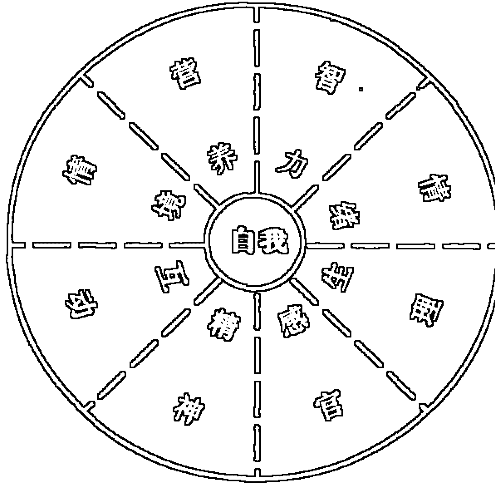

# 萨提亚
# 转化式系统治疗

Saatir Transformational Systemic Therapy

【加】约翰·贝曼 主编
钟谷兰 宫一栋 卫丽莉 苏 青 译
卫丽莉 审校

中国轻工业出版社

# Satir Transformational Systemic Therapy

# 萨提亚

# 转化式系统治疗

中国轻工业出版社

# 图书在版编目 (CIP) 数据

萨提亚转化式系统治疗 / (加) 贝曼 (Banmen, J.) 主编; 钟谷兰等译. —北京: 中国轻工业出版社, 2009.9
ISBN 978-7-5019-6810-7

Ⅰ. 萨… Ⅱ. ①贝…②钟… Ⅲ. 精神疗法 Ⅳ. R749.055

中国版本图书馆CIP数据核字 (2008) 第203953号

# 版权声明

Copyright © 2008 by Science & Behavior Books, Inc.
All rights reserved

总 策 划: 石 铁
策划编辑: 徐 玥
责任编辑: 徐 玥

出版发行: 中国轻工业出版社 (北京东长安街6号, 邮编: 100740)
印 刷: 北京天竺颖华印刷厂
经 销: 各地新华书店
版 次: 2009年9月第1版第1次印刷
开 本: 850 × 1168 1/32 印张: 9.0
字 数: 152千字
书 号: ISBN 978-7-5019-6810-7 定价: 18.00元
著作权合同登记 图字: 01-2009-0220
咨询电话: 010-65125990 65595090
读者服务部邮购热线电话: 010-65595091 85111729 传真: 85111730
发行电话: 010-65128898 传真: 85113293
网 址: http://www.wqedu.com
E-mail: wangqianbook@163.com
如发现图书残缺请直接与我社读者服务部 (邮购) 联系调换
81282J6X101ZYW

# 推荐序一

当我第一次参加约翰·贝曼教授的萨提亚模式心理治疗培训，就被萨提亚模式在较短的时间内就促成来访者深度转变的独特魅力所吸引。如今看到贝曼教授主编《萨提亚转化式系统治疗》一书在中国出版，很是兴奋。

作为萨提亚多年同事的贝曼教授，在这本书中，不但向我们介绍了萨提亚模式治疗系统的主要治疗观点和方法，还让我们看到了贝曼本人和一些萨提亚模式的治疗专家对萨提亚模式的一些最新探索。

萨提亚模式的治疗特色在这本书的书名中得到了最高度的概括。首先它强调转化。转化，意味着人原本就存在着自我成长、自我发展的能量，来访者寻求咨询的问题，只不过是他在成长过程中受到了一些限制，使之固着于一些惯性的认识和行为上。转化，意味着治疗师要协助来访者重新看到自己的能量和资源，运用自己的能量和资源实现心灵的转化，重新获得成长。怎样实现转化，萨提亚提出了一套模式：从人在压力下应对行为的方式，进入他的内在，看他的冰山——感受、认识、期待、渴望、自我，在这几方面治疗师与来访者联结。在冰山探索的过程中，它又使用了家庭图，把来访者的内在与成长环境做了联结。这就反映了萨提亚模式治疗模式的另一个突出特点，即强调系统治疗。从这套模式看来，来访者是个人内在与外在系统中的个人，他的问题的形成与心灵的转变都和个人内在系统、人际互动系统以及原生家庭系统密切相关。因此，必须把治疗放在这三个系统的联结中进行。

萨提亚模式很具有开放性和创造性。它以人本为主，整合了精神分析、积极心理学的理论，也吸收了东方文化的养分。

从总体上来说，它是一种积极的心理治疗。它相信人们本身就拥有应对和成长所需的所有资源。心理治疗的作用是启动这些资源，帮助人们自己实现改变。它不用“病理”的视角去看待来访者的问题，它不把来访者的问题看成是问题，而认为如何应对本身才是问题。书中运用萨提亚理论对于抑郁症和自杀的分析，并不更多地关注问题本身，而是关注于他们应对问题方式，这种视角令人耳目一新。

萨提亚治疗在较短的时间内促成来访者深度转变的理论和方法独具匠心。其个人冰山理论是一张有关生命“过程”的路线图。它可以作为引导者进入来访者内在过程世界的参考框架，使引导者得以让来访者积极参与到治疗中并在其内在做出重大的转化。它的“家庭图”，帮助我们把来访者的内在系统和外在系统巧妙地做了联结，从而促进了来访者对自我的觉察和改变。

萨提亚模式视治疗师自身为促成来访者改变的重要工具，它认为治疗师和谐一致的人格才是治疗的关键，把治疗师自己准备好作为治疗的重要条件。贝曼教授创造的“三个频道”的培训模式，艺术性地把来访者和治疗师的转变联结在了一起，既使受训者学到了萨提亚的治疗方法，也使治疗师本人获得了成长，这在其他的心理治疗培训中并不多见。

我想以上就是我被萨提亚模式吸引的关键之处。此外，读贝曼教授的《萨提亚转化式系统治疗》一书，还给了我一个很大的启发，那就是西方传统的治疗越来越重视吸收东方文化的理念，而一旦与东方文化结合，就酝酿出了一种治疗的灵性。我想，作为中国的治疗师们是否也应当有一种责任感和紧迫感，从我们中国深厚的文化中去发掘、去吸取、去创造，整合出一套符合中国文化特点的心理治疗模式，而不仅仅是拿来外来的东西，不加改造的加以运用。我希望自己为此做点努力。

尚桂瑶
首都师范大学心理咨询中心
2008年10月

# 推荐序二

约翰·贝曼教授以及同他工作的人们现在倡导的培训被称为“萨提亚转化式系统治疗”。它代表了萨提亚模式的最新发展趋势。21世纪的萨提亚模式就是以积极目标为导向、以转化性改变为基础的。正像他在序言中所说：“我们促成来访者感觉、知觉、期望等层面的转变，帮助他们找到满足自己最深层渴望的方式。治疗的重点是推动变化，使人们在深层次上发生转变，而不只是让他们用不同的方式做事，或者感受有所不同。”

心理治疗是个充满魅力的行业，因为它首先触及、感动的是学习心理治疗的人。在工作中，感动的瞬间更是层出不穷。治疗师和来访者一起在心灵深处观看并体验着一幕幕人间的悲欢离合、爱恨情仇的人生脚本。在每一个治疗的关键时刻的重大转变的发生都会引起剧情的转归和发展与脚本的方向分道扬镳。在动力学取向长程治疗中会在治疗的某一时段发生，但我惊奇地发现在贝曼教授的课堂上，是在一堂课中发生的。家庭关系是人际关系的雏形，当一个个当前问题背后的原因展现时，在精彩之处，你会看到贝曼大笔一挥，一座座家庭中陈旧的冰山在摧垮的同时，一座底层以爱为基底的冰山建立了，钻石般晶莹剔透。此刻，每一位家庭成员心中的冰山也在改变——家庭血泪史的冰山融化的同时在他们心中自己将剧本改写为幸福快乐史。

萨提亚模式属于体验式的家庭治疗体系。在课堂上，贝曼教授运用灵活、幽默、甚至有些风趣的语言，将冰山理论从底层到顶尖的一层层严谨结构自然而逻辑地讲述给学员们，让大家在不同角度可以看到冰山的不同侧面。体现了萨提亚体验式教学的魅力。参加培训的治疗师首先面对自己心中的冰山，并主动地移动和变化，而且，这种变化将持续地伴随生命发展。我曾听到过不止一位学员用生动的语言描绘自己的冰山，可能是因为心灵中的原有冰山在消融，一座座崭新的冰山在耸立，他们的脸上有晶莹的泪水，也有灿烂的笑容。

建构主义强调对交互关系过程的理解，后现代家庭治疗理论认为理解的过程就是我们在他人水平上浸润的过程。我们会发现在家庭重塑中，家庭成员在行为和结构的重新塑造中建构了新的理解——对自己，对家人。在心灵中，在家庭里萨提亚模式是实践的科学，在于每一个家庭在一起时，治疗场景中的每一个人的冰山都在移动和变化，在关注来访者内在的同时，也关注了家庭的动力并直接引发变化的开始，正像萨提亚所做的，联结他们的能力，将他们的能量导向成熟和转化，或是导向“人性的充足发展”。

记得我在参加贝曼教授课程的中途要为一个遭受创伤的群体进行哀伤辅导，为此，我向他请教。他对我说：“最重要的是在悲痛中发现生命的光辉！”一位接受了萨提亚模式治疗的来访者对我说：“我在治疗中看到了闪烁着人性光辉的一盏明灯，而且是我和你一起点燃的！”

这就是萨提亚和我们共同的目标：让每一个家庭都闪烁人性的光辉！

赵 梅
北京同仁医院临床心理科
2008年10月

# 原著推荐序

这本书的出版，源于我几年前对约翰·贝曼发出的一个邀请。当时，我请他担任《当代家庭治疗》的一期特刊“今日萨提亚”的特邀编辑。我曾长期做过临床医师、家庭治疗师、家庭和家庭治疗类刊物的编辑，而且还是一个有些“顽固”的历史学家。因此，我认为审视一下这位令人钦佩的开拓者留下了怎样的遗产、她对后世有什么样的影响将是一件有趣而且值得做的事情。我知道，如同其他几位早期的家庭治疗师—因阿克曼家庭治疗学会而被人铭记的内森·阿克曼、因精神研究院而闻名的唐·杰克逊、美国家庭治疗学会的默里·鲍温——一样，弗吉尼亚也留下了一笔遗产—萨提亚国际网络。如果我们想要回答下述问题：这位富于魅力的临床学家在去世20年后的今天是怎样被后人铭记和阐释的？那么最好的方式就是向她在萨提亚国际网络的同事们请教。

弗吉尼亚·萨提亚是在这个领域为数不多的仅靠名字的发音就能被人们牢牢记住的人，我对她的印象可以追溯到1965年至1988年之间。1965年，在美国婚姻咨询师协会的一次会议上，我第一次目睹她对一个家庭做的现场演示。1988年，在由美国婚姻咨询师协会演变而来的美国婚姻和家庭治疗协会举行的年会开幕式上，全体与会者表达了对她的哀思。1965年时，业内人士对她充满敬畏、疑问和好奇，当然也有一些固守传统理论观点的人士对她不屑一顾—他们与她所代表的一场新兴的、正在成长的家庭治疗革命水火不容。在后一次会议上，与会者却都表示出了他们对她的哀悼、眷恋和尊重，而萨提亚也被称为了“弗吉尼亚”。

她是否会被后世推崇为“教主”？她的教导是否会变成顶礼膜拜的“教条”？她的作品是否会被冠以“圣书”的荣耀？心理治疗领域的人应该都知道，我们从来就不缺乏被门徒们尊崇为大师的人物。我至今还清楚地记得，几十年前我参加过一个心理治疗协会的研讨会，但中途就悄悄离场了。因为我突然发现，在一名资深临床医师滔滔不绝地追述当年拜倒在创始人脚下的伟大岁月时，饱含钦慕之情的与会者凝神贯注地倾听着，会议也变成了对已经死去的创始者的追捧大会。这个协会的成员坚守的固然是正统学派的不二法门，但是这坚定了我走出会场、永不回头的信念。尽管萨提亚的追随者们也尊敬和爱戴她，但似乎没有什么迹象表明：她也被置于了这样一个偶像的位置，她的观点都是不容更改的信条，她的实践都是不容质疑的模板。

出于对成长的一贯重视，弗吉尼亚·萨提亚在1977年成立了萨提亚国际网络，其宗旨是“一个不断发展萨提亚理论和实践的平台”。这个组织的会员遍及五大洲的20多个国家和地区，申请加入的包括一大批专业人士——他们拥有不同的背景，却都认为自己在工作中秉承萨提亚模式。萨提亚的工作似乎向其弟子们传递的是“前进与成长”的邀请，而不是要求他们完全照葫芦画瓢。换言之，萨提亚模式实践者们被期望着构建一个包含着广阔的观念与价值的框架，而不是固守陈规不敢越雷池半步的教条主义。

弗吉尼亚极富个人魅力，甚至被人们称为“家庭治疗之母”。但是仅凭对一个人个人魅力的记忆就能一直延续她的精神遗产吗？这的确值得怀疑。但是，从她活跃地在世界各地讲学，到现在已经过去多年，事实表明可能还存在着能够赋予她的方法和实践以活力的其他重要因素。至少，发挥作用的可能是对体验了萨提亚模式治疗、咨询、工作坊和督导的人们所产生的治疗和关系方面的影响。根据我的判断，鼓励人们在更广阔的领域实践萨提亚模式、充分发挥他们个人创造力的因素还包括：对个体的强调、个人成长的能力、干预的直接性以及一套相对简单易学而非晦涩难懂的技术。

那么，时至今日，弗吉尼亚·萨提亚的工作是怎样被铭记和诠释的呢？约翰·贝曼主编的这本书达成了两件事情：首先，它是一本出色地介绍萨提亚理论和实践的指南；其次，它不仅告诉我们，萨提亚的遗产在当今舞台的位置居于何处，而且还令人欣喜地阐明了，一些从她那里诞生而来的方法还在继续发展。

约翰·贝曼和许多在本书中撰写文章的同事们正在实践萨提亚转化式系统治疗，他们中的许多人还依照这种方法开展培训。他们强调，这种方式的治疗具有系统性，而且能够在相对较短的时间里推动深层次的转化—包括病人与自己的关系、他们的生活以及同他人的关系。我在这篇推荐序里试图勾勒出这些作者描绘的今日萨提亚的一些重要要素。如果要真正领悟文章的内容，则需要比序长得多的篇幅。

曾是萨提亚多年同事的贝曼试图描述萨提亚模式的一些最新发展内容，他表明萨提亚模式强调的是：个人内在、人际互动和原生家庭是治疗性干预的核心。他将个人冰山隐喻看成是代表内在的关键。萨提亚认为，人类的体验是在六种层次上发生的：行为、应对、观点、感受、未满足的期待和渴望。正如贝曼和其他作者（如英尼斯和李）在本书中描述的，这些层次构成个人冰山隐喻的基础。这一隐喻在临床上得到应用，从而让来访者能够进入内在过程的子工作。

人的内在存在着家庭的不同部分—这种观点被理查德·舒瓦兹发展成了内部家庭系统治疗（1995）。这种模式的一个假设前提是，如同家庭等人类群体一样，这些内在的子人格相互作用，不断变化。他将萨提亚称为开路先锋，赞扬她为系统理论和内在子人格的融合性研究奠定了基础。

尽管个人冰山隐喻的内容与弗洛伊德人格理论的许多观点大相径庭，但它还是容易让人联想起精神分析所强调的关于觉察的意识、前意识和潜意识层面。这两种方法的主要区别在于，同经典的精神分析理论相比，萨提亚模式相信，人们能够改变，这点不同于精神分析的观点。贝曼总结了萨提亚模式系统治疗的主要特点，还有一些重要的治疗观点—许多人认为它们令人着迷。贝曼指出，萨提亚几乎没有记载或者阐述她的工作的理论基础，他认为她的实践、培训计划和记录下来的演示“具有一种深邃而贯穿始终的心理学基础”，并且认为“没有多少家庭治疗作者理解她的贡献的深度和意义”。

萨提亚在同她一起工作的人们的身上观察到变化的六个阶段，而贝曼在此基础上加入了转化，从而形成变化过程的七个阶段。这七个阶段包括：(1) 现状；(2) 外来因素；(3) 混乱；(4) 转化；(5) 整合；(6) 实践；(7) 新的现状 (Banmen, 1998)。卡尔·塞尔斯的文章详细说明变化的这些阶段，包括一些案例材料说明。

虽然马克思·英尼斯不是萨提亚模式的治疗师，但他希望理解和阐述萨提亚及其工作。除了勾勒出这种模式的概念基础，并用假设、基本架构、方法和治疗过程清晰地组织这个过程，他观察到萨提亚模式没有被家庭治疗的主流所接纳，并对此进行了简明而具有洞察力的分析，这部分值得大家研读和思考。他提出的一个观点是，如果没有萨提亚曾经拥有的魅力，也没有依据一些基本原则发展自己的治疗方法，那么她追随者的工作成果，应该远不如她本人的工作令其他治疗师信服。邦妮·李也注意到了萨提亚在家庭治疗领域中被“低估”，而且处于“边缘地位”，她把人们缺少对萨提亚观点和理论的辩证分析和赞赏归咎于如下事实：萨提亚使用体验性的工作坊来教授自己的治疗模式。

萨提亚的理念和工作的一些其他方面也在本书中得到了阐述。重塑在好几章中都有提及。吉里斯·贝尔德莱认为，家庭重塑过程和它的演化（萨提亚的转化过程）都聚焦在全人健康和重获并拥有统整性上。贝尔德莱很乐观地认为，萨提亚的关于人类沟通和成长的模式“仍将是人类现阶段的一个重要选择方案”。这里需要提请注意的是，一些批评家指出，萨提亚模式更符合早年个人主义占据主导的美国文化基调。随着萨提亚模式治疗的发展，这种批评是否站得住脚，将会被淘汰还是更新，还需要时间的检验。当然，本书中的临床医师似乎很有把握，他们所做的治疗对于帮助人们迈向转变是有效的。

格劳丽亚·泰勒的文章是关于家庭重塑的，反映了对萨提亚模式方法的不断改进。她指出，家庭重塑是一种为了实现各个层次的一致性进行转化的无可比拟的工具。在这些层次中，第一个层次的一致性是人们接纳原本的感受。第二个层次的一致性，是人们与内在的自己协调一致。在第三个层次的一致性，包括了与自己、生命能量、精神（Satir, Banmen, Gerber, & Gomori, 1991）相和谐的存在。泰勒使用了一个案例，来说明重塑的过程能够在很短的时间里完成。通过具体的步骤和原则，她把这一过程缩减到了三个小时。

萨提亚模式的治疗师（如本书中的斯蒂芬·史密斯）强调，治疗转化过程不仅作用于来访者，对治疗师的培训过程对治疗师本人也是转化式的。约翰·贝曼和凯瑟琳·马古贝曼（2000）持续地在加拿大、韩国、新加坡、美国、中国以及欧洲提供他们修订过的萨提亚模式的培训。温迪·拉姆强调，贝曼对冰山隐喻的发展，为治疗师提供了有效的方法，帮助治疗师在培训过程中拓展对自己的运用。

已经有人针对这种培训的结果进行了一些研究，如将个人冰山隐喻融入治疗师的个人和职业生活（Lum, 2000）。针对九名参与者进行的研究所得到的数据表明，治疗师的个人觉察力、对来访者和自己的尊重都得到了提升，而且从注意事件和行为转变为考量经验对内在的影响。史密斯表明，尽管参加培训的治疗师可能是为了学习新的治疗方法而来，但他们从培训中发现了一种新的存在和体验自我的方式。

有时针对治疗方法会存在这样一个问题：它只对“无关痛痒的问题”有效，还是也能够应对“严重的问题”？没有什么社会问题比年轻人的自杀更令人关注和头痛了。温迪·拉姆、吉米·史密斯和朱迪·费丽斯回顾了针对有自杀倾向的青年人的治疗，并将焦点放在萨提亚模式疗法上，因为它也应用于这种人群。通过对萨提亚太平洋学院自杀干预和治疗行动小组的考察，以及对孩童、年轻人和成年人自杀行为的研究，这三位作者对一名自杀的少年进行了个案分析。他们描述了，治疗师在他还活着的时候可以如何使用萨提亚模式，而可能产生疗效，挽救他的生命。他们认为萨提亚模式提供了一个包含全面的、整合的年轻人的内在体验的框架，从而能够以此对试图自杀的年轻人进行有效地预防、干预和治疗工作。

另一个能够应用萨提亚模式治疗的严重问题是幼年遭受性侵害的成年女性。安妮·莫里森和朱迪·费丽斯提供了一个运用萨提亚模式治疗这种来访者的案例，它包括了有关干预、目标和结果的详细记录。

两名来自中国香港的作者格蕾丝和塞西莉亚强调弗吉尼亚·萨提亚的文化敏锐力，并提出了一种适合在香港推行的治疗取向—它既来自于传统文化，确保等级集体主义的延续，又能够使个人的自由、平等和独立的愿望得到满足。她们得益于萨提亚1983年在香港的培训以及此后多年几位西方治疗师的熏陶，现在感到有义务将萨提亚模式进行修改，并且发展出一种

## XVI 萨提亚转化式系统治疗

根植于她们本土文化的实践。

除此之外，还有许多正在发生的其他进展，它们似乎表明萨提亚的工作和精神遗产仍然生机勃勃。在美国、中国香港或其他地方就能看到这些进展。例如，在澳大利亚萨提亚家庭中心，他们使用家庭棋盘，是对熟悉的家庭雕塑概念的调整，在那里，让人们调整家庭成员的位置、改变其身体姿势的雕塑方式是不受欢迎和不太实用的 (Neil, 2004; Neil & Silverberg, 1995)。

无论是否被主流所接受，也无论是否受到弗吉尼亚个人魅力的影响，萨提亚的理论和实践在世界上的许多地方都在蓬勃发展。

约翰·贝曼和他的同事们创作出了一部杰作，他们将鲜活的、体验式的治疗和培训用文字记录描述出来，而这常常是很多人不屑去做的。

威廉·尼古拉斯
美国专业心理协会 教育学博士

(宫一栋译)

## 原 著 序

## 今日的弗吉尼亚·萨提亚

弗吉尼亚·萨提亚（1916—1988）是萨提亚家庭治疗流派的创始人之一。她出生于美国威斯康星州尼尔斯维尔的一个农民家里，是五个孩子中的老大。在她出生18个月之后，她的一对双胞胎弟弟、妹妹和最小的弟弟相继诞生。她经常谈起在农场上照看弟妹的那段时光。她是在一所只有一间房子的学校开始接受正规教育的。她在密尔沃斯就读高中，毕业那年正好16岁。1936年，年满20岁的她开始在一个小的社区学院执教，很快发现她与学生家庭的关系在成功的教学中发挥了重要的作用。1948 年，她在芝加哥大学获得社会工作硕士学位。

当时，芝加哥的治疗团体偏重于精神分析，而且男性占据主导地位。萨提亚说，她曾试图接受这种模式，即只注重个人而忽略其他家庭成员，但这让她感到很不舒服。1951年，她接诊了自己的第一个家庭（Satir, Banmen, Gerber, & Gomori, 1991）。1959 年，她与唐·杰克逊和朱尔斯·里斯金在加州的门洛帕克成立了精神研究院。同年，她在精神研究院开设了家庭治疗课程。与研究相比，她对临床工作和教学更有兴趣。她很快成为精神研究院的培训部主任。1962年，精神研究院获得美国精神卫生研究院的资助，开展了第一个正规的家庭治疗培训项目。

1964 年，萨提亚出版了自己的第一部著作《联合家族治疗》。她在书中提出了自己的观点：与家庭共同开展工作是非常重要的，而且家庭系统对个人有着重要影响。从1969年开始，她每年都会主持长达一个月的培训项目，直到她1988年去世。在出版《联合家族治疗》一书后，她的主要精力用于在世界各地开展有关家庭治疗的工作坊和培训项目，帮助人们变成“更完整的人”。

我第一次见到弗吉尼亚·萨提亚是在1970年，当时我在加拿大曼尼托巴省参加一个为期 5 天的培训。同前后许多人一样，我感到她与来访者的关系充满着魔法和力量。我在见到她之前的一个月获得了心理学博士学位，但与弗吉尼亚·萨提亚的相处却让我感到，我的治疗培训才刚刚开始。

1972年，弗吉尼亚·萨提亚在加拿大曼尼托巴省待了3个月，与不同类型的人一起工作，包括政府官员、不同领域的专业人士和普通大众。这是一段充实的时光，我体验到了一段有生以来最棒的学习经历。到了1981年，我成为她教师队伍中的一员，开始投身于她主持的、为期一个月的培训。她的许多从业和执教经历，成为我和萨提亚、葛伯以及葛莫莉合写的《萨提亚家庭治疗模式》（1991）中的素材。这本书是在她逝世后的第三年出版的。

在20世纪80年代，弗吉尼亚·萨提亚的大部分时间和精力都投入在大规模的团体工作上。在这期间，她开发并且广泛使用两种治疗工具：家庭重塑和面貌舞会。这两种与她密不可分的治疗工具在《萨提亚家庭治疗模式》中都得到了充分的阐释。本书有一章专门讨论家庭重塑过程的最新发展趋势。

在大的团体工作坊中，她主要关注如何促进个人以及职业的发展。许多参加者都说，他们的生活有了重要的改善，这得益于他们在工作坊进行过程中以及结束之后发生的改变。但经常被人们忽视的一个事实是，参加者没有学会把在大的团体工作坊中的体验融入回到工作岗位后的治疗实践。因此，需要找到一种方式，让他们在对个人和家庭的治疗过程中，更加有效地运用萨提亚成长模式。这成为我在萨提亚去世后18年始终秉持的一个目标。

我以及我的同事现在倡导的培训被称为萨提亚转化式系统治疗。这就是说，我们创建的是承继萨提亚模式的、一种能够在较短时间内促成来访者深度转变的系统治疗模式。在过去10年中，我们所教授的萨提亚模式能够帮助治疗师对个人或者家庭带到治疗中的任何症状在办公室的环境中进行治疗。除了一位作者，本书中的其他作者都在对来访者的治疗过程中使用萨提亚转化式系统治疗模式，而且他们中的许多人还在用这种方式培训其他治疗师。

根据目前的实践经验，萨提亚成长模式的一个关键要素是对重大变化——或者转变——开展工作。正如弗吉尼亚·萨提亚在其一生的临床工作中所展示的，治疗的重点融合了个人内在和人际互动两种方式。在我们的治疗实践中，我们学会帮助来访者设定符合他整个人——内部和外部——要求的具有积极意义的方向性目标。我们的资源建立在作为个体的来访者以及家庭系统之上。我们自己也希望并且相信，每一次治疗过程都有促成改变的可能性。我们强调，每个治疗师都应当变得尽可能的一致、完整和内在和谐，并在生活中实践这一目标，尤其是在治疗过程中。我们促成来访者感觉、知觉、期望等层面的转变，帮助他们找到满足自己最深层渴望的方式。治疗的重点是推动变化，使人们在深层次上发生转变，而不只是让他们用不同的方式做事，或者感受有所不同。

在本书各章中我们描述了治疗工作的各个方面。取得的成效是显而易见的。我们的来访者需要的治疗时间缩短了很多，并且他们在与自己和他人的关系以及生活中的其他方面都做出了巨大的改变。

我希望阅读这些由临床医生写的文章能够让读者明确，萨提亚成长模式是如何在不同的情形下展开和工作的。我还希望，本书能够让读者了解各种的实用而有效的方式。

约翰·贝曼

（宫一栋译）

## 目 录

- **第1章 萨提亚模式的昨天和今天** …………………………………………………… 1
    - 萨提亚模式的理论 ……………………………………………………………………… 2
    - 治疗干预的三个领域 …………………………………………………………………… 3
    - 生存应对姿态 …………………………………………………………………………… 13
    - 结语 ……………………………………………………………………………………… 19
- **第2章 萨提亚的积极心理学** ………………………………………………………… 21
    - 萨提亚在心理学历史中的地位 ………………………………………………………… 25
    - 萨提亚作为积极心理学的先驱和推动者 ……………………………………………… 30
    - 治疗效果和方法 ………………………………………………………………………… 34
    - 近期应用和未来方向 …………………………………………………………………… 40
    - 结语 ……………………………………………………………………………………… 43
- **第3章 以萨提亚治疗为导向的教育过程** ………………………………………… 51
    - 对萨提亚模式的总体看法 ……………………………………………………………… 53
    - 预设 ……………………………………………………………………………………… 55
    - 在思想史中考察萨提亚 ………………………………………………………………… 65
    - 萨提亚的方法和目前的趋势 …………………………………………………………… 66
    - 对萨提亚方法的批评 …………………………………………………………………… 67
    - 结语 ……………………………………………………………………………………… 73
- **第4章 家庭重塑的过程及其迄今为止的发展：萨提亚的转化过程** ………… 77
    - 萨提亚模式：家庭重塑 ………………………………………………………………… 78
    - 结语 ……………………………………………………………………………………… 91
- **第5章 萨提亚模式的转化性改变** …………………………………………………… 97
    - 探索变化 ………………………………………………………………………………… 97
    - 改变的情境 …………………………………………………………………………… 100
    - 改变的过程 …………………………………………………………………………… 102
    - 结语 …………………………………………………………………………………… 114
- **第6章 治疗实践中的转化** ………………………………………………………… 118
    - 萨提亚关于人的观点 ………………………………………………………………… 118
    - 萨提亚系统的观点 …………………………………………………………………… 120
    - 关于人的系统观点 …………………………………………………………………… 121
    - 治疗的含义 …………………………………………………………………………… 123
    - 萨提亚对治疗的观点 ………………………………………………………………… 127
    - 治疗中“自我”的运用 ………………………………………………………………… 129
    - 一致性 ………………………………………………………………………………… 130
    - 研究 …………………………………………………………………………………… 131
    - 治疗师的转化 ………………………………………………………………………… 133
    - 结语 …………………………………………………………………………………… 134
- **第7章 家庭重塑** …………………………………………………………………… 137
    - 我的目标 ……………………………………………………………………………… 138
    - 步骤和原则 …………………………………………………………………………… 141
    - “黛伯”的重塑 ……………………………………………………………………… 144
    - 黛伯对家庭重塑的思考 ……………………………………………………………… 146
    - 通过重塑达到的变化 ………………………………………………………………… 147
- **第8章 对青年自杀行为进行干预** ………………………………………………… 149
    - 针对有自杀行为的青少年的常用疗法 ……………………………………………… 150
    - 萨提亚模式疗法 ……………………………………………………………………… 152
    - 内心体验 ……………………………………………………………………………… 153
    - 有自杀倾向的青年人的感觉 ………………………………………………………… 156
    - 有关自杀的调查给我们的启示 ……………………………………………………… 159
    - 个案研究 ……………………………………………………………………………… 162
    - 使用萨提亚模式对自杀进行治疗 …………………………………………………… 166
    - 结语 …………………………………………………………………………………… 171
- **第9章 对童年遭受过性侵犯的女性进行治疗** ………………………………… 175
    - 性侵犯治疗 …………………………………………………………………………… 176
    - 萨提亚的治疗理念 …………………………………………………………………… 177
    - 对遭受性侵犯来访者的萨提亚模式治疗方法 ……………………………………… 179
    - 对遭受性侵犯女性来访者的治疗方法 ……………………………………………… 181
    - 结语 …………………………………………………………………………………… 199
- **第10章 治疗师对于“自己”的使用** …………………………………………… 203
    - 萨提亚模式的四个目标 ……………………………………………………………… 205
    - 萨提亚系统短程治疗培训项目 ……………………………………………………… 217
    - 结语 …………………………………………………………………………………… 221
- **第11章 萨提亚模式及其文化敏感性：香港的视角** ………………………… 225
    - 文化敏感性的必要性 ………………………………………………………………… 226
    - 萨提亚对文化需求是敏感的 ……………………………………………………… 229
    - 有关文化敏感性的问题 …………………………………………………………… 232
    - 在等级集体主义的情境下实践一致性 …………………………………………… 233
    - 结语 …………………………………………………………………………………… 239
- **第12章 如果抑郁是解决方法，那么真正的问题是什么** …………………… 247

## 第1章 萨提亚模式的昨天和今天

约翰·贝曼

弗吉尼亚·萨提亚被公认为是家庭治疗的先驱。她最早的贡献之一，就是在咨询中同时会见多个家庭成员。她和约翰·埃尔德金·贝尔、内森·阿克曼与默里·鲍温一起，对当时的治疗实践做出了非常大胆的挑战。这仅仅是萨提亚对家庭治疗和个人成长所做贡献的开始。现在，大多数治疗师，尤其是家庭治疗师，不仅认为在咨询中同时会见其多个家庭成员是很正常的事情，而且这已经成为他们工作中的关键。

萨提亚是实践上的革新者。她很少记录或解释她的理论基础。然而，很多年以来，她的治疗实践、培训课程和记录下的示范演示已经揭示出深刻、系统的心理学理论和治疗理论的基础。但是，很少有家庭治疗方面的作者能捕捉到萨提亚对治疗贡献的核心及其意义。

本章是探索萨提亚模式理论的一个尝试，旨在分享萨提亚模式的一小部分以及它如何在当今实践中应用。

## 2 萨提亚转化式系统治疗

### 萨提亚模式的理论

根据人们已经普遍认可的萨提亚的贡献，萨提亚模式最适合划入人本心理学派。从心理治疗的观点看，萨提亚模式属于体验式的家庭治疗体系。

治疗模式是建立在一系列的信念、假设基础上的。我们不去探寻萨提亚模式的哲学渊源，而仅仅探寻萨提亚模式的一些治疗理念，以此作为本文的基调。

1.  改变总是可能的，即使没有外在改变，也会有内在的改变。这些改变包括感受、观点和预期。
2.  治疗会谈必须是体验式的，以引发第二层面的改变。这个改变不仅是行为或感受上的，还包括深层“自己”的改变。
3.  问题本身不是问题，如何应对才是问题。因此，治疗聚焦在改善一个人的应对方式上，而非仅仅解决他的问题。
4.  感受是属于我们自己的，因此我们能学会改变感受、管理感受和享受感受。
5.  治疗要设定积极正向的目标，解决负面经历造成的影响。
6.  治疗是系统性的，包括个人的内在系统和人际互动的关系系统。
7.  人们具备他们应对和成长所需的所有资源。治疗是启动这些资源帮助人们改变的工具。
8.  大多数人会选择熟悉感而非舒适感，尤其是在压力下。

这些，以及类似的治疗理念（Satir et al., 1991），有助于加深治疗师对人、关系和改变的理解。

### 治疗干预的三个领域

萨提亚模式的治疗干预主要聚焦在三个领域：个人内在系统，人际互动系统以及原生家庭系统。

### 个人内在系统

这个个人内在系统可以用冰山的隐喻来说明。本书中许多文章都将提到冰山隐喻。这是将人类体验概念化的一个方法，要知道人类的大多数体验实际上都是内在的；而内在体验的各个部分是相互作用、具有系统性的。人们在一个领域的改变经常导致另外一些领域的变化。用二维线性的方式表示，“冰山”的各个领域或组成部分是：(1) 行为；(2) 观点；(3) 期待；(4) 渴望；(5) “自己”。更详细的萨提亚模式冰山图（见图1.1）。

假设一个来访者来向你寻求帮助。他妻子因为另一个男人而离开他，他很沮丧。治疗师非常诚恳地、关切地询问来访者一些个人问题，同来访者建立一些联结。治疗师可能会这样说：

> “好，你今天为什么来这儿呢？”

这类问题常常会导致来访者对事件的描述。回答会是关于让他沮丧并寻求治疗的故事。萨提亚模式建议尽可能少讲故事，因为故事只能提供治疗的一部分背景。

现在该治疗师探索来访者的内在体验了。这包括询问一些有关个人感受、观点、期待和渴望的不同问题。

可能的问题例举如下：

-   你现在感觉如何？
-   你妻子离开时，你有什么感受？
-   你怎样表达或处理你的感受？
-   你妻子离开你了，现在你看你妻子，她是一个什么样的人？
-   你还感受到其他的情绪吗？
-   对婚姻，你还有什么希望和期待吗？
-   对于婚姻破裂，你要负哪些责任呢？
-   你意识到自己有什么深层的渴望吗？

这些问题是举例说明治疗师如何探索来访者的内在体验，或自身内在系统的体验。当考虑了这类问题后，治疗师需要设定一些目标。这些目标应该是有关来访者内在体验的。来访者想要感觉好些，更积极正面些。来访者想要解决他未满足的期待，这些未满足的期待引发了他很多即时反应和后来的负面感受。他需要找到方法满足自己的渴望，或者原谅自己，爱自己，接受自己，欣赏自己过去的行为，欣赏自己是一个什么样的人。当设置了这些目标后，就需要来访者对这些目标做出承诺。

现在，治疗师要帮助来访者克服那些障碍，这些障碍阻碍他们去体验和谐和自我价值，让他们不能接受自我，不能进行自我赋能。来访者需要处理他的失望、可能的内疚、愤怒、伤害和悲哀。

治疗起初的焦点是在内在系统领域，然后再转移到来访者生命中的关系互动领域。设定积极正向结构化的目标，为来访者提供一个改变的焦点。

萨提亚模式有四个总目标，是积极正向改变过程的焦点。这四大目标是：

1.  提升来访者的自尊。自尊是一个人对自我的判断，或是自我价值的体验。
2.  帮助来访者为自己做出选择。萨提亚鼓励人们在任何情境中至少考虑三种选择。她想要来访者有能力为自己做出选择。当我们用机械、退缩的观点来看待人性时，我们不是在一个极端，就是在另一个极端。例如，对或错，好或坏。简而言之，萨提亚模式总是避免“不是/就是”的两难选择，提倡用三个或更多的可能性来看待一个情境。萨提亚模式还提倡以一个更加整合的观点取代“不是/就是”的思维方式。选择不仅包括关于一个人行为的决定，还包括对未满足期待的不同回应，而非一个人惯常的反应。
3.  帮助来访者负起责任。责任不仅包括对一个人的行为负责，还包括对他的内在体验负责。这里主要的关注点常常是为自己的感受负责。这意味着要对感受负责、管理感受、享受感受。德马西欧（1999）、勒杜（1996）和波特（1997）等作者的一些文章，详细说明了如何将个人的责任感深入到责任和改变的分子水平。萨提亚模式在治疗中对这些可能性完全持开放的态度。
4.  促使来访者更和谐一致。和谐一致是内在与外在的和谐。那是一种平静、完整、祥和的感受。和谐一致是治疗会谈中要努力达到的状态。这是一种赋予能力的感觉，来访者不是被外在世界控制，也不是被外在世界引发负面反应，而是从内在保持与深层自己以及他人、情境相和谐的状态，并对外界做出反应。

治疗时以这些总目标为背景和治疗架构，可以帮助每个来访者和每个家庭制定出针对他们自己的、具体的、积极正向的目标。这些目标包含了整个人，不仅是生命中的某个方面，如行为或感受。在萨提亚模式中，目标包括行为、感受、对感受的感受、观点、期待和渴望层面上的改变。目标要涵盖冰山的每个部分。21世纪的萨提亚模式更是积极目标导向的、以转化性改变为基础的。

### 人际互动系统

在人际关系中，无论是夫妻还是家庭，人们报告的问题通常都是冲突。萨提亚模式用相同和相异来看待人们之间的关系。萨提亚过去常说，人们因相同而吸引，因相异而成长。在治疗领域，我们常听到关于冲突解决的说法。萨提亚模式提倡用一致的互动来解决差异。处理差异的方法多种多样，人们常用的方式有以下五种：

1.  冲突。这种处理差异的方法包括身体上的争斗或语言上的争论。这是一种不是/就是的姿态，只有一种正确的可能性。这通常建立在对和错的极端化基础上。在阶级模式中，这演化成权利的争夺。显然，萨提亚模式不提倡人们用这种方式解决个人、人际以及社会的冲突。
2.  否认。尽管差异存在，但人们却用否认来避免在言语或非言语上的差异。例如，人们会由于潜在的争论和冲突而避免讨论宗教或政治观点。他们可能会保留自己的观点，在彼此关系中选择退缩，避免亲密和亲近。
3.  妥协。当人们妥协时，他们选择的东西可能是谁都不想要的，但也都觉得可以接受，双方都做出让步，不分输赢。有时这是一种双方各打五十大板的处理。
4.  解决。在这个层面上处理差异，是双赢的。解决通常是在深层的联结、在渴望的层面产生的。在这儿，人们彼此接受，都有积极的意愿。通常，解决大的差异需要第三方参与，来帮助人们处理放不下的失望、愤怒、害怕和伤害。
5.  成长。最终，当我们看差异帮助人们成长时，会发现通过理解、接纳和挑战，来访者能学会将差异整合到他们的生命中。在这方面，我经常同来访者分享我和我妻子的审美差异。过去，我喜欢歌剧，她喜欢芭蕾；现在，我们都是既喜欢歌剧又喜欢芭蕾。在治疗中，差异常会引发生存的需要，因此，差异也衍变成配偶间或家庭成员间攸关生死的事情。

### 原生家庭系统

萨提亚模式非常强调原生家庭的作用。这些年来主要的转变，是家庭图不再作为一个人同父母建立平等的成人间联结的方法。现今的重点在于解决原生家庭对一个人内在负面影响并使个体重新利用从原生家庭中已经取得的资源。家庭图在家庭重塑中非常重要，家庭重塑是萨提亚最著名的改变治疗工具之一。现在，个人和家庭治疗会谈也常使用家庭图。现在的家庭图形式上可能与当年萨提亚使用时差不多，但是运用的过程已经有了很大发展。

当工作对象是成年来访者时，我们通常会绘制来访者原生家庭图。家庭图包括两个主要时间框架：实际的现在和观念中的过去。从治疗目标来考虑，建议先制作实际现在的家庭图，然后再制作观念中过去的家庭图。

家庭图中，实际的现在部分包括以下项目：

1.  父亲和母亲的名字；
2.  他们的出生日期和地点；
3.  他们现在的年龄或去世的时间；
4.  结婚日期和分居/离婚的日期（如果有）；
5.  他们的宗教信仰（如果有）；
6.  他们的职业；
7.  他们的教育背景；
8.  他们的民族；
9.  他们的爱好与兴趣；
10. 疾病、医治或残疾等情况（如果有）。

然后，收集关于来访者家庭中每个孩子的上述信息，当然这里包括来访者自己。不论来访者的年龄大小，他在原生家庭图中都是孩子。

如果发生过兄弟姐妹的死亡、流产和堕胎也要考虑在内。这就是第一步，现在实际的原生家庭图见图1.2。

在现在的实际原生家庭图中，可以看到图的结构。孩子列在垂直线上，而非通常的水平线上。女性用圆圈表示，男性用外面有方框的圆圈表示。

完成了现在实际的原生家庭图，我们会要求来访者回忆过去，最好是18岁以前，放松下来，给我们一些体验性的资料。我们需要他们两个方面的体验。第一个体验是，当他们回忆童年/青少年时期的家庭体验时，给包括本人在内的每个家庭成员2～3个褒义形容词、2～3个贬义形容词。在萨提亚模式早期实践中，如萨提亚及他的同事所要求的（1991），仅仅要求给每个家庭成员3个形容词。我们发现，喜欢讨好的人常常只给褒义形容词，而喜欢指责的人常常只给贬义形容词。其实我们知道，所有人都有他们积极和消极的方面，所以现在我们要求两方面都列。

第二个体验是，来访者家庭里的人在压力或有分歧的时候，与别人互动的方式。当然，这个关于压力下关系的描述，是来访者对童年家庭体验的总括。

我们给来访者四种可能的标示：

1.  粗直线 ———————— 常常表示两个家庭成员纠结的关系。
2.  波纹折线或锯齿线 ~~~~~~~~~~ 表示压力下激烈的、冲突的或敌对的关系。
3.  细直线 ———————— 表示即使在压力下也是正常的、接纳的关系。
4.  虚线 - - - - - - - - - - 表示压力下疏离的、消极的或无关紧要的关系。

当然，也有其他可能的关系类型。但我们发现，这四种关系类型足以刻画多数人在压力下互动的方式。

当我们开始治疗时，会发现对于来访者现在环境中一些毫无意义的情绪体验以及在童年经历中一些未解决的情绪体验，家庭图会很有用。家庭图还能帮助来访者进入他们的内心；或者当我们怀疑一些过去事件的冲击干扰了他们现在的生活时，家庭图也能有所帮助。

如果没有具体的事件或情境引发来访者正在体验的负面情绪，那么，我们就用一张大网来探索多个方面的影响。例如，我们可能探索来访者家庭成员间关系、对每个家庭成员的形容词、每个家庭成员压力下的应对方式，家庭成员的患病史、家庭成员的丧失以及发生在其他家庭成员身上的重大事件等的影响。

这样做的目的是要减少这些事件对个人曾经的或正在经受的负面冲击，这些冲击包括对个人的行为、感受、观点、期待、渴望或深层自我体验的影响、触动和控制。

### 格雷·怀特的家庭

图 1.3 第二步：现在实际上和过去观念中的家庭图

当进行家庭治疗时，最常用的方法是把实际上和观念上的信息都放到现在情境下的家庭图上。家庭图看上去稍微有些复杂，因为每个家庭成员对自己和别人的观点可能有所不同。有时，当处理了一些观点和期待方面的较大差异后，人们经常会发展出一个更一致的家庭图。无论如何，一个健康的、有助成长的家庭是能接纳差异的。

### 生存应对姿态

在早期，萨提亚还在精神研究所工作的时候，她的治疗方法被看成是一种沟通模式。在那时，她非常强调人们用一种“直接”的方式与他人互动。在观察了很多家庭互动或沟通后，萨提亚把一些基本行为归纳为模式，称为“生存应对姿态”。不论人们在原生家庭的经历有多艰难，他们都会找到应对和生存的方法。为了展示人们在这些模式里如何体验自己，萨提亚用雕塑的方式外化家庭成员的内在体验。萨提亚总结出的典型应对姿态是：（1）讨好；（2）指责；（3）超理智；（4）打岔。关于这些应对姿态可以陈述很多。有关资料可以参考萨提亚所著的《新家庭如何塑造人》（1988）。

应对姿态是人们在情绪压力下的生存模式。它们不属于人格范畴。大多数人在压力下使用一种主要的应对姿态。实际上，在不同的环境和关系里，很多人会使用所有这四种应对姿态。举个例子，一个人可能在工作中讨好领导和同事，在家里指责家人，在聚会上跟朋友相处时又很会打岔。

我们假设大多数读者都知道萨提亚模式的这些内容，在这里就不再说明每种应对姿态的特点了。相关更多的内容可以参考萨提亚的著作（1991）。

在这里要讨论的重点是这些应对姿态如何在治疗上协助我们。一旦我们走近来访者，即使仅仅观察他们如何谈论自己的问题，我们就可以辨认出他们的应对姿态。知道了来访者的应对姿态，我们将知道如何与他们的内在过程建立联结。在萨提亚模式的治疗中，与来访者联结是很重要的概念和要求。不同于其他模式中要求的建立和谐关系，萨提亚强调建立联结。通过用冰山隐喻分析每个来访者，并即刻评估来访者可能的应对姿态，治疗师能通过以下方法更深层和更快速地建立联结。

对于在压力下使用讨好姿态应对的来访者，我们通过他们的感受可以很容易地接近他们。这类来访者常常很沮丧，把自己看成是受害者，感到无助、无望。通过感受与来访者互动，双方就可以建立和谐的关系，治疗也就可以开始了。

对于在压力下使用指责姿态应对的来访者，通过他们的期待可以很容易地接近他们。治疗应聚焦在来访者想要的，而非他们的感受。这样，双方可以很快、很容易建立关系。

对于在压力下使用超理智姿态应对的来访者，通过他们的观点可以很容易地接近他们。这些来访者好像生活在自己的头脑里，他们理性、讲道理、讲逻辑、讲事实，很少触及到自己的感受。为了让这些来访者超越超理智姿态，治疗师可以首先探索他们的身体反应和他们的期待，然后再深入到他们的感受中去。

对于在压力下使用打岔姿态应对的来访者，治疗师与他们接触是比较困难的。身体感觉、触摸以及肢体动作（比如和他们一起散步）是三种和使用打岔姿态应对的人接近的方法。我经常从情境方面开展工作。我常常让他们探索现实的环境，比如我的办公室。邀请他们评价环境、家具、颜色。利用办公室的东西帮助他们安定下来，设定界限，建立信任。这个方法对有注意力障碍的来访者特别有效，有注意力障碍的来访者在萨提亚模式中就是使用打岔来应对的人。

了解来访者的应对姿态，使用冰山比喻的方法将在很大程度上缩短与他们建立联结的时间。一旦建立起联结，你就已经进入来访者内在的系统。对治疗师而言，整个冰山、整个人都做好准备了，可以帮助他们引发改变。

现在我们将萨提亚模式的治疗晤谈基本方面归纳为以下几点：

1.  治疗师自己做好准备。我们发现，治疗师从内在和外在上做好准备很重要。这包括：回到自己的中心，将自己的能量聚焦在来访者身上，准备好接待和接受来访者。
2.  当来访者进入咨询室时，治疗师就要与来访者联结。一开始，治疗师与来访者做些社交上的寒暄互动可能会有帮助。联结意味着治疗师聚焦在倾听和接纳当下状态的来访者。联结在萨提亚模式中非常重要。在这个过程中，治疗师评估来访者的应对姿态，基于冰山的实质与他们沟通，可以提升联结的速度和深度。
3.  一旦建立了联结，治疗师就可以倾听来访者的问题。“是什么事让你今天来这儿呢？今天你想看看什么呢？我们今天对什么问题进行工作呢？”来访者回应这些问题就是治疗师分享他们问题的开始。许多来访者好像准备好了，能对这类问题有回应，但是大多数来访者想告诉治疗师的都是，他们出了什么差错，或者家里其他成员出了什么差错。他们回应的焦点在讲述问题。对治疗师而言，来访者讲故事，治疗师就应当通过发问把来访者带到内在。在我们的经验中，大多数治疗师不仅允许来访者讲故事，而且实际上是通过更内容性的问题鼓励他们讲故事，因此实际上变为谈话治疗模式。而萨提亚模式鼓励的是，尽量少讲故事，故事仅仅为治疗提供部分情境。
4.  当对来访者发生的事情有了大概了解，治疗师就可以开始帮助来访者将问题转化成积极正向导向的目标，目标包括内在过程的每个部分：感受的目标，观点的目标，期待的目标，渴望的目标，最后到行为的目标。设定目标需要治疗师和来访者共同努力，目标包括了整个人，而不仅仅是行为或认知。在治疗进行过程中，目标经常调整，治疗师才能进入来访者体验中更深或更隐蔽的领域。
5.  有时，来访者没有同内在自我接触，或者困惑、沮丧，或者非常愤怒。这时，需要治疗师和来访者共同努力，去探索来访者内在的功能。来访者需要花一些时间和精力去体验自己，来提升他们对自己的觉察，在他们能真正设定积极导向目标前，接纳内心浮现出来的东西。有些来访者需要先处理重要事件的影响，才能设定正面积极导向的目标。如果有严重的障碍阻止来访者向前看，治疗师常常需要帮助来访者在向积极方向行进前做些处理。总之，萨提亚模式鼓励治疗师帮助来访者在早期设立积极目标，以避免误导来访者、影响治疗的焦点。

## 第1章 萨提亚模式的昨天和今天

6. 最好在第一次晤谈时就能设立目标。设立目标时，治疗师还要要求来访者做出承诺，要致力于做出改变。
“你愿意努力达成那个目标吗？”
“那就是你想要处理的吗？”
“那个目标会帮你改变你的反应吗？”
“你准备好对自己承诺达成那个目标吗？”

7. 通常治疗师会假设，来访者愿意谈论的东西，就是他们承诺改变的东西，或者更糟糕的是，他们期待治疗师来代替他们做事。

8. 萨提亚模式中的主要任务是促成改变。当过程是体验性的时候，改变更容易达成。治疗师是个积极主动的参与者，治疗师将来访者带到他们的内在体验，帮助来访者改变许多经历的负面影响。总目标是让来访者体验更高的自我价值、做出更好的选择、更负责（尤其是从内在方面）、更表里一致。来访者在感受、观点、期待、渴望和行为方面的改变是基本的治疗领域。治疗过程的其他方面是与特定的人相关的。是来访者的渴望和积极导向的目标驱动过程，而非只是问题驱动过程。

9. 落实改变也是改变疗法的一个重要方面。这个重要的治疗过程包括接纳改变、内化改变、在内在过程（用冰山比喻）的不同部分为改变留出空间并整合改变。落实改变贯穿整个晤谈过程，只要有一点转化、一点新觉察、一点治疗进展或一点内在疗愈，就需要落实这些改变。当然，在晤谈的最后，为来访者安排一些落实工作也是很重要的。

10. 唔谈结束前，在来访者或其家庭的参与下，治疗师要布置家庭作业，让来访者实践练习那些晤谈中努力达成的或已经达成的改变。家庭作业，常常聚焦于内在改变，而非旧的行为，比如散步或洗泡泡浴。早期的家庭作业可以包括：
- a. 监控自己的感受；
- b. 跟踪自己的期待；
- c. 浮现观点（信念）；
- d. 连接渴望；
- e. 觉察感受和观点的相互作用；
- f. 觉察感受与期待的相互作用。

后期，许多家庭作业要聚焦在改变不再适合的部分，为表里一致留出更多空间。

11. 简短总结达成的工作，以结束晤谈。

以上是对现在大多数萨提亚模式晤谈的简要描述。主要的焦点首先在于达成来访者积极导向的内在目标。前来寻求萨提亚模式治疗的来访者存在各种问题，如夫妻关系、家庭关系、自杀、性侵犯、家庭暴力、抑郁、强迫症、创伤后应激障碍、双相障碍、解离人格障碍、焦虑以及其他常见或典型的问题。

我们承认来访者的问题、他们的症状和他们内心的挣扎，但是，我们首先要聚焦在来访者这个人身上，不要迷失在来访者“问题”或“症状”中。我们要让来访者触碰、联结自己的生命力，让生命力成为他们自己存在的中心。然后他们就能得到回报，并用自己的能力担起责任。

## 结语

萨提亚模式属于传统的体验式/人本治疗，有很强的存在主义特点。在弗吉尼亚·萨提亚生命的最后几年里，她在治疗中增加了很多精神的内容。其他地方提到的自我环也表明了这方面的内容。

萨提亚模式一直在发展有关人的精神方面的内容，现在已经成为治疗师个人成长的重要方面，成为治疗过程的一部分。萨提亚模式的主要焦点是改变，朝向更加一致、更加和谐、更加负责、最终更加充实的生命的改变。

## 参考文献

Damasio, A. (1999). *The feeling of what happens*. New York: Harcourt Brace and Company.

Le Doux, J. (1996). *The emotional brain*. New York: Simon & Schuster.

Pert, C. (1996). *Molecules of emotion*. New York: Scribner.

Satir, V. (1988). *The new peoplemaking*. Palo Alto, CA: Science and Behavior Books.

Satir, V., Banmen, J., Gerber, J., & Gomori, M. (1991). *The Satir model: Family therapy and beyond*. Palo Alto, CA: Science and Behavior Books.

(卫丽莉译)

## 第2章 萨提亚的积极心理学

伦茨·泰维斯和约翰·贝曼

> 长久以来，我们都陷入了“病理学”的沼泽中，而忘记了其实在任何年龄，只要有适合的情境，我们都可以自我成长。
> ——萨提亚（1964）

萨提亚是家庭治疗的革新者，也是积极心理学的先驱。她的方法在她1988年去世后20年来被不断地发展、研究和应用。在2002年，《当代家庭治疗》编辑部捐出了萨提亚工作手册。这是本书的基础。萨提亚网络Avanta，近期发表了《萨提亚成长模式的应用》，当中提到萨提亚模式在个人、家庭和组织环境中的使用（John Banmen，2006）。

萨提亚的工作大部分情况下被称为萨提亚成长模式（John Banmen，2002；Satir et al.，1991），有时候也会被称为萨提亚历程，最近又被称为萨提亚转化式系统治疗（John Banmen，2002）。无论叫什么，萨提亚治疗系统既是对赛利格曼所倡导的积极心理学的补充，又是与其相一致的（Seligman，1998，2005）。总体来看，萨提亚模式和积极心理学，能给我们展现一个较全面的积极心理学的面貌。除了帮助人们改善、成熟和自我实现以外，它们更关注于人们的精神层面，以及内在转化的动力。

在过去的十年，积极心理学在心理学的研究领域中，呈现出越来越大的影响力。观察现代心理学，大都注重药物治疗病症，而忽视对人们积极情绪、品行和优势的研究。这些品质如何帮助人们提升生命力，协助人们从消极事件及状态中恢复？我们如何帮助那些被自己消极想法和情绪支配的人；比如那些患有抑郁症、人格障碍、创伤后应激障碍和焦虑的人？心理治疗如何预防精神疾病和反社会行为的发生和复发？治疗师的人格，或自我，是否是心理治疗成功的关键？心理学知识教育和随便什么人教导的认知行为技能的培训（或甚至是自学）也是可以的吗？最后，我们用何种方法可以帮助来访者，像萨提亚所做的，联结他们的能力，将他们的能量引向成熟和转化，或是引向勒弗和辛格（2000）所说的“人性的充分发展”？

马丁·赛利格曼和芭芭拉·佛瑞德列克森、勒弗和辛格以及越来越多的人相信，积极心理学可以帮助我们提高理解和治疗心理疾病的能力，提高心理健康的水平，这里的心理健康也就是以上所提到的目标中改善和成熟的部分。赛利格曼提倡要乐观，要幸福，要学会更愉快、充实的和有意义的生活（Seligman，1998，2002，2003，2005）。“有意义的生活”作为赛利格曼积极心理学的重要组成，涉及内在转化，和萨提亚的转化观点如出一辙：即向更一致、更和谐的方向转变，对自己、他人和情境更负责任（Satir，1964）。

佛瑞德列克森展示了积极的情绪感受可以如何帮助人们获得更充分、更有效的思维能力（2002，2003，2005）。她的方法帮助我们看清根本的、转化式的心理改变是如何真实发生的。赛利格曼、佛瑞德列克森和其他许多人贡献了许许多多基于优势理论和积极取向的研究。在这张名单上，我们还应该增加一类人，即萨提亚模式的实践者，他们在积极心理学出现之前，就已经提出了赛利格曼的许多重要理念。

本章和其中的研究旨在提高转化导向的、以优势为基础的理念的关注度，而这里的转化式的、以优势为基础的心理治疗的理念，它的目标不是忍受痛苦，而是预防适应不良的复发，并通过转化人与痛苦的关系促进持续成长（Lewis，2006）。萨提亚明确认可人类本性中的明智和仁慈，明确提出自我是一个内在历程，强调对自己的接纳，以及可以持续一生的成长和改变的能力。他们也带来了练习的方法，如赛利格曼的“感激拜访”和“每日清单”，可以预防问题复发和提高改变的持续性。越来越多的科学及实践证据表明，此类行为和精神练习方法不仅改变了脑部化学反应，而且在整个漫长的过程中改变了脑部结构和功能（Cullen，2006；Siegel，1999）。

萨提亚从概念上和实践上都预见了今天的积极心理学的核心。萨提亚在1988年去世，但是她的同事、跟随者和学生继续在学校、医院和个人实践中教授和运用萨提亚模式。目前，它在亚洲已经变得尤为有影响力，并且正在美国，加拿大和欧洲复苏（Satir，Banmen，Gerber & Gomori，1991；Cheung & Chan, 2002; Banmen, 2006)。现在许多有经验的治疗师，加入了更多的冥想练习，就像萨提亚在40年前所做的 (Banmen & Gerber, 1985; Banmen, 2003)。

在不同程度上，萨提亚、积极心理学以及受佛教影响的心理治疗的六个共同的关键因素是：
1. 治疗提倡并建立在个人优势和品性上。
2. 治疗预防适应不良的复发。
3. 治疗促进从内容向内在历程的转化。
4. 治疗包括心理学知识教育以提高可塑性、提高人们抛弃旧有的消极模式的能力以及提高投入到生命中新的学习的能力。
5. 人们改变和成长的能力，不只是存在，并且是随时可用的。
6. 治疗可以在短期内达成转化。

这一章有四个主要部分：（一）萨提亚在心理学历史中的地位；（二）萨提亚作为积极心理学的先驱和推动者；（三）治疗效果和方法；（四）近期应用和未来方向。这个章节包括一个新的组合：（1）积极心理学（主要是由赛利格曼定义的，2005）；（2）萨提亚，作为完整的、人本取向的流派，进一步提升内在的能力从而使我们成为更完整的“人”，即更一致、更负责任、更多选择、更高的自我价值、和他人有更深的联结。

### 萨提亚在心理学历史中的地位

萨提亚生于1916年，正处在弗洛伊德的年代。在20世纪40年代，她在芝加哥大学先学习教育，然后学习社会工作。她的童年是在威斯康星州的乡村度过的，父亲是个酒鬼，母亲是基督教徒，她是五个孩子中的一个。她父母的结合显然不那么幸福。在5岁的时候，因为父母不表达出来的、不一致的行为习惯，她经历了一次致命的事件：由于阑尾炎发作，她在卧室的床上剧痛难忍，由于母亲坚持拒绝药物治疗，父亲虽然内心反对，但没有违拗妻子的意愿，就这样持续了两天，直到女儿病情明显恶化，他才抱起她送去医院。萨提亚当时对父母明明有矛盾却不沟通、不表达，也不采取任何行动深感困惑，她当时就做了一个决定，“我长大后，要成为父母的侦探”（Satir et al., 1991）。

萨提亚后来真的成为了家庭治疗的创建者和推广者、实践者。毫不奇怪，她把许多精力放在关注一致性（可信的和准确的）沟通上，她的方式被“绘制”出来成为神经语言程序疗法（NLP）基础的一部分。但萨提亚觉得NLP太公式化，缺少提升来访者“自我授能”这一重要核心（Baldwin, 2000）。

出人意料的是，萨提亚如此彻底地从传统的心理教育中脱离出来，发展出一个新的心理治疗和家庭治疗的流派，这个流派采用了系统和历程理论，相信人性本善，相信人的自我治愈能力，以及深层次的精神（不同于宗教信仰），认为生活中的一切都是神圣的。她保留了精神分析的观点，即我们在很小的时候就发展了防御机制，它围着在伴随我们一生的不良的行为模式中。她称它为“应对”或“生存”模式或姿态，不同于只关注过去的精神分析，萨提亚就像今天那些使用积极心理学的人一样，更关注个人可以在不停变换的情境下不断发展自己，这里的情境是指从家庭、社会、国家、世界到宇宙。萨提亚可以在内在心理（和自己互动）和外在心理（和外部互动）系统之间穿梭自如。事实上，她认为这两方面是不可分离的，并相互影响和相互作用。和积极心理学家不同的是，萨提亚留了足够的空间来探索人们常常体验到的、由于过去的经验和信念导致的“错位”，或是因不当的想法而引起的内在冲突。

举例来说，赛利格曼曾描述过，与来访者讨论依恋理念和依恋的模式对改善来访者严重抑郁的状况有助益。但大部分的时候，他忽视了萨提亚更关注的家庭发展历史和内在冲突，萨提亚相信“问题本身不是问题，如何应对才是问题”（Satir et al., 1991）。萨提亚清楚源自儿童时代的自我认同的扭曲及习惯性的应对模式压抑了天生的自我价值和自我效能感。如果在治疗时面对这样的扭曲，个人可以变得更有觉察和一致，即更好地与自己、他人和情境相联结（Satir, 1964; Satir et al., 1991; Banmen, 2002）。

萨提亚和其他人本主义心理学家有一个共同的信念，即每个人都是有价值的，每个人都可以朝着更完整的方向成长（Banmen, 2006），但萨提亚走得更远。她相信，人天生的仁慈、健康和明智是不会被破坏的，它们永远存在，无论它们在“应对模式”中被埋得多深。萨提亚说，“治疗的整个过程必须致力于打开来访者内在的潜能”（Baldwin, 2000）。但西方心理学，即使是“积极的”，也总认为个人是需要改进的。

萨提亚可以温和地传达看上去自相矛盾的真理，“你正如你本来的样子是完美的，你只需要再做一点点功课”（Suzuki，2000）。我们在任何时刻都不可能是别的样子，借由某些因缘我们从过去来到现在的当下，而我们的当下蕴涵了所有我们成长所需的内在资源。当我们可以真正认可、接受、欣赏这个信念，既不置之不理，也不强行推开，而是全然接受，这样我们就可以轻装前行，这称之为“自己不断前行”。

艾普斯腾关于自己的定义是“独特的、相互作用的历程”，我们在本章采用这个定义（Epstein，1995）。这样很容易明白萨提亚模式中“自己”为何。也许通过以下这段话可以更清楚了解以上的观点：

> ……当我们说到自己时，很重要的是，我们必须知道它有不同的程度或类型……有些类型不仅需要培养，而且需要强化和提升。比如说，为了服务他人，你需要非常强大的自信心，这种自信建立在承诺和勇气的基础上。除非拥有强大的“自己”，否则你无法发展出自信和勇气来达成服务他人的目标。

这个言论类似于萨提亚信念中的自我价值的部分。通过觉察我们不断改变的想法（这个想法有时被误认为就是“自己”），意识到“自己”和“现实”之间时时刻刻的互动，这是回到天生智慧的途径。萨提亚生来知道这点，并用不同的方式教给她的来访者。

萨提亚全面、积极的观点是，生命里所有的一切都是生命能量的神圣呈现，她知道每一个个人都有能力接近天生治愈力的源泉，即仁慈和智慧的融合。萨提亚强调了转化式成长的历程和能力，即通过激发天生的自我疗愈能力，带出和之前的模式完全不同的本质的转变，而非仅仅在行为、想法或感觉层面变化，系统理论称此深度改变历程为第二层面的变化（von Bertalanffy，1968）。

萨提亚采用了以普通语义学（Korzybski，1994）为基础的系统流派学说，其关键理念包括“相互依赖”和“变化无常”，即变化是永远的，不停息的；整体大于局部，整体不同于局部，并且两者相互影响，“地图并非疆域”，这个观点在萨提亚的治疗信念中被延伸和放大，即“问题本身不是问题，应对方式才是问题”。

她1959至1964年在美国帕拉阿图的心理研究院（MRI）做培训的期间，这种系统理论逐渐成为她的主导理论。然而，由于萨提亚还注重体验成长、沟通、选择和负责任，她不应仅仅简单地被归为系统治疗师。在加入MRI之前，萨提亚在20世纪50年代初从事私人治疗工作，然后为伊利诺伊州精神病医院的医生们创立了家庭治疗的培训，其中的一个学生，后来成为了有影响的、令人尊敬的家庭治疗师和学者（Nichols & Schwarz，2001）。1964年，萨提亚离开了MRI，然后成为在加利福尼亚的新成立的依莎兰学院的培训主管，这里成为孕育成长和改变流派的温床。

之后，萨提亚开始在国内和国外带领工作坊，并培训治疗师。她和她的学生继续发展她的模式，将她充满滋养的、正向导向的方法融合到短程治疗性成长工作坊和短程个人心理咨询中。早在1970年，她就创办了一个面向治疗师的长达一个月的大型工作坊，这个工作坊的形式一直持续到她1988年去世。

萨提亚指出，治疗中的艺术大于科学，爱和信念比技巧和技能更重要。但是，她并没有轻视技巧，她发明了许多创新的技术，像应对模式的雕塑、发掘身心相互影响的自我环、家庭重塑、探索此时此地的身体模式和天气报告，如今这些和更多的技术在个人和家庭治疗及组织培训中仍在广泛使用 (Banmen, 2002)。

在她的工作坊中，萨提亚希望通过“内在和谐、人际和睦和世界和平”来倡导世界和平，这个信念受到了一些批评，被认为过于天真。米纽琴就曾经批评过这个“太过温柔”的萨提亚模式，但最近他说“我渐渐……转向温柔的形式，现在我运用幽默、接纳、支持、建议和诱导，而过去我倾向于运用更尖锐更强硬的方法达成目标”(Sykes Whlie, 2005)。有趣的是，我们发现男性经常采用“反击或逃跑”的方式应对压力，但女性不同，她们更倾向于采用“接近并成为朋友”的反应方式 (Taylor et al., 2000)。后者更接近萨提亚积极的、导向性的和滋养的治疗方式。

萨提亚还被认可为伟大的理论实践和革新者。她的方法被她和她的学生提炼和描述出来。1991年，她的同事出版了《萨提亚家庭治疗模式》。萨提亚模式的实践者，仍在个人、夫妻和家庭治疗中继续使用她的方法，如探索冰山和自我环、应对姿态雕塑和家庭重塑。他们也在各个国家的学校、警察部门、成瘾处理机构和组织发展中使用萨提亚模式。随着整合流派、身体流派、替代流派和积极心理学的迅速发展，我们将重新研究萨提亚的工作，重新评估她对发展积极心理学的贡献。

### 萨提亚作为积极心理学的先驱和推动者

马丁·赛利格曼被视为积极心理学的创建者和普及者，据他自己的估算，是从1998年他当选新一届美国心理学会会长的时候开始的。需要注意的是，早在1998年之前，萨提亚就在她的医疗工作中使用了积极心理学的基本原理，比如聚焦健康和优势（而非病症和问题），承认正向体验、承诺、价值和自我成长的重要性。事实上，许多积极心理学的核心理念，包括赛利格曼、佛瑞德列克森或其他人特别推崇的，在萨提亚1964年出版的《联合家族治疗》中已经存在了。萨提亚的工作，为赛利格曼发展积极心理学搭建了舞台，也许还设定了准则。

比如说，萨提亚关注健康和优势，而非疾病。她把失能看成是扭曲了的解决方案，为了生存而生成的应对方式，却包含了转化和成长的种子。来访者无法看到，但是治疗师可以看到，并且可以将希望和力量给予来访者，带领来访者通过练习发挥内在优势和创造力，帮助来访者学习联结他们自己内在积极正向的资源，进行选择，并为选择负责任。而在这些优势和创造力的更深处，是一个人给予和接受爱的能力（Satir，1964）。

萨提亚认为，在一定程度上关注问题和故事只是为了让来访者的内在历程浮出水面——可以在治疗过程中获得转化的旧有的习惯模式就是内在历程。赛利格曼的故事生动地描述了他的积极心理学是如何从他只有5岁的女儿身上发现的。当时，他正在工作，而女儿在花园里玩，他非常严厉地训斥女儿。女儿回应，问他是否记得，她4岁时，每次一发牢骚，他是怎样

## 第2章 萨提亚的积极心理学

教导她的，并且是否注意到，自从那时开始，她就没有发过牢骚。赛利格曼认真地想了一下，发现女儿真的是变了。她说，“既然我可以决定不再发牢骚，那么作为爸爸的你也可以选择不再这样脾气火爆。”

赛利格曼开始渐渐不满足于他在心理预防领域的成就，同样也不满足仅局限于心理学。他说他和女儿的沟通启发了他，他之前的成功之处不是因为他指出别人的弱点和错误，而是因为忽视它们（Seligman, 2005）。一个全面的心理学家，像萨提亚或是一个被东方思想影响的人，会这样解释：我们同时需要自己的弱点和优势，困惑和混乱是改变和走向智慧的起点（Trungpa, 2005）。

因为女儿的提醒，赛利格曼说，如果你像20世纪最初所有的心理学家那样，努力纠正错误和弱点，“你可以从-5到0（从有问题走到正常）”（Seligman, 2005）。赛利格曼认为这远远不够。他招募团队，开始从事系统的研究，想要弄清楚如何加上5或是更多，而不是从减去5（失能）到基线或是0（弗洛伊德更多引用为“正常的不幸福”）。他的目的不是取代疾病或“补救”，而是加上提高模式，这个模式是识别并建立在积极情感承诺上的，而且意味着建立一个“足够好”的心理学（Seligman, 2005）。

这个强调“+5”，不是基线或赤字的模式。类似于萨提亚所主张的，治疗师的关键角色是帮助来访者与积极的想法和情绪感受联结，而这些积极的想法和情绪感受来源于自尊和自我价值感，这就是我们称之为“冰山”的每层的相互关系，认识这些，我们可以加速成长和改变的过程（见此书约翰·贝曼关于冰山图的详细描绘的章节）。水平线以上的可见部分是行为以及说出的话；很大一部分“内部”的、未被表达出来的在水平面以下。水平线之下包括习惯的应对姿态、感觉、信念、期待、渴望，与深层的“自己”相联结的愿望和能力，也是人们最大程度上与自己、他人和情境相联结的层次。这个层次就是“自己”或“存在”或“我是”，萨提亚用这三个不同的词描述了人格的本质（John Banmen，2002）。

萨提亚著名的信念还包括普世的人性在不同人身上有不同体现和表达。这个信念使得她能够在不同的文化背景中有效地工作。在1998年，赛利格曼和他的同事开始搜集人类的美德和优势。他们确认了24条，分成了六组：（1）智慧和知识；（2）勇气；（3）爱和仁慈；（4）公平；（5）节制；（6）精神。这是赛利格曼在一本800页的书《个性优势及美德：手册及分类》中比对了不同的文化后，所做出的最详尽的描述（Peterson & Seligman，2005）。

所有的24项中，人们最强烈的幸福感来自“人际关系的美德”，即和伙伴的和睦相处，而不是智慧或成就。“作为一个教授，我不喜欢这个。”赛利格曼公开承认，“但是，大脑的智慧、好奇、爱学习，都没有人与人之间的和睦，如友善、感激和爱的能力，更能使人感到幸福”（Wallis，2005）。萨提亚鼓励发展共情，尤其是对父母，她在家庭重塑这个集中而效果明显的治疗过程中强调共情，在这个过程中凭借与父母的重新联结发展更完整的自己。

萨提亚在50年前就提出关于一致性的理念：将一个人的各个方面与时刻变换的情境，即家庭、社会、国家和未知的宇宙无限地联结在一起。她通过阐明前面提到的两种主要的方法，即探索冰山和应对/生存姿态，通过改变限制我们所有人的四种压力下的行为模式，而更一致，由此指明走向整合的路径。

赛利格曼在花园里通过和女儿沟通和联结而受到启发的过程，正是经历了萨提亚所说的一致性——与他自己、与他当下以及过往类似的情境、与他人即他的女儿，三者之间达成了一致。他发现女儿可以纠正她自己，萨提亚称此为“超越了生存”，即超越了那个即时反应的自我，或“我是”（Banmen, 2002）。

赛利格曼认识到，他女儿需要的不是他纠错，而是鼓励她发现和发展正面的品性。对萨提亚来说，治疗师的关键角色是“标注宝藏”（正向的品性），并且重新构建消极情绪感受，让隐藏在抱怨下的内在优势和改变的种子得以展露（Satir, 1964）。

在赛利格曼和他女儿之间的互动中，显然他们俩都成长了，这解释了萨提亚流派的一个关键概念：自己是一直在变的，各因素间是联动的，而不是静止不变的，任何积极的成长都催生一种强大的力量，促使人们积极改变，这正是佛瑞德列克森在“扩展和建立”模式中阐述的（Frederickson, 2002）。治疗所关注的焦点是过程而不是结果。在1964年，萨提亚写到，“历程即是关系，历程就是此时此刻”。

赛利格曼和他的同事定义幸福有三个组成部分：愉悦的正向情绪，承诺（包括对家庭的、朋友的、工作的、兴趣爱好的），意义（运用自己已有的才能为高于自己的价值服务）。在这三者中，他们发现享乐的愉悦对于幸福感和满足感来说是最不重要的，承诺和意义相对来说更为重要（Seligman, 2002, 2005）。

仅是享乐的愉悦，在任何地方都很少与满足感相关。赛利格曼发现最快乐的人是那些同时拥有这三者的人，他们的生活满足度比只拥有这三者中一部分的人要来得高（Seligman，2005）。

在萨提亚系统的观点中，觉察和整合冰山所有层次才能做到整体大于部分的集合，才能使自己、他人和情境三者达成一致性。萨提亚相信这样的整合经历有助持续成长。值得注意的是，萨提亚早期对治疗师的建议是，问每一位家庭成员如何让其他的成员快乐（1964）。萨提亚的干预包括赛利格曼的幸福要素，虽然她只关注最重要的一项，每个人与自己和他人之间富有意义的互动。

以上所说的潜能以及持续成长的能力，没有所谓适用每个人的最好的，只有对自己的当下最好的状态。萨提亚的目标是本质上的改变：不仅仅是行为或思想上的增减，而是真正的转化，并能够在内在体验到转化。这种改变来自于和与生俱来的智慧，即冰山内的“自己”或称为“存在”层次的联结。萨提亚相信，当人们整合他们的行为、感觉、认知、信念、期待和渴望时，他们可以联结精神层面，完成自我疗愈。有人希望将萨提亚成长模式一致性量表的普遍性/精神性维度和赛利格曼的生活满足感和关键能力自评测试相比较。赛利格曼的测试趋向于关注人际互动，这项也包含在萨提亚一致性测试量表中（Lee，2000）。

## 治疗效果和方法

赛利格曼和他的同事致力于将积极心理学发展成一门科学。所以，皮特森和赛利格曼的《个性优势及美德：手册及分类》中包括了定义、实例、测量、遗传研究、性别比例、相关度、有利和不利条件研究以及干预的方法，他们定义的24个人类普遍的性格因素，都有研究证实（Seligman，2005）。

萨提亚提供了一个现代模式，如何在治疗中娴熟地运用自己以获取这些优良品质（Baldwin，2000）。萨提亚认为，必须强调运用自己，这意味着在情境中觉察和一致地运用人性，包括与来访者的内在联结以及传递所持的核心信念（Baldwin，2000）。萨提亚写道：

> 整个治疗过程必须致力于开发来访者的自愈潜能……这显然会触及人的精神层面。人们成长所需要的，在他们自身内部都已经具备了……如果我相信人性是神圣的，那么……我可以帮他们达到神圣。

萨提亚成长模式核心的理念是：（1）自我价值是第一；（2）滋养会有效促进成长；（3）觉察是改变的第一步；（4）接纳自己和他人是疗愈的一部分；（5）改变永远是可能的；（6）我们都来自同一生命力。萨提亚相信人们具有天生的善良和富有创造力的品质，像想像力、创造力、准确的觉察力、感觉和表达真实的情感、有勇气的选择。这里的任何一条都可能被家庭或社会规条阻碍和扭曲，导致低自我价值感和低自我评价。自我评价是指人们内在及与人的关系中是如何体验自己的，而不仅仅是如何感受的。对萨提亚来说，自我价值比任何其他因素对行为的影响都来得大，而自我价值是受与生俱来的健康或智慧，即萨提亚所说的自己的“存在”所影响的。当自我价值被扭曲或是被贬低的时候，人就会产生问题并且表现出来。当自我价值高的时候，萨提亚相信问题行为会自行消失 (Loeschen, 2002)。所以自我价值和一致性关系密切。

萨提亚看到改变是由内而外的，而不是由外而内。在系统/历程观点里，“独一无二的历程”就是自己，自己可以使未知的变成已知的，可以使消极的、不舒服的方面变得积极。像萨提亚的同事所注意到的，科学需要确定性、指示性、特定性，但事实上，自己作为一种历程不是一个科学的过程，而是需要以开放和不要求特别精确的态度来接受它的有效性 (Baldwin & Satir, 1987)。有时候这就不单单要求注重过程，还要能够放下或暂时容忍那些“不知道”——即允许混乱和困顿不时出现。丹尼尔·斯特恩称之为“黏滞时刻”，那些可以成为治疗突破口的当下的发生，就如同是黎明前的黑暗 (Stern, 2005)。萨提亚早在1964年就提到在治疗中当下的混乱所蕴涵的创造力，指出混乱的体验使旧的系统出现分裂以及高度的觉察可以激发改变 (Satir, 1964)。

所以，在萨提亚成长模式中的第一步，就是治疗师准备好自己，和来访者做真诚接触，将关注和能量都放在接受和接纳来访者上 (Banmen, 2002; Lum, 2002; Baldwin & Satir, 1987)。然后与来访者的每个人格面进行联结，传达对他们的存在的尊重，让来访者开始体验自己。萨提亚运用她完善的人格和娴熟的技巧（并非单纯的技术）和来访者互动，探索他们的认知、情感、意动（动机和目标导向）以及行为的选择，这个过程就是她所说的治疗师在治疗中一致性的运用自己。

萨提亚和其他人经常观察到，治疗师在服务来访者的同时，不但见到治疗效果，同时在个人和专业上也获得成长，这个特殊之处似乎模糊了帮助者和被帮助者之间的界限。赛利格曼和他女儿的花园插曲明显地证实了这点。教练的工作也有类似之处，教练知道只有运动员了解并愿意和整个团队紧密配合，特别是和教练配合，并清楚大局的时候，运动技能才会有长足的进步。

治疗师对一致性、关系历程（如自己、他人和情境的和谐）的运用是萨提亚对治疗巨大的贡献之一，但通过手册学习或网络治疗是无法达到的。注意，无论怎样，赛利格曼还是赞扬网络的好处的，“不经手”（例如，没有面对面的关系）的干预可以帮助轻度到中度的抑郁患者改善抑郁状况。但他强调，病症越严重，越需要面对面的干预治疗（Seligman, 2005）。

我们相信，一个治疗师运用自己的技能这一点，与哈伯、邓肯和米勒关于治疗关系是第一位的观点相一致（1999）。当治疗师自身有问题时，他们通常不去行为治疗师那里寻求帮助，而是找具备接纳品质和令人感觉温暖的治疗师。如同萨提亚所做的，善良和真诚（一致）先于一切治疗方法，无论运用什么治疗方法，温暖和接纳是治疗产生效果的前提（Germer, 2006）。

当萨提亚与人沟通时，她会持续地倾听来访者的“问题”，然后她会关注他们未满足的期待和渴望，评估他们的应对姿态和沟通方式。她肯定人们的努力、痛苦、个性、感受、希望以及观点。她这样做不仅提高他们的自我评价，也提高他们选择和改变的能力。比如，她可能在开始阶段为来访者建立希望并把他们的希望表达出来。她用来认可来访者的比较重要的技能是：欣赏，确认，肯定，澄清，所有这些都用来在当下接纳来访者。

在萨提亚转化式系统治疗中，作为一个积极的历程，治疗师和来访者之间的目标设定，也是要尽早开始的，最好是在第一阶段，除非来访者过于愤怒、困惑或是抑郁，以至于无法进入这个过程（Banmen，2002）。以上情况，萨提亚会花更多的时间让来访者探索和自我体验，用她对于个人应对姿态的理解，与来访者内在冰山的每个层面进行沟通。比如说，对于一个假定为超理智应对姿态的人，她可能会先发掘其身体反应，并期望这个人可以更容易地走进自己的内心。

当我们发现和学习运用我们天生的能力来促进自己和他人成长，并充分运用自己时，我们自然就会寻找方法，来将这个发现传递给来访者和其他人。在本书中，萨提亚的方式被表述为“治疗导向的教育历程”。融合治疗和全然觉察的方法实际类似于一个教育过程。在自己这个层次的转化式改变才是根本的改变。早在静心治疗出现之前，萨提亚就运用引导冥想，聚焦内在、当下身体感觉来提高觉察和自我整合水平（Banmen，2003；Germer et al.，2005）。

在萨提亚的历程中，一旦她通过真诚的沟通与来访者建立了信任和承诺，便会通过帮助来访者提高觉察而导向改变。治疗师真诚的接触和认可可以促进来访者深入的自我觉察。这个历程可以通过绘图、教导、将内容转到过程、辨认失能模式、雕塑和探索等技能走入更深层次。具体地说，即运用家庭图、应对姿态、探索冰山下的感受、观点、期待、渴望以及各层之间的相互影响来完成。西格尔发觉心理治疗可以改变大脑的运作，干预的时间越长改变越显著，这和对冥想过程所作的脑部扫描结果很类似 (Cullen, 2006)。

萨提亚历程的另一个特点：提高对自己和他人的接纳是治疗、成长和改变的关键。近几年，越来越多的治疗师帮助来访者学习接受他们自己和他们的环境，就像辩证行为治疗 (1993) 和接受与实现疗法 (Hayes & Smith, 2005)。重要的是，对萨提亚也好，对其他人也好，接纳并不意味着放任那些无法接纳的事情，被动或勉强同意。而是意味着看清楚事情，然后从内容转换到历程，与天生的成长能力相联结。萨提亚所运用的一些促进接纳的治疗技能有：内省，正常化，个人化，设立契约，联结，重建 (Loeschen, 2002)。

当引领更进一步的觉察和接纳，积极导向的目标设定后，萨提亚进入做出改变的阶段。她认为这就是一个学习过程，她知道抛弃旧有的习惯要比学习新事物更难。萨提亚投身于帮助那些渴望成长的个人、夫妻、家庭、团队，觉察那些习惯的应对姿态，推动改变。她通过有选择的对质、示范，指导和鼓励打破家庭规条，促进面对面的对谈来达成目标 (Loeschen, 2002)。她所说的家庭规条是指那些约束和降低人们自我评价的规条。萨提亚是一个提倡明确改变导向的治疗师，她相信接纳来访者只是改变旅程的开始。她也使用家庭作业来巩固改变，建立自我价值和自我效能，以及将新学到的东西运用到个人和家庭中去 (Banmen, 2002)。

因为改变很难维持并需要反复练习，萨提亚通过以下两种方法来强化改变：(1) 鼓励持续改变，以避免返回原型；(2) 将改变运用到新的情景的体验中。在治疗过程的每个阶段中，萨提亚会重新巩固上一阶段的改变，并且经常回到最初设立的积极导向的目标。她也会应用想象和冥想来巩固改变（Banmen, 2003）。大脑研究表明，这个方法可以帮助来访者巩固学到的新内容，是来访者调整情绪、调整内在和人际的过程（Siegel, 1999; Blakeslee, 2006）。

## 近期应用和未来方向

1967年，萨提亚写到，

> 我很高兴看到药物治疗的发展，相信通过增加来访者的能量，来访者可以自己治愈自己，而不必时刻依靠药物。我也很高兴看到个人可以对自己健康负责这个观点的发展。最重要的是，我们用成长治疗模式替代药物治疗模式。

萨提亚流派对治疗是目标导向和有时间限制的观点就像今天许多优势和积极流派的观点一样，同样也是转化式的、目标趋向的，不仅限于是来访者想要的那些，而且是“从本质上改变来访者在关系中情绪里的应对姿态”（Lewis, 2006）以及他们的生存状态。这类的转换可以提升改变的持续性，并且通过提高恢复力将预防加入治疗中去。萨提亚称之为发展一致性和成为更完整的人。

情感体验是可以得到根本转化的。如果我们意识到我们的想法导致了我们的感受和体验，而不是反过来的，那我们就可以学会容忍消极的情绪感受，得到足够的觉察和接纳，直到它们转换，这远比推开它们更好。只有我们允许“自己”的存在，才可以既做自己，同时又获得我们所要的改变，这要好过努力挣扎着非改变不可（Germer，2006）。就像萨提亚所说的，“当我与我未知部分联结，意识到我的存在时，即意味着治疗和改善”（Baldwin & Satir，1987）。

萨提亚告诉我们，我们的问题不是我们所认为的那样，我们的习惯和应对方式才是问题。我们不是我们想的样子；我们是可以在适当的环境下选择，学习和选择不断地改变自己（关系历程）。这也是萨提亚所坚持的。融合了积极心理学和全然觉察的新流派，大力提倡为天生健康创造“合适的环境”，并特别强调治疗师娴熟地运用自己（包括允许“不知道”的存在和随时利用治疗过程中出现的契机）。这一点也正是萨提亚一直推崇和强调的。

另一个值得关注的学派结合了辩证行为治疗和意识过程两者，辩证行为治疗的重点是练习全然觉察，意识过程是对自己和他人思维过程的觉察，这个学派还吸收了现在积极心理学的一些重要方面（Lewis，in Allen & Fonagy，2006）。还有许多其他分支流派在这里不一一列举。这些融合的优势在于，大家可以认可积极和消极情感的价值，从而致力于帮助来访者不仅调整消极情绪，而且培养积极情绪，并且保持“认知和情感最适度的平衡”，由此认清什么才是自然的身体感受。莱维斯认为，在辩证行为治疗模式中，可以提高人意识过程能力的一个部分，被称之为GIVE的人际互动模块（Lewis，2006）。这个模块可以训练自己部分。G（Gentleness）代表温柔（没有攻击、威胁或道德审判）。I（Interest）代表兴趣：倾听、不打断、眼神交流等。V（Validating）代表确认，承认别人的想法，并欣赏别人。E（Easy）代表简单的行为，包括幽默和轻松（Linehan，1993）。这类似萨提亚在治疗中运用自己的“显著优势”（Satir et al., 1991; Baldwin & Satir, 1987）。我们相信这样可以推动第二层次的改变，建立恢复力和帮助预防复发机制。

佛瑞德列克森提出，通过建立和发展体验积极情绪的能力、运用GIVE模式进行人际互动来激励个人向上，可以促进亲社会的情感体验（Fredrickson, 2003）。海特发现，通过在实验室中观看励志影视作品，如影片《特蕾莎修女的一生》，可以促进“向上”的体验（2000）。所以，这些研究和“镜像神经元”相关，称为“细胞读取思想”，还和综合改善脑部功能与全然觉察两者之间的关联的研究相关，和其他的“向上”状态，如同情和尊敬等研究相关（Cullen, 2006; Haidt, 2000; Blakeslee, 2006）。这些研究都提醒我们，萨提亚强调共情和一致性，并运用身体觉察和重塑来促进更快的学习。

显而易见，留心观察一位技巧娴熟的治疗师（如萨提亚）的行为，留心体验“纠正式”治疗过程，留心意识的过程（尤其是从成熟的人际互动的体验中提炼出它们的意义），将这些组合在一起，可以获得促进“人性充足发展”的能力。转化式改变或追求终生可塑性的心理治疗，可以通过整合情感、认知、意动（动机和目标导向）以及关系中的行为来达到。萨提亚早在几十年前——她那个时代的治疗师中也唯有她——就将这个理论阐述得很清楚了（这可以在萨提亚工作录像中得到论证）。这个理论要求不仅治疗师能够回到天生的健康状态，并且要帮助来访者回到天生的健康状态，即萨提亚相信每个人都拥有与生俱来的生命力。

现在，我们从积极心理学的研究（如赛利格曼和里夫的量

## 第2章 萨提亚的积极心理学

表）和神经生理学的研究中（如 EEG、MRI 和 CAT 扫描成像研究），找到许多证据来支持在应对心理痛苦方面什么最有效。

许多研究者正在加入赛利格曼和佛瑞德列克森的行列中。其他备受关注的治疗包括静观减压（Kabat-Zinn，2005）、静观认知行为治疗抑郁症（Segal et al.，2002）、接受与承诺疗法（Hayes，2005）、先天健康/健康意识（Sedgeman，2005；Capuzzi & Gross，2003）、辩证行为治疗（Linehan，1993）、意识流派（Allen & Fonagy，2006）以及在世界各地的萨提亚中心获得不断提高和发展的萨提亚流派（Banmen，2006）。

## 结语

无论理论源自何处，我们减轻痛苦以及实现转化式改变的能力都是建立在治疗关系的基础之上（Hubble, Duncan & Miller, 1999）。来访者能够体会治疗师的共情及温暖，无论采用何种方式，治疗中的共情和温暖对于帮助来访者挖掘和发展前文提到的优良品行至关重要。共情和仁慈是人们迈向持续幸福的关键品质（Germer et al., 2005; Seligman, 2005; Bhikku, 2005）。我们看到，提出治疗师的温暖和共情能力（治疗中运用自己）是萨提亚一项主要的贡献。

萨提亚运用各种方法致力于提高自我价值和一致性。其实在任何时候，因为人性多样化的深度和广度，各种流派都拥有足够的需求和发展空间。萨提亚整合了智力和直觉，搭建了东西方的桥梁，并且帮助人们获得“内在和谐、人际和睦和世界和平”。就像萨提亚所说的，通过留心与他人和自己的关系，以及对自己在精神层面更深的体验，使每个人天生的健康和能力与变化无常的外界环境相联结。作为一个真正的先驱，萨提亚本能地和积极心理学结合在一起，比其他类似流派的实践者早许多。

那些对积极心理学感兴趣，以及对全然觉察的应用感兴趣的人，会发现积极心理学和萨提亚的心理学有许多共鸣。萨提亚是位技艺高超的治疗师，她的方法被新一代的治疗师学习和传授。仔细研究她的工作，无疑会让那些像萨提亚一样致力于推动内在和谐、家庭和朋友间的和睦以及全世界和平的人士得到最大的鼓励和奖赏。

## 参考文献

Allen, J. G. & Fonagy, P. (Eds.) (2006). *Handbook of mentalization-based treatment*. Chichester, U.K.: Wiley.

Baldwin, M. (2000). *The use of self in therapy*. Binghamton, NY: Haworth Press.

Baldwin, M. and Satir, V. (1987). *The use of self in therapy*. Binghamton, NY: Haworth Press.

Bandler, R. Grinder, J. & Satir V. (1976). *Changing with families*. Palo Alto: Science and Behavior Books.

Banmen, J. (Ed). (2006). *Applications of the Satir Growth Model*. Seattle, WA: Avanta The Virginia Satir Network.

Banmen, J. (2002). *The Satir model: yesterday and today*. Contemporary Family Therapy, 24, 7-22.

Banmen, J. (Ed). (2003). *Meditations of Virginia Satir*. Seattle, WA: Avanta the Virginia Satir Network.

Banmen, J. and Gerber, J. (Eds.) (1985). *Virginia Satir: Meditations & Inspirations*. Berkeley, CA: Celestial Arts.

Bhikku, T. (2005). The karma of happiness. *Shambhala Sun 14*, 44-49, 99-104.

Blakeslee, S. (2006). Cells that read minds. *NY Times*. January 10, 2006, D1, D4.

Capuzzi, D. and Gross, D. (2003). Health realization. In *Counseling and Psychotherapy*. Columbus, OH: Merrill Prentice Hall.

Chadwick, D. (2001). *To shine one corner of the world*. New York: Broadway Books.

Cheung, G. and Chan, C. (2002). The Satir model and cultural sensitivity: A Hong Kong reflection. *Contemporary Family Therapy, 24* (1), 199-215.

Csikszentmihalyi, M. (1990). *Flow: the psychology of optimal experience*. New York: Harper & Row.

Cullen, L. T. (2006). How to get smarter, one breath at a time. *Time*. January 10, 2006.

Epstein, M. (1995). *Thoughts without a thinker*. New York: Basic Books.

Epstein, M. (2001). *Going on Being*. New York: Broadway Books.

Fredrickson, B. L. (2003). The value of positive emotions. *American Scientist, 91*, 330-35.

Fredrickson, B. L. and Joiner, T. (2002). Positive emotions trigger an upward spiral toward emotional well-being. *Psychological Science, 13*, 172-175.

Fredrickson, B. L. and Branigan, C. (2005). Positive emotions broaden the scope of attention and thought-action repertoires. *Cognition and Emotion, 19*, 313-333.

Germer, C., Siegel, R., and Fulton, P. (Eds.). (2005). *Mindfulness and psychotherapy*. New York: Guilford Press.

Germer, C. (2006). You gotta have heart. *Psychotherapy Networker, 30*, 54-60.

Goleman, D. (1991). In H. Benson, H. Gardner, D. Goleman, and R. Thurman (Eds.) *MindScience: An east-west dialogue*. Somerville, MA: Wisdom Publications.

Haidt, J. (2000). The positive emotion of elevation. *Prevention and Treatment, 3* (3), March 7, 2000.

Hayes, S. C. and Smith, S. (2005). *Get out of your mind & into your life: the new acceptance & commitment therapy*. Oakland, CA: New Harbinger Publications.

Hubble, M.A. Duncan, B. L. & Miller, S.D. (1999). *The heart and soul of change: what works in therapy*. New York: American Psychological Association.

Innes, M. (2002). Satir's therapeutically oriented educational process: A critical appreciation. In *Contemporary Family Therapy, 24* (1), 35-56.

Kabat-Zinn, J. (2005). *Coming to our senses*. New York: Hyperion.

Korzybski, A. (1935, 5th ed. 1994). *Science and sanity: An introduction to non-Aristotelian systems and general semantics*. New York: Institute of General Semantics.

Lee, B. K. (2000). Development of a congruence scale based on the Satir model. In *Contemporary Family Therapy, 24* (1), 217-239.

Lewis, L. (2006). Enhancing mentalizing capacity through dialectical behavior skills training and positive psychology. In Allen, J. G. & Fonagy, P. (Eds). *Handbook of Mentalization-Based Treatment*. Chichester, U.K.: Wiley.

Loeschen, S. (2002). *The Satir process*. Fountain Valley, CA: Halcyon Publishing.

Linehan, M. M. (1993). *Skills Training Manual for Treating Borderline Personality Disorder*. New York: Guilford Press.

Lum, W. (2002). The use of self of the therapist. *Contemporary Family Therapy 24*, 181-197.

Nichols, M. & Schwartz, R. (2001). *Family therapy: Concepts and methods*. Boston: Allyn and Bacon.

Peterson, C. and Seligman, M.E.P. (2005). *Character strengths and virtues: A handbook and classification*. London: Oxford University Press.

Ryff, C. D. and Singer, B. (2000). Interpersonal flourishing: A positive health agenda for the new millennium. *Personality and Social Psychology Review, 4* (1), 31-44.

Satir, V., Banmen, J., Gerber, J., and Gomori, M. (1991). *The Satir model: Family therapy and beyond*. Palo Alto: Science and Behavior Books.

Satir, V. (1988). *The new peoplemaking*. Palo Alto: Science and Behavior Books.

Satir, V. and Baldwin, M. (1983). *Satir step by step*. Palo Alto: Science and Behavior Books.

Satir, V. (1964, 1967, rev.). *Conjoint family therapy*. Palo Alto: Science and Behavior Books.

Sedgeman, J. (2005). Health realization/innate health: can a quiet mind and positive feeling state be accessible over the lifespan without stress-relief techniques? *Medical Science Monitor, 11* (12), HY1-6.

Segal, Z. V., Williams, J. M. G., and Teasdale, J. D. (2002). *Mindfulness-based cognitive therapy for depression: A new approach to preventing relapse*. New York: Guilford Press.

Seigel, D. (1999). *The developing mind: How relationships and the brain interact to shape who we are*. New York: Guilford Press.

Seligman, M.E.P. (1998). President's column: Building human strength: psychology's forgotten mission. *APA Monitor, 29* (1), 2.

Seligman, M. E. P. (2002). *Authentic happiness*. New York: Simon and Schuster.

Seligman, M. E. P. (2003). Foreword: The past and future of positive psychology, in Keyes, C. L. and Haidt, J. (Eds.) *Positive Psychology and the life well-Lived.* Washington, D. C.: American Psychological Association.

Seligman, M. E. P. (2005). *The science of positive psychology.* Address to the Evolution of Psychotherapy Conference, December 7-11, 2005, Anaheim, California.

Stern, D. (2004). *The present moment in psychotherapy and everyday life.* New York: W. W. Norton.

Sykes Wylie, M. (2005). Maestro of the consulting room. *Psychotherapy Networker*, 29, 40-50.

Taylor, S. E., Klein, L. C., Lewis, B. P., Gruenewald, T. L., Gurung, R. A. R, and Updegraff, J. A. (2000). Biobehavioral responses to stress in females: Tend-and-befriend, not fight-or-flight. *Psychological Review*, 107, 429-41.

Trungpa, C. (2005). *The sanity we are born with.* Boston: Shambhala.

Von Bertalanffy, L. (1968). *General systems theory.* New York: George Braziller.

Wallis, C. (2005). The new science of happiness. *Time*. January 17, 2005.

(卫丽莉译)

## 第3章

### 以萨提亚治疗为导向的教育过程

马克斯·麦尼斯

首先，我必须阐明我的立场，或者如某些人所说的，我的偏见。我从来没有见过萨提亚本人。我是通过她的著作、她所做的临床演示、她的同事（约翰·贝曼）的教学过程了解她的工作的。我从萨提亚模式中获益匪浅，我对此表示感激。而且，我把这种治疗方式融入了我的治疗工作，但我并不认为自己是萨提亚模式的追随者。相反，我认为自己是一个折中了传统和现代等各种家庭治疗方法，并在理论和实践中努力整合它们的家庭治疗师。

跟萨提亚一样，我的职业生涯是从教育开始的。跟萨提亚不同的是，我是从职业的后期才开始践行家庭治疗的，并使之成为一种“社会学想像力”（Mills，1959）。跟萨提亚一样，人本主义观点——我们都具有掌握自己命运的潜力——令我感到激动。但跟萨提亚不同的是，我对人们在一个大的社会背景下能在多大程度上主宰自己的命运表示质疑：我们隶属、维护的

## 52 萨提亚转化式系统治疗

这个结构性实体支持和改变着我们，而且我们有时也会改变它。就像一名社会评论家指出的，“人类创造历史，但不能任意创造；不能自己选择创造历史的环境，而只能在所发现、所给予和从过去遗留下来的条件基础上创造历史（Marx，1885）。”而萨提亚坚信和教授的是，我们可以而且确实能够改变生活。但是，我认为，如果要使这个过程变得持久和有意义，就不能只采取“从内向外”的方式，而且也要采取“从外向内”的方式。我所说的“从内向外”是指激励一个人，让其内心过程凸显，从而对自己的行为改变更为敏感。“从外向内”指的是，意识到并且处理个体之外的那些可能支持或者阻碍改变的因素。如果不明白这些因素，我们寻求改变的努力就会失去根源，甚至毫无效果。我认为萨提亚是鼓励人们实践第一类过程的大师，但她在与家庭的治疗工作中，对第二类过程没有给予太多的关注。

在下文中，我将主要关注跟萨提亚模式有关的概念，因为它们与家庭治疗密不可分。萨提亚模式最欠缺的部分是对理论与方法、实践之间的关系的探讨。理论问题通常并不是那些埋头于临床工作的人们所关注的，因此，我希望首先强调理论的重要性以及它对萨提亚模式的意义。家庭治疗关系的理论是我们认为自己能做什么（方法）和怎么做（治疗过程）会怎样影响我们的来访者（结果）。如果我们不以适当的方式理解我们所做的，就很难思考、谈论和规划我们的工作；如果不阐明理论与方法和实践的关联，也很难将所学的传递下去——除非是通过个人的诠释。

萨提亚是一位富有魅力和天赋的治疗师。如果学习舞蹈和武术，跟随大师是很有效的，但对于学习家庭治疗就要差一些。如果我希望学习或有效地传授家庭治疗的方法和途径，我就必须很好地理解方法和治疗过程以及结果是怎样联系在一起的。在这个过程中，我需要一个类似地图的东西作为导引，而且我需要知道我该走哪条路，什么时候向哪个方向出发，在哪里、从什么地方停下来，以便拐弯。如果我想同不赞同我的观点的同事们交谈，我还必须明白我的观点跟其他有关人类行为的知识是如何联系在一起的。而且，当我作为家庭治疗师工作时，如果我希望理解那些来跟我谈论其生活的人们的观点，我必须知道针对人类、行为和社会存在着哪些假设。只有当这些要素被作为一套完整的理论表达清楚的时候，我们才拥有我所说的家庭治疗的理论。

## 第 3 章 以萨提亚治疗为导向的教育过程 53

### 对萨提亚模式的总体看法

在这一节里，我将阐述我所认为的萨提亚模式最基本的概念特点。我参考了大量资料：《阶梯萨提亚》（1983）、《萨提亚：逐字逐句》（1984）、《萨提亚家庭治疗模式》（1991）、《家庭治疗：概念和方法》（2001）、《家庭如何塑造人》（1972）、《新家庭如何塑造人》（1988）。与任何其他理解和改变人类行为的方式一样，萨提亚模式建立在一种具体的世界观之上。世界观可以被认为是看待世界的镜头，对感受与体验进行组合与解释的一种概念框架。世界观建立在能够回答基本问题的预设之上。尽管有关理解人类行为的理论并不都会阐明自己的预设，但所有的世界观都依赖于大量具体的假设。温特（1992）认真研究了萨提亚的工作，提出萨提亚模式建立在体现于三种“基本假设”或预设的共通原则之上：（1）强调系统过程；（2）对人性的概念化；（3）有关变化和学习的具体观点。

在下面的图示中（图3.1），我按照预设、基本架构、治疗过程和方法这四种范畴总结了我所认为的构成萨提亚模式的主要元素，其中也包括温特的“基本假设”。我希望通过图表的方式演示各个部分是如何同整体联系在一起的，从而帮助读者识别整体和部分，并为接下来的讨论提供一个参照点。我将在下文中重点关注萨提亚模式的预设和基本架构。尽管我探讨了预设和基本架构同治疗过程和方法的关系，但我没有具体讨论后者。如果希望了解萨提亚的治疗过程和方法，可以参看《萨提亚家庭治疗模式》（1991）一书。

### 预设

#### 系统 / 自我建构的取向

在谈到变化的时候，萨提亚经常拿种子的成长来比喻组织系统。尽管她认为个人选择、互动和人类的创造性很重要，但她仍强调系统模式是她所使用方法中的一个基本点。无论是家庭、社区还是社会，人类系统的各个部分同非人类的组织系统一样，都是互相关联和同构的。同构这一数学名词是从系统理论学家那里借来的，它指的是两个复杂的系统之间的关系，它们拥有的相应的组成部分在各自的系统中发挥着相似的作用（Simon, Stierlin, & Wynne, 1985）。例如，一个跟父亲讨价还价，希望得到更多生活费的孩子，跟在钱的问题上争执不休的父母具有同构性，而后者又同我们的市场社会具有同构性。

在系统的框架中，事件被认为是从许多变量的复杂交互活动中产生的，而不是按照线形方式发生的。按照萨提亚时代的典型的系统语言，系统在如下的场合中产生：

> ……每一部分都与其他部分相关，一个部分的变化会导致所有其他部分的变化。确实，在一个家庭中，每个人、每件事都会产生作用，并且受到每个人、每件事、每个事物的影响。

因此，在评估家庭的过程中，理解在每一个家庭系统中发挥作用的多个因素和效果是非常重要的（Satir & Baldwin，1983）。

尽管在过去的25年中，系统理论发生了许多变迁，理解多个因素及其作用对家庭影响的重要性依然居于核心地位。

#### 家庭内环境稳定

内环境的概念在萨提亚所持的“家庭是一个系统”（Satir & Baldwin，1983）的思想中占据着核心地位，它是萨提亚在心理研究院（Jackson，1959）工作阶段开始使用的一种理解家庭的方法。早期的家庭系统治疗师认为，有机体和一些机械系统在动荡的环境中具有保持自我平衡的趋势。与此类似，家庭中也发生着同样的过程。他们称之为家庭内环境稳定。它发生在家庭成员的互补性行为以及家庭内部的重复性、循环性和可预测的沟通模式中。

萨提亚使用家庭内环境稳定的概念，揭示出家庭中的个体行为和关系如何发挥作用，从而在家庭受到各种因素影响的情况下保持某种平衡。例如，在孩子出生的时候，家庭系统必须进行调整。母亲和父亲必须开始抚育孩子这一新的行为，而且他们必须适应对彼此的照顾减少的现实。在这种关系中，母亲和父亲可能出现很多短暂的冲突。他们中的一个人可能向对方提出抗议，其理由是他/她在育儿上没有投入足够多的时间。同时，对方可能会抗议他/她对其关爱不够。在这种强调家庭内环境稳定过程的模式中，这些冲突代表家庭系统中的成员正在积极地修复某一个家庭成员带来的家庭系统的不平衡。当这些积极的尝试受阻或者被证明是无效的时候，困难（功能主义中的“失常”或者医学上所说的“病理”）就会产生。在形成新的平衡之前，可能会发生许多保持平衡和打破平衡的现象。而新的平衡最终也会被打破，发生新的变化，从而要求做出新的调整。

系统论的观点承认有机体具有天生的组织自我的原则。根据这种观点，家庭被视为一个系统——包括其内部系统以及与其他系统之间的系统。家庭系统运行的原则在惯用模式、行为准则和沟通方式上都得到了反映，而且不同的家庭成员在彼此的关系中都会使用它们。惯用模式、行为准则和沟通方式都被用于维护和重建家庭系统的平衡。萨提亚发现，要理解家庭系统，惯用模式、行为准则和沟通方式比他们谈论的主题要重要得多。如果把焦点集中在强调家庭系统和威胁家庭内环境稳定的主题或者事件（内容）上，可能会导致权力斗争，并且错过让根本问题得到解决的机会。如果把焦点放在问题如何处理的过程上，那么就更有可能解决问题。聚焦于处理问题的方式，还可以帮人们找到解决其他问题的办法。因此，萨提亚强调模式发生和维持的过程或方式，而不是问题本身。

#### 有关人性的观点

萨提亚工作所持的一个基本信念是，所有人都具有从善和获得完整性的潜力。按照善恶的一般认定标准，萨提亚发现并比较了有关人性的两种观点：等级观念和有机观念。萨提亚认为，等级观念必须消除，而有机观念必须弘扬。

按照萨提亚模式，等级观念认为人性本恶（Satir & Baldwin, 1983）。为了控制这种劣根性，就诞生了等级制度，并以此维系人们认可的规范。在这样一个等级制度中，精英阶层的成员占据领导地位，他们认为自己是为了所有人的福祉而行动的，并且通过奖惩推行规范。这种类型的人类组织创造两种角色：控制者和顺从者。人们是由他们是否顺从精英阶层的规范而得到认可或不被认可；个性受到抑制。

因为人们被社会化，以服从精英制定的规范，因此他们接受了规定角色的特征。因而，人们在生活中没有什么选择；他们只是按照社会化角色所要求的特征行事。

用这种方式定义对人与人之间的关系具有深远的影响。扮演顺从角色的人们会经历一系列自我打击的感受和行为：无助、绝望、反抗、愧疚和恐惧。行动受到抑制或者变得反叛。尽管看起来并非如此，但规定的角色和责任也会限制精英：他们过于受到传统的钳制。从等级观念出发，叛逆的回应被解释为精英按照规范对人们进行社会化的一种失败。在这种情境中，时常会发生指责和找茬的现象。由于不顺从的行为是对现状的一种威胁，因此很少发生改变。为了维持既有秩序的稳定，包括个人和社会在内的许多能量都被用于遏制变化。

有机观念——萨提亚将这一名词用于人类系统中——按照人们个人的特点来定义他们，认为人们具有从善和实现完整性的潜力，并在其社会情境中行事。她相信，无论个人碰到怎样的困难，个人和家庭都具有改变并且获得必要资源以达到健康状态的潜力。人们的关系建立在互相认可个人差异的基础之上。差异得到鼓励，人们对自我学习和自我发展感兴趣。

从有机观念来看，改变被认为是滋润的情境中的一个自然和不可避免的过程，而选择也得到认可和鼓励。按照个性而不是角色和规则来对人作出界定，强调关系、互相认可和创造性。从这种方式来看，权力和与之相关的控制—顺从关系就没有那么重要。这种平等的系统为希望、接纳、开放、成长和潜力变为现实提供了条件。

萨提亚在考虑宏观社会层面影响个人的动力时，强调了个体和社会的互动关系。但是，对等级关系持负面看法而对有机关系持积极看法会带来混乱。在当今社会中，这两种关系都是存在的。在批评等级观念（“坏的”）并倡导有机观念（“好的”）时，萨提亚没有看到这两种结构因素正在工业化社会中发生的争斗。一方竭力保持传统的精英社会秩序，而支持有机模式的另一方希望改变社会秩序。支持传统、精英主义立场的一方和代表正在崛起的、平等主义立场的一方的斗争需要得到关注和解决：选择立场不会促进变化。正如萨提亚经常在临床工作中所展示的，这不是一件非此即彼的事情。相反，应当接纳现状，并且在人们希望改变的时候，努力向新的境界迈进。从这样一个立场出发，在讨论萨提亚有关人性的观点时，社会变化过程中更具有意义的做法是：承认等级观念（以及它的结构性后果）和有机观念（以及它可能的结构性后果）的存在及不可避免性。

#### 有关改变和学习的观点

根据有机观念，变化是一种自然的、正在进行的过程，它能够加强有机体的成长和发展以及它与外部环境的关系。萨提亚对人性的观点以及她的治疗方法的一个核心是，确信人们能够通过学习思考、感觉、行动和联结的新方法来实现改变和成长。改变是在创造和促进人们用不同的方式体验世界的过程中发展出来的。萨提亚认为，当人们意识到自己的资源时，他们就会愿意改变，并且积极寻求能够促进健康成长的新知识和新情境。根据萨提亚模式，改变发生在以下几个层次上：

学习和改变的过程需要人们愿意并且能够在认知、情感、幻想和有意识的层面上获得新的意识。在产生这些意识后，人才能对旧有的观念产生质疑，获得新的体验，从而做出改变 (Satir & Baldwin, 1983)。

萨提亚认为，有意识的变化是一个转变和退缩的过程。她的经验是，当已有的知识增加了新的内容，并尝试做出新的反应时，如果条件合适，它们会逐步取代已有的知识和反应。旧的方式会萎缩和过时。例如，如果母亲和她未成年的女儿是在不同的环境中生活的，而她们都希望改变这种关系，以变得更加亲密，那么转变的过程可能是这样的：母亲和女儿得到指导，要求她们关注自己的内心，她们可能会谈论过去的伤感和未来的希望，然后同意尝试一些跟现在的模式不同的事情，如每天下午在同一个时间共进茶点。如果既不停滞于她们过去的疏远关系，也不忙着建立新的亲密，母亲和女儿就有机会以不同的方式相处：她们开始解决未满足的期待，分享愿望。伴随着她们新的相处方式，就会产生新的可能性。在她们新的日常习惯中，关系逐渐发生改变，旧有的方式退缩，新的方式孕育而生，从而有可能改变内心以及与他人的关系。

### 基本架构

下列几个基本概念融合了上述萨提亚模式的基本假设：(1) “自己”，个人对“自己”的体验；(2) 自尊，个体拥有的价值；(3) 基本三角关系，家庭关系的构成单位；(4) 沟通，人们互动的方式；(5) 人类互动过程中普遍存在的六个层次的体验。

**自己** 萨提亚认为，自己是核心或最本质的结构——即每一个个体的“我”。她把自己比喻为一个曼陀罗（一种象征着总体或者完整的佛教术语），并且运用自我环来描述身心相互作用（参见《萨提亚家庭治疗模式》）的八个层面：躯体、智力、情绪、感觉、互动、营养、情境和精神。尽管每一个层面都是独立存在的，但这些要素的互动关系构成了完整的自己。

**自尊** 自尊是“珍视自我，并用尊严、爱和现实对待自我的能力”(Satir, 1988)。秉承萨提亚模式的人指出：“我们来到这个世界的时候，本质上都拥有平等的价值。”因此，我们要讨论的不是我们是否拥有自尊，而是我们如何证明它。自尊总是存在于我们内心的，“渴望得到承认、认可和证实”(Satir et al., 1991)。萨提亚认为，原生家庭、大家庭和重要的他人、其他重要的因素对一个人的自我具有重要影响，特别是在一个人出生后的5年中。低自尊和高自尊都是一个人自我形成过程中的产物。但是，萨提亚对此抱有一种乐观的态度，认为每个人都应当发展出高自尊。在危机和困难来临的时候，自我价值感的差异就非常明显。具有高自尊的人能够很好地使用他们的资源，发现并迎接改变，平衡自己的八个层面，并以此解决发生在他们生活中的困难。萨提亚认为，这种技能是可以由那些能够这样做的人传授给他人的。

**基本三角关系** 基本三角关系由母亲、父亲和孩子构成，它是早期学习经验的主要源泉。在与家庭成员——特别是父母——交往的过程中，孩子开始体验和学习有意义的关系、保持亲密和距离原则以及包容和排斥的原则。孩子还学习到一套家庭规条，可能会帮助或者阻碍他们的发展。此外，孩子认识到不同类型的沟通和行为。为了生存下去，孩子必须能够识别一致性行为，也能够适应非一致性的行为。根据萨提亚模式，如果一个人能够平衡地关注自我、他人和情境，并据此表现相应的言行，那么一致性行为才会发生。

尽管基本三角关系是我们置身的第一个情境，并且在其中长大，但它们并不总是给我们以滋养。滋养的三角关系——可能存在于家庭内部或者外部——鼓励一种尊重、坦诚、负责和合作的氛围。因为它们鼓励自我价值、学习、支持和成长的重要性，所以它们具有改变的可能性。

**沟通** 萨提亚的工作倚重于沟通的不同方面，因此萨提亚模式也被称为沟通方式。萨提亚承认沟通的复杂性。在她所谓的“互动的六种要素”中，强调参加互动的每一个人所具有的理解和总结概念的能力。“互动的六种要素”包括：知觉（看到或者听到的东西）、解释（知觉感受到的东西对于个体的意义）、基本影响（知觉所赋予的意义引发的个人感受）、次级影响（对主要影响的感觉——例如，因为害怕而感到羞耻）、防御（对不舒服的场景做出习得的反应——例如，当感到害怕时表示愤怒）、发表看法和行动的原则以及在此过程中采取的行动（Satir et al., 1991）。

从系统立场出发的萨提亚认为互动不只是两个或者更多的人（自我和他人）的沟通。她还考虑到互动发生的场景。因此，在任何互动中都存在三种因素——自我、他人和情境。这三种因素在萨提亚著名的“生存（应对）模式”（讨好、指责、超理智和打岔）中得到了充分的体现：一个或者更多的要素变得突出，而其他的要素被抑制。

只有当自我、他人和情境的力量实现平衡（Satir et al., 1991）的时候，才能实现个体完全分化的目标（Bowen, 1976），即一致性。强调情境的重要性，就有可能使萨提亚模式嵌入一个更大的社会结构中。但是，由于最为关注的是自尊和当下微观层面的互动，除了揭示情境对超理智式和打岔式应对方式的负面影响，萨提亚从未深入探讨情境的作用。在一致性的状态下，情境被认为是与自我和他人和谐的。萨提亚和运用她方法的其他人都很少就情境——人类互动的结构因素——撰文加以讨论。

情境包括所有可能对互动产生影响的因素，如政治经济条件、种族、性别、阶层、宗教、少数派以及其他显见的因素。萨提亚很少谈及这些因素的影响，因为她是按照普遍的原则阐述其观点的。她有关改变的观点扎根于这样的认识：个体在一致性的帮助下，能够依靠自己的努力取得成功。毫无疑问，如果要发生改变，希望发生改变的个体必须投身这个过程：内心必须发生变化。但是，正如在自我、他人和情境之间必须达到平衡一样，如果一个人要实现一致性，改变的过程就必须兼顾这三者的平衡。如果要达到理想和持久的改变，就必须关注内心的过程、自我和他人的互动以及情境的意义。萨提亚最关注的是内心的过程，而比较忽视情境的意义。

#### 六个层次的体验

萨提亚认为人类体验分为六个层次：（1）行为；（2）应对；（3）观点；（4）感受；（5）未满足的期待；（6）渴望。这六个层次的体验是进入“个人冰山”的临床方法——让来访者在内心的深层次开展工作——的基础（Satir et al., 1991）。

为了阐明日常生活中的这些层次，下面将举例说明。我会对那些暴戾的青少年进行辅导。他们咒骂别人，用粗暴的方式对待家具（有时是人），他们的行为通常会让谨慎的人敬而远之（行为）。他们中的许多人在生活中、家里、社区和学校遭受过创伤。跟成年人和同龄人受到挫败时的表现（应对）一样，他们中的很多人在家里、街上、甚至学校里都体验过愤怒。他们认为愤怒是一种生存方式，因为大多数人都不愿发生愤怒的对峙（观点）。愤怒并非这些年轻人体验到的唯一感觉。如果有人愿意聆听，赢得他们的信任，那么他们中的大多数人都会说自己受到了成年人不公正的对待，而且感到没人关心他们、受到忽视、被推来搡去，而且总是得不到尊重（感受）。尽管这些年轻人中的许多人都来自关系和谐的家庭，但他们生活中通常都有一段被父母忽视的经历。他们没有得到理应得到的疼爱，也没有得到自己认为理应得到的关注（未满足的期待）。有时，他们会分享秘密（他们感到被忽视、不值得爱、没有价值、品性恶劣），表示自己渴望被接纳、承认和关爱（渴望）。认明这些层次，了解与之相关的经历，是内心过程工作的开始。

萨提亚模式的基本架构（自己和自尊、基本三角关系、沟通和六个层次的人类体验）是一套能够被人所理解的概念体系。

## 第 3 章 以萨提亚治疗为导向的教育过程

系，它们是探索人类活动和互动的开端。它们也是实施干预、促成改变的坚实基础。萨提亚对这些基本架构的理解使得她发展和实践了许多治疗干预手段。

## 在思想史中考察萨提亚

从经典哲学的角度看，萨提亚模式与认为外部世界由心灵构建或者依靠于心灵的理想主义最为接近。更为具体地说，萨提亚模式体现了今天所说的建构主义和社会建构主义。萨提亚相信，个人能够找到内部的资源，以克服生活中的困难并做出重大的改变，这表明个人能够建构他们自己的现实——建构主义。她意识到跨代的家庭和家庭互动具有重要的影响，这表明个人是在与他人的联系中构建现实的——社会建构主义。尽管萨提亚承认他人的重要性，但她更强调个人在改变过程中的重要性。萨提亚相信内部的过程，也相信个人能够在移情的互动过程中克服困难、做出重大变化，这种信念在她的理念中是居于首位的。

人本主义也是萨提亚模式的重要支撑。简单来说，在文艺复兴时期诞生的人本主义尝试着将人类与历史和自然的世界重新整合在一起，打破源自中世纪的决定论框架。人本主义可以被认为是一种哲学思想，它承认人的价值和尊严、人性和人的利益，并把人性视为衡量一切的尺度。从这个角度来说，自由——人类在同对方、社会和自然的互动中所选择的自由——是人本主义的重要主题。萨提亚是在行为主义和精神分析理论等决定论的规条和精神病学被视为金科玉律的时代提出她的思想的。跟文艺复兴时期的思想家一样，萨提亚试图挑战这种思想：人类在某种程度上受到之前的外部或内部因素的限制。显然，选择的自由是萨提亚希望人们实现一致性的一个组成部分：“我拥有自己，因此，我能够驾驭自己”（Satir，1988）。

## 萨提亚的方法和目前的趋势

心理治疗的新近发展中已经明显融入了萨提亚模式的一些内容。例如，萨提亚模式中被称为“面貌舞会”的技术在“内部家庭系统疗法”中已经系统化，并且在临床中得到了传授和应用（Schwartz，1995）。之所以出现这种发展趋势，是因为人们认为，需要把人的自我带回家庭系统中。萨提亚在一生的职业生涯中都强调自我与家庭息息相关。另一个可以说明萨提亚的工作与心理治疗当前发展的关系的例子是“家庭重塑”和“雕塑”，萨提亚曾运用这两种技术帮助个体摆脱来自家庭的创伤和虐待。能够推动改变的这两种萨提亚技术在一种被称为“家庭系统排列”的方法中被重新发掘出来，并在海灵格和他的同事们的工作中得到了应用（Hellinger，Weber，& Beaumont，1998）。此外，萨提亚强调敏感性和表达感受——这是她的另一个品牌——在“情绪取向的夫妻治疗法”中也被认为是有效的。

当前的趋势是综合家庭治疗各种流派的精华，并尝试建立跨学科、跨理论的模式，但萨提亚很早就利用了折中主义。正如她所说的，“我的建议是，我们开放自己的视野，利用适宜的方法。这样做会让我们每个人都成为一个不断成长的实体（Satir，1983）”。简言之，萨提亚模式的许多特点都具有现代性。

## 对萨提亚方法的批评

默里·鲍温（1976）创建了人类行为和家庭系统的理论，并成为他临床实践方法的基础；萨尔瓦多·米纽琴创建了一种整合的方法，一套从系统理论、结构功能主义和家庭发展进程借鉴而来的家庭治疗技术。弗吉尼亚·萨提亚跟他们都不同，她没有将理论、方法和实践正规地融合在一起。相反，她撰写的都是实践中的所得。她阅读广泛，在一生的职业生涯中非常了解这个领域的发展，而且能够在与家庭的工作中传播她所使用的模式、方法和过程。她一生的工作表明，她更倾向于和人们在治疗和培训中工作，传递人类潜能发展这一概念以及与之有关的所有事情，而不是用一本正经的方法将她的思想变成理论和实践。

《联合家族治疗》（Satir，1964）一书中包含了萨提亚工作中的笔记和随笔，它们强调过程和方法，但很少谈及支持她工作的原则和理论假设。她在工作中的大量技术所贯穿的假设和线索从没有得到过阐释。在《家庭如何塑造人》和《新家庭如何塑造人》中，她比家庭治疗中的任何其他领军人物都要超前一步：她向公众表达了自己的观点。正如米纽琴所说，“在把家庭治疗介绍给公众这个问题上，没有人超越弗吉尼亚·萨提亚。”萨提亚在《新家庭如何塑造人》（Satir，1988）中向非专业人士传递了清晰的心理教育信息。这本书还清楚地表达了她对家庭结构和家庭动力的信念。此外，在这本书中，萨提亚还提出了“内在和谐，人际和睦，世界和平”这样的信条，她希望这能够成为她思想的指导原则。《家庭如何塑造人》（1972）借鉴了萨提亚从别人和她所接触的家庭那里学到的东西，可以视为萨提亚自己对家庭的看法。

尽管取得了这些重要成就，但迄今还没有人总结萨提亚的方法和理论背后的假设和理论框架——它们反映理论和实践的关系。就像惠特克（1976）所说的，也许有人认为“所有的理论都具有缺陷”。但值得注意的是，惠特克和萨提亚都没有建立起一种特色鲜明的学派，被家庭治疗的主流所接纳。相反，他们被归在一种被称为“体验性家庭治疗”的流派下面（Nichols & Schwartz，2001）。

萨提亚的视野是全球性的：“一场人类的新的进化开始了。所有希望更加完整的人都会与那个时代联结起来。我们是具有转折意义的人（Satir，1988）。”但是，尽管她具有全球眼光，分析也非常系统，但是她对于变化的观念是个人化的。

我要传递的基本信息是，家庭生活与家庭里的孩子将会变成怎样的人息息相关。因为社会是由个体构成的，因此我们必须培育出最坚强、最表里一致的人。所有一切都是从家庭开始的。如果表里一致的人掌权，他们总有一天会改变我们社会的品格（Satir，1988）。

尽管她承认家庭中的互动，而且熟稔系统原则，但萨提亚还是提出了社会变化的一种个体化、方向不明确的模型：具有一致性的人掌权后可以改变社会。即使这种个人化的领导层是可以实现的，也会遭遇现代工业社会的复杂性。系统原则表明，个体、家庭、组织和社会的变化是互为原因的，而且互相交错。认为家庭影响个人，而个人如果能够协调一致，反过来也会改变社会，这无异于异想天开。除非一个人无视人类学、社会学和政治经济学的众多原则，否则他不会看不到一直存在甚至势不可挡的社会影响。希望表里一致的个人能够产生影响，这并不能改变社会影响力的效果。

考虑到萨提亚对系统原则的了解以及对社会影响力的认可，她在方法论上的个人主义就更令人吃惊了。她曾说过：“工业革命深刻地影响了现代家庭，减轻了许多人的负担，但也增加了别的压力（Satir & Baldwin，1983）。”正如萨提亚所说的，个人是在社会环境中学习和行动的。我认为，个人只有意识到影响他们的社会影响力，并采取与之适应的行动，他们才能改变环境。除了达到个人的一致性，人们也必须具有社会和政治的敏锐感，而且如果他们希望改变影响家庭和个人的社会条件，就必须协调行动。未来的人们“在具有滋养的家庭中长大，生活在滋养的世界中”（Satir & Baldwin，1983），这种构想过于乐观了。要实现这样一种未来，仅有高自尊和一致性行为是不够的。而与之同时，在人际交往的层面上，乐观只是互动开始的一种方式。

系统理论告诉我们，改变是多层次的：一个原因不足以解释一个问题，一次干预也无法导致人类行为的长期变化。如果接受这一原则（萨提亚也接受了），那么高自尊本身并不能够战胜构成社会环境的他人的惯性、其他视角、实践和结构。

表里一致的行为（即在考虑到他人和情境的前提下，行动与一个人自己的原则协调一致）显然是变化必须开始的地方。正如拉比·希列所说：“如果我不照顾自己，谁会照顾我呢？”他接着又说，“如果我能在一个人独处的时候照顾自己，那么我是谁？如果现在不能，那么何时可以？”看重自己是不够的。高自尊和一致性的行为不会产生“内在和谐，人际和睦，世界和平”所要求的变化。为了实现这种变化，变化过程本身必须是多方位的。

有一个与治疗情境相关的例子可以说明这一点。有一个年轻女孩，根据诊断，她的症状符合临床上的青少年抑郁症标准。生活中的各种事件都让她感到生活对她太残酷了，而且她从来没有从父母那里得到她所需要的关爱。她感到自己的待遇远不如兄弟姐妹。在感到绝望的时候，她吸毒（酒精、大麻和可卡因）。按照萨提亚模式衡量，她的自尊很低。这个女孩很聪明，愿意解决自己的问题和改变自己的生活。她的母亲经历过抑郁，跟女儿一样愿意解决这些问题，愿意为女儿的幸福而努力。尽管拥有这些可能支持改变的有利因素，而且接受了动机明确的个人和家庭治疗，但这个女孩却仍日益陷入了一种具有破坏性的周期性模式中。她感到绝望，向朋友和家人伸手寻求帮助，但发现她得到的帮助（如从朋友那里得到的毒品，从家人那里得到的同情或者“振作起来”）不是她所需要的，便感到越发绝望，自杀念头也越来越强烈，最终被送进了医院。在医院里，她认识到自己困难的所有意义，并做出了改变生活的承诺。出院的时候，她下定决心改过重来。后来，这个女孩体验到了情感的伤痛，比她认为自己所能承受的还要强烈，原因可能在于，如果没有新的干预，循环会以非常类似的方式重复下去。为了打破这种模式，需要投入比提升自尊水平而采取的内部过程更多的工作。

为了让这种情感痛苦和物质滥用停止，可能不得不使用更强硬的干预手段。为了实现长久的变化，可能必须使用许多精心设计的完整的干预手段。她需要参加戒毒治疗，生活在一个老朋友、应对机制和破坏性的模式都不容易重复的新环境中，而且她接受高强度的再教育，帮助她改变自己“想当然的”观念和生活习惯，以取代旧的方式。在完成这个远离家和社区的项目后，这个女孩需要做好回到自己的家和社区（或者其他合适的地方）的准备，并且在她回去后，继续得到新的生活方式的支持。

这种干预显然超越了内心工作的过程，也超越了个人治疗师和家庭治疗师的临床过程。微观结构的因素被引入了：在萨提亚模式的语言中，情境中的变化被引入，以影响自我和与他人的关系。在新的社会情境中，这个年轻人既往的想当然的社会规则受到挑战，而且，如果这个过程顺利的话，一些规则会被打破。这是一种包含多个层面的过程：既包括“从内到外”，也包括“从外到内”。

为了让一个年轻人摆脱周期性的有害的生活方式，需要在情境、自我和与他人互动的层次上做出改变，而不仅仅是在家庭和社区的微观结构层面做出改变。在宏观结构层面上，如果要有效解决物质滥用等社会问题，就需要考虑社会、政治、经济和文化因素。尽管这些问题可能会被认为与心理治疗和家庭治疗无关，但如果我们的目的不仅在于消除现代工业社会带来的伤害，那么它们就值得关注。如果我们希望把自己看成是治疗者，那么我们需要的不仅是个体治疗方法。通俗的表达就是，创可贴是治不了病的。宣称能够解决当今心理社会问题的系统观点需要在对个体适用的内部系统观点、对家庭和社区的微观系统观点以及宏观体系观点之间寻求平衡。整合这些体系，在临床实践中运用它们，是一件宏伟的事业。缺少尝试，而声称一种因素就能导致个体的变化，而个体的变化将会带动社会的变化，将会破坏系统理论以及针对心理社会问题的临床实践。

毫无疑问，萨提亚在她的工作中，在个人的内心世界和家庭的人际互动过程之间游刃有余。她还能通过历史性的情境看待个人和家庭的生活。无论在工作坊还是在演示的录像带中，她显然表明自己具有同时在这两个层面工作的技巧。萨提亚努力传授她所学到的东西以及她所掌握的技巧。她认为自己的追随者会在一个迈向开明的未来——“内在和谐，人际和睦，世界和平”——的转折性运动中担当领导者。萨提亚的工作被介绍给许多人，许多人深受其影响。但是，尽管世界各地都有许多萨提亚的追随者，她的一本书卖了70多万册，被翻译成了12种文字，但萨提亚模式仍没有被认为是家庭治疗的主流。尽管萨提亚在世界各地举办培训，而且好几本优秀的书籍描述了这种模式的技巧，但没有什么迹象表明，出现了一种以萨提亚模式为代表的流派。相反，北美遍布着零零星星的小组，实践着他们对萨提亚模式的理解。萨提亚使用一种非技术化的语言谈论和撰写她的工作。因此，要在心理学家和精神学家主导的医学技术领域，证明它是一种新的心理治疗流派，萨提亚模式可能显得太随便了。

另一个原因可能在于，萨提亚的临床工作和培训具有一种梦幻色彩。她担任的这两种角色都很有魅力。她的魅力鼓励了治疗师和那些对个人成长有兴趣的人跟随她的理念和培训。她的理念和方法都是一些常识，似乎操作起来很简单。许多人试图照搬她的做法和教授的东西，并且取得了不同程度的成功。有些人发现萨提亚具有蛊惑性的直截了当的干预很有效果，但照搬照抄却不起任何作用。大多数人都很难模仿萨提亚，因为除了一些基本的架构外，没有办法理解她的临床工作原则。模仿萨提亚工作的治疗师试图重复她的工作，但是由于缺乏她的魅力，而且不了解实践的原则，他们无法创设自己的方法，因此结果也就令人难以信服。

## 结语

萨提亚（1988）说，5岁的时候，她决定长大后成为“让孩子们了解父母的侦探”。就她自己来说，在临床上做到细致而又深入的洞察，这已经实现了她孩提的梦想。但她留下了比福尔摩斯或波罗更为深远的一笔遗产。她是一位独立的思想家和临床医师，能够在面对批评的时候，依然无所畏惧地追寻新的方向。20世纪60年代早期在精神研究院工作的时候，萨提亚已经深入了解了家庭治疗流派的基本理念：功能主义和控制论。虽然她接受了系统原则的部分内容（特别是有关自然系统的），但她没有从曾孕育出哈利、瓦兹拉威克和维克兰德的策略治疗的精神研究院中秉承多少特点。相反，她在工作中带入了一种敏感、关爱、乐观的取向，强调个人和家庭的内部力量。萨提亚鼓励所有与她工作过的人利用这种力量，解决困难。

我将以弗吉尼亚·萨提亚的话作为本文的结尾。下面这段话表明了她工作中体现出的力量和乐观。它还表明，她相信个人的力量。站在“从内向外”的立场，她提出，人们只要拥有勇气和高自尊，就能够决定他们自己的命运，在全球范围内创造出一个“未来家庭”。正如我之前所认为的，这种“从内向外”的乐观必须与“从外向内”的实用主义相结合。只有如此，我们才能足够清醒地认识到，怎样才能去除那些阻碍我们实现新的未来的枷锁。她这样说道：

> 让我们记住，陈旧、传统、根深蒂固而又令人熟悉的态度是很顽固的。我们要有耐心，同时要有足够的勇气迈向未来。热情和才智鼓舞着我们。我们越接近于个体的自我价位，家庭的力量就越牢固。继而，这会孕育一个更加成熟的社会，人们在其中用许多创造性的方式享受生活，让自己变得有意义，而且在社会和个人层面上都负起责任（Satir，1988）。

## 参考文献

- Aponte, H. (1994). *Bread and spirit: Therapy with the new poor*. New York: Norton.
- Bowen, M. (1976). *Family therapy in clinical practice*. New York: Jason Aronson.
- Brothers, B.J. (Ed.) (1992). *Spirituality and couples: Heart and soul in the therapy process*. New York: Haworth Press.
- Breunlin, D.C., Schwartz, R.C., & MacKune-Karrer, B. (1988). *Metaframeworks: Transcending the models of family therapy*. San Francisco: Jossey-Bass.
- Greenberg, L.S., & Johnson, S.M. (1988). *Emotionally focused therapy for couples*. New York: Guilford Press.
- Hellinger, B., Weber, G., & Beaumont, H. (1998). *Love's hidden symmetry: What makes love work in relationships*. Phoenix, AZ: Zeig, Tucker & Co.
- Jackson, D. Family interaction, family homeostasis, and some implications for conjoint family psychotherapy. In Masserman, J. (Ed.), (1959). *Individual and family dynamics* (pp. 122-141). New York: Grune & Stratton.
- Kniskern, D. P. (Eds.). *From psyche to system: The evolving therapy of Carl Whitaker* (pp. 317-329). New York: Guilford Press.
- Marx, K. (1885). The eighteenth brumaire of Louis Bonaparte. In K. Marx & F. Engels. *Selected works* (pp. 95-180). London: Lawrence & Wishart.
- Mills, C.W. (1959). *The sociological imagination*. New York: Oxford University Press.
- Minuchin, S. (1988). Comment on cover of V. Satir, *The new peoplemaking*. Palo Alto, CA: Science & Behavior Books.
- Nichols, M.P., & Schwartz, R.C. (2001). *Family therapy: Concepts and methods*. Boston: Allyn & Bacon.
- Parsons, T., & Bales, R.F. (1955). *Family, socialization, and interaction process*. Glencoe: IL: Free Press.
- Satir, V. (1964). *Conjoint family therapy*. Palo Alto: Science & Behavior Books.
- Satir, V. (1972). *Peoplemaking*. Palo Alto, CA: Science & Behavior Books.

## 76 萨提亚转化式系统治疗

Satir, V. (1988). *The new peoplemaking.* Palo Alto, CA: Science & Behavior Books.

Satir, V., & Banmen, J. (1983). *Virginia Satir verbatim, 1984.* North Delta, BC: Delta Psychological Associates, Inc.

Satir, V., & Baldwin, M. (1983). *Satir step by step.* Palo Alto, CA: Science & Behavior Books.

Satir, V., Banmen, J., Gerber, J., & Gomori, M. (1991). *The Satir model: The family and beyond.* Palo Alto, CA: Science and Behavior Books.

Schwartz, R.C. (1995). *Internal family systems therapy.* New York: Guilford Press.

Simon, F.B., Stierlin H., & Wynne, L.C. (1985). *The language of family therapy: A systemic vocabulary and sourcebook.* New York: Family Process Press.

Walsh, F. (Ed.) (1999). *Spirituality in families and family therapy.* New York: Guilford Press.

Whitaker, C. (1976). The hinderance of theory in clinical work. In P.J. Guerin (Ed.), *Family therapy: Theory and practice* (pp. 154-164). New York: Gardner Press.

Winter, J.E. (1992). *Satir process model: Theoretical foundation.* In family research project: Outcome study of Bowen, Haley, and Satir. Unpublished manuscript. Richmond, VA: Family Research Project.

(宫一栋译)

## 第4章 家庭重塑的过程及其迄今为止的发展：萨提亚的转化过程

吉里斯·贝尔德莱

本章的目的是要阐述家庭重塑（萨提亚的转化过程）及其迄今为止的发展历程。家庭重塑到目前为止已经对好几代治疗师产生了广泛的影响。1988年萨提亚过世后，这一影响仍随着该学派新的发展而继续扩大。经典的家庭重塑是一个相当耗时的过程，在其中，萨提亚第一次强调了通过对个人在原生家庭中所习得的模式进行深入了解而达到与自己的联结和个人的成长。后来，在对经典的家庭重塑进行简化的基础上发展出了一种更简短的方法，这种简化的方式将重点放在转化的过程上。当今的趋势是“更短更快”，因此，我们也在尝试用更短的时间做到萨提亚所做的。

本章的第一部分将介绍萨提亚模式，并说明她是如何将经典的家庭重塑发展成为促成改变的工具的。经典版与简化版之间的异同将在第二部分讨论。随着简化版家庭重塑的发展，作为将萨提亚哲学和实践当中的理念整合到一起的完形，个人冰山的隐喻的重要性也日益突出。

### 萨提亚模式：家庭重塑

萨提亚模式是一个过程模式，是一个治疗师与家庭的力量联合来促进家庭成员健康的家庭治疗过程。这一模式过程的核心是通过所有的互动与交互作用来推动家庭中的个人和整个家庭系统从疾病走向健康，而这些互动作用通过一些具体的方法和程序来加以体现。

在20世纪60年代，被萨提亚称为“家庭重塑”的这一强有力的模式开始出现。为了找到方法来“外化内在的过程”，萨提亚开创了具有自己独特风格的角色扮演方法。在家庭重塑中，一个人重新体验到塑造其个性的人生经历，而这些经历可能会受到其原生家庭上溯两代甚至更多代的影响（Satir, Banmen, Gerber, & Gomori, 1991）。

### 家庭重塑的前提假设

这一模式的第一条假设是：人都是趋向成长的。第二条假设是：所有人都拥有成长所需的一切内在资源，或者说他们接触过某人能够为他们示范这些资源。第三条假设是：在一个系统中的一切人和事都影响到其他一切的人和事，同时也被其他一切人和事所影响。第四条假设是：治疗是一个在积极的、促进健康的情景中发生的人际之间正向改变的过程。治疗师通过开启和引导家庭中有利健康的过程来进行，但并不主宰参与家庭重塑的个人（Home & Ohlsen, 1982）。

### 家庭重塑的重点

这一模式强调肯定和提升个人的自我价值感。在这一过程性模式中，将家庭里的规条修改为生活指南，辨别出防御性的沟通模式，而教导和谐一致的沟通方式是达成个人自由的重要步骤。家庭图和家庭生活年表也常用于发现家庭中导致低自尊的模式，从而可以发展出更能促进生机的模式。不管是经典的家庭重塑还是其简化的版本（在1988年后发展出来的）都使用了家庭图、生活年表、影响轮和角色扮演等工具。

萨提亚模式高度强调与人接触、坦诚、清晰地与人沟通以及创造新的可能性的重要性。治疗师在治疗过程中运用隐喻、重构、戏剧、幽默和个人联结的能力也相当重要。萨提亚模式帮助人们将过去在当下活现出来，而达成这一点的方式是通过画出家庭图谱（家庭图）、写下生活事件年表或创造出一个团体过程，在这个过程中模拟和重塑家庭的模式和经历（Satir et al., 1991）。

家庭重塑帮助家庭成员的“主角”探索三代家庭生活中的重大事件。这种讲述主角生活的方法不只是对已发生事件的机械重述，它还包含了所有的悲哀与喜悦、成功与失落。通过参与一个团体对三代家庭生活的模拟，主角得以理解过去的经历，而如果没有这样一个过程，这些经历可能会一直困扰他。在团体过程中重新演出并观察重大生活事件的经验，通常会给主角一个新的起点和机会去中断旧有的习以为常的家庭模式，转而采用一些更有效的过程（Corey，2001）。重塑开始时，首先是确定人物角色，呈现主角现在的生活（涉及当前与过去），还会有一些相关的情感宣泄。在结束时，会再次回到现在并进行庆祝（Wegscheider-Cruce，1994）。

家庭重塑不仅帮助来访者超越其行为和内容层面，还帮助他们超越其应对模式，以澄清他们内在的和人际的过程。这使他们能够重新专注于自己的渴望，通过重构自己的观点和处理感受而得以用一种现实的方式来处理自己的期待。这样，他们可以更好地整合自己、更加和谐一致。同时，也帮助他们去重新整合进入到自己原生家庭的历史和心理母体当中。这让一个人用一个新的视角去看待自己和父母，以新的角度和可能性去审视当下和未来。

这一促成改变的主要媒介的目标在于让一个人与其父母及其人性相联结，揭示旧的学习来源，从而为寻找自身的人性铺平道路。因此，它是一个多层次的精神体验。它既是治疗干预，也是个人成长。家庭重塑尝试引导来访者放下来自于原生家庭的功能不良的模式。这一过程融合了格式塔疗法、想象引导、催眠、角色扮演和家庭雕塑（将家庭成员的身体摆塑成具有代表性的姿势，从而表现某一家庭成员对家庭关系的看法）等多种元素。家庭重塑是一个带领家庭成员经过生命中特定阶段的过程。通过角色扮演其家庭中几代人的生活故事，家庭成员得到机会重新寻回自己的生命之根，并有可能在这一过程中得到新的启示，重新审视旧有的观念，从而改变根深蒂固的观点、感受和信念（Nerin，1989）。家庭重塑的主角能够与疏远的家庭成员重修旧好（即使在现实环境中做不到这一点，至少在他的内心可以重归和平），并通过解决未完成事件而从成长过程中的阻滞处解脱出来。童年时期的学习由此得到了转化。

家庭图和家庭生活事件年表常被用来了解某个家庭成员内心的观点。收集家庭中三代人的信息，以便真正理解其中某个人在生活中行为表现的基础。治疗师基于收集到的信息，帮助个人通过雕塑家庭中沟通模式或重大事件将他对自己和他人的观点外化。角色扮演用来展现家庭的模式和事件中的动力，并浮现出仍然与之相连的感受和意义。接着，主角和治疗师会重新雕塑或重新建构过去的模式与事件。通过共同创造新的可能性，以新的方式来使用旧有的资源，并将过去的错误转化为现在和将来的资源，治疗师使个人能够为自己的生命承担新的责任。当个人了解到自己能够改变过去事件对自己生命的影响时，他的自我价值感就增加了。重新学习也在三人小组中发生，这样的三人小组是对由父、母、孩子组成的原生三人组的模拟。在三人组这样的情景当中，旧的塑造和沟通模式会很自然地浮现，从而可以加以辨别。同样，三人组也提供了机会，使成员得以练习培养新的、滋养自己的行为以及新的小组行为，如以合作取代竞争。

重塑涉及一些重要的理念。例如，尽管有巨大的悲剧或逆境发生，但人们仍然得以存活，因为人类有战胜疾病和痊愈的潜能。对全人类及其自我实现的权利的无条件尊重是任何形式的重塑背后最根本的理念。

### 经典的家庭重塑

经典的家庭重塑在一个大团体（由十几人到上百人组成）中进行，需要花1～3天的时间。重塑的具体进度安排只能是个大概。由于多种原因，重塑当中具体事件的进程安排可能会因为主角或引导者的不同而有差异。某一个部分在这个重塑中可能会很简短，而在另一个重塑中却相当耗时。重塑的事件使得个人能够重新经历他的过往，审视现在，并为将来的可能性做出计划。治疗方法能够帮助主角超越那些自我挫败的想法、感受和行为，从而达到治疗的目的。这样，主角将能够看到生活中新的选择。在这一过程中，主角体验了重塑的过程，而其他人可以作为目击者（观众）或角色扮演者参与，后者有机会去“角色扮演”，体会他们所要表现的那位家庭成员。

经典的家庭重塑通常遵循四幕的形式：雕塑原生家庭，雕塑主角父母的原生家庭，雕塑主角父母的相遇、相恋和婚礼，重塑主角的原生家庭。通过以戏剧化的形式展现家庭最近三代的动力关系，主角得以有机会去实现在这一过程的初始所确立的个人目标及普遍性目标。

### 家庭重塑的简短版本

在1988年以后发展出了一种较为简短的家庭重塑的方法。它有时也被称为“关键影响重塑”，因为在这一方法中，引导者更多的是在某一事件的关键影响或未完成的期待上开展工作。这种方法的时间要短很多，只用2～3个小时，而非萨提亚重塑时所用的1～3天那么长。尽管它可以在较短的时间内完成并可以在主角生命中不同的时间段内进行，但重塑仍然是以经典的形式及其取向为基础的。

在这种简短的版本中，大量的工作是在我们称之为“当前家庭”上开展的，亦即处理目前现存的状况。当前的家庭可以包括配偶和其他也许目前并不与主角同住但仍与主角保持着强烈情感联系的人，不管这种情感的联系是积极的还是消极的。在当前家庭中，我们可以看到现有的问题、目前“卡住的地方”、当前的痛苦、现在关系中需要探索的地方等。当前家庭也可以是与工作相关的系统，即与个人共事的那些人。

重塑工作的第一部分是辨别现有的问题，然后使用重塑的手法找出个人被“卡住”的缘由、理解所发生的事件，进而能够原谅、理解和放下，允许成长和转化发生。重塑的过程有助于发掘个人疗愈、改变和成长的力量和资源，并教导来访者如何使用它们（Satir et al., 1991）。

我们观察到，重塑有助于治疗目前的伤痛、唤醒旧日的梦想，并允许主角去发展新的梦想。萨提亚模式提醒我们：要达到治愈和成长，需要完成两个过程——一个是放下陈旧的学习，一个是实现新的学习。既然事物的意义、规则、应对策略和沟通方式等都是在童年时期学会而并非继承来的，个人就可以将这些元素转化为新的意义、规则、应对和沟通方式。成长来自于我们意识到生活的唯一方式是放弃想要完全控制一切的努力挣扎，而让我们的生活自然地展开。

重塑的简短版聚焦于促成特定的重大变化。在某一个重要方面的改变可以促进其他方面相关的改变。这一过程通常会转化为自动化的求生存模式，或是处理一段需要在自己层面得到治愈的创伤经历。成为更具有充分人性的人，表达和转化我们由于过去所发生的事件而曾经并且仍然感受到的伤痛（Satir et al., 1991）。新的眼光能够从一个新的框架来审视旧的情境，尤其是在与自己相关的方面。这是一种重新获得和承认自己完整性的方式。简短版的重塑可以处理许多问题，如重要他人的突然离世、创伤性的暴力的或悲惨的经历、压抑的愤怒等（Satir et al., 1991）。

### 引导者的任务

在简短版的家庭重塑中，引导者会遵循以下步骤：

1.  引导者与主角的外在和内在世界进行接触。正如萨提亚所指出的那样，通过探索主角内在和外在的经历，引导者能够提升主角的能力、帮助他以新的方式应对。以一种系统的方式、通过聚焦于过程而带来改变通常被认为是萨提亚在治疗上最主要的贡献（Satir et al., 1991）。
2.  引导者也运用应对姿态和家庭图来评估主角的心理限制、被卡住的地方、模式、动力、资源、长处和改变的意愿，并将这一切融入到治疗改变过程中。引导者不仅是根据家庭图来工作，更是根据人类完整性的地图来工作。如前所述，引导者还可以结合使用雕塑、隐喻、自我环等其他改变媒介。
3.  引导者将这一过程看做是流动的、不断变化的能量，通过关键的干预推动来访者（主角）朝向一个正向的目标，其焦点不在来访者的故事内容上，而在于这些故事对其内在过程的影响。内在的变化必须来自于过程。萨提亚模式认为人们当前的经历受过去的记忆影响。在与主角探索这些影响的过程中，引导者得以促进主角产生新的观点并对过去的事件进行内在的接纳。
4.  接下来的过程中，引导者致力于在感受、观点和期待的层面促成改变，帮助主角满足其渴望、并活在自己的中心。这一过程基本上是体验式的，目标在促成内在的改变，也就是将重点放在帮助治疗过去对现在的影响上。然后，引导者会帮助主角整合并落实冰山各个层面的改变（具体做法如后所述）。这要求引导者非常主动、和谐一致、有创意并善用直觉。
5.  引导者并不是将主角带到自己想去的地方，而是带领主角沿着他们自身的探索和成长之旅一路前行。引导者向主角提供机会和指引方向，引领主角到达新的境地 (Wegscheider-Cruse, 1994)。在这一过程中，引导行动的同时是在跟随主角的感受。要使主角达到所必需的和解、原谅和痊愈，引导者必须事先完成对自身的治疗。当引导者在自己过去和现在的关系及家庭问题上已经得到了治疗时，他就能有力量，此时方能将主角的需求作为首要的关注点。引导者必须做一个聪明的侦探，留意各种线索和暗号，而不能对事情视而不见。引导者必须要有足够的自信才能做到如萨提亚所说的那样，依靠自己的直觉而不必总是依赖事实。如果直觉就能奏效的话，又何需发掘所有的事实呢？
6.  在聆听主角陈述其当前问题的同时，引导者形成正向积极的目标，而这些目标是在四个总的治疗目标下的，即和谐一致、负责任、高自我价值、作选择。

### 简短版的和解方法想要达成的效果

简短版的家庭和解方法力图帮助主角：

1.  提升自尊。自尊即一个人对自身价值的判断、信念或感受。萨提亚常说：“治疗师的任务就是帮助人们的眼睛重新焕发出光芒——让他们真正感受到自己的价值。”在萨提亚模式中，个人的自我价值层次被认为是影响行为最重要的因素。当谈及个人内在以及人际之间所发生的事情时，自我价值层次是最关键的要素。个人的自我价值感越高，他的应对方式就越统整、健康。在重塑中，主角会体验到高自我价值感，从而更能够以一种成熟、有效和关爱的方式去行动。即使在确实犯错误的时候，主角也能够把自己看做有价值的人。他会变得更能能够承担风险、做选择并维系支持性的人际关系。
2.  成为一个更好的决策者。我们都有选择的能力。在重塑中，要鼓励主角考虑到至少三种选择，并赋予他们力量去为自己做出选择。
3.  更负责。成长的一个重要部分就是去获得智慧和能力来为自己负责。我们特别需要发展对于自身生命力（“我”）的信任和尊重，因为这一生命力自然会给予我们治疗、启迪、协调和滋养。正是这份信任、尊重和这样一种对于我们自身的信心，给予我们对自己生命的掌控感。重塑的过程帮助主角成为自己生命的主宰。
4.  达到更大程度的和谐一致。和谐一致是一种协调而统合的状态。个人的行为、感受和观点都与个人内在的自己和谐一致。处在和谐一致过程中的人会体验到一种和平宁静的感觉。这时，主角所能获得的能量会帮助他看到进行选择、解决问题、创造新生活的可能性。在最完全的意义上，和谐一致是对主角整个人性的表达，而家庭重塑力图接触的正是主角及其家庭成员的这种人性。家庭重塑帮助主角发现被隐藏的资源，并学习如何更充分地利用他所拥有的资源。在重塑过程中，主角发现：当和谐一致的时候，他那些情绪上的扳机就失去了作用，他也不再是过去的受害者。家庭重塑帮助主角承认并接纳过去和现在的经历，并意识到他不再是一个自动化的导航员，不必再生活在来自过往的规矩和功能不良的姿态中（Satir et al., 1991）。
5.  处理过去的未完成事件。当我们发现自己无法体会或接纳自己的感受、不愿冒险、深陷于恐惧中、难以分享自己的想法和感受、否认发生的事实时，我们多半是在维持来自于童年的不恰当信念。如果我们对自己的信念有所觉察，就能判断是哪些信念在阻碍着我们更充分地享受生命。我们可以让自己解除疑虑，因为我们不再是孩子，不需要再为了求生存而遵循某一套规则。
6.  从过去事件的影响下解脱出来，重获自由。我们不能够改变已发生的事件，但是可以改变事件对我们的影响。我们可能还想要操控，那是因为我们有一种莫名的恐惧，害怕自己无法控制事态。我们不知道会发生什么，因此感到极为惧怕。当我们能够理解自己的天性时，就可以承认它，然后选择鼓起勇气、放下过去事件对我们的影响。

在简短的重塑方法中，转化是家庭重塑的主要目标。主角的能量被转化，从一种功能不良的模式转变为一种更开放、自由和健康的模式。重塑当中的转化将感受、观点和期待等层面的负面能量转化为正面能量。主角不再苦苦压抑或防御过去的伤痛，而可以放下未满足的期待，从而释放出巨大的能量来满足当前的需求和愿望。通过这一主要的转化，主角认识到自己拥有的自由、选择、内在资源和更加亲密的可能性。由此，主角可以朝着一个更为关注内在的方向前进，并免于被他的过去所污染。

当一个人从哀叹“我想要被爱”到述说“我被我自己爱着”的时候，转化就发生了。萨提亚模式认为：当主角依靠自己而不是仰赖他人来得到肯定和爱的时候，他就位移到了一个高自我价值的境地。一旦这一变化发生，主角就能够自由地选择爱的关系，为他所信仰的正确之事坚持立场，并将能量投注在有建设性、有创意的活动上。在重塑中，引导者着重帮助主角完成内在的转化过程，而非聚焦在有关某个问题的故事上。这使得主角能够探索自己人性的渴望，并将由渴望衍生而来的观点、含义、感受、对感受的感受、期待、动机和行动转化为一套新的意义、规则、应对和沟通的方式（Satir et al., 1991）。引导者的重点在教导和学习，帮助主角以更有效而较少破坏性的方式应对生活的历练。

### 个人冰山的比喻

个人冰山的比喻被发展出来，成为一种很有创意的、可以用来促进、教导和更好地理解家庭重塑过程的极佳方式。个人

## 第4章 家庭重塑的过程及其迄今为止的发展

冰山的比喻可以作为对内在过程的指南，而这些内在过程是对家庭重塑过程中所出现的各种体验性雕塑及分享产生的回应。它给予引导者一个框架，在去看到全人的同时又帮助主角将过去的经历与现在区分开。“正如冰山那样，我们也只表露出自己的一小部分。我们大部分的体验是藏在水面下的。对于我们所知道的事情，我们同样也只表现出一小部分（Satir et al., 1991）。”家庭重塑帮助主角在当下（“此时此地”）体验到过去对自己的影响。

个人冰山的理论（Satir et al., 1991）是一份有关生命“过程”的路线图。它可以作为引导者进入来访者内在过程世界的参考框架，使引导者得以让来访者积极参与到治疗中并在其内在做出重大的转化。萨提亚模式将关系也看做是冰山，因为在一份关系当中只有八分之一的部分是外显的，而其余的八分之七都是潜藏着的。萨提亚模式认为：要了解与我们交往的人那隐藏着的八分之七的部分，需要通过我们对于关系过程的认识和感知。

个人冰山的比喻现在作为家庭重塑过程中的主要转化部分而被广泛应用。它帮助我们理清人类的复杂结构。当引导者能够触及这一内在系统时，治疗工作就有希望达到非常深入的程度，甚至可能帮助主角在自己（“我”）的层面实现转化。

个人冰山的比喻将个人的体验分为七个部分，给引导者提供框架和方法与来访者的内在世界联结。这七个部分是：自己（“我”），渴望，期待，观点，感受，应对姿态，行为（Satir et al., 1991）。它是一个概念性的图示，为我们觉察和理解个人的内在体验提供了一个框架。它也是一个心理学的比喻，表现了主角的生活经历及其对自己、他人和世界的感受。

个人冰山是一个有力的比喻；通过它，引导者可以对个人潜藏的内在世界进行更明晰地洞察。它是一个抽象的心理地图，描绘了人类内在心灵过程的世界（Lum, 2000）。它也是一个视觉化的概念，使引导者得以知晓一个人是如何对事物赋予意义并在自己的世界里与其他人互动的。带着这样的了解，引导者就能够促进个人内在体验各个层面——自己（“我”），渴望，期待，观点，对感受的感受，感受，应对，行为——的转变（Satir et al., 1991）。

家庭重塑的简短版仍然是一个不易传授、也不易整合和实施的复杂过程。在重塑当中能够传授的不过是萨提亚模式的片段。你可以教一个人如何运用这一过程，但你却教不了他如何能有创造性，以及如何将身为治疗者的创造性融入到这个过程中。个人必须要敢于尝试，有创意地将适合自己个人治疗风格的许多不同的治疗理念整合到一起。

家庭重塑帮助来访者作自己的决策者，而这一转变发生在来访者能主导自己的生活、自力更生的时候。萨提亚会说：要在众人之中发展我们自己的独特性并成为一个负责任的人，而主动掌管这一过程更是成长的一个至关重要的阶段。家庭重塑引入外来的媒介来推动这一切的发生（Suarez, 1989）。

当家庭重塑由一个相信并展现出生命的神圣的人来引导的时候，才能取得最好的效果。这个人能够认识到我们“共同的历程”，不仅用逻辑，也用心和灵魂来引导。当我们听从头脑之外的命令时也谛听我们的心声，而不是仅仅遵从一些刻板的规则，当我们带着一种探索而不是先入为主的观点来开展工作时，我们就会跟从宇宙规律的引领并发现我们的人性到底意味着什么 (Nerin, 1986)。

萨提亚曾写道：

家庭重塑背后的前提是这样一些我所相信的基本的人类事实：

1.  人类有着与生俱来的能力去过建设性的、快乐的生活。挑战只在于如何去接触到这种可能性。
2.  人如何应对生活中的事件是决定该事件结果的最主要的因素。
3.  应对是一个过程，是个人在最脆弱的时期（从出生到5岁）所习得的。在那个年龄阶段，人所拥有的信息是最少的，很难判断自己所学东西的正确性和适用性。因为应对是个人最初的学习，而且又来自一个非常脆弱的时候，所以它几乎是刻骨铭心的。
4.  人类有能力去转移、压抑、投射、否认或扭曲自己与生俱来的、自然的能力，以便适应他们所感知到的为了求得生存需要遵从的要求。
5.  在任何年龄，大多数人都可以学会新的方式，更充分地思考，更恰当地行动。
6.  我们都生动地展现出所学到的东西。

## 结语

家庭重塑过程聚焦于促进人的健康，却不那么关注病理、症状或痛苦。重塑的过程帮助人的身体和头脑超越压力、求生存和应对，以更积极的方式表达和体验生命。人们可以用新的眼光在新的建构内重新审视旧有的情形，尤其是在与自己的关系上。它是一种重获和拥有自身整合性的方法。

家庭重塑给予人们机会去重新看待自己和家庭成员，在这个过程中，他们的信念、无知、缺乏觉察和误解都被揭示出来。这一过程也让人们得以体验到各自接纳和关爱对方的真实意图。当个人在自己与父母的关系模式当中感知到人的局限性时，大多数人就能够成长，拥有更高的自我价值感。而当自尊达到这个水平时，转化就在第二层次上发生，超越了问题的内容和行为的层面。这通常包括在期待、观点和感受方面的改变。要使这样的转变成为可能，还必须回到基本的渴望层面。第二层次的转变在主角身上会产生强有力的影响（Satir et al., 1991）。

重塑的模式既是结构化的又在不断发展变化之中，它融合吸收新的想法与风格，以便与引导者的理念和风格一起成长。它继承了萨提亚的传统，能将任何有效的方法都作为治疗的一种实用观念而加以吸收，允许无限丰富的多样性存在。家庭重塑绝非一种死板的手段。幸运的是，这一模式也邀请每一位引导者不断成长和改变。当一位专业人士愿意通过自身完全地投入这个过程来引导主角跨越他的经验、得到极大提高时，这位专业人士所承担的是惊人的责任。

萨提亚有关人类沟通与成长的模式在现阶段仍是一个主要的替代选择。我深信：随着时间的流逝，伴随着每一位艺术大师所带给它的新的洞见与觉察，这一模式必将继续发展。

## 参考文献

Corey, G. (2001). *Theory and practice of counseling and psychotherapy*. Wadsworth Publishing, Mount Vernon, NY, U.S.A.

Horne, A. M., and M. M. Ohlsen. (1982). *Family counseling and therapy*. Itasca, IL: Peacock Publishers, Inc.

Lum, W. (2000). *The lived experience of the personal iceberg metaphor of therapists in Satir's brief therapy training*. Unpublished masters thesis. University of British Columbia, Vancouver, British Columbia, Canada.

Nerin, W. F. (1989). *Satir is very learnable: Trainees lead changes in family reconstruction*. Family Therapy News (March/April): 3.

Nerin, W. F. (1986). *Family reconstruction: Long day's journey into light*. New York: Norton.

Satir, V., Banmen, J., Gerber, J. and Gomori, M. (1991). *The Satir model: Family therapy and beyond*. Palo Alto, CA: Science & Behavior Books.

Suarez, M. (1999). *A biography of Virginia Satir*. Burien, WA: Avanta, The Virginia Satir Network.

Wegscheider-Cruse, S. (1994). *Family reconstruction: The living theater model*. Palo Alto, CA: Science & Behavior Books.

(钟谷兰译)

# 第5章

## 萨提亚模式的转化性改变

卡尔·霍利斯

我们每个人对变化都有很多假设。生命中的一个永恒就是，变化总在发生。赫拉克利特在公元前500年就说：“只有变化是恒久的。”有人相信他们可以控制周围的情境，以引导变化的方向。如果我们身边总有变化，那么，我们可以控制的是什么？

人们在言谈和文章中经常提到变化，并涉及一系列关于变化的假设，这些假设常常掩藏在文化、社会、意识形态和个人经验之中（Mahoney & McCray-Patterson, 1992）。关注改变，重要的是拓展我们关于变化的信念和觉察，欣赏变化在日常生活中的作用。在心理治疗实践中，有一些关于人类本性和人们如何改变的基本假设。未被认识和承认的假设会困住我们，限制我们的选择。人们很少提及这些假设，但是，它却深刻地影响着人们如何改变、为何改变。弗吉尼亚·萨提亚的改变过程，就是帮助人们做出选择，以提升自我价值，对自我负责，使自己和他人更和谐一致。本章的内容，就是希望帮助读者在以下几个方面获得更深入的理解：变化的过程、限制变化的假设、转化（当我们发现和谐一致的自己并表达自己时发生的转化）。另外，本章还期望说明，转化性的改变过程是如何加强和深化治疗过程的。

在萨提亚模式中，改变过程中的转化以治疗师与来访者的联结为基础，这个联结包括渴望、期待、观点和感受的不同层面（Satir, Banmen, Gerber, & Gamori, 1991）。联结的效果体现在来访者分享的能力以及做出有意识、一致的选择中，体现在珍视并接纳自己的能力上。当我们变得更有意识地一致时，我们会成长得更完整，对新的发现更开放，并想要了解更多。我们寻找新机会来测试自己到底知道什么，而不是评判或误解别人的建议。寻找人们自身原本就拥有的资源，而非聚焦在“以前应该如何和以前能够如何”上，这会引领我们迈向转化。目标并不是消灭不再有用的东西，而是在已经存在的东西上面有所添增，转化整个事件的意义和解释（Satir et al., 1991）。

转化性的改变过程是人们发现自己拥有更多资源的过程，这些资源不是别人给的，而是自己内在一直就有的，已经足够丰富了。这一过程的目标是改变和转化行为，而非消灭行为。当我们企图在生命中根除什么时，常常要付出非常高的身体代价和情绪代价，经常会使人们返回到低级的应对。用转化性观点来看改变，可以帮助人们进入到这样的过程：发现、觉察和理解自己求生存的应对姿态，转化为更一致的方式，就可以在当下及时说出真实的体验（Satir et al., 1991）。

弗吉尼亚·萨提亚非常仔细地观察研究她的工作对象。观察中，她发现改变过程是分阶段的。起初，萨提亚模式将改变过程分为六个阶段，后来，为了强调发生的变化，贝曼将转化的概念加入到萨提亚模式（1998）。他把变化的过程划分为七个阶段：（1）现状；（2）外来因素；（3）混乱；（4）转化；（5）整合；（6）实践；（7）新的现状。我们所说的变化，指的是信念的内在转变，它会导致外在的改变（Satir et al., 1991）。当人们认识到自己拥有的资源、感觉到变化是有可能的时候，信念就会转化。为了更好地理解萨提亚变化过程的各个阶段，下面我们回顾一下关于心理改变的一些基本信念。

## 探索变化

心理学关于变化的理论，深刻地影响着人们看待变化的观点和实践变化的方式。这些理论都是以有关人性和变化可能性的假设为基础。历史上，在心理学理论的各个主流流派中，如精神分析、行为主义、人本主义、认知治疗方法，有四种涉及心理改变的基本理论，每种理论又包含各自的分支理论或不同版本。但是，这些流派关于改变的基本前提都是一样的。用心理发展的眼光来看改变的过程，我们可以发现使用一种模式，对帮助人们进入到自己内在更深入、更联结的地方的益处。在萨提亚模式的情境中，那个更深入和更联结的地方就是转化发生的地方。尽管萨提亚对变化有独特的理解，但她的方法仍属于人本主义的（Loeschen, 1998）。她相信人们有能力改变和成长，通过学会新的思考、行为和看待自己的方式，人们就能改变和成长。另外，她还认为，变化是内在的转化，内在转化可以带来人与外界互动方式的外在改变（Satir et al., 1991）。这两个假设是萨提亚治疗方法的核心。在这两个假设下，我们发现，做出不同的选择能够给一个人带来很有价值的感觉。

萨提亚模式让人们看到新的可能性，通过让人们做出不同选择、变得更加一致，从而转变他们与外界互动的旧方法。这个可能性能改变一个人对自己的信念、提升自我价值水平，并发现希望。在这样的过程里，治疗师有机会与来访者一起经历他们最深的痛苦和绝望，双方共情地深入联结，而不仅仅是深刻感受来访者走进内在的感受。在这个过程中，努力的方向是让来访者自己感受当下发生的事情，从而引发看待过去事件的新观点，开始从内在接受过去的事件（Satir & Baldwin, 1983）。

在很早的时候，萨提亚就将她的工作方法从直线性的因果关系法，转向用系统导向或是系统的方式，来认识人以及其生活的世界（Satir et al., 1991）。在同家庭、夫妻、成人个体和儿童工作的时候，萨提亚就是利用这些系统性的模式，帮助生活在系统中的人理解他们与系统的关系，有意识地进行选择。不同治疗流派有不同的理论方法，在精神分析治疗流派，治疗师被当成是一个空白的屏幕，来访者在屏幕上投射自己的思想、信念以及与重要他人的感情，治疗师等待转移发生的关键时刻，并最终带来改变（Corsini & Wedding, 1989）。行为主义流派的治疗师更像是一个技师，很少强调治疗师与来访者的关系。治疗师在与来访者的关系中要保持中立，以便让关系聚焦在身体的改变，而不关注萨提亚所强调的变化的情绪层面。

在萨提亚模式中，改变发生在一个很深的层次，来访者和治疗师一起理解、感受、体验和整合变化发生的情境。

人本主义的方法，虽然来源于传统精神分析，却能更积极地看待人性和变化。通过社会和象征的教育，人是拥有改变的能力的（Mahoney & McCray-Patterson, 1992）。社会教育是指在治疗师和来访者之间进行相互交换，而象征教育则包括隐喻的使用，隐喻帮助人们更深入地进入到自己的体验。萨提亚模式认为，相互作用的社会教育和象征教育两方面都很有价值。通过使用隐喻，人们能够与他们自己的某部分相联结，因为这个部分可能在未被觉察地影响一个人。来源于来访者中心疗法的一个观点是，联结是改变开始发生的地方，也有可能开始成长。在萨提亚模式中，治疗师和来访者的联结很重要，但更有价值的联结是，当转化性改变发生时来访者感受到的同自己的联结。

历史上有很长一段时间，精神分析、行为主义、人本主义流派认为他们自己拥有心理改变的答案，而各个流派之间却鲜有沟通借鉴，这给了另一个流派一个机会。这个流派使用更倾向认知的方法（Corsini & Wedding, 1989）。认知理论开始主导关于学习、技艺、激励和社会心理学的研究（Mahoney & McCray-Patterson, 1992）。认知理论更加强调变化的相互作用，而非直线性和控制性的方法。认知理论也呈现在萨提亚模式中，这就是萨提亚模式注重一个人思想和感受的相互作用。一个人的认知理解或观点是一个有价值的途径，通过它可以进入体验，体验当下深层的感受，从而带来改变的可能性。如果一个人不能清楚地了解自己的信念和观点，就很难迈向能倾听自己的、更深的地方。因此，认知理解在转化性改变过程中有重要作用。因此，通过表达“自己”的过程，萨提亚模式借鉴了所有的流派来引发改变。

## 改变的情境

我们身边总有变化。萨提亚称变化是生命的代名词。进行转化性的改变，首先需要了解世界观是如何强化或弱化我们改变的能力的。萨提亚还指出转化性的变化是在安全、信任和接纳的环境中发生的（Satir et al., 1991）。萨提亚非常善于创造安全和接纳的环境，在这样的环境里，可以使改变的转化性过程得以发生。萨提亚模式为来访者和治疗师都提供了转化性的机会。这不是很多人所谓的“萨提亚魔力”，而是流畅的能量运动，将人们带到积极正向的目标（Lum, 2000）。为了引导至积极的方向，治疗中的焦点需要从一个人背负的故事、经历或历史，转到探索这些东西对一个人内在过程的影响。然后，体验到的内在改变，就可以引发信念上的外在转化（Satir et al., 1991）。这个内在转化或改变是包括整个人的，它整合了关于改变只是外在的或行为的方法。这个内在改变发生在积极的运动中，这个运动被萨提亚称为生命。

在探索生命经历及其影响时，对新观点保持开放，从内在接纳过去的事件，可以带来一个包括内在和外在两个层面的体验过程。当感受到内在过程时，就会发生体验性的转化。一个有关系统内改变发生途径的重要信念是：每个人都是独特的，都值得爱。在理解人及其变化和整合的潜能时，这个独特的价值是重要原理和核心概念 (Loeschen, 1998)。这个潜能释放了一个希望，那就是这个感受到的体验是有价值的。

成长与改变发生在开放和功能良好的系统里，在这个系统里，人们可以被倾听、被认可、被接受、被认为有价值。要理解转化性的改变，需要了解萨提亚所说的，人们认识世界的方式。在评估一个人改变的意愿时，觉察和看待世界的方式是关键。人们如何定义关系、人、事件以及对改变的态度，这些是描述所有人以及他们与别人关系的四个普遍原理 (Satir, 1991)。这些普遍原理根源于两个基本概念：等级观点和成长观点。它们反映人们所持的两种不同的基本假设或原理，这对转化性的改变过程有很大影响。当用等级观点看世界时，人性被看成是恶劣的或有缺陷的。因此需要建立规则和标准，来决定人在系统中的身份。差异是不被接受和容忍的。生活在等级系统中，人们付出的情绪代价是有关缺失、绝望、抑郁和反叛的感受 (Satir, 1988)。在这样封闭的系统里，人们为了求生存而竭力与规条保持一致。它引发人们在关系中的不安全感，在关系中几乎没有或根本没有自己的声音。在等级系统中，人们还有一个信念就是，已经做出的选择是唯一的选择，或者就是根本没有选择。这个环境并不鼓励冒险和做选择。甚至，在这种环境中，自我价值变得非常不确定，在深层非常依赖别人 (Satir, 1988)。为了让自我价值绽放和成长，人们需要被倾听、被认可、被接受、被认为有价值。

成长或有机的观点认为人性本质是善良的，这就给人们提供了一个可以被倾听、被认可的机会。在这个人性本善的基础上，个人的独特性受到鼓励，独特性是一种重要的个人识别。

## 102 萨提亚转化式系统治疗

器，人们接受独特性，差异是有价值的。生活在这个环境中，人们认为每个人都是有价值的，这带给人们希望、开放、接收、值得和独特的感受。在这个环境中，关系建立在欣赏彼此独特性的基础上。当人们被看重、被欣赏时，做出选择必然引起内在系统或模式的部分改变，因此会提升一个人的价值感。系统里增加的价值感又带来了希望、接受、成长和改变的机会。当人们的自我价值成长到很可靠的程度时，就可以体验到自信，而此时的自信更多是源于内在的自己。这样，就释放了成长的潜能。

当人们开始体验自信、希望和接纳时，人们之间的关系就提升了。在成长或有机的观点中，由于人的独特性得到欣赏和珍视，人与人之间的关系是平等的。当从一个人的独特性而非角色、规则和控制的需要来看一个人的时候，我们会将重点从占有权力和控制关系，转到关注人们互相关联的过程。我们可以欣赏和感激事物之间的关系，而不去管它们所处的地位如何。我们把事件看成是许多不同变量导致的结果，这样就能看到改变的机会。当把变化看成是正在进行的过程的本质属性时，关系中的人就会发挥潜能，并能与人联结（Satir，1988）。

## 改变的过程

为了探索萨提亚模式中的改变，我们用一个案例做参考。
杰克和吉尔结婚14年了。最近，他们把家搬到4800公里外的地方。他们来做治疗，因为觉得彼此已经不能沟通。杰克，46岁，在计算机公司工作，看上去安静平和。吉尔，52岁，在医药行业工作，与人接触时活泼坦率。杰克在他们搬家前同另一个女人保持了两年的感情关系。吉尔害怕独处，因为对与杰克的关系缺乏信任而痛苦挣扎。杰克则为不能满足吉尔的感情需要而内疚。他们都希望能走出关系的困境。

要引发家庭或系统的改变，需要具备四个基本条件。这些基本条件是爱的氛围、信任、可信的形象、接受艰难挑战的意愿。爱的氛围是关键，这让杰克和吉尔开始探索和体验新的看待世界的方式。他们相信，尖刻评判的声音，让人感到无望黑暗的世界是可以转变的。在爱的氛围下，人们不必为说出真话而感到害怕。当信任呈现时，分享真话就不会引起惊慌。可信的形象是建立在这样一个概念基础上的，即改变实际上是引向更深的理解而不仅仅是回到困惑和混乱。在改变的先决条件中，最难实现的就是接受未知挑战的意愿。这意味着他们要做一个决定，一旦碰到混乱，杰克和吉尔就愿意待在那里，一起走过这个过程。每一个基本要素都有它自己的生命周期。最终，人们都是更强烈地意识到改变的需要。这种觉察并不总是那么容易。有时，会是强烈的痛苦或疯狂的喜悦。但是，当机会来了，人们就要做出选择。杰克和吉尔的机会或渴望就是在他们的关系中体验这些基本条件。

改变过程中的七个阶段将内在信念的转变引发为外在的改变。如果没有首先建立一个接纳的环境，就不能发生内在的转变。当人们在体验、探索和觉知自己的感受时，需要这样的环境来建立信任。当觉察到感受时，人们对与之相关的旧信念就有了新的理解，会产生新的信念。新的信念会影响一个人的自我层面，就又带出一种新的觉察：看到外在不同的可能性。如果一个人在改变的过程中经历这七个阶段，这些就会发生。七个阶段包括现状、外来因素、混乱、转化、整合、实践和新的现状。随着萨提亚模式的发展，人们对于改变历程的理解也更深入。在从混乱到整合的过程中，转化会发生。这就是来访者进入内在过程，开始为治疗的目的工作的地方。对杰克和吉尔来说，这是一个令人恐惧的地方。因为这意味着要发展他们曾经声称需要的信任和亲密关系，而且现在就不得不去做。他们需要相信自己会得到对方的倾听、尊重和认可，这样才能在彼此的关系中做一个新的尝试，为自己开放一个转化性改变的新的可能性。这个工作的目标是改变内在的过程，因此会对一个人、家庭或系统的外在行为产生很大影响。

## 现状

现状是系统中的平衡点。这个平衡可能需要系统中某人或很多人付出很高的代价来维持的。也有可能是人们能够清楚表达期望、鼓励冒险的系统。现状通常是人们开始意识到需要改变的地方，因为原来曾经有效的现在不再有效了（Satir et al., 1991）。在维持系统现状中，保持熟悉和习惯的力量起着很大的作用。如果一个系统的现状是可预期的，人们就会对它运作的方式产生更高的依赖。家庭或系统的现状，根植在系统中每个人感受到的体验中。结果是每个人都感受到正确、真实和熟悉（Satir et al., 1991）。对杰克和吉尔来说，真正运作的东西和感觉到可接受的东西是不同的，但是，他们建立了一个熟悉的模式来维持他们的关系。这个平衡健康吗？能持续下去吗？

当一个家庭或系统在健康的平衡状态时，系统中的每个人都对系统有贡献，而且他们的贡献是被尊重的。没有人付出比接受更多。系统鼓励并看重成员之间开放的对话，成员之间的对话不会受年龄、性别、家庭或系统中的地位的影响。人们谈论消极行为时，不会降低一个人的自尊（Satir et al., 1991）。即使系统中有了冲突，人们仍始终把彼此看成是有价值的。在健康的系统中，冲突是探索和深入发展的机会。它可能是系统中正在发生的事情的反映，并没有对人指责和判断。如此看来，杰克和吉尔并没有生活在一个健康的现状中。他们生活在一个失衡的、付出很高情绪代价、常常失去联结的系统里。

不健康的系统，会有一定程度的稳定性。但是，维持这个系统稳定的代价会很高，它会消耗系统中每个人很多的精力和能量，会产生怨恨、未被觉察的害怕和气愤，会压抑未满足的期待和渴望，所有这些都是为系统付出的、高昂的代价。在系统里，亲密受到限制，人们之间没有亲近的感觉。在这个封闭的、不健康的系统里，杰克和吉尔竭力地重建亲密，却看不到进步的希望。他们有很高的期待，规则又在不断强化这些期待。这个系统里的每个层面都进行着求生存的应对。人们讨好、指责、超理智或打岔，仅仅是为了避免感觉到生活中的痛苦，或者为了在个人价值不被尊重的系统里生存。在人们付出多于得到的系统里，当一个人的价值近乎不存在的时候，自尊和价值是很低的。人们认为变化是不必要的、愚蠢的或错误的。如果冒险挑战这些信念，则会导致生活在系统中的人们遭受情绪的伤害或身体的伤害。对杰克和吉尔夫妇而言，风险可能就是结束他们的关系。

萨提亚模式有一个基本信念，人们在当时都对其所知道的、理解的、觉察的做了最大努力。这个说法并不是为人们过去的行为开脱，而是因为我们认识到，我们不可能知道那些没有被教过、没有看过或没有体验过的东西（Satir et al., 1991）。惯有的模式常常会一直持续，直到发生相关的重大事件，这时，系统中有人开始寻求帮助，或者没有其他选择，必须接受帮助。这些模式也可能升级，直到系统中的人们不能接受和容忍危机中的某些行为。对杰克和吉尔而言，持续应对的痛苦已经发展到了不能容忍的程度。意识到痛苦后，改变的历程就开始了：意识到关系中不平衡的本质，探索改变的机会，这些就成为被邀请到系统中的外来因素。

## 外来因素

外来因素是来自系统之外的、改变过程中的一个方面。它可能是一个事件，如一个孩子的出生，它是让人兴奋的、奇妙的；也可能是因为酒后驾车而被拘禁。这些事件破坏了现状，从系统外部而来。我们常常认为新生命的诞生应该是有积极影响的。但是，它所引发的不平衡可能对整个家庭系统有负面影响。旧有的应对可能再次激活，系统可能被抛向一个没有希望、没有选择的混乱状态。返回到旧有的应对方式常常是人们处理事件的唯一方法，将指责和否认作为关键应对来求生存。

外来因素的另一种形式是系统外的人。在杰克和吉尔的个案中，外来因素可能是心理治疗师。为了让治疗过程发挥作用，这个外来的人需要在安全的环境中被系统中的人接受。建立让改变发生的安全情境，这是个人或家庭的治疗工作中重要的基础工作（Satir et al., 1991）。没有安全，就创造不了改变的机会。在与来访者联结、认可他们、促进他们成长的过程中，治疗师就为来访者构建了改变的情境（Loeschen, 1998）。在构建改变发生的安全情境的同时，萨提亚模式提供了一个一致性的沟通方法，这个方法在同家庭、夫妻和个人工作中非常有影响力，效果也很好。一致性的沟通，鼓励人们从家庭系统现状的安全出发，尝试分享当下的真实。

治疗师在构建改变情境时，会遇到一些期待、信念、感受和渴望方面的障碍。这些障碍大多是从规条中产生，建立在信念的基础上，又历经多年不断强化。从一个人当时所在的地方开始，在所处的位置上添增一些东西，以促进改变，这样，就创建了一个安全的要素（Satir, 1988）。另外，还有一个常见的改变障碍，是对“不够好”的恐惧，或者是对太多了以致没法处理的恐惧。许多人遵守着压抑感受的规条。压抑感受的规条比那些没有被压抑的感受，根植在更深的地方。这些规条常常以家庭为基础，会让人感觉到不完整、无趣、空虚，总觉得自己不够好，驱动人们朝向一个封闭的方向而努力（Satir et al., 1991）。为了让我们的生命能量更流畅，我们需要识别并转化这些阻碍我们的规条。杰克和吉尔以前从未觉察过他们家庭系统中的规条，因此，他们很难表达出这些规条。通过探索妨碍他们得到自己想要的东西的障碍，治疗师和杰克夫妇都获得了进一步向前推进的机会。治疗师同杰克和吉尔构建了这样基础的信任关系，就如同架了一座桥，这座桥通向他们关系的新的可能性。

一旦安全的情境形成了，系统就开始软化，变得更接纳了。当生活在系统中的人意识到事情发生的模式，开放他们自己，让自己进入探索期待和信念的过程里，这样，人们对过程就有了更多的觉察。这个演变将家庭系统从熟悉的现状推进到不可避免的混乱。

## 混乱

健康的混乱阶段有一个特点，就是系统中一个或几个人愿意冒险进入不知道或不熟悉的领域（Satir & Baldwin, 1983）。对杰克和吉尔而言，在这个混乱的阶段里，他们很容易被卡住，感觉到无望，无法继续前行。如果要将杰克和吉尔的关系发展到新的水平，获得他们愿意坚持在原定目标上努力的承诺，这是非常关键的。这个混乱意味着系统不再以原来可预测的模式运作（Satir et al., 1991）。对人们来说，这是一个危险的地方，因为它能够推算出家庭的期望是可以确保安全和生存的，而且，更重要的是，它还可以确保稳定。在这个混乱的地方，害怕和焦虑困住人们，人们感到失去了以前有用的支持。在人们体验到新的情绪时，承认害怕和焦虑，在家庭系统里将混乱正常化，这样，就可以提供人们赖以坚持的东西（Satir et al., 1991）。

在这样一个感到失去控制的、充斥着恐惧和未知的、现在失去平衡的家庭系统中，新的可能性并不能明显地呈现出来。新可能性的概念和机会，可以带来新的思考和感受的方式，这可以解放家庭中的人们，让人们自由地表达和感受。这也可能将一个人或家庭推向积极正向的选择，这个选择可能是他们以前从未觉察到的。这就是转化开始发生的地方。即使是在混乱当中，来访者也常常感受到新的东西，感受到兴奋：

杰克和吉尔开始向彼此表达他们内在深深埋藏的、曾经妨碍他们关系的感受时，发现自己在同一些新的感受到的感受抗争。杰克在与亲密挣扎，开始说出他想要伸出手触摸吉尔，但是吉尔的冷漠吓坏了他。吉尔表达她渴望被触摸、害怕一个人待着，但是又不确定她是否在关系中需要亲密。

系统中的每个人对另外一个人的应对方式都是特定的，但是行为背后的动机却是共同的。应对模式将人们与当下的感受隔离开。对治疗师而言，他们通过确认应对模式的地位、价值和力量来挑战应对。应对模式不允许表达个人的自我价值，一个人或家庭的症状可以取代非语言、智力或语言的表达（Satir et al., 1991）。改变过程中混乱的阶段，是探索这些旧有应对并向新的方式转化的一条路。

不论是功能良好还是失功能的系统，通常都有一些可以预测的期待和行为模式（Satir et al., 1991）。在改变过程中，意识到混乱的价值，可以帮助人们认识对未知的恐惧，还可以让治疗师说出家庭系统中不能谈论的事情，减少焦虑，用一致性的方式和处在当下来替代不确定的感觉。处在混乱当中，其本身也是一个积极的推动力，促使人们对问题更有觉察，为选择创造了一个空间或机会。没有混乱，就不能转化旧有的、求生存的应对模式（Satir et al., 1991）。人们要想迈向更健康、更有效能的应对方式，经历混乱是改变旅程中最关键的环节。没有混乱，就很难体验感受、观点、期待和渴望，甚至不可能做到。在杰克和吉尔的个案中，我们发现，他们进入到混乱中，努力让对方倾听自己、让对方认可自己。在这里，他们会感受到脆弱，对对方感觉到不舒服。治疗师要求他们不再使用旧的应对方式——指责或讨好，而是开放和诚实地对待对方；他们可以确认和分享曾经从未表达的情绪。对杰克和吉尔来说，这时候，他们的关系不论是感觉上还是看上去都很不同。

行进在模式中混乱的阶段，就会出现转化的地方。在那里，有更深入的探索。此刻，来访者和治疗师的关系必须强而有力，这样才可以给来访者提供一种稳定的感觉。加深信任、深入分享开始让一个人探索“是什么”：过去的事可以以安全的方式拿到当下，进行转化和治愈。感受并确认过去的冲击，为的是有机会改变当下的感受。

## 转化

在萨提亚模式的这个阶段里，来访者的情绪获得认可，他们可以体验到比以往经历更深层次的感受。转化与来访者本人内在的自己在深层次上相联结。感受和体验到的情绪储藏在身体的细胞中、头脑的记忆里。细胞中的变化通过神经冲动穿过细胞膜，引发行为、身体活动和情绪的相应变化（Pert，1997）。来访者感受到的转化是生物性的变化，发生在细胞水平上，继而引发情绪或行为的转化或改变。来访者体验到的和感受到的东西，在当时，对当事人来说是真实的。这个转化让人们与内在的、核心的自己更接近。对很多人来说，那是一个恐怖的地方，但是，它也能成为一个充满着有价值的资源与希望的地方。转化也是这样一个地方。在这里，来访者可以满足自己也是人类普遍性的渴望——被爱、被认可、被接纳。

在萨提亚模式中，改变的核心就是转化。现在，萨提亚模式通过冰山的隐喻来解释这个转化的过程。萨提亚、贝曼、葛柏和葛莫莉（1991）将人性的内在体验作为引导人内在过程的向导。人与事件的关系得到转化，而在以前，却没有觉察、承认和感受到这个关系。这个记忆在过去形成并储藏到身体里，现在已经不再需要用它来应对生活了。生命转化了，从求生存的应对，转化到在同自己的关系中的存在，人同自己相联结，以自己为中心。

转化的影响，感觉上就如同转化了一个人的不同部分。人们知觉和确认这些感受，就可以掌握这些曾经控制人的感受。人们以过去事件为基础的观点，现在建立在活在真实当下的基础上。人们基于过去的期待，曾经让人执着并且卡住，对所有发生的事情指责外部原因，现在转化为人们掌握生活里的事件，认可感受、信念和深层渴望。当人们掌握他们的感受、观点、期待和深层渴望并为它们负责时，人的内在就产生了转化。

在萨提亚模式中，解决未满足期待和未满足渴望的机会就是发生转化的地方。自己开始掌握主动——而非由过去的事件掌控，就是在改变过程的这个阶段，可以体验和感受到变化。一个人经历了转化，生命力或生命本质就可以通过一个整合的人来展现。有些治疗师，比如一些在精神研究所的治疗师，把这个叫做第二次转化。带人们走过这个转化的阶段，就会直接面对关于值得不值得的问题。他们值得做出这个选择吗？他们准备好继续前行，迈向一个新的存在和行为吗？这意味着对期待、观点和未满足需要的探索，意味着可以做出一致性的选择，那就是：“是的，我是值得的（Satir et al., 1991）。”

在萨提亚模式里，不是要做二选一的两难选择，而是要探索差异和做出选择。通过这个新的觉察，这个带出内在转化的觉察，最终会引发外在行为的改变。这时面临的选择是：你知道你可以回到以前的状况里或混乱的狂热里；但是你也知道回去的代价，能够衡量做出新选择的价值。萨提亚模式有一个将人们带到选择和转化性改变的方法，那就是给他们希望。通过希望，人们可以重建自我，并迈向一个更深层的自我理解和自我接纳（Loeschen，1998）。

杰克和吉尔很好地利用这个转化的地方，处理各自的事情，同时处理夫妻间的关系。因为他们以前并不确定他们是否会有一个长期的关系，所以这对他们是困难的。于是，这对夫妇进入到我们前面提到的混乱中。在混乱中，治疗师带领他们朝向一个积极正向的目标，他们开始分享感受，同时觉察关系中亲密的水平。他们的分享涉及自己对亲密的挣扎，这又让原生家庭问题开始浮出水面。然后，他们继续探索，并转化信念。当进入到更深层的渴望时，他们共同拥有的被爱、被接纳、被倾听的渴望开始浮现。整个治疗，现在成为这对夫妇非常兴奋的时刻，因为思想、感受和体验的转化真实发生了。通过自己的选择，他们现在已经准备好，朝向整合、练习和新的现状迈进。

## 整合和练习

当一个人经历并感受到转化后，整合和练习会将这个人或系统落实在这些改变里。这个人可能在体验高的自我价值，并在与高自我价值的自己建立新联结时，感受到冲突，整合这些新体验有助于减少这些冲突。当人们对这种感受和体验自己的新方式感到更舒服时，那些曾经感到奇怪和尴尬的东西就变得熟悉起来，反过来又会带给他们一定程度的舒适（Satir et al., 1991）。使用萨提亚模式，通过这种方法，帮助人们为自己的生命做出选择，而不替他们做决定（Satir & Baldwin, 1983）。支持这个人，支持他们自己做出的选择，就会让他们为自己的生命负责，确认这个人冒险的意愿和信任，这又会落实已经发生的转化。

当人们在改变过程中有所收获并继续工作时，这就是练习。练习是整合一个新行为的家庭作业的一部分，也是改变过程中一个重要的方面。对杰克夫妇来说，练习可以包括，让他们一起观察在咨询时体验到的变化对已经探索过的新的可能性的影响。当他们学会并使用这个与他们自己及对方相联系的新的方式时，练习又会提升自尊和自我价值。

## 新的现状

继续前行就到了新的状况，一个更健康的平衡点，人们能更充分、更完整地被倾听、被认可。一种新的控制的感觉取代了以前旧的、熟悉的方式。发展出感知自我的新方式，人们开始信任更有效的、互动的新方式。伴随着新的自我形象，有更强烈的希望感（Satir et al., 1991）。生活在这个新的现状里，感觉更自然了。环境变成了可以释放创造力的地方，人们为他们自己所提供的东西感到有价值。不论是内在存在还是外在存在上，人们有了对自由的新的觉察。

这对夫妇开始练习用新方式彼此交谈。他们可以彼此分享感受、倾听感受、接纳感受。亲密开始慢慢回到他们的生活里，这让他们对彼此之间的关系有了新的希望和兴奋的感觉。他们开始互相询问对方在关系中的感受，可以停下来倾听和整合对方正在分享的东西。他们开始寻找共同的兴趣，以保持积极发展的动力，让亲密关系继续成长。

## 结语

我们可以控制改变的哪些部分？2006年以后，萨提亚模式通过冰山的隐喻来说明转化和改变。当人们开始关注事件对生活的影响，做出选择，决定为事件影响自己生活的方式负责任时，就发生了转化性的改变。在生命的早期，人们就接收到关于自己的重要信息，学会了不去关注内在的信息和感受，这成了影响长久的信念。以后，这个信念就变成了人们各种求生存的应对方式，人们几乎不再去思考事件的影响。在萨提亚模式里，允许人们在一个相对安全的环境里去冒险，并且引发出希望。

转化是一种情境，在这个情境中，一个人可以用内在的自己去体验，体验为感受、信念和体验负责的可能性。身体的记忆把这个人再次带回到痛苦的体验，这个痛苦被感受、被改变、被整合。在这个转化过程中呈现出来的，一个人不仅相信自己——这提升了自我价值，而且通过亲身体验，相信改变是可能的。当人们在当下接受过去的痛苦、感受到人性核心的差异时，转化性的改变就发生了。转化的过程始于一个拥有各种可能性的人，开始冒险去成长为“更完整的人”。

## 第 5 章 萨提亚模式的转化性改变

## 参考文献

Banmen, J. (1998). *Stages of change.* Presented at the Advanced Intensive Residential Training Program. Federal Way, WA.

Corsini, R., & Wedding, D. (1989). *Current psychotherapies* (4th ed.). Itasca, IL: F.E. Peacock.

Loeschen, S. (1998). *Systemic training in the skills of Virginia Satir.* Pacific Grove, CA: Brooks/Cole.

Lum, W. (2000). *The lived experience of the personal iceberg metaphor of therapists in Satir's systemic brief therapy training.* Unpublished master's thesis, University of British Columbia, Vancouver, British Columbia, Canada.

Mahoney, M., & McCray-Patterson, K. (1992). *Changing theories of change: Recent developments in counseling.* In S. Brown, & R. Lent (Eds.), *Handbook of counseling psychology.* pp. 665-687. New York: John Wiley & Sons.

Pert, C. (1997). *Molecules of emotions.* New York: Touchstone.

Satir, V. (1988). *The new peoplemaking.* Palo Alto, CA: Science and Behavior Books.

Satir, V., & Baldwin, M. (1983). *Satir step by step: A guide to creating change in families.* Palo Alto, CA: Science and Behavior Books.

Satir, V., Banmen, J., Gerber, J., & Gamori, M. (1991). *The Satir Model: Family therapy and beyond.* Palo Alto, CA: Science and Behavior Books.

(卫丽莉译)

## 第6章 治疗实践中的转化

斯蒂芬·戈德斯

弗吉尼亚·萨提亚相信，她如何诠释这个世界就是她如何做事的基础，也是她作为治疗师进行治疗的基础。实际上，所有的治疗师都是如此，无论他运用什么治疗理论（Banmen & Satir, 1981）。“当我认识到世界是什么样、我如何处在其中时，这些就会成为我如何在世界上处理事情的基础。因此，我如何做反映了我如何看（Satir & Banmen, 1982）。”在萨提亚的治疗师训练课上，她致力于教授学员看待世界的新方式，最终，让学员学习看待治疗的新方式。

本文中，我们将探索一些重要而独特的观点。萨提亚运用这些观点发展出了她的转化性治疗。这些观点包括：看待人的方式、开放系统和封闭系统、治疗关系和改变过程。然后，我们会看看这些观点在萨提亚模式治疗师培训课上的含义。最后，我们要描述约翰·贝曼和凯瑟琳·马奇贝曼在全球开展的、现代萨提亚模式培训。

### 萨提亚关于人的观点

萨提亚认为人有三度出生（Satir & Banmen, 1983）。第一度出生，是精子与卵子的结合，激活了生命力，创造了一个新的生命力的呈现形式。萨提亚认为，人与这个生命力一起创造了自己的生命。所有人类的生命力都是互相联结的，这是萨提亚模式的精神基础。所有人都来自于相同的过程，所有人都与同一个源头相连，因此，每个人都拥有相同的价值。

第二度出生，是我们的身体从母亲的子宫中产出，出生后进入一个已经存在的家庭系统，我们的生存完全依赖照顾者。婴儿为了求生存，需要在某种程度上适应（或讨好）那个系统。这是生死存亡的问题，婴儿没有任何能力自己满足自己的需要。萨提亚说：

> 我们所有人，都是一生下来就与父母建立了求生存的关系。我们不能为自己做任何事情。如果没有人听到我们的哭声，并对此有所反应，我们就活不下来。或者，如果他们总是延迟一段时间才做出反应，那这就是我们生命赖以生存的基础（Satir & Banmen, 1982）。

从此以后，一个人通过与家庭系统的互动，构建自己关于现实的观念，构建他们在现实中的位置。构建现实的观念意味着这是一个无意识的过程，它发生于人们的觉察之外。因此，人们如何应对生命，直接与他们生活的家庭系统相关，与这个家庭对现实的认识以及对现实的假设有关系。

第三度出生，是“我们成为自己的决定者”（Satir & Banmen, 1982）。前两度出生，人们没有进行有意识的选择。当人们成功地实现整合、找到新的自我意识的，他们就会第三度出生。这个新的自我意识，是一种觉察和欣赏，觉察和欣赏我们如何管理、理解、滋养和发现作为一个人的奇迹（Satir & Banmen, 1982）。萨提亚相信，当人们没有觉察到过去求生存的信息时，他们会不管那些信息是否与现在的情境有关系，继续根据那个信息来行为。萨提亚第三度出生概念的本质就是，人们根据他们自己现实的概念，有意识地选择最适合自己的方式。这意味着，第三度出生，需要一个人放下那些已经不适合的、过去求生存的信息，而只保留那些对当下有价值的信息。

由于人们不再需要依赖外部系统来满足需要，所以也就不再需要适应那个外在系统。萨提亚认为，对自我新的觉察和欣赏，是内在系统变得独立于外在系统的结果。仅仅通过接触、联结内在资源，人们就可以实现统整。

萨提亚认为人性本善，每个人都是她所说的生命力的独特展现。我们生来就完全具备我们所需要的全部，让自己成为幸福、有能力、值得尊敬的人（Satir & Banmen, 1982）。但是，人们却不去理会这个内在已有的、成长的天赋。萨提亚说，她所遇到的人，有 95% 都没有能力联结到他们所需要的内在资源。她说“他们会表现出不同程度的自我价值，我听到里面求生存的信息”（Satir & Banmen, 1982）。那些缺少自我价值感的人，会采用各种不同的求生存策略。萨提亚将求生存策略称为应对姿态，包括指责、讨好、超理智和打岔。她从不将这些姿态看成是对人的定义或标签。这些姿态只是描述人们如何行为，而不是说明他们是什么样的人。

萨提亚认为人不是单一的身份，而是由多个部分组成。这些部分可以用不同的方式来概括，通常都是以角色为基础。比如，有的人有儿女的部分、父母的部分、英勇的部分、感觉的部分、职业的部分等，不同的部分有不同的观点、感受、渴望、期待及行为。可以把每个人看成是由不同部分组成的一个社区，彼此关联。一个人各个部分之间关系的性质，部分取决于这个人内在的健康。

萨提亚相信，无论以前的生活经历如何，所有人都能够成长，都能学会联结这些资源。这个信念形成一种态度，即所有人都是有希望的，都有可能改变。即使来访者感到无望，只要治疗师持有这样的信念，相信永远可能产生积极的改变，就可以将希望带进与来访者的互动关系里。

### 萨提亚系统的观点

萨提亚观察系统时，是看它在以开放和封闭为两端的坐标轴上所处的位置，即系统有多开放或有多封闭（Satir & Banmen, 1982, 1983）。也就是说，系统在秩序上和顺序上，有多死板或有多灵活。她会问四个问题，确定系统在坐标轴上的位置：一个人对关系的定义、对人的定义、对事件的解释、对改变的态度（Satir & Banmen, 1982）。

萨提亚说，一个封闭的系统，本质上是等级制的，建立在一个威胁与奖励的模式基础上。也就是说，有权力的人会奖励他们认为积极的行为，而用惩罚威胁他们认为消极的行为：“一个封闭系统总会有规则，规则的背后总会有某种惩罚”（Satir & Banmen, 1983）。系统的规则包括人们应该如何思考、感受、看、期待、需要、存在和行为的样本和范例。系统的能量被用来维持结构。因此，在等级里，关系就是谁在上、谁在下；通过人的角色来定义人（角色决定了地位）。用线性因果模式解释事件，决定是谁的错误。封闭系统抗拒任何破坏等级结构的改变。

选择受制于僵化的系统结构，僵化的系统规则决定和支持选择。因此，一个出生在封闭家庭系统的孩子必须寻找自己在结构中的位置，并适应它，而不是让结构来适应自己。孩子很快就能学会基于什么是适合系统的来做选择，而不是根据什么是适合自己的来选择。

萨提亚将开放系统称为“种子或功能良好的模式”（Satir & Banmen, 1983）。系统能量用于成长，而不需要致力于维持结构，能量可以根据需要自由流动。关系是基于两个人相同的价值基础，人是相似性和差异性的结合体，用系统的和有弹性的方式来解释事件，人们接受改变和欢迎改变。萨提亚说，在开放的系统里，“你可以有意识地选择开放或封闭”（Satir & Banmen, 1983）。

一个出生在开放系统的孩子发现，家庭结构以一种弹性的方式在调整；以满足他的需要。因此，选择不会局限在满足系统的需要上，也会将孩子自己的需要考虑在内。

### 关于人的系统观点

萨提亚意识到，一个人内在的各个部分组成了一个系统（Satir & Banmen, 1983），内在的各个组成部分相互作用。因为萨提亚将人的内在心理与人际关系建立了直接的联系，所以她关于开放和封闭系统的概念，不仅适用于外在世界，同样适用于内在世界。外在系统是个体与家庭、社区或国家不同部分的关系，而内在系统是个体自身所有组成部分的关系。一个人的内在系统是开放还是封闭，也可以通过关于关系的定义、人的定义、事件的解释和对改变的态度这样四个问题来确定。

在封闭的内在系统里，各个部分有层次、有等级地组织在一起，每个部分的作用决定了它的地位。例如，一个男人，把他的自我价值感建立在获得金钱财富的基础上，他可能很看重自己积极进取的部分，这有助于他在商业世界里获得成功，但是，他会贬低那些对成功没有贡献的部分。这些被贬低的部分不可能得到足够的关注，因此它们对内在系统影响微弱。就这样，它们越被贬低，就越没力量。如果系统出现问题，这些部分就会遭到指责，而任何威胁这个等级结构的改变都是有问题的。

开放的内在系统建立在所有部分都有平等价值的基础上，根据当时的需要，决定什么时候哪个部分最活跃。这需要人们接受他们自己所有的部分，所有的部分都参与进来。各个部分不需要为权力而彼此竞争，不需要依靠指责维持系统结构。

当内在系统的需要在内在得到满足时，人们就不再需要通过一个特别的方式来应对外在系统。一个人内在系统与外在系统的相对独立性意味着，这个人可以生活在外在系统里。根据萨提亚所说，这个外在系统是封闭的系统，但是，人们仍然可以拥有一个开放的内在系统。因此，尽管外在选择可能会受制于环境，但内在选择总是可以针对当下。这个内在选择就是，一个人如何应对外在影响的各个方面。萨提亚认为，尽管人们不能总是控制外在的影响，但是，他们可以选择如何应对这些影响。

因此，即使是在非常难以忍受的情况下，人们仍然可以保持一致性。为了说明这一点，萨提亚引用维克多·弗兰克尔的经历。即使被关押在纳粹集中营里，维克多·弗兰克尔仍然认为自己是一个有选择的人。也就是说，即使对外在环境没有选择，他仍然可以选择如何应对外在环境。因此，内在与外在系统相互作用，内在系统能够保持独立和有效性。这样，自我价值是一个内在的构建，而不是外在的构建。

现实本身就是一个系统的结构。萨提亚相信，看的方式决定人们将感知到什么。她说：“我们只看到我们期待看到的东西。我想知道，你们当中有多少人，发现你们的眼睛有能力去看……但是控制你看到什么的不是你的眼睛，而是你对看见什么的期待（Satir & Banmen, 1983）。”因此，人们不能认识到客观现实本身的样子。人们通过他们的解释过滤看到的东西，将看到的东西从他们自己内在构建意义。

### 治疗的含义

治疗师和来访者的关系也构成了一个系统。如果我们把萨提亚的四个问题放到治疗关系里，就能确定这个系统的开放和封闭程度。在封闭系统里，治疗师和来访者对各自角色的觉察决定了他们的关系。治疗师通过专业知识和为来访者下诊断的能力而拥有权力。萨提亚说：“我刚进入心理治疗领域的时候，人们都在无力地仰视着，被某种权威操控，权威知道对他们来说什么是好的（Satir & Banmen, 1982）”。来访者和治疗师的关系受有无权力的影响，权力包含在各自的角色里。治疗师拥有权力，甚至是义务，根据来访者表现的病理症状来诊断来访者。这些对来访者的诊断是建立在专业知识基础上的，只有治疗师了解。对来访者来说，这些是相对于他的内在系统的外部东西。人们假设这些专业知识让治疗师有更客观的认识。因此，症状成为治疗的焦点，因为根据治疗师的观点，症状就是来访者出问题的地方。治疗师的主要角色是评估来访者人际或内在心理系统的各个要素，来决定他们哪部分出了差错、哪部分需要更正。治疗师的标准职能就成了将来访者的问题从原本的情境中抽离出来，然后，放到治疗师的情境意象里。

任何来访者经历到的问题，都会在症状上受到指责，由于来访者是症状的携带者，最终来访者也会受到指责。如果来访者配合并参与消除症状，问题就应该消失了。不配合的来访者经常被贴上阻抗的标签，因此仍会因为症状持续而受到指责。如此看来，治疗师和来访者的关系可以看成是一种权力的争夺。“赢的人”能够把他们感知世界的方式强加给“输的人”。治疗师与来访者之间结构性的权力不平等，使来访者不可能保持自己关于现实的观点。

如果对来访者的定义是参考外在衡量标准构建的，那么，这就成为改变的方向。这个改变的方向是来访者应该如何行动、相信、思考、感受、期待或渴望。因此，治疗师有效的治疗成果就是将来访者与这些模式保持一致，这样，治疗师就扮演了社会控制代理人的角色（也许是无意的）：治疗干预的纠错功能是确保来访者与外在结构相配合，以维持现状。萨提亚认为，在封闭的系统中，这就是“只有一个正确方法的暴政，当然，有权力的人拥有正确方法”（Banmen & Satir, 1981）。

如果将来访者看做是症状携带者，就不可以信任他，让他决定治疗方案、决定“为他们自己好”的干预方法。事实上，当来访者内化治疗师的价值观时，来访者需要反对自己携带的症状。来访者和治疗师都在一个封闭系统里，萨提亚称封闭的治疗系统是“评判的和强迫的”（Banmen & Satir, 1981）治疗模式。例如，法官可能强迫一个酒后驾车的人去酒瘾治疗中心接受治疗，否则会被监禁。治疗中心可能是用节制的干预模式，要求来访者承认是酒瘾患者，同意从今以后滴酒不沾，然后，治疗师就认为治疗成功了。来访者可能并不认为自己是酒鬼，但是为了讨好法官，来访者可能会承认自己是酒鬼。因此，来访者没有权力决定官方治疗方案。在这种情况下，来访者对改变的态度可能就是害怕和抗拒的。即使来访者自己需要改变饮酒时间、地点、数量，这也不太可能实现。

在开放系统里，治疗师和来访者的关系建立在价值平等的基础上，彼此接纳各自的精神基础。萨提亚说：“人与人在价值上是平等的，每个人都是生命力的明证（Satir & Banmen, 1983）。”这意味着权力是共享的，没有谁会比别人掌握更多的权力。治疗师通过来访者自己的独特性来定义他，而不是将其与外在的病理范例进行比较来诊断他。在治疗过程中，来访者的情境是最初的焦点。这需要治疗师进入来访者系统，力求在他/她自己的情境里理解他。不存在一个所谓的客观观点，每种看问题的方法都是主观的，不论是谁的观点，每个观点都是独特的。

当治疗师开始理解来访者的意思而非将自己的观点强加给来访者时，阻抗的意义也就随之改变。萨提亚认为，阻抗来源于来访者保留已有东西的需要，他们宁愿选择安全，也不肯盲目走进未知（Satir & Banmen, 1983）。所以，当治疗师在治疗关系中创建安全和信任时，阻抗就消失了。萨提亚说，阻抗是一种方式，这种方式让“在你丢掉已经拥有的东西之前，拥有一些还不错的东西”（Satir & Banmen, 1983）。

事件以及最终的问题，可以看成是各个要素之间相互作用的结果。因此，症状就是各个组成部分关系的问题，而不是属于任何一个特定的组成部分。这促成了干预焦点的改变，即从特定系统要素转变到那些要素间的过程。因此，指责的概念不再有用或有效。不是要将问题从情境中消除，而是要在发生的情境里理解问题。当在自己的情境里理解问题时，我们认为，解决方案就在来访者自身，可以通过适当干预来达成。

治疗师从标准职能中解脱出来，可以促成来访者进入协作而非强迫的关系。因为来访者本能地要寻找统整（Satir & Banmen, 1983），治疗师的任务是确定达成这个目标的方式。因此，治疗的目标是从内在构建的，是以来访者的情境为基础，而非从外在的、对与错的范例上强加的。这就是说，可以由来访者确定自己的目标，而不是要求他们接受治疗师决定的目标。在治疗过程中，当使用这种方法时，来访者对改变就有可能是接纳和欢迎的。

### 萨提亚对治疗的观点

萨提亚认为，治疗是添加而非减除，治疗的目标是加入健康，而非减除症状（Banmen & Satir, 1981）。珍视和接受症状，它是表明系统整体不健康的信号。因此，症状不是问题，不应该成为干预的焦点。萨提亚认为，一旦解决好根本的动力，来访者就不再需要症状，症状也就会消失。她说：“治疗是发展健康，而不是消除不健康。（Banmen & Satir, 1981）”概括来说，萨提亚认为潜在的动力就是低自我价值。低自我价值意味着一个人会贬低自己的思想、感受、需要及其他方面的价值，而会高估别人在这些方面的价值。因此，这个人就会丢掉这些部分储藏的资源，就会出现症状。例如，一个人过去相信，他需要别人的认可才感到自己有价值，因此消耗了很多时间和能量去寻找这些认可，付出了高昂的代价，以至于最后出现各种各样的症状。这里的发展健康，不是不让他们寻求认可，那是所有人都需要的，那不是症状，而是让这个人学会如何从内在而非外在满足自己获得认可的需要，发展健康。

萨提亚相信每个人都已经拥有他们需要的所有资源。因此，治疗的目标是帮助来访者联结到已经存在的东西。她说：“请千万不要迷惑你自己，认为你正把东西转给别人。你甚至不能自己给自己植入什么。你正在做的，只是联结你这个奇迹。治疗的所有信任就是实现这个联结（Satir & Banmen, 1983）。”

我们没有给予任何人任何资源，只是帮助他们改变内在各个部分的关系，让已经存在的资源得到利用。“我增加什么才能

## 128 萨提亚转化式系统治疗

让人们实现这个目标呢？那就是转化的过程（Satir & Banmen, 1983）。“转化的过程旨在改变一个人各个部分之间的关系，将这种关系从评判和强迫转为发现和选择。发现和选择的结果就是接纳和欣赏所有组成部分，这样，我们才能发挥这些部分所包含的能量。”

萨提亚关于改变的四个必要条件是：治疗中爱的氛围、治疗师和来访者的信任、事情可以如何改变的可信的图像、在改变过程中处在混乱的意愿。爱的氛围创造了一个环境，在这里，人们可以好奇地而非评判地探索自我。治疗关系中的信任，意味着来访者能够放下他的求生存策略。一个可信的图像可以培育希望和开放可能性。萨提亚认为，缺少可信图像就是阻抗的根源。来访者如果不能看到在某个特定条件下他们可以有何不同，那么他们就不会相信实际存在着选择。举个例子，一个人站在河中央的一块岩石上，除非能够很合理地确定，他能够采取行动、站到一个安全的地方，否则，他是不可能愿意移动的。

愿意处在混乱中，意味着来访者能够放下熟悉的东西，尝试一些新东西。从知道的走向不知道的、不熟悉的地方就会产生混乱。混乱中的安全建立在对一个人处理意外事件的过程的信任上，而不是阻止意外事件发生的能力的信任上。因此，安全来自于可预期的过程，而非可预期的结构。

萨提亚相信，在一个人的所有组成部分里，都有系统能利用的资源。但是，如果系统是封闭的，资源就被用来维持现状。如果系统是开放的，资源就能够自由流向需要的地方，能够促进成长。呈现出来的问题就是个体缺乏与系统拥有资源的联结，各个组成部分之间的关系就是需要干预的地方，干预以释放那些资源。因此，治疗的目标就是转化系统与自己互动的方式，实质上，就是改变存在的方式。由于自我内在系统与人际系统相关联，于是转化也会改变系统与外在世界互动的方式。

## 治疗中“自己”的运用

在治疗中，治疗师运用“自己”非常重要（Satir & Baldwin, 1983）。萨提亚非常强调运用“自己”的重要作用，她相信，“治疗师运用自己是一项令人敬畏的任务……我非常关注治疗师的人格。我们是处理人的人（Satir & Baldwin, 1983）。”通过对\自己在不同情境中变得更有觉察，治疗师就可以用更具创造性、更加灵活的方式与来访者进行真实的联结（Haber, 1994; Satir, Banmen, Gerber, & Gomori, 1991）。治疗师如何看待自己，这将深刻影响其作为治疗师的表现。如果治疗师对自己的生活方式的某些方面变得更有觉察，这些觉察就会让治疗师的工作更有效率（Andolfi, Ellenwood, & Wendt, 1993; Satir & Baldwin, 1983）。“当治疗师促进来访者成长的能力和需要时，同时应该觉察到他们也有同样的能力和需要（Satir & Baldwin, 1983）。”

因此，治疗师应该觉察到自己与来访者之间是一个相互作用的关系。治疗不光是治疗师影响来访者的单向作用，来访者也会影响治疗师。治疗师需要充分觉察来自来访者的影响，并有足够的技能来处理这些影响。治疗关系中不需要移情和反移情部分。治疗师有义务进行必要的个人处理，来改善自己的个人经历对来访者和他们自己的影响。

这和萨提亚关于第三度出生的概念一致。治疗师，已经完成了对统整的追求，形成了新的自我意识，不再对来访者有特殊的需求。治疗师已经成功地处理了自己的事情，因此对来访者没有任何期待，不需要来访者来满足他们个人的需要。

因此，治疗师需要有意识地使用“自己”。自然地，在治疗师与来访者的工作过程中，治疗师需要联结到深度的自我觉知和信心。萨提亚将这种状况形容为，治疗师作为一个人全然活在当下，这不只局限在办公室里，而且体现在每一个、每一刻的互动里。这样，治疗师的“自己”就能成为改变的重要工具。

## 一致性

萨提亚的一个重要概念就是，一个健康的人是以一致的状态与世界互动的（Satir, 1972）。她认为，一致性作为一种健康的存在方式，能够诚实地与自我、他人和情境相联结，是一个人内在和谐、人际和睦的基础。因此，一致性存在于一个人所有组成部分间的健康关系中。萨提亚认为，一致性从来都不是静态的，是与一个人成为自己的过程相关联的。

萨提亚相信，如果一个人是一致的，他就能够真实地从言语和非言语方面自由地表达自己。萨提亚和鲍德温建议：

一个一致的人能够与自己的感受接触，不管那些感受是什么，他不去评判，也不批评自己有这样的感受，他只是像观察自己当下内在环境的温度计一样，去观察。知道了那里有什么，治疗师就可以自由地使用他自己；他能更好地去看、去听，不被自己内在对话妨害（Satir & Baldwin，1983）。

因此，一致性对治疗师而言是一个必要的素质，让他能用一个健康的方式管理来自来访者的影响。
一致性不是一种静止的状态。它存在于一个人内在组成部分的相互关系的过程里。一个人对正在发生的事情可能会有许多不同的想法和感受。一致性表现在如何整合这些差异。因此，一致性并不是需要一个人表达每一个感受或想法，而是能够根据自我、他人和情境的需要，有意识地选择表达什么。当一个人可能对感觉到的、强制的不公平感到愤怒时，他决定讨好交通警察来避免罚单，这就是一致性。如果认为一个人在压力下没有选择，这就不是一致性。

## 研究

拉姆（2000）用现象学的方法来研究萨提亚模式的一个方面——个人冰山与治疗师个人和职业发展的整合。研究的目的是要发现这些整合对参加由约翰·贝曼和凯瑟琳·马奇贝曼主持的培训项目的学员的影响。9个学员的小样本不能说明结果对所有参加培训的学员都适用。

## 个人冰山隐喻

个人冰山的隐喻提供了理解人的内在体验的架构。萨提亚说：“如同冰山，我们仅表现自己的一部分，我们的大部分是在水面之下的（Satir et al.，1991）。”冰山包括了内在自我的七个部分：自己、渴望、期待、观点、感受、应对姿态和行为。不论人们处于何种文化、种族或传统中，这些组成部分适用于所有的人。尽管如此，谨记即使结构是普遍的，每个人呈现出来的仍是独特的，这一点很重要。

## 结果与讨论

在研究中，对每个参加者进行两个访谈，从访谈记录中提取主题。对个人来说，每个学员的体验都是独特的，但对他们整体而言，有一些共同的主题。我们不会报告研究的所有结果，这超出了本文的范围。为了讨论，我们从中抽取了三个主要主题。

从数据中抽取的第一个主题是觉察提升。学员报告，他们不仅提升了对来访者的觉察，也提升了自己的觉察。这些对自我的新觉察，包括他们带入治疗面谈的东西：他们的想法、感受、假设、态度、文化、教养以及这些如何影响他们选择治疗干预。当他们对自己的反应更觉知时，就能更好地管理他们的内在状态，因此，就能更好地管理他们的行为。他们更有意识地觉察自己：在同来访者的关系中存在，与同一个系统的不同部分互动，对发生的事情有更人性的反应。这表明，治疗师发展了有意识运用“自己”的方面，在与来访者的治疗互动中的每个时刻，都能更全然地处在当下。

第二个主题是关于对来访者和自己的尊重的感受。学员们通过冰山隐喻了解了让人难以置信的人的复杂性，治疗需要从来访者的最深层来探寻。因此，来访者不再是萨提亚早期培训中的二维存在，而是三维立体的全人，每一面都有成长的潜力。一些被调查者通过对深层自己的尊重，将这些与个人精神成长联系起来。这样，他们提升了对自我和他人的接纳，而不是评判，减少了即时反应。一个参加研究的学员说：“因为我不评判他们了，所以我就不评判自己了。”

第三个主题是从关注事件和行为到关注内在影响的转变。治疗师学会了如何去探寻影响，他们需要了解所发生的事情对来访者的意义。这个有关意义的探寻需要学员进入来访者的系统，理解在他自己的情境里，那到底是什么。对每一个个体，意义都是独特的，这说明学员开始理解现实的主观性，理解从来访者角度进入其系统的重要性。他们已经放弃了一个观念：治疗师对现实的观点比来访者的观点更客观、更接近真理。

## 治疗师的转化

萨提亚在对治疗师的培训里，致力于改变学员看世界的方式，并由此改变看待来访者的方式。她希望学员能同来访者在开放而非封闭的系统工作。她说过，她的模式是“要我们用一种很不同的方式来看人的生命，充满尊重和庄重，而且事实上，我们以前从来没有这么做过”(Banmen & Satir, 1981)。由于萨提亚将个人内在系统与人际系统相联系，那些成功地学会用新方式来看待人类生命的学员，也学会了用新方式看待他们自己，这种方式是充满尊敬的、庄重的。

这个研究结果清楚表明，贝曼和马奇贝曼的培训班学员描述的转化，就是萨提亚对她的学员的期望：他们改变了看待来访者和自己的方式。特别是，一个明显的改变，是朝向更开放的个人内在系统和人际系统的。

根据萨提亚所说，培训班学员发生的转化，就是一个朝向更开放系统的改变。治疗师与来访者现在是平等的关系，而不是由不平等的权力决定的关系。因此，关于客观总在治疗师这边的神话，就不复存在了。权力与责任相联系，治疗师比来访者更有责任为自己的行为负责。一个人包括了他所有的复杂性，而不只是角色、行为或者症状。角色决定先后顺序和行为，而不是身份。在系统的情境里解释事件，而不是参考外在的范例。治疗干预的焦点，不是症状本身，而是系统试图应对症状的过程。改变不是要与外在需要相适应，而是来访者内在渴望和需要的表达。

朝向更开放系统的转化特别表现在学员学会了与他们自己相处的方式。当他们学会变得对来访者更接纳、更信任、与来访者更联结时，也就学会了如何对自己更接纳、更信任、更联结。他们能够在人性的全部领域里体验自己，与自己的所有部分相联结，而不是仅仅局限在治疗等级模式所需要的、狭窄的焦点上。对自我的接纳让学员更欣赏、更理解自己成长的需要。

## 结语

弗吉尼亚·萨提亚一生的研究，为心理治疗和家庭治疗实践带来了一个独特的、动态的、转化性的视角。她发展出的看待世界的方式，对她的来访者的生命产生了巨大影响。由于她的治疗对来访者是转化性的，所以她对治疗师的培训也是转化性的。她希望别人也能来分享她的视角。

研究的结果表明，当学员掌握了萨提亚模式以后，他们改变了与来访者相处的方式，改变了与自己相处的方式。他们不再把来访者看成是需要被操控的二维事物，而是看成一个拥有让人惊奇的复杂性和可能性的、神圣的存在。尽管有些人可能是为了寻找治疗的新方法，结果，他们发现了体验自己的新方法、自己存在的新方式。

## 参考文献

Andolfi, M., Ellenwood, A. E., & Wendt, R. N. (1993). The creation of the fourth planet: Beginning therapist and supervisors inducing change in families. *The American Journal of Family Therapy*, 21(4), 301-312.

Banmen, J., & Satir, V. (1981). *Virginia Satir and the University of Utah*. Delta Psychological Associates, Inc., North Delta, British Columbia, Canada.

Haber, R. (1994). Response-ability: therapist's 'I' and role. *Journal of Family Therapy*, 16, 269-284.

Lum, Wendy. (2000). *The lived experience of using the personal iceberg metaphor from Satir's Systemic Brief Therapy Training*. Unpublished master's thesis, University of British Columbia, Vancouver, Canada.

Satir, V., & Baldwin, M. (1983). *Satir step-by-step*. Palo Alto, CA: Science and Behavior Books.

Satir, V., & Banmen, J. (1982). *Avanta's process community II, Virginia Satir's summer institute*. Delta Psychological Associates, Inc., North Delta, British Columbia, Canada.

Satir, V., & Banmen, J. (1983). *Virginia Satir verbatim 1984*. Delta Psychological Associates, Inc., North Delta, British Columbia, Canada.

Satir, V., Banmen, J., Gerber, J., & Gomori, M. (1991). *The Satir model: Family therapy and beyond*. Palo Alto, CA: Science & Behavior Books.

(卫丽莉译)

# 第7章 家庭重塑

弗吉尼亚·萨提亚

在《萨提亚家庭治疗模式》（Satir, Banmen, Gerber, & Gomori, 1991）中，是这样定义的家庭重塑：

> 家庭重塑是由弗吉尼亚·萨提亚发展出来的一种干预方法，它让人们重新进入他们原生家庭的历史和心理的矩阵中。作为一种致力于改变的重要的萨提亚治疗工具，家庭重塑提供了一种认识我们自己和我们父母的新方法，从而用一种新的角度看待现在和未来。这种新的视角让我们接触到更多的可能性和自由，并且加强了我们的责任感。

在本章中，我将分享作为一个活跃的治疗师和教育者的视角。我在工作中使用到的都是萨提亚的概念和哲学思想。借助于格式塔、心理剧、重现等技术，用新的方式目睹和倾听过去的事件具有实现转变的潜力。萨提亚一直专注于在许多不同的层面上推动复杂和自然的变化。正如她在《家庭重塑：迈向光明的漫长道路》(1986) 一书的序言中所写的：

> 过去包含着已经发生的事件的历史。唯有了解过去，才能形成对现在的探讨。为了改变现在的感受和体验，使之成为更加健康的未来的基石，我需要介绍一些促成新知识的方法。我知道，获得新的知识是有可能的。这个过程必须足够强大，让脆弱得以呈现，并发展出新的应对方式。

正如她所说的，“我们总能变废为宝！”所谓的宝即是“一套非常复杂的、可控的生物能力以及在许多层面上具有获益性特征的变化”(Partridge, 1983)。在我目睹或促成了许多家庭重塑后，我确信“许多层面上具有获益性特征的变化”是家庭重塑经常会产生结果。萨提亚经常用三天或者更长的时间来完成许多代人的家庭重塑。除了与进行家庭重塑的来访者及其初级原生家庭展开工作，萨提亚还会对其兄弟姐妹、父母以及祖父母进行组合。因此，她能够对家庭中的主角揭示出许多意想不到的可能性。

## 我的目标

鉴于家庭重塑这种工具还没有得到充分使用，因此我希望有更多的从业人员能够利用它，并且在3个小时的时间里融入这一过程。我会组织有关家庭重塑的工作坊。有人建议，在工作坊前收集原生家庭的信息。一次家庭重塑需要10个以上的人参加，如果有可能的话，男、女都要有一定比例。挑选主角时，要跟那些表示愿意改变并且有兴趣参加的人进行个人访谈。在工作坊最初的练习阶段，当人们开始更加明确地理解这一过程并且体验到小组的开放性时，主角可能会出现。

在跟主角交谈、问问题的时候，我们可以共同确认这个人的哪一部分历史最具有成长的可能性。我和主角坐在一起，建立联结，开始互相信任对方。我们逐步地勾勒出，如果这是一次成功的重塑，生活将会如何变化。我鼓励主角准确地表达他希望得到的结果。例如，“我会记得给姐姐更多帮助我的机会，而不是让她因为是老大就独断专行。”用这种温和的方式明确目标，会帮助主角更明确希望得到的并且可行的变化。而且，促进者知道从哪里入手，需要关注什么样的事件或者重要人物。

转变的形式多种多样，包括从压力应对模式变为一致性、从指责他人变为理解他人的行为、从三角关系变为一对一的接触、从自我评判变为确认及可能的接纳、从怨恨变为同情、从指责变为好奇、从敌意变为诚实、从分析他人变为自我发现、从诊断变为所有。用弗吉尼亚·萨提亚的话来说，这就是“变废为宝”的过程。

一个小组的成员无论是在周末还是一系列会议或者长达几个月的课上相识，过程和原则都是一样的。小组成员学习停留在情境中的重要性，并克制自己不要对重塑的过程加以评判、评价或者提供建议。我在带领和鼓励参与者的过程中，利用每一个机会来确保我们彼此拥有强烈的信任，其中的一个要求是每个故事都只限于小组范围内的分享。

尽管我们的故事在内容上各不相同，但我们的内心对外部事件的反应却是相同的（在冰山隐喻的水位线以下，Satir et al., 1991）。正如冰山所展示的那样，别人看到或听到的只有我们的行为，而其他大部分内容都是看不到的。对水位线以下内容的探查在治疗中得到揭示。我们都理解悲伤、丧失、沮丧和安宁等体验。当家庭重塑的参与者从他们内心“情境中的真实性”出发做出回应的时候，他们会给主角提供重要的信息。在水位线以下，有许多共通的东西，它们使我们变得更有人性。

家庭重塑后的变化很快就能体现在新的视角上。例如，一个主角可能突然理解到，父母的行为跟他们自己的悲伤以及压力应对模式有关，而跟她作为一个还不成熟的孩子无关。长久的效果是微妙的，而且能够改变内心。跟我们亲近的人也会因这些变化而产生变化，有时会是非常惊人的效果。例如，最近就有一个学生报告说，在他做完家庭重塑后的一个星期，与他疏远的父亲寄给他一封信，信中对他多年以来缺乏抚育孩子的技能感到忏悔，并附上了一张大额支票。长久的变化能够通过治疗的方式，改变自己在身体、情绪和关系等方面的表现。

尽管每一次家庭重塑似乎都有自己的方式，但有一些需要遵循的重要原则和步骤。设置很重要。在创造出来的环境能够提供信任感、保密性、安静和友情的时候，参与者最容易融入进来。通过发放讲义和阅读书籍（如萨提亚等人1991年撰写的《萨提亚家庭治疗模式》），或者通过他们在操练中模仿的萨提亚实践者的领导，小组中的参与者理解了这个过程和萨提亚方法的基本要点。

以下这个有人带领的家庭重塑小组展示了每个参与者产生变化的可能性，无论他们是否选择在自己的重塑过程中担任主角的角色。假设这是一个正在进行的小组，组员们总共见面8次。

## 步骤和原则

1.  小组成员被带领着进行适当的冥想。之所以用这种方式开始，是为了让所有的参与者都能带着开放、好奇和支持的态度进入。冥想——萨提亚也使用它——能够让我们的思维进入直觉和感觉层面。这样做能够强化我们每个人都具有在拥有或者缺乏“我—你”关系的情况下联结自己的能力（Satir et al., 1991）。
2.  引导者简单回顾前一周的重塑。这个步骤让参与者在重塑的一周后重新准备分享新的观察和感受。角色扮演者还可以加进过去一周内产生的新想法。这些想法对主角是有用的，而且经常与角色扮演者的生活形成某种共鸣。
3.  新的主角与引导者分享存有疑问的历史事件的一些细节以及他所期待的一些改变。在新的情境展开的时候，房间中的所有人都会搜集用于角色扮演的相关信息。
4.  在主角谈到重要的家庭成员时，引导者的助手（可以是小组成员之一）在黑板上画出一张家庭图，并且用清楚的大写字母给每个成员标注出3或4个描绘性的形容词，以及主要的应对方式。这个过程会让角色扮演者在整个重塑过程中更加深入地了解家庭的相关细节。它还有助于创造一种情境，让主角对重现的家庭事件做出体验性回应。我认为这种体验性现实是家庭重塑发生的时间/空间情境。
5.  引导者邀请主角挑选认为能够扮演家庭成员的角色扮演者，并且挑选一个可以替代的“自我”，以便在需要的时候扮演主角的部分。替代的自我与“明星”相伴，为的是尽可能接近体验。角色扮演者在他们的胸前贴上名牌，为的是给“家庭”中的每一个人提供方便。贴牌的这个过程让角色扮演者和主角沉浸于此时此地新的家庭“现实”。
6.  主角利用房间中不同的部分，在新的情境下创造出相关的空间。例如，房子前方的角落是起居室，“母亲”就坐在桌子的一头。或者房间被划分为故事将展开的城镇、省或者地球。绘制新情境是另一种创造新的空间/时间情境的方式，并且能够强化所有参与者的意识。
7.  主角让角色扮演者做出某种姿态和造型，并在情境中加入适当的对话和运动。角色扮演者拥有一些说话的自由，但不能盖过整个过程。在一些节点上，促进者可能让主角跟他的替代“自我”换位，或者让他们进行对话。这种基于直觉的操作需要选好时机，以实现转变的潜能，如对渴望的挖掘。渴望是得到爱、接纳、证实等普遍性要求。童年时期渴望是怎样得到满足或者被抑制的，对我们发展、培育和处理我们的情感有着重要影响。历史情境下的事件为角色扮演者提供了应对外部事件的内部方式：真实的对话、表达和情感。
8.  组织者必须掌握好时间，以便在适当的时间进入和退出重塑过程。起步、高潮和放松的时间必须跟讨论的时间匹配好。
9.  在重塑结束的时候，角色扮演者将进行汇报。他们将分享观察、感受、洞察和对角色的感受。然后，他们将被邀请应用对他们的生活和家庭有关的部分。这有助于区分“我的”生活和家庭成员的角色，不过二者经常有惊人的相似。
10. 最后一个发言的是替代的“自我”。这个角色具有特殊的意义，是因为替代性“自我”是主角的一个影子，可能对主角具有证实性的反馈或者新的信息。来自替代性“自我”的反馈可能会突出主角自己的思想和情感，为这个故事提供新的深度，而且为主角提供更多的选择。
11. 最后，主角将会发言，尽管他可能选择在内心处理这个过程，因为知道下一次还有表达的机会。这给主角的整个体验画上句号，让她探寻自己的新的深度和复杂性（在冰山的水位线以下）。
12. 在每个角色扮演者讲话后，没有扮演的任何人都可以说话。他们对所看到和听到的东西发表看法，并且谈论如何在自己的生活中应用这些东西。然后，除了主角，所有人都被要求闭上眼睛，触摸跟他们相关的所有体验。他们叫出自己的名字和身份，睁开眼睛，把名牌交给明星，并且用清晰的声音说：“我的名字是……”这一步是为了保证角色失去共效力，并且在离开这个特定的重塑过程后，身份不会发生混淆。

随着每周一次的活动，小组成员的关系越来越亲密。在过去的这些年中，组员们所说的话让我深深感动：“我觉得自己好像懂得所有这些人，他们比我的家人更了解我，虽然我不知道他们中任何一个人的姓。”

在重塑后，小组成员会发生意想不到的变化。尽管他们可能不会意识到所发生的事情，但参与者的家人和密友似乎都因此发生了某种变化。

以下描述的这个家庭重塑展示了以上的这些步骤和原则。

## “黛伯”的重塑

小组成员闭上他们的眼睛，让呼吸去除所有的压力，并进入内心世界。他们被带领着进行冥想，然后慢慢回到现在的时间和空间。在对上一周进行回顾后，一个主角坐在我身边，开始回忆她的童年。最终，她能够说出一些目标了。

我称这个主角为“黛伯”。“二战”期间，她的父母从一个欧洲小国逃到另一个国家。根据她的描述，尽管母亲表示反对，但父亲坚持要离开混乱的战区。他选择带着有了身孕的妻子，逃到了加拿大一个更加安全的地方。黛伯的母亲当时已有六个月的身孕，抛弃亲朋好友让她感到畏惧，但拗不过她的丈夫。海上航行几乎让她难以忍受。

在到达加拿大后不久，黛伯的母亲流产了——她怀的是一个男孩，压力的增加似乎让这对年轻的夫妻更加难以承受了。黛伯的父亲开始疏远妻子，隔三差五才回来一趟。当他最终永久消失的时候，给妻子留下了一个年仅3岁的女儿——她依稀记得自己有一个父亲。

在黛伯讲述她的故事的时候，她的话就如同台词一样，“我的家是那么小，也曾有过那样一段美好的生活，我恐怕在这儿没什么可做的。”在考虑了一段时间后，她终于说她的胸口似乎有一种永远也无法排遣的空虚。她在这么说的时候，两只手是交错在胸前的。

黛伯挑选了扮演她母亲、父亲和流产的哥哥的人。小组里的其他人都挪到房间的一角——黛伯把这里当成她出生的国家——并且扮演这对年轻的夫妻逃向加拿大时被甩在身后的亲戚。

在“父母”开始讨论离开祖国的决定时，“妈妈”很害怕，也很不情愿，而“爸爸”背负着照看怀孕妻子的责任。他们处境的“真实性”得到了清晰的展示。继续展开的一幕把他们带到了加拿大的新家，他们在那里没有朋友，也没有家人，而且面临着第一个孩子即将诞生的现实。在这个时候，角色扮演者非常具有表现力，“演活”了这段经历。在他们的第一个男孩流产后，欧洲的“家庭”似乎都屏住了呼吸。妈妈和爸爸完全没有话可说了，也失去了安抚。

在重塑的这个环节，黛伯被邀请跟她“死去的哥哥”说话。她似乎是第一次敞开心扉面对此事，因此有很多话对他说。她流着泪，对失去他表示伤痛，告诉他，如果有了他，她的生活会完全不同。这似乎是黛伯第一次倾吐她的渴望和没有满足的期望。她对“父亲”表达了愤怒和失望，对“母亲”表达了钦慕和同情。当她跟“家人”说完的时候，她抬起了头。她的脸上洋溢着灿烂的光芒。

现在，我们听到所有的角色扮演者讲述角色对他们的影响，以及想到的生活中类似的感受。在“故国”观望的“家庭”成员表达的是无助和徒劳，因为他们不能对这对处于窘境中的夫妻提供什么帮助，同时对他们的勇气表示钦佩。黛伯的替代自我证实了黛伯的感受和知觉，并对“整个过程”提供了更多的描述。我们继续进行下去。

## 黛伯对家庭重塑的思考

在重塑结束后，黛伯提供了自己的笔记。以下是我从她的笔记中节选的内容：

我感到一种释放，包袱被卸掉，获得了自由。我感到认识了我父亲行为——而不是他的性格——的一个令人困惑的方面。这让我再次陷入痛苦的折磨。虽然只是在一间普通的教室，但我感到很安全：人们不仅信任我，也信任彼此。在一群甚至还彼此不完全知道名字的同学们结成的环境中，这种支持性的联结非常棒。

对我的反应的一些想法。因为父亲的缺失，我无法表达自己的爱，也无法表达得到它的渴望，因此这些细腻的情感和表达的欲望要么枯竭，要么隐藏起来。我觉得，周五我之所以流泪，是因为我能够表达我的渴望，而不是爱。尽管我过去并没有压抑这些感情，但却修筑起了栅栏，保护自己的生活。这些栅栏在周五被推毁了，因此我感到卸下了负担。

我会考虑的一个新的可能性是，我的父亲决定离开祖国，其中部分原因是为了我母亲和未出生孩子的安全。我过去只是想当然地认为，他不想参加另一场战役。我会让自己多想想这一点。

角色扮演者对我父亲的描述跟我的渴望一样，进一步去想，他跟我的丈夫的形象也很类似：温柔、体贴、诚实、坦白。他死了已经有4年了，我在情感上一直否认这件事，这令我感到困惑。我是不是感到脆弱？没有安全感？时间会告诉我这一切的。

从童年到更年期，我一直患有严重的头疼病。我保持着讨好的姿态，顺从他人，需要得到别人的认可。也许我的思维变为了超理智式。学校和学习让我感到安全、舒适和成功。周五的体验是我成长中重要的一环。对于那些来找我做咨询的人，我会尽力为他们提供一个安全的、支持性的环境和成长的机会。

这些笔记是在黛伯进行重塑一周后递交上来的。这是我在重塑后一周举行的反馈课程上听到的美妙的词句。

## 通过重塑达到的变化

我认为治疗师是推动变化的媒介，没有其他工具像家庭重塑这样能实现各个层次的一致性的转变。在第一次层次的一致性上，我们接受我们情感的本来面目。在第二层次上，我们与自己达到一致。第三层次的一致性则包括与我们的自己和生命能量的统一和谐（Satir et al., 1991）。

在这些层次上的任何变化都会带来其他的副产品：自信、选择的意识、接触到更多的内心资源。这些会进一步改变当事人与外部世界的关系，包括让关系更加亲密、沟通更加有效。这个人周围的人也会改变。萨提亚把家庭成员比喻为汽车的一部分，这形象地说明了家庭是一个系统。汽车的一部分移动，其他部分也会移动，无论这个过程是否可以预测。如果使用萨提亚模式，他们就享有了帮助这个转变过程的权利。在我看来，没有比这个更让人感到骄傲的事情了。

## 参考文献

Nerin, W. F. (1986). *Family reconstruction: Long day's journey into light*. New York: Norton.

Satir, V. (1986). Foreword. In W. F. Nerin, *Family reconstruction: Long day's journey into light* (pp. v-xii). New York: Norton.

Satir, V., Banmen, J., Gerber, J., & Gomori, M. (1991). *The Satir Model: Family Therapy and Beyond*. Palo Alto, CA: Science and Behavior Books.

（宫一栋译）

# 第8章

## 对青年自杀行为进行干预

温迪·拉姆 吉米·史密斯 本迪·普里斯

本章的目的是说明萨提亚模式如何理解和治疗有自杀倾向的青年。青年人的自杀是西方社会里的一个重要问题，需要找到降低青少年人群自杀的方法。在美国，从1950年到1980年，青少年和年轻人的自杀率增加了3倍。在这一期间以及整个20世纪90年代，15～34岁年轻人的自杀率为十万分之十五。到1996为止，自杀一直在青少年和年轻人的死因中排在第三位(Maris, Berman, & Silverman, 2000)。15～24岁年龄段的自杀率为十万分之十二。5～14岁年龄段的自杀率为十万分之零点八。每年大约有10200名15～34岁的年轻人用自杀结束生命，其中4500人的年龄处于15～24岁之间。这些数字显示了年轻人因绝望而导致的悲剧。

艾沃罗（2000）特别指出的一个事实是，在加拿大，自杀是15～24岁年轻人死亡的第二大原因。贝曼（2000）指出，青年自杀是精神卫生专业人士关注的一个主要问题。青年人在内心深处挣扎着同外部因素（如家庭暴力、在学校的重要过渡阶段出现的断裂、受到欺辱和嘲弄、重要家庭成员的死亡）寻求妥协，这一因素可能导致自杀率不断上升。显然，青年人的自杀这一社会问题需要更多有效的教育和干预手段，以防止青少年的自杀行为。

## 针对有自杀行为的青少年的常用疗法

萨提亚模式是一种特别的治疗体系，它能够为那些希望同有自杀行为的年轻人建立联结并正面影响他们生活决策的治疗师指引方向。我们将讨论萨提亚模式，并提供一个真实的案例研究。还有一些其他用于防止和干预青年人自杀的治疗框架。现在将考察目前用于理解和干预青年人自杀的方法。

针对有自杀倾向的青少年，比较常用的疗法是门诊个人治疗。里奇曼和伊曼（1990）调查了三种用于有自杀倾向来访者的疗法——个人、团队和家庭，并对脆弱的身份认同、混乱的自我期望、表达情绪困难等问题进行了讨论。胡佛（1987）考察了自杀行为中的自我，提出自杀的一个关键因素是自我感的消亡。胡佛和保罗森（1999）把远离自我的过程视为切断与自我和他人的联系。自我的回归是通过重新联结情感、自我意识和尊重自我实现的。

在最开始，处理自杀危机的手段是危机干预。马上要完成的治疗任务是防止自我伤害。治疗工作的重点可以放在扩大青少年与更广阔的资源系统的联结上，并且关注那些容易使青少年感到脆弱的因素。建议采取的干预措施包括训练社会技能、治疗孤独感、认知—行为疗法和其他行为疗法、解决问题的技能、有关表达愤怒的训练和暴力控制。以解决问题为中心的简明疗法运用来访者的力量、能力、资源和成功（能够适应现状），以达到改变的目的（Fiske，1998）。这种方法强调来访者和治疗师的合作关系，在同有自杀行为的孩子和青少年工作时，采用提问的方式，以把他们的注意力从问题转向可能的解决手段上。

埃利斯和纽曼（1996）将认知和自杀行为联系在一起。他们提出，企图自杀的个体往往表现出如下特征：绝望、无力解决问题、完美主义、态度失常、不合理的信念。认知—行为疗法既适用于成年人，也适用于青少年。在这种合作模式下，来访者、治疗师和来访者的家人确认来访者的问题、力量和以前试图解决问题的方法。解决问题的技能得到发展，来访者学会新的信念和做出别的解释，这样自杀就不再是唯一的可行方案了。弗里曼和瑞恩奈克（1993）提到了行动计划、技能和乐趣等级、给任务打分、行为排练、有关社会技能和给予肯定性回答的训练、读书疗法、享受轻松以及放松、冥想和呼吸训练。他们还阐述了有助于对失常的思维做出适应性回答的技巧，它们包括：理解特殊性意义、排除灾难、引导性发现联盟、认知排练以及认知失调的发展过程。

辩证行为疗法（Linehan，1993；Linehan，MacLeod，& Williams，1992）也采用一种问题解决策略。但它与认知行为疗法的区别在于，它试图让技术更加符合心理动力学模式。费斯克（1998）提出，可以对辩证行为疗法加以改造，从而用于儿童和青少年。这种模式的基础是为生活寻求建设性目标和理由。

精神分析/心理动力学疗法的目标在于进入来访者的无意识冲突中。玛丽丝、比曼和斯沃尔曼（2000）谈到客体关系理论，它指出自杀代表的是分离一个体化任务的失败。对有自杀倾向的青年人依恋类型的研究支持这种孤独的存在。

家庭治疗的目标是改善沟通的模式、增强对青少年自我照料的支持以及改善家庭解决问题的行为。一个核心目标是，促使家庭成员理解青少年自杀行为的意义，改善家庭的功能（Berman & Jobes, 1997; Maris et al., 2000）。团队治疗为有自杀倾向的来访者提供社会支持系统，并提供一个能够发展社会技能的环境（Maris et al., 2000）。团队心理治疗包含的主题包括家庭关系、同辈关系以及控制来势汹汹的情绪和冲动（Richman & Eyman, 1990）。

## 萨提亚模式疗法

弗吉尼亚·萨提亚最初发展的干预模式关注个人成长，并借助于生命的能量达到治愈的效果。此后，这种模式得到进一步的发展，能够帮助有自杀倾向的来访者选择生活。萨提亚模式对治疗师有很多用途，可以让他们与企图自杀的青年人加强联结。这种模式认为，所有人都希望生存下去，并且得到发展。萨提亚坚信，只要还能够呼吸，人们就有能力成长（Satir & Banmen, 1984）。萨提亚相信，所有人都能触碰到生命力，她的治疗工作就在于释放人内心的生命力（Banmen & Banmen, 1991）。当年轻人选择自杀的时候，生命的能量变得稀薄——尽管他们能够用这种能量孤注一掷。这种模式融合了许多理论，能够让治疗师深入了解年轻人的内心世界及他们的应对方式。通过修通和治愈过去没有解决的痛苦和愤恨，年轻人或许更能够向一个致力于未来成长的积极方向迈进。

在萨提亚模式中，个人冰山隐喻是一个有关内心体验的概念框架，它能够评估、理解、反映、相互作用并改变和重塑青年。这种概念是勾勒内心世界的心理地图。个人冰山隐喻有七个组成部分（自己、渴望、期待、观点、感受/感受的感受、应对方式、行为）。这一隐喻能够让治疗师理解他们自己以及别人内心的体验。个人冰山隐喻能够让治疗师处理年轻人的内在世界，同时承认他们的外部世界。

## 内心体验

### 有自杀倾向的青年人的行为

有自杀倾向的青年人“见诸行动”的行为和语言表达是其内部体验的表现。萨提亚模式认为，行为和语言表达是年轻人内心世界活动的结果。通过使用萨提亚模式，并将焦点放在改变青少年的内心世界上，有破坏性的外部行为就有更多改变的可能性。萨提亚个人冰山隐喻（Satir et al., 1991）认为，行为仅占整个人的八分之一，而剩下的八分之七是外人看不到的——这也就是冰山隐喻。

在与有自杀行为的年轻人工作时，治疗常常更多地关注于可识别的行为上。诸如逃跑、破坏性行为、挑战言语和行为、反抗他人、长期逃学、显著的情绪变化、肢体运动、非言语性回应、物质滥用（吸毒或酗酒）、一夜情、将物品赠送给他人和言语性评论（Banmen, 2000）。有自杀意图的青少年在家庭中遭受混乱和不可预见性的可能性要更高（Everall, 2000）。自杀行为或者企图可以被视为年轻人内心世界的一种表象，他们可能体验到的是无望、无助、绝望和中断。

### 有自杀倾向的青年人的应对方式

萨提亚指出，为了生存下去，人们在压力之下会有不同的应对方式。这四种应对方式被称为讨好、指责、超理智和打岔（Satir, 1972; Satir et al., 1991）。萨提亚还认为，关系有三个关键的组成要素：自我、他人和情境。这是指，个人在处理自我和他人关系时的行动、感觉以及关系发生时的情景或者环境。

那些在焦虑状态下使用讨好方式的有自杀倾向的青年人可能认为自己没有多大价值，但却推崇其他人，而且关注环境。这些青少年生活在他们对自己、他人和世界的感觉中。采取讨好方式的自杀青少年可能体验到的是一种深层次的无价值感、不值得、无助和无望，可能有一些行为表明他们的抑郁或者对自己和生活感到不开心。选择自杀的青少年可能排斥自己，并且期待着别人也放弃他们。这种排斥的表现形式可能是自暴自弃，而这会抑制他们的生命能量，从而可能造成抑郁。有自杀倾向的青年人的需要没有得到满足，他们对此感到非常不快和失望（Banmen, 2000）。那些在焦虑状态下使用指责方式的有自杀倾向的青少年看重自己，关注环境，但无视跟他们处在同一关系中的他人。这些青少年对他人和世界有很高的期望。

## 第8章 对青年自杀行为进行干预

如果他们的期望没有得到满足，他们就会指责他人。在外部，他们可能通过冲动行为、欺辱别人、吸毒和犯罪行为等方式对他人表达言语或非言语性愤怒。这些青少年可能还会攻击、报复和充满愤慨。

那些在焦虑状态下使用超理智方式的有自杀倾向的青年人关注的是情景、信息和环境的细节。他们可能感到虚弱，而且感到与他人及自己内心的隔阂很深。这些年轻人可能会通过沉溺于书籍、游戏和计算机的方式，将自己与他人隔离开来。他们的外部行为可能包括完美主义、强迫或冲动行为。

采用打岔方式的有自杀倾向的青年没有归属感，也没有联结感。他们长期处于自我隔离的状态中。他们可能感到极度悲伤和敏感。他们对内和对外都会感到混乱和无序。他们可能非常冲动，而且由于冲动的行动，他们做出的选择都很糟糕。这些青少年可能无法把精神集中在任务上，并跳出内在的自己。这些年轻人可能看上去很有趣，喜欢插科打诨，爱在课上扮演小丑的角色，但在内心深处，他们因为断裂而感到巨大的伤痛。他们可能为了要创造出一种自我感而努力挣扎，或者没有能力创造出自我感。

在令人焦虑的情形中，青少年利用自己的能量和资源的能力可能就更差一些。有自杀倾向的青年可能会利用上述任何一种应对方式，但总有一种应对方式是更加常见的。由于年轻人无力改变自己在生活中的焦虑，从而导致他们决定采取自杀行为。

## 有自杀倾向的青年人的感觉

感觉是我们对自我、他人和情境（包括环境和事件）的情绪反应。萨提亚和她的同事认为，我们有权感受自己的感觉，但我们所处的家庭规则可能会抑制这些情感或者情绪的存在。讨好式的青年可能很清楚地意识到，这种感觉构成了他们的生活体验。有自杀倾向的青年可能充斥着各种情绪体验，或者因此而变得麻木。有自杀念头的青少年可能感到受伤、悲痛、抑郁、丧失、被抛弃、恐惧、焦灼、悔恨、内疚、自我惩罚、幻灭、困扰和过分在意他人的批评（Bammen, 2000）。这种丧失感可能是在幼年时期累积起来的（Everall, 2000）。有自杀倾向的青年人还可能感到生气、愤怒、仇视和挑剔他人。可能有一种深深的被抛弃和被出卖的感觉，从而致使他们感到孤立无援。总之，有自杀倾向的青年人采取怎样的应对方式，这会直接影响他们内心深处的情绪。

## 有自杀倾向的青年人对感受的感受

萨提亚和她的同事承认，感受对一个人有巨大影响，之所以如此，是因为我们对感受也存在着感受。这种因素深化并且展示了情感体验的复杂性。对感受的感受能够影响有自杀倾向的青少年的自尊、自我价值和充实感。有自杀倾向的青年可能由于最先出现的感受而感到耻辱、羞愧和无价值感。有自杀倾向的青少年可能还会感到脆弱、无助、无力和深深的挫败感。

## 有自杀倾向的青年人的信念

有自杀倾向的青年人的观点和信念会影响他们自杀的动机和行为。使用超理智方式的青少年可能十分关注自己的感知能力，这是为了让他们的世界变得有意义。有自杀倾向的青年人如何看待自己、他人和世界，这会影响他们对生活和死亡的决定。钱德勒和拉隆德（1998）发现，在那些积极谋求自杀的青年人中，有五分之四（84%）的人认为自己跟过去、现在和未来没有任何关系。他们可能有一种失控或者未能驾驭世界的感觉，他们感到无法改变周围的环境。有自杀倾向的青年人可能认为，他们没有选择，或者认为自杀是留给他们的唯一选择。一些有自杀倾向的青年人可能认为，别人在情感上无视他们的存在，而且没有人愿意倾听他们的心声。有自杀倾向的青年人可能遭受过不计其数的丧失，他们认为这种丧失会陪伴他们终生。他们的一种突出感觉是，自己被别人或世界抛弃了。有自杀倾向的青年人认为自己受到的厌弃表明自己受到了污染或者存在缺陷。这些青少年可能认为，他们自己就是输者，他们的自尊会越跌越低。一些有自杀行为的青少年可能认为，他们是不值得爱的，他们无法为他人所接受或者软弱无能。如果这些青少年或者他们的家庭成员对他们的期望很高，他们会产生一种无法达到完美或者成功的失败感。

## 有自杀倾向的青年人的期待

没有满足的渴望会转化为对由他人满足他们渴望的期待，而这会干扰青少年为自己生活负责的行动。采用讨好方式的有自杀倾向的青年人可能会自我惩罚和自我牺牲，而且认为自己对世界无足轻重。他们可能持有负性的期望。使用指责方式的有自杀倾向的青年人可能会责备、发难或者试图控制他人，特别是在他们期待他人满足其愿望的情况下。他们的期望可能是不切实际、充满幻想的，而且会让他们感到更加失望。他们的这些期待通常是从“应当、必须和应该”等家庭规则中形成的。有自杀倾向的青少年可能认为自己没有达到自己的期待。符合实际的较高期待可以成为防止自杀的保护性因素。

## 有自杀倾向的青年人的渴望

萨提亚和她的同事认为，所有人都拥有希望得到爱、肯定、归属、联结、接纳、认同、意义、成长和自由等共通的渴望。因此，无论一个人的年龄多大，这些渴望都是相同的，甚至对青少年来说也是如此。当青年人的渴望得到满足的时候，他们就会体验到一种满足感、完整性和和谐。当渴望没有得到满足的时候，这就会对这些年轻人的内心世界造成负面影响，并会导致对自我或者他人的期望，进一步变成负面的行为。如果年轻人渴望得到爱但又没有得到爱，他们就会认为自己是不值得别人爱的。如果他们渴望获得价值感但又没有得到满足，他们会认为自己毫无价值。如果青少年渴望联结但这些渴望又未能得到满足，他们就会远离自我。如果年轻人渴望依恋而这些渴望又得不到满足，他们就会变得冷漠。如果他们渴望归属感而又得不到满足，他们可能会在社会上体验到孤立或者自我孤立。如果青年人渴望被认可但又得不到满足，他们就会感到被抛弃。如果青年人渴望成长但又得不到满足，他们就会感到失败和停滞不前。渴望是内心的重要部分，它赋予生命以意义。

## 有自杀倾向的青年人的自己

自己是人们跟他们的灵魂、本质、核心或者生命力的联结。生命的能量是通过这种生命力得到展现的。当年轻人与自己的生命力完全连通的时候，他们会感到安详、平和、希望、信心、智慧、和谐、渴求生命、高度自尊和承担责任的意愿。这种与自己的深度联结是年轻人的精神源泉，它能够赋予他们的生活以意义感。

当年轻人跟自己割裂后，他们生命力的力量就会出现中断或者受阻（Satir et al., 1991）。这种中断的能量可能是与他们原生家庭的成员之间关系的结果（Everall, 2000; Satir et al., 1991）。由于这种中断，青年人的自尊和自我价值都会受损。这种有关自我的内心体验会影响年轻人的内部世界，从而对他们与他人的关系产生影响。自杀可能是对自己的拒绝，是对自己的惩罚，是对自己的暴力，或者是对自己的抛弃。

## 有关自杀的调查给我们的启示

> 战争周而复始，疾病来了又去，但是自杀一直没有离去。这是为什么？我们可以为之做些什么？（Jamison, 1999）

以下将通过萨提亚模式对一个年轻人自杀的案例进行分析。有关这个已经死去的孩子内心世界的信息是通过大量的调查研究，从他生活中的重要他人的证词中收集到的。得到的综合性观点来源于在加拿大的英国哥伦比亚法医处担任行为调查员的作者之一（史密斯）撰写的宗卷报告，他曾负责调查儿童、青少年和成年人的死因。行为调查组对大约500名儿童和青少年的死因进行了调查，发现死者中的50%～75%是其家人、监护人或者看护者没有预料到的。令人吃惊的高自杀率表明，需要重新理解孩子和青年人自杀的前兆。

通过萨提亚模式理论看待自杀，会给还活着的人带来新的启迪。在史密斯担任一家为年轻人和家庭服务的机构的主任和治疗师时，他有机会把这种新的知识应用于有自杀倾向的年轻人身上。

在自杀和未遂自杀问题上，已经提出了很多种解释。我们经常听到人们说，外部因素是导致自杀的主要原因。这些因素——毒品、酒精、丧失和哀伤、离婚、同龄人的压力、就业机会减少、经济竞争和世界紧张局势——都被用于解释自杀。外部的、情景的、环境的和交互的因素很可能比过去的几十年要强了很多。但是，许多青少年似乎能够处理这些紧张因素。所有的生活都是处在情景中的。我们如何应对不同的紧张因素的影响可能比这些因素本身更为重要……萨提亚模式有一些基本的假设，能够与我们对自杀的探讨相匹配。萨提亚认为，人们拥有生存和成长的内部因素。她还认为，即使我们失去了对外部世界的控制，内心的变化也总是可能的。她告诉我们，构成问题的并不是问题本身，而是我们如何应对问题。她发现，大多数人在因变化而产生不适感时总会选择熟悉的东西，特别是在面临压力的时候。她还提出，治疗应当关注于健康和成长的可能性，而不是执着于病理上的原因（Banmen, 2000）。

行为调查项目的工作旨在揭示死亡调查中的人性因素。具体来说，这个项目帮助法医分析死因的分类，并且探讨有些死亡是怎样发生的，怎样才能够预防它们的发生。

行为调查是对死者的内心体验进行的探究。行为调查搜集的信息包括：父母的背景、包含几代人的家庭背景、怀孕前后的背景、死者的家庭和生活中的重要事件、成长中的里程碑和教育背景。此外，行为调查员还会搜集死者生活中的重要他人对他的描述。这一过程有助于我们理解死者的生活体验。被访人包括死者的父母、兄弟姐妹、亲戚、朋友、老板、情侣、同学、教练、上司、老师、治疗师、精神病医生、社会工作者和其他医生。行为调查员就死者可能的体验得出的综合性观点是通过小心谨慎的访谈得出的，通常每次访谈持续3～4个小时。在获得这些访谈记录后，行为调查员得出大量信息，并通过萨提亚模式进行分析，以理解作为应对方式的行为。

对行为模式进行的分析会提交给法医。除此之外，行为调查员被要求推测，每一起自杀在怎样的情况下可以得到预防。这种推测已经变成了理解死者经历的一部分。通过萨提亚模式将行为视为应对方式，这就将焦点从自杀的个体行为转变到这场纠葛背后的故事以及个体对这一挣扎过程可能赋予的意义上。对一些人来说，自杀与其说是想死，不如说是他们认为无法再忍受生存下去的痛苦了。这表明，对自杀的解释可能存在于死者的内心之中；而这又与其生活的世界密切相关。

## 个案研究

萨提亚模式认为，行为是内部体验的外部表现。用这种方式理解行为，就有机会对自杀念头的形成进行早期干预。在调查保罗——一个16岁男孩的化名——死因的过程中，史密斯最初感到困惑不解，因为缺乏解释其死因的信息。

史密斯查阅的来自法医办公室的信息包括：

- 1. 死者留下的字条；
- 2. 保罗最后就读的中学校长的访谈记录；
- 3. 从幼儿园到初三的考勤和操行记录；
- 4. 1998年到1999年1月份的学生成绩单；
- 5. 中学校长的颁奖词；
- 6. 学区心理医生的访谈记录以及他的心理学总结报告；
- 7. 保罗父母的访谈记录；
- 8. 小学教师的访谈记录；
- 9. 法医办公室提供的心理学研究问卷。

除了法医处提供的信息，史密斯还对保罗的母亲进行了电话采访，以了解保罗的出生及家庭体系的历史。保罗死前留下的字条透露出他绝望无助的信息。它没有解释保罗为什么和怎样进入自杀状态。史密斯考虑，有什么信号可以被视为至少是他遭受明显痛苦——如果还说不上是自杀——的先兆。

从学校成绩单（表8.1）看，保罗似乎是一个安静、顺从而且学习成绩很好的学生。上了中学后，他变得不爱与别人合作，总是持反对意见，而且横行霸道，突出的表现是他经常缺课。他应对感受的做法似乎是退回到自己的世界。史密斯猜测，保罗表现出的顺从的应对风格阻止了其他人了解他个人的内心体验。

### 表8.1 保罗的学生成绩单

| 年级 | 缺席天数 | 评语 |
| :--- | :--- | :--- |
| 幼儿园 | 13 | 紧张，神经质，低自尊 |
| 小学一年级 | 13 | |
| 小学二年级 | 25.5 | |
| 小学三年级 | 27 | 在课上请求他人帮助时犹豫不决 |
| 小学四年级 | 不详 | |
| 小学五年级 | 0.5 | 平均分 A/B |
| 小学六年级 | 8.5 | 平均分 A/C |
| 初一年级 | 35.5 | 成绩下滑，仅取得一个 B，其他均为 C、P 和 F。懈怠，出现纪律问题，不交作业，打扰别人 |
| 初二年级 | 不详 | 数次停学，吐唾沫、要挟他人，打架，在学校里吸毒，勒索 |
| 初三年级（初三连续读了3年） | | 成绩继续下滑，不断停学、缺课，读了三次初三，成绩从 B 到 F，平均成绩是 C- |

保罗不能够将他对伤痛或恐惧的感受外化。在史密斯看来，他不能将感情外化，这可能与他自杀前留下的便条上的意思是一样的：“我无法解释我做了些什么，但事情就这样发生了。我活不下去了。”史密斯认为，保罗没有从本质上理解他是怎样的一个人。也就是说，保罗感到自己还没有成为一个人。来自保罗字条的解释给人的感受是：生活没有出路，他与自己没有联结。保罗字条上的话还表明，在他写下这张条子的时候，他已经走投无路了。

保罗在小学的时候学习成绩很好，这似乎部分来自他的老师们的外部支持。在中学阶段，他努力让自己在学业上取得进步，这表明他可能希望继续得到外部的支持，并期待这种支持能够陪伴他度过中学的时光。如果没有这种支持，他的成绩就会下滑，而且也变得不再顺从。

从幼儿园到初三学校记录上的出勤率和评语显然说明，如果得到足够的激励，保罗的学习成绩能够不断取得进展。

幼儿园阶段的记录表明，保罗缺乏自尊。更为准确地说，他缺乏自尊的表现可能被视为他应对的外在表现。保罗在行为上表现得紧张，这是他内心状态的外化，折射出的是他一种深层次的恐惧。如果把保罗紧张、神经质的行为理解为一种深层次的恐惧，那么在他小学阶段就能够进行治疗性干预。可是，到三年级的时候，保罗在学校的表现是退缩的。他畏缩的行为将他的情感与外部世界隔断了，而史密斯认为，这种退缩的行为可能是证明保罗经历无助绝望的第一个信号。

由于在学校一直得到支持，他上初中前在学业上的表现都相当不错。在初一的时候，保罗升入了一所离小学很远的中学，那里的老师也跟以前不同了。从初一开始到生命结束，他的成绩和教师对他的行为评价都说明他缺乏努力、不按时完成作业、逃课、打架、威胁他人和吸毒。在这个阶段，保罗表现出来的是不愿和他人合作、具有控制性、时而被动时而进攻，并导致学校方面对他采取惩罚手段。史密斯怀疑，他可能那时经历着担心失败、失望、无助、绝望和受挫等各种复杂的悲伤情感。史密斯认为，保罗可能通过懈怠、不完成作业、打架、威胁他人和吸毒等行为将自己的感情表达出来。如果学校的教师能够理解保罗的这些外在的行为是他的应对方式，他们可能会让保罗寻求心理治疗，而不只是通过惩罚手段应对他的行为。

史密斯认为，保罗在初中升高中的阶段，情绪上达到了绝望状态，而这种状态反映在他愤怒的见诸行动的行为上。这是保罗让他人了解自己生命的最后一击了。史密斯认为，他很可能感到极端绝望，而且他可能在临死前满怀着对自己、家庭和老师们的未得到满足的期望。如果没有外部的支持，保罗是无法取得成功的，而他最终放弃了尝试。史密斯认为保罗乖戾的行为可能的目的在于争取支持。通过隔绝自己，他可能希望能在初中和高中得到曾在小学时获得的那种支持。史密斯认为，保罗没有得到这种支持，这让他感到孤独和被抛弃，而他服用毒品也是为了抑制自己的创伤。

史密斯发现，保罗有的时候会通过用铅笔或者利器刮烂皮肤等方式自残。史密斯还发现，保罗还会画一些表现暴力和血腥场面的画。这种自残和自虐行为也是治疗干预的又一例证。

换一种方式理解行为是进行早期干预和防止自杀的关键所在。如果把行为理解为内心状态的反映，那么就会认为行为是一种包含了对自己和他人期待的有目的性的积极行动，并且认为期待与内心没有满足的普遍性渴望密切相关。这些普遍的渴望与个人发展的需要是有关的，如果这些期待没有得到满足，那么他们的成长就会受到抑制。

## 使用萨提亚模式对自杀进行治疗

这一部分会解释，使用萨提亚模式的治疗师如何在保罗还活着的时候对他进行治疗。从上述案例看出，保罗原本可以在小的时候就被送去接受治疗，以解决他的缺失感。不幸的是，人们没有意识到，他初三的时候就应当接受治疗。当已经有显著的迹象表明保罗在学校苦苦挣扎的时候，就应当开始治疗的进程了。他在初中表现出来的行为，原本足以让他的朋友、家人、老师、学校心理咨询师或者校长感到警觉：他需要接受治疗。

根据萨提亚模式，治疗有四个主要目标：提升自我价值、鼓励做出更好的抉择、增强责任和促进一致性。萨提亚模式认为，所有人都有与他们自己以及他人联结的愿望。通过促进与他人的联结，治疗师就能够更好地探讨保罗对生活的承诺。首先，借助于萨提亚模式，治疗师可以在治疗的整个过程里，有意识地与保罗建立联结，并保持这种联结。治疗师可以表现出一种接纳、真诚和关心的态度。在第一次治疗以及此后的每次治疗中，治疗师首先要评估保罗参与治疗的能量和意愿。治疗师会在治疗的整个阶段不断提出过程性问题，如“你期望我们在一起的时间里发生些什么”。通过倾听保罗对他自己、他人以及环境的看法，治疗师会获得有关治疗进展的宝贵信息。治疗师可以问：“你生活中有哪些东西是希望改变的？”

治疗师要注意倾听可能的目标，并且帮助保罗确定治疗的目标。治疗师会核实，他是否愿意与治疗师一起工作，实现他的目标。一旦做出承诺，治疗师在整个治疗阶段都会记住他的具体目标。如果遇到阻抗，治疗师可能需要再度审视这一目标，看他是否继续这一目标，或者需要对此进行进一步的探索和界定。“你确定，这是你自己想要实现的目标吗？”

在自我价值水平上，治疗师要检验保罗的自我价值感，并提出诸如此类的问题：“你对自己有什么了解？”“你认为你到底是什么样的？”正如同上文所说的，保罗的自我价值感较低，而且与自己没有联结。治疗师要探讨他与自己的关系，并且推动与自我的深层联结。“你什么时候感觉精神最充沛？”“你什么时候感到内心是平静的？”治疗师要通过加强自我觉察、促进自我接纳和自我证明等方式，提升保罗的自我价值水平。了解保罗看待自己的一种方式是问他：“你对自己的希望是什么？有什么样的愿望？”他的回答能够让治疗师理解，是什么渴望激发他生活下去。保罗梦想成为一个摇滚明星，这表明他希望得到接纳和认可。治疗师要找到一种他能够接受的展示自己的方式，如唱歌、弹奏乐器或者创作歌词。治疗师或许能够帮助他实现自己的梦想，或者将他的梦想变为一个能够实现的目标。

萨提亚模式认为，所有人都具有承受能力，而且认为，每个人都拥有面对生活的力量和资源。治疗师要倾听问题，并且将问题转化为更为积极的可能性。在治疗师倾听并继续与保罗接触的时候，他可以探索保罗是如何体验自己、他人以及世界的。治疗师可以问：“你孤独时怎么办？”“别人是怎么看待你的？”“你有没有得到别人支持和关注的时候？”治疗师要在治疗的整个阶段使用过程性问题，以了解保罗是否具有通过自己的处境和关系发展出来的力量和资源。例如，“你什么时候感到

## 168 萨提亚转化式系统治疗

自己不错？”“你做什么事情得心应手？”治疗师必须具有创造性，将负面的感受变为更加积极的资源。“你拥有很深、很深的情感，就像一个激情澎湃的歌词作者那样，你能欣赏自己的这一点吗？”一旦确认了力量和资源，治疗师会帮助保罗掌控自己的力量和资源，无论存在怎样的障碍。“就在当下，你能够意识到自己对音乐的喜爱吗？它对你自己的内心有什么影响？”意识到自己的力量和资源，能够提高自我价值水平。

在萨提亚模式的四个目标中，有一个可以帮助来访者做出更好的抉择。选择生活下去，是治疗师面对有自杀倾向的青年时的一个重要目标。“你愿意为你自己而不是为他人活下去吗？”“你值得拥有平和的生活吗？”“你今天能做出一个决定，让内心生活下去，而不是枯死吗？”萨提亚模式的另一个重要内容是在治疗中创造体验性时刻。在意识到他内心世界的时刻，治疗师会对他发出温和的挑战，对生活做出一些抉择。“当你感到痛的时候，闭上你的眼睛，你能对那个痛处表达自己的怜悯，让它得到呼吸吗？”

如果治疗师感到保罗的自杀念头很强烈，那么他很有必要探讨保罗是否愿意为自己生活下去。治疗师会请保罗在体验性时刻做出适合自我层面的决定。“在这个脆弱的地方，你能够找到内心的力量，让自己生活和成长下去吗？”如果保罗感到没有希望，那么治疗师可以问：“你是否能够接受我对你的希望，这样我们能一起继续下去，直到你找到自己的希望？”治疗师可以问：“你是否愿意做出一个决定：在我们共同努力改变现状的过程中，不要伤害自己？”如果保罗在离开治疗时产生自杀的念头，那么治疗师会帮助保罗设立他能够接受的应对方案。

## 第8章 对青年自杀行为进行干预 169

增强责任感是萨提亚模式的四个目标之一。改变期望也是萨提亚模式中的一个重要概念。帮助来访者接受他的期待或者改变这些期待，能够帮助来访者为其生活负责，从而做出不同的抉择。如果治疗师听到保罗表达懊悔，那么可以与他一起探索，让他接受这是他的期待。治疗师可以提出，如果保罗接受和拥有期待，那么他就更能够实现自己的期待，并卸掉他对别人的期待。“你愿意做出停止伤害自己、抚平伤痛的决定吗？”“你怎样才能让自己不再期待别人在你伤害自己的时候理解你的伤痛？”如果保罗不愿意去除自己的期待，那么治疗师会与他探讨保留这些期待的代价。治疗师会建议他满足自己被接纳和证实的渴望，而不是等着别人满足他的渴望。他们会一起制订出一个具体的计划，以满足保罗的渴望。“你怎样才能照料和帮助自己？”“你愿意给自己生活的馈赠，而不是等着别人把生活交给你吗？”“现在是让内心的爱萌生的时候了吗？”

促进一致性——萨提亚模式中的最后一个目标——是使人们能够依照自己内心的体验，在言行上做到坦诚和真实。在来访者对与自我、他人和情境的互动加深的前提下，他们就有机会发展出一致性。理解保罗在家庭和学校经历的影响是非常有帮助的。“在似乎没有人再留意你的时候，你发生了什么？”治疗师还会把保罗的亲人带入家庭治疗，并让他的父母或者兄弟姐妹参加治疗过程。治疗师会探讨他过去的家庭经历和社会经历，减少它们对他现在的负面影响。“你的父母给了你生命的礼物，你现在是否准备在自己的内心接受这份礼物？”“你的父母没有按照你所需要的方式理解你，你愿意宽恕他们吗？”“你现在能够原谅自己过去没有更好地照顾自己吗？”当保罗不再因为对自己或者他人的负面感受而困扰的时候，他就更有可能发展出一致性。“你能够允许自己接纳自己的错误，而不是用消除生活勇气的方式惩罚自己吗？”

萨提亚模式的另一个重要方面在于治疗师细心倾听保罗是如何表述他的世界的，并留意任何有意义的隐喻性词语或者概念。治疗师会仔细倾听，并做出具体而有意义性的回应。“你愿意给你感到不为人所知的那一部分洒满温暖、明媚的阳光吗？”治疗师说话的节奏和语调要同保罗的能量水平和节奏相一致，以发展出一种密切的治疗关系和共通的语言。

萨提亚模式还鼓励治疗师强化他们观察自我、来访者和治疗情境的能力。在治疗的整个过程中，治疗师会用这三种不同的方式进行观察。治疗师会关注保罗的语言、联结和回答；关注他对治疗师吐露的答案；而且会关注他对自己的观点和反应所做出的内心回应。

治疗师会通过运用个人冰山隐喻的框架，观察保罗内心的体验。治疗师会通过运用冰山隐喻的内容，倾听、留意和关注保罗内心的体验。治疗师会依靠直觉，去判断怎样的回应对他才是最有效的。治疗师会关注他的行为、应对方式、感受、对最初感受的感受、知觉、对自己的期待、对他人的期待、对世界的期待、渴望和自己。治疗师会问一些直接触摸到保罗内心的问题。例如，“（行为）在你割破自己皮肤的时候，伤口说些什么？”“（应对方式）在遭到拒绝的时候，你怎么办？”“（感受）我们在探讨这一点的时候，你有什么感受？”“（对感受的感受）在你愤怒的背后有什么样的感受？”“（观点）你认为，怎样才能停止伤痛？”“（期待）当他们看到你的伤痛的时候，你期待他们原本应该怎么做？”“（渴望）如果你能够按照你希望的方式生活下去，你的身上应该发生些什么？”“（自己）你能用你最喜欢的音乐抚慰你的心灵吗？”

治疗师应当超越保罗最初的退缩性行为或他之后的冲动行为。在治疗师能够促进保罗对自己的接纳、认同、宽容、尊重、爱和承诺之后，保罗就更有可能发生转变。通过帮助改变保罗内心对自己的感受，治疗师就能够给保罗创造治疗和成长的空间。萨提亚模式会给治疗师一张理解保罗内心世界的地图。它还能够帮助治疗师支持他，做出生活中新的决定，增强他的自我价值感，支持保罗对自己的生活更加负责，而且鼓励他内在的一致性。

## 结语

现今的治疗模型通常只处理年轻人内心世界的零散部分。萨提亚模式提供了一种看待他们内心世界的整合性、综合性的框架。这种模式可以有效地应用于企图自杀的青年人的预防、干预和治疗工作。通过探讨和改变青年人的内心世界，我们有了一种理解自杀行为的不同方式。在新的镜头下看待自杀，就是要将治疗的焦点放在内部，而且侧重于改变。萨提亚模式为治疗师帮助青年实现深层次的转变提供了希望。我们需要给青年人以希望，以便让他们带着这种希望，积极对待未来的生活。在越来越多的年轻人找寻到生活的意义和理由时，我们对下一代青年人也怀有更多的希望。

## 参考资料

Banmen, J. (Ed.) . (2003) . *Meditations of Virginia Satir: Peace within, peace between, peace among.* Seattle, WA, Avanta: The Virginia Satir Network.

Banmen, J. (1997) . *Invitational training: Satir's systemic brief therapy.* Bellingham, WA: Unpublished paper.

Banmen, J. (2000) . *Suicide prevention: A treatment alternative.* Suicide Intervention & Treatment Task Force: Satir Institute of the Pacific, Vancouver, BC: Unpublished paper.

Berman, A.L., & Jobes, D.A. (1991) . *Adolescent suicide: Assessment and intervention.* Washington, DC: American Psychological Association.

Berman, A. L., & Jobes, D. A. (1997) . *The treatment of the suicidal adolescent.* Washington, DC: American Psychological Association.

Chandler, M.J., & Lalonde, C. (1998) . *Cultural continuity as a hedge against suicide in Canada's First Nations.* Transcultural Psychiatry Research Review, 35 (2) 191-219.

Ellis, T.E., & Newman, C.F. (1996) . *Choosing to live: How to defeat suicidal behavior through cognitive therapy.* Oakland, CA: New Harbinger.

Everall, R. (2000) . *The meaning of suicide attempts by young adults.* Canadian Journal of Counselling. 34 (2), 111-125.

Fiske, H. (1998) . Applications of solution-focused therapy in suicide prevention. In D.Deleo, A.Schmidtke, and R.F.W. Diekstra (Eds.), *Suicide prevention: A holistic approach* (pp.185-197) . Dordrecht, the Netherlands: Kluwer.

Freeman, A., & Reinecke, M.A. (1993) . *Cognitive therapy of suicidal behavior: a manual for treatment.* New York: Springer Publishing Co.

Hoover, M., (1987) . *Suicide and the self as process: Self validation- Invalidation.* Unpublished masters thesis, University of Alberta, Alberta, Canada.

Hoover, M.A., & Paulson, B.L., (1999) . *Suicidal no longer.* Canadian Journal of Counselling. 33 (3), 227-244.

Jamison, K.R. (1999) . *Night falls fast.* New York: Vintage Books.

Linehan, M.M. (1993) . *Cognitive-behavioural therapy of borderline personality disorder.* New York: Guilford Press.

Linehan, M. M., MacLeod, A. K., & Williams, J. M. G. (1992) . New developments in the understanding and treatment of suicidal behavior. *Behavioral Psychotherapy*, 20 (3), 193-218.

Maris, R.W., Berman, A.L., & Silverman, M.M. (2000) . *Comprehensive textbook of suicidology.* New York: Guilford Press.

Richman, J., & Eyman, Jr. (1990) . Psychotherapy of suicide: Individual, group, and family approaches in current concepts of suicide. In Lester, D. (Ed), *Current concepts of suicide* (pp 139-158) . Philadelphia, PA: The Charles Press.

Satir, V. (1972) . *Peoplemaking*. Mountain View, CA: Science and Behavior Books.

Satir, V., & Banmen, J. (1983) . *Virginia Satir verbatim 1984*. North Delta, BC: Delta Psychological Associates, Inc.

Satir, V., Banmen, J., Gerber, J., & Gomori, M. (1991) . *The Satir model: Family therapy and beyond*. Palo Alto, CA: Science and Behavior Books.

(宫一栋译)

## 第9章 对童年遭受过性侵犯的女性进行治疗

朱妮·奥里森 木迪·普丽斯

对童年遭受过性侵犯的女性有很多种治疗方式。本章将探索适用的治疗方法，并特别研究萨提亚模式的优势，萨提亚模式强调性侵犯的“影响”，而非“故事”。

童年性侵犯是指，强势的成年人与儿童之间的性行为。这种性行为是强加给情感和认知发展不成熟的儿童的，其范围从亲昵到性交，发生在尚未进入青春期中期的儿童与至少年长5岁的人之间（Sgroi, 1982; Courtois, 1988; Dolan, 1991; Briere, 1992）。

据估计，在美国有 15% ~ 33% 的女性遭受过童年性侵犯（Sgroi, 1982; Courtois, 1988; Dolan, 1991; Briere, 1992），13%~16%的男性遭受过童年性侵犯（Finklehor et al., 1990）。研究显示大多数儿童受害者是女性，五分之一儿童在18岁前可能遭受过性侵犯。在加拿大，巴治利委员会（Badgely，1984）报告，估计四分之一的女孩和十分之一的男孩在18岁以前可能遭受性侵犯。1996年，到警察局报案的性侵犯案件中，22%的受害者是 18 岁以下的儿童（Canadian Center for Justice Statistics，1996）。

## 性侵犯治疗

遭受童年性侵犯的女孩，在以下一个或多个领域遇到困难时，会来寻求帮助：认知、情感、身体上以及人际间（Kirschner，1993）。韦伯和里汉（1996）将这些领域进一步定义为：缺乏对自己和他人的基本信任；在深层次上是根深蒂固的低自尊；无力感和缺乏控制；在识别、认可和表达感受上有困难；缺乏人际技能，难以建立关系。个人或团体治疗都是在这些领域做工作。

## 个人治疗

对遭受童年性侵犯的女性有很多种治疗方法：心理分析与客体关系、心理动力、存在主义和人本主义、焦点解决、认知行为、社会学习理论、家庭系统、女权主义治疗。

考托斯（1988）总结了四个治疗性侵犯成年女性的哲学原则：直接处理性侵犯及其影响；使用创伤、女权和家庭系统理论来理解性侵犯的影响、计划治疗方案；针对来访者的个人化的治疗方案；培育治疗联盟和安全的环境。沃尔科（1995）建议列出来访者的优势领域，并以此为基础，创建良好的氛围，赋予来访者更多的能力。道兰（1991）使用焦点解决策略，并与其他人发展了对治疗的初期阶段有效的焦点解决策略。

## 团体治疗

团体治疗可以单独使用，也可与个人治疗相结合。团体治疗的特点是可以打破遭受性侵犯来访者常感到的孤立感。通常，一个专业治疗师领导治疗团体，但是遭受性侵犯的成年来访者领导她们的自助团体。团体的安全对治疗效果极为重要，但是如果自助团体的带领者没有接受过团体过程培训，在自助团体里，有时会缺乏团体的安全感。

治疗团体的总目标是要打破孤立感，建立支持的环境，提供促进信任的、一致的环境，提供解决问题的机会，学习表达、处理感受，学习人际技能（Webb & Leehan, 1996）。

考托斯（1988）建议使用团体治疗来减轻隐私、孤立和烙印感。布莱尔（1989）相信，在团体里，来访者提升了自尊，感到自己不是那么不正常了。有机会与有同类遭遇的人互动、建立有意义的关系、分享共同的担心，这对遭受性侵犯的成年人是有好处的（Courtois & Leehan, 1982; Drews & Bradley, 1989; Fowler, Burns, & Roehl, 1983）。这些方法试图处理性侵犯在认知、情绪、身体以及人际领域的影响。

## 萨提亚的治疗理念

萨提亚模式建立在这样的前提下：每人都有基本需要或渴望，这些需要或渴望要努力被满足，以达到内在的平静（Satir et al., 1991）。因为人们总在寻找满足这些渴望的方法，这些渴望——被爱、被认可、被倾听、被尊重——常常会驱动人类的行为。在每个人内在的核心，是人的本质，生命能量或灵魂——是“存在”而非“行为”。这个核心是内在平静与和谐的中心，当一个人的渴望被满足时，他就可以达到这个核心。人们常把这种状态描述为，成为完整的人或全然地活在当下。

根据弗吉尼亚·萨提亚所说的，如果人们的渴望得到满足，就会成为积极的选择者。人们也会对内在和外在世界更负责任。因此，他们感到自己能够掌控自己的生命，不再是受害者。他们意识到，自己有能力体验统整与和谐，能体验内在的不同部分，并能与他人彼此和谐地一起工作。从不同的内在部分而来的负面能量，如谴责、憎恨和内疚都能中性化或转化成一个积极的状态，成为个体的资源。例如，一个人可能把内在的评判转化为反思的部分，让自己更充分地觉察，而没有负面评判。这种情况下，内在评判就被转化为检视各种可能性并决定行为的智慧。结果是，这个人内在爱思考的部分，不需要消耗额外的负面能量，来对抗一致性的感受；这个人有了一个积极能量的储蓄库，为生命力提供燃料。

约翰·贝曼将萨提亚对人丰富内在世界的描述，用有八个层面的冰山模型来概括 (Satir et al., 1991)。萨提亚认为人的内在世界包括观点、感受、期待、渴望和核心生命力。在约翰·贝曼的冰山模型中，冰山的顶端是人们能观察到的行为。通常，人们在行为的层面寻求解决方法，有时也会成功。但是，事实显示，更持久有效的改变是人们检视他们的内在世界，即冰山的另外七个层面，以对他们的内在部分有更多觉察，并让这些部分和谐运作。冰山的其他部分，包括：

## 第9章 对童年遭受过性侵犯的女性进行治疗

- 应对姿态：（讨好、指责、超理智、打岔）
- 感受（兴奋、害怕、高兴、悲伤、生气）
- 感受的感受（羞愧、内疚、困惑）
- 观点（信念、价值、思维定势、思想或认知）
- 期待（对自己的，对他人的，别人对自己的）
- 渴望（被爱、感到受尊重、被认可、被理解、被倾听）
- 自己—内在核心（灵魂、生命本质、生命力）

一个人的自己的感觉是由内在和谐所激发出来的，当一个人外在行为与内在状态和谐一致时就可以达到。这一点对理解性侵犯尤其重要。

## 对遭受性侵犯来访者的萨提亚模式治疗方法

弗吉尼亚·萨提亚相信，每个人都是一个成长中的人，能做出负责任的选择，实现自我价值，达成内在和外在的一致。将她的理论应用到遭受性侵犯的来访者的治疗中，就是萨提亚模式强调寻求帮助的个体拥有的积极的成长潜力。来访者体验到自己被当成是一个成长中的人来对待，拥有可以被挖掘的资源，有潜力重新成为一个有活力的人。来访者有优势和未被发掘的资源，这些可以解开她们内在世界的痛苦、自我怀疑、害怕和其他内在的挣扎，而这些让她们无法感到有价值，无法全然地活在当下。

因此，我们把经历了性侵犯的人看成是有成长潜力的生命，完全有能力达成内在一致性，而不是被外在痛苦控制生命的受害者。许多其他形式的治疗强调这样一个信念，就是治疗师需要让来访者重新经历痛苦、面对创伤，或通过直接面质受害者来完成未完成的事件。萨提亚模式则相反，使用一个相对较少说明的方法。这是基于对来访者的一个信念，来访者知道她们的治疗方案需要如何呈现，知道什么是处理性侵犯影响的最好选择。实际上，治疗师假设需要让来访者有能力重新体验性侵犯当时的痛苦，实际上，却制造了一个会伤害来访者的情境。人们不得不质疑治疗师引导来访者自我暴露、从而导致重新体验侵犯的目的。这种方法违背了萨提亚模式的主要原则：为来访者开始工作创建一个安全、喜欢的情境。这个原则建立在治疗师深信不疑的信念基础上：来访者拥有可以被触及的生命力，拥有可以被重新发现的内在资源，这些资源和生命力可以让她们有能力实现一个统整的生命。

一旦来访者进入到内在的体验，就本能地知道，在处理自己的内在事情时，需要保持什么样的界限。来访者不需要重新制造原来侵犯情形的外在复制品，不需要跟随一个特定的模式来解决事件的冲击。有时，检视某些过去经历的情境是有帮助的，这些过去经历的情境是，来访者对其家庭关系的观点，但不需要进入故事里。而且，治疗的焦点集中在性侵犯对受害者现在行为的影响、过去发生的事件对内在世界，也就是冰山的影响。例如，来访者可能自我价值感很低，这会影响她们的渴望，因此不会感到有价值、可爱或值得尊重。这可能让她们聚焦在讨好别人或在考虑自己需求之前先要满足别人的需要，或可能感到被过去污染了，她们对性侵犯感到悲伤、害怕和生气，而对这些感受又觉得羞耻。

那么，治疗师需要做的工作就是让来访者能够体验她们的潜能，发现她们的价值，她们值得过有品质的生活，学会重构以前的信念，让这些信念成为支持内在自己感觉的指导，而不需要去讨好别人。她们能够处理内在的悲伤、愤怒，并且将这些感受重新整合到脆弱和敏感里，让它们发挥作用，而不是表现为伤害性的沮丧或愤怒。来访者能够学习如何建立积极的边界和自卫，而不需要重新体验以前的创伤。因此，治疗的结果是让来访者创建一个新的内在自己的感觉，从内在害怕、愤怒或沮丧的混乱中去除痛苦，或者将负面感受转化为积极正向的资源，达到积极正向的内在自己的感觉。以前表现为负面的、对己不利的感受和体验的能量，通过积极内在能量达成新的内在和谐状态，使这些能量得以重拾。现在，我们将具体讨论萨提亚模式应用的各个方面。

## 对遭受性侵犯女性来访者的治疗方法

### 初始联结

萨提亚模式强调与来访者联结并建立信任的重要性。因此，在第一次会谈中，治疗师为来访者提供一个接纳的、安全的、私密的环境是很重要的。这种治疗方法独特之处就是治疗师有兴趣去发现来访者希望如何处理事件，并帮助来访者探索目标。治疗的第一个阶段就是让来访者开始对自己抱有希望，认为自己是有价值的、有资源的，而且实际上可以找到自己已经有的力量去发现自己存在的新层面。治疗师和来访者一起设定一些积极导向的目标，如加强现在已经显现的积极的自尊，将过去伤害和愤怒的影响转化为积极正向的能量，点燃新的信心，让她有一个更清晰的、内在自己的感觉。

### 治疗

治疗方法包括，使用冰山隐喻探索性侵犯事件对来访者内在八个层面的影响：感受、感受的感受、观点、期待、渴望、自己的感觉以及这些如何在一个人的行为和应对模式上表现。治疗师也能通过探索来访者如何内化他人的期待，进入来访者的内在世界。治疗师帮助来访者重构她为自己设定的规条，这些规条是她相信自己必须如此做，以适应家庭的期待的，将这些规条重构为新的生活指引，这些指引会支持一个积极的内在自己的概念。例如，一个来访者可能已经从原生家庭中学习到，应该避免愤怒的感受以“让每个人都高兴”。作为一个成年人，这个来访者发现，愤怒是积极正向自我表达的通路，学会坚持自己，以让自己感到被别人倾听并理解。治疗师能帮助这个人理解，她能为自己的感受负责任，她能建立自己的界线及个人安全感受。

治疗师还必须在来访者未满足的期待上工作。童年遭受性侵犯的典型影响是来访者对特定童年经历或成年状态的期待被折中处理了。作为一个儿童，来访者感到无助，可能还带着内在的悲伤；作为一个成年人，她对伴随生活的孤独和空虚感到愤怒。而且，曾经遭受性侵犯的来访者经常隔绝她自己的某些部分，把这个方法作为应对侵犯的唯一出路，这样，她就不会在意识里感受体验。这会导致解离、与自己的身体感受脱离，有一个扭曲的自我身体形象，不能通过与身体亲密接触感受到与身体的舒服的联结。谨慎小心地探索来访者，作为一个孩子如何需要分离出自己的一部分，但是作为一个成人，她已经不再需要那样来生活，这样，治疗师就能帮助来访者开始整合她个人的某些部分。

马奇贝曼对来访者自我各个部分的工作是这种探索的非常好的资源（Maki-Banmen, 1999）。马奇贝曼在形式和焦点上改变了弗吉尼亚·萨提亚的面貌舞会，这样，可以引导来访者实际体验她内在的每个部分，发现哪些部分最有能量，探寻这些部分在渴望什么，发现新的资源，这些资源能转化一部分负面的内在能量，使来访者能用转化了的能量状态；将以前痛苦的东西整合进入觉察。当与一个来访者的内在儿童工作时，这特别有帮助。来访者学会了，作为一个成年人，如何让其他的内在部分养育她的童年孤独，因此儿童获得成长，形成了新的内在安全，这会在来访者新的，成人的、正向积极的身份中占有一席之地。

当治疗师让来访者探索她的内在世界，尤其是她为自己遭受的性侵犯影响赋予的意义时，来访者内在的冰山就转化了。举个例子，愤怒、羞愧、受伤的感受变得不再那么有力量，不再是定义一个人的全部，来访者能够接纳自己的感受，并用积极正向的方式使用这些能量。她发现性侵犯的影响没有包括整个存在的人。她发现她有一个内在的能量，这个能量独立于她的经历，会帮助她重构她所经历事件的意义。来访者会发现，她如何看自己和为了生存必须遵循哪些规条，这些早期的结论，雕刻出她现在的自我觉察。她看到自己能重新设计适合新的内在信念的规条，这些信念是：她是有价值的，她有生命所需要的资源。她发现她的内在部分不再互相冲突，而是能作为独立的个体被理解，每个渴望都被接纳、理解，被认可确认，然后每一个都能被转化为内在健康存在的积极角色。

来访者会呈现出一种新的内在自由，这个自由让她们能够从一个内在资源来生活，这个内在资源就是和谐积极的生命能量。传统的治疗模式里，用故事来工作，常常引导来访者进行自我揭露。而在萨提亚模式里，并不过多地同故事工作，而是通过探索性侵犯的影响，遭受性侵犯者就转化了她们内在的自己的感觉。这显示出，对一个人生命经历的影响工作比重新分享早期事件的故事带来更多持久的内在改变。萨提亚模式建立在自我价值、能力、内在资源上，是治疗师实践的一个有力工具。下一个个案，个案是运用萨提亚模式，使一个曾经遭受性侵犯的女性来访者发现新的内在自由和完整生命。

## 案例分析

卡罗尔，29岁，结婚11年，有一个19个月的女儿。卡罗尔参加了两个不同级别的童年遭受性侵犯妇女的支持团体。在团体活动之后，她要求个别治疗。团体导师运用很多萨提亚技巧，以帮助她们建立更多的自我觉察，并开始处理她们遭受性侵犯的影响。治疗师向这些女士传授冰山的隐喻，帮助她们理解内在的体验以及不同的层面如何共同作用形成自我感觉。当这些女士用冰山的隐喻处理她们的内在体验时，她们开始意识到内在混乱是可以理解的，因此感到这个混乱不再那么令人恐惧了。治疗师还同来访者一起，在遭受性侵犯经历后形成的、关于自己以及对周围世界的看法上工作。这些来访者开始转化她们的世界观，从认为世界是一个危险的地方转化为世界有可能是安全的，她们开始学习一种新的方式，来为自己和别人设定边界。团体创造了一个安全的环境，她们可以用不同的观点看待自己：将自己看成是有价值的个体，而不永远是生命的受害者。在团体中，她们有了更加强有力的自我感觉，将自我感觉同性侵犯经历分开，她们意识到自己有积极的生命能量，她们开始建立更加积极的自我概念；她们不再需要以满足别人期待的方式来生活。她们开始了一个转化的过程，将童年的脆弱整合成为积极正向的资源。

经过团体的体验，卡罗尔开始接纳自己，把自己看成是一个有价值的人，开始变得不太被因遭受性侵犯造成的愤怒情绪左右，变得能更直接同团体成员建立联结。卡罗尔认为这个支持性的、以资源为基础的团体治疗方式非常有价值。她以前经历过两次不同的个别咨询（分别是在儿童期和青少年期），咨询的焦点是辨认实施性侵犯的人和重新体验性侵犯的痛苦情绪。那两个咨询的治疗师为她也设定了一个期待，即卡罗尔如果想要得到内在自由，就需要起诉侵犯者（她的父亲），并且与他对质。卡罗尔发现我们的团体不同，焦点是在探索冰山和转化性侵犯的影响，这很有帮助。两次团体治疗结束后，卡罗尔感到自己已经有了一个好的开始，但是她需要一些个别的会谈来完成内在的疗愈。

我与卡罗尔会见大概有10次，通常是每3周一次，历时9个月。当卡罗尔将议题转到同丈夫的关系时，她邀请丈夫加入进行婚姻治疗。我们从1999年8月到2000年6月之间又继续进行了大约10次的婚姻辅导。这对夫妇最终达成了一种积极、有益的婚姻关系。卡罗尔预约最后一次个别辅导，来评估自己的疗愈和庆祝自己的内在自由。

根据案例研究的需要，我将焦点放在同卡罗尔的个别辅导上。我将讨论如何同卡罗尔建立联结、看她呈现问题、发展她的治疗目标、研究她的原生家庭、决定干预并列出达成的结果。

### 如何建立联结

团体过程帮助卡罗尔意识到，她有权用自己的方式来处理童年性侵犯的影响。她仍然感到深受性侵犯的影响。在团体课程的整个过程里，卡罗尔很少跟人目光接触，总是用一头长长的金发遮住大半个脸。

卡罗尔在进行第一次个人治疗时很紧张，她的声音颤抖，很少跟人目光接触。我能感受到她像一只“受惊的兔子”，也能看到她表面之下可爱的温柔。通过团体课程，卡罗尔信任我。因此，以此信任为基础，我帮助她，让她感到做自己是安全和受欢迎的，没有必要担心被评判。我的工作室非常隐蔽，很容易让人感到舒适。我以这个舒服的环境为基础，帮助她放松，多去尝试，分享她的内在历程。

对我来说，卡罗尔好像已经被某些以前经历的治疗技术伤害了，她在团体里曾经描述过。例如，让每个人向整个团体大声分享遭受性侵犯的所有细节，一个一个轮流来；治疗师告诉她们只有起诉和对质侵犯者才能痊愈。我能感觉到卡罗尔遭受性侵犯的痛苦，我也不打算闯进她的世界，让她重述或再次体验这个痛苦。同样，我也不打算告诉她，她需要同侵犯者面对面做些什么。我不相信这种对质是让卡罗尔放下她内在极度愤怒的唯一方式，我要处理愤怒下面的东西。

卡罗尔说她需要帮助，想让她对自己的感觉好一些，想更好地了解侵犯经历的影响，处理内在对自己的极度愤怒，想找到方法让自己不那么害怕周围的人。我将复述我们之间的一些对话，来呈现其中的某些过程和焦点。

> 来访者：我多数时间都很愤怒，我恨自己的这种感受。我就是个婊子。我知道，别人说我需要当面责备父亲，但是我根本不想面对他，更别说跟他谈论这件事。我已经想不起有什么事情能让我真正感到高兴。我想我什么都不是，一团糟。
>
> 治疗师：你知道，卡罗尔，我很敬佩你，虽然你对每个人都感到很生气，但是你还是来到这个团体，参加了所有的活动。你还记得在团体治疗中，她们说的那些感激和欣赏你的话吗？
>
> 来访者：不记得，她们说的什么我都记不得了。
>
> 治疗师：你还记得玛丽亚说了什么吗？
>
> 来访者：对，我确实记得她说的，因为我非常吃惊。她说我是一个很好的倾听者，她认为我有勇气。
>
> 治疗师：现在跟她说的话做联结，那是一种什么样的体验呢？你能欣赏你有勇气，而且你的勇气帮助了团体里的某些人吗？
>
> 来访者：可以，当我想到这些时，我感到内在有些颤抖。
>
> 治疗师：卡罗尔，我们来一起构建那个内在力量，今天你已经开始做了。你相信你拥有资源，当你做你自己的事情时你都可以唤起这些资源，不论是在我办公室里，还是在外面，在你自己的生活中。
>
> 来访者：嗯，我开始看到那可能是真的，但我不很确定，对我来说这是一种新的感受。

卡罗尔开始看到，她实际拥有资源，她可以唤起这些资源来处理自己的事情。我们立即加强我们与她作为一个完整的人的、积极正向潜能的联结，而不是把她看成是一个受害者。我强调我看到她作为一个拥有很多资源和内在力量的人，完全有能力发现更多的、积极的生命能量。我相信她能变成她希望成为的人。卡罗尔后来说，这对她的治疗是如何有用，因为那是她第一次听到别人说她有潜力，而不是假设她的过去永久地摧残了她。

我们最初的目标是帮助卡罗尔接纳她此时的感受，找到滋养自己的方式，以让她自己感觉舒服一些和能够自我关照（例如，写日记，洗热水澡，为自己新出生的婴儿而开心），开始更看重自己，欣赏自己的勇气和积极的生命精神。我们探索卡罗尔的原生家庭体验，了解她的家庭动力和关系，了解这些是如何形成了卡罗尔早期认识生命意义的方式。

### 卡罗尔的原生家庭

卡罗尔的家庭有一个美好与幸福的面具，但是内里却呈现彼此隔离的状态，所有人都独自漂浮，所有人的渴望都得不到满足。父亲是指责的、缺失的，不可预期的、超级控制者。他是个酒鬼，对妻子滥发脾气，对女儿进行性侵犯。母亲是一个讨好加指责的人，她试图满足每个人，假装一切都好。母亲生活在一个茧里，她向卡罗尔寻求支持和保护。她们因此而纠结在一起。母亲或者讨好，或者被动受到攻击，并将愤怒向孩子发泄。卡罗尔排行老二，有一个比她大两岁的哥哥，哥哥是3个月时父母收养的，还有一个比她小6岁的妹妹。卡罗尔感觉很痛苦、很孤独，没有人可以指望；她的哥哥和妹妹看起来是结盟的。卡罗尔的母亲不能理解她的真实感受和渴望。卡罗尔觉得哥哥是拒绝的、愤怒的，他总是不在家。他用打岔的方式处理自己的痛苦，到现在也不知道自己属于哪儿。尽管卡罗尔有一点亲近她的妹妹，但她们谁都不能表达真实的感受。妹妹倾向于把自己受到的伤害用行为表现出来，跟父母对抗，而卡罗尔则内化自己的痛苦，表现为一个“好女孩”。

在卡罗尔的成长中，她认为自己需要不惜任何代价去讨好别人。她曾经是有活力、顺从、淘气的，同时也是害怕、害羞、感觉不安全的。在卡罗尔的家里，酗酒的父亲外表成功和勤奋，对家庭高度控制；母亲努力让每个人相信：一切都好，他们有一个“好”家。在一个由这样的父母亲管理着的、混乱的家庭里，卡罗尔努力想让每个人都高兴。卡罗尔从9岁时开始遭受来自父亲的性侵犯，她的父亲也对妹妹性虐待。卡罗尔感到不属于这个家庭，害怕父母的战争，害怕他们离婚，对母亲总是向她寻求支持感到不舒服。卡罗尔相信她的哥哥和妹妹有很紧密的关系，却把她排除在外；她感到他们之间有秘密，但是他们却不想跟自己说。

卡罗尔是个“好孩子”，在她父亲对她和妹妹的性侵犯情境中，她很容易内化来自父亲的指责。实际上，卡罗尔过去承担了所有关于家庭紧张的指责，她对家庭成员间微妙的关系很敏感，相信这些都是因为她自己的失败造成的。卡罗尔对母亲很纠结，知道母亲对父亲感到难过。卡罗尔拿母亲的悲伤累加到自己的悲伤上。她有非常高的自我期待，期望自己能让周围的每个人快乐，却对自己几乎没有感觉。她感到非常羞耻，觉得父亲的性侵犯毁了自己。卡罗尔在学校成绩优异，但是却总感到自己是一个局外人，没有什么朋友。

当我们探索卡罗尔感知中的过去，也就是她童年如何感知她的家庭时，卡罗尔开始能更清晰地看到自己：

> 治疗师：那时你父母对你有什么期待，卡罗尔？
>
> 来访者：我父亲期待我听话，永远不要说他对我做了什么。我母亲想要在家里保持和平，所以避免任何对峙，想要我保持安静。她喜欢看上去平静的东西。
>
> 治疗师：那么，在你家里，相信什么都要听父亲的吗？
>
> 来访者：对，就是那样！我以前从来没意识到。但是我们都知道，不要去反对父亲，我们看到妈妈总希望我们能让他高兴。
>
> 治疗师：当你现在说这些的时候，你的内在发生了什么？
>
> 来访者：我意识到可能我没有其他选择：我得保持安静，否则父亲就会发火，妈妈就会伤心。她希望我们彼此都很有礼貌……
>
> 治疗师：你还发现了什么？
>
> 来访者：那也许并不是我的错——性侵犯以及其他所有的——我真的没有别的选择。
>
> 治疗师：所以，可能当你是一个孩子的时候，你没有选择，但是现在，作为一个成年人，你有别的选择吗？
>
> 来访者：是的，现在我不能改变那时发生的事情，但是我不再想要这些愤怒了，这些愤怒就好像在说又是他赢了。
>
> 治疗师：你的意思是……
>
> 来访者：保持所有这些对我父亲的愤怒，现在我开始感到这也是对我妈妈的愤怒，他仍旧赢了！他现在还在掌控我！

治疗师通过卡罗尔的“冰山”，带领她去探索童年的内在体验。卡罗尔以前对性侵犯的影响，是通过她与家里每个人的关系的体验来处理。这让她明白，她是如何将过去的影响带到现在的的生活。这帮她释放了更多的能量，可以用这些能量来放下过去的侵犯，体验更多的内在自由。当我们继续前行时，我们的治疗目标就清晰了，而且更确切、更具体地说明卡罗尔想要努力，“变成一个更快乐（不那么悲观）的人”。

### 治疗目标

在萨提亚模式中，我们在以下治疗目标上工作：

1. 转化卡罗尔的自我觉察：从一个无助的受害者到有内在价值和内在资源的人；
2. 帮助卡罗尔列出她的家庭规条，她已经内化了这些规条，根据这些规条让自己做一个“好女孩”，转化这些规条，成为需要考虑的生活指引，并连同其他信息和觉察一起形成她成人的信念系统；
3. 发现并建立一个整合的、新的自我感，从通过羞愧和其他感受来定义自己，到发现她的更多部分，发展一个坚定的内在核心和身份，这是一个指导她所有其他部分的新智慧（或直觉）；
4. 将她忽略遗弃了的儿童整合到她的成年身份中，以让她能自我滋养，并全然活在当下；
5. 学会如何设立界限，让她能掌控她对关系体验的方式；
6. 与母亲更分离（厘清纠葛），不再承担让母亲幸福的责任；
7. 达成作为一个有价值和有尊严的人的新的自我感受。

### 治疗干预

为了帮助卡罗尔看到她是一个人，不是永远疯狂，不是永远固着在一种方式上，我马上就给她讲冰山隐喻。她很震惊地发现，她有很多不同层面的体验，她渴望感到别人爱她这个人而不是她做的事，有这个渴望并不怪异，而那可能是在她最核心的部分。

## 第9章 对童年遭受过性侵犯的女性进行治疗

心的内在的一种自己或灵魂。我们将工作焦点放在帮助卡罗尔发现、建立、体验她自己的、独特的、积极的内在感觉。这成为她体验的、新的支柱。

我们首要任务之一就是聚焦在卡罗尔的生活规条上。例如：

来访者：在我能力所及的范围，做一切事情来让别人高兴。

治疗师：这对你有什么影响？

来访者：当我能看出爸爸生气了或不安时，我立即假定那是因为我，我会想尽办法让他开心。所以，我会打扫房间，同意他说的任何事情，等等。

治疗师：那这就是“什么都要听父亲的”规条。

来访者：是的。

治疗师：其他呢？

来访者：照顾妈妈。

治疗师：这对你有什么影响？

来访者：我能看出她是不是伤心了，那我就会努力表现出有趣的样子，因为我知道她需要改善，我感到让她开心是我的责任。

治疗师：你仍然活在这些规条里吗？

来访者：以前我从来没这样想过，不过是的，我想我是活在这些规条里！如果我丈夫不安，我会认为那是我的错，我会努力做更多的家务，因为我通常都认为一定是我做了什么，才让他觉得受挫。

治疗师：你现在内在发生什么了？

来访者：我的胃陷进去了，我感觉想要呕吐。

治疗师：在发生什么？

来访者：我想为他的所有感受指责我自己是愚蠢的，我讨厌。

治疗师：你能像一个成人一样看这件事吗？对你想要如何生活你有选择吗？实际上，你能用不同的眼光来看这些规条，为自己决定现在想要如何生活吗？

来访者：我从来没有这样想过——好神奇！

治疗师：现在意识到你有这个选择，感觉怎么样？

来访者：我想做得更多，这真的是把我肩膀上的压力卸掉了。想到我有这样的选择我感到轻松了！

我们继续探索那些卡罗尔从原生家庭内化的、现在仍在决定她行动的规条。我们仔细检查了她生活里几乎所有的规条，探寻这些规条的来源；在第一个家庭系统里，她是如何需要用这些规条生活以求得生存。但是，其中的许多规条已经不适合卡罗尔成年后的生活。卡罗尔尝试分类、反思、学习消除这些规条的影响，然后，她建立起自己生活的目的与方向。

然后，我们做了一个简版的面貌舞会，来帮助卡罗尔认识、厘清她受到的负面影响，比如羞耻感、缺少价值感、恐惧和批评。她认识到每个部分都有它自己的生命，认识到在她的内在世界，每个部分都能够被转化和重新组织。她看到了这些部分都有积极正向的功能，她开始变得较少即时反应了。

我们可以用卡罗尔自己的话总结：“我从来没有意识到在我的内在有那么多不同的组成部分。我懂得了每一个行为都是以内在各个部分相互作用为基础的。过去，我认为我的全部就是一个‘糟糕的东西’，因此，我欠整个世界，如果我能获得别人的友谊，我就需要让每一个人知道我所有丑陋的部分。现在，我意识到我不亏欠别人任何东西；我意识到那不是我的全部；我意识到如果我想同某人分享我生命的细节，我能够选择从一个积极的内核来分享，而不是从指责或羞耻的角度。

除了在卡罗尔的内在体验上做工作，我们还检视她是如何解读世界和他人的。卡罗尔学会了，不再假设她遇到的每个人都在评判她，不再假设与别人的不同意味着她的失败。她不再将别人的痛苦拿来自己扛上（过去她从妈妈那里学来的），在妈妈的面前可以站起来，可以有她自己的选择，可以和妈妈不同。卡罗尔和妈妈之间有了更多空间，他们之间的沟通有了以前没有的坦诚。

同样，卡罗尔学会了客观分析她所经历冲突的原因，而不是去努力消除冲突或是指责自己。卡罗尔在工作中、在与丈夫的相处中、在与家人的相处中、在她现在承担的新的风险中，她变得更清楚和自信了。例如，最近，她作为联合管理委员会的唯一成员，回击了一个对护理的妈妈进行言语伤害的男士。她有内在的力量来面对这个傲慢的男士；帮助他设立界限，团体成员因此而感谢她。

当卡罗尔建立了自己的内在力量时，她变得很清楚自己的界限，也有能力为自己设定界限。

> 来访者：没有人能决定我该如何与我父亲相处。
> 治疗师：那么，这个信念让你如何不同，你如何与他相处？
> 来访者：这个信念给了我自由，我可以自己决定我想让我的女儿同我父亲进行何种联结。
> 治疗师：对你来说，做这样的决定感觉如何？感觉熟悉吗？
> 来访者：（大笑）不，当然不熟悉！感觉是全新的。
> 治疗师：有这样一个新的体验，感觉怎么样？
> 来访者：感觉有点害怕。
> 治疗师：还有呢？
> 来访者：感觉兴奋。
> 治疗师：那么，对你来说，害怕或兴奋，哪一种更强烈些？
> 来访者：（微笑）是兴奋。因为我感到那是发自我的内在，我确实有权为我自己做这样的决定。只是实际做起来感觉有些不一样而已！
> 治疗师：那么，卡罗尔，你现在能欣赏你能从内在进行转化吗？新的卡罗尔现在告诉我，她知道她有权为自己的生命做出选择！

因此，我们看到，卡罗尔走过了改变的第一个阶段，开始整合她的新资源，进入到练习新能力的阶段。当卡罗尔继续构建一个强有力的自我感觉、构建对她自己能力的信任时，她开始变得对别人更少评判，允许他们有自己的观点，不需要每个人都要同意她的意见。这些变化也进入到她与哥哥和妹妹的关系中，她与他们有了新的界限和关系。

来访者：当我去看我哥哥，在他开始批评我教育女儿的决定时，我告诉他，我爱他，我尊重他为自己的家庭所做的决定，我也希望他能尊重我就是这样一个人，尊重我的决定……我哥哥对此很震惊，他看到我在他面前为自己站起来了。

治疗师：与哥哥不同的相处方式，你感觉如何？

来访者：（微笑）感觉很好，因为我可以不必愤怒，而是直接说出我的观点，他好像很吃惊，但是从那以后，他好像也对我有了更多的尊重。我想，是我帮助他意识到他下评判太快，我打断他的评判，实际上在帮助他变得更接纳……那天的后来，我们一起过得非常愉快。

卡罗尔曾经告诉我，在治疗中，我使用的很多干预或工作方式都让她能够去挑战和成长：我有平和、温柔的声音；任何时候我都很尊重她；我总是跟她在一起，她特别喜欢我的治疗节奏。她说我从不强迫她，但是会帮助她完成工作的一部分，然后再继续前进。我好像有感觉，知道什么时候她准备好可以继续深入了。她感觉自己沿着改变的过程正确行进，从非常强的阻抗（这是她在我们妇女团体里开始的表现）到非常混乱，她感觉到分裂和迷失；然后，她开始发现一些新的开始，并如实练习，做出自己的决定；到现在，她将这些整合为一个新的统整的感觉。

就像我们说过的，实际上我没有强迫卡罗尔相信她必须与她的父亲对性侵犯的事当面对质、诉诸法律或者切断一切联系，而是让她自己发现，根据她自己的智慧选择什么是最好的方法。这个对卡罗尔内在智慧的信任是构建她新的内在力量的关键。卡罗尔开始看到自己可爱的、有价值的部分，并将这些部分与她的经历分开，她不再继续用她遭受的性侵犯来定义自己。卡罗尔开始体验到对父亲、母亲、对童年家庭经历的愤怒，并释放这些愤怒。她将愤怒的负面能量转化成希望自己没有经历性侵犯的愿望，但是同时接受遭受性侵犯也是她过去的一部分。她接触到新的能量，作为成人，可以为自己设立清晰的界限。当卡罗尔变成一个更统整的人的时候，她能够考虑她的父母以及他们当时的“冰山”。这让她把对父母的愤怒、受伤和恐惧，转化为对父母的同情和关怀，看到父母行为背后的内在体验。卡罗尔开始能够找到一些内在的平静。她可以在她自己的安全地带寻找方法，珍视并联结自己的渴望。

## 结果

我希望有第一次见到卡罗尔时她的照片和她现在的照片，她在走进自己时变得如此美丽！以前，她留着长长的刘海，用长发遮住自己，现在，她把头发剪了，新的发型突出了她面部的优点。她的眼睛可以直接与人对视，她很放松，而不呆板；她释放了以前掩藏起来的可爱的温柔、有趣、幽默和智慧。对卡罗尔来说，最大的改变是她把自己看做一个好人，而不是受害者。她意识到她并不总能保持一致性，但是她能发现的过度反应或是问题，能用冰山隐喻对它们进行反思和理解，从中得到启发，进行转化。

以下是卡罗尔自己描述的，她现在对自己的观察：

- 当我明白，我真可以成为我自己选择成为的人，我就开始感到自由了。
- 过去，我建立了一堆规条，没有人能用这些规条生活下来，但是我居然全然不知。
- 我开始非常确定地相信，在我的余生，不需要成为一个受害者。
- 我是一个幸存者，是我自己决定和选择的胜利。我倚赖我自己内在的声音和我自己。
- 时不时地，会有很多外在的事物、人、感受、情况影响我，但是，从根本上，我是我自己的主人。
- 即使过去是不能改变的，我对过去的解释也属于我自己。
- 通过与治疗师在一起的治疗时间，关于我自己、关于我以前做出的甚至没有意识到的选择，我学习到很多。
- 我意识到，我过去认为不能改变的事实正在等待我去改变。
- 我知道我的行为总是我的内在体验的直接结果。
- 通过使用冰山，我可以看到（视觉上）情绪、行为、渴望在我生活中呈现的路径。
- 我对自己有非常好的了解。我明白如果旧的规条没用了，就需要改变。猜猜是谁来改变？我很兴奋，我发现我的规条是我自己一个人的选择！如果它不起作用了，我可以修改，如果它还有用，我可以保留它。

## 结语

萨提亚模式由约翰·贝曼发展和完善，现在在约翰·贝曼和凯瑟琳·马奇贝曼的工作中呈现，在萨提亚模式治疗群体中，很多人在使用和实践。萨提亚模式提供了一系列的治疗工具和技术，治疗师可以用以支持来访者的成长，亦用来自我更新。对遭受性侵犯的成年妇女，萨提亚模式特别有力量，它让治疗师和来访者在自己的层面上、或是她们存在的核心上工作。因此，来访者可以从内在冲突中解放出来，而不需要通过让来访者在情绪上重新处理早年的痛苦来重新经历原来性侵犯的创伤。通过萨提亚模式，来访者有了新的自我感觉，实现了内在的一致性，这个一致性是内在的自由和新的有品质的生活。

## 参考文献

Badgley, R. (1984). *Sexual offences against children and youth in Canada.* Ottawa: Supply and Services Canada.

Berg, I. (1990). *Solution-focused approach to family based services.* Milwaukee, WI: Brief Family Therapy Center.

Brown, L.S., & Ballou, M.B. (Eds.). (1992). *Personality and psychopathology.* New York: Guilford Press.

Briere, J. (1989). *Therapy for adults molested as children: Beyond survival.* New York: Springer.

Briere, J. (1992). *Child abuse trauma.* Newbury Park, CA: Sage Publications.

Briere, J., & Runtz, M. (1989). *Symptomology associated with childhood sexual victimization in a non-clinical adult sample.* Child Abuse and Neglect, 12, 51-59.

Canadian Center for Justice Statistics (1996). *Juristat, 17 (11)* Ottawa: Statistics Canada.

Cantor, D.W. (Ed.). (1990). *Women as therapists: A multitheoretical casebook.* New York: Appleton-Century-Crofts.

Courtois, C. (1988). *Healing the incest wound.* New York: Norton.

Courtois, C., & Leehan, J. (1982). Group treatment for grown-up abused children. *Personnel and Guidance Journal*, 60, 275-279.

de Shazer, S. (1982). *Patterns of brief family therapy.* New York: Guilford Press.

de Shazer, S. (1984). The death of resistance. *Family Process*, 23 (1), 11-17.

de Shazer, S. (1985). *Keys to solution in brief therapy.* New York: Norton.

de Shazer, S., Berg, I., Lipchik, E., Nunnally, E., Molnar, A., Gingerich, W., & Weiner-Davis, M. (1986). Brief therapy: Focused solution development. *Family Process*, 25, 207-222.

Dolan, Y. (1989). Only once if I really mean it: Brief treatment of a previously dissociated incest case. *Journal of Strategic and Systemic Therapies*, 8, (4), 3-8.

Dolan, Y. (1991). *Resolving sexual abuse.* New York: Norton.

Drews, J., & Bradley, R. (1989). Group treatment for adults abused as children: An educational and therapeutic approach. *Social Work With Groups*, 12 (3), 57-75.

Dutton-Douglas, M.A., & Walker, L.E.A. (Eds.). (1988). *Feminist psychotherapies: An integration of therapeutic and family systems.* Norwood, NJ: Ablex.

Finklehor, D., Hotaling, G., Lewis, I.A., & Smith, C. (1990). Sexual abuse and its relationship to later sexual satisfaction, marital status, religion, and attitudes. *Journal of Interpersonal Violence*, 4 (4), 379-99.

(卫丽莉译)

## 第10章 治疗师对于“自己”的使用

汪边·拉姆

治疗师自我的发展对于成为一个有效能的治疗者来说是至关重要的一部分。许多治疗师认为：对自己的使用乃是建立治疗关系最重要的因素（Andolfi, Ellenwood, & Wendt, 1993; Baldwin, 2000）。萨提亚竭力倡导治疗师注重使用自己，并在萨提亚模式的专业培训中花许多时间在这上面。治疗师解决自身原生家庭的未完成事件是很重要的，唯其如此，治疗师才能够准备好自己、使自己达到和谐一致的治疗状态，并有效地治疗他人。正如来访者会背负来自过去的负面影响，治疗师本人也会受到从过往事件而来的负面影响。情感上健康的治疗师更有可能是已经处理过自身问题的人。如果治疗师还没有解决自身的问题，他们就很有可能会对来访者的问题做出各种各样的自动化反应。例如：陷在问题当中、被卡住，回避问题，歪曲信息或失去焦点。对自己的使用让治疗师能够完全地与他们的来访者同在。

《萨提亚家庭治疗模式》一书，将萨提亚的远见卓识、哲学观、治疗信念、治疗目标和工具技术等整合为一个综合的治疗模式。该模式被用于训练治疗师掌握一些非常有力的治疗技术，同时也被用于探索如何在治疗过程中使用自己。萨提亚模式并不将对来访者进行自我袒露等同于治疗师使用自己。治疗师对来访者袒露自己往往会干扰来访者对内在的探索。

偶尔萨提亚也会与来访者分享她自己的事情，那主要是为了教学的目的。例如，有一次她说：“我母亲过去常常说我多嘴，让我告诉你们我认为她真正的意思是什么。她的意思是我不赞成她的意见（Satir，1983）。”萨提亚在治疗中对自己的分享仅用于捕捉教学的时机，而不是用来建立联结或加强共情。她对自己的使用所包含的内容远远超过了与来访者分享共同的经验。萨提亚模式所倡导的是对自己的另一种使用，即对自己的接触、觉察和监控。治疗师通过提升对自己的觉察将能够在治疗面谈开始前更好地准备自己，定心凝神。这一做法使得治疗师能够在情感上完全处于当下，从而能与来访者的内心世界有深入的联结。

萨提亚模式鼓励治疗师和来访者更人性化、更和谐一致。要随时随地都做到和谐一致是不可能的，但治疗师应当努力追求在治疗面谈中始终保持和谐一致的状态。如果治疗师因为感觉不舒服、逃避、阻抗或否认等原因而忽视了对自身问题的处理，他就不可能做到和谐一致。萨提亚相信：如果治疗师能够和谐一致，就不必有移情或反移情；与此相反，治疗师将会示范如何与自己联结。因此，萨提亚强烈主张所有治疗师都应当发展和谐一致，这样他们才能够与来访者相联结而不带投射。

当治疗师本人和谐一致时，他们就能够完全地活在当下、完整、心定神凝并处于平静祥和的状态。

萨提亚模式主张，无论是治疗师还是来访者都应提高对自身的觉察力。此模式中的“觉察”意指对个人内在过程的察觉、接纳现状、认识自己，并探寻新的可能性。治疗师要能够对自己进行观察和反思，从而发展出觉察力。治疗师不断增长的觉察能力将有助于来访者的探索和对于问题的治疗性加工过程。萨提亚模式赋予治疗师处理内在心灵体验与人际互动系统的能力。治疗师对自己的使用能够促使治疗过程趋向成长、有创意并富于尊重。显然，治疗师对自己的使用与心理治疗专业人士的发展密切相关。

## 萨提亚模式的四个目标

萨提亚模式倡导四个治疗目标：提升自尊，做出更好的选择，增加责任感，发展和谐一致。这四个目标不仅适用于来访者，对于治疗师自己的发展也同等重要。

### 提升自尊

萨提亚认识到，自尊乃是在个人与其内心深处的自己之间建立联结的基石。自尊对于个人拥有自信和力量感是非常重要的。治疗师的自尊对于治疗师如何与来访者互动也有影响。“我对于自己是谁有何感受？”“我如何看待自己的价值？”“什么会有助于我对自己的胜任能力更具信心？”如果治疗师对自己感觉良好，那么，他们会更有可能信任自己的直觉和治疗中过

## 206 萨提亚转化式系统治疗

程性的干预。当治疗师拥有高自尊时，他们将更有能力和弹性去做出更好的选择。来访者和治疗师都有来自于原生家庭的未解决事件，而这些事件影响到他们的自尊水平。如果治疗师不能够接纳或理解来访者的回应与成长，他对于自己专业水准的自信心就有可能受到损害。使用萨提亚模式的治疗师总是被鼓励去提升他们的自尊，而这一点是通过以友善温和的方式对待自己、不对自己作评判、接纳自己本来的面目、认可自己的直觉与能力等方式达到的。随着治疗师自尊感的提高，他们更有可能信任自己开展治疗的能力。

## 治疗师的自我保健

萨提亚模式中一个常用的工具就是自我环，它描述的是个人的完整性。自我环的八个部分（参见图10.1）包括生理、感官、营养、智力、情绪、互动、情境和精神领域（Satir et al., 1991）。

图10.1 自我环

这八个方面的自我保健对于促进个体的完整与平衡都是必要的。萨提亚模式认为，自我环的八个领域对于在个人内在以及人际间创造和保持和谐都极其重要。治疗师可以自省：“我在个人及职业生活中是如何保持平衡的？”“我可以如何更好地照料自己？”“我在哪些情况下忽略了自己的精神生活？”“当我专注于生活当中的某些方面时，我所忽略的那些方面发生了一些什么？”萨提亚于1988年过世后，自我环迄今仍然是用于自我保健、创造和维持内在和谐的重要工具。

如果治疗师想要促进来访者的身心健康，他们首先必须积极追求自身的身心健康。“同情疲劳”会消耗治疗师的能量并导致挫败感、焦躁易怒和抑郁情绪的出现 (Pieper, 1999)。许多治疗师努力去关怀他人，有时他们可能忽略了对个人自身需求的照料。治疗师们用各种方法来应对压力与枯竭。

那些过于负责和讨好的治疗师是最有可能经历职业倦怠的 (Fish, 2000)。费希强调并支持萨提亚的观点：那些有职业倦怠危险的治疗师通常在情感上过度卷入来访者的问题。费希发现枯竭的治疗师在他们的个人和职业生活中不断地消耗能量，却忽略了要补充自身的能量。治疗师需要花时间静下心来、觉察自己，并在自己和来访者之间建立清晰的界线，这些都是很重要的。当治疗师能够更好地照顾自己时，他们也更能够在面对职业压力时保持自己的复原力。“今天我见了这么多痛苦的来访者以后感到疲惫不堪，因此我要去海边散会儿步，以便清理我的思绪。”萨提亚认为，当治疗师能够接纳并承认自己的感受时，他们的生命能量将会更自由地流动，这也意味着他们将更能够与自己联结 (Satir & Banmen, 1983)。当今采用萨提亚模式的治疗师都被鼓励注重自我保健，这样他们才能够更深地与来访者联结，更有效能，也更能与来访者同在。

## 治疗师的力量与资源

萨提亚将强化来访者的力量作为治疗的一个重要方面。正如来访者并不总是能意识到自己的力量与资源一样，治疗师也不见得都知道自身的力量与资源。“从我的原生家庭中我获得了什么样的力量与资源？”当治疗师能够更好地接触自身的力量与资源时，他们的自尊就会增长。他们将更能够使用自己内在的品质来支持健康的治疗关系的发展。“我如何能够聚焦于来访者的长处而非他们的遗憾？”萨提亚模式的治疗师被鼓励去接纳、承认、拥有和接触自身的力量与资源（Lum，2000）。

## 做出更好的选择

萨提亚相信：在任何情况下，人们至少有三种选择。让来访者从“不……就……”的两难选择境地转向更为开放的探索，至少三种选择是很重要的。萨提亚模式的治疗师需要能够觉察在整个治疗面谈过程中不时出现的关键选择点，以便做出干预。“我在此刻有些什么样的选择可以帮助我的来访者朝着更积极的目标前进？”和谐一致的治疗师和来访者能够更自由地从一种有力量的状态去做出选择。“我信任自己的直觉，我将指出他所宣称的与他实际行为之间的差距。”萨提亚模式的治疗师被鼓励在他们的个人和职业生活中选择成为更和谐一致的人，并促进他们的来访者有能力做更好的选择（Lum，2000）。

## 治疗师的觉察

萨提亚相信，治疗师可以通过使用过程性问题有效增进来访者的觉察力。要启动和引导有效的治疗，必须使它成为一个具有明确意图、提升意识的过程。治疗师与来访者分享他们的观察以便提升来访者在当前情景中对自己的觉察。“我注意到当你微笑的时候，你同时又在摇头，好像不同意似的。”当治疗师能够自我觉察，他们就能够从中获得信息，而这样的信息有助于发展和谐一致（Lum，2000）。“我好奇的是此刻我内心发生了什么？我注意到当他哭的时候我自己的胃抽紧了。”萨提亚模式提倡对治疗师内心世界的内在监控，这可以增加治疗师对关键性的治疗信息和个人经验的运用（Lum，2000）。

那些未能跟随来访者互动过程的咨询师更容易感到厌烦、混乱、力不从心以及漠然（Pieper，1999）。“我感到不舒服，但还得向来访者掩饰这一点。”治疗师要能够监控和观察自己的内在过程，用直觉去感知来访者可能有什么样的内在过程，并观察家庭成员间的互动，这些都很重要。反思自己对于过程的影响并持续不断地进行自我评估会有助于促进治疗师个人的成长和意识的提升。对于觉察力和明确意图的培养使得萨提亚模式的治疗师既能够紧密地跟随同时又引导他们的来访者（Lum，2000）。

萨提亚鼓励治疗师去接触感官知觉，并认为自由地去感觉、看、说、闻和品尝对于任何人的健康而言都至关重要。萨提亚模式的治疗师被鼓励去增加自己有意识的觉察，以便提升其来访者看、听、感受、运动及嗅闻的体验和感知能力。萨提亚模式的治疗师还被鼓励去觉察自身与治疗过程及个人和家庭系统相关的内心活动。培养观察的技能在培养有效能的治疗师当中是很基础的部分。观察自己的能力使得治疗师能够发展出更为有效的策略和干预手段。通过觉察言语的内容和表述的方式，治疗师将能够进一步优化其过程性技能。萨提亚相信人们依据其意识与无意识世界来进行决策，因此她鼓励治疗师要能够用“内在的耳朵”去听、用“内在的眼睛”去看（Reik, 1948; Satir & Banmen, 1983）。对于萨提亚模式的治疗师来说，发展内在的专注力和直觉是非常重要的（Lum, 2000）。

萨提亚鼓励个人通过在冥想中深呼吸来达到与自己的联结（Banmen & Banmen, 1991）。自我反思的能力使治疗师能够提升对无意识世界的觉察并将其带入到意识层面。“我是在对什么做出回应？”“我现在的呼吸状况如何？”“我想知道为什么我内心感到堵得慌？”萨提亚模式的培训促进治疗师个人的体验，以此培养其内在觉察力和花时间进行反思的习惯（Lum, 2000）。觉察是使人们从不一致状态达到和谐一致的关键（Lum, 2000; Satir & Baldwin, 1983）。

## 治疗师的世界观

萨提亚从四个方面对世界观进行探索：我们如何界定一段关系、如何界定个人、如何界定事件以及对改变采取什么样的态度（Satir et al., 1991）。这些方面也是以负面问题为焦点的权力等级模式与以正向目标为焦点的萨提亚成长模式之间在理念方面的显著区别。治疗师如何看待来访者将会影响到他们之间治疗关系的发展。当治疗师将来访者看做受害者时，这会使来访者感到无力和挫败，因而难以运用其内在资源应对环境。“当我聆听来访者述说他们的信念时，我是如何回应的？”“我有一些什么样的家庭规条如今在以负面的方式影响我？”“她的问题看上去如此接近我自身的挣扎，我不知道这是否会妨碍我作为她的治疗师与她有效工作的能力？”如果有任何信念会负面地影响治疗师与来访者进行和谐一致互动的能力，萨提亚模式鼓励治疗师去觉察、承认并改变这些信念。

## 增加责任感

责任感是萨提亚模式的又一大目标。萨提亚鼓励治疗师为解决自身的未完成事件负起责任来。她使用家庭重塑的手法来帮助治疗师治疗其个人原生家庭问题造成的阻碍。治疗师有责任以慈悲、非评判和坦率的态度来回应他们的来访者。要真正听到来访者的言外之意、看到来访者行动背后的缘由，需要治疗师具有高超的治疗艺术。治疗师如果能够同时对治疗的内容与过程做出回应，将会大大提高他们的效能。治疗师有责任辨析哪些问题是由治疗过程引起的、哪些是来访者个人的问题 (Satir & Baldwin, 1983)。来访者有可能会对治疗关系非常敏感，因此一旦治疗师存在着任何的偏见、抵触、不安、缺乏回应或不尊重，来访者可能都会感觉到。因此，治疗师有必要对自身的内在过程保持觉察，而不能让自己的评判或自动化反应影响到他们与来访者身心同在的能力。萨提亚还相信：为了帮助来访者外在的家庭系统变得更为健全，治疗师首先必须治疗来访者自身的内在系统，使其变得统整 (Satir & Baldwin, 1983)。“如果我仍然在做自动化的反应，我怀疑是不是在某些事情上我还未痊愈？”萨提亚模式的治疗师被鼓励去解决来自来访者自己原生家庭的伤痛，这些伤痛有可能仍然在负面影响着他们目前的生活。

鲍德温 (2000) 也谈到在治疗关系中对权力的使用问题，并指出：缺乏觉察的治疗师可能会以非治疗性的方式滥用他们的权力。治疗师以及整个心理治疗界都必须努力赢得并保持公众对于治疗的信任感，对公众负责。这是他们的职责。治疗师在帮助人们治愈不公正所带来的伤害、处理脆弱和伤痛方面可以提供至关重要的服务。由于来访者的问题往往相当敏感，治疗师有必要以负责任的态度行事。治疗师如果为治疗关系中所出现的任何负面现象责怪其来访者，这种做法是不负责任的。“我不知道自己是不是忽略了什么？”治疗师如果不愿意对自己如何使用自己承担责任，就有可能会造成损害（Satir & Baldwin，1983）。

## 训练治疗师使用自己

萨提亚在训练治疗师提高咨询技能方面倾注了极大的热情，她尤其重视治疗师对自己的使用。但有相当多的教师、督导及学生虽身为治疗师，却仍未有机会去探索自己（Kramer，2000）。不少培训项目不重视对治疗师自己的培养和发展，可以说这是一个被忽视的领域（Baldwin，2000）。克拉莫（2000）认为围绕着治疗师对自己的使用这一话题还有太多的暧昧不清之处，这导致了对准治疗师们在这方面训练的不足。培训中要注重和发展对治疗师使用自己的训练，萨提亚模式认为这是相当重要的。

当培训项目忽略了对治疗师自身问题的处理时，它就传递出一种隐含的信息，降低了这个问题的重要性，并给受训的准治疗师以微妙的暗示，仿佛他们可以忽视对自身未完成事件的治疗（Shadley，2000）。“我可不想冒险袒露脆弱，那样的话，他们也许会认为我不适合于这个职业。”“我必须显得很有能力，否则就没有人会介绍来访者到我这里来做治疗了。”“保持控制，那样更安全。”“我不需要任何治疗，因为我已经没事儿了。”当前急需融合了技能培养与个人胜任力的治疗师培训（Baldwin，2000）。在萨提亚模式的培训中，准治疗师们会有许多机会学习如何使用自己。这些受训者还从自己实际充当来访者的治疗体验中大大获益，这一经历使他们得以对萨提亚模式的治疗过程有内在的理解（Lum，2000）。

## 治疗师的胜任力

萨提亚在她为期数月的培训中致力于提升治疗师的胜任能力。治疗师必须发展出胜任感，才能启动沟通的过程、应对家庭系统内含混不清的信息（Satir & Baldwin，1983）。萨提亚模式强调指出：和谐一致乃是治疗师培养和发展胜任感的必要条件。胜任并非意味着成为有关个人、夫妻或家庭问题的专家。“我在发展和整合萨提亚模式的过程中如何能够确保自己有效能？”保持和谐一致的治疗师更能够胜任治疗工作（Fish，2000；Lum，2000）。

在治疗行业中，治疗师要保持其胜任能力通常需要接受持续的再教育，在专业上不断发展自己。许多的组织机构（如美国婚姻与家庭治疗协会、加拿大心理咨询师协会、国际家庭治疗协会等）都鼓励其会员在专业上不断发展，并召开专业会议来给会员更多的教育。萨提亚鼓励治疗师通过实践与学习来发展自身的效能感。许多家庭治疗机构和协会对于治疗师的成长都持有相同的信念与实践方法。萨提亚强调：治疗师作为“人”远远比技能更为重要，只重视技能的训练培养出来的是治疗技师（Baldwin，2000；Kramer，2000）。萨提亚模式的治疗师培训会有效地促进个人对自己的使用与效能感的整合（Lum，2000）。

## 治疗师的伦理道德

在治疗关系中出现了各种各样的问题，有许多人的生活因此而受到影响，变得复杂或遭到挑战。治疗师们以统整、符合道德的方式为人处事是极其重要的，尤其是当我们考虑到来访者的种种情形时。费希（2000）指出，治疗师做到和谐一致相当重要，这样他才能更好地应对伦理道德方面的问题。如果治疗师很清楚合乎道德的治疗关系是怎样的，他就能更好地处理复杂的情况。有许多的两难困境需要治疗师做出合乎伦理道德的回应，如性别、关系中的暴力、监护权、性侵犯以及文化差异等问题。本已错综复杂的家庭问题如今又加上了分居、离异、再婚、不同形式的继养、（外）祖父母养育孙辈等种种问题。

心理治疗业必须努力创造一个能够发展、指导和保持道德标准的基础以及与之相应的教育。治疗师与来访者处在一种以信任为基础的敏感的人际关系中。专业机构所设立的行业标准正是为了保护这种信任。治疗师只能提供自己接受过足够训练的服务，而不能试图开展超越自己技能水平的工作。“我会转介你到一位专门治疗创伤的治疗师那里去。”在治疗中，有许多独特的情形需要治疗师做出审慎的决策。合乎伦理道德的治疗关系必须建立在坚实的治疗基础上并有清晰的指导原则，方能适应当今日新月异的时代。萨提亚模式的治疗师们被鼓励做更多的内省、以负责和一致的态度行事，这样才能在治疗实践中做到合乎伦理道德。

## 对治疗师使用自己的督导

在保持责任感、进行继续教育、提升效能、保持专业水准和道德规范方面，对治疗师的督导都起着至关重要的作用。萨提亚模式的督导得到了美国婚姻与家庭治疗协会的认可。该督导模式使督导能够通过了解治疗师在与来访者互动过程中所产生的个人回应、困惑或自动化反应，以治疗性的、体验的方式对受督导治疗师的内在世界进行处理。“我如何能够支持受督导的治疗师，使他变得更加和谐一致？”身为督导者要有能力去处理受督导治疗师的过程，与此同时自己必须要有高度的自我觉察和监控能力。因此，萨提亚模式的督导有责任努力追求个人的一致性，与此同时还要能有效地处理受督导者的个人问题和与治疗相关的问题。

## 发展和谐一致

萨提亚向她的专业受训者提出挑战，要他们在自己的治疗实践中力求做到和谐一致。和谐一致是萨提亚模式的目标之一 (Satir et al., 1991)，在帮助治疗师有效地建立健康的治疗关系方面，这是一个关键因素。萨提亚模式认为和谐一致是个人具有充分人性的重要方面，并提出和谐一致有三个层次。第一层次的和谐一致是关于如实地接纳感受的。感受属于我们，我们要作它们的主人。经由接纳、承认和尊重自己的感受，治疗师可以达到和谐一致的状态。第二层次的和谐一致关乎个人与自身、他人及世界的和谐。第三层次的和谐一致则是与“自己”——生命力、精神——的和谐。

和谐一致是一种协调、透明和诚实的状态。它是治疗师信任自己的结果 (Baldwin, 2000; Lum, 2000)。 “在多大程度上我愿意信任自己的直觉？” 当治疗师和谐一致时，他将更能够处变不惊，更稳定地帮助来访者做出改变 (Satir & Baldwin, 1983)。和谐一致的治疗师会允许他们的来访者充分地探索自身的问题，而不必对来访者的回应做出负面的自动化反应。治疗师负责任是很重要的，这样才能保证他们做到和谐一致，胜任自己的职责。“我感到内心如此冲突，这使我在当前可能没有看到自己的哪些东西？” “当我的来访者们彼此敌对的时候，我如何能够保持平稳的状态、处变不乱？” 只有当治疗师能够做到清晰、一致的时候，家庭系统才能够得到支持去改变和愈合。萨提亚认为：和谐一致使治疗师能够根据家庭不断变化的互动关系灵活地进行干预。对外在形态所发生的任何微妙的变化进行监控将有助于治疗师留意到来访者身上任何不一致的信号 (Satir & Baldwin, 1983)。要培养和谐一致的状态不是一个容易的过程，它可能导致治疗师个人的不舒适感，而这种不舒适感可能也需要在安全的环境中加以探索 (Shadley, 2000)。

治疗效能的提升与和谐一致的发展使治疗师能够摒弃可能有的偏见，以免影响来访者的治疗过程 (Satir & Baldwin, 1983)。和谐一致也有助于治疗师不管来访者有什么样的问题或自身有什么样的偏见都仍然保持对来访者的尊重。萨提亚模式的培训目标就是创造一个有其他治疗师支持的环境，促进治疗师和谐一致的发展 (Lum, 2000)。

## 治疗师的精神

萨提亚意识到，在生命过程中，成长同时在细胞和宇宙的层面发生 (Satir & Baldwin, 1983)。她提出，所有人都有生命力，而生命力具有精神。她擅长在精神层面将人们的能量彼此联结（Satir & Banmen, 1983）。萨提亚曾谈到：当她与治疗师和来访者工作时，现场有电流般的感觉，而她将生命视为一种能量（Satir & Baldwin, 1983）。目前已有研究证实萨提亚关于生命能量包含在体内细胞中这一前瞻性的观点（Myss, 1996）。

萨提亚认识到，将个人的直觉与脚踏实地的能力结合在一起会促进个体与他人的联结（Banmen & Banmen, 1991; Satir & Banmen, 1983）。萨提亚将治疗看做是她本人与来访者之间的一次精神体验。目前心理治疗界已经承认在治疗与精神之间有着相关性（Miller, 1999）。“我如何能够尊重来访者身为人的本质？”“我如何在此时此刻促进对方内在的和谐感？”“我对于自己生命当中的精神有些什么样的了解？”治疗师让自己与来访者在灵魂的层面上联结，这创造出治疗精神的维度（Baldwin, 2000）。萨提亚模式的治疗师被鼓励探索自身与精神的联结，以便帮助来访者进行精神方面的探索（Lum, 2000）。

## 萨提亚系统短程治疗培训项目

### 培训及技能培养

培养治疗师的觉察力、和谐一致及效能的方式之一是参加萨提亚系统短程治疗培训项目。该项目由太平洋萨提亚学院及萨提亚网络主办。贝曼（1986）在观察和体验了萨提亚为期数月的治疗师营地培训之后指出，训练中缺少足够的时间来整合萨提亚模式的各种概念及工具，因此他发展出一套系统短程治疗培训体系。“萨提亚觉得她的亲密朋友约翰·贝曼比自己更理解她的治疗体系”（King，1989）。贝曼由萨提亚模式发展出的这一培训项目，当前由贝曼本人及凯瑟琳·马奇贝曼在世界各国向心理治疗师们传授。

萨提亚模式支持治疗师及其来访者发展和谐一致的状态。萨提亚系统短程治疗训练倡导治疗师积极而有意识地培养自我觉察、一致性和效能。贝曼（1986）早已意识到，要使治疗师在治疗方面卓有成效，仅有技能的训练是不够的。贝曼强调，治疗师不能变成技师，只学习一些技术。他建议治疗师应当带着自身的人性与一致性进入治疗实践。治疗师技能与自己的整合是萨提亚系统短程治疗培训的目标之一（Lum，2000）。

萨提亚发明了许多概念和工具来帮助治疗者以人道主义的态度与来访者开展工作。她的一些关键概念包括：针对原生家庭的工作、三人小组、家庭重塑、自我环、面貌舞会以及改变的历程等。针对原生家庭的工作会探索家庭的三代，即个人、他对自己父母及兄弟姐妹的感受、他对祖父母外祖父母的感受。家庭重塑则是让专业培训中的志愿扮演者以身体姿态来雕塑出某个人的家庭。这一过程能帮助个人对其原生家庭的任何负面感受和体验做出积极的改变。面貌舞会通过将个人正面和负面的部分外显而帮助个人探索、拥有和转化自身的不同部分。萨提亚模式的培训通过讲授相关的概念、讨论、观察、两人及三人组练习、小组和大组分享新的觉察、学习、体验过程及技能训练来帮助治疗师做好专业上的准备。

## 第 10 章 治疗师对于“自己”的使用

### 三人小组

萨提亚系统短程治疗培训帮助治疗师发展有意识的选择能力 (Lum, 2000)。其中有相当多的机会让治疗师开展三人小组的工作，包括体验做来访者、治疗师和观察员或督导的角色。受训的治疗师会被敦促：要甘愿冒险、愿意在三人小组的每一种角色中袒露自身的弱点。当受训者处于来访者的位置时，他们被要求作为来访者在一个实际的个人问题上去开展工作，而不是做角色扮演。受训的治疗师会有相当多的治疗体验，而且这种体验是来自于作为来访者处理自身真实生活问题的第一手经验。这使受训者有机会去处理任何未完成的事件，而这样的治疗使他们更一致、更有效能。当萨提亚模式的受训者处于治疗师位置时，他们有机会探索自己的治疗技能，并得到观察员的帮助，从而能对自己产生新的洞察。当处于观察员/督导的位置时，受训者得以提升其观察能力，并鼓励处于治疗师位置的受训者在一致性与效能方面成长。

### 个人冰山

个人冰山是萨提亚模式中一个较新的概念，可以帮助治疗师发展自己。这个比喻包括行为、应对姿态、感受、对感受的感受、观点、期待、渴望和自己几部分。个人内在的觉察会通过外在的行为和应对表现出来 (Satir & Banmen, 1983)。贝曼 (1997) 在培训治疗师的过程中将个人冰山作为一个核心概念来传授。个人冰山代表了个人内在心灵世界对生活的体验。这个比喻是一个很具体实际的工具，为治疗师对个案进行反思、获得觉察和有效地进行治疗干预提供了一个框架。受训的治疗师也被鼓励去反思自己的内在过程，对自己的内心世界有所觉察。

个人冰山还有助于解决治疗师的未完成事件，帮助他们成为更具有人性的人。这一比喻使治疗师得以理解萨提亚在治疗干预中所专注的互动过程。在过去，治疗师们对于萨提亚与来访者联结和促成正向变化的能力感到敬畏。有些治疗师似乎相信，唯有萨提亚才能够如此施展魔术般地对来访者进行干预。现在，个人冰山使治疗师能够以直觉的方式对来访者进行干预，而萨提亚系统短程治疗培训已经表明萨提亚模式并非只能为某个人所掌握。世界各地的无数治疗师都已发现：冰山能够有效促进个人深层次的重大转变。贝曼对此模式的教授让人感到它是任何甘愿冒风险探索自己的治疗师都可以学会、传授和操作的。

拉姆（2000）调查了9名治疗师及其应用个人冰山理论的体验，这9名治疗师都已先期完成了150个小时的萨提亚系统短程治疗培训。拉姆的研究发现，这些治疗师通过反省增加了对自我的觉察，对内在智慧有更多的应用，更能够有意识地进行决策。这些变化都有助于他们对自己的有意识的使用。这9名治疗师在整合个人冰山理论的过程中发展了自身的力量与资源，而这又进一步提升了他们在专业上的效能感。当他们能够认可自身的效能并对个人冰山理论有更深入的理解时，他们注意到自己无论是在个人生活中还是专业上都变得更加和谐一致了。这些治疗师还觉察到自己做出了深层次的内在转变，与来访者的关系也随之有了正向的变化。这9名治疗师发现，伴随着他们个人的转变，他们更有能力去促进来访者深层次内在变化的发生。他们还谈到促进来访者在精神方面的体验、个人对精神的体验和与他人相互联结的感受（Lum, 2000）。

## 结语

最新的萨提亚模式通过使用个人冰山理论使治疗变得更简短，而这一理论也给了心理治疗界一种切实的方法去发展治疗师对自己的使用（Lum, 2000）。萨提亚的智慧、远见卓识和对人性的深切理解促进了心理治疗界迈向一致性与发展高效能的趋势。治疗师应当持续不断地注重自我保健、提高自尊、增进觉察、了解自己的世界观。治疗师非常有必要致力于发展自身的一致性、效能感和责任心。当前，治疗界的发展潮流要求治疗师在专业上遵守伦理道德。同时，大众也提出了需求，要求治疗师能够与其来访者探索精神的层面。萨提亚模式在训练治疗师成为更有效能、更和谐一致、更符合伦理道德而有精神的个人方面取得了相当重要而密切相关的成就。

## 参考文献

- Andolfi, M., Ellenwood, A. E., & Wendt, R. N. (1993). The creation of the fourth planet: Beginning therapist and supervisors inducing change in families. *The American Journal of Family Therapy*, 21 (4), 301-312.
- Baldwin, M. (Ed.) (2000). *The use of self in therapy*. 2nd ed. New York: Haworth Press.
- Banmen, J. (Ed.). (2003). *Meditations of Virginia Satir: Peace within, peace between, peace among*. Seattle, WA, Avanta: The Virginia Satir Network.
- Banmen, J. (1986). Virginia Satir's family therapy model. *Individual Psychology: Journal of Adlerian Theory, Research & Practice*, 42, (2), 480-492.
- Banmen, J. (1997). *Invitational training: Satir's systemic brief therapy*. Bellingham, WA: unpublished manuscript.
- Fish, D. (2000). *Health care practitioner burnout and the psycho-spiritual Satir model: A phenomenological study of managing personal energy*. Unpublished masters thesis, Manchester Metropolitan University, Manchester, England.
- King, L. (1989). *Women of power: 10 visionaries share their extraordinary stories of healing & secrets of success*. Berkeley, CA: Celestial Arts.
- Kramer, C. (2000). Revealing our selves. In Baldwin, M. (Ed.), *The use of self in therapy*. 2nd ed. (pp. 61-96). New York: Haworth Press.
- Lum, W. (2000). *The lived experience of the personal iceberg metaphor of therapists in Satir's systemic brief therapy training*. Unpublished master's thesis, University of British Columbia, Vancouver.
- Miller, W. R. (1999). Spirituality and health. In Miller, W. R. (Ed.), (1999). *Integrating spirituality into treatment: Resources for practitioners*. Washington, DC: American Psychological Association.
- Myss, C. E. (1996). *Anatomy of the spirit*. New York: Crown Publishers.
- Pieper, M. H. (1999). The privilege of being a therapist: A fresh perspective from intrapsychic humanism on caregiving intimacy and the development of the professional self. *Families in Society: The Journal of Contemporary Human Services*, 80, (5), 479-487.
- Reik, T. (1948). *Listening with the third ear: The inner experience of a psychoanalyst*. New York: Farrar, Straus.
- Satir, V. (1983). *Blended family with a troubled boy*. Kansas City, MO: Golden Triad Films.
- Satir, V. & Banmen, J. (1983). *Virginia Satir verbatim 1984*. North Delta, BC: Delta Psychological Associates.
- Satir, V. & Baldwin, M. (1983). *Satir step by step: A guide to creating change in families*. Palo Alto, CA: Science and Behavior Books.
- Satir, V., Banmen, J., Gerber, J., & Gomori, M. (1991). *The Satir model: Family therapy and beyond*. Palo Alto, CA: Science & Behavior Books.
- Shadley M. L. (2000). Are all therapists alike? Revisiting research about the use of self in therapy. In Baldwin, M. (Ed.), *The use of self in therapy. Second ed.*, (pp. 191-211). New York: Haworth Press.

(钟谷兰译)

## 第11章 萨提亚模式及其文化敏感性：香港的视角

弗吉尼亚·萨提亚1983年来过中国香港，并开设了一个为期两天的工作坊。大约300名学员参加了工作坊，其中大多数人是助人的专业人士。在1986年之后的10年间，简·葛伯、玛丽亚·葛莫莉和约翰·贝曼继续萨提亚开创的事业。作为教师三人组，他们每年都要在香港开设为期4天的个人成长工作坊（包括层次I和层次II）。目前，贝曼和葛莫莉继续运用萨提亚模式在香港单独开设工作坊，而贝曼更关注对培训者的培训。

今天，香港有了大批经过训练能够实践萨提亚模式的培训者和治疗师，他们中的大部分人或多或少都是运用受训的方式进行实际工作的。我们深信，作为同本土人开展工作的专业人士，我们有责任使萨提亚模式变成一种适应我们自身文化的模式，并发展出一种与之相关的实践。

### 文化敏感性的必要性

德国哲学家汉斯·格奥尔格·加达默尔（1997）认为，知识必然是同传统——使理解变为可能的实体环境——相关联的。我们的社会历史角色决定我们的体验以及对那段体验的理解，而我们对过去和未来的理解本身就是传统。

按照加达默尔的看法，进入来访者的过去是理解他们的必经之路。包括艾维、席米·摩根、苏、彼得森在内的不少多元文化心理学家都印证了这个观点。在他们看来，咨询和心理治疗的理论代表了不同的世界观，而每种理论涵盖的价值观、偏见、对人类行为的价值、语言和思维都可能和持有不同世界观的来访者构成冲突。为了推动改变，治疗师必须保持文化的敏感性。

为了产生效果，变化必须在文化环境中生存下去。如果不与文化对他们的期待相适应，个人的调整是很难实现的。这一点对诸如香港这样高度集体主义的环境尤其重要。段和王（2000）做了简练的解释：“如果不考虑文化的需求，只是一味改善个体的满足感，是不会给中国的来访者带来持久和有效的改变的”，因为获取个人满足感会被认为是“自私的”，而被认为“自私”的事物是不可能得到任何支持的。

尽管香港在过去50年中发生了巨大的变化，从一个落后的殖民地变迁为一个现代化、高度城市化的金融中心。尽管香港人被公认为拥有实际、高效、外向、全球眼光、竞争性和能够适应快速变化等现代性的诸多特征，但研究表明其传统的集体主义文化仍然在本土环境中占据主要地位，特别是在家庭生活中（Cheung, 1985; Ho, 1974; Lee, 1995）。

在此，我们希望提出两个在表面看起来互相矛盾的观点。首先，根据我们的临床和培训经历，萨提亚模式对许多香港的来访者和参与者都很有效果。从系统角度看待个人问题的萨提亚模式将个体放在家庭的情境中，因此为需要解决集体主义社会带来的压力问题的来访者提供了一种宝贵的资源。萨提亚模式强调个体主义、自尊、一致性、选择、自由和责任，而这些在儒家集体主义文化中是缺失的。萨提亚的基本信念、她对不同层面变化的分析、她用来推动变化的工具以及她的体验性培训模式也被认为是有效的。

虽然萨提亚模式能够在中国文化的背景下发挥疗效，但我们还是持有疑义。对接受过培训的参加者进行的访谈（Pau, 2000）表明，一些参加者能够回想起在课程中获得的积极变化，但同一个访谈也显示，在接受完培训回到他们的家庭中后，由于占据主导的是另一种文化，发挥作用的是另一套规则，因此同一批参加者要实现变化就变得异常困难。

我们的培训经历也表明，大约有三分之一的参加者对参加体验性的活动感到局促不安。大约一半的人感到，很难表达欣赏和感激，特别是对他们的家人。许多参加者感到谈论工作和社会问题很容易，但与其他参加者谈论亲密的私人想法却很困难。他们甚至在家里也不对所爱的人这样做。普遍的规则是感受要藏在内心里，而不是表达出来。

在临床上，如果来访者来自非常传统的中国家庭，运用萨提亚模式对他们进行治疗就非常困难。一些来访者——例如10多岁的孩子——告诉我们，他们出生后一直受到父母的保护。抉择可能会让一些人感到兴奋，但对他们来说，这会使他们感到焦虑。面对冲突的想法也让许多来访者感到陌生。一些人说：“解决冲突的办法是不理睬它们。大事化小，小事化了！”

我们坚信，作为一种模式的萨提亚模式跟中国的传统文化是基本吻合的。问题是：我们怎样使用它，才能发挥它的文化意义和文化敏感性？为了回答这个问题，我们必须辨识文化情境的差异，之后我们才能对适应的方式进行实质性的讨论。

在霍夫斯泰德（1980）、金（1994）和特兰蒂斯（1995）提出的“集体主义”和“个人主义”的基础上，我们提出了“等级个人主义”和“平等个人主义”，以区分这两种主要的文化—心理模式，并指出其社会关系的不同特征。

简单来说，“等级个人主义”指的是一种在许多东亚社会中存在的文化情境，它将集体福利放在个人福利之前，身份更多的是由一个人的角色而非他的个人素质或者成就决定的，强调对和谐、秩序和权威的尊重，并力图培育一种个人忍让的美德。与之形成对比的是，平等个人主义指的是在大多数西方社会中存在的文化情境，普遍存在的规则是追寻个人利益和个人成就感，身份是由一个人的素质和成就而非先赋的角色和地位决定的，强调平等和自由表达个人的思想及情绪（见表11.1）。

表11.1 等级集体主义和平等个体主义

| 等级集体主义 | 平等个人主义 |
| :--- | :--- |
| 优先考虑集体的福利 | 优先考虑个人的满足感 |
| 身份与角色而不是个体的自我联系 | 身份由个人的素质和成就而不是角色和地位决定 |
| 尊重和谐和秩序；顺从权威 | 个人发展；平等 |
| 自我约束 | 自由表达 |

### 萨提亚对文化需求是敏感的

我们读过的所有有关萨提亚模式的书籍都表明，萨提亚本人对文化的需求是敏感的。她强调父母要教导孩子与家庭生活相适应，平衡他们自己以及他人的需求，融入文化的需求。根据萨提亚的观点，孩子们需要发展出应对和平衡你、我和情境的技能（Satir, 1983）。萨提亚有关一致性的观点充分考虑了自我、他人和情境这三种要素。情境是实践时要考虑的一个重要环节，而情境就包括文化。

因此，有必要回顾萨提亚对等级模式和成长模式的比较，并在其强调平等个人主义的文化背景下对此进行探讨。

表11.2 比较了萨提亚等级和成长模式的主要特征。

表11.2 萨提亚等级和成长模式的基本特征

| 等级模式 | 成长模式 |
| :--- | :--- |
| 人们主宰或者顺从他人 | 关系的构建基于平等原则 |
| 为了在物质和情感上的生存和接纳，人们需要遵从角色的期待，并服从“应当”。 | 每一个人都是独特的，而且可以从内心的力量和证明来界定自我。 |
| 人们被期待着在思维、感受和行动上都与他人一样，并且满足外部的规则。 | 人们尊重相似和差异，发现自我和他人。 |
| 做事只有一种正确的方式，占据主导地位的人知道它是什么。 | 通常有许多种方式，我们可以运用自己的标准，选择合适的途径。 |
| 人们否认自己的经验，而是接受权威的声音。 | 人们超越事实，理解其情境和许多构成要素。 |

萨提亚模式治疗的一个主要目标是帮助人们改变他们对世界的感觉，从等级模式转变为成长模式。如果认真比较表11.1和表11.2，人们就会发现等级集体主义和等级模式、平等个人主义和成长模式之间惊人的相似点。

萨提亚在提出等级模式的时候可能并没有考虑到中国和中国社会，但她对这种模式的描述却简洁地勾勒出了儒家等级集体主义基本价值观的内容。值得注意的是，成长模式强调的价值观——平等、个人主义、独立、独特、自我驾驭、多元、选择、求同存异——在中国传统社会中是非常缺乏的。从这一点来说，成长模式提供了解决中国社会问题的办法。

但必须指出的是，萨提亚模式是在强调平等个人主义的北美文化中发展出她的模式的。她认真审视了自己的文化情境，强调个人的自我发展和提升自尊水平。她是通过加强倾听、观察、解意、辨认和表达感受、自由提问和评论、冒险、表里一致地交流、承担责任和改变等诸多方面的能力来实现这一点的。这与平等的个人主义文化是相适应的，在这种文化下，人们欣赏个性和平等，渴望自由和独立，并且追寻个人实现。

人们也必须知道，在萨提亚模式得到发展的美国，民主、自由、平等、独立等价值观已经奉行了200多年，为老年人提供了社会保障；而在个体的层面上，自主、创造性、抱负、直接表达思想和感情以及冒险行为是受到鼓励的。

萨提亚主张，人们应当在价值平等的基础上接受彼此，而无论他们的年龄、肤色、性别和健康状况如何，每个人都是独特的，既有人类的共同性，又存在差异；人们应当用各种不同的方式与对方进行交往，而不是遵循控制/顺从的单一模式；人

## 第 11 章 萨提亚模式及其文化敏感性

我们有能力改变、扩展、爱和成长，发现和接受个性、感受和差异，自由表达它们，感受到完整性和联结，而且拥有较高的自尊（Satir et al., 1991）。她在提出这些倡导的时候，是表达一种根植在美国人民梦想中的愿景。她使用的是他们的语言，她是能够被理解的。

显然，从等级模式转向萨提亚的成长模式，是不可能在一个文化的真空中发生的。对那些被萨提亚触动和激发的人们来说，尽管转向成长模式的过程并不容易，但它是在一个与成长模式相适应的具有一整套特征的文化背景中孕育出来的，而且这种文化背景支持成长模式的价值观（图11.1）。尽管也有人不能在生活中整合平等和个性，但这些价值观是得到美国文化认可的。不需要对此提出质疑。这些价值观可能在某些人的生活中是不存在的，但他们承认它们的重要性。

## 有关文化敏感性的问题

在香港，情境是完全不同的。经过英国 150 多年的殖民统治，我们确实有一些人拥有基于个性——姑且不说是平等——的世界观和价值观。对大多数人来说，他们的家庭生活还受到等级集体主义传统的强烈影响。一般来说，人们更关注作为集体的家庭福祉，而不是个人的满足感，更强调和谐而不是自由和差别，更强调孝道和对权威的服从，而不是独立、自主和平等。

殖民主义的统治也为传统增加了砝码。无论是在社会、学校还是家庭，独立、民主和自由都还没有得到普遍认可。尽管公众讨论养老保障已有近30年，但提供有限养老保障的养老强制性公积金计划直到2000年底才得以实施。在未来的许多年中，孝道和家庭和睦的基础还依然是成年子女负责照看老人这一理念。

在这种等级集体主义的情境下，从等级模式强制性地转向成长模式必然是蛮横的（见图11.2）。对许多人来说，其中涉及的语言、信念和情绪都是陌生的。显然，如果通过这种方式实现顺利的转变，那必然是令人生疑的，而且显然违背萨提亚的精神。

因此，如果在等级集体主义文化中工作，一个接受过萨提亚模式培训的治疗师不能“自主化”，而是必须通过一种自觉引导、文化敏感的方式运用这种模式。

## 在等级集体主义的情境下实践一致性

文化敏感性牵涉许多问题。为了简洁，我们把本章的重点放在一致性的沟通上，因为它是萨提亚治疗体系的核心。

根据我们对萨提亚模式的理解，表里一致的沟通意味着清晰、直接、具体、诚实、自由和尊重他人的表达。也就是说，欣赏自我的独特性和平等的尊严。把他人和情境纳入考虑范畴，并不是说要与他人妥协或符合情境的要求。人要学会尊重他人。这并不意味着照顾他人的感受，而是相信他人有能力照顾他/她自己的感受。

简言之，表里一致的交流是直截了当地谈论事情（Englander-Golden & Satir, 1990），而不是绕圈子。它尊重和表达我们最深的愿望。它是一种重新获得责任并授权给我们自己的方式。它是冒险的，因为当我们呈现出真实的自我，并且内部的核心可能会遭受拒绝的时候，我们不能确保对方会对我们作出积极的回应。我们能够掌握的只有一件事情，即“我们允许自己评判我们那一刻最深层的真实”（Englander-Golden & Satir, 1990）。

在表里一致的沟通中，一个人可以对别人直截了当地说：“我关心自己，关心你，也关心我们的关系。我可能发现你并不能接受此刻对我所适宜的东西，但我愿意冒这样的风险（Englander-Golden & Satir, 1990）。”它承认双方可能并不会同时感到都是恰如其分的，即使在我们感到失望的情况下，那也值得尊重和认可。它来源于“我爱自己，我珍视自己”的想法，并由这种感受衍生出对我们的感受，“我们能够爱别人，珍视别人。”

根据我们的理解，这种想法是首先爱和珍视我们自己，然后爱和珍视别人。我们认为，这与萨提亚所认为的第一层次的一致性（Satir et al., 1991）是吻合的。遵循这种想法，我们可以帮助许多来访者解决他们关系中的问题，但对那些来自中国传统背景的来访者并不起作用。

许多来访者表示，他们很难做到表里一致的沟通，特别在他们与等级中占据较高地位的人打交道时更加困难，如父母或者哥哥、姐姐。他们不能让自己表达真实的想法。许多参加过个人成长项目的学员也发现，很难直接表达他们的思想和感情。他们不习惯这么做。这么做是被禁止的。别人会说：“表里一致是一种外国或西方的思维和交流方式。我们中国人不会这么做。我们从不直接表达我们的思想和感受，因为这会造成伤害。我们不会畅所欲言。我们总是把70%的东西隐藏在内心深处。”

问题是由于我们强调萨提亚模式中一致性的第一个层次。在我们的培训和临床实践中，我们对第二个层次的一致性给予的关注不够。我们认为，我们必须帮助来访者或者参与者首先修通第一层次，之后才能解决第二层次的问题。在这个问题上，需要重新梳理三个层次的一致性。

萨提亚和她的同事（1991）区分了三种不同层次的一致性（见表11.3），它们的共同目标都是提高自我价值水平。我们认为，第一层次的变化是在平等个人主义的文化背景下产生的。其重点在于自我，具体来说就是要在上文阐述的选择、自由和责任等问题上遵从我们真实的感受。

按照我们的理解，第二层次的表里一致的沟通是为了实现超越平等个人主义的改变。尽管重点还是在于自我，但这种自我是延伸到他人和情境的。这是一种新的完整性、内部中正与和谐，意即人们达到与他们自己、他人和情境的和谐一致。

在第三层次的一致性上，人们进入精神和普遍性的境界（见表11.3）。在她生命的最后几年中，萨提亚特别关注如何成为更加完整的人。她鼓励人们要有意识地与创造、支持、疗愈和促进成长等普遍性生命力联结。在治疗中，萨提亚认为所有的人都充满了这种生命力，而有些人没有很好地与生命力的能量达成联结。治疗师的工作就是进入这一情景，启动原本就存在的能量，从而创造出一种自我疗愈的过程（Satir et al., 1991; Kramer, 1995）。

表 11.3 三种层次的一致性

| 层次 | 重点 |
|---|---|
| 层次 I：感受 | 知觉、认可、拥有、管理、享受 |
| 层次 II：真我 | 中正、完整性、和谐 |
| 层次 III：生命力 | 普遍性、精神 |

（来源：Satir et al., 1991）

第一层次的一致性揭示了在中国文化中普遍被抑制的内容，但第二和第三层次则与中国文化的价值观拥有许多相似性。

强调第一层次的感受是一种让人们确定其个性、平等、自由、独特性、选择和责任的方式，而且这种方式能让身处平等个人主义情境的治疗师很容易地就展开治疗，因为来访者也很容易理解这些概念，在他们的文化环境中不会对这些想法表示出太多的阻抗。如果在等级集体主义文化中把它作为治疗的开始——正如我们曾经做的，那么就是一种文化麻木的表现。

在平等的个人主义文化中，个人被认为是自主的，而人际关系是建立在互相尊重、平等、不干涉和超脱的基础上的（Kim, 1994）。与之不同的是，集体主义文化中的个人认为他们是嵌入一个网络中的，并通过属于他们的角色——他们的责任和义务也由此规定——建立关联。

在儒家的集体主义社会中，人们的关系是从同心圆的中心发展出来的。每个圆都代表一种具体的关系，并承担一套责任和义务。位于圆的中心的是自己，而所有的自我实现都与实现每一层圆的关系中的责任和义务相关。

第一个圆——它也代表着一切关系中最根本的关系——是父亲和儿子的关系。在期望和义务发生冲突的时候，中国人将孝道视为最根本、最高的德行，它比任何其他德行和义务都重要。

在西方社会中，成年的孩子与父母是平等的，他们在照料自己的过程中与父母享有同等的权利。在中国文化中，成年人在父母眼中还是孩子，而根据孝道，“孩子”必须先重视父母，其次才是自己；必须先照料父母，然后再照料自己。

在传统中国社会中，对他人的关注超过对自己的关注。儒家的道德要求，一个人要飞黄腾达，必须以公平为基础。一个秉承儒家文化的君子以善报恶，把他人的福祉放在自己之前，先隐忍后享受，而不是要求自我和他人的平等。

但是，源于深刻领悟自我的原则性行动常常能够变成一种适应外部要求和他人的行为，即对他人的观点、标准和批评保持敏感，并且努力保持一致，这是为了给他人留下一个好印象 (Yang, 1995)。

这种首先照顾他人、抑制个人需要的态度体现在许多家庭的规则中。根据这些规则，人们不应当把自己和他人一视同仁。一个人应当对他人更加仁慈、慷慨。他应当以德报怨，并将他人对自己的恩德铭记千年，同时不要期望自己给他人的恩惠会得到回报。他甘愿被他人欺辱，而不会欺辱他人；他甘愿被他人所辜负，而不是辜负他们。关心别人的人并不是懦夫，而是一个具有美德和力量的人。

我们过去的经验表明，我们在治疗中没有对这种文化情境给予足够的考虑。我们只是照搬北美的做法。于是造成了如下的结果：

1.  受中国传统文化熏陶的人感到与这种模式隔阂，他们不愿积极参加培训，或者不愿再回到治疗中。
2.  对自我的重视使他们感到，似乎他们被要求放弃集体主义。他们感到被迫要在相互依赖、集体团结、同舟共济以及个人自主、独立感受、有权选择、追求享乐、个人满足这两种取向中做出选择。
3.  对个体自我而不是角色自我的重视使他们感到，他们似乎被要求放弃属于他们的角色，放弃他们对家庭、社会、国家和世界所承担的道德义务和责任，放弃他们的道德自我和集体身份。
4.  对自我决定和平等的个体价值的重视使他们感到，他们似乎被要求不再对父母尽孝，而且采取破坏现有和谐和秩序的行动。
5.  对自由、独立、直接表达和互动、独特性和区别的重视，使他们感到，他们似乎被要求不要妥协或避免冲突，而是要变得反叛、打破曾在他们家庭中长久存在的传统和规则。

通过文化比较的视角，我们更加充分地理解到，为什么一些来访者不再寻求治疗。我们于是开始寻找一种具有文化关联性的解决方法。

在传统中国社会里，与他人以及情境的良好关系不是目标，而是改变的前提条件。为了实现个人的满足感，就必须照顾集体、关心他人。一个人如果没有得到他人的证实，就无法得到个人的证实。通过在他人那里得到证实的方式，个人才能实现自我的证实。在无视集体的前提下追求个人需要和表达个人权利被认为是自私的行为。

传统的中国君子知道如何保持平衡，他们并不是扬此抑彼，而是在冲突中将似乎对立的力量融为一体，他们爱自己和父母，顺从权威，也为个人的自由提供空间。他们没有放弃集体而追寻自我实现、个性和独立，恰恰相反，他们坚持集体主义，充分尊重他人和情境。

在中国人看来，一个人可以受到外部力量的蛊惑，但只要他的心灵是自由和联结的，生活中就没有不能逾越的困难 (Hung, 1995)。生活中最大的困难在于心灵受到钳制。一个人的身体可能被囚禁，但当一个人的心灵变得自由和联结 (Chen & Zhao, 1999) 并保持和平时，他就有希望和生命。这跟萨提亚第二层次的一致性——强调内部的平和、安宁、联结和完整性——是吻合的。

换言之，萨提亚在其第二层次的一致性中注入的内容必须成为中国等级集体主义情景下实现改变的第一要义。因此，与在北美正在发生的实践不同，如果让来访者和他的重要他人参与进来，更加有效的方式不是从第一层次的一致性入手，而是从第二层次入手，即充分考虑与自我、他人和情境的和谐以及平衡、中正和完整性。

## 结语

下一步该怎么办？对我们来说，需要做的不是在香港改造和改变萨提亚模式的部分内容，以适应本土的文化。而是发展出一种来自中国本土文化取向的基本理念。我们称之为主位取向。最先使用“主位”和“客位”这两个词语的是贝利 (1969)，指的是在另一种文化中开展研究。如今，我们用它们来形容跨文化治疗——特别是多元文化背景——的不同方法。“客位”指的是来自治疗师自身文化的概念，在与来自不同文化的来访者的治疗过程中得到修改，而“主位”方法构建在来访者本土文化的理念和经历中，并通过分析和处理，融入现代的治疗干预中。

我们认为，“客位”方法可以有两种不同的形式：（1）从文化上改造它自己，与来访者的文化框架相适应，并在其中展开工作；（2）帮助来访者学习和适应治疗师的方法中与生俱来的文化价值。

段和王（2000）曾提出，西方的治疗实践应当“从文化上加以改造，以适应中国人的需求”，并且希望以个人主义为核心的实践在文化上加以改造，以服务于那些本质上以集体主义为导向的社会中的人们。他们同时提出了一种在中国人的文化框架中适应并发挥效力的“客位”取向。我们认为，在同本土人的临床实践中应当从第二和第三层次的一致性入手，这种理念也可以归入上述范畴。

当“文化掮客”被用来形容向来访者介绍新的理念和信念以使其适应不断变化的生活的治疗师时，它指的是“客位”这种类型的取向。介绍的一些价值和理念包括民主的内容，它强调每个人都有权表达自己的想法，男女在婚姻关系中是平等的，在工业化的城市生活中要表达自信和独立，而不是展现被动和依赖（Tseng, Lu, & Yin, 1995）。这是我们过去20年中在培训和临床实践中普遍采用的方法，直到最近才有所察觉。我们没有关注那些对这种取向不感兴趣或认为它在家庭中没有效果的人。

对我们来说，香港家庭治疗的未来在于“主位”方法。它根植于我们传统的中国文化，并且从中汲取灵感和资源，同时敞开大门，迎接从其他文化中发展出来的模式的影响和激励。它需要回应本土文化的要求，同传统文化源泉建立关联，并从中吸取智慧和力量，应对21世纪的挑战。这是一种缺一不可而不是非此即彼的方法。它不是在集体主义或个人主义、等级主义或平等主义之间做出选择。它承认我们的等级集体主义的传统，同时致力于保护个人对平等、自由和独立的追求。不过，就这种取向还需撰文详述。

在萨提亚模式的帮助下，我们已经帮助许多来访者获得成长，而我们也获得了成长。但是，现在我们准备回到自己的文化根源上去。这不是说，我们会在传统文化框架中坚守和束缚自我。我们也不希望改造萨提亚模式，使之符合中国的本土文化。我们更不希望在未来的行动中放弃萨提亚模式。萨提亚模式将继续跟我们在一起，激发我们去关注那些基本的、普遍的、人性的价值观，并用这种模式提供的分析和工具激励我们。

在香港大学社会工作和社会管理系组织的一次为期4天的初级培训和督导课程上，培训讲师约翰·贝曼不断强调文化因素的重要性，并劝告参与者在中国本土文化背景下使用萨提亚模式时要保持文化的反思和敏感。这种职业态度受到与会者的广泛赞誉。

对萨提亚来说，能够进行疗愈的不是治疗师，而是使用自己能量的来访者自己。只有当人自身的能量被释放出来的时候，治疗才能产生效果。治疗师就像是掌控着电闸的人。来访者的电力是充足的，但却并不工作。治疗师合上电闸，能量开始流动起来。能量启动，从而创造出疗愈的过程（Kramer, 1995）。

如果把这种比喻放大到一个文化的层面上，那么，之所以是萨提亚模式而不是平等个人主义能够对文化做出最大的贡献，不在于它能直接提供一种解释性框架、分析工具、促成改变的手段，而在于它能够启动一种文化的电源，从而让它与自己的资源重新对接在一起，并为应对不断变化的挑战提供力量。这一切将在香港慢慢发生。

## 参考文献

Berry, J. W. (1969). On cross cultural comparability. *International Journal of Psychology*, 4, 119-128.

Cheung, F.M. (1985). Psychopathology in Hong Kong: Somatic presentation. In Tseng, W. S. & Wu, D. Y.H. (Eds.), *Chinese culture and mental health* (pp. 287-304). Orlando, FL: Academic Press Inc.

Draguns, J. G. (1996). Humanly universal and culturally distinctive: Charting the course of cultural counseling. In P. B. Pedersen, J. G. Draguns, W. J. Lonner, & J. E. Trimble (Eds.), *Counseling across cultures* (pp. 1-20). Thousand Oaks, CA: Sage Publications.

Duan, C., & Wang, L. (2000). Counseling in the Chinese cultural context: Accommodating both individualistic and collectivistic values. *Asian Journal of Counseling*, 7, 1-22.

Englander-Golden, P., & Satir, V. (1990). Say It Straight: From compulsion to choices. Palo Alto: Science and Behavior Books.

Gadamer, H. G. (1997). Truth and method. 2nd rev. ed. New York: The Continuum Publishing Company.

Ho, D.Y.F. (1974). Face, social expectations, and conflict avoidance. In J.L.M Dawson, & W. J. Lonner (Eds.). Readings in cross-cultural psychology (pp. 240-251). Hong Kong: Hong Kong University Press.

Hofstede, G. H. (1980). Culture's consequences: International differences in work-related values. Beverly Hills, CA: Sage Publications.

Ivey, A. E., Ivey, M.B., & Simek-Morgan, L. (1997). Counseling and psychotherapy: A multicultural perspective. Boston: Allyn and Bacon.

Kim, U. (1994). Individualism and collectivism: Conceptual clarification and elaboration. In U. Kim, H. C. Triandis, C. Kagitcibasi, S. C. Choi, & G.Yoon (Eds.). Individualism and collectivism: Theory, method, and applications (pp.19-40). Thousand Oaks, CA: Sage Publications.

Kramer, S. Z. (1995). Transforming the inner and outer family. New York: Haworth Press.

Lee, R. P. L. (1995). Cultural tradition and stress management in modern society: Learning from the Hong Kong experience. In T. Y.Lin, W. S.Tseng, & E.K Yeh (Eds.), Chinese societies and mental health (pp. 40-55). Hong Kong: Oxford University Press.

## 244 萨提亚转化式系统治疗

Loeschen, S. (1991). The secrets of Satir: Collected sayings of Virginia Satir. Palm Springs, CA: Event Horizon Press.

Pau, G. Y. K. (2000). Reconstructing family rules, from the Satir model to the I Tao, a trainer's interpretive account of a journey with participants of a personal growth group in Hong Kong. Unpublished doctoral dissertation. University of Hong Kong. Hong Kong.

Satir, V. (1983). Conjoint family therapy. (3rd ed.). Palo Alto, CA: Science and Behavior Books.

Satir, V., Banmen, J., Gerber, J., & Gomori, M. (1991). The Satir model: Family therapy and beyond. Palo Alto, CA: Science and Behavior Books.

Sue, D. W., & Sue, D. (1990). Counseling the culturally different. New York: John Wiley & Sons.

Sue, D. W., Ivey, A. E., & Pedersen, P. B. (1996). A theory of multicultural counseling and therapy. Pacific Grove, CA: Brooks/Cole.

Triandis, H. C. (1995). Individualism and collectivism. Boulder, CO: Westview Press.

Tseng, W. S., Lu, Q. Y., & Yin, P. Y. (1995). Psychotherapy for the Chinese: Cultural considerations. In T. Y. Lin, W. S. Tseng, & E. K. Yeh, (Eds.). Chinese societies and mental health (pp. 281-294). Hong Kong: Oxford University Press.

Yang, K-S. (1995). Chinese social orientation: An integrative analysis. In T. Y. Lin, W. S. Tseng, & E. K. Yeh, (Eds.). Chinese societies and mental health (pp. 281-294). Hong Kong: Oxford University Press.

Chen, Gu-ying, & Zhao, Jian-wei. (1999). Zhou yi zhu yi yu yan jiu. Tai-bei: Tai-wan Shang Wu Yin Shu Guan Gu Fen You Xian Gong Si.

Fei, Xiao Tung. (1981). The social structure of Chinese society. In Du Wei-ming et al. Dang dai yan jiu yu qu xiang: Zhong-guo wen hua de wei ji yu zhan wang (pp. 343-356). Tai-bei: Shi Bao Chu Ban Gong Si.

Hung, W.K. (1995). Understanding I Ching. Tai-bei: Tan Suo Wen Hua Shi Yeh Gong Si.

Suen, Long-ji. (1983). Zhong-guo wen hua de shen ceng jie gou. Hong Kong: I Shan Chu Ban She.

Tam, K.K. (1999). Self and consciousness of identity in Chinese civilization. In Liu Shu-xian, & Liang Yuan-sheng. Wen hua chuan tong de yan xu yu zhuan hua (pp. 177-188). Hong Kong: Chinese University of Hong Kong.

(宫一栋译)

## 第12章 如果抑郁是解决方法，那么真正的问题是什么

约翰·贝克

抑郁症在发达国家已经成为流行病。人们将其称为心理病症中的“普通感冒”，占人口10%的人受抑郁症影响，单在美国就有3000万的患者（Segal，2005）。当然，抑郁症不是真的跟感冒一样五天十天就可以自己愈合；而是长期存在的，影响人们爱的能力和工作的能力，即使治好了也会随时复发。它影响患者正常的进食、睡眠，更甚者，会破坏免疫系统。人们为抑郁症付出高昂的代价。它不但破坏患者个人的正常健康状况，而且直接影响他们的家庭、朋友、同事。患者最严重的情况甚至会导致自杀。世界卫生组织估计，到2010年，抑郁症将成为紧紧地排在心脏病之后消耗医疗费用最多的疾病。

专家曾经说过，抑郁症可列为最容易治好的病症之一。而另一方面，研究显示安慰剂的效果在抑郁症治疗中排首位，正如布朗医学院的心理医生华特·布朗所提出的，安慰剂对轻、中度抑郁症是排在首位的治疗手段（Lipton, 2004）。有数据表明，在对最出名的前六种抗抑郁药的试药实验中，半数以上药物的作用并没比安慰剂好多少（Kirsh et al., 2002）。换言之，在许多情况下，抗抑郁药的效果还不如糖片。因为安慰剂还需要模仿抗抑郁药造成口干的效果，这样看起来没有这种副作用的糖片似乎效果更佳。精神科医生高登·沃密（2006）这么写道：

> 有的时候对于减轻来访者的依赖感和恐惧的心理处方药是有其作用的。布鲁斯·利普敦博士（2004）说：“使用处方药平息身体的症状（如抑郁）让我们忽略了患者个人和病症间的相互关系。过度使用药物让人们得以逃脱个人对症状的责任……药物固然可以抑制身体的症状，但永远不可能触及问题的根源，”而我们希望做得更好。

萨提亚治疗模式中最突出的观念是，抑郁的表现只要呈现的问题而不是问题的焦点。正如本章的标题，萨提亚模式将抑郁看成一个人应对生活压力的解决方法，或者说是功能不良的应对方式。

关于抑郁症有许多不同的定义，同样有许多相互竞争的、相互矛盾的治疗方式。我在这里采用的定义如下：

累积的情绪压抑来自长期的抑郁或者躁郁状况。抑郁不是我们染上的一种病。虽然有些人比其他人容易抑郁，但它不是遗传来的。抑郁是错构了的生活体验，是一种压抑情绪的模式，是一种能量耗竭的状态（Ruskan, 2000）。

也就是说，抑郁不是一种感受，是情绪压抑的症状。更进一步说，抑郁是对付各种各样的内在混乱的失功能的解决之道，虽然很多混乱是由外因引起的，比如生活的境况或者不愉快的人际关系。通常失望出现很久，但却被忽略和压抑。所以，我们需要帮助我们的抑郁的来访者应对失功能的部分。

虽然萨提亚系统转化治疗模式（STST）治疗效果的最终数据还没出来，但根据我30年的临床经验，还有其他许多运用萨提亚模式的治疗师的经验，发现萨提亚模式对减轻抑郁和防止复发具有明显的效果。萨提亚模式通过轻敲来访者深层次的自愈资源，从而推动多层次的改变，不单单是思考、感受、行为层面的改变，更重要的在自我层面的改变。

精神科医生和心理学家通过判断来访者有下面的5项或以上情况即可诊断为抑郁症：

1. 情绪通常是沮丧、悲观、无乐趣、无快乐、不开心的。
2. 自我概念都是认为自己不好、不值得、无希望以及低自我价值。
3. 挑剔的、指责的、贬低自己的。
4. 思虑的，总是在担心。
5. 消极的、批评的、评判他人。
6. 悲观。
7. 觉得内疚和懊悔。
8. 胃口差或者贪吃。
9. 失眠或贪睡。
10. 能量水平低，疲倦至极。

以上大部分抑郁的表现涉及感受和观点。有人说负面的感受和想法促使人们吃饭睡觉不是太多就是太少。有没有什么治疗方法可以处理内疚、悲观、无望、情绪低落、负面评判这些情绪感受，而不是聚焦在这些情绪和想法上呢？那么这里有个更好的问题：有没有什么治疗方法是可以针对引发这些感受的内在历程的？萨提亚给出的答案是肯定的。

几年前，我为名叫卡尔的人做过一次治疗，卡尔是一个有20年抑郁症患病史的中年男性。

卡尔说：“我的抑郁从26岁开始。有一天，我在办公室里面，非常明显地感觉我处在无比痛苦的情绪中。我总是试图通过拼命工作来躲避，而付出的代价是高昂的。在26岁的年龄我已经觉得非常疲倦。抑郁偷走了我生命中所有重要的东西。那时候即使看着我可爱的5岁的女儿，她是我的阳光，也没办法让我高兴。”

“我的世界变得黑暗，我的内在感到恐惧。感觉所有其他的人在为我做决定，我发不出声音，缩到很里面，我变得沉默和退缩。那真是一个痛苦和难熬的处境。世界变得灰暗。我看起来悲伤，感觉疲倦。当我抑郁的时候，我变得嗜睡。我真的经历过开车时停在交通灯前睡着了。我觉得和自己失去了联结，我悲伤又孤独。

“我发现我童年的一些片断是苦涩的。我希望妈妈能抱我，但她没有。我爸爸常常不在家。我大概3、4岁的样子，妈妈有时将我独自留在家里。我当时很害怕，后来变成把气愤埋在身体里面。我需要妈妈，我想要妈妈抱我，抚摸我。在生命的大部分时间里，我都在恨她，而且我躲着她。在治疗中，我曾经试过将对她的生气和愤怒全部发泄出来。多年来，我试过很多的心理治疗和药物治疗。当我没有抑郁的时候，我时刻担心它卷土重来，而且常常如此。”

这个治疗会谈显示了如何和来访者做联结，集中在来访者的内在并带出重要的转变。过去的影响解决了，来访者获得全新的对自我的感觉。我帮他做完上述的治疗后，他重回研究院完成了博士学位。在萨提亚治疗之后，他再没有抑郁过。如果萨提亚对卡尔的治疗有效果，那么在很大程度上萨提亚治疗方法对治疗千千万万抑郁症患者也会有效。

萨提亚模式是一个人性的、精神层面的成长和改变的系统。萨提亚认为人的价值超过我们唯物世界观所认为的。萨提亚相信人天性是好的，是向善的，人有与生俱来平等的价值，在人性最核心的部分呈现共同的生命力，也就是大自然中精神的力量。更具实践意义的是，萨提亚坚信改变是可能的，即使外在改变的可能性很小，至少内在可以改变。

萨提亚模式认为人是复杂的。它认为人拥有渴望、期待、观点（信念和认知）、感受、感受的感受，也有为生存而发展出的模式和行为。这些元素都和自己，就是人的核心生命力紧密相关。正如上面提过的，这被认为是人类共有的精神基础。萨提亚模式相信生命力是驱动人们生存或成长的动力，相信人类努力向前发展进化，变得更一致、更完整、更多的自我实现。

当负面的经历阻碍了这个发展的历程，我们的负面期待、观点、感受就会被启动。对付这些负面体验最常见的方法，就是压抑这些负面的感受，感觉自己无助、无望。压抑感受的同时也压抑了生命的能量，生命能量可以帮助我们满足我们深层的渴望，如爱和被爱、归属感、生命的意义等。因此，抑郁成为我们应付负面的感受、负面观点和不能满足的期待的失功能的解决方法。换句话说，我们在逃避痛苦，这种痛苦源自渴望无法得到满足。

那么，我们如何和抑郁的人一起工作而不是去和他们的抑郁一起工作呢？在这个理念里，我们第一步需要学习萨提亚模式，第二步要掌握必要的技巧以便能够帮助来访者做出改变。这里推荐两本有价值的书，对理解、享用、运用萨提亚模式很有用，一本是萨提亚著的《新家庭如何塑造人》（1988），另一本是她和其他同事合著的《萨提亚家庭治疗模式》（1991）。其中的主要信念有：

1. 人是同一生命力的独特明证。
2. 人类的历程是普遍性，因此即使在不同的环境、文化和氛围中，这些历程都能被触及和改变。
3. 人性本善。在人的核心——生命力本质的层面上，人都是积极正向的。
4. 问题，呈现出的问题本身不是问题，应对才是问题。表面的问题是人们潜意识中发展出的保护自己的解决方案。
5. 改变是可能的。所以，比抑郁更好的解决方法是可能的。
6. 我们可以学习改变过往经历的负面影响，放弃伤害、生气、愤怒、失望、负面的观点和敌对。
7. 感受属于我们，因此是可以被改变的。

一旦治疗师吸收内化了以上的信念、理念和取向，他们才可以进一步学习治疗抑郁症的技能。

萨提亚模式还涉及另外两个转化式治疗的领域，一个是人与人之间的互动过程，这是家庭治疗理念和实践的部分；另一个是人受家族三代的影响。萨提亚模式看家族三代影响的时候，将人际互动和内在心理两方面融合在一起。萨提亚模式不会陷在故事里面或是狭隘的历史中，而是集中在过往事件对现在的影响和冲击上。目标是改变家庭影响造成的负面模式成为正向模式。改变过去的影响、帮助来访者满足渴望的方法，在应对虐待、创伤和抑郁上都非常有效。

在应用萨提亚模式帮助那些诊断为抑郁症的患者获得改变时，有以下五个关键：

1. 体验式。治疗必须是体验式的，这意味着来访者体验过去的事件对现在的冲击。同时，来访者体验到当下他自己的正向的生命力。通常，身体的记忆是帮助来访者体验他们受到的冲击的方法之一。只有当来访者同时体验到事件冲击的负面能量和他们当下的正向能量时，能量的转换才能发生。
2. 系统性。治疗必须在内在和互动的系统中进行，在这里来访者体验他的生命。内在心理系统包括个人的感受、观点、期待、渴望和精神能量以及它们之间的相互影响。外在互动系统包括和其他人的关系，现在的和过去的。在内在心理或外在互动中，任何一方面的改变都会带动另一面的改变。转化式的改变一定是内在系统能量的转换，然后人际互动跟着改变。
3. 正向导向的。在萨提亚模式中，治疗师主动和来访者一起，帮助重新架构观点、创造新的可能性、倾听普遍性渴望发出的正面信息，帮助来访者同自己正面、积极的生命力联结。聚焦在健康和可能性上，欣赏内在资源，与其成长，而非病理性的和解决问题式的。
4. 聚焦在改变。由于萨提亚治疗的焦点在转化式的改变，所以整个治疗晤谈中提出的过程性问题都是与改变有关的。例如：“你需要哪些改变，这样你可以原谅自己？”这个问题给来访者有机会探索自己内在心理系统中未知的领域。
5. 一致性。当治疗师表里一致时，来访者可以体验到关怀、接纳、有兴趣、真实、可信和愿意积极参与。如果要使来访者启动自己的生命能量，治疗师的一致性起的作用是至关重要的。治疗师富有创造性的生命力，让他们可以自如地运用隐喻、幽默、自我暴露、雕塑以及其他有创意的干预方法。

受抑郁困扰的人有以下这些表现：

- 看起来紧张、易怒、躁动不安
- 自我怀疑，放弃了一部分的生活
- 消极思维，情绪低落
- 缺乏动力，行动延缓，难以成事
- 自责，自我否定
- 总是觉得疲劳，无精打采
- 感觉无助
- 害怕，恐惧
- 生气，愤怒
- 容易不安，负面的敏感
- 不能看到或执行另外的选择
- 在长大的过程中，受僵化的家庭规条的影响
- 完全沉溺于自己的想法
- 有未解决的童年的压力阴影
- 不能享受生活，体验不到快乐

正如上面所列举的，抑郁症患者完全在负面的世界中体验自己。患者想要愈合，他们需要面对自己的消极面，同时将自己生命的活动和能量激发起来。首先，我们建议治疗师将来访的抑郁症患者当成一个住在肉体里的生命，他们费尽辛苦寻找完整的自己，但一些负面的影响将系统的平衡打破，导致负面的感受，最后发展为抑郁。运用萨提亚模式的五项关键要素，可以和人的更深的核心联结，激发生命力，这样开始疗愈的旅程。以下是治疗的步骤：

1. 治疗师每次会谈前准备好自己，这样你可以全心全意地和来访者一起进入一致性的状态，体验到你自己正向的生命能量。
2. 治疗师开始和来访者接触时显示你的兴趣，接纳来访者，并让他们觉得安全。试着和来访者这个人建立联结而不是仅仅盯着他的抑郁状况。这是一个一对一的互动，治疗师和来访者的关系建立在整个治疗过程中是非常重要的，而不仅仅是开始的阶段。
3. 治疗师倾听意识层面的问题和来访者真实的体验，同时能够听出问题背后未实现的渴望。
4. 治疗师运用冰山理论探索来访者。治疗师要怀着好奇心和接纳的态度，对来访者在冰山的每个层面的体验有更深的认识，包括正面的和负面的。
5. 体验式探索来访者的意识和潜意识的情绪感受。这种此时此刻的体验，可以运用之前提到的萨提亚治疗的五项关键要素来达成，看来访者是如何感受自己的、感受如何被触动、如何解释他所体验到的感受、如何对自己做决定以及在这些体验和决定之下的结果。让来访者对自己的感受有更清晰的觉察，并了解这些情绪感受是如何而来的。促使来访者更加接纳自己并愿意冒险用新的反应方式来应对这些感受。
    a. 如果来访者无法觉察到有些情绪感受，治疗师需要花一些时间将来访者这些隐藏的、被压抑的情感带到意识层面，让来访者觉得拥有它们并接纳它们。
    b. 来访者在潜意识里的情感需要被带到意识层面，并获得接纳，这可以通过发觉观点和未满足的期待达成，特别是要查看来访者的主观评断和批评性的观点。治疗师可以问来访者，在未满足的期待和观点下面掩藏着什么样的感受。
    c. 来访者的情绪感受需要发出来，并且被倾听、被承认、被表达出来，有时可以是身体上的反应。
    d. 治疗师探索来访者情绪感受发出的信息。通常，来访者深层的渴望可以由此浮出水面。

然后，治疗师可以开始为改变而工作了，为来访者冰山的每一层设定正向导向的目标。其中最重要的是，治疗师和来访者一起设定如何满足渴望的目标。这里，来访者需要重建冰山的每一层，放下旧有的不适合的，还需要原谅自己和别人，需要欣赏自己和他人，尤其需要感谢生命本身。治疗师帮助来访者和其内在的生命力联结是最重要的目标。

作为应对机制的一部分，人们通常是抗拒改变的。仔细“聆听”这些抗拒。它传达了什么信息？可能是害怕，可能是怀疑。你可能需要在来访者改变之前为自己注入一些希望、信任、接纳。这里包括给来访者“赋能”，让他可以在内在为自己负责。一位好的治疗师对来访者最好的贡献是不带评判的接纳和足够的耐心。

运用萨提亚模式帮助来访者改变负面的感受和倾向，通常只需要几个月或更短的时间。

6. 对于来访者来说，治疗的最终目标是能够平静地接纳过去、感激和欣赏现在、满足内在的渴望。
7. 有些人在治疗过程中可以接触到普世存在的精神能量，萨提亚模式认为这是很重要的，但不是每个人都可以到达这个层次的成长。打开这扇门，但不必强求来访者穿过这扇门。

当来访者进入他自己生命能量的领域时，治疗师可以带给来访者希望、耐心和爱的力量。总之，萨提亚模式就是这样帮助那些用抑郁来对付内在负面体验的人们。

## 参考文献

Banmen, J. (2005). Sample iceberg process questions of the Satir model. Vancouver, BC: Satir Institute of the Pacific.

Kirsch, I. et al. (2002). The emperor's new drugs: An analysis of antidepressant medication data submitted to the U. S. Food and Drug Administration. Prevention & Treatment. APA 5, article 23.

Klein, D. R. and Wender, P. H. (1993) Understanding depression: A complete guide to its diagnosis and treatment. New York: Oxford University.

Lipton, B. (2004). The biology of belief. Santa Rose, CA: Mountain of Love/Elite Books.

Ruskan, J. (2000). Emotional clearing. New York: Broadway Books.

Satir, V., (1988). The New Peoplemaking. Palo Alto, CA: Science and Behavior Books, Inc.

Satir, V., Banmen, J., Gerber, J., & Gomori, M. (1991) Satir model: Family therapy and beyond. Palo Alto: Science and Behavior Books, Inc.

Segal, Z. V. (2005). "Mind-life dialogues on clinical application of meditation." Presented at the Mind and Life Conference 2005, Washington, DC, Nov.8-10.

Warne G. (2006). Daggers of the mind. Toronto, Canada: House of Anansi Press.

(苏青译)

## 万千心理图书目录

| 代号 | 书名 | 著、译者 | 定价(元) |
|---|---|---|---|
| X713 | 行为矫正技术 | 智 飞 编著 | 42.00 |
| X714 | 职业心理学 | 孟 慧 等著 | 36.00 |
| X715 | 学习心理学 | 王小明 著 | 36.00 |
| X725 | 学校心理咨询 | 刘晓明 等编著 | 36.00 |
| X734 | 学校心理学 | 刘翔平 著 | 38.00 |

高等学校心理学专业应用课程教材合计 188.00

| 代号 | 书名 | 著、译者 | 定价(元) |
|---|---|---|---|
| X572 | 心理学导论（第11版·07年新版） | 郑 钢 等译 | 98.00 |
| X567 | 生理心理学（第六版） | 苏彦捷 等译 | 60.00 |
| X352 | 人格心理学（第六版） | 陈会昌 等译 | 48.00 |
| X531 | 社会心理学（第五版·中文第二版） | 侯玉波 等译 | 58.00 |
| X733 | 发展心理学（第八版·2009年新版） | 邹 泓 等译 | 70.00 |
| X655 | 教育心理学（第十版） | 何先友 等译 | 68.00 |
| X501 | 异常心理学（第四版） | 杨 霞 等译 | 80.00 |
| X466 | 认知心理学（第三版） | 杨炳钧 等译 | 55.00 |
| X338 | 工业与组织心理学（第八版） | 时 勘 等译 | 42.00 |
| X468 | 心理学研究手册 | 周晓林 等译 | 40.00 |
| X656 | 行为科学统计(第七版) | 王爱民 等译 | 85.00 |
| X704 | 心理测量 | 骆 方 等译 | 56.00 |

心理学专业主干课教材合计 760.00

| 代号 | 书名 | 著、译者 | 定价(元) |
|---|---|---|---|
| X693 | 领导人格与组织命运 | 邹智敏 译 | 22.00 |
| X618 | 质性研究设计 | 陈浪 译 | 14.00 |
| X611 | 人的意识 | 耿海燕 等译 | 45.00 |
| X622 | 态度与行为——理论、测量与研究 | 何清华 等译 | 22.00 |
| X307 | 改变心理学的40项研究 | 白学军 等译 | 26.00 |
| X409 | 与“众”不同的心理学 | 范照 等译 | 20.00 |
| X046 | 三种心理学——弗洛伊德、斯金纳和罗杰斯的心理学理论 | 石林 等译 | 13.00 |
| X339 | 实验心理学——通过实例入门 | 张奇 等译 | 28.00 |
| X454 | 实用心理评估 | 张厚粲 编著 | 24.00 |
| X581 | 群体过程 | 胡鑫 等译 | 30.00 |
| X479 | 学会提问——批判性思维指南 | 赵玉芳 等译 | 18.00 |
| X447 | 心理学批判性思维 | 李小平 等译 | 26.00 |
| X353 | 问题解决心理学 | 张奇 等译 | 20.00 |
| X515 | 现代英汉-汉英心理学词汇 | 张厚粲 等编 | 35.00 |
| X047 | 弗兰克尔:意义与人生 | 常晓玲 等译 | 18.00 |
| X058 | 互联网心理学 | 谢影 等译 | 16.00 |
| X544 | 追寻记忆的痕迹 | 罗跃嘉 主译 | 35.00 |

心理学专业主干课教材及工具书合计 412.00

## 心理学专业选修课教材

| 编号 | 书名 | 译者/编者 | 价格 |
|---|---|---|---|
| X706 | 情绪 | 周仁来 等译 | 38.00 |
| X709 | 思维与决策（第四版） | 李纾 主译 | 58.00 |
| X633 | 调查研究手册 | 王彦 译 | 36.00 |
| X583 | 媒介心理学 | 相德宝 译 | 42.00 |
| X601 | 积极心理学 | 郑雪 等译 | 34.00 |
| Q568 | 性与生活——走近人类性科学 | 甄宏丽 等译 | 59.00 |
| X467 | 情绪心理学（第五版） | 王力 主译 | 36.00 |

心理学专业选修课教材合计 303.00

## 社会科学量化研究方法系列

| 编号 | 书名 | 作者 | 价格 |
|---|---|---|---|
| X703 | 结构方程模型的原理与应用 | 邱皓政 等著 | 52.00 |
| X710 | 阶层线性模型的原理与应用 | 温福星 著 | 58.00 |

社会科学量化研究方法系列合计 110.00

## 心理咨询与治疗导论

| 编号 | 书名 | 作者 | 价格 |
|---|---|---|---|
| X682 | 由心咨询——心理治疗中的超个人范式 | 倪男奇 译 | 36.00 |
| X676 | 身心灵全人健康模式 | 陈丽云 等编著 | 40.00 |
| X705 | 精神科临床诊断 | 李欢欢 等译 | 32.00 |
| X631 | 心理诊断和治疗手册——给心理治疗师的指南 | 卢 宁 等译 | 62.00 |
| X642 | 实用心理咨询与助人技术 | 江光荣 等译 | 52.00 |
| X634 | 心理治疗师培训教程 | 刘 盈 等译 | 40.00 |
| X720 | 心理咨询师的问诊策略（第六版） | 张建新 等译 | 78.00 |
| X120 | 心理咨询面谈技术 | 陈祉妍 等译 | 30.00 |
| X340 | 心理障碍临床手册（第三版） | 刘兴华 等译 | 78.00 |
| X453 | 临床心理督导纲要（第三版） | 王择青 等译 | 56.00 |
| X345 | 心理咨询与治疗的理论及实践 | 石 林 等译 | 40.00 |
| X346 | 心理咨询与治疗经典案例 | 石 林 等译 | 30.00 |
| X457 | 心理治疗个案研究 | 王旭梅 等译 | 22.00 |
| X458 | 突破心理治疗中的“不可能”案例 | 张怡玲 译 | 20.00 |
| X498 | 心理热线实用手册 | 贾晓明 主编 | 35.00 |
| X042 | 心理咨询与治疗的理论及案例(上下) | 胡佩诚 等译 | 50.00 |

心理咨询与治疗导论合计 701.00

## 心理学精选读物

| 编号 | 书名 | 作者 | 价格 |
|---|---|---|---|
| X746 | 拭去心灵的泪 | 董 燕 编著 | 30.00 |
| X719 | 别把烦恼带回家 | 蔡 丹 等译 | 32.00 |
| X685 | 直视骄阳——征服死亡恐惧 | 张 亚 译 | 19.80 |
| X686 | 涂鸦日记——“倾听”你的心灵 | 谭晨 译 | 28.00 |
| X674 | 和失眠说再见 | 劳亚 译 | 28.00 |
| X605 | 日益亲近 | 童慧琦 译 | 36.00 |
| X640 | 生活分析的心理咨询：理论与技法 | 樊富珉 等译 | 30.00 |
| X341 | 给心理治疗师的礼物 | 张怡玲 译 | 15.00 |
| X527 | 罗杰斯心理治疗——经典个案及专家点评 | 郑钢 等译 | 36.00 |
| X449 | 心理治疗师之路 | 林石南 等译 | 16.00 |
| X415 | 短程心理治疗实践 | 章晓云 译 | 16.00 |
| X313 | 《道德经》与心理治疗 | 张新立 译 | 10.00 |
| X416 | 格式塔咨询与治疗技术 | 叶红萍 等译 | 18.00 |

心理学通选读物合计 314.80

## 团体治疗专题

| 编号 | 书名 | 译者 | 定价 |
|---|---|---|---|
| X658 | 团体咨询方法——培训师手册 | 孙时进 等译校 | 42.00 |
| X377 | 团体心理治疗——理论与实践 | 李鸣 等译 | 45.00 |
| X040 | 团体咨询的策略与方法 | 洪炜 等译 | 28.00 |

团体治疗专题合计 115.00

## 婚姻与家庭治疗专题

| 编号 | 书名 | 译者 | 定价 |
|---|---|---|---|
| X687 | 萨提亚冥想——内在和谐、人际和睦与世界和平 | 钟谷兰 译 | 16.00 |
| X579 | 婚姻与家庭治疗案例 | 吴波 译 | 30.00 |
| X347 | 家庭治疗技术 | 方晓义 等译 | 24.00 |
| X412 | 家庭治疗基础 | 林丹华 等译 | 39.00 |

婚姻与家庭治疗专题合计 109.00

更多信息请登录：WWW.wqedu.com

*本目录定价如有错误或变动，以实际出书定价为准。
联系地址：北京市朝内大街124号 万千心理（邮编：100010）
咨询电话：010-65125990，65595090

从某种程度上讲，家庭治疗的魅力是巨大的；它与今天和谐社会的主题也是如此密不可分的。正如萨提亚本人说过的一句话：世界和平由家庭开始，治疗家庭就治疗了世界！

在对当今的中国影响深远且流传广泛的家庭治疗流派中，系统式家庭治疗以其超然而辩证的观点暗合道家“无为”的思想精髓，结构式家庭治疗又以其重视家庭互动的规则和家庭边界与中国的儒家思想相贴切，而弗吉尼亚·萨提亚以其温情脉脉、充满人性光辉的治疗风格与思想更能融入中国人的“人情味”。读这本《萨提亚转化式系统治疗》，看似遥远而陌生，却又充满了亲切和感动，相信在对其的品味和感悟中一定会开出中国式的硕果。

——唐登华
资深心理专家，北京大学精神卫生研究所主任医师

身为学习也在分享与教导萨提亚这门学问的一员，非常乐见在萨提亚女士故去20年后的今天，有这些研究与实务案例的出版。虽然本土的研究仍然处在一个混沌的阶段，但是希望此书的出版能促进萨提亚模式的运用与本土文化结合，成为更适合帮助中国家庭的治疗基石之一。

——赖纪丰
萨提亚资深导师，台湾心理治疗学会家庭组副秘书长

咨询电话
010-65595090
www.wqedu.com

上架建议：心理治疗
ISBN 978-7-5019-6810-7

定价：18.00元