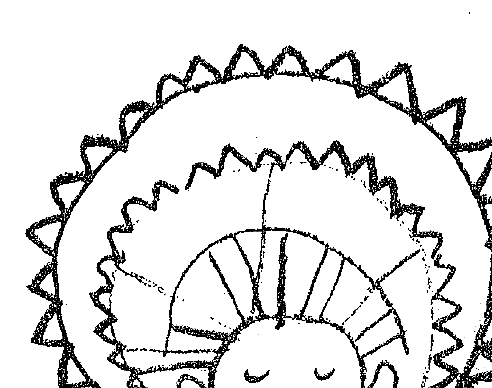
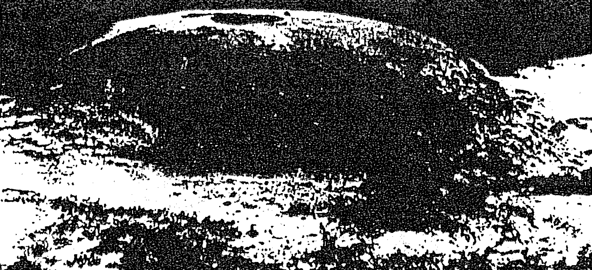
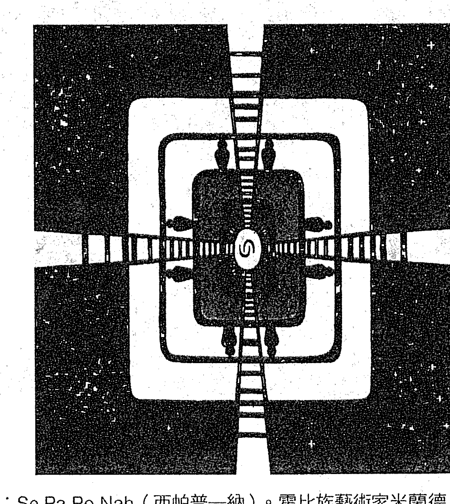
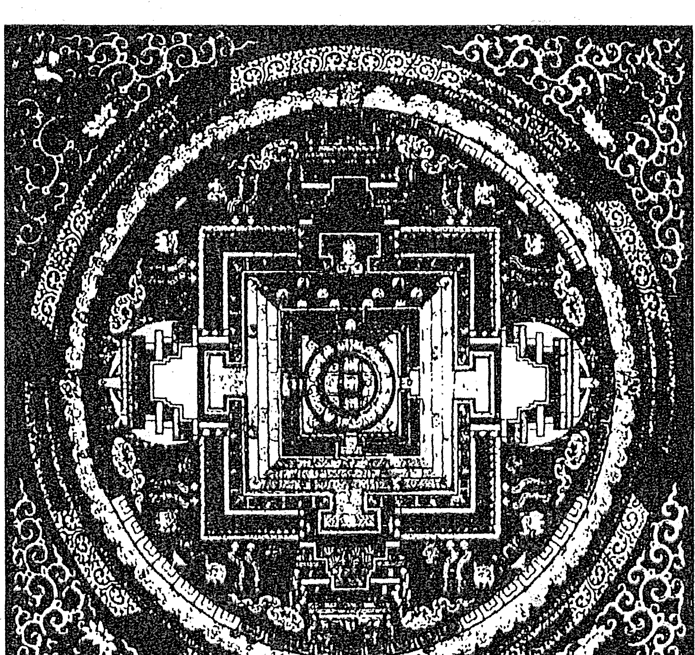

# 薩滿之路

進入意識的時空旅行・迎接全新的身心轉化

# The Way of the Shaman

麥可•哈納 Michael Harner / 著  
達娃 / 譯

# 推薦序一｜薩滿回歸的時代

凱文·唐納 (Kevin Turner)，薩滿研究基金會亞洲地區執行長  

http://www.shamanism-asia.com/zh/shamanism/

# 《九歌》之六〈少司命〉

秋蘭兮薔蘿，羅生兮堂下。綠葉兮素枝，芳菲菲兮襲予。夫人自有兮美子，蓀何以兮愁苦？秋蘭兮青青，綠葉兮紫薑。滿堂兮美人，忽獨與余兮目成。入不言兮出不辭，乘回風兮載雲旗。悲莫悲兮生別離，樂莫樂兮新相知。荷衣兮蕙帶，儵而來兮忽而逝。夕宿兮帝郊，君誰須兮雲之際？與女沐兮咸池，晞女發兮陽之阿。望寧美兮未來，臨風怳兮浩歌。孔蓋兮翠旌，登九天兮撫彗星。竦長劍兮擁幼艾，蓀獨宜兮為民正。

屈原

推薦序一｜薩滿回歸的時代  
3

# 推薦序二｜找回屬於自己的靈性傳承

「薩滿」一詞雖來自西伯利亞的通古斯語（Tungus），但薩滿運作的足跡遍布世界各地。薩滿不是一種宗教，而是一套仰賴個人體驗的知識系統。在一些文化裡，薩滿實踐者被稱為「先知」、「巫師」、「魔法師」等，但無論使用那一個名稱，薩滿實踐者必須能依自己的意願進入意識轉換狀態，藉此與非尋常世界溝通，並且運用從非尋常世界取得的知識和力量，幫助他人。

麥可·哈納博士認為要辨別一個人是不是薩 mant，只需要問兩個問題：第一，他是否可以旅行到其他世界？第二，他能不能創造療癒奇蹟？

薩滿本身就很難解釋了，那核心薩滿又是什麼呢？它近乎沒有儀式、缺乏華麗道具與說詞，核心薩滿課程真的只能親身體驗。就如同旅行一般，旅者可以口若懸河道出某處的精彩、美  
｜陳貞攸（Michelle），核心薩滿實踐者

# 薩滿之路──

進入意識的時空旅行，迎接全新的心靈轉化

# 目錄

推薦序一｜薩滿回歸的時代／凱文·唐納 3  
推薦序二｜找回屬於自己的靈性傳承／陳貳攸 7  
致謝 15  
第三版前言｜回到薩滿的宇宙之愛中 19  
親身實證的薩滿方法／為身心問題找到全新的解決之道  
與地球親族共存的靈性生態學／踏上薩滿之路

前言｜享受古老的薩滿冒險之旅 27  
跨文化、超越時間的薩滿方法／全心投入，你就能親證薩滿的價值  
薩滿意識狀態／成為一位薩滿／放下恐懼，單純享受薩滿的冒險歷程  

# 第一章｜從無神論的人類學家到學習薩滿  

# 第二章｜進入古老的薩滿旅程  

# 第三章｜在薩滿意識狀態中，所見如是  

喝下死亡藤蔓／靈魂接引之船／來自黑色生物的啟示  
對照聖經啟示錄／盲眼薩滿／進入與世隔絕的白人部落  
拜見薩滿阿卡丘／前往神聖瀑布的朝聖之旅／祖靈的家  
值得冒險的薩滿學習之路／斬扎剋：魔法飛鏢與靈性幫手  
薩滿意識狀態與尋常意識狀態／薩滿光啟／通往下部世界的入口  
神似曼陀羅的隧道經驗／準備第一次的探索旅程／十三位學員分享的初體驗  
薩滿知識有驚人的一致性／守護靈和靈性幫手  
在不同現實之間穿梭自如的能力／累積經驗，成為薩滿大師  
從薩滿觀點，分辨不同的意識狀態／淺層的出神狀態與深層的靈境追尋  
用鼓聲、沙鈴、舞蹈與唱歌，轉換意識狀態  
帶著尊敬、理解與愛，進入薩滿意識狀態／用石頭占卜找答案  

# 第四章｜召喚你的力量動物  

人類與動物世界的連結／重拾與動物溝通的能力／將自己轉變成動物  
以舞蹈和力量動物結合／納霍爾動物和陀諾爾動物／獲得守護靈的方式  
練習召喚野獸／讓守護靈留下來  

# 第五章｜尋回力量之旅  

搭乘靈性獨木舟，前往下部世界／帶回力量動物，吹入患者體內  
在野外或夢中尋找力量之歌／找回力量動物的旅程  
一首尋回力量動物之歌／五位學員分享的旅程／薩滿與患者的共時性  
團體的靈性獨木舟／靈性獨木舟的其他應用  

# 第六章｜維護與增強你的力量  

向力量動物諮詢／預知旅程／維護與力量動物之間的連結  
守護靈警示的大夢／遠距療癒／尋骨遊戲：一種力量練習的方法  
將力量物件放入藥靈包／水晶是最強力的力量物件  

# 第七章｜祛除有害入侵物  

收集植物靈性幫手／祛除入侵物的薩滿觀點  
在薩滿旅程中，看見有害的力量動物／祛除與淨化  
一個薩滿新手的創意案例：吸吮醫生行醫記／菸草陷阱／成為患者  

# 後記｜踏上薩滿之路，成為自己內在最好的醫生  

# 附錄 A｜鼓、鼓聲光碟及訓練工作坊  

# 附錄 B｜北美印第安平頭族的掌中遊戲  

# 註釋  

# 參考文獻  

# 延伸閱讀  

267

# 致姗德拉、泰瑞和吉姆  

# 致謝  

非常感謝以下各方提供版權使用權：經作者大衛·克勞提爾 (David Cloutier) 及 Copper Beech Press 授權 © 一九七三年版權再印的《靈啊！靈啊！薩滿之歌》(Spirit Spirit: Shaman Songs)。經作者愛倫·梅里安姆 (Alan P. Merriam) 及美國民俗協會 (American Folklore Society) 授權 © 一九五五年版權再印，原刊載於《美國民俗期刊》(Journal of American Folklore) 一九五五年第六十八期〈印第安平頭族掌中遊戲〉(The Hand Game of the Flathead Indians)。最後，我要向布魯斯·沃治 (Bruce Woych)、凱倫·西亞帝克 (Karen Ciatyk) 提供的研究助理工作，和編輯約翰·勞頓 (John Loundon) 及我的妻子姍德拉·哈納 (Sandra Hanner) 所提供的建議表示感謝。

# 第三版前言｜回到薩滿的宇宙之愛中  

這本書的初版付梓至今已經十年，這些年對薩滿復興來說，是一段相當輝煌的日子。在這之前，由於部落人民及其古老文化受到傳教士、殖民、政府及商業活動的衝擊，薩滿正快速的在地球上消失。然而，在過去十年中，薩滿以驚人的力量回到人類生活中，就連紐約和維也納這些西方文明的都市堡壘，也不例外。這股復甦潮的涌現其實相當隱微，乃至大多數民眾可能根本還不知道有所謂薩滿的存在，更別說是察覺到它的重返。儘管如此，仍然有另一群人，在美國海內外快速增加了成千上萬，不僅接受了薩滿，還將薩滿融入個人日常生活中的一部分。

由於薩滿的復甦使許多在外旁觀的人感到困惑，因此，我想在此提出幾個促使薩滿復甦的要素。人們對薩滿的興趣與日俱增的原因之一，是許多受過教育、有能力思考的人，已經揚棄了信仰年代的教義和權威當局來為自己提供有效證據，證明靈性領域，甚至是靈的存在。互相矛盾的二手或三手軼事，來自過去和遠方受到文化牽引的宗教經典，這些都不再足以做為個人存在的範型。他們要求更高水準的證據。

一新時代（1980-1990）某些部分也可歸為科學時代的支脈，它將兩個世紀以來，在嚴謹科學方法的運用下所產生的範例，帶入個人的生活中。這些科學時代的孩子（包括我自己），對現實的本質與極限，寧可擁有屬於自己的第一手親身實證過的結論。薩滿為這些個人的實證提供了執行的管道，因為它是一種方法，而非宗教信仰。

科學時代創造出迷幻藥（LSD）。許多接觸薩滿的人，都曾經透過非正式的致幻性藥物的經驗來進行實驗。事後發現找不到可以為這些經驗定位的架構或準則，他們想在卡洛斯・卡斯塔尼達（Carlos Castaneda，譯註：祕魯裔美國作家和人類學家，以唐望書系列而著名，書中記載了他拜印第安人薩滿巫士唐望為師的經歷。）的書和其他書籍中，為自己的經驗找到指引的地圖，最後才意識到神祕的製圖法原來就在薩滿之中。

科學時代也創造出大量的瀕死經驗（Near-Death Experiences，簡稱 NDE），這是因為最新的醫藥科技，使數百萬美國人得以從臨床上已經定義為死亡的狀態中被救活。雖然瀕死經驗並非事先計畫的，但結果不僅檢驗並往往改變了瀕死經驗存活者過去對現實和靈性存有的假想。於是這些人也開始搜尋地圖，並且在尋找的過程中，轉向古老薩滿的方式。

薩滿的方式，需要的是專注力與目的性的鬆緩紀律。一如多數的原住民部落文化，現代薩滿通常會使用單調的打擊聲進入意識的轉換狀態。這種典型不使用藥物的方式非常安全。參與者若是無法保持專注與紀律，只會返回正常的意識狀態，不像致幻性藥物，必然會經過一段意識狀態轉換的時期。

除此之外，典型薩曼的方式成效快得驚人，幾小時之內就能獲得人們或許要花上幾年時間靜心、祈禱或吟頌才能取得的經驗。單就這個理由，薩滿就非常適合現代人忙碌的生活方式，正如它也很適合愛斯基摩人（因努伊特人）一樣，因為他們白天的時間全都用來執行為了生存必須完成的工作，夜晚就可用來進行薩滿活動。

促使薩滿復興的另一個原因是全人健康（holistic health）取向這幾年的發展，這種取向積極透過心智的力量來協助療癒、維護健康。許多在全人健康領域的新時代修煉（practice），展現出人們正透過新的實證，重新發現過去在部落和民俗療法中廣為人知的方法。薩滿是一種系統，它能讓這個古老知識具體的呈現，因此有越來越多，在為身心─情緒等健康問題尋找新的解決之道時，開始注意到薩滿。薩滿長期以來使用的某些特定技巧，例如：改變意識狀態、減壓、想像、正向思考，以及求助於非尋常資源（nonordinary sources）等，都在現代的全人健康照護中被廣泛運用。

## 前言｜享受古老的薩曼冒險之旅

在實踐薩滿的旅途上，他們發現許多人所描述的「實相世界」（Twin worlds），只觸及宇宙宏偉、力量與奧祕的表層而已。這些新的薩滿實踐者在經歷與重述自己的經驗時，往往會狂喜到流淚。他們以同理之心與經歷瀕死經驗的人交談，在他人感到絕望之處看到希望。

他們發現隱藏在宇宙中無與倫比的安全感和愛之後，往往會產生轉變。在旅程中不斷經驗和遭遇到的宇宙之愛，越來越頻繁的出現在我們的日常生活中。他們就算是單獨一人，也不會覺得孤獨，因為體會到：我們從來就不曾是孤身一人。如同西伯利亞的薩滿所說：「一切存有，皆活著。」無論走到哪裡，他們都在生命、親族的環顧之中。他們已回到薩滿家族永恆的社群中，不再受空間與時間疆界的限制。

麥可·哈納

紐渥瓦克，康乃狄克州（Norwalk, Connecticut）

一九九〇年春天

### 薩滿（shaman）──「文明」世界所謂的「藥師」及「巫醫」──是一群守護者，守護著一套卓越的古老技術，運用這些技術來成就和維護自己與部落成員的健康，並進行療癒工作。即使各個族群在文化的其他層面差異很大，彼此之間相隔了高山大海，年代相差了數千萬年，薩滿的運作方式在世界各地都展現出驚人的相似度。

## 跨文化、超越時間的薩滿方法

這些所謂的原始部族，並沒有先進的醫藥科技，因此他們有絕佳的理由積極發展非科技的人類心智能力，用來促進整體健康和療癒。薩滿的運作方式在本質上展現的一致性，說明各地的人們在經歷嘗試與錯誤之後，都得到了相同的結論。

薩滿（shaman），編按：這個字過去一直被譯成「薩滿教」，但它並非指某種特定的宗教或信仰。為了釐清觀念，本書將具有薩滿精神的經驗和行動都稱之為「薩滿」。是一趟精彩的心智與情感的冒險，薩滿療癒師（shaman-healer）和患者都必須一起參與這趟旅程。薩滿透過自己英雄式的旅程與努力，來幫助他的患者轉換「尋常世界」與「非尋常世界」的定義，這也包括了對他們自己「生病」的定義。薩滿會讓他的患者知道，在對抗疾病與死亡的掙扎中，無論是在情緒或精神上，他們一點都不孤單。一位薩滿分享自己獨特力量的同時，在深層意識上，也是

## 薩滿之路——進入意識的時空旅行，迎接全新的心靈轉化

對自身感官感受的觀察，正是從經驗為現實下定義的基礎。然而至今還沒有人，即使是尋常世界中的科學，能夠毫無爭議的證實，我們只有一個意識狀態可以獲得令人信服的第一手觀察資料。在薩滿意識狀態中，尋常世界是個神話；在尋常意識狀態中，非尋常世界是個神話。要毫無偏見的評斷相對意識狀態中經驗的確實性，實在非常困難。

某些人對卡斯塔尼達的作品，在情感上報之以深層的敵意，要想了解這個現象，必須先記得這種敵意包含了上述的偏見，這是出自於不同文化間的種族優越感。不過在這個案例中，根本問題不在於某人在文化上的經驗太狹隘，而是在意識上的經驗太狹隘。對非尋常世界最具偏見的人，是從未經歷過非尋常世界的人。這可以被稱為認知優越感（COG.OEOO.B），可以說是一種意識上的種族優越感。

要進一步解決這個問題的方式，或許是需要有更多人成為薩滿，以自己的方式親自去體驗薩滿意識狀態。這些薩滿們，就能對從來不曾進入非尋常世界的人溝通自己的認知。薩滿方法在其他文化中施行了非常久遠的時間，就像是人類學家的角色。人類學家透過參與觀察其他文化，能與那些視異文化為陌生、不可理解或劣等的人溝通，向他們說明自己對異文化的理解。

人類學家教導人們要先認識自身文化對現實的假設，以試圖避開種族優越感的陷阱。西方的薩滿們，也能以類似的方式來面對認知優越感。人類學家將這堂課稱為文化相對主義。西方的薩曼們，在某種程度上可以創造出一種認知相對主義。日後，當人們體驗過薩滿意識狀態，而完成其經驗知識的架構後，對此現實的假設或許就能獲得尊重。到時，時機或許就足夠成熟，可以在尋常意識狀態的條件下，對薩滿意識狀態經驗進行不具偏見的科學分析。

有些人會爭辯說，人類之所以把生命中絕大部分醒著的時間花在尋常意識狀態上，是天擇下的自然傾向；因為這才是真正的現實。除了睡眠之外，其他的意識狀態是會干擾人類生存的脫軌狀態。換言之，這種主張可以用來辯稱我們以平常方式感知現實，是因為這對生存來說是最好的方式。但近來先進的神經化學研究顯示，人類大腦中存在著自己的意識轉換物質，包括二甲基色胺（DMSO）等致幻劑。¹ 若真如天擇論所描述的，那麼其他的意識狀態似乎就不可能存在，除非改變意識狀態的能力也能對生存帶來某種利益。從這個角度 looks，大自然本身已經做出決議，也就是轉換過的意識狀態有時會比尋常狀態更好。

西方人第一次接觸薩滿活動時，往往會有恐懼感，這情況並不罕見。然而在我見過的每個案例中，這股焦慮感很快就會被探索的心情、正面的興奮和自信心取而代之。難怪「狂喜」（Ecstasy）一詞經常被用來描述薩滿的「出神狀態」或薩滿意識狀態，以及欣喜揚升狀態或瘋狂的喜悅。一如數千年來的例證，薩滿經驗是正向經驗，我也不斷的在我的訓練工作坊中目睹到同樣的經驗，來參與工作坊的人格傾向卻是形形色色。

我們可以說，進入薩滿意識狀態比做夢還安全。在夢中，你或許還無法自主的從某個不想要的經驗或惡夢中抽離。反之，當一個人主動進入薩滿意識狀態時，由於意識是清醒的狀態，因此能隨時透過意識將自己抽離薩滿意識狀態，返回尋常意識狀態。這不同於服用迷幻藥，不會因為受到藥物化學作用的時間控制而必須停留在意識轉換的狀態，因此在薩滿意識狀態中不會卡在「不好的幻覺」中。我所知道唯一與薩滿工作相關的重大危險，是社會性或政治性的。例如，在歐洲中世紀宗教法庭年代，成為薩滿顯然是危險的事，即便至今，在希瓦洛族（Sharo）中，如果遭人控訴是一壞「薩滿或是蟲靈薩滿（Devichina Shamans）」，一種本書並不教導的薩滿實踐者，也會遭遇危險。

這基本上是一種現象的呈現。我不打算用精神分析或現代西方因果論來辯解薩滿的概念和做法。儘管薩滿及薩曼式療癒所涉及的因果關係，確實是個非常有意思的課題，也值得深入探討；但因果關係取向的科學研究對本書的主要目標，也就是傳授薩滿的技術來說，並不重要。在經歷與實踐薩滿做法時，西方會問的問題，就是「薩滿為什麼有效？」這其實也是不必要的問題。

剛開始進行薩滿的修煉時，請試著把任何批判性的臆測先放一邊，單純享受薩滿的冒險歷程，吸收並且練習你所閱讀的內容，然後看看這樣的探索會把你帶到哪兒。在採用薩滿方法幾天、幾週乃至幾年之後，你將會有很多時間來回顧，這些方式從西方角度看起來所具有的意義。要有效的學習薩滿系統，就該運用薩滿們使用的基本概念。例如，當我談到「靈性存有」（BEING）時，我會這樣說是因為這就是體系內的薩滿們說話的方式。練習薩滿時，不需要專注於「靈性存有」在科學上的理解所指的是什麼，以及薩滿為什麼有效；思考這些問題，甚至會帶來干擾。

姑且不論人們如何質疑卡洛斯·卡斯塔尼達的書有多少虛構成分，將薩滿的冒險旅程與刺激，以及其中涉及了介紹給許多西方人的部分正統理念，他的書可說是功不可沒。本書接下來的內容將不會重複卡斯塔尼達書中提過的材料，我也不打算呈現他的理念與本書介紹的理念之間的等同之處。不過，有件事我應該提一提，就是卡斯塔尼達在書中並不強調療癒，雖然這通常是薩滿最重要的工作之一。這或許是因為他的導師唐望涉及的主要是戰士（或巫士）型的薩滿。

本書主要的焦點，是提供為健康與療癒而施做的薩滿入門手冊。關於薩滿，我還有很多內容可以寫，或許將來我會撰述，但對任何有能力 and 意願想開始成為薩滿的人來說，基本的重點都收錄在本書了。就和任何知識一樣，薩滿知識也可以透過不同的執行方式，運用在不同的目的上。

我在此提供的是療癒者的方式，而非巫士的方式，書中的做法是以達到身心的平安、健康，以及幫助他人為目的。

最後，如果我還說得不夠明白，我得聲明，我自己也在實踐薩滿，但這不是因為我在尋常意識狀態中對它的運作方式有所理解，而純粹因為它是有效的方式。不過，千萬不要這樣就聽信了我的話，真正重要的薩滿知識是透過體驗得來的，無法從我或其他任何薩滿身上獲得。畢竟，薩滿基本上是一種策略，用以供你進行個人的修煉，並且實踐學習所得。現在，我把部分的策略提供給你，並且歡迎你加入古老的薩滿冒險之旅。

## 第一章｜從無神論的人類學家到學習薩滿

### 喝下死亡藤蔓

我在一九五六至一九五七年間，第一次以人類學者的身分，長期在厄瓜多爾境內安地斯山脈東側森林中的印第安希瓦洛族──或稱為恩祖利修爾族（Cusse.Shara）──進行田野工作。當時，希瓦洛人以如今已失傳的一種縮頭術一，和仍持續存在的密集薩滿修煉法聞名。我成功的收集到大量資料，但對薩滿的世界，仍然抱持著一個旁觀者的角色。

兩年後，美國自然歷史博物館邀請我前往祕魯境內的亞馬遜地區，進行一場為期一年的調查，研究烏卡亞利河（Ucayali River）地區科尼波族的文化。我接受了，很高興有機會能對亞馬遜河上游迷人的森林文化進行更多研究。科尼波的田野調查工作是在一九六○至一九六一年間進行。

我與科尼波族和希瓦洛族這兩次特殊的際遇，是我探索這兩個文化裡的薩滿方法的基礎。我想與你分享這些經驗，也許能將那不可思議的隱密世界中的某些訊息，傳達給薩滿探索者。

當時，我已經在座落於烏卡亞利河支流一處偏遠湖畔的科尼波村落中，住了將近一年，對科尼波文化的人類學研究進行得相當順利，但在設法发掘與宗教相關的資訊上卻一籌莫展。科尼波族人都很友善，卻不願意提及超自然現象。最後，他們說我如果真的想要學，就得喝下由有一靈魂之藤」之稱的死亡藤蔓（ayahusca）製成的神聖薩滿藥汁。我既感到好奇又帶著不安的答應了，因為他們警告我這會是一個非常恐怖的經驗。

村裡一位親切的長老，也是我的朋友──多馬士（Tomas），隔天一早就到森林裡去砍一些死亡藤蔓。他出發之前囑咐我要斷食，只能吃清淡的早餐，而午餐得完全禁食。到了中午，他帶著足以填滿五十多公升大鍋子的死亡藤蔓和卡瓦葉（cawa）回來。熬煮整個下午，煮到只剩下約一公升的草藥汁，最後倒入舊瓶子裡冷卻。等到太陽下山，他說我們就要來喝掉它了。

印第安人把村裡的狗戴上嘴套，如此牠們就不能亂叫。他們告訴我，狗吠的噪音會讓喝下死亡藤蔓的人抓狂。孩子們也都被告誡要安靜，太陽下山之後，這個小社群就變得一片寂靜。

赤道短暫的暮色很快就由黑暗接掌。多馬士將瓶子裡三分之一的汁液倒入葫蘆碗中遞給我。

每個印第安人都盯著我瞧。我覺得自己像是在希臘雅典同胞的包圍下，接過毒芹汁的蘇格拉底。

這讓我想到祕魯人對死亡藤蔓的另一個稱呼──小死亡。我迅速喝下那碗味道奇怪且略帶苦味的草藥汁，等著多馬士喝下他的藥，但他卻說他決定不喝了。

族人讓我在公共屋舍巨大茅草屋頂下的竹子平台上躺下。村裡除了蟋蟀的唧唧鳴叫和遠方森林深處吼猴的嚎嘯聲之外，一片寂靜。

我抬頭凝視著一片黑暗，模糊的光線開始顯現。光線越來越強烈，越來越複雜，最後迸發成豔麗的彩色。聲音自遠方傳來，如瀑布般的沖擊聲越來越大，漲滿了我的耳朵。

## 第一章｜從無神論的人類學家到學習薩滿

高調。我仔細看著甲板，看見為數龐大的人形，他們有冠藍鴉的頭和人類的身體，就像是古埃及石墓中彩繪的鳥頭神。在這同時，某種能量體（SOUL-ESSENCE）開始從我的胸膛浮起，朝船上飄去。儘管我一直以來覺得自己是個無神論者，此刻卻對自己正逐漸死去，而這些鳥頭人是接引我靈魂上船的情境，感到深信不移。靈魂持續從我的胸膛流出時，我察覺到四肢逐漸麻木。

從手腳開始，我覺得身體正慢慢變成硬邦邦的水泥，動不了，也說不出話。麻木感逐漸逼近我的胸膛，朝心臟而來，我試著開口求救，向印第安人要解藥。然而，不管我怎麼努力，就是無法有效的說出一個字。同時間，我的肚子似乎變成石塊，我也耗費了極大的力氣讓心臟保持跳動。我開始稱心臟為朋友，我最親愛的朋友，用僅存的力氣對它說話，鼓勵它繼續跳動。

我也有意識的察覺到自己的大腦，感覺到它在肉體上已分割成為四個分離而獨立的層次。在最上方的表層，是觀察者與施令者，那是身體狀態的意識所在，負責試圖讓我的心臟繼續跳動。它有所感知，但純屬旁觀者，意識著從大腦下層發散出來的影像。我感覺到緊鄰著最上層的下方是麻木層，它似乎被我喝下的藥汁給關閉了，覺得它就是不在了。再下一層是我看見的影像（包括靈魂之船）的來源。

這下子我肯定自己就快要死了。就在我試著接受命運安排行，大腦更下一層開始傳輸更多的影像和訊息。我被『告知』這些新素材之所以會呈現在我面前，是因為我正在死去，因此可以『安全的』接收這些揭示。訊息告訴我，這些祕密是保留給正在死去和已往生的人。我對於這些

### 來自黑色生物的啟示

思緒的傳達者只有模糊的印象：許多巨大的爬蟲類生物，慵懶的靠在我後腦杓深處和脊椎的交會處，而我只能在陰沉黑暗的深處模糊的看見牠們。

接著，牠們在我面前投射出栩栩如生的場景。首先，牠們讓我看到億萬年前還沒有任何生命的存在的地球。我看見一片海洋、荒涼的陸地和明亮的藍天。接著，成千上百的黑點從天而降，掉落在我面前的荒涼土地上。我看出這些黑點其實是閃亮巨大的黑色生物，有形似翼手龍的粗短翅膀和鯨魚般的龐大身軀。我看不見牠們的頭。牠們劈里啪啦的落下，這段旅程使牠們精疲力竭，而在地球上休息了億萬年。牠們透過某種思想語言告訴我，牠們正在逃離太空中的某種東西，到地球來是要躲避敵人。

這些生物向我展現牠們如何在地球上創造生命，好在無數的形體中躲藏，藉此隱匿牠們的存在。動植物的創造和物種形成的壯觀景象，以難以言喻的規模鮮活的展現在我面前。我得知這些恐龍般的生物存在於所有生命之中，包括人類。牠們告訴我，牠們是人類和整個地球真正的主人，我們人類只不過是這些生物的容器和僕人，因此牠們可以從我的內在對我說話。

這些從我腦袋深處湧現的揭示，和漂浮船的影像交錯出現，它就快收完我的靈魂了。載著冠藍鴉頭的船員們的這艘船逐漸遠離，拉著我的生命力，朝一個兩岸荒涼殘破的大峽灣前進。我知道我只剩下片刻可活。奇怪的是，我對這些鳥頭人絲毫不覺得恐懼；只要他們能把我的靈魂留住，我很樂意讓他們取走我的靈魂。但不知怎麼的，我擔心我的靈魂恐怕無法停留在峽灣的水面上，透過某種未知的方式，我感受到並很擔心自己的靈魂會被深淵中的恐龍狀生物掌握或收回。

我突然察覺到自己獨特的人性，感受到我的物種和古爬蟲祖先之間的對比差異。我開始掙扎反抗，不願回到古代祖先之中，覺得牠們越來越陌生，可能還很邪惡。這時我的每一次心跳，都是一個浩大工程，我轉向人類求救。

我用難以想像的力氣最後一搏，勉強向印第安人發出聲音，說：『藥！』我看見他們急忙開始製作解藥，但我知道他們來不及準備。我需要一個能對抗恐龍的守護者，並瘋狂試著想像出某種強大的存在來保護我，對抗外星爬蟲生物。一位守護者出現了；在這同時，印第安人扳開我的嘴，倒入解藥。恐龍逐漸消退回低沉的深處；靈魂之船也消失了。我鬆了一口氣。

解藥快速解除了我的狀況，但並未停止讓我出現更多較淺層的影像。這些影像比較容易掌控，也很愉快。我隨意到達遠方，享受精彩的旅程，甚至遠走入銀河之中，創造出自己難以想像的建築，並很諷刺的運用了獰笑的妖魔來實現我的幻想，還常因發現自己這些冒險旅程的不搭而放聲大笑。

### 終於，我睡著了。

我醒來時，陽光穿透棕櫚葉編織的屋頂隙縫。我仍躺在竹子平台上，聽見四周傳來早晨平常的聲音：印第安人的對話、嬰兒的哭聲和公雞的啼叫。我驚訝的發現自己感覺清新而平靜。我原地躺著，看著屋頂美麗的編織紋路，前一晚的記憶開始飄過腦海。我讓自己先暫停，不去回想起更多情境，趕忙從行李袋中拿出錄音機。在翻找行李袋時，幾個印第安人笑著對我打招呼。一位老婦人，也就是多馬士的老婆，給了我一碗大蕉魚湯當早餐，味道嚐起來出奇得好。我回到竹子平台上，急著在我忘記之前把前一晚的經驗錄在錄音帶上。

回憶工作進行得很輕鬆，只有一段出神的過程我怎麼也想不起來，呈現一片空白，就像是錄音帶的錄音被洗掉了一般。我奮戰了幾個小時，試圖想起那段經歷中發生了什麼事情，根本是以搏鬥的方式才從意識中把它找回。那些頑強的資料原來和恐龍狀生物的溝通有關，內容包括牠們對地球生命演化扮演的角色，以及牠們對包含人類在內的所有生物的內在掌控權。再度找回這份訊息讓我感到非常興奮，但也忍不住覺得自己不該把它從大腦底層帶回來。

我甚至對自己的安全產生一股莫名的恐懼，因為現在我握有的那些生物聲明，是只提供給瀕死之人的祕密。我立刻決定要將這份知識和其他人分享，如此一來，這個祕密就不會只有我一個人知道，我的生命才不會有危險。我發動獨木舟的舷外馬達，出發前往附近一處美國的福音傳教站，並在中午左右抵達。

負責傳教的鮑伯和米麗夫婦，比起美國派來的一般傳教士略勝一籌，他們和藹可親、幽默又充滿悲憫之心。我把我故事說給他們聽。當我描述到大水從爬蟲動物的大嘴奔流而出時，他倆互相看了一眼，伸手拿起《聖經》，讀起《啟示錄》第十二章中的這一行字：「蛇從口中吐出水來，像河一樣：…」

他們解釋「大蛇」一詞在《聖經》中，和「恐龍」、「撒旦」是同義字。我繼續描述故事。當我說到恐龍狀生物從地球外的某處，因為逃離敵人，降落在地球以躲藏敵人的追擊時，鮑伯和米麗變得很興奮，再度從《啟示錄》中的同一章節閱讀更多經文給我聽：「在天上就有了爭戰。米迦勒同他的使者與龍爭戰，龍也同他的使者去爭戰，並沒有得勝，天上再沒有他們的地方。大龍就是那古蛇，名叫魔鬼，又叫撒旦，是迷惑普天下的。他被摔在地上，他的使者也一同被摔下。」

我既驚訝又好奇的聽著。反之，這對傳教士夫婦似乎很驚訢一個無神論的人類學家，透過喝下一「巫醫」給的草藥，竟然能夠揭露和《啟示錄》中一樣的神聖訊息。我說完故事之後，對於能夠分享自己的新知識感到解脫，卻也累壞了。我在傳教士的床上睡著了，任他們繼續討論這場經驗。

### 盲眼薩滿

那晚，我乘著自己的獨木舟要回到村落時，隨著馬達的噪音節奏，頭開始抽痛，痛到以為自己就要瘋了，只得用手指塞住耳朵，避免那種感覺持續下去。當晚，我睡得很好，但隔天我注意到我的頭有種麻木或壓迫的感覺。

這時候，我等不及想要向印第安人中最具超自然知識的薩滿尋求專業意見，他是一位透過飲用死亡藤蔓，多次進入靈的世界的一位盲眼薩滿。由盲人擔任我進入黑暗世界的嚮導，似乎很恰當。

我帶著筆記去到他的小屋，向他描述我所見到的一段段影像。最初，我只說重點給他聽，因此當我說道恐龍狀生物時，跳過牠們來自外太空那一段，只說：「那裡有巨大的黑色動物，很像大蝙蝠，身體比這間屋子還長，牠們說自己是這個世界真正的主人。」科尼波語中沒有一「恐龍」這個字眼，因此「巨大的蝙蝠」是最接近我看到的生物的描述。

他用瞎了的雙眼直直望著我，咧著嘴說：「喔，牠們老是這樣說。其實牠們只是遠外黑暗界的主人而已。」他若無其事的將手揮指著天空。我的腰椎感到一陣寒顫，因為我並未告訴他我在出神狀態中看見牠們來自外太空。

### 進入與世隔絕的白人部落

我非常震驚，我所經歷的一切，對這位赤腳盲眼的薩滿來說，已經是再熟悉不過了。他早已透過自己的探索得知，那個我才剛進入的同一個隱密世界。從那一刻起，我決定要盡力學習關於薩滿的一切。

鼓勵我走上這場全新追尋之路的，還有一件事。當我描述完整個經驗之後，盲眼薩滿對我說，就他所知，沒有人在第一次死亡藤蔓之旅，就遭遇且學到這麼多。

「你肯定可以成為薩滿大師。」他說。

於是，我開始認真學習薩滿。我從科尼波族，特別學習到前往下部世界（Lowerworld）的旅程以及靈魂復原療癒（Healing of Spirits），本書稍後會對這些技術加以描述。我在一九六一年回到美國，但三年後我又來到南美洲，拜訪在一九五六至五七年間同住的希瓦洛族。這回我的任務不再是擔任人類學家，而是要親身學習如何以希瓦洛族的方式實踐薩滿。為此，我想要前往希瓦洛地區的西北角，據說那裡居住了最多道行高深的薩滿。

我先搭客機到厄瓜多爾境內安地斯山脈高地上的基多市（Quito），再搭乘一架老式容克斯三引擎機，飛抵位在安地斯山東側山腳帕斯塔薩河（Pastaza River）畔的叢林機場。我在那裡雇用了一架單引擎機，飛往馬卡斯（Marcas），這是安地斯山腳下一處座落在希瓦洛領地內的古老白人聚落。

馬卡斯是個奇怪的村落。一五九九年，在著名的黃金賽維爾城（Sacsayhuamán）由希瓦洛族發起的大屠殺中，倖存的一小群西班牙人建立了這個村落，這裡可能是西方世界幾百年來最孤立的社區。直到一九四○年代，一座簡便機場蓋好之前，馬卡斯與外在世界最直接的連結，只有村子西邊安地斯山懸崖上的一條滑溜步道，要困難重重的走上八天，才能抵達高地城市里奧邦巴（Riobamba）。這種孤立狀態是由一個與眾不同的白人社群一手打造出來的。即使到了二十世紀初葉，這裡的男人仍以吹箭狩獵，穿著印第安人服裝，並驕傲的宣稱他們是西班牙征服者（Conquistadores）的直系後裔。

他們也有屬於自己的精彩傳說和獨有的神祕事件。例如，有個故事是關於他們從黃金賽維爾城大屠殺撤退後，花了近百年時間才找到翻越安地斯山的新路徑。最後成功的那位祖先，至今仍透過孩子們的床邊故事被緬懷著。傳聞還有一匹配備了噹啷作響鏈子的幽靈馬，夜裡經常在村中街道走動，使村民得蜷縮在棕櫚蓋成的小屋內，任那怪物四處遊蕩。直到一九二四年，在天主教傳教士永久定居於社區後，才終止了這匹幽靈馬的拜訪。順便一提的是，當時馬卡斯地區仍然沒有任何馬匹。當地的第一匹小公馬，是在社區建立近三個半世紀後的一九二八年，才由一人從里奧邦巴扛在背上徒步背到此地。

### 拜見薩滿阿卡丘

村落的後上方，聳立在東安地斯山脈上的是白雪覆頂的桑蓋（Sangay）巨大活火山，它白天噴出煙塵，夜裡散發炙熱火光。馬卡斯人總愛說那火光是印加寶藏散發的光芒，他們聲稱寶藏被埋在桑蓋火山的斜坡中。

抵達馬卡斯的第一天，一切順利。年輕的希瓦洛嚮導任務已經達成，早早就回家了。

第一天我們沿著蜿蜒曲折的河谷，在森林小徑往上游前進。夥伴們腳程很快，到了傍晚，我們終於在河邊急流旁停下時，我真是滿心感激。阿卡丘和桑古用棕櫚搭起側棚，鋪了一層棕櫚葉當床。我睡得很熟，他們在遮蔽棚入口處生的文火很保暖。

第二天的旅程是在霧靄朦朧的森林裡，在持續不斷的爬升中進行。隨著那條差不多原來就不存在的小徑攀爬，路途變得越來越難走，我們只得在一叢箭蘆葦（cana brava）旁暫停，砍些登山杖來幫助爬坡。阿卡丘走開了一會兒，回來時帶著一根三吋粗的巴爾沙（balsa）木棒。我們休息時，他快速在上面雕了幾個簡單的幾何圖形，然後交給我。

「這是你的魔法杖。」他說：「這能保護你不受妖魔危害。如果遇到妖魔，把它丟向妖魔。這可比槍厲害多了。」

我掂量著木棒，感覺很輕，顯然無法用來對抗任何實體物。有那麼一刻，我覺得我們好像小孩子玩著想像遊戲。可是這些男人是勇士，經常不斷的與敵人進行生死交戰，難道他們的存活不需要和現實世界保持真實的接觸？

這一天，小徑越走越陡，也越來越滑。感覺像是走在黏土般的泥濘中，每前進兩步就倒滑一步。我們經常停下來休息喘氣，喝著葫蘆中摻了水的木薯啤酒。其他人偶爾會吃點放在猴皮袋中的煙燻熟木薯或燻肉。我則是不准吃任何固體食物。

桑古解釋：「你必須受苦，這樣祖靈們才會可憐你。否則古老的靈不會來。」

那晚，我又累又餓，就躺在夥伴們於又冷又濕的山脊上搭的棕櫚側棚，試著入睡。黎明前開始下起雨來。淒風苦雨，使我們無法繼續停留在原地，只得拔營，沿著稜線摸黑前進。雨越下越大，不久出現了閃電，伴隨著轟隆雷聲，不時照亮我們的路。許多閃電似乎直接打在我們所在的稜線上，我們於是以前快的速度趕緊離開高地。在朦朧黎明的半黑暗之中，我經常看不見另外兩人的身影，因為他們很習慣以這種不可思議的速度穿越叢林。即使在正常的狀態下，這些印第安人的腳程大約是每小時四、五英里，此刻他們的速度感覺起來高達時速六英里。

不久，夥伴的身影完全消失在我的視野。我猜他們大概認為我跟得上，所以肯定在前方越過稜線後的某處等著我。我加速前進，又濕又累又餓，並且害怕永遠迷失在這片浩瀚無人的森林之中。一小時、兩小時、三小時過去了，我還是沒遇上他們。雨變小，無人森林裡的光線也增強了。我四處找尋被折彎的樹苗枝幹，這是印第安人用來告示他們由此路過的指標，但一無所獲。

我停下腳步，在滴著雨濕答答的森林倒木上坐下來，試著釐清我的處境。我發出印第安人特有的長距離嚎哮，一種發自肺部深處，縱使在半英里外也能聽見的大叫。喊了三回，一點回應也沒有。我幾乎要慌了，手中沒有槍，打獵是不可能了。該何去何從？這森林中我唯一認識的人類，是不在身邊的夥伴們。

我知道我們大約是朝著西方前進，但森林濃密的樹冠層使我無法看見太陽的方向。稜線上有無數的岔脊，我無從得知該朝著哪條岔脊走。我差不多是隨機的挑了一條稜線，慢慢隨之前進，一路上每隔三公尺就折斷樹枝，夥伴們倘若朝這個方向搜索，可以引導他們找到我。我三不五時會發出嚎哮，但仍然沒有任何回應。我在小溪邊停下，為裝有濃縮啤酒的葫蘆加水。休息時，我滿身大汗，數十隻蝴蝶在我周圍迴旋飛舞，經常停在我的頭頂、肩膀和手臂上。我看著牠們吸食著我皮膚上的汗液，同時也排泄在上面。我起身，用巴爾沙木杖支撐著繼續走入森林。天開始變黑了。我用布聶爾（Berg）短開山刀，從棕櫚小苗叢砍下枝幹，搭了粗糙的側棚。我累斃了，喝了點啤酒，用棕櫚葉蓋著身子，很快就睡著了。

醒來時，微光從森林樹冠層中灑下。當我在一片綠色的寂靜之中躺著，隱約聽見了一陣隆隆聲。這完全出乎意料，我不確定聲音的方向，我安靜的傾聽了約十五分鐘後，又傳來另一聲，來自左邊，顯然是槍聲。我跳起身，朝聲音的來源衝過去，在陡坡上又滑又跌的飛奔。偶爾，我會發出遠距的嚎哮。又是一陣隆隆聲，這回略偏右邊。我調整前進的方向，不久就發現自己在一片陡峭的峽谷中往下爬，抓著藤蔓，從一棵小樹滑到另一棵小樹上。我意識到周圍充滿轟隆響聲，像是永不止息的貨運火車正在行駛。突然間，我已經來到滿地巨石的溪流旁，上游大約四分之一英里處，一個巨大的瀑布從赤裸裸的岩壁上飛奔而下。我看見夥伴們就在瀑布底下不遠處；那一刻，他們是我這世界上最親密的朋友。

### 祖靈的家

到瀑布的水汽随着峡谷中的风飘来，冷却了我的脸庞和手臂。我花了将近十五分钟走到阿卡丘和桑古身边。最后，倒在伙伴们身旁的沙地上。

「我们以为你被妖魔抓走了。」阿卡丘咧着嘴说。我虚弱的回以微笑，很高兴接过来他给的啤酒。

「你累坏了。」他说道：「这样很好，这样祖灵们也许会可怜你。你必须立刻去沐浴。」

他指向我的木杖。「带着你的巴尔沙跟我来。」桑古在沙洲上坐着，阿卡丘则领着我越过瀑布冲刷而下的大水洼边的岩石。不久，我们紧靠着潮湿的悬崖岩壁，水柱冲击着我们的身子。他拉着我的手，一时时沿着悬崖底部前进。水柱强劲的冲刷着我们，真的很难不被冲走。我一只手拿着手杖撑住自己，一只手紧抓着阿卡丘。

前进的步伐变得越来越困难。突然间，我们已经来到瀑布下方黑暗的天然凹洞中。光线从庞大的瀑布水幕中透入，这片水幕使我们与世隔绝。瀑布持续不断轰隆声，比我多年前第一次在灵视中经验的情境还要大声，似乎渗透了我的全部存在。我们被基本的土和水元素隔绝在世界之外。

## 薩滿之路——進入意識的時空旅行，迎接全新的心靈轉化

在沙洲上会合之后，桑古直接领着我们走向峡谷侧边，开始攀爬陡峭的斜坡。我们尾随在后，排成一行，努力抓住突出的树根、小苗、藤蔓等，防止自己在潮湿的黏土中滑倒。我们千辛万苦的爬了约一小时，偶尔会被瀑布喷溅的水花洒得一身湿。我们终于爬到棱线上一处狭小平坦地时，已经是很晚了。我们小憩了一会儿，就跟着桑古继续走在高原上，不久后走进了一群巨木之间。

### 值得冒險的薩滿學習之路

大约五分钟之后，桑古停下脚步，开始砍树枝，搭侧棚。

之间。

阿卡丘剖开了一根树枝的末端，接着在同一端与第一刀垂直的角度，又再剖开一次，然后将未剖开的那端插入地面。他在剖开的横切面各塞进一根小树枝，迫使树枝末端张开成四叉的四角形，又从猴皮背袋中拿出一个拳头大小的葫芦杯，放在插角形成的空间中。他的手又伸入袋子裡，抓出一把短小的绿色树枝。这是我们在离开他的小屋之前，他就先采集好的的麦苦阿（Bai-kua，大花荨麻属中的曼陀罗木属品种）的枝条。他一根根握住枝条架在葫芦杯上方，将绿色枝幹的皮削下来。等他削完后，杯子几乎全装满。他伸手把杯里的树皮薄片整把抓住，开始将其中的绿色汁液挤入杯中。五分钟内，已经有约八分之一杯的液体。他把挤出汁后的树皮丢弃了。

「现在我们让麦苦阿冷却。」他说：「夜晚来的时候，你要喝下它。你自己一个人喝，因为我们要守护你。我们会一直陪在你身边，所以不用担心。」

桑古加入我们，接口说：「最重要的是你不能心怀恐惧。若是看到可怕的东西，千万不能逃。你必须跑上前去触摸它。」

### 斬扎剋：魔法飛鏢與靈性幫手

我们回到阿卡丘的房子，在他的指引下，我开始收纳希瓦洛萨满术中不可或缺的斩扎剋（魔法飞镖）。这些斩扎剋也称为灵性帮手，被认为是导致或治愈日常疾病的主要力量。对不是萨满的人来说，它们通常是无影无形的，就连萨满也只在意识转换状态下才能看见它们。

「坏的」或虫灵萨满会将这些灵性帮手射到受害者的体内，杀害或让他们生病。「好的」萨满或治疗师会运用自己的斩扎剋，帮助他们吸出患者体内入侵的物体。灵性帮手也能变成保护盾，搭配萨满自身守护灵的力量，保护萨满们不受攻击。

新手萨满会搜集各种昆虫、植物及其他物件，作为他的灵性帮手。包括活昆虫和蠕虫等，只要小到萨满能把它吞下肚，几乎任何东西都能成为斩扎剋。不同类型的斩扎剋会导致（也能用来治疗）不同程度的各种疾病。一位萨满体内拥有的力量物件种类越多，他的治愈能力就越强大。

每个斩扎剋也都具有寻常与非寻常的面向（aspect）。魔法飞镖的寻常面向就是一个普通的物质物件，和没喝下死亡藤蔓时的狀態所見的一样。当萨满喝下死亡藤蔓之后，斩扎剋一真实的——非寻常面向就会揭露出来。喝下死亡藤蔓后，魔法飞镖身为灵性帮手的隐藏形态，会变得清晰可见，呈现出诸如巨大的蝴蝶、美洲豹、蛇、鸟、猴等形态，积极协助萨满执行工作。

治疗萨满被请去治疗患者时，第一项任务是诊断病情。他在傍晚黄昏时分喝下死亡藤蔓、绿烟草水，有时也会喝下名为霹雳霹雳（gigabit）的植物汁液。这些能改变意识的药物，使治疗萨满能透视患者的身體，病体犹如透明的玻璃。假使疾病是起因于巫术，治疗萨满能清楚看见入侵患者体内的非寻常存在体，并判断他是否具备适当的灵性帮手，可以透过吸出，祛除入侵物。

萨满只在夜晚于屋子的黑暗处，为患者吸出体内里的魔法飞镖，因为他在黑暗中才能看见非寻常世界。他先以口哨吹出自己的力量之歌，通知他的斩扎剋；十五分钟后开始唱歌。他准备好吸出时，会准备两只和他在患者体内看到同类型的斩扎剋，在嘴里前后各放一只。斩扎剋同时以

### 薩滿意識狀態與尋常意識狀態

寻常及非寻常面向存在，目的是在萨满吸出患者体内的魔法飞镖时，能够捕获飞镖的非寻常面向。靠近萨满嘴唇的斩扎剋，负责将吸出的入侵物并入自己体内。假使这非寻常入侵物穿越此关，在嘴里第二个的灵性帮手会挡住喉咙，防止入侵物进入萨满体内伤害他。困在萨满口中的入侵物，随后会被治疗萨满并入他其中一个小斩扎剋的物质形体中，然后将这个物体一吐一出来，呈现给患者及其家人，并且说：「现在我把它吸出来了，就在这里。」

不懂萨满的人，会以为物质形体本身就是被吸出来的東西，萨满不会去解释这个误解。但他也没有撒谎，因为知道斩扎剋唯一重要的面向是非物质或非寻常面向，而他真心相信自己已把入侵物从患者体内祛除了。他向那些不了解的人解释，他嘴里的入侵物已无法再发挥作用，它们不允许他展示给别人看，以证明他的治疗成功了。一名萨满的能力，全看他斩扎剋的数目和力量，他可能会拥有好几百个斩扎剋。当他喝下死亡藤蔓时，他的魔法飞镖会展现出灵性帮手的超自然面向，他所看到的是各种兽物形态在他的头顶上低飞、站在肩上、从皮肤上突出，看见它们帮忙吸着患者的身體。他每隔几小时要喝下烟草水来喂养它们，这样它们才不会离开他。

治疗萨满可能会被灵灵萨满向他发射的斩扎剋射中。因为这种危险的存在，萨满可能会整天整夜不断喝着烟草水。烟草水能帮助萨满的斩扎剋随时准备击退其他魔法飞镖。萨满就算要出门散步，也会随身携带绿烟草叶，用它来准备可以使灵性帮手保持警戒的烟草水。

## 第二章｜進入古老的薩滿旅程

希瓦洛社会中的暴力与竞争程度，在人类学文献中相当著名，与科尼波族的和平气氛相比，形成极大反差。而与澳洲及其他众多长期不靠迷幻药来进行萨满活动的部落相比，希瓦洛族和科尼波族又呈现出截然不同的文化。尽管如此，希瓦洛族萨满不仅具有高度发展，也非常刺激和戏剧化。因此我在一九六九年再度返回，填补我的知识空缺，并在一九七三年和他们一起投入更多萨满活动。

自从我在科尼波族内展开萨满工作之后的这些年間，我也向北美洲某些印第安族的萨满们进行短暂的学习，其中包括加州的温顿族（Wintu）和波莫族（Pomo）、华盛顿州的海岸撒利希族（Cost Salish），以及南达科他州的拉科塔苏族（Lakota Sioux）。我从他们身上学习到如何不服用死亡藤蔓或科尼波族及希瓦洛族使用的其他药物，就能成功的进行萨满活动。在向西方人引介萨满时，这项知识特别有用。最后，我也从世界各地的人类学文献记载的萨满活动中，学习到许多埋藏于文献里的珍贵信息，并且运用它们补充与确认我所亲身接受的教导。如今，将这项人类古老传承的实用方法，转移给与这项知识断绝了好几个世纪的人们，时机似乎成熟了。

### 薩滿意識狀態與尋常意識狀態

萨满是道行高深的「预见者」（seer），通常在黑暗中工作，或者会蒙住眼睛，以便清晰看见他人无法感知的事物。帮助别人。

现在眼前美丽而神秘的世界充满敬畏。他的经验就像一场梦，但这是清醒的梦，期间不仅感觉到真实不虚，还能主导自己的行动，掌控这场冒险之旅。处在萨满意识状态时，呈现在面前的世界总是令人惊奇不已。萨满透过进入一个全新却又熟悉的古老宇宙，获得渊博而深奥的信息，能为自己的生死和他所处世界的所有存在，指出意义。当一名萨满在萨满意识状态中进入壮阔的冒险之旅时，对旅程的方向仍有意识的掌控权，但却又不知道自己将会发现什么。萨满是在壮阔隐密的宇宙的无垠华厦中，自力更生的探索者。最后，他带回旅程的发现，增进自己的知识并且

### 薩滿光啟

「萨满光启」(Shamanic enlightenment)，就字面的意思是指照亮黑暗的能力，是在黑暗中看见一切。因此，萨满通常在夜里执行任务。某些萨满睁開眼睛时也会有灵视力，但这样的感知能力通常比较不容易深刻。在黑暗中，寻常世界对意识的干扰会降低，使萨满能专注於对其工作非常重要的非寻常世界中的种种面向上。但只有黑暗还足以使萨满能够看见非寻常世界。灵视者还必须进入萨满意识状态；这通常要藉助击鼓、摇沙铃、唱歌及舞蹈等方式。

萨满是道行高深的「预见者」(seer)，通常在黑暗中工作，或者会蒙住眼睛，以便清晰看见他人无法感知的事物。帮助别人。

现在眼前美丽而神秘的世界充满敬畏。他的经验就像一场梦，但这是清醒的梦，期间不仅感觉到真实不虚，还能主导自己的行动，掌控这场冒险之旅。处在萨满意识状态时，呈现在面前的世界总是令人惊奇不已。萨满透过进入一个全新却又熟悉的古老宇宙，获得渊博而深奥的信息，能为自己的生死和他所处世界的所有存在，指出意义。当一名萨满在萨满意识状态中进入壮阔的冒险之旅时，对旅程的方向仍有意识的掌控权，但却又不知道自己将会发现什么。萨满是在壮阔隐密的宇宙的无垠华厦中，自力更生的探索者。最后，他带回旅程的发现，增进自己的知识并且

## 薩滿之路——進入意識的時空旅行，迎接全新的心靈轉化

用水晶製作的精華液，而得到「光啟」。伊利亞德觀察到：「這一切是在說，當一個人被填滿了『固態光』，也就是水晶的時候，就能成為薩滿：……」他認為：「薩滿感覺到了超自然的存在與大量的光之間的關聯。」5

希瓦洛族也有同樣的觀點，認為薩滿是一位散放著光，尤其是「頂放光明」——也就是頭上有一圈光環。這圈光環是多彩的，只有在薩滿經飲用死亡藤蔓的草藥汁，進入意識轉換狀態時才會形成，而且也只有處於類似意識狀態的薩滿才能看見（見圖一）。

希瓦洛族薩滿在散放著光時，在黑暗中也看得見，甚至能透視不透明的物質。如我曾經描述過的：「他喝下死亡藤蔓，現在正輕柔的唱著歌。模糊的線條與形體逐漸從黑暗中出現，斬扎剋——那些靈性幫手所發出尖銳的樂聲在他四周浮現。他發出召喚，牠們就來了。首先是龐嬌（Gang），也就是水蟒，盤踞在他的頭上，轉變成金色頭冠。然後是網龐（Nethees），一種巨大的蝴蝶在他的肩頭上飛舞，用翅膀對他唱著歌。蛇、蜘蛛、鳥兒和蝙蝠在他四周的空中跳舞。他的兩臂出現了千隻眼睛，這是他的魔界幫手（Rohun Peles）現身了，在黑夜中搜尋敵人。水的衝擊聲灌滿他的耳朵。聽見轟隆水聲，他知道他獲得了第一位薩滿——孫基（Huggin）的力量。現在他看得見了。」6

薩滿通常能在完全黑暗的屋子裡工作，或者會點著小火或一盞燈；但有時微弱的光線也會干擾薩滿的觀看。因此，西伯利亞楚科奇族（Chukchee）的薩滿是這樣工作的：……如往常一樣，在黑暗中開始；但當薩滿突然打破寂靜開始擊鼓，燈再度被點亮，薩滿的臉會立刻被一塊布遮住。屋裡的女主人，也就是薩滿的妻子，會拿起鼓，開始在光中，輕而緩的擊著鼓。全程不斷擊著鼓：｜7 我自己在進入薩滿意識狀態時，通常會在黑暗房間的某處地上點著蠟燭，然後或躺或倒地板上，用左手臂蓋住眼睛，遮擋所有的光線。當薩滿慢慢或突然的倒在屋內地上時，楚科奇族人會說：「他沉下去了。」這指的不僅是屋內其他人所見到的有形舉動，也意味著「薩滿在狂喜的狀況下能造訪其他世界，尤其是地底世界的信念」。8 類似的情形也出現

圖一：處於意識轉換狀態的希瓦洛族薩滿，頭頂上的金黃色光圈。由另一位希瓦洛族薩滿繪圖。

### 通往下部世界的入口

現在愛斯基摩薩滿身上，當他要展開旅程時，人們認為他「沉落到海底」。他不僅倒 在屋子的地上（尋常意識狀態），也沉落到海洋的下部世界（薩滿意識狀態）。

薩滿旅程是薩滿所要做的最重要工作。這個旅程的基本形式，也是最容易上手的形式，就是前往下部世界的旅程。在進行這個旅程時，薩滿通常會有一個特別的洞穴或入口，通往下部世界。這個入口不但存在於尋常世界中，也存在於非尋常世界中。例如，加州印第安薩滿的入口經

常會是一處泉水，特別是溫泉。薩滿以能在地底旅行數百哩路的能力著稱，他們能從一處溫泉進入地底世界，再從另一處出來。人們相信澳洲的切帕拉族（Chapara）薩滿們能潛入地底，然後在他們想要的地方出現。據說住在費雪島（Fasset Island）上的薩滿可以「進入地底，然後在相當遠的地方重新現身」。

同樣的，南非喀拉哈里沙漠的布希曼（!Kung Bushman）薩滿描述說：「我的朋友，這就是恩唔（Egab）—力量—的方法。人們唱歌時，我舞蹈。我進入地底。我從一個宛如人們飲水的地方（水源湧出處）進入。我在裡面旅行得很遠，非常遠。」

加州印第安薩滿使用的另一種入口是中空的樹樁。澳洲的阿藍塔部落（Atunta / Atanda）利用中空的樹做為進入下部世界的入口。科尼波人則是教我跟隨著巨大的沙盒樹（Cataluna tree）

### 神似曼陀羅的隧道經驗

美國西南部印第安人的尊尼族（NE.），也有值得注意的類似這種通往下部世界入口的方式；尊尼族在祭典場所的圓形基瓦（Kivas）裡，地板中間有一個洞。它與巴貝庫拉族主要的差異，在於尊尼族稱為西帕普（spadu）的這種洞，是介於火爐和牆壁（入口在屋頂）之間的地面上。19這類西帕普洞，在過去布韋洛（Pueblo）部落的基瓦中相當常見，但在某些現代布韋洛族的基瓦裡已經消失了。有趣的是，尊尼族不僅在圓形基瓦中保存了西帕普，他們的薩滿藥師團（shamanic medicine society）也保留至今。20儘管我沒有確切的證據，但如果尊尼族的藥師團成員在出神狀態是從這些洞進入下部世界，我也不感到意外。不過，根據正統民族學的看法，認為基瓦內部的西帕普只是一代表一個通往地底世界的神祕開口的象徵，是祖先們來到這個世界的原點。21

布韋洛部落中的霍比族（Hopi）建造的基瓦裡，地板上就不像尊尼族一樣有西帕普。22不過，他們相信在距他們有段距離的遠方，有一處特別的岩石，其頂部有個洞口，那就是原始的西帕普，或是進入下部世界的入口（見圖二）。霍比族可能在薩滿靈視中，利用西帕普進入下部世界。

圖二：賽帕普（Sepapu／西帕普）。霍比族通往下部世界的入口。位於霍比部落西邊的大峽谷中。資料來源：美國地質調查局的天體地質中心。

圖三：Se Pa Po Nah（西帕普一納）。霍比族藝術家米蘭德．洛馬可馬（Milland Lomakema，或稱為達哇克雷馬〔Dawakrema〕）的現代畫作。資料來源：《霍比族畫作：霍比的世界》（Hopi Painting: The World of the Hopis），派翠夏．詹妮斯．布洛德爾（Patricia Janis Broder）著，紐約：達頓出版（Dutton），一九七八年。

圖五：貢利（Kunrig）曼陀羅。藏傳佛教繪製於布上的唐卡，約源自十五世紀。資料來源：皇家安大略博物館。

### 準備第一次的探索旅程

現在，你已經準備好進行體驗薩滿經驗的第一個練習。這是個簡單的探索旅程，你要通過隧道，進入下部世界。你唯一的任務是穿越隧道；有機會的話，也可以看看隧道後的世界，然後返回。你要在完全了解指示後，才可以開始進行。要進行這項練習，你需要一個鼓（或薩滿鼓聲的錄音），並有人幫你擊鼓。（作者註：關於鼓樂、錄音帶和光碟資訊，見附錄A。）如果你沒有鼓或錄音機、光碟機，也可以請人在你的頭頂旁用大湯匙快速敲擊硬皮精裝書。不過，這只是權宜之計，通常它的效果遠不及鼓聲。

必須等到自己完全平靜與放鬆之後，才可以開始這項或任何薩滿的練習。在活動進行前二十四小時之內，避免服用任何精神藥物或酒精，如此你才能集中精神與保持專注，腦海中沒有令人困惑的影像。在前個四小時，盡量吃得清淡或完全不進食。選擇一個黑暗且安靜的房間。脫掉鞋子，穿著寬鬆的衣服，舒服的躺在地上，不使用枕頭。深呼吸數次，放鬆四肢。躺在那裡幾分鐘，想著你即將進行的任務。然後閉上眼睛，用手掌或手臂遮住眼睛，擋住所有光線。

現在想像你這輩子曾經見過的某個通往地底的洞。這個地洞或許是來自童年的回憶，或是你上星期看見的，甚至是今天發現的都可以。任何一種探入地底的入口都行，可以是動物挖的地穴、山洞、中空的樹樁、泉水或沼澤，就算是人造的洞口也沒問題。只要你覺得舒服，是你想像得出來的，就是正確的入口。在進入洞口之前，先花一兩分鐘觀察它。仔細看清楚洞口的細節。

此刻，指示你的夥伴以強力、單調、無變化的快節奏，開始擊鼓。鼓聲的強度或速度都不要有落差，不要忽快忽慢或是忽強忽弱。以每分鐘二百零五到二百二十下的節奏擊鼓，對這趟旅程的效果最好。給自己大約十分鐘的時間進行這趟旅程。指示你的幫手在十分鐘後，停止擊鼓；然後

### 學員經驗 1

這第一位學員的記述，對於隧道壁面經常出現的同心圓現象，提供了很棒的描述。

鼓聲開始後，我在腦海中搜尋我知道或許能成為我所想要的入口處。我想到兩個對我來說很重要，也認為可行的地方，但是兩處都不適合；然後我想起在內華達州的金字塔湖畔，有個高原山洞，模樣神祕、景色壯麗，不過感覺我從上面開始，那會是一條冗長的隧道；最後想到童年時拜訪過的一個壯觀的山洞，那是一處觀光勝地，似乎叫做「紅寶石山洞」？它好像位於南方，也許是喬治亞州或是北卡羅萊納州。

總之，那山洞裡充滿鐘乳石和石筍，是一個「真正」的山洞。我來到某個黑暗狹窄的地方，發現這裡和我童年幻想的那個充滿各種動物、恐龍和野獸的洞穴不同，而是一個截然不同的山洞。一圈圈明暗深淺不一的同心圓，不斷在我周圍打開，像是要帶著我走。感覺並不是我在隧道裡移動，而是隧道順著我移動。最初這一環環是圓形的，它們持續改變形狀，變成垂直的橢圓，而整體一直保持同心圓和移動著。一明一暗的圖案變化，令人聯想到在波浪狀輸送管的稜線之間所散發的模糊光芒。

過程中，我偶爾會感到不耐煩，覺得隧道似乎沒完沒了；後來我提醒自己，能體驗到隧道另外

### 學員經驗 2

第一位學員也是用山洞做為進入地底的入口，你可以注意到他經歷的是如睡眠般的意識狀態。

第二位學員也是用山洞做為進入地底的入口，你可以注意到他經歷的是如睡眠般的意識狀態。

一端的世界固然很棒，但能體驗到隧道本身就很滿足了。垂直的橢圓，變成水平的橢圓，經過一段時間之後，又逐漸沿著水平軸線擴張開來，開始展開成一片灰濛濛的景致，這是一片地底海洋。我花了一段時間飄過海面，仔細看著海浪在我的下方起伏、聚集又散開。

一路把我帶到這裡的隧道，一直有約十五度的下坡角度；此時這片地底海洋上方的晦暗天空，將引導我到另一條向下急轉九十度的隧道中，我再度被隧道帶著走，穿越它。這條隧道的壁面也是我已經很熟悉的一明一暗的同心圓，感覺像在推著我前進；我並沒有墜落的感覺，而是從容的前進感。

聽到叫我回去的聲音時，我很驚訝，不太甘願的回頭，也有些失望沒能抵達隧道的末端，但同時又對這次的經驗感到很驚異。回程本身相當快速、容易。一股探索和敬畏感在心中縈繞不去。

### 學員經驗 3

我選擇的是我很熟悉的山洞，我去過那裡四、五次了。它位於一片森林之中，入口的直徑大約有四尺寬。經過多條路徑之後，會下到一個很大的空間，然後繼續往下朝山中深入。我得穿越幾個相當深的裂隙，其中有一處得真的用扭動的方式才能穿越──單獨一個人要穿越它並不容易。

我繼續下探到洞穴的最深處，我以前最遠只來到這裡而已。但這次我又走得更遠，最後從另一個入口出來，在這裡應該說是出口才對。出來後，我來到一座熱帶島嶼上，島上有很大片的美麗海岸，很多熱帶鳥類和熱帶植物。一個一般的熱帶樂園！

然後我回來了，感覺幾乎像是睡了一覺，但我對自己有足夠的了解，我知道自己什麼時候在睡覺，什麼時候不是在睡覺。

下個例子也是利用山洞做為入口：

我好像花了很長一段時間才啟程。最後終於專注在我到法國旅行時去過的一個原始人曾經住過的山洞。我走著，持續不斷的走著。山洞本身似乎不曾低於我的身高，所以我不必爬行，就一直走著。最後，山洞擴張開來變成一個大洞口。我走出去了，眼前是個懸崖。我繞著懸崖往上爬到山坡上，坐在洞口上方，觀賞著一片又深又寬廣的風景。然後我就回來了。

我從目前住的土地上的一條小溪開始走。在走進一顆巨石下方後，覺得自己變得越來越小，然後進入了一條非常狹小的潮濕通道，它向上延伸好一段路。我覺得自己手腳並用的爬著，裡面一片漆黑。洞口一消失在視線中，裡面立即變得非常黑暗。通道突然開始下降，我完全不知道它通往何處，感覺是在潮濕的石頭上往下滑，最後來到一個很大的空間，裡面有個水塘，池中水非常冰冷。

水塘的對岸有個小光點，我覺得在那光點之後或之外一定還有什麼，所以決定越過水塘，我一邊涉水、一邊游泳，記得有一股很冷的感覺。然後又爬上很陡峭的小通道，像是在洞穴中。走

具有非尋常的薩滿潛能的人，在第一次的經驗中，除了用看的方式之外，甚至可以感受、聽見和聞到他們的經驗。在下面這個例子中，當事人除了單純的看見之外，還感受到手腳並用的爬行感、滑行感以及水的冰涼感。

### 學員經驗 5

出洞穴後，我來到一片翠綠無比的草原，這裡有一棵巨大的橡樹形成遮蔭。我坐在橡樹下，發現身上穿著皮衣，像是印第安人的綁腿和裙子。

當回去的時間來臨時，我正舒服的坐在那棵樹下。我有點不高興自己得回去了，不過我還是當了好學生，遵循指示。從水池爬出來時，我發現綁腿不見了，我還是穿著牛仔褲和登山鞋。我再度回到小溪，天空是灰濛濛的陰天。這場旅程感覺像是到家了，回到我所屬的地方。

下個例子裡的旅者，不僅感覺到一濕冷的土壤一，也聽到潺潺流水，在下部世界的山頂佇立時，還感受到風的吹拂。

一開始我遭遇了一點困難，因為你要我們選個開口進入，我腦海裡出現兩個影像。我先試了其中一個，那是個被挖土機在山坡上挖出來的，一個像山洞的開口。我爬到洞裡，但裡面無處可去，我無法用觀想的方式開啟它。

所以我去了另一個地方，那是我朋友土地上一棵中空的樹幹，我大約一個月前去過那裡。我爬進樹幹中，順著一個我勉強塞得進去的小開口，往地底下爬去。我趴在地上爬了進去。裡面不  

### 學員經驗 6

在下個例子中，學員不僅體驗到嗅覺，還在返回到地面時找到新的出入口。

我啟程時是在海裡游泳，然後進入了一個直徑有數百尺寬的巨大漩渦中。它把我不斷的捲下  
去、捲下去、又再捲下去，這整個旅程大都是這樣度過的。我一直想著要怎樣才能安全著陸？

最後終於掙脫了漩渦，掉落到一朵龐大的雛菊上。它大到足以緩衝我墜落下來的衝力，而且聞起來是那種不舒服的泥巴感，比較像是濕冷的土壤。在某個時間點，我聽到潺潺水聲。我提到的這片土地上，有條小溪流經。我可以模糊的聽到水聲，知道我正在穿越小溪的下方。爬了很長一段距離後，我從一個山頂出來了。

從山頂向四面八方看去的感覺真的很棒。站在山頂上時，我感覺到一陣風從後方吹來，像是風用一種非常美的感受把我填滿。

你告訴我們該回來了，我又有趴在地上展開回程的旅程。當鼓聲變快時，我焦慮了起來，心跳也加快了，因為我不確定是否能及時趕回來。事實上，我很試圖趕回來，可是洞口很小。最後在你擊下最後一次鼓時，我好像看到一道閃光。

### 學員經驗 7

下面這個案例顯示了一個人在薩滿意識狀態中學習新的能力，例如如何「在土地裡游泳」，藉此透過經驗累積薩滿知識，學習如何執行在尋常世界中不可能達成的事情。

我來到隧道的底部，然後來到底部的水裡。我要從水中進入，可是得在水裡探索一番，試圖在岩石中找到裂縫，我真的不知道如何在岩石中旅行。但我後來發現如果把四肢展開，讓自己變得更扁平些，我就能在土地裡游動。

### 學員經驗 8

同樣的，薩滿在薩滿意識狀態中，能學會如何變形成為其他形態的物體，就像下面這個案例。注意到這個人在極端的變形過程中，同時也非常清楚的察覺到尋常世界的存在。這在薩滿工作中是很常見的現象；把一小部分的意識留在尋常意識狀態中，監控尋常世界，藉此提供一座可以相當快速全然返回尋常意識狀態的橋樑。

### 學員經驗 9

我穿越記憶中年輕時去過的一座森林裡的空地。走過空地時，我很清楚的意識到我多麼小，而周圍的一切都比我大許多，彷彿我正在穿越一條隧道。我察覺到森林裡的聲音和味道，還有自己的體型。

我進到一個山洞中，它不太深。突然間我把自己溶解了，變成一灘水，攤在那裡，滲入縫隙之中。我對這個房間裡所發生的事情也很清楚，聽著你打鼓的聲音。也就是說我同時處在兩個現實之中。最後又以同樣的方式回來。

偶爾，在穿越隧道時，也可能會失去方向感或被困住。連經驗老到的希瓦洛族薩滿偶爾也會遭遇這種情況。假使找不到出路，你只需要放輕鬆，等待一會兒，就能毫不費力的回來，即使過程很緩慢也沒關係，就像下面的例子一樣。

有一次我在露營時看到許多地松鼠，滿地都是牠們挖的洞。我就是從那裡下去的，從牠們挖  

### 學員經驗 10

的其中的一個洞進入地底。最初，我開始穿越這些小隧道，突然間我來到一個所有隧道都往下降的地方，我開始以很快速的速度垂直下降。我看不到盡頭，下降了很長一段時間：停不下來，也不知道我要往哪裡去。四周一片漆黑，我在裡面失去了方向感。我回來的速度不像下去時那麼快，但最後終於回來了，而我也不是從同一條路回來的。

即使是熟練的薩滿，也可能無法在下降時成功穿透障礙。這時候確實也別無他法，只能像下面這個人一樣回頭。

我從一條河中的溫泉口進入。溫泉是從河床噴發出來的。我下去之後嘗試看著周圍的模樣，我看不到顏色或任何東西，最後來到一片熔岩或岩漿上。我不知道該如何看透它，讓我能跟著它前進。我困在那裡不知該如何是好。接著你擊鼓叫我們回來，我就回來了。

### 學員經驗 11

對一位具有不尋常薩滿潛能的人來說，即使是在第一次旅程也有可能會遇見動物、植物，乃至人物，以下這個例子就是如此。他在第一次旅程中就體驗到飛翔的經驗，更進一步顯示出他所具有的潛在可能。記得稍早提及的愛斯基摩薩滿，在進入地底時遭遇到的困難。即使是極具潛能的人，薩滿工作有時也會困難重重。

我進到一個我所知道的洞穴中。我記得裡面有個無人探索過的區塊，我就決定從那裡下去。有很長一段時間，隧道都非常狹窄，我得又推又擠才能通過。突然間我來到一個很寬大的空間，這又持續了很長一段路，我不停前進又前進，我察覺到還有很長一段路要走，忽然飛了起來。

我移動得非常快速，整段路都用飛的。我來到某種中心位置後，看見到處都是自然界的靈性存有，各種乙太體。最初它們只是隨處站著，接著全都開始隨著鼓聲起舞。它們同時全都以同樣的方式移動，我看見各種不同的形體。有個形體是隻眼睛很大的青蛙，看起來很奇怪；還有個很高大的樹形體。它們全都跟著鼓聲移動。當你說回來時，我就回來了。

### 學員經驗 12

下個案例也遇見了動物。這個人遇見翼手鳥；他具備了恰當的薩滿信心，感覺到不必對此感到害怕：

我從廢棄的舊礦坑下去，到達時那裡變得很暗。不知怎麼的，我並沒有真的展開旅程。之後，某個附有輪子的平台出現了，它載著我開始往坑道裡下去。不久坑道變得越來越亮，色調變得很黃。裡面有許多獨立的小穴室，每個穴室都有一隻動物在裡面，那些是各種史前動物。每一隻都在做事，我不知道牠們在做什麼，但是牠們的動作有種驚人的躁動感。

台車的速度減緩了，坑道依然呈現泛黃的色調。我轉頭看著動物們，有個像是翼手龍的紅黑色形體從牆面浮現。牠有頭冠，正對著我拍著翅膀。我並不覺得害怕，牠看起來更像是在玩。然後你叫我們回來，聽到你的召喚時，牠表現得像是希望我留下來。而台車開始朝開口處回去，我就回來了。

## 第二章｜進入古老的薩滿旅程

## 薩滿知識有驚人的一致性

薩滿的職責與工作方式最異乎尋常的地方，在於他們縱使分隔千里且地處偏遠，在全球各地的呈現方式竟都非常相似，其中包括了澳洲、北美與南美原住民，以及西伯利亞、中亞、東歐、北歐和南非的原住民。就連地中海的經典歷史文獻，或中世紀及文藝復興時期的西歐文獻，也能找到基本薩滿知識的蹤影，直到宗教法庭的審判期，薩滿知識才遭到大舉消滅。

薩滿的工作方式與信念在世界各地普遍的相似之處，在伊利亞德的經典著作《薩滿》（Shamanism）中有詳細的記載。正是因為這套古老力量與療癒系統所保有的一致性，使伊利亞德和諸多人士能充滿信心的在彼此隔離的部族間談論薩滿的存在。有位人類學家如此寫道：

「如今凡是可以遇見薩滿的地方，不論是亞洲、澳洲、非洲或北美及南美洲，基本上都是以相同的方式和類似的技術在運作，也就是由薩滿擔任所屬團體及成員的心靈與生態平衡的守護者，做為有形與無形世界之間的中間人，成為靈性存有的主人，超自然的療癒者等等。」 薩滿能夠超越人類限制，自由來回穿梭於宇宙各平面之間。

其他人類學家也察覺到世界各地的基礎薩滿知識有驚人的一致性。譬如韋伯特（Weber）寫到委內瑞拉的印第安人瓦老族（Warao）的薩滿本質時，如此記載：「任何熟悉薩滿文獻的人一眼就能看出瓦老的經驗中，不乏非常普遍可見的：：：他提列了一長串瓦老薩滿與其他地區，包括澳洲、印尼、日本、中國、西伯利亞、北美、墨西哥和南美原住民等，共有的做法與信念。韋伯特更進一步提出結論，認為委內瑞拉的瓦老族和遠隔一個海洋及一座大陸的澳洲威拉傑里族，兩者的薩滿旅程不僅在大致的內容上，乃至在特定細節上：：：都有驚人的相似之處」。

各個原始文化中的薩滿，在面對力量與療癒時的做法，基本上都保有相似的型態；但在周圍環境的對比下，且在面對截然不同的實質生存問題時，採取了差異極大的適應手法。歷經史前時代的遷徙與隔離，許多族群與其他的人類家族分離超過一、兩萬年。然而即使經過如此漫長的歲月，薩滿的基本知識並不见大幅的變化。

## 守護靈和靈性幫手

薩滿在執行工作時，需要依賴非常特定的個人力量，這些力量往往是由他的守護靈和靈性幫手所提供。通常每位薩滿不論是否擁有靈性幫手，都至少有一位守護靈為他服務。盧絲·班迺迪克（Risa M. Bernice）在談論北美原住民對於守護靈概念的經典著作中，描述薩滿幾乎在每一處，在某種形式或層次上，都是以靈境守護靈綜合體（vision-guardian spirit complex）的概念為  
基礎。

守護靈在北美以外的地區，也具有同等重要的地位；不過人類學文獻經常以其他名號來稱呼它，例如西伯利亞薩滿中有「保護靈」（gosta spirt）在運作，墨西哥及瓜地馬拉則稱之為納霍爾（nasgal）。澳洲文獻稱之為「助手圖騰」（assistant totem），歐洲的文獻中則有一妖精（fairies）。守護靈有些時候不過就是一位「朋友」或「夥伴」。然而不論人們怎麼稱呼，守護靈都是薩漫在運作上根本的力量來源。

要得到守護靈最著名方法，就是在偏遠荒郊野地中進行靈境追尋，這個地點通常是一個洞穴、山頂、很高的瀑布，或希洛瓦人是在夜間無人的小徑。有時也可能透過非自願或特殊的薩滿方法得到自己的守護靈。

如果少了守護靈，薩滿工作將變得不可能，因為薩滿必須擁有這股強大而基本的力量來源，才能應付與掌控非尋常的或是靈性界的力量，這些力量的存在與影響對人們來說通常是隱匿難見的。守護靈往往是個力量動物，這個靈性存有不僅保護和服務薩滿，更是薩滿的另一個身分或密友。

不過，一個擁有守護靈的人不見得就是薩滿。如希瓦洛族所指出的，一個成人不論有沒有察覺過這樣的事，都可能擁有守護靈，或小時候曾經獲得守護靈的幫助，否則無法擁有能使他順利長大成人的保護力量。擁有守護靈的一般人與薩滿最大的差別，在於薩滿是積極主動的在非尋常意識狀態中，透過守護靈來工作。薩滿經常會看見並向守護靈尋求諮詢，他與守護靈一起進行薩滿旅程，得到守護靈的協助，並運用祂的力量使人從疾病或創傷中復原。

## 在不同現實之間穿梭自如的能力

薩滿的主要角色是療癒者，不過他們對占卜也有所涉獵，能為族群成員觀看現在、過去和未來。薩滿是一位一預見者一。而我們所謂的預言指的就是這類活動，一種幾乎消失的歐洲薩滿傳說。

文藝復興時期的歐洲，寡婦和年長的女性也會藉由成為療癒薩滿，來維持自己的生計。她們被宗教法庭稱為一女巫一，而基督教傳教士至今，仍普遍稱非西方世界的薩滿叫做巫師。

和社會等與薩滿工作本身毫無關聯的因素，多數的薩滿都是男性。但希瓦洛族的女性完成撫養小孩的任務後，即使到了中年，有時也會變成薩滿，而且是威力強大的薩滿。同樣的，在中世紀和後期，性別對薩滿的資質與潛能似乎沒有什麼明顯影響。在許多社會中，譬如希瓦洛族，基於經濟因素，女性也可以成為薩滿。通常一位力量強大的薩滿除了擁有守護靈外，還有許多靈性幫手。和守護靈比起來，靈性幫手是較弱的個別力量，但一位薩滿或許會擁有數百個靈性幫手。因此形成一股強大的集體力量。這些靈性幫手都具有完成特定任務的特殊功能。一位薩滿往往要花上許多年才能累積到一大群靈性幫手。

## 累積經驗，成為薩滿大師

學會基本原則、方法及薩滿宇宙觀之後，一位新手薩滿會透過薩滿工作與旅程來建立屬於個人的知識與力量。隨著知識的獲得，薩滿遂成為他人的引導者。例如，部落中有人做了夢或得到靈視，前來向薩滿詢問其中的意義。薩滿大師將有能力根據他至今所體驗與學到的經驗回答：「沒錯，你所經歷的符合……狀況。」薩滿總是不停的嘗試清楚表達出他個人的啟示經驗，彷彿這些經驗是龐大的宇宙拼圖的碎片。想要對宇宙拼圖擁有高層次的認識，通常需要多年的薩滿經驗，就算是薩滿大師也不見得能夠在有生之年完成這幅拼圖。

一位真正的薩滿大師並不質疑他人經驗的可信度，不過能力較差、不夠謙遜的薩滿則有可能這麼做。即便是最不尋常的經驗，一位薩滿大師也會試著將之整合到以自己的旅程為主要基礎的整體宇宙觀中。如果能輕鬆的做到這一點，應該就是一位大師，一如那位印第安科尼波族薩滿曾經對我說過的：『喔，牠們老是這樣說。』

薩滿大師從來不會認為你經歷的是一場幻想。這是薩滿與科學之間的差別之一。不過薩滿與科學家之間仍有相似的地方。這兩個世界中的佼佼者，都對宇宙與自然的龐雜與壯觀感到驚嘆與敬畏，明白他們這輩子只能觀察和領會到這一切的其中一小部分而已。薩滿和科學家都會親自探索研究宇宙的奧秘，兩者都相信宇宙根本的因果進程其實隱藏在尋常觀察之外。薩滿大師或科學大師都不允許教會的教條和政治權威干預他們的探索。所以伽利略會被指控施行巫術（薩滿工作），並不令人感到意外。

薩滿是實驗觀察家。實驗觀察主義的定義之一是『強調經驗，尤其是感官經驗的工作』（《韋氏新國際字典第三版》[Webster's Third New International Dictionary]）。薩滿的確是仰賴感官感覺的親身經驗來獲取知識。儘管如此，薩滿大師是謙遜的；畢竟，沒有人真的知道這一切是怎麼回事。每個人對宇宙的觀感都受限於自己的那扇小窗。一如莫哈維族（Nomades）的女士哈瑪·烏斯（HaaB.s. Doo）所說：『每位薩滿述說的創世故事都不同，你可以聽到各種版本。所有故事敘述的都是同一件事，只是說故事的方法不一樣，彷彿每個目擊者在說故事時，都會記得或忘記

## 薩滿之路——進入意識的時空旅行，迎接全新的心靈轉化

不同的細節。就好像一個印第安人、一個黑人和一個法國人，各以自己的方法說故事；又好像是我、我丈夫西夫蘇·土撲·瑪（Hivsu: Tupò: Ha，「裸燒」之意）和你在目睹車禍之後，各自描述同一事件一樣。[7]

薩滿不僅身體力行，也充滿知識。他們接受請求後，會藉由在隱藏的實相世界之間出入，來服務社群大眾。但是，能夠成為知識、力量和療癒大師的薩滿，為數不多。通常薩滿所屬的族群成員，對於某位薩蒙是否精通其術，是否能夠成功療癒族人的評價，具有重要影響力。薩滿的一行醫紀錄為一眾所周知，人們在面對攸關生死的事件時，會依此紀錄決定要去找哪位薩滿。因此，雖然很多人都能成為薩滿，只有少數會被公認為其中的佼佼者。

薩滿花在非尋常世界中的運作時間，只占其生活的小部分，而且只在需要時才會執行薩滿工作，因為薩滿是一份兼差工作。在希瓦洛族、科尼波族和愛斯基摩人，以及其他主要原始族群中，薩滿大師也經常積極參與社群的經濟、社會，乃至政治事務。他往往是資深的獵人或園藝家、工藝家、藝術家、思想家，是有承擔的家庭及社區成員。有能力在兩個不同現實中成功的運作，也是薩滿大師擁有力量的證據。

他在進行薩滿工作時，會恪守薩滿戒律；不做薩滿工作時，則遵守尋常世界的規則。薩滿認真而刻意的在兩個現實之間慎重的往來。不論是在哪個現實中，薩滿都會依適用於該現實的方式來思考與行動，而且在非尋常世界與尋常世界的活動中都有想要精通的目標。只有在兩個現實中都能成功精通其技的人，才堪稱為薩滿大師。

---

## 從薩滿觀點，分辨不同的意識狀態

一個人在忙碌的街道上過馬路所需的意識狀態，必然與進入薩滿的下部世界的意識狀態不同。薩滿大師很清楚他所處的每個情境，應該採取什麼樣適當的意識狀態，並且能在有需要時進入相對應的意識狀態。

儘管有些缺乏實際經驗的西方哲學家，長期以來一直否定原始部落對尋常世界與隱藏世界說法的合理性，而且顯然認為原始部落無法區別兩者；但對兩個世界都具有感知能力的，是典型的薩滿狀態。如我之前解釋過的，希瓦洛族不僅有意識的區別這兩者，而且認為非尋常世界或所謂的隱藏世界具有極大的重要性。8我認同艾克·霍特克蘭茲（A. E. H. C. L.）所說的：「：：：」就認知狀態已經在無意識中處於二分法的模式。這種現象的證據之一是薩滿的出神狀態。狂喜的世界是超自然力量與媒介的世界，薩滿為此投入其中。他存在於兩個世界中：在非出神狀態時，他和部落一起過著日常生活；在出神狀態中，他是超自然界的一部分，分享著靈界的潛能，擁有飛翔、變形、與靈性幫手合一等等各種能力。[9]

可以肯定的是在進行薩滿工作時，某種程度上的意識轉換是必要的。西方的局外觀察家往往無法察覺到薩滿處在一種淺層的出神狀態，而這正是因為他們是缺乏個人薩滿經驗的外在觀察者。霍特克蘭茲適度的指出：「薩滿的舉動看起來像是處在清醒的狀態，但事實上，他的腦海裡充滿了內在影像。我曾目睹過一位北美的巫醫，在局外人不易察覺的朦朧狀態中進行治療；事後他對我說明治療過程中所見到的事物時，明顯顯示他當時正處在淺層的出神狀態。」[13]

一位薩滿在人生早年尚未步上薩滿之路前的某個關鍵時期，可能曾經進入深層的意識轉換狀態，不過這在個人和文化上都有許多例外。這種深層經驗有時是在有意識的進行靈境追尋，以求得守護靈力量時發生的。偶爾也會發生在嚴重疾病的高峰期，這在北美和南美印第安部落，以及西伯利亞原住民中都有跡可尋。這種極端深刻且具啟示性的經驗，往往會激勵並且導致個人走上薩滿之路。我一九六一年在科尼波的致幻經驗，就是我的親身案例。

我將避免使用所謂的「出神狀態」一詞，因為西方文化對這個用詞的觀念往往帶有無意識狀態（nonconscious state）的暗示。萊因哈德（Reinhard）也一樣避開使用「出神狀態」，他認為「……我們真正想說明的是薩滿是一種非尋常心靈狀態，在某些案例中，這意味的不是失去意識，而是一種意識轉換狀態。」[14]

---

## 用鼓聲、沙鈴、舞蹈與唱歌，轉換意識狀態

不同於西方靈媒或迦勒比及爪哇人靈體附身舞者特有的出神狀態，薩滿在回到尋常意識狀態後，通常仍可完全回想起在薩滿意識狀態中的經驗。[17]換句話說，薩滿意識狀態普遍來說並沒有失憶的現象。薩滿進入薩滿意識狀態後，部分的意識往往仍與生理或物質環境的尋常世界保持輕微的連結。這種淺層出神狀態也是他需要鼓聲伴隨，好幫助他維持在薩滿意識狀態的原因。鼓聲若是停止，他可能會迅速回到尋常意識狀態，而無法完成任務。

要進入薩滿意識狀態的基本工具，包括鼓和沙鈴。薩滿通常嚴格限制，只能將鼓及沙鈴用於引發及維持薩滿意識狀態的活動上，如此他才能在無意識中，將鼓與沙鈴和嚴肅的薩滿工作自動連結起來。沙鈴和鼓最初穩定而單調的聲音，已經在過去的經驗中反覆與薩滿意識狀態連結在一起，在腦海中成為返回薩滿意識狀態的信號。因此，一位經驗老到的薩滿只要聽到熟悉的沙鈴或（及）鼓聲幾分鐘，通常就足以進入多數薩滿工作所需的淺層出神狀態。

反覆不斷的鼓聲，通常是在薩滿意識狀態中執行薩滿任務的基本條件。西伯利亞和其他地區的薩滿有時會把鼓聲比喻為「一馬」或「獨木舟」，將他們載運到下部世界或上部世界；這種說法是有道理的。穩定而單調的鼓聲，彷彿一波波乘載的浪潮，先是幫助薩滿進入薩滿意識狀態，然後在他的旅程中支撐著他。

---

### 鼓聲彷如「坐騎」或「馬」的重要性，可見於西伯利亞的蘇約特族（Soyot，也稱圖瓦 [Tuvans]）薩滿所寫的詩篇中：

##### 『薩滿之鼓』

喔！我多彩的鼓  
你站在前方角落  
喔！我歡樂豔麗的鼓  
你站在這裡  
願你的肩頸壯碩。

喔，豔麗的鼓站在前方角落  
我的坐騎們｜｜公的母的紅鹿。

聽啊，喔，聽我的馬｜｜你這隻母紅鹿！  
聽啊，喔，聽我的馬｜｜你這頭熊！  
聽啊，喔，聽你（這頭熊）！

安靜啊，鏗鏘有力的鼓，

---

### 覆皮的鼓

### 充滿我的祝福  

如輕快的雲朵，搭載著我  
穿越幽暗的土地  
掠過陰沉的天空  
如風一般飛掠而過  
飛越山的巔峰！  
[18]

內爾（Zeer）的實驗研究顯示，鼓聲能使中央神經系統產生變化。節奏性的刺激引發電極傳導作用，使通常不受影響的許多感官和腦部運動神經區，透過它們與受刺激的感官區域的連結，受到影響。[19]這是因為單獨的一聲鼓聲其實包含了許多聲波頻率，因此能沿著大腦內的各種神經迴路同時傳導多種脈衝。此外，鼓聲發出的主要是低週波頻率，這表示鼓聲能傳遞給腦部的能量比高頻率的聲源更多。內爾表示這之所以會如此，是因為一耳朵內的低頻率接收器比精緻的高頻率接收器更耐傷害，在感到痛苦之前能承受更高振幅的聲音。[20]

近來針對北美西北海岸印第安人撒利希族（SALISH）薩滿靈舞（shamanistic spirit dance）所做的研究，不僅支持也擴展了內爾對節奏性鼓聲能夠誘發意識轉換狀態的發現。吉勒克（Gill）和歐姆斯達（Orestes）發現使用撒利希族的鹿皮鼓擊鼓時，初始階段發出的鼓聲頻率在腦波圖上是以 θ 波（每秒四到七個週波）為主。吉勒克指出，這個頻率是「產生出神狀態最有效」的波段。[21]

期待這類研究最終可以在薩滿於薩滿意識狀態中工作時，以遙測方式測量到他們的腦波。這類調查研究很可能讓我們發現到，薩滿意識狀態通常是處於 θ 波及略淺層的 α 波中。

薩滿沙鈴的聲音，為腦部提供的刺激比鼓聲提供的頻率更高，這有助於強化鼓聲，且進一步提升整體音效。雖然多數沙鈴的音頻較高，其振幅仍然夠低而不至於使耳內接收器產生疼痛感。

在進入薩滿意識狀態時，薩滿可以自己擊鼓，但要全然處在這種意識狀態仍需要助手接替持續打鼓，就像西伯利亞的通古斯薩滿一樣，如此薩滿的意識轉變狀態才能維持不變。[22]通古斯薩滿的另一種做法是，由助手全程負責擊鼓工作，包括他還沒進入薩滿意識狀態前的擊鼓。我比較偏好這種方式，否則親自打鼓的需求，會對我進入薩滿意識狀態的轉換期造成干擾。不過，薩滿還是得自行控制鼓聲的速度，因為只有他才知道什麼是最適合的節奏。我選擇的方式是自己搖沙鈴，開始時節奏緩慢，然後隨著我的感覺與需求逐漸加速。沙鈴的聲音不僅能引導鼓手，也為鼓聲的音效力道提供高頻率音源。薩滿若是採用這種方式，在進入薩滿意識狀態後就無法繼續搖沙鈴，這時鼓手會以沙鈴最後傳來的節奏為準，繼續打鼓。

不過，通古斯薩滿由助手負責所有擊鼓工作時，自己也不使用沙鈴，而是用舞蹈來設定節奏，他服裝上的鈴鐺和鐵製裝飾品，將隨著舞蹈產生節奏來引導鼓聲，並提供較高頻率的音效。[23]這種技巧透過了身體的動作，為薩滿的神經系統提供了能搭配鼓聲音效的訊息，如史祿國（ShiTokoso）觀察到的：「……之所以要『跳舞』，部分原因是為了製造所需的音效節奏。」[24]

---

### 帶著尊敬、理解與愛，進入薩滿意識狀態

一個人在薩滿意識狀態中學得的內容，包括了他在意識轉換狀態中所見到、感受到、聽到或者經歷到的事物。薩滿將這些直接的體驗式經驗視為當前的現實，而非幻想。但在同一時間，薩滿也很清楚薩滿意識狀態和尋常意識狀態是分離的現實，不會混淆兩者。他知道自己是在哪個現實之中，而且能自主的選擇要進入哪個意識狀態中。

他在薩滿意識狀態中遵循且學習到的規則，包括了直接認同在轉換意識狀態中所見的動物、植物、人類和其他現象，在它們被感知的非物質或非尋常世界的脈絡中，完全是真實的。薩滿進入薩滿意識狀態，就是為了要見到這些非物質形體，並且與之互動。在尋常意識狀態中，這些形體對薩滿或其他人來說都是無形的，並不屬於尋常世界的一部分。

在薩滿意識狀態中會學得的觀點，包括了對所有生命形態的尊重，並且要對人類、動植物乃至地球上無機物質的依賴性，保持謙遜的態度。薩滿明白人類與所有生命形態彼此相關，正如拉科塔蘇族所說，它們是―我們所有的親族―。不論是在薩滿意識狀態或尋常意識狀態中，薩滿面對其他生命形態時，都帶著類似的尊敬與理解。所有生命的悠遠、親緣及特殊力量全都受到薩滿的認定。

因此，薩滿進入薩滿意識狀態時帶著的是尊敬的心，他對自然、對各種野生動物與植物與生俱來的力量、它們在地球上存在與繁榮了億萬年的頑強能力等等，充滿了崇敬的心。薩滿深信帶著尊敬與愛進入意識轉換狀態時，大自然便會願意揭露無法在尋常意識狀態中查明的事物。

許多北美印第安部落至今仍保有本質上屬於薩滿世界的觀點，就像下面這則霍比族聲明所表達的一樣：「對霍比族來說，萬物即一，一切皆同。他所居住的這個世界是人類的世界，其中有動物、鳥類、昆蟲及所有生物，還有樹木和植物，它們也具有生命，但只以偽裝或我們平常所見的模樣現身。」據說這些活生生的生物，雖然在此和我們共享生命的火花，但必然也有其他的家；在那裡，它們會和我們一樣以人形生活著。所以，霍比族視所有的生命體都是人類，它們有時也會以自己真實的形態出現在地球上。一旦喪失生命，該生物的靈魂或許會回到自己的世界，也許永遠不再離開，不過它的子孫將取代它在人類世界的地位，一代傳過一代。[25]

---

### 用石頭占卜找答案

接著，靜靜的沉思如何整合石頭每一面所提供的各項溝通內容，組成問題的答案。最後，帶著感謝的心與敬意，將石頭歸還到你找到它的地點與位置。

在累積足夠的薩滿經驗後，你可以利用這個技巧幫助他人。請對方依上述方式執行每一步驟。不同之處在於，你們兩個人都會參與觀想問題的答案。每觀想過石頭的一面之後，先讓對方描述與分析他所看見的內容。然後你以自己的經驗為基礎，你或許能夠為兩個人都看見的共同之處提出參考建議。然後，再將石頭翻面，四個面都重複相同的程序。最後由對方將四面訊息整合成問題的整體答案。

---

### ︽薩滿所見如是︾

這種薩滿方式和羅夏克墨跡測試（Rorschach test）或自由聯想的精神分析技巧，顯然有著相似和不同之處。就算其中有所差異，也不表示薩滿技術在操作上處於劣勢。從薩滿的觀點看來，石頭之中確實存在著動物與各種存在體。在薩滿的世界裡，沒有所謂的幻想。對薩滿來說，自然界的一切都擁有一個隱密的非尋常世界。這正是在走上薩滿之路時，你要學會看見的。

以下這首由大衛·克勞提爾（David Coutier）改編自西伯利亞楚科奇族一位薩滿的詩，這首詩闡明了我在前面所要表達的概念：

### 重拾與動物溝通的能力

由於人們普遍相信人類和動物在生物學上有關聯（都是一親族），而且在遠古時代能夠彼此溝通，所以動物能以人形出現並不值得大驚小怪。在非尋常世界中，動物依然能在進入薩滿意識狀態的人類面前，以人類的形體顯化自己。只有薩滿或具有薩滿天分的人，才有能力可以重拾這項消失的能力，與（其他）動物溝通。因此，當南澳大利亞西部沙漠部落的某人成為薩滿時，他將獲得與鳥類及其他動物說話的能力。6當卡斯塔尼達與草原狼展開對話時，他就是在成為薩滿的道路上有所進展。7事實上，對希瓦洛族來說，若有動物對你開口說話，這就是該動物是你的守護靈的證據。

對拉科塔蘇族來說，守護動物靈出現在靈視尋求者面前時，往往會開口說話。如瘸腳鹿（Talpa）的敘述：「突然間，我聽見大鳥在叫哮，然後牠快速地撞了我的背，用展開的翅膀觸碰我。我聽見老鷹的叫哮，聲音遠遠響過其他鳥聲。牠似乎在說：『我們一直在等你。我們知道你會來。現在你來了。你的行跡來到這裡：……你的身邊會一直跟著一個魂——你的另一個自己。』

### 現在夢中。

守護動物靈能夠對人說話，或以人形顯化自己的能力，被視為是其力量的指標。其力量的另一個指標，是讓人看見牠在不屬於牠們一尋常一環境的元素中行進。常見的例子，譬如沒有翅膀的陸生哺乳動物或蛇類，在空中飛翔。這些能力顯示這些動物確實一非比尋常一，是力量的擁有者，能夠超越尋常動物及其尋常存在的本質。牠轉成人形的舉動，是力量的魔法在運作。薩滿若擁有這股力量，他的力量動物則形同他的另一個自我，將轉變的力量傳授給薩漫，尤其是從人類轉變成力量動物，以及再轉變回來的力量。

薩滿對於他們能變形成為守護動物靈或力量動物的信念，不僅可廣泛見於世界各地，而且顯然歷史悠遠。澳洲的阿倫塔族（ d \laughter）薩滿經常會變形成鷹隼。而澳洲威拉傑里族的薩滿在啟蒙過程中，會有從手臂長出羽毛，變成翅膀的非尋常經驗，然後被教導如何飛行，之後他一唱歌唱到翅膀消失一，才回到尋常世界，走回營地去討論他的經驗。在斯堪地那維亞半島最北端的拉普族薩滿能變形成狼、熊、馴鹿和魚；西伯利亞及愛斯基摩薩滿經常將自己變成狼。同樣的，在加州印第安人的尤基族（ m \laughter）中，那些被認為擁有力量能變形為熊的薩滿，被稱為一熊醫生一。尤基族的熊醫生一真的是有熊做為守護靈的薩滿一。初為熊薩滿時，他會一和真正的熊

者，甚至會把真正的熊掌套在自己的手上。24 但獸神之舞不僅是單純的模仿而已，因為尊尼舞者和北美平原印第安人在跳鷹舞或野牛舞時一樣，目標是要超越模仿而與動物合為一體。因此，印第安歐賽治族（Osage）的歌曲〈公野牛人之起〉（The Rising of the Buffalo Bull Men）強調的正是個人意識與動物結合的產生：

我來了，我來了，
一踏步大地便為之撼動的我。
我來了，我來了，
大腿充滿力量的我。
我來了，我來了，
發怒時以尾鞭背的我。
我來了，我來了，
隆起的肩充滿力量的我。
我來了，我來了，
憤怒時顫動鬃毛的我。

我來了，我來了，角又利又彎的我。 25

同樣的，尊尼舞者戴起卡齊納神（Kachina）的面具時，他的目的不只是要模仿卡齊納。透過舞蹈、擊鼓、搖鼓和咆哮大喊的吼吼聲，他一在那當下變成了棲息在面具之中的靈性存有的真實附體。 26 如同一位海岸撒利希人所說：「跳舞時我並不裝模作樣，只是跟著力量走，隨著自己的力量走。」 27

薩滿在跳守護動物靈之舞時，通常不只是做出力量動物的動作，還會發出聲音。西伯利亞、北美及南美和其他地區的原住民在經歷轉變時，都會發出鳥鳴和其力量動物的嗥叫、咆哮及各種聲音。 28 瘩腳鹿談到熊的力量時說：「我們發出熊的聲音：：：『吼！』：：：」 29 同樣的，卡斯塔尼達也發出咆哮，做出露爪的動作，因為唐望告誡說，露爪是個「好習慣」。 30 瘩腳鹿所描述的，不是迦勒比海巫毒教那種無法控制的附身，而是對薩滿和其動物夥伴合而為一的再度肯定。伊利亞德提到這「不是一種附身，而是薩滿變成動物的神秘轉變」。 31

在墨西哥和瓜地馬拉的印第安部落中，守護靈通常被稱為納霍爾（Nahual），是由阿茲特克語的納霍里（Nahualli）衍生而來。一納霍爾一同時指稱了守護動物靈和有能力轉變成其守護動物的薩滿（自納霍里衍生而出的複合字具有一變裝、帶面具一的意思）。32 在墨西哥一納霍爾一通常也用在有進行這種轉變能力的薩滿，不論他在當下是否正在轉變。因此卡斯塔尼達稱呼唐望為納霍爾時，意味的是這個概念更廣泛的衍生意義。33 在此順帶一提，卡斯塔尼達用了冗長而且令人頗為困惑的文字討論，比較了納霍爾與一陀諾爾一（Tonal）的差異。34 你若了解一陀諾爾一一詞是衍生自納瓦特爾語（Nahuatl）或阿茲特克語中的陀納里（Tonal），或許就能減輕困惑。陀納里是一部精緻曆法的一部分，暗示宿命的存在，和西方占星術的宮位類似。因此陀諾爾的概念含有命運、宿命，以及人從生到死一輩子的天命等意涵。卡斯塔尼達的討論，整體上和這個觀念相符。35 因此，他們相信人在尋常世界中一生的經歷受到陀諾爾動物掌控；但這個動物和薩滿的納霍爾不同，因為如同世界各地的守護動物靈，納霍爾也與薩滿意識狀態有關聯，而且如卡斯塔尼達所暗示的，納霍爾存在於尋常世界之外。

雖然有些部落據說是每個成人都擁有一個守護靈，然而在加拿大卑詩省的尼拉卡帕木克（Nlaka'pamux）或美國華盛頓州西部的塔瓦納等部落中，更常見到的現象是並非所有人都擁有所有的守護靈。37

於是，在北美平原的印第安人中，經常有人無法獲得守護靈，因此被認為一輩子注定缺乏力量或無法成功。希瓦洛族多數的成年男性都相信他們擁有守護靈，因為他們知道自己在神聖瀑布下成功進行了靈境追尋。對女性來說，是否正式獲得守護靈並不那麼重要，因為造成暴力死亡主因的部落世仇，主要是以成年男性為目標，而不是女人和小孩。38

想獲得守護靈最著名的方式，是在荒野中獨處，進行靈境追尋或守夜祈禱，就像北美洲平原的印第安人一樣。39希瓦洛族前往神聖瀑布的朝聖，則是南美洲版的靈境追尋。然而即使希瓦洛族也不一定要透過靈境追尋來獲得守護靈的好力量。事實上，新生嬰兒的父母通常會餵嬰兒喝一種溫和致幻草藥，讓孩子能看見一，最好藉此取得阿露坦瓦坎艾（Ahtsāb wāpā），也就是

在墨西哥和瓜地馬拉的人類學相關文獻裡，有時也會出現將陀諾爾動物和納霍爾動物混淆的狀況。這也許是學問做得不好，也可能是因為某些墨西哥及瓜地馬拉原住民，在殖民時期將兩種動物融合到他們的宇宙觀之中。36

### 練習召喚野獸

現在來試試一個練習。透過這個練習，你將有機會與過去或現在未知的一個或多個守護靈接觸。你可能至少有過一個守護靈，否則你無法度過童年的各種災難與疾病。即使祂可能早已離開你，這個練習將喚醒你對於祂的童年記憶。這是一個簡單而古老的薩滿技巧，它的其中一個名字叫做「召喚野獸」。它在各種文化中還有各種不同的名稱，人們透過舞蹈的方式喚醒自己的動物面，與牠們接觸。

要記得的是，一個守護靈可能以動物或人形出現，不過你最可能看見或感受到的會是守護靈的動物面。

對一位薩滿來說，許多西方人顯然擁有守護靈，這從他們的能量、良好的健康及其他力量的外顯清楚可見。從薩滿的角度來看，這些充滿力量的人對力量的來源一無所知，因此不知道該如何充分利用，這實在很不幸。從相同的觀點來看，另一個相關的悲劇是這些毫無生氣、罹患疾病、失魂落魄的西方成人，顯然喪失了曾經在童年保護他們的守護靈。更慘的是，他們甚至不知道其實有具體方法，可以讓他們重新獲得守護靈。

所以，有位希瓦洛族薩滿在一九五七年就看見我有守護靈，儘管我對此一無所知。

#### 一、起始之舞

找一間安靜、半昏暗、沒有家具會阻礙活動的房間來做這個練習。能有兩個沙鈴，幫助會很大（見附錄A，鼓和沙鈴）。不過，不必等到取得沙鈴後才來嘗試這個練習。這個練習有兩個階段：（一）起始之舞，以及（二）舞出你的動物。在兩段舞蹈中，你都要穩定而大聲的搖動兩手的沙鈴，搭配著沙鈴的節拍舞蹈。在所有舞蹈中，雙眼呈現半睜半閉的狀態，如此可以降低眼睛見到的光線，同時能讓你知道自己在房間裡的位置。

1. 面向東方安靜的站直，強力快速搖動一只沙鈴四次。這是你在進行嚴肅的薩滿工作時，用來表示即將開始、結束或有重大轉變的信號。想著旭日東升，為所有生命帶來力量的終極太陽（總共約二十秒鐘）。

2. 依然面向東方，開始以每分鐘約一百五十下的穩定速度搖動沙鈴，站在原地。面朝東南西北等主要方向，各做約半分鐘（可依順時鐘或逆時鐘方向，依你感覺較好的方向來做）。

3. 仍然面向東方，以步驟二的速度同時搖動兩手的沙鈴，同時像慢跑般配合沙鈴的節奏跳

同時，對著四方，想著那些準備幫助你的植物和動物親族們。接著再度面向東方，以同樣速度在頭頂上搖鈴半分鐘，心中想著太陽、月亮、星星和天上的整個宇宙。然後，向地面以同樣方式搖沙鈴，心中想著地球，我們的家（總共約三分鐘）。

#### 二、舞出你的動物

舞。在這個起始之舞中，不論力量動物此刻在何方，你要藉由跳舞的形勢，自我犧牲奉獻出自己的力量，拿出誠意，證明給力量動物看。這個舞蹈是一種祈禱，也具有引發守護動物靈同情心的作用。可以說在薩滿儀式中，你是真的透過舞蹈來提升你的靈性（總共約五分鐘）。

4. 停下舞蹈，重複步驟一。這表示你即將有個重大轉變，要開始舞出你的動物。

5. 開始響亮而緩慢的搖動沙鈴，約每分鐘六十下，以相同節奏移動雙腳。以無拘無束的方式緩慢的在房間裡移動，一邊試著感受到某種哺乳動物、鳥類、魚類、爬蟲類或這些動物的綜合體。一旦感受到某種動物的存在，專注在那感覺上，然後慢慢的以成為那動物應有的樣子來移動你的身體。此刻，你已觸及到薩滿意識狀態了。對那動物的情緒保持開放的態度，如果感到有哭或吵鬧的欲望，不要遲疑。雙眼保持半睜半閉的狀態，你就能看見這隻動物所處的非尋常環境，或許甚至能夠看到那隻動物。在成為那動物的同時，也看見牠，是個在薩滿意識狀態中經常自然發生的現象（這段時間平均往往約需要五分鐘）。

6. 没有中斷的加速動作，搖沙鈴的速度加快到每分鐘約搖一百下。繼續做著步驟五的內容（這段時間通常平均約需四分鐘）。

## 第四章｜召喚你的力量動物

7. 以完全不間斷的加速沙鈴搖動的速度，到每分鐘約一百八十下，像前面一樣繼續跳舞，但速度更快（這段時間通常平均約需四分鐘）。
8. 停下舞蹈，在腦海中歡迎你的動物停留在你的體內。同時快速的搖動沙鈴四下，然後把沙鈴靠在胸前（約十秒鐘）。
9. 重複步驟一，表示工作已經完成了。

在做上述的練習時，若要以更有力量的方式進入薩滿意識狀態，我建議在沙鈴之外，也要使用鼓。而這表示你需要有人擔任你的助手，完全搭配你搖沙鈴的節奏打鼓（關於鼓的資訊，請見附錄A）。助手要站在房內的一側，在打鼓時完全不可參與你的舞蹈動作。鼓手一旦對這個練習的步驟熟練之後，你或許就不需沙鈴也能舞出你的動物，藉此讓意識可以更自由的擺脫尋常世界。

通常，西方人在一舞出他們的動物一時，會發現自己變成了蒼鷺、老虎、狐狸、老鷹、熊、鹿、海豚，甚至龍（在薩滿意識狀態中沒有所謂的「神話」動物；龍和其他動物一樣真實）。舞者經常會察覺到一件事，即在我們尋常的人類文化意識下，我們與另一個狂野的動物自我，還是存在著一種相當普遍的情感連結。

要謹記的是，不論你多麼成功的舞出了你的動物，這並不表示你就擁有牠的力量，你所舞出的可能只是記憶。不過，一場成功的經驗確實表示你就算現在沒有，過去也可能擁有過這樣的守護靈。無論如何，舞蹈本身並不能證明什麼。

順帶一提，不論一個守護動物靈有多凶惡，牠的擁有者都不會遭受危險，因為力量動物絕對是無害的。牠只是力量的來源，不具任何攻擊意圖。牠是因為你需要幫助，才會出現。

你若想要繼續進行薩滿工作，則必須定期轉變成自己的動物，使牠感到滿足而願意留下。而這需要你透過舞蹈、唱出動物之歌，並且認出力量動物或守護靈在一大一夢中帶給你的訊息。舞出你的動物，是使牠感到滿足的重要方式，能使牠不太願意離開你。守護動物靈棲留在一個人的身心之中，目的是為了能再度享有物質形態的存在。這是個交換條件，因為這個人得到的，是該守護靈所代表的整個科屬或整個物種的力量。一如人們想要會透過成為薩滿來體驗非尋常世界，守護靈也會想要透過進入活人的身體來體驗尋常世界。

不過，我在多年前就從希瓦洛族學到，就算你已經盡力而為，守護靈停留在身邊的時間通常只有幾年，然後就會離開。因此在一段漫長而有力的生命中，不論你是否有所察覺，你會一個接著一個的擁有許多守護靈。

## 第五章｜尋回力量之旅

舞蹈不是唯一可以身體力行的展現你的力量動物，使牠願意留下的方法。另一種方式是去野地展現牠的存在，如果沒有野地可去時，去公園也行。我記得有位受過薩曼訓練的西方青年，平日在書店工作，到了週日，他就會帶著他的美洲豹，到當地一座公園的山坡上慢跑。從來沒有人阻止過他，而且他發現這比上教堂更令人心滿意足。

當然，你在公共場所將自己轉變成你的力量動物時，顯然會引發潛在問題：人們可能無法理解你在做什麼，至少在當今美國文化中是如此。不過，卡斯塔尼達曾經跟我說過，唐望就算是當地印第安人會在他跳過樹頂時舉槍射殺他。薩滿的命運不一定一直都是愉快順遂的。

要記得，守護靈永遠都是良善有益的。祂們從不傷害擁有者。而且是你擁有守護靈；祂從來不曾擁有你。換句話說，不論看起來多凶猛，力量動物純粹是有益的靈性存有。祂是一個能讓你展現（exercise）的靈，而不是你要驅除的靈。

# 薩滿之路──進入意識的時空旅行，迎接全新的心靈轉化

薩滿從很久以前就感受到，守護靈或保護靈的力量能使他們具有對疾病的抵抗力。原因很簡單：守護靈使一個充滿力量（power）的身體，有能力對抗外來影響力的入侵。從薩滿的角度來說，充滿力量的身體，會使有害的入侵能量根本沒有可以輕易進入的空間；所謂的有害能量，其實就是尋常世界中的疾病。

充滿力量的感覺，就像體內有個能量場，整個環繞著你，因此你有能力抵抗外力的入侵，這和自信心，這是我很早就跟希瓦洛族學到的事。這股力量甚至使一個人想撒謊都變得更難。

對身體不是自然的，而是招引來的。你如果充滿力量，就能抵抗疾病的入侵。因此擁有守護靈的力量，對維護健康至關重要。只有當一個人在失神落魄時，才會失去充電的力量，也就是說在失去守護靈時，才會生重病。當一個人變得沮喪、虛弱、容易生病，這就是他失去力量動物的徵兆，才會無法抵抗或擊退有害力量的「感染」或入侵。

你或許很成功的舞出了你的動物，不過就像之前所討論的，這不保證你現在仍然保有牠的力量。因為牠可能早就離開你了。為此，你可以採用某些特定的技術，確保你仍擁有力量動物。其中一個方法，便是進行薩滿旅程，進入下部世界去找回某人失去的力量動物。

薩滿大都是獨自為他人進行這趟旅程。不過，美國華盛頓州西部印第安人的海岸撒利希族有一套獨特而複雜的方式，可重獲守護靈的力量。這個地區的薩滿是以團隊方式來進行旅程。首先，薩滿們會組成一艘「靈性的獨木舟」或「靈之船」來進行旅程，目的是要進入下部世界為患者重獲守護靈。「這」並非平常依字面意思來看所謂的靈魂，而是守護靈，為患者復原。

海岸撒利希族的靈性獨木舟旅程，有時候會持續長達五、六個晚上。薩滿們在白天睡覺，到了晚上則接續他們在黎明時暫停的地方，繼續旅程。不過這種旅程通常只持續兩個晚上，第一晚是前往靈性存有的世界的去程，第二晚則是回程。薩滿們一旦成功找回患者的守護靈，隨即展開回程。當他們將守護靈安放回患者身上時，患者就會起身跳舞。

海岸撒利希族的靈性獨木舟是一種大型合作的版本；要找回患者的力 量，還有更常见、更簡單的薩滿方法。這種方法只需要兩、三個重要的參與者：薩滿、需要恢復力量的人（或患者），以及通常還有一名為薩滿擊鼓的助手。有些薩滿大師不需要鼓手的幫助也能完成工作，不過通常還是需要有這類音效的投入。

我在一九六一年，第一次向科尼波族學到這種方式，他們的薩滿經常以這種方式來治療疾病。科尼波族前往下部世界的旅程也和海岸撒利希族一樣，是搭著靈之船前往，不過這艘船通常不是非尋常世界的獨木舟，而是非尋常世界的河道蒸汽大船！此外，科尼波族的船員不是一群薩滿組成，而是單獨一位有一位有一大群靈性幫手協助的薩滿。

在原始部落中，利用某種靈魂之船來進行薩滿旅程是很普遍的做法。這在西伯利亞、馬來西亞、印尼等地都可以看到，在這些地區這艘船被稱為「死者之船」。

靈性獨木舟經常以蛇的形態出現，澳洲原住民就是一例，或如南美洲熱帶雨林中印第安德薩拿族（Dëssã）的一蛇獨木舟一。其他部落，例如巴西中部塔皮拉培族（Tapirape）的薩滿所使用的靈性獨木舟，細節就不為人知。有時候，薩滿使用的則是靈之木筏，例如西伯利亞地區。

薩滿在薩滿意識狀態下進行薩滿旅程時，更常使用的是不用獨木舟或船隻的基本方式。換句話說，他們也一沉一到下部世界去找回守護靈，但省去了創造一艘獨木舟或其他運輸工具的麻煩。雖然科尼波族也是教我搭船的方式，但我通常只有在海岸撒利希族風格的團體工作時，才會在腦中觀想一艘獨木舟。每位薩滿隨著經驗的累積，應該有能力準備好依據最佳的方式，來調整與改變自己的做法。

我要為你介紹的方法比較簡單，是靈魂復原旅程的基本應用法。同樣的基礎技術不僅可以用來為他人找回守護靈，也可利用某些變化，找回生命靈魂失落的碎片而幫助患者療癒。不過，這是進階的工作，不在本書討論的範圍內。

我要介紹的方法有個重要的元素，就是薩滿要躺在患者身旁的地上。在諸多以旅程進行治療的方法中，薩滿在患者身邊倒下或躺下是很普遍的做法。這樣做有個好理由，因為進入深層的薩滿意識狀態後，其實很難持續保持站立。不過，即使在淺層的薩滿意識狀態中，薩滿通常還是會想要躺下來，以便在完全放鬆的狀態下，清楚看見並體驗旅程，而不需顧慮自己在尋常世界中要保持正常的運作，該繼續站著或坐著。

澳洲亞拉爾德（Yaral）部落對在薩滿旅程觀看時要躺下，做出以下這段很有說服力的描述：「你若站起來，會看不見這些影像；一旦再度躺下，又能看見它們，除非你太害怕了。如果太害怕，就會打斷掛著影像的網（或線）。」

我在這裡要教的找回守護靈的方法，是由擔任薩滿角色的人將力量動物帶回來，並且將牠吹入患者的胸膛。傳授我這個方法的希瓦洛人說，個人的守護靈主要處在胸膛，不過守護靈的力量會散發到全身。希瓦洛族薩滿喝下死亡藤蔓後，能在擁有守護靈者的胸膛上看見上下顛倒的彩虹。守護靈主要位於胸膛的概念，顯然在各地都相當普遍，例如澳洲原住民和北美西部的印第安人也都如此認為。

頭頂上顳骨和枕骨交會處，有個柔軟的位置稱為囟門，是力量進出的重要出入口；因而，薩滿在將守護靈吹入患者的胸膛後，也會再從囟門吹入一次。這樣就可以將他所帶回來剩下的力量，全都放回患者的體內。

##### 在野外或夢中尋找力量之歌

在進行尋回力量動物的薩滿旅程之前，你必須先獲得力量之歌。每位薩滿至少要有一首力量之歌，用來「喚醒」他的守護靈和其他幫手，以幫助他完成療癒及其他工作。如果想要找到力量之歌，你得計畫花上一整天的時間，單獨在自然野地中度過，去一個你不會遇見其他人，而且自然環境並未遭到人類過度改變的地方。深諳愛斯基摩人生活的拉斯穆森對此有很精彩的描述：「……最神奇的歌詞是出現在一個人獨自走在山中時。在這時候獲得的歌詞最有力量。獨處的力量實在是強大而高深得令人難以理解。」

最理想的地點是在偏遠地區的森林或山區，不過如果你無法到達這樣的地方，就盡力找到最符合的場地。進行當天，早餐就開始禁食，整天保持在斷食的狀態，在寂靜間漫步或稍作歇息時，也都不 要吃東西。不要為這一天的行程做任何路線規劃；單純看著你的雙腳要帶你去到何處。在漫遊的過程中，感受著你自己是什麼動物。牠有可能是你曾舞出的動物，也有可能不是。接收牠的感受，在這一天中享受著當牠的感覺。由於這是你第一次出來尋找一首歌，你找到的可能只是曲調而已。

若是如此，過些時候你會找到自己的歌詞。不過現在，我先將我向希瓦洛族學習時所獲得的歌曲之一分享給你：

## 薩滿之路——進入意識的時空旅行，迎接全新的心靈轉化

我有眾靈，
眾靈有我。
我有眾靈，
眾靈有我。
我有眾靈，
眾靈有我。
我有眾靈，
眾靈有我。
我有眾靈，
眾靈有我。
我有眾靈，
眾靈有我。
我有眾靈，
眾靈有我。
我有眾靈，
眾靈有我。
我有眾靈，
眾靈有我。
我有眾靈，
眾靈有我。
我有眾靈，
眾靈有我。
我有眾靈，
眾靈有我。
我有眾靈，
眾靈有我。
我有眾靈，
眾靈有我。
我有眾靈，
眾靈有我。
我有眾靈，
眾靈有我。
我有眾靈，
眾靈有我。
我有眾靈，
眾靈有我。
我有眾靈，
眾靈有我。
我有眾靈，
眾靈有我。
我有眾靈，
眾靈有我。
我有眾靈，
眾靈有我。
我有眾靈，
眾靈有我。
我有眾靈，
眾靈有我。
我有眾靈，
眾靈有我。
我有眾靈，
眾靈有我。
我有眾靈，
眾靈有我。
我有眾靈，
眾靈有我。
我有眾靈，
眾靈有我。
我有眾靈，
眾靈有我。
我有眾靈，
眾靈有我。
我有眾靈，
眾靈有我。
我有眾靈，
眾靈有我。
我有眾靈，
眾靈有我。
我有眾靈，
眾靈有我。
我有眾靈，
眾靈有我。
我有眾靈，
眾靈有我。
我有眾靈，
眾靈有我。
我有眾靈，
眾靈有我。
我有眾靈，
眾靈有我。
我有眾靈，
眾靈有我。
我有眾靈，
眾靈有我。
我有眾靈，
眾靈有我。
我有眾靈，
眾靈有我。
我有眾靈，
眾靈有我。
我有眾靈，
眾靈有我。
我有眾靈，
眾靈有我。
我有眾靈，
眾靈有我。
我有眾靈，
眾靈有我。
我有眾靈，
眾靈有我。
我有眾靈，
眾靈有我。
我有眾靈，
眾靈有我。
我有眾靈，
眾靈有我。
我有眾靈，
眾靈有我。
我有眾靈，
眾靈有我。
我有眾靈，
眾靈有我。
我有眾靈，
眾靈有我。
我有眾靈，
眾靈有我。
我有眾靈，
眾靈有我。
我有眾靈，
眾靈有我。
我有眾靈，
眾靈有我。
我有眾靈，
眾靈有我。
我有眾靈，
眾靈有我。
我有眾靈，
眾靈有我。
我有眾靈，
眾靈有我。
我有眾靈，
眾靈有我。
我有眾靈，
眾靈有我。
我有眾靈，
眾靈有我。
我有眾靈，
眾靈有我。
我有眾靈，
眾靈有我。
我有眾靈，
眾靈有我。
我有眾靈，
眾靈有我。
我有眾靈，
眾靈有我。
我有眾靈，
眾靈有我。
我有眾靈，
眾靈有我。
我有眾靈，
眾靈有我。
我有眾靈，
眾靈有我。
我有眾靈，
眾靈有我。
我有眾靈，
眾靈有我。
我有眾靈，
眾靈有我。
我有眾靈，
眾靈有我。
我有眾靈，
眾靈有我。
我有眾靈，
眾靈有我。
我有眾靈，
眾靈有我。
我有眾靈，
眾靈有我。
我有眾靈，
眾靈有我。
我有眾靈，
眾靈有我。
我有眾靈，
眾靈有我。
我有眾靈，
眾靈有我。
我有眾靈，
眾靈有我。
我有眾靈，
眾靈有我。

我的眾靈，
猶如鳥兒，
牠們的翅膀
和身體就是夢。

我、我、我。
（重複三次後，再進行下一段）

我、我、我。
（重複三次後，回到第一段）

### 找回力量動物的旅程

這趟旅程的目的是，帶回你「患者」所失去的守護靈。由於一個人一生中可能會在知情或不知情的情況下，獲得一連串不同力量動物的協助，所以並沒有什麼尋常的方式可以事先預測你帶回的是一「患者」曾舞出的動物，還是其他願意回到他身上的動物。力量動物通常會在不預期的時候，來到某個人身上，離開他時也是如此，特別是牠已停留了一段時日。因此，定期進行尋回力量動物之旅，是確保一個人擁有力量的重要方式。假使某個人以沮喪或生病的方式，呈現出喪失力量的狀態，並且請求協助，就應該立刻進行這趟旅程。

#### 進行旅程的步驟如下：

1. 安排你和夥伴及第三人，在某個晚上聚在一起。當天整日禁止飲用含酒精的飲料以及會影響心智的藥物。午餐輕食，晚餐斷食。
2. 選擇一個沒有光線和外來噪音的房間。將家具搬空。在地板中央點一根蠟燭，這樣光線才不會太明亮。
3. 擔任薩滿的人，此時是你自己，事先應複習過第一百三十七至一百三十九頁所描述的一起始之舞一及一舞出你的動物一所有步驟。假使有鼓手在場，請他配合以你搖沙鈴的節奏打鼓，不過只有在你真正開始跳舞時才擊鼓（見圖六）。
4. 對著六個方向（東、北、西、南、上、下）搖動沙鈴各四次，吸引各方眾靈的注意。然後吹四聲口哨來召喚眾靈。接著，慢慢的繞著患者走四圈，一邊緩慢的以強而穩定的節奏搖動沙鈴，最後站到他身邊。
5. 開始用口哨吹奏出你的力量之歌，這是你呼喚眾靈前來協助你的歌曲，同時搖動沙鈴伴奏。吹著口哨直到你察覺到你的意識狀態有些微的轉變為止，這通常需要幾分鐘時間。
6. 現在開始確實的唱出歌詞，持續以相同強而緩慢的節拍搖動沙鈴。
7. 不斷重複唱著你的力量之歌，直到你感受到你的意識狀態正在改變為止。透過練習和經驗，你就能輕鬆認出你已經達到淺層的出神狀態。某些更明顯的徵兆，包括唱歌和加快搖沙鈴的節奏、手臂抖動，甚至會不由自主的顫抖。當時間一到，你會經歷一股幾乎無法抗拒的想要倒下或躺在患者身旁的欲望。盡可能拖延這段時間，直到你無法抗拒而跌到地面為止。
8. 讓自己平躺在地上，身體和患者肩靠肩、臀靠臀、腳靠腳。在黑暗中，立即開始在胸膛上
9. 以每分鐘約一百八十下的速度搖動沙鈴。躺在地板上，用一隻手臂遮住眼睛擋掉燭光，繼續搖動沙鈴，直到你清楚看見自己進入下部世界（見圖七）。 ︵只有擔任薩滿角色的你在進行這趟旅程；扮演患者的夥伴完全沒有看見或經歷任何事物的責任。︶

你走進入口後，隨即停止搖動沙鈴；但鼓手應該持續打鼓，維持你剛才用的同樣強度的節奏。他要在整趟旅程中持續以相同節拍打鼓，直到你以搖動沙鈴四次做為訊號為止（步驟十四）。 對維持靈性獨木舟旅程來說，擊鼓是不可或缺的元素。在某種程度上，如西伯利亞的習俗一樣，擊鼓是讓你保持意識連接的重要工具。

圖六：為薩滿旅程擊鼓。

芭芭拉·歐爾森（Barbara Olsen）繪圖

##### 帶回力量動物，吹入患者體內

圖七：吹入守護靈到患者體內。

所見之圖。
 

##### 在野外或夢中尋找力量之歌

126

你也可以尋找一首特別的歌，在旅程中唱著。最好是在進行旅程時所找到的，而且歌詞通常描述的是旅程所見的景物。下面這首由克勞提爾改編自西北海岸辛姆錫安族薩滿的歌，就是很好的例子：

我搭上我的獨木舟
往四處去
在我的靈視之中
飛越樹木
划過水面
我漂浮著
往四處去
我漂浮著
在漩渦之間
往四處去
我漂浮著
在陰影之間
我搭上我的獨木舟
往四處去
在我的靈視之中
飛越樹木
划過水面
我漂浮著
誰的獨木舟
是這艘
我佇立的小舟

這艘
我佇立的小舟
還有一位陌生的客人
我搭上我的獨木舟
往四處去
在我的靈視之中
飛越樹木
划過水面
我漂浮著

153

稍早，你學到如何進行前往下部世界的準備旅程。以下這趟新旅程只是你之前所進行的旅程 的延伸而已，不過這也是嚴肅的薩滿工作。首先要確定你已經成功完成了前一項練習。請事先仔細的研究說明步驟許多次，將所有步驟記在腦海中。

你會需要一位也研讀過這本書的夥伴，此外你還需要一面鼓（或是薩滿鼓聲的錄音）和一個 沙鈴。如果有用到鼓，也將需要第三個人來打鼓。（作者註：參見附錄A有關鼓、錄音帶和光碟 的資訊。）

要為人找回力量動物時，不一定需要有個失去力量動物的患者。重要的是力量動物會回應薩滿在旅程上所做出的協助請求，而「可憐」患者。當一個人（薩滿）是為了他人而行動時，在隱藏世界中往往能誘發同情心，患者過去曾經擁有但已失去的力量動物，通常會自願跟著薩滿回來。每多一個力量動物跟著回來，患者的靈性力量也會增加，但他必須注意要尊敬這些跟著回來的力量動物，不可變得太「貪心」，否則牠們可能會再度離開。

## 第五章｜尋回力量之旅

169

圖十一：(a)將守護靈吹入患者的胸膛。(b)將守護靈吹入患者的頭部。芭芭拉·歐爾森繪圖

## 薩滿之路——進入意識的時空旅行，迎接全新的心靈轉化

166

圖九：從隧道進入下部世界
芭芭拉·歐爾森繪圖

### 一首尋回力量動物之歌

西方人大都對這趟尋回力量動物之旅的鮮活度和真實性感到很驚訝。顯然在體驗薩滿旅程和成為預見者上，他們比自己以為的更有潛力。假使你或夥伴的旅程不成功，也不必為此感到氣餵。日後再試一次。有些潛力非凡的人起步也很慢。

以下是克勞提爾改編自西北海岸的辛姆錫安族一首尋回力量動物的歌，在這個案例裡，力量動物是一隻水獺：

## 呀嘿

17. 協助夥伴舞出他的動物，利用在物質形態體驗行動的感覺，做為給力量動物的回饋，讓牠覺得受到歡迎。在搖沙鈴時，應搭配夥伴的舞蹈動作逐漸加快速度。鼓手要跟著薩滿的節奏打鼓。幾分鐘後，搖動你的沙鈴四下，這是停止鼓聲和舞蹈的訊號。然後輕輕的協助舞者回到地板上的坐姿。提醒他要經常舞出他的力量動物，使力量動物願意跟著他。

18. 現在你可以和夥伴交換角色，讓夥伴為你展開同樣的旅程。當你的力量動物被帶回來後，也要舞出你的力量動物。

### 五位學員分享的旅程

你或許想要和與別人合作過找回力量動物的人，比較彼此尋回守護靈的旅程。以下是幾個摘自我的工作坊的代表案例。

## 在我深處
水獺之靈游著
在我之下

## 呀嘿
呀嘿嘿
唷
呵咿

#### 旅程分享 1

在第一個案例中，當事人適切的等到某隻動物出現了四次。只看見動物某部分的特寫，例如一隻眼睛，也算數，只要確定那的確是某一特定動物的一部分即可。

我從今晚稍早使用的同一個洞穴進入。一開始裡面有水，然後就像是水閘那樣，水陡降而下。我不斷的從一個水閘跳到下個水閘，又跳到下一個。水最後變成了泥土。我開始奔跑，還是

在同一山洞中前進，然後出現一座木橋。我跑上木橋，它向上延展，到了末端出現階梯。我爬了好長一段階梯，終於來到一處看起來像非洲平原的地方。很多不同的動物出現了又消失。最後，我看到一隻羚羊站在一處水坑旁。牠立即變得相當鮮明，非常鮮明，而且出現了四次。喔，有一次牠還出現在我的上方。最後一次是非常鮮明的單眼特寫。所以我就把牠帶回給我的夥伴。

#### 旅程分享 2

下個案例中的動物以不尋常的方式展現了牠的力量，攻擊了當事人兩次，其中一次甚至直接衝過他的身體。這在北美平原印第安人和希瓦洛族的靈境追尋中是常見的現象，當事人隨後出現

## 薩滿之路——進入意識的時空旅行，迎接全新的心靈轉化

170

## 第五章｜尋回力量之旅

「昏黑感」的經驗也很常見。當事人事前並不知道這些現象的存在。事實上，這隻力量動物是匹馬，很值得特別注意；因為這是個例外的案例，因為一般的規則是馴化的動物不能擔任守護靈。

不過，在此出現的馬是野生的，並沒有騎士騎著牠，也未被馴化。

我從我的洞穴進入，洞穴位於西班牙海岸外一處我到訪過的小島，其懸崖的一側。它延伸到一個直徑約九公尺的水底洞穴，是必須潛水才能到的地方。我坐在那裡等著會發生什麼事時，一匹馬開始朝著我衝過來。你知道的，有匹馬朝著你衝過來是很恐怖的，所以我猜我昏了過去。總之，我醒來後（感覺是立刻就醒了），看見一頭白山羊站在馬原來的位置。牠晃著腦袋像是要我向旁邊看。我四處看了看，看見我身後有匹棕色鬃毛的白馬，就是我之前看見的那匹馬。牠又開始朝我衝過來。我心想，天啊，牠又來了。牠對著我衝過來，穿越了我。然後我又看見了山羊。

這時我已經看見馬兩次、山羊兩次。所以我在四處看著，心想已經各兩次了，我應該要看見某種動物四次。

然後我開始看見魚，有隻很像旗魚的魚進出水面兩次。我心想，這也是兩次。這時已經有三種動物被我看到兩次了。接著魚又出現了一次，這是第三回了。然後牠潛入水中。我朝著我預期牠會出現的方向看著，但出來的是一尾很醜的鯰魚。那並不是同一尾魚。

接著一頭熊開始迂迴地朝我走來，不過又轉身走開。感覺像是我用自己的力量把牠移走了。

## 薩滿之路——進入意識的時空旅行，迎接全新的心靈轉化

#### 旅程分享 3

然後一群狼朝著我來，這時那匹馬突然出現了。牠踢著後腿，保護我不受狼的侵襲。這是第三次遭遇馬了。總之，牠又消失了。我轉身回頭尋找來時路，結果看見牠就站在洞口。一匹有棕色鬃毛的白馬。於是我把牠帶回來了。

有時候，薩滿無法成功的在旅程中為夥伴找回力量動物。以下這個人的經驗正是如此。儘管如此，每一次旅程都能為薩滿增長知識，並逐漸將在薩滿意識狀態中獲得的其他訊息整合在一起。

這趟旅程對我來說非常奇怪。我在旅程中穿越了一個完全沒有任何生物棲息的世界。整個世界都是人造的，一個完全由人類或其他具有智能的生物所創造的世界，全都是一間間的房間，而且是幾何形狀。看起來很像超級太空站，卻完全沒有任何生命跡象。

我從那個洞進去後，在地底順著一棵松樹的樹根前進。由於地面崎嶇不平很難走，我於是爬下樹根，走在樹根上，向下前進。樹根不斷分支，變得越來越細。之後我來到一根色澤較淺的樹根前，這是我上次旅程時用的樹根，我便換到這根樹根上，繼續跟著它前進，直到它突然中斷為止。這時前方有個很深的井，井的壁面全是黑色的。我知道我要進入井裡，於是直接跳進去。我在黑暗中墜落了很長一段時間，最後看見底下一個東西有狹長的輪廓。原來，那是一根很粗的繩子，是橫跨深井的吊橋的一部分。我掉落落在繩子上，然後爬到橋上，朝右邊走去。在走下橋的同時，我看見了一頭動人的老虎站在一邊看著我。

## 薩滿與患者的共時性

一趟成功的旅程會有的特徵之一，是經常會出現共時性，或有值得注意的巧合發生。例如，患者在接收了力量動物之後，常會向薩滿表示自己早已和那隻動物有不尋常的連結。有可能是童年的深層聯想、近期的奇特遭遇，或是有收集那特定動物的影像與圖片的長期喜好等。

另一種經常出現的共時性，是儘管兩個人沒有任何言語溝通，患者卻也經歷了薩滿在旅程上遭遇的相同細節。這類具有相似經歷的經驗，在一群人擔任靈性獨木舟的船員進行薩滿旅程時，更加彰顯。這時往往會有多位船員重複遇見相同的動物，並且在旅程結束後的討論中，彼此確定牠出現時的特定細節。

## 團體的靈性獨木舟

稍早描述過的海岸撒利希族的靈性獨木舟，也可用來提供珍貴的團體經驗，這是讓一群人結合在一起，組成獨木舟去找回某人的力量動物。這些人必須都已成功完成本書到此為止的功課，而且其中一人必須已經被認定為萨满了。你若要組一個團體來創造靈性獨木舟，理想上必須有人是患者，他有嚴重憂鬱、失神落魄或生了其他的病——他是真的需要這份力量，這樣團體的努力才能全都用得上。

在這個變化版的靈性獨木舟中，萨满要在患者身邊躺下，就和平常找回守護靈的方式一樣。但它和之前所學的方式不同之處，在於其他團體成員要圍在兩人身邊，組成一艘獨木舟，在進入下部世界的旅程中擔任划槳者、撐船者、監視哨和保護者。

### 以下是變化版的基本步驟：

1. 除了患者之外的所有參與者都要複習第一三七十一三九頁所描述的「一起始之舞」和「舞出你的動物」的篇章。在舞蹈中，請鼓手跟著萨满的沙鈴節奏打鼓。如果參與者也有沙鈴，他們在跳舞時，也可以跟著萨满定下的節奏一起搖沙鈴。

2. 患者在昏暗安靜的房間地板上，躺在地板的毯子上。擔任萨满船員的人躺在患者周圍，圍成獨木舟的外型，船頭與患者腳的方向一致。組成獨木舟船緣的船員也負責划槳。每個成員的腿要和前後方成員保持接觸，藉此形成一條沒有間斷的人鏈。

3. 鼓手坐在船尾的中心，鼓擺在膝蓋上，為獨木舟在前往下部世界時的划槳者提供節奏。

4. 薩滿開始進行於『找回力量動物的旅程』中所描述的第四及第五步驟（參見第一五七十一頁）。

5. 團體伴隨著萨满，一起唱著他的力量之歌。當整個團體一起唱出歌詞時，靈性獨木舟將能更有效的運作。

6. 薩滿開始進行『找回力量動物的旅程』中所描述的第六至第九步驟（參見第一五八頁）。

7. 在鼓手開始擊鼓的同時，船員們也開始划槳。船員也可以依著鼓聲節奏，真的開始划槳，但不需要使用有形的杆子或槳。在昏暗的室內，包括萨满、鼓手和船員等所有參與者，開始觀想各自進入下部世界的人口。

在獨木舟中間和患者並排躺著的萨满，是獨木舟上唯一要負責尋找守護靈的成員。這個任務只屬於他。不過其他船員要負責「觀看」並且搜尋下部世界，以便驅離任何感受到的危險，同時也收集可在旅程結束後分享的資訊。由於他們一起唱出了萨满首領的力量之歌，召喚他們的守護靈，所以現在他們的身邊也有自己的守護靈在場。藉由這些力量動物的幫助，他們要搜尋隧道，再搜尋下部世界。假使看見任何露出毒牙的爬蟲類動物、飢渴貪婪的昆蟲或露出牙齒的非哺乳類動物，他們就要敦促自己的力量動物，將這些動物阻擋在獨木舟之外。在這麼做時，他們可以發出力量動物的叫聲。

8. 薩滿開始進行「找回力量動物的旅程」中所描述的第十到第十四個步驟（參見第一六〇｜一六四頁）。

9. 當萨满響亮的搖響沙鈴四下，表示他已經找到患者的守護靈時，這個訊號告訴鼓手和全體船員立即展開回程。他們要觀想獨木舟急速迴轉，穿越隧道回來，並且以最快的速度划槳。萨满一停止搖動沙鈴，船員和鼓手也要立即停止動作，這表示獨木舟已經回來了。

10. 薩滿開始進行「找回力量動物的旅程」中所描述的第十五至第十六個步驟（參見第一六四頁）。

11. 獨木舟的船員分散開來，圍成一個圓，面向圓心，讓患者有空間舞出他的動物。舞蹈結束時，萨满輕輕的幫助舞者坐在地板上休息。他用手環抱著患者，表示仍持續支持著他，然後向其他人描述他的旅程經驗。獨木舟船員也可以依次分享自己在旅程中的經驗。萨满則以自身的知識，為他們個人的經驗提出看法和補充。

### 靈性獨木舟的其他應用

靈性獨木舟不僅可以用在找回守護靈的任務上，也可用在找回靈魂碎片（這不在本書探討的範疇內）及探索旅程上。進行探索旅程時，並不需要有個患者躺在獨木舟中央。在這類情況中，鼓手是個關鍵角色，最好是由經驗豐富的萨满來擔任。船員在每次旅程之後要互相分享經驗，藉此加速個人萨满知識的累積。

萨满也透過探索旅程來獲得靈性幫手（見第七章），以及獲得如何治療各種疾病的知識。在這類萨满意識狀態的旅程中，萨满通常是在守護靈的引導和指示下，前往特定靈性存在的所在之地。以下的文摘是一位西伯利亞的薩摩耶族萨满首次進行下部世界旅程時的紀錄，他的守護靈帶他前往一處可學習如何治療精神疾病的場所：

「我們看見前方有九頂帳篷：：：我覺得我們是在一條街上。我們走進了第一座帳篷，看見七個赤裸的男女，他們一邊唱著歌，一邊用牙齒撕扯自己的身體。我被嚇到了。

『現在我要親自跟你解釋，因為你一定猜不到。』我的夥伴（守護靈）說：『最初，七個陸地被創造出來了，（人類）透過這七個陸地的靈而喪失心智。有些人只是開始唱歌，有些人喪失了心智，離開並且死亡；其他人則再度成為萨满。我們的陸地有七個海角，每個海角都有個瘋子住在裡面。你成為萨满之後，你會自己會找到他們。』

『我要去哪裡找他們，你把我帶到錯的地方了。』我想。

『如果我不帶你去看這些靈性存有們，你如何為發瘋的人製造魔法呢？你必須見識到疾病的所以形態。』

### 預知旅程

薩滿可以在他人的請求下，透過薩滿旅程來預知某人在尋常世界中所計畫的行程將發會生什麼事情。以下是一位前往西伯利亞薩摩耶族的歐洲訪客的敘述：「我在夏天要前往塔左斯卡亞灣（Tazotskaya Bay）之前，先在歐布多斯克（Obdorsk）詢問一位巫師（萨满）這趟旅程的運氣如何。他打著鼓，開始從那裡旅行到雲間。他走到普爾河（Per Rey）時，頭痛了起來，而我到那裡時也病倒了。他的船在普爾河口的漩渦中翻船。同樣的事情也會發生在我身上。他最後在塔茲河（Taz River）遇見弩奇姆波伊（Nukimboi），也就是『給予光亮』的靈性存有。所以這趟旅程會有愉快的結局，我也會平安歸來。」4

可惜的是，作者並未說明這位萨满預言的準確度如何。就算是理念上支持萨满的人類學家，也往往會在人類學的紀錄上省略這類資訊。所幸坎欣爾（Aes. Banner）是其中的例外，這位倍受尊崇的人類學家曾與祕魯印第安人的卡西納瓦族（Cashinahua）一起居住多年。卡西納瓦族和科尼波及希瓦洛族一樣，經常藉由飲用死亡藤蔓藥汁來進行萨满旅程。

### 維護與力量動物之間的連結

坎欣爾提供了這段不尋常的個人證詞，證實萨满在旅程上獲得的資訊的準確度：幾位消息來源，他們從未去過或見過普卡爾帕市（Puca Pasa）的照片，這是一個座落在中央公路盡頭，位於烏卡亞利河畔的大城鎮，但他們卻描述了在死亡藤蔓的效用下，拜訪這座城鎮時所見到的細節，內容詳細到足以讓我認出某些具體的商店和景致。有一天，在一場死亡藤蔓聚會後，九人中有六個人告知我，說看見了我的『恰』（Chal），也就是『外祖父』的死亡。這發生在我從無線電中得知他的死訊的兩天前。5

當力量動物回歸到某個人身上後，他通常會立刻感到舒服很多，並在接下來幾天感受到力量流經全身。假使你有這樣的好運氣，千萬別讓自己因此變得自滿。你應該開始每週固定進行維護力量的工作，繼續讓你的力量動物感覺滿足，因為力量動物進入你的身體不僅是為了幫助你，也是為了幫助牠自己。你獲得牠的力量；而牠獲得再度以物質形態體驗生命的喜悅。因此你每一週都應該撥出幾分鐘，透過稍早學習的方式，搖著沙鈴來舞出你的動物。每週定期跳舞，能鼓舞動物守護靈，使牠願意繼續留在你身邊。如果沒有持續進行這項功課，牠們的力量可能無法持久。那些每週定期做功課舞出力量動物的人，都說他們能保有樂觀和強健的感受。他們經常表達自己能以正面方式處理日常生活中的問題，很少生病，身體和心智上都覺得更健康。

然而即使你定期舞出並且演出你的力量動物，牠仍然有可能會逐漸變得靜不下來，而且開始在你睡覺時進行長程旅行，整晚四處遊走。不過，縱使守護靈暫時離開了，牠的力量仍會停留在你身上。如撒利希辛塔特族所說的：「儘管力量動物可以走得很遠，力量一直都在人的身上。」

可是如果你開始在半夜沮喪或意志消沉的醒來，這表示你的守護靈不是在遊走，而是離開你了。

這些沒有得到滿足的力量動物與你的連結會變得越來越弱，接觸變少。你或許讀過某些文章，描述許多原始文化相信人會因為突然的驚嚇或恐慌而罹患重病，乃至死亡。從薩滿的觀點來看，當動物守護靈與你的連結變得薄弱時，尤其容易發生。一個沒有得到滿足的守護靈會被震離你的身體，再也不回來。

由於守護靈乃至自己的靈魂，會在入睡時離開身體遊走到他方，所以原始文化的人們通常都會很小心而溫柔的喚醒睡覺中的人。因此，從澳洲的孟根族（ZEMBA）到南美的瓦老族，即便只是彼此相隔遙遠的萨满文化，都認為突然把人搖醒是件危險的事情。孟根族認為白天這樣做的危險性和夜晚一樣高：一在炙熱的正午，男人們常會睡在蔭涼處，如果必須叫醒他們，絕對不能急躁的叫喚，而要極小心而溫柔的；一在希瓦洛族的屋子裡，人們也是以最溫柔的方式被喚醒，往往是用輕柔美麗的笛音來喚醒酣睡者。不用多說從萨满的觀點來看，使用鬧鐘一點也不健康。事實上，某些時候，入睡的萨满按慣例是不會被叫醒的。

### 守護靈警示的大夢

薩滿對於驚嚇或恐慌的治療方式，也是運用萨满旅程來恢復力量。例如，假使某人在車禍中受創，不論受害人的身體是否受傷，萨滿都會進行治療。當然，這類治療工作只是用來輔助，不能用來取代正統的醫療。假使受害人並未昏迷不醒，那麼治療的內容是去搜尋或找回他的守護靈，使他重新獲得能量。假使受害人陷入昏迷狀態，治療方式首先是要找回他的元神（soul）或靈魂（本書並未探討這項進階技術），使他不至於死亡。英語有句俗諺「嚇到死」，很可能是殘留自早期歐洲萨滿關於這類事件的知識。

一個人失去動物守護靈時，不表示牠的力量會立刻消失。如希瓦洛族所形容的：「牠的力量就像香水。」會縈繞幾週後，才逐漸消散。在這段時間的初期，你應該尋求夥伴的協助，去尋獲另一個力量動物。假使能夠立刻尋獲力量動物，新的動物或許能夠「鎖住」前一個力量動物殘留的力量。如此一來，採用這種技術的人，就能在幾年間逐漸獲得諸多守護靈的保護力量。不過，這些累積的力量只在當事者至少擁有一個力量動物的情況下，才能持續被「鎖住」。

## 夢過一次，夢境卻極度鮮明，有種詭異感且異常強烈的夢。大夢通常是你的守護靈、你的力量動物正在與你溝通。有時候守護靈也會親自出現在大夢之中，有時則不一定。

大夢的訊息是表面而直接的，不需要去分析隱藏的象徵意義。譬如，你若做了一個在車禍中受傷的大夢，這是守護靈在警告你將發生交通意外事故。你或許無法防止意外發生，但可以自己或與朋友一起，象徵性的以較輕微的方式把它演出來，藉此防止嚴重事件的發生。也就是說，大夢不是象徵性的，不過你的演繹是象徵性的。你可以輕鬆的在家裡做，如果有薩滿夥伴可以幫助你演繹出來，那就更好了，這樣就不會有人受傷。只要以簡單、無害的方式重塑夢境，演完就好。

既然談到車禍，以下是一位參加過我的工作坊得知「大夢」存在的學員，在課後不久向我描述的事件：

參加過工作坊不久後的某一晚，我做了一個意象非常強烈的夢，夢見我身陷在一場車禍中。檢視過夢中的景象和在夢中所有的情緒後，我看見自己傷得並不嚴重，只是受到很大的驚嚇。這個車禍夢中有一個鮮明的場景，是我撞到金屬兩次。

當時我很清楚我必須把夢演出來，才能防止在意識的層面上真的發生車禍。不過，為了要測試大夢的真實性，我故意選擇不進一步採取和夢境相關的舉動。

## 薩滿之路——進入意識的時空旅行，迎接全新的心靈轉化

大約一個月後，我開車載著兒子出門，心中充滿對彼此溫暖、關愛和正面的情感，一輛車突然出現在我們的面前，我們瞬間撞上了。在等著車子停止一百八十度高速打轉時，我感到旋轉的力量把我擠壓在兒子身上，同時又身在車外上方不遠處，看著整個「夢」再度上演。在整個事件中，我有一股深層的平靜感，也知道我的守護靈正與我同在，幫我擋開了「危險」。

當車子終於砰然的停住後，我還能夠冷靜的執行必要的動作，檢查自己和兒子的傷勢，確認救護車已經上路，也向震驚的路人確保一切安好，並且請一位可靠的人檢視兒子的狀態——並且把割傷的膝蓋挪動到椅背上，等到我被從車子裡救出送到醫院就醫為止。

整個真實車禍情境中，和夢中車禍唯一不同的地方是：我是在另一條街道上。而且夢裡最初我以為是另一輛車的女駕駛撞了我們的車。進一步的調查後，才發現是我的車衝撞上開在前方的她。我的車打轉後又再撞到她的後車廂，才停了下來。整個事件如實的呈現，沒有別人，只有我自己。

車禍雖然「涉及」了三個人，但我是唯一身體受傷的人，也就是膝蓋上的大割傷。這場車禍為我帶來一個有趣的覺察：我並未受到嚴重的創傷，但我收到一個傷疤，它提醒我，如果我忽略守護靈的訊息，似乎會造成極大的風險。

## 第六章｜維護與增強你的力量

遠距療癒

希瓦洛族認為一個擁有守護靈的人，除了遭受傳染病的感染之外，對死亡是免疫的。除了傳染病之外，他也不會受重傷或生大病。很難說有多少原住民文化也持同樣的觀點，但是希瓦洛族的觀點是如此之強，他們相信一旦失去守護靈，生命將不再有保護。

你的身體力行，體驗到夢中的喜悅事件。如果是一壞的一大夢，應該盡早把它演出來。當然，如果是一好的一大夢，你就不需要用侷限在象徵性的表演上。

守護靈都是良善的；不過力量動物的訊息若是受到忽略，或者你沒有透過舞蹈演繹牠，牠會不安、氣餒，而想離開你的身體。牠的不安可能會不知不覺的流入你的意識中，導致緊張和焦慮感。你若是不採取補救措施，牠很快就會離開你，你會再度變得意志消沉。

大夢不見得都是惡兆，你也會做到是好夢的大夢。這可以當作守護靈跟你溝通，希望能透過你演繹它。對我來說，這件事情是很重要的。

如果醒來後又做到嚴重的大夢，要先演繹出來！還有另一個部分，也非常符合這整起事故。

你之前為我找回的守護靈，有代表物質財富的意思。我膝蓋上的傷疤雖然一點也不痛，保險人員卻認為這傷已經足夠到足以理賠我一筆可觀的金額，可觀到我現在覺得自己挺富有。

### 遠距療癒

假設有個朋友或親人在遠方住院，而你想透過薩滿的方式來幫助他。病人若是處在危急狀態，有可能已經失去了守護靈。你可以在一間安靜黑暗的房間裡閉上眼睛，安靜或大聲的唱出你的力量之歌，若有沙鈴也可使用。在腦海中喚醒你的力量動物，請牠甦醒過來幫助你。

在黑暗的房間中，朝向病人所在的城鎮或區域，用手遮住眼睛，觀想病人躺在病床上的細節。如澳洲原住民所描述的，要從遠距進行療癒或任何活動，都需要在觀看時具有相當的專注。

注意力和清晰度。你必須和之前一樣，透過自己守護靈的力量再度活化牠，直到牠又開始在病人身上和四周奔跑、跳躍或舞蹈。這個程序往往需要持續幾天，每天進行幾個小時，直到病人確實脫離危險為止。即使在度過危險期後，最好還是每天進行一次。過些時候，如果覺得病人可以接受薩滿的方式，你可以去拜訪他，解釋你所做的一切，並且建議他觀想力量動物，躺在病床上時想像自己在房間內與力量動物共舞。長期以來，我一直很訝異有許多生病或受傷的西方人，都立即接受了力量動物存在的可能性，並愉快的和他們的力量動物接觸。

力量的練習還可以透過各種比賽和遊戲來進行，有些遊戲困難度較高，程度較深。北美西部印第安人有個稱為尋骨遊戲、樹枝遊戲或掌中遊戲的活動很適合薩滿新手，但這當然不只是給新手玩的遊戲。這個遊戲可以兩個人玩，但更常見的是兩組人，每組至少有六個人來競賽。遊戲中，兩隊輪流試圖看見由對手隱藏的一根或多根做了記號的骨頭的位置。小組中有一人被指定為「觀看者」或「尋骨者」，試著找出另一隊手中標記的骨頭；另一隊則要試著阻止尋骨者看見他們把骨頭藏在哪裡。

### 尋骨遊戲：一種力量練習的方法

尋骨遊戲大幅運用了薩曼的力量和觀看能力。譬如在美國華盛頓州西部的海岸撒利希族中，這個遊戲仍然相當盛行，而薩滿（當地稱為「印第安醫生」）被公認是最厲害的觀看者。基於這些醫生們所擁有的力量，只有自大傲慢的人才會和醫生玩這種遊戲。有位撒利希人這樣說：「如果有印第安醫生在場，根本就不必玩了，他們的心智非常強大……他們只消看你一眼，讀出骨頭在哪一隻手上，遊戲就結束了……這不是猜測，根本就是知道，你騙不了他們的。」

在美國內華達州的帕維歐佐族（Paviotsos），部落的人會獨自到山洞中過夜，尋求靈視，以便取得在尋骨遊戲中觀看的力量。帕維歐佐族認為靈視若是降臨，據說往後——他就能透視任何事物。

遊戲開始之前，兩隊最好先投注相當分量的賭注，以確保參賽者會非常認真的使用看見或防止被看見的力量。過去，北美洲西部的印第安部落或村落之間在彼此對抗時，下的賭注都很大。

例如，一組人可能賭上整個冬天的存糧，另一組人或個人則可能用自己的馬匹或妻子為賭注。

在我的工作坊中玩遊戲時，賭注並沒有這麼極端。競爭對手通常願意以下列幾種方式做賭注。例如輸家要為贏家按摩半小時，或者輸家要為贏家準備一頓大餐。賭注的可能性變化無窮，參賽者的創意也經常使我感到讚嘆。

安排賭注時，需要有人擔任儀式的主持人來協調下注。他的第一個任務是將團體分成兩組。理想上兩組的人數大家若是圍成圓圈而坐，可以簡單的將左半邊歸為一組，右半邊歸為另一組。

小組也必須決定如何協助觀看的過程。例如，他們或許可以決定全體成員的身體要相互觸碰，最前端以觀看者為主導，試著創造出力量的一圓錐體。小組成員也得到指示，在己方負責隱藏骨頭時，要試圖干擾對方觀看者的專注力。他們可以尖叫、大吼、跳舞，發出力量動物的叫聲，以各種方式擾亂對方的尋骨者。

遊戲開始前，小組也可以決定唱出力量之歌來幫助他們喚醒靈性幫手，但是遊戲開始後，就不可發出任何有歌詞的歌聲。不過，遊戲並不限制發出不具人類語言的曲調。事實上，尋骨遊戲的練習目標之一，是要有意識的運用你的動物特質。

兩隊都準備好時，就可以面對面排成兩行，兩隊相距約一百二十公分遠。若是在戶外進行比賽，主持人可在兩隊間的地面上畫一道中線。若是在室內，則可利用一條繩子或一排蠟燭做為中線。每位成員的任何身體部位，包括他的手，若是跨過中線就是犯規。若是出現違規事件，主持人要擔任裁判，然後給對手隊伍一個計數信物。

計數信物可以是擺在地上的火雞羽毛（室內用），或插在地面上的樹枝（戶外用）。這種樹枝通常會塗上代表小組的特定顏色，約鉛筆粗細，長約二十到二十五公分，一端削尖。在時間較短的遊戲中，一組大約需要三或四個計數信物即可。每組都將自己的計數信物放在己方這邊的中線前。

遊戲的目標是贏得所有的計數信物。贏家不僅要贏得對手的計數信物，也要贏得自己的計數信物，這和歐洲的比賽概念略有不同。換言之，假使每組擺出三個計數信物，每一組必須先贏得對手的三個計數信物，然後贏得自己的三個信物，才算贏得比賽。裁判的責任是數清這些計數信物，並且在兩組之間移動計數信物。

這個掌中遊戲的簡化本，可以只用兩塊骨頭或樹枝，它們要比人的手掌略短一些，通常使用雞翅骨，或直徑約二點五公分寬的木條。這些骨頭或木條的模樣要盡可能一致，不過有一根的中央綁著黑線。這條黑線標示出兩根骨頭或木條之間的差異。

藏骨的方式如下：藏骨者轉身背對對手隊伍，將兩根骨頭在兩手間換來換去，以防止對手得知哪隻手握有標記的骨頭；藏骨者也可以面向對手，用毯子或衣服蓋住雙手來變換骨頭的位置；藏骨者也可以面向對手，將雙手擺在背後來回變換骨頭的位置。

最後，藏骨者把各握有一根骨頭的拳頭，朝對手面前伸直出來即可。這表示藏骨者和他的隊友已經準備好讓對方猜測標記骨頭的位置。在這個版本的遊戲中，之後骨頭就不可以再移動了。

藏骨者伸出雙拳後，他的隊友就可以展開各種干擾的大叫和活動，儀式的主持人應同時開始以固定的節奏擊鼓。他開始擊鼓時，表示尋骨開始；他停止擊鼓時，表示尋骨者已經指出哪隻手藏有綁線的骨頭。

觀看者的隊友要保持安靜，集中專注力，為觀看者提供一層寧靜的防護罩，並幫助他掌握正確找到骨頭的力量。當尋骨者指向藏骨者的某隻手時，主持人則請藏骨者將拳頭打開。如果尋骨者第一次就正確指出握有綁線骨頭的手，尋骨小組就贏得對手的一根計數信物。信物會從中線移到贏家這邊。假使觀看者失敗了，他的小組將失去尋骨機會，但不必給一根計數信物。也就是說計數信物只在成功尋到骨頭時才會換邊，尋骨失敗時不換邊。只要小組持續成功尋到骨頭，就繼續保有尋骨權，不受中斷。贏得所有計數信物的那一隊，就贏得對手事前提出且同意的賭注。

北美洲西部的印第安部落和許多地區，有許多不同版本的尋骨遊戲方式。上述的遊戲方式是為初學者設計的簡化版本。你若想要進行更複雜的進階尋骨遊戲，可以參見附錄 B，蒙大拿州平頭族印第安人的方式，使用四根骨頭。

### 將力量物件放入藥靈包

走在森林或曠野中時，你還可以留意尋找可以加入藥靈包（Bedicges Bags）的物件。這些沒有特別的理由就吸引了你注意的物件，就薩滿的觀點來說，或許就是力量物件；它們在靈性層次的意義，可在進入下部世界的旅程中窺知。你很可能已經在不知不覺中收集力量物件很多年了。想想小時候收藏的兔腳？你在海邊找到的特殊圓石子，在山上草原撿到的羽毛？這些都可能是力量物件，是充滿有力的聯想和記憶的物件。

薩滿會把這類物件集中成一個力量包或一藥靈包，尤其會把在進行薩滿工作時產生強力個人連結的物件收於其中。你如果在某個特定地點獲得靈視經驗或感受到力量的存在，當下四處看看，是否有什麼突出的物件等著你收進藥靈包之中。

許多薩滿會將力量物件，也就是藥靈包，放在野生動物的皮革中。有些薩滿會將之收藏在布袋或皮袋中，甚至放在老舊的紙盒裡。薩滿通常會把藥靈包包裏妥當，只在儀式場合才會當眾打開。藥靈包中的物件是相當私人的物品，這就和其他與力量相關的事物一樣，太常展現或太常談論它們並非好事，那近乎是種炫耀，可能會導致力量的喪失。薩滿打開藥靈包，拿出力量物件時，將會勾起回憶——重新喚醒與之相關的薩滿經驗的記憶。

任何小物件都可以成為藥靈包的一部分。如薩滿一貫的風格，這些都是你自己的選擇與決定。只有你知道在你的經驗中，什麼對你來說是重要的。你應經常私下打開藥靈包，回顧其中所蘊含的回憶，在即將進行薩滿工作前更應如此。假使某個物件已不再為你勾起充滿力量的回憶和情感時，應該將它歸還給莊嚴的大自然。你已經不再需要它了。

### 水晶是最強力的力量物件

力量物件的種類幾乎是各式各樣的，不過其中有一種是薩滿都會尋找收藏的，也就是水晶（quartz crystal，也稱白水晶）。在北美、南美、澳洲、東南亞和其他地區的薩滿，都賦予這些透明至乳白色六邊型的尖石頭異常的重要性（可見於第一六一頁圖八中的隧道牆面）。薩滿所使用的水晶尺寸各異，從小指節般大小，到罕見的一尺長以上的水晶都有。

從南美的希瓦洛族到澳洲的原住民部落，分散於世界各地的各族，都認為水晶是最強力的力量物件。如澳洲東部的原住民和美國南加州及鄰近下加利福尼亞半島的西尤馬（Yuma）語系原住民，雖然彼此距離遙遠，也都認為水晶是一活的，或稱之為一活石。

薩滿使用水晶的歷史長達數千年，在許多考古遺址或溯及八千年前的史前墓地中都曾找到水晶。

不論是在澳洲或上亞馬遜地區，和其他力量物件一樣，白水晶也被視為是靈性幫手。希瓦洛族薩滿在靈性幫手中把白水晶獨自歸為一類，不僅是因為它所擁有的力量，也因為不論是在薩滿意識狀態或尋常意識狀態中，薩滿所看見的水晶模樣都維持不變。也就是說水晶的物質和靈性本質是一致的。西尤馬族薩滿會與自己的水晶維持一種特別的夥伴關係，而且必須餵養它們。這令人聯想到希瓦洛族薩滿也會用菸草汁餵養靈性幫手維繫力量。

某種程度上，白水晶具有「固態光」的意涵，與「光啟」及「預視」有關。例如，在澳洲的威拉傑里族中有種類似「第三眼」的現象。他們將一塊水晶「唱」入薩滿學徒的額間，使他們能夠一看清事物。同樣的在澳洲，白水晶也經常被壓入或搓入受訓薩滿的皮膚中，或透過摩擦全身來賦予受訓者水晶的力量；威拉傑里部落還將「水晶精華液」倒滿全身。威拉傑里族也將水晶泡入水中，給薩滿學徒喝下，使他們一看得見鬼魂。南美洲的瓦老族薩滿使用的沙鈴內的石子就是白水晶，這些靈性幫手會協助他祛除患者體內的有害入侵物。瓦老族薩滿死亡時，靈魂會和沙鈴中的石英水合為一體，以光的形態升天。白水晶與天空及天界相關聯的現象具有重要意義，它們不僅與光有關，也與太陽有所連結。墨西哥惠喬爾族（TEPOZ）薩滿的靈魂會透過白水晶的形態，從天上的家返回地球；惠喬爾族薩滿新手則會透過前往天空的旅程，到太陽後面取回這樣的水晶。

水晶在澳洲原住民的心中也同樣與天空有所關聯，薩滿可以在接觸到水面的彩虹底部找到水晶。澳洲的卡比族（Kabi）或瓦卡族（Waka）薩滿一體內有許多水晶，因此能夠利用旅程進入最深的水池，找到彩虹精靈的住所，獲得更多的白水晶。當這位薩滿浮出水面時，將會充滿生命力，成為最高階的藥師。

有人或許會認為水晶之所以被視為力量之物，純粹因為它是透明的石頭；然而雲母也是透明的，但在薩滿相關的文獻中卻幾乎不曾提過雲母。這意味著除了透明度之外，還有其他因素存在。

或許是因為水晶有時會將光折射成彩虹般的色彩。但這樣就足以解釋為何它在薩滿對力量的運用中，具有如此獨特的重要性嗎？我們或許可以在一個有趣的巧合中得到答案。在現代物理學中，白水晶也與力量的運用有關。水晶卓越的導電能力，使它被運用於早期收音機的轉換器與接收器上。還記得早期收音機的水晶零件嗎？從白水晶上切割下來的薄晶片，日後又成為電腦和鐘錶等現代電子產品的基本零件。雖然這些看似巧合，卻也是使薩滿知識的累積變得精彩、可敬的諸多共時現象之一。

長期以來，薩滿利用水晶預視與占卜。許多尋骨遊戲的參賽者也理所當然的，會帶著水晶祈求好運。現代人所熟悉的水晶球（至少也聽過它），其實是古老薩滿水晶經過拋光之後的後代。在澳洲的羽拉以族（Yarla），或稱為羽阿拉以族（Yarala）中，功力最高深的薩滿會透過觀看水晶來一看見過去、此刻在遠方及未來的影像。

羽拉以族和遠在北美西北海岸的辛姆錫族（Simis）都認為水晶是一種可以幫助預視的工具。

## 第六章 维护与增强你的力量

安族，都会派遣水晶或水晶的灵去撷取某一特定人士的影像。辛姆锡安族甚至利用这种技术来达成远距疗愈。萨满在晚间派遣水晶去取回病人的影像。影像返回时，萨满开始绕着水晶跳舞，摇动沙铃（想必是在萨满意识状态中），然后命令担任灵性助手的水晶，祛除影像中有害的入侵力量。影像里的远方病人，因而得到疗愈。

萨满通常会将水晶藏在身上，不让其他人看见，也不受到阳光照射。希瓦洛族萨满把水晶放在猴皮肩包中，和其他力量物件、青烟烟草叶和一只用来装冷水泡烟草叶的小瓜瓢杯收在一起。澳洲原住民也把水晶和其他力量物件收放在袋子中。萨满也会把水晶存放在肚子裡，这是希瓦洛族萨满用来存放灵性助手的方式。辛姆锡安族萨满会将水晶收进挂在脖子上的袋子裡。现代的派派族（Paiute，也就是西部的尤马族）萨满则将水晶收在小鹿皮袋中，或裤子的口袋裡。他们依赖水晶的程度之深，是因为对他们的来说，水晶的功能相当于守护灵，而不只是单纯的灵性助手。一位派派族萨满如此说：“带在口袋裡时，那（水晶）会在梦中告诉你所有事情。它告诉你要做什么，要问什么。它给你一切。你得把它放在口袋裡。没错，如果你要当个（萨满）就必须要这么做。”

南加州和邻近的墨西哥下加利福尼亚半岛的西尤马语系的原住民，擅长在土地的矿脉中寻找和挖掘水晶。卡斯塔尼达也提及在墨西哥有获取水晶的专门技术。当你开始收集药灵包物件时，最好至少有一颗水晶。这类水晶是许多萨满药灵包的力量中

## 萨满之路——进入意识的时空旅行，迎接全新的心灵转化

水晶的力量会扩散到药灵包中，帮助其他力量物件活化与维持活力。

寻找水晶最容易的方式是去找一家晶矿专卖店，在店内搜索，直到找到一小颗特别吸引你的水晶。不要立刻将选中的水晶放入药灵包中，或和其他力量物件摆放在一起。你必须先净化它，因为你对它的过去并不了解。先在天然泉水或海水中清洗水晶来净化它。然后将它分别摆放放到冬至或夏至那一天，再带着水晶前往某个孤立的高处，譬如山頂上。找一根树枝，剖开一端，把没剖开的另一端插入地面。将水晶尖端朝上，卡入树枝剖开的裂缝中，把它留在山上八天，接受日照一充电一，然后才收到药灵包中。

在两个节气的至点之间，每隔一段时间，应把水晶从药灵包中拿出来，「唤醒」它的力量。

美国加州中部某些印第安萨满拥有非常大的「母」水晶，他们认为这些水晶具有特别强大的力量。多年前我曾经在加州的海岸米瓦族（Coast Miwok）中，目睹到一个母水晶以类似上述的方式被「唤醒」，但在离太平洋海岸几尺远的一颗特定石头上，使尽全力的敲击它。

对于这么大的一颗水晶来说，强力的敲击是个相当危险的程序。部落的族长说，水晶如果因此碎裂，世界将会终止。这对外人来说可能是荒诞无稽的信仰，但是一「终止世界」（与卡斯塔尼达所说的「停止世界」不同）在个人的层面，或许是个相当精准的描述。这名敲碎水晶的萨满很可能因此结束自己的世界，而从他的观点来看，这等于终止世界。但这怎么可能呢？著名物理学家

大卫·芬可斯坦（David Finkelstein）听到这样的信念时，认为这名萨满的确可能会因此丧命。他说，在理论上以猛烈的力量敲打这么大的水晶，会释放出数十万伏特的电力或能量，足以将萨满电击致死。西方科学显然已经先进到能接受水晶是一种力量物件的观点，而这是萨满们几千年来早已熟知的事实。

你必须尽量取得至少十二种植物，才能在疗愈过程中运用到灵性助手。这些助手在非寻常世界中的形态，至少要有蜘蛛、蜜蜂、黄蜂、大胡蜂和蛇各一。萨满拥有的灵性助手的数量和种类越多，就越有能力处理疾病。

萨满在疗愈中会使用灵性助手，帮助遭受到有害力量入侵的人。比起找回守护灵的工作，祛除入侵物是更进阶、更困难的萨满疗愈工作。我建议你只在完全熟练了萨满旅程和守护灵工作，获得了足够的植物助手，并且对萨满工作非常认真的情况下，才展开祛除的工作。伊利亚德说得没错：一要从患者身上祛除邪灵，萨满往往必须把邪灵放入自己的体内；这么一来，他所受的痛苦与折磨比患者更多。―²

力量入侵所导致的疾病，是透过局部性疼痛或不适来呈现，往往还有体温升高发热的现象，这（从萨满观点看来）与有害力量入侵时的能量有关。患者应该接受寻常世界中对入侵物的治疗（也就是透过正规医药来治疗发炎），并接受萨满的非寻常世界疗法。

因为许多人不知不觉中进入了诸如愤怒这类情绪失衡的爆发状态下，而具备了伤害他人的潜力。当我们说某人一散发敌意一时，就隐约表达了萨满的观点。

萨满认为，不懂萨满原则是危险的。由于人们对于萨满原则的无知，因此也不懂得如何透过守护灵的力量来防卫自己，不至于受到敌意能量的入侵。他们更不知道自己也可能在无意中伤害了他人。萨满相信由于人们不知道自己的敌意能量可以穿透他人，人们大多时候都是在未經察觉的状态下，对其他人造成伤害。

祛除有害入侵力量的萨满工作是件相当困难的工作，因为萨满不仅在生理上，也要在心理上和情绪上将入侵力量吸出患者体外。这项技术在彼此相隔遥远的萨满文化之间，如澳洲、南美、北美洲和西伯利亚都有广泛的运用。

你若是看过《吸吮医生》（Sucking Doctor）这部影片，影片中记录了加州著名的印第安萨满艾西·派瑞许进行治愈工作，你会看见这位萨满拉出了入侵力量。3 然而，西方怀疑论者却说这位萨满是假装从患者身上吸出某种东西，那东西其实是在他嘴里藏好的。这样的怀疑论者显然不曾亲自研究过萨满，不了解其中的实情。

事实上，萨满知道有两个世界的存在。和希瓦洛族一样，萨满拉出了一种入侵力量，它（在萨满意识状态中）具有例如蜘蛛等某一特定生物的外表，但萨满也知道这是某种植物的隐藏本质。当萨满吸出那股力量时，他利用了在寻常世界有着同样灵性本质的植物，捕获入侵物。换句话说，拉出的局部植物其实是一个力量物件。例如，萨满可能会在嘴里存放该植物的两段半时长树枝，他知道这是要被吸出的危险力量的物质一栖所一。他用其中一段树枝捕获这股力量，用另一段协助完成。萨满之后从嘴巴抽出该植物力量物件，并且将它展示给患者和观众看，作为寻常意识状态的证据；这样的动作并不会抵销他在萨满意识状态下于非寻常世界中的作为。

以下所介绍的吸出技术中，萨满并不会在嘴巴里存放或使用植物的片段。这是因为我发现这种物质力量物件的使用法，对于西方人在进行萨满吸出工作时，似乎只会造成阻碍而并无帮助。虽然听起来有点奇怪，但西方人至少和原住民族一样，能接受无形力量的存在。或许部分原因与西方人对无形的电子能量与辐射效应的知识有关。无论如何，西方萨满进行这类工作，只使用植物助手在萨满意识状态中的形态或灵性层面时，效果最好。

要成功的完成吸出工作，萨满必须通知并且引领他的灵性助手，帮助他祛除患者体内的力量入侵物。此时，萨满会在多首力量之歌中选唱一首。我们稍早讨论过力量之歌，我在第五章中也提供了一首力量之歌可用于进行这类工作。以下是另一位西伯利亚萨摩耶族萨满呼叫灵性助手来工作时，所唱的歌词：

来吧，来吧，  
魔法之灵，  
你若不来，  
我去找你。  
醒来，醒来，  
魔法之灵，  
我来找你，  

## 在萨满旅程中，看见有害的力量动物

这一点通常出现在旅程初期，在萨满进入地底入口后不久，而且他仍在通往地下世界的隧道中发生。患者若是遭到有害力量的入侵，萨满会突然看见以下景象之一：贪婪或危险的昆虫、露出毒牙的蛇，或其他显露毒牙或牙齿的爬虫类和鱼类。他会立即停止旅程，处理这些入侵力量。也就是说，在隧道中看到这些有害力量的其中一种景象，就是应该立刻通过吸出，移除入侵物的信号。不过，这项工作必须要有两个与所见到的力量入侵物相同的灵性助手，才能执行。如果萨满还无法执行这项工作，他可以回头离开隧道，或者绕过入侵存有，继续前进，去为患者取得守护灵；这在入侵物的祛除工作能够完成之前，也是重要的辅助治疗。

这并不容易解释，但萨满如果在隧道中看见这些生物的其中一种，就可以完全确定它正在侵噬或破坏患者身体的某部位。在那时，萨满会产生强烈的反感，并且察觉到该昆虫或生物是邪恶的，是萨满和病患的敌人。即使是对于植物和动物极度崇敬的苏族药师，如瘸脚鹿，也有同样的感受，因而说出蜘蛛：一也有力量，只不过是有害的力量。［5（见图十三）］

### 唤醒沉睡的你。

## 萨满之路——进入意识的时空旅行，迎接全新的心灵转化

你只能在完全准备好时，才可以依据前述方式，进行萨满的吸出工作。然而在以下的案例中，一位对吸出法只有些许认识的入门萨满，发现自己随着经验的发展，竟然知道该怎么做。但這並不奇怪，因为有心的学生一旦了解萨满力量与疗愈的基本原理后，就能逻辑的运用这些原理，有创意的去解决新问题。他的描述也说明了，萨满可以轻松往来于萨满意识状态和寻常意识状态，完成疗愈工作。这位学生决定进行一趟他以为只需要找回力量动物的旅程，因为他很担心他的朋友，一在维也纳的一位年轻女士和父母有很大的冲突，她那天的状况非常凄惨。他并未受过吸出入侵生物的训练，却很自发的以充满创意的方式移除了前面提到的一汗秽物。

## 到力量充满，而有能力对抗其他有害的入侵物。

我和平常一样开始下降，但一进入入口处后就遇到左转，突然间变得一片漆黑。完全没有任何我之前看过的景物，就是一片漆黑。而右边，就在那一片黑暗之前，有一堆如希腊拉奥孔（Hiroco）群像雕塑般，缠绕着蛇和蜘蛛极度恶心黏滑的一团东西，蜘蛛的脚是黑色、蓝色和红

## 第七章 ── 祛除有害入侵物

在試著往左走不成之後，我面對那團東西，盤算著我在當下該怎麼做。相對於我的高度，那團東西大約有兩公尺高。它不打算移位，所以過了一會之後，我開始爬上它，相信我，這還真是個骯髒的工作！在那上頭有個像煙囪管的東西，它的一側有梯子，我於是開始攀爬。管子是垂直的，最初一片黑暗，但越往高處就越來越亮。爬了一會兒之後，我還是看不到盡頭，於是放棄了梯子，剩下的路程都用飛的。管子非常高，頂端非常明亮。我出來時，來到一片陽光普照的地方，發現自己站在平坦的屋頂上。

我巡視了屋頂，看見有個呈三角形結構的樓梯入口。結構的一側是斜坡，另一側是一扇門。我爬到斜坡上，從上面往樓梯內部窺視。我彎下身探頭去看時，被一頭熊抓住，並且被拉到裡面去。我們開始下降。那頭熊把我夾在牠的臂窩不斷的走。在擔心了一會兒之後，我決定要扭動身體掙脫牠的掌控。我脫身了。那頭熊甚至沒有察覺到我逃脫了，還繼續走牠的路。我發現自己來到一個很長的山洞中，相當明亮的橢圓形山洞，後來我認出這是我自己上半身的軀幹。我注意到左邊─他的患者在尋常世界中躺著的那一邊─山洞結實的壁面上有些裂縫。黑色黏液正從某些裂縫滲出。我撥開了一些石頭，又流出更多黏液。最後，我挖出一個大到足以讓我穿越的開口，我就進去了。

我來到和第一個山洞很相似的山洞中，不過這個山洞充滿了深及膝蓋（某些地方還更深）的黑色黏液。下方的末端有個開口，幾乎完全被黑色石頭阻塞，累積了許多黑色黏液。我在及膝深的黏液中行走，透過開口可以看到光線，感覺是個溫暖的太陽，但完全被擋那裡的障礙物遮蔽了。一開始我不知道該如何是好。所以就起身跪著（在尋常世界中），開始用雙手從外面檢視患者的身體。最初我沒什麼明顯的感受，感覺像是她的整個身體被蜘蛛網覆蓋住。我用手指把蜘蛛網撥開後，在腹部／卵巢／膀胱周圍，清楚感受到一股集中的能量，既不熱也不冷，但同時既熱又冷。我盡可能吸出我所能吸出的，把它吐在水槽裡沖掉，那是種非常噁心的感覺。將嘴巴裡那噁心東西的殘餘物漱乾淨後，我又回到患者身邊躺下，回到山洞中。洞裡的黑色黏液少了很多，感覺也比較乾燥了。我站在那裡四處看著，好一會兒都不知道接下來該怎麼做。

接著我靈機一動，脫下我的套頭衫，把它點燃當成火把，將山洞裡的黏液都點燃了。過了一會兒，它燒到剩下很像炭和黑灰的物質，不再黏滑。我不知道所有東西都在燃燒時，我是怎麼存活下來的，不過這似乎不是個問題。火燒完後，我再度環顧山洞四周，發現山洞的上半端有個水平延伸出去的隧道，大到足以讓一個男人輕鬆的爬進去。我就爬進了隧道。感覺爬了五、六公尺後，隧道突然往下垂降了一、兩公尺，然後又彎向山洞的方向。我爬進去後，發現它再延伸兩公尺就到底了，這裡稍微寬一些。我開始在隧道末端的地面挖掘，不久水開始湧出來。我把洞挖得更大，然後趕快離開隧道，因為水流很強，就快淹到我了。

強勁的水流沖進了山洞，也把火燒後殘留的穢物朝山洞下端隱約可見光線的小洞沖刷而去。

我來到被石頭堵住、水壓也越來越高小開口前，朝石頭踢了幾下。開口變大了些，最後終於整個開啟。另一端果然有著溫暖的陽光。髒水朝洞口沖刷掉，就無影無蹤了。光線和空氣從那端泛入山洞中，使它不在晦暗無光。我發現自己做了一次不錯的清除工作。山洞的壁面和地面有淡淡色彩，只有幾處還殘留了點黑色物質。水流變成一條小溪，流經山洞中央，朝下方有陽光在外照耀的開口處流去。那是個很大的太陽！而且距離很近！從那端隨著新鮮空氣的流入，燕子也飛進來了。牠們在山洞裡飛翔，使山洞再度充滿生機。我從山洞回來時也帶回一隻燕子，把牠「力量動物」給了患者。

患者在旅程中的關鍵時刻開始沉重的呼吸，彷彿能感受到正在發生什麼事件。事後，她解釋說她感覺到腹部逐漸鬆了開來。當我告訴她我的發現時，她確認自己有消化道和卵巢的問題。六星期後，她來信告知情況好轉多了。那種受困的感覺已經消失，無解的衝突也有了轉機。我希望很快能再見到她。也許下回我們可以為她的上半身建立連結。

這就是我的故事。或許你可以用得上它。我發現這個故事相當有趣，因為我經常不知道該如何是好，最後卻做了一大堆從來沒人告訴我該怎麼做的事。

## 薩滿之路——進入意識的時空旅行，迎接全新的心靈轉化

見力量入侵物，還能聽到它們的聲音。她說當她進入出神狀態時：「……你可以聽見躺著的病人體內有聲音：……你可以聽見疾病發出的吵鬧聲。人體內的疾病有點像瘋子，它們「疾病」是活的，有時候會發出噪音，就像昆蟲一樣：……它們像昆蟲一樣活在人體內：……」7

印第安和非印第安患者都會千里迢迢的找派瑞許治療，她也經常應病患的請求，旅行到內華達州和奧勒岡州。她曾獲得一個靈視訊息，告訴她要將她的薩滿療癒法揭露給非印第安人和印第安人，最終使所有人都能因此受惠。因為這個靈視，她參與製作了前面所提到的《吸吮醫生》影片，也在完成療程後，向觀眾解釋她所做的工作。由於她是祛除力量入侵物的專家，以下這段由羅伯特·歐斯瓦特（Robert L. Oswalt）所記錄的艾西·派瑞許的口述史，對於祛除力量入侵物的吸出法來說，是相當珍貴的補充資訊。

我要談談治療人們的方法，因為你們想要知道我的這個部分。我一直是個醫生，我在這地球上上的有生之年都會是個醫生——這是我被創造出來的原因。我被送到地球來治療人們。

我小時候不大明白——那就是每當我做夢（得到靈視）時——因為我只會做這種夢。我以為大家都會是這樣，以為所有小孩都是這樣。我以前說的都是我的夢，是我所知道和所看到的東西。

我在十二歲時，療癒了第一個人。那時候白人醫生很難找；我們離「白人」醫生很遠。

有一次，我妹妹生病了。她的口瘡嚴重到他們認為她會死掉。扶養她長大的叔公，一定在我不知情時把事情安排好了。我當時正在外面玩。他們突然從屋裡喚我進去。我還記得這事，那時候是傍晚快四點了。

他們把我叫進屋裡後，叔公說：「妳能不能為妹妹做點什麼？我說妳擁有先知的身體。你用妳那先知的身體或許能夠治好她。妳不能做點什麼嗎？」

我心想著：「不知道我該怎麼做呢？因爲我還很小，並不懂。但我回答了：「好的。」這是我被告知的。我的力量告訴過我：「任何人向妳請求任何事，妳都不能說『不』；那不是妳的人生目的。妳是修復人們的人。妳是治療人們的人。」這就是為何我回答：「好的。」

我同意後，就向上天祈禱。我的右手擺在她的額頭上。我這麼做時，一首我原先沒聽過的歌來到我之內。很神奇的是那首歌從我的內在浮現。但我沒有大聲唱出來，那歌在我體內唱著。

我心想：「不知道我要怎麼治好她。」令我驚訝的是她幾天後就復原了。這就是我治好的第一個人：

出乎意料的又有一个人生病了。他們說他將死於白人所說的「雙側肺炎」。他躺在那裡奄奄一息。要走很遠的路，才能找到「白人」醫生。他的姊姊來找我。她說：「我來請妳幫個大忙。我要妳去看他。看看他！雖然我看得出他就要死了，我希望妳去看看他。」

我去了之後，把我的手在他身上擺來擺去。我吸了他。令人驚訝的是這治好了他。行醫時，

我也變得越來越有技術。就像白人會學習一樣，我也在學習。每次我治療了人們，我就往上一點（技術上）。

經過很長一段時間，好幾年──可有有十二或十三年──我又更往上升。然後，我注意到我的喉嚨裡有個東西可以把疼痛吸出來。還有我的手掌力量，我發現我的手掌力量。那股力量一直在我身邊。但其他人看不見；只有我看得見。

當我坐在某人身邊時，我會召喚我們的父（○〔白人〕）。那就是我的力量──我稱為我們的父。接著它降臨了，它的力量就進入了我。當生病的人躺在那裡時，我通常看得見它（那股力量）。這些事情好像難以置信，但是我自己知道，因為我們的父在我之內。我知道我看見了什麼。我的力量就是像這樣。你如果不肯相信，可以抱持懷疑。你不必相信，但這就是我的工作。

躺著的病人的深處有某種東西。我好像可以透視東西一樣──在某種東西上放一張薄紗，你可以透過它看見東西。我就是這樣看見內部的。我看見裡面發生什麼事，能用手掌感覺到它──我的中指是具有力量的指頭。

我用手工作時，很像你拋出魚線釣魚，魚咬住了你的餌──感覺像是魚那樣拉著你的線──你不會錯過的。它讓感覺就是那樣。待在病人體內某處的疾病，感覺像是要把你的手拉向它──你觸碰它。不是我把手擺在那裡的；感覺像是有人──就是疾病──拉著一根線。就像白人叫做「磁鐵」的東西。病人體內的疾病就是這樣，像個磁鐵。

當力量觸碰到疼痛時，你的呼吸止住了，你無法呼吸。不過並沒有恐懼存在。那是一種胸部彷彿癱瘓了，你的呼吸被切斷了的感覺。如果你在握住疼痛時呼吸，疾病會把自己藏起來。當疼痛止住了你的呼吸時，你可以感覺到它就在那裡，你的手就可以把它拿出來。不過，如果呼吸沒有止住，我就無法把疼痛拉出來。

我把疼痛拿出來時，你看不見它。你的肉眼看不见它，但是我看得見。我把它丟出去時，我看見疾病的模樣。疾病來到某人身上時，白人的說法很不同；我們印第安人也是，我們薩滿的解釋很不同。進入人體的疾病是穢物；我想這就是白人所說的「細菌」，但我們印第安醫生稱它為「穢物」。

我再多說一點關於我的手掌力量。手的掌心有力量，中間這根指頭有力量。力量並非隨時都在運作，只有我召喚（力量）時才有。

如果某個地方有個生病的人要去找出來，手掌的力量可以找到這個病人。若有人在某處想著它，朝著我的方向想著時，（這根）中指的尖端，它的就像是被擊中了那樣，就是白人所說的「電擊」。如果你碰到電流之類的東西，你會知道被擊中的感覺，我的中指就是這麼做的。當他們在某個地方想著時，這時候力量就會發現，它會提出警告。這時候我會知道有人想找我。每次都正確無誤。這就是我的手掌力量。

這（關於行醫）還有很多可說。我的喉嚨裡有個行醫的力量。這裡，在喉嚨的某處，是力量

當力量觸碰到疼痛時，你的呼吸止住了，你無法呼吸。不過並沒有恐懼存在。那是一種胸部彷彿癱瘓了，你的呼吸被切斷了的感覺。如果你在握住疼痛時呼吸，疾病會把自己藏起來。當疼痛止住了你的呼吸時，你可以感覺到它就在那裡，你的手就可以把它拿出來。不過，如果呼吸沒有止住，我就無法把疼痛拉出來。

我把疼痛拿出來時，你看不見它。你的肉眼看不见它，但是我看得見。我把它丟出去時，我看見疾病的模樣。疾病來到某人身上時，白人的說法很不同；我們印第安人也是，我們薩滿的解釋很不同。進入人體的疾病是穢物；我想這就是白人所說的「細菌」，但我們印第安醫生稱它為「穢物」。

我再多說一點關於我的手掌力量。手的掌心有力量，中間這根指頭有力量。力量並非隨時都在運作，只有我召喚（力量）時才有。

如果某個地方有個生病的人要去找出來，手掌的力量可以找到這個病人。若有人在某處想著它，朝著我的方向想著時，（這根）中指的尖端，它的就像是被擊中了那樣，就是白人所說的「電擊」。如果你碰到電流之類的東西，你會知道被擊中的感覺，我的中指就是這麼做的。當他們在某個地方想著時，這時候力量就會發現，它會提出警告。這時候我會知道有人想找我。每次都正確無誤。這就是我的手掌力量。

這（關於行醫）還有很多可說。我的喉嚨裡有個行醫的力量。這裡，在喉嚨的某處，是力量

當力量觸碰到疼痛時，你的呼吸止住了，你無法呼吸。不過並沒有恐懼存在。那是一種胸部彷彿癱瘓了，你的呼吸被切斷了的感覺。如果你在握住疼痛時呼吸，疾病會把自己藏起來。當疼痛止住了你的呼吸時，你可以感覺到它就在那裡，你的手就可以把它拿出來。不過，如果呼吸沒有止住，我就無法把疼痛拉出來。

我把疼痛拿出來時，你看不見它。你的肉眼看不见它，但是我看得見。我把它丟出去時，我看見疾病的模樣。疾病來到某人身上時，白人的說法很不同；我們印第安人也是，我們薩滿的解釋很不同。進入人體的疾病是穢物；我想這就是白人所說的「細菌」，但我們印第安醫生稱它為「穢物」。

我再多說一點關於我的手掌力量。手的掌心有力量，中間這根指頭有力量。力量並非隨時都在運作，只有我召喚（力量）時才有。

如果某個地方有個生病的人要去找出來，手掌的力量可以找到這個病人。若有人在某處想著它，朝著我的方向想著時，（這根）中指的尖端，它的就像是被擊中了那樣，就是白人所說的「電擊」。如果你碰到電流之類的東西，你會知道被擊中的感覺，我的中指就是這麼做的。當他們在某個地方想著時，這時候力量就會發現，它會提出警告。這時候我會知道有人想找我。每次都正確無誤。這就是我的手掌力量。

這（關於行醫）還有很多可說。我的喉嚨裡有個行醫的力量。這裡，在喉嚨的某處，是力量

當力量觸碰到疼痛時，你的呼吸止住了，你無法呼吸。不過並沒有恐懼存在。那是一種胸部彷彿癱瘓了，你的呼吸被切斷了的感覺。如果你在握住疼痛時呼吸，疾病會把自己藏起來。當疼痛止住了你的呼吸時，你可以感覺到它就在那裡，你的手就可以把它拿出來。不過，如果呼吸沒有止住，我就無法把疼痛拉出來。

我把疼痛拿出來時，你看不見它。你的肉眼看不见它，但是我看得見。我把它丟出去時，我看見疾病的模様。疾病來到某人身上時，白人的說法很不同；我們印第安人也是，我們薩滿的解釋很不同。進入人體的疾病是穢物；我想這就是白人所說的「細菌」，但我們印第安醫生稱它為「穢物」。

我再多說一點關於我的手掌力量。手的掌心有力量，中間這根指頭有力量。力量並非隨時都在運作，只有我召喚（力量）時才有。

如果某個地方有個生病的人要去找出來，手掌的力量可以找到這個病人。若有人在某處想著它，朝著我的方向想著時，（這根）中指的尖端，它的就像是被擊中了那樣，就是白人所說的「電擊」。如果你碰到電流之類的東西，你會知道被擊中的感覺，我的中指就是這麼做的。當他們在某個地方想著時，這時候力量就會發現，它會提出警告。這時候我會知道有人想找我。每次都正確無誤。這就是我的手掌力量。

這（關於行醫）還有很多可說。我的喉嚨裡有個行醫的力量。這裡，在喉嚨的某處，是力量

當力量觸碰到疼痛時，你的呼吸止住了，你無法呼吸。不過並沒有恐懼存在。那是一種胸部彷彿癱瘓了，你的呼吸被切斷了的感覺。如果你在握住疼痛時呼吸，疾病會把自己藏起來。當疼痛止住了你的呼吸時，你可以感覺到它就在那裡，你的手就可以把它拿出來。不過，如果呼吸沒有止住，我就無法把疼痛拉出來。

我把疼痛拿出來時，你看不見它。你的肉眼看不见它，但是我看得見。我把它丟出去時，我看見疾病的模樣。疾病來到某人身上時，白人的說法很不同；我們印第安人也是，我們薩滿的解釋很不同。進入人體的疾病是穢物；我想這就是白人所說的「細菌」，但我們印第安醫生稱它為「穢物」。

我再多說一點關於我的手掌力量。手的掌心有力量，中間這根指頭有力量。力量並非隨時都在運作，只有我召喚（力量）時才有。

如果某個地方有個生病的人要去找出來，手掌的力量可以找到這個病人。若有人在某處想著它，朝著我的方向想著時，（這根）中指的尖端，它的就像是被擊中了那樣，就是白人所說的「電擊」。如果你碰到電流之類的東西，你會知道被擊中的感覺，我的中指就是這麼做的。當他們在某個地方想著時，這時候力量就會發現，它會提出警告。這時候我會知道有人想找我。每次都正確無誤。這就是我的手掌力量。

這（關於行醫）還有很多可說。我的喉嚨裡有個行醫的力量。這裡，在喉嚨的某處，是力量

當力量觸碰到疼痛時，你的呼吸止住了，你無法呼吸。不過並沒有恐懼存在。那是一種胸部彷彿癱瘓了，你的呼吸被切斷了的感覺。如果你在握住疼痛時呼吸，疾病會把自己藏起來。當疼痛止住了你的呼吸時，你可以感覺到它就在那裡，你的手就可以把它拿出來。不過，如果呼吸沒有止住，我就無法把疼痛拉出來。

我把疼痛拿出來時，你看不見它。你的肉眼看不见它，但是我看得見。我把它丟出去時，我看見疾病的模様。疾病來到某人身上時，白人的說法很不同；我們印第安人也是，我們薩滿的解釋很不同。進入人體的疾病是穢物；我想這就是白人所說的「細菌」，但我們印第安醫生稱它為「穢物」。

我再多說一點關於我的手掌力量。手的掌心有力量，中間這根指頭有力量。力量並非隨時都在運作，只有我召喚（力量）時才有。

如果某個地方有個生病的人要去找出來，手掌的力量可以找到這個病人。若有人在某處想著它，朝著我的方向想著時，（這根）中指的尖端，它的就像是被擊中了那樣，就是白人所說的「電擊」。如果你碰到電流之類的東西，你會知道被擊中的感覺，我的中指就是這麼做的。當他們在某個地方想著時，這時候力量就會發現，它會提出警告。這時候我會知道有人想找我。每次都正確無誤。這就是我的手掌力量。

這（關於行醫）還有很多可說。我的喉嚨裡有個行醫的力量。這裡，在喉嚨的某處，是力量

當力量觸碰到疼痛時，你的呼吸止住了，你無法呼吸。不過並沒有恐懼存在。那是一種胸部彷彿癱瘓了，你的呼吸被切斷了的感覺。如果你在握住疼痛時呼吸，疾病會把自己藏起來。當疼痛止住了你的呼吸時，你可以感覺到它就在那裡，你的手就可以把它拿出來。不過，如果呼吸沒有止住，我就無法把疼痛拉出來。

我把疼痛拿出來時，你看不見它。你的肉眼看不见它，但是我看得見。我把它丟出去時，我看見疾病的模樣。疾病來到某人身上時，白人的說法很不同；我們印第安人也是，我們薩滿的解釋很不同。進入人體的疾病是穢物；我想這就是白人所說的「細菌」，但我們印第安醫生稱它為「穢物」。

我再多說一點關於我的手掌力量。手的掌心有力量，中間這根指頭有力量。力量並非隨時都在運作，只有我召喚（力量）時才有。

如果某個地方有個生病的人要去找出來，手掌的力量可以找到這個病人。若有人在某處想著它，朝著我的方向想著時，（這根）中指的尖端，它的就像是被擊中了那樣，就是白人所說的「電擊」。如果你碰到電流之類的東西，你會知道被擊中的感覺，我的中指就是這麼做的。當他們在某個地方想著時，這時候力量就會發現，它會提出警告。這時候我會知道有人想找我。每次都正確無誤。這就是我的手掌力量。

這（關於行醫）還有很多可說。我的喉嚨裡有個行醫的力量。這裡，在喉嚨的某處，是力量

當力量觸碰到疼痛時，你的呼吸止住了，你無法呼吸。不過並沒有恐懼存在。那是一種胸部彷彿癱瘓了，你的呼吸被切斷了的感覺。如果你在握住疼痛時呼吸，疾病會把自己藏起來。當疼痛止住了你的呼吸時，你可以感覺到它就在那裡，你的手就可以把它拿出來。不過，如果呼吸沒有止住，我就無法把疼痛拉出來。

我把疼痛拿出來時，你看不見它。你的肉眼看不见它，但是我看得見。我把它丟出去時，我看見疾病的模樣。疾病來到某人身上時，白人的說法很不同；我們印第安人也是，我們薩滿的解釋很不同。進入人體的疾病是穢物；我想這就是白人所說的「細菌」，但我們印第安醫生稱它為「穢物」。

我再多說一點關於我的手掌力量。手的掌心有力量，中間這根指頭有力量。力量並非隨時都在運作，只有我召喚（力量）時才有。

如果某個地方有個生病的人要去找出來，手掌的力量可以找到這個病人。若有人在某處想著它，朝著我的方向想著時，（這根）中指的尖端，它的就像是被擊中了那樣，就是白人所說的「電擊」。如果你碰到電流之類的東西，你會知道被擊中的感覺，我的中指就是這麼做的。當他們在某個地方想著時，這時候力量就會發現，它會提出警告。這時候我會知道有人想找我。每次都正確無誤。這就是我的手掌力量。

這（關於行醫）還有很多可說。我的喉嚨裡有個行醫的力量。這裡，在喉嚨的某處，是力量坐鎮之處。那股行醫力量第一次降臨時，我的喉嚨裡有個東西已經長四年了。我像罹患了白喉一樣。最初它在束緊（喉嚨）時，我差點死掉，但我一直都知道那會成為它（力量）。

但和我在一起的人不知道，我從來沒對他們提過。不過，我的力量告訴過我：「那是因為力量從那裡進入你的體內。」當那發生時（瘤開始生長），他們找白人醫生來看我。白人醫生認不出它，告訴我可能是白喉。但我知道那是什麼。當那東西停止生長後，我就復原了。

感覺像是有個舌頭躺在那裡，我唱歌時它首次動了。我處在那個狀態，那個東西躺在那裡四年的時間。它長成後，我的聲音變好了。它告訴我它發展的目的。它告訴我：「力量正在發展。」沒有它，我無法吸出任何疾病。只有在它發展完成後，我才能吸出疼痛。

然後它給我這枝有雕花的杖，又說：「這是妳的力量。上面的那些花紋是符號。那些是疾病的文字。」它又更進一步的說：「行醫有很多規矩：妳不可以治療經期的婦女，妳不可以有人月經來的房子裡行醫。（在那些情況下）力量不會與妳為友，力量不會為妳而起。」結果是真的。

我第一次用喉嚨行醫時，病人是位年輕女性。我治療她，把疾病吸出來時，某種像泡泡的東西從我的喉嚨冒了出來；很像你吹了一個大氣球那樣。它從我的嘴巴飄出來時膨脹得好大。大家都看見了。像是肥皂泡泡那樣，一開始它的模樣就像那樣。

自從那次之後，我一直用吸的方式吸出疾病。我吸出的疾病在裡面的運作方式也和磁鐵一樣（和使用手掌力量時一樣）。在我說過的那個力量一旦進入喉嚨的位置，疾病的動作和電流一樣快，它快如閃電，如磁鐵一般。它會中止呼吸。當它像個磁鐵那樣止住呼吸時，卻改以極慢的速度出現。

不過，你不會注意到自己屏息了多久。這很像處在白人所說的「出神狀態」。當疾病要到我身上時，我是處在出神狀態。它總是會對我說話：「這就是為何它是這樣。這是某種疾病。這就是原因。」

### 菸草陷阱

我們已經知道，吸出有害力量入侵物是一項進階的薩滿技術，需要進行相當的準備工作。另一種比較簡單的方法，會運用到我所稱的「菸草陷阱」，這是我向南達科他州的拉科塔蘇族藥師所學會的方法的改版。這個方法運用了入侵物喜歡菸草，會受到菸草吸引的理由為基礎。這和希瓦洛族的觀點一致，你或許還記得，薩滿持有的斬扎克，也就是負責對付入侵物的靈性存有，是以菸草水為食。蘇族運用的是菸草包，或是一種裝有菸草的迷你布包。

使用菸草陷阱時，布包是當誘餌用的，用來誘出和捕獲可能藏在病人體內的入侵物。其中一種運用方式，是讓病人躺在地上，周圍用一圈菸草包圍繞著他。當薩滿開始移除有害的力量入侵物時，他也有菸草包幫忙將有害靈性存有吸引出來。祛除工作完成時，他小心的將所有菸草包捲成一個球體，立刻將它們帶到遠處，再將球攤開，把菸草包掛在一棵樹的樹枝上，像是在耶誕樹上掛金箔絲那樣。這樣做是為了讓入侵的靈性存有消散，遠離它們可能傷害的人類的地方。

我偶爾會採取的一個方法是，利用菸草包淨化圍坐成圓圈的一群人。在這個方法中，在圓中坐在薩滿左側的第一人，先握住一團線的末端，接著由薩滿將線團以順時鐘方向繞著圓中的人拉開，留給每個人足夠綁上一個菸草包的線段。接著同樣以順時鐘方向傳遞一塊大紅布，每個人用剪刀剪下一小方塊，把布和剪刀傳給下個人。然後傳遞一包菸草，每個人拿一小撮菸草（通常是杜勒姆公牛牌（BUDGET）放進布方塊中，把布的周邊拉高變成一個小布包。每個人都把自已的菸草包綁在線上。圓裡的每個人都完成後，薩滿便站起身來，在圓的外圍繞著這圈人走，一邊搖動沙鈴。這是要幫助每個人鬆動個人的痛苦、創傷、疾病、悲傷，化到他們面前握住的菸草包中。薩滿繞著這圈人搖動沙鈴，直到他開始進入薩滿意識狀態為止。

當薩滿回到他的位置、放下沙鈴後，就要展開這個工作最困難的部分。進行這項工作時，他必須非常肯定自己充滿了力量，這樣那些被投射到菸草包中令人痛苦致病的靈性存有，才無法滲透到他身上。

薩滿唱著他的力量之歌，拿著線的一端慢慢的走到圓的中心。他把線的那端小心的放在地上，繼續唱著歌。然後，他開始緩慢而小心的將線從圓圈中的人的手中拉過來，放在圓內的地面上，盤旋成一個不斷擴大的順時鐘螺旋。在他緩慢的把相連的菸草包擺放到地面的過程中，薩滿可能會感受到一波波的絕望、悲傷和痛苦沖刷過他。他感受到的是他從圓圈中的人們取出的痛苦。這會是個難以抵擋的激動經驗。當最後菸草包鏈的末端也放在地上後，他繼續唱著力量之歌來保護自己。接著，他跪在地上緩慢而小心的從外圍開始，將螺旋捲成一顆球體。這麼做時，他可能會經歷到一股延續自圓圈內成員的痛苦、創傷和悲傷的強烈感受。

薩滿收好線球後，立刻把球從地面拿起來，拿著球的雙手伸直向外，快速走離圓圈，走到至少四百公尺遠處，然後把線球捲開，將菸草包掛在樹上。他閉上眼睛，把包圍著樹的能量推離自己。

### 成為患者

還有一個相關的薩滿療癒法——「成為患者」。這是幾年前由美國華盛頓州一位海岸撒利希族薩滿傳授給我的方式。一如其他移除有害靈體入侵物的方式，薩滿只可在他充滿力量時才能施行這種方式，因為在這個方法中，薩滿要把傷害患者的力 量帶到他自己身上。隱形的力量斗篷包裹著海岸撒利希族薩滿，阻止有害靈性存有侵入他的身體。

以下 是採取這種做法的方式之一。首先，薩滿和患者先討論痛苦或疾病的本質。他會盡其所能了解這個疾病或痛苦的感覺，並且發展出處在這種情況下會有的感受。他詢問患者第一次發生痛苦時是如何開始的，藉此了解患者在當時所察覺到的所有情況。接著他繼續提問，了解身為患者的感受、對生命的展望、以及他的問題和希望是什麼。換言之，薩滿會盡全力得知身為患者是什麼感覺。這項工作不同於精神分析，通常只需要幾天的時間，也視薩曼的技術以及他與患者關係的密切度而定。

薩滿認為他在情感上對患者已經能感同身受後，就準備好要進行這項療癒工作中的關鍵步驟。他和患者會前往野外一處無人居住的地區。薩滿透過沙鈴和力量之歌喚醒他的守護靈來協助他。在這個階段，患者安靜的坐在薩滿的身旁。

當薩滿感覺充滿力量之後，他和患者將慢慢脫下自身的衣服，彼此交換穿。薩滿每穿起患者的一件衣物，都要專注於患者的傷痛與苦惱，專注於變成患者的人格。當薩滿穿上最後一件衣服時，應該開始覺得自己就是患者了。

這時薩滿和患者開始在沙鈴的伴奏下跳舞。薩滿模仿著患者的每個動作與姿勢，來變成患者。當薩滿的意識開始轉換時，他會用雙手抵著患者的身體，直到感覺他已經為患者接收了一切必要的苦楚——所有他能安全帶走的為止。如果執行得恰當，薩滿會感受一波波的病症或痛苦席捲而來。

這時，薩滿會跑到數百尺外，來到無人居住的野地，停下來，將雙臂舉到前方。他盡全力專注於「丟棄」那些傷害患者，而此刻正停棲在他身上的痛苦的入侵力量上。薩滿透過雙臂真實的肢體動作，伴隨任何隨之發出的聲音，把造成傷害的力量使盡全力朝地平線的方向，拋到遠方的空中。

這個送走疾病的過程，可能要花上幾分鐘或更久的時間。薩滿在感覺到患者的苦楚和人格已經從他自己的身體移除時，他就知道工作已經完成了。薩滿會有一股淨化和放鬆的感覺。

他返回患者所在的地方，重新換回自己的衣服。最後薩滿以唱著力量之歌，和患者一起站在燒有野生鼠尾草和杉葉的火堆前，接受煙燻的儀式，來完成淨化工作。

## 第七章｜祛除有害入侵物

這個薩滿技術和精神分析，包括反移情的原理，有些有趣的相似之處，也說明了薩滿技術早就預示近年來才在西方發展出來的療癒方式。在南非的布希曼族中也有類似海岸撒利希族「成為患者」的技術，布希曼的薩滿：……把顫動的雙手放在那人的胸膛兩側，或是疾病所在的位置。他們輕輕的觸碰那人，通常是在接近皮膚表面位置，抖動他們的手。有時候，療癒者會用自己的身體纏住那人，把自己的汗水——據說具有療癒能力——抹到病人身上。疾病被療癒者吸收了。療癒者再把疾病從自己的體內驅逐出去，從他的手上把疾病甩到空中，他的身體因疼痛而顫抖。

布希曼的薩滿——在一種展現出痛苦和療癒的困難度，且足以撼動大地的詭異尖叫和咆哮聲中，把疾病拉出來——。這個工作會持續數個小時。

動物）。

## 後記｜踏上薩滿之路，成為自己內在最好的醫生

顯然，這個薩滿技術和精神分析，包括反移情的原理，有些有趣的相似之處，也說明了薩滿技術早就預示近年來才在西方發展出來的療癒方式。在南非的布希曼族中也有類似海岸撒利希族「成為患者」的技術，布希曼的薩滿：……把顫動的雙手放在那人的胸膛兩側，或是疾病所在的位置。他們輕輕的觸碰那人，通常是在接近皮膚表面位置，抖動他們的手。有時候，療癒者會用自己的身體纏住那人，把自己的汗水——據說具有療癒能力——抹到病人身上。疾病被療癒者吸收了。療癒者再把疾病從自己的體內驅逐出去，從他的手上把疾病甩到空中，他的身體因疼痛而顫抖。

布希曼的薩滿——在一種展現出痛苦和療癒的困難度，且足以撼動大地的詭異尖叫和咆哮聲中，把疾病拉出來——。這個工作會持續數個小時。

## 薩滿之路——進入意識的時空旅行，迎接全新的心靈轉化

西方科學與科技醫療的成就，當然也非常了不起。但我期待有一天薩滿的知識與方法也能受到西方人的尊重，一如薩滿尊重西方的科技醫療一般。有了互相尊重，兩邊的治療法就都能用來幫助實現許多人所追求的目標，以全人取向來促進療癒和健康。使用薩滿方法時，我們並不需要知道種種科學術語如何解釋它的運作方式，就像我們不需要知道針灸為何有效，仍然能受惠一樣。

薩滿方法和現代醫學的療法彼此並不衝突。我詢問過的每一位北美和南美的印第安薩滿，都認為兩者並非競爭對手。例如，希瓦洛族薩滿就很樂意讓患者尋求傳教醫生的救助。事實上，他們鼓勵患者去尋求各種可能的科技療法。薩滿最希望、最想要的是看見病人康復。任何能使患者獲得力量，能幫助對抗疾病的科技療法或醫藥，都是受歡迎的。

薩滿與西方醫療科技的結合和互相輔助，近期有個案例可供參考，即歐·卡爾·西蒙頓（Stephanie Matthews-Simonton）在治療癌症患者上所做的知名工作。儘管西蒙頓夫婦並未刻意尋求薩滿的療癒方式，但他們在輔助化療時所使用的某些技術，與薩滿有驚人的相似度。據說西蒙頓夫婦的患者，在脫離疼痛以及緩解癌症病況上出乎意料的成功。

他們的療程之一，是讓患者在一間安靜的房間內放輕鬆，觀想自己走在一段旅程上，直到他們遇見一內在指導靈（Guiding Spirit），這有可能是人或動物。接著，患者請求一指導靈一協助他好轉。這和薩滿旅程以及找回力量動物非常相似，薩滿療癒方法在其中的運用不但顯而易見，而且相當傑出。

除此之外，西蒙頓夫婦在不給予任何暗示下，請病人觀想而且畫出他們的癌症。患者自發性的畫出蛇和其他生物，與薩滿在患者體內所看見的有害入侵力量也有驚人的相似度（可參見第二一七頁圖十三中希瓦洛族薩滿的繪圖）。西蒙頓夫婦接著鼓勵患者把癌症觀想成一病痛生 物一，並且將之丟棄。和薩滿一樣，他們的療程並不止於此。西蒙頓夫婦發現他們還可以訓練患者觀想自己派出白血球去消化癌細胞，將癌細胞驅除體外；這就像薩滿觀想並且命令他的靈性幫手從病人體內吸出，並移除有害力量入侵物一樣。其中最大的差別是，西蒙頓夫婦的患者得擔任自己的療癒者，這是連最厲害的薩滿都難以辦到的事。或許癌症患者可以在薩滿的陪伴工作下，獲得更多的幫助。我們不該要求病人擔任自己的薩滿，就像不該要求他在接受科技醫療治療時，自己到當地藥房買專利藥服用一樣。

有一天（我希望這天很快就來到），現代版本的薩滿會與正規西方醫生並肩工作。事實上，某些有原住民薩滿的地方，如北美洲的部分印第安保留區和澳洲某些地區，這已經發生了。同樣令人興奮的是，培養醫生接受薩滿的療癒與保健的方法，如此一來，他們就能在行醫時結合兩種不同取向。我要開心的指出有一小群年輕醫生已經參加了我的訓練工作坊，並且對於他們所學充滿熱情。現在只有透過時間，才能知道他們在工作中施行薩滿方法的結果如何。

不論你對於薩滿之道抱持的是怎樣的興趣與期待，有個基本問題必然存在，也就是此後你該何去何從？你並不需要成為一位薩滿才能繼續進行本書所描述的工作。要成為薩滿，你必須認真試著去幫助那些有力量與健康問題的人。你或許並不想承擔這種重責大任。即使是在薩滿文化社會中，大多數人也沒有成為薩滿。但你仍然可以繼續工作，透過認真定期的使用你從本書學到的方法，來幫助自己。你可以單獨進行，甚至不需要鼓手，而是使用附錄 A 中提及的薩滿鼓聲錄音。這等於是二十世紀科技與薩滿的結合！

對於想要成為專業薩滿的人，我必須強調的是除了本書前面篇章所介紹的內容之外，你還有很多需要體驗與學習的事物，例如荒野漫遊、靈境追尋、薩滿的死亡與復活經驗、奧菲斯之旅（Ophic Journey）、薩滿與來世、上部世界的旅程等等。然而，在此時最重要的是你要規律的練習所學。你可以接受願意擔任夥伴的親友的協助，可以參與薩滿訓練工作坊，也可以組成薩滿同好團體，定期聚會來幫助彼此和他人。

如我已經提過的，你可以單純為了自助而工作，但你或許會發現這樣還不夠，而想要利用薩滿方法來幫助他人。你會遭遇到最大的阻礙將會出現在文化與社會的層次，而不是在薩滿之路；因為我們所處的文明社會一直迫害和摧毀擁有古老知識的薩滿。你來學薩滿，雖然不會被縛在木樁上活活燒死，但也不會因此獲得諾貝爾醫學獎。

在西伯利亞的科里亞克族（Koryak），對於家庭薩滿和專業薩滿有個有用的區別法。家庭薩滿是在薩滿知識上較初階或力量較弱的人，只協助近親。專業薩滿是由較進階且威力強大的人來執行，負責治療所有患者。你若是想要以薩滿方式幫助他人，我建議你依循家庭薩滿的模式，幫助能接受薩滿的親近親友。而且，切記這是用來輔助正規西方醫藥療法，不是與它競爭。我們的目標不是要成為純粹主義者，而是要以各種實際的方式幫助他人獲得健康、快樂，與大自然和諧共處。

### 〈旅程之歌〉

老鷹在松綠和靛藍中翱翔  
白色羽尖捕捉著金黃  
順著風和止寂的節奏  
與氣流及暴風合聲俯衝  

在薩滿之道中，幫助他人和幫助自己，最終並無差異。以薩滿方式幫助他人，你會變得更強而有力，能夠自我實現，並且充滿喜悅。薩滿不是只為了關心自我才要超脫尋常世界，薩滿的超脫是為了更廣大的目的，是為了幫助人類。所謂的薩滿開悟（the enlightenment of shamanism）是為身處黑暗的其他人帶來光亮的能力，並藉此代表所有即將與所有親族（也就是在這個美好地球上的動物與植物）去靈性連結的人類，步上旅程，去觀看。

現在我要留給你一首由裘西·塔馬林（Josie Tamanu）所寫的詩，他是一位正在探索薩滿之道的年輕人，這群年輕人雖然人數不多但正逐漸增加中。這首詩提醒了我們，我們在施做薩滿時，找到了無人能為我們找到的道途。一如某個靈性存有對西伯利亞的薩摩耶族薩滿所說的：

「變成薩滿，你會找到你的道途，你自己會找到。」

## 後記｜踏上薩滿之路，成為自己內在最好的醫生

單獨，遠觀，天空的舞者。  
太陽之火下沉至蜿蜒的地底世界  
老鷹在玫瑰、淡紫和琥珀的光中  
飛降入巢進到夜的長夢  
頭彎在翅膀下  
老鷹蜷縮在睡夢中  
映出古早的親緣  
那些有鱗的、盤繞的生物  
在糾纏的陷阱中吞下了太陽  
使失落的世界在黑暗與夢中等待；  
夢世界的眾神與女神  
敲著祈禱的節拍  
在小火堆旁跳舞  
朝著更光明處擊鼓  
自失落的哭泣中創造歌曲

為心之發亮的餘燼煽風點火  
讚頌著色彩：  
生長的綠、玉米的金黃  
鹿與大地豐富柔軟的棕褐  
霧靄與太陽的彩虹稜鏡  
以及春天茂盛的銀蓮花  
秋天火燒檸檬之死的橘與紅  
緊隨在夏的藍色熱氣後  
還有白色正寧靜的處在  
冬的寂靜之中  
當希望開始跳動  
在夜裡無盡的黑暗隧道中  
老鷹之夢開始鼓動  
在沉睡中喚醒猛禽之靈  
為所有人俯衝

## 籠滿之路——進入意識的時空旅行，迎接全新的心靈轉化

### 進入陌生的元素

來到深不可測的深藍與黯黑之海  

俯衝穿越表面  

伴隨著水漾彎月的倒影  

俯衝至液態的螺旋旅程  

這一刻我們需要老鷹鋒利的視野：  

黑暗形影聚集著、扭絞著  

火山爆發的威力太陽遭擄獲  

是蛇族在嫉妒和瘋狂中出戰  

團團圍住了光芒；  

彎曲的喙與爪  

振翅對抗潮湧的漩渦  

隨之移動但絕不降服  

奮勇對抗那股力量  

牠們出擊了

## 後記｜踏上薩滿之路，成為自己內在最好的醫生

在那無止境的一刻，睡夢中的心暫停跳動  
鼓聲不再  
飛羽、蜷曲、銀牙和利爪  
擁抱著夢中的死亡；  
那一刻太陽重獲自由  
開始發光漂浮  
朝海天交會處的薄膜而去  
只留下凍結的暴怒影像遠遠在下  
終於，衝破  
帶著寧靜與色彩纖細的聲音  
光的翅膀載著黎明升起  
生命甦醒了  
光喚醒了眾人  
隨著我們覺醒的嘆息  
一隻老鷹朝太陽翱翔而去

## 沙鈴

種鼓不同於聚酯薄膜鼓，不能暴露在高溫、乾旱或過度的濕氣中。所以最好向製鼓者詢問這種鼓的特定保養方式。現在有許多工藝師會製作這種鼓。

你若是喜歡自己動作做的人，最終可能想要自己做鼓。我強烈推薦由伯納爾·梅森（Bernard S. Mason）所著，由多佛出版社（Dover Publications, 31 East Second Street, Mineola, New York 11501）出版的《如何製作鼓、鼓棒和沙鈴：原始打擊樂器之於現代用途》（How to Make Drums, Tontoms and Rattles: Primitive Percussion Instruments for Modern Use）平裝書。

美國西南地區的霍比族、尊尼族及格蘭河沿岸的布韋洛各族，利用乾葫蘆製作出非常傑出、裝飾美麗的沙鈴。可在新墨西哥州聖塔菲市的美國原住民藝品店中，找到出售的物件。還有更容易的方式是向薩滿研究基金會購買。

你若想自己製作沙鈴，可以切下葫蘆較窄的那一端，放進很小的石子、玻璃、珠子或小鉛彈，再用樹脂黏上一根木棒。上述由梅森撰寫的書中，還有其他的說明。你若想自己種植葫蘆，位在南卡羅萊納州格林伍德市的派克種子公司（Park Seed Company, Greenwood, South Carolina, 20647）的目錄上有多種葫蘆品種可供選擇。

## 薩滿旅程鼓聲光碟

專為薩滿旅程而製作的鼓聲光碟，在適當的時候能提供極佳的音效支持。例如，一張光碟上的一首曲子能供應半小時旅程所需的鼓聲，遠比現場鼓聲通常能持續的時間長很多。

我在一九七九年第一次製作鼓聲錄音帶，是為了幫助本書於一九八〇年出版時手邊沒有鼓的讀者。不過，我從來不期待錄音效果能像現場鼓聲一樣有效。接著，在一九八〇年代初期，我在使用錄音帶與薩滿諮商個案工作時，發現一種使用鼓聲錄音帶的改良方式，一種現在被稱為「同步口述」的技巧。使用這個方式時，個案在黑暗的房間裡臥躺著，遮住雙眼，頭上戴播放著薩滿旅程鼓聲的耳機，在進行旅程時，也大聲描述他正在經歷的旅程。出人意料的是，這個技巧經常使旅程變得更容易，而且經歷到的旅程比個案保持安靜時還鮮活兩倍。

還有一種新的方式是，讓進行旅程的人戴著與錄音機相連的領夾式麥克風（錄音機要與負責播放鼓聲的耳機音響分開），以便在同步口述時將內容錄起來。這不僅能為當事人提供這趟旅程經驗的永久紀錄，也能立即為從旅程獲得的經驗和資訊進行回顧與分析。薩滿研究基金會的哈納薩滿諮商訓練課程中，提供了以這種方式進行訓練的課程。

就我的經驗看來，使用耳機來提供音效輸入，通常比使用擴音器或喇叭更有效，而且比較不會干擾到室友和鄰居。而且在使用同步口述的技巧時，耳機是不可或缺的，因為喇叭的聲音往往會蓋過口述的錄音。

## 薩滿之路——進入意識的時空旅行，迎接全新的心靈轉化

這個非營利公共慈善與教育機構的工作坊收入、會員會費及捐款，也用來支持保存瀕危的薩滿知識，以及將薩滿知識應用於地球當代問題相關的計畫。這些計畫包括：緊急原民救助、薩滿與健康、薩滿知識保存所，以及薩滿人間活寶。

## 薩滿訓練工作坊及課程

會蓋過口述的錄音。

搭配本書所使用的典型鼓聲錄音，是由薩滿研究基金會製作的《薩滿旅程獨奏及重奏鼓樂》（Shamanic Journey Solo and Double Drumming），也可以向基金會或有販賣新時代音樂的商店購買。基金會製作的光碟中，包含了在書中描述的，在現場鼓聲中會出現召喚返回的信號，分別在十五分鐘和半小時曲目的結尾時出現。

如果想要尋找相關物件、薩滿訓練及薩滿療癒等相關資訊，以及薩滿研究基金會於美國及其他地區的講師所主辦的工作坊，以及未來三年入門課程行事曆，請參見官網：

www.shamanism.org

或透過以下方式聯繫：

The Foundation for Shamanic Studies

P.O. Box 1939

Mill Valley, California 94942

Telephone: (415) 897-6416

## 附錄 A ─ 鼓、鼓聲光碟及訓練工作坊

## 附錄 B ──北美印第安平頭族的掌中遊戲

遊戲展開前的初步準備工作並不正式，可以由任何想要發起遊戲的個人開始。由發起人搭設好遊戲的實體需求，也就是兩根或兩塊大小及重量適中的竿子或木板，長度約三到四點五公尺。他將這些木板或竿子平行放在地面上，相隔約一點五公尺；...兩邊的第一位參加者通常會成為該隊的一隊長一，不過這並不是硬性規定；無論如何，如果他會寫字，通常會負責收集他這邊的賭注，把大家的名字和賭金寫在一張紙上。

當賭資足夠了，或者更準確的說法是當沒有人再繼續下注時，任何有下注想要玩的玩家就去找一根樹枝，任何長度適合用來在面前的竿子或木板敲打節奏的木塊都可以，然後在地面平行木板後方坐下，兩邊面對彼此。一般而言，每隊參賽者的人數是八到十人；如果有更多人想要玩也可以，不過遊戲很少是一邊超過十二人或少於五人。

隊長負責五根樹枝，每根約二十到二十五公分長，約二公分粗，一端銳利。這些樹枝通常會塗上鮮豔的色彩，讓觀眾可以輕鬆判讀。

筆者在觀察樹枝遊戲時，有兩組樹枝似乎最常用到。一組是十根樹枝都塗成淺藍色，另外一組是全都塗了紅黃相間的線條；紅黃相間那一組，十根中有五根是同一種顏色順序，另外五根的顏色順序相反，也就是說有五根是紅、黃的順序，另五根則是黃、紅的順序。每組的五根樹枝就朝外斜插在平行木板前的地面上。

插好樹枝後，又拿出兩對骨頭。這些骨頭大小不一，形狀也略有不同，要視它們是男人骨或女人骨。所謂男人骨是男人使用的骨頭，通常是來自馬的腿骨，長約六點六公分，寬約零點六公分，有淺藍色條紋。這組男人骨，是前面提到的藍色計數樹枝那組賭博工具的搭配組合元件之一；其擁有者是全保留區中對樹枝遊戲最堅持不懈的人。從前骨頭上的記號，是用黑色水電膠帶纏繞三圈，每一圈約零點九五公分寬，間隔約零點三二公分。

反之，女人骨就小多了，這是因為女人的手比男人小。女人骨通常是取自鹿的腿骨，長約五點七公分，寬約一點九到二點二公分。骨頭一樣是用黑色水電膠帶來做記號，不過只繞兩圈而不是三圈。

遊戲有至少兩種開始的方式，第一種可能比第二種更「合乎規矩」。每隊的「隊長」各拿一對骨頭，一根有記號、一根沒有，用後面將描述的方式來藏骨；藏好骨之後，把兩手拳頭伸到前面和兩側。接著兩位「隊長」要互相猜出對方手中沒有記號的骨頭位置在哪；假使雙方都猜對，或雙方都猜錯，則兩邊平局，再重來一次。但如果一方猜對而另一方猜錯，輸的那方就要交出骨頭和一根計數樹枝。然後才開始真正的遊戲。第二種展開遊戲的方式，則是先由一位「隊長」拿起一組骨頭來藏骨，通常是遊戲初期先下注的那個人。他兩個拳頭各握著一根骨頭，向對手挑戰來猜骨頭位置；如果猜對了，骨頭和計數樹枝就歸他。假使猜錯了，就換邊重複一次。用第二種方式展開遊戲，會給握有骨頭的那一方心理上的優勢，因此較少使用這種方式。

依照上述方法，骨頭最初的位置決定後，贏得掌控權的那一隊會突然放聲高歌，一邊用手勢，會把一組骨頭丟給某個人，另一組也許自己留著，或遞給另一个人。收到骨頭的人立刻放下樹枝，開始一段非常複雜的手勢，同時開始藏骨。選擇誰來藏骨，純屬隨心所欲，不過那些最擅長藏骨或在樹枝遊戲中運氣好的人，顯然最常被選中。

遊戲中使用手勢有幾種不同形態，玩家的能力往往是根據他藏骨的技術來判斷。為我提供資訊的人常說：「你必須會一些手勢，才能是個優秀的樹枝遊戲玩家。」然而，在我看來，覺得任何動作都沒什麼特別之處。玩家若是男生，通常會跪著，若是女生則盤腿坐著。

遊戲開始前撿的短樹枝敲打著平行木板或竿子。握著兩對骨頭的「隊長」在唱歌、做了一堆手勢之後，會把一組骨頭丟給某個人，另一組也許自己留著，或遞給另個人。收到骨頭的人立刻放下樹枝，開始一段非常複雜的手勢，同時開始藏骨。選擇誰來藏骨，純屬隨心所欲，不過那些最擅長藏骨或在樹枝遊戲中運氣好的人，顯然最常被選中。

遊戲中使用手勢有幾種不同形態，玩家的能力往往是根據他藏骨的技術來判斷。為我提供資訊的人常說：「你必須會一些手勢，才能是個優秀的樹枝遊戲玩家。」然而，在我看來，覺得任何動作都沒什麼特別之處。玩家若是男生，通常會跪著，若是女生則盤腿坐著。

遊戲開始前撿的短樹枝敲打著平行木板或竿子。握著兩對骨頭的「隊長」在唱歌、做了一堆手勢之後，會把一組骨頭丟給某個人，另一組也許自己留著，或遞給另個人。收到骨頭的人立刻放下樹枝，開始一段非常複雜的手勢，同時開始藏骨。選擇誰來藏骨，純屬隨心所欲，不過那些最擅長藏骨或在樹枝遊戲中運氣好的人，顯然最常被選中。

遊戲中使用手勢有幾種不同形態，玩家的能力往往是根據他藏骨的技術來判斷。為我提供資訊的人常說：「你必須會一些手勢，才能是個優秀的樹枝遊戲玩家。」然而，在我看來，覺得任何動作都沒什麼特別之處。玩家若是男生，通常會跪著，若是女生則盤腿坐著。

遊戲開始前撿的短樹枝敲打著平行木板或竿子。握著兩對骨頭的「隊長」在唱歌、做了一堆手勢之後，會把一組骨頭丟給某個人，另一組也許自己留著，或遞給另個人。收到骨頭的人立刻放下樹枝，開始一段非常複雜的手勢，同時開始藏骨。選擇誰來藏骨，純屬隨心所欲，不過那些最擅長藏骨或在樹枝遊戲中運氣好的人，顯然最常被選中。

遊戲中使用手勢有幾種不同形態，玩家的能力往往是根據他藏骨的技術來判斷。為我提供資訊的人常說：「你必須會一些手勢，才能是個優秀的樹枝遊戲玩家。」然而，在我看來，覺得任何動作都沒什麼特別之處。玩家若是男生，通常會跪著，若是女生則盤腿坐著。

遊戲開始前，握有骨頭的玩家會把骨頭藏在緊握的拳頭中。當其中一人準備好要給對方猜時，他會把雙臂從身體兩側伸出，指節朝著猜測者，藉此把骨頭藏在緊握的拳頭中，示意他已準備好；另一位玩家立刻跟著做。有時候，在給對方猜骨時，可一隻手伸出，另一隻手橫過胸前藏在另一側的腋窩下。猜測動作要快，否則骨頭會被抽回，藏骨過程又會重新開始。猜測者以前面描述的方式來指骨；如果是很肯定的選擇，除了手臂動作外，還會用哼的一聲表示這是最終的決定。兩組骨頭共有四種可能的猜測：一、猜測者用食指指向右邊，表示他相信無記號的骨頭在兩位對手的左手中；二、他指向左邊，表示他認為兩根無記號的骨頭在兩位對手右手中；三、如果他指向前方但手臂朝地面斜出，意思是相信兩根無記號的骨頭在中間，也就是說骨頭在他們右邊對手的左手和左邊對手的右手。如果他指向後方但手臂朝向後方，表示骨頭在外側，也就是骨頭在右邊對手的左手和左邊對手的右手。如果他指向右前方，表示骨頭在兩位對手的左右手中，也就是骨頭在右邊對手的左手和左邊對手的右手。如果他指向左前方，表示骨頭在右邊對手的右手中。如果他指向右後方，表示骨頭在右邊對手的左手和左邊對手的右手中。如果他指向前方，表示骨頭在右邊對手的右手和左邊對手的左手。如果他指向左後方，表示骨頭在右邊對手的左手和左邊對手的右手。如果他指向右側，表示骨頭在右邊對手的左手和左邊對手的右手。如果他指向左側，表示骨頭在右邊對手的右手和左邊對手的左手。

如果猜測者兩組骨頭都猜錯，就必須給對手兩根計數樹枝；如果他兩組都猜對，則接收兩組骨頭，但沒有樹枝。如果他猜對一組，那組骨頭就會丟給他，但另一組還是留在原來那隊，猜測者還得交出一根樹枝。換句話說，只要騙過猜測者，就能留住骨頭；而猜錯的代價是一根樹枝。因此當一隊握有一組骨頭時就能贏一回；因為在遊戲由某一隊開始，那一隊必須先贏到兩組骨頭。

贏得兩組骨頭時，換第二隊開始唱歌、敲擊木板、藏骨頭。要完成遊戲，其中一邊必須贏得全部十根樹枝；剛開始時每邊都有五根樹枝。前面說過，樹枝是插在遊戲者面前的平行木板前方，朝外斜插。贏得樹枝時，贏來的樹枝是放在木板後方，直到十根都用上了；贏來的樹枝或許會插在地上，或整齊的疊放在一起。當十根樹枝都在木板後方時，表示遊戲正在熱烈進行中。所以假設 A 隊在遊戲開始時握有骨頭，A 隊連續贏了六回；當然，這表示他們贏到的樹枝比 B 隊原本擁有的樹枝還多。在這個例子中，B 隊把自己的五根樹枝都丟給對方後，在贏得第六回時，A 隊要從木板前方拿一根樹枝放到木板後方，用上第六根樹枝。如果 A 隊接著輸掉骨頭，做出一個錯誤的猜測，就必須給出一根還沒用過的樹枝，不可給出從 B 隊贏來的樹枝。

遊戲持續進行，直到其中一隊贏得全部的十根樹枝。

## 註釋

第三版前言

1. 本書的初版是由Harper & Row在1980年出版；第二版則是由Bantam Books在1982年出版。

2. 若想獲得關於這項運動的更多訊息，請參見Doore (1988)、Drury (1989)、Nicholson (1987)，以及《薩滿研究基金會快報》（Foundation for Shamanic Studies Newsletter）和《薩滿之鼓》（Shaman's Drum）季刊。

3. 諸如Achterberg 1985、Dossey 1988、Grof 1988及Lawlis 1988。

4. Eliade 1964: 99。

5. 關於薩滿諮商的進一步訊息，請參見Hamer 1988。

## 前言

1. 如Mandell 1978:73。

2. Elikin 1945: 66-67, 72-73。

## 第一章

1. 這不是他們的真名。

2. 關於希瓦洛族薩滿更完整的記錄，可參見Hamer 1972: 116-124, 152-166以及Hamer 1968或1973a。

## 第二章

1. Eliade 1964: 5.
2. Lowie 1952: xvi-xvii.
3. Rasmussen 1929: 112.
4. Rasmussen 1929: 118-119.
5. Eliade 1964: 138; Elkin 1945: 96-97; Howitt 1904: 406, 582-583.
6. Hamer 1968: 28; Hamer 1973a: 15-16.
7. Bogoras 1904-1909: 441.
8. Bogoras 1904-1909: 438.
9. Rasmussen 1929: 124.
10. Elkin 1945: 107, 108.
11. Halifax 1979: 56--於Biesele 1975之後。
12. Spencer and Gillen 1927: 424, 266.
13. Eells 1889: 667.
14. Rasmussen 1929: 126.
15. Rasmussen 1929: 127.
16. Popov 1968: 138.
17. Kashia Pomo 族的Essie Pamish，私人通訊，1965。
18. Boas 1900: 37。
19. McGregor 1941: 304-305。
20. Buzel 1932: 528-534；以及Buzel，私人通訊，1980。
21. McGregor 1941: 301-302。

## 第三章

1. Eliade 1964.
2. 例如 Halifax 1973: 3。
3. Furst 1972: ix.
4. Wilbert 1972: 81-82.
5. Benedict 1923: 67.
6. 見 Hamer 1973c。
7. Devereux 1957: 1036.
8. 見 Hamer 1972: 134-169 或 1973a。
9. Hultkrantz 1973: 31。
10. Stanner 1956: 161。
11. Hultkrantz 1973: 28, 31。
12. Eliade 1964: 222-223。
13. Hultkrantz 1973: 28。
14. Reinhard 1975: 20。
15. Elkin 1945: 59。
16. Elkin 1945: 74-75。
17. 例如見 Wittkover 1970: 156-157。
18. 於 Diószegi 1962: 162-163 之後。
22. 例如 McGregor 1941: 301-302。
23. Vastokas 1973/1974: 137。

## 第四章

1. 如Gould 1969: 106--Stanner 1965--Wanner 1958: 511。
2. Jelik 1974: 71; Cline 1938: 144。
3. Jelik 1974: 41。
4. Park 1938: 83。
5. 見Hamner 1972: 138-139。
6. Elikn 1945: 114。
7. 見Castaneda 1972: 296-297, 299-300。
8. Lame Deer and Erdoes 1972: 136-137。
9. Spencer and Gillin 1927: 400。
10. Elikn 1945: 97。
11. Eliade 1964: 93。
12. Loeb 1926: 337。
19. Neber 1962: 153--亦可見Neber 1961。
20. Neber 1962: 152-153。
21. Jilek 1974: 74-75。
22. Shirokogoroff 1935: 326-329。
23. Shirokogoroff 1935: 326-327。
24. Shirokogoroff 1935: 326-327。
25. Nequatewa 1967: 133-134。
26. Cloutier 1973: 32-33--改編自Bogoras 1909: 281。

進入意識的時空旅行，迎接全新的心靈轉化

薩滿之路——

## 註釋

271

- 13. Kroebel 1925: 200.
- 14. Hamer 1973b: 140-145.
- 15. 見 Porta 1658。
- 16. 引自 Hamer 1973b: 142。
- 17. Castaneda 1968: 121-129; 1971: 122。
- 18. Eliade 1964: 128-129，尤其是跟隨了 Andres 1938。
- 19. Jilek 1974: 25-26。
- 20. Jilek 1974: 92。
- 21. Boas 1916: 563。
- 22. Cloutier 1973: 57，從 Swanton 1909: 392自行改編。
- 23. Stewart 1946: 331-332。
- 24. Bunzel 1932: 531-532。
- 25. La Flesche 1925: 209。在原曲中，每一段都重複了一次。
- 26. Stewart 1946: 311，引用自 R. Beals。
- 27. Wike 1941: 13。
- 28. 如 Eliade 1964: 97-98。
- 29. Lame Deer and Erdoes 1972: 127。
- 30. Castaneda 1971: 185。
- 31. Eliade 1964: 99。
- 32. Foster 1944: 88-89。
- 33. 見 Castaneda 1974: 217；亦見 Foster 1944: 89。
- 34. Castaneda 1974: 118-270。

## 第五章

- 1. Haeberlin 1918: 249 - Dorsey 1902: 234-236.
- 2. Haeberlin 1918: 250.
- 3. Jilek 1974: 71.
- 4. 见 Dorsey 1902 - Frachtenberg 1920 - Haeberlin 1918 - 见 Waterman 1930。
- 5. Haeberlin 1918 - Waterman 1930。
- 6. Waterman 1930: 137, 543.
- 7. Haeberlin 1918.
- 8. Haeberlin 1918.
- 9. Eliade 1964: 226, 355-360.
- 10. Cavte 1974: 64 - Reichel-Dolmatoff 1971: 172-174.
- 11. Wagedy 1977: 181, 185-186.
- 12. Eliade 1964: 238.

- 13. Elkin 1945: 71。
- 14. 例如 Elkin 1945: 96, 143n；- Cline 1938: 133。
- 15. Rasmussen 1929: 114。
- 16. Cloutier 1973: 67-68，改編自 Barbeau 1958: 53。
- 17. Oswalt 1964: 219, 221。
- 18. Eliade 1964: 254。
- 19. Cloutier 1973: 58-59，改編自 Barbeau 1951: 122。
- 20. Popov 1968: 138-139。

## 註釋

275

## 薩滿之路——進入意識的時空旅行，迎接全新的心靈轉化

## 第七章

- 1. Popov 1968: 144.
- 2. Eliade 1964: 229.
- 3. 由加州柏克萊大學，郵遞區號 94720，大學推廣教育影片組所提供的影片。
- 4. Mikhailowskii 1894: 141.
- 5. Lame Deer and Erdoes 1972: 134.
- 6. Couiter 1973: 64-65. 引用自 Barbeau 1958: 51-52。
- 7. Pen and Wharton, n.d.: 30, 34.
- 8. Oswalt 1964: 223, 225, 227, 229, 231. 派瑞許註記：「有些醫生在細菌還活著時，將疾病吐出來。」(Oswalt 1964: 231n)
- 9. 如史巴特 (Spot) 和廓伊貝爾 (Kroebel) 所指出的，在北加州的尤羅克族 (Yuhok) 中，往往很難辨別原住民口中所說的是夢境或出神經驗 (Spot and Kroebel 1942: 155)。薩滿和其他原始先知往往或將這兩種意識狀態歸為一類，是與尋常清醒時的意識相反的狀態。
- 10. 派瑞許是位先知也是薩滿。
- 11. 派瑞許有段時間是當地後期聖徒教會的領導人，也是薩滿大師，因此將部分基督教概念融入了她的薩滿之中。
- 12. Amoss 1978: 14.
- 13. Katz 1976b: 82.

- 35. Levi 1978: 47.
- 36. Castanedá 1978: 245.
- 37. 在此用的是在 Kelly 1978。圖五中最大的水晶，感謝大衛·佩里提供關於海岸米瓦克族水晶的運用和信仰的相關資料。
- 38. Castanedá 1972: 291-302。
- 39. 大衛·芬可斯坦，私人通訊，1980。感謝瓊恩·哈里費斯 (Joam Halifax) 協助取得這份資料。

## 註釋

275

## 薩滿之路——
進入意識的時空旅行，迎接全新的心靈轉化

## 後記

- 1. Cousins 1979: 68-69.
- 2. Barbeau 1958: 48.
- 3. Carl Simon ton · 私人通訊 · 1980。
- 4. Simon ton et al. 1978: 194-197.
- 5. Carl Simon ton · 私人通訊 · 1980。
- 6. Simon ton et al. 1978: 7, 204.
- 7. Jochelson 1905: 47-54.
- 8. 作者授權轉載。
- 9. Popov 1968: 143。
- 14. Katz 1976b: 86.

## 附錄 B

- 1. Merriam 1955: 315-319.
- 2. Boley 1973.

276

## 參考文獻

Amoss, Pamela. 1978. Coast Salish Spirit Dancing: The Survival of an Ancestral Religion. Seattle: University of Washington Press.

Andres, Friedrich. 1938. "Die Himmelreise der caraibischen Medizinmanner." Zeitschrift für Ethnologie 70:3-5, 331-342.

Ashaninga, Kecizate. 1977. "The Chain of Worlds." As told to Fernando Llosa Portas. Parabola 2 (3):58-62.

Ballard, Arthur C. 1929. Mythology of Southern Puget Sound. University of Washington Publications in Anthropology 3 (2) 31-150.

Barbeau, Marius. 1951. "Tsimshyan Songs." In The Tsimshian: Their Arts and Music (Viola E. Garfield et al.), American Ethnological Society Publication, 18.

——. 1958. Medicine-Men on the North Pacific Coast. National Museum of Canada Bulletin No. 152 (Anthropological Series No.42). Ottawa: Department of Northern Affairs and National Resources.

Benedict, Ruth E. 1923. The Concept of the Guardian Spirit in North America. Memoirs of the American Anthropological Association, 29.

Menasha, Wisconsin.

Boley, Raymond 1973. [Recording] Stick Game Songs: A Live Recording of a Stick Game in Progress during the Arlee Pow Wow, Flathead Indian Reservation, Montana, July, 1972. Phoenix, Arizona: Canyon Records.

Bunzel, Ruth L. 1932. "Introduction to Zuñi Ceremonialism." Bureau of American Ethnology, Forty-seventh Annual Report, 1929-1930, pp. 467-544. Washington: Smithsonian Institution.

Castaneda, Carlos. 1968. The Teachings of Don Juan: A Yaqui Way of Knowledge. Berkeley and Los Angeles: University of California Press.

——. 1971. A Separate Reality: Further Conversations with Don Juan. New York: Simon and Schuster.

——. 1972. Journey to Ixtlan: The Lessons of Don Juan. New York: Simon and Schuster.

——. 1974. Tales of Power. New York: Simon and Schuster.

Cawte, John. 1974. Medicine Is the Law: Studies in Psychiatric Anthropology of Australian Tribal Societies. Honolulu: University Press of Hawaii.

Cline, Walter. 1938. "Religion and World View." In The Sinhajiet or Southern Okanagan of Washington (Leslie Spier, ed.). pp. 133-182. General Series in Anthropology, No.6 (Contributions from the Laboratory of Anthropology, 2). Menasha, Wisconsin: Banta.

Cloutier, David. 1973. Spirit, Spirit: Shaman Songs, Incarnations. Versions based on texts recorded by anthropologist. Providence, Rhode Island: Copper Beech Press.

Cousins, Norman. 1979. Anatomy of an Illness as Perceived by the Patient: Reflections on Healing and Regeneration. New York: Norton.

Culin, Stewart. 1907. Games of the North American Indians. Bureau of American Ethnology Annual Report 24: 29-809. Washington: Smithsonian Institution.

Devereux, George. 1957. "Dream Learning and Individual Ritual Differences in Mohave Shamanism." American Anthropologist 59: 1036-1045.

Diószegi, Vilmos. 1962. "Tuva Shamanism: Intraethnic Differences and Interethnic Analogies." Acra Ethnographica 11: 143-190.

Dorsey, George A. 1902. "The Dwanish Indian Spirit Boat and Its Use." Free Museum of Science and Art Bulletin 3 (4): 227-238. Philadelphia.

Eells, Myron. 1889. "The Twana, Chemakum, and Klallam Indians, of Washington Territory." Annual Report of the Smithsonian Institution for Year Ending 1887. Part I, pp. 605-681. Washington.

Eliađe, Mircea. 1964. Shamanism: Archaic Techniques of Ecstasy. Bollingen Series 76. New York: Pantheon. Revised and enlarged from original French edition, 1951.

Elkin, A. P. 1945. Aboriginal Men of High Degree. The John Murtagh Macrossan Memorial Lectures for 1944, University of Queensland. Sydney: Australasian Publishing.

———. 1977. Aboriginal Men of High Degree. Second Edition. New York: St. Martin's Press.

Foster, George M. 1944. "Nagualism in Mexico and Guatemala." Acta Americana 2: 85-103.

Frachtenberg, Leo J. 1920. "Eschatology of the Quileute Indians." American Anthropologist 22: 330-340.

Furst, Peter T. 1973/1974. "The Roots and Continuities of Shamanism." Artsamada, Nos. 184-187. Thirteenth Anniversary Issue, Stone, Bones and Skin: Ritual and Shamanic Art: 33-60.

Furst, Peter T. (ed.). 1972. Flesh of the Gods: The Ritual Use of Hallucinogens. New York: Praeger.

Gayton, A. H. 1935. "The Orpheus Myth in North America." Journal of American Folklore 48: 263-293.

Gould, Richard A. 1969. Yiwarä: Foragers of the Australian Desert. New York: Scribner's.

Haeb erlin, Herman K. 1918. "SBeTeTDA'Q, a Shamanistic Performance of the Coast Salish." American Anthropologist 20 (3): 249-257.

Halifax, Joan (ed.). 1979. Shamanic Voices: A Survey of Visionary Narratives. New York: Dutton.

Hamber, Michael J. 1968. "The Sound of Rushing Water." Natural History 77 (6): 28-33, 60-61.

## 薩滿之路——進入意識的時空旅行，迎接全心靈轉化

——. 1972. The Jivaro: People of the Sacred Waterfalls. Garden City: Doubleday/Natural History Press.

——. 1973a. "The Sound of Rushing Water." In Hallucinogens and Shamanism (Michael J. Hanner, ed.), pp. 15-27. New York: Oxford University Press. Originally published 1968.

——. 1973b. "The Role of Hallucinogenic Plants in European Witchcraft." In Hallucinogens and Shamanism (Michael J. Hanner, ed.), pp. 125-150. New York: Oxford University Press.

Hanner, Michael J. (ed.). 1973c. Hallucinogens and Shamanism. New York: Oxford University Press.

Howit, A. W. 1904. The Native Tribes of South-East Australia. London: Macmillan.

Hultkrantz, Ake. 1973. "A Definition of Shamanism." Temenos 9: 25-37.

——. 1979. The Religions of the American Indian. Translated by Monica Setterwall from the 1967 Swedish edition and revised. Berkeley and Los Angeles: University of California Press.

Jilek, Wolfgang G. 1974. Salish Indian Mental Health and Culture Change: Psychohygienic and Therapeutic Aspects of the Guardian Spirit Ceremonial. Toronto and Montreal: Holt, Rinehart and Winston of Canada.

Jochelson, Waldemar. 1905. Religion and Myths of the Koryak. Memoirs of the American Museum of Natural History, Vol. 10. Leiden: E. J. Brill; New York: G. E. Stechert.

Katz, Richard. 1976a. "Education for Transcendence: !Kia-Healing with the Kalahari !Kung." In Kalahari Hunters: Studies of the !Kung San and their Neighbors (Richard B. Lee and Irven DeVore, eds.), pp. 281-301. Cambridge: Harvard University Press.

——. 1976b. "The Painful Ecstasy of Healing." Psychology Today (December): 81-86.

Kelly, Isabel. 1978. "Coast Miwok." In Handbook of North American Indians, Vol. 8, California (Robert F. Heizer, vol. ed.; William C. Sturtevant, gen. ed.), pp. 414-425. Washington: Smithsonian Institution.

Kensinger, Kenneth M. 1973. "Banisteriopsis Usage Among the Peruvian Cashinahua." In Hallucinogens and Shamanism (Michael J. Hanner, ed.), pp. 125-150. New York: Oxford University Press.

Kroeber, A. L. 1925. Handbook of the Indians of California. Bureau of American Ethnology Bulletin 78. Washington: Smithsonian Institution.

La Flesche, Francis. 1925. "The Osage Tribe: The Rite of Virgil." Bureau of American Ethnology, Thirty-ninth Annual Report, 1917-1918, pp. 31-630. Washington: Smithsonian Institution.

Lane Deer, John (Fire), and Richard Erdoes. 1972. Lane Deer: Seeker of Visions. New York: Simon and Schuster.

Lehisaalo, Toivo V. 1924. Entwurfeiner Mythologie der Jurak-Samojeden, Mémoires de la Société Finno-Ougrienne, 53. Helsinki.

Lesser, Alexander. 1978. The Pawnee Ghost Dance Hand Game: Ghost Dance Revival and Ethnic Identity. Madison: University of Wisconsin Press. Originally published 1933.

Levi, Jerome Meyer. 1978. "Wit’ipay: The Living Rocks—Ethnographic Notes on Crystal Magic Among some California Yumans." Journal of California Anthropology (5) 1: 42-52.

Lewis, I. M. 1971. Ecstatic Religion. Harmondsworth: Penguin.

Loeb, Edwin M. 1926. Pomp Folkways. University of California publications in American Archaeology and Ethnology, Vol. 19. pp. 149-405.

Lowie, Robert H. 1952. Primitive Religion. New York: Grosset and Dunlap. Originally published 1924.

Ludwig, Arnold M. 1972. "Altered States of Consciousness." In Altered States of Consciousness (Charles T. Tart, ed.), second edition, pp. 11-24. New York: Anchor/Doubleday.

Mandell, Arnold J. 1978. "The Neurochemistry of Religious Insight and Ecstasy." In Art of the Huichol Indians (Kathleen Berrin, ed.), pp. 71-81. New York: Fine Arts Museums of San Francisco/Harry N. Abrams.

McGregor, John C. 1941. Southwestern Archaeology. New York: John Wiley.

Meniam, Alan P. 1955. "The Hand Game of the Flathead Indians." Journal of American Folklore 68: 313-324.

## 參考文獻

Michaelowski, V. M. 1894. "Shamanism in Siberia and European Russia." Journal of the Royal Anthropologist Institute of Great Britain and Ireland 24: 62-100, 126-158. Translated from the Russian original, published 1892.

Neber, Andrew. 1961. "Auditory Driving Observed with Scalp Electrodes in Normal Subjects." Electroencephalography and Clinical Neurophysiology 13 (3): 449-451.

——. 1962. "A Physiological Explanation of Unusual Behavior in Ceremonies Involving Drums." Human Biology 34 (2): 151-160.

Neguateva, Edmund. 1967. Truth of a Hopi. Flagstaff, Arizona: Northland. Originally published as Museum of Northern Arizona Bulletin 8 in 1936.

Oswalt, Robert L. 1964. Kashaya Texts. University of California Publications in Linguistics, Vol. 36. Berkeley and Los Angeles.

Park, Willard Z. 1934. "Paviotso Shamanism." American Anthropologist 36: 98-113.

——. 1938. Shamanism in Western North America: A Study of Cultural Relationships. Northwestern University Studies in the Social Sciences, No. 2. Evanston and Chicago: Northwestern University.

Peri, David, and Robert Wharton. n.d. Sucking Doctor—Second Night: Comments by Doctor, Patient, and Singers. Unpublished manuscript.

Popov, A. A. 1968. "How Serepie Djamoskin of the Nganasans (Tavgi Samoyeds) Became a Shaman." In Popular Beliefs and Folklore Tradition in Siberia (V. Diószegi, ed.), pp. 137-145. English translation revised by Stephen. P. Dunn. Indiana University Publications, Uralic and Altaic Series, Vol. 57, Thomas A. Sebeok, ed. Bloomington: Indiana University, and The Hague: Mouton.

Porta, Giovanni Battista (John Baptista Porta). 1658. Natural Magick. Translated from the expurgated Italian edition of 1589, which was based on the German edition of 1562. Reproduction of the 1658 English edition. New York: Basic Books, 1957.

Rasmussen, Knud. 1929. Intellectual Culture of the Igulik Eskimos. Report of the Fifth Thule Expedition 1921-24, Vol. 7, No. 1. Copenhagen: Gyldendalske Boghandel, Nordisk Forlag.

Ray, Veme F. 1963. Primitive Pragmatists: The Modoc Indians of Northern California. Seattle: University of Washington Press.

## 參考文獻

Reichel-Dolmatoff, Gerardo. 1971. Amazonian Cosmos: The Sexual and Religious Symbolism of the Tukano Indians. Translated by the author from the original 1968 Spanish language edition. Chicago: University of Chicago Press.

Reinhard, Johan. 1975. "Shamanism and Spirit Possession." In Spirit Possession in the Nepal Himalayas (John Hitchcock and Rex Jones, eds.), pp. 12-18. Warminster: Aris and Phillips.

Shirokogoroff, S. M. 1935. Psychomental Complex of the Tungus. London: Kegan Paul, Trench, Trubner.

Simonton, O. Carl, Stephanie Matthews-Simonton, and James Creighton. 1978. Getting Well Again: A Step-by-Step Self-Help Guide to Overcoming Cancer for Patients and Their Families. Los Angeles: J. P. Tarcher; New York: St. Martin's Press.

Soustelle, Jacques. 1964. Daily Life of the Aztecs on the Eve of the Spanish Conquest. Translated from the French by Patrick O'Brian. Harmonsworth: Penguin.

Spencer, Walter Baldwin, and F. J. Gillen. 1972. The Arunta: A Study of a Stone Age People. 2 vols. London: Macmillan.

Spott, Robert, and A. L. Kroeber. 1942. Yurok Narratives. University of California Publications in American Archaeology and Ethnology 35: 143-256. Berkeley and Los Angeles.

Stanner, W. E. H. 1965. "The Dreaming." In Reader in Comparative Religion: An Anthropological Approach (William A. Lessa and Evon Z. Vogt, eds.), second edition, pp. 158-167. New York: Harper and Row. Originally published 1956 in Australian Signpost (T. A. G. Hungerford, ed.), pp. 51-65. Melbourne: F. W. Cheshire.

Stewart, Kenneth M. 1946. "Spirit Possession in Native America." Southwestern Journal of Anthropology 2: 323-339.

Svedrup, Harald U. 1938. With the People of the Tundra. Oslo: Gydendal Norsk Forlag.

Swanton, John R. 1909. Tlingit Myths and Texts. Bureau of American Ethnology Bulletin 39. Washington: Smithsonian Institution.

Teit, James. 1900. The Thompson Indians of British Columbia. Anthropology 1, the Jesup North Pacific Expedition. Memoirs of the American Museum of Natural History, Vol. 2, No. 4. New York.

## 薩滿之路——進入意識的時空旅行，迎接全新的心靈轉化

Vastokas, Joan M. 1973/1974. "The Shamanic Tree of Life." ArtsCanada, Nos. 184-187. Thirtieth Anniversary Issue, Stones, Bones and Skin: Ritual and Shamanic Art: 125-149.

Wagley, Charles. 1977. Welcome of Tears: The Tapirape Indians of Central Brazil. New York: Oxford University Press.

Wallace, Anthony F. C. 1958. "Dreams and Wishes of the Soul: A Type of Psychoanalytic Theory Among the Seventeenth Century Iroquois." American Anthropologist 60 (2): 234-248.

Warner, W. Lloyd. 1958. A Black Civilization: A Social Study of an Australian Tribe. Revised edition. New York: Harper.

Wateman, T. T. 1930. "The Paraphernalia of the Duwamish 'Spirit-Canoe' Ceremony." Indian Notes, Museum of the American Indian 7: 129-148, 295-312, 535-561.

Weiss, Gerald. 1972. "Camp a Cosmology." Ethnology 11 (2): 157-172.

——. 1975. Camp a Cosmology. Anthropological Papers of the American Museum of Natural History 52 (5): 219-588.

Wike, Joyce A. 1941. Modern Spirit Dancing of Northern Puget Sound. M.A. thesis in anthropology, University of Washington. Seattle.

Wilbert Johannes. 1972. "Tobacco and Shamanistic Ecstasy Among the Warao Indians of Venezuela." In Flesh of the Gods: The Ritual Use of Hallucinogens (Peter T. Furst, ed.), pp. 55-83. New York: Praeger.

——. 1973/1974. "The Calabash of the Ruffled Feathers." ArtsCanada, Nos. 184-187. Thirtieth Anniversary Issue, Stones, Bones and Skin: Ritual and Shamanic Art: 90-93.

Wilson, Norman L., and Arlean H. Towne. 1978. "Nisenan." In Handbook of North American Indians (William C. Sturtevant, gen. ed.), Vol. 8: California (Robert F. Heizer, ed.), pp. 387-397. Washington: Smithsonian Institution.

Witkower, E.D. 1970. "Trance and Possession States." International Journal of Social Psychiatry 16 (2): 153-160.

## 延伸閱讀

Achterberg, Jeane. 1985. Imaginary and Healing: Shamanism and Modern Medicine. Boston: Shambhala Books.  
Doore, Gary (compiler and ed.). 1988. Shaman's Path: Healing, Personal Growth, and Empowerment. Boston: Shambhala Books.  
Dossey, Larry. 1988. "The Inner Life of the Healer: The Importance of Shamanism for Modern Medicine." In *Shaman's Path: Healing, Personal Growth, and Empowerment* (Gary Doore, compiler and ed.), pp. 89-99. Boston: Shambhala Books.  
Doore, Gary (compiler and ed.). 1988. *Shaman's Path: Healing, Personal Growth, and Empowerment*, pp. 89-99. Boston: Shambhala Books.  
Drury Neville. 1989. Elements of Shamanism. Longmead Shaftesbury, Dorset (United Kingdom): Element Books.  
Eliade, Mircea. 1964. Shamanism: Archaic Techniques of Ecstasy. Bollingen Series 76. New York: Pantheon. Revised and enlarged from original French edition, 1951.  
Foundation for Shamanic Studies Newsletter. 1988- (Quarterly). Norwalk, Connecticut.  
Grof, Stanislav. 1988. "The Shamanic Journey: Observations from Holotropic Therapy." In *Shaman's Path: Healing, Personal Growth, and Empowerment* (Gary Doore, compiler and ed.), pp. 161-175. Boston: Shambhala Books.  
Doore, Gary (compiler and ed.). 1988. *Shaman's Path: Healing, Personal Growth, and Empowerment*, pp. 161-175. Boston: Shambhala Books.  
Hanner, Michael. 1980. The Way of the Shaman: A Guide to Power and Healing. San Francisco: Harper and Row.  
---. 1982. The Way of the Shaman: A Guide to Power and Healing. Second edition. New York: Bantam Books.  
---. 1988. "Shamanic Counseling." In *Shaman's Path: Healing, Personal Growth, and Empowerment* (Gary Doore, compiler and ed.), pp. 179-187. Boston: Shambhala Books.  
Lawlis, Frank. 1988. "Shamanic Approaches in a Hospital Pain Clinic." In *Shaman's Path: Healing, Personal Growth, and Empowerment* (Gary Doore, compiler and ed.), pp. 179-187. Boston: Shambhala Books.  

## 薩滿之路——  
進入意識的時空旅行，迎接全新的身心轉化  

The Way of the Shaman  

作者／麥可·哈納（Michael Harner）  
譯者／達娃  
封面設計／斐類設計工作室  
內頁排版／李秀菊  
審稿／陳貞攸  
特約編輯／簡淑媛  
校對／簡淑媛、黃婉俐  

Copyright © 1980,1990 by Michael Harner.  
Chinese translation copyright © 2014 by New Planet Books (through arrangement with Brockman, Inc.).  
ALL RIGHT RESERVED.  

國家圖書館出版品預行編目(CIP)資料  
薩滿之路：進入意識的時空旅行，迎接全新的身心轉化／麥可·哈納（Michael Harner）作；達娃譯.-- 初版.-- 臺北市：新星球出版；大雁文化發行, 2014.06  
　面；　公分.-- (The other ; 3)  
譯自：The way of the shaman  
ISBN 978-986-90681-1-6（平裝）  
1. 心靈療法　2. 薩滿教  
418.98　　103008667  

## 新星球出版 New Planet Books  

行銷企畫／郭其彬、王綬晨、邱紹溢、  
　　黃文慧、張瓊瑜、陳詩婷  

總編輯／黃婉俐  
發行人／蘇拾平  
出版／新星球出版  

105 台北市松山區復興北路 333 號 11 樓之 4  

電話／(02) 27182001  
傳真／(02) 27181258  

發行／大雁文化事業股份有限公司  

105 台北市松山區復興北路 333 號 11 樓之 4  
24 小時傳真服務／(02) 27181258  

讀者服務信箱／Email:andbooks@andbooks.com.tw  
劃撥帳號／19983379  
戶名／大雁文化事業股份有限公司  

香港發行／大雁（香港）出版基地·里人文化  

香港荃灣橫龍街 78 號正好工業大廈 22 樓 A 室  
電話／852-24192288　傳真／852-24191887  
Email／anyone@biznetvigator.com  

初版一刷／2014 年 6 月 定價：新台幣 340 元  
初版三刷／2016 年 1 月  
ISBN：978-986-90681-1-6  

版權所有·翻印必究（Print in Taiwan）  
缺頁或破損請寄回更換　ALL RIGHTS RESERVED