# 藏在塔羅理的占卜符碼

史上最強塔羅解牌書，跳脫制式的關鍵字解牌範圍，結合地水風火四大元素與數字的解讀技巧，淋漓盡現塔羅牌精髓。

天空為限—著

## 本書簡介

地水風火四大元素與數字的組合，是塔羅占卜師往往會忽視的盲點，也是很多解牌玩家不知如何下手的禁區。現在，這本原汁原味由我們台灣執業塔羅占卜師自己寫的專業級塔羅解牌書就能解決這些問題，書中的解牌例子都是她的實占個案，百分百原創，不管是單張牌解讀或牌陣解析，都能不落俗套地解讀得更精準更透徹，比起國外大師級的作品，不僅毫不遜色，也更能貼近台灣社會。

每個解牌過程都條理分明、脈絡清楚，不故弄玄虛，鼓勵讀者從實際的解牌過程中，自己找尋解決方式，而不是沿用一套似是而非的標準答案。看她倒推解題的過程，每個線索都有嚴謹的解釋，邏輯前後呼應，一氣呵成，每篇解牌說明絕對會讓你讀來拍案叫絕。

## 化繁爲簡，以科學精神來解釋神秘學

前台灣區諾基亞總經理，現任大中國＆韓國區零售總監 程宗楷

該怎麼形容天空爲限呢？她是一個眞實的人，是一個對神秘學有獨特認知的人，一個神秘學的奇才！

沒見過天空之前難免對研究神秘學的人有點刻板印象，等認識天空之後，則是一連串跌破眼鏡的過程。首先驚訝於她的年輕，而她富有個人特色的打扮與直率眞實的言行也讓人耳目一新，她對於占星與塔羅的瞭解更是遠超過我們可以想像的程度。而等到稍微對天空熟悉一點的時候，

在自認爲瞭解她的套路時，她又天外飛來一筆地改變了她的風格。她就是這樣的不典型。

跟她聊神秘學的時候，你會發現，她對於神秘學的理解近乎天才（之所以用近乎，是不想讓天空太得意忘形）！當她講解占星或塔羅時，她坐定一開口就是滔滔不絕的豐富神秘學知識與獨特理解，不需要講義，不需要準備，没有任何思考的停頓，中間連喝口水休息都不用！她在你眼前就織出一张緊密的網，邏輯前後呼應，一氣呵成，再難以釐清的複雜世界，都被她解釋得輕

易，讓你幾乎要以為這些根本是常識！而實際占卜或解盤的時候，我認為這更是天空無人能敵的強項。當所有人還在拆解所有符號、辨識每個符號所代表的意義，試圖產生一加一等於二的結論時，天空已經在極短時間內直達結論，你以為那應該是來自於直覺吧！但聽她倒推解題的過程，每一個線索都有嚴謹的解釋，更讓人不得不拍案得佩服。一個瞬間移動就抵達存貨的貨架前！在生活上，她也是一個眞性情的人，面對自己的執著她從不傷裝，她很大方的讓世界知道她也是個平凡人，擁有跟我們一樣的煩惱，因此天空不會在神秘學的實際運用上故弄玄虛，可以說是以科學精神來使用神秘學所提供的工具，這一點在我看來非常有趣。這樣的眞實，也是讓我對她最爲信任的一個因素。天空的第二本書終於要出版了，像這樣的奇才寫的每一本書，也可以是研究神秘學每一個階段都應該要回顧的一本書，裡面充滿天空以獨特視線穿透的神書，也可以是研究神秘學每一個階段都應該要回顧的一本書，裡面充滿天空以獨特視線穿透的神秘世界的解答，可深可淺，就端看你能接收多少。

## 【推薦序2】

## 這不是塔羅書，而是一本塔羅祕笈

塔羅牌的世界觀，套句我從漫畫《棋靈王》中看過，川端康成爲團棋所題書法「深奧幽玄」絕不爲過。

深奧幽玄是形容一種學問之博大精深難以一窺全貌，甚至用盡畢生之力去研究，仍有可能探究不完；對我而言，塔羅牌正是一門深奧幽玄的學問。

一般塔羅初學者最痛苦的階段，應該就是要努力吃掉大阿爾克納共二十二張，小阿爾克納含權杖、錢幣、聖杯、寶劍一到十，加上國王、皇后、騎士、侍從共五十六張，全套共七十八張的
牌義了吧？在這個階段不少記憶力欠佳的朋友可能就會卻步，而乾脆只以欣賞卻非實用的角度來學習塔羅牌。

但是任何龐雜的學問其實都有「捷徑」可抄，但是能找出這個最短捷徑的人，必定
是要先對於地圖的全貌有充分透徹的瞭解，才能夠爲探索塔羅世界的旅人指出一條最快通往精進之路。

占星老師、兩性關係諮商老師、F G百大部落客 梦洗

## 5 藏在塔羅裡的占卜符碼

而我認爲天空爲限是眾多占星塔羅老師當中，少數能將複雜學問「邏輯縝密、化繁爲簡」的天才，對於占星學深入淺出的剖析，她已經在第一本著作《十二星座都是騙人的？》中小試身手，讓廣大對於占星學有興趣的讀者不必硬啃死背一堆繁雜的條文欄目，而能夠透過神話的暗喻及聯想，以及天文學的相關資訊中去結合占星學實證，真的是一本既輕鬆易讀好吸收，又能慢慢加強記憶點舉一反三的最佳占星入門書。我還記得當年我甚至還沒有認識天空本人，就先被她的占星書折服了；等到認識她、慢慢因志同道合成爲朋友；更是爲她本人集合聰慧與感性、犀利與溫柔的內涵所吸引，得此益友，眞的也爲我的占星學及塔羅牌探究之路，有如得了千軍萬馬之助啊！這次天空終於要推出萬眾期待的塔羅書了，身爲朋友的我有幸趕在眾多引領盼望的讀者前拜讀，天空的塔羅書與坊間不同之處在於，不但結合了四大元素分析法，更結合了數字學（類似生命数）的分析概念，而她身爲占星老師的身分，更將占星學架構融會貫通於塔羅牌的解牌實例中，閱讀中我往往爲天空本身專業素養所導引出的解牌妙法拍案叫絕，當然自己也因此手癢，嘗试了不少書中所述的解牌法，對於以往自己慣用的偉特牌組，竟然也有了全新的看法及領悟！先偷偷透露一點天空的祕訣：「如果你看到一整副牌，却不知道從何解起，最好的辦法就是找出這副牌中，每一張牌之間最大的共同點。」這个原則，不管套用在分析塔羅牌或者解讀占星命盤都可以適用。

## 【推薦序 2】 6

这段话真是提綱挈領，也爲對解大牌陣相當棘手的我指出一條明路。其實，大家都知道命理
數卜之學的準確性在於老師的經驗及歸納分析整理的能力，一針見血往往才會讓人大呼：好準
喔！一講了十幾條中的一條，就會感覺很遜；而看了天空的塔羅書，一定可以幫助讀者從根本
鑄鍊「抓重點」的能力，就算你是塔羅初學者，不用死背硬記牌義，只要跟著天空的案例一則
則看下去，你也能把塔羅牌的邏輯內化，練就一身不需拘泥於牌義，而能從「元素別」、「數字”
別一、不依賴正逆位，重視牌的本質」去簡單、迅速、確實解牌的功力。

真心推薦這本天空毫不藏私，分享給廣大塔羅爱好者的「武林祕笈」！

## 7 藏在塔羅裡的占卜符碼

## 【推薦序3】 一個真正看到塔羅牌「本質」的占卜師

自從天空第一本看似叛逆、實則是回歸占星基礎本質的書籍出版，我就引頸期盼第二本書的  主题，得知將以「塔羅牌解讀分析」為主，讓我激動不已。畢竟台灣對最常見的塔羅牌義介紹的 書籍數量眾多，對解牌的介紹卻幾近空白，這下子台灣不只要有一本介紹專業級解牌的書籍，更 讓人驚喜的，這本書不是翻譯作品，而是由我們台灣占卜師自己寫的！內容也不捨任何原文書的 牙慧，十足是原創。這樣的消息讓人既驕傲又開心！ 作者「天空為限」在台灣的占星與塔羅圈子已經積聚了一定的名氣與實力，無論是教學或實 占都是她的強項，並且擁有她獨特的風格。有幸身為她的學生，這幾年體驗了她的占星與塔羅兩 種專業的熏陶，甚至實占方面我也多次是她的客戶，我想我很有資格來談談天空的特點。 天空為限到底有什麼特別，這本書又有什麼實點呢？ 我認為天空是真正看到塔羅牌「本質」的占卜師。相信大家應該記憶猶新，若干年前台灣改
曾任行銷活動公司北京營運總監、教育訓練專業講師 May Kung

[PAGE 11]

## 9 藏在塔羅裡的占卜符碼

這本書延續了天空第一本書《十二星座都是騙人的？》的風格，每一張塔羅牌都用最直白不掉書袋的方式講個明白，但若因此將這種友善淺易的書寫風格視爲天空的實力程度，那讀者可錯失了真正理解塔羅牌深度的機會。畢竟真正的大師不會刻意故弄玄虛，只有深刻理解了一件事物，才有能力將之說得簡單明瞭，淺顯易懂。

從基礎介紹到建材，再從建築分析到建築風格。更搭配了許多眞實案例，這些一般占卜師都不見得可以掌握到的祕訣，就在你手上這本藏寶冊完整揭露！此外，她在這本書中展現了由淺入深運用自如的功力，想入門的朋友可以對塔羅牌有清晰的認識；想進階的朋友可以利用建構塔羅的方式學習應用解牌；已經對塔羅牌理解深入的讀者，則可以乘著天空如一陣風的視角，換個角度重新認識塔羅牌。此書之出版，可以說是完美地豐富了台灣對塔羅解牌著作的一塊空白！那麼究竟是我這個導讀說得太溢美，抑或是天空只擔了虛名呢，只等讀者您自己翻開書頁探究才能得知了。

## 從原型概念拆解塔羅牌義

## 【作者序】

諮商、教學了這些年，常常會發現有些對塔羅牌研究許久的學員，講起牌圖上的每個象徵頭是道，但要針對問題把牌義做出貼近「事實面」的解讀時，能講的資料卻少得可憐，或是用自己的想像力隨便發揮，與抽出來的牌面沒有多少關聯。再者，塔羅牌有上千種不同款式，每一副的表達手法不盡相同，解讀上有難有易，導致常常有人以為塔羅之間的牌義都不一樣，卻忽略了同樣的序號一定有同樣的含意本質。一旦換了牌，就會在理解上出現困難，甚至解得很偏頗。我在解構塔羅牌時，採用的是從整個系統結構上去理解的方式，所以不管塔羅牌換了幾種表達手法，都建議應該抓到最核心的意義，也就是塔羅牌的「原型概念」，再加上創作這副牌的人所加入的獨特元素，那麼很快就能抓住最正確的意思了。因此這本書雖然以偉特牌來輔助說明，但實際上是一本不分牌種的通用塔羅牌書。现在市面上介绍每個牌圖細節含意的塔羅相關著作已經很多，所以本書會尽量避開牌圖及自由联想的部分，而是希望建立起一套塔羅牌最原始的邏輯概念，讓大家能在遇到不同牌種時，不會因為牌圖變化而誤解牌義。本書也可以視為進階書，重點在解牌技巧的加強，因此對於牌義的
解释，不立關鍵字也不做制式結論，著重在於把牌義的核心本質拿來跟四大元素進行對照說明。另外，本書對於塔羅牌義以及後半部的解牌範例，先不探逆位說明；並不是逆位絕對不需要，而是為了

## 大祕儀（大阿爾克納）

傳統上塔羅牌有七十八張牌，由兩種不同的牌組所組成，分別代表「聖」及「俗」兩種相對的境界。大祕儀（大阿爾克納）代表聖、天界、抽象而偉大的觀念，由二十二張沒有花色的牌組成。

## 大秘儀與四大元素

坊間有很多塔羅書，附上的塔羅牌只有二十二張，這二十二張塔羅牌就稱為「大秘儀」或「大阿爾克納」，包含在完整的七十八張牌之中。一整副的塔羅牌是由二十二張大阿爾克納，以及五十六張小阿爾克納組成。塔羅牌占卜公認的法是，大阿爾克納偏向於精神與靈魂層次的解讀，影響的範圍較大；而小阿爾克納則偏向實際發生的狀況，影響的範圍較小。這是因為大阿爾克納的人物都是以歷史人物或神話人物為原型，有人格、心理、社會定位等多方面的資料可供參考。一言以蔽之，我們人認為大阿爾克納比較像是東方人說的「大運」，也就是從整體來說目前問卜者的「狀況、氛圍」究竟如何；而小阿爾克納確實是在點出會發生的「事件」。舉例來說，如果大阿爾克納出現一張代表貧窮的牌，但小阿爾克納卻出現富裕，那麼以大阿爾克納為主，就可斷定問卜者的財務狀況很不理想，而小阿爾克納所代表的財富，可能是他可以常常受到朋友的幫助或接濟，在貧窮的狀況中，已經算是比較好過的了。這只是舉例，在不熟悉每張牌的作用時，可以用這個原則來給自己一個較為明確的方向。等熟悉牌陣的運用後，每個人都會有自己獨到的見解與詮釋手法，不用太拘泥於大小阿爾克納的分別。

## 21 藏在塔羅裡的占卜符碼

## 大阿爾克納與四大元素的關係

| 大阿爾克納牌 | 對應星體 | 四大元素 |
| --- | --- | --- |
| 0 愚人牌 | 天王星 | 風元素 |
| 1 魔術師牌 | 水星 | 風元素 |
| 2 女教皇牌 | 月亮 | 水元素 |
| 3 女皇牌 | 金星 | 風+土元素 |
| 4 皇帝牌 | 牡羊座 | 火元素 |
| 5 教皇牌 | 金牛座 | 土元素 |
| 6 慾人牌 | 雙子座 | 風元素 |
| 7 戰車牌 | 巨蟹座 | 水元素 |
| 8 力量牌 | 獅子座 | 火元素 |
| 9 隱者牌 | 處女座 | 土元素 |
| 10 命運之輪牌 | 木星 | 火元素 |
| 11 正義牌 | 天平座 | 風元素 |
| 12 倒吊人牌 | 海王星 | 水元素 |
| 13 死神牌 | 天蠍座 | 水元素 |
| 14 節制牌 | 射手座 | 火元素 |
| 15 惡魔牌 | 魔羯座 | 土元素 |
| 16 塔牌 | 火星 | 火元素 |
| 17 星星牌 | 水瓶座 | 風元素 |
| 18 月亮牌 | 雙魚座 | 水元素 |
| 19 太陽牌 | 太陽 | 火元素 |
| 20 審判牌 | 冥王星 | 火元素 |
| 21 世界牌 | 土星 | 土元素 |

大阿爾克納的二十一張牌各具有地水風火四大元素的特質，依據神秘學組織「金色曙光」的法則，每張大阿爾克納都對應到一個占星學符號，以愚人牌來說，對應的是天王星，而天王星屬於風元素，因此愚人牌被視為風元素牌。以下是大阿爾克納、對應星體與四大元素一覽表：

## 愚人牌 The Fool 22

## 愚人牌 The Fool

## 牌義

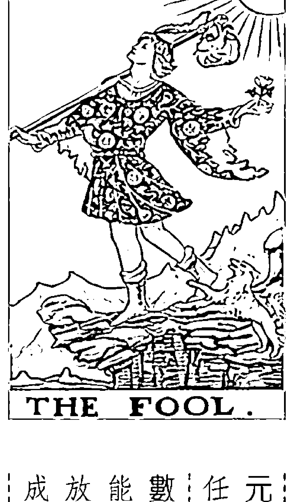

愚人象徵一個人在什麼都沒有的時候，就像一個人的嬰幼兒時期，因為還聽不懂任何管教，所以勇於嘗試、不受限制，想做什么就做什么，好奇心旺盛，又没有任何顧慮。嬰幼兒這樣的特質，會開啟他對這個世界的認知，發展他的天分，但也可能招致災禍；畢竟，會毫不猶豫地坐著學步車衝下樓、由高處往低處掉下去，或是面不改色地把手伸向滾燙的鍋子，都是嬰幼兒才會做的事，因為「不懂」就會没有任何害怕、考慮及遲疑，什麼都敢做。所以愚人的公認牌義，其性質都不脫「自由自在、冒險心強、没有任何計畫、不按牌理出牌、無法預測」這些重點。

元素 風 風元素在這張牌顯示的特質：不定型、沒有特定目標、不受任何限制、隨心所欲、無法預測、沒有個人經驗的包袱。數字 0 數字0有兩個極端意義：一是什麼都没有；二是有無限的可能性，什麼都可以從中創造出來。所以0可能被放在1之前，也可能被放在9之後，就像一個不受任何束縛的人，可以大巧若拙，也可以弄巧成拙，完全沒有軌跡可循，也不宜斷吉凶。

## 23 藏在塔羅裡的占卜符碼

①人生牌陣是脫胎於占星學的黃道十二宮，每個宮位象徵人生中不同的面相，例如你在工作、金錢、愛情，以及分別與父親、母親、手足、友人方面的關係。人生牌陣有很多個，黃道十二宮這一個叫作「天宮國牌陣」，因此裡面有一張牌，是代表命主在父親關係的部分展現出來的現實面。

## 解牌說明

我有一個朋友，抽某個人生命陣①時，在「父親」的位置抽到了一張愚人牌，讓大家大吃一驚。後來經由她的解說，發現確實是如此，她是由伯父母撫養長大的，爸爸是職業騙子，從小就沒有盡到父親的責任，她都是從新聞中看到爸爸犯下了案子時，才知道「爸爸最近在做什麼」。但她爸爸騙人，通常金額都只是一筆夠他吃喝玩樂一陣子的數字，或是白吃白喝，作案後就

但是有些人會把這些特質延伸解釋成爲「有創意」，但有創意還是太輕描淡寫了點，不足以表達愚人那股什麼都不在乎的勇氣。我認爲愚人牌是具有推翻一切的「革命精神」（雖然也有可能是天兵），而非只是有創意。此外，這張牌是風元素，表示愚人牌不懂在生活、物質上沒有任何負擔，在心態上也是一樣自由的。比如我們一般人會被責任、道德感束縛，但是愚人牌不會有罪惡感，所以一旦不在乎這些的人生，就是完全自由，他的未來可能大好、也可能大壞，或者發展出一段沒有其他人經歷過的人生。

## 愚人牌 The Fool 24

閃人，不會騙光別人的積蓄，也沒有犯過什麼傷害性案件，就算要冒用別人的名字，也是冒用自 己家人的名字，不會牽扯到外人身上，看得出他沒什麼大想法，就是想要隨心所欲地過他想要的 生活而已。 另外，最明顯的一點，就是在他尚未跟妻子辦妥離婚手續時，就跟女友在大飯店舉行婚禮， 還請了一百桌。婚禮前，他明明知道男方親友沒有半個人會出現，重婚的事一定會曝光，但他還 是有模有樣地穿上西裝如期出現，最後果然當場被抓了，而他也認命地去服刑。這種愚人型的 人，想做什麼就做什麼，沒有縝密的思慮或計畫，也沒有什麼真正目的，他許只是想要試試在 大飯店裡結婚的「感覺」，或者想要看看宴客百桌是什麼樣子，即使被抓了他也覺得值得。你不 能說這不是另一種型態的「天真」。 以上是比较偏負面的例子，但愚人牌雖然不受一般人看好，卻很有敗中求勝的冒險精神。有 一本書《小丑的創造藝術》，我覺得書中對小丑這個身分的解讀跟定位，幾乎就可以是愚人牌的 最佳說明了。 書中對丑角的定義為「對於任何計窮途拙的狀態，都能夠想出解決之道，能夠保有創造力、 希望與活力」。作者提到一位受雇於愛德華四世的丑角演員叫斯克剛，丑角的工作必須讓所有事 情看起來都很愚蠢，有時甚至可以冒險去愚弄國王（畢竟伴君如伴虎，心臟不夠強，是做不來這 份工作的，這是不是也印證了愚人牌的「冒險、無畏」等特質？）。有一次他做得太過火，被國

## 25 藏在塔羅裡的占卜符碼

王逐出英國，並命令他：「永遠不得再踏上英國的「國土」。」於是斯克剛出發到法國，兩週後把法國的泥土放入鞋中，踩著回到了英國。如此跳脫所有人的思考模式，把一件攸關生命的事轉化爲一則笑話。

## 我是怎樣的二張牌？

愚人牌是獨立於一切的體制之外，所以往往能夠跳脫所有人的思考模式。如果能做到「三不要」的任何一項，就一定會成功，這「三不要」就是：不要錢、不要命、不要賤。很有趣的，這三樣東西任何人都沒辦法不要，而這些又剛好都是愚人牌不放眼裡的，或至少不會三樣都要的。基本上，愚者就是代表出乎大家意料，或是跟我們的印象不吻合的人事物。國外就用極重感官享樂的酒神戴奧尼索斯來代表；如果要我找個東方神祇，我會覺得「濟公」最能傳神地表達出愚人牌的特質。

## ※練習題（作者在部落格回應）

在此設定兩個問題，一個是問：「如果接受了A工作，這份工作的發展前途會如何？」另一個問題是：「應不應該接受A工作？」這兩個問題都抽到了愚人牌的話，請問在解釋上分別有哪些意思？兩個答案最大的不同又在哪裡？

答案最大的不同又在哪裡？

## 魔術師牌 The Magician 26

## 魔術師牌 The Magician

## 牌義

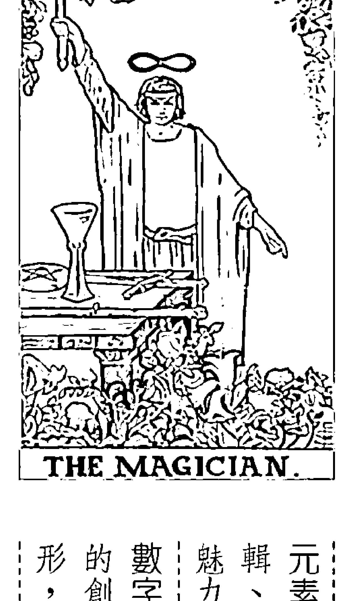

元素 風 風元素在這張牌顯示的特質：智商高、變通性强、注重 魅力 、企畫及改良能力 。 輯、執行力稍弱、溝通力強、友善、人緣佳、知識及常識豐富、有群眾 數字 1 數字1 象徵開始、創新，以及新生的事物。我們都知道一切 的創造，最初都來自於心智下的「概念、發想」，凡事都要先在腦中成 形，才會有具體呈現出來的機會，數字1 賦予魔術師牌一個好的開始 。 魔術師的重點，在於「拿原料製造出有價值的成品」，所以是最有開創性的1號牌。相較於 上一張愚人牌，魔術師已經開始發展出邏輯性，也接受過社會化教育，知道用頭腦比橫衝直撞有 用得多；愚人牌象徵的「潛能」，到魔術師這裡已經發展成「具體的實力」了，可以巧妙地運用 所掌握的一切資源，就像同樣的顏料、畫布跟畫筆，在我們一般人手上，跟透過藝術家的手組合 出來，就有完全不同的程度、價值。顏料不是重點、畫筆也不是重點，重點在於作畫人的想法及 技巧 。因此魔術師這張牌，強調的不是你擁有什麼，而是從開始到完成的過程中，你所發揮出來 的能力 。

的 ability 。 技巧 。因此魔術師這張牌，強調的不是你擁有什麼，而是從開始到完成的過程中，你所發揮出來 的能力 。

## 27 藏在塔羅裡的占卜符碼

## 解牌說明

因此魔術師公認

## 解牌說明

也擅長拉近人與人之間的距離，並讓大家放下防衛心。在物質世界中，這樣的特質會讓我們得到金錢、關係、好名聲，以及一切我們重視並可讓我們在社會上立足的物質。

解牌說明女皇牌的代表性人物非常容易辨認，一般的美女公眾人物，或是走在潮流前端、很重視時尚的女性（包括粉領族在內），都是女皇牌的具體化表現。因為很注意公關及形象，所以女皇的品味很好，也很喜歡享受。

我們都知道，有時美女（帥哥也一樣）並不見得是先天條件好，而是她們跟得上時代，知道怎麼打扮最讓人有好感，喜歡保養自己，懂得享受跟打扮，走的路線也都是大眾最能接受的方式（也可以解讀為流行和時尚）。此外，先不說個性，至少社交禮儀很好，懂得看場面說話，看起來也讓人賞心悅目，例如孫芸芸這一類的貴婦群，就很適合當女皇牌的代表

性人物，從不斷待自己，永遠把好的那一面給大家看。

在上課過程中，我常問同學：「女教皇跟女皇比較起來，誰比較適合當職場上的主管呢？」

大部分同學的反應都很直接：「女教皇有知識、聰明、專注、能力又強；女皇則是比較重於社交

與人際，是通才而非專才。比較起來，應該是工作能力強的女教皇牌更適合當主管吧？

其實在職場上，人和、眼光與手腕，會比工作上的技能來得重要。女皇牌的風及土元素，加

強了它的判別能力，以及大事化小、立場客觀的能力；而對一個主管來說，最重要的不是工作能

力強，因為這種員工要多少有多少，主管的工作是「把每一個不同的人放在對的位置，以及將有限的人力及資源做最徹底的運用」。這就需要對人性的瞭解及寬廣的眼界，不是肚子裝滿墨水就夠了。因此女皇牌雖然在資質方面不如女教皇，但在群居社會中，女皇比女教皇更容易適應、如魚得水，也更適合站在領導位置。只是女皇牌的領導能力，不像皇帝牌帶有競爭性，也不像教皇牌完全實事求是地規畫縱密。女皇會做完所有該做的事，然後懂得適時放手，讓事件自己去成形。這是一種很高的創造力與智慧。

## 35 藏在塔羅裡的占卜符碼

女皇牌具有與人為善的性質，但它居然不是水元素，而是一向理性的風＋土元素，因此你可以知道，它的禮貌、關懷、細心、和善，都是因應我們對一個好人應該要如何的社會價值觀，而不是出自於天性或本能。其優點，是女皇的外表柔軟，腦袋卻很清楚，不會因為好說話，最後卻導致被欺負或是盡情的地步，缺點就是凡事容易流於表面。

## ※練習題（作者在部落格回應）

女皇擁有社會上所有女性想追求的一切：美貌、交際手腕、溫柔的個性、很會打扮及玩樂。如果問題是：「一名男士的人格特質」，卻抽到女皇牌，應該要怎麼解釋？

## 牌義

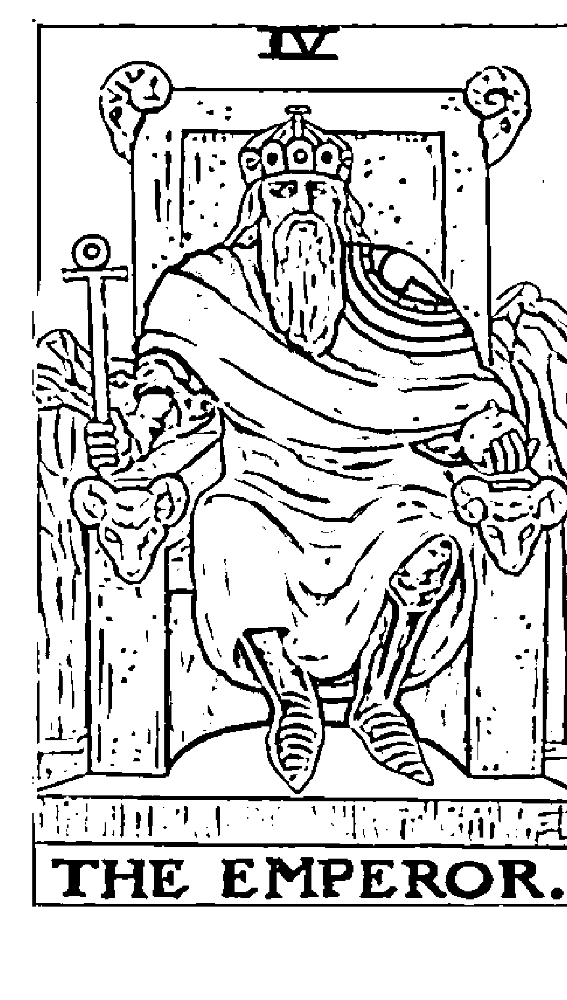

經歷上一張女皇牌與人為善的階段後，就要開始慢慢地確立自己的價值，從找尋自我、發展 自我、提升自我，到了這一張皇帝牌，就要開始「韙自我定位」了。我們整理完自己所擁有的資 源及天賦後，接下來不是抱著它們不放，而是應該把我們的天分及資源發揮出來，利用它們做出 更有建設性的事，才能替自己創造更多「自我價值」。 因此皇帝牌公認的牌義，就是「強勢、有開創性、領袖魅力強、專制獨斷、有大男人主義的 傾向、企圖心強、有野心、具有行動力、掌握局面、有主導權等性質。 正如同女皇牌是社會化女性的代表，皇帝牌也是社會化的男性代表，這張牌表現出來的特

元素 火火元素在這張牌顯示的特質：獨裁、強勢、企圖心、侵略 性、魄力強、大男人主義、英雄主義、主觀、以自我為中心。 數字 4 4是一個基礎穩固、內在能力非常強的數字，代表想要奠定 穩固的基礎，或是畫好自己的勢力範圍。皇帝牌的成就不只是眼前的程 度，還有更多未開發的潛能，只是在現階段必須先打好成功的第一步， 善用4的安全感，以及它象徵「擁有」的特性，建立自己的初步成就。

## 皇帝牌 The Emperor

## 37 藏在塔羅裡的占卜符碼

質，就是一般大眾對「身爲一個男人」的認知與期待；因爲男性往往是一家之主或一國之君，我們對男性的要求是必須獨立，有指揮及領導的能力，有勇氣與膽識，才能夠突破任何困境，也不會被情緒左右。皇帝牌要不斷地前進，才能有擴大格局的能力。很多朋友常常問我，皇帝牌既然名爲「皇帝」，抽到這張牌時一定有大老闆的意思囉？事實或是赤手空拳打天下的開國皇帝，我們人認爲不太像是養尊處優或世襲的君主，反而比較像篡位的皇帝，代表性人物。所以大老闆當然還是有可能，白手起家的老闆就更像了。但是如果把規模縮小一點的話，業務員、直銷商，或是任何需要進入陌生市場，憑自己的力量殺出一条血路、且不用太借助別人力量者，都可以是皇帝牌代表的職業。另外，皇帝牌不擅於團隊作戰，所以除了創業者、業務員之外，講究個人表現，與體能、榮耀有關的運動員，也是皇帝牌的代表職業之一。抽到這張牌，當然可以代表運勢是很旺的，大家想想看，赤手空拳闖天下，需要多強韌的意志力及多大的勇氣啊！所以這張牌一旦出現，表示你的目標是很明確的，而且應該要心無旁骛，付出全部的專注與力量，不能被其他的事情分心。一旦鎖定方向，你的成功機率就非常大了。但是這樣的全力以赴，大家應該很容易就會聯想到那種心思只放在工作上的工作狂，這種人

## 41 藏在塔羅裡的占卜符碼

通常沒有興趣休閒，也失去休閒的機會。就醫學上來說，身體過度亢奮之後，等熱潮平息下來，緊接而來的就是急速衰退了。工作也是如此，皇帝牌會過度地投入熱情，眼裡除了目標之外，其到支撐力量，會特別有無力感。此外，中年危機或是不敢退休，怕退休後自己誰都不是的人，也有可能是皇帝牌的類型。這種人看起來熱愛工作，其實是靠著他的目標，給自己一種存在感。

## 我是怎樣的二張牌

皇帝牌是一張陽剛性質極重的牌，獨裁、霸氣又唯我獨尊，這類的人放在感情上的時間不會太多。雖然被皇帝牌追求，會感覺到他很熱情很狂熱，但是這種狂熱，往往會隨著你的拒絕或接受而平息下來：你接受了以後，他會覺得有更新的目標（工作或感情都有可能）等著他去征服：你拒絕的話，他會死纏爛打一陣子後突然消失，因為他一次只能有一個目標，所以一旦出現其他目標時，他就不會在你身上付出任何一絲注意力了。

## ※練習題（作者在部落格回應）

如果是一位個性圓滑、人際關係頗佳的女性，在她的人格特質出現皇帝牌，要怎麼解釋皇帝牌在她身上表現的部分？

## 39 藏在塔羅裡的占卜符碼

## 教皇牌 The Hierophant

## 牌義

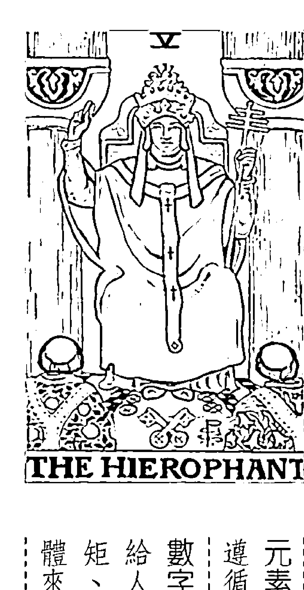

上一張皇帝牌是有點個人英雄主義的牌，但是到了5號教皇牌，就真的是以團體利益爲最大考量。教皇牌與皇帝牌相似的地方是，兩者都有一國之君的味道，但皇帝是一馬當先帶領大家前進，而教皇卻是確實融入群眾當中，有著輔導眾人、教化大眾的味道，比較溫和，沒那麼耀眼，但跟人們有更加貼近的關係，掌握的實質資源也更多。

教皇牌公認的牌義，就是「傳統、重視基本原則、觀念保守、教育相關單位、固執、慈祥、宗教性、可以當重大事件的推手、尊貴卻低調、貴人」等性質。

比起女教皇的個人化、私密性，教皇牌雖然也代表內心的成長及精神領域的智慧，卻是比较

元素 土 土元素在這張牌顯示的特質：責任、義務、重原則、固執、遵循傳統、追求感官享樂、重視組織與紀律、重視實際層面。數字 5 數字 5是跟外界的人有互動，以及領導旁人的意思。教皇牌一向給人嚴格、不易敞開心胸的感覺，那是因为它的土元素非常堅持「規矩、原則」，而這有助於凝聚眾人的共識，把力量集結在一起。對於團體來說，數字5比較能夠領導眾人往對的方向走長久的路。

## 教皇牌 The Hierophant 40

## 解牌說明

標準流程化，可以放諸四海皆準。因為有一套共同的基本教義，才能構成團體與組織，發揮更大的力量。我們知道有某些國家，教廷權威甚至凌駕在政府之上；即使不是這麼極端的例子，在我們這個社會裡，餵飽人民、給予人們協助的除了政府體系外，還有很大一部分來自宗教團體或慈善團體。這些國體凝聚了共同的理念，支援及關懷社會，對整個國家的影響力不亞於政府組織。

如果說皇帝牌像蔣介石的話，那麼教皇牌就像是蔣經國了。從這兩者的比較，我們可以更容易理解，相較於皇帝牌（火），土元素的教皇牌就是少了那份霸氣，多了腳踏實地，以及照顧民生基本需求的責任感。皇帝牌的重點在於權力，而教皇牌的重點則在於責任與義務。蔣介石是在亂世當中，為了國家的領導權及定位付出了很多代價，而像教皇牌的蔣經國則是接棒建設台灣，把重心放在民生經濟及未來較為長遠的永續發展上面。

這樣的方向演進。不管是哪一個民族，都會發現歷史上都有「天授神權」這樣的說法。教皇牌代表宗教，正是與古代國君一樣，象徵人與上天之間的連結，但進入較後期的君權時代後，教皇牌不再是國家的統治者，反而成為負有教化人心任務的宗教組織。

我一向不太贊成把教皇牌講得太靈性化（這比較像女教皇），教皇牌是土元素耶！是活生生

[PAGE 44]

## 41 藏在塔羅裡的占卜符碼

的，要面對現實環境的。以中國為例，透過歷代聖人與君主的教化，慢慢地把「上天的知識」教

> 我當怎樣的一張牌？

位究竟在哪裡？我認為教皇牌代表「文化、文明」，不算靈性而是「知性」，是從人類歷代實際的生活中累積出來的美感，是物質生活中軟性的一面，既可以撫慰人心，又是全民共同享有的資產。

教皇牌沒有皇帝牌那麼野心勃勃又世俗，也沒有女教皇牌那麼靈性，很多學員問我：「那它的定

## ※練習題（作者在部落格回應）

教皇牌重視組織與邏輯，也跟金錢、社會地位等相關。如果問題是：「我適合往設計師路線發展嗎？」抽到的是教皇牌，要如何解讀？此外，設計師有很多種類，教皇牌適合哪一種？

## 戀人牌 The Lovers 42

## 戀人牌 The Lovers

## 牌義

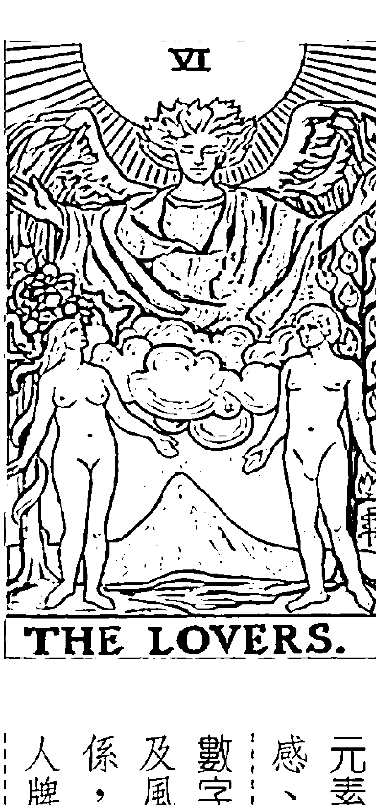

在上一張教皇牌中，人類一般生活的基本需求都已經達到，而且也被照顧得很好，再也不需要爲了生存而擔憂。在這種情況下，自然就會發展出對不同領域的好奇心，就像每個人只要衣食無缺，就會想去培養一些額外的興趣。戀人牌上通常畫的是一男一女互相吸引，象徵兩種不同東西之間的相互吸引力，所以我們生活中未接觸過的，都會讓我們很想去嘗試。常常有人覺得戀人牌就是代表濃情蜜意，但其實感情還是要在有點曖昧、不可捉摸的階段，‘互相吸引’的感覺才會特別強烈，這也是戀人牌會配上象徵不穩定、但交流性強的風元素的原因。戀人牌公認的牌義，就是‘良好的關係、人緣好、選擇、社交運強、讓你喜愛的事物、感情’。

元素 風 風元素在這張牌顯示的特質：善變、靈巧、好奇心強、新鮮感、資訊豐富、社交性、可塑性强、擅於為他人或自己協調溝通。數字 6 數字6有一種凡事取得平衡及互相配合的意思。配上戀人牌及風元素，代表工作、感情、友誼、家庭等等都能取得良好且平衡的關係，很理想又不会太過死板，能跟同一個團體的所有人互助，這就是戀人牌雖然喜歡多方嘗試，卻不至於讓風元素性質造成混亂的原因。人牌雖然喜歡多方嘗試，卻不至於讓風元素性質造成混亂的原因。

## 43 藏在塔羅裡的占卜符碼

## 解牌說明

我一直在覺得戀人牌是愉快的、自由的、充滿各種可能性的，在生活方面，這張牌甚至也可以

上的抉擇、溝通能力」等性質。

代表娛樂、興趣及任何能夠讓你放鬆的事情。不管在哪一副牌中，戀人牌的構圖都是由一男一女

（以及其他一陰一陽的東西）各據一方卻又互相對稱來表示，代表只要是能把我們本身缺乏的東

西補足的事物，我們都會不知不覺地被吸引過去；此外，也可以說，有時我們缺乏的部分是被隱

藏住的，找到相反的另一半，也只是把我們原有的隱藏面投射出去而已。

老實說，戀人牌雖然自在又愉悅，但在某些情況下，確實是有點淺薄的。因為戀人牌看事情都只看最初的層面（也就是說當初最吸引它的那個部分），等到新鮮、未

## 49 藏在塔羅裡的占卜符碼

## 解牌說明

肯定、往積極面發展、事業成功、誠信等性質。不管問什麼問題，如果出現力量牌，表示事情是在你可以應付的範圍之內，就算你在面對時會覺得很困難，但真正出手時，就會發現出乎意料地簡單。但是這張牌也不適合太躁進，必須定下心來，看準施力點在哪裡，一定要算好步驟，成功才會持久。一般來說，火，短時間內燒完就沒了，但力量牌的火就像具體的能源，如瓦斯、木炭、汽油，乃至太陽，能量不會一次爆發，而是長期、持續穩定地供應，這是最理想的形態。

一提到力量牌，只要對塔羅牌稍有研究的人，一定會馬上聯想到它最廣爲人知的牌義：「以柔克剛」。但這句話對很多玩塔羅的人來說，好像有點太抽象了。「以柔克剛、馴服」眞要解起牌來，你會發現大多數的人都還是把力量牌解釋得太激進及火爆，就連市面上的塔羅書也不例外，前面才寫著「以柔克剛」，後面的範例就把它解釋得很強硬、很陽剛。其實以柔克剛的意思很簡單，就是用和緩的方式讓對方能夠接受，再去進行一些改變。簡單來說，就是利用「習慣性」來克服一些無法一時轉變的事情！我常跟學生們舉一個例子：「我是個很需要減肥的人，對吧？假設我要運動減肥，是要一天慢跑個一百公里，還是一百天內，每天慢跑一公里，哪一個成效來得大？」答案大家都知道，從這個充滿我個人血淚史的例子，就可

以知道，習慣性一培養出來的隱性力量，比在權面上一次爆發的顯性力量要來得有用且持久，而且力氣要用在對的時間、對的地點，才能夠達到預期效果。這張牌在大部分的牌圖中，都是一名女子馴服獅子的畫面，女子等於是溫和的耐性，獅子等於是人的本能與不受控制的野性，本能是應該被理性控制住的。因爲自信及勇於承擔所帶來的力量，比蠻力來得長遠。在感情方面，力量牌更是一張好牌了。大家一定也覺得「以柔克剛、馴服一，在任何人際關係中，都是最恰當的相處模式。穩定培養良好的相處模式，會比一瞬間的天雷勾動地火，更能維持長久的關係，所以力量牌也象徵「歷久彌新」。因爲火元素加上數字8的關係，力量牌是非常豐富的，要錢有錢，要名聲有名聲，而且還是以德服人，不靠強權壓人。當然，因爲這張牌通常有理性戰勝本能衝動的意思，如果你遇上情緒激動，或者無法下決定的時候，尋求專家或頭腦冷靜的人建議，可以幫你度過任何難關。

力量牌的特質是以柔克剛，如果問題是：「我想考研研究所，請塔羅給我建議。」抽到的是力量牌，理所當然是要拿出意志力，但是要採取的方法應該是哪種類型的？

## 力量牌 The Strength 50

## 我是怎樣的一張牌

## ※練習題（作者在部落格回應）

以知道，習慣性一培養出來的隱性力量，比在權面上一次爆發的顯性力量要來得有用且持久，而且力氣要用在對的時間、對的地點，才能夠達到預期效果。這張牌在大部分的牌圖中，都是一名女子馴服獅子的畫面，女子等於是溫和的耐性，獅子等於是人的本能與不受控制的野性，本能是應該被理性控制住的。因爲自信及勇於承擔所帶來的力量，比蠻力來得長遠。在感情方面，力量牌更是一張好牌了。大家一定也覺得「以柔克剛、馴服一，在任何人際關係中，都是最恰當的相處模式。穩定培養良好的相處模式，會比一瞬間的天雷勾動地火，更能維持長久的關係，所以力量牌也象徵「歷久彌新」。因爲火元素加上數字8的關係，力量牌是非常豐富的，要錢有錢，要名聲有名聲，而且還是以德服人，不靠強權壓人。當然，因爲這張牌通常有理性戰勝本能衝動的意思，如果你遇上情緒激動，或者無法下決定的時候，尋求專家或頭腦冷靜的人建議，可以幫你度過任何難關。

力量牌的特質是以柔克剛，如果問題是：「我想考研研究所，請塔羅給我建議。」抽到的是力量牌，理所當然是要拿出意志力，但是要採取的方法應該是哪種類型的？

## 51 藏在塔羅裡的占卜符碼

## 牌義

## 隱者牌 The Hermit

隱者牌的公認牌義，就是「孤獨、不被理解、智者、專注、孤芳自賞、道德上的高傲、固

執、目標明確、範圍受限。

元素 士 土元素在這張牌顯示的特質：過程中的阻礙、現實考量、進

取心、耐心、韌性、固執、目標明確、範圍受限。

數字 9 9 本身就是一個代表「轉化、臨界點」的數字，因為在個位

度緩慢、持續、耐心、韌性、固執、目標明確、範圍受限。

元素 士 土元素在這張牌顯示的特質：過程中的阻礙、現實考量、進

## 解牌說明

隱者是土元素，表示它的力量是經由累積、堅持而來的，加上數字9，代表其蛻變與智慧不從艱苦當中磨練出強韌的意志力。因此不管要做什麼事，出現隱者牌，都可能代表會延遲，因爲過程中的考驗太多，又缺乏其他的助力，只能靠自己一步步處理；但是一旦生出新的智慧，除了自身的成長之外，還可以從現實的層面中指導及造福所有的人。

這張隱者牌的牌義很清楚，就算是初學者，都可把它大致上孤獨、隔絕的牌義掌握住。不過，因爲這種自閉的感覺，在2號女教皇牌中也出現過，所以就常常有人問，這兩張牌之間的最大不同點在哪裡？最簡短的解釋是，女教皇牌與外界的隔絕，是純粹出自於它個人的意願，因爲女教皇對知識、心靈成長的追求是一種喜好，也是天性；但是隱者牌是因爲有更長遠的目標在後面，所以隔絕外界」對隱者來說，算是一種過渡期而已。前面女教皇牌那篇中所提過的小龍女，隱居在古墓是她的生活方式，沒有什麼未來的長遠目的；但是隱者牌比較像是高僧或修煉神功的人，爲了到達最高境界，中途必須隔開一些可能造成干擾的人事物，也就是「閉關」，讓自己能專心一

志在修練過程中，等到功練成了、悟道了，出關的時候也就到了。教皇牌卻比較像是一個階段完成了，自然而然地爲了要進入下一階段做準備，而念書就是女教皇的興趣；隱者牌比較有忍受、磨練的性質在內，比較像落榜後的重考生，要在同一個地方打轉，試圖找出方向，因此隱者牌的企圖心較強，得失心及執著程度自然也比较重。有一次兩個女生分別對自己「目前的感情狀態」抽牌，A小姐抽到女教皇牌，B小姐則抽到隱者牌。在外人看來，這兩位小姐的感情狀況很類似，但經由這兩張牌，就可很清楚地說明這兩位女孩目前的心態：A小姐是因爲生活中有其他重心，對感情的事比較漠不關心，就算有條件很好的人追求，她也很難把重心放在感情上，所以單身對她並不構成影響。B小姐則是很渴望愛好的適合對象，在感情狀況上比較有「困擾」的感覺。因爲隱者會經歷到的大都是設定好的人生功課，所以通常抽到隱者牌，我給的建議經常是：放下得失心，就能撐過這段過渡期，眼前的狀況並不是最終的答案。

## 我是怎樣的二張牌？

在工作方面，隱者牌是願意為了未來的可能性，付出眼前代價的一張牌，所以常常是象徵「在職進修」的一張代表牌。在感情方面，隱者因為固執、目標又過於明確，常常會有眼光過高或難以相處的狀況發生。女教皇牌在感情上的狀態，就比较純粹是出自於自己的選擇，因爲女教皇本身對外人的興趣本來就比較少。

## ※練習題（作者在部落格回應）

隱者牌一向較為沉默、孤獨，如果問題是：「在愛情方面，我最大的阻礙是什麼？」抽到的是隱者牌，那麼讀者認為案主最大的缺點或問題是在哪一方面呢？

## 55 藏在塔羅裡的占卜符碼

## 命運之輪牌 The Wheel of Fortune

## 牌義

命運之輪牌爲你帶來的，慳慳是一個「機會」而非結果，真正的結果仍舊要看你的作爲而

上一張隱者牌是我們在沉潛、韜光養晦的過程，等到蓄足精力與能量，就要進入命運之輪牌的階段，也就是要開啓人生中新的一頁了。雖然命運是好壞夾雜，但這張命運之輪所象徵的，是壞的部分剛過去，而新的好機會正要出現，是你人生走到否極泰來的時刻。所以當命運之輪牌出現時，象徵你要勇於做出改變，一旦改變，命運之輪就會轉動，開啓最大的契機。命運之輪牌公認的牌義，就是「好運、機會、事情往好的方向前進、可能性、順勢而爲、命運安排的出口、適合改變現況、擴充」等性質。

元素 火 火元素在這張牌顯示的特質：突破、創新、冒險、行動力、旅行、改變現有環境、勇氣、短期內的衝刺。數字 10 10是代表圓滿、完成的數字，但又是二位數的開始，也就是說，每完成一個階段後，就要拿這些過程中累積下來的資源與能力去進攻一個更高的階層，每一個舊的結束，都是爲了另一個新的開始做準備；尤其這張牌是火元素牌，必須一直行動，一旦停下來火就減了。

## 解牌說明

定。如果你以為現況順利就不需要改變，就等於放棄機會；那麼等到這波高峰過去了，命運之輪的優點，就好像讓你得到一筆意外之財，但是你是要花光？或要拿去妥善投資？兩種作為會導致完全不同的結果。機會只有一次，你不利用漲潮時往上爬，就會被海水淹沒或在退潮時被捲入漩渦。

我們在上一張隱者牌的說明中提到，隱者牌象徵一個閉關的過程，也就是把過去累積的東西做一個消化總整理後，再進行運用的狀況，就像食物消化完畢轉化為養分後，才能輸送到身體每个細胞，驅動人體運作。既然隱者代表的是消化過程，命運之輪代表的就是把轉化成的養分發揮到各處的過程，所以象徵各種新的嘗試、冒險及行動！

在前面介紹的牌中，教皇牌往往帶有「貴人」的意思，所以有人問我，命運之輪既然是新的轉機，那它是不是代表也會有貴人出現呢？我的回答是，命運之輪的確有可能帶來貴人，但是形態跟教皇牌的貴人不一樣。教皇牌的貴人是以一種施恩者的形態出現，不會被錯認；但是命運之輪的貴人，有時卻以小人形態出現，往往會給你帶來破壞與傷害，或是製造一些無法預期的災難，但是這些破壞，有可能反而帶來一些新的影響，幫你衝破原有的格局，讓你因禍得福，最後形成對你有利的結果。「殺不死我的，使我更堅強」這句話，也可以說是命運之輪牌的好注解。

## 我是怎樣的二張牌？

命運之輪牌會讓你的生命加速轉換不同的事件及環境，讓你在很短的時間內，經歷各種不同的經驗。這張牌的關鍵字往往就是「學到」。經一事長一智，經驗是比書本更好的老師，在增廣見聞或想擴大自己的格局，命運之輪是很有利的一張牌。

## ※練習題（作者在部落格回應） 命運之輪的運勢很容易解釋，但命運之輪的牌面不是以人物爲代表，大家反而可以試著解解看。如

果問題是：「我這個人的優缺點爲何？」抽到的是命運之輪牌，代表案主是一個什麼樣的人？

## 59 藏在塔羅裡的占卜符碼

## 正義牌 The Justice

## 牌義

正義牌雖然象徵眞理，但在我個人的經驗中，

夠了、探索夠了，下一步就要進入這張正義牌的程序，開始衡量、規畫，找出最適當的平衡點、

出無限的新機會。但是我們都知道，收集一堆資源後，堆積放在一邊是派不上用場的，等到嘗試

上一張的命運之輪牌是風風火火的，到處開發、到處探險，找尋對自己有用的資源，也創造

元素風元素在這張牌顯示的特質：思維、理性、邏輯、規範、平

衡及和諧、斡旋、合作、契約、善於溝通、判斷分析的能力。

數字11 11是一個代表「定期循環、周期」的數字，經過計算顯示，

小夢價格、太陽黑子活動、潮汐等等，都是以11年為一個循環周期；上

一個號碼10代表一個句點，而11則代表新的周期展開，所以到了正義牌

## 解牌說明

由於正義牌是風元素，它代表的「眞理」是概念上的，是一種「共同守則」，我個人覺得這有點流於形式化，是一種齊頭式的平等，真正運用起來時，可能會覺得處處爲難、受到牽制；但體的合作模式。這張牌中的眞理女神都帶有一把劍，但是因爲它是風元素，這把劍是不會拿來執法的（這種行動應該由火元素主導），而且當它做出裁決之後，必須要能讓大家遵守，所以這把劍代表的是公權力的象徵。

這張正義牌特別的地方是，我不認爲它帶有愛情的成分，但是如果算婚姻時抽到

## 倒吊人牌 The Hanged Man 66

倒吊人牌是一張很消极的牌，所以不管是什么问题抽到這張牌，都會有一種找不到方向前進的感覺，而造成拖拖拉拉的狀況。讓我們回顧一下前面的隱者牌及戰車牌，同樣也會有拖延意味，但它們不同之處在於：隱者的拖延是因為待辦事項太多，戰車的拖延是因為苦思良久下不了決定；而倒吊人牌的拖延，就沒有什麼具體原因，很可能是單純地提不起勁，或是感覺不對，或者覺得反正做什麼都不會有結果，乾脆消極地不去面對了。

## 我是怎樣的二張牌？

倒吊人牌是一張很消極的牌，所以不管是什么問題抽到這張牌，都會有一種找不到方向前進的感覺，而造成拖拖拉拉的狀況。讓我們回顧一下前面的隱者牌及戰車牌，同樣也會有拖延意味，但它們不同之處在於：隱者的拖延是因為待辦事項太多，戰車的拖延是因為苦思良久下不了決定；而倒吊人牌的拖延，就沒有什麼具體原因，很可能是單純地提不起勁，或是感覺不對，或者覺得反正做什麼都不會有結果，乾脆消極地不去面對了。

## ※練習題（作者在部落格回應）

大家應該都看得出倒吊人牌有「無為」的意思，如果有配偶的人問：「我的婚姻狀況。」抽到這張倒吊人牌，請問他的婚姻狀況目前面臨什麼樣的問題？

## 67 藏在塔羅裡的占卜符碼

## 死神牌 The Death 67

## 牌義

死神牌是電影劇情最愛拿來大做文章的一張牌，我想那是因爲編劇也不認得其他牌，所以除了死神牌之外掰不出其他牌。事實上，死神牌雖然也代表消亡，但是卻沒有大家想像的那麼狰寧；死神牌是在倒吊人之後出現的牌，象徵在走完一個12的完全數後，盡頭即將來到。所以死神牌的死亡，是一種自然現象，表示氣數已盡，該結束了，如果不結束，新的階段就沒有辦法展開，一點都不慘烈，反而有種壽終正寢的味道。

因此死神牌的公認牌義，就是「結束、盡頭、滅絕、有時會是新生、分開、改變、踏入下一個階段、置之死地而後生」等性質。

## 數字 13

西洋人害怕13，如同華人對4的忌諱。可能的原因是，我們元素水水元素在這張牌顯示的特質：昇華、融解、由小我進入大威神話也提到未獲邀參加聚會的第13位神祇使地球陷入長期黑暗中。破壞及干擾的力量。例如傳說中出賣耶穌的猶大就是第13個門徒；而挪之前提過12是一個周期結束的數字，而13被認爲是「多出來的」，代表

## 解牌說明

對死神牌的畏懼是不必要的，因爲你没辦法抗拒改變。看到抗拒改變的人，我常會想到最初\的電話是由人工接線的，後來發明了「步進式自動交換機」後，民眾就可以直撥電話，不再需要接線生。但是這個改變，卻引起接線生的群起抗議，害怕剝奪了他們的工作機會。大家都可以瞭解這是白費力氣，因爲當你已經失去原有的價值時，與其死纏著要人家垂憐，不如爲自己創造出新\的價值。

恐懼的往往不是事件本身，而是「未知」。我們不能永遠在同一個地方原地踏步，但是大部分的人類怕死，有時候怕的其實不見得是死亡這件事，而是死後不知道會如何。也就是說，人們人都會陷入一種慣性，到了該改變時，還死守著現有的狀況不放。我們常常把人事物的死亡與消失，視爲是一種無常，但是死神牌代表的結束及死亡卻不是無常，而是常態中我們無法否認的一部分。死亡是生命的一部分，是重要的一個環節，無法避免，也一定要面對。\這就好像我們從小學畢業了，需要悲傷嗎？我們並不是離開小學就停止學習了，接下來還要進入高中、進入大學，邁入截然不同的新階段，這是必然的。如果你一直停留在小學程度，那才需要悲傷呢！所以如果你在愛情中抽到死神牌，代表的是戀愛結束，但有可能是一分手，也同樣有可能是走入婚姻。死神牌是順應天道的，結束就只是結束，沒有好或壞。

## 69 藏在塔羅裡的占卜符碼

只是我們往往害怕不熟悉的事物，已知比起未知，反而讓人比較容易接受，所以遭受家暴的婦女會一再回到惡劣的丈夫身邊、被劈腿的人會一再原諒背叛他的情人……，都是源自\這種依賴、狹隘、不想面對新事物的心態。死神可能代表這些人跨出去展開新生活，也可能代表如果你不結束目前的生活，就會被糟蹋致死（不管是肉體或心靈上）。總之，現有的狀況是一定要結束的。

## 莊子臨死前，爲替他傷心的人講過一個「麗姬悔泣」的故事，原文是：「麗之姬，艾封人之

子也。晉國之始得之也，涕泣沾襟；及其至於王所，與王同簀床，食芻豢，而後悔其泣也。」文

中描述名爲麗姬的美女，被晉獻公搶奪爲妃時傷心之至，以爲接下來的人生就此完結，沒有想到

後來過的是吃好睡好的日子，這時才覺得當初是不該哭泣的。

當然我們不能說，被死神牌終結後，接下來就一定會遇到比原來還要幸運的事，但是你的人

生一定會有機會面臨一些新的狀況，並帶給你不同的際遇。

## 死神牌 The Death 70

## 我是怎樣的二張牌？

幾乎每個人都害怕死神牌，認為它代表死亡、絕望，但其實死神牌並沒有那麼悲觀，反而比較接近「死胡同」的意思，不見得沒路走，但它也不是一張「絕對」代表新生的牌：要重生，還是要被淘汰，一切都看當事人如何因應。在整個狀況氣數已盡的時候，與其苟延殘喘，不如自己先放手，轉個方向，用最後的一點資源來奠定新局面的基礎。如果抗拒改變，那就等著被環境徹底淘汰，永無翻身機會了。

## ※練習題（作者在部落格回應）

死神牌是大家都很忌諱抽到的一張牌。如果是工作上的問題，在牌陣中的「建議」位置抽到死神牌，請問讀者認為當事人應該採取什麼樣的做法？

## 71 藏在塔羅裡的占卜符碼

## 節制牌 Temperance 71

## 牌義

節制牌的公認牌義，就是「教育、旅遊、學識、升學、心靈成長、溝通、協商、雙贏、潛移默化的自我，就等於成就了更高的自我。 必須拋去自己原有的堅持，把各種可能性都考慮進來，才會幫助自己順利成長。當你超脫了原有 的自我，就等於成就了更高的自我。 節制牌的公認牌義，就是「教育、旅遊、學識、升學、心靈成長、溝通、協商、雙贏、潛移

默化的自我，就等於成就了更高的自我。 必須拋去自己原有的堅持，把各種可能性都考慮進來，才會幫助自己順利成長。當你超脫了原有

## 元素 火

火元素在這張牌顯示的特質：羅升、神聖、往上提升、高 貴、更新、自我超越、轉換、跨出原有的領域。 數字 14 14這個數字，是1跟4的結合，代表在4的穩定中站穩腳 步，然後1還是可以開創出全新的局面，也代表一個更高的自我意識。 這兩個數字加起來是5，暗示這張節制牌與教皇牌一樣，有穩定及引導 他人的意味。

## 解牌說明

是被动接受知識，而是本身有強烈的求知欲，它對於知識不是拿來使用就好，而是會「吸收、整合爲自己的一部分」，就像煉金術一樣，會造成雙方的轉化；人跟知識已經無分彼此，而是融爲一體，能夠運用得更爲自如。

從歷史上可以發現最早的塔羅牌中，節制牌的圖像就一直跟「融合」脫不了關係，通常是一

位天使拿著兩杯液體，互相倒來倒去，就像我們拿了一杯鹽水及一杯糖水，把這兩杯倒來倒去混合，就可得到兩杯鹽糖水一樣。這樣做的結果，是鹽水跟糖水都還保留原來的特質，但又沾染了對方的性質，創造出第三種混合的特質。

就如同一男一女生出帶有兩人特徵的小孩，這個小孩就是兩者融合的結果，也是一個新的生命模式，超越原來兩個人分別擁有的特質。（而戀人牌就是雙方交流卻不融合，節制牌像物理變化，而戀人牌像物理變化。）

正因爲這樣的特質，如果在愛情或不管任何形式的關係陣中抽到節制牌，我通常會覺得這是一段非常理想的關係，因爲這代表兩者都願意放下原有的堅持，去接納對方的影響力，這樣的互相包容，得到的結果往往會是兩者都變得比以往的自己更好。婚姻觀中有一句大家常常掛在嘴

邊的話：「夫妻要共同成長，感情要彼此包容。」這樣的說法，節制牌可以說是一張最好的代表牌了。因爲彼此互相交流，已經不是「溝通良好」足以形容了，我認爲已到達一種「有默契、心有靈犀一點通」的程度了。節制牌也是很好的協調牌。我們常常會遇到一種狀況：看著兩個爭論不休的人，彼此衝突得很激烈，但仔細聽聽兩個人的陳述，會發現他們的看法其實是不衝突的，只是溝通語言差異太大，又缺乏耐心，所以才會形成一種雙方好像是對立的錯覺。就像瞎子摸象，每個人都沒有錯，只是對的部分不同而已。有件事一直讓我印象很深刻，早年的醫學界，還不是很清楚胎兒的生命是從哪裡來的，十七世紀起就有兩派在爭論，一派是精源論（spermist），另一派就是卵源論（ovist）。精源論者認爲精子是會游動的，因此具有生命跡象，而卵子就像蛋黃一樣，只是養分來源而已，甚至還想辦法要在精子中找一個小人形。他們認爲，如果没有一個小人形，手、腳、頭如何知道要從哪兒長出來呢（那時還沒有基因學觀念）？卵源論者則認爲卵子是一顆圓球，有大地之母的象徵，又像是星球，圓形是上帝創造過最完美的形狀，所以生命應該是從卵子來的。直到十九世紀的德國生物學家赫特維希（Oskar Hertwig）透過顯微鏡，發現精子鑽進卵子內，兩者合而爲一體的細胞，這兩派的爭論才終於劃下句點。现在來看兩者都是對的，但兩者也都有錯，雙方都只掌握到一部分真理而已，必須合而爲一，才能得到更完整的答案。這個例子

## 節制牌 Temperance 74

## 我是怎樣的一張牌？

充分地傳達了節制牌「融合、學術、知識、突破原有框架，以達到更高境界」的含意。

我認為旅遊中的見聞，對我們產生的效果就跟念書一樣，都是傳遞一些新訊息給我們，讓我們接收後產生變化，產生一個新的見解。

節制牌常被認為是煉金術代表牌，所以也象徵求學、成長、心智上的提升。巧的是，煉金術是化學的前身，而節制牌代表的這種質變，正好就通稱是一種「化學變化」。至於常被提起的「旅遊」，，

如果是跟情人或配偶相處，節制牌當然非常和諧，但是在單身的狀況下，抽到節制牌代表的意思是什麼？

## ※練習題（作者在部落格回應）

什麼？

## 75 藏在塔羅裡的占卜符碼

## 牌義

## 惡魔牌 The Devil

上一張節制牌代表兩者水乳交融，但是完全的契合只是一個提升自我的成長過程，每個人都不應沉溺於其中，或者把這種關係變成一種依賴。就像一開始談戀愛時，有人跟你心心相印的感覺非常美好，但是如果你放下生活中其他事情，把兩個人在一起這件事變成你的生活重心，那麼關係很容易開始變質。惡魔牌是一種非理性的依賴，存在於兩者之間的不再是愛與瞭解，而是有與控制；加上惡魔是一張土元素牌，形成的壓力和限制會牢牢綁制住你的日常生活，形成一種業力的綁綁。惡魔牌的公認牌義，就是「無法自拔、肉慾、現實利益、錢財、物質面、自私、政治考量、

## 元素 土

土元素在這張牌顯出的特質：物質、肉體、錢財、感官欲望、阻礙、困境、非靈性、利益、執著、自私、固執。 數字 15 1跟5加起來是6，隱含戀人牌的意味，但是戀人牌的輕 鬆自在、充滿新鮮感，在這裡已不復見；取代的是1的自我、5的領導 欲。當你關心的不再是對方的一切，而是如何才能對自己有利時，這個 關係就會成為對方的牢籠，而你身為獄卒，也不會比受囚者自由多少。

## 惡魔牌 The Devil 76

## 解牌說明

墮落、受困、煎熬與挣扎、不明朗等性質。

這張惡魔牌雖然缺乏靈性及真正的情感，但是在「感官層面」上，這張牌都象徵著極高的享受，也可以占有很多，包括錢、性愛、食欲、社會地位……，只要抽到惡魔牌，都代表你可以

得到、擁有一些具體的事物」，所以這張牌在財運及事業運方面，不算是一張太壞的牌。只是

在缺乏覺知性的狀況下，很容易讓你迷失其中。

事情很容易被兩極化。古早的信仰當中，推崇的是母性、陰性的本能，所以生育能力、肉

欲、飲食享樂，都被視爲是神聖天地的一部分，所以才有豐年祭、求偶之舞及歌頌生殖能力的

各種古老神話故事。但是在天主教出現且當道之後，歌頌的是靈性及超脫的一面，因此以往被視

爲美好的感官享樂，到了這時就變成肉體的原罪與束縛，認爲人類就是被自己的感官奴役，才會

無法成長。

這些所謂「比較文明」的宗教，認爲性與享樂，甚至錢財，都是不潔的、污穢的；而偏向大地之母「豐收、享樂」的

## 83 藏在塔羅裡的占卜符碼

## 星星牌 The Star

## 牌義

像是剛被戰爭蹂躏過的國家，資源耗盡、人口減少、百廢待舉，但是星星牌就像是戰爭結束了，大家重建家園之前，會有一段時期的寧靜，算是一種休息及復原，要從前一段時間的轟炸中瘉過來。在這段時間之內，會充滿了對未來的憧憬，以及一股新生的勇氣，像是即將要在一片空地上蓋房子，在動手之前必須先進行測量、考核、構圖……等等基本規畫，而星星牌就是代表這種憧憬、計畫以及對未來的希望。

星星牌公認的牌義，就是「美好、希望、憧憬、計畫、藍圖、寧靜、崇高、智慧、心靈交
往的個大行動」。正因為未來的影響層面廣大，星星牌的理想性非常崇
高。

元素風風元素在這張牌顯出的特質：平靜、理智、思考、思緒清明、抽離、先知、未來性、電波、藍圖、理想、冷靜。

數字17 17號這組號碼是由魄力強的1，以及上進認真、追求突破的
8組成，1有單獨的味道，8則是帶有深淵及現實的意涵，一個人若被困在自己內心的恐懼中，就會完全沒辦法發揮自己的能量，而8所賦予的強大力量也被隱藏住了。1加8是9，這是一個轉化的數字，代表要從這種內心的恐懼中挣脫，才有可能見到光明。

元素水 水元素在這張牌顯出的特質：幻象、欺瞞、神經質、潛意識、業力、恐懼、情緒化、暗處、陰影、私密、陰性力量、女性潛藏本質。

## 解牌說明

凡事在策畫及構想階段總是特別美好，因爲還沒開始受到現實打擊，秩序也還沒錯亂，等於是隔著一段遙遠的距離看著自己的夢，風元素的抽離感也讓星星牌還沒開始受到環境的考驗，一切想像起來都是毫無瑕疵。執行過企畫案的人應該知道，案子在書面上往往看起來很完美，實際執行的過程卻幾乎沒有一次會完全按照企畫步驟走。就像我們看夜空中的星星閃耀亮潔，距離如此遙遠，沒有太空船去探測之前，我們永遠看不到它們凹不平的表面。

有一次我在網路上看到一位陌生的網友發言，他想問的是「爲什麼塔羅牌會算不準？」我好奇就點進主題看，原來是他喜歡別班女生，但是那個女孩並不知道他的存在，而且沒過多久就要移民到國外。他覺得很挫敗，因爲他經針對這件事抽過塔羅牌問過，而抽到的正是星星牌。他認爲星星牌應該是美好而順利的，所以結論就是：「塔羅牌這次算得不準。」不過我們都知道，
星星牌象徵「距離造成的美感」，以及一種憧憬的感覺，同時風元素也代表實質上沒有太親近的接觸，正好跟他的單戀（跟女孩心靈上的距離）及女孩移居海外這件事完全吻合。（所以千萬不要只把牌分成「好」跟「不好」兩種答案，这是我一再強調的。）

星星牌的精神交流，也可以延伸到崇拜偶像，或是心電感應應這一類的共鳴上，甚至現在很流
行的網路交談，也可以用星星牌來當代表，因爲這都象徵一種「非現實層面的交流」狀況。我相
信很多人都有過一種經驗，在看到偉大的作品時（不管是文學、繪畫或音樂），內心都會升起一
股共鳴、熟悉及親切感，彷彿知道作者在創作時的內心感受，縱使創作者與我們素不相識，我們
還是可以跟他交流，這也很有星星牌的意象。

在工作方面，星星牌則是象徵一種理想性，但是這張牌的遠大目標，讓它不至於落入不切實
際的層面中。我常常有一種感覺，在工作或籌畫一個案子時，如果把心思放在「可以賺多少錢」
或「有哪些好處」上，做出來的行動必會處處受限，而且不知不覺目光會較爲狹隘。但是如果你
是爲了大家的需要，或者你心中已經臨摹出你要做的這件事，到最後會對眾人產生哪些影響與益
處，很奇妙的，你會本能的知道哪些乍看之下很有利的事應該放棄，而哪些乍看下無利可圖的
事該堅持，而你做的這些決定就像一塊塊拼圖，到最後會合成一整幅完美的全景。這種理想性似
乎只是一種心態，跟任何現實層面的作爲無關，但到了最後，你才會發現這才是最核心、最重要
的一個步驟，我稱之爲「使命感」。星星牌的美好來得很晚，但絕對值得你用時間去等待。

## 我是怎樣的二張牌

星星牌基本上是一張正面的牌，常常被形容得很美好，就普遍觀點而言也覺得是一張「好牌」。不過，風元素對於需要親暱感的戀情而言，本來就不是很有利，加上星星牌的抽離感太重、現實感太少，所以如果問的是感情狀況，星星牌通常代表的是最多只到精神性交流，我大都会把它解讀成「暗戀、遠距離戀愛」的模式，對充滿期待的人而言，這應該不是一個會想要聽到的答案。

## ※練習題（作者在部落格回應）

星星牌代表美好的憧憬，如果在工作職場上問：「我的人際關係呈現出什麼樣的狀況？」抽到的是
星星牌的話，應該如何解釋？

## 月亮牌 The Moon

## 牌義

前一張星星牌構想了很多美好的藍圖，但只要在還未開始執行的階段，都是一種理想性的勾勒而已。月亮牌表示剛開始實踐的過程，理想在剛剛開始付諸實現時，總會遇到最多的阻礙與困難，這些都是必經過程，很多事在有經驗的人眼中，根本就是不值一提的小事，一點都算不上困難。但是我們能夠適應之前，由於內心沒把握，以及對陌生的恐懼，會拿放大鏡看任何遇到的
小阻礙，而且懷疑自己解決的能力。我們恐懼的往往不是事件本身，而是未知。月亮牌的公認牌義，就是「恐懼、無明、陰性的力量、神秘、隱藏、情緒起伏、潛意識、不安、迷惘、沒有把握」等性質。

數字18 18是由1跟8組成，1有單獨的味道，8則是帶有深淵及現實的意涵，一個人若被困在自己內心的恐懼中，就會完全沒辦法發揮自己的能量，而8所賦予的強大力量也被隱藏住了。1加8是9，這是一個轉化的數字，代表要從這種內心的恐懼中挣脫，才有可能見到光明。

元素水 水元素在這張牌顯出的特質：幻象、欺瞞、神經質、潛意識、業力、恐懼、情緒化、暗處、陰影、私密、陰性力量、女性潛藏本質。

## 解牌說明

我們認識的月亮都是在晚間出現，雖然它本身就帶著光明，但是夜間的能見度低，我們視線能及的往往只是眼前的东西，而周遭無邊無際的黑暗，不知道藏了多少危險與埋伏，月亮會懷疑
危險。就像人一旦做了壞事就會心虛，旁人講的每一句話，聽起來都像是在影射最害怕的那件事。就算你知道這只是幻想，還是沒辦法擺脫這種恐懼。水元素的無自主性與情緒波動，在月亮
牌中最爲明顯。

達出月亮牌的精髓，以及它存在的必要性。

我一直在喜歡一本討論哲學起源的書，書名是《在智慧的暗處》。當中有一些句子，最能表
+   *光是歸於黑暗，清晰是歸屬於隱晦。不能爲了光的緣故而否定黑暗，因爲一切都包含著它的對立面。
+   *人不向下走就不能向上走，沒有經過地獄就到不了天堂。
+   *把智慧藏在死亡中，眞是個最巧妙不過的安排。每個人都在逃避死亡，所以每個人也是在逃避智慧。只有那些願意付出代價和逆流而行的人例外。

立面。

## 我是怎樣的二張牌？

## ※練習題（作者在部落格回應）

月亮牌正好處在星星牌及太陽牌之間，所以月亮牌的意象（或說是功能）非常明顯，在星星牌的「發想、慶懷、希望、構思」之後，要達到太陽牌象徵的「成功、光明、勝利、達成」之前，中間必須經歷的過程，就是月亮牌代表的「挫折、恐懼、自我懷疑、不安及迷惘」。在星星牌的階段，會相信人生都是美好的，相信自己一上路，就會暢行無阻地邁向目標，但是等你受到第一次失敗、第一個否定、第一次背叛、第一次徒勞無功之後，就會開始懷疑自己的目標是不是太過天真？是不是太高估自己？這個世界其實並沒有你的容身之地？……你會從極度樂觀，掉入極度悲觀，覺得自己一無可取、软弱無能的想法會困住你。但月亮牌畢竟是一張水元素牌，它製造出來的並不是現實環境中的阻礙，而是你對自己的否定及干擾，只要看清它，你就可以清除它……不，不需要清除，而是認清這些負面思慮其實都是假的。也多韌性，更有勇氣把自己的不完美變成一種前進的推動力。

月亮牌代表迷惑不安，以及「不知道該怎麼辦」，如果感情發生爭吵，希望就「如何處理目前的爭執」這個問題獲得建議，抽到月亮牌的話，要如何解讀？

## 太陽牌 The Sun

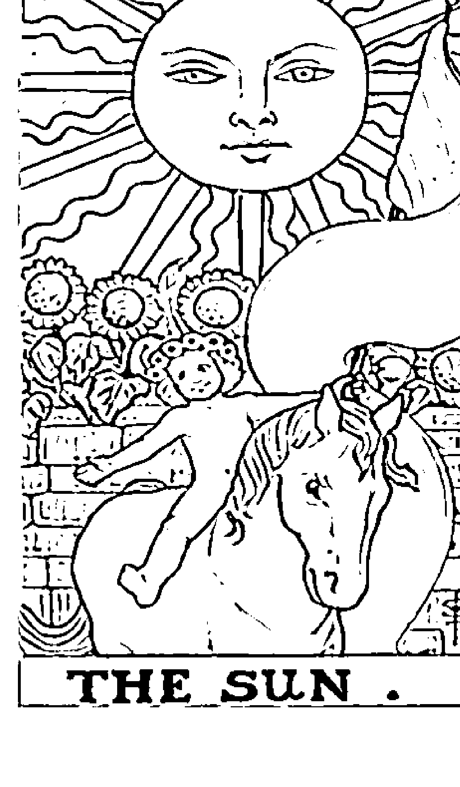

在前一張月亮牌中吃盡苦頭，也勇敢面對了自己心中的黑暗面及陰影之後，外在的挑戰與困境都已不是太大的問題，到了太陽牌的階段，正是柳暗花明又一村，在完全掌握住局面、自信滿滿的狀況下，身邊的一切都會順遂了起來；而且太陽牌開朗又光明正大的特質，會感染很多人，不知不覺就會吸引很多相同的正面力量，這是一張揚眉吐氣、燦爛光明的牌。

太陽牌的公認牌義，就是「順利、達成、名聲、一帆風順、愉快、友誼、光明正大、人緣佳、活力充沛、受人尊重、溫暖、積極、正向、信用」等性質。雖然一般都覺得太陽牌在任何方面都無往不利，但我覺得還是有個範圍。太陽牌是火元素，
元素 火火元素在這張牌顯出的特質：明亮、自信、領袖氣質、群眾魅力、尊嚴、權力、耀眼、溫暖、生命力強、樂觀、直線式思考。數字1919這組號碼，是由能量極強的1，及能夠躍升到更高層次的9所組成，1加9是10，等於是從個位數進入到十位數的階段，是另外一個新的階段又開始了。前面的一段路已經走完，接下來又要進入下一段旅程，有新的挑戰與際遇了。

## 解牌說明

行動力極強，所以不會因爲得到一點點成就，就待在原地不動。一般人最想要得到的不外乎是名 聲跟財富，但是太陽牌希望大家都快樂，而且它重視成就感、形象，也因爲如此，所以會大方願 意分享，不會執著於抓住一些固定的錢財及具體事物。 太陽牌是一張全面性的好牌，但不代表從此以後就無後顧之憂，它只代表你過去經歷的好好 壞壞，到目前爲止都已經得到了一個最好的結果。當然太陽牌也不是說接下來一定是壞的，而 是在告訴你，目前你得到的所有一切，需要花很大的誠意與努力去維持，才能把自己保持在較佳 狀態；而且需要做各方面的努力，才能從太陽牌打下的良好基礎蓋起穩固的大樓，不會因爲一點 點變動就受到威脅。 太陽牌的種種優點，光是看牌名及牌面，大家應該也心裡有底了。雖然太陽牌幾乎沒有什麼 缺點，但也有「需要注意」的地方，這張牌象徵一切都在高點的時候，回想一下我們的人生 經歷，當一切都順遂時，是不是覺得世界本來就是這個樣子，光明無害，因此對於一些小細節都 不會去注意，往好處想，這是不拘小節，但往壞處想，會把凡事看得太過單純，而忽略複雜及細 腹的一面。有些人會覺得這樣是善良單純，但我覺得太陽牌善良歸善良、大方歸大方，甚至也很 願意對所有「明顯的」弱勢者伸出援手，但會少了一種可以深入人心的同理心，也缺乏了傾聽時
[PAGE 96]

的分析能力。甚至如果一些悲惨或不公不義的事，如果不是把錯處明擺著擺在面前，而是變成一 些權面下的勾當、偽裝過的合法情事，太陽牌是没有能力分辨出來的，因為它的心思不會主動地 往陰暗面去探索。在這種情況下，很容易會被利用，嚴重一點甚至有可能助紂為虐而不自知。

但就太陽牌來說，我都会提醒學生要格外注意，抽到太陽牌是可以放心，但是不能覺得問題都不 存在了，有時只是還沒有顯現出來而已。我常拿攝影棚替女明星打的「蘋果光」來做例子，人的
肌膚很少是完美無瑕的，或多或少都有一些缺點，但是在螢光幕上一定要呈現出最好的效果，所
以就會用一種強力的柔焦光線打在女明星臉上，所有坑洞或細紋或任何不完美的瑕疵，都在這種
光線的修飾下不見了。瑕疵當然還在，只是看不到而已。 這就像位高權重的人，身邊的人往往會報喜不報憂，讓他看不清楚事情的全貌，以為天下無
大事。所以用太陽牌來代表權威人士、領袖，也是一個很貼切的象徵。

## 我是怎樣的二張牌？

太陽牌是一張最正面的火元素牌，彷彿正站在世界最高點，凡事降臨到它身上，都會變成正面的發展：尤其是事業運、身體健康、考運等需要足夠能量來加強運勢的事情。但是火元素畢竟是短時間內燃燒，不像土元素一樣可以長保康泰，所以太陽牌比較像是一件事情的高點，或是達到某個特定目標的那一刻！例如金榜題名、升官、登臺、達到預設目標、成績揭曉後的勝利……。我並不認為太陽牌代表全面性的勝利，應該只是在

## 解牌說明

久的事物、定局、等性質。相較於太陽牌，世界牌的成功是比较全面性的，並且有長久持續的特質。太陽牌比較像是考到第一名、考上公務員，或是終於完成一件作品了，但接下來還有無數的競爭在等待太陽牌，它的成功並不足以高枕無憂，只是有片刻的喜悅與滿足。相反的，世界牌代表的是經過無數考驗，過關斬將之後，終於建立起自己的帝國，或是開創出一片自己的天地，而且是經過眾人認同及長期的肯定，所以這片天地不會輕易崩塌，會有很長時間的一片榮景（類似一些老字號企業、百年店鋪一樣）。

在早期的塔羅網站上，對於世界牌常常有些爭議，尤其在感情方面。因為世界牌象徵「已成定局、穩定、長久、不變」，所以有些人認為，這張牌是象徵感情會走入婚姻。然而，世界牌既是土元素，不可能太濃情蜜意；而這張牌也有「難以突破、保持現況」的意思，所以也有很多人認為，應該是不容易進入兩人交流的境界，頂多是維持在朋友階段的關係。

我覺得兩者都沒錯，要看問卜者本身的狀況而定。因為世界牌的意思就是「現況不變動，或是要很長的時間才會有變動」，所以本人的現況非常重要。如果問卜者跟他的對象目前只是朋友關係，依世界牌的性質，要進展到戀人關係可能要花很多的心力與時間，因為會有好一段時間只是維持在朋友關係。反之，如果問卜者跟他的對象已經是戀人關係了，那麼世界牌的土元素就不會讓他們輕易分開，並且世界牌有「大團圓結局」的意味，所以修成正果的可能性非常大，雖然不見得會在很短的時間之內結婚，但是應該會厲守很長的時間。

我有一次帶一個活動：從單一問題，讓每個人抽單張牌，對照講義解釋。有時候，只抽一張牌還是可以從多個不同角度切入，得到很完整的答案。有一位看來像是高階主管的先生問：「公司目前的新產品，推出的計畫能否順利？」抽到的牌就是世界牌。

因為世界牌有長久、慢慢成型的意思，如果他問的是：「這個產品會不會在市場上永續生存？」那麼我就可以給他很樂觀的答案；但是他問的「順利」這一點，透露出他想要的，可能是短期內可以看到的某些成果，因此我沉吟了一下，對他說：「這個產品是有可能成功的，但過程會拉得比你預期的時間久。」他苦笑著說：「其實我也猜得到。」我又看看世界牌，問他說：「你看起來像是高階主管，因此應該有很多機會接觸到老闆，是不是因為他本身很保守謹慎，凡事要有萬全把握才想出手。但你卻知道產品有它的時效性，推出太晚威力就不夠了，所以在這一點上，你會覺得老闆的觀念對你是個限制？」因為「老闆、傳統、守舊、不輕舉妄動、不符合時效性、限制」這些性質，全都是世界牌的正反面含意。果然這位先生大吃一驚，說確實是這樣沒錯！接著開始談起他跟老闆之間的角力，以及他花了多少心血在新產品上，希望在最恰當的時機推出……

世界牌不管是問題或答案，都不是短時間之內可以輕易解決的，所以還是要看他如何處理這個功課了。但因為有世界牌，所以我相信結局一定是皆大歡喜。（笑）

## 我是怎樣的二張牌？

世界牌是一張象徵已經凝固成形的牌，代表大器晚成，最終的成就很可觀，卻需要耗費大量的時間與心力來成就，有戲棚下站久了就是你的一意味。一旦成形，因為是長期累積的結果，也絕對不會崩潰。

## ※練習題（作者在部落格回應）

世界牌有一種已成定局，事情到了最後階段的味道，但如果是一個剛創業的人要問事業發展，卻在「過去」的位置抽到世界牌，該如何解釋世界牌所代表的意思？

不會崩潰。

## 小阿爾克納數字牌

小阿爾克納又稱小祕儀，代表的是俗、凡人、具體而實際的日常處境及心境。由五十六張牌組成，其中又可分成權杖、聖杯、寶劍、錢幣四種花色，這四個花色各有十張數字牌，以及被稱為宮廷牌的四個不同人物代表。本單元要介紹的，就是塔羅牌中的四十張數字牌。

## 四大元素——西方神秘学界的潛規則

過無數課程的老手，如果不是剛好本身理解力超强，或有一些特殊天分，通常在研讀完國內外各種占星、塔羅名著後，講起學術上的理論頭頭是道，但是眞要分析命盤或牌面，能講的外各種近貧乏，不是局限在一堆關鍵字的窠臼裡爬不出來，就是把「亂猜」當成是「直覺」，所以占卜品質非常不穩定，如果遇到的是話多或個性鮮明的個案，就可以察言觀色地分析，但若遇到的是沒有靈感或不太提供資料的個案，就可能會束手無策或講不到重點。我，不知不覺去講出對方想聽的話。事實上，牌面或命盤就是最客觀的資料，越不受對方干擾，反而準確度高。但是為什麼大部分號稱研究神秘學的人，反而無法面對最明顯的資料，而要像我們常說的江湖術士一樣從當事人身上撈訊息，再來東拼西湊呢？原因就在只關鍵字或書面資料，沒有辦法讓我們能夠真正地深入核心，在底子不扎實的前提下，自己解起牌來也會心虛，會不由自主地去扭曲塔羅牌所顯示出來的訊息。〔四大元素〕之於西方神秘學，就像是東方神秘學中的〔五行〕一樣，是所有學問以及天地規則、有形無形萬物的「基本元素」，不管在占星或塔羅牌中，都是一個重要的基本架構。在塔羅牌的解讀中，如果你能夠正確掌握四大元素，就等於是拋出一個錨，有了確定無誤的方向，才能進一步做更精細的分析。舉一個例子，我們都知道火元素的定義是衝勁、熱情、不深思熟慮，但誠誠又專注。有一次在課堂上，一位學生說他正煩惱應不應該養貓，所以抽了塔羅牌來給自己一點建議。他將三張抽到的牌攤在桌上，其他同學覺得不太明確，因為三張牌的關鍵字都是友誼、設定目標、決心這一類跟養寵物與否無關的字眼，而且好像不管是往正面或負面，都有其合理解釋。但是這三張牌其實有一個共同點：它們都是火元素牌。他抽牌要問的是「建議」，而火元素有行動、不要顧慮太多的意思，而且居然一次就出現三張，牌面上沒有其他任何元素，這麼強烈的火元素不就代表了……於是我跟他說：「其實也不用我們回答你，貓已經在你家了，說不定連名字都取好了。」他有點不好意思地說：「呃，他叫小虎。」例中就可瞭解四大元素能夠讓占卜內容變得非常詳實且精確。前半部的牌義中也會敘述四大元素與牌義的契合點在哪裡，以便讓讀者更方便運用。希望本書能幫你解開許多塔羅牌的密碼，至少從此不用再懷疑：塔羅牌的準確度到底如何？有信心做更深一層的研究。

## 火元素 10 個階段

+   ○ 基本定義：陽性・積極・情感・向上・揮發・有形無體。
+   ○ 特質：集中、專注、自我中心、積極、有爆發力無持續力、有破壞力也有目標性、耐性不
+   ○ 代表：權杖。
+   足、野心大、行動力強、有高度的熱忱與企圖心。
+   自我中心、總是往前進往上躍、很少回頭檢視過去及內心、不留戀舊的東西、創造力十
火的生成，首先就是要有燃點，燃點需要高度的能量集中，就像一般的陽光溫暖但不會燃燒，可是若用放大鏡將陽光凝聚成一點，這個光點就變成有燃燒性。燃燒是一種釋放，代表摧毀任何助燃物原有的物理結構，將熱能跟光引出來，所以開創性與破壞性同樣強，先死後
生變成了一種「轉化」。熱空氣上升冷空氣下降，所以火元素也有提升及成長的意涵。

## 權杖一號牌（火元素第一階段）

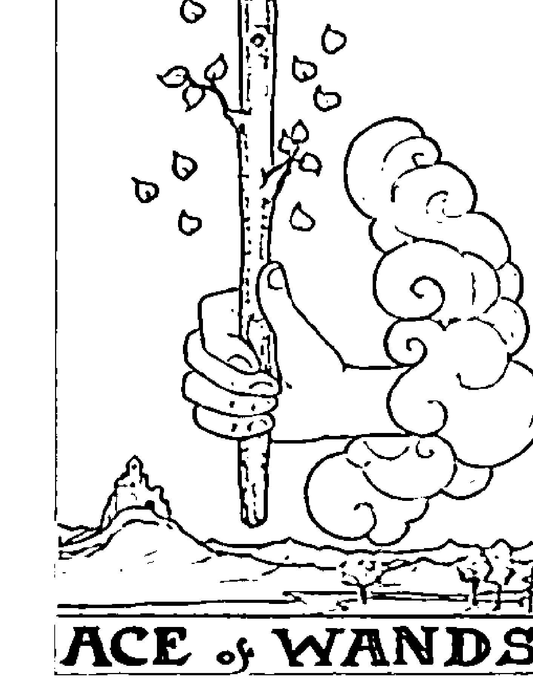

新生的火元素，一向不知天高地厚，只看得到自己。目標單一，沒有任 何懷疑。 工作 初生之犢不畏虎，前途無可限量，可以大好，但也有可能因為太 不注重自己以外的客觀想法，而在成功之後很快嘗到失敗。 愛情 不願一切的激情與欲望，沒有想到未來，很直接地釋放自己的感 覺，有可能一見鍾情，也有可能把其他強烈情緒或欲望錯認為愛情。

任何元素的第一階段，都是它的「嬰兒期」，火元素本身就已經帶有「新生、不累積舊有事 物」的意味。因此第一階段的火元素，那種不受任何人控制，猛烈又直接的「新生、未定型」特 質最為明顯。你可以說它幼稚，也可以說它純眞。 因為火元素的第一階段是完全處於開創階段，這張牌會不受任何約束與羈絆，盡情爆發出內在所有的想法與企圖，單純又天眞，直覺凌駕於頭腦，沒有任何思考及計畫，因此其作為跟想法 的優點是：最新鮮純粹，也最不含任何雜質；缺點則是：同理可證，它也完全沒有任何經驗，沒 有任何可靠的架構。 這是一股最最強烈、卻也完全不成形的能量，有最大的可能性，但也有可能爆發完之後什麼 都不剩。

## 權杖二號牌（火元素第二階段）

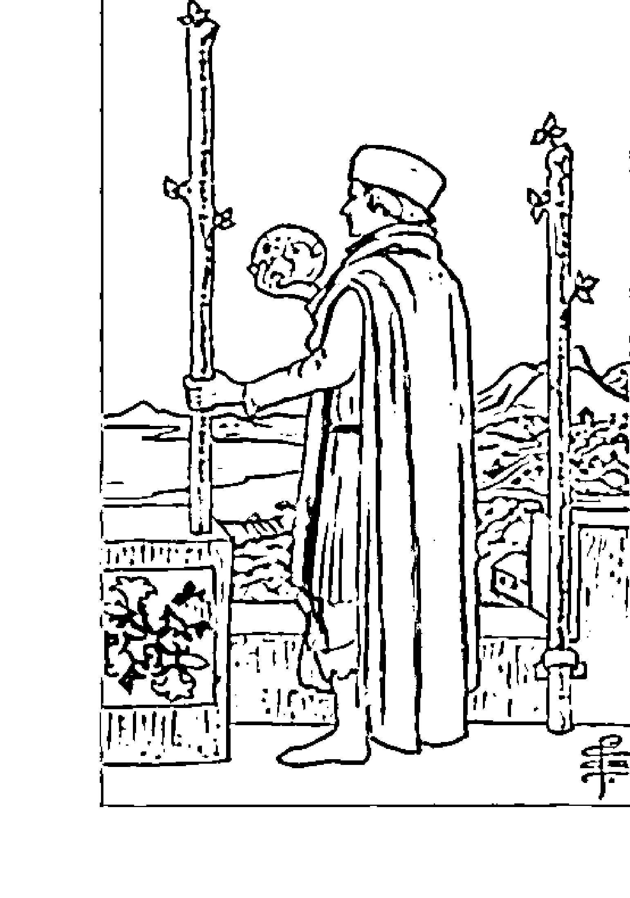

在第一個階段中，火元素自己就是一個完整的世界。來到數字2，就代表在原來的世界之外，出現了新的可能性，也就是開始意識到：除了自己之外的其他人事物。火元素是個非常專注集中的元素，即使到了第二個階段，出現了其他更多的道路，仍然不會把自己的視線放得太寬，也不會同時想要掌握各種不同的機會，它只會想要從眾多道路中選一條最喜歡的去投入，但是在它決定之前，選擇權是完全握在手中。雖然它可以駕馭出現在眼前的每種可能性，但只會把力氣投入在它鎖定的某個單一目標。第二個階段為火元素的強烈能量提供更多可能的出口，供它選擇，但這股能量還是不會被分散，在多種可能性中，最後只會凝固成一個確切的結果。

有強烈的「二擇一」意味，表示需要選擇一個確切目標，然後才能將能量集中到正確方向。工作 眼前出現兩個截然不同的選擇，你無法魚與熊掌兼得，要認真思考自己要的是什麼。面對選擇時，要深入地看清最確切的目标是什麼。愛情感情走到一種分水嶺的狀態，必須做出決定，例如要結婚或保持情人狀態；要分手或和好；要維持現狀或改變。

## 權杖三號牌（火元素第三階段）

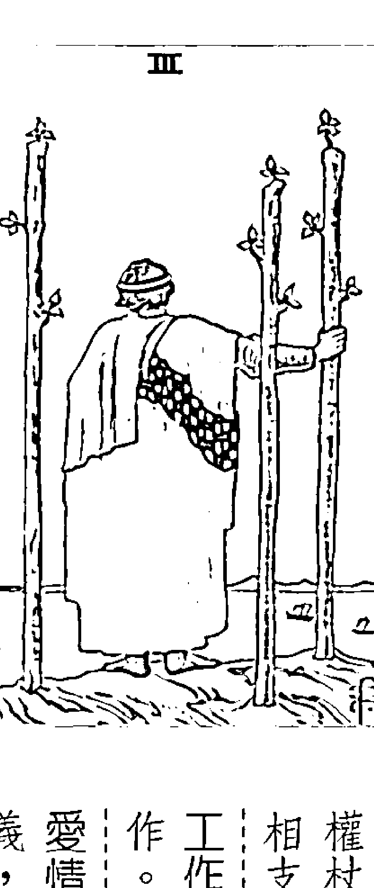

權杖三代代表風雲際會的感覺，各方好手集結，形成一個有建設性又能互相支援的團體。

工作 蓄勢待發，既要保有個人的決斷力與特質，又要注重跟群體的合作。表示要真正開始策畫與行動，眾人一起為未來的目標踏出第一步。

愛情 目前先讓關係打下良好的基礎，不用太急著確定這段關係的名義，這張牌顯示未來可以進步的空間還很大。

火元素是非常獨立的元素，在生命中最早的兩個階段數字1及2，都還可以保持自己的獨立完整性。但是到了數字3，外面出現的人事物已經不是完全能由它的意志做取捨了。數字3代表合作與友情，所以火在這個階段，代表將每個具有不同能力的人，用友好的方式集結起來。

火元素擁有的能力一向界線分明，是不能分散、也沒有辦法滲入雜質的。但是在遇到了有同等能力的人時，可以把大家的實力組合起來，互相合作呼應，這樣才能既保有自己的獨特性，又能得到別人的協助，因此權杖三這張牌的友誼與合作意味非常強烈。

火元素的自我中心，在第三個階段中得到了外來的互補作用，顯得不那麼單調，每一個個體都能保有各自的獨立性，不需要放棄自我，只需要讓彼此的能力協調共存，就能發揮出一加一大於二的力量。

## 權杖四號牌（火元素第四階段）

權杖四是一張在穩定中求發展的牌。既有火的積極與熱情，又有數字4的安穩與扎實，是一張在各方面來說，狀態都很理想的好牌。工作已經習慣團體與組織的支持，能夠結合自己與他人的力量，未來顯得一片光明。愛情權杖的火代表熱烈的感情，而數字4代表長久未來的基礎。感情有共創未來的決心，並在雙方之間有著良好的默契及共同的價值觀。到了數字4，一切都必須穩定下來，不是因爲要畫下句點，而是要爲未來更大的遠景奠定良好基礎。一向不受指揮的火元素，在這個時候也必須以整體利益爲考量，才能從中找到自己的立足之地，並且全方位地朝自己的未來邁進。火元素在前三個階段中，都是不斷燃燒及揮發能量，少有沉澱的時候。但就像開冷氣時必須關上門窗才有冷房效果一樣，能量需要集中在一定範圍才能發揮最大的效用。火元素代表爆發力與行動力，但數字4是安穩與安全地帶、個小範圍；所以火元素到了第四個階段不會再亂發，會穩穩地、持續性地釋放能量，也就是在穩定中求發展。這個階段雖然是要採取較爲保守的行爲模式，但對衝勁十足的火元素來說，反而是一種全新的感受，經驗到能夠控制自己的力量。所以在第四個階段，火元素的心境是平和的。

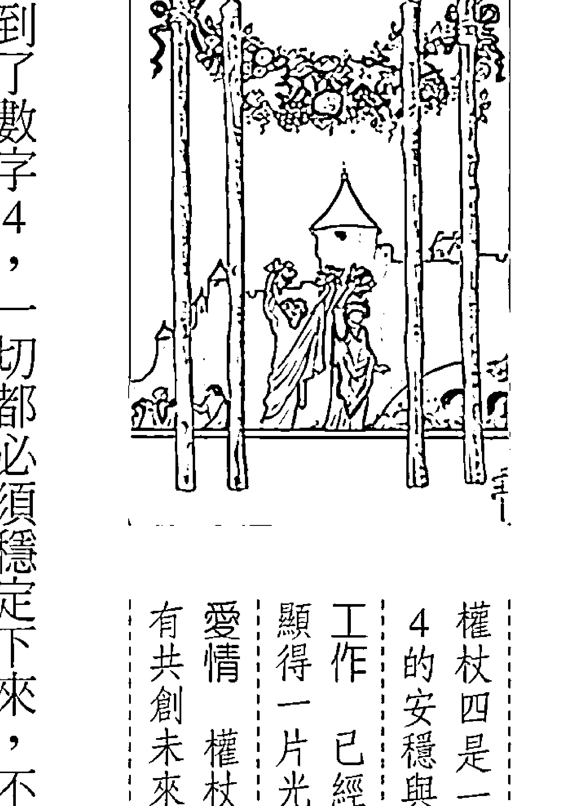

## 權杖五號牌（火

## 權杖九號牌（火元素第九階段）

權杖九是火元素的能量發揮到最後階段的牌，顯得疲憊、缺乏能量，必須要開發出新的漣力與做法，否則很難應付眼前的困境。工作有種種的輝煌紀錄，並堅持要在崗位上守到最後一刻，象徵一個永不退場的老兵，但比較難再創新顛峰，不願認命退到台下或幕後。愛情到了這個階段，已經身經百戰，就算不願放棄，也應該轉換心態，或替自己設一個停損點才對。

火元素到了這個階段，你大概會以爲它應該是燒到最旺的時候，但實際上，火元素在任何階段，都是很耗費心力地在生活，燒到了這個最高點後，能量已經開始耗弱了。

第九個階段是成熟期的最高點，任何元素的能量到了數字9，都是處在一種最高漲的狀態。

定會猜想，它會用盡所有的力氣來羅升，但是火元素一向是越年輕時越有力量，到了晚期其實應該不要太逞強，必須學著四兩撥千斤，才不會累死自己。

加上之前的八個階段，每一關都是消耗戰，火元素本來就只適合跑百米，不適合跑馬拉松，戰線拉太長，火元素就很容易後繼無力。只是火元素也不會輕言放棄，所以沒辦法放下自尊與好勝心，讓自己好好休息，就更顯勉強了。

## 117 藏在塔羅裡的占卜符碼

## 權杖十號牌（火元素第十階段）

數字10等於是一個句點，一切都應該回歸平靜，等待下一個新生。但是火元素天生衝動十足、不安分，沒有辦法乖乖靜下來，所以到了這個需要「靜待、回復」的階段，會把自己剩下的最後一點力量用來跟命運抗衡。火元素一向不屈服於環境、不受制於自己之外的任何人事物，但在最後的階段，形勢比人強，如果火元素不學著放下，它會是四大元素中最適應不良的一個。這個階段，火元素會覺得遇到生平中第一次無法用「努力」來解決的問題，而火又不善於思考，不暸解越抵抗就越深陷的道理。火元素仍然是不凡的，只要它願意讓舊有的自己消失，就會得到下一個新生的機會，回到權杖——火元素的初生時期了。

權杖十是一張能量受限的牌，本來充滿創造力的火元素被困在代表「定局」的第十個階段，會覺得無處發洩。因此這張牌會象徵壓力及苦惱。工作代表被包圍住，對別人來說這也是安穩，但對火元素來說卻會覺得受限、受委屈。氣氣不足以突圍，是最悶也最有志不得伸的時候。愛情，也許是一開始太勉強，也許是長久以來得不到解決的問題，形成了強大的壓力，這張牌顯示火元素的支援力已經用到了最後的盡頭。

## 風元素 10 個階段

+   ○基本定義：陽性。消極。理智。向前。揮發。無形無體。
+   ○特質：風元素的特質是多元化、分散、良好的溝通能力、主動但不積極、有創意無執行 力、有目標卻無法集中持久、耐性不夠、人面廣但交情不深、注重邏輯、擅思考、沒耐 性、注意力容易被引開、冷靜、善於辯證、思維廣而不深、理解力強但不夠專精、不留戀 舊的東西、有企畫能力、能適應各種環境、有想法但不熱情。 ○代表：寶劍。

風元素也就是空氣元素，除了我們呼吸的空氣之外，也象徵所有「無形、無相，但是可 擔任介質，負責傳遞與溝通性質的東西」，例如文字、語言、符號、圖形，乃至廣義的「訊 息」等等。風元素的彈性及變化性爲四大元素之首，可以接收任何外來的訊息，也可以改變 自己原有的形態，所以吸收知識對它來說輕而易舉，學習能力也極爲快速。這也就是大家對 風元素普遍的印象「聰明、反應快」的原因。 人類社會與動物社會最大的不同，就是我們可以藉由「學習能力」來累積經驗，並且一代一代傳承下去，同時「改良、精進」，人類最大的武器及特色就是「智能」，所有的資源、材料，在一開始時都是最原始的，必須經過不斷地「改良、再創造」，以及製造技巧的進步、世代間的傳承學習，才能發揮出最大的效益。「寶劍」是一種殺傷力最「精確」的高度展現，也跟風元素最能互相呼應。但是玩塔羅牌的人一定都會發現一件事，就是在寶劍牌中，除了「寶劍」之外，其他都是負面意象的牌。原因是我們一旦太過「精於計較利害關係」，反而會演變成傷害，以靈性的角度來看，在我們腦袋不夠清明時，也很難制止自己抄捷徑或瓜分別人的資源。但是太多的「頭腦」與「計劃」不但對自己沒有好處，反而會引起更多的妄念及傷害。風元素是頭腦，一旦開始分裂，就會產生私心及貪念，因此只有「寶劍」能維持住風元素的優勢。接下來的寶劍牌，越到後面的數字，牌義就越爲混亂，也顯示出太過複雜的思緒與計，反而會讓人無所適從。以上是風元素的整體特質，但每個元素都會從幼稚期走向成熟期、乃至轉化期。在不同階段中，都有不同的風元素單一特質會特別被強調。

## 寶劍一號牌（風元素第一階段）

新生的風元素沒有任何懷疑，也沒有過多的選擇與方向，可以一心一意地直視前方，所以它的視野包含一切，一切是那麼清楚且確定。工作通常沒有太多的私人情感，有的是正確、符合常理、客觀及自信。因為熱情不夠，適合當幕僚而非主將。愛情這張牌不代表私密情感，因此會把大愛、是非及整體利益看得比個人的愛情還重要。

任何元素的第一階段，都是它的「嬰兒期」，風元素本身是代表「念頭、計畫成形」的意思。雖然寶劍組大部分的牌都帶有混亂意味，但是風元素是等到分裂之後，各種念頭與思緒互相干擾時才會產生傷害及混亂；在第一個階段的風元素尚未分裂或被污染時，是最清明、最有大智慧且最能透徹看清所有真相的一個階段。數字1帶有火元素的性質，搭上風元素後所形成的寶劍一，比權杖一擁有更強烈的「直覺一；因為風元素的清晰度遠勝於火元素，權杖一的直覺是一種單純的驅動力，而寶劍一的直覺加上清晰，則會形成高超的覺知力；這種直覺帶有預言、先知的成分，並融貫了天文地理等知識層面，是經由邏輯的推論而得到最廣大的視野。這張牌有極高的智慧，因為洞悉真相所以不會被欺騙，也不易動搖，就像有時靈光乍現的那一瞬間，所得到的是最終極的答案。

## 寶劍二號牌（風元素第二階段）

徵暴風雨前的寧靜：尚未進入混亂的狀況，但「分裂」就是一切混亂的開端。

寶劍二是風元素面臨分裂的第一關，「進退維谷、左右為難」的性質會特別明顯。這張牌象素是專注地向前走，風元素則會遊走在各種可能性之間，所以向前走的速度就慢下來了。

到幾步，又回頭轉往另一條路試試。所以元素的性質來說，風元素的速度比火元素快，但火元 后繼續向前；而風元素則是猶豫不決，兩條路都想走，好不容易選出其中一條，卻很有可能走不 風元素跟火元素雖然都是陽性元素，但在兩種可能的道路出現時，火元素會選擇一條路，然 裂，寶劍一的確定性也被分散了，經常會陷入一種蹣跚不前、被兩邊拉扯、無法定奪的狀況。

體的「道」，因為自己沒有辦法觀察自己而必須分裂出另一個自己，才有辦法互相觀察。一旦分

## 寶劍三號牌（風元素第三階段）

風元素在數字2的「分裂」階段就擠得很辛苦，到了寶劍三，外來的干擾更多，「破局」趨勢已經不可避免，無法再像寶劍二那樣維持在一種恐怖平衡的狀態，表象和平的狀況已被戳破且開始造成傷害了。數字3與風元素的特質非常接近，兩者都能適應各種環境，卻缺乏意志力與一致性的目標；有時容易被外來的言語、情緒、事件擾亂。加上風元素跟3都與社交、人際關係相關，代表容易出現來自周遭人事的傷害，例如流言蜚語、人言可畏這類不必用刀殺人的隱性攻擊。寶劍三是張方向太多、可能性太多，導致變成一張「沒有核心立場」的牌，在沒辦法穩住自己的情況下，一點外來的風雨都可以把你打得七韋八素，這種煎熬是在自己的內心，外人難以想像。甚至可能在別人看來，你是身處天堂，但你其實是處在一種「現在進行式」的痛苦之中。

剛剛走入地獄，還沒找到應對或解套方式，除了痛苦，還有不知所措。工作容易被周圍的人扯後腿。有小人在背後惡意中傷，或是信任的合作對象背叛你。愛情因為一些誤會而引發的傷害、旁人的閒言閒語造成兩人失和。或是是正處在一段傷心期中，尚未恢復。

## 寶劍四號牌（風元素第四階段）

因為在逃避的過程中，問題不會自動解決，還是要等到可以承受時，再現身重新面對一切。 但也是風元素想平静時唯一能選擇的方式。現在所呈現的一切只是「暫停」，並不是「結束」， 裡，不接電話、不看電視一樣。這種逃離現況、躲在自己世界中的做法，雖然看來有點沒出息， 自己的意志力保持穩定，一定要把自己封閉起來，就像我們需要專心做事時，會把自己關在房間 須讓自己靜止下來，杜絕一切外來的干擾。 因此，寶劍四通常有「休息、靜止」及「隔離外界」的意思。風元素容易被影響，沒辦法靠 不管在哪個元素，到了第四個階段就是進入一種沉潛期了，不安於室的風元素到了這個階段，必 抗壓性很强的元素，在超過負荷上限時，「逃避」與「抽離」會是風元素最常選擇的因應方式。 在上一張寶劍三巨大的煎熬中，風元素的混亂已經擴張到了極點，而「風」向來就不是一个 情已停止成長，或是正處於分居、冷靜期。 愛情處於一種沒有建設性的狀況，代表正在空窗期，或目前的這段感 是過渡期而已，對未來沒有任何影響。 工作 可能待業中，也可能是擁有工作、但心思並不在此，這份工作只 性，代表的是結束上一個階段，還不知道下一階段要往哪裡去。 寶劍四是張消極、不為的牌，雖然沒啥破壞性，但也沒有任何建設

## 寶劍五號牌（風元素第五階段）

寶劍五與寶劍五同樣是處在一種很負面的情緒下，不同之處在於：寶劍三是處在「當下」那個很痛苦的事件當中，無法自行走出；而寶劍五則是勝負已定，但不願離開戰場。感覺到挫敗的那一方，如果不甘願放手，傷害就會持續擴大。直接認輸、放棄，會是結束痛苦的最好方式。好勝心太強，沒有辦法承認自己的不足，就表示你永遠都覺得自己不夠好，因此不敢面對自己眞實的一面。在這種狀況下，不管你贏了多少人，都沒辦法自我肯定，再怎樣都是個輸家。

是火元素的競爭是明刀明槍的肉搏戰，而風元素卻因為缺乏實際的目標，所以它的戰爭只是一種「意氣之爭」，沒有實質意義。外在不認同的數字，所以外在的險阻及競爭會特別多。風元素到了這個階段，要開始面對戰爭，但第五個階段，就是每個元素接受考驗及測試的階段。5這個數字是開始追求自我表現、爭取外在不認同的數字，所以外在的險阻及競爭會特別多。風元素到了這個階段，要開始面對戰爭，但

## 寶劍六號牌（風元素第六階段）

拿放大鏡看待自己的不幸，當你放下情緒面，還原事實真相，就會發現一切都是可以解決的。

中整理出一套規則一的理性牌。這兩個角度基本上都很正確，因為恐懼與破壞，往往來自於我們

在某些塔羅系統中，寶劍六被視為「療傷牌」，也有些牌種把寶劍六定位成「理性、從混亂

字，風元素就會發展出具體的理性、邏輯及聰慧的那一面。在理性的剖析下，過往五張牌造成的傷害，

風元素是「頭腦」的象徵，頭腦一旦陷入混亂就會造成災難；但如果遇到6這平衡和諧的數

劍組，到了寶劍六也可以喘一口氣了。寶劍六是寶劍組眾多負面牌中，算是比較正面的張。

數字6有重整、調合的意思，每個元素到了第六個階段都是正面的，即使是傷害性較重的寶

寶劍六的規則性非常強，認為所有的一切都有一個可以解釋的邏輯。工作不易受到情緒干擾，也不會在突發狀況下慌了手脚，更有自知之明、不卑不亢，是不管在何時何地都值得被信任的人。愛情因為愛情需要一點瘋狂，而寶劍六很難讓自己掉入那種情境之人有安全感。人有難將自己的心意傳遞給對方，唯一的優點就是讓

## 寶劍七號牌（風元素第七階段）

法像火元素的爆發力或像土元素那樣扎實，既然不能硬碰，就只能取巧了。因此，寶劍七往往會避開正規的路線，喜歡走捷徑，但會遇到它難以突破的阻礙，如果想到達預定終點，就只能多繞條路走，否則可能會欲速則不達。這種走旁門左道的方式，讓寶劍七的特質就像是一個「投機者」，

## 131 藏在塔羅裡的占卜符碼

散一，既容易被別人牽著鼻子走，又容易被他人侵入，所以本來就没有太強的自我意識。壞處是在現實社會中，獨立生存的能力不太夠，常常都需要「依附」別人；好處是不會太執著自己的想法，很容易「接收」其他人的想法及理念。「放空」是最好的接收模式，用「聖杯」這種盛裝智慧，又帶有「中空」特質的物品來象徵水元素，確實很適合。水元素這種「連結、感染」的特質，形成了社會的基本凝聚力，也就是人跟人之間的「情感互動」以及互助的團體性。水元素帶來的集結性，並不像土元素是出自於現實需要的考量，水的互助大都是出自於「情感和天性」，還有一種同種族之間的聯繫情感，所以水代表一種「關係」的形成。因此，對特定對象付出不求回報的情感，包括親情、愛情、同情心、慈悲等等，都是以水元素為代表。由於水元素是舒緩且單純的，所以適合較為穩定的環境，抗壓性不強。聖杯牌的前三個號碼都是平靜又舒適愉快的牌，中間號碼的挑戰性強，聖杯牌到此都是比較無法突破環境障礙、心結較多的牌（六號除外）；直到最後的九跟十號牌，由於已經完成階段性考驗了，又成為穩定下來的牌。以上是水元素的整體特質，但每個元素都會從幼稚期走向成熟期、乃至轉化期。在不同的階段中，都有不同的水元素單一特質會特別被強調。

## 聖杯一號牌（水元素第一階段）

對全人類的母性。這種程度的愛與關懷，大都在親子之間或聖潔之愛比較容易達到。己好，所以這張牌會為了每個人的福祉而努力，很有宗教家與慈善家的精神，當然也代表了一種奉獻的心態，但並不是自我犧牲，而是把自我的利益跟整體的利益連結在一起，大家好就等於自己好，所以這張牌會為了每個人的福祉而努力，很有宗教家與慈善家的精神，當然也代表了一種奉獻的心態，但並不是自我犧牲，而是把自我的利益跟整體的利益連結在一起，大家好就等於自己好。聖杯一不論在哪種關係（親情、友情、愛情）中出現，都代表一種無私、感情。此外，兩者都重視整體利益，但風元素是為了公平正義，水元素則是為了那種近乎神性的聖杯一跟寶劍一的共同點，就是都有透徹清晰的感知力，而水元素比風元素多了發自內心的就像風元素，水元素也是比較「涣散型」而非積極型的元素，所以是方向越多越容易混亂。線、情緒、感覺」的代名詞，因此聖杯牌組的實質面不多，牌面幾乎都跟各種感情或關係有關。任何元素的第一階段，都是它的「嬰兒期」，水元素在第一個階段常常是「模糊、沒有界

新生的水元素，可以全然地表達它的愛與相信，因為沒有滲入任何雜質，自然就沒有懷疑。這張牌不是想要拯救你或帶領你，它只是接納、包容、相信。工作 代表比較適合從事療癒性或撫慰性的工作，或是與藝術相關，或至少要拿與趣當工作。愛情 表示完全付出與投入，不需要回報就覺得很幸福。

## 133 藏在塔羅裡的占卜符碼

## 聖杯二號牌（水元素第二階段）

藏在塔羅裡的占卜符碼 聖杯二號牌（水元素第二階段） 水元素進入第二階段，要跟數字2結合解釋。數字2代表的是出現對立的兩方，尤其在陽性元素（火、風）中，都會出現拚扎與選邊站的情形。不過遇上聖杯二，狀況就平和多了。水元素的拿手好戲就是包容與交流，能夠把差異很大的雙方融合到一種可以溝通並互相認同的狀態，所以以聖杯二象徵的狀況，還是和樂融融，沒有太多衝突。聖杯二出現時，人與人之間的關係一定是平衡和諧的，所處的環境也一定沒有太多波折。但這種關係美好的部分只在表面的感覺，因為水元素不太擅長深入分析、思考太多，它要的只是一種「感覺」，所以就算這張牌出現在愛情方面，通常都代表關係很不错，但我還是只把聖杯二的感情定位在「好感」，而不是多濃密或深刻的爱意。這張牌的情感表達，就像是微風或和煦陽光的感覺，舒服而沒有壓力。

## 聖杯二號牌（水元素第三階段）

聖杯三代表生活充滿樂趣，活動很多，還帶有一種「靈活」的特質。工作比較傾向需要人脈的工作，例如媒體、公開、行銷，或是婚禮跟辦活動這一類玩樂型的企畫。愛情對女性來說，聖杯三代表姊妹淘很多，生活很自在，而兩性關係還在觀望中；對男性來說，聖杯三代表異性緣極好，或是面臨幾個可能的對象，要做出選擇。數字3是一個人際、社交、團體的數字，任何元素到了第三個階段，都會出現一種「集結」性質。水元素本來就擅長人與人之間的交流與和諧，所以進入第三階段後，並沒有需要磨合或互相協調的過程。聖杯三直接就呈現一種和樂融融的氣氛，眾人之間可以自然又毫無阻礙地聚合在一起，是一張愉悅又能享受當下的牌。比起聖杯二的舒適，聖杯三更多了一點創造樂趣的活力。不過聖杯三由於太高興了，沒有太多波折需要克服，所以深度不太夠，很容易停留在一種表面上和諧。這樣的良好關係常常變成酒肉朋友，只重視玩樂而沒有建設性。水元素代表女性，數字3有「多」的意思，所以聖杯三也象徵女性環繞的狀況。很多人認為這張牌會引發感情糾紛，但我認為只是女性較多，牌面並沒有出現糾葛狀況，頂多是代表花花草草很多、有點暧昧，如果没有其他牌推波助瀾，光是聖杯三應該不至於引發太嚴重的感情糾紛。

## 135 藏在塔羅裡的占卜符碼

## 聖杯四號牌（水元素第四階段）

數字4是偶數，因此是一個陰性數字，遇上水這個陰性元素，讓這張牌變得格外消極。也許是水元素在前三個階段太過隨心所欲，已經玩紛了，到了第四個階段，開始想要為自己累積一些基礎，因此就會開始對自己以往的生活方式產生懷疑，不管接下來的目標是什麼，都會覺得需要再三思考，沒有立即行動的決心。這種狀態可以說是消極，也可以是因為正要開始轉換自己的生活態度，所以在瓶頸期，凡事不敢貿然下決定，也不敢再用以前的價值觀來面對生活。在還沒有建立新的生活方式之前，聖杯四只好採取守勢，不斷地觀望與自我調整。

在旁人眼中，聖杯四的行為看起來是懶散的、畏首畏尾的，這些評語並非無的放矢，因為希望轉變生活方式的人，面對每個選擇，都是他以前沒有過的經驗，難免會戒慎恐懼。我們就當聖杯四的性質是「休息是為了走更長遠的路」吧！

聖杯四很消極，想的多做的少，沒有立即行動的決心，在各方面都是差不多的狀況。工作缺少動力，很怕面對突發狀況，因此常常會覺得多做少錯，少做少錯，有得過且過的心態。愛情代表很難流動，情侶之間會有沉悶倦怠感，只能維持現狀，沒辦法更進一步，熱情持續消耗中。

## 聖杯五號牌（水元素第五階段）

悲觀又自怨自艾的態度，蔓延到聖杯五生活的每個角落，總會羨慕別人所擁有的，而怨天尤人。工作表示你太在意別人對自己的看法，而且永遠都覺得自己受到不公平待遇，卻忘記看看自己付出多少。平待過，卻忘記看自己對自己付出多少。愛情很容容易在喜歡的對象面前自慚形穢，而且不相信自己能得到幸福。這是一張需要長時間進行心理建設的牌。

水元素走到很容易有匱乏感又愛比較的第五階段了。5這個數字，是一個愛比較、愛競爭，希望他人認同的數字，但水元素不夠積極，再加上水元素在第四個階段只是觀望而沒有付諸行動，所以經驗不足，一旦進入第五個階段，需要實力拚門，就會因力不從心而自我評價低落了。所以聖杯五有種悲觀、陰暗跟自我否定的意味。其實聖杯五的處境並沒有那麼慘慘；客觀來說，它還是擁有很多東西，但這個階段「匱乏」跟「不受肯定」是一種根深柢固的心態，會花很多時間怨天尤人而非採取行動，總是去看自己沒有的，而忘了看看自己所擁有的。事實上，每個人都很容易陷入這種情境，好比我們走路時，覺得騎腳踏車的人好幸福，騎摩托車時覺得開車的人好幸福……；如果你永遠都覺得自己是不幸的，那麼就沒有任何東西能讓你幸福起來。

## 聖杯六號牌（水元素第六階段）

第六階段是休息與平静的階段，水元素感情豐富，遇上數字6會有更多表達感情、檢視自我內心的管道。聖杯六的元素跟數字都有一種美好溫馨的性質，這張牌充滿了愛、懷念與善意。大部分人對聖杯六的解釋，幾乎是「童年、回憶、互相照顧」這一類的意思；這張牌給的人一種非常舒適、寧靜，還有安頓身心的感覺。在我們的生命中，凡是最真摯、最沒有利益糾葛的人情關係，都可用聖杯六來代表，例如青梅竹馬的交情、忘年之交、親子之間的交流，都在這張牌的範圍之內。聖杯六跟聖杯二不同的地方是，聖杯二只是一種表面的感覺，維持時間不會太久；但聖杯六是經歷過一些風雨之後，走到生命中最好的一段時間，開始領悟一些事，知道什麼是生命中真正重要的事，不會再去追逐外在的虛幻。抽到這張牌並不代表什麼都有，但很懂得知足、感恩。

水元素加上講求和諧、偏安的數字6，是很幸福的一個組合，但是成長的動力稍微弱了一點。感情豐富真摯，適合從事服務業、志工、社工或是照顧婦女、兒童等行業。愛情比較溫和、平靜，少了激情的成分在內，所以會是日久生情的關係，或是由普通朋友關係循序漸進發展成的愛情。

## 聖杯七號牌（水元素第七階段）

聖杯七最明顯的特質就是不切實際、畫大餅、眼高手低，想的永遠比做的多。工作 適合遊說、斡旋的工作，盡量避免接觸成本太密集，或是制式流程太複雜的事，因為愛做白日夢的聖杯七出錯機率很高。愛情 表示容易喜歡上遙不可及的對象；或是在不瞭解的狀況下，把自己的過渡期套用在對方身上，造成往後的幻想破滅。

段。不過，水元素最缺乏的就是意志力與突破性，加上在上一個階段沒有獨立挑戰生活的必要，所以數字7對水元素來說，是一個不太知道要如何完成的課題。聖杯七因為受到數字7的影響，對未來也會產生很多的期待與憧憬，但是面對7的難關，好像只有火元素與土元素才有足夠的決心去完成目標；水元素因為想像力強，有時夢想與目標甚至會超過其他三個元素，但執行力卻是四大元素中最弱的，所以一切目標都極可能變成空想。抽到這張聖杯七，要檢視一下自己想要達到的目標，是否跟現實差距太大？是眼高手低，或沒有辦法認清自己的能耐？要不斷地把自己拉回現實層面，才不會希望越大幻滅越快，因為失敗的經驗多了，很容易長期消磨自己的意志與信心。

## 139 藏在塔羅裡的占卜符碼

## 聖杯八號牌（水元素第八階段）

是一種累積，遇上也很靜態的偶數，流動性會變得很弱。所以，聖杯八反而是感情走到一個極限，極需要突破，如果無法突破，就會漸漸枯竭耗盡。在上一張聖杯七的階段，水元素曾經有過一些夢想，但是因為自己的消極，夢想最終會破滅；而在經歷很多損耗與失望之後，到了聖杯八，水元素終於有了體悟，不想再繼續待在現有的環境，領悟到必須捨棄現有的一切，才能找到新的開始。聖杯八終於知道不冒險就是最大的冒險，與其費事去清理原來的沼澤，不如重新發掘新的活水。雖然因為起步太晚，成功率仍然不高，但重要的是這個追尋的過程，可以替自己帶來更多新 的生命力。

聖杯八不管在哪方面，都象徵一種不滿於現狀、急欲逃離現況的狀態。工作抱著騎驢找馬的心態，對現在的工作不積極，一直在等待更好的新機會。愛情進入倦怠期。雖然這段關係沒有什麼致命性的裂痕，但你就是覺得一切都讓你煩躁。建議你投入新的興趣，或出國玩一趟，或許可以挽救這種乏味的感覺。

## 聖杯九號牌（水元素第九階段）

心想事成的聖杯九，還是帶有一點無常的成分。工作 出名、受表揚或受到很大的肯定，但實質好處（例如薪水、獎 金）就很難說了。愛情 如果暖昧久了，聖杯九象徵告白的那一刻；戀愛談久了，聖杯九 代表婚禮的那一天。但高潮點過後，接下來要面對的，又是另一階段的 考驗了。

水元素在前面八個階段大都處在消極狀況下，但水元素畢竟還是有流動性（不像土元素眞的 可以不動如山），所以走到這第九個階段，還是有很多蓄積的力量等待爆發。換句話說，水元素 累積了八個階段的夢想，到了聖杯九，終於要讓夢想從概念轉化成實體，開始成真了。聖杯九是大家都很期待抽到的一張牌，它是美夢成真牌，象徵非常喜悅的時刻。不管是什麼問題，抽到聖杯

## 錢幣三號牌（土元素第三階段）

長期交流溝通，所以錢幣三中，「同事」的成分會大於同伴。

數字3通常是群聚、結盟的意思，土元素遇上3，雖然也有群聚現象，但因爲土元素較不擅長。

第一及第二階段中，狀況還很單純，土元素的結構性非常強，雖然執行的速度不是很快，但很願意花時間去規劃每一個步驟。在第三段，由於牽涉層面漸漸擴大，因此需要一個正式的「計畫」，有了計畫，才能知道下一步要怎麼執行。

我常拿「大機器中的三根小螺絲釘」來比喻錢幣三，每個人都在努力、認份地做著被分配到的

工作，這些人不同的小成果匯聚起來，就會形成一個大的成果，例如有的人砌磚、有的人塗水泥、有的人築屋頂，合起來就變成一座房子。錢幣三是一張「社會性共生」最好的詮釋牌。

錢幣三是把一個長期目標拆成許多小的短期目標，然後每個人負責一個小部分。不像權杖三是眾人有共同目標，帶有志同道合的意味。

工作偏向「主雇、不同部門的運作」這一類的性質，雖然沒有太多理性，但彼此之間不可或缺，抽到這牌代表對工作有長期投入的規劃。

愛情已有對象的人，代表彼此之間對未來有共識，也願意一起負擔生活所需；沒有對象的人，則表示很適合透過介紹或相親找對象。

## 錢幣四號牌（土元素第四階段）

西，但只知道抱著既得利益不放，原來擁有的一切會因過時而慢慢消耗，長期來看還是不利的。

安穩，爲了維持現狀，不願冒任何風險、做任何改變。一般人看錢幣四，會覺得它擁有很多東

這張牌令人最困擾的倒不是錢的問題，而是它拒絕讓自己的能量流動，因爲眼前的狀況富足

以這張牌在人格方面，常代表是一個老頑固或舊時代的長輩，或食古不化、一成不變的人。

讓人覺得只進不出；而且錢幣四除了在錢財方面不開放、不流通之外，也排斥改變及新東西。所

錢幣四具有守財奴的意味，因爲數字4會囤積，土元素又很重視物質與利益，所以這張牌會

是一張極度保守、固執、認真、不動如山的牌。

張一本身就很接近，可想而知，兩者組合而成的錢幣四，會讓彼此的共同性質更爲加強，所以這

土元素到了第四個階段，算是回到了家。土元素與數字4的性質（固定、收斂、安全、不擴

古板的錢幣四，一直都處於安全的範圍內，卻十分缺乏生命樂趣。

工作代表資深的員工、傳統行業的經營者、基層主管、小規模生意的

老闆，有穩定的生活，但缺少變動及往上發展的機會。

愛情不適合互補性質的伴侶，最好是個性相同的人，比較不需要去適

應；但彼此之間常會因爲太過生活化而忘記溝通，導致感情生活沉悶，

要多加注意。

## 錢幣五號牌（土元素第五階段）

任何一個元素，只要遇到數字5，就會有一種「想要擴張，卻受到限制」的困擾。土元素本身的負面特質中，就有「障礙」這一項，所以當土元素到了第五個階段，受限的狀況就會特別明顯，也很容易在行動上有「事倍功半」的狀況。

錢幣五通常給人一種龍困淺灘不得志之憾，那是因为土元素凡事都成就得慢，但是數字5又很希望盡快建立起別人對自己的認同感，在理想與現實的差距衝突下，就會煩躁不耐，而且不會做什麼，阻力永遠比助力還大，但不是不會成功，只是需要非常多的耐心及時間。

這張牌常被解釋成錢財上的缺乏或困擾，這是因爲土元素代表財富，卻在這個階段受阻。此外，土元素也象徵環境、身體、傳統等等方面，如果抽到錢幣五，除了財運不順，也可能發生身體健康欠佳、受到環境阻礙、長輩或主管施加壓力等等，所以要多方面去擺摩最有可能的狀況。

錢幣五雖然代表不順遂與煩惱，但還不至於全無希望，通常只是需要比别人花更久的時間，或者走一些冤枉路。工作代表大環境的困難，好比不景氣、貧條，或是個人缺乏足夠的經驗與條件（例如證照、學歷），需要再花一番工夫才能達到目標。愛情代表兩個人聚少離多，或是工作、社交圈等等差異太大，甚至是遠距離戀愛，都會在彼此之間製造隔閡。

## 錢幣六號牌（土元素第六階段）

經濟體及社會的層面。

錢幣六不管出現在什麼牌陣，都有生命共同體的味道，互相依存也互相扶持，並且是發生在

來，沒有絕對的施者或受者。牌面上富人拿的天平，就是象徵這個給予的行為具有一種公平性。

照顧他的財源，窮人接受富人的錢財，但他們的生活消費也促進了整體的經濟活動。因此嚴格說

常要靠大眾的消费群；一般民眾以某個角度來說，也是他的衣食父母，所以富人照顧窮人，等於

「如果我抽到這張牌，我是施者，還是受者？」我認為這兩者的差異並不大。有錢人要賺錢，通

富人一手拿著天平，一手拿錢給兩個窮人。一般對這張牌的解釋是：施者與受者。有人會問：

錢幣六不僅社會化，也是一張很家庭化的牌，因爲社會跟家庭「共生」的意義是相通的。

工作 代表經濟學中「企業與雇員」之間的關係，但也代表企業要給社

會的回饋、或社會給予企業的生存空間，基本上主雇間配合得很好。

愛情 代表兩人各自掌握這段關係中的不同領域，例如早期的男主外女

主內。這是一張很和諧、穩定的感情牌。

## 錢徹七號牌（土元素第七階段）

錢幣七謹慎又沉穩，凡事一定做足了功課，才會往前踏一小步，雖然進步的幅度不大，卻也不用冒險。工作代表你已經累積了一定的經驗與成果，但你很想再突破，試試看還有什麼其他的收穫。愛情代表你已經做好準備，要踏入下一個階段，例如交往或結婚，而且通常已經很有把握了。且通常已經是很有把握了。

到了第六個階段，已經不用煩惱生存問題，可說是安穩下來了。但是數字7是一個求成長、求突破、勇於挑戰的數字，就算日子過得好好的，它永遠覺得還要追求更好的，7的上進心加上土元素的認眞，就讓錢幣七成了一張計畫周詳、沉著構思的牌了。土元素在上一個階段，開始清楚自己在整個社會上的定位，也運作得很順利，但是總不能遠停留在現況，必須要替自己的未來打算，或者要預防天有不測風雲，所以錢幣七就陷入了長考。它現在已經擁有了一些資源，但想要高枕無憂，就必須利用現有的資源創造出更大的價值。在這種心態下，一般人通常會去做一些小風險的投資或進修，讓自己更有本錢，或不断地充實知識。實知識。不管是哪一方面，都代表了錢幣七踏實的上進心，而且不太可能失敗。

## 錢幣八號牌（土元素第八階段）

標上，不停地推動、工作。所有的土元素牌都來得強，而且也更不容易受到情緒波動的干擾。這張錢幣十一旦出現，在各方面你應該都不用擔心了，這張牌保護及安定的意味比起前面所

所有的土元素牌都不濫情，但是錢幣十的理性及有計畫性更是發展到了極致，是一張十足安穩的牌。工作代表你從事的的是老本行或是歷史悠久的事業，獲利速度不快，但會累積出不動搖的基礎。愛情你的對象可能是你認識很久的人，或是互相太瞭解，沒有過多的激情，也可能各有各的生活圈，但相處時非常自在且放鬆。

## 錢幣九號牌（土元素第九階段）

錢幣九通常代表你的人生缺少了驚喜。工作代表你的職位和薪水都己經到達你的極限了，很有成就，但接下來就不知道要為何而奮鬥了。愛情有對象的人，代表感情不會有任何變動，安全感十足；沒有對象的人，代表目前的生活模式中，大概沒有愛情可以存在的空間，所以真的有對象時，反而會覺得單身生活比較好。

土元素第九個階段是經過了前面的努力後，看到結果的那一刻；土元素代表實質，所以錢幣產後，可以享用的生活物質；抽象一點來說，這是我們經過了多年的篩選、打造，為自己經營出最舒服的生活模式。

錢幣九常常被人稱爲「小貴婦牌」，代表財富的土元素，加上代表最高點的數字9，當然有著一定的財力。而土元素的生活變化並不大，所以雖然這種生活很舒適，但也開始陷入一種缺少變化的瓶頸中。即使這種生活是我們親手打造出來的城堡，卻也失去了生活的創意及熱情。

這張牌代表「過著想要的人生，卻找不到生命的意義」，或是想做的事都己經實踐得差不多了，因此找不到新的樂趣及出口，是一張偏安、舒適卻缺乏動力的牌。

## 錢幣十號牌（土元素第十階段）

錢幣十的穩固意味非常強烈，同時也有扎實、基礎雄厚這類的含意，常常是大財團或是很有資產保障的象徵。聖杯十常被拿來當家庭牌，而錢幣十也是家庭牌，不一樣之處是：聖杯十象徵家人之間的情感交流，而錢幣十則是代表血緣、家族性、不容抹滅的親屬關係，不是那麼感情豐富，而是有著無法取代的責任感及支持力量，所以就算平日不常交談，在重要時刻一定會站在同一陣線。

生變動，到了句點式的第十個階段，可以說是最符合土元素的希望了。土是陰性元素，偶數是陰性數字，因此兩者性質契合。土元素所追求的一直是安定、不要發

有的土元素牌都來得強，而且也更不容易受到情緒波動的干擾。這張錢幣十一旦出現，在各方面你應該都不用擔心了，這張牌保護及安定的意味比起前面所

所有的土元素牌都不濫情，但是錢幣十的理性及有計畫性更是發展到了極致，是一張十足安穩的牌。工作代表你從事的的是老本行或是歷史悠久的事業，獲利速度不快，但會累積出不動搖的基礎。愛情你的對象可能是你認識很久的人，或是互相太瞭解，沒有過多的激情，也可能各有各的生活圈，但相處時非常自在且放鬆。

## 小阿爾克納宮廷牌

小阿爾克納的四個花色（權杖、寶劍、聖杯、錢幣）各有四張人物牌：國王、皇后、騎士、侍者，交叉組成的十六張牌，俗稱為「宮廷牌」或「人物牌」。

## 宮廷牌——雙重元素的呈現

+   ○權杖組：權杖國王、權杖皇后、權杖騎士、權杖侍者
+   ○寶劍組：寶劍國王、寶劍皇后、寶劍騎士、寶劍侍者
+   ○聖杯組：聖杯國王、聖杯皇后、聖杯騎士、聖杯侍者
+   ○錢幣組：錢幣國王、錢幣皇后、錢幣騎士、錢幣侍者

物：國王、皇后、騎士、侍者。所以四組牌像及四位宮廷人物交叉組成十六張牌，俗稱「宮廷牌」或「人物牌」。依序是：

每一組以及每個人物應該用什麼元素來代表，國內外研究塔羅牌的人意見並不一致，每個人也都有自己的一套邏輯。因此本篇所探用的元素組合並不是唯一的依據，而是筆者依占卜經驗，選出最為合理、順手的對應方式。

## 牌像應對的元素

## ◆權杖Ⅱ火

權杖象徵權力、身分，屬於指揮者的物品，可以發號施令，符合火元素尊榮、首領、決斷的特質。

## ◆寶劍Ⅱ風

寶劍象徵人工智慧的產物，因爲銳利輕巧，可以花最少的力氣得到最大的效果。但它除了正面的功能之外，也能很輕易地造成傷害，符合風元素聰明卻經常反被聰明誤、靈巧、思考能力強的特質。

## ◆聖杯Ⅱ水

聖杯象徵日常使用的物品，杯狀中空的功能是要容納各種液體，符合水元素無私、不標榜自我，以及包容、接納的特質。

+   ※錢幣Ⅱ土

錢幣象徵一切有價物品的共用單位，代表一切有價值的資源，包括農作物、金融、人力、健康等等，符合土元素實質、具體、豐富的特質。

+   ◎國王Ⅱ土

國王是整個國家的管理者，必須有很好的處事能力、成熟、不易受到外界影響、有定見、凡事需有長遠的計畫、擁有財富、格局大。社會整體化及結構組織性都很強，且有持續力，符合土元素穩定沉著的特質。

+   ◎皇后Ⅱ水

皇后象徵慈愛、母親般的包容、細心、傾聽來自各方面的聲音，輔助國王無法顧及的部份。國王是資源提供者，而皇后則是用關懷與人交心，柔軟、爲人著想。因此以擅於交流、無私、配合性强，不管到哪裡都能擔任潤滑劑角色的水元素來對應。

+   ◎騎士Ⅱ火

+   ◎侍者Ⅱ風

騎士象徵年輕、血氣方剛，但仍不成熟。因爲還有很大的成長空間，所以企圖心強，想爭取表現機會，體力及熱情都處於最強烈的時候。因此以率直、勇往直前、熱血、充滿自信與爆發力，但有时稍嫌急躁及缺乏規畫的火元素來對應。

侍者象徵仍在學習階段或剛剛才開始發展，正在自我塑造當中，尚未有確定的前景，年幼、純眞、不執著、好奇心強、不排斥各種可能性。符合風元素

## 165 藏在塔羅裡的占卜符碼

## 權杖皇后（火中之水）

權杖皇后的元素結構，代表一種較為柔和、不是那麼自私而功利的火元素；這是一張令人喜歡的牌，雖然它常被稱為女強人，但是權杖皇后在事業及實際面的優秀，並非來自於過大的野心或利益，而是有一種要完成自己夢想的衝勁。火元素其實有一種理想性，以及孩童般的熱情，但最後往往會迫於現實，演變成各種企圖及野心。但是火元素遇上了陰性的水元素時，會軟化火的主觀及自我；火原本的理想性，被水的夢想及愛分享的性質調合，權杖皇后就變成一张代表爽朗又沒有心機、行動力強、積極、獨立自主，但又不吝與他人共享生命的牌了。

+   - ○人格：權杖皇后經歷了侍者的學習階段及騎士的行動階段，已經累積了足夠的眼界與智慧；這張牌把自己打理得很好，但又因為水元素很强的母性特質，會不知不覺地想要去指導他人、照顧他人，是個保護欲與責任感很强，但又不會帶給別人太大壓力的人。大方、對自己要求高，又不會被工作所框住，很能自己發現生活中的樂趣，是一個感染力很强的人。

+   - ○狀況、環境：不管是事業或愛情，抽到權杖皇后都代表一切狀況正按照你的理想進行，而且當中還會不時發現新的驚喜及可能性，是一張對周遭的人很有推動力、運氣也不錯的牌。再者，

## 權杖國王（火中之土）

權杖國王的元素結構，代表火元素在前面幾個階段的不成熟都將走到了尾聲；土強化了火現實、能力強的那一面，同時也加强了火元素一向缺乏的持續力，讓火的行動力與決心可以創造出更大的成果。火元素一向衝動、不善思考的特質，都被土元素給平衡了，讓這張牌有勇有謀，不但有目標有企圖，更有規畫性及長期抗戰的能力，很沉得住氣，所擁有的能量，足以維持到它認為達到終點的那一天。這是一張很能代表社會地位成功人士的象徵牌。

+   ○愛情：獨立不喜歡依賴，不但能負擔自己的事，也可以當個很稱職的一家之主。此外，很願意享受生活，戀愛機會很多，但不會因為愛情束縛自己，所以很能保有自己的行事風格。

+   ○人格：權杖國王是一個自信滿滿的人，因為火元素本身就是發號施令者，而土元素則是資源的掌握者；土雖然是陰性元素，但是土元素跟火元素一樣，都是比較重視實際利益的層面，所以這張牌因為獨立及優秀，幫助別人的機會很多，相反的，不太會去向外出助，更不太可能對外吞。所以外表上看來受大家歡迎及肯定，事實上責任卻超乎想像的沉重。

掌握者；土雖然是陰性元素，但是土元素跟火元素一樣，都是比較重視實際利益的層面，所以

## 寶劍組

## 寶劍侍者（風中之風）

寶劍侍者的元素結構，代表一種更為衝動激進的風。風元素的理论性格，開始要受到火元素

+   - ○狀況、環境：在事業方面抽到寶劍侍者，表示你目前還在自我準備、自我成長的階段中，在一般的基層工作表現得很出色，但還沒有到達被委以重任的程度。這張牌代表你處在一個求知若渴的階段，還沒有真正想好自己的未來要做什麼，只是把所有可以接觸到的東西統統塞進腦子裡，反覆驗證、觀察、分析，然後做出結論存放在腦中，對於其他「目標性」的事，寶劍侍者都不會用太多心，興趣也不大。這種個性自然讓寶劍侍者活在自己的學習世界，暫時還不會爬到太高位置。

+   - ○愛情：雖然在邏輯跟智商方面很早熟，但是在愛情方面卻非常晚熟。太重視理論和是非的個性，讓寶劍侍者變成只著重講道理、而非在交流情感上，所以也比较不能瞭解感情的重要性。

是最年幼的侍者牌，可是思考能力卻非常強，判斷力也夠。不過，對於一般人情世故，寶劍侍者就不太擅長了，因為雙重風元素的影響，讓它雖然在處理消化資料上很拿手，但一些不是用邏輯可以解釋的事情，就必須要花多一點的時間才能慢慢適應。

## 寶劍騎士（風中之火）

寶劍騎士的元素結構，代表一種更為衝動激進的風。風元素的理论性格，開始要受到火元素

+   ○狀況、環境：在事業方面抽到寶劍侍者，表示你目前還在自我準備、自我成長的階段中，在一般的基層工作表現得很出色，但還沒有到達被委以重任的程度。這張牌代表你處在一個求知若渴的階段，還沒有真正想好自己的未來要做什麼，只是把所有可以接觸到的東西統統塞進腦子裡，反覆驗證、觀察、分析，然後做出結論存放在腦中，對於其他「目標性」的事，寶劍侍者都不會用太多心，興趣也不大。這種個性自然讓寶劍侍者活在自己的學習世界，暫時還不會爬到太高位置。

+   - ○愛情：雖然在邏輯跟智商方面很早熟，但是在愛情方面卻非常晚熟。太重視理論和是非的個性，讓寶劍侍者變成只著重講道理、而非在交流情感上，所以也比较不能瞭解感情的重要性。

是最年幼的侍者牌，可是思考能力卻非常強，判斷力也夠。不過，對於一般人情世故，寶劍侍者就不太擅長了，因為雙重風元素的影響，讓它雖然在處理消化資料上很拿手，但一些不是用邏輯可以解釋的事情，就必須要花多一點的時間才能慢慢適應。

## 寶劍皇后（風中之水）

寶劍皇后的元素結構，代表一種「內在」較不穩定的風元素。風本身一向是理性、冷靜、聰慧的代名詞，但水元素卻是漫無目的的，也不往前走，水元素會加強風元素本來就有的「涣散」特質。風的本質，以水的作用來表現。

## 寶劍國王（風中之士）

寶劍國王的元素結構，是同屬「理性元素」的風與土，所以這張牌最大的特點是非常講究邏輯，並且凡事都要講出一套道理來，常會給人一種不近人情的感覺。因為風元素擅於思考及辯

證，土元素長於規畫與深謀遠慮，這兩者加在一起話，很適合研究學問，或成為某個領域的專業人士，但是因為太精於打算，就會缺少了衝動及熱情，沒辦法讓人想要跟隨，也缺少奮力一搏的勇氣。因此雖然是國王牌，但比較難成為第一領袖，身分會比較像是軍師或國策顧問。

+   ○ 人格：寶劍國王明快又堅決，但是人際關係較狹隘。風元素的缺點就是不夠穩定、目標性也不足，足，但士元素的堅定剛好補足了這個部分，所以寶劍國王的堅持，是其他風元素人物難以望其項背的。但缺乏水的溫情與火的天眞，會讓這張牌一切就事論事，只講是非而不講情分，讓人覺得它只是一套標準，没有人性在裡面，有一種距離感。偏偏寶劍國王很堅持自己是對的，聽不進其他意見，所以旁人會覺得它固執、標準太過嚴苛，而它永遠不知道自己哪裡出了問題。

+   ○ 狀況、環境：在事業方面若抽到寶劍國王，代表現在的情況都在精細的控制下，不會出現任何差錯，但壞處就是也没有任何驚喜與助力，因為一切都決定好了，別人也没有什麼地方可以貢獻。你會覺得凡事都安排好，可以避開不必要的失敗，也可以避免任何突發狀況，是很安全的；但在這嚴謹的安排下，就會失去彈性，萬一大環境出現變化，或有什麼不可抗拒的因是應付不了突發狀況的。

+   ○ 愛情：對這張牌來說，喜不喜歡是其次，兩個人對於彼此有幫助、生活習慣合不合，才是最重要的。對於感情的詮釋，感性的部分很少，因此大部分建立在權利及義務上面。

是應付不了突發狀況的。

+   ○ 愛情：對這張牌來說，喜不喜歡是其次，兩個人對於彼此有幫助、生活習慣合不合，才是最重要的。對於感情的詮釋，感性的部分很少，因此大部分建立在權利及義務上面。

## 聖杯組

## 聖杯侍者（水中之風）

聖杯侍者的元素結構，代表一種更加不受約束的水元素；水元素本身就是無法定型、可塑性很大的，加上也不定型的風元素，要往哪個方向發展，完全無法預料。往好處看，聖杯侍者充滿了無限的可能性，因爲它的水元素還是具有「孕育、累積」的性質，只是這張牌算是最年幼的水元素，還沒見過太大的世面，所以穩定不下来也是很正常的。至於未來的發展，因爲變化性太大，成功與否掌控權不在它手上，完全取決於接下來選擇什麼樣的環境去發展。

○人格：聖杯侍者是一張超級隨性的牌，風元素的邏輯性被水元素抵銷，但方向不定的特質卻被水元素加強，因此就變成一團混沌了。比較擅於去享受、去感覺，但一時之間還沒辦法去建

## 聖杯騎士（水中之火）

動及善於引人注目，讓這張牌被公認是很討喜的人物。水元素及火元素都是比較情感型的元素，因爲水的本質是溫和、人緣好，加上火的主

+   ○狀況、環境：事業方面若抽到聖杯侍者，表示你現於一種「無爲而治」的狀態。這張牌出

+   ○愛情：對誰都很好，也不知道要怎麼拒絕別人，所以常常引起異性誤會，又因沒辦法確定自

有什麼太積極的作為，因爲決定性的時機還沒到，累積人脈及廣結善緣才會對往後有幫助。

想；壞處是容易因爲自己的好奇與友善，被別人牽著鼻子走。這張牌一旦出現，代表現在不用

不會執著在什麼地方，也不會緊緊抓住什麼人。聖杯侍者的好處就是看得開，凡事願意往好處

現在生活中，代表不想訂下什麼長遠的目標，只想過好處現在的每一天，看盡所有美好的風景，

替自己的未來打算太多的階段。雖然也好奇、也愛探索，但抱著一種隨遇而安的態度配合周圍

設、作為。年幼的侍者加上最天真爛漫的水元素，讓這張牌處於一種還需要人家照顧，還不用

聖杯騎士的元素結構，是個較為主動的水元素，因爲水的本質是溫和、人緣好，加上火的作用來表現。

## 聖杯皇后（水中之水）

聖杯皇后是純粹的水元素結構，所有牌當中，這是水元素性質最強的一張牌，有著無私的特質，以及對人全然的信任。我常常把這張牌稱爲「聖母」牌，但聖杯皇后其實也像個小女生，對這個世界沒有太多懷疑，戴著玫瑰色鏡片看世界，而且願意爲他人（尤其是弱勢族群）掏心掏肺，忍耐力及包容性都堪稱最強的。但是因為太配合別人及環境，要說什麼強烈的特點卻也說不

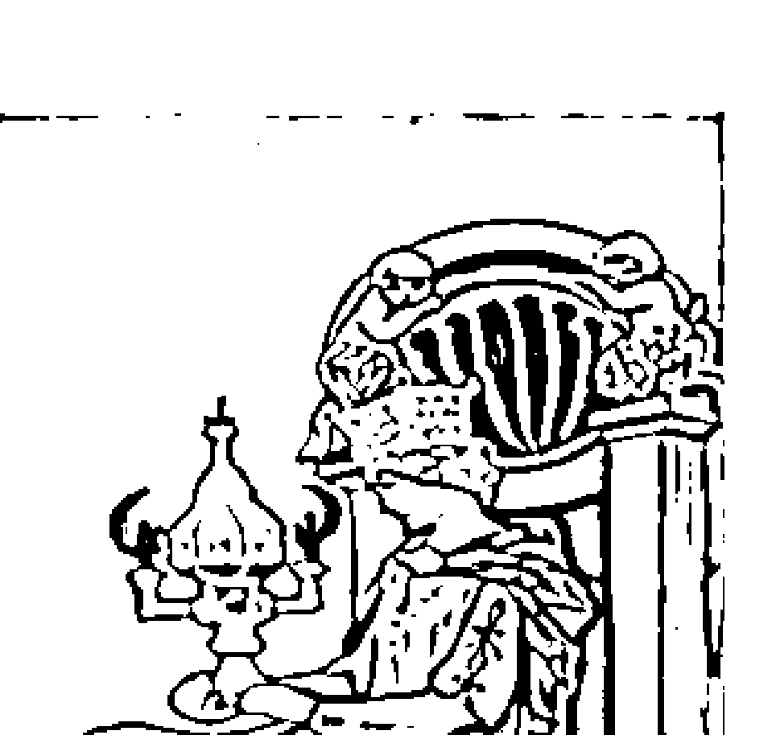

太出來，聖杯皇后會表現出什麼樣子，要看她當時在什麼樣的環境中而定。○人格：聖杯皇后不多話、安靜，配合度極高，所以永遠是環境需要它表現哪一面，它就可以表現出哪一面，要記得水元素的可塑性是非常驚人的。所以你可以看到悠哉不食人間煙火的聖杯皇后，也可以看到任勞任怨、刻苦耐勞的聖杯皇后；不管它是什麼身分、處在什麼位置，你很

少會聽到它的抱怨。聖杯皇后相信付出的代價一定都有收穫，那種樂觀到近乎盲目的態度有時會很神奇，真的實現了各種看似不可能的未來。○狀況、環境：在事業方面若抽到聖杯皇后，代表目前先不用訂太多計畫，也不要太努力地想去控制局面，因爲這張牌代表事情還會有很多變數；也有可能是有很多權面下的東西你尚未摸清楚，所以不要太急著表現，要沉住氣靜靜觀察，你會看到很多隱藏在表象下的東西。在這

## 聖杯國王（水中之土）

+   ○ 愛情：很容...

+   ○ 人格：聖杯國王的內在是穩定、踏實的，但它的規範只拿來約束自己，對於自己身邊的人，會

種觀察下，一開始會讓你覺得無法看透的人，很快地你就能摸清楚他的底細。聖杯皇后最適合

個家庭的安全感。因此依賴性比較強，很容易遇人不淑而無法自拔。

聖杯國王的元素結構，是最有穩定性質的水元素，因為土元素幫助水元素把不安定、不著
邊際的感覺都去除了，但加强了水元素的耐心及安全感。這張牌雖然在人物上是國王（男性長
者），但構成的兩個元素卻都是陰性元素，因此聖杯國王比較不會那麼強勢，反而具備一種保護
弱者的心態，用溫情及支持來因應它要面對的狀況。這張牌非常溫和，但因為有土元素，必要
時，還是有種不怒而威的力量。一般來說，這張牌被當成好丈夫、好爸爸來看待。

表現出溫暖而包容的特質，脾氣好、有耐心，又喜歡照顧人，不只是個很家庭化的新好男人，
在職場中也可以帶人帶心的好主管，尤其適合服務業以及與大眾生活相關的行業。不過這張
牌偶兩會出現往負面發展的例子，因為聖杯國王沒有那種壯士斷腕的魄力、也不太敢冒險，遇去，這是美中不足之處。

## 錢幣組

## 金剛石組 錢幣組

## 錢幣侍者（

## 181 藏在塔羅裡的占卜符碼

+   ○ 狀況、環境：在事業方面若抽到錢幣侍者，表示目前你的客觀條件不算太有利，在面對很多沒有得到公平待遇的情況時，要以不變應萬變，不用去爭眼前的小事，重要的是累積自己的實力及格局，創造可以獨當一面的條件。錢幣侍者在大部分的狀況中，都代表一個「沉澱、培育」的過渡時期，不適合在這種時候強出頭，因爲那反而會讓自己的進度變得更慢。這張牌還可以把它解釋成「樸樸實實吃三碗公」的人，把所有力氣都花在自我準備上，不會去管外在的閒事，因而讓自己的基礎更爲扎實。

+   ○ 愛情：一般來說，這張牌常常代表愛情緣分未到，就算勉強交往，也常會無疾而終，要等到事業有一定的成就後，才會開展真正的戀情。面對心儀對象不宜操之過急，宜長期布局。

錢幣侍者的學習是爲了現實與責任。它們一旦能夠獨立時，錢幣侍者的抗壓性會比寶劍侍者強很多。它們還是能藉著風元素的幫助，讓土元素本質上的「緩慢累積」步調加快，學習到很多對它未來幫助很大的事。錢幣侍者跟寶劍侍者一樣，生活都是在全力學習中度過；不同的是，寶劍侍者的學習是因爲責任，而錢幣侍者的學習是因爲現實。

## 錢幣騎士（土中之火）

錢幣騎士的元素結構很好，土元素有耐力能跑馬拉松，火元素則是跑百米衝刺的高手，組合成這一張更加有力的土元素牌。用火的作用力來助土元素一臂之力，可以讓這張牌更加穩健踏實，而且能讓別人看到它的實力。錢幣騎士是以土元素為主的牌，它是「潛力股」，目前看起來就是穩紮穩打，沒有驚人的聲勢，但那股絕不放棄的意志力，已經足以表現出來了。就算在資歷尚淺時，它也比一般年輕人來得穩重且謹慎，是一張值得期待的牌。

○人格：錢幣騎士跟錢幣侍者很像，都是沉默一族，不同的是，錢幣侍者還沒有跟人一較長短的實力，它必須把時間全花在自我學習上，不能分心；錢幣騎士則是早已比同年齡的人擁有更好的實力，但是低調的土元素個性，以及沒有把握絕不出手的企圖心，會讓它懂得樹大招風的道理由。再者，就算現在的成就已經算不錯，但在錢幣騎士的眼中，未來的版圖更是不可限量，比較起來，眼前的小小成績就沒什麼好說的了。

○ 狀況、環境：在事業方面若抽到錢幣騎士，代表一切都穩定地進行當中，沒有什麼意外狀況；這張牌表示在工作上，已經做好一切最緊密的規畫，算好了每一個步驟，杜絕一切可能的問題，所以把事情交給錢幣騎士，你可以很放心。唯一的缺點就是，錢幣騎士太專注在它的目標上，只要出現跟它計畫不合的事，就無法應變；也没辦法轉化危機找出另一條路，大部分只能硬碰硬，不是成功，就是失敗。這樣缺乏變通性，對拓寬版圖及人脈，都没有幫助。

## 錢幣皇后（土中之水）

○ 愛情：在感情方面不善表達，甚至有點反應遲鈍的現象。但是一旦談起戀愛，絕對是忠誠又有責任感，只是不懂花稍的錢幣騎士，少有異能見到它的優點。

○ 人格：錢幣皇后比起其他三位皇后，更多了一份「韌性」，土元素的財富讓這張牌在太平盛世時，可以跟聖杯皇后一樣內斂而溫柔，但多了精明及社會化的頭腦，而不是順應他人，它一直很清楚自己在社會、家庭中該扮演什麼角色，並且盡力去做到。但如果遇上貧乏窮困的時期，較雍容華貴，肯花心思打理自己的整體形象。及母性，但不同之處在於，土元素強調物質與感官，所以錢幣皇后在錢財方面較為充裕，並且比性化，這張牌我通常稱它為「貴婦牌」。因為兩個陰性元素（土、水）的皇后雖然都擁有包容力，但錢幣皇后在錢財方面較為充裕，並且比性化，這張牌我通常稱它為「貴婦牌」。因為兩個陰性元素（土、水）的皇后雖然都擁有包容力，土元素。雖然沒有聖杯皇后的水中之水那麼柔，但土元素的本質還是有著跟水元素不同典型的女性。錢幣皇后的元素結構全都是陰性元素，因為水的作用力，它就成了較為柔軟、願意流動的… 士的本質，以水的作用來表現。

錢幣皇后的元素結構全都是陰性元素，因為水的作用力，它就成了較為柔軟、願意流動的… 士的本質，以水的作用來表現。

## 錢幣國王（土中之土）

她一樣也可以撑過去，並且在這段過程中，再怎麼沒錢都不會失去淑女風範，也不會失去禮節與教養。錢幣皇后代表的女人典型，是最被一般社會所頌及需要的。○ 狀況、環境：這是一張很穩定的牌，在事業方面若抽到錢幣皇后，不管男女都代表擁有細膩的心及敏銳的觀察力（土元素的精明加上水元素的敏感）。在整個職場中，你或許不是最出色的是，但絕對是最謹慎本分、恰到好處的一個，而且可以在其他人出錯或手忙腳亂時，扮演補救或是安定人心的角色。這種讓人安心的特質，就算沒有建立什麼豐功偉業，仍會是大家公認可缺少的一分子。

○ 愛情：以安全感爲第一考量，對象的經濟能力也是不可忽略的。但這張牌的责任感非常重，一旦確定對象是可以盡到自己義務的人時，絕對不會逃避自己應盡的責任。

錢幣國王的結構很單純，就是雙重土元素，沒有其他的性質。土元素缺少其他元素的活化，會顯得格外固執僵硬。因此錢幣國王非常的嚴肅頑固，不過他不像寶劍國王的嚴苛是一種優越感，的展現，而純粹是基於是非與道德觀。雖然他是盡責的好丈夫好爸爸，但這類的人通常不太好溝通，當他的家人可以衣食無慮，心理上卻可能煩悶、無趣，或是有壓力過大的問題。這張牌的耐

+   ○ 人格：錢幣國王是標準的死硬派，因為用自己的毅力跟決心撐過了生命中的一切風波，因此無
法認同世界上還有別的方式；對於生活中遇到的磨難，也會二話不說扛下來，而且不會浪費時
間怨天尤人。就像錢幣皇后一樣，錢幣國王很有享受的本錢，所以也喜歡吃好穿好。如果是進
入一個困境中，錢幣國王也不會有適應不良的問題，因為在錢幣國王雙重土元素的觀點中，生
活本來就沒那麼自在，不管遇到什麼，都要咬緊牙關度過。

+   ○ 狀況、環境：在事業方面若抽到錢幣國王，就會很有遠景了。錢幣國王的雙重土元素，象徵
「緩慢」，所以如果你要進行一個新計畫，那麼成功的時間不會太快。但是如果不要急躁，漸
漸累積一點一滴的小成就，等到最後出頭時，就再也沒有什麼事能打倒你了。這張牌的另一個
好處是，雖然職場的限制很多，但是可供運用的資源也不會匱乏，類似有大企業、大單位在支
持的狀況。

+   ○ 愛情：在找男女朋友時，就已經不是抱著談戀愛的心態，而是在找適合共組家庭的對象。跟這
種人交往時，生活的現實面可能會磨掉所有戀愛的甜蜜，但它的忠誠與責任感是可以信任的。

## 解牌精選實例

這個單元分為「單張牌的解讀」及「牌陣解讀」兩大部
分，都是作者在教學或諮詢時所親身經歷的案例。每個解
牌個案著重在四大元素與數字的判讀，不拘泥於牌義，也
不陷入正逆位的俗套解法。

## [導言] 單張牌的解讀與牌陣解讀 188

## 單張牌的解讀與牌陣解讀

## 單張牌的解讀

初學者適合抽單張牌來解讀，原因有二：

+   1 對每張牌單獨的性質可能還沒辦法徹底掌握清楚，對於一張牌的認知也還是只從表面去解讀。

+   2 很多牌之間往往表面雷同、背後含意天差地遠；或是表面看來兩極化，但實際上兩者有很多本質相通之處。

因此，如果同時出現超過三張以上的牌，也就是說形成牌陣的話，對於底子不穩的初學者來講，很容易就被表面的過多訊息擾亂，尤其是如果牌與牌之間若有衝突，就更難堅定地掌握住每一張不同牌的核心定義。所以適合用單張牌，簡單地看出一件事情中的某一個面向、某一部分重點，再經由確認事實來補充這單張牌沒有看出來的部分。

## 牌陣解讀

牌陣解讀是現在最常探用的手法，因為一件事情中包含很多面向，例如「我的工作運」

單張牌來看的一概論，加上其他的牌就會有變化）。

過去，現在要降低標準，或是想辦法東山再起，或是開發一條新的路線（當然，這都只是就
甚至會有點故步自封了；如果世界牌出現在「過去」的位置，就代表可能你最好的狀況已經
在一位置，代表你做事的模式已經固定住了，雖然得心應手，但也失去激盪新觀念的機會，

那非常好，有一種你只要認貭踏實，未來就會到達顛峰的意思；但是如果世界牌是在「現
察。例如世界牌是一張已成形的、固定的、已到達頂點的牌，如果出現在「未來」的位置，

牌陣的好處是，每一張牌位置不同，定義就不同，所以一件事就可以從不同的角度去觀
試多張牌的串連解讀，也就是牌陣。

等到對於每一張塔羅牌的個別含意都非常清楚後，並熟悉單張牌的運用之後，就可以嘗
神入化的地步，運用在牌陣解讀時，會有更清晰的全觀能力。

質作比對，難度是會比較高，但越來越熟悉之後，就可以把每張牌當中的基本結構摸索到出
單張牌由於沒有多張牌可以互相比對元素及數字，所以要就事件本身，去跟這張牌的性

等到對於每一張塔羅牌的個別含意都非常清楚後，並熟悉單張牌的運用之後，就可以嘗
神入化的地步，運用在牌陣解讀時，會有更清晰的全觀能力。

質作比對，難度是會比較高，但越來越熟悉之後，就可以把每張牌當中的基本結構摸索到出
單張牌由於沒有多張牌可以互相比對元素及數字，所以要就事件本身，去跟這張牌的性

過去，現在要降低標準，或是想辦法東山再起，或是開發一條新的路線（當然，這都只是就
甚至會有點故步自封了；如果世界牌出現在「過去」的位置，就代表可能你最好的狀況已經
在一位置，代表你做事的模式已經固定住了，雖然得心應手，但也失去激盪新觀念的機會，

那非常好，有一種你只要認貭踏實，未來就會到達顛峰的意思；但是如果世界牌是在「現

察。例如世界牌是一張已成形的、固定的、已到達頂點的牌，如果出現在「未來」的位置，

牌陣的好處是，每一張牌位置不同，定義就不同，所以一件事就可以從不同的角度去觀
試多張牌的串連解讀，也就是牌陣。

等到對於每一張塔羅牌的個別含意都非常清楚後，並熟悉單張牌的運用之後，就可以嘗
神入化的地步，運用在牌陣解讀時，會有更清晰的全觀能力。

質作比對，難度是會比較高，但越來越熟悉之後，就可以把每張牌當中的基本結構摸索到出
[PAGE 193]

## [導言] 單張牌的解讀與牌陣解讀 190

這個單一問題，當中就包含了「我個人的狀態、公司的狀態、同事（包括上司與下屬）的狀態、個人的運勢、正財的流向」等等部分，如果是經驗不夠的人，恐怕沒有辦法從單張牌當中，找到所有他要的答案。要不用牌陣，就必須針對每一個細部問題分別抽牌，這樣恐怕會曠時費工；所以依一個牌陣，因為出現的牌是複數的，所以拿來做數字及元素的比對，或是觀察這些基本結構之間的變化，會特別方便；有時遇到強烈一點的元素分布狀況，例如只有某個元素，或短缺某個元素，或某個數字不停重複，或是數字的位置是增加或減少……，甚至可以不細讀每一張牌，就能推論出事情的全貌。在按照順序解讀完每一張牌之後，還可以用「連鎖解讀」，也就是把整個牌陣當成一張牌來看待，觀察元素的分布，以及各張牌的含意是互相呼應或衝突，都能解讀到其他的幾個面向。如此綜合起來，就是還原一件事情的立體樣貌了。所以用牌陣，不一定要受限於牌陣。因此，常常有很多網友寫信來問我說：「聽說不需要用牌陣來解讀，代表功力比較強，是嗎？」

## 191 藏在塔羅裡的占卜符碼

網路界時常會吹起一些奇怪的风气，不管再怎麽莫名其妙的讲法都有人鼓吹或奉行。但我覺得这种事情是没有定论的，於是我通常回答：‘这样说好了，如果你已经把牌阵运用到精通了，那麽不用牌阵，就等於是有辦法可以超越牌阵（我没说出口的是：就算用了牌阵，你一樣可以超越牌阵，要弄到‘特地不去用牌阵’，正表示你擺脱不了形式）。但如果你連一般牌阵的解讀都不會，那麽你不用牌阵，只能表示你應該是分不清楚同一張牌在不同位置的意义，既然分不出來，只好乾脆不用牌阵不管位置意义了。基本上，在牌阵中就可以運用不看牌阵的解讀

## 小提醒

聖杯二是水元素，號碼是2，象徵平和、溫馨、愉悅的感覺。在人際關係上，聖杯二是張滿和諧的牌，在合作或往來交流上，都是個不錯的象徵。如果就感情、人際上來看，聖杯二確實是一張很不錯的牌；但是水元素對於財運及事業運來說，雖然不會太差，但也沒有什麼能量，因為水元素畢竟是陰性元素，較為被動，生產力及突破性也不大，所以比較難成就什麼工作上的大案子，或有什麼可觀的業績。因此我問她：「這家A公司跟你們公司是長期合作的關係嗎？也就是說算是老交情？」她說：「是的，我們多年來合作生意，幾乎是只要時間一到，簽個約就可以了。」我說：「但是這一季妳應該有點擔心，可能是因為景氣或是產業環境的關係，讓他們下訂單沒有以前那麼乾脆？」（因為水元素比較沒有那種大額訂單的感覺）她說：「是啊！但是我覺得聖杯二看起來有兩邊交流良好的意思，所以應該是沒問題吧？」我說：「我們來看聖杯二，按牌圖來看確實是兩個人交流良好，但是水元素牌表示交流的是感情，所以我們可以推論，因為長久以來跟你們公司合作的經驗非常愉快，所以即使A公司有其他更划算的合作對象，或者這陣子比較不需要你們公司的產品，都還是會想跟你們維持一個合

其 他 更 划 算 的 合 作 對 象 ， 或 者 這 陣 子 比 較 不 需 要 你 們 公 司 的 產 品 ， 都 還 是 會 想 跟 你 們 維 持 一 個 合 感 情 ， 所 以 我 們 可 以 推 論 ， 因 為 長 久 以 來 跟 你 們 公 司 合 作 的 經 驗 非 常 愉 快 ， 所 以 即 使 A 公 司 有 兩 邊 交 流 良 好 的 意 思 ， 所 以 應 該 是 沒 問 題 吧 ？ 脆 ？ （ 因 為 水 元 素 比 較 沒 有 那 種 大 額 訂 單 的 感 覺 ） 她 說 ：「 是 啊 ！ 但 是 我 覺 得 聖 杯 二 看 起 來 有 我 們 來 看 聖 杯 二 ， 按 牌 圖 來 看 確 實 是 兩 個 人 交 流 良 好 ， 但 是 水 元 素 牌 表 示 交 流 的 是

## 199 藏在塔羅裡的占卜符碼

作關係。～這位同學說：～我想是的，因爲交情真的不錯。～所以我「訂單會談成」這一點，我們可以確定了，但是水元素的獲利並沒有那麼大，這個特性我們也要納入來看。所以我說：「雖然生意會談成，但是要有很大的獲利，必須是火元素或土

而已，對於你的業績表現可能無法有決定性的幫助。～以這樣的推斷，我的結論是：「A公司會

跟你們下單，但是數量會比以往少很多，只是想維持一個合作習慣而已；或者是A公司想要殺

價，生意雖做得成，但是你們的利潤會變少。～這種狀況可以同時符合聖杯二的合作性質，也符

合「工作方面的問題遇到水元素時，成就力量會減少」的性質。

這位同學回答：「對耶！他們現在就試圖跟我們殺價呢！他們在議價過程中非常認真，對於

這筆生意也很有誠意，所以我們公司也覺得應該沒問題，但是對訂單數量就有點擔心了。～這時

她看看筆記本，又驚叫起來：「老師，抱歉，我這張牌抽到的聖杯二是逆位的，剛剛我忘記說

了，這怎麼辦？」

每個占卜師對於同一張牌的逆位解讀都有所不同，而我是傾向認爲同一張牌的正逆位所擁有

的特質是相同的，只是這種特質往正面或負面發展而已。所以我說：「如果不用元素來解牌，以

一般公認的共通牌義來說，聖杯二的正位就是美好的、順利的；而聖杯二的逆位代表交流受阻，

或關係不夠深入、表面關係重於實質關係。～接著我又說：「工作上的獲利或成功，需要的是火

## 單張牌解讀——【實例3】

## 單張牌的變化運用

某次受邀參加一位學生的公司聚會，現場大都是我不認識的人。大家對塔羅牌的準確度都很好奇，其中一位S小姐特別有興趣，提出的問題都很關鍵。雖然我的原則是「不用自己的職業免費幫人提供餘興節目」，也不可能在需要放鬆的時候還義務工作自找麻煩，但是因為S小姐像是會得寸進尺的人（笑），整個人的能量也很正面，所以我很樂意為她示範「從塔羅牌上可以讀到什麼東西」。S小姐的生活中沒有什麼太大的困擾，想了半天，問了一個不痛不癢的問題：「我跟男友之間的關係」，提問時她的表情平和自然，即使不看塔羅牌，也可以知道她的感情應該沒有什麼太大的問題才對，乍看之下事情好像很簡單。但其實，這種情況才是解牌的大挑戰，因為如果有衝突性，你很容易就從牌面上抓到事情的重點，但是太過生活化沒有起伏，有時塔羅牌面顯示出來的狀況就沒有一個集中點，會比較難切入。

## 問題：我跟男友之間的關係？

## 解題：聖杯十、權杖四

由於感情不能只看一方，需要看看對方的狀況來判斷當事人的狀況。所以我請S小姐抽了兩張牌，一張代表她本人，另一張代表她的男友C先生。結果不意外，S小姐的位置抽到聖杯十，C先生的位置抽到權杖四，兩張牌都有很強烈的「感情穩定」含意，看起來這段感情至少在短期內不會有什麼意外。

S小姐這邊的聖杯十，是由「水元素」及數字10所組合而成，我們都知道水元素的特質是平和、感情流動，在感情方面（不管是親情或愛情）都有和諧安詳的寧靜意味；而數字10代表已經走到最後了，已經圓滿可成爲結局了。水元素加上數字10，這張牌意味著在感情上已經可以說別無所求、不需要更多了。

因此大部分牌種的聖杯十，在牌圖上都會以家人之間的融洽幸福來作爲表達的重點，表示這份感情不再是小情小愛，已經昇華到在同一條船上，互相扶持、榮辱與共的感覺。S小姐抽到這張牌，可以看出她的心態，基本上可以說已經認定對方，不會再要求輿輿烈烈的新鮮感，覺得這段感情就是她的歸宿了。

張牌，可以看出她的心態，基本上可以說已經認定對方，不會再要求輿輿烈烈的新鮮感，覺得這段感情就是她的歸宿了。代表C先生的權杖四，也是一張在感情（或任何方面）非常有利的牌；權杖四由「火元素

跟數字4組成，4代表「堅實的基礎、穩固」，不管在工作或愛情、家庭，都代表已經做好萬全準備，非常安全且務實，是一個很好的「地基」型數字；加上火元素的前進性、創造性、期待突破，所以權杖四是希望在既定的現有基礎上，建設出更大的局面。由此可以知道，C先生對於這段感情有著強烈的责任感及期待，希望兩個人可以一起創造共同的未來。

達漢慕之情，覺得這麼平穩的感情，理應沒有任何問題存在了。

這時我說：「這個時代中，有這麼好品質的感情，真的是難能可貴，你們的關係中只剩下一個小小的問題。」此話一出，包括S小姐在內，在場的人都一驚驚訝，這麼好的感情狀態還會有什麼問題？

我問S小姐：「妳跟男友間的爭執應該不多，唯一會讓你們常常意見不合的地方，就是妳男友隨時在計畫準備成家，希望早點結婚，但是妳卻覺得現況就很好了，不想再有改變，也覺得結婚是多餘之舉。」S小姐很驚訝地脫口而出：「妳怎麼知道？他整天在談結婚的種種計畫，我覺得現在這樣就很好，幹嘛非結婚不可呢？一旦結婚，我們的感情說不定反而會變質，而且結婚詳，問我：「老師，妳爲什麼會覺得S小姐不想結婚呢？這張牌的圖案看起來，是一家和樂的

## 單張牌解讀——【練習】

## 塔羅牌「讀心」的能力

當天晚上，約有二、三十人來聽講，我想應該沒有時間一個個瞭解他們對塔羅牌的看法及創社的意願，所以我簡單地說明塔羅牌的源流以及作用，然後對大家說：「我想知道你們想要瞭解塔羅牌的哪些地方，還有我想讓你們看看塔羅牌的實際作用，如果分成兩部分來進行的话會太花時間，我們簡化一下過程，直接讓每個人抽一張塔羅牌，讓我來猜猜你們今天來到這裡的心態，順便也讓你們看看塔羅牌到底有多少能耐。」大家一聽當然很感興趣，畢竟再多口頭介紹，也比不過親身體驗。

那天晚上的案例很多，基本上每個人隨機抽到的牌，都很神奇地跟他們的心態非常吻合（在我看來很正常）。本來我是直接就牌面上解讀現場同學「來這場說明會，想得到的收穫是什

## 問題：猜猜他們今天來到這裡的心態？

## 解題1：

一位看起來很和氣的女同學抽到「空白牌」

## 解題2：高高瘦瘦的A同學手上的牌，是一張「寶劍六」

## 解題3：斯文型的B同學抽到「權杖一」

## 解題4：有點像社會人士的女同學抽到「惡魔牌」

## 解題5：長髮、個子嬌小、發問非常積極的女同學抽到「權杖九」

到這個活動，就不假思索地決定參加了嗎？但稍微再推敲一下，又覺得不是這樣，如果是這麼不假思索地就決定行動，應該是火元素的行為：火元素是不經過大腦思考過程的，可能一看到海報，馬上就決定要來參加，不需要經過任何考慮的過程，就是光憑著一股直覺及行動力。

但是就我個人習慣，我一向把空白牌歸類爲水元素，原因如下：空白牌没有任何牌圖，所以固定位態，接近水元素的特質。水元素對於「要去參加一個活動」這種事，是很被動的，加上空現場瀰漫的那種「期待」氣息，她也都没有，所以她應該根本沒搞清楚狀況，就來到現場了。不知道塔羅牌是什麼，甚至不知道今天要講的主題是塔羅牌？這個女孩噁了一跳，接著就笑了出來，點頭表示是這樣沒錯。既然如此，我就想了一下這個年紀的女生最有可能基於什麼原因，來到一個她根本不知道要談什麼的會場？然後我跟她說：「妳會來這裡，原因跟在場其他的同學不一樣，他們都是想知道塔羅牌是什麼才來的，但是妳是因為朋友或同學找妳來，妳就來了。」女孩聽到這裡，從微笑變成大笑出聲，開始點頭如搖蒜，然後很驚訝地看著旁邊的同學。我接著說：「而且妳朋友對妳提起這個說明會時，妳也沒仔細聽內容，妳心裡想：反正也沒地方去，不來這裡就只能回家看電視，所以就跟來看看了。」講到這邊，女孩已經笑到臉都紅了。講完後我對她說：「剛剛我說的一切，都是我的猜測，現在我要正式問妳，在妳來到這裡之前，知不知道今天的說明會主題是什麼？」她笑著說：「完全不知道！我說：「很好，那如果妳沒有來這裡，妳會去哪裡？」她更大聲地回答：「回家看電視啊！」講完後馬上跟一起來的同

## 解答2：

講解完空白牌後，我走到下一個位置，眼前坐著兩位看起來像是結伴而來的男同學。高高瘦瘦的A同學，手上的牌是一張寶劍六，我心中疑惑了起來，一般來說，會特地跑來聽塔羅牌說明會的，一定都是滿懷期待或疑問，但寶劍六是一張非常冷靜、算不上太好奇的牌，風元素的確有一點好奇意味，但更多的是理性及觀察；而數字6代表的是持平及社會化，與風元素結合起來，情緒是平靜、不熱情，比較像是「來看看這裡、看看老師到底是在做什麼」的心態。看來他對這場活動的好奇心，恐怕還大過於塔羅牌本身。想到這裡我靈光一閃，心想：那就表示塔羅牌這種東西，對他來說並不陌生囉？

不過我不好意思問得太直接，所以只試探性地對A同學說：「嗯，你是不相信或不喜歡這次活動嗎？因為我從牌中看不到你對這次的塔羅牌說明會有太多期待，你好像只是想來看看我們今晚到底要做些什麼的？」（我不想說「搞什麼花樣」這種話，但這恐怕才是A同學心中真正的想法。因為我猜，他應該已經瞭解塔羅牌了，對於這種說明會可能覺得是講給完全不懂的人聽的。）

[PAGE 216]

## 213 藏在塔羅裡的占卜符碼

A同學一直都很平靜的表情終於有了變化，開始面帶微笑，坦然地說：「我已經玩塔羅牌好 一陣子了，不過我是拜師學習的，所以有點好奇，想看看社團性的活動找來的老師是怎樣的， 如此而已。」這種心態也確實合理，所以我請他好好地玩，就當成是意見交流，然後就轉往他身邊 的另一位B同學。 解答3： B同學的例子沒有什麼挑戰性，呵呵！因為很淺巧的，他抽到的牌就是權杖一，權杖牌的 屬 性是火元素，而數字1象徵非常純粹的火元素。這張牌顯示這位男同學的心態是沒有任何懷疑 及猶豫，就像是我看到空白牌時的第一個反應，所以我直接用剛剛看到空白牌時腦中第一時間冒 出來又被我推翻掉的想法來問他：「你一看到宣傳資料，没有任何考慮就決定要來參加，對吧？ 應該對塔羅牌好奇了很久，只是沒有參與過正式場合？」這位男同學高興地說## 解答4：

## 單張牌解讀 214

接下來這位看起來有點像社會人士的女同學，很興奮又有點緊張地問我：「老師，我是真的很有心想來瞭解塔羅牌，但怎麼會抽到惡魔呢？」我心想：「哇！這張惡魔牌，跟妳看起來一副實際冷靜的模樣，還真是契合呢！」這位女同學看起來就是標準的「凡事都要找出原因」的精明幹練模樣，打扮也很時尚。

惡魔牌其實很簡單，這是一張土元素牌，象徵它不喜歡虛無縹緲的東西，對一件事物「可以衍生出來的附加價值」，比對事物本身的興趣更濃；象徵誘惑及重視現實利益的惡魔牌，並不是貪婪地予取予求，而是拿到手的每一樣東西，都會想用這個東西建立起一套模式，而非到處搜刮，所以我可以推測這位女學生的心態，比較接近「想弄清楚塔羅牌有什麼學理上或驗證上的依據」，如果她想學塔羅牌，理由也是想要「找出塔羅牌的邏輯性，然後用一套既定的流程加以製作；不過，當然大家都知道，這是還沒進入塔羅牌世界前很容易會有的天真想法，包括我自己內（笑）。

由於惡魔牌的土元素特質，不同於具有神秘學性質的水元素與風元素，所以她來參加這個說明會，目的恐怕也跟塔羅牌本身的神秘感及相關學問沒什麼關係。想到這裡，我不小心笑了出來，她很驚訝地問我爲什麼笑，我回答：「妳來這裡的目的，是因爲在電視上看過塔羅牌，妳聽說過但從沒接觸過，很好奇又不願意花錢嘗試，怕找到不高明的人。所以妳一看到宣傳單，馬上越想越多，妳已經想好如果學會可以隨時幫朋友算，有事時也不用花錢去找算命師，說不定妳還已經想到第二專長去了……」

通常這樣的人，對於一件事物尚未瞭解之前，不可能冒著花冤枉錢的風險，而是一定要站在一個不會有損失的立基點，其實跟我的個性還滿接近的！隨著我的解讀，她的表情從疑惑到驚訝，繼而哈哈大笑，承認這真的是她腦子裡所動的念頭，而且很驚訝居然抽到的塔羅牌能夠顯示出來。這時我因為好奇，問了一下她的星座，還真的個魔羯座的精明女生呢！

解答5：現場有一位特別活躍的女孩，長髮、個子嬌小、發問非常積極，從她的表情看來，對過程中我解說的每張牌都能心領神會，似乎有很多自己延伸出來的想法，也會跟身邊的許多同學交換意見，談笑風生，個性看來很開朗。我原先以為她應該會抽到一張愉快的火元素牌，比如太陽牌或數字牌權杖組之類的，結果她手上拿的確實是一張火元素牌，不過卻是一張權杖九，顯示她的表面雖然很堅強，但心裡卻很疲累，覺得四面楚歌。火元素是能量非常強的元素，但是這種能量只能跑百米，無法跑馬拉松賽，短期內很有爆發力，但如果拖了太長時間，就會後繼無力，所以權杖牌到了第九個階段，雖然本身的能量還在，但只夠用來維持自己，無法發揮影響力，所以權杖九會受制於環境而非控制局面。這種喪失主導權的特質，對火元素來說會是很大的挫敗與關卡。

數字9，有一種「到了臨界點」的意味，表示前述那種火元素的生命力已經撐到剩下最後一點點了，接下來不是力氣用盡，就是必須重新再找到助燃物或燃點，才有辦法補充能量。可想而知去了，她有可能是現場心情最低落的人，但火元素就算在沮喪時還是很好強，所以不會表現出一副溺水想抓住浮木的樣子，還是會努力維持自身的尊嚴及社交禮儀。

我大概可以掌握她現在的心情，所以我對她說：「妳看起來很開朗！可是妳的牌卻告訴我，妳覺得自己已經找不到其他出路了。妳心事重重，想快樂一點卻沒有辦法，於是妳拚命地想幫自己找一個出口，所以今天不管紫微斗數、八字、水晶……只要有可能讓妳的心情平靜下來，妳一定都會來參加。因爲妳想不到其他辦法了，所以妳也不是特別喜歡塔羅牌，只是這一類的活動妳都會盡量去參加，看看會有什麼收穫。這麼急著找出路，是生活中出了什麼事嗎？

本來看起來充滿正能量的她，隨著我說的這些話，表情漸漸黯淡下來。她還沒開口，身邊另一位像是陪她一起來的女同學就很肯定地接口說：「對！就算妳講的不是塔羅牌，只要是跟算命或靈性學有關的，她都會來，而且她確實已經跑了很多地方了。這時女孩也喃喃地說：「妳說得對，我已經不知道該怎麼辦了……」

但我沒辦法問她詳細的狀況，因爲後面還有很多人抽了牌等著解讀，我只好跟她說：「現在我先把活動進行完，妳的事我們有機會再來處理，好嗎？」她點點頭，我就繼續下面的活動。後來我請我的學生在現場幫大家試算塔羅，只是不知道她有沒有留下來參加，而她的問題有沒有經由占卜獲得解答了呢？

## 牌陣解讀：「時間之流」牌陣 218

## 「時間之流」牌陣Ⅰ

1從「過去」位置，可以看到一件事情的成因。
2從「現在」位置，可以看到現在是樂觀或悲觀，並分析出整件事情的勝算或問題所在。
3從「未來」位置，可以看到整件事情的趨勢與走向。

## 「時間之流」的特色：

抽牌規則

心中先默念問題，洗牌，切牌一次，擺開，再一邊默念你的問題，一邊用左手抽出三張牌（方向及順序不限），依照順序擺放到上圖所示的 1、2、3 位置。

## 適用何種問題

「時間之流」是一個萬用牌陣，不管是工作、財運或愛情，只要你希望對要問的事情有個全盤性的瞭解，都適合使用此牌陣。

## 【實占前叮嚀】

以下這個課堂上的例子，我要特別提出的一點是，這是剛教完二十二張大阿爾克納後所做的練習，所以不會出現宮廷牌及數字牌。當時我要班上的同學寫下心中最困擾他的一件事，就直接當成問題，然後我們試著從牌上找出盲點，進而推敲出解決之道。這是因爲「有辦法看出發生什麼事，這是很正常的，但是想問卜的人，都是爲了自己的問題而來，而不是爲了來看你表演有多況，然後想辦法去駕馭這個狀況，才是我們要做的事」。

## 【問題】

我跟這位男性朋友，有無可能發展成戀人？

+   【抽出的牌陣】（不分正逆位）○「過去」位置：節制牌（火）○「現在」位置：惡魔牌（土）○「未來」位置：死神牌（水）

## 牌陣解讀：「時間之流」牌陣 220

這是個平常看來很率性的水瓶座女孩，我用的是「時間之流」牌陣，三張牌分別放在「過去」、「現在」、「未來」這三個位置。這時她告訴我，她的問題是：「我跟這位男性朋友，有無可能發展成戀人？」開出來的牌依序是：「過去」是節制牌，「現在」是惡魔牌，「未來」則是死神牌。

她看到惡魔牌及死神牌時，臉色馬上沉了下來。雖然惡魔牌象徵一種糾結的情感，但他們現在水元素、火元素、土元素，這副牌中都出現了：火元素的「節制」、土元素的「惡魔」以及水元素的「死神」，對於感情的發展，看起來反而不會是沒有好處的。只不過「現在」位置的惡魔牌屬於土元素，代表一種「卡住、受苦」的狀態；而「過去」的狀況是美好的節制牌，至於「未來」的死神牌，我們可以當成只是「結束目前狀態」的一個象徵，是好是壞，我不認為是絕對的。

藉此判斷，她跟對方不是剛認識，而是已經有一段時間的朋友關係了，因為在一起的感受很舒服、很自然，慢慢就日久生情了。這時我說：「你們應該是交情很好的朋友，思想、心靈方面都交流得很和諧，甚至有時候會有一種心有靈犀一點通的感覺，而妳是越到後來發現兩個人之间的感覺可能已經超越了
一般朋友的界線，是嗎？」因為節制牌代表的感情可是非比尋常的，有種
服、很自然，慢慢就日久生情了。這時我說：「你們應該是交情很好的朋友，思想、心靈方面都
交流得很和諧，甚至有時候會有一種心有靈犀一點通的感覺，而妳是越到後來發現兩個人之间的感覺可能已經超越了
一般朋友的界線，是嗎？因為節制牌代表的感情可是非比尋常的，有種
少了對方，就缺少生活重心的感覺，所以我認為他們的互動跟涉入對方生活的程度非常深。她聽完悶悶地回答：是這樣沒錯。

看她這種爲情所困的樣子，現在位置惡魔牌就很好理解了。惡魔牌是一種被自己心理
的欲望控制的狀況，我們在喜歡上一個人，又沒有立場明目張膽地過問對方一切事情的時候，就
會產生出一种占有欲及控制欲。對方在不明所以的狀態下，也無法給出令當事人滿意的答案，這
時她會被自己的猜忌和多疑（惡魔牌的心態）控制住，但男方可能會覺得她變得很難溝通又很
愛管東管西（這也是惡魔牌的控制欲）。這時候，兩個人的關係就會陷入一種僵局。因此我說：

「妳現在有點失控喔！因爲不能主動表白，又覺得他應該也很重視妳才對，所以妳會開始在意
他有沒有凡事都告訴妳、隔多久會打電話給妳，甚至是跟其他女生多講幾句話，妳都會覺得他很
可惡，而開始跟他鬧情緒。「她很煩惱地說：沒錯，我也覺得我這樣很討厭，但我就是控
制不住。」

這時旁邊的學員發問了：「老師，惡魔牌不是也有執著、不擇手段」的意味嗎？爲什麼妳會認爲是她被自己的情緒困住，還產生混亂呢？爲什麼不會是她開始有計畫地推動兩個人的感情
進展呢？惡魔牌那麼曉明又懂人性，對自己要的目標又如此執著，應該凡事都很有辦法，想要就
一定會得到才對啊！我說：很簡單，妳看一下，這個牌陣的三張牌當中，所有元素都到齊，
一旦理性面不在，她所有的行爲就是獨缺風元素，表示她少了理性的溝通，分析能力也沒有了。

都是照著內心感覺直接反應，已經沒有思考跟算計的空間了。所以，惡魔牌中「無明」的那個部
分就會被加強。「

最後一張的死神牌最讓同學們擔憂，但是死神牌是水元素，其實我倒沒有那麼擔心。我說：

「妳現在的行為表現，就像是搬石頭砸自己的腳。如果繼續這樣莫名其妙地發展下去，可能會讓
他覺得妳討厭他而慢慢疏遠妳。」她說：「如果我可以調整自己的心態呢？」我說：「死神牌是
水元素，接續上一張惡魔牌的土元素，其實水可以把土的執著所造成的僵局化解開來，如果雙方疏遠，也不能說不是一種打開僵局的方式，只是這種進展比較負面。但如果妳可以調整自己的心
態及作爲，水把土的局面向解了，兩張牌都是陰性元素，我想雙方的關係雖然不會突飛進步，卻
能維持下去，而且「過去位置」節制牌的火元素可以起一些推動作用，應該會在不知不覺中發
展成戀人關係（如果没有這張節制牌的火在根本地方起作用，惡魔牌的土跟死神牌的水都是陰性
元素，是很難突破的，就會可能會一直暖昧難成定局）。」講到這裡，她看來鬆了一口氣：「那好
吧！我回家以後會想辦法讓自己冷靜下來。」

雖然大多數的牌都有特定的正面或負面含意，但我的立場還是認爲，用整個牌陣綜合解釋
時，每張牌都是中性的，你可以用自己的行爲來選擇讓事情往正面或負面發展。過了幾個月後我
又遇到當事人，她很高興地跟我說，恢復平常心一段時間後，兩個人果然自然而然就成爲一對情
伴了。

## 牌陣解讀——【實例2】「時間之流」牌陣Ⅱ

## 【實占前叮嚀】

流一這麼一個最基本且簡單的牌陣，從「過去、現在、未來」這三個位置看出在沒有人爲意識的刻意干渾下，事情的能量會往什麼樣的方向發展。 所以我不使用含有「建議牌」的聖三角牌陣（見240頁），而是採用「時間之流」牌陣，但是把三個時間形態全部轉換成建議牌來解；當然必要時，也可以使用大十字牌陣（見252頁），我一向覺得大十字牌陣是時間之流的加強版。 另外，在這個案例中，抽出的牌是經常被我笑稱是「講白話文的牌」，看起來含意非常簡單，但是解牌不能被表面騙過去。我剛開始玩塔羅牌時，遇到這麼清楚的牌面呈
## 【抽出的牌陣】（不分正逆位）

## 我該如何改善桃花運不好的狀況？

+   - 過去位置：錢幣四（土）
- 現在位置：太陽牌（火）
- 未來位置：魔術師牌（風）

現，會覺得三言兩語就可以講完，不曉得還能講些什麼，但是只要比對完元素，你自然就會知道需要加強的部分是什麼了。

我的目測，這一型的女人應該很受男性青睞，因為她除了五官好看，身上也有一种嫻靜及和善的特質，不會給男人帶來太大的壓力或預期會挫敗的感覺。所以當我聽到她的困擾是桃花不多時，當下就覺得有點

## 第一組牌

## 牌陣解讀：「時間之流」牌陣 230

第一組牌是個學生問他的念書狀況，用「時間之流」開出來的牌，因為事隔久遠，第一張牌我忘了，只記得是一張水元素的牌，第二張「現在」是惡魔牌，第三張「結果」則是恋人牌。我使用「時間之流」的習慣，一向是著重在「現在」位置的牌。在這組牌中是土元素的惡魔牌，有兩個方向：一個是沉溺，一個是執著。不過因為加上前後比較偏向涣散性質的水元素及風元素，會分化土元素的自制力，並把惡魔牌的「沉淪、享樂」特質強調出來，所以我認為惡魔牌在這裡是比较傾向沉淪與沒有作為的那個方向。因此我告訴他：「我覺得你雖然口頭上問功課，但是你的心思已經被其他東西占據了，可能是玩樂、跟朋友鬼混，也有可能是染上了什麼嗜好興趣，占據了你的心思。」接著我看看在「未來」一位位置的恋人牌，恋人牌雖然也代表有東西在吸引他，讓他無法專心，但畢竟是一張風元素牌，比起土元素的惡魔牌威力小多了，也比較容易脫身。因此我又說：「不過還好，我覺得這是一時的，因為惡魔牌那種無法自制的糾葛，在「未來」變成了恋人牌，恋人牌雖然是一張有吸引力的牌，但糾葛的性質已經解開，變成了一定的距離。所以我猜你現在的興趣或生活模式，其實沒有變成長期習慣，只是你目前正在興頭上；等再過一陣子，你就会開始覺得無聊，回復到正常的生活範圍內。」

這位同學很驚訝地說，他最近常跟一票朋友夜遊或聚會，都快玩瘋了，而且因為太...幾乎每天都會玩在一塊喝點酒，上課跟念書的精神狀況就都被影響了。不過，這是因為他們最近有活動，所以才會每天混在一起，喝酒也沒到上癮地步，等活動辦完就正常了。尤其那時快要接近期中考，再過一、兩週，他不正常也不行了。

前方座位的女同學請我去看她翻出的一副牌，牌陣一樣是「時間之流」，一樣是問她的課業狀況。她抽到的是「過去」——皇帝牌，「現在」——惡魔牌，「未來」——塔牌。

惡魔是土元素，搭配的前後兩張牌都是火元素，火元素跟土元素的共同特質就是「固執、目標強、不喜歡放棄、得失心強」，因此這張惡魔牌被火元素一加強，就會偏向壓制、執著、不肯放棄的方向，加上皇帝的自尊意識過剩，經過惡魔的深化及折磨，最後看來會導致塔的崩潰及失衡。這不太妙。

我認真地跟她說：「妳是很難得的學生，對自己的要求比老師和學校對妳的要求還要高。我以及面子問題，不允許妳自己沒有達到標準，念書方式根本就是在壓榨自己，整個豁出去的念法，說不定妳已經嚴重睡眠不足了。」然後我指指那張「塔牌」跟她說：「試著放鬆一下，要把...原來不懂的東西念懂，不是短時間之內就可辦到的。妳只要每一次都比上一次進步，就表示妳正在順利地克服難題，如夠一下子給自己太大壓力，就這張塔牌來看，我覺得妳受不了時，反而會崩潰而全盤放棄，那就是欲速則不達了。」

女同學睁大眼睛說：「對！真的就是這樣。我以前功課一直不錯，所以現在遇到難消化的課程就會發慌，更加想要讀好，所以真的是已經到了...就像妳說的「壓榨自己」的地步，當然也會睡不好。」

這兩張同樣都是惡魔牌，但是因為元素分布不同，我們所取的解釋也就会不一樣。只要熟悉四大元素，就不用在取捨牌義方面「碰運氣」了。

## 231 藏在塔羅裡的占卜符碼

## 第一組牌

## 牌陣解讀：「時間之流」牌陣 232

原來不懂的東西念懂，不是短時間之內就可辦到的。妳只要每一次都比上一次進步，就表示妳正在順利地克服難題，如夠一下子給自己太大壓力，就這張塔牌來看，我覺得妳受不了時，反而會崩潰而全盤放棄，那就是欲速則不達了。

女同學睁大眼睛說：「對！真的就是這樣。我以前功課一直不錯，所以現在遇到難消化的課程就會發慌，更加想要讀好，所以真的是已經到了...就像妳說的「壓榨自己」的地步，當然也會睡不好。」

這兩張同樣都是惡魔牌，但是因為元素分布不同，我們所取的解釋也就会不一樣。只要熟悉四大元素，就不用在取捨牌義方面「碰運氣」了。

## 233 藏在塔羅裡的占卜符碼

## 牌陣解讀——【實例3】「關係」牌陣

## 「關係」牌陣的特色：

## 抽牌規則

## 適用何種問題

1 在代表「當事人」及「對方」的位置各放一張牌，可以看到雙方在當下所處的狀況、心態，透過兩個人的狀況比對，就可以知道彼此間的契合點或摩擦處在哪裡。

2 接著，由「現況」位置可看出兩個人在旁觀者眼中看起來的相處狀況為何。

心中先默念問題，洗牌，切牌一次，擺開，再一邊默念你的問題，一邊用左手抽出四張牌（方向跟順序不限），依照順序擺放到上圖所示的1、2、3、4位置。

此牌陣適用於當事人想詢問自己與特定對象的狀況。除了愛情之外，只要是一段「關係」，都可用這個牌陣，例如親子、手足、同事、上司或部屬之間的關係，有時更可用此牌陣來占卜自己與寵物或某間公司的緣分為何。

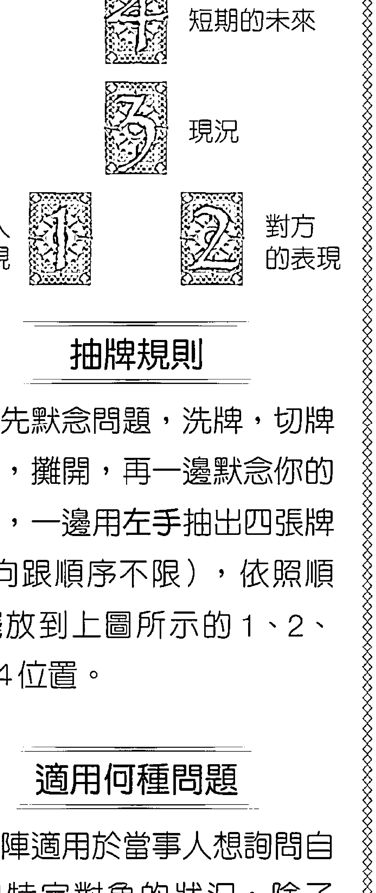

## 【實占前叮嚀】

常常有很多人說：「宮廷牌好難解喔！」我看很多網友解牌往往在遇到宮廷牌時就詞窮，頂多只能解出「這張牌是個什麼樣的人」，要不是說你就是牌上代表的那個人，就是說你遇到跟這張牌同樣個性的人……其他就講不出什麼所以然了。這真的是太可惜了，宮廷牌同樣也具有多面的牌義（一般人會覺得宮廷牌只能看出人格或人物類型，但事實上，宮廷牌也具有愛情或工作等運勢上的實用含意）。除了是個「什麼樣的人」之外，從牌面上也能透露出當事人的想法、作 爲，以及事情的狀態和發展。所以，不要看到宮廷牌就慌了手腳，你只要往「這張牌上的人物， 以他的性格面對工作、愛情時，會創造出什麼樣的局面、適合什麼樣的環境？以及他對事情的反 應如何、會做出什麼樣的決定？」就可以從宮廷牌看出人格以外的狀況了。 有些人會因爲男性抽到女性宮廷牌，或者女性抽到男性宮廷牌，就不太知道要怎麼解讀及下 定論。性別的本質搭上不同的牌，解讀出來的結果確實會有些出入，所以我提供下面這個案例來 說明。

說明。

## 235 藏在塔羅裡的占卜符碼

## 擇的方向。其中一位男同學從頭到尾就是一副「陪朋友來」的樣子，表現得興趣缺缺，但到了最

學業及未來前途，反而會繞著感情問題打轉的都是男生……。

很妙的一點是，我們以往的認知不同，女生雖然來參加這個活動的諮商，但詢問重點大都放在

開放同學的人生疑問塔羅牌諮商，我當時擔任這個單元的諮商師。當中發生很多有趣的事，而且

有一次，某大學的學生輔導處辦了一次有關兩性觀的活動，當中有一個為期一週的單元，特別

這天大約有五個男生，推推擠擠一起走進諮商室，接著一個一個地詢問自己的感情及人生選

## 我跟我女朋友的關係？

## 【抽出的牌陣】（不分正逆位）

+   * 「當事人」位置：寶劍皇后牌（風）

+   * 「對方」位置：女教皇牌（水）

+   * 「現況」位置：塔牌（火）

+   * 「短期的未來」位置：聖杯騎士牌（水）

## 237 藏在塔羅裡的占卜符碼

## 牌陣解讀：「關係」牌陣 236

後大家都問完時，大家開始一起態慫這位同學「找個問題來問問」。他看起來就是個很注重隱私又有點愛面子的孩子，想了半天，才說：「我沒有什麼問題耶！不然就問問我跟我女朋友的關係好了。。」旁邊的同學馬上八卦地問：「你女朋友怎麼了嗎？這個男生酷酷地說：「沒什麼，我就是找不到問題問嘛！」我馬上說：「沒關係，不一定要發生什麼事，單純用牌來看看現在的狀況，看看有什麼問題該提醒或該注意的事。」因為是問兩個人相處的狀況，所以我用了「關係牌陣」，主要有四張牌，這位同學抽出來的牌是：(1)「當事人」位置，也就是他自己——抽到寶劍皇后牌；(2)「對方」位置，代表他的女朋友——抽到女教皇牌；(3)「現況」位置，代表兩個人目前處在什麼樣的情境下——抽到聖杯騎士牌；(4)「短期的未來」位置——抽到聖杯騎士牌。看到「現況」的那張塔牌，我第一句話就說：「吵架了嗎？還在冷戰嗎？人家應該也不主動理你了？」他的反應非常快，馬上很震驚地脫口而出：「妳怎麼知道的！？身邊的同學先是震驚，然後開始揶揄他，還怪他有話不講。如果是一群女生，現一定是在團上來關心問道：「怎麼了？妳還好嗎？要不要跟我談談？」之類的，男女的世界，果然不管在哪個年齡層都不一樣啊！只要是學過塔羅牌稍懂牌義的人，看到這張塔牌，就一定知道這是陷入爭執或情緒化的狀態。加上這張牌又是火元素，代表事態嚴重；既然是火元素牌，那我又為什麼會解讀為「冷戰」呢？我們回過頭來看牌，兩位當事者的牌，一個是風中之水的寶劍皇后，另一個是水元素的女教

## 239 藏在塔羅裡的占卜符碼

皇，兩邊都沒有象徵暴力或激動情緒的火元素。寶劍皇后牌雖然是風元素，按理說應該要有溝通的動作，但這張牌卻是風中之水，不講話就算了，一旦講話，因為內在的水元素作祟，也沒有辦法把意見表達得很精確，反而容易講出不該講的話激怒對方。如果是女孩子抽到這張牌，會把心裡的想法用情緒性（水）的言詞（風）表達出來，我們可以解讀為言尖嘴利，或是容易演變為言語攻擊。但因其為男孩子，本身是火元素的水元素都很愛演內心戲），為了自保，他會選擇先觀察狀況。兩個人只在心裡想著，沒有把話講出來。女教皇的外表疏離，寶劍皇后則採取冷眼旁觀的態度，就會讓這張塔牌的情緒及激烈度隱藏起來，不會呈現在外，因此我才會判斷是「冷戰」。一個男生採取的態度卻是寶劍皇后牌，這讓我非常不能諒解，我皺著眉頭跟他说：「你這樣不好吧？有話就要講清楚，就算不去求饒，最起碼也要表現出一副你很想解決事情的样子！你現在有機會罵你，不如你先做自己的事，等過陣子她氣消了，你再去找她會比較安全。這樣有點沒擋當喔！他這次沒問我：「妳怎麼知道？」而是很快反射性地回答：「不然要怎麼辦？女生就是這樣。只能讓她自己冷靜一下！此話一出，旁邊的男同學自然是一陣搶伐，每個人拿著自己的「愛情經」爭相要教育他。我覺得他心裡其實是很煩惱的（寶劍皇后內在的水元素），只是愛逞

## 238

強（寶劍皇后外在的風元素），的確很需要別人跟他談談，發洩一下他的不安。那就由他們同學自己去輔導了，我要講的話可以只放在結論及重點上。

「寶劍皇后牌」在很多書中都被稱爲鐵娘子，雖然外表看起來是沒錯，但本質上我並不完全

同意。寶劍皇后的外表是風元素，所以表現得一副冷靜、自制、高傲，凡事都不爲所動的樣子，

但是它的內在畢竟還是水元素，所以我們可以知道情緒的起伏還是非常大的，而且容易受困在自

己的情緒中，只是外表會武装得很堅強。

這張牌的兩個元素——風與水，都是很消極的。女孩子的本質是水元素，抽到這張牌，陽性

的風元素還可以提供她一點想溝通及思考的動力，雖然不會太積極，但她至少會去想些辦法。反

之，男生若抽到這張牌，由於男生的本質是火元素，就會被風及水元素分散他的決心與主動性；

這表示他內心雖然忐忑不安，但沒辦法鼓足勇氣去正面處理狀況，消極的程度會大於女生，可能

連思考都不願意，直接會採取一種逃避的態度，假裝什麼事都沒發生，希望事情可以隨著時間化

爲無形……。

此時我不是以占卜老師的身分，而是以女性身分來看，這種男生最讓人火大了！不過他的下

場會需要我擔心嗎？也不盡然，因為年輕人感情，心理的衝動還是會壓過理性分析的。我想

他的女朋友雖然對他的表現很不滿意，到了最後還是會給他台階下。「短期的未來」抽到的是聖

杯騎士，元素性質是水中之火，這兩個元素都是感性元素（相對來說，風跟土元素都是理性元
素），代表再多的考量及觀察也敵不過荷爾蒙的作用，兩人還是會找到一個破冰點，然後積壓的
情感（男女雙方的代表牌，都有水元素的成分，雖然不外顯，但還是存在）流露出来，說不定還
有小別勝新婚的味道，畢竟聖杯騎士

## 245 藏在塔羅裡的占卜符碼

不管是在哪副牌中，牌圖上都具有「異性相吸、兩極互補」的性質，代表兩者必須是完全不同性質的人（事物），才能產生相對的吸引力。對照起水元素整天混在一起的感覺，風元素反而是叫帶給對方新的驚喜及成長，才能活化這段關係，也才有繼續往上成長的空間。要跳脫習慣性的模式，也只有陽性元素的前進性及創造力才能辦到了。我告訴她這個解讀時，她居然沒有反駁，很乾脆就認同了。她說身邊的親友也覺得她實在把太多時間花在這個男人身上，太沒有自己的生活了，所以她也在想，如果這次占卜的答案是短期內還沒有進一步結果，那麼爲了自己的人生，她確實是需要適時地抽離這段關係了。同樣的幾張牌，出現順序不同——例如說火跟水兩個元素，從水變到火或從火變到水這兩個不同順序，會讓牌義跟著變化，所以除了注意一副牌中元素分布的數量外，從元素之間的排列順序也能看出整件事情的起承轉合。

## 牌陣解讀：「聖三角」牌陣 246

## 牌陣解讀——【實例5】

## 【聖三角】牌陣 II

## 【實占前叮嚀】

再怎麼逆位，還是同一張牌，所以不會有完全顛倒或相反的意思，有些時候在一副牌中，同樣的元素重複出現很多次，這時如果出現逆位牌，不妨就當作是牌面上顯示出來狀況的一點小小阻礙、拖延，或是問題的癥結點，不用把逆位牌解釋成太過負面的意思。有時逆位牌也可以算是

一個解決問題的線索，讓你知道應該從哪個角度切入。另外，以下這則個案，對於「問題」位置出現好牌的多占卜者在「問題」位置（象徵整個情況中的阻礙或缺點）的話要怎麼解？這種常見的問題，也提供我一些看法。很出現好牌，就會不知如何從中看出問題點，因為「這張牌看起來明明就沒有什麼缺點，如果你也有這樣的困擾，可以

參考本則個案。

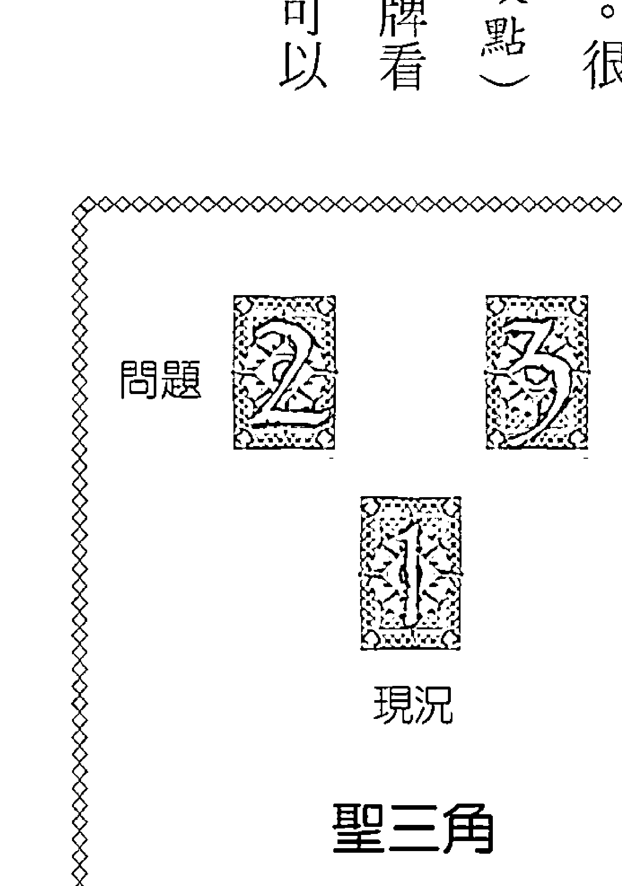

## 247 藏在塔羅裡的占卜符碼

持續不斷加溫，而且火元素帶有很强的目標性及企圖心，因此可以知道雙方都很「希望」這段感

心，對一段正在進行中的戀情來說，代表雙方對於這段感情都抱有高度的期待，認爲感情就是要這副牌挺有趣的地方，在於三張牌都是火元素。火元素象徵熱情、決定，以及往前進的決心，對一段正在進行中的戀情來說，代表雙方對於這段感情都抱有高度的期待，認爲感情就是要持續不斷加溫，而且火元素帶有很强的目標性及企圖心，因此可以知道雙方都很「希望」這段感

## 問題

我跟男友的相處狀況如何？【抽出的牌陣】（不分正逆位）

+   ·「現況」位置：權杖四——逆位（火）

+   ·「問題」位置：太陽牌（火）

+   ·「建議」位置：權杖三（火）

## 牌陣解讀：「聖三角」牌陣 248

情可以開花結果。但從我們對感情的認知來看，要修成正果，光靠熱烈的火元素是不夠的。水元素在一段感情的關係中，可以發揮潤滑及交流作用，也就是說，如果火元素是熱烈的激愛之外，還帶有依靠、瞭解、體貼等等比較情感性質的部分。情侶間的關係一旦少了水元素，就很難「沉浸」在感情中，等到火元素的熱情消耗完畢後，兩人間的爭吵會越來越多，缺少互相遷就及退讓的意願。土元素雖然不是濃情蜜意，有時可能甚至還會形成阻礙，但土元素代表的「穩定」是感情要牢固長久不可或缺的基本性質。它在一段情感關係中，象徵的是比較類似親情、傳統、責任的部分，少了土元素的感情關係，通常不會持續太久。風元素對於男女的感情關係，並沒有很直接的相關性。風元素在友誼、資訊交流、知性對話部分有幫助，但交換的不是愛意，而是意見。話雖如此，如果一副牌當中出現一小部分的風元素牌（感情牌陣最好不要以風元素為主），也代表兩個人的溝通管道是暢通的，彼此想法可以配合。如果感情牌陣中缺乏風元素，影響不會太大，但是就像本篇案例一樣，火元素過多的牌陣若沒有風元素，代表兩個人根本沒有理性分析過未來，大都是憑著一頭熱及一股信念橫衝直撞。學生常常會跟我說，一副牌如果全都是同一個元素，他們就會覺得乏善可陳，只能就同一個元素不斷強調。我說不是這樣的，如果清一色是同一個元素，你們就應該想到，意著這副牌少

## 249 藏在塔羅裡的占卜符碼

了其他三個元素，就可以從這副牌當中「缺了什麼」的角度來切入。這段關係的「現況」位置是權杖四逆位，權杖四是一張非常好的牌，不管在感情或工作上，都有一種穩定中求發展的意味，既有扎實的基礎，又有向上發展的寬廣空間。感情牌陣中出現權杖四，數字4通常代表兩個人已經都覺得這段關係非常穩定，也對彼此很信任，而火元素就是兩個人還有更極極的意圖，所以從權杖四這張牌可以看出兩個人已經考慮要做出承諾了。雖然是逆位，但是三張牌都是火元素，所以這個逆位沒有辦法影響到兩個人的決心，但是可能會造成一種「遲疑」或「不知道該如何前進」這種技術上的問題。這時我問當事人（女方），她很興奮地說沒錯，他們兩個人是希望以結婚爲前提來經營這段感情。

這時有位同學跳過「問題」位置的太陽牌（太陽牌號稱是律特牌七十八張牌中最光明美好的一張牌，出現在「問題」這個象徵阻礙的位置上，她沒有把握解讀的是「建議」位置。位置的權杖三，她說權杖三是權杖四的上一張牌，所以權杖四代表當事人雖然希望這段關係能發展下去，但逆位顯示了這個目標還有一些困難度，象徵友情及同心協力的權杖三，也許是建議他們退一步，再多多培養共同的興趣與嗜好，打下更好的基礎。

我聽了很高興，因爲數字間的關聯，的確是我常用的解牌技巧，權杖四的光明前途遇上逆位，就代表存在著一些小小的陰影，這個陰影是什麼呢？當然就要從象徵「問題」點的太陽牌來看了。

## 牌陣解讀：「聖三角」牌陣 250

但是在這張牌上面，全班幾乎都提不出比較具體的解釋。不過既然太陽牌很完美、順利，我

們就應該來看看「完美與順利會帶來什麼問題」，千萬要避免常見的誤，就是「我看不太出來

太陽牌有什麼問題，所以建議你要像這張太陽牌一樣，凡事從正面思考這種說法，因爲問題點

就是問題點，絕對不會因爲在這個位置出現了好牌，就認爲可以把它拿來當成建議用。如果這張牌是爲了要給你建議而出現，那麼它就應該出現在「建議」這個位置上。

太陽牌是一張光明、順遂的牌，帶有天眞單純的意味。塔羅牌中雖然有很多牌可以代表成功

勝利，但太陽牌卻是遇到的阻礙最少的。火元素有一種直接、快速的意思，天眞單純又總是會吸

引很多助力，所以過程中通常不會遭遇太多波折；乍看之下一切都很好，但是沒有經歷過風雨或

霜害的稻穀，看起來雖然茂盛，卻往往是空心的。因此我們可以斷言，這張太陽牌代表他們這段

感情在太過理所當然、沒有阻力之下，雖然發展得很順利，卻缺乏足夠的「珍貴感」，這也就是

爲什麼土元素跟水元素牌都沒有出現的原因。

我對當事人說：「你們的感情基本上沒有太多猜測及互相折磨的劇情，兩個人都很明確知道

自己要的是什麼，也進展得很快。然而就是因爲太順利了，所以會讓覺得少了些什麼，要知

道，不管友誼或愛情，如果有革命情感，兩人攜手共同面對一些難關，會加深兩個人是命運共同

體的感覺，缺少困境的愛情很像用文火煮水，永遠停留在要沸不沸之間。

我再補充說明：「而且因爲太陽牌太光明太美好了，没有任何值得妳去解決的問題，一般來

說，如果我們覺得雙方的感情不夠深，最簡單的做法就是把阻礙這段感情的問題解決，那麼感情就可以進一步加溫，但是你們的麻煩在於沒有任何問題要解決，所以感情雖然很好，卻一直在原地踏步，找不到加溫方式。這時當事人笑得很開心地表示，她的感情狀況確實就跟牌面顯示的一模一樣。他們兩人交往得很好，沒有什麼問題，也都有未來要結婚的共識，但她總覺得好像缺少了那麼一點點，跟她認知中愛情必須要有的強烈、浪漫似乎不太一樣，總是沒辦法讓自己的情感到達那種最熱切的地步，她又一直不知道問題出在哪裡，甚至也不知道到底算不算有問題，所以才開牌來看看狀況。分析完之後，她認為這副牌確實反映出她的心態及所遭遇到的情境。把前兩張牌的狀況釐清之後，「建議」位置的權杖三就非常簡單了。權杖三代表的就是這對情侶中最缺乏的「革命情感」，當然我們不用刻意去給自己找麻煩來培養革命情感，只需要創造出一些需要「共同面對、共同學習、共同克服」的情境就夠了。所以我建議他們可以一起去攀岩、學社交舞，或是做一次高空彈跳之類的。因為他們需要共同去體驗的事情必須要帶有一點困難，只要同心克服了幾件事，兩個人身為「共同體」及「依靠對方」的感受就會更強烈。如此一來，才能再進一步到達權杖四正位所代表的局面（也可以說，因為權杖三的部分沒有完成，「現況」位置的權杖四才會是逆位的）。

## 牌陣解讀：「大十字」牌陣 252

## 「大十字」牌陣 I

## 牌陣解讀——【實例6】

## 「大十字」牌陣的特色：

過程。

1從「過去」位置，可以看到整件事的成因，或者是觀察此位置與現在的反差，就可以推論出

2從「現在」位置，可以看出當事人目前的處境，以及本身的心態。

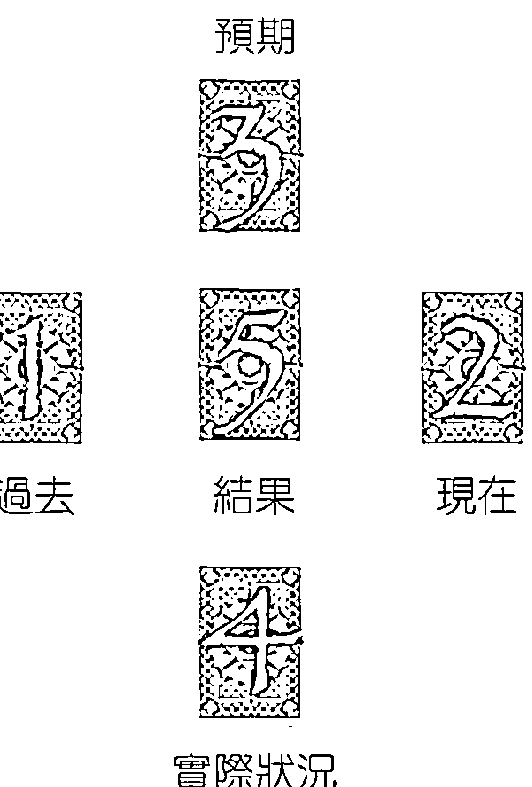

## 預期

## 過去

## 結果

## 現在

## 實際狀況

## 抽牌規則

心中先默念問題，洗牌，切牌一次，擺開，再一邊默念你的問題，一邊用左手抽出五張牌（方向跟順序不限），依照順序擺放到上圖所示的1、2、3、4、5的位置。

## 適用何種問題

對當事人的內心狀態可以有進一步瞭解，並分析出通往「結果」的中間過程會是什麼樣的狀況。適合在想要推敲一件事情的細節時使用。

## 【實占前叮嚀】

現在我們要介紹的是五張牌的大十字牌陣，很多人使用大十字牌陣時，會有只看最後一張牌

的習慣，也就是把焦點集中在「結果」位置。經常有學生打電話來問：「老師，我抽了一副大十

字牌，「結果」的位置是XX牌，這代表什麼意思？」

我的回答是：「我不知道，沒有前四張牌，光讓我知道第五張也没有意義。」（題外話，我

電話問別人，那又何必學塔羅牌呢？多思考多咀嚼，才是累積內在經驗的不二法門。）

本文例子是五張牌中有四張土元素，在「結果」的位置同樣是一張土元素牌，卻出現了逆

位。這副牌的元素同質性太高，最後的逆位反而造成了一種顛覆性，讓狀況往另一個方向解讀。

## 【實占前叮嚀】

現在我們要介紹的是五張牌的大十字牌陣，很多人使用大十字牌陣時，會有只看最後一張牌

的習慣，也就是把焦點集中在「結果」位置。經常有學生打電話來問：「老師，我抽了一副大十

字牌，「結果」的位置是XX牌，這代表什麼意思？」

我的回答是：「我不知道，沒有前四張牌，光讓我知道第五張也没有意義。」（題外話，我

電話問別人，那又何必學塔羅牌呢？多思考多咀嚼，才是累積內在經驗的不二法門。）

本文例子是五張牌中有四張土元素，在「結果」的位置同樣是一張土元素牌，卻出現了逆

位。這副牌的元素同質性太高，最後的逆位反而造成了一種顛覆性，讓狀況往另一個方向解讀。

## 我跟前女友有辦法復合嗎？

## 【抽出的牌陣】（有分正逆位）

+   • 過去位置：世界牌（土）

+   • 現在位置：錢幣六（土）

+   • 預期位置：聖杯六（水）

+   • 實際狀況／環境位置：錢幣七（土）

+   • 結果位置：錢幣四——逆位（土）

有個男學生打電話來，很困擾地跟我聊了一下他的感情狀況，大概是說他對分手數個月的前女友還是放不下，總覺得兩個人該結束得這麼草率，如果再努力看看，說不定還是有互相配合的空間……講到最後，他無精打采地說：‘我剛剛抽了一副大十字牌陣，最後一張牌是錢幣四逆位，唉……我去翻了書，書上說如果是針對復合的問題，這張牌的意思應該是復合無望了。’我聽了很感興趣，的確，如果就單張牌的解法來看，書上的答案可以說是正確的。在我的理……

## 255 藏在塔羅裡的占卜符碼

解中，錢幣四這張牌本來就不利於兩性關係，雖然就錢幣四的結構來看，可以有雙重解釋：土元諸多重疊，所以錢幣四你可以說它很沉悶，卻也很穩定，可以說它缺乏

## 牌陣解讀：「大十字」牌陣 262

周平靜，什麼事也沒發生。所以這張寶劍九的意思，應該不是來自於事情本身，而是因爲自己心到底是什麼事困擾當事人呢？我們可以從「預期」位置去找原因，預期就是代表「當事人認爲會發生的事或事情的走向，但不代表實際上的狀況，這個位置出現的是聖杯騎士，這是水元素中帶著火元素的牌，水跟火兩者都是與情緒有關的元素，代表當事人煩惱的並不是前往大陸後的工作發展，而是跟內心情感有關。這部分就很好解了，因爲當事人有一個懷孕中的妻子，放心不下是很正常的。我問女學員：「他其實對於這個職位要負責的一切都已經相當有把握了，但從這張聖杯騎士及寶劍九來看，他最放心不下的應該是妳，或是與家人有關的其他事情。女學員連忙說：「對對對！他很擔心我生產時他不在身邊，也很擔心他的父母年紀大，可能隨時需要子女的幫忙，怕我應付不來。」那麼到底要不要前往大陸工作呢？我認爲「結果」的教皇牌，顯示出這個工作機會是很值得把握的。在這個案例中，「過去」這個位置，我會認爲是顯示當事人先前在工作上的狀況，這裡出現的是錢幣騎士牌。教皇牌與錢幣騎士牌都是土元素，代表過去的工作及未來的新工作之間有共同點：當事人是一個認真、負責並被委以重任的人，工作很穩定，兩家公司應該都是基礎雄厚、也發展到一定規模的企業。接下來，我們就可以從教皇牌與錢幣騎士的相異之處，來判斷出哪一份工作對當事人比較有

利，而且好處在哪裡了。教皇是土元素，是一張象徵領袖的牌，擁有許多的資源以及跟隨者，應該是地位崇高又可在充足時間內推動自己的計畫。反觀錢幣騎士，雖然是一張對工作也很有利的牌，既有火又有土，看來是既穩定又很有發揮空間，但是考量當事人已經到了主管級的年齡，還要像錢幣騎士一樣靠自己累積所有的資源的话，就會顯得有點辛苦了；而且錢幣騎士是正在累積能量，如果是基層員工，前景就會很看好，但如果是主管級的人抽到這張牌，表示他有太多事都要扛在自己身上。因此我們可以推测，應該是公司的資源不足，或是下放給他的權力不夠多。

於是我對女學員說：「妳老公在原來的公司也做得很好、很受器重，但是他會考慮轉職的原因，可能是他的眼光都比公司快一步，想要推動事情卻很少得到公司援助，必須靠自己四處張羅；甚至還得花時間去教育老闆，他為何要這樣做的原因。承受的壓力及無力感都很重。」女學員馬上回答：「就是這樣，他擔負的責任很重，做得比公司要求得多，我覺得他的上司都沒有他那麼辛苦，他需要承受的壓力是來自多方面的。一最後的結論是，如果他前往大陸的新公司工作，所得到的資源及配合度都比原來的公司高。

所以我錢幣騎士雖然在工作方面是一張好牌，但是跟教皇牌一比，就凸顯出其不足之處。因此我心裡猜，如果有逆位牌，應該就是這張錢幣騎士。後來女學員告訴我們，逆位牌有兩張，錢幣騎士果然就是其中之一；另一張是寶劍九，寶劍九的操縱與煎熬一旦成了逆位，影響力就沒那麼大了，正符合我們最後的結論，雖然當事人擔心家人的狀況，但是支持他去新工作的理由要比他

留在原公司的理由大多了，所以寶劍九的干擾性也會減少，因而呈現出逆位狀況。

因此在我的方式中，逆位的牌義並非一張一張制定的，而是要綜觀整個牌陣的元素分布以及

問題形態，甚至牌跟牌之間互相比對，才能求出一张牌的逆位意思。如果你夠熟悉四大元素，一

張牌的吉凶自然難不倒你，逆位也就可以自由決定用或不用了。

[PAGE 266]

## 263 藏在塔羅裡的占卜符碼

這是在我的解牌實戰課程中，在課堂上被提出來的案例，案主學員爲了碩士論文已經傷腦筋很久了。她說她目前進行得很不順利，覺得無以爲繼，如果不換題目，可能就寫不下去了，但換了題目就表示前面的心血都白費了。因此她想要看看如果換了題目會不會順利一點，或者是到底這副牌很合我的胃口，基本上我認爲越複雜難解的牌，訊息就越多。我們先看看這副牌的元素，雖然這副牌沒有「問題」這個位置，但案主已經表明她是「遇到困境」，我們就可以從「現在」及「實際狀況／環境」這兩個位置，來看看她遇到了什麼問題。一般來說，寫論文需要決心及耐力，若能火元素與土元素同時共存最好。「現在」位置是錢幣一，土元素的性質不錯，但是錢幣一在「行動」上，代表的只是剛剛埋下一個開端，也就是「做好準備」而已，這實在不妙，因爲錢幣一從埋下種子到發芽成長到可以見到結果，需要一段很漫長的時間。我們都知道交論文一定有時間考量，於是我趕緊回頭看看第一張牌，也就是在「過去」位置的牌，如果過去是一張積極的火元素，那麼我們可以把這張錢幣一解釋爲「打下很好的基礎，可以繼續前進」；不過很不幸的，「過去」位置的牌是聖杯二，這張牌不但是消極的水元素，毫無行動力可言，而且其心態是樂觀、天真、比較散漫、沒有企圖心，一切都自我感覺良好。由此可見，她之前有好一段時間一直沒有把論文這件事放在心上，或是總提不起勁來寫（更有可能的是忙著吃喝玩樂，依我對她的瞭解，應該八九不離十）。所以「現在」位置的錢幣（更可能的描述）

一，表示她到現在才總算開始收心，正視要寫論文這件事情。

說：這時我問她：「過去的這張聖杯二，妳自己應該知道是什麼意思吧？」她很心虛地點頭，我說：可是這個牌明明是才剛要開始啊！搞了半天，原來她現在的進度是「擺好大綱了」。我

又問她：「字數多少？」她露出虛虛的笑容回答：「兩……兩張A4紙。」大家哄笑聲還沒停止

之前，她又心虛地辯稱：就算只有大綱，那也是我的心血啊！大綱了！」講完自己也笑

了出來。我就說：「那何必抽牌問呢？既然只進行到大綱，要換題目隨時可以換嘛！」妳沒有任何

損失啊！」她還是堅持：「這個大綱我也想了很久，捨不得嘛！」雖然其實「結果」位置的權杖

二已經說明一切了，不過我們還是順序看下去吧。

有開始總比沒開始好，既然已經收心了，我就想看看：那她是否堅持得下去呢？結果在「實

際狀況／環境」位置上，出現了令人傻眼的聖杯八，這張牌代表「在經過長久的消耗之後，對目

前的狀況感到厭煩、提不起勁，想要離開現況去找尋新目標」，剛好點出了她現在想要換題目的

心態，不過我們從前面的聖杯二及錢幣一可以看出，她的論文才剛剛開始，連主文都還沒開始

寫，就出現了厭倦心態，看來要把這個題目寫完是遙遥無期了。在「過去」、「現在」及「實際

狀況」位置的這三張牌，都是沒有前進性的陰性元素，而且是散漫的水元素牌占了兩張，我想現

在的這個題目還沒開始寫，就已經讓她覺得掌握不住了。

[PAGE 267]

## 牌陣解讀：「大十字」牌陣 264

這時另一位同學舉手，說她看到這副牌中有一個特點：爲什麼出現的牌，不是一號牌就是二號牌呢？～我很高興地說：～很好，塔羅解牌師就是要這樣，必須對每一項元素都很敏感，數字的確是一個很重要的線索。這副牌中都出現1跟2，表示一切都還在剛起步階段，所以即使我們尚未細看每張牌的牌義，只從數字來看也可以看出這個論文根本還沒有進行到主要部分，數字的累積，難道這張牌不具意義嗎？當然不是。因爲聖杯牌本身代表的是水元素，所以就算8這個數字代表累積及長期性，但累積的也只是水元素，代表只是空想而非實際行動。案主也坦承，確實有很長一段時間，雖然還沒動筆，卻一直掛心這件事。另外還有一張宮廷牌——錢幣侍者，確張牌其實跟1、2號牌也有相同的含意，侍者牌是宮廷牌中年紀最小的，一切都剛剛起步、開始學習，同樣代表在萌芽階段。最後一張的「結果」位置出現了權杖二，這張牌的意思很明顯，班上學員都可以一目了然：它代表二選一，加上火元素的「新生」及「積極」開創的特質，當然是要她選擇「換新的題目吧，反正舊的妳也寫不下去。」至於她後面加抽的「個人心態牌」是權杖一，代表全新的企圖心，希望一切都煥然一新，且没有任何包袱及負擔，考量先前聖杯八所暗示的心態，均表示案主已經煩這件事煩到想擺脫它，希望有個全新的開始。我問她：妳現在已經看這個題目很不順眼了耶！甚至一看到就反感。

[PAGE 268]

## 牌陣解讀——【實例 8】

## 【大十字】牌陣 III

## 【實占前叮嚀】

這一次的案例同樣是一副大十字牌陣，但是因爲當事人認爲五張牌所呈現出的訊息不夠完整，因此另外再加上兩個位置的牌，呈現出她想看到的部分，就如同我強調過的：‘牌陣是爲了方便用的。沒有什麼神聖不可侵犯的原則，因此要加牌、減牌，或甚至自創牌陣，都没有什麼不可以的。’這副牌很耐人尋味，因爲在數字上有非常強烈的一致性，讓人無法不注意，很多細節在單張牌義上看不出來，但整副牌一組織起來就非常明顯，可以對比我在課堂上常對學生說的：‘如果你看到一整副牌，卻不知道從何解起，最好的辦法就是找出這副牌中，每一張牌

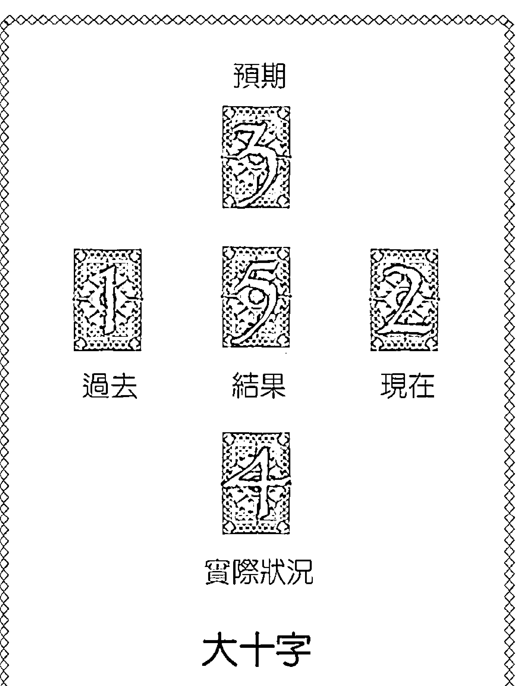

之間最大的共同點。」這個原則，不管套用在分析塔羅牌或者解讀占星命盤都可以適用。

+   °「過去」位置：聖杯二（水）

+   °「現在」位置：錢幣一（土）

+   °「預期」位置：寶劍二（風）

+   °「實際狀況／環境」位置；聖杯八（水）

+   °「結果」位置：權杖二（火）

+   加牌部分：

+   個人心態：權杖一（火）

+   建議：錢幣侍者（土中之風）

[PAGE 269]

## 267 藏在塔羅裡的占卜符碼

這是在我的解牌實戰課程中，在課堂上被提出來的案例，案主學員爲了碩士論文已經傷腦筋很久了。她說她目前進行得很不順利，覺得無以爲繼，如果不換題目，可能就寫不下去了，但換了題目就表示前面的心血都白費了。因此她想要看看如果換了題目會不會順利一點，或者是到底這副牌很合我的胃口，基本上我認爲越複雜難解的牌，訊息就越多。我們先看看這副牌的元素，雖然這副牌沒有「問題」這個位置，但案主已經表明她是「遇到困境」，我們就可以從「現在」及「實際狀況／環境」這兩個位置，來看看她遇到了什麼問題。一般來說，寫論文需要決心及耐力，若能火元素與土元素同時共存最好。「現在」位置是錢幣一，土元素的性質不錯，但是錢幣一在「行動」上，代表的只是剛剛埋下一個開端，也就是「做好準備」而已，這實在不妙，因爲錢幣一從埋下種子到發芽成長到可以見到結果，需要一段很漫長的時間。我們都知道交論文一定有時間考量，於是我趕緊回頭看看第一張牌，也就是在「過去」位置的牌，如果過去是一張積極的火元素，那麼我們可以把這張錢幣一解釋爲「打下很好的基礎，可以繼續前進」；不過很不幸的，「過去」位置的牌是聖杯二，這張牌不但是消極的水元素，毫無行動力可言，而且其心態是樂觀、天真、比較散漫、沒有企圖心，一切都自我感覺良好。由此可見，她之前有好一段時間一直沒有把論文這件事放在心上，或是總提不起勁來寫（更有可能的是忙著吃喝玩樂，依我對她的瞭解，應該八九不離十）。所以「現在」位置的錢幣（更可能的描述）

一，表示她到現在才總算開始收心，正視要寫論文這件事情。

說：這時我問她：「過去的這張聖杯二，妳自己應該知道是什麼意思吧？」她很心虛地點頭，我說：可是這個牌明明是才剛要開始啊！搞了半天，原來她現在的進度是「擺好大綱了」。我

又問她：「字數多少？」她露出虛虛的笑容回答：「兩……兩張A4紙。」大家哄笑聲還沒停止

之前，她又心虛地辯稱：就算只有大綱，那也是我的心血啊！大綱了！」講完自己也笑

了出來。我就說：「那何必抽牌問呢？既然只進行到大綱，要換題目隨時可以換嘛！」妳沒有任何

損失啊！」她還是堅持：「這個大綱我也想了很久，捨不得嘛！」雖然其實「結果」位置的權杖

二已經說明一切了，不過我們還是順序看下去吧。

有開始總比沒開始好，既然已經收心了，我就想看看：那她是否堅持得下去呢？結果在「實

際狀況／環境」位置上，出現了令人傻眼的聖杯八，這張牌代表「在經過長久的消耗之後，對目

前的狀況感到厭煩、提不起勁