## 洞察血型的秘密 破译星座的奥妙

## 血型星座大全

## 揭示性格的真相 把握自己的命运

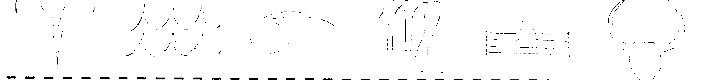

## Blood Type

## Constellation

&

## Life

中国华侨出版社

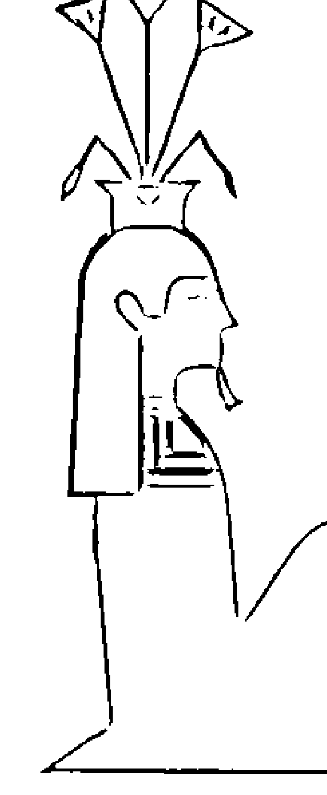

## 探索人生奥秘

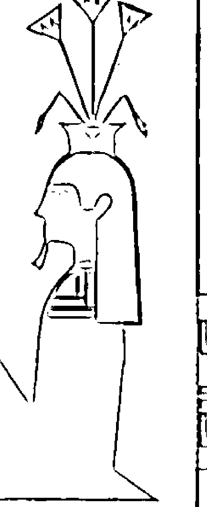

## 走进有趣的DNA之旅

## 血型、星座与人生

## BLOOD TYPE
CONSTELLATION
&
LIFE

责任编辑 蒋泽新 ■ 封面设计 丁 琳

ISBN 7-80120-878-1

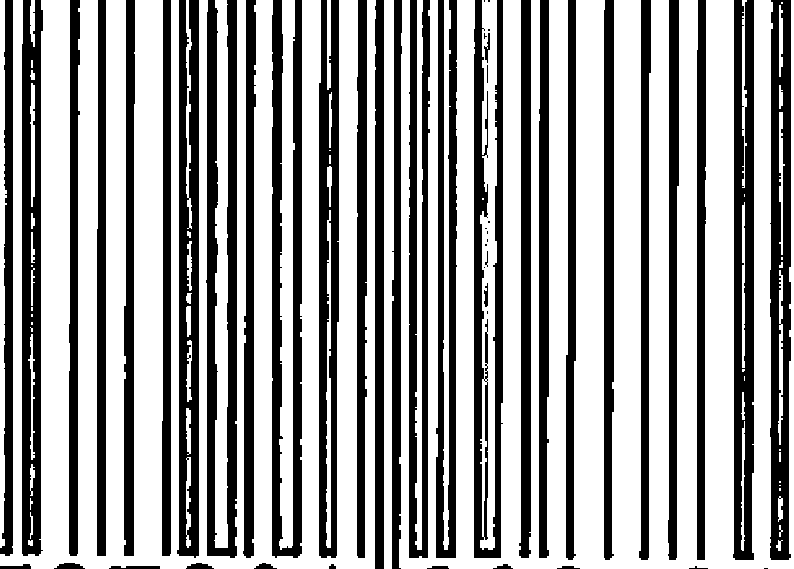

ISBN 7-80120-878-1/G·384
定价：22.00元

洞察血型的秘密

破译星座的奥妙

## 血型与人生

揭示性格的真相 把握自己的命运

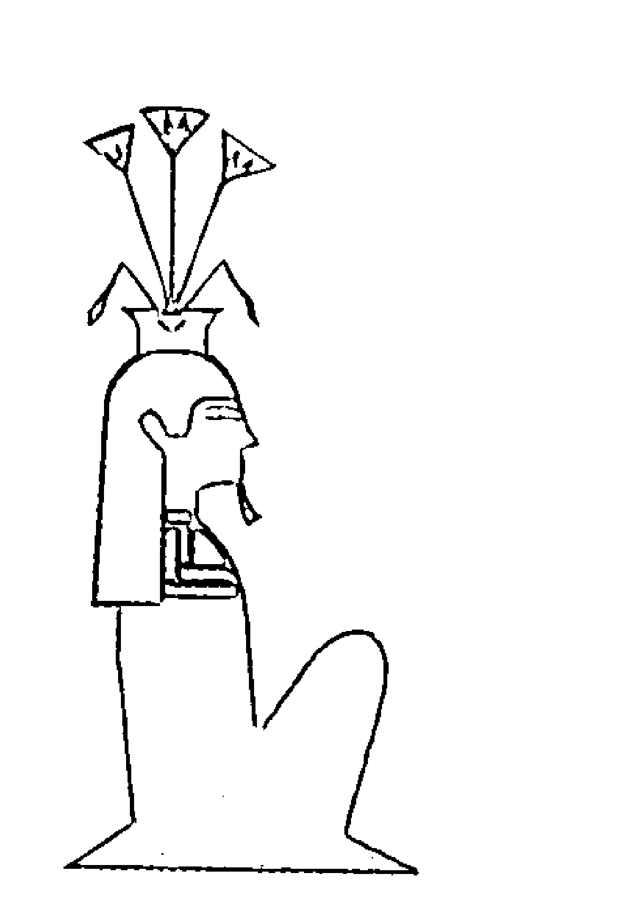

BLOOD TYPE CONSTELLATION & LIFE
江天 编译

中国华侨出版社

## # 图书在版编目(CIP)数据

血型、星座与人生/江天编译.一北京:中国华侨出版社,2004.11

ISBN 7 – 80120 – 878 – 1

I. 血…  II. 江…  III. 血型 - 关系 - 性格 IV. B848.6

中国版本图书馆 CIP 数据核字(2004)第 104958 号

## # ○ 血型、星座与人生

- 编 译/江天
- 责任编辑/蒋泽新
- 装帧设计/丁 琳
- 版式设计/章 丽
- 责任校对/荔志平
- 经 销/新华书店
- 开 本/850 × 1168 毫米 1/32 印张/12 字数/300 千字
- 印 刷/北京市昌平长城印刷厂
- 版 次/2004 年 11 月第 1 版 2004 年 11 月第 1 次印刷
- 印 数/10000 册
- 书 号/ISBN 7 – 80120 – 878 – 1/G·384
- 定 价/22.00 元

中国华侨出版社 北京市安定路 20 号院 3 号楼 邮编:100029

发行部:(010)64443051 传真:(010)64439708

## 目录

## 第一章 血型概论

- 一、血型发展的历史……（1）
- 二、血型的医学原理……（2）
- 三、血型与民族特性……（4）
- 四、日本是一个被血型主导的社会……（6）
- 五、企业团体中单一血型的弊病……（10）
- 六、血型与我们的生活……（11）
- 八、血型与食谱……（13）
- 九、各血型的优缺点……（14）
- 十、各血型的行为习惯……（15）
- 十一、不同血型的性爱倾向……（15）
- 十二、女性血型特征……（18）
- 十三、血型与求婚……（20）

## 第二章 血型与星座

### （一）A型

- ☆白羊座 ……（24）
- ☆金牛座 ……（29）
- ☆双子座 ……（34）
- ☆巨蟹座 ……（39）
- ☆狮子座 ……（44）
- ☆处女座 ……（49）
- ☆天秤座 ............... (54)
- ☆天蝎座 ............... (59)
- ☆射手座 ............... (64)
- ☆魔羯座 ............... (70)
- ☆水瓶座 ............... (74)
- ☆双鱼座 ............... (79)

### （二）B型

- ☆白羊座 ............... (84)
- ☆金牛座 ............... (89)
- ☆双子座 ............... (94)
- ☆巨蟹座 ............... (99)
- ☆狮子座 ............... (104)
- ☆处女座 ............... (109)
- ☆天秤座 ............... (114)
- ☆天蝎座 ............... (119)
- ☆射手座 ............... (123)
- ☆魔羯座 ............... (128)
- ☆水瓶座 ............... (134)
- ☆双鱼座 ............... (138)

### （三）O型

- ☆白羊座 ............... (143)
- ☆金牛座 ............... (148)
- ☆双子座 ............... (153)
- ☆巨蟹座 ............... (158)
- ☆狮子座 ............... (163)
- ☆处女座 ............... (168)
- ☆天秤座 ............... (173)
- ☆天蝎座 ............... (178)
- ☆射手座 ………………………………………………(183)
- ☆魔羯座 ………………………………………………(187)
- ☆水瓶座 ………………………………………………(192)
- ☆双鱼座 ………………………………………………(197)

### （四）AB型

- ☆白羊座 ………………………………………………(203)
- ☆金牛座 ………………………………………………(207)
- ☆双子座 ………………………………………………(212)
- ☆巨蟹座 ………………………………………………(217)
- ☆狮子座 ………………………………………………(223)
- ☆处女座 ………………………………………………(228)
- ☆天秤座 ………………………………………………(233)
- ☆天蝎座 ………………………………………………(238)
- ☆射手座 ………………………………………………(243)
- ☆魔羯座 ………………………………………………(248)
- ☆水瓶座 ………………………………………………(253)
- ☆双鱼座 ………………………………………………(258)

## 第三章 血型与人生

### 一、从体验中成长

- 血型能告诉我们什么 …………………………………(263)
- 不见得经常都是准确的 ……………………………(264)
- 何谓外向型、内向型? ……………………………(266)
- 尝试着从血型来判断 ……………………………(268)
- 感度强及感度弱的血型 ……………………………(270)
- 血型就像指南针的磁石一样 ………………………(272)
- 气质与性格的关系 ………………………………(273)
- 甩人与被甩的关系 ………………………………(275)

### 二、从血型判断气质与性格

- 引导你的七种气质………………(278)
- 气质所呈现的强弱关系………………(290)
- 血型的三角关系………………(295)
- 血型别的性格分析………………(301)

### 三、血型告诉你各种爱的方式

- 沉醉在爱情中的你………………(326)
- 血型是爱情的向导………………(327)
- 为爱心乱如麻时………………(349)
- 依照性格分类来看爱的方式………………(350)
- A型的爱的方式 ………………(350)
- O型的爱的方式 ………………(356)
- B型的爱的方式 ………………(363)
- AB型的爱的方式 ………………(369)

## 第一章 血型概论

## 一、血型发展的历史

1901年,奥地利维也纳大学的卡尔·兰德斯泰纳首先发现了ABO血型。这一发现,对人类文明有着巨大的影响,为此,卡尔·兰德斯泰纳在1930年荣获了诺贝尔奖。

ABO血型中有A型、B型、O型和AB型,是人类最常见的,也是最早被发现的。

发现ABO血型之后,从1927年开始,人们又陆续发现了MN血型、Q血型、E血型、T血型、Rh血型等数十种血型系统。不仅如此,人们还发现,除了人类以外,连猴子、猩猩、大象、狗等高等动物也存在血型,甚至乌龟、青蛙身上也可以找到血型的痕迹。

血型的研究,从某种意义上讲,它不仅与医学、生化学有关,而且和人们的思维、性格、气质、行为,甚至和人类社会的政治、经济、文化等社会活动,都有着密切的联系。因此,对血型的研究,已成为社会科学的一个组成部分。

在国外,特别是日本,一些人类学家已经把血型的研究作为一项新兴学科来进行探索。日本著名的人类学专家能见正比古,以及他的儿子能见俊秀,还有铃木芳正、铃木健二、古烟种基,他们以血型为研究主导,从人的性格、气质、恋爱、婚姻、子女关系、人际关系、心理条件等各个方面进行研究,获得了许多成果。

我国在血型研究上,基本还没有形成体系,只是从一部分翻译过来的资料中,大概地了解到国外的血型研究动向。

由于我国的民族历史，民族文化、民族传统、伦理道德、社会制度、生活环境等等，与国外有很大的差异，所以，对国外的一些血型研究成果不能机械地照搬，只能作为一种参考。

虽然说血型研究成果不像一加一等于二那样放之四海皆准，但终归有它的科学性和现实性，也是我们在处理人际关系，调节个人心理、发挥自己专长和避免走弯路上，应该掌握的一门课程。

## 二、血型的医学原理

我们一般所谓的“血型”，是指“ABO式”的血型，既以 A 型、B 型、O 型、AB 型等外观形式上的不同来分类，这是普通的卫生常识。大家都知道，如果遇到需要输血的病人，首先要查验、确认其血型，不确认血型是绝对不能随便输入什么血的。决定这个血型的因素之一就是一种被称之为“血液型物质”的东西，为了方便起见，我们可以把“型物质”三字省略来思考，但不能忘记它是怎样一种东西。不能把它和我们常说的“血液”搞混。血液型物质是一种多糖类——蛋白质型的复合化合物，是分子量极大的一种有机化合物。由于这化合物的复合构造的不尽相同，使之并非表现为某种单一的形式，而是分裂成 A 型、B 型这两种物质型。

如果一个人身上没有任何一种血液型物质，那么他就是 O 型。如果含有 A 型物质，他就是 A 型。含有 B 型物质，那么就是 B 型，如果同时含有 A 型和 B 型物质，那他就是 AB 型，人的血液中一般有一层半透明状的薄膜包裹着红血球，我们所说的“血液型物质”，就是穿过半透明的膜与红血球混到了一起。

作为血型，最重要的一点就在于它要进行遗传。不论是谁都会承认，与性格相比，人的气质中，有相当一部分是从父母那里遗传下来的。

所谓的遗传，就是子女公平地从父母那里接受一个一个的因子，所以，当记述某个人所具有的遗传因子的状态时，要记下两个并列的遗传因子符号，一个代表从父亲那里接受的,一个代表从母亲那里接受的。如 OO,即表示从父母双方接受的是同样 O 因子。AO 型表示由父母的某一方接受了 A 因子,而从另一方接受了 O 因子。那么生下来的孩子具有的遗传因子究竟会成为什么样的一种状态呢? 请参看下表：

| 父母的血型 | 父母的遗传因子 | 子女的遗传因子 | 子女的血型 |
| --- | --- | --- | --- |
| O×O | OO×OO | OO | O |
| O×A | OO×AO | OO,AO | O,A |
| O×A | OO×AA | AO | A |
| O×B | OO×BO | OO,BO | O,B |
| O×B | OO×BB | BO | B |
| O×AB | OO×AB | AO,BO | A,B |
| A×B | AO×BO | OO,AO,BO,AB | O,A,B,AB |
| A×B | AO×BB | BO,AB | B,AB |
| A×B | AA×BO | AO,AB | A,AB |
| A×B | AA×BB | AB | AB |
| A×A | AO×AO | OO,AO,AA | O,A |
| A×A | AO×AA | AO,AA | A |
| A×A | AA×AA | AA | A |
| B×B | BO×BO | OO,BO,BB | O,B |
| B×B | BO×BB | BO,BB | B |
| B×B | BB×BB | BB | B |

续表

| 父母的血型 | 父母的遗传因子 | 子女的遗传因子 | 子女的血型 |
| --- | --- | --- | --- |
| A × AB | AO × AB | AO, AA, BO, AB | A, B, AB |
| | AA × AB | AA, AB | A, AB |
| B × AB | BO × AB | AO, BO, BB, AB | A, B, AB |
| | BB × AB | BB, AB | B, AB |
| AB × AB | AB × AB | AA, BB, AB | A, B, AB |

## 三、血型与民族特性

如果说民族性、国民性是由血型分布的不同决定的，恐怕有些言过其实，因为气候风土、历史传统以及和周围国家的关系等，无疑对它们产生着巨大的影响。但是，在社会组织的结构方式等方面，似乎的确可以看到由于血型分布不同而表现出来的特征。

先从极端的例子说起。世界上只有 O 型血型的民族，是北美印第安人和南美印第安人。

虽然由于近年来的通婚混血，美洲印第安人已不能说是百分之百的 O 型民族，但是据美国人类学家施奈特报告，纯印第安人有 92.3%是 O 型。还有不少人类学者认为，在白人侵人以前，印第安人可能全都是 O 型。南美的印加帝国，就是 O 型单一的国家。

无论是北美印第安人还是南美印第安人，都是有高度集团性的民族。但是这种集团规模很小，难以真正扩张。美洲印第安人虽然在美洲大陆居住了1万年以上，但最终也未建立统一的国家，至今仍分为许多小部族。

为了使小集团走向有组织的大社会，A 型是必不可少的。

A型和O型几乎各半、B型和AB型接近于零的是澳大利亚的土著民族。古代欧洲人似乎也是A型和O型民族。被称为“古代的幸存者”、居住在比利牛斯深山中的巴斯克人，基本都是A型和O型。这种巴斯克人社会建立了严格的家族单位制，长幼之序也十分严格。

缺乏灵活性，导致技术文明发展的迟缓，这是A型+O型社会的特征。在澳大利亚居住达两万多年的土著人，直到300年前被英国人发现时，还完全过着石器时代的生活。

欧洲社会也不曾独自创造人类文明。欧洲文明是在吸收中东和北非以及B型居多的伊斯兰国家文明的基础上开花结果的。O型长于学习，A型长于应用改良，因此，A型+O型社会一旦接触到其他文明，就会焕然一新。

欧洲社会至今仍然是A型+O型社会，与日本相比，O型的比例要高一些。美国O型占46%，A型占40%；英国O型占47%，A型占42%。美国人崇尚自我意志、竞争和坦率等等，多与这种O型气质有关。

日本是A型为主的国家，但它又与欧美不同，B型和AB型占有相当比例，给A型中心社会以影响。这种现象在发达国家中是罕见的。如果A型掌握主导权，那么即使在同样的A型+O型的社会中，也会表现为强烈的集团归属感、重视原则、抑制个性、尊重规律、富于牺牲精神和坚持不懈等A型品质。

亚洲的特征是B型为主。印度、中亚、蒙古、中国北部、东北部和北朝鲜等，B型均占30-40%，有的地方甚至超过50%。

西方与东方的差别与B型的多少是有关系的，可以说是A型+O型社会和B型+O型社会的差别。

亚洲有不少民族缺乏善恶标准。相对于重视逻辑、言行规范的西方文化，亚洲的思想给人一种暧昧感，可以做多种解释。西方往往是以基督教的戒律来规范社会和日常生活的，而东方却大多是信仰多种神教。

亚洲还有不少民族非常散漫,对时间看得很轻。那些被派往阿拉伯和印度的日本人,对不知何时到来的公共汽车和滞缓冗长的谈判简直受不了。以印度为发源地、散布于世界各地的吉普赛人是 B 型民族,正如从吉普赛人和蒙古民族身上所看到的,B 型民族活动范围广大,喜欢四处漂泊迁徙,这同强调安定的 A 型 + O 型民族恰成鲜明对照。之所以没有单一的 B 型国家或 B 型 + O 型国家,可能就是因为 B 型天性善于四处闯荡,并一视同仁地和其他种族混血。

## 四、日本是一个被血型主导的社会

### 血型，爱情的通行证

血型,不但主导着日本人的就业,一日三餐,而且也是现代日本人爱情的流行的通行证。

近年来,日本席卷起一场前所未有的疯狂的血型迷信潮,工厂招工、公司聘职员,甚至棒球队员、食品广告等都大肆宣扬血型的作用。报纸和电台也争先恐后推波助澜,在介绍政界、商界等社会名流时,总是特别注明他们的血型。越来越多的人都纷纷涌入了“血型决定人的性格”的浩荡大军里。

东京的社会问题研究专家井上博说:现在日本是个血型决定一切的社会,竞选首相要首先亮出你的血型,选择职业要依据血型、吃什么食品要用血型来决定,一切都要血型来证明。”血型,也成为现代日本人的流行通行证。

> 井上一兰：“先验血型，然后再谈爱情！”

井上一兰是东京银座的一名侍应小姐,她 22 岁,窈窕而清丽,典雅而矜持。她已经在银座工作两年多了,深受老板和客人的赏识,许多异性青年纷纷向她射出丘比特之箭,尤其是附近一家株式会社的职员山田，隔三差五地给她送来一束束的玫瑰花。她也很喜欢山田这个小伙子，他不仅举止潇洒，工作能力也很出色。

她和山田一起去影剧院看过多次电影，也一起多次到富士山等名胜佳地相伴旅游过，但腼腆的山田一直踯躅于向她说起爱情。有时，下班晚了，山田就一直在门口等她到深夜，然后送她回家。一兰很感动。

腼腆的山田终于鼓足勇气，涨红了脸吞吞吐吐向井上一兰表白了自己的爱。出乎他意外的是，一兰并没有马上答应他。只是问他说：“能告诉我你的血型吗？”

血型和爱情有什么关系？他弄不明白，但他还是旋风般冲到医院里验知了自己的血型。当他气喘吁吁地跑回去告诉一兰自己是 AB 型时，一兰竟高兴得扑在山田的怀里，兴奋地说：你那么体贴人，工作又那么出色，我就猜想你应该是 AB 型的！”

一兰说：“如果你是 O 型，我是不会答应嫁给你的，我只嫁 AB 型的！”山田嘘了一口气，他暗自庆幸自己恰好是 AB 型，如果不是 AB 型，自己会被一兰拒绝于爱情之外的。山田得意而庆幸地说：“我十分感谢上天给予了我 AB 型的血液，它使我有了抵达爱情的通行证！”

### 松田芳子：“让血型指导我的爱情。”

松田芳子是大阪一家电脑公司的职员，她清纯、活泼又漂亮，追求她的人很多，但芳子迟迟不肯开启她的爱之门。亲戚朋友都替芳子焦急说：“优秀的小伙子不是很多的，不要挑来挑去让爱情擦肩而过。”但芳子却坦然说：“我的爱情是有原则的。”

的确，松田芳子是爱情原则性很强的女孩。她也曾为同事大岛心猿意马过，和大岛伴侣似的逛商场、游公园、泡咖啡厅。精明而体贴的大岛幸福得心花怒放，原以为自己和松田芳子的爱已水到渠成。那天晚上，在灯光缠绵的咖啡厅里，当大岛轻轻地在芳子耳边倾吐自己深深的爱慕后，芳子坚决地摇摇头。

## 血型、星座与人生

“为什么？是我不值得你爱吗？”大岛问。

“不。”

大岛惶惑了：“你需要我怎么做才能得到你的爱？”

芳子说：“你做得已经很够了。我很感谢你给了我许多让我今生今世都不会忘掉的真爱。从现实来说，我也喜欢你，真的。但从理智上，我却不能背弃自己爱情的原则。最近，我已查过了你的私人档案，知道你是 O 型血型，但我的爱情原则则是非 B 型不嫁。”

大岛沉默了。他明白，自己无法让芳子背弃她自己的爱情原则来爱他。他恨自己为什么不是 B 型血，而偏偏是令女孩子心悸的 O 型血。

在医学上，O 型血是最好的型号，是万能血；但在爱情上，O 型是最倒霉的一种型号，那意味着他将是一生操劳，而永远收入菲薄的一个穷人，命定自己永远是一个无产阶级。大岛忧伤地离芳子而去了。芳子伤心了好多天，但她更加固执地坚守自己的爱情原则，她毫不犹豫地认为，血型是决定人的性格的，而性格又决定人的命运，一个血型不好的人，他再努力都一定是徒劳，他的命运一定不济。这就像赛马场上的马匹，从马的颜色上就可以知道马的奔跑能力。她相信血型和性格之间的关系是科学和不容置疑的。

芳子笑笑说：“这不仅只是我自己，日本许多现代女孩都奉血型为自己爱情的指南。”

美加子：“爱侣不肯睬我，因为我不是‘良民’。”

“我不是‘良民’。”美加子说。因为她的血液是 A 型的。

美加子承认自己确实很焦躁，很多人不喜欢她。“但这决不是我的过错。”美加子辩解说。她认为这是冥冥上天赐给她的性格。因为上天让她的血管里流淌着这种令人讨厌的 A 型血，而 A 型血又导致了她的这一切不幸。美加子没有工作，她到处流浪。她说：“我做梦都想拥有一份自己的工作，哪怕是一份我自己不太喜欢的工作也可以，可是因为我这血型，许多公司都拒绝接受我，他们可以接受 O 型血的人，却不愿意接受我这 A 型血的人，我们日本现在存在着严重的血型歧视，这同让世界头痛的种族歧视一样让我们 A 型血液的人抬不起头！”美加子愤慨地站起来说：“谁能说我不漂亮？可因为这糟糕的 A 型血，连街头那些臭小子们也拒绝爱我了！”

美加子过去曾有过一段温馨而浪漫的爱情时光，她和市郊的藤野曾花前月下形影相随了两年多。藤野只是一家濒临破产小工厂的工人，他们相爱得如漆似胶过，但藤野却最终向她提出了分手，振振有词的理由是：美加子是 A 型血！美加子说：“因为我是 A 型血，所以我和他谈情说爱时的撒娇和偶尔的争辩，都被归咎说是我暴躁，生性让人讨厌。”在和藤野分手后，美加子又主动向几个小伙子发起过爱情攻势，但因为是 A 型血，几个人都拒绝接受美加子的情。甚至有一个小伙子挖苦美加子说：“我可不愿意一辈子都同一个暴躁得像烈性炸药一样的女人呆在一起，说不定哪一天我会被 A 型血炸得粉身碎骨的！”

《朝日新闻》等报刊不断报道有 A 型血的人割腕自杀的消息，他们太绝望了，因为社会对 A 型血的人极端地歧视和不公平。美加子说：“上帝简直是个混蛋，他诞生了我，却给了我 A 型血，说不定明天或后天，我也会在街头割腕或剖腹自杀的，这样《朝日新闻》等报刊杂志又多了一条小简讯。”

### 第一章 血型概论

### 血，难道比爱情更浓？

越来越多的日本人认为，他们的血型学比西方人的星相学更科学、更精确。他们毫不置疑地认为，流淌在他们血管里的血液，不仅能够决定他们是否能够更好地把握生活，是否能赚到钱，家庭是否能幸福，事业是否能成功，而且能决定他们的爱情和婚姻。据日本社会事务调查小组透露，在政党竞选、商业招标等重大活动中，候选人首先都要标明自己的血型。在近年来的各种社会表格中，85%的表格上都印制有要求填表人表明血型的空栏。特别是一些著名的大企业，为了提高生产率，毫不犹豫大张旗鼓地组织了完全由相同血型的人组成的生产单位。

> 东京的社会问题专家井上博幽默地说：“现在在我们日本，有许多人可以忘掉自己姓名，但他们却不会忘记自己的血型。”

> 井上博忧虑地说：“现在血型与性格的关系已被青年人广泛运用到了婚姻和爱情上，这给爱情和婚姻带来了更苛刻的要求和更冷峻的考验。现在我们也闹不明白，血型是不是比爱情更重要？血，是不是比爱情更浓？”

### 五、企业团体中单一血型的弊病

已有充分的科学论据，证明了单一血型是阻碍社会向前发展的基本因素。一个团体中，所有的成员都是 O 型，可能这个团体很有朝气，每个人都勇往直前不停地工作，充满着激情和干劲。但是，O型人的那种“好为人师”，爱评头论足的毛病也会随之而生了。因为成员都是 O 型人，所以这个团体就像一日三餐一样，充满了打架和互相漫骂之事。即使去干同样的事，也必然是互相扯后腿，相互中伤。这种糟乱的局面，最后只能演变成一幕幕相互“夺权”的丑剧。

一面广交着朋友和同志，又一面不断制造着派系，这是 O 型人的癖好。

如果一个团体中所有的成员都是 A 型人，后果也不妙。本来 A型人都很重视组织，所以这个团体一定有向心力，而且团结一致。既不会有违规犯禁的人，而且大家服从命令，听从指挥，团体应该很稳定。但万一有人犯禁了，便群起而攻之。

A型人只注意繁微琐事，又爱较真，免不了和别人碰撞，别人对亦是不让人，这边吵闹，那边出纠纷，团体的大目标没人过问，却整天陷在小事小非事务堆里。这还没完，由于 A 型人在受到伤害后，会在同伴中把隐藏的报复渐渐扩大，最后势必演变成真刀真枪不可收拾的局面。

如果一个团体全是 B 型人，那么这个团体的风气比较散漫而没有章法。工作中，充满了说笑和聊天。上班和下班一个样，开会与散会一个样。有上班迟到的，有不按时开会的，有办公桌上杂乱不整的，有乱丢东西找不到的等等。甚至陌生人闯入后，不仅不在意，还会轻松地打打招呼。这样下去，团体计划议而不决，决而不办。这种不能同步调的工作作风，使团体的目标根本无法达到，却使个人有了公私不分，假公济私的好场所。

如果全是 AB 型人凑在一起的话，那么这个团体充满着宁静而又爽快的气氛。即每人都坚守岗位，从不干预他人，既和别人交往，同时彼此又有分寸和距离，也绝对没必要担心这个团体会发生争斗和无聊之事。然而，AB 型的团体没有执着的追求和毅力，更缺乏推动力和耐力，结果是有计划却无法保证去执行。“行百里者半九十”，只差坚持一下的事业，却丧失耐心和毅力，功亏一篑。

### 六、血型与我们的生活

血型这东西似乎有点神秘。说它有点神秘，是因为人体本身就是一个未解的谜，人身上还有很多物质和现象没有被揭秘。关于血型，目前也只知道它是一种遗传物质，并按特定的遗传规律——孟德尔遗传规律传给后代。日本一些学者认为，血型决定着一个人的性格、气质和缘分，科学地运用血型知识，可以帮助我们妥善处理错综复杂的人际关系，处理协调好“斩不断，理还乱”的恋爱、婚姻等家庭问题，还可以指导我们选择职业等等。可以说，掌握了血型知识，在一定程度上就掌握了解决问题的秘密武器。

血型为什么能决定一个人的性格、气质呢？日本的学者经过多年研究，认为血型有其有形物质和无形气质两方面的作用。气质是无形形成分，血型的气质表现，就是这类血型的人特定的思维方式、行为举止、谈吐风度等，是生物遗传的结果。比如 O 型血的人的性格特征是热情、坦诚、善良、讲义气，办事雷厉风行、踏实苦干、效率高。B 型血的人聪明、思路广、拓展力强、最怕受约束。血型与性格的关系，除了遗传因素决定其本质外，还受出生地，生长、学习、工作环境的影响，受着周围人和事的影响，所以性格才千差万别。

既然人的性格与血型有关，而血型又是生来就有、不易改变的，那么我们就要以此为出发点，去观察、分析、处理好与周围人的关系。也就是说，对待一个人，先要知道他的血型，了解他的性格特征，然后采取相应的方法。这叫了解人性，顺应人性。如果你是 A 型血，你喜欢按部就班、有条有理地办事，而你的同事是 B 型血，你们的作风就迥然不同，他最讨厌办事讲究形式，喜欢无拘无束，经常迟到。这两种人共事，难免产生摩擦。如果你只盲目地表现自己的性格，甚至企图改变对方的性格，这不但徒劳无望，而且结果很糟。如果双方都具备血型知识，对待他人的言行就比较冷静客观，作出的反应也比较恰当。他会想，他天生就是这种性格，“江山易改，本性难移”，无需与他计较，即使用指责、埋怨、愤怒的方式也无济于事；只有用理解的态度，用你的宽容和体谅，才能避免矛盾的发生，并诱导事情向好的方向转化。这不但为小环境带来了轻松和谐，而且对自身的健康也起保护和促进作用。日本学者曾对共处一个集体的员工的分工搭配问题作过调查，认为根据血型科学地组合非常重要。比如，A 型血的人与 O 型血的人组合工作，不但相互间交流舒畅，而且能营造良好的气氛。工作效率提高了，心理压力减少了，有利身心健康。又比如，A 型血的人与 A 型血的人组合就不十分恰当，容易挫伤对方，且不易弥合。可以说，掌握运用血型知识，不但能表现出一个人的风度，而且在某种程度上也能提高一个人的境界。

除了工作环境，最能直接影响我们心情和健康的就是恋爱、婚姻和家庭生活。人类无论在异性或同性之间都存在一种缘分。缘分的外在表现是气味相投，内在实质是血型间的性情相互吸引。这种血型间的相吸相斥是本能的所谓“有缘千里来相会，无缘对面不相逢”，这是血型性格决定了的。我们提倡以血型知识为基础，理智地选择合作伙伴，科学地组织家庭和生儿育女。但是，有了原始的吸引还不够，还要靠理智去经营，靠双方的相互理解和相互适应。

血型知识还能帮助年轻人选择合适的职业。比如你是 B 型血，你思维敏捷，创造力强，可选择音乐、艺术、开发等职业，那些操作规程严格、讲究一丝不苟的工作不适合你。总之，根据自己的血型性格特征择业，能大大增加你的成功机会。

每个人的周围，每个人的一生，都要接触很多人和事。我们的心情和工作效率，在很大程度上受他们的影响，你处理得如何，你是否快乐，一般都与此有关。所以，我们要提倡科学地生活，提倡将血型知识运用于生活，使自己成为一个天天快乐、天天出色的人。

### 七、血型与食谱

“人的血型决定他们身体所需要的食物类型”。这是美国著名的“自然疗法”专家彼德达达姆医生提出来的。
彼德在他的《吃适合你血型的食物》一书中指出，为什么有些人为了减肥，小心谨慎地少吃，结果体重照样在增加，原因就是食物对人体的作用是因血型而异的，换句话说，人的血型决定了身体如何利用不同的食物。彼德医生研究的结论如下：
O型血在人类学上是一种非常古老的血型，他们对高蛋白质食物非常适应，而对谷物胃口极差，所以对瘦肉和蔬菜消化得非常好。O型血的人可以靠瘦肉、动物肝脏、海鲜和绿叶蔬菜来控制体重。如果靠谷物、豆类、卷心菜、土豆之类减肥的话，那将是徒劳的。爱斯基摩人绝大多数是 O 型血，他们以肉食为主，很少吃蔬菜和瓜果，但罹患心血管疾病和癌症的很少。

A 型血是第二种最多见的血型。A 型血的人的祖先是最先从事农耕作物的，相当适应以素食为主的食谱，豆腐、黄豆及蔬菜对他们非常合适，某些植物蛋白质如大豆蛋白质是他们最佳的健康食品，常吃可预防心血管疾病和癌症。

与 O 型和 A 型相比，B 型却是人类学上较晚出现的血型。这类人是最早习惯于气候和其他变迁的游牧民族。所以，此类血型的人对肉类和蔬菜都极适应，奶类食品也很有用。但是有些食品如鸡肉、玉米、西红柿以及大部分坚果和种子并不适合 B 型人食用。

AB 型为最晚出现、最稀少的血型，占总人口不到 5%。这类人拥有部分 A 型血和部分 B 型血的特征。他们既适应动物蛋白，也适应植物蛋白，其消化系统较为敏感，每次宜少吃，但可多餐。鱼、豆腐、绿叶蔬菜和奶制品是他们的健康食品。

分析上述情况出现的原因，显然与人的遗传基因特征有关，但其中血型的类别最为明显。从保健的角度出发，不同血型的人，参照上述相关食谱进食，将对防病健体具有深远意义。

### 八、各血型的优缺点

优点:
- A 型: 稳重柔顺, 谨慎细心, 谦虚为怀, 擅作人情, 富同情心, 有牺牲精神, 重视人和。
- O 型: 有自信, 意志坚定, 有胆量, 理性, 具决断力。朝向目标努力不懈。
- B 型: 明朗洒脱, 好勤, 感性敏锐, 亲切坦率, 行动迅速。
- AB 型: 感觉敏锐, 处世圆滑, 具同情心, 深刻反省, 合理考量, 有个性。

缺点：
- A型：担心，易动情，意志薄弱，优柔寡断，内向不擅于社交，易使自己屈服。
- O型：顽固而执迷不悟，缺乏协调性，对人冷淡，表现过于自信，自我本位的个人主义。
- B型：没恒心，嗜夸张，缺乏计划，爱出风头，轻率不谨慎。
- AB型：没耐心，易生不满，郁闷，依赖心强烈。

### 九、各血型的行为习惯

- A型：一件事情未解决，绝不会进行下一件事，仔细考量过才采取行动，但不活跃，重视周遭气氛。
- O型：洞悉全盘大局，再采取行动，在行动中求得进步与发展，朝目标勇往直前。
- B型：先采取行动，很留意局部的细节，活跃、进步，爱好横向关系的拓展。
- AB型：行动尖锐，大局未考量周全便采取行动，动作细致，合理性的思考。

### 十、不同血型的性爱倾向

不同的血型，不同的“性”情。不可不信，更不可全信，只愿你们从此爱得更加贴心。

### A型男性与A型女性的合适度

不须太大努力，即可享受性的乐趣，这是很好的组合。值得注意的是，必须富于变化，即使夫妻也好，偶尔上旅馆约会一番也很不错，或在车上也可享受不同的性乐趣，总之，不要一成不变。

### A型男性与B型女性的合适度

女性不能佯装不知，也不能害羞，相爱的两个人如果破坏了气氛，A 型男性当然有可能无法勃起。率直地接受他的爱情，如果能够拼命地向他撒娇，也许他摇身一变就成了强壮的男人。

### A型男性与O型女性的合适度

对自我抑制较强的 A 型男性，女性应该采取大胆的态度，积极地享受性的乐趣。如此便能配合得很好。
身心能够得到放松便能有快乐的性生活，女性如果希望男性怎么做，也应该率直地说出来，千万不可以佯装不知。

### A型男性与AB型女性的合适度

如果两个人对于性均相当淡泊的话，那也未尝不可，只不过，男性也许会误会“我们是不是不合适”，而产生不满。突破的道路便是女性采取大胆的撒娇态度，这样便可使自我压抑的 A 型男性敞开心扉。

### B型男性的性

B 型男性喜欢享受开放的性生活，不喜欢阴暗、拘谨，或者是有婚姻问题的性生活。简单地说，爱情和性是全然不同的两回事，可以享受没有爱情的性生活，也可以不透过性而确认爱情。
女性如果能够率直地表现出自己的喜悦，或许就能够享受幸福的婚姻生活。

### B型男性与A型女性的合适度

能够享受快乐、充实的性生活，但是，自我意识较强的 A 型女性如果遇到轻视性行为的男性，则双方的性行为也许会因焦躁而失败，不过，就性的组合来说，还是很不错的一对。

### B型男性与B型女性的合适度

双方对于性的次数与满足度大体上还可以，但如果双方能更加了解则会更美好。

### B型男性与O型女性的合适度

“恋母情结”这句话对女性或许并不适合，但是，如果女性拥有母爱般伟大的爱，那么B型男性便乐意运用各种体位变化与爱抚技术使女性得到满足。
B型男性属于较情绪化的人，早晨起床，在厨房中也许都要求你和他做爱，如果每次要求都遭到你拒绝，则他也许会变得脾气别扭。

### B型男性与AB型女性的合适度

合适度还不错，如果你能更体贴的话，便能享受各种体位的乐趣。如果二人产生口角，那可能是由于B型男性的任性所造成。
这类组合必须配合男性的人格与个性，因此困难程度也提高了。

### AB型男性的性

AB型男性属于较严肃的性主义者，要与他配合并不困难，他也很喜欢黄色笑话，但事实上，他们对性都有洁癖，因此，还是以自然的方式好。
其中也有人认为，伴侣一定要是个处女，否则他便会显得不积极。
这时候还是以自然的形式创造一个绝佳的气氛最好。

### AB型男性与A型女性合适度

与站在被动地位的A型女性发生亲密性行为，总是觉得很别扭，没办法放松地享受性行为乐趣，必须要由女性很有技巧地采取主动，这是秘诀所在，否则会使双方感到焦躁与欲求不满。

### AB型男性与B型女性合适度

他是属于重视气氛的类型。换句话说，即使彼此不发生关系，但只要能互相了解，也是属于好伴侣。
在性行为方面，时间较短，不太能使肉体欲望得到满足，如果你想享受充实的性生活，则必须由你主动创造优美的气氛，邀他配合才行。

### AB型男性与O型女性的合适度

在配合度上还算不错的 AB 型男性，如果你积极的要求，则他也能顺应地配合，满足度不差。不过，AB 真有双面性，如果对于性过度有兴趣，则会变作风流，否则的话即是很好的伴侣。

### AB型男性与AB型女性的合适度

双方面在配合度上均不错，因此，只要任何一方是属于爱好性行为者，双方即可享受快乐的性生活。
但是，令人讶异的是，这种组合下的两个人，通常对于性行为本身都不太关心，可以说是性冷感的一群。但不管他人怎么想，只要双方高兴就没问题了。

### 十一、女性血型特征

### A型女性

A 型女性大都拥有一张圆脸，鸭蛋型及瓜子型脸是 A 型女性的主要特征，(美女脸型)面部缺乏表情，会给人一本正经、装模作样的感觉，其皮肤大都细白。虽然表面性格倔强，实际上 A 型女性不喜欢与人争强、斗胜，能平安的生活在自己的小世界里。对周围顺应性很高，对长辈谦恭有礼、守规矩，有时会逆来顺受，A 型女性比较重视社会地位和金钱。同时内心则以拥有罗曼蒂克的爱情为最大价值。A 型女性待人态度温和，在与人交往中很细心，虽朋友不多，但能与特定的人深交，不喜欢毫无意义的社交朋友。讨厌随便浪费，善于积蓄，家庭财政管理井井有条，年轻的 A 型女性会为自己的老年生活在金钱上做好充分准备，对相对安静的手工制作、绘画等活动有兴趣。A型女性是绝对的家庭女性，以结婚、生子为人生终极目标，A型女性较明显的弱点是爱认死理，有时过于追求事物的合理性，在公众场合常表现的有点造作(装模作样)。

### B型女性

感情表现较丰富，处事坦率、直来直去，不太拘谨。B型女性下巴大都是四方型，个性坚定。长眼睛，脸型看起来很端庄。喜欢按自己的意志做事，不在意周围的人用什么眼光来衡量自己，处事客观，有强烈好奇心。B型女性对于不适合自己的环境会憋得发慌，因此常想换新环境。B型女性喜爱传统的浪漫曲调的多情善感，在社交中也常表现出照顾他人‘大姐式’的魅力。对于金钱物质表现得较大方，其金钱观全凭情绪而定，最珍贵的宝物有时也会大方的送人。在人际关系上可能有很多玩伴，彼此能坦诚相待，喜欢热闹，对于自己中意的东西不惜付出代价，一旦到手热度又会冷却下来。B型女性喜欢专心于一个人所能完成的事，运动方面以参加独立性强的运动为主，如打保龄球。B型女性讨厌单调的生活，喜欢在家中招待朋友。比较明显的弱点是：作为女性不够谨慎，过于好热闹、有浪费光阴之虞，做事缺乏规程。

### O型女性

年轻的O型女性——可爱的女性。O型女性天生具有一种被保护的活力，不仅具有一种母性爱，而且有娇媚的天才。做事专心致志、天真无邪。O型女性大部分长的眉清目秀，表情非常丰富，魅力十足；皮肤颜色稍黑，看起来非常活泼。O型女性自我意识强，常不顾一切发表自己的意见。O型女性很少受环境左右，具有坚强的意志和能力。单纯的O型女性事业心很强，他认为名誉远比金钱重要。O型女性重视兴趣，乐于与人聚会，经常会为家庭或工作的选择头痛。虽然他们很难做个完全的家庭主妇，但是一旦## 血型、星座与人生

走入家庭后，也会努力把家事做好。O型女性比较明显的弱点，是常会给人以草率马虎的印象，言语多、说话快，公众场合爱乱插嘴。金钱概念不强，理财能力较差，尤其不善储蓄。

## AB型女性

AB型女性其气质常给人以冷静的感觉，常以实际行动获得人们的好感。AB型女性也常会让人觉得可爱又可畏，办事简单干练，内心深处有着强烈的正义感，对任何事物都特别爱追求其合理性。AB型女性大多长相端庄，整个脸的轮廓清晰，（有南方人特征）。脸型比较小巧雅致，眼睛和嘴巴显得大些，大部分人是眉清目秀型。表情冷静，常会给人不太友善的感觉。大部分AB型女性在社会中属容易相处的类型，与人为善，极力避免与别人争吵。但受到压力和强迫时，也会表现出很强的批评精神。大部分AB型女性具有罗曼蒂克的内心，而缺乏罗曼蒂克的能力。AB型女性在社交中有优越感，对于环境也容易适应，尊重友情及人际关系，喜欢对比，不喜欢阴暗的东西。人们常会对AB型女性有良好的第一印象。AB型女性能一视同仁和很多人保持友好关系，并慢慢通过了解有选择的发展朋友。AB型女性不太执着于金钱和地位，但追求其自身价值的合理性，不乱花钱，也乐于储蓄。兴趣爱好广泛，一旦喜欢某事，能很快抓住重点，美中不足有点喜新厌旧。AB型女性对家庭的态度同样追求其合理性，他们的婚姻态度非常现实。对人生伴侣会尊重，信赖对方，会认为是“一起过日子的人”，而缺乏情人般的浪漫情感，她们会认为婚姻对象与浪漫的情人是两码事。

## 十二、血型与求婚

### O型的求婚特性

一般来说，O型的求婚成功率较高。这和O型明确的目的性和为达到目的而表现出来的持之以恒的毅力有关。当O型认定了求婚对象后，他多会以爽直的态度向对方表达他的爱慕之心，言语深情，行为热烈，借此博取对方的爱情，并有不达目的决不罢休的劲头，很多少女的心就这样在O型男性热烈持久的追求中被完全融化。

对于O型的求爱，在多数情况下，由于O型为达到目的而遇到的困难越大，O型的激情也越能引发起来，并使O型对经过努力才得到的结果更觉珍贵。因此，对O型的求爱可适当“借故推辞”或“婉言谢绝”，以激起O型更高的热情。但是，由于O型还有对明知不能实现的事会断然撒手离去的倾向，因此，这种“推托”和“婉拒”要有分寸，否则会弄假成真，错失良缘。

### A型的求婚特性

A型男性的求婚具有不以恳词、激情为主的倾向。在不少情况下，A型求爱会先安排精心的交往，以此为先导，努力使双方交往自然发展，直至水到渠成，缔结良缘。从对方来看，她也可能只在双方关系已达到足够亲密的程度后才能体会到A型在日常言行中深藏着的爱慕之情。

对于A型的求婚，一般不应采取推托态度，也不应采取敷衍、支吾方式。由于A型对人对事较为认真、负责，对A型的求婚不管同意与否，应以诚心实意地表明自己的态度为宜。

### B型的求婚特性

由于B型易羞怯的心理倾向，故B型的求爱常常晦涩不明、曲折迂回。对于求爱的对象，有些B型不直接以通常的求爱形式来表达，而故意以较为随意的言词和对方交谈等方式来表示与对方的亲近，当对方尚未觉察时还可能以偶而失言等方法来表明自己的心迹。而B型对对方深深迷恋时，还可能会感情失控而不顾时机、不讲步骤，突然向对方表明爱慕之心。由于B型的求婚方式也带有我行我素的性质，因此与其他血型相比，B型的失败可能性也许更高一些。

由于B型的求婚方式不是直率的，故被追求的一方如对其有意，不妨在觉察到B型的爱慕之心后直率地表明自己的感情为宜。要不也可自自然然地说明自己的想法。

### AB型的求婚特性

AB型在求婚表现上具有平静、淡然、深于谋算的倾向。他一般不会把对对方的爱慕之情直接通过自己之口表达出来，而好以“别人在说我们……”的方式向对方表达自己的求爱之心，或者干脆通过旁人去转达自己的求婚意向。

针对AB型的性格特性，如被追求者也对AB型具有爱慕之心，不妨直接向对方表明自己态度。此外，同样可通过信任的第三者去转达自己的态度也可使双方关系得以顺利发展。

## 第二章 血型与星座

### 十二星座列表

| 星座   | 出生日期             |
| ------ | -------------------- |
| 白羊座 | 3月21日～4月20日     |
| 金牛座 | 4月21日～5月20日     |
| 双子座 | 5月21日～6月21日     |
| 巨蟹座 | 6月22日～7月22日     |
| 狮子座 | 7月23日～8月22日     |
| 处女座 | 8月23日～9月22日     |
| 天秤座 | 9月23日～10月22日    |
| 天蝎座 | 10月23日～11月21日   |
| 射手座 | 11月22日～12月21日   |
| 摩羯座 | 12月22日～1月19日    |
| 水瓶座 | 1月20日～2月18日     |
| 双鱼座 | 2月19日～3月20日     |

## （一）A 型

### ☆白羊座

#### 性格及气质

如果用一句话显示A型白羊座的性格特征，那便是自我矛盾型。因为A型人的气质和白羊座的性格有许多背道而驰之处，如此的双重性格，使你在日常生活上，有时表现出A型特性，有时又有白羊座的特征，常显现自我矛盾的一面。

A型的特性在于重视传统的生活方式，十分慎重踏实地追求人生的目标，因此，你在表现出A型的一面时，对于事情的想法会趋于保守，行动也较消极，即使大家认为你必须改革或超越的事，你也会迟迟不前，不轻易去突破现状。

而另一方面，白羊座的特征却是行动果决、勇于前进，对于任何事情都抱着超越他人的进取心，因此，当你表现出白羊座的性格时，便拥有冒险的精神，凡事不会退缩，并且有勇往直前的毅力。于是，A型白羊座的你，内心便经常产生剧烈的冲突，有时勇敢果决，有时却优柔寡断，相互矛盾！总之，A型白羊座的你经常处于冲突与矛盾之中，使此种矛盾与冲突减低，内外调和，最理想的方式便是以A型的优点来弥补白羊座的缺点。把两方面的优点集于一身，必能获致极大的成就。

A型的你善于防守，但有拙于进攻的倾向，而白羊座的人，却恰巧相反，如果进攻，便可发挥卓越的能力，但防守却显得懦弱无能。因此，如果你能结合两方面的优点，则堪称攻守俱佳，可以攻无不克，成为人人赞誉的常胜将军。

但是，如果你非常不幸地结合了两方面的缺点，便注定要以悲剧收场，无论你做任何事都不可能成功，一辈子都无法出人头地。

实际上能幸运地结合两方的优点，且无往不胜的人毕竟是少数，而结合了两方面的缺点，犹如乌云压顶，不见天日的可怜人也不多见，大部分的A型白羊座的人都融合了A型及白羊座的优缺点。因此，你经常在迷惑及浮浮沉沉的境遇中挣扎，矛盾万分。

至于在其他方面的表现，你非常重视事物的原则性，在生活方式或思考方法上极有原则，且具有克制感情的能力。任何一件事情吸引了你，你都会以全部的热情及努力投入其中。

> 忠告：不要太固执于自己的想法及意见，或是过分重视你的原则。应打破思想的藩篱，对别人的意见采取弹性的态度，同时也应培养乐观进取的精神，勇往直前。

#### 爱与性的倾向

你在爱情方面充分表现出白羊座的性格，热情洋溢，一旦喜欢上某位异性，便显得非常冲动，几乎无法自我控制。但是，此时A型特有的抑制力会适时产生作用，因此，你终究不会贸然行动，那份热情便在心中澎湃着，有如“少年维特的烦恼”一书中的主角，恋情在心中一天天地滋长，却不敢把感情勇敢地表达出来，而终日为情所苦，几乎到了如果失去对方，生活便失去意义的地步。

就像这样，A型的压抑及白羊座的热情不断交战并煎熬着你，终有一日，你再也按捺不住心中澎湃的热情时，你会鼓起勇气向对方表达浓浓爱意。

如果对方在你向他表达之后接受了你的爱意，你会欢天喜地，感激得痛哭流涕，但若是对方拒绝了你，则仿佛世界末日来临，你无法承受如此打击，而显得自暴自弃，沮丧不已，生命也不再具有任何意义。

正因为你如此极端，受感情的冲击如此巨大，因此，你对恋爱十分慎重，视爱情为生命中第一大事，表白绝非是一时的感情冲动。你属于缺乏目标便无法活下去的人，当你爱上一个人，对方的生命便远胜过自己的生命，其他的目标已置之脑后，转而把爱情的目标当做人生的目标，而对方的目标也就成了你奋斗的目标。

一般而言，A型白羊座的你恋爱都是一见钟情。其他血型的白羊座人可能立刻展开攻势，只有A型的你极力压抑自己，热情在心中澎湃。一旦彼此表明爱意，这股热情便仿佛洪流一泻千里，把对方卷入激情的漩涡之中。

即使是A型白羊座的女性，个性也很强，绝不会把主动权交给男性，一旦鼓起勇气表达爱意后，亦会倾注所有的热情。

就像轰轰烈烈的爱情一样，在性欲方面也是十分强烈，但并非纠缠不休的型态，因此，进行性行为时可能速战速决，很快便结束。而你的性生活，刚开始可能不会配合对方的步调，这是因为A型白羊座的人原本就没有从容的心情。你在爱情方面虽然轰轰烈烈，惊天动地，但却无法持久。那是因为A型白羊座的你，并不是一点一滴将热情释放出去，或细水长流耐人寻味，而是有如狂风暴雨，泻洪澎湃，来得快，来得声势浩大，但也去得快，无影无踪。所以说此型的你，谈恋爱通常不过维持一年，甚至短短不到数月便告分手，而分手后彼此都毫不眷恋，不带一点感情，这份恋情自然也没有值得回味之处了。

**忠告**

你常常有单恋的现象，所以在你向对方表达之前，最好先衡量一下对方对你的感情，以免承受不住被拒绝的伤痛。

#### 婚姻及家庭

A型白羊座的你陷入恋爱时，虽然有些盲目，喜欢一个人，便一见钟情，热情洋溢，但一旦谈到结婚，却又出乎意外地冷静，凡事都优先考虑现实的生活，丝毫也不马虎。

然而，这也并不是绝对的，早婚者即是例外。因为早婚者大部分因热恋时被冲昏了头，随随便便未经深思便步入结婚礼堂，结果婚后才发现彼此有许多地方无法协调配合，并且在现实的环境下，婚姻往往便产生了裂痕，最后走上分手之路，很令人遗憾。除了年轻时盲目的婚姻之外，大部分的人都会冷静思考才决定结婚。

因此，除非你在年轻时热恋冲昏了头，否则你一定会把恋爱和婚姻分开考虑，除非你肯定对方在精神及物质上对自己有益，能同时获得满足，不然你绝不会和对方谈到婚嫁，即使对方是你的心上人。

总而言之，你认为恋爱是个人的、暂时的，而结婚是属于社会的，是终身大事。想法相当实在而现实，A型白羊座遵守社会秩序与习惯的性质在你身上表露无遗，因为你认为结婚和社会息息相关，为了社会的和谐安定，结婚之事便不得不慎重考虑！由于具有慎重的婚姻顾虑，所以当你在选择配偶时，按照自己的标准，列出条件，一一考核，唯恐有些微不慎造成日后婚姻危机，终身遗憾。

但这种方式，过于严谨、冷静，往往因为眼界过高。错失了许多良缘，在一直不满意的延误下，晚婚的情形相当普遍。

尽管你在婚姻的看法上非常现实，但你却不喜欢以媒妁之言的相亲方式认识对方，因此，你在结婚之前通常会经历多次恋爱，符合现代自由恋爱的潮流。A型白羊座的你渴望拥有稳固牢靠且带有罗曼蒂克色彩的婚姻。

婚后的你，在家庭生活上绝不属于朴实而安静的类型。你家的大门，永远为朋友敞开，朋友们来往之间，轻歌暖语，荡漾着欢乐气氛。女性会成为标准的贤妻良母，而男性每每会有大男子主义作风，颇为独裁专制。

如果你是此型的女性、虽然你是标准的贤妻良母，但你不会甘于把一生埋没在厨房里，会外出工作，肯定自己的能力。同时，你会两者兼顾，即使事业非常成功，也不会忽略家庭。对孩子的教育方面，A型白羊座的你要求相当严格，不会因太溺爱宠坏了他们，而是克尽职责地扮演好为人父母的角色。

#### 职业及成功的可能性

A型白羊座的你才华洋溢，但你是否能在事业上平步青云，获得成功，与你的性格有密切的关系。如果控制得宜，凭你不错的职业运及优异的才能，成功的胜率非常大，但如果你无法改变性格上的缺陷，便会破坏你得天独厚的才华及运气，可能就永无成功之日了。你工作的时候，目标意识十分强烈，而且充满了活力，干劲十足。但是，在机会未来临之前，或是陷人进退两难的境地时，由于你缺乏耐心的急躁性格所致，你无法安心地等待，会显得非常焦躁不安，甚至会自暴自弃，容易浪费精力。

在朝着目标前进时，若没有遇到特别重大的阻碍，你会发挥出出类拔萃的能力，干劲十足。但若是你转攻为守，或是运气不太好，遇到难以克服的障碍时，你会很快的丧失耐性及毅力，无法自我把持。这是你最大的弱点。如果你能弥补这一缺陷，善于控制你的双重性格，就能获得财富、地位及声望。

你适合变化性较大的职业，例如：广播、新闻、时装、证券交易等的营业部门或开发部门，也适合个人创业。

> **忠告：** 二十岁左右的变化及转业有利于你的将来，但需做正确的抉择。

#### 金钱及财运

白羊座特征强于A型特征的此型人士，财运相当不错，在潜意识中总幻想着会有一笔横财，因此，在事业上会有大笔的投资，想因此大捞一笔，一夜致富。

A型特征胜过白羊座特征的少数踏实派人士，总是以安全为优先考虑，不喜欢高报酬高风险的投资，会一点一滴地积蓄财富。虽然这种人置身于安全地带，但由于对钱缺乏野心，金钱上没办法更上一层楼，事业上也会平淡无奇了。

事实上，你只要把全部的精力投注在事业上，就能赚取可观的财富。但对你来讲，仅仅是物质上的满足是不够的，你更想去获得名誉、地位或声望，为了赢得这些，即使投人大笔金钱亦在所不惜。

你另外还有一个缺点，就是当工作或生活上不如意时，便会随便挥霍金钱，一点也不心疼。而且，运气不好的时候，无法耐心等待契机，不谙明哲保身、伺机而行之道，所以经常惹祸上身，带来不少困扰。

> 忠告：被利用或受人之托时，你不懂得婉言谢绝，常在借出大笔款项或当保证人之后，才后悔不已，但可能此时麻烦已上身了，因此，你应格外注意此点。

### ☆金牛座

#### 性格及气质

A型金牛座的你，具有从容不迫的性格，不轻易尝试冒险性的活动，即便绕远路，也会选择一条安全的路线。在行动之前，每每会花费许多功夫去策划考虑，并预先做好可能发生的危险之应急措施后，才会展开行动，一步步慢慢走。

由于你具有这种性格，因此，你决定某件事情，或是付诸行动都十分迟缓，别人一天就可决定的事情，你可能需要考虑很久，仍迟迟无法决择，而且即使你好不容易做好决定了，而开始要付诸行动时，你就像慢郎中一样的速度，从容不迫地行事，往往是“皇帝不急，急死太监”。

因此，急性子的人多半不喜欢和你打交道，只因忍不了这种慢拍的方式。不过，正由于你的性情缓慢，做起事来格外谨慎小心，会事先拟定周密的计划，因而排除了一切危险。所以你错误、失败的情形很少发生，成功的机率较高，成果也较丰硕。

重视稳扎稳打的功夫是你的特点，你认为一件事情若想成功，必须像盖房子一样，地基需打稳，才能在上面砌砖盖瓦，如此建筑起来的房屋才不容易动摇。因此，你也会培养坚强的意志力及耐力、毅力、以便成为日后努力奋斗的根基。同时，你也十分有耐心，今日事今日毕，无论别人如何游说，亦不会擅离职守，而耽误了工作。

此型的你，为人十分正派，最厌恶虚伪不实及故弄玄虚，所以态度相当诚恳，经常赤裸裸地表现出自己真实的一面，绝不会做出夸张的举动或唯唯诺诺的谈话，同时，你颇具有责任感，受人之托，必定忠人之事，也很讲意气，明礼重义，受人点滴，必泉涌以报。在你具有上述优点的同时，也会有另一面的缺点，也就是择善固执、不知变通及缺乏灵活性。

你通常只相信自己的想法及价值观，而不肯客观地去分析及理解，别人给你提意见，你会嗤之以鼻，不屑一顾。同时，你不善于随机应变，好恶分明，欠缺包容性及宽厚的心。你的内心顽固犹如岩石一般，但在生活中却极少与人发生冲突，或无理取闹，所以从你的外表看起来，是一个相当随和的人，不会意气用事，懂得克制自己，以求团结和谐。但在你的内心中，感情起伏却十分剧烈，一旦爆发，就会相当可怕，这是因为长期的忍耐压抑而不胜负荷所致。总而言之，你是一个外表温和，内心固执的人，且具有强烈的自信，虽然平易近人，但本质上是一个完全忠于自我的人。

> 忠告：心情不佳时，应设法排解，使心情开朗些。

#### 爱与性的倾向

A型金牛座的你并不是一见钟情型的人，你不会随便、轻易地爱上别人，也不会任意和异性交往，因此，尽管你的交际圈子非常广泛，但多半是同性的朋友，异性朋友实在是少之又少，相对地，你的恋爱机会便因此受到影响。

不过，一旦你碰到喜爱的人，谈起恋爱时，又是认真得可爱，心、如磐石般坚贞，对感情非常执着，历久不衰，热情亦不易冷却，而且，时间愈久，爱意愈深浓，只要对方不变心，你会终其一生厮守着对方，确实是十分的专情。

你常会为情所苦，常因思念对方，而茶不思饭不想，无心做其他事情。当面对你的意中人时，你又会很含蓄，不敢当面倾吐自己的爱意，而且脸红心跳，说话结结巴巴，手脚也不知往那里放好。所以，你常会一个人痴痴呆呆地想着对方，陷入单恋的情况。

既然不敢当面表达，那么也可以用电话或书信的方式来传情，谁知道连如此简单的方式仍是不行，不知如何下笔或开口，最后，只有摇头叹气说：“算了，放弃吧！”然后眼睁睁地看着自己心所爱的人结婚了，但新郎不是自己时，才伤心懊悔一番，但已经后悔莫及了！

倘若，你能鼓起勇气，向对方吐露爱意，同时也获得对方的回音时，那么通常可有幸福的结果，步入礼堂，白首偕老。

A型金牛座的你，有了理想的对象后，一定会把对方介绍给家人认识，让家人有进一步的了解，在受到众人的肯定与接纳后，便准备结婚。因此，你是一个把恋爱跟婚姻合在一起的人，绝非两码子事，恋爱的对象，必定考虑了未来结婚的可能性。

由于你是一个很专情，深爱对方的人，所以对方的一声一笑，一皱眉一噘嘴，都影响你的情绪起伏，他是你生活的重心，生命的一切。这种强烈的人，也形成了强烈的嫉妒心，只要对方跟异性开个玩笑，或说些比较轻浮的话，你的醋坛子必定立刻打翻，甚至会进一步干涉对方的行动。因此，当对方违背于你，你便会丧失理智，做出令人意料不到的行为，最后双方都痛苦至极，不知如何是好。

此外，此型的你即使恋爱成功了，但由爱进入到性的过程却相当漫长。虽然你对性有兴趣，但本性却是谨慎保守的，不会轻易尝禁果。

尤其是女性，即使订婚了，还是坚持守身如玉，直到结婚才会以身相许。你认为性是爱的证明，而性生活就是爱的仪式，欲望虽强，但技巧不高，你们将慢慢摸索，在双方爱的滋润下，享受爱相合的快感。

> 忠告：占有欲强烈，所以常想束缚对方，这是很不明智的行为。

#### 婚姻及家庭

A型金牛座的你，结婚要比恋爱更为适合。因为恋爱虽然美好，充满了罗曼蒂克的幻想与遐思，但却没有安全感，不像结婚，可以获得法律的保障，如磐石般的踏实稳固。因此，对于稳定的你，结婚将有莫大的喜悦，而且会努力去建立一个幸福美满的家庭。

你不太可能早婚，但也不会到了适婚年龄还是孤家寡人一个。尤其，如果你是一位女性，你一定会害怕成为老处女，所以到了适婚年龄，你就会选择适当的对方委托终身。此外，你的结婚方式通常是透过相亲方式而促成，虽然你响往罗曼蒂史的恋情，但你又认为经由别人介绍安排的婚姻较为可靠，而且有保障，所以相亲往往促成一桩美满的姻缘。

你始终觉得结婚是人生另一个新的起点，因此，你对婚礼非常慎重，喜欢盛大的婚礼，希望让所有亲朋好友都能分享你的喜悦，也期待着在众多亲友的祝福声中踏上新的旅程。这种认真、诚恳的态度将一直持续到婚后，扮演一个好妻子或是好丈夫的角色，使婚姻更加美满。

A型金牛座的女性，办事精明能干，对自己信心十足，认为整个家庭是属于自己的领域，因此你不喜欢别人插手管事。一旦你的丈夫干涉你做这件事，或责难那件事，你就会很不开心，二人因而闹得很不愉快。

A型金牛座的男性，也是一个顾家的人，对家庭极有责任心，为了维持家计，在外面奔走努力，再劳累也无所谓。你对妻子也很忠实，不会拈花惹草，伤害家人的心，是一位标准丈夫，不过，你有一点男性沙文主义，不喜欢妻子抛头露面到外面去工作，也不常帮妻子分担家务，主张夫唱妇随，十分保守。

此型的你，无论是男性或是女性，做事都极有条理，为了使家人的生活无后顾之忧，凡事都能未雨绸缪，将家庭安置得很妥当，绝不会使家人发生三餐不继的情况，因此你的家庭生活非常幸福富足，而且晚年更能享受到家庭的温暖。

> 忠告：千万别为了保护你的孩子，造成孩子过于依赖、长不大的个性。

## 第二章 血型与星座

### 职业及成功的可能性

A型金牛座的你在选择职业时，会先考虑这份工作是否安定，能否长久，以及是否能以从容不迫的态度来工作，否则你便不会去考虑的。此外，由于你略欠缺开拓的精神，维持现状方面的能力尚可，因此你比较不适合外交或业务方面的工作，但在会计、人事、总务等实务工作上则可一展才华，会有忠实稳健的表现。

你对数字的反应颇为灵敏，尤其是对金钱的概念相当敏锐，所以在金融界的成就也会比较高。此外，你的嗅觉及味觉也十分敏锐，对于美的事物、愉快的事物感触的能力也很强，所以也适合担任厨师、雕刻家、画家、设计师等艺术性的工作。

你的歌喉也很不错，嗓音优美，感情丰富，如果朝声乐家或歌手的目标努力发展，也会有辉煌的成果。此外还有文物、古董、宝石鉴定，书法也是适合你的工作，成就都不凡。

> 忠告：多重视工作上的人际关系，积极自我推销会更有助于您的人生。

### 金钱及财运

A型金牛座的你，对金钱非常有概念，关于理财，一分一厘都不会浪费，但所谓的不浪费，并不是节食缩水，一毛不拔的铁公鸡。平日必要的生活消费仍会顾及，不过生活十分简朴，但在精神生活方面，则较舍得花费金钱，若有一本好书或一场够水准的音乐，必定会掏腰包满足一番。

你因为注重礼节，所以对于赠送给别人的礼物也十分讲究，会选择品质非常优良的东西，不显得小家子气。

你有定期存款的习惯，所以你的财务相当稳定。由于平日生活简朴，故此从年轻时就一点一滴地储蓄金钱，到了年老了时便拥有一笔可观的财富。如此未雨绸缪，使得你金钱宽裕，即使年老了，也无需为金钱而烦恼，担心生活没有着落。

你的财富完全是因节流而来，所以你会选择最安全、风险性最低的投资或储蓄途径，而银行正是风险最小的投资或储蓄途径，是最理想的地方。除了守财致富之外，你也准备了足够的金钱，以备急需，并适合投资不动产，从事土地买卖的财运不错。

> 忠告：除了节流之外，也应开源，可以利用原有金钱，去赚取更多的财富。

## 双子座

### 性格及气质

从占星学的立场来看，双子座的你犹如一阵风吹过一般动作敏捷而轻快，活动量大喜爱具有危险性及刺激性的事情，能从中发挥你优异的能力。你不喜欢在固定的场所做固定的工作，令你觉得拘束。

你也是一个爱交朋友的人，交际范围广泛，在团体之中，总是显得鹤立鸡群，非常突出，喜欢生活于热闹人群中的你，不能忍受固定的人际关系及狭隘又缺乏变化的生活环境，长期置身其中，你就像一只笼中鸟，无法突破自我，创造新境。

然而，A型的你，又具有保守的性格。所以你有时爱好自由奔放的生活，有时又期待着平静安定的日子，是标准的双重性格，常使人有捉摸不透之感，不知道你的真正面目究竟是什么，有时也会给人没有原则的印象。

不过，别人的不同眼光，并不会带给你任何困扰，你也不会把它放在心上，依然有时静如处子，有时动如脱兔，非常自在随意地过自己想过的日子。这是因为你天生便具有不拘小节的价值感，适应力极强，能在两方面得心应手的缘故。

从另一个角度来说，如果你在A型方面的性格比较显著时，将可获得较为安定的生活，若双子座的性格较为强烈，即使表面上看似安定，你的内心仍会像栏中兽、笼中鸟一样，想要挣脱枷锁，过着无拘无束的生活。

A型双子座的你真堪称一位精力充沛的活动家，对自己充满信心，感受性也很强，对于一件事情不会一味地盲目服从，有任何不满时，为了顾全大局，也不做破坏者。

你经常是众人瞩目的焦点，或是传闻中的主角人物，人们茶余饭后闲谈的话题中心。但由于你经常对自己的行为不太有责任感，胆大妄为之后又不愿收拾烂摊子，因此，有时你很难取得别人的谅解及依赖。但你也很担心自己是否被别人所排斥，所以一旦周围的人际关系有了新的变化时，你会仔细观察，掌握原因，借此建立新的人际关系。

你的好奇心非常强烈，居十二星座之冠。对于任何事情都感兴趣，想做进一步的探索。你也有不错的理解力，但很可惜的是缺乏耐心，凡事只有三分钟的热度，一下子便厌倦了，缺乏追根究底、贯彻始终的精神，因此，尽管你懂得不少，却都很浅薄。这种性格，不仅做事时如此，交朋友也如此。即使你只见过一、两次面的人，也能像已相交了数十年的老友一样，热情地称兄道弟，无所不谈，但不用多久即形同陌路。

一般而言，A型双子座的你善于交际、行动敏捷、交游广阔，但大都只是泛泛之交罢了，很少有推心置腹的知己，不仅交朋友如此，你在夫妻之间家庭之间的关系上也十分冷淡，觉得自己是一个寄居蟹，暂时寄居于家中，你一方面害怕孤独，一方面又跟人保持距离，是颇为矛盾的一种性格。

> 忠告：切忌锋芒毕露，免得声名狼籍。

### 爱与性的倾向

对于感情你同样拥有双重特性，一个具有A型的保守与自我压抑，一个却是双子座的轻于善变。这两种特征结合在一起，使你的恋爱有如善变的天气一样，晴时多云偶阵雨。一会儿你是满口甜言蜜语的花花公子，一会儿你又摇身一变成为文质彬彬、十分稳重的绅士，令人永远捉摸不定，猜不透你的庐山真面目是什么样子。

不过，大部分A型双子座的人在谈恋爱时，大都表现出双子座的特性，也就是说典型“玩世不恭”及“游戏人间”的恋爱态度，比较轻浮，对感情不是很专注。

A型双子座的你，把感情看得很淡薄，很单纯，即使谈了恋爱，你也不懂得所谓嫉妒是什么，更谈不上相思的感觉，也极少有私奔这一类激情的剧情演出。因此，如果有一天你被对方“淘汰出局”了，你不会怎么在乎，也不会特别伤心难过，心想“分手就分手，没什么大不了的事”。

然后，你仍摆出那副玩世不恭的态度，继续去追求新的对象，终其一生，你不知道如何真心对待你所爱的人，也不易坠入爱河，了解真正的爱是什么滋味。

恋爱情节犹如“一场游戏一场梦”，即是A型双子座的写照，没有所谓轰轰烈烈，刻骨铭心，而是像一曲轻快而曼妙的华尔兹，非常轻松愉快。然而曲终人散之后，彼此挥一挥衣袖，不带走一片云彩。

这种态度与表现，来自你喜爱自由自在、无拘无束的生活，认为一旦跟对方真心相爱，就像身上被套上枷锁或宣判了无期徒刑一样，永远没有脱身的日子，而这一点正是你所不愿意的，所以你就像一个花花公子，很少对一位异性着迷而专情如一。这种内心过分的理智与冷淡，即使你正在谈恋爱，也能以旁观者的角色清楚地观察当事者的自己。从好的一方面来说，是冷静，是客观，但却掩藏了虚伪及自私。

“一双脚同时踩两条船”是你常有的现象，甚至拥有众多的情人，把他们视为玩偶任由自己玩弄。这种玩火的心态，如果你不加以控制，终有一天会玩火自焚，受到报应，你的性欲不算很强，但你的好奇心强，在其驱使下，你会尝试各种花样让对方欢喜。总之，你的恋爱不会轰轰烈烈，倒是小插曲时有所闻。

> 忠告：年轻时游戏人间尚可，但毕竟真实的爱才能维持长久。

### 婚姻及家庭

喜欢安定的A型性格与害怕受束缚的双子座特征，在你的婚姻上又形成了矛盾与挣扎，对你的婚姻会有很大的影响。如果你的A型特征较强，你可能会有早婚的倾向，而且生活的基础奠定得颇为稳固。但若你是双子座的特征较强，你可能终身都周旋在恋爱游戏之中，而且以此为乐，没有一丝成婚的念头，打算当个单身贵族，一辈子无牵无挂。然而，即使你结婚得很早，当时结婚的动机也只是为了求稳定，你认为婚姻是生活的一部分和爱并没什么关系。

双子座的你，事实上不大想念所谓的真爱，反抗家庭的意识较为强烈。男性往往“谈婚姻色变”，唯恐避之不及，女性也是嗤之以鼻，报以冷笑，一副不以为然的模样，因此抱独身主义者大有人在。所以婚姻对于A型双子座的你来说，可谓恋爱的坟墓，欢乐的休止符。由于这种心理的作祟，所以你的婚姻生活容易横生枝节，一旦新婚燕尔的甜蜜及新鲜情意消失，你便会在外寻求刺激，外遇事件层出不穷，婚姻生活常因此不得安宁。因此，你还是适合单身生活或是同居的关系，如此会来得惬意一些。

A型双子座的你，就像一阵风似的飘浮不定，即使结婚了，也一天到晚搬家，不会在同一个地方久留。唯有你和家人相处时才能寻找出生存的价值，所以婚后你在家附近工作，才能使自己的心情稳定下来，不适合出外到远地工作。此外，因为你很喜欢交朋友，所以比较适合住在热闹的市区，而且你家里经常有许多朋友登门，热闹异常。

你和另一半的关系就像朋友一样的淡薄，在亲密之间仍保持着某种程度的距离，因为你们都想保有自己的隐私权。即使你察觉到对方有了外遇，你也不会去揭发或吵闹不休，希望自己也拥有随心所欲行动自由，以同样的方式，让对方难过，达到报复的目的。

如果你是为人夫者，表面上你似乎对妻子温和亲切，但内心深处却是诡计多变，不知随时会有什么主意出现，如果你是为人妻者，虽然你聪明能干，非常贤慧，但却缺乏可爱的一面。女性多半是职业妇女，生活匆促而忙碌，一有空闲，便会找些朋友相聚，或是到外面去学些才艺，不会常呆在家中。不过如此活跃的女性会把他的孩子带入本身生活圈，使孩子多增加一些见闻，相当不错。

> 忠告：由于生活随便，不喜拘束，因此离婚的情形很多，应特别注意。

### 职业及成功的可能性

你的成功与否，首要的关键便在于职业的选择上得当与否。由于你性格上缺乏耐心及毅力，所以并不适合从事需要耐性的单调工作，以及笨重的工作。即使你从事了这些行业，也无法维持长久，更不会有超水准的表现了。

你的行动敏捷，应变能力十分迅速，这种与生俱来的能力，如果不好好发挥，你最多只能谋个跑腿的差事，不会有太大的出息。又因为你的性情善变，意志不坚定，且缺乏集中力，从事一般普通的工作不容易成功。

但是，你拥有最大的能力，那就是对情报的搜集及运用的能力。你的守护神又被称为“传播之星”，赋予双子座的你有关通讯及传达的能力，你搜集情报的正确性及迅速性，真是无人可及。生活在这个情报化的时代中，正需要有你这样一位人才来充当，传达最新消息，因此，你称得上是位“媒体宠儿”。

适合你的职业是新闻、电视、杂志等有关舆论的工作，在广告、宣传、交通、教育方面也可施展特殊才能。你在商业上的适应能力颇强，由于你的口才良好，律师、外交官等工作也挺适合你。

> 忠告：你的才能属一流，但如果加上创意及毅力，会使你更为杰出。

### 金钱及财运

A型双子座的你，由于接受尖端的知识能力特别优异，无论做任何事情，都把满足自己的求知欲摆在第一位，至于物质就列为次要，不再那么重要。

事实上，你的财运基本上满不错的，而且具有这方面的才能，应该可以有一番成就。不过，你无法专注于一事的善变个性及耐性不足，所以经常使即将到手的财富，又从手边飞走了。虽然，也有少数努力储蓄的踏实派，但那只限于A型特征胜过双子座的特征时，且都是小数目的金钱，所以也没什么作用。

大多数A型双子座的人，都是花钱如流水的类型，不懂得量入为出，作风非常海派，出手也相当阔绰。没钱的时候，你的运气尚可，有亲朋好友可资助你度日子。

一般而言，你在青年期到中年期这一段时间财运最为旺盛，此时，如果你能善于把握机会，耐心一点，也控制一下支出，你将很有可能成为一位大富翁。

> 忠告：你不稳定的性格，经常受到周围事物的影响，甚至被利用，卷入是非圈，应多加小心。

## 巨蟹座

### 性格及气质

A型巨蟹座的你，在性格上两者十分吻合，都是重视原则，喜欢脚踏实地的生活的人，可说是最能巧妙搭配的类型。

你是一个遵守社会法规及重视生活常识的人，安份守己地过着踏实的日子。你也是一个相当保守、念旧的人，要你改变原有的生活方式，或创造新的事物，对你来说是不太可能的，你宁可改革旧有的事物，或做体制上的改变，但不喜欢动摇生活根基的改革。这样的个性表现在社会上，你会对自己的国家及生活非常热爱，永远忠心耿耿，矢志不变，也非常富于团体的精神。在日常生活中，也会表现出对家庭的热爱，为家庭劳心劳力的牺牲精神死而无憾。

巨蟹座的重视国家、家庭和朋友的程度，远比其他程度来得强烈，也正因如此，你容易流露出偏袒亲友及利己主义的本性，无论你置身在任何集团之中，你只和自己情投意合、谈得来的人交往，于是你的人际关系便显得稍微封闭了一些，对你产生不利的影响，应多加留意，以免形成了闭锁的小圈子，使人际关系受到阻碍。

巨蟹座的支配星是月球，主掌人类的感情，象征着母性的爱，这在A型巨蟹座的人身上，可以明显看得出来。

从感情方面来说，你丰富而敏感，就如一片湖水一般，只要一颗小小的石粒，就可以把你的心湖激起层层涟漪，波澜不已。因此，你的情绪很不稳定，变化也相当剧烈，旁人常会觉得你喜怒无常，尤其是你立刻把起伏的感情表现出来的时候。

在平常，你的态度温和又乐于助人，是公认的好好先生。但是，一旦你因为某件事而不高兴时，便立刻板起脸孔，对人不理不睬，而且一直钻牛角尖，结果心情便愈加恶劣。其实，你只要稍微控制一下自己的情绪，便会是一个很受欢迎的人物。

你是一个感情重于理智的人，做一项决定时很容易感情用事，无法冷静地正确判断，如果身为一个领导者便需注意此点，否则就会有失职的可能。此外，你具有母性般的爱，无论是男是女，感情都极细腻，尤其对家人，更表现得无微不至。不过，你的爱很深，恨也同样很深，对你的人际关系有莫大的影响。

总之，你有女性化的倾向，同情弱者，抵抗强者，有悲天悯人的胸襟，感情十分丰富。

> 忠告：切莫只关心周围的事情，应扩大视野。

### 爱与性的倾向

A型巨蟹座的你，谈恋爱都是以结婚为前提，不像双子座的人，视爱情如游戏一般，也不会像天蝎座的人，爱得惊天动地，不惜牺牲一切，只为对方燃烧奉献。

而巨蟹座的你，母性强烈，注重家庭，所以你只要一谈恋爱，就会把对方当成自己未来结婚的对象，也会幻想未来的婚姻生活，幻想着两人携手共同组织未来的家，这是一幅多么温馨美妙的景象。

你的孩子将是如何地天真活泼、聪明可爱，家庭生活幸福美满，就好像你们已经结了婚似的。

但反过来说，如果你认为对方不适合做你的先生或妻子，你就不会给他机会，而发展到进一步的爱情，即使你很喜欢对方，也会懂得控制自己的感情。

因此，你开始谈恋爱之后，便会把对方带到家中，让家人与之认识交往，并意味着这就是你未来的另一半，看看家人对他的看法如何，充分显示出为结婚而恋爱的前奏讯息。而这种风平浪静的交往恋爱过程，除了安定之外，却是十分平常无奇，你绝不会因一见钟情而陷入爱的漩涡之中，也不会有什么曲折离奇、引人入胜的故事发生在你身上。

A型巨蟹座的男性，恋母情绪非常强烈，虽然给人一种温文儒雅的感觉，但有时却又显得婆婆妈妈、唠叨得教人受不了，尤其在谈恋爱时，老是回忆起小时候的种种趣事，或以家人为话题时，表现得特别明显。

女性方面，是典型的贤妻良母。在陷入热恋的时候，会为对方编织毛衣、购买衣物，充分表现出温柔体贴、细心照顾的一面，能娶到这种女性为妻，可说是莫大的福气。至于约会的地点，你并不会太在意，不一定要选在消费昂贵的大饭店，一般的小馆子一样也能有一个快快乐乐的约会时光，事实上，你更愿意在自己住的地方，跟所爱的人一起下厨。这种共同参与的亲密感，会使你的约会更融洽，更甜蜜。

A型巨蟹座的你，谈恋爱时并不需要特别的甜言蜜语或过分的奉承，也不需要时髦的话题及摩登的气氛，只要彼此相依相偎，觉得很温暖，便已足够了。你的性欲不算强，甚至还略稍淡薄，尤其是女性注重精神上的感觉远远超过肉体上的接触，所以你们很少会做出冲动的举动。

> 忠告：谈恋爱时整天腻在一起并没有必要也无益，如果过分缠绵，反而会令你感到厌烦。

### 婚姻及家庭

由于你的恋爱是以结婚为前提，所以通常你不会花很长的时间在谈恋爱上，只要对方符合自己的条件，而且对方也愿意和自己组织家庭，家人也不强烈反对的情形下，你和你的爱人将很快步入结婚礼堂。因此，A型巨蟹座的你通常早婚，而且很快有了孩子，全家大小过着和乐融融的安定生活。

尽管你对结婚的观点很现实，但你对家庭负责尽职的认真态度却赢得了另一半的信赖和孩子的爱戴。而且你会为未来立下正确的计划，未雨绸缪，在善于储蓄又节俭的特性下，你的经济生活安定，物质不虞匮乏。

巨蟹座的你，是十二星座中最家庭化的一个类型。做丈夫的人，凡事以家庭为第一优先，不仅会帮助太太做家务，也会照顾啼哭不休的幼儿，减轻了不少太太的负担，而碰到休假日时，你也会整理一下庭院，修剪花草，做一些平日疏忽或是粗重而做不来的工作，也经常陪孩子玩耍，可说是典型的“标准先生”。而为人妻者，则是贤妻良母型，一心一意照顾自己的家庭。

巨蟹座的你，如果为人妻子，则会尽心扮演好女儿、好媳妇、好妈妈、好妻子的角色，对家庭做最大的奉献。尤其你终其一生都会为儿女操心，也极宠爱他们，然而一旦孩子到了学龄期时，就充分发挥父母重视教育的功能，你以身作则，一心一意盼望孩子能够成龙成凤。这种“母性爱的光辉”不仅表现在母亲的身上，在父亲的身上也可见到。因此，你家庭中必定以孩子为中心，即使夫妻的感情有了裂痕，为了孩子的幸福着想，你仍然会继续忍受下去，维持其一段婚姻。此时，孩子反而成为你们之间的桥梁，婚姻持续的原动力。

不过，你对孩子的宠爱，有时会变成溺爱，反而使他们依赖成为习惯，没有培养出自立与成长的独立人格，一旦脱离了父母庇护的羽翼，就不会独自飞翔，更不可能了解身为父母的你，是多么殷切盼望他们出人头地的心理！

在经济方面，巨蟹座的你很善于运用金钱，这方面并不会带给你婚姻上的问题。反而是做丈夫的喜欢插手管家务事，而经常引起夫妻间的摩擦，值得注意。

> 忠告：切勿过于袒护孩子，而引起人际关系的恶化。

### 职业及成功的可能性

A型巨蟹座的你，最大的特征是女性化，凡事总以家庭为重，男性热爱家庭、牺牲自我，女性则是贤妻良母，为家庭而奉献。因此，你适合从事的职业，以能发挥本身天生细腻的感情及关心的工作为主，例如：护士、保姆、小儿科医生等等。

又因为你对家庭特别关怀，所以你也适从事有关建筑或室内设计的工作。你就像居住在沙滩的螃蟹一样，喜欢一个舒适、安全的居住环境，而寻找稳固的岩石洞为依靠。

讲究饮食也是巨蟹座的特征之一，因此有关食品的工作，例如：厨师、烹饪师等，你也可以表现得很称职。你的忍耐力很强，无论从事什么工作，都能坚持到底，贯彻始终，很少会有半途而废的情形发生。尤其如果你和志同道合的朋友合伙，一起搭伙，更是如虎添翼，格外卖力。你的才能也更能发挥。所以，你不适合独当一面经营事业，你需要一位帮手来协助你，才能出人头地，获得成功。不过，感情用事、拖泥带水、主观意识强都将是你的致命伤，务必要改进。

> 忠告：如果能克服情绪上的弱点，你将更讨人喜欢。对事业也将有极大的帮助。

### 金钱及财运

你的财运相当不错，但你并不属于突然发了一笔横财就致富的类型。

买一件东西都需货比三家，考虑很久，认为合算便宜才会购买，而且还详细地记录每一毛钱的收支情形，这种节俭的作风，正是你致富的原因。

因此，你绝不会浪费自己一分一厘的钱，只要决定了生活开支的大概数目，便会从每个月的薪水中拨出来，其余便全部存入银行，而你便在这个预定的额度内控制开支，妥善运用，绝不会透支。而那些不到月底就四处向人借钱的人，你更觉得是不可思议的事，认为他们一定是太浪费了。

由于你不随便浪费，具有节俭的精神，加上你喜欢储蓄的性格，你的储财能力将会不错，而且你对于子女的疼爱，对家庭的未雨绸缪，将使你更加努力地积蓄钱财，以使他们生活无后顾之忧。而你的储财方式，也是最不具风险的，在踏踏实实、安安稳稳的存钱方式下，愈到晚年，财富愈丰富，经济愈富裕，生活得更舒适。

不过，由于你太注重金钱了，有时人家会认为你是一毛不拔的铁公鸡，太小气了，无形中疏远了朋友，缩小交际范围。

> 忠告：为了使你的人际关系更为良好，有时不能过于吝啬。

## 狮子座

### 性格及气质

A型狮子座的你，阴性及阳性，消极和积极相互交错，性格十分奇特，有时你表现出狮子座天真浪漫的气质，有时又显出A型保守、内向而羞涩的气质，给人无法连贯的印象，也无法捉摸你的性格。

但是大多数A型狮子座的人，其狮子座的开朗活泼气质，往往压抑朴实安静的A型个性，尤其是表现在行动上，更是显出狮子座的特征，这可以从那些在社会上具有名望的人中得证。

狮子座的你自信心极为强烈，但往往会因过于自信而流于自大。在热爱名誉和荣耀的心理下，凡事自以为是，无法忍受别人对你的冷落。且喜欢骑在别人的头上，来满足自己的高高在上的虚荣心。

# 第二章 血型与星座

容心态。外表上看来，你具有“王者之风”，有领导者及指挥官的威仪。事实上，你也是一个喜欢指挥别人，希望成为一个位高权重、受人称许的领导人物。

这种“王者之风”在孩提时代早已显示出来，尽管你在课业上没有特别突出的表现，但你在各种课外活动、游戏之中，能发挥出你的领导才能，使你大出风头，成为老师、同学瞩目的焦点，且因个性开朗，很受欢迎，人缘极佳。这种情形，直到长大以后依然如此，你永远是站在顶点的领导人物。

心胸广大，个性开朗是你的优点，但也正是你的弱点所在，因为这种性格使你容易受到周围人的煽动及诱惑，无法抗拒别人的奉承和巴结。

如果你有这个弱点，再加上 A 型强烈的自我保护倾向，你便很可能成为一个残暴的独裁者，以弱肉强食的姿态去欺凌那些无力抵抗的善良人士，然后摆出一副得意洋洋的模样，满足一时的欲望。

事实上，你本来的面目并非如此可憎，你是憎恨卑劣、崇尚光明的人，但你很容易受到奉承的怂恿及谄媚，给了别人借刀杀人的机会，而你自己可能往往仍浑然不知，任由别人利用、摆布。

A 型狮子座的你，也有少数人是 A 型特征较为显著的，很多时候你会把野心藏在心里给人保守的印象。

如果你同时兼具了 A 型及狮子座的优点，则你将会以积极的精神，去开创一番轰轰烈烈的事业，也能尊重社会的秩序及传统的礼教，而赢得大众的支持，成为脚踏实地在人生道路上顺利迈步向前的人。

总的来说，无论气质如何，你的成就系于人群支持的力量，愈多的支持，成功的机会愈大。在众人瞩目的同时，也应接受忠告，察纳雅言，远离小人，以获得更多人的肯定与支持。

# 血型、星座与人生

## 爱与性的倾向

你的恋情，是热闹华丽、明朗愉快的一型，就像一场好戏一样，惹人注目。

如果你有 A 型人较强的自制力，或许恋爱过程就不至于戏剧化或争议太多，但是，你一旦谈起恋爱，表现出的多半是狮子座天真浪漫的特征，喜欢华丽的气氛，喜欢引人注目，即使在众人面前，也会毫不顾忌地表现亲热，非常大方，甚至会犹如演戏般的举动出现，不会在乎别人惊讶或嘲笑的眼光。

因此，你约会时不会限定场所，也不会特意选择平凡、不显眼的地方，把自己和情人隐藏起来。阳光之下，月光之下，随时随地都可以大谈恋爱，无论是否有钱，你一样可以挽着心爱的人，招摇过市，好享受恋爱的快乐，这一点和金牛座及巨蟹座的人喜欢在家约会不大相同。

正因如此，你经常会为一时的享乐及满足，而浪费大笔的金钱，没钱就向人借，因此负债累累。由于你这种个性，会使你恋爱过程充满趣味，犹如一场戏一般。你在选择恋爱对象时，重视表面的容貌甚于品德，也充分显露了你的个性。

大多数的狮子座男性，对女性都有强烈的追求本能，且能保护对方的安全，是一个不错的护花者。由于你开朗、慷慨又热心，以及注重女性容貌的性格，一旦你碰到一位漂亮且狡猾的女子，在被对方玩弄于股掌之间时，竟仍沾沾自喜，心甘情愿地付出一切。石榴裙下，也会对自己心爱的人，展开疯狂的追求行动。

A 型狮子座的女性，甚为自负，自尊心也极强，平日绝不会轻易向男性低头，但一旦谈起恋爱，却愿意抛弃自尊及倔强，表现得十分热情，同时也柔情万千。但能被你动心的人，绝非一般的凡夫俗子、泛泛之辈，而是绝对适合你自己，在社会上拥有相当声望及地位的人，如果对方条件不够好，只有满心纯纯的爱，你将不会接受他。

# 第二章 血型与星座

至于性的方面，你的要求并不强烈，不至沉溺于性爱。对于感情的处理和你的性格如出一辙，十分爽快。无论男女，只要觉得对方不适合自己，便会立刻挥剑斩情丝，分手时表现得十分坦然，丝毫没有伤感之情。

忠告：过于重视外表与现象条件，不知情为何物的你，应明了一个人的内涵也相当重要。

## 婚姻及家庭

你在恋爱时的绮丽多姿、浪漫甜蜜，在结婚之后都将归于平淡，生活十分平凡，这就是 A 型狮子座的你。

事实上，事情本来就是如此，因为恋爱只是一种憧憬，充满了幻想，而结婚却是现实的，而你的另一半不再把你当做热烈追求的对象，生活自然就归于平淡了。

然而，狮子座的女性婚前享受恋爱，婚后却多半会呆在家中。不过，你想当家庭中的“女王”，厌恶油污及琐碎的家务，无论丈夫是否有经济能力请佣人帮忙，始终不愿操作家务，不像巨蟹座的女性，会为了家庭而彻底牺牲奉献自己。

对于子女的教育方面，由于你平日并没有十分细心照顾他们，所以孩子偶有过错，你也不忍心多责备孩子，也不会整天唠唠叨叨管东管西。所以，你的孩子在你极自由的管教方式之下，无拘无束地成长，对孩子的性格也有相当深远的影响，不过，大体而言，你仍不失为一个好母亲，且能培养孩子独立自主的性格。

与 A 型狮子座的女性相比较，男性的你是位不折不扣的“梦幻骑士”，你追寻美梦的热情，无论任何年龄都不会改变，终生都持续着。婚姻对你来说，并不具有任何特殊意义，一旦婚姻新鲜感逐渐消失，你对妻子的热情也随之一天天减低，在不再对你产生吸引力的时候，你便会往外面的世界发展，寻找新的猎物，新的恋情。

这种追求新鲜和刺激的兴趣，并不因年龄的增长而消退。而你长久在外面拈花惹草，不过问家里的妻子及孩子，即使他们有何怨言，你也不会放在心上，依然我行我素，继续游戏人间。你讨厌婚姻的羁绊，认为玩乐是男人的特权，女人无权过问、干涉，妻子只要把家庭照顾好就可以了，无论如何她已无法挽回丈夫的心。

而在孩子的心目中，由于你的漠不关心、不闻不问，只会偶尔带他们出去玩，所以你仅是个“很会玩的爸爸”而已，也唯有此刻你才会愉快而没有父亲的架子。

你对婚姻如此不负责任，玩世不恭，如果你的妻子是一个很有主见且独立的人，通常会忍受不了和你仳离。不过，你们分手之后，仍能维持朋友关系，时有往来，很为难得。

忠告：应节制浪费，以免晚景凄凉。

## 职业及成功的可能性

拥有太阳支配星座的狮子座，天生喜欢站在众人之上，扮演一个指挥若定的领导者。但因为你不善于与别人沟通协调，所以不会配合别人脚步，亦步亦趋，只会站在最前头，发号施令，领导众人向前迈进，所以适合能施展特殊才能的职业。

你的演戏细胞丰富，又有得天独厚的创造力，举手投足之间颇具架势，很适合演员、歌手、模特儿等工作。但如果 A 型的气质较浓厚，则幕后策划的工作会比幕前的工作更适合你。

此外，你很喜爱华丽的事物，又气质不凡，外形给人雍容华贵的感觉，如果从事珠宝、皮革等高级品事业相当适合，可以发挥你对美的感觉。

如果你能以狮子座充沛的体力，加上 A 型人的敏锐冷静头脑去开创你的事业，则不难成为一名成功的企业家、政治家或商人。由于你心胸广大、深具魅力，且重视秩序、计划周密，颇受众人的欢迎，将可成为这些行业中的佼佼者。

但是，你有一个缺点，那就是过于独断独行，如果能发挥 A 型气质，加以控制，必可发挥卓越的领导才能，而集经营者及企业首领之大成，成就一番大事业。

# 第二章 血型与星座

忠告：天生能力高强的你，勿得意忘形，因为骄者必败!

## 金钱及财运

狮子座的你，绝不会为了省钱或想储蓄而克制自己的购买欲，把想花的钱储蓄起来，只要看到了想买的东西或好吃的食物，无论价格再贵，你也会去购买，有钱没钱都先享受一番再说。

事实上，你的财运在十二星座之中算不错，甚至还能不劳而获，发笔横财，但是因为你挥霍成性，无法守住财富，所以你终究是两袖清风，再多的财富也都会转眼成空。

你对金钱的浪费，其实应归因于你的性格所致，你最厌恶小心眼及吝啬鬼这一类的人，以致无形中养成用钱过分大方，任意浪费的不良习惯，反而被视为挥霍无度的人。

不过，你的A型特征如果浓厚一些，还有可能储蓄一点钱财下来，但你基本上仍是为了花费而储蓄，而非为了生活保障的考虑而储蓄，所以不知不觉间又立刻花掉了，不容易累积成一笔财富。狮子座的你，有时会对自己好运过于自信，而将所有的财富孤注一掷于投机事业或赌博上。然而，十赌九输，运气不佳的时候，所有的财产都会一去不返!

忠告：财运来时须好好珍惜，也不要为了试运气而投机取巧、赌博，以免落得倾家荡产、一文不值的下场。

# ☆处女座

## 性格及气质

A型处女座的你，在血型上所显示的气质及占星学上的性格非常吻合，而且深深影响了你的行为模式。一般说来，你是一个纯洁而善良，谨慎而怯懦的人，且有洁癖，不喜欢别人乱动你的东西，侵犯了你的生活空间。但有时你如果过度坚持，别人会认为你很小气，心胸狭窄，因一点小事，便大动肝火，殊不知是冒犯了你的禁忌。此外，你的自尊心极强，非常自负，同时你又具有对事物深刻的观察力、正确的判断力，所以对人，对事总喜爱批评一番，而且往往一针见血，丝毫不留余地，难免会得罪一些人，对人颇不以为然，使你多少有些受到排斥。

平日你给人印象是文静而有礼，如果你不大肆抨击其他人或事，应是受欢迎的。你完全没有抢功好利的毛病，因为你能清楚地了解自己的能力所在，懂得做好份内的事，选择一个适合自己的立场，所以显得安静而淡薄名利，颇有君子风度。

你的生活态度相当严谨，行事慎重而踏实，不会马虎行事，也不会不按牌理出牌，是一位循规蹈矩，细心谨慎的完美主义者。

由于你过度洁癖，凡事想得太完美的缘故，你眼里容不下一点污秽或丑陋的事情。尤其是当有了亵渎了你圣洁的王国时，一定会被你逐出国境，并对他发一顿脾气，令人莫名其妙哭笑不得。

这种对事情看法过分固执的脾气，难免给人不通情达理的感觉，容易被敬而远之，而事实上，你颇具有同情心，看到需要帮助的可怜人，你会尽力去资助他、关心他，而不求任何回报。但如果看到不顺眼的事，你的完美主义性格又会出现，会毫不留情地加以批判，因此你又会给人尖酸刻薄的感觉。

和双子座的人相同，你的好奇心极强，不过，双子座的好奇心是具有建设性的，而此型的你，却破坏多于建设。换言之，双子座的人会积极地利用好奇心，但你却只会消极地抵制它。

你也喜欢吹毛求疵，但无法接受别人对你的严厉指责或批评，轻则便会口出恶言，显露出歇斯底里的反应。

一般而言，A型处女座的你守势方面较强，如果能把性格上的优点善加发挥，则必能维系国家社会性的道德，且明哲保身，造就自己。如果往缺点发展，则会成为狭隘的利己主义者。

忠告：趁着年轻应多与人交往，以充实自己，扩展视野。

## 爱与性的倾向

A型处女座的你，谈恋爱绝对都是出自真心诚意，死心塌地十分专情，会关怀对方的一切，为对方做真诚的奉献，你温柔体贴的心意令对方感动不已。不过，在对方未表明心意之前，会因独自揣摩对方的心理及想法而苦恼不已。

由于你生性胆小，过分担心自己会承受不住挫折而受到伤害，所以遇到喜欢的人时，往往因为不敢表达自己的感情而错过了许多机会。这一点和狮子座的大胆热情，可说是大异其趣，和双子座则颇为类似。

因此，此型的你要认识对方到展开恋爱攻势，必须经过一段很长的时间，往往等你鼓起勇气向对方吐露爱意时，为时已晚，对方已名花有主，投向别人的怀抱了。

但是，如果你一旦有机会谈恋爱，你会真心诚意地爱着对方，设身处地为对方着想，关怀照顾可说是无微不至，期望以某种形式来帮助对方，非常善解人意，永远不会变心，实在是再也找不到比你更忠实、更专情的伴侣了。

由于你不会故弄玄虚或刻意欺瞒对方，所以你对爱的表现都相当坦诚而忠实、诚恳地爱你所爱的人。同时，你也期望对方能以实际的行为来证明对自己的信赖。唯有在得到对方信赖的情况下，你才能安心地谈恋爱，对未来具有信心。

但另一方面，你自己又不够积极主动，跟对方总是保持着一段距离，交往无法更深入，这一点往往令对方感到困惑不已。

此型的你，无论男女，神经都非常仔细，有很敏锐的视察力。不过有时你未免对爱情过分执着，常给对方不自在的感觉，而且有时对对方的要求又太繁琐，令人不耐烦的你，都是令人难以忍受的性格，如果对方无法承受这种负荷，可能就会离你而去了。

此外，你生性俭朴，不喜欢热闹喧哗的场所，或是具有冒险的活动，所以你的约会地点常避开人群，选择安静的地方来谈情说爱。

对于性，你并非如字面上“处女”那般圣洁，性欲虽强，且好奇心颇重，喜欢尝试各种技巧，充分享受性爱的乐趣。

忠告：想要遇到和自己性格相配的人并不容易，应试着扩大生活圈子，改变自己的性格，去接受对方，否则恋爱机会将大为减少。

## 婚姻及家庭

A 型处女座的人，无论男女，都认为婚姻是人生中的一件大事，所以对结婚相当慎重。

这种想法是由于性格所致。你平素行事既认真又勤勉，绝对遵守礼教的约束，不会逾越传统规范，如果你的行为有丝毫越轨，良心就会不安，就立刻表现在你的举止上。而结婚，你认为它完全合乎传统的礼教，所以你特别重视它。

你很有家庭观念，并散发出温馨的气质，结婚之后，你对家庭的感情会更加深厚，也喜欢呆在家里做自己喜欢的事，而不愿到外面去。家对你而言，不仅是生活、休息的地方，更是你精神寄托所在，唯有家庭，才能使你的精神获得安定。

但是，你这个人决定结婚对象时，会考虑得非常周全、慎重，除了观察对方是否适合自己之外，连对方的家世，以及家人的血型等等，都要一一详加调查，待完全清楚了，确定没有问题之后，才会着手准备结婚的一切事宜。

这种过于谨慎甚至有些神经质的性格，使你的结婚比恋爱更加困难，不仅结婚对象难以寻觅到合乎各方面条件的人选，即使好不容易找到了，对方往往也会望而却步，不敢与你共结连理。所以，要等到你步入结婚礼堂的那一天，可是难上加难！

由于你认为只有爱情是不够的，必须加入许多现实因素的考虑，所以你在决定结婚时就相当慎重，自然你的婚姻也会非常稳固踏实了。

你秉性忠厚而善良，对家庭又有特别的责任感，因此做丈夫的绝不会在外面拈花惹草，做妻子的也不会红杏出墙，发生伤风败俗的丑闻或引起家庭风波，是一位忠实的标准丈夫或贤慧的家庭主妇。

你的婚姻生活很单纯，除了到公司上班之外，你极少外出，只呆在家里看书或看电视，陪家人聊聊天，帮助太太分担家务，生活既规律又平静。

A 型处女座的男性，因为具有一丝不苟且神经质的个性，经常喜欢干涉家务事，凡事都要自己动手才放心，对家庭开销支出也要一一过目，夫妻之间往往就因为一些小事而闹得不愉快，而且不喜欢妻子成天往外跑，喜欢加以阻挠，造成妻子的不满。不过，大致上说来，此型的男性是值得尊敬的，你会为了你的家而全心全意牺牲奉献，而且为了使日后生活无忧无虑，你小心地控制开支，储蓄财富。这种爱护家人和亲友的心意，委实令人感动，有时你的付出会得到回报。

忠告：为了缓解人际间的紧张关系，消除疲劳，有时不妨到户外走走。

### 职业及成功的可能性

A 型处女座的你，天生便具有卓越的办事能力，而且做事一丝不苟，十分细心踏实，很适合秘书、会计等工作。

又因为你具有把一切工作全部完成的毅力，所以公务员、园艺家或钟表修理等技术性工作，你都能愉快胜任。

你的外表沉默，能冷眼旁观周围的一切，且具有锐利的批判眼光，如果当一名评论家，只要胆子够大，一定可以达到权威的地位，如果胆量不够，当个学者或思想家也能称职。你工作绝不马虎行事，做事有始有终的毅力，甚得上司及同事的肯定与器重。在团体里，你属于那种默默耕耘的人，虽不耀眼，但却是不可缺少的角色，且周围的人都非常敬重你。

但你过于慎重的性格，可能行动较不积极，且阻碍了成功。且你安于现状又有保守的特征，野心不大，一辈子只守着一个小小的志向，恐怕很难有辉煌的成就。

# 血型、星座与人生

忠告：除了脚踏实地默默耕耘之外，也应拥有远大的志向及魄力，才有可能更上一层楼。

## 金钱及财运

你的财运尚可，虽然没有突然发笔横财成为巨富的机会，但绝不至于穷困潦倒、三餐不继，生活堪称小康，十分稳定，虽然你的收入不多，但你会量入为出，控制家庭开支，每个月储蓄一定金额的金钱，为家人和自己的生活打算。因此你不会任意浪费，每一块钱都能作最妥当的安排，这种作风，常使人误认为你是一个一毛不拔的守财奴、吝啬鬼，但真正了解你的人，知道你并不是见钱眼开的吝啬鬼，只要有充分的理由，就会用所当用，大开“钱戒”。

而且你一旦遇到生活困苦的人，或有急需用钱的朋友向你借钱时，你也会慷慨解囊。

至于储蓄财富方面，可以想象，你必然是一位未雨绸缪累积平日节省金钱的人，直到一笔相当的数目时，你才会觉得未来的生活无忧，可以安心地过日子。

此外，此型的你多半喜欢找个符合自己兴趣的副业，以增加家庭收入，因为你个性勤勉认真，所以正业及副业两者你都能兼顾得很好，使家庭生活更宽裕。

忠告：如果你所拟定计划过于高，则会缺乏弹性，可能坐失财运。

# ☆天秤座

### 性格及气质

A型天秤座的人，在性格上的表现，简单的说就是具有平衡感，潇洒自在的类型。

你具有优越的审美观，十分厌恶人世间丑陋的一面，因此无论何时何地，你都不忘记留给别人美好的印象。保持优雅的仪态，待人接物和蔼有礼，由于圆滑的交际手腕，你很快便能获得别人的信任及重用。

但是，A 型天秤座的特性，有许多背道而驰的地方。A 型的你相当重视平时、认真及努力所获得的成果，不喜欢无目标的生活，认为只有按部就班往人生的目标前进，生活才会有充实、安心的感觉，也才能肯定人生的价值。

但天秤座的你，却有热爱自由，不喜拘束的特征。在悠闲自得的生活中，你安于享乐的生活，如一阵风一样，想到哪里就到哪里，不被周密的计划绑死。

拥有如此不同的两面性格，就看你是哪一方面较突出。如果你兼有 A 型的踏实稳健，及天秤座优雅自然，则你将表现出有教养、有魅力的形象，令人十分着迷。在社会中，不仅有高明的社交技巧，还有一颗开朗的心，赢得人们对你的敬仰及推崇。而且你也不会以感情的喜怒哀乐来影响你对事物判断，开朗的性格中又富于责任感，是大家模仿的典范，也使你在社会上获得极高的评价。

当你具有 A 型及天秤座的优点时，你是一个很受欢迎尊敬的人，如一颗灿烂发光的星星，绽放动人的光芒。但如果你拥有是 A 型的严肃拘谨，及天秤座的散漫无纪，则会成为一个不易相处的人。而且你的自尊心极强，有任何缺点一经别人指出，立刻会恼羞成怒，态度十分不友好，更别说接受别人的忠告了。因此，你给人任性而不讲理的感觉，也缺乏人情味。

但是，很少人能完全拥有 A 型及天秤座的优点，也很少人能同时表现 A 型及天秤座的缺点，通常都会形成微妙的组合。所以，即使是同样 A 型天秤座的人，所表现出来的性格也有不同的气质。

然而，无论你表现出何种风貌的性格，你的心思慧黠，只要善加琢磨，一定可以成为一块美玉！

当你坚决实在地逐步实现你的完美主义时，你会很有充实感，但你的意志稍嫌薄弱，容易受人影响，需多注意才能有所成就。

忠告：沉重的人，给人一种少年老成的印象，有时不妨活泼、果断一些，显得比较有朝气。

## 爱与性的倾向

A型天秤座的你，外在条件极佳，颇能吸引异性的注意，所以你的恋爱运气不错，即使你自己不去主动追求，喜欢你的人仍会找机会接近你，你的交际手腕灵活，到了二十左右，无论男女，身旁都会有一群异性围绕着你。

对于异性，你有充分的自信，但是你不会把此自信表现出来，只是快乐而优雅地享受着恋爱，接受异性对你的倾慕。

你对你的情人表现得也不够积极，甚至显得有些冷淡，但却让对方迷恋不已，茶不思饭不想，对你的感情愈炽热，愈难按捺住那份如火热情。

无论做什么事你都不会太热衷，完全采取淡然处之态度，在恋爱上你也不例外，即使对方很令你动心，你也装成一副若无其事的样子，掩饰自己的真情，让对方着急，捉摸不透你的情感，却更在意你。这都是因为你具有 A型的自制力，以及天秤座的优越感所致。尽管如此，你也并非一个像冰块冷酷无情的人，只要一进入情况，你仍会流露出你的感情，并明了如何让情人满足，快快乐乐地谈恋爱。

此外，你的服装搭配十分讲究，言谈举止也相当得体，跟此型的你谈恋爱，会有很大的满足感。

A型天秤座的你，如果一旦陷入爱河而无法自拔，必定是在性经验尚浅的年轻时代，被性欲所迷惑住了，而对方则多半是性爱上的识途老马。

你虽然早熟，但对“性”的体验并不算早，尽管对性的好奇心很强，但具备了 A型的自制力，不会被热情冲昏了头，而随随便便由恋爱发展到性爱。

不过，以金星为支配星的天秤座，对性的观念开放而自由。所以，你不会将性视为污秽之事，反而会去了解有关的性知识。虽没## 第二章 血型与星座

有丰富的性经验，但你的知识及观念却远比一般人丰富，很容易让人误认为你是个性经验频繁的人。

在你年轻的时候，如果爱上了一位比你年长又具有高超性技巧的人，可能会因此一时沉迷于性爱中的肉体之欢。幸好，这种情况不会持续太久，只要双方的热情减退之后，这种建立在肉体之上的关系便告结束。

你在性爱方面想有经验及技巧，是因为你的体贴之心，想带给对方更多的快乐，而自己也能获得愉悦的缘故。

忠告：过于丰富的技巧，会让对方误认为你是情场老手，应多加注意。

### 婚姻及家庭

在单身的时候，你浑身洋溢着浪漫的气息，享受着恋爱的快乐，但一旦谈及婚嫁，你就变得十分慎重与现实，会以敏锐的眼光及优越的审美观挑选未来的另一半，绝不会被爱情所迷惑，盲目完成终身大事。因此，你的婚姻少有失败的例子。

A型天秤座的你，对婚姻生活怀着相当高的期望，憧憬着美丽的远景，你希望能以从容而优雅的态度来生活，也很重视未来的另一半的学识、品性、容貌等等，条件都需要很优秀才考虑，如果对方的条件令你不满意，你绝不可能和他携手踏上结婚礼堂。尤其是众多条件之中，容貌最为重要。只要对方长相不错，成功的机会便大增。

但是，你也是一个眼高于顶的人，条件虽多，但还不至于太苛刻，而你也会先衡量本身的条件再定标准，以选择适合的对象。

此型的你早婚并不多见，大部分的人都到了适婚年龄才结婚。因为你的恋爱机会虽然不少，身旁围绕着一群倾慕你的异性，但你抱着非常谨慎的选择态度，或是过高的自我评价，往往使你错失了许多良缘。但是，无论是自由恋爱或是经由媒妁之言，你都能找到很好的终身伴侣，缔结美满的姻缘，颇令人羡慕。

### 血型、星座与人生

由于你对结婚对象的慎重挑选，因此结婚之后，你和另一半都会是好丈夫或是好太太，拥有一个温馨、有趣又富于变化的家庭生活，犹如沐浴在春风里，给人轻柔曼妙而十分舒畅的感觉，这种气氛往往也感染了左邻右舍，大家都喜欢跟你们打交道，邻里之间十分和睦。你对家庭环境相当重视，不喜欢暮气沉沉的感觉，所以把家里布置得美妙、生气蓬勃，使你一踏入屋子里，就觉得有浑身舒畅的感觉。

但A型天秤座的女性，不太喜欢做家务，希望丈夫能为她分担。而男性除了年轻貌美的妻子，能体谅妻子的辛劳之外，也会卷起袖子，帮忙整理家务，照顾孩子，使家庭气氛更为和谐、融洽。

有时，为了证明婚后的自己仍具有魅力，或是在感情亮起红灯时，你会到外面留下一些风流韵事，但大都适可而止，不会伤害对方过深。除非对对方彻底灰心绝望了，否则，家庭绝不会出现无法挽救的危机，也不会轻易离婚。

你对孩子的教育方式相当开明，颇能得到孩子的信赖及敬爱，是孩子心目中的好爸爸或好妈妈，家庭生活幸福而美满。

**忠告**：切莫过于重视容貌而忽视内涵，否则你可能要错失极佳的对象而后悔莫及。

### 职业及成功的可能性

A型天秤座的你，在事业上的发展属于中年运，三十岁之后是你成功与否的关键，同时也影响了你晚年时的成功与安定，这个时期对你来说，十分重要。

你的工作能力相当不错，但你的个性一向总是缺乏冲劲，凡事不会积极主动，全力以赴地去做，以至于给人散漫、消极的感觉，造成了失败的因素之一。

因此，你在选择职业时，一定要找一个跟你兴趣相合的工作，如此你才会稍微积极一些，并保持对于工作的热忱，增加办事的干劲。

此外，由于你十分注重服饰及仪态的优雅，所以你并不适合劳力型的工作，以致破坏你的形象。你对工作环境的要求也相当高，必须置身于清静优雅的环境，你才能如鱼得水，愉快地工作。

从职业的种类来说，你较不适合担任策划性质的工作，最好能稍微感性一些，广播、娱乐业、服装及表现才能方面的工作都很适合你，工作的意愿也较高，自然就能胜任愉快。

在运势方面，你的工作还算稳定，少有波折，三十岁左右时如果能全力以赴冲刺一番，将会有一番成就。但如果不幸踏错路，或者努力不够，就要平平淡淡地度过一生了。

忠告：务必保持工作的热忱，办事才会有效率，获得成功。

### 金钱及财运

你的财运，与你的职业、人生的运势一样，极平凡、安定、不会因突然发一笔横财，一夕之间成为巨富，也不可能突然破产，落到穷困潦倒的地步。总之，你的财运起伏不大。

虽然你的能力不错，对金钱也挺有概念，懂得如何妥善运用金钱，但你不愿让别人认为你是个小气鬼，所以你跟发财几乎没有什么缘份，只有等到中年之后，如果事业有成，状况才会好一些。

但是，A型天秤座的你绝不会为了储蓄而节省开支，只要手头稍微宽裕一些，就想去好好地享受一番，如逛街买衣服，及添购家具等，往往出手很大方，花费也颇为可观。此外，你花在交际应酬上的金钱也不在少数。

不过，你还懂得量入为出，虽然舍得花钱，但总在自己经济许可范围之内，你仍会发挥A型的自制力，保持收支平衡。

忠告：你的赌运不好，偶尔玩玩还可以，但如果能够不赌的话，最好不赌为妙。

### ☆天蝎座

### 性格及气质

你是一个极富神秘色彩的人，由于你的性情内向保守、沉默寡言，所以别人往往不知道你心里究竟在想些什么。而且你不善于交际，终日躲在自我的小天地，犹如壳中蜗牛，不希望别人闯进你的内心世界。

你外表给人的观感：冷静沉着、温和从容。但真正了解你内心世界的人，却明白隐藏在你内心的热情，往往不逊于任何人，你热情而善感，勇敢而坚强，好胜而逞强，与外表是截然不同的两种风貌。

A型天蝎座的你，竞争心十分强烈，一旦遇到事情，你经常会不由自主地激起强烈竞争的心理，把内心的冷静、韧性，勇敢及好胜表露无遗。

俗话说“动如脱兔，静如处子”这句话用来形容你，是最贴切不过了。平常无事的时候，你是属于保守而安静的类型，可是一旦事情来临了，你又会发挥意料不到的力量，将事情处理得很好，这可以说是天蝎座的人性格上最大的特征。

A型天蝎座的人，最无法忍受平凡一生的生活，你的想象力丰富，喜欢凭着自己的幻想，描绘未来理想的景象，你充满罗曼蒂克的情绪，但并非一味沉醉于梦幻中，该正正经经办事的时候，你既坚定又果断，丝毫不含糊，很明显地表露A型天蝎座的两面性。

当你内心激荡着炽热情感时，对于比自己优秀的人，会产生疯狂的嫉妒心。而且，你的嫉妒很快会转化成憎恨，在还没超越被憎恨者的成就之前，你的仇恨心理很难消除。

此时，更会激发你的竞争心理，在没完全打倒对方之前绝不轻易罢休。同样地，你也绝不容许信赖的人背叛自己。

这种性格，便是A型天蝎座的特征。犹如一支毒蝎一般，表面上温和地静呆在角落里，实际上却含着剧毒，如果去触犯他，便会以尾部的钩子螯人，并将毒液注入人体内，是一种相当危险的毒物。

不过，你如果能克制自己内心激动的情绪，把嫉妒心转化为奋发向上的动力，于别人或于自己都会有正面的影响。

> **忠告**：激烈的情感，如果任意发泄，则必误己伤人，应自我克制，以冷静、理智的态度待人。

### 爱与性的倾向

A型天蝎座的你，一旦谈起恋爱，如同点燃的干柴一般，热情无比，而且不顾一切地追求。你不想谈情说爱，也不想游山玩水，排斥游戏式的恋爱，也不像少女一样憧憬着纯洁的爱，是完全以性为出发点的类型。

而且，你具有天蝎座特有的强烈嫉妒心，在谈恋爱的时候，也会很明显地表现出来。只要你喜欢的人跟其他异性说些较亲密的话，你醋坛子就会立刻打翻而不可收拾。如此疯狂的嫉妒心，完全是由于你有很强独占欲的缘故。

尽管如此，你并不想把情人玩弄于股掌之间，像木偶一样操纵着，而是发挥你A型天蝎座特有的观察力，看清情人内心的变化，完全属于自己即可。你期望所爱的人，永远忠于自己，不会做出背叛自己的行为。

仅是精神上的爱，并不能满足你的欲求，你除了拥有对方的心之外，更想占有对方的身体，唯有在对方的身心都属于自己后，才认为自己的恋爱成功了。

总之，你在一些事情上总是采取激烈的表现方式，你能疯狂地去爱一个人，也能疯狂地去恨一个人。尤其是当发现所爱的人背叛了你时，那种激烈的恨意，几乎到了可以毁灭对方的地步。

你的恋情，本来就是以性爱为出发点，没有性的吸引，你就不会疯狂地爱上对方。你极具有魅力，尽管一向沉默寡言，却能吸引异性的注意，同时自己也会受对方的性魅力所吸引，在你的恋爱过程中，动作多于言语，认为这种方式最直接，也最适当。由于这种观念所致，使你迷恋着对方的身体，甚于欣赏其思想、才华及品德。

无论男女，精力都极为旺盛，持续力强，技巧多样而高明，需要很长时间才能满足。

但是，你不会把性爱当游戏，你对性的态度是真心诚意的，也就是彼此将性爱视为爱情的一种仪式，表明自己的心意，并了解对方的意愿，确认对方是自己的最亲密伴侣。这一点与双子座的把爱情视为游戏而享乐的观点是截然不同的。因此，你的恋爱，热情而真挚，绝对不是游戏人间的爱情方式。

忠告：过于强烈的嫉妒心，虽表现了爱，但切忌引火自焚，导致爱情的失败。

### 婚姻及家庭

当你与所爱的人，精神与肉体结为一体，结婚就成了理所当然的事，你们会很快步入结婚礼堂。

从天蝎座的性格加上A型的特征来看，你对结婚的对象非常谨慎，可能会因此晚婚。但事实上，由于你被爱情所燃烧，所以从恋爱到结婚，并不需要浪费太多的时间。而且一旦心有所属，就会抱着非君不嫁、非卿不娶的固执态度，在第三者的眼里，会觉得很不可思议。

由于你对结婚的态度十分认真，希望婚姻能带给对方幸福，因此你会尽力扮演好为人夫或为人妻的角色。同时你要求结婚的对象，也必须是能认真接受自己爱情的人。只要对方全心全意地爱着你，你就会更加珍惜对方。如果没有第三者的破坏，你们的婚姻生活将会幸福而美满。

你的感受性十分敏锐，想像力也很丰富，所以你的婚姻生活十分富有情趣，而且婚后依然热情如昔，如同当初恋爱时一样甜蜜。不过，长期过这种眼中只有爱情的生活，容易使对方生厌。有时超重的爱情，也会妨碍婚姻生活。

A型天蝎座的你，把爱和性结为一体，爱即是性，性即是爱，它们都是婚姻生活不可缺少的要素。

当性爱的火焰熊熊燃烧，把内心的爱奉献给一个人时，你们就会步入结婚礼堂。婚后的爱情，如海洋般的丰盈，比恋爱更能滋润彼此的心。

但是，正如钱币有正反两面一样，此类型的你，虽倾注全力去追求爱情，但有时也会出现相反效果。

从相反效果来说，那就是嫉妒之心。这是因为度量狭小的A型特征在作祟，所以导致夫妻之间的问题丛生。

例如，当妻子发现丈夫衣领上有唇印时，或妻子偶尔谈起过去男朋友时，满腔的嫉火便会炽烈地燃烧起来，如果你想做任何的辩解，无异于火上加油，愈发严重。你们夫妻两人不会以打架、吵闹来发泄不平不满的情绪，只会以沉默的冷战来表现自己内心的忿愤。

这种情形，在你们拥有了孩子以后，可以逐渐改善。因为你们彼此为了保护家庭、宠爱孩子，都会尽量克制自己，发挥与生俱来的责任感。

> **忠告**：感情的建立必须依赖彼此的信任，过度嫉妒心理，可能会轻易摧毁你苦心经营的事情。

### 职业及成功的可能性

由于你的直觉能力非常敏锐，加上A型细心固执的个性，使人感觉你与生俱来便具有一股强大的力量，如一支雷霆万钧的利箭般，所到之处，无往不利，克敌制胜。

你卓越的思考方式及逻辑能力，具备了考古学家、推理作家及精神科医师的条件。而你灵敏的感应能力及对灵异界强烈的探索欲望，又很适合做一位宗教思想家，或是占卜师。

天蝎座的运动神经也很发达，加上天生的敏捷、坚毅、高度的意志力及韧性，经过适当训练，并加强奋斗精神，则不难造就出一流的职业拳击手、棒球选手、网球选手。

你因为具有诚实的性格及实践力，无论对任何工作都能有始有终、贯彻到底。而且你不为人知的野心，一旦付诸行动之后，成就及显露的锋芒，将超过别人的想象。

不过，因为你缺乏跟人沟通、协调的个性，所以即使你事业成功，人际关系却不顺畅，且可能影响了你的成就。

忠告：如果使人产生不良的印象，吃亏的还是自己本身，所以做事应以诚实取得别人的信任，才有成功的一日。

### 金钱及财运

你的财运不错，除了固定收入之外，经常买卖股票，或从事其他投机事业，都能赚上一笔钱，而且所赚的钱往往超过固定收入的金额，所以有可能成为人人羡慕的大富翁。

拥有绝佳直觉力的你，在股票及赌博上的运气不错。不过，即使你发了一笔横财，你也不会呼朋引伴，大宴宾客，以表示自己的欢欣之情，你可说是一个喜怒哀乐不形于色的，不轻易向人吐露自己内心情感的人。

你的收入颇丰，又懂得控制支出，所以积少成多，容易致富。你虽然节俭成性，不肯做不必要的浪费，但是必要的开销，只要有价值、有意义，你仍会毫不吝惜地拿出大笔的金钱来。尤其是对于亲近的人，你经常会无条件地施以援助。

总而言之，收入比支出多的天蝎座财运，加上A型喜欢储蓄的个性，及周密的计划性，必能使财富愈积愈多。

忠告：虽然你的财运不错，但投机生意仍是少做为妙，因为“花无百日红，人无千日好”。如果有兴趣，只可尝试，不宜深入，以免身陷泥潭。

### ☆射手座

### 性格及气质

射手座和A型两方面的特征融合起来，你就成了令人捉摸不住，难以理解的人物。由于射手座性格上的特征是爱好自由奔放生活，忠于自己欲求，为了满足自己永无止境的好奇心，即使违背道德伦理也在所不惜，此外，你对理想的追求，十分执着，行动准确又迅速，不达目的誓不休止。

然而，A型的性格却恰巧相反，A型的你相当注重传统道德及社会规范，无论任何事情都能以沉着冷静的态度去对待，极少超出常规，过着规矩的生活。因此，你虽具有独特的思想及高尚的理想，但不会草率行事，多半隐藏于内心之中。

而且，射手座本身是一复体星座，具有双重性格，即理性及本能，神性及魔性都同时出现在你的身上。

有时大胆，有时拘谨，有时爱追求真理，有时又沉迷于玩乐之中，凡此种种，此型的人大都具有极端的双重性格。

这种复杂的双重性格，加上重视现实的A型气质，难以理解的性格，便可想而知。但如果换个角度来看，此型的你不是相当具有平衡感吗？

你新潮、奔放的气质，令人不敢恭维，然而开朗，亲切的态度，又颇讨人喜欢。了解你的人对你的直率无心之言，不仅能够体谅反而觉得这正是你可爱之处，但不了解你的人，常会为了你的口无遮拦，而生一场闷气，并发誓从此以后绝不再跟你这种人来往。因此此型的你，诚可谓知音难觅。

你对知识和理想有很高的追求欲望，为了达到目的，即使费尽千辛万苦，也认为绝对值得。此外，你对被歪曲的事实及不正常的事的拒绝反应也很强烈，是个为了追求真理不惜劳苦，且奢望以自己的力量来改变一切，以达到尽善尽美的人。

你的头脑反应非常灵敏、迅速，颇令人招架不住。凡是与你接触过的人，都能感受到那股犀利和力量，你射出神射手般的箭，又快又准地正中目标。不过，有时你也可能被误以为缺乏耐性，只有自己有兴趣的事，你才会付出高度的精力及如箭般的速度，结果必然比别人容易对一件事产生厌倦之感，徒然负了良好的教养及才能。

### 血型、星座与人生

射手座是知性及野性的结合，但A型射手座的你思考多于行动，对事情抱有强烈的探索欲，缺乏冒险的勇气。不过，你的人生过程虽有失败，却能看得开，着重于未来的成功。

忠告：有了不错的想法，应立即采取行动，才有成功的可能。

### 爱与性的倾向

你的求知欲极强，对于有兴趣的事物，一定会积极地去探索，直到全盘了解为止。恋爱也不例外，凡是令你心仪的对象，你必定全心全意地去追求。追求到手之后，也会努力地了解对方直到熟悉对方的一举一动、一颦一笑才心满意足。

你的恋爱是由知性的接触开始，以彼此精神的鼓励，以及学业、事业的切磋琢磨为进展的。如果对方缺乏求知的精神及积极的行事态度，纵然有万般风情，你也不可能和他深入交往。可见你的择偶态度异常的冷静。

除了知性的要求以外，你对爱情的忠诚也有很高期望，对方如果并非死心塌地地爱你，你宁可舍弃不要，不希望有一丝的勉强。由此可知，你的爱情是知与情的交织，灵与肉的结合，是一种刻骨铭心的爱情。

你的恋爱过程清醒而明朗，绝非懵懂的盲目投入。因此你在约会时，谈话的内容、动作、语调都极诙谐有趣，不致令对方感到沉闷无聊。具有同样程度的知性，懂得幽默的人对你较为合适，否则容易陷入千篇一律的低潮气氛之中。

忠于自己的想法，并切实去做，这是A型射手座的一贯作风，在性方面的表现也是如此，如果你觉得自己真心爱着对方，便会大大方方、诚诚恳恳地去追求对方，率直而大胆地沉溺在激情之中，享受身心结为一体的喜悦。

你认为在热情如火的时候，灵与肉的结合是很自然的事，绝不会有败坏风俗及逾越礼教的感觉。虽然，热情所激发出来的是动物般原始的性，但你的热情及技巧，很能得到对方的共鸣，也懂得营造气氛，彼此谱出美妙而和谐的乐章。

然而，并非你的性欲特别强，你对性的要求，只是来自性观念的开放——爱等于性，这是你认为无需求证的真理。当爱情由浓转薄，甚至消失了，你们之间的性关系亦宣告结束，绝不会纠缠不清，或是有丝毫的心理负担。对于性，你和任何事情同样的收放自如，没有一点责任感，因此常在不经意的情况下伤害了对方，也为自己带来烦恼。

所以，你在谈恋爱时，必须慎重选择交往对象，他的性观念应该和你一样开放，否则遇到保守的人，就很麻烦了。

忠告：为了追求对方，你常抛开其他一切事情，置之不顾，这点需多注意。

### 婚姻及家庭

喜欢过着自由自在的生活，婚姻对你来说，无疑是一种无形束缚。尽管周围的人，因为你过着幸福美满的生活而羡慕不已，但你却为家庭的羁绊所苦恼，不知如何摆脱，虽然，你有这种想要获得解脱的念头，但因为婚姻赋予你的责任感，你仍会尽到做丈夫或妻子的本份，不敢弃家庭不顾。

在漫长的婚姻过程中，A型射手座的你，潜存在着多面性的特征，常以不同的姿态，使另一半觉得目不暇接，不知所措。所以对你来说，寻找个性温和，适应力很强的伴侣，相当重要，如此才能配合你这种多元化的生活方式。

事实上，只要不选择一味压抑欲望，不容易坦然相处的对象，你多半可以维持一个和平而充满朝气的家庭，享受家庭乐趣。

你在单身的时候通常都有多次的恋爱经验，而且私生活也很风流浪漫。不过，一旦面对婚姻问题，你又会变得十分认真，绝不会是一个唯唯诺诺的人，而且一改以前风流作风，做个正正经经的人。

尽管如此，你仍非常渴望自由，你会在不影响家庭生活的范围内，尽量想办法满足自己的求知欲与好奇心。

A型射手座的女性，虽是个平凡的家庭主妇，但却能快乐地参与社会活动，或做一些自己喜爱的事，一方面家里整理得有条不紊，另一方面又能发挥才能。因此，此型的你，就像一股清新的空气，是一个健康而活泼的女性。孩子得以自由自在地成长，丈夫也能感染你的青春及活力。

此型的男性，虽不愿受家庭的束缚，但也不会为了逃避，整天沉溺于应酬及玩乐中。对于家庭，你相当具有责任感。

由于射手座的感情，有忽冷忽热的倾向，如果太早婚，彼此的感情不稳定，加上你的适应力不强，婚姻容易遭致失败。不妨等到你能以体贴的心为人设想，不再只关心自己，丰富的人生经验使思想成熟，打消了四处留恋的疯狂念头时，再安心地建立自在的家庭，享受美满的婚姻。

你的家庭，气氛明朗而和谐，夫妻双方的地位平等。然而你较为情绪化，夫妻之间容易产生误解，导致双方失和。如果你能自我检讨并心平气和地沟通，你们相爱的心灵将更为靠近，可说是借由错误彼此获得成长的典型。

忠告：夫妻双方如果能培养共同的兴趣，或对知识的追求，将可增进彼此的感情。

### 职业及成功的可能性

在追求高度知识的同时，你对充满刺激性、趣味性的游戏也极感兴趣。对于富有挑战性与变化的职业，能愉快胜任。你对单调的工作很有耐心，但由于你在占星学上属于支配“精神宫”的一个星座，充满知性、富于挑战的工作，更能发挥你的才华，获得成功的可能性也相对提高。

能发挥你的才华的职业有宗教家、律师、法官、大学校长等，此外，与文学相关的小说家、诗人、翻译家等工作也极适合你。如果你具有运动细胞，也可以当一名职业田径选手等。

## 第二章 血型与星座

你冲动、知识丰富，工作态度也相当细心认真，只要从事适合的职业，都可赢得别人的信赖。
但若选择的工作不适合自己，就无法发挥所长。在经历几种职业之后，能找出真正适合自己的工作，根据兴趣及能力发展下去，必能在社会上出人头地。
忠告：如果工作情况及环境不尽理想时，千万别勉强，应下决心转换职业。

### 金钱及财运

A型射手座的你对金钱的态度是慷慨大方的，但在赚得巨额财富之前，你必须忍耐，养成节约的习惯，这对于爱好自由，不顾受束缚的你来说，可说是困难重重。
把精神生活摆在第一位的你，对金钱的支配并没有花费很多心思，也不喜欢一举致富。但为了达到某种目的时，则不惜熬夜工作，赚取大笔金钱，以满足自己的欲望。当你花钱享乐时，绝不会想到当初赚钱的辛苦。你的人生态度是——工作时好好工作，玩乐时尽情玩乐，及时行乐。在“钱财散尽还复来”及“留得青山在，不怕没柴烧”的观念下，你极少会有储蓄的习惯，你的经济状况也起伏不定，变化很大。
不过，你的交际手腕很高明，只要利用广泛的人际关系，多跟有才干的人交往，便可带来财运，事业成功。除此之外，如何控制你热情又多变的极端性格，适时地表达喜、怒、哀、乐，也是你获得成功的关键。
在股票、不动产、古董方面如果能发挥才能，将可为你带来一笔财富；天生对速度的敏感，也能在赛马上获得好运。
忠告：巧妙地运用金钱，便能致富，你并不适合保守型的储蓄致富。

### 摩羯座

性格及气质

从占星学上来看，摩羯座是属于“地的标志”，象征此型的你，如同大地一般的坚实、稳固及包容。加上 A 型本身所具有这种特征，因此你不易脱出常轨，就像行驶在正常轨道的列车一样，平稳而顺畅地往前奔驰而去。

你凡事认真，因此将所有阻碍前进的享乐，视为不值得的活动，只有努力不懈地迈向未来，才能让心里感觉充实。

你凡事只相信自己，认为这个世界上最靠得住的就是自己，不易对别人敞开胸怀，去相信别人，甚至去接纳别人。这种认真、谨慎的个性可从你朴素、踏实的外表上看出来。虽然表面上你与世无争，但并不是消极，在你心中追求名利的野心，正如星星之火在心底烧起来，愈来愈炽烈。

不过，你得胜的决心并没有那么明显，你巧取豪夺的技术也没有那么高超，你完全凭着自己的真才实学，比别人更卖力地去从事工作，你坚信以你坚忍不拔的精神孜孜不倦的工作态度，终有一日，你会爬得跟别人一样高，做得比人更好。成功掌握在你自己的手中，这一点你非常清楚，也愿意努力向前迈进。

由于你对别人的不信任，因此你很少有知心的朋友，生活相当孤独，但是，你对未来充满了信心，相信今日的孤独奋斗定能换取将来的辉煌成就。当别人遇到挫折，就会心灰意冷而裹足不前，你却不易为环境的困顿所击倒，你会以与生俱来的任性，默默承受，继续以坚定、踏实的步伐，逐步朝成功的目标迈进。

你的自尊心极强，如果一旦稍微遇到困难，便停步不前，无异先承认了自己的失败，这是你所无法忍受的事。

你天生便具有努力的精神，因此最后极有可能登上胜利的宝座，接受别人的掌声欢呼。

但如果你过于努力，容易给人独善其身的印象，使你的人际关系受损。

而且，你若是一味地埋头努力工作，忽略了身旁许多可爱的人和事时，人生岂不单调了些。
游山玩水和花费许多时间及金钱，但也能松弛你紧张的神经，而且可以增加工作时的干劲，启发你的创造，有另一种收获。

同时，为达目的对于挫折不屈不挠的坚毅个性，正是你特有的优点，但若是过于呆板，将使你的人际关系发生障碍，反而成了阻力。

愈是身处逆境中，愈能发挥你的潜力，使你成为人人所信赖和尊敬的人。但严以律己的你，也别忘了宽以待人，做事有弹性一些，不要不知变通，让人以为你是老顽固，这样会更有助于人生。

> 忠告：拥有调剂人生的兴趣及嗜好，会使你的生活更加充实。

### 爱与性的倾向

你的爱情，如同在黑暗中悄悄绽放的山野小花，没有华丽娇艳的色彩，也没有浓郁的香气，因此很少会有人采摘回家，但你没有一丝抱怨，在遇到理想的伴侣之前，你默默地等待。

对任何事情都很谨慎的你，对于爱情也是相当慎重。由于你不大相信别人，对异性更是采取消极的排斥，因此，你的恋情多半迟迟地开花结果，即使你很喜欢对方，你也不直接表达，只是默默地注视，直到有一天被对方察觉，才会向他倾吐你的爱慕之意。

如此富于诗意的恋情，绝不同于瞬间燃烧的爱情，也不像一对花蝴蝶一样，穿梭于花丛中，以汲取爱的蜜汁为乐。

你不会向往甜蜜的爱情故事，只求以真实体贴的感情来滋润彼此的心灵，因此，你对爱情的期望，不是急风暴雨般的激情，而是细水长流式的细腻感情。结婚是恋爱的延续，爱情长跑的终点既是步上红毯的那一端。如果你知道双方没有结婚的可能，无论你如何喜爱对方也不会投入感情。

你在恋爱上的最大缺点是不擅于表达，加上过强的自制心理，往往不易出现美好的结果。如果能放松心情，勇敢而巧妙地表达出自己的感情，你的爱情将不致遭受挫折。

在你获得心上人之后你步入结婚礼堂，并将以往积藏的感情全部倾泻而出以无限的深情来对待自己的伴侣。这种爱意愈来愈为浓烈，绝不随着岁月的消逝而淡薄。

而在性生活方面，你的体验较晚，因为你精神上虽然和对方已紧密地结合在一起要发生性关系，则需一段颇长的时间。并非你缺乏性欲，而是你的保守观念及强烈的抑制心，使你不敢纵情而为，因一时的性行动而与对方发生关系。

一旦结婚后，以前的顾虑就可以抛开，被压抑的欲望也可获得纾解，你充分享受到性爱的快乐及满足。你原本视性为禁忌，极力压抑，但跟真心相爱的人结合之后，以前任何的束缚都解除了，于是你们尽情地沉醉在性的游戏中，而且重复的次数愈多，愈能发挥惊人的持久力，过着十分频繁的性生活。

**忠告**:不要害怕碰钉子，一次，两次的恋爱失败算得了什么？有失败才有成功，勇敢地向对方表白吧!

### 婚姻及家庭

A型魔羯座的你，无论做什么事情都非常谨慎，因此你的恋爱过程极为漫长，多半进入三十岁之后才结婚，是典型的晚婚型。

你对婚姻的慎重，可从你计划之详尽，费时之久远，看出端倪。你不会以爱情为结婚的先决条件，对方如果无法符合你现实生活的种种条件，你绝对不会考虑婚姻。

你虽不怎么重视对方的外表，但对于对方的教养、学识、经济能力等却十分重视。男性尤其想娶到一位掌管家务、维持家庭和谐的贤妻良母。

内涵重于外表，实际重于虚伪可说是择偶的条件，你的婚姻是不追求罗曼蒂克的现实主义者。

因此，你择偶的眼光很少发生偏差，离婚的情形也很少出现。

在婚前你或许给对方难以沟通的印象，但一旦组成家庭之后，就会努力做个诚实、负责任的伴侣，非常顾家，任劳任怨，绝无微词。你对孩子也极为疼爱，只要家人快乐，你也就觉得安慰了。

对你的评价会随着年龄而增高，亦即年龄愈大，愈能表现出你的优点，可说是老当益壮，老而弥坚。而年高也不影响你们夫妻的生活，反而愈到晚年，愈懂得享受生活的情趣。

为人妻子的你，应留意自己的装扮及家庭的气氛，把自己的家里装饰得极为柔和、舒适，使辛苦工作一天回到家中，能在你偶尔撒娇的女性温柔中，得以慰藉。

作为丈夫的你由于过于严肃，往往给子女带来拘束感，使孩子不敢跟你亲近，家庭的气氛也因此十分沉闷。其实，家庭应是全家人休息的场所，最好能充满自由舒畅的气氛。否则，有谁愿意呆在如牢笼般的家中呢？但因你生活呆板，不擅表达，所以有时须对家人说些温柔体贴的话，改变家中的气氛。

至于婚姻的形态，还是相亲方式比较适合你，而且通常经由媒妁之言结合的婚姻都会很美满。此外早婚并不一定会失败，但从你的运势来看，你有晚婚的倾向。

**忠告：如果晚婚也不必焦急，或被周围人的意见所左右，最重要的是坚持自己的原则。**

### 职业及成功的可能性

不断努力向上的你，工作能力极为杰出，无论是实务方面的工作，或是艺术方面的工作都能有优异表现。但这种成绩并不是来自天赋，而是你自己勤奋不懈，流血流汗所换取的。你一旦选择了职业之后，例如，数学家、化学家、老师、药剂师等，你所从事的工作都需要活用头脑，而且必须具备高超的智慧及不屈不挠的精神。此外，当宗教家、律师、插花教师、音乐家也颇能称职。

反过来说，不适合你从事的职业有外交官、设计师、或与大众传播有关的工作。这些职业都需经常交际应酬，跟你的个性不符。

且容易为虚华不实的环境所影响，故宜避免。总之，如果能专心一意致力于工作，就能有卓越的表现，这也是获得成功的关键。

忠告:年轻时的成就虽然有限，但只要贯彻始终地坚持自己所选择的事业，将来必有辉煌的成就。

### 金钱及财运

A型魔羯座的你，并不会一夕之间成为人人惊羡不已的暴发户，但由于你对金钱的运用，从年轻时代便会选择一个最稳当的方法，又加上自己勤于储蓄，在守财方面绝没问题。你与生俱来对金钱的感觉便很灵敏，一旦获得钱财，绝不会轻易付出。

这种涓滴成河的积财方式，就如滚雪球一样，确实为你累积了财富，不知不觉间可能你就成为一位大财主了。

对此型的你来说，与其一举致富，倒不如选择稳妥又完全的理财路线。

你不喜欢以不正当的手段来赚取巨额财富，同时，你从事赌博及投机事业的运气也不堪佳，只要你不涉足其间，维持一个小康的生活应不成问题。

有时，你会想增加一些收入，而投资其他副业，但通常都会丧失一些财运，甚至连老本都亏损掉，因此，你还是安安分分地在你的本业上尽全力发挥，财运自然会随之而来。

你属于大器晚成的类型，所以年轻时或许为金钱愁苦，但三十岁之后，尤其是过了中年，你的财运会一直上升。虽不致一举致富，但你的耐性及毅力，终能迎头赶上。

忠告:对金钱应适当活用，不宜过于吝啬，以免引起反感。

### 水瓶座

性格及气质

在星座与血型的配合上，以A型及水瓶座的搭配最为极端，所以你的性格成了强烈的对比，日常生活的各种现象，都显露出互相矛盾和不协调的一面，是兼有两种极端性格的类型。

水瓶座的你，极不欣赏平淡无奇的思想，对于声望及地位的期望也不高，喜好如春风般自由自在的生活。你的行动基本在于求新的精神，天生便具有合理化的思考方式，甚具科学家特征。

而A型的特征却与水瓶座相反，思想古板且墨守成规，完全过着遵照社会规范的生活，不轻易突破现状，重视沟通，是合群守法的典范。

兼有这两种特质的A型水瓶座，一般对你的看法是缺乏联贯性，难以理解。有时你虽持有独特的见解及思想，但是在行动上却无法突破，依然照着旧步调走。有时则选择了安全的路线，却又突然改变了想法，这种种的迹象表示此型的你，在思想及行为上极不协调，呈现两极分化的发展。

你拥有水瓶座潜在的顽固性，但平日不易表露出来，你外表给人的感觉是柔和、舒畅。A型和水瓶座的搭配，使你具有客观的观察力，积极的求知欲，坚定的意志力及正确的判断力。你的个性刚正不阿，极为厌恶逢迎阿谀的小人，公正无私，除了关心周围的一切，还懂得关怀大众。

你最大的缺点，就是过于重视理想，可能会被误认为是个缺乏情感，冷酷的人。过分冷静及理智，重视知性及才能的个性，使你很容易轻视平凡的人，这对于你的人际关系来说影响甚大。

适时发挥知性的自由作风，将可获得巨大的收获，赢得众多的友谊，使人际关系更为良好。

你对爱充满了幻想，这也是水瓶座的你一个永远不变的梦。发挥博爱精神及追求美好的事物，正是你生存的最大目标。

> **忠告:过于理想化，容易产生迷惑，应注意回到现实中来。**

### 爱与性的倾向

你是追求永恒爱情的专一者，将男女关系看得既神圣又纯洁，绝非是由爱转恨的激情者，也非一个受感官刺激所俘虏的享乐者。

对于爱情，你是天生的冷静派，慧眼独具，能透视潜伏在爱情之中的利己主义及独占欲，绝不轻言爱情。

你对人类一视同仁的态度，反映在爱情上也是如此。你的恋爱过程，通常是由友情逐渐发展成爱情，很少有被对方所虏掠，或被迷惑的情况发生。对于不纯净的感情，你也不屑于接受。即使是在谈恋爱，你所谈论的话题，也不超出人生、宗教、学问之类的单纯内容，很少牵涉到儿女私情，或做出过火的举动。

把恋爱看得如此淡薄的你，极厌恶思想或行动受到异性的束缚，只要对方有干涉自己的行动，便显得怏怏不乐，在旁观者看来，你近乎霸道，甚至无情。但这只是你任性的一面，其实，你渴望获得尊重个人行为的爱情，而不是紧逼盯人式的、为自己带来无形束缚的爱情。

你一旦找到发自内心相爱的对象，便会以深厚的感情及体贴去关怀你所爱的人，成为一个包容对方的理想伴侣。但你仍不愿受爱情束缚，希望自由自在地彼此相爱，共同成长。

在性方面，没有随便的作风，也不会以传统的眼光来看它。在你的想法里，性是自由的，所以也不会反对同性恋，是标准的性解放主义者。

然而，你绝不会按照想法去行事，思想归思想，做与不做则是另外一回事，思想的开放，并不代表了行为开放。你对性的欲望也很淡薄，绝不会被肉体的欲望的所俘虏。虽然你并不反对适度的性行为，但绝不会跟一个自己不爱的人发生关系，更不赞成牵扯不清的畸恋，或只以官能的满足为目的的性行为。在生活方面，你极重美感及品味。

但是，由于你的自我意识较强，在性行为的过程中，会因为一时的情绪变化而冷淡，引起对方的不满。因此，必须放弃知性及品味的束缚，才能尽兴。

忠告：改掉你的任性与霸道，偶尔撒一下娇，可以增添恋爱的情趣。

### 婚姻及家庭

在你的观念中，婚姻是在男女双方自由意志下，彼此情投意合，为了共同生活，所举行的一项公开仪式。尽管水瓶座的影响使你非常向往不拘形式的结婚方式，但你多半由于A型的影响，而依照传统的方式举行婚礼。毕竟结婚是终身大事，想要跳脱形式，自创一格尝试新的作风，需要莫大的勇气。

在你的潜意识中认为自由自在的婚姻较好，甚至认为夫妻不必同床共枕，分居的状态反而较能保持婚姻的和谐。

但是，你在追求个人自由的过程中，也会考虑周围的情况，行为不致跟现实生活差距太大。

你极厌恶精神无法沟通的人际关系，因此对于相亲的结婚方式也很反感。因为，你很清楚，一旦受到大家庭的束缚，或者被迫违背自己的意愿，必然造成两人的痛苦，将来会毫无幸福可言。

此外，你不会滥用丈夫或妻子的权利，也不会对婚姻抱过高的期望。

对A型水瓶座的你来说，站在对方立场、以明朗的态度彼此激励的伴侣，是理想的对象。夫妻关系表面上看起来十分平顺，即使有怀疑或嫉妒心，你也不会显露出来。

家庭发生问题时，你会抱着宽大的胸襟，去原谅犯错的对方，希望能大事化小，小事化了，和平地解决。你纵然有外遇之类的事情，那也只是朋友的程度而已，不会危及到家庭的和谐。最后离婚的原因，并非真正做了不可原谅的事，而是因周围的压力所造成。

对你而言，只要能找到具有共同婚姻观及人生观的好伴侣，便可维持稳固的家庭。彼此的性格相配合，才能成为善解人意的好丈夫或好妻子。对子女来说，也将成为凡事好商量，值得信赖的父母。

你和家人最理想的关系，是如朋友般的感情，又能维持家庭的秩序，因此，你通常不会摆出一家之主的架子。女性会进入社会工作，男性则经常帮忙家务，互相努力，彼此分担，维持自由而平等的家庭生活。

忠告:切莫因已到适婚年龄而草率结婚，记住宁缺勿滥的原则，才能拥有幸福。

### 职业及成功的可能性

兼具丰富才能与向上心的你，只要从事适合的工作，便可望成为该行业的佼佼者。管理严格的大型企业，或官僚主义盛行的职业场所，则不适合你这种爱好自由，不受拘束的性格，如此便会英雄无用武之地。

你在社会生活中，重视精神感觉更甚于物质欲望。对你来讲，发挥知识及创造天赋，比赚钱更重要。因此，机械性的单纯作业或重复性的工作，绝对无法持续长久。

科学家、发明家、技术人员都是适合你的职业。此外，作曲家、作家、设计家、摄影家等也能建立一片独创的天地。

超过现实生活领域的工作，如天文学家、心理学家等，也可发挥所长，跟航空事业及传播事业相关的工作，也很发展的空间。

水瓶座的你，具备了各方面的才能，在任何环境中都能很快的适应，但你仍应选择适合自己才干及兴趣的工作。

忠告:除了职业的种类之外，职业的环境也很重要，你对周围的环境非常敏感。

### 金钱及财运

你比较重视精神方面的事情，物质欲望则较淡薄。因此，你不会过分执着钱财，天生便具有不想成为大富翁的倾向。

虽然你赚钱的能力高人一筹，但因为天生便有一种观念，那就是只要能维持起码生活就可以了。因此，即使有多余的钱财，你也不会拿来投资或走其他生财之道。造成这种观念的原因，在于此类型的你的心中常有美的意识在作祟，以致能察觉赚钱发财丑陋的一面。

此外，你有花钱过于大方的倾向，只要手头有一笔钱，就会随心所欲地花用掉，一掷千金而面不改色。根本不会想到把这笔钱储蓄起来，或去购买古董和不动产，以使自己的生活富足一些。但是，你的守护星天王星，却能带给你意想不到的财运。除了你原来就有卓越才能及创造性之外，还有获得意外之财的好运，只要假以时日，当才华受到肯定之后，财源便会滚滚而来。

> 忠告：从事副业，可使收入更为安定，不要把多余的现金摆放在身边。

### 双鱼座

性格及气质

A 型双鱼座的你，性格上的特征是善解人意，心地仁慈，只要看到别人有困难，必定会伸出手援助，即使因此受到牵连，也绝不后悔，具有“人溺己溺，人饥己饥”胸怀的你，愿意用自己的心去温暖大地，照顾弱者。

这种伟大的情操，来自你的守护星海王星的影响，所以你的心胸如大海般宽大，再加上 A 型本身具有服务精神，使你表现的风范，更让人倾慕心仪。

你的胸襟如同大海一般宽广，但也令人难以捉摸，而对你产生莫测高深的感觉。事实上，你除了给人善良、慈悲的印象之外，还有十足的神秘气氛。因为你十分独特的想法，很教人摸不着边际，即使别人如何努力探索你的想法，还是无法理解。这是你仁慈的外表下，所隐藏的一面。

你的感情起伏非常激烈，喜、怒、哀、乐的表现也明显。你感情细腻，待人之真诚，是其他星座的人所不及的，然而这样的人也最容易受到伤害。因为在你付出真情之前，很少考虑到对方值不值得付出，值不值得同情。所以，你一旦发现自己热爱的对象，是个无情无义的负心人，那么，你所受的伤害及打击不是言语所能形容的了。

双鱼座的你，有一个特征，就是“灵与肉”、“神圣与不洁”的双重性。一方面崇拜“灵”的圣洁，对崇高的事物容易感动，一方面又渴望“肉”的行动，对低俗的事物也能有所感动，一心倾慕“圣人”的风范，一心又眩惑于“小人”所灌的迷汤，并且经常努力地把君子及小人放在同样的水平上来加以理解。

由于这种双重性，使你的性格愈发复杂，但是，基本上你仍然期待着平实的生活方式。因此，在现实的生活中，你不会沉迷在梦幻般的想象中。

如同沙漠中的绿洲，令人在精神上感到安定的你，也常遭遇到被人利用，发觉时已到来不及的局面。

换言之，你虽有温柔的外表，但仍然隐藏了无法当机立断的内向性格。

但是，无论在什么状况下，你都不会感到绝望，应付环境的能力超人一等。虽然承认各种事物都具有双重性，但身处其中，你却能运用丰富的想像力使它们连接起来，可说是既轻松又极自在。

> > 忠告:为免受人牵制，必要时应拿出勇气及决心来。

### 爱与性的倾向

你的爱情，正如你性格上所显示，是一种如大海一般深不可测的爱情。

你就像不知人间丑陋的天使一样，但也隐藏着可迷惑人生的恶魔特征。你在清纯的灵魂与污秽的情欲之间徘徊着，而在不知不觉中，把身心都献给对方，属于亲身去体验对方悲伤及喜悦的人。

尽管如此，你却绝不是一个玩世不恭的人。你的爱永远是被动又认真的，在对方明白地表达对你的情意之前，你会把你思慕之情埋藏在心底，默默地等待下去。

大致来说，A型双鱼座的你多半缺乏反抗四周环境的能力，以及勇敢向四周障碍挑战的勇气。因此，你一旦面临困境，柔弱的一## 第二章 血型与星座

面就随之出现，继而放弃了爱情的努力。此外，你又因为具有不愿伤害别人的心理，所以无法抗拒对方的引诱及追求。

因此，你必须特别注意，过分为别人着想，可能使你罗曼史不断，但最后却可能一无所有。总之，与生俱来便能吸引异性的你，只要认清爱的真谛，适时表达感情，要掳获对方的感情，可说是易如反掌。

你对爱及性的需求，就如同人对水及空气的需求一般，两者都是关系密切，缺少了那一样都不能生存下去。只有在精神的欢愉与肉体的满足都兼得时，你才感觉到爱的喜悦。因此，A型双鱼座的你，爱情犹如一首灵与肉的交响曲。

敏锐的感受性也直接关系到性爱的愉悦，白天你是一位纯洁的天使，但当夜幕低垂，昏黄的烛光及柔美的音乐衬托的气氛下，你和所爱的人便会尽情地享受爱的喜悦及性的刺激，全心全意追求性爱的最高境界，这是无法从白天有节制、冷静的你想像而来的。

然而，一向能自我控制的你，在达到爱的最高境界之后，往往会不知不觉中沉溺于性爱的浪潮中。虽然，你明知这是一条自我毁灭之路，但因你生性容易陶醉，以致深隐其中，而无法自拔。

因此，为了将来不致痛苦一生，在恋爱之初，你一定要客观地考虑清楚，免得日后陷的太深，受尽痛苦的折磨。

> 忠告：如果无法接受对方，则应在感情没深入之前向对方说明白。

### 婚姻及家庭

热情十足又易陷入各种爱情型态的你，在婚姻的历程上走得十分辛苦，可能会经历一连串没有结果的爱情，因而饱尝失恋的痛苦。但是，你经常怀抱着理想及乐观的态度，并不因此而消沉，反而会把这些痛苦的经历视为一种充实自己的经验。因此，你最好不要急着结婚，才可能有美满的婚姻。

### 血型、星座与人生

在恋爱上极具耐性的你，一旦面临婚姻大事，会变得十分重视原则，也很关心别人的评价。因此，年轻时只有爱情，在一时冲动下的婚姻，大都不会有美满的结果。你应明了一点，即家庭不仅是让人休息的场所，更是考验人性的地方，只有感情没有理智的婚姻，会使你很快便对理想及现实之间感到失望。

因此，对此型的你来说，最好是多跟异性交往，待培养出识人的眼光之后，再谈婚姻也不迟。如果你想在年轻时便建立家庭，则采取相亲的方式较为可靠。

总而言之，你最好在恋爱和婚姻之间划清界限，否则一旦受到对方感情的牵制，过着没有主见的婚姻生活，必然会带来许多痛苦。

你一旦找到情投意合的对象结婚之后，就会全力以赴去做一个理想的丈夫或妻子，不但饱尝了新婚燕尔的甜蜜，也会为了家庭而奉献自己。

悲伤也好，欢乐也好，都希望能跟另一半分担，为博得对方的喜爱及建立一个美满的家庭，无论任何事情，你都会尽最大的努力。

此型的女性，会是个善于处理家务的能干妻子，同时是孩子们心灵依靠的温柔母亲。刚结婚时，你对每天做三餐和各种家务的生活感到无趣，一心想做个内外兼顾的职业妇女，但事实上；你仍缺乏积极的行动，结果还是只能呆在家里做个贤妻良母。

而此型的男性，则喜欢妻子留在家里，把家里整理得有条有理，一尘不染，照顾得很好，并一回家就能看见妻子亲切可爱的笑容，那才是最令他们满足出家庭生活。

在性生活方面，你经常保持新鲜、快乐的心情，可是当另一半不像以前那么爱你，甚至背叛了你，你可能就会到外面寻求刺激企图刺激对方，最后弄得妻离子散，家庭破裂，十分凄惨。而另一半如果能以诚相待，你的婚姻则会十分幸福、平静。

忠告：切莫因对方背叛了你就丧失理智，应先找出问题的病结所在，才不致毁了家庭幸福。

### 职业及成功的可能性

你如果想在社会中获得满足，最好的方法就是从事于可以充分发挥海王星所赋予的韵律感及美感的职业。而且，A型双鱼座的你，充满了梦幻情思，且具有不计得失，服务人民的博爱精神。如果能将你的天赋发挥出来，则不难成为自成一家的艺术家。

但是，在现实的激流中，你常身不由己地被冲离了原定方向，造成了变化多端的人生。如果你想顺利地循着原定路线前进，你的立足点稳定与否相当重要，故应及早立定方向，寻找适合的工作，才能尽情发挥其专长，倾注全力去发展你的职业。

此型的你，适合的工作有画家、小说家、诗人、音乐家、歌唱家等，此外，主导流行的职业，例如，美容师、服装设计师、模特儿等，也很适合你。若是具有敏锐的反应以及丰富的灵感，则当算命师或心理学者也极适合你。

如果你拥有自己喜爱的工作，在任何环境下都能有杰出的表现，而你为理想奋斗的决心，相当令人钦佩，值得效仿。

忠告：无论是什么工作，只要选定了，就应全力以赴，这才是成功的关键。

### 金钱及财运

总括而言，A型双鱼座的你，并没有得天独厚的好财运，加上你本身也缺乏赚钱的能力，因此发大财的机会可说是屈指可数。

在日常生活中，你又喜欢抢着付钱，还经常出自同情心而掏腰包救济别人的事情，以致金钱上经常感到匮乏，经济状况不是挺好。

如果说你在经济上有所转机，大都得自艺术活动的成就，由赞助者或欣赏者的热烈支持，使你的声望如日中天，身价扶摇直上，因而带来了良好的财运。

因此，此型的你若是想要获得好财运，就必须让大家肯定你的才华和风格，这是成功与否的关键所在。

然而，你容易把自己关在梦幻的象牙塔中，陶醉在自我的天地里，这种与世隔绝的孤立作风，无疑是与财运背离。如果你想在人际关系上保持圆满的互相关系，跟他人交流使你自己的魅力成为财运的桥梁，就必须活跃在社会性上，把自己的才华发挥得淋漓尽致，让大家对你有深刻的认识。

忠告：不为金钱所束缚虽好，但切勿只顾别人，而忽略了自己。

### (二) B型

#### ☆白羊座

### 性格及气质

盲目的行动及迅速的决断力，是B型白羊座的特征。当别人主意没定、不明究理时，你早已精神焕发地朝目标前进。一旦下定了决心就会立即付诸行动，你行动每每引导着思考的方向。这种活跃的行动力，常为你换来“急风”的评语。出生于百花盛开的春天，因此你的性格也一如和煦的太阳，明朗而活力十足。脑筋灵活，做事迅速敏捷，是制胜的武器。因此，如果你碰上做事拖泥带水的慢郎中，那就苦不堪言了，你直截了当的性格，往往会毫不顾及地把不满和愤怒表现出来。

做事不拘小节，经常只顾向前冲刺，而忽略了一些细微的支节，因此，你在奋斗的过程中，弄得头破血流的场面屡见不鲜，而且，因为脑筋过于灵活，没有做周密的思考和完整的规划，挫折当然也就在所难免了。

但是，在现代这个竞争激烈的社会中，明快的决断力及果断的冲刺精神，反而远比别人容易掌握住机会脱颖而出，即使不刻意追求，也能成为焦点人物。

你对人，对事都有永不停息的热情，一旦决定了目标，便会勇往直前。不达目的，绝不终止，对自己的能力有绝对的自信，是位勇敢的前线战士。

你出生在阳光和煦的三月及四月，性格也就像太阳一样明快果断，因此，凡是 B 型白羊座的人都有一句座右铭，即“不管结果是否失败总比没有去尝试过好。”

你拥有与生俱来的求知欲，比任何星座更具有向上心，在有限的生命中，尽量使自己活得健康，活得有朝气。你也十分具有勇气，厌恶维持现状，所以拼命地向未知领域挑战，努力开创更宽广的未来，丝毫不放松人生的任何可能，是个热爱追求刺激及梦想的冒险家。

你具有坦荡的宽大胸襟，喜爱扶助弱小、雪中送炭，对待敌人也是光明正大地正面交战，不会暗中算计别人。善恶分明，厌恶暧昧的态度，喜欢把所有的事情摊开在光天化日下来解决，属于“打开天窗说亮话”的类型。不过，值得注意的是，这种太过明朗的性格，如果控制得不合适，有时因太过直率的话，会如同一把尖锐的小刀，深深刺伤别人的心，虽然，你并没有恶意，可是无形之中会树立许多敌人，这点是需要改进的地方。

你的明朗会不知不觉吸引旁人的心，这种不记恨的直爽性格，形成你独特的魅力，不得不令人欣赏，请多加利用你的优点。

忠告：你有过分自信的倾向，凡事应从正反两面来慎重考虑，以增加你的人情，以免被认为食古不化。

### 爱与性的倾向

B 型白羊座的你，对于爱情的付出，就像夜空里耀眼的烟火那般灿烂夺目，又像樱花盛开一样，匆匆开花，匆匆凋落，来得急去得也快，属于一见钟情式的爱情，一个微笑，一个回眸，就可使你毫无前兆地迸出爱情的火焰，滋生爱苗。

这种激烈的情感态度，着实令某些人不敢领教。因为你是那么积极而热忱，受你青睐的异性，往往会受宠若惊而不知所措。

因此，你如果能稍微储蓄一些，那么成功的机率也能相对增加了。

但是，当你满怀一腔热情，却被对方一口回绝时会像被泼了一桶冷水似的，使你心灰意冷，虽然对方太过无情，可是你绝不会死皮赖脸地纠缠对方，这也是由于 B 型白羊座的人自尊心过于强烈，要对一个曾经拒绝过自己的人，展开热烈的追求，对自己的信心无疑是一次打击，所以宁可放弃。

对于 B 型白羊座的你来说，日久生情，细水长流式的爱情，未免过于迟钝了，可是如此一来，也失去了很多获得真爱的机会。大致说来，B 型白羊座的人爱情来去匆匆，每一个恋爱都是灿烂夺目的。

B 型白羊座的你，虽然明知对方是有妇之夫或有夫之妇，无论是门不当户不对也好，周围的人强烈反对也好，你都会不顾一切地去爱对方，想尽办法跟他厮守在一起，甚至做出私奔、离家出走等惊世骇俗的新闻事件，困难及阻碍对你们来说无疑是火上加油，干柴加上烈火，只会使你更加相爱罢了。

所谓“情人眼里出西施”，在你的身上得到最佳的印证，你一旦陷入热恋，就会失去冷静及理智，到了最后竟无法看清真相、正视事实，而且，你完全看不见对方的缺点，甚至把对方的缺点看成是优点，完全丧失了理性，对爱人产生过分理想化的倾向。虽然，你拥有美丽的恋情，可是，一旦发现了爱人的真面目，便陷入空虚的迷惑之中，接着很可能就为这段美丽的恋情谱下了休止符。但是，你的爱情充满了奉献的精神，使爱你的人感到热情如火，温柔多情，你对你的爱人毫不吝惜地付出，只要相爱，会毫不犹豫地为爱人做最大牺牲，这点应稍微注意一下，也许最后的伤害才不致太大。

忠告：别太快付出真情，一见钟情式的爱情具有冒险性，在燃烧自己的爱情时，应注意千万别灼伤了自己。

## 第二章 血型与星座

### 婚姻及家庭

从一见钟情到闪电结婚，是 B 型白羊座的人最常见的婚姻类型。旁人也许对你的这种旋风式的速度感到不可思议，可是 B 型白羊座的男性或女性，对于寻找伴侣从不喜欢假手他人，诸如相亲、朋友介绍等一概谢绝，一定会自己寻找到合适理想的对象。

你的结婚日期会决定得十分唐突，或许跟对方见面不到几个礼拜，便宣布了佳期，可是对于正沉醉在热恋之中的你来说，谁也阻止不了你想早一点走上红毯的那一端的决心。对于结婚，你并不觉得需要先有什么经济基础，因为你打算结婚之后，一切再从头努力即可，十分富有建设性、积极性。

B 型白羊座的女性，并不会向往安定的家庭生活，即使结婚之后，也不会平静地呆在家里料理家务，一定会积极到外面找工作，想证明自己的能力。你以接受丈夫的养活为耻，终日无所事事而成闲散的黄脸婆，一天天老去。你为了家庭及事业，热爱严谨忙碌的生活，充分表现出生存价值。

总之，B 型白羊座的人，对婚姻十分积极，一定会演出一场惊天动地、轰轰烈烈的闪电式婚姻，让家人震惊不已。

B 型白羊座的男性，富有责任心，十分顾家，堪称是个可靠的丈夫。然而虽然你是一家之主，却同时也是一位不折不扣的独裁者，凡事都以自己的主见来断定，听不进妻儿的意见，一句“跟我来”就主宰了全家大小的行动，是十分典型的大男人主义型的丈夫及父亲。

此型的你，自我意识极强烈的个性，如果能遇到一位个性不是很温和的对象，那么这段婚姻可能就无法天长地久了，若是丈夫过于柔顺，反而觉得丈夫太柔弱，而处处压迫他。不过，如果得到一位性格相同的伴侣，那么你又会把家庭建设得极为朝气蓬勃，是一个健康活泼的家庭。

值得注意的是，B 型白羊座的人，大多数的离婚期在二十到三十岁之间，没有看清对方的缺点就立刻结婚，婚后一旦发现对方的真面目，热情就烟消云散了，所以结婚之前，你最好考虑对方的优缺点，谨慎考虑，切勿冲动行事，以免铸成大错。

> 忠告：因为一时的激情而结婚，对婚姻来说是颇具危险性的挑战，在将自己交给对方之前，不妨先考虑清楚。

### 职业及成功的可能性

积极活跃的你，似乎较适合做有挑战性的工作。在现代竞争激烈的商业社会中，你显得十分出色，愈困难、愈有挑战的工作，愈能发挥你工作上的独特能力，而在平静无波的状态下，你特有的大胆、积极的行动力，反而显示不出来，因此，你必须寻找具有挑战性、能自由发挥的职业。

国际事务可以充分发挥你的才能，你先进的精神及积极的行动力，足可应付这项工作，此外，需要敏锐直觉力、迅速行动力的记者、大众传播、企业，市场开拓、公关、宣传等冲锋陷阵性质的工作，都非常适合你。还有，讲求速度的赛车运动，也十分适合你，如果你觉得工作有压迫感，一直屈居人后，无法取得领先的地位时应趁早改行，以免耽误了一生，埋没自己的才华。

B型白羊座的人，由于缺少持续性容易半途而废，不适合需要经过长时间才有成果出现的工作，不过，在雕刻、工艺方面倒很能发挥才华。琐碎的工作，单调的研究生涯，对别人鞠躬哈腰的服务业等，并不适合B型白羊座的人，你应该选择一个充满蓬勃生气的工作环境，使自己一展才华，不过，值得注意的是，B型白羊座的你，对上级和长辈偶而会有傲慢无礼的倾向，不要因为一时的失态，让人留下议论的把柄，自毁前程。

> 忠告：你有对上级及长辈无礼的倾向，切记勿因此引起反感。而成为事业上阻力，谦虚有礼绝对是你成功的踏脚石。

### 金钱及财运

在你波澜壮阔的一生中，会很积极地追求财富，犹如一个疯狂的赌徒一般，把人生视为一场赌局大胆下注。如果成功了，就可因此获得大笔财富，但若是不幸失败了，也可能连本输得精光，变成一无所有，波动可说十分巨大。

此外，你花钱相当海派，由于开朗的性格，使你对待朋友非常慷慨，吃饭时总是自告奋勇地作东，负责一大群人的花费。这种举动绝非故意做作，而你对花大把钞票一点也不心疼，可是，这种黑社会老大式的付款方式，很快就会把你的钱掏尽，钱财就在不知不觉中流失，所以你并不勤于储蓄。

相反地，你会很积极地赚钱，作投资性，刺激性大的事业，例如股票可以得心应手，你的财运属于攻势，运用你的特长，多能使你大有收获。此外，B型白羊座的人，十分不懂得节制金钱开销，看到喜爱的东西，会不择手段，倾家荡产买下来，从不考虑物品的实用性及长久性，是极具危险性的性格。

你应利用交际手腕去开拓良好的人际关系，人缘的良好，对你的财运将有莫大的帮助，务必善用才华。上了年纪，你可能还会为了金钱而冒险，步入中年之后，最好有某种程度的节制。

**忠告**：金钱绝不是冒险的游戏，小心玩火自焚！

#### ☆金牛座

### 性格及气质

你是个悠然自得的乐天主义者，尽管身处竞争激烈的社会，你依然不为所动。人生的道路上，你悠游自在、自得其乐，在生活上则会“南亩耕，东山卧”的日子。反正对你来说，“贤的是他，愚的是我，争什么？”就是你奉行的一句座右铭。

如果，你读过梭罗的湖滨散记，或是爱默生的散文，相信B型金牛座的你都会有感同身受的感觉，因为你本身就带有那么一点超越主义的味道和主张。虽然，你与世无争，只对自己感兴趣的事情全心投入，但是，一旦降临自己身上的事情若跟原则相违背，或外在压力加身，一股愤怒的反抗将油然而生。这是悠然自得，与无争的金牛座顽固的一面。在思考或行动方面，可能是个性所致，你总是比别人慢了半拍，所以，金牛座的人，不适合也不会喜欢从事需要立即反应的工作或活动。一旦有突如其来的变化，方寸大乱而不知所措。

全体一致的集体生活也是你所无法忍受的，你早已习惯我行我素，或者应该说，你是天生的特立独行者。

虽然，你坚持生活在自己的天空下，但你不会去追求天方夜谭式的梦幻，对超自然的神秘事物，亦不感兴趣。唯有亲眼所见、亲耳所闻的事，你才会深信不疑。唯有按部就班达到目标，才是你所追求的。换句话说，你是个脚踏实地，能认清方向，看透自己的人，不过，在思想行动上的小心翼翼，常给人一种消极的印象。

尽管你是个很小心翼翼，但却是很欣赏行事利落、思想果断的人。久而久之，对于自己的不够积极缺乏决断力，会产生排斥，甚至批判的心理。对于行动积极的人，你自然流露出羡慕之情，对明快而具节奏的生活，也产生了憧憬。

在此有一点小小的建议要给你，过慢的生活步调常常会令人感到不耐，甚至焦躁。缺乏协调性及对突发事件的应变能力，将有损你在工作上跟他人一较高底的发展。因此，好好训练自己，加快步伐，不求超越别人，但至少要和他人并驾齐驱。毕竟，梭罗最后也走出华尔腾湖畔，离开森林，重返人间，只因内心的超越比形式上的超越更有价值。而世间的种种深情，种种凡俗，都将有助于你的成长。

忠告：悠闲但不失为懒散，无争但不流于怯懦，这是 B 型金牛座应谨记在心的。

### 爱与性的倾向

你是个凡事谨慎细心的人，在恋爱这件事上，也不例外。除非你已十分了解对方的内涵及性格，否则，你不会轻易坠入情网。因此，一见钟情这种爆炸式的爱情，不可能发生在你身上。不过，爱情这东西，太过冷静客观，又会完全抹煞它的浪漫及美妙的感觉。即使察觉到异性的爱意，你也不会立刻向对方示爱。除非双方都已默许，而且十分确定这份爱情，否则你不会轻易地付出真爱，立下山盟海誓了。过分慎重及不擅言词，在表达爱意时，经常会显得唐突滑稽。不过，很多时候，就是因为这种纯纯的爱，而打动了对方的心。

B型金牛座的爱情，既诚实又现实，你不喜欢甜言蜜语，但嘴上不说，心里却十分认真、诚恳。虽然，B型金牛座的男人会向往逢场作戏的恋爱游戏，但由于个性所致，往往会动了真情。正因如此，在跟异性交往时，你会警告自己要三思，不可陷入没有结局的爱情游涡中。

通常，在你遇到有交往的机会时，首先涌上心头的不是罗曼蒂克的约会，而是这个人是否是理想的对象？你们是否能成为一对佳偶，过着幸福的日子，而且，B型金牛座的你，对爱情也求平稳。你害怕情变伤害了双方，在没获得对方的肯定承诺之前，心里必定时刻都感到不安定。

一旦双方有所承诺，爱情便如细水长流，不因时间而变质。在表面上，你可能表现出给予对方自由空间的宽大。但实际上，你的内心却十分在意对方的一言一行。你的独占欲很强，不能忍受一丝杂质。

在性爱方面，B型金牛座的你，是属于晚熟型。但只要双方情投意合，欲火便不由自主地燃烧起来，如一把熊熊烈火，一般来说，B型金牛座的人性欲都相当强烈。金牛座的女性，对性抱持着谨慎的态度，奉父母之命步入结婚礼堂者不在少数。大致而言，B型金牛座的你是个相当不错的情人。如果真要挑毛病的话，大概就是你的善妒与顽固吧！如果能去掉善妒与顽固的缺点，B型金牛座的你，会是个百分之百的好情人。

忠告：善妒与顽固使你的爱情容不下一粒沙子，但相对地也容易失败。

### 婚姻及家庭

如果你是 B 型金牛座，那么该同你说声恭喜了。因为，你的婚姻大都是幸福而美满的。在安定的婚姻生活中，享受家庭的乐趣，分居与离婚的比例可说是微乎其微。

在你的观念里，认为人生最大的幸福，莫过于拥有一个温馨的家。对于婚姻，你抱着十分执着的态度，结婚之前，你相当谨慎的选择伴侣，婚后，则十分珍惜这份情缘。虽然，年轻时的你，因为过分谨慎小心而视婚姻为畏途，甚至口出狂言，要抱独身主义。但是，你天生对于家庭的依恋，及期望保护别人的顾家心理，终究会促使你走上婚姻的道路。B 型金牛座的你，大都早婚，很少人超过适婚年龄仍未婚。选择伴侣你有自己的绝对的主张及意见。即使遭到阻挠，你也坚持到底，甚至跟情人私奔，或离家出走，绝不会听任何长辈的摆布及决定。

此型的你，经由相亲而结婚的例子也不少，不过，除非你完全了解、满意对方，否则不会轻易点头。

B 型金牛座的你，最大的优点是具有强烈的责任感，尤其是对家庭。你非常努力使自己的家庭安定而幸福，相当注重“家”的感觉及气氛。不过，你偶尔会因为过于理想化而流于空洞、不切实际。例如，你对未来生活的设计和计划就常显得不够周密。碰到小问题时，经常会手足无措、焦躁不安。而面临大问题时，却又是另一种姿态，有时是出人意料的决策，有时是改变了态度和看法，认为船到桥头自然直，一副事不关己的样子。

此型的你，在外表及内心上呈现两面性，有时差异颇大，对别人你总是温文有礼、和蔼可亲、对家人可就大不相同了，在家里你经常情绪变化。心情好时，表现出令人惊讶的温和，可是一旦发起脾气，则跟前者判若两人。打个比方，你就像个孩子，会无缘无故地闹别扭，破坏家庭的气氛，然而事情过去之后，便雨过天晴，你又会恢复温和的态度。

# 第二章 血型与星座

B型金牛座的你，不会记恨，也不属于阴沉的性格，只是苦的是随时得应付你瞬息万变、阴晴不定的人。

如果你是 B 型金牛座的男性，你可能略略带有暴君的倾向，凡事以一国之君自居，极少采纳别人的意见。不过，这是对别人，你对妻子绝对是百依百顺，爱护备至。而且，非常体贴妻子，时刻为她着想，从她的立场出发，大大小小的事情都任由妻子作主，是个可靠的丈夫。

而此型的女性，对家人的照顾可说是无微不至，特别是家人的健康问题，格外关心，不过，你对于做家务不怎么擅长，也不怎么热衷，但是，你至少能烧一些像样的好菜，仍使你不失为一位一流的好妻子。

一点小小的建议给 B 型的金牛座的你，跟家人相处千万要记住待之以礼，应停止放任感情的急躁态度，如此一来你的家就更圆满、和谐了。

> 忠告：即使在家庭中也应抱有与人相处的礼仪，停止任性及急躁的性情吧！

## 职业及成功的可能性

虽然，你是属于晚成型，但是因为你不喜变动的个性，你一生的职业变动并不会太大。在一个工作岗位上，你奉献毕生的精力，努力认真，由于长时间的表现，终能获得上级的肯定，与其说你是凭着才华赢得成功，不如说是持之以恒的努力使你得以展露才华。

B型金牛座的你，由于个性上不喜与人争，及爱好悠游自在的生活，因此，你不适合需要辩才和协调能力的外交工作。要求一流口才说服别人的推销员，当然也不适合你。由于个性上沉稳、内敛，如果你往经济、金融方面发展，将大有可为，从事与不动产相关的职业，也会有相当不错的成绩。

此型的你，对于美的事物，本来就具有不凡的才华，再加上稳重的性格，从事宝石鉴定及经营美术品买卖，通常都能争取广大的顾客。如果能定下心来专心朝艺术事业而努力，将会有一番佳绩。在美术方面，你可朝雕刻、工艺方面发展。至于音乐，学习声乐可能比玩乐器更容易出人头地。此外，从事烹饪工作，也有可能使你成为一流的美食专家。切记，努力争取机会，将是帮助你开启成功之路的钥匙。

# 血型、星座与人生

## 金钱及财运

你的经济观念非常发达，很有数字概念。而且，你有很强烈的赚钱欲望。在十二个星座之中，金牛座与钱结缘最深，这就是此星座之所以称为“金牛”的原因。

不过，B型人在先天观念上认为钱财乃身外之物，并不十分在意。因此，你在这方面如果是“B型”的气质胜过“金牛座”的话，亦即血型与星座的互补作用 B 型较强时，那么，你赚钱本事的动力便因此消减了，反之亦然。但是，比较起来，B型金牛座的钱财运还是相当旺盛的。

然而，不要因为如此，就认定 B 型金牛座的人，个性过于小气，是个守财奴。试想，自己是不是平日颇懂得储蓄，但是，一旦看到自己想要的东西，还是不惜巨资购买下来？这也是你情绪化的一面。不过，由于你要求生活安定平稳的性格，不但花费巨资购物的举动还不至于使你的生活陷入困境。只是成为大富翁的机会也因此大大减少了。

到了晚年，由于经历跟智慧的增长，情绪化的个性被磨平了。财富的累积也随之增加，你的置产运不错，可能会拥有不少不动产。

> 忠告：财运虽佳，但也不应投注于一次定输赢的投资，而应采取安全确实的增值方法。

## ☆双子座

### 性格及气质

B型双子座的你，反应灵敏，行动迅速，对于突发事件的应变能力很不错，而且，你的观察力相当敏锐，不会钻牛角尖。

你最大的优点是能屈能伸，绝不因一时受挫而怀忧丧志，虽然常因不同的事件表现不同的反应态度。不过，你所坚持的原则及本质不变。在你的内心深处，随时都保持着冷静、理智，无论遇到重大的事件或行动，仍然能保持客观的分析能力。你的性格可说是知性重于感性，理智胜过情感。

此型的你，具有开朗明快的气质，行动积极，要你安静下来不动，料比登天还难。别人或许会觉得你这个人整天穷忙，不知道你葫芦里究竟卖的什么药，可是你能乐在其中。如果深究 B 型双子座的内心，你将会发现奇妙的一件事，在你如此果断的个性中，竟然也隐藏了优柔寡断的一面。原因是可能在于你过于客观，在分析事情时，很少流于偏颇，肯定一事的正反两面，也正因如此，你往往难以决定取舍。

前面已提过，B 型双子座的人属于积极的行动派，同时也具备了大胆及谨慎的融通性，甚具调合色彩。

此型的你，可以说是具有双重人格，能够非常巧妙运用两种原本是两个完全极端的事情，帮助自己达到目标，并且掌握得当。同时，你的处事方式十分圆滑，又不失原则，确实是无人可及的“两面人”。

如果，你是典型的 B 型双子座，那么，你一定是个好奇心特重的人，你的探险欲望非常强烈。只是有兴趣的事情，非得亲自参与不可，而且，你的兴趣非常广泛，不限于学校中所学，即使是道听途说，也要打破沙锅问到底。

你的头脑相当不错，学得快也记得牢，是个博闻强记的人，对于新知识掌握得快而且准。

你拥有得天独厚的口才和文采，常可以把所学融会贯通，再以不凡的口才传达给别人，往往比原来事物本身更加生动精彩，而且，你富于幽默及机智，是个很受欢迎的演说者，有人形容 B 型双子座的人如果当推销员，甚至能说服爱斯基摩人购买冰箱，口才之一流，可见一斑。

为此，你应注意一点，谈话时需抓住重点，否则，会容易被误认为是个长舌之人。

**忠告：说话时三思而行，切勿逞口之快，也应多听取别人的意见。**

## 爱与性的倾向

B型双子座的你，或许由于具有双重性格。在你的内心深处里，可以同时存在着热情与冷淡这两种截然不同的情绪，即使在热恋期你也能客观地分析这段感情，绝不盲目行动，你完全以旁观者的立场，去透视自己的爱情，是属于理智型的情人。

或许是太理智的缘故，你常把恋爱当成游戏，一方面也由于敏锐的观察力，使你容易洞悉对方的心理，再加上天生的好奇心，让你觉得跟多位异性交往，尝试不同的爱情滋味是件愉快的事，因此，你的爱情很难持久，激情过后便觉厌烦，而目光也很快转移到其他异性身上。其实，说起来，你还真算得上是个无情的人呢。

此型的你，似乎很厌恶腻腻的爱情，如果交往的对象是个粘人的橡皮糖，你一定会吓得拔腿就跑。对于爱与不爱，你的决定总是极为爽快，即使失恋了也很难有刻骨铭心的伤感，因为你的下一个目标立刻就会来到你的眼前。B型双子座的人转变实在太快，令人难以捉摸，但一切的转变，都是为了寻找一个理想的伴侣。

B型双子座的你，独立而且理智，你谈起恋爱也是如此。但你的独占欲不强，更很少吃醋。在你的观念中，每个人都有选择最适合自己的情人的权利，更换情人，根本无需向对方说抱歉。即使你的情人在跟你交往的同时，还有其他异性朋友你也不介意，甚至产生激烈的反应，跟情敌大打出手。当然，你也允许自己有这样的行为，同时跟几位异性交往。自由恋爱，无牵无挂是你谈恋爱的最高宗旨。

你是个相当早熟的人，甚至在小学高年级阶段便已对关于“性方面的知识”有所了解，也颇有兴趣，一般而言。B型双子座的你，年纪很轻时便有过性经验。很多时候，B型双子座的人把性爱分得很清楚，不会因为性关系的发生而丧失了理智，在本质上此型的你可以说是性欲不强，通常都能以理智控制情感。

不过，坦白说有时把爱情看成一项“计划”而实行，很难让你品尝到人世的真情，唯有真情才是爱情中最珍贵的。

> 忠告：过于理智的爱情，有时令人感到“嚼之无味”，而把对方看穿了，也失去了爱情的神秘感，爱情需要浪漫，包容对方的缺点。

## 婚姻及家庭

对于你来说，结婚并不是你一生中必须经历的过程，婚姻对你而言，无疑是一种羁绊与束缚。只要有个真心的异性朋友，你便已觉得甚为满足，此生无憾了，不会在意形式上的婚姻。
因此，此型的你，一旦接受婚姻时，那么，在选择伴侣上，你会考虑能接受你生活方式的对象。而且，你会要求不要对两个人的未来存有太多的期待和要求，否则，你会觉得有违本性，而且感觉承受压力很重，甚至有喘不过气的感觉。
如果，你的对象也是B型双子座，则你们两人可要多加协调以免不是生活秩序大乱，就是生活过得过于一板一眼，毫无生气。你可能在年轻的时候，极力排斥过婚姻。可是，B型双子座的人极少是终其一生都保持单身的。原因在于你强烈的好奇心，好奇地想知道有个家的感觉。所以你往往因为一时冲动便走入结婚礼堂，而且抱着试试看，不合再分手的心态。因此，B型双子座的离婚率也偏高。不过，晚婚有助婚姻的美满，年纪稍长大之后，你的观念如果能有所改正，再婚的机会仍是不少。B型双子座的你，以晚婚为宜。所以建议你年纪稍大之后再结婚。等到你的心情感觉较为安定沉稳时，你的婚姻因你的人格渐趋成熟，更为美满而长久。

你的家庭生活，可能洋溢着一股率真而自由的气氛，在自己拥有完全自由的大前提下，你的对象绝不会是那种依赖、柔弱的人。你们夫妻之间的情意并不深，做丈夫的以工作为生活重心，做妻子的则极少是个纯粹的家庭主妇，而是个有事业心的女性。

此外，B型双子座的你，对待孩子如朋友般的贴心，而且非常喜爱结交朋友，跟朋友相处表现得十分宽容，为他人着想，自然地朋友也就多了起来，日子也过得热热闹闹的。如果你是 B型双子座的女性，那么，在跟婆婆相处时，需特别花费心思，虽不至于重要处处刻意讨婆婆欢心，但避免跟婆婆发生冲突，则绝对有必要，为了一家人的和谐，做某种程度的忍让是值得的。

在生活上，你应格外留意，千万不要选择居住在交通不便、行动不自由的地方。

> 忠告：最好能选择可接受自己生活方式的伴侣，并且，都不要对婚姻有太大的期待及要求，否则，婚姻对于你只是一种束缚。

## 职业及成功的可能性

B型双子座的你，如果能在本业之外，再从事一些副业，则不仅副业能做得不错甚至连本业也能跟着发达起来。如果你拥有多种工作，你都能以灵巧的方式应付得宜，但是，你不适合从事刻板，甚至需要一个面对孤独的工作。

举例来说，研究工作、手工艺、公务员、银行员等等，这些保守而无趣的工作，绝对无法充分让你发挥及一展才华。而且，B型双子座的人也不会喜欢从事这类工作。此型的你吸收能力极强，新闻记者、广播、公共关系及业务推销，都是不错的选择。和语言有关的职业，也可以考虑，例如，广告方案设计、编辑、律师、播音员、甚至翻译工作都相当适合你。不过千万要记住选择更好的工作环境可以，但是，任性地转换职业则有碍成功的机会。

> 忠告：多面的尝试绝对有利于你。

## 金钱及财运

B型双子座的财运特征即是，从事副业将可招致财富，甚至副业所赚的钱比本业还多，这是一种很奇怪的现象。

然而，此型的你，赚钱容易，花钱又快，在本质上你厌恶吝啬小气的人，在你看来，钱财根本是身外之物，过分重视，无疑是一种俗气的表现，当然，终日沉迷于金钱游戏之中，你也不屑为之。不过，挺幸运的一点，你天生拥有一个会精打细算的脑筋，虽然出手大方，但还算懂得节制，不致蚀了老本，让安定生活的基本条件都丧失了。因此，你的财运虽然流动性大，但不安定的因素并不存在其中。

值得一提的是，你广结善缘，赚钱的机会增多，财运也跟着旺盛起来，因此，珍惜跟朋友之间的情缘，保持良好的人际关系相当重要。聪明的你信息也很灵通，可以试着股票投资，运势不差，相信能大有所获！

> 忠告：不要放过每一个可能带来好运的朋友。

## ☆巨蟹座

### 性格及气质

B型巨蟹座的你，是个质朴的人，不喜欢天花乱坠，也不喜欢摆架子，跟人交往，往往是快人快语，毫不扭捏做作。对待周围的人、事都十分关心，你具有同情心，不忍心看到别人遭受不幸。

但是，此型的你，在表现对别人的关心时，你不见得会表露在脸上，是个嘴硬心软、口是心非的人，一般来说B型巨蟹座堪称是大家所敬爱的典型朴实主义者。

跟人相处时，你经常会要求彼此推心置腹，而且亲密得像一家人一样。你觉得自己时刻需要友谊的滋润，否则便觉孤单难受。

不过，B型巨蟹座的你，还是要试着品尝寂寞，因为，别人有时会受不了你那种要求契合如一的亲密关系。毕竟，再亲密有朋友也需要有一点自由空间。

虽然，你是个要求友情很高的人，但是，除非是相处已久的熟知朋友，你不会轻易对陌生人敞开心胸，接纳新的友谊。在你的性格中，兼具了热情和冷淡两种截然不同的情绪，一方面看似有情，一方面又冷淡得很，有时，很使人难以理解。B型巨蟹座的你可说是相当具有个性的人，对于家人跟所爱的人有一股想好好保护对方的行动。在帮助别人时，你通常比较关心对方的健康状况，再加上对环境的适应性比较强，确实是一位充满爱心的人。此型的你，由于感情极为丰富，因此在考虑事情时难免缺乏理性的一面，做起事来也就欠缺秩序，不够利落。对于两种不同的意见，会试着去了解，分析，但到最后总是分不清情况，迷迷糊糊。但是，对于生存的现实环境，B型巨蟹座的人又相当重视，无论在任何状况之下都有坚强的生存意志不会屈服于环境，被现实所压倒。如果你是B型巨蟹座的女性，那么，你要时刻提醒自己，改正不让别人亲近的自我保护心态。因为，心胸过于狭窄，会有损你的女性魅力及迷人的风采。

> 忠告：平易近人将使你层次面更宽广，拥有更多的朋友。感情用事最后吃亏的是自己，在现实环境之下，理性是最佳的防卫武器。

## 爱与性的倾向

如果你是B型巨蟹座的男性，那么，你所欣赏的对象，八九不离十是贤妻良母型的传统女性，你渴望爱的温暖，而谈恋爱的方式也与其他星座大异其趣。别人喜欢的约会方式，大都是小俩口找个清幽的地方谈心，但是，你却喜欢带着情人四处拜访亲朋好友，希望得到亲友的肯定祝福，或者，邀请对方到家里与你的家人共享天伦之乐，希望彼此认同对方的家人，成为家中的一份子。

B型巨蟹座的你，跟情人上馆子时，点的都是些家常菜，最希望从她那儿得到礼物便是她亲手编织的毛衣或围巾。

如果你是B型巨蟹座的女性，基本上，你的心态跟同血型、同星座的男性相同。到情人家中作客，你必定很自然地挽袖下厨做羹汤。

大致来说，B型巨蟹座的你，谈恋爱从不玩心眼儿，也不是抱着游戏态度，之所以谈恋爱，其动机无非是基于结婚的考虑。

因此，在选择对象时，你一定会睁亮眼睛，找到一个家庭观念跟你一样的对象为止。或许是由于个性的缘故，B型巨蟹座的你，谈起恋爱总是居于被动的地位，虽然，实际上你是多情的人，但因为你性格小心谨慎，所以别人也无法得到你的感情。

有为数不少的B型巨蟹座者，会喜欢上历经沧桑的人，或许是追求安定的性格，你总觉得历尽沧桑，感情经验丰富的人，一定更加懂得珍惜得之不易的感情。

通常，B型巨蟹座的人都有单恋的倾向，心中虽有百般情意，但却不敢表达出来。总是以为，对方应已明了自己的情意，结果，盼过朝朝暮暮，终究是幻梦一场，梦想中的爱情像泡影般消逝而去，甚至，坐看你的梦中情人成为别人的丈夫或妻子。

其实，并非你的条件不佳，你的梦中情人或许也是个有心人，但被你的沉默所困扰，本是一段美好的姻缘，可能因此错失了，令人扼腕叹息。

在性的方面，此型的你，不会接受没有爱情的性行为。唯有自己深爱的人才值得你献身，但若是彼此相爱，你对性的看法却又变得大胆而热情。

> 忠告：不要只当感情上的傻瓜，既然有把伞，就找一个共同掌伞的人吧。

## 婚姻及家庭

B型巨蟹座的人，多半在适婚年龄时便各有嫁娶，走入婚姻。极少人上了年纪仍然是孤独一身。如果过了适婚年龄没有适当的对象，你通常都会接受相亲的安排，总之，在你的心目中，存有“男大当婚，女大当嫁”的传统观念，不愿“王老五，老处女”的封号加在自己的身上。值得一提的是，如果你结婚的对象遭到家人反对，你不会坚持自己的决定，因为你不愿自己的婚姻有任何阴影存在。

婚姻将对你的人生形成重大的影响，你一向不稳定的日子会因有了家庭而变得安全。再加上你对家庭的重视，结婚之后，你会比单身时更努力工作，更认真地生活，个性也变得更加沉稳。

B型巨蟹座的你，拥有一个很大的优点，那就是对所爱的人非常宽容，即使在日常生活中，夫妻两人意见分歧而发生争执时，最后通融让步的一定是你，因为你认为家就应该温馨和平，不能因一方的情绪而扰乱了安宁，毁坏了和谐，你所关心的不外乎是如何让生活更美满更丰盈罢了。

嫁给B型巨蟹座的男性，是件十分幸福的事，因为他在任何值得纪念的日子里，一定不会忘记表达他的情意。

他是“爸爸回家吃晚饭”的忠实拥护者，虽然他有些好玩，但总是在一定的限度内。当然，夜不归宿是少之又少。若是不得已出差无法回家也必定每日通一次电话问候家人，身上也永远少不了一张家庭生活照，逢人便诉说家庭种种温馨，是个典型的好丈夫，好爸爸。

如果娶到B型巨蟹座的女性，也一样幸福。她非常顾家，婚后多半会辞去工作，专心在家相夫教子，家中一定是时时井然有序，做家务事更是极棒。

你跟邻人处得很好、很亲切，不是主动帮助他人，就是排解邻人夫妻间的争吵，在他的心目中，你是一个一切以和为贵的好妻子。

B型巨蟹座的人到了中年之后，会有想尝试外遇的行动，但由于你的家庭观念很强，很少会付诸行动冒险一试的。

值得注意的是，B型巨蟹座的女性很喜爱孩子，但要小心别过分溺爱了。

> 忠告：中年之后的外遇是婚姻的一大破坏力，轻易尝试，必自食其果。

## 职业及成功的可能性

你的创造力和策划能力稍嫌不足，所以，如果你要选择职业，最好不要自己组织公司当老板，你比较适合从事公司里实务方面的工作，例如，总务、人事，经理等都很适合。选择职业时，不妨尝试跟大众有直接关系和接触的工作，你的表现会特别突出。举例来说，你经营商店时，商店的性质最好是兼顾各种年龄层的顾客。例如，食品业、服饰店、超级市场等等，最忌讳的是开个高级店，专卖昂贵稀少的珍品。

就你的运势来看，从事有关衣、食、住、行的行业，可为你带来一笔财富。例如，室内设计师、服饰店、食品公司等均可。

如果你是 B 型巨蟹座的女性，可以选择美容美发业，开一间美容屋或化妆品专柜，都是不错的生财之道，另一个选择是以孩子为对象，例如，幼儿园老师、童装设计师、玩具设计师等。如果你的外语能力不错，教儿童外语也是个极佳的选择。

> 忠告：别自组公司，除非你先培养创造力策划力，增加自己的实力。

## 金钱及财运

B 型巨蟹座的你，由于要求生活的安定，所以，你时刻会为家庭生计做打算。储蓄是你的习惯，你不太会乱花钱，经济观念很发达。因此，大致上来说，你的财富会和你的年龄成正比，愈上年纪，因为有储蓄的习惯，财富的积累也愈多。晚年的生活有不少人过得富裕而安定，不用为钱发愁。

但是，或许是因为太节省了，导致其反作用，你平日舍不得花大钱买好货，碰到拍卖便贪图便宜买了一大堆用不着或本没有价值的东西回家，形同浪费，这种行为实在是得不偿失。
另一个因太过节省的反面影响则是，平常舍不得的消遣娱乐，因压抑过久，有时由于一时的冲动把好不容易节省下来的钱一股脑全花光。如果你的个性中有此倾向，你的财富的积累可能到了一定的程度便不再增加。
你的运势中，没有投机、冒风险的好运，所以没有一夕致富，成为大富翁的可能，你的生财之道还是选择风险小的方式较为稳当。

> 忠告：投机事业切莫尝试，以免蚀了老本。

## ☆狮子座

### 性格及气质

B型狮子座的你，相当具有个性，喜欢把自己的情感完全表现出来毫不隐瞒。你的自我意识很强，情感也十分激烈，当然，狮子座的你不欣赏平凡的人生，也具有排斥平凡的大胆行动力。
此型的你，思想极富弹性，行事总是锋芒毕露，相当耀眼，在一群人当中经常成为众人注目的焦点。
你对于未来很具企图心，重视权力与名誉，可以说是野心很大的人，不过，或许也就是因此缘故，B型狮子座的你，通常都能出人头地，在各种事业竞争上，也总是显得出类拔萃。

B型的人，多半具有广泛的兴趣，而狮子座则不然，所以B型狮子座的你，在种种达到成功的考虑之下，兴趣和目标的范围便自然而然地缩小了。
一旦决定目标之后，B型狮子座的你会朝目标奋力前进，不畏惧所有的困难与阻碍。即使失败了，也有再度站起来的信心及勇气。

B型狮子座的人，通常度量很大极少为小事而发脾气，同时你也是个表里如一的人，不掩藏自己的真情，相当坦率，可说是个性情中人。
你很能照顾别人，在人群中经常扮演领袖的角色，你看似独立自主，但其实你的内心很需要别人的呵护与关怀。

## 第二章 血型与星座

坚强，可是细究一下，还是有害怕孤独的一面。

值得一提的是，B型狮子座的赤子之心。从看似倔强的个性中，常可发现天真、顽皮的一面，事实上甚至可以说这正是你最可爱、最具魅力的一面。

不过，有部分狮子座的天真，是纯粹的自我中心所造成，其中掺杂了任性与骄傲的成份，如果稍不如意的事降在自己身上，便一发不可收拾地放纵自己，这类的B型狮子座，便有失其最珍贵的赤子之心了。

你是否想过自己是属于哪一类型？是前者或后者？如果是后者，那么就要稍微注意一些，有时你认为好的，别人不一定和你有同样看法，切记，勿过于勉强别人。

忠告：过于自我中心，容易招嫉，真正的领导者，应有宽容的气度。

## 爱与性的倾向

B型狮子座的你，谈起恋爱来轰轰烈烈，可是一旦热情消失，在心中甚至不留下痕迹，而从热恋到结束，往往是如烟火般，瞬间绚烂罢了。

经常，你因为心中充满了热情和爱意，促使你去寻找恋爱对象，而不是因为钟情某人而产生情愫。你的交往广阔，认识的不少，所以交往异性朋友的机会也相对增加，恋爱经验可说是相当丰富。

在热恋的阶段，你经常觉得自己时刻都在思念着对方，到了魂牵梦系的地步，但是，即使是思念，你也不会因此而感到烦恼或困扰。你总认为，既然爱慕对方，那么就勇敢地去表白吧。

大致来说，此型的你，绝不会因为追求伴侣而卑躬屈膝，男性更是奉行“男儿膝下有黄金”的至理名言，不会为了求婚而向女性下跪，那是你的自尊心绝对无法容许的。在你的观念中，认为恋爱是两个人的事，是彼此付出关怀的表现，不应只停留在单方面乞求对方的施舍，因此，两人完全站在平等的地位。

B型狮子座的你，如果因为求爱被拒绝，并不会因此丧失信心或放弃，通常你会因此更加深追求对方的意念及决心。

特别是B型狮子座的男性，如果认为还存有一丝希望，一定会设法打动对方的心。究其原因，或许是觉得自己的条件不错，理应不会失败才是，另一个原因，则是觉得不易追求的对象，更具神秘的吸引力。

通常在双方没认定对方之前，男性就会不惜花费巨资购买礼物送给对方，显得有些盲目冲动，如果，一旦真正追求到对方，赢得美人芳心，你们便会开始不凡的恋情，不但经常约会，而且去的地方多半是气氛好、消费高的高级餐厅。

B型狮子座的人，无论男女，谈恋爱时都希望能支配对方。尤其是男性，热情犹在，会十分宠爱对方，可是，一旦热情消退，便又显得无情无义，一副“只要我喜欢，有何不可”的态度，到此时谁也挽回不了他的心，对于性的方面，B型狮子座的人，无论男女都采取开放的态度，有些男性，甚至认为性是一种游戏。

在此要提醒你，不要只看见自己，多想对方的感觉，多一点心意，多一份体贴，过分任性最后只会伤害自己。

**忠告：** 恋爱时，将心比心绝对是最重要前提，别吝啬给对方多一点心意，多一份体贴。

## 婚姻及家庭

无论是B型狮子座的男性或女性，在婚前多半都过着十分自我的日子，可是一旦结婚之后，便又相当有责任感。男性想做个好丈夫，觉得自己应该给太太一个安全、幸福的生活保障。而女性方面，则希望自己成为丈夫事业及精神上的得力助手，不只能把家务料理好，对先生的工作也能给予很多建议。

在选择结婚对象时，你可能会以“性格是否相合”为优先考虑，其他问题，则不在你的考虑之列，在你的观念中，如果你们两人对人对事的观点不一致，一定会造成意见分歧，沟通不好，再加上脾气不是十分温和，那么婚姻必无幸福可言，这些情形很容易导致离婚或分居的结果。

另外一件促使你离婚的原因，便是B型狮子座的人都很独立坚强，一旦双方性格不合，便决意离婚，毫不依恋。如果你是B型狮子座的女性，而婚后必须跟婆婆同住，同婆媳相处的问题对你形成不小的心理负担，一方面是因为你自我中心和任性的个性跟长辈共同生活，令你觉得没有一个开放的空间，十分拘束。

另一个原因，则是，你是个自主性很强的人，认为生活上的事情最好亲自处理，不要假手他人。换句话说，也就是喜欢大权在握，如果跟婆婆的个性相合，也能相安无事，若不幸遇上顽固的婆婆，她怎能容忍被你夺权的生活，结果家中便永无安宁的日子了。从另一方面来看，B型狮子座的人虽然相当有责任感，但是并不因此愿意受到家庭的羁绊。

B型狮子座的人，致力于工作，喜欢自由自在的生活，如果因家务而烦恼，会感到非常不耐烦，有时甚至会随意发生露水姻缘，借此寻求刺激。

而B型狮子座的女性，也不甘于呆在家里当个邋遢煮饭婆。一般来说，B型狮子座的你，在婚后仍会坚持理想，继续工作，希望能跟丈夫站在同一个水平上，有平等的地位及机会，是个现代女性。B型狮子座的男性，虽然不喜欢家务的烦琐，但平心而论对待妻子还算十分体贴。妻子的意见大致上都采纳听取，工作上的事情，也会跟妻子讨论。不过对妻子谈的家常话，却不是十分乐意倾听，害怕唠叨的妻子。

因此，如果嫁给B型狮子座的男性为妻，那么就得学着放宽心胸，保持乐观的心情。对于那些三姑六婆东家长、西家短的事，最好不要拿到家里来说，让先生下班之后，精神得以休息。

忠告：多倾听伴侣的心声，婚姻不是只有责任，还需一份真实的爱。

## 职业及成功的可能性

B型狮子座的你，不可能永远只是一个工薪阶级的小职员。因为你的策划组织能力极佳，再加上大胆的作风，很有条件经营一家属于自己的公司，拥有自己的事业。

你的职业运甚佳，虽然浮动幅度非常剧烈，但是，成功的希望颇为浓厚。除了自组公司之外，能运用才能及技术的职业也很适合你。

由于你的个性外向，再加上创造力不凡，你很能掌握时代尖端的最新信息，因此，在考虑职业时，你也可以选择大众传播或广告策划等新兴的行业。如果你的艺术天份得以发挥，演艺事业也是个不错的选择。

总之，此型的你，应尽量避免从事实务性的工作，以及一成不变的死板工作，那会抹杀了你的才干，阻碍你成功的机会。如果你经营自己的事业，有一项经营原则必须谨记在心：切勿因过分扩充而招致失败。

忠告：别勉强自己从事死板的实务性工作，经营自己的事业时，则应谨记切勿扩充太快，稳健踏实才是成功的最佳途径。

## 金钱及财运

B型狮子座的人，有很强烈的赚钱欲望，擅于计划大规模的赚钱行动，对于生财之道脑筋动得很快。

你的成功机会很大，但所赚来的钱很少会想到储蓄起来，总认为应该让钱滚钱，通常你会把盈余再从事其他的工作或事业，是个典型的人物。

不过，在赚钱一事上似乎运气时好时坏，也许上笔生意大赚，丰富的利润再继续投资时，却败得一塌糊涂，甚至亏损连连，债务缠身，这是B型狮子座的人在作生意时经常碰到的情况。

大致来说，你算是很会花钱的人，经常会有大笔的开销。不过，即使是把钱花个精光，你还是有本事把它赚回来。

你之所以热衷于追求财富，最主要的原因，不是为了攒下钱财，而是为了追求由钱财带来的地位及权势。

总的来说，如果为家庭着想，你的所得最好购置不动产。此外，要提醒你一点，你的财运虽佳，但是却没有投机的好运。

忠告：财富及权势只是一时的，有如过眼云烟，何必太在意。

## ☆处女座

## 性格及气质

B型与处女座的两者之间可以说是截然不同的特征，而B型处女座的你，拥有的也就是这种矛盾冲突的性格。

B型的性格，具有乐观及直率的特征，行动非常积极，不过略嫌缺乏预先周密计划的谨慎态度。

处女座的特征，则一板一眼而略带神经质。你做事非常有条理、有计划而且谨慎，最厌恶半途而废，无法贯彻始终的人。最值得一提的是，处女座的人多半都有相当严重的洁癖，爱干净的程度到了灰尘不染的地步。

所谓的矛盾冲突性格，就是指这些对立的性格，时时在你的心中激荡，使你做事时经常会对自己的行动怀疑，不断地瞻前顾后，往往造成心烦意乱，犹豫不决的情况。

与你初相识的人，可能会觉得你这个人很乐观，快人快语，容易相处，而事实上，你的内心深处却隐藏了过分谨慎这不为人所了解的一面。

试想，你是否常分享同学们的一些内心话，自己却极少把自己的事告诉别人，尤其是关于感情方面。

对于工作你绝不会偷工减料，一定会很规矩地完成它，而且如果没有亲自看它做好，便觉得不放心。

但日常生活中的事，就大不相同了，你经常会丢三落四，要不就迷迷糊糊，而显得有点儿懒散。

你对事情的态度也是相当矛盾，有时在一秒钟前觉得取舍，而一秒以后却又豁然开朗，有时的确有“天下本无事，庸人自忧之”嫌疑。

虽然，你常告诉自己要过自由自在的日子，不受任何牵绊。可是，事实上你内心里在意的东西实在太多了，你好面子抛不开形式和传统束缚。平心而论你并没有得到自己预期的心灵解放。

你的另一个特征是求知欲旺盛，是个用功的学生，对问题总是用心研究，你在求学态度上也不偏执，对很多事情都有兴趣学习，可能会特别偏好分析性的研究。

你对小事情能够掌握得很好，而需要抓住提纲挈领的大问题时，就显得心有余而力不足。有时，你对事情的看法会因分析过度而拘泥于微枝末节，十分放不开。

“好辩”可能是你的缺点之一，由于你对事情的分析能力甚强，因此遇事动辄分析、批评，对于不屑的事，往往批评得体无完肤。所以，你应注意常怀隐恶扬善的心情，对别人别过于苛刻，否则因此失去朋友，就得不偿失了。

忠告：好辩可能使你树立许多敌人，人生中的许多事情并不需过于一板一眼，凡事不要太计较，以免遭人学究之讥。

## 爱与性的倾向

其实，在你的心中充满了情意，B型处女座的女性，在少女时更是经常在梦中编织纯纯的恋情，但是，一旦自己谈起恋爱，却怎么也没法跟对方自然地相处，而且态度消极，你的恋情最后都是以单恋而结束，可能一辈子都没向对方倾诉爱慕之意，很令人遗憾。

虽然，处女座的人对异性充满了好奇，但是却过分拘谨害羞，不敢轻易接受异性。

一般来说，B型处女座的女性，对男人有畏惧的倾向，很难忍受男性肌肉发达的身体及气味，在你的观念中，认为一个人应纯净如天使，干干净净、清清爽爽，若是无意间跟男性肌肤相触，通常都会觉得令你恶心，久久无法适应。

B型的人之所以会如此排斥异性，究其原因，或许是对性的一种抗拒。由于洁癖的个性，B型的人对于肉体的接触及性欲觉得难以接受，再加上小心谨慎的天性，更加害怕跟异性发生肉体关系之后，自己受到伤害。你之所以无法积极地享受恋爱的快乐，便是受到上述观念的影响。

B型处女座的你，所希望的恋爱方式是属于柏拉图式的精神交流，在选择伴侣时，你的首要条件是能跟对方深入谈心，沟通心灵，至于对方的外表，便不是十分重要了。

你一旦觉得跟对方彼此能够分享知识及人生观，就会感到相当满足，通常你们两人约会时，极少亲密地挽手漫步，或亲切地交谈，你希望多了解对方的内涵及学识，因此，你会把话题引向这方面，然后大发议论，似乎缺少了那么一点罗曼蒂克的恋爱气氛。

这种情形，或许处女座的人偏向理性方面的表现，然而，也有可能是为了掩饰自己的热情。

虽然，你向往精神恋爱，不过你并不因此觉得有了爱情就可以丢弃面包。你还是相当注重现实跟利害关系。

你要求对方给你安定、幸福的保证，而你也十分怜惜你和对方的这段姻缘。

此型的你，应改变自己的观念，不要完全排斥性，其实当跟你所爱的人结合为一体，也是一种完美的爱。

忠告：此型的女性们，别对男性过分拘谨害羞，美好的爱情正等待着你。

## 婚姻及家庭

B型处女座的你，属于晚婚型，不过你的婚姻生活极少有波动，算得上是相当稳定。

你之所以晚婚的原因，跟你慎重小心的性格及洁癖有关，若不是十分合意，你不会贸然决定，那与你要求完美的性格不相符。

在决定结婚之前，你会十分多虑，顾虑到很多方面，而且显得闷闷不乐，可是一旦突破了这层心理障碍整个人变得积极而且快乐。

你在结婚之后，会尽力维持婚姻的安定及幸福，即使对方有些行为令你不满，你也会压抑自己，造成这种情形的主要原因在于你害怕婚姻的失败。

不过，虽然处女座的人害怕离婚，但是如果你的不满升高到极点，无法忍受对方片刻，那么，你就不会再谋求其他解决之道，试图沟通，协调，甚或委曲求全，因为你觉得他破坏了你完美主义的梦，此时，你会不加思索便决定离婚。

如果你的B型气质较为浓厚，在断然离婚之后，有可能再找到生命的第二个春天。

B型处女座的你，在婚后能使家庭充满朝气，原因便在于年轻的性格。由于你的性格，你会把家里整理得井然有序，任何事情你都要按照处女座的模型，循规蹈矩地处理好，你觉得未来需要细心的规划，你的婚姻可说是朝着整齐划一这个目标而努力。

但是，有时B型任性的因子会作怪，便影响了上述的规则。

有时B型处女座的你，又擦又洗地把家里弄得非常整齐洁净，可是有时候你又什么都不管，只顾沉迷于一件自己感兴趣的事。有时你为家庭精打细算地记帐，可是一会儿又嫌麻烦，把帐本丢在一边。

B型处女座的男性也是如此，有时很勤劳地帮太太整理许多家务，有时却又以工作为借口，故意躲避家务。因此，从这样的矛盾个性来看，你的家庭生活还不失为变化万千、多姿多彩。不过，有一点要提醒你的是，碰到不如意的事时，千万别把孩子当作出气筒。

忠告：婚姻中任何微小的间隙，都可能造成无法弥补的伤痕，适时倾吐不满，才能化解危机。

## 职业及成功的可能性

B型处女座的你，比较适合从实务方面的工作，你数字观念很佳，税务、会计、银行等工作，会很适合你。

不过，如果B型气质胜过处女座的气质，那情形又有不同了。你的身体状况并不适合从事过于劳累的工作，需要耗费过多体力，过分细微繁琐的工作最好能避免。

B型处女座的你，最能发挥才能的职业，是有关语文方面的工作，也就是理性文化的范畴。有不少B型处女座的人有相当不错的文笔，像这类的人，便能胜任新闻杂志、出版业、评论或是写作。

上述的理性文化类中，犹以评论家最适合B型处女座的人，因为你面对不很符合理想中的世界，就忍不住希望它变成完美，你希望大家知道他的缺点何在，希望能一一改进，面对他人的文学作品时，你的态度亦然。

因此，如果你能从事学术研究，或是教育机关、医疗、社会福利等工作，也可能有很大的发展。

此型的你，年纪渐长之后，职位会愈趋稳定，不过，到了一定的程度时，便不再往上升迁，相当可惜。

忠告：不可勉强从事需要劳力的工作，从实务方面的工作或富于理性的工作会较适合你。

## 金钱及财运

B型处女座的你，比较重视精神，所以对于钱财并不是十分看重，不过你的金钱运势算是相当稳定而可靠的。

对于每个月的固定花费及固定储蓄，你都有一定的计划，很少出现透支的情形，可以说是勤俭致富型的。

由于这种良好习惯的保持，你的财运随着年龄的增加而显得更加旺盛，愈近晚年，生活愈富足。

你生性谨慎小心，所以你大概不会想去从事投机的事业，至于赌博，就更不可能了。因此，你的财运不会出现危机，目的仅是为了维持生活的安定。

忠告：忠实的理财方式，以及固定的金钱收支，会使你拥有稳定的财富，可从事投资以增加财富。

## ☆天秤座

## 性格及气质

事实上，你的性格也就像是天秤一样，随时都保持着公正、公平的态度。对事情的看法始终保持不偏颇、一直保持了冷静理智的成份，而且能很正确地判断事物的好坏、善恶。你有相当独特的眼光，肯辩是非，是个适合从事协调的执法者，你的判决，绝对公正无私。

你具有相当程度的理性，对于自私利己的人心，以及无穷的欲望，感到十分厌恶及不屑，甚至会挺身而出，告诫世人放弃物质及名利的追逐，你最瞧不起受物欲支配意志的人，因为你是个美丽心灵的拥护者，不容卑俗的事物污染了你的心灵。

你同时也是个和平主义者，极少因为某事而跟人争吵，在不得已必须跟人对立的情形下，也能采取冷静的商谈方式，寻求解决之道，你不易动怒，也不会表现出强硬的态度，要求别人屈服。

大致来说，你是个很谐调的人，行事有弹性，情绪极平稳，给予人成熟理性的印象，情绪失控的场面，极少出现在你的身上。

你的另一个特征是乐观，极少出现忧愁的情绪，即使生活不很顺利，你也不会因此阴沉下来，有一副愁眉苦脸的样子，潇洒的风采丝毫不受影响。

你性格爽朗，对于未来具有充满的信心及美丽的憧憬，身边所发生的事，通常由于你的应变能力相当不错，而得以顺利解决。

你喜欢过着悠闲的生活，对于过分辛苦的工作，绝不会去插手，在你的观念中，劳心劳力地去做苦差事，有违你对美的定义，甚至觉得得以劳力求生活、生存有伤自尊。

你处世相当的圆滑，不轻易得罪别人，希望跟每个人都成为朋友，而不愿树立任何敌人。不过，要小心的是过分的圆滑，容易被误认为处心积虑地讨好别人，相当不值。

此型的你，行动虽然积极，但是并不会十分努力去实践，有时因顾虑太多，考虑别人的看法，会出现优柔寡断的一面。

事实上，偶尔尝试一下稍具挑战性的事物也极富意义，可为你一成不变的生活带来一点冲击力，使你更具活力。

## 爱与性的倾向

你很懂得修饰及装扮自己，天生便具有十分卓越的社交手腕，气质高雅，很有风流倜傥文人的气质。这些条件相加起来，使你成为偶像般的人物。

你给人的印象，非常良好，也因此吸引不少异性的眼光，再加上你对追求异性相当积极，所以，你的恋爱机会很多，在恋爱的道路上并不寂寞。

此型的你，不会盲目地陷人爱的漩涡，而你的恋爱观便是谈恋爱只是人生的点缀，应使它快快乐乐，如游戏般愉快，而不是一旦有情有意，便要全心全意。可说是游戏人间的类型。

在追求对方的时候，为了获得对方的心，你会十分热情，而且，懂得运用许多求爱的手段和技巧。但是一旦对方完全屈服之后，热情却立即冷却，而想重新寻找爱情的热度，总之，你经常移情别恋。

无论在为人处事或是谈恋爱方面，自尊心经常被你放在第一位。因此，在恋爱的过程中，即使有出人意料的状况出现，诸如爱人移情别恋等等，你也不会将嫉妒心或不满表现出来，因此，你认为丧失理智去做一些疯狂的事，天秤座的你，将有损身份及自尊。

因此，如果恋情结束，决定分手时，天秤座的你就会采取潇洒毫不留恋的态度和对方说再见，总觉得自己在任何时候都必须表现出一流的风采及胸襟。

你的爱情观很开放，会同时跟两位以上的异性交往，自己的恋人如果跟其他的异性朋友交往，也不会在意，不过，圆滑的你，会小心处理这类的事，不会让任何一方受到伤害。

天秤座的爱情，一定必须有性的成份在内，否则更觉无趣。

不过，并不是所有天秤座的人都很重视肉体关系，而是认为有了感情，就很自然地该有肉体上的接触，感情一旦消失，这层关系就终止了。

此型的你，应注意谈恋爱时切勿过分冷静，否则容易让对方觉得你是故意冷淡，而造成误会。

忠告：在恋爱中自尊常是导致恋情破裂的杀手，放下自尊，也试着尊重对方，才是爱情的真谛。同时，别见异思迁，一心二用最后受苦的还是自己。

## 婚姻及家庭

通常，B型天秤座的你，在适婚年龄时都会步入结婚礼堂，结婚运很安定，如果不是因为对方不够好，或彼此的性格差异太大，B型天秤座大都会继续维持生活的安定，很少会轻率地离婚。

这种性格，可能跟你的自尊有关，总觉得婚姻不美满，并不是一件光彩的事。

B型天秤座的你，多半由自由恋爱而结婚居多，这大概跟所说的恋爱运旺盛有关，另一个原因便是认为相亲过于保守古板，拒绝接受。

你对婚姻对象的选择相当严格，达不到自己的标准时，绝不轻易点头答应，可说是宁缺勿滥原则的奉行者。

你对结婚对象的第一个条件是，必须具有相当的知识水准及教养。若非如此，你也不愿娶一个或嫁一个外出时上不了场面的对象。

## 第二章 血型与星座

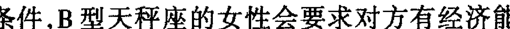

第二个条件，B型天秤座的女性会要求对方有经济能力且工作要有前途，而男性则要求新娘要有气质而且美丽。

不过，你经常东挑西拣的结果，总是不尽如人意，结了婚又觉得受到束缚，这些都是B型天秤座常有的矛盾。

B型天秤座的你，结婚之后多半都有一个平稳的家庭生活，同时，经济状况也不错，遇到困难都能顺利解决，有时则借助外来的帮助。

你相当尊重个人独立自主的权限，认为家中的每个成员都应拥有自己的空间。因此，你不会强迫家人奉行所谓的三纲五常。

事实上，这点是由于你本身就不喜欢有家庭的束缚，不希望阻碍个人的发展。

B型天秤座的人，无论男女都不是属于家庭型的人，厌恶受到家务的牵绊。

B型天秤座的女性，在结婚之后会继续发展自己的兴趣，热衷于社交活动，不喜欢作家务，会稍微忽略了家庭，不过，大概就是因为这个缘故，你不必操劳家务事，所以能常保青春美丽这点很令你的丈夫满意。

你的另一个特征是，无论在家或在外面，一定会保持风度与礼貌，相当尊重孩子。

你相当重视生活的品质。所以可能有浪费，过于奢华的倾向。忠告：过于个人主义化，并非婚姻之福，家庭既是责任则必有牵绊。重视生活品质固然好，但别流于浪费、奢华之嫌。

### 职业及成功的可能性

在选择职业上，B型天秤座的你，最好能选择自己有兴趣的职业，如果你的工作环境束缚过多或是过于刻板、保守，都会令你感到不耐烦。而结果常因此离职。

单调的工作，需要耗费过多的精力及耐心的工作并不适合你，最好能够避免。

此型的你，应善加利用你的社交手腕及冷静的判断力，从事业务员或服务业，在这方面，你的前途大有可为。

不过，你最大的本钱，应是对美的感觉和艺术才能，运用这些特点，去从事设计师、美术监督、广告撰文、服饰设计、发型设计、电视节目制作等都大有发展，也较易成功。

三十岁之后，你的职业运开始走上坡，可以一直持续到晚年。

一般说来，B型天秤座的职业运是稳定发展型，只要适时机 会，都可发挥才干。

忠告：你稍嫌有纵于安逸的倾向，如果朝着目标，全力以赴，将会有更好的发展。

### 金钱及财运

B型天秤座的人，一生大概很少有为钱烦恼的机会，到了晚年多半能过着富裕的生活。
你对赚钱并没有太大的野心，也不会想累积巨额的财富，有时甚至觉得金钱与地位会带给人某种程度的束缚。
你对钱很大方豪爽，有极强的花钱欲望。但是，由于你慎重的个性以及要求够水准的生活，你仍会拟定经济计划，为家庭攒下某种程度的积蓄。
三十五岁之前，你会利用金钱为自己寻找惬意的生活方式，三十五岁之后，你会考虑到现实状况及年老时的依靠而开始存钱，而且通常都能如愿以偿地达到目标。
你的财运特色是由人际关系带来好运道，所以，人际关系的建立是不容忽视的一环。
此型的你，由于处世圆滑、脑筋灵活，所以你即使利用别人谋得自己的利益，通常对别人，对自己都没有损害，唯一有影响的是，你的钱包因此充实了。
有关娱乐方面的人际关系，会为你带来好运，不妨加强自己在这方面的人的交往。
忠告：广结善缘总会有时来运转的一日。

## 血型、星座与人生

### ☆天蝎座

#### 性格及气质

B型天蝎座的人,多半是属于贯彻始终型,你的志向远大,通常你对预定的目标,都能专心一意地努力,锲而不舍,很少有心猿意马的情形出现,不达目标绝不终止。

你是个相当执着的人,而且耐心、毅力不差,即使失败了,也毫不气馁,很快便能重新站起来继续努力,这点相当令人敬佩。

你的求知欲极强,而且思想深刻,对于神秘的世界、死亡的真义,人的心灵、社会的最深层结构,你都十分有兴趣一窥究竟。

换句话说,你的性格对于愈难理解的事情,愈有好奇心去探究。

更特别的一点是,对于人体的奥秘,你情有独钟,因此,B型天蝎座的人朝医学之路发展的为数很多。

此外,此型的你对于解开宇宙之谜也甚感兴趣,会投入许多心力去研究。

不知你是否发现以上所说的兴趣,都需要相当高的集中力以及持久的耐力,才能有所成就,所以,我们可以说,耐心、毅力及意志力,是B型天蝎座的性格特征。

思想深刻的你,具有相当犀利的洞察力,无论别人如何伪装,都无法瞒住你的眼睛。不过你不会因此而揭发别人心中黑暗的一面,相反地,你常冷眼旁观这个世界,虽然沉默但反应敏锐。

你能清楚地看穿别人的心思,自己却经常封闭内心深处最隐蔽的地方,厌恶被别人看穿心思,即使是至亲好友,你也不会任意打开心扉,让别人进入你的内心世界。

虽然,你的性格如此特别,但看起来你并不阴沉。在众人面前你谈笑自如,但一个人却十分欣喜能享受那一份独处的宁静。

由外表来看,你是个相当随和的人,但事实上你的内心世界非常复杂,你的外表虽不刚硬,但内心却潜伏着一股强劲的爆发力,是个深沉不露的人。

忠告：别过于封闭自己,不妨打开心扉,接纳更多的朋友。

#### 爱与性的倾向

或许是你深藏不露的性格所致, B型天蝎座的你,经常表现一种吸引异性的神秘气质而不自觉。而更巧的是,这种吸引别人但自己却并不知的自然态度,又更加深了你不少魅力。

你是个相当有原则的人,即使你无限的魅力吸引了异性,而对方又因此执着地爱上你,如果你对对方并没有爱意,那么就绝不要动情。

此型的你,谈恋爱时绝不会仗着自己的魅力,而随意玩弄别人感情,可说是个正人君子。

你一旦找到了心目中的对象,你对对方投入深深关切,很严肃地看待这份感情,绝不轻视。

而恋情的开始,通常是埋藏心中的爱苗逐渐滋长,在此期间,你只给对方热情的眼神,默默的关注,一旦时机成熟了便会发挥你锲而不舍的精神去追求。

当表明情意之后,便是甜蜜持久的恋情了,你是个很令人欣赏的情人,在感情上颇为用心。

B型天蝎座的你,一旦开始谈恋爱,你会觉得天地间唯有他活在你心中,你的眼中仅是他一人。你无时无刻不思念着他,恨不得能每天形影不离。如果你们两人分别过久,便焦躁不已,无法安心地做好一切事。

也正因如此, B型天蝎座的人给人占有欲极强的印象,觉得两人既然彼此相属,便不应有任何间隙。如果对方违背了你,必定在你心中造成很深的伤害,而且心中燃烧着怒火。

失恋之后的B型天蝎座,并不因此想独自慢慢疗伤,等待时间来治愈伤痕,反而因深爱着对方,而陷入悲痛万分,无法自拔的苦境，的确是个痴情种。

对于性的态度，B型天蝎座可说是非常慎重，除非两人已浓情蜜意，且爱情坚定，否则不会轻易献身，没有爱情的纯性交易，更不可能发生在B型天蝎座上。

在性方面，B型天蝎座的人，也抱持着跟爱情相同的态度，想要完全疯狂地占有对方。你不会借技巧或是大胆的行为，而是因旺盛的精力及浓浓的爱意，使两人的精神与肉体合而为一。

在此提醒你，适度地给对方自由的空间，醋劲别太大了。

> **忠告**：醋劲太大，受苦的仍是你自己，在两情相悦的热恋期，更应注意勿因吃醋而惹上爱情纠纷，记得留给对方宽广的空间。

#### 婚姻及家庭

B型天蝎座的人，之所以步入结婚礼堂，是因为想获得爱情最甜蜜的果实，你绝对摒弃现实利害的因素。

为了家你会坚持自己的主张，即使你的对象得不到亲友的肯定，你也不会有所动摇，反而心意更为坚定，因此，你是个只重爱情，不重面包的爱情至上论者。你只要有爱情便觉得心满意足，再差的结婚条件，你都不会放在心上。

或许是过于缺乏现实的考虑，有许多例子显示，B型天蝎座的人都是婚后才发现自己的爱情是盲目的。毫无准备的例子，失败离婚的机率最高。

此型的你，年轻时的一股热情，被婚后现实生活浇熄之后，往往才发现两人个性根本不合，再缠绵悱恻的爱情都成为过眼云烟，只留下满腹怨恨及忏悔，颇令人遗憾！

B型天蝎座的你，性格上比较容易激情，如果能多尝试几次恋爱经验再做选择，必能找到更合理的结婚对象。

随着年龄的增长，累积了一些经历之后，有助于你改正自己的恋爱观念，如此一来婚姻生活会波动较少而幸福美满。

你对家庭很依恋，一心只想使家庭更温暖、更幸福，而且，你似乎有把家跟外界隔离的倾向,你不喜欢家庭生活受到别人的干扰,希望家中每一个成员都能紧密地结合,对家有向心力,因此,你多少给人自私的印象。

不过,你虽然爱家,但奇怪的是,在外面时你总是表现得随和又亲切,让别人觉得你开朗而且风趣。而在家中你却不苟言笑,十分沉默,如果遇到不称心的事,还可能有一连好几天都一言不发的情形出现,这是你令人难以理解的一面。

或许是慎重的个性所致,你并不因此轻率地发脾气,即使心情再恶劣,你还是会为家庭尽心尽力,负起重任。

B型天蝎座的你,是个顾家责任感强的好丈夫,女性则是顺从丈夫的好妻子。

对孩子的管教方式,此型的你,最好不要太强迫他照着自己的意思办。

> 忠告：婚姻是神圣的,切莫因一时的激情而草率结婚,以免热情被现实生活冲淡,对婚姻失望,造成婚姻的阴影。

### 职业及成功的可能性

B型天蝎座的你,与其做个薪水阶级的上班者,倒不如学习一项专门技术,拥有一技之长,然后从事专门职业,这样一来对有事业心的你来说,成功的机会将大为增加。

但是,前面已说过了,此型的你,最好能得到贵人相助,才能逢凶化吉。所以,你最好能找个稳当的环境,专心发展所长,如果自己创业,并不十分可行,可能会有重重阻碍。

此外,你从事研究工作,可能比起伏激烈的商业来得可靠。

最好能从事可独立作业的职务,因为你比较不适合跟人共同合作。

你适合的职业有科学研究、技术开发、医生、检察官、或刑事干部等。

你之所以适合这些职业的原因,在于你对事情往往有独特的见解以及深刻的思考，调查能力颇强。

不仅你的精神毅力，就连你的身体也有超人的耐力。所以，从事体能训练也不错。

因此，此型的你，应多抓住机会推销自己，以助自己迈向成功之路。

> **忠告：家有万贯之财，不如一技在身，你应朝专门职业上发展。**

### 金钱及财运

事实上，B型天蝎座的你，尤其是年轻时更是守不住钱财。你的赚钱能力并不是十分强，甚至会陷入经济拮据的困境。

你很懂储蓄致富之道，但由于热衷于爱情，女性会因此把金钱全部交给男朋友，而很遗憾的是，男性往往会沉迷于投机事业，把你的积蓄全部花光，十分不幸。

B型天蝎座的你，投机的运势很差，所以最好能够避免。

但是，不能因此说你缺乏经济概念，只要女性不为恋爱花冤枉钱，男性不沉迷于赌博、投机事业，那么，擅长储蓄的你还是能将小钱点点滴滴地聚成一笔财富。

此型的你，大约在三十岁之后，财运会好转，如果你能把握这个时机，努力存钱或是做安全性较高的投资，都有助你开辟财源。

总之，B型天蝎座的人，少有一夕致富的情形，所以，唯有一点一滴地储蓄，你才有可能致富。

同时，有不少B型天蝎座的人因得贵人相助而获得财富，既然别人有助于你，你也别太吝于回报。

> **忠告：接受过别人的恩惠，应找机会回报给需要帮助的人，毕竟，施比受更有福。**

### ☆射手座

#### 性格及气质

B型射手座的你，最讨厌行动受到限制，或是不能随自己的意志行事，这一点是B型射手座相当与众不同的特征之一。

B型与射手座两者之间有许多共同之处，组合出来的你，可说是这类血型加上这类星座的典型代表，其共同点有下列数点：

两者都是自由意志的拥护者，随兴所致地由天马行空式的思想引领人生。

两者好奇心都甚强，对任何事都有一探究竟的兴趣。

对于好奇的事物，并不会十分执着地深思研究，也不会沉溺其中，属于爽直的个性。

具有应变能力，也就是行事具有弹性，能屈能伸，绝不偏执。

如果，勉强要把B型射手座之间的差异点出，大概只能说，射手座比B型更自由奔放且热情，而B型则比射手座的更重实际。

你热衷于追求知识和汲取人生的经验。但绝不仅在于好奇，或有兴趣而已，你更有心去亲身体验，因此，你的人生经验相当丰富而多彩多姿。

B型射手座的你，重视形而上学的精神哲学。你对金钱、名利没有野心和欲望，所以，对这些世俗凡物也就不会过分执着，或许就是这个缘故，你在人际关系上，显得不够积极，也不懂得如何掩藏、保护自己。

换个角度来看，你对每个人都采取开放的胸怀，直爽而且诚实，这点你倒是给人相当不错的印象。

由于你极少顾忌世俗人眼光，所以做起事来，往往积极而大胆，不过应注意，虽然大胆却要心细，行事谨慎对你将更为有利。

除了许多的优点之外，当然你也不乏一些缺点，由于你的思考和行动都异常敏捷，再加上崇尚自由意志的心态，你做事经常随兴所至，不太有持续性。虽然你做事非常集中精神，但就是缺乏耐心及毅力。

通常，你做事总是半途而废，以致功败垂成。有时，你对辛苦换来的成果，一旦感到厌倦，便毅然决定舍弃，令人惋惜。

你的行动敏捷，往往比别人要早一步，加上头脑灵活，才华出众，成功的机会总是比别人多一倍。但是,你应注意性急和容易厌烦所带来的伤害。

如果,你是一个人从事自由业,倒也无妨,但若是在团体中,做的是需要同心协力的工作,那么,切记要收敛轻率的毛病。不守秩序、轻视规则、常会带给别人麻烦。

#### 爱与性的倾向

B型射手座的你,是个十分热情的人,谈起恋爱认真而且热烈。由于你无法从一而终的个性所致,在爱情的路上你总是寻寻觅觅,经常因为发现新目标而忘却旧爱,有些喜新厌旧的倾向。

虽然如此,但不能说你是个轻浮的情人,因为,你不会同时跟多位异性交往,每一次恋情你都是全心全意。

你的每一次恋情通常是由你主动展开攻势,你不会因为对方的外表容貌来判断是否值得交往,多半时候你会因为发现对方美丽的内在而萌生爱意,这是颇令人欣赏的一面。

此型的你,一旦谈起恋爱,便有如熊熊烈火一般,但是如果追求遭拒,你绝对不会再留恋,可以潇洒地离开。

你的恋情经常会让周围的人为你捏一把汗,因为你激动的性格无论对方的身份是否合适,例如已婚、年纪悬殊等问题,都不在考虑之列,一旦喜欢上对方,根本就不会掏心掏肺地投入感情,相当危险。

B型射手座的你,拥有不计现实利害的爱,一旦产生情愫,便全部地奉献出自己的身心毫不犹豫。

很令人意外的是,在如此强烈的爱欲下,你的独占欲和嫉妒心却出奇的淡,你不想完全占有对方,也要求自己拥有绝对自由的空间。

而B型射手座的女性,尤其明显地表现出这种性格,你不想以对方为依靠或避风港,也不会成为爱情的奴隶,是拒绝成为第二性的现代女性。

总的来说,B型射手座的人即使失恋了也不会纠缠对方,觉得恋恋不舍，大都能以坦然、潇洒的方式为这段恋情写下句号，而过去的回忆和失恋所带来的伤害，也不曾对你造成心中无法弥补的裂痕。

B型射手座的人，无论男女，对性均持着开放的态度，而且绝对不会把性与爱混为一谈，因此，即使你的心中没有爱的成份存在，也能享受肉体的欢愉。

此型的你,有时因过于轻率,让许多真爱从你的身边流逝相当可惜。

> 忠告：爱情最忌讳轻率，而不考虑现实性，因此，当你燃烧爱情火焰的时候，小心灼伤了自己，徒留遗憾。

#### 婚姻及家庭

B型射手座的你,通常是由自由恋爱而步入结婚礼堂的,相亲的传统形式与B型射手座崇尚自由意志的性格并不相符。

B型射手座的结婚时期,不是极早,便是极晚。你之所以早婚,原因在于年轻时热情的性格,一旦热情,轻率地选择婚姻,这类的婚姻通常会以失败收场。因为双方并不是十分了解,离婚的机率偏高。

而造成你晚婚的原因,则是因为害怕婚姻成为束缚的心理所影响或是爱上了已婚的对象,因此,一拖多年造成晚婚。

一般而言,经过多次恋爱经验,能够更了解爱的真谛之后再谈婚姻,成功的机率较大。

无论是B型射手座的男性或女性,在婚后仍不会改变追求自由的意愿,男性讨厌被妻子控制动向,女性则厌恶成为家务事的奴隶。

总之,要获得幸福,最好能保持一小片属于自己的天空。

B型射手座的人,无论男女,都认为婚姻是两人互相为伴,白头偕老,而非互相牵制,束缚对方。

因此，男性只要自己能够有自由的保证，则你对待妻子会十分宽大而且明理，妻子如有工作你会主动帮忙家务事，但是你惟一的缺点便是，太过于热衷自己的生活，有时会忽略了妻子想法及感觉。

如果你是B型射手座的女性，那么，你的家庭观念一定不是十分浓厚。大致来说，这是因为你的事业心强，或是由于你热衷于自己的兴趣。

你的独立性很强，对丈夫不依赖，也不会想把丈夫牢牢拴住，即使他有拈花惹草的风流事你也不会很在意。

事实上，B型射手座的人婚前婚后的生活方式并没有太大的差异，一样是自由自在的无拘束感，即使有了孩子，也是如此。你对待孩子犹如朋友，家庭的气氛开朗而且富有朝气。

不过，要注意的是，切莫因过于放纵而变成不负责任，酿成家庭悲剧，应仔细想想自己对家庭的义务。

> 忠告：在婚姻生活中，夫妻都必须接受某种程度的约束，超过了范围，便可能使家庭的步调大乱，危及婚姻。

### 职业及成功的可能性

B型射手座的人，在职业运方面可说是充满变数，这多半是由于自己的性格所致，极少能从一而终地完成一件事。

不过，由于你的才能颇高，所以成功的机会不小。但要注意的是，稍微克制一下自己轻率的脾气，否则，成功的机运将远离而去。

此型的你，选择职业时，最好能够选择以才能取胜的工作，也可从事两、三种性质类似可以相辅相成的工作，而且必须自己感兴趣的工作，如此才能提高成功的机会。

你不妨考虑这些职业：作家、旅行家、摄影师等，都会有不错的发展。

其他有关学术方面的工作，也大有可为，只要努力必能有所成就。

你从事单调、刻板的工作，或在组织中从事小螺丝般的工作，以及必须承受压力的职业,都会妨碍你的发展。
遇到挫折别失望,有时冲破阴霾之后,便是一片蓝天了！
忠告：不要勉强自己停留在单调、刻板的工作,以免抹杀你的才能。

### 金钱及财运

B型射手座的你,赚钱的欲望并不强烈,也不想储蓄一大笔财富,你赚钱的原因,只是为了应付自己起码的开销。
你看重的是精神生活,希望能够为自己的一生充满丰富的色彩,所以你既不愿为了赚钱而过分劳累,也不想为日后的生活储蓄。
不过,你赚钱的本事还是不小,由于你的脑筋极佳,能力也很强,成为你致富的利器,你有一夕之间赚进大把钞票成为巨富的机会,问题在于你是否有这个心。
你用钱很大方,不在乎花费多少,只要能满足自己的需求也在所不惜。可以说你是个花钱没有计划,也不热衷于赚钱的乐天派。
总括来说,你的财运并不是十分稳定,工作所得以及投机带来的利润,都会因为你花钱如流水的个性而无法留住。
有鉴于此,建议你不如将金钱花在购买有价值并且能保值的宝石或艺术品上,来得更划算,因此,年老之后总是需要一些经济做后盾。
忠告：采取稳健的方式,经营你的钱财。否则,徒有赚钱的本事,却不保有财富。

### ☆摩羯座

#### 性格及气质

B型魔羯座的你,属于刻苦耐劳型的人,你珍惜每一分钟的时光,时时刻刻在鞭策自己向上。
在学校求学时,你是个可以因用功而废寝忘食的好学生,即使搭公共汽车、吃饭、临睡前这些零星而短暂时间,你也不会轻易放## 第二章 血型与星座

过，必定手不释卷，口中念念有词地背诵着。
你一旦执着于某个目标，就仿佛忘了别人的存在，别人很难接近你。无论做任何事情，你都必定探清究竟，不会只了解表面便罢了。打破沙锅问到底是你做学问、做事的根本态度。
你集中力之强，耐心及毅力之强，都不是一般人所能理解的。你可能比较缺乏休闲活动，因为你觉得玩乐、休闲是件既浪费时间且耗费金钱的无聊事。
此型的你，所追求的只是工作与目标的完成，因此，由于欣赏友情世界的时间太少，你会变得既冷漠又无情，应小心别因为追求理想，而忽略了许多有价值的事情，毕竟，人生中值得追求的东西太多了。
B型魔羯座的人，如果要形容其性格与气质，必须把血型与星座分开来谈，因为这两者是不同的因素，可是却又互相影响，B型魔羯座的你，评估各种条件的利弊，但是，有时过分的慎重，反而缩手缩脚，最后一无所获。
B型的特征则是果断、积极、一旦决意去做，便抱定虽“千万人吾往矣”的态度。
魔羯座的人缺乏社交性，交际手腕不够高明，很少会去主动扩大交际圈。
B型的人则是广结善缘，人际关系非常良好，有助于自己的事业、婚姻、财运等各方面的成功。
B型魔羯座的你，便是综合上述的组合体，你虽然有社交技巧，但不是毫无选择地结交朋友为四海的类型。除非在确定对方是值得交往的对象，否则，绝不会轻易接纳一个人。
此型的你，在做事的态度上也是如此，受到 B 型与魔羯座两种因素的相互影响。但是，若是两者能取得平衡，则成功的机率将相对大增。
由于魔羯座的特征，使 B 型魔羯座的人都有强烈的出人头地的愿望，而你成功的机会也颇大，在此提醒你，过分的谨慎容易造成疑心病，对他人勿过分严厉，应尽量力求跟他人和谐相处。
- 忠告：切莫过于谨慎，有时不妨大胆尝试新的事物，力求突破。

## 爱与性的倾向
由于你对爱情抱着谨慎的态度，再加上对异性不是很有信心，所以，一般来说你的恋爱会来得比较迟。
此型的你，害怕一旦付出感情，却不能永久存在，一时的热情，在你看来并不是永恒的真情，因为怕受伤害，于是你远离了爱情。
不过，并不能因此说 B 型魔羯座的你不需要爱情，或根本拒绝爱情。
你追求的是能够真正陪伴你一生的结婚伴侣，而不是沉溺在爱情游戏中。唯有通过婚姻的保证，爱才是值得珍惜的。
正因如此，你的恋爱观谨慎地近乎严肃，一辈子的伴侣岂能草率为之。
虽然，你经常对异性产生爱意，但理智告诉你不能随意付出，因此，你的恋爱运并不旺盛。在尚未全盘了解对方的性格和气质之前，你不会轻易做选择，更不会打开心扉或奉献身心。
B 型魔羯座的你，虽然对异性拙于表达热情，但是，你却是一个最忠实的情人。
虽然，你心中充满了爱意，但是，在所爱的人面前，你却表现得很笨拙，甚至惹人讨厌，这些都不是你所希望的。但是，碍于放不开的拘谨，这些行为却一一显现。
你可能常会因此而懊丧，此时不妨请个朋友帮忙，充当你的恋爱顾问，效果必定十分良好。
此型的你，即使知道了朝思暮想的人，你也不会因此开始享受甜美的爱情。你只是一心想尽早结婚，否则你便不会安心。
你谈恋爱时，谈的问题多半是未来的种种，诸如，生几个孩子、生活计划、什么时候买房子等等，有时令人感到相当扫兴，但平心而论你非常真诚。由于你一旦决意谈恋爱，便要求自己真诚地付出，所以，一旦失恋了，你便无法接受这个打击。虽然表现上你装出毫不在乎的样子，但是心中却是悲伤难抑，仿佛世界末日来临。在此提醒你，千万别因一次失恋就否定这世界上的真情，甚至从此排斥爱情。
对于性的态度，B型魔羯座的人通常抱有保守而慎重的观念，尤其是女性更是如此，不过，你一旦结婚还是会表现出热情的一面，并非全然的淡漠。
- 忠告：失恋使人成长，并不是绝对的不好，记住，天涯何处无芳草，人间到处有真情！

### 婚姻及家庭
B型魔羯座的你，由于择偶的慎重，所以是属于晚婚型的，有不少 B 型魔羯座的人是经由相亲而结婚，因为唯有如此，才能获得婚姻的保证，也就是说，不但事前对对方有所认识。且有家人的意见可作为参考。
此型的你，对待异性的态度，有两个极点，如果喜欢某人，便一心一意地对待，忠诚度相当高，对于不中意的人，则绝不迁就自己跟对方交往，魔羯座的女性，在考虑结婚前会细心注意对方的经济状况，以及事业是否能够有所发展。换句话说，现实的想法驱使着 B 型魔羯座的女性的结婚意愿。所以，即使对方的人品再好，若是不能功成名就，就绝不会考虑结婚。
至于 B 型魔羯座的男性，则着重在女性的持家能力，外表是否美丽，倒是其次。
你虽属晚婚，但一旦结婚组成了自己的家庭，将会非常安定。原因是你是在慎重考虑之后才做的决定，你十分相信自己的眼光，认为对方应是最佳人选，因此也就格外值得珍惜。
你非常注重家庭的欢乐，对妻子、丈夫非常忠厚，可说是不错的结婚对象。
B型魔羯座的你，结婚的最大心愿，便是要拥有一个完全属于自己的家，努力使家人过得好，因此，你的生活非常朴实，工作也相当认真，所赚来的钱会非常有效地利用，绝对不奢侈浪费。
即使结婚之初并不富有，便由于上述原因，逐渐地生活水准必定能达到中等以上的程度。
如果你是B型魔羯座的男性，那么，你对家庭有绝对的责任感。在妻子的眼中，你是个沉默寡言，但埋头苦干的好丈夫。虽然在平时的言谈中，很少把家庭的问题提出来商量，但你绝对会负责将它完成。
沉默寡言，不轻易谈笑是你的生活态度，但是，你会跟别人商量，听取不同的意见。
如果，你是B型魔羯座的女性，那么，你必定非常善于处理家务，家庭收入也十分有效的运用。
在厨房中，你是个调理高手，能抓住家人的胃口，可说是个称职的家庭主妇。
但是，过分重视实际，会让你觉得你缺少那么一点女人味，你对丈夫也少亲密的言语，话题多半绕着生活中的琐碎事打转，有时会让丈夫感觉乏味，这是你必须注意的一点。
还有一点要提醒你，有了孩子之后，别因此忽略了丈夫。
- 忠告：虽然有了孩子，也应分一点心思在丈夫的身上，以免两人日渐生疏。

## 职业及成功的可能性
B型魔羯座的你，可因努力弥补先天条件上的不足，所以你适合从事各种工作，因为古有明训，有志者事竟成，且勤能补拙，而你的特征便是努力。
你的事业运十分旺盛，但是在通往成功的道路上，你的用心、勤奋帮助你披荆斩棘，这是你致胜的最佳利器。
但是，努力必须经过很长时间的累积才能有所成果，所以你应注意，不要经常更换目标，否则所有努力都将白费。
因此，选定方向之后，奋力前进，时间会带给你最公正的评价。
虽然你适合多种事业，但要注意的是，最好不要找变动性大，且需迅速完成的工作，否则会令你很快就心灰意冷。
此型的你，比较易成功的职业，多半是属于扎实的研究活动，以及能够磨练技术的职业，从事实务性的工作也不错。
切记，年过三十之后，就别再更改方向，否则将会一无所成。
此外，不要同时追求两个目标，意志不坚的结果，将使你两头落空。
- 忠告：心猿意马最要不得，成功永远是属于努力的人。

## 金钱及财运
你的财运和你的爱情及事业一样，是属于大器晚成型。
此型的你，年纪愈长，财运愈旺，年轻时的努力工作，再加上有储蓄的习惯，经济观念发达，以上综合的结果，在你晚年可为你攒下不少的财富。
你的投资方法，最好是存款生息，或是从事艺术品及珠宝金饰的收集买卖，这是属于较稳当的投资渠道。知识会为你带来财富，如果年轻时努力吸收新知，多阅读书藉，对你的财运会有所帮助。
对你来说，投机事业是绝对不可从事的工作，无论是赌博或股票，都会使你蒙受相当大的金钱损失。你对金钱的态度非常执着，甚至觉得金钱是人生存下去的最佳保障。
有时，这种金钱至上的观念，会自然而然地表现在你的言谈中，这会让你留给别人相当不好的印象，应该小心，逐渐改正你的观念。
毕竟，金钱固然重要，但友谊更是无价的，别太吝惜交际费了。
- 忠告：金钱不是万能之物，因为它而失去朋友，是最不值得的事。

## ☆水瓶座
### 性格及气质
B型水瓶座的你，可说是一位立足一方，胸怀世界的远见者，你一点也不拘泥于现实利益，时刻注意的焦点便是全人类全世界的未来及发展。严格说来，你是一位非常不同于凡响的人。你很明白，每个个体都微渺如沧海之一粟，同世界宇宙来说，个人的一切欲望便显得微不足道了。
真正对你有意义的事，大概就是如何为全体付出，因此，你非常具有博爱精神。
你的求知欲甚强，尤其对未知的世界，更有探索的欲望。对于宇宙，自然或一切尚为谜团的问题，都怀有极高的研究兴趣。对于所不知道的事情，也有十分执着的求知热情。
在你的头脑里，容不下一丝暧昧不清的问题存在，对于所有的事情，你都希望经由理性、科学的方式，求得解答。
此型的你，创造能力极强，适合做研究理论证明的探索。
B型水瓶座的你，穷究事理的态度及独断独行的性格，常常让人觉得你好发议论，有流于冥不顽化之嫌。
你过于丰富的创造力及奇特的构想，有时因忽略现实而脱离常规，因此，你会觉得自己所说的话别人好象听不太懂，那是因为你的思想太过先进，令别人无从追赶之故。
你的另一项特征是追求自由的气质。你厌恶任何会成为羁绊、束缚你的枷锁。地位、名声、财富的追求皆属于枷锁之列，甚至于婚姻也被你列入其中，排斥追求男欢女爱的激情。
此型的你，不仅要求形式上的自由，在思想上也追求一个毫无限制的想像空间，不受牵制的思考方式更是你的理想。
但是，能够支持以上论点的先决条件，就是你必须具备相当独立的人格，以及能够受得住寂寞的人生观。否则，人生这条路你将走得既艰辛又漫长。
因此，正视事实，将现实的主客观条件都列入思考范围内，对你会更好。
- 忠告：培养独立的人格，享受孤寂的境界。同时，在现实与理想间应取得平衡。过度追求理想，往往也忽略现实中有意义的事情。

### 爱与性的倾向
B型水瓶座的你，拥有淡如水的爱情，你不会有疯狂的热恋期，也不会出现决裂式的大争吵，你对求知与学习有绝对的热忱，往往倾注全部的精力，对感情却恰巧相反，态度十分淡然。
在你心中，最渴望的不是儿女私情，也不会想保护某个特定对象，而是博爱型的人道主义。此型的你，并不排斥由肉体关系所发展出来的爱情，但是，你并不因此认为有了这层关系，便和对方彼此相属。相反地，你毫无独占情人的欲望。
你对别人采取这种态度。当然，期望别人也如此，如果你的情人想要完全占有你，你必定会感到相当不满，甚至因为受不了束缚而想离开对方。
由于你自认为不属于任何人，和你相交的情人，大概必须和你一样独立自主。
B型水瓶座的你，和人相交态度总是十分豪爽大方，因为珍惜每一份友情，所以你的朋友颇多。由于并不想占有一个特定的对象，所以，与其说由直接追求的方式找到伴侣，倒不如说是由细水长流的友谊，逐渐演变成爱情。
你们两人在一起，如同朋友一般地交往、谈心、不拘泥在风花雪月的儿女私情上。
你不排斥性，所以有可能跟对方相识不久便发生肉体关系。不过肉体关系并不能因此拴住你，或增添浓情蜜意，依然是一贯的平淡感情。或许就是因为这缘故，你即使和对方分手了，也不会感到悲伤，分手也是断然决定的，绝不会依恋不舍，你对感情的事，相当容易淡忘。
此型的你，十分早熟，而几乎所有 B 型水瓶座的人对性的态度都是如此，通常在年纪极轻时便有过性经验，不过并不因此沉迷于其中。
你的性观念相当开放，甚至能接受交换性伴侣这件事，对于同性恋也不会排斥，可说是思想相当开放的人。
- 忠告：要求别人的同时，应先要求自己，先有付出，才有收获，爱情需要奉献，而不是一味等待对方的付出。

### 婚姻及家庭
B 型水瓶座的你，不愿被家庭所束缚，在你的观念中，并没有所谓的家庭成份，丈夫不一定就是必须是经济的供给者，妻子也不一定就是养育孩子，料理家务的服务者。
一般说来，B 型水瓶座期盼自由的婚姻，两人在一起，各自发展自己的目标和理想，除非必要，否则绝不彼此干涉，也唯有如此，才是你追求的真正幸福。
你比较适合恋爱结婚，这跟你崇尚自由的本质甚为相符，相亲的方式，在你看来也不过是一种束缚。你通常会晚婚，而且太早结婚只会让自由放任惯了的你，因受不了拘束而演出家庭悲剧。
在充分享受过单身生活之后，把想独自完成的事情都做好之后再结婚是最适合不过了。
此型的你，选择结婚对象时，最好能避免过于保守古板型，否则，你们两人的生活步调将永远无法协调，特别是女性，要求自由的心常会被丈夫误解，而产生嫉妒心，甚至导致决裂，这是择偶时必须审慎考虑的。
B 型水瓶座的你，如果一旦寻觅到合适的伴侣，决定步入结婚礼堂，那么你的婚姻大概就不会再有变化了，不但风平浪静，而且持久。
对待家人，你采取朋友般态度，互相尊重，彼此之间都有极大的自由空间。而且，当有问题产生时，你不会以争吵来解决，而是以十分民主的方式来进行沟通。
因此，你的家庭充满朝气，因为你乐观开朗的性格，感染了家庭中每个成员。
此型的你，对现实生活并不十分在意，不会努力去追求大富大贵的生活，不过，由于你颇具聪明才智，即使有变故发生，也不会因此陷入困境。大致来说，你过的是相当平稳的生活方式，B型水瓶座的男性，不会摆出大男子主义的作风，但是，并不希望妻子因此过分干涉他，家庭中琐碎的小问题，他会交给太太去决定。
而B型水瓶座的女性，心胸非常宽大，而且也赞成自由的生活，你通常会外出找工作实现自己的理想，肯定自我。对于专心做一个全职的家庭主妇，并不感兴趣。
不过，要提醒你一点的是，太专注于追求自己的理想，可能会因此对家人冷漠，使家庭的气氛僵硬，应多关心家人一点。
- 忠告：家庭需要经营，在工作与家庭之间如果无法兼顾的话，不如放弃工作，毕竟，家庭才是此型女性的重心。

### 职业及成功的可能性
B型水瓶座的你，最好是选择能自由发挥才能的工作环境，过于刻板或保守的工作，最好敬而远之。当然，别人设计规划好的工作也不要去碰，否则必定扼杀了你的才干。
此型的你，最好从事自由业，自组公司的前途也不会错。总之，一定要选择能够利用你的策划、构思及独创的才能发展事业，必能有一番作为。例如，技术开发、策划制作、艺术文化、都是你活跃的领域。
最适合你的职业是计划未来与文案，如科技的研究、广告、大众传播、出版业的策划与制作等。
而评论家、广告撰文、设计师、美术、音乐等都很有可为。
此外，事务工作或手工艺并不适合你，这些需要长时间专心投入的工作，会剥夺你的创造力。你遇到失败时的反应，通常都是很快便灰心，或是干脆放弃。有时候再坚持一下，可能就因此突破瓶颈而获得成功。
- 忠告：尽量发挥你的创造力，展现你的才能，自创事业是个不错的选择。

### 金钱及财运
B型水瓶座的你，财运并不差，但是你并不重视物质生活，也不会想要赚大钱。所以，你不会十分富有，不过你的赚钱能力很强。
在你的观念中，赚钱只为追求快乐和自由，因此会毫不吝惜地花掉大笔金钱，而没考虑到储蓄，有浪费的倾向。
你对朋友很慷慨，会不惜巨资请客或邀宴，交际费对你来说是项庞大的开销。
此型的你，之所以不会成为金钱的奴隶，或许是因为你很明白。金钱是追求理想的手段而非目的。别人可能对你的豪爽有些不满，但你并不在乎，而了解你的人会赞许你的作风潇洒。
别人带给你的财运，可能比你本身拥有的财运更强，因此如果能扩大人际关系，充分发挥才能，一旦为人赏识，财源便可因此滚滚而来。
在拓展人际关系的同时，你应当勿浪费过度，这是你改善财运的当务之急。
- 忠告：浪费金钱使你空有好财运，而无太多财富，多加强你的理财观念。

## ☆双鱼座
### 性格及气质
B型双鱼座的你，可说是感情重于理智的人，对所有周围的事情都异常敏锐易感，对于别人的心思，即使是再细微之处，也能观察得入木三分。
你很在乎别人的感情，一些细小的动作，就可让你思索很久。事实上，对方并没有特殊的含义，或许正因如此，你经常觉得容易受伤害。
你是典型的近朱者赤，近墨者黑的人。在你的周围的人对你有绝对的影响。经常别人无法了解哪一个才是真正的你。如果你的周围换了新的一批人，你的性格可能又会有所变化。
不过，坦白说，过分迎合别人对你来说，会是相当辛苦的一件事。
通常，B型双鱼座的人隐藏两种截然不同的观念，亦即对失败可能十分在意也可能看得很开，前者是 B 型双鱼座性格的呈现，而后者，则是气质的显露。
还有，你面对一件事时，可能前一刻还因害怕而显得阴沉，后一刻却又表现出非常豁达的态度，所以，B 型双鱼座的人，内心是高深莫测的。
一般来说，B 型双鱼座的你，比较重视精神生活，而不是物质生活的奴隶。
你对美及艺术有很敏锐的感觉能力及表达能力，但对现实生活却采取漠视的态度，是追求美与梦想的艺术家。
有部分 B 型双鱼座的人，会对神秘的宗教世界十分着迷，对灵异现象也有特殊的关切及感情。
你的好奇心极为旺盛，对周围所发生的事，都有兴趣知道，而追根究底的习惯也很强烈。
你的兴趣多元化，涉猎面甚广泛，不过由于朝三暮四，喜新厌旧的个性，使你在学习及兴趣上都无法始终如一。
此型的你，情绪异常化，心情左右工作效率，心情好时，万事都可商量，心情坏时，一事无成，仿佛所有人都得罪了你。
对待别人，你采取开放的心胸，一旦有心事，很少隐藏起来，你心地善良，热心助人，不会自私地为自己来打算，可说是相当温和的性格。
但是，你的缺点是无法拒绝别人的请求，有时会因此为自己增添不少麻烦，宜小心衡量，勿使自己吃亏而不自知。
- 忠告：善用你的亲切气质，但勿因此被恶人所用。

### 爱与性的倾向
B型双鱼座的你，在恋爱的道路上，常有不只一位的爱侣相伴，通常，一个眼神，一个回眸，随之而来的便是一场甜蜜恋情，不过，这样的恋曲，多半来得快，结束得也快，因为，你实在是一个多情且敏感的人。
对B型双鱼座的你来说，恋爱并不是为了走入结婚礼堂，你更不会因为觉得生活无聊而想找个伴，因为你的观念是，爱情是神圣的，是精神上全然地沟通。
对于每一回的爱情，你都非常执着，认真，堪称是个为爱情而献身的热情之人。
在恋爱的过程中，你只付出，不求回报，即使对方再任性，无理，你还是一本初衷地包容对方，真心对待，而且希望能时时刻刻与他在一起一刻也不愿分离。
严格来说，你的感情是浓得化不开的黏腻型，就像前面所说的，如胶似膝。可是，如果不幸失恋，你的伤心竟是那么短暂，而且只是轻微的，相当不可思议。
旧的恋情消逝，新的一段感情立刻来到你的心中，旧爱与新欢不断交替在你的爱情故事中，所以，你是个时时走桃花运的情场老手。
一般来说，无论B型双鱼座的男性或女性，都非常有异性缘。尤其是女性，更是众人注目的焦点。
此型的你，经常被异性追求，对别人的爱情宣言，很少能拒绝得了，你是个感情充沛的多情种子，实在不知道该如何去拒绝别人的好意。
通常，你的恋爱模式是等着别人来向你求爱，可在众多的追求者之中，总是不知该如何下决定，而接连不断的爱情故事便源源不断而来，不过，如果要你主动对别人表示情感，表达爱意却很棘手。
B型双鱼座的你，对性有一番向往，也很有兴趣一探究竟。对此型的你来说，性是帮助体会美妙感情的催化剂，更有人觉得如果缺少性爱，则爱情索然无味。
此外，B型双鱼座的你，有过分沉迷于性的倾向，有些人甚至演变成性虐待狂或性被虐待狂。如果不谨慎把持自己，将迷失在官能逸乐的国度里，将造成无可弥补的遗憾。
- 忠告：感情过于丰富便成了滥情，在爱情中尤其忌讳滥情。

### 婚姻及家庭
一般而言，B型双鱼座的你，一生中会有不只一次的恋爱经验，或许是你很受异性欢迎的缘故。很少B型双鱼座者是经由相亲而结婚。不过你并不排斥这种方式。
你是个重感情的人，在谈恋爱时也是如此，经常你会因爱而如痴如狂，因此缺少理智的分析和考虑，便决定结婚。
对于婚后所必须面对的你不会去注意，原本甜蜜的爱情，却因为逐渐发现对方的缺点而失去意义，现实的压力终于使你认清现实。
大致来说，B型双鱼座的你，婚姻之所以失败都是由于上述原因。
因此，婚前你一定要谨慎小心，多观察对方的优缺点。如果觉得真正适合再决定也不迟，千万别意气用事影响了一生的幸福。
B型双鱼座的你在婚后若是与伴侣不合，通常不会忍气吞声，可能会断然决定离婚，相当令人遗憾。
离婚之后的你，多半不会孤独一生，再婚的机会非常大。
B型双鱼座的你若是选对了对象，会过着很愉快的婚姻生活，即使是婚后数年，仍能过着如新婚般的甜蜜生活。

## 血型、星座与人生

B型双鱼座的男性，在结婚之后会很顾家，妻子儿女在他心目中，永远是精神上的支柱。年轻时你可能是个不太安分的人，可是婚后就大不相同了，有了家庭之后你会变得安份而稳重，非常耐心地守护着自己的家。

最值得一提的是，B型双鱼座的你，婚前虽然有多次的恋爱经验，可是在婚后一定不会到外面偷腥，外遇当然更不可能发生了。

而B型双鱼座的女性，虽然在婚前风头甚健，或偶有绯闻传出，可是婚后一定是个贞洁的好妻子，而且是个很会照顾孩子的好妈妈。不过你太不擅长家务事，应注意别让家里太乱了，影响家庭的气氛。

B型双鱼座的男性，都不太能认定现实，而且年轻时稳定性不够，因此，在选择对象时，最好能选个善于理家的妻子。

忠告：选择一个好的伴侣，对你的一生影响很大，你需要一位好伴侣来弥补自己的不足。

## 职业及成功的可能性

B型双鱼座的你，适合从事的行业，最好是能够把你独有的幻想力、直觉、敏锐性发挥得淋漓尽致的工作。音乐家、画家、设计师、诗人、作家、演员、舞蹈、占卜师等等，都是你可以一展才干的选择。

能够胜任上述工作的原因，在于你很能善用自己的感觉，而你的感觉又是比一般人独特。

你的音律、节奏感相当不错，非常适合音乐和舞蹈的创作表演。

如果，你能依照你的艺术才华来选择职业，并不需要限定目标，甚至随兴地发挥，对你的职业生涯来说，都是极佳的选择。

总而言之，相信你也有这种感觉，你并不适合从事过分实际且竞争的工作，尤其是关于钱这方面职业必须避免。

你最好不要去做生意，容易亏本，如果只是负责接待客人的工作，由于你不错的人缘和气质，绝对可以愉快胜任。

## 第二章 血型与星座

忠告：善用你的感觉，发挥天赋的才能，商业上的争逐，绝对不适合你。

## 金钱及财运

B型双鱼座是很典型的崇尚艺术人生，你不重视金钱，对数字没有任何概念，也没有赚钱的欲望。你只要觉得有收入足够生活就感到满足了，有得花当然最好，没得花也无所谓，这就是你的金钱观念。

你花起钱来，相当大方，吝啬两个字，绝对套不到你头上，而且，你是个相当海派的人，跟朋友一同吃喝时，付款的一定是你，但不是别人要求你请客，而是你总是抢着付钱。

此型的你，只要一上街购物，保证你口袋空空地回来，遇到想买的东西，你一定会二话不说地买下来，也不管实不实用，需不需要。

这样的你，想储蓄、积聚财富，可说是难如登天的事。

此外，你如果借钱给别人，十之八九会收不回来，因为你不会催讨，甚至根本忘掉。在这种情形下，金钱当然要不回来，对这方面，还是小心为妙。你的生财之道，是利用你的兴趣从事副业，例如，古董收藏艺术品买卖。

忠告：别过于海派，钱财得来不易，还是勤俭一些为好。

## (三) O型

### ☆白羊座

## 性格及气质

O型人，行动特征简单地说就是分析判断型。无论做任何事情都要仔细看清事实，慎重判断当时的情况，然后才付诸行动。不过在O型人中，最积极且富有冒险精神的白羊座，却往往在机会未完全成熟之前，就毅然出发，说做就做。这种剑及履及的行动，虽然也有马到成功的例子，但绝大多数因估计错误而失败，或是被迫回到原点，总的来说，O型白羊座的你，性格的原则是“爽快、干脆、断然，”当你遇到挫折时，并不会因此意志消沉，所以，你不会一直生活在失败的悔恨中，正因为你是积极行动型，难免给人好胜心过强而耐心不够的印象。你的好胜心，可说是由O型特有的浪漫意识，以及白羊座爽快的特质相融合产生的气质。你不会因为害怕失败，而丧失行动的勇气，也不会因为好胜，而拒绝接受失败的事实。

O型白羊座的你，人际关系虽好，却不喜欢情理不分，唠唠叨叨、死缠活追的关系，无论做什么事，你都喜欢干净利落，讨厌拖泥带水。你虽没有以自我为中心，但是，自我意识却很强，绝不服输，你最讨厌在别人后头做一只应声虫受人指挥了。如果无法时刻走在别人前面，心中便觉得不舒坦。诚如俗语所说：“宁做鸡首，不为凤尾”，野心勃勃、雄心万丈正是你的最佳写照。你善于采集情报，对世事动态了如指掌。

O型白羊座的你，另一个特征便是富有人情味，虽然你不喜欢暧昧的人际关系，但是，却很重视人情世故，尤其遇到路见不平的情形，你帮助弱小的意识更明显，促使你勇于挺身、拔刀相助。

总而言之，此型的你，虽然不喜欢依赖别人，却容许别人来依赖自己。这种心态，或许可以说是种强烈优越感的表现。你的领袖气质，使四周的人群深为着迷、崇拜、所以容易被推举为团体的领导者，这便是O型白羊座的你，得天独厚的地方。因此，你会比任何人都还要重视生存的价值，积极发挥个人原有的能力，身为别人部属，你或表现出平庸无能的样子，但是，只要有机会从人群中脱颖而出，你就会成为备受瞩目的领导者，这或许就是O型白羊座的潜力。

**忠告：** 性格爽朗的你，不易拒绝别人委托的事情，因此应格外注意不要被狡猾的人利用了。

## 爱与性的倾向

O型白羊座的你，如果喜欢上一个人，就会毫不犹豫地积极地展开行动，因此，对方很容易感觉到你的热情，但你的行为仍有一定的分寸，而不会采取唐突猛烈的方式。

恋爱时，你会细心地观察对方的心理及态度，并思考作战方式，但由于充满了激烈的情绪，所以，往往会使冷静的估计有所偏差。换句话说，自以为已经经过深思熟虑且稳操胜券，但热情过度的结果，却每每失去客观的判断，最终尝到失恋的苦果。

“拿得起，放得下”便是你恋爱的原则，一旦点燃了爱情的火花，应会倾注全部的精力期待能在短时间内得到结果。

那种一拖数年所谓细水长流的爱情长跑方式，是O型白羊座的你最厌恶的恋爱方式，即使是短暂的邂逅，你也希望能完全表达自己热烈的情意，同样的道理，当O型白羊座的你失恋时，也不会长久仍闷闷不乐。你也许会大醉一场，或者换个新发型，然后一切便随风而逝，画下休止符。等伤心期结束了，你又会回到原有的生活轨道上。

由于O型白羊座的你恋情多半是在瞬间的激情下产生的，所以由爱情到发生性行为也是迅速惊人的。但是，O型白羊座的你，并不会把爱情视为游戏，只不过从爱到性的结合的过程，似乎比别人快了些。

在你的观念里，有了爱而发生肌肤之亲，是理所当然的事。因此，你不会拘泥于一些世俗的观念，这种特殊的想法及做法，并不能为每个人所接受。所以，有时O型白羊座的女人也会被误解为水性杨花。

O型白羊座的你，并不是欲望特别强的人，也不是生性轻佻的人，由于天性喜欢浪漫的气氛，所以你会很重视地点的选择和气氛的营造，不顾一切，只求达到目的的行为，是你不屑去做的事。综合以上各点，便可了解O型白羊座的你，在感情的表达上即积极又敏锐，常以热烈的激情来影响对方的动向。对于男女之间亲密的关系，你虽认为是极其自然的事，却也绝不会强求对方。

忠告：无论恋爱或进一步的性行为，都必须和对方协调好。否则，即使能恋爱成功也是短暂的。如果只是一味以自己的步调来进行事情，那么必定导致失败。

## 婚姻及家庭

对O型白羊座的你来说，经由相亲方式结婚并不适合。因为相亲是一种被动的形式，而此型的你，却是属于积极行动的类型，无论男女，有百分之九十五以上的人是自由恋爱而结婚的。大多数的O型白羊座的人，不分男女，往往在二十岁左右就因刹那间的激情，而做下终身的决定，也往往在毫不犹豫地踏上地毯那端之后，才发现对方的缺陷。

毕竟，婚姻生活是现实的，只因年轻时被热情冲昏了头脑，以致产生“情人眼里出西施”的错觉，一旦朝夕相处，许多以前未注意的缺点，便原形毕露了。所以，O型白羊座的人因婚前认识不清而导致婚姻失败的例子屡见不鲜。

总之，无论如何早婚对你是不利的，或许晚婚是比较适合的方式，因为，经过年轻时代的恋爱经验后，你对异性的认识会愈来愈成熟，这样的婚姻才能永恒。

O型白羊座的你，在二十五岁之后到三十岁左右，就可以选择理想的终身伴侣，但男性不是所谓的顾家型，女性也不是贤妻良母型。因此，婚后虽能组织一个洋溢欢乐的大家庭，但也不会是个和家人厮守在一起的大家庭。

由于O型白羊座的你，具有相当浓厚的社会性，所以家中出入的朋友特别多，家里自然而然成为热闹的社会场合。如果你是O型白羊座的女性，虽不乏有扮演好主妇的例子，但是，成为一名职业妇女，或拥有事业的收入，所占的比例却相当高，由于你个性外向，若是自觉被家庭的枷锁套牢了，心中就会累积许多不满，所以O型白羊座的女性，即使结婚了，多半仍不愿放弃追求自我的事业心。

O型白羊座的男性，则是事业重于家庭的人，有了这股强烈的事业心，对于家庭的责任感自然就被冲淡了。婚后更会放纵自己在外面拈花惹草，因你自认为逢场作戏是免不了。但除非特殊情况。你绝不致沉迷其中，而破坏了家庭生活。

此型的你，对孩子并不过于宠爱，通常采取自然发展，开明的方式来教育孩子。

忠告：如果与个性不合或知识水平低于自己的人结婚很容易产生悲剧，宜慎重选择伴侣。

## 职业及成功的可能性

O型白羊座的你，社交性极强，颇具交际手腕。你对环境的适应力很强，更有十足的进取心，即使是女性，对工作的热忱也是远胜过一般的女性，属于典型的职业妇女，所以，此型的你并不适合从事死板的工作尤其不适合在管理严格的公司中服务。你比较适合从事富有挑战性，且较有弹性的工作，因为，你把工作看作自我能力的一项重大考验。

总之，O型白羊座的你，自主性极强，富有开拓者的精神。因此，你最好能有一技在身，自己独立经营生意，其次，若是能学有专长，成为自由的学者，专家，那么，如果天时、地利、人和各种条件配合得好，必能成为中小企业的领导。无论如何、弹性小或变化少的职业绝对不适合你，如果有机会成为大公司的一员应尽量选择可以充分发挥智慧及才能的工作，例如，业务部门，开发部门等，至于财务或总务之类的工作，便难以胜任了。

忠告：三十五岁以前转业，须有好胆识，但是，在变动工作之前，必须三思而行，朝着自己的既定目标努力冲刺，这样才有成功的可能。

## 金钱及财运

O型白羊座的你，精力旺盛，赚钱积极，因此工作收入总是在一般水平以上。但O型白羊座的人天性浪费，所以你总是积蓄不了太多的金钱。这并不是说你不懂得储蓄的好处，而是心有余而力不足，天性浪漫的O型白羊座常因一时冲动，买下一大堆中看不中用的废物。

你另一个使用金钱的特征是，对投机性的事业非常有一套，能够迅速掌握市场的动态，发挥先天之明的效用。因此，往往能在股票买卖上大赚一笔。这种短时间便能分出胜败，知道结果的生意，最适合O型白羊座的个性。由于你最忌讳拖拖拉拉的事情，像这种短期能得到结果的事，凭着你敏锐的感觉，以及对市场情报资料掌握的程度，你有成功的自信和条件。

中年之后，应尽量改掉浪费的习惯，开始存钱。否则，你虽不至于到经济拮据的地步，但却难有稳定的财富，这就是O型白羊座的你所拥有的财运。

忠告：广阔的交际和丰富的人际关系，会带给你财运，所以，年轻时不要吝于交际费。

### ☆金牛座

## 性格及气质

O型金牛座的你简单地说，行动特征就是从容不迫。充满意志力及行动的O型，在金牛座的细心及从容不迫配合下，往往使出浑身解数的干劲，发挥及时煞车的作用。凡事不慌不忙便是你处世的态度。

你是从容不迫的实践者，凡事不焦躁，既不想走在别人面前，也不会有依靠别人一步到达目的地的欲望。你认为与其冒着跌倒的危险领先别人，倒不如安全地抵达目的地。

个性常被周围人误以为消极不振作，而性急的人则常在紧要关头为他们感到忧虑，正是所谓“皇帝不急，急死太监”。

你这种保守的行为模式，在事业方面，可能产生正面的作用，但也可能产生反面的作用。由于判断力迟缓，所以常错失良机。在今天步调迅速的社会，凡事讲求效率，O型金牛座的你，往往是吃亏的角色。耐心及毅力是O型金牛座者特有的优点，而一般人认为，成功的基本条件，不外乎是运气、耐心及毅力，运气则无法强求。

既然如此，你成功的机率是否特别高呢？答案是否定的。因为运气并非不请自来，天天都有，所以，你必须主动掌握操纵即逝的运气，O型金牛座的你，所缺乏的就是把握运气的敏锐反应，这也是你最大的致命伤。

由于你欠缺把握时机的特征，最后只好白白错失良机。反过来说，因过于焦躁而做出错误的判断，这样的事也不会发生在O型金牛座的身上，你用缓慢的步调，以耐心毅力朝目标迈进，绝不半途而废。

如果把人生比喻为一场赛跑，即使一时落后，你也会尽力跑完全程，极富有运动家的精神，O型金牛座的人，即使是最后一名，也要跑到终点。

忠告：尽量避免从事需当机立断及行动迅速的职业，这些职业违背了你的天性，使你不易将工作做到完美无缺。

## 爱与性的倾向

O型金牛座的你在日常生活上，并不是擅长交际的人，但能维持人际关系的协调性，如果跟异性到了某一程度的交往，你就会立刻表现出小心翼翼的样子，因此，你无法轻松自在地谈恋爱。此型的你，谈起恋爱耐心远胜过一般人，只要确定目标，便以爱情长跑的姿态，以时间和耐心来打基础。虽然你也有感情充沛的时候，却不会因一时的冲动而做出伤风败俗的事，严格来说，正是你天生的缓慢步调及谨慎作用，使你能及时收敛脚步。对异性的追求，也是由一点点的好感逐渐滋生出爱苗，然而在这段过程中，却不会做出任何明显的表示，只会在心里暗想着：“和这个人谈恋爱，是不是值得？”这就是O型金牛座的恋爱情情的最佳写照。

一见钟情的方式，不会发生在你身上，闪电式婚姻，更加不可能出现。由于你缓慢的步调，往往自己才由好感转为爱慕之意时，对方早已被人捷足先登了，或者经过交往情人却突然移情别恋，在如此的情形下，任凭你有多大耐心也无济于事。所以，O型金牛座的你在谈恋爱时，不妨稍微加快步调！

O型金牛座的你，个性笃实认真，恋爱的基本模式是以结婚为前提，所以，恋爱的过程自然是百般小心，唯恐“所嫁非人，所娶非人”。

对于O型金牛座的你来说，把爱情看作游戏，或为贪图一时快乐而跟异性发生关系，是绝不可能发生的事，倒不是基于所谓道德观念的自我约束，而是自己的个性所致。你的爱情可以维持很长的时间，天长地久的爱情正是你追求的理想。你通常很少主动提出分手的要求，有时明知彼此个性不合，但为了避免伤害对方的心，加上本身非常有耐性，多半会忍耐到极限。

在男女的关系中性欲扮演着极重要的角色，我们有必要去充分认识清楚，O型金牛座的你，假如在缺乏婚姻制度的保障下，很少会和异性发生超友谊的关系，一旦结婚了，婚姻生活必定是充满了浓情蜜意。

忠告：如果错失结合的良机，或是未及时分手，则不但乎白失去了好运，而且，会便不幸延续下去。

## 婚姻及家庭

O型金牛座的你不属于早婚型，晚婚较能掌握幸福。你不想追求变化大及刺激多的生活方式，只希望婚后能组织一个温暖、平静的家庭。然而这一切的美景中，你必须特别注意配偶的条件而彼此的八字最好能配合。也许有人会说，太空时代了，谁还会理会那一套老掉牙的说法，但婚姻是终身大事，难道你愿意在吵吵闹闹中过一辈子？此型的你，如果太早结婚多半不会幸福，因为年轻人的人生经验尚浅，对异性的鉴赏能力不够，加上自己又是属于不轻易改变志向的类型，在这种条件下结婚，对任何人来说都极为不利，更何况是诚实的O型金牛座的，可能因此遗憾终生。

相反地，若是迟迟没有结婚，直到年华老去才暗自焦急，在这种情形下，也容易犯下和前面相同的过失。因此，你对婚姻虽然应以谨慎的态度来面对它，但也要相信自己的判断力，一再地踌躇不前，只会让到手的机会，无声无息地溜走。

你在二十五岁之后，便会接受相亲，因相亲而结婚的例子不在少数，其实，这种方式并不妥，但你常会因周围的人或者对方温柔的恳求，失去了主张，在尚未了解对方之前便草率答应结婚，尤其是女性，更应切记适时的拒绝有其必要。

O型金牛座的你婚姻顺利最重要的条件就是夫妻生活的步调能够协调一致。在这样的前提下，尽管夫妻间对事情的想法及价值观有或多或少的不同，透过理性的沟通，仍能解决行动感情上的问题。

如此一来，你的婚姻逐步迈向完美的境界。“只羡鸳鸯不羡仙”不仅是你婚姻生活的指标，也是成功的婚姻生活的最佳注解。

此型的你，结婚之后绝不会闹花边新闻，如果你和性急又喜好刺激的人结婚，在长久的婚姻生活中，只要一出现问题就要及时解决，否则，拖延战术只会对双方的感情造成莫大的伤害。

以你O型金牛座的性格来说，幸福的定义便是拥有一个欢乐而且温馨的家。特别需要注意的是，O型金牛座的你具有外柔内刚性格，在家庭生活中常会显出顽固不易妥协的个性，这一点常成为夫妻不睦的原因。

而O型金牛座的女性，对家庭，事业很难兼顾得宜，面面俱到。如果有必要借工作来减轻家庭的经济负担，最好能选择家中可做的家庭副业。

忠告：一旦感情出现裂痕，对立的时间容易过长，因此，应尽量避免冲突，出问题时也应尽快沟通。

## 职业及成功的可能性

O型金牛座的你，如果找到适合自己的工作，你就会充满干劲，全力以赴。所以，成功的机率较大。但是，如果工作性质不适合你，你就好像蜗牛一样，行动更加缓慢了，总之，能否找到适合的工作，便成为你人生的转折点。

那么，O型金牛座的你究竟适合什么样的职业呢？一般来说，需要耐性及毅力的工作是最适合了。对于变化激烈、流动性强的工作。以及需要敏捷果断的工作。都需要八面玲珑的性格，跟你的性格恰好相反，如此工作时又怎么会快乐呢？由于O型金牛座作风平稳笃实，对于财务部门及金融机构来说，你是最理想不过的职员了，无论如何你虽有大器晚成的倾向，但只要能得到适合的工作，发挥你的才能，你多半能成功，或者在某一个领域中声名大噪。

忠告：不必妄自菲薄，看轻自己的才能，就是成功的开始。对于自己选定的工作，应有十足的信心，唯有埋头苦干才是成功的关键。

## 金钱及财运

就占星术来说，金牛座是主宰金钱的星座，因此，属于这个星座的你，对于金钱特别有概念且执着，相对地你的财运也就特别好。

再就O型来说，O型的你，并非与钱无缘。所以O型金牛座的你，财运可说是得天独厚的。虽然，你无法在短期内顺利地赚进大把钞票，但是，此型的你却擅长积蓄。聪明的你，深知存下来的钱即不会减少又有利息可拿。是最安全可靠的赚钱方法了。

如果O型金牛座的，在金钱方面有所损失，那必定是O型的投机性质较强的结果。由于O型的人多多少少有些冲动，即使是从容不迫的金牛座，也不能抹煞这种个性，所以，偶然冲动下所从事的投资事业，极有可能遭到失败的命运。

O型金牛座的你，如果在顺利的情形下，到了中年就可拥有相当的财富，而且你很懂得深谋远虑，未雨绸缪，所以，旁人需要时时刻刻提醒你金钱的重要性。

忠告：俗话说：马有失蹄。天有不测风云，人生总难免有意外的事发生，千万不要一听说有利可图，就慌慌忙忙插上一脚。

### ☆双子座

## 性格及气质

O型双子座的你，在性格特征上，简单地说就是多面行动型，O型的行动性及双子座的多面性相结合，形成你活泼、开朗的个性。

本来O型的气质与双子座的个性就有许多共同特点，当O型双子座相融合时，这些共同点就显得更强烈了。因此，O型双子座的你，好奇心颇重，求知欲也很强，兴趣更是广泛。

加上你活泼的个性，只要对一件事物产生兴趣，立刻就会展开行动。同时追求二、三个目标，对你来说一点也不稀奇。当然，主要还是你具有博学多才的条件。

但是，此型的你，对于事情往往只有五分钟的热度，热度一退，事情完成与否早就忘得一干二净，毫不在乎了。所以，如此的你就成了别人眼中样样都略懂皮毛，却没一样特别精通。

O型双子座的你，对流动的信息相当敏感，掌握情报的速度也比其他人快，而且，你很能接受新的知识。你无论在何时何地，论点虽多但见解不够精辟。所以，你虽然博学多才，但是最好能有一个专精的领域，作为立身之本。

## 血型、星座与人生

O型双子座的你，表现在外是爽朗型，不拘小节，个性大而化之，但从另一个角度来看，就是缺乏意志及毅力，举例而言，你虽然有达成目标的强烈意识，但是在处理事情的过程中，一旦稍遇挫折，就容易放弃你的目标，或者立刻改变目标，这便是你性格上的缺陷。

O型双子座的你，无论在任何情况下，都具有通融性，想法，行事富有弹性，在任何环境中都适应良好。由于你本身有广泛的才能，对于事情的反应比一般人都来得敏锐，所以对他人显眼的表现难免会显露出不满的情绪。此型的你，另外一个特征，便是无论何时都有两个自我，一个沉静，一个好动，或是一个逞强，一个懦弱，同时存在内心，两个极端并存于一个人。

而你容易被这种情形所迷惑，尤其在重要决定时，这种矛盾甚至分裂的性格，会使你无所适从，结果，往往是草率地做出决定。

这种独特地双面性格，使 O型双子座的你常做脚踏两条船的事，同时追求两个目标，精力自然会分散，在如此的情况下想做出正确的抉择，无疑是难上加难。

> 忠告：兴趣广泛，虽是你的优点，但半途而废的态度却是行动时的最大阻力。

## 爱与性的倾向

O型双子座的你，对异性及性爱的好奇心极为旺盛。并且毫不拘泥于两性间的亲密行为。所以，只要有了爱意，由爱慕之意而发生肌肤之亲是相当自然的转变，即使在发生性行为时，你也不会因激情而忘却自我，因为你往往把这一切看做是你性知识的实验。

你在年轻的时候，由于多情且心情容易转变，恋爱便很难成功，冷静的态度使你不易和异性陷入热恋的程度，即使发生了性关系，你仍能和对方保持淡如水的关系，这种恋爱方式，不仅双方不会因此而伤心，日后也不会发生纠纷，牵扯不清。

此型的你,如果能在年轻时,就找到一位情投意合的对象,也许会产生天长地久的感情。只要双方的想法及对事物的价值观能互相沟通,如此相处在一起,便不会感觉无趣了。对 O型双子座的你来说,恋爱是一种颇具意义的体验。

结婚之后,配偶就是要和你共同生活一辈子的人,所以如果能选择一个好对象,必能在未来产生良好的作用,成为生活中最美好的体验。

O型双子座的你,恋爱时不会热衷到放弃一切,反而会冷静地处理一切,尽管如此,你追求恋爱的意愿及精力还是很强烈,只是你比较不喜欢轰轰烈烈的恋爱方式。

正因为你恋爱时也能保持冷静,所以能把对方的一切看得清楚,犹如水晶球一般,明白地显示出双方的个性,这样的相处方式,并不会带来日后的痛苦。

O型双子座的你,善于表现自我,并且能冷静地约束自己的感情,即使身旁有许多异性围绕,你也不会随便陷人爱的漩涡。由于如此的个性,年轻时的你和异性交往的态度大都是非常明朗、自由的。

你谈恋爱时,常会表现出忽冷忽热的态度,让人摸不清你的情绪,这是因为兼具两个自我的极端个性时刻在变化,才会产生一时像热情地燃烧,一时又冷静地结束的情形。这种善变的心理,常使你同时爱上两个人,这并非代表 O型双子座的你用情不专,只是内心存在的本性在作崇罢了。

忠告:年轻时,如果只因一时的好奇心,就随便和异性玩恋爱游戏,注定会失败。即使一场爱情游戏,也应仔细挑选对象。

### 婚姻及家庭

其实,O型双子座的你,对婚姻并不是特别慎重,对婚姻生活也不太用心去经营,不过 O型双子座的你特别了解人类的自私心理,自我观念极强,因此,选择另一半时,十分挑剔严格。

你选择配偶时,会仔细思量对方的各种条件,例如,经济能力,外表的吸引力、内在美等,诸如此类,O型双子座的你在婚前都会有一番详细的分析。

经过深思熟虑才结婚的你,一切都在你自己的掌握中,你会尽力组织一个明朗、开放的家庭。如果,O型双子座的你,只因年轻时刹那间的激情而结婚,或者因被对方的热情所迷惑而结婚,那么,你的婚姻当然容易亮起红灯。

你具有卓越的判断力及理解力,极少做出愚蠢荒谬而不自知的行为,但是,在人生体验不足的时期,这种行为依然无法避免,为了不使婚姻因为了解不够而导致失败,你在二十五岁以前,对于婚姻还是多加考虑为妙。

O型双子座的你,百分之九十以上是经由恋爱而结婚的,因此,因一时冲动而结婚的可能性极小,聪明的你必定是经过冷静的分析,才步入结婚礼堂的,如此的婚姻虽然缺乏热情,戏剧性,但是,理性的思考却足以使它顺利维持下去。

O型双子座的你。即使是经由恋爱结婚,也不会在恋爱时盲目地喜欢对方。你总不忘记以冷静的头脑来衡量对方。什么人适合当情人,什么人适合当伴侣,你是了然于胸的。总之,你直到看清对方的性格及态度,熟悉对方的身世及背景你才会心甘情愿地和对方携手步入礼堂,相伴一世,因此,O型双子座的人很少有婚姻失败的例子。

忠告:将性格、兴趣、教养及人生观等,视为择偶的必要条件,并且以共同点较多的人当作结婚的对象,仔细审核他的一切,才下决定,如此才能避免日后的悔恨。

## 职业及成功的可能性

O型双子座的你,具备有完全处理一切的才能,并且行动机灵、敏捷,有了这样的优秀条件,你无论从事任何行业,生活都不致于发生困难。但是只凭这些得天独厚的条件,想获得成功仍有一段距离，因为, O型双子座的你缺乏努力及耐性。

努力,耐性及运气是你一生成功的三大要素,而多才多艺的你,偏偏只有三大要素中的运气,而运气却又是最不可靠的东西。

O型双子座的你,如果想要在事业上有所成就,首先就应加强自己的耐性及毅力,然后再加上百分之百的努力。

多才多艺的你,具备了广泛的知识及敏捷的行动力,最适合富于变化的职业,诸如此类,需要应对能力及判断能力的工作对 O型双子座的你来说,无疑是如鱼得水般轻松自在,假以时日,你将会有成功的一日。

**忠告:三十岁时应坚定自己的目标,以后不要再任意更换已确定的目标,这便是你成功的要诀。**

### 金钱及财运

O型双子座的你,不仅在工作上缺乏耐性,在金钱方面,也是如此,你对积少成多,储蓄致富的事最不感兴趣了。你一旦存钱到了某种程度时,心里便开始打那笔钱的主意,想用来尽情享受一番。所以,尽管你也存钱,但并不会使存款急速增加,而且,存款总是在增减之间徘徊。

同样的道理,你在赚钱的方式上也是缺乏耐性及努力,即使已经有了完整的计划方案,O型双子座的你,在实际行动中仍不免会遭到失败。

因此,你若是想经商致富,就必须选择踏实的人来做你的事业伙伴。大致来说,你不适合独立经营某种生意,但却适合跟别人合伙。O型双子座的你,可以运用你多方面的才能,同时经营多项副业。

但是,要切记一点,在经营副业时,千万不可抛弃本行,把副业所赚的钱积蓄起来,到了中年才能拥有某种程度的财富,并且还保有一份你原来正常的职业,这也算是一份成功。

**忠告:你经营投机性副业的财运不佳,最好能避免,如果你执意要选择投机性的副业，那么，就必须先有接受失败的勇气，买卖股票或赌博，难免会遭到失败。**

## ☆巨蟹座

### 性格及气质

O型巨蟹座的你，性格的特征便是自我防卫，你保护自己的意识很强，想要保护家庭及亲戚的意识也颇强，这种自我防卫的意识，就成为你行动的准则。

你平日表现出温和被动的姿态，可是一旦遇到问题，你就会表现出激烈的自我防卫性格，你具有强烈的恻隐之心，感受性特别敏锐，能清楚地分辨敌人或伙伴，这就是 O型巨蟹座的与生俱来的特性。你是典型热爱生活的人物，绝对不会产生与现实生活脱节的想法，尽管你的感情很丰富，却不会流于空洞的理想主义，这或许是由于 O型气质的缘故，所以 O型巨蟹座的你倾向于实利主义。

O型巨蟹座的你，价值观及行为准则是一致的，在现实生活中你的适应能力甚佳，绝不会反抗现实情况，换句话说，在现实生活情况改变，你也会随之改变，如果现实生活没变，你也不会想主动改变现状。总之，O型巨蟹座的你，绝对不会因环境产生变化，而感到无所适从。

O型巨蟹座的你，遵守世俗的观念和传统的生活形态，这当然是一种保守的生存方式，尽管你的生存方式如此保守，但是，对于现实已不具实用性的习惯，你仍会否定其存在的价值。

基于这种观念 O型巨蟹座的你，总是逐渐摒弃生活中许多已无价值的习惯，这类习惯多半是对现实毫无作用的行为。

如果你是属于“突变”的 O型巨蟹座，相对地你经常会改变自己的生存方式，而适应新的形势，像未婚妈妈，很可能就是自己改变得太过火而引起的后果，一般而言，O型巨蟹座的你，实际生活的态度和事物的价值观都相当保守，即使有部分的思想会改变，你仍然不会走在时代尖端,趋附潮流。

你对势力范围的界限,区分得一清二楚,你很讨厌别人闯入自己的生活领域中,你在潜意识里把自己的生活领域规划出来,自己就成为这个范围内的主宰。你对属于自己势力范围的亲友相当照顾,但是对于范围外的人,则显得异常冷淡,吝以付出自己的感情,因此,O型巨蟹座的你,待人的方式全是基于敌人及伙伴的分别,而以不同的态度来面对他们。

忠告:固执于自我主张,往往成为人际关系失败的原因,应多注意。

### 爱与性的倾向

O型巨蟹座的你,在恋爱时虽然相当的热情,但却不属于明朗的恋爱类型,同时,你也无法一个接着一个的更换异性朋友。

这究竟是幸或者不幸呢,你将会有秘密恋情的倾向,所谓秘密恋情,就是指爱上有夫之妇,或爱上有妇之夫之类不正常的恋爱。或许是你较具有恋父情结或恋母情结的缘故,因此,你在恋爱时,行动并不会明显表露在外。

恋爱中的你,会变得比平日更为谨慎。尽情地热情洋溢,却也不是存心纵情风流的人,你在对方态度尚未明朗化之前,总是刻意地保持一段距离,不轻易坠入情网,这情形对 O型巨蟹座的女性来说尤其明显,经过一段时间,双方已陷入热恋中,接下来的发展便极为自然了。

此型的你,独占欲和嫉妒心都特别强烈,甚至不容许对方对其他异性有些稍微的关心,你不仅如此要求对方,同样地你也如此要求自己。

O型巨蟹座的你,对你的情人照顾得无微不至,你不是那种在短期内散发所有感情的激情派,你最喜欢的方式是慢慢用深情来拴住对方的心,直到对方感到有压迫感为止,这是典型的温柔陷阱方式,一旦其他型的人和你相遇了,就不免要为情所困了。

O型巨蟹座的你,一旦确认了对方的爱,便迅速地发展出两个人新关系,你对性的需求是激烈的,所以,只要与对方发生了亲密的关系,就控制不了内心的激情。

但是,这并不意味着 O型巨蟹座的人,性行为都是大胆主动的,男性姑且不论,女性无论如何都不会改变被动的传统,不过,却会向对方提出强烈的要求,然后沉迷在深深的喜悦中,无法自拔。

O型巨蟹座的女性,性行为并不开放,却能深深地吸引对方。因为,你多半体态丰满富有魅力,所以能够吸引对方,拜倒在你的石榴裙下。

你对异性非常有包容力及耐心,只要发生了亲密关系,关系双方的爱情就会变得十分坚固。在这种关系下,小小的纠纷并不会导致分手。

你的恋爱特征就是只要有关自己心爱的人,你会以无比的恒心显露出令人吃惊的执着程度。你虽拥有持续性的热情,但是,你强烈的占有欲及嫉妒心,往往令人难以忍受,因此分手的例子也是大有人在,你们即使分手,也不会是爽快的告别。因为,你依恋双方曾经有过的亲密关系,这可说是一种对感情本身的执着,但是就客观的分析而言,这种藕断丝连的暧昧关系,对双方都不好。

> 忠告:如果勉强交往下去自己就会吃亏,自己应有足够的决心做抉择,俗话说“长痛不如短痛。”

### 婚姻及家庭

O型巨蟹座的你,寻求安定环境很强,而这种观念表现在家庭里,就成了爱护家庭的顾家型,表现在婚姻上,就会有为家而结婚的妥协型婚姻。

一旦过了婚姻年龄而仍未婚,你和普通人一样,会有焦虑的心情,由于渴望安定美满的家庭生活,再加上亲朋好友们的压力,因此,往往会和并不十分满意的对象妥协。

O型巨蟹座的你,极有可能因相亲而结婚,因为,你认为结婚是两个人共同生活一辈子的事，就现代的眼光来看，这样的想法未免过于古板了，然而你却坚持着这个原则，无论是相亲结婚，或是自由恋爱结婚，结婚就是最终的目的。

有了这样的想法,只要结了婚，你为了家庭会加倍地努力，虽然你的想法是传统的保守派，但是你的家庭却比传统的家庭更为活泼、开朗。基于这种传统观念，你绝对不会做出破坏家庭的行为，即使你们夫妻双方发生难以沟通的纠纷，你也不会轻易地离婚。对你来说，离婚所代表的意义，就是要放弃好不容易才建立起来的家庭，这是一生中最大的损失，因此，O型巨蟹座的你即使有一个整天吵闹的婚姻，也绝不轻易地离婚。

根据占星术来说，巨蟹座的女性是贤妻良母型，这是不变的定律。你擅长理家，是典型家事天才的人。

但是，家事做得好，并不代表就能拥有一个成功的婚姻，努力地忍耐，也不见得就能维持婚姻生活的幸福。已经没有感情的夫妻关系，对双方而言都是一种痛苦。

只用忍耐来持续夫妻间名存实亡的关系，这种做法只会加深双方的痛苦，并且只是延长不幸的时间罢了。

只因为爱惜家庭，便舍不得放弃不幸的婚姻，这无疑是一种愚笨的执着。无论结婚或建立家庭，都可以从头做起，最重要的是要避免再犯下类似的错误。没有付出忍耐便随便地离婚，这当然是错误的行为。

尽管如此，O型巨蟹座的你，往往是别人羡慕的对象，你辛苦所建立的家庭，也会成为别人眼中的模范家庭，洋溢着幸福。

O型巨蟹座的你，具有浓厚的家庭主义，由于O型外向气质的缘故，你善于为家庭制造开朗的气氛。你把温馨甜蜜的家庭，做为自我中心的精神堡垒，而你自己则是这座城堡的主人。

忠告：在选择结婚对象时，对方的内在美比外在美重要，这是一个最基本的原则。至于其他的次要条件，就不妨稍为妥协一下。

## 职业及成功的可能性

O型巨蟹座的你,本身就具备了对任何环境的适应性及通融性,所以你对任何职业都具有广阔的适应能力,也就是说,你能处理任何工作,但是,这样的才能对事业的成功还是有很大差距的。

根据占星术分析,巨蟹座的你较适合有关衣、食、住的职业。简单地说,就是从事和现实生活有密切关系的职业。就你的性格来说,这些职业最恰当不过,正可一展雄才,发挥巨蟹座对事物的适应性。

换句话说,你不适合从事脱离现实的学术研究工作,在企业方面最适合担任总务及会计工作。

此型的你,在工作上最不利的因素,便是人际关系容易发生偏颇。因为,你缺乏知人之明的洞察力,只凭初次印象来判断,往往有出入,再者,你对事情的看法,往往过分注重实际,容易变成毫无远见且眼光短浅的人。

如果能尽量避免这些缺点,如此便能朝成功迈进一点,O型巨蟹座的你,天生便具有得天独厚的能力,只要后天不断地努力,成功是指日可待的事情。

但是,在成功之后,还需要特别注重人际关系的培养,尤其中年以前待人应谦和敦厚,如此才能避免树立太多敌人,须知,敌人正是你日后成功的绊脚石。

忠告:切莫凡事都想争取第一,退居其次,能有知人之明的洞察力,才是成功的条件。

### 金钱及财运

O型巨蟹座的你,对金钱具有特别擅长的洞察力,只要以自己的意志来运用金钱,便不会失败,巨蟹座的你,天生对不动产有特别的好运,与其说你很会赚钱,倒不如说你对金钱运用得当。

此型的你,虽然属于储蓄型,你却擅长把积蓄下来的钱,加以巧妙地利用,使金钱有如滚雪球一般愈来愈多。

假如你在金钱上有了损失，必定是因为中途有人介入，你对于钱财具有强烈的洞察力，对于人却没有如此的能力，你最常犯的错误，就是过分信赖别人，甚至委托别人对金钱的运用及管理，因此，你常有受骗的可能。

如果你多想想别人的经验，能知人善任，如此在年老之后，事业必定会有一定的成就，投机性的事业，最好少碰为妙，除非你对某种投机性事业有深入的了解。并且有成功的十足把握。

同时，在投资具有风险的事业之前，必须先彻底分析自己所获得的资料，有了正确的资料，才能增加自己的胜算。

> 忠告：你上当受骗的原因，多半是自己过于贪心所致，因此，务必记住，甜言蜜语背后必有陷阱。

## ☆狮子座

### 性格及气质

O型狮子座的你，性格上最大的特征便是，你具有旺盛的行动力，如果遇到了阻碍，也不会停留在原地思考或懊悔，你会立刻改变方向，追求另一片新天地。

由于你内心充满了活力，在行动的同时，你不忘记为自己做一番宣传。这种自豪的态度，表现在行动上时，也许你就成了被周围所厌恶的人。所幸，O型的气质能巧妙地控制狮子座这种过分自信的性格。

心胸宽大，不拘小节，正是 O型狮子座的你拥有的魅力，你对部属的过失丝毫不计较，并且巧妙地让部属自行反省，若是身旁有意志消沉的人，你便会以天生爽朗活泼的个性来溶化对方，这也是做为一个领袖应有的胸襟和气度，所以你的人缘非常好。

O型狮子座的你,犹如总是向着太阳的向日葵,无论何时都唤着向上心,这份向上心,在无形中促使你使尽浑身解数往高处爬,但是,随着社会地位的升迁,你很有可能变得自满、骄傲,甚至成为独裁专制的情形。

此型的你,把世间看做是自己一个人的大舞台,擅自演着独角戏,你这种旁若无人的态度,经常会使周围的人不满。

狮子座的你,无论何时都想拥有戏剧化的人生,你最无法忍受充满灰暗并且行动踌躇的人生,在你的观念中,如果没法满足虚荣的自尊心活着还干什么。

狮子座的气质可说是烈焰型,但O型积极的行动性,就犹如火上加油,在这种组合下的O型狮子座,具有“赴汤蹈火,在所不辞”的勇气。所以热情有劲的你,经常会有路见不平,拔刀相助的行动。如果有人想吸引你,那么对方也必须具有相当复杂的变化性,因为你会在瞬间放弃早已熟悉的对象,再转向更具挑战性的对象,这是因为O型狮子座的你,内心的骄傲不容许你一再重复做相同的事。

忠告:自傲及嚣张的气焰,是最大的禁忌,甚至很容易使人对你的善意产生误解。

### 爱与性的倾向

O型狮子座的你,认为人生本是一场戏,那么,如何才能使这场戏显得多彩多姿呢？你的恋爱,充满了美丽的色彩,积极且快乐,你擅长选择相称的舞台及角色。

戏剧化的你,坠入爱河时,就好象是故事片中的主角一样,陶醉在恋爱的气氛中而浑然忘我,如果O型的气质较强,激情之中尚能冷静,仔细衡量双方的未来,但是,一般来说,O型狮子座的你,多半在熊熊爱火中迷失了方向,甚至燃烧了自己。

既然是爱情故事,你自然会寻找与你相配的角色同台演出,一旦产生了爱慕之意,便单刀直入,坦率地表白自己的心意,你完全不懂得矫揉造作，你会谨慎地选择约会地点，尽量给对方特殊的感受，设法营造出完美的爱情场景。鲜花盛开的公园和一望无际的沙滩，常会留下你们美丽的故事及深深的足迹。

你喜欢在富于浪漫气氛的场所谈恋爱，在这些地方谈情说爱，你才能从对方含情脉脉的眼神中，感受到爱情的喜悦，享受幸福的感觉。

O型狮子座的你，即使恋爱时，态度也不会谦逊有礼，你的一贯作风是能吸引别人的注目，便是一种快乐，所以，你从不隐藏恋情，反而得意洋洋地夸耀自己的恋情，一旦失恋了，你会勉强打起精神，整理自己创伤的心，马上又开始物色新的对象。轰轰烈烈的爱情，是你梦寐以求的，你不会把恋情埋藏在内心深处，时刻都盼望对方能够感受到你全部的感情，明白你的爱意多么深浓。

和这种激烈的恋爱形态相较，性行为的模式就显得清淡多了。由于你追求戏剧化的恋情，而且对爱充满了幻想。所以，你比较重视精神上的恋爱，然而你的恋爱也不是柏拉图式的，只是你从发生感情到进一步的肌肤之亲，在这过程中经常会出现奇妙的断层。

这种将身心完全投入的恋爱方式，在周围的人看来甚为现代化，尽管你热烈地谈恋爱，可是却不会轻易和对方发生超友谊的关系，如果突破了这种停滞的状态，双方的关系转变成亲密，原先积压在内心的激情，就会缓缓流露出来。

> 忠告：如果擅自布置舞台，而不理会对方的心情，终究还是会失败。

### 婚姻及家庭

O型狮子座的你，对婚姻观及恋爱观的看法迥然不同，恋爱时，热情澎湃，但对于婚姻却不会特别感兴趣。也就是说，只想谈恋爱，而不愿走结婚之道。

这是由于O型狮子座的气质使你在追求浪漫时，情绪一直非常高亢，但面对现实问题，就不会再热情洋溢了。因此，就产生了## 血型、星座与人生

恋爱是一个美丽的时刻，但婚姻却是另外一回事的观念。

你认为恋爱是一个美丽的时刻，但婚姻却是现实的，对于婚姻，你抱着不折不扣的现实态度，只要一谈到结婚，O型冷静的特征就逐渐加强了，狮子座所选择的配偶，必须是各种条件都极佳的人，如此才能使自尊心强烈的你感到满足。O型狮子座的你，对于现实生活可说是个脚踏实地的人。如此一来，恋爱和结婚很少是相同的，但也不少部分的情形是由情人变成配偶，在旁人的眼光看来，这两种情形都是荒唐的，前者是容易变心的负心型，后者则是恋爱故事的续集。前者的缺点是不负责任，后者的缺点是不切实际。总之O型狮子座的你，在恋爱及结婚的观念方面，很难被人接受。

O型狮子座的你，在步入红地毯那端之后，仍会追求浪漫的生活，因此，男性便成为不问家事的丈夫，然而，却会表现大男人主义，给妻子带来莫大的困难。女性不擅长处理琐碎的家务，想争取外出工作的机会或和丈夫一起外出交际应酬，这种想法不免使丈夫烦恼不已。

O型狮子座的女性，虽不喜欢琐碎的家务，但依然有一个优点，那就是很喜欢小孩子，不仅对教育孩子很热心，而且喜欢抽空和孩子一起玩耍。

如果婚后无法接受现实的生活，依然沉醉在恋爱时期浪漫的梦想里，彼此一来，会使你的另一半有挫折感，甚至引起家庭风波，幸好你天生具有活泼开朗的个性，所以，即使夫妻吵架也不会引起离婚。

你虽然抱着游戏人间的态度在生活，但是，本身原有O型现实特征，总在约束着你，使你避免做出愚蠢的事情，以致破坏了家庭生活。

一般而言，你在家庭内的人际关系都十分明朗，可是如果你过于任性，就会引起对方的不悦。因而引发一场家庭纠纷，付出了痛苦的代价，这未免太不值得了，所以即使在家里，面对着自己最亲爱的家人，还是要稍微节制自己的情绪。

> 忠告：追求恋爱，想要活在浪漫的感情里，这种想法虽然不为过，但是，首先要注意自己周围的变化，千万不可因一时的激情，而毁掉自己辛苦建立的生活基础。

**职业及成功的可能性**

O型狮子座的你，自我表现欲很强，喜欢充满华丽色彩的生活，这样的你，不适合朴实无华的生活，也不适合呆板的职业。

建议你最好能从事演员、歌手、模特儿这一类的工作，这些工作都能吸引众人的注意力，使 O 型狮子座的你，感受到时时被人注目的乐趣，如果你想充分运用你优秀的领导才能，选择一个企业的创业者或是教师，应是最适合不过了。

假如上面所介绍的工作，你都没有兴趣，那么，不妨考虑做个设计师，画家等，这一类工作都极为自由，不会使你有拘束感，况且 O 型狮子座的你本身便具有得天独厚的艺术气质，从事与艺术有关的工作，必能胜任愉快。

无论如何，O 型狮子座的你，运气总是远胜过他人，只要运用你本身旺盛的精力，无论从事何种职业，成功的可能性都相当大。

不过，O 型狮子座的你，原本就是个喜欢卖弄交际手腕，讨好周围的人，如果过于显眼引起别人的嫌恶，无形中就会被其他人孤立。

> 忠告：在一个团体中，应时时提醒自己注意团队精神，以免被视爲特殊分子。

**金钱及财运**

O 型狮子座的你，运气绝佳，财运亨通，往往不费吹灰之力财源便滚滚而来，真是运气来时挡也挡不住，由于你人品不错，在筹措资金时，常能获得朋友的赞助。

遗憾的是，你常会浪费好运气，这主要是受到狮子座气质的影响，若是能充分发挥 O 型冷静及敏捷的行动力，就不会让好运气白白溜走了。

此型的你，储蓄观念淡薄，所赚的钱的总是迅速地花光，你即使借钱也要愉快地到处游玩，然后才拼命工作来填补亏空。

总之，有好运气出现时，如果不及时把握住，等到失掉运气时，或许会陷入穷困潦倒的生活中，假如仗着自己的好运气而沉溺在赌博中，将会使自己陷入无底的深渊，一旦陷入其中就难以自拔了。

> 忠告：储蓄虽有点吝啬的感觉，但如果不节省用钱，又怎么成为富豪呢？积少成多，不存小钱，又怎能拥有大钱呢，不要只想赚大钱，小钱也应好好珍惜。

## 第二章 血型与星座

### ☆处女座

**性格及气质**

O 型处女座的你，天生具有循规蹈矩的理性态度，而且脑筋灵活，能正确地处理任何突发事件，你对人生到订了坚实的计划表，绝不浪费你与生俱来的才能，由于你充满理智的智慧，也许会给别人冷漠的印象，其实，你本来也有直爽的一面，只是你在行动之前，总会冷静地三思而行，所以，你的行动才会给人无懈可击的感觉，基于这种心态，你有不做犯法行为的强烈意识，因此，才会给人冷淡而严肃的印象，这种强烈的意识，表现在生活形态上，就会造成一种病态的洁癖。

你对人，对事都喜欢清清爽爽，干干净净及明明白白的感觉，你不愿纠缠不清，对事情认真的态度，常带给周围的人强硬而道貌岸然的感觉。

然而，你诚实，不马虎的表现，却也能赢得欣赏你的人真诚的赞美，因而得到别人信赖。这种信赖，就是周围的人对你所产生的认同。

O 型处女座的你有严以律己的倾向，对待别人偶尔也是抱着严厉的批判精神，你很能用言语来批语别人的行为，但是，你会睁大眼睛，仔细观察别人的行为，然后在自己内心做冷静的判断，由于你的判断是经过冷眼旁观的证明，所以你的分析相当具有客观性。

你对事情认真的态度，如果表现得强硬，就会被别人认为是难以取悦、难缠的家伙。而且处女座略带有神经质，经常会显露出不容别人有过错的狭窄心理。

若是能够发挥 O 型圆滑特性，就可将处女座的神经质隐藏起来，这样一来，人际关系才能处理得更为圆满、和谐。

O 型处女座的你，无论男女，都是清纯且浪漫的人。你内心的清纯就仿佛一股源源不断的清泉，无论置身于任何环境，都能保持泉水般的洁净。那些被看作心胸狭窄的行为，不过是想保持自己的内心的内心清纯，不使它受到污染罢了。

但是，反过来说，只注意细节部分，拘泥于旁枝末节，难免会使你忽略了整体的局面，顾此失彼，所以，唯有发挥 O 型的积极行动性，才能弥补这项缺点。

> 忠告：若是过于以自我为中心，就会显得不近人情，并且失去带给别人快乐的机会。

**爱与性的倾向**

O 型处女座的你，在恋爱时显得有些笨拙可爱，无论你的人生经验是多么丰富，也无论你的命运是如何不幸，深藏在心中的清纯，永远也不会被舍弃。即使你长大了，谈起恋爱仍是一丝不苟。玩恋爱游戏及以身相许，对你来说是远不可及的事。

O 型处女座的你，不分男女，都有小心谨慎的性格，并不是恋爱时没有热情，只是你抱着谨慎的态度，对坦白而且激烈的恋爱兴趣缺乏。也唯有如此的小心翼翼，才能保护纯情派的你。

因此，即使你未能如愿地将自己的心思传达给对方知道，你仍在心中继续思慕着对方，并且祈祷自己所钟爱的人能幸福、快乐。这就是 O 型处女座的你，纯情式的恋爱了。

当然，这种恋爱方式，一直保持着相思的程度而没有任何行动，就成了单恋，这种保守态度在现实的行动上总难免吃亏一些，挫折、失败、或许是免不了的，由于你害怕受到伤害，所以对那种没有结果的恋爱，或阻碍很多的恋爱，你打从心里排斥着。

O 型的你，好恶分明，不在意旁人的眼光，全心全意投入恋爱中，然而 O 型处女座的你却截然不同，一般而言，你给人一种秘密进行恋爱的印象。

你纯情的特征，在性行为过程中表现得更为明显，小心翼翼的你，极尊重对方的心情，因此，对是否要发生关系反而忽略了，尤其是 O 型处女座的女性，更是典型的清纯派，你不仅讨厌粗暴的性行为，甚至连想的念头都没有，即使有了感情也不会随便发生超友谊的关系，那种只求一时感官快乐的露水姻缘关系，更是连做梦也不会出现。因为，处女座擅于用灵活的脑筋，你把它交给理性去分析，即使发生了肌肤之亲，理性的分析也会淹没感官的快乐。

但是，只要内心深处的爱意苏醒了，在浪漫的气氛下跟你所爱的人发生亲密关系，经过充分的理解后，丰富的想象会带你走进另一个更完美的世界。

> 忠告：基于理性的态度，以及强烈的道德感，这种双重压力之下，恋爱时也不忘记现实的一面。

**婚姻及家庭**

对 O 型处女座的你来说，结婚是一种深具意义的事，不会为情势所逼，迷糊地进入结婚礼堂。你认为结婚代表着人生另一个出发点，婚后的人生，才是真正属于自己的人生。

在你的观念中，社会生活的准备必须具有可靠的配偶和基础坚固的家庭，如此才算是成熟的人。

O 型处女座的你，可说是相当保守的人，与其说你介意世俗的道德观，倒不如说你重视精神层次的安定，无论如何，你希望自己的婚姻能被社会大众认可，而且你也会竭尽全力建设一个基础稳固的家庭。

当然，在选择配偶时，你一定会深思熟虑，多方探索，从各种不同的角度来观察对方，经过冷静的分析，如果仍无法充分认可，你就不会贸然下决定，对于家庭生活你有过于慎重的倾向，无论经济方面、居住环境方面、教育孩子方面，你都会加以充分计划，你不向周围妥协，即使要花费一段很长的时间，也一定要维持你心目中理想的标准。

只要拥有自己的家庭后，O型处女座的你就会全力发挥天赋的本能。如果是O型处女座的的男性，就能以卓越的办事能力，踏实地去面对有发展性的工作。如果是女性，则会展现天生家庭主妇的才能，建立最温馨的家庭。

从另一方面来看，你过于重视家庭，容易把自己局限在狭窄的生活范围内，你原本是个冷静而且纯情的好伴侣，但如果你坚持事情的任何细节，就会变成优柔寡断的个性。

O型处女座的你，有钻牛角尖的倾向。如果是家中起了一点小风波，顿时就会觉得心理负担加重了许多，整日闷闷不乐，遇到这样的情形，假如能豪爽地一笑置之倒也无妨，然而，你天生认真的态度，却不容许你忽略任何小细节。于是，自然而然就愈来愈想不开了。

如果O型爽朗的个性能给以适当的协助，也许会有令人意外的圆滑、宽容的个性。以你这种性格所组成的家庭，必定美满快乐，为了追求幸福美满的家庭，O型处女座的你，必须要敞开心胸，使自己的度量更宽大。

> 忠告：夫妻之间，父母女子之间所扮演的角色，必须明确化，以免发生不快。

**职业及成功的可能性**

O型处女座的你，头脑甚好处理事情态度冷静沉着，思维周密，而且颇具韧性，具备了这些优异的条件，无论从事任何行业，只要努力耕耘，总能获得某种程度的成就。

你并不适合自己创业当老板，或是独立经营小本生意，倒是适合大公司的一员，尤其你具有卓越的能力，最适合担任财务员、资料处理员、秘书等职业。这些工作性质，虽然并不显眼，却是一个公司中最重要的一环，成败的关键正在于此。

由于你充满耐性，而且对事认真，即使是单纯的作业，也绝不马虎，这样的特质也适合从事打卡员、校对员等，你若是能巧妙地发挥本身优秀的头脑，再加上认真的研究态度，也许就能成为赫赫有名的学者、专家了。

无论从事何种行业，都不会惹出大麻烦，这就是 O 型处女座的你的职业运。不过，若是想要获得更进一步的成功，就必须突破自己保守固执的个性，以宽宏的度量和眼光来衡量事情。

**忠告**：选择一位具有崇高理想及爽朗个性的人，来做你的事业伙伴，这就是你成功的秘诀。

**金钱及财运**

O 型处女座的你，财运平平，一生中很难遇到意料不到的好运，而一夜间成为暴发户，不过，你拥有特殊的计算能力，以弥补上述的缺点。

你严格控制金钱的收支，把生活收入和支出区分得清清楚楚。你不但不奢侈浪费，而且还把部分收入谨慎地储蓄起来，以备它时之需。或许，你会被周围的人批判成吝啬鬼、守财奴，可是，你本身绝非一毛不拔的铁公鸡。

O 型处女座的你，认为金钱应运用在正途上，该花的时候就应该支出，按照你的想法，花一分钱就应该有一分钱的效果或收获，对那种无谓的浪费，你是绝对不干的。

不过 O 型处女座的你总是十分的神经质，而且自尊心非常强烈，你总会担心别人的批评，面子的好看与否。因此，也许会有突然挥金如土的情形出现。

> 忠告：如果只是一味计算每天金钱的收支情形，而忽略了全盘计划，这种短视近利的做法，不仅储蓄不了大笔钱财，反而会导致长期计划的失败，务必小心这一点。

## 第二章 血型与星座

### ☆天秤座

**性格及气质**

O型天秤座的你，性格及气质上最大的特征，便是优异的唯美意识，无论任何事情，你都想追求美好的一面。以服装来说，即使最细微的部分，你也会考虑到美的条件，如此严格挑选出来的服装，必定会令人所惊叹。

自古以来，社会界里的名花中，就有许多是O型天秤座的女性，你除了优异的审美观念之外，还具有高度的谈话技巧，使接触你的人不会感到厌烦。

O型天秤座的你，是美的追求者，你特别厌恶和别人争吵，那种被人激怒后，在大庭广众下露出丑陋的怒容，是你所无法所接受的。

天秤座原来就是“均衡”的星座，属于天秤座的你，绝对不会走极端，也不会拘泥于固执的想法中，况且，O型本来就是富有弹性而且冷静。因此，可以说O型天秤座的你，是温柔的和平主义者。

通常此型的你，给人的第一印象相当好，初见面就被人讨厌的情形很少发生在你的身上。这是因为O型天秤座的人，天生就知道取悦别人的方法，而且，你本身也很懂得待人接物的礼节。

O型天秤座的你，对事情绝不会拖泥带水、犹豫不决，这是O型天秤座的你最明显的特征。正因如此，你的周围随时都聚集了许多人。和社交界的士绅、淑女们一样，热爱快乐而和谐的生活，但是，聪明的你明白急流勇退的时机，不会一直沉溺在其中。

不过，一味注重唯美，就容易变成粗俗浅薄，只注重外在形式的人。O型天秤座的你厌恶劳苦的事，以致逐渐形成好逸恶劳的性格。如果这种性格强烈地显露出来，就会使自己变成令人讨厌的轻佻型人物。

由于你在做某一件事情的时候，只想平稳地完成，所以显得缺乏积极性，甚至会出现草率马虎的态度，另一方面，正因为你不愿使别人不快乐的想法非常强烈，这种意念经常在你心中存在，所以在有意无意间都能讨好别人，即使你不是故意要说违背心意的奉承话，你潜意识里还是表现出讨好的一面。

O型有许多人是黑白分明，但这种极端性对天秤座来说，就很棘手了。因此，O型天秤座的人，大约可分为两种，一种是老牛拉车型、犹豫不定型，另一种则是是非分明型，这两种处世态度，也有并存的情形，在这种情形下，你会根据当时的情况来选择自己的反应。

> 忠告：如果过于担心惹人讨厌，就会变成只注重表面功夫的人，以这样的态度与人交往，也会显得不够自然。

**爱与性的倾向**

O型天秤座的你，恋爱起来仿佛中世纪那些上流社会的贵妇人，充满了浪漫且华丽的色彩。即使以第三者的身份介入恋爱中，你也会把恋情点缀得令人向往，如此的恋情，也许会成为人们茶余饭后闲谈的话题。

你具备吸引异性关心的特性，这是O型天秤座的你很大的特色，你既有丰富的话题，又有生动的谈话技巧，还会巧妙地安排约会时间，抓住时机表现自己的社交能力和魅力，这其中的任何一项，都能轻易地引起异性的关心。

O型天秤座的你，在做内心感情的表达时，也可分为两种类型，当O型是非分明的气质较强时，就会单刀直入地进攻，若是犹豫不决，缺乏果断的天秤座气质较强，就会表现出若即若离的态度，使对方焦躁起来。

大致来说，你的爱情是“等待的爱情”，你很少主动追求异性，总是安静地等待把感情的火苗点燃。你相信自己的魅力，只要点燃了感情的火苗，就能使它燃烧起来，O 型天秤座的你，无论男女，对自己都有十足的信心。

和华丽、浪漫的恋爱相较之下，O 型天秤座的你在性爱方面，就显得保守多了，重视平衡而担心迷失自己的你，深怕被别人束缚住，因此，那种缠绵悱恻的亲密关系，对你来说，反而是精神上的负担。

也许，在秘密的小房间里，好好享受两人世界的温存，和你的性情并不相符，你与生俱来的唯美意识，使你无法忍受没有气氛而粗暴的性行为。这种肉体的接触，在你的观念里是兽性的发泄，令人感到毛骨悚然。

然而，如果跟心爱的人，在罗曼蒂克的气氛下，你也许就不会矜持了，例如，在海边的豪华餐厅共进烛光晚餐后，和情人在现代的旅馆狂欢相聚一夜，唯有在这种浪漫的气氛中，你才会尽情地享受性爱的乐趣。尤其是 O 型天秤座的女性。

> 忠告：过于在意别人的看法，容易变成只重表面功夫的草率恋情，只有培养看清对方的鉴赏力，才能使自己避免受到伤害。

**婚姻及家庭**

对 O 型天秤座的你而言，结婚是一件意义非凡的事，单身时代的你，沉醉在爱情的乐趣中，最喜欢和异性在情场上玩弄战术。但是，面对结婚的问题，你就会以认真的态度做思考。

由于天秤座的你，特别重视均衡的状态，所以无法接受只要彼此相爱，并不拘泥于任何形式，即使同居也无所谓的想法，因为如此一来，就会破坏了自身和社会的均衡状态。此型的你，最怕受到舆论的指责，至于私奔一事，更是绝对不会发生在你身上。

一旦到了适婚年龄，你就会有强烈的结婚意愿，并不是你早已有了对象，或是因恋爱成熟而结婚，你只是在意长时间的单身会引来奇异的眼光，只是为了摆脱单身生活而结婚罢了。这种为结婚而结婚的情形，在O型天秤座者中相当普遍。你有极为丰富的常识，并且又是传统社会的服从者，你会利用现实的条件来选择最好的配偶，所以，当你看来似乎和已经订下婚约的人闲谈家常时，脑中却往往正盘算着对方的未来发展。

你所选择的婚姻，多半不会遭到亲朋好友的反对，相反地你大都是带着众人的祝福才走进礼堂，你对自己的婚姻相当笃定，信心十足。

O型天秤座的你，婚后也许会成为热爱家庭、热爱工作的丈夫或妻子，婚后的你也会留意自己的装扮，并且活用你与生俱来的美感来装饰家庭用品，就周围的人来看，你擅长建设美丽而具有现代感的家庭。

事实上，O型天秤座的你，对家庭的意识很薄弱。男性的你，即使结婚好几年了，也会想继续追求年轻的女孩，甚至还有金屋藏娇的例子，女性的你，也绝对不愿做个满身铜臭味的老板娘。

虽然你本身没有职业妇女的才干，可是直到生孩子后，你依然保持着千金小姐的脾气。若丈夫的友人到家里来拜访，你会热情地给予招待，表现出为人妻的另一面。

此型的你，无论男女，依赖心都很强，因此，能成为独裁的老板及能干的妻子有可能少之又少。若是你的配偶是属于神经质的类型，也许很难忍受O型天秤座的你的感情了。

但是，正因为具有极大的均衡感，所以夫妻间很少会产生决定性的严重分裂。再者，又因为你很重视别人批评，假如错不在己，有时也会天真地低头认错。

> 忠告：如果想在婚后拥有朴实的家庭生活，就必须先改掉自己爱好奢侈的习惯及怠惰的癖性，此外，还需保持自己的独立性，避免过分依赖别人，以免带给别人心理上的压力。

**职业及成功的可能性**

O型天秤座的你，并不是拼命三朗的实行者，如果成功的秘诀是努力的话，也许你将永远没有成功的机会，你的努力总是不足。

尽管如此，你却不会一直停留在失意的路上，只要能掌握周围的情况，充分发挥自己天赋中的敏捷性，如此就不会成为落伍者了。

由于你深谙运用交际手腕之法，因此，消息非常灵通。只要正确处理情报，就可以减少错误的发生，能够做到这种地步，才能弥补努力不够的缺点。

无论从事何种职业，站在何种岗位，都能巧妙地发挥交际手腕及爽快的个性，如此一来，受人欢迎就成了你最大的优点了。

此型的你，只要能充分发挥美感的职业都很适合。例如，设计师、美容师、流行顾问。因为擅长计算，税务人员、会计师也能胜任。担任公务员，程序设计员等也很理想，如果能善加利用社交能力，也可尝试外交官、推销员或活跃于演艺界。

> 忠告：世界上没有不劳而获的事，虽然看似轻松的工作，也必须付出相当的代价才能成功。

**金钱及财运**

O型天秤座的你，财运平平。你没有得天独厚的好运，却也不至于被穷困的生活压得喘不过气来。这种不强也不弱的运势，恰好可维持一般水准的生活。

O型天秤座的你，不会在意汲汲营营金钱方面，所以，生活上总难免会有经济拮据的时候，但是，即使在这种情况下，你那根深蒂固的审美意识，也不容许你为了赚微薄的金钱，而弄得狼狈不堪。

由于虚荣心作祟，即使你的生活十分勉强，你仍想有一流的穿着打扮。假如天秤座喜好奢侈的气质强烈地表现在外，生活也就变得痛苦不已了。

储蓄虽然是最平凡的生财之道，但是只要能确实控制每天的收支，多少能收到一些效果。不要好高骛远，若是花费尽量控制在## 血型、星座与人生

能力范围之内，就会有充裕的生活。

> 忠告：若是在意别人眼光，就会破坏自己平稳的财运。你最应注意的事情，就是别为了面子，而在别人面前充阔佬。

## ☆天蝎座

### 性格及气质

如果想用一句话来解释清楚O型天蝎座的性格，并不容易。O型表现在外的气质是具有弹性的冷静态度，而且对时间、地点、场合的反应极为灵敏。天蝎座本身就具有下列特征：个性顽强，信念坚定、固守自我领域。这种截然不同的性格结合在一个人的身上，于是就会有冲突发生。

所以，同样是O型天蝎座的人，因人而异同样会出现某种程度的差异。即使同一个人也会根据时间、地点的不同，而表现全然不同的个性。

但是，经过仔细的分析，你还是以天蝎座强烈个性的色彩浓些。O型的气质只是给了你少部分的辅助罢了。比较之下，天蝎座的个性比较具有决断力，这是不容怀疑的。

你个性的特征可以以你的意志力为代表，你平时很少谈论自己，跟人初见面时，给人软弱无能的印象，事实上，你的个性深沉，并且拥有强硬的意志力，这种强硬的意志力，犹如磐石般，稳固得令人吃惊。

想像力丰富，是你的另一个特征，你不是会积极跟人交往的类型，但当你找到适合的人，就会完全地依赖对方，并且坦诚地跟对方交往，运用你敏锐的第六感觉及丰富的想像力，你能把握住对方的心思。

对个性不合的人表现可能稍微冷淡，不会说些奉承别人的话。因为，你沉默寡言而不喜逢迎，也许会给人一种难以接近的感觉。

然而，你骨子里是一个诚实而心地善良的人。你注重信诺。一旦说出口的话，无论如何都会遵守自己的诺言。凡是跟O型天蝎座的你做朋友的人，必定会对你产生绝对的信赖。不过，你因为很担心会暴露自己的心情，于是便故意隐瞒，有把自己封闭在内心世界的倾向，而且把自己弄成一副神秘的样子，你的独占欲也相当强，一旦到手的东西，绝不轻易松手，因此，很容易卷入因为个性所带来的纠纷中。

基于强烈的意志力，O型天蝎座的你，极容易形成顽固、倔强的性格，你不会明显地显露在行为上。但是，内心的自信及自尊绝不输给任何人。对于别人的意见，建议依然会依照自己的理念而采取行动，总之，你在别人的眼中是个顽固分子。

> **忠告**：如果你的神秘气质过于强烈，善意的诚心偶尔也会遭人误解。

### 爱与性的倾向

O型天蝎座的你，谈起恋爱来，常会出现正反不同的两种倾向。当O型气质较强烈时，就会对喜欢的人清楚地表达爱意，假如天蝎座的气质较为明显时，在表达感情时，就会采取爱情长跑的姿态了。如果，恰巧你和对方是同事关系，那就会如橡皮糖般粘住对方不放。无论如何，双方若是没有达到彼此认定的程度，爱情是无法令你满足的。

天蝎座的气质，在恋爱的时候会表现得更为强烈，态度就会显得强硬无比，此时就需要O型的冷静性来加以调和。

O型天蝎座的你，被这两种气质弄糊涂了，因此，你的恋爱没有一定的模型。唯一的特点便是，对爱情有相当的耐力，可以像藤蔓一样，紧紧缠绕着对方。

当你展开了恋情，便会全心全意陶醉在爱河里，无论付出多少代价都想得到成功。你并不像狮子座、白羊座一样，喜欢华丽而浪漫的恋情，你总是把激烈的感情埋藏在心底，一旦感情爆发出来，你也会以细水长流的方式，来传达你的爱情，这种表白方式使内心的热情持续不断地汇流而出。

一旦点燃了感情的火焰，O型天蝎座的你，便希望能得到对方全部的感情。因此，经常有婚前就发生超友谊关系的例子，天蝎座的人，性行为的能力很强，并且很关心对方的反应，无论男女都是一样，所以O型天蝎座的你，容易给人一种贪图享受的印象。

你这种爱好的形态，和处女座只重视精神的形态正好相反。因此，你在谈恋爱时，总带有一些绮思，行为上也容易变得轻浮。

尽管恋爱时带有绮丽色彩，可是，O型天蝎座的你，是诚实地爱上对方。所以，当你被对方欺骗时，你内心愤怒的程度超过一般人的想象。嫉妒、留恋及复仇的情绪可以积压很久，然后再一次爆发出来。

不过，若是O型冷静思考的特征较强时，就能使你悬崖勒马。如此一来，你失恋的程度，就不会太严重了。此时，你的反应也和其他人一样。

**忠告**：恋爱时，不仅要忠于自己的感情，也要考虑对方的立场，懂得珍惜自己的感情，并且尊重别人的意愿，如此的恋爱态度，才是正确的。

### 婚姻及家庭

O型天蝎座的你，由于本身强烈的责任感及诚实性，对婚姻绝不会采取草率的态度，而且，你对家庭的热爱也绝对不输给其他人。

O型天蝎座的男性，不会一味地追求自己的快乐，而不照顾妻子儿女的生活，你不仅给妻子物质上的享受，更重视妻子精神上的享受。O型天蝎座的女性，无论如何都不会做出红杏出墙的事情，你对丈夫将一直保持忠实的态度。

你并不会因为一个人感到很寂寞，便在认识之初就考虑结婚。这样软弱的心情，对独立性强的你来说，几乎是不可能的。你最不喜欢依赖别人，虽然认为一个人可以活得很好，但是，只要你结婚了，你绝对不会忽略家庭的一切，无论男女，你都是非常宠爱孩子的。一有了小孩就会更添加几分责任感。

对夫妻间事务的分担，也能恰到好处，男性对家中事不会过问，女性对丈夫的工作也不会干涉，正是“男主外，女主内”最佳的典型，夫妻互相信赖，共同建设美好的家庭。

你对孩子的教育也很热心，但你绝不会以世俗的名誉来压迫孩子，对教育孩子，你自有一套独特的价值观。

O型天蝎座的你，尽管是亲密如夫妻间的关系，也渴望拥有自己的世界，因此，总给人一种亲密感，即使夫妻在一起，你也会设法找出一点时间，做片刻的小憩，借以面对内心深处的自我。

虽然，这种想法并没有错，不过，如果实行方法不是很适合，就会造成夫妻间微妙的裂痕，形成双方感情上的一道鸿沟。

你常会有深思甚至发呆的倾向，假如夫妻间出现了一些小问题，便可能钻牛角尖，于是造成夫妻间长期的不信任。此时，只有发挥O型冷静而周密的分析能力，才能解决问题，否则，总是可能接二连三地出现，因而破坏家庭原有的温馨气氛。

不过，你本性善良，除非是犯了很严重的过失，否则，你不会轻易断绝夫妻的情份。有人说孩子是夫妻间的牵绊，而且O型天蝎座的人十分疼爱孩子。为了孩子，就更有耐心，绝对不会随便离婚。

> 忠告：过于追求自我的生活，而忽略了配偶的感觉，就容易产生问题，所以，应难予对方适度的关心。

### 职业及成功的可能性

O型天蝎座的你，较适合从事敏锐性及洞察力强的职业，例如，心理学家、医生、作家、企业界研究开发。其次，也可以用你与生俱来的强健体力，而从事船员、导游、警察、职业运动选手等职业。

无论如何，诚实且具有高度责任感的O型天蝎座的人，做起事来绝对毫不含糊，因此，比较容易获得某种程度上的成果。又由于你内心深处藏有相当的野心，若是能确实地朝着固定的目标前进，发挥不怕困难的坚强意志力，就会有成功的可能性。

你成功的要决定于人际关系的好坏。你虽然有肯拼的精神，可惜缺乏和别人的谐调性，往往有太过依靠自己的缺点。

所谓集思广益、众志诚城，一个人的力量是有限的，唯有发挥集体精神才能把工作做得更好，能在心中时时提醒自己注意集体，精神，如此便能朝成功的境界更跨近一步了。

> **忠告**：想要扩大自己的视野，最好是在平时多和他人接触，尤其应尽量和朋友，同事交换意见，这肯定对你有所帮助。

### 金钱及财运

O型天蝎座的你，有相当不错的财运。因为，你不会怠惰，把工作已经有固定的收入除外，还会有遗产及赌博等意外之财的收入。

你花钱的方式也十分合理，所以也会有盈余可以储蓄，况且，你的性格原本就是很慎重，对于未来总有一些起码的防备心，因此，你在金钱方面便不必辛苦地卖命，也会有不错的收入，不致生活匮乏。

尽管你懂得防患于未然的道理，但是，你并不是一毛不拔的铁公鸡。你对于投资事业方面胆量极大很有魄力，可以说做就做，不太深思熟虑。在这种情形下能获得幸运之神的眷顾，实在是一件不可思议的事。

不过，要是天蝎座的独占欲十分强烈时，你也许会出现看财如命的现象，在你有了相当成就之后，容易犯以下毛病：一是为了达到自己的目的，于是走后门，另一种是为了抓住钱财，有时也接受不义之财，这些都是因为太注重金钱的缘故。

> **忠告**：关于存钱及赚钱，几乎无懈可击，不过在投资事业时，必须多加思考。

## 第二章 血型与星座

## ☆射手座

### 性格及气质

O型射手座的你，性格的特征即是开放且富于适应性，你全身洋溢着南国儿女特有的明朗气氛，即使跟人初次见面，也不会一副拘谨的表情，你能在短时间内便和别人如老友般融洽相处。

O型原本就具有敏捷且实际的行动力，而射手座更是充满了机动性。因此，O型射手座的你，就成了果断型，你本身就拥有极优越的判断力，所以你行动方向很少会发生错误，最令人惊讶的是，你能比别人的行动快上两倍，甚至三倍。

你爱好自由，态度落落大方且心胸开朗。你最讨厌被别人束缚，无论如何都梦想自己能任意遨游太空上。

原来，射手座的象征就是一支被射出去的箭，这支箭只顾往前飞去，不在乎风雨的阻挡，由于你相当注重自己的自由，因此，你也非常重视别人的自由，你最大的优点便是能设身处地为别人着想，所以你很少会对别人唠叨，或干涉别人的立场。

O型射手座的人，无论工作、游乐、恋爱，都很容易表现出热情，你喜欢用尽自己的精力，热烈地燃烧起来，甚至不管燃烧的程度是否合理，因此，你也许会被看做是个轻佻的人。

你也是个反覆无常的人，经常昨天还非常热情的事情，今天已经完全冷却，转而对其他事情产生兴趣，这是因为射手座具有忽冷忽热的特征，当你热情的时候，就会对别人表示诚实且信赖的态度。若是冷淡的时候，就会佯装成一副事不关己的态度，你这种若即若离的个性，常把周围的人弄得不知所措。

无论你表现的个性是冷是热，你都会保持朴实且天真的态度，这种态度往往能吸引别人微笑，所以你无理的行为总是会受到宽容，而不会被别人憎恨，这种单纯的性格，对你的人际关系极为有利，但是，由于你的心思过于纯洁，因此，对心术不正的行为，立刻会爆发激烈的怒意。

由于你具备了O型的唯美意识及射手座的艺术性，所以，你对美的感觉比一般人更敏锐，尤其你很注重精神上的追求，并且注意培养自己的内在美，你有特别喜欢探究真理的倾向，因此，特别注意哲学及宗教，甚至有预测未来的神秘能力。

> 忠告：即使你生性善变，也应有某种程度的转变。否则朝三暮四，反复无常，就会使自己失去信用。

### 爱与性的倾向

O型射手座的你，不喜欢纠缠不清的爱情方式，你即使在热恋中，也不会出现浓情蜜意的样子，一旦分手了，也不会依恋着对方。

此型的你，恋爱的基本原则便是追求生存方式相同的人，你讨厌受到束缚的个性也会强烈地表现在爱情上，所以，O型射手座的你，无论男女，都不会陶醉在甜言蜜语中。

你认为跟所爱的人追求理想，便是实现自己理想的行动，这种行动才具有充实感而且借着行动的过程更能拉近双方的距离。

你在表达爱时，有相当的热情，仿佛射出的箭，直向对方的心进攻。在表达自己心意的同时，也不忘努力使对方产生好感。一旦分手，即使彼此曾有过海枯石烂的山盟海誓，也会彻底死心，慧剑斩情丝，分手后便成为一般的普通朋友了。

O型射手座的你，恋爱比较重视精神方面，属于柏拉图式的恋爱。所以选择恋爱对象时多半是以性情相近和知识能力相等为主，你不喜欢完全依赖某一方的关系，更讨厌双方之间出现如胶似漆般密不可分的关系，那将会使你爱好自由的天性受到束缚。

此型的你，谈起恋爱有极端的倾向，你或是追求优雅的精神关系，或者追求明朗的玩乐关系，这是因为你尊重对方的立场，同时，又想保有自己的自由。

这里所指的明朗关系，并不是指两个人之间的暧昧关系，而是指一开始就能互相取得自由的确认，而且明确地表现在行动上。

你在性行为方面也是开放而不拖泥带水的，你很少会沉溺在性爱中，而且也不会借肉体上的关系，延长双方不正常的关系，在你的观念中，性行为就犹如双人运动一般，洋溢着健康的气氛。

> 忠告：如果爱上某个异性，而又不愿受对方的约束，冷落并不是最好的办法，双方感情进展到一定程度时，也有必要表示关心，并学习配合对方，如此才能使对方有受重视的感觉。

### 婚姻及家庭

O型射手座的你，非常向往自由，一般而言，并不适合结婚或组织家庭，而且，即使是在恋爱之后结婚，不久就会逐渐感觉到家庭是束缚自己行动及精神上的负担，关于此点，O型射手座的你本身十分了解，所以，不会勉强结合。

此型的你，无论男女，都不太在意世俗社会观念，所以你并不在意自己到了适婚年龄，仍然是单身，凡事一切顺其自然。

由于你在恋爱时爱得天昏地暗，也许一直陶醉在热情的气氛中，所以通常都能迅速地走入结婚礼堂，但是，你生性活泼轻佻，结婚之后，往往会感叹：“结婚是恋爱的坟墓，所谓家庭无非就是终生的枷锁！”

婚后的你，也许并不是理想的丈夫或妻子，你对孤独并不在乎，尽管偶尔也想跟人维持稳定的关系，但是那种被人束缚的感觉立刻便会让你难以忍受。

因此，与其关在家中狭隘的世界，你宁愿抛弃自己的生活世界，总之，你竭尽所能地追求着更充实的美好世界。

由上述的婚姻观看来，O型射手座的你婚后如果稍有不慎，就会变成夜不归宿的丈夫或妻子，由于你深切感觉自由的可贵，因此，也不想剥夺配偶的自由，基于这种观念下，你组成的家庭多半是开放型的家庭，尽管如此，追求幸福仍是人类共同的本能。

虽然你没有家庭观念，经常不爱回家，讨厌做家务事，在你心中仍然具有强烈的责任感及诚实性，即使配偶常埋怨，仍然还是可以保持夫妻间互敬、互谅的关系。

此型的你，若是对生活缺乏热爱，并没有特别想追求的目标，就会使自己迷失在日常生活里，由于你有容易厌倦的个性，所以无法忍受平凡的夫妻生活，而喜欢追求新发现的关系。

此时，配偶一方最好以坚定的态度来表示自己的意见，千万别存有“睁一只眼，闭一只眼”的观念，那只会更加放纵对方罢了。

由于你对一成不变的事情感到厌倦，所以夫妻间偶尔的一次小争吵，可以增进双方的感情，夫妻俩人若是有携手并进的共识，相信必能有一个快乐，健康的家庭生活。

> **忠告**：切莫感情用事，婚姻不是儿戏，必须用心经营，朝着理想迈进。

### 职业及成功的可能性

O型射手座的你，天生爱好自由，不愿受人约束，因此，即使在对自身有保障的原则下，你也拒绝成为大公司的一员，你喜欢按照自己的意志行事，况且你有丰富的创造力，所以最不能忍受重复做同一件工作，而且，你还具有旺盛的精力及向上心，只要做自己想做的事，也许就有可能在短期内名利双收。

强烈的上进心及高度的工作热忱，使O型射手座的你，不致在经济上过于拮据。你最适合有创造性的职业，例如律师、作家、诗人、及教师等。

此外，射手座的你还具有得天独厚的言语天份，再加上O型多方面的社会性，你也很适合从事空中小姐、观光导游、语言教师、翻译员等职业。

如果出现了厌倦的情绪，你也许会对一项工作半途而废，这是O型射手座的你最易患的毛病。当工作出现倦怠的情形时，最好能以耐心来完成它，如此才能走上成功之路。

> **忠告**：保持轻松的心情去工作，无论多么枯燥、乏味的工作，都应以愉悦的眼光发掘工作上的变化。

### 金钱及财运

从射手座的性格来看，你也许天生注定和钱无缘，甚至没有固定的收入。

但O型对现实利益的重视，使你不至于会做出没有带钱就到处玩乐的荒唐行径。

外表看来，此型的你生活看似很宽裕，但事实上，你不会存钱，也没有任何存款，O型射手座的你是有一分钱就花一分钱的类型，尤其是跟人交往时，无论如何，你宁愿自掏腰包，也不愿别人破费。

你不会为了赚钱，而四处劳累奔波，在你的观念里，有钱没钱不重要，只要保持心情上的愉快就好，这观念对你反而有利，你不但不会为了钱而做出犯罪的行为，甚至会有贵人来相助。

O型射手座的女性，一定会得到富人的赞助。虽然不主动开口，对方却会毫不吝啬地给予各种礼物，男性则有可能遇到有力的投资者，所以才能专心从事自己喜爱的工作。

> 忠告：钱财虽是身外之物，但是，我们却必须籍着它生活，既不需特别排斥金钱，也不能不去挣钱，你若是想过两袖清风的生活，但也应避免自己被饿死。

## ☆魔羯座

### 性格及气质

O型魔羯座的你，是脚踏实地、努力不懈的人，逐步朝着既定的目标前进，如果换一般人也许就会放弃艰难的工作，但是，你却毫无怨言，默默地完成任何辛劳的工作。

你对逆境有极强的忍耐力，无论处境如何艰辛，你不会在表面上坚持自己的主张，而是以实际的行动来传达自己的意见，你奋斗不懈，直到别人完全接受你的建议为止。

O型魔羯座的你，对做事都抱着谨慎的态度，你不会有冒失、冲动的行动出现，你就仿佛坐在金字塔前的狮身人面像史芬克斯一般，以不变的稳重态度应付瞬息万变的世界。

你比一般人更重视规律，并且严格地限制自己的行为，使自己成为中规中矩的人。因此，也最嫌恶那些乱性或行为不检的人，至于那些做人没有原则，生活没有规律的人，你就更不愿意随便亲近了。

因此，中规中矩的O型魔羯座，都能获得旁人的信赖，只要你点头答应的事，即使是“上刀山，下油锅”，你都会完成自己承诺的事。

O型魔羯座的你，由于天生就是默默耕耘的实践家，因此，难免给人冷漠的印象，而不敢跟你接近，况且，你原本就是相当遵守规律的人，更会给人感觉严肃的态度，所以一般而言，此型的你，通常给人难以接近的感觉，若是O型富于弹性的气质能适时发挥作用，就能给人一种平易近人的好感。

你虽不会怨天尤人，但是，身上却洋溢着一种难以言喻的悲剧色彩，似乎时时都显得闷闷不乐，此外，你的个性保守又任性，不容易改变自己的倾向。

但是，隐藏在冷笑又严肃的表面下，你还有一颗充满热情的心和天生的幽默感，你所表现在外的行为稍嫌死板，却也不失你迷人的魅力，你强烈的自我要求和对外的自我约束，使你看起来道貌岸然，令人敬畏三分。

O型魔羯座的你，缺点就是有时会有使人扫兴的举动，你原本便不习惯和一大堆人一起笑闹，若是你出现在那个场合，必定会显得落寞寡欢，团体中原有的气氛也被你破坏殆尽。你并不是有意扫兴，只是你生性严肃，使你很难和别人打成一片。

> 忠告：严以律己固然没错，但如果使自己看来道貌岸然，使人难以亲近，就不太好了。

### 爱与性的倾向

一般而言，O型魔羯座的你，恋爱时都相当谨慎，是那种既认真又诚实的类型，你很小心翼翼地藏住内心的情意，不让别人知道你内心澎湃的感情，因此，你总是伪装成一副满不在乎的样子。你不但跟爱情游戏无缘，简直打心底不屑于那种游戏人间的态度。

O型摩羯座的所追求的是真正的爱情，你舍弃虚伪，认真地观察对方的真面目，并且也考虑到双方的将来。

由于你以这种态度来谈恋爱，因此，喜欢的对象，必须是能充分满足你的野心及自尊的人，对于有美丽外表，或仅有高度经济能力，但内心却软弱的人，你是不会多看一眼的。

总之，你希望自己的配偶和自己的条件旗鼓相当，并且具备充分的能力及向上心，还必须能尊敬周围的人。

当你谈恋爱时，既不是守株待兔的消极型，也不是积极进攻型，你没有挣脱一切的勇气，总是在爱与不爱之间徘徊着。

摩羯原本就是一种好色的动物，所以，O型摩羯座的你，在严肃的外表下，往往隐藏了贪婪、好色的灵魂。你当然不会把这种好色心态率直地显露出来，但是，你惯于以眼神凝视异性。

O型摩羯座的你，喜爱浓烈的爱情，对于感情的表达总是赤裸裸的，这使得外表严谨高贵的你，在性爱的表现上十分奔放。

可以如此形容此型的女性：“白天像天使，夜晚如荡妇”。无论男女，此型的你外表都十分拘谨，所以很难想象你会如此沉迷在性爱中。

因此，男性即使中年以后，必会利用自己的魅力去迷惑年轻女性，女性也会成为外形美丽的妇人，有招蜂引蝶之嫌。

由于你本身拥有旺盛的精力和野心，所以对性有相当浓厚的兴趣，若是O型的气质胜过摩羯座，也许会出现直爽且清纯的恋爱，这种恋爱方式相当轻松。

> 忠告：假如拘谨的外表及贪婪的内在失去平衡，就会使对方感到迷惑，不知应接受哪一个。

### 婚姻及家庭

O型摩羯座的你，经由热恋而携手步入礼堂的可能性不大。

## 血型、星座与人生

你更不能被爱情冲昏了头，你总是再三考虑：“自己和对方相称吗？”“要组成何种家庭呢？”诸如此类的问题，你会经过详密且周全的考虑后，才决定结婚，也绝不会因一时的糊涂，而做出错误的决定。

魔羯座的男性，会选择贤妻良母型的女性做妻子，使自己能专心于工作而无后顾之忧。若是女性，则会选择能带给信赖及利益的人当丈夫，使自己全心全意守卫着家庭。

无论如何，你的婚姻观很现实而且可靠。所以一旦你结了婚，就会发挥独特的忍耐力及向上心，建立起来的家庭也绝不输给任何人。

由于你的责任心很强，而且又充满了独立性，因此，你不会对配偶撒娇，只要发觉对方某些缺点，便直率地加以指责。虽然，你的态度丝毫不客气，但是你也会为了细微的事情唠叨半天。

此型的你无论男女，婚后都会成为好的丈夫或妻子，只因为你对自己的能力有十足的信心，绝不会为了小事而大吵大闹，引发一场家庭革命，因此，你的婚姻也相当令人羡慕。总之，在婚姻中，你扮演了一个相当理性的角色。

O型魔羯座的你会尽可能给孩子一个良好环境，但是，你绝不会溺爱孩子，因为，此型的你生性喜好遵守纪律，若是你对孩子也作相同的要求，自然就变成孩子不敢接近的严父严母了。

再者，由于你有充沛的体力，足以使你胜过其他人，因此，你会将其他人看成弱者，在这种心情的影响下，你对待别人就显得有些淡漠了。若是以漠不关心的态度去对待家人，相信他们也难以忍受。

尽管你内心里也充满了人性的温暖，可是，你相当拘泥于做丈夫、妻子的面子，或是做父母的面子，总是难以收回自己所说的话，然而你的自傲也不容许你吵闹，所以，一旦发生了问题，就会憋在心里很久，于是双方的感情就更加疏远了。

## 第二章 血型与星座

假如你能以 O 型多面的社会性来节制自己，如此一来，你的性格就会更有弹性了。在人际关系上也能处理得更好。

> 忠告：不要老把问题憋在心里，有时说开了反而会好些，别用自己的标准苛求别人，对孩子更不能强求。

## 职业及成功的可能性

O型魔羯座的你，拥有踏实且安定的目标，所以选择职业时，最好也能选择基础稳固，安定感的职业。例如公务员、教师、会计师等。

此外，如数学家、测量技术、电脑程序设计师，这一类需要精密计算能力的职业也很适合你，若是想利用天生的音乐才能，更不妨立志做个声乐家或作曲家。

总之，O 型魔羯座的你，不但具有了优异的潜能，更拥有充沛的耐力及斗志，你深藏不露的野心，将是你成功的原动力。

即使你目前的地位只是一名小职员，你内心却一直在计划着如何往上爬，为了达到目标，不惜牺牲部分利益，你不会只顾眼前的利益，而忽略了往上爬的机会，即使只能跨出一小步，你也不会放弃。

基于上述的性格，便可知道 O 型魔羯座的你相当有才干，同时你也相信心狠手辣的作用。

虽然不是每一个魔羯座的人都有这种性格，但还是奉劝你小心为妙。

> 忠告：你会成为很有成就的人，此时，应特别注意别只顾工作，而忽略了你的人际关系，须知，成功的人际关系，比成功的事业更为重要。

## 金钱及财运

O型魔羯座的你，在经济方面的能力甚强，你懂得合理地花钱，钱多也不浪费殆尽，但是，如果合理得太彻底的话就会成为守财奴、吝啬鬼了。

你也讲究赚钱的方法，注重取之有道的原则，在你的观念里，工作就应获得相当的报酬，你从不唱“只要有份工作，即使没有合理的待遇也无所谓”的高调，对于不愿付出合理待遇的老板，你绝不会为他效命。

尽管如此，你却不是个见钱眼开的人物，只是你赚钱、用钱力求合理，因此，不会造成财力上的浪费。虽然，你并没有特别好的财运，却有可能在不知不觉中赚进大笔财富，使你成为大财主。

如果，魔羯座强烈的自尊心及 O 型的唯美意识同时产生作用，也许就会使你成为一个好面子的人，为了面子，你可能会讲求豪华的排场，如此一来，便要浪费不少钱财，在这关键时刻，假如你能发挥特有的反省习惯，也许就能看紧你的钱包，总之，你算得上是个善于理财的人，财运虽平平，却能保持一定的财富。

> **忠告：** 若是用钱过度合理化，就会变成令人讨厌的守财奴，千万注意此点。

# ☆水瓶座

## 性格及气质

O型水瓶座的你，感情丰富，尤其重视友情，跟人交往时，你会注意对方的立场、个性及健康状态，总是尽量使对方感到自由自在。反过来说，你也希望自己能随时保持自由的心情。

O型的人原本应有多面的社交性，不会使周围的气氛显得沉闷，再加上个性派的水瓶座，你的人际关系自然不会太差。

你富有创意爱动脑筋，能注意到别人没有想到的地方，所以往往有令人吃惊的发现。和你相处，每日的生活都很快乐并且多变化，可是，有些时候，别人会被你古怪的行动吓一大跳。

性格爽朗的你，能带给周围的人良好的印象。所以，跟你分开时会感到依依不舍，离开后更想念你，重感情的你珍惜每一个接近自己的人，但是，你也不能看清事情，缺乏果断力的缺点。

无论处于任何情况下，你都保持着“实事求是”的原则，绝不打马虎眼，你虽然外表很容易激动，内心却能保持冷静，而以理性来约束自己的言行举止。

水瓶座是理想主义者，这和 O 型的现实主义并不冲突，反而能缓和你的情绪，所以，你即使随心所欲地过日子，也绝不会浪费生命。你只是想要毫无遗憾地度过现在，并且正确地展望未来，所以 O 型现实与水瓶座的理想主义能在矛盾的融洽中相处。

O 型的人，由于个性圆滑，很少和人发生格格不入的情形。这对颇具个性的水瓶座来说恰好有润滑的作用。

O 型是现实主义者，但并不一定要完全依照自己的标准来生活，在不破坏自己跟别人的和谐之下，追求实际的一面，就是 O 型水瓶座的特征。

O 型水瓶座的人，性格十分爽朗，又因为天生有关心别人的特征，所以人缘甚佳，能很容易以自然的态度跟人交往。

你追求理想的意念极强，无论在多么不利的情况之下，也不会轻易妥协。虽然你言论激烈，但却不至于被人憎恶的地步，这是因为你除了容易激动之外，还能以冷静的眼光注视自己的言行的缘故。

这类型的人，对真实的敏感度极强，所以是理想主义者，这和 O 型现实主义反而能适当地融合，而呈现美好的一面，所以能表现出较独特的气质，对于各种不同的人， O 型水瓶座的你都能与之坦诚相交，轻松自在，这对你的人生将有莫大的助益。

> 忠告：对周围的朋友应以博爱的精神平等地对待，千万不要有差别待遇，尤其是对自己所讨厌的人，也应维持基本礼貌。

## 爱与性的倾向

O 型水瓶座的你，恋爱时极为浪漫，并且经常希望自己能沉浸在自由的气氛里。选择对象时，不会盲目行事，重视对方的兴趣及快乐。

尽管你精挑细选地寻找对象，可是你并不很在意双方身份的差异，你认为只要有了爱，其他便一切迎刃而解，音乐会、剧场、美术馆都是不错的约会地点，况且，欣赏艺术品有助于提高两人的爱情生活品味。

你对爱的表现很巧妙，往往有别出心裁的点子，而且关心约会时的装扮和选择有趣的事谈天，和你谈恋爱绝对不会感到沉闷。

此型的你，对于表达爱意的方法，非常明显，你会直截了当地说出喜欢或不喜欢。你最无法忍受的便是和讨厌的人拖拖拉拉交往很久，若是你被对方拒绝了，为了不让人看见自己悲伤的一面，你总是伪装成若无其事的样子。

O型水瓶座的你，恋爱时并非缺乏现实性的梦幻故事，除了重视对方给予自己的感觉以外，也会考虑到对方是否有利于自己，彼此是否谈得来？ 对于“讨厌”或“喜欢”，都能清楚地表达出来。

O型水瓶座的你，性欲并不强，外表看似充满激情，但内心却格外地清醒。你善于使用爱的技巧以取悦对方，在彼此相逢的那一刻，你就已经找出双方的共同感，所以，不必借助生活来提高爱情。

总之，此型的你，即使在床第之间，也希望保持冷静的态度，这是因为你同时拥有热情的一面及冷静的一面，所以才有如此的态度。对于床第之间的甜言蜜语，和发生关系之后的情形，你都感到满足。十分注意房间的灯光，希望尽量培养出罗曼蒂克的气氛。

因此，在性爱方面，你算不上是个勇敢的冒险家。但水瓶座具有极端的反抗性，如果表现在性爱方面，则O型水瓶座的形象，就会遭到破坏。

综合O型及水瓶座两者的特征，使你在性爱上表现得十分神秘，你既热情又冷静又注重情趣，十足是个可爱的情人。

> 忠告：恋爱时没有必要把对方当做偶像一样崇拜，放弃对性爱方面的矜持，也许能获得更大的快乐。

## 婚姻及家庭

O型水瓶座的你，在恋爱时就已经冷静地观察对方了，所以，一旦论及婚嫁就不会迷迷糊糊了。只是，你往往过于理性，因此，婚后双方的感情仍没达到沸点，甚至会对婚姻形式的繁琐及婚姻生活的现实感到厌烦。

再者，由于你理性的态度，总使你较倾向于重视现实生活方面，例如，“配偶将来会有出息吗？”“他真的是我最适合的伴侣吗？”诸如此类的问题。

事实上，婚姻是由两个人共同建立起来的，无论何时两个人都能配合，婚姻就算成功了。婚姻成功的关键，主要在于恋爱时期两人共同的嗜好，是否能在婚后继续维持不变，所以，结婚之前两人应培养共同的嗜好，由此发展出深厚的感情基础，在现实的柴米油盐之下，才能拥有一片心灵的净土。

总之，O型水瓶座的婚姻，必须像朋友之间的感情，清清淡淡的，才能逐渐培养出爱情，但是，在过于理智的情况下，对婚姻形式的繁琐和婚姻生活的现实，可能会略感不安。

此型的你除了重视对方目前的情况之外，也很在乎对方的将来，因此，必须经过各种角度考虑之后，才会真正做决定，如此地婚姻，也许因为认清对方而减少了错误，但重视现实的结果使你婚姻少了那么一点热情。

O型水瓶座的你，家庭运可说是甚佳，你原本就很重感情，所以你会尊重配偶及孩子的人格，由于你随时都会考虑处理出最好的人际关系，这种性格如果能淋漓尽致地表现在生活中，就能形成和谐夫妻关系及人际关系。

假如家庭内发生纠纷，O型水瓶座的你，也会充分发挥你的第六感觉及判断力，果断而成功地处理一切，你很少会把家庭问题拖延着而不处理。

O型水瓶座的你，婚姻生活绝不呆板，思想自由而奔放，时时都想翻新生活的花样，基于这种心情而组成的家庭，必定随时都保持着一定的新鲜度。你的家庭天天都有快乐的气氛，毫不沉闷，夫妻及子女之间的关系非常和谐，是个令人羡慕的模范家庭。

但是，此型的你也可能偶尔突发奇想，使家人不知所措。例如，你忽然开始热衷于某种事物，变得不太照顾家庭。甚至离家数日方归，使家人感到不安宁，事实上，家人用不着为你担心，重感情的天性使你热爱家人，只要想到这一点，就会主动回家了，所以，概括来说，你是个标准的丈夫或妻子。

> 忠告：丰富的想像力及表现力，虽能带给家人生活的新鲜感，增进情趣，但需适可而止，以免家人疲于应付。

## 职业及成功的可能性

O型水瓶座的你，最擅长自由的想像及独创的设计，旁人眼中平凡的事物，在你看来可能是十分新鲜的，你往往能组合许多小东西，成为一项大发明。此型的你，还有另外一个优点，那就是无论何时你都能带动周围人的情绪，使气氛更为活泼，甚至让别人感到生存是极具价值的。因此，O型水瓶座的你，周围随时都聚了许多人，可以做你的帮手，使你在工作上或事业上更容易施展才华。你厌恶时间及精神受到束缚，你不但讨厌独裁的上司，更讨厌“为五斗米而折腰”的职业。对于公家机关等，必须一板一眼服从规定的工作，你会感到厌烦难耐，个性温和，因此，会主动关怀新认识的朋友交往，这种特征，也能活用在工作场合上。你原本就是个头脑灵活的人，擅长跟人保持良好的关系，并且将这种良好的人际关系运用在工作上，但是，如果水瓶座激烈的个性强烈地表现出来，也许会发生跟人争执的场面。艺术家、作家、医生、发明家、节目主持人、科学家、律师、飞机驾驶员，都是很适合你的职业，作词家、天文学家也极适合你，只要你发挥特有的想像力及独特的设计，成功必是轻而易举。

## 金钱及财运

O型水瓶座的你，不会执着于金钱，不热衷于储蓄。你对亲朋好友从不吝啬，甚至还可以倾囊相助。另一方面，如果是为了工作或兴趣，你也会毅然不惜花费巨资，只求更完美的成果。从外表来看，你似乎是毫无计划地乱花钱，但事实上，经手的钱财将来一定能获得回馈。虽然你的手头并不宽裕，但都具有卓越的技术和知心好友，这些都比金钱更可贵。此型的你，对于金钱和社会地位，并不向往，也不汲汲于追求物质的享受，因此，O型水瓶座的你颇能安贫乐道。你不必为了钱而发愁，倒是应该担心自己的人际关系是否良好，反正，钱财乃身外之物，总是在四周流动着，唯有利用它广泛投资，才是致富之道。年轻时期，你不需注意储蓄金钱。应有效地使用金钱，如此一来，等到上了年纪之后，无论在工作上，或是人际关系上，都能收到好结果，拥有一笔稳定的财富，对你来说，想获得丰富的财富，只有靠这种手段了，你的财富运并不是顶好，但却有赢得财富的两项本钱——技术和朋友。

> 忠告：钱财千万别放在身边，尽量购买书籍，这便是增加财富的方法。

# ☆双鱼座

## 性格及气质

世界上没有比O型双鱼座的更好商量了，O型气质的多面性，能使你以充满弹性的态度来对待人，而双鱼座的气质，却比O型更柔和。尊重别人的程度，几乎令人怀疑你是否有自己的主见？双鱼座的你，拥有流水般柔顺且纯朴的性格。你的适应能力之强令人惊讶。你相当情绪化，时刻都在内心描绘着罗曼蒂克的梦想。你拥有浓厚的同情心，若是看到不公之事必定会挺身而出，见人落难也绝不会袖手旁观，待人皆一视同仁，非常具有博爱精神。

无论男女，此型的你，都具有一颗超乎名誉、利益的纯洁之心即使明知自己会吃亏，仍会一本初衷地继续坚持下去。如果站在你的身旁，自然会有一种温暖的感觉，你总是散发光和热的源泉，那种充满柔情的眼神使人每每感到心平气和，颇具安定人心的作用。

你感受敏锐，具有少女般敏感而容易动摇的倾向，你会将细腻的感情表现出来，毫不掩饰这也是你的特色之一，但是，却不会令人产生厌恶感，总之跟你相处，会有一种如沐春风的感觉，不过，偶尔也应表现一下自己的意见，以免利益受损。

O型双鱼座的你，不仅是好好先生，也是个浪漫派的人物。由于你心地善良，性情温和，所以在现实社会里，也比其他人更容易受到伤害。

你的个性温驯柔顺，容易被别人牵着鼻子走，而迷失自己的方向，这就是你最大的缺点。若是能遇到可靠的人，依靠他或许就可以减少自己受伤的机会。

此型的你，假如O型冷静、理性的气质较强的话，也许会意外出现爽快型的人物，但是一般来说，O型双鱼座的你，多半是脆弱而容易受感情所左右的人。

因为，你总是过分担心别人的事，因而忘了自己的步伐，在不知不觉中，会主动配合别人步调，这或许是缺乏主见对自己没有信心的缘故。

由于你这种性格，使你在决定小事情时，也往往拖拖拉拉花费很长一段时间，如此缺乏果断力且意志薄弱，更是你的致命伤。多培养果断力，才是减少伤害的最佳方法，毕竟，亦步亦趋活在别人的阴影下，有失人生的意义。

又因为你喜欢追求自己内心浪漫的梦想，所以在现实生活上总是摇摆不定，无法固定自己的目标，或是经常改变主意，你绝对不是故意要如此，只是你那态度总是令人难以接受，有时会被批评为没有原则，现实生活虽需一点理想，但过于理想化则流于表面，如何在两者之间取得平衡，全靠你智慧的选择了。

> 忠告：过于在意别人眼光，容易迷失自己，有时不妨坚持自己的原则。

## 爱与性的倾向

生活中充满罗曼蒂克气氛的 O 型双鱼座，很容易掉入爱情的漩涡里，所以，你的恋爱经验也比别人丰富，每当身旁出现条件不错的人，或者有人对你表示好感，你很容易便产生爱慕之意。

O型双鱼座的你，一旦谈起恋爱，就会一反平日毫无生气的模样，如鱼得水十分活跃，甚至连周围的人也感染了你的快乐，都忍不住为你雀跃一番。

你原本就是个喜欢幻想的人，心中总是怀着模糊的甜蜜憧憬，若是真有对象出现在眼前，白马王子或白雪公主的形象更具体而耀眼了。这种感觉使你误以为自己恋爱了，实际上这只能算是恋爱的前奏曲罢了。

对于恋人，你能无条件地奉献自己，尤其是女性，更是百依百顺，遵从所谓的三从四德，要求自己做个最完美的情人或妻子。O型双鱼座的男性，或许也会放弃主见来迁就对方，也有可能因此甘受女性摆布，成为她手中操纵的傀儡。因此，此型的你，虽然向往罗曼蒂克的恋情，但也显得脆弱，很容易误入粉红色陷阱，使自己受到严重的伤害。

总之，无论如何你都能赤裸裸地把自己投入爱情中，虽然多愁善感，但是，恋爱将你变得更温柔迷人。你注重罗曼蒂克的气氛，会在恋爱中制造一些温馨的场面，和你谈恋爱颇能享受恋爱的情趣，所以你是个极佳的情人。

O型双鱼座的你，与生俱来具有格外丰富感情，然而，多情并不意味着滥情。你不是无法专情，只是你很脆弱，只要有人稍微表示一下好感，你很快便陷入感情的漩涡了。

但是，O型双鱼座的你，对每一次的恋爱，态度都十分认真，至少在爱情的火焰点燃时，一定会完全地奉献自己，沉醉在浪漫的世界里，你是个多情的种子，每当遇到令你倾心的对象便付出热烈的感情。

如果 O 型冷静和理智的气质较为突出时，倒也无妨，若是你缺乏主见，随遇而安的气质较为明显时，一旦别人向你展开追求，就会迷失自己，此时虽然你自己可能并不爱对方，但是，当对方直率地向自己表示好感时，便难以抗拒而逐渐陷入其中。

同样的情形也验应在你的性行为上，因此，你很容易被批评为“花花公子”或“不守妇道的女人”。问题就出在你软弱的性格上，只要别人的态度稍微强硬一些，你就会投降并顺着别人的意思去做，在性的方面，完全采取被动的地位。

> 忠告：要学习适时说“不”的勇气，以免卷入爱情的纠纷里。

## 婚姻及家庭

对 O 型双鱼座的你来说，婚姻制度下所组成的家庭，具有稳定的作用，能够停止你容易动摇的心性，因此，你的结婚对象必须温柔体贴，而且能在重要地方指导自己。

O型双鱼座的男性，也许适合年龄较长的女性，而 O型双鱼座的女性则可能会喜欢父亲般保护看守的人。

若是选择了和你一样柔弱又容易受伤的人，或者依赖性强的人作为对象，那么，碰到困难时大概只有面面相视，不知所措了。

此型的你，如果能选择一位可靠又值得信赖的对象，建立一个安定的家庭，或许在情绪上就能渐趋稳定，这样一来，便可一改婚前软弱的样子，也能诚实地面对工作的挑战，所以，此型的你，婚姻幸福的关键便是寻找一位可靠的对象。

总括来说，只要选择了好伴侣，O型双鱼座的男性，便会成为诚实可靠的好丈夫，而 O型双鱼座的女性，在拥有家庭之后，也能获得相当的自信，逐渐舍弃过去多愁善感的性格。 无论如何，婚姻和家庭，对 O 型双鱼座的你来说，都是深具意义的，在家庭中你才能享受到婚姻所带来的幸福感。

当婚姻生活一旦破裂，可能会造成的悲剧，加上你天生多愁善感，也许会在天天哀伤中过日子，在这种情形下，很可能会把原本就破碎的家庭，弄得乌烟瘴气，更不可收拾了。

O 型双鱼座的你，在一般家庭生活中，有时情绪上也会显得焦躁不安，而引起莫名其妙的歇斯底里，你渴望被保护，同时也要求配偶许多事情，颇有自私的倾向，严格来说，你对“家庭”的观念十分淡薄。

总之，无论男女，此型的你，与其说是以双手来支撑家庭的人，倒不如说是个被扶持的人，这种态度表现于外表就是不负责任。 基于此种理由，即使相爱至深的夫妻，只要一出现第三者，就有可能引起一场家庭风波，甚至破坏了夫妻间原有的感情基础，所以，你的婚姻需要比别人更用心去维护。

若是 O 型唯美意识的精神表现很强烈，便可以约束 O 型双鱼座不负责任的行为。最低限度也会使人不要被指指点点，如此一来，你便能自动自发地为家庭建设而努力了。

> 忠告：从结婚的一刻起，就不能只为自己而生活，尤其男性，更应有守护家庭的责任感。

## 职业及成功的可能性

同情心强且十分善解人意的 O 型双鱼座，适合从事的职业，有老师、护士等，此外，就占星术来说，双鱼座原来是和水有关的星座，你也很适合从事海洋学家、公共关系、水产养殖业等。

由于充满浪漫、艺术的气质，所以，你如果做一名舞蹈家、作曲家和作词家，必定有所成就。不过， O 型双鱼座的你在选择适当的职业之前，应先对职业有一套完整的计划，然后，更要检讨对工作的处理方法。

## 血型、星座与人生

O型双鱼座的你，特别是双鱼座的气质较为突出时，无论做任何事，都会缺乏主见，而且容易半途而废，除此之外，你很在意别人的眼光，只要别人对你表示一点意见，你便有可能因此转移目标，被人牵着鼻子走，这些都是你成功的绊脚石。

因此，旁人对O型双鱼座的你，则无法产生信赖感，须知，你一旦被认定是个无法托付重任的人，则无论从事任何行业，都不可能一帆风顺。所以，最重要的就是要培养对工作的责任感，才能逐步地完成工作进度，你虽然并非是不敬业的人，但在工作的态度上，最好能积极一些，让别人了解你的决心。

**忠告：** 工作时，态度切忌暧昧不明，只要立下决心，就应明确地表达出来。

### 金钱及财运

O型双鱼座的你，财运并不差，但由于你奢侈成性，一看到喜欢的东西，就无法克制购买的欲望，所以，你多半不会有太多的积蓄。

此型的你，偶尔会追求意外的虚荣，也会有挥金如土的情形出现，或者你会基于同情心而借钱给朋友，这些借出去的钱通常是有去无回的，由于太容易相信别人，所以，被陌生人诈骗钱财的事情，层出不穷。

所幸，O型双鱼座的你，对金钱非常看得开，即使生活得很拮据，你仍能保持愉快的心情，这种态度会被周围的人认为太傻了，但意外的是，你常能得到贵人相助。

由于长期飘浮不定，使你学会圆滑的处世态度，久而久之，就会累积许多宝贵的经验，一旦发生事情，判断也会更为敏锐。此种改变，可以减少钱财的损失，虽然你命中有贵人相助，但最好还是自己多培养判断能力，以免落得两袖清风的结果。

**忠告：** 自己的幸福要靠自己去追求，若是一味在金钱上等待别人的资助，也许会使自己卷入意外的纠纷之中，因而陷入进退两难的窘境。

## 第二章 血型与星座

### （四）AB型

#### ☆白羊座

##### 性格及气质

AB型白羊座的你，大概从小就一直担任班长，不然就是一群孩子的首脑。因为，你天生便具有领袖的气质，喜欢领导、指挥别人。

所谓的“领袖气质”，指的大概就是你性格中潜藏着冷静、理智且极富行动力。你像是个拓荒者，努力向前迈进，不向环境妥协，对自己的人生具有责任感。

和许多人在一起时，你很自然地在为众人之中中心。在人群之中，由于你不怒而威的气势很容易吸引别人眼光。不仅因气质出众而吸引别人，此型的你，常因公正无私及擅于照顾别人而赢得不错的声望，也自然成为大家依赖的对象。

关于你的性格，还有一点值得一提的是，你的冷静、理智经常把你真正心意掩饰得不露痕迹。事实上，你的企图心极强，野心勃勃而且倔强，但是，你的外表却让别人误以为你是个只想领导大家，照顾朋友的好好先生。

在外表的假象下，别人只觉得你谈笑风生，对权利似乎没有太大的野心。其实你的精神愈巅峰，你的斗志愈高昂。可以用一句话来形容你：冷静与热情兼具的野心家。

AB型白羊座的你，在现代竞争中，具有最适宜生存的性格，不仅如此，你勇猛果断的个性，常使你容易出人头地。

你虽力争上游，热心参与社会，但是过于强硬的态度，可能会使你得到相反的结果，甚至酿成不幸。

你大概很难接受别人的忠告，因为，你喜欢以领袖自居，在人群中被捧得很高，你自有一套绝不服输的哲学。因此，你在团体生活中，不可能去扮演一个服从者的角色，对别人唯唯诺诺，是你最不满的行为，任何突出而胜过你的人，或是自觉高高在上的人，你一定不知不觉地想向他挑战。

在这种唯我独尊的性格下，你应谨记，凡事除非自己已三思过，衡量过自己的实力之后再付诸行动，否则，只会被别人讥斥为自不量力或鲁莽无礼。

缺乏耐心是你的一大致命伤，虽然，在迅速的决战中，你勇猛的个性常为你打一场胜仗，但是若需长期抗战，就会露出你的弱点了。

你很能掌握时机先发制人。可是，对于后面的善后工作，你却不太能够处理，这点要特别注意，因为，在你独特难能可贵的成功性格中，潜伏了缺乏耐心的因子，往往留下烂摊子让别人来收拾，或是半途而废前功尽弃，这都是相当危险的。

> 忠告：有始有终才是成功的保证。

### 爱与性的倾向

AB型白羊座的你，十分热情也很大胆，对于爱情你抢着不怕失败的勇气，愿意全心付出，毫无顾忌。你不会把自己的感情隐藏起来，一定要让对方明了你的爱意。

你经常在一见钟情的情况下，便决意展开猛烈的攻势，也不管别人是否有了家庭，或是早已心有所属，反正，只要你情有独钟，就不惜一切要得到所爱。你常抛弃世俗礼教，甚至于引诱骗取，都在所不惜，这是很惊世骇俗的作风。

如果你这份热情投射对了对象，那么这段感情必定会灿烂夺目，光彩非凡。可是，这份热情，在对方来不及有心理准备的情形下，常会吓走对方，演成一厢情愿的遗憾。

不过话又说回来，即使两人情投意合，很快落入爱的漩涡，但是抽身也很快，一旦热情消退，什么也没有留下。你的一生中，会有不少次的热恋，不过AB型白羊座的你，最后总是让人跌破眼镜，选择朝夕相处的异性结婚。由于长时间的相处有了充分的了解，彼此进入对方的心中而不自知，一旦有意外的事件，反而促使你俩缩短距离，进而让你了解到什么是真情。

AB型白羊座的你，淡恋爱一向采取单刀直入的方式一直闯入对方的心扉，不让对方有时间详细考虑而攻占他的心，此型的你，最讨厌有爱不肯表明的扭捏作态，或是因此闷闷不乐的不干脆。

在拥有爱情之后，AB型白羊座的你才会进入肉体世界。一般来说，你对性的观念并不保守，甚至有时表现出非常开放的一面。

通常，从追求异性到发生肉体关系，AB型白羊座的你都会采取主动、积极的态度，此型的女性也是如此，只要认定一个对象，就会主动追求自己的所爱。

不过，并不能因此断定AB型白羊座的你性欲强烈，只能说，热恋引爆之后，才使你激起感官世界的感应，而很少沉溺其中。

事实上，AB型白羊座的人都是先有了情念，才有欲念，情欲只为了证明爱的存在罢了。

**忠告：** 谈恋爱时千万不要过于以自我为中心，只顾及自己的感觉，应多为对方着想。

### 婚姻及家庭

AB型白羊座的你，大概都是排斥由亲友们安排相亲而决定终身，这种由别人设计安排的婚姻，通常引不起你的兴趣，也容易遭你拒绝。

大约百分之八十的AB型白羊座的人，由自由恋爱而走上地毯的那一端。其余由其他方式结婚者，多半也是形势所逼，而导致不得不违背心意的情形。

通常，你的恋情在谱出前几个章节之后便走人礼堂，算是闪电结婚的类型，这种可能没见面就成熟的恋情，跟你积极行动有关，此型的人，认识异性几个月之后便踏入礼堂的不在少数。

你只要一决意结婚，便不在考虑其他条件，甚至遭父母反也对不在意，演出私奔是常有的事，你认为婚姻是自己的事，只相信自己出选择。

在这种情况下，很多问题都没有好好考虑，导致不幸福的例子时有所闻。但是，绝大多数的AB型白羊座的者，仍能一本初衷，保持原有的热情继续维系婚姻。

总之，被爱情冲昏头的情形，跟你冷静、理智的性格甚为不符，你在恋爱和婚姻上，显得不够理智，有时甚至非常盲目，十分危险。

AB型白羊座的你，年轻时尝试不只一次的恋情，这些恋爱经验能带给你莫大的帮助，因为要明了如何跟异性相处，怎样的性格才是最适合你的伴侣等等，都是在多次的经验之后，才能使你对婚姻作出最正确的选择。

所以，二十五岁到三十岁是你的适婚年龄，太早结婚对你不利，最好到适婚年龄再考虑结婚，此时你的性格已成熟，本身条件不坏，必能有一个美满的婚姻。

如果你是AB型白羊座的男性，那么，你会本着你的领袖气质，善尽一家之主的责任，是个可靠的丈夫。而此型的女性，则是干净利落的贤内助。如果双方能够选择正确的伴侣结合，那么，你的家庭就是再幸福不过了，家庭气氛必是明朗而快乐，可以尽情享受天伦之乐。

此型的你，喜好一手包办家中大小事情，一付一家之主的姿态，任何小事都要插手过问，有时不免有唠叨的嫌疑。

抱独身主义的AB型白羊座者，多半是因为跟已婚者交往，或是精力集中在事业上不想结婚，而这种单身贵族，又以女性居多。

**忠告：** 婚姻乃是人生的必经历程，纵使事业再有成就，婚姻无着落就不能说是个圆满的人生。

### 职业及成功的可能性

AB型白羊座的你，最好能够自己创业，订立一个比较远大的目标，独自奋勇前进，这样的成功的机会比较大，若是屈居他人下属，要想一展才干的可能性就微乎其微了。如果自己创业不成，最好还是选择规模较大的企业工作，才能有所发展，因为优越感极强的你，在这种环境下，才会产生工作意愿，否则小庙供不起大佛，对你、对环境来说，都是令人遗憾的事。

AB型白羊座的女性绝大多数是职业妇女，这是由于独立、好强的个性所致，女性多半能在事业上拥有一片天地，成为女强人。此外，你可以从事副业，成功的机会相当大。

**忠告：** 注意自行创业的机会，只要抓时机，成功必是指日可待。

### 金钱及财运

你的财运甚佳，原因是你的理财观念不错，再加上善于抓住赚钱的机会，所以，AB型白羊座的人，生活水平都在一般水准以上，很少穷困潦倒的情形。

你不会为了金钱而终日辛苦奔波，也不可能日进斗金，财运总是能维持一定的水准，相当平衡，平心而论你的财务状况算是宽裕的。你如果想在中年以后有一笔可观的财富养老，最稳当的方法是量人为出，不要随便花费金钱。

尤其你是有强烈的购买欲，见到喜欢的东西会不惜巨资购买，娱乐费用的开销也很大，所以在购买一件东西之前，最好能衡量一下财务状况，再决定开支，唯有如此，你才能为你自己节省不必要的开支。

要你一分一毫辛苦的存钱是不太可能的事，因为吝啬，不干脆的作风有违你的本性，你喜欢在众人面前充阔佬，抢着付钱，交际应酬的开销占支出中的一大半。

**忠告：** 切记，虽然价廉物美的东西值得购买，但是千万不要胡乱大肆采购，浪费结果令人不甚愉快。

#### ☆金牛座

##### 性格及气质

金牛座的人多半倾向现实，重视实际利益，而AB型，则属于理性主义至上冷静型，两者配合起来的你，则是沉着、思考周密，绝对不容许自己有任何轻率、意气用事的事发生。

虽然AB金牛座的人过于理性，缺乏人情味，虽然是金牛座重视实际利益，但也绝非无情，反而是充满爱、温情的多情之人。尽管外表看起来很理性，难以亲近，但事实上你绝对可以称得上是个面恶心善，且人情味十足的人。

与AB金牛座的你初识时，往往会觉得你既严肃又难以接近。凡事思考过于周密，让别人觉得无法跟你深交，进入你的内心世界。

正因为如此，别人也无法明了你的内心是如何温暖而又多情，这是相当令人遗憾的，若是因此错失交朋友的机会，跟许多缘可以成为知交的人失之交臂，那岂不是很可惜？所以，建议你收起来你类似扑克脸的表情，多多微笑，让别人走进你的心扉。

AB金牛座的你，是个很崇尚和平的人。无论在何时，你都会微笑着面对这个世界，你最厌恶的事，就是以暴怒迎人，不过别因此就认定自己是个不易动怒的好好先生，若是侵犯到你内心的平静，你也会据理力争，绝不会轻易屈服。

由于你丰富、多感的心思，此型的你对美及艺术也有自己独特的鉴赏力。你对任何事情都有兴趣去了解、学习，不过这些兴趣大都和现实利益有所关系，这是金牛座现实性格的表露。

你的经济观念发达，对事物的占有欲很强，这些心态大概是由于金牛座的人时时要求自己的生活安定和平。而经济的稳定，是使生活安定的一大要素，也难怪你会有如此心态。

所以，如果AB金牛座的人在经济上出了问题，那么，他的情绪就变得冷漠，显得任性而情绪化。

为了避免这些状况发生，AB金牛座的人才会如此思虑周密，凡事都想得十分仔细。不过坦白地说你不能太死脑筋，许多事不妨变通一下，会更完善。

**忠告：** 勇敢揭开你的面纱，让别人走入你的世界，了解你的内涵。

### 爱与性的倾向

你的爱情犹如三、四月的春风一样，缓缓地吹动不疾不徐，而草地上的爱苗，因和风露雨逐渐茁壮，绽开美丽的花朵。

AB金牛座的你，排斥过于激动的热情或是盲目的爱恋，因为这有违你追求平和的本性。你喜欢细水长流式的感情，不相信一见钟情式的情人。

犹如你的人生，你所追求的是两人在情人路上并肩漫步，细细品尝那一份爱的甜蜜与苦涩。所有的风风雨雨，你都甘之如饴。

由于害怕过于激烈的变化，所以你会选择已经非常了解的熟人为恋爱对象，唯有如此，你才能确保无失恋之虞。而换个角度来看，也唯有如此，才符合你以平常心看待人生的平和的人生观。

此型的你，一般的爱情模式是，彼此因相识而长久相处，从中观察了解之后进而更深一层交往，而此时彼此已无需客套，不用伪装，只要用一颗心真诚相待。唯有在这种和谐的气氛下，才能二颗心真正结合，为携手进入礼堂奠定深厚的基础。

看了上面所说的，接下来就要看看要求以平常心寻找恋人的你会遭遇什么样的爱情。由于你无法接受过于激烈的爱情方式，所以你很少会积极主动地展开攻势。在这种有情却似无情的情形下，对方可能会以为你是个冷淡而疏远的人，可是事实上，你嘴上虽说不在意，其实内心是相当认真的。

如果因此失恋，你通常会装出不在乎的样子，而实际上，你真诚易感的心却早已碎得一片片，再也难以弥补了，而有些AB金牛座的人，因占有欲过强，爱人离你而去的时候，将出现愤怒不平的情绪，并萌生报复之念，导致悲剧的结果。一般来说，要求安定的你，不会自找麻烦去爱上有家庭的人，发生畸恋的机会微乎其微。

虽然对性抱有好奇之心，也有许多憧憬，但若是感情不够成熟稳定，你就不会轻易去碰它。而一旦有了深厚的感情基础，AB金牛座的人会恣意去享受激烈、深情的性生活。AB金牛座的你在性方面表现得特别谨慎，在献身之前必经一番深思熟虑，但是要注意，不要流露出这种心思，否则，表现得太明显，只会让爱人远走高飞。

**忠告：** 认定值得去爱的对象，就大胆表白吧！爱情稍纵即逝，要好好把握一次机会。

### 婚姻及家庭

AB金牛座的你，在经过爱情的洗礼之后，并不因此对婚姻怀有过分美丽的憧憬，相反地，你会更实际的去考虑婚后的生活计划。

你在结婚之前会为婚姻做各方面的客观性评估。简单地说，你是个既追求爱情，更觉得面包重要的人。

盲目为爱情结婚而导致一生不幸的情形，绝不会发生在AB金牛座的身上，如果说有人能在爱情的漩涡中，保持众人皆醉我独醒的态度，那么那个人必是AB金牛座的你。不过，别因此就断言AB金牛座的人都是势利鬼，只注重现实生活，事实上，你很能把罗曼蒂克的情调溶入现实生活中，毕竟，空着肚子谈情说爱，编织虚幻的美梦，并不是一件太浪漫的事。

通常，你会把爱情和婚姻看成两回事，你也会有过爱的迷惑，但终究你会选择朴实无华的婚姻，平静地走完一生。

能够嫁给AB金牛座的人，无论男女，都会是个好丈夫和好妻子，是个可靠的伴侣。你的一生，可说都在为伴侣、为自己追求精神、物质双方面的安定与富足而努力。

AB金牛座的你，是个不失赤子之心的人，即使婚后数年，已身为母或父，你仍不改新婚时的深情。并且时间愈久，反而愈见你的真情。

此型的你，会尽力保持家庭的明朗气氛，其实简单来说，不外是因为你不愿家庭有任何不快，或是暖昧的成份存在。

为了保证家庭的完整，你会和对方紧密结合至死不渝。当有任何裂痕产生时便极力弥补，寻求沟通的可能。AB金牛座的性格中，原本就存有理智和情感相互冲突的因子，你虽倾全力维持家庭的和谐，但却又无法克制自己想要出轨一下的念头，不过终究仅止于“念头”而已，你的理智仍会阻止它的发生。

在子女逐渐长大成人之后，或许你觉得许多该尽的责任都已圆满完成，所以想风流一夕的念头又油然而生，此时若是不能一本爱护家庭的初衷，维持原本幸福美满的家庭，便有可能发生一生努力毁于一旦的悲剧。

仔细追根究底来看，这种情况的发生是来自你性格中任性的因子在作怪，所以你应多加小心预防，别轻易受到诱惑，陷入万劫不复的地步。

**忠告：** 由相亲的方式，可能会为你寻得一位真正的伴侣，两人白头偕老，互相扶持，但是，安分守己才能减少你对婚姻中的风波及危机。

### 职业及成功的可能性

AB金牛座的你，如果能善加利用敏锐的判断及理智，再加上吸收知识的卓越能力，从事专门技术的工作，或是特殊的技能，必能一展才华大有可为。

虽然你的能力超群，但是，并非每种事业都适合你，大致来说，有关“美”的行业，可以让你有所发展，例如，音乐家、画家、庭园设计、厨师、装饰品销售等，都很值得一试。

此外，你重视经济概念的性格，能让你在金融机构中有所发挥，由于很有经济头脑，总是使你在工作上游刃有余，如鱼得水。此型的你，如果能拿出魄力从事投资、实业、资本等，成功的希望也相当浓厚。只要眼光正确，必能为你带来可观的财富。

一旦让你达到目标之后，那么就能一直维持不败的运势，而你成功的最大利器，便在于是否能持之以恒，作长期抗战。要避免中途更换行业，尤其是中年之后，更不可有跳槽的举动，但是你可以从事多元化试验，或是扩大经营范围，都有致富的可能。

**忠告：** 一开始就选定目标，坚定不移，是你成功的保证，不要一有不满即轻率辞职，好好在一个工作岗位上力求表现，累积你的实力，终有一天你会大放异彩！

### 金钱及财运

金牛座的你，财运一向甚佳，能否成为大富大贵的人另当别论，不过你绝无贫困的可能，只要善于利用你的钱财，一样也可以拥有稳定的财富。

财运佳并不代表你有发横财的命，或是像暴发户那样一夕致富，而是说你财运稳当，假如能守财、储蓄、便能致富，相反地，如果恣意浪费，则注定难逃贫穷的命运。

事实上，你的财运之所以不错，还有一个蛮有趣的原因。如果有人问你，你的嗜好是什么，你大概会说是收集。至于收集什么，当然是值钱的东西，比方说钞票之类。别因此觉得自己好象是个见钱眼开的守财奴，你除了安定生活所需，存折有一定的数字之外，并别无所求，更谈不上贪心了。

财运不错也不代表你有偏财运，所以，绝对不要从事投机事业，更要戒除赌博的习惯。天下没有不劳而获的事，实实在在努力才是最重要。

**忠告：** 综观你的财运可说是相当稳定，只要你储蓄，想要致富是轻而易举的。

#### ☆双子座

##### 性格及气质

一般来说，双子座的人都具有双重性格，而AB型则有A型气质与B型性格互相左右着，所以，AB型双子座的你，可想而知性格是如何复杂了。

在任何情形下，你一体两面的内心都在互相争扎、冲突，其实，这是很辛苦的一件事，也使你令人感到难以捉摸。你的性格因此善变，且趋向多样化，时时呈现不同的面貌，每个时间你所表现出来的态度都不尽相同，有时甚至南辕北辙，大相径庭。你像个千面女郎，让人无法理解。

随机应变是你的一大本事，任何状况都难不倒你，因为你在任何条件下都有本事变出一个适合环境的自己，以应付环境的改变。

新点子不断在脑子里萌芽，一旦有必要你会一个个加以利用，甚至变成巧妙多变的言辞或积极的行动，给敌人措手不及，攻其不备，也是你的本事之一，你往往因此有出奇制胜的效果。此型的你，似乎每个时间都异常忙碌，忙着动脑筋也忙着动手，常使旁人极想探知心中的秘密，不知你下一步又要出什么奇招了。

AB型双子座的你，十分有头脑，学东西记得快，做起来只要一开头便能抓住要领，而且现做现卖是你的一大本事，只要一经吸收，通常都能融会贯通成为自己肚子里的“墨水”。

你对许多事情都有好奇心，而且一旦念头产生便付诸实行，而且通常都能做得有声有色，不过，如果你的兴头一过，热情便立刻冷却，即使原先投入了极大的心力，也会在所不惜地放弃。

总之，需要耐心去等待结果的事情，AB型双子座的你绝对不会轻易尝试，你宁可做自己有把握的事，也不愿尝试冒险的事。

过分好奇，会让人觉得你多管闲事，太过干脆，又让人觉得你随便，过于谨慎，更让人觉得你居心叵测，你的一举一动很难拿得准，恰如其分。所以，最好的方法是不议论别人是非，把握分寸，做个有原则的人。

切记，做到这些非常重要，因为你一旦跟人相处得不好，产生了矛盾，很容易就会钻入牛角尖，闷闷不乐，这种印象给人一种不够光明磊落的不快之感。尽量求得内心跟外表的一致，是你在做## 血型、星座与人生
人处事上的首要之处。有任何意见尽量发表出来,多跟人沟通,以免给人阴沉富于心机的印象。

> **忠告**:虽然你多才多艺,但却苦于无发展的机会,这多半是因为你缺乏耐心及集中力的缘故,所以,多培养自己的耐性及集中力吧!

## 爱与性的倾向
AB型双子座的你,在恋爱时双重性格也表露无遗,你时而疯狂地爱恋,时而挥袖而去。对待爱人,前一刻可能甜蜜地相依偎,后一刻却冷淡得像陌生人。

事实上,理智永远占据在你心中,你的行为之所以会如此,却是个无人能解的谜底。你不会盲目陷入爱情的漩涡,虽然,你诙谐机智的谈话内容能使爱情保持一定的新鲜度,但你却一直无缘品尝狂热的爱情和燃烧的感官感受。

你的恋爱方式,其实称之为游戏可能会更恰当一些。你并不十分在意双方是否有感情,只是也不排斥这种你追我躲的爱情游戏,而你跟对方的交往方式则是冷淡而又公开的,不同于一般人私订终身的浓情蜜意。

在性方面你的态度也是如此,不十分渴望,但也不会刻意排斥,只不过视为恋爱中的一小部分罢了。

你之所以尝试,多半是出自好奇的心理,并且希望借此观察人生的百态。你并不把性关系视为爱情的保证,也否认它是感情的维系,这算是相当奇特的观念,总之,你往往给人一种对爱情不负责任的印象,但事实上,你的态度只是你理解感情的反映。

坦白说,你的爱情观,确实是冷漠而又无情,这种态度经常让对方心灰意冷扫兴至极,也因此让爱情埋下阴影,所以,AB型双子座的你,通常都不会有长久的爱情,仿佛蜻蜓点水,又有如采蜜的蜜蜂,永远在寻寻觅觅之中。

虽然你并不十分专注于爱情但你谈恋爱的次数不会只有一次,同时交往两个以上的对象,是常有的事,容易给人轻浮的感觉。虽然你并不是故意要对爱情如此玩世不恭,但你所表现出来的确实令人不敢恭维。此型的你,觉得守住一份固定的爱是件相当无聊的事,而受婚姻束缚更是愚不可及,对此种种,你大概会以不耐烦的态度来说明你的心情。你并不认为谈多次恋爱有何不对,你从不因此感到不快乐或后悔,反而能自在地享受恋情。你并不想让深情缱绻的对方留住你,也不期望稳定成长的爱情,你宁可要短暂刺激的爱情生活。有时,过于冷淡自由的恋爱,会伤害到对方,而且也可能让你失去得到人世至情真爱的机会,毕竟这孤独的世界,确实需要一些温暖感情的抚慰。

> >忠告:表面上的冷淡及无情,常使对方失去信心,美好的恋情因此笼罩着不安的阴影,何不用心去经营一个永恒的爱情!

## 婚姻及家庭
你大概觉得结婚,让自己不得自由是件无聊而又无趣的事。AB型双子座的你。不认为结婚是人生必经的过程,也不觉得结了婚就得白头到老,与其让自己陷入婚姻的囹圄,不如选择单身日子来得逍遥自在。不过,矛盾的你,并不排斥婚姻,总觉得两人如果能像朋友一样只是彼此开心对方、但不互相牵制,那倒也是美事一桩。

对于所谓婚前的考虑、计划、你并不在意,一想到要开始为如何赚钱、存钱、花钱,如何养家活口,如何教育孩子,而费脑筋你就头痛。不如不要结婚,继续享受一个人的日子。

此型的你,对于经济基础,或是未来的发展等问题,根本不在考虑之列。你的思想怪异而又前卫,不是常人所能接受的,所以,如果要防止婚姻失败,最好的办法就是慎选结婚对象,否则婚姻会重重地伤害两个原本无辜的人,当然其中一人就是你自己。

AB型双子座的你,结婚之后会向伴侣提出“给彼此自由,不要成为彼此的束缚”的原则,做为两人的相处之道。如果有一方做不到,违背了约定,那么这段婚姻必然会破裂。而AB型双子座无情的个性,此时会促使断然决意分手,而无一丝恋恋不舍的感情,让你有所犹豫,有所踌躇。所以选择伴侣对你说是件非常重要的事情,除非对方能完全接受你的观念,否则,还是不要结婚,以免造成遗憾。

婚后的你,不会停止婚前的一切社交活动,家里犹如单身的小窝,不会特别有家的气氛,一切都以舒适、自在为主。

尽管如此,由于AB型双子座的对感情抱持着处之泰然的态度,只要彼此不束缚对方,不妨碍、不干涉、不牵绊,就不会做出伤害家庭的行为。

的确,如此任性的你,还是在婚前谨慎一些,寻觅一位能完全了解你的人,两人真心相爱,同样可以拥有幸福美满的婚姻。

忠告:慎选一个可以给予你自由的伴侣。

### 职业及成功的可能性
AB型双子座的你,适合变化多端的工作,只要能依照自由自在的个性工作,你通常都能愉快胜任,发挥最大的潜能。

举例来说,记者、编辑、作家、播音员等,这些不受拘束的工作,很适合具有独特辩才与思维敏捷的你。而需要用语言的工作,你也能愉快胜任,例如,翻译、速记、律师、推销员等都可以让你一展才干,获得相当的成就。

但是,即使你找到了适合的职业,也并不代表成功,你的定性不够,使得成功率只有百分之五十,成功和失败之间,其实就只在一线之隔。

假如你从事一生不变的公务员生涯,那更是不明智之举,早已定型的人生,使你能够出人头地的机会只有零。你将走在既定的路途上,无声无息地老死,对你而言并非心之所愿。此型的你,选择职业的第一个条件是自由,如果没有自由,则万事免谈,而在自主的要求下,即使需面对波动与浮沉,你也在所不辞。双子座的特征若是从事副业会大有发展,如果你能加强人际关系,则会更有帮助,广阔的交游可以为你建立丰富的人际关系,这些人际关系都会为你带来更宽广的生活层次,以及良好的财运。

忠告:多方面的发展,必能出人头地。

## 金钱及财运
一般来说,AB型双子座的财运呈中下势,并不是很好,但这也代表你会被财神永远抛弃,你之所以家无资产,两袖清风,原因多半是由于你本身对钱财淡薄而无欲念,另一方面,不擅长赚钱也是原因之一。如前面所说,你并不是被钱财遗忘的可怜人。事实上,你有不错的偏财运,经常从事副业所赚的钱,比正业的收入还要丰富,当然你不可能赚进一大笔一大笔的钞票,但是也有持续不断的好运。此型的你,如果发挥AB型双子座的特有的合理性格,善加安排收支状况,必可稳赚不赔,坐拥财库。所以,不要忘了好好把握从事副业的机会。好的人际关系可以为你带来财运,由中介关系而赚上一笔的人,比比皆是,人际关系正是你赚钱的有利条件,必须善加珍惜。

忠告:为求晚年生活安定,储蓄绝对是必要的。你的财运并不佳,所以,守财也是致富的方法之一。

# ☆巨蟹座
## 性格及气质
AB型巨蟹座的你,像个傻大姐一样,很能了解别人内心的烦闷、忧虑、而且总是耐心地为别人排解纷争,解决问题。看来和和气气的你,总是笑脸迎人,只要别人有困难找你帮忙,你古道热肠的特征便表露无遗。你对所有的人,二话不说一概答应。对自己不很喜欢、欣赏的人,你大概也很少表现出你的嫌恶感,似乎你总觉得跟别人相处一定要温和有礼、热心助人、才能赢得别人的好感。

此型的你，遇到冲突发生时，绝不会意气用事，你的处事态度是“大事化小，小事化无”能少惹一些麻烦，省掉无谓的纷争是再好不过的。

如果不能避免纷争和纠纷，你一定会避得远远地，就是不愿再看到有任何争执出现。你宁可先退让一步，以换取和平。如此的你，当然不可能和别人打架闹事。

因此，虽然你热心助人，但却不会好管闲事，因为你最怕不和谐的气氛，只好永远保持中立，在许多纠纷中，你扮演和平使者的角色，为有误会的双方调解，所以有相当不错的人缘。

事实上，若是细究 AB型巨蟹座的本性，不难发现你并非特别喜爱照顾别人，之所以如此，目的是在保证自己平和的心境而已，你同时也怕被别人侵犯到你的内心世界。或许是出于自己的心理，在十二星座中，属于巨蟹座的防卫能力最强，有时因为过于保护自己，反而变成过度的个人主义。

AB型巨蟹座的你，如果有人频频向你示好，表示要作更深一层的交往时，你会开始揣测对方的用意究竟是为了什么，整个人显得紧张得很，你急忙寻找方法以防别人侵入你的内心世界。虽然外表上你还是一个和气安详的态度，但实际上你的内心十分惶恐不安。或许就是因为你如此小心翼翼，所以一旦被人探知心底的伤痛，或被人中伤，便难以压抑伤心之情，而且，久久无法释怀，如果你一直无法平息忧伤的情绪，甚至有可能变得喜欢以言语刺伤别人来平静自己的内心。

在跟 AB型巨蟹座的你初识时，别人会认为你这个人做事有条有理，一副很有理性的模样，其实，你是个在感情上永远占上风的人，也就是说，处理事情时，你的感情成份还是占了很大的比例。

在外你会尽力保护自己，俨然一副时时做万全准备的模样，而一回到家里，或是独处时，你就会撤去防犯之心，如果此时有任何突如其来的事情刺激了你，你的反应必是相当激烈。过分以理性打扮感情会变成封闭自己，所以，此型的你，就特别注意。有时让别人了解自己多一些，可以意外地得到知己好友，同时，也可以趁机磨练一下自己，千万别太闭塞。

忠告：打开心房，以自然的态度面对周围的环境，可以减少你受到伤害的机会。

## 爱与性的倾向
AB型巨蟹座的你，其实内心充满了无限情意，但就是不表现出来，非得等别人主动发出爱的讯息，才肯有所回应，在对方没表明态度之前，你却是满心期待，心像鹿一样乱撞。

你的感情丰富，一旦谈起恋爱，就会像个妈妈或姐姐似的，把对方照顾得妥妥贴贴，更会以无比的包容跟对方相处。

平常时候，你看来一副充满理性的模样，对任何事都能从客观的角度去分析，相当冷静，这或许是因为你过于用理智保护自己，掩藏爱情的结果。

但是，你一旦产生情愫，便会一改以往的冷漠，全心全意对待对方，忘了自己，完全进入了恋爱的境界。对于恋人的要求，你通常不会忍心拒绝，虽然，表面上你不一定百依百顺，但是心底却对恋人一切恋恋不舍，不会轻易离开对方。

总之，在行为处事上都理性十足的你，一遇到感情问题，便没招了，你会表现得失魂落魄，不知所措，旁人很容易就看出你在恋爱了。

AB型巨蟹座的你，一旦掉入爱情的漩涡里，就会完全疯狂地失去理智。平日防守甚严的你，爱火一燃烧起来，就会不顾一切全心投入，由爱到发生性关系，也是如此开放、积极接受，令人难以理解。

你经常在等待爱神的降临，等待是你坚持的原则，这种被动的心态，很难使你寻觅到真正的感情。你常扮演单恋者的角色，或是被别人抢走心中的白马王子、白雪公主，却只能暗自伤心落泪，但是，一旦有恋情产生，经过相当的相处时间，在这样的情形下所发展出来的感情既成熟又稳定，而这也是 AB型巨蟹座的你所衷心期盼的。

有一个现象值得一提，虽然 AB型巨蟹座的人多愁善感，但对过去的恋情都不会过分眷恋，或许是你原有的理想，又把自己拉回现实的缘故。要防止失恋的稳当方法，是收起你过度保护自己的冷淡，别因冷漠引起别人的误解，而平白失去获得真爱的机会。

> 忠告：冷漠只是你的保护色，谁不主动追寻理想中的爱情？理智的处理方式，将使每一次的恋情都成为美好经验，而非痛苦的回忆。

## 婚姻及家庭
AB型巨蟹座的你，一旦走入婚姻，便会以家庭为生活的重心，一心一意只为了家而奋斗，一旦失去了家庭，真不知你以什么为主。

在考虑结婚之前，你会详细了解对方是否符合你家庭的条件，而不仅是只合于自己的条件即可，更希望能获得周围亲朋好友的肯定及祝福。

此型的你，心目中理想的婚姻模式，是一场平凡恋爱，在得到众人的祝福下步入结婚礼堂，然后一生毫无波浪地过完，或许别人觉得这样的恋情索然无味，但是，这却是你理想中最踏实、最幸福的归宿了。

除了结婚对象必须符合你顾家的期望，对方还必须能符合一些现实条件，例如，有稳定的经济基础，需有一份有前途的工作。要懂得开源节流，严格来说，这些条件只不过是你追求“安定”的一贯原则罢了。

如果无法建立一个安定幸福的家庭，AB型巨蟹座的你便无法再维持爱情,立刻放弃原有的对象,另觅合适的终身伴侣。

所以,婚前是你发挥理智的最佳时机,宁可多花一点时间寻找结婚对象,不要因一时的冲动,陷入错误的婚姻,造成一生的悔恨。

AB型巨蟹座的男性,通常工作都非常勤奋,是个保护妻子儿女不遗余力的好丈夫。而此型的女性,则是相夫教子,照料家庭无微不至的贤内助,所以,选择你做为终身伴侣,将是一桩幸福的婚姻。

虽然,你的家庭会十分和谐,一家人相敬相爱,但是,由于你有时太重视现实的缘故,很多事情便以激烈的方式寻求解决,造成了家庭大小事情都以“利”字为着眼点,所以,家庭虽表面上和谐,但却谈不上亲密、美满。

这种情形可以从新婚中看出来,例如,连最甜蜜的夫妻生活,都被 AB型巨蟹座的你视为只是为了养育下一代的准备工具,这点常令对方难以忍受,感到相当扫兴。

尽管如此,家庭中所发生的一切争执,磨擦,你都能以和谐为重要原则,让大事化小,小事化无,即使像外遇这样严重的事故,你也会要给孩子一个完整的家庭,而忍气吞声,寻求各种方法努力解决。

所以,你大概也很清楚,如果要结婚的话,自己该如何选择了。你很少会选错对象,除非是因为盲目的恋情冲昏了头,否则通常都能以美满的婚姻证明自己的眼光正确。

忠告:家庭生活虽然现实,但仍必须加入温柔的成分,才能化解夫妻间的磨擦。

### 职业及成功的可能性
AB型巨蟹座的你,一切都以现实为主,绝对不会脱离现实,做空洞不切实际的美梦,称你为现实主义者并不为过吧。所以,你选择职业时考虑的条件,也是基于符合实际的考虑,最好能找一些跟生活密切配合的工作,举例来说,服饰生意、食品业、房地产买卖等，这些有关民生必须的职业，都大有可为。如果不从这些行业着手，可以另外找跟大众直接接触的工作。例如，公共事业、服务、顾问、创意，公司等都非常适合你。

假如你是 AB型巨蟹座的女性，则上述的职业只适合在婚前从事，通常，一旦结婚之后，你会完全以家庭为重，只要工作妨碍到家庭生活，你一定会毅然决定地辞去工作，专心做个家庭主妇。在寻找职业时，AB型巨蟹座的你常会走上一段艰辛漫长的路。遇到许多挫折过程并不算顺利，想要稳定下来似乎总是无法如愿以偿。在这个时候，别忘了考虑一下上述职业，通往成功的路仍等待着你。

忠告：当遇到求职的挫折时，千万不要灰心，天无绝人之路，成功的永远为你打开。

## 金钱及财运
你的财运相当稳定，堪称水准之上，可是，你不会有一夕致富的机会，因为你没有偏财运，所以最好能杜绝一切空中楼阁式的发财大梦。赌博、投机事业只会给你带来坏运道。你知道为什么吗？原因在于投机事业需要冒相当大的风险，而一心一意追求生活安定的你，绝对承受不起这种起起落落所造成的刺激。而且，你也没有魄力去又狠又准地投资，所以，一旦跟投机事业沾上边，多半会损失惨重，蚀了老本。

平心而论。AB型巨蟹座的你，致富的惟一途径是储蓄，量入为出是你最稳当的聚财方法，有一定的储蓄，晚年生活必可高枕无忧。此外，定期存款，选择信誉良好的股票投资、投资不动产，也都是不错的致富之道。你的投资渠道不够宽广，但至少也是属于稳定成长型。

在投资股票、不动产时应擦亮眼睛，不要随便听别人的话，以免受骗上当得不偿失，在投资之前最好先下一番功夫进行调查研究。

忠告:投机事业千万碰不得,平平的财运,储蓄便是最好的理财之道。

# ☆狮子座
## 性格及气质
AB型狮子座的你,给人的感觉就像一头巨狮,威严而不可侵犯,这也是你的性格特征,做事都勇猛过人、昂首阔步。

你最厉害的一点,虽然给人威严的感觉,但却不是傲慢不可接近,这就是所谓的亦庄亦谐吧! 你跟别人相处总是显得和蔼可亲,有时也能谈笑风生,显得天真又开朗,但是,该严肃时你一收敛起笑容,便令人望而生畏,分寸掌握得很好。

在人群中,你永远是最活跃显眼,你独特的魅力,能以开朗大方的态度打入社交界名流的圈子,有一套使自己大出风头的哲学,而这些多半是靠着天生的气质所造就而成。如此的个性气质,通常会让人有值得依赖之感,你对别人的请求从不轻易拒绝,而且能耐心帮助别人,不负所托。整体来说,甚具士绅名流、善心人士的风度。

不过,若是自己的付出,得不到别人回报,你会收起和气的态度,虽然表面平静,但内心却很不是滋味,长久耿耿于怀。

从上述的分析就可以清楚看出,AB型狮子座的你表现欲强,自尊心更强,你一向认为,自己所做的事,应得到众人的赞赏及喝采。

如此的心态,如果能掌握得当,经常能抬高自己的身份,假如无法掌握分寸,反而会弄巧成拙,使你受到别人的嘲笑,终于导致没有知交朋友。

如果不幸不为众人接受。AB型狮子座的你仍会保持风度,绝不跟他人正面冲突。你会把不满的情绪隐藏得很好,这是你圆滑的一面。

但是,在内心你可不是这么镇定了,你的内心经常是暗潮汹涌,对自己的意见从不承认有错,十分主观,也因此常给人自以为是的感觉。

你的内心世界,若是无法像表面上的冷静、理智、开朗大方,那么,碍于自尊,此型的人可能就成了天下最寂寞的人了,有点孤芳自赏的嫌疑。

如果人生是一出戏,那么 AB型狮子座的你,永远活在自己的舞台上,演着一出独角戏。

忠告:不要太在意别人看法,过分陶醉在别人的赞美,常会令你自己感到迷惘,聪明的你,应十分清楚此点。

### 爱与性的倾向
AB型狮子座的你,拥有盛夏般的恋情,眩目而炙热。而你要求的爱情也是如此光彩夺目,永远处于主动出击,不但不会空等爱情降临,还会积极为自己争取。

你谈恋爱的对象,必定是经过精挑细选,因为,你凡事都要求面子为重,自然要求恋人是众人中的佼佼者,否则,你会觉得带不出去,面子挂不住。

此型的你,谈恋爱的方式是竭尽所能地装饰爱情,将华丽,高级,一切体面的事情都拿来向世界宣告你的爱情。

在恋爱的过程中,你十分有技巧,经常时而冷淡,时而热情,紧紧扣住对方的心,说起来,你算是恋爱高手,随时都有异性陪伴。

你求爱的技巧也是一流的,你擅长选在气氛最热烈,最令人激动的时刻,以甜言蜜语让恋人答应你的要求,陷入你编织的爱情网里。

总之,犹如对人生的要求,你的爱情也必须是足以傲人的,你要求对方完美无缺,和你的外型相称,同时也必须有足够的默契,能做精神上的沟通,如此才能受到众人的赞美与祝福。

AB型狮子座的人都有野性的感情,但是,绝不因此疏忽了人间至真至情的追求,在享受性带给自己的快感时,亦不忘追求感动与真情。

你一旦爱上某个人，就会爱得很深，说起来你算是个很多情的人，如果觉得这段恋情值得继续，一定会投注所有心力，向世界发出你爱的宣言。

不过，如果得不到对方相同的回报，那就天下大乱了，因为你最重自尊心受到伤害，如果爱人变心更是无法忍受。性格激烈的你，非要为了挽回自尊而采取一些手段不可，甚至你会产生报复之心，伤害对方，造成无法弥补的憾恨。

在一切烟消云散之后，你很快就会恢复常态，把过去的不愉快都抛置脑后。这种激烈的恋爱方式，很容易使你在失去理智的情况下铸成大错。

所以，在此提醒你，绝对不要因为恋爱失败，就赌气做出傻事，这是得不偿失的，要小心为妙，爱情并不只有要求，也不一定要得到回报。

> 忠告：失恋并不是世界末日来临，千万别因此做出无法弥补的傻事，切记，天涯何处无芳草，天地之间必有一位最理想的伴侣等着你。

## 婚姻及家庭
AB型狮子座的你，由于性格所致，恋爱方式当然是采取自由恋爱，而结婚的目的，不在追求生活的安定或是为了父母之命，可以说，你是为了使美丽的恋情有个最完美的结局而结婚，这是很浪漫的结婚方式。

如果得不到亲人的祝福，你为了爱情会不顾一切，甚至可能演出私奔，这种坚贞的感情相当动人，最后都能有情人终成眷属，跟你心爱的人结合。

此型的你，通常不会考虑很多，更不会想到婚后的生活计划，你眼里所看到只是为了亮丽的爱情演出高潮的喜悦。华丽的婚礼，才是你结婚的重心，你向往一场梦幻式的婚礼，而自己就是婚## 血型、星座与人生

理想的白马王子或白雪公主。

可喜的是，虽然 AB 型狮子座的人会草率地步入礼堂，但是，一旦婚姻有所起伏变化，你会拿出应变危机的本事，尽力想出一个办法，下定决心去实践，一定不会让恋人在婚后有任何不满的地方。

你这种心态，说起来也许是源于自尊心不容损害的原则，婚姻失败，便是有违此一原则，你绝不会让这缺憾成为众人的笑柄。

为了维持苦心经营的婚姻，AB 型狮子座的男生会成为一个好丈夫，而女性则是忠实的好妻子。

AB 型狮子座的你，对于婚姻多半能掌握得很好，且善以支配、管理家庭的财务状况，你绝对尊重家中每一个成员的隐私权，因此，家庭十分和睦，发生离婚、分居的机会，简直微乎其微。

说到尊重，这是维系家庭的主因，也是爆发抗争的导火线。如果对方疏忽了自己的立场，或是没有用心为自己着想，那么你就会感到不快。

如果有外遇情形被发现，则更是家无宁日，你不会轻易原谅对方，因为 AB 型狮子座的人视婚变为平生的奇耻大辱，即使真的发生了，你也会极力掩饰它，避谈此事。可是反过来说，若是双方能谨守本份，互相体谅，那么这桩婚姻将是无人可及的，你们两人会过着只羡鸳鸯不羡仙的生活，犹如神仙眷侣一般。

在此提醒你，你的婚姻最好是由自己慢慢选择，别人给你做媒的成功率，不如自由恋爱来得高。

> 忠告:勿听信媒妁之言，相信自己的选择，一旦决定对象，便应尊重对方、善待对方，彼此厮守一生，婚姻不是表面工夫，而是无尽的付出。

## 职业及成功的可能性

AB 型狮子座的你，野心极大，对自己要求甚严，本着自己不凡的实力，希望在任何自己所选择的职业上争得一席之地。你所向往的职业，多半是领袖级的，如经理、经营者、实业家、议员等，这些职业，比较适合你，可以让你一展所长。

在大公司里，当个名不见经传的小人物，是你无法忍受的事情，迟早你会抽身重新为自己闯出一片新天地。开始创业时间的起伏在所难免，你的性格正好不畏失败、勇于挑战。在一波又一波的变化中，你总会找到属于自己的机会和发展空间。

其他适合你的工作，有模特儿、演员、明星、设计师、及各类事业的负责人等等，都是你能愉快胜任的工作，尤其是演艺事业，更是属于你的领域，假以时日，必可成为一颗闪亮的超级巨星！

忠告：掌握良好的人际关系，对你的事业有莫大的助益，切记，在严以律己的同时，要宽以待人，如此才能维持和谐的人际关系，建立人脉。

## 金钱及财运

AB型狮子座的你，财运变化相当特殊，经常呈现两个极端，不是大富大贵的财主，就是三餐不继的穷光蛋，而这两者完全要看你的努力和手段而定。此型的你，是否能发大财，全看你的意愿，如果你只要求平淡地过一生，则你的财运便会没落，假如你积极争取，凭你的聪明才智，成功的机会可说是非常大。

一般来说，你的财运全看一波又一波的动势是否被你掌握，赚钱的方式可以使你致富，但若是要你一点一滴的存钱，则一定没有什么势头。

总括来说，你的财运属于中上，再怎么不发达也能维持一定的生活水准，除非你抱着赚一分花一分的态度，否则应不至于出现经济拮据的情形。

也许是你命该如此吧，倒霉潦倒的事情从不会发生在你的身上，真令人好生羡慕，所以，只要好好努力，你会有一笔稳定的财富。

忠告：掌握运势，适时创造财富，虽有中上的财产运，不努力仍有可能窘困潦倒一生。

## ☆处女座

### 性格及气质

一般来说，处女座的人都很有批判的精神，加上 AB 型独特敏锐的分析能力，这两个特征的综合体就能成了 AB 型处女座的你。此型的你，对于任何事情都有周详的计划。预估得失，然后再付诸行动，所以，一切的发展似乎都在你的预料之中，也在你的控制之中。

你的求知欲极强，对任何事情都很认真，非要弄得清楚明白，绝不允许有一丝一毫不清楚，有时显得有些吹毛求疵，令人不敢恭维。

如果跟你共事的人是个爱打马虎眼的人，你一定很受不了，因为，你是那种做事不能一点疏失、遗漏的人，否则，就会觉得良心不安。

如此的你，在踏入社会之后，将是各行各业的热门人物，每个公司都抢着你这位人才，由于你的细心及自我要求，总是在工作上力求完善，自然使上司对你的表现赞赏有加。

因此，因为资料不足，准备不充分或能力不足而导致失败的情形，绝对不会发生在你的身上。

总之，你是个心细如丝，凡事小心的人，工作的态度总是那么敬业，几乎是个接近完美的人，可以用“细致”两字来形容你。

AB 型处女座的你，对事情的应变能力颇强，处理事务的能力也是一流的，对于突发的状况你通常能应付得当，不留破绽。

不过，由于过分执着于自己的原则，你总给人一种严肃古板、不通人情的印象，你对别人要求严厉，常会让别人承受不了，因此得到的批评自然也不少。

所以，你应注意自己批评事情时的态度，千万注意要客观公正，否则会变成一个小心眼的人，说别人的坏话、论人是非，引来“长舌妇”之讥，或者陷入口舌之争。

AB 型处女座的你，有一件不为人知的小秘密，在你冷漠的外表下，你的内心却是充满幻想的，两者截然不同，表面上，你冷漠、尖锐。独处时你有着属于自己的梦，喜欢把自己的房间装饰得漂漂亮亮，成为个人的小天地，你喜欢不同的房间摆设，也常常把家里粉刷成色彩丰富的童话王国。

这些都是外人不易发现的一面，原来，你也是个注意精神享受、生活品质的人，跟你深交，不难发现你有一股来自家庭的温馨感。

其实，只要你把内心世界稍微呈现出来，综合一下你刚硬的外表，你会显得更迷人，别人会惊叹你竟是一个如此有内涵的人。

忠告：打开你的自我世界，让别人来分享你丰富的精神生活，你会发现自己并不寂寞。

### 爱与性的倾向

AB 型处女座的你，感情世界清纯有如朝阳下的露珠，更有如山谷中的百合花，你将拒绝一切亵渎神圣爱情的观念加注在自己身上。

你的爱情属于被动型，似乎永远守候着心中那株等待萌芽的爱苗，希望有心人来灌溉滋润它，只是这份感情一直隐藏在心底。

所以，你即使喜欢上某个人，也不会轻易表现出来，有时，甚至手握一株玫瑰，自怜自叹地问自己，对方究竟爱不爱我，独尝相思之苦，但表面上你却又装作若无其事的样子，或是刻意回避对方，一副毫不在乎的样子，此型的你，恐怕都有这种经验吧？

你不但不愿意表现出自己喜欢某一个人，还暗中观察对方的一举一动、一言一行，一定要在确定对方值得自己去爱的时候，才能表达爱意。

双方经过沟通之后，爱的故事并不因此更加热烈，达到高潮，你们两人必定是经过一段青涩岁月之后，维持精神恋爱一段相当长的时间，才能有更深一层的认识，交往逐渐热起来，进入热恋阶段。

你在恋爱过程中最常见的事，便是随时求证爱情是否合乎自己的理想，所以，你会给对方许多的考验，且这些考验都是无形的，严格来说，能成为你的终身伴侣，必是经过千锤百炼，两人的结合堪称曲折。

处女座的人，多多少少都有些洁癖。而崇尚精神恋爱的 AB 型处女座，由于理性胜于情感，更难以坦然接受肉体上的接触。

一般来说，AB 型处女座的你从精神恋爱到发生肉体关系，都必须经过很长一段时间，少女的矜持、羞涩会一直持续到婚前。

容易害羞的你，在和异性相恋时日之后，有时仍会莫名其妙地脸红心跳。说起来，大概是由于你向往精神恋爱的关系吧，再加上你总是把爱情幻想成童话中的故事，就更不可能和现实世界的感情联系起来。

对于性，你必定也是十分好奇，但是，或许是因为保守性格所致，总不会轻易去尝试，很多时候，AB 型处女座的你会找不到对象，原因通常只有一个，那就是你把梦中的童话式爱情视为所有恋爱的模式，现实的感情原本不如童话般美丽，而执着的你便因此一等数年。

> 忠告：别太执着于理想中的爱情，童话式的爱情并不多见也不真实，现实中的爱情应是两人相携共走人生的旅程。

### 婚姻及家庭

AB 型处女座的你，对于结婚对象挑得非常严格，在选择对象的时候，你会把批评事情的能力发挥极致。从经济能力到社会地位，从日常生活细节到为人处事，都是你列入考虑的范围。可说是巨细靡遗，不会有所遗漏，别人若想雀屏中选，可得经过一番慎重的准备才行。

如果你是经由相亲而结婚，那么相亲过程必定是不简单的，对方除非是经得起大小考验，否则很早就会被淘汰出局。

而一旦决定结婚后，婚前准备的功夫必定十分周到，从订婚到结婚之间也必须有一段计划。

假如正在此时你发现对方有不可原谅的毛病时，即使已走入礼堂中，你也会毅然地退婚。不顾家人及朋友的劝阻，也不给对方改过的机会。

事实上，理想与现实之间仍有一段距离，你必须把两者划分清楚。因为，天底下没有真正所谓的王子、公主。在此奉劝你一句话：完美固可喜，缺憾亦是美！

AB型处女座的你，如果没有意外，很顺利地走上地毯的那一端，且能享有幸福的婚姻，生活得非常美满，AB型处女座的男性，婚后会是个体贴顾家的好丈夫，而女性则能克尽妻子的义务，照料好家庭的大小琐事，温柔地对待丈夫，重视孩子的教育，你的婚姻生活会因自己的努力，犹如少女、少年时代所幻想的那般美丽。

即使上了年纪之后，你仍不改初衷，一心维系婚姻。夫妻之间的感情，甜蜜有如新婚燕尔，令人羡慕不已。

不过，有一点值得忧虑的是，你有专属于处女座好批评的性格，有时候日常一些鸡毛蒜皮的小事，你都会想要和别人辨出个输赢。

这种性格难免会煞风景，破坏了团体和谐的气氛，而且，好辨给人的印象通常都会流于尖酸刻薄，度量狭窄。夫妻之间的裂痕也常因此而起，宜多加小心。

虽然，此型的人因好辨的性格而演变成离婚的情形较不多见，但是，如果想要维持婚姻生活的美满，还是应谨慎经营才是。

忠告：多一点温柔，少一点批评，婚姻必能避免裂痕的产生。克服个性上的缺陷，毕竟婚姻是为了使自己成长，也丰富对方的生命。

## 职业及成功的可能性

AB型处女座的你，最好是选择可以用自己冷静的分析力，以及富于理性、知性的工作，而且最重要的先决条件，是要能够独立作业。

由于你的步调极快，想和别人配合时，往往会觉得缩手缩脚，伸展不开，成功的机率也相对降低很多，更重要的是，你是个很怕吵的人，一旦受到干扰，就真的成不了事，所以应尽量避免为是。

有一点要提醒你，在求学时代应多花些工夫准备考试，如果能在此阶段取得所需要的常识或学位，将会使你一生受用不尽，增加成功的机会！

适合你的职业有经理、税务员、会计师、银行职员、秘书等。但最好是选择需要动脑的工作，如翻译、通讯、速记者、评论家、制作人等，都能有所发展。

AB型的人大都能兼顾副业，不妨找些有兴趣的工作，相信必能有意外的收获。

> 忠告：并不是很好的合作伙伴，及早独当一面创立自己的事业，更有利于人生的发展。

## 金钱及财运

AB型处女座的你，财运并不佳。最主要的原因在于你对任何事情都有洁癖，甚至连金钱都认为是不干净的东西。在这情形下，财运当然旺盛不起来了。

AB型的人，多半存有一种观念，认为钱财乃身外之物，花那么多时间去追求简直是愚蠢的行为，你宁可把金钱花在精神生活的享受上。

而处女座的人，最讨厌别人不务正业，只想靠赌博发财。你认为每个人都应凭真本事去赚钱，投机取巧所得来的不义之财，是最污秽不过的事了。

这两种性格综合起来的你，的确也就只适合规规矩矩从事一项工作了。一般来说，你给人的印象是清廉耿介、公私分明的人。

你的一生虽不会大富大贵，但维持基本生存的条件还是有的，因为，此型的你多少都具有赚钱谋生的本事，从不梦想有朝一日能过着荣华富贵的生活，只想拥有简单安逸的日子。

年轻的时候，你会为预先储蓄以做为养老基金，而踏踏实实工作存钱正是日子稳当的办法，你的理财方式可说是相当稳健。财运不佳的你，应谨防小人的陷害，因为一旦掉入陷阱，出了问题，很可能使你沦入万劫不复的地步，背负上巨额的债务。

**忠告：** 本业所赚的钱，用来作为生活费，副业所得最好能全部存起来，这样比较稳当。

## ☆天秤座

### 性格及气质

很多知名的翩翩绅士，都是属于 AB 天秤座。最重要的并不是你的脸蛋长得很好看，而是迷人的风采着实吸引了不少人。

此型的你，无论在任何时候，都能表现出从容、怡然的神态，态度总是优雅得无懈可击。在人群中你来去自如，谈笑风生，给人温文儒雅又成熟的印象。

你的理性绝对胜过感情，所以大概很难看到你慌慌张张，手足无措的模样。无论何时何地，你都能冷静面对，不忧不惧。

即使被卷入纠纷的漩涡，你也会身出污泥而不染，而且努力和别人沟通协调，尽量息事宁人，希望能大事化小，小事化无。

在排解纠纷时，你通常能扮演好一个和事佬的角色。因为大家都认为你形象端庄，有资格来说公道话，而当事人通常也愿意接受你的调停。

天秤座的平等精神，在此时确实是发挥得淋漓尽致。你擅于担任“法官”的角色，判断世间的不公和不义，而且往往能获得当事者的信服。

你最厌恶别人粗俗无礼的行为，因为这有违你追求平等、和平的本心，在你的眼中，世界一切都应是和谐美好的，所以你不容有丑陋的事情发生。

AB型天秤座的你，颇受大家欢迎，别人之所以会欣赏你，除了你高贵优雅的仪态之外，交际手腕灵活也是一大主因。

有一点你必须注意的是，绝对要求平和、均衡的心态，有时会演变成怕事，处处讨好别人以求和谐，对于这些批评，你确实需要小心检讨，以免拿不准的情形出现。

此型的你，应谨防别人所谓的“没有主见”、“过于世故”、“过分虚伪”、“不够坦诚”等，也许这些评语并不正确，但如果因此招来别人对此不悦，起而排斥你，那就划不来了。

有的时候，和别人的一些小摩擦、小冲突，反而是生活的“润滑剂”，也有可能增加沟通的机会，促进彼此的感情，因此，别过于紧张，急着协调。

别太在意别人的说法，或为别人改变自己太多，凡事都为别人而做，累的是自己，只要觉得自己是对的，又何必管别人在不在乎呢？

总之，切记勿让温文儒雅变成优柔寡断，勇于表达自己的意见，让别人真正了解你，也别受到他人批评的左右，相信自己的看法。

忠告：刻意追求和谐，有时反而带来反效果，更阻碍你人际关系的发展，坚持自己的原则，明白表示意见，才是真正的处世之道。

### 爱与性的倾向

AB型天秤座的你，感情世界也是以和谐、优雅为原则，你大概永远也无法体会乱世儿女的情怀，在你的世界里只有美丽的恋情，没有所谓的苦命鸳鸯。

你一向以追求浪漫、美丽的爱情而感到快乐及满足。不够深刻、无法刻骨铭心的爱情，你是不屑一顾的，只能说你是重视华丽炫耀的外表，甚于一切。

由于这个因素，你会不断追求新的恋情，毕竟美丽是短暂的，也可能只是假象。一旦深入了解后发现了对方内在的缺点，你便一刻也不能忍受，决意离去。

有时有人会戏称天秤座的人都是“花心萝卜”，这不是没有道理的，你的标准定得太高，稍有不合意的对象，一概被你剔除于理想人选的名单之外。

不过，你花心归花心，还不至于发生畸恋，卷入感情的纠纷里。因为，收拾畸恋后果的狼狈情景，实在有违你优雅高尚的原则，所以，即使畸恋的对象非常适合你的标准，你也会敬鬼神而远之，你并不是那种为了爱可以牺牲一切的人。

AB 型天秤座的你，是“性爱合一”的拥护者。在你的观念中，性也是表达感情之美的一种表现。你认为爱情到了某种程度，俩人就应灵肉合为一体。

不过，这并不代表 AB 天秤座的人都是肉欲主义者，只是懂得追求肉体欲望的满足。你能享受性所带来的快感，也能冷静地恢复平常心。

在你的观念中，谈恋爱最大的目的就在于把快乐带给对方，所以，应避开一切以悲剧收场的恋情，在这方面你显得冷静而又理智。

华丽的爱情游戏，才是你衷心盼望的。为爱情牺牲这种悲壮的事迹不可能发生在你身上。你甚至会觉得不以为然，不愿去做愚蠢的事。虽然，你谈起恋爱是如此热情奔放，但是理智会调和你年轻的心，使你不会沉溺于爱情游戏，陷入不可自拔的漩涡里。

所以在此要提醒你，理智和现实有时是一种伤人的毒药，加一点想像，加一点浪漫，将使你的爱情更加灿烂多姿！

忠告：虽然华丽的爱情令人向往，但永恒的爱情更值得追求，如何在理想与现实之间取得平衡，便有赖于智慧了。

### 婚姻及家庭

毫无例外地，只要 AB 型天秤座的人都会成为爱情的俘虏，走入婚姻的殿堂里。因为，人缘甚佳的你，风采迷人、能歌善舞，恋爱机会一定不少，到了恋爱成熟的阶段，自然地就会跟中意的对象订下盟约。

而最主要的原因，则是你的理智会轻易地为你找到适合的结婚对象，通常你寻找对象的过程，都需要经过一段较长的时间。

讲究体面的你，选择终生伴侣非常严格，从人格、外貌、衣着、经验、内在涵养等，无一不在考虑之列，而你宁愿不结婚，也不愿随便‘迁就’一个对象。严格来说，你的婚姻是讲究‘品质第一’的。

在决定结婚的时候，别人的意见往往会成为关键所在。说起来，或许是和你性格上重视别人的看法甚至高过自己的态度有关吧！

经过这么严格的考验才决定结婚，失败的机会，应是微乎其微了吧！如果这样的婚姻也会失败，也未免太不可思议了！

AB 型天秤座的你，由于凡事息事宁人的态度，婚姻多半能够幸福。即使夫妻两人吵架，教养甚佳的你也不至于演出激动的场面。

你的家庭生活是和平而富民主精神的，因为 AB 天秤座的人很懂得尊重别人，采纳不同的意见，你不会摆出一家之主的架子，凡事独断专行。

AB 型天秤座的男性很会照顾家庭，以努力工作来保障一家拥有水准以上的生活。而此型的女性，结婚之后大都扮演开朗美丽的女主人角色，是让丈夫永远引以为傲的伴侣。

由于你相当重视形式上的庄重，只要对方在婚后表现出不雅的行为，就有可能演变成婚姻问题，严重的甚至必须以离婚收场。

什么是不雅的行为呢？在你的观念里，不摺被子、不收拾碗盘、偷懒、疏于修饰自己等等，都是没有教养的人所做出来的行为。你不屑与此种人为伍，说穿了也是为了顾及自己的“面子问题”。在感情出现裂痕之后，有不少人会因而寻求外遇的刺激。虽然有时只是为了一时的发泄，但婚外情的阴影已经存在婚姻中。

其实，婚姻生活需要互相体谅、时时自省、别太苛责对方了，在要求对方的同时，也应先要求自己，多一点付出，才能拥有更完美的婚姻。

> 忠告：切勿为了一时的发泄，演成婚外情，导致不可收拾的地步，留下人生永远无法磨灭的缺憾。一有裂痕出现，应努力寻求弥补。

## 职业及成功的可能性

AB型天秤座的你，如果能充分运用你性格上的特征，它可帮助你事业飞黄腾达。这些特征可说是你最大的财富。比方说，你手腕灵活的社交手段，又例如，你不同流俗的审美观。这些都是你在人生发展中最有利的本钱，只要善用自己的优点，必可有一番成就。

你向往的人生是快乐而且美丽的，所以找工作也本着这个原则。需要花体力、用心思的工作，最好能够避免。你比较适合的职业，是和众人一起工作，在集体中发挥互相合作的精神。你有不错的交际手腕，可以选择和大众直接接触的工作，动脑筋的工作也很适合你，因为你有很好的人际关系，广大的人际网络可以使你无往不利。而你与生俱来的美感，更可以发挥与众不同的创意，在工作中屡屡缔造佳绩。例如，贸易公司外务员、公关代表、接待员、大使、外交官、律师、调解委员等等，都是可以一展才干的职业。善用你美的天份也能使你有所作为，影剧明星、演员、设计师、模特儿、艺术家等，都是不错的选择，也许有朝一日你就能成为熠熠巨星。你不妨从事副业，但最好能选择符合自己兴趣的工作。

## 血型、星座与人生

经营得法，不仅可以为你带来一笔收入，也有帮助事业好转的运势。

忠告：美的天份是你最大的本钱，善加利用必能成就一番事业。

## 金钱及财运

你的财运是属于平稳型的，没有特殊的大起大落，从不需为生活担忧。同样地，想要成为大富翁的机会也就相对减少了。

AB型天秤座的你，不太可能有获得意外之财的机会，因为你没有偏财运，而且你也很没耐心去赚钱，你认为那会剥夺你享受人生的机会，何况，你并不觉得钱财是多么重要的东西。

说起来你对金钱的欲望稍微薄弱了些，只要能维持生活条件的均衡，大富、大贵都是不相干的事，你不会因为财富迷失自己，也不会因为穷困落魄而丧志。

其实，上天赐予你不凡的条件，若能善加利用，则必能把中上的财运改变为上上之势。一切只在于做和不做之间罢了。

此型的你，最好能避免从事投机事业，例如，地下投资公司、炒股票、期货买卖等。

此外，应注意过于奢侈，讲究生活的享受虽无妨，但必须在预算之内，别超支太多，以免形成财务危机，务实的理财方法才是致富之道。

忠告：绝对避免投资事业，平稳的财运，虽不会成为富豪，但也不必为钱发愁，所以顺其自然即可。

## ☆天蝎座

### 性格及气质

AB型天蝎座的你，有如一座没爆发的火山，外表看来是平静的、冷漠的，蕴藏在内心的却是从表面无法窥测的巨大智慧与力量。

无论任何时候，你总是在安静的角落里独坐着，保持跟一切事物无关的悠闲态度，仿佛连地球的运转、日月星辰的上升和下落都跟你无关。你不爱多管闲事，沉默寡言，保持一贯温和平庸的举止，似乎是什么事都不知道的局外人，独自生活在自己的一片天地，自拥一个世界。其实，你的内心却隐藏了容易被人遗忘的力量，当每个人都忽略你的存在时，你正在发挥锐利的洞察力及敏感的直觉。你宛如静静盘踞在网中的蜘蛛，探索着整个世界，在你身上AB型的冷静、理性、孤芳自赏的气质充分表露无遗。直到重要关头来临，你才开始出场，或提出一针见血的言论，或是做出一鸣惊人的举动，扫除别人对你原有的错误印象。之后，又回复先前的自我世界。你不喜欢居功，也不争夺胜利的果实。

此型的你，就像一位披着神秘面纱的先知，让别人看不清你，也猜不透你，而你喜欢这种退居幕后，冷眼旁观的角色，有时，难免给人心机沉重、狡猾的感觉。

AB型天蝎座的你，最弱的一环就是为人处事方面，因为你是个标准的独行侠，向来不靠别人的帮助而完成工作。

此型的你，凡事除非有绝对的把握，否则不会透露半点形迹。不鸣则已，一鸣惊人，是你最佳的写照。你保持长时间的冷静和无时无刻的谨慎。由于自己跟外界之间，一道沉默的高墙挡住了解的通路，缺点、错误不易为人所知，同时，你对于长处和功绩更是绝口不提。你经常被归为“冷漠”、“骄傲”的一类，成为被敬而远之的对象，甚至极有可能被误会，永远得不到别人的欢迎。你不做没有把握的事情，不说没有根据的话，不交俗不可耐的朋友。因此，你周围的气氛总是特别冷淡，没有来往的人群和知己。但是，一旦能够突破这层障碍，你就可以变成最值得信赖的朋友。

遭到朋友的背叛，是你最无法忍受的事，AB型的复仇意识和天蝎座的顽固执着相混合，使你变得更沉默寡言，宛如一座冰冷的雕像，对陌生人不轻易表露任何辞色。这样的你，真可谓火与冰的融合！

忠告：加强你的人际关系，使为人处世更加圆融，用一点心即可拉近与别人的距离，化解误会。

### 爱与性的倾向

爱情，对AB型天蝎座的人来说，是神圣且庄重的，唯有在跌入爱情的网之后，你才会卸下重重保护自己的甲胄，让心仪的人看见自己的真正自我，由此可见爱情在你心中所占的份量。

此型的你，由于平常神秘惯了，拥有恋情时更是遮遮掩掩，凡是约会必定选择比较隐秘的地点，悄悄避开别人耳目。唯有如此，才能让两人的真情在黑暗及沉默中做出充分的沟通，愈是脉脉含情，无言相对，愈可以看出你用情的深刻。

你选择对象的标准是迥异于一般人，姣好的容貌、身材、气质等都有可能是缺一不可的条件，但也可能全部被抛置脑后，也许又仅凭一点心灵沟通的默契，甚至是会心的一笑，就能决定终身厮守的伴侣。

这样的爱情基础并不算牢固，尤其常会发生单恋的悲剧，使得AB型天蝎座的你，更加无法向别人倾诉心中的痛苦，只好变得异常冷漠，让岁月去治愈心中的伤痕，而对方可能浑然不知。

AB型天蝎座的你，拥有截然不同的外表及内在，几乎可以说，你的个性有分裂为两个极端的危险，使你呈现矛盾的一面。

当爱情闯入寂寞的心扉，冲突无可避免地会更加明显，若没有AB型强烈理性的支持，你极可能因爱而痴狂，过于冲动时伤害了对方。

这种浓烈的感情被对方接纳之后，原本的不愉悦及煎熬立刻就化成犹如蜜糖般的柔情蜜意，紧紧缠住对方的心房，彻底融化对方和自己，形成一个完整的个体，不再是分开的一个体，因此，热恋的两人因爱情发展成夫妻般的亲密是可以理解的，旁人反而要因此大吃一惊呢！

恋爱时如此，离别时的痛苦更加浓烈，不仅酸甜苦辣都尝尽了，有时还会转变成憎恨及报复，天真地误以为天下的异性都和离自己而去的异性一样，只不过要玩弄欺骗自己罢了。

被偷走隐藏在冷漠下的真心之后，要经过很长的时间，理智才会促使你从过去的陷阱及创伤中找回自我，开始正常的生活。

忠告：过分浓烈的感情，只会增加自己的痛苦及伤害，一旦感情发生变化，很容易造成遗憾事件，所以，当冲突出现时，应保持AB型原有的强烈理性。

### 婚姻及家庭

大概是老天有意让你对爱情愈畏惧，愈退缩的你，承受更多次失恋的痛苦，因此，在你踏入结婚礼堂之前，往往会有很多次恋爱失败的经历。

此型的你，不仅可能陷入单相思、三角恋爱等爱情陷阱里，甚至不正常的畸恋亦不是新鲜的特例。这些痛苦的教训，终于使你明白口头上一厢情愿的爱情根本不可靠。所谓心意相通及灵魂契合，还不如选择老老实实的平凡对象来得实在。

AB型天蝎座的你，通常结婚的对象都不是自己梦中的典型，因为一旦你的爱情之火燃尽了，剩下的灰烬是再也点不起任何星火的。

你最后还是会选择理智型的婚姻，所以即使出现破绽或伤痛，也很难发展到离婚的边缘。两人彼此的眼神之中虽然没有初恋的灿烂火花，可是总结多次失败经验所寻找的对象，总是远比凭缘寻求结合的例子更加可靠，这样的你，婚后的幸福因人而异，但假如不死心，继续在人海中漂泊，那就难免要一次又一次掉入失败的深渊了。

由于你的婚姻是慎重计划的结果，经过理智合理的决定，因此，这个新家建立在坚定的基础之上，可以经历时间的考证。无论任何一方，都以安定作为唯一的理想。家庭成了停泊的地方。

为了回报对方的信赖，AB型天蝎座的男性是值得依靠的丈夫，以家庭作为事业之外的第二生命，绝大多数的人都会就此收起风流的天性，不再轻易掉入爱情的情绪陷阱，品尝爱情的苦果，所以可靠。

而AB型天蝎座的女性，则是忠贞的妻子，不会在家庭中争夺地位，安分地守住这个避风港，任凭岁月来去也不后悔。

无论男女，婚后都只重视亲戚的送往迎来，邻居间反而显得生疏，原因乃在于个性上对陌生人抱有戒心，不愿随意扩大交际圈，以避免招惹是非。

AB型天蝎座的你，婚前婚后的改变，和个性里反复出现热情及冷漠有着相互关联的作用，婚姻如同镇静剂，使你理性的一面明显起来，而无法自我控制的冲动则逐渐退缩不见。

忠告：别因全心放在家庭上，而忽略了拓展交际范围，良好的人际关系，反而更有助于家庭的幸福和谐。

### 职业及成功的可能性

对AB型天蝎座的你来说，长远的规划是个很好的建议，基于你有先做好计划再付诸行动的优良本能，若能认清自己的努力和能力，配合适当的工作，必能收到事半功倍的效果。

由于你有性格沉稳的优点，所以应尽量避免跳槽转行，努力却中途而废是一种得不偿失的行为。坚守在同一个岗位上，假以时日，你必能有所成就。

稳当可靠的职业是你最佳选择，太富于冲击性、挑战性或是非借助人际关系的职业并不理想，而工作活动性大、弹性空间宽广的事业，诸如设计及艺术创作之类，都不适合你的性格。

因此，此型的你最好朝高深的专业领域发展，不但可以拥有稳定的收入，发展的潜力也无穷，前途看好，例如，医师、心理学家、天文学家等，都属于此类，其次，像一般艺术品鉴定或侦探，也是不错的选择。

除了独当一面的工作之外，担任领导工作也是你步向成功的最佳途径。跟人合作事业，担任技术及规划指导，AB型天蝎座是第一流的专业好手，获得成功的机率也增加了不少。

忠告：选择一个稳当可靠的职业，才是你事业的起点，眼光放远，全力发挥，必能成就一番事业。

### 金钱及财运

“大器晚成”是你财运的走向，因此耐心地等待，便成为致富与否的关键。别急着一夜之间发大财，偏财运并不会太早降临在你身上。

你的财运是由心理的潜伏时期决定，换句话说，当你仍然决定与外界保持有限度的隔离时，想拥有财富并非易事，唯有敞开胸怀，方能迎门接福。

而在这段隐忍煎熬的阶段，时机尚未成熟，再多的盼望和追求也是徒劳无功的。所以，不如收拾起焦躁不安或自暴自弃的情绪，冷静地看待周围的暂时失败，等待下次机会来临，这也可说是你人生中的磨练。

此型的你，偏财运集中在继承方面的运气，你的个性很适合长辈的继承条件，精明、机警、有自信，这些特征往往使长辈愿意将财富交给你管理，使你有一步登天的境遇。耐心地找到你的财神，耐心的付出，迟早会有收获。

因此，你抓住财运的首要任务，是扩大自己的信用及值得信赖的形象，当你的这些努力产生效果，虽无法致富，至少平淡踏实的生活是唾手可得的。

忠告：个人的信用在财运中占了举足轻重的份量，所以，虽然你属于“大器晚成”的类型，仍应及早建立值得信赖的形象，以耐心搏得相当的财富。

## ☆射手座

### 性格及气质

AB型射手座的人是即知即行的实践家，听到一些新奇的事情，往往会忍不住要立刻去尝试一下，以便亲身体验其中滋味，凡是不属于自己经历过的事情，都抱有强烈的尝试冲动。

这样的性格加上AB型的理智及“以自我为中心”，便形成富有冒险、尝试错误的精神，以及哲学家能够果断舍弃已经证明失败的实验的决断力。

此型的你，拥有一个冷静的头脑，思考敏捷，方式正确，也有“一根直肠子通到底”的直爽性格，你认为“对就是对，错就是错”，不喜欢拐弯抹角昧着良心说话。

另外，你又有立刻付诸行动及“做了就知道”的精神，你厌恶拖泥带水及任何不干净的事情，在前一刻，才决心把某件事弄得明白清楚，下一秒钟却又毫无顾忌放下手上的新事物，直朝另一个新目标前进。

你有既可爱又富于魅力的独特气质，虽然不太有恒心及毅力，也没有很好的自我控制力，但仍不失为让别人乐于相处的伙伴。

AB型射手座的你，具有许多迷人的优点，与生俱来更拥有迅速的集中力，做一件事不会分心旁骛，想东想西，以致成不了大事。

你又具有迅速行动的爆发力，干劲十足，斗志旺盛。勇往直前的时候，连天塌下来都挡不住你的决心！只要是你想做的事情，都会持之以恒，坚持到底。

此型的你，最大的缺点就是做事虎头蛇尾，持续性不强。你平生最怕的就是清理善后之类的麻烦事情，要你好好地把一片混乱整理回复到原来的样子，你必定是唉声叹气，心不甘情不愿地替自己闯下的祸事收拾烂摊子。

这样的人自然常因冲刺太快而失败，只知道猛踩油门却忘了适时以煞车减速，挫折自是难免。但有趣的是，对你来说，失败并不代表结束或挫折消失了，也不会使你沮丧消沉。

因为，你认为失败也是一种艺术，在其中也有独特的滋味，所以你永远不怕失败，不向一时没有达成目标的失意低头，你的座右铭便是“失败”，只是为了下一次的成功铺路！任何人都会欣赏一个击不倒，打不败的强人的。

忠告：做事千万别有头无尾，否则即使拥有再多的先天条件，所有的努力也会成为泡影。

### 爱与性的倾向

AB型射手座的你，对爱情有同样惊人的爆发力及冲劲，你热情如火，在见到意中人的一刹那，便化作无数爱神的利箭，使对方毫无招架之力，和你双双坠入爱河中。

无论是男性或女性，在爱情的追逐游戏里，你通常扮演主动的角色，大胆地向对方倾吐心中无数贴心的话，轻易掳获对方的心。

然而，温柔哄骗及甜言蜜语并不是你的专长，向目标做直线式的表白，以及开朗爽快的行动，才是你求爱的特色。

因此，无论痴迷狂恋到什么样的程度，你始终能保持适度的风范，即使被当面回绝或是得不到回音，你也不会恼羞成怒。此时，AB型特有的理性及射手座的豁达，便成为保持运动家精神的因素，使你能顾及礼貌向对方致歉，退出战局，回复原本爽朗愉悦的心境。

你的每一次恋爱正因为基于好奇心的试探，反而成为成长过程不可缺的历练。不过，仍必须防止这种“来得快，去得急”的旋风式爱情，一旦考虑不够周密，很可能会造成终身遗憾的不幸。

爱情战争是你追寻人生意义的另一个里程碑，也是你心智第二次成长的开始，经由决不气馁密集进攻方式，你的风采及气质必定会吸引对方成为伴侣。

由于你的直率性和速率，可以使爱情的进展也十分迅速，事实上，射手座所编织的恋情往往双方都会不由自主地卷入爱情的漩涡里，没有任何一方能主动停止，此时，也没有主动与被动的区别，两个人都是相互追逐的狂热恋人。

如果进展到这个程度，你的内心会突然冷静下来，宛如灵光乍现一般，开始思考彼此之间目前遭遇的问题，以及未来可能的发展。这段突如其来的停顿空白，正是考验你对意中人的情意的时候，究竟这份感情是深是浅？是盲目的激情还是真正的刻骨铭心的相思？

假如通不过这关，双方只好提早为恋曲谱下休止符，避免一错再错，愈陷愈深。若是幸运地通过这次的考验，那么随之而来的幸福，将会使你感觉自己是世界上最快乐的人儿！

忠告：避免爱情游戏式的交往，每一次的恋爱，都应是全心的投入。

### 婚姻及家庭

AB型射手座的婚姻，同典型的现代男女结合的模式，跟传统的形式完全不同，可以说，结婚仍不足以改变你心中追求自由的想法，想做这种尝试的人，十有八九是失败的。

对天生自由惯了的你来说，家庭绝不是一个束缚或枷锁，而是从容你奔波于天涯海角之后，第一个想急于回来安歇休息的甜蜜窝巢。

在你的观念中，根本不认为丈夫养家的义务或是妻子照顾家庭的义务，是具有意义的事，尤其是“男主外，女主内”或者“丈夫是王，妻子称后”这些传统包袱更引不起你丝毫的兴趣。

你认为夫妻彼此应将家庭视为两个人的共同财产，双方绝对站在平等的地位，没有高下之分，没有谁赚钱谁管帐之类的分配。你和你的伴侣一起持家，共同养家，这事轮流负担，薪水各自保管。婚姻的条件完全以两人的感觉为第一，将现实的金钱财产问题全部置之度外，不屑一提，如此的婚姻是绝对自由的结合，也是热情奔放的另一种展现。

AB型特有的尊重及射手座的自由，是你婚后必须与配偶彼此充分沟通的工作。你尊重你的配偶，所以不愿以奴役或控制的手段，要求对方事事都听从你的命令或指示。你热爱自由，因此不愿被对方束缚或控制，当然也不愿过分干涉对方的行动。自由、平等、互助，是你建立新家庭的原则。如果无法做到这点，其他的美满幸福都是空谈，你不可能享受每天上班打卡、回家看电视的无聊生活。

AB型射手座的男性，经常保持一份朝气和活力，婚姻使你活力充沛，对任何事情的兴趣更加高昂，绝不会愁眉苦脸。AB型射手座的女性，则会把青春的气息带进家庭，婚后仍可能保有一份充满挑战性的工作，夫妻两人共同建立一个新时代的家庭。

个性不稳定是你婚姻潜伏的危机，射手座的人往往稍嫌不顾家，所以彼此之间的沟通及体谅格外重要，排除这困难之后，才能有真正的婚姻自由可言。

忠告：应改变多变的性格，注意夫妻间的沟通及体谅，多分一点时间给家庭。

### 职业及成功的可能性

更换职业对你来说已成为家常便饭，但不一定是由于某些特殊的原因，很可能只是一时感到倦怠，或甚至是转变心情的借口。

不过，转业的次数愈多，你的成功机率反而愈大，以你的个性来看，不合性情的工作绝对是对心灵及肉体的双重折磨，比监狱里的劳役更难受。

如果不能激发你对事业的兴趣，以及想要成功的欲望，你就不会把心思及聪明才智投入，以获取成就感，对于职业的选择，你有相当程度的执着。

适合你的职业有三个条件：有变化、富于冲劲、自由发展，缺少其中一项都不成，跟你最有缘的职业大部分跟海外、旅行有关，国际贸易、国际谈判、文化交流等，都是最好的选择，不仅充满了挑战及刺激，也满足了你的野心。

其他在运动方面，做个职业的运动员，例如网球之类着重个人发挥的项目，也可有杰出的成绩。或者出版、服务业、甚至自行开班教授才艺也不错。

此型的你，拥有多面的兴趣，因此发展也是多方面的，但在选择职业，仍以自己的意愿最重要，只要符合自己的兴趣，有朝一日必能闯出一片新天地。

忠告：在投入某项工作之前，最重要的是问自己是否有从事此项工作的意愿。

### 金钱及财运

你的财运趋于两种极端，不是大富翁就是等待救济的穷光蛋，但是大部分的人却是介于两者之间的中产阶级，拥有中等收入。

假如你有很好的偏财运，AB型射手座的人在赚取财富上具有非凡的才能，凭借着灵活的手腕及高超的商场直觉，纵横在国际市场或股票市场，赚取大笔钞票可说是易如反掌。

当然，你的口袋要牢固些，守住财富。因为金钱对你来说是毫无意义的，重要的是拥有财富后随之而来的生活享受，一掷千金及花钱如流水是你不易改变的本性，还得靠配偶或朋友的帮助才守得住钱财。

如果很不幸地，你没有很好的运气，又缺乏控制花钱欲望的自制力，即使钱赚得再多，也抵不上你帐簿上面的赤字。

最有可能的情形，是你的收入及支出正好差不多，足够追求世间无穷尽的欢乐，自然有人替你作好置产的准备，即没有金钱的束缚，又能享有金钱的快乐，便是你的写照。

忠告：你有不错的财运，但若是不能善加守护，到头来一样会变成伸手向人求救的穷鬼。

## ☆魔羯座

### 性格及气质

你大概见过山羊吧，它们温驯、小心翼翼、极有耐性，总是不疾不徐地拖着蹄儿走路，成群结队地保护着彼此，AB型魔羯座正是具备了这些特征及气质的人。

你的生活原则是踏实谨慎，宁可步步为营，绕几个大圈子抵达终点，以求得平安，所以不愿贪小便宜抄近路，冒任何危险。

无论别人如何炫耀，你仍像龟兔赛跑里的憨厚的乌龟，靠自己的耐性及毅力走到最后一步，在没有结束比赛之前，连大气也不敢多喘一下。

因此，你是个绝对可靠的人，无论处在任何困难的环境里，永远那么慎重而且勤勉，拥有别人望尘莫及的毅力，只要拟定好目标，就不可能灰心退缩或半途而废。“坚持到最后一秒”，便是你成功的保证。

在别人眼中的你，永远带着一副亲切的笑脸，似乎和激动、轻浮这些个性上的缺陷绝了缘，事实上，你正是一个小心翼翼、不会暴露任何缺点的理想人物。

也许有朋友会开玩笑地对你说：“何必那么严肃呢，简直是个古老板。”这时候你一定无可奈何地苦笑吧！严肃古板是你给人的第一印象。

AB型的你天生缺乏安全感，害怕完全坦白的自己会受到别人无心的伤害，因此，便秉持着魔羯座赋予你的谨慎严格的个性，将自己保护起来，有如披上坚固的盔甲一样。

你对待别人和气、友善，但却不会向别人轻易吐露心事，直到完全确定对方是诚心诚意和你做朋友后，才会敞开心扉接纳别人。

因此，偶尔你会被批评成一个死脑筋的老顽固，这正是你过于谨慎小心的缘故，但是，别忘了，保护自己固然重要，千万不可因为害怕无心的伤害而拒绝接受真挚的友谊，这是得不偿失的做法。

在此建议你，不妨多交一些朋友，以爽朗的性格面对你的朋友，让他们知道你是值得信赖的，你是忠实的，如此就不会变成孤僻的怪物。

忠告：人生有时必然严肃，但有时轻松一下又何妨呢？别过度保护自己，使别人误解你，丧失可贵的友谊，成为别人眼中孤僻的怪物。

## 血型、星座与人生

怪物！

### 爱与性的倾向

AB型魔羯座的你，恋爱观仍然是个性的反映，极为平实，也极为认真，此型的人向来拙于向意中人表达爱情，因此恋爱过程也是属于“大器晚成”型。

你的爱情一开始往往是无形中产生的爱意，暗恋对方。谦虚成性的你，往往需要很长的时间才能认清存在自己心中的感觉是爱情，之后，又是很长的时间才能鼓起勇气向对方明白表示。

这类稳定型的恋爱对象，多半来自平日熟悉的人，例如同学、同事等，不需讲求客套及交往的技巧，逐渐由信任而互相依赖，谱出自由和谐的恋曲，至于含有很高的投机成份或是一见钟情的大胆恋爱方式，你是毫无兴趣的。

双方交往一段时间之后，彼此的熟悉并不会使你们之间的关系变质，冷静而不沉溺于激情，是你们彼此拥有默契的最佳表现，永久的耐性则孕育日后坚贞的爱情花朵。

在这段漫长的等待中，你是个经常使用“刹车”的人，道德感及社会上的习俗戒律使你始终保持柏拉图式的纯洁爱情，往往双方在一时气氛的撮合下，准备进行更进一步的感情信赖的交流时，AB型魔羯座的你总是及时刹车，由盲目中清醒过来。

这样的个性虽然不免带来暂时的尴尬，但却更能赢得对方的信赖及敬爱。经过艰辛的爱情长跑，最后终能享有甜蜜的爱情果实。

事实上，对性欲方面的好奇，AB型魔羯座的人是倍于常人的，只是比一般人有更多的自制力而已，且常在爱情中扮演重要的角色。

总而言之，你的爱情既符合一般人的想像和社会习俗，又能不失安定的感觉，虽然有些平凡，却是渴求安静的人所企望的。只要克服天生被动与消极的障碍，勇敢去爱，你的爱情必定有光明的未来。

**忠告：** 在爱情上你虽有些笨拙，但你绝对是个具有耐力的长跑选手，最后必能抵达终点。

### 婚姻及家庭

婚姻对你来说，绝对是不折不扣的终身大事，AB型魔羯座的脾气，是宁可不娶不嫁也不愿草率盲目地结婚。但是，你的选择标准，除了爱情之外，还有许多因为认清现实而产生的条件。

稳定第一，是你经营婚姻的原则，因为充分体验到婚姻的重要性，所以经济保障被你看作择偶的首要条件。

并且，你也不会一味追求所谓“白雪公主”或“白马王子”型的对象，大部分此星座的人，都相当重视对方和自己的相貌、学识、社会地位及职业相配的程度。

此型的你，也经常会有把自己的期望寄托在别人身上的通病，尤其是女性，婚姻之后成为标准的贤妻良母更无置疑，为丈夫的升迁和前途而操心，帮助他争取更高的成就。

对子女，你会用心督促，促使他们出人头地，完成自己无法达成的愿望。

晚婚对你来说是件明智的选择，为了选择真正有内涵的伴侣，通过对爱情时间考验，过三十岁后才结婚并不算晚。

“愈陈愈香”是你婚姻的特色，“白头偕老”则是最常见的结局，这正是你在婚前经过审慎选择及正确判断后的回报。

争执，固然在所难免，偶尔你甚至会和配偶大吵一架，说出生气的话，或是出现了情绪失控的行为。

不过，你通常能在事过境迁之后很快原谅对方，有时甚至比没吵架更加恩爱。

因为一时争执而离婚的情形，对你来说是绝无仅有的事，再多的痛苦你都不以为然，而很少幸福的时光却可以使你回味良久。

这种类型的男性，多半是顾家而有责任感的好丈夫、好爸爸，把家庭的安定列为切身职责。为了达成这个目标，不惜牺牲任何自由幸福，完成保护家庭的义务，而女性则是温柔婉转，善于理家的好妻子、好妈妈，可以使丈夫毫无后顾之忧，善尽专职家庭主妇的责任。

因此，选择伴侣将是你一生中最重要的抉择，不宜草率而为，即使已过了适婚年龄，仍应抱持“宁缺勿滥”的原则。

忠告：过分考虑现实条件的结果，尽管可以拥有一个门当户对的婚姻，但也往往失去了爱情。

### 职业及成功的可能性

由于你的个性属于安定型，所以比较适合坚守工作岗位，在稳定中求发展，再加上你坚毅的本能，所以无论从事任何行业，都可以获得不错的成就，至少也能谋得中上级主管职位。

此型的你，具有十足的自信，对自己的能力的也有极正确的估计，只要意志坚强，终有一日可以获得证明自己能力的机会。

在做任何事情时，刚开始你或许没法达到自己心目中的目标，例如在求学阶段，你的成绩大概只能达到中上的程度，但这并不表示你的能力不如别人，因为你是个马拉松好手，而非短跑健将。

政治、经济方面的工作最适合你，这些工作都需要坚定的毅力、专门的学识，以及百折不挠的精神，加上你向来行事有条不紊，具有避免重大差错的本领，从政从商均宜。

此外，不动产、土木营建、科学家、医师等，也都是你可以考虑的选择，总之，坚持稳定的原则，不任意更换工作，必有飞黄腾达的一日。

忠告：坚守工作岗位，在稳定中求发展，只要发挥坚毅的本性，必能有所成就。

### 金钱及财运

“少年努力型的你，由于运势所致，比较没有希望依靠遗产或横财而致富，三十岁左右通常仍是白手起家的创业阶段。

此型的你，财运随年龄的递增而增加有逐渐扩增为大资本家的可能，至少都可以拥有一份传给子孙的财富，至于中年之后仍一贫如洗的人，是很罕见的例子。

培养储蓄习惯是你成为富翁的第一步，有些人天生不善理财，花钱如流水，想要存钱简直比登天还难。这种麻烦并不存在你的身上，一夕致富的横财虽不可得，你却可以靠细水长流的小钱累积的自己的资本。

投机事业的并不适合你，炒股票或期货买卖这类风险大的事业并不合你的胃口，你的个性适合以万无一失的方法及井然有序赚到真正属于自己的钱，千万不要满足于小本生意的经营范围，这种以少聚多的生财之道，是你致富的秘诀。

> **忠告：** 虽有可能成为富豪，但不善理财仍会使你一无所有，储蓄致富是你唯一的守财之道。

## ☆水瓶座

### 性格及气质

AB型水瓶座的你，就像一部井然有序的电脑，在十二星座中，堪称是“智多星”。“理性”是个性上的特征，任何时候都保持着冷静及客观的态度，你的生活原则是对周围的事情保持敏锐的感觉，但同时也确立超然的立场。

不断变换角度，对复杂问题加以巧妙地分析，并做出准备的判断，是你的专长。这样的你，自然而然会因脑筋优秀而成为别人羡慕及求助的对象。

同时，由于你具有自由的思想，以及独特的见解，经常会使周围的人大吃一惊。你的性格经常带有与众不同的倾向，所思考的方法，往往超越一般的范围，而所从事的事业，也往往具备了创造的精神。

你通常被视为不平凡的人，又因为个性中的理性特质，AB型水瓶座在想法及做法上总是比别人早个一、两步，走在时代的前端。

你常利用合理的推断能力去预测未来，同时要求别人相信自己的看法，可说是属于“先知”型的人。在别人之前，早已看清某个事件的脉络。

AB型水瓶座的你，具有强烈的理性倾向及科学化的处事习惯。
在付诸实际行动之际，往往会有突破一般惯例的独创性做法，这是你与生俱来的优点，但也有可能成为后天的缺点。

当别人领教你的处事原则时，刚开始往往会极不习惯，一般人总是难以接受太合理化、太冷静、而又苛求完美的人，因此，你经常遭到误解，被视为缺乏感性的人。

不过，所幸在一段时间的相处之后，AB型普遍具有和蔼可亲的，及水瓶座天生的友善和人缘会帮助你克服困难，逐渐打破别人跟你之间的误解及隔阂。到最后反而会着迷于你特殊的智慧，而成为你的好朋友呢！

值得注意的是，千万别太强调自己的意见的重要性，而忽略了别人可能不如你的建议，适当表现自己的优雅及宽容，善用活络的人际关系及充满亲和力的公众形象，会使你无往不利，事事如意成为理所当然之事，再强调一次，你是个不折不扣的智慧型人物。

忠告：力求创新固然值得赞许，但有时难免变成苛求过多的人，多一点感性，会使你更具有亲和力。

### 爱与性的倾向

你的恋爱过程也有别于一般人的感情发展，可以说是理智而冷静的爱情。

例如，有些人的恋爱是起因于一见钟情，有些人的恋爱充满了山盟海誓，更有的人是一场又一场的爱情追逐，而你和他们完全不同，陷入一个分不清是爱情或是友情的漩涡里。

开始时往往是不自觉的，你们两人原本是很好的朋友，彼此经常交换人生的看法，谈论自己的抱负和理想，或甚至是工作间的合作，而后才发觉彼此都无法找到更投缘的对象，彼此展开一段安静但基础稳固的恋情。

你并不欣赏把一切爱意表现出来的浪漫情怀，但这并不表示你不重视爱情，也不是拒绝别人的爱意，相反地，你是个把爱情看得十分神圣的人，因此不轻易坠入河罢了。

所谓的异性相爱，对你来说是奠基于广大友爱精神的一部分，不会造成爱情牺牲的轰轰烈烈剧情，但是一旦决定了对象，却会发展出彼此相信及相依的忠贞爱情。

AB型水瓶座的前卫思想及知性想法，在恋爱观中最能表露遗。

你不会过于在意社会标准或关于择偶条件的劝告，你认为爱情最重要的是彼此间心灵的契合及愉快，因此也不期望对方能同样享受相处时若有似无的朦胧美感。

对于性，你的看法甚为开明，不会被性欲的冲动所支配，也不会追求感官及肉体上的欢愉。对你来说，这种事是自然而然的奉献，不能有丝毫勉强或人为的设计。

对于一味注重兽性享受的人，你会嗤之以鼻，但也不会拘泥于道德或古老的社会想法，故意装作是个君子。

AB型水瓶座的你，拥有远远超越一般爱情游戏水准的爱情，爱情是双方在仔细分析及考虑之后的抉择，不会有所谓的牺牲配合或是痛苦折磨。

这样开始的爱情极为自然，加上你独特的个人魅力，以及给予对方可以信任的安全感，即使没有高潮起伏的过程，如胶似漆的热恋，或月下烛光的罗曼蒂克，仍然有很大的机率可以获得圆满的结局。

**忠告：** 把握爱情，不妨加些浪漫情怀，尽情陶醉在爱情里。

### 婚姻及家庭

由于你的恋爱观倾向自由开明，所以靠相亲、亲母催促，以及有太多附加条件的婚姻，你一概不会接受。你的婚姻是男女双方共同分享自由的结合，不需要任何形式。

个人意志在你的婚姻中占有极重要的部分，你绝不会找一个看不对眼的人做为终身伴侣，也不会因为需要一个人做伴，草率地走向红毯的另一端。你的对象，必定是个使你敬重、喜爱，而彼此相处时不会感到一点不耐烦的人。

结婚对你来说只是一种形式，因此你不会在意彼此共同生活的束缚，婚姻中重要的是精神上的自愿及共鸣，彼此会以很开放的态度坦诚相待。

当然，这并不代表你是个不负责的人，相反地在走出结婚礼堂之后，你的理智会立刻提醒自己身为丈夫或妻子的责任，除了极度的个人自由之外，你会很诚恳地担负起自己应尽的本分，做一个理想的伴侣。

拥有婚姻关系的生活不会有巨大的转变，对待对方仍和婚前一样保持彼此平等的夫妻地位，不会成为大男人主义的丈夫或撒娇依赖的妻子，更不会有“原形毕露”的毛病。

你的婚姻不会影响彼此的社交生活及交友圈子，特别是此型的女性，更不会因此放弃职业变成家庭的主妇，平日的生活仍能保持不断的进步及追求梦想。

至于事业跟家庭生活的矛盾，大部分可以靠你的聪明才智一一解决，惟一的问题，是必须随时提醒自己不可对副业过于热衷，而使婚姻关系趋于冷淡。

AB型水瓶座的婚姻大部分是成功的，即使不幸酿成家庭悲剧，夫妻失和，此时想强迫自己忍耐或做很大的让步是不太可能的事，你的理智会使你勇敢地面对现实，而你的自由原则会使你和对方平和地分手。

要预防这样的结局，最好的办法便是夫妻拥有共同的朋友及社交圈子，遇到问题可以共同面对，才能预防因为个人自由而导致婚姻问题。

> 忠告：夫妻应建立彼此共同的朋友及社交圈，共同面对婚姻的问题，勿过分强调个人自由。

### 职业及成功的可能性

最适合你的职业，也是惟一能够长久持续下去的职业，便是能够自由发挥才能的工作，通常是富有艺术气息或是不受太多约束的自由业。

你对金钱的报酬往往不十分计较，惟一的要求是能够自由施展抱负，不受组织或团体的过分束缚，但是在埋头事业之后，金钱、名声及头衔自然伴随而来，只要能够持之以恒，获得成功并非难事。

一般职业对你都很适合，因为你会利用时机，创造成功的机会，同时，在熟悉工作之后，往往更能发挥独特的个人风格，为事业带来意想不到的发展。

作家、记者、大众传播及咨询的工作，是你最能全力发挥才能的职业，切记，你是个无法轻易委屈自己的人，如果找不到符合兴趣的工作，不必太留恋一时的安定及收入，即使是不断转业，只要能在最后成功，暂时的付出及等待仍是值得的。

> 忠告：不要轻易委屈自己做不感兴趣的工作。

### 金钱及财运

你不太可能因事业成功而成为富翁，也绝不会成为守财奴。你的收入会高过一般人，但是，相形之下，为了享受生活，支出也会随之增加。因为你不重视金钱，所以财富得到容易，失去也很容易。

良好而且广阔的人际关系，往往为你带来意想不到的财富，所以尽管你不是个勤于积蓄的人也不至于陷于贫穷，并且，你对于赚钱也有独特的方法，能够依照个人的才能及独创力化解金钱方面的危机，例如，靠发明或事业上的成绩得到金钱资助等。

AB型的人一向只求衣食不缺，能够温饱即可，加上水瓶座的人对金钱最没有概念，花起钱来毫不节制，因此大笔的财富在手中很快就会消失，解决之道是必须有一笔救急存款，以备不时之需。
所幸，你从不会因为金钱而烦恼，有钱没钱对你的生活并没有太大的影响，是个生活上的乐天派。

忠告：加强你的金钱概念，拥有一定的储蓄，以借急需只用。

## ☆双鱼座

### 性格及气质

你的性格像个流浪的吉普赛人，情绪变幻不定，是个极重感情的人，可以因阳光而满心欢喜，也可因为秋天的落叶伤感，随时随地你都会因此情绪的改变而做出不同的反应。

这样的你，甚具谦卑的美德，不会过于重视表现自我，也不会陷入跟别人争强斗胜、相互较劲的漩涡之中，是个天生的仲裁纠纷人才。又因为个性温和及诚挚，不轻易得罪别人，容易得到“好好先生”的称号，赢得众人的好感。

对于置身的环境，你不会有改变它以符合自己愿望的想法，对待朋友也不希望站在他们面前扮演领导人的角色。

你的处事原则是“受人之托，忠人之事”，很能将心比心，往往秉持宽宏大量的态度原谅别人的错误，即使是因此蒙受伤害也无怨无尤。

你虽极富于情绪性，却偏向文弱稳重，神经向来敏感，同时也具有察颜观色而知人喜怒的本能，对朋友来说，你是个很好的倾诉对象。

温和的人，有时难免会无法坚持己见，甚至于因受到环境的压力而退缩，失去自己的原则，这种遇事缺乏果断的个性，往往错失良机，给别人“懦弱”、“言行不一”的印象。

你最大的弱点是缺乏自信心，经常怀疑自己的决定及能力，因此，过度依赖别人给自己的意见，形成畏首畏尾的毛病。

更糟的是，由于人生态度不够乐观，造成不断退缩，甚至会幻想自己成为别人障碍，因而无法鼓励自己去获得应有的权利及成功。

同时，个性多重的你经常觉得矛盾万分，精神处于善恶交替的状态。有时理性占上风，相信世间的事物操之在我，开始积极计划人生，但在转瞬间又陷入情绪的操纵之中，否定现实中对自己不利的一切事物。

“优柔寡断”是你性格中极大的弱点，虽然它为你带来安定及风平浪静的生活，但是永远无法使你成为独当一面的人物。

**忠告：** 该坚持的原则一定要坚持，培养乐观的人生态度，可以使你更具信心，不再一味依赖别人。

### 爱与性的倾向

你是个至情主义者，爱情至上，只愿奉献自己的高贵情操，而没有占有或夺取的强横欲望，只希望一心一意地爱人及被爱，不愿任何杂质或欲望掺入感情。

对你来说，玩弄感情或对爱情不忠，是不可饶恕的错误。一旦坠入爱河，你会整个人投入其中，用温文尔雅的方式表达自己浓烈的感情。

遗憾的是，由于生性内向，你缺乏表现自己的勇气，纵使是倾心痴恋某位异性，也绝对不会主动追求对方，企图吸引意中人的注意力。

也由于你惯以将心比心，所以对于别人的爱情也同样难以拒绝，因为害怕伤害别人而不敢向自己不喜欢的人说不，是AB型双鱼座的你经常陷入三角恋爱的主因。

爱情是你生命中的转折点，为了爱，自己往往会发生盲目牺牲的错误，爱慕对方而不敢说出口，是你受伤的最大来源，而不受别人却无法拒绝，则是你带给别人痛苦的惟一原因。

当初次接收到爱情讯号时，你多半会有些惊喜，有些怀疑，然后便是表面上保持冷淡，刻意与对方保持距离，以免自己因为分析错误而彼此受到伤害。

等到真正进入恋爱关系之后，此时的你才会敞开胸怀，接受及给予爱情的无上喜悦，虽然在众人面前因为羞涩而不敢有所表示，但只要抓住两人独处的机会，精神上的满足往往成为两人寻求更进一步结合的动机。

对你来说，这是彼此相互寻求保证的表示，而不是单纯的情欲发泄，因为你并不是经由肉体寻求爱情的愉悦，性爱的神圣的、美好的，不仅止于一时的纵情享乐。

假如此时突然介入第三者，你往往会陷入情绪极端的纷扰，无法明快地把事情做一了断。三角恋爱的产生正是来自你个性上缺乏决断力的弱点，新的爱人及旧的爱人，同样都是你不愿加以伤害的对象，等到事情结束，才能重新找回自己，因此，每一次爱神的降临，对AB型双鱼座的人都是一次考验。

### 婚姻及家庭

你的婚姻基础及择偶条件非常简单，就是爱情两个字，没有爱情，即使对方是潘安再世，又有万贯家财，你仍然不会满足。

在考虑伴侣的原则方面，都不是最重要的问题，只要两人相爱，能够建立未来属于自己爱的小窝。面包及爱情两者，第一个条件永远是被忽略的。

这种主观的想法，自然容易造成不切实际的结合，尤其是婚姻之后许多柴米油盐酱醋茶的繁琐家事，需要的不是爱情，而是耐心及责任感。

到了这个阶段，婚姻的情趣及甜蜜被生活中解决不完的烦恼所取代，偏偏AB型双鱼座的人又大都不是重视生活挫折和困难的个性，这段绚烂的恋情又很轻易地化成痛苦的另一次循环。

晚婚并非是这类人的特征，但是却有助于他们看清事实，在年纪及人生经验累积到一定的程度，AB型双鱼座通常都能缔结白头偕老、恩爱愈恒的坚固恋情，不因年华老去而使爱情稍有退色，这是其他血型星座所没有的优点。

结婚之后，此型的男性大部分是温柔体贴的好丈夫，女性则会因家庭而忘了自己贤妻良母的标准，日常生活即使缺乏起伏变化，夫妻两人也能在平淡的几句话里体会出深浓的款款柔情。

一旦儿女出世，爱情的结晶无疑将使婚姻进入更醇美的世界。这段蜜月期可以持续很长一段时间，假如没有意外发生，你的婚姻永远是旁人羡慕的对象。

AB型双鱼座的比其他血型星座更容易发生婚外情，主要的原因在于，中年之后你的风度气质正是一般人最欣赏的典型，又因为天生的优柔，对刻意的甜蜜缺乏抗拒的力量，即使明知是陷阱，也无法克制，所以往往造成不幸事件。

在面对伤心欲绝的伴侣时，你更因为歉疚而想自我惩罚，所以形成不可收拾的地步，爱而受伤害，便是你在多数时候的结局。

此型的你，必须提防别人过度的同情关注，而且步入社会之后更应时时留意小人的有意陷害，千万不要因为伴侣暂时的淡漠无情而产生报复的念头，以免悔恨莫及。

**忠告：切勿听信甜言蜜语，掉入无法自拔的爱情陷阱。**

### 职业及成功的可能性

对AB型双鱼座的人来说，竞争性强、讲究效率速度及手段技巧的工作，是最危险的抉择。你的天性便是安于现状，只求一个平淡平实的未来，厌恶勾心斗角。

因此，一般商业及部分竞争激烈的服务业并不适合你。

如果因为受到环境的限制，在毫无选择余地的情况下跻于跟别人竞争的工作里，慎选工作伙伴是重要的先决条件，而且必须在起步之前便立定志向，学习不轻易妥协的和绝不放弃的精神。

## 血型、星座与人生

适合你工作大都和文化及社会服务有关，在这些行业中，没有太多工作压力，而且适合AB型双鱼座的气质及灵思慧心的天份。比方说，美术、音乐、自由创作作家，以及各种设计工作，这些职业可以在自由的状况下逐渐展现才华，最适合你内敛型的性格。

又如，医生、护士、慈善工作等，这些角色正符合你善良温柔又愿意奉献自我的本能，更能从中获得人生的乐趣。

无论从事任何工作，你都必须培养对自己的信心，才能使别人也对你产生信心。

> 忠告：培养信心是你事业成功的先决条件，在起步之前便应立定志向，不轻易妥协，也不轻易放弃。

## 金钱及财运

掌握你一生财运的要素便是你平日的人际关系，人际关系愈好的AB型双鱼座，财富的数字也随之增加。一般而言，你对金钱很能容易满足，丰衣足食，全家温饱是你的愿望，而且通常都能顺利完成。但是，想更进一步获得更多的金钱，以及AB型挥霍无度，是你致富的最大障碍，若想拥有偏财运，唯有靠自己个性上的优点形成朋友和事业伙伴的后援助力。

> 忠告：你虽没有偏财运，但凭借个性上的优点及事业伙伴的支持，一样可以拥有相当的财富。

## 第三章 血型与人生

### 一、从体验中成长

### ☆血型能告诉我们什么

相同血型因所接触的对象不同而有不同的际遇。将场所设定在咖啡厅！时间为傍晚，最适合恋人共度的一刻。两位年轻女性有着如下的对话。

女性1：“真拿K小姐没办法，曾经是那么地喜欢过某人，分手后，却立刻爱恋上另一个新的对象。真令人无法相信！”

女性2：“我是绝对不容许这种情况发生的，虽然总希望自己过得多采多姿，但就如此轻易地将人甩掉，感觉不太好。被甩的那个人，一定感觉糟透了。我想K小姐大概是B型人吧！”

女性1：“那个人好可怜！毕竟他会认真地付出感情。”

女性2：“他不能及早认清事实是活该，自作自受。”

——这两位女性，你觉得该属于什么血型呢？大部分人都会认为女性1是AB型，女性2是O型。这种看法当然没错。但因为血型随带着的气质，本来就不能光凭直觉而定义的，还必须观察此人的家庭环境、背景及人际关系等，才能有个明确的象征。这也就是为何相同血型却被定义成差别甚大的特征之故。

话说回来，你能想像得到这两个女人所碰面的咖啡厅是怎样的一个地方吗？若将它想成是光线柔和、摆置简单的场所，这个人该是A型；O型人会将它想成许多间接照明所包围的洁白墙壁，是一间漂亮而宽广的店面；若是B型人，他觉得这该是走高价位的咖啡厅专卖店；AB型人的意象则会将它想成是观光饭店的大厅一般豪华等等，必须强调的是，这不是绝对的。

若问为何相同血型却会有这么大的差异呢？其实血型所具备的天生“气质”，本就容易因个人的生长环境不同，而产生各式各样的变化。

### 光了解自己的血型并不够

被K小姐甩掉的那位仁兄到底是哪一型的呢？由于任何血型的男人都有被女人甩过的经验，仅从这项事实来看是无从判定。不过，被B型的K小姐如此残酷地对待，却仍执迷不悟、一味地隐忍，这点来看，他是A型的可能性很大。

东方人中属于A型的占了百分之四十，为数最多，而A型人中甩人的或被甩的也都不少。

根据调查与研究，A型面对B型时非常的软弱。我们将这种关系称之为缘分，在后面将详细叙述；但为何“敏感而亲切”的B型人，会对“富同情心且稳重”的A型人采取如此严苛的态度呢？而对A型人有如此强烈操纵欲的B型人，又为何不容易骑到O型或AB型的人头上呢？

O型人的行动力理性而坚决，这股一针见血的压迫力，说不定会转化成逼迫感而传达给敏感的B型人。AB型的人则因同情心浓厚，容易闷闷不乐地自我反省，而不会激动地去压迫别人；不过对B型人来说，仍有明显的聒噪感存在。凡事皆合理地去考量的AB型，对B型来说，总是一个难理解的对手。

如此看来，不仅要了解自己的血型，同时也要了解与对方血型的缘分，事实上血型方面的知识对人际关系有很大的助益。

### ☆不见得经常都是准确的

### 血型所呈现的特征因人而异

若问及现代的年轻人关于A、O、B、AB等各种血型有何性格特征时，他们会像常识般的如数家珍！因此常可听到这类说词：“依个性看来，他绝对是AB型的。”等等，很容易就妄下断语；当然有可能会被他说中，但也可能他的说法是错的。为何会出现这种“没说中”的事情呢？

我们就拿“优柔寡断”这种暧昧的生活态度为例。明明内心已有明确的决定，自己也得出一个结论，但事到临头却仍疑惑得不知如何是好。就因答案不只出现一个，便无法使自己起而行动。这种态度暧昧极了，令周围的人都焦急不已——类似这种情形，便容易令人产生“那家伙优柔寡断，靠不住！”的不良印象。

但从旁观者的立场看来，那家伙并非是狡猾地不肯下任何结论的人，只是敏感的神经线路使他太在乎周遭的细微琐碎。偶尔还会为了避免伤害别人，宁可自己的权益受损，所以别人看来，这是一个慈悲心肠的人物呢！

#### 每个人的内心世界千变万化

要判断一个人的特征，常会因时、因地甚至因判断者的血型别，而有各式各样的答案出现。数十年来，透过血型来研究人类的经验，我们可断言：血型别所拥有的性格、气质的基本特征完全无异，但所呈现出来的特征，却不似身体特征一般的固定不变。人常会因为复杂的人际关系、周遭环境的变化及自我行动性、内心波动等而有所转变。繁茂的树林都长在高山上，这是恒久不变的道理，然树林却会随着季节的变化，而有不同的岁月出现，这就好比人的气质一样，因与人相处及生活环境的差异，“个性”上便有千变万化。故人类的内心常是“动摇”的。

如果不记下这个原则，即使背熟了许多特征，也只能说对血型仍是一知半解而已。因此了解各血型之间的互动关系、缘分的指数等细节问题就非常重要，但在叙述此话题前，先在这章里整理出各血型所拥有“气质”上的基本特征。

### ☆何谓外向型、内向型？

#### 可决定你的两种类型

观察一个人，我们通常都会以“二分法”来解释。譬如“成熟或孩子气”、“华丽或朴素”、“男性化或女性化”等等，当然也有两边都不是的中立派，如非黑非白的灰色这种案例，因此我们若将标准订得严格些，自然便容易区分得出来。

现在我们不谈生理上的条件，就当作是开启人们心中秘密之锁，心理学上一般都将其大致分为①外向型的人和②内向型的人这两大类型。

当然在相同血型的人群当中，总有外向型及内向型的人存在。至于B型人中的外向型要较A型人为多的类似特色，整体来说并没有这个单纯明显。若了解其中的窍门，所谓的问题便不会太难。

在此，就先替各位说明这两大类型的概要。

#### 对方很自然便可感受到的特性

**外向型** 这类人容易将自己的意识及热情，传达给自己以外的对象（外界），有此倾向者统称之。

举小朋友为例子，不怕生、容易亲近、动作干脆爽快，一看就是聪明伶俐，任何小孩都可立刻与他成为好朋友。对眼前的事物常表现兴味十足，一点儿也不怯懦。但从反面来讲，轻率不稳重、容易焦躁不安等是其缺点。即使强迫他去工作或读书，他都无法持久，是属于那种好逸享乐型的。

**内向型** 这类型的人多半将自己的意识及热情隐藏不发，故称之。

同样以小朋友为例，喜好单独玩耍，常会沉醉在一件不知有何乐趣的事物，他会绞尽脑汁去思考，想像力非常丰富，容易将自己当成是童话故事中的主人翁，兴致勃勃地描绘出心中蓝图，亦热衷于电视游乐器的各项游戏。若交给他一件工作，他绝不会偷工减料。但从反面来看，在第一次面对大众的场合上畏畏缩缩、不容易习惯新的事物、易怕生等是其缺点。

不管是内向型或外向型，在尚未接触过人生历练的小朋友身上，很明显地便可发现以上所述，皆是与生俱来的特征；随着年岁的增长，该懂的事物不断在累积，前述天生的特征便逐渐模糊起来。可能人在长大成熟后，原本所具有的一些特性也会慢慢地消逝吧！

但孩子不管经历过多少成长的岁月，也不管失去任何属于自身的自由奔放性，其外向的倾向应该不会完全消失。当进入人生中重要的历程转变，如升学、就业、恋爱、结婚、转业等过程时，先前一直隐藏着的属于其个人的“个性化”，此时将一一浮现，于是便会出现“自己总是无法处理”的困扰。也许大家都曾有过类似的经验，不是吗？

那么外向型与内向型的表达方式又是如何？以下提供作参考。

|         |                      | - 积极、华丽、开朗、爱说话。
- 开放、好管闲事、颇具协调性
- 与他人共事的意愿强烈。
- 强烈的表现欲、支配力。 |
|---------|----------------------|----------------------------------------------|
| **社会性** | **外向的人（社交型）** |                                              |
|         | **内向的人（孤独型）** | - 稳重、保守、朴素、消极、寡言。
- 易逃避与人接触、无协调性。
- 独自工作才可见效率。
- 忧郁、精神衰弱、畏缩。 |
| **思考方式** | **外向的人（行动型）** | - 刚强、判断周到、具发展性
- 反应敏捷、现实、乐观。
- 为他人设想、依赖心
- 虚荣心、喜欢暗示他人、说谎。 |
|         | **内向的人（思考型）** | - 胆怯、慎重、怀疑心、一丝不苟。
- 理论性的思考、常反省。
- 责任感强烈、自我中心。
- 犹豫不定、悲观。 |
| **行动力** | **外向的人 (自信型)** | - 沉醉在成就感的活动家典型、一体感。
- 爱出风头、坚决果断、乐观。充满自信、现实、虚荣心。
- 推诿责任、过于夸耀自己、严以待人。 |
|         | **内向的人 (努力型)** | - 在意失败、慎重、无力感。
- 畏缩、难以决断、慎重。
- 理想主义、易愤怒不满、自我疏离感。
- 责备自己、易妄自菲薄、自助型。 |
| **性** | **外向的人 (不拘小节)** | - 草率、漫不经心、感觉迟钝。
- 健忘、懒散、冒失。
- 做事迅速、不拘泥于形式。
- 不在乎耻辱、失败与流言。 |
| **向** | **内向的人 (神经质)** | - 极注意小节、细腻、有洁癖。
- 一丝不苟、操心、为责任感所束缚。
- 极拘泥于规则与形式。
- 介意失败及流言、内心易焦急。 |
| **感** | **外向的人 (善变形)** | - 开朗、活蹦乱跳、反应敏感。
- 容易作成决断、顺应性、爱讲话。
- 易流露感情、暴躁易怒。
- 兴趣易变、集中力差。 |
| **情** | **内向的人 (安定型)** | - 沉静、慎重、沉着稳重。
- 易压抑情绪、寡言、拘束。
- 不易流露感情、执着。
- 对不确定的事物不乱作臆测。 |

### ☆尝试着从血型来判断

#### 以初次见面的人作试验

如前述，我们一般都将人的特性分为外向型及内向型这两大类，若将其特征稍作整理，外向型的人不会独自闷着苦思不解，而是积极的去寻求他人的援助。感情的对外窗口则建立在活动与社交上，有急于吸引周围人们注意的倾向。喜好暖色系的色彩（如红色、橙色等）。而内向型的人容易扼杀感情，不愿将自己的喜悦及悲伤向他人倾吐，且常封闭自我。喜好孤独，不易有过于激烈的动作（如发怒、大笑）。虽内心急躁不安，也会极力压抑住。若特征更明显些，则会似自闭症的患者一般，紧关在自己的世界中，只一味地编织着不着边际的白日梦。喜好寒色系的色彩（如蓝色、绿色等）。

让我们看看这两大倾向与血型之间的关系。

+ ▷外向型 = O型与B型中占大多数，倾向于行动力。
▷内向型 = A型与AB型中较多，倾向于感情。

| 血型 | 特点 |
|---|---|
| A型 | •第一印象：端庄有礼、一板一眼、深思熟虑。富洁净感的朴素。 •谈话时：是个好听众。未经思考不轻易表达。尽量不使对方受伤害、不多说废话。 •流行步伐：对流行敏感。不喜华丽灿烂。充满洁净感。对色彩的喜好强烈。 |
| O型 | •第一印象：明亮爽朗，但不华丽。予人印象极佳。活泼。 •谈话时：以清晰的口吻道出事实，有主见。感觉其谈吐精辟深刻。予人唯我独尊的印象。 •流行步伐：不喜华丽。颇具个性，却摆脱不了正统的包袱。拘泥于设计上的搭配。 |
| B型 | •第一印象：开朗、爱说话。反应灵敏、健康状况良好。藏不住话。 •谈话时：可巧妙地抓住对方的思绪，并配合其话题的进行，应对相当自如。 •流行步伐：直觉颇佳，虽然批评的眼光较为严苛，对待自己却稍嫌漫不经心。抓准自己的型。 |
| AB型 | •第一印象：纤细的智慧。神经细微敏感。总让人感觉善变。 •谈话时：先筛选要用的语词才发言。慎重地避免过分或过量情形发生。主张严厉而强烈。 •流行步伐：喜好并擅于对比强烈、乍见极不协调的装扮。偶尔也见不拘小节的穿着。色彩优先。 |

### ☆感度强及感度弱的血型

#### 评价因人而异

若问及对某人的印象或评价时，常会有因评论者的不同出现差别颇大的评语。在日常生活中，常听到有人说：“总感觉和那个人说话好轻松喔！他都能完全懂得我说的话！真是一个不错的人。”似在征求听者的同意；事实上听者是无从想像起，是个非常难沟通的对象。……我想每个人都有过这种想反驳的经验！即使是个温和而易与人融洽相处的人，也一定有过这种感觉。

面对相同的对象，两个人所下的评论及感想却大不相同，我们不能说是其中一方说谎，只能说这两个人是从不同角度来感受对方气质的差异所下的评论，任何一方说的都是实话。

我们若将对方的“血型”当作是一种“环境”的话，就更容易明白。由于气质上的差别，环境的心理性意义通常会产生突然的转变。

被评论者的血型会与评论者的血型所显现的蛋白质互相影响，从此产生出特别的感情与观念，甚至是偏见。

我们将它称为“气质的相关性”。气质的相关性与年龄、社会地位、国籍、种族、性别、客观条件或利害关系等无关，相关性是存在于恋爱中的男女、夫妇、工作上的长官及部属、同事或兄弟等，同在一个立足点的人们之间，谁都不例外。

### 不可能对每一种血型都感受强烈

这种“气质的相关性”是属于心理上的力关系，与工作或社会上的力关系不同。但它仍与社会上的各种利害关系有着错综复杂的关系。

这种从血型的气质上得来的相关性，为何也称作力关系？血型的气质中，以心理上的意义来说，有“强者”与“弱者”之分。而这种强弱关系与大自然法则中，亘古不变的“弱肉强食”原理是相同的。两个人一旦碰了面，强者便表现出如在老鼠面前虎视眈眈的猫咪一般的姿态，居上风且游刃有余。弱者自然不可能产生与对方同等的感情。

与年龄或性别无关，只是天生地一定有一方是积极，另一方则消极的关系存在。而这种可影响对方的力量，也未必是对等的。

但在自然界这种弱肉强食的世界中，并不是强者面对任何对象时，皆可保持绝对的强者姿态。也就是说，没有一种血型在面对任何血型时，仍可保有绝对的优势。这就跟猜拳一样，对某种血型而言是强者，面对另一种血型时可能成了弱者，像这种环境相克的循环关系是可以成立的。

由于血型所具有的气质不同，其相关性（力关系）会出现以下的情况。

O型人出现在A型人面前时，为何会感觉极大的压迫感？在AB型人的面前也同样有被压迫似的；但面对B型人时，却又可以心平气和地表现自我。

对A型人来讲，B型人是个很难缠的对手，而对O型人时，则有十足的把握可洞悉对方的心理，面对AB型人时也同样感到可轻易掌握住其心理。

B型人经常会感到被O型人所压迫，但面对A型人时却又占了上风。不过AB型人对他也是个伤脑筋的对手。

AB型人在面对A型人时总是居弱者地位，但对O型、B型人来说，他却保有相当的优势。

#### 在作比较时，观点容易产生差异

在任何情况下，他从一个特定的对象处，感受到相当的压迫感，时常感到压力大、难以负荷甚至苦不堪言，那么这个人的血型对这特定的对方而言，是处于弱者地位。反过来说，经常比对方占优势，并感到容易掌握住对方，则这个人的血型相对于对方的血型来说，是强者姿态。

说到此，可发现一件有趣的事情。基本上，以强者的立场而言，他感觉弱者的八字与他相合，于是他不会特别的在意或担心，反而容易向对方提出要求。而从弱者的立场来想，强者会与他的八字相克，宁可离远一点的好。

但在这种无意识的运作下，对强者而言，不见得任何弱者都可与他的八字相合。还得配合生长环境及人生经验等后天培养而成的性格，才可下判断。另外在作比较时，还得运用理性才行。

那在相同的血型之间又如何？基本上，将其判定为八字相合便不会太离谱。虽是如此，却由于后天性格上的差异，在出现利害关系的场合下，若以正常的心情对待，也许会作出“对这个人多包容一点也无所谓”的判断，事实上经常都会变成“喂！好像错啰！”这般的指责、嘘声。

关于血型之间的强弱关系，我们在后面将详作解说；若明白其中道理后，当你碰到一位表面上个性强烈、态度冷漠的人，竟然会对你柔顺、体贴时，只要掌握住原则，你便不会太惊讶了。

### ☆血型就像指南针的磁石一样

由于血型的不同，每个人在本质上多多少少都会有差异，这么说我想各位不会有意见才是。当我们站在一个千人聚集的音乐会上时，由于每个人的看法不尽相同，故这只能说是由上千个音乐爱好者所组成的集团而已；但一旦看法改变时，我们便不难了解在个性、气质、目的及生活方式上，甚至血型上不同的个人世界，其实也是由多数人的划分而集合成的。每个人都背负着不同的人生在这世界上生存着，偶尔会由于各自的主意而齐聚在某个音乐会上，沉醉在相同的乐声飘扬中；再度收回各自的心思，回到仍属于自己的生活圈去。

每个人所过的生活皆不相同——这是以血型作参考的基本。当然有人不分青红皂白的将各项特征照本宣科，还自以为高明地分出几种“样本者”为基准，这种做法都不是研究血型的正确立场。

其实在各血型之间，是有无数仍隐藏在背后的关系。假设你是A型，则你的父母有可能是A及A、A及O、A及AB、O及AB、B及AB等的组合。也就是说，父母双方有这类组合，便可生下A型的孩子。如此说来，我们若再往上探索的话，光这个A型，便可以追溯到如天文数字般的各种组合，其受到的影响是超乎想像的；再加上无数后天的环境因素，于是A型的资质个性便产生了微妙说不清的变化。

因此在相同的血型中，根本找不出一模一样的两个人，道理便在此。但不可否认的，在这般复杂的变化之下，仍隐藏着该血型所特有的本质（与生俱来的特质）。

### ☆气质与性格的关系

各位读者应可注意到，到此为止笔者在说明“气质”时，都尽量避免“性格”这字眼，因为性格与气质两词太容易让人混淆不清。

譬如说，离婚的最大原因是“性格不一致”，此时的性格一词，便包含了“个性不合”、“人格上不允许”、“人生观差异太大”、“性情相异”等意义，若用相似的“气质”这个名词，那更是暧昧难分。

总之，我们若要根据血型来观察、探索人心时，仍必须将“气质”与“性格”仔细加以区别才行。

### “气质”就像“种子”一般

澳洲的动物学家肯洛德·罗伦特，是以发现灰色雁、水鸟的雏一些不可思议的行为而闻名。应该有人听说过，当幼雏在孵化后的四十八小时内，将第一眼看到的“会动的东西”当作母亲，以后便死追着这个“会动的东西”不放。他曾做过这个实验：将一个布娃娃在幼雏面前晃动，然后将他放回真正的母鸟身边，这小家伙竟不。## 血型、星座与人生

不肯瞧其亲生父母一眼，就只拼命追着那个布娃娃跑。

稍后，奥克斯福德大学的尼可·亭柏，将这种行为称作‘跟屁虫’，其实这只能说是动物为了求生存而具备的本能而已。

近年来，实地调查的风气渐炽，连对鱼类或昆虫的捕食、生态、产卵行为等，都已有了各种令人叹为观止的报告出现。大自然的确拥有太多不可思议的现象，而其中最明显的一点便是，生物为求生存所具有的基本能力（智慧），我们称为‘本能’。而相当于本能的，便是我们确知的‘气质’。

若种下牵牛花的种子，则该处当然长出牵牛花的新芽来，绝不会冒出黄瓜芽的。相同的道理，O型人在出生时，一定是个完完全全的O型人。如果这个人缺乏O型所特有的气质如‘意志坚强’，那并不能说是O型的缺陷，只因为出生后的环境及经验所影响，而使得O型人所拥有的气质被隐藏起来。

## ‘性格’就像‘花’一样

应是逐渐绽放出美丽的花朵的牵牛花，若夏天已到临，它却连个花苞都没有，或是仅仅露朵小花出来，那么要不是种子有问题，就是在培育方法上出了什么差错。

反过来说，在同一时期种下的另一颗种子，若给与它充足的水分及阳光，再佐以除虫剂、杀菌剂的辅助，则隐藏在种子的特性（气质）得以发挥，自然开出的花朵是又大、又艳丽的。

同样是栽植在盆里的兰花，依据其照顾方式不同，有的长出了花苞，有的却毫无动静，这道理是一样的。也就是说植物无法开出花来，并不能怪种子或接枝的不是，而该检讨培育方法及研究植物最适合的条件为何才对。

这番理论亦适用于人，亦即‘性格’此物。血型本来即有的气质，因为各种形式而开出了‘性格’这朵花，当该人的‘个性化’造成后，属于该人所有的优、缺点将毫不保留地表现在外。然后这花朵的色彩及香气会慢慢渗透到深处，这时将神奇般地出现种子的特性——亦即气质逐渐表露。人的性格绝不会以单纯的形式出现。在错综复杂并层层的包裹下，若我们耐心的将它一片一片地剥开，仔细将纠缠一起的线团解开，当可发现其中隐藏着的便是‘气质’——最真实物。

因此若使用‘性格’这个名词时，它是指出生之后的成长过程，一个人在所处的环境中常会受到各种事物的影响，故我们可将它当成是后天学习得来，即所谓理性的一部分。

相对来说，当人尚未有任何意识的时候，便已具备了双亲所遗传下来的特性。这种先天性、本能性的部分，我们称它为‘气质’。

气质与性格互相影响，产生了‘个性化’。性格的根底处为气质，以气质为基础，并依着气质的存在方式，而迁就了各式各样的性格。由于气质的存在方式的差异，即使处于相同的环境，亦会出现不一样的性格。

但仅凭外在的观察，是很难明显区分出性格与气质的差别。由于性格与气质是互相牵制、合作、影响的，这就好比将各种声音组合成音乐一样，将出现各种不同的音调。因此已经表面化的性格，却不见得就是该人气质的正确表现。

## 第三章 血型与人生

### ☆甩人与被甩的关系

> ‘我想我还是较喜欢S君吧！’
> ‘为什么？’
> ‘你想想看嘛！当我提出约会会被拒绝时，也许对方都是因为工作关系不方便，但我被S君拒绝比K君拒绝还难过呢！而且常有这种情形出现。’
> ‘什么？你常被拒绝吗？’

若是如此，那位小姐或许并不被S君或K君所深爱……，我想总会有人提出这个疑问，这暂且别管，在此要提的是另一个更重要的观点。

当发生了并非如己所愿的事情时，会由于自己与对方在血型上的‘强弱关系’，而使受到的伤害有很大的差异。

如果这位小姐是 B 型，S 君为 O 型或 AB 型的话，由于 B 型是属于弱者，即使被甩掉了，也会觉得理所当然，而不会受到太大的伤害。于是不会出现太大的反弹，不管结果如何，仍会顺从着对方的态度。

这类弱者深爱着强者时，即使被甩，也只会怪说这一切都是宿命、缘分，并且可以很大方地看开一切，随即淡忘。A 型对于 B 型、O 型对于 A 型、B 型对于 O 型或 AB 型、AB 型对于 A 型等，都是如此。

另外，血型中的弱者在甩掉强者时，也是很果决地说甩就甩，绝不会恋恋不舍、拖泥带水的。

反之强者深爱着弱者时，若感觉一片深情竟被辜负，他不会无奈地顺从着‘喔！原来如此呀！’回答。强者会感觉被人背叛，打从心底对这种‘过分的行为’感到愤怒。当邀约被拒时，更像受到重伤般，轰隆的怒气一股脑儿冲上天去。像这种强弱关系，一般都发生在 A 型→O 或 AB 型、O 型→B 型、B 型→A 型、AB 型→O 或 B 型等之间。

‘当提出约会被拒时感到痛苦极了，因此我喜欢的是 S 君才对……’类似这种说法，若不考虑两人的血型，这种恋爱便只是随手可拾的普遍感情而已；如果将双方的血型也列入考量，不更可以恰当地推测出两人内心世界中的细微变化吗？

在此显而易见的是，对弱者而言，强者总是具有足够的自信，因此若让强者做了无理的要求或是无端的逼迫，只要自身仍有充裕的时间，闪身避祸就是了。若不幸未能逃开对方，那就硬挺起身子‘兵来将挡、水来土掩’，没什么大不了了。

再者，弱者遭受到强者无理的打击或是无情的刁难时，他将会进退维谷、处境艰辛。

刚开始时，他会有突然被逼入绝境，且后退无路的窘况。此时，纵使他再尽全力想要反击，奈何其与对方的心境交流无法沟通，只好不了了之。而结局是当他费尽一番心力后，仍只好将此番不幸，默默地由自己一肩扛起。

### 同卵双胞胎的性格相同吗？

气质是人在尚未有意识时，同血型一起得自双亲遗传的本能。性格则以此气质为基础，在成长过程中受到环境及经验的影响，而培育出后天理性的一部分。

因此若将同卵双胞胎放在一起抚养，在他们的成长过程中，性格方面自然是十分相似。但如果在他们襁褓时期，一人被他人抱去领养，亲生父母留下另一人自己抚养，此时两人的成长环境有着明显的差异，其个别的性格更是朝不同方向发展。

即使如此，其原有的气质应不会改变的。譬如说‘社交性’虽说每个人都具有其某种程度的社交性，事实上是这些固有的气质早存在于各血型内。

A型人若非遇上极亲近、极知性相交的对象，便无从发挥其社交性。故其对外的社交性，仍需视双方的立场而定。

O型的人则与A型恰恰相反，面对家人或好友时，总摆着一张忧郁、神经质的脸孔；但与他人交往应对时，则神采飞扬。不拒绝与陌生人交谈。

B型人开朗且擅于待人处事，但对不熟识者则苦于不知该如何应付。在未确知对方是否与自己站在同一阵线前，不会真心诚意的付出，属于稍微闭锁型。

AB型的人在表面上会给人戒备心重的印象，但在其待人接物方面则可赢得对方好感，交际的手法高明，可迅速获得人心。

### 亲子的血型遗传

所谓的血型，其实是根据双亲的血型组合，而遗传给下一代的。这种遗传法则将叙述如下。

- O型与O型的父母，生下的孩子百分之百是O型，不可能会生出A型、B型或AB型人。
- O型及A型、A型与A型的父母，会生下A型及O型的孩子，不可能生出B型或AB型的人。
- O型及B型、B型与B型的父母，会生下O型及B型的孩子，不可能生出A型或AB型人。
- O型与AB型的父母，生下的孩子中A型与B型各占百分之五十，但不会出现O型或AB型。
- A型及AB型、B型及AB型的父母，会生下A型、B型或AB型的孩子，但不会出现O型的人。
- A型及B型的父母，生下的孩子有可能是O型、A型、B型或AB型。
- AB型与AB型的父母，有可能会生下A型、B型或AB型的孩子，但不会出现O型人。

## 二、从血型判断气质与性格

### ☆引导你的七种气质

全世界各地，皆将每一种血型归纳出七种主要的气质。过去，各种血型的人们都包含着这一生所辛苦奋斗来的‘自我血汗史’，并常常地刻在气质上。从无任何器具、文字的远古时代开始，历史上便表现了气质的象征，不知传承过多少代而延续至今。

自古以来，大自然便恒常是‘弱肉强食’的世界。为了延续生命，只好牺牲某些可怜的东西。不只是人类，在动物世界中若想称霸天下，便需互相争夺。故说这是个弱肉强食的世界并不为过。像人类吆喝聚集了同伴，同心协力击退敌方，仍是按照强弱顺序出现的……，在如此程序下，其实相同血型之间的力学已悄悄在运作。

气质好比为坚硬外壳的种子，顺应着环境的变化，而开出大小不同的花朵。不管在任何地方，只要有所谓社会这个集团存在，血型所特有的气质便会将你当作是肥沃的土壤，而任意的在你身上落地生根，乃至开花结果。

### ☆A型 感性脆弱、用心深远

属于‘用心情去感受’比用头脑去理解要来得多的心情派。他所着重的并非讲道理或有计划，而是泪水、勇气及一心一意的奉献。若自己无法为对方设想到，便很容易陷入痛苦的深渊。

### 引导你的七种气质

1. **①情绪化、感情丰富** 若未引起别人的共鸣，他会感到不为人所理解。因此为了情人的幸福、为了使该人的立场稳住、为了使世界更美好等等，经常会因为感受到许多乍现的事物，而拼命地向前迈进。甚少有自己的计划。即使积极不懈地工作着，多半也是为了公司或家人。是个同情心深厚的心情家。当碰见一位朋友备受困扰时，自己也会随着拼命想办法帮忙，问题解决了，便与对方共同分享这份喜悦。具有牺牲的精神。
2. **②稍微怯懦** A型人经常会自我反省。由于特别重视与对方在认知上的和睦性，会尽量避免风波。于是经常观察四周，极力避免出风头，并尽可能地让步。若认为有需要时，可侃侃而谈自己的意见，但在不甚明了原因何在时，不会局限在自我的说法内，将朝向‘恰如其分’努力迈进。
3. **③直觉敏锐** 不会很冷静地去反复考虑，经常是根据突然闪现的灵感来行动。对四周环境观察仔细，因此一般人不容易注意到的部分，他可能敏锐地察觉出来。即使是面对极为困难的观念或事情，他也可掌握住其中的本质及方向，并与自身的观念特性相结合，所以他很容易便感受到这世上的巨大趋势及变化，而走在前端。特别重视事物的细节，这便是 A 型。
4. **④好奇心强烈** 当面对新鲜的事物时，抱持着强烈的兴趣与开心。由于有越来越多的 A 型人，经常竖起耳目去注意新奇的知识、资讯甚至传言，他会将听来和看来的重新组织并温故知新，而使自己变成了资讯的发讯基地。对流行具有极敏感的反应，但拥有不盲从潮流的能力。
5. **⑤责任感强烈** 富于古道热肠并常泪眼汪汪的 A 型人，若更徘徊在这两种心思内，会因此种‘拼命哲学’而伤害到自己。当在尽心尽力时，是其心情的最高境界。纵使对方尚未有丝毫感觉，他自己也会因达成目的而沉醉在成就感中。虽然表达能力未见高明，对如此一心一意向前迈进的你，人们常会给予‘责任心强烈、牺牲奉献’的正面评价，这何尝不是一种新生的激励！
6. **⑥自信心强烈** 事事追求完美的 A 型人，在极度重视自我世界的意义下，抱持着强烈的自信心与自尊心。当明了对方不可太过期望时，便会严格要求自我、磨练自我，另有一番自我期许。易表现出愿接受妥协，但不屈服的意念。期待自己能够尽全力而为，并依靠自己的好恶来挑选交往对象，可见得他已懂得事前该如何避免造成痛苦结局了。
7. **⑦柔顺** 不爱一步一步仔细分析论理的 A 型，重视协调性基于格调，因此非常稳重，并尊重长上。站在对方的立场听取命令及接受要求，予人印象为非常柔顺。即使面对一个未知的世界，也会抱持着喜悦的心情勇于进入。虽然心中热情如火般燃烧，态度仍旧保持着保守与谨慎，可予人安全感。会避免卖弄自以为是的所谓‘高见’。

反之……

1. 容易担心，常因一点小烦恼而闷闷不乐。虽可作理性的思考，却因害怕成为冷漠的人而有所动摇。过于在乎对方而难以下决断，容易引来‘消极不果决’的责难。给外人的印象常是热情如火，又易转而冷漠。为了与其他人取得协调性，会委屈自我的意志，因此常被责备为‘善变’，而宁可孤独。
2. 当重重压抑的感情突然爆发时，有可能招致无法收拾的地步。但若刻意隐藏感情不发，又容易惹来‘卑屈、过于小心、放不开’的批判。容易对这类批评产生过分戒备，对事物的解释偏向坏的方向，而陷入悲观、失去自信心，甚至陷入无法自拔的地步。
3. 因观察太过深入而感到困扰。该打先锋、走在前头，或是离队自行观看等，而感到无所适从。亦即其行为是慎重但消极的。由于极为沉静，偶尔会被认作难以取悦或害羞内向。须注意有非社交性格的倾向。若让自己退缩在某一角落，则很难再跳出原有的密闭天地了。
4. 即使自己已非常清楚，却由于摸不透对方的想法，而宁可沉默寡言。虽极想表达出来，却已先认定自己无能力而闷闷不乐。对周遭反应异常敏感而惶恐，容易被人当作是猜疑心重。
5. 亦有 A 型人会因操劳过度而身心俱疲。这是因为不管他如何尽心尽力，也无法满足其自我的要求。因此若被他所卖力的对象(工作)辜负，会突然失去继续前进的原动力，并容易放弃一切。总之，他将一切事物都过于义务化了。
6. 由于 A 型人的信心不易回复原状，对对方或自己都很伤脑筋。若对方不表现出相当的诚意，他会即刻缩回已伸出的双手。常爱挂在嘴边的‘我没有这份能力’，也会在不知不觉中失去谦虚的本质，甚至可使对方处在下风的不利地位。
7. 埋藏在心底的怯懦感一旦刮起，容易使自己陷入保守而封闭。若开始感受到拘泥，便会失去奋起行动的自信，随之而来的是‘神经衰弱’的无力感。卑屈、自我厌恶、消极、歇斯底里般的傲慢等，与平日极为反常的行动容易出现。要注意别太过于责备自己。

### ☆O型 坚定不屈的意志与行动力

属于理性的 O型，会朝其认为正确的方向勇往直前。为了实现梦想而不断的努力；为了达到目的，即使改变己意也在所不惜。只是当这番一鼓作气遭到挫败时，将会摔得极其严重。

### 引导你的七种气质

1. **①客观** 不管是交情多深厚的朋友如何诱惑，他都不忘回上一句‘等等好吗？’以缓和自己的立场。不会轻轻地因一时受感动，而未经考虑地说溜嘴。会循正常的逻辑去思考，对不确定的事物不会妄下定论。属论理性。O型人倾向于知识性，会为了了解事物的真相而努力累积自我的论理知识。经常反省：‘此种看法不正属于非常识性吗？’而一旦认清其中意义，则勇气十足而果断地采取行动。
2. **②精力充沛** 常需时间作判断的 O 型人，在下定决心后便不再三心二意。利落十足地下个定论后，为了实际证明，便开始精力充沛地运作起来。具意志力、可压抑感情，故兼备了清晰明朗的思路；在生理、心理状况皆良好的 O 型人身上，可明显看出坚定的信心。若此时积极地去推动他，则其努力向上的精神将发挥至最高点。
3. **③模仿力强** O 型人中也可发现有倾向于 A 型的复合体存在。对其情绪化、直觉与领悟力上，O 型人常感到乏于应付。因此常感受到所谓的灵光一闪及创造力之间仍有些许差距的 O 型人，会为了补足缺憾而认真学习，并充分发挥出将吸收的知识改造成适合自我的模仿力。可称其为现实性创造力的主人。运用最小限度的知识，活用至最大极限。
4. **④走在前端的保守性** O 型人具有强烈的自我信任、自我肯定的愿望，因此绝对不服输地努力向前冲，但不管经过几番的冲杀，目标仍在前方不可及之处。在未达目标之前都无法肯定自我的 O 型，会强制自己认清眼前的状况，不断充实鼓舞其意志，让自己的态度更坚强。
5. **⑤复合性** 时常意识到他人的存在。若光看举止开朗大方的 O 型人外表，不太能想像得出，其实他不会直接表达自己的感情，非常注意别人的言谈措辞，并刻意去看清周遭人们的态度是否为好意、恶意甚或敌意。如此看来，O 型人原是相当敏感、警戒心重且非常理性的一个人。
6. **⑥具包容力** 身为现实主义的 O 型人，偶尔会为议论而议论，擅长于将现实的名言佳句当场卖弄。常表现出至理名言与‘真心话’的哲理，具有令人讶异的才能，有时会成为争执的中介人。
7. **⑦不意气用事** 现实世界即是自己的舞台，这是所有 O 型人所认清的宿命感。当觉悟到不被允许轻易妥协时，便会努力地鞭策自己向前迈进；具有擅长讲理以巩固自己地位的本领，不会轻易仅凭感情就意气用事。当然在他的脑海里，并不会出现那种灵光一闪的奇思怪想，想像力的羽翼更不可能如天马行空般任意飞翔。

反之……

1. 虽然此般谨慎的思考的努力有其正面评价，但对于急于得到结果的对方，这种慢工夫容易使人不耐等待，而遭致反感。甚至误以为故意吊人胃口等非善意的猜测。花费一番功夫，好不容易得出来的结论，却又常常只是一般常识性的，于是对方容易流露出不屑的表情，认为:‘这我早就知道了嘛!’之后便是敬而远之，不愿再去重视此人。
2. 一旦下定决心，便很难再去改变了。由于过度顽固，常会因刚愎自用而让自己被伤害得体无完肤。除缺乏融和性外，遭人批评时会直接引起激烈的反应，不易平静下来好好反省。
3. 模仿力确实是其才能，光靠这一项，他便可容易地忘却面对未知时的不安，而衍生出一套自在的生存方式。对容易原谅自己的 O 型人而言，有未必合于常轨的模仿精神，经常找理由自我辩白。郁闷多虑的情绪，也会慢慢将原有的创造性抹煞掉。
4. 予人虚张声势的的印象。他会在人前表现出努力不懈的态度，以掩饰自卑与自厌；但一旦装腔作主了，总有弹性疲乏之时，于是又变回取下帅哥面具的丑角，或是爱耸肩挺胸的英雄模样，偶尔会让人感到摸不着头绪。
5. 强忍着社会性的矛盾。对于精神上的纠葛及与他人发生摩擦、工作上的辛劳等无法作妥善处理的 O 型人，为了将自己隐藏起来，而宁可把秘密永远摆在内心深处，也许偶尔会让感情爆发而自暴自弃；若不幸丧失了自信心，有可能会患上连医生都倍感棘手的严重精神衰弱症。
6. 总认定自己只具精神方面的魅力而无法领导众人，偶尔会说出不合时宜的话来，然后更是吹嘘、卖弄以自抬身价，也许会有人暂时被这番豪言壮语所迷惑，一旦发现真相后，会弄得人心叛离，当初所作的努力也如泡沫般消逝。
7. 不太容易靠感觉，却能一眼看穿事物本质，因此若不幸碰上错综复杂且让许多人绞尽脑汁的问题时，他甚至会反应激烈到抱头‘抓住’。专爱与人谈道理，常被判为油腔滑调的一型。不太容易得出一个别出心裁而新颖独特的企划案来。

### ☆B型 判断迅速、直觉敏锐

因善变的新鲜感及快乐的社交性，而令人耳目一新。偏好华丽且热闹的事物。全凭直觉及印象，容易不顾一切地蛮干下去。若因我行我素而造成他人的误解时，他会不耐烦地将脸别过去。

### 引导你的七种气质

1. **①直觉敏锐** 具备有不依常理、光凭感觉即可看透整体的能力。此种能力称之为‘直觉’较为妥当，就好像大自然中的动物族群，当有外来者侵入他们的领域时，瞬间便可察觉出来，B 型人其实也是靠直觉与印象即可立刻掌握住事态的发展。亦可说此种能力(特技)便是本能。脑袋里也一样，一些意象正在快速运转着。能伶牙俐齿地将构想如泉涌般的表达出来，再凭借其圆融高明的社交手法，许多计划、方案便一跃而出。若预感到将遭受困难时，则很迅速地全身而退。
2. **②灵敏、活泼** 经常让自己的神经向外扩张，可敏感地接收到周遭的变化；为了成为该场合的英雄，总希望让自己站上最引人注目的焦点。开朗、行动积极洒脱、言谈高明，且不轻易得罪人。因可看透人心，故待人和蔼可亲、爱管闲事，很得人好感。工作胜任愉快，积极活跃，颇引人注目。
3. **③内心深处的疏离感** B型人常感受到不被谅解的苦恼。事实上，A型人与O型人对B型人这种非论理性且善变的态度很不以为然；但当他们面对面时，即使不用言语，敏感的B型人也能很容易就察知，但却仍旧无视他人的眼光。偶尔会有人感到自卑，但这自卑感并非存在于原有的气质内，只是一种过度性的感觉而已。
4. **④善变** 他人眼里的B型，是个不知将行动目的定位何处的人。随着时间推移，他会任意改变意见及主张，工作精神会突然地崩落，又会突然地想要重新开始、发愤图强……。很冲动的，如多变的天气一般，在高温时容易发生无法预料的状况，行为态度也是瞬息万变，总令人难以捉摸。
5. **⑤自我肯定** 希望能寻得自我的个性，自己应该不是这样才对——这是B型的出发点。故其意识将会从被动的自我跨进到所期望的自我。同时，他也会在自己的周遭环境中特意塑造一个极主观的世界。虽深谙处世之道，外表看来却仍保有孩子般的纯真，事实上其本人才是最真实的。常自觉须为自己的言行举止负责。
6. **⑥未见执着** 对物、金钱甚至地位、名誉都淡然面对的人，多半属于B型。由于天生的才能与机智，可使他勤奋工作，也可获致成功；但最后到手的成果却少见其珍惜与执著。例如会很干脆……## 血型、星座与人生

地向公司辞职，或捐献自己拥有的财物。

- ⑦强烈的生命力 打心底便认定自己是个自由人（存在方式），肯定自我的能力，厌恶被压抑，一心只想逃离这社会所赋予的束缚的 B 型人，若改变其看法，将是个具有强烈生命力的人。

与其说他适应社会上的环境，倒不如说他爱与环境作抗争。如果社会环境变化太过剧烈，则他不会改变自己，而宁可另求一条生存之道。

反之……

- ①爱说话，不管别人正在谈什么话题，都可容易地搭上调；经常凭着自己的好恶来议事，常出现类似‘所以说很糟糕啰！’这样的口头禅，不喜作理论性的说明。言谈措辞生动有趣，但稍嫌说服力不足。当大家都发愣着不表意见时，他更会急切地推销自己的看法，容易夸大其辞。

- ②当明了自己并非该场合的中心后，态度会转变为忽冷忽热，并受到如舞台灯光突然熄灭般的挫折，之后会很明显地摆出一副事不关己的态度。

偶尔会遭到外人的批评，比如见风转舵、没耐心等，更有甚者会批评他为意志薄弱、冷酷无情。

- ③厌恶自己的血型为 B 型，甚至会特意表现出 A 型的人的样子以混淆视听。此时便是有理也说不通的自卑感已定型了。

若反其道而行，则是有意漠视他人的眼光，特意做出令人惊讶的行为来。偶尔也爱仿效他人的行为。

- ④做事态度为无毅力、没恒心，一旦遭遇困难则倍加烦恼。似乎很懂事，但又常迷惘于该相信什么才好的，因此容易变成不切实际、逃避退缩的做事态度。一旦与人产生摩擦，原本想拜托的事又会重新考虑了。

- ⑤会使自己与同伴及社会隔离开来，故不管发生什么事，他都以淡然之心做个旁观者。这在心肠软的人眼中，可看出其冷酷及无情。

## 第三章 血型与人生

- ⑥‘不求结果，只在乎过程……’会这么说，且即使穿着破烂亦心似华锦的人，便是 B 型人。但在他的大方之下却有个浪费的习性。极为重视‘现在’，从不担忧明日，称他为‘人生的旁观者’，我想才是 B 型人的生活方式吧！

- ⑦具有所谓的独立思想，而成为违反常情的小巷英雄。曾有某项统计显示，流浪汉中以 B 型占多数，我想这该是无法否定的事实吧！

面对一项公司众人皆投注心血的策划案，他当然会尽量配合去进行，但一旦无法突破，便立即垂头丧气。

### ☆AB型 隐藏矛盾、冷静的天才头脑

被人批评为‘不知其是否真心相待’，感官极其灵敏。虽也是凭感觉行事，仍会谨慎地考虑清楚。所以能比别人早获得成果，但有时因为冲刺太过，反易导致见风转舵的特性出现。

### 引导你的七种气质

- ①多采多姿 会将脑海中浮现的色彩，不厌其烦地反复涂在自己所描绘的图画上，这种不着边际的印象可使其个性表现出辉煌耀眼的一切——这就是 AB 型。灵敏、活泼、变化自如，犹如水面的波纹般富于变幻。若要他考虑是否接受他人，他会以强烈的判断力、自省心谨慎地作抉择，但会因同情心及牺牲的精神而犹豫不决。具有不可思议的敏锐直觉。

但这般多采多姿的不安定性，若以人性化的眼光来看，可说是矛盾的本体、矛盾的复合体吧！若再考虑到其急性、易怒等特点，则 AB 型人将是个‘危险的情人’。

- ②优越感 不会烦恼到极限，也不会苦闷到未留余地。亦即已超越此等境界，行事可不慌不忙。若询问曾接触过 O 型复合体、B型疏离感的人意见，他会回答说:AB型的人看来根本就是个优越感十足的类型。只是此种优越感，并非想击败环伺在侧的对手那般具攻击性，而是给人另一种更为沉静的印象。

- ③谨慎 言行举止总是出人意料之外，原来似可看出胜负的情势，却因为 AB 型如抽丝剥茧般地先分析过情况，而出现意外的结果。谨慎地，并作好充分的准备后才开始思考，且必定确实做好确认的后续工作。换言之，AB 型的合理性应该是这种情况才是。也算是托此特性的福音，对复杂难解的事态，也可客观视之。

- ④活泼 自我表现的欲望强烈，喜欢活泼地四处乱动。他不仅口头说说，并积极行动、持续不断，在不知不觉中说服他人。即使是自己的缺点或短处，AB 型人亦可将其转变为自我表现的利器。其原动力虽在于优越意识及自我表现欲，但并不会强迫他人接受，只是尽力朝自我实现去迈进。

- ⑤违和感 AB 型的个性冷静。不会因为感情用事或情绪激烈而贸然行事。曾经是活泼开朗的 AB 型人，会抹煞突涌而上的感情，嚼着‘忍’这一字咬紧牙关。容易因为沉默而面无表情。对于期待着他出现出乎意料的言行或成就的那些人们，他会表现出令人意想不到的沉着冷静，而令人惊讶。

- ⑥矛盾 若说在超越常识处存在着天才，那 AB 型真是名符其实的天才。其中亦有不少其貌不扬的名人。做事迅速，即使面对惊人的工作量，亦可驾轻就熟。虽然其个性在众人当中仍显得耀眼夺目，但本人并不企求得到周遭人士的绝对信用。

- ⑦漫不经心 并非吊儿郎当。很慎重，富于一般常识，极愿倾听前辈的教诲。但不愿意就此被束缚住。作合理性的思考，经过判断为正确的事物，则会谨慎地记入脑海中。但偶而会过分的自我肯定，而为自己留下预期以上的活动空间……皆是 AB 型人的特性。

虽谨记着规则及约束，偶尔却会想跳出界限:‘打破规则又何妨！’

反之……

- ①曾被批评为:‘真搞不懂那个人。’若将气质相似的人聚集在一起，虽处于一片静默，大家的心情仍在互相交流与结合，在这种小团体中，较易感受到不切实际。自己常会觉得如飘零他邦的异乡人，时时焦躁不安、动荡不定，对单调的事物易发脾气，而陷入自我厌恶的窘境。会因无法对人提起的烦闷而苦不堪言。

- ②仍带点儿狡猾的根性。若结果不错，可能会被称为手腕高明，有阴谋家的手段；但一旦遭遇失败及挫折，会自认清高地否认自己犯了错误。总之就是编造藉口，以推诿责任。

- ③不愿意从堂堂大道上开始迈进，故所谓的才能也只不过如此小果实般没太大作用。

- ④天生的漫不经心，常令自己不由得抬头挺胸，而强迫命令式的虚荣心将愈加显著。常使所接触的人不由自主地轻呼‘哎呀呀！’。在日常生活中，从已取得平衡点的稳重人格处接收得来的安心感，一旦感到被背叛，则容易一生都抱着不信任感。

- ⑤原本大家很快乐地谈笑风生，他会如贝壳般砰砰地突然闭起嘴巴，带给周遭朋友不协调的气氛。

AB 型人不会主动投入团体，也由于他凡事都经过冷静的思考，一旦周围环境出现巨变，他便容易失去原已安排好的出口。

- ⑥未具有一贯性，在此商业社会里被视为异端。极愿意为对方分担一些忧虑，却又因自我步伐的不协调，而表现出忽冷忽热的态度，颇感困扰。

若因‘善变’被视为‘怪人’时，则眼前的光明大道将会越变越狭窄。

- ⑦其长处与缺点为两端的表与里。对经常‘走自我的道路’的AB型而言，最近的社会型态的确已转变为‘居易’的环境了。俗话说:突出的钉子会被敲。例如在不合节令长出的嫩芽，将非常辛劳地忍受一整季霜寒的冷酷了。

## ☆气质所呈现的强弱关系

### 血型具有‘彼此互相’的关系

人在成长的过程中总会受到环境的影响，古谚曾道‘近朱者赤’即是一例。在此提出一些希望读者稍加注意之处，但绝非吹毛求疵。你瞧，白色的布碰到红色原料，自然是被染成红的；若用蓝色的布，也会变色，却不是变成红色；更甚者使用黑色的布，虽然仍会产生变化，外型却一点儿也看不出来呢！

此处的白色、蓝色与黑色等，就相当于血型里所说的‘气质’。而红色便是‘环境’。有些人极为天真无邪，故非常容易遭受环境的影响。如气质似黑布的人。

因此我们可站在血型的立场看得更详细些，‘对某种血型而言，会有特定的血型很敏感地遭受影响’这样的原理，应该是很清楚了吧！更进一步来说，亦即‘没有一种血型像黑布一般，不会受到外界影响的。就好比红色易遭蓝色，蓝色易遭黄色，黄色又为红色所影响这般的存在着循环演变的关系。’

在前面已用过猜拳的关系来作说明。也许这样较容易使人明了。因为血型就像猜拳中的‘石头→剪刀→布’一样，其胜负流程已决定，若令它反其道而行便无法成立。然后我们再挑出其中的剪刀作例子，‘虽然败给石头，却可赢过布’这种彼此的关系，对人而言，这便是‘环境’。在父母亲均为 A 型的家庭中长大的 O 型小孩，他一定感染上 A 型双亲所特有的想法及感觉，若同时附加上另一种说法‘O 型人面对 A 型人时，总会被爬到头上来’，则这孩子只好背负着无法说明的重大负担了。如此一来，O 型人所原有的气质表现，将会出现某种程度的偏差。

同样是 O 型的孩子，若其双亲为 O 型及 B 型，那他可算是得救了。怎么说呢？ O 型与 O 型之间基本上并无强弱的关系存在，但 O 型对于 B 型却是站在强者的立场呀！

在后面我们将以图示之，较为清晰。

### 弱者对强者的印象

任何一种血型，有强的对手就相对地会有弱的对手存在。‘是呀！总觉得对那个人发表自己的意见，经常会感到忐忑不安呢！’‘虽然我们都同属一个团体，不知怎么样就是很讨厌他。’像这种‘不知怎么样……’的措辞，就是前述强弱关系中的不自觉。当然这不至于严重到产生强烈的恐惧感，或是令人寒心的挫折感。

但是，即使只是轻微如身体遭受打击般的压迫，经过一段时间，其病情也会恶化到莫以名状的地步。

简而言之，‘对强者而言，他并不须在乎弱者的存在；但对弱者而言，强者的存在却会对他造成压迫。’我想若要说得更实际些，请看如下所述：

1.  弱者一旦接触到强者，便不由自主地必恭必敬、百依百顺，甚至还得‘上刀山、下油锅，也在所不惜。’神经绷得紧紧，不敢说半句谎言。
2.  当弱者想反击强者时，却会因为自己未能拥有足够的勇气而无法实行。心脏卜通卜通地加速跳动，情绪呈亢奋状态。想反击的念头不会持久。对方（强者）稍微表示一点意见时，他立刻鞠躬哈腰地转变态度。

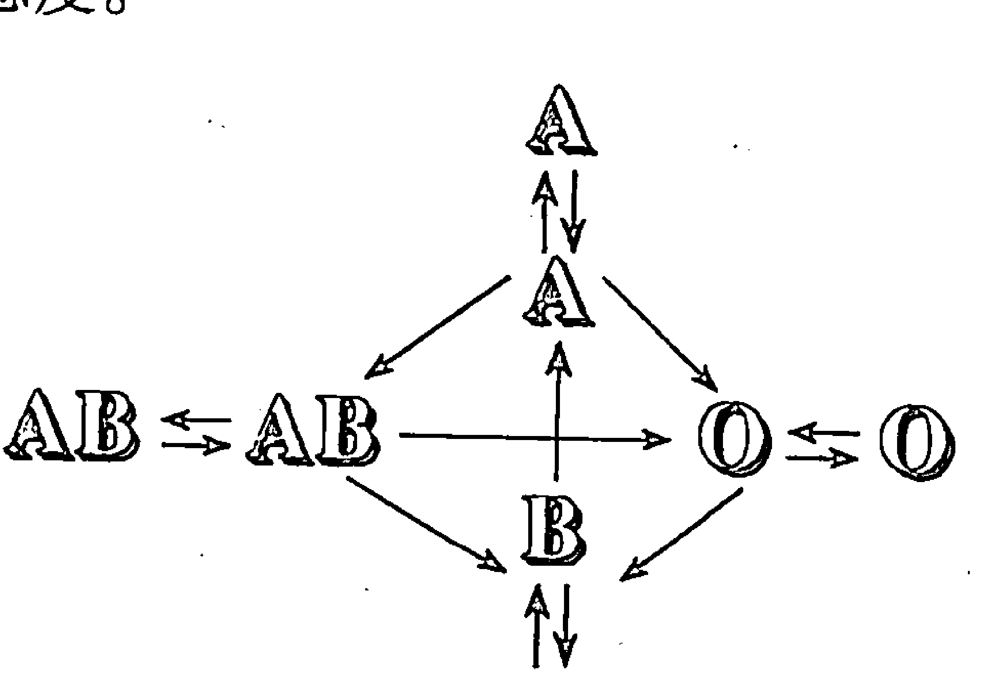

3.  弱者若无法接收到强者的讯息，立刻会进入不安的状态，直到可感受对方的讯息时，不安的情绪便可获得纾解。
4.  弱者一接近强者，便如同登上稳固的大船般，心中充满着安全感而倍感踏实。偶尔会兴奋过度。
5.  弱者容易为强者所欺骗。

### 弱者对强者的感觉

弱者眼中所见的强者的言行举止，以下摘出部分作为实例。

- 总是充裕自如、稳重大方。
- 是个优秀的听众，可见其用心之深。
- 根本就像是我的主人般提出要求……。
- 经常瞪大眼睛盯着我做事。
- 擅于对他人付出关爱。
- 个性稳重踏实。
- 不能随便和他开玩笑。
- 做事懂得抓住要领……。
- 擅于言辞的表达。
- 不会向对方要求得太多。
- 理解力强烈、动作敏锐。
- 为何总对我不假以颜色呢？
- 格调颇佳。爱装玄弄虚……。
- 瞧他焦急如焚，难不成也是胆小如鼠的家伙。

### 强者对弱者的印象

强者在面对弱者时，并不会自顾地说‘等等……’而停下脚步作回应，这也是其内心反应的一项特征。一点儿都不恐怖。并感觉不需要为自己定个形象，因其直觉到不管怎么做都没关系。

若从旁观察的话，强者面对弱者时，会摆出高高在上的姿态，于是偶尔会假装漠不关心。与其说是假装，不如说他是个演员，扮演着一个叫‘自己’的角色，在发挥演技之际，倒也乐在其中。

1.  当发现弱者的情绪已松懈下来，可乘虚而入时，他便轻而易举地飞奔入对方的怀抱中，并紧抓不放。即使在暗算着如何除掉对方，也不会感到羞愧或兴奋。他好像在拍打已晾的棉被一般，一股脑儿地胡乱拍打，直到满足为止。
2.  当弱者执拗地要他怎么做时，他会感到非常厌烦，即刻便严峻地予以拒绝；而自己在对弱者发号施令时，若有稍稍的不如意，便立刻大发雷霆。
3.  因此，一旦他发现自己被违逆或被背叛，当然是极其伤心的了。

### 强者对弱者的感觉

- 怎么搞的，这家伙这么没用啊！
- 这家伙可真粗心大意，还那么聒噪。
- 真是个老实人。做起事来也是精力充沛。
- 经常提高警觉、行动亦敏捷。
- 这家伙太一板一眼了，开不起玩笑的。
- 做事真抓不准窍门。
- 这个人似乎不容易受感动了。
- 若真被人当作愚笨、痴呆的话，那可伤脑筋了。
- 过于嘘寒问暖的，好啰嗦。
- 不易平心静气地思考。
- 容易发怒，真令人头痛。
- 个性急躁。
- 是个不苟言笑的家伙。
- 这个人心胸开朗，真出乎意料之外。

原则上，相同血型之间的关系可说是互如空气般的存在。最近由于废弃物的胡乱燃烧及空气的严重污染，想再求得潺潺清澈的流水，或清新透明的空气已不容易。人类不也一样？一旦跳入了大而无穷无尽的欲望深渊、错综复杂的人际关系，甚或是变化无常的社会结构中，一定也不例外的混浊不堪。

但此处所说的‘如空气般的对手’，其实含有‘未曾感觉到其存在的对手’这一层意义。亦即这是个不被在乎的对手。

因此若是血型不同的强者与弱者一起饮茶，即使两人都沉默不语，结果总是会有一方主动收拾善后的。但若是相同血型的两个人，双方都会认为对方会做，因此他们会很有耐心地就让空茶杯、茶具等摆在桌上，直到他们认为对方该来收拾为止。

此时若未事先讲好，恐怕将会演变成没有人采取行动。

## 第三章 血型与人生

当然在同一种血型，譬如说 A 型中可分成 AA 型或 AO 型，B型中自然也可分成 BB 型或 BO 型。由此得知，以上所举的例子，我们不能肯定其为‘相同的血型’。

如果多观察一些实例，则在相同血型之间，我们可发现一些有趣的现象。我们常说柳条碰到微风也会摆动，一旦双方的利害关系纠缠不清时，他们之间可作缓冲的煞车器将会失灵，互相撕打缠斗，直到打倒对方为止，变成永无止境的一战决胜负。

## ☆血型的三角关系

### 助强、抑弱

我们都已看过，在两人之间的血型内气质的运作，其实会互起作用。

一言以蔽之，血型里所谓气质的相互关系，正是‘扶助强者、抑制弱者’这般毫不留情的运作方式。就如老鼠碰着猫或蛇面对着猫鼬时，势必将会引起一场宿命安排的生死大决斗。对弱者而言，强者的血型就好似其天敌，随时在威胁着他。于是当两者对峙时，周遭的空气早充满了蓄势待发的紧张气氛。

人类的生活中，一对一的场合是最为原始的型态，但实际上一定会有第三者以上的人存在。母与子之间，须加上父。年轻夫妇之间，其实也还夹着公公、婆婆这一层关系。当然不只在家族里才有这种情况，同事、朋友、朋友的朋友等，不管任何一个人，一定会与比通讯录上的名单还多出好几倍的人互有关系，这才构成了一个人的生命。

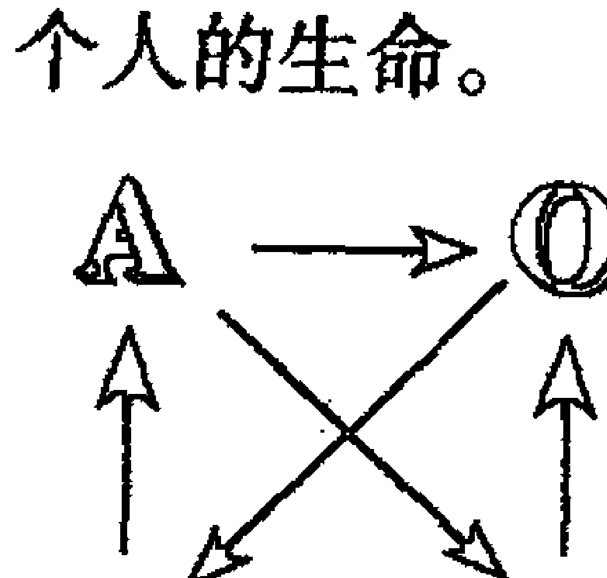

还好血型只有四种而已。虽然在此之下仍隐藏了复杂多变的内容，但从最小单位的两人组合起，乃至三人、四人的组合，只要能深切地掌握住这层基本关系，为人处世就应该可得心应手了。先让我们从四人组合开始吧！

## 血型、星座与人生

### 四人在一起会起互动的作用

仍旧沿用前面‘血型的力关系’图，若再稍微作个变化便是左图了。若这四个人呈 A、O、AB、B 型的组合，其中 B 型与 O 型会稍占下风，但就其运行的箭头看来，仍在颇均衡的循环状态下，并不会有一面倒的情况出现。

其中他们会彼此互相确认，认清该将自身所受的影响传达给谁，一旦自己感受到压力，便立刻如接力般地传达给箭头所指的对方。但这不是偏见所致。故这四个人若凑在一起，必可感受到彼此之间的相互牵连，也才构成了这四个人的生存空间。

但当发生问题时，他们会交头接耳，以便讨论出解决之道，此刻却不再担心会有人因为气势较弱而不得不接受他人意见，将所有责任一肩担的现象。这便是协调性。也就是我们所谓的共同责任吧！

但话说回来，在这层平衡关系中，却难以推选出一位领导者。并非谦逊的美德使他们互相推辞，而是他们相处的气氛中，根本就不需要领导者。因为他们之间的关系并不是金字塔型，即使没有领导者，顶多只是让他们感到如舞会上缺少真正的主角，或是找不着领队时的观光客一般若有所失而已。

设想我们挑选了 A 型作为领导人，则 A 型人顺着图上的箭头，首先会去说服 AB 型吧！接着 AB 型便担下责任，尝试着去说服 O 型及 B 型人。而 O 型从一开始便无心与 A 型作对，因此又容易与 AB 型合作，以求能说服 B 型。如此一来，B 型会传递给 A 型的压力便能减弱不少。

在这个关系中，若 O 型为领导者，他将先说服 B 型；B 型为领导者时，其说服对象为 A 型，而领导者为 AB 型时，以 B 型为对象等等，各种说服关系皆可适用。

那么，就三人的组合顺序描述如下。

### 血型的三角关系①

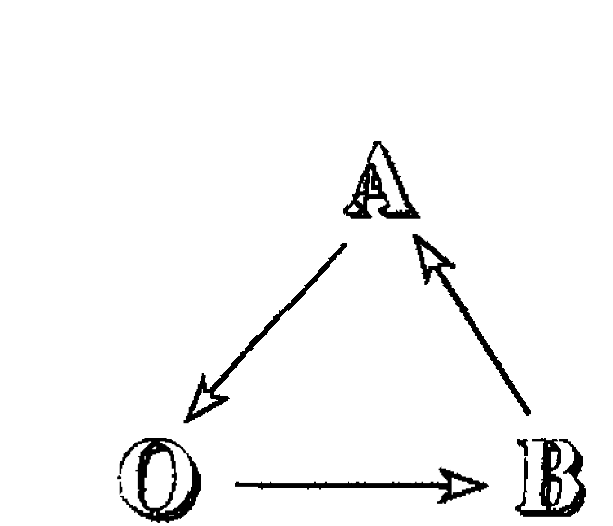

这种组合有一专门名词，称为交友图式。

A、O、B型这种组合三角关系，经常被喻为适当的三重奏，其关系将能持久。

> ‘那三个人好像都不知道吵架是何滋味似的。’

是呀！在他们之间并不会出现多大、多剧烈的争吵。即使真的出现了争执，他们也能立刻和好如初。假设是 O 型与 B 型之间发生了争吵，B型稍微处于下风，此时 A型便会支持 B型，全力去安抚 O型。

不管是去哪里、要做什么，这三个人总是一起行动，并互相使彼此安心行事。从学校毕业后，不管经过了多少年，他们也会经常找机会碰面，聊聊近况或理想。

面对这种三人组合，假如其顶头上司想拜托他们从事某项工作时，并不需要太花脑筋。只要找出较易被自己说服的其中某人，那就稳保可说服其他人了。

另外，若想拜托他们其中某人，而又感到难以启齿时，也可运用类似抓住重点作请求的方式进行，包管百战百胜。亦即想拜托 A型时，先向 B型说明，再由 B型传达给 A型，则更容易说服 A型接受。若目标锁定在 O型，与其直接找 O型谈判，不如藉由 A型这条路，将可更快达成目的。如果想找 B型时，透过 O型准没错。

但仍会出现一点小麻烦。B型男生若与 O型女性起了一点小争执，而由 A型（不限定男或女）介入其中充当和解人，则这对 B型与 O型会尽快结束其争执，而不愿让 A型人有介入的余地。于是，O型与 B型的兄弟结束纷争后，转而联手对抗 A型双亲的例子，也时有所闻。但此时若按照如前所述的箭头方向展开说服，由于他们之间原本就是‘亲密的三重奏’，必可令其关系回到最初。

还有另一个问题，即使这种亲密关系常出现好的结局，但若出现某个问题非三个人解决不可时，将会出现如食物链般的链锁关系，又是争执不休了。

### 血型的三角关系②

> ‘若交给他办我就安心了。’此时的 A 型正担起领导者的任务。其余两人则易起‘是不是觉得我们好无用？平日也都不表示一点关注’之类的怨言。

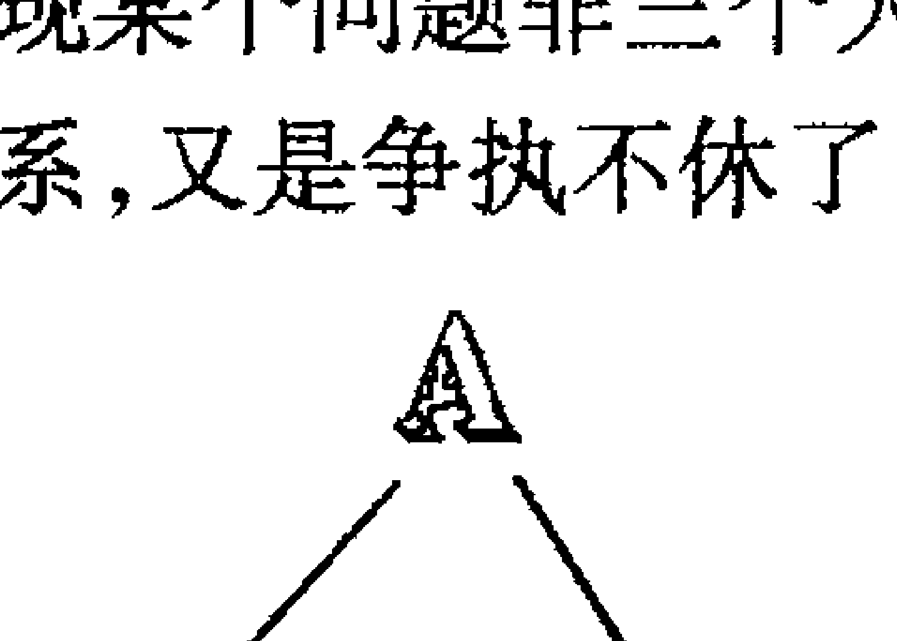

请仔细观察图上的箭头方向。A 型的箭头指向 O 型、AB 型两方；而 O 型只能承受从 A 型及 AB 型指向的箭头，自身并无可发射的对象。

> ‘结果经常都是照着那个人的意见去做。’

> ‘偶尔会事先要求我们表达意见，待我们说完后，他一转身，又不将我们所说的当一回事了。’

似乎常可从 O 型、AB 型的口中听到这些不满。

因此结论常常是：都交给 A 型去做好了……。确实在这个团体中，不知不觉地 A 型已取代了领导者的地位。在某些实际场合中，也许 A 型的意见或行动并不如想像般地会引起大众注意，但不可否认的，A 型人暗地里已握有左右大局的实力了。

也许这不是个很恰当的例子，但若将其套上不良少年的团体来试行研究，自也不难了解。正是如此。一向以幕后操纵者自居的 A 型人，在这种三人小组的场合中，绝不会很明显地站在明处去引起他人注意。由于其余两人会较无警戒心地暴露自己不当的言行举止，故容易被列为首要辅导对象，但事实上针对那两个小喽啰作辅导，并不能收到立竿见影之效。此时，总可意识到 A 型的吸引力，对那两个家伙的影响力有多大了吧！反之，若懂得先抓 A 型这个头头来作辅导，一旦他下定决心要改头换面、重新做人，其余两个人很自然地便是顺从其意向。

虽然我是以时下的青少年作例子，毕竟也让读者明了，这种气质关系存在于日常生活中。

### 弱者对强者的印象补充

强者在面对弱者时，并不会自顾地说‘等等……’而停下脚步作回应，这也是其内心反应的一项特征。一点儿都不恐怖。并感觉不需要为自己定个形象，因其直觉到不管怎么做都没关系。

若从旁观察的话，强者面对弱者时，会摆出高高在上的姿态，于是偶尔会假装漠不关心。与其说是假装，不如说他是个演员，扮演着一个叫‘自己’的角色，在发挥演技之际，倒也乐在其中。

1.  当发现弱者的情绪已松懈下来，可乘虚而入时，他便轻而易举地飞奔入对方的怀抱中，并紧抓不放。即使在暗算着如何除掉对方，也不会感到羞愧或兴奋。他好像在拍打已晾的棉被一般，一股脑儿地胡乱拍打，直到满足为止。
2.  当弱者执拗地要他怎么做时，他会感到非常厌烦，即刻便严峻地予以拒绝；而自己在对弱者发号施令时，若有稍稍的不如意，便立刻大发雷霆。
3.  因此，一旦他发现自己被违逆或被背叛，当然是极其伤心的了。

### 强者对弱者的印象补充

强者在面对弱者时，并不会自顾地说‘等等……’而停下脚步作回应，这也是其内心反应的一项特征。一点儿都不恐怖。并感觉不需要为自己定个形象，因其直觉到不管怎么做都没关系。

若从旁观察的话，强者面对弱者时，会摆出高高在上的姿态，于是偶尔会假装漠不关心。与其说是假装，不如说他是个演员，扮演着一个叫‘自己’的角色，在发挥演技之际，倒也乐在其中。

1.  当发现弱者的情绪已松懈下来，可乘虚而入时，他便轻而易举地飞奔入对方的怀抱中，并紧抓不放。即使在暗算着如何除掉对方，也不会感到羞愧或兴奋。他好像在拍打已晾的棉被一般，一股脑儿地胡乱拍打，直到满足为止。
2.  当弱者执拗地要他怎么做时，他会感到非常厌烦，即刻便严峻地予以拒绝；而自己在对弱者发号施令时，若有稍稍的不如意，便立刻大发雷霆。
3.  因此，一旦他发现自己被违逆或被背叛，当然是极其伤心的了。

## 第三章 血型与人生

气质的力关系对人的感情与意志决定，竟有着超乎想像的影响力。故若随意地指责他，将没什么成效。

在 A、O、AB 型这种不甚平衡的组合下，未带半点儿留恋之情而潇洒离去的，必是 A 型。而最难以割舍，且恐惧着另外两人的是 O 型。AB 型人则会在 A 型离开后，感到自己将成为 O 型的操纵者，期待之心油然生起，毕竟当 A 型在场时，他永远都无法达成这愿望。

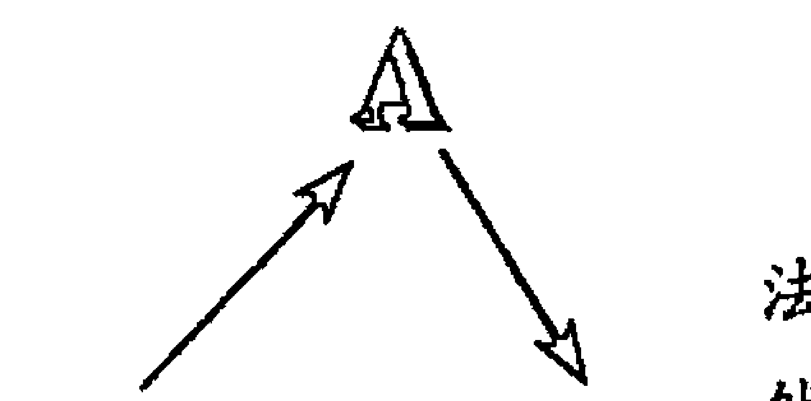

## 血型的三角关系③

> ‘有时觉得这个人个性耿直，但又好像无法贸然地接受他。’——三个人三个样儿，当然不见得每个人都有这种想法。但这种平凡的关系才是最好的，不是吗？

与前述的 A、O、B 型组合相似，只是其中的 O 型抽换成 AB 型，正巧也是单方向的循环关系。亦有人称它作‘亲密的三剑客’。在这三个人的应付关系中，也许偶尔会出现日常性质的小风波，但他们都会借着寻找代替品等方式来解除尴尬。待芥蒂一除，则其友谊更可长久维持。

这团体中的任何一个人，在提出某个要求时，定是利用猜拳法中的石头→剪刀→布这层力关系来分出高下，因此结局不管如何，绝不会互相埋怨。

若 B 型与 A 型相争执，AB 型充当和事佬介入其中，则他会偏袒 A 型那一方，而尽量去说服、安抚 B 型。而当 B 型听了 AB 型的‘这个嘛！其实这并不……’这一番暧昧不清的说词，也会慢慢地将自己的情绪平息下来。若争吵的是 A 型与 AB 型，则 B 型会善尽和事佬的责任。而 B 型与 AB 型发生争执时，A 型自然义不容辞地担下调停人的重责。

此时，所谓的妥协并非勉强的让步。他们都明白，先藏起“自我”的锋芒才是最聪明的举动，亦即从内心深处说服他人，这便是其特征之一。事过境迁，他们仍旧和谐融洽地相处在一起。

话说回来，说服这动作虽是一直在进行，但当事人的喜好厌恶，又得另当别论了。B 型在面对 A 型时，会认为说点假话也许对他的胃口；而 A 型虽可从 B 型的身上感受到人性的魅力，但他宁可挑选 AB 型作为工作伙伴。

若想寻找适合的情人，则依照箭头的反方向，亦即 A 型可以 B 型、B 型以 AB 型、AB 型则以 A 型作为理想的对象。若只想与他快乐地交往下去，却又要按照箭头方向，如 A 型以 AB 型为对象去进行，才会出现预期中的好结果。

团体中常有需要经由意志决定的场合，此时若想征求外人的意见以作调整，则 O 型将是最佳人选。

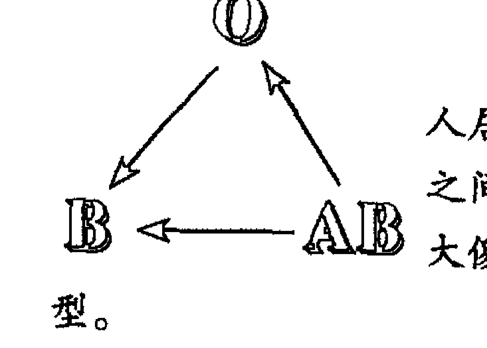

> ‘我同时喜欢上了两个男孩。而这两个人居然都认为自己才是最佳人选，于是他们之间感情破裂，还不断地发生纠纷，真是两个大傻瓜’——那个引起争端的女主角便是 AB 型。

这种组合与先前出现的 A、O、AB 型一样，箭头并非朝单一方向，而是全集中在 B 型这儿了。的确，在气质的力关系上，与 A、O、AB 型组合非常相似的一点，即是其相互间影响力的重叠。但原为 A 型所担当的重任，此刻已易位由 AB 型来承担。也因此将由于所拥有的气质相异，在经过一番运作之后所产生的结果，便多少会有一些差异。

天生具有的复合性，轻快自如的活动性，或是充满着自我矛盾的妥协精神等，这种种的气质因素，仍将原原本本地呈现在世人眼前。因此某些时候也许是优点，但对另一个人来说，也许变成缺点或弱点的这些要素，便可在这仅三人的组合中，添入多少的复杂与难解。

举例来说，在乌鸦的世界里，是由任何个体来决定顺位的。当顺位较高者接近低顺位者时，这低下的一方得无条件将自己原来捕食的地盘让给高顺位者。任何一个个体也不能对较强者作突发性的攻击等。这种 O、B、AB 型组合的三重奏，其实正是乌鸦世界中的规则。

AB 型容易去折磨 O 型及 B 型，O 型偶尔也可吃定 B 型，但 B 型也不会积旧恨、记新愁，因此 AB 型人在不知不觉间便能掌握住主导权。于是这个小团体的性格，也将会倾向于 AB 型。

如前所述，该血型所选择的方向，便是我们所画箭头的方向，这构成了血型之间的所谓力关系。也就是说，气质上的强者不仅可选择弱者，同时也可决定是否要将他舍弃。反之，弱者却不能凭自己的立场来轻易选择强者了。

也许这是件完全不合理的现象，但不幸地，这便是血型上所谓力关系的真理。当有这三者存在时，AB 型在其中的地位是具有绝对性的君王地位。

## ☆血型别的性格分析

‘气质这东西就像种子一样’，笔者在先前已叙述过。就像是志在成名的明日之星一样，在人生的舞台上扮演着不同的角色，这正是将要说明的‘性格’。

同样是刚出生的小猫，若不断地喂其猫食，待长大后，它将忘了捉老鼠的天赋。有句谚语是‘戴上猫面具——伪善’，意指装成温柔、可爱的样子，而事实上并不需要假装，因为即使生活过得多麽惬意，猫永远都保有磨爪子的习惯。当然其志不在捕获老鼠，但我想猫一定连研磨爪子的目的何在都搞不清楚。这便是‘气质’。

但若再研究其结构，每只猫的做法一定有所不同。有的会因被主人大声斥责而静静地躲在一边，有的却是脾气糟到可与其他猫当街对吵。这便是‘性格’上的差别。即使我们出生时都遗传自同样血型，但若那时已赋予了多愁善感的气质，生长在父母亲皆冷酷的家庭，则必会因为自己的多愁善感而羞耻，并眼泪汪汪地极力隐藏起自己，容易出现滑稽、脱线的状况。

## 各种血型包含了九种不甚相同的性格

气质形成了一个人的百分之七十左右，待出生、逐渐长大后，便由于自然的、社会的、文化的外在环境，并与天生的气质结合后，形成了俗称‘一样米养百样人’的个人独特风格。若更深入观察，则可发现以下将要叙述的各种血型，皆包含有九种类型。

实际上你是属于哪一类型呢？请仔细阅读过各项说明后，将它找出来吧！性格较为复杂的人，甚至不只一种，比如说就有人符合①及⑤两类型。

## ☆A型性格的九种类型

### 可解释A型的关键字——胆怯、自我不信任

A 型与 O 型、B 型相较之下，具有较容易受到周遭环境影响的特征。即使是细微的事物，也相当敏感地可反应出来，常被环境所左右。因此有人能尽情地发挥能力，反之却也有人会完全退缩，根本使不上劲儿。

- 优点：柔顺、谨慎细心、谦虚、反省、感情丰富、具同情心、有牺牲奉献的精神、具协调性。
- 缺点：容易担心、感情重于理智、意志薄弱、不够果断、喜爱孤独、非社交性、悲观的、内向、害羞、易掩饰自己的真心。

### A型·①内向型
#### 没有真正的朋友

待人极好，并具有宁可牺牲自己，也要为朋友尽心尽力的个性，却不愿朋友也以相同的方式回报。绝对不会主动找朋友讨论，而宁可自己一个人默默的努力。对方因感动你的热诚尽心，将你当作是至友般地坦诚相待，但你却会掩饰真正的内心，不轻易让人看穿。

虽不让对方看透真心，表面上却也经常装模作样，似乎已将对方当成至友；但不知怎么样，就是无法与对方交心融性。所以，有时可听到其发出‘连一个的朋友都没有’之类的抱怨。

反之，若对方并未将自己当成至友，自己过于接近对方，尽心尽力的付出，反而会遭到对方的误解，还嫌你太过啰嗦了。不让别人看穿自己的真心，仅表面在运作，也许会因无法读出对方的内心而导致反效果。

**重点、建议** 私下已决定保有自我，因此不会想不开，也不会忧心忡忡。在乎别人给予的评价，更重视自己的朋友多少与否，简单说来，其人生观是要广结人缘。

### A型·②自我本位型
#### 自身的付出带给对方压迫感

非常注意周遭的人事，也会为对方贡献自己的所有心血，但这类的 A 型却常使对方敬而远之。有时会傻里傻气地拼命去做的 A 型人，其实是为了满足自我，也是因为对方不会嘲笑自己而倍感亲切。‘真的已经够了’虽然对方已这么说，仍会误以为对方太过客气，也不管是否造成对方的困扰，只是一味地为了满足自己而去做。

因为自己这么想，必也深信不疑地认为对方定是相同的想法、相同的感觉。因此，这方所表现出的亲切被对方悍然拒绝的话，会怒斥对方是个毫无感情的人，甚至轻蔑地指责此人善变。其次，若对方并未以同等的态度回待，又会口不择言地责骂对方不知报恩、冷淡。

在必须提出忠告或促使对方多加注意的场合里，他是属于再说一句便嫌多的那一类型。虽然他已看清对方的立场及事态严重性，却由于他不愿多讲一句话的个性，将使得这番忠告的效果大打折扣。

**重点、建议** 所谓的体谅，应以信任对方为出发点。若尚未摸清对方的情绪，则不必任意地送出那份七嘴八舌的亲切感。

### A型·③好奇心型
#### 没恒心、见异思迁

这类 A 型人并不保守，对任何新鲜事皆表露了强烈的好奇心，总觉得若非自己亲自尝试则无法得知个中三味。然后当他开始进行时会全神贯注，脑海中全是该项计划的盘算，很快便一头栽进其中而忘了我是谁，未见损失，也未有所获。

若觊觎某项事物，则他会不惜一切心力，只求到手；但当一旦到手，又对该物失去原有的兴趣。没有恒心及耐心，所持的兴趣与关系不能持久。即使在异性关系上亦可见此种倾向。

其热诚与集中力相当高，并具有创造性，因此对所关心的事物，具备了一般水准以上的知识与技术；但他并不会将其当作一生的事业，故常会感到‘书到用时方恨少’的遗憾。面对具权威性、体制性的事物，排斥感非常强烈，譬如在一些运动竞技上，他会倾向于弱的那一队，而全心全力去支援。

这是个在气质的‘小心、谨慎’上缺乏煞车力的 A 型人。

**重点、建议** 若订定了一个大目标而未能尽心尽力做好，容易在其人生过程中留下缺憾。就好似已无法放弃所热衷的事物一般，他只好强忍住遗憾而铭记在心。

### A型·④优柔寡断型
#### 信念容易动摇

非常在意自己体面与否，内心深处渴望得到周遭的认同及信赖。由于此一体认，下意识地会努力去剔除内心深处不信任自我的意念。

话虽如此，他对一个绝佳的问题，可以详详细细地说出自身的看法，但一旦这个问题牵扯上他个人的隐痛，又会特意含糊其词，掩饰自己的意见。

面对一个欲求其信任，并令其肯定的对象，他会极力逢迎对方，只挑对方有兴趣的话题，即使对对方有微辞也不表露，因此会被评为不能太过于信任，也是人之常情吧！也因为怕事，而不敢说出内心的真正想法，会被批评道：‘那个人总怕自己受到伤害，因此都不说真心话。每看到那种令人摸不透的态度，都非常着急。’虽然为人很和善，但不适合太过信赖。

**重点、建议** 虽处处迎合对方，却不见得私心承认。不必要的谦虚，偶尔会被人当作是傲慢。别迷惘，勇敢说出自己的意见吧！

### A型·⑤双重人格型
#### 严以待人的批评家

个性敦厚顺从、富同情心、为人着想，是一个一板一眼、肯力争上游的年轻人；但自尊心受伤害时，就如所谓‘君子也会变成豺狼虎豹’，粗鲁地扔去原来的温和面貌，而变得冷漠不可侵犯。施予伤害的对方不管如何道歉弥补，他都不会轻易地忘掉。

他待人严以律，却对己从宽。强迫对方遵守规则、接受约束，一旦对方未遵照其意，则多半会扯下脸来，不给好脸色看；反之，他要求自我时，却不如要求他人般地严苛，常常一笔带过交差。而且总可以利用各种理由来说服自己，让自己安心。

自己虽如此容易原谅自己，却偶尔会自私地不许他人做这做那。对金钱的借还及物品的取放等，大家看得到的行为，他必是端端正正的做好；但在精神面的施受或资讯交换上，因少有第三者在场，便漫不经心，甚至以自我为中心、强加给对方重担，他也不在乎。

**重点、建议** 若平时未注意到‘严以律己、宽以待人’的态度，则他平日谦虚的形象，会被误解为想隐瞒其自私自利、不顾他人而戴的面具吧！

### A型·⑥自信过剩型
#### 不接纳他人的意见

不管与人讨论、研究什么问题，他都已经自有一套答案与做法。当自己的意见及想法为对方所接受，他便按照当初所决定的计划去实行；但若遭到反对，他却绝不会去修改。他不愿意变更自己早已设定的想法，非常顽固，容易遭到旁人的反感。

即使真的失败了，他大半是替自己辩解或赔不是而已，绝对不会承认因为自己犯了错才导致失败的。纵使他曾深刻的自我反省一番，也多半不会表现于言辞或表情上，摆得正是常遭人批评的‘目中无人’的态度。

故此一类的 A 型人，不管怎样说，其责任感总是异常强烈，一旦感到未尽到完全的责任，内心的自我责备比任何人都严厉。

若想扩展好的一面，势必要改掉其坚持己见、绝不动摇的固执，否则他仍会倍受周围人们的排挤，大家宁可疏远他，不愿将他当作值得交往的对象。

**重点、建议** 即使在不得已之下作了妥协，他总也感到自己似乎遭到对方的压迫，即将失去自我的不安，其实他只是杞人忧天而已。抛开那些自我的束缚吧！

### A型·⑦酩酊型
#### 凭恃才气而勇敢的跨出

属于内向、害羞的个性，一旦三杯黄汤下肚，则会完全变了个人似的。正如已呈酩酊状态者的性格表现，这种人亦存在于 A 型中。

虽是初次见面，也可以毫无隔阂地与对方谈笑风生、怡然自得。具有相当的说服力，使对方产生充分的信赖感。

但是与此人相交愈深入，愈能发现这家伙所说的话须打折扣，往往有一半是空谈哪！当然其本人原无欺骗之心，只因天生的‘唯我独尊’个性，及为了表示对对方的好感，便会不由自主地说起大话，甚至连不可能实现的事物，由他说来，也好象在逐渐实现般的天方夜谭。

凭恃自己的才气，靠着大方自信的举止，而可迅速地跨越鸿沟与人交往，因此常会被批评为毫无诚意、不够诚实，于是当初所刻意建立的信赖关系逐渐丧失，自是对本身造成相当大的损失。

**重点、建议** 别让心情牵着理智走，也莫压抑自身的才气，在表达意见时须注意到尽量只说出能力所能及之处，否则一旦牛皮吹得过火，将会丧失原来的人际关系。

### A型·⑧自我防卫型
#### 小心谨慎、难以接近

由于强烈的羞耻心及非社交性，给人的第一印象不容易接近。与不熟识的人谈话时，虽会尽量回答对方所提出的问题，之后却是保持沉默，不愿积极主动地开口，容易心神不宁，可明显看出他亟欲尽早离开。

若说了句不甚得体的话，他便开始担心会不会被人嘲笑、会不会被人当成傻瓜，总拘泥于自我防卫心态中，而越来越沉默。一旦耐不住沉默或不得不说话时，他也是草草说出，便急急想逃离。其实他非常厌恶这般的自我，却从不会想要去改善，仍只是一味地沉默不言。

若说他难以接近，事实上其内心非常丰富，也是个很爱开玩笑的调皮鬼。因此与他较为熟悉之后，一般反应是很惊讶地说，真是改变太大了。

不怀好意的人常会认为他伪善且太过于谨慎了。由于给人难以接近的第一印象，对他损失相当大。

**重点、建议** 应再拿出更多一点的‘勇气’。别光做一个倾听的对象，若用心与对方交谈，会发现事情并不如想像得那么难。

### A型·⑨自我主张型
#### 希望让别人看到更优秀的自我

非常在乎对方对自己的评价，因此为了给对方留个好印象，会使用各种表现自我的方法。

第一种是虽然没有足够的实力，却爱乱用自己没学过的用语，言行举止也宛如这一行的专家。若碰上真正的实力者，则立刻褪下身上的龙袍露出蛇尾，溜之大吉。幸好在 A 型人中只占少数。

另有一种是虽有实力却不显露出来，宁可让别人一点一点去发掘。最初他以谦虚有礼的态度应付，并逐渐地让对方去发现自己的实力，进而承认，最后则以‘这个人真的很厉害’之类的最高评价来收尾。当然他以低姿态为出发，即使失败，所受的伤害也不会太大。这正是他打的如意算盘吧！

这两种类型有一个共通点，即富有阅读对方内心的能力，亦即洞察力优秀。因此可敏锐地感受到对方情绪上的动向，并可及早抽身（转变）是其特征。

**重点、建议** 自身的实力必定可锋芒崭露。不要太过于精打细算，尝试着表现出真实的自我，机会将会更早降临吧！

## ☆O型性格的九种类型

### 可解释O型的关键字——强烈的自我肯定、自卑感

包含了宁可将自己缠绕起来的人，都不太容易受到周围环境的影响。对他人的压抑或忠告等，也难以左右自己的心意。偶尔会出现看似无谋、蛮横的言行举动，事实上那些皆已经过合理的判断，作为合理行动的依据，事过境迁便将一切明朗。

- 优点：意志坚定、自信、不为外物所动、理智、毅力强、冷静、客观、重理论、现实、具行动力。
- 缺点：固执、顽固、无协调性、不谦虚、冷漠、自私自利。

### O型·①神经质型
是社交性、可迅速洞悉对方，以便交谈时投其所好，待人接物上亦开朗大方，但这些似乎都非自然流露出来的。事实上，他非常在意旁人所给他的评价，也非常努力地想去达成外界给予的目标。

在旁人面前，他会为了能与对方的步伐相配合，而任意接受额外的工作，并常被卷入麻烦极大的是非之地。因此劳心劳力的事接踵不绝。

由于旁人对其观感是爱好社交、开朗大方、细心体贴且谦虚为怀，因此认为他很好商量，凡事皆可轻松提出。不管是多厌恶的话题，他都是笑容可掬地倾听，并尽量给予协助，因此旁人越来越信任他；表面上看来，他似乎悠闲轻松得很，事实上其内心却忙碌得连休息时间都没有。

看起来似乎是个凡事好商量、可以轻易谈心、豪放磊落的人，其实大多是神经质且气质狭小。

**重点、建议** 不要光是在意对方将作何感想，应考虑对自己是否有利。偶尔为了坚持自己的原则，练习说‘NO’也极为重要。

### O型·②自我步调型
#### 一经说服即可充分发挥实力

乍见之下，外表形象与真实个性正好相反。外表看来，这是个待人柔顺、温和谦逊、具备融通性的人。一旦产生了利害关系，则前述的柔顺、温和、谦逊等尽失，取而代之的是顽固、蛮横，而且非常任性的一个人。对自己所认定的事物，非常固执坚持，但又容易因为障碍而骤然改变自己的态度。原因乃在于其任性，有自我本位的倾向。

若此种性格朝好的方向发挥，则可产生令人叹为观止的耐力。一般的评语都说 O 型人具有行动力，但此类型的行动力，是指从决定行动之后到开始行动为止需多花一些时间罢了。对任何情况皆很慎重，惟一旦下定决心开始行动时，不管遭遇到什么挫折，仍是凭着耐力与努力，坚忍不拔地朝目标迈进。于是，他总算对此份严苛的耐力及源源不断的努力，感受到了生存的价值。我想可以将其比喻成水鸟吧！从水面上看来它极为舒适，水底下它却正努力不懈地划动着双脚呢！

**重点、建议** 经常为了自己才采取行动，为了达到目的而不择手段的观念应去除才是。

### O型·③见异思迁型
#### 忽冷忽热

是个才气洋溢、脑筋转得快的思想家。常头脑灵光一闪，产生个绝妙主意后，非当场亲自试行不可，并表现出相当热衷的状态。当他搞懂了来龙去脉后，却又毫不留恋地撒手不管，重新再寻找新的兴趣。这不光是表现在兴趣方面，人际关系上亦同。譬如到上个月为止，他与 A 小姐处得非常亲密，甚至已到天天腻在一起的地步；但到了这个月，与他出双人对的不再是 A 小姐，他已栽进 B 小姐的温柔怀抱中了。

O 型人中的一般性倾向，是经过深思熟虑后才采取行动，以孜孜不倦的态度，愿意花上很长的时间来完成大事业；但此类见异思迁的 O 型人，总是一触发动机，未经过考虑便贸然行动。常是忽冷忽热的。

这种开朗、具行动力、对某样事物坐立不安的个性，若他愿意更加努力不懈，并配合与生俱来的行动力与创造力，则必然可朝气蓬勃地迎接任何挑战。

**重点、建议** 若能再稍微运用自己的兴趣会更好。将自己的兴趣灵活运用之后，便可发现前方正有一个鲜明的目标等待自己去实现。于是天生俱来的才能得以适当地发挥，势必也可令自己大放异彩。

### O型·④乐观型
#### 具行动力、顺从、大方

不管处在如何紧迫盯人的场面，都可临危不乱。举参加考试的例子来说，他不会去担心一旦落榜了会有什么后果，即使顺利通过考试，他也是平心静气地接受他人的祝贺，兴奋之情不会显露于外。与无法遵行自我意志来行动的 A 型人不同，当想到什么，便立即行动。表面上便容易看出其做事迅速，且相当霸道。

## 第三章 血型与人生

容易被批评为冒冒失失、举止轻率、感觉迟钝且蛮横霸道，当然事实并非如此。当与他共事时，若可好好地说服他，可成为非常温顺可靠的工作伙伴。积极地活用对外的人际关系，并极力发挥绝佳的社交性。

但万一失败的话，也许外表仍是悠闲不为所动，事实上，其想法已动摇下来，且明显的表现在行动上。此种行动一般是未见其一贯性中充满着矛盾，因此经常会失去周遭人们的信任。而其优点中的顺从这一点，若不善加利用，则将失为毫无主见，而被批评为可轻易摆布的‘跟屁虫’。

> **重点、建议** 要不畏惧挫折感。即使遭人批评，也要坚持自己的信念做下去，相信一定可获得谅解的。不要太过在意任何事物。

## O型·⑤自负心型

自尊心强烈的行动派

会自谦道自己是个懦弱、无决断力的人，但事实上，这是个胆大心细且具备着绝妙的行动力及统率力的人。之所以会如此谦虚，是因为他不满足目前的自我，希望能得到自己应该可做得更好的正面评价，而所摆出的一副倨傲不恭的姿态。

自尊心强烈，面对着曾伤害过其自尊心的对手，会还以颜色。当他认定这一点，便很难再抽手不管。由于他不愿尝到败北的滋味，将会不择手段，以便坚守深信不疑的事实，并加以行动。比起被人当成傻瓜、被轻视，对他而言，伤害最重的莫过于别人无视于他的存在。因应此种‘无视’之道，便是事前即做好胆大而心细的准备。总之他将尽一切努力，不让别人漠视于其存在。

> **重点、建议** 这类的O型人会拥有许多与自己站同一方的伙伴，也相对地会树立许多敌人。因此在凡事皆很顺利进行当中，可能会突然被敌手绊倒而失足不起。

## O型·⑥实力型

与外表差异甚大的急性子

厌恶曲折迂回，个性正直，直率地将其感情表达于外。一直期许自己洁白无瑕，灵敏且具有果断力，并发挥出具弹性与顺从性的行动派。待人温和，一旦被认定好讲话、容易拜托时，有可能会被爬到头上去。喜欢照顾他人，为他人尽心尽力亦绝无怨言。

反之，他却不喜欢去拜托他人。由于不服输和充满自信的个性，绝不轻易向人低头。非常厌恶那些鄙俗的赞美。也因为他是如此顽固而具有洁癖性，即使被冠上诸如高高在上、冷漠、不易接近等批评，他仍可平心静气的接受；但若扯上他的地位或名利，将会非常恼怒。说他‘急性子’并不为过。

不服输的个性使他永远立于不败之地。不管处在任何场合，绝不轻言失败，一定固执地更加努力。因此会被批评为别扭古怪、度量狭小，且易遭人反感。

**重点、建议** 要认清事实：性子太急有损元气、失败亦是胜利等，并可看透、向人低头，其实也是争取胜利的一个手段。

## O型·⑦社交型

视野广阔的雄辩家

在O型中属于特别具备社交性的一型。动作舒缓，可让对方定下心来，说话的音调柔和，不会遭受排斥，非常具有说服力。虽然使用的是平凡易懂的言词，却可渐渐切入话题中心，让对方在不留神的情况下，不知不觉地走入壳中。

在讨价还价方面很有技巧。脑筋转得很快，可迅速看穿对方在想什么、正期盼着什么。并有先见之明，所具备直觉预知的能力令他受惠良多。

不仅拥有强烈的自我表现欲，支配欲望也强烈至极。因此偶尔会流露出轻视对方的态度，常使得其天生的说服力、雄辩力无法灵活运用。

虚荣心亦极为强烈，在碰到与他人讨价还价的场面时，也许他私心下并不打算这么做，又转念认为只在这种场合才说谎，应当无所谓才是。因此容易被人家批评为口才绝佳，却缺乏诚意。

**重点、建议** 说服力与雄辩之类的武器，若使用方法错误，容易使自己受到伤害。不要只沉溺于自己的能力，应该常作谦虚的自我反省才是。

## O型·⑧丧失自信型

对障碍招架无力、没恒心

虽具备冷静、沉着、有信念的优点，并堂堂正正地展开行动，却非常热衷于自我反省，非常在乎旁人的看法，并对他们的评价异常敏感。希望所有人皆认同他、对他产生好感的倾向十足强烈。

平日未见其显眼之处，但一旦开始行动，可见其积极、勇猛而具强制性的攻势。当碰上会妨碍或反对的行动时，为了清除这些‘障碍物’，他会偏激地强将那些‘物品’踢出视线外，可见其强烈的自我主张。但他若一直处在充满着鼓励的掌声中，也许是暂时地充满自信、意气风发，一旦出现反对者，其内心将与外表呈相反状态，为失去了安定感而惊慌不已。自信心亦游移不定。

富于责任感、谨慎行事、孜孜不倦地只愿尽早完成工作，他拥有一板一眼、实事求是的一面，但偶尔也会对这种自我感到厌烦。由于过于在意极其细微处，对工作便感到乏于应付。因此偶尔也会被批评为没恒力、没耐力、无法持久等。

**重点、建议** 再细细品味‘失败为成功之母’这句话的含义吧！自我反省虽然好，但要克制自己别太完美主义，也别太多管闲事。

## O型·⑨不协调型

不管与什么搭配皆不协调

分为外表很华丽但缺乏内容，乃外表平淡却涵养丰富、值得尊敬这两类人。前者为了隐瞒其内容的贫乏，掌握住某项特点后，一切的言行举止便犹如经济非常宽裕的人一般。于是他便从四周得回一些奉承，如花钱很大方之类的评语，事实上却如火焰车一般艰苦不堪。另一方面，充满智慧、不重外表的这一类型，对习惯于以
外表来作评价的那些人，亦采取主动接近的态度。

此二类型皆开朗而富行动性，头脑聪敏。具备有社交性、不得罪人的优点，但也时时以自我为中心，容易对自己作过高的评价。因此，他不论是何时、何处、对方为何许人，皆直言不讳地。只是偶有意志薄弱、注意力不足之处。

而令人意外的是，他也具有富于感情、行动易怒的一面。容易见异思迁，对事物无法持续地保持兴趣，是其缺点。

**重点、建议** 若他不能以中立、客观的态度与人配合，则经常会出现与对方的意见相左的冲突，结果必是惨痛的失败吧！

## ☆B型性格的九种类型

### 可解释 B型的关键字——强烈的疏离感、自我肯定

B型与 O型不一样，不太容易受到四周环境的影响。一旦了解某些言行举动会遭受限制，或可能会被迫去进行某些行动时，他便会在事前改变自己以求避免，若发现任何预防已无效时，他便会兴起逃离的念头。

优点：坦然、果断、快乐、具活动力、敏感、社交性、亲切、乐天派、爱热闹。

缺点：见异思迁、没恒心、不执著、大胆但不慎重、好辩、多管闲事、意志薄弱、容易动摇、华而不实、性好夸张。

## B型·①努力型

### 掌握时代的感觉、且独立的志向

虽已有相当成就，但接收到上司所下达的命令，他仍必须要在该范围内为求生存而屏气凝神地向前冲；会有突然想抛开一切，逃离这里——这股强烈的独立心，正是他的特征。但对后果却不再多加思考，只冲动地想结束眼前的一切，因此后来的路途多半不会顺遂，即使为辛劳压得喘不过气来，他也不愿接受外来的援助，宁可独自努力不懈地来完成、解决。

具有极高的忍耐力，不排斥可能会损及其利益的事物，常为了他人而热衷于工作，一旦其做事被认可，即使他沉默不语，也很容易得到旁人的援助。

内心隐含着严肃的性格，而表面上则是温柔、稳重、和蔼可亲，对人的好恶不偏激，可与任何人建立起圆满的人际关系，用人方面亦是他的拿手好戏，因此旁人都可自然而然地自动伸出援手去帮助他度过难关。

**重点、建议** 合理、理性的，且过于重视数字，容易被人误解为小气。嫉妒心强烈、不愿去认同他人等也是其弱点之一。

### B型·②柔顺型

协调性居冠的贵夫人型

无论交往的对象是何种人物，他都具备了自由、纯朴、易于亲近而有弹性的社交性，与他共事时也可感受到其解决事情的协调性。

B型人中，巧言、好辩者占大多数，而这一类型者可是很难得的拥有不爱说话、保守、不出惊人之语、不做惊人之举的特征。个性柔顺，难得拂逆人意，总默默而坚强地忍耐着，藉着适度的努力来满足自己。诚实，不会表现得与言行不一致或刻意说谎，因此旁人非常信任他，并愿意将工作完全委任给他。牺牲精神相当旺盛，因此一旦决定要帮这个人时，他必定会尽心尽力地坚持到底。

只是偶尔也会出现没有自我主张、毫无个性的人。由于太过顺从，完全没有自己的看法，于是，一旦未能接受到他人所下的指令，自己便无法作判断。

在这世上，当然有人不太让自我鲜明地公诸大众，但他们却在背后不断运作，甚至以辅佐者、幕后主使的身份活跃其中，这也可说是柔顺型的一项本领吧！

**重点、建议** 所谓的协调性若是走错一步，则易变成没完没了的迎来送往。若不靠自我的思考、判断来作为原动力，则创造力的喜悦与独立的气势磅礴将永远沾不上边。

## B型·③行动型

轻佻、爱卖弄

个性明朗，待不住似的行动力，便是这一类型中耀眼的性格发挥。他若恰逢直觉上的灵机一动，则会等不及先观前顾后便立刻付诸行动，于行动之际再作思考。偶尔会因其超出常识外的骤然举动而震惊四座，但事实上，这举动将会转变成锐利的热情传递给对方，甚至可藉此来修改对方思考的方向，而令其回心转意。

未有阴森晦暗的性格存在，而是开放、正直。不管是喜或悲，他都毫不保留地表现出来，因此对他人所说的话，也是正直地加以信任。

脑筋动得很快，但即使只经手一项工作也无法完全集中，却不会感到生活无趣。个性急躁，反过来说便是草率、轻佻吧！有时是感情脆弱到被评为来者不拒，因此容易上别人的当，而轻易失败。反之，他对人的好恶反应相当激烈，表面上待人处事并不坏，在内心里，若惹他不高兴，则绝不会敞开心胸来接纳该人。若讨得他的欢心，他会频频对对方施予无福消受的好意。

**要点、建议** 在说话或行动前，先做一次深呼吸吧！因为未经思考的言行举止，不仅容易伤害对方，也会给自己造成负面的评价。

## B型·④操心型

虽陷于迷惑之地，仍在扩大人际圈

无视于所谓的常识，亦即属于非常识性的那一类型，思考具有弹性，因应状况来作考量，并显现出迅速的反应。个性上亦很有弹性、动人有魅力，常让四周人们觉得眼前一亮。

无论与任何人皆很容易亲近，面对年龄较大者，表现出毅然决然的态度；对年龄较小者，则以如父亲疼爱小女儿般的温和态度作接触。因此一旦与人相知相交，就不是那种无关痛痒的人际关系可形容，他一定是深刻地与对方交往下去。当然，其交际范围之广亦令人惊讶。

虽其思考上极具弹性，但一旦下定决心，将会顽固地不改初衷。热心仁厚，具备男子气概，会很凛然地拍拍胸脯，以表示即使为对方两肋插刀亦在所不惜。

然而，一旦碰上属于自己的工作，容易迷惘的个性又爱钻牛角尖等缺点便表露无遗，也会造成其前进的障碍。

**重点、建议** 对这种不挑对象，无论与谁都可深交的广泛人际关系，常被人批评为‘八面玲珑’，也许这不算一句令人反感的言词。其实要做得好，很难哪！

## B型·⑤变化型

不按牌理出牌的面面观

经常出现与人不同的感激方式，及一些惊人之举。在寂静严肃的场合里，他会突然卟嗤一声地便哭了出来；面对没什么大不了的意外，他也会惊慌地喧喧嚷嚷。

一旦作了承诺，不管谁来关心一下，他都不会出声请求支援，只是默默的坚持下去而已。当碰上较辛苦的情况时，他便能发挥出惊人的耐力，绝对坚持到底，不改变自己的信念，一旦下定决心，便照原定计划施行。富于同情心，经常受人之托，从不拒绝。行动灵敏、迅速、大胆而细心。

不过，其表面虽是对芝麻小事皆一笑置之的豁达，内心却全然相反。自尊心一旦受到伤害，头脑便立刻为粗暴的感情所支配，会利用粗暴的行动与鄙俗的言语将对方击倒。

另一方面，他亦具有工匠脾气，随兴所至他便会努力不懈地向前冲，若提不起兴趣，随便就将工作委托给他人，而出现不负责任的举动。

**重点、建议** 完美主义、神经质，因此其所见会太过细微，很容易便抱怨这、抱怨那。这也是周围人士逐渐疏远的原则吧！

## B型·⑥慎重型

警戒心重，却又随已意而行

对社会适应性佳，拥有坚强的意志，胆大而不采取主动。更有不少人宁可在前进当中吃点儿苦头，而期待有朝一日可出人头地。

但由于他原来的个性并不非常适合这社会，因此遭遇到困难也不太容易解决。在内心深处常积满了忿恨不平，即使完成了一件工作，内心也尝不到那份满足感，是为此一类型的特征。

正直、纯洁无瑕、重视品味、具冷静的判断力、头脑清晰、自尊心强、虚荣心重等，而导致某些人误解其为性格偏颇、固执不讲理。

先见之明，并具有走在时代前端的敏锐感觉；而一旦碰到危急状况时，却又盘旋不前，不愿诉诸制造的机会。对失败的警戒心强烈，且考虑太多，因此会避开特意制造的机会。抱持着独立自主的精神，朝目标迈进时，缺乏与四周人们共同分享喜悦、互相帮忙的精神。

> **重点、建议** 不愿将自己得到的东西与他人共享——‘小气财神’的习性要好好地改掉。否则容易因此而失去许多人的友谊。

## B型·⑦内刚型

强烈而隐藏在内的依赖心

不能光凭外表下判断，其个性是一条肠子通到底，且异常强烈。具有社交性，经常可见其嘴边挂着微笑，外表看来是如此的温柔。脑筋转动得相当迅速，不管是多细微处，都可敏感地察觉到。

兴趣广泛，富有好奇心，对艺术等很有兴趣，并不时表露出其具有的深刻理解，但令人担心的是，他似乎毫无诚意啊！相对地会鄙弃对方、轻视对方。

不管对兴趣、对工作都很热衷，但有沉溺其中的倾向，容易变成爱奢侈浪费的浪费家，华而不实的生活也是不好的习性之一。

此种性格常可得周遭人们的厚爱，及前辈们不遗余力的提携。但一旦他习惯于接受周围的人从旁协助他时，他将会对手边的工作一筹莫展、不知所措，这也是此种性格的特征之一。
没有清晰的自我想法。因此常遭到旁人的误解，有时会被意想不到的因素绊倒。
**重点、建议** 面对乐于接近的人伸出手时，不要以冷酷严峻的态度予以拒绝。内心的气度高低，需要以客观的眼光来评断。

## B型·⑧内柔型

稍微小气，但具有才干的人

予人的第一印象是难以接近、冷漠无情，而事实上，他却很坦率、温和、体贴。其中亦有人属于乍看之下有强烈的自我、非常有主见；而一旦与他相知相交，会发现这个人鬼灵精怪、主意特别多、说话也很风趣，于是令人不由自主地喜欢上他。
具有做事热心、善于听命行事等优点，但没有恒心是其缺点。其中举动轻率、见异思迁的人也不少。
不畏劳苦，为工作而打拼，有理财观念，因此对储蓄很有心得，换成较难听的词句，便是这个人有点儿小气。
平常属冷静型，但也会有突如其来的举动。由于易发怒，常会有失去所刻意巩固的地位，对自己说词的一贯性砸得粉碎的经验出现，但由于这类型的人少有执着心，因此不管遇到什么大事，他都会做出一些令人惊愕不已的举动来因应。

**重点、建议** 发怒、吵架争执等都易招致灾难，此类内柔型的人，多半过着载浮载沉不顺遂的一生。因此请千万要小心。

## B型·⑨优越型

上进心与先见之明使他更为出众

一旦发挥了其开朗、活泼、随机应变的灵敏及果断坚决的行动力后，他将具有大胆突破困境的能力。充满智慧、脑筋动得快、具有社交性等特点，很自然地便可立于人上人的地位，担当起指挥官的重责大任，这是此一类型人的特征。
对美的事物、优秀的事物皆有强烈的憧憬，并具有一流品味。由于常常接触一流品味、一级水准，便从中吸收了不少精华来充实自己，于是立定大志向的企图心也越来越旺盛。具有判断力及先见之明，可领先群众去扭转这个已是千篇一律的现象，并积极地创造出一些前所未见的新局面。

不过，其个性是属于那种慢慢做来则会令其叫苦连天、坐立不安那型的。若其工作成果常如‘绣花’般绣出来的话，他虽会尝到优越感的甜美，但也易遭他人嘲笑。

若事态发展皆以自我为中心，而顺遂地发展下去，自然没什么问题，如果他的脚步比旁人快上即使仅一点点，则容易为周遭人们孤立，而无法得到任何人的支援。

**重点、建议** 情绪善变、对人有强烈好恶、虚荣心、明显而敏感的冷漠等，若不去克服，则会在不知不觉间遭到严厉的回应吧！

## ☆AB型性格的九种类型

### 可解释 AB 型的关键字——矛盾气质的混合型

AB 型与 A 型一样，都容易受到外界环境的影响。若见到与其他血型相似处，几乎都是受到环境影响所致。对于各式各样的刺激，他会起相当大的变化。因此其个性上的震荡幅度很大，容易发出惊人之语，做出惊人之举。

优点：观察敏锐、细心、待人和蔼可亲、亲切、有礼貌、具协调性、牺牲精神、自我反省、具备行动力。

缺点：性情易变、急性子、易发怒、神经质、常闷闷不乐、爱抱怨、常作无谓的妥协。

## AB型·①闭锁型

敏锐、善变

热心于工作。为达到目的，尽一切努力也在所不惜；但由于其时代感优异，常将一份新鲜感活用到工作上，另一方面，为了配合新的时代潮流，可以很迅速地调整自己，突然改变方向，常令旁人大吃一惊。

经常照顾周围人们。受人请托亦从不拒绝，一旦对人许下承诺，必定坚持到底，不会半途而废。

但与初次见面的陌生人接触时，会提高警戒心，若受到对方的请托，其一般反应是不愿接受。因此想与他交往的人，若不事先了解此双重性格，一味地以为他就如表面般明朗、具社交性，则一靠近他便会撞到冷漠的墙，自然双方的心情都不会很好。

当面对交往的对象时，凭着天生敏锐的直觉，一旦感受到些许的阴影，则会尽量闪身而过，以避免受到伤害；但也有少数人会反击，这属于个性反应较强烈者。

**重点、建议** 由于自身的转变非常迅速，常被对方批评为这家伙毫无诚意。对陌生人异常冷淡，也容易成为遭受批评的原因之一。

## AB型·②落实型

追求坚决踏实，宁可脚踏实地行事

首先会订定个大目标，而在向前迈进的路途中，又设了几个小目标，从此便聚精会神，一步一步地踏实迈向目的地，此种勤勉的精神为其本领之一。如果他从这种自我性格跳出来，而野心太大、要求做得更完美时，一般都不会有好结果。

爱用中间色系，常给人纯朴印象，但又不会让人觉得他外表阴沉而内心郁闷。具有安定、纯朴、包容力、使人倍感亲切的人格。太过谨慎是其优点，亦是缺点。

在开始行动之前总是小心翼翼的。当然有时必需藉着谨慎细心的思考，才可开始行动；一旦决定了之后，不要顾忌太多，应立即行动的决断力才是最重要的。

从某方面来讲，他并未具备了创造力、独创性与时代感，但也不能就此说他不具备了独创性的工作能力与生活方式。只是他所有的独创性生活方式、创造性工作能力，其实几乎都是从某处模仿来的。而他并不因此而感到难为情，模仿了他人，再试行至自己所走的路，并不断地修正错误，投注大笔心力也在所不惜。

**重点、建议** 貌似温和善良，其实个性蛮横固执。他应该尽力发挥其未经修饰的个性才是。

## AB型·③彻底型

过于正直、全力以赴的人生

感觉敏锐、有先见之明。具有出类拔萃的活动力，有胆量，而且即使工作愈来愈繁重，交往的对象愈来愈复杂，他仍要沉着冷静地去应付。当然，他不是有什么超能力，只是一个知识丰富的平常人罢了。

由于他是抱着正直、主观的态度与对方交往，偶尔会尝到一些苦头。自我主张强烈，但不会去控制感情。凡事未做彻底绝不罢休，全心全力投入，非做到最后不会满足。因此不轻易妥协、树立许多敌人，是他最大的缺点。

当遭到一些挫折，原动力的齿轮转动不顺畅时，他会突然变得忽冷忽热，与自己相关部分搁在一旁，再将责任转嫁给某个倒霉鬼，然后之前自己曾做过的努力，找一个黄道吉日便全部放手。忽冷忽热的个性令人受不了。在其行动中亦常见听天由命的特性。

**重点、建议** 他的好奇心与爱凑热闹的个性，其实并不坏，但若不持续加紧努力，将一事无成。要注意经常如火山般勃然大怒的脾气。

## AB型·④正义型

无视利害关系的单纯志向

具有强韧性，不管处在何种逆境也不退缩，即使不择手段也要令自己向上的精神清晰可见。也许他正处在下风、遭人压迫，或在阳光照射不到的阴暗角落里，但其勇往直前的态度仍一本初衷，从不失其原有的开朗。

可与任何人亲切的来往，态度不卑不亢。言行举止相当具有魅力。为他人比为自己更要尽心尽力，因此常为他人所利用。只## 第三章 血型与人生

是一旦碰到自身的问题时，由于不存有特别高的目的意识，总觉得稍稍缺少了可贯彻一致自我信念的努力，而颇感遗憾。

具有抗权力性，不容许有比自己更强者的存在。偶尔会对他认为是多余的权威性大加抨击，故常会危害到自己。

另外也因为他具有合理而论理性的思考力、行动力，在大部分人们都已认定且倍觉珍惜的一面上，他仍走向太偏于理论化，颇爱追根究底的，容易惹人嫌。

**重点、建议** 由于他可与任何人都很亲近，因此容易被误解为‘八面玲珑’。其实若不在人际关系上加以区隔，一旦遇到紧急时刻，恐怕很难找到一个真正可帮得上自己忙的人呢！

### AB型·⑤道理型

#### 不会摆出低姿态的现实主义者

只是不断地忍耐再忍耐，而且从不失其开朗的心情。始终一贯，不管处境多么艰辛也不改其态度、不放低姿态等是这一类型的特征。具有行动力、果断，即使遭遇困难也不退缩；但真到此地步时，所谓的细心恐怕要换以神经质，说谨慎不如代以太过小心，讲理论充其量只不过是爱追根究底罢了。

为人善良、顺从。个性温和，从不主动向人争取。

平常偶会流露出坚持己见、绝不相让等固执的一面，其实在他的内心，并不愿自己太过耀眼夺目，只要悄悄地照自己的路，忠实走去就好了。对不可能实现的言谈，他虽不会立刻加以否定，私心里却轻蔑地不放在心里。不管怎么说，其中大多具有体制性的思考方向，虽然会对权威性作批评，却觉得欠缺了较扎实的理论基础。

面对他所讨厌的人，会尽量去承认对方的优点，至于缺点就大略带过，不放在心上了，可见他对建立良好的人际关系这一点上，曾下过很大的功夫。

**重点、建议** 常容易卷入纷争，须特别留意。由于原本就小心翼翼而神经质的个性，应该要据理守住自己的原则，并尽量顾及对方的步调。

## 血型、星座与人生

### AB型·⑥自我中心型

#### 厌恶妥协，为指挥家型

由于独立自主的个性，从不接受他人的援助，具有刻苦耐劳、以求达成目标的坚强意志。因此讨厌与人妥协。并对他人的干涉感到棘手。固执己见，若要他去顺从别人，他宁可多花点力气去带领别人。是个实实在在的战士。

撇开理论不谈，他以实践作为自身的信条，但戒备心甚强，偶尔会出现行动过度谨慎的缺点。

自尊心强烈，甚至偏激到不愿接纳别人的意见，固执地深信自己才是最正确的。酷爱沉醉在优越感里，虽已遭旁人唾弃，却一点也不知觉，就这样被孤立在一旁。

有强烈的自信心，对自己的看法深信不疑，因此原本不打算这么做，却不知不觉在话中带刺儿，而造成许多人的伤害。当然也不见得他会怕生，只是因为自尊心高高在上的作祟，与任何人都无法坦然地交往，其人际关系算是挺糟糕。不懂得随机应变是其一大缺点。

**观点、建议** 戒备心过于强烈，容易错过机会。因此最重要的是敞开心胸、谦虚为怀，并抱定任何人皆可为学习对象的姿态才是。

### AB型·⑦理想型

#### 不擅长行动的理想派

脑筋转得快，温和，待人和蔼可亲，巧言多辩。动不如静，与其实践宁可取理论的个性，为了追求最初即已订定的最高理想，容易胡思乱想，却不会付诸行动。

感觉敏锐，具有从感觉得来的灵感配合着工作，终究获致成功的才能。但太过于依赖感觉，对于累积多年现实的经验才有番成就的奋斗家，偶尔可见其表现出鄙视的傲慢态度。由于趋向理论，依赖感觉的心理强烈，故常导致事情不如想像中的顺遂，然后他很干脆地放手不管，容易造成他人的困扰。因此他所坚持的‘信念’很少贯彻到底，也都持续不久。

其中常见奢侈浪费的人，亦有爱慕虚荣者。好享乐的性格强烈，热衷于到处游玩，因此一旦玩上了瘾，会经常将工作抛开而尽情游乐。花钱的程度已到了与身分不相称的挥霍，相对地也信用尽失。

自我表现欲强烈，为了让周围人们晓得自己比其他人优秀，确实下了一番功夫。

**重点、建议** 与其口沫横飞地阐述理论，不如立即行动来得实际。不仅可将天生的雄辩、社交性及温和性灵活运用，也可从旁获得许多助力。

### AB型·⑧矛盾型

#### 爱好冒险，不懂瞻前顾后

对自己目前半凉不热的开水般状态相当不满，是个经常想从平凡生活跳出的理想主义者。而为了打破现状，势必会走上冒险这条路，但其冒冒失失及对危险的领悟力，着实令周遭人们担心不已；不过身为一个奋斗家，早已有其计划，且沉着冷静，对状况的判断也正确无误，因此虽然会因为冒险而导致暂时性的失败，但他一定会克服困难，从头来过。

不过也常可见到陶醉在小小的成功里，不愿再去尝试任何冒险的人。矛盾型的一大特征，即是行动敏捷、态度转变快速，但却又疑神疑鬼，不懂得临机应变。

当被认为其自我主张强烈、毫无妥协余地，在他心情好时，也会意外地可触类旁通。给人做事态度恭敬、忍耐心极强的印象，其实也挺没恒心的。有时会让人觉得他凡事尽心尽力，有点神经质，也有点儿小心过度；但偶尔却令人觉得与其说他胆大，不如说他轻率要来得适合，因为他也常流露出不经意的小动作来。

**重点、建议** 穿梭在冒险及游移不定之间，常是失去周围人们信任的主要原因。‘行于中，不偏不倚’的行事最为重要。

### AB型·⑨自我表现型

#### 行动激烈、见异思迁

宁可烧尽周遭众人的激烈个性，为其特征。貌似敦厚，一旦为他人的行动所激，则立刻反应激烈，有不压倒对方绝不甘心之势。脑筋的运作敏锐快速，行动亦变化自如，一旦下定决心，他必采取果断的行动。若由静转到动，会变得开朗而活泼，在各方面皆可发挥实力，自然可提高至人上人的地位。

自我表现欲强烈，因此其表现力丰富，亦巧言雄辩。具社交性，但稍微有见异思迁的倾向，情绪善变，毫不考虑到周围即擅自行动，若无法顺其意，则立刻发怒，一直到打败对方至无话可说的地步为止。

由于他很少有处于下风的经验，因此不懂得体谅，冷漠无情。当他期盼得着旁人的协助时，却会因寻不着真正有力的帮手而惊慌失措。经常光说不练一味地要求别人，自己也只是随便说说而已，经常不照约定去实行。

**重点、建议** 要自重，其关键就在于‘忍’。若有犯错处遭人指责，一定要勇气认错，并正式道歉。

## 三、血型告诉你各种爱的方式

### ☆沉醉在爱情中的你

#### 经常会有不可思议的‘邂逅’

> ‘听说那个人结婚时，也没有先研究过血型。真不文明喔！’
> ‘他那叫有胆量啊！所以才敢踏进婚姻的围墙里。’

若在以前，绝对不会出现这些对话的。而现在，早已出现了所谓‘拒绝结婚症候群’的现象，更有人以迅雷不及掩耳的速度结婚啦！一定会有人指责那两种做法是违背了道德传统，但若反过来想，现今社会变化剧烈，道德观念也不断更新，他们的做法其实没有违背社会伦常。

当然也许爱情的表现形式有千万种，但若只是要追究选择时的心态，就好象一幅描述宿命的图画一样，任何人都可添加自我的思想在其中，而那些内容却不是所有的画具所能表达的。

人类可以在自我思考、烦恼、痛苦及期待中选择一条路。但你是否想过，为何要选择那条路（那个人）？为何必须要去面对对其过程中的喜悦及辛酸？为何在下一个步骤时，要作那般选择？即使对事情的过程已清楚了然，而一个大大的‘为何’一词一挂上，仍是什么都不懂。就象你已选择了这个爱，其中有喜亦有悲；既知如此，为何你仍要跳人那股旋涡，仍要走向那团火焰？

### ☆血型是爱情的向导

在前面已将与血型共存的气质已详细地做过测验了，同时亦一并让你了解可能会产生的性格。但即使是一种血型，由于十年前与今日的环境及价值观差距太大，故当天生的气质转化成性格出现时，也一定大不相同了吧！这一点在前头已提过了。

举个‘拘泥于事物，甚苦’这种倾向作例子。在那个将男女之爱说成不道德、非正义的远古时代里，这种倾向将会成为悲剧的导火线，而硬生生地拆散了一对相爱的男女。而这对男女在互相了解及彼此珍惜下，也因为对离别的悲伤已有过切身之痛，于是两人的爱便如干柴碰上烈火，一发不可收拾了。他们是在谈恋爱。但是其周围的每一个人却都以为这是不对的，必须处分他们，因此一致决定以‘这两人有反道德性的气质’为其罪名。

而现在呢？即使有人因特别的利害关系而恋爱与结婚，也没人会认为这是违反道德的。虽说道德亘古不变，但如今相爱却不再是不道德的事了。

于是，当这条相爱之路已可自由通行时，当然就必须由自己来决定该走哪一条路了。以前，还有人会在旁提醒说：‘这条路正确，这条路的最后是断崖……’等，现在早已没有人在意这类多事的向导了。

自己到底该往哪里走呢？相逢相知的他，又是打哪儿来，将往哪儿去呢？现在正好是在爱情的十字路上，当面临交叉路口时，我应该与谁？又应往哪一个方向走才好呢？……现代的你可是一边高诵自由，一边却真的是心慌得很呢！

去找人算命，请他指点一条明路吧！于是向那位铁口直断的半仙请教，告诉他自己真正不安的原因。他也许会告诉你，放弃所有的希望与期待，将会过得更快乐。对这种答案，你当然是怀疑得要命。但是，希望你自己能再好好地从头到尾回想一下。利用你内心中另一对真正冷静的眼，再将自己的苦恼与烦闷重新审视过。不管需借助什么东西都无所谓。而在此，笔者告诉你还有一个‘透过血型去看清’的方法。

血型分成四大类。笔者又将它们个别分成了九类，这样就一共有三十六种。包括笔者自己，都无法将每一个人的细节讲得透彻，何况若真要逐一仔细分析，将可说到无穷无尽呢！比如说，光‘我喜欢’这三个字，从每一型人说出口，就有不同的含义了。那么，笔者还是竭尽所能地来作介绍好了。

### A型女性→A型男性

+   ♡你眼中的他
+   ☆积极地倾诉感情吧！
+   ☆容易求婚的对象。

他在感情上非常脆弱。因此连约会场所的气氛都非常在意。若以温柔体谅的态度与他接触，则可迅速提高彼此的意愿。在送礼方面，他也会挑选多采多姿，且适合你心情的礼物送给你。A型人虽对对方极有好感，却不懂得该如何表达，即使他内心强烈希望双方的结合能完满，但结局总一直未能如他所愿，犹豫不决了一年。总算下定决心，要做爱的告白了，而此时对方的心意早已远离。

A型男性具有消极性与谨慎心，由于有非常厌恶别人闯进其内心世界的倾向，此刻重要的是要消除那份厌恶感。必须要注意，别让自己陶醉在一时的兴奋中，而让感情流逝；你应该努力冷静下来，更温柔体贴的待他才对。

A型的他有着新鲜的时代感，但他一心只想维持现状，不愿意去冒险。

对于失败也极为敏感，经常很介意你对他的看法。这可算是‘单恋’的一型吧！而且，对于女性主动向他示以爱意，反应很淡漠。

#### 一旦结婚……

+   ①家庭 这类组合成的家庭洋溢着安定的气氛，一点儿也不似‘新婚’般的绮丽新奇。不过两个人在一起，已是非常满足而温馨了。虽都具有社交性，但先生并不热衷敦亲睦邻的人际关系，这一切都得靠太太去打点。很愿意专注地忙于家事，对社会的一些动向有漠不关心的倾向。
+   ②主导权 口口声声高喊着‘大男人主义’，但不知不觉中仍是由太太掌大权，在对话中，太太的语气也变成了命令式。先生并不觉得这种生活有什么不好，还可感觉到一些受宠爱的气氛。对于家事的分担很乐意，而且双方若好好沟通则万事OK，此时太太应时时注意到不要流露出命令的语气，应用商量的方式来谈话。
+   ③夫妇圆满相处的重点 当目的一样时，两个人应该要相伴相随，并发挥一体同心的力量，更能相得益彰。反之，若两人之间的沟通失败而变成同床异梦时，容易互相牵制，并随便诬赖对方一个罪名。
+   ④孩子 同是A型人生下的孩子为A型或O型。由于期待他们能成为顶天立地的好男儿，故要注意应尊重孩子的个性。尤其是对 O 型的孩子，绝对禁止动辄打骂。

### A型女性→O型男性

#### 你眼中的他

+   ★要谨慎、真挚地将心情传达给他。
+   ★容易求婚的对象。

面对着意志坚强、冷静，且具社交性、有行动力的他，你的心会卜通卜通地跳。对方拥有许多你所缺乏的优点。但当你与他单独相处时，会发觉怎么和远看时的印象完全不一样，然后便变得完全以自我为中心，而从较高处来对他作观察与考量。此时会有他似乎年龄比较小的错觉。

而他在一发现竟有个如此奇妙的你时，内心会先犹豫不决。一方面思考着这似乎不是平日的你，而是个在受尽压力下极为美好的女性，另一方面却又透着些反感。

若两个人之间持续着这种关系倒也还好，一旦你好管闲事的特性表现太过激烈，将会伤害到他，而使他不愿成为你的恋爱对象。

O型的他，看起来华丽、开朗而乐天派；但面对着 A 型的你时，他会感到稍微气馁，转而慎重，甚至宁可撤退。一旦被你指责出其缺点，他的心将会离你越来越远。

也许你在心态上比他年长，但在行动及态度上，他却拿你当妹妹般看待。

凡事都不要想立刻得到结论，最好能留点空间及时间，让他发觉你的温柔。

#### 一旦结婚……

①家庭 丈夫对资讯相当敏感，会立即起而行动；做为妻子的你却喜欢靠观察、感觉来作思考。在你的视野中，应该也包含了好动的丈夫在内才对。因此你会时时刻刻想去帮丈夫一些忙，为丈夫尽一点儿心。

夫妻两人都很重视敦亲睦邻，但太太的方法流于形式化，反而先生会将其当作是自己的义务一般，尽心尽力去做。

+   ②主导权 丈夫仍有根深蒂固的‘一家之长’观念，总认为妻子顺从是美德。但在他内心，又常情不自禁地询问道：‘太太，我这样可以了吗？’两人若相差了五～六岁，则很难分出谁较年长。若拜托他帮忙做做家事什么的，他会立刻卷起袖子来，尽站在一旁观看。
+   ③夫妇圆满相处的重点 丈夫光被工作包围，就已忙得晕头转向了。譬如一些应酬性的高尔夫、公司举办的旅游或与顾客去钓鱼等，忙得分身乏术，因此偶尔会有想对太太说的贴心话，却被一些无法言语的不满给驱散了。此时你应该要及早观察到，并施予适度的开心才是最重要的。
+   ④孩子 孩子为A型或O型。丈夫会自认为自己热心教育，但常因为太过宠爱，而导致方向偏差。另一方面，你会不耐烦于丈夫的做法而上紧发条，改以严厉教导。双方之间的不协调，会令孩子感到很困惑。此时你应该稍微顺应着丈夫的态度才对。

### A型女性→B型男性

+   ♡你眼中的他
+   ☆有勇气、冷静、理性的。
+   ☆不容易求婚的对象。

态度温柔、开朗、亲切，且具有包容力、行动力，他总是那么的有魅力。你会觉得发现了自己理想中的男性，而快速地坠入情网。

但长期交往下来，与其说像恋人，感觉上更像好朋友，此时的你会很烦恼吧！因为你无法读出他的心意，只会令你更为焦急而已。

我们再仔细地思考，B型的特征是行动、主观、未见执着的。因此他对你若没有一些好感，是不可能保持这么长时间的来往的。他愿意不断与你约会，是表示他对你有好感、有爱意。因此一旦你下定了决心，就要鼓起勇气，将自己的心情向他表明。这么一来，必定可见其意想不到的发展。

即使你已将自己的感情坦白告之，他仍对你怀以不信任的眼神，与其令自己长久痛心，倒不如就干脆地放弃这一段情。否则若想极力挽回，恐怕只会使自己受到更大的伤害而已。

A 型女性遇见 B 型男性时，会有容易陷入的倾向。而且 A 型人具有禁不住诱惑、容易为花言巧语所欺骗的缺点，千万要多加留心才是。

#### 一旦结婚……

+   ①家庭 丈夫不太喜欢敦亲睦邻及客人来访，但又偏爱招集一些较亲密的朋友或亲人来家里。此时你虽然须操心，却也必须温和地去招待他们。其实内心非常希望快点结束，自己只想一个人静静地稍事歇息。也许丈夫还不了解太太的心思，仍旧如学生时代般陶醉在文学与电影中，因此丈夫此时应多留意太太的心情才是。
+   ②主导权 在平静无事时，丈夫很愿意倾听妻子说话，此时他也不会说大话。但如果你没注意到丈夫的心情，仍如平时一般对他说话，他会突然变成陌生人似的，冷漠不甩你。你必须要学着适应他的情绪化，才可配合得上丈夫的步伐。
+   ③夫妇圆满相处的重点 B 型人一旦遭到强迫，会以不理不睬的态度来对应。另一方面，你希望他能符合理想中的模范形式，因此会对他设定些限制或规定。但对总凭直觉而大胆、脱线的丈夫而言，你这般一本正经地限制他，只会让他把内心关得更紧、更密。
+   ④孩子 A、O、B、AB 等各种血型都有可能。就如以上所排的顺序般，容易对他们的教育及教养施予严厉的教导，因此若也对他们要求固定形式，将会有危险。最好能在某种程度上听任丈夫做法。

### A型女性→AB型男性

#### ♡你眼中的他

+   ☆应如实、未加以修饰地行动。
+   ☆容易求婚的对象。

彼此都能互相安心的话，的确能发展成良好的关系。他具有可压抑住自己的顺应性，可相处融洽。对一些细微处极为关心，将可好好地带领你。你容易受他的温柔体贴所感动，因此也会督促自己尽可能亲切地去回报他。

外表快乐、非常细心、稳重，而且具有高度实行力的 AB 型男性，对 A 型女性来说是个称心的对象；而同样的，他也感觉到你是个有魅力的女性。

他会怀着特意的好感去接近你，于是开始担心自己是否态度虚伪？是否露出虚荣心？是否变得傲慢无理了？而出现了装作漠不关心，或是故意以粗暴的态度对待的倾向。如此一来，你们将寻不着一致的话题。或者可以说，你们只是在演戏而已。

由于他在气质上与你有许多共同点，为了成就这一段恋情，若无其事、放松心情地与他交往，将比其他方法来得有效。

只要顺应着自己的情绪，谨慎的表现出来，这段恋情自然可稳定地成长茁壮。

#### 一旦结婚……

①家庭 ‘真是圆满无比。’——大家都是这么夸赞。但是当丈夫在工作上遭遇不如意时，容易乱发脾气。而将少女般的洁癖与纯情看作比什么都重要的你，偶尔也会激烈地予以反击。各方面都是由丈夫出面来作解决，但对于麻烦的接待访客与敦亲睦邻，则完全交付给太太来办理。

②主导权 在 AB 型的跟前，你爱随意地撒撒娇，而丈夫也能立即领会你的心情，给你一份特别的关心。此时显而易见的是以丈夫为中心；但真要决定大事时，你一定会固执地坚持己见，绝不让步。当然你若得到要领，且不在与他相对立的立场上坚持的话，他多半会愿意与你妥协的。

+   ③ 夫妇圆满相处的重点 你的体贴与怜恤之心是关键。在发怒之前，给自己留些时间仔细想想为何会这样呢？因此即使出现了难以理解的行为，凭着双方过去的心领神会，在闹别扭之前及时修正想法，一定可以解决任何难题。
+   ④ 孩子 可能是 A 型、B 型或 AB 型。别把你的看法一股脑儿全加诸在孩子身上。应该要借重丈夫的弹性来协调。

### O型女性→A型男性

+   ♡你眼中的他
+   ☆易产生慈母情怀。
+   ☆不容易求婚的对象。

他经常都是一副深思的表情，沉默不语。规规矩矩、爱整洁、责任感非常强烈，常在意一些小事，甚至到神经质的地步，爱穿着质感很好的服装。如以上这些特点的他，是你理想中的白马王子，一番憧憬过后，你将会与他坠入情网。

他的态度并没改变，仍令人感到难以接近；事实上，他却非常关心开朗、活泼又无拘无束的你呢！ A型男性若接受了 O型女性的邀约，则他们的交往过程可迅速发展。但在关系越来越亲密之后，就必须要提高警觉了。由于 A型男性有着有所顾虑的自我表现狂，因此总是希望能博得你的赞美与掌声。

A型的他，具有富于感情、悲观的、不信任的倾向，对事物总往坏处想。尤其当他碰上了 O型女性一副爱理不睬的样子，他更是受到极其严重的打击。

对于你好管闲事的个性较无所谓，但不要给他压力。在如爱撒娇的孩子一般的他所重视的世界里，你只要默不作声地陪伴着他即可。

## 第三章 血型与人生

### 一旦结婚……

①家庭 总之你应代替那内向而不善交际的丈夫，去尽到敦亲睦邻与接待访客的责任。但你应该要经常听取丈夫的看法与忠告。对于‘男主外、女主内’这种责任分摊，你们两人都深信不疑。丈夫对于一些家族性的服务，也是非常的积极。

②主导权 当你想到丈夫也许会喜欢这样时，可更起劲地做家事。而丈夫不太愿意伸手帮忙，倒不是因为‘这是妻子的责任’这种观念在作祟。只是他认为当初早已约定过，自己不需要插手任何家务事，自然而然，他便落入什么也不愿动手的大男人主义中。不过，因为他也不爱烦杂的家务事，他有可能会从外头另寻一条活路吧！

③夫妇圆满相处的重点 若你尽想往外发展，则丈夫也会开始沉浸在自己的兴趣中，双方的情绪将不太协调。相反地，若你安于现状，丈夫会感到期待落空的失望而渐渐对你越来越冷漠。此时易造成你想放弃家庭的心理。因此试着努力提升自己。

④孩子 会生出 O 型或 A 型的孩子。亲子关系也如夫妻关系一样。你对 A 型孩子的教育方式，将会流于形式化，而显得啰里啰嗦的；丈夫则讨厌过于干涉 O 型的孩子。此刻之重要课题应是施予延伸空间较大的教育方式才对。

## O型女性→O型男性

♡你眼中的他
- ☆稍作妥协，即可体会对方的心情。
- ☆容易求婚的对象。

若将他当成普通朋友，则关系似乎太过亲密了些；若将他当成恋爱的对象，似乎又有某些感觉并不太适合。由于两人都属于个性颇为坦率，只要彼此都决定非他(她)不可时，便会尽力去消除横在中间的一些障碍，然后如同火焰般迅速燃烧，于是结婚的意愿越来越强烈。但会令你难过的一点是，他并不积极。他觉得充满自信、我行我素的你魅力十足,于是与你更亲密的交往,其实 O 型的男性最保守,在心情上他会要求自己的女朋友应该谦虚朴实。当然你很容易便体会他的心情,却无法依他的要求来改变自己的气质。于是这种想法容易引起反击,从而点燃了双方的竞争意识。

比任何人都更能理解 O 型男性意识的,竟是 O 型女性。只要分担一些他的心情,一旦了解其男性意识并没虚假时,自己再如其所愿地对等付出。最后一定成功的。在同一血型的男女交往过程中,只要最初时将自己的心情坦白告知,则双方在看法或思想上将可趋于一致。

### 一旦结婚……

①家庭 两人都喜好交际应酬、朋友来访,不过一般说来,丈夫都会抢先出面,于是你便暗许这一回就让他做主人吧！但下一次的类似场合,我不会再让给你了。如此一来,夫妻两人一同外出的例子,便不会不妥当了。
②主导权 在双方都不发表意见时,便已划分了各自的领域,但双方仍想侵犯属于对方的管辖。其实在新婚当天开始,就已互相埋怨对方压迫了自己的想法及感觉。而当你了解丈夫的期望时,会暂时放弃这份主导权,重新再寻找属于自己的天空。
③夫妇圆满相处的重点 两个人私心里都同样会对互相让步以为耻辱。即使自己只是在半信半疑的情况下,若对方直接切入正题,则你必然是怒火中烧。此刻最重要的是,双方应努力寻得一个妥协点后,才可确保这两个个性相似者之间的相处融洽。
④孩子 只会出现 O 型的孩子。这将是一群个性同好者的大集合,丈夫应是非常热衷于家教与教育的。而你自己虽也愿意作为孩子的踏板,但在为孩子设定目标时,千万先别替他定了型才好。

## O型女性→B型男性

### ♡你眼中的他
- ☆积极寻求两人可共有的天空。
- ☆容易求婚的对象。

由于 O 型与 B 型彼此都拥有许多共同点，即使是初次见面，他们也留下了应是同一血型的印象。于是尽管才开始交往，而爱情已渐渐萌芽，此时若没有相同的目的可使他们去积极地同心协力，则这段爱情会立即冷却，彼此回到各自原有的世界去。

两个人之中，最初会由他要求对方，并感受到对方的心意。而你由于尚有好感，而接受了这份爱情；但两人若没有共同的希望和目标，必定无法持久。

若你期盼的是一份永恒不变的爱，则你会尽全力去帮助不容易适应社会环境的 B 型人，如此便不太罗曼蒂克了。但你只求获得他在生存意义及追求理想上之共鸣。

B 型的男性既便已在恋爱或结婚的场合里，他认为仍需要现实上的援助，于是会要求你与他共同努力。而 O 型女性往往都无法抗拒这番要求的。当然，如果你非常坚持己见，这段爱情将会无疾而终吧！你们应该也拥有许多彼此所没有的特点吧！尽己之力补对方之不足，应是最重要的了。

### 一旦结婚……

①家庭 这是个很有男子气概的老公。虽然常不爱理人，但藉由你的支持，可令他鼓起勇气去参与社交方面的活动。原本他待人的态度即好，再经过你的鼓励，他的朋友已越来越多。对这种丈夫来说，常在背后推动他的你，是他前生所修来的福气。

②主导权 你虽感到有些意外，却仍心平气和地过着自己的生活；而丈夫在对你感激莫名的同时，也感受到了与你之间的差距，不由得惊慌失措。有时会突然对你使用命令的语气，甚至连你都已感到忍无可忍了；最后你仍必须忍耐。但当一切归于平静时，你又会不知不觉地引导对方来配合你的步伐。

③夫妇圆满相处的重点 你会在背后支持丈夫的希望与目标。也由于你的态度，使得他较为活泼，也更有勇气。没有口德的人会嘲笑你是大义灭亲，徒然牺牲而已，这些话你不能放在心里。否则，一旦你对丈夫的尽心尽力感到倦怠时，惟一的支柱失去了，两人之间的关系也将倾覆殆尽吧！

④孩子 为 O 型或 B 型的孩子。丈夫对于计划性的教育与教养漠不关心。因此教育孩子的重责大任，便落到你身上了。要注意绝对不要过于干涉孩子的思想。

## O型女性→AB型男性

♡你眼中的他
- ☆内心可感到精神上的契合
- ☆不容易求婚的对象。

一直都笑脸迎人，突然因为情绪的改变而变得不高兴的 AB 型男性，一旦出现在你眼前，你也只能感到莫可奈何；另一方面，并刺激了你母性的感情。他虽然谨慎但决断力迅速，在活动面上予人可信赖感，任何人皆可感受到其魅力之所在。O 型的你，一旦成了这种爱情的俘虏，不管作了多大的牺牲，也永不后悔呀！

但是，对方却会认为这样的你，只是个理智而不为感情所动，意外冷静而冷漠的人，觉得这样的你太严肃了。这大概是因为 O 型女性在爱极了 AB 型男性之外，并刻意给对方一股强制性的压力所致吧！他厌恶用其他物质来代替自己的心意。AB 型男性对女性所做的要求，一般都是属于精神上的。

你愿牺牲自我的偏激做法，将造成他的负担。由于 AB 型的人认为恋爱与结婚是并存的，于是他畏惧着一旦与人相爱，而结果却是告吹，或一方背叛了另一方时该怎么办呢？内心真是极端地不安。故偶尔他会认为你在玩弄他，而表现出不耐烦之表情。

### 一旦结婚……

①家庭 丈夫在某些方面,会加给妻子过度的精神负担,但事实上,这也是你们两人的相处之道。AB型一点都没有男性至上的观念。在敦亲睦邻方面,丈夫认为这么做是在助长他人气焰,于是拒绝不做,如此一来,那当然就是你的责任。

②主导权 丈夫在理智的判断力、积极性,及认真追求新奇事物等方面,颇具魅力,但这就好似母亲看着自己的孩子一样,孩子总有不耐烦,或感到着急的时候。但是,自己仍想给他一些帮助。当然丈夫不会因这样就很感激地向你道谢。即使如此,以你的母性与丈夫的精神性,仍可互相配合。

③夫妇圆满相处的重点 如果你试着帮忙丈夫处理其工作,他应该愿意当你是个业务伙伴来接受你。由于丈夫不会要求你一定得待在家里,于是做为一个职业妇女的你,提高了自我的独立心,两个人便又可从中寻得一些新鲜事物。此时并不是要去配合对方,只是寻得了彼此认知的某些关系而已。

④孩子 会生下A型或B型的孩子。在对孩子的教育方法中,各有其意见,互相做个协调吧! 但须注意的是,应避免给孩子超乎年龄的目标,也不要对他期望过高。

## B型女性→A型男性

♡你眼中的他
- ☆应由女方做爱的告白。
- ☆容易求婚的对象。

沉默、谨慎、沉着、行动踏实,且对某些事物提心吊胆——这是B型女性对A型男性所感受之印象。

你若对A型的他示以好感,哪怕仅一点点,只要积极行动,两个人之间的爱苗就此萌生。对他来说,你正是理想中的女性。

开朗活泼、不因小事便闷闷不乐的你,容易随便地我行我素。有时也不会过于高估自己。对某些A型的男性而言,自己很在意的事被劈哩啪啦说出来,真诚奉献的爱情常遭践踏,约会迟到了从不道歉等,当他碰过几次这般真心被弃如敝履的经验后,满心热诚早已冷却了。A型男性对那种视爱情如剩菜的言行,绝对无法忍受。

为了维护与A型男性之间的爱情,你不能完全令自己暴露在他的视线内。只是即使你沉默不语,也仍会不自觉地流露出自己的个性吧!若平日的自我主张、自我肯定的言行过于偏激,则这段爱情注定失败。

### 一旦结婚……

①家庭 开朗、爱热闹的你,与任何人相处皆可打成一片。但是丈夫却不赞同你这种全天候型的外交。若两人同时都在工作,则你不仅可将家事料理得干干净净,更能说服丈夫偶尔来帮忙你。
②主导权 其中令人不可思议的是,A型的丈夫其性格竟转变成B型去了。还好你并没有沾上一点A型人的特性。也许你会喜欢乖乖听话的丈夫,但丈夫却对你拥有旺盛的生活力与行动力莫可奈何。因此不论各方面都是以你为中心。
③夫妇圆满相处的重点 如果丈夫见异思迁,你必然会勃然大怒吧!我想你该再仔细地观察才好,否则搞不好你会被人骂成恶妻。偶尔要装作没瞧见丈夫的一些敏感举动,因为有可能会因你的一句玩笑话而产生误解。
④孩子 A、O、B、AB型的孩子皆有可能。因你们俩人的教育理念正好相反,若不事先与先生的正统派理念作沟通,再配合着你的放任主义好好整理一下的话,将会给孩子很大的困扰。

不过你也要避免在行动上或意识上,对丈夫视而不见的举动。

## B型女性→O型男性

♡你眼中的他
- ☆全心全力地牺牲奉献。
- ☆不容易求婚的对象。

有句俗话‘丈八灯台照远照近’，意即人们总是看不清楚自己身边的事物。我想你与O型男性之间的关系，正好可用这句俗语作注解。

对O型的男性来说，再也找不到比B型女性更适合的对象了。但即使你们谈了恋爱，却不容易走上结婚这条路。因为他虽然了解你具有着传统妇女的魅力，却由于他的父母仍坚持要以地位、财产、容貌、家世等作为结婚的条件，他便不得不从这些要素上作考量。这就是O型的男性。

平日惯于随心所欲的你，一旦将他当成是自己谈恋爱的对象，容易突然陷入消极状态，甚至不太在乎自己的存在，真是令人不可思议啊！

因此你若想得到他的爱，首先你必须要拿出勇气，恢复到原来的你。不求光采耀眼，只要是平常的你便行了。这番转变也许不容易，但为了爱，你也只得强迫自己去做了。当然你必须要更坚强才行。

在这种组合上，若不是由女方积极展开行动，想成就这番恋爱的可能性极微小。

### 一旦结婚……

①家庭 也许丈夫会被你那意外的言行吓着吧！因此丈夫虽努力使自己敢站在大众的面前，偶尔你仍会不满地发出怨言。若他与社会的通道被阻塞，容易将压力转嫁到你身上。反之，你们若都是上班族，你将越来越活泼，也越容易得到他人的认可。
②主导权 现实而热情的你们两人，就因为一句‘好哇！’而一起组成了家庭。丈夫在社会上得到了成就，似乎你的牺牲奉献占最大功劳。如此说来，这好像也是典型的大男人主义喔！但对工作第一的丈夫而言，家庭便是独一无二的绿洲。
③夫妇圆满相处的重点 也许自己认为这样合理，丈夫却会当其怪异，故应该时时听取丈夫的忠告才是。对于这些忠告，最重要的是你必须认真地倾听。若两人同是上班族,当你与其他异性接触时,要注意别让那股爱开玩笑的天性任意流露出来。

④孩子 会生下 O 型或 B 型的孩子。若以你为中心为对孩子施行教育,孩子们可得到个性上的发展,但会缺乏忍耐心与集中力。此时应该要借重具耐性与规律的丈夫之力配合着进行。

## B型女性→B型男性

♡你眼中的他
- ☆不会立即附和对方。
- ☆容易求婚的对象。

同一血型的男女,其交往过程就好象登山时‘下山的时候’。水自然是高处往低处流,若互相表达出对彼此的好感,则所谓的恋爱感情自然成立,再加上那么一把劲儿,便可顺畅无比地往下走。

虽然这是个适合自己的对象,但却会渐渐失去恋爱中的那股充实感,双方会敏感地察觉到感情的消失,在一起更容易变得乏味。

你们两人的恋爱,就好象汗流浃背地爬上陡坡一样,虽苦、虽累,却是稳固而充实的感情。那么该怎么做才好呢?

首先要有一颗执着的心,并谨慎、客观地展开行动。禁止口无遮拦地猛讲话。并注意别再多管过度的闲事。一旦下了决定便贯彻到底,绝不妥协;平日便会自觉到这是否为自己的缺点,其实在谈恋爱时,也要经常加以反省,并努力去改善。

不需要担心是否会造成其反弹。令 B 型的他真正动心的,不是那种仅会附和自己的女性,而是稍微具有反抗的异性。

### 一旦结婚……

①家庭 两人都爱作社交性的谈话。丈夫在面对陌生人时,先持敬而远之的态度,但在经由介绍认识后,他又恢复了擅玩弄交际应对的个性。这个家庭洋溢着开放与明朗。你若想出外工作,丈夫应可迅速理解你的心情才是。

②主导权 这是一对“共同生活”的夫妇，所谓的关键票，并不固定在任何一人的手上，有时为丈夫所有，有时又移到妻子手上。嘴里常念着‘老公是老婆的伙伴’，你仍可以尽责地做好家庭主妇这个角色的。

③夫妇圆满相处的重点 在适当的距离下，你虽只是‘衬托丈夫的配角’，却可充分发挥这个角色的特色。当然，丈夫也自觉到不能永远占着主角的位置。故反过来说，你自然不会忘记自己要反守易攻的。热衷于自己的喜好，但有时宁可干脆抛开的那份慷慨，在因果开始逆转时，容易成为负担。

④孩子 会生下 B 型或 O 型的孩子。由于你们两人都擅于玩乐，对孩子的教育或教养不太关心。由于缺乏一贯性，孩子将会失去目标，失去前进的意念。

## B型女性→AB型男性

♡你眼中的他
- ☆发挥自我。
- ☆不容易求婚的对象。

他可立刻感受到你正为某事烦恼不安，不仅施予同情，并乘机开导你，总之他希望能尽一切力量来帮助你。当他的努力仍旧失败时，他便会自责能力不济。态度温柔敦厚、冷静、具备实行力……。就好比情人眼里出西施般，总是看见好的一面。内心也会无意识地思考着，如果与他谈恋爱会如何，其实这就已经是恋爱了；如果 AB 型男性表示了亲切的好感，你立刻便感到这就是爱情的表现。

不过，他却不是那么简单便能获得的对象。虽然亲切，却不能令人相信，即使已与他有过几次沟通，仍然难以让人信赖。在他身上，似乎有点儿“花花公子”的个性。

若尽是唯其命是从的话，自己将逐渐被他玩弄于股掌之间。也不担心是否会惹人嫌，就一味地说出心中话。即使对方已在发怒了，他仍不愿意道歉。一旦反击，便容易打架闹事，必须要注意。

### 一旦结婚……

①家庭 在人际关系上，AB 型比你要拿手。但结婚后，丈夫会越来越懒，常发号施令，要你去做这做那的。只不过他深知你‘一针见血’的特性，在客人面前，他会打起精神好好接待。

②主导权 你对丈夫都一直怀有一份尊敬。在困扰时便猛希望自己就可以解决。但偶尔会出现‘我不入地狱，谁入地狱’这种自负心的背叛，自己的心理方面虽然异常复杂，也仍愿意继续为人妻的责任与义务。因此就所见，你属于被动，主导权则握在丈夫手上。

③夫妇圆满相处的重点 因为感情很好才吵架的——这是理所当然，不过若真吵得急了，你那像机关枪似的嘴巴也不好对付喔！由于平日爱与人嚼舌，骂人的话到处乱飞。丈夫其实会立刻反省自我，你也就别再给他多余的精神压力了。

④孩子 会有 A、B 或 AB 型的孩子。你只想大而化之地对他们施予教导，丈夫却对他们作严格的要求。在大前提下，应该借重丈夫的力量来作对应才是。

## AB 型女性→A 型男性

♡你眼中的他
- ☆别犹豫，立刻表示好感。
- ☆不容易求婚的对象。

一般说来，人若会喜欢另一个人，当然是挑选与自己拥有许多共同点，而且也拥有许多自己所没有的优点的人为对象。此处，你会喜欢 A 型男性，便是典型的例子。

面对着拥有理智、温和，且富于随环境而压抑自己的顺应性、谦虚、有些孤独等特点的他，你会感到无法抗拒的魅力吧！

然而，虽然在彼此的心里都对对方很有好感，无奈拘于他的无果断力、容易害羞且一旦在他心头点着了灯，必然没多久就可令恋爱的火焰熊熊燃烧。当他了解了一个与他有许多共同点，且对他有好感的你，这段恋爱便成功了。

对你来说，A型男性可成为一个令人信赖的极佳恋爱对象；不过，你自己也应该要将脾气易变、虚荣心，及总往自己脸上贴金的坏毛病收敛一点才行。这么一来，他将是最适合、最了解你的对象了。

### 一旦结婚……

1.  家庭 丈夫连邻居处所发出的电视声都在意的不得了，对客人的出入家里，也有点儿神经质，因此待客与交涉等工作，自然便落到你肩上了。当然你会先征询丈夫的意见，再巧妙地加以运用。由于你们之间的相处不会掺杂一点‘暧昧’的气氛，因此不论何时，家庭都仍象新婚时那般新鲜。
2.  主导权 丈夫懒散，而妻子直爽干脆的组合。丈夫经常会带着一颗好奇心观察你、倾听你。甚至在他的内心，极欲对你有所请求，这样也许对一向依赖丈夫甚深的你是一个负担吧！但你只要努力更加温柔，便仍旧是丈夫手中握有的幸福了。
3.  夫妇圆满相处的重点 A型人的观念是‘男主外，女人只得守在家里’。而你会反问道‘谁说的？为什么？’。因此你在结婚后仍想出外工作，丈夫的传统观念，将会成为你的阻碍。反正打从心底便信仰‘女人在家’的丈夫，你无论如何长篇大论地想说服他，他一定还是坚持己见的。因此你必须习惯这种无可沟通的传统观点。
4.  孩子 会生下A、B、AB型的孩子。丈夫重视常识方面，而你则致力于个性化的志向。应与丈夫同心协力，共同负起教育的责任才是。

## AB型女性→O型男性

对你而言，可供信赖、可坦率地接受爱情的男性便是O型男性。而他眼中的你，是个极富魅力的女孩。亦即具有规矩、谨慎之外，再加上积极、容易感激，且性感等特点。在他所见，你一直是充满自信的，若偶尔被他瞧见了你正为烦恼所苦，刺激了他的保护者气质，会更加疼惜你的。

话说回来，你却容易给予他严苛的评价。因为他具有实行力、坚强的意志力及感情上的均衡点，你可以明显地感到在男性中，他仍是个相当能干的人；但你却会挑剔他没有梦想、不活跃、个人主义、毫无人性的温柔、太过现实等，你认为是缺点的地方。不过，O型男性对AB型女性而言，的确是最恰当不过的伙伴了。故宽恕他一些的小缺点及你介意的地方吧！何不对他重新做一次评价呢？

对他的严苛评价，改用温柔一点的情绪作表达，你们两人将可成为天造地设的一对。绝不要做出无视于对方的举动。因为O型男性感到遭受侮辱时会立刻加以反击。

### 一旦结婚……

1.  **家庭** 一般敦亲睦邻的工作是由你来进行，丈夫在记得的情况下会向你道谢，一旦获悉邻近有人发生不幸，他即会挺身而出，尽力给予支援。这是个动与不动的组合，而丈夫的现实主义与论理性，将可成为你内心强而有力的支柱吧！
2.  **主导权** 外人看来是大男人主义横行，其实家里便是你的天下。而丈夫也是出乎意外地温柔体贴，当你很在意对方时，他经常愿意大而化之地包容你。但他偶尔也会对你的一举一动很在意。虽然他自己已下了决心，仍希望获得妻子的同意。你应该很了解他这种个性，并给他如母爱般的关怀。
3.  **夫妇圆满相处的重点** 虽然你会给丈夫如母爱般的关怀，但毕竟不是母亲，有时会给他较严格的评价。作为一个男人的真实姿态，你必须做更仔细的观察。若你随意便轻视了他的宽容性，或任意地放纵自己，恐怕你将会成为自私自利的坏妻子。

## 第三章 血型与人生

④孩子 会生下 A 型或 B 型的孩子。你重视有弹性的想法、看法，而丈夫则强调常识与正义。若你们两人皆肯贡献自己的意见，则这种混合型的教育方式，将可得到令人注目的结果。

## AB 型女性→B 型男性

♡你眼中的他
- ☆率直地将心情告诉他。
- ☆容易求婚的对象。

在各类血型中，AB 型的女性最为女性化，B 型的男性则是最有男子气概的男性。于是，最有男子气概的男性当然会选择最女性化，亦即你做为恋爱的对象了（顺带一提，最令 B 型男性动心的是‘最男性化的女人’——O 型女性）。

你与他的交往过程中，最先展开行动的是他。虽然你真正倾心的对象是‘最不像男人’的 A 型男性，却并不表示这种组合就不适合恋爱。

你容易感到 B 型男性积极、开放、社交性的魅力，同时在与如孩子般单纯、毫无防备、容易受骗的他相处时，你将会兴起一股非与他同进退不可的气概。然后这份同情心转变成了爱慕。你将会受到他激烈强求的热情所束缚，而你也很容易便了解这令你喘不过气来的感情。

也常听说有 AB 型女性主动对 B 型男性示以好感的例子，此时你应以平常心，坦率地将自己的心情传达给对方。

## 一旦结婚……

①家庭 当你看到了不擅与人交际的丈夫时，会联想到自己也是如此。但是丈夫并不怕站在人前表现自我，并为了你，而负起与人交际的琐碎工作。在你们两个人之间，亦不会产生什么该让他怎么做，或自己该怎么做的压力。不管那一方，都会觉得这种生活气氛与其说是结婚，倒更像是同居在一起的两个未婚者。

②主导权 双方的想法都是‘夫妇即朋友’，因此不管现状如何，他们彼此都没有心理负担。两个人都不拘泥于形式。而你的小小愿望是希望丈夫能好好地看着你，永不离开你。

③夫妇圆满相处的重点 你们两人并不是刻意要去违反常识或习惯，只是经常无视于其存在罢了。若仔细观察，可发现丈夫有自信可以做到，而你亦有自信将来大家也都会变得这样。而后，你自认为没有错的想法，也许会与丈夫的观点互起冲突，甚至可能你没料到地竟会对他造成伤害。

④孩子 会生下 A、B、AB 型的孩子。丈夫对教育及教养只会发表片段的意见，未见其彻底性。因此试着与你的严苛取得协调吧！

## AB 型女性→AB 型男性

♡你眼中的他
- ☆要留意常识性与平凡心
- ☆容易求婚的对象。

在一个人的心中存在有矛盾的气质，但又能和平相处，这是 AB 型的男女所共有之特征。外表似 B 型，内心又如 A 型。当然这并不是定律。有人因类似 B 型的气质而引人注目，亦有人因为 A 型的倾向而使人印象深刻。对这一点，自己会因无法自由控制而感到苦闷。

AB 型的人几乎都喜欢自己具有 A 型气质之倾向。即使是 AB 型之间的男女关系，亦有这种趋势。彼此都希望对方在 A 型气质之倾向要强烈一点，因为‘我喜欢’。

相同血型之间的男女关系才有这层意义，若与其他血型相比，则又另当别论了。

当然，因为你们拥有相同的血型，于是恋爱关系理当成立，走向结婚一途的可能性也极大。但你若想紧紧抓住对方的心，不让其离去，那你还是努力发挥自己所具有的 A 型特征吧！ 与其行动夸张华丽不如脚踏实地，改进聒噪而开朗的言行举止，代之以沉静稳定的表现。

## 一旦结婚……

1. **家庭** AB 型的女性极为女性化，比起 AB 型的男性要更为害羞、内向，因此敦亲睦邻的工作便落到丈夫的头上来了。但由于 AB 型的个性原来就有点封闭，故这份责任在不知不觉间会变成轮番上阵的局面。彼此都厌恶互相的束缚。
2. **主导权** ‘我理想中的丈夫像朋友。’你会这样说过。但丈夫仍习惯用命令的语气对你说话。他常以一句‘就交给你啰！’推诿了许多责任，结果仍是由你负起料理一切的责任。当你们这般接力式地做完工作以后，丈夫又会像小孩子般，偷偷观察你的脸色。
3. **夫妇圆满相处的重点** 由于 AB 型仅占人口的百分之十左右，因此这种结合更是少有。经常自认为少数民族的这两个人，都有着似战场上的亲密伙伴之情怀。即使结婚后，仍互相充满了好奇心，因此会珍惜相处在一起的时间。但充满着旺盛独立心的你，若过于接近，则容易造成自己的不安。
4. **孩子** 会生下 A、B、AB 型的孩子。两人对孩子的教育和教养都抱着相同的观点，但易因敏感而坏事，因此你们应该一起找出最适合孩子的方式才是。

## ☆为爱心乱如麻时……

## 爱来临时，要仔细考虑

‘我现在无法立刻回答你，希望能给我时间考虑。’——类似这种意味的话语，我们常听到，或许自己也常说呢。在关键时刻，最容易脱口而出的，我想也是这一句台词吧！也许自己已经想过了，只是还不明了而已，但不说‘请给我时间考虑’似乎又不妥当。其实一般的‘让我考虑’这句话，是在表达自己的诚意。也许回答真是令人锥心刺骨，但又不得不说的时候，一般人都会犹豫不定，要现在说吗？若是普通的问题，当然可简单地利用‘YES’与‘NO’来解决一切。一旦与爱情牵扯上任何丁点关系，事态必然更是复杂难解。

接受对方的爱，并将自己的心意传达给他，也许这便是幸福。但是，也可能是不幸……。此时，你必须要谨慎考虑了。结果是其中有人无可奈何地叹着气，亦有人兴高采烈地手舞足蹈。你问为何？这便是血型占了绝大因素啊！

## ☆依照性格的分类来看‘爱的方式’

前面已提过各血型之间的缘分，在此想再更详细地描述关于你的‘爱的方式’。请配合着前面所介绍的‘你的性格上的九种分类’，以供参考。如果你是个‘①内向型和⑤双重人格型’的A型，则请你先细读这两个项目的内容，并挑出适合你的一些信息来。

仔细考虑过后，再为自己找出最正确的解答，并以这新的人生指标作开路先锋，重新再为自己作评价，以至下一次的出发。

## ☆A型的爱的方式

恋爱与婚姻 这一类型的人希望恋爱与结婚是一致的。也许最初因为谨慎而并不很积极，一旦爱情的火花熊熊燃烧，其自身的态度也将转为主动。若真喜欢他，则对方的家世、经济等都不是问题，是个宁可‘粗茶淡饭也无所谓’的典型例子。身为人妻，她只要有耐心地守着家庭、依赖着丈夫即可。这一类型易因恋爱而误了人生。

性 属于纠缠不休型，与其营造气氛，更喜欢研究技巧。亦具有静静地拥抱着对方即很满足的倾向。

时髦 非常爱漂亮，对时代的流行步调异常敏感。擅于立即取得，并化为己身之物。对色彩感觉敏锐、优秀。

### A型①内向型
- 恋爱……未经过思考，立即采取行动。
- 常常想东想西地，虽然越想越累，仍无法得到恋情。即使谈了恋爱也不会有结果。
- 这类型的人也许在谈了恋爱后，会使自己勇往直前，但若有个他所倾心的对象出现，他并不会采取行动，最后那个人离去了，他也只能懊恼不已罢了。建议你把握时机，立即采取行动，一旦与对方心意相通，你便可愉快地等着好结果。

### 性……若沉溺其中，必有危险
若倾心的对象也同意，他便愿意不嫌弃粗茶淡饭地两人就此过一生。他并不特别讨厌性，而且也容易沉溺在其中。而在这一类型中有不少人并没有贞操观念。因此对彼此相爱的男女来讲，性是一种最单纯的爱的表现，但若沉溺其中，必遭致失败。

### 婚姻……双方不应有秘密
若是男性，会为了家庭而努力工作；若是女性，则会是一个为丈夫、为孩子操劳的好妻子，但因其个性内向，总有一些隐藏不见的缺点。当其内心的不满越积越深时，有一天会全部爆发出来。因此自己若碰到了什么想不开的问题时，别一个人尽在钻牛角尖，应说出来，大家共同来解决。因为秘密常会导致双方的误解。

### A型②自我本位型
#### 恋爱……要珍惜对方的心意
当喜欢上一个人时，自己应该要反省，是否只是很纯粹的喜欢。至少当那个人的周边环境（如父母的社会地位、经济能力）会对自己的心意产生影响，而自己也衡量过利害关系，那么这段恋情迟早都会破裂的。因此希望你一定要珍惜对方的心意。

#### 性……别忘记营造气氛
‘性’不只是单纯的发泄，或传宗接代的一项作业而已。那也是一种爱的表现。这一类型的人仍有着圣洁的贞操观念，专心一意是其优点，但‘性’对他来讲，只是一件无可避免的义务，只是一种行为而已。因此要积极地去营造气氛，否则若双方都无法享受到此般气氛，对方将容易弃他而去。

#### 婚姻……大方点儿
是一个辛苦卖力的劳动者，虽背负着养家糊口的重任，也不叫苦。但也许是遗传吧！总觉得爱唠叨是他最大的缺点。由于个性正直，一旦发现了他看不顺眼的地方，他便唠唠叨叨地予以纠正。也许对方可以忍耐到某一限度，若实在是太过啰嗦，则有可能导致无法想象的结果。因此建议你在某些方面，应练就视而不见的本事。

### A型③好奇心型
#### 恋爱……有时宁可被当成傻瓜
专心一意、对什么都热衷的个性，对谈恋爱应有所帮助才是吧！事实在谈恋爱的初期的确如此，逐渐地代以冷静、合理的态度交往，且不时观察着对方的个性，一旦发现了对方的缺点，自己也立刻从梦中醒来。

象这种恋爱不容易有结果的。因此建议你偶尔当当傻瓜，别尽盯着对方看，才是上策。

#### 性……别忘了这是精神上的事物
这一类型的人大多属于爱作梦的浪漫主义者，但对‘性’的看法，却出乎意料地淡然。而且似乎有不少人认为这是借着肉体的接触来发泄欲望而已。若说‘性’能满足肉体上的欲望，其实它更能填补精神上的饥饿感。故请多从精神上来考量吧！

#### 婚姻……重视自尊
拥有非常强烈的个性，也非常重视自己的尊严；但自己的强烈个性，却容易伤到对方的自尊心。因此要时时叮嘱自己，对方也拥有至高无上的自尊，不容许受到伤害的。若你无法站在对方的立场，时时控制自己的言行，则这段婚姻将无法持久，即使再婚，也只是重复着过去失败的经验而已。

### A型④优柔寡断型
#### 恋爱……一请二赖三强求
若被稍作拒绝，则不管内心多喜欢对方，也会装作不在乎的态度，而且立即便放弃了追求。不管是男性或女性，发现了自己倾心的对象，并且无论如何都想得到这个人时，干脆你就死皮赖脸地去追求，展开猛烈的攻势，否则错过了，你只能怨叹后悔啦！记住，别等机会来临，立即行动吧。

#### 性……要更有自信
当在进行交欢时，不仅让自己快乐，也会让对方能享受到那份喜悦，擅于营造气氛。你深知‘性’必须要与深厚的爱情紧紧结合在一起。但在内心的某处却害怕这件事，且深深怀着不安，毫无自信。不要在细节上过于在意，要有自信，并说服自己这样便很好了，如此将更能享受到其中的喜悦。

#### 婚姻……别重蹈覆辙
生活习性散漫邋遢，看似有计划，却令人意外地毫无计划可言。虽欲建立一个幸福美满的家庭，但你从未自我反省，因此仍会面对着同样的失败而重蹈覆辙。然后，你总会认为这次将可乐观其成，但事实证明，不管你有多少的爱，与你结婚的对方在不久之后，仍会厌恶这样的你。

### A型⑤双重人格型
#### 恋爱……别让机会溜走了
在工作与玩乐上非常积极，但面对着异性或恋爱时，却又变得态度消极透了。你自己从不作妥善准备，有人说‘机会不敲两次门’，你却是坐在那儿只等它的到来。奉劝你一旦发现了机会，丢开体面与自尊吧。积极以身体力行，必能成就一段恋情。

#### 性……别陷入了自我本位
在谈恋爱上，属于个性害羞而消极，在‘性’方面却是精力充沛。行为上有自我本位的倾向，因此不太在意对方的感受是为缺点。并不罗曼蒂克。因此奉劝你，早点抛弃自我本位，以对方的喜悦为自己最大的喜悦，并以着服务的心态去做吧。

#### 婚姻……更具冒险性将会更好
由于珍惜这个家，也重视其与社会间的联合关系，因此你只求生活能平安无事、安定快乐就好。若要你作精神面的开放，你会更害怕物质上的损失。因此想令自己的婚姻生活更充实，就别尽管着柴米油盐这些家庭琐事，偶尔尝试一下精神上的冒险，并不失为一个好办法。

### A型⑥自信过剩型
#### 恋爱……试着回顾自我
态度倨傲、期望过高是缺点。因此，虽很刻意地成就了一番恋爱，结果仍因伤害了对方而导致失败。

第一要务是仔细分析自己，别自我期望太高。与其猛挑对方的缺点，更重要的是发掘对方优点的一番心意。

#### 性……尝试着忘却自我、沉醉其中
凡事都只是单向沟通，乏味得很，尤其在作爱时更是如此。对方早已激情燃起，而你仍睁大眼睛在观察着对方，当然你这种反应会激怒对方的。这一类型当中便有不少人是这样，不论做什么，都无法进入忘我的境界。人，其实正需要浑然忘我的那一刻，以为纾解啊！

#### 婚姻……避免任意而为
若为女性，有不让须眉之性格，若为男性，则责任感强烈；因此一旦走进家庭，便容易有‘老婆当家’或‘大男人主义’的倾向。家里一切大小琐事由自己一手包办，并硬性规定得遵照我这一关，才能进入这个家庭。于是容易引起他人的厌恶而宁可离开，这样一来，即使你的方法多完美，其结果也只有毁弃一途。

### A型⑦酩酊型
#### 恋爱……别得意忘形
会对着自己所倾心的人诉说许多心事，希望他能了解真正的自我。也许这样做并没有错，但你常会忘了察言观色，而让自己讲太多的话。

这一类型中大多为多情种子，但令人意外的是，恋爱成功的例子极少，我想问题就出在这儿吧。请多自重。

#### 性……享受余韵
不知是你改头换面的速度太快，或者将其视为平淡无奇，喜爱‘性’的你，会强烈要求对方，继而沉醉其中，激情荡漾；而一旦事情结束，你便毅然地离开对方，又可迅速进入另一个工作情况，完全无法想象到前一时刻，你是那般的浑然忘我啊！因此建议你再多享受温存后的余韵吧。也为你们再度为爱而结合的机会留点空间。

#### 婚姻……谨守这世间常识
这一类型人将恋爱与结婚区分得很明白，但结了婚以后，仍很怀念谈恋爱时的快乐时光。此时，一旦对方有点从容，你便以为离开家庭到外面玩玩也是好事。由于兼带享乐的性格，若不自觉而立刻煞车，难保家庭的平和，幸福美满的婚姻生活，亦将如梦般消失无踪。

### A型⑧自我防卫型
#### 恋爱……行动应更果决、坦率
常担心如果被拒绝了，我该怎么办？我不想成为别人笑话的对象；与其有可能出丑倒不如将心事埋藏起来就好些，你的心态愈来愈消极，何况当你太过冷静地观察对方，而不愿诉诸行动的话，容易让恋爱从指间溜走。由于原来的你极具行动力，故别畏惧失败或被拒，机会来临时，只要勇往直前。否则不采取任何行动，便无法令对方明白你的心意。

#### 性……让自己真正的赤裸裸
若你坚持不愿自己全裸，容易浇熄对方的热情，而使这件事流于空虚且形式化。当你被要求时的喜悦及自己想要时的欲求，一旦化为行动时，抛开全身上下片缕的束缚，让身心真正结合在一起——这是理想的形式。若再积极点，将可做得更好。

#### 婚姻……要贯彻始终
人，任何一个人皆会有过昨日所言与今日所言不一致的时候，而这一类型的人，素被称为‘君子变豺狼’，即指其言行善变，毫无一贯性。不论男女都属于家庭性较高，却由于言行未有一贯性，逐渐地令对方无法再打心底全然的依赖了。因此请活用你认真踏实的个性，并常保言行举止的贯彻始终吧。

### A型⑨自我主张型
#### 恋爱……表现真正的自我
经常勤于算计，并为了让别人注意到自己而爱慕虚荣等行为，无异是把对方当傻瓜。因此建议你别尽把自己当货品一般想尽量推销，率真地表现出真正的自我，则必定可让对方了解。

由于你具有善解人意的特点，必须要注意，别因过于解人意，便虚情假意地只一心想讨好对方。

#### 性……别只卖弄知识
针对这方面，你常利用机会汲取相关知识，事实上，理论与实践却完全是两码子事。也由于现今自己所具备的知识与实际的‘性’颇有出入，因此别只责怪对方的不配合。否则容易伤害到对方。

#### 婚姻……别只顾眼前的成果，应把眼光放长远点
男人与女人有极大不同；为了令这复杂的两种人类能彼此了解且相爱，即使花费一生的时间，也不嫌长。这一类型的人只在乎眼前，容易因汲汲于眼前的成果而导致失败。因此建议你，别急着下结论，两个人慢慢地谈心，渐渐地便可了解对方；不去在意旁人的眼光，筑一个仅两个人的甜蜜世界吧。

## ☆O型的爱的方式

恋爱与婚姻 常被称作‘相亲’类型，将恋爱与结婚分开。属于社交性，但对方若不从旁引导，自己便很难下定决心，所以极少为恋爱结婚的，根据统计，似乎大多数都是经由相亲才结婚。一般会将对方的经济与家世纳入考虑，作过综合性的检讨后，才决定这是否为适合的结婚对象。具有精打细算、物质性的特质。妻子常对家庭婚姻感到坐立不安，但随着丈夫的气质引导，可走向顺从一途。

性 淡然，喜好其中的气氛胜于实际行动。而对于性，有害羞内向的倾向。

时髦 具整体感，在设计上重视个性化。给对方明朗爽洁的印象为其特征。

### O型①神经质型
#### 恋爱……要想通
属于多情种子型，但少见开花结果的恋情。经常会钻牛角尖，也不愿让自己赤裸裸地暴露在对方跟前所致吧！你一定要想通，自己已毫无隐瞒地呈现在对方跟前了，因此即使这段恋情终将毫无结果，也别无遗憾了。

#### 性……别太过于在意了
没有体谅的‘性’，会变成单纯的欲望发泄。但若太过于在乎对方也不好。沉醉在那份温存中，浑然忘我、忘了对方的那一刻是有需要的吧。因此请你深深地陶醉在那气氛中。对你来说，那便是最高的爱的表现。

#### 婚姻……形形色色的婚姻
说到婚姻生活，若拘泥于形式，将无法幸福快乐吧。因此请一定要详加考虑，并仔细观察过后才可轻言结婚。如此才能令婚姻生活充实美满。

要谨记，对方并不是他人，若愿将自己的心事与他共享、由他分担，将会有好的结果。沉默是危险的征兆，滔滔不绝的辩论才可紧紧地连住两人的心。

### O型②自我步调型
#### 恋爱……坚决果断，必可开出一条生路
谈恋爱，若缺乏一心一意追求对方的心，便无法成就恋情。即使已积极地起了追求对方的心意，若不付诸行动，对方也不见得就会明了你这份心意。当你喜欢上一个人时，别犹豫，果断地采取行动吧。只是在真正行动前，我劝你最好再确认过，自己是否真爱对方呢？

#### 性……更积极地表达热情
两个人都沉醉在充实的‘性’中，便是最好的爱的证言。也许你不太积极，也宁可淡然，却也必需要表现的更为积极，不管是一个小动作也好，一定要让对方明白自己的心意。只是自我本位或完全被动，或尽义务性的行为，将会冒犯到对方。

#### 婚姻……要克制我行我素
这一类型的人是个充实的生活家，重视婚姻生活，并乐意组成一个幸福美满的家庭；一旦已习惯了彼此，我行我素的性格又慢慢出现，将令对方无法忍受。但你仍非常固执已见。其实夫妻之间也有礼仪的存在，克制我行我素的坏习惯，多为对方着想才是最重要的。

### O型③见异思迁型
#### 恋爱……不须过于冷静
为了可理性地处理事物，在任何场合，冷静是很重要的。但在谈恋爱时，偶尔也应抛开冷静才是，因为经常处于清醒的状态，将无法造就一番轰轰烈烈的恋爱。若想得到一生都可回忆无穷的爱情，不是短暂的热情如火，而应从小小的爱苗开始，满心欢喜且充实地期待它的成长。首先从抛开冷静做起。

#### 性……要谨慎的进行这场游戏
我们无法否认‘性’的确有肉体上欲望的发泄及满足之一面，但它也属于精神层面。若不提升‘性’的精神层面，那你尽可与任意的对象发生关系；但若要与心爱的人共浴爱河，则必须将精神层面提升到更高才行。

## 第三章 血型与人生

何人享受交欢之乐，而这种爱是最没保障的。因此，别忘了对方不是毫无感觉的物品，请小心谨慎地进行这一场游戏吧。

婚姻……并非罗曼蒂克

你是个忠实的浪漫主义者，因此你对婚姻仍充满梦幻，期待浪漫。但结婚之后，梦碎了，在失望的心情下，你必定想逃离那个场合，希望再从另一个婚姻去寻得自己的梦想。也许从婚姻中追求梦想并没有错，但梦是梦，必须要与现实的婚姻生活分开来谈才对。

### O型④乐观型

恋爱……对象要决定好

一般人谈恋爱的对象只有一位，不会同时将其他异性摆在眼里；但这一类型的人即使举起‘现在恋爱中’的牌子，也容易对其他异性示以关心。也许这番举动并非故意，却已伤害了与你谈恋爱的那个人了。因此奉劝你停止与那种八面玲珑型的异性交往，并立即决定自己所欲交往、谈恋爱的固定对象。否则谁都不愿与你来往。

性……共同享受其中乐趣

并不嫌恶作爱这件事，并能充分享受其中乐趣，但陶醉在那种气氛中，比实际行为更能满足你。但做事了草的你，对对方不够细心，无法令他也沉醉在其中。因此请你别忘了鱼水之欢的乐趣是属于两个人所有的……。

婚姻……共同决定责任之分摊

婚姻生活是男女两人共同的生活。但若不事先决定谁当家、谁管吃喝穿，这种家庭生活将容易混乱。而这一类型的人，即使已知道自己的责任范围，仍爱赖着对方，优柔寡断的个性，不容易由自己下决断。如此下去也许婚姻生活不易好好维持吧！因此自己对责任范围内的工作深思熟虑后，必须果断地立即去进行。

## 血型、星座与人生

### O型⑤自负心型

恋爱……要更为坦率

此种种类型便是所谓的‘有男人缘’、‘有女人缘’。非常关心异性，并擅于游乐。但你拙于将自己的心意传达给对方知道，原因在于你希望能说出更好、更有内涵的话，却不得要领。因此建议你，若能更坦率、正直地表达自己的心意，一定成功。

性……要谨慎，质胜于量

喜作爱，且精力充沛。因此会有许多人沉溺在这种男欢女爱上，不仅毁了身体，更在紧要关头坏了大事。其缺点是自我本位，且过于急躁。因此建议你别将‘作爱’当作例行公事，更重要的是要能营造出更为浪漫的气氛。

婚姻……常出去走走

原本很爱玩的个性，结婚后即完全以家庭为重；据说在独身时期是个有趣并引人注目的焦点，现在却整个人泄得像没气的皮球。其家庭生活还不算杂乱无比，只是受了家庭的束缚，总觉得浪费了上天赋予他们的才能和能力。因此，劝你多到外头去见识见识才好。

### O型⑥实力型

恋爱……首先要重视‘心意’，

所谓爱，是你愿为纯洁的对方舍身的那片心意。若只是精打细算、工于心计，那不是爱，也不是恋。在具有高度自尊心，且爱慕虚荣的这一类型人当中，其实有不少人将恋爱当作生活的附属品，因此经常只重视对方的外貌与经济能力等外在条件。事实上，真诚的恋爱，是以彼此的心为中心，因此请你务必要珍惜彼此的心意。

性……多为对方着想

你在作爱时，仍如谈那附属的恋爱一般，忘了拿出心意真诚以待。这种翻云覆雨是无法令身心水乳交融的。冷淡的气氛，任何人也不会认为这是作爱。奉劝你，如果不能抛弃矫态及虚荣心，在此你将会因失去本意而倍感遗憾。

婚姻……谦虚、坦率

不太愿意接纳别人的意见，也厌恶向人低头，因此结婚之后双方仍是各说各话，未能取得妥协。若对方是个温和顺从的人，你们还能相处愉快；如果他也有着强烈的自我，终将失败。因此，你最好学着以谦虚、坦率的态度来倾听对方诉说。

### O型⑦社交型

恋爱……别太沉溺于其中

因为该场合的气氛而急剧改变自己的态度；若碰到稍微令自己感动的场面，容易陶醉在其中，无法把持住自我。所谓的对抗意识也同等强烈，若你的朋友喜欢上一个其实你并不很喜欢的对象，你便很容易说服自己，也是那么的喜欢他才对。恋爱不是游戏，你必须要修正自己原有的轻浮。

性……保持适度

这一类型的人容易忘了一切而沉溺其中。当然与一个真正相爱的人男欢女爱，的确有着忘却世事的魅力，但沉溺其中，却不是一个成熟的社会人所应有。因此适度地享受你的性生活吧！

婚姻……适当的享乐

这类型的人脑筋并不坏，也具备一般的常识，却有不少人的婚姻生活不尽如意。这是因为你个性中的爱慕虚荣、喜好外出、热衷于玩乐等，导致了双方的争执，而使家庭失去平和。因此，解决之道便要你别太在意面子问题，外出享乐也是适度就好。

### O型⑧丧失自信型

恋爱……要更有信心

在真正喜欢的人面前，看起来高谈阔论、自信满满，其实并非如此。对对方离开后，你会懊恼刚才为了满足自己与掩饰害羞的种种‘失态’，继而不再积极地寻求与对方接触的机会。此外，若对方稍微表示一点拒绝的态度，你便以为这是他的真心话，而使自己陷入失望。

性……积极的享乐

不分男女，若对‘性’失去信心，必会失去凡事该有的自信，则你的世界充满黯淡。反之，当你对‘性’有自信时，则面对任何事物都是信心十足。这一类型的人大多自身淡然，认为自己的性能力不够。其实并非如此。因此奉劝你，让自己有充足的自信心，并积极的享受其中乐趣。

婚姻……该用的钱还是要用

由于本身为劳动者，且具有发达的经济观念，可维持一个不虞匮乏的家庭生活。但若过于精打细算，会变成斤斤计较的小气鬼。也有将储蓄当兴趣的倾向。若对日常的各种花费详细计算，那是不信任对方的一种表现。果真如此，幸福美满的婚姻生活对你只是一个梦想吧！

### O型⑨不协调型

恋爱……恋爱并非互相欺骗

这一类型的人，希望在对方面前表现得更好。可惜，人类并非傻瓜，被骗了一次、两次，第三次后也大多了解真相，而不再信任你的花言巧语了。因此奉劝你，在刚开始时便要以不加修饰、原有的你与对方交往，必可成就这段恋情，并长久保持下去。

性……多一份体贴

常自夸自己对‘性’方面的了解，看似个中高手的样子。其实并不然，只是在这一方面的知识较为丰富而已。希望你能根据这些常识，对对方多一份体贴吧！否则尽是自我陶醉，终将失败。

婚姻……别在意外界的眼光

有句俗言道：‘老婆是别人的好。’因而疏忽家庭，造成双方未能互相理解便离婚的案例很多。一旦分手就真的太迟了。因此要尽量培养两人之间的默契，并别太在意界的眼光。

## ☆B型的爱的方式

恋爱与婚姻 与 O 型一样属于相亲型。其观念是恋爱与结婚不在同一阵线上，且仍非常重视对方的家世与经济。尤其是女性，更善于精打细算。但是，一旦踏人家庭，B 型女性将是最具女性化，且能充分发挥贤内助功能的典型家庭主妇。

性 追求极高度的亢奋状态，但态度转变得也相当快，一办完事，可转个身便又回到自己的工作岗位开始工作。

时髦 不太在意自身的妆扮，事实上大多时候都邋邋遢遢的。但却会以严格的眼光批评他人的穿着打扮。

### B型①努力型

恋爱……好好地表现爱
似乎有人说这是敢爱敢恨的一型。在爱情方面非常多情，一经喜欢，热情便哗然熊熊燃烧。易趋于冷淡是其缺点。因此无法成就一番轰轰烈烈的恋情。

恋爱，虽是彼此的内心结合，适当的言语表达也是需要的。请在表现爱的方式上多下功夫吧!

性……要令内心更为充实
野生动物为了繁殖后代而有交尾的行动，同样的，人类的性欲也有传宗接代与享乐的特性。在享乐方面，又可分为发泄肉体欲望的性与身心皆充实的性。这一类型的人大多重视追求肉体的喜悦，而容易忘了对方的存在。当然沉醉其中、浑然忘我的那一瞬间不可缺，但只顾追求肉体的喜悦，对方将无法长久忍受。

婚姻……要守住自己的家庭
女性即使结了婚，仍想出外工作；男性则容易在外金屋藏娇。如果这些倾向表面化，婚姻只有失败一途了。因此在结婚之后，一定要有好好维持自己家庭的心意。

### B型②柔顺型

恋爱……抛开自私自利

这一类型的人常被唤作 play girl 或 play boy。同时拥有几位异性朋友，交往广泛到不知那个人才是自己恋爱的对象，习惯对异性示以亲切。即使谈了恋爱也无法深入。其内心经常自私自利，善于精打细算。真正的恋爱若包含了自私自利，便无法有所成。希望你能更重视彼此的心意……。

性……需要两个人共同花心思

作爱时常以自我为中心，只顾满足自己的喜好。因此有时会感到索然无味，或因交欢时伤害了自己，便草率结束了事。因此双方最好先协调过，要尽量能使对方享受到喜悦。

婚姻……偶尔要忘却生活

结婚也是一种生活。若抱着与恋爱时相同的心情，则容易破裂，但若太注重现实生活，亦容易使感情淡漠，导致婚姻破裂。因此仍互相当对方为恋爱的对象，暂时忘却生活这一回事，不也很好吗？事先商量好一个月有几天，也过过那种‘只羡鸳鸯不羡仙’的生活吧！

### B型③行动型

恋爱……先舍弃骄傲再出发

谈恋爱时，是属于采取行动、主动引领对方的一类型。当成就此番恋情，双方并拥有共同的平和关系，自然能真诚以待；但在内心深处，却不易更花心思去求双方的结合。亦即你心中依然清醒如常。其实痛苦、嫉妒、恼怒便是恋爱的一种表达，若深恐自己受到伤害，这将不是真正的恋爱。因此你若仍爱摆架子的话，将迫使对方转头而去。

性……要更注重精神上的接触

有人说‘恋爱便是互相抚触’，也许男女之间的爱可靠肌肤之亲而更强烈，但强烈的爱，却不是仅靠肌肤的接触便可求得。肉体之爱仍需借由精神作支柱，精神之爱却非肉体可予以支撑。肉体与精神无法并存的作爱，唯有使人走向荒唐一途。

婚姻……别忘了‘忍’这个字

若没有与对方妥协、宽恕的心，便不能构成婚姻。故要请行动型的男女特别注意的，便是莫忘‘忍’这个字，最好能睁一只眼闭一只眼。婚姻生活并不是培养爱情的场所，而是借着爱情来宽容对方，与对方妥协。若不能忍，则不管结几次婚都将失败。

### B型④操心型

恋爱……创造爱情并要细心呵护

属于多情种子型，若一旦不谈恋爱，将无法承受那股寂寞。因此个性相当活泼，常与异性接触。但每一个恋爱都很短暂。也很厌烦那种放荡不羁、非恋爱式的游戏方式。因此奉劝你，恋爱并不是燃之熊熊火焰、水一浇又熄的儿戏，而要如小水渠汇聚成大河般，需要两个人细心的培育，并且耐心的呵护。

性……两个人之间要先协调好

在‘享乐性’上行为积极，但偶尔会有情绪欠佳，或不考虑对方感受的时候。为了使男女的合作更有如鱼得水的相互一致性，即使在享乐性上，双方也要事先作好协调。

婚姻……戒慎轻浮

仍有许多人即使结了婚，也无法从多情世界中脱身。因此虽然已决定了相爱的结婚对象，还是会对其他异性野心十足，不怀好意。因此嫉妒心很浓厚。请你也将心比心，如果对方也做出同样的出轨行为，将会对你造成多大的伤害时，请一定要留意，别再让原有的轻浮心轻易流露了。

### B型⑤变化型

恋爱……要有自信

一旦恋爱关系出现了以后，由于男女双方皆会感到对方的重要性，愿意诚心诚意地为对方付出，而得到莫大的喜悦；但在这等恋爱关系确立之前，却容易令人不耐烦。毫无自信，亦不爱表达自我意志。经常困扰着是否可得到对方的爱，是否自己追求对方的态度还不够积极等。但仍是默不吭声，无法获得解答。‘一请二赖三强求’——这是得到爱的最直接、最有效的方法。

性……筑一个两人的爱的世界

可与任何人享受‘性’的乐趣，偶尔会因沉溺于男欢女爱之中而迷失了自我，容易导致人生中的一大缺憾。由于自信过剩，并想测验自己的能耐，也常会追求毫无爱情根基、毫无准则的‘性’。希望你能固定一个对象，好好筑一个两人所共有的爱的世界吧！

婚姻……不要脱离现实

认为恋爱与结婚是两回事。谈恋爱的对象将不会一起走入结婚礼堂。原因在于你常迷惑着前方会有更好的对象，而不容易作出决断。即使好不容易下定决心结婚了，仍会继续追求理想中的对象。

### B型⑥愤懑型

恋爱……体谅是其中关键

当恋爱中的男女被朋友问及，为何会喜欢他(她)时，答案往往是男说她很有女人味，女说他具有男子气概。其实答案是一样的。其内心很在意所谓的女性化、温柔、体贴等。这一类型的人容易陷入自我本位。因此若不站在对方的立场多想想，终将失败。

性……别轻言不满

若在‘性’关系上遭人侮辱，不管男女都会受到很深的伤害。而不善于表达自己的满足感与心存不满，皆是对对方的一种侮辱。在享受鱼水之欢时，虽不必如演戏般夸张，但也请尽量将自己的满足感巧妙地传达给对方。绝对不要流露出不满。

婚姻……请你更谦虚去看待

不论男女，为了能在人群中求得生存，是需要具备不妥协的严峻、高度的自尊心与相当的顽固性，但在婚姻生活中，上述要项是不必要得。婚后所最需要的，只是谦虚而已。谦虚，是在学习的心态下产生。因此尽量避免以‘我啊……’为开头语，应该要以极愿意倾听对方的意见之态度，彼此相待。

### B型⑦内刚型

恋爱……行动要更为大方

一旦下定决心，便拼命向前迈进。温柔、体贴的态度，想紧紧抓住异性的心。但是，非常在意该为对方做什么才好，有时会因过分细心，遭对方厌烦而失败。应以更为大方的态度，才可成就恋情。若不幸要分手了，如不好好地处理善后，将会有许多麻烦的后继问题产生。因此态度一定要明确。

性……要能控制自我

容易沉溺在性欲中。并非不分先后，只是随便的予取予求，容易令感情进入亢奋状态，易陷入自我本位中。稍微控制感情与欲望，凡事谨慎行动，则可排除万难。若尽沉溺于性欲中，必将危害到健康。

婚姻……重返初衷

‘刚结婚那时候真好。’——常令对方如此感觉，便是内刚型的缺点。新婚时固然好，当度过了一段很长的婚姻生活后，自然会有‘大男人主义’、‘老婆当家’的情况出现。因此建议你，随着年龄经验的增长，压抑住我行我素的个性，别忘了永远持有返回初衷的年轻心情。若以自我为中心，将会使周围人迷惑而无所适从。

### B型⑧内柔型

恋爱……舍弃虚荣心

深入交往之后，才明白其个性不恶；但由于姿态高高在上，给人的第一印象通常都不好。会造成这种假象，主要是你缺乏自信且爱慕虚荣所致。爱慕虚荣无法成就恋情，即使爱情已萌芽滋生，也将立刻毁灭。若想谈场完美的恋爱，便要果断地舍去虚荣心，坦白表达出未加修饰的自我。

性……要有正确的知识

这类型的人大多对‘性’存有误解、偏见与错误的知识。亦有少少人对自己毫无信心。拿出勇气，并吸取正确的知识，适可而止地去享受吧!

婚姻……贯彻始终

内心虽感觉‘这样不好吧？不可以的！’，一旦说出口来，却又顽固得惹人嫌。害怕被人责备‘你看看，还是没变嘛！’。但若对方的态度也非常强硬，则自己虽有足够的自信，仍会推翻前言，继之对对方产生不信任感。因此不管好坏，贯彻始终的态度是非常重要的。

### B型⑨优越型

恋爱……消除虚荣心

所谓恋爱是彼此相爱、互相有所求。你也许会说，‘我欣赏他的个性，其余的便不重要了。’虽然如此，对方的头衔、地位、家世等，仍然不时地浮现在你脑海，似乎这些比对方的个性更吸引你吧。虚荣心强烈，恋爱中常因虚荣心作祟而产生问题。

性……要关心对方的感受

要抱着如饮茶般的轻松心情，去享受作爱的乐趣。不可将对方当成一种发泄欲望的工具。将心比心，若自己也被别人当作发泄的工具，你难道不生气吗？将‘性’当作是爱的证言，才会有最高的喜悦。

婚姻……就从自己尽心付出开始

对方单向式地为你任劳任怨，而你却毫无感激之情，也不会想到回报，这种婚姻便不叫婚姻了。优越型中却有多数人是这样的。若想拥有美满充实的家庭与婚姻，首先需由贡献自己的心力做起，别无他道。

## ☆AB型的爱的方式

恋爱与婚姻 这是属于恋爱型。认为恋爱与结婚是一致的。AB型的人对异性非常关心，对恋爱中的对象有着深刻的执着，因此一旦失恋或婚姻失败了，便最容易受到伤害。女性走进家庭后，也和B型一样最具女性化。

性 对房事有着强烈的喜好。巧妙地营造气氛，并下功夫去研究一些技巧，以享受更为深刻的乐趣。有喜欢黄色笑话的倾向。

时髦 规规矩矩与随随便便时，便是两种极端的妆扮。喜好对比强烈的色彩与不协调的东西，但经常都搭配得宜。

### AB型①闭锁型

恋爱……更加表现自我
无论男女，恋爱时也需要小心谨慎。当然，偶尔出现短暂激情的浑然忘我也未尝不好。希望你能有大胆表现出自我，将自我完全呈现在对方眼前的勇气。如此一来，才是真正的心心相印。

性……别有所顾虑，尽兴而为
不管你内心包含了多少的热情，不利用行为或言语，仍无法传达给对方知道。作爱达到高潮的时候，若你突然关闭自己，抽身而退，对对方而言是件很失态的行为。因此别有所顾虑，抛开彼此的矜持，尽兴而为吧！

婚姻……享受快乐的人生
若长久沉浸在甜蜜的气氛中，将容易使婚姻出现裂痕，但所谓可靠的生活又是如何呢？家事的料理上，只为处理而处理，很快地便会令自己喘不过气来。结婚后，并不是只为生活忙得团团转而已，你更应该去找出当独自一人时的乐趣才是。

### AB型②落实型

恋爱……追求精神上的喜悦
凡事皆脚踏实地，努力追求，并有经济观念，虽不是一件坏事，但在谈恋爱时，若不稍稍忘却现实，则很难令这场恋情开花结果。若总是精打细算而冷静地去观察对方，这不叫恋爱。当然你想谈个现实的恋爱也可以；但若能忘却现实，神游于精神层面上，才是恋爱的真谛。

性……多为对方着想

有人以自己为基准，再利用自我的标准来要求对方；伤脑筋的是，在作爱的场合更有许多人抱着这种想法。因为不见得自己有如此强烈的欲望，就认定对方亦是。强行要求交欢，经常是男女关系破裂的重要原因。因此，多为对方着想，偶尔也自我克制，才是最重要的。

婚姻……主张自我

作为一个尽在忍耐中过日子的贤妻良母，其实很无聊。而这种贤妻良母，若不主张自我并认定自己为家庭的中心，那更不能说是一个现代女性。因此在为人妻、为人母之前，若无法找寻出一个人的生活真谛、生存方式，则这场婚姻将成为无聊寂寞之下的牺牲品。

### AB型③彻底型

恋爱……勿忘冷静心

热情容易燃起，并忘了一切的尽沉溺在热恋中。浪漫主义型的个性虽单纯，若缺乏以冷静的眼来观察周边一切，结局仍将遭失败。这类型人常谓：若非热血澎湃，则恋爱无所成。但若光靠这一点便成就恋情，太难了。故奉劝你，即使被批评为精打细算也无所谓，别忘却现实是第一要务。

性……别以特别眼光看待‘性’

‘性’并不是件特别的事物。成熟的男女若彼此相爱，随之就好象两个人一起吃饭、一起饮茶一样，为了治疗彼此爱的饥渴而结合。为了满足欲望的要求接触，便是‘性欲’的原形。若以特别眼光看待‘性’，则心生邪恶，不管在精神上或生理上都将是一种折磨。

婚姻……坚强充实的活下去。
某位小说家曾说过：婚姻是当爱情死寂之后的共同生活，此时需要的已不是爱，而是人类所原有的聪明及妥协技术。这是正确的。若想从婚姻中追求单纯或浪漫，则这场婚姻将即刻遭致瓦解吧！所以希望你能成为一位坚强充实，而具刚毅气质的生活家。

### AB型④正义型

恋爱……并非游戏

强找理由谓喜欢对方的何处什么等，不见得便能成就一番恋情。恋爱并非靠理由，而是靠感情；但一旦变成受感情、热诚所支配的游戏，便已不再是单纯的恋爱了。譬如同时间爱上两位异性时，若问那一方才是真心，答案是两方皆虚假。所谓恋爱，若无法在爱慕对方中保持尊敬心，都将只能陷于官能性的游戏而已。

性……别太过于我行我素

不管有多少华丽词汇曾加诸其上，作爱其实正是一种利己主义的行为。因此我们经常可见为了满足自己的欲望而牺牲对方的例子。当然如果对方也感到快乐，则你如何自利自私都无所谓；一旦会造成对方困扰时，你就应该停止了。太过于我行我素，则这种‘性’将会伤害到对方，也伤害到自己。

婚姻……互相弥补缺点

在婚姻生活中，若仅注意对方的缺点，结果是显而易见。任何人皆有优点，若无法做到互相取长补短，则正义型的婚姻便无法成立。

### AB型⑤道理型

恋爱……自己作选择

生活该怎样呢？有人说人生便是一个选择；恋爱也是。如果你总在等待着对方，便无法选择自己的真爱。而若过于积极，又会有选择错误的危险。只是与其消极的等待，不如积极的行动，更可作出符合自己个性的选择。

## 血型、星座与人生

性……次数并不重要

所谓充实的性爱，并非靠接触的次数来决定。虽说每一次的充实度及彼此的满足感，才是最重要，但道理型的你，却有以次数来决定的倾向。如此一来，在真正作爱时，便不去讲究感受及满足感了。因此建议你，别仅以自己的欲望为主，充实的‘性’应该要像二重唱一样，双方都得协调一致才好。

婚姻……别将眼光局限在自己的家庭

家，就像给航行于人生大海上之船只停泊的港湾一样。若船只只是紧紧地泊在港口，这些船便丧失了其为船的功能；同理，若将自己紧闭在家中，便无法体会出人生的真正意义了。因此建议你，将眼光投向更宽广的外界，扩大自己的视野，别使自己的婚姻生活变得乏味无趣。

### AB型⑥自我中心型

恋爱……切忌见异思迁

一时的喜欢，你会使尽力去追求，并执拗地想占为己有，颇任性而为。并非那种沉溺在恋爱中便迷失了一切的浪漫主义者。虽然行动积极，但由于总为自己着想，便容易将这段恋情精打细算。即使在恋爱中，也很容易将见异思迁当作平常事。

性……应吸取更多的正确知识

未将理论与知识真正实践，仅依据经验的累积来作爱，当然可得出新发现。因此若连小地方都配合得相当一致，你会认为对方是个十分完美的伙伴；但因为你从来都仅依靠经验办事，经常会遭到意外的误解，而导致无法满足的反效果。

婚姻……成为真正的‘夫与妻’

这一类型的家庭会予人单身贵族的露营活动般的印象，不太能感受到患难与共的气氛。我想这一点非常不幸。建议你，多站在对方的立场上，努力筑造出属于彼此共有的家庭，因此须先抛开自我意识才行。

## 第三章 血型与人生

### AB型⑦理想型

恋爱……耐心与毅力绝不可缺

其中甚多 play boy 或 play girl 型的，惯于享乐，搞不清楚哪个是恋爱，哪个仅是游戏。自己极欲追求一份真爱，于是频繁地更换对象。但最远的石子未必是最大、最好的。注意身边，也许便能找到你梦寐以求的对象。

性……精神层面的爱

大多基于好玩而作爱，淡然、未见执着。可与任何人作肌肤相亲，并视为理所当然。因此你不会唱那种精神层面的爱要与生理上的爱意相辅相成的高调。‘性’非特殊敏感之物，若你仍抱着上述心理，只会使你的一片心意皆白费。

婚姻……较经济的，并脚踏实地

须努力遏止见异思迁的想法。由于具有经济性的脑袋瓜、毫无计划性等缺点，若不更加用点心，将无法使婚姻生活维持长久。其中亦有双方抱持着共同的理想，有福同享、有难同当，终而获得成功的例子。奉劝你，就从现在起，去寻找双方可一同努力奋斗的目标吧！

### AB型⑧矛盾型

恋爱……小心！别上当了

不管付出多大的牺牲，始终对所爱的人尽心尽力。这份单纯的心意未杂有他心。热情、深切的怜悯心，且体谅对方。若要挑选谈恋爱的对象，这岂不是最为理想的一类型？只是你如此几近奉献般的为对方尽心尽力，恋爱却不是单方面可成的。因此说句较严重的话，千万要注意，别被骗了才是。

性……希望你只要“维持现状”

增进男女关系的最直接方法是‘作爱’。对一般男女关系来说，性欲的接触其实不可缺，但这种说法并不是完全正确。急迫地要以作爱来互相结合的人际关系，容易崩溃。因此别尽想着作爱，维持现状就好。

婚姻……稍有游乐性较好

丈夫，打算一生守住这一位老婆；妻子，则顺着老公的意思，充分发挥贤内助的功能，并感到喜悦非凡。——这便是你的写照。人类是种奢侈的动物，若过于追求完美，则容易窒息，因此你会想略事休息。此时你若不能巧妙地兼顾到，则不容易产生牺牲奉献的爱。

### AB型⑨自我表现型

恋爱……精神上的择善固执

谈恋爱如同以喜剧收场的爱情小说或电影一样，是奇丽浪漫的。男的一律风度翩翩，女的则总是一派纯情。互相倾吐人生、谈论艺术。这就是你们的恋爱观。但现实中之爱情，却不尽然是喜剧收场。恋爱并非作梦，而是现实。因此需要你在精神上的择善固执。

性……尽量营造出那份情调及气氛

对性毫无偏见，非常爽快。因此不会因沉迷于性欲中而导致身败名裂。淡然、毫无气氛可言。也许这一刻浑然忘我了，下一分钟却可神色自若地回到工作岗位上。希望你能更安心的沉醉在那股气氛，并回味一下。

婚姻……要注意言行

重视家庭与婚姻生活。但你并不会甘心成为终日坐在笼子里的小鸟。工作上积极而认真，并接受外面的交际应酬，以期增广见闻。不管你多么的忙碌，仍要挪出时间来照顾家庭。只是，夫妻双方最好多注意自己的言行举止。