星座，决定你人生轨迹的神秘力量
十二个星座，十二种人生。

张铁成◎编著

血型、生肖、星座知人生

了解综合在血型、生肖、星座之中的神秘力量，
你就能获得事业和人生幸福的清晰路径！

图书在版编目（CIP）数据

血型、生肖、星座的智慧与应用全书/张铁成编著. —北京：新世界出版社, 2011.3
ISBN 978-7-5104-1643-9
Ⅰ. ①血… Ⅱ. ①张… Ⅲ. ①血型－关系－性格－通俗读物②十二生肖－通俗读物③星座－关系－性格－通俗读物
Ⅳ. ①B848.6-49②K892.21-49
中国版本图书馆 CIP 数据核字（2011）第 018681 号

血型、生肖、星座的智慧与应用全书

- 策划: 梁小玲
- 作者: 张铁成
- 责任编辑: 梁小玲
- 封面设计: 兰旗设计
- 出版发行: 新世界出版社
- 社址: 北京市西城区百万庄大街24号 (100037)
- 总编室: +86 10 6899 5424 6832 6679 (传真)
- 发行部: +86 10 6899 5968 6899 8733 (传真)
- 网址: http://www.nwp.cn (中文) http://www.newworld-press.com (英文)
- 版权部电话: +86 10 6899 6306 frank@nwp.com.cn
- 印刷: 九洲财鑫印刷有限公司
- 经销: 新华书店
- 开本: 787×1092 1/16
- 字数: 258千字 印张: 18
- 版次: 2011年3月第1版 2011年3月第1次印刷
- 书号: ISBN 978-7-5104-1643-9
- 定价: 36.00元

前言

大千世界，究竟是什么操纵着人们迥异的思维和行为？你的思维、性格到底是被什么操纵着？你要怎么掌控自己，做自己命运的真正主宰？在人们心中，血型、生肖、星座一直是很神秘的东西，它们仿佛蕴含着巨大的力量，影响着人的性格气质，人生的发展方向，乃至事业的成败。现在开始起航智慧之旅，本书将带你走进一个奇妙的圣殿，告诉你血型、生肖、星座的神秘力量，教你如何科学地运用这些知识，破解血型的奥秘，找寻生肖的密码，探索蕴含在星座之中的宝贵“财富”，帮助我们了解人性、顺应人性、改造人生！

也许你认为流淌在你身体内的红色液体只是输送着营养，那你肯定还没来得及了解血型的智慧。血型就像基因一样对人的很多行为有某种决定作用。两个人是否投缘，是由性格决定的，而血型掌控着决定人性格的密码，各种不同血型的人在一起会摩擦出不同的火花。本书将带你探索自己血型的性格和天赋，让你了解如何与不同血型的人交往，并根据血型中存在的密码改变自己的行为和习惯。你会发现，生活将会发生翻天覆地的变化。

这些A、B、O血型因子不仅跟基因一样，在你的性格上打下不可磨灭的印记，而且它就潜藏在你的身体里，决定着你与众不同的思维方式，是主宰着你思维的红衣主教。血型暗藏着择业的职场玄机，若你会拿出这本神秘教义来剖析你自己，了解你身边的人，你会更好地实现自己在人际、事业各个领域的目标。本书将带你一起领略不同血型人的独特“印记”，让你知己知彼，百战百胜！每一种血型都有截然不同的性格特征和天赋，越早了解其中的密码，你就会离成功越近。

十二生肖，十二种动物属性。随着你出生，那些隐匿在你骨子里的兽性就不知不觉地影响着你的性格。同血型一样，生肖也蕴含着影响人行为的密码，越早了解其中的密码，对你的发展越有利。每个人内心都潜藏着天生的“兽性”，与人打交道，离不开投其所好，避其所不喜。职场里，怎样和你的上司打好交道，让职位和薪水一升再升？怎样和同事和谐共处，创造更好的发展机遇？你的理财思路跟生肖之间到底有怎样的关系？

让我们一起透视十二生肖的神奇魔镜，看看自己的性格密码，了解自己的人生轨迹，找寻与人和谐共处的密码，探求自己的财富之路！如何与你身边的十二生肖人相处，修炼与不同生肖的人共处的独门秘诀，你将拥有畅通和谐的人际关系！

十二星座的起源可以追溯到几千年前，是人们根据人们出世时行星和黄道十二宫的位置确定的。你知道星座的奥秘吗？或许你还不知道，每个人出生时，宇宙间星辰的位置均能影响其性格与命运。距今约五千年以前，强大的巴比伦帝国就用占星术预测国王的命运、国家的兴衰或者大自然的各种异象。如今，人们对星座的神秘力量仍然兴趣不减，十二个星座有着迥然不同的个性和活动力，昭示着他们不同的人生轨迹。

十二个星座，十二种独特气质，也就决定了十二种不同的人生轨迹。人生漫漫；你还在为未来做什么而犯愁吗？竞争激烈，你还不知道最适合自己的工作是什么吗？与十二星座人共处苍穹下，应该注意哪些问题，才能获得和谐自然的人际关系呢？星座这些天生的力量决定着你的择业方向、与人相处之道！翻开本书的星座书页，找到属于自己的代表“座”，这里有最适合你的工作，这里有属于你自己的从业宝典，这里还将解密十二星座的相处之道，让你获得和谐幸福的人生！

没错，血型就是主宰着人们思维的红衣主教；生肖便是潜藏在你体内的难以摆脱的动物属性；而星座便是决定你人生轨迹的神秘力量。学会用血型、生肖、星座暗含的智慧去了解自己的性格特点，试着拿出血型、生肖、星座智慧与应用全书这本神秘教义来剖析你身边的人，从而你也会最终明白，你身边的人会这样做而不是那样做的原因，你就能获得事业和人生幸福的清晰路径！

从现在开始，停止盲目的行动，科学运用血型、生肖、星座的奥秘和知识，了解血型、生肖、星座这几大主宰你思维和命运的神秘影响力，你就能更深入地认识自己，认识身边的人，更好地实现自己在人际、事业各个领域的目标，从此，不再盲目，畅游天地之间！

编 者

# 目录

# 第一章 你的行为究竟被谁操纵着？
——展开扫盲行动，智慧从这里起航

大千世界，没有相同的叶子，更没有具有相同性格的人。究竟是什么操纵着人们迥异的思维和行为？你的命运和性格究竟跟什么息息相关？你的思维、性格到底是被什么操纵着？现在开始起航智慧之旅，本章将带你走进一个奇妙的圣殿，告诉你血型、生肖、星座的神秘力量，教你如何科学地运用这些知识，帮助我们了解人性、顺应人性、改造人生。

- 血型，主宰你思维的红衣主教 /2
- 生肖，难以摆脱的动物属性 /4
- 星座，十二个星座，十二种人生 /6

# 第二章 打在性格上的红色烙印
——血液，输送的不是营养，而是性格

也许你认为流淌在你身体内的红色液体只是输送着营养，那你肯定还没来得及了解血型的智慧。这些ABO血型因子不仅跟基因一样，在你的性格上打下不可磨灭的印记，而且它就潜藏在你的身体里，决定着你与众不同的思维方式，是主宰着你思维的红衣主教。赶快翻开本章，看看你究竟有哪些天生“印记”？

- A型血人，谁也敌不过你的“小算盘” / 10
- B型血人，限制我自由，不如拿走我生命 / 11
- O型血人，别跟我谈什么无聊的幻想！ / 13
- AB型血人，相安无事才是最佳状态！ / 15

# 第三章 寻找隐匿于骨子里的兽性
——透视生肖魔镜，破解性格密码

十二生肖，十二种动物属性。随着你出生，那些隐匿在你骨子里的兽性就不知不觉地影响着你的性格。同血型一样，生肖也蕴含着影响人行为的密码，越早了解其中的密码，你就会离成功越近。你属于哪一种生肖？你具有哪些不可摆脱的天生“兽性”？让我们一起透视十二生肖的神奇魔镜，看看自己的性格密码，了解自己的人生轨迹！

- 生肖鼠，超凡的机敏度，非凡的洞察力 / 18
- 生肖牛，低调是我一生的哲学 / 19
- 生肖虎，天生的领导者，勇气的代言人 / 21
- 生肖兔，平平淡淡才最幸福 / 23
- 生肖龙，再厚的屏障，也难遮你的光芒 / 24
- 生肖蛇，探索欲就是你的发动机 / 26
- 生肖马，活泼开朗才能快乐常在 / 28
- 生肖羊，吃苦耐劳是你最大的性格资本 / 29
- 生肖猴，聪明机智，什么问题也别想难住你 / 31
- 生肖鸡，天生的幻想家，十足的策划师 / 33
- 生肖狗，你的直觉生来就是最强 / 34
- 生肖猪，握在手里的东西才最实际 / 36

# 第四章 生日里隐藏着怎样的秘密？
——点亮星灯，寻找你的代表“座”

十二星座的起源可以追溯到几千年前，人们根据出世时行星和黄道十二宫的位置，来预卜他们一生的命运。十二个星座有着迥然不同的个性和活动力，昭示着他们不同的人生轨迹。你的生日究竟蕴藏着多大的神秘魔力？如果你很好奇，那还等什么？赶快翻开本章，点亮星星之火，一起寻找自己的代表“座”！

- 白羊座人，春日的气息，自由的气象 / 40
- 金牛座人，任凭斗转星移，我心亘古不变 / 41
- 聪慧如双子，性格更多重 / 43
- 巨蟹座人，请让我来保护你吧！ / 45
- 狮子座人，高傲既是魅力，又是缺陷 / 46
- 处女座人，十足的完美主义者 / 48
- 浪漫天秤人，沟通无障碍 / 50
- 天蝎座人，过人的精力和耐力是你成功的本钱 / 51
- 射手座人，探索未知领域是你永恒的追求 / 53
- 踏实的摩羯座人，天生的保守派 / 55
- 水瓶座人，最有个性的独立派，最具潜质的革新派 / 56
- 双鱼座人，最灵敏的环境感应器 / 58

# 第五章 当血型遇到血型
——你与TA，天生的搭档，还是宿命的对手？

俗话说，“酒逢知己千杯少，话不投机半句多。”两个性格相投的人在一起，总会有“相见恨晚”的感觉；而有些人碰到一起却互相看不对眼，这就是所谓的“缘分”。其实，两个人是否投缘，是由性格决定的，而血型掌控着决定人性格的密码。这一章，我们就逐个组合分析一下，各种不同血型的人在一起会摩擦出怎样的火花。看看你与 TA，是天生的搭档，还是宿命的对手？

- A型和A型：摇摇欲坠的组合 / 62
- A型和B型：一见钟情的吸引力 / 64
- A型和O型：一个投手，一个接手 / 65
- A型和AB型：我们本是一家人 / 67
- B型遇到B型：松散的紧凑关系 / 69
- B型遇到O型：最热烈的恋情 / 70
- B型遇到AB型：神秘的吸引力 / 72
- O型和O型：永不中断的同志式友情 / 74
- O型和AB型：火药桶上的舞蹈 / 76
- AB型和AB型：你们总是经不起外部攻击 / 78

# 第六章 人际若畅通，则成功无阻——与不同生肖人相处的独门秘诀

良好的人际关系是一个人获得事业成功的重要保障。建立一个良好的人际关系网，学会和不同性格、不同个性的人打交道，你就等于在这竞争激烈又靠“关系”吃饭的社会上成功了一半。不同的生肖有不同的独特属性，与不同生肖的人相处势必需要注意不同问题，运用不同的交往艺术。本章告诉你，如何与你身边的十二生肖人相处，修炼与不同生肖的人共处的独门秘诀，你将拥有畅通和谐的人际关系！

- 讨好老鼠，你得先学会听 / 82
- 老牛最不喜欢的6类人 / 84
- 只给老虎提建议，别给他提意见 / 85
- 慢慢走近属兔之人，心急吃不了热豆腐 / 87
- 这些话，千万别在龙面前说 / 89
- 蛇的占有欲，你得小心地呵护 / 90
- 展现效率与果断，就能赢得马的青睐 / 92
- 温柔小羊最喜欢与强者为伴 / 94
- 严厉批评猴，效果适得其反 / 95
- 制服属鸡之人，你需要以退为进 / 97
- 永远不要在属狗之人面前装腔作势 / 98
- 别故作聪明，其实你早已被属猪之人看透 / 100

# 第七章 不同属性星座，不同别扭脾气
——共处苍穹下，怎样才和谐？

你已经知道，十二星座有着迥然不同的个性和气质，不同星座的人都有着自己独特的别扭脾气。你还在为如何成为十二星座的他（她）的知心好友而苦恼吗？你还在为如何赢得星座恋人的爱而寝食难安吗？与十二星座人共处苍穹下，应该注意哪些问题，才能获得和谐自然人际关系呢？本章将解密十二星座的相处之道，快快拿出纸笔，为身边的星座朋友记记“笔记”吧！

- 与白羊座相处，其实并不困难 / 104
- 给你 10 个技巧，快速博得牛牛好感 / 105
- 与双子座相处的 10 个建议 / 107
- 要与巨蟹座成为朋友，就得接受他的保护 / 109
- 狮子最爱的，不是肉，而是赞美 / 110
- 与处女座交往的 8 个禁忌 / 112
- 与天秤座和谐共存的密码 / 114
- 怎样才能成为天蝎座人的知心好友 / 116
- 要与射手座共存，你需注意…… / 118
- 与摩羯座人融洽相处的 5 条心得 / 119
- 水瓶座人，容忍他的多变，其他一切都好说 / 121
- 怎样攻克双鱼座人的心理防线 / 123

# 第八章 血型中暗藏的职场玄机
——不依血型从业，终生碌碌无为

不要小看这些流淌在你体内的ABO液体，因为你的血型不仅主宰着你的思维和性格，更是暗藏着择业的职场玄机。试着拿出血型这本神秘教义来剖析你自己，了解你身边的人，从而更好地实现自己在人际、事业各个领域的目标。依据血型从业，了解血型的职场奥秘，从此你将不再盲目，而在职场“江湖”中如鱼得水。

- 不同血型人的择业黄金法则 / 126
- 假如你的大老板是A/B/O/AB型血人 / 128
- 如何让A/B/O/AB型下属对你服服帖帖？ / 130
- 玩转办公室政治，照顾好每个血型 / 132
- 面对A/B/O/AB顾客，你该如何去做？ / 134

# 第九章 怎样让职位和薪水一升再升
——天生的方向，人定的高度

生肖里蕴含着性格的玄机，每个人内心都潜藏着天生的“兽性”，与人打交道，离不开投其所好，避其所不喜，天生的特性决定了与不同属相人的相处之道自有其特别之处！职场里，怎样和你的上司打好交道，让职位和薪水一升再升？怎样和同事和谐共处，创造更好的发展机遇？翻开本章，一起开启生肖职场篇，解密与不同生肖的同事、上司的相处之道！

- 我的老鼠上司…… / 138
- 如何与牛人高效合作？ / 139
- 怎样让属虎的顾客爽快与你签约 / 141
- 调动属兔职员，你就是成功的领导 / 143
- 怎样博得龙老大的赏识？ / 144
- 用什么方法打动属蛇的女老板 / 146
- 如何与属马的同事友好共处 / 148
- 如果你有一个属羊的老板/同事 / 150
- 征服属猴老板的5个诀窍 / 151
- 怎样让属鸡的同事看你顺眼 / 153
- 利用好你属狗的下属，你将获得不小的业绩 / 155
- 如果你的大客户是属猪的…… / 156

# 第十章 这里有最适合你的工作
——翻开星座书页，择业不再犯愁

十二个星座，十二种独特气质，也就决定了十二种不同的人生轨迹。人生漫漫，你还在为未来做什么而犯愁吗？竞争激烈，你还不知道最适合自己的工作是什么吗？有些事情，你能完美地达成任务，而有些工作，不管你怎么做都不能让人满意，人的工作成就与性格气质无关，但是性格气质确确实实决定了你适合什么样的工作。是的，这些天生的力量决定着你的择业方向！翻开星座书页，找到属于自己的代表“座”，这里有最适合你的工作，这里有属于你自己的从业宝典！

血型、生肖、星座的智慧与应用全书

- 白羊座人，有风险的地方就有你的身影 / 160
- 金牛座人，稳定的工作最合你胃口 / 161
- 双子座人，让你的口才在职业上大放光彩 / 163
- 最适合巨蟹座人的 9 种职业 / 165
- 狮子座人，你应该选择仕途 / 166
- 处女座人，服务类职业是你的最爱 / 168
- 与人有关的职业，才能尽展天秤才华 / 170
- 天蝎座人，与调查有关的行业最适合你 / 171
- 最关注提升的射手座，这些工作会使你更辉煌 / 173
- 摩羯座人，请在职场上展示你才干 / 174
- 最适合水瓶的一份职场规划 / 176
- 双鱼座的天赋在这些职业中闪亮 / 178

# 第十一章 哪把钥匙才能开启财富门？
——倾听血型之声，做一辈子富人

“财宝面前人人平等！”虽然有口号喊在前，可是众人对于钱财的态度却是不同的，有人掷千金只求一笑，有人却是谨小慎微。不同的血型有着不同的金钱观，也就有不同的发财致富之路。那么这个理财的观念到底和血型有什么关系呢？哪把钥匙才能开启财富之门呢？怎样才能让你懂得更好地运用金钱呢？下面让我们一起来倾听血型的声音，走上长长久久的富裕之路。

- 有怎样的金钱观，就有怎样的财富路 / 182
- 不同血型人，取财各有道 / 183
- 谁是储钱罐，谁是月光族？ / 185
- 选对投资方案，像滚雪球一样敛钱 / 187
- 测测不同血型人的创业指数 / 189

# 第十二章 为什么你现在还是穷人？
——万千财富计划，尽在生肖之中

大千世界，有的人腰缠万贯，有的人却穷困潦倒，生肖里不仅藏着人际交往的玄机，更藏着万千绝妙的财富计划。每一个属相都有适合而且促进这个属相发财致富的生财和用财之道，为什么现在还没有登上富裕路，必定是没有用好正确的理财方法。自有不同的财富之路，万千财富之道，尽在生肖玄机之中。

- 鼠，大手大脚则口袋空空 / 192
- 聪明的老牛从来不会让账目超支一分钱 / 193
- 虎，给你的风险投资加一份冷静 / 195
- 兔，把目光放长远，你会更富有 / 197
- 龙，小心谨慎点，理财才能万无一失 / 198
- 给属蛇之人的10条理财忠告 / 200
- 马，耐烦是成为富有的第一要义 / 202
- 羊，学会开源节流，向储蓄派转变 / 203
- 猴，运用精明头脑，搭上财富快车 / 205
- 鸡，最冷静的经济管理者 / 207
- 狗，告别盲目理财，做好你的规划 / 209
- 猪，容易失财，就干脆把钱交给别人管 / 210

# 第十三章 你只需要纠正0.01
——听取我的建议，钱途一片光明

理财，贯穿于每个人的一生。赚钱能力有差别，十二个星座的理财观念也各不相同，理财能力更有高低之分。你还在为如何合理使用钱财而苦恼吗？其实你只需要纠正0.01，听取我的建议……议，走上科学有效的理财道路，你的“钱途”将一片光明。希望每个星座人都能做好自己的理财规划，在事业的前途和理财的“钱途”上取得双丰收。

- 白羊座人，为啥你的钱袋月月告罄？ / 214
- 金牛座人，用钱生钱才能快速致富 / 215
- 双子座人，为什么不试试与人合作？ / 217
- 巨蟹座人，请赶快将自己变成储蓄族 / 218
- 狮子座人，投资应有主见，切莫人云亦云 / 220
- 处女座人，将精打细算进行到底 / 221
- 天秤座人，你可以用人脉换取钱脉 / 223
- 天蝎座人，你有化腐朽为神奇的财运改造力 / 224
- 射手座人，跨国间的投资最适合你 / 226
- 摩羯座人，选择获利稳定的标的物 / 227
- 水瓶座人，你的创造力就是财富 / 229
- 双鱼座人，你的财运埋藏在组织化的团体里 / 231

# 第十四章 你血液中有哪些“毒素”？
——医治思想疾病，辉煌就在明天

你知道你是什么血型了，你也知道你的血型有哪些具体的特质了，但是你却还不知道怎么做才能让独特的你更完美更有竞争力。你的血液里有哪些“毒素”？或许你还不知道，这些潜藏在你身体内的思维毒素，就是影响着你发挥才智的绊脚石！医治不同血型人的思想疾病，相信自我完善可以成就辉煌明天！

- 过分追求完美和不自信的 A 型血人 / 234
- B型的朝三暮四与三天热度 / 235
- O型血人的个人至上主义 / 237
- 再小的事情也能干扰 AB 型血人 / 239

# 第十五章 12 生肖人弱点全展示 ——清除性格缺陷，击溃最短木板

十二生肖各有特质，也都有无法忽略的弱点，这些弱点就像是木桶中最短的木板，限制着你的发展，甚至是影响你成功的最大障碍。十二生肖的人各有哪些弱点，你知道是什么影响了自己潜能的发挥吗？你想更轻松地找准自己的弱势点，达到自我的迅速提升吗？本章将带你一起清除不同属相人的性格缺陷，击溃最短木板，成就更辉煌的明天！

- 属鼠之人，把目光放高些，你将更成功 / 242
- 给老牛的忠告，提高应变能力，切莫过分保守 / 243
- 给老虎的忠告，自大并不是好事 / 245
- 属兔之人，得过且过的你，必将一无所获 / 246
- 龙相谨记，盛气凌人终会让你感受孤单 / 248
- 属蛇之人，找准你的方向，不要左顾右看 / 249
- 成为千里马，你需练耐性 / 251
- 告诉身边的小羊，不甩掉悲观，你将很难快乐 / 252
- 属猴之人必须改掉的6个坏习惯 / 254
- 鸡，越是爱慕虚荣，你失去的就越多 / 256
- 告别盲目倾向，做一只有远大理想的狗 / 257
- 属猪之人，请你一定要小心人际陷阱 / 259

# 第十六章 不同属性星座，不同性格缺陷
——查漏补缺，让自己无懈可击

将星座按火、土、风、水分为四类，火象星座精力充沛，感情奔放激烈，有十足的行动力；土象星座的人透过感官理解世界，凭着视、听、味、嗅和触觉的经验判断；风象星座的人是借思考理解世界，像风一样变幻莫测；水象星座的人靠着感受理解世界，情感一直是他们生活中最优先的考量。四象星座人，你是哪一象？你的性格落下哪些“课”？不同属性星座的人又有着不同的缺陷，查漏补缺，为性格的缺点来补补课，让自己无懈可击！

- 火象星座，你不是宇宙的中心 / 262
- 土象星座，不快一点，机会就会跑掉 / 263
- 风象星座，不掌控情绪，你将很难成功 / 265
- 水象星座，苛求较真，你会失去更多 / 267

## 第一章 项目概述

# 第一章 你的行为究竟被谁操纵着？

——展开扫盲行动，智慧从这里起航

大千世界，没有相同的叶子，也没有具有相同性格的人，究竟是什么操纵着人们迥异的思维和行为？你的命运和性格究竟跟什么息息相关？你的思维、性格到底是由什么操纵着？现在开始启航智慧之旅，本文将带你走进一个奇妙的圣经，告诉你血型、生肖、星座的神秘力量，教你如何科学地运用这些知识，帮助我们了解人性、顺应人性、改造人生。

## 血型，主宰你思维的红衣主教

在人们心中，血型一直是一个很神秘的东西。很多研究者认为，血型就像基因一样对人的很多行为有某种决定作用。在日常生活中，我们与朋友、同伴的聊天过程中，常有一种感觉，他们的性格特点常有相矛盾的地方，就如“变脸”，让人费解。而且，你一定很想知道，为什么有的人感情丰富容易激动，遇到小事也会歇斯底里；而有的人却沉着冷静，天塌下来也好像没什么大不了。

一般来说，血型包括 A、B、O、AB 型四种，大家都知道血型可以遗传，可以用来做亲子鉴定。可是也许你还不知道，流淌在你身体里的红色液体还会不知不觉地影响着你的思想行为。它就潜藏在你的身体里，决定着你与众不同的思维方式，是主宰着你思维的红衣主教。

早在 1927 年，日本学者古川竹二提出了“血型性格学”，认为在血型和性格之间明显存在联系。人因血型不同而具有不同的性格；同一血型的人具有相同的性格。当然，人的性格和血型并不存在着绝对必然的联系。了解不同血型人的特点，不仅能让你更加了解自己，也能让你更轻易地洞悉他人。

A 型血的人是性情温和，多疑虑，怕羞，顺从，喜欢依靠他人，易冲动。他们大都希望生活安定，注重感情和家庭生活，幼时就懂得顾及他人，人情味浓郁，尊重社会规则，富有团体归属感、同情心和牺牲精神，不愿意“哗众取宠”地出风头。A 型血人的另一个特征也常常在幼年期就萌现出来，对己对人凡事皆要求完美，是个天生的“小算盘”。这一倾向虽养成了 A 型血人认真向上，不断进取的性格，有时却会招来别人的埋怨，说 A 型血人是“鸡蛋里挑骨头”。

B型血的人爱好自由，奔放，快活，不拘泥小节，爱热闹善于社交。喜动不喜静是 B 型血人最大的特点，所以，B型血人在团体中总是受欢迎和注目的对象。B型血人不太顾念周围，愿意我行我素，厌恶束缚和条条框框，他们不在乎旁人的眼光，常可发挥出潜在的能力，却也因此给人留下处事欠慎重的印象。B型血人就是典型的“超然物外一族”，他们高唱着“自由价更高”，淡泊名利，兴趣广泛。

O型血的人则最容易直接表现出其与现实有关的各种愿望。他们热爱生活，坚强好胜，平时也总是把生活目的放在首位，对利害关系和个人得失能够迅速、冷静地做出判断，富有很强的现实感。O型血人霸道，有胆识，一旦确定目标，就能向着目标直奔，为了达到目标而坚持不懈。

AB型血的人则认为相安无事便是最佳状态，讨厌竞争和为个人利益发生的冲突，经常处于第三者的立场上担负协调关系的任务。他们兼具 A 型血和 B 型血人的特征，有人因此称其为双重性格。AB型血人讲究社会常识，坚强自信，直觉敏锐，但有时又性情急躁，举动会被周围视作出格，其实只是因为他们对事物的观察较常人深入而已。

从现在开始，停止盲目的行动，了解了血型因子这个主宰你思维的神秘影响力，你就能更深入地认识自己，认识身边的人，更好地实现自己在人际、事业各个领域的目标，从此，不再盲目，如鱼得水。

## 生肖，难以摆脱的动物属性

十二生肖的各种传说和故事或似贬恶扬善的寓言，有很浓的文学气息，或似开心解闷的笑谈，供人谈笑杂侃。随着你降临在这个世界，你就被赋予了一种难以摆脱的动物属性。你可能不知道，你的生肖也是影响自己行为的一股力量。

老鼠总是给人一种机警、灵敏的感觉，所以受这种动物属性的影响，属鼠人大多聪颖灵活，具有超强的洞察能力，他们记忆力很好，非常喜欢思考问题，独具慧眼，具备随机应变和临危不惧的优秀品质。

牛的本性就是脚踏实地，任劳任怨。所以属牛人大都踏实肯干，处事低调、值得信赖、温文尔雅、总是显得有条不紊。他们勤勉低调，很有事业心和责任感，可以说哪里有责任哪里就有属牛人。

老虎象征着权力、热情和大胆，受这种藏匿于身体里的兽性趋势，属虎人也是一个勇敢大胆、引人注目，并热情激昂的人物。属虎人的活力和对生活的乐观具有感染力，吸引人的属虎者会成为人们注意的中心，受到大家的敬畏。

兔子是仁慈、文雅和爱美的象征，所以属兔人温柔的言辞和慈善胆怯的生活方式总给人很深印象。兔年出生的人喜欢和平、安静和惬意的环境，他们很含蓄，爱艺术，淡泊名利，很懂得生活的乐趣。

神话传说中龙的宏伟、巨大的形象总给人无限遐想。属龙人也是宽宏大量，时刻充满生气和力量，他们骄傲、积极、争强好胜、要求极高，总是在无意之间释放出令人艳羡的光芒。

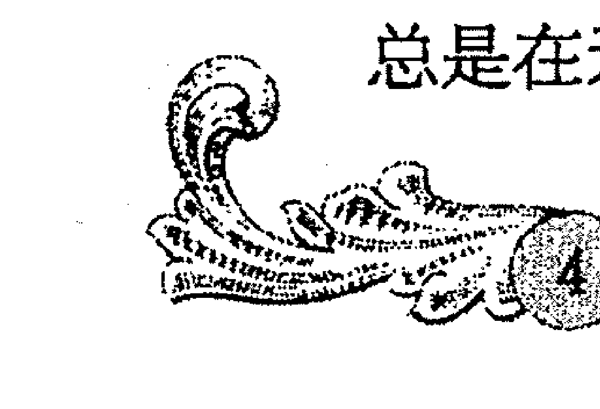

属蛇人是十二属相中最具有神秘感，最不可思议的人物。难以捉摸、喜欢探求新事物是他们的特质，文雅、斯文的属蛇人很爱读书，喜欢艺术，他们是天生的发现家，求知欲旺盛，被生活中所有美好的东西吸引。

生于马年的人性格开朗、思维敏捷、装扮入时、善于辞令、洞察力强。他们活泼开朗、性格外向，精力充沛，做事干练，能承担责任。他们懂得享受生活中的快乐，爱好智力锻炼及体育活动，对人慷慨，是个十足的乐天派。

羊是最富温情的属相，出生于这一年的人大都吃苦耐劳、乐善好施。属羊的人们往往为人正直、亲切，易被别人的不幸经历所感染，他们脾气温顺甚至有些羞怯，有颗纯洁、善良的心易受到别人的爱戴。

灵巧的猴子总给人不怕困难、坚定不移的印象，属猴人热情自信、聪明机智，他们精明能干，富有实践精神；责任心强，十分懂得协作。不管是多么害羞的猴年出生的人，内心总有一股坚定不移的焰火。

鸡年出生的人大都十分善于幻想和策划，他们是代表“富于幻想，行侠仗义”的堂吉诃德式的人物。属鸡人热爱想象，极富创造力；善于策划，有时候能用几天时间把一生都规划好；精干灵秀，洞察力强。

狗总是以机警灵敏、敦厚忠诚的性格受世人喜爱，狗年出生的人为人直率真诚、好打不平；感觉灵敏，直觉极准。他们往往是未来的“先知”，对事物的洞察力极强，直觉准的让人惊叹。

属猪人在人群中属于朴实无华之列，却有着独到见解，属猪人性情温顺，永远不会做“置人于死地”之事。属猪人崇尚物质追求，只是属猪人不吝啬，喜欢同别人分享自己的所有。他们十分热衷于社会工作和慈善事业，对物质和现实世界的追求远远高于精神。

展开扫盲行动，智慧从这里起航

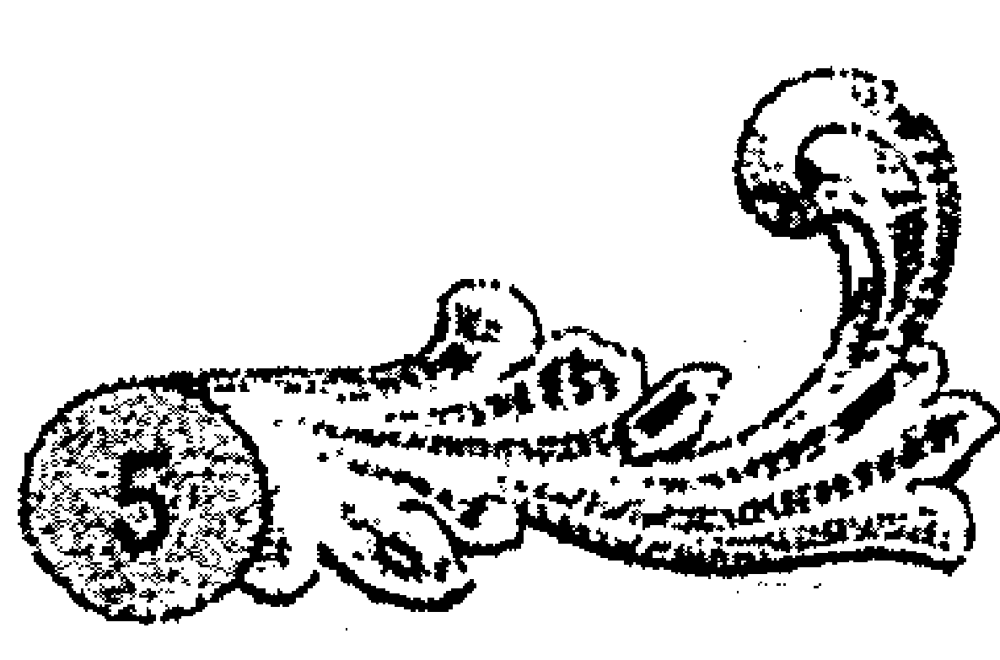

## 星座，十二个星座，十二种人生

你知道星座的奥秘吗？或许你还不知道，每个人出生时，宇宙间星辰的位置均能影响其性格与命运。通常我们所说的星座，是指人出生时，太阳所在的位置。根据人出生的瞬间，将九大行星和月亮所在的位置制成天宫图，再根据占星学的原理，由春分点开始约以一个月为间隔区分了十二个星座，包括白羊座、金牛座、双子座、巨蟹座、狮子座、处女座、天秤座、天蝎座、射手座、摩羯座、水瓶座和双鱼座。按照古代十二星座又大略可分为两大类，即阳性星座和阴性星座，分别代表外向性格和内向性格。

此外，古人又把人分为火、地、风、水四大元素，十二星座也分别被归纳在四大元素中。每一个星座，都有一个美丽动人的传说故事，预示着人们不同的性格命运。下面让我们进行一场神奇探索之旅，找找自己的“座”！

- 白羊座（3月21日至4月20日）摆脱了严冬困境的春天，欣欣向荣，生命力旺盛，有冲劲，不受束缚，极其自信，坦白直率和勇敢，时刻充满自由的气象。
- 金牛座（4月21日至5月20日）从春季突然出现的繁盛景象中慢慢稳定下来，专一持久，善于理财及争取权力，占有欲强，有恒心有毅力。
- 双子座（5月21日至6月21日）能言善辩，易改变，好奇心重，兴趣多而且多才多艺，思维敏捷却不能专注于单一问题。
- 巨蟹座（6月22日至7月22日）个性内向、稳定，以家庭为中心，害怕未知的事物，爱好大自然，有创造力，拥有很强的保护欲，总是小心地保护自己和家人。
- 狮子座（7月23日至8月22日）像仲夏一样热情洋溢，需要经常被注意及赞赏。冲动而且做事夸张，爱挑战当权者。传奇而且任性，勇往直前，敢于战斗、热情大胆。
- 处女座（8月23日至9月22日）炎夏过去的初秋，不复有狮子座般的冲动及热情。气质高雅，异乎寻常地敏感，情绪易变、悲观、有批评性格、是美丽而神秘的完美主义者。
- 天秤座（9月23日至10月22日）处于万物寻求平衡与和谐的时期。富有人情味，思想周密，善于社交，做事投入而客观，爱管闲事，代表公正，会努力捍卫正义。
- 天蝎座（10月23日至11月21日）临界深秋与冬日交界之时，处于繁盛与衰亡之间，是最复杂的星座，精力充沛、耐力持久，领悟力强，但内心复杂容易情绪低落。
- 射手座（11月22日至12月20日）个性既有平静的一面，又有热烈的一面。焦躁不安和好动外向，好奇，爱好旅行及冒险，喜欢多姿多彩的生活，他们的行为有如天马行空无法捉摸。
- 摩羯座（12月21日至1月19日）冬季是沉默、冷静及理性的代表。他们是现实主义者，倔强固执、保守善良、负责，而且思想保守务实，有追求但不张扬。
- 水瓶座（1月20至2月18日）隆冬季节出生的水瓶座的人，内心像寒冬一样冰冷，独立而有个性，是最具潜质的发明家及革新者。他们慷慨大方，能屈能伸，思想开放，好奇心重，做事迅速。
- 双鱼座（2月19日至3月20日）标志着经历严冬等待重生，性格属于神秘主义者，爱凭直觉做事，内心充满矛盾，敏感温柔，是最灵敏的环境感应器，最会发掘人的情绪变化。

展开扫盲行动，智慧从这里起航

座缺乏自觉的生命形态。对感情认真，很容易深陷其中的巨蟹座人常饱受胡思乱想的苦，他们总是做这种什么也没说出来自己却已经像被甩了一千次的事情。巨蟹座人要学着用超脱的心看待感情。

固定、水象的天蝎座，最能展现水的力量，而且有效掌控。天蝎座的人大都目标明确，并且清楚如何才能达到目的。虽然他们是相当群体化、善于社交的星座，却很有自我主张。由冥王星所主宰的天蝎座看起来十分性感，而且具有火山般的无穷精力。他们的占有欲很强，无论如何都不会将已经到手的东西放掉，这样让人很难以适应。同样地，神秘的天蝎座在受到侵扰时，可是会突然地无情反击。天蝎座人也要抑制自己的控制欲，不要苛求太多。

变动、水象的双鱼座有时候会过度地有弹性和通融。内敛和深奥的态度是他们最大的魅力。信仰与灵性对于情感丰富、感性的他们来说，十分重要，而且，就像鱼生活在水底一样，他们的情感极为深沉。另外，由于受到海王星主宰，双鱼座就像广大无边的海洋一样，希望溶化所有的事物。同时，用情至深的双鱼很容易受到感情的冲击，感应能力极强的他们常常在别人什么也没表示的情况下感受到被冷落的感觉，所以双鱼座人看待爱情是神圣的，是不容侵犯的，没有预想中爱情，他们很难让自己恢复生气。双鱼人应当理智看待感情，不要在过分地较真中迷失了自我。

# 第二章 打在性格上的红色烙印

> ——血液，输送的不是营养，而是性格

也许你认为流淌在你身体内的红色液体只是输送营养，那你肯定还没来得及了解血型的奥秘。这些ABO血型因子不仅跟基因一样，在你的性格上打下不可磨灭的印记，而且它就潜伏在你的身体里，决定着你与众不同的思维方式，是主宰着你思维的红衣主教。赶快翻开本章，看看你究竟有哪些天生‘印记’？

## A 型血人，谁也敌不过你的“小算盘”

如果你是 A 型血人，你会发现自己似乎从幼年开始就有了一把特殊的“小算盘”，这把小算盘让你忍不住对人对己都有种精益求精的情绪在里面。如果你身边有 A 型血人的朋友，你可能也会被他或她的完美主义吓坏的同时，也会对他们的深思熟虑、思考周全而钦佩不已。这就是 A 型血人，温和老实的外表下潜藏着追求完美、多疑多虑的内心。比起精打细算、谨小慎微，没人敌得过 A 型血人的“小算盘”！

A 型血人总给人温和谦逊、富有人情味的感觉，他们有很多优秀的性格气质。A 型血的人总是踏实诚恳，努力向上，他们有很多优点：办事一丝不苟，能胜任需要周密思考的工作；集体意识强，富有协作精神；尊重社会规则，具有很强的伦理感和洁身自好的意识；踏实稳重，做事谨慎，从来不做越轨的事情；具有很强的忍耐力及牺牲精神，有强烈的责任感、义务感和使命感；喜欢安定的生活，十分重视家庭生活，将美满生活当做人生的追求；循规蹈矩，自制力强，而且能够很融洽地与别人相处，为人体贴等。然而，说起 A 型血人最显著的特点，便是他们那把善于思考和测算的“小算盘”。

正是这把善于思量的“小算盘”，使得 A 型血人不论在事业上还是日常生活中，总是会有高人一筹的周全和稳妥。A 型血人在干事业的时候，总是深思熟虑、精打细算，他们步步为营、考虑周全，会为未来各种情况做多手准备，再加上其善于计划、踏实稳重的性格，他们常常能规避其他人不能考虑的潜在风险，做到“防患于未然”。因此，A 型血人完美主义、精益求精的倾向形成了认真向上、不断进取的性格，所以他们往往能敏锐地把握成功的机遇，感知各种发展变化，一旦目标和方向确定，则会比其他血型的人更具有稳健的根基和发展的眼光，依靠自己的聪明才智和精益求精的个性而一步步走向成功。

A型血人的“小算盘”不仅仅在事业发展上发挥着作用，对于人生，他们也比其他血型的人有着更多的思考。他们对于自己的人生、未来发展，总是会时常思量，时时反省，以希望自己的人生更有价值、有意义。

但是具体到某个工作或者事情上时，他们事无巨细的“算”却是无人能敌的。他们积极投身于生活的巨大热情，精益求精的品质总能鼓舞别人为目标奋进。A型血人绝对不会拖拉，他们绝对不会事到临头再去想办法，“未雨绸缪”，精打细算，凡事富有计划性是他们的特点，他们会分析影响事情的各种因素，预测事情发展的多种可能，让人感受到一种积极的态度。

然而很多时候，A型血人这种乐此不疲的“算”却会使得周围的人哭笑不得，弄得不好，还会被贴上求全责备、斤斤计较的不良标签。他们会敏感地注意生活中的每一个细节以及可能出现的情况，并做好预防准备，力求完美，每一件小事都要做到万无一失。所以，当你看到一个A型血人打着小算盘“鸡蛋里挑骨头”的时候，别惊讶，这就是他们的本性！

## B型血人，限制我自由，不如拿走我生命

自由至上的B型血人，是天生的行动派。不难发现，喜欢计划，事无巨细，把周末生活都规划打点好后才能安心的是A型血人；突发奇想，雷厉风行地就收拾东西打包旅行的肯定就是B型血人了。“若为自由故，二者皆可抛。”对于B型血人来说，这首诗可以说是他们人生的写照。超然的B型血人，自由绝对是其奉为圭臬的最高追求。

B型血的人爱好自由，开朗乐观，不拘小节，爱热闹善于社交。他们给人第一印象多半是个性爽朗，诚恳大方，爱说话。喜动不喜静是他们最大的特点，所以，B型血人在团体中总是受欢迎和注目的对象。他们对人诚恳，没心眼，心肠软，有同情心，非常喜欢热闹。B型血的人自我肯定意识很强，所以常会推翻别人的意见，但他们往往没有恶意。B型血的人是行动家，全凭直觉及印象，容易不顾一切地蛮干下去，不求结果，只在乎过程，极为重视现在，相信把握现在才能拥有将来。

自由洒脱的B型血人头脑灵活，说话幽默，他们自由得无拘无束的风格常常能感染身边的人。而且B型血的人大都对变幻着的大千世界非常感兴趣，所以对各种事物的认识和分析能力都明显地强于其他血型的人。说起话来，常常不管对方爱听不爱听、想听不想听，只顾自己一口气讲下去。他们话题丰富，让其他人都忍不住参与进来，畅快淋漓地和他们一起侃侃而谈。仔细观察一下你周围的朋友，那些被大家公认为“开心果”的人大都是B型血，他们好动爱笑，幽默感强。

自由的基因给了B型血的人灵敏的思维，他们想问题一般都比较大胆，敢于突破常规，不拘泥于传统和习惯。再加上对所有事物都有着孩童般的好奇心，使得他们大都性格开朗，兴趣广泛，天生善于交际；为人诚实，不会撒谎；对所有人都一视同仁，不存偏见；做事干净利落，判断迅速，热心于工作，在逆境中能够表现出坚强的毅力等。这些都是B型血人内心自由因子的神奇作用。

然而，B型血人自由随意的性格，常常会使人觉得他们“没心没肺”，这一点和A型血的人截然相反。A型血的人在决定做什么事时，先要摸清对方的情况，深思熟虑，了解到对方的心理意图后，再决定采取什么样的策略来行动；而B型血的人却不会这样，他们脑筋转得快，不太顾及周围的环境和别人的感受，常常会单凭自己的直觉和热情就一股脑儿地投入进去。

# 第二章 打在性格上的红色烙印

热周围，愿意我行我素，厌恶束缚和条条框框，他们不在乎旁人的眼光，常可发挥出潜在的能力，却也因此给人留下处事欠慎重的印象。

也许正是出于内心对自由的追求和向往，B型血人总是能怀着一颗雄心去改变现状，所有B型血的成功人士多半具有强烈的成功动力。他们或许会因为做事超越传统条框的羁绊，常常做出一些被别人认为“出格”的事情来，同时也更容易给人一种好高骛远、高谈阔论、大大咧咧的感觉。但是热爱生活的B型血人，总是充满着积极向上的动力，只要他们对事情有了兴趣，便会专注地为之付出热情和精力。这才是B型血人，因为崇尚自由就是他们的标签。

### 血液，输送的不是营养，而是性格

## O型血人，别跟我谈什么无聊的幻想！

被称为“万能血型”的O型血是经典的现实主义，这种血型的人的性格中最突出的特点就是“现实”。别跟他们谈什么无聊的幻想，因为在O型血人的字典里没有幻想，一切从实际出发，实事求是才是他们的唯一标准。

O型血的人则最容易直接表现出其与现实有关的各种愿望，他们有胆识，一旦确定的目标，就能向着目标直奔，为了达到目标而坚持不懈。但是O型血的人都是脚踏实地的，他们不会信口吹嘘，不会好高骛远，在生活中，他们也会根据自己的实际情况，譬如素质水平、工作能力、所处的生活环境等各方面的条件因素，综合考虑之后，实事求是地做出选择，制定目标，找准自己的位置，按着既定目标，脚踏实地、苦干实干，最终走向成功。

注重“实用性”的O型血人总是目的明确，他们不会把目标建立在不切实际的空想之上，而是在综合考虑了各方因素之后，确立一个可行的有前景的目标以及实现目标的途径。他们绝对不会打“没有把握的仗”，没有目标绝对不会贸然行动。而他们的目标也很现实，“有用性”和“实用性”是他们判断事情是否值得一做的标尺。他们做事能够集中注意力，面对问题冷静果断，拒绝教条的束缚，从不高谈阔论，在做事的过程中注重实际执行的措施、办法。他们办事时，给对方的信息十分明确，直接而简单，不与对方说多余的话，几乎不进行感情交流。

相比较其他血型来说，O型血的人更容易成为公众偶像，这是由于他们身上具备由内而外发出的自信、专注的气质。而且，乐观、豁达，持之以恒的精神和开拓精神也在他们身上展露无遗，他们大多数人都具备成功者的独特潜质。O型血人善于从实际出发，并且不断地进取、奋斗、解决问题，所以，O型血的人常常放射出无意但相当自然的耀眼光芒。德国第一号赛车手米歇尔·舒马赫就是O型血人的一个典型代表。当他驾驶赛车以每小时310公里的速度猛然撞上前方用轮胎砌成的防撞栏之后，他只是说：“情况可以比这更糟，但不管怎样人必须继续生存。”

务实肯干、不安于现状又是O型血人另一个重要特点，他们永远在前进，总是时刻关注着生活中的现实，并根据现实的变化来更改自己的策略和行动，全身心地投入其中直到实现自己的目标。因此，相对于其他血型来说，O型血的人更容易出实干家、企业家等，而很少出各种理论大师。这些都是O型血的人一切从实际出发、注重实际的结果，而也正是骨子里深藏着的现实主义，让众多的O型血人能够凭着脚踏实地、坚定、执著最终敲开成功的大门。

O型血的人还是最追求效率的一类人，他们不喜欢被过多繁文缛节所牵绊，更喜欢直来直去，因为这样更加节省时间，也更加富有效率。跟O型血的人打交道的时候，你最好是有什说什么，不需要那些没必要的客套和谦虚，否则，他们反而会认为你虚伪或者试图推脱。实事求是是的 O 型血人似乎从来不会茫然，他们总是那么镇定、客观，他们认为，耽于幻想则意味着一无所有，“临渊羡鱼，不如退而结网”，所以记住，不要跟 O 型血人谈幻想！

### 血液，输送的不是营养，而是性格

## AB 型血人，相安无事才是最佳状态！

AB 型血是一种血型的混合形式，也是一种全新的性格结构。相对喜好竞争和发展的 O 型血，他们不喜欢竞争，更讨厌为了个人利益发生冲突。讲究社会规则和社会常识的他们，认为相安无事便是最佳状态。他们期盼生活上最低限度的安定与和谐，待人接物、与人交往的过程中，AB 型很希望为自己塑造一个柔软通融的形象。

AB 型血的男性给人很优雅的感觉，但是却有点缺乏男子气概；而 AB 型血的女性却显得温柔贤惠，给人恬静淡雅的感觉。而且，AB 型血人在待人接物方面出类拔萃，擅长自我表现，而且喜欢和谐安定的他们，常常不自觉地充当了协调矛盾关系的枢纽，他们开化豁达，显得不那么斤斤计较，因为 AB 型血对安定、与世无争的生活怀有渴望和向往。

不喜欢卷人是非的 AB 型血人很懂得与人保持距离，因为惧怕受牵连，所以他们不论是对人还是对事，总是不过深入参与和介入其中。温和可亲、很会为人的他们，总是给人很明事理的印象，他们能够正确客观地看待问题，常常能站在“第三人”的角度上公平地说理。然而由于其待人接物总是保持着特定的距离，也容易给人“冷酷”的感觉。AB 型血人总是会给自己的人际关系网络里画上各种“警戒线”，一般不喜欢人们“越界”跟自己特别亲近，这样反而会让他们很不舒服。

与其他血型不同的是，AB型血人从来都是有意识地参加各类社会活动。在社会中，AB型血人渴望获得成功的机会和工作岗位，然而却不会像O型血人一样，对个人发展和进步怀有强大的竞争意识，AB型血人一般只是为了得到梦寐已久的安定生活，对于权力和发展前途没有无限的欲望。常常看到很多有才华的AB型血女子，不管曾经在事业上多么成功，当她有了家室，成为家庭主妇之后，就会习惯安定的生活并且以之为乐。

争执、吵闹这些事情绝对不会发生在AB型血人身上，因为热爱安定和谐状态的他们，绝对不会为了一点小事把关系闹僵，不管对方有多么不明事理，AB型血的他们都只是一笑而过，淡然处之。因为他们在他们心里，多一事不如少一事，相安无事才是最好的状态，与其大动干戈，还不如自己退一步海阔天空。所以AB型血人不仅不会跟人发生口角，而且常常是“和事佬”一族，他们很会站在“旁观者”的角度来分析复杂的矛盾关系，也就更容易和解那些处于歇斯底里状态中争执的人们。

理智、客观地考虑问题是AB型血人一个显著的特点，正是因为他们的理性，所以他们绝对不会冲动行事。遇到棘手问题就“狗急跳墙”“怒气冲天”的绝对不会是AB型血人。他们不管有多生气，都会把问题理智地分析考虑一遍，“三思而后行”。所以相对其他血型，AB型血的忍耐力和承受能力较强，他们不会因为别人的某些不友好的举动而莽撞回击，因为两败俱伤绝对不是他们想要的结果。在AB型血人眼中，就算把对方击败让对方难堪，自己也没多什么，也没赢什么，伤了和气反而吃亏，还给人留下小肚鸡肠的印象。所以面对不快的场合，AB型血的他们绝对会忍，而且还是淡淡地一笑，给人无懈可击的“冷酷”之感。

# 第三章 寻找隐匿于骨子里的兽性
### ——透视生肖魔镜，破解性格密码

十二生肖，十二种人生，与生俱来的性格在生命中形成迥异的人性特点，性格决定命运，性格决定人生。
一出生便注定与某种生肖结缘，一生与十二种动物息息相关。你是否为自己的性格感到困扰？是否为自己的命运感到茫然？
不可预知的未来，神秘莫测的人生，生肖的年轮中早已写好你今生的宿命。
认识自己，了解自己，找到自己的性格密码，了解自己的人生轨迹！

## 生肖鼠，超凡的机敏度，非凡的洞察力

如果你看到一只老鼠，这一秒你还处于反应阶段，下一秒它就早已不见踪影。鼠的最大特点就是机敏灵巧，属鼠的人也因此具有超凡的洞察力和灵敏度，他们往往头脑灵活，懂得随机应变。

鼠年出生的人往往记忆力超群，他们非常喜欢提问题，而且提的问题也很特别，这一点从幼年就开始显露出来。属鼠人几乎了解周围每一个人，发生的每一件事都好像被他们记下了一样，正是这种极强的洞察力，使得这一年出生的人大多有优秀作家的天赋。而且，属鼠人搜集消息探听各种秘密的能力也让人佩服，他们喜欢看热闹，有点爱管闲事，但用意多是好的，这也是老鼠无孔不入的本性决定的。

你大可不必为属鼠人的安全问题担忧，因为这一年出生的人具备天生的预测危险的能力，他们机敏灵活，在做每件事之前都会想好退路，一旦情况不对，属鼠人会立刻迅速全身而退。自卫的本能是属鼠人与生俱来的，他们总是做好两手准备，善于趋利避害，如果你想尽快摆脱麻烦，那最好的办法就是遵循属鼠人给你出的主意，因为他们通常能第一时间想到风险最小的方案。

因为生肖鼠象征着随机应变，所以这一年出生的人无论做什么事情都会更容易成功。属鼠人往往能够克服重重困难，不管遇到什么危险和不测，总能临危不惧，冷静做好策略规划，直到最终达到目的。灾难、不测、意外情况只能使属鼠人的智慧更加出众，因为他们冷静、果敢、机警，具有敏锐的观察能力，做生意的远见和敏感，所以他们很适合自己创业，而且一般会获得成功。

要找到一个穷困潦倒的属鼠人几乎是不可能的，因为属鼠人体内的随机应变、机警智慧，使得他们不管面对何种境遇都能很冷静地迅速想好应对方案。他们绝对不会任由情况继续坏下去，因为骨子里潜藏着的“防御装置”能够帮助他们摆脱困境，渡过难关。一个从事生意的属鼠人，如果不幸生意失败，也不会沉沦萎靡，他们的头脑会迅速地转动，凭借自己的非同一般的洞察力发现更大的商机，从而扭转乾坤。

由于机敏和趋利避害的本能，属鼠的人十分懂得扬长避短，一旦从事自己喜欢的事业，总是能坚持不懈地努力奋斗。而且天生的积累欲让属鼠人酷爱积累财富，而且往往容易充满斗志和雄心，这种属相的人一般最终会变得富有，也是鼠这种原始力量的作用。但是，野心勃勃和好高骛远却是属鼠人前进过程中的绊脚石，如果发展为贪婪，他们就往往顾此失彼，精力分散，事倍功半。在属鼠人的一生中，在懂得贪婪有弊无益之前，至少要遭受一次的打击，才会“吃一堑长一智”。如果属鼠人能克服贪心，并学会适当的忍让，那么他们生活的道路会很顺利。

## 生肖牛，低调是我一生的哲学

勤恳忠厚、从不张扬的老牛一直是人们的好帮手，牛年出生的人也一直是低调处事的典范。他们为人毫不张扬，脚踏实地，稳重负责，诚实勤勉，从不感情用事。低调的处事作风使得属牛人很容易凭借不懈的奋斗获得最终成功。

牛年出生的人，在工作上往往能获得上级和领导的信任与肯定。他们勤奋稳重，敢于承担责任，给人一种很靠得住的踏实感觉。与生俱来的低调哲学是属牛人的处事之道，他们很有责任感，但是他们从来不爱吹嘘，认为每个人都应该尽职尽责，兢兢业业地做好分内的事情，他们很讨厌那些拖后腿的人，不希望别人为他们的工作设障碍。同时，属牛人也具有天生的领导才能，很会用纪律约束和激励别人，但是常常给人过于严肃和严厉的印象。而且，低调的属牛人很自信，不容易妥协，单凭感情很少能改变他们的想法，因为这一年出生的人总是支持可靠、确切有把握的方案。

生肖牛象征着通过艰苦努力而获得成功的品质，受骨子里的这种特质的影响，属牛人是一个很有耐心、不知疲倦的工作者。他们安静、温文尔雅，总是显得有条不紊；道德观和尊严感强，不愿意凭借不公正的手段达到目的；诚实、勤恳，不做作和坚实的原则性使得属牛人很受人尊敬爱戴。属牛的领导者总是能用其低调处事的作风，勤恳真诚的态度感召他的下属，使得在他们领导下的员工变得十分忠诚，因为没有属牛人干不了的事情。

牛年出生的人是有条不紊的，他们坚持固定的模式，尊重传统观念，总是精确地按照人们所期望的去做，所以几乎你不用想都知道他们会怎么做。一丝不苟的属牛人认为只有按部就班地做事情，才能永远立于不败之地。属牛人的头脑不是杂乱无章的，别人决不会发现属牛人靠运气或拖泥带水地混日子。其他属相的人可能靠一时的机遇和别人的指点来完成的事情，属牛人则完全靠坚忍的意志和献身精神实现自己的远大目标。但是不管属牛人获得多么大的成功，他们顶多也只是高兴地喝几杯酒，吹嘘和夸夸其谈绝对不会发生在他们身上，相反，经过胜利的喜悦后，他们并不沉溺其中，而是继续埋头工作，向下一个目标冲刺。

世俗的偏见对属牛人来说是无所谓的，属牛人会全身心地完成他们要做的工作，而且很讨厌半途而废。仔细观察你会发现，他们虽然不爱张扬，处事低调，但是从来不会因为困难而退缩。说到做到是属牛人一生恪守的原则。他们低调，富有耐心，属牛人所享有的成功完全是靠属牛人自己的力量拼来的。他们是优秀的工作者，低调、守纪律，从不愿意在生活中放荡不羁，很少做一些哪怕是别人认为有一点点“出格”的事情来，他们总是循规蹈矩、尽职尽责地坚守自己的责任。

牛年出生的人很少发脾气，他们一般具有神奇的忍耐力，这也是受他们低调处世哲学的影响。生活中的属牛人，是值得信赖、懂得为别人着想的可靠朋友。他们聪颖而优秀的气质往往被外表的低调和矜持所掩盖，如果属牛人注意培养更多的幽默和热情，人生将会更加幸福精彩。

## 生肖虎，天生的领导者，勇气的代言人

在东方，老虎一直就是权力、热情和勇气的象征，生肖属虎的人也因此具备天生的领导才能，他们积极并且富有活力，引人注目，好像天生有聚集人气的气场一样，他们勇敢果断，总有一股雷厉风行的气势。总之，属虎人是天生的领导者，更是勇气的代言人。

在童年时期，虎年出生的人便会表现出他们极富感染力的领导才能，他们活泼好动，乐观积极，很容易就吸引别人的注意力，成为引人注目的中心。他们感情丰富，极富激情和感召力，也很有战略眼光，正是这种超凡的自信和魄力，使得属虎人在一个集体中很容易便脱颖而出，成为令人信服的领导者。生肖属虎的领导者做事雷厉风行，很有远见，他们决策能力惊人，不喜欢用传统思维解决问题，总是有各种新奇和突破的点子，往往能让其下属钦佩不已。属虎人在一个团队中就算暂时还不是领导者，也会由于其自身有意无意流露出的魄力和担当，让人不自觉地信服和敬佩。

属虎人总给人一种天不怕地不怕的感觉，他们除了是乐天派外，还不重实利、不怕危险。属虎人对不赞同的事情表示蔑视，常常嘲笑和痛骂被传统观念束缚着手脚的社会，喜欢表现自己，这也形成了属虎人的独特个性。如果遇到造反或对传统方式进行挑战的机会，属虎人将全力参加。而且对于他们这种张扬的勇敢，人们也许不赞同他们的鲁莽，并为属虎人疯狂的大胆行为而吃惊，但我们又不会忘记为属虎人祈祷，就好像属虎人的成功就如同我们自己的成功一样。所以属虎人总是充当着“首开先河”的角色，让人为他们的勇敢和气魄折服。

如果要研究领导者的特质，你会发现，所有属虎人身上都或多或少具备天生的领导气质。属虎人的活力和对生活的乐观具有感染力，会唤起人们心中的各种感情，让人们不再平淡冷漠，而是怀着极大的激情去完成他们手头的工作。而且，属虎人一般都很有雄心壮志，如果机遇降临，属虎人不会瞻前顾后犹豫不决，他们总能不顾一切地放手一搏。而且生来不知疲倦的他们行动力强，做事总比别人快三分，有时候也会给人鲁莽的感觉，而且常常因为这种个性做出草率的决定。在这个机遇和挑战并存的社会，属虎人的勇敢总能让其人生富有戏剧性的效果。

虎总是王者的象征，虎年出生的人也多半会受这种“王者”气质的影响，他们有韧性，不气馁，不管属虎人有多么潦倒，所遭受的打击和失望有多深，属虎人是不会气馁的。哪怕只剩下一星火花，属虎人也要用它重新点燃生命之火，那永不熄灭的精神能使属虎人再度复活，变得生机勃勃。在遇到压力时，属虎人可能会有依赖性，不过他们马上会调节好状态，成为领导大众的先锋。

有些属虎人是温和的、敏感的和有同情心的，属虎的女子是迷人的，她们表达能力强，自由开放，时尚而富有高贵气质，而且天生就比其他女性多几分男人的领导力，所以往往能在团队中成为领队的角色，成为中流砥柱的人物。

### 生肖兔，平平淡淡才最幸福

在我国神话传说中，兔是长寿的象征，是月亮的精灵，兔年出生的人是十二属相中最走运的人之一。如果让文静的属兔人选择自己的生活道路，他们肯定会选择安逸闲适的生活方式，因为兔年出生的他们，认为人生平平淡淡才是最大的幸福。

单凭外表装扮就可以看出一个人是属兔的，因为属兔人无论男女都喜欢穿宽松舒适、裁剪一流的衣服，他们讨厌浮华的、几何形的或刺眼的图案，喜欢协调、均衡的状态。天性喜爱平淡安逸的属兔人不像其他属相那样追求崇高的理想，属兔人生活中的主要目标只是为了保存自己，安逸舒适的生活就足够让他们心满意足。这一年出生的人一般没有什么建大功立大业的雄心壮志，内心对安逸生活的偏爱、厌恶冲突的本性，使得属兔人不愿意让自己为了名利太奔波劳累，比起对于金钱名利的追求，他们更爱“采菊东篱下”的恬淡生活；比起奢华富硕的生活，他们更喜欢“淡泊以明志”的与世无争。

属兔人外表文静，举止总是庄重而有条不紊的，喜欢安逸平淡的他们，从不兴风作浪。遇到分歧和不快的场合，属兔人一般不会选择正面交锋，他们执著地相信人与人之间相互友好是件很容易的事，并且属兔人总是努力做到文明、有礼貌，甚至对属兔人的敌人也是如此。属兔人厌恶吵架和任何形式的公然敌对。属兔人不像龙、狗、虎、鸡属相的人那样喜欢激烈搏斗，并以此起家。兔属相的人没有兴趣打架，他们不适合做战士冲锋陷阵，而在幕后工作更有效。

在自然界中，像兔子这种类型的弱物种的安全感是很强的，很少能在风险很大的地方发现一只小兔子，所以你大可不用担心属兔人的生活。因为属兔人敏捷、伶俐，善于逃避伤害，他们很会为自己着想，而且属兔人不易上当，能用约束自己的爱好来保守秘密或个人私事。当属兔人感到危险时，那微妙的小算盘或隐藏的对抗心理会以使用颠覆战术的方式表现出来。在逼迫下，属兔人会丢弃任何东西或者抛弃任何敢于扰乱他们宁静生活的人。属兔人的信仰以灵活多变而闻名，而且属兔人有使双方都感到很保险的技巧。

兔子是仁慈、举止文雅、善忠告、和蔼及爱美的象征。兔年出生的人喜欢和平、安静和惬意的环境。属兔人很含蓄，爱艺术并具有很强的判断力。他们温柔的言辞和慈善胆怯的生活方式，体现出一个成功的外交家的一切思想品质。属兔人那善始善终、喜欢平淡的精神会使他们成为优秀的学者，而且温柔敦厚的形象让属兔人很适合在政治领域和政府部门工作。

属兔人是一个真正懂得生活的人，在人们印象中属兔人好像不会做坏事，而且很少使用刺耳的话语，并从不用粗俗的言辞来解释问题。属兔人也许有时看上去慢条斯理，或过分审慎，其实这是由属兔人小心谨慎、偏爱平淡生活的天性决定的。属兔人是一个有知识的现实主义者，爱好和平的人，不要期望属兔人会闹事，这对属兔人来说太难办到了。属兔人精于保全面子的艺术，兼顾双方的面子，遇到不快，属兔人会宽容别人，如果有办法不使别人难堪，属兔人一定会去做。

## 生肖龙，再厚的屏障，也难遮你的光芒

在中国，龙象征着皇帝或男性，它代表着权力，而在龙年出生的人据说都带着命运之角，时刻绽放着灿烂的光芒。对属龙人来说，生活是## 第三章 寻找隐匿于骨子里的兽性

五颜六色的火焰，跳跃不停。属龙人是强大的、果断的，他们大气、充满生气和力量，不管怎么掩盖，也难以遮挡他们的优秀光辉。

龙一直被看做是财富和权力的卫士。属龙人骄傲、非常直率，在一生中很早就树立了理想，并要求其他人也有同样的高标准；属龙人异常积极，一般不会沉没忧郁，遇到挫折的时候也比其他人更容易摆脱出来；属龙人是快活的，不喜欢斯斯文文，对于需要马上办的事情，属龙人会立即亲自去办，他们不喜欢拖延；属龙人喜欢权力，甚至到了权迷心窍的地步。尽管属龙人有时候以自我为中心，过于武断，要求极高甚至蛮不讲理，但他们从未失去过崇拜者。因为属龙人举手投足之间就流露出一股神奇的吸引力，所以再厚的屏障，似乎也难以掩盖他们的光芒。

在与属龙人接触中，他们的活力四射也能激发每一个人的热情。但属龙人本人并不需要别人激励，因为属龙人自身能够产生足够的能量。属龙人的能量很大，他们对事物那急切的渴望和几乎是宗教性的热情，像寓言故事里的龙口中喷出的火那样燃烧着，使其更光辉四射。属龙人有做大事的潜力，因为属龙人喜欢大刀阔斧地干事情，就算做一件小事情他们也总是大张旗鼓。

想要让属龙人服输，恐怕很困难，因为龙年出生的人从不接受自己的失败，他们总给人一种“自讨苦吃”的感觉。好像属龙人来到世上就是为了达到最高的目标，别人越想使属龙人改变行动方向或绕开麻烦，他们就变得越顽固。所以属龙人不愧是个带头人，甚至在他们情绪最不愉快的时候也能不负众望，直至获得成功。与强大的属龙人竞争是很难的，甚至是不可能，属龙人常用恫吓的手段来威胁敢于向属龙人挑战的人。

属龙人很有担当，他们总是勇往直前，在困难面前毫不退缩。他们有点清高和骄傲，从不请求别人帮忙，在力量对比悬殊的情况下拒绝撤退。但是这一个性也让属龙人更具魅力，更能吸引别人的追逐目光。属龙人非常直率，从不扯谎，从不伪装自己的感情。要想让他们说谎，实在是很难，甚至当属龙人发誓一个字也不说时，别人也肯定能在属龙人发怒的时候让他们把秘密脱口而出，并且一字不漏。

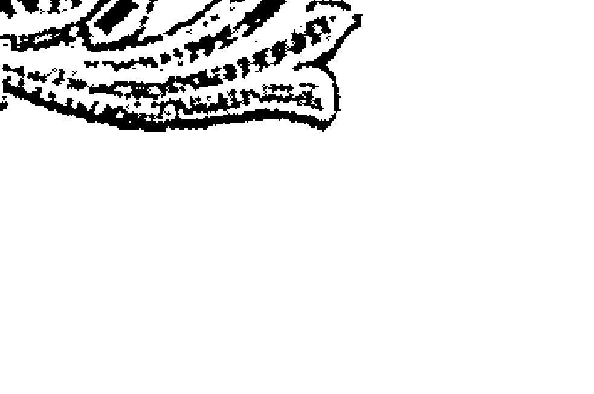

尽管属龙人的缺点与属龙人的长处一样多，但属龙人的光辉照耀着每一个人。属龙人是个敢干的人，可以单枪匹马地进行讨伐。例如：向领导示威，给报纸写信或在请愿书上收集一百万人的签名。属龙人很有气量，从不喜欢嫉妒别人。属龙人也许会牢骚满腹，但不会见死不救。这不是由于属龙人真诚地关心、同情别人，而是属龙人对一切都有深深的责任感。属龙人乐意做出重大贡献，别人可以指望属龙人的支持，属龙人也会尽力而为。在属龙人承认失败以前，会拼尽一切力量。属龙人是个热爱大自然的外向型人，属龙人能够成为一个活跃的运动员、一个旅游迷或是一个健谈的人。

## 生肖蛇，探索欲就是你的发动机

属蛇人是十二属相中最具有神秘感，最不可思议的人物。蛇总在阴暗潮湿的环境潜伏着，它们神秘莫测，机敏的感觉器官时刻捕获着一切让它们感兴趣的事物。受体内蛇的属性驱使，肖蛇的人总是有比别人更加旺盛的求知欲和探索欲。

由于具有天生的、特有的智慧，属蛇人是一个天生的神秘主义者，他们喜欢发现新事物，探求各种有意思的事情的来龙去脉。文雅、斯文的属蛇人很爱读书，爱听名曲，爱吃美味食品，并且爱看戏剧。他们被生活中所有美好的东西吸引，一朵花一棵树的美也很容易打动这群独具艺术气质的属蛇人。

蛇年出生的人大都有很强的领悟能力，他们思维敏捷，聪明而且喜欢思考，善于探索未知世界的各种奇妙问题，总给人学识渊博、知识丰富的印象。属蛇人一般都很喜欢看书，他们总是对那些不可思议的事情产生浓厚的兴趣，而且他们记忆力超强，学起东西也比别人快得多。很多时候，在别人还摸不着头脑的时候，属蛇人早已心领神会，甚至还能用更清晰透彻的语句解释出来。他们往往善于形象思维，思考问题迅速而又独特，是一个很好的教育工作者。

属蛇人不但对有趣的事物有着浓厚的探索欲，而且也很敏感，生活中的小细节总能引起他们的注意。他们自信热情，喜欢思考，哲学问题、宗教问题这些别人没兴趣的东西，他们可能会深入探讨，并且乐此不疲。一件不可思议的事情发生了，其他人可能早就忘了，属蛇人可不会忘，他们可能还在寻找这件事发生的原因。他们经常依靠自己的判断行事，与其他人不会进行推心置腹地交流。从本性上讲，属蛇人疑心大，属蛇人把疑心隐藏在心中，把自己的秘密也隐藏在心中。

属蛇人最难对付的地方就是表里不一，是在他们安静的外表背后隐藏着的一颗时刻警惕的心。安静的属蛇人，喜怒不形于色，他们很能控制自己的情绪，不轻易发怒，总给人一副安之若泰的感觉。有些属蛇人讲话也许是缓慢或是懒洋洋的，但这绝对不表示他们的思维和行动速度就是这样的。属蛇人对什么事情都有探索欲，总想寻根究底，喜欢问个为什么，所以老练真诚的外表后面，隐藏着很重的疑心，属蛇人从不轻易相信别人，他们最相信的就是自己的判断力。

喜欢思考的属蛇人，总能盘算并能系统地、恰当地阐述自己的观点，在恰到好处的时候一语惊人。他们总能深刻地看到事情的本质，不会被表面现象蒙蔽，是十二生肖中最有智慧的人，而且在大多数的情况下，他们讲话还是非常小心的，“三思而后行”的属蛇人一般不会信口开河。一件事没弄明白之前，属蛇人绝对不会盲目下结论，热衷探索发现的他们，总能想方设法地找出事情的真相。

很多人觉得，属蛇人面对小事情从来不会放弃“试一试”的态度。但是在属蛇人真正开始行动之前，他们早已精心策划好了，因为对待那

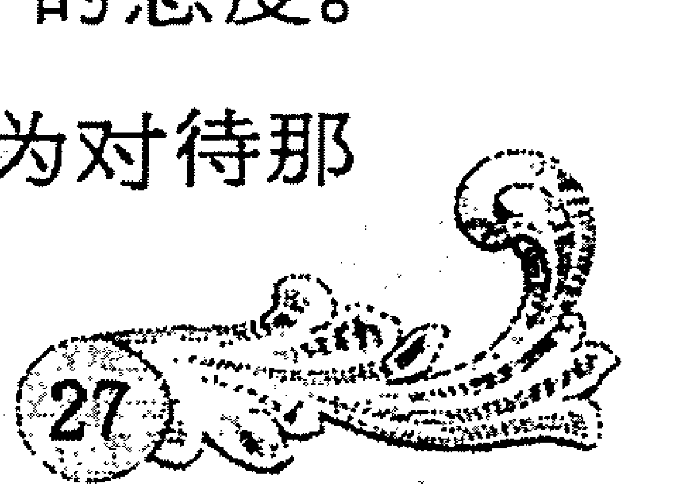

## 生肖马，活泼开朗才能快乐常在

马年出生的人，总给人很快活的印象，他们活泼开朗，思维敏捷，喜欢凑热闹，是个十足的乐天派。属马的人精力充沛，待人和气，爱好锻炼和各类体育活动，人们很容易从他们灵巧的动作和优美的身姿中看到这一点。

属马的人们说话总是急急的，语速轻快，而且似乎老是有阳光的笑挂在嘴边。他们健谈幽默，说起话来引人发笑，而且充满阳光气息的属马人总能给人温暖愉快的感觉，自己快活自由的同时，也给别人带来无穷的欢乐。所以属马人交际广，朋友多，并且每一天都能交上新朋友，然而属马人从不过分依赖朋友，他们一般很有独立意识。

生活中，你会发现属马人总能胸藏万汇，口吐风雷，振臂一呼，应者云集，将人们的思路引到属马人的想法上来，属马人谈起自己的想法时，手舞足蹈，不把肚子里的全部想法倾出是不会罢休的。然而当别人同属马人谈话时，一定要简单明了，否则别人会失去属马人的注意力。所以如果你很急，最好要直截了当地告诉属马人，让你们能进行比较简明扼要的沟通，这样属马人不但不会生气，反而会欣赏你的直率、诚恳，以及对时间的珍惜。属马人就是那么开朗大气，他们的感情来得快去得也快，烦恼和不快不会停留在他们心中太久，或许这会儿他们还为一件事很生气，下一秒又恢复他们乐呵呵的样子，开始跟你大侃特侃了。

就算生活再单调乏味，属马人仍然会那么活跃，会给别人的生活带来一片冬日阳光。他们心胸宽广、识大体，不会为小事耿耿于怀，闹别扭不会发生在属马人身上，因为他们很能容人，这也跟属马人活泼开朗的性格息息相关。跟属马人交朋友，如果你认同人生的最高追求是“个人自由和幸福生活”，那么他们肯定会更容易跟你亲近。属马人天性善良，追求快乐和人生的幸福，活泼自由，绝不会贪财、自私和嫉妒别人，所以当属马人做事四处碰壁时，只会发怒而不会搞阴谋诡计。

热情活泼的属马人喜欢参加各种社交活动，因为那个时候正好可以展示他们善于辞令的一面。他们往往装扮人时、洞察力强，独立精神也总是促使属马人们从年轻时期就开始自己的事业。属马人们最大优点是自信心强，待人和气，有代理能力和理财能力。不墨守成规的属马人不喜欢被埋没的感觉，遇有活动或聚会时，一般挑选浅颜色，款式奇特、华丽的穿戴惹人注目。

快乐的属马人信仰自己的幸福哲学，他们灵活善变，做事图快，总给人十分干练灵巧的感觉。但是也因为这样，也就相对缺乏持久性，不能忍受长期的困苦，所以有点耐心不足的特点。但是马年出生的人仿佛是人们身边的一缕美好的阳光，总能用他们热情活泼的开朗气质打动别人，跟他们交往总能让人不知不觉也感到奇妙的愉快。

## 生肖羊，吃苦耐劳是你最大的性格资本

羊是最富温情的属相，据说福运之星总是向属羊人微笑，因为属羊人们有颗善良的心，正直且极富同情心，其中最重要的是属羊人吃苦耐劳的性格资本，让他们总能拥有食品、住所、衣物这三件物品。

刚进职场的属羊人也许会没有别的生肖那么能力超群，但是他们尽职尽责、吃苦耐劳的优秀品质，总是会获得上级和同事们的喜爱。属羊人不会因为环境欠佳、工作辛苦而退却不前，他们总是想方设法完成自己应尽的任务，并且对逆境总有非同一般的耐受能力。所以，属羊人就算处在极其恶劣的工作和生活环境，也能忍受，并且怀揣着不怕吃苦的心去改善生活质量，直到获得让自己满意的生活。要找到一个懒惰、无所事事、不务正业的属羊人几乎是不可能的，因为天生吃苦耐劳的他们是不允许自己偷懒和不负责任的，而且属羊人也看不惯那些游手好闲的人，他们认为依靠自己的劳动和汗水得来的幸福生活才是最有价值的。

属羊人喜欢儿童和小动物，是自然主义者，属羊的妈妈很会理家，是绝对的准好妈妈，她们很会烹饪，很有生活情趣，能够把一个大家庭打点得井井有条。一个人属羊意味着属羊人将来有美满婚姻，而且属羊人不仅会受到生活伴侣的爱，同样也会受到其属羊人亲属的爱戴。属羊人们不怕做力气活，做事十分麻利，总是在你还没来得及考虑事情怎么做的时候，他们早就把事情收拾得近乎完美的境地。比如屋里一大堆客人等着吃饭，属羊的家庭主妇就一点都不担心自己招待不来，因为在你考虑如何是好的时候，她们已经麻利迅速地洗菜、切菜，然后用不了多久，一桌丰盛美味的饭菜就摆在你面前了。

属羊人们往往为人正直、亲切，易被别人的不幸经历所感染，总给人温顺甚至有些羞怯的印象。属羊人常因举止优雅，对人富有同情心而被人称道。无论走到哪里，属羊人都喜欢与人交往，为人正直，以诚相待。当属羊人的朋友遭遇困窘甚至落得无处安身、袋空如洗时，要相信属羊的朋友决不会见别人处困境而不顾的。属羊人总是不会怕麻烦，他们会尽力帮助别人，就算是别人都怕的麻烦事，他们也是义不容辞。属羊人耐力好，认为吃苦是成功的一大资本，相信功到自然成，相信只要通过踏实努力的拼搏终有一天会实现自己的理想。

做事麻利、干练的属羊人或许可以忍受别人的拖延，但是绝对厌恶依靠别人和无所事事。他们喜欢干净整齐的房间，如果一天不打扫，他们就觉得不舒服，而且常常对伴侣的“偷懒”表示不满。而且他们喜欢“今日事今日毕”，不喜欢把今天能够做完的事情和工作拖到以后完成，如果遇到属羊的领导者，最好要表现出“立刻去做”的工作态度，否则，哪天他可能会因为你的拖拉懒散而盯着你。据说属羊人的命运都极好，一般都会过着富裕、舒适的生活，这在很大程度上得益于他们勤劳肯干、吃苦耐劳的性格资本。

## 生肖猴，聪明机智，什么问题也别想难住你

猴和猿联系密切，是人类的近亲，无怪乎它们有着人类的智慧和聪颖。在中国史书中，猴代表发明家、即兴诗人及善于调动积极性的人。属猴人是聪明、狡猾、坚韧的代言人，他们有着超过其他属相的机智，性格坚韧，精明能干，好像什么问题也难不倒他们。

寓言故事里灵巧狡猾的猴子让人们开怀一笑，属猴人也难以摆脱这种动物属性。他们聪明伶俐，机警智慧，由于属猴人的精明与干练，使属猴人总是赢者。属猴人的永不满足的心理与属猴人的天赋也确实成正比。他们喜欢充实的工作，讨厌空虚和无所事事，精明能干，是天生的多面手。由于属猴人能精打细算，因此从来看不到他们在工作中浪费任何一点时间。而且聪明能干的属猴的人遇到问题也从不慌张，他们头脑冷静、精明果敢，再错综复杂的问题也不能将他们难倒。他们富有实践精神和进取精神，喜欢享受每一次进步带来的喜悦和快感，精于财务管理，是天生的优秀管家。

孙悟空的机智勇敢在西游记中是出了名的，属猴的人也总是自信勇敢，富有激情。聪明机智的特性让属猴人掌握世间很多知识，无论属猴人选择何种职业，将来都能获得极大成功。猴年出生的人头脑灵活，应变能力强，语言天赋高，特别是有能力成为语言学家和外交官。天生“多面手”的属猴人将会成为优秀的演员、作者、外交官、律师、运动员、股票经纪人、教师等，他们聪明并且富有进取心，精明且善于策划，很难想象如果工业、政治、经济等领域中如果没有属猴人会是什么样子。属猴人是出色的社会活动家，能同任何人往来，他们八面玲珑，机智又有手腕，精于谋略和权术。

干起事业来，属猴人也同样能有声有色。就算是白手起家，属猴人也能凭借他们的智慧和聪颖获得成功。属猴人常采取薄利多销的策略，达到事业上的兴旺。属猴人在同别人的交易中斤斤计较，不像属虎人那么爽快，也不像属龙人那样硬碰硬，属猴人只是依靠小赚头的不断积累。这些微小利润乍看起来不起眼，但是如果把每份小利润积少成多地加在一起时，你就不会惊讶属猴人怎么一下子由小老板变成大富翁了。

属猴人为人圆滑，很讲策略，随时使自己处于有利的地位上。如果属猴人欺骗了别人，别人也不会知道是怎样被骗的。人们在与属猴人交往时很少有生气的时候，总因为他们的精明，有一种缺了属猴人则不行的感觉。属猴的女性言行举止也很看场合，由于天性聪颖精于策略，总能把话说得漂亮说得恰到好处。

说起战略和远见，属猴人也很出色，他们具有战略家特点，从不盲目行事。做事前总要制定一个至几个方案，既要抓住各种时机来实现目标，又不忘记“狡兔三窟”的道理。而且属猴人常以循序渐进的耐心达到目的。他们不信什么命运，总有股天生的自信和热情，坚信心之所愿，无事不成。所以，要想有什么困难能把属猴人难倒，几乎是不可能的。

## 生肖鸡，天生的幻想家，十足的策划师

无论事情发生多大变化，都无碍于属鸡人，因为属鸡人总是不知疲倦地幻想着，他们喜欢思考谋划着如何克服困难，直到寻找出自己的出路。他们总是那些善于规划的人物，充满抱负，追求卓越，随时都准备着秀出自己的优秀能力。

鸡年出生的人，往往在幼年时期就很富有想象力，他们热爱童话故事、寓言神话等一切富有神奇幻想的事物，从小就很有理想，对未来充满美好的憧憬。正是因为这种与生俱来的性格特点，属鸡人一般都有讲演才华，而且写作能力极佳，常常出口成章，让人叹服。属鸡人随时都准备对任何话题大发议论，如果你想就某一论题与属鸡人论辩，你准会以失败告终。属鸡人知道如何用自己的智慧、高效率来赢得上级的信任，他们总是那么精力充沛，做事速度快，成功率高，就算在普通岗位上也会获得荣誉，得到报酬。

属鸡人都是天生的幻想家，与人交往的过程中充分地体现了这个特点。他们思维富有跳跃性，语言生动形象，情绪欢快，充满幻想主义和浪漫主义的情怀，人们都喜欢和属鸡的人交谈，因为他们总会传达出对未来美好生活的信息，让人心驰神往。他们会给你描绘理想生活的样子，述说自己希望住的房子是什么样子，计划着自己将何时结婚何时生子，属鸡人喜欢幻想，甚至有时候脱离现实也乐此不疲，就算看到昂贵到自己根本没办法支付的名牌轿车，属鸡人也会微笑着说“以后说不定我也会有一辆”。

对于爱情，属鸡的人无论男女都怀有虔诚和信念，他们认为爱情是浪漫的，是与现实物质无关的纯洁美好的事物。属鸡人就像一个浪漫的诗人，吟唱着有关人间真爱的优美诗句，并且陶醉其中。属鸡人一旦爱上，就变得更加富有浪漫情怀，爱幻想的他们总是精心为恋人准备各种惊喜。

正是天生喜欢幻想的性格，使得属鸡人从来都不放弃任何机会去表现自己。他们是卓越的表演家，常常是活动场所的中心人物。所有属鸡的工作人员都有良好的声誉，因而，任何类型的属鸡人，哪怕做很不起眼的普通工作，也会在这些工作中找到自己的重要价值。鸡年出生的人大都从小胸怀大志，而且具备处理事务的能力，有着善于做难度大的工作的天分，所以属鸡人大都年轻时代就开始了自己的事业，并在一生中的早期取得成绩。

由于对未来总怀有向往，总是倾向于表现对未来愿望的属鸡人十分擅长策划和谋略。他们是天生的策划工作者。属鸡人富有灵感和创意，思想新颖独特，而且他们天马行空的思维习惯常常让人难以匹敌。属鸡的人们若是从事创作工作和策划工作，定能获得很好的成绩，因为天生就爱幻想和策划的他们，可能根本就不把这些当做工作，而是当成一种发自内心的习惯。所以，别问属鸡人怎么把假期周末都规划得那么好，别惊讶属鸡人刚进企业开始工作就做好了“三年计划”、“五年规划”之类的职业生涯规划，因为这是天性使然，他们甚至可以用几天的时间把自己这一生都规划好。

## 生肖狗，你的直觉生来就是最强

狗是人类忠诚的朋友，狗一直以它灵敏的耳朵和犀利的嗅觉闻名。狗年出生的人如果预感的事情变成现实，你不必惊讶，因为属狗的人天生就有超强精准的直觉和预测能力。

属狗的人，眼睛和心灵都很警觉，狗年出生的人对人的第一印象总是很准，他们善于观察，懂得察言观色，总是能从一个人的言行举止、穿衣打扮甚至是眼神中挖掘出此人的性格特点。他们不会毫无根据地随便判断别人，直觉告诉他们这个人不可信，他们就不会跟此人有太多交往，而且日后都会十分留心。而且属狗人一般很相信自己的判断，如果一个属狗人告诉你这个人不值得信任，你就要注意了，因为属狗人敏感、洞察力强，直觉超准的他们说的话十之八九就是事实。

直觉和判断能力使得属狗人聪明善断，对未来各种情况有一种天生的预见能力，所以世界上许多圣贤与智者都出生在这充满理想和智慧的狗年。属狗人也会成为顾问、牧师、心理学家。属狗人能胜任军事工作，能成为优秀的教师、律师、法官、医生或运输业的领导人，还会以和平主义观点支持和展开社会运动。在发生危机的日子里，属狗人会坚韧地忍受着困苦而决不怨天尤人。属狗人一旦决定了非干不可的事，一定会不坚持到底誓不罢休的。而且这些事业大都是高尚的，属狗人在这些事业中勤勤恳恳、忠于职守，简直是正义的化身。

狗年出生的人外表活泼热情，但是内心却比较深沉悲观，总是猜想着世界上存在的种种危机。然而，很多时候，他们的预感真的会成为现实。无论属狗人是否承认，属狗人确有这个特点：在内心里将人们按属狗人的观点划分等次，而且是两级划分，对他们来说，交往者或者是朋友，或者是对手，属狗人不相信中庸。属狗人同他人接触，一定要弄清他们是哪类人。但是，属狗人一旦对某人产生了自己的看法，那是很难使属狗人改变的。所以和属狗人交往，第一印象是很重要的。

由于属狗的人对自己的直觉很信任，所以他们一般不轻易相信人，而一旦相信就坦诚相待，甚至肝胆相照。如果有人试着去进攻一下那些与属狗人关系密切的人，属狗人就会采取“以牙还牙”的手段来对付他。而且一般能和属狗人密切交往的人，绝对正直善良，通过属狗人直觉和印象的考验，属狗人的朋友常有“忘年交”，就算经历时间和距离的洗刷，也不会生疏变淡。属狗的人都精力充沛，乐于助人，就算不能帮助他人，也会想尽办法给他人提供方便和建议。

属狗人如果成为领导者，十分懂得用人之道，他们启用贤人能人，总能把人才放在最合适最能发挥其潜力的工作岗位上。敏锐的直觉使得属狗人常常能为领导者的决策提出极具价值的建议，就算他们并未真正负责此事，也能给出一些相对专业的有用的意见。而且属狗人工作尽力，他们认为一个人必须如此或需要努力尽心地工作。属狗人注重实践、英勇无畏、说话直爽，对每个他所交往的人都能做出比较准确的判断，包括属狗人自己。这一点使得属狗人很适合从事人力资源管理方面的工作，如果掌管人事，别怀疑他们的经验，因为论识人用人的直觉，没人比得上这些属狗人。

## 生肖猪，握在手里的东西才最实际

在人群中，属猪人属于朴实无华之列，然而实际上，属猪人应称作物质主义者。他们讨厌空想，注重实际行动，崇尚物质追求，认为确切握在手中的东西才最实际。

猪年出生的人务实求真，思维也很现实，不考虑幻想和任何不真实的因素，有着强烈的激情，总能充满热情和耐心地投入相对单调的工作中。外表朴实的属猪人不喜欢浮华的东西，讨厌奢侈浪费，但是属猪的人永远都懂得不受限制地享受生活中的所有乐趣。他们热爱娱乐活动，也热爱一切实实在在能给自己带来享受和方便的事物。比如舒适的住宅，能够显示收入水平的名牌轿车，体面的衣服等都是属猪人工作和奋斗的动力。只要可能，属猪人绝对会坐在统治者的宝座上，因为天性务实的他们认为，只有领导者才有发言权。所以要找到一个不上进的属猪人是很困难的，属猪人随时准备着为理想舒适的生活而拼搏努力。

属猪人虽然倾向于现实的物质世界，然而他们很慷慨，毫不吝啬，总喜欢跟别人分享自己的所有。而且在属猪人为别人付出时，他们也常常会从中受益。属猪人不相信别人的承诺，他们只看自己实实在在得到的东西，所以巧言令色，吹嘘拍马对属猪人几乎不起作用，因为他们判断的根据就是实实在在的行动，就是说只有当你具体为属猪人做了什么，具体给属猪人帮了什么忙，才会让他们感觉到踏实受益。

### 透视生肖魔镜，破解性格密码

猪年出生的人都有着富裕而体面的生活，他们厌恶贫困的状态，而且希望一切跟他们关系密切的人都能过上舒适无忧的生活，这跟属猪人务实向上的性格特点息息相关。属猪人的慷慨大方总为他们赢得好人缘，对待朋友和亲人，他们会注重物质上的给予，而在精神上的支持就显得相对较少。很多属猪的父母总给别人不懂关心儿女的印象，然而这并不代表他们就真的不爱护自己的孩子，而是这些属猪的父母认为，物质上的给予便是给儿女最大的呵护，所以属猪的父母总会给儿女吃穿用方面最好的，甚至老了也会为子女留下一笔可观的积蓄。

属猪的人认为握在手里的才实在，所以他们精神世界没有其他属相复杂深沉，想法观念也比较简单。属猪人倾向于外表美丽的事物，对事情的内涵和价值往往没有过多的考虑。属猪人无论男女都比较喜欢好看的人，而且选择伴侣的时候也注重外表。诚实、纯朴的属猪人真心热爱自己所爱的人，从不掩饰自己的情感。

属猪人从不把灾祸看得过重，他们乐观积极，相信“吉人自有天相”。有时候属猪人会给人大大咧咧的感觉，他们没什么心计，待人真诚，宽厚能忍，为人诚实，工作勤恳。属猪人虽表面上容易受骗，但实际上还是比人们想象得要聪明。属猪人懂得用容忍的态度保护自己的利益。当有人骑到属猪人头上时，属猪人还会再自动递上一条鞭子，当别人自鸣得意时，却早已骑虎难下，不得脱身了。这个策略属猪人屡试不爽。

# 第三章 寻找隐匿于骨子里的兽性

很困难的，属猪人随时准备着为理想舒适的生活而拼搏努力。

属猪人虽然倾向于现实的物质世界，然而他们很慷慨，毫不吝啬，总喜欢跟别人分享自己的所有。而且在属猪人为别人付出时，他们也常常会从中受益。属猪人不相信别人的承诺，他们只看自己实实在在得到的东西，所以巧言令色，吹嘘拍马对属猪人几乎不起作用，因为他们判断的根据就是实实在在的行动，就是说只有当你具体为属猪人做了什么，具体给属猪人帮了什么忙，才会让他们感觉到踏实受益。

## 第四章 生日里隐藏着怎样的秘密？——点亮星灯，寻找你的代表“座”

十二星座的起源可以追溯到几千年前，人们根据出生时行星和黄道十二宫的位置，来预卜他们一生的命运。十二个星座有着迥然不同的个性和活动力，昭示着他们不同的人生轨迹。你的生日究竟隐藏着多大的神秘魔力？如果你很好奇，那还等什么？赶快翻开本章，点亮星星之火，一起寻找自己的代表“座”！

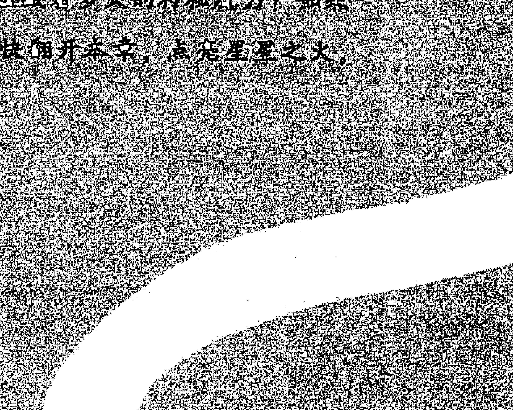

## 白羊座人，春日的气息，自由的气象

白羊座人生于每年3月21日至4月20日，是战神马斯所主宰的星座，时刻充满希望、和蔼可亲、行动力、活力充沛、诚心诚意。在昼长夜短的“春分”时节出生，由于阳光充足，春暖花开，白羊座人，都是充满活力而干劲十足的活跃者，时刻洋溢着春日的气息，充满着自由的气象。

羊儿们做事积极、热情有活力，总是给人乐观开朗、充满生气的活力感。白羊座人喜欢阳光，一群朋友，开开心心的，在阳光下嬉耍，是白羊座最怀念的美好时光。白羊行使侠义、自由爽朗的性格，使他们能结交许多剖心相见的朋友。人们不但喜欢这么活泼可爱、热情洋溢、心直口快的羊儿们，而且还不知不觉被他们充满春日温暖的言语感染。但是他们对朋友的要求也很高，不少人受不了白羊座对朋友的殷殷期许。

白羊座是战神的象征，狂热过人、精力无穷以及强烈的竞争性格是他们最鲜明的特色。凡是白羊座的人，不管遭遇多大困难，都抱着正义感而开拓机运，是颇具实践力的人。羊儿们热爱自由，无拘无束的个性，不顾一切追求目标的洒脱自然，总喜欢冒险和尝试，具有积极开创的精神决定着他们很有可能成为探险家，也有可能将冒险犯难的精神发挥在别的领域中，因为只有不断变化的环境才能让他们得到真正的满足。羊儿喜欢从事竞争性的工作，在热闹且富于变化的环境中，更能展现其灵敏的反应和过人的判断力。白羊座人无法忍受步调缓慢或安定而一成不变的职业，他们天生不适合局限在小小的办公桌前，因为那让他们没法尽情发泄过人的精力，适当的挑战会激发他们步向成功之路。

白羊座人有着积极向成功目标快跑的双腿，连擅长飞奔的驯鹿都甘拜下风。羊儿性格爽朗，不拘小节，极具领袖气质。充满自信而固执又旺盛的企图心，喜欢接受挑战。因此，自信热情的羊儿们一般不会轻易听从别人，会坚决地贯彻自己的决定。他们容易发怒，一旦被瞧不起便立刻火冒三丈。自我主义和那张喜欢挖苦别人的嘴，常使得周遭的人被那如机关枪般发射出来的言词打得稀里哗啦。他们缺乏耐心，有时候个性急躁，但是总给人轻快自然和自由爽朗的印象。

白羊座的爱情像一场小型攻防战，总是乐于追求和征服。白羊座是地地道道的大男/女子主义者，因此害羞、腼腆的人一般吸引不了他们的注意，他们所要求的绝对是活力充沛、精力旺盛的恋人。能够与他们一起全力以赴地运动、工作以及生活的对象，才是白羊座梦寐以求的伴侣。白羊座的人当然是浪漫的，但是他们是属于爆发型的浪漫。白羊座喜欢在庆典的夜晚，与情人并肩仰望烟火在夜空中爆放出的光芒万丈，而那也正象征爱情发生的瞬间，那是再浪漫不过了。

白羊座的人天性乐观，总是欣欣向荣，积极向上。闷闷不乐的人生绝不是白羊座的人所向往的，就算不幸陷入时，他们也会极力设法让自己尽快摆脱郁闷，全心希望有一个新生活。羊儿们经常保持一颗愉快开朗的心，即使与人发生争执，也能在隔天表现得若无其事的样子。

## 金牛座人，任凭斗转星移，我心亘古不变

金牛座的守护星是金星，金星是美的女神维纳斯天皇，具有清洁、爱人的精神，金牛座的人看似颇为稳静，但不畏任何迫害，而具弹性信念的强人。4月21日至5月20日期间，正是春花盛开的美丽季节，凡出生在此时的金牛座人，不但具有美与调和的精神，更是温顺可亲、专一执著的人。

金牛座是黄道的第二个星座，是“土象星座”的第一个星座，故也称“土象的婴孩”。所以他是一只不折不扣的“牛”，而且是一头固执倔强、占有欲很强的牛。他是一个做事有计划且能坚持到底的人，却因缺乏协调性，不善于分工合作而导致于工作常由自己完成。金牛座人有着固执十足的牛脾气，一旦认定就不会改变，任凭斗转星移，牛儿们依旧执著坚持着自己的目标和追求。金牛座追求脚踏实地的平实感，个性温和，庄重正直，从不做任何不切实际的幻想。

金牛座喜好一切美好的事物，对音乐，舞蹈的节奏感有着与生俱来的天赋。牛儿具有天生的艺术才华，常常令人称羡，演艺界、艺术界、宝石鉴定业、金融业烹饪、料理事业都可能是牛儿们大展宏图的领域。他们忠诚、真心、善解人意、实际、不浮夸、率真、负责，凡事讲求规则及合理性，喜欢新的理念并会花时间去接触、证明，是个自我要求完美的人。同时他们对物质和美的追求方面，也是超人一等。

金牛座的人在十二星座中算是工作最勤勉，吃苦耐劳、坚忍不拔的人。耐心、耐力、韧性是其特性。同时对事业有创造性的眼光，使得金牛座的人在创业的时候，朋友对他们都有信心，而且牛的倔强品行能让他们咬牙撑过创业维艰的时期。为实现自己的追求，他们会选择最安全、确实的途径，当然这通常是长期的酝酿和深思熟虑得到的结果，因为牛儿一直小心谨慎，一旦下定决心，没有人可以改变它，就是十匹马车也不能让他们回头，谁叫他们有着“牛”一样固执的倔脾气呢？

第一眼的印象，决定一头牛对你的喜恶。他们不会轻易抛弃这第一印象，即使是成见，他们也不会认为自己看错你。你可能在后来的努力中，让他们觉得你有不可能被忽视的优点，但他们还是会常想起他们对你的第一眼坏印象，不会放弃继续严格考核你的任何机会。当然，你们的初遇如果是愉快的，即使后来有不愉快，牛儿也不吝啬给你机会来改进。

### 点亮星灯，寻找你的代表「座」

一般而言，金牛座的爱情比较保守，他们相信拥有爱情、美丽与富有的喜悦，是生命存在的证明，也是他们信仰的真理。歌曲里经常唱的“一生只爱一个人”往往是金牛座的最高理想。两小无猜、同窗之爱、公车恋情、办公室爱情故事，都是金牛座期待的爱情模式。他们对人生充满独到的信念，但是没有求新求变的勇气，所以会显得有点缺乏幽默感。而金牛座的人常希望有人陪伴他们慢慢地走完漫长的感情路，所以这势必是一场极需耐心的爱情长跑，当然冠军只有一位，因为牛儿的专一是出了名的。

## 聪慧如双子，性格更多重

双子座位于十二星座的第三宫，太阳将通过这星座的5月21日至6月21日期间，是自然翠绿色最美的季节。凡出生于这翠绿美时期的双子星座人，不但头脑灵敏，且推理力优于他人甚多。由于双子有两个“脑袋”，又有双重性格，兼具光明开朗的一面和阴霾低潮的一面，性情多变，个性活跃的双子总富有随机应变的智性。

双子的守护星是水星，水星是商人的星座，双子座的人灵敏度表现得极为突出，显得才华横溢，善于言辞。双子聪慧过人，有极强的创造能力。他们天生有驾驭文字的能力，大多写得一手好文章，不过若是有心从事写作的行业，最好事先拟好写作大纲，以免半途而废。双子座的人需要不断发掘新的兴趣，所以他们讨厌单调、冗长的工作。新闻事业(报社、广播或电视) 是最适合他们的行业，能够满足具有语言方面才能的双子座急于沟通的本能、喜欢变化的需求，而且喜欢旅行和擅长交涉的他们，在各类业务工作中也是如鱼得水。

双子座的人才情洋溢，并具有强度的感染力，因为他们善于在游戏的气氛中，亲近你，瓦解你的武装，引导你开发自己潜藏的快乐的能力。他们是所有星座中最能迎合时代潮流的星座，故而和别人较易打成一片，绝对不用担心什么代沟问题。他们精力旺盛，对工作认真，对朋友讲情意，对事业野心勃勃。但是双子座无法忍受一成不变的关系，固定的事物使他们衰老得极快，所以风向的双子喜欢与头脑聪明、精灵古怪的人交朋友。

如果你认为双子永远都是这样活泼热情那你就大错特错了。双子座是双面人，具有双重性格。好玩、好动、好奇，使双子座像一枚跳动不休的火焰，时强时弱，却永不熄灭。他们聪慧过人，口才极佳，很有创意思维，但是却是很情绪化的人，时而快乐奔放，时而又有点忧愁诗人的气质，与双子关系密切的友人和家人都被他们多变的性格、情绪弄得精疲力竭，这一分钟可能你还在琢磨着怎么安慰双子，下一分钟他们可能就又蹦又跳挽着你去逛街了，别奇怪，谁叫双子有两个“脑袋”呢？

双子追求多变的个性，不管双子男或者双子女都适合活跃在人群中，和每个人都极易打成一片，拥有相当不错的人缘。孔老夫子说的“穷则变，变则通，通则达”正是双子座的处世观。他们时而冷静观察红尘之事，时而任思绪纷飞于浪漫的梦中，具有复杂的双重性格，他们“见人说人话，见鬼说鬼话”，具有相当强的语言技巧及沟通能力。他们对存在于宇宙之间的事物，比常人多一分因好奇而得来的理解力。因此，要了解双子座，你的好奇心与理解力都不能太差，否则你是跟不上他们迅速转动的头脑的！

## 巨蟹座人，请让我来保护你吧！

生于每年6月22日至7月22日的巨蟹座，月亮对其个人感情的影响力大过太阳。月亮守护巨蟹座，月亮也是母性的守护者，所以巨蟹座是所有星座中最具家庭观念的星座。螃蟹们具有强烈的母性或父性的本能、保护色彩浓厚，他们谨慎、节俭，是标准的贤妻良母或好丈夫、好爸爸。

蟹本来是女神亨拉的使者，但因过度保护自己的领域，结果连自己也变成为蟹状。巨蟹座人不管男女都亲切和善、温柔体贴、宽容不记仇，对家人与好朋友非常忠诚。他们记忆力很好，求知欲很强，顺从性强，想象力也极丰富。并且蟹们善良、热心、敏感、富有同情心；长于记忆、脑筋敏锐、领悟力好、适应力佳、有高度的想象力；有坚强意志力和耐力，不屈不挠；理财观念甚佳，节俭且很会过生活；忠于爱情，重视家庭的温暖与安定，擅理家务，重视家庭的和谐。

巨蟹座的人富有爱心，性格比较阴沉，作风谨慎却比较黏人，对所爱之人随时保持高度关怀，甚至演变成焦虑不堪的程度。巨蟹座的男人会为了建筑自己的巢而献出一切努力，成为蟹们的朋友甚至他们的家人，可以感受到他们源源不绝的保护关怀之意。不过，可千万不要尝试在他们的王国做个特别的“另类”，不然你会被他们照顾得“很累”，因为蟹们时刻准备着保护你，为你奋不顾身地剑拔弩张。

巨蟹座的人正巧符合了螃蟹外壳坚硬，内部柔弱的本质，他们在心理筑起一道坚实的保护墙，如果你向巨蟹座的人挑衅，就会立刻遭遇到他们有如城墙一般坚固的防卫系统。巨蟹座的人体贴、善解人意、极富同情心，热心的他们随时准备保护自己身边的人，越是弱小的朋友越能引起蟹们的保护欲。你可以去找一个巨蟹座的朋友倾吐心事，他可以听上三天三夜而始终保持贴切的笑容，你会为此大受感动，不过你可能更讶异于他们付出同情心的超人耐力。不要担心巨蟹座朋友落井下石，在你窘况的时候弃你而去，因为愈是不幸的人，愈能得到一只螃蟹的照顾。

巨蟹的男子多很恋家，多有恋母情结，他们情感深厚且温和，让周遭的人倍感温馨。巨蟹女孩十分喜欢小孩，又擅长家务，一般皮肤白皙，极有可能成为十足的教育妈妈。螃蟹敏感的特质表现于爱情上的，远不及发作于婚姻。稳住自己的生活节奏、提升生活水准，拥有幸福的家庭生活是他们人生所追求的重点。从事服务业和公益活动，能使一只多愁善感的螃蟹获得较多快乐的机会。而一旦拥有舒适美满的家庭时，巨蟹座人可以放弃一切，全心投入，蟹妈蟹爸对家庭的责任感，一向无与伦比，极富母性的蟹们总忍不住做“保护你”的事情。

## 狮子座人，高傲既是魅力，又是缺陷

7月23日至8月22日出生的狮子座人，像仲夏一样热情洋溢，需要经常被注意及赞赏。在炽热阳光的笼罩下，狮子总流露出一股骄傲和自信，充满魅力极具激情，期待众人的喝彩，渴望绽放出让人艳羡的生命光华。

狮子座的守护星为代表正义和光荣的太阳，所以其性格如同光芒十分明亮，而具有丰富的感情，尤其为人服务的精神最令人佩服。他们是充满正义感，自信骄傲的使者，也是能带给别人无限希望、人们乐于接近的好友。狮子喜欢快乐的事物，个性开朗爽快，最让人印象深刻的就是他们从不熄灭的自信焰火。狮子座人最会将各式活动、典礼的气氛带动至最高潮。狮子座人冲动而且做事夸张，爱挑战当权者，传奇而且任性，勇往直前，敢于战斗、热情大胆，难怪演艺圈里有众多“狮子”们。

提到领导这回事，所有人都不能否认狮子可是天生好手，而且浑身上下都散发着与生俱来的王者魅力。他们拥有非同一般的战略思维，超凡的自信和魄力，热情洋溢，总能在最愉快的气氛下引导别人付诸行动，所以论领导气质狮子绝对位居十二星座之首。狮子座需要一份能够充分发挥才能的工作，因为他们热爱工作，总是全力以赴，几乎不知休闲为何物；野心勃勃，高唱“天生我材必有用”；本质阳刚、专制、具有太阳般的生气；宽宏大量、乐观、海派；光明磊落、不拘小节、心胸开阔。

在十二星座中，狮子座是最具有权威感与支配能力的星座。通常有一种贵族气息或是王者风范。狮子们对自己很有自信，擅长组织事务，喜欢有秩序；能够发挥创造才华，使成果具有建设性、原创性，是个行动派。他们受人尊重，做事相当独立，知道如何运用能力和权术以达到目的，不过也会有顽固、傲慢、独裁的一面。同时，他们天生怀抱崇高的理想，能够全力以赴、发挥旺盛的生命力。

狮子的骄傲虽然为他们带来与众不同的魅力，尽显王者本色，然而有时候也给他们带来麻烦。狮子座的人太过自信，总觉得自己能力过人，所以常常不能老老实实承担比较艰苦的任务，甚至对呆板枯燥的工作也不能够不厌其烦地承受。如果上司不够威严厉害，狮子座人就觉得他们的上司属于愚蠢、没有担当、缺乏组织能力一列，自视过高的他们常常不服此类上司的领导而另谋高就，所以往往失去成功的好机会。

如同灿烂耀眼的太阳一般，狮子座的人热情洋溢，本质上阳刚、乐天，却也容易傲慢顽固，让人不舒服。王者星座的他们，具领导能力与侠义风范，充满活力和强烈的企图心，却不善于做深入的思考。他们傲慢自负，外向开朗之下，却常感到内心孤寂。狮子座的人开朗，豪气。

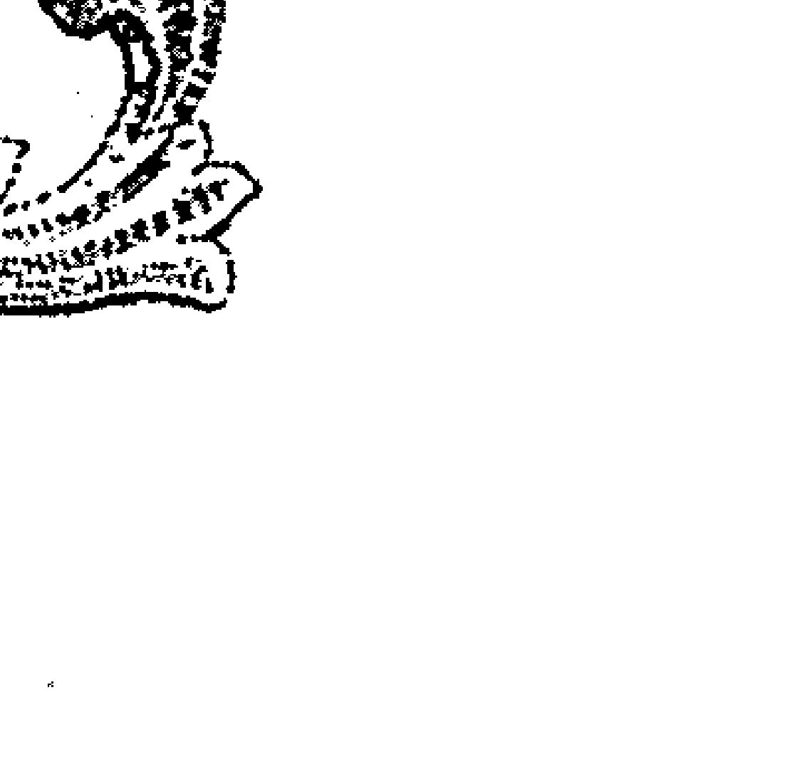

也因此，即使初次见面的人，也能在顷刻间与之高谈阔论起来。但是狮子太容易相信别人，要小心被欺骗被利用，就要收敛下自己的傲慢哦。

狮子男常常自认为才能卓越，普天之下舍我其谁，所以过度慷慨大方，大肆浪费，矫饰造作的说辞总能流利的脱口而出，让女性对他们另眼相待。什么事都很大方地说：“交给我包办！”如果确有能力便好，如果力所不能及的事情也盲目许诺，就常常给人夸夸其谈、爱出风头的印象。没错，狮子们的骄傲自信，让人欢喜也让人愁。

## 处女座人，十足的完美主义者

在8月23日至9月22日这可以听闻虫鸣的宁静季节出生的处女座人，都具有纤细的感受性。处女座的人感觉敏锐，头脑冷静对事物能做出正确的判断。他们自我要求甚高，很容易神经紧张，是个十足的完美主义者。

当我们聊起处女座人的时候，最津津乐道的，莫过于他们令人讶异的追求完美的毅力。处女座在完美主义者中，是佼佼者。对他们来说，追求完美并不需要才情，而是顽强的生命力与永无止境的恒心。在处女座人的字典里，完美是一种习惯。花了许多心神去决定的事，便会贯彻执行，矢志效忠。他们不喜欢半途而废，更讨厌背弃最初的梦想，因为这等于否定了“完美”世界的不可能。从工作事业到衣着打扮，处女座的人们一直用细腻的心思装点着完美的“因子”，诠释着自己的生活态度。

处女座大概是黄道十二个星座里最严格自制、最修养到家的星座，心思细密、感情内敛、思路清晰是处女座人最大的优点。处女座的人安静而有条不紊，总是默默行事，这种典型的处女座勤奋特质在他们执行事情或解决难题的时候，尤其明显突出。而完美主义者的个性又能让他们工作起来精益求精，并且负责务实的他们总能得到上级和领导的青睐。处女座人通常适合做会计、影评人、看护及医药界，而且往往会在同一工作岗位上待好几年，即使别人可能觉得无聊乏味，他们也会能乐在其中。

这个星座的人追求的是简单而纯粹的真理，在他们身上可以感受到一种追求完美与纯洁的气质。处女座的女性最适合从事秘书工作——永远是一身整洁高雅的服饰，办公桌也收拾得有条不紊，给人清爽利落的感觉，对老板交代的事情，更能够处理得条理分明。他们喜欢一成不变的例行公事，因为井然有序是他们所追求的目标。

处女座的人一般都是学识渊博的人，很懂得如何去安慰一个失意的朋友。他们的思考力很强，收集、分析、归纳、重组和整合，一贯作业，独力承担的做事风格，令人佩服。遗憾的是，习惯性的“自我批评”常使人误会处女座的人有点冷漠。由于内心的完美主义作祟，处女座人对细节过于专注，导致自己目光短浅甚至变成吹毛求疵，让人很受不了。由于心思敏感、神经敏锐，很容易任何事都挂心，显得有点小家子气。如果处女座人能适当地放宽对自己和别人的“标准”，知性的他们就能拥有更好的人缘。

对待爱情，处女座也是十分挑剔。他们在初恋时，就已经打了草稿：既要能符合父母的期望，也要有独特的个性；要外表出众且内涵丰富；要孝顺父母又要喜欢小孩；要温柔加爽朗；要幽默加智慧……这么多的理想放在一起，就算去定做，也未必能让处女座的人满意。然而当爱情走到婚姻的关口，处女座的选择是理智而且务实的。处女座的人不会选一个自己不喜欢的人，来折磨自己一辈子，但是会从喜欢的人中，挑选最具价值的一位，走上人生的新阶段。

### 点亮星灯，寻找你的代表「座」

# 血型、生肖、星座的智慧与应用全书

### 浪漫天秤人，沟通无障碍
生于每年9月23日至10月23日的秋分季节，天秤座的守护星是金星，是天上金色的迷人天体。以爱神维纳斯命名，象征爱情与美丽，有着支配女性魅力与吸引异性的能力，天秤座既是浪漫的恋爱高手，又是能言善辩的社交家。

由美的女神所保护的天秤座人，颇富感性和高尚品格，并具有优异的批判和调和感，因不偏于极端而又具有均衡的人生观，所以都能表现出创造性的美感。他们性格诚实温和；富同情心而看重感情；处事力求公正与中庸；不愿偏激；浪漫多情；心思细腻。他们天生具有艺术细胞和创造力，有令人激赏的音乐及艺术天才，假使能控制对享乐的沉溺，必可获致此方面的成功。在医学和慈善事业方面亦有卓越的才能。

天秤座所特具的机灵和外交手腕，使他们很容易成为站在时代尖端，而又受到欢迎的人。他们能言善道，属于沟通无障碍的“神侃”一类，担任人与人之间沟通的桥梁。不管男女老少，只要天秤愿意，都能跟你打成一片，熟络得不行。天秤们最能够体贴别人的心意，考虑事情时能够站在对方的立场来想，所以秤子们通常人缘不错。同时天秤座的人好热闹，天生好客，喜欢人群，害怕孤单。他们不善独处，工作上也适合与人合作，而不适合独挑大梁，所以你几乎看不到一个人“单打独斗”的秤子，就是经商，他们也多半会与别人合伙。

天秤人心地善良，有古道热肠和仁心，富同情心而看重感情，处事力求公正与中庸，不愿偏激。诚实温和，是个理想主义者，生性浪漫，有自我牺牲的倾向，个性坚强、聪明、具有灵活而好质问的脑子，常有非凡的构想。此星座的人不喜欢争执，所以容易赢得别人的好感，为了避免争执和不愉快的事情发生，天秤座的人喜欢采取避重就轻的方法解决问题，而他们最不好的缺点是优柔寡断。“船到桥头自然直”的观念根深蒂固，因而遇到棘手的麻烦时，总是一拖再拖，甚至来个相应不理。

说到浪漫，没人敌得过天秤。天秤座是十二星座中排名第一的恋爱高手，对天秤座来说，恋爱是一种享受，所以为了这种享受可以不惜花上金钱提升自己。天秤座大都外形高雅、擅长交际，个性平易近人、注重罗曼蒂克的浪漫情调，具有迷人的性格特征，对和谐而愉快的生活环境十分珍惜。天秤男好像具备天生的浪漫因子，就是与异性随地而坐谈天说地，也能吸引异性的芳心。天秤座人有张擅长社交的嘴，很会说些使对方感到愉快的话，所以在结交朋友方面毫不费力。他们拥有如天秤般极富协调的手腕，因此有他们在的地方总是非常和谐。

天秤终身追求心的归属，一个永远的避风港。不过，在追求的过程中，他们容易把简单的事翻过来调过去地看，结果越看越杂乱，常常使人有忽冷忽热，难以捉摸之感。所以若是想得到秤子的爱，必须很耐心，不要被他们模棱两可的态度吓跑了。如果你确认这杆秤适合你，就要耐心地和他周旋，切不可操之过急早早表态，总有一天，秤子会发现已经不知不觉间落入你的柔情网，再也离不开你。

# 第四章 生日里隐藏着怎样的秘密？
### 天蝎座人，过人的精力和耐力是你成功的本钱
太阳于10月23日至11月21日期间通过天蝎座，天蝎座是横列于南地平线附近银河的巨大星座，任何人都可以目睹而呈为可怖天蝎状。并且意志力坚强，具有崇高而精力充沛的人格是天蝎座最显著的特点。

天蝎座受到代表战神的火星及象征冥王之府的冥王星支配，是十二星座中本能与意志力最强的星座。无论目的地是哪里，可以确定的是，这些天蝎的计划之一就是梦想并付诸实施一次充满狂热的旅行。所以一次冒险，最好有更多的惊喜，来满足天蝎们的渴望。强调自我的天蝎很有理解力，他们乐于和那些走错了路的陌生人交换一下意见，指点别人一下，以证明自己一贯拥有的洞察力。天蝎座人很有可能跨越半个地球去从事另类运动，比如去南太平洋小岛蹦极或去秘鲁玩滑翔，越是困难这次游历就越有意思。不用惊讶，他们过人的精力和耐力是其他星座所不能匹敌的！

天蝎们总是精力充沛，做事有技巧，坚毅果断，即使面对困难也不改变当初的梦想。天蝎座的人，性情复杂，不善于表达感情，容易给人顺从的错觉，其实，他们的内心是坚决而固执的。同时，他们外表深沉内敛，沉默寡言，凡事都十分谨慎且深思熟虑，很能掌握事物本质。并且他们拥有闻一知十，理解力强、反应快的头脑，不论经历多少次失败，天蝎们都能勇敢地站起来，就像不死的神鹫般斗志满满，一旦踏稳了就不愿意移动顽固的双足。人们敬佩他们过人的精力和坚忍不拔的意志力，因为要他们轻松享乐是不可能的。

蝎子是一个有计划的人，耐心和毅力是完成任务的原动力。在一定时间他们可以预定可达到什么目标，并且认真踏实，很有恒心和毅力，从不凭感觉做事，而是实际去力行事情。天蝎座人喜欢社会地位，这是他们人生追求的重要组成之一。但是意志力超群的蝎子常常能从最底层一步步爬上顶峰，最终呼风唤雨。蝎子喜欢一个人做事，很少受别人左右，给人脾气古怪的印象。做事较执著，且做事慢工出细活，做事光明正大竭力乐于助人，这些优点也常常为蝎子赢得不少“人气”。

天蝎座的男性是一个自我掌控力高、非常沉默的人，不过在他们的心中隐藏着激烈的感情。他们拥有从平凡的外表根本无法想象的强烈自信和主张，危急之时，可以爆发出相当惊人的实力。不过嫉妒心强，执念太深是他们的缺点。他们像一部功能齐全的个人电脑，孜孜不倦地转动，精力过人，成效惊人，不过创意一直是蝎子无法突破的瓶颈。同时，他们面对爱情，总是那么爱憎分明，爱的时候痴情执著，不爱的时候转身便走。对待事物总是极端处理，受不了“小奸小恶”的他们认为没有毁灭哪有重生。然而他们的可爱之处，也在这“爱之欲其生，恨之欲其死”的情结中。

### 射手座人，探索未知领域是你永恒的追求
太阳将通过射手座的11月23日至12月21日期间是冬天寒冷的季节，被称为天界和下界之王的木星是射手座的守护星。射手具有统一这两个世界的双重性，既追求更多的朋友，也不满足现状而为探索未知世界勇往直前，是兼具智性和野性二者的人。

射手座人追求真理，勇往直前，有颗智慧型的头脑。最令人意想不到的是，他们竟也擅长解释哲理方面的问题，对哲学及研究亦有异于常人的天才，而且言辞幽默，引人注目。他们拥有直觉及未卜先知的天性，锐利的观察力，经常探求未知世界的神秘知识，多为爱好运动者，有健美性感的体魄，容易博得异性的青睐。他们是超乐天派主义，为追求自由奔波不懈，最讨厌被拘束，是丰富的创造天才，艺术和灵感的先知，这些优点促使射手总忍不住探索周围未知世界的奥秘。

凡是射手，几乎都酷爱自由，好奇心驱使着他们总是不能静下心来被传统束缚。射手座有潜力成为特立独行者，他们喜欢不被羁绊的洒脱感，但是又惧怕不被群体接受而被孤立，射手们由于“突出”造成“被注视”的压力，也害怕被别人的看法束缚了追求智慧和自由的手脚，这个矛盾很困扰他们。

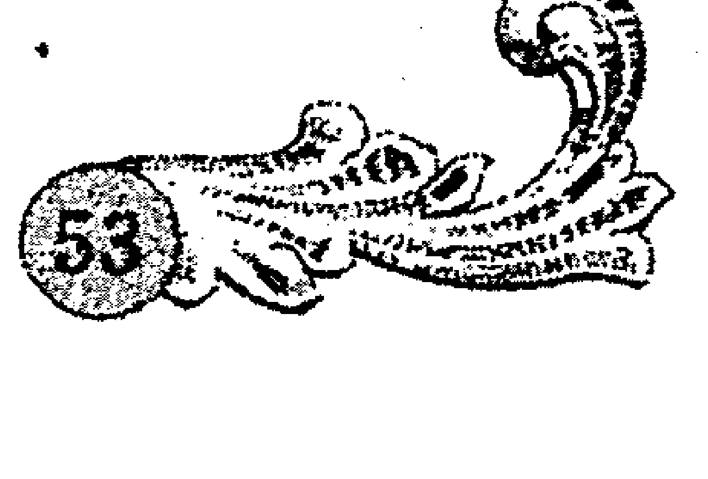

射手们喜欢机智、华美的交谈，以及感性和充满希望的结论。如果你讲起话来很富有哲学意味，射手座会很兴奋，他们会非常认真地与你讨论生命的意义，而且很在乎是否有一个具体的结论。如果你说的话题越新鲜，他们就越喜欢跟你交谈，谁叫射手天生就有孩童般的好奇心呢？如果问题越有无限的可能性，越值得推敲，他们就越喜欢钻研，而且还乐于跟别人争论。射手座一生可能只关心一件事，只要他们把这件事搞透彻了，这一生就无憾了。因为这样他们的想象力去驰骋，探索未知世界是他们永远都改不了的习惯。

想象一下，一个外国记者在他的旅途中会做什么？不停地提问、调查、质疑，要把一切事情都搞清楚，那就是射手们在旅行中想做的事情——知道得越多越好！他们喜欢社交，很容易就与遇到的人拉上关系。很多射手可以通过实践学会一些事情，这是自然赋予他们的。诸如钓鱼、滑翔，不管你信不信，不少射手们希望能去套野牛，就像牛仔那样。如果想的远一点，你甚至可以预测，射手们将第一个在火星上放牧！射手座人旅行时无所畏惧，在“了解一下”的名义下，他们敢于尝试任何事情。

射手们除了好奇、求知欲旺盛，还是天性乐观积极的人。他们思想路线是直的，总认为今天是最美好的一天，回忆美好不如创造美好。有时候心直口快的射手常常易得罪别人而不知，他们不太会说谎，非常爱笑，且笑声很大。他们冒险性强，领悟力强，又幽默好动，太好自由的射手不易有固定的工作，因为他们总忍不住去探索外面从未接触过的世界。虽然有不少射手座的人终生从事办公室或工厂里一成不变的工作，但是他们多半迫于形势，而非心甘情愿。

# 第四章 生日里隐藏着怎样的秘密？
### 踏实的摩羯座人，天生的保守派
12月22日到1月29日间，即是冬至季节，是夜间最长之时。生于寒冷时的摩羯座人具有踏实和保守的个性。土星支配个人的现实生活，其忍耐和磨炼的表现，使摩羯座人一旦确定目标，不管多么困难都会踏实努力直到成功为止。

摩羯座人深思谨慎，冷静而准确的判断力，给人沉稳而严肃的印象。摩羯人工作能力很强，是务实能干的类型。他们的话虽不多，却富有幽默感，有个冷静且理智的头脑，考虑现实，充满雄心，认为自己凭借努力总有一天能居于众人之上。他们有强烈的责任感和企图心，时时鞭策自己努力实现理想，工作踏实忠诚。同时，他们忍耐力十足，即使背负重担也不退缩地勇往直前，但是凡事都太过认真，乃至拘泥，而显得过于刚强，冥顽不灵，是天生的保守派。

摩羯的“兼容并包”的博大可谓无人能敌，他们很容易接受不同的意见和不同个性的人，他们的包容性使人际关系顺畅无阻。这也是缘起于摩羯的保守，因为他们时刻小心翼翼地保护自己，不做不利于自己的事情。就算是自己的意见和别人不一样，也不会太较真，务实的他们才不在乎别人赞不赞同自己，能不能实现自己的“宏图大业”才是摩羯人最注重的。

摩羯座的人总是理性地知道自己在做什么，他们的目标总是与实际紧密相连，务实保守的摩羯可不喜欢风险“投资”，他们需要稳妥的成功机遇。他们不喜欢风险，但是也不甘第二，很多摩羯座人都是从幼年期便立志做第一流人物。追求有意义的理想人生，使得摩羯座人充满斗志。

摩羯座的人喜欢控制全局，因为他们保守实际，不希望出现一些不确定的因素引发失败。善于独力实现自己心中的梦想，可惜掌握权力是摩羯者无法成为一个超级领袖的障碍点。他们确实很有领袖的实力与气量，可惜他们又很懒得去处理万机，天生保守传统的他们尤其讨厌周旋在权力斗争中。而且天性踏实工作的他们认为，为了理想，权力的桂冠不要也罢。

别跟摩羯们谈什么无聊的幻想，他们也不爱听什么借口。摩羯座人是一个认真执著，会朝着目标不停努力的勤奋型人。不管遇到什么困难，他们都会想尽办法克服。另一方面，由于责任感很强，所以能得到周围人们强烈的信赖。他们的缺点是太过拼命，结果视野变得狭窄，气度比较小。如果你是个浪漫主义的行动派，遇到摩羯这样保守到家的慎重派，勉强自己配合他们的脚步行事，只会让你们之间的鸿沟更深而已。

摩羯是一个不容易疯狂和奋不顾身的人。当摩羯座为理想全身心投入时，你会觉得他们疯狂；当他们爱上一个看起来不像是他们会爱的人，你也会说他们疯了。但实际，摩羯座是一个很不容易疯狂的人。通常他们只做有把握的事，没有十成胜算，也要有八成才肯放手一搏。他们不过是常把一件事做得很疯狂的样子罢了。他们不好赌，但也会小赌。如果你看他们正在赌，那你最好闪远一点，因为他们可能是百分之百的赢家。

### 水瓶座人，最有个性的独立派，最具潜质的革新派
生于每年1月20日至2月18日的水瓶座人，在寒中带春的季节降临，是具有冷静智性和温暖感情的人。冷静守护星为天王星。它是天空的神星而代表着不受任何束缚的自由智慧。因此水瓶座人具有自由的思想，以及创造美感的才能，是个性独立且最具潜质的革新派。

水瓶座人是一个理智而头脑优秀、懂得用冷静的眼光来判断事物的人。他们个性独立，不随波逐流，总是有着自己的独特想法；崇尚自由，充满人道精神、兴趣广泛、创意十足；乐于发掘真相，有前瞻性的思维；拥有理性的智慧并坚持独立；不怕变革带来的风险，还常凭敏锐的推理力和华丽的言辞来吸引人、说服人。水瓶思想独特，个性独立，会有很多与众不同的念头，很可能因为固守自我主张，而被周遭的人当成怪人。

水瓶是怀抱自由的理想主义者，有许多闪耀如诗般的才华，在文学与美术方面，可以尽情发挥。由于处事过于明快干脆，亦留下爱出风头甚至自以为是的感觉，只有懂得欣赏他们的人，才能成为水瓶座的好朋友。因为，他们并不在意花太多时间在与人打交道上，但是一般总会有读懂他们独特个性的知己。

水瓶座的最大特色是讨厌束缚、追求自由，他们崇尚独立自主到不惜牺牲一切来换取的地步，而且因为他们崇尚自由的精神，所以对他人的自由也颇为尊重，是友善的个人主义。对此型的人而言，地位、名誉、财富都是束缚自己的链子，连结婚也是一种束缚。水瓶们具有快捷的行动；求新的思想；天生富有的创意；新奇的点子，具有科学家的特质，善于将新奇的见解表现在艺术或是科学研究当中。由于他们特别喜欢创新和出奇招，是很有个性的革新家。

迟到通常是水瓶座的一个毛病，叛逆则是他们内在的人格特质。由于相当在意自己要保持独一无二的特质，以至于水瓶座的人时常因为表现得太睿智、太独立、太锋芒毕露，或者太关注在整体的世界而忘了把关心投注在自己最亲近的人身上，这样也会使身边的人感到无形的压迫感。

天生不喜欢一成不变的生活，水瓶人需要富有创意或是能够使自己长进的工作，他们对一成不变的例行公事很快就会感到厌倦，而且对改革求新总有一套自己的想法。当然，他们也有足够的能力从事呆板的工作，不过这却白白辜负了他们与生俱来的创造能力。只要有机会，水瓶座人便能想出许多新奇的点子，并且赋予他们所从事的工作一种崭新而独特的面目。然而这群最具潜质的革新家们却不适合独立工作，他们适合在团体中无压力的状态下，展现自己绝佳的创造力和智慧。

水瓶喜欢柏拉图式的无负担的爱情，虽以像朋友又像情人的超信赖关系结合的二人，却希望不要互相束缚，彼此建立一种独立无负担关系。深厌束缚的天性使得水瓶们纵使在婚姻中仍需维持某种程度的独立自主，不要试图干涉他们的生活，给瓶子独立的空间，才能维系良好的感情。因为让瓶子感到受困确实是不明智的，他们会力求脱困。如果你对瓶子绑得愈紧，那么他跑得愈快，最高层次的做法就像如来佛对孙猴子一般，让他们感觉海阔天空，而实际上他们仍在你掌握之中。

### 双鱼座人，最灵敏的环境感应器
双鱼座的守护星是海王星，具有大海般的拥抱力的双鱼座人，心地善良待人亲切，尤其博爱心，颇有高超的艺术才能，也是具有敏锐直觉感的人。出生在2月19日到3月20日期间的双鱼座人，如同春光般纯真、充满希望，敏感而富有知觉力，是最灵敏的环境感应器。

双鱼座的人是一个感受性强、性情温柔的浪漫派。他们会为了别人而掉泪，同时为了能全心全意付出而感到欣喜不已。心思单纯又诚实，所以可能常被骗。另外，他们身上还有足以激发他人母性本能、爱撒娇的一面。因为他们的温柔个性，所以不会直接表现出心中的感情。而他们也可能被你直来直往、毫不修饰地言语所伤害。如果你希望跟他们天长地久，首先要注意的就是你的说话方式，因为天性敏感的他们对只言片语也会难以忘怀、揣摩良久。

双鱼座在所有星座中，也最容易受到外界的影响，他们生性敏感、思想脱俗但不切实际，常有逃避现实的倾向。从表面上看，双鱼座的人内向而羞怯，然而内心常常是复杂而矛盾的，同时存在着善与恶，精神与物质等对立的挣扎。很多事情他们其实早已敏锐地感觉到了，只是并未表现出来。鱼儿们虽然有丰富的想象力，相对的也容易不切实际地做白日梦，幻想着白马王子（白雪公主）的出现，而忽略了现实生活中的缘分。

点亮星灯，寻找你的代表座

双鱼座的细心与体贴，表现在他们关爱不幸者的时候最令人难忘。他们倾听你的苦恼，即使发现你的苦恼有漏洞，也不会故意用话来刺激你。双鱼座的人有丰富的同情心，能够以悉心的看护、祈祷或是冥思的方式疗护朋友心灵的创伤，但总缺乏面对现实的勇气。他们天生善解人意、坦诚而迷人，能够让朋友有充分温情的感受。双鱼座的多情与水瓶座人的博爱不相上下，在一般世俗的眼光看来，或许会被讥为滥情，但事实上他们对朋友的关怀和义气，却是目前世态炎凉的社会难能可贵的。

极度浪漫的鱼座无法忍受机械化的生活方式，严肃的纪律和一成不变的例行公事，正好和他们罗曼蒂克的天性相背而行。双鱼座人常常是身在此山望向他山，总认为在另一个地方一定有更好玩的事情发生，总是毫无目标地由一件事情游移到另一件事情，从这个目标转移到另一个目标，很容易厌倦，所以鱼儿要学习专心致志才行。

感情丰富、心地仁慈、善解人意的鱼儿们人缘一般很好，但是也因为幻想太多、多愁善感而变得感情用事、缺乏理智。永远的好好先生或好好小姐，你会忍不住想到双鱼座，因为他们心思实在太细腻了，就像一个敏锐的感应器，随时能发现对方的不幸和难处，随时准备为别人出力解围。

## 第五章
## 当血遇到血
——你与TA，天生的搭档，还是宿命的对手？
俗话说，“酒逢知己千杯少，话不投机半句多。”两个性格相投的人在一起，总会有“相见恨晚”的感觉；而有些人碰到一起却互相看不顺眼，这就是所谓的“缘分”。其实，两个人是否投机，是由性格决定的，而血型恰恰决定人性格的类型。这一节，我们就逐个组合分析一下各种不同血型的人在一起会碰撞出怎样的火花。看看你与TA，是天生的搭档，还是宿命的对手？

### A型和A型：摇摇欲坠的组合
很多A型同A型尽管起初关系较好，但渐渐地矛盾会尖锐起来，最后闹得不可开交。这同接触时间的长短未必有关，而是血型的性格密码，决定了这对组合时刻“潜伏危机”，这是一对“摇摇欲坠”的同型组合。

由于性格的相同，一般来说，A型和A型的人初识的时候，如同一对心有灵犀，不需要语言来沟通的朋友。在开始接触之后，他们也会很容易发现对方身上有自己所喜欢的特质，并且会在交谈中发现谈话投机，很容易进行下去。所以起初A型同伴的关系都会比较好，而且如果人际距离处理适当，一般可以成为默契的好友。

A型血的人是十分敏感的，他们在谈话的时候特别注意周围人的反应，当两个A型血人在一起的时候，他们都是对方的最佳倾听者，A型和A型大概是最能了解对方的组合。同样的血型，使他们在感触上以及对事物的反应方法上，最易产生共鸣和同感。A型血的人大多善于控制自己，在与人相处的时候，往往十分注重默默观察。这种特性使A型同伴能够相互深刻、仔细地了解对方。由于双方又都崇尚团体荣誉，所以在共同的行动中，他们可以相互帮助、密切配合，很容易上升为同感之爱和同道之爱。

然而A型血的人并不是擅长人际关系的人，特别是和陌生人交往的时候，他们一般都没有积极主动地去拓展关系的意愿。所以A型血的人在与人交往时，都比较注意对方的情绪和反应。天性谨小慎微、精打细第五章 当血遇到血

算的两个 A 型血人遇到一起，起初可能因为想法相似而产生共鸣，但是随着交往深入，不愉快的争执和责难屡屡发生，很可能互相抱怨指责，但是两人表面还是会力求礼貌。

可以说，A 型血的人之间虽然容易相处愉快，但也是潜伏着危机的。A 型血的人属于完美主义者，当两个完美主义者在一起的时候，又必然会使得这一同型的组合极易发生争论。每一个 A 型血人都有自己的办事准则，倘若这些准则不相吻合，便会出现挫伤对方的情形，使 A 型血人之间争吵不断。比如，A 型与 A 型的组合在进行学术性讨论，或者是对某一事物、某一行动方针进行讨论时，极易发生争论。A 型血的人一般比较容易掩藏自己的个人光芒，但是他们在发表个人意见时，又是最没有妥协性、最固执的。由于两个人性格太相似了，所以很多时候，本来只是一点小小的抱怨，两个人碰在一起却越演越烈。

这对摇摇欲坠的组合，交往的过程中最好还是保持适当的距离，否则到最后很可能因为互相受不了对方而翻脸。A 型血的人在一起时，应当互相尊重彼此的意见，勇于承认自己的过失和不足，适当控制自己的完美主义倾向，当出现问题时，应少一些责难和抱怨，这样可以减少一些不愉快。

如果 A 型和 A 型不得不在一起工作的时候，应尽可能地避免争论。这里有一个很有效的办法：明确的分工和协作，也就是在共同的目标下尽可能使各人分担的工作和任务错开。彼此分担的工作不同，即使一起议论议论也不会产生很大的分歧。实在无法避免时，最好有第三者出面调停。

> > 你与TA，天生的搭档，还是宿命的对手？

## A 型和 B 型：一见钟情的吸引力

A 型血和 B 型血的碰撞，周围往往充满着不可思议的巨大磁场。A 型血人的精明能干、谨慎处事的稳重性格，在 B 型血人眼中极富吸引力；而向往自由、事事喜欢探索的浪漫 B 型血人在显得相对刻板的 A 型血人眼中，又是那么的可爱有趣。总之，A 型和 B 型的组合，是一见钟情的吸引力。

在人际交往方面，A 型血人往往属于不是很善于交流和表现自己的类型，他们往往很善于察言观色，交往过程中对别人的情绪反应关注较多，内心深沉。而生活无拘无束的 B 型血人总是那么热情洋溢，善于交谈的他们总是马不停蹄地说着各种有趣的话题。他们兴趣广泛，思维犹如天马行空，说起话来幽默生动，这让 A 型血人很容易被其开朗大方的言行所吸引。不管是同性还是异性，A 型血人对外向好动的 B 型血人的第一印象都很好。而且思维有点对立的他们往往会在对方的思想里发现特殊的美感，进而更加促进这种好感的延续。

对凡事都可以凭直觉蛮干到底的 B 型血“行动族”来说，A 型血人那种处事精细，善于计划，精益求精的完美办事风格，无疑是值得学习和钦佩的。自由随性的 B 型血人脑筋灵活，厌恶束缚和各种条条框框，他们自我主义严重，做起事来不在乎旁人的眼光；而这一点和 A 型血的人截然相反，A 型血的人在决定做什么事时，先要摸清对方的情况，深思熟虑，了解到对方的心理意图后，再决定采取什么样的策略来行动。处事欠慎重、有点横冲直撞的 B 型血人会觉得 A 型血人的稳重谨慎是成熟有智慧的表现，所以往往有种向 A 型血人学习的愿望浮现脑际，欣赏崇拜之感顿生。

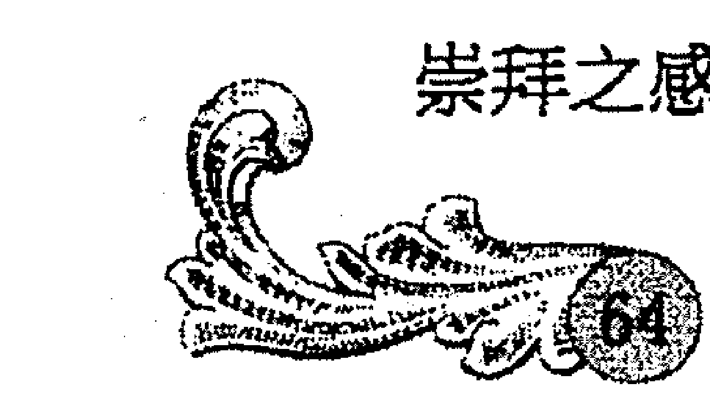

他们很容易在第一次见面的时候就看对眼，不管是同性还是异性的交往，第一眼的印象无疑是充满好感的。而且这对组合发生在异性之间，常常会有一见钟情的浪漫恋情发生，如果双方能习惯各自的思维个性，可以有很美好的结局。然而，A 型的完美主义如果不能适当克制，总是期望太高、占有欲极强的他们会束缚 B 型血人，让天性追求自由的 B 型血人喘不过气来。人非圣贤，更何况是这种做事完全凭感觉的 B 型血人，他们怎么能受得了？

所以 A 型血人对于 B 型血人的自由主义尽量持一种宽容的态度，和他们交往时不要对其行为提出过多的具体要求，如果没有严重的损失，不要出口非难 B 型血朋友，更不要轻易用激烈的言辞去责难对方，否则会使 B 型血的人感到受束缚，如负重荷，从而害怕甚至因此中断这种往来。

而对 B 型血的人来说，在与 A 型血人交往的时候，表面看来总是 B 型血人占强势，因此更应该多用真心对待对方，不要忽略对方的存在，不要光顾着自说自话，也应当学会倾听，要常常注意对方在说什么，不可忘记多尊重 A 型血朋友的意见。这样的话，A 型血人才极有可能成为 B 型血人的好朋友。A 型与 B 型的组合，一见钟情的吸引力让你们走到一起，如果能经受住时间的磨合，彼此习惯并且适度顺应对方的步调，也能建立不错的关系。

## A 型和 O 型：一个投手，一个接手

A 型和 O 型的“血液碰撞”犹如一场默契十足的棒球比赛，一个是精准的投手，一个是优秀的接手，这对天生的团队伙伴，让这场球赛愈发精彩不断、引人入胜。如果 A 型血的你有一个 O 型血的朋友，那么你应该庆幸你找到了一个值得深交的对象了。如果 O 型的你有一个 A 型的团队伙伴，你更应该庆幸了，因为你们是天生的最佳搭档！

A 型血人一旦成为 O 型血人的朋友，就会发现 O 型血人充满人情味和重情义、重信用的一面。他们重信用、理智客观、遇事冷静、精力充沛、有实干能力。对于容易在内心积压不满和郁闷情绪的 A 型血的人来说，O 型血的朋友绝对是个很好的倾诉对象。因为 O 型血的人天生对于弱小者的态度十分豁达，尤其他们的朋友遭遇烦恼的时候，他们十分会调节自己的情绪。O 型血的朋友很体贴，不论对方说什么，他们都会真诚地听着，会让对方放松下来，不断说出自己的心事。A 型血人最容易在颇具包容力的 O 型血的朋友身上找到心灵的共鸣。

A 型和 O 型不仅是在生活中能够找到心灵共鸣的朋友，在工作上更是优势互补的最佳拍档。A 型血的人办事细致缜密，而直性子的 O 型血人不拘小节，粗枝大叶；A 型血的人办事深思熟虑，O 型血的人办事雷厉风行。两个人正好可以互补：A 型血人的谨慎细致正好可以弥补 O 型血人的马虎大意；反过来，生气勃勃的 O 型血人又以其执著专注的行动带领顾虑重重、行动过慎的 A 型血人共同前进。

现实主义的 O 型血人还非常富有开拓精神，敢于冒险，而且有理想、有雄心、有坚定的信念；而 A 型的注重策略感强、缜密的思维无疑是 O 型血人的最佳辅佐。如果具体到工作上，这组绝佳搭档一般都是 O 型血人上前台，A 型血人居幕后，这样的搭配是平稳而高效的：当 O 型血的人在做事上急功近利时，A 型血的人可以为他们想好行动的策略来帮助或者纠正他们；而当 A 型血人在思想上钻牛角尖而欲蛮干时，注重实际的 O 型血人也会对其起控制作用。所以，一般 A 型与 O 型组合的辅助关系中，都以 A 型为辅助者。

但是 A 型血的人容易忽略的是：他们其实并不了解 O 型血人的真正想法。A 型的人总是会把对方放在一个很好的倾听者的位置，让 A 型血的人放松地倾诉了内心的情绪之后，却忽略了 O 型血朋友的真实感受，

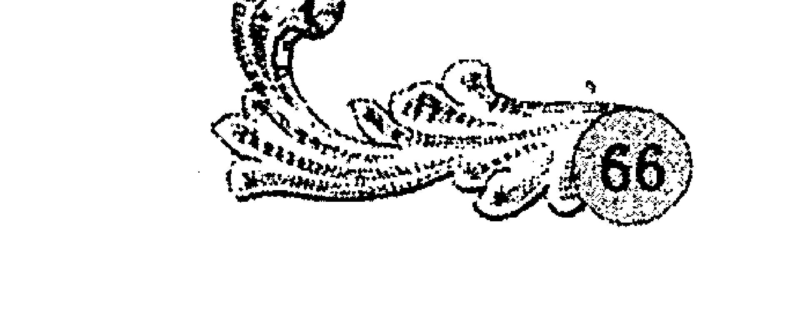

当 O 型血的人把 A 型血的人作为真正的好友的时候，他们会觉得 A 型血的人是个很谈得来的人，他们也很乐意倾听对方的烦恼。但是当 O 型和 A 型的关系并未达到好友的地步的时候，A 型血人忘乎所以的倾诉反而会让 O 型血人产生自己不被尊重的感觉，从而对双方的关系有害无益。但是一旦双方成为很好的朋友，他们的友谊便是牢靠的。即使发生再激烈的争吵，也不会彼此憎恨。

A 型和 O 型互相之间的理解支持，他们的感情和默契，从最初的血型中就已注定。这对优秀的投手和接手，在工作和生活中的每个细节中，都会迸发出默契的火花。

## A 型和 AB 型：我们是一家人

A 型和 AB 型这一组合常见于相亲相爱的夫妇和情侣，朋友以及相处得好的同伴关系也常常是这个组合。这组关系总的感觉是亲密无间，他们似乎较难形成配合默契的工作关系，实在应该叫做“家人”组合。

A 型血人给人的印象虽有刚柔之异，但其总的形象是：持重而讲信用，精明而且富有才干。这种内在气质形成文雅端庄的仪态，对 AB 型血人颇有吸引力。另外，A 型血人敢于承担责任、踏实能干，精明干练，对显得有些脆弱怕事的 AB 型血人来说，正是可以依赖并值得敬畏的人。AB 型对 A 型怀有爱或者尊敬的情感时，就会产生辅助和亲近 A 型的意念，在这种良好印象影响下结成的关系往往是亲密无间的。

AB 型血的人在与 A 型血人初见时，很容易就给对方一个态度和蔼、思维敏捷、不偏激、喜欢微笑及专心听人说话的好印象。AB 型血的人通常会事事以 A 型血人为中心，帮助他们面对生活中的一切事情，可是自己却无法努力发挥自己的学问、能力或技术，甚至给人一种凡事依赖的感觉。这两种血型搭配的夫妇、情侣、同伴等匹配起来，都是令大家羡慕的。

A型血人较为内向，处事谨慎小心，不轻易为旁人的好话所动，所以他们中很多人是难以辅助的。而理性、为人不喜惹是生非，认为相安无事是最佳生活状态的特质是AB型血人最大的特点。这一点使得AB型是能够和A型长久相处的最佳人选，可以说，能够辅助A型血人的非AB型莫属。一个完美主义，强于精打细算；一个喜安宁，不喜欢争执计较，A型和AB型互补的个性，实在像是早已互相磨合的一家人。

A型血人和AB型血人由于性格中有相似的地方，所以相比较其他血型人的缘分契合度而言，这个组合更容易由互相尊敬、彼此友好开始，形成异性相爱、同性相知的美好关系。但是，这组关系有一个缺陷就是：工作关系上难以达成默契配合，不能成为合拍的工作搭档，而作为生活上的挚友或者恋人则更加合适。在上下关系上，A型血人担任上级是绝对的上策，因为AB型血人主事有过于严厉的缺点。如果AB型血人自身没有满腹才华，时间长了之后，就有可能使得A型血人感到十分失望，甚至不想与之再继续交往下去。AB型原是能够忍着不满配合A型工作的，一旦发生不满，A型往往会因无法理解自己的合作者，而一筹莫展。

虽然说，AB型血人和A型血人可能出现一些不太默契的情况，但是，从总体上说，他们是非常富有默契的组合。这种行动力更多地表现在一致对外或者外交关系上，此时的AB型和A型的血型组合会变得特别的意气相投、精彩连连。所以AB型血人若想和A型血人维持长久而美好的关系，应该自信有能力，发挥自己的才华，不要只追求梦想，也要试着了解A型血人的现实性，并与之相互合作、同心协力。

## B型遇到B型：松散的紧凑关系

B型血的人是典型的自由主义者，他们无拘无束，喜动不喜静。可以试想一下，两个完全自由自我的人交起朋友来，那将是怎样一种状况？松散而又紧凑的关系，这就是 B型血的人和 B型血的人之间的友谊！

自由洒脱的 B型血人头脑灵活，说话幽默，自由活泼。他们话题丰富，让其他人都忍不住参与进来，畅快淋漓地和他们一起侃侃而谈。一群人中有一个 B型血的人就足够让大家又笑又闹的了，如果两个 B型血的人碰到一起，却很少有默契和投机。因为两个人都是超级自我的人，说起话来，常常不管对方爱听不爱听、想听不想听，只顾自己一口气讲下去。在他们的世界中，很少能把什么人或者什么事很放在心上，所以，两个 B型血的人之间，最缺乏的就是相互之间的吸引和依恋，即使将他们凑在一起也肯定是“1+1”的松散状况，而不能成为一个整体。

自由和自我的个性决定了 B型血人和 B型血人松散的关系，他们不能也不会亲密无间，因为他们太自我，很容易把对方“不当回事儿”。尤其是初相识的，或认识不久的两人，都常会感到与对方不投机，某种程度上也就是没什么好感。当然，这也并不是说他们一定就是互相对立的，很多时候，B型与B型经过深入交往后，还是能很和谐地相处。

最了解 B型血的人自由、爱幻想的思想的也莫过于同是 B型血的朋友了，所以两个 B型血的人经过长时间的较深接触，在思想上最易产生共鸣。B型血作家和评论家的作品最受 B型血读者欢迎就是个最好的例子。而且他们都不拘小节，相处无拘无束，个性上又有共同语言，所以

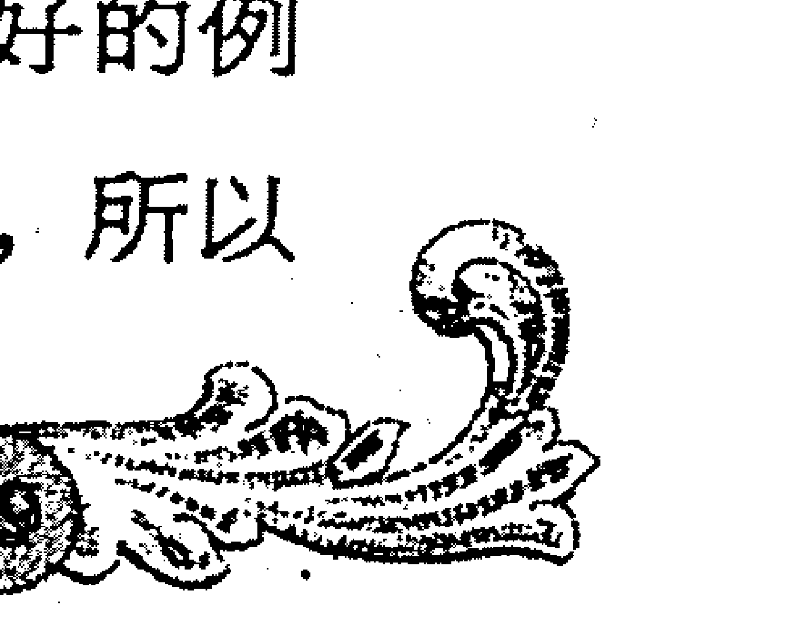

双方如果深入交谈起来还是很愉快的。即便是多年不通音讯的朋友，偶尔见面也会像过去那样无拘无束地畅谈起来，丝毫不感觉两人经过了很长时间的分别而有生疏感。

可是 B 型血人之间不管关系多么亲密，在行动上仍很难统一步调。B 型血和 B 型血的人之间是很容易起争执的，因为双方都是“各行其是”的人，又都是直脾气、拧性子，所以有时会因相互妨碍对方的行动而冲突起来，但他们之间也是最不记仇的，事情过去就过去了。同时他们一脱离集体组织、上下级关系或婚姻关系的束缚，马上就会各行其是起来。但是他们每个人都有很强的行动能力，分配给他们去做相对独立的工作内容，他们每个人都能完成得很出色。在经过一段时间的磨合和习惯之后，他们在精神上或知识方面是可以成为很好的团队伙伴的。

B 型血的男性则是这一群人中实践自由的最好诠释，这使得都是 B 型血男性们能相处到一起的可能性很小。我们可以认为 B 型血男性之间几乎不存在朋友或者合作关系。但是危急时刻，他们会展现出超强的合作精神。即使平时没有任何联系，他们也可以共同呼吸。但只要渡过困难，他们马上就会恢复到原来的状态。B 型遭遇 B 型，你们的关系注定是松散而紧凑的！即使是置身于上述关系之中，行动上也是难以合拍的。

## B 型遇到 O 型：最热烈的恋情

自由浪漫的 B 型血人遭遇现实主义的 O 型血人，个性互补的他们结合得如同一个美妙的圆。O 型血的人以自己踏实可靠的思考能力、决策能力和行动能力始终积极地鞭策鼓励着自由散漫的 B 型血人，给对方指明前进的方向。B 型血人那灵活的头脑可以缓冲 O 型血人的概念化，甚至有点故步自封的思想方法。这对优势互补的搭档，如同美妙动听的音符和节奏那样契合，奏出完美动人的旋律。

他们各自的特质也正是对方所欣赏的：B 型血人显然感到 O 型血人那富有现实精神的踏实作风是可靠的；而 O 型血人爱好具有个性的事物，所以 B 型血人的不羁言行对他们也有一定的魅力。他们互相发挥着对方的不足之处，是最最契合的组合。在思想和能力方面，B 型血人灵活创意的头脑可以弥补 O 型血人的缺乏创新的思维；稳重踏实，善于处理人际关系的 O 型血人则可弥补不拘形式与习惯、大大咧咧的 B 型血人的不足。如果双方是夫妻，那一定是“夫唱妇随”的一对。不管怎样，B 型和 O 型在一起的结果都不会太坏，如果异性的 B 型和 O 型发生碰撞，到底会是什么样的呢？

当 B 型血男性遇到 O 型血女性的时候，可能不会有什么“一见钟情”之类的事情发生，但是随着交往的深入，日久生情的恋情可能演变为令人羡慕的轰轰烈烈。他们互相之间的第一印象好像不怎么好：O 型血女性觉得 B 型血男性很古怪，B 型血男性则觉得 O 型血女性太干练。确定爱情的关系需要一定的时间，但是两类人之间思考方式和行为方式都有很多共同点，所以很有希望成为让人羡慕的情侣。

那么当 B 型血女性遇到 O 型血男性的时候，拥有快速行动力和坚强意志的 O 型血男性与积极主动的 B 型血女性形成的则可谓是“年糕式组合”！他们日夜厮守，离开一天也会受不了。只要开始交往，他们的日子每天都会是玫瑰色。一般都是善于理解对方的 O 型血男性以称赞的方式一步一步引领 B 型血女性走向成功。虽然意见不同、经常吵架，但是他们却越吵越分不开，而且小日子里反倒过得更加甜蜜温馨。如果看到 B 型女和 O 型男这对情侣吵架，别担心，过不了几天，他们准又“黏”在一块难舍难分了！

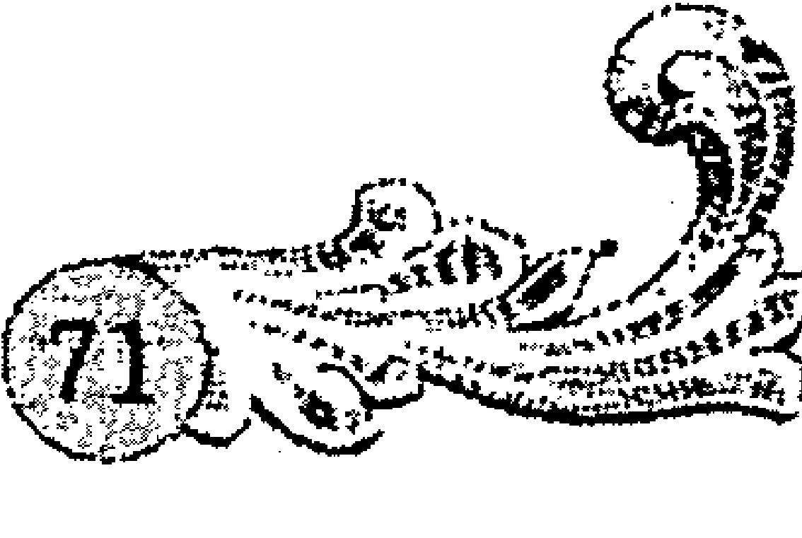

在 B 型血人和 O 型血人的交往中，要切记的一点就是“度”的问题，如果 O 型血人把缰绳勒得过紧，让 B 型血人有被束缚之感，从而产生排斥心理，特别是当 B 型血的人认为 O 型血人的生活现实而毫无趣味与激情可言的时候，或者是 O 型血人看透了 B 型血人现实中太缺乏追求时，两个人的相处就会变得索然无味，最终导致分离。另外，当 B 型血人和 O 型血人交往的时候，沟通往往是最重要的，无论是在同性间或是异性间，别把想法藏在心里，适时地沟通，会将 B 型血人和 O 型血人的友谊或是爱情引向更加美好的境况。

## B 型遇到 AB 型：神秘的吸引力

B 型遇到 AB 型的时候，双方往往会被一股神秘的吸引力拉到一起，这也许是血型投缘的关系吧。B 型和 AB 型的缘分总是那么奇妙，他们互相欣赏，很容易达成步调一致，成为形影不离的朋友。合作愉快的工作伙伴、令人羡慕的恋人常见于这个组合。当 B 型血女性遇到 AB 型血男性的时候，双方一开始就会对对方产生好感，是很容易就开始交往的一对。无论遇到什么事情，AB 型血男性都能做冷静的分析，这可以大大弥补 B 型血女性的不足，尤其当 B 型血的女性处于一种茫然无助的境地的时候，更容易对冷静的 AB 型血的男性产生一种近似崇拜和依赖的感觉。B 型血女性活泼好动的性格也会吸引 AB 型血的男人，让其被这种浪漫可爱深深打动。不过 B 型血女性可能因为很在乎对方在想什么，对方却不善表达，而对 AB 型血男性的内向表示不满。如果 B 型的你试着再宽容一点，那么 AB 型的木讷可能会显得相当可爱哦。

当 B型血男性遇到 AB 型血女性的时候，也有着玄妙的缘分牵动着两颗试图相互靠近的心。由于两种人都擅长人际关系，所以只要把心扉敞开，他们就很容易相处。B型血男性的行动力和诚实的一面能吸引 AB型血女性，AB型血女性合理的思考方式和细心而又富有激情的性格也强烈地吸引着B型血男性的注意力。但是 AB型血女性也可能会对 B型血男性马马虎虎的性格失望，这种时候 AB型血女性最好像姐姐一样劝说。B型血男性生气的时候也不要太强硬，要软硬结合，该妥协的时候就妥协。而且 B型的男性如果适度收敛一下自己自由散漫的风格，就能够得到 AB型女性更多的爱。总之，而如果双方能更多考虑对方的感受，放低姿态去为对方做些什么，就能维持更长久的关系。

同性的 B型和 AB型相遇，也能成为相互欣赏学习的好朋友。当 B型血男性遇到 AB型血男性的时候，毋庸置疑，这将是一对很有趣的伙伴。B型血男性具有想象力和幽默感，善于制造气氛。而 AB型的男性沉稳踏实、富有分析能力，AB型血男性对 B型血男性的机灵和散漫能够宽容。他们能忍受 B型男对他们大大咧咧开着玩笑，就算 B型血人说出什么让人无语的话，他们也不会跟其较真。然而当 B型血女性遇到 AB型血女性的时候，可能并不像 B型血男性遇到 AB型血男性那样一拍即合，但是总能维持很稳定的关系。

B型血人在与 AB型血人相处过程中，感到 AB型血人能理解自己，但是与自己有不同之处，觉得对方很有意思，相处起来十分舒畅，是值得信赖的朋友。AB型血人总是从理性考虑问题，AB型会悲观地说：“我的想法说了也没用。”与此相反，B型血人不拘泥于形式的灵动思想，能耐心地倾听并接受在 AB型血人看起来有点偏执的想法。这对 AB型血人来说，是理性上的大解放。这个组合在友谊和工作等方面是无可挑剔的，但是在办理对外事务的能力方面似乎弱一些。另外，正因为是彼此毫无隔阂的朋友，所以相处时间长了就会感到单调乏味，而希望寻求新的刺激。

## O型和O型：永不中断的同志式友情

两个O型血人在一起的时候，因为思想上有共通之处，所以极容易产生共鸣。生活方式一致，思想上有共鸣，共同的目标和命运，或者面临共同的敌人，会使他们建立起深厚的同志式的友情。这种友情，若萌发于孩提时代，或者建立于诸如战场等极端状态下，那将是永不中断的。

现实主义的O型血人非常富有开拓精神，敢于冒险，而且有理想、有雄心、有坚定的信念。O型血人对弱小者表现得豁达大度，而对大大强于自己的人，则会出人意料地无条件服从，可是遇上势均力敌者时，却又会想着一争高下。O型血人个性虽强，但并非难与人相处，反而是广交善结，朋友很多。他们爱恨分明，如果认定对方是敌人的话，其反应也是非常强烈的。两个O型血人如果交上朋友，会觉得找到了志趣相投的知己，因为彼此思想性格的相似，更容易形成长久的往来关系。

O型血的人追求效率、性情直爽，他们不喜欢被过多繁文缛节所牵绊，更喜欢直来直去，因为这样更加节省时间，也更加富有效率。O型血人跟O型血的人打交道的时候，双方都是爽快人，有什么说什么，省去了没必要的客套和谦虚，两种人一起交往显得更加舒畅自在。从根本上讲，O型血的人是非常好相处的，因为气质倾向的类似，O型血人和O型血人一起交往，很容易惺惺相惜，互相理解。他们志趣相同，都是务实精干的人，对事物的看法和认识基本上能够达成一致。他们都是重情义、善良的人，而且忠实守信，个性虽强，有点争强好胜，但是豁达开朗，对朋友真诚、讲信用。

同是O型血的恋人在一起的时候，你会发现他们的表情和说话风格非常相似，他们有着共同的目标，能够坚定、执著地为未来的生活一起努力。O型血夫妻，即使结婚多年，通常也不会形影不离、非常亲昵，而且有着共同的现实可得的生活目标。而且务实积极的O型血人一般都不会让生活质量“居低不上”，他们金钱观念灵活，善于周转资金、创造财富，所以O型血人的家庭总能靠着自己的努力实现舒适富裕的生活。他们都浪漫富有诗意，但又讲究实际，是切实的“同志式”爱情和婚姻。

同一血型的人既容易成为好朋友，也容易成为敌人。因为性格的类似，他们很容易彼此理解，而也正是因此，他们又会相互排斥，一旦有了冲突，便可能形成竞争关系。虽然O型血人和O型血人之间是同志式的友情和爱情，但是，他们未必在每时每刻都能保持步调一致。O型血人对能力差异看得很重，而且十分敏感。由于他们既能受命于人，又善于领导别人，所以无论是当头头、上司，还是当下属、随从都是尽如人意的。这种能密切配合、呼吸与共的O型血上下级关系在我们的周围并不少见。不过，如果双方的能力趋于接近，那么他们的合作关系便会渐渐为竞争关系所取代。

所以，O型血人和O型血人之间的关系如果想要更加牢固，那么，防止双方的关系由合作变成竞争是非常必要的。一般说来，O型血组合的年龄差稍大些为好。年龄之差，即阅历之差、能力之差。

## O型和AB型：火药桶上的舞蹈

O型和AB型在建立起亲密的关系前，相互的印象恐怕是最令人满意的。O型血人对AB型血人欣赏，常常伴有“粉饰美化”对方的晕轮现象，在直性子的O型血人眼里，AB型的温和沉静、与世无争是完美无缺的。而AB型则对务实能干、头脑聪明、有能力的O型血人过分地信赖，几乎达到完全依赖的地步。正是这种建立在“粉饰”和“依赖”的被加工的关系，让O型和AB型的友谊或者爱情如同火药桶上的舞蹈，看似美好动人，却时刻潜藏着被泼冷水的危机。

AB型血的人思路敏捷，长于对应，善于多面理解，是聪明才智的体现；正义感强，处事公平，不贪欲，乐做福利服务工作。这些在务实肯干，总是在现实世界里为目标奋进拼搏的O型血人眼中，无疑都是善解人意、品格高尚的表现。然而AB型血人是具有两面性格的人，在AB型血人的两面性中，O型血人只看到温和沉静方面，忽略了另一面，就认为对方是一个有修养的人，是具备自己不具备的“优雅沉静”的完美之人。而AB型血人对O型的干练、踏实、稳重往往带有个人的崇敬和爱慕之情，并且在实际生活中O型血人的诸多照顾，更让其产生依赖的心理。

在人际交往中，O型血人的表现常常是比较直接和坦白的，要他们学会拐弯抹角实在是太难和太痛苦了。同样，他们也喜欢别人较坦率地和他们交流，对于神经比较粗枝大叶的O型血人来说，理解暗示还是比较困难的。AB型血的人则习惯用迂回婉转的方式来表达，而不是想到什么说什么。其优点是容易与周围的人相协调，保持融洽的气氛，缺点是人云亦云，有时会显得没有原则。一个直接帅气，一个婉转动听，所以很自然的，双方一开始沟通起来会觉得新鲜而又有趣，而且印象大都不会太差。

希望的种子播得越多，失望的阴霾可能潜伏得越深。友好相处的O型和AB型处于对双方的完美幻想和“粉饰”之中，然而现实很可能并不是这样的。随着双方的交往和认识不断加深，双方心目中的美好形象就会消失，与世无争成了贪生怕死，务实能干也成了唯利是图，最后好似被泼了一盆冷水一样大失所望。然后互相埋怨，弄得不好还会引起尖锐的矛盾，最后导致分道扬镳或者关系解体。

不过不用担心，这对组合舞步很合拍，就算是在火药桶上跳舞，只要没有火把，还是很安全愉快的组合。在兴趣方面，O型血人有独特的爱好，AB型血人的趣味是多样化的，相辅相成，两人就可能成为兴趣广泛的朋友。心胸豁达的O型血人毫不计较AB型性格中忽冷忽热的一面，而社会经验丰富的AB型血人很善于投O型所好，相处中应付自如。

所以，O型的朋友如果想要和AB型血人完成这场精美绝伦的舞蹈，不点燃火药，就必须避免过度地夸张和赞美。其实两者可以是很和谐很愉快的朋友或者恋人，尤其是AB型血人淡泊的心态可以缓冲O型血人冲向物质追求的狂野步伐。而AB型血人如果想要更加了解和亲近自己的O型好友或者恋人，也要学着独立和取长补短，试着用自己的温和来宽容双方之间发生的小摩擦。

## AB型和AB型：你们总是经不起外部攻击

相同血型的人在一起，由于气质性格特征的类似，很容易相互理解，也正是由于对彼此思想熟悉，也更容易发生矛盾和冲突。AB型血人之间的组合，在外部环境一帆风顺的稳定情况下，相处起来还算比较稳定的。所以你会发现这个组合多见于各种机构，但是能自然长久维持关系的AB型组合还是不多见的。因为他们总是经不起外部的攻击，总是在外部环境的攻击下出现裂缝和矛盾而散伙。

不管怎么说，由于具有相同的血型，AB型血人还是能够形成相互理解、相互信任的关系。如果在工作上不得已需要两个AB型血的人来搭档，那么把两个人气质以外的因素如出身、职业、负责的业务、地位及年龄等拉开差距不失为一个好的办法，这样肯定能保证高效率地完成工作。AB型血的同伴在工作上能建立起极好的上下级关系。他们之间信息畅通、配合默契，甚至在长时间不对话的情况下，也能确信对方在考虑同一个问题，他们之间的关系堪称富有理智和充满信任的关系。经过调查研究，有一个令人感兴趣的事实：如果这种搭档只限于商业、企业场合时，他们则表现得像个智囊团那样，具有理性上的高效率。

但是由于天生气质相似，AB型血人相互之间缺乏人类本能原始的吸引力，所以很难有“相见恨晚”的一见投缘的事情发生。而且加上AB型本身就是喜欢与人保持一定距离的性格，AB型血人之间的相处，他们在生活中一般是普通朋友，而且基本上没有什么深入的沟通交流，很难形成融洽密切的关系。但是AB型血人多半善于处理人际关系，所以基本的礼貌和礼节，他们能处理得十分漂亮。然而在遭遇外界多种不确定因素的攻击时，AB型血人之间的友谊会显得十分脆弱。

在生活中，这种组合也很难融洽，特别是在男女交往上，显得别扭且了无生气。AB型血人对同为AB型的他（她）十分了解，就是双方默不作声，也可能猜到对方将要说什么或者做什么。而且都是相安无事的个性，生活显得缺乏浪漫感和生机。所以AB型女性不会考虑跟AB型男性深入交往，有时候甚至有厌恶对方的倾向。即使是普通朋友，这种组合也不团结，甚至会向对方发出“请勿干涉我！”的警告。虽然双方私下都没有很亲密的关系，甚至彼此不屑，但是，理性的AB型血人仍然会在工作中尽力给自己和对方都留有充分的发挥空间，以达到效率最优化。也就是说，不管两个人在工作和学习方面配合得多么有效率，在生活上，他们对彼此都是毫无了解、毫无兴趣和毫无吸引力的。

所以两个AB型血的人交往时，请记住一个原则：即使感情再好，也要保持安全距离。如果发现了对方的缺点和不足，即便不能接受其缺点，也要有宽容、大量、乐观的态度。做到这一点，双方就可以算是知心的朋友了。另外，如果在工作中两个AB型血的人搭档的时候想默契地合作，相互之间最好有明确的上下级关系，彼此有清楚的责任分工，那么双方在理性方面的探求不但会有杰出的表现，彼此之间也能维持长久的良好关系。

## 第五章 当血遇到血

> 你与TA，天生的搭档，还是宿命的对手？

## 第六章 人际若畅通，则成功无阻
——与不同生肖人相处的独门秘诀

俗话说：“人际关系是一个人能否事业成功的关键。”建立一个良好的人际关系网，往往需要和不同性格、不同个性的人打交道。也许，你在这里就输在了“关系”这道坎上。不同的生肖所表现的个性不同，与不同生肖的人相处就必须运用不同沟通、运用不同的交往艺术。本文告诉你，如何与你身边的十二生肖人相处，教你与不同生肖的人共处的独门秘诀，你将拥有畅通无阻的人际关系！

## 讨好老鼠，你得先学会听

如果你在属鼠人面前说个不停，别以为你的口若悬河会引他们的好感，因为洞察力超强的他们说不准就把你的弱点缺点看得清清楚楚了。甚至一不小心，还会引起属鼠人的反感。机敏聪明的属鼠者，总是显得那么精明能干，要想跟这些机灵的“老鼠们”好好相处，你得先学会倾听。

上帝之所以给人两只耳朵一个嘴巴，就是教人们少说多听。在人际交往中，学会倾听不仅是对别人的尊重，更能显示出你的修养和涵养。最善于与人沟通的高手，是那些善于倾听的人。生活中，有魅力的人一定是一个倾听者，而不是滔滔不绝，喋喋不休的人。这一点，当你跟属鼠人在交往过程中就显得更为重要。也许在交谈过程中，你和属鼠人并没有说上几句话，但是你会在倾听“老鼠们”的话以后做出回应，你恰如其分的言辞会引起他们的好感，他们认为你尊重他们，他们在得到重视的同时也会逐渐喜欢和你交谈。

属鼠人的观察力和随机应变的能力是很突出的，他们总能在不经意之间，就把你的言行举止观察得清清楚楚，他们会从你的谈话内容和神态中了解你的心理，然后对你这个人做出判断。属鼠人虽然反应很快，头脑灵活，说起话来比较快，但是他们却对那些妙语连珠、说个不停的人没什么好感。因为天生洞察力极强的他们，总能在别人的举动中察觉出什么隐秘的东西，比如别人试图隐藏的缺点，或者性格当中的阴暗面。俗话说，祸从口出，言多必失。当一个人在属鼠人面前过多地展现自己的“口才”时，不管是为了讨好老鼠还是普通的平常交流，这个人和属鼠人交往前景都很可能是“暗淡无光”的。

老鼠喜欢那些懂得“听”他们说话的人，所以，和属鼠人相处，你要先学会倾听。真正的倾听，是要用心、用眼睛、用耳朵去听。并且不但要学会用耳朵倾听，还要学会用心去倾听。以下是和老鼠们相处时的倾听技巧：

- 要有良好的精神状态。良好的精神状态是倾听质量的重要前提，如果你“听”得萎靡不振，是不会取得良好的倾听效果的，只能使沟通质量大打折扣。
- 及时用动作和表情给予呼应。谈话时，应善于运用自己的姿态、表情、插入语和感叹词。如微笑、点头等，都会使谈话更加的融洽。
- 必要的沉默。沉默就像乐谱上的休止符，运用得当，则含义无穷，真正可以达到“无声胜有声”的效果。但沉默一定要运用得体，不可不分场合，故作高深而滥用沉默。
- 适时适度的提问。适时适度地提出问题是一种倾听的方法。问老鼠喜欢回答的问题，鼓励他们谈论自己及他们所取得的成就。要使别人对你感兴趣，那就先对别人感兴趣。
- 不要随便打断别人讲话，要有耐心。当老鼠们说话内容很多，或者由于情绪激动等原因，语言表达有些零散甚至混乱时，你都应该耐心地听完他们的叙述。即使有些内容是你不想听的，也要耐心听完。

总之，要讨好老鼠，你要会倾听。倾听需要做到耳到、眼到、心到，当你通过巧妙的应答把属鼠人引向你需要的方向或层次时，你就可以轻松掌握谈话的主动权了。善于倾听，就会让你处处受到属鼠人的欢迎。

与不同生肖人相处的独门秘诀

## 老牛最不喜欢的6类人

牛年出生的人也一直是低调处事的典范。“老牛”为人毫不张扬，脚踏实地，稳重负责，诚实勤勉，工作中很受上司的赞赏和信赖。然而，你可知道老牛也有他们十分看不惯的人，对于老牛看不惯的人，他们往往不会把心情和看法坦白说出来，老牛们会淡定地闷在心里，但他们厌恶的表情和语调往往会出卖自己。下面是老牛最不喜欢的6类人，和老牛相处的你，可得当心，不要成为了他们讨厌的那一类人！

不负责任的人。牛年出生的人责任感强，勤勉踏实，所以即使工作中发生一些困难，他们那坚强的耐力也会突破难关而坚持到底。属牛的人是工作的奴隶，他们是那种努力工作以获得利益和成果的人。对于那些无所事事、不负责任、半途而废的人，老牛们是相当看不惯的，如果这种不负责任的表现影响了老牛的正常工作，老牛的不满甚至会上升为厌恶和痛恨，甚至会认为他们是个毫无价值的废物。

高谈阔论，只说不做的人。说到做到是属牛人一生恪守的原则。属牛人所享有的成功完全是靠属牛人自己的力量换来的。简而言之，强大、守纪律的属牛人不愿意在生活中放荡不羁、失信于人，这个不屈不挠的属牛人将通过自己的努力以一个胜利者的姿态出现。所以对于那些只会高谈阔论，盲目许诺，只说不做的人，老牛们是相当嗤之以鼻的。

欠债不还的人。属牛人不喜欢欠债，他们付给别人的欠款会精确到小数点后最后一位，当然牛们对别人也有同样的要求。如果属牛人欠别人什么东西，又没有明确表示感激并且给予回报，他们将永远不会原谅自己。同样，如果欠债不还，借了老牛的钱没有如期如数归还，老牛嘴上不说，但是心里已经很郁闷，并且后悔与这样的人交往。

唠叨的人。一般来说，老牛是不善于人际沟通的一群人，为人不太相信别人，有着固执己见的牛脾气。老牛们喜欢我行我素，而且平时也沉默低调，不听劝告。有点工作狂的他们其实很不喜欢在耳边唠唠叨叨的人，就算别人的唠叨是为了他们好，牛儿们也很不领情，因为他们总是那么倔强，如顽石般不知变通。

太“出格”的人。牛们性格正直倔强，性格内向，是个尊重传统的保守主义者。他们热爱工作，总是那么兢兢业业地尽职尽责。低调是他们一生的哲学，而且牛儿们也都一直恪守着这个哲学，处事为人都很低调。对于那些喜欢做各种“新潮出格”事情的人，牛儿们会很不屑，认为那些人没有创造价值只知道卖弄出风头。所以跟牛们共处一室，还是尽量收敛一点，免得成为牛们的“眼中钉”。

不守规矩的人。牛们总是循规蹈矩，很会用纪律约束自己和别人，而且过于严厉。属牛人是安静的、有很强道德观和尊严的人，从不愿意凭借不公正的手段达到目的。他们坚持认为每个人都应尽职尽责，同时也不要为别人的工作设置障碍。他们为人不圆滑，不知道关心别人，常表现出军人的风度，对于那些不守规矩、破坏正常秩序的人，牛们很不喜欢。

> 只给老虎提建议，别给他提意见

属虎之人是天生的领导者，勇气的代言人。他们热情勇敢，富有激情和魄力，有着天生的领导才能。然而这群充满王者气质的属虎人，不仅仅有着领导的才华，也有领导们的“架子”。所以，和属虎人相处，你要学会容忍他们的鲁莽和大胆，多倾听少争论，多给老虎提中肯的建议，而不要随便给他们提意见。

属虎人自信而有气魄，他们十分大胆，总给人一种天不怕地不怕的感觉。除了是乐天派外，还不重实利、不怕危险。属虎人对不赞同的事情表示蔑视，对自己的想法常常是深信不疑，不轻易听信别人，但是对于有价值的建议，还是会认真做比较参考。属虎人的独特个性使得他们有种反对传统的张扬和勇敢，天生的自信让他们不爱听那些规定性的意见。所以不要试图用争论和以理服人的办法让属虎人接受你的意见，因为好胜而且喜欢挑战的他们不会轻易让你赢。

特别是当你遇到一个属虎的领导者或者上司时，你更要注意在工作时表达个人意见的措辞和语气。如果对待一项工作，你认为有更好的办法和策略，千万不要故作聪明地“展示自我”，向属虎的领导者提意见，或者在大庭广众之下当面指出属虎领导者的错误，提出自己的正确意见，这样都会让属虎的领导者心生不满。就算你的意见确确实实是有价值的，就算属虎领导者表面上也好像认可了你的意见，但是你在他心目中的位置就已经跌入低谷。所以，有个属虎的上司，就要多多表现虚心好学的态度，只给上司提建议，措辞尽量诚恳谦逊。就算是非提不可的意见，也要用“劝谏”的手法巧妙地转换为建议。

然而，属虎人却不是那种难以相处的人，他们乐观积极，是个十足的乐天派；做事说话大气，显得宽宏大量，不拘小节。作为领导者的属虎人更是有远见有想法，能给人振奋向上的力量。如果你认为和属虎人相处只要谨小慎微、小心翼翼就能被他们接受和欢迎，那你就错了。属虎人不喜欢那种反对自己的规定性意见，不喜欢自己的想法和做事方法全盘被推翻，但也不等于就会欣赏那些毫无想法、唯唯诺诺的人。从根本上说，老虎还是欣赏那些有朝气有想法，敢于挑战权威的人。只不过，要方法到位，言辞准确，才能博得老虎们的好感和欣赏。

总而言之，不要一言不发，也不要言辞犀利地指出老虎们的不对之处，关键要是注意方法。如果你了解属虎人的心理，就会慢慢发现，他们爱听建议，不爱听意见，就算建议和意见明显就是一个意思，但是就因为语气和态度的拿捏水平，而使得老虎对你有截然不同的态度反应。态度拿捏得好，用诚恳的建议表示自己的看法和对属虎人真切的关心，他们不但不会反感，反而会觉得你是个有思想有智慧的聪明人，是个值得深交的好友；相反，态度方式拿捏得不好，全盘推翻老虎们的看法，就算你的意见被采纳，也会因小失大，遭到老虎们的厌恶。

## 慢慢走近属兔之人，心急吃不了热豆腐

属兔人不喜欢兴风作浪，安宁和与世无争的生活是他们所向往的。但是这一点常让人对属兔人的本质发生错觉，认为兔子是脆弱而且容易亲信别人的，其实不然。兔子们内心是自信而且坚强的，总是有条不紊地、准确地追求着自己的目标。属兔人文静的外表下其实藏着一颗敏感的心，他们不会凭借感觉去相信别人，不爱生事的兔子其实很会“防御”，只有在经历了“日久见人心”的朝夕相对后，才会逐渐卸下独特的防范之心。

兔子温柔含蓄，偏爱安定平凡的生活，不喜欢与人争执，也不喜欢为名利财富明争暗斗的生活。他们对人对事都富有爱心和同情心，但是兔子是最不容易上当的属相。他们很擅长自我保护，这也跟兔子不喜欢呆在风险较大的环境有关，他们天性对危险和不测有一种防御战术，想要欺骗属兔人的感情或者钱财比其他属相都要困难。所以跟属兔的朋友# 血型、生肖、星座的智慧与应用全书

交往，要记得保持适当的距离。如果太过亲密，会让兔子很不自在，因为在他们心里，你们还没亲近到这种地步呢！但是，也不能太遥远，因为含蓄的兔子可能会认为你不想跟他们做朋友而疏远你。

属兔人知道什么时候应忍让，从不喜欢在公共场所拥抱任何人。当然，对于特别亲密的朋友，兔子们还是很放得开的。只不过，那要看你在兔子的眼中，关系到了哪个层面。属兔的人很会划分朋友的层次，实际上，他们会把别人的错误和进步看在眼里，哪些是值得信赖的朋友，哪些是不“安全”的小人，属兔人都心里清楚。然而属兔人精于保全面子的艺术，也不喜欢无事生非，兔子一般会选择规避风险，保全自己的策略。真正诚恳善良的人，兔子们是能够感受到的。所以对待兔子，你要学会用太极拳的思维，“以慢打快”、“以慢取胜”，逐渐渗透兔子们生活的点滴，关心他们的日常生活和情绪变化，让兔子们感受到你的真诚和友善，把你列为“值得信赖”的清单中。

如果遇到中意的属兔人，切不可急功近利、自作聪明。因为闪电恋爱或者闪电结婚这类事情是不会发生在安静的属兔人身上的，兔子们都比较小心，而且外表脆弱优雅的他们其实有着异常复杂的内心。属兔人心思细腻，不会放弃一个又一个考验你的时机，要走近属兔人的内心世界，真正了解他们，需要执著的等待和耐心。急于跟属兔人亲密，只会让兔子对你“处处设防”，在兔子们的安全考验期还没截止的时候，你最好还是默默付出、慢慢走近。不过你放心，你所做的努力不会白费，因为兔子不会不明是非，他们雪亮的眼睛其实看得清清楚楚，一旦兔子认为你通过了“考核”，就会卸下“防御系统”，朝着你招手。

如果你身边有属兔的朋友，他们现在已经跟你打成一片，亲密地开着玩笑，那么恭喜你，你已经得到这只兔子的认可，成为他们心目中值得信赖的友人。如果你感觉你试图走近属兔的朋友，而他们却好像总是有点疏远你，那就要懂得循序渐进的道理，记住，对待属兔人，心急吃不了热豆腐！

## 这些话，千万别在龙面前说

属龙人是那种善于运用权力、清高直率，喜欢大刀阔斧干事情的人。属龙的人总是绽放着难掩的光芒，要让他们深藏不露是很困难的。和属龙人在一起，很容易被他们那狂放的热情感染，但如果有些话说得不好，属龙人可是会“龙颜大怒”的！

与属龙的人共事的时候，属龙人总是会积极地完成工作，并且喜欢左右别人的想法，提出更有创意的方案。或许有些人会看不惯龙的强烈表现欲，不假思索地说一些让属龙人不舒服的话。例如：

- “我认为你的想法毫无创意。”
- “我自己会想，不用你操心。”
- “先做好你自己分内的事情好吗？”

与龙在一个团队中合作，当直率的属龙人提出建议时，就算你不接受他们的建议，这个时候，千万别说这些话。

龙们果敢热情，说话做事常常以自我为中心，所以当他们夸赞自己的丰功伟绩忘乎所以的时候，你宁可保持沉默或者转移话题，也不要信口开河地说出这些有损他们自尊心的话。

- “拜托，这些我都知道了，能不能说点新鲜的。”
- “时代不同了，你也要学着跟上时代啊。”
- “那些都过去了，没什么了不起的。”

属龙人当然是属于成功的属相，特别是对于曾经事业有成但正巧遭逢困境的属龙人，如果他们豪迈激昂的心情被你泼了冷水，龙会感到十分难堪。

不要轻易打断属龙人的话，因为龙的自尊心是很强的，如果龙在宣布一件很重要的事情，你最好就要静静地倾听，适当地回应，让龙感受到你对他（她）们的在意和关注。千万不要在属龙人慷慨激昂地说些他们认为是很有价值的事情的时候，你从中插上一脚，“等一下！”；“先听我说完好吗？”。属龙人其实有非常纤细敏感的一面，他们渴望得到别人的重视，如果他们的话总是被打断，他们会觉得你不尊重他们。“这个我也知道。”；“你说得不对，事情不是这样的。”不要在龙正在说话的时候打断他们，如果他们说得不对，你也要耐心听完，如果你给他们起码的尊重，让他们把自己的看法发表完毕再说出你自己的建议，龙是不会懊恼的。

而且，在比较愉快的氛围中聊天时，龙也不喜欢被打断的感觉。一个属龙人如果旅游归来，正在跟大家分享自己在旅途中的所见所闻，最好“满足”属龙人的表演欲，让龙“自我”一回，千万别打断他：

- “根本不是这样的，那个地方我去过……”
- “我也去那里旅游过，我觉得没有什么特别好玩的东西。”

这些话足以让心生不满的龙向你投来“愤怒”的目光。

- “差不多就行了，干吗那么较真。”
- “不要那么倔强嘛，随便做就行了。”

……不难发现，龙是比较较真，对事情要求很高的人，如果做一件事情，你不投入百分百努力就算了，千万别朝做事热情、渴望成功的龙泼冷水。如果遇到属龙的领导者，对龙领导的严格要求，尽力完成便好，不要在一旁议论纷纷，抱怨个不停。龙领导很聪明，他们往往就是用这种方法来“考核”下属是否是一块值得提拔的“好材料”。

还有一点你要记住，龙女是女权主义者，认为男人能做的女人也能做。

- “女人跟男人是不能比的。”
- “你一个女人怎么能跟我们竞争。”
- “女人还是不要那么好胜的好。”

……这一系列的话都最好别在属龙女性面前说。

## 蛇的占有欲，你得小心地呵护

具有旺盛求知欲和探索欲的属蛇人，总给人学识渊博的感觉，他们神秘、聪明，喜欢探索新知，属于“智慧锦囊”型的朋友。在与其他人的交往中，蛇们表现出极强的占有欲，而且对别人的要求很高。对于属蛇人的占有欲，你得小心地呵护，否则就会陷入很麻烦的境地哦。

属蛇的人对朋友持有某种程度上的不信任，他们是典型的怀疑主义。属蛇人的疑心很重，占有欲就从这种不信任的疑心中衍生而来。属蛇人如果把别人当做最好的朋友，一般也渴望对方也能够把自己当做最特别的好友，甚至不能忍受自己的好朋友跟别人过于亲近。属蛇人对待同性的好友也会发生乱“吃醋”的现象，当蛇们因为“吃醋”而生气时，你要学着谅解，那是因为他们很在乎你这个最好的朋友，害怕失去这段友情才会这样的。

对待同性挚友，属蛇人都会有“吃醋”的独占现象出现，更何况是对待自己的异性伴侣呢。属蛇人对其另一半的占有欲最强，因为深爱对方，但骨子里的“疑心病”又使得蛇更唯恐对方会离开他（她）们。一旦坠入爱河，几天的短暂别离都使属蛇人难以忍受，蛇男蛇女宁可把恋人牢牢地拴在身边好好“看管”，也不愿备受煎熬地想着对方会不会离他们而去或者被别人抢走。这个时候，你千万不要消极对抗，表现出不耐烦的样子只会让你们的关系紧张。记住，小心呵护这群属蛇人的占有欲，让他们的“醋意”在愉快的氛围中消散。

属蛇的女性是占有欲最强的物种。她们不仅对另一半总是神经兮兮地紧张，对同性好姐妹也是占有欲十足。缺乏安全感的蛇女郎们总是害怕她最爱的他不爱她，或者爱她不够多，所以每天都要问一句“你到底爱不爱我？”得到满意的答案才甜甜地笑，但是牢牢抓紧的独占心却丝毫不减。她们总是显得醋意十足，那是因为她们重视你、在乎你，如果你得到了蛇女的青睐，不要疲惫，不要不耐烦，拿出你的耐心和温柔，告诉她们你的真心。

属蛇的男性对待同性的友情可能没有属蛇的女性那么“较真”，蛇男在友情上显得比较“开明”，但是一旦面对爱情，他们往往就陷入神经过敏的“疑心病”中。很多人都觉得属蛇的男性独占霸道，甚至有点妄想症的趋势。其实这只是他们太深爱你的缘故，如果属蛇的男性对一个女子没有感情，往往就是那种很放心，很“信任”的状态。但是如果蛇男过敏到要你汇报自己的日常起居，短时间不见面他们就会有点暴风骤雨般的担忧，打电话问你在哪，在干什么，和谁在一起。不要烦心，那是因为蛇男已经深陷爱河而不自知。越是担心，越是独占，“疑心病”犯得越厉害，就表示他们对你越倾心。

所以，别看属蛇人好像一副无所不知的样子，但是聪慧过人的他们往往是最没安全感的。对待占有欲极强的属蛇人，要拿出大人对待小孩的宽容和呵护，小心地保护和肯定这群犯着“疑心病”的蛇们，让他们相信你们之间的友谊和爱情，这样蛇们肯定会越来越爱你。

## 展现效率与果断，就能赢得马的青睐

属马的人精力充沛，待人和气，活泼开朗，总给人一副快快乐乐的印象。马儿说话速度快，动作轻巧，做事麻利，想要跟属马的人交往十分简单，但是要跟马儿深交，赢得他们的青睐，你就需要学会展示自己的效率和果断。

从属马的人说话的速度来看，你就知道活泼好动的属马人是个急性子。马儿不喜欢做事迟缓、拖延懒散的人。他们做事干练利索，跟其他属相的人比起来，更在乎完成任务的效率和速度。属马的人可以忍受你的失败，但是很难忍受同事或者朋友做事低效。如果你想跟马儿打成一片，成为相处愉快的工作伙伴，就要重视工作效率，在做事的策略上要尽量注重完成任务的效益。如果你遇到属马的领导，你更要注意工作效率，改掉拖拉散漫的坏习惯，马上行动，今日事今日毕，才能让属马的上司信任你，委予你重任。

展现你的效率，除了工作上的不拖拉，还要注意生活上的不懒惰。属马人轻快的生活节奏中，从没有推辞拖延的陋习。作为马儿的朋友，如果你的生活习惯不是那么符合他们的口味，就会让你在他们心目中的良好印象大打折扣。和属马人一起吃饭的时候，速度尽量放快一点，免得行事迅速的属马人吃完了还在一边看着你；甚至你们一起逛街走在路上，也要跟上他们轻快的步伐，把走路的速度稍稍提高。总之，展现你的效率，属马人会觉得你很有能力，就会越来越看重你这个朋友。

对待生肖属马的人，记得要展现出你的效率和时间观念。如果你和属马人第一次见面，不要迟到，提前十分钟到场，会让他们对你印象深刻。而且谈吐幽默也能赢得属马人的好感，切忌一言不发，或者在听了属马人活泼生动的叙述后反应冷淡，那样只会让属马人觉得你不尊重他们。

做事喜快不喜慢的属马人在做决定的时候，也倾向于果敢善断。他们往往容易崇拜那些处事果断，有胆识有担当的人。而且自己在做决定的时候，也讨厌犹豫不决。如果是必须慎重考虑的大事，马儿会左顾右盼，既想着赶快做出决定，又害怕因为缺乏考虑而坏了大事。而这个时候如果你能给他们中肯的意见，帮助他们做出决定，表现出果敢明智的一面，那么无疑，马儿肯定是对你既欣赏又感激。因为急性子的马儿，对处事果敢的人总是那么支持和钦佩。

有属马的朋友在身边，你就要学会克制自己各种与拖拉有关的坏习惯。千万不要在马儿催你把工作赶紧完成的时候打盹，也别说“时间还长着呢，以后再说吧。”这样的话这种情况多几次，属马人就会形成一个印象，那就是，你是一个很不值得共事的人，因为你毫无时间概念。

对待属马的另一半，你切不可总是优柔寡断、犹豫不决，特别是在属马的女性面前。这样久而久之，属马的女性会慢慢怀疑这个人是否值得托付终身，或者烦躁郁闷，你们的关系会逐渐出现裂缝。而如果你能在属马的伴侣面前有担当，做起决定不犹豫后悔，属马人会更确定你们的关系，快乐将环绕在你们周围。

## 温柔小羊最喜欢与强者为伴

羊是温情的动物，属羊的人也是温柔而仁慈的人。属羊人的温和性情，使得他们很需要有更强大的人保护自己。所以，温柔的小羊最喜欢与那些做事聪明果断、有能力有胆识的强者相伴。如果你还在羊儿面前表现得唯唯诺诺、谦逊让人，就得改改策略了。试着让自己变得优秀和强势，反而会受到小羊的欢迎和喜爱！

属羊人们要在严格的制度下工作，才能发挥自己的才能。态度强硬的秘书和带有强制性性格的同事会使属羊人们的工作效率大大提高，尽管有时对属羊人们的要求近乎无理。属羊的人依赖心理重，性情温柔的属羊人需要与强者及能控制属羊人们的人为伴。总而言之，属羊人这种温和而又依赖性强的属相，最喜欢与有保护欲的强势之人相处或共事。

与属羊的人共事的时候，尽量不要让属羊人独自承担责任，表现出积极共同奋进的样子来激励属羊人的斗志是很必要的。属羊的女孩子做事缓慢，像个瓷娃娃。要鼓励和帮助属羊人面对工作中的困难，像个大姐姐或者大哥哥一样为属羊人提供工作上的便利，给属羊人分享各种有益的经验，这会让属羊人对你好感顿生。对待温柔的小羊，把“你自己看着办”尽量改成“加油，如果有什么问题可以问我。”会好上百倍，属羊人会因为你的沉着智慧而信赖你，从此把你当做值得深交的好伙伴。

追求属羊的女子最重要的就是表现自己的强大和能干。小羊不会把对方的自信霸气视为卖弄，反倒会心生崇拜和向往。内心柔软而又富有想象力的属羊女子，总是期待着有一位优秀能干、聪明强壮的真命天子出现在生命中。和属羊的女子约会，记住要穿出男人的气质，尽情展示自己的强大和气魄，谈吐时要试着用自己的人格魅力打动属羊女子，让她觉得你就是那个可以保护她，带给她一生幸福和安全感的男人。

属羊的男人外表文雅，举止庄重，然而真正吸引他们眼球的却是那些活泼好动、幽默且能干的成功女性。他们看重女性的才华，认为知性的女子是最迷人的。而且在同性朋友的选择中，也倾向于和那些能力较强、处事果断的人交朋友。属羊的男性是极体贴的人，他们容易爱上那些活泼开朗的女性，并且会用温情和关怀来博得别人的青睐。

总之，属羊人一生需要一个强壮、忠诚、能干、要强的人为伴。思想外露、激情充沛的属马人，以及与属羊人秉性能产生平衡的属蛇、龙、猴、鸡的人都会相安共处，和谐一致。同时属鼠人会讨厌属羊人的大手大脚、花钱如流水的作风以及缺乏自信的懦弱本性。属羊人在性格稳健的属牛人和好动不好静的属狗人那里也得不到同情、理解和快乐，因为“牛”与“狗”都没有听“羊”絮絮叨叨使人怜悯之言的耐性。

### 严厉批评猴，效果适得其反

属猴的人是极其聪明机灵的，他们有着其他属相所没有的坚定性，一旦决定了的事情，势必会坚持到底。然而属猴人也有着强烈的自我优越感，总是从自己的利益出发，考虑自己的得失。自我感觉良好而且爱慕虚荣的猴子，最不懂得“忠言逆耳”的道理，严厉批评属猴的人，效果肯定是适得其反。

属猴人是很自信的，而且达到自恋的程度，他们爱慕虚荣，而且也会自私自利。总是从自身利益出发考虑问题的他们，受不了别人对自己的指责，哪怕指责和批评是确实为了他们好，属猴人也毫不领情，而且会心生怨恨。所以，严厉批评属猴的人，是非常危险的事情，有时候甚至会引起尖锐的矛盾，导致关系破裂。

工作过程中，如果与属猴人共事，就一定要懂得这个相处原则。如果属猴的下属做事总是不能让人满意，你要学着用科学引导和亲情感化的办法来激励他们，并且在工作的各个细节给予帮助和关怀，委婉地指出猴子做的不到位的地方。这样既给了属猴人面子，也能让属猴人认识到自己身上存在的问题。如果暴风骤雨般的怒吼批评，只会让属猴人自尊心受挫，感到很没面子的他们可能选择消极抵抗，处处捣乱添麻烦，在不违背集体规则和纪律的前提下，影响着你这个作为上司的领导效力。

属猴的人往往自视过高，尽管他们确实聪明过人。虚荣心极强的猴子也很容易心生嫉妒，每当别人有进步或别人有的东西属猴人没有时，这种嫉妒心理便不可遏制地表现出来。属猴人的竞争意识很强，但善于隐藏自己的想法，善于背后制定自己狡猾的行动计划。与猴子相处交往时，要避免出言不逊惹得猴子不高兴，特别要避免批评指责，因为猴子是很记仇的，特别是当你的话弄得猴子没面子的时候。有可能你都把出口批评这件事情忘了，但是属猴人可不会忘，他们不但不忘，还会觉得你自高自大。

所以，和猴子相处，尽量不要严厉批评指责。试着用柔软的手法来指出猴子的不足，并且明确表示出你这样说完全是为了他好。比如，一个属猴人如果染上赌博的坏习惯，你就不能期望用批评挖苦的话语可以“激将”猴子，因为他们压根不吃这一套。属猴人的叛逆心很强，尤其当他们的虚荣心和优越感受到侵袭的时候，他们逆反起来特别恐怖。这个时候，你可以动之以情、晓之以理，从赌博的危害说起，让猴子深刻看到自己赌博的不良变化。如果说：“看到你这样，我真的很担心你。”绝对比指责批评强。猴子会感到朋友的真诚，自利的思维立即浮现，让他从自身利益考虑，认识到对方说的确实是有益的。

在寻求生财之道、周到的谋划、显示自己的力量方面，当属猴人还

## 制服属鸡之人，你需要以退为进

鸡年出生的人好幻想，有抱负，是个十足的策划师。属鸡人有很多优点：精明能干，组织能力强，严肃认真，遇事果断等。然而所有的属鸡人都是对事物过分挑剔、追求尽善尽美的人。属鸡的人对理论性较强的问题都很敏感，处理任何问题都“有章有法”。制服这些有强烈竞争意识的属鸡人，你需要“退一步海阔天空”的智慧。

属鸡人对残暴的行为敢于正面指出，严厉批判。当属鸡人的“正义感”用在你身上的时候，两个人不相上下的争论会让你“元气大伤”，属鸡人会采取不友好的方式和态度让你投降，还会跟每个人诉说自己的观点以争取更多的“支持者”。爱与人吵架的属鸡人总想显示自己的学识渊博和有理有据，一旦发生争执，属鸡人不会顾忌对方的感受。所以，如果和属鸡人之间争执的小火苗一旦出现，最好还是采取“趋利避害”的方式，以退为进，以守为攻，方能制服属鸡之人。

不知疲倦、富有正义感的属鸡人还是很有同情心的，他们会在自己力所能及的情况下尽力去帮助别人。只不过内心强烈的竞争意识总是支配着属鸡人，他们一旦发起怒来，可能会置人于死地。

属鸡人的活力鼓动着属鸡人太想显示自己。遇到问题，剑拔弩张的战斗装备似乎早有准备，属鸡人会千方百计地固执己见，属鸡人相信自己正确，只承认自己的优点，不承认任何缺点。他们的方式是向每个人诉说自己的理论，使人们相信自己，站到自己的一边来。如果你有跟属鸡人争论的经历，你就会清楚地发现，属鸡人是不容易被征服的，你越想跟他们“争”出胜负，越会激发其内心的表演欲和竞争意识。而如果你学着“让步”和“妥协”，反倒会让属鸡人很过意不去，倒戈向你这边来。

当属鸡人严厉的批评声向你投来的时候，最好就是保持淡定，认清楚自己争论起来不是他们的对手这个事实，而且也应该认清楚就算属鸡人不幸战败也不会“善罢甘休”这个事实，识时务一点，说一些赞同属鸡人观点的话：

- “你说得没错，我的确做得不对。”
- “你真是我的良师益友，让我认识到自己的不足。”
- “谢谢你的忠言逆耳，很高兴有你这个敢说真心话的朋友。”

……这些话绝对能起作用，错愕的属鸡人从来都是准备“冲锋陷阵”攻击你，他们想好了一千条你会反击的可能，也想好了一千条可以制服你的反击的办法，但是对你的“退步”却没辙，所以听到这番话，你一定会惊讶，属鸡人竟然会面红耳赤地说：“其实我也有不对的地方，我不该那么厉声说话的。”

属鸡人是爱虚张声势的，他们不能真正认识自己，也不能认识炫耀、夸张给自己带来的不利。然而属鸡人通常都是没有恶意的，所以你不必因为属鸡人的虚张声势而跟他们大动干戈，学会以退为进，会让属鸡人认识到自己的不足之处，而逐渐喜欢和你交往。

## 永远不要在属狗之人面前装腔作势

狗是既苛刻又行狭的一种动物，出生于夜间的属狗人比出生在白天的属狗人爱挑衅。属狗人多与别人发生冲突，他们有“愤世嫉俗”的美名，性格也有固执的一面。属狗人厌恶道德的堕落，不管在什么形势下都会起来与恶势力抗争，所以永远不要在属狗之人面前装腔作势。

## 第六章 人际若畅通，则成功无阻

在属狗人面前拿腔拿调、故意做作的后果，便是引起属狗人愤世嫉俗般的不满。属狗人直率、诚实，为人仗义，有坚持维护公众利益的习惯，是防护工作的“卫兵”。要记得即使属狗人的力量减弱了，眼睛昏花了，也仍然是忠诚的战士。如果你的装腔作势，引人注目让属狗人认为你就是恶势力的代表，是属狗人“讨伐”的对象，那么你就惨了，因为路见不平、天性喜欢“斩妖除魔”的属狗人会全力以赴，而不会因为别人的装腔作势而畏惧和害怕。

在属狗人面前吹牛说大话是很不明智的，属狗人注重事实的态度会忍不住纠正这种浮夸之人的缺点。其实属狗人并非喜欢表现自己，而是出于内心的善意，他们认为有必要去判定一个人的对错。如果属狗人认为自己是正确的，就决不会向你屈服。想说大话虚张声势地吓唬人，在属狗人面前还是得掂量着点，因为属狗人不吃这一套，一旦属狗人认为你是让人讨厌的人，任何力量也难于影响属狗人的判断。而且狗不会惧怕恫吓，越是恐吓和吓唬，属狗人越是斗志满满。

属狗人从心底是很厌恶喜欢装腔作势、装模作样、拿腔拿调的人的，属狗人一般为人坦诚、好打抱不平，而且不轻易对人发火，属狗人的愤怒一般都是面对是非对错的。属狗人不会因为嫉妒、情绪低落而与人发生争执，只是当他们意识到一个人属于“恶势力”时，才会爆发他闪电式的批评和愤懑。所以，不要在属狗人面前“作恶”，也不要尝试在属狗人面前假装自己很厉害来吓唬属狗人，属狗人是不畏惧恶势力的，他们唯一怕的就是不能亲手铲除“恶势力”。

属狗人在同对手争辩时，通常会用自己富有严谨逻辑的语言来击败对方。但当属狗人的冷静论辩和自我防卫受到破坏时，也会采取愤怒而激烈的抨击手段。在属狗人面前装着自己很有背景，采取威胁恐吓的手段来逼迫属狗人放弃冲突，只会破坏属狗人的冷静的自卫体系，让他们失去理智，严格保护自己不受侵犯的属狗人不会让人好过，绝对会让人下不了台。不过所幸属狗人在与人争吵时，方式总是公开的，而从不在暗处做手脚获得胜利。

> 与不同生肖人相处的独门秘诀

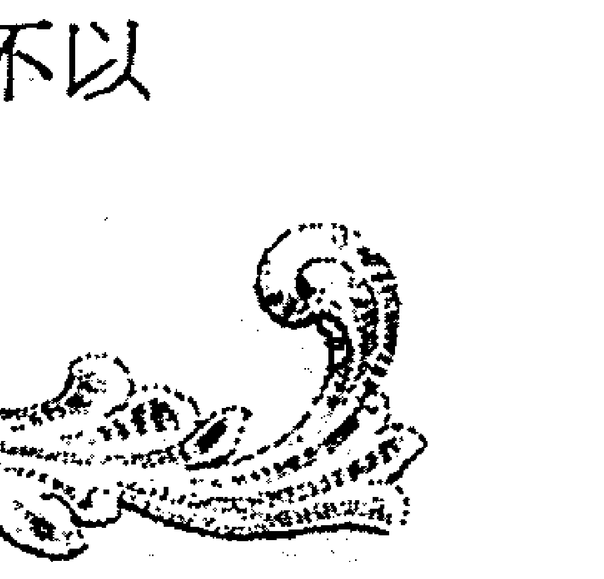

## 血型、生肖、星座的智慧与应用全书

### 别故作聪明，其实你早已被属猪之人看透

属猪人跟属兔人一样，求世间平安，并且与人为善，对人对事毫不敏感的属猪人似乎不是那种容易生气的人。其实属猪人虽表面上容易受骗，但实际上还是比人们想象得要聪明。别在属猪人面前故作聪明、自以为是，其实你早已经被属猪人看透摸清，只不过自己还浑然不觉罢了。

属猪人的聪明在于懂得用容忍的态度保护自己的利益，就算他们已经把对方的诡计看得一清二楚，也不会捅破，而是忍而待发，直到最佳的时机才给予对方一记重击。当有人骑到属猪人头上，属猪人还会再自动递上一条鞭子，当别人自鸣得意时，却早已骑虎难下，不得脱身了。这实在是属猪人的一条好策略。在属猪人善良的背后，隐藏着坚定的力量，只要可能，属猪人会坐在统治者的宝座上。并且要比用阴谋耍手段，其实你并不如属猪人，他们的阴谋常常是建立在你的阴谋之上的，当你得意洋洋以为大功告成的时候，常常被属猪人的“将计就计”而制服，论忍耐的智慧，论设置“连环计”的雄才伟略，属猪人其实一点都不逊色。

如果你故作聪明、凡事都偷偷占便宜，别以为那些憨厚的属猪人都蒙在鼓里，其实谁是君子谁乃小人属猪人分得很清楚，也看得很明白。当别人以为自己占了大便宜，碰到“傻大哥”而高兴得意时，属猪人指不定用更加绝妙的办法还你“当头一棒”。为什么会这样，当你愣在旁、不得脱身的时候，属猪人早已用微笑告诉你什么叫“以彼之道，还施彼身”。而且面对这种还击，你还有苦说不出，谁叫你在属猪人面前耍小聪明呢？

属猪人是很重感情的，属猪人不像属龙人那样善于迷惑他人，也不像属猴人、属虎人那样好蛊惑别人，而是真诚待人、乐于帮助自己的朋友。属猪人一生中会持久地以忠诚、为人着想的品格待人，保持与朋友的珍贵友情。人们可以充分信赖属猪的朋友，因为属猪人不会对自己的朋友搞阴谋诡计。然而当属猪人的信任被利用的时候，属猪人会低沉抑郁，消极悲观，并且长时间不能恢复。而且被伤害的属猪人很难再与这个人保持友好的关系。

如果世间对属猪人的友人不公，或当朋友受到致命打击时，只要找到一位属猪的朋友帮忙，属猪人会耐心听这位友人倾诉苦衷，并拔刀相助。即使是别人自己的错误造成的，属猪人也不会流露责备别人的意思，仍会尽力帮助别人，还会多找些人帮这个人，为其奔走解难。在属猪人那里，朋友不会遭白眼或听官腔十足的训诫。然而如果这一切都是别人一手策划的，只是为了从属猪人手中获得利益的手段，一旦被属猪人发现，他们必定会将损失补回来，并且学得比过去更聪明，更勇敢。

交上属猪的朋友，不要用耍心机耍手段的方式来拉近距离，你的故作聪明，属猪人早已看在眼里。只要真诚相待、保持坦诚和纯粹的友谊，属猪人定不会忘记你这个朋友。

与不同生肖人相处的独门秘诀

## 第七章 不同属性星座，不同别扭脾气 ——共处苍穹下，怎样才和谐？

你已经知道，十二星座有着迥然不同的个性和气质。不同星座的人都有着自己独特的别扭脾气。你还在为如何成为十二星座的他（她）的知心好友而苦恼吗？你还在为如何赢得星座恋人的爱而寝食难安吗？与十二星座人共处苍穹下，应该注意哪些问题，才能获得和谐自然人际关系呢？本书将解密十二星座的相处之道。快快拿出纸笔，为身边的星座朋友记记“笔记”吧！

## 与白羊座相处，其实并不困难

如同春天般阳光灿烂的白羊座总是热情满满，白羊座人活泼好动，总是一副高高兴兴的模样。你是否正为如何跟羊儿们拉近距离而苦恼呢？其实，与白羊座人相处，并不困难，关键是要了解白羊座的天性特点，投其所好，才能让羊儿们亲近你，一起擦出美丽的火花！

和白羊座人相处，新鲜感是最重要的。白羊座的人，天性好玩好动，对那些有趣新奇的事物，总显得比旁人多几分热情。白羊座人总是充满着春天的气息，流露出自由的气象，而且他们也对一切有“新意”的东西充满好奇和好感。所以，要博得羊儿们的好感，首先就要学会给羊儿的生活带来新鲜感，“来点新意”的相处方式，白羊们会觉得自在快乐。如果跟白羊人多讲些新鲜的事情，有趣的故事，也可以试着多讲点羊儿没听过的玩笑，都能让白羊对你“另眼相看”。

追求白羊座女孩，用新鲜特别的约会方法代替古板传统的求爱方式会更容易俘获一个白羊女的心。好动快乐的白羊座人最喜欢聆听有趣新鲜的事情，多给白羊座人一些新鲜刺激的玩意儿，会让白羊座人在生活上、打扮上、社交圈子上找更多的新方向，连性生活都应该来点新花样。

与白羊座人交朋友，保持新鲜感很重要，但是也要随心随性，千万可别因为“图新鲜”而矫揉造作，弄得羊儿不自在可能会适得其反哦。羊儿们都是天真、好冒险的人，一有什么新鲜的事物，必然会被吸引过去，对异性的态度也一样。如果在交往的过程中，能了解对方的心态，相处时不去计较得失，自自然然随自己的心意向对方表白，那么一定可以把事情解决。就算不幸有第三者介入你们之间，保持这一种态度，不但可以维持彼此的亲密关系，适当时侯，羊儿也会重回到你身边，而你也不会拒绝这么活泼可爱的白羊座朋友。

精力无穷以及强烈的竞争性格是白羊座最鲜明的特色。和白羊座的人相处，一定要记得给羊儿一定的主导权。白羊座人不是那种会容忍着对方的顺从型性格，如果你没认识到这一点，就很可能引起白羊的反感。和白羊斗嘴争论，羊儿不会让着你，因为天生精力旺盛喜欢争强好胜的白羊座人习惯了把“主导控制”权握在手里。记住，白羊需要主导权，谁也不让谁，能不吵架吗？交往时懂得给白羊一些“甜头”，哪怕是扮成尊重他们，顺从他们，不和他们争持到底，也可以让你和白羊座人的关系逐渐拉近。和白羊座恋人相处更是要注意这一点，总是充满自由气息的白羊座人可不想被别人控制束缚，不管白羊对你多么用情至深，你可千万别在主导权上跟他们争“地盘”，试着“迁就”一下你的白羊恋人，羊儿会更加坚定对你的爱。

新鲜感，主导权，随心随性。渐渐地，你会发现，你也变得阳光自信、活泼热情起来，而你和白羊座人的相处，也变得越来越简单，越来越妙不可言！

共处苍穹下，怎样才和谐？

> > 给你10个技巧，快速博得牛牛好感

金牛座人生性耿直、温和善良，金钱观念强，他们不是能说会道的人，但却是工作踏实勤奋，属于那种默默无闻的一类人。牛牛固执倔强的个性是否曾经让你十分困扰？你是否正为如何跟这群倔强的金牛座人打好关系而发愁？下面给你十个技巧，让你能快速博得牛牛的好感，赢得你们之间关系的有效“破冰”！

- 1. 学会让步。金牛座的牛脾气可是出了名的，牛儿固执倔强没人能拗得过他。有时对方的牛脾气确会令你不愉快，回心一想，你也何尝不是？所以不妨放下一点固执，退后一步，海阔天空。
- 2. 试着主动。金牛是蛮浪漫的一个星座，却由于比较沉默，与人交往的时候往往需要别人主动。对于喜欢的人，也说不出什么甜言蜜语来，只能为对方默默付出，希望对方能够了解他们的心意。所以你要懂得观察金牛座，他们的示爱方法都很含蓄，当你发现有一点眉目了，不妨也做一些响应，主动一点。
- 3. 软性攻击。让他们有信心将自己想说的话表达出来，金牛座是需要被别人启发的人。
- 4. 共同学习。金牛座有与生俱来的艺术气息，对于和艺术或美有关的事物，他们都很感兴趣，你不妨找机会邀他们一起选一项和艺术相关的课程，在共同学习的过程中，不但可以和金牛座一起培养美的观察力和鉴赏力，还可以多了解彼此、增进两个人之间的感情，而且会让金牛座对你产生依赖和信任感。
- 5. 关于钱的问题。不管感情有多好，金牛座对于金钱还是算得一清二楚。他们不是小气鬼，只是认为就算“亲兄弟也要明算账”。千万不要叫金牛座的情人买东西给你，最好也不要向他们借钱，因为这样做，只会显示出你的虚荣和他们的吝啬。而且，如果你让他们觉得你是一个很重视物质生活的人，譬如喜欢去高级餐厅、标准的名牌主义者……这些都是严重破坏金牛座节俭美德的做法。
- 6. 要多鼓励牛牛。金牛座缺乏安全感，会一个人闷在一旁胡思乱想，如果你能经常说一些鼓励的话，对于讨好金牛座来说，是一种不错的方法。时常称赞牛牛，表现出对牛的钦佩，定能博得牛牛的好感。
- 7. 放松坦白。牛牛其实都有强烈的占有欲，敏感、嫉妒心重，一点点风吹草动，都会捕风捉影，耿耿于怀，不懂得释放自己内心的压抑，日积月累总会爆发。因此要防患于未然，尝试看开一点，有事就坦白一点，不要猜忌。
- 8. 恋爱，要朴实而舒服。在牛牛心里，恋爱应该是一件浪漫又舒服的事情，不必花大脑思考，自然而然。两个人平实的生活着，就是一种最大的幸福，所以你千万不能要求他们玩什么新鲜的花样，因为金牛座绝对没有这方面的慧根。
- 9. 不要催促牛牛。金牛座是一个慢动作的人，连思考的速度也很慢，一件事如果没让金牛座把前因后果想个清楚明白，他们会不知道怎么走下一步，这时候如果一直催促他们，他们因为不知所措而变得很烦躁，再加上紧张的情绪，很可能会开始要牛脾气。
- 10. 软性攻势。向金牛施压时千万不可把他们逼到墙角，压力太大他们是会反抗的。要出软招，把他们安抚得头头是道，牛牛会乐于受你指挥。

### 与双子座相处的10个建议

双子座聪明善变，如风一般让人摸不着头脑。有着“两个脑袋”、多重性格的双子座，给人们的印象是时而开心；时而低沉；时而兴致盎然；时而了无生气。这么善变的双子座，要如何才能好好相处呢？这里有十个建议，你不妨一试！

- 1. 和双子相处，你要学会放心。对待双子座，你只要明白一点——你是无法掌握双子座的。双子在想什么，他们下一步要做什么，你总是无法得知。与其猜忌，不如放开去心，信任他们，由他们自由发展。
- 2. 放手，给双子一片自由的晴空。双子爱自由，他们随时可以转身走人。也因为这样，你千万不要给他们太多束缚和压力，试试放松点，不要对双子座太多要求，不要试着改变双子座人，给他们多点自由。
- 3. 学会容忍。要试着容忍双子善变的情绪、多变贪新鲜的人际观，对双子座人你要放下敏感的心。如果你爱上双子座，必须要容忍，别轻易吃醋，要在心里想着：“他玩厌就会回家了！没事的。”
- 4. 学习的心态。双子是聪慧爱学习的星座，双子灵动的脑袋在时刻探索着世界的奥秘，在相处过程中要在双子身上找到自己没有的优点，得到很多新的信息情报，对你的事业发展和知识丰富很有帮助。
- 5. 适可而止。不要试着在双子座身上发挥你的“母性”和“爱心”，太啰嗦，太唠叨都会削减双子的自由，让他们受不了。学会适可而止，把握一个度，让双子座人在感受到你的友爱和呵护的同时，又不会对你感到厌恶。
- 6. 动用双重标准。和双子座相处，你不得不学会用双重标准来考虑问题。经常说一套做一套、适应能力极强的双子，可以在不同的环境改变自己的思想行为，你如果不会用双重标准来理解双子座人，那就会陷入困惑之中。
- 7. 学会理财。双子座很没理财观念，如果两人都不会理财，一当要共同生活，油盐米醋都是钱，无计划的理财观念诸如：小事不理，小财不算，积少成多，积沙成河，长期这样肯定会出问题的。和双子座在一起，你要学会理财，别指望他们会计算成本利润得失。如果实在不懂，不妨建一个共同储备金，一人一半，有事都不用担心。
- 8. 懂得顺其自然。不要刻意去讨好双子座，你越做越显得故意，他们就更加会觉得你有问题，反而顺其自然会好得多。而且有时太迁就双子，反而令他们不舒服。
- 9. 保持距离。双子爱自由，也喜欢新鲜和交际，见得太多只会因新鲜感减少而出事，所以不妨保持一定距离。就算情侣也可以适当保持距离，不要老腻在一起，最好选择自由弹性大点的同居生活，这样你的朋友和他的朋友就都可以随心所欲地活动了。
- 10. 用惊喜打动双子座人。双子座人能说会道，聪明幽默，喜欢丰富多变的生活，智性的刺激尤能令双子整个人活跃起来。双子座人不仅喜欢接到意外的惊喜，自身也是独到的惊喜发明家。用惊喜打动双子座人，在情人节给双子座的另一半一个巨大独特的 surprise，或者出差回家给他（她）一份温馨动人的小礼物，都能让双子座的他（她）对你更加眷恋。

### 要与巨蟹座成为朋友，就得接受他的保护

十二星座中最具有母性和保护欲的星座便是巨蟹座了。巨蟹座人对家人和好友都非常忠诚，随时准备保护自己和身边的人，而且越是弱小越能引起螃蟹们的强烈保护欲。与巨蟹座人交朋友，你首先就得接受螃蟹的无微不至的照顾和保护。

螃蟹善良热心，富有同情心，而且敏感的巨蟹座人很容易了解到朋友的困窘，如果需要，螃蟹会整装待发，为保护朋友而和敌人进行攻击性对峙。如果巨蟹座人的朋友是那种弱小又经常受欺负的人，那无疑会激起螃蟹强大的保护欲和斗争心，他们会不顾一切地担负起照顾弱小个体的“大哥哥”或者“大姐姐”的角色。

如果你是受不了唠叨和照顾的人，和巨蟹座交往的时候可要克制自己的不耐烦，因为你如果不接受螃蟹的照顾和保护，就等于不接受他们的真情实意，螃蟹们会因此憎恨你。如果是陷入爱河的螃蟹，就更会显示出对所爱之人的体贴入微的关心，如果这个人拒绝螃蟹的关怀和保护，那螃蟹就会郁郁寡欢，好像受了被抛弃的失恋之苦那样一蹶不振。所以，不要轻易对巨蟹座人的关爱摇头，别怕他们受累麻烦，因为他们最大的乐趣就是照看好他们所爱的人和他们的亲人。如果你对这只蟹也有好感，就放心接受他的照顾和保护吧，别觉得过意不去，因为你的过意不去和推辞拒绝，会大大伤了螃蟹的心，最终让你们的关系成为“无言的结局”。

巨蟹座人家庭观念很强，十分重视家的温暖和安定，和谐的家庭生活是巨蟹座追求的目标。恋爱中的巨蟹座人，总是会忍不住绘制未来几年甚至几十年的家庭生活图景。生几个孩子，卧室里放什么装饰品，厨房的厨具用品都可能都会成为他们的话题。巨蟹座的男人会为了建筑自己的巢而献出一切的努力，成为他们的朋友甚至他们的家人，可以感受到他们源源不绝的保护关怀之意。爱这只螃蟹，就别说“以后的事情还不知道呢”，也别顺口说出“我们以后可能不会结婚”这种大大伤害巨蟹的心的话，他们很可能就因此低落很久，以为你不是真想跟他们在一起生活，不是真的爱他们，甚至有时候也会让他们弃你而去，另寻新欢。

和巨蟹座相处，别不好意思，别怕这只螃蟹麻烦。接受他对你的关心和照顾，真诚地感谢他为你所做的一切，并且在必要的时候给蟹们回报，这样巨蟹才不会离你远去。

### 狮子最爱的，不是肉，而是赞美

你身边总不乏这些骄傲热情、霸道而又充满魅力的狮子座人，他们总流露出一股傲气，并且极富领导天赋和激情，能干负责。然而你是否## 第七章 不同属性星座，不同别扭脾气

色。与狮子座人合作时，在角色分配方面也要注意，多给狮子座一点权威性，会更满足他们较强的责任感和事业心。其实狮子座是外表紧张，内心脆弱的物种。狮子座的女孩外表张扬热情，但内心其实是特别感性的，他们不仅仅需要赞美，更需要深层次的欣赏和理解。对待狮子座的她，你可以给多她一点关心的感觉，使她对你有一种寄托。当狮子女换发型或者穿上新装时，一定别忘了夸赞几句，不要当做没看见，你的忽视可能会引起狮子的不满哦。而且作为狮子座女孩的另一半，更应该深谙赞美之道，讨得狮子座女孩的欢心。记住，狮子座的她一般都大大咧咧，突然扮靓肯定是为了得到男友的称赞，这个时候，更不要舍不得那几句赞歌啊！

### 与处女座交往的 8 个禁忌

处女座是完美主义者的代表，完美、挑剔、洁癖、深沉是处女座人的代名词。你可知道，这群十足的完美主义者交往起来多有通向不快的禁忌之门。还在为如何跟处女座人相处发愁的你，赶快来看看与处女座朋友交往的禁忌有哪些吧！

- 1. 不要开空头支票。如果没有百分之两百的把握，奉劝你还是少做承诺吧。空头支票的杀伤力，有时比无能为力更糟更大。做不到的事就别逞强，因为处女座的人最看重誓约。
- 2. 不要逢场作戏、虚情假意。处女座的人对感情是相当认真的，是十足的完美主义者，精神洁癖的最高峰。信用和庄重这两件事，是让处女座情人爱上你的主要原因。他们最不喜欢逢场作戏，尽管处女座的人

共处苍穹下，怎样才和谐？

- **三、忌玩火自焚，移情别恋。** 如果你的感情掺了杂质，或者是虚假的不真实的，完全是为了逢场作戏才招惹处女座，奉劝你赶快回头，因为处女座的人都是有些记仇的，搞不好过段时间就刚好逮到你的把柄让你“哑巴吃黄连，有苦说不出”！
- **四、切忌欺骗。** 千万不要想去欺骗处女座的人，一次不忠，百次不赦，会造成你们之间永远无法修补的裂痕。一句话，他们是崇尚灵魂的动物，心灵的纯净有时候会比其他东西更重要。欺骗处女座人，只会让他们觉得你这个人思想肮脏而躲得远远的。
- **五、不要刻意去猜处女座人的想法。** 如果刻意去猜处女座人在想什么的话，有精神洁癖的他们会很反感，因为他们不想被别人知道在想什么。处女座人心中总有一个地方，别人是没有办法进入其中的。如果你不小心猜中了他们的想法，也最好别说出来，因为处女座人讨厌内心秘密被窥探的感觉，他们会讨厌你，而不是钦佩你的“读心术”！
- **六、不要尝试和处女座人“争”出高下。** 当自己与他发生矛盾时，记住：在处女座人承认错误之前，永远是自己错了。千万别和处女座人争论，除非你的头脑和口才都很不错。否则只会被处女座人“铁面无私”地找出的N条理由给吓坏，他们的严密辩论就算没能让你投降，也会用不屑和冷淡将你的热情笑容冲走。然后毫无疑问，接下来好长一段时间，这位处女座的“辩友”见到你必定是视若无人绕道而行。
- **七、忌自以为是，缺少内涵。** 处女座人具有强烈的分析力和充满智慧的头脑，多半是知识型人才。对知性的偏执，使得处女座的人打心眼里便认定：智慧是人生幸福的钥匙。如果你不懂什么，最好就不要在处女座人面前夸夸其谈、自以为是，这会让他们很讨厌。
- **八、别忘了处女座的人可是有洁癖的，特别是处女座女性，是非常注重整洁的。** 处女座女孩特别讨厌不干净的男性，哪怕是没有经常打理的胡须都会让这群完美主义者心有不悦。她们是忠实的马桶垫爱好者，处女座对人对事对自己都是一样的标准，那就是起码的干净和整洁。和处女座相处若想获得‘通行证’，就得从头发到脚跟满足他们的高标准。

### 与天秤座和谐共存的密码

浪漫的天秤座人很爱说话，总是口若悬河的天秤座人似乎能跟所有人聊得开心愉快，他们能言善道，属于沟通无障碍的‘神侃’一类，担任着人与人之间沟通的桥梁。但是要和秤子真正打成一片，和谐相处却好像并不那么容易。其实，只要你愿意掌握和他们沟通的神奇密码就会容易很多。

天秤座不是那么有心机的人，他们讨厌互相猜测，猜来猜去、情节复杂的关系会让天秤座头昏脑花，所以凡事简单一点，别总是故意说反话，口是心非，别把事情复杂化，比如为什么没给我打电话呢，为什么没给我发短信呢，为什么突然又不高兴呢，为什么昨天还有说有笑今天就话少了呢……敏感地分析到每一个细节，失去安全感只会得不到天秤座的安全感。和秤子相处不要太复杂，要保持一颗简单而且豁达的心，自由而轻松的相处，是秤子最喜欢的方式。

学会使用软招——要知道天秤座的人就是犹豫不决、反复不定、没有主见的。有时要用一种温柔易入耳的方法打动他们，千万不要固执强硬地逼他们就范，因为他们心中自有一把尺一套大道理，并且没有人能扳得动天秤心里那把尺的。与其用严厉的批评和争论来解决问题，而让天秤座人内心那把尺子摇摆不定，还不如用婉转的方法来说服他，软性攻击反而会使天秤考虑你的想法。

运用共同兴趣的魔力，让天秤座人和你成为无话不谈的朋友。有一个共同的兴趣就有了共同的话题，彼此间拉近了距离、增进了感情，而且还多了一起共同相处的机会。不管男女老少，只要天秤愿意，都能跟你打成一片，熟络得不行。然而要真正成为天秤座的知心朋友或者亲密友人，就需要循序渐进，过分的亲密会让天秤座人无所适从，操之过急的知己关系会让秤子很有压力。天秤座人喜欢一步一步地逐渐“升温”，如果想追求天秤座的异性，这一点更是显得尤为重要，让双方对彼此都多一些了解，不要一下揭开所有的底牌。

多一些行动。天秤座是很浪漫的理想主义者，如果多一些行动，在日常生活中多给天秤一些关怀和惊喜，天秤座人一定很开心。例如，有机会就给对方一些小惊喜，一些不贵的小礼物，又或者是吃一顿特别的晚饭，不管是天秤友人还是恋人，这些保证给你加分！

天秤座的恋人总让另一半有点神经紧张，然而强迫天秤座的他（她）依赖你或者让你依靠都不能让天秤开心。对待天秤座的男友，不要纠缠在他爱不爱你、会不会永远爱你这个问题上，问多了会让天秤男有种被压抑的无奈感。试着把目光放在自己身上，让自己变得更完美，跟他心平气和、开心愉快地谈天说地，天秤男就会放下自己寻觅的脚步，更加珍视你的存在。天秤座的女友总是那么浪漫热情，喜欢说话，作为男友的你就不要乱吃醋乱生气，不要担心她又被别的男生迷住了，记住天秤座的女孩一旦认定了你这个心的“归属地”，就不会再轻易改变了，只要你多给她一点自由的空间，不要老是神经紧张，天秤女会爱你更多。

### 怎样才能成为天蝎座人的知心好友

天蝎座人是自负而又有些敏感的，凡事都有些自己的原则和想法，在情感方面的选择要求自然也就比较高。天蝎座人一般都会想找个志同道合，在价值观上能够相互认同的知心好友。那么，怎样才能成为天蝎座人的知心好友呢？

其实与天蝎座交往并不是很难，做好朋友也是不难的，只要你一如既往地真诚地对待他们，别总藏着什么，你会发现其实他们很容易相处。前面提到，天蝎座喜欢与自己志同道合的人，所以你一定要具备能够打动他们的魅力和能力，内在和外在的都很重要，在此基础上思想和精神上的一致和默契也很关键。而且第一印象在天蝎脑中是很难抹去的，比如，如果他是一个讲礼貌的人，而你大大咧咧地觉得一家人无所谓礼貌，他会感到与你很难相处；又如，如果他不太看重物质，而你又太“社会”化，甚至老讲一些很世俗的话，他会觉得与你格格不入。

如果你希望与天蝎座成为朋友或恋人，首先要做的是“主动出击”，你想站在原地等他们过来和你亲近，几率一般都很小，如果有，可能是他们有什么其他动机。不仅刚开始是这样，维持友好关系的继续依然要靠你主动地给他们打电话、主动地创造机会见面、主动地向他们报告你的情况，在你的持续不断的努力下，他们就会把你看成是亲近的朋友了，这种局面就会得到改善。天蝎座并不是喜欢隐藏秘密，事实上，蝎子朋友们会经常向密友透露他们的秘密。所以如果他们信任你，你一定不要背叛他们的这种信任，这是和天蝎座深交的必要前提。

和蝎子熟识了之后，你会发现天蝎座人有很脆弱的一面，他们内心里很怕孤独，也害怕被孤立。天蝎座的人总是把自己藏得很深，其实是害怕被伤害，如果你能静下心来感受到他们的不安，你就能够明白他们的有些近乎于疯狂的举动。同时，不要和蝎子们靠得太近，不同性格的人，距离走得过近总会伤害彼此。而且你要当心有一天你得罪蝎子的时候，他们锐利的目光、犀利的话语对你的伤害可能是最深的。不要因为是知己就打听他们的所有秘密，适当地保持距离，会让蝎子觉得你也是一个富有神秘感的人，他们会更喜欢你。

对于亲密的同性朋友，你绝对不要奢望天蝎座朋友会把你看得比他们的另一半更重要。因为天蝎座人一致认为：爱情是他们生命中最不可缺少的东西，天蝎女尤其如此。当她们的真命天子（不管在你看来那个人是多么差，多么不配她）出现时，你唯一能做的是：马上消失。当她们的爱情出现波动的时候，这才是她们最需要你的时候。所以，在和他们的友谊中，一定要摆正自己的位置，不要把自己在蝎子心中的分量想得太高。就算他们一开始觉得你是一尊神，但是如果你在这方面和他们观念相左，或者你不留神间说出的话刺激他们的神经，你在他们心中的地位就会大大降低。

遇到矛盾和麻烦，你要能够适当体谅，采取最佳策略。天蝎的忍耐心通常比较差，问题老解决不了就会很暴躁，甚至由于逆反心理而爆发。所以这方面，你最好要谨记，注意相处的艺术，不要轻易让天蝎愤怒，蝎子一旦发作是很可怕的。在大家都冷静下来的时候，真诚的沟通是解决问题最有效的方法。

共处苍穹下，怎样才和谐？

### 要与射手座共存，你需注意……

射手座是个热情、热爱生命的乐天主义者，射手的率直、天真的性格使其广受欢迎。那么和爱好自由、喜欢探索的射手座相处，你要注意哪些问题呢？

首先，你要明白射手座人是非常坦率的人，有时候甚至诚实得可怕。和射手座在一起，他们绝对不喜欢拐弯抹角地含蓄委婉，他们什么都会告诉你，只怕你受不了他们这种不理别人感受的坦白。射手座讨厌没有自由空间，也不喜欢别人用不信任的口吻对他们问东问西，然而当射手问别人问题的时候，有所保留的答案，却最让他们反感。所以，和射手座人谈话，直率一点，不要兜兜转转，他们是不会耐心听你兜圈子的。

射手座人看事情会比较长远，如果你只和他们讨论目前问题，他们会觉得你肤浅。他们外向、健谈、喜欢新的经验与尝试，尤其是运动及旅行，对未来总是抱着哲学式的乐观。所以和射手座人交往，你要有点想象力，注意不要老把视线放在目前，注意培养一下自己的长远战略思维。

射手座人喜欢自由和无拘无束的生活，在时刻追求让自己满意的生活环境和自由空间。射手们讨厌和忸怩放不开的人谈话，也最受不了迂回不自然的沟通方式。摆臭架子、自以为是，乱发小姐或者少爷脾气只会加速他们避开的步伐。注意不能和射手座正面冲突，你越强势，他们越不愿和你沟通，有时候你的忍气吞声显得弱势一点，射手座人反而会怜惜。

射手座是爱玩爱探索的星座，思想常常天马行空，很难专注。哪里有好吃的、好玩的、好看的，射手座都会是最佳的报马仔。和射手座相处，如果你呆板无趣，他们也可能会敬而远之，所以，平时也多多留意好玩的地方和话题，这样才能和射手座人畅所欲言。

与射手座的人在一起时，记住不管对方是多么要好的朋友，或者是多么爱你的恋人，都不要触碰到射手的“心灵禁区”。对于他（她）们的忌讳，譬如曾经的伤痛，失恋的伤疤，失败的阴影等一系列禁区，千万不能“铁齿”和深究，否则会让射手翻脸不认人。

射手座人不论男女，都属于那种追得越紧跑得越快的人。射手座的情人，不受任何人控制，钻戒、婚约、恐吓都没用。除非他们心甘情愿，不然你就是绑也不能留住射手座人的心的。射手座的情人很奇怪，如果让他们来喜欢你，他们会不惜一切的追求你、倒贴你，就算你不找他们，他们也甘心黏在你身边。追求射手座情人，注意使用一些“欲擒故纵”的技巧，方能捉住他们多变的心，而只知道牺牲付出的行为反而对射手座诱惑不大。

射手座人很重视朋友，作为射手座的另一半，你必须有爱屋及乌的精神，要能够接受射手座的众家朋友们，否则实在很难有什么交集。当你觉得两个人好不容易有独自相处的机会，正在幻想着你和射手座牵着小手到公园散步，或是两个人一起去看电影的美梦时，射手座人可能会兴高采烈地跟你说：“等一下还有人要和我们一起去玩！”不妨多在射手座的朋友身上下一点工夫，想尽办法和射手座的朋友混熟，这保证是一件好处多多的事情。

共处苍穹下，怎样才和谐？

### 与摩羯座人融洽相处的5条心得

踏实保守的摩羯座人是工作认真的代表，摩羯座人深思谨慎，冷静而准确的判断力，总给人沉稳而严肃的印象。然而摩羯座人并不是很难接触和相处的星座，和他们融洽相处还是很容易的。下面给出和摩羯座人和谐共处的五条心得，希望能对大家有所帮助。

- 1. 第一，和摩羯座人交往，要注意发挥自己的主动性和积极性。摩羯座人是务实能干的工作狂，他们总是理性地知道自己在干什么，就算遇到困难也很认真，充满斗志的摩羯座人立志追求有意义有价值的人生。所以与摩羯相处一定要有积极性，特别是在事业上，暂时的低潮没有关系，重要的是要有一颗积极进取的心。如果你的想法跟摩羯一致，摩羯座人就觉得你是个值得长久相处的朋友，对你也更加亲密信任。此外，摩羯很难在主动与人沟通中表现热情，摩羯人需要你的主动和积极帮他们除去沉闷的面具。
- 2. 第二，轻松愉快地沟通。有些人个性较冲动，很容易因为摩羯一时的冷淡而说出一些伤人无情的话，但事后又后悔，想要收回时却发现摩羯已经彻底冷漠。这是很需要注意的，摩羯的自尊心很强，心思也很敏感，很在意别人对自己的看法。如果你轻易地出口伤人，摩羯就会很受伤，而摩羯的伤口又是需要很长的时间来愈合，并且即使现在伤口愈合，在以后的日子里仍会时不时地想起。所谓说者无心，听者有意，说重要敏感的话之前，请三思而后行。摩羯天性冷淡，个性喜静，本身的话也不多，尽量避免重复说没有意义的话。轻松愉快的沟通方式，是最让摩羯座人舒服的交往，天性实际的他们在轻松愉快的氛围中能卸下重压，感到温馨和快乐。
- 3. 第三，不要尝试冷淡和冷漠。不要期望以冷淡来让摩羯回心转意，你冷的话，摩羯会比你更冷，摩羯不是那种会很努力挽回的人，除非你十分优秀得，摩羯十分爱你，他（她）们才会打破冷战，委屈自己。不然，你的冷言冷语，冷淡表情通常都是伤害摩羯座最深的，他们会不顾自己伤心难过而选择逃避你，不再与你交往。
- 4. 第四，不要轻易开玩笑。不要轻易开摩羯的玩笑，因为摩羯一般都是较认真的人，很容易就会把玩笑当真。如果你不清楚他们的脾气和喜恶，或者你们还不熟悉，还没到无话不谈的地步，玩笑还是少开为好，摩羯可能会因为一句玩笑话而不再理睬你。还要注意不要老提过去，不要把摩羯过去的故事当做笑谈的材料，这会让原则感很强的摩羯座很伤自尊。
- 5. 第五，摩羯生气时，尽量给他（她）们台阶下。尽量不要在原则性的事情上惹到摩羯，因为摩羯都是很有原则性的人，他们会认为你进犯了他们的原则领地。如果摩羯生气后，一般会表现出冷漠，不理睬等。这个时候你就要多委屈自己，宽容体谅，多讨好摩羯了。如果错在你，你就要主动道歉，请求原谅。当然，如果本身就是摩羯的原因，他们也可能以为碍于面子不敢面对你，这个时候，你就要给他们找个台阶下，巧妙地挽救你们之间的关系啦。

## 水瓶座人，容忍他的多变，其他一切都好说

个性独立的水瓶座人，从不随波逐流，总是有着自己的独特想法。他们崇尚自由，喜欢革新，却总是给人变化多端、难以捉摸的印象。和水瓶座人交朋友，最重要的是理解和容忍他的多变，其他的一切都好说。

一开始和他们相处时，会觉得水瓶座人很好接近，他们是那种平易近人、很爱帮助人的类型。和他们说什么话题似乎都无所谓，因为没有什么话题是瓶子不能接受的，而且他们幽默，思想独特，总会有许多与众不同的想法脱口而出。然而随着交往的深入，你会发现多变的水瓶座人让人很没安全感，强烈的自我为中心，令水瓶座人对自己的一切都非常关心，他们也喜欢与人争论，就算是黑的也可以说成白的。也许他们昨天还站在你这边，今天就莫名其妙地和你对立了。其实水瓶座人爱说反话和善变的个性并不是有心的，只不过是他们不想成日都附和别人的意见，为了表现自己的独特性才这样的。

容忍水瓶座人的多变，是你和他（她）关系亲密、逐步升温的前提。和瓶子相处久了，你会发现，虽然瓶子的确是一直变化着，但是总体上，是从一个让你有好感的普通朋友变成值得一生深交的好友或者是恋人。虽然这条变化趋势线是曲折起伏的，但是总的趋势却是可喜而前进的。因为随着你的忍耐和宽容，瓶子也逐渐付出自己的真心，一旦信任你，便会终身守护这份感情。

大家都知道水瓶座好奇心重，喜欢创意，脑子里总是闪现很多的、有趣的点子。瓶子即便和你已经好得像一个人了，他们的脑袋还是会不由自主地有这些奇怪的想法，这些多变的离奇想法是不会轻易停止生产的。不要埋怨水瓶座人不把你当朋友，早已发生的事现在才告诉你，只是因为瓶子天马行空的脑袋实在变得太快，所以给你分享的就只有冰山一角。如果你因此认为水瓶座人还没向你敞开心扉，或者是认为他们虚伪不真诚，那就冤枉水瓶座人了。总之，习惯水瓶座人多变的想法，你就不会陷进猜来猜去的复杂念头里那么累了。

这是一个晴时多云偶阵雨的星族，他们的冷热无常，会让他们的情人莫名其妙的不知道该怎么跟他们相处。这些人通常有个怪脾气，他们虽然对什么事情都表现的不怎么在意，但是，心底还是会在意的，瓶子不是在假装的，他们就是那个样子。而且，他们对爱情并非不专一，只是无法完全专注。不要逼迫水瓶座的恋人承诺什么，因为他们自己也不知道承诺是怎么一回事。如果因为你对自己地位的不确定，总是和他起争执，当他受不了的时候，你也可以放心，水瓶座人不会生气也不会失态，只是会选择一个人静一静罢了。

崇尚自由的水瓶座人，外表上呈现冷漠与热情的交变形态。你不会觉得他们是个冷漠的人，也不会认定他们是个热情的人，总是会感到他们的天真与世故不断地交错运作。这完全归因于他们的保守性格，所以，为他们的多变型人格烦恼完全是自讨苦吃，试着习惯和容忍，对自己对水瓶座朋友，都是一件好事。

### 怎样攻克双鱼座人的心理防线

共处苍穹下，怎样才和谐？

交上一个感觉很对的朋友，会使双鱼座的人感到“于吾道不孤”而为之兴奋不已。但这并不能稍减他们心中的孤独感，他们仍认为人是互不相属的独立个体，因为双鱼座人的内心总是隐藏着一道“心理防线”。攻克双鱼座人的心理防线，你们的关系才会由寒暄点头的普通朋友上升为无话不谈的亲密知己或恋人。

主动出击，消除双鱼座人的心理防备。双鱼座是很善于倾听别人的星座，他们细心体贴，温柔如水，总是怀抱着同情心对不幸者关爱着。主动而真诚地付出，会让鱼儿感受到你的善良和好意，并且投桃报李。主动坦白你对鱼儿的好感，试着约他（她）一起去逛街、游玩，双鱼座的人不会拒绝你，天生不知道如何拒绝别人的鱼儿只会随你高高兴兴地相处，因为你的主动，让鱼儿觉得自己是深受你喜欢的朋友，而隐藏在性格里的自卑情绪也在你们轻松的交往中不见踪影。试着多跟鱼儿说些真正的心里话，这个时候，鱼儿也会跟你坦白心事，没有顾虑。

欣赏和赞美，攻克双鱼人的心理防线。在交谈的过程中多表现出对双鱼座人的欣赏与肯定。鱼儿其实很喜欢被关注和欣赏的感觉，所以你的赞美会让鱼儿一下子就喜欢上和你在一起的感觉。谈话的过程中，不要总说工作上的无趣事情，如果你谈话的时候多一些浪漫主义的艺术情怀，这会马上引起双鱼座的兴趣。评论一出剧、一部电影、电视或艺术作品，或者说些比较神秘有趣的故事，都能让双鱼好奇的双眼注视着你。

试着让双鱼座人也打开话匣子。当你和双鱼座朋友比较熟悉的时候，你就要让双鱼座独占话头。要是你对所谈的问题不懂，双鱼座会很乐意# 血型·生肖·星座的智慧与应用全书

地给你解释，因为其实双鱼座最喜欢的就是给人说教。双鱼座很细心敏感，而且也总是很乐意倾听别人的烦恼倾诉，双鱼座人是很称职的“情感垃圾桶”，然而自己的伤痛却常常埋在心底。如果你能在双鱼座人低落的时候，试着鼓励和安慰他们，扮演一个良好的听众朋友，悉心地聆听双鱼座人给你讲的点滴琐事，及时鼓励鱼儿，相信鱼儿一定会记住你。要知道，在双鱼最需要帮助的时候，倾听和鼓励是最好的方式。

双鱼座女人的心是玻璃做的，既然她交给了你，你可得小心呵护才行。爱幻想的双鱼座女人总是对未来充满期待，但是环境的变化也常常让她选择逃避现实。当鱼儿有点低沉逃避的倾向时，不要说些伤害鱼儿心的话，而且双鱼座人的情绪总是波动起伏的，他们总是很敏感对方的微小变化。你大声说话或是一个不耐烦的表情，都可能让双鱼座女孩心碎。双鱼座的女人很缺乏自信，即使她们拥有了那么多的优点，也会经常地觉得自己不够好，不够坚强，不够有上进心，不够能干。她们总是越想越担心，越沮丧失。因此，她们非常需要你给她们鼓励和安慰。

# 第八章 血型中暗藏的职场玄机
——不依血型从业，终生碌碌无为

不要小看这些流淌在你体内的ABO液体，因为你的血型不仅主宰着你的思维和性格，更是暗藏着择业的职场玄机。试着拿出血型这本神秘教义来剖析你自己，了解你身边的人，从而更好地实现自己在人际、事业各个领域的目标。依据血型从业，了解血型的职场奥秘，从此你将不再盲目，而在职场“江湖”中如鱼得水。

## 不同血型人的择业黄金法则

我们已经知道，血型是主宰着人思维的红衣主宰，这些ABO血型因子流淌在你的体内，决定着你的思维方式，从而成为塑造你性格的原材料。不同血型的人，会有不同的与生俱来的个性气质，而这种气质通常在后天难以改变和重塑。血型虽然不决定一个人的事业成就高低劣，但是却影响着人们事业的发展方向。也就是说，不同血型的人有着不同的择业法则，了解属于你自己的黄金法则，看看你适合走哪条从业之路？

A型血人团体意识强、尊重规则守纪律、细心谨慎、思考周全，善于在一个固定单位有组织地行动，一般大器晚成者较多。办事细心、管理负责，工作踏实，在处理事务、革新和应用方面有真才实学。A型血人适合从事高科技、经济规划、作家、歌星、戏剧和短剧演员、摔跤及长、短跑运动等。处事谨慎、精于算计的A型血人也适合在会计、财务管理方面发展。A型血人不宜于驾驶和频繁地接触人、处理问题的工作，如记者、外交官、推销行业、保险业等。

B型血的人自由乐观，思路敏捷而开阔，具有经常不断革新现状的前进性动力，很容易接受新事物。多才且兴趣广泛的B型血人一般都有一心多用的天性，这个特性运用得当的话，B型血人无疑是培养多种知识交叉互动的综合互动型人才的最佳人选。B型血人可以跨多学科、多领域工作，可以在企业甚至于人类历史上建立新观点、新理论、新设计和新科学。他们从事创造发明、创意事业、文学写作会十分得心应手。同时B型血人应当避免一成不变的工作环境，如公务员、会计等，这会抑制他们的自由发挥。而选择艺术家、作家、医生、发明家、节目主持人、科学家、律师、飞机驾驶员，都是很适合他们的职业，作词家、天文学家也极适合他们。

务实能干的O型血人行动力强，个性独立，目标性强，经营企业、经商、政治、外交能力都很强，善于组织并把自己放于该组织的核心地位。O型血人年轻时易更换职业，有经验后善于专攻某一方面。有权力意识的O型血人适宜于政治、外交等行业，经营管理、驾驶、作家、歌星、演员、跳跃项目和棒球运动等也是很适合他们的职业。O型血人大都很有同志式的博爱，强烈的集体意识使得O型血人很适合在组织集团中担任领导和带头人。

AB型血人极有理性，沉着稳重，有优秀的分析力和洞察力，是很有服务精神的职业多面手。凡事他们都保持冷静和公平的处理态度。他们天生就是一个世界主义者，敏锐正直、富有冲劲的AB型血人很容易成为企业家，如微软总裁比尔盖茨就是AB型血。而且AB型血理性客观的分析力很适合让他们在一个团队担任参谋型职务，发挥运筹帷幄的专长。同时AB型血人应试着培养长远眼光，可以考虑创业，而且事实上很多靠自己奋斗成功的老板和创业家都是AB型血。太富有社交手腕的工作不适合AB型血人，而他们从事学术研究、政治、幕僚、心理学家、服务业等方面的工作都是很不错的决定，经济规划、统计、设计、商业推销等工作也可以考虑。

> 不依血型从业，终生碌碌无为

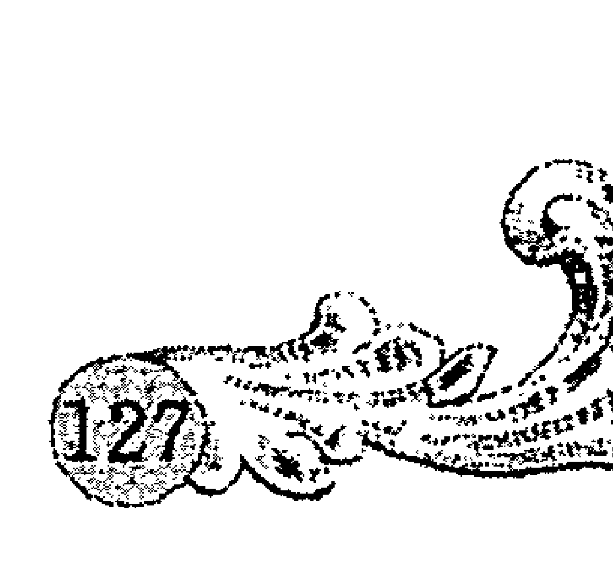

## 假如你的大老板是A/B/O/AB型血人

了解不同血型的老板或者上司具有何种特性，知己知彼，方能人际畅通。掌握血型“职场教义”，看看如何才能与不同血型的上司和老板打好关系，赢得事业顺利发展。

假如你的老板是A型血人，你就要注意行为态度和礼貌节制了。A型血人的特点就是有旺盛的服务精神，与人交往也不希望引起什么风波，对待部下也是亲切和蔼的态度，甚至没有什么特别的事情也会毫不吝惜大加赞美。但是A型血人讨厌行为流于草率马虎、不实在的人，也对那些不遵守纪律和道德的人嗤之以鼻，此外他们对第一印象也是记忆很深。所以，和A型老板打交道，主要就是要用踏实肯干的工作态度打动他们，切忌大言不惭，自吹自擂，或是做拍马屁之类的小动作。否则会引起他们的疑虑，只能收到相反效果。

B型血的领导者所信赖的是那些能够理解他们的想法和话语，并且给予赞同的人，这一点必须特别注意。当B型的老板在发表个人观点，或者在他们无所不谈的时候，那些不仅注意倾听，而且不时给予颇有同感的应答，甚至做出非常佩服姿态的人是B型领导所信赖的人。总之，听从并顺从他们的人，捧他们的人，才有机会被他们信任和重用。而且作为B型领导的下属，努力提高业绩，并且积极筹备工作计划，懂得从B型领导者下达的大方针、总战略中领悟自己要做的事情，也是B型领导所欣赏的聪明人才。如果一开始，你就问一些细枝末节的事情，反而会让B型血的老板认为你是无能之辈。另外注意不要让问题积累成堆，导致积重难返，应当学会定期汇报和请示才能免遭责难。

O型领导人物常常会不断表现出“大老板”的威势，然而他们并不是恣意卖弄，只是想在一个非常开放的气氛中让下属在实践中体会到老板的权威。O型领导很了解集体力量的重要性，因此他们会认真组织部下，并且很重视自己和部下的人际关系。O型血老板一旦信任自己的下属，便会放手让部下全心全意地工作，采纳下面的意见。所以假如你的老板是O型血人，就要让他信任你，超越普通的领导和下属的关系，让他觉得你是他的“同志”。如果你能和O型领导者共同体验过几件事，比如一起去喝酒，随他们去出差，在兴趣方面和他们变成志同道合的朋友等，然后再趁着O型血人有“爱说教”的癖好，没事向老板虚心请教，扮成“晚辈”的谦逊好学。这样一来，他们对你的信任就会飞跃般与日俱增。

如果你的老板是AB型血，作为部下的你要注意在跟他们打交道的时候表现得爽快干脆，AB型的主管讨厌扭扭捏捏、暧昧不明的关系，同样，在听工作汇报的时候，害羞和不自然的神情容易让他们联想到无能软弱之类的不良印象。而且对于AB型上司的开玩笑或者冷嘲热讽，你也要学着适应，因为他们喜欢那些能够在愉快轻松的环境下工作的部下，而对那些太死板、不苟言笑的人并不是很喜欢。尽管AB型血的老板让你感到亲切，但是你最好不要以为你和他们已经熟络了，因为AB型血人重视“现在的和谐”，而对于过去的交往好坏、深浅并不是很在意。在做事方面，AB型血人喜欢分小组提高效率的方法责任到人，如果你能在工作中“主动请战”，说：“这事由我来负责办好！”他们一定会觉得你是懂得分担上级领导责任的好部下，从而愈加欣赏和信任你。

> 不依血型从业，终生碌碌无为

## 如何让A/B/O/AB型下属对你服服帖帖？

血型主宰着人的思维习惯和性格倾向，如果一个身居领导管理职位的人，能熟悉并运用各种血型的特性，那么他对部下的指挥调派将发挥巨大作用！因此了解不同血型部下的特性，让你的下属对你“服服帖帖”！

A型血人具有强烈的社会意识，是天生的完美主义者，所以A型的部下看问题往往倾向于缺陷和不足的地方，因此也容易丧失信心。然而A型血的员工总期望自己的存在价值被社会、公司、家庭等团体承认和肯定，所以往往也赢得一本正经、努力工作的美誉。所以，对待你的A型血属下，要充分体谅，充分肯定他们的工作业绩，因为不信任容易让他们自卑消极，变成阳奉阴违的人。最好就是让A型血人感到自己很重要，用褒奖和赞美增强他们的自信心。对待A型血人的错误，批评要真实准确，照顾情面，不要撕破脸皮，让他们私底下反省，记得A型血人是吃软不吃硬的。而且，指派A型血人工作的时候，可以给他们指派细密而琐碎需要耐心才能完成的工作。同时做事实实在在的A型血人，需要你把工作中很细节的部分也布置清楚，最重要的是擅长集体团队作战的A型血人不适合“单打独斗”。

如何把这些不受羁绊、向往自由的B型部下运用得很有效率呢？首先，是让B型血的部下对他们所从事的工作感到有兴趣。如果B型血人一旦对工作丧失了兴趣，他们那怠工情绪就暴露无遗，也因此变成难以管理的人。B型血人天生乐观，对于斥责并不耿耿于怀，所以如果他们有过错，作为领导你也不必迁就。同时，要让B型血人了解工作的困难和可能面对的困难，增进B型血人对工作的兴趣和提高自己的动力。给B型血人指派工作的时候，最好给他们描述好大概轮廓就行了，切忌把工作规定得太死，限制了B型员工的想象力，当然也不能放任自流，必要的监督和持续的鼓励也是很重要的。

> 不依血型从业，终生碌碌无为

O型血人是对生活和工作有着强烈使命感的人，为达到目的通常有着强烈的自我主张意识。如何把O型血人运用得恰到好处又有效率呢？首先，要灵活运用O型血人对目的的追求感。应当把企业目标及在整个公司中的价值很清楚地摆在他们面前，对O型血人的工作上要多加鞭策和鼓励，可以让他们有一番大作为。其次，也要充分培养和引导O型血人的强烈的竞争意识。在工作上要时刻指出他们所面临的对手，并倾听他们对自己对手的实力强弱的分析和自己所采取的对策，忌讳谩骂，否则会挫伤O型部下的积极性。O型血人是很有同伴意识的，所以对O型血人不可靠权威压服，更不能当众让O型的部下丢脸出丑，即使有大的过错，也要动之以情，晓之以理，表达你对他们的期待。这样O型部下会永远记住教训，并以极大的热情去将功补过。

AB型血人是很崇尚“合理性”的类型，作为下属是那种一点就通，一通就精的头脑灵活的人。对待AB型的下属，首先必须把他们的工作职责和权限划分清楚，而且跟AB型员工交代工作时一定要不卑不亢，平心静气，才能博得好感。因为AB型血人一旦进入某一企业集团，他们所求的是发挥特长而有所作为。而且，对他们来说，什么工作都是适宜的，而且都能圆满处理。分派AB型血人做人际关系的处理，或者对各种不同意见的整理、调节和归纳工作，更能发挥他们的能力。还有批评的时候要实事求是，就事论事，决不可旁推，如果做到这一点，再严厉的批评，理性的AB型员工也能承受。

## 玩转办公室政治，照顾好每个血型

一个人若是了解由于人的血型各不相同而所表现的气质是有所不同的，明白其实自己的言行举止也有些欠缺，就会怀有某种程度的宽恕，维持良好的人际往来关系。跻身职场，要怎样玩转办公室政治，照顾好每个血型的同事，从而赢得人际和谐呢？

A型血人希望有个风平浪静的人际关系，因此言行举止都尽量不刺激别人。初次见面，他们表面上礼数周到，甚至会为你服务，但是要想跟他们推心置腹的交谈，那就需要很长一段时间了。记着A型同事虽然亲切又乐于帮助你，但是内心却会筑起坚固的墙，他们言行和真心并不是一致的。A型血人注重对方的身份，所以他们对人的态度也一般是因人而异的。重视原则和形式的A型血人很容易因为别人的缺点而否定对方的价值，甚至认为对方是不能被信任的。当你和A型同事熟悉以后，你就会看到他们那挑剔计较，爱责备人的个性，但是记住不要跟A型血人争执或者吵架，因为A型血人的愤怒和怨恨会持续很长时间。

简单说，B型血人不拘小节，不受羁绊的个性容易出现缺乏关心他人的态度，而且B型血人对自己的想法很固执，总是被认为是那种很执拗或者具有反抗性格的人。虽然他们给人的第一印象并不是太好，但是只要你真诚地跟他们聊上几句，他们就会敞开胸怀接受你。一旦和对方熟识以后，不管身份地位他们都能不分彼此地跟别人一直交往下去。和A型血人不同，B型血人不会用世俗的眼光对待他人，不管对方是领导还是部下，他们都一视同仁。而且如果你在B型血人面前自以为特别，自高自大，就会造成B型血人的反感。简单说，只要跟B型血人谈话聊天，他们就会接受你。然而不要轻易尝试他们的固执，要等待B型血人自己改变看法。

O型血人经常有需求同伴的意识，并且喜欢彼此能互相信赖。对于关系要好的同事和他们有交往关系的人，他们总能用长者的风度给予别人照顾，而且能敞开胸怀地与人推心置腹地交谈。然而，对于他们不了解或陌生的人，O型血人却有很大的戒心。但只要消除O型血人对陌生人的戒心，他们就能跟你敞开心扉。而“破冰”的最佳办法就是请一个认识O型朋友的人引见或者介绍。试着跟O型血人关系要好的同事处好关系，O型的他（她）也会不知不觉地接受你这个朋友。同时和O型同事相处，要学着忍受他们说教的腔调，其实这只是O型血人的天性使然，并不是装的比你厉害，倚老卖老的人。

AB型血人拥有两面性，在职场集体中既有集体一面，又有个人主义的自在一面。AB型同事是很有弹性的人，他们圆滑周到，很善于适应环境与人相处。但是在私底下，AB型血人很重视兴趣，自在式的对人态度使得AB型血人只喜欢与谈话投机、有同样兴趣和嗜好的同事交往。AB型血人还有个强烈的个性就是不喜欢因为公事而占用私人的空间。所以如果你和AB型同事只想局限于工作关系上的交往，那就再简单不过了。总之，与AB型血人交往，最重要的就是坦诚相待，不要做作和欺骗。

> 不依血型从业，终生碌碌无为

## 面对A/B/O/AB顾客，你该如何去做？

市场营销其实是销售员的自我推销，面对不同血型的顾客，如何推销出你的产品，是很重要的。因此博得不同血型顾客的信任，是一个很值得研究和学习的问题。如果你懂得依据顾客的血型个性来转换策略，巧妙应对，就能获得更好的销售业绩，也可能因此得到长久的顾主关系！

那些斤斤计较、鸡蛋里挑骨头的顾客一般都是A型血客户，他们总是嫌这嫌那，这也不行那也不好，对待挑剔的完美主义A型顾客，你就要有百分百的耐心和他们一道寻找他们心中的适合商品。不要不耐烦，因为A型的顾客不是来找茬的，只是他们真的觉得这件商品有无法忍受的缺点和不足。那么作为推销员的你，就聪明一点，尽量说好话，把要推销的东西说得尽善尽美，让A型顾客能够接受。而且，注意态度和神情，别以为你的不耐烦能逃过敏感的A型血人的眼睛，他们一旦察觉到自己没受到尊重，就算想买，也会在你以为大功告成的最后关头选择离开。

B型客户最大的特点是，完全凭感情冲动决定一件事，没有什么样特殊规律可循，你只需正确地向他们说明某商品有什么优秀性能，让他们觉得这个东西可以与众不同，表示他们的眼光超人一等即可。对B型客户动之以情，是说服B型客户的不二法门，但是有一点千万别忽略了，那就是“售后服务”。谈入主题的时候，B型客户往往顾左右而言他，让人搞不清楚他们是要买，还是不要买。这时候你千万不要生气，仍要客客气气地感激他们，以便为自己留下后路，因为你仍有很多机会可以说服B型客户，不要太早对事情感到灰心丧气。

> 不依血型从业，终生碌碌无为

O型血顾客是注重“实用性”的客户，所以不要试图给O型血的客户推荐那些对他们没有实用价值的商品，这样只会加速他们离开的步伐。记得一件对O型血顾客有价值有用处的商品比你费尽唇舌的推销更有说服力。O型血顾客很有判断力，也不会是那种轻易买一些自己不需要的东西的人，所以如果你想从O型血顾客那里赚取外快，我劝你还是省了这份心。跟O型血顾客打交道，最好省去那些夸张的推销和广告，直接进入话题，告诉他们这件商品的功效、作用、便利，让O型顾客自己去判断，在了解O型血需求的基础上为他们推荐实用性强的物品，这笔交易会成交得非常顺利。

话少而态度不亲切，是AB型客户给人的印象。但是AB型客户并不是一个难以开发的客户，如果你懂得以自由的方式和温暖亲切的举动，传达内心的意思，让AB型顾客信任你，就能激起AB型客户的购买欲。因为AB型血人总是面恶心善，外表看起来很冷酷，其实内心很善良。但是这需要推销员所启开的话题能引起AB型血人兴趣的前提，否则很难打动AB型血人的心。在交谈的过程中，有一点要特别注意，那就是如果AB型客户一直保持沉默，并不意味着是坏的结果，也许是你的说服起了作用。此时，作为推销员的你，最好静静地等待AB型客户对你提出疑问，并以诚恳的态度回答。还有一点绝对要避免，就是谈及私事，这是取得AB型客户信任的第一要素，千万不可忘记。

# 第九章 怎样让职位和薪水一升再升
——天生的方向，人定的高度

生肖里蕴含着性格的玄机，每个人内心都潜藏着天生的“兽性”，与人打交道，离不开投其所好，避其所不善，天生的特性决定了与不同属相人的相处之道自有其特别之处！职场里，怎样和你的上司打交道，让职位和薪水一升再升？怎样和同事和谐共处，创造更好的发展机遇？翻开本章，一起开启生肖职场篇，解密与不同生肖的同事、上司的相处之道！

### 我的老鼠上司

鼠年出生的人就像其本身的属相一样能够随机应变，冷静机智，具有敏锐的直觉、远见以及做生意的敏感。老鼠上司总给人“无孔不入”的感觉，细节问题总是逃不过属鼠上司的“法眼”，鼠上司超凡的洞察力或许让你钦佩不已，然而他们对于细节问题的敏感和爱批评人的态度也会让你战战兢兢。怎样让你博得老鼠上司的好感，获得更多的成功机会呢？

属鼠的人是积极和勤劳的，而且一般感情不外露。属鼠的上司被激怒主要是由于别人的懒惰和浪费引起的。如果你的上司恰好是属鼠人，就千万不能在他们面前表现得懒惰散漫。经常迟到会让你的老鼠上司认为你是个不值得信赖的员工，因为对细节很看重的属鼠上司认为，能力和态度都很重要。属鼠上司会从你生活、工作的一些小细节里观察你，进而看出你的潜力和人品。别看你的老鼠上司对部下亲切热情，没事还跟大家一块聊天，寻常问短，好像跟所有部下都关系不错。但是作风散漫，工作态度不端正绝对是引起属鼠上司不快的致命伤，感情内敛的属鼠上司其实心里清楚得很，所以别在老鼠上司面前以为自己少干活赚了便宜他们也不知道！

属鼠的人们生性好拉帮结派，喜欢参与一切事，而且经常都表现得很友好。属鼠上司其实很容易相处，他们工作努力，生活节俭，也喜欢跟他们工作作风和生活态度相仿的人。面对你的老鼠上司，最好的办法不是说好话讨好他们，因为属鼠人不需要崇拜者，他们只对那些能创造## 第九章 怎样让职位和薪水一升再升

对价值和财富的人和事物评价很高。属鼠上司很聪明，谁真正立了功，其实他们都看在眼里，吹嘘讨好表面上似乎有点用，实质上只是属鼠上司在“从群众中来，到群众中去”的亲民政策而已。

如果你认为属鼠上司喜欢那些油腔滑调，能够跟属鼠上司谈得来的员工，那你就被他们的外表蒙蔽了。你的属鼠上司虽然会跟员工聊天，或者跟某个特别会说话的人表现亲密了点，然而事实上能够引起属鼠上司重视的，能够让他们委托重任的“千里马”还是那些踏实、积极工作的部下。或许属鼠上司没有跟他们的这位“爱将”多说过几句话，甚至相对还冷淡了点，但是晋升机会却恰好是给这位默默无闻但却努力负责的部下。所以，碰上属鼠上司，最好还是高调做事，低调做人！

属鼠上司很会精打细算，所以跟他们提加薪方面的问题也要有点策略和技巧。加薪的理由最好要以自己的业绩进步为理由，而且还要做好周全策划。要想从属鼠的人身上得到钱，得经过多次谈判和讨价还价后，才能达成协定。一个属鼠的老板可能会对他的雇员很关心，口头上关心他们是否有足够的运动，或膳食营养是否合理。当雇员生病时，属鼠人会去看望他们，把他们的问题当做自己的问题来解决。而当谈到给员工们提高他们早就应该增加的工资时，这位属鼠上司就开始设置障碍，变得小气起来。

## 如何与牛人高效合作？

牛年出生的人责任感强，勤勉踏实，所以工作中很受上司的赞赏和信赖。工作中，你要如何跟这些务实肯干、有着牛脾气的属牛搭档高效合作呢？

属牛的人是工作的奴隶，他们是那种努力工作以获得利益和成果的人，即使工作中发生一些困难，他们那坚强的耐力也会突破难关而坚持到底。和属牛人合作的时候，你最好也能体会他们内心那种对工作的热爱，不要抱着无所谓的态度，更不要泼冷水轻视对方的认真态度。总之，你要学着重视这次和属牛人的合作，了解牛牛热爱工作的心情，不要态度轻率，也不要消极怠工，属牛人最喜欢跟那种和他们一样重视工作成果、踏实上进的人合作，如果你给属牛人的第一印象是这种类型的人，那么你们接下来的合作进程将相当顺利。

稳定、勤勉、富于创意、注意实际等都是属牛人的优点，但是一谈到思维方面的特征时，属牛的人就如牛给人的联想般显得厚重、缓慢又极端固执。他们最大的缺点是缺乏通融性，不接受朋友的忠告，最后往往变成固执己见、独断专行。跟属牛人合作过程中，势必会出现双方意见不统一的情形，这个时候与其跟固执倔强的属牛人争执，还不如选择冷静的态度，给属牛人一定的空间和时间，让他们自己好好考虑和权衡。属牛人不会轻易改变自己的看法，所以就算你的看法和方案是最合理的，他们也不会完全放弃自己原先的想法。所以最好的办法是选择中庸之道，用折中的方法来产生一个双方都能接受的方案。

属牛的人大都很严肃，是重视传统观念的人。属牛的上司可能给人缺乏幽默感、做事严厉刻板的印象，然而属牛人确实是一个公司或者集体不可多得的人才。作为一个部门的主管，属牛人总是那样傲慢和武断，定下的规矩不允许人反对。他们的话就是法，当然他们也知道如何下命令及怎样使人遵循，他们也希望别人能严格执行他们的指令。属牛人把家庭生活、工作和国家利益等都联系在一起，对生活和工作持唯物的实事求是的观点。

在关键问题上属牛人是坚持原则的。不要试图挑战属牛人的原则感和纪律感，和属牛人合作的过程中还要注意多沟通，沟通是消除误会和不满情绪的最好方式。属牛人的不满情绪是慢慢产生的，属于“积怨爆发”的类型。遇到有什么不舒服的事情，他们通常闷在心里不肯把自己的心情坦白地说出来，所以旁人也很难理解他们。并且依属牛者的个性，即使与人发生纠纷也不会将自己的不满说出来。跟牛人合作的过程中，如果你发现他们闷闷不乐，就关心一下，“怎么了？”；“今天工作还顺利吧？”几句真切的问候和关心的话语，也许就能把属牛人的憋在心底的不满抹去，你们的合作也将更加顺利和高效！

## 怎样让属虎的顾客爽快与你签约

虎在十二生肖中排行第三，虎年出生的人独立和自尊心都极强，喜欢单独行动，喜欢别人服从他们，是一般人的保护者。你是否还在为怎样让属虎的顾客爽快地与你签约而困扰呢？只要你掌握属虎人的特质，攻心为上，在迎合属虎人的基础上说服他们，相信我，结果一定在你的掌控之中！

记住，属虎人是个爱说话的乐天派，属虎的顾客其实不在乎要买的东西是不是太贵，他们不是那种很斤斤计较的人。相反的，对属虎的顾客来说，消费感受和服务质量相当重要，所以要想跟属虎的顾客爽快地交易成功，一定不要忘了抓住属虎顾客的心，做个好听众才能让属虎的顾客感到满意和充满优越感。其实很多属虎客户放弃与人合作不是因为产品或者服务本身的问题，而是大部分推销员自己没有张开自己的耳朵，因为他们看重的不是所买的东西，而是买东西的过程中给属虎客户带来了什么——威望、权力、舒适、安全、经济、尊敬等。

一个推销员在推销自己的产品和服务时，其实真正推销的是他自己，这对属虎人来说，尤为重要，因为属虎的顾客很看重推销产品这个人的言行举止，而对待产品本身，并没有那么苛刻。所以，当属虎的客户开口说话时，你必须专心聆听，而不是假装的敷衍，这样既能让属虎客户内心产生满足感和愉悦感，又能让推销员自己找到客户的兴趣点。面对属虎的客户，不要喋喋不休，也不要高谈阔论，而是要拿出更多的精力和专业素养来倾听属虎人的要求、渴望和需要，并搜集那些有助于成交的相关信息。属虎人不会喜欢一个大嗓门的推销员没完没了的交谈，微笑和彬彬有礼的态度才能让属虎的顾客驻足。

在属虎人心中，朋友是很重要的，他们很看重感情。要让你的属虎客户爽快地跟你签约，适度展现你的亲和力，跟属虎客户成为很好的朋友，无疑是一个不错的办法。属虎人的很多消费行为都是建立在友谊的基础上的，属虎人喜欢从自己所喜爱，所接受，所信赖的人那里购买东西，这样既让属虎人觉得放心，也让属虎人觉得巩固了自己和别人的友谊。怎样跟属虎的客户建立友谊关系呢？记住，亲和力是第一位的。态度生硬、毫无表情的人，属虎客户是绝对不会想要和他们做朋友的。诚恳又值得信赖，态度温和且自信，言谈轻松活泼又幽默的推销员会很容易让属虎客户有亲近的感觉。把属虎的客户逗笑了，或者赞美属虎客户，陌生感消失了，彼此的心就在某一点拉近了，这样一来，还怕属虎客户不跟你签约吗？

还有最重要的一点，属虎客户是喜欢听好话的，动听的赞美话、恭维话，都不要吝惜在恰当时机说给属虎的顾客听，然而记住，赞美和恭维要发自内心，要真诚地从心底羡慕对方，这样才能打动属虎客户，激起其内心的优越感和满足感。很多时候，遇到属虎客户的开场白就可以巧妙地从赞美客户开始，顺利展开话题，让属虎客户在愉悦的心情中投入到你的推销中，自然而然，对方也会认真地倾听你的说明和推荐。

## 调动属兔职员，你就是成功的领导

属兔的人往往特别温和，文静纯朴，谦谦有礼，富有责任感。在正常的情况下，属兔的人对工作兢兢业业，认真细致，一丝不苟，但是缺乏进取精神，只对自己分内的工作投入精力。如果一个领导者能调动生性淡泊的属兔员工的激情和进取心，那绝对是当之无愧的优秀领导家。

属兔的人为人坦诚，绝不虚情假意，然而在职场中总是保持一定的警惕性。成功的领导者对待属兔的下属，一定要学会倾听属兔员工工作上的需要。善于倾听不仅能及时发现属兔员工的长处，并且创造条件让其积极性得以发挥作用。属兔员工在一个善于倾听的领导者面前找到了自信心和自尊心，得到了精神上的鼓舞，就会更加激发了自己对工作的热情和负责的精神。属兔员工是谨小慎微的，一般有困难也不会主动提出，作为领导者要积极定期抽时间来聆听下属对困难的看法，对于属兔员工提出的意见和建议，要在一定的时间内给予答复。

属兔人是需要激励的，激励的方式可以多种多样，物质激励只是其中之一，但是真正能深入属兔员工的心的激励，便是真情实意。“感人心者，莫过于情”，情感能充分体现领导者对属兔下属的重视、信任、关爱之情，属兔员工受到了领导者的关爱和信任，潜在的能力和积极性便得到激发。人情味是与属兔员工沟通的一座桥梁，企业的领导富有人情味的谈吐能有助于上下双方找到共同点，消除隔膜，缩小距离。如果能在工作之余和属兔下属喝几杯咖啡，给属兔的员工一些倾诉和与上级沟通的机会，使其增加工作的动力，那对调动和激发属兔员工的积极性是很有力帮助的。

上司要赢得属兔下属的心悦诚服，一定要“动之以情”，亲切的言语加上优厚的鼓励，尤其是言语上的鼓励，对属兔者是意义深远的。电梯口或者门口遇见时，点头微笑之余，叫出属兔下属的名字，会令他们受宠若惊。属兔员工会信心大增，工作效率必定上升，他们会感到：“我是很重要的，上司是记得我的，我得好好干！”对待属兔下属，还要关心他们的生活，聆听他们的忧虑。在家庭中，属兔的人对子女慈爱温和，属兔人是很感性的动物，积极的感情能激发出属兔员工惊人的力量去克服困难，积极进取，创造新业绩。

调动属兔员工的积极性，作为“头头”要学着与属兔人交心，体会属兔下属的心声，这样可以起到收服属兔员工之心的效果。有的上司认为和下属深交是懦弱的表现，然而他们忘了一个企业多一个忠心的下属就如同多了一道坚固的“后防”。属兔人是忠诚的，一旦属兔人热爱自己的工作岗位，他们必定成为对于公司前途起至关重要作用的人物。见了属兔员工出差错，就着急发火，接着把员工鼻子不是鼻子、脸不是脸地狠训一顿，绝对不能起到“激将”的作用。你要用充满人情味的态度让属兔员工信服你，忠诚于你，这样才能让属兔员工努力工作，在你的“麾下”积极进取！

## 怎样博得龙老大的赏识？

属龙的人热情洋溢，刚毅果断，龙年出生的领导更是具有很强的人格魅力。职场中，你的领导若是属龙，你要怎样做才能博得这位“龙老大”的信任与赏识呢？

属龙人都具有梦想家的倾向，当他们为自己的梦想奋斗时，是十分热烈激昂的。胸怀壮志的属龙领导欣赏的下属，必定也是优秀的能人。所以，想方设法做龙老大心目中的能人，是非常重要的。无论何时何地都要尽自己所能把事情做好，帮助上司解决疑难。当属龙上司向你交代任务时，先要弄清楚上司的意图，衡量做法，如果实在不懂就虚心请教，不要打肿脸充胖子最后误事引起龙老大对你产生不良印象。总之，与龙老大建立良好的信任关系，对你的工作是百利而无一害。

记住，属龙人不喜欢“麻烦人”，不要总将“烫土豆”让给老板，不要以为属龙的上司是神，什么事情都可以帮你解决。事实上，当你对问题束手无策并且没有一个解决方案的建议提出的时候，属龙的上司就从心里对你不满意了。你并不是不能上报问题，只是当面对问题的时候，你应该想办法带着若干解决方案来向龙老大征求意见，而不是撒手不管把问题全盘塞给老板。

属龙人是有些清高和傲慢的，他们很重视权力，甚至有些权迷心窍。在属龙的上司面前，一定要正视他们的权威。如果下属客气地对龙老大说：“关于这个问题，我非常想听听你的建议。”毫无疑问就满足了龙老大的优越感，因为从心理方面来说，这就反映出了他们的强大，显得他们有经验，有头脑，这一点当然让属龙人愉快。尤其是在比较大的事情上，一定要正视属龙老板的权威，如果你不希望在重要会议上被老板否定，一定要事先征求老板的意见。如果你平时言行都尊重了属龙老板的权威，激起了他们的优越感，他们对你一满意，必然会听取你的意见，这样你就有了坚强的后盾，对于你实施项目管理都是有好处的。

看到属龙老板的长处，适时地赞美你的龙老大，必定收到意想不到的效果。很少有哪个领导不喜欢被下属恭维，属龙人本身就喜欢被赞美和肯定，更何况是属龙的领导人。不过赞美要恰如其分，要投其所好，并不是千篇一律的好话都能赢得属龙领导的好感。有时候，要在赞美上寻求“创新”，因为属龙人如果听惯了千篇一律的赞扬话时，就会怀疑对方的真诚，也因为听得多了没什么愉悦感产生了。当属龙的领导人处境不利时，缺乏肯定和接纳的他们在这个时候最需要的就是别人的肯定性评价和支持。这时下属恰当的鼓励性称赞就如“雪中送炭”般珍贵，龙老大也因此把这位下属记在心上。

与属龙的上司保持良好的沟通也是相当重要的。工作的时候，给属龙上司简洁、有力的报告，切莫让浅显和琐碎的问题烦扰和浪费他们的时间，但是重要的事情必须请示属龙上司，因为这是权威问题。总之，与属龙上司相处要谨记在适当的时机，说合适的话，做合适的事情，懂得察言观色，该多说的时候多说，该言简意赅的时候绝不拖拖拉拉浪费时间。

——天生的方向，人定的高度

## 用什么方法打动属蛇的女老板

属蛇的女老板有着斯文的外表、熟练的处世态度，她们风度翩翩、善于辞令，很会钻营。属蛇的女老板冷静沉着，一般都具有特殊才能，有贯彻始终的斗志与精神。要打动你的属蛇的女老板，你必须得下一番功夫。

蛇年出生的人天生感受性及知性都很强，属蛇的女老板很看重文化水平，也就是说，能力在她们眼中是最重要的。要打动属蛇的女老板，作为下属的你一定要做个最优秀的自己。凡事多想一步，多做一步。有许多人在刚开始工作时，为了怕做错事情或者做不好事情，而表现得畏首畏尾，不敢承担事情，不敢随便发表意见，遇到自己非要做的事情时，表现得犹豫不决或过度依赖他人意见，这样一辈子注定要被打入冷宫的。因为属蛇的女老板十分器重那些做事坚决果断、敢担责任的下属。

前面就提过，属蛇人很喜欢钻研，当然她们就很看重知识和业务水平。属蛇女老板十分希望自己的职员能非常熟悉和了解业务知识，她们可能有点偏爱学历高的职员，如果你的学历不高，就要在工作之余多多钻研业务知识，显得好学而聪明，这样才能确保开展工作时得心应手。平时要注意积累，多学习多做事，少钩心斗角，这样才能完成上司交给你的工作，积累自己的实战经验。如果让属蛇女老板感觉到你总是能完成更多更重的任务，总是能很快掌握住新的技能的话，相信你在她们的心目中肯定会有一席之地的。

不要在属蛇女老板面前玩拖延战，一旦老板给自己分配任务，如果能做到接到工作就立刻动手，并能迅速准确及时完成的话，你的属蛇老板一定是开心的，因为反应敏捷给人的印象是金钱买不到的。另外在做事情的过程中，不能消极等待，存在着太多的希望和幻想，慢吞吞地工作习惯最让属蛇的老板看不惯。千万别期盼所有的事情都会照自己的计划而行，相反，你得时时为可能产生的错误做准备，因为你的拖延习惯是逃不过属蛇女老板的灵动双眼的。

有一位属蛇女上司，你就得习惯她的敏锐“监视”，工作的时候尽量不要闲聊。蛇年出生的女老板认为工作需要高度集中的注意力，因为她们总有认真专注的习惯。所以你还是尝试多花些时间与同事合作，把私人事务暂时搁置吧，尤其要忌讳工作中的闲聊，它不但会影响你个人的工作进度，也会影响其他同事的工作情绪，招来属蛇女上司的责备。你要学着树立起一个专业人员的形象，这样不仅让属蛇女老板对你满意放心，你的整个职业生涯的发展也将受益匪浅。

人人都爱听好听的话，爱听赞美自己的话，属蛇的女老板也不例外。属蛇人天性是爱慕虚荣的，这是属蛇人的弱点。作为下属要毫不吝惜地称赞你的属蛇女老板——无论她在不在场。每当你取得成绩的时候，别

天生的方向，人定的高度

## 如何与属马的同事友好共处

生肖属马的人，永远要抢先一步，具有不肯服输的性格，因此凡事要能激励自己积极奋斗。与属马的同事友好相处，你需要掌握让属马同事为你心动的策略。

与属马的同事坐在一起时，你们可以谈天说地、欢声笑语，然而就在这看似亲密、融洽的关系中藏着密布的阴霾。尤其是与你站在一条起跑线上的属马的同事，颇具竞争意识的属马人当个人利益受到侵害的时候，就会变成笑里藏刀的对手。“同行是冤家，同事是对手。”属马人认为这是同事关系的真经，不服输的属马人本着这样的态度进入职场，从心底里警惕的属马人其实渴望与人融洽相处，因为这种人性格乐观健谈，好交朋友。对待属马的同事，你要真诚，他们说话的时候你要专心地听，时不时给予回应，而且一定要受得了属马人直率的言谈，如果他们心直口快让你很不舒服，也别往心里去。

属马的人容易挣大钱，但喜欢生活奢华，爱摆架子要派头。属马同事跟你谈天时，可能会炫耀自己的过去，总想引起同事的注意。这个时候，你不要为了攀比和他们较真，因为说者无心，听者有意，属马者会认为你是在吹嘘自己。“从前从前如何”这类故事，你听属马的同事随口说说便好，自己不要也跟着夸夸其谈。记住，谨言慎行，泛泛了解同事的简历，适当的时候求教，较多地了解工作程序便能增进你与属马同事的关系了，也能为你赢得一个谦逊沉稳的印象。

属马人的弱点便是不能持久，较难保守秘密，耐心欠佳、心直口快的属马人很容易发牢骚。作为同事，你想要与属马人友好相处，就得学着与人为善，不要充当告密者。属马同事发牢骚并不是真的本性如此，而是因为耐心不足养成的坏习惯，所以牵扯到某甲某乙的是非时，最好是保持沉默，不要介入，耳不听为净，记住“祸从口出”的道理。

经过一段时间交往后，对待属马同事的请求，你要爽快大方一点，不要什么事情都拒绝。多多帮忙，互相帮助，就不会显得孤僻和小家子气，属马的人喜欢大方、爽快的性格。很多时候，属马同事故意拿人开半真半假的玩笑，试探别人的为人是小气还是大方，其实他们并不是真的要让你请客。

属马人最不喜欢把功绩独揽一身的同事，如果和属马人共事，就要权衡大局，不要为达到个人的目的攫取他人的成绩。急功近利，唯利是图的人最让属马人所不齿。只顾眼前利益就将失去今后长远的发展机会，成为众矢之的。工作业绩是衡量一个人工作能力的尺度，无论如何也不能完全把功劳都包揽给自己，否认同事的艰辛无疑会遭到不满。尤其是不服输的属马人，他们是绝对不会容忍这种不公平的待遇发生的。

人与人之间交流感情、沟通感情最直接最方便的途径就是语言。动听的话，出色的语言表达，能使你和属马的同事更熟识，同事情更浓，更容易结成友谊。和属马的同事谈话时，要记住一句话：“人人都非同寻常！”即使再烦，再累，再情绪不佳，也要把对方当做一个重要人物来看待。凡事有可能就要跟属马同事讲几句好听的话，哪怕只是一句简短的评价，比如“你看上去特别有精神”，或者“这个发型最适合你！”

> 人人都非同寻常！

## 如果你有一个属羊的老板/同事

属羊的人态度温和，说话委婉，富有同情心。如果你的顶头上司是属羊人，你要如何应对，才能赢得晋升和工资的增加？如果你的同事是一个羊年出生的人，你要怎么做，才能赢得属羊同事的好感呢？

抓住属羊老板的心其实并不难，其中至关重要的一点就是，属羊上司的话，你一定要听。

> 泰勒说：“专心致志地听就是一种最安全而且最灵验的奉承形式。”

对于属羊的领导者，如果一个下属能做出洗耳恭听的样子，他们就具有了获得属羊领导好感的才能。即使属羊领导谈的是一些老调，也要倾耳凝听，时而给予表示共鸣或者赞同的应和，这种部下是最被属羊领导者赏识的。当然，属羊上司交代任务的时候更要认真听，绝对不能摆出一副“我知道了”，“别啰嗦了”的不耐烦。

属羊的上司若是发表讲演，他一说完坐下来，你就鼓掌，他们会把你的敬意当做是一种优越感。如果你把属羊领导讲演中的某些动人之处事后又着重提出，表示自己受益匪浅，属羊领导不会很快淡忘这件事，他们会将你的赞扬铭记在心。因为属羊人对重大时刻的记忆力都是很好的，特别是当众讲话这种盛大情景，他们是很在意自己的表现的。当然，你也不一定要等到属羊领导发言的时候才用这种技巧，平时找到合适的时机，就可以把属羊领导提到过的经典话语重复几遍，这样更容易博得属羊上司的喜欢，促进你们之间的关系。

与你的属羊同事相处，你要懂得诚心诚意欣赏对方的长处。当对方有意无意地表示自己多能干时，不要嫉妒属羊同事，而要真心地抱着学习的心态向属羊同事请教。属羊人遇事拐弯抹角的态度会使其他人感到讨厌和## 第九章 怎样让职位和薪水一升再升

恼火，但没有办法，这就是属羊人的脾气。不要试图逼属羊同事说出他们内心真实的想法，因为属羊人就是这样委婉的人。和属羊同事说话的时候，要给他们留有余地，凡事不要说得太死、太绝对。同时，听属羊同事说话时，要频频点头表示赞同，这样可以保持很好的交流状态。

属羊人总将自己束缚在自我的小圈子里，他们离不开自己的家庭，也不能缺少喜爱的食物。他们不会忘记自己的生日及其他节日，每到这些特殊的日子，他们总要以炫耀的方式来庆祝，特别是对他们自己的节日，更是倍加敏感。如果你在属羊同事的生日时为他们准备一个小礼物，或者打一个电话、发一条短信祝贺生日快乐，都会让属羊同事倍感温馨，也许令他们一生都难以忘怀。

属羊人的时间观念不太强，所以你同他们接触要不断重新安排时间。遇到属羊同事经常迟到的现象，要发自内心的表示担忧，说出自己的看法，力图让其改正这种坏习惯。或者问属羊同事是否生活上出现什么不便，是否需要帮助等，这些都能激起属羊同事的温馨感，让他们打心里觉得你是个不错的人。

属羊人不愿做的事，也总是以极大的耐心和忍耐力借口推辞。所以如果你的请求没能得到属羊同事的答应，得到的是委婉的拒绝，别以为还有一线机会硬要他们答应，你大可一笑而过。因为属羊人如果愿意，不要你说也会帮你做到，而不愿意的事情，属羊人是不会答应的。

天生的方向，人定的高度

## 征服属猴老板的5个诀窍

“申猴”属相的人具有强烈的进取心，精明能干，专注事业，很懂得抓住创造财富的机会。给你提供五个诀窍，让你不再为如何征服属猴的大老板而犯愁！

### 升职加薪秘诀一：

了解你的属猴老板，积极适应上级的习惯。作为属猴老板的下属，要准确知道上级的长处和短处，了解他们的工作习惯，而且要积极适应上级的习惯。属猴老板是很聪明的人，如果你在他们面前故意显示自己，就会有做作之嫌，属猴上司会认为你恃才傲慢，盛气凌人，从而在心理上觉得你这个下属是个沉不住气的人。不要在属猴上司面前锋芒毕露、咄咄逼人，交谈的时候尤为注意，让属猴上司自己去权衡选择，做出最好的决定。当做下属的发现猴上司的决策、意见有错误的时候，要提出自己的建议和看法，而不是直接点破上级的错误。

### 升职加薪秘诀二：

专业能力是否与日提升代表着你对自己工作的认同感，不断地充实与自己职务相关的专业知识能力，可以提升自己在此领域的不可替代性，若还能拥有其他的技能或第二专长，就更容易受到属猴上司们的赏识。不要只满足于做好自己的分内事，而应当在其他方面争取经验，提升自己的价值。即使是困难重重的任务，也要勇于尝试。属猴领导器重那些敢闯敢做的下属，但是要注意分寸，因为在任何方面都努力进取，容易招人嫉妒。

### 升职加薪秘诀三：

做个能干的下属，若能帮助你的属猴上司发挥其专业水准，必然对你有好处。你的时间管理能力从做事的效率中，可以看出你在项目执行上的成熟度，别人处理一件事的时间里，你若能又好又快的同时完成两件以上的事情，不但可以显现出你在时间管理上的能力，对于项目执行的能力也能同时胜出。属猴上司经常讨厌做每月一次的报告，你不妨代劳。总之，要让猴年出生的上司觉得你是好帮手，才有更多的升职加薪的机会！

### 升职加薪秘诀四：

注意团队合作的责任感，属猴上司很看重懂得合作的下属。如果你是一个属于单打独斗个性的人，想要挑战升职的可能时，要记得尽可能地从协助周遭有需要的同事开始，这代表着你可以承担更多的责任与压力，以及有协助团队渡过困难的能力。让团队成员为你的协助成为口耳相传的部队，一旦博得属猴老板的信任，加薪就靠近你一步了。

### 升职加薪秘诀五：

正确对待属猴老板的批评，真正从中学到东西，端正态度，改进工作方法，让属猴老板看到你的改变。最令属猴上司恼火的，就是他们的话成了“耳边风”，如果你对属猴上司的批评置若罔闻，依然我行我素，很可能会激起属猴老板的愤怒，因为在你眼里没有领导，太瞧不起他们。面对属猴老板的批评，要虚心接受，不发牢骚，要以正面乐观的态度迎接挑战，减少抱怨，如此必能赢得老板的赏识。

## 怎样让属鸡的同事看你顺眼

属鸡的人擅长看穿别人的心思，并且反应敏锐，无论遇上什么突发事情，都可以立即想出有关的对策，在待人接物方面，他们属于社交能手，和新相识的朋友都可以和睦地相处。所以，他们能成为一个温和、亲切的人，但属鸡人一旦面对利益问题，就会变得狡猾。如何让属鸡的同事看你顺眼？那么你还得修炼修炼！

鸡年出生的人头脑不错，也很灵巧，所以能得到上司的信任。看重属鸡的同事，尊重他们的看法和言论，是与属鸡的同事相处的第一要诀。属鸡的人喜欢从同事那里获得很多肯定性评价，热情、信任、赞美、幽默感都是属鸡人很喜欢听的恭维话。属鸡的同事喜欢谈论他们认识的那些人，喜欢修饰，认为悦人的外貌是生活中最重要的事情。当属鸡的同事幻想时、大说特说时，你要让他们畅所欲言。属鸡人渴望自己被认为很重要，一旦能够满足他们这些小愿望，他们也会反过来尊重你。善于倾听属鸡人喋喋不休的倾诉，最容易获得属鸡人的衷心爱戴。

鸡年出生的人，通常无论在学校还是在单位，都会将一切整理得有条不紊，而自己的房间却像垃圾堆一样杂乱。如果想让属鸡的同事看你顺眼，就别让你的工作间邋遢不堪，下班的时候把办公桌收拾干净，别把垃圾文件堆积在小小的桌面上；如果是共有的办公室，倒垃圾积极一点，不要斤斤计较这些小问题。印象很重要，属鸡人如果看到这些小细节，一定会觉得你是个很有修养和品德高尚的人，更容易跟你和谐共处。

对待自己的成就要轻描淡写，在属鸡的同事面前，谦虚一点总是比较聪明和受欢迎的做法。属鸡的人在夸张的言行中，会带着一丝吹嘘的意味。如果你也吹嘘自己的过去，显示自己很有能耐，不仅会让属鸡人剑拔弩张地跟你攀比炫耀，也会掀起一场夸耀“大赛”，要知道，属鸡的人是十足的幻想家，他们夸张起来眼睛都不会眨一下。如果你在夸耀争辩中败下阵来倒不是特别大的损失，让属鸡人从此看你不顺眼，事事与你作对，那就得不偿失了。

属鸡的人对权威没有好感，乐于帮助他人，喜欢开玩笑。如果是同级同事，不要在属鸡同事面前显得很厉害，自高自大的样子最让属鸡人厌恶。不要轻易打断属鸡人的话，让对方表达自己的思想，在对方讲话结束的时候再提出想要提出的问题。“我已经早就知道了。”；“这都做不好。”；“不知道，你不会问我啊。”这一类权威语句最好不要对属鸡人说哦。过于招摇会引起属鸡同事的反感，你的一个不以为然的眼神，轻视的声调，有时候比咄咄逼人的话语更能伤人。

与属鸡同事相处要记住，无论你多么能干，多么自信，也要避免孤芳自赏，更不要让自己自高自大成为孤家寡人。当属鸡的同事总是跟你唱反调时，你就得当心了，现在改正自己那些自高自大的臭脾气还不晚！不要在背后议论属鸡同事的是非，管住自己的好奇心，对于属鸡同事的弱点或者私事，保持沉默才是最聪明的做法。学会体谅你的属鸡同事，不论职位高低，每个人都有自己的工作范围和职责，所以在权力上不能喧宾夺主，但是也不能说“这不是我的事情”这类有伤感情的话。过于泾渭分明，只会破坏你和属鸡同事之间的感情。

## 利用好你属狗的下属，你将获得不小的业绩

属狗人是保守认真的人，正义感很强，由于具有忠诚的个性，所以如果一旦属狗的员工在一个公司得到高效的利用，他们的正义和忠诚必定会为整个公司赢得不小的业绩。作为一个聪明的领导，要学会欣赏属狗下属的魅力和能力，有效地运用属狗的人才，才能更好地发挥他们的作用。

生性小心、谨慎的属狗人做事很低调，缺乏表达能力，很难将自己的心意传达给对方。作为上司，应当了解属狗下属的专长，以及属狗人的期望是否与本身职位相符。唯有如此，属狗下属方能认定目标努力工作，发挥最大的潜质。胡乱指派属狗下属做一些根本不擅长的工作，只会让属狗人心生不满，而被取代工作的人也有被冷落的感觉。从属狗人上班的第一天起，就要让他们清楚自己的职责和权力范围，明确工作目的，并且表达领导对下属的期望。无论何时，交给了属狗人的工作，就放心地让他们处理，只在适当时候过问工作进展，以防止他们偏离目标。

属狗的人在疑惑上浪费了很多的时间，有悲观主义倾向，上司的主观判断很影响属狗下属的工作情绪。上司应当站在属狗下属的角度和立场上看待他们的工作进度。在与属狗的下属沟通时，“这样做不对”的说话方式，如果改成“你认为这样会不会比较好呢？”属狗的下属听起来会更容易接受你的意见。

从细小处赞美你的属狗下属，如果他们立了比较大的功劳，更应该予以适当的精神和物质鼓励，其中精神鼓励是见效最为明显的。大事的影响和意义一般人都能看得见说得出，小事却不是人们都会发现的。比如乐于助人、整理办公室卫生、办事主动积极这些小细节，都是值得赞美的地方。属狗人富有服务精神，秉性纯良，缺乏信心的他们很需要上司的支持和鼓励，有时候恰恰是几句无心的赞美，反而能激起属狗下属惊人的工作热情。

领导除了要在属狗下属身上下工夫外，也要注意提高自身素养和人格魅力，其中领导者自身的人格魅力，更能吸引属狗人的忠诚感而为其效劳。一个领导者如果只会用那些手中的权力去命令属狗下属干这干那，那是不明智甚至是愚蠢的。结果只会是，你的属狗下属只会服从你的命令，却不会喜欢你、忠于你。属狗员工的工作如果是被动消极的，他们就会采取某种手段来敷衍了事。而如果你懂得关怀属狗下属，用你的人格魅力打动他们，让他们心甘情愿地为你工作，这才是最聪明的做法。

属狗的人，绝不会做坏事，然而他们颇具批评性，对待尖锐的批评他们反应也很尖锐，他们太容易推论，能将事情切割得支离破碎，而不是综合全局来看。领导者若是能用宽容感化下属，对待属狗下属犯下的错误，找他们好好谈谈心，用谈心的方式一步步让其了解到自己的不足和错误，相信属狗人自己就能改进，而不是在领导的指责声中低头。

## 如果你的大客户是属猪的……

生肖属猪的人，一般而言头脑比较冷静，待人接物都比较热情，通常也很富有，最喜欢奢侈享受，处处显露出他们的高品位。如果你的大客户是属猪的，记住，学会投其所好，真诚的态度加上正确的技巧，才能赢得属猪客户的青睐。

很久以来，“投其所好”都是作为一个贬义词为人鄙夷，而当“投其所好”的目的是光明磊落、合乎情理的，就属于攻心为上的心理战术了。心理学表明，情感引导行动。积极的情感，比如喜欢、愉悦、兴奋往往能产生接纳、合作的行为效果；而消极的情感，如讨厌、憎恶、气愤等则会引起排斥和拒绝。如果你想要属猪的大客户相信你的推荐是对的，并且按照你的意见去购买去消费，那就首先要让属猪人喜欢你，他们对你产生好感了，对你推荐的产品也就产生接纳的情绪了。

属猪的人热爱文化与艺术，但不善言辞，较为沉默寡言，所以如果你的大客户是属猪的人。首先就要发现对方的闪光点，善于从理解的角度真诚地赞美别人。这就需要一双善于发现的眼睛，从属猪人的衣着、谈吐、言语入手，了解和推断他们的爱好和兴趣，寻找对方的兴趣点，打通心理渠道，逾越人与人之间的障碍，取得谈话和推销成功的第一大捷。

在说服属猪人时，我们常常遇到这种情况，对方不是在听你说，而是在做或者想其他的事情，或者嘴里应付着你，眼睛却注意着别的地方，甚至还转移话题。遇到这种情况，你就应该投其所好，放弃原有的推销和说服，顺着属猪人的思路和话题，寻找他们的兴趣点在哪里，从“要害关键处”寻找最佳切入口。记住，微笑能建立信任，与属猪的大客户交谈时，要时刻保持友好的微笑，表明你对属猪的客户抱有积极的期望，同时也能消除属猪人的疑虑，使其不再迟疑掏出腰包。

关键时刻要懂得“此时无声胜有声”的妙处，当你看到属猪的大客户沉思的时候，这会他就已经有八九成要买的意思了，这个时候作为推销员的你就不能再喋喋不休说个不停了。因为属猪人很精明，他们觉得真正好的，流行的东西肯定会卖得很好，绝对不会滞销，越说得多了，属猪人反而心生疑虑，难倒这是卖不出去的吗？推销是一门艺术，它能说服别人来买，也能创造一种微妙的气氛让消费者不由自主地想买。所以，你要懂得创造这种微妙的气氛，让你的属猪的大客户觉得商品是很畅销的，是不需要推销也是卖得相当好的，作为推销员的你只是真诚地为客户着想而已。

天生的方向，人定的高度

属猪的人都有天真、温和的性格，他们从来不会怀疑别人，然而也最讨厌被欺骗。如果你想跟属猪的大客户建立长久牢靠的交往关系，做生意就要诚实诚信。属猪人虽然很容易上当，但是上了一次当，就别想他再上第二次当，而且人缘极好的属猪人很可能不只是自己一个人负气离去，还会带上他们的一大帮朋友逃离不诚信的商家呢！

# 第十章 这里有最适合你的工作
#### ——翻开星座书页，择业不再犯愁

十二个星座，十二种独特气质，也就决定了十二种不同的人生轨迹。人生漫漫，你还在为未来做什么而犯愁吗？竞争激烈，你还不知道最适合自己的工作是什么吗？有些事情，你能完美地达成任务，而有些工作，不管你怎么做都不能让人满意，人的工作成就与性格气质无关，但是性格气质确确实实决定了你适合什么样的工作。是的，这些天生的力量决定着你的择业方向！翻开星座书页，找到属于自己的代表“座”，这里有最适合你的工作，这里有属于你自己的从业宝典！

## 白羊座人，有风险的地方就有你的身影

白羊座人深爱自由，不喜欢受到外界的压抑，羊儿有着旺盛的企图心和冒险精神，时刻勇于尝试，精力旺盛，一旦确定目标就会全力以赴。对于活泼热情，时时充满春日朝气的白羊座人，有风险有挑战的工作才能满足积极进取的白羊座人爱好冒险的情结。

活泼自信的白羊座的人从小不是担任班长，就是一群孩子的首领。因为他们天生具有领袖气质，喜欢指挥别人。和许多人在一起时，他们很自然成为集点中心，不怒而威的气势更容易吸引别人的眼光。白羊座的人具有积极开创的精神，有可能成为探险家，也有可能将冒险犯难的精神发挥在别的领域中，而得到真正的满足。白羊座人最好能有一技在身，自己独立经营生意。若是身处大公司中，也应尽量选择业务或开发部门，让原有的冒险精神能彻底发挥。

白羊座人喜欢从事竞争性的工作，在热闹且富于变化的环境中更能展现其灵敏的反应和过人的判断力，他们无法忍受步调缓慢或安定而成不变的职业，他们天生不适合局限在小小的办公桌后面，因为那让他们没法尽情发泄过人的精力，适当的挑战会激发他们步向成功之路。秘书、财务、工业技术、公务员等缺乏变化和挑战性的工作奉劝白羊座人还是不要尝试，因为你们绝对受不了这种日复一日的单一生活！

白羊座的人在战斗状态下通常都能发挥很大的潜力。如果处在平稳的状态下，他们的大胆行为及敏锐的观察力可能容易生锈。此外，要他们卑躬屈膝地工作，可能会令他们苦恼不已，同样需要持之以恒的工作也应尽量避免。总之，社交性强的白羊座，非常不适合刻板、一成不变的工作，哪里有风险和挑战，哪里就有白羊座人活泼好动的身影。

具有强烈白羊座倾向的人，性格进取、慷慨、活泼。羊儿应变能力敏捷，处事明快，但往往粗枝大叶容易忽略细节。白羊座人在择业时，作家、播音员、政治家、设计师、旅游业、职业运动员、企划部门等都是可以值得努力的方向。然而，羊儿缺乏耐心、有点急性子，最喜欢开快车，调查研究、医生等需要耐心和精细的观察能力的职业都不是适合白羊座的。白羊座的人思想敏锐，天性好动难以安分，别人绝对无法勉强他们去从事不感兴趣的事物。

竞争和冒险就是白羊座人的天性和本钱，所以可发挥领导力以及富于探险性的工作对他们来说如鱼得水，辛苦钻营或一成不变的工作可能会闷死羊儿！白羊座的座右铭是：即使失败，也比什么都不做来得好，所以他们不喜欢维持现状，而喜欢向未知挑战。白羊座人很适合自主创业，他们独具个性的热情会激起身边的每一个人朝未来的蓝图努力。然而，为了某种目的，不惜一搏的白羊座不是一夜致富，就是经济危机。对金钱漫不经心的他们，若要创业，最好找个理性沉稳的合伙人比较保险。

## 金牛座人，稳定的工作最合你胃口

牛这个符号形象，透露出这个星座坚毅的本质，也许反应并非敏锐灵活，但只要想到牛脾气，就知道其蛮劲绝对不容忽视。金牛座不论做什么事都是行动缓慢、意志坚定，这样一股力量是无可匹敌的，而十二星座之中也只有摩羯座可与之匹敌。对于金牛座人，稳定的工作最合你的胃口。

金牛座非常重视安全感，不喜欢频繁的变动，凡事讲求平稳确实、宁缺毋滥。掌管金牛座的维纳斯（金星），因被丘比特的箭误射而爱上美少年阿多尼斯，最后靠芬芳的香水、珍奇的珠宝来摆脱自己对美少年的依恋，由此可见，艺术美与物质这两个元素对本星座来说可谓相当重要。金牛座是一个做事有计划且能坚持到底的人，他们适合从事稳定且变动较少的工作，如总务、人事管理、雕刻家、厨师、会计师等都是不错的选择。而且牛牛常常缺乏工作协调性，不善于分工而导致工作独自完成。需要精细技术和耐心的工作，金牛座人常常能做得很棒，但是灵活性强、挑战大的工作却让牛牛感到无所适从。

事实上，金牛座可说是天生的投资者、精明的生意人，擅长炒股票，也适合做期货交易。金牛座人天生都有很强的金钱观念，对事物的价值能立即察觉、一眼看透。有很多中小企业老板、高收入者，以及成功的投资人都是这个星座的。而且金牛座人尤其对音乐、美食、珠宝、和艺术品这些具有收藏价值的事物感兴趣，可说是“美”的拥护者、信徒。可是，金牛座所追求的是真正的价值，像正直、诚实、自然生态这类不能以金钱衡量的“价值”，才是金牛座价值观的金字塔尖。演艺界、艺术界、宝石鉴定业、金融业烹饪、料理事业对金牛座人来说都是很适合的职业发展方向。

金牛座人有着某方面的艺术天分，极有自己的品味，亦不流于风潮，或许属于没有求新求变的勇气的一类人，但是金牛座人的脚踏实地、从容不迫等特性却是很显著的。金牛座人不愿冒险，宁可绕远路，也要选择一条安全的路，而别人一天能决定的事，他们可能要一个礼拜，真是个“皇帝不急，急死太监”的慢牛！不过，就因为他们这种谨慎的做事方式，失败的几率便很低，加上他们颇有责任感、思维严密，所以尽管他们总是慢半拍，也总是能得到上级的好感。金牛座的人，工作能力相当强，艺术鉴赏能力更是一流，若能再发挥点冒险精神，将有助于开拓人生。

忙碌的都市上班族本来并不适合凡事慢半拍的金牛座，但平凡的上班生活所带来的安全感却相当合乎他们永续经营的愿望。所以，他们选择职业时，不管工作多有发展，若不能给予安定的保障，他们肯定不会考虑。

> 翻开星座书页，择业不再犯愁

## 双子座人，让你的口才在职业上大放光彩

双子座的人大都相当健谈，说得夸张一点，他们几乎是为说话而活的。双子座可说是八面玲珑的社交高手，他们谈起话来话题之丰富，常令对手叹为观止。他们擅长以巧舌和人议论，再加上脑子动得快，又有理性思考方式，如果双子座的人择业时能让其口才大放光彩，定能获得事业的巨大成功！

双子座的巧妙的口才，加上大方的气度和行动力，使他们能活力充沛地游走于各个社交圈，并为所有人带来如阳光般的清新气氛。新闻事业（报社、广播或电视）能够满足具有语言方面才能的双子座急于沟通的本能、喜欢变化的需求。此外喜欢旅行和擅长交涉的能力也让他们适于从事业务工作。他们对教职也能充分胜任，因为他们是所有星座中最能迎合时代潮流的星座，故而和学生较易打成一片，不容易有代沟的问题。外交官、记者、教师、资讯业、翻译、律师、导游、演讲家、推销员等能大显双子高超“口才”的职业，都是双子座人发挥才能的理想天地。

## 血型、生肖、星座的智慧与应用全书

双子座人旺盛的求知欲，使他们在处理事情时都能从全方位考虑，并且有迅速判断的能力。双子座人都才气出众，若多点恒心耐力，肯定成就无限。双子座的人天生有驾驭文字的能力，大多写得一手好文章，不过若是有心从事写作的行业，最好事先拟好写作大纲，以免半途而废。双子座的人需要不断发掘新的兴趣，故应避免从事单调、冗长的工作。旅行文学作家、广告文案、资讯媒体人、传播家等“新意”无限的职业，都是双子座人可以大有作为的领域。

另外，A型双子座最大的利器就是对情报搜集及运用的能力，在这个信息爆炸的时代中，他们称得上是媒体宠儿。土木建筑、警察、工业技师、金融、园艺等比较枯燥的工作会让双子座人兴趣索然，是不利于双子座人发挥特长的职业。

双子座人善交际和随和亲切的性格的结合，使他们相当容易建立人脉。并且能干的他们，不只是念书和工作在行，连运动、音乐的才能也是一流的。有些双子座的人处理事情方面相当具有能力，但是这项得天独厚的条件并不能为他们带来成功。因为他们还缺乏努力、耐性，而运气向来都差的他们，如果能再加强毅力，一定会爬上最顶端。造型设计、专栏作家、证券交易等都是可以成为处事能力较强的双子座人最佳选择。

双子座人虽然能说会道，然而并不是热情洋溢的人，他们内心多面，而且冷静聪明的双子很懂得灵活变换自己的角色。资讯媒体人、演艺事业、新闻传播家、播音主持、咨询产业都是双子座可以大展其“说”的能力的方向。双子座人有时候会高估自己的能力，一心多用，同时追求各种事物，最后可能只获得“博而不精”的称号。双子们应该立定目标，脚踏实地地去实现，最重要的是要好好发挥双子座的冷静判断力和绝佳口才，使自己的目标更富于变化与创意。

# 第十章 这里有最适合你的工作

### 最适合巨蟹座人的9种职业

- 1. 教师。巨蟹座的人能够给人安全感，配合与生俱来卓越的记忆力，不仅记得许多人的名字、面孔和一些琐碎的特征，加上心思敏锐和伶俐的特质，使他们能成为很出色的教师。巨蟹座的人同时也生性慷慨、感情丰富，乐于帮助有需要的人，并喜欢被人需要与保护人的感觉，所以幼儿教师、护士等职业也是巨蟹座的人不错的选择哦。
- 2. 演员。巨蟹座人的天赋主要表现在想象、音乐、绘画、小说、电影和幻想创作方面。在幻想中他们喜欢演一个角色，从中去确认自身的价值和寻找所需要的自信心。由于主宰行星月亮对他们的影响，他们可能成为深受观众崇拜的演员。他们的激情和艺术天赋能深深打动观众的心。
- 3. 厨师。巨蟹座是一个重视生活细节的星座，只要和生活有关的事物都会引起蟹子的重视。虽然做事低调的性格使蟹子更喜欢从事一些非前线的工作，烹调方面的天才使其很适合成为厨师，也适合经营饮食业，不过其只有在安静的工作环境中才能避免因情绪紧张而导致消化器官的不适，故必须慎选工作场所。
- 4. 行政人员。巨蟹座的长处之一是记忆力甚佳，对一切事物都有很好的记性，这也许和他们喜欢不断回忆过往的性格有关。他们对事情提出看法，喜欢诉诸直觉，且通常都能做出正确的判断。这一点使巨蟹座人可以成为很出色的行政人员。
- 5. 护士。巨蟹座人在护理病人方面是出类拔萃的。在工作中，他们的敏感常给他们带来麻烦，一丝困难就可能使其内心产生强烈的反响。相反，当他们感到自己深受别人信赖时，会与周围人建立良好的关系，激发出无限的真诚和创造力。因巨蟹座具有个性善良、感觉敏锐及长于家务的天性，女性是优良的看护人选，特别适合照顾婴幼儿。
- 6. 餐饮服务业。由于巨蟹座人特有的责任心和组织能力，使他们能在一切与公众接触的工作中赢得信誉，并发挥才智。此外，这一星座的人一般喜欢美味佳肴，欣赏出色的烹调技术，所以饭店业、旅馆业、食品商业也是巨蟹座理想的职业发展方向。
- 7. 各种研究人员。而其天生喜欢思古怀远，加上良好的记忆力，对旧事件的枝枝节节都能随手捻来毫不费力，也适合从事历史研究与考证的工作。
- 8. 公益社会家。巨蟹座的人富有爱心，性格比较沉稳，作风谨慎，对所爱之人随时保持高度关怀，在公益活动中常常能找到最大的满足。
- 9. 艺术家。巨蟹天生具有旺盛的精力和敏锐的感觉，拥有超群的直觉和敏感。这一星座的人多半喜欢生活在旖旎的幻想中，所以作曲家、编剧、作家、画家的工作无疑带给他们最舒适的享受。

## 狮子座人，你应该选择仕途

狮子座拥有超然的自信和倔强的韧性，坚信自己的想法，富于个性。相信有志者事竟成，面临任何困境都不会轻言放弃，会凭借坚忍不拔的毅力战胜艰难险阻。狮子座人绝对不能从事太过于没地位的职业，这会严重损伤狮子们的自尊心，所以最适合从事一些管理与决策性的工作，也就是说，狮子座人应该选择仕途。

> 翻开星座书页，择业不再犯愁

狮子座人需要一份能够充分发挥才能的工作，他们热爱工作，总是全力以赴，几乎不知休闲为何物，尤其是适合需要高度创意和艺术性的工作，才更能满足其工作狂的特性。同时狮子座的人由于天生具有领导能力，能够在最愉快的气氛下引导别人付诸行动，颇适合为人师表，而他们本身亦能从事育英才的工作中得到最大的乐趣，不过他们适合教导年纪较大的孩子。行政官员、珠宝业者、证券业者、经纪人、演员、休闲娱乐业、政治家等职业对喜出风头的狮子来说再适合不过了。同时，狮子在舞台表演和艺术能力上也有着绝佳的天赋。乐观开朗、充满无限活力的狮子座，天生喜欢表演，站立在舞台上的他们永远都会光芒四射。所以当他们成为娱乐界或者艺术界的一员时，他们会觉得如鱼得水，充分享受这闪光灯下的工作。

狮子座人适合独创性的工作、高级职位，如外交、银行、交易所、首饰业、高级旅馆业、大型企业、游乐场、艺术博物馆、戏剧团体的领导人。狮子座的人喜爱交际，重视朋友，个性豪爽，有强大的领导能力，并且具有激发人心的气质，经常是团体中的焦点人物，具有坚忍不拔的性格，俨然王者之风。狮子座人的性格狮子座人的特性一目了然，毫无复杂或隐藏难解之处。是王者，是上司，总之，在团体中他们就是Leader，且其深知自己此种操纵和领导别人的能力。此星座人不仅擅长领导，本身也能以身作则，努力工作。

狮子座的人野心虽大，但事实上他们也是个忠实勤勉的下属，但有一个前提——必须上司的威严足以使他们心服。在此类主管的领导下，他们能够无怨言地承担最艰巨的工作，甚至对呆板枯燥的工作也能够不厌其烦地承受。然而万一他们的上司属于愚蠢、气量狭小或是缺乏组织能力者，狮子座的下属就只有另谋高就一途了，他们无法接受这类上司的指挥。广告从业员、室内设计、导演、珠宝业、饮食业、雕刻家等都是适合狮子座人的工作。

狮子座天生具有戏剧天分，是舞台上众所周知的焦点。他们天性热情、乐于助人、乐观、进取，有他们存在的场合，往往就有阳光和欢笑。漫画家、歌手、陶艺家、演员、政治家、舞蹈员等都很适合颇有戏剧天赋的狮子座。但是令人感到讶异的是，狮子座的人相当敏感，容易受到伤害，不过因其具有戏剧天分，故在表面上能够不动声色，并且对不公平的对待展现出最大的宽容。在被激怒的时候，他们会以王者的威严慑服对方。

## 处女座人，服务类职业是你的最爱

处女座人天生就有很好的学习能力及语言天才，更有分析能力加上聪明的头脑，学习事情都很快，很适合从事的工作就包括了：需要高度感应数字能力的行业及需要分析、统合能力很好的行业。处女座适合从事服务业，因为他们需要从秩序规律的环境和日常活动中获得安全感。他们喜欢把自己尽善尽美的服务精神运用到工作上，处女座的勤劳及节俭是很适合服务业的，服务别人向来都能让处女座从中得到快乐及感觉别人需要他（她）们的重要性。

服务业的范围又很广，哪些服务业适合他们呢？处女座人不喜欢有太多烦琐杂事的工作，最好是自己已经很娴熟的工作，这样不但兴趣十足，而且信心满满。适合从事的工作有：股票买卖、医生、新闻记者、讲师、学术研究员、作家、公务员、会计、编剧、调查员、工程师等。处女座凡事都不愿意依赖别人，所以金钱对他们来说是很重要的，相当的财产才能保证他们生活无忧。他们会为了每个月的薪水认真工作，反正他们本来就是老实本分的人，所以工作是不是有趣无所谓，能不能出风头不重要，有没有权力在手也不在乎，最重要的就是合理的报酬。

处女座的人谨慎冷静，做事周到、细心、谨慎而有条理，并非常理性，甚至冷酷。有特殊的评论能力，喜欢把事情一点点地分析、批判。处女座是最有办事能力之一的星座，喜欢追求完美，总是可以把事情做到尽善尽美的地步。一些需要专注和细心的工作，都是处女座最常从事的行业，例如：办事员、公务员、行政人员、秘书、会计和出纳、纺织业者、图书业者、教师、编辑人员、科学研究等。

由于天生欠缺领导能力，处女座的人很难成为出色的主管，最适合担任幕僚工作，给予领导者合宜而稳当的帮助。基本而言，处女座的人找寻工作的前提是必须有稳定的收入，经济基础的坚实能予其充分的安全感。处女座的女性最适合从事秘书工作，她们永远是一身整洁高雅的服饰，把办公桌也收拾得有条不紊，给人清爽利落的感觉，对老板交代的事情，更能够处理得条理分明。她们喜欢一成不变的例行公事，因为井然有序是她们所追求的目标。

此外，凡是对任何有关分析方面的工作都能愉快胜任。由于水星的影响，处女座的人往往是出色的文学评论家，或是更倾向于双子座喜欢沟通的本质，他们也很适合从事新闻或播音员的工作。

处女座的人比较喜欢在自己的角落里埋头苦干，对于引人注目的事没兴趣，而且他们的工作也常常是需要独自在安静的环境里进行的。比如说他们很适合各种挑错的事，不管是书报编辑、老师、会计等，都是最能发挥他们完美主义天性的工作。细心的处女座也很适合从事研究工作，因为许多研究是三年五载没有结果的，如果没有耐心和毅力绝对做不下去。

> > 翻开星座书页，择业不再犯愁

## 与人有关的职业，才能尽展天秤才华

与人有关的职业能最大限度地发挥天秤座人的交际才华，企业顾问、律师之类的职位可以让他们大展所长。他们很擅长抽象的思考分析问题，从中找出脉络条理，并加以解说和利用。天秤座的人有保持平衡、公正的天性，再加上对人心的了解，善于建立良好的人际关系，也使他们有潜力成为出色的贸易商。他们很容易察觉到市场趋势的变化，并判断利弊得失，并且很喜欢在交易时与别人互动。由于他们会尽力促成公平的交易，使双方都能从中获利，所以大多数人都喜欢和他们合作。

理性思维旺盛的天秤座人最喜欢的是不断动脑的工作。天秤座的人在金星影响下，具有相当的艺术天分，所以常被服饰、美容、室内设计、音乐、珠宝等类的行业所吸引。他们可以将艺术的爱好和赚钱的事业结合起来，同时得到物质与心灵的满足。除了外表过人外，内涵对天秤座来说也是重头戏，他们喜欢美的事物并能培养美的鉴赏和感知能力，因此天秤座可以朝空间设计方向努力，或者成为一名出色的艺术家。

天秤座的守护星是表现爱与美的金星，因此天生对美的感受强烈，能抓住和谐的平衡感，特别是对于音乐方面的才华、富有创意的设计等等都是十分敏感，尤其厌恶任何不协调的感觉。从上天赋予的优越机智和社交能力来选择的话，最适合天秤座人的工作是拥有发展空间的职业，例如外交官、作家、艺术、设计等相关工作。

天生属于社交型人物的天秤座，喜欢跟每个人保持和谐的关系，而且他们举止优雅、不会随便伤害他人的感情，对于自己的言行举止很合宜，绝少激动的言语或行动来表现喜怒哀乐等各种情绪。因此他们给别人的建议相当中肯，可以用巧妙的理论和温和的言语说服对方，像讲究外貌仪态的行业，天秤座也很容易出线，如演艺从业人员、公关服务人员等。

天秤座人具有良好的管理能力，做事有效率、细心，凡事都有计划、深思熟虑的他们，不但热爱工作，也喜欢跟别人交涉，在任何情况下都很和气，不会带给同事压迫感。另外，由于洞察力敏锐，能轻易看穿别人的想法，常会想出很好的宣传或行销广告的点子，尤其脑筋转得很快的他们，适合去开发新客户，因为不管什么场合都能让他们出尽风头。同时对国家社会议题有兴趣的天秤座，可往公共关系或外交等领域发展。

天秤座的人不善独处，工作上也适合和人合作，而不适合独挑大梁。如果想经商的话最好与人合伙。他们很适于艺术或公关的职业生涯，与人有关的一切职业都能让天秤座人绽放光芒。而且天秤座人在医学和慈善事业方面亦有卓越的才能。天秤座所特具的机灵和外交手腕，使他们很容易成为站在时代尖端，而又受到欢迎的人。

## 天蝎座人，与调查有关的行业最适合你

天蝎座个性强悍而不妥协，也非常有好胜，蝎族的人在心中总订有一个目标，并且非常有毅力，以不屈不挠的斗志和战斗力，深思熟虑地朝目标前进。因为拥有强烈的责任感，做事集中力强、有非凡的感应力，他们适合从事调查方面的工作。

天蝎座的人对工作有权力欲望和野心。对于自己所喜欢的工作，可以显露出无限的热情；而对自己所不愿意去做的事，就显得兴致全无，所以工作当中的兴趣是很重要的。与调查有关的行业、牙医、内科医生、中医师、魔术师、命理业者、税务人员、间谍、药材商、灵媒、具有秘密交涉性质等职业最容易展现蝎子细腻察觉的本事。此外，天蝎座的人具有敏锐的观察力，感情又丰富，而且很善于倾听别人说话、善解人意，也很适合担任一般咨询顾问的工作，像是心理学家、辅导人员、教育学者等。

事实上，天蝎座的人确是较深谋远虑，而且情欲之强烈可以排名十二星座之冠，然而这没什么错，只要能把这能量导向正面事物，往往可以造就出让人刮目相看的成绩。书记、补习社、饮食业、针灸师、游泳教练、接线生、评论员、印刷、律师、珠宝业、市场开发也是天蝎座人值得努力的方向。

天蝎座的人无法忍受平板而单调的职业，需要从事有成就感的工作，而无法忍受单调的例行公事。他们一旦发现工作上缺乏挑战性时就会另谋他职，甚至会强迫自己置身麻烦中，努力从逆境中建立起自己的基业，或是放弃已具规模的事业重新奋斗。保险员、医生、公务员、占卜师、护理员、教师、员警、古董家、检察官、护卫员、图书馆管理员等都可以是天蝎座人进展顺利的行业。

很能洞悉人性心理的天蝎座，常能在几句话当中进行抽丝剥茧而寻求出整个事件的脉络，会是个出色的心理学家，可担任心理咨询师或心理治疗师等工作。任何使他的能力面临最大考验的工作，都能够满足他们对工作的需求。天蝎座的人具有找出问题核心的长才，若是从事犯法的工作，也会是个智慧型的罪犯，而让警察大感头痛。此星座的人常拥有权力、财富、名声和人所称羡的地位，但要留意的是，不要轻易与他们为敌，因为他们本身是一个容易记仇的人。像形象指导、政治家、税务员、廉政公署、心理学家、速记、大学教授、私家侦探等工作都很适合天蝎座人。

追根究底的学术研究工作，是天蝎座的人所擅长的项目之一。他们可以全神贯注在长期性的探索当中，并经常选择和医学有关的项目如外科或心理学当作研究的对象。天蝎座的人也可成为优秀的军人或水手，它们喜爱纪律，并能恪遵不误，或许军事化的生活能够满足他们近乎自虐的心态。若善用天赋，亦可在侦探、间谍、科学界大有发展。

## 最关注提升的射手座，这些工作会使你更辉煌

机动性高、适应力和应变力都强的射手座，是典型的火象元素变动型代表。由于生性具备了充沛的体能，因此生命中似乎永远不会有冷场。诚实和坦率是射手座的一大特点，这样的特质加上理想远大、眼光宏大，通常是成就大事业不可或缺的几个最基本要素。

最关注提升的射手座，很适合所有可以获得进步和发展的工作和事业。外向的射手座适合多变的工作与环境，所以多元化的服务业比较适合他们发展，当然需要想象力的创意工作也是非常适合的。至于需要中规中矩的制造业，或者一成不变的内勤工作对他们来说就比较没有吸引力，恐怕不到三天就会因为无聊而走人了。

由于射手座的象征图案是人马兽，因此具备了马的行动力和人的智能。射手座行事效率高，而且相当积极，是能在竞争中脱颖而出的一大制胜关键。射手座的主宰行星是木星，木星是太阳系中最大的行星，因此在性格上，射手座也具备了慷慨和宽容的特质，射手座的人马精神，不拘于单一的文化和价值观，喜欢以不同的观点省思，因此痛恶思想的禁锢，喜欢不断的开拓自己的生命视野，这样的优质潜能，可以好好发挥。民意代表、律师、国贸、公共关系、广告、媒体新闻、出版业、教育、经纪人、行销工作、企业家都是射手座人可以成功的行业。

射手座的人对工作和他们个性一样热情开朗，总是用乐观的心态来面对人与事。当他们喜欢这份工作的时候就会非常投入，但若是不喜欢，相反的，他们根本不会用心去理会。射手座喜欢的行业有：运输、演艺工作、企划制作、记者、销售、业务代表、艺术创作、直销及保险业务、房屋中介、股票、学术研究、代理商等。然而政府单位、公务员、内勤人员、编剧、场记、助理性质工作、医护工作等却是射手座人需要三思的行业，因为不圆滑也不掩饰的个性，会使射手座人在无形中得罪人也不自知。在职场，他们比较适合从事没有人际包袱的工作。政府官员及公务员这种性质的行业，会让射手座的人缘大打折扣。

乐观、积极、正直坦率、酷爱和平、待人友善是射手座人的优点。在掌管公理正义的木星影响下，射手座也很适合从事和法律有关的职业，他们天生就很正直，极度的诚实，对于真理充满热情，在司法界应该会有很优秀的表现。当然他们适合这个领域的理由之一也是因为他们的厚脸皮和充满说服力的口才。或许表面上看不出来，乐天派的射手座其实很关心社会福利之类的议题。他们常常参与慈善团体或社会福利机构的活动，甚至可能摇身一变成为牺牲奉献的神职人员或社会运动人士。

## 摩羯座人，请在职场上展示你才干

“工作”是摩羯座人生的最大中心，他们的责任心和毅力都很强。虽然会遇到一些挫折，但成绩绝对没有问题的。他们往往会比别人花更多的时间去完成一件事，但却也比别人来得更有毅力，这就是他们成功的要诀。

严谨过生活的摩羯座，常给人一副过于老成持重的感觉，欠缺活泼朝气。虽然如此，摩羯座却可以运用这种稳重的特性，在职场上闯出自己的一片天地。适合摩羯座的行业，一般多认为是公家机关的行政工作人员，凭摩羯座这么努力用功的人，要凭业绩成功，并不是什么困难的事情。摩羯座受到表现秩序、威严与保守的土星所支配，具有驾驭自己事业的能力，有正义感、做事踏实，而且知识性、探索性、研究心旺盛，非常适合从事宗教或法律之类的工作，以及建筑师、医生政治家等比较注重秩序感与计划性的职业。

摩羯座人办事能力与效率皆有目共睹，行政工作可说是他们的拿手好戏，他们资料建档的能力极强，编辑和校对功力也颇深厚，不容易出错，也因此常被视为办公室的“安定器”。摩羯座人非常谨慎本分，是很能吃苦的一类人，即使面对很枯燥的工作也能有耐心的一一直做下去而不会烦躁。一般不适合自己创业，适合融于集体中做个兢兢业业的好员工，他们会是很好的执行者而非开拓者或创意人。一般适合的职业有：

- 会计师、审计员、园丁、警察、保安、农民、养殖员、政府公务员、医生、律师等等。

摩羯座人喜欢在组织严密的机构里工作，做事的方针和未来的发展性都有明确的指示。然而摩羯座也不是非得坐在办公室像个老姑婆一样，基本上他们表面像一颗安定的植物，但却暗藏着野心，因为摩羯座人相信，就算现在职务和薪资不怎么样，以后也一定会成为受人尊重的角色。大型机构更重视这些特质，认为这能为其事业带来宽阔的发展空间。作家、编剧、建筑师、政治家、技术工人、房产商、房产或地皮经纪、房地产评估师等实业性质的工作，都是摩羯人的职业选择方向，如果工作有一定灵活性和发挥性，更能引起摩羯人的工作热情。

摩羯座人很因循传统，并且服膺权威，服务于体制老的公司反而比# 血型、生肖、星座的智慧与应用全书

身处新派公司要来得习惯，摩羯座如果能借由工作累积资历，往往也能以此来建立威信和自信。注重伦理、讲究专业、营运稳定且福利完善的稍具规模企业较适合摩羯座人生存。毕竟，具忧患意识的摩羯座人需要有保障的工作，才能无后顾之忧地发挥能力。无论是什么行业什么职位，只要他们找准了自己的目标，应该都有不错的建树，企业管理、投资咨询、律师、医生等等比较辛苦但回报丰厚的工作，都很适合责任心强的摩羯人。摩羯人非常低调、谨慎、含蓄，相对于其他人，他们的权力欲望并不十分强烈，喜欢专注于自己喜欢的领域努力工作，是非常顺从的员工，很容易在创作、设计等领域做出成绩。

## 最适合水瓶的一份职场规划

水瓶座的人需要富有创意或是能够使自己长进的工作，他们对一成不变的例行公事很快就会感到厌倦。当然，他们当然也有足够的能力从事呆板的工作，不过这却白白辜负了他们与生俱有的创造能力。只要有机会，水瓶座人便能想出许多新奇的点子，并且赋予他们所从事的工作，一种崭新而独特的面目。

水瓶座人具有独特的思考路径，也因为不按常人的想法思考，所以常会有令人惊喜的发现，水瓶座人称得上是天生的发明家和哲学家。他们对美感向来有自己的一套，这种自信让水瓶座的作品具有特色，漫画和插画作品显得极为特别。漫画家、专业插画、油画、设计师、造型师等都是适合水瓶座人的职业。

多数的水瓶座人在童年时都有想成为天文学家的志愿，愿意尝试也让水瓶座人在科学和神秘学上有所成就。水瓶座的人非常富有创意，随时都可以发挥热情、热忱、原始的能量，去完成工作。诗人、戏剧家、作曲家、作词家等都是浪漫的水瓶座人可以考虑的职业方向。

当水瓶座人下定决心完成工作，并赋予团体力量，将之推向更高的目标时，也可以使别人充满能量。当前盛行的电脑资讯产业，水瓶座可投入程序设计行列，并且有创新的种种可能。他们的兴趣是超派系的，所以他们会做最符合整个团体利益的事。他们可以成功地推动他们所相信的理想主义或人道目标。软件设计师、软件编程、电子产品开发、研究人员等都是水瓶座人偏向理智的合适职业。

水瓶座的人在需要客观性的工作中，会有很好的表现。他们会是出色的科学家、占星家、电气工程师、技术人员、电脑专家。任何需要预见未来，并落实于当下能力的工作，例如需要将创新的意见于大众面前公开的工作，都可以使他们成功及快乐。这个族群的人会借由本身所适当运用的创造能量，生产正面的结果，而且可以坚持贯彻到完成的阶段。广播电台或是电视台的传播工作，也是他们有用与生俱来才能的范畴。

水瓶座人不适合独立工作，会因过于认真的态度而使压力过大，造成心情紧张、忧虑不安，故适合与别人合作，甚至仅作为团体的一部分，在无压力的状态下，方能完全展现其绝佳的记忆力与创造力。水瓶座的人在团体中可以发挥作用，因为他们知道如何促进开放、和谐的合作关系。

但是如果水瓶座的人执意进入以自己为重心的行业，而不是以更高原则为重心，如电影明星、企业负责人、军队或政治人物时，他们会变得冷酷无情，无法平等地对人。水瓶座人在利用自己的技术推动重要的宇宙目标方面，会有较好的表现。他们在空间和航天领域、电子、信息、摄影、电影、神秘学或哲学、公司以及有关铀或镭研究的职业，会获得很好的发展。

## 双鱼座的天赋在这些职业中闪亮

双鱼座是最像艺术家的星座，所以对他们来说和艺术有关的职业都很适合。例如艺术家、画家甚至是诗人或舞蹈家等等都是属于他们的职业。适合双鱼座人特质的职业，能让温柔敏感的鱼儿闪亮生辉，秀出自己的精彩。

工作不会是双鱼座的人生目标，所以别人会觉得他们没大志气，而且太情绪化，不适合太大压力和责任的工作。然而有创意又有变化，可以发挥幻想力和艺术性的工作，却常常让鱼儿畅游其中。其实双鱼闲散兼迷糊的个性不太适合太过于制式化的职业，所以很多双鱼座人从事的还是比较没有规则的自由业。同时，善良的他们也很适合从事社会福利和慈善事业，这些对于发挥他们过于悲天悯人的天性倒是一个不错的方式。

一般说来，双鱼座的人不擅长逻辑和科学方面的思考、不适合嘈杂的工作场合或从事纪律严格的工作，他们具有浓厚的艺术气息，并且有那种把自己的感情融入工作中的天性，所以适合往艺术、文学或设计界发展。除此之外，对于宗教和玄学，他们都有着特别的天分，能够发挥他们敏感而神秘的特质，感受到别人所忽略掉的事物。当然，鱼是生在海里的，所以鱼座也就和渔业以及和一切航海业有很大的关联，他们也很适合从事这一方面的工作。

不讲究证据及注重研究精神的双鱼座，喜欢凭自己的感觉行事，不管别人如何建议。富有直觉能力的双鱼座人适合的工作有演员、作曲家、诗人、作家、舞蹈家、模特儿、画家、舞台设计、歌手、神职人员、社会工作者、医药工作者、保育工作者。

双鱼座的人有可能终生都充满着幻想，他们最好选择需要幻想或想象的职业，音乐、艺术创作、电影、电视、戏剧、尤其是舞蹈。双鱼座的人的经济条件常常处于不稳定状态，有时生活很宽裕，有时候经济拮据，这种不稳定常常给他们带来烦恼。每当这个时候，他们总想用回避和逃脱来自慰。双鱼座的人的财产观念相当淡漠。他们很能适应环境，并认为利用别人的财产和把自己的财产拱手送给有求于自己的人一样，是理所当然的事。何况海王星又在这一星座人的天宫图中有决定性的影响。

双鱼座人容易受到周围环境影响的，服务精神旺盛，能体贴他人，待人温柔有礼。因为他们本质就同水一样具有流动性，对于外界的刺激一有敏感的反应，就会依环境转换成正直或邪恶的个性，是属于光明与黑暗并存于内心的人。所以，如果凡事顺利，就不会表现自私的一面，可是一旦遇到挫折，就会手足失措，逃避责任。因此，能不能在社会上发达成功，全凭所在的环境及个人的因素。

> 翻开星座书页，择业不再犯愁

# 第十一章 哪把钥匙才能开启财富门？——倾听血型之声，做一辈子富人

“财宝面前人人平等！”虽然有口号喊在前，可是众人对于钱财的态度却是不同的，有人掷千金只求一笑，有人却是谨小慎微。不同的血型有着不同的金钱观，也就有不同的发财致富之路。那么这个理财的观念到底和血型有什么关系呢？哪把钥匙才能开启财富之门呢？怎样才能让你能够更好地运用金钱呢？下面让我们一起来倾听血型的声音，走上长长久久的富裕之路。

# 有怎样的金钱观，就有怎样的财富路

血型是主宰人思维的红衣主教，不同血型的人，有不同的金钱观念，而截然不同的金钱观念又决定了不同的财富道路。下面分别介绍一下，典型ABO血型的理财之路。

A型——“看起来”非常节俭的血型。一丝不苟的A型，金钱观念也非常保守。大部分A型血人的存折里都会有一笔积蓄，他们对钱也比较没有安全感，觉得钱放在银行里最好。即使利息节节下降，A型血人还是不太愿意将钱拿去投资。因此，A型血人不见得很有钱，但也不会荷包空空，更不容许自己的支出大于收入。如果你有一位A型的朋友，你可能会觉得此人很“铁公鸡”，对于钱似乎锱铢必较，其实不然，A型血人只是比较会考虑他们所花的钱，是否得到一定的价值而已，假如是他们认为该花的，A型血人倒是比别人都还要显得“大手大脚”哦！

B型血——钱财对你来说“去得快，来得也快”。B型血的人常以善变给人新鲜感，喜欢社交，令人耳目一新，偏好华丽且热闹的事物。全凭直觉及印象，容易不顾一切地凭冲动办事，因此B型血人常常会有人不敷出的窘迫。常会为了一时之欢，导致口袋空空也。但是他们精明，外向，又善于来财，所以钱财对他们来说“去得快，来得也快”。B型血人为人热情，行为浪漫，擅长于随波逐流，但往往存在浮躁幼稚的毛病，他们有些缺乏金钱概念，以至于根本不知道钱都花到哪里去了。B型血人是讲得最多也做得最多的一类人，股评家的建议和推荐时时记在心间，捕捉热点不遗余力，可有时会出现卖一只涨一只、买一只跌一只的尴尬现象，易掉入他人的技术陷阱中，然后吃力却不讨好。

O型——喜欢投资的血型。相较于小心翼翼的A型，O型可称得上是喜欢投资的血型，大部分的O型血人对数字有一定的兴趣，也热衷于各式各样的理财、投资方式，一旦O型血人决定了标的，是极可能大笔投资下去的。如果你有一位O型的朋友，你可能会觉得他时而大方、时而小气，原因就在于O型血人比较实际。当他们大方的时候，通常是他们赚到钱、或者对你有所求的时候，不过也不要因此对O型血人敬而远之，因为，当他们将你视为知心朋友时，他们可是会对你非常海派的。

AB型——主观务实的理财“达人”。对于理财投资，AB型的人会比较主观，也比较铁齿，是有独特金钱观的研究型理财达人。就拿买股票来说好了，他们不见得相信业务人员的话，宁愿靠着自己吸收报章书籍的知识来投资，而且可能会投资一笔令人讶异的数字。不过，即使再怎么花钱，AB型的人还是会留一笔预备金在身旁，当你听到AB型的人哭穷时，说不定他们还比你有钱呢！如果你有一位AB型的朋友，你可能会觉得他们什么都要算的一清二楚，就连一同去面摊吃面，他们也会分毫不差地出他们该出的钱。出门在外，AB型血人不会让人请客，也不会主动请客，AA制是他们最喜欢的结账方式。不过，你可别认为他们很计较，这只是务实的基因在发挥作用罢了，因为他们也不会占人家的便宜。

# 不同血型人，取财各有道

A型血人在理财方面的特点是细心谨慎、稳定性佳，有耐性、不急躁，且不易浪费钱财，对于钱财的管理有自己的主见，但有时候缺乏一定的整体计划，眼光有一定的局限性。A型血人喜欢钱，一般生活上比较节约简朴，不喜欢乱花费，取财的来源多数是自己的收入。但他们对于投资也有较大的兴趣，并不保守，且心理素质非常稳定，不会因为市场的变化而产生大幅的情绪波动而影响操作，他们也很适合投资股票等高风险高收益的理财品种，但相比AB型的朋友，A型稍欠灵活应变性，也较固执。

B型血人对自己有节俭的要求，但又常常无法做到这一点，容易受情绪波动的影响而浪费金钱，且有较强的投机情结，对于钱财管理方面，小的细节较难注意，但大的方面有较强的整体规划意识。B型血的朋友会比较慵懒些，投资意识不是特别强，喜欢“懒人理财法”。同样，如果哪天他们想理财了，方式也是比较随意的，哪个简单哪个来，而储蓄当然是最简单的。保险公司或者基金公司的推销员一通理论，他们也不大愿意去搞懂，反正，如果这个推销员正好有显而易见的促销手段，他们会比较乐于选择这种方式。

O型血人的理财特点：O型血人对钱财的欲望比较强烈，有很强烈的金钱观念，对于赚钱会有较强的主动性和行动力，但花费的方式也是较大手大脚，属于能赚会花、大进大出型。对于钱财的管理缺乏一定的计划性，虽然某些时候因为突然产生一定的危机意识或者来了兴致，会有想节省的念头，但往往不能坚持。对于金钱的欲望相对不是太强烈，一般抱有够用就好的想法，消费也很实际。在理财方面，一般O型血人的投资欲望不会特别强，也喜欢以保守的储蓄为主，但其实O型血人有灵活敏捷的特点，也是比较适合投资时下热门的股票或开放式基金等理财类的。当然，要根据不同的年龄段来论投资占家庭总资产的比例，比如，年纪较轻收入有可见增长性的O型血人可以把这个比例提高一些，而年纪较大收入增长性不强的O型血人可以把这个比例降低些。

AB型血人对钱财的规划性较好也较细致，喜欢存钱，注重把钱用在刀刃上，每一分钱尽量发挥最大的作用。对于财富的处理方式较低调。AB型的朋友如果稍加学习，还是比较善于理财的，他们平日里较为节俭低调，不喜炫耀攀比，不喜名牌、讲究实际，有一套较独特的金钱观，对于理财投资有强烈的研究精神，他们非常冷静，钱来钱去，都不会太激动，做股票买卖等风险性较大的投资，在没有学习研究透彻之前，他们不会轻易地参与；而一旦充分了解吸收了相关的知识之后，感觉有了把握，就会大胆地参与其中，并容易获利。且因为AB型血人情绪稳定、理性，一旦操作起来失误较小。另外适合的投资方式也非常多，可自行结合自身情况而定。

# 谁是储钱罐，谁是月光族？

不同的血型有不同的金钱观和财富路，也遵循着不同的取财之道，必然，也会有不同的消费观念。A、B、O、AB四种血型，哪一种血型是谨慎小心、精打细算的储钱罐，哪一种又是挥霍无度的月光族呢？

A型血人为人谨慎，行为缜密，擅长于微观分析，但往往有偏执的弱点。说到精打细算的储钱罐，A型血人是当之无愧的。A型血人的风险意识极强，宁可错过不愿做错。他们喜欢聚敛财富，爱好储蓄，看着自己的钱包渐渐鼓起，账户里的那个数字越来越大，A型血人会止不住的兴奋和自豪。然而投资却不能让他们心安，资金利用率一向很低的A型血人投资起来必定是动了很久的脑筋，经过严密的推算，而且一旦投入钱财便会很紧张。A型血人一般生活上比较节约简朴，不喜欢乱花费，所以资金利用率较低。

B型血人相对其他血型的人而言，要更容易浪费金钱，素有“月光族”的倾向，而且往往是不知不觉花掉的感觉，对于各种热门的东西，他们都比较好奇，也是各类消费类广告的严重受害者，广告推什么他们就对什么心动，也许对 B型血人来说，花钱就是买一种感觉。所以，要多多控制自己的消费欲望，树立“节约就是赚钱”的良好概念，这样也会比较容易聚敛财富，这对他们来说，已经是一种不错的理财效果了。现在流行做股票和基金，B型血的朋友也会比较喜欢跟风，他们的消息来源也广而多，但具体买什么怎么买，可是不能随便跟风听别人的，还是要培养出自己良好的判断力和自我主张才比较好！

O型血人有着豪爽大方的一面，注重礼尚往来，对于交际应酬舍得花钱。有时候 O型血人会因为比较冲动的个性，常会容易因为一时兴起而买了不必要的东西，浪费了金钱。一般 O型血人对于回报较低的储蓄没有太大的兴趣，他们一般不怕风险，喜欢做一些有挑战性的事情，很容易被高回报高风险的投资吸引，比如风险投资、高价位的房价，都会成为他们耗光荷包里的钱财的原因。然而 O型血人却不像 B型血人那样感性冲动，他们的冲动一般是基于一定的理性分析，而不是无缘无故的头脑发热，一时兴趣。务实的 O型血人虽然大手花钱，赚钱也是相当地神速，属于大手花钱、大把赚钱的一类人。

AB型血人对于金钱的处理也是比较大方的，但比较特别的一点是，他们不是非常注重一定要礼尚往来，比如，别人送了他们什么东西，他们不会一定要去还礼，或者他们送了别人东西，也不一定指望别人能还礼过来。他们比较热情、单纯，考虑事情比较简单化，但也有一定的冲动性质，并且容易受他人影响，对于理财的方式容易摇摆不定。有些水象 AB型血人也是比较节俭的，感觉敏锐的他们，是有很多创造财富的机会的，但心理承受能力稍欠，不喜欢太高风险的投资方式，也不相信一夜暴富的神话，比较喜欢稳妥的投资理财方式，花钱方面属于“中庸”一类。

# 选对投资方案，像滚雪球一样敛钱

A 型的朋友对于投资方案的选择上稍欠灵活应变性，也较固执，因此，要注意适当听取各方信息，毕竟投资市场是个不断变化的市场。建议 A 型的人不要把所有鸡蛋放在一个篮子里，以免个人主观判断的失误造成严重的损失，比如，只是将个人总资产的一部分用来投资高风险的项目，而其他放在回报相对较低但较稳定的项目上。结合 A 型血人谨慎小心的特点而言，A 型血朋友在投资前可以事先做好全局的整体规划，设定好阶段目标收益，采取稳定与风险并存的多种投资方式，而不是采用自己喜欢的那唯一一种方式，然后随着每个目标阶段的到达，随时监督并调整各投资部分相应的比例。

B 型血的人投资意识不是特别强，喜欢“懒人理财法”。但他们也不会乱花钱，同样有着比较龟毛的个性，他们对吃穿的要求不高，不像 A 型或者 O 型那么讲究，B 型血人比较随意。储蓄对于 B 型血人当然是最简单也最常用的。建议 B 型血人要多花点精力和时间来学习理财，管住自己到处泛滥的好奇心，毕竟懂得投资财富才会增值！同样对于投资，B 型血人也要避免冲动，比如某支股票已经涨得很高，还一头热的冲进去。做一个投资决定之前，请反复三思，对于投资的期望值也不要过高，也不要急躁，只要达到合理的回报范围即可。建议除了投资之外，还是要保持一定的储蓄比例。

一般 O 型血火象星座的朋友对于回报较低的储蓄不会有太大的耐性，风险意识较差，很容易被高回报高风险的投资，比如期货或股票投资等吸引；或者因为争强好胜有点爱炫耀的个性而买了正处于高价位的房产，背上过高的家庭负债而痛苦不堪。所以，请对理财保持一个冷静的态度，避免投机或赌博性的行为（最好避免期货投资），尽量请专业的人士来打理金钱，比如交给信托公司；或者购买一些封闭式基金，强制性的防止个人短线频繁冲动操作；外加购买适当金额的个人保险，较为安全。当然，建议O型的人在适当学习理财知识的情况下，大部分资金还是可以继续以储蓄为主，小部分尝试做投资，比如基金、股票之类，另外也可以用一部分资金购买保险，也可以发挥自己的良好品位，投资收藏一些有升值潜力的艺术品或古董。

双重个性的 AB型血人不喜欢太高风险的投资方式，比较喜欢稳妥的投资理财方式。储蓄肯定是比较首要的，然后结合他们比较活泼的个性，选择几种比较简单易操作的，做一些投资，比如炒外汇、炒黄金、开放式基金等等，波动幅度不像股票那么大，但也有一定的趣味性可以吸引他们。而有着浪漫艺术气息又善于钻研的 AB型血人，也很适合投资艺术品、字画、古董之类，他们也会愿意学习相关的知识和学问。另外，AB型血人也可以考虑为自己或家人投一定数额的保障型保险，但其占总资产的比例无须过大，根据实际情况感觉合适即可。AB型血人对于各种理财的方式，往往踌躇不知道选哪种好，会显的缺乏决断力和执行力。所以AB型的朋友要尽早决定自己喜欢的投资方式，建议以安全性佳，投资回报稳定的为好，而一旦决定了就不要再轻易改变。

# 测测不同血型人的创业指数

人的基本血型有四种，目前虽然还没有足够的科学证据证明与人的性格、健康、生活有重要关系，但面对统计事实，我们不得不相信，在所有的血型中，包括 A 型、B 型、O 型、AB 型，这些不同的血型，会显现出不同的创业格局。究竟哪些人适合创业？现在我们将依据血型来分析一般人的创业性格。

## A型——“才子型”的创业家

创业指数：☆☆☆☆☆

A型血的人，具有一种非凡的能力，即能够支配、调动他人的思想、感情、观点和意见，使得别人的思想感情能够以自己为中心，与自己相适应，为自己服务。但与此同时，他们又几乎完全丧失了另一种应有的能力，即理解他人。心思细密，深谋远虑，这也是 A 型的缺点，想得太多因此比较会钻牛角尖，而优柔寡断。一般来说，A 型的人比较适合做劳“心”而非劳“力”的行业，例如个人工作室、企业顾问公司，A型血人属于“才子型”的创业家。

## B型——“冲动多疑型”的创业家

创业指数：☆☆☆☆☆

B型血人考虑问题时非常大胆，不拘泥于传统和习惯，头脑灵活，富于创造性，敢于打破条条框框的樊篱。目光远大，总是具有一种要改变现状的雄心。性格开朗，兴趣广泛，天生的善于交际，为人诚实，不会撒谎，对所有人都一视同仁，不存偏见。做事干净利落，判断事物迅速。

## 血型、生肖、星座的智慧与应用全书

热心于工作，在逆境中能够表现出坚强的毅力。B型是比较自由主义的血型，而偏偏又比较大而化之，是属于线条型，但是有些B型的人会带着A型多想多疑的因子，因此B型血人创起业来，经常会缺乏一股B型血人的所具备的“冲动”，属于“冲动多疑型”的创业家。

### O型——“英雄型”的创业家

创业指数：☆☆☆☆☆

O型血的人由于比较冲动，个性固执之外还敢作敢当，因此，他们往往比较疾恶如仇。对个性偏直的O型血人来说，由于是实际的行动派，因此，创起业来会比较“躁进”，所以他们最理想的左右手，则为有心思的A型，而O型本身属于“英雄型”的创业家。O型的人富有开拓精神，敢于冒险；有理想、有雄心，有坚定的信念；争强好斗，死不服输；我行我素，刚愎自用；具有顽强的毅力、坚强的意志。这些都是从O型血人身上反映出来的性格特征。除了这些特征外，O型的人还富于浪漫色彩。如果我们认真考察一下历史上的一些人物的言行和思想的话，也许就会发现，那些在世界历史发展的进程中起过重要作用的伟人、英雄、思想家、著名将领、探险家和大实业家等，大部分都是O型的人。

### AB型——“冷静型”的创业家

创业指数：☆☆☆☆☆

事实上，很多企业公司的老板或创业者都多偏向于AB型的血型。众所周知，AB型是极端的血型，因为AB型的人比较理性，因此，通常具备了能冷静判断的特质。AB型的人在追求成功的过程，会比其他血型不屈不挠，而更容易接近成功，但缺点是遇到利害冲突时，往往表现得太冷酷，因此，有点不近人情，所以AB型的人在创业时应该要在人情世故方面多予加强，这种血型的创业家是属于“冷静型”的创业家。

## 第十二章 为什么你现在还是穷人？——万千财富计划，尽在生肖之中

大千世界，有的人腰缠万贯，有的人却穷困潦倒。生肖里不仅蕴藏人际交往的玄机，更蕴藏万千绝妙的财富计划。每一个属相都有适合而且促进这个属相发财致富的生财和用财之道，为什么现在还没有踏上富裕路，必定是没有用好正确的理财方法。自有不同的财运之路，万千财运之道，尽在生肖玄机之中。

### 鼠，大手大脚则口袋空空

鼠年出生的人精明能干，不乏财大气粗之辈，很多属鼠人都素有“月光族”美誉。大手大脚的消费习惯往往引起属鼠人经济拮据、口袋空空。属鼠人经常花钱如流水，很多时候一个月的工资就这样不知道“流”向了何处。储蓄对属鼠人来说是一件很难得的事情，如果钱不是多到一定的程度，属鼠人很少上银行办储蓄业务。要克服这个大手大脚的坏习惯，属鼠人需要学习一些克制自我的理财手段。

第一步，开支预算，量入为出：理财的根本，在于有财可理，所以首先必须要聚集财富。首先应建立理财档案，对一个月的收入和支出情况进行记录，看看“花钱如流水”到底流向了何处。然后可对开销情况进行分析，哪些是必不可少的开支，哪些是可有可无的开支，哪些是不该有的开支。俗话说“钱是人的胆”，没有钱或挣钱少，各种消费的欲望自然就小，手里有了钱，消费欲立马就会膨胀，所以，属鼠人要控制消费欲望，特别要逐月减少“可有可无”以及“不该有”的消费。

第二步，学会记账，掌握资金状况：俗话说“挣钱针挑土，用钱水冲沙”，每个月的工资往往是花完后不知道到底用在哪里。记住：通过记账的方法，你就能知道自己每个月的钱到底都用到什么地方去了，什么是应该花的，什么是可花可不花的。而且采用记账的方法可以时刻提醒你已经花了多少了，至少不会入不敷出。

第三步，开始储蓄，逐渐积累：属鼠人可以先到银行开立一个零存整取账户，每月发了工资，首先要考虑到银行存钱。如果存储金额较大，也可以每月存入一张一年期的定期存单，一年下来可积攒12张存单，需要用钱时可以非常方便地支取。这种“强制储蓄”的办法，可以使属鼠人改掉乱花钱的习惯，从而不断积累个人资产。此外也可考虑阶梯式组合储蓄法。在前3个月时，根据自身情况每个月拿出1000-1500元存入3个月定期存款，从第4个月开始，每个月便有一个存款是到期的。如果不提取，银行可自动将其改为6个月、1年或者2年的定存利率；之后在第4到第6个月，每月再存入一定资金作为6个月的定存。这样“阶梯式”操作，不仅保证了每个月都有一个账户到期，而且自由提取的数目不断增长。

第四步，学会投资，科学理财：属鼠人如果能做到有计划的支出，月收入3000的完全可以省出1000多元来，这1000元进行合理投资的话，属鼠的“月光族”们每月青黄不接、口袋空空的经济现状将彻底改观。可以每月用1000元投资于货币市场基金，这样的话一年就可以投资12000元。如果当地的住房价值适中，房产具有一定增值潜力，可以办理按揭贷款，购买一套商品房或二手房，这样每月的工资首先要偿还贷款本息，减少了可支配资金，不但能改变“月光”的习惯，节省了租房的开支，还可以享受房产升值带来的收益，可谓一举三得。另外，每月拿出一定数额的资金进行国债、开放式基金等投资的办法也值得属鼠的“月光一族”采用。

> 聪明的老牛从来不会让账目超支一分钱

牛年出生的人低调谨慎，从来都不会出现“月光族”经济赤字的现象，他们踏实工作，努力储蓄，节俭用钱。很多属牛人都有建立预算和记账的习惯，他们很精明，从不乱花钱，对于不必要的花费总是避而远之，就算是开销较大的商品，也是经过老牛深思熟虑后做出明智决策。“谨慎投资，保守消费”的老牛走着稳稳当当的财路，但是也因此失去很多绝好的发财机会，生活上也因为消费不足而显得乏味单调很多。

属牛人思想保守，现实生活中由于受生活习惯、思想观念等因素影响，消费精打细算，甚至从来不让账目超支一分钱，在理财的认识上存在许多误区。属牛人保守的观念，认为理财就是存钱、吃利息，固执的想法常常影响自己的财富之路。对此，属牛人应当改变“聪明反被聪明误”的理财办法，接受理财“新思路”！

### 第一、积极利用新的投资工具。

目前许多银行推出了“钱生钱”、“薪加薪”、“保利理财”等新的理财业务，这种业务一般是银行与证券公司联合推出，客户在银行开立理财账户，然后受托方将客户资金用于国债回购、购买记账式国债、炒汇、申购新股等运作，赚钱之后向客户分红。对于属牛的客户来说可以和存钱一样省心，又能获取高于一年定期存款的收益。属牛人可以用到期的存款，按照收益性和稳妥性的原则，综合衡量，择优介入各银行的理财业务。同时，属牛人可以利用银行新推出的业务购买记账式国债，其投资价值一般高于储蓄和凭证式国债。另外，属牛人也可以适当购买债券型基金或货币基金。

### 第二、能挣也要会花钱。

属牛人能吃苦、会赚钱是闻名的。善于积累财富的属牛人不但要能挣钱，而且要会花钱。没有住房的属牛人要首先考虑买房，房子“落伍”的属牛人则考虑有步骤地换更好的房子。属牛人要学会把钱花在刀刃上，从而不断追求安居乐业的家庭梦想。住房贷款利率相对较低，贷款买房后可以将家庭积蓄投入到生意或投资中，从而有助于优化家庭财务结构，提高投资收益。因为公积金贷款带有一定的福利性质，利率比商业贷款低一大截，所以属牛人不要只是一味储蓄，多一点投资意识和科学理财意识，更能更快实现自己的财富目标。

### 第三、加大改善生活和健康类的消费。

进入新时代，属牛人要改变传统的消费观念，节俭消费看似省钱，但造成了生活质量不高的各类问题，反而会影响生活品质，得不偿失。所以属牛人要注意加大必要的生活开支，或适量购买生活品，置换已经老化的家用电器，还可适当加大用于外出旅游、购买健身器械、接受健康培训以及文化娱乐类的投入，保持良好的身体和精神状态。这些科学有度的健康、文化类消费，提高了生活质量，减少了因为生活单调而产生压力过大的几率，实际上也是一种科学理财。

### 虎，给你的风险投资加一份冷静

属虎者是热情大胆的一类人，对待钱财也是如此，他们果敢善断，对钱财也是抱着“钱要用了才不会失去”的态度。喜欢从事风险投资的属虎人，偏爱激进和冒险，崇尚“要么赚很多钱，要么赔很多钱”的慷慨激昂。乐天派的属虎人如果给你的风险投资加一份冷静，就能获得更稳健的投资收益，你的财富之路也将更加顺利通畅！

属虎人拥有着超乎寻常的承受力和判断力，是勇敢大胆的投资者，当然也容易衍变成贪婪、投机的疯狂之人。理财需要理智和冷静的判断，属虎人不能凭一时意气，就断定这是稳赚不赔的事情，把钱往上面砸。很多属虎人就是吃了这种盲目意气用事的亏，落得钱财空空的窘境。所以属虎人要在自己的勇敢和豪气上添上几分冷静，这里有几个建议，让属虎的朋友在理财的道路上不至于走弯路。

### 一、“三要三不要”投资理财法

世界上著名的投资家巴菲特从来都是看中稳健投资，绝不干“没有把握的事情”。巴菲特投资理念精华的“三要三不要”理财法很适合帮助属虎人走向稳健的投资道路。一要投资那些始终把股东利益放在首位的企业；二要投资资源垄断型行业；三要投资易了解、前景看好的企业。“三不要”就是不要贪婪，不要跟风，不要投机。巴菲特的“投资不投机”是出了名的，他购买一种股票绝不在意来年就能赚多少钱，而是在意它是不是有投资价值，更看中未来5到10年能赚多少钱。他常说的一句口头禅是：“拥有一支股票，期待它下个星期就上涨是十分愚蠢的。”

### 二、未雨绸缪，加入保险

属虎的朋友如果都有医疗保险和养老保险，但从收入和物价上涨的长期趋势来看，二十年后如果单靠养老保险，恐怕只能满足吃饭等基本生活保障，因此与其将多余的资金投入到风险投资中，还不如加入保险，未雨绸缪。这样不但可以确保家庭意外变故下的生活保障，还能补充退休后的家庭收入，提高晚年的生活质量。现在保险公司的各类产品也有投资效益，而且风险远小于其他金融产品，属虎人不妨一试。

### 三、优化投资，扬长避短

虎年出生的人想法独特，常常会有很多新奇点子冒出，所以民间集资、民间借贷往往发生。表面看来民间集资似乎收益很高，也较为稳妥，但民间集资、民间借贷的风险往往是带有延迟性和不确定。别人参加了好多年都没出问题，但往往是有的人刚参加不久，就因借款人经营亏损、恶意逃债、被法院查封等原因而造成血本无归。所以，对于这类集资，属虎人不能只看眼前收益，应充分考虑风险，尽量别碰或少碰为好。国债具有免税、收益高等特点，5万元国债建议继续持有，属虎人如果有了新的积蓄，也可适量购买新发行的国债或债券型基金。

### 兔，把目光放长远，你会更富有

属兔之人是生性淡泊的人，平淡甚至有待提高的生活也不会让属兔之人感到烦恼，他们安于现状，现在吃得好穿得暖就不会想到将来会怎样。生性就惧怕风险的属兔人不喜欢搞投资，特别是长期投资，属兔人喜欢做那些短期就能得到收益的事情，你会奇怪，彩票、足彩这类玩意都能引起属兔人的兴趣，为什么股票、基金却不能让兔子掏出腰包呢？

属兔的人一般都目光欠长远，他们不会主动投资找上莫名其妙的风险，就是储蓄也是被家庭或者子女就业逼的。属兔之人生性谨慎，这一点与属龙人恰好相反，他们更喜欢安分守己地生活，不喜欢出格，做一些自己无法预测结果的事情，从工作性质上看，属兔人就更偏爱那些稳妥安定的工作。挑战性和风险不能让属兔人感到安全，因为兔子本身就是敏感小心的物种，对待钱财属兔人更是如此。然而属兔人若是想要获得更富足的生活，你就必须要把目光放长远，在钱财的使用和管理方面，多一些远见，少一些不必要的近忧。

受“无债一身轻”传统观念的影响，许多属兔人把是否有外债作为家庭财务状况的“晴雨表”。其实，在如今理财品种增多、人们理财方式逐步转变的情况下，负债已经不完全是衡量家庭财务状况的标志：负债并不代表家庭的财务状况不好，“无债一身轻”也不能代表家庭的财务结构很科学，关键是看资产和负债能给家庭带来多少收益。所以，属兔人可以“大胆”借助银行信贷买房买车，而用替换出的家庭积蓄进行高收益投资或者其他方面的消费。

属兔之人一般钟情储蓄和国债，属于保守型投资者，这种投资方式虽然较为稳妥，但其年综合收益率仅为2%左右，很难抵御物价上涨带来的资产贬值风险。所以，属兔之人可以在了解和学习理财方面的知识前提上，尝试被动型高收益投资，此外购买运作稳健、成长性好的开放式基金或具有储蓄性质的保本基金、货币基金会取得较高的收益。

属兔人要训练自己的长远目光，就要懂得用余钱进行主动投资，然而这种投资的收益完全依赖于自己的主动型理财操作，收益的多少，与投资大环境和自己的操作水平有关。我国股市日趋规范，国民经济持续稳步增长，在这种投资环境向好的情况下，如果购买一些市盈率较低的通信、金融、能源等垄断和高成长行业的股票，可以分享国民经济增长的成果，取得较高的投资回报。各银行争相推出了“汇市通”、“外汇宝”等炒汇业务，属兔人对艺术行业有天赋，可以考虑适当介入炒金、收藏等业务。

### 龙，小心谨慎点，理财才能万无一失

属龙之人从不怕风险，似乎有风险的地方就更能展现他们的光彩。对待高风险的投资，属龙人总是以其毫不惧怕的态度冷静应对，他们认为高报酬的投资都有高风险，而且风险是无法规避的。然而属龙的人欠缺小心谨慎的态度，往往太过张扬和随性，大刀阔斧往往会成为盲目逞英雄的代号。属龙人要知道，理财的成功之解就在于能够掌握高报酬率，并能管理随之而来的风险，时刻小心谨慎一点，才能让你的财富之路通畅自如。

规避风险是人类的天性，然而属龙人的风险意识却略微欠缺，有点乐天的属龙人反而认为不冒险才是最危险的事情。在属龙人的思维里，在过去一个人可以不冒险就安安稳稳地过日子，但现在绝对不行。然而现实确实如此，很多成功都是建立在事情无法预测的情况上，未来越是充满风险，财富的雪球就很有可能越滚越大。只要经济持续成长，企业获利能力不断上升，长期而言，整体股市的期望报酬率必然会高于银行存款。其实属龙人的风险态度是很正确的，但他们存在的问题就是不够谨慎和小心，缺乏全面思考的耐心常常是属龙人投资失败的致命伤。

属龙人要想理财之路走得万无一失，就不要冒不必要的风险。赌之所以必输，原因是赌博的期望报酬率为负值。少数几次看不出来，但经过的时间越长，它的真面目就会越加显露。这叫做“大数法则”，赌场正是利用了这一点来赚钱的。属龙人有错误的观念，认为“高风险一定有高报酬。”冒这种风险，不但无法获利，反而有可能倾家荡产。属龙人失败的原因不在于缺乏冒险精神，而是冒了不该冒的险。

属龙人投资前要学会分析风险，趋吉避凶，趋利避害。像期货、外汇保证金交易、债券保证金交易、六合彩、摸奖、短线操作股票等等，都是高风险、负报酬的活动。属龙人可以抱着娱乐的心态去从事以上游戏，却千万不要依靠这些游戏为你创造财富。要冒险，一定要冒该冒的险，就好比打仗一定要打有把握的仗一样。属龙人在冲锋陷阵、大刀阔斧地搞投资之前，不妨借用别人保守谨慎的思维好好想想，到底这风险值不值得去冒？有没有那么容易就获得那些所谓的高报酬？小心驶得万年船，属龙之人要时刻谨记，钱财不能当儿戏，想想自己当初赚钱的艰辛，你就会选择三思而后行的谨慎态度了。

属龙人要制定预算并且试着实施起来。很少有属龙人会制定预算并且参照实施，清楚自己的钱是怎么花掉的，甚至不清楚自己到底有多少收入。没有这些基本信息，就很难制定预算，并以此合理安排钱财的使用，搞不清楚什么地方该花钱，也就不能在花费上做出合理的改变。财富并不是指挣了多少，而是指还有多少。属龙人要知道，一份具体的预算，对你实现理财目标很有好处。

### 给属蛇之人的 10 条理财忠告

- 1. 理财，无论何时都不会晚。属蛇的你总是无法接受让钱生钱的致富道路，如果你现在还没开始用科学的态度理财，认为理财只是有钱人的事情那你就大错特错了。很多属蛇人会觉得会花钱就够了，没必要懂得如何管理，其实这是个很大的误区。国内外理财专家的研究和一些理财实例表明：理财观念是一生一世的事，从三岁顽童，到耄耋老年，只要生命存在，只要你需要生活，你就不应离开理财。
- 2. 调整理财观念。成家之后的理财不再是一个人的事了，而是两个人、两双手在共同堆积家庭财富的“金字塔”。这时，两人正年富力强，收入会稳步增长，不知不觉间存折上已经过了五位数甚至六位数，收益最大化成为家庭理财的第一目标。因此属蛇人要随时调整自己的理财观念，适应变化，也会发生很大的变化。
- 3. 理财从储蓄开始。讲到理财，无疑有很多种方法，很多种门路，可能一本书都无法穷尽，但最主要的，也是刚刚踏上理财之路的属蛇朋友们应该谨记的是：无论收入多少，一定要留出一部分钱储蓄起来。
- 4. 养成终身投资的好习惯。当属蛇的你检视世界上那些成功创业人士的经验时，会发现他们都有一个良好的习惯，这就是终身投资。即便是在他们经济条件并不甚宽裕时，他们也会努力本着投资的原则执行自己的财务计划。一旦机遇来临，这辛苦存下的钱便成为他们成功的起点。
- 5. 最重要的理财——投资自己。给自己投资，是一种态度，更是一种意识。对于大多数人，特别是只能靠自己的努力才能改变命运的人来说，每个人都是潜力股，但是这只潜力股的价值不能指望别人来提升，我们要通过自己投资来增加股票的内在价值，所以最有价值的投资，是给自己的投资。
- 6. 设置合理的理财目标。理财是一种长期、全面的人生规划，它会随着人生不同阶段的变化而不断地发生改变。不论任何目标，属蛇人都要有计划，坚定不移地去完成。
- 7. 坚持就是胜利。理财就是贵在坚持，属蛇人应该凭借自己的理智和恒心踏上通向财富之门的大道。调查显示，四分之三的百万富翁买一种股票至少持有5年以上，将近4成的百万富翁买一种股票至少持有8年以上。
- 8. 投资之前保持冷静。如今，许多人在投资过程中存在“随大流”的心理，有的甚至毫无安全和防范意识，对各种投资信息不加分析，偏听偏信，盲目从众。属蛇人千万不要被所谓的“高收益”冲昏了头脑，必须客观、冷静地分析投资风险。
- 9. 综合选择投资渠道。过去百姓投资渠道少，我们只能选择储蓄、国债等单一投资方式，现在投资渠道多了。“不要把鸡蛋放在一个篮子里”的理财忠告很有道理，属蛇人要根据个人实际，对众多投资方式综合衡量、优中选优是非常重要的。
- 10. 投资要注意防范在途风险。和过马路一样，行进途中也存在意料之外的风险。属蛇人应关注投资品种的年报、季报、收益、利率等变化情况，及时做出正确选择，以避免投资途中被“绊倒”。

### 马，耐烦是成为富有的第一要义

属马人是出了名的急性子，缺乏耐心在理财这件重大事情上也暴露无遗。理财贵在坚持，持之以恒才能聚敛越滚越大的财富“雪球”，属马人无论是储蓄存钱还是搞投资，都显得急功近利，总是因为耐性不够而功亏一篑。属马人要想变富有，你就必须要谨记：耐烦是成为富人的第一要义。

为什么许多属马人会犯同样的错误？总是在外界诱惑下轻易放弃自己在理财道路上的坚持，只能随着别人兜圈子，只能与自己唾手可得的财富失之交臂？其实这道理很简单，如果不晓得自己的前进方向，是很难到达目的地的，而如果方向是错的，代价更为惨重。属羊人要想获得投资理财的成功，抛弃半途而废的不良习惯，首先就要制定科学合理的致富目标。没有目标，你就会茫茫然不知所指，若是个错误的目标，也会付出悲惨的代价。没有正确理财目标的属羊人，虽然拥有难得的智慧，但总把精力放在小利益上，最终因小失大。

属马人做事有热情，脑子活，这些都是优点。但是也因为这样，做起事来往往缺乏耐性，而这正是理财中的大忌。前面说过，理财不是一夜暴富，要靠细水长流的长时间积累才能收到预期的效果，所以，属马的朋友们如果在理财之初没有树立这样的认识，没有养成持之以恒的习惯，而是三天捕鱼两天晒网，那样不但很难实现预期的目标，而且很容易让自己丧失对理财的信心，走入一种“理财无益”的认识误区。

属马的你虽然渴望致富，但也不能像一只无头苍蝇一样四处瞎撞。

# 第十二章 为什么你现在还是穷人？

需要冷静智慧的头脑去思索。每个人差不多都有爱好、特长和兴趣，将之有意延伸就可能成为致富的手段，这是当今许多工薪阶层的理性选择。致富的途径很多，从大的范围来说，投资办实业，包括个人独资办企业或与人合伙办公司可以致富；进行金融投资可以致富；还可以找份好工作，获得高薪；还有通过发明创造卖专利获得财富。从投资理财相对较小范围来说，投资理财中包括炒股、期货、基金、炒汇、债券、房地产、保险、黄金、收藏品、银行存款、贷款等各种投资工具，属羊的你选择哪一种呢？

其实无论哪一种理财方式，哪一种理财工具都可以使你成为富翁，关键看你擅长什么，有什么基础，爱好什么，关键是你懂得坚持就是成功的道理，对属马人来说，耐烦是致富的第一要义。然而属马人要切忌急功近利，定下毫无实现可能性的目标更会让自己丧失斗志，变得不耐烦而选择放弃。如果你的财富目标定为：“我要做李嘉诚”，那么可以肯定你很难富起来，因为你的目标太远太空了。你必须预料你在完成过程中会遇到什么困难，然后逐一把记录下来，加以分析，评估风险，依重要性把它们排列起来，把它们解决。对于属马的人，目标是一个看得见的射击靶，随着这些财富目标的实现，你会有巨大的成就感，然后一步步大胆地向新的财富目标前进！

### 羊，学会开源节流，向储蓄派转变

大部分属羊人喜欢先消费后理财，属于“消费”派，这是他们攒不下钱来的主要原因，而且，很多都市里属羊的年轻女性都成为了月光族。当属羊人遇到事情，需要拿出一大笔钱来时，他们往往会捉襟见肘。所以，对于属羊人来说，平时要养成"先储蓄再消费"的习惯，向"储蓄"派转变，这才是正确的理财法。

实行自我约束，每月在领到薪水时，先把一笔储蓄金存入银行（如零存整取定存）或购买一些小额国债、基金，"先下手为强"，存了钱再说，这样一方面可控制每月预算，以防超支，另一方面又能逐渐养成节俭的习惯，改变自己的消费观甚至价值观，以追求精神的充实，不再为虚荣浮躁的外表所惑。

这种"强迫储蓄"的方式也是积攒理财资金的起步，生活要有保障就要完全掌握自己的财务状况，不仅要"瞻前"也要"顾后"，让"储蓄"先于"消费"吧。切不可先消费——尽情享受人生——等有了"剩余"再去储蓄。

那么，属羊人或许会问，怎样才是科学的储蓄呢？我们都知道，理财是为了实现人生的重大目标而服务的，而每月的储蓄其实就是投资的来源。因此，合理的储蓄应该先根据理财目标，通过精确的计算，得出为达到目标所需的每月准确的金额；然后是量入为出，在明确的理财目标的指引下，每月都按此金额进行储蓄。至于每月的支出，那就是每月的收入扣除每月的储蓄额后的结余了。

有些人可能会说，"收入一储蓄=支出"与"收入一支出=储蓄"不是一样吗？从数学的角度来看，这两个等式确实一样，但从理财的角度看，两者有天壤之别。每个人的收入基本上都是确定的，可以变化的也就是支出和储蓄了。如果是后一个等式，那么储蓄就变成可有可无了，有就存，没有就不存，并不是必须项，这也就是很多人存不下钱、理财规划做得不好的原因所在。只有重视储蓄，真正把它当作一项任务去完成，理财才有成功的可能。

合理储蓄窍门有二：其一，修正理财目标，延长达到目标实现的年限；其二，增加收入，如果既不想压缩开支，又要如愿完成任务，那就只能想办法增加自己每月的收入了。如果你不是一个收入弹性很大的人，那还是调整理财目标比较合理。理财，是一个漫长的过程，让我们大家都树立起正确的理财观念，顺利达成我们的人生目标。一定要多存钱、多储蓄，手头上有节余、有能够运用的资金，才能用钱滚钱、才有办法抓住投资生财的机会。说到储蓄，好像压力很大，其实，就是养成适当的生活、消费习惯，把握几个原则就好，“量入为出”、避免“寅吃卯粮”，简单说就是，不要每个月一进帐就花光、甚至透支。

总之，千万不要小看储蓄，因为储蓄也有许多窍门，譬如：“不等份储蓄”可以降低利息损失；“阶梯储蓄”增值取用两不误；见缝插针赚利息的“时间差储蓄”；“组合储蓄”一笔钱可以获两次利息；“约定自动转存储蓄”能有效避免利息白白流失；“预支利息储蓄”是负利率时期的最佳应急方式等等。所以，如果有时间的话，属羊人不妨找一些这方面的书仔细研究研究，别看只是一些小钱，但积少成多就是一笔大钱。

唯有克服消费冲动、坚持储蓄才是属羊人最好的理财方式，不妨就从今天开始，做一个有钱的“小金羊”吧。

### 猴，运用精明头脑，搭上财富快车

猴年出生的人机智聪明，什么困难都别想拦住属猴人。然而在理财路上，属猴人还没有完全将自己的精明头脑运用上来，要搭上财富快车，属猴人还得更细心更留心学习和丰富自己的理财知识才行。

-   一、具备投资者需要的基本知识。对于投资工具，不能仅知道一个名词概念，要了解其含义。例如股票是投资者最常听到的名词，那么股票是什么呢？分为哪些类别呢？在这些理财工具运用中，有哪些常用的交易术语，其含义又是如何呢？这些都是属猴人很容易就能掌握的。

### 二、投资组合的技巧。

精明的属猴人头脑灵活，要懂得投资组合的技巧，一学就会。一个有效的投资组合可以消除本可避免的和无意接受的风险，并且根据慎重选定的市场风险水准，尽量扩大预期报酬率。有效投资组合的预期报酬率高于风险相同的任何其他可行的投资组合的报酬率，其风险低于任何其他可行投资组合的风险。投资组合可能承受较高的市场风险，从短期来看，增加的风险和预期报酬率并不相称，但从长期来看，冒这种风险可能得到较高的预期利益，是很值得的，这样的投资组合也是好的组合。

### 三、分散投资的利用。

属猴人的债券建立多元的投资组合以后，可以慎重考虑是否从基本的投资组合中分散投资，并决定何时如何分散投资，要这样做，有好多方法可以尝试。债券像股票一样，可以靠着分散投资大幅度消除个别债券的风险，这样由中级到低级债券构成的投资组合，扣除所有的利息或无法收回的损失后，仍然能够提供比高级债券还多的净报酬。因此，属猴人可以靠专门投资中级到低级债券，把扣除风险后的报酬率提高。

### 四、制定明确的投资理财政策策略。

属猴人可以选择一个专业的理财师帮自己打点财务问题。尽量选择知名度高的“品牌”理财师帮自己制定明确的投资理财策略。属猴人应尽量选择知名度高、有一定影响力的理财中心或理财工作室，因为这里一般汇集了银行的精英理财师，他们会在推销理财产品的同时，最大限度地考虑客户的财务规划，指导客户树立正确的投资理念，最终实现稳妥增值的投资目标。

### 五、最重要的理财——投资自己。

对于属猴人来说，能力和智慧便是最重要的财富。随着职场竞争的不断加剧，有越来越多的白领感到焦虑与恐慌，原来的那一纸毕业证书已经不能满足工作的需求，新进入办公室的后起之秀开始对自己形成了巨大的压力。职场中的困境就摆在眼前，对收入不满足；对工作环境不认同；对个人发展前景不明朗；想跳槽却发现自己并没有多少值得炫耀的资本。在这种情况下，除了给自己充电，还有别的选择吗？长篇大论地谈了这么多理财办法，好像一直没有谈理财的“财”从何而来的问题，也许在大家的潜意识里，能够理财的，大部分都是有工作的，有工作了，自然就可以理财了。所以属猴人要舍得投资自己，积极充电，主动让自己“增值”！

万千财富计划，尽在生肖之中

### 鸡，最冷静的经济管理者

属鸡的人可谓是最冷静的经济管理专家了，他们不像虎年出生的人那样容易冲动，也不像属兔人那样谨慎小心，冷静聪明的属鸡人很懂得理财的艺术，平衡储蓄、消费、投资三驾马车的能力是十二生肖中最为厉害的。

鸡年出生的人很有经济管理者的天分，但是属鸡人在投资的过程中，也还要注意寻求收益高的稳健型理财产品。国债是所有投资渠道中最稳妥的理财方式，而且国债不缴利息税，提前支取还可以按相应利率档次计息。开放式基金具有专家理财、收益稳妥的特点，因此，为了增加投资收益，属鸡人可以将银行储蓄转为风险适中的平衡型基金。这种基金的投资结构是股票和债券平衡持有，能确保投资始终在中低风险区间内运作，达到收益和风险平衡的投资目的。

属鸡人还要注意，加大孩子教育的早期投入，也是理财的一部分。许多属鸡人在对子女教育投入上存在误区，只考虑攒钱供孩子将来上学，却不会在早期就为了孩子的兴趣爱好投入财力。因此如果属鸡的父母从小就注意加大对子女的教育投入，舍得花“本钱”为孩子选一所教学质量高的学校，这些早期的投资，在很大程度上能减少将来子女教育的开支，这实际上也是科学理财。

此外，属鸡人理财很稳当，如果按照高收益型的思路理财，应该也能获得很好的理财效果。凭借家财增值和新的积蓄，属鸡人可以考虑投资二手房等。

属鸡人是天生的策划家，如果你积极尝试进行个人创业，不仅能拓宽家庭的收入来源，也是积极理财的有效手段。如今创业的热潮一浪高过一浪，在这种创业环境整体向好的情况下，鸡年出生的你也不是非得走工作上岗这一条路。如果具备一定创业的条件，就应积极进行创业的尝试。属鸡人应当积累了某一行业的经营经验或掌握了一门手艺，不妨结合自己的特长，从摆摊点、开小店铺等小本生意做起，逐步走上个人的创业之路，从而实现从“打工者”到“老板”的人生追求。这样，你自然也就踏上了家财增值的快车道，到时房子、孩子教育等问题均会迎刃而解。

属鸡人防范意识差，应该适当购买保险，增强家庭抗变能力。此外追求时髦，赶潮流是属鸡人的特点。虽说是经济管理方面的能手，但是一旦面对潮流前线类的商品，属鸡人往往就丧失理智，辛辛苦苦赚来的工资就在追求时髦中打了水漂。作为新时代的人，更好地享乐生活本无可厚非，但凡事要讲究适度，讲究科学。属鸡人面对潮流和时尚奢侈品一定要有定力，因为日后的深造、结婚、购车、购房、个人创业等用钱的地方多着呢！

### 狗，告别盲目理财，做好你的规划

属狗人忠厚老实，但对理财了解很少，他们对待钱财使用方面相当盲目，很多时候也不懂得科学的理财方法，常常是用钱就花，没钱就挨着。属狗人要告别盲目理财的困境，就需要养成良好的理财习惯，制定科学合理的理财规划。下面有六个习惯帮助属狗人走上正确的理财道路。

习惯一：记录财务情况。属狗人要明确自己的财务状况，衡量自己的经济地位，这一点是制定合理的理财计划的基础，能够衡量就必然能够了解，能够了解就必然能够改变。如果没有持续的、有条理的、准确的记录，理财计划是不可能实现的。因此，在开始理财计划之初，详细记录自己的收支状况是十分必要的。一份好的记录可以使你衡量自己所处的经济地位；有效改变现在的理财行为；衡量接近目标所取得的进步。属狗人特别需要注意的是，做好财务记录，还必须建立一个档案，这样就可以知道自己的收入情况、净资产、花销以及负债。

习惯二：明确价值观和经济目标。了解自己的价值观，可以确立经济目标，使属狗人的规划清楚、明确、真实、并具有一定的可行性。缺少了明确的目标和方向，便无法做出正确的预算；没有足够的理由约束属狗人，也就不能达到属狗人异想天开所期望的2年、20年甚至是40年后的目标。

习惯三：了解你的收入及花销。属狗人总是弄不清楚自己的钱是怎么花掉的，甚至不清楚自己到底有多少收入。没有这些基本信息，就很难制定预算，并以此合理安排钱财的使用，搞不清楚什么地方该花钱，也就不能在花费上做出合理的改变。所以属狗人应当列出常用消费清单，以确保规划的顺利实施。

习惯四：制定预算，并参照实施。做预算对属狗人来说不但枯燥，烦琐，而且好像太专业了，但是通过预算可以在日常花费的点滴中发现大笔款项的去向，也能帮助属狗人告别盲目理财的误区，对属狗人实现理财目标很有好处。

习惯五：削减开销。很多属狗人在刚开始时都抱怨拿不出更多的钱去投资，实现其经济目标。其实目标并不是依靠大笔的投入才能实现，属狗人要削减开支，节省每一块钱，因为即使很小数目的投资，也可能会带来不小的财富。例如：每个月都多存100元钱，结果如何呢？如果24岁时就开始投资，并且可以拿到10%的年利润，34岁时，就有了20,000元钱。投资时间越长，复利的作用就越明显。随着时间的推移，储蓄和投资带来的利润更是显而易见。所以开始得越早，存得越多，利润就越是成倍增长。

习惯六：开始储蓄，了解投资。购买货币市场基金，同时其流动性高，投资者可以不受到期日限制，随时可根据需要转让基金单位，取出所需资金。属狗人刚开始的时候，可从低、中风险投资组合入手，按照存款、债券、基金4：3：3的比例进行组合投资，如果仍有能力，可适量购买商业保险。

### 猪，容易失财，就干脆把钱交给别人管

猪年出生的人大都比较慷慨，对钱财并不是很在意，他们赚钱一般较多，但是生活水平却不见得比低收入的同事好。缺乏计划性的属猪人总是不懂得如何更好地高效地使用自己的收入，容易信任别人的属猪人也经常轻信他人，在钱财上吃亏的事情时有发生。

很多属猪人只知道辛辛苦苦地赚钱，一旦钱到手了又反而不知如何合理运用，发挥它的更大效用。究其原因，“懒”才是属猪人容易失财的罪魁祸首。多数属猪人懒得把工资卡里的活期储蓄转化为定期或其他高收益的投资，每年无端损失几百元甚至几千元；还有的属猪人懒得去管自己股票账户里被套的股票，甚至发现自己的股票不再有报价（摘牌）了，才到处问该怎么办。让辛辛苦苦赚来的金钱从身边悄悄地溜走，是不是很可惜？属猪人既然不懂得如何管理自己的钱财，就干脆把钱交给别人管，怎么管？就听我细细道来。

一、妙用银行。由于传统的理财观念根深蒂固，多数属猪人总是在手持现金与银行存款之间进行选择。一个人手里有了些闲钱之后，就不可避免地面临两个问题：一是保值，二是在保值的基础上最大限度地增值。如何选择适宜于自己的投资渠道，如何巧妙地避免风险、增加收益，便成了属猪人所面临的一个新课题。银行在这方面的业务广泛，在金融知识较为欠缺、应变能力相对较弱的情况下，属猪人迫切需要的个人投资理财的顾问和参谋很容易能在银行的业务里找到。

二、可以选择基金帮你“管”钱。美国投资大师彼得·林奇说过：“如果你认为自己不能赢过市场，那么投资共同基金，这样会省去你的许多时间和金钱。”对于不会理财的属猪人来说，选择基金作为理财工具，的确是一个明智之举。炒股需要一定的知识，然而买基金也并不是完全不需要基金方面的知识。能够分清基金的种类，确定自己的预期收益率大小；知道基金有波动，基金追求的是长期平均收益，在短时期内不可能让你暴富。同时，也要明白买了基金也存在着风险，不等于抱上一棵摇钱树。这棵摇钱树也会有“大小年”。

三、保险帮你理财。为了达到良好的理财目标，属猪人可以选取具有长期稳定的投资收益、绝对能够实现理财目标的投资型保险计划。当属猪人已经拥有一笔财富，首要考虑的是资产的保值增值，同时还会想到把这些财富如何完整地传承给下一代。属猪人可以用目前投资收益中的一小部分购买与现有资产等额的保险来分担家庭的风险，同时规避赠予税，使我们的财富在增值的同时，首先获得保值。

四、找个理财师帮你理财。属猪人可以请专业理财师的主要职责是为个人提供全方位的专业理财建议，保证属猪人财务独立和金融安全。中国国家经济景气监测中心的一项调查显示，全国范围内约有70%的居民希望得到理财顾问的指导。一项国际调查也表明，人们在没有得到专业理财人员的指导和咨询时，一生中损失的个人财产从20%到100%不等。

所以，理财不是什么很高深、很专业的事，只要属猪的你肯花一点时间和心力，再加一点智慧，完全可以从中得到很好的回报。

## 第十三章 你只需要纠正0.01——听取我的建议，钱途一片光明

理财，贯穿于每个人的一生。理财能力有差别，十二个星座的理财观念也各不相同，理财能力还有高低之分。你还在为如何合理使用钱而苦恼吗？其实你只需要纠正0.01，听取我的建议，走上科学有益的理财道路，你的“钱途”将一片光明。希望每个星座人都能做好自己的理财规划，在事业的前途和理财的“钱途”上取得丰硕收获。

### 白羊座人，为啥你的钱袋月月告罄？

白羊座人喜欢冲锋陷阵，为了成功而存在的白羊座是不会喜欢做没有回报的工作的，白羊会选择有明确远景的事业，崇尚大进大出的消费生活。自信满满的白羊人不会小眼睛小鼻子地看待自己未来的成就，如此一来，眼前的力争上游或投资冒险都会变成一种甜美的过程。白羊座像是个不断想要核分裂的原子弹，期待可以疯狂爆炸的一天，冲动的性格容易引起不理智的消费，所以常常加入了“月光族”的行列。想知道为啥你的钱袋月月告罄吗？白羊人怎样才能摆脱“月光一族”成为理财达人呢？

白羊座人钱袋空空的“罪魁祸首”便是其冲动莽撞的性格。白羊座人想要光芒四射、出尽风头的渴望，让他们像是一个火车头一般不停冲向无度消费的顶端。白羊们还会带着钱袋迈向未知的冒险岛，只准前进不准后退的坚持，常常能让他们在停滞的窘境下，领军杀出一条血路直达目的地，傲视全场获得财富大丰收。然而白羊人并不是每次都稳坐大前锋位置，月月赤字的账单就是最好的证据。

要想摆脱“月光族”，进入真正科学有效的理财轨道，白羊座人还得改改自己横冲直撞、大手大脚花钱的坏习惯！要想赚大钱，就要坚守“节约、积累、稳定”的投资原则，除此再无别的方法。白羊座人想将投资原则付诸于实践，一定要重视其阶段与秩序。这里有几个建议，帮助你改正坏习惯，走向科学理财之路。

-   一、不要盲目赶时髦。追求时髦，赶潮流是热情活泼的白羊座人的特点，当然这也是需要付出代价的。白羊座人特别爱买新生代电子产品，其实，高科技产品更新换代的速度很快，这种时尚永远也追不上，有这些精力和金钱还不如琢磨一下如何理性消费和规划一下你的理财人生。更好地享乐生活本无可厚非，但凡事要讲究适度，讲究科学。“月光一族”的白羊人应适度控制花费并且科学理财。

二、白羊座人一定要经得起诱惑。现在的商家促销可谓花样迭出，买一送一，五折优惠，积分贵宾卡等，越来越多样的诱惑使不少白羊座人患上了“疯狂购物症”。特别是许多冲动的白羊女性，生怕错过优惠的时机，往往不看自己的需求，不衡量购物的综合成本，睁着眼往商家设好的套子里钻，这样能钱袋子里攒住钱就怪了。所以白羊座的你一定要经得起诱惑，制定好的储蓄计划不能因为一些打折活动而丢到一边哦！

三、小心信用卡，避免当“负翁”。持卡消费越来越成为时尚、小资的标志，白羊座人当然也会赶上这个潮流。但是并非人人都适合使用信用卡，特别是对消费冲动的白羊人来说，使用信用卡更是需要慎重。信用卡是无现金交易，买再多的东西，轻轻一刷卡就完了，这种潇洒往往掩盖了过度消费。另外，贷记卡的透支功能也要慎用，白羊座人千万不能使透支成为一种习惯，虽然贷记卡不用支付消费透支的利息，但本金你总是要偿还的，因透支不但“月光”，而且成了“负翁”，这就更得不偿失了。

听取我的建议，钱途一片光明

### 金牛座人，用钱生钱才能快速致富

金牛座大概是十二星座中最经得起时间考验的理财专家，尽管他们看起来步履缓慢，但是，他们是不屑与那些急于求成的人一般见识，对牛牛来说，与其四处奔波还不如安安稳稳地抱着他们的铁饭碗过日子来……## 血型、生肖、星座的智慧与应用全书

得实在！然而保守踏实的金牛座人，却不懂得用钱生钱的理财技巧，想要快速奔上财富之路，金牛座人还得多学几招用钱生钱的理财方法呢！

稳重踏实的金牛座人都会尽早学会点一技之长，而且为了确保自己的地位，对牛牛来说，孜孜不倦地进修也是不可缺少的。金牛座人从小就有储蓄的习惯，当他们到了一定年纪的时候，就会过着悠闲而规律的生活，这时候当初认为老牛小气的人可就跌破眼镜了。但是储蓄不是“美德”，而是“手段”。金牛座人总相信，只要省着点用，勒紧裤腰带，就能成为有钱人。其实他们有着稳定的职业，在公司里比谁都努力工作，并在此过程中通过储蓄获得“种子钱”。金牛座人只要改变0.01，学习科学地利用这些本钱，就能向着富人的目标一步一步迈进。

错误观念一：钱就是用来储蓄的。要懂得用钱生钱的投资理财手段，金牛座人首先要改变一个理财观念，那就是，不储蓄，绝对成不了富豪。金牛座人要改变储蓄观念，弄清楚储蓄只是一种能创造出“种子钱”的手段，只是那些想发财，却又苦于既无手腕又无“有钱父母”的人唯一的选择罢了。“唯有节约、储蓄才能成为富人”这一古老而又朴素的原理，已经深深地刻在了金牛座人的头脑里。他们相信“节约并积累才能成为富人”，所以通常失去很多绝好的投资发财的机会。金牛座人改变了这一观念，必能在自己的财富之路上越走越完满。

错误观念二：只要努力工作就能致富。努力工作就能赚钱吗？我们在前面说过，金牛座人们比谁都要努力工作，是媳妇熬成婆的最佳典范。然而，并不是只要努力工作就能成为富人，也就是说，努力工作不是成为富人的唯一条件。在自己的岗位上倾注了毕生心血，有朝一日退休却落得穷困潦倒，这样的例子在我们身边比比皆是。原因就在于，这些人只知道用心工作，却不知道该如何高效地利用自己挣来的钱。美国石油大王约翰·洛克菲勒说过：“终日只知努力工作的人失去了赚钱的时间。”大体上讲，工作狂著称的金牛们在房地产投资上都是些门外汉，他们满足于用努力工作换来的高薪，却不关心该如何有效地将这些钱花出去，用钱来挣钱。

金牛座人用储蓄攒“种子钱”是一种很不错的手段，但同时他们还知道如何做到储蓄与投资并行。在明白“钱滚钱、利滚利”的道理后，金牛座人要开始寻找投资对象小试牛刀，比如炒股或炒债券，将早期投资作为积累投资经验的“前奏”，假以时日，你的富人之路定不会太远。

# 第十三章 你只需要纠正0.01

### 双子座人，为什么不试试与人合作？

双子座的人，才情洋溢，并具有强度的感染力，好玩、好动、好奇，使双子座像一枚跳动不休的火焰，时强时弱，却永不熄灭。他们精力旺盛，对工作认真，对朋友讲情意，对事业野心勃勃。但是，执行能力亦强的双子座人，只是较不信任别人，宁可独自接受挑战。

很多的双子座人脑海中都存在着个人英雄主义，总希望在一些事情上表露一下，在上司面前表表功，为了不被其他同事分摊去一些功劳，所以有时候就会冒着一定的风险（当然是以公司的资源为成本），一个人单枪匹马干点什么出来，当然，要是出了纰漏，最后还得是公司承担。不过说到创业投资做生意那就不同了，很少有双子座人会从降低成本及风险、或是提高效率的角度考虑，去主动联合其他同事、朋友，共同完成某项创业构想。搞不清联合的力量，单打独斗失败常常有，双子座人要知道，“个人英雄主义”有时候是要百害而无一利的。

理财方面，喜欢尝新的双子座人的钱没少广泛流通，虽然他们的钱财不会“大举迁移”，但是已经足够让身边的人眼花缭乱，不过放心，双子座人对待钱财还是很讲究安全性的，放在篮子外面的鸡蛋一定不会比里面的多。双子座人不容易信任别人，使得理财投资方面总是有很大欠缺，如果试着跟人合作，更能“大展身手”。

双子座人要懂得联合可以联合的力量，合作发财取得共同富裕，远比一个人守着发财的点子苦心孤诣好得多！这里有一个商品经济条件下经商的道理：你想排挤别人的时候，有可能也排挤了自己；而你尽力去与别人合作、帮助别人的时候，实际上也帮助了你自己。中国有句老话叫“同行是冤家”。当双子座的你千方百计欲置竞争对手于死地的时候，自己往往也不会得到好结果，弄不好反而也让自己亏了。所以，如何处理与竞争对手的关系，对想要发财致富的双子座人来说是非常重要的。

学会与人合作，双子座人要懂得用别人的钱来赚钱。在财务学中，举债被称为“财务杠杆”。所谓杠杆，简言之就是四两拨千斤、以小搏大的工具。阿基米德曾说过：“给我一个支点，我可以将整个地球撬起。”延伸到财务杠杆上，可以这样说：“借我足够的钱，我可获取天下财富。”双子座的你刚开始创业时，需要的是最低成本的资金支持。而向亲情借款，则是最低的创业“贷款”。比如有亲朋好友在银行里存有定期的存款，这时你可以和他们协商借款，按照存款利率支付利息，并可以适当上浮，这样可以使你更快速地筹集到创业资金，亲朋好友也可以得到比银行略高的利息，可以说两全其美。

### 巨蟹座人，请赶快将自己变成储蓄族

巨蟹座理财是属于大方向型的，生活上不用为钱考虑的“难得糊涂”对巨蟹座的人来说，可以算是人生一大乐事。巨蟹座人花钱从来不喜欢太费大脑，情绪化的螃蟹想着有钱花就不要跟自己过不去，算计着过日子最让巨蟹座人烦恼。不过花钱迷糊的巨蟹座人有时候也会问，为什么自己还是不能奔上富裕路？巨蟹座要想成功理财，还是赶快把自己变成储蓄族吧！

> 听取我的建议，钱途一片光明

不是不想理财，而是太热爱享受生活的巨蟹们不想自己受这个累。对充满生活情调的巨蟹座人来说，如果你给他们一个月的收支表或者是什么理财规划之类的工作，巨蟹座的理财实力就会展现出来了，下至柴米盐，上至买空卖空，巨蟹座细致的控财手腕会让你不得不佩服。只是平常很情绪化的巨蟹座很少动用他们这方面的天分。所以巨蟹座人不能对自己的钱财那么“冷落”，也要开始订立自己的财富目标，快快奔上理财投资的道路才是啊。

除了奢侈品让人攒不住钱之外，收入低、要支付生活费、税收、医疗费、学费、车辆维修费等，也成了许多巨蟹座人对于口袋空空的牢骚之言。不过，同样要支付这些费用的富豪们却没有将这些作为存不下钱的借口。总而言之，储蓄还是不储蓄，全看你自己。同样的道理，是想成为有钱人，还是想为钱所困，也全看你自己。是比他人先行一步，早早开始储蓄和投资生涯，还是等积攒了更多的钱之后再开始投资？关于这个问题，巨蟹座人应该好好权衡，尽早开始储蓄和投资！

其次，巨蟹座的人要顶得住广告的诱惑。广告的威力无边，受广告影响而不顾钱包厚薄、冲动购物的巨蟹座人比比皆是。巨蟹座人是热爱生活的人，富有吸引力的广告就像吸水的海绵，紧紧抓住巨蟹座人的钱包，诱使巨蟹座人头脑发热的冲动性消费。而且在职场环境中厮杀的巨蟹座人很容易为了减压而被广告牵着鼻子走，好爸爸好妈妈楷模的巨蟹座人也会不知不觉地把自己爱家爱孩子的特质动用在消费上。一旦广告打动了巨蟹座人的心，再多的钱巨蟹座人也舍得花。所以，巨蟹座人要转向储蓄族发展，首先就得顶得住广告的“袭击”。

储蓄了一段时间后，有了闲散的资金，巨蟹座人可以尝试着投资，小试牛刀一下。选择一个良好的时机，可以考虑购买国债、基金等风险较小的产品。比如说银行进行了加息，在现在的加息情况下，可以优先考虑货币市场基金，它的风险非常小，但是回报相对而言比较高，一般是3%左右的回报，而且基金是免税的。巨蟹座人也可以考虑投资组合。比如你的资金的50%或者80%用以买货币基金，剩余部分则一部分投入到股票里面，一部分投债券。一个好的基金组合可以让你既享受到较好的收益，又可避免较高的风险。

### 狮子座人，投资应有主见，切莫人云亦云

狮子座是个对财务蛮在意的星座，对于理财，他们很少马马虎虎。在人前是大哥大姐角色的狮子座，在金钱方面小心翼翼的模样令人难以想象，不论在多么疯狂的情况下，只要遇到钱，狮子座都会突然冷静下来。

狮子们总是坚守着有人才有出的理财原则，然而狮子座人的投资方法总是主观或者缺乏一定的专业性思考，显得没有主见，人云亦云。狮子座人盲目轻信搞投资担了不少风险，有时候能逢凶化吉，但更多时候常常是花了冤枉钱，叫苦不迭。狮子座人搞个人投资应该有自己的思考和想法，这里有几点建议，对提高狮子座人的“财商”很有帮助。

首先，狮子座的你，要眼观六路，耳听八方，要有敏锐的市场眼光。狮子座人要想靠投资赚钱就需要经常深入市场，了解价格信息，了解市场的供给和需求状况，并关心国家的政策变化，有时还得关心国际的政治动向。市场价格千变万化，不管是做常规生意还是买房、炒股、买基金等投资理财活动，如果没有敏锐的市场眼光，那就只能靠碰运气，靠道听途说解决问题。但谁都知道，靠碰运气是非常危险的。所以狮子座的你一定要训练自己的市场眼光，不能人云亦云地听从他人的意见，或者盲目主观臆断，这时候自信过头反而伤财！

第二，狮子座人要抛掉莫名其妙的自信乐观，真正学会用钱去赚钱的技术。不要为了钱去拼命工作，而要学学会让金钱为你拼命地去赚钱。狮子座的你要用心学会各种投资理财的相关知识，而不是听了别人一点风吹草动就慷慨激昂地把钱投进去。狮子座人很有领导才能，如果自己有能力当老板，那当然是最好的；当自己没有能力单独当老板时，能与会投资的人合作当老板也是不错的选择；当这种机会也没有时，将自己的钱借给值得信赖的老板按市场行情收取利息也是一条生财之道。当以上机会都没有时，狮子座人就可以学习选择股票和基金投资。但不管选择怎样的投资方式，都是有技巧的，所以都要先“懂行”。

其次，投资过程中注意风险管理，一定不能把本钱丢了。通过炒股累积了不菲身家的沃伦·巴菲特，在谈到自己的成功秘诀时说：“投资原则一：绝对不能把本钱丢了；投资原则二：一定要坚守投资原则一。”投资理财就要学会把资本投资到最有效率的地方，也就是说投资到回报率最高的地方。如何挣大钱？非常简单，亏本没亏到本钱的分上，这就是事业。倘若连本钱都保全不了，这样的事业能坚持多久呢？新生代富豪们成功投资的基本原则有三：稳定性、回报率、周转率。这三者成功协调的程度决定了富人们赚钱的多少，最完美的效果就是三者步调一致。

> 听取我的建议，钱途一片光明

### 处女座人，将精打细算进行到底

处女们在金钱的处理上有一反常态的随和，真是一件可喜可贺的事，对金钱的敏锐触感，在收支平衡表上常常表现得十分优秀的处女座朋友，对钱很看得开。不过，你不理财，财不理你，处女座人还是不要把钱财看得这么淡的好，最好将你的精打细算进行到底，才能走上科学理财路哦！

精打细算并不就是斤斤计较，它是一种赚钱与省钱的学问，在赚取最大利润的同时，减少不必要的开支。处女座的你学会了精打细算，才会更懂得对资金的尊重，该花一千绝不乱花一万；学会精打细算，你才会想到要千方百计降低成本，去其糟粕，取其精华；学会精打细算你才能减少不必要的开支，开源节流。

- 第一，处女座的你，不要忘了储蓄的威力！处女座人花钱的时候，要先区分“投资”行为和“消费”行为，对钱看得淡并不是什么超然和豁达的表现，收入颇高的处女座人最好每月先储蓄30%的工资，剩下来的再进行消费。一般的处女座人都是先花钱，然后把消费的节余部分用作储蓄，或者干脆就全部花光，这种缺乏财务计划和财务目标的做法是不行的。处女座人若本着先储蓄、再消费的原则执行自己的财务计划，一旦机遇来临，这辛苦存下的钱便成为你成功的起点。
- 第二，处女座人要记住：先投资，再等待机会，而不是等待机会再投资。由于处女座人的完美主义个性，使得其很难迅速抓住机会迎向财富大道，过分苛责的处女座人总是在等待绝佳的投资机会。拖延是理财失败的主因，理财必须从年轻时就开始。时间就是金钱，处女座人年轻时就投资，才有足够的岁月，让复利发挥出效果。处女座人应勇于冒险，因为这时失败的成本较低。
- 第三，理财不是有钱人的专利！有些处女座人认为理财是有钱人的专利，的确，没有足够的钱谈何理财，但从复利公式中我们观察到，影响未来财富最大的因素是资产报酬率的高低与投资时间的长短，而你现在有多少本钱对未来财富多寡的影响较小。“因小而不为乃大不幸”，处女座人那种等赚了大钱再去理财的想法是极端错误的。
- 第四，投资自己，回报更大。处女座是知性的星座，总是认真刻苦的处女座人很有学习的欲望，因此，处女座人的第一桶金，不妨拿来投资自己，在未来的人生当中，能够获得更多无形的回报。例如，参加适合自己的培训班，进一步进修，以及如果条件允许，出国留学等。自然，给自己投资的渠道是多种多样的。在这个知识创造财富的时代，处女座人要舍得为自己“投”钱，有形知识和隐形知识一起学习，知识和做人齐头并进，这样才能迈向成功的阶梯。记住，给自己投得越多，日后获利就越多！

> 听取我的建议，钱途一片光明

### 天秤座人，你可以用人脉换取钱脉

富有浪漫情调的天秤座人外形高雅、擅长交际，个性平易近人，具有迷人的性格，对和谐而愉快的生活环境十分珍惜，因此天秤座的人缘一般都超好。如果天秤座会存钱，那一定是他们有了什么计划，想要买一些什么特别想要的东西。所以，当天秤座人节省起来也是令人咋舌的。不过存够了钱，天秤座完全可以在一夕之内完全花光，而且一点儿都不心疼。因此，天秤座的钱有大进大出的倾向，而且常常是有计划地花或存。在理财方面，天秤座人若是懂得用人脉换取源源不断的财脉，肯定能取得很好的理财效果。

天秤座对生活是很认真的，对待储蓄和投资，他们会花时间计划和估算。只是，天秤座太善于打点自己，就容易失去很多好的致富机会。对于浪漫的天秤座人，理性分析似乎让他们头痛。现代社会，有人理财用钱生钱，有人则专营人脉圈，如果善于社交的天秤座人愿意多付点交际费当“学费”，先蹲后跳，随之而来的是职位、薪水的提升以及见识的增广。天秤座人不妨试试“人脉理财法”，也许会带来奇迹般的效果。

天秤座要懂得“内修工夫+外营人脉”的重要性，在关系型社会里，只靠工作赚钱的办法已经显得越来越不能应付日益增长的物质需求，人脉有时候比钱财更重要。尽管市面上理财书籍教的致富方法，大多是以投资工具为媒介，但积累资产的方法不止一种，有人懂得善用投资工具，大赚机会财；有人则专营人脉圈，内心修炼，懂得如何做人，如何博得别人的青睐。天秤座人凭着自身的浪漫气质以及能言善辩的谈吐，加上在人脉拓宽深入方面舍得下本钱，说不准你的财富之门就随着人脉的宽广而敞开，而这致富效果已经不是可以用报酬率这类数字来衡量的了。

天秤座要首先注重“内在修炼”，投资自己，才能赢得更为宽广的人脉。理财专家也认为：投资在理财的时间愈长就表示投资在自己身上的时间愈短，而增加自己这个“人力资本”，如增加学历、才能、提升工作技能与人际关系，比投资所得的利息更多。这个建议特别适合浪漫的天秤座人，正逢职涯起步，最重要的是积累专业知识与建立职场关系。天秤座人与其算计一些蝇头小利，倒不如将时间成本花在经营本业，如果工作表现好，升官加薪也不远了。

内修做到位了，天秤座人就要开始慢慢外营人脉了，记住，与人结交，真心为贵。关系是一种长期投资，要细火慢炖，谁也算不准它在何时才开花结果，天秤座的你要有心理准备，耐心等待职位、薪资等实质回馈。人脉的回馈会以各种形式展现在你的生涯中。天秤座的你或许不信，当你面对人生关卡、遭遇困境之际，往往能从好的人脉那儿得到指引和帮助。

### 天蝎座人，你有化腐朽为神奇的财运改造力

天蝎座是一个不太会为金钱烦恼的星座，所以天蝎座在花钱与赚钱之间都是属于豪放型，绝大多数的天蝎座人都是那种能赚会花的人。在天蝎座的理财字典中，常常翻不到“计划”二字，总要到火烧眉毛了，天蝎座才开始有一点感觉，只是，他们几乎都能毫发无伤地渡过难关，别惊讶，因为天蝎座人具有化腐朽为神奇的财运改造力。

平日心机很重的天蝎座在财务上常常变得没有心机，常常会因为心情的起伏，而造成某些时候的挥霍无度，有些钱是怎么没有的，他们也常常不知道，天蝎们也懒得查证。天蝎座人最好养成按时记账的习惯，你要知道幸福是“计划”出来的，在困境时期，只有通过理财才能管理好自己的生活。天蝎座的你试着让工作的脚步慢下来，并开始计划你的财富生活，把每天花出去的收进来的都记上一笔。记账理财不仅避免了花钱大手大脚，而且还是走向科学理财的第一步。

天蝎座人要随机应变，相信理财贵在坚持的道理。天天泡在营业厅里，盯着潮起潮落的大盘，听着虚虚实实的小道消息，这样“被套”的可能性也就相应增大。天蝎座的你不仅要相信自己的判断，不人云亦云，也要在投资过程中保持良好的心态，并且要改变炒股的思路，学学巴菲特的“投资不投机”的炒股法，将手中持有的股票调整为能源、交通等稳健型的潜力股，以享受国民经济增长带来的升值收益。趁股市回暖之际，有选择地卖出一些成长性差的股票，更能化腐朽为神奇，改造你的财运。

此外，接受新鲜事物快的天蝎座人不妨突破“考虑风险多，考虑收益少”的传统模式，适当进行一些风险性投资。比如炒股、炒金、炒期货、购买房产等等，也可以选择从银行即能办理的开放式基金、炒汇、分红保险等投资品种。虽然当前的理财渠道越来越多，但对于众多追求绝对稳健的天蝎座人来说，他们首选的是银行储蓄、国债等利率较低但收益稳妥的投资方式，而对投资收益考虑较少，更没有考虑当前1.98%的储蓄年收益（一年定期储蓄利率）能否抵御物价上涨所带来的货币贬值风险。因此，关于风险性投资的比重，可以参考国际理财专家推荐的“最佳投资公式”，即：风险类投资比率＝100－年龄，比如你今年35岁，则你购买开放式基金等风险投资的占比最高可以达到65%；到了80岁，风险投资则应控制在20%以内。

天蝎座人在理财中存有“从众心理”，见大家都炒股，不管自己对股票是否了解，也会一哄而上，全民皆“股”。比如一家公司推出一项高利集资，虽然不是公开办理，但其利率高达8%，并且很多人已经拿到了分红收益，于是一传十，十传百，天蝎座人在对公司经营缺乏了解的情况下也会争相参加。理财要有自信心，与其趋之若鹜盲目从众，还不如相信自己具有改造财运的潜力，天蝎座人应当经过分析和衡量，另辟蹊径进行理财，不能盲目随大流，而是应结合自身的实际制定理财计划，平心静气地理自己的财。

> 听取我的建议，钱途一片光明

### 射手座人，跨国间的投资最适合你

射手座人是出了名的“散财大王”，然而一般都是为自己花钱，因为射手骨子里是精明的，花在别人身上的钱，他们一般要看看交情、看未来发展之类的，有点利己主义，所以大手大脚的射手虽然花钱有点厉害，但是理财投资方面还是属于保守的实力派。对待金钱，射手座人会深思再深思，有点十足的商人气质，经济利益核算得很迅速。其实射手座的你，如果多多做一些跨国间的投资，就更能把自己的财理好了！

射手座人自由且富有探索欲，难以长时间专注于长线投资中，不妨选择外汇投资手段。股票涨停当日最多赢利10%，而外汇都可能翻倍，外汇投资几乎永远都有机会，因为汇率总在不停地变动，而变动就会产生收益，而射手座人天生就对变动着的事物有浓厚的探索情结。外汇储蓄风险小、收益稳定，投资者平时无需花额外时间去打理，并且适合各年龄层次的投资者。在储蓄存款品种中，外币通知存款集流动性和收益性于一身，特别适合那些拥有一定数量闲置外币的射手座人。射手座人可以购买一些简单结构的投资产品，投资风险小，投资收益却能达到国际最新的利率水平。

射手座人万万不可忘记储蓄，从现在开始，养成有节制的消费习惯，设立一定的理财目标，并且按计划进行储蓄。虽然与其他方式的投资产品相比，储蓄的收益较低，但是储蓄是进行财富增值的基础。建议射手座人进行各种投资时，保留一定比例的存款，以便在急于用钱或有新的投资机遇时，可以适时介入。看着别人开着宝马、奔驰，而自己却挤公交，多么没面子，于是也想着自己能够开好车，所以射手座人要学着克制自己的欲望，根据自己的财务状况消费，不要以“散财大王”自居还洋洋得意！

还有一点，射手座的人常常不知道自己的钱是怎么花光了，所以常常银根紧缩，日子时而潇洒，时而凄惨。为了更好地进行科学理财，射手座人要开始记录自己的财务生活，如果你想拥有财富，想成为一个大富豪，那么记录每天收支的重要性，无论怎么形容都不过分。记录自己日常收支的工作，其实是很简单的，只要按照时间、花费、项目逐一登记，知道每一笔花费用在何处，再记录清楚采取何种付款方式（如刷卡、付现或是借贷）就可以了。

有了这些基础，射手座人理财之路就顺畅多了，聪明的射手座人不担心搞不定枯燥的财务知识，理财投资的过程中，关键要有恒心有毅力，那些跨国间的短期投资更适合懂得随机应变的射手座人！

> 听取我的建议，钱途一片光明

## 摩羯座人，选择获利稳定的标的物

摩羯座是崇尚所谓“远景”的星座，在理财投资方面，他们计划的不是当下的盈亏问题，而是在未来的数十年中局势会有多大的变动，或者这个行业能不能有所发展的长期规划，所以对于务实的摩羯人来说，选择获利稳定的标的物是最重要的，因为这样才会比较适合长期持有。

摩羯座人重视现实，一般很懂得如何理财，懂得如何打点自己的金钱，然而对于投资的风险却把握得不是特别好。一般而言，摩羯座人投资的风险大都来自这三个方面：选错投资标的物；选错投资时机；选择了很不稳定不适合长期持有的标的物。所以如果一个东西现在正风行，摩羯们可能已经打算好要进入下一个行业，去实现他们的理想，这样看起来似乎很有长远眼光，但是却常常因为选错了时机而导致亏损。所以，摩羯们在投资方面倾向于理想派，永远致力于进步和实现下一个可能性，至于到底理想会不会实现，能不能大赚一笔，就看他们的灵感正不正确了。

摩羯座人不仅要懂得选择获利稳定的标的物以降低风险，也要学会分散投资的技巧，从而达到长期投资的效益。马克·吐温说的：“不要将所有的鸡蛋放在同一个篮子里。”这种方法之所以具有降低风险的效果，是由于各投资标的间具有不会齐涨共跌的特性，即使齐涨共跌，其幅度也不会相同。所以，当几种投资组成一个投资组合时，其组合的投资报酬是个别投资的加权平均，因此，几个高报酬的投资组合在一起，仍能维持高报酬，而且有时候一部分风险却因个别投资间的涨跌作用而相互抵消。

此外，摩羯座人在投资过程中，选择的投资标的物的数量不宜太多。尽管随着投资种类的增加，风险会下降，但当投资种类增加到一定程度时，风险下降的幅度会达到极限，而且管理成本也因此而上升。投资大师彼得曾指出：“投资股票就像生小孩一样，如果没有能力抚养，就别生太多。”因此，摩羯座人不宜过度地分散投资，就算投资金额再大，也不要超过二十种股票。

精通理财的摩羯座人也可以学习用投资组合的技巧来降低投资风险，达到更好的效果。组合中各投资标的齐跌共涨的现象越不明显，甚至呈现相反走势，则其分散风险的效果越好。例如，黄金价格的走势与股价走势不相关，且通常股价下跌时，黄金价格有上涨的倾向，尤其遇到国际重大事故，如战争、政变、通货膨胀时，导致股价大跌，黄金价格反而上涨。因此，对摩羯座人来说，同时投资黄金与股票就是一对比较好的组合。若摩羯座人仅以股票投资而言，此原则的运用就是选择不同产业的股票。倘若你对大部分的投资都不精通，建议你还是分散投资的好。只要你投资的标的物长期而言会上涨，如股票、房地产，那么，靠其平均报酬便足以致富。

## 水瓶座人，你的创造力就是财富

水瓶座的理想主义是无人能比的，但是理财世界的现实中，水瓶座人财务知识的不及格，使得瓶子常常无法掌控自己的钱，常常一个不注意又落入了口袋空空的局面，实在是足以让在他们身边的人为他们捏一把冷汗。但是水瓶座人有着过人的大脑，非凡的创造力，对于不懂理财的瓶子来说，你的创造力就是最大的财富之源。

聪明过人，并且有锐利正确的观察能力是水瓶座的人最引以为傲的优点。在工作上是创意十足的鬼灵精，再加上你散发出来的冷静沉着和体谅别人的同情心，会很快地成为大家眼里的好伙伴。靠智慧和创造力发家致富的水瓶座人可谓是数不胜数，只要瓶子从事那些能发挥自己创造力和创意思维的工作，一般都有着不菲的收入，而且常常广受上司和同事的喜欢。只是瓶子常常不会打理自己的钱财，所以最好让父母或者另一半代为打理，或者找一个不错的理财规划师，帮助自己制定可行的财务运行计划，水瓶座的你就只要照着实施就好。

虽说水瓶座人凭着自己的才华和知识能创造不少报酬，但学会打点钱财还是相当重要的，所以瓶子不要再对自己的钱袋子不放在心上了，首先就要认识到储蓄的重要性。储蓄回报稳定，风险很低，不会大起大落，但是非常适合那种害怕风险，不期望什么回报，只要生活平平淡淡就好的人。需要指出的是，储蓄的收益率是很低的，如果每年一两个百分点的通货膨胀率的话，储蓄基本上是没有什么收益的。但是，储蓄也有它的优点，对于正处于资金原始积累阶段的水瓶座人来说，保守型的储蓄投资是一个必经的投资理财步骤，有必要把10%左右的资金存放在银行。这些放在银行里的钱，就是你最坚强的后盾，一旦其他投资出现了意外的风险，这笔钱将会让你有惊无险地度过难关。

开始储蓄以后，水瓶座的你不妨尝试风险小的债券投资。债券有着和储蓄类似的低风险、高保障性，同时又比储蓄的回报率要高，因此，往往发行国债的时候，银行门前排成长龙也就不足为奇了。但是，投资债券并非无风险，通货膨胀和本币贬值往往会使债券投资得不偿失。所以，学会各个债券品种之间的合理搭配，往往会使你的投资既轻松又有很高的回报。

说了这么久理财投资，其实对水瓶座人来说，最最重要的投资便是自我投资自我增值了。现在竞争比以前更激烈，并且多数人是靠“手艺”和“智慧”吃饭，个人“手艺”的高低将直接影响收入。炙手可热的行业可能很快就会成为夕阳产业，如果还抱着“一技防身走天下”的观念就会落伍。因为孕育财富的地方就在你的头脑当中，所以水瓶座人要积极主动地把钱压在自己身上，提升自己的各方面能力才是至关重要的。水瓶座的你应加大个人“充电”的投入，利用参加各种培训、考取各种资格证书等形式提高自己的职业技能——这种“充电”投入是为了更好地赚钱，实际上也是科学理财的表现。

## 双鱼座人，你的财运埋藏在组织化的团体里

双鱼座人有孩童般的天真和勇气，敏感温柔的鱼儿在财务这种有点复杂的东西上，常常需要一个可行的财务规划来帮助他们找到理财的方向。而且感性的双鱼座人不喜欢投资等费脑筋的“金钱游戏”，信任别人的双鱼座是需要别人在财务处理方面的意见的，鱼儿也知道自己平日闲散，所以在理财上他们会遵循前人留下的路径，而不会自己去冒险闯荡。双鱼座人的财运往往就蕴藏在身边的团体里，比如自己工作的公司、单位等，所以双鱼座的你要动用自己的“环境感应器”，留心周围的商机哦！

- 1. 第一，双鱼座的你要“挣”钱，才能把蕴藏在团体里的财运给挖掘出来。挣钱也就是利用一切可以挣钱的机会多挣钱，比如单位的节假日值班，工厂的假日加班，这时的工资往往是平时的 2～3 倍。所以如果没有特别的事或者可以坚持，那么你一定不要放弃这难得的赚钱机会。此外双鱼座的你要懂得合理地花钱，理性地花钱，现在各个商家的促销手段越来越多，如果感性的你受他们的吸引导致不理性消费，那你挣得再多也只能是“竹篮打水”。

- 2. 第二，双鱼座的你要学会“赚”钱。双鱼座人要记住，仅靠工资攒钱是不能让你变富的。只有利用钱再生钱，多学习金融知识，合理的储蓄计划，股票基金投资、收藏等各种投资渠道才能让钱变得更多。喜欢艺术的双鱼座人如果不懂股票基金，可以进行艺术品收藏。将买进的艺术品进行分类，对于目前有地区差价的一部分立即运往其他地方抛出，而将一部分价格已比较足的留下“养起来”，等到有利可图时再出售。这两种方式灵活交替运用，可以兼得两种经营方式的好处。“养大的”艺术品既可以在本地抛，也可以卖到其他地区。双鱼座人收藏投资时，要好好分析自己持有的艺术品，交替使用多种方式进行选择性的投资。

此外，对多数文化程度高、平时忙事业疏于理财的双鱼座人来说，比较适合购买开放式基金，这样不仅投资收益会高于银行储蓄，而且也免于自己费脑筋。双鱼座人购买运作稳健的开放式基金能够实现让专家替你理财，从而坐收渔人之利的目的。另外，债券、房产，以及正规的信托产品和委托理财也是双鱼座人促进资产增值的良好渠道。

双鱼座人常常跟团体或者家人一起投资理财，这样可以弥补他们天生的缺乏计划性的缺点，也可以学习为自己的未来有所规划。如果当地的住房价值适中，房产具有一定增值潜力，可以和家人合力购买一套商品房或二手房，节省了租房的开支，还可以享受房产升值带来的收益，可谓一举两得。另外，每月拿出一定数额的资金进行购买国债、开放式基金等投资的办法也值得双鱼座人采用。

## 血型、生肖、星座的智慧与应用全书

### 第十四章
你血液中有哪些“毒素”？
——医治思想疾病，辉煌就在明天

你知道你是什么血型了，你也知道你的血型有哪些具体的特质了，但是你却还不知道怎么做才能让独特的你更完美更有竞争力。你的血液里有哪些“毒素”？或许你还不知道。这些潜藏在你身体内的思维病毒，就是影响着你发挥才智的绊脚石！医治不同血型人的思想疾病，相信自我完美可以成就辉煌明天！

## 过分追求完美和不自信的 A 型血人

A 型血人有很多优点：温顺细心、慎重谦让，自省且融和性强，感情丰富，有同情心，富有牺牲精神等。然而过分精于“算”的 A 型血人总是显得有点不自信，内心的完美主义作祟，使得 A 型血人不善交际，显得腼腆而悲观，常常因为求全责备、爱瞎操心而让人受不了。

A 型血人有悲观主义倾向，总心怀担忧，什么事都老往坏处想，做起事来很慎重，一失败、受损害就恐惧。十分在意周围人的评价，总是不愿让人家在背后指指点点。并且对自己没有自信而畏缩不前、忧心忡忡，决断力很弱。A 型血人很了解自身有这种弱点，对缺乏决断力很焦急，这很显然也是构成其自卑感的原因。

凡人都有弱点，都把自卑感藏在心中，可是如果你不努力去克服它们的话，未来的道路就不能开通，也不能获得自信。要有战胜自己的信念，决不可逃避。A 型血人要么被自身的缺点和自卑感塞满双眼，要么朝着胜利的方向去想，去努力，不应逃避。优柔寡断，没有决断力是因为不去决断。哪怕从小事做起，试试断然地下结论也好。A 型血人总因为过于看重大目标，就会顾虑失败而丧失自信。因此从可以决断的地方做起，从生活中的每件小事做起，试着果断一点，慢慢克制自己的完美主义，不要每件事都要想方设法完满，要在这种实践中不断锻炼自己的善断精神，克服完美主义倾向，建立坚强的自信。

A 型血人是思考型人，也是十足的完美主义者。因此他们想要行动总忍不住先彻底反省：“这样干好不好？”而且会调查行动所需条件是否一切完备。A 型血人不是不想行动，只是绝对不能出错的心态阻挡了行动的步伐，所以一想到“还是不行”，就会放弃行动的决心，变得畏首畏尾。不自信就不行动，有自信才行动，这是颠倒了的顺序。自信心，是通过实践产生出来的，失败的教训和成功的喜悦都是它滋生的土壤。与其思前想后，不如尽全力先干起来。无论多么出色的理想、意图和能力，如果不在实践中尝试，那就都只不过是画饼充饥而已，就等于零。干什么事都要有那么一种勇气，行动起来是首要的。A型血人应当记住，行动力来自行动，自信心也是在行动中不断发展壮大的。不行动身上就不会产生行动力，不行动就总是不自信，A型血的你，别在消极地思前想后，琢磨这琢磨那吧，想到就去做，从现在起，改变犹豫不决、自卑畏缩的坏习惯！

A型血人的气质特征是“防守”。所谓“防守”，换个说法就是用理性抑制本能，有点被动的味道。虽然头脑中考量得很多，却不能毅然决然地行动。所以A型血人的行动带有抑制性，是细致周密、无微不至、没有遗漏的。这样做的结果就会使A型血人越发感到欲求不满足、心情苦闷、思想疲劳、精神饥饿。解除这种状态的方法是：不要光说不练，首先要行动；享受乐趣，大力活动身体；偶尔用休息日出去旅行，到离开人群的地方，从大局来回忆每天的生活；丢掉害臊要面子的软弱，尽量把真心话用富有感情的话语来表现。这样便可以促进积极的对话，同时抑制讲话时的精神紧张程度。

### B型的朝三暮四与三天热度

B型血人瞬间的集中力是超群的。但是很遗憾，他们缺乏持久性。这是由于B型血人的兴趣和注意力不断转移所致。往往想有意识地集中，例如工作、学习等，反倒心不在焉。见异思迁，意志薄弱，“三天打渔两天晒网”等都是 B型血人的显著缺点。若 B型血人能改变其朝三暮四的个性，便能获得人生和事业更开阔的发展。

把思想上萌生的想法，很快地付诸行动，这是 B型血人的特长。与此相关的是缺乏毅力、耐力，一遇到困难，他们就想避开，而转向别的事情。这一点在 B型血人工作、学习，干事业的时候就很容易碰到。所以说 B型血人的行动往往被冲动的感情所支配。这种做事冲动莽撞的个性很容易导致见异思迁、朝三暮四的情况发生。而事后人们让他们讲讲行动的理由动机时，他们却常常能说得头头是道，像是胸有成竹。其实，连他们自己也不一定清楚为什么那样做。B型血人的三天热度很容易失去周围人对他们的信赖，其实 B型血人心里也很苦恼，但是他们常常也无法用意志力坚持下去，而是在悄悄改变想法后让他们的行动趋于合理化。

B型血人有得天独厚的决断力，不过多是较草率的决断，正因为草率，所以往往不能够坚持到底。所以 B型血人在决断之前，最好要有“三思而后行”的慎重态度。为达到目的，需要有对各种事情下决断的勇气，但决断如果不是建立在冷静思考和正确判断的基础上，那么百分之百要失败。B型血人做事情前要知道，充分地考虑，果断地行动，是获得成功的基石。如果不考虑清楚就盲目行动，那么半路遇到各种困难和问题是必然的，而因为欠考虑而产生的手足无措、半途而废的情况也是会发生的。

所以B型血人首先要培养自己慎重处事的态度，在真正意义的决断力的引导下，改掉“三分钟热情”的见异思迁等毛病。真正意义的决断力，是从对当前目标的强烈热情中萌生并不断地培育出的，而热情是因责任感而焕发出来的。对于B型血人，反复考虑再决断，恐怕也不算晚。B型血人是活动型，他们要是能养成冷静捕捉时机的能力的话，行动力也就会更具有威力。并且行动也有时机好坏的问题，时机不到，怎样尽力地干，也是白费劲。

另外，B型血人也要试着改变没有耐心、缺乏恒心等习惯，学会培养自己的专注力和执著力，增强责任感，做事情坚持到底。学习、读书、工作时，要尽可能地专心、深入，注意每天都比前一天延长十分钟、二十分钟，坚持以往，集中力就会持久一些。B型血人应心怀奋斗目标，经常与社会保持联系。在前进的道路上遇到大障碍和反对势力很强大的时候，B型血人一般能热情洋溢；而一旦平安无事，心情舒畅，B型血人就不再进步、发展了，很容易朝三暮四。B型血人应当确定大的目标，并考虑为达到目标应如何做才好，以此来约束自己。最好是计划好一天、一周、一个月的日程，尽可能地按计划去做。

### O型血人的个人至上主义

O型血人是活跃分子，很善于宣传自己的主张，能说得头头是道。若是谈生意、搞推销，一定是很合适的。可他们又有个缺点，不善于听取别人的意见。O型血人务实能干，进取心强，然而总因为个人至上、太自我等缺点，让O型血人难以跟同事保持和谐融洽。

O型血人的气质特征是进攻型的，进攻当然是必要的。可有时听不进别人的意见、不讲奉献精神、独断专行，这就是使O型血人有自信、敢想敢干的优点走向了极端，而变成缺点了，这样就会失去成功的机会。要使自己与同事之间保持和谐融洽的气氛。不妨也可采取守势。这样，就很容易理解被攻击一方的心情和想法了。实际上，即使是“守”，也一点儿不会失去O型血人的优势和体面。

要知道，一个好的谈话者首先应是一个好的听话者。要说服别人，不仅要讲自己的道理，还要讲对方的道理。如果只一个劲地唠叨自己的主张如何正确，只是想把自己的想法强加于人，那只能引起别人的反感。

O型血人要得到他人的赞同，不要老是一个人自我地高谈阔论，自以为高明，老是向别人发号施令而忘记协调人事和奉献精神，这样只会引起同事和身边人的反感。只有从听取他人的意见开始，并且要抱着承认对方的想法有道理的态度来进行谈话才能进行较好的沟通。

O型血人要学着不要打断对方的话，以使自己能从对方的谈话中吸收有益的东西。谈话中，可以穿插着把自己的想法逐步讲出来，每次谈一点儿，就容易被对方接受。如果你能尊重和体谅对方，那对方也会尊重和体谅你。总之，只要言辞文雅，态度谦逊，并能理解对方，则不必有巧妙的应酬、漂亮的奉承，就可以使对方接受自己的主张的。

当O型血的你总碰钉子的时候，就要坐下来，冷静地对自己做一番认真的检讨：看看是否充分发挥了O型血人的优点；看看是否缺乏周到、谦虚和同情心；看看是否忘记了奉献精神和注意保持与他人的协调而只是向别人发号施令？要知道，若是得不到大家的支持，那就只能在自己的计划上转圈子了。若是自己总是个人至上，便会失去大量“人气”和成功的机会！O型血人不乏才干出众之辈，只要与周围的人们和睦相处，一定可以得到大家的拥护，其优势会更突出，其长处会更发展。

O型血的人都有点过于锋芒毕露，这也是因为O型血人进攻性气质所致。行为与大家相协调、人际关系保持和谐，并不等于妥协和退缩。该说的就要说，该回避的就要回避，上下进退皆有分寸。作为集体中的一员，要为共同的目标，和大家携起手来。另外，在工作开始前或进行中，要时时审视自己的意见。而傲慢自大的态度也常常是人们厌恶的，如果O型血人作为领导时，一旦不注意克服自己的缺点，自我主义严重，便很容易成为令人讨厌的上司。

### 再小的事情也能干扰 AB 型血人

AB 型血人的长处是思想敏锐、观察仔细、热心、认真、富于同情心和自我牺牲精神、善于反省。然而性情急躁、反复无常、忧郁、爱发牢骚等是 AB 型血人的缺点。尽管知识渊博，但仅能将一小部分付诸实行，因为常常再小的事情也能干扰 AB 型血人。如果 AB 型血人能够培养全神贯注的专注力和认真的态度，就能“扬长避短”，在事业和人生航道上更显优势。

AB 型血人很清楚自己需要认真地执行已经写好的计划，也知道全神贯注地做事情并且坚持到底的重要性，但是常常在遭遇一些小事情的干扰后变得犹豫不决，放弃努力，特别是对意志和体力紧密相连的事物更是这样。AB 型血人信息过剩，会因过于敏感而显得很软弱，那些看似无关紧要的小事也会进入 AB 型血人的信息“仓库”，影响着他们自己的行动力。所以 AB 型血人在培养自己的创造力时，最需要的是集中精力和毅力。

做事情总是容易受到外界干扰的 AB 型血人，有着认真观察、周密思考、善于洞察事物本质的能力。AB 型血人常常过分拘于合理，把握不住适当的“度”，导致行动上不能始终如一。AB 型血人可能做个健身计划，如每天早上慢跑，可以花一年时间准备，向马拉松全程距离 42.195 公里挑战。因为不是天气原因让他们没办法慢跑，而是同学的劝告让他们无法坚信自己的计划是否科学，或者看到一篇有关早上慢跑有害健康的报道也会让 AB 型血人终止他们的健身计划。总之，再小的事情也能干扰 AB 型血人，他们就是这么不能专注和坚持的人。

如果周围环境出现什么情况，就必得为它分心，不能集中精力，这种人在 AB 型血人中较多见。辛辛苦苦获得的知识不充分发挥，就好像把宝物闲置起来一样。人们常说：“贵在坚持。”因此，韧性的培养也需较长的时间。只要能坚持下去，一定会得到预期功效。在日常生活中要想集中精力时，就要在周围确定注意目标。例如看着窗外的松树枝尖等等，使意识集中在那一点上。注视之后再进入工作和学习的状态，集中力就会增长起来。记住专心和认真的态度需要从小事情做起，不是一蹴而就的。AB 型血人要从现在开始，改变容易受干扰的敏感和意志不坚的缺点。

如果场所改变后，注视于一点也集中不了注意力，那就可以闭上眼睛，让意识集中在身体的某一部分上。每天都做这种训练，集中力就会明显提高。这种办法对于自我控制感情也有效。建立目标意识，不要用自身的“合理性”思维习惯决定这件事值不值得继续，要知道不是所有事情都可以用合理性来衡量的。从一方面看，AB 型血人的合理性，又可以说是一种患得患失。将利害得失作为思考的基准大概是人之常情。但人情世故奇妙、深奥。有些事仅靠合理性、利害得失去分析是无法理解的。这种患得患失常常让 AB 型血人做事朝秦暮楚，遇到小问题也受干扰，严重的话将直接影响其长远发展。

## 第十五章 12生肖人弱点全展示
### ——清除性格缺陷，击溃最短木板

十二生肖各有特质，也都有无法忽略的弱点，这些弱点就像是木桶中最短的木板，限制着你的发展，甚至是影响你成功的最大障碍。十二生肖的人各有哪些弱点，你知道是什么影响了自己潜能的发挥吗？你想要轻松地找准自己的弱势点，达到自我的迅速提升吗？本章将带你一起清除不同属相人的性格缺陷，击溃最短木板，成就更辉煌的明天！

### 属鼠之人，把目光放高些，你将更成功

由于属鼠人的冷静和机警，你具有敏锐的直觉、远见和做生意的敏感。属鼠人智慧出众，总是在忙着制订自己的计划，记忆力很好，非常爱提问题，独具慧眼，在做一笔交易之前，属鼠人早已想好退路，一旦发生不测，属鼠人会迅速而及时地退出来。自卫的本能在属鼠人的心中是占第一位的，他们通常采用风险最小的方案，然而这套潜藏着的防御装置有时候却成了前进途中的绊脚石，想一下子干很多事，容易导致精力分散。属鼠的人要学着把目光放高放远一些，你将更加成功！

随着年龄的增长，属鼠人开始对事物有着更深层次的了解。婴儿们可以为了鸡毛蒜皮的事而号啕大哭，因为对他们来说，满足即时的需求才是最重要的。而我们成年人则应该有更为广阔的眼界。可是不幸的是，就是有一些属鼠的交易者用总是婴儿的眼光来审视交易。每一个交易都变得十分重要，生死攸关。

贪便宜是属鼠人最大的弱点，属鼠人要把目光放长远，首先就要学会放弃蝇头小利。如果在某个重大失败后，你变得烦躁不安，就问问自己，“明天、下周或是下个月再看它，还会这么重要吗？”如果它们真的很糟糕，你就必须转换自己做事的方式，又或是改变自己的努力方向。目光长远还意味着如果你不能做某事，就不要强求。

属鼠人要明白，挫折是暂时的，当你证明了自己的方法在大多数情况下都是有效时，你就可以坦然地面对挫折。因为你已经将智慧的使用拓展到将来，你可以去期待自己在长期是盈利的。也正因为如此，你愿意并且能够容忍损失，对个人和目前不如意的结果，你可以表现得超然大度。长远的目光使属鼠人将挫折视为短暂的经历。只有当挫折是暂时的，它才失去了让人沮丧的威力。只要目光长远，即使经历了一段失意期，成功的属鼠人也能够保持乐观的心态。因为他们知道黑暗总在光明前，经过了这些低潮，通常都能够换来丰厚的利润，所以他们甚至会变得十分兴奋。

属鼠人做生意要从容面对暂时的“失”，学会用长远目光考虑问题。因为损失是成功不可分割的部分，所以从容地应对损失，对属鼠人来说就显得十分的重要。属鼠的餐馆老板如果把损失看做是更多盈利的成本，就不会抱怨说，“我真希望我今天不用购进食物！”也不会埋怨，“我上周为什么要买那么多食物？”因为这些支出都是目光放远后想赚更多的收益而事先计划好的，所以他们愿意接受。损失就是交易的支出，只有接受损失，属鼠的你才不会耿耿于怀，你要明白，只有失败者才惧怕损失，而真正的成功者则会坦然接受。只有保持长远的目光，对损失的担忧才可能减轻，因为你的焦点已经转移了。

### 给老牛的忠告，提高应变能力，切莫过分保守

牛年出生的人责任感强，勤勉踏实，所以工作中很受上司的赞赏和信赖。即使工作中发生一些困难，他们那坚强的耐力也会突破难关而坚持到底。属牛的人是工作的奴隶，他们是那种努力工作以获得利益和成果的人，他们处事保守稳妥，但不肯把自己的心情坦白地说出来，所以旁人也很难理解他们。

稳定、勤勉、富于创意、注意实际等都是属牛人的优点，但是一谈到思维方面的特征时，属牛的人就如牛给人的联想般显得厚重、缓慢又极端固执。他最大的缺点是缺乏通融性，应变能力差，不接受朋友的忠告，最后往往变成固执己见、独断专行，属牛的人是个重视传统观念的人，所以必须改掉这些缺点，提高自己的应变能力，多体谅别人的心情。

属牛的人不善明显地表达自己的情感，处事十分保守低调，只是懂得兢兢业业工作，所以人际交往方面总显得有些欠缺。他们在感情方面也较为保守，喜欢以安静的间接的方式表达，所以很多时候总是因为被动保守失去表达自己爱情的机会。老牛如果能把自己保守的思想丢掉，试着多接受一些外向活泼的朋友的观点，你要知道，保守低调有时候是稳重的表现，而更多的时候过分保守会给人死气沉沉毫无生气的感觉，相处起来如同没有味道的白开水。所以，属牛人应当在平时多看看幽默笑话，尝试时尚耀眼一点的着装，试着从生活的小细节里改变自己过分保守的思维习惯。

属牛人的牛脾气也是很多人都不敢恭维的，属牛的人发起怒来便犹如一只粗暴的蛮牛，使人不敢接近。这种不稳定的性格，有时会把辛辛苦苦建立起来的形象破坏掉。他们对人的喜、恶分得清楚，绝不会勉强自己和不喜欢的人交往，可是内心又有领导别人的欲望，所以对依赖自己的人照顾得相当周到，然而也会因为越在意，就越容易出现火冒三丈的局面。属牛人如果能适当收敛自己的倔强和固执，遇到问题不要认死理，试着听听别人的看法，灵活应变，或许会有意想不到的收获哦！

牛年出生的人，一生的运势很明显的属于大器晚成型，而且由于自尊心强，外表虽温和，内心却有强烈的自我表现欲，不适合“默默无闻”的工作，所以过分保守传统并不有利于属牛人的事业发展。属牛人要多跟头脑灵活的属鼠人、属猴人接触，锻炼自己随机应变的能力，改变自己一成不变的习惯，尝试让属牛人自己的生活丰富起来，给工作本身也多增加一些崭新的元素。同时平时多跟同事朋友打交道，灵活驾驭人际关系，不要只埋头于工作。要知道，在这个关系和能力并存的社会，一个人就算能力和成绩都很不错，也很可能会因为人际关系没过关而出问题的。

### 给老虎的忠告，自大并不是好事

属虎人是一个诚实、柔情和慷慨的人，而且有奇妙的幽默感。属虎人爱玩、热情，感情丰富。他们有强烈的正义感，非常讨厌拐弯抹角，不过，为了日常生活过得顺利、平安，有时必须配合社会上的一些人情世故。但是，依他们的个性却无法做到这一点，即使对方是他们的上司，只要他们认为对方有什么错误，便会理直气壮的提出批评。这里给属虎人的忠告便是，改掉自大的毛病，与同事和朋友和谐在一条“战线”上才是明智的。

在属虎人的眼中，所有流行时髦都是势利心在作怪。但属虎者总认为自己是创新的人，是制定规范的人，而属虎人的步调总是偏向于赶超时代之前，不喜欢追随现时的潮流。属虎人是那种执著地从事事业的人，即使是上刀山、下油锅，也不会令其退却。属虎者深受气躁鲁莽的朋友与伴侣的吸引，因而常使自己陷于一群狂人之中而无法抽身。骄傲自信让属虎人倍感振奋，也因此他们具有与众不同的吸引力，但不是所有人都受得了他们的自命不凡。

属虎者想要保持诚实，但有时周围的环境会迫使他们犯些小错。他们无法忍受权威或任何不公平的法律。他们憎恶不公，会拼命地为自己的想法申辩，属虎者有天生的权威感，希望自己身居高位，掌握权力。但因好动与喜爱改变的天性，许多飘荡不定的属虎人到五十岁还未找到适合自己的重要职位。属虎人和谐的同事关系对工作不无裨益，不妨将同事看作工作上的伴侣、生活中的朋友，千万别在办公室中板着一张脸，让人们觉得你自命清高，不屑于和大家共处。

属虎人都知道，骄傲与自大历来是阻碍人成功的最大敌人，每个人都难免被它打败。但是每次属虎人当取得一定的成绩时，就会有种飘飘然的感觉，这时甚至会觉得自己之前做的很多事情都是这次成功的原因。但是，属虎人大获成功的时候，产生得意洋洋的情绪，由此趾高气扬，认为自己高人一等，是职场的大忌。属虎人要懂得，与同事相处的第一步便是平等。不管你是职高一等的老手还是新近入行的新手，都应绝对摒弃不平等的关系，心存自大或心存自卑都是同事间相处的大忌。属虎人喜欢批评，总是不顾别人爱不爱听就说出自己的直率观点。这样并不是件好事，有时候属虎人要学会“温和的自大”，相处中要学会真诚待人，遇到问题时一定要先站在别人的立场上为对方想一想，这样一来，常常可以将争执扼杀在摇篮中。不温和的、有攻击性的自大恰恰是自大的需要没有被恰当满足的表现。在攻击他人的过程中，自大被暂时地满足了。但是，这种满足潜藏着危险，因为攻击的后果，就是遭受到反击。属虎的人如果在自己的自大中加入温和亲切的成分，就不会让人感到威胁，也不会惹人讨厌，反而有超凡的魅力，容易获得他人的尊重和喜爱。

### 属兔之人，得过且过的你，必将一无所获

正像中国神话中所讲的，兔是长寿的象征，是月亮的精灵。兔年出生的人是十二属相中最走运的人之一。贪图安逸、厌恶冲突的品质会给属兔人带来弱者、机会主义和自我放纵的坏名声。如果让属兔人来选择生活道路，属兔人会选择安逸的生活方式。要知道，得过且过的你，将失去多少成功的机会！

属兔人的得过且过的态度，说起来，有一种超脱世俗的高雅，然而从其本质来看，是一种散漫的、不负责任的态度。在我们的周围，不难发现有许多属兔人都持这样的态度。这些属兔人大多没有居安思危的意识，他们安于现状而“遗忘”了更远大的追求；他们习惯于在自己那小小的生活舞台里故步自封而不想、也不愿有大的突破，就像井底的青蛙，只喜欢在自己困守的狭隘的空间里夜郎自大，殊不知外面的天地更广阔。很多属兔人害怕自己无法适应未知的生活，害怕自己在激烈的竞争中被淘汰，所以不如过现在的生活，即使没有大的作为，起码还能维持现状。

属兔的你，要知道这种心态侵蚀、吞噬了你拼搏进取的精神。很多属兔人聪明过人，但是一生却没做出什么大事业，究其原因，最主要的就是得过且过的思想在作祟。在这种心态的作用下，什么理想、什么抱负都不过是空想而已。还有些属兔人从小就很有壮志，经常立志，但是做事往往是三分钟热情，坚持不到最后，其本质就是奉行散漫的、得过且过的处世哲学。

> “种瓜得瓜，种豆得豆。”

付出辛苦的劳动，收获的将累累的硕果；好逸恶劳，结果只能是光阴虚度、一无所有，在日薄西山之际无奈地发出

> “少壮不努力，老大徒悲伤”

的慨叹。所以，属兔的人还是要懂得耕耘和努力，不能再这样得过且过蹉跎自己的满腔热情了。

很多属兔人都有做事马马虎虎的习惯，对事情的处理往往得过且过，认为一个人没有必要事事都太较真。一般马虎的属兔人，他们对事情的处理在习惯上常常给人“大老粗”的印象，然而他们又与真正的“大老粗”有着本质的区别，他们不是力不从心，而是一种有意识的不认真，这种不认真一旦在属兔人的身上已经形成习惯，那么面对需要的时候，持有这种态度的人，就不可能将所面临的事情做好。世界上怕就怕“认真”二字，无论是什么事，只要认真去做，那么就有可能做成。如果属兔人缺乏认真的态度，只抱着得过且过，马虎了事的心理去干事，那么即使是可以成功的事情，也会由于这种态度而丧失成功的机会。

### 龙相谨记，盛气凌人终会让你感受孤单

属龙人宽宏大量，充满生气和力量。尽管属龙人以自我为中心，偏见、武断、异想天开，要求极高或蛮不讲理，但从未失去过崇拜者。由于属龙人骄傲、清高、非常直率，在一生中很早就树立了理想，并要求其他人也具有同样高的标准，所以常常盛气凌人、颐指气使。属龙的人常常是快活的，甚至当你忧愁的时候也能马上挣脱出来。但是孤单恰恰常找上他们，知道原因吗？如果属龙人盛气凌人、清高自大的缺点不改改，可能总是会“形单影只”哦！

属龙人异常积极，对于需要马上办的事情，会亲自去办，或者盛气凌人地要求下属或者关系好的人去做，而且事情要按属龙人的思路办。在与属龙人接触中，他们的热情和果敢能激发每一个人的热情，但是他们的清高和苛刻却总让人受不了。如果属龙人不能控制那自大的神气，就会把自己烧掉，变成一缕青烟。属龙人的自命清高，常给人故弄玄虚，卖弄做作的印象，是想到说到做不到，好高骛远不务实的代表。很多人觉得属龙人的盛气凌人最具欺骗性，说得天花乱坠，往往打动不少人，其实做起事来，却没有多大的能耐。属龙人的这种个性让很多人不喜欢，所以不愿与之为伍的人就多了，就算属龙人真的是很有能力，也会因为盛气凌人的个性而成为话柄。

属龙人有做大事的潜力，因为属龙人喜欢大刀阔斧地干事情。然而这样也让属龙人的性格易变得狂热，不管做什么事情总是大张旗鼓，显得“雷声大，雨点小”，让人不想与之共事。与强大的属龙人竞争是很难的，甚至不可能，属龙人常用恫吓的手段来威胁敢于向属龙人挑战的人。如果是那种非常粗暴的属龙人，极可能会有很强的摧毁力。这种个性使属龙人结下不少怨气，所以人缘方面，有的朋友铁到不行，有的却冤家路窄。想维持良好的人际关系，在职场上获得更多竞争优势，属龙的人还是要注意放低自己的姿态。

属龙人很少拐弯抹角讲话，属龙人讲起话来就像引用皇家法律一样。有时清高的属龙人会感到文明、充满深情和甜言蜜语对他们是一种极大的约束，特别是属龙的领导者，高兴的时候爱听好话，不高兴的时候说什么仿佛都是错的。当属龙人被激怒的时候，特别粗暴、无礼，并完全不体谅别人。所以属龙的人还是尽早改了说话直接又不中听的坏脾气，学着谦虚谨慎一点，可能会更招人喜欢的哦。

属龙的人不要以为别人跟你一样不介意，与人相处的时候一定要注意自己的态度。属龙人恼怒时很固执，不理智并很专横，但属龙人发作之后就能原谅别人，属龙人也希望别人能原谅自己，可是别人往往却不再回头。有时属龙人也许会忘记道歉，这似乎很迟钝，实际上是属龙人真的没有时间为自己做解释，属龙人只想开始工作。清高是优点还是缺点，只能因人而已，属龙的人要掌握自己清高的火候，让人误会你装腔作势、扭捏作态就不妙了。

清除性格缺陷，击溃最短木板

### 属蛇之人，找准你的方向，不要左顾右看

由于具有天生的、特有的智慧，属蛇人是一个天生的神秘主义者。属蛇人经常依靠自己的判断行事，与其他人不会进行推心置腹地交流，但是属蛇人的疑心是相当重的，把疑心藏在心中的属蛇人宁愿相信自己，也不会听从别人的劝告，然而别人的话时常影响着属蛇人。左顾右盼、犹豫不决常常是属蛇人事业发展的致命弱点。属蛇的你若是改掉这个致命弱点，找准自己的人生方向并且持之以恒，必能收到极好的回报。

面对求职、择业等人生重大抉择时，属蛇人总是左右不定的，迷茫让属蛇人找不到方向，也看不到未来的发展道路，不能全身心地投入工作中去。属蛇的人要知道，不及时告别迷茫，你的职业生涯将是灰暗而没有前途的。迷茫三天可以，三天以后，要开始认真做自己的事情，然而有时候属蛇人会迷惑摇摆很长时间，直到压力逼迫自己随便选择一个方向去奋斗。泰戈尔说，“当你失去太阳时而流泪了，那么你也将失去群星。”属蛇的人要丢掉患得患失的毛病和时常回忆后悔的习惯，用不着“一万年太短，只争朝夕”，你尽可以慢慢地去规划长远的目标，去积累执业过程中需要的知识和技能。

属蛇的人是不善于做决定的属相，他们并不是不想做选择，而是把疑心隐藏在心中，把自己的秘密也隐藏在心中，表里不一，在那安静的外表背后隐藏着的一颗时刻警惕的心。其实属蛇人从一进学校就开始想过自己以后将从事什么职业，对什么事业感兴趣，但是往往到最后真正面临人生的十字路口的时候，却匆匆忙忙做出何去何从的决定。而可以仔细的权衡和考虑的时间往往让属蛇人用来摇摆不定、左顾右盼。属蛇人内心丰富，瞬息万变，很难坚持和认定某项事物，这跟属蛇人内心深处的怀疑精神有很大关系。

像龙一样，蛇属相也象征着属蛇人的命运，属蛇人的一生或以凯旋结束，或以悲剧告终。这一切由他们的行动主宰，由他们的选择预示。预言属蛇人会变成什么样子或会发展到什么程度都是靠不住的，因为他们那计算机式的头脑从未停止过策划，并且经久不衰。其实在决定从事某个职业之前，属蛇的人既不必羡慕超女快男的迅速蹿红，也不用被所谓稳定的铁饭碗职业所迷惑，只要努力，属蛇人的饭碗其实还镶着金边，因为属蛇的人是厚积薄发型，在他们真正开始行动之前，早已精心策划好了。

浮躁是我们这个时代的表征。什么都要快，成名要趁早。属蛇的人不要把什么都看得重如泰山，守着一个要做一辈子的职业，左顾右盼，摇摆不定，今天想这个，明天想那个，后天却抱怨和迷失方向，是不是

### 成为千里马，你需练耐性

属马的人们精力充沛，活泼热情。属马人有很多优点：自信心强，待人和气，有代理能力和理财能力。但是他们的弱点也不少，急躁鲁莽，遇事急躁，性情固执，脾气火暴，但事过之后很快就忘记了。他们最根本的弱点，还是缺乏耐心。要成为千里马驰骋天下，马儿还得练练你的耐性！

属马人的没耐性可不是一天两天的，属马人总是踌躇满志，但实施效果却总是不尽如人意，特别是每当有重大事情需要解决时，属马人常优雅地满足于微小的成绩，并陶醉于其中，而且经常健忘，做事漫不经心，有时话不对题。属马人总是要求别人同属马人一样高速地工作，得不到满意的效果时，便牢骚满腹，面露不快。属马人的缺乏耐心有时产生对人不恭，甚至近乎粗暴的态度。这么没有耐心和恒心的属马人，要成为千里马，还需苦苦修炼才行！

怎样培养耐心呢？送你两个字——“控制”。只要属马的你能控制住自己的心，什么都能解决。耐心是控制出来的，是凭着意志力和自制力给“逼迫”出来的。属马的人要慢慢地学会控制自己，会调整自己的情绪，要学会换位思考，别再急性子横冲直撞了。下面有几招，帮属马的你，找到你的耐心！

- 一、保持焦点。一次只做一件事情，一个时期只有一个重点。聪明的属马人要学会抓住重点，远离琐碎。“时间就是金钱，时间就是生命”的观念早已深入人心，而对于以急性子著称的属马人来讲，做好时间管理不仅意味着丰厚的经济利益，更能令自己的事业突飞猛进。而急于求# 血型、生肖、星座的智慧与应用全书

成、贪快求全、一心二用决不能达到合理应用时间的作用，有时候还事倍功半。一次一件事，你才能慢慢提升耐心哦。

二、80/20原则。应该把精力用在最见成效的地方，即“好钢用在刀刃上”。重要的事情用高效的原则处理，在自己最精力充沛的时候做重要的事。许多信件和表格都可以借助电脑，提前予以格式化，用时则只需几分钟就可输出，电子邮件的地址列表有类似的功效；避免在高峰期乘车、购物、进餐，可以节省许多时间；要学会限制时间，不仅是给自己，也是给别人；不要被无聊的人缠住，也不要在不必要的地方逗留太久。属马人只有学会说“不”，才会得到更多的时间做更重要的事情。

三、现在就做。许多属马人习惯于“等候好情绪”，即花费很多时间以“进入状态”，却不知状态是干出来而非等出来的。请记住，栽一棵树的最好的时间是20年前，第二个最好的时间是现在。把立即去做当做属马人的口头禅，是最好的选择。

四、时间观念的培养：生活中随时可以培养属马人的时间观念。比如吃饭，你可以规定他们半小时内吃完一餐饭，并在他们看得见的地方放一个小钟，给他们看着。再比如，看电视的时候你给他们规定一个时间，等到快要到时间的时候你就提醒他们还有10分钟就不要看了，等到还差5分钟的时候再次提醒，直到最后时间到了。生活中的一些小事也可以规定时间让自己完成，再加上经常用闹钟给自己作为监督。

> 告诉身边的小羊，不甩掉悲观，你将很难快乐

属羊人最富有温情，极有同情心，希望周围能有更多的朋友。但属羊人性格忧郁，多愁善感，看问题时目光也总是忧暗的，把事情想得很糟。属羊人期待别人用强烈高昂的情绪去驱散他们内心的阴暗，期望周围的人给属羊人热情和支持。所以，告诉身边的小羊，不甩掉悲观，快乐将很难降临到身边。

属羊人的缺点之一是一遭困境的打击就不会轻易摆脱苦恼，别人早已忘记了属羊人的不幸，而属羊人还深深陷在痛苦之中。但是尽管如此，可以说属羊人一生中不必为谋生而艰辛劳作，好事总会自然地来到属羊人的身边。属羊人们喜欢豪华与安定，以至属羊人们的情绪都要受到周围是否和谐的环境的很大影响，他们在宽敞明亮、空气清新、布置淡雅的房间里，是可以保持愉悦的心情的。

然而属羊的你，最重要的还是要自己把悲观的阴霾换成乐观的晴朗，乐观可以帮助你减轻压力，消除紧张，通过心理调整生理，从而促进生理机制的正常运转，使我们的身心达到最好的状态。很多时候，其实失败本身并非不能让人接受，不能让人接受的是我们明明可以避免失败取得成功的，却非常可惜的一再失败。“生活是我们忙于制定其他计划时所发生的一切。”当属羊的你在悲观的乌云里不知所措的时候，你就错过了生活中许多弥足珍贵的美好。

许多属羊人总是将生活过得如同是为了以后某一日的彩排，然而实际上它并不是如此。没有人能保证明天的世界还是如今这个样子，现在是你所拥有的唯一时间，也是你能够加以控制住的唯一时间。当属羊的你把注意力聚焦现在时，你就会将对未来的恐惧从头脑中排除出去。由于悲观引发的属羊人另一个缺点是做事犹豫不决。同时属羊人们典型的错误则是不能将自己的收入花费在适当的地方，把钱随意散发，就像经济部门不能不将款项拨到其属羊人部门一样。

羊年出生的人一定要学着用乐观的心态看世界，这样才比较容易过上心平气和、幸福快乐的生活。很大程度上，你的心灵平静的程度取决于属羊的你能否生活在现在时。要记住，无论昨天或去年发生了什么，明天也许会发生或不发生什么，你身处的都是现在时，永远如此！用心另眼看世界吧，这世上不是每个人都很顺利，只是看自己怎么解决。比如你走路的时候被人撞了，别人给你道歉了，有时候你还是会觉得很火，但是你却没想到撞你的人心里其实比你还难受，还是想想那句“开心也是一天，不开心也是一天，何不如天天开心”的话。

属羊人要懂得用忙碌来调节自己的心情。想到心情不好就不开心，那就不用想它，如果还是想，那就让自己忙起来，让自己没有空闲去想它，让自己充实地过好每一分钟，再有早晨醒了以后不要恋床，醒了就起来，忙起来，推开窗，呼吸清晨的新鲜空气，放松全身，把自己想象成一个快乐的小天使。

清除性格缺陷，击溃最短板

## 属猴之人必须改掉的6个坏习惯

申猴属相的人具有强烈的进取心，他们从小就勤学好问，他们将聪明智慧首先倾注在学业和事业上，聪明的属猴人似乎能克服世界上所有的困难。然而属猴人也有一些不可不改的缺点和坏习惯，别小看它们，这些看似微小的坏习惯一点点地腐蚀着属猴人通向成功之门的铁索桥！下面我们来看看，属猴之人必须改掉的6个坏习惯是哪些？

- 习惯一，因为兴趣丢了责任。属猴的人对工作讲究兴趣，只要他手头的工作让属猴人产生兴趣就一切好说，如果没有兴趣的工作让属猴人干，很可能添出一大堆麻烦。如果是属猴人不愿意干的事，他们可能马马虎虎，掉以轻心。但是对于有兴趣的工作，他们会全身心地投入，不怕艰难，不顾干扰，非取得成功不可。这个把兴趣放在第一位的做法让属猴人吃了不少亏，所以必须改掉。

- 习惯二，不太善于处理上下级关系。上级批评或者惩罚属猴人的办法不但不起作用，反而会使情况变得更糟。属猴人对上级的训导常常是左耳进，右耳出，因为属猴人总认为别人的话不是真的，甚至认为别人的话是可笑的、无根据的。他们自我保护意识强而且敏捷，和上司相处起来也总显得很不老练。属猴人要改掉这些坏习惯，好好与你的上级相处才会有更多成功机会！

- 习惯三，不懂理财，花钱大手大脚。属猴人抓住机遇便能创造财富，于是大手大脚，从不小气，故难以节约开支，需要有一个贤淑的内当家在生活上管住他。理财这一点，属猴人自己也要多多注意才是。

- 习惯四，优越感强，爱慕虚荣。属猴的人有着强烈的自我优越感，他们对别人不很尊敬，总是从自己的利益出发，过多考虑自己的得失，他们会是极端自私自利又极爱虚荣的人。属猴人会产生很强的嫉妒心理，每当别人有进步或别人有的东西他们没有时，这种嫉妒心理便不可遏制地表现出来。嫉妒是长在心底的毒瘤，属猴人万万要学会保持平常心态待人，不可因为嫉妒而害了自己！

- 习惯五，太精明反而失了“人气”。属猴人很精明，只是用得不当，他们总想以诱惑人的手段行事，总是寻找既不花钱费力，又能捞到便宜的事去做，所以属猴人很难赢得人们的信任。人们对属猴人过分聪明的建议反而感到怀疑，怀疑属猴人是否有什么不纯的目的。属猴的你不妨学学大智若愚的智慧，不要在什么事情上都那么精明。

- 习惯六，善于批评，从不“口”下留情。属猴人善于批评人，他们会对差错之处提出尖锐批评，并能提出可行建议。当然，用什么手段或方式提出，取决于属猴人的文化修养水平属于哪个层次。属猴人说话幽默，很会对付人，从来不会手下留情。他们常会不费力气与口舌便能达到自己的目的，对别人的利益是否受到侵犯不大在乎，这就是属猴人失信于人的原因之一。属猴人应该学会对人对事要在严肃认真的前提下为人际方面的和谐多着想，不要随便把人给得罪了，要知道人脉也是相当重要的。

> 清除性格缺陷，击溃最短木板

## 鸡，越是爱慕虚荣，你失去的就越多

属鸡人有不少值得一提的优点：精明强干，组织能力强，严肃认真，待人直率，遇事果断等。但是属鸡人是非常爱慕虚荣的，他们是卓越的表演家，常常是活动场所的中心人物，总那么光彩照人。属鸡人喜欢被人夸耀，爱出风头，而且自私。他们不愿承认自己的错误，对批评非常敏感，相反，总是从各个方面使自己的对手名誉扫地。属鸡的人要知道，越是爱慕虚荣，你得到的就越少，失去的就越多！

鸡年出生的人相貌姣好，特别是男子，英俊挺拔，属鸡人也总为自己的相貌而骄傲，爱显示自己。人们不会看到属鸡人有懒散的样子，属鸡人总是昂首挺胸，端庄而尊贵。即便鸡年出生的最怕羞的人，在众人面前也仍显得精干、灵秀，显示出自己的个性气质，因为属鸡人有一颗最难缠的虚荣心。

心理学上认为，虚荣心是自尊心的过分表现，是为了取得荣誉和引起普遍注意而表现出来的一种不正常的社会情感。在虚荣心的驱使下，往往只追求面子上的好看，不顾现实的条件，最后会造成危害。属鸡人的虚荣心使其爱与人吵架，总想显示自己的知识渊博，从不顾忌别人的感觉如何。但一旦斗败，属鸡人的方式是向每个人诉说自己的观点，使人们相信自己站到自己一边来。很多人说属鸡人自尊心强，难以相处，其实也跟其严重的虚荣心不无关系。所以属鸡人要克服这扭曲的自尊心，摒弃自己的虚荣感。

属鸡人喜欢与人争论，会千方百计地固执己见，属鸡人相信自己正确，只承认自己的优点，不承认任何缺点。在强烈的虚荣心支使下，有时会产生可怕的动机，带来非常严重的后果。因此，虚荣心是要不得的，应当把它克服掉。属鸡的人应当避免与人争执，有时候学会退让自己得到别人的尊重。属鸡人要学会正确对待舆论，因为虚荣心和周围的舆论密切相关。别人的议论，他人的优越条件，都不应当是影响自己进步的外因，起决定作用的是自己的努力。只有这样的自信和自强，才能不被虚荣心所驱使，成为一个有内涵的人。属鸡人对穿戴的选择很挑剔，喜欢引人注目。他们有时把自己的家庭和办公室装饰得过于花哨，他们还特别看重头衔与奖章，属鸡人会去力争至少有一次获得奖章的机会，或者一项职业上的头衔，即使在战争中，属鸡人也要争得一枚勋章。这样爱慕虚荣，争强好胜，不免引起旁人的不满和怨恨。树立崇高理想，属鸡人应该学会追求内心的真实的美，不图虚名。因为很多人能在平凡的岗位上做出不平凡的成绩，就是因为有自己的理想。所以，属鸡的人做到自知之明，也就是说要能正确评价自己，既看到长处，又看到不足，时刻把消除为实现理想而存在的差距作为主要的努力方向。

## 告别盲目倾向，做一只有远大理想的狗

属狗的人是忠诚的战士，处事保守，生性小心谨慎。尽管属狗人外表看起来情绪高昂，但内心世界存留着一块悲观厌世的天地。属狗人也会为那些不必要担心的事情而焦虑，猜想着世界上每个角落都可能潜伏着危机。这样的特性导致属狗人做事带有极大的盲目性，好不容易下定的决心就被迷茫所侵袭。属狗的人应当树立远大的目标，让理想成为行动的动力，这样才不至于迷茫失落，在盲目中丧失行动的主动性。

清除性格缺陷，击溃最短木板

属狗人一般为人坦诚，不装腔作势，好打不平，愿意听人向自己陈述苦恼之事，以分担他人的不快。因此，属狗人懂得怎样与人和睦相处，属狗人的精神已经这样被铸成了，他们厌恶道德的堕落，不管在什么形势下都会起来与恶势力抗争，一旦什么地方出现呼救信号，属狗人会全力以赴。但是学习、工作、理财等方面，属狗人缺乏科学理性的思维做引导，过分小心谨慎往往成为盲目、优柔的借口，行动方面也相对迟缓，导致很多事情做得让人无法理解。

由于有忠诚的个性，属狗者常从事以服务他人为宗旨的职业，属狗的人不会去犯罪，不寻求利益，他们只需要安静的生活与一个好家庭，并由此而忘却尘世的丑陋与邪恶。属狗的人常常帮助别人，而忘了切身的事，他们不会留意自己的利益，而一旦发现自己被狡诈的人出卖之后，就会觉得震惊又受伤。

属狗人要从现在开始进行目标管理的生活和工作模式，随时随地提醒自己，前方还有重大的任务等着自己去完成。只要属狗人有明确的目标，并且有向着这个目标前进的动力，不管现在是多么的不顺，多么的苦恼，也不必为未来担心。人生在世，就好像在爬山，路上的辛苦是一定有的，但是当你克服重重的难关，到达山顶时就是一种成功。所以，不管现在的境况怎样，也不要迷惘和忧郁，要坚定地朝着自己的既定目标前进，前进，直到到达目的地。

属狗人要相信自己，这样才能把握机会，创造未来。首先，要正确看待自己。寻找自己的长处，想办法让自己的长处得以发挥，这是最基本的获得自信的条件。只有这样才能尽可能的品尝到成功时的满足感，那么才能建立起自信。如果一再的认为自己不行，而什么都不去做，什么都不敢去做，行动盲目，就会导致恶性循环。其次，属狗人要清楚自己的优势与特长，劣势与不足，知道自己适合做什么，只有这样才能赢得竞争优势。为此，我们首先要准确的评估自己掌握的知识和技能；其次要善于剖析自己的个性特征，这是确立目标的基础。

清除性格缺陷，击溃最短木板

## 属猪之人，请你一定要小心人际陷阱

属猪人是物质主义者，但是他们不吝啬，喜欢同别人分享自己的所有。这样，在属猪人为别人付出时，自己也会从中受益。属猪人容易上当，很容易相信别人，引起自己陷入人际危机的境地也是由于属猪人过分慷慨造成的。同时属猪的人待人宽宏大度，对别人的错误采取既往不咎的态度。因此总能与人保持亲切关系。虽然属猪的人不会搞阴谋诡计，但是还是要提防着点，毕竟“防人之心不可无”，一定要小心身边的人际陷阱才能更好地保护自己。

属猪人较轻易相信别人和别人所说的所有事情，包括那些仅有一面之交甚至陌生人。有时属猪人因太诚实、天真，而成为狡诈之人的牺牲品。因此属猪人很容易受蒙蔽，并且会因此失去钱财。属猪人不宜掌管财务，因为他们心肠太软，抓不紧钱袋。属猪人一生中会持久地以忠诚、为人着想的品格待人，保持与朋友的珍贵友情。人们可以充分信赖属猪人，因为属猪人不会搞阴谋诡计。但是社会是个复杂的群体，属猪人自己不喜欢计谋就不代表其他人也是单纯的没有心机的，属猪人应该充分认识到这一点。

作为职场中人，要与各种人打交道，这些人品行不一，趣味不同，价值观念也不一样，若属猪人是一味掏出心来与之交往，最后受损失的还是自己。好恶有别，有些人是不足与谋的，属猪人应当小心各类人际陷阱。

属猪人眼光也较浅，只看眼前。也许正因为这个特点，倒使属猪人在本应极痛苦的时候解脱出来，属猪人从不把灾祸看得过重。当属猪人对好朋友提出的要求无法满足，或帮助朋友时力不能及时，属猪人不是面对现实，而是极度的沮丧、失望。属猪人相信宿命论，当属猪人一无所有时，会变得非常厌世，自我放任，由此走向沉沦的深渊。属猪人应当把眼光放远一点，对待这类不够义气的朋友，不必苛求过多。

属猪人若处在可以帮助别人的地位时，也决不会袖手旁观。这种品格，使属猪人深受人们尊敬，同时也令属猪人自信。属猪人会不断创造出一个又一个奇迹来。他们有骑士般助人为乐的良好品质，可以替人承担棘手的工作，没有丝毫抱怨；当朋友遇到危难时，他们会挺身而出，毫无怨言。如果世间对别人不公，或当别人受到致命打击时，只要找到一位属猪的朋友帮忙，属猪人会耐心听别人倾诉苦衷，拔刀相助。但是也因为如此，属猪人容易被小人利用。属猪人应该谨慎为人，说话做事之前不要光凭一腔热血和好打不平的仗义，三思而后行才是最稳妥的。

在属猪人那里，人们不会遭白眼或听官腔十足的训诫。对属猪人来说，一些复杂问题都可以简单化。即使是别人自己的错误造成的，属猪人也不会流露责备别人的意思，仍会尽力帮助别人，还会多找些人帮别人奔走解难。职场中充满了竞争，并且讲求团体的协作与和谐相处，由于属猪人自身的行为习惯以及认知上的偏差，若没有及时注意，常会给自己布下了人际陷阱，无法处理好与上司及同事的关系，给工作和前程带来负面的影响。

# 第十六章 不同属性星座，不同性格缺课 ——查漏补缺，让自己无懈可击

将星座按火、土、风、水分为四类，火象星座精力充沛，感情奔放激烈，有十足的行动力；土象星座的人透过感官理解世界，凭着视、听、味、嗅和触觉的经验判断；风象星座的人是借思考理解世界，像风一样变幻莫测；水象星座的人靠着感受理解世界，情感一直是他们生活中最优先的考量。四象星座人，你是哪一象？你的性格落下哪些“课”？不同属性星座的人又有着不同的缺陷，查漏补缺，为性格的缺点来补补课，让自己无懈可击！

## 火象星座，你不是宇宙的中心

火象星座包括：白羊座、狮子座、射手座。精力充沛，感情奔放激烈，有十足的行动力，但来得快去得也快，有时较草率和粗心。“火”是可以燃烧的元素。若是从科学的角度来看，火是一种特技产生光与热的化学现象，在氧化的过程中同时挟带大量的能量。宇宙星体中的太阳就是这样一颗燃烧的大火球，不断放射出它的光能。然而火象星座的人要知道，你并非真的是宇宙的中心，想让自己的事业和人际方面更上一层楼，你还得再修炼一下。

“火”同时具有正反两面的含义，代表着强烈的情感或表达方式。虽然在人的日常生活中常会使用到火，但是火却是最不稳定、必须小心控制才能使用的一个元素。火象星座人靠着直觉理解世界，抱着赌一赌的心态，喜欢凭着预感行事。他们宁可听引擎声决定如何飞行，也不想看地图，这正说明了他们令人兴奋且不稳定的性格特质。火象星座的人不需要别人告诉他们该怎么做或怎么读一本书，他们自己清楚得很。除非是他们自己感到怀疑，否则他们的第六感很少出错。所以火象星座的人依照最初的一股冲动做事，反而比想得很多来得好一些。

火象星座的人自我意识很强，有些人批评他们太过于自我为中心。不过，也许是因为前进得太快，来不及纵容自己，所以他们还不至于过度自我放纵。当别人在公众场合表达出占有欲或做出亲密的举动时，可能会让他们感到厌恶。火象星座的人自我感觉强烈，而且和多数风象星座的人一样，热情高于细致的感受能力，因此喜欢火象星座的冲动的特质，常常导致意外发生。他们性急而且脾气经常一触即发，虽然行事反复无常，难以预测，不过倒是很能适应严密的工作形态。另外，他们是极为忠诚和热心的家庭成员，遇到不能解决的问题，也能够诚实面对。

由火星所主宰的白羊座，对于学习技艺或成为领导者感兴趣，个性比较孩子气、任性、冲动，总是喜欢引起别人的注意同时又缺乏耐性，想到什么就做什么，并且生性叛逆，不喜欢受限制，一贯的行事风格是：只要我喜欢有什么不可以。总的来说，白羊座大多是急性子、热情的人。白羊人如果不那么自我主义，热情的他们还是很受欢迎的。

固定、火象的狮子座，就像它的主宰星体太阳一样，散发着稳定的光芒。如果说白羊座是失去控制的火，那么狮子座便是控制得当的火。狮子座的个性温暖而富创意，并且瞧不起卑鄙和卑微的行为。他们尊贵高昂的王者姿态，就像森林之王的狮子一样。可靠、勇敢和坚忍不拔的精神是他们明显的特质。但是狮子座人爱听夸耀，以自我为中心，常常不考虑他人感受，也是值得注意的缺点。

变动、火象的射手座，通常被描绘成一位张着弓瞄准猎物的弓箭手，但事实上他们所追寻的不是猎物，而是更高的哲学性目标。射手座是一个多变的星座，举止不按牌理出牌、理想色彩浓厚、将荣誉感摆在第一位，热爱自由的射手们常常让人无法适应，射手座人要告诉自己，你不是宇宙的中心，所以不要让别人老是围着你转动！

> 查漏补缺，让自己无懈可击

## 土象星座，不快一点，机会就会跑掉

“土”是属于固态的元素，和土相关的事物和含义有很多，比如地球，以及孕育万物的大地。土象星座包括金牛座、处女座、摩羯座，土象星座的人透过感官理解世界，凭着视、听、味、嗅和触觉的经验判断。

事物。土的状态相当稳定且不易改变，土象星座人擅长等待和忍耐，然而却不懂得当机立断、抓住难得的机遇，要知道，不快点做出决定，机会就会溜走。

土象星座人除了以上的特质，面临敌手和挑战时，除了深呼吸积极策划之外，还能在最恰当的时机全力出击。不过，土象的他们也会一再地拖延，导致自己丧失良机。因此耐性虽然是优点，但若成为“不付诸行动”的借口，反倒会成了缺点。虽然土象星座的人常被认为迟缓、保守，但因为能谨慎地善用时间，且避免一件事重复做两次的本事，往往可能让他们像龟兔赛跑中的乌龟一样，率先抵达终点。对他们来说，有形的实体要比梦想或幻想有意义，而且他们大多是独裁者，奉行着“看得见的才是真正的成果”这类的工作信念。

固定、土象的金牛座，象征人性中最坚定不移的特质。他们拒绝改变心意、绝不让步、顽固到极点。可是因为金牛座人也渴望和谐，所以又不是完全不可沟通。另外金牛座具有生育和养育的特征，常和繁衍有关的迪米特女神、吉亚女神和大地、母性等字眼联系在一起。金牛座偏爱感官美，充分显露了主宰行星金星的特质。老牛行事严谨缓慢，坚定不移，踏实本分固然是优点，但是有时候太过较真反而会显得有点缺乏灵活性，金牛座人要懂得灵活应变，不快一点，摆在眼前的成功机会可是会稍纵即逝的。

本位、土象的摩羯座，呈现的是最单纯、基本的形态，所以偏重实质和具体化。虽然对于许多人世间的事物都兴趣浓厚，例如金钱、性爱、权力等等。但是他们其实具有多面特质，很难界定什么才是摩羯座的典型。摩羯座有很好的审美观，野心大但充满灵性，但也注重现实，是学术和理论派。摩羯座人有着自己的一套原则体系，他们不轻易听从别人，由于自我意识强烈，感官欲望高于热情，因此很能享受身体上的接触，而且发展出极为敏锐的触觉。大多数的土象星座宁可亲自动手或自给自足，也不愿意寻求他人的协助，摩羯人更是如此，单枪匹马很厉害，但是机会可不会为了你停住脚步的。

# 第十六章 不同属性星座，不同性格缺陷

变动、土象的处女座，是这三个星座中土象特质较不明显的一个。由于受到主宰行星水星的影响，处女座的人较有弹性、注重精神和心理层面。机灵、擅长分析的能力，看起来似乎不像是土象星座该有的特点；但事实上，他们仍相当独立、稳定，且乐于服务他人。对于感官的欲望，他们的态度多半是隐藏或选择性地透露，另外他们极端地独断，常常只以结果作为判断依据。精益求精、求全责备地等待好时机，是处女座人的行事作风，但是也因此错失了无数个可以到达成功的机缘。

查漏补缺，让自己无懈可击

## 风象星座，不掌控情绪，你将很难成功

风象星座双子座、天秤座和水瓶座的象征符号，分别是双胞胎、天秤和倒水侍者，这三个象征符号和空气并没有太大的关联，而是象征着从空气延伸出来的意思——知变通、聪明伶俐。风象星座的三个星座，皆具有理性的象征。因此，整体风象星座特质的关键字有：友谊、和平、聪明、知识、飘动、表层、观念、思考和口才等。同时，风象星座是沟通和整合的象征，但风象星座也有个缺点，就是太过情绪化。

风象星座的人是借思考理解世界。对他们而言，无形的思想和概念似乎比有形的实体更为实在，因此通常都带有一些理想色彩。由于过分注重远景和情势发展，反而可能困在自己推理的陷阱中走不出来。风象星座的频率正好对着感官世界，所以哪怕是一点点的声音、味道和嗅觉，都可能让他们倍感困扰。风象星座的人也许不是聪明绝顶，但是口才不错。风象星座的人虽然乐观，但也仅止于快乐、持乐观主义罢了。他们同时也具有非常消极、爱批评的一面，情绪变化如风一般，是风象星座人的特征。风象星座的人常常表现出情绪化和多愁善感的一面，但他们超然的外表下往往潜藏着狂热的情感。

变动、风象的双子座，在占星学上，是最多变的一个星座。大部分的时间他们都投注在研究细节、事实以及与他人的沟通上。双子座的主宰行星是水星，水星的命名源自于希腊神话中的麦丘里使者，他是个长有翅膀的信差，飞翔的路径跨越了天空，这正点出了双子座的特质。双子座的象征符号是一对双胞胎，这代表双子座的双重个性和急于寻找另一半的特点，也决定了自己的双重性格。很少有双子座觉得自己是完整的个体，于是他们努力寻找一个互相了解，有共同的思想、推理能力、表达方式的人。双子座人要避免太过情绪多变，试着克制自己的多重性格，以免身边的人对你摸不着头脑！

本位、风象的天秤座，呈现最基本、单纯的形态。他们见解独到，而且喜欢参与群体活动，建立良好的人际和社会关系，他们相当在意与他人的互动，尤其是婚姻和伙伴之间的关系。因为受金星主宰，所以审美观和感知力也极为突出，尤其喜欢造型漂亮的东西。由于和谐对于天秤座来说十分重要，所以他们常常仔细比较、评估，只为了找到一个平衡点。天秤座人如果发怒会是相当暴躁的，所以要试着控制自己的脾气，不要随便爆发才是。

固定、风象的水瓶座是受有“破坏者”之称的天王星所主宰。再强劲的敌手，都无法击倒强而有力的天王星，因此水瓶座的人喜欢打破砂锅问到底。水瓶座人聪明伶俐，不按牌理出牌，喜欢自由的生活方式，追求客观、科学的宇宙真理，对于新世纪和人类未来发展充满期待。对事物的悟性很高，但也忘得快。而且他们不会记恨很久，或是会在一段折磨人的关系（尤其是爱情）中纠缠很久，无可否认地，风象星座的确是行事自然、不造作的人。然而水瓶也因为受风象的影响，心情波动大，瓶子要学会掌控自己的情绪，这样会更容易获得幸福人生。

## 水象星座，苛求较真，你会失去更多

水象星座包括巨蟹座、天蝎座和双鱼座，分别以螃蟹、蝎子和鱼作为象征符号。这三种动物不是生长在隐秘的地方，就是在水边或水底生活，由此也可以看出这三个星座特殊的倾向和特质。水象星座的感官欲望几乎和地象星座一样强烈，不过，相较于地象星座，他们比较能自然流露，可是要谨防过度或太过苛求。水象星座的人通常用情很深，尤其是对于爱情，很难抱超然的态度。水象星座人要懂得，过分苛责较真，你失去的可能更多。

水象星座的人靠着感受理解世界。情感一直是他们生活中最优先的考量。大多数水象星座的人都很有同情心和同理心，因此当别人没有以此相待时，他们便会觉得受到伤害。他们对于别人的批评和反对都相当敏感，经常在对方还没表明前，就已经感受到了。水象星座的人天生就能感觉到别人的需求，同时也是很好的说客，他们能够察言观色，引导别人听取自己的意见。深沉的水象星座通常是个认真、感情丰富的人，幽默对于水象星座的人尤其意义，这不但可以让他们整个人开朗起来，也可以消除他们与他人的隔阂。虽然水象星座亲近的朋友不多，但他们还是喜欢和别人聚在一起，享受亲密的气氛。

本位、水象的巨蟹座，呈现的是最单纯、基本的形态。巨蟹座很重视感情，善于保护自己和他人，就像螃蟹一样，总是寻找一个隐秘的地方居住，对于外人的侵入十分敏感。此外，他们的侵略性很强，常会以迅雷不及掩耳的速度主动出击。巨蟹座的主宰行星——月亮，不仅控制着潮汐变化，也深刻地影响人的情感。月亮与螃蟹的特质都点出了巨蟹座缺乏自觉的生命形态。对感情认真，很容易深陷其中的巨蟹座人常饱受胡思乱想的苦，他们总是做这种什么也没说出来自己却已经像被甩了一千次的事情。巨蟹座人要学着用超脱的心看待感情。

固定、水象的天蝎座，最能展现水的力量，而且有效掌控。天蝎座的人大都目标明确，并且清楚如何才能达到目的。虽然他们是相当群体化、善于社交的星座，却很有自我主张。由冥王星所主宰的天蝎座看起来十分性感，而且具有火山般的无穷精力。他们的占有欲很强，无论如何都不会将已经到手的东西放掉，这样让人很难以适应。同样地，神秘的天蝎座在受到侵扰时，可是会突然地无情反击。天蝎座人也要抑制自己的控制欲，不要苛求太多。

变动、水象的双鱼座有时候会过度地有弹性和通融。内敛和深奥的态度是他们最大的魅力。信仰与灵性对于情感丰富、感性的他们来说，十分重要，而且，就像鱼生活在水底一样，他们的情感极为深沉。另外，由于受到海王星主宰，双鱼座就像广大无边的海洋一样，希望溶化所有的事物。同时，用情至深的双鱼很容易受到感情的冲击，感应能力极强的他们常常在别人什么也没表示的情况下感受到被冷落的感觉，所以双鱼座人看待爱情是神圣的，是不容侵犯的，没有预想中爱情，他们很难让自己恢复生气。双鱼人应当理智看待感情，不要在过分地较真中迷失了自我。