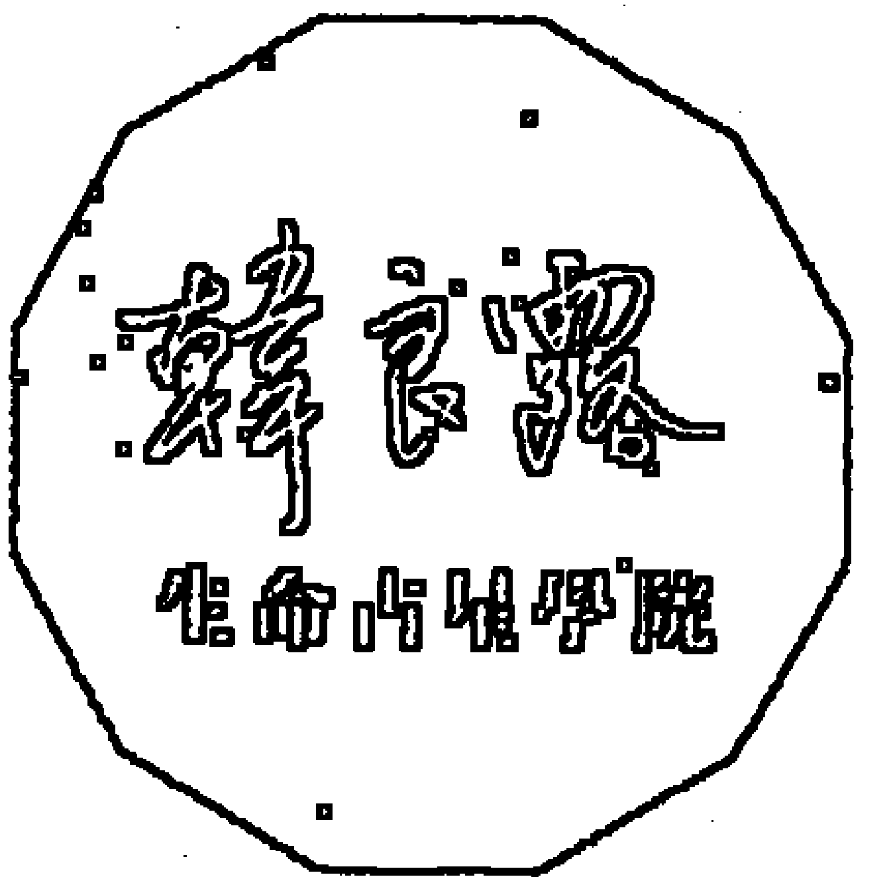
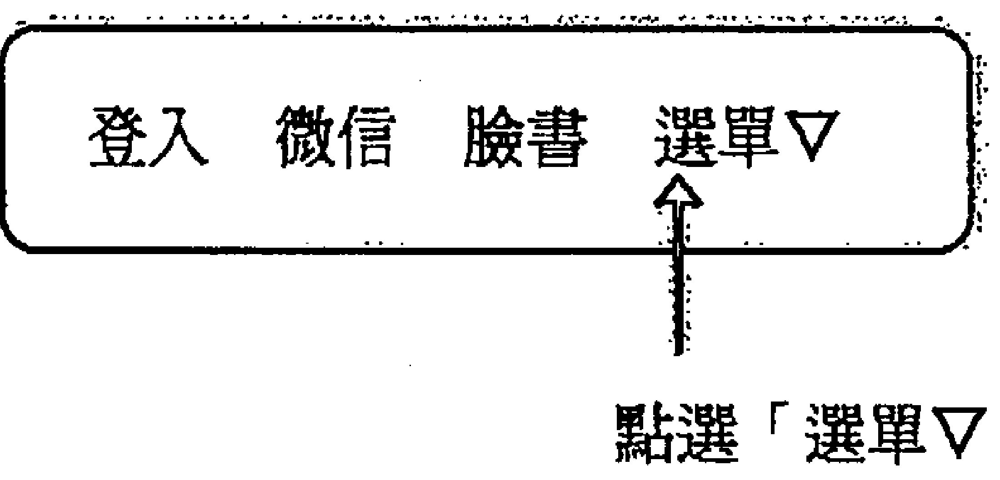
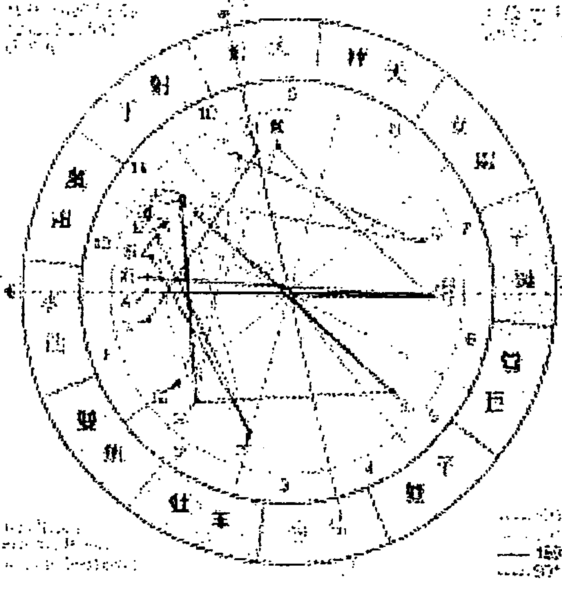

# 道家行星紫微

# PLANETS IN TRANSIT

星行運的生命節奏

韓良露
生命占星学院

# HOUSES

被行星推動走，不如主動跟命運互動

# 掌握行運的生命節奏

# 行運宮位聖經

Planets in Transit: Houses
韓良露 著

# 出版緣起

興趣廣泛、身份多元的知名文化人韓良露，除了大家熟知的作家、媒體人及文化推動者身份之外，她也是藝文圈中最受重視的占星學大師。

二○○三年起她在金石堂金石書院（現龍顏講堂）開設占星課程，由於口耳相傳、好評不斷，課程一直持續到二○一○年才劃下休止符。在長達八年的四百多堂課中，她以歷史、哲學、心理學、社會學的角度，將占星的深層智慧化為生動的教學內容，讓大家在學習與命運對話的同時，獲得看待人生的更高視野。

這一系列課程不但架構了宇宙法則的邏輯，也融入她對人性與社會的觀察，但因資料整理工程浩大，成書計劃一直未能完成，為避免這些珍貴課程內容成為絕響，南瓜國際透過多年來數量龐大的上課錄音及相關資料，依據當時課程的規劃邏輯，整理成為系列書籍，期望能藉由文字重現精彩、動人且充滿智慧的上課盛況。

# 序 行運借東風

每個人出生時的天宮圖，就是每個人的本命星圖。天上的行星並不會隨著誕生而停止，當天上的行星繼續行進，就會跟每個人的本命星圖形成互動，這就是所謂的「行運」（Transit）。

每個人的命運都是天時、地利、人和的交互影響，行運就是所謂的「天時」，它是一種非常實用的占星技巧。透過這種技巧，我們可以得知生命會在什麼時候走進什麼樣的主題，更重要的是藉由各式各樣行運的週期，在行運週期的春夏秋冬中，讓我們走得更扎實，收穫更為豐厚。

每個人出生時東方地平線與黃道座標的交點就是上昇點，西方地平線與黃道座標的交點則是下降點，上昇、下降、天頂、天底將星圖切成四個象限，下半圓屬於私人領域，上半圓屬於公眾領域，左半圓屬於自我領域，右半圓屬於他人領域。再細分為十二個宮位，它們分別代表了十二個生命領域。一宮代表個人形象，二宮代表個人資產，三宮代表近程溝通，四宮代表家庭，五宮代表創造力，六宮跟工作與健康有關，七宮是一對一的合作關係，八宮是他人的共財與慾望，九宮是高等心智理念，十宮是事業舞台，十一宮是志同道合的理念之宮，十二宮則跟輪迴業力有關。

當行運進入宮位，跟這個宮位相關的人事物，就會被行運啟動。宮位就像舞台，當舞台被行運點亮，宮位中的人生大戲就會開演。任何行星進入到任何宮位，最明顯的狀況，就是跟這個宮位有關的外緣增加。行運的行星進入宮位，就像是「借東風」的概念，雖然有時候吹來的可能是暴風，也可能是和風。如果一個人只關心外緣帶來的東風，當事人就有可能像是一艘沒有舵的船，這艘船沒有方向，不知道自己要去哪裡，每當外緣之風吹起，船就開始動。對於不知道自己的生命之船要怎麼走的人來說，東風起就往西邊漂，西風起就往東邊漂，不管是遇到順風或是暴風，他們都隨風漂流。當行運進入一個宮位，當事人就漂入這個宮位，當行運進入另一個宮位，當事人又隨風漂到另一個宮位。當一個人毫無方向的漂來漂去，他就很難到達內心中想要去的目標，因為他只能被外緣帶著走。舉例來說，有的人可能嫁了好幾任老公，或者娶過好幾任太太，可是卻完全沒有從中學到東西，完全不懂得愛到底是什麼，也不知道自己真正喜歡的是什麼人。他們往往只是因為有人追，或者剛好身邊有個當時覺得可以的人，就隨波逐流的跟對方在一起，他們很可能從頭到尾都沒有得到他們想要的東西——因為他們從頭到尾都沒有想過自己真正要的是什麼。如果我們一輩子都只跟著外緣走，從來沒想過自己內在想要的是什麼，很可能一生就會不斷的經歷這樣的處境。因為光是只靠著風向，無法讓內心的船走到真正想去的地方。

在人生的牌局中，我們會有主動出牌與被動跟牌這兩種選擇。排除我們自己主動出擊的事情，如果對找上門的能量很敏銳，就很容易察覺到行運能量的波動。對大多數來說，大家比較容易往外看，而不是往內看，所以我們比較容易察覺到的是外緣的增加，沒有察覺到不管什麼行星進入什麼宮位，它們也會同時帶動內在能量。想要掌握行運的最好方式，就是能夠將內在能量與外在能量調和。如果我們對自己的生命有所認識，就不會只是被動的坐等行運有一顆什麼星進入自己的什麼宮位會帶來東風。學習行運最重要的是要學會怎麼跟行運互動，而不只是在那邊等待命運的牽引。你必須要知道你有什麼樣的特質可以配合行運能量一起發展，也必須知道有哪些陷阱必須要提防，不能等到事到臨頭才兩手一攤。例如本命星圖中錢財特別容易出問題的人，就得要特別小心借貸、作保的問題。借貸、作保往往當下看來都沒有問題，可是可能過了幾年出現行運克相時，當事人的錢財就可能會血本無歸。想要了解命運的軌跡，必須建立起對生命整體的全面性觀點，不能走一步算一步。如果一直都是走一步算一步，總有一天會遇到令你措手不及，來不及反應的一步。不管再怎麼會算的人，都會遇到出乎意料之外的好事或壞事，但真正懂得命理的人，不管遇到了出乎意料之外的好事或壞事，都能讓這些事情不致於影響到生命的主結構。

好事也可能會讓人偏離生命的主結構。大家不要以為好事有什麼了不起，我生命中遇過很多好事，事後想起來，這些好事只不過是愛玩罷了。當好事跟你的生命結構無關時，它們不過是過眼煙雲。如果不找出生命中的主結構，就算遇到了很多好事，也不過是被這些好事霸佔了你的時間罷了。我在早年時，不管是被好事或壞事霸佔生命的機率比較大，年過中年以後，儘管不能說一定不會被好事、壞事霸佔，可是已經懂得拒絕。即使表面上看起來是好事，我也不願意讓它霸佔掉我全部的時間。我的一生的時間可活，我的生命不能被表面看起來是好事的事情所霸佔。

學行運絕對不能夠一小截、一小截的看，因為這會是一種解讀命理的斷章取義，這樣必然會導致見樹不見林的後果。現在當下看起來很不錯的事情，搞不好在二三年後會為你帶來大麻煩。

面對行運的能量，與其被動的被行運推著走，不如主動參與。當一個人到了一定年紀以後，生命中有很多其實很無聊、很本能的事物，花太多時間在做這些事情是在浪費生命。如果能夠有所取捨，生命進化的旅程就會比較早開始。

學占星不應該讓人變得宿命論。一個人不能學了算命以後就把人生交給命運，失去了自主能力。因為每個人的每個決定，都有能量高低之分。每天在生活中會遇到各式各樣的事，要用比較高階的能量與態度去面對，還是用很低等的生物本能去打混，這些都要由你自己決定，而這些決定一定會為人生帶來截然不同的結果。

很多人在找人算命時，往往將算命師的話當成聖旨，不管是老天要給他們金銀財寶或是要降災，都是天上掉下來的運勢，只能被動接受，而沒想到自己可以進一步做些什麼。

事實上這一切都跟當事人有關，當你遇到好運時，這個好運會只對你有意義，或者可以將這個好運擴散出去，讓眾人都可以受益？當你遇到厄運時，是否可以透過心念的提升，讓厄運造成的損害程度減輕？

不管好運壞運，它們都可以是人生的學習，雖然當事人不管是浪費了他們的好運，或者是過度沈溺於他們的壞運，也只能說是個人造化。但如果我們幫別人算命，應該要盡量想辦法點醒他們，讓他們理解生命的能量與起伏，應該要主動參與。

在星圖裡面遇到的各式好壞相位，它們都是一副牌，你可以亂打，也可以好好打，端看你有沒有辦法把這副牌打好。對很會打牌的人來說，就算拿到最爛的牌，他們還是有辦法讓自己少輸為贏，安全下莊。也有的人明明一手好牌卻不懂得操作，反而一口氣把所有的錢輸光。其中更糟糕的是有的人一拿到爛牌就開始生氣，這就像是我們面對自己的星圖，看到哪個宮位、相位不好就開始生氣，這件事一點用都沒有。生這種氣只會在你遇到這個宮位、相位出問題時，更不知如何好好面對、解決問題。

對於高手來說，他們往往可以意識到不好的宮位與相位刺到的就是生命中最需要學習的部分，對此心懷感激。透過這樣的核心痛苦，可以讓人更貼近生命底層，更能理解自己內心最深層的秘密。這些都是我們最不敢告訴別人，卻最應該要好好的了解的部分。當行運碰觸到我們的負面宮位、相位時會出現的負面情況，有一點像是如果我們洗完澡發現洗澡水很髒，就會感覺自己這次真的把自己洗得很乾淨。當我們遇到了生命中的負面相位的麻煩，遇到了很多痛苦，如果能夠真的理解這些問題，我們也會有一種真正將生命核心洗乾淨的感覺。

生命中的好運，其實只是像是噴香水，每天我們噴著香水出門，別人聞著香，我們未必覺得自己很乾淨。而生命中的壞運，當我們安然度過之後，其實會感覺很踏實。人容易經由痛苦而覺得自己被洗清，如果不經過一番痛苦，人其實不確定自己是不是真正的學到教訓。

好運有時候只是給別人看的錦上添花，它們未必能觸動我們內心的核心議題。吉星也是，例如代表好運的木星很難為我們帶來什麼深刻的啟示，木星出現時大家都很快樂，但一個人在賺下最後一口氣時，想的是我這輩子賺了三千五百萬，或者小時候領了幾個獎狀、長大以後得了什麼獎這類的事。你在離開這個世界前的瞬間，你想的必然是跟土星、天王星、海王星、冥王星相關的深刻甚至痛苦的課題，因為它們才是生命最底層的問題。

註 本文依據二〇〇五年行運相關課程整理而成。

# 目錄

# 序

# 前言

行運借東風 5

掌握行運的深刻內涵 17

# Chapter 1

## 一宮——個人形象、自我認知 41

- 行運太陽進一宮
- 行運月亮進一宮
- 行運水星進一宮
- 行運金星進一宮
- 行運火星進一宮
- 行運木星進一宮
- 行運土星進一宮
- 行運天王星進一宮
- 行運海王星進一宮
- 行運冥王星進一宮

# Chapter 2

## 二宮——金錢收入、個人資源 89

- 行運太陽進二宮
- 行運月亮進二宮
- 行運水星進二宮
- 行運金星進二宮
- 行運火星進二宮
- 行運木星進二宮
- 行運土星進二宮
- 行運天王星進二宮
- 行運海王星進二宮
- 行運冥王星進二宮

### Chapter 3: 三宮——手足鄰居、近距溝通

- 行運太陽進三宮
- 行運月亮進三宮
- 行運水星進三宮
- 行運金星進三宮
- 行運火星進三宮
- 行運木星進三宮
- 行運土星進三宮
- 行運天王星進三宮
- 行運海王星進三宮
- 行運冥王星進三宮

### Chapter 4: 四宮——家庭歸屬、內心之家

- 行運太陽進四宮
- 行運月亮進四宮
- 行運水星進四宮
- 行運金星進四宮
- 行運火星進四宮
- 行運木星進四宮
- 行運土星進四宮
- 行運天王星進四宮
- 行運海王星進四宮
- 行運冥王星進四宮

### Chapter 5: 五宮——創造表達、遊戲冒險

- 行運太陽進五宮
- 行運月亮進五宮
- 行運水星進五宮
- 行運金星進五宮
- 行運火星進五宮
- 行運木星進五宮
- 行運土星進五宮
- 行運天王星進五宮
- 行運海王星進五宮
- 行運冥王星進五宮

### Chapter 6: 六宮——工作秩序、身體健康

- 行運太陽進六宮
- 行運月亮進六宮
- 行運水星進六宮
- 行運金星進六宮
- 行運火星進六宮
- 行運木星進六宮
- 行運土星進六宮
- 行運天王星進六宮
- 行運海王星進六宮
- 行運冥王星進六宮

### Chapter 7: 七宮——合夥伴侶、平等關係 221

- 行運太陽進七宮
- 行運月亮進七宮
- 行運水星進七宮
- 行運金星進七宮
- 行運火星進七宮
- 行運木星進七宮
- 行運土星進七宮
- 行運天王星進七宮
- 行運海王星進七宮
- 行運冥王星進七宮

### Chapter 8: 八宮——共有財產、隱藏慾望 253

- 行運太陽進八宮
- 行運月亮進八宮
- 行運水星進八宮
- 行運金星進八宮
- 行運火星進八宮
- 行運木星進八宮
- 行運土星進八宮
- 行運天王星進八宮
- 行運海王星進八宮
- 行運冥王星進八宮

### Chapter 9: 九宮——異國旅行、宗教哲學 275

- 行運太陽進九宮
- 行運月亮進九宮
- 行運水星進九宮
- 行運金星進九宮
- 行運火星進九宮
- 行運木星進九宮
- 行運土星進九宮
- 行運天王星進九宮
- 行運海王星進九宮
- 行運冥王星進九宮

### Chapter 10: 十宮——事業舞台、成就渴望 301

- 行運太陽進十宮
- 行運月亮進十宮
- 行運水星進十宮
- 行運金星進十宮
- 行運火星進十宮
- 行運木星進十宮
- 行運土星進十宮
- 行運天王星進十宮
- 行運海王星進十宮
- 行運冥王星進十宮

# Chapter 11
## 十一宮——志同道合、理念公益 349

- 行運太陽進十一宮
- 行運月亮進十一宮
- 行運水星進十一宮
- 行運金星進十一宮
- 行運火星進十一宮
- 行運木星進十一宮
- 行運土星進十一宮
- 行運天王星進十一宮
- 行運海王星進十一宮
- 行運冥王星進十一宮

# Chapter 12
## 十二宮——宿世業力，靈魂輪迴 375

- 行運太陽進十二宮
- 行運月亮進十二宮
- 行運水星進十二宮
- 行運金星進十二宮
- 行運火星進十二宮
- 行運木星進十二宮
- 行運土星進十二宮
- 行運天王星進十二宮
- 行運海王星進十二宮
- 行運冥王星進十二宮

## 附錄 1 行星符號、星座符號與宮位 401

## 附錄 2 查詢星圖網站 403

## 附錄 3 查詢即時行星狀態與天文曆 407

# 前言 掌握行運的深刻內涵

如果要用簡單的方式來說明如何運用行運，我舉個例子。每個月我都有一些固定會寫或不固定的專欄要寫，而我通常會利用一些恰當的小行運，例如月亮、水星之類的好行運，一口氣從早到晚把它們全部寫完。當行運對的時候，會帶來靈感，如果不趁著靈感到的時候趕快多寫一點，行運過了就過了。雖然我也可以在靈感在的時候只寫一篇稿子，其他時間跑去玩，可是如果我趁著靈感還在的高峰期，一口氣寫五篇稿子，這五篇稿子都會是品質很好的稿子。

但行運的重要遠不止於此。

我們在解讀星圖時，應該要思索如何跟能量達成共識，藉由星圖預估哪些事情有可能會發生，身邊有哪些人會推波助瀾讓能量產生波動，也就是從時運、地運、人運的角度，盡可能的接近真正會發生的實際情況。

行運不可能獨立於本命而存在，否則每個人的命運都一樣了。每一顆行星進入宮位時，都有可能會形成好相位或壞相位。以平均宮位而論，一宮、五宮、九宮之間，二宮、六宮、十宮之間，三宮、七宮、十一宮之間，四宮、八宮、十二宮之間會形成一百二十度和諧相。而一宮、四宮、七宮、十宮之間，二宮、五宮、八宮、十一宮之間，三宮、六宮、九宮、十二宮之間會形成九十度或一百八十度剋相。

每一個行運都有可能帶來正面能量或負面能量，當每一個行運進入宮位，除了點亮這個宮位之外，也有可能會跟其他宮位形成一百二十度好相位或九十、一百八十度壞相位。

本書提到跟宮位相關的好相位或壞相位是以等宮制來劃分，不過每個人的本命星圖的宮位大小可能各不相同，未必一定會照著上述的宮位，所以大家應以真實形成的相位（合相、九十度、一百二十度或一百八十度）為主。

宇宙級的知識，都必須要靠著密碼才得以保留。密碼是讓高深知識得以流傳更廣、更久的方式，如果不用密碼，它就會變成沒有辦法流傳與解讀的天書了。學占星，學的就是解碼的技巧。

行運不脫本命格局
從宮位角度來看，不管是行運或本命，都有可能會形成一百二十度和諧相或九十度、一百八十度剋相。一個人的本命星圖中本來就有的一百二十度或九十、一百八十度相位，很容易因為行運的進駐而被啟動。從此可見，本命星圖就是一種「格局」。以跟金錢相關的宮位來看。二、五、八宮互相形成九十度或一百八十度剋相，不管是二宮的勞務所得、五宮的投資所得、八宮的他人共財，這三者都是不可靠的流動財。不管再會投資的理財專家都有失手的時候，就是因為二、五、八宮彼此互剋，而且流動、不恆定。最能表現不動產特質的就是四宮家庭宮，房地產是最保值的東西，除了戰爭可能會毀掉房地產，否則土地不太可能會變得一文不名。古語說「有土斯有財」，這句話放諸全世界都適用。現代所謂的「有產階級」，指的是擁有房地產。以我的二宮金錢宮為例，因為我的五宮、八宮、十一宮有很多行星，當任何行星行運進入我的二宮時，都會跟我的五宮、八宮、十一宮中的行星形成剋相，我的本命星圖的格局中，二宮會是一個很大的問題，所以我對所有跟二宮金錢宮相關的事物都會特別提防。由於我很清楚自己的星圖格局，所以我在預防二宮、五宮、八宮、十一宮的剋相時，做得會比不懂自己格局的人要好。我從一九九七年搬回台灣之後，遇到很多一般人會認為是好運來，但事實上最後可能會讓我惹禍上身的機會。我認識很多大老闆，而我主動的推掉了所有內線交易的機會，因為我對我自己的二宮、五宮、八宮、十一宮的剋相很清楚，也對我自己的生命之舵很清楚，或許有的人做這些事不會出問題，但是我不能做。當我們盯著行運一小段一小段的看星圖，後面沒有一個對本命格局的基本認識是很危險的，原因就在於剋相之所以容易出問題，是因為剋相所在的位置本身就會造成問題。以我為例，在二宮、五宮、八宮、十一宮的互為九十度剋相中，我的八宮（他人資產宮）與十一宮（社交宮）都有行星，這意謂著我不但朋友很多，而且有錢有權的朋友很多，我會面臨到的誘惑，當然會比一般人更大，而這些誘惑如果不加以抵抗，到最後終究會帶來問題。甚至不是三年五年的問題，它有可能會是樹倒猢猻散，在環環相扣的人際關係中只要有一個人倒了下來，一連串的帳查下來，結果你就受到牽連了。學習行運跟大眾媒體上的每日、每月運勢的不同，在於我們可以透過長程的行運，為自己的生命預作準備。假設我算出我在某一年會有一個行運海王星進二宮，跟本命八宮與本命十一宮中行星形成的剋相，代表我有可能遇到一些金錢上的損失。我現在已經不太可能會因為貪財而被騙，所以我又去清查了身邊人的星圖，發現我有可能會在那段期間因為身邊親人的身體狀況而損失一些金錢。行運海王星進二宮形成的剋相，一定會因為情感因素而損失一些錢財，既然已經心裡有數，而且提前做了準備，到時候雖然金錢損失不可避免，但至少不會措手不及而手忙腳亂，並且設立底線，在底線範圍內的錢要出，但不能超過底線。大家可能會想，既然都已經算出來會是這樣的問題，為何不直接預防？但生命中有很多功課，並不是可以預防得了的，我們能做的只是提前預作好到時候必須應對的準備。在做好應對準備的範圍內，完成一個有為有守的人生。

# 行星各有不同週期

當我們遇到行運時，到底什麼事情可做，什麼事情可不做？我們一定要先將生命之舵定下來，從而判斷我們要怎麼去走人生之路，否則的話，人生的風險會很大。

十顆主要行星各自代表不同意義。

- 太陽代表個人意志，太陽的行運會帶來一些跟面子相關的事情。
- 月亮代表情緒，月亮的行運會引動出內在情緒。
- 水星跟心智溝通有關。
- 金星跟情感與美感有關，金星的行運常常會顯示在消費與社交行為上。
- 火星代表本能的衝動，行運火星進入一個宮位，就會在宮位的相關領域中變得很有行動力。
- 以上五顆行星都是個人行星，它們都跟個人特質有關。
- 木星是一顆吉星，行運木星通常會帶來一些社會資源。
- 土星是物質世界的法則，行運土星必然會帶來一些沈重的壓力。

天王星宇宙無常的變化，行運天王星常常會帶來預料之外的意外。

海王星是宇宙無邊的愛與同情，行運海王星進入宮位，當事人會在宮位相關的人事物上變得比較迷糊。

冥王星具有死亡與重生的力量，行運冥王星進入一個宮位的時間很長，它的執著容易引動一些具體的毀滅與重生事件發生。

每一顆行星各有不同週期，週期越長，影響力就越大。太陽、月亮、水星、金星、火星這五顆內行星的週期都很短，它們的行運帶動的都是影響力不大的生活瑣事。木星、土星、天王星、海王星、冥王星的行進速度慢，帶動的就會是比較大的事件。

- 木星大約十二年走一圈。
- 土星平均二十九年半走一圈。
- 天王星平均八十四年走一圈。
- 海王星平均一百六十五年走一圈。
- 冥王星大約兩百四十八年走一圈。

不管是行運木星進入一宮，或者行運土星進入一宮，它們都會各自帶來一個十二年或二十九年半的週期，在掌管人生之舵時，應該怎麼看待行運木星週期與行運土星週期？

行運土星是一個比較可以掌握的人生的長週期，它也是最重要的現實週期，因此要先能夠把握好土星週期，然後用行運木星來幫助土星。

木星的好運、資源，是為了要來成就土星。一個人很可能會因為木星而賺到很多錢，而這些錢是為了要幫助土星長時間經營自己時，能夠在經濟上比較寬裕。

木星的金錢是流動的動產，大家常說「有土斯有財」，意思就是流動的錢如果不化為具體的財產，很容易就留不住了。雖然不是說大家一定要趕快把所有流動的錢都變成房地產，可是大家在做財務規劃時，一定要將一部分的動產變成不動產。所有的不動產都是由動產變成的，就算是從遺產而獲得的房產，一開始的時候，也必然是由上一代花錢買來的。也就是說，如果沒有木星的資源，土星就不容易累積。

我們需要好好掌握自己的生命之舵，從而好好的洗清土星的弱點、完成土星的智慧。不只是金錢，在完成土星智慧的過程中，木星帶來的新經驗拓展也很重要。一個人如果只顧得土星的現實，一點木星的新經驗都沒興趣的話，土星就只會變得僵固，而不是智慧了。

土星的完成必然得要仰賴木星，可是過度發展的木星，也會危害到土星。舉例來說，我是一個非常喜歡旅行的人，我一直給自己訂下一年最多三四個月旅行，其他時間要做正事，而不是因為喜歡旅行而整年都去旅行，變成永遠「在路上」，而犧牲了所有的生活主調。我認識一個朋友，他就在經在美國待了十年，完全不工作，每天在晃蕩——這件事情有其價值，可是如果一輩子到最後真的什麼事情都沒做，這一生就很可惜了。

此外，我雖然一年會花很多時間出國，可是隨著經驗的增長，我也越來越聚焦於我真正想去研究的國家，而不是像早年一樣亂槍打鳥，只要沒去過的地方，我都很想去。現在即使是我想去的地方，只要不在我的研究範圍內，我就不會將它列入旅遊計畫中。

每一顆行運中的行星，它們都在一宮到十二宮之間流轉，而隨著年紀的成長、生命經驗的增進，以及你整個人心性的改變，你的課題也會改變。但雖然能量的位階改變，它們依然受限於應有的能量結構。

我在二〇〇五年教行運占星課時，剛好遇到行運土星進八宮，因此我不斷在生活中出現土星八宮的各種議題。也因為我自己知道行運土星進我的八宮，所以很容易就可以在生活中察覺各式各樣相關的蛛絲馬跡，而從這些重複出現的蛛絲馬跡中感受到主題。

我的本命八宮與本命十二宮有很多行星，當行運土星進八宮時，它透過很多身外發生的事來不斷點亮我的八宮與十二宮，讓我不斷的感受到八宮的生死之事與十二宮的輪迴議題。例如在上課前一天，我去一個好友家，她去大陸旅行時遇到了一個通靈人，對方告訴她很多不可思議的前世議題，另一個朋友的太太生重病，每天晚上白血球急速下降，可是天亮之後又回升到正常。這都是在提醒我死亡與輪迴不滅的課題，雖然我相信靈魂不滅，但是透過行運的行星進八宮帶來的外在事件，可以讓我更深切的從現實生活中感知這件事。八宮可能會帶來一些跟死亡相關的事件，而透過對死亡的深度思索，反而可以得到靈魂永生的契機。

木星代表的是社會主流價值，我在這一個新的木星週期也有一些社會化的調整，否則照我原先想要完全只寫占星書的話，恐怕頂多只有對占星有興趣的幾千個人會受到我的影響，甚至很有可能被人視為女巫或怪人，這也非我所願。所以我決定除了占星之外，也要寫很多不同的文類，這也是我的興趣，並沒有違反我的原則。而且如果出版市場證明我寫其他文類都寫得不錯，就可以證明我這個人的頭腦是清楚的，並不是一味的怪力亂神，藉此去除占星學的污名化。在這一輪迴的木星週期中，我也盡可能的做很多跟木星的社會利益有關的事務，包括擔任文化局、市政府的顧問，並沒有完全只做占星學。對大多數人來說，如果大家看我做文化評論、寫旅行美食都寫得不錯，那麼我來講占星學，應該也不會是騙人的東西。另一方面來說，大家也不會覺得我是因為為其他地方都沒搞頭，所以只能來搞占星學。總歸來說，越是想要做好占星學，就變得要做個「正常人」。這麼一來，做占星學這件事，才不會顯得很荒謬。這是我想要為占星學去污名化所做的努力。很多腦袋清楚的人並不是真的會排斥占星學，而是他們看到太多電視、媒體上胡說八道的占星學之後，才決定要排斥占星。我自己悶著頭寫占星也沒用，因為大家不會想看，最好的方式，就是讓大家藉由其他的文化、文學議題先認識了我以後，或許他們會有興趣聽我談真正的占星，我才有辦法真正的將占星學傳播出去。

## 練習記錄占星日記

想要把行運學好，占星日記非常重要。所謂的占星日記，就是每天簡單記下當天發生的三四件重要的事，不必鉅細靡遺，也不必附註心情，因為如果寫得太複雜，一方面很容易寫了幾天就無以為繼，另一方面也反而會干擾到事後的解析。但也不要太簡單，比如我有一天的日記寫著「吵架」，我中年以後脾氣變得比較好，很少跟人吵架，所以吵架的確是值得一記，問題是跟誰吵？為何而吵？才不過半年前的事，我卻已經完全忘了。所以雖然要以簡略為主，但還是得簡明扼要的交代相關人事物。

本書除了教大家木土天海冥的外行星行運，也教大家日月水金火的內行星行運。外行星行運帶來的都是大事件，或許還可以不依靠占星日記，但日月水金火的內行星行運反映出來的都是一些小事，如果不靠著占星日記，考你五個月前的某一天你做了什麼，恐怕沒有人會記得。

既然內行星行運都是小事，為何還需要記日記？原因在於內行星行運會帶來許許多多的小事，如果懂得觀察的話，你會發現，這些日常小事都會指向共同的主題，而這些主題會跟你的本命星圖的格局有關，也跟外行星行運的大運有關。

如果能夠有好幾年的占星日記固然好，即使沒有，大家從現在開始寫，一年以後就會有一整年（行運太陽走了一整圈）的占星日記，這會對學習行運有非常大的幫助。

行運容易顯現在我們當天遇到了什麼人身上。這些人代表了某些意義，它會點出行運的主題。尤其在一些走得比較快的行星，例如行運太陽進入了什麼宮位、行運月亮進入了什麼宮位，常常就會出現某個太陽或月亮在這個星座的人，為我點出相對應的主題。

例如我有一次在行運太陽進入我的九宮時，我約了四個跟我合作過的不同出版社編輯吃飯。出版這件事屬於九宮領域，大家一起吃飯時，我才發現，四個編輯裡面，竟然有三個是太陽處女，一個月亮處女。

每天我們在生活中遇到的各種人事物理，其實都在天時、地利、人和中，扮演了屬於各自的時刻。這些人在行運中，遇到跟行運相稱時機上台，等到行運過去，這些人就下台。

有些人在我們生命中會在固定的時間固定出現，他們可能多年來都會在某幾個月跟你碰面，一起跟你去做什麼事。這些會固定出現的人，他們跟你的緣分一定比較重。而某些人則偶爾出現，即使只是偶爾出現，其中有些人會帶著重要主題出現，有些人帶著的主題並不重要。

如果我們對生命經常處於無感狀態，身邊所有的人事物都會變得像跑龍套一樣，因為我們感覺不到生命的巧妙。這些人隨著行運與人際緣分在我們的生命中來來去去，在那個當下，我們甚至都沒有意識到行運的能量已經在你身邊運轉。但其實生命中行星能量帶來的天時、地利與人和，是要幫助我們將這些能量內化自己的生命能量，而不是像跑龍套一樣在你身邊來來去去。

當我們可以看出行星能量的變化，這些事情可以幫助我們深入瞭解人生，進而幫助我們完成我們想要完成的人生召喚。

儘管本書為了方便閱讀與理解，我們介紹行運時是依照太陽、月亮、水星、金星、火星、木星、土星、天王星、海王星、冥王星，由內行星到外行星的順序，但在我理想中的教學順序，應該是從行運冥王星開始，然後海王星、天王星、土星、木星，再依序到火星、金星、水星、月亮、太陽。原因是越遠的外行星影響時間越久，影響力也越大。尤其是動輒在一宮中停留七年到幾十年的行運天王星、海王星、冥王星，當它們進入一個宮位，可說是當事人這段期間最重要的生命基調，重要性當然不言而喻。

木土天海冥外行星的行運顯現出一個大趨勢，而太陽、月亮、水星、金星、火星的內行星行運等於是一種規模較小的預習。所以大家不需要每天追著內行星行運，但內行星的行運，可以讓我們看到日常的小細節。

大家熟悉行運特質會有哪些三元素。當你藉由內行星的行運熟悉了行運特質而又能抓住外行星旋律時，外行星行運加上內行星行運的掌控，可以讓你譜出更為美妙的生命之歌。

就像越高竿的音樂家，越能連最細微的音符都掌握得很好，但一開始時，一定是先從大架構下手。行運木土天海冥就是行運的大架構，沒有學好大結構前，不可能學好內行星行運。可是我們可以靠內行星行運來熟悉行運的法則。內行星的行運週期短，它們會在生命中不斷的出現，藉由內行星的週期，我們可以掌握行運的節奏，等到真正遇到木土天海冥的行運時，才能更趨勢而為。

### 當內行星進入宮位

所以大家在看行運時，一定要從外行星先看起，在行運外行星（冥海天土木）的架構下，再來分辨行運內行星（火金水月日）的細微變化。

為了解說方便，本書在談論宮位之間的相位連動，會以最基本的平均宮位制來解說，例如二宮、六宮、十宮之間有一百二十度和諧相，二宮、五宮、八宮、十一宮互為九十度或一百八十度剋相。平均宮位主要是讓大家方便記憶、容易建立邏輯的守則。但大家會發現，其實本命星圖的宮位有大有小，有的人一個宮位甚至跨了三個星座，所以除了一百八十度必然是對宮之外，其他有可能會有一些未必完全符合平均宮位的例外之處。

不過大家不必擔心，每個人的星圖都是獨特的，都有可能在標準型之外有一些例外。當你遇到了跟平均宮位不同的狀況時，通常也會是基於相同的邏輯，但因應你個人的生命狀態而產生的不同特例。我們在學習行運宮位的相位互動時，應先理解最標準的平均宮位之間會有什麼樣的能量互動，以此為基本邏輯，再根據當事人實際星圖狀況稍作調整即可。舉我的例子來說，我的十宮（事業宮）尾端有一顆海王星，三宮（大眾媒體宮）的頭有一顆月亮，這兩顆行星形成了一百二十度和諧相。一般來說，十宮（事業宮）應該要跟二宮（金錢宮）形成一百二十度和諧相，因為事業跟賺錢這兩件事會互相幫助，形成良性互動。但我這輩子連一天班都沒有上過，不管是早年拍片、寫劇本、做新聞，到後來寫專欄、演講、教占星，這些全部都屬於三宮領域。我因為寫稿、演講（三宮）而成名（十宮），而我在十宮的知名度，又讓我有機會參加座談會、寫更多的稿子（三宮）。從這裡我們可以看到，雖然這個相位乍看之下似乎跟平均分宮法不同，但是它其實依然建立在基本邏輯上，卻又很符合當事人實際的生命狀況。

行運太陽、月亮的行進速度都很快，如果依平均一個宮位是三十度來算，行運太陽走一個宮位只有一個月，如果跟宮位中的行星形成相位時，影響力也不過幾天，而行運月亮更快，兩天半就會走完一個宮位。當行進速度很快的行運內行星進入宮位，又跟行運外行星的主產生呼应时，行運內行星就會出現顯著的生命事件，這類的生命事件會同時呼應著長時間的行運外行星宮位、相位，以及短時間的行運內行星宮位、相位。相對來說，短時間的行運內行星如果缺乏長時間的外行星行運配合，它就不太可能出現顯著的生命事件，但還是會出現一些跟內行星行運性質相近的小事件。我有一年因為跟航空公司起了一些糾紛，結果上了晚間新聞，隔天還變成社會版頭條，這是因為當時行運火星進入一宮，又搭上了其他外行星行運才會衍生出這麼大的事件。否則一般來說，行運火星進一宮頂多跟人吵吵架，不會吵架吵到上電視。也就是說，不管是內行星或外行星的行運，它形成事件的大小，會隨著它是內行星行運結合外行星行運，或者只是單純的內行星行運而有所不同。我平常並不會每天盯著行運星圖看內行星的變化——否則就像是死盯著地圖的一小角，容易見樹不見林，迷失了大方向。除非有特定原因（例如想挑個結婚的好日子），否則內行星的行運最適合的用途，是拿來自省每天生活上的小事是如何呼應著大行運的主題。如果大家有記占星日記的話，儘管每天發生的事情多半是小事，可是如果累積夠多的資料，就會發現這些小事往往在有規律的訴說著相同的主題。如果有兩三年的日記固然好，但有一年的日子，應該就有辦法感受到它的規律。

### 當外行星進入宮位

木星、土星、天王星、海王星、冥王星的週期長，進入每一個宮位的時間也比較長。行運天王星、海王星、冥王星這三顆宇宙行星，最短的天王星會大約停留七年，而最長的冥王星則可能會停留二三十年。要怎麼觀察這麼長時間的行運？關鍵在於在這段期間，如果行運的行星跟本命星圖中的行星形成相位時，會有很顯著的相關事件發生。人會去做什麼事情，都會先經歷想做但還沒有真正去做的階段，即使不是我們主動想做，而是別人找上門，這也反映出我們其實有在想這件事。當行運的行星進入宮位時，即使還沒有跟本命星圖中的行星形成相位，我們也已經進入了這個宮位主題中。以二宮金錢宮為例，當行運冥王星進二宮時，當事人在這段長達十幾年，甚至二三十年的時間，都會對二宮的金錢價值議題很關注，尤其是冥王星代表的大錢或隱藏性、政治性的金錢結構很感興趣，也做了一些相關決定，例如利用一些技術性手段來避稅，原本都好好的沒問題，可是在行運冥王星與本命土星形成了九十度、一百八十度，甚至比較次級的一百五十度相位時，忽然就出了問題。

也就是說，當一個人起心動念時，如果起的心不正確，就會一路引導到錯誤的道路，而終於在相位出現時引爆。

在行運冥王星進二宮的課題中，有許多危機是可以事前避免的，例如作假帳。但冥王星的麻煩，也在於冥王星代表的是大錢、大權，當我們藉由行運冥王星進二宮而進入了一個龐大的金錢結構時，例如我們在這個時候當了高官，就不可能每一個環節都能夠清查得到，不可能保證在你手下工作的每個人都不出問題。如果真的察覺到大事不妙，至少要在負面相位降臨前懂得放手，不能等到相位事件出現以後才身敗名裂。

行運冥王星進二宮的重要課題，就是「戒之在貪」。如果做不到從頭到尾都戒之在貪，至少在出問題之前早一點放手，或許還是會被牽連出來，但至少會比身處高位出紕漏要好一些。我認識一個老先生，他多年來一直稱霸政壇，晚年卻因為銀行超貸案搞得身敗名裂，事實上如果他早個三五年退休，不要這麼不甘寂寞，就算被別人牽連，也不至於像他這樣把自己搞得無法翻身，後來潛逃大陸，再也不敢回台灣。一般人大概遇不到這麼大的事件，但也有可能身為小職員，為了討好老闆而幫忙作假帳，結果被揪了出來，為自己惹上很大的麻煩。

很多人找算命師，想要問的不外乎是「我是不是遇到小人？是不是小人害我惹上麻煩」？但行運天王星、海王星、冥王星進二宮，追根究柢，惹出問題的都是自己。當行運冥王星進入二宮時，我們介入的是什麼樣的二宮情境，一開始都是我們自己決定的。

大家在面對行運相位的時候，很容易對到底是「行運本身的相位」還是「行運跟本命形成的相位」感到很混淆。這兩者是不同的。

行運的相位事實上分成兩大類：行運跟行運形成的相位，以及行運與本命星圖中的行星形成的相位。所謂「行運本身的相位」，舉例來說，行運天王星跟行運木星形成一百八十度剋相，分別落入一個人的二宮、八宮，即使當事人的本命二八宮都沒有行星，二宮與八宮都與金錢有關，行運天王星與行運木星的一百八十度對立，還是會引起當事人在金錢方面出一些問題，但行運走了以後也就走了。但如果一個人本命土星在八宮，又遇到了行運木星進八宮時，本命土星在八宮是當事人本來就有的原有能量，它是當事人本來就具有的傾向，行運木星代表的是來自外界的事件，當本命土星八宮被行運木星進入八宮啟動，影響力就會更大。

也有可能行運進入一個宮位時，本命星圖這個宮位本身並沒有相位，例如一個人可能本命三宮沒有相位，當行運木星進三宮時，當事人都會跟外界互動變得特別頻繁，也容易跟別人產生衝突，但這類行運帶來的事件，都只會在行運進入宮位的那段時間內出現，等到行運木星離開三宮，這些情況也就會過去了，這就是行運帶來的外緣。

本命星圖中行星落在什麼宮位，這是我們生命本來就具備的元素，它們是「內緣」，而行運帶來的外界影響，這些就是「外緣」。本命相位的內緣，它是我們本來就有的特質，而外緣是我們本來並沒有的特質，所以我們會對行運的外緣比較不熟悉。

我們常說，有人在一生中會有一段時間性格巨變，但我們也常說，江山易改本性難移。前者說的就是行運帶來的外緣影響，後者說的就是本命星圖原本的星圖結構。很多行運的行星從十二宮經過上昇點進入一宮時，都會帶來很大的改變，假如有一天行運冥王星（跟改頭換面有關）進入我的一宮（跟外在形象有關）時我忽然瘦了，大家一定會說韓良露「巨變」。事實上我還是我，我只是因為行運冥王星進入了一宮，而在外貌上有了一些改變。

我們常說身心靈，行運冥王星從十二宮穿過上昇點進入一宮，可說是一個靈、心、身的過程。一宮個人形象宮是「身」，但它卻不只是單純的「身體」，它也代表我的身體跟這個世界的「世界之身」之間的關係。在這整個世界之身中，不只是肉體，它也包含了情緒、思考與靈性。

如果一個人在行運冥王星進十二宮時，沒有好好的學好冥王星功課，等到行運冥王星進入一宮時，行運冥王星能帶動的就只有表面的「身」，裡面是空的。也可能由於沒有淨化，變成了妖怪之身，它裡面有著太多的欲火或野火，結果後來欲火或野火將整個身都燒掉了。

又如有的人可能會在行運土星進十宮事業宮時，會感覺到這兩三年的工作壓力特別大，等到行運土星走到十一宮時，他做的還是同樣的工作，可是他覺得壓力沒這麼大了。同樣做著相同的工作，有的時候會感到壓力很大，有的時候不會，這就跟行運有很大的影響。又如行運天王星進入六宮健康宮時，當事人容易生病，但如果當事人本身身體不錯，等到行運天王星離開六宮時，當事人就又會恢復健康了。行運代表的是外在情境變化，當行運離開了這一宮，相關的情境往往自然就會結束。

以我為例，我的六宮健康宮本身沒有行星，所以我的健康一直沒有什麼問題，可是我的本命土星在十二宮，當行運土星進入六宮時，就會跟本命十二宮的土星出現一百八十度相位，所以我在行運土星進六宮時身體很不好，尤其會反映在跟土星相關的皮膚、骨骼問題上。所以我在那段期間，甚至有一次因為嘴饞，在大熱天自己跑去吃麻辣鍋，結果引發蕁麻疹發作，半夜送醫急診。但行運土星在一個宮位的時間不過兩三年，等到行運土星離開了六宮，這些問題也就自然消失了。

就像列車時刻表一樣，每個人的生命時刻表都不同，不同行運進入不同的宮位，就是我們這輩子的生命時刻表。行運天王星、海王星、冥王星之所以重要，就在於它們在一個宮位裡面停留的時間真的很長，如果是行運海王星進我六宮待個十幾年，它就不像行運土星這樣忍個兩三年就可以過去，它會引發的問題就很複雜。

## 以占星來詮釋人生

占星學最美之處，是它讓我們擁有了一種詮釋人生的工具。大家總是以為占星最重要的功能是算命，並不是如此。不縱觀人生而片面的算命，就算當下很準，也很可能過了一段時間反而因此出問題。算命算準根本不稀奇，我們學占星，最重要的是要學會占星中的哲學，用占星哲學去面對人生。

用占星學去詮釋世界，這是其他不管是哲學、神學或藝術都不能及的好工具。其他的學術方法當然都各有其優點，而占星學可惜的地方，在於占星學有其專屬的占星語言，如果不懂得占星語言，一般人很難理解占星的邏輯。

我有個學生在高中教書，她有空的時候幫一些學生解盤，對這些同學很有幫助。我對這件事感到很欣慰。這些同學可以在這麼年輕的時候就接觸到占星學，以占星學做為人生的啟蒙，雖然並不真的了解占星，可是知道日後遇到困難時，可以有一個工具來幫助自己度過生命的險灘，這是一件很美的事。

在學習占星的過程中太過關心算得準不準，也是一種學占星的大問題。只要學習的方法正確，算得準是應該的。但有的人會為了求準而瘋狂的鑽牛角尖，這就會有點像是一個醫生每天從早到晚都在看感冒，看太多感冒的結果，反而變成一個很會看感冒，卻對整個人的健康不了解的人了。因為他會忙著開感冒藥，結果忽略了何謂健康。學占星也是一樣。算命的技巧固然重要，可是如果一味的只注重算命的實戰技術，而忽略了背後的哲學命題，很有可能反而錯失了宇宙要傳達給我們的智慧。

很多算命先生算命的確算得很準，但如果除了算命之外什麼都不會做也沒用，因為等於是把命給算扁了。他們很可能就被框限在本命與行運之間，發揮行星的最基礎能量，扁扁的過著日子罷了。很多成大功立大業的人根本不信命，也有很多算命先生一輩子都成不了什麼大事，原因就在於後者等於是把命算扁了，每天就在那邊看看合相、和諧相或九十度、一百八十度剋相，既沒有上進心，也沒有求知欲。這樣還不如一開始就什麼都不知道，靠自己奮力與命運拼鬥。每一顆行星能量的可能性，都有可能是從一到一百。很多會算命的人都敗在自我設限，只想低空飛過，結果都只發揮最低標準的實力。

不過懂命理的好處，也在於至少知道這塊地底下有沒有石油，而不会明知沒石油，卻不切實際的往下亂鑽。每個人都有不同的油田，要鑽什麼油至少應該心裡有數。一個不能做生意的人卻一天到晚想要做大生意，結果就會害死自己；一個適合做學問的人卻不讓他讀書，結果也是白白浪費了天分。

有很多人在看著自己的星圖會感到很著急，覺得自己的命不夠好，或者覺得有很多事情沒做——這些都是不必要的。學習星圖的重點，在於真正認知到自己的特質，並好好的予以發揮，這才是學占星最重要的事。占星的學習可以讓我們將各式各樣的業力客觀化，進而讓我們的靈魂有所選擇。否則該避的沒有避，避不掉的又沒有利用一些技巧來減少衝突，占星就白學了。對於懂得人生的人來說，人生很多的業力是可以旁觀者清的，我們知道彼此之間業力的存在，可是未必一定要照章演出。負面業力或許存在，但是我們並不是非要照著走。負面的業力關係或許會讓我們跟肥皂劇一樣，演出人性的爛情戲，可是未必要這麼演。人生很多事情都是心想事成，你的心怎麼想很重要。如果內心慾望很多，業力的劇本就容易像肥皂劇一樣煽情演出。如果內心可以客觀化看待世事，業力的劇本依然還在，可是你不需要演得那麼激情。很多人會把神秘學或宗教當成一條走捷徑的入場券，但我從來沒有見過捐錢、做法會可以改命。如果真的改得了命，其實是因為當事人的命本來就不是那樣。這就有一點像是安慰劑效應，之所以有人吃香灰能把病治好，原因是這個人的病本來就會好，吃不吃香灰根本就沒有差別——而只要有幾個案例是這樣好的，吃香灰有效的口碑，就會傳出去。命運並不是完全無法改，可是改運非常困難，它有很大的限制，唯有掌握好天王星、海王星、冥王星帶來的知覺變化，才有機會突破命運疆界。尤其是行運天王星、海王星、冥王星進入了不同宮位時產生的變化，是我們學習的最佳良機。

每一個階段學習的功課都很重要，行運天王星一輩子能走完十二個宮位的人已屬長壽，行運海王星一輩子大約只能走六七個宮位，而行運冥王星大約只能走四五個宮位，也就是說，從當事人這輩子的行運天王星、海王星、冥王星會走過哪幾個宮位，就可說是決定了當事人的生命主調，從而對生命產生一種更為宏觀的認知。

每個人的星圖中都有正面能量，也有負面能量。不管是正面能量或負面能量，都是生命的禮物。我曾經遇過一個人在經歷了重大打擊之後猛然覺醒，由一個天性不好的人變成一個真正的好人。即使是死亡，也是一種禮物。死亡就是休息、停止，如果沒有死亡，世界是可怕的。

這就是占星學的重要之處，從宇宙觀點來了解生命的互動，可能會比研究哲學得到更大的收穫。哲學要探討的是世界上所有活著的人共通的生命議題，它不像占星學可以藉由個人星圖的時運、地運與人運中，可以完全量身定做探討很私密、很個人的生命議題。我在書中教了大家釣魚的方法，但是還是魚還是得要大家自己去釣才行。

## Chapter/1

## 一宮——個人形象、自我認知

在學習行運時，一定要意識到我們面對的是一張活的星圖。行運是一條生命的長河，它永遠是流動的，不能夠死心眼的把每一個宮位視為單獨存在，它永遠前後相關。
任何一顆行星進入一宮，固然必須符合這顆行星的基本定義，但它也跟這顆行星在上一宮學到了什麼東西有關。舉例來說，當行運土星進一宮時，它在十二宮時學到了什麼土星相關課程很重要，其他行星亦然。在不斷受到時運、地運、人運影響的星圖曼陀羅中，你在每一個宮位到底有沒有好好學到功課，就要看行運進入下一個宮位時的驗收。如果在前一個宮位沒把功課學好，到了下一個宮位時，就會面臨更困難的處境。當任何一顆行星進入八宮時功課沒學好，到了九宮就會出問題，進入九宮時功課沒學好，到了十宮就會出問題，而這些問題除了跟宮位處境有關，也會跟當事人有沒有好好的去理解這顆行星真正的功課有關。
一宮是個人形象之宮，當任何的行運進入一宮，都會帶動起當事人特別想要「做自己」的一面。要如何「做自己」，會隨著一宮落在什麼星座而有所不同。這又牽涉到一個問題：上昇點的影響。上昇點是一宮的起點，上昇點位在什麼星座，會決定了一個人的外在氣質，可是如果一個人的上昇點落在星座的尾端，當事人的上昇星座可能就會只佔一宮的兩三度，而下一個星座會佔一宮的二十幾度。這種狀況應該怎麼解釋？我自己就是這樣的例子，我的上昇點位於人馬二十六度，也就是說，我的一宮中，人馬只佔四度，後面的二十六度都是摩羯。上昇點決定了一個人的氣質，就算上昇點落在一個星座的最尾端，當事人都還是會很強烈的顯現出這個星座的特徵。

### 行運太陽進一宮

太陽每一年走一圈，每個月走一個星座，所以平均來說，行運太陽每一年會在一個宮位停留一個月。像這種週期很短的行運，最能夠顯現出平時記日記的重要。我多年來有每天記日記的習慣，隨便拿一本銀行或保險公司送的有標明月日的日誌，每天記下最重要的三五件事，不需要在上面長篇大論的書寫心情，因為寫得太複雜不但容易讓人無以為繼，而且會旁生枝節，干擾對行運的解讀。

在學習行運太陽、水星、金星時，大家要記住一個概念：行運太陽、水星、金星這三顆行星具有連動性。水星與金星都在地球的內側，它們都在地球與太陽之間，所以它們跟太陽的距離都不會太遠，水星與太陽的最大夾角為二十八度多，而金星與太陽的最大夾角為四十七度多，也就是說，水星只有可能落在太陽前後一個星座，或跟太陽同一個星座，而金星則只會落在太陽前後兩個星座，或跟太陽同一個星座。當這三顆行星同時或其中兩顆落在同一個星座，又剛好進入一宮時，當事人就容易有比較顯著的事件發生。尤其太陽跟水星很容易同時在同一個星座出現，所以以太陽與水星經常同時落入同樣的宮位，這兩顆行星同時產生作用時，影響力就會變大很多。太陽每一年都會在三月二十一日左右的春分日進入牡羊座、九月二十三日左右的秋分日進入天秤座，也就是說，行運太陽每一年會在同樣的日期進入相同的位置，它每年進入每一宮的日期是固定的。很多人可能會發現，自己每年在某一個月份，常常會有很類似的事情發生，但不會每一年都有，而是某些年有，某些年沒有。不過行運太陽的力量並不大，當它搭上比較大的外行星行運時，才比較容易被人察覺。前面提到占星日記的重要也在於，當內行星行運搭上外行星行運時，內行星行運的狀況會明顯很多。例如當一個人的行運天王星進一宮時，如果又遇到行運太陽也進入一宮，這個人一定會很明顯的在一宮的展現自我方面，遇到比較強烈的課題。也因為行運太陽的影響力並不明顯，所以占星日記很重要，透過十幾二十年的占星日記，你會從中找出一種屬於你自己行運太陽進一宮的特有規律。

行運太陽進一宮時，當事人的自我特質很容易投射到外界，因此當事人在這段期間都會比較活躍。而如果一個人的本命星圖中四宮（家庭宮）、七宮（伴侶宮）、十宮（事業宮）有行星，行運太陽進一宮時，就會跟四七十宮中的行星形成九十度或一百八十度剋相，當事人就特別會覺得自己在這個月很容易被家人、另一半或老闆找麻煩。
但如果一個人的四七十宮沒有什麼行星，五宮（戀愛與創作宮）與九宮（高等心智宮）中有行星，行運太陽進入一宮時，就會跟五宮、九宮中的行星形成一百二十度和諧相，我的九宮中有行星，所以每年我都會在十二月下旬到一月上旬行運太陽進我一宮時，會有比較多拋頭露面的機會。行運太陽進入很多宮位都會讓當事人拋頭露面的機會增加，例如太陽進十宮事業宮時，當事人會有很多在社會舞台上拋頭露面的機會，太陽進十一宮社交宮時，當事人會有很多跟一群人聚會的機會。
不過如果一個人的本命星圖中四七十宮有行星，行運太陽進入一宮時，當事人就有可能因為自我意識突然增強，因而跟家人（四宮）、伴侶（七宮）、老闆（十宮）產生不愉快。事實上一個人如果向來自我意識都不強，這樣反而未必會出問題。例如一個人如果本身冥王星落在七宮婚姻宮又沒有其他剋相的話，當事人很有可能大部分時間都以配偶的意見為意見，以配偶的需求為優先，但是當行運太陽進入一宮時，當事人會在這段期間自我意識變得很強，這就會跟本命的冥王星七宮產生衝突。
行運太陽進入一宮時，也會隨著當事人的一宮落在什麼星座，而有顯著的差距。如果當事人的一宮在寶瓶，當行運太陽進入一宮時，就會比一般人更為我行我素，如果當事人的一宮在比較保守的星座，例如巨蟹，當行運太陽進入他們的一宮時，我行我素的情況就比較不會那麼明顯。
行運太陽進入一宮時，當事人會有很多拋頭露面的機會，比較容易跟人互動，由於我的一宮幾乎都在摩羯，所以每年太陽進入摩羯時，幾乎都在我的一宮。太陽在摩羯會帶來一種「做正事」的氣氛，所以每年這個時候，都是我敲定下一年度重要活動的日子。行運太陽每一年都會在十二月二十日到一月十九日進入我的一宮，從我的日記中顯示，我每年在十二月下旬到一月上旬這段期間，幾乎三天兩頭就跟朋友有約。
舉二〇〇五年太陽進我一宮為例，這一年我在這段時間跟一個雜誌談了一個專欄，談了一個多月以後，我決定予以婉拒，有一間出版社找我推出一個書系，這件事也被我婉拒。而跟兩廳院以及當代藝術館的合作也是在這個時候談定。從這個例子可以看出，行運太陽進一宮時，會有各式各樣的事情找上門，可是不見得每件事都非做不可。即使找上門的是一件好事，可是只要它偏離了你的生命主題，你還是不應該隨便答應，什麼事情都想做的心態是很危險的。

### 行運月亮進一宮

行運月亮進一宮的影響力真的很小，因為月亮走一個宮位的時間平均只有兩天半，所以除非跟大的行運結合，或者跟其他行星形成相位，這樣才比較會產生具體的事件。

行運月亮進入一宮的最大特色，在於當事人在這個時候對外投射的自我，會比較看重情緒、情感、安全感，以及跟家庭或可以餵飽自己、餵飽別人的餵養相關事物。其中不只是吃下去的食物，就像小說《小王子》中，小王子餵養了一株玫瑰一樣，它也涵蓋了情緒的餵養。在行運月亮進入一宮的這兩天半，很多人投射自我的方式，是跟別人一起吃飯——其實原先的意義，是當事人會在這兩天想要跟家人或好友享受一段更親密的時間，這會是當事人比較願意在情緒上為他人付出，也希望從他人身上獲得情緒上餵養的時候，而很多人會直接投射成跟人一起吃飯的活動。

例如我上個月月亮在一宮的這兩天，我都在家幫先生改一個劇本，並且都在家煮飯——煮飯這件事乍看之下不稀奇，但是我除了在倫敦那幾年每個禮拜會在家煮二十幾頓飯之外，回到台北之後，因為可以吃的東西很多，而且交際應酬多，反而不會天天在家煮飯，只有月亮進一宮的那兩天，往往會很明顯的顯現在兩天都在煮飯的情境上。

### 行運水星進一宮

當行運水星進入一宮時，當事人會比平常更想要發表自己的意見，這件事對本命星圖一宮沒有行星的人會特別明顯，因為一宮原本沒有行星的人，他們平常並不會特別想要發表意見，可是當行運水星進一宮時，他們就常會從一個沒有意見的人，變得很勇於表達意見。

如果一個人本命星圖的五宮、九宮中有行星，當行運水星進入一宮時，就會跟五九宮的行星形成一百二十度和諧相，當事人在表達自己意見時容易受到鼓勵。但如果一個人本命星圖的四七十宮有行星，或者是有行運的行星落入四七十宮，當行運水星進入一宮時，就會跟四七十宮的行星形成九十度或一百八十度剋相，當事人在這個時候提出的意見，就很容易因為四七十宮的剋相而受到打壓，當事人在表達自己意見時，就容易感到緊張、焦慮。

除非遇到逆行，否則行運水星在一個星座中大約停留三四個禮拜，因此比較有機會發生一些具體的事件。我前一次行運水星進入一宮時，遠嫁荷蘭的妹妹良憶跟荷蘭妹夫一起來台灣玩。妹每年都會回台灣三次，這件事不稀奇，可是妹夫來台灣就很少見。如果只是妹妹回台灣，我並不需要花很多時間陪她，但是連妹夫一起來就不同了，那個月我花了很多時間陪他們在台灣到處玩，整天跑來跑去的做行運水星進一宮的事。再前一年的行運水星進我一宮時剛好遇到過年，我那個月參加了很多國際書展、誠品書店辦的座談會，拋頭露面講了很多話。水星跟溝通有關，比起行運太陽進一宮，當事人可能在行運水星進一宮時，會跟外界有更多的互動。不過不管是哪一顆行運的行星帶來的外在活動，這些都是行運帶來的外界影響，它們未必會是當事人真的想做或真的該做的事，當事人都應該考慮這個外緣該不該接受。我在看多年來的占星日記時，我發現隨著年齡的增長，我越來越會選擇外緣，有的事情我會接受，有些事情我會推掉。否則只要行運水星來啟動你的一宮，別人來找你談什麼你都接受的話，就會沒有時間做自己真正想做的事情了。

### 行運金星進一宮

大多數人在行運金星進入一宮時，都會想要打扮自己，尤其很多女生會在行運金星進入一宮時去買新衣服、買化妝品。其中又以本來就很愛買、很愛漂亮的上升獅子、天秤、雙魚最為嚴重，當行運金星進入當事人一宮時，當事人通常無法忍住不買衣服或化妝品。我看年輕時的日記，行運金星進一宮常常是我買新衣服的時候，不過現在我對打扮的興趣很低，即使行運金星進入一宮，我也不會特別打扮，更不會買衣服。

一宮是自我形象，當跟美有關的金星進入一宮時，很多人會將金星之美向外投射成購物慾。金星也跟社交與享樂有關，很多人一年到頭都很忙，即使是應酬，可能也都是出於不得不然的責任，而他們往往會在行運金星進一宮時，真的為了犒賞自己而答應一些社交的邀約，不管是被別人邀請，或者是當事人去邀請別人，他們常常會在這個時候純粹為了享樂而出去跟朋友吃吃飯、喝喝酒。

所有的行運進入宮位，都必須要考慮剋相的可能性。如果一個人的本命星圖中的四宮家庭宮、七宮伴侶宮、十宮事業宮中有行星，行運金星進入一宮時，就可能會跟四七十宮的行星形成九十度或一百八十度剋相，當世人想要享樂一下的心願就有可能無法完成。例如一個人如果土星在七宮，他們往往會有兩個對他們約束很多的伴侶，當行運金星進一宮時，雖然世人可能會很想買衣服，可是另一半就很可能會不讓他們買。

在我的占星日記中，最近金星進我一宮前後二十幾天的時間，我大概除了買衣服之外，其他跟金星有關的事情全做了。其中一天跟小提琴家胡乃元吃飯，另一天看他表演。然後是跟圖文作家几米吃飯，又一起去看表演。又在觀想藝廊跟十幾個藝術家一起擺攤賣古董義賣，把所得金額捐出來。不管是去藝廊、聽音樂會、看表演、跟朋友吃飯，這些全部都跟金星有關。整個金星進一宮的期間，我跑去玩的比例實在太高了。

金星跟享受有關，水星跟享受無關，行運水星進一宮時，當事人會忙著拋頭露面，但往往是在忙正事，而不像行運金星進一宮時，當事人是拋頭露面忙著在玩。雖然行運金星進一宮會帶來很多愉快的享樂活動，但是不該全盤接受，否則你可能在這段期間什麼正事都沒辦法做。

### 行運火星進一宮

當行運火星進一宮時，受到火星的影響，當事人會在這段期間顯現出一種鬥士的形象，比較會去據理力爭，也就是比較容易跟別人吵架。如果當事人的四宮、七宮、十宮又有行星的話，行運火星進一宮，跟四七十宮形成九十度或一百八十度，造成的殺傷力會比前面提到的行運太陽、水星等等行星要大。行運火星得要一年多才會走一圈，如果大家有記占星日記的習慣，不妨找出行運火星進一宮的日子，通常大家很容易在這段期間跟別人起衝突。我在行運火星發生過比較大的衝突，是在二〇〇五年二月時，那陣子因為跟航空公司起了糾紛，還接受了新聞節目採訪來罵航空公司，一副非常兇悍的形象。在這件事情中，「上電視接受採訪」並不是火星進一宮會發生的事，「罵航空公司」才是行運火星進一宮的主題。這件事情有點好笑的地方，是後來航空公司賠償每位旅客五千元，大家都去領了錢，反而跳出來罵人的我沒去領——否則被別人認為我是因為一心想要錢才跳出來罵人，那可就太丟臉了。

平常即使我上媒體，也頂多在文教版面露個臉，但抗議航空公司，上了夜間新聞之後，隔天就成了社會版頭條，全台灣都知道了我是個兇女人，連搭計程車時遇到幾個司機，他們並不知道我是一個作家，可是都知道我上電視罵人，由此可見行運火星進一宮的影響力。

不過並不是每個人或每次行運火星進一宮，都會把事情搞得這麼大，罵航空公司事件是因為剛好配合了各式各樣其他的行運，一起造成的結果，否則行運火星進一宮，最主要的問題會顯現在當事人在這個時候容易跟他人起衝突這件事上。

以前我年輕時，很容易在行運火星進一宮時俠義之心大起，而跟別人吵架。例如有一次我在路上走著，忽然在東豐街口看到一對男女吵架，男方打了女方，我完全不認識他們，可是因為好玩管閒事，就上前拉著這個男的，打電話去大安分局，鬧了半個多小時才結束。我在馬路上管閒事其實不只一次，這種馬路上的俠義心，也是行運火星進一宮有可能會出現的情境。

### 行運木星進一宮

一宮是自我形象之宮，不管是行運的任何行星進入一宮，它都會隨著當事人本身的本命格局而有不同的變化。如果當事人本身具有一五九宮和諧相的格局，當事人都會比較容易發揮一宮代表的自我，而如果一個人本命星圖具有一四七十宮互為剋相的格局，當事人就比較不容易發揮自我。如果本命星圖中的四宮（家庭宮）、七宮（伴侶宮）、十宮（事業宮）裡面本來就有行星，代表當事人本來就很在乎家庭、伴侶、事業，這樣的人天生就比較不注重做自己，因為「做自己」這件事，它的性質跟家庭、伴侶、事業互相抵觸。如果只是行運太陽、月亮、水星、金星、火星這一類行星進入一宮，它們的作用時間短則兩三天，最長也不過幾個月，對於一個很注重四七十宮的人來說，其實起不了什麼作用。但如果是行運天王星這麼重量級的行星進入一宮，就有可能會跟四七十宮發生強烈的拉扯。原先這個人的自我意識不強，生活的重心都擺在家庭、伴侶或事業上，可是在行運天王星進入一宮時，旁邊的人一定會因為這個人忽然暴增的自我意識而感到很不習慣。而如果一個人本命星圖四七十宮沒有行星，当行運天王星進入一宮時，雖然也會自我意識暴增，可是身邊的人並不會反彈。

而如果一個人本命星圖中五宮（戀愛與創造宮）、九宮（高等心智宮）裡面有行星，當他們遇到行運的行星進入一宮時，就可以啟發五宮的創造力或九宮的高等心智，行運的行星進一宮就會對他們很有幫助。

此外，如果一個人本命星圖中一宮本來就有行星，代表這個人的一宮本身就比沒有行星的人要強，當行運的行星進入一宮時，力道也會比沒有行星的人要大。由此可見，當我們在看行運或人際合盤時，一定要先掌握好本命星圖的基本格局。

簡單來說，只要是行運木星進入一宮，都會開啟一個十二年週期的新起點。人的一生中，大約會有六七次機會經歷完整的木星週期。不過除非當事人很敏銳，否則不容易察覺自己正在經歷一個難得的新起點，或許大家會感覺到自己正在經歷一些變化，可是多半不知道它與木星的週期有關。

行運木星在進一宮前，會先進入十二宮，很多人在行運木星進十二宮時，內心會有強烈需要靜心反省的需求。有些人會在行運木星進十二宮時選擇休息，也有些人雖然還在工作，可是會感覺到外緣在行運木星進十二宮時暫時停止了。我有個學生在行運木星進十二宮時辭了工作來學占星，雖然很難講她的外緣是不是完全停止，但是她的確在這段時間沒有積極的找工作。也就是說，如果當事人沒有強烈的生活壓力，不是沒有工作就活不下去的話，在行運木星進入十二宮的這段時間，他們都不會很積極的去找工作。而如果當事人在這段期間依然有工作的話，他們也會減少在外活動的時間，不會再花很多時間去交際。

行運木星在進十二宮前，會先進十一宮社交宮，當行運木星進十一宮時，當事人會有很多社交應酬，但行運木星一旦進入了十二宮，就算晚上有人想約當事人出去玩，當事人也會因為不想出門而予以婉拒。

行運木星進十二宮未必有什麼外在打擊，往往純粹是當事人不想往外跑。不過並不是所有人都會在行運木星進十二宮時在家修身養性、過著反省自己的生活，行運木星進十二宮時，當事人雖然沒有行動力，可是內心會有一種追求新經驗的強烈渴望，如果當事人不懂得省視自己的內心，就有可能只是一整年都在家看旅遊頻道罷了。

當行運木星走出十二宮進入一宮時，當事人會明顯的感覺到外緣的增加。假如有的人在行運木星十二宮時辭職回家，等到行運木星進一宮時，可能就會有新的工作機會主動找上門，甚至不只一個機會上門。相較於行運木星進十二宮時的沒自信，行運木星進一宮時，當事人會變得比較有自信，也比較願意跟外界接觸。

行運木星進一宮代表了新開始，所以在這個時候，你選擇了什麼工作，它會跟接下來的十二年的主要工作有關。如果我們在行運木星進十二宮時，沒有好好去了解自己，很可能就會在行運木星進一宮時，覺得憋了好久，總算有人找上門，遇到了什麼機會就抓，而沒有仔細選擇真正適合自己的工作。接下來行運木星進入二宮時，即使這份工作並不真的適合自己，可是因為已經上手，所以可以賺到比較多錢……結果一宮接著一宮，又一個十二年的輪迴就這樣過去了。

如果一個人對自己毫無省思，只會跟著外緣走，或許他們未必做的都是不喜歡的事，但是他們都不會覺得這些是他們真正喜歡的事，而人生就在每十二年走一圈的木星輪迴中被消耗掉了。所有的行星、宮位都是互動的，彼此互相關聯。如果一個人從行運木星進一宮開始，一宮接著一宮都走得很好，那他下一個木星十二宮的輪迴就會走得更好。

對於大多數人來說，十二年的帳算起來實在太長，不如將眼光鎖定在行運木星從十二宮走進一宮的這個轉捩點就好。儘管行運木星十一宮要走得，還是得依賴前面十一宮、十宮、九宮……可是十二宮走得，多少可以彌補九宮、十宮、十一宮的不足之處。

一九八五年時，原本的工作是拍紀錄片、做國際影展，有一搭沒一搭工作的我，在行運木星進入我的一宮時，開始有人找我寫連續劇。這就是木星在十二宮跟在一宮的差別。雖然以前我也寫過一些單元劇，可是都是比較藝術性，讓電視台去參加金鐘獎的戲。一方面有人找我寫連續劇，另一方面我那個時候的經濟環境也需要去寫連續劇來賺些錢，所以我從一九八五年起，開始了寫連續劇的生活。

從這邊也可以看出木星進入宮位的特質，當行運木星進一宮時，我畢竟還是寫連續劇的新手，過了一年以後，行運木星進入二宮金錢宮，這時候我也已經是寫連續劇的熟手了，所以也因為寫連續劇而賺了不少錢。就這樣寫了三四年之後，才轉行去做新聞節目。新聞節目雖然跟寫連續劇大為不同，但基本上依然是電視圈，依然是處於這一個行運木星週期的主題。

不管是開始寫連續劇，或轉換跑道去做新聞節目，由於木星是一顆幸運星，所以過程十分水到渠成，而且外緣來找我去做的都是我原先就會做的工作。後來我離開台灣移居倫敦，直到一九六、一九九七年時回到台灣，這時行運木星再度進入我的一宮，這個時候我又遇到了各式各樣的外緣，多半都跟電視圈有關，而我一概予以婉拒。因為這又是一個十二年輪迴的新開始，如果我再去寫電視劇或做跟電視相關的工作，就會跟上一個輪迴一樣了，而這次我想要選擇不同的生活，因為重回電視圈不管做什麼，都不可能超越我曾經在一九八八、一九八九年做出的成績。我在這個時候選擇的是出版，這個新旅程一開始比重回電視圈的難度要高很多，畢竟寫書是全新的開始，而做電視圈則一切資源都是現成的，可是過了幾年回頭看，台灣的電視圈在短短的幾年內很快的崩壞，不管是不是賺到了錢，都一定會因為工作而做很多我自己內心並不贊同的事情。

不過當然如果志在賺錢，我很可能會選擇回到電視圈，在這個木星循環中賺很多錢。我的意思並不是誰對誰錯，而是人應該要基於內心的渴望來掌自己人生的舵，不是隨著外緣之風隨波逐流。

行運木星進入一宮，代表不管是自己掌舵或者隨波逐流，生命之船在這個時候都會開始啟航。我在行運木星進一宮時換跑道，正式以寫作為生，我發現，由於這是我自己主動做的決定，所以遠比之前我做電視圈工作時要來得認真很多。

在行運中，每一次遇到行星經過上昇點，從十二宮進入一宮，都意謂著一個新循環的開始，尤其以木土天海冥的外行星行運的感受格外明顯。一個人在行運木星進一宮時，如果沒有想好自己真正的內在價值與生命信仰是什麼，等到行運木星進十二宮時，就會感覺自己像是一個原先無能的人又重新被大家需要，就會重新產生自信——問題是一個人不應該這麼容易的馬上產生自信，因為這種自信來自外緣，如果發生這種狀況，意謂著當事人行運木星進十二宮的功課沒做好。如果一個人在行運木星進十二宮時做好了內在價值的功課，他就不會在行運木星進入一宮時，仰賴外緣來帶給自己自信。

尤其一個人如果本命星圖的四七十宮有行星，行運木星進一宮時，就會跟四七十宮中的行星形成九十度或一百八十度的剋相，當事人在行運木星進一宮時，就會更顯得自信。這種自信其實也反映出當事人缺乏自信，所以容易因為外緣的帶動而張牙舞爪。但這種自負也因為是被外緣所决定的，当事人并没有找到真正的内在自尊，所以很容易会出问题。

行运木星进入一宫时，当事人可以去做一些事情来加强自己的自信或自负，可是这些事情未必是当事人生命主结构中真正想做的事，而只是被外缘推着走。

关于木星行运，我们一定要了解的是木星是流动的，即使行运木星使当事人受人欢迎，但是风头一过也就什么也没有了。

以写作为例，畅销作家的作品很少能够流传后世，因为木星带来畅销，但是木星的价值会很快的因为社会环境的改变而改变，光是靠着木星造成的流行产物，它们无法通过时间的考验而流传下来。行运的木星在十二个宫位跑来跑去，目的是为了帮助土星拓展新视野，但如果一个人完全只是被行运木星牵着跑，兜了很多圈子之后，往往会发现一切都是过眼烟云。

行运木星进一宫带来的自信，如果缺乏背后奠基於土星的现实，等到行运木星一离开一宫，当事人会猛然发现一切都是一场空，明显的发现行运木星进一宫生气勃勃的感觉消失，原因在于这种生气勃勃并不是来自于当事人的内在，而是一种外缘有很多机会找上门才产生的自信错觉。

一宫代表的可以是当事人与外界的关系，也可以是当事人自己跟自己内在相处的方式，当行运木星进入一宫，如果一个人可以在这个时候厘清自己与自己内在信仰、原则、真理能否结合在一起，这个时候做的事情就比较能够反映出当事人的生命主调。行运木星进一宫会增加当事人外在形象的自信，而如果能同時增進內在形象的自信，才能內外兼顧，找到真正的自信。

一九九七年當行運木星進入我的一宮時，我已經懂占星學了，我很清楚這會是一個全新的開始，所以更不能走原先的老路。既然走老路不符合我的內在信仰、原則、真理，它就不可能為我帶來幸運。

我們面對木星帶來的外緣利益，不能缺乏對木星週期的長期理解，不能被木星一年走一宮的短程利益所誘惑。行運木星會為你接下來的十二年建立一個好開始，而要怎麼延續這樣的好開始，其實才是更重要的事。由此可見生命之舵也是一樣，只有真正知道自己內心要什麼的人，在各式各樣的外緣降臨時，才不會像是應召一樣，不管是誰找他們，他們都跟著動。

### 行運土星進一宮

很多人很討厭行運土星進一宮。行運土星在進一宮前會先進十二宮，行運土星進十二宮是一個高唱驪歌，準備告別的階段，而當行運土星進入一宮，這會是真正必須轉身離開的時刻了。

很多人在行運土星進一宮時，覺得生活沒有進展，覺得外界環境給他很多阻礙，工作不如意，身體又不太好——所謂的身體不好，並不是身體有病，而是有一種慢性疲勞感，身體很疲倦，肉體能量很低落。很多人非常討厭行運土星進一宮，但這個時候也是一個讓整個生命結構獲得重整的大好時機。想要重整，必得先停頓，甚至先肢解，才有辦法重新整合。土星繞行一圈需時二十九年半，行運土星進入一宮，代表之前二十九年半以來，當事人已經做完了一輪功課。天王星走一圈要八十四年，而海王星與冥王星我們終其一生都走不完一圈，甚至走不完半圈，唯有行運土星會在我們中年、老年各走完一個二十九年半的週期。每當行運土星由十二宮經過上昇點進入一宮，都代表生命啟動了一個重新開始的新旅程。土星具有內收與現實特質，所以行運土星的旅程一定會讓人感到很疲倦，可是這是一種健康的疲倦。我們從小都被訓練成像是一個生命的推銷員，就像是知名劇作《推銷員之死》的主角一樣，每天早上對著鏡子露出微笑，告訴自己要出門了。大多數人在生活中感到疲倦，都不是因為耗費過多肉體體力，而是因為內心很累。當我們覺得疲倦，覺得不想工作，覺得心裡有個聲音在抗拒時，我們通常都會覺得是自己錯，而不太會想到可能是外界出了什麼問題。不管是你的工作讓你不滿意，你的親密關係讓你不滿意，這些都會讓你的內心疲倦，可是我們從小受到的教育，會讓我們只要內心疲倦，都會覺得是自己的錯，我們會想要繼續忍耐已經不喜歡的工作、繼續忍耐已經不同步的婚姻，繼續漠視著自己的疲倦，覺得忍著忍著一切都會過去。而當行運土星進入一宮時，如果當事人覺得很疲倦，一定是因為行運土星在進入上昇點前的那一圈土星輪迴中做的某些事情讓自己不滿意，而我們壓抑了自己的感覺，所以在行運土星合相上昇點前的疲倦是一種很健康的心理反應。

木星跟土星都是社會的智慧，木星是比社會價值超前一些的社會流行，而土星是比較保守、比較老成、比較世故的社會價值與社會規範。土星雖然不像天王星、海王星、冥王星這麼具有高等知覺，可是它顯現了一個人的生命結構與現實社會之間的關係。行運木星進一宮時，當事人會變得很活躍，很知道自己要做什麼，馬上就要出發。可是行運木星的重新出發，只不過是踏上另一段旅程，它未必會對生命的核心產生影響。而行運土星進一宮最重要的意義，在於讓當事人學習建立一個輪迴，如果一個人在行運土星進十二宮時，把前一輪的事情都想清楚了，行運土星進到一宮，就會是一個調整腳步的時機。這個時候的調整腳步，可以讓未來的二十九年半一步一步腳印的走得比較實在。

土星是一顆社會星，它跟我們對他人、對社會的責任有關，它代表的就是社會的結構。但我們常常忽略了土星不只是社會的結構，它也是我們個人的結構。我們常常忽略了我們自己也是社會結構的一部分，而我們自己本身的結構，跟社會結構之間的關係，也很值得關注。

當土星落在任何宮位時，土星的現實感，會讓我們特別注重這個宮位的能量。土星的社會性特質，會讓我們過度注重跟土星相關的對他人的責任、對工作的責任、對社會的責任，而當行運土星回到一宮時，它也是一般人最沒辦法有效發揮行運土星一宮能量的階段，原因在於我們很不習慣、很不理解我們對自己有什麼責任。行運土星進一宮，讓我們回到面對生命本質、存在之身有什麼責任，當我們有了堅強的自我結構之後，再去面對婚姻、事業、家庭、他人的結構時，我們就會真正的承擔責任，它是由我們自己內在結構出發，而不是被別人硬壓給我們非做不可的不甘。

土星在占星學上最大的意義，在於它是從自己到社會的結構，可是大部分人都將土星視為壓在身上的大石頭，而不是我們自身的基石。土星這塊石頭，它可以在我們的肩上，也可以踩在我們的腳下。例如我從二十幾歲開始，就必須肩負很大的家庭責任——這就是我生命中的土星課題。後來我將家庭責任視為我在親屬關係中的核心價值。如果沒有天生智能不足的妹妹，以及年邁需要人照顧的老父的話，我這輩子恐怕很難理解親人之間的責任與情感是什麼了。我們應該要反過來想，因為有他們的存在，我才真正的跟他人有深入的接觸。我沒有小孩，所以沒有必須照顧小孩的壓力，如果不是透過必須照顧父親與妹妹，我不會懂得照顧親人的責任是怎麼一回事。而這種責任感與親情，它與我跟我先生之間的夫妻之情、我跟朋友之間的友情都是完全不同的情感。家人之間的親情，可說是一種包容性很高的感情。舉例來說，良雯因為智能問題，有時候在外頭餐廳吃飯時會吵鬧。平常如果我遇到別人在餐廳吵，我會很受不了，但如果是良雯在吵，我會有很大的耐心來安撫她，甚至還覺得她很可愛。

如果能把這些必須承擔的責任放入生命的結構，並且將它們視為生命的核心價值，願意主動承擔這些責任時，我們跟這些責任之間的關係，這些重擔就不會是壓在肩上的石頭，而是我們立身處世的重要基石。如果沒有立身處世的基石，我們就會腳底離地，無法跟世界產生真正的連結了。

行運土星進一宮的功課，是讓我們在建立自我的結構時，必須決定它必須要包含哪些事物在內，婚姻是否要包含在內？小孩是否要包含在內？父母是否要包含在內？工作是否要包含在內？我們會希望自己跟外界之間完全沒有約束嗎？

當行運土星進入一宮時，會讓我們正視自我表達跟外界之間的責任在哪裡。這是反躬自省的一個大好機會，它讓我們試著向內看，並且從中認知到哪些責任是我們真正心甘情願承擔的。

行運土星進其他宮位，都表示這個宮位領域的事情，會因為土星的進駐而成為必須要實際面對的壓力與責任。唯一只有在行運土星進一宮時，它會讓我們省思哪些壓力是我們願意承擔的。

行運土星進一宮時，不但會令當事人感到疲倦，甚至有很多人在這段期間會覺得自己失敗。但行運土星進一宮時的失敗，其實有其好處。當事人透過暫時失敗、暫時撤退的過程，藉此尋找未來三十年生命成長的主調，這是很划算的投資。現實世界很容易令人分心，人生如果缺乏土星進入一宮的兩年半困頓，我們就容易隨著行運土星落入不同宮位的現實責任而潮來潮往。行運土星從我的十二宮離開，進入一宮時，情況非常明顯。那個時候是一九九○年到一九九二年，當時我正在從事新聞工作，每天賺很多錢，可是已經感覺做不下去了。我先生笑說，哪有人每天有很多錢進帳，卻每天吵著說不幹了。對很多人來說，電視台的工作有名、有利、有權，是一種很好的工作，很多當年我們的合作對象，多年之後依然坐在主播台上，可是我對此感到疲倦不已。新聞工作固然也可以是一種服務人群的工作，但我覺得換別人去服務也沒什麼大不了，我的階段性服務已經做得差不多了。在一九九○年到一九九二年時，我對工作可說是疲倦透了。我的運氣很好，行運土星進一宮的第一年我還沒辭工作，每天邊工作邊抱怨，苦不堪言。可是到了第二年時，剛好那個時候行運木星進入我的九宮異國宮，因此我跟先生辭掉了所有工作，一起去環遊世界。玩過一圈回到台灣，等到行運土星進二宮時，我們就搬去了倫敦，開始過著有生以來從來沒過過的沒有收入的學生生活。儘管我在行運土星進一宮時，離開了所有的工作，但是這段期間的停頓，反而為未來的二十九年半展開了新生命。我在一九九七年回到台灣，後來又一直等到行運土星進入七宮以後，也就是行運土星走了半圈以後，才真正拋頭露面，成為公眾人物。很多人不願意修正土星代表的生命結構，原因之一是行運土星走得很慢，想要看得初步的結果，得要等土星走半圈，也就是差不多要等十四年。但事實上不管學什麼東西，要學到真正的出師，大概都需要十多年。想要速成，或許可以得到掌聲，但不可能得到尊敬，因為這件事情的土星歷練不夠完整。木星可以讓人受歡迎，但是光靠木星無法讓別人尊敬。土星固然會帶來重擔，但是從土星得來的收穫是很扎實的。

一宮代表的是當事人與外在環境的互動關係，所以行運土星進一宮時，往往意味著當事人跟外界的互動會降低，而且往往要等十多年，等到行運土星進入七宮以後，跟世界的互動才會大幅提升。十多年對很多人來說，是很長的時間，令人很難忍受。可是確確實實走過土星之路，它會為你的生命帶來核心結構的完成。

大家會厭行運土星進一宮的主要原因，也在於它往往在世俗層面會造成一個人跟外界的關係忽然停頓，很多人會在這段期間辭職，或者因為其他因素而離開職場。在這段期間如果遇到行運內行星的短暫好相位固然不無小補，但是終究當事人必須自己好好面對、完成行運土星進入一宮的功課。

以占星為例，即使是很聰明的學生，在兩三年之內迅速的將所有的功課都學會了，可是如果臨時抽考，因為缺乏了時間的沈澱，所以還是會有許多顯而易見的漏洞。通常大家都會先對木星的知識有所領會，也可以依照木星的智慧到處發表高論，可是想要真的成為大師，還是必須透過土星的結構化的累積。經歷了木星與土星的鍛鍊，如果能夠再往天王星之路邁進，走進天王星的開悟之道，就有可能會達到高等知覺意識的改變。

透過日常生活中的行為，以及生活中的選擇而達成意識改變，這個過程是很重要的。因為在這個過程中，到最後我們不只是懂占星學，而是活出了占星學。透過行為的改變、知覺的改變，也就是身心靈的改變，當我們的身心靈與生命的中心產生關聯，外在世界也會與其呼應，就像古人說「天兵天將都來幫忙」，透過意識的改變，不管是人際關係，或者是跟這個世界相處的方式都會改變，這就是將占星學落實在生活中的最高境界。當你的想法改變，你的頻率也會改變，當整個人的能量改變，你每天接觸的人事物也會隨之改變，這才是真正的改運。

### 行運天王星進一宮

比較行運冥王星、海王星、天王星進一宮：行運冥王星進一宮帶來改頭換面的新生；行運海王星進一宮讓意識鬆綁，但也帶來混亂；行運天王星進一宮則帶來生命的重新定義。天王星與冥王星的不同，在於行運天王星進入一宮必然帶來外界事物的明顯改變，例如當事人可能會在這個時候改變居住的地方、改變穿著風格，甚至去動個整容手術改變自己的長相。尤其是行運天王星離開十二宮，經過上昇點進入一宮時，當事人常會有很具體的生活或工作上的改變。行運天王星進一宮，會比海王星或冥王星更具體的顯現在因為工作、出國或結婚等事件而帶來生活的改變。例如我在一九八八到一九九五年行運天王星進入一宮時，我開始從一個電視劇的編劇，改行做新聞節目，後來又搬到倫敦，先是經歷了工作上的改變，又搬到完全不同的國家。而我的妹妹良憶，她在行運天王星進一宮時遠嫁荷蘭，不但由單身變成已婚，也同時改變了居住地點。很多人會在行運天王星進一宮時變得比較有反抗心，變得比較激進，常會在這段期間從事一些跟社會改革有關的事物。一宮包含了存在之身的內在與外在，當事人在這段期間願意親近比較開放、比較烏托邦式的價值觀。前面提到我在行運天王星一宮時去了英國，我妹妹在行運天王星進一宮時嫁去荷蘭，這兩個地方都是思想比較疏離、比較前衛、比較崇尚烏托邦價值的國家。而等我回到台灣之後，我就不像在英國時這麼具有天王星的前衛氣息了。例如我在那個時候很關切庫德族議題，還去參加相關集會，這些都是我在台灣不會做的事。即使不出國，行運天王星都會對一個人的信仰與價值造成很大的改變，也有可能是由外而內的大改變，我認識一個女孩，她在行運天王星進一宮時離了婚，之後她染了一頭紅髮，出國去流浪。

浪。
行運天王星進一宮，會隨著當事人的年紀而有所不同，三四十歲青壯年時期，會常反映在工作、婚姻或出國這類的生活改變上，如果是在青少年時期，就常會顯現在青少年的叛逆行為上。
不管是行運天王星、海王星或冥王星，如果是在二十歲以前進一宮，都會為當事人帶來比較累的課題，因為他們的年紀太輕，根本無從理解這三顆宇宙行星帶來的變動，更不可能跟它們的能量達到良好的整合，只能被動的被它們的能量帶著跑。而如果當事人到了一定的年紀，又對自己夠了解的話，當事人有可能藉由行運天王星、海王星、冥王星進一宮的力道，像是衝浪一樣的站在浪頭上。
我在三十幾歲才去倫敦，當然比我二十多歲就去倫敦要好。因為三十幾歲才去倫敦，我可能選擇我要的東西，而不是讓我整個人被倫敦給吞沒。行運天王星進一宮會讓當事人對所有的新知識與新興事物感興趣，它會改變你的身體、外形，也會改變、拓展你跟世界的關係。天王星最重要的價值，就是高等的知覺，它是比水星的心智、木星的社會價值更為高階的知性能量。行運天王星進入一宮，意謂著你跟這個世界之間的高等知覺關係也正在改變，我就是在這段時間開始認真的研究占星學——其實原先我去倫敦是要念電影，我都已經報了名，該給的申請書、推薦函也都給了，只差還沒有交學費而已。原因是我先生問我，「等你念完了電影之後，你真的會想要帶一個團隊拍電影嗎？「以前我寫過非常多的劇本，但是編劇這件事可以躲在房間自己寫，寫完交出去即可，並不需要團隊合作。我一聽到要團隊合作，立刻打了退堂鼓。

行運海王星在一九八四到一九九六年進我的一宮，那段時間行運天王星、海王星同時在我的一宮，我本來一直以為我會走上海王星之路，因為我一直對海王星掌管的藝術、電影很有興趣，可是後來走向了歸天王星掌管的占星學。

當行運天王星進入一宮時，當事人的人生會遇到很多改變，當一個很不願意接受改變的人，遇到了行運天王星進一宮，當事人就會面臨很大的壓力。例如本命星圖中土星落在一四七十宮的人，當行運天王星進入一宮跟土星形成剋相時，當事人就會覺得天王星帶來的變動是很大的挑戰。此外，本命星圖天王星本來就很弱的人，他們也會在行運天王星進入一宮時，感到特別的不適應。這些人比較不能在行運天王星進一宮時，跟著天王星的浪頭走，甚至天王星的浪頭變成了海嘯，把他們的生命常態都摧毀，因為他們完全不知道應該怎麼去面對生命的改變。

人生本來就必然有變化，對於有準備面對人生變化的人來說，行運天王星進入一宮時，才有可能藉由外在的變化而改變知覺。對於有準備面對人生變化的人來說，行運天王星進入一宮時，才有可能藉由外在的變化而改變知覺。行運天王星進一宮的最高境界，絕對不是染染頭髮、換個造型，這些都無法觸及天王星的核心價值，如果沒有經歷核心的改變，就沒有能力承受外界的變化。

一宮代表當事人跟外界環境的關係，而一宮代表了當事人跟物質世界的關係，如果行運天王星進一宮的功課沒有學好，面臨二宮物質世界的挑戰時，就會壓力很大。行運天王星進二宮的最重要功課，是價值觀的顛覆，如果一個人在行運天王星進一宮的時候只懂得換髮型、換造型，沒有做好心智知覺的功課，他們在行運天王星進一宮時，就很難對物質世界的變動做好應對。假如當事人本身二宮、八宮就有剋相的話，他們在行運天王星進二宮時，就容易照章演出二八宮可能會出現的負面戲碼，沒有辦法利用心智與知覺去改變二宮的選擇。唯有知覺改變，我們的命運才有機會調整。天王星一定會讓當事人動起來，而不是可動也可不動。相反的，行運海王星的改變比較柔和，而且不會像行運天王星這麼非改不可。例如我在行運海王星進一宮時，本來打算去英國念電影，手續都辦好了，最後卻決定不念。而決定不去念之後，有很長一段時間我都在後悔，行運海王星就是這樣，它讓你可做也可不做，就算去做也不會很積極，如果不做的話又會有點後悔。

## 行運海王星進入一宮

行星行運進一宮，尤其是重要的外行星行運進入一宮，某種程度來說，都是要等到一定年紀之後才會比較有意義，大致上來說，二十歲以前幾乎大部分人都還沒有充分的自主能力，所以二十歲以前外行星行運進一宮能發揮的作用很有限。

不管是行運天王星、海王星或冥王星進入一宮，都特別容易顯現在跟家庭關係（四宮）、伴侶關係（七宮）與事業（十宮）之間產生的關聯。尤其一個人三十歲以後，事業對當事人的影響很大，當一個人事業（十宮）很好時，當事人就會自我感覺非常良好（一宮），如果一個人的事業狀況很差，當事人就會自我感覺非常不良好。七宮伴侶宮的情況也很類似，如果一個人跟伴侶離婚，當事人的自我感覺一定會很低落。冥王星與大權有關，而海王星與夢想有關。當行運冥王星進入一宮時，當事人一定會有一種大權在握的感覺，儘管這種權力有可能是名符其實的權力，也有可能只是一種妄想。但行運海王星進一宮時，當事人絕對不會覺得自己有權力，當事人會在這個時候感覺困惑，表現得比較退縮。因此即使行運海王星進入一宮時，跟五宮或九宮形成一百二十度的好相位，當事人都不會一副振振有詞的態度，即使確定要做某些事情，也都會像是順水推舟般的順勢而為。行運海王星進一宮會讓人覺得是順著內心的聲音而流動，而不是掌握了外在的大權，如果剛好漂到了一個美好的小島，當事人會覺得運氣真好，有上天保佑，但當事人都不會覺得是因為自己掌了舵，才意志堅定的航向終點。行運海王星進一宮時，如果相位很好，當事人會覺得自己是被命運推到了某個美好的地點，而不是他們一開始就知道自己要去往何處去。相較於行運冥王星進一宮，絕大部分的人會覺得行運海王星進一宮令人迷惘。能夠順應自然當然也不錯，可是當事人最後即使成功，也會覺得迷迷糊糊，搞不清楚到底是因為什麼成功，不清楚自己到底成了什麼功。除非一個人對自己的內在有很深的理解，他們才有辦法在行運海王星進一宮時，捕捉到海王星帶來了什麼靈性、夢想課題，否則行運海王星進一宮會很普遍的讓人感到迷惘，生活中充滿了幻想。幻想跟人生目標是不同的，幻想是天天像做夢一樣胡思亂想未來會怎樣，它跟行運冥王星進一宮的明確希望自己可以達成什麼目標是很不一樣的。

行運海王星進一宮是「I hope」的胡思亂想，行運冥王星進一宮是「I will」的強烈意志——也說不一定。

行運海王星從十二宮穿過上昇點進入一宮，可說是從十二宮的純靈性，進入了實際的生活領域，它是一種從靈而心而身的歷程。一宮一定會顯現出實際的態度或行為，因而跟他人產生關係。當事人絕對不會只是躲在家裡靜心——這是行運海王星進十二宮會有的情況。當行運海王星進入一宮時，當事人一定會透過某些方式，將海王星能量對外表達出來。如果行運海王星進入一宮發展得不錯，我們會在當事人身上看到一種靈性之光。即使他們不是修行者，別人都會感覺得到，他們會在行為或言語中傳達出靈性價值。

當行運冥王星在一宮時，你會覺得當事人身上有「能」；當行運海王星在一宮時，你會覺得當事人身上有「氣」。行運冥王星在一宮時，當事人會很有能量，能夠用能量來震撼別人；行運海王星在一宮時，當事人則會很有感染力。

一個人的海王星如果很正面，當事人會給人一種很神聖的氣場，是一種正氣與仙氣；但如果很負面，當事人也會有一種氣，只是它是一種妖氣。如果我們自己的氣場很不錯，我們會分辨出別人是正氣還是邪氣，可是如果我們自己氣場很差，遇到邪氣沖天的人可能反而一拍即合——不過麻煩的是，沒有人會自認為自己有邪氣，就算自己邪氣沖天，所有人往往都會自認自己有正氣，根本分不出來到底是正氣還是邪氣。

不過不管是正氣或仙氣，都只是一個最高理想，真正做得到的人不多。當行運海王星進入一宮時，當事人都會感到很迷惘，尤其如果之前行運海王星在十二宮時沒有將功課學好，等到行運海王星進入一宮時，就會更難調適。尤其如果當事人年紀很輕，除非天賦異稟，否則很難理解行運海王星進一宮帶來的困惑。

### 行運海王星進一宮

所有的行星從十二宮走進一宮，都是一個從「靈」而後「心」，再到「身」的歷程。當中的「身」，指的是我們的存在之身。它就像是我們常說的「修身」，而所謂的修身，絕對不只是早上起來練練早操或者去減肥，而是更大的全面性的身體力行。當行運海王星進一宮時，當事人會對修身有很大的靈性需求，它會讓我們的存在之身跟萬物的本源產生互動。當事人會因為海王星的進駐，而想要得到生命本源無邊的愛。相較於行運冥王星進一宮時會想要得到大權，行運海王星進一宮時，我們會想要得到宇宙母體的大愛。這種對大愛的渴求，會為當事人帶來很多生活上的困惑，因而有的人會寄情於愛情，有的人會寄情於宗教，而比較正面的方式是在這個時候寄情於藝術。行運海王星不管是進入一宮（自我形象宮）、五宮（戀愛宮）、七宮（伴侶宮）都會讓人想要談戀愛，其中的最大不同，在於行運海王星進一宮時，當事人追求的其實不是愛情，而是理想化的父母——它甚至超越了父母之愛，而是神之愛。這是一種無條件的愛。所以行運海王星進一宮時，當事人要找的愛情，一定不會是找人上床，或者談個戀愛遊戲。不管當事人在這個時候追求的是藝術、宗教或愛情，都是反映出當事人內心對人類存在之身想要回到生命本源的渴求。但海王星的能量會讓人很困惑，因此很多人在追求海王星的藝術、宗教或愛情的過程中，很容易被幻覺所迷惑。而在所有令人迷惑的事物當中，唯一事後還能讓我們心甘情願的只有藝術，因為藝術從頭到尾都是幻境，它打從一開始就是假的。宗教最大的問題在於宗教組織為了要宣教，一定具有很多現實面的特質，例如做一個法會，它會告訴你這麼一來可以消多少業障，它會許諾你一些你想要的東西。假如一個人是把做法會當作看表演，花個幾萬塊錢去看一場盛大的表演還無所謂，問題是通常大家會期待做了法會之後，生病的親人可以病癒之類或可以得道，這樣就問題大了。我們從來不會希望看藝術表演之後有什麼實際的回報，但我們卻對宗教有太多現實的期待。
行運海王星進一宮時，尤其如果相位不好，當事人通常會無法勘破海王星渴求的是宇宙大愛，而是去追求個人情愛，從個人情愛中得不到大愛的滿足時，就會轉向宗教的慰藉。行運海王星會強化一個人想去追求大愛的幻覺，而當事人本命星圖的相位如何，會影響到當事人行為的程度。例如一個人本命星圖中，如果木星與海王星就已經有相位的話，他們本來就會對宗教很有興趣，當行運海王星進入一宮時，他們對宗教的興趣就會更高。
很多在人行運海王星進入一宮時，會希望自己的存在之身（一宮），可以透過某些幻覺（海王星）跟宇宙大愛結合。最簡單的例子，就是很多人喝了酒之後都會感到很快樂，平常都覺得世界很美好。其實不管是想談戀愛、信個宗教或者是從事藝術，行運海王星進一宮時，當事人就會想要讓自己處於微醺般的暈陶陶狀態。
海王星在一宮與海王星在十二宮都與成癮問題有關。兩者的差別，在於海王星在一宮的人知道自己需要這種暈陶陶的感覺，而海王星在十二宮的人是完全無意識的被推著走，當事人會有一種前世註定、不由自主的感覺，他們不知道自己為什麼要這麼做。即使海王星是一種很模糊的能量，可是當它進入一宮時，當事人雖然也不太清楚到底在做什麼，但是他們會知道是自己選擇這麼做，也不會覺得這是前世業力所造成的結果。

行運海王星進一宮時，當事人會不太容易理解何謂真實的自我，他們常常在這個時候將自我投射到許多外界事物上，例如感情、宗教或藝術，也有可能是酒精與毒品。

這個時間當事人會有一點不知道生命的方向，只能任其漂流，現實感也很低落，因此切忌做一些長程的生命安排。

很多人在這個時候會希望得到外界的救贖，而當事人也會很想去救贖別人，會變得格外的慈善，格外的想要讓別人依賴他們。但事實上最好的慈善應該要能夠悲智雙修，而不是一味的想要救助別人，可是很多人在行運海王星進一宮時，只有悲而沒有智，這麼一來，就有可能雖然存心想要幫助別人，結果卻害了別人。有的時候我們會看到新聞報導裡提到，某些孝子孝女為了幫家人還債，結果反而弄得一塌糊塗，到最後連自己的命都賠掉，這就是有悲卻沒有智會出的問題。

很多人在行運海王星進一宮時，常會因為自己的慈悲心，而被一些有負面能量的人纏住。很多宗教常教大家要先施捨才會有福報，事實上未必盡然，心術不正的出家人也不是沒有，真的會不分青紅皂白把錢雙手奉上的人，很可能是行運海王星進一宮又形成剋相，尤其是海王星與木星的九十度或一百八十度剋相，當事人才會毫無判斷能力的相信別人說的話。被騙並不能被算作慈善行為，被別人騙不等於是在積陰德。

很多宗教可说是海王星与土星的结合，它兼具了海王星的灵性与大爱渴求，却又建立在土星的现实控制上。所以这个世界上最会控制人的，与其说是政府，倒不如说是宗教。政治跟宗教比只能算第二名，政治的谎言很容易被拆穿，政治只能用土星的权力来控制我们，它没有办法用理想来控制人。宗教鼓励的净化、升华都很有道理，可是如果将原先是灵性修炼的事项做成现实的允诺，例如做功德可以有福报，这就已经脱离了宗教应有的价值观了。

行运海王星进一宫的正面价值，在于一宫代表的存在之身，可以因为行运海王星的进驻而变得比较理想化。它会一个人放掉外在利益的考量，对外界现实变得比较不执著。而将生命能量转化到对救赎、灵性、慈善事物兴趣，所以它对灵性、宗教、艺术学习很有意义。我觉得信仰宗教不如多读书，可惜世界上大部分的人都是这样，他们宁可相信骗子没有两样的宗教骗子胡说，也没有耐心自己研究经典。

当行运海王星进入一宫时，我们可以将生命的外壳松开。因为想要在社会上存活，有时候我们会将生命的外壳变得过度铜墙铁壁，以致于没有余裕去关注灵性与艺术，而利用行运海王星进一宫的机会，能让这些外在防御松绑。

## 行運冥王星進入一宮

一宮代表的是當事人面對外在處境、外在的自我態度，它是一個人最基本的自我性格。行運冥王星進入一宮時，它會刺激當事人很想要表達自我，想要表達自己最真實的性格。而一個人如果在十二宮的修煉不足，或整個星圖能量處於低度發展的情況的話，行運冥王星進一宮時展現的自我，也會是最低等的自我。對已經稍有程度的占星學習者來說，當我們看到任何行運星進入一宮時，首先要先想到一宮裡面有沒有行星，以及跟一宮形成九十度剋相的四宮與十宮、跟一宮形成一百八十度的七宮有沒有行星。它有可能是行運冥王星本來就帶有剋相，進入一宮時，帶來了四七十宮的問題，也可能是行運冥王星並沒有剋相，卻跟當事人四七十宮的行星形成了剋相。不管是以上哪一種，受剋的冥王星都會為一宮帶來比較難修的課程。此外，也因為冥王星的力道很強，影響的時間也很長，因此如果當事人在年紀比較大的時候遇到行運冥王星進一宮，情況會稍好一些，因為人會隨著年紀增長而熟悉自己的人格結構，人格的外在結構會比較堅強，當他們遇到行運冥王星的刺激時，他們會有人格的鋼牆鐵壁來保護自己。如果一個人才十幾歲時就遇到了行運冥王星進一宮，當事人的外在人格都還沒被塑造成，卻碰到行運冥王星進一宮引發的某些事件，這些事件產生的重大影響，則可能因此形塑了當事人的一部分人格。例如當事人四宮（跟父親有關）或十宮（跟母親有關）裡面有強烈的剋相，當行運冥王星進入一宮，跟四宮或十宮內的行星又出現了九十度剋相的話，當事人有可能會經歷喪父或喪母之痛，而失去親人的強烈傷痛，可能會導致人格外在結構的改變，養成了一種防衛心很強的人格。也就是說，我們在看行運前，一定要先看本命星圖的大結構，因為行運如果啟動了本命星圖的大結構時，一定會產生很大的事件，而這些事件都會造成當事人在相關宮位的重大影響。這個世界上所有的故事，都沒有星圖的故事來得複雜且具有多樣性，不管我們是在看別人或自己的星圖，一定要養成先從大結構著手的習慣。因為如果從小結構看，你會很難抓到這張圖的生命主調。當行運冥王星進入一個人的一宮時，我們必須要先看當事人本命星圖中，是否一四七十宮裡面有行星，當它們跟行運冥王星形成九十度或一百八十度剋相時，就會影響到行運冥王星朝向負面能量施展。而如果當事人的本命星圖中一五九宮有行星，會跟進一宮的行運冥王星形成一百二十度和諧相的話，他們就比較有機會用正面形式來傳達冥王星的能量。行運冥王星進一宮會帶來當事人自我能量外在表達的課題，之所以會為一四七十宮有星的人帶來負面影響，在於行運冥王星進一宮時會讓當事人的內在自我向外真實展現，但我們生活的世界，卻跟他人息息相關。每個人都有家人（四宮）、配偶（七宮）、同事（十宮），當行運冥王星進入一宮，讓當事人非常強烈的想要表達自我意識時，就會跟四七十宮產生衝突，無法跟他人和諧相處。就算當事人四七十宮原先的相位不錯，例如當事人可能六宮工作宮與十宮事業宮有行星形成一百二十度的和諧相，他們可能一輩子都很努力工作，將事業做得很好，可是當行運冥王星進入一宮，跟十宮內的行星形成九十度剋相，他們很強烈的想要展現內在人格時，就會發現自己很難展現出真實的自我。很多人在這個時候會感覺到很挫折，因為他們一輩子都有可能因為家人、伴侶、事業而在某種程度上壓抑了自我，當行運冥王星帶動了一宮的自我意識之後，當事人就會面臨既想做自己，又不習慣做自己的兩難。

冥王星帶來死亡與重生，生命中每一個不同階段，都有不同的蛻變過程，有的時候會藉由冥王星能量來展現，也有的蛻變會藉由天王星或海王星能量展現。每個人的人生都在不斷的蛻變，不斷的經歷毀滅與重生，當我們看著過往老照片，嘆息自己有這麼大的改變時，也別忘了老照片中的人依然是我們。我們的生命一直用奇異的方式在改變中。不只是冥王星，行運中不管任何行星進入一宮都很有意義。而其中又以行進速度很慢，影響時間很長的行運天王星、海王星、冥王星最為重要。也因為它們作用的時間比較長，所以可以讓我們得以用比較長的時間來好好經營、轉化生命形狀。

行運天王星、海王星、冥王星行進速度很慢，除非非常長壽的人，否則每個人一輩子頂多只能遇到一次行運天王星、海王星、冥王星進一宮，所以很值得珍惜。很多人一輩子都未必碰得到行運海王星、冥王星進一宮，這意謂著當事人這輩子並沒有這麼強的情境能量，讓他們必須要面對生命中外在形式的蛻變。

行運天王星、海王星、冥王星對個人內在與外在蛻變成長影響最大的宮位，就是進十二宮與進一宮。十二個宮位固然各有各的重要，但說到對個人蛻變成長的影響，其他宮位都不如十二宮與一宮來得重要。十二宮帶來內在生命的改變，一宮帶來外在生命的改變，行運天王星、海王星、冥王星從十二宮跨到一宮，很可能就是十幾年，甚至二三十年的光陰，一個人如果在生命中的二三十年都在經歷十二宮與一宮的蛻變，它就會成為當事人很重要的生命主調，藉由外界帶來的外在事件，讓當事人不得不面對蛻變與成長。

如果一個人本命星圖中四七十宮是空宮，而五宮、九宮中有行星的話，這個人一定會是一個比較不需要壓抑自己的人，因為他們受到來自家人（四宮）、伴侶（七宮）、事業（十宮）的牽制比較少。五宮是戀愛與創造之宮，五宮的自我創造有利於一宮的自我個性——一個沒有個性的人無從自我創造。而九宮是哲學之宮，它代表一個人的高等心智思想，它跟一個人的自我成長有關。一個人如果有很多家人（四宮）、伴侶（七宮）、事業（十宮）牽絆的話，他們就會有很多心力去追求九宮的心智。從這裡我們可以看到，一四七十宮有星的是一種人，而一五九宮有星的是另一種人。如果一個人的本命星圖中五九宮有行星，而沒有四七十宮的牽絆，當行運天王星、海王星、冥王星進一宮時，會是他們自我成長的大好機會。星圖是活的，每一個宮位都跟別的宮位息息相關。儘管我們在書裡面不可能細述每一個細節，但大家解盤時，如果可以隨時把宮位與相位的互動放在心中，就會對星圖有立體化的概念，就能夠解盤解得比較好。如果當事人本命星圖一宮中本來就有行星，當行運冥王星進入一宮時，冥王星就會強化原本就在一宮中的行星能量，冥王星就像是一個挖礦人，不管當事人一宮原先的礦物藏得有多深，冥王星都會想辦法把它給挖出來。行運冥王星固然也會挖出一些無形的東西，但本命星圖一宮中如果有行星，就等於一宮裡面已經有了超級礦脈，它一定會挖出跟這些行星相關的具體事件。舉例來說，如果一個人本命星圖中水星落在一宮，當事人一定很喜歡講話，很喜歡表達自我，但是他們未必對藉由表達來獲得影響力有興趣，也未必是對權力很積極的人。而當行運冥王星進入一宮，又跟一宮中的本命水星合相時，當事人就不光是喜歡表達，也希望自己講出來的話可以很有影響力。當事人的水星就算沒有跟五宮或九宮的行星形成一百二十度和諧相，當行運冥王星與本命水星合相時，當事人在這個時候講的話都會特別有人聽，特別的有分量。如果當事人的水星又跟五宮或九宮的行星出現一百二十度和諧相的話就更不得了了，如果跟五宮有相位，當事人可以透過表演與創作來表達自己的水星，如果是跟九宮有相位，當事人就可以透過出版來發揮影響力。

但如果一個人水星在一宮，而七宮伴侶宮也有行星，原先當事人的生活會比較以伴侶為重，當行運冥王星跟一宮的水星合相，講話變得很分量，這可不是當事人伴侶太樂見的事。原先這個人本命星圖一七宮之間的衝突，就會在行運冥王星進入一宮時，正式成為真正的外在打擊。這個時候當事人就會覺得自己原來過得好好的，行運冥王星進一宮雖然讓他大權在握，可是卻對生活造成了負面影響，本來沒有人找他們麻煩，行運冥王星一進一宮，大家都來找他們麻煩。事實上這些都是當事人原有性格的一部分，只是受到了壓抑，而這些議題都會在行運冥王星進一宮時浮上檯面。當一個人真實的自我浮現時，很多原先不期待這個人表現自我的人，就會感到無法接受。

行運冥王星進一宮將當事人隱藏的人格挖掘出來，這本來是一件好事，可是有些人會覺得這個時候很不順，原因在於當事人對行運冥王星能量的不熟悉，他們會用負面的方式來表達冥王星能量，總是覺得自己是對的，總是覺得自己說的話大家都必須要聽，因而感覺到別人都在找他們麻煩。

一宮就像是一個礦脈，有的人在行運冥王星進一宮時，挖出來的都是比較自私自利的礦。也可能當事人認為自己挖出了鑽石，但看在別人眼中，不過都是一些爛泥巴——它有可能真的是鑽石，可是鑽石也需要被打磨，否則不會閃耀。

從這邊又可以看出一五九宮互相一百二十度和諧相的重要。當一個人行運冥王星進入一宮，又跟五宮或九宮產生連動時，代表這個人冥王星一宮的個人意見，可以因為五宮（創作宮）、九宮（高等心智宮）的打磨而像鑽石一樣發光，而非當事人覺得是鑽石，他人都覺得是爛泥。

當行運冥王星進入一宮時，如果當事人表達出來的自我性格是很粗糙的，自然會引起別人的反彈。當事人往往會覺得都是別人不肯聽話，沒有想到自己根本就是丟下一顆破破爛爛的石頭，不顧別人感覺，硬要告訴別人這是鑽石。

行運冥王星進一宮時，它會挖出生命內在各式各樣的東西，挖出來的有可能是黃金、鑽石，也可能是破銅爛鐵。如果當事人在行運冥王星進十二宮時不曾好好沈澱，等到行運冥王星進一宮的原欲，當行運冥王星還在十二宮時，當事人可能偷偷摸摸的想，可是未必會真的做出來，而等到行運冥王星進了一宮，當事人就有可能把這些有問題的欲望給表達出來。

我認識一個人，他的本命星圖中天王星在七宮，行運冥王星進一宮，跟他的七宮天王星一百八十度時，他就因為跟未成年少女上床而被抓了。很多人生生命中有很多的負面能量，當行運冥王星在十二宮時，這些負面能量可能都還停留在想想而已，可是等到行運冥王星進入一宮時，就有可能會真的表現出來，結果惹出麻煩。

在這個世界上任何對錯，每個人基本上都心裡有數，差別只在於當事人敢不敢真的去做罷了。之所以會明知道不對卻依然去做，原因在於禁不起誘惑，而其中又以金錢的誘惑、性愛的誘惑與權力的誘惑力量最大。這三件事真的要去做的話，也需要很大的勇氣，太膽小的人除非被逼，否則也做不了這些事——不過如果被逼，就不會是行運冥王星進一宮會有的情況了。

一個人如果本命星圖中一宮有星，他們表達自我的能力會很強。他們在行運冥王星進入一宮時，會比其他人更強烈的想要表達自我，但他們的問題有可能會出現一生都在表達自我，以致於錯失了學習其他事物的機會。行運冥王星進入一宮會帶來改頭換面的機會，一宮如果本命星圖中本來就有很多行星，當行運冥王星進入一宮時，當事人可能就像是帶著太多行李的人，想要重新出發也難。一宮本來有星的人，他們在自我表達的過程中比別人容易，但是慣性的自我表達，反而會阻礙學習全新的自我表達方式。行運冥王星進一宮帶來重生與昇華的最好機會，之前經歷了十二宮的歷練，等到進入一宮時，當事人可以將在十二宮時學到的功課，在一宮表達出來。

不過行運冥王星也有可能帶來負面能量，當它進入一宮時，有可能為當事人的外在帶來毀滅，或不可控制的沈淪。前面舉的跟未成年少女上床的例子，行運冥王星進一宮固然讓他犯法被抓，但從另一個角度來說，也可以說他終於在這個時候誠實面對自己的性欲——只是方法不對。他在行運冥王星進入一宮時終於展現了真實的人格，可是這個人格本身扭曲，而且未經淨化，一旦被掀開，就會造成不良後果。

所以行運冥王星進一宮，也常常是一個人現出真面目的時候。如果有負面相位的話，這個時候當事人就會現出真小人的原形，但至少當事人不會再躲在家裡當偽君子。在本命星圖沒有其他相位影響下，行運冥王星會經由外界事件帶來影響，而如果當事人本命星圖中四七十宮有星（與一宮形成負面相位），或者當事人本命星圖中五九宮有星（與一宮形成正面相位），這些本命星圖其他宮位的行星，就會形成內應。當整個星圖的能量內外一起裡應外合，力量就會很大，它有可能是外界來了幫手幫你造橋修路（如果形成的是好相位），也有可能是外界來了幫手大家一起殺人放火（如果形成的是壞相位）。

行運冥王星進一宮的重要關鍵字是「reshape」——重新塑造生命的形狀。也因為一宮代表了我們跟這個世界的關係，以及我們跟自己身體的關係，所以我預計行運冥王星進一宮時，我會瘦下來。行運冥王星進一宮代表當事人的整個生命形狀會改變，其中包括了外在生命形狀、內在生命形狀，以及我們跟這個世界之間關係的改變。這些形狀的改變，它有可能是透過正面能量來促成，也有可能是透過負面能量。兩者的差別，在於行運冥王星進一宮時發揮的自我，是不是一個含有很多雜質的自我，如果一個人冥王星進一宮發揮的自我都只從原慾出發，這個自我一定會很自私自利。行運冥王星進一宮時，當事人一定會感覺大權在握，但這種大權只是一種個人的權力、集體的權力，還是生命的權力？

我期待行運冥王星進一宮時，我可以展現出生命能量的權力，而不只是個人的權力。因為個人的權力只是一種咄咄逼人的態度，低度發展的行運冥王星進一宮，會反映在很權威、很侵略性的態度上。例如前面提到跟未成年少女上床的那個人，對他來說，上床也是一種侵略性的權力展現。

在行運冥王星進一宮時，當事人自己理解到的權力是什麼很要緊，最怕的就是冥王星的權力火燒自身。其中關鍵，就在於當行運冥王星還在十二宮時，當事人是否好好的淬煉、淨化了自己的冥王星欲望。

十二宮的淬煉，會讓當事人想要怎樣就怎樣的心態受到質疑。當一個人十二宮的課題沒有學好時，生命之火就會是一團野火，他們就會在一宮遇到問題。如果當事人在十二宮時有把功課做好，當冥王星進入一宮時，就不會非理性、原始蠻荒衝動本能的流彈四射。一個人能夠擁有溫暖純淨的生命之火，就不會一團野火到處亂燒，就不會燒掉自己，也燒掉別人。

本命星圖十二宮有剋相行星的人，當行運冥王星進入十二宮時，當事人必須透過退縮、隱避的方式來學功課；本命星圖一宮有剋相的人，當行運冥王星進入一宮時，當事人就得從外在的打擊與人生的不幸來學功課。

宮位裡面是否有行星，行星本身的相位好壞固然是評判能不能好好淨化能量的指標，但也必須要看當事人是怎麼運用這些能量。一個人即使一宮本身有剋相，但如果當事人在十二宮時學習得很好，當行運冥王星進入一宮時，即使一宮相位不好，當事人也會有能力將不好的一宮相位當成一種磨練，在逆境中讓自己提升。

## 二宮——金錢收入、個人資源

二宮要探討的是「流動財」，其中最大的關鍵，是要教導我們如何化流動財為流不走的資產。

如果可能的話，我認為一個人在一生中應該要擁有自己的房產，並且在年老前還完房貸，年老之後不再為房貸煩憂。也就是說，當事人在一生中要有能力將一部分的動產化為不動產——可惜房價居高不下，對年輕人來說，買房是越來越困難了。

無論如何，我們對財務的理解，必須要涵蓋動產與不動產的概念。買房子或許很困難，就算買不起房子，我們也要有定存的概念——定存也是一種不動產。永遠不要相信理財專家常說的「財務槓桿」，所有的銀行與理財專家都希望大家相信財務槓桿原理，因為他們可以從中賺到你的錢。

不只是個人，包含公司理財也一樣，財務健全的公司根本不需要藉著操作財務槓桿來獲利，最會操作槓桿原理的公司，下場往往都很不妙。

### 行運太陽進二宮

太陽每一年走一圈，所以它在每一個宮位的時間，大約都只有一個月，而且每一年在同樣的日子，會在同樣的位置，因此如果你有記占星日記的習慣，你會發現，你每一年在不同的特定月份，都會有相近的主題，但行運太陽可能會有不同的相位，例如今年行運太陽進二宮時，剛好又跟行運木星合相，明年行運太陽進二宮時，又跟行運土星合相：... 隨著行運太陽每一年跟其他行運行星各種相位的不同，又會在相近的主題中，衍生出不同的調性，有的時候調性很強，有的時候調性很弱，有時候甚至會衍生出很大的事件。

行運太陽每一年會在幾乎一樣的日子進入你的二宮，視每個人本命二宮的大小，平均待上一個月。即使並沒有搭配其他更大的大行運（例如此時剛好行運冥王星也在二宮），當事人都會發現自己必須要在這個月處理較多跟資源有關的議題。由於太陽會照亮別人，所以一個人在行運太陽進二宮時，都會比較願意花錢照料別人。太陽是光，太陽是面子，我們會在這個時候願意把流動的二宮財花出去，因為這樣才能顯現出太陽的面子。

行運太陽進二宮會讓人比較願意請客、發紅包，因為藉由二宮跟金錢有關的途徑，可以滿足太陽當家作主的面子。

以我為例，每年太陽進我二宮時，都是農曆年期間，我們家一定會請春酒，而自從我開始自立賺錢，全家上至父母，下至弟妹的紅包都是我給的。不只是紅包，新年期間包含採購年貨、送禮，向來都由我一手包辦。我先生常笑我都沒有享受到很多台灣女生的福利——坐等別人付錢，如果一群人一起去吃飯，該付帳的時候沒有人搶帳單，我就會有一點莫名的焦慮，因而下意識的把帳給結了。這件事在平常還不太常發生，因為我不會一天到晚跟別人一起吃飯，偏偏每年行運太陽進二宮時都遇到過年，過年時各式拜年應酬特別多，因而我每年在這段時間，總是莫名其妙的到處撒錢。

當然不是每個人行運太陽進二宮的那個月都遇到過年，也不是每個人過年時都一定會亂撒錢，大家不妨找一下行運太陽進二宮那個月，或許是因為每年都在此時繳保險費，或者是因為其他原因，看看自己到底為什麼總是在這個月多花了很多錢。

行運太陽進二宮，意謂著二宮的物質現象，會藉由太陽的自我意識來表達。其實行運太陽進二宮時，最應該做的不是到處大發紅包讓自己有面子，而是應該好好反省要怎麼樣藉由太陽的自我意識，去辨明什麼才是自己的核心價值。所以我決定從明年開始，過年應該要少請客，多多想一下來年要做什麼。這件事其實不難，例如我可以把原來要請的五攤客合在一起，這樣就省了四攤。

### 行運月亮進二宮

人生苦短，人生的時間是很寶貴的，我們應該要盡量把時間拿去做自己認為真正重要的事，不能夠太為了一些行運帶來的熱鬧而過度分神。行運太陽進入了二宮金錢宮，當事人一定會在這段時間花心力去關心二宮的流動財，不管是主動的思索，或者被動的花掉很多錢。在這段期間，都會出現很多太陽代表的自我意識跟他人之間產生許多互動，從而讓當事人思考資源跟自我認同之間有什麼樣的關係，以及何謂金錢的內在價值。

月亮的行進速度很快，它在每一個宮位大約只有兩天半。行運月亮進二宮意謂著當事人會透過物質產生情緒連結，簡單來說，就是透過花錢來得到情緒的滿足。所以行運月亮進二宮的那兩天，最好別帶信用卡出門，也別去逛百貨公司。這也表示在每個月這特定的兩天半，花錢會讓我們愉快，所以我們應該別在這段期間，為自己增加多花錢的機會。一個人如果本命金星在二宮、五宮、八宮跟十一宮，每個月行運月亮進二五八十一宮時，就會跟本命金星形成合相或九十度、一百八十度剋相，行運月亮進二宮時，帶動本命金星想要花錢、想要奢華、想要逸樂的傾向，就會比一般金星不在二五八宮的人更想花錢。

行運月亮進二宮之所以會讓人想花錢，是因為當事人在這個時候會特別想要透過花錢來得到情緒滿足，也就是想要獲得情緒與物質世界的連結，但光靠月亮的力量不夠，所以我們得要靠著不斷的買新東西來滿足連結的需求。這都要歸咎於現代人太不惜物，事實上在行運月亮進二宮這兩天，大家應該回家好好的把以前買了卻沒有用的東西都翻出來，在家好好的看一整天。如果一個人每個月都得要靠著買東西來讓情緒與物質世界連結，代表之前買的那些東西，都沒辦法讓你產生情感連結，所以只能一買再買。舉例來說，有的人特別喜歡買杯子，家裡堆滿幾百個杯子，也不特別覺得哪個杯子真的很漂亮。而真正惜物的人，即使只有十個杯子，他也會經常把這些杯子拿出來賞玩，每個杯子他都覺得好漂亮。這麼一來，同樣也是得到行運月亮進二宮時的情緒物質連結，以及在資源上的滿足，而不需要每個月行運月亮一進二宮，就跑出門買十個杯子回家。一個人之所以要去買新物資，代表內心空虛，空虛的原因是情緒的滿足感不夠，這也意味著當事人沒有從之前買的那些東西得到滿足。如果不從月亮的情緒滿足下手，當舊的東西無法滿足時，再去買新的東西也不可能滿足。行運月亮進二宮代表我們的資源會與情緒連結，它與行運太陽進二宮的不同，在於行運太陽進二宮時，當事人會想發紅包、請客，會想要把錢送給別人，而行運月亮進二宮時不會。行運太陽進二宮會讓人想賺錢，也會為了面子而很想花錢。行運月亮二宮也會讓人喜歡錢，但不會讓人想發紅包、請客。行運月亮二宮會讓人想賺錢，也會為了面子而很想花錢。行運月亮二宮也會讓人喜歡錢，但不會讓人想賺錢，更不想讓別人分享自己的金錢。月亮想要的是將情緒附著在二宮代表的物質世界，所以月亮進入二宮反而會對自己大方，對別人小氣。

### 行運水星進二宮

水星與太陽最大的分離角度只有二十八度多，所以行運水星一定會落在行運太陽前後一個星座，或者跟行運太陽落在同一個星座，它跟太陽具有一定程度的聯動作用。當行運水星與行運太陽在同一個宮位，雙方就會形成很強的聯動力量。

行運水星進二宮也會帶來一些資源，這段時間當事人會關注一些與金錢資源、內在資源有關的事物。而行運水星進二宮跟其他行星進二宮的不同，在於水星跟心智有關，所以行運水星進二宮時帶來的資源，一定跟心智、理財或算計有關。行運木星進二宮的資源，有時候還可以歸功於一些跟社會潮流有關的好運，而行運水星則一定是靠著跟水星有關的才能而得到金錢。比如從事文字、廣告、企劃行銷之類工作的人，往往會覺得行運水星進二宮，會是比較容易賺到錢的時候。

水星是一般的心智活動，天王星是高等心智啟發，行運水星進二宮也能幫助當事人對自己的內在資源與外在價值有更深入的了解，不過不如行運天王星進二宮時那麼強。

我查了一下這兩年行運水星進二宮的日子，其中有一次是我應某週刊之邀，去澳門採訪法國大廚侯布雄，也吃了他們的大餐，回來以後忙著寫食評，這就是行運水星進二宮時的賺錢方式之一。不過吃完以後滿有罪惡感——一個人一餐就要價大約十萬台幣，雖然錢是雜誌付的，可是一邊吃還是忍不住想到「路有凍死骨」，這種奢華大餐還是少吃為宜，下不為例。一頓飯十萬元，這件事情讓我深思到底資源應該怎麼使用才會比較恰當。在行運水星進二宮時，剛好又遇到行運火星進一宮，我也因為長榮航空的消費糾紛而上電視新聞大罵長榮，消費糾紛是一種行運水星進二宮會發生的問題，至於上電視罵人，則屬於行運火星進一宮會有的事件。而且那一天天王星、海王星、冥王星也加入攪局，才會衍生出這麼大的事件。另一次行運水星進二宮時，我拿到了一筆政府補助的文學年金，之前我提了一個寫作計畫來申請文學年金，剛好就在行運水星進二宮時通過。不過行運水星進二宮時即使帶來財運，除非同時又跟其他更大的行星有好相位，否則也不是什麼太大的財運。剛剛提到我在行運水星進二宮時，申請到一筆文學年金，但是我最近忽然不太想把它寫出來，如果決定不寫，就得把錢退回去，這再度說明了二宮是流動財，它未必可以留得下來。行運水星是一種內行星小行運，而小行運通常是啟動大行運的關鍵。比如一個人在行運天王星或木星進二宮時常有好財運，但財運從何而來？何時會來？如果剛好此時又遇到了行運水星也進二宮，就可以解讀成在行運水星進二宮的期間，透過水星的具體方式（寫作、數字、溝通），讓行星或行運木星之財可以入帳。

### 行運金星進二宮

金星與木星都會帶財。行運金星進二宮時，跟行運木星進二宮一樣，都會讓人覺得這個時候口袋裡面錢很多。不過麻煩的是行運金星走的速度比木星更快，所以這種「感覺口袋裡有錢」的時間會更短。

一個人如果本命金星落在二宮，代表當事人具有用美感或娛樂（金星）賺錢的本領，也意味著當事人比較願意在金星相關的事物，包括美、藝術、娛樂、社交上花錢。前面提到我去澳門吃名廚侯布雄大餐時，除了行運水星在二宮，行運金星也在我的二宮。

行運水星進二宮時，往往都還伴隨著跟心智相關的正事，而行運金星進二宮往往就只是想要享受而亂花錢了。

行運金星進二宮的花錢，也跟行運太陽進二宮不同。行運太陽進二宮會讓人具有對他人慷慨的態度，而行運金星進二宮則是對自己大方。行運太陽進二宮當事人很可能會把錢花在別人身上，自己未必享受得到，例如當事人可能會把紅包發給大家，紅包發完之後，當事人自己除了有面子之外，並不會因此受惠。而行運金星進二宮時，錢一定是花在自己身上，即使是大家一起享受，也主要是為了自己享受，別人只是連帶受惠。

### 行運火星進二宮

對於本命星圖中本來就有行星落入二宮、五宮、八宮、十一宮的人來說，行運火星進二宮時，由於會跟二宮、五宮、八宮、十一宮形成合相或九十度、一百八十度剋相，所以這個時候要特別小心跟財務有關的衝突。

火星本身具有衝動、不小心的特質，當行運火星進二宮時，就必須要特別小心別因為錢而跟別人產生不愉快。簡單來說，行運火星進二宮，尤其是本身二宮、五宮、八宮、十一宮有行星的人，這會是最容易為錢吵架的時候。

二宮不只是金錢，它還代表金錢的內在價值。很多人之所以會為錢吵架，都是因為他們對金錢的看法不同。有人花多，有人花少，有人想把錢花在這裡，有人想把錢花在那裡。

雖然火星的行動力很強，但除非遇到的相位很好，否則行運火星進二宮並不是很適合賺錢的一個位置。一個人如果本命火星在二宮，他往往很喜歡賺錢，可是也因為過於衝動而留不住錢。這也是行運火星進二宮最大的問題：當事人在這段期間留不住錢。當事人可能會過於衝動，很不明智的將錢給花掉。簡單來說，就是愛花錢。雖然行運太陽、月亮、金星進二宮時也可能會亂花錢，但至少都還說得出原因，例如為了面子、情緒或享樂，可是行運火星進二宮的亂花錢，事後想起來往往都覺得很後悔。

舉例來說，行運金星進二宮時，當事人可能會看中一件很貴的衣服，雖然完全是奢侈消費，但至少買回家以後心情很好。可是行運火星進二宮時，當事人可能走進百貨公司被專櫃小姐推銷，就一時衝動買了一套很貴的保養品，回到家後覺得後悔不已。

### 行運木星進二宮

一般來說，行運木星進二宮會是一段有財運的時間。不過大家最要記住的是木星走的很快，木星進二宮的財運大約只有一年，所以財運來得快，去得也快。在行運木星進二宮的期間，當事人都比較有機會增加收入。例如一九九八年時，行運木星進我的二宮，這是我從倫敦回台灣後開始有收入的時間，上一輪的行運木星進我二宮是在一九八六年，那個時候我剛開始寫劇本，也是一個開始賺錢的時間。將行運木星進二宮前與進二宮後的年份前後比較，就可以明顯的感受到兩者的差異。即使行運木星進二宮時的相位不好，在這段期間，都會或多或少有一些小財運，只是相位不好的話，可能左手賺的錢，右手就花掉，但絕不會完全沒有錢入袋。行運木星進二宮一定可以帶一些錢進來，問題是錢進來了未必留得住。行運木星進二宮最危險的地方，在於木星或許帶了五十萬進來，會讓人誤以為既然帶了五十萬，想必可以繼續帶個兩百萬，結果就去借錢投資，沒想到木星走得很快，可能錢才剛投下去，木星都已經走了，結果不但全部血本無歸，還倒欠了很多錢。行運木星進二宮會帶來一些金錢上的好運，在這短暫的一年中，當事人會覺得自己賺錢賺得很順手，打麻將容易贏錢，買點股票也容易賺到錢，可是當事人不會想到，其實明年行運木星就會離開二宮，今年有的好運，明年無法被複製。很多做股票的人都有這種經驗，很多人會因為一開始嘗到甜頭就大量投入，結果立刻被套牢，無法脫身。一個人想要有錢，光是靠一顆行運木星進二宮是不夠的。木星具有膨脹、愉快的特質，行運木星進二宮時，會讓人在這段期間出手大方，比較願意花錢。喜歡花錢這件事本身不是問題，花錢本來就會讓人愉快。而行運木星進二宮時會怎麼樣去花錢。

錢，牽涉到之前行運木星進一宮時，當事人對自己有什麼樣的自我定義。行運木星進二宮時，很多人會花錢去買精品、珠寶等奢侈品，這些錢花下去，都會讓你覺得自己是獨一無二。因為你是獨特的，所以可以擁有這些資源，而買了這些東西，可以讓你擁有自信。可是一個人想要擴張（木星特質）二宮的自我價值，未必非得要靠著花錢才能完成。一個人也可以在行運木星進二宮時花錢去讀書、進修，可是會這麼做的人畢竟是少數，因為讀書進修可以充實內在，可是它的效果不像買一個名牌包這麼快速令人感到擁有自信。但名牌包可能過了一年就不流行了，而如果是去念書而獲取的社會資源，它可以變成內在資源而永久留存。這些都不只是行運木星進二宮要做的事，而是任何行運的大小行星進二宮時，我們都要隨時界定我們要的是外在價值還是自我價值。這些都跟二宮之前的一宮、十二宮有關，也和二宮之後的三宮、四宮等等有關。一個人如果在行運木星進二宮物資充裕時，不是花錢去買名牌包，而是把時間、金錢用來學習，用來充實內在價值，等到行運木星進二宮時，你的內在價值還是可以用在三宮領域。但如果行運木星進二宮時，把錢花在買名牌包，買完包以後，木星的資源就不在了。人的生命是連續且前後互動的，不管是行運中的什麼行星進入什麼宮位，它都跟之前宮位的功課是否做得好有關。而現在在這個宮的功課做得好不好，也會連帶影響到下一個宮位的功課要怎麼做。行運木星進二宮，最重要的是能讓當事人擁有內在價值，那個時候的外在資源挹注，是否能夠轉化為當事人自己的內在資源。

行運木星每十二年走一圈，每一次行運木星從上昇點出發，都帶來一個新開始。行運木星進一宮時，當事人藉由各方邀約不斷的外緣，為新的十二年建立出一個新調性，當事人因此而得到了自信；行運木星進二宮時，透過外界挹注的外在資源，我們擁有了一些資源。接下來行運木星進入三宮，我們開始有能力與資源可以跟貼身相關的外界產生互動。如果一個人手上擁有很多外幣，他們會比一般人更容易理解何謂行運木星進二宮的流動財。因為行運木星進二宮的那一年，往往就是手上外幣升值的一年。可是如果不趁著升值好好運用、收割，明年又跌回去，等於錯失良機。不過也並不是說行運木星進三宮、四宮就一定會跌價，如果當事人行運木星到了三四宮依然有好相位，財產未必會縮水。但行運木星進二宮最可貴之處，在於此時獲得的資源是從無到有。行運木星進三宮之後未必會不如二宮，但行運木星進二宮時，財運一定會比行運木星在一宮時高。

行運木星進二宮時能夠擁有一些外財，但最好能夠外財與內財兼具。如果一個人能分得清什麼是自己「需要的」、什麼是自己「想要的」，如果能夠懂得克制物欲，能將行運木星進二宮時的外財存下來，成為自己的資源，這樣才能更順利的進入生命的下一個階段。

我個人最反對買名牌包之類的東西，因為這些東西一買下手的當下，它們就已經一文不值，還不如去看本書或看一部電影。木星的智慧必須靠著當事人有意識的主動去爭取，才能得到。否則它只不過是流動的金錢，行運來了就流過來，行運走了就流走。

### 行運土星進二宮

當事人在行運土星進二宮時，都會覺得收入減少，如果又形成剋相的話，情況會尤其明顯。

如果當事人在行運土星進二宮前擴張了自己的信用額度，把錢拿去投資了什麼新生意的話，等到行運土星進二宮時，就不只是收入減少，還會遇到連原來的資產都真正減少的問題了。

即使行運土星進二宮時遇到的是好相位，只要行運土星進入二宮，當事人都會覺得對金錢的看法必須要比較保守，這個時候當事人特別會對二宮相關的流動性的金錢缺乏安全感。在這個時候即使身邊有流動的錢，當事人也會覺得最好把這些錢拿去銀行存定存比較好，總之就是不考慮把錢拿去花掉。從這邊也可以看出，如果一個人的本命土星落在二宮，這個人終生都會有不喜歡把錢花掉的傾向。因為土星具有緊縮的特質，所以土星二宮的人會希望將二宮的流動財結構化、不動產化，想要讓錢不要流出去。

行運土星進二宮時，它很可能會藉由金錢上的不安全感，讓當事人深思何謂內在價值、人生價值，也有可能會透過將錢轉化成其他形式，來安撫自己的不安全感。例如很多人可能在這段期間覺得通貨膨脹，把錢擺在銀行會貶值，所以拿去買基金——不過搞不好基金反而讓他更賠錢，結果財富更為縮水。沒有人買基金或做投資是因為想要賠錢，大家都是想要賺錢，可是卻反而虧了錢。這也是行運土星進二宮可能會有的問題：當事人在這個時候對流動的金錢極度沒有安全感，因而把錢拿去做了錯誤的投資，結果原本只是賺得不夠多，後來變成連本錢也賠掉。

行運土星進二宮會讓當事人對金錢特別悲觀，所以也可能會讓人覺得任何跟金錢有關的事情一概免談，結果白白錯失良機。如果行運土星進二宮沒有遇到壞相位，當事人可能就會接受收入減少的事實，也能夠適度的安排自己的財務，把原先可能拿去亂花的錢轉為定存。

土星代表業力，當行運土星進二宮，當事人在這兩三年間，會比較缺乏金錢上的好運。即使相位好，賺的也是辛苦錢，絕對不會在這個時候中大獎，或者利用快速投機的方式賺大錢。不過這個時間卻是投資房地產的好時機，因為房地產跟幸運、投機無關，雖然也有可能當事人買下房地產之後忽然大漲，可是大部分房地產都必須至少經歷三五年，甚至十年以後，才能獲得可觀的回收。

在理財方面，一個能夠釐清自己需要的是什麼、想要的是什麼的人，他們比較能夠做好財務規劃。懂得理財的人會滿足自己「需要」的需求，但不會被「想要」牽著鼻子走。本命土星二宮的毛病，在於他們固然不會被「想要」牽著鼻子走，但是連明明「需要」的東西都讓自己很匱乏，這樣的日子過得也很辛苦。如果一個人能在行運土星進二宮時，釐清什麼是自己需要的，什麼是自己想要的，這件事會對當事人一輩子都受用不盡，透過行運土星進二宮時理解自己的內在價值，當事人可以在金錢領域上得到真正的自由。懂得估算行運的人都會知道行運土星什麼時候進二宮，而行運土星進二宮會讓人收入減少，所以未雨綢繆是很重要的。既然知道行運土星進二宮收入會變少，就應該在其他有餘裕的時間把錢存起來。我的二宮。一九九二年到一九九七年我們夫妻把工作辭了，去英國念書，儘管整整五年我们都沒有在工作賺錢，但是頭兩年的感覺當然會比較明顯，因為從有收入變成沒收入，熬過兩年以後也就習慣了。其實我們每一個人都應該要把自己當成自己的老闆，要擁有自己養活自己的能力，而且要有適度的金錢餘裕，而不是稍有財務變動就活不下去。我認識很多高薪上班族，領很高的月薪，但是每個月的月薪都被他們全部花光，一毛都沒有存下。等到有一天不管是被老闆炒魷魚，怎麼花，總是沒有想到應該要對自己的財務預作安排，讓自己的財務有能力自給自足。他們在賺大錢的時候從來沒想過，如果過得省一點，多存一點錢，當他們不想幹了，以前存下來的錢，就行運土星進二宮時，當事人都會立刻感覺到手頭可用金額變少了。一九九二年時行運土星進等於是自己當自己的老闆，自己付自己錢。

雖然前面提到，行運土星進二宮時可以買房地產，但如果行運土星進二宮會跟其他宮位行星形成剋相，就得要等到剋相結束以後再買，否則如果在剋相出現前就下手買房，一買下去不久之後就遇到剋相，房價一定大跌，直接應了行運土星進二宮的財產縮水現象。

我的本命木星在十一宮，所以行運土星進二宮時，很快就會遇到行運土星跟本命木星的九十度相位，如果我在行運土星跟本命木星九十度前就急著把錢拿去投資基金或買房，一買下去遇到九十度剋相時，馬上就會狠狠的跌價。之前提到我一九九三年在英國買房，買得很划算。雖然只差了半年，但是差了很多錢，原因就在於一九九二年下半年時，行運土星進二宮，跟我的本命木星十一宮形成九十度相位。等到一九九三年時，雖然行運土星還在我的二宮，但是已經不再跟我的本命木星形成九十度相位，所以立刻省了不少錢。

雖然行運土星跟本命木星的剋相已經結束，但它還在二宮，所以我買了房子，房價並沒有立刻回升，它又繼續往下跌了一段時間。我在倫敦買的房子，房價從一九九四年，也就是行運土星離開二宮時開始上漲。大家可能會想，既然行運土星進二宮會造成財富縮水，那為什麼不等行運土星離開二宮再買房子？首先是房租太貴，沒有必要為了迴避行運土星進二宮而不買房子，去付昂貴的房租，此外，買房子這種事不能完全機關算盡，若想等到絕對不會虧錢時才下手，房子恐怕早就不被別人買走了。如果那個時候我買的不是房子而是股票，我就慘了。買房子跟買股票的不同，在於股票禁不起跌，跌價之後可能會變成壁紙，但房子本來就是要拿來住的，房子拿來住的期間，其實跟跌不跌價無關，而且房地產只要肯放個十年八年，它一定會上漲。

我最反對聽信電視上報明牌來買股票。每個人的金錢運勢都是獨特的，適用於某個人的投資方式絕對不可能適用於每個人。只要進場時間不對，別人買一支股票會賺錢，你買同樣的股票就會賠錢。最慘的是就算一支股票大家都買、股價很高，但如果你的運勢不好，可能你在高價時一買入，它馬上變成地雷股。所以大家最應該做的是認識自己的星圖，從自己星圖的優點與缺點中先訂好這輩子理財的大方向，再依據行運的起伏來規劃自己的財務。

如果本命星圖二五八或十一宮中有行星，當行運土星進二宮時，就會跟這些行星形成合相或九十度、一百八十度剋相，因此在相位出現之前，千萬不要大動作做投資，而相位結束之後，反而是理財的大好機會。

土星帶來現實的約束與限制，行運土星進二宮時，會對二宮的流動資產造成不利與緊縮，可是它有利於將動產變成不動產。一個人在行運土星進二宮時，絕對不可能將原本的一百萬拿去錢滾錢，變出兩百萬，可是一個人在行運土星進二宮時把原先的動產買房子，當事人手頭上的現金消失，手頭變得吃緊，可是卻擁有了房地產。

宮位會隨經緯度的不同而有所差異，當行運土星進我的二宮，當時我人在倫敦，行運土星在倫敦進的是我的四宮，所以它同時反映出行運土星進二宮與進四宮的情境。我在一九九二年去到倫敦就非常想買房子，因為我們已經不是窮學生，想要住得好一點，於是租了一個兩房一廳的房子住，一個月房租就得付近八萬元。房東是一個埃及人，她是一個退休的肚皮舞孃，她打算把房子賣給我們，只要台幣幾百萬。我們一想，我們在臨沂街也有個房子，房價也是幾百萬，我們才租房客一萬五，實在差距太大，於是動念想在倫敦買房。也看了好一陣子，一直沒有看到適合的房子。後來找到一間銀拍屋——不是法院拍賣，而是被銀行拍賣的房子，售價几乎是市價的一半。之所以市面上會有銀拍屋，源自於一九八九年時英國經濟很好，有很多銀行推出百分之百的房貸，很多白領階級都在這個時候去買了房子，想要坐收增值之利，沒想到後來房市下跌，之前買了房子的人發現自己的財產縮水，於是很多人乾脆申請破產，讓銀行把自己的房子給賣掉。我們從一九九二年八月看到十月，已經看到了一些可以買的房子，但我們的仲介人還不錯，他告訴我們還可以再等等，再多看一些房子。到了十一月時，房價已經跌到原來的一半，但十一月底我們要出國度假，原本想趁著出國前把房事處理好，但房仲說房價還有下跌空間，要我們先出國玩，一切等回英國後再說。那個時候我們已經打定主意，房價這麼便宜而房租這麼貴，所以一定要在倫敦買房子，於是我看了一下星圖，當時的行運土星跟本命木星九十度，這個相位並不利於財務上的決定，但再等一個多月，馬上就會遇到行運土星跟本命水星一百二十度，這個相位就很適合跟買賣、簽約有關的事情。於是我們就出國度假，又等了一個多月過完了聖誕節、新年，到一九九三年一月時，銀行主動來問我們是不是有興趣把之前看的房子買下來，他們決定再降價四萬英鎊，也就是說，我們去度了一個假，回來之後，也就是行運土星與本命水星一百二十度時，竟然就省了大約一百五十萬台幣。雖然我們掌握了行運的好時機，可是買了房子以後，房價倒也沒有神奇的因為我們買了房子而立刻往上彈。但後來我在行運土星跟我的本命土星一百二十度時賣出，我是十六萬英鎊買的房子，後來以四十五萬英鎊賣出，漲了幾乎三倍不說，當初在買房子時，英鎊的兌換率是一比四十八元，賣房子的時候英鎊也升值到一比六十七元，在匯率上也賺了一筆。土星代表的是房地產，它是將一宮的流動財化為不動產的重要途徑。如果我在一九九二年是用買股票的方式理財，後來可能就什麼都不剩了。當你行運土星進二宮時，買了股票一定會跌價，讓你充分的感受到什麼叫做財產縮水。在這種事情上，懂得趨吉避凶很重要，不要硬跟命運爭，因為贏不了。

### 行運天王星進二宮

星圖就像是一張衛星地圖，對於懂得掌握這張地圖的占星學習者來說，就能從中解析出很準確的人生方向。行運天王星進二宮，會隨著當事人本命星圖是否有五宮、八宮、十一宮跟二宮形成九十度、一百八十度剋相，會有很大的差異。不過只要行運天王星進二宮，都會在當事人的二宮處境形成整體性的影響。

如果說行運冥王星進二宮的啟示是過度執著，行運海王星進二宮的問題是不善管理，行運天王星進二宮會帶來的問題，就是不懂「打帶跑」。行運天王星進二宮有可能會帶來大財，可是無常的天王星變動很快，如果不當機立斷獲利了結，擺得越久就會越危險。如果一支股票只能放半個月卻擺了半年，當事人可能就慘了。

二宮代表的是流動財，而天王星帶來的變動最大，當行運天王星進入了二宮，就會帶來天翻地覆的流動財變動。行運天王星進二宮時，往往會為當事人帶來突如其來的收穫，以及突如其來的損失。到底是巨大收穫或巨大損失，取決於時機的拿捏是否巧妙。如果一個人本命二宮相位很好，行運天王星進入二宮也可能會讓當事人中獎——不過，大家一定在新聞中看過，有很多人忽然中了樂透，卻在七年內行運天王星走一宮大約七年）不但把錢賠光，可能還變得比中獎前更窮。

一個人如果無法看透金錢的無常，就很有機會永遠陷入金錢的賭局中無法自拔。行運天王星進二宮要教大家的重要功課，就是股票市場常說的「停損」與「停利」。會做股票的人，只要跌到百分之十五，無論如何閉著眼睛也一定賣出，你的損失就不會超過百分之十五。如果看不破這一點，就可能會苦苦抱著股票，直到它們變成一堆壁紙。此外，會做股票的人只要股票漲到百分之三十五到四十，就一定會賣出，這就是「停利」。「停利」的概念在於當獲利到達這個程度時，就必須先把錢拿回來，如果市場狀況依然很好，也得要先把錢拿回來，再從中投入部分而非全部投入，重新進入市場。也就是說，如果抱著一百萬進入股市，到達一百三十萬時，就必須將一百三十萬獲利了結，再從一百三十萬中取出一部分重新投入股市，這樣才能降低風險，才會真的賺到錢。否則如果又將全部的一百三十萬丟入股市，搞不好最後完全血本無歸。賭場之所以能夠賺錢，也是基於同樣的道理。賭場中的莊家並不是憑著情緒或感覺玩牌，以二十一點而論，莊家一定事先已經算準了最恰當的點數，到了那個點數就絕不加牌，因為這樣不只會贏比自己點數小的人，更重要的是很多人會自己加牌加到爆，這些人也都輸給了莊家。當行運天王星進入二宮，就等於是宇宙在你的金錢領域投出了一個變化球，變化球最不容易打，一打出去有可能會打出全壘打，但更多人是被三振出局。這個行運是要讓當事人透過宇宙無常的資源變化，去理解跟物質資源有關的高等知覺。天王星的高等知覺，可以讓當事人對物質世界的無常，產生很深的理解。透過這種理解，我們會比較超脫於無常，而不會陷溺於無常太久。行運天王星的課題是要教導我們放手，唯有能夠放手，才有辦法客觀化的看待無常的變化。

### 行運海王星進二宮

行運冥王星進入二宮，關鍵在於絕不能貪；行運海王星進入二宮，則應了一句老話：「吃穿不窮，不會算計一無所有。」因為海王星會讓人迷惑、混淆、受騙、受誘惑，甚至捲入醜聞。所以行運海王星進入二宮時，最不適合擴展金錢的規模，最重要的是，在這段期間，千萬不要作保、不要借貸。如果本來就有房貸，千萬不要在這段期間將房貸去貸二胎或融資，地下錢莊當然更不能碰。我一向建議任何人做股票時千萬不能融資，寧可少賺，也不能賠到一無所有。地下錢莊當然不能碰，現金卡與信用貸款最好也別碰。

我有一個朋友的母親前陣子行運海王星進二宮，她在仁愛路上開了一間很漂亮的藝廊——用美麗的藝術品來賺錢，這很符合海王星二宮的賺錢模式。事實上年紀不小，子女都很有成就，她根本不缺錢，卻一直對賺錢很感興趣。可是經營藝廊並不容易，之前她就跟地下錢莊借過錢，被兩個女兒知道後，幫她把錢還了，後來她經營又出問題，於是又跟地下錢莊借錢，這次不敢讓女兒們知道，卻又還不出來，結果急到腦中風。海王星也代表同情與慈悲，但又很迷糊，一旦不小心，就會連自己都賠掉。我認識一個人在行運海王星進二宮時幫娘家還債，私下偷開先生的支票，開支票的意義跟預借現金差不多，它並不是把戶頭中現有的財產賠掉，還有可能把戶頭裡面根本沒有的錢先預支了出去。海王星會模糊邊界，所以要特別小心它具有擴散的特質。一個人戶頭裡面有五十萬，賠光了不過也就是五十萬，可是如果他去借貸、融資或開支票，賠掉的就不只五十萬了。如果一個人借了五百萬都賠光，很可能他一輩子就再也還不完了。由此可見，行運海王星進二宮是要教導我們必須在財務上建立限定範圍。它的界線必須分明，而且必須及早訂下，絕對不容逾越。就算行運海王星進入二宮形成的是好相位，由於海王星不擅長於經營現實，加上海王星比較被動、懶惰，又善於自欺，所以不適合實質的金錢交易。它能賺的只有買空賣空的藝術財，它沒有辦法透過實際的經營，讓錢變更多。尤其不能貪心，否則很容易成為被詐騙集團騙的高危險群。海王星會讓人被詐騙的原因多半是利用當事人的同情或貪心，而作保更是海王星的大陷阱。我覺得作保這個制度本身就非常害人，很多人其實本來自己沒事，但是因為一時心軟幫人作了「保，結果後來倒了大楣。這些事情都需要有一些人生經驗、社會經驗才能夠理解，可是現在很多信用卡公司幾乎讓大學一畢業的社會新鮮人就可以擁有信用卡、信用貸款，如果當事人剛好又遇到行運海王星進二宮，就有可能欠下未來要還很久都還不完的債。

我個人對所有的流動資產非常謹慎。我沒有任何貸款，甚至連信用卡都能不用則不用。我既不欠別人或銀行錢，也不借錢給別人。我會有的固定、較大的開銷，都是一些跟情感有關的開銷，也就是說，我只會把錢花在家人身上。

即使我只把錢花在家人身上，我也在很早就訂下了一個明確的數字，它在我跟我先生可以負擔的合理範圍內，而不會無限量的照單全收。這些事情都必須要事先及早想清楚——「是」或「否」，限度在哪裡，否則等到事到臨頭的時候，頭腦往往被情感沖昏頭，很難做出理智的決定。

不過最困難的地方是如果問題出在伴侶，就會讓人難以切割，跟著一起倒楣。這也是大家在與婚姻伴侶或合作夥伴在一起時，必須事前達成共識的地方，不管是共有財產或者財產分開，都必須在一開始的時候就想好，否則等到出問題的時候，如果事前沒有共識，這個時候就很有可能會扯破臉，讓雙方不歡而散。

海王星的夢想也是一種蠱惑，為了避免海王星的蠱惑，我在金錢方面會對很多事情說「不」。

我在從倫敦回到台北之後行運海王星進入二宮，我發現我之所以能夠拒絕很多金錢上的誘惑，占星學對我的幫助很大。依照我的社交圈來看，我真的有很多跟金錢有關的誘惑找上門，很容易知道許多內線消息。但因為我有機會接觸到內線消息，所以我更謹慎的主動利益迴避，絕對不招惹任何財務相關的嫌疑。因為我很清楚，有一天很可能這些人會出問題，當他們出問題的時候，我不要被牽連在內。這些也屬於我在事情發生之前，就已經早早想好一開始就必須迴避，而不是做到一半看到風頭不對才想抽身，到時候就來不及了。

如果我沒有學占星的話，很可能會跟一般人一樣，視內線消息為大好機會，但既然我從占星學中學會了這些道理，就可以保持旁觀看戲的心情，不會讓自己真的身陷其中。我認識很多大老闆很熱衷於這種金錢遊戲，我覺得這是很可惜的事，因為他們根本不缺錢。如果有這麼多錢，為什麼不拿去資助考古、文化或保育工作？沈迷於金錢遊戲時，錢永遠都不夠多，但把錢拿去做好事時，錢非常好用。

在二宮的流動財中，用流動財去賺流動財，永遠是金錢進來了又會出去，但如果用二宮之財去換更高的價值，比如去推動文化、環保，金錢可以換得的是永遠不會消失的人類智慧之財。

### 行運冥王星進二宮

行運土星、天王星、海王星、冥王星這幾顆行星的行進速度慢，進一個宮位的時間也比較長，所以從這幾顆行星進入任何一個宮位，都比較能夠學到關於這個宮位的完整功課。

二宮代表的是外在資源、外在錢財。而大家比較不清楚的地方，是二宮的資源是流動的，它是一種「動產」。

所以看到一個人本命星圖中二宮裡面有行星，即使相位不錯，也不見得就能斷定這個人有錢，因為二宮只代表這個人有賺錢的能力，但是未必有存錢能力。我認識不少二宮（金錢宮）跟十宮（事業宮）有很好相位的人，他們有可能在大公司擔任很高的職位，一個月的薪水高達好幾十萬，卻幾乎沒有儲蓄，因為他們把每個月賺來的薪水，都拿去亂投資亂花，結果不但沒有存款，搞不好還負債。

行運冥王星進二宮時，當事人會對物質、資源產生很大的執著，當行運冥王星進入二宮，如果當事人本身的五宮、八宮、十宮中有行星，行運冥王星進入二宮，就會跟五宮（投資遊戲）、八宮（他人資產）、十一宮（社交公益）形成九十度或一百八十度剋相，就容易產生很大的金錢問題。尤其冥王星跟大企業與政治的大錢大權有關，如果當事人在這段期間接觸了這類大錢大權，就要特別小心別因為相關問題而出紕漏。

冥王星的執著，常常會顯現出貪心的傾向，而「貪」往往會導致「貧」，有可能今天嫌自己錢不夠多想要貪更多，結果到了明天所有的錢都因為貪而全沒了。冥王星也跟檯面下的秘密交易有關，其中不只是錢，也包含了政治性的、權力性的隱藏利益交換有關。靠權力來賺錢，也是行運冥王星的特徵，很多人當了高官之後就開始貪污，這就是行運冥王星進二宮有可能會出現的情境。當一個人並不是靠著真實的實力，而是靠著自己的權位賺錢，就很容易會出問題。

當行運冥王星進入二宮，如果跟六宮（工作宮）、十宮（事業宮）出現很好的相位，當事人也可以因此而賺到大錢。不過好相位未必代表當事人會用正當的方式賺錢，行運冥王星進二宮，如果跟六宮十宮出現一百二十度和諧相，為他們帶來鴻運當頭的不義之財，就算當時看起來絕對沒問題，當好運走了以後，只要遇到其他剋相，很容易就會倒台。舉例來說，一個人如果本命木星在六宮，當行運冥王星進二宮時，會跟六宮的本命木星出現一百二十度和諧相，但是等到行運冥王星進三宮時，行運冥王星就會跟六宮的本命木星變成九十度剋相。如果當事人在行運冥王星進二宮運勢正旺時，利用運勢來為非作歹，例如猛做假帳讓自己賺很多錢，等到行運冥王星進三宮出現剋相，那個時候就會出很大的問題。

這也是我再三強調的事：行運不能一截一截看，人生是一條長河，千萬不能光看行運進入某一個宮位出現好相位就不顧是非、任意而為，因為當好運結束，走到其他宮位時必然會遇到壞相位，前面做過的壞事，到後面一定會出事。即使遇到的是好相位，只要誤用行運能量，它都會像回力棒一樣，總有一天會回頭找上門。

我們在新聞上看到貪污貪出大問題而下台的政治人物，他們都不可能是昨天才忽然開始貪污，他們一定從五年前、十年前就已經開始貪污，只是以前官小貪小錢，現在官大貪大錢。人的一生總有算總帳的一天，如果回頭檢視生命歷程，你會發現，不管是什麼樣的總帳，過程中都有機會可以改變——只是當事人沒有改變。

冥王星代表毀滅與重生，很多人會在行運冥王星進入二宮時，經歷金錢方面的毀滅，然後得到重生，透過這個功課，讓當事人學會二宮真正代表的內在價值。即使冥王星進二宮跟五宮、八宮、十一宮中的行星形成剋相，當事人都有可能可以透過外在金錢價值產生質疑，進而重新建構內在資源的價值觀。行運冥王星進二宮要讓當事人學的課題，就是接受金錢、資源的再生。能夠做到這點，代表當事人已經學會了不執著於金錢的表面價值。

行運冥王星進二宮最怕遇到當事人小時候很窮，因而終身都對金錢有著過度的匱乏感，他們很難理解二宮的內在價值，就算當事人賺了一億也不會覺得滿足，因為他們會覺得別人有幾百億，自己只有一億，因而陷入金錢的迷陣中無法脫身。

很多時候我們看到一些貪財貪出大問題的人，會覺得他們的錢其實已經夠多了，何必如此貪財。但如果一個人的冥王星沒有淨化又行運進入二宮，當事人很可能發揮冥王星的負面能量，貪財貪到荒腔走板。人的生命是連續不斷的，一個人不可能從來不修煉、淨化自己的冥王星，而能夠在行運冥王星進入二宮時，宣稱自己可以拋棄冥王星的負面能量，因為為時已晚。能量淨化越早開始，到年紀老才開始，回頭看一定會發現自己因為沒有淨化而吃了很多苦頭。平常我們遇到的生命事件，它們都是外在事件的顯相，除非透過占星學，否則我們很難理解這些外在事件背後的內在價值。一個人如果擁有內在價值的提醒，當事人就不會完全被外在能量牽著鼻子走。我看過滿多人在行運冥王星進二宮時，明明已經很有錢了，卻還是會在這段期間包一些私下收紅包的工程，或者去做一些內線交易，的確這麼做未必一定會出事，可是很多人都會因此而栽了大跟頭，而這種跟頭一栽，就是身敗名裂、傾家蕩產，它的風險太大。隨著每個人上升點落在不同星座、不同度數，每個人行運冥王星進二宮的時間都不同，有的人三十幾歲，有的人五六十歲，也有可能一輩子都遇不到。當你算出來冥王星可能五年或十年以後要進入你的二宮，就要提前給自己心理建設，到時候不管遇到什麼誘惑，都一定要拒絕。尤其如果一個人在盛年時行運冥王星進入二宮，當事人就算是跟朋友斷交或辭官，都要能夠堅定的拒絕誘惑。學占星學可以讓人理解什麼是冥王星能量，它涵蓋了黑社會、秘密交易、國家的秘密資源、非法的事物，也就是所有跟性、大錢、大權有關的各式各樣誘惑。當行運冥王星進二宮時，如果跟當事人本命天王星之類的外行星出現剋相，當事人的損失有可能並不是來自於私欲、貪心，而是因為社會變動而引發了巨大損失，當事人可以做的是讓自己接受損失，而不要擴大損失。很多人會在遇到金錢損失時鋌而走險，想要賭一把大的來翻本，或者在這個時候去犯了不該犯的法，這是很愚蠢的事，因為之所以會遇到金錢損失，表示這段期間的運勢很差，別人賭一把或者犯法可能未必會出事，可是運勢很差的人賭一把或犯法就會倒很大的楣。

個人的道德水準，也會因當地社會的整體道德水準而有所不同。一個社會走向高道德成本之前，往往也都是充滿貪官污吏，等到整個社會已經意識到貪官污吏會造成社會整體成本提高時，就會嚴懲貪官污吏。在平均道德水準較高的社會中，一個人做壞事要付出的代價風險太高，因此大多數人會傾向當好人，這就是社會進化的軌跡。不管是社會或個人，整體來說，進化程度較高的都比較好命。一個社會如果當好人要付出的社會成本太高，這個社會就有問題。從個人而論，靈魂進化程度較高、道德水準較高的人命比較好。所謂的命比較好，倒不見得是銀行存款一定比別人多，而是人生的總積分比較高，他們遇到人生大風險、大破敗的機會比別人低很多。如果一個人今天還在朱門酒肉臭，明天一夕倒了楣就被推上斷頭台，這樣就不能算是好命，因為風險指數太高。行運冥王星進二宮最大的關鍵字，就是戒之在貪。尤其是秘密交易、內線交易，必須嚴格禁絕。大部分行運冥王星進二宮帶來的虧損，不管是自己主動想貪錢，還是被身邊的人連累，當事人都脫不了自己也有一點貪心的責任，但也有少部分是遇到了真正的天災人禍，例如遇到了戰爭，所有人的錢都因為打仗而不見了，這個時候就得要抱持著財去人安樂的心態，唯有對錢財不執著，才能保安康。越是想要操縱金錢，金錢越會出大問題。行運冥王星進二宮時，也常常會帶來跟金錢有關的誘惑。例如有的人忽然得到了很大的資產源、資金挹注，可以去做一間很大的公司，大公司的問題是雖然位高權重，可是人這麼多，你永遠不知道裡面會不會有人搞鬼。如果我們對自己的星圖與行運很了解，就算是遇到了一些表面上看起來可以成功的事，只要它跟我們已經立定的內在價值無關，我們都應該勇於放手，不必看到好機會就非做不可。我們在人生中可能會陷入「人在江湖身不由己」的窘境，關鍵就在於有的江湖一開始就不該踏進去。尤其如果行運冥王星二宮又遇到五宮、八宮、十一宮剋相時，踏進江湖就有可能會身不由己，最後粉身碎骨，所以必須有所取捨，而有所取捨一定需要從一開始就要取捨，不能等到大禍臨頭時，就已經來不及抽身了。一個人很可能會在行運冥王星進二宮之前，也經歷過行運木星、土星、天王星或海王星進入二宮，這些其他行星進二宮，也是讓當事人體悟何謂二宮外在資源與內在資源的好機會，也就是說，我們的一生中，學習二宮課題的機會很多，並不是一定得要等到行運冥王星進二宮才一口氣學一個很重的功課，結果因為吃不消而被當掉，這是很划不來的事。所有的占星學理論，都必須要透過日常生活的實踐來真正應驗。一個人如果只懂占星學而不懂現實，這是行不通的。如果一個人毫無人生閱歷，就算懂占星學，也容易曲解占星學的道理。除了藉由其他行星的行運去了解宮位能量，藉由別人的故事，也是理解星圖能量的好辦法。每一個人的生活都是一個人生劇場，尤其是身邊親近的人，對照他們的人生與星圖，從別人的人生得到的教訓，也可以提供我們未來做參考。

雖然已經理解占星學，但是我從倫敦回台灣後藉由生活上的點點滴滴，讓我對二宮有更深的領悟。我以前對金錢方面一直很小心，但也僅只是小心，並不是透過占星的更大結構去理解金錢價值。在二○○○年網路業泡沫化之前，那個時候我已經回到台灣定居，有不少人想要跟我合組媒體公司，現在回想起來，真是捏一把冷汗，因為當時如果真的投入這個產業，絕對免不了要跟很多大公司一樣，就算不做假帳，也得要做內外帳或種種避稅手段，因為這整個產業的結構，只要被捲進去，就會身不由己。雖然有些人可能會覺得，只要沒被抓到，又有什麼關係，但我認為就算要賺錢，也不需要賺到身不由己吧？

一個人如果缺乏內在價值，一輩子會走得很艱辛。因為如果內在缺乏較高的道德標準，人生中就有可能會跟人產生致命糾紛。偶爾跟別人吵吵架無所謂，可是跟別人發生致命糾紛是很不划算的。所有跟冥王星有關的事物都有可能引發大糾紛，例如大錢、大權與政治。任何人想要成為政治人物，都必須要面對巨大的紛爭。如果一個人只是很單純的政論型名嘴，風險頂多可能只是被人告，但如果真的擔任政府官員，就很可能會身不由己的被捲入體制的共犯結構，只要任何環節有人出問題，當事人就可能被牽連。從這裡也可以看到內在價值的重要，當一個人經由內在價值建立起長程的人生目標時，不管旅途上遇到什麼事，都會比較有能力予以取捨。否則一個人就只能隨著外界的人事物與外界的運勢隨波逐流，遇到什麼就是什麼，這麼一來，人生的風險會很大，因為很容易因為時運而跟人產生致命的糾紛。偶爾跟別人吵吵架沒什麼，但產生致命的糾紛就不得了了。最容易產生致命糾紛的，就是跟冥王星有關的事物。最明顯的冥王星相關事物就是政治，任何人去搞政治，都會惹出糾紛，不管是藍是綠，當人進入了冥王星的政治權力結構之後，還能乾淨到哪裡？或者要問的是，還能乾淨多久？在政治的共犯結構中，想要拒絕周圍所有的誘惑來當個英雄，必須負擔的成本太大，而一旦出了問題，就會淪為眾人打的落水狗。在政治圈中，當狗熊固然很可憐，當英雄卻往往也很慘烈。

不只是政治圈，任何大公司如果做到高層，都是一種政治。我先生後來決定離開電視圈回到學界，也是因為這個原因。很多人看不開這一關——其實大錢、大權領域賺的錢雖然賺得多一些，可是必須要付出的道德成本太高了。同樣是做大生意，我認識很多行事非常正當的公司，他們的生意也做得很大，可見並不是非得要走偏門、鑽漏洞才能把生意做好。

## 三宮——手足鄰居、近距溝通

三宮跟兄弟姊妹手足有關，跟基礎溝通有關，也跟日常可見的現實有關——包括物理學、化學的基本公式，這些都跟三宮有關。以上這些事物有什麼關聯？我們生而為人，以上這些事物都是我們與現實環境最貼身的互動。

我們是被父母生出來的，父母精子和卵子的結合成為了我們，所以父母並不能算是我們的「身外」現實。四宮代表的是生命的根源，所以父母跟我們的四宮有關。我們跟兄弟姊妹間，他們並不是我們生的，我們也不是他們生的，可是基於基因上的血緣關係，他們是最貼近我們的人際關係，所以屬於三宮。

除非一個人的本命星圖中土星在三宮，否則大家最早的近距離溝通，就是兄弟姊妹間的溝通。導演王家衛的本命土星在三宮，王家衛出生於上海，當時中國大陸尚未完全封鎖，他的父親是海員，先帶了他跟母親一起去了香港，本來打算第一趟再回去把他的哥哥姊姊接出來，沒想到他們才到香港，中國大陸就完全封鎖，哥哥姊姊就再也出不來了。他從此由一個有兄弟姊妹的人變成了獨生子，也因此感到內疚，因為哥哥姊姊都在大陸受苦，而他一個人在香港獨享了父母的愛。本命土星三宮也代表手足之間的溝通困難，小時候父母規定王家衛要定時寫信給哥哥姊姊，問題是他對哥哥姊姊根本沒印象，也沒有什麼話題可聊，只好在信中抄一些俄國文學作品——大陸不能接受美國資本主義，所以只有俄國的文學可以抄。

一般除非遇到本命土星三宮的困境，否則通常大家跟兄弟姊妹之間的溝通，一定比跟父母之間的溝通更多，父母常常沒空理小孩，而小孩有事情也常常不想跟父母說。鄰居也屬於三宮領域，現代社會大家已經很少跟真正的鄰居溝通了，不過現代人有了新鄰居，就是電視、網路與其他媒體。我們現在的鄰居就是地球村，從網路或各式各樣媒體中取得的訊息，已經取代了過去的鄰居功能，以往大家跟鄰居談天說地，主要的目的也就是在交換情報。如果現代人感覺自己跟鄰居的關係特別好，通常就是三宮中有一些特別有利於鄰里關係的行星，例如本命月亮、本命金星或本命水星落在三宮，否則現代人只愛上網，不愛跟鄰居互動。我的本命月亮落在三宮，所以有一個鄰居太太對我很好，經常煮東西請我吃，我出國的時候幫我澆花，而且經常邀我一起去活動中心跳舞。

每個人的三宮會隨著三宮落在什麼星座、三宮中有沒有行星等狀況，是三宮、六宮、九宮、十二宮的剋相格局，或是三宮、七宮、十一宮的和諧相格局而有不同。大家看行運的時候，都必須要先依據當事人本命三宮有什麼格局，再搭配行運進三宮時因應本命三宮格局而產生變化。

### 行運太陽進三宮

如果是行運太陽、月亮、水星、金星、火星等內行星進入三宮，就容易顯現在個人身上，也就是說，假設行運金星進當事人三宮時，而當事人的三宮在雙魚的話，當事人這段期間就很容易遇到太陽雙魚或月亮雙魚的人，為當事人帶來金星的娛樂與社交活動。

這是因為內行星在一個宮位停留的時間非常短，所以在一個宮位中的變化，可以很簡單的藉由具有相同星座特質的個人來點出行運的主題。

如果是行運木星、土星、天王星、海王星、冥王星進一宮，由於時間少則一年（木星），多則甚至二三十年（冥王星），就不可能單純的只透過某一個個人來顯現行運的特質了。

在觀察行運太陽進三宮前，大家不妨先查一下自己的兄弟姊妹中，有沒有人的太陽、月亮落在跟你的三宮相同的星座——例如你的三宮在雙魚，如果你有一個兄弟姊妹的太陽、月亮或上昇在雙魚——行運太陽進三宮的情節，就常常會藉由你這個手足來展現出來。

但如果沒有的話，表示你跟手足之間的緣分並不強，行運太陽進三宮時，就有可能會藉由其他人來展現行運的能量。

每一年太陽會在同樣的時間走到同樣的星座度數，所以每一年行運太陽都會在同樣的日子進入你的三宮，對我來說，每年二月底到三月底時，行運太陽會進入我的三宮。我的三宮在雙魚，而我母親跟我妹妹良憶都是太陽雙魚，就算其他事情不說，光是每年我都在這個時間幫我的母親跟妹妹過生日，這件事本身就是一種行運太陽進三宮的活動。

我母親的太陽跟我的月亮合相在我三宮，她很年輕就結婚生子，年紀跟我相差不到二十歲，與其說是母女，她更像是我的大姊姊。

整理合約也是一種跟周遭環境打交道的方式，很多人在太陽進入三宮時，會處理很多跟合約有關的事物。每年二月底到三月底是每間公司開董事會的時候，我是兩間公司的董事，所以每年行運太陽進我三宮時，我都會去開董事會。

月亮每二十九天半就走一圈，它在每個宮位平均只停留兩天半，時間非常短。這兩天我們跟外界的溝通上會特別容易有情緒的介入，也常在這段期間跟女性手足的關係有比較強的連結。

### 行運月亮進三宮

我查了一下占星日記，前一次的行運月亮進三宮時，我的妹妹良憶剛好從荷蘭回台灣，於是我請她去都一處吃飯。吃飯本身就跟月亮有關，月亮進三宮時，跟妹妹一起吃飯是非常合占星邏輯的事。前一次的行運月亮進三宮時，我帶我父親跟妹妹良雯出門吃飯。再前一次的行運月亮進三宮時，我提早幫我的侄子過生日，隔天又是帶妹妹良雯出門吃飯。

雖然良雯前一天也跟著我們去陪侄子過生日，可是她很清楚主角不是她，所以隔天還是得專程陪她出門吃東西，她才會滿意。良雯從出生時就有心智上的問題，所以對這類事情有比一般人更強的執著。她跟我父親喜歡吃的東西不同，我父親是江蘇人，所以喜歡吃江浙菜，但我妹妹喜歡吃港式點心。我猜可能是她小時候我們常帶她出門吃港式點心，形成了一種心理上的印記。這類事情讓我經常藉由飲食來思索手足情誼，點出了行運月亮進三宮的主題。

### 行運水星進三宮

行運水星進三宮的時間比較長，如果正好遇到水星逆行，有可能會長達幾個禮拜。行運水星進三宮會讓創作與溝通的能量增強，不管是跟近親或同學、學生，所有跟周遭環境有關的心智活動都會變多。

我在前一次行運水星進三宮時跑去上海，訪問世界知名主廚尚喬治。我的三宮在雙魚，而尚喬治的太陽與水星剛好就在雙魚。他出生於阿爾及利亞，長大以後去曼谷工作，他從小在阿爾及利亞的阿拉伯文化中長大，已經算是接觸了很多香料，但是到了曼谷之後，泰國菜對香料的大量使用，更讓他大開眼界。以前他在法國星級餐廳中工作，法國菜之美享譽全球，但如果不純就香料來看，法國菜用的香料，變來變去不過就是八種香料。而到了曼谷之後，泰國菜常用的香料就有幾十種，他彷彿進入了東方香料的迷宮中。香料的迷宮，正是一種雙魚意象。他在曼谷待了幾年之後去美國工作，美國當時流行「融合料理」，將多種不同文化飲食風格共治的融合料理，它本身也是一種很具雙魚特質的料理形式。這也就是前面我提到，只要行運內行星進入宮位，由於時間比較短，所以很容易透過具有相同的星座特質的人，來展現行運能量。我在行運水星進三宮時演講也會特別多。除了每週固定的占星教學之外，有時候一個月我會忽然接了很多演講，往往這個月就是行運水星進三宮。行運水星進三宮時，生活中常常出現很多不相干的雜事。上一次行運水星進三宮時，我先去上海訪問了尚喬治，回台灣之後又去雲門做了一場演講。之後又跟我投資的網路公司開會討論公司章程修改，後來又去時報講了一場村上春樹。水星與太陽的最大夾角大約二十八度，所以行運水星跟行運太陽經常會落在同一個星座。前一次行運水星進三宮時剛好行運太陽也在我三宮，我在那段期間開了兩個公司的股東會，去誠品主持了一場年度活動，又去故宮、電影節跟雲門演講——我連續三年都接了雲門的演講，剛好都是行運水星進我三宮的時候。再前一年更誇張，我接了一個新竹的演講，既然去了新竹，所以我跟我先生就順便把新竹玩了一圈。以前年輕時我對這些雜事都來者不拒，因為這些雜事往往都很有趣，但隨著年紀增長，如果這些雜事跟我的生命主題不相干的話，我會盡可能的婉拒。

### 行運金星進三宮

這段期間當事人會有比較多社交活動，而且會比較偏向娛樂、藝術、感性或飲宴的溝通，而非知性的溝通。

近年來我雖然大量讀書，但是因為看的書種很多，反而並不常看小說，也不常看電影。我在整理占星日記時，發現我常常在行運金星進三宮時看小說或看電影。金星跟水星的不同，在於金星具有娛樂性的特質而水星沒有。水星往往很知性、很任務性。比如我常在行運水星進三宮時演講，演講具有知性、任務性的特質，它並不是一種玩樂。我在前一次行運金星進三宮時，看了電影《未婚妻的漫長等待》，以及小說《細雪》、《藝伎回憶錄》。這段期間講了一場演講，但這次講的是《红楼梦》，它是一个以小说为主题的演讲，所以它显现出金星的艺术特质，跟我在行运水星进三宫时的知性演讲不同。
行运金星进三宫时，也会带来很多跟周围的人饮宴的机会，我上一次在行运金星进三宫这段期间，由于先生的亲戚由美国来台，所以我跟他们吃了很多次饭，另外，也跟导演王家卫、作家朱天文等人吃饭。
前一次行运金星进我三宫时遇到农历年前，妹妹从荷兰回台湾，自然又是一番吃喝；在诚品讲张爱玲，是跟美学、艺术有关的活动；主持金石堂派对——这不是演讲，纯粹是一场派对，而且我很难得的为了这场派对化了妆、穿了漂亮的衣服，所以是金星而不是水星；然后遇到农历年，我在家做大菜，请所有家人来我家过年。之后在家连看了四本小说，又去看朋友的画展——
我很少看画展，一年看一次画展，刚好就是在行运金星进三宫的时候。
我的三宫在双鱼，再前一次行运金星进三宫时，一个双鱼座的朋友送我一张票，去看国家戏剧院看《巴山秀才》，这是一部改编自川剧的京剧，后来书法家董阳孜又找我去看昆曲——以上全部都跟娱乐、艺术有关。
十一宫是社交宫，行运金星进十一宫时也会带来很多的社交、娱乐活动，虽然跟行运金星进三宫很类似，但有微妙的差距——行运金星进十一宫时会是一种「抛头露面」型的社交，它往往有很明确的目的与主题，而行运金星进三宫的社交就很随便、很零零落落、具有多元性但彼此之间毫无关系，三宫的活动，就是一种小时候跟兄弟姊妹或跟同学出去玩的特质，行运金星进三宫的社交，本质上就像是小时候跟班上同学出去杀时间一样。

## 行运火星进三宫

火星的行动力会让当事人在这段期间跟周遭互动增强，也容易跟一群人在这段期间完成一些实际的事情。行运火星进三宫跟行运水星进三宫的最大不同，在于行运火星进三宫会去做的活动，会跟当事人「个人」有很强的关联。如果行运火星进三宫遇到克相，当事人就很容易跟别人起冲突。
在这段期间，当事人可能会收很多邮件，上很多网，所有跟传播有关的事物都会被增强。三宫跟心智沟通有关，行运火星进三宫时，当事人就会跟别人有很多的心智沟通，但也容易因为沟通增多而擦枪走火，跟别人吵架。
行运火星进我三宫时，除了教很多课之外，比较特殊的是「中天书坊」来拍我，也在这段期间播行运火星进一个宫位的时间短则一个多月，但如果遇到逆行的话，有可能长达半年。上次出。火星也跟「血光」有关，前一次行运火星进我三宫时，由于跟我的本命月亮合相，所以那天我陪妹妹良雯去荣总开白内障。而人间副刊的主编杨泽帮我安排了一个活动，让我在詹宏志、王宣一家中请一场客。詹宏志、王宣一煮菜，我负责邀请客人，杨泽作东，然后所有受邀的宾客，会后都要写一篇文章登在人间副刊上——这种事还真的只有人马座的杨泽做得出来。我的三宫在双鱼，行运火星进三宫时，我邀请了很多客人，在太阳双鱼的詹宏志家请了一次客。这段期间还有上海《东方早报》创刊，找我写了一个每日见报的专栏。尽管专栏对我不稀奇，可是我没有写过每日见报的专栏，写了六个月，每天一篇，总共一百八十篇，这六个月就是行运火星进我三宫的期间。

## 行运木星进三宫

三宫是写作宫，一个文字工作者如果遇到行运木星进三宫，往往会是创作的高峰期。但一个人有没有写作的特质，得要看当事人本命星图中的格局。例如当事人是不是本命水星有很多相位（不管是正面相位或负面相位），以及三宫中本身有没有行星。如果没有写作的特质的话，行运木星进三宫则会反映在跟学习有关的事物上。写作是一种「输出」，学习是一种「输入」，不管是写作或学习，都是一种跟沟通有关的心智活动。
写作并不是一个可以一蹴可几的技能，没有人一出生就是写作者，如果真的对写作有兴趣的话，其实可以从行运木星进三宫开始学习，好好的吸收知识，并且朝著这方面努力，到了十二年以后，行运木星又回到三宫时，就有充足的资源与技巧可以大展写作长才了。此外，行运木星进三宫也对教学有利，教学跟写作一样，都是一种心智活动的输出。
行运木星进三宫时，当事人对知识的流动会很敏锐。人与人之间的沟通是具象沟通，而人与知识的沟通是抽象的。我们对三宫的理解，一定是先从具象的事物开始，例如手足、同学、邻居，再进入抽象领域，例如大众传播媒体、网路等等，这些都可说是一种抽象化的邻居与抽象化的三姑六婆。
三宫跟写作有关，九宫跟出版有关。这两个宫位的核心概念都是沟通，但却是两种相反的沟通层次。九宫的写作一定会涵盖许多抽象概念的整合，而三宫的写作则会包含很多现实的经验、现实的讨论，绝对不会只是抽象的理论。三宫的写作或言论，一定是奠基於现实经验的一种沟通，而九宫则可以完全纯粹基於哲理或学理，所以九宫也被称为象牙塔，它可以完全脱离现实。
行运木星进三宫时会增强当事人的心智沟通活动，我在一九九八年时行运木星进三宫，前一年我才从伦敦搬回台湾，也在此时重新写作，开始参与报纸、杂志、广播等大众媒体工作，这些都是我在伦敦时没机会做的事情。
行运木星进三宫时，很适合去研究跟生活周遭有关的本土议题。相较之下，行运木星进九宫时，当事人会比较有机会去国外接触异国相关事务。一九九二年行运木星进我的九宫，我在那一年去环游世界。过了六年以后行运木星进我的三宫，我搬回了台湾，当时妹妹交了一个外国男朋友，他常来台湾，所以我们在那一年经常陪著妹妹的男友，大家一起去埔里、南投等地做岛内旅行。我平常并不是一个经常在台湾做短期旅行的人，从这里我们可以看得出行运木星进三宫的力量。
行运木星进三宫也会带来较多的写作机会，一九八七年行运木星进三宫时，我正在写剧本，一九九八年到一九九九年行运木星又回到我的三宫，这个时候我正在写我的第一本占星书《爱情全占星》。

## 行运土星进三宫

当行运土星进三宫时，当事人跟外界环境包括邻居、兄弟姊妹之间的沟通会变得比较不顺畅，甚至会有沟通中断的感觉。
行运土星进三宫如果跟本命中比较凶的行星，例如冥王星形成克相，当事人就有可能在这段期间出现自闭的倾向。行运土星进三宫时，当事人会有自我封闭的倾向，他们宁可在家看书，也不想要出门跟别人打交道。这种自闭倾向跟自闭症的不同，在于自闭倾向是指当事人有能力跟别人沟通，可是不想跟别人打交道，而自闭症则是没有能力跟别人沟通。真正自闭症的心灵像是一个没有窗户的房间，即使内心想著哭喊，也苦无跟外界沟通的方法，但如果只是单纯的自闭倾向，当事人躲著不想出来跟大众打交道，搞不好还乐得轻松。
行运土星在一个宫位中大约停留两年半，行运土星进三宫的自闭，也有可能是因为换环境。例如一个小孩因为某些因素搬去跟祖父母住个两年多，由于忽然被换到一个陌生的环境，所以会有一段期间的不适应。相较於海王星的感应力，土星讲究的是现实。
行运海王星进三宫会让当事人有第六感，行运土星进三宫则会让人一个箩卜一个坑的苦学。行运土星进三宫虽然实际，但是也有可能限制了想像力。也因为行运土星进三宫会带来语言沟通的困扰，所以行运土星如果在当事人老的时候进三宫，尤其又跟六宫或十二宫形成九十度克相，就很有可能会反映在听力问题上，如果当事人年纪轻，就有可能会反映在近视问题上。这些问题都会让当事人跟外界沟通形成阻碍。不管是自己选择或者因为外在影响，由於跟外界的互动受到阻隔，行运土星进三宫的期间，当事人会比较容易失望、沮丧、退缩。如果反映在跟三宫有关的手足上，也有可能当事人的兄弟姊妹在这段期间进了医院，土星代表的封闭与压力，显现在兄弟姊妹健康出状况。也有可能是身边的亲戚吵架，我有个亲戚在行运土星进三宫时，就曾经因为蓝绿不同，而在总统大选跟身边的亲戚闹翻，几乎两年都不跟对方讲话。不过行运土星进三宫也不过两年半，果然两年半以后行运土星离开了三宫，总统大选结束，他也不再提蓝绿，一切又恢复原状。土星代表权威，行运土星进三宫时，我们要小心别因为自己的权威心态，而造成自己跟外界沟通上的自以为是。
在求学阶段如果遇到行运土星进三宫，当事人很可能会因为各种原因而无法接受正常教育。失学的原因可能有很多种，有的人是因为长期卧病在床的身体因素，有的人是因为家里经济环境的因素，也有的人会遇到学习迟缓的问题。如果发现自己的小孩是因为行运土星进三宫而学习迟缓，通常等两年半，等到行运土星离开三宫之后也就好了。很多知名的科学家、学者小时候也都遇过这种问题，不必太担心。
行运土星进三宫或本命土星在三宫，当事人都有可能会有口吃问题，如果只是因为行运土星进三宫而产生的口吃，等到行运土星离开三宫就会好，但如果本命土星在三宫的话，他们可能只要一紧张，讲话就会很不顺畅。
一个人在行运土星进三宫时之所以会口吃，意谓著一定有一个权威在当事人旁边管他，一天到晚叫当事人不准做这个，不准做那个，所以父母需要稍微调整一下管教方式。而如果是本命土星在三宫，其中就有可能牵涉到宿命轮回议题，就不大能怪到父母身上了。
行运土星进三宫代表当事人在这段期间学东西一定学得很慢，这不见得是坏事，因为当事人有可能学得很慢，但学得很扎实。
有的时候行运土星进三宫会带来邻居互动的困难或交通上的问题，以上所提的所有跟心智、教育、手足、邻居、行动交通，当行运土星进入三宫时，都会发生沟通方面的压力与限制。

## 行运天王星进三宫

行运天王星平均每七年走过一个宫位，天王星代表无常、改变，当行运天王星进入三宫时，当事人在周遭环境的互动上会被增强，包含了兄弟姊妹、邻居、大众媒体等等。它会在日常生活的规律中产生某些变化。天王星特别跟知觉有关，而三宫跟以五感感知的周遭环境有关，行运天王星进三宫的最大功课，就是为了要促使我们对周遭环境有更深入的理解。这个时候也适合教占星学、学占星学。不过三宫代表的是基本教育、具象思考，大家在课堂上学到的都是占星的基本知识，只是当事人运用的是行运天王星带来的高等知觉，比平常我们运用水星来学东西高等，但它依然是一种比较高等的基础教育，而不是高等心智。高等心智与抽象的哲学思考属於九宫领域，等到大家回家以后在生活中验证与融会贯通，成为人生哲学，那才会是九宫领域。
行运天王星进三宫也会促使当事人在日常生活中跟外界现实的沟通产生改变，很多人在这段期间会改变睡眠方式或饮食方式，它会改变当事人在日常生活中跟外界沟通的固定模式。这些变化意谓著在三宫的日常沟通领域中，我们会想要更有变化、更为深入、更为原创。
天王星与冥王星要的东西不同。冥王星要让当事人从原有的东西中更深入的去了解，而天王星想要带来具有原创性的全新想法。行运天王星进三宫时，也会为当事人带来新兴趣，包含占星学、瑜伽、高科技以及跟未来有关的新趋势。同样以念物理化学为例，如果在求学阶段遇到行运冥王星进三宫，当事人会将物理化学学得很深入，而如果遇到的是行运天王星进三宫，当事人就会努力研究，想要发现有没有什麽新定律、新理论。冥王星没有办法带来新理论，天王星才能。
我们其实在日常生活中都会有一些例行公事，行运天王星进三宫时，这些例行公事的规律常常会被打破。这件事有可能是好事，也有可能是坏事。如果当事人的天王星知觉是打开的，这件事就会是好事，例如当事人忽然在这个时候觉得健康很重要，于是改变了饮食习惯，结果人也因此变得更健康。但如果当事人不是自己意识到改变的重要，就会由环境来改变他们，例如一个原本不吃垃圾食物的人，在行运天王星进三宫时，养成了吃垃圾食物的习惯。
如果一个人没有知觉天王星的改变需求，就会为变化而变化，这麽一来，就只是被外界改变，而不是藉由外界的改变而顺势改变自己了。 一个人可能会在行运天王星进三宫时因为很忙而睡不好，有的人会在这个时候养成吃安眠药的习惯，但也有的人会将这件事视为改变身体健康的契机，去学习静坐、静心来让自己睡得好。 同样的改变，有的人只是被动承受，被环境所改变，但如果可以主动面对改变，这些改变就有可能会促使我们变得更好。 行运天王星进三宫会改变一个人的日常规律，有的人会变得常常在岛内跑来跑去（岛内交通属於三宫，出国旅游属於九宫），有的人会去学新知识，有的人会沈迷於网路，所有这些事情，都是因为行运天王星进入了三宫，因而增强了当事人跟周遭环境的沟通、互动。教书与演讲也属於一种近距离沟通，我在行运天王星进三宫时不但开班教授占星，还在富邦讲堂开设了跟旅游、文化有关的课程。 行运天王星在一个宫位的时间平均七年，在这七年内都会有同样的主题，而当行运天王星遇到了相位时，就会有真实的事件发生。行运天王星进三宫或进九宫都会带来生活上的改变，两者的差别，在於三宫的改变，一定是从小事开始变起，由各式各样的小改变累积成想法的改变，而九宫的改变，则是想法先变，然后才促成行为的改变。举例来说，我在行运天王星进三宫时为了健康而调整了饮食习惯，但是我没有一套完整的理论，并不是基於某一种健康饮食法来全盘调整。我是从日常生活中的饮食来逐渐调整，且战且走，先调整一些，试试看身体觉得如何，如果可以的话就继续，如果觉得做不到，就换一种。九宫常被人说是象牙塔，原因就是九宫的改变总是先想好了一整套理论，结果根本没有真的去做。而二宫一定会先开始做，但往往并不是一整套先想清楚才做，而是边做边调整。

## 行运海王星进三宫

跟能量集中的冥王星相反，海王星具有发散、迷糊的特质，行运海王星进三宫，如果当事人正值求学阶段，就不会像行运冥王星进三宫，当事人念书一定很不专心，上课很喜欢做梦，喜欢在课本上画小人，很爱幻想，没办法学习很深刻的理论，只能模模糊糊的得到一些印象，所以在学科方面很吃亏。行运海王星进一个宫位的时间平均大约十二到十四年，如果一个小孩在这段期间没办法好好把学科科学好，并不表示长大以后也不行。搞不好过几年等到行运海王星离开三宫后，当事人物理化学忽然变得很厉害也说不定，但在行运海王星进三宫期间，当事人在学习基本学科会遇到很大的困难，所以如果你的小孩在求学阶段遇到行运海王星进三宫，恐怕就不能要求他很严谨的把书唸好了。如果小孩有艺术才华的话，不妨鼓励小孩去学学艺术，投考美术班或音乐班，对小孩会轻松很多。
如果行运海王星进三宫又跟本命水星形成九十度克相，当事人的情况就会更为严重。不过以上纯属占星学理论，实际状况会随着当事人本身状况而有很大的不同。例如我妹妹良忆就在求学阶段时行运海王星进三宫，她大学联考数学才考了三分，但还是考上台大外文系。原因是她本命土星与水星合相的关系，土星与水星合相的人特别会背东西，就算遇到行运海王星进三宫，不能充分理解学科内容，但是记性好的话，可以不分青红皂白先背起来，至少可以应付考试，过关再说。但遇到数学这种完全不能背的科目，成绩就会很差。
也因为行运海王星进三宫会带来日常沟通的混淆，所以当事人在这段期间要跟人协商或签约，必须特别小心。我有个朋友多年在国外工作，后来母亲过世回到台湾时，发现遗产都被在台湾的姊妹侵吞，这就是行运海王星进三宫又受克会出现的状况。
行运海王星进三宫不适合学具象的学科，即使是日常生活的互动，对当事人来说，也没办法很实事求是。海王星没有边界，所以不可能完全按照真实的状况来反映。也因此，不管是行运海王星进三宫，或者是本命海王星在三宫，当事人都会有创造的才能。所谓的创造，就是现实加上想像，创造是另一种现实。以画家为例，没有一个画家画出来的大教堂完全等同於真实的大教堂，就算以真实画风著称的画家，也都是用自己的眼光，重新诠释了这座大教堂。而画家画出来的教堂通常会比真的教堂更美，因为其中添加了一些画家的想像成分。
海王星也跟灵性有关，有些人会在行运海王星进三宫时，忽然拥有通灵能力。不过这又分为两种：行运海王星进三宫如果相位好，当事人在这段期间在跟外界沟通时，会有一种通灵般的灵感；海王星进三宫时如果相位不好，当事人此时会误以为自己有通灵能力，但其实是被自己与外界给骗了，他们的通灵其实只是妄想。
行运海王星进三宫如果相位好，当事人在这段期间会真的拥有第六感。三宫就是五感，行运海王星进三宫等於多一感。如果相位不好，当事人还是会多一感，只不过他们无法控制多出来的这一感，反而会干扰原有的五感，让当事人跟外界沟通变得更模糊，结果脱离了五感世界。
当行运海王星进三宫跟六宫或十二宫中的行星形成九十度克相时，就有可能会带来健康上的问题，而且往往与虚弱有关。例如这个时候很可能当事人得了白内障，看东西都模模糊糊，如果当事人的年纪很大，很可能它就会跟老年痴呆症有关。不管是得白内障或老年痴呆症，都意味著当事人无法掌握周遭环境的现实。
行运海王星进三宫时，任何跟文书、签约有关的事情都要特别小心。依照占星理论，行运海王星进三宫，如果又跟本命金星火星形成克相，就要小心跟邻居有关的桃色纠纷——我本来以为这件事纯属理论，哪有可能跟邻居惹出桃色纠纷？没想到我有个刚离婚的朋友跟我聊天时，说她有个邻居对她有兴趣，常常在搭电梯时跟她调情，让她有一点春心荡漾。我一听立刻喝止，兔子不吃窝边草，想要有点桃花跟谁都可以，就是不能跟邻居，如果出了问题，连跑都跑不掉。三宫也是手足宫，行运海王星进三宫也可能会反映在对兄弟姊妹的迷恋上。不过就算真是如此，出问题的机率也不大，因为海王星只是一种遐想，并没有行动力，所以不太会真的付诸行动。海王星的暗恋跟性侵害完全不同，有的人真的对手足有很强烈的仰慕之情，可是并不会变成性行为。三宫跟大众传播媒体有关，行运海王星进三宫时如果遇到克相，就要特别小心口语传播失误这类的问题。但如果海王星进三宫如果遇到的是好相位，不管是写作、演讲，或者以其他形式出现在媒体上，当事人就有可能会在大众传播媒体方面拥有很大的影响力。行运冥王星进三宫会让当事人在大众媒体方面拥有权力，而海王星不同，海王星会让当事人有影响力，而冥王星让人有权力，尤其跟政治、金钱的掌控力有关。

## 行运冥王星进三宫

行运冥王星进三宫时会显现在很多跟三宫有关的情境中，包含了兄弟姊妹、基础教育、近距离沟通、邻居与大众媒体。所有行运进任何宫位，我们首先要注意的都是这个宫位本身有没有遇到克相。以三宫而论，如果当事人的本命星图有三宫、六宫、九宫、十二宫的九十度、一百八十度克相格局，当行运冥王星进入三宫，就跟三宫、六宫、九宫、十二宫中的行星形成合相、九十度或一百八十度克相，对当事人造成很大的压力。尤其六宫与十二宫都跟健康有关，六宫是身体健康宫，十二宫是心理健康宫，如果当事人六宫、十二宫本身有行星，行运冥王星进三宫时，就有可能会跟六宫、十二宫中的行星形成九十度克相，为当事人带来健康方面的问题。也因为三宫跟近距离沟通有关，所以当行运冥王星进三宫时，如果引动出六宫、十二宫跟健康有关的问题时，多半会跟视力、听力等五感有关的问题，例如听力模糊、鼻子一直过敏、喉痛声哑讲不出话、耳鸣听不清楚，或得了白内障看不清楚之类的问题，而不会是痛风、白血球过高这类疾病。行运三宫如果牵动六宫、十二宫克相，引发的问题一定跟五感有关。行运冥王星进三宫会增强我们跟周遭的互动。冥王星走完一圈需时两百四十八年，所以并不是每个人一辈子都遇得到行运冥王星进三宫。如果一个人在年少时期行运冥王星进三宫，冥王星具有的执著特质，会让这个小孩在受基本教育时遇到很大的困难。行运冥王星进三宫会让一个人非常有主见，但是六岁到十八岁的求学阶段，其实并不适宜有太多主见，如果一个小孩一天到晚去质疑老师，他们在基础教育的求学之路一定会走得很辛苦，他们不服从权威，所以常常会被视为很不乖、很难教的小孩，即使功课很好，也容易被当成坏学生。如果行运冥王星进三宫相位很好，也就是跟本命星图中七宫、十一宫内的行星形成一百二十度和谐相，这个小孩的求学能力就会很强，尤其长於理解现实世界表象底下的秩序。他们可能不长於抽象思考与艺术，可是对物理、化学、生物的领悟力非常强。行运冥王星进三宫会让当事人的现实感增强，对现实的掌握力变得比较好。这件事情会在不同年纪显现出不同的面向，如果行运冥王星进三宫出现在当事人小时候，当事人有可能会不听老师的话，也可能会物理、化学学得很好；如果行运冥王星进三宫是出现在成年以后，这个时候既没有老师在管，大多数人也不会等到长大了才在学物理、化学，行运冥王星就有可能会展现在兄弟姊妹之间争财产这类事情上。行运冥王星进三宫如果用来唸书，同样的冥王星能量，如果当事人年纪小，适合念的是物理、化学、生物，如果当事人已经长大，他们在这段期间就适合唸一些行为谘商之类的书。行为諮商其實跟物理、化學的本質很接近，比如一個人一直抖腿，就可以藉由行為諮商來找出抖腿的原因，加以治療。行為諮商探討的是你有什麼樣的行為，它可以透過哪些方法來改善，它是一種奠基於現實生活的心理諮商，它跟你躺在沙發上，跟心理醫生分享昨晚做了什麼夢有很大的不同。

三宮代表的是具象知識，九宮代表抽象思考。行運冥王星進三宮不見得適合去念哲學、神學，因為哲學、神學都是抽象思考，都屬於九宮的領域。冥王星具有深入研究的特質，當它進入三宮時，代表當事人可以深入研究三宮的具象領域，但不等於當事人有能力去研究抽象的思考。

一個人如果本命冥王星落在三宮，即使冥王星沒有剋相，都代表當事人會在長期跟兄弟姊妹之間有很大的權力衝突。大家小時候跟兄弟姊妹打打鬧鬧是很平常的事，但如果鬧得很厲害，吵到幾乎要你死我活的地步，這種很可能就是本命冥王星在三宮。一般人在長大以後通常手足之間都沒有什麼好吵的，但如果長大以後遇到行運冥王星進三宮又遇到剋相，當事人就有可能會跟手足起爭執，最大的原因通常都是為了錢。

一個人小時候跟兄弟姊妹感情不好，通常最大的原因是為了跟父母爭寵，其次是爭資源，舉凡誰吃的西瓜比較大、誰分到的蛋糕比較多，這些都是手足之間吵架的主因。但如果長大以後冥王星進三宮又形成剋相，通常就會跟兄弟姊妹為了爭遺產而爭得你死我活。更極端的情況是如果真的剋相很嚴重，而且牽涉到火星的話（例如本命火星在十二宮，跟行運三宮冥王星形成九十度剋相，有極少數的人會在小時候行運冥王星進三宮時，遇到跟近親手足、同學或跟鄰居有關的性侵害問題。

如果當事人在年紀小的時候行運冥王星進三宮，又跟六宮、十二宮的行星形成剋相，當事人就容易有焦慮症的問題，如果一個人在老年行運冥王星進三宮又形成剋相，就會出現心智耗損，他們對跟別人溝通這件事會很緊張。尤其如果又跟天王星、海王星之類的行星形成剋相，當事人就有可能會面對人群的恐慌症，沒辦法去人多的地方。

從這裡可以看得出來，如果是行運冥王星進三宮剋相的病，它有可能可以治好，因為行運總有過去的一天。以精神疾病來說，如果只是行運冥王星進三宮而引發的恐慌症，透過一些行為諮商，有可能可以改善，因為三宮的病本來就比較容易治好，但如果是十二宮的疾病，十二宮牽涉到前世業力，它就沒辦法光是透過三宮的行為調整來治好了。

如果當事人已經成年，行運冥王星進三宮不管相位好壞，都代表當事人在這段期間會很有能力做大眾媒體工作。即使相位不好，當事人的傳媒工作可能做得很有問題，但還是會有能力可以去做這類工作。本命冥王星三宮跟行運冥王星進三宮的差別，在於本命冥王星在三宮的人，他們一生都會不斷的被各式各樣大大小小的行運啟動冥王星三宮的能量，所以他們一輩子都很適合做傳媒工作，而行運冥王星進三宮的人，可能就只是在行運冥王星進三宮的這二三十年跟傳媒工作特別有緣，等到行運冥王星離開三宮，他們也就自然不想要做這類工作了。

如果一個成年人遇到行運冥王星進三宮，又有嚴重剋相，除了有可能跟兄弟姊妹爭財產，也有可能會跟鄰居打官司——這件事情很常見，比如樓上漏水，樓下請樓上處理，但樓下硬是不理，雙方就很可能會對簿公堂。這些事情一般來說都不嚴重，可是有時候這件事情鬧得很大。

行運冥王星會增強我們對周圍現實環境的控制欲，我們會希望周圍環境可以按照我們的想法，我們想要藉由掌控周圍環境而感受到冥王星渴望的大權在握。這段期間也很適合寫作、教學、演講之類的工作，如果行運冥王星進三宮遇到好相位，代表當事人可以經由上述工作得到影響力。

行運冥王星進三宮也可能會顯示在當事人的兄弟姊妹出了大問題，因而影響到當事人的日常生活。不過如果是這種狀況，不會只是行運冥王星遇到普通的剋相，它通常得要遇到土天海冥這種力量很大的行星，加上兄弟姊妹本身的星圖也有問題，才會衍生出這種情況。

## 四宮——家庭歸屬、內心之家

占星學的十二星座、十二宮位，這個十二密碼，每一個都可以極小化、極大化。

上昇點是一宮的起點，一個生命如何來到這個世界，這件事情就是上昇點的意義；當這個生命可以抓東西，開始懂得什麼是擁有，懂得什麼是物質世界時，就進入了二宮領域；接下來這個生命會開始跟外界互動，這就是三宮的意義；一個小孩要先跟環境有互動（三宮），才知道自己屬於哪一個家庭（四宮），每一個人都需要有歸屬感，進而知道所謂的「歸屬感」，就是「家」。

在占星學中，四宮（家庭）、八宮（他人資源）、十二宮（輪迴業力）互為一百二十度和諧相。

這個論點跟大部分宗教是不同的，大部分宗教在追求十二宮的靈性時，往往必須拋棄四宮的家庭安全感，但事實上這種觀點比較極端，它適合出家人，但未必適合每一個普通人。不過四宮、八宮、十二宮彼此的和諧相並不意味著爸媽（四宮）講的話你都非聽不可，因為這樣就會變成以爸媽的意見為意見，自己的意見不見了，這樣的內心平靜，也不會是真正的內心平靜。

### 行運太陽進四宮

當行運太陽進四宮時，當事人都會花比較多時間待在家裡，處理家人——尤其是跟父母——或房地產有關的事情。

行運太陽、月亮、水星、金星、火星進宮位時，宮位中的星座的影響力很大。大家不妨觀察一下，很多人三宮、四宮主要是在什麼星座，它往往會反映出當事人兄弟姊妹與父母、家人的特質，他們會有重要行星包括上昇、太陽、月亮或金星、火星，落在相同的星座。我的三宮大部分度數在雙魚，四宮大部分在牡羊，我的妹妹、母親都是太陽雙魚，妹妹固然屬於三宮範疇，我母親很年輕就生我，與其說她是我不如說她是我大姊。四宮牡羊的部分則反映在我的弟弟是太陽牡羊，而我的母親與妹妹的月亮也都在牡羊。

而如果身邊有一些朋友的重要行星落在我們的三宮、四宮，這些朋友跟我們之間的關係，也會比一般朋友更像是我們的兄弟姊妹（三宮）或家人（四宮）。朋友也分很多種，有的朋友見面時經常都是攜家帶眷，你去過他家，甚至很可能連他的爸爸或媽媽你都認識，這種朋友的重要行星往往落在你的四宮家庭宮中。這件事跟你跟這個人感情好不好無關，或許你跟另一個朋友感情更好，但是從來沒有見過對方父母，也沒有跟對方全家出去玩過。

我的四宮大部分在牡羊座，我一生中大概有六七個牡羊男與三四個牡羊女，我常去他們家玩，也常跟他們一家人一起吃飯。

占星日記之所以重要，在於大事件需要靠行運外行星來推動，而內行星的行運顯現的多半是小事件，如果不記占星日記的話，就不容易察覺到內行星行運。內行星的行運如果剛好搭到木土天海冥外行星行運（例如行運土星進七宮時，遇到行運太陽也進七宮）時的影響力很大，但如果內行星行運並沒有搭上外行星行運，這個時候就會發生一些只有懂占星的人才會懂的小事，讓人心一笑。

行運太陽進我四宮的短短一個月時間，每年這個時候我必然要幫我的太陽牡羊弟弟過生日。前一次的行運太陽進四宮時，我跟幾個太陽牡羊的朋友吃了好幾次飯，這些人的太陽在我的四宮，而在行運太陽進我的四宮時，我跟這些人見面的頻率大為增加。其中有個朋友很妙，他平常多半待在上海，只在生日的那個月回到台灣，剛好就是行運太陽進我四宮的時候。

我這一生認識很多跟我有四宮緣分的牡羊座朋友，嚴格來說，他們都是我的酒肉朋友，可是跟他們在一起時，雖然很愉快，可是我平日習以為常的日常規都會因爲被打斷。我雖然稱不上早睡早起，卻也並不是一個會熬夜的人。但只要跟這些人在一起，尤其是行運太陽進我的四宮牡羊時，這段期間是這些人過生日的高峰期，跟他們在一起，有時候甚至玩個通宵，玩到隔天早上。

### 行運月亮進四宮

行運月亮走的速度很快，進入一個宮位的時間平均只有兩天多。太陽是一種外放的陽性能量，月亮是一種隱藏的陰性能量，當行運月亮進四宮時，當事人會比較退縮，喜歡在家享受居家生活。

行運太陽進四宮時，當事人可能想要去別人家玩，而行運月亮進四宮時，當事人比較喜歡待在自己家不出門，這兩三天會比較收心。一個人如果想了解自己的內在情緒，應該要好好掌握每個月行運月亮進四宮這兩三天。

我的四宮大部分落在牡羊，前一次行運月亮進四宮時，妹妹由荷蘭回台灣，我妹妹的月亮就在牡羊，所以由一個月亮牡羊的人來向我顯現行運月亮進四宮（牡羊）的情境。不過行運月亮進四宮時雖然想要內心的平靜，但未必可以得到內心平靜。我有一次行運月亮進四宮時，我才跟我先生說這兩天想要好好的在家休息，結果當晚就接到一個太陽牡羊的好友來電，他因為太太忽然急病住院，想要請我去醫院看一看。我在行運月亮進四宮牡羊想要好好安靜的渴望，被一個太陽牡羊給打斷。

有一次更妙，行運月亮進四宮時本來我的課表排定要教水星行運，可是因為前兩堂課進度延誤，所以我在行運月亮進四宮的日子教行運月亮。另一次行運月亮進四宮時剛好人在義大利旅行遇到大罷工，從早上十點多去火車站等車，一直等到晚上七點十五分才真正上車。大家只能在火車站旁的咖啡店裡乾等，火車站不告訴大家火車什麼時候到，永遠說『快到了』。出國時由於經緯度改變而造成宮位改變，所以行運月亮經由地運的改變而跑到了九宮，難怪本來應該要收心的一天，變成了心很亂的一天。

### 行運水星進四宮

這個時候會在水星的思想溝通領域，遇到一些跟父母、家鄉有關的事物，讓當事人藉此進入內心深處，思考一些內心之家的議題。尤其行運水星進四宮又跟八宮（集體潛意識、死亡）或跟十二宮（輪迴）產生相位，當事人就有可能藉由父母、家鄉的尋根，去思索死亡或輪迴議題。前一次行運水星進我四宮時，我的四宮大部分度數落在牡羊，所以這段期間有一堆太陽牡羊的人來刺激我的內心心智思考。包括去上了好幾次太陽牡羊的陳文茜的通告，又去跟太陽牡羊的大塊老闆郝明義談了一些出版問題，後來又跟太陽牡羊的大辣總編輯黃健和約吃飯，在這段期間，我寫了一篇介紹法國名廚侯布雄的稿子，侯布雄也是太陽牡羊。

有一次行運水星進四宮時，我陪著父親去掃母親的墓，掃墓時自然會思考很多跟童年、跟內心、跟死亡有關的議題。在這段期間中，有一天我因為要做一個裝置藝術，跑去迪化街買材料，經過了老餐廳波麗路。母親的癌症在發作前毫無症狀，一檢查出來很快就過世了。我母親過世前一個半月曾在波麗路吃飯，那個時候包括她自己，大家都還不知道她得了癌症，那天她胃口很不好，什麼東西都吃不下，後來才知道是因為癌症。也因此，之後兩年我沒有再去過波麗路，直到那一天。我點了當天母親點的起司烤魚，才嚐了一口就大哭起來，母親過世之後我其實很少哭，但這次不知道怎麼的哭個不停，一邊吃一邊哭，一邊哭一邊吃。可能是因為情緒太激動，並沒有吃下什麼東西，可是回到家之後又吐又拉，把吃下的東西全都吐了出來——也許人在激動時不宜吃東西。

我後來查了一下當天的行運星圖。那天除了行運水星進三宮之外，行運月亮又跟本命水星九十，我的本命月亮跟本命冥王星本來就有一百八十度，最離奇的是當天行運月亮在牡羊二十二度，我母親的月亮就在牡羊二十二度，而我自己的南月交點也在牡羊二十二度，難怪會有這麼大的力道。事實上那天我根本沒有理由去波麗路，去到那邊時也已經下午三點，根本不是午餐時間，而我中午已經吃了午飯，所以這整件事可以說是一種一連串巧合的結果，是為了要讓我好好的思索母親過世這件事。

### 行運金星進四宮

金星跟社交有關，當行運金星進入四宮時，當事人會喜歡跟家人應酬，或花心力佈置居家環境，在家呼朋引伴的請客。這個時候當事人的內心之家會比較懶惰，比較喜歡懶懶的在家休息、享受，跟家人的關係會變得比較親密，很多人會在這段期間送錢或送禮物給家人。

由於水星、金星在地球的內側，所以水星、金星不會離太陽太遠，這三顆行星常常會在同樣的星座。我的四宮大部分度數都落在牡羊，我有一年在行運金星進四宮時，跟太陽牡羊的文化人郝明義吃了很多次飯，他還把當時非常小的兒子帶來給我看，並且寫了一些太陽牡羊的名廚候佈雄有關的文章。又幫太陽牡羊的弟弟慶生。

前一年行運金星進四宮時，我在家宴請爸爸跟弟弟一家。在這段期間，我參加了一個畫展，這個畫展特別的是在畫家自己家開的，所以我等於是跑到別人家，去做了一個行運金星進四宮的社交活動。再前一次行運金星進四宮是在我母親過世前的兩個月，這段期間旅居美國的阿姨回台，我們在家請她吃飯。也在這個時候我母親開始身體不舒服，所以我去她家陪她，還立刻送她十萬元。那一天的行運金星也是走到了牡羊二十二度，而我母親的月亮就在牡羊二十二度。母親的癌症事前毫無徵兆，雖然這時候癌症已經開始逐漸出現病徵，可是我跟她都還不知道這就是癌症，而我做不到噓寒問暖，能做的事情就是給錢。我從成年開始賺錢以後，我固定每個月都會給父母零用錢。我跟母親之間並不親，因此很有罪惡感，通常我會給我母親金錢來補償。我母親很愛漂亮，而我不喜歡打扮，可是我常常會陪我母親買衣服，甚至一口氣陪她買七八套。我跟她之間缺乏母女之間的親密感，而我會用送她錢、衣服、珠寶，帶她去豪華的地方旅行，用以彌補母女關係的不足——這就是金星會做的事。所以當你遇到一個喜歡送禮物的男朋友或老公，可別高興得太早，很多人送禮物是因為心虛。我這輩子很少送我先生或送我爸爸禮物，原因是他們真的感情很好，根本不需要靠送禮物來表明心意。

### 行運火星進四宮

火星過於橫衝直撞，而四宮渴求的是平靜，當行運火星進四宮時，當事人會經歷內心之家的不平靜，不管是居家生活或者內心都容易受到干擾。如果當事人跟父母住在一起，這會是一個容易跟父母吵架的時期。

我有一次行運火星進我的四宮時，我婆婆回台灣來我們家住。我平常跟婆婆分別住在不同國家，自由自在慣了，她來跟我住一個月，當然會讓我內心不平靜。我先生笑我說，我是很好的導遊，卻不是一個很好的主人，我懂得安排活動，每天從早到晚帶人出去玩，例如一早起床就去陽明山上吃早餐，然後去故宮，然後去鼎泰豐……如果把我的行程寫下來，大可以成為台北幾日遊的行程範本。像這種親友來你家住，你卻從早到晚都安排他們出門，這也意謂著大家在家待不住。更好笑的是她還沒回台灣前，家裡冷氣壞了，時序已經入夏，天氣熱得要命，加上婆婆又即將回台，不修也不行。行運火星進四宮也可能意謂著家中有什麼東西壞了，得要請人來修，而我家壞的又是冷氣，更是顯現出行運火星進四宮的特質。

再前一次行運火星進四宮時，我妹妹良憶來我家住，我的四宮大部分度數落在牡羊，而她的月亮就在牡羊。我跟妹妹雖然感情很好，但是一碰面就喜歡鬥嘴，她來我家住，當然會有損內心平靜。她來住了兩個禮拜以後，她的荷蘭老公也住進我家，家裡太過擁擠，於是我把我家讓給她，我跟先生搬去位在竹圍的書房。妹妹、妹婿難得來台灣，所以我們一行人一起去五指山墓園，掃母親的墓，可是那一天五指山霧過濃，最後並沒有掃到墓，後來又隔了兩三天再去才成功。而掃墓成功的那一天剛好是行運火星牡羊二十二度，不但跟我的本命南月交點合相，也跟我母親的月亮合相。

在我母親過世的前後一年，先是行運金星進牡羊二十二度跟我的本命南月交點合相，我回家探母，送給媽媽很多錢。她過世以後行運水星進牡羊二十二度時，我在波麗路餐廳因為思念母親而大哭，然後在行運火星進牡羊二十二度時，我帶著妹妹、妹婿去掃墓。從這些內行星相位中，我們可以看出行運內行星進四宮時，各自會有哪些跟家人有關的生命事件。

### 行運木星進四宮

行運木星進四宮的真正意涵，在於這是一個利於當事人找到生命之根的好機會，其中包括了外在之根，也就是房地產，以及內在之根。想要掌握這樣的好機會，首先要有判斷力，而不是看到有好運，就不分青紅皂白的投入跟房地產有關的投資。

雖然以前我去過大陸幾次，但是從來沒有陪我父親回海安老家，一九九九年底到二〇〇〇年上半年時，行運木星進入我的四宮，這個時候我忽然決定陪父親回老家，看看老家的人事物，也上個祖墳。在這段期間，我好好的去挖掘了我父親老家的父系祖先的根源。走了一趟小時候我父親走的路，也了解了我父親為何飲食偏好兼具南北。

在這段期間，也因為上海的房地產市場狀況不錯，我花了很多時間研究上海房地產的基本面，算好了日後出租的租金可以支付貸款，也確定了房子租得出去，一切都沒有問題。當時我在台北住在一個十八層高的大樓，原本我以為住在這麼高的高樓很有意思，後來卻覺得這邊並沒有讓我感覺到家的溫暖。儘管我對中國大陸的政治結構並不是很放心，但是我想要為晚年多增一個可能性，我想要晚年可以住在接近比較靠近地面的地方，於是在上海買了房子。

如果一個人因為學占星而比較幸運，他不會是因為遇到了比較好的行運，而是他比較懂得用正確的方式跟行運相處。我認識很多大老闆，從長程來看，多年下來經營得很好的企業經營者，除了運氣不錯之外，他們都有為有守，而不是沒有操守，想盡辦法鑽漏洞的那些人。儘管行運木星進四宮有利於房地產，但它更深層的意義是形成了四宮（家庭宮）、八宮（共財宮）與十二宮（輪迴業力宮）的一百二十度和諧相互動。內心之家的安全感包括土地與房地產的安全感、文化根源的安全感，以及心靈的安全感。四宮與八宮之間和諧相位的現實資源基礎，有助於我們發展十二宮的心靈課題——一個人如果連現實的棲身都有問題，他會很難發展靈性功課。如果不是為了了十二宮心靈智慧，木星來來去去，一個人就算是在行運木星利於房地產的時期買了三棟房子又如何？

行運木星進四宮時，往往也意謂著當事人跟家人尤其是跟父母的關係會改善。當事人會願意花更多時間跟家人相處，不過所謂的跟家人相處，不見得等同於跟家人溝通，不等同於願意從父母身上得到長輩的智慧。父母講述的生命故事，它們都是一種人生智慧。行運木星進四宮會讓人願意花時間陪父母，也會因為多陪父母而感情變好，但是否能夠經由陪伴父母而得到人生智慧，就會因人而異了。

我在行運木星進四宮的這一年由於陪父親回老家，旅遊途中自然有很多機會聊他小時候的往事，我也成為子女中最了解我父親的人。很多東西是時間過了就消失的，比如認識父母。當父母不在了以後，再想要問父母任何事情都不可能。行運木星進四宮時，大家應該要在這段時間，藉由跟父母相處，進而更了解自己生命之根。

行運木星進四宮也會是當事人內心比較平靜的時期。它的狀況跟行運木星進十二宮也不相同，十二宮是無意識之宮，行運木星進十二宮時，當事人會比較像是一種身處於自閉狀態而感覺到的寧靜，這個時候必須要透過很多獨處，來檢視內心深處平常連自己都無法察覺的感觸，因此會是一個靈修或探索靈魂底層的好機會。而行運木星進四宮雖然也會探索心靈深處，可是四宮的內心深處指的是跟童年、祖先有關的生命根源。身為宇宙旅人的我們，這一世暫時托生在地球，四宮的生命根源會讓我們跟生命產生連結感。

十二宮跟靜坐、冥想有關。當我們要獲得十二宮的內心智慧，可以憑藉靜坐、冥想，而非跟父母親近、查詢家族歷史或走一趟尋根之旅。如果不理解十二宮的引退、閉關的特質，一個人遇到行運十二宮時就會慌了，他會以為自己變得不正常，事實上行運十二宮是藉由讓當事人在生活舞台上暫時引退，進而有時間、空間去追求內心的智慧。

行運木星進四宮，這段期間既有利於追求物質世界中的現實之家，也利於當事人擴大內心之間的心靈空間。

木星是一顆吉星，行運木星進四宮時適合買房子，除非遇到剋相，否則不容易買到不好的房子。這段期間買的房子，往往會比較偏向我們內心深處想要的房子。有土斯有財，一個人如果在行運木星進四宮時擁有了房地產，就有可能過了十二年，等到行運木星又回到四宮時，因為土地增值而變得有錢。而一個人如果從行運木星進四宮時開始致力於耕耘內心之家，過了十二年，等到行運木星又回到四宮時，內心之家也會更為肥沃。

### 行運土星進四宮

土星是現實星，行運土星進四宮會明顯的在家庭生活中遇到一些現實的難題。相較之下，行運土星進四宮會明顯的在家庭生活中遇到一些現實的難題。相較之下，運海王星進四宮時遇到的問題，其實算不上什麼真正的現實問題。行運海王星進四宮往往得要跟本命行星形成相位，例如行運海王星跟本命太陽形成九十度或一百八十度剋相，當事人才會透過太陽剋相帶來的事件來感受到行運海王星的壓力，否則它很可能只是一種心理過程，但行運土星只要進入四宮，當事人就會感受到跟家庭、跟父母有關的具體事件。

行運土星進任何宮位，都會為這個宮位的相關領域帶來壓力，但當事人能否承受、願不願意承受，都會視當事人本命星圖中這個宮位的格局是和諧相或剋相而有所不同。行運土星進四宮如果跟一宮（自我形象）、七宮（配偶）、四宮（父親、家庭）、十宮（母親、事業）形成剋相，就有可能會遇到跟配偶或父母有關的問題，甚至有可能是因為配偶而惹惱父母，或是因為父母而惹惱配偶的問題。也有可能是因為家庭影響工作，或者是因为工作影響家庭。但如果當事人是四宮、八宮（他人資產）、十二宮（輪迴）的和諧相格局，行運土星進四宮時雖然當事人也會感受到家庭或父母的壓力，可是一百二十度的和諧相會讓壓力不會大到令人無法承受。

我的本命天王星在八宮，本命水星、土星在十二宮，所以儘管我這輩子有很多必須照顧家人的壓力，可是不管任何行運星進四宮，都會跟我的八宮天王星、十二宮水星、土星形成一百二十度和諧相，所以我很樂於承受這些壓力，它們對我不會造成太大影響。但如果我是本命七宮有很多星的人，就有可能會遇到強勢的先生，我想要照顧家庭就會壓力很大，或者如果我的十宮有很多星，我就會因為事業心很強而跟照顧家庭形成兩難。

一九九六年到一九九八年間行運土星進入我的四宮，行運土星才剛進入四宮，我母親就生病住院。在我的本命星圖中，南月交點在四宮，意謂著照顧家人是我這輩子無可逃避的責任。我在倫敦住的那幾年，每年回台探親的日期並不固定，我在一九九六年五月時回台灣，一回台灣母親就住院，我醫院家裡兩邊跑，忙了一個多月後回倫敦，我母親的身體就康復了。後來九月我又回台灣，不到一個禮拜又輪我父親住院，著了一個多月，病好了，我又回了倫敦。最好笑的地方是五月時行運土星進四宮是在牡羊座四度，中間經歷了逆行，九月時行運土星又在牡羊座四度，這兩個時間點的行運土星在完全一樣的地方，而它都讓我經歷了因為家人住院帶來的責任。

一九九七年行運土星還在我的四宮，這一年我搬回台灣，為了就近照顧父母，所以幫父母買了一間很靠近我家的房子。土星代表現實的責任，行運土星進四宮也有可能會反映在買房地產，但絕對不是為了想要投資，而是為了要處理家庭責任。它一定是基於家庭需求而買的房子，而不會是剛好多了一筆錢，買個房子來投資。行運土星進四宮時，有時候當事人得要負起家庭責任，也有可能是家人必須為了當事人而負起責任。

四宮是外在的家庭，也是內心之家。我認識不少人在行運土星進四宮時，同時在處理房產跟處理跟父或家人有關的事情。如果在照顧父母、照顧家人的同時，也能照顧自己的內心會比較好。行運土星進四宮時，我因為父母身體不好而每天跑醫院，但也因此每天多看了很多書。在醫院陪病人時讀書最好，尤其是宗教經典或跟生死有關的書，在別的地方都不太讀得下去，唯有在醫院時最讀得下去。

不過如果當事人本命一四七十宮中有行星，當事人就可能會因為行運土星進入四宮而產生衝突、兩難。例如一個人如果一宮中有行星，當事人會非常注重自我，當行運土星進四宮帶來家庭責任時，當事人就會面臨自我與家庭不能兩全的兩難。這個時候唯有鬆綁一宮的自我，降低一宮中的本命行星跟四宮中的行運土星互相拉扯的程度，願意擁抱四宮的家庭責任，才有辦法安度行運土星進四宮的難關。當我們遇到行運跟本命的衝突時，就需要做出選擇，當我們可以幫本命星圖中的自我意識放淡，遇到行運的剋相時才會比較容易安度。雖然行運土星進四宮會帶來家庭與內心的衝突，但土星進一宮的時間平均不過兩年半，如果懂得適度的調適自己，兩年半的時間並不會熬不過去。

### 行運天王星進四宮

在天王星、海王星、冥王星這三顆星中，以行運天王星進四宮造成的改變最大。有人會在行運天王星進入四宮時忽然換房子、搬家，也有可能忽然離婚。有的夫妻離婚之後還能在一個屋簷下生活，這種情況是行運天王星進七宮可能會發生的事，如果行運天王星進四宮造成離婚，當事人就不可能離了婚還住在一起。

行運天王星進四宮也容易反映在喪偶或喪父上。行運海王星、冥王星雖然也有可能喪父、喪偶，但是它們都算是間接的藉由喪父、喪偶來讓當事人感受到童年、家庭、父親的關係，當事人的日常生活作息可能沒有任何改變。行運天王星進四宮有可能會摧毀家庭，例如九二一地震受災戶一夕之間整個家都不見了，需要大量修繕，就很可能是行運天王星進四宮會有的狀況。

行運天王星進入四宮，不管發生什麼事，都會讓當事人的生活在事情發生後大為不同，行運冥王星則未必。我有個導演朋友在行運冥王星進四宮時喪父，雖然在心情上造成對他造成很大的影響，但其實該拍的電影照拍，對生活的影響並不大。而行運天王星進四宮一定會藉由外在的實際事件，造成當事人家庭生活的改變。

不過天王星也不見得一定跟過世有關，有可能當事人的另一半或當事人本人在這段期間因為工作關係而不能待在家，這也會是行運天王星進四宮會有的情境。行運天王星也有可能會反映在居家生活的不穩定，有些人會在這段期間買了房子又把房子賣掉。

如果行運天王星進四宮沒有遇到剋相而遇到好相位的話，當事人會比較容易因為家庭生活上的改變而造成內心的蛻變。比較會是自己主動願意去改變，而不是因為外在事件而受到打擊，例如當事人可能決定從都市搬到鄉下，生活有很大的改變，但是是當事人主動決定去改變。

行運天王星如果反映在喪偶上，通常會是很突然的意外，例如心臟病或車禍，而不是因為慢性病慢慢過世。

### 行運海王星進四宮

當事人在這段期間，容易經歷觸動靈魂深處的事件，帶出跟家庭、父親、童年的回憶，當事人可以從中學到一些深刻的人生智慧。三宮是基礎教育與日常生活的溝通，而三宮學習與四宮學習不同之處，在於三宮的學習是一種很單純的知識學習，而四宮的學習會是冥冥中內心深處的轉變。

海王星跟藝術有關，很多人會在行運海王星進四宮時對美化家庭很感興趣，會很想要讓自己有個理想的家，尤其如果行運海王星進四宮又跟金星形成相位，當事人在這段期間就會很想要裝潢房子。如果行運海王星進四宮又遇到剋相，有時候也會反映在父親過世上。我先生的父親，就是在行運海王星進我先生四宮，又跟本命太陽一百八十度時過世。海王星跟天王星的不同，在於天王星是突如其來的巨大改變，而海王星是緩慢、滲透式的影響。行運海王星進我先生四宮時，我公公已經九十幾歲，身體已經非常虛弱，就這樣慢慢越來越虛弱而過世。

海王星會牽動內心深處的情感，它是一種基於同情心而起的大愛。我公公一直是一個跟子女不親近的人，可是在他人生旅程的尾端，我先生去照顧他的那段期間，小時候跟子女很遙遠的父親，忽然變成一個很虛弱、很需要別人照顧的老人，因此跟父親更為親近，父子之間經由同情心的連結，而擁有了前所未有的親情。我公公是一個很要強、很獨立自主的人，他有一年回台灣，我們要開車去接他被他婉拒，因為他不想要接受別人的幫助。而每次我們帶他們去旅行，旅行結束之後，他也會堅持把旅費還給我們，他不想要讓我們請客。這麼要強的一個人，在晚年時還是因為身體虛弱而不得不接受我先生幫他洗澡、帶他上廁所，讓我先生感覺到同情的大愛，這就是一種海王星之愛。他從小到大跟父親種種合不來的心結，而因為照顧老父而全部釋放了。海王星也跟夢境有關，父親過世之後，由於行運海王星還在我先生四宮，所以他不斷的夢見父親。

如果行運海王星進四宮當事人年紀還小又遇到剋相，就有可能會反映在父親失業、酗酒、纏綿病榻或其他類似問題上。也因為海王星的影響力都很緩慢，就算是纏綿病榻，也會是慢慢的變得虛弱，而不是一夕之間重病在床。

海王星會帶來犧牲與痛苦，行運海王星進四宮時，當事人都必須為了父親或家庭而犧牲、痛苦，也會為此有情緒困擾。我先生在經歷父喪了好一陣子，情緒無法完全平復。但海王星的包容力很大，一個人如果童年行運海王星進四宮父親纏綿病榻，長大以後問當事人痛不痛苦，當事人往往不記得痛苦了。行運海王星如果在年紀很大時才進入四宮，當事人小時候吃苦的情緒，就會因此浮上檯面。我們常看到一些老人會不斷的叨念著小時候受了很多苦，這也是行運海王星進四宮會有的情境。一個人年老時行運海王星進四宮，如果遇到嚴重剋相，就必須要小心精神渙散的問題，意謂著當事人這一生所有鎖在內心深處的情緒，會在這個時候浮上意識層面來騷擾當事人。當事人會變得精神不集中、動作緩慢，雖然還不到老年痴呆的程度，可是會有輕微的痴呆現象。而如果遇到的是好相位，當事人在晚年會寄託於宗教、靈性信仰。

### 行運冥王星進四宮

四宮是我們的童年，也是我們的晚年，它是我們內在最深童年經驗的累積，它是我們的內心之家。它同時代表了我們小時候的童年家庭狀況，也代表老年生活，原因在於人會越活越回頭，很多人在年過七八十之後跟小孩差不多。如果一個人本命土星落在四宮又受剋，他們的童年過得辛苦，老年生活也不輕鬆，最簡單的方法就是搬離出生地一個時區之外的地方，讓土星離開四宮。不過台灣很小，所以這件事在台灣比較困難。

也因為四宮是我們的根源，所以四宮通常代表父親。而母親是我們每一個人最早的社会舞台，所以母親跟十宮事業宮有關。一個母親對小孩的期望，小孩回應母親期望的方式，就是一個人長大以後面對社會舞台的方式。

行運冥王星進四宮時，很多跟童年、跟內心有關的議題，內心深處的恐懼與隱藏的情緒，會在此時浮上檯面。跟冥王星有關的貪嗔痴慢疑的情緒，會在此時進入當事人的家庭生活中。

我有個朋友母親早逝，父親續弦，父親跟繼母生了幾個小孩。當事人是太陽雙子，太陽雙子很能應付日常生活中的溝通，所以雖然他的家庭有一些不尋常，但是他一直不覺得有什麼問題。這個朋友是香港人，他在大學時離開香港來台灣念書，畢業後就在台灣工作、娶妻生子，等於變成了一個台灣人。這個人的本命太陽在十宮，行運冥王星跟他的本命太陽一百八十度時，剛好進入了他的四宮，這個時候他的父親跟同父異母的弟弟來台灣找他，他帶著父親、弟弟一起玩台灣、吃美食，一切似乎都完全沒問題，每天塞滿行程，他太太說他先生簡直是不自覺的在討好父親與弟弟。就在送父親、弟弟回香港隔天，他就中風了——這並不是說行運冥王星進四宮會中風，而是說行運冥王星進四宮時，有一些深鎖在四宮內心的童年陰影會被挖出來，加上當事人太陽在十宮，形成行運冥王星與本命太陽的一百八十度剋相，再加上當時行運天王星、海王星同時跟本命土星在十二宮有剋相，才會引發出這麼大的問題。之後他就在醫院大約住了一年，原本在做的工作也都只好停擺。後來他恢復之後，我去醫院探病，聊到這次父親來訪，我問他是不是壓力很大？可惜他自己並沒有察覺——這也是學占星的麻煩之處，我們從星圖中解讀到一些當事人埋藏在內心深處的內在情緒，可是內在情緒可能藏得太深，以至於當事人自己根本沒有察覺，或是有一點察覺但不想面對。

從這個例子可以看到，行運冥王星進四宮時，當事人在四宮埋藏了什麼記憶或不愉快的情緒，都有可能在此時被翻攪出來。我認識這個朋友幾十年，他是那種從來不談心事、不抱怨的人，遇到真的令他不高興的事也頂多嘆口氣不多說。其實心靈深處潛藏的不愉快，最好跟地震一樣，能夠不時的小小的釋放能量，不時有一些三級、四級地震最好，不要一地震就來個七、八級，那就麻煩大了。

不過行運冥王星進四宮未必都是壞事，如果遇到好相位的話，行運冥王星進四宮可能會為當事人帶來內心深刻溝通的能力。冥王星跟心理學有關，當它落在不同宮位，會反映出不同的心理學面向。三宮是日常生活中的近距離溝通，冥王星進三宮如果跟心理學有關，它會反映在行為諮詢、行為調整之類的面向，而冥王星進四宮在心理學上要探討的則是童年諮商。

心理學主要跟八宮有關，四宮跟八宮在心理學上代表的意義並不相同，八宮探討的是躲在日常生活底下隱藏的情結，例如權力情結或跟性有關的問題。而四宮要探討的是內心深處的童年創傷，尤其是跟父母有關的創傷。四宮、八宮、十二宮都是跟情緒治療有關的宮位，但心理治療只能到達八宮，到不了十二宮。十二宮是輪迴業力之宮，十二宮如果出問題，例如惡鬼上身或前世冤孽需要的是靈療，但靈療之所以困難，在於靈療者並不能光是透過專業訓練就訓練得出來也無法認證，靈療者必須本身就具備靈療能力。行運冥王星進四宮有機會挖掘出當事人童年的黑暗面，尤其當事人四宮中本來就有剋相，意味著童年遇到的一些埋藏在內心深處的陰影，會被行運冥王星挖出來，在占星學上的意義，是要讓當事人藉由毀滅而得到新生。不過這是一個很難的課題，對於懂占星的人來說，或許可以經由占星邏輯來提升自己的自覺，但如果是幫別人算命，恐怕很難三言兩語能讓對方從中得到解脫。行運冥王星進四宮會為家庭生活帶來巨大改變。前面提到的中風的朋友，他的家庭生活當然會因為中風而完全改變。有時候行運冥王星或行運天王星進四宮會反映在家人的死亡上。兩者的不同，在於行運天王星會藉由家人過世而讓家中的常規產生很大的改變，通常這個家人會跟你住在一起，一個跟你朝夕相處在一起的家人忽然離開人世，這件事當然會對你的生活作息造成很大的影響。行運冥王星進四宮的家人死亡，有可能你跟這個家人沒有住在一起，家人的過世不見得對當事人的作息造成很大的影響，可是卻對當事人的情緒造成很大的影響。同樣都是家人死亡，行運天王星帶來生活作息的改變，而行運冥王星撞擊內心深處的創傷。我有個導演朋友在行運冥王星進本命四宮時父親過世，由於他跟父親並沒有住在一起，父親過世並沒有造成他日常作息的改變，可是父親過世這件事對他內心深處產生很大的撞擊。父親過世，意謂著他最愛也最恐懼的人已經離開人世，他從中得到毀滅與新生，不久之後拍了一部電影，囊括了許多世界級的獎項。另一個朋友也在行運冥王星進四宮時父親過世，他的父親住在安養院，並沒有跟他住在一起，所以父親過世並沒有造成日常生活的影響，但父親在安養院過世前，娶了另一個也住安養院的女人，兩個八十幾歲的老人在安養院結了婚，這個朋友就在五十幾歲時忽然多了一個繼母。黃昏之戀也可以是一樁美事，問題是他父親一結婚之後馬上後悔，每天跟太太吵架吵個沒完。兩年以後父親過世，事情還沒有結束，雖然生前夫妻感情很不好，可是在法律上繼母還是繼母，所以父親過世之後，他還得繼續照顧著新來的繼母。此外財產分配也是一大問題，對這個朋友來說，可說是留下了一堆爛攤子。

行運冥王星進四宮時，決定打破沉默，有一次爸爸又在痛罵弟弟時，她大聲罵回去，把從小到大受的所有痛苦都宣洩出來。結果爸爸當場跟女兒斷絕父女關係，從此不再聯絡。大家擔心她這樣會不會很痛苦，她卻覺得很輕鬆，她一輩子都很害怕她爸爸，兩個人吵翻了以後，她反而覺得輕鬆。她跟父親之間的情結並沒有真正解開，但至少她用力的砍下了第一刀。

四宮跟父親有關，四宮中有行星的人，很多人對父親的愛、尊敬背後都有更複雜的心結。行運冥王星進四宮帶來的毀滅也有可能是象徵性的事件，例如跟父親吵架的這個朋友，她跟父親的關係就是象徵性死亡。她跟父親的關係是否可以重生，這是以後的事，但至少她跟父親的權力關係是先毀滅了。

父親的影響力比我們想像得要大很多。我看過媒體大亨黎智英的傳記，裡面寫到他的父親很早就逃離家庭，留下母親與幾個小孩自生自滅，此後他一生去過很多地方、吃過很多東西、做過很多大事，都是為了要追尋父親的腳蹤。一般人跟父親之間雖然多半沒有這麼激情，但是多多少少也有這種情結。

一個人到中年以後遇到行運冥王星進四宮，雖然可能反映在跟父親的重大糾葛上，但畢竟當事人是個大人，還有機會跟冥王星的壓力對抗。如果一個人在年紀很小時候行運冥王星進四宮，又跟其他行星（尤其是火星）出現九十度剋相，很可能當事人會被父親或其他家中的權威虐待，也因為當事人年紀小無法對抗，就有可能形成嚴重的童年創傷。甚至如果早年行運冥王星進四宮又跟其他行星形成剋相，很可能當事人在年紀很輕的時候就會遭遇喪父之痛。我認識一個人的父親做情報工作，在他很小的時候父親就在出任務時失蹤，大家都以為他死了，沒想到過了十幾年以後竟然回來了，而父親失蹤的這十幾年，就是行運冥王星進四宮的期間。在那個年代，為了保密，所以沒有人告訴當事人他的爸爸是情報員，是為了出任務而失蹤，所以當事人童年就在完全不知道父親發生了什麼事情的狀態下長大。

四宮有時候也跟房產有關，有的人行運冥王星進四宮時如果遇到剋相，有可能會跟別人因為房地產而打官司。我認識一個人在行運冥王星進四宮時老家要拆，但是他不願意搬走，於是打了官司。打官司只是事件的表象，它其實反映出的是當事人對老家的眷戀。

有人會在行運冥王星進四宮時移民，藉由移民讓四宮的家庭生活徹底改變。通常它不會是自願移民，多半是因為一些無可奈何的緣故，例如先生要移民，太太不得不跟著走，這常會是行運冥王星進四宮型的移民，藉由離家背井而形成對老家的眷戀。

行運冥王星進四宮造成家人的死亡或家庭的改變，造成的痛苦會比行運天王星進四宮要來得強烈，因為天王星雖然是意料不到的驚嚇，但也會讓當事人認知到生命本無常，不像冥王星的執著會讓人無法釋懷。

## 五宮——創造表達、遊戲冒險

在很多占星書中，五宮被視為戀愛宮與子女宮，但五宮的真義是創造力之宮。一個人最大的創造物是子女，而大家在談戀愛時都特別有創造力。五宮也是遊戲之宮，除了戀愛與子女之外，它還跟賭博有關。賭博的樂趣在於不勞而獲，而且一把下去，你永遠不知道是贏還是輸。賭博讓人腎上腺飆升的快感，源自於猜拳之類的兒童遊戲。而許多人長大以後，會把這種快感投射到投資理財上。但五宮的投資理財的本質是賭博，它並不是真正的理財，也因此五宮跟二宮金錢宮之間有著九十度剋相。很多人在二宮賺到了錢，轉手就在五宮賠掉。

### 行運太陽進五宮

五宮是戀愛宮，也是自我表達的遊戲之宮。行運太陽進五宮的時候，會增強一些自我表達的力量，這些自我表達可能是對戲劇、遊戲的表達。我有一次在行運太陽進五宮時受邀參加王家衛導演的《愛神》首映，這部電影中有二段故事，都是在講述五宮遊戲之愛。

內行星運往往會反映在跟宮位所在星座的相關人事物上，我的五宮大部分落在金牛，有一回行運太陽進五宮時，有個出版人請我吃飯，他是個平常不常跟我往來的出版人，他的水星、金星都在金牛，入我的五宮，當行運太陽進我五宮時，他請我幫忙書籍的出版事宜。在此同時還有很多金星金牛的人請我吃飯。但由於內行星進一個宮位的時間太短，通常不足成事，所以在這段時期找我談合作的案子，到最後都是不了了之。

### 行運月亮進五宮

行運月亮進五宮的時間很短，每個月平均只有兩天半，這兩三天會讓當事人會特別喜歡小孩，而且會有一種浪漫的感覺。

行運月亮入五宮時期，你會跟你自己的孩子有比較親密的接觸。從心情上來講，當事人在這兩天會出現一種童心。如果當事人是有小孩子的父母，你會特別在這兩天想要跟小孩玩在一起；如果沒有小孩，當事人的內在小孩就會跑出來，在行為上做一些類似回歸天真的狀態。

### 行運水星進五宮

水星是心智活動，五宮是遊戲之宮，行運水星進五宮時，當事人常會運用心智與溝通能力從事一些與娛樂、玩牌、戲劇表達、惡作劇相關的事情。我就曾經在那段時間受到邀請，幫誠品書店做了很多關於旅行書籍的推薦。

如果當事人本身有一五九宮的和諧相連動，行運水星又進五宮來推動，就會產生比較具體的事件。行運水星的心智活動有可能會隨著落入宮位不同，而展現不同的重點。廣告企劃案就特別跟水星進五宮有關；財經企劃案會跟水星進二宮有關；如果是新聞報導的企劃案，則是與水星入三宮有關。

### 行運金星進五宮

金星跟情感有關，五宮又是戀愛、遊戲、創造之宮，行運金星進五宮時，會特別帶動當事人跟某個地方產生羅曼蒂克的緣分。金星跟藝術有關，所以這段期間也可能反映在一些跟藝術有關的活動。行運金星進五宮的時候，當事人會有很多與藝術相關的活動和行為。我的五宮大部分度數落在金牛，有一次行運金星進我五宮時，我受邀去參加一個太陽金牛朋友開的聚會，在那個聚會中，我們每個人被告知要畫個東西，這個東西會幫我們做出來印在盤子裡，成為紀念品。還有個例子是，我在那段時間去了另一個女生家裡，她的金星在金牛，她在在家裡邀請大家吃飯，她家裡很漂亮，而且我們在她家裡聊了很多跟繪畫有關的藝術話題。

### 行運火星進五宮

行運火星進五宮時，當事人若是有孩子的話，會發現孩子在這段時間會很在乎自我表現；若是沒有小孩，則特別需要自我創造和表達自我內在的小孩。很多已經有了孩子的父母，當行運火星進五宮時，會容易發現孩子的自我意識變得非常強，也比較容易衝動，這時候需要特別注意一下孩子的衝動性行為。

行運金星進五宮容易引發羅曼蒂克的情慾，而行運火星進五宮則容易引發內心原始的性慾，如果當事人還年輕，在這段期間會特別有想要繁殖下一代的性衝動，但如果不想懷孕的話，就得要小心別因為沒做好安全措施而懷孕。

行運火星進五宮時，我們很容易因為自我意識的表達而跟別人起衝突。行運火星進一宮時也容易跟人起衝突，兩者最大的差別，在於行運火星進一宮會增強當事人的自我特質，很容易讓一個人我行我素，而行運火星進五宮時，當事人特別想要展現的是自我的創造力，不喜歡自己的創造力被任何理由所阻撓，也因此顯得很難相處。

### 行運木星進五宮

五宮是子女宮，木星是吉星，行運木星進五宮，是比較容易受孕的時期。五宮是遊戲與創造力之宮，當行運木星進五宮時，就容易出現很多遊戲之愛的緣分。遊戲之愛的本質，其實是友誼。可是，如果之間有了性，就變成了男女之愛。五宮跟十二宮之間也有一些關係，五宮跟十二宮是一百五十度，如果星圖中的五宮與十二宮中的行星形成了一百五十度相位時，這樣的相位也會反映到前世，代表你這輩子所碰到的遊戲之愛，可能跟前世結下了的某一些緣分有關。

也因為五宮遊戲的特質很重，行運木星進入五宮時，雙方可能會因為一些正事或工作的原因產生聯繫，在過程中也一直在討論你們要做的正事，可是最後會發現，雙方因為一直在玩，所以最後並沒有完成正事。也就是說，木星雖然是吉星，但因為五宮太好玩，所以就算兩人有一些正事要完成，可是兩人往往會掉入五宮的遊戲情境，結果變成表面上在工作，實際上都在玩，導致要做的正事都沒在做。

舉個例子，我在行運木星進五宮時，有一個出版社老闆想找我出書，期間我們約出來吃了好幾次飯，每次都很盡興。但雖然每次見面剛開始談論的都是關於出書的事情，到後來都會演變為品嚐美食和聊天的聚會，最後這出書計劃也就不了了之了。

五宮各式各樣的遊戲中也包含了戀愛遊戲，只是受到社會制約，大家在遇到五宮的戀愛遊戲特質時，如果雙方並非情侶或伴侶關係，即使雙方出現了某些火花，也會假裝沒這回事，或者予以抑制，而不敢真的去表達五宮真實的內在小孩。

行運木星進五宮時，通常會是我們有桃花運的時候。

對想談戀愛的單身者來說，這一年會出現很多可以交往的對象，但對不想談戀愛的人來說，這一年還是會出現很多桃花，這時候就可能要為了犯桃花而傷一些腦筋。行運木星進五宮，也會增強自我表達，變得比較有創造力，也容易吸引一些有意思的人，讓生活變得更有趣。我在年輕時有一年遇到行運木星進五宮，我的本命火星在五宮又落在金牛，行運木星進五宮時，我在工作上遇到一個太陽金牛的工作夥伴，工作時雖然火花四射，可是五宮的火花畢竟還是有一些桃花的成分，只好盡可能迴避。還好行運木星在五宮只停留一年，後來我們互動的機會不多，也就沒有引發其他的麻煩。

### 行運土星進五宮

表示當事人在這個時候，並不太能適應五宮的一些活動，常常會有一些自我表達受限的情況。土星跟年長者有關，行運土星進五宮也代表當事人在此時也比較容易跟比自己年紀大的人談戀愛。在這段關係中，年紀較小的一方會模仿比較年長那一方的行為，且當事人本身一些比較原始的創造性行為會受到壓抑。如果我們平時有在留意的話會發現，大家跟年長的人相處時，年紀較小的一方通常會比較難做自己。因為這個時候，年紀較小的一方會為適應對方的老成，而選擇壓抑自己天生的玩性。

土星跟天王星的特質完全相反，當這兩顆行星進五宮時，情況也完全不同。行運天王星進五宮會讓當事人談起來戀愛像是瘋小孩，而行運土星進五宮則讓當事人變得少年老成。行運天王星進五宮時，當事人喜歡很特殊的對象，就算是對方年紀比他小很多的老少配也不在意；行運土星進五宮則恰恰相反，當事人會受年紀比他們大很多的人吸引。行運土星進五宮時，一定會發生一些跟情感有關的事件，而且一定會帶來一些困難。這些困難的關係往往會讓當事人感受到宿命的無奈。上一回行運進入我五宮時，我是一個國一要升國二的學生。國二時我在舞會上認識了一個男生，他比我大幾歲，對國二女生來說，大幾歲就老很多。土星跟業力有關，所以我跟這個男生的緣分帶有一些業力的成分。由於他在基隆念書，跟我分隔兩地，所以他寫了一整年的信跟我保持聯絡。第二年我升上國三，他為了怕影響我的功課，於是暫停了一年，等到我考上中山女高時，接到的第一通祝賀電話，就是他打來的。但雖然我順利考上高中，兩地分隔加上個性不合，我們終究還是分手了。五宮也是子女宮，行運土星進五宮時，女性當事人如果想要受孕，會覺得比較困難，即使行運土星遇到好相位，當事人也不太容易受孕。如果當事人有小孩的話，行運土星進五宮也可能會反映在小孩遇到的一些困難上。也因為行運土星進五宮不利於小孩，所以其實主動選擇避孕，不要急著在這段期間生小孩，反而是比較好的選擇。除非行運土星在此時跟本命月亮出現一百二十度和諧相，但土星必然會帶來艱困的過程，如果行運土星跟本命月亮出現一百二十度時懷孕，當事人的受孕過程，也會是經過比較詳細、周密的受孕計畫，通過不斷的努力所成功懷孕上的。

五宮跟投資、冒險有關，行運土星進五宮時，土星會帶來業力，因此不適合在這段期間從事投資相關活動，尤其行運土星進五宮又跟八宮中的行星形成九十度剋相，八宮是他人的共同資產，如果在這個時候投資，很容易造成虧損。

### 行運天王星進五宮

五宮跟子女、戀愛、娛樂、創造有關，行運天王星進入五宮時，當事人會在五宮相關領域，出現一些跟以前不太一樣、比較突發的情況。我有個從事媒體業的朋友，他在行運天王星進五宮時，忽然接到一筆跟遊戲有關的大案子，這是是他以前從未接觸的領域。

天王星具有不尋常、反叛的特質，對有小孩的人來說，行運天王星進五宮時，也是很容易跟子女起衝突的時候。我有個朋友在行運天王星進五宮時，這段時間她小孩特別反抗她說的話，做什麼事情都跟她對著來。不過行運天王星進五宮時，會不會真的跟小孩起衝突，也要視當事人本身格局而有不同。如果行運土星進五宮，又跟土星或冥王星形成剋相，當事人的小孩就有可能不但是特立獨行，更有可能到了有些反社會的程度，因而讓家長覺得很不放心。而如果行運土星進五宮是跟八宮形成剋相，八宮是金錢佔有與現世報之宮，這個時候要小心小孩出意外，也要小心金錢相關的問題。如果小孩還小，可能就是跟鄰居、同學借錢沒還，讓父母幫他償還，如果年紀稍微大一點，有可能是小孩偷了一些錢，如果年紀更大，就有可能是小孩欠了很多卡債，讓父母很傷腦筋。

天王星代表無常，如果當事人在這段期間懷孕，很有可能會因為意外而導致孩子留不住。尤其行運天王星進五宮又遇到本命土星、天王星、海王星、冥王星剋相的話，應該至少要避開行運形成剋相度數緊密的那兩三年，會比較安全。

當顛覆保守的天王星進入五宮，當事人的情感生活也容易發生一些不符合傳統價值觀的情感事件，例如同性戀或老少配，而且跟年紀毫無關係。就算當事人七十幾歲，還是有可能會在這段期間出現青春式的瘋狂戀愛。

不過五宮戀愛的本質是遊戲，所以行運天王星進五宮的戀愛也是一種戀愛遊戲，雖然來得很猛烈，可是它並不適合婚姻，也不容易持久。如果當事人是在四五十歲時遇到這個相位，容易產生強烈的回到青春時期的狀態，並帶來創造性的衝動。不過，當行運天王星入五宮時，當事人最好將創造性的衝動轉移到比較符合五宮本質的事務上，例如戲劇、表演、藝術創作等方面，而不要太太本能的耽溺於戀愛遊戲，這樣才可以更好的發揮五宮本質。

### 行運天王星進五宮

他們在行運天王星進五宮時會特別不安，尤其是那些平常保守、循規蹈矩、一成不變的人，在這段期間會非常不適應。相較之下，如果一個人平常日子就過得不壓抑的話，由於在平日的生活中就有適度釋放天王星的力量，碰上這種行運時，就不會出現過度誇張的表現。行運天王星入五宮的最本質目的，就是讓當事人要突破現物質世界所帶來的限制，找到自己內心最本真的小孩。

### 行運海王星進五宮

海王星跟同情、憐憫、困惑有關。行運海王星進五宮時，如果是在適合懷孕的年紀，當事人都會很想要懷孕。但海王星混亂、疑惑的性質，卻有可能會讓有的人會在不小心的狀況下懷孕，也有的人可能會在不小心的狀況下流產。尤其海王星跟藥物有關，行運海王星進五宮如果遇到剋相，當事人必須要特別小心別因為吃錯藥而流產。

此外，海王星的困惑也常反映在不能見光這件事上。我認識一個人，他在行運海王星進五宮時，談了一場不能見光的婚外情。結果沒想到外遇對象竟然懷了孕，結果由不能見光的婚外情，衍生出不能見光的私生子。所以對已婚男女來說，行運海王星進五宮時要特別小心婚外情與私生子問題。

海王星跟藝術有關，如果行運海王星進五宮遇到很好的相位，代表當事人的小孩會很有藝術天分，也可能會在這段期間開始發揮藝術才能。但如果出現剋相，由於海王星也代表犧牲，當當事人就有可能因為小孩而遇到一些很棘手的問題，需要當事人為小孩犧牲。如果當事人是在晚年遇行運海王星進五宮，代表當事人的兒女不會是個能在實際生活中提供照顧的人，因為海王沒有處理現實的能力，但當事人能感覺到孩子的付出奉獻與感性。

行運海王星進五宮時，當事人會對五宮領域的創造性娛樂很感興趣，其中包含潛水、攝影與藝術靈性。當事人需要有個出口去發揮海王星迷戀的特質，這個出口如果不是發揮在迷戀藝術上，就會發生在迷戀別人身上。迷戀一個人多半最後只有一場空，最好還是用藝術當成海王星能量的出口，藉由海王星來提升自己的靈性，這樣才對人生有真正的幫助。

五宮也跟投資、投機、賭博有關。行運海王星進五宮時，很容易讓當事人對投資產生不切實際的幻想，導致金錢上的巨大損失。尤其是行運海王星進五宮又跟二宮金錢宮、八宮共財宮中的行星出現九十度剋相，更是必須避免衝動型投資。

### 行運冥王星進五宮

五宮是創造力之宮，通常一般人最大的創造物就是子女，所以行運外行星進入五宮，往往會反映在跟子女相關的事情上。對想要生小孩的夫妻來說，行運木星或行運冥王星進五宮，都會是很適合受孕的時機。兩者的差別，在於行運木星進五宮，如果沒有遇到其他剋相，當事人會很容易受孕，但如果是行運冥王星進五宮，冥王星具有置之於死地而後生的特質，當事人往往會有想要孩子卻一直無法受孕的狀況，直到快要放棄時，孩子才姍姍來遲，當事人也會感受到這孩子的來之不易。像我弟弟就這樣，他們結婚十多年住在美國，一直想要小孩卻無法如願，隨著夫妻倆年紀漸增，兩人也逐漸打消了生小孩的願望。後來因為工作回到台灣，沒想到前後才四個月的時間，弟媳居然懷孕了，這時候剛好就是行運冥王星進入我弟弟五宮的時期。五宮是戀愛宮，行運冥王星進五宮，也可能會反映在一段瘋狂的愛戀上。我有個已婚的朋友，多年來都不想生小孩，在行運冥王星進五宮時，他有一天走在街上遇到一個舊識，雙方重新聯繫之後就瘋狂的愛上這個女生。後來花了三年時間才算跟前妻離婚，娶了新歡。最不可思議的是，這個朋友再婚不久就有了小孩，後來又生了兩個。由此可見，行運海王星、冥王星進五宮時，當事人都容易對生小孩忽然感興趣，連向來抱定不生主義的他，都在這段期間一口氣生了三個小孩。

行運天王星、海王星、冥王星進五宮都會讓人想談戀愛，但冥王星具有強烈的控制欲，所以行運冥王星進五宮時，當事人會想要由談戀愛升級為結婚。因為冥王星會有加強和加深的效果，使得當事人無法滿足於普通遊戲式的戀愛關係。

如果行運冥王星進五宮時當事人年紀還小，行運冥王星的力量就會投射在當事人自己而非子女身上，當事人在這段期間會是一個很難帶的小孩，他們會不太願意聽父母的話，並且想要反抗父母的控制，此時這孩子也就容易被大家認為是個怪小孩。

冥王星也跟生死有關，如果行運冥王星進五宮遇到嚴重剋相，當事人有可能會在這段期間經歷喪子之痛。不過如果行運冥王星在當事人晚年進入五宮且相位不錯，代表當事人的晚年可以受到子女很多照顧。像我父親的五宮中本來就有本命木星，行運冥王星進五宮時是他晚年，我對我的父親提供了很多照顧。此外，冥王星是權力的象徵，對我父親來說，我這個女兒會在他面前顯得特別有權力。

## 六宮——工作秩序、身體健康

我們要理解任何行星行運進入六宮會帶來什麼負面影響，就必須先了解三宮（手足、近程交通、大眾媒體）、六宮（健康與工作）、九宮（高等教育、異國）與十二宮（輪迴業力）彼此互相九十度的剋相衝突。六宮跟十二宮互為一百八十度，十二宮代表的是我們內心中非常深沉的無意識領域，十二宮跟我們的前世習性有關，它跟我們這輩子的理性無關。我們常說的「身心症」或「心因病」，很多都屬於六宮與十二宮之間的一百八十度對立相位問題。很多十二宮內的剋相，都跟輪迴帶來的基因疾病有關。六宮會反映出疾病的症狀，十二宮則是更深層的，跟輪迴業力有關的牽引。一個人如果本命星圖中有很多行星落在十二宮，他們在一生中就會經常跟醫院打交道。小時候每個人都會生病，但是並不見得會需要住院。一個小孩如果從小就經常住醫院，他很可能就是因為本命十二宮有行星，又遇到了行運行星進六宮帶來衝突而出現的狀況。如果一個小孩在年紀很小的時候行運冥王星就進入六宮，而當事人又有三宮、六宮、九宮、十二宮的剋相格局，這個小孩小時候一定會經常生病，而且不只是感冒或扁桃腺發炎，還必須住進醫院，而且病情有時候會持續一兩年或更久，甚至反覆發作。就行運天王星、海王星、冥王星來說，行運冥王星雖然影響時間最長，但冥王星本身具有毀滅與重生的特質，所以雖然來勢洶洶，可是康復力也比較強。海王星雖然看起來柔弱，可是行運海王星進六宮，對本命有三宮、六宮、九宮、十二宮剋相的人來說，會帶來最不好的影響。行運海王星進一宮雖然也容易讓人生病，但一宮代表的是個人形象，行運海王星一宮主要是會讓人看起來沒有活力，顯得病懨懨，出現類似貧血、氣喘這類跟周遭環境之間的適應不良問題，雖然嚴重起來也可以很嚴重，可是不像行運海王星進六宮會有明顯病狀，很容易會帶來身體機能（六宮）的無法運作。就三宮、六宮、九宮、十二宮互為剋相的格局來說，六宮健康與十二宮輪迴業力對立帶來的基因與心因性疾病不難理解，為何三宮（近程溝通）與九宮（高等心智）也會對健康造成影響？因為三宮代表我們日常生活中慣性。六宮跟十二宮的疾病往往很難控制，可是如果是三宮、九宮跟六宮形成九十度剋相帶來的疾病，卻可以透過調整日常生活作息來改善。我的本命月亮在三宮跟九宮的本命冥王星有一百八十度剋相，我生的病通常會跟亂吃東西有關，遇到行運土星之類的行星進入六宮，只要不忌口，我就一定會生病。至於為何九宮跟六宮形成剋相時，也會帶來疾病？因為九宮雖然是抽象觀念，但會影響到我們對所有事情的看法，包括健康。三宮是日常生活的習性，九宮是我們面對生活的觀念，這兩者都會影響到我們的身體健康。三宮、九宮跟六宮的不平衡都跟知覺有關，而十二宮與六宮的剋相，則無法以知覺控制，例如一個人基因裡面帶了紅斑性狼瘡，這不能怪他平常不注重健康或吃太多，它是一種與生俱來的問題。跟六宮有關的問題，我們避不了十二宮的宿命業力，但是我們可以調整二宮、九宮的日常生活與觀念（包含宗教想法），藉此改善六宮的健康問題。

### 行運太陽進六宮

太陽進一個宮位的平均時間是一個月，行運太陽進六宮這段期間往往不太好玩，六宮跟維繫日常生活常規有關，行運太陽進六宮時，當事人往往會為了工作的完成而不得不延遲跟工作無關的吃喝玩樂行程。五宮的自我表達是一種愛怎麼樣就怎麼樣的任性，但等到行運太陽進六宮時，個人的自我意識就必須要因為工作而放低。從這個觀點來看，本命星圖中六宮有行星的人，往往在工作上會比較順利、比較容易賺到錢的原因，就在於本命六宮有星的人自我意識都不高，因為一個人如果自我意識很強，他們就很難跟他人在工作上合作，也就不容易在職場中順利了。

本命星圖六宮很強的人具有不愛出風頭的技術官僚性格，他們最適合團隊合作。當行運太陽進六宮時，當事人會因為行運太陽的進駐，而對工作與健康狀況產生比較大的知覺，尤其容易在這段期間忽然變得很健康意識。大部分人並不是一年到頭都有健康意識，每年都會在特定的某個時間忽然想減肥、想運動。這些週期都跟行運的行星進六宮有關。

願意去規律的運動這件事，絕對是一種降低自我意識的活動。五宮跟六宮的差別，在於五宮是吃喝玩樂，六宮則是鍛鍊——人天生一定愛玩，沒有人喜歡鍛鍊。打球或許還可以歸類於五宮的遊戲，健身一定得要劃歸於六宮的鍛鍊。

我有一次在行運太陽進六宮時，我去參加一場婚禮當主婚人。我的六宮大部分度數落在雙子，而我父親是太陽雙子，他的太陽在我的六宮，所以每一年行運太陽進六宮時，我都一定會在這段期間幫我父親過生日。我這輩子是一個非常隨性的人，只有面對我父親時會非常盡責、規律。不管是幫人主持婚禮，或者幫父親過生日，嚴格來說都不是好玩的事。尤其是我跟我父親的關係，是我這輩子將自我意識放到最低的人際關係。我這輩子沒有當過一天上班族，照顧我父親，可以說是最貼近固定工作的一件事。

### 行運月亮進六宮

前一年行運太陽進六宮時母親住院，所以這段期間我每天家中、醫院兩頭跑，這也是一種很類似上班族隨時待命的服務性質工作，也因為每天在醫院陪母親，所以每天都在讀跟健康有關的書籍與雜誌。再往前一年的行運太陽進我六宮時，那段期間不知道為了什麼原因，我吃了好幾個禮拜的素——事實上我發現，每一年我在這段期間莫名的常常去吃素。從我家走到上占星課的教室之間會經過一間有名的素菜館，只要行運太陽進六宮，我就會常常去那間素菜館吃素，奇怪的是等到行運太陽離開六宮，雖然還是天天經過那間素菜館，但我不會進去吃素了。而在那段期間，我教了幾堂「健康占星」，為大家解釋占星學中跟健康有關的議題。

行運月亮走的速度很快，在一個宮位大約只會停留兩天半，在行運月亮進六宮的這兩天半時間，特別會有一種必須壓抑情緒的需要，這兩天常常會因為有一些不得不盡的責任而變得特別忙。這時也會特別需要情緒上的安全感，也因為情緒上的安全感不足，而會將這種情緒投注於對健康的追求上。翻看我的占星日記，我發現，我經常會在行運月亮進六宮的日子，因為覺得需要讓自己更健康一點而跑去北投洗溫泉——我是個不做運動的人，至少也該洗個溫泉吧？

我的六宮大部分度數落在雙子，有一次行運月亮進六宮時，我跟我的編輯見面，她的太陽在雙子。另一次行運月亮進六宮時，我跟一個編劇討論劇本，他的金星在雙子。行運內行星（太陽、月亮、水星、金星、火星）都是一種隨緣的關係，因此最容易反映在跟宮位落在的星座相關的人身上。我們在日常生活中的人際關係，可以分為重要的人際關係與隨緣的人際關係這兩種，夫妻、家人、老闆，這些都是重要的人際關係，這些人並不會隨著行運內行星的來去而改變，但親友相聚、公務往來，這些來來去去的人際關係，就會很受行運內行星的影響。

前面在五宮的地方提到，我在行運內行星進五宮時，常常跟幾個出版社老闆吃飯——五宮是遊樂之宮，也是老闆之宮，所以我跟那些出版社老闆見面時，往往都沒在談工作，就算有談工作，也是談個兩下就開始聊天吃東西。而行運內行星進六宮是去見編輯，這就是很紮實的在工作了——最好笑的是行運月亮進六宮不但會讓人想工作，也讓人有健康意識，所以我跟那個編輯約在一間有名的素菜館吃編輯會議。前面提到我在行運內行星進五宮時也經常跟人見面，但從來不會約在素菜館吃健康食物，都是跑出去大吃大喝，聊一整天。

六宮的日常勤務，往往都是當事人不情願做的雜事。有一次行運月亮進六宮時，家中冷氣壞了，為了修冷氣，我心不甘情不願的去找冷氣師傅，又在家陪著師傅修冷氣，耗了一整天。

### 行運水星進六宮

水星代表心智思考與溝通，當行運水星進六宮時，當事人會有很多思考活動會跟健康、生活常規、工作，以及一起工作的同僚有關。行運水星進六宮也常帶來緊張，會讓當事人比較容易焦慮。尤其如果當事人本命三宮、九宮、十二宮有行星，行運水星進六宮時，就有可能會感覺到工作壓力或精神壓力。

我有時候是為了先生而出門，我先生跟別人約見面，大部分時間他都會希望我在場，但我都很想偷懶不出門。有一年行運水星進我六宮才十幾天，當中遇到了先生跟同事聚會，好笑的是席間有一個人當時迷上了負離子，就把這個商品介紹給其他同事。我在那一天之前，還真的不知道負離子原來有這麼多商品，我們兩個耳根子軟，本來差點已經決定要下訂單了，還好及時想到，我們兩個人每天晚上都睡得很好，平常也沒有什麼身體不健康，何必要去買一堆負離子商品來彌補我們本來就沒問題的健康問題？說也奇怪，當天我們聽得非常熱烈，幾乎就要掏一大筆錢去買的負離子產品，很快的就被我們給遺忘，要不是為了上課而回去翻當天的日記，我早就忘記我曾經有一天對負離子商品這麼著迷。

我在行運水星進六宮時，也會經常去素菜館吃素。我平常常寫書評，有一次行運水星進六宮時接到的稿子很特別，寫的是一本跟深層蔬食主義有關的書。我平常對吃素的興趣不大，可是讀了這本書之後，那一陣子我還滿認真的考慮要吃素。我在看完書的三五天之後，真的很認真的檢視自己的飲食，並且稍微吃了幾天素，只是一等到行運水星離開六宮，我就完全把這檔事給忘了。但這件事對我還是有影響，這本書放在我的書架上，每次我經過書架看到這本書，都會感到有些罪惡感。那陣子我跟先生討論要不要吃素，還被先生小小的笑了一下，『你有辦法先初一十五吃素之後，再來考慮全面吃素也不遲。』

對本命六宮有行星的人來說，隨時注意健康甚至吃素往往都是他們經常在做的事，我有一個本命六宮中很多行星的朋友，舉凡各種健康療法，包含飲食療法、斷食、打坐、按摩、刀療、燻臍……我大概人生中百分之五十的保健知識都是從她那邊聽來的，而且她不光是研究，她還身體力行，每一種都試過。像我這種本命六宮毫無行星的人，就得要靠著有行星行運進六宮時來帶動。雖然行運來來去去，可是行星行運進六宮時總會留下一些理念，雖然後來未必做得到，但是想法總是會留下來。

### 行運金星進六宮

六宮是服務之宮，行運金星進六宮會造成情感的壓抑。這個時候往往會無法表達自我的情感，會壓抑享樂的需求，會想要去完成一些實際的任務，為了要完成這些任務，情感的需求會被犧牲。

行運金星進六宮對健康有利，因為六宮的保守特質，會讓金星有所收斂。不管是本命金星在六宮或行運金星進六宮，當事人都會有不亂吃糖的優點。相比之下，金星如果落在一宮或五宮，他們就很可能會很喜歡吃各種甜點，喜歡吃甜食帶來的愉悅感。金星本身是為了愉悅而存在，只有金星在六宮時，它不會為了愉快而放縱自己。

我有個朋友本命星圖中有很多行星在六宮，包括金星。跟她一起吃飯時，會發現她吃飯時非常好笑。比如她會挾起一塊羊肉，說羊肉補氣；挾一塊銀杏，又說銀杏補腦。她對食物的態度並不是建立在東西好不好吃，而是建立在東西是否補身。

對於一般本命六宮沒有行星的人來說，行運金星進入六宮會為當事人帶來健康意識。再怎麼缺乏健康意識的人，一年當中總有幾個禮拜、一兩個月會關心起健康，很多人會在這段期間買了一堆健康食物，結果擺了一兩年也沒吃，這往往就是受到行運內行星進入六宮的影響。我有一次行運金星進六宮時，跟一群朋友去吃了筍全餐，那一個以竹筍為主題的饗宴，我很少吃到這麼養生的大餐。

影響時間較短的內行星行運，通常會反映在跟宮內星座相關的人身上，例如我的六宮大部份的度數在雙子座，所以通常行運內行星進六宮時，我很容易遇到太陽、月亮在雙子的人。而內行星行運也有可能會反映在當天做了什麼事、看了什麼書或電影這類的事情上。

有一年行運金星進我六宮時，《康健》雜誌跟我約訪，想要我談談養生之道，我聽了以後笑了很久——我完全是一個不養生的人，而且很貪吃，找我談美食的企劃很常見，而找我談養生，這恐怕只有行運內行星進六宮時，才有可能發生。那陣子我經常去做SPA、吃素食，這些都不稀奇，最稀奇的是我在這段期間去中山堂看了《黃昏清兵衛》，這部電影講的是武士道的責任與情感的壓抑——這正是金星六宮要探討的主題。

我的本命土星在十二宮，所以行運的行星進入六宮之後，會有一段時間跟我在十二宮的土星形成一百八十度剋相。有一次行運金星進六宮時，我忍不住口慾亂吃東西，我的體質不適合吃鴨肉，但我剛好就在這幾天沒忍住，吃了很多鴨肉，結果不得不去看醫生。隔一年行運金星進六宮時，由於前一年的餘悸猶存，這段時間一律忌口，所以雖然同樣也遇到了行運金星與本命土星的一百八十度剋相，但這次安然度過。這也是我們學行運的意義所在：就算無法一輩子忌口，至少知道自己什麼時候必須要忌口。

對於本命六宮、十二宮有剋相的人來說，他們一輩子要花在健康議題上的時間一定會比一般人多，就算六宮、十二宮沒有剋相，一年之中也會有一些行運內行星進六宮的日子，需要對健康多加關注。一輩子都對健康關注固然更好，如果不能做到，至少也能在關鍵時刻照顧好自己。

### 行運火星進六宮

由於火星的能量過度強烈，行運火星進六宮往往不利於身體健康，也很容易在工作上產生衝突。六宮是一個最需要降低自我意識的宮位，但行運火星進入六宮要降低自我意識很難。所以除了行運土星、天王星、海王星、冥王星之外，行運火星進六宮也會很嚴重的影響到當事人的健康與工作。

行運火星帶來的活力，會讓當事人在這段期間賣力工作，但是自我意識也會隨著火星而變強，工作上容易遇到不順。在健康方面，行運火星進六宮時，當事人容易遇到感染問題，尤其要小心刀傷或其他意外。在這段期間，如果當事人能夠意識到降低自我的必要，就比較能安度行運火星進六宮過於衝動的危機。如果一個人在行運火星進六宮時，不為了自我意識，而為了團隊合作而表達，它就比較不會出差錯。

有一年行運火星進六宮時，我在占星日記中寫下「氣虛感冒」，那幾天我上課時一直咳個不停。從行運內行星進六宮來看健康是很準的，我在行運火星進六宮那幾天其實跟平常做的事情都差不多，並沒有做什麼特別的事或吃什麼特別的東西，但那幾天就是因為行運不好而感冒。我是一個很少生病的人，但在行運火星進六宮的短短幾個禮拜之間，我就生了三次病，由此可見行運火星的威力不可小覷。雖然只是感冒咳嗽，可是也可以由此看出火星對健康的直接影響。

行運金星與行運火星進六宮有很大的差別，行運金星進六宮時，當事人不管是否真的很健康，都至少會自我感覺良好，但行運火星進六宮時，稍微一不小心草動，就有可能會生病。我之所以每逢行運火星進六宮就感冒，原因在於我的本命三宮中有行星，三宮跟面對面的教學有關，而我上課的時候總喜歡大吼大叫，又遇到了行運火星進六宮，教書時就會更大聲、更用力，一不小心就會傷到喉嚨，結果就容易生病。我先生常笑我教書又不是叫賣，何必這麼大聲？我平時上課大吼大叫並不會出什麼問題，而如果我能在行運火星進六宮期間上課小聲一點，就比較能避開行運火星帶來的健康危害。就像一個人即使有痛風，也不會一年到頭都在痛風，但如果行運火星進六宮又跟三宮或十一宮形成剋相，這個時候如果繼續亂吃東西，痛風可能就會在這個時候發作。

我早年寫過很多電視劇本，是有名的快手，但是從英國回台定居之後，我就很少再寫劇本了。有一年行運火星進六宮時，我難得在這段期間，忽然因為受人請託而一口氣寫了兩個故事大綱。一般來說，編劇先寫好故事大綱、分場大綱之後，再依序寫出每一集的劇本，但有時候編劇會拖拖拉拉，光是故事大綱就拖個大半年。於是製作單位找上我，請我先寫好故事大綱，後續他們再分發下去讓編劇接手。行運火星進六宮的時間大約一個多月，這段期間剛好讓我可以快速完成故事大綱。

寫完兩個故事大綱丟出去，之後行運火星離開六宮，我也就跟這兩個劇本沒關係了。這兩個劇本前端跟後端都不管我的事，都是依據對方的要求而量身定做。它跟五宮也不同，五宮是創作之宮，行運火星進五宮時，我應該會做的是創作自己的作品。六宮之所以不同於十宮，在於十宮是事業，而六宮是打工，我在行運火星進六宮時接的兩個故事大綱，可說正是一種為他人而打工的表現。

### 行運木星進六宮

木星是吉星，行運木星進六宮往往會是當事人健康與工作狀態都比較好的時候。不過也因為工作上很順利，反而會讓當事人沒有時間、精力去自由自在的做自己想做的事。木星本來追求的是自由自在，行運木星進六宮雖然帶來很多利益，卻有礙木星想要的自由。

我在前一次行運木星時還在做新聞節目，像我這麼愛玩的人，那一整年出國的時間只有五天。我在那一年手上掌握了很多資源，在工作上有很好的表現，享有很多的社會責任，也賺了很多錢，可是卻失去了自由。

六宮是工作宮，十宮是事業宮，行運木星進六宮時工作運雖好，可是都會偏向於幕後工作，而行運木星進十宮時當事人會拋頭露面、被大眾看見。我當年在做新聞節目時，雖然節目收視率很高，事業做得很成功，可是社會上大部分人都不知道我們夫妻就是這個節目的製作人，它並不是一個拋頭露面的工作。雖然行運木星進六宮對工作有利，可是當事人做的一定是一種幕後操盤或者輔佐型的工作，絕對不會當家作主，而是透過協助他人而讓自己得到工作上的利益。可是再怎麼升遷，也不會升遷到當家作主的程度。行運木星進六宮利於服務、利於團隊合作，但不利於掌權。

對僱主來說，選六宮強的員工要比選十宮強的員工好，十宮強的人是老闆命，他們未必耐煩做員工要做的事。一個人如果本命六宮很強，就算他們因為十宮也很強而當上大老闆，他們也都會是技術官僚或行政官僚型的大老闆，而不會是完全衝鋒陷陣、開疆闢土型的大老闆。我認識一個朋友，他原先是跨國電腦公司的工程部門總管，後來一路當上總經理，但即使已經當上跨國公司的總經理，他還是保留了工程師的謙虛特質，不太有大老闆的霸氣。

對六宮中本來就有很多行星的人來說，行運木星進六宮會是當事人責任變強的時候，如果當事人本命十宮中有很多行星的話，行運木星進六宮的責任，會帶來十宮的升遷機會。行運木星進六宮會使當事人的健康狀況不錯。這段期間之所以職場表現不錯，原因也在於他們的肉體活力比較強。

### 行運土星進六宮

土星表現實的壓力，行運土星進六宮會讓當事人感覺到重責在身，曾經歷一段時間的煎熬。行運土星從進入六宮開始，一直到進入七宮前，當事人都會感覺到力不從心。六宮也跟健康有關，如果本命六宮本來就有行星，行運土星進六宮一定會讓健康出問題。即使本命六宮沒有行星，當事人也會在行運土星進六宮時感受到某一種對工作、對生活的厭倦感。儘管行運土星進一宮也會帶來厭倦感，不同的是行運土星進一宮的厭倦感會讓當事人乾脆不做了，而行運土星進六宮雖然帶來厭倦，但當事人會忍耐。六宮是團隊合作之宮，一個人如果本命六宮有很多行星，當事人一定會很能忍。行運土星進六宮也是一樣，當事人就算感到很大的壓力或不愉快，或者在生活中種種瑣事感到不耐煩，他們都還是會忍下去。

行運土星進六宮之所以容易生病，因為它代表這個時候身體跟外界環境處不來。事實上當事人是對工作、生活感到厭倦，可是又有責任在身，於是用生病當成藉口，讓自己可以理所當然的不去面對工作、生活。行運土星進六宮的意義，在於讓當事人學會由責任來界定自我與服務之間的關係。這段期間受到的壓力，會讓當事人對社會性的責任感到厭倦，從而重新建立對自己的責任感。當一個人可以學會對自己的責任感，他們就比較不會容易感到厭倦。

行運土星進六宮的健康問題很容易反映在皮膚上。皮膚出問題代表我們對外界環境的不適應，這件事情意謂著我們跟環境相處時感到不舒服，其中包含了工作環境或身邊的同事讓你不舒服，都很容易反映在皮膚問題上。不管是你、你的另一半或你的小孩經常皮膚出問題，你都必須要意識到皮膚出問題是一種徵兆，它代表當事人對環境感到不舒服——其中包含了具象的對空氣或環境的過敏，也包含了抽象的對周遭人事物的不愉快。氣喘或過敏也有類似的意涵。人對周遭事物的無能為力，常常會用皮膚或呼吸器官的問題來顯現出來，因為它們都是反映我們跟外界相處最表象的層次，一個人如果氣喘或皮膚一兩個月出問題無所謂，但如果十年以來皮膚狀況都很不好或都在氣喘，很可能他的深層器官也都有問題。

### 行運天王星進六宮

如果本命星圖六宮有行星又有剋相，行運天王星進六宮就必須要特別留意健康上的問題。我母親就在行運天王星進六宮時，突然發現得了癌症。我有一個朋友在行運天王星進六宮時莫名其妙生病送醫，送醫前本來只是發燒，可是在醫院裡面越來越嚴重，做了三天完整的全身檢查都查不出任何問題，醫生們束手無策，後來甚至還進了加護病房。這個朋友的本命太陽在十二宮，行運天王星在這個時候進入她的六宮，又跟在十二宮的太陽形成一百八十度剋相，而行運土星又跟本命月亮九十度，加上她本來就有本命土星與本命月亮的合相，可說是本命星圖的剋相，完全被行運給帶動了起來。

行運天王星進六宮時，當事人都會在健康與生活常規中遇到奇怪的狀況，導致生活作息的改變。我有一個朋友在行運天王星進六宮，又跟本命行星形成九十度剋相時，年紀輕輕就忽然中風。我父親前幾年也遇到行運天王星進六宮，當時他心臟病發作，開刀安裝了支架。行運天王星進六宮的健康問題，往往都跟意外有關，我父親原本是腳不舒服，到醫院原本是要檢查腳，沒想到發現心臟有問題，才緊急開了心臟的刀。但天王星的好處是來得快去得也快，它不會是慢性病，如果應對得宜，就不會造成長期的影響。我父親雖然開了個大刀，可是前前後後也不過在醫院住了兩個半月，開完刀之後也沒事，但當時行運天王星進六宮不久之後，行運海王星也進了六宮，行運海王星進六宮的問題就很嚴重，我母親沒能躲過這一關，她在行運海王星進八宮期間離開了人世。

行運天王星進六宮的意義，在於要讓當事人學會打破日常生活的例行公事。一個人如果本命星圖中原來就有壓抑自我的習慣，行運天王星進六宮可能會造成情緒的爆發，進而引發身心相關的問題。尤其是本命星圖中十二宮有行星的人，他們習慣壓抑，當行運天王星進六宮帶來的破壞力，會轉化為查不出原因的疾病，藉此打破當事人的生活慣性。這種行運天王星進六宮引發本命十二宮的問題要怎麼治療？答案是當事人必須要保持讓自己能夠走出去的心態，藉由主動打開內心的枷鎖來避免行運帶來的外在打擊，逼著你非走出去不可，學占星不失為方法之一。

不管是身體運作的結構或社會運作的結構，六宮是一個最有規律、最講求秩序的宮位。可是行運天王星進六宮時，六宮所有的秩序都會被天王星給顛覆，尤其容易反映在健康方面。如果又跟三宮、九宮中的行星產生剋相，就很容易會顯現在各式各樣的意外上。三宮是近程交通，九宮是遠程交通，如果當事人本身就有三宮、九宮的問題，行運天王星進六宮時，就很容易會出現摔斷腿之類的意外。不過大家不要對行運天王星進六宮過於恐慌，它不見得一定是生很嚴重的病或涉及生死，事實上它比較常見的是出個小車禍，在家休養幾個月，甚至開一個子宮肌瘤，從此身體的內分泌變得不同。我父親在行運天王星進六宮時去開了心導管手術，手術之後身體的內在運作當然會改變，這也符合行運天王星進六宮的定義。尤其行運天王星進六宮又跟本命火星形成剋相，在占星學理論中，這是最容易動手術、最容易有血光之災的一個位置。但是血光之災未必一定很嚴重，它主要是要讓身體改變原先固有的結構。天王星代表無常，它的好處是雖然容易引起意外，但意外過了也容易恢復正常。一個人不管是摔斷腿或開心臟的刀，雖然當下很嚴重，可是綁個石膏或開個刀，休息個半年就會完全康復。它的嚴重性其實比不上慢性病。也因此，行運天王星進六宮，除非遇到跟本命星圖中其他行星形成嚴重剋相，否則雖然會帶來一些麻煩，但並不算太危險。

行運天王星進六宮也會打破工作的規律，很多人會在這段期間主動退休、轉職為SOHO，或者被動的被裁員。尤其如果行運天王星遇到剋相，當事人就很可能面臨沒有準備好面對生活上的變動，卻不得不變的情境。但如果當事人本命二宮（金錢宮）或十宮（事業宮）有行星且沒有剋相，行運天王星進六宮就會跟二宮或十宮形成一百二十度和諧相，這就可能代表當事人想到了一種獨特的賺錢方式，當事人就有可能會藉由另類健康、另類醫療或另類的工作方式而得到事業上的突破。

### 行運海王星進六宮

行運天王星的意外，帶來的有可能是壞的變化，也有可能帶來好的變化。相比之下，行運海王星進六宮就麻煩得多。六宮需要的秩序、規律，最害怕的就是混沌的海王星。海王星會用一種緩慢的、滲透式的能量來影響六宮的運作。如果行運海王星進六宮又遇到剋相，首先它就會影響到免疫系統。

不管是空氣、水、食物中，世界上充滿各式各樣不利健康的有害因素。每個人身體裡面天生都有免疫系統，在一般的情況下，免疫系統可以對抗很多外界有害因素的影響。但是如果一個人行運海王星進六宮又遇到剋相，因為他們身體的免疫系統不好，同樣的食物、同樣的水，別人吃沒事，他們吃就會出事。

我母親就是在行運海王星進六宮時過世，現在回頭看，她的身體可以說是行運海王星進她六宮的十多年期間，一步一步的逐漸毀壞。到她過世時，胰臟有問題、卵巢有問題，身體很多器官都有問題，這絕對不是一朝一夕造成的，也可以說，經過這麼長時間的侵害，當事人的健康當然會有很嚴重問題。我母親在行運海王星進六宮期間身體逐漸虛弱，經常有各式各樣的病痛，而海王星的迷離與模糊，代表這些症狀都不會是一日兩日就可以解決的事。

感冒雖然只是一個小病，但它是一個人免疫系統的指標。正常人或許一年感冒二次，如果一個月感冒兩三次，這就很不正常了。空氣中或許會有各式各樣的感冒病毒，但如果隨隨便便一接觸到病毒就感冒，就代表免疫力出了大問題。此外，如果一個人一年到頭皮膚都出問題，也代表免疫系統不好，無法順利排毒。海王星進入六宮，代表身體內維護健康的免疫系統機制不佳。如果一個人本命海王星在六宮，他們天生身體狀況都不會很好，因為他們的身體的免疫力比較低。海王星每一百五十六年走一圈，所以不是每個人這輩子都會遇到行運海王星進六宮，如果一個人本命海王星在六宮，意謂著當事人出生時，行運海王星就在六宮，除非海王星落在六宮尾巴，否則等於當事人的童年生活都籠罩在海王星的威脅下，小孩子的免疫力本來就比較弱，又遇到行運海王星進六宮，就會很不好照顧。

海王星帶來的疾病跟天王星很不同。天王星的問題往往防不勝防，比如走在路上被車撞，或者下樓梯摔倒，這種事情很難事先預防，總不能為此而不出門。而海王星的疾病在某種程度上可以預防，海王星的負面能量是迷糊與無知，如果一個人有很好的土星能量，當事人可能對自己的身體與免疫系統有很深的理解，土星的現實，有助於海王星的負面影響力降低。

一般人喝酒沒問題，但行運海王星進六宮的人身體對酒精承受不住。酒精也是一種毒，行運海王星進六宮會讓人排毒作用變差，因此更不能喝酒。一般人吃到一些含有化學肥料的青菜其實無所謂，行運海王星進六宮的人，恐怕在這段期間，最好就要選擇一些真正的有機食品來吃。不過有機食品也有很多種，得要慎選真正的有機食品，否則選到假的有機食品，反而更為不健康。

我母親是健康食品的熱愛者，我們家中隨時擺著各式各樣營養品的藥瓶子，甚至狂熱到不太吃正餐，一天到晚都在吃所謂的「健康食品」。我父親以前一直反對她吃這些健康食品，可惜沒有用。人只有有吃均衡的飲食，其實並不需要一天到晚吃一些高劑量的營養品，尤其行運海王星進六宮的人排毒功能很差，高劑量營養品無法排出體外，殘留在體內就會變成毒。

占星學理論在這個地方跟很多人的想法不同，很多人認為生重病，尤其是得癌症時，應該要大補特補，但占星學理論認為，當人生重病時，身體的排毒功能變得很弱，越是高濃度的補品，身體越排不出去，攝取過度的營養品，反而讓身體已經很弱的排毒功能變得更差，我們的肝臟、腎臟都受不了，反而對身體十分有害。尤其很多人把營養品經年累月的取代正餐，這更是很不好的做法。

##

行運海王星進六宮如果遇到剋相，也意謂著當事人對健康的看法很容易有問題。當事人在這方面很容易誤解、迷惘、混亂，很容易失去判斷力。海王星本身跟酒精、毒品、藥物有關。很多人可能會認為自己不酗酒，也沒有機會接觸到毒品，因而輕視了海王星的負面影響，事實上不管是處方藥、成藥、營養品、化學物品、食物或水中的重金屬等等都歸海王星管。我母親就是一天到晚吃藥、跑診所的人。她以前一個禮拜可以去看兩三次公保，身體有任何地方稍微不舒服就跑去醫院拿藥，拿了藥她就安心——仔細觀察，大家會發現這樣的老人很多。這種拼命看醫生拼命拿藥以求安心的心態，對病人的身體未必真的有幫助。有的人走另外一個極端，他們覺得西藥是毒，所以篤信中藥甚至篤信民間處方或草藥。這種心態更糟糕。因為如果說西藥是毒，中藥跟草藥當然也是毒。西藥與中藥至少都還有醫療機構的實驗、品管把關，草藥誰知道裡面還有什麼化學成分或重金屬？在中藥中添加類固醇或混了合成西藥的新聞也時有所聞。

不管是本命海王星在六宮，或者是行運海王星進六宮，要學習的功課是不能相信片面的醫療資訊，甚至不能聽信「所謂的」權威，更不能人云亦云，不能聽別人說什麼秘方有用途來吃。一定要保持客觀理性，要能夠聽取各方意見才做醫療上的判斷。最重要的是必須要回到基本面，不能被海王星的迷離所騙。簡單來說，陽光、空氣、水是萬物滋長的必要條件，將這些放在人的健康上也適用。清淡、不複雜加工的食物，對身體才是真正有益。行運海王星進六宮的危害，在於它是透過十幾年的時間，緩慢的讓身體中毒。其中也包括內分泌系統的損壞，它跟腎臟有關，跟血液有關，海王星體內的液體跟分泌液體的器官有關。海王星的迷離，也常會顯示在醫療不當問題上。我母親雖然是因為胰臟癌過世，但她最後的死因是醫療疏失。照正常狀況，我母親其實還可以再拖一年，但是她當時已經非常痛苦，以星圖來看，她的靈魂似乎想要提早離開這個世界，她的提早離世，我們認為是讓她提早解脫的天意。我母親是太陽雙魚，她對人間原本就沒有很戀棧。她離世時，我在她身旁為她做無宗教性的禱告，以我對她的了解，這是她靈魂可接受的離開世間的方式。行運海王星進六宮時，很多人身體出了狀況卻不容易被察覺，其中包含各種傳染病，各種空氣、水等等周遭環境會有的細菌、病毒，都有可能會因為當事人的免疫力降低而害當事人生病。六宮也跟工作有關，行運海王星進六宮會造成當事人工作效率低落。所以當你遇到行運海王星進六宮時，就不應該在工作表現上太過逼迫自己，也不應去做太嚴謹的工作。行運海王星進六宮時，當事人無法集中注意力，無法將體力刻苦耐勞的花在工作上，如果硬要勉強自己，也不會有好結果。即使形成的是好相位，當事人也比較適合從事一些藝術性工作，比較適合做一些靈性或宗教性質的工作，而不適合做需要非常打拼的工作。在這個時候，「放鬆」會是當事人最重要的生活守則。

所以大家應該在行運海王星進六宮時，主動調整工作型態，如果沒有太大的生活壓力，可以考慮從事義工性質的工作，即使有生活壓力，也不能找會被老闆管得很嚴，或者工作性質會讓人很辛苦的工作。如果當事人有辦法在這段期間，從事音樂、創作、戲劇等藝術性工作，或者跟靈性、宗教有關的工作，對當事人會很有利。

### 行運冥王星進六宮

冥王星跟前世的部族業力有關。當行運冥王星進六宮又遇到剋相時，當事人有可能會生一場生死攸關的大病。不管當事人是老年、青年或小孩，最有可能的病，都跟基因缺陷有關。冥王星帶來的都是隱藏性的疾病，而天底下最隱藏、最沒有道理可言的，就是基因型疾病。每個有基因缺陷問題的人被啟動的時間都不同，我有個朋友生了一個小孩，出生的時候冥王星就在六宮，又有剋相，所以這個小孩一出生就得了一種非常罕見的歌舞伎症候群（Kabuki Syndrome）。圖文作家幾米也在行運冥王星進六宮時得了血癌——血癌也是一種基因性疾病。冥王星會帶來毀滅與重生，如果一個人能克服行運冥王星進六宮帶來的重大危機，當事人的生命狀態會有具體的改變。冥王星的自我療癒功能很強，行運冥王星進六宮如果沒有遇到很嚴重的剋相，當事人有可能會康復，但在康復之前一定會經歷很辛苦的長期抗戰過程。如果一個人在行運冥王星進六宮時得了癌症，一定要有置之死地而後生的心態，當事人必須完全改變生活所有的既有作息，本來如果吃葷，這個時候可能要考慮吃素，本來每天都要出去玩，這個時候就要完全閉門在家休養。當你全心全意的去對抗病魔，徹底的重建自己的身體狀況，才有可能克服身體的難關。

行運冥王星進六宮如果遇到不錯的相位，也就是當事人如果二宮（金錢宮）與十宮（事業宮）有行星跟行運冥王星形成一百二十度和諧相，當事人就有可能在這段期間，在整個生活作息與工作上遇到突破性的發展，一個人不管行運冥王星進六宮遇到的是好相位或壞相位，如果能夠撐過行運冥王星進六宮的考驗，這段期間將會成為當事人工作生涯或身體健康的轉捩點。行運冥王星進一個宮位的時間少則十幾年，多則二三十年，常見的狀況是當事人前幾年都不斷在生死關頭掙扎，但等他度過生死關頭之後就煥然新生。

前面提到行運天王星進六宮也會為健康與工作帶來意外波折，但天王星的行進速度比冥王星快很多，所以行運天王星進六宮的致命程度遠遠比不上冥王星。以前面提到得了歌舞伎症候群的小孩來說，醫生說，小孩如果活過青春期就活得下去，如果活不過青春期就活不下去，這也很符合占星學邏輯，所謂「活得過青春期」，就是撐過行運冥王星在六宮的期間，等到行運冥王星離開六宮如果人還活著，就能活下去。

一個人是否能度過行運冥王星進六宮的威脅，除了遇到的相位好壞之外，也跟當事人本身的能量特質有關，前面提到的幾米是太陽天蠍，天蠍座在面對困境時特別堅韌，幾米告訴我，當時跟他同病房，以及其他跟他一起看病的病友，這群人中，他的症狀算是比較嚴重的，但最後只有他一個人活了下來。幾米的太太也是太陽天蠍，從幾米生病的那一天起，他太太就陪著先生一起吃素，直到幾米病好，依然維持著吃素的習慣。他們兩個為了要全盤改變生活，也開始遠離人群，幾米是畫家，他太太是知名譯者，兩個人就幾乎從此過著隱居生活，除非遇到國際書展，否則很少出現在人群中。

尤其剛生病的前兩年，他的生活只有醫院跟家裡兩邊跑。所有的人際往來都一概停止，以前日常生活所有會做的事情都停頓下來，只剩下繪畫。另一個例子是作家曹又方。她也是少數可以摧毀原來生活的人，在行運冥王星進六宮時，讓生活完全改頭換面，進而得到新生。

行運冥王星進六宮如果又遇到剋相，當事人也有可能會因為工作而產生身心症問題。冥王星本身跟性有關，如果行運冥王星進六宮反映在健康上，它很有可能會跟生殖系統或者性徵相關的疾病有關，例如攝護腺癌或乳癌。冥王星具有隱藏的特質，所以冥王星的疾病都會在體內潛伏很長的時間，一旦爆發，就是生死交關。行運冥王星進六宮最適合改善、療癒身體，一般來說，瑜伽、太極是最常見的療養方式。行運冥王星進六宮會帶來極大的緊張，而正確的瑜伽與太極，正是讓人身心放鬆的良好運動。想要安度行運冥王星進六宮的困境，不妨藉由調整呼吸、運動、飲食，讓六宮的日常作息息得以煥然一新。六宮講求的是既定規則、永恆不變的運作，而瑜珈、太極則是利用和緩的方式，打破當事人習以為常的呼吸、運動模式。不過雖然大家都知道瑜伽、太極對身體很好，但若非遇到緊要關頭，例如行運冥王星進六宮，大家不會真的很認真的看待這件事。舉例來說，知名作家曹又方認識氣功大師李鳳山恐怕有三十年之久，如果不是罹患癌症，她從來沒想到要跟他練氣功。而她在行運冥王星進六宮時得了癌症，也跟著李鳳山練了氣功，而她的身體也因此有所改善。後來她病情穩定之後又移居美國調養，這也很符合占星邏輯。她本來本命六宮就有剋相，行運冥王星進六宮時才會這麼嚴重，而移居國外，由於經緯度的改變，原先位在六宮的剋相就會移到其他宮位，也不失為一種轉運的方法。這種方法自古就是歐洲有錢人治療沈疴的良方，很多英國人生病了就跑去義大利療養，英國跟義大利相差一個時區，如果本來是因為六宮的相關問題而身體不好，移了一個時區，就會有不同的處境。很多人會難以理解，為什麼同樣的一個身體，移到不同時區就會改變。這是因為在不同時區，我們的身體與外界的互動方式就會不同，人與環境的磁場也會變得不同。我們每個人會因為身在不同的地方而跟外界不同人事物互動，如果換了一個時區，互動的人事物就會不同，當然也就會有不同的運氣。我在台灣時，是一個朋友很多，幾乎每天應酬不斷的人，一跑到倫敦，就統統不一樣了。即使只是去幾個禮拜，從我寫的占星日記也可以看得出來，離開台灣的這幾個禮拜做的事，會跟在台灣時完全不同，原先在台灣會見到的人，出了國之後當然也就見不到了。

## Chapter/7

## 七宫——合夥伴侶、平等關係

七宮的一對一關係並不只限於夫妻關係，它還包含了工作上的夥伴關係，甚至連心理醫師、律師與客戶，或者是房仲與客戶，所有具有平等、對等特質的人際關係，都包含在內。

七宮是合夥關係之宮，它會跟一四十宮形成九十度或一百八十度剋相。七宮要探討的是合作而非服從，四宮家庭宮與十宮事業宮要探討的卻是服從，所以它們會跟七宮形成衝突，而一宮注重的是自我形象，它會直接跟七宮的合作形成對立。四宮跟十宮都是封建思想，十宮是社會權力的封建，四宮是家庭組織中的封建；十宮是社會的父權主義，四宮是家庭中的父權主義。

而七宮跟十一宮同好宮彼此之間是和諧的，因為七宮的合作跟十一宮的志同道合宮可以產生良性互動，十一宮的同好關係，並不存在著不同階級的服從，大家都是四海一家。如果一個人本命星圖中四宮、十宮中有很多行星，不管是行運的什麼行星進入七宮，都會對當事人的家庭或事業造成困擾。因為行運的行星進入七宮，會讓當事人想要尋找和諧的合作關係，問題是四宮與十宮要的是服从而不是合作。我认识很多本命四宫或十宫有很多行星的人，他们只要遇到重要行星行运进七宫时，都很容易在家庭中或职场上出问题。而如果一个人本命四宫跟十宫都没有星，他们就不会很把家庭中的服从业事业上的服从太当一回事，当行运进七宫时，就比较不会出问题。

像我的本命四宫就没有行星，十宫有一颗海王星，力量也很幽微，所以我从來沒有因为行运进七宫而觉得有压力。

七宫要讲的是一种平等、合作的关系，如果你跟一个人是七宫的缘份，可是又想要同时发展四宫家庭宫或十宫事业宫，就会产生冲突。七宫讲的是合作，四宫与十宫想要的却是权力的分配。如果两个人之间有很明显的七宫缘份，却硬要发展一宫、四宫、十宫领域，就会引动出七宫的负面能量。

我有一个朋友本命星图中十宫事业宫很强，十宫有很多行星，所以只要行运有行星进入七宫，都会跟十宫中的行星形成九十度克相，所以她发现，每十二年一次的行运木星进七宫时，她都会认识很多贵人，可是等到行运木星离开七宫之后，很多当时认识的贵人后來都变成了敌人——当一个人有一四七十宫的克相时，他们会很难跟别人有真正的平等合作关系，所以有可能贵人跟敌人到最后是同一个人。

### 行運太陽進七宮

七宮是一種夥伴關係，它涵蓋了生意、事業、生活上的合夥關係，也可以是婚姻關係。不管是合夥或婚姻，它們都是一種對等的一對一關係，它不是一種分主從的上下關係。也因為它是要求平等的一對一關係，所以它很重視權利與義務。如果一個人本命星圖中一四十宮有行星，七宮的一對一平等，就會跟一四十宮產生衝突。當行運太陽進七宮時，這段期間會有遇到新的夥伴關係的可能。至於會出現什麼樣的對象，往往會跟當事人七宮是什麼星座有關。

七宮也是公開的敵人，如果七宮相位不佳，不管是夫妻或合夥人，鬧翻了就會變成公開的敵人。原本越是公開的伴侶，鬧翻以後越是容易扯破臉。如果彼此并不是很親密，例如很多姑嫂、妯娌之間私下非常不合，可是表面上看起來感情很好，這就不是公開的敵人，而是隱藏的敵人了。很多關係鬧翻了可以隱藏一輩子，但七宮的夫妻、合夥關係並沒有隱藏的空間，當一對夫妻或一對合夥人鬧翻時，不可能默默的鬧翻而不公諸於世。最可能鬧翻還能隱藏一輩子的是家人，而夫妻或合夥人之間沒有血緣關係。沒有血緣關係的人，特別可以公開鬧翻，因為鬧翻以後就不往來了。可是如果雙方有血緣關係，就算心裡再不爽，也只能放在心裡，不能真的扯破臉。不過大家看到「七宮是公開的敵人」這句話也不必過度擔心，因為七宮並不表示會變敵人，它只不過如果變成敵人的話容易被公開，這句話的重點不是「敵人」，而是「公開」。我們生活中有很多關係是一對一關係，例如我們跟醫生、律師的關係，都屬於一對一關係。當行運太陽進入一宮時，這些日常生活中的的一對一關係，就會特別容易被凸顯出來。

由於太陽每一年會在同樣的時間走到同樣的位置，所以大家每一年行運太陽進七宮的日子是相同的。我找出最近三年行運太陽進七宮的日記，發現這三年的行運太陽進七宮時，我都開了新書發表會，有很多記者來採訪我。我跟記者之間不是師生關係，他們也不是來聽我演講，更不是十一宮的志同道合的同道，我跟他們之間是一種一對一的採訪關係，所以也在七宮的範疇內。每一年行運太陽都會在六七月時進入我的七宮，而每一年我有一個固定跟我合作的老闆，都會在這個時候跟我談年度計畫——原因很簡單，每個月七月中旬以後我都會出國玩，所以一定得要在我出國之前把合作計畫談好，而這剛好就是行運太陽進我七宮的期間。我的七宮大部分都在巨蟹，而這個人剛好是太陽巨蟹。

前兩年我在行運太陽進我七宮時，找了一個房仲來幫我賣房子，房子很快的就賣掉了，價格也賣得還不錯。月亮跟家庭、房產有關，而這個人的月亮剛好在我的七宮。這也是行運太陽有趣之處，當行運太陽走到我的七宮，也就是巨蟹時，經常找我吃飯的那群牡羊、雙子都消失了，而這段期間輪到的，就是太陽、月亮巨蟹的人上場。不過，當一個人在你生命中的重要性到達一定程度時，例如我先生，不管行運太陽走到哪裡，他都一天到晚出現在我面前。

### 行運月亮進七宮

行運月亮走的速度很快，它平均在一個宮位只會停留兩天半。月亮具有情緒化的特質，當它進入七宮時，我們會對七宮的人際關係，產生一種比較私人化的感情，比較容易跟他人產生情緒的互動、內在情緒的關聯。這個時候當事人跟他人溝通的主題，也會跟安全感、情緒支持，以及情緒交換與理解有關。

我從我的占星日記中找出幾個行運月亮進七宮的實例。前面提到我有一年賣房子，房子賣掉簽約的那天，就是行運月亮進七宮。另一次行運月亮進七宮時，遇到颱風逼近，我擔心爸爸家沒菜可吃，所以逼著我先生開車，去超市買一大堆菜運到我爸爸家。我的七宮大多在巨蟹，我的先生生木星巨蟹、爸爸月亮巨蟹，在行運月亮進巨蟹的日子，我逼著木星巨蟹的先生，買了一冰箱的菜給月亮巨蟹的爸爸。

我常常在行運月亮進七宮時找我父親吃飯，又有一次是陪我先生去看耳鼻喉科。這些事情都跟月亮的情緒支援有關。有一次我在行運月亮進七宮、巨蟹的這兩三天，跟一個太陽、月亮都在巨蟹的人混了兩三天，就是導演王家衛——一方面是在採訪，採訪也是一種一對一的七宮關係，採訪中不免吃吃喝喝，又談到了很多情緒方面的議題，顯現出月亮七宮的情緒交換特質。

### 行運水星進七宮

當行運水星近七宮時，當事人在一對一關係中，跟心智、溝通或商業有關的部分會被凸顯。我的七宮大部分落在巨蟹，有一年我在行運水星進七宮時，打算把倫敦的房子賣掉，因此在這段期間，一直跟一個太陽巨蟹的律師，為了請他處理銀行相關事宜，因而頻繁的跟他有很多文件往來。水星與太陽的最大夾角只有二十八度多，所以水星跟太陽常常會在同一個星座。前面的章節提到，我在行運太陽進七宮時，會跟一個合夥夥伴討論年度計畫，其中有幾年的行運水星也同時在七宮，行運太陽加行運水星都在七宮，這種時候討論年度計畫，都會討論得特別仔細。如果單就行運太陽與行運水星進七宮有什麼不同來論，行運太陽進七宮時，當事人會特別關注跟夥伴關係相關的事情，而行運水星進七宮則往往跟交易、商業有關。行運水星不會跟行運太陽一樣只是想想，它會很快、很務實的讓事情進展到商業交易上。

### 行運金星進七宮

行運金星進七宮時，當事人會在一對一的七宮領域中，用金星的友善態度付出關懷。金星本身跟娛樂、社交有關，有一次行運金星進七宮時，我跟一個朋友吃飯，在餐廳遇到了另一個朋友，這個朋友有急事想找我算命，這個人的太陽、金星都在七宮，她在我行運太陽進我七宮時，在餐廳（金星相關）遇到我，於是我幫她一對一的算了一個命（七宮領域）。

行運金星進一個宮位的時間大約一個月上下，我有一次在行運金星進七宮的時候，花了一個月帶我父親回老家，這是一種很友善的金星活動。在行運金星進七宮時，即使原本一對一關係的感情不夠好，都可以因為行運金星的進入而改善。我以前跟一個太陽巨蟹的編輯合作，我的上升跟水星都在人馬，據說我曾經因為口無遮攔而傷害了她。合作了兩年以後，在行運金星進我七宮時，我終於跟她磨合出比較好的合作模式——雖然我口無遮攔，但是我絕不背後抱怨，而且雖然我會批評，但是我也會真心的讚美。不過如果行運金星進七宮如果形成剋相，就很有可能想要藉由金星的愉悅方式來增進一對一關係，可是並沒有達到效果，還亂花錢。

行運金星進七宮最適合做的事情是相親，因為這個相位意謂著當事人很能夠在這個時間找到適合的情感對象。但一般人並不會經常相親，我發現我在行運金星進七宮時看的電影，往往都跟情感關係有關。宇宙有可能透過各式各樣的人事物，在行運金星進七宮時，讓你感受到金星的情感。

### 行運火星進七宮

如果一個人本命星圖中，一四十宮裡面有行星的話，當行運火星進七宮，就有可能會形成九十度或一百八十度剋相，受到行運火星過於衝動、火爆能量的帶動，當事人必須特別小心會出問題。

一個人如果本命土星或冥王星在一四十宮的話，行運火星進七宮就會跟本命土星、冥王星形成剋相，剋相會刺激引動出本命土星、冥王星在一四十宮本身的問題，讓問題浮上檯面。也就是說，本命一四十宮中有土星、冥王星，遇到行運火星進七宮，會是第一等級的最強炸彈。本命一四十宮中如果有天王星，遇到行運火星進七宮時，會是第二等級的炸彈，至於本命一四十宮中如果有海王星，海王星本身具有朦朧、迷離的特質，即使遇到行運火星進七宮形成剋相，可以引爆的力量也有限，可以算是第二等級炸彈。其次遇到本命冥王星的爆炸力最強，遇到本命土星時會最沮喪，至於遇到本命海王星，就算真的出問題，往往也會隱藏，不會整個掀出來。即使沒有遇到本命一四十宫行星来剋，过于冲动的火星，都会为一对一的平等关系带来麻烦，让当事人觉得很不顺。我找出去年行运火星进七宫的占星日记，有一天上面写了「发脾气」，我很少跟身边的人发脾气，特地记下来，显然是因为发了大脾气。至于跟谁发脾气，虽然只隔一年，却一点都想不起来了。由此可见记忆之不可靠。虽然我建议大家占星日记必须尽量简略，但也不能太简略，日行运火星进一宫时也容易发脾气，它跟行运火星进七宫的不同，在于行运火星进七宫时发的脾气，往往会让别人做了什么而让当事人发脾气，导致当人反击。作者跟出版商之间也是一种一对一关系，它是一种跟商业有关的一对一伙伴关系。行运火星进七宫容易产生人际冲突，带来人际关系的紧张。我以前最早是跟方智出版社合作出书，后来我离开跟别间出版社合作。在方智的书中，我特别喜欢《微醺之恋》，想要跟方智提前解约再去别的出版社。

## 七宫会引起的冲突就会比较小。

### 行運木星進七宮

不管本命星圖中是四七十宮的剋相格局，或者是三宮、七宮、十一宮的和諧相格局，當行運木星進七宮的這一年，由於木星是一顆吉星，即使遇到的是剋相，它會反映出木星浮誇的負面問題，可是當時當事人遇到的一對一關係，對方本質上都會是一個好人。就算是本命星圖中一宮有行星，當行運木星進七宮，跟本命一宮的行星形成一百八十度剋相，當事人也不會立即感受到在七宮的一對一關係為一宮帶來壓力。

很多人會在行運木星進七宮時，特別有伴侶緣分，也有些人會在行運木星進七宮時結婚——當然結婚還需要很多相位的配合，並不是光靠行運木星進七宮就可以結婚。也有人會在行運木星進七宮時，跟外國人（木星跟異國有關）的緣分，或者各式各樣跟木星相關（例如文化、法律、宗教）的貴人，在一對一人際關係中出現，即使事後發現這個貴人帶來的空歡喜一場（如果行運木星七宮相位不好），可是當下還是會感到對方很友善，讓人很愉悅，當下都會覺得對方是貴人。即使負面的木星能量，可能是膨脹的、浮誇的、虛榮的，可能會造成過度樂觀的假象，可是當下還是會感覺到很愉快。行運木星進七宮代表你在這段期間遇到的一對一關係，不管對方是工作夥伴、律師、心理醫師等等，他們都會讓你感覺到很樂觀，對你很有幫助。如果相位不好，或許事後你會發現他們並不像表面上顯現的這麼有能力，可是他們都不會是太糟糕的人。如果行運木星的相位不錯，當事人就會遇到真的很好的對象。木星是社會星，所以木星好相位會反映在這個人會是社會上名聲好、值得尊敬或社會地位高的面向——以上這些事情，其實也都代表這樣的對象比較不容易出問題。行運木星進七宮的貴人運，貴在人和萬事興，它會帶來一種善意的社會資源。

木星每十二年走一圈，在每一個宮位平均停留一年，一九八八、一九八九、一九九〇年時，木星來回掃過我的七宮，當時我跟我先生在中視製作新聞節目「今夜」，後來去做晨間節目「今晨」，從「今夜」到「今晨」的背後原因，是因為原本我先生是電視劇製作人，而我是電視劇編劇。一九八八年時，當時中視打算製播夜間新聞節目「今夜」，由於這是一個預算很高的委製節目，各方人馬都想要爭取，各自都有後台，節目部主管擺不平，於是乾脆找上完全沒有後台的我們去做這個節目——這就是所謂的天上掉下來的貴人。從六月份找上我們，要我們八月八日開始上檔，這種事情只有我敢答應。當時公司只有我跟我先生兩個人，一直到節目播出時，公司也只有七個人。做滿一年之後，我們改投整整三小時的晨間節目「今晨」，爭取「今晨」的人也是各路人馬、各有後台。我跟我先生討論了一下，決定還是維持著向來不給紅包的原則。因為如果會上，不給紅包也會上，如果不會上，給了紅包也是白給。結果上面的主管還是把節目交給我們做，這也是從天而降的貴人運。

木星是一種很單純的善意，它跟冥王星的控制欲不同。行運木星進七宮帶來的合作關係，即使對方帶來金錢，也是一種很單純的社會資源上的資助，而不是想要藉由金錢來操控當事人。木星社會性資源的貴人運，也顯現在我們接了節目之後，既沒有去過主辦家，也沒有請她吃飯，我們之間完全保持著一種社會性的友好關係，而不是私交。不過也因為我們跟一般政商結構下的人做法大不相同，所以行運木星的好運結束之後，我們就把節目收了，沒有繼續做下去。

木星跟異國有關。行運木星進我七宮那一年，為了要製作晨間新聞，我們去跟日本的朝日新聞合作，在日本待了一個月。也為了做晨間新聞，我們請了很多外國名人上節目，只要是外國的名人來台，都會上我們的節目，例如影星布魯克雪德絲、魔術師大衛考伯菲。

七宮是伴侶宮，很多人一看到行運木星進七宮，馬上很直覺的覺得這會是一個結婚的好時機。儘管表面上的確如此，可是它會隨著行運木星進七宮的相位好壞而有所差別。以結婚這件事來說，如果行運木星進七宮的相位不好，當事人可能會在這個時候遇到的對象並不可靠，可是在行運木星進七宮時遇到的對象都會對當事人很好，只是後來發現這個人很多事情做不到。如果行運木星進七宮又相位很好，當事人在這個時候遇到的對象，就會是真正的貴人。我認識一個女孩，她原本家境很窮，想要出國念書但經濟環境不許可。結果她在行運木星進七宮時嫁給一個貴人，夫家很有錢，一結婚之後，兩人就一起去國外念書了。行運木星進七宮時結的這個婚，可說是讓她麻雀變鳳凰，整個人生都從此不同了。這個故事同時呈現出各式各樣的木星能量，首先是夫家很友善、很有錢，這些都是木星的特質，而兩個人一結婚就出國，異國文化也跟木星有關。

二〇〇一年到二〇〇二年時，行運木星又進入我的七宮，這次我經由幫我管理房子的律師（律師也是一種一對一的夥伴關係），真正領略到英國文明的一面。在整個過程中，房子的租金等各式各樣的收入、支出，以及需要簽名的各種手續，都由律師傳真到台灣，我在這段期間完全沒有回英國，甚至後來連賣房子的仲介都是律師找的。律師展現出極度令人信賴的專業，這是我在其他國家沒有見過的。最不可思議的是，其實英國律師的收費很低。律師不只是幫我們簽約、交易，連家具都幫我們寄回台灣。中間我們只回了英國一個禮拜，把這整件事情委託給他，其他時間跑去義大利、法國玩——這也只有英國有可能發生，如果是其他國家，搞不好我們被賣了都不知道。這也是行運木星進入七宮會有的情境。

不過占星的邏輯不能越過世間的邏輯，雖然我在行運木星進七宮時很幸運，但也僅限於在英國這種高度社會化的國家才成立，不表示換去墨西哥依然成立。木星跟社會化程度有關，越是社會化的地方，木星的作用越大。當一個社會的社會化程度不夠時，木星代表的價值就很有可能會顯得不可靠，有可能會只是在說大話，這個時候就需要靠土星價值，也就是必須要靠現實來檢驗。

木星的社會資源會隨著當事人身處什麼樣的社會，而有很大的不同。我身邊有兩個好朋友的本命星圖中，都有本命木星與本命天王星的一百二十度和諧相，一個在美國拍電影，一個做大老闆，公司在美國、日本上市，這兩個人都很有才華，不過台灣的社會資源是有限的，如果他們留在台灣拍電影或開公司，受限於台灣的社會環境，他們的成功就不會這麼大。

根據我過去幾十年來的經驗，如果想要得到行運木星之助，最好的方法，是跟真正的好人合作，跟好人合作比較不會輸。假如你要買房子，跟比較有信譽的建設公司買房子，雖然可能貴一點，但比較安全，比較不會房子蓋到一半老闆不見了。台灣以前一度工地秀盛行，但如果賣房子的人找了很多來唱歌跳舞，這種房子我絕對不會買——賣房子跟唱歌跳舞一點關係都沒有，建商一定背後有什麼不想要讓消費者深究的問題，才會花大錢在做工地秀，企圖蒙蔽消費者的眼睛。木星代表了一個人、一間公司的信譽，如果是要做買房子這麼大筆的消費，建設公司的信譽就不能只看短期的三五年，要看看在木星的十一年週期內是不是出過大紕漏。

以上說的種種智慧，都必須要能落實於生活。很多人學占星是為了趨吉避凶，結果眼睛死盯著星圖卻忘了基本常識，這樣是行不通的。太多算命師敗在這件事情上，很多人命理學到一定程度，就開始自己騙自己。對命理一知半解的關鍵字是很可怕的，沒有通達的思考，命理的關鍵字就有可能只是拿著雞毛當令箭，無法將它們放進生活的脈絡中。

木星的好運常常跟錢有關，如果把錢拿去投資好公司，賺的錢固然可能比較少，但是總比拿錢投資壞公司股票變壁紙好。說到最後，如果每次都只選擇跟正派的人合作，即使失敗，也輪不到哪裡去。跟正派的人合作，你不必擔心對方一言不合把你給殺了，或者不滿意分紅就把你綁架。行運木星能量來來去去，重要的是我們必須要找到木星的核心價值。唯有掌握好核心價值，人生才不會出大紕漏。

不管本命星圖中是一四七十宮中有行星的剋相格局，或者本命星圖中有三宮、七宮、十一宮的和諧相格局，行運木星進七宮時，當事人都會覺得自己在人際關係中很幸運，而且很容易有新的人際關係，或者是在人際關係上有很大的突破。除非行運木星進七宮遇到明顯的剋相（比如跟本命土星形成九十度或一百八十度剋相），否則即使相位不佳，都會至少在當下覺得出現了一段對自己很有幫助的一對一關係。如果相位不錯，就不只是當下覺得好，事後也證明這是一段對當事人滿有利的關係。

在情感關係上，行運木星進七宮會為一對一關係帶來樂觀的氣氛，但行運木星走的速度很快，並沒有其他更強而有力的相位（例如土星、冥王星），很可能等到行運木星的相位結束，關係也就結束。可是在行運木星進七宮的當下，當事人都會想要跟對方長相廝守，會很明顯的感受到夥伴關係，而且會感覺對方對自己一定會在某些地方對自己有幫助，而不會只是戀愛遊戲。就算對方提供的不是直接幫助，也會間接對當事人有幫助。例如我在一九八八、一九八九年時行運木星進七宮，那個時候我在做新聞節目，凡是有好萊塢明星來台宣傳，都一定會上我們節目。木星跟外國人有關，這些外國大明星來上我的節目，也是一種貴人，他們雖然不是直接對我個人有幫助。

### 行運土星進七宮

行運土星進七宮或行運木星進七宮都會帶來貴人，但行運木星進七宮的影響力沒有土星大。行運土星進七宮的貴人有時候有如浮雲，過了也就過了。例如行運木星進七宮時我遇到的幫我處理房地產的律師，或者做新聞節目時出現的許多好萊塢巨星，他們來的時候都是貴人，但是過後就算了，並沒有留在我的生命中。

行運土星進七宮如果遇到貴人，不管日後兩個人的關係如何，在一開始的時候，雙方的關係都不會像行運木星進七宮的貴人這麼簡單。同樣以婚姻關係為例，行運木星進七宮時遇到的對象會令人感到很愉悅，可是未必真的結得成婚；行運土星進七宮時如果想結婚，不但比較容易結成婚，結了婚以後也比較不容易分手。由於土星跟業力有關，行運土星進七宮時會帶來比較重要的一對一關係。也因為土星的世俗力量更勝於木星，所以行運土星進七宮時遇到的對象，社會地位與社會資源會比木星更多。

如果本命星圖中一四七十宮有行星，行運土星進七宮就會形成合相或九十度、一百八十度剋相，這段時間往往就會是當事人在一對一關係中痛不欲生的時機。因為行運土星會帶來很難掙脫的關係，不但力量大，而且會造成現實生活中的問題。而且土星是一種制度性的力量，一旦開始建立起一對一關係，它不允許雙方說不幹就不幹。

七宮也代表公開的敵人。我有個朋友既有一宮、四宮、七宮、十宮的剋相格局，又有三宮、十一宮的和諧相，所以當行運土星進七宮的時候，剛開始會跟本命冥王星形成一百二十度和諧相，但不久以後，又會遇到跟本命太陽的九十度剋相。他先因為行運土星與本命冥王星的好相位而被老闆（土星代表比你有地位、權力的人）升遷到公司中的重要位置，可是做了半年之後，行運土星與本命太陽九十，把你升上來的老闆開始整你，讓你天天過得很痛苦。當一個人行運土星進七宮同時會遇到好相位與壞相位時，就可能會出現同樣的老闆，既是你的貴人，也是你的敵人的情境。

如果當事人可以很客觀的看待這些事，把自己視為宇宙行星交會暫時演出的自然現象，壓力固然一定會有，但是不需要把壓力視為生命的全部。生命有很多層次與面向，不需要將我們跟某個人的衝突，視為全部生命的衝突。可是很多人會忘記這一點，當他們遇到人生的某一個衝突時，就把這個衝突看得跟天一樣大，每天想的就是自己跟老闆或同事處不來，其他什麼事都不能做了。我認識幾個主持政論節目的朋友，他們天天跟來賓們拌嘴，天天主持帶狀節目，也是並沒有氣到賠了半條命，下了節目之後依然可以過著自己的生活——我們應該用這種態度來看待生活中的衝突，對人生會比較健康。

我的本命格局中三宮跟十一宮中有非常多行星，任何行星進七宮時，都很容易會形成一百二十度和諧相。而我的七宮大部分位在巨蟹，當行運配合時，就會有很多巨蟹找上門跟我談合作。例如太陽巨蟹的前總統馬英九、太陽月亮都在巨蟹的導演王家衛、木星巨蟹的趨勢科技老闆張明正。我跟這些人之所以可以相處融洽，原因也在於我跟他們一直維持在三宮的大眾溝通、十一宮的公共理念，而沒有涉及一宮的自我形象、四宮的家人關係與十宮的事業舞台。

行運的共業與人際關係的共業是搭配在一起，同時進行的。我們在學習占星時，會將這些分門別類拆開來教，可是它們往往是同時發生，這就是占星中天時、地利、人和的同時性。

### 行運天王星進七宮

行運天王星進七宮，同樣會視當事人本命格局是一宮、四宮、七宮、十宮的剋相，或者是三宮、七宮、十一宮的和諧相而有所不同。

天王星代表了無常的力量，它平均在一個宮位停留七年。如果一個人本命中有一四七十宮的剋相，當行運天王星進七宮時，就會為當事人在一對一的伴侶關係中，帶來很大的考驗。天王星想要掙脫一切的能量，很容易會造成勞燕分飛的結果。

天王星與土星是完全相反的兩種能量，天王星最要反抗現實，最想要變動；土星最注重現實，最不想變動。對於本命有一四七十宮剋相的人來說，行運土星進七宮引動剋相時，當事人可能對合作夥伴或婚姻伴侶非常不滿，但是忍著忍著，默默冷戰個兩年半，等到行運土星離開七宮時，過了也就過了，並不會因此而跟對方分開。可是天王星想要掙脫一切，它不容你冷戰兩年，當它遇到剋相衝突時一定會爆發。相較之下，行運冥王星進七宮如果遇到一四七十宮的剋相格局，雙方會鬥得你死我活，但也因為冥王星不肯放手，所以並不像遇到行運天王星的剋相時會分手。

行運天王星進七宮也可能會帶來閃電結婚，如果沒有遇到一四十宮的剋相，這段婚姻有可能可以長久，但如果有剋相，尤其是四宮家庭宮中有重要行星，跟七宮形成了九十度剋相的話，當事人可能在行運天王星進七宮的這七年間，先是閃電結婚，又閃電離婚。很多長輩會勸大家不要閃電結婚，因為閃電結婚的人也容易閃電離婚。其實並非如此，很多閃電結婚的人結婚之後就定下來了，也有很多交往了十幾年的人，婚結了半年就離婚。所以會不會閃電離婚，要看當事人結婚以後會不會很快遇到剋相，如果沒有遇到什麼剋相，閃電結婚就不會造成閃電離婚的結果。

七宮是一對一的對等關係，行運天王星進七宮如果跟本命十宮事業宮中的行星形成剋相，當事人這個時候遇到的衝突，往往不會是全然的雇主跟雇員，而比較傾向於事業夥伴，如果當事人在大公司上班，除非當事人跟老闆有對等關係，而不是一兩年才會見老闆一面的小員工，否則通常行運天王星的剋相會反映在當事人與他的主管之間的衝突。

天王星每八十四年走一圈，所以不見得每個人在一生中遇得到行運天王星進七宮，而如果行運天王星進入七宮時的年紀太小或太老，它的影響力也不會太明顯。如果行運天王星進七宮是反映在跟伴侶分手上，有可能是伴侶想分手，也有可能是當事人主動想分手，但不管是哪一方想分手，都會造成一對一關係的變動。

行運天王星進七宮如果遇到剋相，尤其是遇到四宮的九十度剋相，當事人或許因為還有其他相位而拖拖拉拉的沒有真的分手，但是當事人當時一定會想要分手，因為天王星會讓當事人想要從七宮的固定關係中離開。不管是主動離開或被動離開，都會在當事人跟他人的互動關係中造成很大的改變。

我有個上昇獅子的朋友在行運天王星進七宮時離婚。他跟他太太都是娛樂圈的人，他們喜歡人群，從早到晚都在外頭，很少過家居生活，而兩個人的朋友圈也都是娛樂圈人，也就是說，這對夫妻從早到晚不管是工作或娛樂，生活圈都完全相同的一票人在一起。後來這個人不知道是有意還是無心，他跟一個公務員發生外遇而離了婚，把公務員娶回家。再婚之後，即使晚上有應酬，他也一定先回家吃晚飯，太太跟他的生活完全不同，而他也不打算讓太太認識跟他有工作上往來的人，結果婚姻很成功，本來沒有想要小孩的他，也當上了爸爸。經由行運天王星進七宮帶來的婚姻狀態改變，他的人生有了很大的不同。

不見得每個人在行運天王星進七宮時都會離婚，也有不少人會在這段時間因為外派到別的國家或別的城市，因而形成實際上的分偶狀態。也有很多老一輩的人會選擇利用實質上的分偶來迴避離婚問題，很有可能先生在外面有了女朋友，太太也睜一隻眼閉一隻眼，如果雙方還有很強的土星或冥王星的合盤相位，拖過行運天王星進七宮的七年，雙方有可能混著混著一輩子都沒離婚。我認識一個太陽天秤的女生就是這樣，先生明明早就交了女朋友，太太索性自己躲去上海定居，假裝沒這回事。

### 行運海王星進七宮

海王星的能量很迷離，當行運海王星進七宮時，即使另一半有外遇，也不像行運天王星進七宮這麼容易引爆，如果想要知道行運海王星進七宮時另一半有沒有外遇，就得要參照兩個人的合盤，以及參照對方的本命星圖，如果對方的本命星圖本身就是一個容易外遇的圖，兩個人的合盤中又有相關剋相，很可能行運海王星進七宮就會反映在對方偷偷瞞著當事人外遇上。海王星的撲朔迷離未必一定是外遇，也有可能是另一半騙了當事人的錢，或者有什麼事情不告訴當事人。

海王星也代表同情與病痛，有的人會在行運海王星進七宮時，配偶在身體上或精神上、情緒上出現問題。我有一個朋友在行運海王星進七宮時，太太罹患了奇怪的重病，大約有三個月的時間都在加護病房往返，怎麼找也找不出病因。行運海王星進七宮時，當事人在七宮的一對一關係中，一定會出現某些不可控制的因素，為當事人帶來一些麻煩與困擾。

七宮的一對一關係也涵蓋了一個人與律師、醫師、心理諮詢師等等專業人士的互動，當行運海王星進七宮時也要小心這類的人際關係。尤其是醫師，一個人在行運海王星進七宮時，有可能會跟醫生之間產生醫病關係的問題，所以如果能看一下醫生的生日，稍微迴避一下相關的星座（例如你的七宮位在巨蟹，就稍微迴避一下太陽巨蟹的醫生），情況會好一些。现在很多診所都會把醫師證書貼在診間外面，大家不妨善加利用。

西醫常常是一個頭痛醫頭、腳痛醫腳的系統，我認識一個人因為起風疹塊而去看醫生，醫生也沒多做檢查就直接打類固醇，打類固醇會造成血糖上升，於是又直接打胰島素，結果讓病人吃一大堆藥。不過很多中醫也同樣是開一堆藥讓病人吃，大家別忘了，中藥也是藥，如果不小心，吃中藥也是會吃出問題。

行運海王星進七宮時，當事人的配偶往往會在這段時間為當事人帶來一些困擾，不管是配偶的經濟狀況出問題、身體狀況出問題，或者是配偶外遇，配偶都會有精神困擾。也因為伴侶的精神狀況不佳，當事人必須有所犧牲、付出，而且很難從中感到愉快。它也可能反映在被商業夥伴拖累，商業夥伴可能亂開支票，或者做出錯誤的決策、隱瞞實際狀況，或者把公司的準備金拿去炒股票等等。

如果行運海王星進七宮形成的是好相位，當事人在這段期間會跟他的伴侶形成一種一切盡在不言中，很能夠深刻互相理解的關係。當事人也可能會在這段期間結交一些具有藝術家傾向、宗教傾向、靈性傾向的重要伴侶，其中包含婚姻伴侶或商業夥伴。也有可能會顯現在當事人的伴侶在這段期間展現強烈的藝術傾向或靈性傾向，而且做得還不錯。

行運海王星進七宮也會為當事人帶來伴侶關係的改變，舉例來說，一對夫妻原本都在從事很世俗的活動，當先生遇到行運海王星進七宮，太太可能忽然在這段時間積極的追求靈性生活，連帶也會影響到先生，讓先生的婚姻生活也變得不那麼世俗。

不過如果行運海王星進七宮，又遇到本命星圖中四七十宮形成的克相，當事人就會在伴侶關係與家人關係中，跟另一半產生很大的誤解。海王星的特質就是不務實，不管是伴侶真的很不務實，或者是當事人覺得伴侶不務實，當事人的伴侶都不太有辦法實際扮演好伴侶的角色。要解決這樣的問題，就必須要從調整伴侶關係做起。舉例來說，搞不好有人是在先生海王星進七宮時來學占星學，先生因此覺得太太沒有扮演好太太的角色，如果太太能夠調整伴侶的角色，從七宮的一對一關係拉到十一宮的同好關係（七宮跟十一宮是一百二十度和諧相），先生就會變成太太的同好，這樣先生就不會因為太太沒有扮演好一對一關係而抱怨了。

這也就是七宮跟十一宮互為和諧相的原因：一個人只要把伴侶當朋友，日子就會很好過。而七宮跟四宮的衝突，則顯示在如果把伴侶當家人，日子其實不好過，因為伴侶跟你並沒有血緣關係，他跟你是平等關係，必須好好經營。七宮跟十宮的衝突，則在於十宮會伴隨著老闆的氣焰，對七宮的平等關係很不利。一個人如果能夠跟商業夥伴處得很好，往往是因為他們可以跟商業夥伴形成很輕鬆的十一宮朋友關係，而不是拿出十宮的老闆架子，讓合夥人受不了。

### 行運冥王星進七宮

七宮有可能是婚姻關係、事業關係，有可能是即將建立的新關係，也有可能是原先的關係會產生的變化。行運冥王星進七宮時，當事人在這段期間遇到的一對一關係會帶有很強烈的冥王星特質。

我認識一個人在行運冥王星進七宮時，認識了自己的另一半，又跟一個新經紀人簽約，一個是婚姻夥伴，一個是事業夥伴，兩個人都是控制欲很強的人。行運冥王星進七宮會帶來一段沈重、難以掙脫，但是對當事人很重要的關係。這個朋友的新經紀人非常強勢，但是也為這個朋友的演藝事業開創了新高峰，所以雖然造成當事人很大的壓力，可是當事人也不會想要脫離這段關係。

行運冥王星進七宮可能會帶來伴侶關係之間的權力鬥爭，冥王星的負面相位也有可能會跟官司糾紛有關，有的人會在行運冥王星進七宮又遇到負面相位時，可能會跟合夥夥伴打官司。

冥王星的控制，也常顯現在金錢控制上。如果當事人本命星圖中四宮家庭宮有行星，當行運冥王星進入七宮時，就會跟四宮中的行星形成九十度克相，代表當事人的另一半有可能會因為財務上面的一意孤行，因而造成雙方關係上的麻煩，並影響到家庭生活。如果當事人本命星圖中一宮自我形象宮有行星，代表當事人本來就是一個很有自我意識的人，當行運冥王星進七宮，遇到了個很強勢的伴侶時，當事人就會因為很想跟對方對抗而起衝突。如果當事人本命星圖中十宮（事業宮）有行星，當事人在行運冥王星進七宮時事業上出的問題，會跟當事人另一半的一意孤行有關。

四宮與十宮會跟七宮形成九十度克相，一宮會跟七宮形成一百八十度克相。在行運冥王星進入一四七十宮的克相格局中，如果當事人只有四宮跟十宮有行星，當事人在這段期間會出的問題，都是因為另一半的一意孤行而受害；但如果當事人的一宮有行星，就會是當事人自己也介入問題，而不是單純的因為另一半害自己被捲入問題中。

前面提到行運冥王星進七宮認識另一半的朋友，他在跟對方穩定交往前找我算了命，我告訴他，這段感情對他會有很大的控制力，但是也會是一段很深刻的感情。不過再過兩年行運冥王星會跟他的本命金星九十度，所以有可能對方會出軌，他如果願意忍一忍，兩年相位結束之後，對方還是會回來，就看他願不願意接受。

他決定接受這段感情，果然如同我所說，這段感情很深刻，有時候會壓得他喘不過氣，後來也遇到了外遇風波，但也許因為事前已經有了心理準備，所以最後安度了一切難關——不過這也是因為當事人是個太陽雙魚，雙魚才願意忍耐、等待；如果是當事人是太陽牡羊的話，一定很快就分手了。

從這個地方，我們也可以看出占星三要素（星座、宮位、相位）的相互作用。同樣的宮位、相位，落在不同的星座，當事人就會有不同的選擇。

行運冥王星帶來的伴侶關係會讓當事人很有壓力，那為什麼當事人會願意接受這樣的伴侶關係？原因一定是這個夥伴一定是個重量級夥伴。以前面提到的這個例子來說，他在行運冥王星進七宮時換了一個經紀人，這個經紀人讓他壓力很大，但這個經紀人是台灣最重要的製作人之一，我這個朋友是滿知名的藝人，如果跟別的經紀人合作，只有經紀人聽他的份，可是他跟新經紀人合作就不輕鬆了，跟一流的經紀人合作的壓力當然很大，可是想要攀登事業的高峰，還是得要這樣的夥伴推你一把。行運帶來的外緣都是可以拒絕的，例如這個朋友如果不想換新的經紀人，事實上沒有什麼不可以，他的事業有可能不會那麼好，但也不致於就變得不好。行運冥王星進七宮時，當事人會感受到一對一關係面臨很大的壓力，但這段關係往往是當事人覺得很重要、絕對不想要放棄的關係。行運冥王星進七宮時不容易分手，原因在於這段關係絕對會很有價值——如果一段關係只有壓力、沒有價值，當事人根本不會有陷在關係中，不能動彈的問題了。冥王星跟大錢、大權，以及性愛與占有慾有關，這些都是最能控制人的利器，當一對一關係牽涉到這些事物，當然會讓人不願意放手。如果行運冥王星進入七宮會跟當事人的本命火星形成九十度，而當事人的火星本身受剋嚴重的話就會很危險。從前面的例子來看，當事人之所以會在行運冥王星進七宮時遇到新經紀人的壓力，以及另一半外遇帶來的困擾，是因為當事人的本命太陽在十宮，跟行運冥王星形成九十度克相，但是行運冥王星跟本命太陽的克相並不危險，因為它只不過意味著當事人太陽的自我意識，會受到冥王星的權威壓制而無法暢快發揮，但它不會像行運冥王星與本命火星或本命土星九十度這麼危險。

當行運冥王星遇到跟本命火星或土星、冥王星九十度克相時，當事人一定會翻臉翻得很難看，甚至會有很嚴重的肢體衝突，這種人際關係就應該盡量避免。這種相位最麻煩是出現在家庭暴力中，當事人如果有一個有家暴傾向的另一半時，就很有可能會連想分手都分不了。

我常覺得大家接受占星教育的時間可惜都太晚，如果大家都能早點接受占星的伴侶關係教育之後才去結婚就好了。雖說姻緣天註定，可是事實上婚姻伴侶並不是非誰不嫁、非誰不娶。婚姻關係是一種共業，其中有很多值得學習的功課，吃一些苦也無所謂。但如果關係太折磨人，當緣分分盡了的時候不妨放手，不必用自己的一生拿去學一個過於困難的功課。人一生並不是只有一種緣分，為何非要陷在一個緣分困局中無法自拔？

一段人際關係中必然有好有壞，如果其中有百分之六十的好，百分之四十的壞，我覺得都算可以合理接受。可是如果一段關係只有百分之十的好，百分之九十都壞，陷在這種關係就實在很划不來了。如果能在婚前就預先知道會有這樣的婚姻狀況，最好一開始就不要走得太近。

如果行運冥王星進七宮時當事人年紀還小，假設當事人四宮有行星，跟行運冥王星形成克相，當事人很可能就會跟家人發生很大的糾紛，假設當事人一宮有行星，很有可能當事人就會在青少年時期，跟同儕之間發生很大的糾紛，例如有些人可能在青少年時期去混幫派，鬧出很大的事情，就有可能會是這種情況。如果當事人本命十一宮社交宮有行星，而且相位不錯，行運冥王星進七宮時，跟十一宮中的行星形成一百二十度和諧相，就有可能會經由七宮同儕的引薦而認識了十一宮的貴人。行運冥王星進七宮如果遇到嚴重克相（例如跟本命土星或天王星形成九十度克相），它有可能會帶來喪偶的情境，不過這種情況得要克相很嚴重，而且同時另一半的星圖也顯現出跟死亡有關的克相才會發生。行運天王星與冥王星進七宮遇到克相，如果會反映在喪偶上，往往當事人的八宮也會遇到一些克相。因為八宮是生死之門，很多人會藉由七宮與八宮共同演出喪偶的情節。例如行運天王星或冥王星帶來喪偶的同時，行運土星進八宮為當事人帶來死亡的哀痛，這種相位情節，就很符合占星邏輯。每個人在人際關係中都會有一些很難放下的欲望，在七宮的一對一關係中的執著欲望，如果當事人很了解因果法則，就能夠避免冥王星在一對一關係中過度展現動物本能的貪嗔痴慢疑。我們不可能要求一段關係既輕鬆、又能帶來很大的成長與突破，行運冥王星進七宮時，一定會導入一段讓當事人壓力很大但是很重要的一對一關係，所以如何面對、化解冥王星的壓力，就有賴當事人的智慧了。要求人際關係中只能有全好，不能有一壞的人，等於是自己跟自己過不去，睜一隻眼閉一隻眼學會適時妥協，是行運冥王星進七宮時的重點功課。

七宮就是合作，可是很多人並不懂得什麼是合作。透進行運冥王星進七宮帶來的壓力，可以讓當事人深刻的了解合作的真義。

## Chapter/8

### 八宫——共有財產、隱藏欲望

八宫是一個很複雜的概念。八宫跟十二宫都屬於一個人非常內在、隱藏的場域，差別在於八宫還屬於可挖掘的範圍，它代表的是一個人的隱藏欲望與隱藏人性。對於研究過一些心理學或者精神分析的人，或比較能夠自我覺察的人來說，他們想要在生活中理解八宫的欲望與人性還算不難——八宫的因果關係脫離不了人間邏輯，例如你對別人不好，別人也不會對你好；如果你很貪財，就很容易跟別人起金錢糾紛。這些邏輯都不難理解。但十二宫是累世的因果輪迴，很可能明明你在這一世對一個人很好，對方卻終生都對你很壞——這不符合世間的因果法則。或許這兩個人之間有前世的相欠債，問題是誰知道前世發生什麼事？所以遇到了十二宫的累世輪迴時，當個人會感到十分困惑。而八宫是一個人的知覺範圍可以理解的因果法則。我做了什麼，我有什麼欲望，就算是不明講的偷偷去做什麼事，它都有可能會善有善報、惡有善報。八宫會跟四宫家庭宫、十一宫輪迴宮形成一百二十度和諧相，也會跟二宫金錢宫、五宫遊戲宮、十一宮社交宮形成九十度或一百八十度剋相。我自己的本命星圖中八宮、十二宮有行星，五宮、十一宮也有行星，所以一旦有行運的行星進入八宮，都有機會跟五宮、十一宮中的行星形成剋相，也有機會跟十二宮的行星形成和諧相。行星進入八宮期間，如果它的能量結合了我在十二宮的行星，就會帶來正面能量，而如果它的能量結合了我在五宮或十一宮中的行星，就會帶來負面能量。在我的人生經驗比較豐富之後，不管是行運有行星進入我的二宮、五宮、八宮、十一宮，或者是有人的合盤中重要行星進入我的二宮、五宮、八宮、十一宮，我都會察覺到它會在相關領域帶來或大或小的能量改變。

以人際合盤中的宮位為例，我的本命十一宮中有很多行星，如果一個人有很多行星進入我的七宮，就會跟我的十一宮形成一百二十度和諧相，但如果一個人有很多行星進入我的八宮，就會跟我的十一宮形成九十度剋相。不過雖然一個人有很多行星進入我的七宮，會跟我有很和諧的友誼關係，但不意謂著我們可以一起合作去做八宮的事情，因為一旦涉及八宮的性、金錢、權力，馬上就會跟我的十一宮形成九十度剋相，因而產生糾紛。而這些人也不適合拿來談戀愛，因為戀愛歸五宮管，一涉入五宮的戀愛，馬上就會陷入五宮與十一宮九十度剋相，產生情人與朋友無法共存的兩難。這些都是大家可以从本命星圖結構中，看得到的可預期間題。

我們在一生中會遇到很多人際關係，而我們要做的是必須慎選，而不是照單全收，否則學占星就沒有意義了。

### 行運太陽進八宮

這個時候我們特別容易察覺到跟他人性、金錢、權力，也容易察覺到一些內在自我的隱藏欲望。

八宮。我找出我前兩年的占星日記，讓大家看看行運太陽進八宮時會發生什麼事。我有一年行運太陽進我的八宮時，我去立緒出版社演講，一般來說，我跟立緒出版社很少合作，但這天演講的題目是『榮格與占星學』，這個主題跟八宮有很強的關聯。

我的八宮多半落在獅子座，所以行運太陽進我的八宮時，常常會帶有獅子座的符碼。我有好幾年行運太陽進我八宮時，會有一個獅子座的大老闆好友會找我長談，想要找我一起合作一些跟八宮相關的深度心理學相關的議題。這個獅子座朋友一生都是很認真的人，而我打算閒散過生活，所以雖然每年她都來找我談，但我每年都拒絕。這個朋友做事情非常認真，她最近經營一個知名作家，排了各個學校宣傳打書，這件事情是我完全做不到的事。因為我從小就是一個不乖的學生，一天到晚經常翹課，以前當學生的時候，當個不乖的學生也罷了，現在要讓我正正經經的進學校演講，這實在是太難為我了。

### 行運月亮進八宮

八宮跟金錢有關，它跟二宮的錢略有一點不同，二宮的錢是很單純的賺來的錢，而八宮的錢則往往跟投資有關，而我有兩年行運太陽入我八宮時剛好都在賣房子。

這個時候當事人的情緒，會進入跟八宮性、金錢、權力相關的議題，它會顯現在你跟他人之間較為隱藏的關係。行運月亮進八宮時，往往跟金錢有關，但是更具有月亮的特質，尤其容易跟擁有物，例如房產有關。

月亮進八宮的時間很短，平均在八宮的時間只有兩天半，所以不見得會有什麼具體的事情。

我在二〇〇五年的時候賣房子，很快的在二十天之內就把房子給賣掉了。也因為我的房子沒有貸款，後續手續辦得很快，買方先付了百分之十後，再付百分之九十的尾款。在十月二十五日點交房子，十月二十六日尾款入帳，而這兩天就是行運月亮進八宮的日子。

當然人一輩子沒有幾次賣房子的機會，而行運月亮進八宮時，當事人都會經歷一些跟金錢或權力有關的情感事件。我有一次行運月亮進八宮又跟本命水星一百二十度和諧相，那天我跟一個很有錢的好友一起去北投一間非常高級的私人溫泉俱樂部，遇到了一批台灣最有錢的大老闆，由於彼此認識，於是大家坐在一起吃飯。那是我見習台灣大財主的一天。雖然表面上只是吃飯聊天，可是席間讓我不斷的思索八宮的金錢、權力議題，也同時引動十二宮本命水星很多關於輪迴、因果的想法。老天在行運月亮進八宮時，讓我看了一場紅頂商人的戲。

### 行運水星進八宮

當行運水星進入八宮時，當事人的心智狀態（水星）都會環繞著跟八宮有關的金錢、權力、生死議題，以及深層心理學，甚至前世今生相關事物。我有一次行運水星進八宮時，我的妹妹良雯要開白內障的刀。白內障對一般人來說是個小手術，但是妹妹良雯天生智力有問題，所以得要全身麻醉，可是全身麻醉對她來說也有風險，因為她有癲癇。她兩隻眼睛都需要動手術，但是一次只能動一隻眼睛，前一回的行運水星進我八宮時，她已經開了一次刀。但原定的第二次開刀期間，我看了她的圖，覺得這個時候不宜動刀，於是幫她延了期，結果剛好第二次動刀的時候，又是行運水星進我的八宮期間。雖然理智上我知道開白內障只是一個小手術，理論上非常安全，可是心裡免不了會擔心。
手術結束後不久，行運水星還沒離開八宮時，我的弟媳又檢查出腹部有不明的白點，於是住院檢查。看報告、等報告是一件很可怕的事，弟媳在醫院住了一個多禮拜，由於不確定白點到底是什麼，醫生不斷提出新的可能性，於是每天不斷做著不同的檢測，大家的心情都隨著醫院報告而起落。胃鏡、大腸鏡都照過一輪，甚至還動了腹腔手術，可說是五臟六腑都翻了一圈，後來也沒查出到底是什麼，但既然排除了致命的可能性，也就讓弟媳出院了。由於弟媳住院，小侄子托給我照顧，受到行運水星進八宮的影響，那幾天我不斷的擔心弟媳會過世，每天看著小侄子都想哭，擔心他會變成孤兒。但一等到行運水星離開八宮，儘管不明的白點還是不知道原因，但是我忽然就再也不覺得弟媳會過世了。
再前一年的行運水星進八宮時，剛好遇到我母親三七，全家一起去上香。我請我爸爸去老爺飯店吃飯，飯後父親竟然在吃冰淇淋時想起我母親而落淚——事實上我事前為了擔心父親觸景傷情，刻意避開以前父母常去的餐廳，沒想到防不勝防，還是因為飯後的冰淇淋而勾動老父的傷感。
另一年的行運水星進八宮時，我去參加了一個因為溺水意外而不幸身亡朋友的喪禮。事實上在他過世前，我跟他三番兩次有機會碰面，但是卻一再錯過而天人兩隔，因此我在喪禮上哭得很傷心。同一年行運水星進八宮，喪禮結束之後我飛去上海，有一天忽然接到一個電話，原來是我有個藝術家朋友在上海被綁架，雖然幾個小時之後就安全獲釋，可是他失蹤的那幾個小時，既不知道原因，也不知道他人在何方，實在很令人害怕。平常我們並不會多想生死之事，而行運水星進八宮時，很可能會因為外界的某些事件，因而引發當事人去深思這些議題。

### 行運金星進八宮

在這段期間，會有很多議題很明顯的跟金錢有關。很多人會在這個時候，從銀行、股票證券所、保險公司之類的機構得到一些錢。而這些金錢通常金額不小，它可以讓我們了解，大錢在我們與他人之間扮演的是什麼角色，以及它在我們人生中的意義。

例如有一年行運金星進八宮時，我接了一個很荒謬的案子：某知名銀行請我從台北到高雄，兩個禮拜內去十二間分行演講。由於給的錢很多，而且我也想跟先生順便一起去南部玩，就接下了這個案子。我人生中從來沒有像這樣每天都去銀行，一天一個城市。這件事並不是我自己接洽，而是對方天外飛來打電話來找我。而這些事也符合上占星學對金星進八宮的定義：會有錢入帳，跟大銀行之類的金融機構有關，演講結束之後當然會跟聽眾聊天，而這些聽眾都是銀行的VIP客户，这也很符合金星进八宫时会有的人际缘分。

演讲结束回到台北，有个好友请我去看艾尔顿强的演唱会——我跟这个朋友的缘份很有意思，她是一个大生意人，对她来说，生命中最亲密的关系都跟做生意有关。可是我最讨厌做生意，我不相信一定要靠著做生意才能维持亲密关系，我认为做生意最伤感情。所以多年来她一直想要跟我合作做生意都被我婉拒，后来她终于放弃要找我做生意的念头，跟我成了吃喝玩乐的朋友。

这个朋友的太阳在狮子，落在我的八宫，我跟她认识的多年来，她一直透过她的方式，帮助我去理解跟八宫有关的金钱、权力意识，以及这些事情跟人生的关系。可能别人会以为这个朋友对我最大的好处，是我认识了一个非常有钱的人。但其实我最大的收穫，是透过认识一个真正有钱的人，来理解有钱人到底在想什么，去理解有钱人怎么生活、他们的生命意义又是什么。

透过多年的亲密接触，我有了对八宫资产的真正领悟。多年前我刚认识他们时，老实说这么大的金钱，对我还是有一定程度的诱惑。不过多年下来再来问我愿不愿意将我的人生拿去换成钱，我可以很确定的说，绝对不换。我对大钱的欲望，已经完全从生命中消失。我的本命天王星落在八宫资源宫，我对待他人资源的态度，是用天王星的前卫、独特的价值观，把金钱资源变成智慧资源。透过跟这个朋友的往来，等于是帮我把我的本命天王星八宫的核心价值洗了一遍。面对很多主動找上門的機會，讓我仔細思考這些事情到底是不是我想做的事，而透過消去法，我終於了解到這輩子我真正想做的並不是功成名就，而是靈性追求。而這種體悟，跟多年前年輕時心裡隨便想想的不同，它是在我拒絕了很多外人覺得的大好機會之後，真正想清楚了的結論。有了結論之後，心也定了下來，不會隨便隨著外界起舞。

### 行運火星進八宮

火星具有過於衝動、冒失的特質，當行運火星進八宮時，當事人容易跟他人產生金錢糾紛。尤其是跟投資、性、死亡而造成的混亂有關。

我跟我先生兩個人出自金錢態度完全不同的家庭，早年我們剛在一起時，遇到行運火星進八宮，我跟他常常會因為用錢態度不同而起爭執。不過隨著我們越來越成熟，後來再遇到行運火星時，我們已經不再會為了錢而吵架了。

從這裡我們也可以看到個人修為的重要。一個人早年很可能會因為行運火星進八宮而為了錢跟人吵架，可是如果這個人可以隨著年齡成長而有所歷練，行運火星還是大約每兩年會進入你的八宮，生命中還是會發生行運火星進入八宮的外在事件，可是你已經不會因為這些事情而跟人吵架了。

### 行運木星進八宮

了。我有一年行運火星進八宮時，當時我剛去倫敦，可是忘了提款卡密碼，只好請家人從台灣轉帳給我，結果還得跟銀行證明對方是我父母，而且匯款是匯到我本人的戶頭，通了好幾小時的國際電話，才一團混亂的把錢轉帳成功。我跟銀行之間出現了行運火星進八宮的糾紛，不過沒吵架。

木星代表好運，它是一種社會資源。行運木星進八宮時，當事人常常可以藉由他人的利益來拓展資源，例如繼承。八宮的他人資產，也有可能是從銀行而來。有的人在行運木星進八宮時，順利的從銀行中借到很多錢——但我不覺得這種事情有什麼好值得高興。如果你藉著行運木星的力道，跟銀行借到了錢，等到行運木星離開八宮後萬一都賠光了怎麼辦？

行運木星進八宮是一個貸款的好時機，但是就我的人生經驗來看，能不貸款就別貸款。除非是為了買房子，否則如果跟銀行貸款拿去投資，常常會有去無回。八宮也代表深層的潛意識，行運木星進八宮的高階能量，木星的智慧可以讓當事人的潛意識在這段期間獲得比較深的領悟。

木星每十二年走一圈，一九九〇年時，行運木星進我的八宮，行運木星引動了我的四宮家庭宮與十二宮輪迴宮，所以我在那一年因為做房地產跟股市而獲利不少。木星也會帶來智慧，一九九〇年也是我很認真的學習占星學與其他神秘學的一年。十二年後木星又進入我的八宮，二〇〇二年時我賣掉倫敦的房子，因而有了不少進帳，股票也大漲——不過二〇〇三年又跌了回去。我母親也在這段期間過世，我是保險受益人，因而領到了一些保險費。除了保險費之外，我母親並沒有留下遺產，但是留下了一些首飾與黃金，我將這些東西轉贈小姪子。保險費雖然並不能算很多，但拿到手時還是嚇了一跳，因為當初完全只是為了日後的醫療有保障，而且早在一九八三年就已經投保。嚇一跳的原因是當初雖然是以最高額度投保，事實上並沒有真的花很多錢，沒想到二十年累積下來，居然翻了兩三倍。

從這裡我們也可以看到二宮與八宮的不同：二宮是很單純賺來的錢，而八宮是投資財。我母親的保險費當初是我拿出四十幾萬來投保，隔了二十多年行運木星進八宮時，它變成了一百多萬回到我的戶頭。這就是行運木星帶來的高額投資利益。

我這輩子有三次通靈看前世，其中一次是在一九九〇年，另外兩次是在二〇〇二年與二〇〇三年，剛好都是行運木星進八宮期間。這三次看前世的機會，都不是我主動去找的。三次都是跟朋友出去玩的時候，剛好遇到朋友的朋友會通靈，就順道看了一下。也許是因為行運木星進我八宮，這三次看前世的經驗，對我都有很正面的啟發，讓我對生命的意義有更深的領悟。

### 行運土星進八宮

土星走的速度很慢，平均二十九年半才會走一圈，一個人一生中，大約有二到三次機會行運土星進八宮，所以它會隨著當事人的年紀而反映出不同的面向。

行運土星第一次進我八宮時我才十八歲，還非常年輕，根本沒有什麼個人投資可言，所以那個時候的行運土星進八宮是反映在我父親身上。我父親那時投資了一間公司，結果被騙了很多錢。八宮是一種跟他人有關的共財，對於十八歲的我來說，「他人的共財」就是我父親的錢。雖然當時不是因為我自己把錢拿去投資而吃到苦頭，可是事發時，因為賠了很多錢，每天家裡都在討論這件事，所以也對我產生了一定程度的影響。上昇獅子的父親心腸很軟，有幾次他跑去新竹討債都沒討到錢，甚至有一次都已經見到欠他錢的人，可是他看到對方都已經得了癌症，非常可憐，所以不但硬不下心討錢，還掏腰包把身上的五萬塊錢給了對方。我父親其實是個糊塗人，可是他個性中存有一些小善，或許是因為這些小善，讓他一生都還過得不錯。

第二次行運土星進八宮時，我遇到了一場股權糾紛。我開了一間網路公司，除了我是大股東之外，又找了三個年輕人來實際經營公司。其中兩個人在公司一開始的時候就認了一批公司的股權，而第三個人則在公司營運兩三年之後也希望能夠認股。這三個人以前在念書時是好朋友，後來又一起合開公司，理論上應該是平起平坐，可是其他兩個人都在公司成立時就認股，第三個人一直等到公司確定獲利之後，才忽然提出認股要求。為了這件事，我傷了好一陣子腦筋。這種跟他人資產與投資有關的困境，就是典型行運土星進入八宮會發生的問題。

行運土星進入八宮時，有可能會反映在當事人親人的死亡。八宮是生死之門，當行運的行星進入八宮時，當事人可能會因為一些外在事件而思考生死之事，但跟業報最有關的土星，反而不會反映在當事人自己的死亡。原因在於行運土星進八宮有可能會讓當事人感受到死亡的沉重與悲傷——如果當事人自己死了，就沒有什麼沉重與悲傷可言了。所以行運土星進八宮有可能會反映在親人死上，而行運天王星進八宮，如果又搭配許多其他剋相，這才比較會反映在當事人自己的死亡上。

土星是留戀，天王星是解脫，如果當事人的年紀夠大，行運天王星帶來的死亡並沒有什麼可怕，因為它只不過是一種能量的移轉，意謂著當事人的靈魂前進到了另一個世界。如果一個人本命天王星在八宮又受剋，就比較有可能會遇到攸關生死的意外。

行運土星進八宮時，跟八宮有關的金錢資源有可能會受損，這時必須要特別小心商業合作有關的糾紛。八宮代表了性、金錢、權力的糾紛，以及生死課題。我認識一個長輩，她在行運土星進八宮時另一半得了癌症——她的另一半跟元配已經分手了四十幾年，但沒有真的去辦離婚，所以她並不算是合法配偶，老一輩的人常常有這種問題。另一半過世之後，由於她不是合法配偶，雖然對方有留下遺囑，可是元配那邊畢竟是合法配偶，於是提起訴訟，纏訟了三四年，這個長輩才終於勝訴。

行運土星會在一個宮位停留兩年多，她的先生在醫院裡也大約病了兩年多才過世，最想不到的是對方竟然在臨終的這段期間，跟隔壁病房的癌症病人談起了戀愛。遇到了這種事，這個長輩要生氣也氣不得，畢竟另一半已經是臨終之人，但內心實在是生氣。在這兩年多，她每天去醫院照顧他，但事實上看病有醫生、照顧有護士與看護，她去醫院像個局外人，尤其其他後來還跟隔壁病房的人談戀愛，她完全變成了一個多餘的人，她被背叛了。但周遭的親朋好友都不知道，依然不斷的來安慰她。這個長輩的本命木星落在八宮，所以她非常有遺產緣。她之前結過一次婚，但前夫很早就過世，給她留下豐富的遺產，然後跟著第一任在一起，又得到了很多遺產。

### 行運天王星進八宮

天王星會帶來無常，行運天王星進入八宮時，當事人在跟他人有關的資產方面，會遇到很大的變動。如果行運天王星進八宮又遇到了很好的相位，這會是一個有很大金錢收益的好機會，但如果相位不好，就很可能會遇到金錢上的大損失。而八宮跟二宮的不同，在於八宮一定是跟他人有關的金錢，它不會是單純自己賺來的錢。行運天王星進二宮如果相位好，也有可能會賺大錢。同樣都是買股票賺到錢，二宮的錢都是花自己的錢，賺了錢之後全歸自己，而八宮則會是跟他人合資，一起去買股票，它不會像二宮這麼單純。

行運天王星進八宮也有可能會反映在當事人自己或家人死亡的情境。如果是反映在自己的死亡，必然星圖中還會出現很多相對應的相位，而不會光靠著一個行運天王星進八宮就帶來死亡。例如行運天王星進我弟弟八宮時，就遇到了我母親過世的情境。

行運天王星既然會帶來巨大的資產巨變，所以除非相位真的非常好，否則不要隨意向別人借貸，也不要貸款給別人。一般人遇到行運土星進八宮斷的錢還算是小錢，行運土星帶來的倒楣，大致上不會讓財產少掉一半，但如果是行運天王星進八宮的話，相位不好有可能會把所有財產賠到只剩一兩成，如果是好相位則有可能把財產翻兩三倍。

事實上我們在看待金錢時是很主觀的，並不見得是客觀的一百萬或兩百萬，而是當事人覺得錢很多或錢很少。行運天王星進八宮時，當事人一定會在跟他人金錢有關的領域暴起或暴落，有的人會在此時樓起，也有的人的樓塌了。

行運天王星進八宮如果相位很好，有可能會帶來金額龐大的遺產。我自己在行運木星進八宮時，拿到了一百多萬母親遺產，如果是行運天王星八宮，拿到的就絕對不會只是一百多萬的小數目。如果一個人行運天王星進八宮會遇到很強烈剋相的話，不管當事人手中掌握多大的公司或資產，這個時候最好應該要先放手一陣子，免得越想要握緊資產，反而會被行運天王星打一巴掌。歷史的英國霸菱銀行，就在一九九五年因為操作失當而倒閉，可見世事無常。

天王星代表無法預期的事物。行運天王星進八宮如果得到遺產，與其說是沒有預期會得到這麼多遺產，不如說沒有預料到對方會死亡。一個財團的少東不會沒有預期到自己可以得到多少億的遺產，但是他可能沒有預料到父親會這麼早走。

我母親在行運天王星進我弟弟八宮時過世。所以母親過世這件事，對我弟弟來說，會比其他兄弟姊妹更為意外。原因是弟弟當時在美國工作，他請假回台灣，不到一個禮拜，母親就在弟弟原訂要飛回美國的前一天過世，所以是一個非常意外的死亡，由探病變成了奔喪。

### 行運海王星進八宮

海王星會模糊邊界，當行運海王星進八宮時，跟他人有關的性、金錢、權力，會因為行運海王星的進入而變得模糊。行運海王星進八宮的危險之處，在於人與人之間如果跟對方產生致命的糾紛，其實都不外乎性、金錢、權力出了問題。如果行運海王星進八宮又跟二宮、五宮、八宮、十一宮產生合相或九十度、一百八十度剋相的話，以下這幾件事千萬不能做：一、絕對不能跟別人合夥做生意，否則一定會被騙得很慘；二、絕對不能幫人作保。這段期間很容易在帳目、稅務上出問題，也有可能會遇到遺產方面的糾紛。如果這段期間有一些重要交易的話，都必須要特別小心有可能會出問題。

八宮也跟性有關。我認識一個女孩，原本一直都很矜持，可是她在行運海王星進八宮時——當然還搭配了其他相位，在性方面變得非常開放。如果星圖中本身就具有同志傾向，這個時候因為性別的疆界消失，所以會是很容易出櫃的時候。

八宮代表的是互相佔有的親密關係，所以行運海王星進入八宮也可能會反映在伴侶精神狀態不穩這件事上。不管是當事人或當事人身邊的人彷彿鬼迷心竅精神不穩，都會為當事人造成親密關係中的影響。行運海王星進七宮也會造成伴侶精神不穩，但七宮通常會比較明顯的顯現在配偶身體虛弱的情境，而八宮則除了配偶之外，還有可能是當事人身邊很親近的親友，也包含自己的心智渙散狀態。

行運海王星進八宮時，當事人也可能會經歷身邊人比較奇特、疑惑的死亡事件，例如自殺。天王星帶來的死亡是突如其來的意外，而海王星則是令人無法理解，或者是慢性病造成的死亡。透過行運海王星進入八宮時會有的各式各樣不愉快的情境，反而會讓當事人引發對八宮相關的玄學、深層心理學感到興趣。再怎麼死鴨子嘴硬的人，都有可能因為行運海王星進八宮時遇到太多莫名其妙的事，反而打開了對神秘學的興趣。如果當事人的年紀很大又配合著其他相關相位，行運海王星進八宮也可能是當事人離開人世的徵兆之一。

### 行運冥王星進八宮

冥王星會帶來死亡與新生，當它進入複雜的八宮，往往會帶來很大的麻煩。行運天王星、海王星進入八宮有可能暗示當事人自己的死亡，而行運冥王星進八宮則不太會反映在當事人自己的死亡上。因為行運冥王星進八宮帶來的痛苦，是要讓當事人學習八宮的課題——當事人如果過世，反而一了百了，那就學不到八宮的課題了。除非行運冥王星進八宮又遇到天王星剋相，或者又遇到了土星剋相，否則行運冥王星比較不常反映在當事人自己的死亡上。行運土星跟行運冥王星進八宮都不太會是當事人自己死亡，但行運冥王星進八宮時又遇到土星剋相，就比較有可能會是當事人自己死亡。

當行運冥王星進入八宮，帶來身邊人死亡時，死亡事件會對當事人的內心造成很大的撞擊，造成當事人生命的巨變。行運天王星進八宮雖然也會造成當事人的意識改變，但是天王星造成的改變，來自於當事人受到很大的驚嚇，來得快去得也快，並不是用一種結構性的方式來改變生活。但冥王星會，在行運冥王星進八宮時，一個人的死亡，有可能帶給另一個人新生。行運冥王星進八宮形成的相位有可能同時有好有壞，如果一個人在行運冥王星八宮時同時遇到了好相位與壞相位，就有可能同時拿到了遺產，但親近的人過世。

我有一個朋友在行運冥王星進八宮時父親過世，行運冥王星進八宮同時反映了父親過世，以及拿到父親遺產這兩件事上。這個朋友是一個富二代，父親的生意做得很大，而他在父親還在世時，也在父親的公司上班，跟父親相處得很不好。甚至在工作了十幾年之後，被父親趕出了公司，父親把公司交給他的弟弟掌管，而他則跑去上海發展，多年來都不跟父親講話。前陣子他父親過世，他跟父親在生前鬥爭了半輩子，隨著父親過世，一切鬥爭落幕，他拿到了一筆鉅額遺產，面對著這筆鉅額遺產，他不禁百感交集。不過也因為這個人行運冥王星進入八宮同時有好相位與壞相位，所以一方面雖然他拿到了鉅額遺產，可是也因此跟弟弟發生了嚴重的遺產之爭，雙方為了遺產分配鬧了很久。

冥王星跟大錢、大權有關，如果行運冥王星進八宮反映在拿遺產這件事情，它一定會比行運木星或行運天王星進八宮拿到的遺產更多。行運冥王星進八宮最容易產生貪嗔痴慢疑的紛爭，常常會帶來爭遺產、離婚，以及巨大的稅務糾紛。也有一些綁架勒贖、殉情自殺的意外，會跟行運冥王星進八宮有關。這段期間不管是經歷了好事或壞事，都是為了讓當事人可以從中得到靈魂轉化的機會，行運冥王星進八宮時，會把我們內心深處最隱藏的跟性、金錢、權力有關的欲望引動出來。

性也是一種資源，如果八宮有很嚴重的剋相，行運冥王星進八宮時，當事人有可能必須要小心預防性侵。行運冥王星進八宮，或多或少都會帶來一定程度的痛苦，我有個朋友青春期時行運冥王星進八宮就遇到被繼父性侵的問題。八宮跟十二宮彼此形成一百二十度和諧相，八宮的問題可以透過十二宮的輪迴與靈魂療癒得到幫助，而如果行運冥王星進八宮時的問題沒有善加療癒，它會對當事人造成一輩子的心理陰影，不能等閒視之。如果一個人的本命水星在十二宮，行運冥王星進八宮則會是一個研究深度心理學的大好機會。因為此時當事人對人性中最神秘、最隱晦的集體意識會很容易理解。

冥王星也跟實際的實權有關，行運冥王星進八宮如果相位不錯，當事人如果在金融業、稅務領域，以及所有跟大錢、大權相關領域工作，這會是一個可以執掌大位的時機。

我有個朋友在行運冥王星進八宮時，又跟本命太陽形成一百二十度和諧相，他在那段期間掌握的資源，動輒以幾十億來計——並不是說他賺了幾十億，而是他在那段期間，掌握的資源多達幾十億。一個人如果能在金控公司做到很高的位置，一定具有很好的冥王星相位，或者有很重要的行星落在天蠍座。如果冥王星有剋相的話，當事人也有機會能夠掌握龐大資源，但是剋相會讓他們很容易栽在大錢上，他們會經歷大贏大輸的人生。

## 九宮——異國旅行、宗教哲學

在研究九宮之前，我們一定不能忽視三宮、六宮、九宮、十二宮彼此形成的剋相關係。如果行有餘力，則可以注意一下二宮、四宮會跟九宮形成一百五十度的次級剋相關係。

九宮的高等心智溝通，包含價值觀與信仰，而一個人的價值觀與信仰會影響到二宮的資源與四宮的家庭關係。九宮也代表遠親，遠親當然會跟四宮的家人有關。由此可見，二宮、三宮、四宮、六宮、九宮、十二宮的問題其實環環相扣。

九宮也常常反映在跟異國相關的事物，一個人如果出國、移民，不管是二宮的資源，三宮的近親關係，四宮的家庭關係，六宮的生活常規，十二宮的深層身心問題，全部都會因此而改變。

當行運進入九宮，跟二宮、三宮、四宮、六宮、十二宮中的本命行星形成九十度、一百八十度或一百五十度剋相時，都會讓當事人因為難以適應而感到沮喪。

九宮也跟一宮、五宮形成一百二十度和諧相，跟七宮、十一宮形成六十度次和諧相，所以行運的行星進九宮時，也有可能會帶來一宮、五宮、九宮、七宮、十一宮的正面關係。例如當行運行星進九宮時，不管是當事人在哲學方面的變動、對外展現了九宮自我價值觀，或者是遠渡重洋學習了異國文化、接受新的生活方式，都意謂著當事人一宮、五宮的自我意識更可以發揮，也可能會帶來新的人際關係的可能性（七宮、十一宮）。對這件事不高興的往往是當事人的近親（三宮）、家人（四宮），帶來不方便的則是生活常規（六宮）與內心騷動（十二宮），當然也可能會傷荷包（二宮）。

從這邊也可以看到，天下事無法兩全其美，想要追求自我（一五九宮），就很難顧全他人的感覺，想要追求良好的人際關係，勢必就得要犧牲部分的自我意識。

### 行運太陽進九宮

當事人在此時會有拓展知識視野的好機會，利於學習一些比較深入的事物。此時也是旅行的好時機，不過行運太陽進九宮的旅行，一定帶有求知的目的，要讓當事人了解異國語言、異國文化與異國的新事物，而不會是純放鬆、純遊樂、純放空的旅行。

三宮代表的是兄弟姊妹，是身邊的手足。九宮跟異國與宗教有關，它涵蓋了比較高、比較遠的知識領域。九宮有時候也會反映在姻親與遠親關係中，它包含了沒有血緣關係的姻親，以及有血緣關係但是比較遠的姪子、阿姨、表妹之類的遠親。

我有一次行運太陽進九宮時，由於弟弟生病，所以弟弟一家人，包括了弟媳、姪子，全部住進了我家。尤其每天帶著姪子跟進跟出，心情非常焦慮——因為擔憂弟弟萬一健康真的有問題的話，姪子可能就會從此變成孤兒，一想到這裡，就十分難過。

行運太陽進九宮有時候也會反映在法律事件、外國事物或直接反映在遇到外國人上。內行星的行運往往會反映在跟星座相關的人身上，我的九宮大部分都落在處女，所以行運太陽進九宮時，我經常三天兩頭遇到處女座。我有個朋友長年派駐在國外，每一年她都會在生日的那個月休假期回台灣，我連續三四年都在行運太陽進九宮時跟她碰面，她的太陽就在處女。這一年行運太陽進九宮時，我連續接受了三個廣播節目的訪問，而這三個主持人都是太陽處女，而訪問的主題，都跟九宮的旅行有關——前面我在行運太陽進三宮時也接受了幾個訪問，而那些訪問者都是太陽雙魚，因為我的三宮落在雙魚。由此可以看到內行星的行運跟宮位落在什麼星座有很密切的關係。

有一年行運太陽進九宮時，我受邀參加匯豐銀行的全省講座，演講的主題是旅行。這段期間我正在進行一本生活風格旅遊書，這本書的編輯，剛好又是一個處女座。同一時期另一家出版社的編輯跟我討論繪本新書提案，而這個編輯也是一個處女座。

### 行運月亮進九宮

深入探討一些跟人生哲學有關的內在課題。

行運月亮進九宮的時間平均大約只有兩天半，這兩天半常會讓當事人離開生活的軌道，去。

我信手翻閱手邊的占星日記，行運月亮每個月都會進九宮，而每個月這兩天都有相應的事件。有一年行運月亮進九宮時，我在專欄中寫了一篇跟法國有關的文章，結果跟一個讀者因為意見不合而打了幾天筆戰，不過當然不是只靠行運月亮進九宮，還加上了行運火星、行運木星在三宮，跟行運月亮一百八十度剋相，才會惹出這麼大的問題，否則行運月亮多半只會引起當事人的內心情緒波動。前一個月我在行運月亮進九宮這兩天情緒非常差，因為我的銀行將我的國外帳戶弄錯帳，害我花了很多時間跟銀行對帳。

我的九宮落在處女，再前一個月，有一個餐飲業很知名的大老闆請我吃飯，他也是太陽處女。事實上我連續三個月都在行運月亮進九宮時跟他吃飯，或者跟他一起參加美食評審活動。再前一個月我跟一個太陽金牛的出版社老闆吃飯，他帶了總編輯作陪，總編輯也是太陽處女。

### 行運水星進九宮

所有的行運內行星都容易投射在跟宮位所在的星座相對應的人身上，尤其以行運太陽、行運月亮特別明顯。行運水星、金星、火星則次之。九宮涵蓋的異國、宗教、法律、哲學、姻親與遠親等議題，會在行運水星進九宮時被引動，尤其水星跟太陽距離很近，水星一定只會是太陽的前後一個星座，或跟太陽同一個星座，當行運水星跟行運太陽同在九宮時，當事人會很容易感受到行運水星的力量。

我的九宮在處女，有一年行運水星進九宮時，我跟某家房仲業者簽約賣房。簽約等跟法律有關的事物都跟九宮有關，簽了約之後，房子很快就賣掉了。接下來的行運水星進九宮，短短的十幾天內，就遇到我的旅遊書《他方的二十八次方》出版，出版這件事歸九宮管，新書出了之後密集的展開宣傳，接了一些平面媒體與廣播通告，來訪問我的人幾乎都是處女座。同時也做了好幾場演講。演講這件事本質上應該歸三宮，因為它是一種近距離的授課，它也有可能歸七宮，因為它也是一種平等的心智交流。之所以會跟九宮有關，主要還是因為我這幾場演講的主題都是旅遊，旅遊這件事本身就跟九宮有關。

另一次也是行運太陽跟行運水星同在九宮，這段期間遇到了弟弟生病，因此弟弟媳跟侄子住進我家，同一時期，遠流出版社有一個處女座的編輯跟我約談新書。再前一回行運水星進九宮的時間比較長，我在這段期間我將父親送去美國，我再去上海，在上海跟好幾個天秤座約碰面、談事情。平常我在台灣時，我的九宮是在處女，所以行運內行星進九宮時，會反映在很多處女座的人會在此時跟我約一些跟九宮有關的事情。但我到上海以後，由於經緯度改變，我的九宮移去了天秤，所以變成有很多天秤座的人跑來跟我見面。不過此時雖然我的九宮因為經緯度的改變而被移位到了天秤，可是天上的行運水星還是在處女，所以在上海跟我碰面的這兩個人的太陽在天秤，但是他們的水星卻在處女。不過一回到台灣，經緯度又變了回來，所以我又跟前面提到的遠流處女座編輯碰面談新書了。接下來是一個處女座朋友過生日，辦生日派對。

### 行運金星進九宮

這段期間會是異國旅行最愉快的時候，如果行運金星進九宮遇到適當相位，這也會是一個容易遇到異國桃花的時期。

我有一年在整段行運金星進九宮時，都在國外旅行，而且這一次旅行完全是義大利藝術之旅，金星跟藝術品有關，而九宮跟異國文化有關，所以這次旅行完全呈現出行運金星進九宮會遇到的情境。

後一次行運金星進九宮時，我又跟我先生出國旅行，我在筆記上不斷的寫滿「很愉快」的字眼，每年行運金星進九宮的日子都不一樣，我打算以後都挑行運金星進九宮的日子出國。不過從另一個角度來看，我跟我先生的上升點差很多，所以我們兩個人的宮位分布完全不同，行運金星進我的九宮時，一定就不會在他九宮，難怪這兩次旅行，我玩得超開心，相較之下，他應該沒有我玩得開心。

對於單身的人來說，在行運金星進九宮時出國旅遊，可能會遇到異國戀情。不過像我這種已婚人士，在這段期間出國，可能就是看藝術品看得心花怒放吧？

我的九宮落在處女座，有一回行運金星進九宮時，有一個本命太陽、金星都在處女的知名女作家，她遇到一些嚴重的情感問題，久居國外的她剛好這個時候在台灣，於是緊急找了我出來聊天。她本來情緒低落到想自殺，我跟她解釋了一下，她的星圖中的確會遇到這樣的狀況，她聽了之後也算是破涕為笑，既然命中本來就有這樣的生命劇本要演，那麼也沒有什麼好自殺的了。

### 行運火星進九宮

行運火星進九宮如果形成剋相的話，就很有可能出國的時候會遇到危險。不過也因為九宮是異國之宮，所以得要出國才會遇到危險，如果待在台灣，就不會遇到危險。行運天王星進九宮如果遇到剋相，也是相同的道理。

可能會有人感到困惑，九宮是長途旅行，當行運火星進九宮如果遇到剋相，搭飛機從台北飛高雄會不會危險？答案是如果火星是跟三宮內的行星形成剋相就會危險，否則即使是搭飛機，從台北飛高雄都只是國內線，都不在行運火星進九宮的危險範圍之內。

凡是行運火星進任何宮位，都要小心火星過度躁動而在這個宮位領域中造成負面影響。行運火星進三宮或進九宮，最要小心的是交通意外。如果當事人本命三宮與九宮有行星形成一百八十度剋相，再加上行運火星進九宮來引動，假設二、九宮的剋相是不甚嚴重的水星、木星之類的行星，可能只是一些小擦撞，可是如果二、九宮的剋相跟土星、天王星、冥王星有關，而且形成剋相的度數很近，誤差度數很小的話，行運火星進九宮造成的影響力就不容小覷。

行運火星進九宮也可能會引發法律糾紛或跟人吵架。不過九宮的吵架跟三宮的吵架不同，行運火星進三宮有可能會因為無聊的瑣事或八卦而跟人吵架，而行運火星進九宮如果跟人吵架，多半會跟理念、人生哲學或宗教有關。這個時候也很容易會跟姻親、遠親產生糾紛。

### 行運木星進九宮

這段期間非常有利於追求高等心智。不管是拓展異國旅行經驗，或是求取高深學問，行運木星進九宮這一年，會是最好的時機。

行運木星進九宮的學習跟行運木星進三宮的學習非常不同。行運木星進九宮時，當事人會很明確的知道自己要學的是什麼，甚至很多人會在行運木星進九宮時，將自己的觀念透過出版來傳播給大眾。九宮是抽象思考，所以它跟傳道、出版有關，相較之下，三宮就是每日新聞，每日新聞雖然是一種資訊，可是並沒有意義，而九宮則一定會具有意義。不管是在課堂上學占星，或者看電視講最近什麼星座會怎麼樣，這些都屬於三宮領域，而回家以後將占星知識融會貫通，甚至到了可以出書或教學，將占星知識完全內化成自己的人生哲學，這才會成為九宮的智慧。

儘管木星是吉星，就算遇到剋相也不會造成太可怕的結果，但如果行運木星進九宮跟本命土星、天王星或冥王星形成誤差度數很小的緊密剋相，當事人就有可能會過度自以為是，把自己的價值觀凌駕於法律與社會價值之上，覺得自己就是法律與正義，因而容易做一些扭曲法律的事，這樣就會有嚴重的後果。

一九九一年九月到一九九二年十月，行運木星進入我的九宮，這一年我跟先生辭掉新聞工作去環遊世界，這是最標準的行運木星進九宮的情境。我當時還沒有去倫敦深入研究占星，所以並不是有意為之，而是完全順著生命劇本走的結果。這一年的環遊世界，是我人生中對異國文化的學習最深入的時期。九宮的價值，就是行百里路勝讀萬卷書，以前我看過幾百本跟異國文化相關的書，都比不上親自走一趟。以前學到的所有異國知識，現在都變成真實，都活了起來。

我那一年的旅行是從行運木星在八宮時出發，延續到行運木星進九宮。行運木星還在八宮時，我們有一筆錢投資基金，受到行運木星進八宮的帶動，這筆基金一直漲個不停，等到木星進九宮之後，基金就跌價了。而行運木星進九宮的尾聲，是旅行結束，我們移居倫敦。旅行固然是一種木星九宮的活動，移居海外當然更是木星九宮的活動，更重要的是因為移居倫敦，所以我決定開始學占星。當我們移居海外時，由於經緯度的改變，所以會造成宮位的改變。在倫敦時，我的本命冥王星會移位到十二宮，十二宮是神秘學之宮，如果我不是搬到倫敦而是搬去美國，冥王星就不會移位到十二宮，我也就不會學占星學了。

木星每十二年走一圈，二〇〇三年八月到二〇〇四年九月行運木星又回到了我的九宮，前一次行運木星進九宮時，我移居倫敦開始決定學占星。十二年之後，行運木星又進九宮時，我開始決定教占星——現在在學占星的大家，或許十二年以後，也有可能走向占星教學之路也說不定。

二〇〇三年也是我開始在富邦講堂講旅遊的時期，我之所以可以講四十七個城市的不同故事，當然源自於十二年前，我在一九九一年一整年的旅行，再加上後續每一年持續的旅行。也就是說，二〇〇三年行運木星進九宮時，我同時開始教占星與講旅行，這些都反映出行運木星進九宮的特質。在一九九一年一輪行運木星進九宮時，我開始學占星、開始旅行，並且在接下來的十二年中持續的精益求精，在過程中尋求意義，經過了十二年一個木星的輪迴，就是一個從學徒走向出師的歷程。

九宮跟異國有關，木星跟貿易有關，所以有人會選擇在行運木星進九宮時去做國際貿易。這件事並沒有什麼不好，只不過行運木星走得很快，平均一年就會走一個星座，所以如果只是趁著行運木星進九宮而去炒國際貿易的短線，或許在一年內無往不利、非常幸運，可是一等到行運木星離開九宮，很可能什麼都留不下來。

### 行運土星進九宮

土星是一顆業力星球，它常常會帶來現實的壓力或讓人不愉快的事情，所以行運土星進九宮時不利於遠行。如果在這段期間出國，當事人很可能會因為異國風俗、價值觀或法律的差異，結果讓自己惹上麻煩。之所以會在異國出問題，是因為當事人的習慣跟異國的風土人情，才會不利遠行。

九宮也代表宗教與法律，如果當事人在這段期間並沒有出國，也很可能會反映在宗教與法律方面的問題，尤其要關注行運土星進九宮時，是否跟三宮、六宮、十二宮形成剋相，或者跟九宮內的行星合相。行運土星進九宮容易讓人自以為是，視野也變得很狹窄，容易跟他人產生法律衝突。從正面來看，當事人對信仰、價值、宗教、宗教、理念，會產生很強的興趣，不但想要去研究，也願意身體力行去做。不過當事人的信仰、宗教、理念也可能在這段期間受到很大壓力。

九宮也跟姻親有關，行運土星進九宮時，也必須要小心跟姻親之間的法律問題。

行運木星、土星（社會影響）或行運天王星、海王星、冥王星（宇宙影響）進入宮位時，往往都是很個人的能量。而木星、土星、天王星、海王星、冥王星是社會或宇宙行星，凡是行運木星、土星（社會影響）或行運天王星、海王星、冥王星（宇宙影響）進入宮位時，往往都能從身邊的社會環境或世界潮流，看出相關事件對我們的影響。

行運土星每二十九年半走一圈，大多數人一輩子遇到行運土星進一個宮位的次數，大約兩次到三次。想要知道下一次行運土星進宮位會發生什麼事，可以回想上一次行運土星進宮位時發生什麼事，這會是一個可以參考的線索。我的本命冥王星在九宮，當行運土星進九宮時，會跟本命冥王星合相。行運土星在一九七八年七月到一九八〇年九月進入我的九宮，當時我才不到二十歲，我開始幫《八十年代》雜誌寫稿。也就是說，我開始做黨外雜誌的時間比陳文茜還早，只是我很快就離開這個圈子了。

雜誌老闆是康寧祥，總編輯是江春男，林濁水是編輯，我每個月去交稿時聊天的這些人，後來都成為政壇的大人物。我這個人並沒有真正的世俗欲望，但是我的本命冥王星在九宮，命運就隨著行運，安排各式各樣讓我看政治、企業大戲的機會。甚至有時候會有平面媒體想要找我談一些當紅政治人物的早年生活，因為這些人都是我年輕時期每天一起混的朋友，不過我都一定會要求媒體先請求對方同意，否則我不會接受採訪。

在一九七八年到一九八〇年行運土星進九宮時，對我來說有幾件大事。當時田秋堇是林義雄的秘書，也是《八十年代》雜誌的編輯，有一天我正要將稿子交給江春男，當天早上我們約在信義路的一間咖啡店交稿，到了大約中午十二點時江春男打電話給我，說他不能過來，因為林家出事了。那一天就是林宅血案發生的日子。血案發生後，第一個發現的人是田秋堇，她趕緊向外求助，而林濁水、江春男等人隨後趕去幫忙。這個時候甚至連媒體都還不曉得出了這件大事，我卻因為行運的關係，位於這個事件的中心，知道了一件政治圈的大事。幾乎可以說整個美麗島事件時，行運土星都在我的九宮，一九八〇年三月審判那一天，我看了二小時的審判，哭了三小時。我想到易卜生的作品，在不公義的社會中，人人都是共謀者，包括我自己。一九八〇年三月的行運土星在處女二十四度，跟我的本命土星人馬二十四度形成非常緊密的九十度剋相。行運土星處女讓我看到的確是有人在透過玩弄法律，讓追求社會正義的土星人馬的我非常受不了。九宮跟法律有關，法律常常被視為正義，但是法律並不等於正義，因為它是人間訂出來的準則。一個人如果有權有勢，就會有能力去玩弄九宮的正義。
一九八〇年土星還在我九宮末端時，溫瑞安等僑生創立的神州詩社被調查，詩社中有些人被帶到警備總部，只不過沒有被媒體報導。原因是美麗島事件之後，政治全面性緊縮。美麗島帶來的威脅是台獨，而歌頌中華文化的神州詩社則被視為中共同路人。原本溫瑞安有邀請我參加神州詩社，詩社的成員都很文雅，穿著白衣白袍，就像是古典小說中的文人雅士，只有我坐沒坐相站沒站相，我的個性實在文雅不起來，於是婉拒了詩社的邀請。不久之後，神州詩社被調查，裡面的人打電話給我，告訴我他們要逃亡，詩社要解散的消息，我才知道主流媒體不可信，他們並不是中共同路人。這段期間行運土星跟我的本命土星九十度，雖然都跟我個人沒有直接關係，可是這些事件對我的信仰、價值觀造成了很大的影響。信仰與價值觀合在一起，對很多人來說就是所謂的政黨，不過九宮的政黨指的是「黨派」，政黨出來選舉，取得了政權，就變成了十宮。

### 行運天王星進九宮

九宮不管是宗教或黨派，常常必須要「十字軍東征」，必須要說服別人相信自己的價值觀。到了十一宮時，十一宮講求的是天下一家，就不會一天到晚跟九宮一樣要出征了。九宮有著很明確的價值觀與信仰，十一宮沒有。所以教團、黨派屬於九宮，而集郵社、獅子會屬於十一宮。土星是沈重的現實與業力，行運土星進我的九宮時，藉由美麗島事件，行運土星讓我感到挫折，但它也讓我想建立起對九宮的法律、正義的價值觀。在這兩三年期間，我了解了法律的現實面，當時還不滿二十歲的我，了解到法律是現實秩序的代表，法律會因時、因地而有不同，它並不等於正義。大部分的人平常不太會去深思九宮的個人價值觀或宗教的意義，而行運土星進九宮的意義，在於土星一定會帶來現實的沈重壓力，逼使當事人不得不去思考九宮背後的意義，從而得到九宮的智慧。

如果當事人本命星圖的能量本身就比較屬於四宮、六宮、十二宮格局的話（也就是這些宮位中有很多行星），當事人在行運天王星進九宮，面對生命情境變化時，就會有比較多的不適應。尤其當事人的本命星圖中如果三宮、六宮、九宮、十二宮有行星，尤其是太陽、月亮、水星、金星、火星這五顆個人行星的話，情況會更為明顯。這是因為在任何宮位中，只要有個人行星，意味著宇宙已經在這個宮位安排好了一個角色要你去扮演。舉例來說，一個人如果本命星圖中金星在九宮，又遇到行運天王星進九宮，有可能會遇到一個異國情人，也有可能會喜歡上跟他有姻親關係的人或遠親。至於到底是哪一種，就要看金星落在什麼星座，以及金星還有其他什麼相位。如果本命金星跟十二宮有相位，就比較偏向會跟親戚發生戀情，如果本命金星是跟三宮有相位，就比較會類似一種前世因緣的關係，它很有可能會反映在莫名其妙的異國戀情上。如果同時是三宮、十二宮與行運九宮的剋相，它有可能會跟當事人有前世關係的姻親；如果是六宮、十一宮加上行運九宮形成的剋相，就可能會是在工作上（六宮）遇到的前世（十二宮）關係。如果當事人本命月亮在九宮，又跟火星九十度，本命月亮火星九十度的人內在情緒很火爆，當行運天王星進九宮，跟本命月亮合相，就會帶動當事人本命的月亮火星九十度，很可能就會反映在當事人此時跟一個姻親處不好，讓當事人常常發脾氣。尤其如果當事人是女性的話，就很有可能會反映在婆媳問題上。如果當事人的月亮落在十宮，十宮跟母親有關，就會反映在跟母親有關的爭執。婆媳之間並沒有血緣關係，婆婆嚴格來說是一種遠親，所以婆媳問題跟九宮有關。像我的本命冥王星就在九宮，又有剋相，所以如果我跟婆婆住在一起的話，我們之間一定會有婆媳問題。除了婆媳之外，妯娌、姑嫂之間也是一種九宮的姻親關係。

以一般算命師來說，算到這種程度已經算是很準了。但如果可以拿到相關其他人的星圖的話，其實可以更準。也就是說，當你算出當事人會在行運天王星進九宮，又遇到剋相時會跟姻親或遠親產生糾紛，如果可以將幾個可能會產生會有糾紛的人的星圖一一檢視，會發現其中有一個，也在同一時間會有對應的糾紛，這樣就可以找出那個人是誰，而不只是一般的算命先生一樣，只能含糊的推斷可能是婆媳，也可能是妯娌、姑嫂。不過它的工程十分浩大，一般職業算命師根本不可能花這麼大的精力去一一推估，我提供這個方法，讓占星的愛好者如果有需要的話，可以自行研究。

我認為最理想的占星市場，應該是占星師與客戶之間建立起一種類似家庭醫師的長期關係。外國盛行的家庭醫師是一個不錯的制度，醫師是一種專業，而家庭醫師透過跟這一家人長期的合作，別的不說，光是明瞭這一家人的遺傳及生活習慣，就可以很快的找出很多健康問題的癥結所在。占星也是，當一個占星師長期跟一個客戶合作，占星師越了解這個客戶，而不是每次蜻蜓點水的算半小時命，可以幫到客戶的忙會更大。多重參照系統是很重要的。以合作夥伴關係為例，除非占星師可以拿到兩造的星圖，否則光憑著其中一方的星圖，都只能算是片面之詞，誰知道當事人說的是不是真的？搞不好根本問題就不在對方，而在當事人自己身上也說不定。我多年來幫人看圖的經驗是星圖不會說謊，而不管是有意說謊、自欺欺人或者認知不清，當事人說的未必可信。

九宮除了異國、遠親之外，也跟人生哲學、高等教育有關。一個人如果九宮中有行星（尤其是本命太陽、月亮、水星、金星、火星）又在高等教育或出版業工作，行運天王星進入九宮又跟九宮中的本命行星合相時，也有可能會反映當事人跟工作有關的領域。

九宮包含了異國、高等教育、抽象思考、人生哲學與宗教，假設當事人本命金星在九宮，當他遇到了行運天王星進九宮又跟本命金星合相時，它有可能代表了一段異國露水姻緣、姍姍之爭，或者是學術單位或宗教上的靈性啟發，要怎麼判斷到底是哪一個？首先要看當事人本命星圖的格局，判斷當事人比較可能會是什麼狀況，然後再觀察行運天王星進九宮這段期間，其他行運的行星是不是也同時跟九宮內的本命金星產生相位，藉由本命星圖的先天傾向，加上行運星圖的後天影響，就能夠更精確的預測出到底是什麼樣的生命事件。

行運天王星進九宮也可能會反映在移居海外，構成移居的指標有以下兩種：從宮位來看、從行星來看。從宮位來看的話，如果當事人本命四宮（家庭宮）有行星，跟行運天王星進九宮形成一百五十度的次級剋相，或當事人本命一宮有行星，跟行運天王星形成一百八十度剋相。尤其如果當事人是去異國留學，行運天王星跟本命一宮或五宮中行星形成一百二十度和諧相的可能性很高，因為代表行運天王星進九宮，強而有力的帶動了當事人想要藉由出國而展現自我的渴望。從行星來看的話，水星跟交通有關，土星是現實生活，如果當事人的本命水星或本命土星跟行運天王星形成相位，也可以推論有可能當事人會在這個時候移居海外。簡單來說，不管是個人的本命星圖、人際合盤或行運，占星學就是三件事：行星落在什麼星座、行星落在什麼宮位、行星與行星之間形成什麼相位。根據相位來推論會怎麼發生，再由宮位、星座去推論事件的細節，就是解析星圖的基本功。行運天王星進九宮，如果遇到本命九宮與三宮、六宮、十二宮的嚴重剋相，很可能會反映在當事人出國時發生意外。一個人如果本命九宮根本是空宮，光是一個行運天王星進九宮並不足以發生意外。一定得是當事人本命九宮本來就跟三宮、六宮或十二宮有嚴重剋相，當行運天王星進九宮，引動起當事人本身本命九宮跟三宮、六宮、十二宮剋相時，才會演變成出國發生意外事件。本命星圖中的相位，是一個人一生會發生大小事的指標，所以本命宮位中有什麼行星，有什麼本命相位，是解析星圖必須要看的部分，不能只顧著行運進哪一宮，就不管當事人本命星圖原先會有的處境。行運天王星進九宮，會隨當事人本命九宮本身的狀況而有所不同，並不是只要遇到剋相就一定會出嚴重意外。我有個朋友本命水星在九宮，本命海王星在六宮，本命水星跟本命海王星九十度。度，這個朋友平常不太喜歡出國，但他就在行運天王星進九宮又跟本命水星合相時去了神戶，結果當天晚上就遇到阪神大地震。事實上他沒有真正的出什麼事，只是飽受驚嚇，後來很多年都不敢出國。我們從這個例子來分析，如果他的本命九宮什麼都沒有，他根本不會出國碰到這個大地震，可是他的本命九宮也不過是一個沒什麼大不了的水星海王星九十度，所以即使是遇到行運天王星進九宮，也不過是嚇了一大跳，雖然整個旅遊行程完全被打亂，但是並沒有真的受傷或身亡，回到台灣之後又一切恢復正常。事實上這個人去日本是為了見老情人（水星與海王星相位），兩個人見面之後遇到了百年大地震，每天見到死亡人數不斷攀高，一時又回不了台灣，世事無常（行運天王星）讓人的靈魂（海王星）有很大的感悟（水星）。不過這也是因為當事人雖然本命水星九宮跟海王星有剋相，但是水星、海王星都算不得是兇星，何況剋相又有好幾度的誤差值，所以並不嚴重。如果一個人是三九宮剋相，而且是火星、土星、冥王星之類的兇星，剋相的誤差度數又很近的話，行運天王星進九宮就得要特別留意了。如果剋相嚴重，最簡單的避禍方法，就是避免搭飛機。而其他跟九宮相關的事物，包含異國、宗教、高等教育，以及某一些價值觀的改變，都有可能會造成生活上的意外。

### 行運海王星進九宮

九宮的抽象性思考與人生哲學，本身就是一種固執己見，如果當事人的本命土星或行運土星進九宮，就會讓當事人更為固執。而行運海王星進九宮時，當事人會像海綿一樣的吸收所有的抽象思考，並不會固執己見。我有個朋友是電視節目主持人，他在行運海王星進九宮時去主持了一個談話性節目，像我這種本命九宮很強的人，看了兩集就受不了，因為裡面有些人的意見我很贊同，也有很多人的意見我很不贊同，如果我去主持的話，一定會大吼大叫要大家閉嘴。這種事情是行運海王星進九宮，九宮經過柔化之後的人才可以做的事。這個行運海王星進九宮的朋友，就像是海綿一樣，這邊吸一點，那邊吐出來，他等於就像是一個反射鏡，沒有什麼太強的主觀意見——不過這也可能代表當事人自己也感到很混淆，所以沒什麼可激辯。不過這種惻然的感覺，拿去出國、主持節目、做藝術創作都不錯，可是如果這個時候他要跟人打官司，那就麻煩大了。九宮也跟姻親有關，行運海王星進九宮，也可能會反映在姻親之間的問題。如果當事人從事的是九宮相關行業（例如出版、宗教、國際貿易、高等教育），行運海王星進九宮如果遇到剋相，他們也很容易會在工作上遇到麻煩。行運海王星進九宮，常常會讓當事人的內在自我分歧，如果當事人對自我價值的認知不夠明確，行運海王星進九宮就容易因為價值觀的混淆，因而捲入複雜的關係中。由於價值觀的模糊，會使他們跟別人相處時，用糊塗的方式來處理人際議題。如果行運海王星進九宮，又跟本命太陽或月亮、金星形成相位，尤其跟太陽形成相位時，對男性當事人影響比較大，它有可能會反映在異國戀情上，隨著相位好壞，會形成正面或負面影響力。

海王星代表靈性，九宮也跟宗教有關，行運海王星進九宮，也會讓人對宗教產生很大的嚮往。天王星、海王星、冥王星進九宮，都會讓當事人對宗教很感興趣，三者的不同，在於行運天王星進九宮時，當事人會忽然著迷於一些新興或前衛的宗教，他們不會對很大眾化的宗教感興趣，這個時候當事人的知覺會比較開放，像是通靈一樣，對宗教與哲學有很強的靈感。相較於天王星的知性，行運海王星進九宮時，當事人會用一種迷信（如果相位不好）或比較通靈（如果相位好）的方式對宗教感興趣。不只是宗教，當海王星進九宮時，凡是跟九宮有關的高等心智思考，當事人都會用比較迷信或比較直覺的方式去相信某些事物。

九宮也跟宗教團體有關，當行運海王星進九宮時，這些宗教團體，不管是基督教、佛教或其他宗教，會對當事人的靈性造成很大影響。一般來說，一個人就算迷信怪力亂神的宗教，也未必會對生活造成很大的影響，但當行運海王星進九宮，很多人就很可能真的會去做一些跟神秘現象有關的事，例如開拙火、打坐。如果一個人的本命十二宮有行星，跟十二宮的行星形成剋相，尤其是跟本命水星形成剋相，當事人就可能會受到教團太大的影響而變得迷信，迷迷糊糊的去做很多事。在行運海王星進九宮又跟十二宮形成剋相時，最不適宜的事情就是去催眠、看前世今生或通靈之類的事。

行運海王星進九宮時，也會跟六宮中的行星形成九十度剋相，但六九宮的剋相比較容易反映在健康與工作面向，而不會跟怪力亂神有關。

九宮是很社會化的宮位，行運九宮帶來的影響，不管是跟六宮有關的工作、健康，或是跟十二宮的怪力亂神，它都會是一種很社會化的影響，最常見的就是當事人因為宗教信仰，而被教會、教團的人或一個大師拉著一起去做什麼事，這些都屬於很社會性的活動。相較之下，如果一個人遇到的是四宮的問題，四宮家庭宮的問題常常會跟童年創傷，童年創傷是一種個人性的議題，跟九宮的社會性議題有很大的差別。

當事人在此時會很明顯的受到某一個宗教團體、異國文化或某一個外國人的影響，如果是受到某一個特定外國人的話，就會顯現在當事人本命星圖的相位中。

我認識一個女孩，她才在念高中時就立志要去日本念書。去日本念書的人很多，但從高中就已經決定自己一定要去日本念書的人很少。這個女孩是獨生女，父母希望她可以在台灣念大學，而她的高中成績也不錯，考上好大學也不難。可是她堅持要去日本念大學，結果匆忙的申請了一個不怎麼樣的大學，她的上升、太陽都在牡羊，她決定了的事情父母根本阻擋不了，也只好讓她去日本念書。這個女孩就是本命九宮有行星，加上這段期間行運冥王星進九宮，行運冥王星跟當事人的本命土星形成一百二十度和諧相時，他就被公司的外國老闆提拔而成為公司的一二當家。

另一個例子

冥王星跟輪迴業力的關係很大，前面提到非要去日本念書不可的女孩，或忽然被外國主管提拔而變大官的人，這兩件事都有著莫名其妙的宿命特質。行運冥王星進九宮，隨著相位好壞，當事人有可能會在這段期間，跟外國文化形成一種正面或負面關係，進而導致生命中的巨大改變。

冥王星具有強烈的執著特質，它很容易跟性、金錢、權力產生關聯，也很容易展現負面能量，發展出不好的情節。

如果行運冥王星進九宮反映在跟姻親有關的議題，冥王星的力量會比天王星或海王星的力量更大，當它反映在婆媳問題時，情況也會比天王星、海王星型的婆媳之爭更為激烈。

### 行運冥王星進九宮

行運冥王星進九宮也很可能會反映在不同宗教、不同教義之間的鬥爭，十字軍東征本質上就是一種行運冥王星進九宮的情境。九宮也跟法律有關，行運冥王星進九宮時，當事人也有可能會用自己的想法去詮釋甚至曲解法律，自己認為自己就是法律，因此很有可能在這段期間遇到法律糾紛。如果是行運冥王星進九宮又跟本命六宮中的行星形成九十度克相，就可能會反映在因為工作而惹上的法律糾紛；如果行運冥王星進九宮又跟十二宮中的行星形成九十度克相更麻煩，因為十二宮是業力之宮，也是監禁之宮，所以行運冥王星進九宮跟本命十二宮克相如果很嚴重的話（例如跟本命土星、冥王星形成克相），就有可能會造成牢獄之災。

一個人如果本命九宮就跟十二宮有克相，平常就已經夠自以為是，當行運冥王星進九宮時，更加重了當事人不把法律看在眼裡的傾向，這樣怎麼會不出問題？

六宮也跟健康有關。與其說六宮是健康宮，不如說六宮代表的是一個人維持日常運作之宮。

九宮與六宮的克相，意謂著一個人的價值觀、宗教觀（九宮）會影響到當事人的作息起居，進而影響到健康。而三宮與六宮的克相，代表一個人的生活慣性（三宮）會影響到他日常生活是否能夠順利運作，很多人習慣做不健康的事、吃不健康的東西，只是他們自己沒發現罷了。

## Chapter/10

## 十宮——事業舞台、成就渴望

十宮是社會舞台，它藉由工作、事業的表現，具體呈現出一個人向世界展現自我的方式。所有行運的行星進入十宮，都會帶來廣義的社會互動。

行運木星、土星、天王星、海王星、冥王星進入十宮，一般人最關心的是什麼狀況有利、什麼狀況不利。這個問題可以從十宮本身的狀況，以及跟十宮有關的相位來分析。

十宮中如果有本命行星，透過行運木土天海冥進十宮的帶動，本來就在十宮中的行星有了展現能量的機會，不管這些事情後來帶來的是好結果或壞結果，它們都會帶來某一些事業或社會地位的改變。本來十宮中有行星的人，在行運木土天海冥進入十宮時，都會對當事人的事業有很強的加持力量，即使當事人可能一四七宮中有行星，行運木土天海冥進入十宮時，會跟一四七宮中的行星形成九十度或一百八十度剋相，依然對十宮是有利的。只是對原本本命星圖有一四七十宮剋相格局的人來說，當十宮因為行運的加持而大放光芒，一四七宮就一定會因此受到壓抑。

假設一個人的本命月亮在一宮，當事人會是一個比較情緒化、比較感性的人，當行運土星進十宮，又跟一宮中的本命月亮形成九十度剋相，當事人此時一定會因為事業上的重擔、責任，或職業上要求要有的表現，會讓他的一宮月亮無法做自己。儘管行運土星進十宮會讓當事人覺得要扮演好職場角色很不容易，但這種拉鋸也來自於本命一宮月亮會讓當事人有著強烈想做自己的這一面，如果當事人原本十宮有行星而一宮根本沒有行星的話，行運土星進十宮時，當事人就不會感覺受到牽制，因為這個人本來就重視事業而不重視自我。相反，如果一個人本命十宮沒有行星，而本命星圖中二宮或六宮有行星的話，行運木土天海冥進十宮會非常有利，尤其是本命六宮有行星的人，他們天生很適合做幕僚型、事務型工作，很願意堅守崗位，當他們的十宮被行運外行星點亮時，有著六宮勤懇基礎的支持，十宮的事業舞台會更形穩固，甚至比光是十宮有行星的人更穩。原因在於十宮有行星而六宮沒有行星的人，往往只顧著自己出風頭，他們未必有能力、有意願做好六宮的服務工作。將兩者相比，如果一個人十宮有行星而二宮或六宮沒有行星，另一個人十宮沒有行星而二宮或六宮有行星，當行運外行星進入十宮時，兩個人都會在事業舞台上到達同樣的高位，比如兩個人都在此時當上總經理，對於十宮沒有行星而二宮或六宮有行星的人來說，他們本身並沒有強烈想要當家作主的意願，他們原本只是喜歡賺錢或喜歡工作，行運外行星進十宮時，十宮的加官晉爵，會有助於他們二宮的賺錢需求或六宮的服務需求。對於本命十宮裡面有行星的人來說，他們天生就有當家作主的需求，雖然行運外行星可以讓他們加官晉爵，可是人上有人，天上有天，除非當總統，否則永遠上面還有人地位比他們更高，而且上面的人永遠會防著他們，等到行運外行星進十宮的好運結束，他們很可能就又會摔下來。我們常常在政治圈或商業圈看到所謂的「二當家」，通常都會找一些乖乖牌，這些乖乖牌很可能都是二宮或六宮有行星而十宮沒有行星的人，他們看起來比較沒有太大的野心，反而容易受到提拔，更容易待在高位。對於本命十宮沒有行星而二宮或六宮有行星的人來說，他們是沒有當家作主野心，而被放在可以當家作主位子的人，他們反而可以在位子上坐得很安穩，因為他們不會陷入十宮最常遇到的鬥爭險境。

不過還有一種可能，就是十宮裡面本身沒有行星，而且既沒有一宮或六宮的和諧相，也沒有一四七宮的剋相，當事人即使遇到行運木土天海冥進十宮帶來事業地位的提升，他們自己卻像是沒事人一樣，視加官晉爵如過眼浮雲，跟看戲一樣。

在觀察行運外行星進十宮時，先要觀察本命十宮本來有沒有行星、二六宮有沒有行星。其次再觀察十宮落在什麼星座，如果十宮落在摩羯或牡羊就比較強，十宮如果落在雙魚、天秤就比較弱。最後要判斷是哪一顆行運外行星進入十宮，行運木土天海冥進入十宮各自有不同的能量。以上這些面向，都是解圖者必須隨時放在心中做考量的標準。

在行運木星土星海王星進十宮中，力道最強的當然首推土星與冥王星。行運木星進十宮比較像是外界環境帶來的錦上添花。只有土星能被經營、計畫，土星必須靠著努力贏得。雖然大家都說木星帶來幸運，可是木星的幸運往往轉眼就成過眼雲煙，它不如行運土星是經由自己的努力達到的成果。因此，行運土星進十宮，力量一定比行運木星進十宮的力量大。冥王星是一種執著的能量，而且激情，所以行運冥王星進十宮，力量也會遠比行運木星、行運海王星要大得多。

有辦法再跟這個人一起工作了。所以以前我在做電視節目時，所有的黑臉都由我先生來扮。也因此，我在十宮的社會舞台上，是一個人緣很好的十宮天秤，雖然我心直口快，可是如果有人在工作上請我幫忙，我很難拒絕對方。所以我常被朋友笑說是「職業推薦人」，因為只要有出版社找我推薦，我一律推薦，一年可能會推薦五六十本。雖然困擾，但也不優點，因為當我遇到比較強勢的行運進十宮，例如行運冥王星進十宮，當時我才十幾歲，我的十宮幾乎是空宮、空相位，又在很和善的天秤座，這件事讓我得以安度行運冥王星進十宮的危機。一個人如果十宮有剋相，又在年輕時遇到行運冥王星進十宮是很危險的，因為他們可能會在青少年時因為想要強出頭而招惹很大的麻煩上身。對不懂世事的小孩或青少年來說，行運冥王星的能量他們完全沒有掌握的能力。長大以後遇到行運冥王星進十宮固然也危險，如果當事人十宮的剋相嚴重，可是至少大人會自有一套自我保護的方法。我們也常發現，一個人坐大壞蛋常常其實很安全，但一個人做小壞人可能很危險。同樣做黑道，黑道大哥往往很安全，被砍被殺的往往都是小嘍囉。在探討行運之前，宮位本身原先有沒有行星在裡面很重要。我的十宮本身不強，所以行運的行星進入十宮時，除非跟十宮中的本命海王星合相，否則我並不會很強烈的感覺到十宮因為行運而被啟動。

是否察覺到發生什麼事，不如說宮位中本來是否有行星，對行運的影響會是外緣與內緣的差別。一個人如果宮位中本來沒有行星，當行運進入這個宮位，或許也會因為跟其他宮位中的行星形成一百二十度和諧相，或跟其他宮位中的行星形成九十度、一百八十度剋相，因而出現生命事件，但這些生命事件會讓當事人覺得是一種外在世界造成的外緣事件，這些都是從外而來的風景，而不是內心的渴求被啟動。

海王星具有朦朧、削弱的作用，我的本命海王星落入十宮，造成十宮力量被削弱，所以我的十宮很不強。本命十宮中有行星，一定會某種程度上讓當事人站上事業舞台，一定會比較容易被世人看見，比較有知名度。我的本命海王星落在十宮，可能很多外人覺得我小有一些名氣，形象也很不錯，可是我自己對這些可說是毫無興趣。

以一般最喜歡的行運木星進十宮來說，行運木星進十宮事業宮，通常會是一個人步步高昇的時候——問題是我根本就沒有在上班，要如何步步高昇？事實上行運木星進我的十宮時，的確是發生了一些相應的事情，只是這些事情對很多人來說是好事，可是我一點都不感興趣。我在行運木星進十宮這一年，當了台北市政府以及好幾個單位的顧問，還當上林語堂故居與中山堂的管理委員，這些單位彼此都不相干，他們不知道他們在同一年內找我擔任了重要職位。可是浮名對我來說沒有意義，因為我並不需要這些東西，這些都是外在的事件，但由於我本來就不在乎這些東西，所以打不到我的內心。

從另一個角度來看，我的十宮大部分落在天秤，我並不具備天秤座和和氣氣跟人往來的特質，當任何行星進入我的十宮時，帶動起的都是我既不擅長，也不喜歡的天秤能量，因此即使帶來不少生命事件，就算是好事，也多半是我並不想做的事。我喜歡天秤座的人，可是我自己是一個完全沒有辦法客套的人，行運內行星進我的十宮時，往往會帶動跟天秤座相關的人出現在我生活中，當他們客客氣氣的要跟我談工作時，因為我太不習慣天秤座的能量，所以反而讓我們覺得很疲倦。

而我的本命太陽、金星、木星都在十一宮，所以行運木星一進十一宮，我就很有感應。從這裡我們可以看到行運帶來的外緣與內緣的差別：如果宮中沒有重要行星，即使行運進入這一宮帶來一些生命事件，當事人也只覺得是過眼雲煙，白熱鬧一場；但如果宮中本來就有重要行星，行運進入這一宮時，就會帶動內心真正生命核心，對當事人的意義就會更大。我喜歡天秤座的人，但我不習慣跟天秤座一起做事，我習慣跟牡羊座一起合作，但其實我應該要避免經常跟牡羊座合作。我的本命星圖中最缺乏天秤，所以我每次跟天秤一起合作，都會覺得很疲倦。我先生是上昇天秤，所以我跟他一起合作時也有點累。原因是上昇天秤跟別人合作時，都會用極度客氣、極度和善的方式跟別人溝通，我在旁邊都會心中暗想，幹嘛這麼客氣？幹嘛不有話直說？一個人如果能在十宮的社會舞台走得長久，甚至長達二三十年都能在十宮舞台上屹立不搖，首先當事人的本命天王星一定不會在十宮——本命天王星在十宮的人無法在事業舞台上扮演同樣的角色。

宮位會隨著經緯度的改變而改變，這意謂著當我們搬到別的國家，由於宮位改變，我們的際遇也會改變。陳水扁跟馬英九如果搬到國外，他們不可能會當上總統。又或者台灣有很多大明星，他們到了歐洲或美國就難以施展，但也有一些台灣的大明星到歐美還是很受歡迎，例如導演李安就是這樣。關鍵在於當事人本身本命星圖就有很強的相位，在相位很強的前提下，搬到國外時，剛好又落在適宜發展的宮位。有的人很幸運，當事人可能原本有一個六宮、十宮的和諧相，而到了國外換了經緯度之後，變成了十宮、六宮的和諧相，這種情形需要經緯度剛好配合得上。

這就是宇宙給的天時、地利、人和俱全的幸運，如果換了一個國家，搞不好變成了五宮、九宮的格局，就未必適合事業發展了。從這個邏輯出發，我們也可以發現，兩顆行星合相的力量雖強，但不如一百二十度和諧相來得好。因為兩顆行星合相只要換了經緯度，搞不好就會偏離當事人原先想要的生涯規劃甚遠，不如和諧相具有較多的可能性。

要看一個人能不能長期發揮十宮能量，關鍵因素要看本命十宮的星座、宮位、相位這三個面向。在同樣本命十宮相位很好的情況下，十宮本身落在什麼星座會有很大的差別。如果十宮落在一個比較喜歡工作，而且不喜歡換工作的星座，同樣的相位，就會比十宮落在不愛工作或常常換工作的星座，在一個職場中待得更久。

再來看行運的影響。如果一個人在就業期間遇到行運天王星進十宮，不管本來當事人多不喜歡變動，在這段期間都會想要換工作。不過並不是每個人在壯年時都會遇到重大的行運外行星進十宮，以天王星、海王星、冥王星這三個行星來說，就算長壽，海王星、冥王星都無法在一生中走完一圈，天王星走一圈要八十四年，就算一個人活得夠長，行運天王星也未必會在當事人盛年時走到十宮。

由此也可以看出命運的差別很大，星圖格局差不多的人，如果有人盛年時遇到行運天王星、海王星、冥王星進十宮，他們在職場生活中就會跟沒有行運天海冥進十宮的人有很大的不同。

### 行運太陽進十宮

此時當事人的注意力會轉向社會層面，也會比較關心自己的社會地位。太陽代表一個人的面子，行運太陽進十宮時，當事人通常會比較將社會地位視為等同於是否有面子的指標。這種事情對本命十宮不強的我來說沒什麼差別，但對本命太陽就在十宮的我先生來說就很不同。由於太陽在十宮的人本來就很注重自己的社會地位，本來就有這種需求，當有人請他們去開會、請他們上台致詞，他們會本能的覺得高興，而且他們天生很有責任感，所以會對行運太陽進十宮的感應很強。

時，當事人往往會因為面子而願意承擔責任，不過行運太陽如果又跟其他宮位出現剋相，就很有可能會雖然願意承擔責任，但是結果不如預期，他們沒有得到應該得到的面子，因而感到失落。他們可能預期會有一百個掌聲，結果只來了三十個，在外人看來，他們還是得到了三十個掌聲，可是對他們來說，掌聲比預期的要少，他們就會感到失落。

隨著當事人本命星圖格局的不同，行運太陽進十宮的這一個月，當事人會或大或小的感覺自己站在聚光燈下。行運內行星宮位時，往往會反映在跟宮位相關的星座的人身上。我的十宮大都落在天秤，所以每當行運太陽進十宮，我就免不了會跟很多太陽天秤產生關係。有一年新書出版時，我接受了一個新聞節目專訪，節目主持人就是太陽天秤。更有趣的是同一年這段期間，我跟國家戲劇院合作了黑盒子講座，講座的執行製作、舞台總監與劇務，三個女生都是太陽天秤。同一期间我跟五六个公共电视的人见面，其中两个高阶主管是太阳天秤——从这边大家可以看到，在公家机关与竞争性不太强的企业中，天秤座当高阶主管的机率真的很高。因为天秤座不与人为敌，所以很容易在这类的工作中慢慢爬到高位。天秤座本质上不能接受竞争性很强、需要跟人吵架、压力太大的工作环境，他们喜欢和和气气的跟别人相处，所以很适合公家机关或半公家机关的领域。像我认识两个出版心灵、心理类书籍出版社的总编辑也是天秤座。虽然这些人都非常和气，可是合作完一次之后，我觉得跟公家机关合作实在很累，不是我这种直性子的人有办法的事，于是就婉拒了隔年继续合作的邀约。前一年行运太阳进我十宫时，一个天秤座朋友的隐私被曝光上了媒体，他约了我一早喝咖啡聊天，我说了很多真心话，结果反而被他指责说我不敏感，结果两个人吵一架不欢而散。光是太阳天秤不太可能会让他脾气这么差，我回去一查，果然他的火星在天蝎，难怪一被戳到就大力反击。此外，我连续好几年都在这段期间去林语堂故居演讲，林语堂也是太阳天秤。不过也因为我的本命星图没有主要行星落在天秤，所以事实上外人看来，这些都是很热闹的事情，可是我在做的时候都没有特别牵动内心，都有一点点心不在焉。由于我的本命海王星落在天蝎，在十宫末端，行运太阳一直要走到我的十宫尾端，走到天蝎时，忽然这个时候要做的就是我真正想做的事情了——通常金马奖会在这个时候找我去当评审。

## 行运月亮进十宫

在本命星图中，一个宫位可能横跨两个星座，甚至三个星座。以我的十宫为例，我的十宫前半都在天秤，占了二十四度，但中间没有本命行星，十宫后半有六度在天蝎，中间有一颗本命海王星在天蝎五度。当行运太阳进天秤，进入我的十宫时，在天秤的这段期间，我做了很多事情，可是都没有什么强烈的感觉，一等到行运太阳走进天蝎，跟我的本命海王星一合相，马上我就觉得内心受到牵动。原因在于我不但主要本命行星没有一颗落在天秤，也没有任何行星落在牡羊、巨蟹、摩羯，所以不管任何行运行星进入天秤，不但不会引动任何本命天秤能量，就算是跟牡羊、巨蟹、摩羯形成的一百八十度或九十度的克相能量也付之阙如，所以就算是有相对应的事件发生，我也没什么太大感觉。从这里我们可以看出，本命星图中遇到空宫，行运又遇到空相位，就会出现这种有事件发生，但当事人没什么感触的情况。又如我的七宫也是空宫，可是我的三宫、十一宫中都有行星，所以任何行运进七宫时，都会引动三宫、十一宫行星，形成一百二十度和谐相，这种情形就会跟空宫又跟其他宫没相位很不同。

行运月亮进十宫的这两天，当事人对跟事业有关的事情，会有一些情绪的介入。它常常会跟女性有关，也可能会因此让当事人公私不分。行运月亮会带来阴性能量，所以在这段期间做一些跟社交有关，比较软性的事业活动，比较适合当事人利用一些私人关系、情感关系来提升自己的事业表现。

如果行运月亮进十宫遇到克相，尤其是跟本命海王星形成克相，就很有可能会反映在丑闻被大众知道的窘境。如果月亮进十宫又遇到好相位，就很可能代表当事人有一些正向的私事曝光，带动当事人知名度的提升。

月亮放在十宫，是一个最容易让隐私曝光的位置。所以本命月亮落在十宫的人最容易变名人，我发现，只要是跟私生活无关的新闻，大家就不容易记得，例如有人忽然问你去年谁选上立委，甚至谁拍了什么电影，越正经的事情，大家就越记不得。可是名人的八卦，大家往往看了以后就忘不掉。很多艺人有什么八卦，大家都可能都记得，但问他们唱过哪些歌或拍过哪些电影，大家可能都答不上来，这些事情大家不是不知道，只是记不起来。全世界最知名的美国总统，就是闹出巨大绯闻的克林顿。私生活曝光最容易被大家记住。以前有个电视制作人说过，好名臭名都是名，这就是本命或行运月亮在十宫的写照。行运月亮十宫如果遇到好相位，可能会是一些私事登上公众舞台，例如结婚，如果遇到坏相位，就有可能是家庭纠纷闹上台面。我认识一个政治人物，她提过多少法案没有人记得，但她有一次跟先生打架闹上新闻，大家以后都只记得她这件事。也就是说，大家都对私事有兴趣，只要是私事，大家都记得。

## 行运水星进十宫

水星跟思考能力有关，行运水星进十宫时，我们会想要对事业有关的事物作出规划。如果一个人身处大公司或较大的社会舞台，当事人可能就有机会站在聚光灯底下表达一些跟事业有关的想法，也有可能会密集的跟一些事业有关的人做一些沟通。不过如果当事人本命星图中，有一四七十宫的克相格局，行运水星进十宫带来的大量言语交锋，就有可能会造成一四七宫比较大的冲突。而一宫的自我意识、四宫的家庭意识、七宫的伴侣关系，也有可能会造成行运水星进十宫的沟通困难。

如果当事人跟我一样十宫意识不强的话，行运水星进十宫就不太会引发什么问题。不过也因为我的十宫意识很薄弱，所以行运水星进十宫时谈的事情，到后来往往也是不了了之。依照我的占星日记，我在前一次行运水星进十宫时，去了一些地方演讲谈美学，也开了一些会谈了一些新计划，不过那些新计划随着行运水星离开十宫，也就没有继续发展下去。之所以行运行星进十宫对我来说总是一事无成，原因在于我的十宫只有一颗海王星，它位在十宫尾端，而除了这一颗海王星之外，我的十宫不但没有行星，而且是空相位——也就是说，由于我的一四七宫中都没有行星，所以任何行运进入十宫时，都不会跟二六宫形成和谐相，所以除非行运行星走到十宫尾巴，跟我的本命海王星合相，否则行运十宫发生的事情都很难延续下去。

我的本命海王星跟本命月亮一百二十度，本命月亮在三宫，只要行运的行星走到十宫尾巴跟我的本命海王星合相，就会一举牵动本命海王星与三宫的本命月亮，它的力量才会变得很大。此外，还有好几次行运水星进十宫时，我在林语堂图书馆演讲。由于林语堂的太阳跟我的北月交点合相，我算了算，在三年间，前前后后我在林语堂图书馆演讲过十二次，后来还当上林语堂故居的委员，这些都是在行运太阳或行运水星进十宫时做的事。

所有的星图，都是由星座、宫位、相位构成，这三者会互相影响。我的十宫大部分落在天秤，所以我常常会在行运行星进十宫时遇到天秤座的人跟我互动，我有很多次在这段期间遇到天秤座的人邀请我去做参加一些抛头露面的十宫领域活动，由于因为天秤座总是客客气气的邀约，所以即使我不想去也不好婉拒，后来也就都去了。

大家观看自己的本命星图就会发现，本命星图中越多行星落入的宫位，当行运进入时，就会启动越多能量，如果这些本命行星又跟其他宫位有相位的话，行运进入时，启动的就会不只这个宫位，而会有好几个宫位一起联动。举例来说，我的本命水星与本命土星落在十二宫，本命水星又跟八宫的本命天王星一百二十度和谐相，所以只要行运进十二宫，不但会启动本命水星与土星，透过水星与天王星的一百二十度相位，会让我更为深入的去思索八宫（深层心理学）与十二宫（前世业力）之间的关系，因此只要行运进十二宫，都会为我带来很大的启发。

又如五宫是子女宫，五宫是空宫的人并不代表不会生小孩，但如果五宫是空宫，行运进来的时候又是空相位（当事人的二宫、八宫、十一宫没有行星，行运进五宫时不会形成克相；当事人的一宫、九宫也没有行星，行运进五宫时也不会形成和谐相），这样的话，即使当事人生了小孩，但小孩不会是当事人的生命重点，小孩发生的大小事，都不太会牵动当事人的内心。如果一个人的七宫是空宫，而且是空相位，他们就算结婚，伴侣也不会是他们生命中的重要课题。或者一个人的六宫、十宫是空宫、空相位，他们就很可能有工作，但是上班时间都很混。我认识一个双鱼座女生，六宫、十宫是空宫，我认识她的时候，她刚从一间大出版社换到一间小出版社，我问她为什么要换工作？她说，因为以前在大出版社的时候好忙，现在换到小出版社很轻松，「我打算来这边退休。」而她才二十几岁！不过天总是不从人愿，受到行运影响，她才做了几个月，上面的总编辑就辞职搬去法国，老板为了省钱，决定不增加人手，直接让她兼任总编辑。对大部分人来说，这是天上掉下来的升官好运，但对六宫十宫是空宫的她来说，她本来打算来这间小出版社轻松养老，没想到得一人当两人用，钱也没有多多少，真是失算。另一个双鱼座女生也有类似的情境，她从一个很知名的公司换去一间小公司，也打算在那边养老，她的老板是上升狮子的太阳牡羊，上升狮子的宽厚加上太阳牡羊只管自己不管别人，所以非常好打发。但做了一年以后换了一个双子座老板，双子座老板意见很多而且事必躬亲，每天盯得很紧，所以双鱼座女生也辞职了。「我以前只需要用一分力就可以交差，现在得花三四分力，实在很累。」我听了不觉莞尔，「花三四分力也很轻松，很多人工作时得花八九分力才能做出来。」她答以：「三四分力已经太多，我又没有想要成大事、做大事，我只想花个一两分力在工作上。」

## 行运金星进十宫

对很多人来说，行运金星进十宫时，当事人会遇到很多跟工作有关的社交活动，这段期间在工作领域都会比较受人欢迎，对从事艺术、社交工作的人来说格外有利。不但会在工作领域中遇到很多人来帮助你，而且工作时也会特别愉快。

很多人在这段期间也可能会发展出情感关系，而如果发展出情感关系，往往或多或少会带有一些事业考量，它有可能是跟工作有关的恋情，也可能是为了事业目的而发展出来的恋情——并不见得都是如此，但有时候会是这种情况。

我有一次在行运金星进十宫时，莫名其妙的接了一个案子，去国家戏剧院做了一场黑盒子演讲活动，主题是印度之美。三天的活动全部满座。观众看得开心，我也玩得愉快。

## 行运火星进十宫

火星会带来强大的行动力，行运火星进十宫时，当事人会认真的发展自己在事业方面的野心，而这件事会随着当事人十宫本身的状态（十宫落在什么星座、十宫中有什么行星）而有显著的不同。

对于十宫本身比较强的人来说——所谓十宫比较强，是指十宫里面有行星（海王星除外）最弱，如果十宫没有行星，可是落在比较强势的星座（例如牡羊、天蝎）次之——受到行运火星进十宫的带动，就会变得更为活跃，这会是发展工作计划的好时机。如果一个人的十宫落在牡羊，本命太阳或本命火星在十宫，这个人面对十宫的事业相关事物时，就会非常主动。

但也因为当事人会在十宫的领域过度活跃，就有可能会造成一四七宫的冲突，例如无法充分做自己想做的事（一宫）、无法常常陪家人（四宫）、跟合作伙伴难以协调（七宫）。

我的十宫大部分度数落在天秤，天秤是一个很被动的星座，所以我的本命十宫本身非常的被动、懒散，我这个人并不是一个被动的人，唯独遇到了十宫有关的事物，就会显得很被动，需要别人推一把才肯动。还好我嫁给了一个上升天秤先生，我人生中很多跟工作有关的事情，都是因为有我先生推着我，否则我根本不可能做。例如我根本是一个无法早睡早起的人，但是因为跟先生一起做晨间新闻，所以每天早上得要四五点就起床，如果不是跟我先生合作，根本不可能天天这么做。

大部份行运火星进十宫时，由于我的十宫非常不强，所以大部分都会是一些人邀请我去演讲，我心里不想，可是又碍于情面而不得不去。

## 行运木星进十宫

前面提到，行运行星如果进入空宫（宫位中没有本命行星）力道很弱，但行运木土天海冥就不同了。木土天海冥是社会、宇宙行星，它们带来的是一种社会性或更大的能量互动，即使进入的是空宫，当事人还是会受到很大的影响。行运木星进十宫往往是当事人社会地位提升、升迁的好机会。我在行运木星进十宫的这一年，一口气拿到七八张各单位的聘书，虽然我不是很在乎，觉得不过是虚名，但这些都是木星带来的社会地位——如果是本命十宫很强的人，遇到木星进十宫，行运木星进十宫带来的地位、声望的提升，对他们来说就很重要。尤其如果本命一四七十宫有行星，跟行运木星进十宫形成九十度或一百八十度克相的话，行运木星进十宫带来的加官晋爵、呼风唤雨，反而有可能变成当事人作威作福的功力。

木星也跟异国文化、外国人有关，我在行运木星进十宫的这一年，接连采访了世界级名厨尚乔治、侯布松等人。更有趣的是我在这一年受邀，去了包括澳洲、法国与土耳其在台办事处的外交官家中吃饭。事实上并没有什么真的要谈什么事，我单纯抱着去外国人家吃地道外国菜的心态去了，结果闹了一个小小的笑话——去外交官家吃饭事实上是一种公事，并不是纯吃饭，在这种场合，换名片是一件重要的事，因为换完名片，就等于正式的初步建立一条人脉。可是因为我太过于不重视十宫，所以一辈子都没有印过名片，即使行运木星进十宫这一年有非常显赫的头衔，我也没兴趣印名片。结果去外交官家吃饭时根本没有名片可换，只得推说名片没带。从这里我们可以推论，在外头行走江湖不带名片的人，大多数都是十宫中没有行星的人。

从重不重视名片这件事，也可以看出一个人对十宫社会舞台的重视程度。本命星图中十宫强的人，不管是好相位或坏相位，他们都不会不注重名片。不只是一名片一张纸，而是名片背后代表的意义，它代表了我们跟社会舞台的互动关系。

海王星具有若即若离、逃避现实的特质，像我这种本命海王星在十宫的人，或许可以因为出很多书而后世想念，可是很难拥有具体的社会影响力。但我的北月交点在十宫，所以这辈子我还是希望能够认真的做一些跟社会舞台有关的事，所以后来等到行运冥王星进一宫，跟本命海王星形成六十度次和谐相时，藉由天时、地利、人和的共同推动，加上我从好几年前就开始尝试着想往这方面走，所以在这个时候成立了南村落，从推动在地文化的角度来尽我的社会责任。但毕竟我的十宫中的行星是海王星，要做大生意还是会有困难，即使是遇到行运带动，还是会透过比较文化、比较艺术的方式，而不是去开一间大公司。

## 行运土星进十宫

木星跟土星都是社会星，但两者有很大的不同。对于本命中二宫、六宫、十宫本来就有行星的人来说，行运木星进十宫会带来一种黄袍加身的情境。木星会是一种外来的社会性能量，行运木星带来的升迁，往往会让人觉得是一种天上掉下来的礼物，而非当事人勤勤恳恳经过多年努力换来的开花结果。也很可能会反映在中奖或得奖这类的事情上。我在行运木星进十宫时，拿到一个文学年金，可是一直拖着没写，后来差点要把年金退还——由此可见木星的不可靠。虽然拿到文学年金时觉得很开心，问题是开心完了如果没写出来，还是得把钱还回去。对很多人来说，行运木星进十宫时，很可能天上掉下来一个很高的职位让你做，可是如果做得不好，第二年就可能会被换掉。木星的荣耀很可能只是虚名，就算是世界上最荣耀的诺贝尔文学奖，能够记得过去十年所有得奖名单的人恐怕不多，而就算真的得了奖，很多得奖者在台湾的出版市场中，也不过是从卖不破一两千本的冷门书，变成可以卖好几千本，但无法成为破万的畅销书。这也说明了木星带来的黄袍加身，往往荣耀仅止于黄袍加身的那一刻，想要长久保存是很困难的。在这个世界上，好名很容易被人淡忘，而坏名则会被人牢记，想要名垂千古的捷径是遗臭万年。

相比之下，行运土星进十宫虽然没有那么幸运，可是它的影响力比木星更大，持续的影响力也较久。其中又分为两种：一种是本命十宫中本来就有行星，另一种是十宫中没有行星。对于本命十宫中本来就有行星的人来说，行运土星进十宫时，当事人会有一种天将降大任于是人也，多年辛苦总算媳妇熬成婆的出头感。但这件事也有可能会带来负面影响，本命十宫中本来就有行星的人，他们天生对社会地位与当家作主感兴趣，行运土星带来的权谋与权威，让他们即使身负重任、坐上高位，他们也会过度权谋、权威而让别人感觉压力很大，很不舒服——而这件事情几乎可以说是必然发生。一个人能爬到高位，不可能身边没有重要的人际关系，即使当事人本身并没有一四七十宫的克相格局，他身边重要的合盘中，也会出现一四七十的克相格局。每一个人都不能遗世而独立，每个人的生活都会带动起一个很大的能量场，不管是善缘或是孽缘，都会通过人际缘分而汇集起一个能量场，这些都是我们生命中的功课。以本命星图中有一四七十宫克相格局来说，本命星图中的克相，可是一个人的直接学分，相较之下，人际合盘中遇到的一四七十宫克相，就像是一种间接学分。行运土星进十宫，如果当事人本命十宫中没有行星，而二宫或六宫中有行星，行运土星进十宫就会跟二宫或六宫中的行星形成一百二十度和谐相，甚至如果当事人八宫或十二宫中有行星，会形成六十度次和谐相，这些都能帮助行运土星进十宫时被其他和谐能量加持。

土星每二十九年半走一圈，一般人一生大约走两圈多，长寿的人会走三圈。行运土星进入同样的宫位，也是相隔二十九年半。任何人在第一次面对行运土星能量时，都很难将土星功课做好。土星是一个需要时间累积的能量，任何年轻人遇到土星，都会觉得很难承受。所有在三十岁以前成功的人，不管是明星也好，名人也好，他们多半无法面对成名带来的明星光环，但如果日后还有机会东山再起，到了第二次成名时，他们都会很珍惜。我认识很多艺人，如果年纪较轻就红起来，虽然红是一件好事，可是每天赶场都会让他们觉得自己很倒霉，就算因此赚很多钱，拥有很多掌声。但等到中年复出时都很珍惜，不管是明星、政治人物或商界人士，再怎么辛苦也不会抱怨了。行运土星走第一圈时，当事人对土星能量很不熟悉，也不适应。到了第二圈开始，人在一定的年纪之后才比较愿意尊重权威，也比较想要拥有权威。这时大家才比较有办法珍惜土星，也比较有办法理解土星，行运土星的力量也才会比较大。

行运土星进十宫当事人会因为在社会舞台上被看见而感到压力，尤其当事人本命一宫如果有行星，他们都会是很注重自我的人，当行运土星进十宫，就会跟一宫中的行星形成九十度克相，所以我们常常明星感叹红了之后都不能做自己，他们很可能就是遇到了这种克相的问题。十宫的你是一种「社会我」，它跟一宫的自我绝对是不同的东西，十宫的「社会我」是一种自我的投射，一个再红的艺人，下了舞台以后，私下绝对不可能跟在台上一样。虽然不能说十宫的「社会我」就不是「我」，可是它终究只是当事人扮演的一个角色，它只是自我的一部分。关于十宫的社会我，我有一个朋友本命十宫跟本命一宫都有行星，有一次我跟他一起参加一个演讲，演讲前我们在后台聊天，他不断抱怨演讲很累人，每次都讲一样的内容、很无聊，等下一讲完就要先走。结果一上台之后，他不但滔滔不绝，对观众非常和善，甚至讲完之后还留下来继续回答听众的问题。这就是十宫与一宫的冲突。这绝对不是两面人，也绝非假装，因为一个人上了台之后，场域的转化带来角色的转换。虽然他在台下站在一宫自我的角色时对上台很不耐烦，但是上了台之后，他的社会我就会跳出来，变成另一个立场。事实上，我们每个人在一天当中，都有可能会因为站上不同舞台而不断的转换角色，只是有的人转换角色比较容易，有的人转换角色时会遇到的冲突比较大。有的人转换的角色跟他本身的性格很贴近，有的人转换的角色跟他自己的性格有很大的差异，这就是所谓的星图剧本。任何人在行运土星进十宫时，都是人在高处不胜寒，除了会跟一宫做自己产生冲突之外，不管是七宫的伴侣关系或是四宫的家人关系，也都会产生很大的冲突。

大多数人一辈子会遇到行运土星进十宫两次，第一次遇到的时候，大家都会感觉到很不适应，到了第二次行运土星进十宫时，对大部分人来说，就是天降大任的时候，此时应该要学习土星的智慧，而不是土星的黑暗现实权谋。行运土星进十宫未必要发展勾心斗角的能力，也未必要因为压力而跟人斗争，这些都是土星比较低阶、本能的能量。一个人身居高位，未必非得要高处不胜寒，否则就是修为不够。如果一个总统做到四面楚歌，就是修为不够，因为即使不必要广结善缘，也不需要做到大家都讨厌你。所以行运土星进十宫，并不见得意味着当事人一坐上高位，马上就必须跟周围的人全部翻脸。

行运带进来的能量，都只是一个外在剧本，关键在于我们是不是能够藉由外来的行运，演出超乎水准的演出。行运土星只是一种显相，当事人如果可以将土星视为责任，而不是自我权力化身的话，就能界定出一条自我跟权力之间的区隔，他会把公权力跟私权力分开。行运土星进十宫时，很多人有能力掌控公权力，很多人在行运土星进十宫遇到的冲突，都是因为他们将私权力与公权力挂钩，而且死抓着权力不放手。不管遇到别人什么样的反对，他们都会视为自己的私权力受损，进而将对方当敌人。行运土星进宫位，不过是宇宙要让我们在两三年间扮演的一个角色，没有谁的角色是完全不可被取代的，一个人下台之后，永远会有别的人站上来补位，所以没有必要扮演一个角色扮演到穷凶极恶。也就是说，不管是谁当上了老板，甚至当上总统，都没有必要穷凶极恶，因为一切都没什么了不起。

行运土星有可能很早就进十宫，也有点可能很晚（第二次甚至第三次）才进十宫。如果一个人六十五岁以后行运土星才进十宫，六十五岁以后出来选总统的人大有人在。对于一个小孩来说，所谓的「事业舞台」，就只有妈妈跟学校，如果一个人在十岁以前行运土星进十宫，当事人就可能在童年生活中遭遇跟母亲相处上的困难，也会反映在求学过程中的问题。如果一个人小时候行运土星进十宫时，遇到很好的相位（例如跟本命二宫或六宫中的行星形成一百二十度和谐相），当事人从小就会显得非常少年老成，从小就有强烈的企图心，可能从小就会很有意愿竞选班长、模范生，而这些成就导向的意愿，又一定会跟母亲的态度有关。一个小孩不会早上醒来忽然决定自己非选班长不可，在十几岁以前，小孩的社会舞台深受母亲态度的影响，长大以后，母亲的影响力还在，只不过母亲的影响力，往往已经内化成潜意识的一部分。十岁以前，当事人会经常面临「妈妈叫我去学校做什么事情」的处境，到了四十岁时，当事人的妈妈大概已经不会指挥儿女真的去做什么事，可是童年母亲的指挥，已经内化成一种制约，当事人想要获得怎样的社会成就，归根究底，都还是跟童年时期母亲的期许有关。十宫会显示出一个人骨子里跟母亲是怎样的关系，它是当事人跟母亲关系的原型，但它并不代表母亲是怎样的人，它代表的是母亲对当事人社会期望。相较之下，本命星图的月亮会比较像是真的在描述母亲这个人，本命月亮代表了母亲怎么回应小孩的需求。

我的本命十宫只有一颗海王星，前面不但没有行星，甚至即使遇到行运，也不会跟二宫、六宫形成和谐相，或跟一宫、四宫、七宫形成克相。所以行运土星进入十宫时，除非走到尾端跟本命海王星合相，否则对我的影响并不大。海王星跟宗教、艺术、灵性、电影、诗这些事有关。

有的小孩可能家学渊源，有机会从小当乩童，这很可能就是年轻时行运土星进十宫又跟本命海王星合相会有的情境。我在二十出头时行运土星进十宫，又跟本命海王星合相，那个时候我忙着办国际影展，写了很多影评，还筹拍艺术电影。

## 行运天王星进十宫

天王星代表无常，行运天王星进十宫，代表当事人在此时会跟十宫的社会关系产生巨大改变。尤其如果当事人正值中年，它会带来巨大的职业改变。当事人这个时候会比较倾向从事不那么固定的工作，不少人在这个时候决定转任SOHO族。行运天王星进十宫时，当事人一定不会甘于做很平凡、很单调的朝九晚五工作，尤其难以听命于人。即使当事人本来就是SOHO族，这个时候他们都会想办法让自己在工作上享有更大的自由，更不愿意听命于别人。天王星也跟奇特、前卫的事情有关，行运天王星进十宫时，也有的人会去从事一些不被社会认可的工作，例如去做小剧场，或从事跟新兴宗教、前卫艺术有关的工作，或者去世界展望会当义工。

天王星跟自我表达与高等心智有关，当行运天王星进十宫，当事人会想要在这段期间，在十宫的社会舞台上，表达天王星的独特自我。相较之下，行运土星或行运冥王星进入十宫时，当事人有可能会在这段期间跃居高位，可是反而未必能够表达真正的自我。行运天王星进入十宫时，当事人在社会舞台上展现出来的不会是天王星的神经质个性，它往往展现出来的是跟天王星有关的理念。不管是本命天王星在十宫，或者是行运天王星进十宫，当事人有可能想要从事社会改革相关工作，甚至是反社会、颠覆性工作，或者去做小剧场之类的前卫工作，这些都反映出天王星在十宫的一种态度。总而言之，不管天王星在十宫是好是坏，当事人看待十宫的社会舞台，都会比较标新立异、比较不愿意迁就流俗。

行运天王星进十宫时，当事人很难遵从既定纪律，尤其如果主子很权威、要求很严格，当事人会特别难以接受，因为当事人此时特别难以承担责任，也没有办法一板一眼的每天固定上班、每天完成既定业绩。不管身处的十宫是大舞台或小舞台，当事人都会很有反抗心。

行运天王星进我十宫，是在我的小学到国中时期，行运天王星进十宫在遇到十宫尾端的本命海王星前，可说是空宫、空相位，所以行运天王星带来的破坏力不大。但即使如此，我的小学、中学生活都是一场闹剧。小学一年级我就常常因为赖床而请假，到了二年级干脆逃学不上课。小学时就读逸仙国小，上学时有一条岔路，右边去学校，左边通阳明山后山，常常上学途中走到这条岔路，一念之间就决定往左边走，今天不上学，也没有一定要去哪里玩，就只是在路上晃来晃去，学校附近有一间精神病院，我还经常溜到精神病院，跟里面的病人聊天。一方面还好那个年代坏人比较少，事实上我的确遇到过一些怪人，不过运气很好，并没有出事。之所以可以这么胆大妄为，原因是小学老师通常认定学生不会撒谎，所以只要跟老师说生病，老师也不会多问。而父母也对上学这件事很宽松，有的时候早上起不了床，当天就会请假。请假请多了也会觉得内心不安，于是觉得还是得上学，可是书包背了还没走到学校就不想进去，于是溜去别的地方玩。

简单来说，就是坐不住。后来我跟我先生聊起这件事，才知道不是每个人都有办法这么胆大妄为，首先是因为我母亲对小孩很放纵，而且过年过节都会送老师礼物，所以老师对我的行径睁一只眼闭一只眼。此外，我念的是乡下小学，如果像我先生小时候读的女师附小，那就没有机会逃课了。

当我们看到一个人在二十岁以前，也就是还没有真正出社会，还没有自主能力时行运天王星进十宫，首先得要观察当事人本身本命一四七十宫有没有克相格局。例如当事人的四宫有很多行星的话，行运天王星进十宫引发起四宫的对立，意味着当事人上学时的异常是四宫的家庭问题所造成的；如果是本命一宫中的行星与行运天王星进十宫带来的克相，代表当事人表现自己的欲望很强，这种人很难在年轻时懂得社会制约，因而很难在求学阶段当一个乖学生。一个人在二十岁以前，十宫社会制约的学习，不足以成熟到可以跟一宫的自我意识互相协调，但如果当事人年纪够大，至少能够视情况而有时候隐藏十宫的社会自我，有时候隐藏一宫的自我意识，用隐藏的方式来减少一宫与十宫的冲突。如果当事人是本命七宫有行星，这个小孩就容易因为行运天王星进十宫，而跟身边的人产生很大的冲突。我们常发现有的小孩很容易受同学影响，或者跟同学之间的相处有很大问题，这就是行运天王星在一个人年幼时进十宫，又跟本命七宫中行星产生克相时会有的情况。我的本命一四七宫中都没有行星，所以虽然我在年纪很小时遇到了行运天王星进十宫，可是是既没有一宫的自我意识冲突，没有受到四宫家庭问题的影响，也没有受到七宫同学的困扰。我在小时候常常一个人一天到晚逃学，很单纯的是一个奇奇怪怪的小孩。上了国中以后就比较麻烦。因为小学老师基本上不会想到小孩会说谎，但国中老师会。以前有个新闻报出，在我老家附近有个医生会开请假证明卖给学生，我想起我跟他买过一百多张，一张五十元，每次我去他诊所，他总是笑盈盈的说，「韩良露你又来买请假证明了啊？」我真应该把这个故事写成小说。报上写他卖了十几年，其中我跟他买了三年。事情爆发出来之后，记者访问他时，他说他并不是为了营利，否则也不会卖这么便宜，他只是给有需要的学生一个方便——依照我对他的印象，他既不是为了贪财，也不是有什么其他目的，他应该是具有某一种令人玩味的反社会特质。他当然不会不知道我们去拿请假证明，就是为了要翘课，但是他显然不觉得这件事有什么不好。

行运天王星进我十宫时，因为几乎没有遇到任何相位，所以除了常常翘课之外，完全没发生什么事，而父母也完全没发现。我国中有一次去参加跨校舞会，半夜两点多才回家，父母坐在客厅等我，说他们急死了，吓得差点要报警，叫我下一回记得晚回家要打电话——我事后回想，我父母是说「一下回晚归记得要打电话」，而不是说「以后再也不准晚回家」，言下之意是即使这次把父母吓得要死，下次还是可以出去玩，只是要打电话回家讲一声。

在行运天王星进十宫时，我神不知鬼不觉的在做不良少女，可是又没有做出什么真的很不良的事情。虽然我一天到晚都翘课，可是翘课却都是跑去读书与闲晃，并没有真的去做坏事。当时有能力分班，我被分在前段班，大部分前段班的学生只跟前段班玩，但我常跟后段班玩。当时北投是风化区，很多同学的母亲都跟特种行业有关，我也完全不避讳。我还记得有个同学长得很美丽，像是洋娃娃一样，我们有一天聊天时她说：「韩良露你长得满可爱，可惜鼻子不够高，将来长大以后可以去隆鼻。」我从来没有想过要让自己更漂亮之类的事，更没有想过整形，我周围的这些同学们，由于出身环境比较复杂，所以心智也比我成熟很多。行运天王星进十宫使我不甘于扮演既定的社会角色，不但自己做很多不寻常的事，往来的人也都很不传统。但这也是因为我的十宫很弱的缘故。如果我的本命一四七宫有行星，当行运天王星进十宫跟本命行星形成克相时，也有可能会出大事。假设我的本命火星在七宫（伴侣宫），当行运天王星进十宫跟七宫中的本命火星形成九十度克相时，行运天王星的离经叛道，就不会只是每天晃来晃去自己玩了，我可能会碰到很坏的坏朋友，结果跟朋友一起去做坏事。很多时候单独一个人不会做坏事，可是一群人在一起，即使彼此只是小男生、小女生，都有可能因为互相怂恿而去做坏事。有时候我们会在报端看到一群国中生集体暴力侵害他人，甚至有可能把对方给杀了，这些都是一个国中生或国小生一个人做不出来的，会做出这种事情的人，很有可能都是年纪小的时候行运天王星或冥王星进十宫，又跟本命一四七宫中的行星形成严重克相所造成的。所以如果父母发现子女会遇到年轻时行运天王星或冥王星进十宫，又跟本命一四七十宫的行星形成合相或克相时，就得要多费心从小耐心教养，一方面要能对孩子有同理心，并且随时加以开导，另一方面也必须要盯得紧一些。在儿童早年遇到克相的问题，是有可能原本是小错，一不小心就变成了中错，而中错又衍生成了大错。很多家长会把责任推给学校，想要一切让学校负责，但其实问题的核心往往出在家庭。

回想我的童年，所以可以不出大问题或走歪，跟我住在乡下也有关系，我家附近就算想交坏朋友都未必交得到，实在是运气很好。我在行运天王星进十宫时，还真不是个乖学生。我记得国一时（注：此处原文为“火大”，结合上下文，可能为“国文老师”之误，但按OCR原文保留）等他一回头，就把树叶全扫到他脚上。他要我道歉，我回以：「你不是要我用力扫？」当然不肯道歉，于是被抓到训导处。他叫了教官、组长还有我妈过来，训斥我才一个国一女生就这么桀骜不驯。我依然不肯道歉，我妈只好在旁边陪不是：「女儿从小脾气就很不好，我们也拿她没办法……」一边说边把我往外头推——我妈很了解我的脾气，知道如果让我继续待在那边，不知道还会说出什么难以收拾的难听话，于是赶快先把我推到外头，再跟主任、教官、导师慢慢谈。妈妈跟导师帮忙打圆场，也总算没有闹出更大的事情。事后回想起来，如果不是因为当事人这样，其他弟弟妹妹都很正常，妹妹良忆尤其是出了名的乖学生。行运天王星进十宫，其他实在没有合理的理由。毕竟我们家兄弟姊妹中，同样的父母，只有我是行运天王星进十宫。如果发生在学生时期，当事人会当不了传统标准的好学生，如果发生在成年，当事人就会当不了传统认定的好员工。当事人此时的自主意志一定很强，当他们遇到工作上的不平之事，就会此处不留爷，自有留爷处。年纪较长的人比较能够掌握天王星能量，也比较能将能量导向正面发展，如果年纪还小，多半只能随着天王星能量随波逐流了。我小时候并没有作奸犯科的本能或环境，这也是本命一四七十宫没有克相的优势。如果我本命有一四七十宫克相，我可能家庭环境或天性就有作奸犯科的可能性，当行运天王星进十宫，就有机会做出真正的坏事。

其中又以本命四宫与行运天王星进十宫形成的一百八十度对立尤其严重。如果一个人的四宫问题重重，代表当事人会出生在很有问题的家庭中。如果一个人小时候父母的问题很大，可是当事人的童年遇到的是保守的行运，倒也不会出问题。但如果一个人小时候家庭的问题很大，又同时遇到了行运带来的叛逆，他们就不太有可能平顺的度过年轻岁月了。此外，行运带来的青春叛逆也跟时代氛围有关。当年我可以安度叛逆期是我运气好，一方面大部分人根本没有想到其实我算是一个逃学少女，而更大的幸运是在那个年代、在我童年住的地方，我就算逃学也遇不到别的逃学生，因此无法成群结党做坏事。

至于成年以后的行运天王星进十宫，会让当事人不愿意接受社会主流，想要特立独行做自己。十宫是社会舞台，行天王星进十宫会让当事人具有某一种反社会倾向，但所谓的反社会倾向，可以是作奸犯科、违反法律，也可以是从事社会改革，挑战社会原有的沉疴。由此可见，行运天王星进十宫的反社会未必是坏事。我有个朋友就在行运天王星进十宫时投身于工运，成为社会运动者。另一个朋友是男同志，他本身十宫相位很好，行运天王星进十宫时他被意外出柜，但男同志身分反而让他的人气更为提升。

总而言之，行运天王星进十宫时，当事人的社会形象一定不会是社会认可的保守形象，这也意味着这个时候如果愿意好好去做非主流的、比较前卫的事业时，当事人会做得比较好。如果当事人在这个时候一味的反抗天王星带来的改变，反而会虚耗能量，也浪费了行运天王星可能带来的新局面。没有人跟十宫代表的社会作对赢得了，跟社会敌对是永远赢不了的，但可以另辟蹊径。如果一个人懂得另起舞台，当有一天社会跟你不期而遇时，社会可能反过来崇拜你。我认识不少本命天王星在十宫，或者本命天王星跟本命水星、金星有相位的人，他们都很坚持做自己，很多人都在广告圈从事创意工作，而且做出人头地。有人说，广告界不过是业主的门垫，这句话固然有其道理，但是真正可以把广告做得好的人，往往是跳脱这种模式的人。他们就算当一块门垫，踩上去也刺脚，但反而因为刺脚，让客户印象深刻，反而愿意把案子给他们来做——而这正是行运天王星进十宫时应该做的事。再烂的星图都有其正面能量，当我们遇到逆境时，正应该好好的找出自我价值所在，这也是就业市场中唯一不变的价值——独特性。最糟糕的是明明自己不是这个样子，却硬要自己假装成某个样子，大家的眼睛都是雪亮的，假装成某一个样子，终究会被社会所淘汰。如果是一颗莲雾，就不要想去假装苹果。如果你是一颗莲雾，你可以选择当一颗顶级的黑珍珠，可是想要去假装苹果，这是行不通的。我有个认识了二三十年的老朋友，以前年轻时觉得她长得还真是不怎么样，可是过了二三十年后的现在，我觉得她已经是一个很有风韵的女人了。如果她硬是要跟别人比青春、比美貌、比贤淑，她无论如何不可能比得过人家，可是她认知到这一点，也拥抱这个特质。虽然五官不能改变，但是多年下来她越来越明了自己的特色所在，因而变成了一个非常有魅力的人。

每个人的星图都有其独特，尤其如果当事人的星图与众不同，会让一个人要绕比较远的路，可是如果能够找出自己的特点，并且坚持下去，它就会成为独一无二的个人特质。坚持做自己，虽然过程很艰辛，但找到一条可以走下去的路之后，人生反而轻松。否则如果只是一味的想模仿别人，过程似乎轻松，可是其实最累。

如果一个人行运天王星进十宫时，硬要自己去做行运土星在十宫的事，一定会做得很差。天王星适合前卫，土星适合保守，当行运天王星进十宫时墨守成规、硬是想要追求安定，就会做得差。

导演李安跟趋势科技老板张明正都是本命木星与本命天王星相合的人。李安人生中最惨的一年，我刚好去纽约碰到他，见证了他人生的最低潮。当时任职于中影的小野提供给李安一个拍片计划，让他拍三分之一部戏。李安考虑了一阵子之后回信婉拒。因为他很了解自己，他比较熟悉美国的工作环境，也希望第一部戏就独执导筒，所以宁可继续等待，也不愿意对现实环境妥协。

张明正也是，当初如果他不是照着自己古里古怪的方式做事业，他的事业也不可能异军突起。他之所以可以靠防毒软件发财，是因为当年根本没有人要做防毒软件，据说他刚开始做防毒软件时，世界上只有四只电脑病毒，由此可见它的冷门。原本张明正在大电脑公司当工程师，但是他勇于辞去稳定的高薪工作，冒着会赔钱的风险自行创业。他们都是从冷门中创造繁华的人，关键在于敢与众不同，敢走天王星之路。

我们在学习行运时，一定要知道，行运固然会带动外在事件，但是真正想要推动人生，还是得要靠当事人自己主动去做些什么。行运天王星进十宫必然会带来事业的不稳定，可是想要从冷门中创造繁华，这必须要当事人真的愿意去做些什么，才能够被创造出来。

又如我虽然本命水星跟本命天王星有一百二十度和谐相，但假设我每天什么书都不读，只读罗曼史小说，这样脑子又能好到哪里？又如本命海王星不错的人，如果每天只是勾心斗角，他们都还是会比一般没有相位的人更有幻想力、更精明，但是如果不主动的追求精进，天赋能到达的程度都是有限的。虽然当事人的能量范围依然不脱行星的逻辑，可是拿不到这些行星的高阶能量。

## 行运海王星进十宫

海王星具有迷离的特质，十宫最需要的是企图心，而海王星是最没有企图心的一颗行星。行运海王星进十宫时，当事人在社会地位以及跟社会的关系中，很容易迷失、混乱。即使行运海王星进十宫跟本命行星形成了很好的相位，当事人还是会有想要躲着社会的特质，他们不会因为遇到了好相位就变得主动想要追求社会名位，更绝对不会想要在社会舞台上承担大任。就算行运海王星进十宫跟本命或行运行星形成了最好的相位，当事人此时适合从事的依然是跟艺术、灵性有关的工作，而不是跟政治、商业有关的工作。而如果行运海王星进十宫又跟本命行星或与行运土星、冥王星之类的行星形成克相，当事人在十宫的社会舞台上的判断力有问题，想要功成名就就很难了，尤其如果想要从事政治、商业有关的重要工作，海王星克相带来的扭曲想法，就可能会让当事人出很大的问题。

对成年人来说，行运海王星进十宫如果形成了负面相位，越想要追求主流的社会价值，就越容易受挫、失望。很有可能当事人此时去跟朋友做生意，支票都是他开，到时候公司倒了，当事人就会因此成为丑闻的主角。行运海王星十宫时，不管相位好坏，当事人都不想承担重任，也没有能力承担重任，但是他们都会喜欢别人以为他们很有本领。我认识一个名人的小孩去开公司，結果在很短的時間內虧掉上億的錢，甚至媒體上都說她詐財——事實上她非常有錢，根本不會去騙錢——這就是行運海王星進十宮又有剋相會出現的狀況。公司的事情都是別人在管，而支票開的都是她的名字——天下還有比這更可怕的事情嗎？行運海王星進二宮或進八宮受剋也會有類似的情境，但十宮是社會舞台，所以行運海王星進十宮的財務問題很可能會鬧上法院、鬧上媒體，變成大家議論的醜聞。

海王星跟醜聞有關，十宮是社會舞台，行運海王星進十宮又遇到剋相時，也很可能會反映在跟情感有關的醜聞上。我認識一個電影導演，他在行運海王星進十宮時腳踏三條船，同時跟三個女人糾纏不清，結果前任女友大怒，將他的多年來的多段緋聞甚至是床笫之事全部洩露給八卦雜誌。本來這件事沒什麼大不了，因為這幾個人都只能算小有知名度，而八卦雜誌的版面總是跟當事人的知名度有關。但故事爆出來之後，導演多年前的女友也跳出來說話，說他多年前就有腳踏兩條船的習慣。這個多年前的女友是個大明星，當年導演跨的另一條船後來也成為名人，這件事就因為扯出了這個案外案而變成大新聞。這個朋友的本命一宮、本命七宮中有行星，行運海王星進十宮時，跟當事人的一宮自我形象、七宮伴侶關係形成了很大的衝突，結果造成十宮社會形象受損。除了一宮、七宮之外，行運海王星進十宮時，也可能跟四宮家庭宮形成一百八十度剋相，這個時候就未必是緋聞、醜聞，而有可能會是一些家裡的煩事，造成當事人的心理陰影，導致無法在社會舞台上衝刺，或者形成扭曲的社會關係，覺得自己在社會上扮演的角色很令人失望、沮喪，感覺壓力很大。行運海王星進十宮如果形成嚴重剋相，當事人在這段期間有可能會在社會舞台上遇到很大的醜聞，就算行運海王星進入十宮沒有形成明顯剋相，當事人都會在這段期間在事業上感到倦怠、低潮，會有逃避現實傾向，每天去工作時，都覺得自己在應付了事。天王星與海王星的能量完全不同，海王星的能量模糊、隱藏，而天王星則是一種爆發式能量，難以壓抑。行運天王星進十宮時，當事人不可能在職場中扮演軟腳蝦，一旦看不順眼，他會立刻走人。而行運海王星進十宮時，當事人有可能每天抱怨，每天逃避現實、逃避工作，每天都很倦怠，但混水摸魚混著混著也就混過去了。行運海王星進十宮比行運天王星進十宮更麻煩之處，在於海王星的能量並沒有改變現實的能力，也比較容易讓人沮喪。想要面對海王星進十宮的負面影響，去發展一個跟海王星相關的藝術、靈性副業，會對當事人有一定程度的幫助。舉例來說，一個人可能在行運海王星進十宮時白天上班時無力感很重，上班都在打混，如果他下班後去攝影班、繪畫班上個課，其實會對當事人的工作倦怠有很大的幫助。大家不要以為偷雞摸狗很輕鬆，很多人偷雞摸狗混了一整天之後回家更累。一個人可能白天在公司混，晚上回到家也很倦怠，就會形成惡性循環。但如果當事人白天對工作無精打采，可是下班之後去學一些有興趣的藝術課程或者去看個電影，反而第二天工作狀況會變得比較好。

六宮跟十宮都跟工作有關，但兩者並不相同。行運海王星進六宮時，當事人感覺到倦怠的是工作帶來的一成不變，也常常會反映在身體的健康狀態上。這個時候不管是工作上出問題，或者健康出亂子，都會打亂原本的生活節奏。行運海王星進六宮時，當事人感覺到倦怠可是沒辦法把工作處理好。行運海王星進十宮時，當事人想要把事情處理好，對所處的社會有比常人更多的想法，只是還沒有找出真正的人生方向。

行運海王星進十宮，一定還包含了對生活、生涯的厭倦。行運天王星與海王星進十宮，都意謂著當事人對身。

行運海王星進十宮其實是一個契機，一般人都只是在扮演一顆小螺絲釘，都不會深思自己跟社會的關係，很多時候都只是在混日子。而行運天王星、海王星、冥王星進十宮時，會讓人意識到自己不應該用這種方式過生活。行運天王星進十宮時，當事人會意識到；行運海王星進十宮時，當事人對生活格外有主見，而行運海王星進十宮時，當事人會充滿幻想，雖然通常只是幻想，但它也是一種價值觀。一個人有幻想，代表他不滿意現狀。因此行運海王星進十宮最大的意義，在於當事人應該好好利用海王星幻想的力量，既然不滿現狀，不妨好好的去發展跟原先現實不一樣的領域，真的跑去做一些一般人不敢去做的事。

大部分人到了四十歲時，生活已經變得一成不變，甚至有可能一直到六十五歲退休都過著完全一樣的生活。但有時候我們會看到一個人年過三四十，忽然跑去學畫畫、學跳舞，結果反而開創出人生的第二春。這就是行運海王星進十宮的正面效應。對行運天王星、海王星進十宮的中年人來說，他們沒有辦法忍受一成不變的生活現狀。他們會在人生的中場尋找出路。想要尋找出路，當然得冒險，而且必須花力氣去找一條不同的路，但藉由行運天王星或海王星的宇宙行星力量，當事人可以創造出一種比較有個人色彩，而且具有個人知覺的社會關係。我認識一些長輩，他們很可能做著公務員工作，從考進去到退休為止，每天做的幾乎都是一樣的事，甚至可能對自己做的事情根本沒有興趣，回想起來常覺得自己的人生是一場空。這些人顯然在生命的中年沒有遇過行運天王星、海王星帶來的迷惑與壓力，也意謂著他們不曾有機會藉由天王星、海王星的宇宙能量，讓自己與社會的關係產生突變。行運天王星、海王星進十宮如果遇到的是好相位，會帶來良性的生活轉變，而即使遇到了壞相位，乍看之下對生活來說是「禍」，但事實上它也提供了生活轉變的契機。只不過想要改變生活一定具有其困難，其中的關鍵，在於遇到禍時，得要先承認它是禍，先承認它在世俗上是一個禍，願意在困難的處境中做出改變，等到行運天王星、海王星離開十宮以後，或許更能柳暗花明又一村，剛好利用行運天王星、海王星學得的東西大展身手。如果相反，遇到行運天王星、海王星進十宮的剋相，當事人也可能不承認它是一個「禍」，每天打混，什麼都不學，什麼都不管，這樣就白白的把天王星、海王星的能量給浪費了。不管遇到的是好相位或壞相位，行運天王星、海王星進十宮時，當事人都應該要藉由行運的能量來改變生活，而不是讓自己被拖垮。

### 行運冥王星進十宮

對於一個成年人來說，行運冥王星會帶來很強的功成名就動力，不管行運冥王星進十宮的相位好壞，當事人都會希望自己能夠在社會上有權有勢，可以在社會上留下自己的名號。如果一個人的十宮有行星，他們本來就都會是有事業野心的人，又或者是二宮中有行星（喜歡賺錢）、六宮中有行星（喜歡工作），當行運冥王星進了十宮，經由行運的啟動，他們都會足以擔當大任。冥王星跟土星都跟現世有關，而冥王星在一個星座停留長達十幾年到二十多年，當然比行運土星平均一個星座兩年半的影響力更大。有時候我們看到有人可以在社會舞台上穩坐十幾年，一直都表現得很好，往往就是行運冥王星進十宮又有本命二六十宮好相位的人。一個人能在盛年出十幾年的風頭，一生也就夠了。我們常常以為在政治界、商業界的成功人士都呼風喚雨幾十年，事實上根本不需要。一個人如果能在年輕時積極鋪路，到了中年之後站上事業頂峰的話，風光個十幾年也該退休了。

但我們也有時候會看到一個人有幾十年的榮景，就很可能是遇到了行運冥王星走過九宮、十宮、十一宮的情境。當行運冥王星進九宮時，當事人可能先在學術地位上取得了很好的名望。又在行運冥王星進十宮時，藉著好名望站穩事業舞台，到了行運冥王星進十一宮時，則從事業舞台退下，走入公益舞台。這件事也說明了人的大運會隨著行運而不停的在不同的宮位流轉，即使是再想功成名就的人，也不可能永遠巴著十宮的事業舞台不放。如果真的想要一輩子都很成功，隨著行運進入不同宮位，將自己調整到相對應的狀態，才是最好的選擇。

在行運木星、土星、天王星、海王星、冥王星這五顆外行星中，冥王星的力道最強。行運冥王星進十宮時，當事人會對十宮的事業舞台有強烈的驅策力。土星雖然也追求現實的成就，但土星能量本質上還是墨守成規，真正想要成大事、立大功，得要靠行運冥王星才辦得到。冥王星具有毀滅與重生的特質，善用冥王星能量，可以無中生有、脫胎換骨。土星往往跟傳統產業或保守的工作有關，它沒有辦法無中生有，像當年半導體產業忽然從零開始變成大產業，這是冥王星才辦得到的事。墨守成規的行業可以賺錢，但無中生有的行業才能夠賺大錢。

不過冥王星也跟黑暗力量與激情的操控有關，如果行運冥王星進十宮又遇到剋相，當事人在社會舞台上的操控，就有可能會跟非法、黑道、檯面下交易有關，有可能會為了成功而去做一些犯罪行為。

冥王星進十宮也會帶來權力鬥爭，如果遇到了好相位，當事人就有機會在權力鬥爭中獲勝，得以執掌大權，如果遇到的是負面相位，當事人還是會掌大權，只是他們在掌權時遇到的反擊力道會很大。行運冥王星進十宮如果遇到壞相位，當事人有可能會鬥爭失敗，不過情況跟行運海王星進十宮很不同。行運冥王星進十宮如果遇到壞相位，當事人有可能會鬥爭失敗，不過情況跟行運海王星進十宮的剋相則與政治鬥爭、商業鬥爭有關，它往往伴隨著巨大的仇恨。不過即使沒有遇到剋相，基於冥王星本身的特質，還是會讓當事人陷入鬥爭，只是比較容易贏。更何況就算當事人的十宮本身沒有剋相，行運冥王星進十宮時也沒有遇到一四七宮的剋相，當事人還是有可能會遇到人際合盤中的剋相，所以雖然比較容易贏，但是鬥爭是免不了的，也不能保證一定每次都贏。也就是說，行運冥王星進十宮時，當事人必須小心身邊比較黑暗的能量。對年輕人來說，黑暗力量通常會呈現在交到壞朋友這件事，而長大以後則容易顯現在政治、商業，以及黑道之類的領域中。這件事情可想而知，撒開黑道不談，相較於藝術、文學、教育、文化，政治與商業絕對黑暗很多。再怎麼號稱不沾鍋的政治人物，做到一定的地位，都不免被捲入政治的黑暗中。對於一個愛惜羽毛、有道德潔癖的人，從政會是他們的地獄。

在行運冥王星進十宮引發出一四七宮剋相，如果是跟七宮形成剋相，多半是交到壞朋友，如果是跟四宮形成剋相，則有可能是家庭本身有問題而牽累了事業發展，也有可能相反，是因為對十宮事業的過度執著，導致家庭生活的緊張。舉例來說，很多位高權重的政治人物會垮台，有可能是因為家人受賄或類似的問題而摔落神壇。而如果是跟一宮的剋相，則可能會是當事人的自我意識很強，而同時想要掌權，就很可能會跟上頭的長官鬧得不可開交。

如果行運冥王星進十宮時，當事人很年輕，情況也會有點類似，有的小孩十幾歲就得大獎，很可能就是遇到了行運冥王星進十宮的大運。不過除非格局真的很好，否則一個人在很小的時候就名滿天下是很危險的，因為冥王星走一圈要兩百四十八年，一個人在很小的時候就用完了行運冥王星進十宮的能量，冥王星就再也不會回來了。但如果很年輕時行運冥王星進十宮又遇到剋相，當事人很有可能也會因為捲入幫派之類的問題，成為犯罪新聞的主角而聲名大噪。

我在十四歲到二十七歲時，行運冥王星進十宮。雖然當時年紀很小，但現在回想起來，以社會的標準來看，當時我的確還是交過一些壞朋友。比如我在國二時的男朋友，母親早逝，中學時期非常叛逆，朱天文還以他為原型寫出了《小畢的故事》，後來改拍成電影。當時他跟他朋友們雖然只算是小奸小壞，可是真的是做錯了些壞事。最糟糕的是當時我也沒有驚覺到他們在做壞事，只想到這個故事很奇妙，可以拿來寫小說。

但還好我的本命十宮很弱，所以即使是跟壞朋友在一起，由於沒有遇到任何相位，所以雖然交往了兩年，可是我完全沒有被捲入。事實上討論做壞事時他並不在，是他的幾個朋友在討論，後來他過來發現朋友們在討論這些事情時非常生氣。大家才發現，原來他在我面前會表現得很乖，完全看不出背地裡在做壞事。

上了大學之後交了另一任男朋友，當時他在寫劇本，而當年很多電影圈人跟黑道有關，有一次我跟他去南部玩，遇到一群黑道請客，男友不勝酒力，沒辦法每桌敬酒，就只是因為這個原因，有個黑道大哥就站起來，踢翻了三桌桌子，還掏出了槍，指著男友說：「敬酒不吃吃罰酒！」大家都嚇呆了，只有我站出來打圓場，敬了大哥一杯酒，甚至還拍了拍大哥的肩膀，結果大哥放下槍說：「看在你有這麼爽快的女友份上，我就饒了你。」這件事在朋友圈中馬上成了一個傳奇，我們都還沒回到北部，故事就已經傳回了台北，大家都嘖嘖稱奇。當年我才二十歲，我可不確定到現在這個年紀，是否還能有這種本事。其實這就是行運冥王星進十宮會有的情境。事後想起來，這些事情根本就不是我原有生活圈會遇到的事，這些地方也不是我該去的地方——我是一個連叫計程車，都一定要電話叫車，連路上隨便招手攔計程車都不坐的人，當年這麼大膽的我，竟然沒有真的惹出什麼事情，也只能說是運氣好，沒有遇到壞相位，所以雖然交到壞男友，可是他們都沒有對我不好，也沒有拉著我一起做壞事，也沒有因為我的脾氣而跟我吵架，或者跟家人惹出問題，所以才能安度冥王星進十宮的日子。

## 十一宮——志同道合、理念公益

十一宮是志同道合的公益之宮。當我們每個人在經歷了十宮社會舞台的功成名就之後，就會進入十一宮舞台，藉由無私的奉獻，展現自己對社會盡的一份心力。十宮是很大的事業舞台，而十一宮是更大的社會舞台。兩者的差別，在於十宮必然有實際的實權，而十一宮則是理念與社會服務，它是不求利益回報的非營利領域。十宮的事業舞台讓人當家作主，十一宮的公益舞台則沒有誰比誰大，大家一律平等。

不過大家也不必覺得十一宮望之儼然，志同道合團體的可能性很多，只要具有「非營利性」、「有共同目標、興趣」的團體，都可以視為十一宮的範疇。例如喜歡集郵的人組成集郵社，喜歡看電影組成電影同好會，甚至喜歡吃東西的人組成美食同好會，這些都屬於十一宮領域。

我的本命十一宮中本來就有很多行星，而且行運天王星、海王星、冥王星這三大宇宙行星，都在我二十七八歲前陸續進入我的十一宮，由此可見，我這輩子人生的重要主題，就是十一宮。

星圖會隨著出國的經緯度改變而有所不同，當我們離開台灣，長時間住在國外時，就必須要以國外的經緯度重新繪製星圖。我們不要以為出國只是換經緯度、改地運，其實宮位改變時，行運宮位也會隨之改變，當一個人出國住了幾年又回到台灣，一定有一些宮位的行運被跳過，有一些宮位的行運出國時遇過，回台灣時又遇到一次，而這件事情對靈魂來說，一定會有意義。一個人生命中如果經歷好幾年，甚至好幾十年的轉換經緯度，背後一定有著靈魂演化的目的，有可能是為了讓你遇到某個人，有可能是為了讓你學到什麼事。

我因為搬去倫敦住了幾年，因而錯過了行運木星進十宮、十一宮、十二宮，卻提早在倫敦體驗了行運冥王星進十二宮，後來我回到台灣之後，行運冥王星又再度進到我十二宮。這就是宇宙對我的規畫——讓我提早先修一部分的十二宮宿世靈魂功課，讓我的人生在十二宮中花更多的時間，而這才是改地運的真正意涵。當年本來我跟我先生幾乎是百分之百確定會去美國，沒想到到硬是沒有拿到獎學金，結果才改去倫敦。也因為去了倫敦，我的生命因而整個都不同了。當我領悟到這一點時，內心有一種對宇宙豁然理解的喜悅。

### 行運太陽進十一宮

太陽每年會在同樣的日期走到同樣的地方，所以每年行運太陽會在同樣的時間進十一宮。但行運太陽影響一個宮位的時間大約只有一個月，如果不記占星日記的話，恐怕就不容易察覺到底發生了什麼事。

以我這三年為例，我每年在行運太陽進十一宮這個月都有一些跟公共電視台的合作。我並不是一年到頭都會跟公共電視合作，但當行運太陽進入十一宮公益之宮時，我就會跟他們談一些跟公益有關的事。在同一段時間，我參與了「家暴影展」，以及兩廳院財團法人與藝術基金會等等相關工作，不管是社會公益或基金會組織，這些也都跟十一宮相關。

十一宮也跟跨國性的非營利組織有關，我這三年行運太陽進十一宮時，恰好各跟澳洲、印度、土耳其駐台代表聚餐。而「人間副刊」連續三年辦秋宴都由我主持，也都是在這段時間。近年來文學人口急速下滑，它早已退出非主流領域，所以我跟「人間副刊」的合作，絕對不是十宮的主流社會舞台，而是十一宮的文化活動。

每個人的十一宮公益舞台都因人而異，像我多半跟文藝有關，有的人可能跟宗教組織有關，也有人可能會跟流浪貓、流浪狗有關。

### 行運月亮進十一宮

行運月亮走的速度很快，大約每個月會有兩天半的時間進入十一宮。在這段期間，當事人會在十一宮相關的朋友圈中，有一些比較私人的情緒互動。

十一宮雖然是社交宮，但它也是一個很理性的宮位，它讓人交換理念，但並不會情緒化。而只要行運月亮進十一宮，通常我會遇到一些朋友跟我談比較私人的心事。我的十一宮大部分的度數落在天蠍，我有一個月亮在天蠍的朋友，每當行運月亮進我十一宮那兩三天，他就會找我吃飯、聊天，而且都在聊很私人的事情。

我們可能有很多十一宮的志同道合朋友，彼此雖然很熟，平常卻不見得會講很多私事，而行運月亮進十一宮的這兩三天，會是你最容易跟這些人聊心事的日子。

### 行運水星進十一宮

這段時間當事人會用理性的方式，跟身處的同儕團體探討一些跟心智相關的議題。例如假設一個人參加獸醫協會，行運水星進十一宮時，很有可能就是這個協會開研討會的日子。這些活動都會具有十一宮的公益、非營利屬性，而行運水星會藉由一些活動帶來文化交流的特質。我在前一次行運水星進十一宮時，跟一群上海來台灣的文化人，討論了兩岸三地文化交流相關問題。也在同時間跟公共電視開會，並舉辦了「家暴影展」。也跟崑曲研究會開了一些會，這些事情都跟文化與公益有關。另一次比較有趣的經驗，是有一回行運水星進十一宮時，我去一個男同志朋友家參加晚宴，席間有十幾個男同志，只有我一個生理女性，結果整個晚上跟我大吐苦水，聊得很開心——

### 行運金星進十一宮

金星的本質是喜悅與美感，當它進入同道之宮十一宮時，最有助於同儕團體間的社交活動。例如有一回行運金星進十一宮時，我跟一個天蠍座的香港導演碰面，也因此展開了一段新友誼。金星具有喜悅、社交、公關、美化的特質，善加利用行運金星進十一宮的能量，可以修復我跟朋友之間的嫌隙。我曾經跟一個知名的文化人有一點不太對頭，原因是她曾經辦了一個活動找我去座談，結果我大放厥詞提了不少負面意見，顯然讓她很頭疼，我也感受到她的不愉快，因此盡量避免跟她同時出現在同一個社交場合。後來行運金星進十一宮，我有一個好友居中牽線，找我去她家吃飯，既然是特別邀我去她家，雖然有點提心吊膽，但也不好拒絕。結果到了她家以後，顯然因為環境轉換，我們聊得很愉快，對彼此也有更多的了解，後來我們的關係就變得很不錯。

也就是說，行運金星進十一宮時，藉由金星的愉悅社交能量，讓我化解了一個本來有點緊張的人際關係。

### 行運火星進十一宮

十一宮是志同道合之宮，行運火星進十一宮時，當事人會特別想要在好友圈做一些什麼事情，甚至可能到了有些強出頭的地步。很多人視火星為災星——事實上未必，但火星總是很衝動，總是想要爭著出頭，因此容易惹出一些麻煩事。

有一年行運火星進入我的十一宮時，當時行政院新聞局推動出版分級制，我跟許多文化人們認為這是一件思想箝制、走回頭路的政策，因此大加抨擊。我們一群人火力全開，不但寫文章批評，簽了連署書，還開了四次會，只差沒上街頭抗議了。

這件事情有趣的地方，在於我的本命金星在十一宮，我對公眾議題時雖然很感興趣，可是我並不是那種真的會上街抗議的人。我是因為行運火星進十一宮才情境式的被激起義憤，尤其不久之後行運火星離開了我的十一宮，我更是膽氣驟降，還好後來政府退了一步，整件事情也就不了了之。

一般人行運火星進十一宮不見得會遇到這麼大的事件，多半是容易跟朋友吵架。其實我們那一次也算是一種十一宮朋友同好間的火氣，只是那次的火氣比較大，大家同仇敵愾的一路吵到新聞局。

### 行運木星進十一宮

我自己的本命木星就落在十一宮，所以行運木星進十一宮時的力量很強。我在二十幾歲時遇到行運木星進十一宮，當時我參與了國際電影節與電影基金會等相關工作，還拍了幾部跟流浪狗、遊民收容所有關的紀錄片，而這幾部紀錄片的主題都很符合公益之宮十一宮定義。

### 行運土星進十一宮

十宮是個人的社會舞台，十一宮是眾人的社會舞台；十宮是自己站在高處領導別人，十一宮則是一群人站在一起，沒有誰領導誰。十宮必須要踩著別人往上爬，十一宮則是群體合作。十宮跟十一宮的最大差別，在於十宮通常是有給職，通常帶有權力，有社會上的地位。而十一宮往往是無給職，頂多領一些車馬費跟工本費，就算有地位，也不會是一個有權力的位子。十一宮的位子不會掌握實權，不會肩負管理的責任，也不會跟政治、金錢有關。所以總統、總經理都跟十宮有關，它們都不會是十一宮的慈善活動。在十宮領域中，就算只是一個小科長也有權力，但在一個學會中，人人皆平等，就算是董事長，本質上都屬於服務職，不會擁有支配權。

各種基金會、協會、學會，各種公益團體，多半屬於十一宮範疇。當行運木星進十一宮時，就會啟動當事人跟公益組織相關領域的關聯。如果當事人還年輕，還是高中生或大學生，就可能去參加一些慈幼社、保護古蹟、保護動物之類的社團。也有可能是一些無關利益的共同興趣，例如下圍棋、打橋牌之類的興趣活動也算。凡是跟眾生平等、社會公益相關的領域，都跟十一宮有關，它可大可小，例如社區、大樓管理委員會，也屬於十一宮範疇。在社區管理委員會中，並沒有誰大誰小，不管財務長或執行長，大家都是為了幫社區服務，才會參與管理委員會的工作。

不過十一宮雖然是公益服務，不代表不會吵架，很多人參加管理委員會或流浪狗協會也跟人吵翻天。不過十一宮的吵架跟十宮的吵架不同，十一宮吵架時頂多鬧得大家很不愉快，但沒有誰真的能對誰怎樣。它可能會有意見、理念不合，但無法權力鬥爭，因為沒有誰真的能夠開除誰。行運木星進十一宮時，要先觀察的首先是當事人的本命十一宮是否有行星，或者有機會跟其他宮位中的行星形成相位，否則如果是空宮的話，就可能忽然在這一年被選為每個協會的理事長或學校的某個委員會會長，甚至有人拉你出來去參加一個橋牌社，結果一年以後你就失去了興趣，不想做了。如果本命十一宮不強，行運木星進十一宮雖然一定會帶動出一個外緣，讓你去參加一些跟眾人的共同志趣、共同理念相關的組織。至於什麼樣的公益、公眾組織，則常常會隨著十一宮本身落入什麼星座，而展現出跟星座屬性相關的特質。例如十一宮主要是在獅子，你有興趣去參加的公眾活動就會跟表演、創造等跟獅子特質相關；如果十一宮主要落入寶瓶，你有興趣參加的公眾活動，就常會跟寶瓶相關的非主流活動。

我的十一宮主要落在天蠍，天蠍喜歡的是較大資源的資源分配，當行運木星進十一宮時，我就接了許多許多的顧問職，而這些都是很費時間的無給職。其中很多都是公家機關的案子。由於公家機關付高額演講費或車馬費的話，會有圖利他人之虞，所以公家機關給演講費、車馬費都給得很低。大家可能很難想像，其實官員們開會時吃的便當，比一般民間開會的便當要差，因為私底下有沒有貪污大家不知道，但至少表面上得要做這套，才不會被糾舉。一般人去接這些案子，很可能有其他考量，例如可以增加人脈，或者要增進社會接觸面，但這些都是我完全不需要的東西，所以對我來說，接這些案子的投資報酬率很低。不過最後我還是決定接，原因就在於既然是行運木星進十一宮，雖然實際的投資報酬率很低，但是我將這些功課當成木星的學習，在為社會盡微薄心力的同時，對人生也會有其幫助。雖然我是一個偷懶的人，但社會需要我扮演社會角色，那我至少應該要在行運木星進十一宮的這一年，好好扮演一年社會角色。

我在行運木星進十一宮時，接了林語堂故居、錢穆故居的文物保存工作，談了一個茶文化博覽會，也參與了一些崑曲保存相關事務，甚至還去參加了慢食革命的座談會。我在這一年參與的各式各樣十一宮的公益活動中，慢慢的體會到我真正想要做的事情，是跟食物、土地、文化相關的議題，我不要單純的當個美食家，我想要將飲食跟在地、環保議題結合起來，這對我後來的人生規畫很有助益。

我的本命火星在金牛又落在五宮，代表美食於我是一種五宮的個人嗜好，在行運木星進十一宮的這一年，透過了大量的社會參與，我決定將原本五宮的嗜好，轉化為十一宮的文化傳承。而過去我多年來在五宮對飲食的喜好與名聲，可以成為日後從事十一宮工作的資產。事實上旅遊生活頻道也在這段期間邀請我做一個美食旅遊節目，財訊也找我寫美食專欄，但都被我婉拒了，他們找我做的還是我本來就會的五宮相關的有趣美食議題，但是行運木星進十一宮，所以我還是比較想要專心做十一宮的社會公益活動。

之所以會有五宮與十一宮的跷跷板，原因在於在行運木星進十一宮的同時，行運火星剛好也進了我的五宮，所以五宮跟十一宮形成了行運火星與行運木星的兩極拉扯。我本來就本命火星在五宮，加上行運火星也進五宮，力道非常強，因為單純的談美食，這是我本來就會的東西，也是我天生喜歡的東西，理論上這是我本能上會去做的事情。也是因為行運木星進十一宮帶來的一百八十度對立，促使我去思索十一宮的公益議題，再三考慮之後，才決定放棄五宮而選擇十一宮。對來日方長的年輕人來說，不管怎麼選都沒關係，不過如果大家跟我一樣已經年過中年，想要過有意義的人生，就好好的對行運木星每次的行運，做出對日後最佳的取捨。

木星代表各式各樣的資源，我在行運木星進十一宮時，擔任了林語堂故居、錢穆故居、茶文化博覽會等等的顧問、委員，用的是政府的經費，也就是納稅人的錢。而十一宮跟十宮最大的不同，在於這些錢是拿來做文化事業，是拿來做活動，而不是拿去做生意，不是BOT。前面提到，行運木星進十一宮時，會跟當事人十一宮落在什麼星座有關。我的十一宮在天蠍，而天蠍跟大錢的分配有關，所以前面提到我在當時做的工作，其實就是分配資源，將政府的預算妥善、有效的分配給各個單位，進而順利執行文化活動。而我在二十幾歲時行運木星進十一宮時辦了國際電影節，也是運用政府的預算來辦十一宮的社會活動，也同樣是利用了天蠍的大錢分配能力。

不過如果以現實的眼光來看，十一宮的工作會讓你拿很多感謝狀，可是沒錢也沒權。大家可能會感到困惑，很多民間基金會找我演講，我的演講收費會是公家單位的十倍。原因在於基金會雖然在定義上屬於十一宮的學會組織，但是他們找我去演講，卻是一種十宮領域的生意行為，這跟我答應公家機關去參加茶文化講座，性質並不相同。

所謂的本命十一宮強不強，除了十宮中有沒有本命行星之外，也會隨著到底是什麼樣的行星在十一宮而有差別。如果一個人的本命水星在十一宮，當事人遇到行運木星進十一宮時，他們就比較會傾向從事公益活動的行政官僚或智囊團工作。而我之所以能在行運木星進十一宮時做很多事，是因為我的本命太陽、金星、木星都在十一宮，所以行運木星進十一宮時，會啟動本命太陽、金星、木星，所以會有比一般人更多的生命事件發生。

不管行運土星進十一宮遇到的是好相位或壞相位，只要行運土星進十一宮，都會對當事人在十一宮的社會參與領域造成困擾，它絕對不會像行運木星進十一宮這麼順利。

土星平均每二十九年半走一圈，大部分人一輩子行運土星有兩次到三次機會進十一宮。土星這個行星並不適合年輕人，因為年輕人難以領略土星的教訓。每個人在行運土星走第一輪時，不管進入哪一宮，當事人都會感到難以招架。大家所謂的『三十而立』，其實就是說大家在三十歲以後，行運土星開始了第二輪循環，並不是說每個人在第二輪就一定能夠學會土星的教訓，可是大多數人如果有悟性，會在第二輪時比較能夠掌控土星的力量。第二輪的功課大約在六十歲走完，六十歲前都還來得及學人生功課，到了六十歲還學不會就來不及了。

第一輪行運土星進十一宮一定是在三十歲以前，它會讓當事人身處的社會團體中遇到糾紛。即使十一宮是志同道合之宮，行運土星進十一宮有可能會讓當事人跟其他人處不來，也可能會在團體中擔負一些不想擔負的責任。行運土星進十一宮會讓人必須承擔責任。

十一宮是公益之宮，不管是行運木星或行運土星進十一宮都不利於牟利。行運木星進十一宮時會讓人出風頭，但當事人未必會起牟利之心，相較之下，土星比較現實，行運土星進十一宮時，當事人反而比較會想牟利，但十一宮要的是平等，講求志同道合的理想，如果想要牟利，恐怕會讓壓力更大。土星是業力星，一般的講法，行運土星進十一宮時，會讓人對團體失望，但如果想深一點，一個人之所以會對團體失望，是因為無法體認團體合作的精神與價值。我們常常看一些人參加了一些理念團體之後又憤而退出，原因就在於自覺每天貢獻很多心力，卻在團體中不被認可。一個人要到一定年紀才能將承擔責任非個人化，而不會認為承擔責任就一定要有報酬。一個人如果能將為團體盡的責任視為團體共享的功課時，行運土星進十一宮的功課就會做得比較好。

行運土星進十一宮時，必須完全將個人利益拋開，要有為公益犧牲的心理準備。我在第一輪行運土星進十一宮時，二十多歲，當年我辦了一個小型影展，結果因為放映大島渚的《感官世界》，結果被視為色情而被抓。我的十一宮大部分落在天蠍，行運土星進十一宮時我被抓去關（土星），是因為小型影展（十一宮），而且是因為播放了被視為色情片的《感官世界》（天蠍）。

### 行運天王星進十一宮

在各式各樣的行運進十一宮中，行運天王星進十一宮的力量最大，帶來的外緣最強。原因在於十一宮又稱為寶瓶宮，而寶瓶座的主管星就是天王星，當行運天王星進十一宮，等於回到了自己家，力量就會很大。所謂的天王星特質，是指具有非主流理念、具有顛覆性或革命性觀念，只要不是社會主流認可的典型人格，都可以算是具有天王星色彩，例如同志，就算是一個個性保守的同志，但因為他的性傾向跟大眾不同，所以本身就已經具備天王星特質。即使本命十一宮本身不強（十一宮中沒有本命行星，沒有跟其他宮形成相位），行運天王星進十一宮還是會帶動許多具有天王星色彩的人進到當事人的生活中。

這種情況跟行運天王星進七宮不同。七宮是一對一關係，十一宮是一群一群的社群關係，行運天王星進七宮時，你會遇到一個很獨特的人，而行運天王星進十一宮時，你很可能一口氣遇到一群很獨特的人。本命十一宮中本來就有行星或沒有行星的差別，在於一個人本來十一宮就有行星的話，行運天王星進十一宮時，當事人遇到的這些奇特的人，都會跟當事人本人有很強的志趣相投的特質，而如果當事人的十一宮本身沒有行星，行運天王星進十一宮時遇到的這些怪人，或許會喚起當事人內心深處的興趣，可是不會強烈的感覺到他們跟自己這麼志趣相投。

行運天王星進十一宮有可能也會顯示在反社會主流的烏托邦理想，如果又跟本命火星或本命土星形成剋相，就有可能會顯示在強烈的反社會行為上。我在十六歲到二十三歲時，行運天王星在我的本命十一宮，我的十一宮本來就有很多行星，所以這些人都跟我志趣相投。事後回想起來，我這輩子認識的百分之八十五的人，都是在這段期間認識的。我在高中時期熱衷於寫詩，在那段期間認識了許多寫現代詩的年輕詩人，包括夏宇、羅智成、陳浩，以及神州詩社中許多人，上大學以後又認識楊澤、詹宏志——現代詩向來是非主流、前衛的一種文體，這些人中，有一些日後還在寫詩，後來有的改行成文化人，甚至改行去做建築師或從事工運，但他們都成了台灣社會中的重要人物。例如詹宏志，當初我認識他時，他還在台大詩社，但後來他發現寫詩寫不過楊澤，但他的生意頭腦很好，於是改行做生意，果然生意做很大。接下來我又認識了一大票做實驗電影的人。在人人可拍片的現在，實驗電影不稀奇，但在一九七幾年，當時做實驗電影或藝術電影的人，甚至沒有國際影展可看，而在那段期間認識的朋友，後來也成為台灣電影圈的重要人物。後來上了大學之後，又認識了一批從事黨外運動的人，黨外自然是最非主流、最反對權威的人了。但後來政黨輪替之後，其中有不少人變成高官，由此可見政治是十年河東十年河西，風水輪流轉。然後又遇到了一大群做民歌的人，包括楊祖珺與創作出《美麗島》的李雙澤。而這一票人，因為這些人雖然都是名人，可是並不是屬於同樣的生活圈，寫現代詩的不會去做黨外運動，寫民歌的人也不會去拍實驗電影，而我居然每個圈子都認識，還好那個時候我只是個小女孩，否則搞不好會有人以為我是間諜，刻意要認識各個圈子頂尖人物也說不定。不過十一宮並不具有約束性，所以雖然當年我跟各個組織的關係都很好，卻沒有真正進入任何組織，成為其中的一員，即使加入，也不會持續太久。這也牽涉到我本身本命太陽、金星、木星都在十一宮，本來就有人來熟的特質，所以遇到行運天王星進十一宮帶來各式各樣的奇怪人緣，也能夠從容應對。

很多人笑我是天生開公關公司的料，但十一宮是公益宮而不是事業宮，所以如果真的想開公關公司是行不通的。行運天王星、海王星、冥王星宮位都屬於大運，而我在很年輕的時候就經歷了行運天王星進十一宮的大運，得以結識當時台灣年輕一輩的佼佼者，但相對來說，我在高中、大學時期的同學緣很弱。如果一個人在年輕時行運天王星、海王星、冥王星進三宮的話，他們就會跟班上同學有很多往來，而不是跑去校外跟很多奇奇怪怪的圈子的人交朋友。我到現在的朋友圈中，沒有一個是以前的高中或大學同學，連高中、大學同學的結婚喜帖都沒收過。之所以沒有同學緣的最大原因，是我根本就沒去上課，當然不會跟同班同學有很深的感情。

天王星是一種無常的能量，行運天王星進十一宮時會帶來很多朋友，但也會將朋友帶走，所以朋友圈一直換個不停是很正常的。對很多本命十一宮不強的人來說，行運天王星帶來的朋友也很快就會消失。即使像我這種本命十一宮很強的人，之所以可以跟這些人維持幾十年的友誼，原因在於我跟他們之間的關係一直很不緊密。我從來不跟他們主動聯絡，也不跟他們一起合作任何正經事，但還是會一直碰到的原因是共同興趣。這也就是十一宮關係的本質——志同道合的同道關係。三宮的同學、鄰居關係跟十一宮志同道合關係的差別，在於三宮是一種近距離溝通便利而產生的關係，而不像十一宮是基於共同興趣。

十一宮是一種基於共同興趣而形成的共同語言，前面我提到的現代詩、實驗電影、民歌等等，都是一種共同語言。有很多來上我的占星班的同學，他們彼此之間也是一種十一宮的緣分，占星也是一種語言，很多事情只有懂占星的人才說得通，所以占星學同學之間，也是一種十一宮而非三宮關係。

十一宮會讓很多志同道合的人聚在一起，以文學史為例，《大亨小傳》的作者費茲傑羅跟《老人與海》的海明威是同一個朋友圈，彼此相識。如果可以讓我選，我真想誕生在印象主義的年代，可以同時跟莫內、塞尚、畢沙羅這一群人交朋友。十一宮跟五宮互為一百八十度，我的本命十一宮跟五宮有行星，加上行運天王星進十一宮時，我才十幾二十歲，所以經常會處於十一宮同好宮跟五宮戀愛宮互相干擾、對立的狀態。當年我認識的這麼多朋友，大部分到現在都還是朋友，但如果當時談了戀愛，分手之後就不能再往來。我由此領域到一個道理，不管任何行運進入十一宮，十一宮就是十一宮，五宮絕不能越界，因為五宮一旦越界，就會影響十一宮的友誼，而友誼比男女關係長久。十一宮也會跟二宮、八宮形成九十度剋相，這也表示朋友就是朋友，最好不要有金錢或性的往來，才能維繫友誼長久。十一宮是共同志趣，它不應該參雜了金錢或性等其他欲望，否則很難維繫下去。

行運天王星進十一宮也會隨著年紀差異而有很大小的不同，當年我在十幾歲時天王星進十一宮，當時天天翹課去找各式各樣的朋友，等於是在上一所龐大的社會大學。如果行運天王星進十一宮是發生在四五十歲，我未必會有體力與興趣去做這些事。這也因為當年紀小，不具有威脅性。如果是發生在我現在的年紀，就算我有興趣，我已經是一個名人，別人未必願意讓我在旁邊跟進跟出。

我在十幾二十歲時行運天王星進十一宮，當時參與的事情，包含實驗電影、新詩、黨外運動，它們全部都很非主流，甚至後來還因為美麗島事件而很多人被抓或流放海外，由此可見當下勢力之弱。當時我也真是幸運，做了這麼多非主流的事情，居然都沒出事，不但沒被抓、被盤問，甚至沒被教官約談。妹妹良憶就沒這麼幸運，她才一考進高中，就被教官約談，叫她別學姊姊我這樣接觸黨外，還散發黨外刊物。

民歌運動開始時我也在現場。當時我跟一票淡江的學生非常熟，在陶曉清辦的西洋民謠演唱會中，我也是台下鼓譟「為什麼只唱西洋歌」的一份子。後來包括楊祖珺在廣慈博愛院演唱拯救雛妓之歌而引發警察到場關切，我也在現場。雖然我都不是這些事件的主角，但是不知道為什麼，只要有活動，總是會有人通知我，讓我去湊熱鬧。

十一宮之後就是十二宮輪迴之宮了。我在很年輕時就已經走完了行運天王星、海王星進十一宮，這也意謂著我的命運藉由行運天王星、海王星進十一宮，讓我我把這個社會上的繁華熱鬧都看個夠，看透以後再來進入修身養性、必須蟄伏的十二宮。

### 行運海王星進十一宮

行運海王星進十一宮時，當事人會遇到很多海王星型的人際關係，當事人可能會遇到很有靈性、很有藝術家氣息的同好，但也很可能會遇到很迷糊的人，甚至有可能遇到騙子。朋友關係其實很容易出問題，很多人一生中會被朋友騙——從另一個角度來看，如果對方不是你的朋友，他可能還騙不了你。我們常在報端看到某名人被朋友騙了幾千萬，這很可能就是行運海王星進十一宮會遇到的問題。十一宮是朋友宮，七宮是夥伴宮，一個人如果遇到行運海王星進七宮，容易被合作夥伴騙，如果遇到行運海王星進十一宮，就必須特別避免朋友之間產生性、金錢之類的糾葛。

當行運海王星進十一宮又遇到剋相，不是被朋友騙，就是騙了朋友。藝術與靈性也是一種偉大的騙術，如果是沈醉於藝術、靈性還好，但如果是性與金錢上的被騙或騙人，就會惹出很大的問題。面對海王星的課題，大家要先做到的是別去騙別人，然後得想辦法讓自己別被朋友騙。

朋友騙（十一宮剋相）與被合夥人騙（七宮剋相），往往比被客戶騙或被詐騙集團騙的機率要高。我有個朋友在行運海王星進十一宮時拍了一部電影，結果被製作人把錢全部騙走，害他還得自掏腰包付錢給廠商跟演員。

海王星也跟宗教、靈性有關，而宗教發生詐騙的機率也很高。醉心於宗教其實是很危險的，因為宗教圈裡面海王星很強的人很多，心術不正卻假裝成上師的人很多。海王星會鬧出的問題有可能比土星還大，因為遇到土星人人都懂得要躲，但遇到海王星，大家不但不知道要躲，還會主動迎上去。我們一般人都有分辨壞人的基本能力，並不會很容易被騙，而最容易被騙倒的是跟海王星有關的領域。在宗教組織中，上師有可能是真正的靈性高人，也可能是騙術高手，而同修的善男信女中也有很多是糊塗之人、軟弱之人或騙子。海王星之所以善惡難分，在於海王星會交雜著同情、憐憫，讓人無法看清事實真貌。

海王星最重要的是必須學會「悲智雙修」，只有悲憫而沒有智慧是很危險的。行運海王星進十一宮往往會反映在對朋友失望的情境中，之所以會對朋友失望，原因也在於先有了期望，對友誼有了不切實際的幻覺，才會導致失望。

我在一歲到十一歲時就遇到行運海王星進十一宮，這是一件滿幸運的事。我的十一宮很熱鬧，年紀這麼小時還好變不出什麼把戲，就算我有天大的本領，十歲以前交朋友的能力也有限，如果我在十幾二十歲時行運海王星進十一宮，照我的個性，真不知道會惹出什麼麻煩。我在小學五年級時有一個感情很好的好朋友，本來兩人形影不離，後來卻再也不往來。原因也非常海王星，她很喜歡一個男生，我本來覺得這個男生不怎麼樣，但天天聽她說這個男生，讓我開始留意他。後來我有一天跟她說，我也覺得這個男生不錯，她聽了之後就翻臉，再也不跟我講話了。這件事情荒謬之處，在於事實上我跟她都沒有跟這個男生在一起，純粹是一種少女情懷的幻滅，可是經由這件事情，她對我很失望，我對她也很失望。

### 行運冥王星進十一宮

行運天王星進十一宮時會遇到很多非主流的人，而行運冥王星進十一宮時則相反，當事人會在這段期間遇到很多社會主流的人，這段期間認識的會是財大勢大的人。冥王星會帶來死亡與重生，行運冥王星進十一宮時，也會對當事人的朋友圈造成很明顯的巨大改變。

行運冥王星進十一宮時也會遇到很多具有冥王星特質——跟大錢、大權有關，而且愛恨分明，佔有欲很強。也有可能是認識了一些黑道。

但十一宮是社群、公益之宮，行運冥王星進十一宮不管是帶來黑道或白道，都不會是一起去做生意——做生意歸十宮而非十一宮。也就是說，行運冥王星進十一宮時，你會認識很多有權有勢的人，但他們不會是你的客戶或老闆，你們會因為共同理念、共同價值要去完成某一些目標，可是都跟生意無關，也不具有約束性。而它跟天王星最大的不同，在於行運冥王星進十一宮時遇到的都會是主流人士。也因為往來的朋友具有大錢、大權，都算主流，但在你認識他們的當下，他們會是主流的人。所以一起合作的事情會有比較大的突破與改變，也會帶來金錢與權力的鬥爭。雖然比不上行運冥王星進十宮或七宮時這麼激烈，但是冥王星永遠會帶來一定程度的紛爭。也因此，行運冥王星進十一宮時，就像是一群非主流的人加入一個非主流學會，因為沒有利益之爭，所以情況比較簡單。行運冥王星進十一宮，組織還是會有糾紛，只是它的糾紛比不上十宮的事業舞台來得大。

不過也因為冥王星具有社會主流的特質，所以行運冥王星進十一宮時，想要推動議題的力量，會比行運天王星進十一宮的力量大。以我自己的行運天王星進十一宮為例，雖然認識了一票搞藝術電影、寫新詩的人，但這些人都很非主流，就算是把大家聚在一起開會，也沒有誰真的很重視我們的意見。或許隔了二十年來看，或許會發現民歌、新詩對台灣的文化的確後來造成了影響，可是不像行運冥王星進十一宮時做事會對社會有立即的影響力，因為做的事情並不是那麼非主流。

十幾歲到二十出頭時行運天王星進我的十一宮，幾年以後，二十五歲到三十七歲時行運冥王星進我的十一宮。之前還一直在做非主流議題的我，開始去台視拍紀錄片，甚至開始寫起了連續劇劇本。然後又做了五年的新聞節目。前總統李登輝上過節目，前行政院長林全甚至有一陣子一週來上三次。

之前行運天王星進十一宮時，都是為了理念、為了義氣做事，但到了行運冥王星進十一宮時，其中就有很多為了錢而做事的感覺。行運天王星進十一宮時，每天都在跑來跑去的玩，而行運冥王星進十一宮時，每天就都在做正事。行運天王星十一宮時，每天很開心的到處都想去，可是我多半根本不想去。翻開當年的工作日記，在這段期間，台灣最頂級的政商人物來了幾千人，我跟許多大人物們一個禮拜甚至可能會見很多面，可是我跟他們中沒有一個人有私交。大家在看新聞節目時，往往以為來賓跟主持人的一問一答，題目都是主持人訂的，事實上不是，訪談的問題事實上都是由幕後的製作人決定的，當年我就是扮演這樣的角色。

十一宮的公益舞台與十宮的事業舞台不同，如果當年我遇到的是行運冥王星進十宮，我的生命情境就有可能會因為認識了很多達官貴人而自己也去做生意或當官，可是十一宮是公益之宮，所以我雖然認識很多大人物，但做的卻是新聞報導，關注的是公眾議題，例如「第一兒童發展中心」事件。這個中心服務的對象是智障兒童，當時搬遷到南港，結果受到當地居民抗議，我們得知此事以後就報導了這件事。當年新聞力量真的很大，報導之後整件事情受到社會關注，他們也因此順利搬了進去。

其實我在二十出頭行運天王星進十一宮時，就在做拯救雛妓、幫助受刑人的十一宮相關事務，它跟後來行運冥王星進十一宮的不同，在於行運天王星進十一宮時，我對弱勢團體都偏向理念的支持，而到了行運冥王星進十一宮時，我因為掌握了比較多的社會資源，也比較有影響力，因此可以提供的具體服務比較多。

不過冥王星雖然帶來權勢，也很消耗精力。雖然我在行運冥王星進十一宮時，有很多資源可以完成之前在行運天王星進十一宮時無法完成的公益目標，可是每天都跟達官貴人相處，其中有很多人的政治理念我完全不能贊同，讓我很快的看破冥王星的權力迷思。一等到電視台的合約結束，我跟我先生就把公司結束，一起去國外念書，提前結束了行運冥王星進十一宮的生活。

冥王星也代表死亡與重生，當它進入十一宮時，也會帶來十一宮朋友圈的死亡與重生。我在行運天王星進十一宮時交了這麼多朋友，一等到行運冥王星進十一宮時，就全部斷了往來。而那些行運天王星進十一宮時認識的朋友，都得要等到我從英國回到台灣時才重新恢復聯繫。這件事非常合理，因為當年我連續做了夜間新聞跟晨間新聞，作息跟一般人完全不同，後來我搬去倫敦，更是跟原先的交友圈完全斷絕。而等我回到台灣時，行運冥王星已經進入十二宮，之前認識的那些達官貴人的關係全部結束，我的朋友圈又重新恢復正常。此時行運土星又進入七宮，從七宮一百二十度啟動了本命十一宮的眾多行星，於是我又跟以前年輕時認識的許多朋友重新連絡上了。

每個人的星圖都有其主旋律，主旋律會隨著行運而起此彼落的啟動，像我的主旋律就是十一宮，而主旋律的辨識，需要長時間的解析星圖才能浮現。即使是很經驗的占星師，也需要一而再、再而三的在比較長的諮商過程中，將一個人的星圖主旋律找出來。因此最好的方式就是自己學占星，只有自己才會在漫長的生命中傾聽自己的生命之歌。行運啟動本命星圖，就像是有時奏，有時合唱，有潛伏也有高潮。而我們要做的，就是學會傾聽生命之歌的方法。

## Chapter/12

## 十二宫——宿世业力，灵魂轮回

十二宫是「无我之宫」。它超脱自我，进入了灵魂状态。
我们在日常生活都很看重自我，对我们任何人来说，这一世的我都很重要。但十二宫的存在，是要提醒我们，除了日常生活的自我之外，还有一个隐藏的全我灵魂的存在，它超越了现世的自我。对于缺乏自我理解的人来说，他们可能很难碰到、接触到永恒的灵魂我，尤其我们的生活，总是会为了一宫到十一宫的人间情境而忙得死去活来，我们根本没有什么机会让自己去接触到灵魂永恒我的存在。
只有在行运进入十二宫时，我们会有机会用某种痛苦或喜悦的方式来体会这种大我。很多人在此时会经验痛苦，所以很多人讨厌十二宫，因为在这阶段中人们会容易生病或受到心魔干扰，或看到自己不愿意看的，自我压抑的，甚或一直逃避的种种内在风景。有些人一辈子活得好好，本来都觉得自己是没有问题的人，但他可能会在这阶段会看见自己灵魂中的青面獠牙，看见戴著面具的自我，也會因此感到不快，想別過頭去。由占星觀點來說，當你可以看見生命中隱藏的面向，都代表宇宙會給你很大的機會。這機會說的是你投胎人間，有機會可以在人間通靈——如果你願意懷抱著幫助別人，讓自我成為管道的話，具有通靈能力還算有點意義，不然這種能力一般是沒什麼意義的。

十二宮是讓我們有機會通往自我的地道，讓我們有通自己的靈的機會，但有些人在通十二宮地道時，會讓自我陷入某些不堪的處境，因為當他在通自己的靈的時候，會出現很多干擾，或是進入越逃避越糟糕的處境。當事人可能會面對很多複雜與逃脫不了塵世欲望的窘境，會因此感到更不愉悅。但整個天意會如此設計，這過程即使讓人不快，其實背後都有著宇宙大愛，我們能夠投胎為人身，就取得了可能自我進化的機會，若是做蝴蝶或狗，修成正果的機會很少，人身是證得輪迴的唯一機會，我們千萬不要輕信很多修行人說透過捷徑就可以修成正果，修行需要很大的智慧與努力才能成功。

而行運進十二宮，意謂著藉由這些經驗，讓我們可以看到永恆靈魂我的形象，藉由行運帶動的生命情境，讓我們自助式的將自己靈魂洗滌乾淨。當你可以洗淨自己的靈魂我後，你就是在幫過去生生世世的你立了大功德。這個動作影響的不僅止於你這一生，同時也會影響你日後生生世世的轉化。

所以如果你了解十二宮的精義，當你在行運十二宮出現不好的靈魂功課時，你真的反省、真的覺悟、真的放下所有內心的屠刀與意識之中的業障時，這是多了不起的事情。你的靈魂哪有其他的機會可以如此淨化？世人可能無法理解有所謂的永恆靈魂機制，在不同的輪迴中不斷化身，這種永恆靈魂機制有個終極的靈悟，有種終極知覺，是我們平常難以碰到的，我們在某個生命片刻中，也許偶爾可以經驗到靈魂的浮光掠影，也許我們死後終究會知道，但我們在一生中只要能有個片刻能夠與靈魂我短暫接觸的話，其實是非常有意義的。

行星進入十二宮時，我們的生命不見得一定會經驗痛苦。如果行運遇到的相位不錯，還是會有人在這段期間過得不錯，但不管遇到的相位好壞，不管這段期間過得好不好，這段期間都會讓我們在過程中花費很多時間，讓我們將人世的執著放下。十二宮的功課不見得需要透過痛苦來學習，透過平安或透過喜樂，也可以帶來很大的學習。大正大德不見得一定需要藉由苦難來學習，這其中的差別，就在於當事人內心對於十二宮作業是否能有所覺察，如果在此期間，當事人照舊過著貪求物質享受，每天還在外玩樂，跑來跑去的生活，那代表他的心念還在一宮到十一宮之間動盪不安，當然會錯過十二宮的全我功課。所有行星進入十二宮時期，都代表我們在這階段需要適度放下外界人生，放下外界生活當然不容易，不管怎麼說我們畢竟還是得在社會上行走過日子，這種行運的真正目的是要幫助我們的部分知覺走進心靈密室。當然我們也可以在這時考慮出家，但是出家這種行為未必等同於自我有在進行內在檢討。真正的出家，指的要是自己出離現世生活的家，不然就算住進廟裡也不得清靜。

### 行運太陽進十二宮

十二宮是無我之宮，隱藏之宮。太陽是一個人的自我意識，行運太陽在一宮到十一宮之間，都是為了要展現自我而發光發熱，唯有進入十二宮時，太陽會隱藏自我，自我意識退位，讓我們有機會深思這一世的世俗成就之外，還有什麼靈性功課要做。

十二宮也跟無形界的神鬼之事有關。有一次行運太陽進十二宮時，我有一個朋友生了一場奇怪的業力病，我還去她那邊看了一場抓鬼儀式，也因此深思了關於輪迴之事。

行運行星進入十二宮時，我們會需要接近某些神秘學與生命訊息的學習，這些都可以幫助我們接觸到生命與宇宙中隱藏的情報，包括命理的學習也是，只不過我們在研究命理或幫人論命時，重要的是要幫助自我認清生命的奧妙，我們能夠體會領悟宇宙造化的時期真的不多，行運十二宮就是要讓我們藉由出世，體驗到造化的奧秘。

### 行運月亮進十二宮

每年太陽都在十二月時進入我的十二宮，而我經常在這個時候去京都，我先生一直無法理解為何我要在這麼冷的季節去京都，我想了很久，我一直對京都的各種事物有著超乎尋常的著迷，雖然無法證實，但理由可能是我有一世是京都人，每到行運太陽進十二宮，我的靈魂就很想回去京都尋根。

行運月亮進十二宮時，我去醫院探一個病得很嚴重朋友的病，跟她之間有很多跟無明業力有關的內心情緒交流。

另一次行運月亮進十二宮時路過「波麗路」餐廳，那天本來只是為了去迪化街採購，並不是特地去這間餐廳吃飯，甚至不是用餐時間，只是經過這裡，忽然有一種莫名的情緒，於是進去點了東西吃，一邊吃一邊想到以前常跟已故的母親來這邊吃東西，情緒一時難以壓抑，結果在餐廳中大哭了起來。

後來又去看了《梁祝》舞台劇，也看到哭了。《梁祝》的無可奈何與化蝶重生，是一個非常十二宮的故事。

### 行運水星進十二宮

十二宮是輪迴業力之宮，當水星進入十二宮，水星的溝通、思考、表達，都會由現實考量轉為靈性考量。行運水星進十二宮時，水星的精於算計、精於溝通的能量都會被隱沒，當事人可能在這段期間懶得想、懶得溝通，也可能會想要溝通，卻沒辦法很有效率的達到溝通效果。

簡單來說，行運水星進十二宮時，當事人很多的溝通都會有一種莫名其妙的感覺，但莫名其妙未必是壞事，有時候藉由莫名其妙，我們反而可以藉由這些奇怪的情境，體悟到超乎世俗的靈魂議題。

### 行運金星進十二宮

當代表美感與喜悅的金星進入十二宮，金星具備的社交能量依然存在，但是這個時期的社交卻不具世俗意義，而陷入了一種十二宮的非現實情境、非現實考量中。當事人會遇到許多奇怪的情感事件，事後回想起來，可能會覺得彷彿有前世因緣來促使這些事情發生。

> 有一次行運金星進我十二宮時，以《往事並不如煙》聞名文壇的作家章詒和來台灣，以前我跟她素昧平生，當天是因為時報總編輯請客，請了許多台灣文壇的名人，例如朱天文、朱天心姊妹，也包括我。這次來訪原本她叮嚀出版社不想接受採訪，也不想有太多的公開活動，但是卻想跟我聊聊。後來我去找她，聊了很多不為外界所知的文革往事。在同一段時間，導演李崗請我聯繫作家白先勇，因為他想要翻拍白先勇的小說《一把青》。我打電話給白先勇時，他劈頭問我有沒有跟章詒和聯絡，他也想跟章詒和見一面——這件事跟十二宮的關聯，在於白先勇完全不知道我跟章詒和認識，他只是在接到我電話時靈光一閃，脫口而出問了我這句話。於是我為了這件事，找了很多對崑曲有興趣的文化人，又開了一場很大的聚會。

可是她來台灣時，基於一種一環扣著一環的古怪機緣，牽扯出一場跟章詒和有關的無法解釋的緣分，而這是一場老靈魂的聚會。

### 行運火星進十二宮

火星往往伴隨著具體行動，行運火星進十二宮時，當事人容易在這段期間，身體力行的去做一些跟十二宮的輪迴、業力有關的事。例如我有一次在行運火星進十二宮時去行天宮演講。

十二宮是一個內省、靜態之宮，可是火星能量的本質很自我，又很外放，水星、金星進十二宮都可以無我，唯有行運火星進十二宮很難無我。十二宮常會帶來不能理性解釋的奇怪人際關係，之所以無法解釋，原因很可能是因為這些人在前世跟你有一些性、金錢、權力上的糾葛，所以這輩子會產生關聯。

以前我年輕時遇到行運火星進十二宮時，常常會莫名被捲入複雜的人際糾紛，但隨著年紀增長，我已經學會用客觀的態度來觀察行運火星進十二宮的人際關係。也就是說，將它客觀的視為一種有趣的奇特關係而不捲入，反而可以跟這些人維持長久關係。

行運火星進十二宮時，常會遇到很多人事物，它們都是要來考驗當事人是否可以放下世俗意識到什麼程度。火星是一顆最為原慾的行星，當行運火星進入十二宮時，要考驗大家的是能否將原慾昇華到什麼境界，是否能超越前世，是否能面對業力，但不被業力捲入。如果大家能夠在意識上化解業，或許就能夠不再造業。很多人面對業力帶來的衝突時，反而又多造了不少業，但如果能從開放意識著手，不要遇到事情就直覺反應，就有機會藉由意識來解業。一味的逃避並不是根本的解決之道，應該要觀察這個能量，而不是逃避。

我常常在行運火星進十二宮時，遇到的人會有一種比平常更深的觀察。行運火星進十二宮時，大家很容易會遇到一些不愉快的事，尤其十二宮如果有剋相。在這段期間，越是保持昇華與疏離的態度，就越能客觀的觀察宇宙能量，而不會有太多負面情緒，也比較不會因為捲入負面事件而遇到負面問題。

### 行運木星進十二宮

本命星圖不管哪一個宮位中有行星，這個宮位都有可能是當事人這輩子的人生主題。對於本命十二宮內有土星與水星的我而言，十二宮一向是我很重要的人生課題。

靈魂是永恆的，就靈魂發展來說，星圖上每個宮位都有其目的，即使是你很討厭的功課，都有輪迴上的意義。如果你因為機緣去學習某種功課，就會看見意義，如果你想逃避功課，一方面逃不掉，另一方面也不符合靈魂成長的訴求。從個人的狹隘觀點看來，我們會喜歡某些生命功課，不喜歡另一些功課，但天意大於人意，這中間必有其意義，所以自我理解其實是很重要的事情。

前一回行運木星進十二宮時，是一九八二年到一九八三年，延續著行運木星進十一宮的主題，當時我寫了很多宣揚女性主義與電影節相關的事物，這些跟社會正義的主題都跟木星有關。而在這個時期，我開始對神秘學感興趣，開始自修神秘學。

行運木星進十二宮可能會有兩種可能：你可能會成為十二宮神秘學的受益者，你也有可能會成為十二宮靈性功課的教導者。我們也可以同時既是受教者，又是傳播者，兩種角色可以同時並存，可以一邊教導他人同時也學習更深入的東西。

當行運木星進入十二宮，你可能會有機緣接受靈魂學與占星學的教導，關於生命底層的隱藏知識的教導，人與無意識中隱藏的東西，讓你成為其中的受教者。一九八二到一九八三年，我扮演的角色主要是受教者，當時我雖然寫了一些婦女與電影相關文章，鼓吹婦女正義，也寫了三十幾篇的影評，雖然這也增進了我對於社會的理解，但現在看起來，這只是一種人世經驗，遠遠比不上當時我開始在神秘學上學習的重要性。二〇〇六年時行運木星又進入我十二宮，經過了對神秘學多年的研究，這個時候我很專心的教導占星學，教占星成為我生活中的一大重點。

我有個學生上占星課時剛好遇到行運木星進十二宮，他因為失業了一年而很焦慮，但其實這是命運安排的好機緣。雖然一年多沒有工作是有點遺憾，但從靈魂生生世世的成長來看，我們在人生中，有時你在社會上做了三年五年的工作，也許比不上你行運木星進十二宮時期，好好花上一年來理解生命的意義。

知識有兩種，一種是我腦筋早就知道的知識，另一種是自我身心靈對於知識的徹底理解，知識並不是唯一答案，知道之外還有一種更大的靈悟——也就是靈性的領悟。這種靈悟一定帶有很深的情感，就像我們都知道什麼是愛，但是我們就算知道什麼是愛，但知道什麼是愛與你在某些片刻瞬間對於愛的領會，是完全不同的。我們在學占星的過程中會學到很多知識，但當我們能夠用整個生命情感與生命狀態去覺察你所已經知道的知識，才是最有意義的。

很多人在一生中都遇不到行運天海冥進十二宮，但木星的週期短，木星每十二年走一圈，除非早夭，否則每個人一生中都會遇到好幾次行運木星進十二宮。木星是吉星，它從一宮開始走到十一宮，凡是走到任何一宮，都會帶來跟現實生活相關的利益，唯有走到十二宮時，它由現實利益轉向非現實利益。一個人在十幾二十幾歲時遇到行運木星進十二宮時，會很難掌握木星的功課，但如果對生命敏銳，從三十幾歲以後，我們有機會比較能夠領會行運木星進十二宮的功課。行運木星進十二宮時，正是我們可以停下世俗腳步，走入生命谷地，在靈魂大樹下暫時休息的時候，這一年並不代表你什麼事情都不用做，但你至少可以每天花上一點時間，了解玄學中隱藏的生命意圖，很多人也會在這階段透過宗教與哲學來學習省思，但我認為在此階段若有機會透過占星來認識生命，會對生命的全貌有更具體的領會。

### 行運土星進十二宮

行運土星進十二宮與行運木星進十二宮的不同點，在於行運木星進十二宮時，我們會遇到很多跟靈性相關的新經驗，而行運土星進十二宮時，我們必須面對很多靈性相關的舊議題。

土星進入十二宮時，我們會需要面對過去，也會因此經驗某些不快，期間我們會不由自主的面對某些過往的傷疤與恐懼，這種傷疤會讓我們很想逃避，不願面對，當我們在經驗先前一到十一宮行運時，可能早就已經將這些不愉快的過往忘得一乾二淨了，但這些都是在逃避十二宮的功課。我們應該要思考的是如何讓自己面對十二宮功課——沒有恐懼，也不是壓抑或耽溺，很多人會逃避十二宮功課，不願去想以前的事情，但這些資訊被自我深深壓入十二宮的無意識中，反而會讓人生病。我們如果了解人性，就可以知道我們認為千萬不能想起的不愉快經驗的能量更大，這也會對身體多少有影響。我們每個人的靈魂衣櫃都藏有很多骷髏頭，如果你不將衣櫃打開，這些骷髏頭就會在裡面裝神弄鬼。你要有智慧去面對，但所謂的面對，並不是每天拿著骷髏頭自己嚇自己，而是應該把這些過往的鬼魂洗淨，重新放好，以後這些往事就不會再躲起來干擾你了，因為你已經釋放了你的恐懼、後悔、不安與罪惡感。

行運土星進十二宮，最困難的是會讓我們經歷與過去生生世世有關的經驗，有時我們在這段期間碰上的某些事情，真的會讓人不知該怎麼辦，因為這些經驗甚至不見得與當事人的這輩子有關。行運土星進十二宮容易讓我們因果病，如果你的本命星圖中六宮或十二宮本來就有剋相，再加上行運土星，通常就是容易發病的時候。我們多數都不願意面對病苦，但是行運土星進十二宮讓我們因果病發時，如果自我內心不憎恨這場病，真心覺得自己藉由這病來償還病業，並對於這場病抱持著不拒絕的心態，我們也就了了這場業了。

但這絕對不是只有嘴巴說說而已，靈魂不是聽你嘴巴說說就會上當。如果你是發自真心，認為自己真的了了業了，你才能真的還了十二宮的債。我們的內在靈魂意識一定要有所改變才行。宇宙設計就是這樣，行運土星進十二宮是躲也躲不掉的，面對土星帶來的阻礙與困苦時，不妨轉個念——我們可以在此時還了過去的業，這是多麼難得的機會！如果一味的想逃避，甚至想要用怪力亂神的方式來取捷徑，反而在修成正果之前修出惡果，到時候個人因果只能個人擔，任誰都救不了你。

行運土星進十二宮，不管是正面或負面經歷，都是可以讓我們進行反省的好時機。行運土星走進十二宮這兩年多時間，是人生中難得的自我沈澱期，如果好好掌握淨化土星，等到行運土星離開十二宮穿越上昇點進入一宮，進入下一輪新循環的土星輪迴時，土星之旅就能走得比較輕盈。行運土星進入十二宮時，不管主打方向是人際緣分、金錢還是愛情經驗的功課，都可以幫助你在往後的人生比較少災少難。如果每一次的行運土星進十二宮時期，我們沒有將靈魂的某些重要議題清洗乾淨的話，接下來我們只能等著迎接下一輪的人生顛簸。

一九八五年到一九八八年在我三十歲之前，行運土星進入我十二宮，有兩年多的時間，我都在思考關係上的議題，經過兩年多的靜心思考，我對前世情緣相關的所有功課已經有很大程度的想通。行運土星進十一宮與十二宮的差別，在於十一宮是社交宮，行運土星進十一宮時，我還有很多的社交活動，而行運土星進十二宮時，我幾乎完全進入了隱居狀態，助理過來找我拿劇本時，我都是隔著窗戶給出去的。

當時我寫的連續劇的劇名是《如果有來生》，它是一齣描寫男女情愛的言情劇，我以為我寫得很通俗，劇中男女經常恨來恨去、愛來愛去、打來打去，但我朋友卻告訴我這當中充滿了說教。那齣戲談論許多人際關係的反省與後悔——這其實是種十二宮的象徵。電視電影是一種如夢的工作，因此它也很符合十二宮的生活環境，期間我藉由劇本寫作，將我個人的粗糙情緒層次處理掉了。

行運土星進十二宮時，我們得經驗自我沈澱與反省，所以很多人在這個時期會很不快樂，因為覺得過去傷疤在找他們麻煩。土星每回進入十二宮時，就像是將土星關鎖在十二宮宮門內兩年多，之後等土星再經過上昇點時，大門會再度敞開，在此時期你照舊可以上班，或是每天在家裡當家庭主婦，但你的心靈一定要沈澱。

在此期間不管十二宮相位好或不好，當事人都會覺得整個社會似乎比較不再需要他了，他會發現自我社會責任減少，或是被冷落，如果我們看到一個人的事業原來很好，此時他的事業會明顯變得比較冷清，此時不僅你與外界緣分可能切斷，也有些是因為外界的某些緣分開始關閉，而導致很多人在心態上過不了，因為一般人只看得見十一宮的道路，而不知道怎麼享受十二宮的寂寞。很多占星書會說行運土星進十二宮是現世上的失敗時期，這句話並不盡然全對。行運土星進十二宮固然絕對不是可以讓你在社會上風生水起的階段，但這時期的冷清，反而會是你靈魂力量出現的機緣。

行運土星在十二宮的蟄伏，是為了等待與上升點合相之後，土星重新進入另一回合的新週期。等到行運土星跨過上升點進入一宮後，我們與外緣的接觸也會重新開始增加，我們就必須要不斷的調整，重新適應外緣。而如果我們在行運土星進十二宮時期的功課沒有修好，接下來就得面對二十幾年新循環的痛苦，直到我們想通為止。所以在行運土星進十二宮時期，我們一定要能清除靈魂上的障礙，改革過往的許多既定想法，這其中需要大量的自我沈澱與反省。很多人會在行運土星入十二宮時不開心，是因為他們會是用過去傷疤在找麻煩的眼光來看待這場行運，但這時期對我們來說，其實就像過五關斬六將一樣，需要關關想通關關過，此時我們的週期。

行運天王星入十二宮時期，若當事人碰上負面能量時，容易與醫院、療養院產生關連，尤其

### 行運天王星進十二宮

天王星是來自宇宙的智慧，當行運天王星進十二宮時，我們會需要藉由內省來獲得宇宙智慧。

十二宮的修行都與宗教無關，不是要藉外界的力量拿著法輪在外面轉，而是深刻的反省，我認為當我們內在心靈沒有轉化，內在飄搖不定時，不管再怎麼搖鼓搖鈴都沒有用，反而可能往邪魔外道走。所以以前密教之類的法門都不會輕易傳人，不像現在往往一開就開個幾千人的灌頂大法會。

靈魂需要能量，但平時靈魂是躲起來的，難以讓我們找到充電，藉由行運土星進十二宮的機會，只要我們能讓自我安靜下來，腦中沒有雜慮，深入思考，就可以進入幫靈魂充電的狀況。

靈魂充電時，你一定要放下平常對於外界的多慮、憎恨與欲望計算，如果我們每天想的都是如何殺時間，這樣靈魂也無法充電，假如我們真的可以做到無思無慮，當我們在觀賞好的電影、音樂、文學表演時，其實都可以做到充電，但如果你看的是各種心魔充滿的節目就難了。

一定需要進行生命反省，願意承受，也願意讓生命充電。

如果跟六宮內的行星形成剋相時，就容易在這時期出現因果病。行運天王星進十二宮也是讓我們打開前世衣櫃整理骷髏頭的階段，但這時骷髏頭可能會凌亂的掉下來，比土星進十二宮時期掉得更多、更讓我們出乎意外。行運天王星進十二宮的意象就是進療養院，不管是實際的進療養院或形而上的進療養院。當事人在這段期間最需要學習的是內在的平靜與反省，不要讓自己的心一直受到外緣干擾。

行運天王星進十二宮時，當事人會在十二宮無意識領域感到門戶大開，有種不斷有風在耳邊吹的感受，你會感受到許多前世今生的課題在環境中展現出來，此時我們容易感受到靈魂深處的騷動，尤其本命十二宮有剋相的人，此時可能會有鬼迷心竅的感覺，碰到心鬼心魔，這種心鬼心魔可能來自生命早期或某個前世。

像我有個高中同學，她就在行運天王星進十二宮時，跑到新竹去找了某個法師後迷上了這個法師，相信她要馬上修成正果——「修成正果」可是比買棟房子念個博士還更大的慾望，也因此做許多古怪的事情，結果正果沒修成，變成了惡果，精神也因而失常了。

行運天王星進十二宮時，我們需要面對許多內在功課，我曾經碰過本命木星在十二宮又有好相位的人，當他們遇到行運天王星進入十二宮時，就能得到宇宙帶來的很大的啟示。但行運天王星進十二宮如果遇到剋相，也可能會造成一些毫無道理，只能歸因於因果的厄運。我認識一個老人，他在行運天王星進十二宮時，又跟土星形成了九十度剋相。他家旁邊有一個空屋，很多鄰居小孩都會跑去空屋玩。尤其過年期間，很多小孩喜歡跑去空屋放鞭炮。他三番兩次跑過去警告，要這些小孩不要在那邊玩火放鞭炮，但或許不講還好，越講小孩們越調皮，結果放鞭炮引起火災，連帶的將老人的房子給燒了。這就是行運天王星進十二宮的宿命無常，將土星的物質現實給毀滅的例子。

這個老人個性相當執著，行運天王星進十二宮的災難，可以說是天意用一種殘酷的方式讓他的房子燒掉，希望他能放棄執著，但他還是沒有放棄。這個老人接下來有將近三四年的時間，每天都回到燒毀的舊宅去撿拾舊物殘物。行運天王星進十二宮時，有可能會發生一些讓人覺得很不公平、很不公道的事件，但有時靈魂的公道會用某種奇妙的方式展現出來。所以，當經驗到真正的命運打擊時，能夠完全接受命運與天意的人，才是真正很了不起的人。

行運天王星進十二宮時，有可能會遇到一些意外與打擊，如果能夠參透背後的意義，會對我們往後的人生有很大的幫助。一九八一年到一九八八年時行運天王星進入我十二宮，這段期間我遇到了幾件意外，都讓我深刻反省，也影響到日後我的人生之路。

首先在這段期間我辦了一個影展，在影展中播放大島渚的《感官世界》而被抓到警察局關了兩小時。雖然這的確是藝術片，憑什麼說我妨害風化？但後來我想通的是就算法律是惡法，我都不應該犯，因為我是一個很不能忍受內心不安的人，唯有不犯法，內心才不會不安，犯了法以後，我的內在會提心吊膽，所以事事不犯至少可以免除我十二宮的不安。也因此，從此以後我對於法律相關的事情，都事事小心。

此時也遇到了臺灣金融史上著名的「十信案」，讓我的金錢遭受損失，於是日後我對於投資理財都更為小心。在這段期間，我也在人生中唯一一次的腳踏兩條船，同時跟兩個男友談戀愛。由於心理壓力很大，只要一吵架，就會跟對方說出決裂與恐怖的話。當時我在兩邊跑來跑去，非常不安，有種一池春水下的泥巴整個被攪亂的感受，十二宮變成一灘濁泥，經常讓我感到不安。當時我每天都怕自己說錯話，原以為交兩個男友會有兩倍的樂趣，後來才發現不是這麼回事，真正得到的樂趣很少，一加一反而變成零，最後跟任何一個對象在一起都不好玩了。

這對我而言是很重要的一個體驗，因為我是比較真心的人，所以可以明顯的感受到不管是跟其中哪一個在一起時都不快樂，因為不管面對哪一個男友，都無法全然真心，所以過了那個時期以後，我就不再讓自己過腳踏兩條船的日子了。

十二宮也跟夢境有關。當行運天王星、海王星進入十二宮時，往往會透過不可思議的夢境，讓我們可以從中得到從宇宙帶來的靈魂訊息，這個時候最適合每天記錄夢境。四宮、八宮、十二宮彼此之間具有一百二十度的和諧相位，透過十二宮的夢境來理解八宮的潛意識，再由八宮的潛意識來了解四宮的生命之根。如果一直重複夢見類似的夢境，那就更有意義了，因為它會是一條連結十二宮、八宮、四宮的線索。即使是惡夢，也應該試著去理解，當我們理解了夢境背後意義時，它也就不會再容易出現了。

如果一個人的現實性很強，現實生活會宛如鋼牆鐵壁，他們的靈魂議題可能被壓到底層，很可能會連夢都很少做，行運天王星進十二宮時的多夢反而有利。行運天王星進十二宮意味著我們內在春水底層的泥沙或水草，因為表面的騷動而浮到淺水區，被我們的夢捕捉到了，此時如果可以理解水草泥沙等代表的意義時，就可以解決很多問題。所以在這段時期，即使因為遇到剋相而經常生病，也代表著這是個可以化解生命底層問題的機會。

十二宮跟過去世有關，行運天王星進十二宮時，也有可能會讓我們捲入一些跟前世有關的人際關係，而這些關係很可能會在行運天王星離開十二宮後，在現實層次上就已經不在了，但這並不見得代表你們之間的問題已經解決了，有些反而要轉到下輩子去解決。我們面對這些關係有幾種模式，一種是當場遇到當場解決，另一種是當場無法解決，但這輩子在死前寬恕原諒，在意識中觀想與對方和解，這也是一種化解，當你不恨時你就是不恨了，對方靈魂也會知道，如果會忘記反而就是壓抑了，反而是靈魂將這壓力扛起來了。

當行運天王星進十二宮又遇到奇怪的人際緣分，雖然在意識層面很難理解，但如果靈魂有所察覺，還是應該要盡量化解這些宿世緣，不要留到下一世還得再來面對。

### 行運海王星進十二宮

海王星與感情有關，它與同情、憐愛、悲憫等情感緣分有關，海王星進十二宮會喚起我們對前世的記憶，海王星進十二宮出現的事件或關係，往往像霧一樣慢慢的出現，當中可能需要經過很多年才能慢慢了解，這種特質與行運天王星進十二宮產生的頓悟不同，行運海王星進十二宮時，它需要當事人慢慢去體會細察才會知道。

當行運海王星進十二宮時，我們內在會與永恆的靈魂接觸，你會有機會聽到永恆靈魂的回聲，就好像你往水井裡喊一句話，裡面也回出一句話似的。這種回音也許聽起來會讓我們覺得很哀愁、很動聽、很淒厲或很恐怖，當下我們不見得能夠知道或明白這經驗，而要經過多年才能明白這過程的意義與生命底層的狀況，因為海王星會讓我們有些許感覺，卻不見得會有所領悟，海王星追求的不是求知識與理解的力量，它追求透過感悟帶來的靈性成長。

十二宮跟海王星都跟過去世有關，當行運海王星進入十二宮，我們很容易碰到來自過去的關係。我的本命月亮在三宮，跟九宮的本命冥王星形成一百八十度相位，當行運海王星進入十二宮時，會跟本命月亮、本命冥王星都形成九十度剋相，而我就在這段期間遇到了一個跟前世有關的情感關係。

一九七〇年到一九八四年行運海王星進入我的十二宮，一九七二年二月行運海王星跟我的本命月亮九十度時，當時我還是個國二學生，我認識了一個基隆海專的男生，他的身世頗為可憐，母親在他小時候上吊自殺，所以我跟他之間顯現出海王星同情之愛的特質。他寫了很多情書給我，這段期間行運海王星一直跟月亮九十，後來相位結束，我也上了國三，他為了讓我專心準備聯考，就跟我暫停聯絡。

一直到一九七三年考完放榜，他又打電話給我，於是我們又繼續交往，而這段期間，剛好就是行運海王星逆行回來，又重新跟月亮九十，不過又過了一段時間，行運海王星又再度離開了月亮，相位結束之後，我們也就分手了。

雖然我在後來的人生中談了許多戀愛，但行運海王星進十二宮時的這段戀愛，格外讓我有宿世緣分的感覺，原因在於行運海王星進入十二宮最能觸動靈魂底層的情緒。每個人在前世都會有各式各樣的累積，而其中最容易累積的就是情感，這也是我們在輪迴中不斷與人重逢的原因。

愛與感情，的確比較容易喚醒個體的有感知覺與記憶。就像我們跟人談占星，如果跟對方說理談玄，告訴對方生命的奧秘是什麼，很多人都聽不下去，但如果你們告訴另一個人的緣分如何等等，他馬上就會豎起耳朵傾聽。當然人類的知覺也可能被其他事物所觸動，諸如正義等等，但愛與情感是其中可以觸動人類知覺的重要情境，因為這也是一般人最容易執著的地方。

海王星也跟迷離有關。行運海王星進十二宮時，當事人要小心自己可能容易陷入某種精神的迷幻狀態，這時期若有剋相出現，用藥要很小心，要很小心藥品的各種副作用，避免各種藥害問題。

### 行運冥王星進十二宮

行運天海冥進十二宮都會喚起我們靈魂的領悟力，天王星帶來當頭棒喝的驚嚇；海王星讓我們感觸良多，但當下怎麼想都想不通；而具有毀滅與重生力量的冥王星，則讓我們有機會可以用意識理解十二宮的因果。

行運冥王星進十二宮時，我們有可能會遇到許多具有前世今生感的事情，尤其當事人本命十二宮有行星的話，十二宮中的行星，往往都是隱藏的前世能量，當它們被行運冥王星進十二宮啟動，當事人就會感到一種前世的熟悉感。例如我在行運冥王星進十二宮時去倫敦教學占星，一接觸到占星，我立刻覺得它是我前世輩子學過的東西，是我的生命潛能。

行運冥王星進十二宮，少則十幾年，長則二三十年，這段時間會幫助我們建立與永恆靈魂的對話，從這個角度來看，行運冥王星進十二宮，是一種提升靈魂的幸運時期。冥王星兩百多年才會走一圈，並不是每個人這輩子都遇得到行運冥王星進十二宮。如果這輩子遇到行運冥王星進十二宮，這代表我們在這一世，有機會與永恆靈魂建立新關係，彼此對話，說：「好，我們來面對過去的生生世世。」透過這些對話，並達到某些理解後，我們才能在冥王星進入一宮後，重新「入世」為人，這時再生的你，是與生生世世永恆靈魂之間已經有過接觸的你。

上昇是靈魂前進的方向，我們要靠上昇點讓行星不斷回歸，回到重複的主題上。冥王星也代表著發現更大的秘密，生命最大的秘密，其實就是靈魂的生生世世，而行運冥王星進十二宮，讓我們藉由面對業力，來轉化業力、化解業力。

有些人本命十二宮有很多剋相，當行運冥王星進入十二宮啟動十二宮原本的剋相，就會引發很嚴重的事件。我有一個親戚就是這樣，她本身就有很嚴重的十二宮問題，又被行運冥王星啟動，先是遇到先生精神有問題，甚至嚴重到砍傷了岳父母，只好強制關在療養院中。

她遇到了這麼大的挫折並沒有被打倒，不但支付先生的醫療費用，自己也開始修行。她告訴我，她先生並不知道自己在做什麼，所以應該要原諒他。這對夫妻是我先生那邊的遠親，我第一次見到他們的時候，直覺他們夫妻有一股暴戾之氣，並非善類。但反而經過了這一件大事之後，女生的樣子完全變了，變得非常友善。以前的她看起來充滿了慾望與心機，但後來她就像浴火鳳凰一樣，成為真正善良的人。

行運冥王星進十二宮也會帶來階段性的隱居，也會有象徵性的再生。不過行運冥王星進十二宮的時間很長，所以隱居的程度，也會隨著其他行運而有所不同。我從一九九六年回台灣以來，有很長的時間行運冥王星都在我的十二宮，相較於十幾二十歲時的活躍，行運冥王星進十二宮時，除了固定的占星課，其他時間我幾乎都是深居簡出。

由於我的本命土星在十二宮，而且相位不錯，行運冥王星進入十二宮又跟本命土星合相時，我有個朋友的太太遇到了靈異之事，而我也參與了幾次「捉鬼」諮詢。任何行星進入十二宮，當事人都會感覺到或多或少的困頓，行運冥王星進十二宮時，我們的靈魂會進入大清掃狀態，將靈魂的垃圾清理得乾乾淨淨，而不是將這些垃圾藏起來。有人問我這個時期該如何面對，這時最重要的是自我反省、自我觀照，並與自我建立內在對話。

所有的能量都是這樣，只要能化解，都是好事，只要我們能早一天心裡放下，就可以早一天少碰些壞事。我們一般看星圖，會區分這是好的能量，那個是壞的能量。但其實即使是遇到了壞處境，也是很值得珍惜的。好比痛苦的離婚、被騙等等，這樣痛苦的經驗對於靈魂的洗禮也是很了不起的。生命中好或不好的事情，都可以是我們的禮物，但我們也可能跟這樣的禮物擦身而過。

每個人的生命都有自我能量，其中最重要的就是不管碰到任何事情時，內心都能保持平安，接下來外面的事情也就比較容易應付。內心平安之後，我們也才能有更多可能性，將能量發展出來，成為助人的資源。終究有一天，當我們的自我意識與內在靈魂相遇時，你會感到很快樂，也會對死亡不再有恐懼。

死亡其實代表著重生，沒有死亡就沒有重生，人類如果不死多可怕，死亡與休息就是十二宮。死亡也是一個禮物，每個死亡都是重生的開始，那是進入更重要的靈魂功課的經驗，當一個人活著不怕死亡，生命本身就是愉悅。這就是占星要教會我們的重要功課。

## 附录1

### 行星符号、星座符号与宫位

- ♇ 冥王星
- ♆ 海王星
- ♅ 天王星
- ♄ 土星
- ♃ 木星
- ♂ 火星
- ♀ 金星
- ☿ 水星
- ☽ 月亮
- ☉ 太阳

- ♓ 双鱼座
- ♒ 宝瓶座
- ♑ 摩羯座
- ♐ 人马座
- ♏ 天蝎座
- ♎ 天秤座
- ♍ 处女座
- ♌ 狮子座
- ♋ 巨蟹座
- ♊ 双子座
- ♉ 金牛座
- ♈ 牡羊座

| 宫位 | 相位 | 星座 |
| :--- | :--- | :--- |
| ☿13°♋17′ |  |  |
| ☿19°♏14′ |  |  |
| ☽28°♏22′ |  |  |
| ♃25°♐06′ |  |  |
| ♀18♑22′ |  |  |
| ☉26♒11′ |  |  |
| ♄01♒22′ |  |  |
| ♃11♒23′ |  |  |
| ♂09♌10′ |  |  |
| ♄16♌10′ |  |  |
|  | ASC/DSC 和 MC/IC 轴线（即上升点、下降点、中天点、下中天点）。 |  |

## 附录 2 查询星图网站

1.  **Astrodienst: Horoscope and Astrology**
    网址：http://www.astro.com/
    点选首页右上角的「My Astro」免费注册，输入出生资料后就可以排出生本命星图。
    若要中文，还可以点选首页右上角「中文」按钮。

2.  **astrotheme.com**
    网址：http://www.astrotheme.com/
    在首页左侧的「Free Astrology」点选「Horoscope, Sign, and Ascendant」进入填写出生资料页面，输入资料后点选「Next」，确定无误后再次点选「Next」，就可以排出生一张包含小行星的本命星图。

3.  **占星之门**
    网址：http://astrodoor.cc/
    全中文占星网站，进入首页后直接点选右上角「选单」，并选取「星座命盘」，就可以输入资料排出中文化星图。

請搜尋「占星之門」，或直接以網址「astrodoor.cc」進入首頁。在首頁右上角

進入輸入出生資料頁面

| 步驟描述 | 輸入內容 |
|----------|----------|
| STEP1 請輸入國曆出生時間 | 西元 ___ 年 ___ 月 ___ 日 |
| STEP2 請設定出生地點     | 台灣 台北                 |

將出生資料填妥之後，再點選下方「辛苦了！請按我送出查詢」按鈕。

## 4 就會進入本命星圖頁面選單：

- 星盤圖片
- 行星位置
- 上升星座
- 星座比例

點開「星盤圖片」的藍色 bar，就可以看到包含小行星的本命星圖。

如果想查詢是否有行星逆行，請將顯現星圖的網頁往下拉，就會看到「若行星旁出現『R』，則代表逆行」。

檢查太陽、月亮、水星、金星、火星、土星、天王星、海王星、冥王星旁邊是否有「R」（太陽與月亮不會逆行），如果有「R」的話，並且看右欄，看看逆行的行星是落在什麼星座、什麼宮位。

## 附錄3 查詢即時行星狀態與天文曆

- 如果想知道行星的即時位置，可以上「astrotheme」網站。可以直接搜尋「astrotheme」，或輸入網址：https://www.astrotheme.com/ 進入首頁後，網頁左方的「Transits and Ephemerides」有現在即時行星位置及即時星圖。將滑鼠移到即時星圖點下去，就會進入即時星圖的大圖頁面。 在星圖的行星符號右下角，如果有一個小「R」符號，就代表這顆行星目前正在逆行。 或者也可以看星圖上方的列表，列表的第一排是行星名稱（Sun, Moon, Mercury, Venus, Mars, Jupiter, Saturn, Uranus, Neptune, Pluto等等），第二排的數字是該行星走到了某個星座的某個度數，第三排的英文（Aries, Taurus等等）為牡羊座、金牛座等星座名稱，在數字與星座名稱之間，如果出現了一個倒轉的「R」，就代表這顆行星正在逆行。
- 如果想要查詢特定日期的天文曆，可上「astro.com」。可以直接搜尋「astro.com」，或輸入網址：http://www.astro.com/

# 行運宮位聖經：掌握行運的生命節奏

作 者／韓良露
撰述委員／宋偉祥、李幸宜、曾睦美、缪沛倫、韓沁林、羅美華
特約主編／缪沛倫
美術設計／蔡怡欣、Bear 工作室

創 辦 人／朱全斌
董 事 長／施俊宇
營 運 長／李長軒
編輯出版／南瓜國際有限公司
地址：106 台北市大安區忠孝東路四段 325 號 9 樓
客服電話：（02）2795-3656
傳真：（02）2795-4100

總 經 銷／紅螞蟻圖書有限公司
地址：114 台北市內湖區舊宗路二段 121 巷 19 號
電話：（02）2795-3656
傳真：（02）2795-4100
網址：www.redant.com

ISBN 978-986-95994-9-8
初版一刷 2020 年 1 月 21 日
定價 420 元
版權所有・翻印必究 Printed in Taiwan
（如有缺頁或破損，請寄回更換）

韓良露生命占星學院 https://www.facebook.com/LuluAstrology