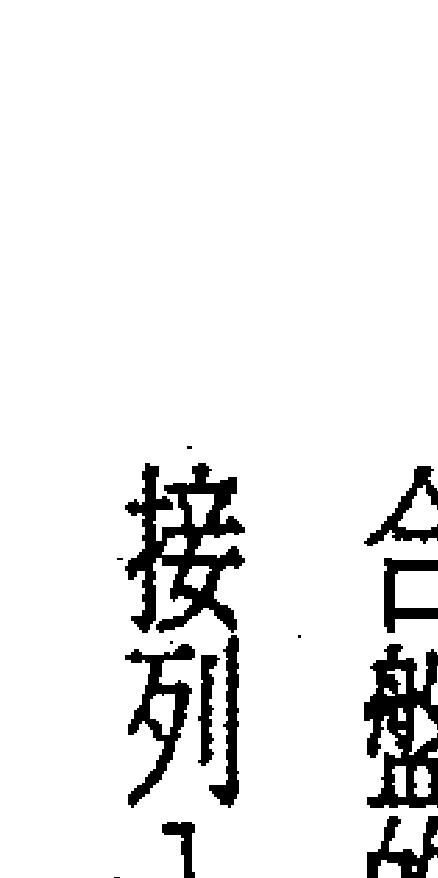
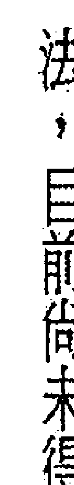
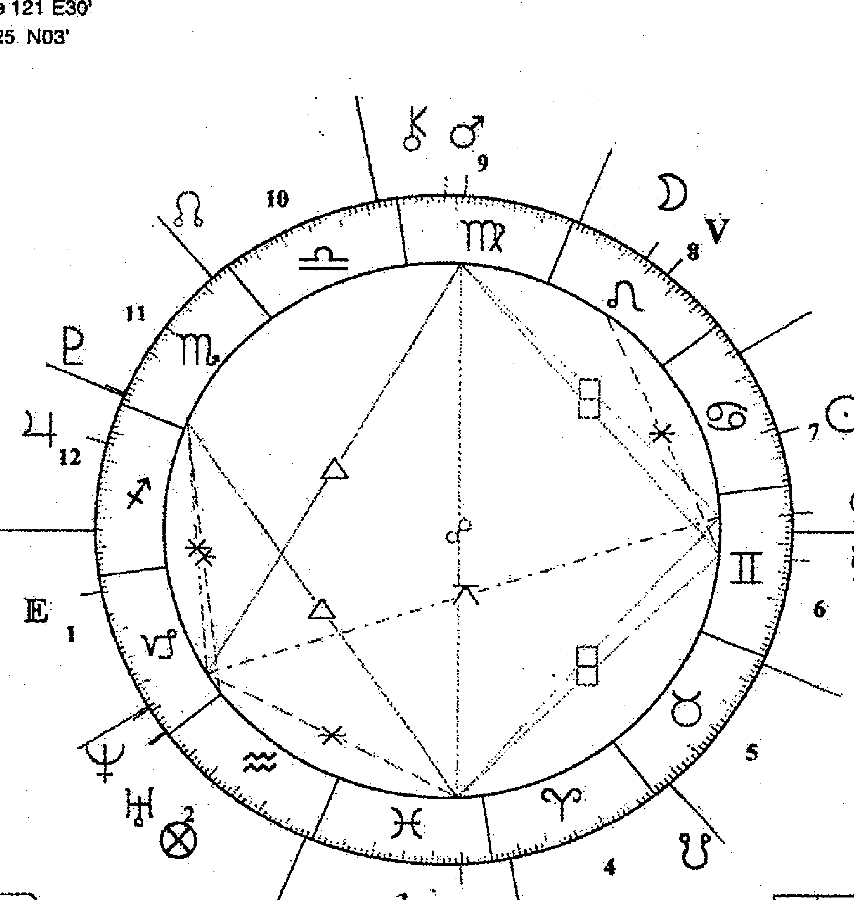
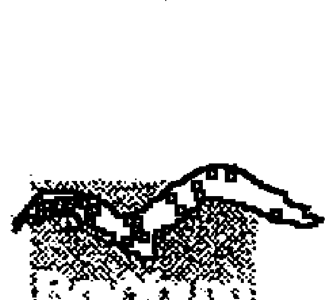

## 西洋占星学入门

占星大师洪能平，带您亲身体验西洋占星学的奥秘

全面性的介绍、精辟入理的解说，绝对是您的最佳选择

洪能平 著

## 占星大师系列 1

## 西洋占星学入门

洪能平 著

博扬文化 出版

## 目录

### 第一章 导论

- 壹、现代占星学的新时代……1
- 贰、现代占星学的研究内容……4
- 参、占星学资料的搜集与整理……14
- 肆、常见的占星学论断技巧……25
- 伍、现代占星学研究的难题与限制……28

### 第二章 本命盘的绘制

- 壹、命盘计算的准备……33
- 贰、时间换算的基本概念……36
- 参、行星和其他重要点的位置计算……38
- 肆、Placidus System 的宫位系统计算……43
- 伍、宫头位置的更精确计算……48
- 陆、南纬度地区的换算……50
- 柒、命盘上各种位置的标记……52

## 第三章 星座

- 壹、黄道十二宫的基本概念……60

## 第四章 宫位

- 壹、黄道十二宫的基本概念
- 贰、黄道十二宫的互动关系
- 参、后天宫位的生活领域意涵
- 肆、飞星体系的建构

## 第五章 行星

- 壹、现代占星学上的行星意涵
- 贰、行星的逆行、互容和庙旺陷弱
- 参、行星的解读方式
- 肆、行星的影响力及其论断原则
- 伍、行星的综合说明
- 陆、行星的相关字说明

## 第六章 行星落入星座

### 第七章 行星落入宫位

壹、宫位的环境制约

贰、命理征象上的质变与量变

参、个人的心理与行为的反应

肆、个人的环境与事件的肇因

伍、行星落入星座的征象说明

……

207

207

205

204

198

## 第八章 相位

壹、相位的分类

贰、相位的格局

参、无相位与多相位

肆、相位的论断原则

伍、相位征象的说明

……

281

288

295

299

302

## 附录 台湾地区经纬度表

### 第一章 道德

壹、现代占星学的新时代

占星学是一门相当古老的学问，任何一个伟大的古老文明国家，都对于占星学有所研究，因为对于宇宙天体之变化所作的臆想，乃是人类的本能。虽然古代的人类祖先对于天文学的知识，无法与现代相比，但毕竟由于有他们的努力，才能使得占星学在逐渐累积的过程中，发展成现代占星学的研究成果。从历史的发展过程来看，中西方的占星学都曾面临过许多的挑战与阻碍。然而，这毕竟都已经成为过去了，占星学在西方已经取得了某些科学家的认同，并且在科学家和占星学家的携手合作之下，占星学有了相当大的进展，计算上之精密度的估算达秒，已经是一件相当简单的事了，并且可以通过各种科学实验来检证占星学。更进一步地，由于有大量的人文科学和社会科学的学者专家，加入占星学的研究行列，更扩大了占星学的研究领域。这其中最具影响力的，就是心理学的高度发展，尤其是精神分析学几乎已经成为用以解读命盘上之人格特质的最主要方法了。现代占星学在西方来说，已经逐渐脱离所谓的神秘主义色彩了。取而代之的是宇宙生物学的观点，并且透过心理学、哲学和文化人类学的整合，使得最古老学问的占星学，在现代成为是一种用天体符号来解读人类本身、用心灵学来赋予天体符号精神意涵、用哲学来处理人类生命、用文化来看待各民族的生存意义等学问了。因此，针对现代占星学不妨可以从以下的角度来看：占星学是以天文学的理论及计算为基础，而以遗传基因作为解释的根据，并带有因果轮回的神秘色彩，用心心理学来分析人类个体、用气象学和物理学来预测大自然及人类整体；而就人类个体而言，更是借由哲学来看待命运及提昇精神层次、借由民族的集体潜意识来看待各种族的文化特质及社会结构；而最终的目标是在于，使人类克服生命历程中的所有阻碍、困惑和遭遇，使人类享有乐观、积极和主动的人生观，化危机为转机、化无奈为有心、化疑惑为决断，以充分开发每一个人的潜在正面特质，并且将每一个人的潜在负面特质终身舍弃，成为一个整全的人 自我的完全解放 物质与科技文明下的异化解放、心灵的解放。

以上的说词，涉及了几个与现代占星学相当有关的概念，可以归纳为以下六点来作说明：

- 1. 占星学的论断依据是命盘，而命盘是由太阳系的行星（包括太阳本身、月亮、凯龙星、小行星群和其他行星等）、恒星、其他重要的点（包括北交点、南交点、幸运点、中点、东方点、命度、降度、天顶和天底等）、黄道十二宫和宫位（中国称两者为先天后天宫）等建构起来的。尽管占星学尚有许多不同于天文学的地方，但占星学的最基本建构原理，则完全是依据天文学而来的，其命盘的计算与绘制，也主要是依据天文学上的实际星体，以及地球本身之经纬度而来的，所以说天文学乃是占星学的基础所在。
- 2. 在命理的诠释方面，以前的占星学一直被视为是神秘主义，这是因为并没有一套足以解释命运之发生的理论。所以，只以实证的角度来证明确有其事的存在，而无法解析背后所导致事件发生的原因，因此以神秘主义或玄学来看待。而现代占星学，则可以从遗传基因的角度，用细胞记忆的变换等生物学、遗传学理论，使占星学上的符号类比于遗传基因上的DNA，重新建构了占星学的命运符号解释体系。而这种所谓的心理占星学或遗传占星学，突破了以住之命运发生的诠释局限，更赋予人类命运改造的新途径。
- 第二，从占星学上所针对的大自然，以及人类大事件的预测来看，也是有其理论依据的。就大自然的预测来说，主要是依据天体变化所导致的大气层变化，来进一步地预测大自然所可能发生的各种灾变或奇异现象。而就人类的大事件预测来说，主要是由于天体的变化，引发了人类整体的集体潜意识，或者是单一民族或国家的民族集体潜意识，产生了集体性的行为动机，进而导致了事件的发生。
- 第四，在命理的哲学诠释方面，现代占星学由于并不是完全是西方的产物，只是西方吸取了所有古老文明的占星学精华，再加上现代的自然科学和社会科学的内涵。因此，现代占星学除了吸取古老文明所具有的哲学意涵之外，更具有时代性的哲学意义，正如米谢·福柯（Michel Foucault，1926~1984）所说的：精神病是一个社会问题，尤其是现代资本主义社会下的重大问题。所以，现代占星学乃是针对现代资本主义社会之下的人的问题，进行某种程度上的解决，尤其是针对精神问题。现代占星学透过精神分析的心理哲学，使人更理解个人及社会的真实面；透过人本主义的心理哲学，使人更知晓应该如何去作自我的平衡，以及如何快乐地度过这一生。当然，每一位占星学家都会具有自己的哲学理念，所以也就有在看待占星学上之不同的哲学偏向。
- 第五，从占星学来看集体潜意识，包括了同世代之间的集体潜意识、同种族的集体潜意识，以及人类的共同集体潜意识。现代占星学所诠释的同世代之间的集体潜意识，在于突显不同世代彼此之间交织上的差异，进而解读不同世代之间在观念、行为和潜意识上的差异，提出不同世代彼此之间沟通与包容的途径。而同种族的集体潜意识，则在突显由于民族之集体遗传基因所导致的社会结构形态，以及传统观念和思想，进而促使个人更适应于自己所生存的社会，提出在面对社会环境时，个人如何做到最好的调适。而人类共同的集体潜意识，则在表达人类所共同具有的潜意识特质，进而理解人类的共同生命意义，整合人类之看待宇宙自然，以及人类事件的共同态度与理念。
- 第六，从个人之潜能开发的角度来看，现代占星学从命盘之中解读出个人之才能的所在，正所谓的「天生我才必有用」，促使个人能够提早认知到自己的专长所在；并且让个人知道，伴随着个人之专长而来的个性特质，应该如何去做一种比较适当的调适，或者是如何去做专长上的补强。另外，人非完人，在每一个人的身上，无疑地都存在着个性上的缺失，而透过占星学的解读，可促使个人理解到自己的缺点所在，进行缺点的舍弃或修正，成为一个人格特质的人，让自己的人际往来更显得和谐，也让社会更增添温馨、关怀的气氛。

### 第二章 本命盘的绘制

## 第三章 星座

## 第四章 宫位

## 第五章 行星

## 第六章 行星落入星座

### 第七章 行星落入宫位

## 第八章 相位

## 附录 台湾地区经纬度表

### 第一章 道德

### 第一章 导论

为遗传基因作为解释的根据，并带有因果轮回的神秘色彩，用心心理学来分析人类个体、用气象学和物理学来预测大自然及人类整体；而就人类个体而言，更是借由哲学来看待命运及提昇精神层次、借由民族的集体潜意识来看待各种族的文化特质及社会结构；而最终的目标是在于，使人类克服生命历程中的所有阻碍、困惑和遭遇，使人类享有乐观、积极和主动的人生观，化危机为转机、化无奈为有心、化疑惑为决断，以充分开发每一个人的潜在正面特质，并且将每一个人的潜在负面特质终身舍弃，成为一个整全的人 自我的完全解放 物质与科技文明下的异化解放、心灵的解放。

以上的说词，涉及了几个与现代占星学相当有关的概念，可以归纳为以下六点来作说明：

- 1. 占星学的论断依据是命盘，而命盘是由太阳系的行星（包括太阳本身、月亮、凯龙星、小行星群和其他行星等）、恒星、其他重要的点（包括北交点、南交点、幸运点、中点、东方点、命度、降度、天顶和天底等）、黄道十二宫和宫位（中国称两者为先天后天宫）等建构起来的。尽管占星学尚有许多不同于天文学的地方，但占星学的最基本建构原理，则完全是依据天文学而来的，其命盘的计算与绘制，也主要是依据天文学上的实际星体，以及地球本身之经纬度而来的，所以说天文学乃是占星学的基础所在。
- 2. 在命理的诠释方面，以前的占星学一直被视为是神秘主义，这是因为并没有一套足以解释命运之发生的理论。所以，只以实证的角度来证明确有其事的存在，而无法解析背后所导致事件发生的原因，因此以神秘主义或玄学来看待。而现代占星学，则可以从遗传基因的角度，用细胞记忆的变换等生物学、遗传学理论，使占星学上的符号类比于遗传基因上的DNA，重新建构了占星学的命运符号解释体系。而这种所谓的心理占星学或遗传占星学，突破了以住之命运发生的诠释局限，更赋予人类命运改造的新途径。
- 第二，从占星学上所针对的大自然，以及人类大事件的预测来看，也是有其理论依据的。就大自然的预测来说，主要是依据天体变化所导致的大气层变化，来进一步地预测大自然所可能发生的各种灾变或奇异现象。而就人类的大事件预测来说，主要是由于天体的变化，引发了人类整体的集体潜意识，或者是单一民族或国家的民族集体潜意识，产生了集体性的行为动机，进而导致了事件的发生。
- 第四，在命理的哲学诠释方面，现代占星学由于并不是完全是西方的产物，只是西方吸取了所有古老文明的占星学精华，再加上现代的自然科学和社会科学的内涵。因此，现代占星学除了吸取古老文明所具有的哲学意涵之外，更具有时代性的哲学意义，正如米谢·福柯（Michel Foucault，1926~1984）所说的：精神病是一个社会问题，尤其是现代资本主义社会下的重大问题。所以，现代占星学乃是针对现代资本主义社会之下的人的问题，进行某种程度上的解决，尤其是针对精神问题。现代占星学透过精神分析的心理哲学，使人更理解个人及社会的真实面；透过人本主义的心理哲学，使人更知晓应该如何去作自我的平衡，以及如何快乐地度过这一生。当然，每一位占星学家都会具有自己的哲学理念，所以也就有在看待占星学上之不同的哲学偏向。
- 第五，从占星学来看集体潜意识，包括了同世代之间的集体潜意识、同种族的集体潜意识，以及人类的共同集体潜意识。现代占星学所诠释的同世代之间的集体潜意识，在于突显不同世代彼此之间交织上的差异，进而解读不同世代之间在观念、行为和潜意识上的差异，提出不同世代彼此之间沟通与包容的途径。而同种族的集体潜意识，则在突显由于民族之集体遗传基因所导致的社会结构形态，以及传统观念和思想，进而促使个人更适应于自己所生存的社会，提出在面对社会环境时，个人如何做到最好的调适。而人类共同的集体潜意识，则在表达人类所共同具有的潜意识特质，进而理解人类的共同生命意义，整合人类之看待宇宙自然，以及人类事件的共同态度与理念。
- 第六，从个人之潜能开发的角度来看，现代占星学从命盘之中解读出个人之才能的所在，正所谓的「天生我才必有用」，促使个人能够提早认知到自己的专长所在；并且让个人知道，伴随着个人之专长而来的个性特质，应该如何去做一种比较适当的调适，或者是如何去做专长上的补强。另外，人非完人，在每一个人的身上，无疑地都存在着个性上的缺失，而透过占星学的解读，可促使个人理解到自己的缺点所在，进行缺点的舍弃或修正，成为一个人格特质的人，让自己的人际往来更显得和谐，也让社会更增添温馨、关怀的气氛。

### 第二章 本命盘的绘制

## 第三章 星座

## 第四章 宫位

## 第五章 行星

## 第六章 行星落入星座

### 第七章 行星落入宫位

壹、宫位的环境制约

贰、命理征象上的质变与量变

参、个人的心理与行为的反应

肆、个人的环境与事件的肇因

伍、行星落入星座的征象说明

……

207

207

205

204

198

## 第八章 相位

壹、相位的分类

贰、相位的格局

参、无相位与多相位

肆、相位的论断原则

伍、相位征象的说明

……

281

288

295

299

302

## 附录 台湾地区经纬度表

### 第一章 导论

### 第二章 贰、现代占星学的研究内容

一般来说，现代占星学可分为两大类型：一是决断占星学（Judicial Astrology）：一是本命占星学（Natural Astrology）。前者主要是在针对特定事件与目标的情况下，而需要有所下决断时，或者是要预测事情的可能发展时来使用的，应用的对象可能是一件事、一个人，也可能是一种情况。然而，不管如何，决断占星学的最主要目的就是下决断，亦即占星学家依据特定事件所呈现在占星命盘上的征象来进行决断。决断占星学是论断主题，而特别关注于某些微象；其决断的判定一般是比本命占星学来得更为决断的，答案时常是Yes或No，可行或不可行，两者选其一。同时，也必须在本命占星学的论断具有相当程度后，才能应用决断占星学来下判断。所以初学占星学的人，都是先从本命占星学开始学起，等到具有一定的占星学知识及累积一定的论断火候后，才逐渐学习决断占星学。 决断占星学往往会依据特定的使用目的，而有所使用上的限制，亦即针对单一事件或论断主题，而特别关注于某些微象；其决断的判定一般是比本命占星学来得更为决断的，答案时常是Yes或No，可行或不可行，两者选其一。同时，也必须在本命占星学的论断具有相当程度后，才能应用决断占星学来下判断。所以初学占星学的人，都是先从本命占星学开始学起，等到具有一定的占星学知识及累积一定的论断火候后，才逐渐学习决断占星学。 本命占星学开始学起，等到具有一定的占星学知识及累积一定的论断火候后，才逐渐学习决断占星学。 有些占星学家则把现代占星学分为二大类型；一是本命占星学；二是世俗占星学（Mundane Astrology）；三是卜卦占星学（Horary Astrology）。卜卦占星学的应用，主要是用来作为单一事项之预测的，答案是肯定与否定两者之一，就像我们一般所作的占卜一样，看卦象来决定可以或不可以，会或不会；只是卜卦占星学所使用的解读符号是占星命盘，而不是卦象，同时卜卦占星学也包含了某些事件之前因后果的解析。而所谓的世俗占星学，包含的范围相当广泛，如政治占星学、财经占星学、国际局势占星学、自然现象和气候占星学等，所有与人类整体有所关连的占星学预测。 本命占星学就是一般常见的个人之占星命盘的论断，主要是涉及个人之个性及各种生活领域方面的相关论断，也可说是统摄个人之一生的命运论断。以个人的出生时间、地点，或者其是重要的时间、地点来作个人之一生发展主轴及运势趋向，或者是流年大运方面的论断。于是，在西方有关现代占星学介绍的书籍上，流年占星学（或者说运势占星学）虽然有许多不同的系统在使用着，但一般来说，流年占星学的论断，基本上还是归属在本命占星学的范围内。

再者，从廿世纪以来，由于心理学的快速发展，在本命占星学的论断方面，另外有所谓的心理占星学的出现，是纯粹偏重于心理意识方面的论断。心理占星学的发展，对现代占星学的最大影响，主要是发生在命理观或命运形塑方面。心理占星学认为人类是绝对可以通过行为的改变，来改变所谓的命运，因此命运并不是一定的、注定的，而是可以依靠自己的自由意志来作决定的，相当具有人本主义的哲学意涵。

其实，如果从现代占星学的研究情况来看，大部份的占星学分类研究，难以做到严格区分，因为在实际的论断应用上，往往有不少的占星学分支系统，彼此之间是相互影响的。最明显的就是世俗占星学方面，以政治占星学和财经占星学来说，两者是互为一体两面，在进行一个国家的运势论断时，政治与经济同时成为观察的重点，而且是相互影响的，有时也要视情况而加上国家最高领导人的本命占星来作论断。所以，最多只能在某种程度上，把现代占星学的研究范围依照专业性的研究主题，作一种尽可能比较大方向上的划分。以下简单说明几个较常见的现代占星学分枝系统：本命占星学 是最普遍而常见的，是个人之本命盘的论断。主要是针对个人之人生的整体概况来作论断，包括个人的基本人格分析，以及个人的家庭、婚姻生活、人际关系、事业和工作、娱乐游戏和金钱财务状况等生活领域方面的论断，是进入现代占星学

## 第三章 星座

## 第四章 宫位

## 第五章 行星

## 第六章 行星落入星座

### 第七章 行星落入宫位

## 第八章 相位

## 附录 台湾地区经纬度表

### 第一章 导论

### 第十二章 西洋占星学入门

研究领域的基本课程。

## 心理占星学

应该归属于本命占星学的范围之内。但是，心理占星学强调的是人格特质的分析，以及注重个人潜能的开发。心理占星学不但应用了现代占星学上最常使用的精神分析学，而且也注重行为主义的心理学，强调人是可以透进行为的外塑，由学习理论而取得行为上的改变，进而改变心理与命运。同时，心理占星学深具人本主义心理学的哲学色彩，以人的完全解放，以及人应该如何去作为一个人格健全的完整的人，来作为诉求重点。由于心理占星学家大部份都是专业性的心理学家和心理医师，所以最具有心理治疗应用上的作用，可以把占星学的人格分析配合专业的心理咨询来一起使用。

## 事件占星学

是归属于本命占星学的范围之内，包括人生之各种事件的预测。例如，结婚、创业、生小孩和发生意外等。这在本命占星学的论断上，往往必须配合流年来作论断。而事件占星学对心理学家来说，并不是重点的所在，因为心理学家认为，人是可以自行改变心理状态的，也因此是可以改变事件的发生，所以事件的论断并不是心理学家的论断重点。此外，事件占星学还有一种涵意，亦即可根据某一事件之发生的确实时间与地点，来绘制一个等同于本命盘的占星命盘，并以此来论断该特定事件的发展趋势，此用法有点类似于卜卦占星学或择日占星学。

## 流年占星学

广泛来说，应该称作运势占星学，也是归属于本命占星学的范围，主要是以本命盘作为根本，来论断某一年、某一月、某一日，甚至是某一小时之内，由于行星的移动所导致的对于本命盘的影响，进而影响个人在某一时段内之心理意识与周遭环境的变化，以及可能会发生的事件（在此，事件的发生是个人之心理意识及潜意识，与个人所面对的当下环境或遭遇，所相互形塑而成的结果）。在现代占星学上，有许多的流年论断系统被应用着，而且在所有这些流年论断系统当中，尚存在着许多不同的论点与争议，尤其是在配合于所采用的不同宫位系统之后，更有许多不同形式的流年盘产生。同时，所有的流年系统都有天文学上的依据，并且都是以行星的移动和地球的自转与公转来作论断依据的，也有是以地球和月亮的运转关系来作论断依据的。

### 第一章 导论

### 第十三章 择日占星学

此与中国传统的八字学择日的意思相同，都是针对某一事项的开始，来选择一个最具吉兆的时间作为开始的时间。而此一开始的时间，也就是该事项的本命盘。择日占星学所根据的原则，也是本命占星学的原则，亦即选择行星位置呈现良好征象的时间，来作为某一事项之开始的时间，有时择日占星学还需配合所要进行之事项的性质来作考量。例如，公司的开业，可以配合公司所经营的行业性质，来选择主宰该行业的行星和星座是形成吉相位或吉兆的时间。然而，最基本的择日原则，还是要避开凶相，而使得有利于该公司或行业的吉兆呈现出来。

### 第十四章 卜卦占星学

在字意的表达上，是称之为时间（当下）占星学。由于其性质与中国的卜卦意思相同，所以改采用卜卦占星学的称呼。卜卦占星学主要是针对某一特殊的事件或问题提供解答，其命盘是以卜问当时的时间来绘制的，也就是卜问当时的本命盘。卜卦占星学在论断上，比较具有条件上的限制，而且通常是一次只能问一个问题，如果是想一次同时几个问题，卜问之问题的本身，不可涉及同一事件。例如：我想卖掉房子好吗？我走失的狗可以找回来吗？一般来说，卜卦占星学是属于相当实用的占星学，比引起其他分支系统的占星学应用得更为广泛，因为人总是会有所求问的。以实际经验来说，只要是真的有难以决断，或者是心有疑惑之事项时，卜卦占星学往往可以提供答案。这与中国传统的八卦占卜的作用是一样的，只是它的判断是依据天体的星象，而不是八卦的卦象。

## 世俗占星学

可说是最古老的占星学，其研究范围包括了所有与人类有关的事项，主要包括可分为自然灾害和世界情势两大项。自然灾害是用来预测地球所发生的自然现象的变化，而世界情势则用来预测人类整体之可能发生的大事。世俗占星学从小范围来看的话，则可以预测某一国家所可能发生的自然灾害或突发事件，或国家的整体发展运势，这是每一古老文明国家，在占星学的发展历程中必定会应用到的。例如，中国占星学上记载着许多灾异和政治事件的预测，这些都是属于世俗占星学的研究领域。

## 政治占星学

属于世俗占星学的研究范围，主要是研究有关政治领域方面的预测，包括国家运势、政治人物分析、政治或战争事件的发生，以及选举的预测等，可以只针对单一国家来作论断，也可以论断两个国家的关系演变。一般来说，由于政治学在社会科学领域之中是属于相当专业的领域，有其专业的研究方法。所以，政治占星学通常是要配合政治学者自己的研究专长来作预测的，不能仅从占星学来作论断。严格来说，政治占星学是以政治学的研究方法为基础，从研究方法当中确立考量因素，然后再配合占星学来作分析；同时不管分析的结果是如何，占星学的预测是不足以取代政治学的专

### 第十五章 世俗占星学

### 第十六章 政治占星学

### 第十七章 财经占星学

也是属于世俗占星学的范围，主要的研究方向，包括单一国家的经济情况，以及国际的经济景气现象。财经占星学日前还很难有所定论，只能说经济的循环波动与行星的运转周期性有关，其他的就难以确定了。因为它不像政治占星学那样地古老，其所使用的数理方法，对于整个经济发展的预测，可以达到相当高度的可信度。所以，财经占星学最常应用的范围，是针对个人的财务经营进行意见上的提供，这反而是与本命占星学比较有关，只是再加上有关整体经济景气方面的建议，以作为顾客之财务管理或生意经营上的参考，而如果是要加上政治风险因素的话，则必须配合政治占星学来作论断。

### 第十八章 投机和比赛占星学

所谓的投机，包括买股票、赌博和相当短期的金钱运用等。投机占星学纯粹是用来获取金钱收入的，而且带有应用占星学来获取超额利润的意思。虽然有它的可信度，但在使用上却颇具条件限制，必须在各种必备要件很齐全的情况下，才能提高论断的准确度。一般来说，只是针对个人的财运方面来作论断，看个人本命盘、流年流月和流日的投机运好不好，而建议其是否可以作投资。比赛占星学则与投机占星学相当类似，只是它所预测的事项，是偏向于具有比赛的性质。例如，预测职棒赛的哪一队可以获胜利，或者是参加的队数或人数、马数较多时，根本就很难加以判定。而如果是只有两个人，或者是两队来作预测的话，则会是比较简单的。当然，如果实力相差悬殊的西洋占星學入門

話，根本就不用預測了。而不管預測的結果是如何，個人的本命盤往往是最基本的，亦即要先具有有意外之財的命或運，才能更發揮投機上占星預測的功效。不管是投機上占星學、比賽占星學，或者是政治選舉等帶有競爭性質的預測，都是需要較多的明確資料，才能進行比較準確性的論斷。同時，在論斷技巧上，也往往需要各種占星學的專業技巧的統合，至少必須通曉本命占星學、卜卦占星學、合盤和泛音盤等四種專業技巧，才足以進行較精密的預測。以選舉來說，需要候選人的本命盤和流年盤的論斷，以及登記參選的準確時間（時分秒）和地點、投票日的本命盤和當選就職日的本命盤，以及以上各種命盤的合盤（包括泛音盤的合盤）等，才能達到一定的精確性。

地球物理占星學 本來在古代是同屬於世俗占星學的範圍，但由於現代科學的進步，所以特別劃分出來。所謂的地球物理占星學，研究的是有關地球之大自然現象與星體之移動的關係，包括火山爆發、洪水泛濫、地震和大氣層變化，甚至包括嚴重的流行性疾病在內，例如黑死病和愛滋病等。這是屬於占星學最尖端科學性的部份，而且也是賦予占星學科學依據的所在。這一方面的研究，倒是可以配合中國傳統上的風水理論來進行整合，透過陽宅上的居住環境研究，把地球物理占星學應用在個人的生活環境上。

農業和園藝占星學 農業占星學是相當古老的一門學問，與中國傳統之農民曆上的節氣有點類似，都是以季節和行星的移動（主要是太陽），來作為播種之時刻的依據，現代可以說是已經相當缺乏研究價值了。園藝占星學則是針對各種植物，由植物本身的屬性來選擇適當的時刻種植，而園藝占星學上的植物屬性之劃分，也與古代醫藥占星學的用藥有密切關係，所以特別與中醫的用藥有關。

醫藥占星學 這在占星學的研究領域中，是相當重要的一個分支系統。凡是專業的占星學家，都至少必須對醫藥占星學有一定的論斷程度，因為在作本命盤論斷時，不可避免地必須論及到個人的健康情況，看應該多注意哪一方面的身體問題。醫藥占星學可分為生理和心理兩方面，心理方面目前是由心理占星學所取代，而生理方面，簡單地說，就是論斷個人的身體狀況。其實，生理和心理這兩方面，在醫藥占星學上是相通的、互相影響和滲透的。譬如說，某一顆行星受剋嚴重，則此人會在此顆行星有所壓力的心理狀況下，採取該顆行星所代表的行為徵象，同時也就影響了該顆行星所影響到的身體部位（配合星座來看）。醫藥占星學的目的，是在於提供人們應該如何保持健康的生理與心理，以及注意那一個方面的體質問題與疾病。醫藥占星學具有某些特別需要觀察的行星及相位。

## 輪迴占星學

這是占星學上最奇特的領域。輪迴占星學是以南北交點，木星和土星，以及內行星的逆行和第十二宮等為主軸，配合整個命盤的情況，來論斷個人從輪迴所帶來的前世特質與才能。同時，輪迴占星學講求的是一個人的前世與今生，應該如何去取得平衡，具有高度的人格調和色彩；也可說是一種因果律的呈現，亦即透過本命盤上所呈現出來的徵象，調和前因與後果。但是，從輪迴占星學的角度來看臺灣目前的世俗宗教信仰，則可能相當具有衝突性，因為輪迴占星學否認了六道輪迴的看法，完全沒有地獄可言，而且是個人式的今生平衡發展，而不是追求來生的更好或解脫，可說是訴求此岸的圓滿，不期待彼岸的極樂，也沒有必要為前世的種種深感愧疚，更沒有必要藉由宗教信仰來消除業障。輪迴占星學可說是在承認有輪迴這一回事的前提下，著重於今生應該如何克服前世所帶來的弱點或積弊，進而使得今生過得更美好、更調和。除了以上所談及的幾個大方向的占星學研究領域外，現代占星學還有很多相當專業性的研究課題。例如，印度占星學、阿拉伯占星學、埃及占星學和中國占星學等，還有以太陽為中心系統的占星學、銀河系統的占星學。而如果就流年和宮位系統來看的話，則更有許多不同的論斷系統存在。而就行星方面來說，有針對單一顆行星進行深入探討的，例如，小行星群、凱龍星的專論，或者是月亮的盈虧和月蝕的專論，或者是天文學上的平行相位等。此外，還有恆星的論斷，或者是所謂的週期占星學（專門研究天體的週期性，並進而應用在人生或歷史的週期性事件的預測上），以及許多隨著天文學的發展而產生的占星學內容，譬如超冥王星的論斷，這一切可總稱之為「宇宙天體占星學」。另外，還有所謂的哲學上占星學，是專門從哲學的角度來看待現代占星學的哲學意涵。 在西方，研究占星學的學者相當多，每年出版的著作、雜誌和期刊也相當多，而談論的研究主題正在不斷地擴充，使得現代占星學成為一門最具龐雜系統的研究領域，並且也是最有趣的研究領域。每一個人都可以隨著自己的興趣，選擇自己喜好的研究領域，來品味一下宇宙天體對於人類所產生的影響，讓人們驚訝於天體的自然循環性，是如何地反應在人世間上，而人類又應該如何去上體天心，與大自然合而為一，而不是去違反或破壞上天所賜予我們賴以生存的大自然。在已邁入千禧年後，展望未來的科學發展，必然是一日千里；尤其是在遺傳工程和生化科技上的快速發展，無疑地會對人類的整體命運造成難以估計的影響，進而對個人的命運觀進行重新改造或界定。可是，只要人類對己身之命運的迷惑與疑團仍在，或者人類在科技文明的發展下，漸漸失去了自我，成為心靈的漂泊者，那麼現代占星學的玄學魅力，必將永恆不朽，如此的千禧年，是科學與玄學並存、並重的時代。

## 參、占星學資料的蒐集與整理

以下採取重點表列方式，說明研究占星學的資料蒐集與分類。這是個人淺見，讀者可依據自己的觀點而另行設計屬於自己的資料整理方式。

在資料蒐集方面，其管道主要有五：其一，是占星書籍的購得，可直接向出版社訂購，或委由書籍代理商購得，或到書店查尋與購買；其二，是占星學期刊，可分成兩種，一種是必須加入會員，期刊只贈予會員，另一種是不必加入會員，期刊是按訂購期數來計算費用的；其二，是占星電腦公司，也有成立自己的網站，介紹相關的產品，另外還可透過各種占星網站，而與同好彼此進行交流；其四，加入占星組織或占星學家個人的函授課程，這同樣可取得某些書面資料；其五，參加各種占星專題演講或面授課程。

當我們拿到各種占星學資料後，接著就是要先進行歸類，有了歸類以後，就可以很清楚地知道資料的編號，方便資料查閱。

### A 占星學基本教材

+   1 通論式的入門教材
    2 星座、宮位、行星
    3 行星落入星座和宮位
    4 行星相位

說明：有許多的占星學書籍是介紹基礎概念的，雖然內容有時候差異頗大，有的甚至也會把某些較深的內容也列入基礎範圍，但大致上來說，總脫離不了占星盤上基本符號徵象的解釋。

### B 占星學工具書

+   1. 星曆
    - 地球中心系統
    - 太陽中心系統
    2. 各宮位系統的宮位書
    3. 世界各國的經緯度資料
    4. 世界名人、組織和事件出生資料
    5. 電腦軟體的操作手冊

說明：這些工具書目前有不少已經電腦化了，所以習慣使用電腦的人，可以直接用電腦來查詢。

### C 占星學詞典

+   1. 關鍵字的詞典
    2. 專業術語的詞典
    3. 各專業研究領域的詞典

說明：在關鍵字部分，大致上是以行星、星座和宮位等來作劃分，並且依照英文字母次序來作排列。在專業術語部分，也是依照字母排列來依序解釋占星學上的專有名詞。在各專業研究領域部分，主要有心理學、天文學和醫學等三種常見的專業辭典。

### D 本命占星學

+   1 人格特質
    a 心理占星學
    b 四大元素的專論

+   2 錢財

+   3 工作、職業

+   4 愛情、婚姻

+   5 人際關係 兩適合盤的論斷
    a 兩造行星相位的互動
    b 兩造行星的平均位置
    c 兩造出生時間的平均值

+   6 家庭、小孩、教育

+   7 才藝、娛樂、旅遊

+   8 其他

說明：一般來說，本命盤占星學和心理占星學是一體的，所以並沒有把心理占星學獨立出來，而由於四大元素特別重要，所以可單獨列為一項。在有關生活領域部份，是把合盤的論斷歸類在此，因為合盤與婚姻和愛情的論斷有很大的關連，而健康部份則是直接列入醫藥占星學。至於其他部份，比如死亡，可依情況而列項。

+   1 與本命占星學相關的事件

+   2 意外事件

說明：第一項的內容，比如出國、移民、嗜酒等；第二項的內容，比如車禍、自殺等。

### F 流年占星學

+   1. 推運 (Progressions)
    2. 運運 (Transits)
    3. 流運 (Solar returns)
    4. 流月 (Lunar returns)
    5. 向運 (Direction)
    6. 其他運勢論斷（主要是指逆向運）
    7. 流日
    8. 大運、中運、小運、重運
    9. 流年系統的合盤論斷

### G 擇日占星學

說明：這一部份的內容，全部是與運勢的論斷有關。

說明：擇日的細部內容，可以不用劃分。

### H 世俗占星學

+   1. 政治占星學
    2. 財經占星學
    3. 地理或地誌占星學
+   4. 種族或民族占星學
    5. 氣象占星學
    6. 自然災害占星學

### I 卜卦占星學

說明：卜卦占星學是一個相當專業的領域，自古以來即形成獨立的論斷系統，因為其論斷原則與本命盤略有差異。

### J 醫藥占星學

說明：這裡的醫藥占星學，主要是指生理方面的，並且也包括了草藥的部份。

### K 農業占星學和園藝占星學

說明：農業占星學主要是研究農作物，而園藝占星學主要是研究植物，所以又可稱之為是植物占星學。

### L 賭博占星學和比賽占星學

說明：賭博占星學是以個人為主，來預測個人的賭運和參與賭局時的可能變數，而比賽占星學是對抗的兩組人或隊為主，來預測哪一方將可獲勝。

### M 古代占星學

+   1. 中國占星學
    2. 希臘占星學
    3. 埃及占星學
    4. 阿拉伯占星學
    5. 巴比倫占星學
    6. 印度占星學
    7. 馬雅占星學
    8. 印第安占星學
    9. 其他

說明：這裡的每一個單項，都涉及各古老民族的文化背景和語言，研究起來困難度較高。至於其他的部份，比如說中國少數民族的古老占星學內容，也可包含在此。

### N 占星學歷史

+   1. 中世紀以前的占星學
    2. 中世紀時期的占星學
    3. 文藝復興時期的占星學
    4. 二次大戰以前的占星學
    5. 現代占星學

說明：這裡的歷史分期是以西方的占星學發展歷程來作劃分的，每一個時期都各有其訴求的特色，研究重點也呈現出差異性。

### O 占星學上的計算

說明：占星學上所涉及到的計算問題，主要有二：一是占星命盤繪製上的計算問題，這一部份可以直接用電腦來作處理；二是天文學上立體空間有關的計算問題，目前也是可以直接用電腦來作處理，只是在論斷上乃是訴求本命盤的更為詳盡的分析。另外，有關其他的部份，則主要是電腦的統計分析，比如說如何分析一千個命例中所呈現出來的特徵，目前的占星學電腦軟體，有些是可以直接擷取資料，有些是具有特殊功能的占星學統計軟體，如股市的預測等。通常，如果不是很專業研究的話，這一部份是用不著的。

### O 占星學上的計算

+   1. 宮位系統
    2. 時間修正
    3. 平行相位
    4. 赤緯
    5. 截奪宮
    6. 其他

### P 恆星系統和銀河系統占星學

說明：恆星系統是屬於東方民族所慣用的系統，其論斷內容是包含在古代占星學中，比如印度占星學和中國占星學。在此，主要是把有關這兩個系統所涉及的天文學和文化概念獨立出來，以便與西方的回歸系統作區隔。

### Q 占星學的實用技巧

+   1. 泛音盤 (Harmonics)
    2. 換置命盤 (Relocation)
    3. 漢堡學派占星學 (Uranian)
    4. 其他

說明：這裡的三種專業論斷技巧，都是已經過占星學家所共同承認的，並且可以廣泛地應用在各種占星學領域中。至於其他很多西方占星學家個人所創見的論斷技巧和講法，目前尚未得到共同的認可，所以只能具有參考價值而已，故可將其列入其他項中。

+   1 恆星
    2 南北交點
    3 中點
    4 阿拉伯點
    5 小行星群
    6 凱龍星
    7 莉莉星
    8 超冥王星
    9 慧星
    10 其他

說明：這裡是特別把有關行星和虛點單獨列出，因為在占星學的論斷上，這些因素是比較重要的，而且又不斷地在研究發展中，所以值得特別注意。其中，有關中點的論斷會與漢堡學派占星學形成重疊，但若就本命盤上的配合星座和宮位來作論斷的話，還是可直接編列獨立單元的。

### S 占星學的特殊論斷

+   1. 月亮的周期
    2. 行星的周期
    3. 行星逆行
    4. 輪迴占星學
    5. 玄奧占星學
    6. 其他

說明：這裡所列的是一般較常見到的特殊論斷項目，西方占星學家在這一方面的研究，雖有取得一般性的共識，可是還有很多看法分歧之處。其中，輪迴占星學是與印度占星學比較有關，而玄奧占星學是與西方古代的鍊金術有關，這兩個項目目前在西方仍是神秘主義研究的重頭戲。

### T 占星學的新發展

+   1. 有關於天文學的部份
    2. 有關於論斷技巧的部份
    3. 有關於理論修正的部份
    4. 其他

說明：目前的占星學研究可說是日新月異，不斷有新的觀念和論法產生，並且對於舊的觀念和論法進行淘汰與修飾，所以應該特別把有關新發展的部份單獨列出，以便與舊的說法相對照。

### U 占星學的主要研究趨向

+   1 美國
    2 歐洲
    a 英國
    b 德國
    c 法國
    d 義大利
    e 其他
    3 亞洲
    4 其他

說明：在西方，每一個國家的占星學研究趨向是略有差異的，這是因為民族性和文化背景不同所導致的，所以可用國家別來區分各國最近的研究現況。在歐洲方面，其他的部分主要是北歐國家、西班牙、蘇俄等。亞洲方面，印度現在與西方相當密切，彼此的資訊往來很平常；而中國方面，是以臺灣為主，大陸目前還不普遍，因被列為封建迷信，所以是違法的。在日本方面，是占星學較有所發展的國家，目前已經有大型的占星學會組織，並且與西方進行交流；至於其他的東南亞國家，除了菲律賓外，占星學還並不普遍。

### V 反對占星學的證明

說明：目前有很多的科學家、天文學家、生物學家等，針對占星學提出許多的批判，並且作了許多的實驗和研究報告來批判占星學。同時，占星學家也針對各種批判提出反駁和辯護，彼此相互較量，內容相當精彩，是專家對專家的學術探討，值得單獨列項作為研究。

### W 占星學家的科學實驗

說明：除了法國統計學家高魁林先生所作的統計分析以外，目前尚有很多有關占星學的實驗和統計分析在進行著，這些研究工作大部份都有基金會在支持。目前國內在這方面的工作最弱，同時可能也是最少人願意去從事的，因為實驗和統計的結果，很可能會推翻許多的占星學說法。

### X 占星學的雜項研究

說明：占星學上還有很多細小而雜碎的研究，可以直接列入本項目，比如說，占星學與拜蒲經的關係、占星學與頭髮的關連、占星學與芳香療法的關係等。

### Y 占星學的哲學探討

說明：這一部份國內有興趣的人並不多，可是卻又涉及到占星學的意識形態，以及論命的哲學觀等，同樣是不可忽視的，應該有其獨立的研究地位。可是，由於這一部份涉及到神話學、現象學、符號學和宗教等內容，一般人可能會望而卻步，特別是在把有關西方人本主義和東方人道思想作整合，並且應用在占星學上時，更是牽涉內容豐富的哲學領域，只有深感興趣者才肯去研究。

### 占星學家的諮詢及經營技巧

說明：西方占星學家很重視實際諮詢時的技巧應用，甚至連占星學家如何開創事業、如何作好顧客服務等，都有一系列的規劃和探討，這對職業占星學家來說是有所幫助的，特別是目前的西方占星學家在進行論斷時，早已普遍應用到心理諮詢的技巧。由於內容比較特殊，所以單獨列項。

## 肆、常見的占星學論斷技巧

專業的占星學家在日常的諮詢工作中，以下的幾項基本占星學論斷技巧是時常用到的，而且這些論斷技巧在實際應用上，大部份是可以交叉使用的。當你懂得越多的論斷技巧時，也才能隨著論斷主題的需求，而選擇適當的論斷技巧。

### 本命盤的論斷技巧

這是最基本的論斷技巧，也是所有占星學研究的基礎，可分為基本結構和生活領域兩方面來看。前者包括了行星、星座、宮位、行星落入星座、行星落入宮位、行星的相位等，這也就是本書所說明的內容。而後者則包括了個人生活領域方面的論斷，諸如婚姻、錢財、家庭和娛樂遊戲等。往往在學習占星學的過程中，這兩者是合而為一的。然而，最基本的人們關鍵所在，是在於前者的基本結構上，至少必須把行星、星座和宮位等，都可以很自然而然地講述出其特質和感覺之後，才有辦法進入後者的生活領域論斷。

### 流年的論斷技巧

這應該也包括大運、流月和流日在內。一般而言，占星學家至少必須懂得二種以上的流年系統，然後再依據自己的偏好或專長，選擇兩種來交叉應用。只要是涉及到任何命盤的未來發展之預測時，這種論斷技巧是一定會用到的。而且，如果有兩種流年盤呈現出相同徵象的話，則該徵象的發生機率倍增。

### 命盤的修正技巧

這純粹是命盤的時間準確與否的檢驗技巧，可以應用在各種本命盤的修正上。而大部分的修正技巧，是依據已經發生過事件的發生時間，來進行一種反推式的求證。往往每一位占星學家所作的命盤修正，多少還是會有所差距的。由於命盤的修正技巧，是採取已發生之事件的時間反推原則，所以通常是必須具備卓越的流年論斷技巧，才能求證出一個較精確的出生時間。

### 擇日和卜卦占星學的論斷技巧

這是任何一位占星學家所必然會面對到的服務項目，所以也是必備的專業性技巧。

### 合盤的論斷技巧

只要是涉及到兩造的問題，都必須應用到合盤的技巧，而且這兩造並不一定要同時是人物。以婚姻來說，除了可以用男女雙方本命盤的合盤，來論斷彼此的相處情況外，還可以應用結婚的婚姻本命盤（在西方，是以戴結婚戒指，或者是在典禮上向對方說出兩人已經結合為夫妻的婚姻本命盤），來進行與單方或雙方進行命盤的合盤，同時也可以用結婚的本命盤配合上流年的論斷，來進行各種情況的合盤論斷。一般而言，合盤的整體論斷，可以統稱之為「關係的論斷」（例如朋友之間的關係論斷、員工與老闆之間的關係論斷等），也就是論斷任何兩者之間的關係演變。而在實際論斷技巧的應用上，是以行星的彼此互動來作為分析的主軸。同時，可以把這種兩者之間的關係演變，擴展為三者、四者或更多者之間的關係演變。

### 換置命盤（Relocation）的論斷技巧

這是當顧客有求問到應該何處去居住，才能最有利於個人的某一方面的發展示，可以應用到的技巧。一般而言，是依據本命盤的後天宮位，來進行後天宮位的移動，看地球上的那一個經緯度的地方，最適合個人在某一方面的發展。不過，必須強調的是，沒有哪一個地方是可以讓人十全十美的，因為只要本命盤已經確立的話，某一方面的有利發展，就必然會帶來另一方面的不利發展。例如，地球上的某一地方，可能很適合帶來事業的發展，然而卻又會嚴重地影響到家庭生活的愉快，有得必有失，就看個人如何去作選擇了。另外，還有所謂的「占星地球投影圖」，可用来看出個人與地球上的某一個地方比較容易有所感應，這種占星學論斷技巧，在世俗占星學上使用的較為普遍。

### 泛音盤的論斷技巧

不管是印度的泛音盤，或者是在所謂的量子波率的DHI泛音盤，都有助於論斷上的更為精確。前者主要是應用在生活領域及大運方面，而後者則是配合合盤來運用到各方面。

## 伍、現代占星學研究的難題與限制

以上所提及的各種論斷技巧，除了後兩者比較少用到，或者是因實際的需要才會用到以外，其他的論斷技巧，都是必備且常見的基本論斷技巧，也都是專業占星家的服務項目。

首先，占星學的論斷基礎是占星命盤，一旦沒有了命盤，就無法進行論斷了。而命盤的計算與繪製，則必須具備時間與地點這兩個要件。地點在大致上來說，是比較沒有什麼問題的。最大的問題是發生在時間上，譬如說，有的人根本就不知道出生時間（包括年月日），也就無法繪製命盤了。而有些人則是時間的不太確定，譬如說，下午或早上出生等，這就需要占星學家來作更進一步的時間確定，然後才能進行論斷。最常見的情況是一個時辰（兩個小時）中的時間不明確，這是因為中國人的生辰記載是以兩個小時為一個單位，而兩個小時對占星學家來說，誤差可能就相當大了。因為嚴格地說，時間每相差四分鐘（命度約移動一度的時間），可能就已經變換另一個星座位置了（這同時影響了往後的流年論斷），命運或個性的呈現，可能就有所差異了。所以，在台灣使用占星學來論命，往往需要在兩個小時當中，作更進一步的時間確定。

## 西洋占星學入門

但是，有些占星學並不會有時間及地點上的限制，譬如卜卦占星學，是以問卜當時的時間及地點來作命盤的繪製，時間和地點相當明確，所以不會像本命盤一樣地可能會有時間或地點上的問題產生。

其次，現代占星學雖然應用許多社會科學或自然科學的理論，但嚴格地說，占星學還無法發展出一套具有嚴謹科學性的研究方法。這除了涉及心理研究法本身只是研究方法之一，並不是唯一的研究方法，同時在許多的研究領域當中，心理研究法無法比其他的研究法更令人滿意。再者，有關潛意識的理論，尤其是榮格的集體潛意識，尚有許多爭議的地方。此外，天文學、物理學和遺傳學上的科學研究，必須能夠呈現出真的足以與占星學相結合的面貌，才能促使占星學擁有更多的科學證據。

最難以突破的是，占星學的論斷往往需要某種程度上的直覺感受，才能使得整個命盤的所有因素，在相當短的時間內進行內心感覺上的統合。但這種直覺並不是科學方法，只能說是個人的經驗體會，是難以表達出來的，也無法直接轉移到別人身上。這除了天賦以外，就只能依靠不斷地進行論斷來磨練了。因此，只能說儘量地促使占星學發展出自己獨特的一套，並相等符合於嚴謹科學要求的研究方法，來提供占星學論斷之用。

不過，有關自然科學和社會科學方面的研究法，確實是有助於個人深化占星學的研究程度，至少在科際整合與命盤的論斷上，可以先透過邏輯性的思維模式，或者是研究方法上的步驟應用，來領悟占星學論斷上的無形特質。

其三，命盤是死的，而占星學家是活的，所以占星學家的論斷功力決定了論斷的精確度。同時，實際的情況是，要培養一位論斷功力不差的占星學家，往往需要時間和實際經驗的磨練，更要有自己的專業領域素養，才能對現代占星學的研究有所貢獻，或者是提出自己的研究成果與見解。

其四，占星學論斷的準確性，存在著一定的侷限性。這除了從占星學的角度來看，命理涉及天體中太多的考量因素之外，也與現代占星學本身承認人類的自我意志有關。簡單舉例來說，光是宮位系統所涉及的宮位劃分的問題，就有不少的變數存在；又例如，加上恆星來論斷的話，其變數自然增多，這還不包括其他更多的相關變數。然而，最重要的是，絕對不能否認了人類之精神意志的可貴，賦予人生命運之變化的無限可能生機，而在這種無限生機底下，占星學的論斷也就充滿著無限的可能性。

其五，現代占星學是需要有所檢證的，如此才能知道所預測之事項的結果，進而檢證或修正所作的論斷。但是，往往由於許多的事項缺乏事實的印證，或者是需要相當長期的觀察，才能進行檢證，所以必然會導致占星學有些證據薄弱的地方，還需要更進一步地作觀察與驗證。在本命占星學上，要印證是比較容易的，但在世俗占星學方面就比較困難了，因為事件的發生可能是幾十年或幾百年一次，同時也不能因為就這一次或幾次，就證明了是由於某種天體現象所導致的。因此，占星學必須長期發展下去，而大部份的推測，只好留待後人來作驗證了。

最後，占星學上的每一項論斷，如果要很仔細地進行論斷的話，則必須同時應用多種技巧來交叉使用。然而，這恐怕需要更長的時間與經驗上的磨練，才能夠達到運用自如的階段。因此，只能說凡是有心研究現代占星學的人，必須長期性地研究下去，這樣才能夠提昇論斷的準確性。西方有許多的占星學家，幾乎是花一輩子的時間，來進行某一單項的占星學研究，有這種精神才足以在占星學的專業研究領域當中熬出頭。自己的努力程度不夠，才真正是占星學研究的最大難題與限制。

## 第二章 命盤的繪製

- ♐
- ♑
- ♏
- ♎
- ♍
- ♌
- ♋
- ♊
- ♉
- ♈
- ♓
- ♒

- ☉
- ☿
- ☽
- ♀
- ♂
- ♃
- ♄
- ♅
- ♆
- ♇

### 壹、命盤計算的準備

在進行上占星命盤論斷前的必要步驟，當然就是要先繪製出本命盤上的所有配置情況，而越是越詳細越好，如此才能在進行命盤論斷時，可以一目瞭然地觀察到所有的相關要件。然而，就初學者而言，命盤的繪製可能會是一件頗為「麻煩」的事，因為占星學不同於八字學或紫微斗數的簡單化，它必須運用天文學上的星曆來作計算，而且又涉及到恆星時的問題，同時也必須依據不同的經緯度和宮位系統，來確立後天宮位的位置。好在現在電腦科技相當發達，可以在很短的時間之內作出計算與繪製。不過，讀者最好還是瞭解一下占星學的命盤到底是如何得來的，並且儘可能多作命盤繪製的練習，只要熟練以後，命盤的繪製就不會再覺得是一件複雜事了。在此，有必要先作幾點聲明：一是本章所採用的宮位系統是Placidus System，因為這是目前在占星學研究上較普遍使用的系統，很適合臺灣的經緯度來使用，而等宮制系統對臺灣的經緯度而言，在使用上會有誤差出現，所以棄而不用；二是本章對於占星學命盤，不管是英文上的HOROSCOPE，或者是CHART，在稱呼上一律統稱為命盤；三是在計算上以分為準，秒的部份以四捨五入的方式來處理，如果讀者要求更精確的話，可以計算到秒，但在一般的使用上，只要計算到分就可以了；四是本章所繪製的是本命盤，至於各種流年盤的繪製，其原則與本命盤相同，只是要依據各種不同流年系統的要求，而確立不同的時間與地點，並且代入不同的計算公式，在此不談及流年盤的繪製。

在命盤繪製之前，要先計算出行星和其他重要點的位置，而後再計算出宮位劃分時宮頭所在的位置，然後才能依據計算出來的數據和資料，把所有的相關要件標記在命盤上。

以下依照整個命盤的計算與繪製過程來作說明，讀者最好先預備好一張圓形圖，並且把該圓形圖作十二等分的劃分，用以代表黃道十二宮（在西方國家有販售很多不同形式的現成空格命盤，而台灣目前大部份是使用自己製作的空格命盤）。

然後配合著說明，按照步驟來作練習，就可以知道占星學的命盤是如何得來的。

接下來的準備，可分為二部份來作說明：一是工具書的準備；二是個人出生時間和地點的資料；三是繪製工具的準備。

在工具書方面，主要是行星曆、宮位書和經緯度對照表。一般的行星曆有詳細的與簡略的分別，詳細的行星曆是整本書的，書中記載著每日行星的移動位置，是以格林威治標準時來作位置的標記，有五十年合訂為一本的，也有一百年或一百五十年合訂為一本的，也有只以單一年份來作成單張的星曆。而所謂的詳細的行星曆，是因為每日都明確地標誌出每一顆行星的移動位置。簡略的行星曆則是把木星、土星、天王星、海王星和冥王星等移動速度較慢的行星，以每隔多少日或多少月的時間來作劃分，讀者須自行依照比例值來計算出這些行星的位置，而且要注意到這些行星的逆行情形。

目前由於電腦科技的發達，因此所有的星曆皆有電腦磁片在銷售，有些天文學上在使用的軟體，甚至可以繪出每天行星移動的星象圖，還可以找出行星在黃道十二宮的運行軌跡。此外，有些設計比較齊全的占星學電腦軟體，不但可以列出每日的星曆資料，而且還可以用電腦來找出某一特定時刻的星曆。如果你想找出中國先秦時期的一場戰爭的命盤的話，只要該戰爭發生的時間與地點確定，就可以直接繪製出本命盤了。但是，在購買占星學電腦軟體時，最好先用星曆書來進行核對，看其準確度如何，務必把誤差減到最低的程度。

就「宮位書」（Tables of Houses）而言，由於有各種不同的宮位系統存在，所以也就有各種不同的宮位書。而所謂的宮位書，就是用來作為宮位劃分的對照表的書。如果是使用等宮制系統的話，則只要算出命度的位置就好了，其他宮位的宮頭度數都是與命度相同，只是依照逆時針方向分佈宮位順序而已。此外，經緯度對照表是用來查閱出生地點所在的經緯度，這是配合著宮位書來一起使用的。

其次，就個人的出生時間與地點來說，這是顧客所要提供的資料。然而，在基於明確要求的情況下，最好是先準備好一張空白的生辰資料填寫表，好讓顧客自己填寫。而如果是由占星學家自己寫下的話，在寫完之後，最好再詢問顧客一次，看有沒有記錯。同時，在臺灣最常見的是一個時辰（二個小時）之內的時間不明確，於是此時就有必要詢問比較接近的時間，或者是先以中間值來作計算（例如，丑時是一~三時，就先以二時來作計算），然後看其結果如何，再來作時間的修正。再者，也要注意國曆與陰曆的問題，占星學上的行星曆是一律使用西元曆，所以如果是陰曆的話，就要先作換算。另外，也必須注意是否有日光節約時間，如果有的話，就要先減去一小時，然後再來作計算。讀者可自行參閱任何一本坊間所出版的萬年曆，來找出該年是否有日光節約時間。

此外，個人的出生地點大致上是比較沒有問題的，只要有經緯度的資料就可以了。而最常見之可能會造成誤差的情況是發生在出生地點的範圍較大，譬如說，北京地區或上海地區等，就有必要再作地區上的細分。

在命盤繪製的工具準備上，包括不同顏色的筆（兩種顏色以上）、紙（或事先印製好的空白命盤）、尺、圓規和計算機等。

### 貳、時間換算的基本概念

在占星學上所使用的時間系統，共有二種：一種是我們平常所見到的日期計算系統，即每年有365天（或閏年的366天），每天24小時，每小時60分，每分60秒，此系統稱之為回歸年（Tropical Year）；另一種是恆星年（Sidereal Year），這是地球每年相對於太陽所作的公轉的確實時間，每年正好是365天6小時9分9.5秒。兩者如果以單一天的時間來看的話，則恆星時每天會比回歸時減少大約四分鐘，亦即回歸時正好是24小時，而恆星時是23時56分4.09秒。

此外，還要計算格林威治標準時（GREENWICH MEAN TIME，簡稱GMT），這是因為地球本身時區的劃分所導致的時間標誌上的不一致，因此有必要進行調整。所謂的格林威治標準時，是以通過倫敦格林威治觀察台的子午線來作基準的，以東的時區是GMT的時間之前，而以西的時區是GMT的時間之後。全球共分為廿四個時區，東、西各十二個時區。

以臺灣來說，是屬於China Coast（簡寫為CCT），是以東經一百廿度為準。有些國家是依照本國的需要，而採用統一的時間，所以如果論斷上有涉及到這種情況時，就要特別注意時間的加減問題。在一般的占星電腦計算上，有的是必須輸入地點的經緯度，以及時區的簡寫（這可以參閱電腦的使用說明書），有的則只要輸入地點的經緯度即可，時區方面可由電腦自行換算。

與格林威治標準時相對的是「地方標準時」（Local Mean Time，簡寫為LMT），這也是由太陽來作確認。然而，地方時只能適用在本地，以及與本地經緯度相近的地區，如果本地與地方標準時的經度線距離太遠的話，則在時間的差距上會比較大。嚴格地說，只要經度相差1度，則時間就會相差4分鐘。

### 世界標準時區的劃分表

| 標準時區 | 該時區的中間經度 | 時間差距 |
| :--- | :--- | :--- |
| Greenwich Mean Time (GMT) | 0 W/E | 0 |
| West Africa (WAT) | 15 W | -1 |
| Azores (AT) | 30 W | -2 |
| Brazil (Zone 2) | 45 W | -3 |
| Newfoundland (NST) | 52 W30 | -3:30 |
| Atlantic (AST) | 60 W | -4 |
| Eastern (EST) | 75 W | -5 |
| Central (CST) | 90 W | -6 |
| Mountain (MST) | 105 W | -7 |
| Pacific (PST) | 120 W | -8 |
| Yukon (YST) | 135 W | -9 |
| Alaska/Hawaii (AHST) | 150 W | -10 |
| Hawaiian (HST) | 157 W30 | -10:30 |
| Nome (NT) | 165 W | -11 |
| Bering (BST) | 165 W | -11 |
| International Date Line | 180 W/E | -12 |
| New Zealand (NZT) | 180 E | +12 |
| Guam (GST) | 150 E | +10 |
| South Australia (SAST) | 142 E30 | +9:30 |
| Japan (JST) | 135 E | +9 |
| China Coast (CCT) | 120 E | +8 |
| Java (JT) | 112 E | +7:30 |
| South Sumatra (SST) | 105 E | +7 |
| North Sumatra (NST) | 97 E30 | +6:30 |
| USSR (Zone 5) | 90 E | +6 |
| Indian (First) | 82 E30 | +5:30 |
| USSR (Zone 4) | 75 E | +5 |
| USSR (Zone 3) | 60 E | +4 |
| Baghdad (BT) | 45 E | +3 |
| Eastern European (EET) | 30 E | +2 |
| Middle European (MET) | 15 E | +1 |
| Central European (CET) | 15 E | +1 |

### 參、行星和其他重要點的位置計算

行星和其他重要點的位置計算，是以前面所提過的時間換算為基準，亦即所有的行星與重要點的正確位置，是依據以上的時間換算來作加減的。因此，在計算上必須分成時間的換算，以及行星位置的查閱等兩部份來作說明。

首先，在時間的換算上，可依照以下的步驟來進行。

第一，先要知道出生地點的時區。如果是在格林威治以西，則要在出生時間上，加上時區的標準時；如果是在格林威治以東，則要在出生時間上，減去時區的標準時。以臺灣為例的話，因為是位在東經120度，所以要減去8小時（每15度為一小時）。

有時候，當出生時間換算成GMT的時候，會發生出生日期有所不同的情況。例如，可能會往前推一天，或者是往後推一天。此時，這個新的出生日期，才是本命盤計算上所要用到的日期，因為星曆上所記錄的行星位置，是該日期的行星位置。

第二，如果有日光節約時間的話，則必須減去日光節約時間的一小時。以臺灣為例，有某些期間是有日光節約時間的，所以必須注意這個問題。

第三，如果出生時間是以LMT來作記錄的話，則必須注意出生地點與LMT之間的時間差距，而作些微的時間修正，讀者可依照1度等於4分來作修正。例如，台北市是東經121度30分，約等於6分鐘（4 X 1.5），所以可在原本的出生時間上，再加上6分鐘，才是真正的本地出生時間。

其次，在行星與重要點的計算上，由於一般的星曆都是採用GMT的凌晨或正午來作位置的標誌（以下的舉例說明，是以凌晨的星曆來講解的），所以必須以此為標準來作加減，以得出實際的行星所在位置。同時，一般是只計算到時數和分數而已。如果要更簡化的話，則只要計算月亮就可以了，而其他的行星位置則直接採用星曆上的位置，這是因為月亮的移動速度最快，其所可能導致的誤差也最大。在行星位置的計算上，可以依照以下的步驟來進行。

1.  第一，先把出生地點的出生時間換算成GMT時間。以臺灣為例，是相差8小時。所以，星曆上所記錄的當日的行星位置，是與臺灣相差8小時，亦即在臺灣必須減去8小時之後，才是真正的星曆上的GMT的行星位置。
2.  第二，在換算成GMT的時間之後，還要看該時間與星曆上之凌晨時間的差距，以此來得出行星到底已經移動多久了。以臺灣為例，如果你是在早上九點出生，則在減去8小時之後，剩下1小時，而這1小時就是星曆上的行星已經移動了的時間數。如果你是在下午五點（亦即十七點）出生，則在減去8小時之後，剩下9小時，這9小時就是星曆上的行星已經移動了的時間數。
3.  第三，正確地計算出行星的移動位置。這可以從星曆上的當日凌晨之行星位置，與次日星曆上之凌晨的行星位置，兩者之間的相減來得出。然後再除以一天的24小時，並乘以行星的移動時間數，就可以得出了。

以前面的兩個例子來作說明，如果是在早上九點出生的話，行星的移動時間數是1小時，而如果是計算一九九五年七月一日的水星位置的話（在此假設水星沒有逆行），則只要把星曆上的一九九五年七月二日的水星位置，減去七月一日的水星位置，就可以得出當日（七月一日）的水星的全部移動位置。然後除以24，即可以得出水星當日每1小時的移動位置。如果是下午五點出生的話，在換算成GMT時是變成早上九點，而這9小時就是行星的移動時間數。因此，如果是要計算一九九五年七月一日的火星位置的話，與前面一樣，先把一九九五年七月二日的凌晨火星位置，減去一九九五年七月一日的凌晨火星位置，而得出七月一日當日的火星全部移動位置。然後再用24來除，得出當日每1小時的火星移動速度，再來乘以9小時，就可以得出一九九五年七月一日下午五點，在臺灣出生時間的火星位置了。

通常在時間的計算上，可以簡化為整數的小時數，而沒有必要計算到幾分，如果你的要求是要很精確的話，則可以用計算機來計算到分數。同時，必須注意行星逆行的問題，如果行星是逆行的話，則就不是加上行星移動的時間數了，反而是減去。以前面的例子來說，如果火星逆行的話，就要在乘以（9）小時。

GMT的換算如下：

| 出生日期 | 出生地點 | 出生時間 | 時區 | 日光節約時間 | 因此，出生時的GMT |
| :--- | :--- | :--- | :--- | :--- | :--- |
| 1995年7月1日 | 台北市 | 17時30分0秒 | CCT（東經減，西經加） | 減8時0分0秒 | 9時30分0秒 |

以下是一九九五年七月一日下午五點卅分，生於台北市（121E30，25N03，東經121度30分，北緯25度03分），來作為舉例的說明。

本舉例是以月亮來作說明的，並且所使用的是簡單的比例法。月亮的位置計算如下：

- 次日（1/2）凌晨月亮位置：獅子座23度59分06秒
- 當日（1/1）凌晨月亮位置：獅子座11度39分29秒
- 減去當日的位置，形成：獅子座12度19分37秒
- 以簡化的數值來作計算：大約12度0分0秒
- 行星的每日移動÷24時：大約0度30分0秒
- 此數據×9.5的時間：大約4度45分0秒
- 再加上原來的當日位置：獅子座11度39分29秒
- 計算出來的出生時月亮當時位置：獅子座16度24分29秒

以電腦所計算出來的位置是獅子座16度31分，略有差距，這是精準度上的問題，其他的行星位置計算方法與此相同。

此外，還要注意的是，行星有時候會從一個星座移到另一個星座，此時的計算，就有必要加上一個30度，然後再來減去。例如，當雙子座10度要減去金牛座25度時，是先把雙子座加上一個30度，變成是金牛座的40度，然後再來減去原本金牛座的25度，結果就變成是15度的差距。

除了以上的簡單比例法外，一般還有所謂的「對數表查閱法」，是直接以行星移動的時間數來查表，以找出到底需要作多少的位置移動，其精準度更高，因為可以計算到小數點後第四位，此方法在此省略不談。

# JULY 1995 LONGITUDE

| DaySid.Time | O  | hr | Moon | True | 43 | 21 | 11 | 39 | 29 | 17 | 48 | 3 | 3 | 7.2 | 16 | 57.6 | 24 | 46.3 | 18 | 22.0 | 7 | K6.5 | 24 | 43.7 | 29 | 18.1 | 24 | 35.6 | 28 | 12.3 |
|-------------|----|----|------|------|----|----|----|----|----|----|----|----|----|-----|----|------|----|------|----|------|----|------|----|------|----|------|----|------|----|------|
| 1 sa        | 18 | 34 | 19   | 8    | 43 | 21 | 11 | 39 | 29 | 17 | 48 | 3 | 3 | 7.2 | 16 | 57.6 | 24 | 46.3 | 18 | 22.0 | 7 | K6.5 | 24 | 43.7 | 29 | 18.1 | 24 | 35.6 | 28 | 12.3 |
| 25u         | 18 | 38 | 16   | 9    | 40 | 34 | 23 | 59 | 6 | 0 | 12 | 53 | 2R | 57.8 | 18 | 1.1 | 25 | 53.6 | 18 | 55.1 | 7R | 1.0 | 24 | 44.2 | 29R | 15.9 | 24R | 34.1 | 28R | 11.2 |

### 肆、Placidus System 的宮位系統計算

在換算完格林威治標準時，以及計算出行星的所有位置之後，接下來就是要計算出各宮位宮頭所在的位置。此時，必須配合出生地點的經緯度，以及恆星時來作計算。同時，一般所使用的宮位系統是屬於比較精密的 Placidus System，當然也可以使用其他的宮位系統（必須有該宮位系統的宮位書），或者是使用比較簡便的等宮制系統。再者，所說明的是北緯地區的計算，如果要計算南緯地區的話，則可以用計算完成後的結果，再調整為南緯來使用。在計算上，可以依照以下的步驟來進行。說明上有點複雜，所以請讀者直接參閱舉例說明。

-   第一，也是先換算出生時的 GMT 時間，並且找出出生地點的經緯度。以臺灣為例，大致上是位在北緯 22 度到 25 度之間，例如，基隆市是北緯 25 度 08 分，而恆春是北緯 22 度 00 分。
-   第二，以出生日期當日的 GMT 之凌晨為基準，來查出此時的恆星時的時間，並且要記得如果日期有所調整的話（指 GMT），則要使用新的日期。在黃道十二宮的移動上，每年的差距是 0 度 59 分 08 秒。
-   第三，計算從凌晨到出生時的 GMT 的時間差距（參見前面），並且把該時間差距的數據，加在恆星時的時間上。以前面的命盤計算為例，就是把 9 小時 30 分，加在恆星時之上。
-   第四，針對上面已經加值後的恆星時，進行移動速度上的修正，並且把修正後的數據結果，加上原來的恆星時的時間，其所得出的就是出生時的GMT時間下的恆星時（GST）。此時還只是經過修正後的GMT之恆星時而已，並不是出生地點的本地恆星時。
-   第五，用以上計算所得之值，來換算成出生地點當地的恆星時。如果出生地點是在格林威治以西的話，則必須減去；而如果出生地點是在格林威治以東的話，則必須加上。此計算所得結果，才是真正的出生地點的出生本地恆星時（LST）。
-   第六，如果計算的結果是超過24小時的話，則必須減去24小時。
-   第七，利用宮位書，找出出生地點之緯度與恆星時符合的那一欄，而這往往只是找出最接近的那一欄。然後，以此欄來進行命度（ASC）、天頂（MC）及其他的宮位宮頭位置的確立。

| 12h 4m 0s | MC | 181° 0' 0" |
|--- | --- | --- |
| 1° 5' 24" N | | |
| 11 | 12 | Ascendant | 2 | 3 | LAT |
| 3 13.3 | 3 2.6 | 0 55.0 | 28 52.0 | 28 51.6 | 0 |
| 2 50.3 | 1 51.0 | 28 55.4 | 27 39.8 | 28 29.4 | 5 |
| 2 27.4 | 0 39.7 | 26 54.0 | 26 24.8 | 28 6.3 | 10 |
| 2 4.3 | 29 27.9 | 24 49.4 | 25 5.6 | 27 42.0 | 15 |
| 1 59.6 | 29 13.3 | 24 23.9 | 24 49.1 | 27 36.9 | 16 |
| 1 54.9 | 28 58.7 | 23 58.2 | 24 32.3 | 27 31.8 | 17 |
| 1 50.1 | 28 44.0 | 23 32.3 | 24 15.3 | 27 26.5 | 18 |
| 1 45.3 | 28 29.2 | 23 6.1 | 23 58.0 | 27 21.2 | 19 |
| 1 40.5 | 28 14.3 | 22 39.6 | 23 40.5 | 27 15.8 | 20 |
| 1 35.7 | 27 59.3 | 22 12.9 | 23 22.6 | 27 10.3 | 21 |
| 1 30.8 | 27 44.1 | 21 45.8 | 23 4.3 | 27 4.7 | 22 |
| 1 25.8 | 27 28.8 | 21 18.5 | 22 45.7 | 26 59.0 | 23 |
| 1 20.8 | 27 13.4 | 20 50.8 | 22 26.7 | 26 53.2 | 24 |
| 1 15.7 | 26 57.8 | 20 22.7 | 22 7.4 | 26 47.2 | 25 |
| 1 10.6 | 26 42.0 | 19 54.3 | 21 47.6 | 26 41.1 | 26 |
| 1 5.4 | 26 26.1 | 19 25.4 | 21 27.3 | 26 34.9 | 27 |
| 1 0.2 | 26 9.9 | 18 56.1 | 21 6.5 | 26 28.5 | 28 |
| 0 54.9 | 25 53.6 | 18 26.4 | 20 45.3 | 26 21.9 | 29 |
| 0 49.5 | 25 37.0 | 17 56.2 | 20 23.4 | 26 15.2 | 30 |
| 0 44.0 | 25 20.2 | 17 25.5 | 20 1.0 | 26 8.3 | 31 |
| 0 38.4 | 25 3.1 | 16 54.3 | 19 38.0 | 26 1.2 | 32 |
| 0 32.7 | 24 45.7 | 16 22.5 | 19 14.3 | 25 53.9 | 33 |
| 0 27.0 | 24 28.1 | 15 50.2 | 18 50.0 | 25 46.4 | 34 |
| 0 21.1 | 24 10.2 | 15 17.2 | 18 24.8 | 25 38.8 | 35 |
| 0 15.1 | 23 51.9 | 14 43.6 | 17 58.9 | 25 30.6 | 36 |
| 0 9.0 | 23 33.3 | 14 9.3 | 17 32.1 | 25 22.3 | 37 |
| 0 2.8 | 23 14.3 | 13 34.3 | 17 4.3 | 25 13.7 | 38 |
| 29 56.4 | 22 55.0 | 12 58.6 | 16 35.6 | 25 4.9 | 39 |
| 29 49.9 | 22 35.2 | 12 22.0 | 16 5.8 | 24 55.6 | 40 |
| 29 43.2 | 22 15.1 | 11 44.6 | 15 34.9 | 24 46.0 | 41 |
| 29 36.4 | 21 54.4 | 11 6.4 | 15 2.8 | 24 36.0 | 42 |
| 29 29.4 | 21 33.3 | 10 27.2 | 14 29.3 | 24 25.6 | 43 |
| 29 22.2 | 21 11.6 | 9 47.1 | 13 54.4 | 24 14.7 | 44 |
| 29 14.8 | 20 49.4 | 9 6.0 | 13 17.9 | 24 3.4 | 45 |
| 29 7.2 | 20 26.7 | 8 23.7 | 12 39.8 | 23 51.4 | 46 |
| 28 59.3 | 20 3.3 | 7 40.4 | 11 59.9 | 23 38.9 | 47 |
| 28 51.3 | 19 39.2 | 6 55.9 | 11 18.0 | 23 25.8 | 48 |
| 28 42.9 | 19 14.5 | 6 10.1 | 10 33.9 | 23 11.9 | 49 |
| 28 34.3 | 18 49.0 | 5 23.0 | 9 47.4 | 22 57.2 | 50 |
| 28 25.4 | 18 22.7 | 4 34.6 | 8 58.4 | 22 41.7 | 51 |
| 28 16.2 | 17 55.6 | 3 44.7 | 8 6.5 | 22 25.2 | 52 |
| 28 6.7 | 17 27.6 | 2 53.2 | 7 11.4 | 22 7.6 | 53 |
| 27 56.8 | 16 58.6 | 2 0.2 | 6 12.9 | 21 48.9 | 54 |
| 27 46.5 | 16 28.6 | 1 5.5 | 5 10.4 | 21 28.8 | 55 |
| 27 35.8 | 15 57.6 | 0 9.0 | 4 3.6 | 21 7.2 | 56 |
| 27 24.6 | 15 25.3 | 29 10.6 | 2 52.0 | 20 43.9 | 57 |
| 27 12.9 | 14 51.9 | 28 10.2 | 1 34.8 | 20 18.6 | 58 |
| 27 0.7 | 14 17.1 | 27 7.8 | 0 11.3 | 19 51.0 | 59 |
| 26 47.9 | 13 40.8 | 26 3.2 | 28 40.7 | 19 20.8 | 60 |
| 26 34.5 | 13 3.0 | 24 56.3 | 27 1.8 | 18 47.5 | 61 |
| 26 20.4 | 12 23.6 | 23 47.1 | 25 13.4 | 18 10.4 | 62 |
| 26 5.6 | 11 42.4 | 22 35.3 | 23 13.6 | 17 28.8 | 63 |
| 25 49.9 | 10 59.3 | 21 20.9 | 21 0.5 | 16 41.5 | 64 |
| 25 33.4 | 10 14.2 | 20 3.7 | 18 31.3 | 15 47.1 | 65 |
| 25 15.8 | 9 26.8 | 18 43.7 | 15 42.2 | 14 43.1 | 66 |
| 5 | 8 | Descendant | 8.9 | S | |
| 1° 5' 24" | | | | | |
| 0h 4m 0s | MC | 1° 0' 0" |

| 12h 8m 0s | MC | 182° 0' 0" |
|--- | --- | --- |
| 2° 10' 47" | | |
| 11 | 12 | Ascendant | 2 | 3 | LAT |
| 4 15.5 | 3 59.8 | 1 50.1 | 29 49.5 | 29 54.3 | 0 |
| 3 51.9 | 2 47.5 | 29 50.4 | 28 37.9 | 29 32.8 | 5 |
| 3 28.4 | 1 35.7 | 27 48.9 | 27 23.4 | 29 10.3 | 10 |
| 3 4.6 | 0 23.2 | 25 43.9 | 26 4.7 | 28 46.7 | 15 |
| 2 59.8 | 0 8.5 | 25 18.4 | 25 48.3 | 28 41.8 | 16 |
| 2 55.0 | 29 53.8 | 24 52.6 | 25 31.6 | 28 36.8 | 17 |
| 2 50.1 | 29 38.9 | 24 26.5 | 25 14.7 | 28 31.7 | 18 |
| 2 45.2 | 29 24.0 | 24 0.3 | 24 57.5 | 28 26.5 | 19 |
| 2 40.2 | 29 8.9 | 23 33.7 | 24 40.0 | 28 21.3 | 20 |
| 2 35.3 | 28 53.8 | 23 6.8 | 24 22.2 | 28 15.9 | 21 |
| 2 30.2 | 28 38.5 | 22 39.7 | 24 4.1 | 28 10.5 | 22 |
| 2 25.1 | 28 23.0 | 22 12.2 | 23 45.5 | 28 4.9 | 23 |
| 2 20.0 | 28 7.4 | 21 44.3 | 23 26.6 | 27 59.2 | 24 |
| 2 14.8 | 27 51.6 | 21 16.1 | 23 7.3 | 27 53.5 | 25 |
| 2 9.5 | 27 35.7 | 20 47.5 | 22 47.6 | 27 47.5 | 26 |
| 2 4.2 | 27 19.6 | 20 18.5 | 22 27.4 | 27 41.5 | 27 |
| 1 58.8 | 27 3.2 | 19 49.0 | 22 6.7 | 27 35.3 | 28 |
| 1 53.3 | 26 46.7 | 19 19.1 | 21 45.5 | 27 28.9 | 29 |
| 1 47.8 | 26 29.9 | 18 48.7 | 21 23.8 | 27 22.4 | 30 |
| 1 42.2 | 26 12.9 | 18 17.8 | 21 1.5 | 27 15.7 | 31 |
| 1 36.4 | 25 55.6 | 17 46.4 | 20 38.5 | 27 8.8 | 32 |
| 1 30.6 | 25 38.1 | 17 14.4 | 20 14.9 | 27 1.7 | 33 |
| 1 24.7 | 25 20.2 | 16 41.8 | 19 50.5 | 26 54.3 | 34 |
| 1 18.6 | 25 2.1 | 16 8.5 | 19 25.4 | 26 46.8 | 35 |
| 1 12.5 | 24 43.6 | 15 34.6 | 18 59.5 | 26 39.0 | 36 |
| 1 6.2 | 24 24.7 | 15 0.1 | 18 32.7 | 26 30.9 | 37 |
| 0 59.8 | 24 5.5 | 14 24.8 | 18 5.0 | 26 22.6 | 38 |
| 0 53.2 | 23 45.9 | 13 48.7 | 17 36.3 | 26 13.9 | 39 |
| 0 46.5 | 23 25.9 | 13 11.8 | 17 6.8 | 26 4.9 | 40 |
| 0 39.6 | 23 5.4 | 12 34.1 | 16 35.7 | 25 55.6 | 41 |
| 0 32.6 | 22 44.5 | 11 55.4 | 16 3.5 | 25 45.9 | 42 |
| 0 25.4 | 22 23.1 | 11 15.9 | 15 30.0 | 25 35.8 | 43 |
| 0 18.0 | 22 1.1 | 10 35.3 | 14 55.1 | 25 25.2 | 44 |
| 0 10.4 | 21 38.6 | 9 53.7 | 14 18.6 | 25 14.1 | 45 |
| 0 2.5 | 21 15.5 | 9 11.1 | 13 40.4 | 25 2.5 | 46 |
| 29 54.5 | 20 51.8 | 8 27.2 | 13 0.4 | 24 50.3 | 47 |
| 29 46.2 | 20 27.4 | 7 42.2 | 12 18.3 | 24 37.5 | 48 |
| 29 37.6 | 20 2.3 | 6 55.9 | 11 34.1 | 24 24.0 | 49 |
| 29 28.7 | 19 36.4 | 6 8.2 | 10 47.5 | 24 9.8 | 50 |
| 29 19.5 | 19 9.7 | 5 19.2 | 9 58.2 | 23 54.7 | 51 |
| 29 10.1 | 18 42.1 | 4 28.6 | 9 6.1 | 23 38.6 | 52 |
| 29 0.2 | 18 13.7 | 3 36.5 | 8 10.7 | 23 21.8 | 53 |
| 28 50.0 | 17 44.2 | 2 42.8 | 7 11.8 | 23 3.3 | 54 |
| 28 39.4 | 17 13.8 | 1 47.3 | 6 8.9 | 22 43.8 | 55 |
| 28 28.3 | 16 42.2 | 0 50.0 | 5 1.5 | 22 22.8 | 56 |
| 28 16.8 | 16 9.4 | 29 50.8 | 3 49.2 | 22 0.2 | 57 |
| 28 4.7 | 15 35.3 | 28 49.5 | 2 31.2 | 21 35.6 | 58 |
| 27 52.2 | 14 59.9 | 27 46.2 | 1 6.8 | 21 8.8 | 59 |
| 27 39.0 | 14 23.0 | 26 40.6 | 29 35.1 | 20 39.5 | 60 |
| 27 25.1 | 13 44.5 | 25 32.8 | 27 54.8 | 20 7.2 | 61 |
| 27 10.6 | 13 4.4 | 24 22.4 | 26 4.5 | 19 31.3 | 62 |
| 26 55.2 | 12 22.4 | 23 9.5 | 24 2.5 | 18 51.0 | 63 |
| 26 39.1 | 11 38.5 | 21 53.9 | 21 46.4 | 18 5.4 | 64 |
| 26 21.9 | 10 52.4 | 20 35.5 | 19 13.5 | 17 12.9 | 65 |
| 26 3.8 | 10 4.1 | 19 14.2 | 16 19.4 | 16 11.6 | 66 |
| 5 | 6 | Descendant | 89 | | |
| 2° 10' 47" | | | | | |
| 0h 8m 0s | MC | 2° 0' 0" |

# 西洋占星學入門

### 第一章 本命盤的繪製

同樣以前面的例子來作說明，於一九九五年七月一日，下午五時卅分，生於台北市（經緯度參閱前面）。出生的GMT 9時30分0秒（計算如前），出生時的GMT 9時30分0秒（計算如前），出生日期1995年7月1日，出生時間17時30分0秒，出生的GMT 9時30分0秒（計算如前），GMT凌晨的恆星時18時34分19秒（直接查閱星曆），凌晨後的出生時段30分0秒，計算結果28時4分19秒，此時段的恆星時修正+0時1分34秒，出生時的GST 28時5分53秒，時區的時間差距+8時0分0秒，結果：出生時的LST 36時5分53秒，超過24小時-24時0分0秒，計算結果12時5分53秒。

其中，有關恆星時的修正部份，可以參閱下表：以前面的9時30分為例來作計算的話，則正好是9時的89秒，再加上30分的5秒，所以結果是94秒，等於是1分34秒。接下來，就是直接查閱宮位書，以最接近的12時4分0秒為基準；並且，以北緯25度來找出核對的。

| 小時數=秒數 | 小時數=秒數 | 分鐘數=秒數 |
|-------------|-------------|-------------|
| 1           | 13          | 6           |
| 10          | 128         | 1           |
| 2           | 14          | 12          |
| 20          | 138         | 2           |
| 3           | 15          | 18          |
| 30          | 148         | 3           |
| 4           | 16          | 24          |
| 40          | 158         | 4           |
| 5           | 17          | 30          |
| 50          | 168         | 5           |
| 6           | 18          | 36          |
| 60          | 178         | 6           |
| 7           | 19          | 42          |
| 69          | 187         | 7           |
| 8           | 20          | 48          |
| 79          | 197         | 8           |
| 9           | 21          | 54          |
| 89          | 207         | 9           |
| 10          | 22          | 60          |
| 99          | 217         | 10          |
| 11          | 23          |             |
| 109         | 227         |             |
| 12          | 24          |             |
| 119         | 237         |             |宮頭位置。
從表中可以得知：命度在射手座20度22分，第二宮宮頭在摩羯座22度7分，第三宮宮頭在寶瓶座26度47分，第十一宮宮頭在天秤座1度5分。其中，與這六個宮位相對立的宮位的宮頭位置形成180度的差距。因此，第七宮宮頭在雙子座20度22分，第八宮宮頭在巨蟹座22度7分，第九宮宮頭在獅子座26度47分，第四宮宮頭在白羊座1度5分。

### 黃道十二宮的中英文對照表

| 英文名稱 | 符號 | 中文名稱 |
|----------|------|----------|
| ARIES | ♈ | 白羊座 |
| TAURUS | ♉ | 金牛座 |
| GEMINI | ♊ | 雙子座 |
| CANCER | ♋ | 巨蟹座 |
| LEO | ♌ | 獅子座 |
| VIRGO | ♍ | 處女座 |
| LIBRA | ♎ | 天秤座 |
| SCORPIO | ♏ | 天蠍座 |
| SAGITTARIUS | ♐ | 射手座 |
| CAPRICORN | ♑ | 摩羯座 |
| AQUARIUS | ♒ | 寶瓶座 |
| PISCES | ♓ | 雙魚座 |

### 伍、宮頭位置的精確計算

前面所計算出來的結果是：12時 5分53秒。然而，對照於宮位書的時間卻是：12時4分0秒。所以這中間還是存在著誤差，同時台北市的真正緯度應該是：北緯25度03分，所以存在著誤差。因此，如果要真正求得更精確的宮頭位置的話，就要把誤差的程度減到最小，此時就有必要再作更精準的計算。換言之，要在兩個前後的宮位表中，更進一步地計算出其差距的數據。在此以命度（ASC）和天頂（MC）來作舉例說明，其他的宮頭位置的計算方法與此相同，不多作說明。

先以天頂的位置來看，12時 5分53秒，正好是位在12時 4分和12時 8分之間。因此，可作如下的計算：

| 後一個LST | 12時8分0秒等於天頂天秤座2度10分47秒 |
| :--- | :--- |
| 前一個LST | 12時4分0秒等於天頂天秤座1度5分24秒 |
| 兩者的差距 | 4分0秒 |
| | 1度5分23秒 |

計算上所要的數據為：5分53秒。在減去4分之後，剩下1分53秒，等於是113秒。而天頂在天秤座的數據相減之後，剩下1度5分23秒，等於是65分（秒數不列入計算的話）。於是，可以採用比值的方法來求出：113除 240等於X除 65。

結果是：X大約等於31分。再把這31分加在原本天秤座的1度5分24秒上，變成是天秤座 1度36分24秒。當然，這個數據還是無法相當精確的，因為在整個計算的過程中，有許多數據都是經過簡化的，以致於無法如同電腦軟體一樣地計算得較為精密。同理，命度的計算如下：

| 項目 | 描述 |
|------|------|
| 後一個LST | 12時8分0秒等於命度射手座21度16分1秒 |
| 前一個LST | 12時4分0秒等於命度射手座20度22分7秒 |
| 兩者的差距 | 4分0秒 |

於是，採用比值的方法來求出：113除240等於X除54（採用秒數的近似值）。結果是：X大約等於24分。再把這24分加在原本射手座的20度22分7秒上，變成是射手座20度46分7秒。當然，這也只是一個近似值而已。

接下來，還有緯度差距的計算，這與上面的計算過程類似。在此，由於台北市是北緯25度03分，所以這個3分的差距倒是可以省略，而不必計算。然而，有些地方的緯度差距可能會比較大，這時候就有必要進行計算。以高雄市來說，位在北緯22度38分，此時可以針對這38分的差距來作計算。以下用高雄市的緯度，並以命度來作舉例說明（在直接借用上面的例子，請直接看北緯22度和23度那兩欄的宮位表）：

| 項目 | 北緯22度 | 北緯23度 |
|------|----------|----------|
| 後一個LST | 命度為射手座22度39分7秒 | 命度為射手座22度12分2秒 |
| 前一個LST | 命度為射手座21度45分8秒 | 命度為射手座21度5分5秒 |
| 兩者的差距 | 53分59秒 | 53分57秒 |

採用比值法來計算：113除240等於X除54（53分59秒）。結果是：X大約等於25分。再把這25分加在原本射手座的21度45分8秒上，變成是射手座22度10分8秒。同樣的步驟，可用來計算北緯23度，計算如下：

### 陸、南緯度地區的換算

| 北緯22度：射手座22度10分8秒 | 北緯23度：射手座21度43分5秒 |
| :--- | :--- |
| 兩者的差距：27分3秒 | |
| 採用比值法來計算：113除240等於X除54（53分57秒）。結果是：X大約等於25分。再把這25分加在原本射手座的21度18分5秒上，變成是射手座21度43分5秒。然後，再來修正 | |

同樣地，用比值法來計算，則38（高雄市的北緯22度38分）除60等於X除27，結果是：X大約等於17分。再把這17分從較大的命度值之中減去（在這裡是射手座22度10分8秒），變成是射手座21度53分8秒。同樣地，這也只是一個近似值。

整個計算過程，有時候可能會令人覺得與原本的數據並沒有太大的變化。然而，這計算過程卻是在說明整個占星學的本命盤，到底是如何計算出來的。同時，由於占星學相當講求精密密度，特別是在流年事件之發生的預測上，是有必要更精確地預測出事情的可能發生時間（也就是正好形成「正相位」的時間），所以最好是能不厭其煩地多作練習。

以上的全部說明，完全是以北緯度地區來作解釋的，這是因為我們本身居住在北緯地區，所以用到北緯地區的機會較多。至於南緯地區的計算，完全與北緯地區一樣，只是略作變動而已，其計算過程如下：

- 第一，也是同樣地先計算出出生時的本地恆星時（步驟與前面相同），這個步驟同樣足以經度的時間換算為基準。
- 第二，要多增加12小時，這是因爲南緯地區的季節正好與北緯相反，相差六個月。
- 第三，整個計算的結果，如果是超過24小時的話，也同樣是要減去24小時。
- 第四，同樣地查閱北緯22度那一欄，並且找出命度、天頂和其他宮位的宮頭所在。
- 第五，在列出命度、天頂或其他宮位的宮頭位置時，必須正好好採用對宮的位置。例如，如果北緯的命度是在寶瓶座20度的話，那麼就要變成是獅子座20度；又例如，如果北緯的天頂是在天蠍座18度的話，那麼就要變成是金牛座18度。現在假設有一個人出生於南緯地區（假設爲南緯22度），並且他的出生本地恆星時是18時0分0秒，則可計算如下：
- 出生時的本地恆星時：18時0分0秒
- 再加上12小時：+12時0分0秒
- 是否要減去24小時：-24時0分0秒（有超過24小時）
- 計算結果：6時0分0秒

當我們查閱宮位書時，可以找到北緯22度的6時0分0秒，其命度爲天秤座0度0分，天頂爲巨蟹座0度0分。此時，在該南緯22度的命度應該是白羊座0度0分，而天頂則應該是摩羯座0度0分，其他的宮位宮頭位置也是採取相同的調整方式。

### 柒、命盤上各種位置的標記

在整個計算過程完成後，接下來就是進行繪製的工作。一般來說，大部份的占星學家都偏好使用自己事先設計好的空白命盤，然後把相關的行星與重要點的位置填入。

同時，通常會在命盤的上面或下面部份留下空格，以作為填寫顧客的出生時間、地點和相關資料等。也有許多的占星學家，會把相位的相關資料事先印製好空白表格，以作為填寫之用，這有助於很清楚地看出命盤上的行星相位關係。

此外，大部份的占星學家還會依據個人的偏好，或者是自己所喜歡使用的特殊點或論斷技巧等，在空白的命盤上列出某些自己會用到的訊息。例如，以流年論斷來說，有些占星學家會增加流年論斷的系統應用標誌。又例如，有些占星學家喜歡使用中點來作論斷，這就會特別在命盤的空白處，列出重要的中點訊息。又例如，某些占星學家會特別注意到少數的幾顆恆星，這就會特別在命盤上標誌出重要恆星的位置來。所有這些增加的考量因素，無非是在於提高論斷的精確度。

因此，所謂的本命盤繪製，並沒有一定的格式，純粹是依據個人的偏好來作設計。例如，在黃道十二宮的劃分上，有些占星學家會特別地把度數區間劃分得比較細，並且標示上與度數區間相配合的宮主星。當然，不管如何設計本命盤的格式，其基本論斷之考量因素的行星與月亮交點，都是必須填入的（通常還會加上幸運點）。

至於在繪製的過程中，到底應該先標誌出行星與交點的位置，或者是應該先定出宮位的宮頭位置，這完全沒有一定，也是依據個人的習慣來作決定。以下的資料是前面例子中的行星及月亮交點的位置所在（這是占星電腦軟體所計算出來的位置）

在標誌完行星和交點的位置之後，最好能夠在旁邊列上度數，這有助於在繪製相位的候，可以很容易地看出行星的相位關係。而接下來就是標記後天宮位的宮頭位置，以及行星的相位關係。以下同樣是用前面的例子來作說明：

- 太陽 巨蟹座：09度06分 在第七宮
- 月亮 獅子座：16度31分 在第八宮
- 水星 雙子座：17度22分 在第六宮
- 金星 雙子座：25度16分 在第七宮
- 火星 處女座：18度34分 在第九宮
- 木星 射手座：07度04分 逆行 在第十二宮
- 土星 雙魚座：24度44分 在第三宮
- 天王星 摩羯座：29度17分 逆行 在第二宮
- 海王星 摩羯座：24度35分 逆行 在第二宮
- 冥王星 天蠍座：28度12分 逆行 在第十一宮
- 北交點 天蠍座：02度09分 在第十宮
- 南交點 金牛座：02度09分 在第四宮

- 第一宮 (命度) 射手座：22度07分
- 第二宮 摩羯座：24度05分
- 第三宮 寶瓶座：28度58分
- 第四宮 (天底) 白羊座：03度14分

最簡單的方式，就是依照逆時鐘的方向來填寫。在本例中，因為有「截奪宮」（參見宮位說明）的情況發生，所以金牛座和天蠍座分別成為兩個宮位的宮頭位置。

接下來的工作，就是行星相位的標記。此時，可分別從相位意涵的差異來作標記（相位的意涵請參見相位說明）。

第一，吉相位與凶相位的區別。為了區別吉相位與凶相位的差異，最好是分別使用不同的色筆來標出。一般而言，吉相位可用紅色來作代表，而凶相位可用藍色來作代表，當然這是可隨個人的習慣而定。如果是使用電腦來作繪製的話，一般是會在相位線的中間標出相位的符號，讓使用者可很清楚地看出相位的度數。

第二，主相位與次相位的差別。為了區別主相位與次相位，在習慣上是以「實線」代表「主相位」，而以「虛線」來代表「次相位」。

在相位標記的習慣上，如果出生時間和地點是相當明確的話，則還可以繪製出命度和天顶的相位关系（一般是只以命度为主）

而如果出生时间并不是十分精确的话，是有必要进行出生时间修正的，那么此时可以先仅列出出行星的相位关系。

至于交点的相位关系，一般是没有必要标出的，因为交点往往涉及比较精细的论断，是视情况有所必要时才标出的。而有些人则习惯在两个交点之间，划出一条射线，以代表今生的走向，这是属于南北交点的专论部份，在此不多作说明。

除了以上的各种基本标记外，还有几个比较常见的标记，这些都是因为占星学家的个人偏好，或者是为了使命盘更能一目瞭然而作的标记，比较重要的标记有下列几项。

- 第一，行星的逆行。由电脑所绘制出来的命盘，一般是以「R」来作代表，由于逆行有其特殊的论断意义，所以占星学家通常都会特别标出来；可在行星的旁边加上一个「R」字，或者是直接用圆圈把逆行的行星圈起来。至于行星庙旺陷弱的标记，则因人而异，初学者不妨也标出来，等到熟悉之后，就没有必要标出来了。
- 第二，行星合相的部份。通常是把两颗形成合相的行星，以圆圈的方式圈在一起，用以代表合相。如果怕与行星逆行混淆的话，则可使用不同的颜色来作标记。
- 第三，宫主星的代表，这也是「飞星」的记号。在一般电脑所绘制出来的命盘上，并没有特别标出宫主星，而熟练的占星学家由于已经相当熟悉了，所以往往也不会标出来。然而，为了方便观察起见，初学者不妨也把它标出来，等到认为没有必要的时候再除去。
- 第四，重要星座的标记。这也是一般上占星学家不会去标记出来的部份。可是，在进行实际论断的时候，往往必须随时注意到基本人格特质的考量因素，所以初学者最好还是标出来，以作为随时应该考量到的提醒。这一部份，有些电脑所绘制出来的命盘，会在命盘的下方另作统计，亦即会把星座依据三方宫和四正宫的比例分配列出。有些占星电脑软件在设计上，甚至会给予三方宫和四正宫特定的参考数据，用以代表三方宫星座和四正宫星座的重要性到底有多少。

总之，不管是占星学家的个人设计，或者是电脑软件的设计，多少都各具特色。然而，对初学者而言，最重要的就是清楚与明了，最好是在标记完之后，就没有必要再去查阅某些因素，而能够直接在一张本命盘上，很快地找出所要分析的各种考量因素。最后，以范例中的出生资料，采用占星电脑软件来绘制出一张本命盘，以供参考。

### 行星與交點的中英文對照表

| 英文名稱 | 符號 | 中文名稱 |
| :--- | :--- | :--- |
| Sun | ☉ | 太陽 |
| Moon | ☽ | 月亮 |
| Mercury | ☿ | 水星 |
| Venus | ♀ | 金星 |
| Mars | ♂ | 火星 |
| Jupiter | ♃ | 木星 |
| Sature | ♄ | 土星 |
| Uranus | ♅ | 天王星 |
| Neptune | ♆ | 海王星 |
| Pluto | ♇ | 冥王星 |
| North Node | ♁ | 北交點 |
| South Node | ♃ | 南交點 |

Astrology
1995年7月1日 05:30:00 PM
Taipei
TimeZone:-08:00(AWST)
Longitude 121 E30'
Latitude 25 N03'

Placidus Houses
Tropical Zodiac
True Nodes
Day Chart

| 序号 | 宫头度数 |
| :--- | :--- |
| 1 | 22° ♐ 07' |
| 2 | 24° ♑ 05' |
| 3 | 28° ♒ 58' |
| 4 | 03° ♓ 14' |
| 5 | 03° ♈ 12' |
| 6 | 28° ♊ 43' |
| 7 | 22° ♋ 07' |
| 8 | 24° ♌ 05' |
| 9 | 28° ♍ 58' |
| 10 | 03° ♎ 14' |
| 11 | 03° ♏ 12' |
| 12 | 28° ♐ 43' |

| 行星 | 位置 |
| :--- | :--- |
| ☉ Sun | 09° ♋ 06' 00" |
| ☽ Moon | 16° ♌ 31' 04" |
| ☿ Mercury | 17° ♊ 22' |
| ♀ Venus | 25° ♊ 16' |
| ♂ Mars | 18° ♍ 34' |
| ♃ Jupiter | 07° ♐ 04' R |
| ♄ Saturn | 24° ♓ 44' |
| ♅ Uranus | 29° ♑ 17' R |
| ♆ Neptune | 24° ♑ 35' R |
| ♇ Pluto | 28° ♏ 12' R |

行星相位网格图，显示太阳、月亮、水星、金星、火星、木星、土星、天王星、海王星、冥王星之间的主要相位关系（如合相、六合、刑、三合、对冲）。

# 第三章

# 星座

十二星座就是黃道十二宮。而黃道十二宮在占星學的論斷上，是一種背景環境的提供。此意味著每一個個人皆具有黃道十二宮所代表的徵象，所以每一個人都是十二星座的個性皆備。於是占星學的論斷重點所在，是在於區別每一個人的黃道十二宮徵象的輕重，以及其所呈現的吉凶傾向。同時，對初學者而言，如何按步就班、循序漸進地理解十二星座，以及瞭解十二星座在實際占星論斷上的應用，這是研究占星學的最基本課題。本章就在於對黃道十二宮的基本命理徵象進行解讀，以奠定十二星座的認知基礎。

本書所採用的黃道十二宮稱呼，一律採用現時所流行的稱呼，即十二星座的稱呼：白羊座、金牛座、雙子座、巨蟹座、獅子座、處女座、天秤座、天蠍座、射手座、摩羯座、寶瓶座和雙魚座。

此外，必須注意的是，在占星學上，對於黃道十二宮的解讀，最重要的課題有：如何理解黃道十二宮所代表之徵象的由來，也就是說，一個星座為什麼會是代表如此的一個徵象？在單一星座之中，所有的徵象是如何地去形成內在機制上的聯繫，亦即單一星座所代表的全部徵象彼此之間，是否存在著共同的特質？各個星座之間，如何嚴格地進行徵象上的區別，亦即同樣的一個徵象，比如固執，如何區分各星座所展現出來的不同反應，比如固執的輕重有別，以及不同的表達途徑，比如在什麼場合，面對何人時，才會有所固執；如何區別星座與其宮主星之間的差異，亦即星座與其宮主星的行星之間有何共同點，又有何差異點？星座如何與後天宮位同時主宰著後天生活領域的呈現？以上的基本課題，是星座在占星學上的最基本主體。

### 壹、黃道十二宮的基本概念

對於占星學採取質疑態度的科學家，曾經提出如此的一個問題：十二星座距離地球本身是如此地遙遠，試問如何能對地球產生影響，甚至進而影響人類的命運呢？對此疑問，有些占星學家堅持地認為，十二星座的力量，足以影響太陽系的行星體系，進而影響地球本身，以及生存其上的所有生物。對於這種說法，似乎無法取得某些科學家的苟同。

其實，產生這個問題的背後，即明顯地存在著何謂十二星座的爭議。而如果認真地探案問題的根源，則可以發現，科學家眼中的十二星座，指的是具有實質星體意涵的星座，這是天文學上的星座，而不是占星學上之虛擬的星座。讀者可以去買一份天空星座的分佈圖來看，所謂的十二星座的位置，在天空中雖然是實際存在的；但是，十二星座並不是真的位在天空的十二等分上，明顯可見的是星座彼此之間的重疊部份相當多，而有些星座並不比同在其位置上的其他星座來得大。因此，對於十二星座在占星學上的意義，必須有所認知的是：所謂的黃道十二宮，乃是地球相對於宇宙天體的空間劃分，而不是所謂的實際星團所在的天文學上的星座位置。其實，自古以來，占星學上的十二星座就是如此的看法。而現今所產生的誤解，問題乃是出在英文稱呼上的SIGNS，這個單字既可使用在天文學上，也可使用在占星學上，所以容易造成誤解。

有了這樣的基本概念，也就可釐清是否有所謂的第十三個星座的問題。因為既然黃道十二宮是虛擬的天空劃分，那麼自然就不會存在所謂的「實際」第十三個星座的問題。

## 西洋占星學入門

十二宮只是一種空間的劃分，那麼在真正的天文學上的第十三個星座，純粹是天文學的問題，與占星學的論斷無關。然而，或許會有影響，但這必須從恆星的角度來看。換言之，占星學上的恆星論斷，是與星座的概念有所差別的，亦即占星學家承認恆星的影響力，認為星座之中的恆星會對地球有所影響，但這種影響是從單顆恆星的角度來看，而不能與星座混淆，然而黃道十二宮卻具有恆星位置的標記作用。

於是，黃道十二宮的命理徵象可從如此的角度來看：所謂的黃道十二宮，乃是在以地球為中心的宇宙系統觀之下，隨著地球本身的自轉，以及地球以逆時針方向繞行太陽的情況下，所形成的以地球為主體來看待地球周遭，在空間劃分上所形成的各種不同空間，其所呈現出來的不同特質的變化反應，並將這種不同特質的變化反應以遙遠的天體星象圖來作為符號徵象，進而在古代的宇宙認知觀之下，建構起與人類生活之間的互動關係。

以上所提及的黃道十二宮，純粹是從占星學的角度來看的，其所涉及的主要論點有二：

-   1. 地球本身是以逆時針的方向繞行太陽，而且地球本身的自轉也是逆時針方向。

因此，天空中的星象呈現出兩種情況：一是在地球繞行太陽時，從地球的某一個固定點來看太陽日出的所在位置，則也會是有所變化的。前者形成了太陽在黃道十二宮的位置；後者則是以太陽所在的位置來決定上升點（ASC）的位置，進而形成了後天十二宮的位置。

簡單地說，黃道十二宮是人類對地球相對於天體所做的空間劃分，而這種劃分是依據天空的星象來作代號的。換言之，所謂的實際天體上的星座，只是一種空間位置之劃分的標誌代號而已，本身並不具有命理徵象上的意涵，有命理徵象意涵的是此空間所代表的某種特質。

再者，由於占星學上的命宮（第一宮），完全是以太陽日出所在的地平線背後的黃道十二宮來決定的，所以就形成了以太陽所在位置及地球的自轉來決定後天宮位。而由於太陽正好是每年（十二個月）繞行黃道一週（這是從地球的角度來看的），與黃道帶的十二等分相互配合，再加上地球本身的自轉，就形成了先後天宮相互結合的形態（即星座與宮位的結合）。因此，如果把黃道十二宮的位置固定的話，則後天十二宮是依照每天24小時在逆轉的，大約每隔2小時，上升點（ASC）就會變換一個黃道十二宮。

有待補充說明的是，以上所談的只限於以地球為中心系統的占星學，不同於以太陽為中心系統的占星學，後者在占星學上是另屬於專業性的探討主題，其所採用的星曆也不相同。

第二，可以把黃道十二宮所代表的空間劃分，當成是十二種不同類型的特質來看待。換言之，這十二種不同類型的特質，產生了十二種不同的徵象代表，進而影響了人類的生活。而由於這十二種不同類型的特質，是圍繞在地球的外表，所以這十二種不同類型的特質，都會影響到地球上的每一個人，因此每一個人皆具有十二星座的特質。

然而，由於太陽、月亮和行星（再加上恆星和其他重要的點）所在的空間位置，相對於地球來說，會對這十二種特質引發質變的影響（此即行星落入星座），也就造成了每一個人之人格特質上的差異，再加上地球本身自轉所代表的後天宮位的運轉，更進而形成了每一個個人之生活領域上的不同命運走向的呈現。有關黃道十二宮所涉及的天文學上的問題，讀者可自行參閱相關的天文學書籍，在此不多作說明。

### 貳、黃道十二宮的輕重比例

黃道十二宮的命理徵象，不只是個性的描述而已，它同樣地涉及了環境與事件的徵象。然而，不可否認地，黃道十二宮的最大作用是在於人格特質的論斷，並且這又是一整個占星學本命盤論斷的主軸所在（其實嚴格來說，星座乃是西方占星學的論斷關注重點，不同於印度占星學的偏重宮位論斷，兩者依循於注重星座或宮位的差異，而發展出不同的占星論斷思想），因此以下僅就針對個性的論斷來作說明。

在針對星座進行個性分析時，請記住一個最基本的原則：占星學家所要論斷的是，分析這十二個星座所代表的個性，在每一個人身上所呈現出來的輕重比例，以及由於行星落入星座所導致的氣質、特性之變化。

一般來說，是把十二星座分成主要人格、次要人格和更次要人格；也因此，把十二星座分成為主要星座、次要星座和更次要星座，用以區別每一個星座對每一個人的影響程度。當然，主要人格的星座，對於一個人的影響程度是最大的。而一般來說，大部份人的主要人格有三個到五個星座，亦即每一個人的個性的最重要組成，是由這三個到五個主要星座的相互共同作用而產生。

## 第三章 星座

-   主要人格之星座的判斷標準如下：
    -   A 命宮（第一宮）所在的星座；
    -   B 太陽所在的星座；
    -   C 月亮所在的星座；
    -   D 命主星（第一宮主星）所在的星座；
    -   E 計都（南交點）所在的星座；
    -   F 有二顆或三顆以上的行星所聚集的星座；
    -   G 命宮（第一宮）內的行星。

其中的A～F，皆與星座有關。而凡是命宮內有行星落入的話，則該行星會成為此人的主要人格特質，在此只談論星座，命宮內的行星問題，暫且不談。

從以上決定主要人格特質的因素來看，總共有六個考量點，但這六個考量點並不會是完全分離的；也就是說，有些決定因素是會有所重疊的。例如，獅子座為命宮或巨蟹座為命宮的人，命主星為太陽或月亮，自然會與太陽星座或月亮星座形成重疊的現象。又例如，太陽或月亮正好與二顆以上的行星落入同一個星座，這也會造成與行星聚集之星座的重疊現象。所以才會說，一個人的主要人格星座通常是一個到五個。

除了主要人格之外，次要人格指的是除了主要人格星座之外，凡是有行星落入的星座，都可以稱之為次要人格的星座，因為它也突顯了此星座對一個人的影響，只是影響力低於主要人格星座。

在主要人格星座和次要人格星座以外，有些星座是形成空宮的（即沒有行星落入該星座），這就是更次要人格的星座。更次要人格的作用，是表現在當後天宮位的宮頭落入此星座時，會對此後天宮位所代表的生活領域，採取該星座的基本態度傾向。例如，第二宮（主宰錢財）的宮頭是落在巨蟹座，而且巨蟹座內行星落入，那麼巨蟹座的作用乃是表現在此人對於錢財所採取的態度上，亦即由於此人的第二宮宮頭落在巨蟹座，所以在此人的情緒性反應上，會採取情緒性的反應，比如興趣來臨時，可能會好好的吃一餐；或者是以其他的情緒性方式來花錢，同時也會存錢，因為巨蟹座有累積、貯藏的特質。因此，更次要人格的星座並沒有完全消失其影響力，還是會表現在不同的生活領域上，只是影響力更低，所以說每一個人是十二星座的個性皆備。

### 參、黃道十二宮的解讀方式

黃道十二宮應該如何進行解讀，這可說是因人而異；也就是說，黃道十二宮可以有各種不同的解讀方式，誰都可以自創一種新的解讀方式。然而，不管解讀方式是如何，同樣都是在說明十二星座所象徵的特質的肇因。換言之，占星學家所注重的是，造成星座之所以代表某些徵象的原因，這是從「因」來推論「果」；並把這個原因與其他星座之間的差異。如此才能在實際論斷時，靈活應用星座的特質，而不是死背星座的特質，否則在後面面對行星落入星座，以及行星落入宮位的時候，就更難以靈活運用了。

以下所採用的星座解讀方式，是最常看到的方式。讀者應該是以一種看待原因的角度來進行認知，並且逐漸與星座所代表的各種行為特質與心理現象來作連繫，如此才能真正地掌握星座的特質。

#### 一、星座的陰陽性

黃道十二宮的最簡單且最基本的劃分法，就是陰陽二分法。這就是在西方的占星學書籍中，所稱的男性星座和女性星座的劃分。十二星座是以白羊座為起點，按照奇偶的排列次序，奇數星座為陽（＋），偶數星座為陰（－），形成了以下的陰陽配置情況：

-   陽性星座：白羊座 雙子座 獅子座 天秤座 射手座 水瓶座
-   陰性星座：金牛座 巨蟹座 處女座 天蠍座 摩羯座 雙魚座

陽性星座所代表的個性是比較傾向於：外露、主動、積極、較男性化、活躍、獨斷、剛性、引人注目、風頭健、開朗、樂觀、開創、好動、敏捷、坦率和輕浮。

陰性星座所代表的個性是比較傾向於：內斂、寂靜、被動、消極、細膩、慎重、悲觀、多慮、柔性、沈著、保守、較女性化、較無競爭性、壓抑、自制和樸素。

一般而言，在星座的個性論斷上，星座的陰陽性只是參考而已，並不足以構成論斷的主軸。所以，還是要配合其他的星座解讀方式來一起應用。如果以三方宮來看星座的陰陽性的話，則正好陽性星座包括了火象星座和風象星座；而陰性星座包括了水象星座和土象星座。

#### 二、星座的四正宮

在一般的占星學書籍中，對於星座之解讀的最主要方式有二：四正宮和二方宮。而所謂的四正宮，指的是十二星座的三分法，共分成三組，每組在黃道十二宮上，正好相距90度，形成以下的配置情況：

-   基本宮星座：白羊座、巨蟹座、天秤座、摩羯座。
-   固定宮星座：金牛座、獅子座、天蠍座、水瓶座。
-   變動宮星座：雙子座、處女座、射手座、雙魚座。

其中，每一組的四個星座，都是兩兩相對形成的，而且在每一組的四正宮中，剛好是土、水、火和風等四大元素各佔其一。四正宮彼此之間的差異，可從以下的幾個方向來看：

第一，基本宮是一種帶動式的表現形式，其所展現的是促進、帶領、引導與先驅的味道；固定宮是一種持續式的表現形式，其所展現的是堅持、鞏固、立足與集中的味道；變動宮是一種圓融式的表現形式，其所展現的是適應、融入、不定與緩和的味道。

第二，基本宮是一種出發式的表現形式，其所展現的是會從另一個出發點來作出發；固定宮是一種焦點式的表現形式，其所展現的是會為某一焦點而持續付出；變動宮是一種牽引式的表現形式，其所展現的是會因客觀環境的改變而有所變動。

第三，基本宮所展現的是目標數目上的累積，亦即不斷有新的目標出現；固定宮所展現的是目標程度上的擴張，亦即不斷要求在既定的目標上，擴展其影響力；變動宮所展現的是目標範圍上的浮動，亦即隨著客觀環境的變化，而改變自己的目標。讀者不妨把基本宮和固定宮看成是父母，而變動宮則是孩子。這是因為基本宮和固定宮的特質相當明顯，比較容易作區分，而變動宮則兼具兩者的特性，也可以說就是基本宮和固定宮的混合物，同時也可說是緩和劑。

以上的三組四正宮，又可以分成四個階段，每一個階段的四正宮，彼此之間正好形成一種循環式的連結。從基本宮的促動力開始，繼之以固定宮的持續力的展現，最後則是變動宮的因環境而作改變。然後，又從基本宮選擇了另一個目標，再由固定宮來堅持執行，而後又由變動宮來作改變。在每一個階段中，其所呈現出來的主力性質也有所不同，於是形成了以下的不同類型：

-   第一階段：白羊座、金牛座、雙子座，偏向於思維和知識方面。
-   第二階段：巨蟹座、獅子座、處女座，偏向於情緒和親切方面。
-   第三階段：天秤座、天蠍座、射手座，偏向於再生和提昇方面。
-   第四階段：摩羯座、水瓶座、雙魚座，偏向於服務和奉獻方面。

再者，可以把四正宮與上升點（ASC）、太陽和月亮來作類比，形成以下的配置情況：

-   基本宮類比於上升點，是一種動力的來源，行動的指標。
-   固定宮類比於太陽，是一種意志的表達，目標的完成。
-   變動宮類比於月亮，是一種智力的展現，環境的適應。

##### （一）基本宮星座的彼此差異

每一組的四正宮，其所包含的各個星座之間，彼此的特質也是有所差異的，這可分別從各組來作分析：

白羊座是一種最普遍的基本宮型態，是基本宮的原型代表者。最容易引發前進的動力，所以是典型的開拓者、先鋒和領袖人物。

巨蟹座偏向表現在與家庭、情緒和感情有關的事物上。所以，巨蟹座會以漸進式的感情促進，來帶領對方走進自己的保護圈（亦即成為自己人），進而促使對方在感情上表達認同，以取得感情上的主宰，進而使自己的安全感獲得保障。

天秤座傾向表現在婚姻、親密的合夥關係和社交上。於是，天秤座在面對婚姻、合夥關係和社交時，會以觀念上的見解之提供，來帶領對方進入自己的看法運作當中，進而促使對方在看法上表達認同，以取得意見上的主宰，進而維持自己與別人之間的和諧關係。

摩羯座著重表現在事業、名望和有關成就的事物上。所以，當摩羯座在面對看得見的實際成就時，總是把自己的經驗拿來與別人分享，來帶領別人進入自己的成就建構歷程中，進而促使別人在面對實際事務時，能夠與他同樣地實際，進而確立自己在一個組織系統內的領導者地位。

所有的基本宮星座都具有想要別人與他們走相同道路、採取相同作法的味道存在。然而，由於基本宮的持續力還不太夠，所以往往需要有固定宮來配合，以發揮持續力的作用。

##### （二）固定宮星座的彼此差異

金牛座是一種最標準的固定宮型態，是固定宮的原型代表者。最能夠懂得享受安定的意義，然而恐怕也是最頑固的星座了。金牛座會在感情上呈現出忠實、可靠；在物質上呈現出佔有、掌握；在觀念上堅持己見。

獅子座是展現在娛樂、遊戲、戲劇、藝術、政治和創作等方面，所以獅子座比較帶有「誰敢與我爭鋒」的傾向。固定於自己的表演空間，展現自己的創作與才華，帶給別人戲劇性、目標性的感覺，要激起別人熱情上的反應，亦即對掌聲和讚賞有所需求。獅子座相當注重氣氛的掌控，也相當注重如何去成為眾所注目的焦點。

天蠍座是展現在感情、情緒、神秘和心靈等方面，所以會固定於自己的情緒和感情反應，最具感情掌控的色彩，最無法與別人共享。同時，天蠍座不但是持續力強，而且帶有積極的作用，所以會將精力潛藏於看不見的內心深處，當它爆發時往往會有暴力的傾向。

水瓶座是展現在觀念、理念和概念之上。所以，水瓶座是固定於觀念上的堅持，而且具有傳佈理念的作用。固定於自己所認為「應該是如此」的一種堅持，當別人無法接納他的這種理念時，他可能會離開他所依存的組織，但不會改變自己的理念。與獅子座所不同的是，水瓶座往往是台下群眾當中的鼓動者。

##### （三）變動宮的彼此差異

雙子座是一種最明顯的變動宮型態，是變動宮的原型代表者。最無所不變，而且一變再變，以沒有原則為原則。可以說是機敏、靈巧、反應快、八面玲瓏和人人皆可以為友，但也可以說是狡猾、投機、見人說人話、見鬼說鬼話。雙子座的變動，不只是興趣上的變化，而且也是觀念上之見解的改變、行動上跑來跑去的變化，以及情緒上的隨之而變。

處女座所對應的環境適應，是屬於物質層面的。最能接受外在物質環境的變化，也能察覺出外在物質環境的變動，也最能對外在物質環境的改變作出回應及有所付出。因此，處女座的變動可以調和基本宮的會作出全盤性的目標轉移，而換成是只作局部性的改變；也可以調和固定宮的全部性的佔有，而只要局部性的擁有，就可以相當滿足了。

射手座所對應的環境適應，是屬於精神層面的。最能接受外在精神領域的刺激，也能感受到外在精神領域的變動，也最能對外在精神領域的變動作出回應及有所貢獻。因此，射手座的變動可以調和基本宮去發展精神層次的逐步提升，而不是一下子，就全部轉移精神領域；也可以調和固定宮的精神領域的僵化形態，使其能領悟新環境所帶來的新的精神領域。

所有的固定宮星座都具有以某一焦點作為中心，進行一場相當持久性的奮鬥的意味。而由於固定宮的精力補給是最充分的，所以往往是達成目標的主要動力。然而，固定宮星座缺乏目標的開拓性，所以需要有基本宮來作帶領，引導固定宮隨時調整短期目標的鎖定，所以基本宮可以提供固定宮適時地改變目標。同時，固定宮也需要變動宮來發揮圓融的作用，才不會太過於頑固與堅持。

## 域意涵

雙魚座所對應的環境適應，是屬於感性層面的。最能接受外在感性意境的刺激，也最能感受到外在感性意境的生機，也最能對外在感性意境的昇華作出奉獻。因此，雙魚座的變動可以和基本宮去逐漸領悟於最高境界的所在，而不是侷限在平面式的感覺而已；也可以調和固定宮的原慾式的堅持，領略拋開原慾的輕鬆感覺，看看這個世界是從犧牲而獲得人生真諦的。所有的變動宮星座，都是在展現人類的適應環境，從環境中學習事物。雙子座要人們學習於多彩多姿的世界，處女座要人們學習自我反省，射手座要人們學習精神層次上的提昇，雙魚座要人們學習與大自然融合為一。然而，由於變動宮星座相當地具有模糊和不確定性，所以需要基本宮星座來提供一個關注的所在，也需要固定宮星座來安定與明確自己的角色。

#### 三、星座的三方宮

在占星學的星座解讀上，最常用而且也是最好用的解讀方式，就是星座的三方宮。所謂的三方宮，指的是十二星座的四分法，是把十二星座分成四組，每一組包括三個星座，且這三個星座中的每一個星座，彼此在黃道十二宮上的間隔距離是120度，並且每一組具有一個元素代號，用以表達該組星座的共同特質，形成以下的配置情況：

-   火象星座：白羊座、獅子座、射手座
-   土象星座：金牛座、處女座、摩羯座
-   風象星座：雙子座、天秤座、水瓶座
-   水象星座：巨蟹座、天蠍座、雙魚座

這裡所說的星座的四組劃分，指的就是佛教的地、水、火和風等四大元素的意思。其中的地象，為了統一名稱起見，一律改稱為土象。

星座的三方宮，雖然在個性論斷上相當實用，而且由於四大元素彼此之間的特質表現差異頗大，所以很容易區別不同元素之間的特質差異。但是，往往就是因為如此，所以會造成對於同一個元素的二個星座，不太容易分辨出它們的差異，形成論斷上的含糊其詞。因此，在進入占星學研究時，不只要曉得四大元素所代表的徵象意涵，更要區別相同元素的二個星座，彼此之間有何差異存在，這樣才能看出單一星座的真正特質來。

##### （一）四大元素的意涵

-   1. 火象星座 白羊座、獅子座、射手座

火象代表著一種精力、活力、爆發力的呈現，是一種主動性的動力表現，三個星座都是陽性星座，三個星座皆與領導者、冒險家和開拓者有關。

整體的火象特質，就好像是充滿電力的發電機，要把整個動力展現出來，尋找電力的發洩管道。因此，從心理意識來看，火象具有目標性和理想性，代表著個人的雄心、野心和企圖心。而在目標與企圖的共同作用下，形成了容易與別人相互爭鋒的情況，會偏向於獨斷、自我，比較不會考量到周遭的環境與人事。

火象由於精力的過度消耗，所以往往會影響到身體的健康。同時，如果太過於獨斷與自我，往往也會導致人際關係上的不和諧。所以，火象需要土象來落實其理想，需要風象來培養理性，需要水象來懂得內斂。

##### 2. 土象星座 金牛座、處女座、摩羯座

土象代表著一種實際的力量，所以呈現出謹慎、穩固、不動、可靠的形態，同時也是一種木訥的表現。三個星座都是陰性星座，而且皆具有生產的意涵。

整體的土象特質，就好像是一片富饒的大地，表面上看不出它所蘊含的豐富礦產，然而它卻是善養萬物的根本。因此，從心理意識來看，土象是一種凝固的感覺，其內心就好像是一幢結構嚴謹而結實的建築物，期求的是組織感、秩序感。然而，往往由於冰冷而讓人覺得有點冷酷無情，再加上拙於表達內在的感情與感受，只會以堅忍而默默耕耘的方式去完成任務，這更增添了土象的太過於注重實際的外表。

土象由於會不自覺地從實際的觀點來看待一切，所以很容易給人一種現實主義的感覺，再加上本身所具有耐性和毅力，形成一種動作緩慢而且又缺乏變通性的形象。因此，土象需要火象來加快其速度，需要風象來展現其變通，需要水象來充溢其內在的情感。

##### 3. 風象星座 雙子座、天秤座、水瓶座

風象代表著一種腦袋的運作能力，所以與理性、概念、邏輯和思考有關，也因此會是比較聰明的。三個星座也都是陽性星座，而且三個星座皆與知識的運作有關。

整體的風象特質，就好像是來去一陣風，隨風而飄動的感覺，較難以安定下來，這種# 第三章 星座

##### 四 水象星座 巨蟹座、天蠍座、雙魚座

水象是四大元素之中，最難以詮釋和理解的，因為它與情緒的反應有關，比較難以描述它的作用。三個星座都是陰性星座，而且三個星座皆具有透過感覺來洞察一切的能耐。

水象整體特質的描述，最直接而傳神的就是「水」，可包括六項意涵：一是水具有柔性，水象特質重的人，比較具有溫柔性；二是水的適應性，可以對外在環境做表面上的妥協；三是水的包容性，會以感情的方式來處理人際關係，形成重視交情；四是水也有剛性的一面，滴水可穿石，會進行漫長的持久戰，所以水象的恨意會是長期性的；五是水的滲透性，會在不知不覺之中把許多的感覺藏在內心裡，滲透到潛意識底下，形成難以去除的情緒積澱；六是水的波動性，那怕是輕描淡寫，也都可能會引發其敏感的作用，同時打擊越大，則情緒的波動就越大。

風象的能量消耗並不亞於火象，只是外表較看不出來而已，因為它是屬於思考方面的運作，但也因此容易精神衰竭，無法睡得很甜。另外，如果太過於理性的話，會毫無氣氛可言，也會較缺乏人情味。所以，需要火象來提供目標與理想，需要土象來展現踏實的一面，需要水象來增加感性。

特質會表現在心智的活動上，也會表現在肢體的行動上。因此，從心理意識來看，偏向於思想層面的分析、判斷和表達，也可以說是知識上的吸收、重新組合，再到反饋出來的整體過程。而且，由於太過於依賴腦袋的運作，所以會有只知坐而談，或者是太過於理性化的傾向。

水象往往會以感情和感覺的方式來反應於外在事物，如果情況好則無所謂，如果情況差則可能會因誤判而蒙受損失。同時，夢幻式的想像與情緒的波動，容易脫離現實與實際。所以，水象需要火象來引導行動的開展，需要土象來克服夢幻，需要風象來以理性調和感性。

##### （二）同一元素中各星座的特質差異

針對星座的四大元素來看，每一個元素中的三個星座，除了具有共同的特質外，也存在著某種程度上的差異，因此有必要作更進一步地解析，以便能更深入地體會單一星座的特質。

##### 1. 火象星座 白羊座、獅子座、射手座

白羊座的熱力展現，強調的是短期內的集中於單一目標，所以會比較專注，也比較具有爆發力。換言之，白羊座不斷地以單一目標來作爲自己關注的所在，而且該目標是白羊座自己去尋找出的。因此，會有數不完的興趣和好奇，會有數不完的研究課題，會有數不完的戰鬥力，也會有數不完的目標之開拓。總之，白羊座所表現的是一種人生歷程之數不完的新生，一個接著一個，不斷地在追尋那新的生機，是一種人生就是嘗試的寫照。

獅子座是一種向四方炸射的熱力展現，光亮、耀眼；是一種才華、創作的展現，讓別人感受到他的存在，看到他別具風格的『秀』。換言之，獅子座的熱力與光亮照耀著周遭的環境，也期盼別人能以熱烈的掌聲來回應。所以，獅子座會有數不完的才華展現、會有數不勝數的群眾（愈多就愈起勁），會有數不勝數的戲劇感，會有數不勝數的排場、豪華，也會有數不勝數的娛樂和交際。總之，獅子座所表現的是一種人生歷程之數不勝數的舞臺，一個接著一個，永遠站在那可以讓大多數人都看得到的位置上，是一種人生就是戲的寫照。

射手座是一種向上型的熱力展現，在火象中是最具有目標性和理想性的，充分呈現出射手座對遠距離目標的訴求。換言之，射手座的熱力是往高遠處去發展的，所以會有永無止境的人生大目標，會有數不勝數的精神層次的提昇，會有數不勝數到遠處去旅遊的企圖，會有數不勝數的因環境所給予的刺激而作的改變，也會有數不勝數的人生感慨。總之，射手座所表現的是一種人生歷程之數不勝數的前進目標，一個接著一個，一直往自己心中也難以捉摸的終極目標邁進，是一種人往高處爬的寫照。

##### 2. 土象星座 金牛座、處女座、摩羯座

金牛座是一種藝術性之感官作品的生產，偏向於藝術和享樂方面，所以是土象中感性的代表。金牛座的藝術創作不同於水象或獅子座的藝術創作，金牛座的藝術是感官、組織結構和生活享受的組合。所以，作品會偏向於看得見、摸得著和聽得見的，也會偏向於具有結構組織內涵的，是一整組的組織藝術，同時也具有與生活享受相關的味道，是生活中的美的訴求。因此，金牛座是生活品質精緻化的追求，也由於追尋著生活品質的提升，所以金牛座會努力地工作，並且注重金錢方面的掌控，所以金牛座的人生就好像是一種辛苦之後也要懂得享受的寫照。

處女座是一種服務性之實質利益的生產，偏向於勞動性的服務，所以是土象中勤勞的代表。處女座的勤勞是屬於『小小螺絲釘』的性質，以默默耕耘的方式來為別人服務，是所有生產力的基礎。然而，處女座卻時常因為渺小而被他人所忽視，但是，當有一天缺少處女座為我們服務的時候，就會發現世界上好像少了一種安適與秩序，所以處女座的人生就好像是以服務為目的的寫照。

摩羯座是一種官僚性之企業組織的生產，與處女座之生產性的最大不同，在於摩羯座是「主管級」，而處女座則是「部屬級」，所以摩羯座是土象中嚴肅的代表。摩羯座由於成就意感比較重，所以會追尋於世俗層面的事業成績，以及名望和地位。同時，也比較不苟言笑，個性上帶有嚴肅和權威的況味，偏向於採取比較傳統和保守的作法，責任感也比較重，這更增添了謹慎的特質。因此，摩羯座內心所感受到的包被是相當凝重的，心中總是存在著一種難以言明的責任意識；對摩羯座而言，人生就好像是一種要為有所成就而奮鬥的寫照。

##### 3. 風象星座 雙子座、天秤座、寶瓶座

雙子座是一種多元化的思考模式，不但在針對單一事情上會有各種不同的想法，而且還可以同時想許多的事情。因此，雙子座反應敏捷、思考快速和腦袋聰明，它的概念運作會呈現出比較多的變化。每當有新知識進入腦袋時，總是可以經過一番整合式的運作，然後再以一種新的理解方式表達出來，就好像是雙子座自己所創作出來的一樣。然而，隨著新知識的不斷吸收，雙子座容易呈現出今天所談的意見，可能會與昨天所說的看法完全不同，並且可以認為自己的想法的改變作自我合理化的解釋。雙子座可以很快地就學到任何新的事物，大有多才多藝的現象。因此，雙子座的人生就好像是一種多樣化的寫照。

天秤座是一種分析式的思考模式，偏重於分析、評估和衡量。藉由分析與歸納，天秤座透視了任何事物的優劣、利弊與得失，進而評估了所有可能的後果。同時，藉由這種分析與評估的能耐，來提供別人參考意見，而自己卻不願意下決定。因此，天秤座是雙向式的發展，以平等的態度來對待知識，不會有極端主義的現象發生，也不會只採取單方面的觀點，往往會認為兩方皆有可取之處。所以，天秤座就好像是會計上的借貸平衡表，可以一項一項地記載上去。對天秤座來說，人生就好像是隨時隨地在進行衡量一樣，是一種不偏不倚的寫照。

寶瓶座是一種獨創性的思考模式，所以對於知識的吸收，會偏好於比較新奇、特異、獨創與自由的事物，而且在思考的過程中，也會是採取比較特殊的思考方式，往往會讓人感覺到它的邏輯性略帶奇特。而最後，在歷經獨創性的思考後，反應在外表上的語言表達，則會是比較與眾不同的，具有一鳴驚人和突發奇想的味道，有時候會說些與主題沒有相關，或者說與氣氛不相搭配的話。然而，就因為寶瓶座是如此地具有獨創性，所以往往是異想天開的天才，同時也是新觀念、新思想和新潮流的帶動者，可以給傳統注入新血。因此，寶瓶座具有從與別人有所不同來證明自己之存在的色彩，寶瓶座的人生就好像是人就是要與眾不同的寫照。

##### 4 水象星座 巨蟹座、天蠍座、雙魚座

巨蟹座是一種狹隘而淺薄的溫情主義者，狹隘代表著範圍上的有限性，所以巨蟹座的溫情、照顧與保護，是只針對與自己親近的人，亦即巨蟹座只對被自己判定為是處在其保護範圍內的人，才會有溫情主義的呈現。而淺薄代表著很容易讓人感受得到，亦即巨蟹座的親情和溫暖可以說是相當明顯的；同時由於淺薄，所以很容易因為外在的刺激而產生波動，亦即總是再三地感覺到外在的刺激而引發情緒上的反應，而為了平息這種情緒上的波動，需要有安全感來作為依靠，而安全感的最佳來源，就是與自己親近的人共同組成一個足以抵抗外敵的保護圈。所以，巨蟹座的人生就好像是小漣漪的寫照。

天蠍座是一種深沈而黑暗的絕情主義者，所謂的「絕」指的是絕對的絕，而不是無情式的絕情，因為天蠍座是百分之百的完全占有。當這種絕情無法獲得滿足時，往往就會從百分之百轉變為零，此時恐怕就是暴風雨來臨的時刻了。因為絕情容易由愛變成恨，甚至採取報復的手段，即使在實際行為上作不出來，但內心的感覺也必然是恨意潛藏的，這是因為天蠍座具有黑暗的特質。而天蠍座的黑暗，指的是深刻到難以探測，黑到難以捉摸，是潛意識之原欲的作用，絕不容許任何的背叛行為，會把自己的絕對感情的標準套用在別人身上。同時，天蠍座的黑暗特質，也會促使傾向於探索生死的問題，直覺地洞察到別人的行為與動機。所以，天蠍座的人生就好像是不知不覺地有所深陷下去的感覺的寫照。

雙魚座是一種廣大而稀薄式的泛情主義者，具有如同大海一般的包容性，最具有仁慈和社會服務的色彩，是屬於宗教式的無限付出，最有可能去當義工的人。雙魚座把自己的柔情帶給眾人，是一種博愛主義的表現，無所偏頗，但也因此而產生了自我意識上的模糊，有點分不清楚自己與別人之間的立場差異，往往會以感性的方式來體諒別人的處境，進而隨著別人的腳步起舞，順應於外在環境的變化。當外在環境對雙魚座有所打擊時，大海的廣大包容性，吸納了這些打擊，以一種近似於自我欺騙的方式來原諒、寬容別人。這種犧牲式的精神意境，在比較差的情況下會形成精神上的自我麻痺，沈溺於喝酒、吸毒和嗑藥，因為雙魚座具有融入於無限實體的感覺的需求。對雙魚座而言，人生就是要走向一種類似於虛無縹緲，或者是無限廣闊的精神領域，所以雙魚座的人生就好像是作了一場夢的寫照。

##### （三）四大元素之間的互動關係

在論斷星座所代表的主要人格特質時，最常使用的方法就是四大元素的組合。以下僅就兩元素之間的互動關係來作簡要說明：三個元素或四個元素之間的互動關係，可依此類推。

##### 火象與風象

標準的揮發性和爆發性，因為風象的飄動助長了火象的燃燒，所以會有快速的精力呈現，也會有快速的反應力和思考力，往往會有燃燒過度的現象，所以需要多休息、少思考、少活動。

##### 火象與土象

火象的目標與精力，可以用土象的穩固與實際來落實，使得目標得以一步一步地實現，而且火象的動力可以促使土象更具主動性。然而，如果土象太重的話，則火象可能會由於積壓太久而形成某一時刻的短暫火山爆發。

##### 火象與水象

火象的燃燒使得水象變成水蒸氣，而水蒸氣就是霧水，是沒有理性、邏輯和概念的，會完全憑感覺來採取行動，所以情緒會很快地反應到外在行為上，同時也容易形成幻覺。

##### 風象與土象

風象的思考加上土象的實際，所以是想法很實際，會有實質性、生產性的建議、意見產生。同時，土象賦予風象有思考上的組織性和結構性，而風象則賦予土象聰明和變通的能耐。

##### 風象與水象

兩者的性質差異太大，因爲風象是理性，而水象是感性，理性加感性會變成是不知何者爲理性、何者爲感性？所以有點腦袋飄浮在半空中的況味，亦即是蠻會想的，但卻傾向於詩情畫意式的想法。

##### 土象與水象

土加水的結果就是泥漿，既感性又實際，就好像是既要愛情也要麵包，缺一不可的感覺。所以，會以現實的角度來衡量情感，但情感卻又是真實的，而且會是穩固的。

#### 四、星座的對宮

所謂的對宮星座，指的是每一星座皆與它對面的星座共同合爲一組，而既然共同合爲一組，所以形成對宮的兩個星座是具有共同的特質；但是，又由於是處在對宮的型態，所以形成對宮的兩個星座也具有對立的特質。因此，透視對宮星座的最簡單原則，就是「對立而統一」，以及「互補」的概念。以下就針對彼此互爲對宮的六組星座來作說明。

##### （白羊座 天秤座）

白羊座是個人角色的凸顯，是自我的行爲表現，所以會導致注重個人、自己管自己、獨斷自我，自我意識較濃厚；而天秤座則是合伙關係的凸顯，容易考慮到別人，所以會導致強調與別人分享、以別人爲重心，合伙意識較濃厚。兩者可說是自我世界與外我世界的不同。

##### （金牛座 天蠍座）

金牛座是感官體驗的堅持，強調肉體感官上的穩固與安定，是肉欲方面的需求，追尋於實際事物的掌握；而天蠍座則是感情體驗的堅持，強調感情神秘性的穩固與安定，可說是情欲方面的需求，追尋於感情上的完全掌控。兩者可說是表象世界與內在世界的不同。

##### （雙子座 射手座）

雙子座是對於較表層性質之知識的追尋，偏向於概念的運作及思考的快速反應，以常識爲主，強調知識的廣度化及多元化；而射手座則是對於較深層性質之智慧的追尋，偏向於思想的運作及領悟的快速反應，以體會爲主，強調知識的深度化及知識運用上的沈思。兩者可說是多元世界與一元世界的不同，也是知識之淺近與深遠的不同。所謂的聰明與智慧的差別，比如說，聰明的頭腦可以製造出核子彈，但智慧則表現在我們應該如何去運用核子彈。雙子座是偏向於聰明（風象星座可說是這樣），而射手座則偏向於智慧。

##### （巨蟹座 摩羯座）

巨蟹座是感情世界的成就，以感情的建構來作爲人生之目標，並且以情緒來作爲與周遭環境產生互動的主軸；而摩羯座則是實質世界的成就，以實質的建構來作爲人生之目標，並且以現實來作爲與周遭環境產生互動的主軸。兩者可以說是小型（家庭）世界與大型（事業）世界的不同，也是有情世界與無情世界的不同。

##### （獅子座 寶瓶座）

獅子座是個人價值的呈現，是個人主義的象徵，信仰於自己的價值觀，強調個人存在的價值，是存在主義的展現；而寶瓶座則是集體價值的呈現，是集體主義的象徵，信仰於群眾的價值意義，強調團體的價值，是社會主義的展現。兩者可以說是個人世界與衆人世界的不同，也是台下世界和台下世界的不同。

##### （處女座 雙魚座）

處女座是身體上的自我犧牲，是屬於肉體方面的勞動與服務，表現於外在行爲上的勞碌與實踐；而雙魚座則是精神上的自我犧牲，是屬於心靈方面的奉獻與服務，表現於精神層次上的提升與領悟。兩者可以說是狹窄世界與寬廣世界的不同，也是平面世界與高空世界的不同。

#### 五、榮格的精神分析

現代占星學最常使用的心理分析法，就是榮格的精神分析心理學，這是因爲榮格主張集體潛意識。同時，也因爲在現代占星學的解說上，由於行星移動的時間循環性是長短不一的，使得移動速度較慢的行星，會導致在相當長的一段時間內，只要是在同一時期內出生的人，都會具有相同的行星是落在相同的星座中的情形，形成人格特質上的共同性，而這就有賴於從集體潛意識的觀點來作解說。

其實，在現代占星學的應用上，也有人是使用弗洛伊德的精神分析，而不是採用榮格的精神分析，這是可以因人而異的。當然，不同的解析方法，也就會有不同的論斷依循。然而，只要是能夠從命盤當中作出較準確的人格特質分析的話，那麼使用那一種方法並無所謂，因爲畢竟所有的這些解讀命盤的方法，都還在持續研究發展中。

從潛意識的角度來看，弗洛伊德是認爲潛意識主要是來自於個人的早期生活，特別是童年生活中受到壓抑的心理內容，所以潛意識主要是受到壓抑、被遺忘的心理內容的集合所，具有個人性和生活塑造性。而榮格則認爲集體潛意識是潛意識的深層結構，是與生俱來的，以及是具有普遍一致性的。如果用海島來作比喻的話，則高出水面的部份代表著意識的層面，水面之下由於潮汐的運動而顯露出來的部份，則代表著個人的潛意識，而所有孤立之海島的共同基礎，亦即那隱藏在深海下的海床，就是集體潛意識。

現代占星學雖然是藉由精神分析學來作人格分析，但卻又與精神分析學有所差異。例如，在不排斥弗洛伊德之早期生活對人的影響的前提下，占星學更注重於個人潛意識的遺傳因素，否則如何論斷一個剛出生的小孩子的人格特質，以及這個小孩有那些特質是得自於父母的遺傳。同時，現代占星學也注重集體潛意識對個人潛意識所可能造成的影響，以及世代間的集體潛意識在世代交替時間上的劃分。

因此，現代占星學的潛意識，包含了個人潛意識和集體潛意識兩種。個人潛意識是由兩大因素所組合而成的：一是來自父母的遺傳，這可從命盤上的太陽、月亮、水星、金星、火星、木星和土星等來作論斷，尤其是當太陽和月亮與內行星形成相位時，會特別明顯，這同時也呈現出父母對自己早期生活的影響，一是來自於個人因輪迴而來的潛意識，這可從南交點和北交點來作論斷。再者，集體潛意識也是由兩大因素所組合而成：一是與天王星、海王星和冥王星有關；二是佛教所說的共業。集體潛意識同時還必須考慮到民族的集體潛意識，例如中國人的集體潛意識是摩羯座和巨蟹座的組合。因此，所謂的集體潛意識的詮釋，還必須配合文化背景與社會結構來作論斷。

以下簡單說明榮格之精神分析學在星座論斷上的應用：

- 1. SENSATION: 感官、知覺，主要是由金牛座、處女座和摩羯座等三個土象星座所主宰，亦即這三個星座的最主要的心理意識作用，是在於表達個人的感官與知覺。
- 2. FEELING: 感受、情慾，主要是由巨蟹座、天蠍座和雙魚座等三個水象星座所主宰，亦即這三個星座的最主要的心理意識作用，是在於表達個人的感覺與情慾。
- 3. INTUITION: 直覺、直觀，主要是由白羊座、獅子座和射手座等三個火象星座所主宰，亦即這三個星座的最主要的心理意識作用，是在於表達個人的直覺與直觀。這裡所指的直覺，不同於水象星座的感受性的直覺，而是一種對於目標和理想所採取的直接行動的反應，既沒有思維的存在，也沒有情感的因素，可以說只是一種目標追尋的直射。
- 4. THINKING: 思維、概念，主要是由雙子座、天秤座和寶瓶座等三個風象星座所主宰，亦即這三個星座的最主要的心理意識作用，是在於表達個人的思維與概念。

由於每一個人的心理意識，皆是由以上的心理作用所組合而成的，所以每一個人都具有十二星座的特質。只是由於輕重的差異，所以會導致某一部門的心理意識作用特別凸現，而某一部份的心理意識作用特別薄弱。現代占星學就是對此作出解析，並且提出人格特質分析的作用外，也同時具有生活領域論斷上的作用。換言之，星座也與生活領域方面有關。最主要而常見的作用有二：一是宮位宮頭所在的星座位置，決定了該宮位所主宰之生活領域的基本態度；二是透過行星的落入星座，也可以看出該星座所主宰之生活領域的某些徵象。因此，從宮位所具有的生活領域內涵來看，也多少可以看出十二星座所具有的個別特質。

#### 六、星座的宮位特質

以下只簡單地說明星座與宮位在特質呈現上的類似性：

- 白羊座相當於第一宮，同樣具有開創、誕生和突破的意思；
- 金牛座相當於第二宮，同樣具有掌握、金錢和物質的意思；
- 雙子座相當於第三宮，同樣具有溝通、知識和基礎教育的意思；
- 巨蟹座相當於第四宮，同樣具有家庭、親情和根源的意思；
- 獅子座相當於第五宮，同樣具有娛樂、創作和玩樂的意思；
- 處女座相當於第六宮，同樣具有工作、勞碌和辛苦的意思；
- 天秤座相當於第七宮，同樣具有合夥、夫妻關係和同居的意思；
- 天蠍座相當於第八宮，同樣具有性慾、權力和神秘的意思；
- 射手座相當於第九宮，同樣具有國外、哲學、宗教、法律和高等教育的意思；
- 摩羯座相當於第十宮，同樣具有事業、成就和名望的意思；
- 寶瓶座相當於第十一宮，同樣具有團體、組織和社交的意思；
- 雙魚座相當於第十二宮，同樣具有隱退、秘密、冥想和終結的意思。

在黃道十二宮的綜合說明上，在此是採用了兩種最常見的方式：一是關鍵字的列舉；二是整體特質的說明。希望讀者能從中更進一步地領略到每一個星座的特質。其中，關鍵字的部分並沒有作嚴格的區分，所以包括了所有的人象、事象、物象和意象等在內，讀者可自行區隔及領略其中的特質意涵。

##### ○白羊座

相關字方面，包括了：活動力、積極性、冒險心、企圖心、熱力、興奮、熱衷、膽識、自我、領先、開拓、直接、單純、主觀、獨立、衝動、爆發、草率、快速、決斷力、勇氣、戰鬥、精力、熱情、本能、生存、競爭、率性。

## 西洋占星學入門

白羊座的相關字包括了：量、勇氣、進取、主動、創新、開端、精力、強烈、迫力、鬥氣、挖苦、侵略者、先驅者、領導者、先鋒、與軍事有關的職業與思想、戰士、鬥士、專家、技術人員、自由思想家、火、火製品、與火有關的職業、頭腦及其有關的疾病、中風、炎症性和劇烈性的疾病、熱病、發燒。

白羊座的整體形象，就好像是一頭粗心而只知往前衝的羊，所以常常會忽略細節。然而，它卻是精力充沛，具有一股隨時隨地展開行動的無形力量，日光直視著目標，以個人式的衝鋒線陣之氣勢，在相當短的時間內去追尋自己所要的東西，不會去考慮到周遭環境的變化，也不需要別人的吹捧。所以，白羊座如果表現得好的話，則可以開闢一片新天地；如果表現不好的話，則會是留下一大堆垃圾，往往需要別人來幫它擦屁股。

白羊座也像是春天新生的植物嫩芽，展現出一片無限的生機，象徵著一掃冬天的寒意。所以，白羊座是開啟萬象更新的能手，意味著具有衝破土壤的能耐，不怕困難而勇於冒險犯難。其背後的促動力，除了精力的發洩之外，更具有探索外在世界之新奇的意義，只要找到了興趣的所在，往往會埋頭苦幹，想盡辦法搞出個所以然來。而有所專注時的白羊座，可以自己一個人度過寂寞的時間，只為了要專心地研究某樣東西。因此，白羊座常常會消耗太多的能量，而需要多作休息。

##### ♉金牛座

相關字方面，包括了：頑固、頑強、忍耐力、持久力、倔強、堅忍、毅力、安定、安穩、確實、踏實、安全、實在、實際、延遲、儲藏、賺錢能力、花錢能耐、美術、庭園設計師、寶石業者、音樂家、音樂才能、商業藝術家、聲帶、喉嚨、頸部及其疾病、品味、味覺、財產、證券、保守主義者、例行公事者。

金牛座的整體形象，就好像是一頭金光閃閃的大牛。金光閃閃表示著物質方面的需求與擁有，尤其是指金錢方面，所以金牛座與金錢的運用技巧相當有關，對錢也較敏感，因為金牛座需要以金錢來獲取安適與享樂。而牛則是龐大而行動遲緩的，是一步一步地進行生產的類型，蠻勤勞的，但就是不能太過於催促或激怒它，否則牛脾氣一發而不可收拾。因此，金牛座平常就好像是自由自在地漫步在草原上的牛一樣，悠閒而自得其樂。如果要金牛座加快速度的話，最好是有一個相當明顯而可見的物質性目標（可說即報酬）放在前面，這樣才會為了擁有該項物質而努力。此外，金牛座擁有一項很明顯的特質，可說是黃道十二宮中最孝順的星座。金牛座會呈現出感官上的敏銳度，這是屬於實質藝術的才華，可以感觸到工藝類的藝術表現，諸如陶藝、建築等組織結構性的藝術表現，這是偏向於實用的藝術。同時，金牛座的觸覺也相當敏銳地表現在喉嚨上，是美食主義的代表，很懂得品嚐好東西，也喜歡唱歌，對香水、臭味也很敏銳。

## 第二章 星座

##### ○ 雙子座

相關字方面，包括了：
- 兩手俱俐
- 變化
- 靈巧
- 懷二心
- 機敏
- 多元化
- 多重性
- 多才多藝
- 善變
- 不沈著
- 不安定
- 不休息
- 浮躁
- 知覺力
- 理智
- 聰明
- 才智
- 知識
- 記憶
- 心智傾向
- 思考
- 精神力
- 神經活動及其緊張
- 神經質
- 手臂
- 氣管
- 肺部及其疾病
- 初中級教育
- 學習
- 消息傳達
- 尋問
- 通知
- 探知
- 同學
- 同志
- 兄弟姐妹
- 短程旅行
- 步行
- 開車
- 運輸
- 推銷員
- 代理商
- 旅行社

雙子座的多元化所強調的，不是指其人格分裂或具有一體兩面的雙重性格，而是指其中單獨的一個人在面對另外一個人的時候，所採取的反應過程。簡單地說，雙子座擅長於推敲別人的想法，可以把別人的東西吸納過來，轉換成為自己的東西。同時，也代表著雙子座對於別人的好奇，可引伸為對所有外在事物的好奇，因此才會由於想知道、探尋於自己所好奇的事物，進而形成雙子座的多才多藝。但是，興趣歸興趣，往往會因為持續力的不夠，而在知道皮毛之後，就失去了興致、半途而廢。雙子座也由於會去四處探索的緣故，所以朋友多、話題多，常常可以把這個朋友的話題內容，加上自己的創見而以有趣的表達方式傳達給另外一個人。

雙子座的多元化所強調的是思考過程的多元化，也就是由一到二的推演過程。簡單地說，就是「舉一反三」的意思，相當具有邏輯上的演繹能力。所以，雙子座有時候會給人雖然聽起來是歪理，但卻又是歪得有點道理的感覺，因為雙子座可以依靠自己的一套演繹法則，對所見所聞進行合理化的詮釋。然而，不管雙子座是如何地作出合理化的說詞，那怕是與昨天所講的完全相反，也還是可以為自己作出很好的解釋。雙子座由於過度表現思考上的推演能力，所以時常會神經緊張，有神經質的傾向。

##### ○巨蟹座

相關字方面，包括了：情緒、情感、保護、安全意識、痛心、嫉妒、憂慮、敏感力、情趣、感嘆、內省、儲藏、堆積、過量、垃圾、蒐集、追憶、歷史、母性、母愛、生育、繁殖、照料、看護、男人命盤中的女人、胃部及其疾病、消化器官、家庭生活、熱心家務、遺傳傾向、家庭環境、土地、不動產、房屋、與水有關的地方和職業、日常用品有關的地方和職業。

巨蟹座的整體形象，用螃蟹來形容倒是十分恰當。螃蟹是屬於甲殼類動物，有著堅硬的外殼，也有著細嫩的肉質，這代表了巨蟹座具有溫暖的內心，也有著堅強的外表，以內在的堅強來防衛和保護內心的脆弱。再者，螃蟹是兩棲動物，可以在水裡或陸地上生存，代表了巨蟹座對於環境具有頑強的適應力。同時，當螃蟹在水陸之間活動時，會採取謹慎的態度，一旦感覺到有危機的時候，就會退縮回去，所以巨蟹座在面對陌生人的時候，會採取有所防衛的意識；而且，當螃蟹遭受攻擊時，會以大夾子來作抵抗，除非敵人把它逼到毫無退路可言，否則會是一邊抵抗一邊退卻，這象徵著巨蟹座防衛敵人的過程。

巨蟹座也代表著生命的源起，它構成了嬰兒的最初成長環境。所以，巨蟹座相當具有母性特質，主要的功能是提供一種適合生存與成長的環境，有照顧、保護和養育的特質，因此與日常生活用品有關，尤其是吃的方面。

巨蟹座的吃是胃的感覺，具有吃飽的意思，而金牛座則是喉嚨的感覺，具有吃出品味的意思，所以巨蟹座重量而金牛座重質。再者，巨蟹座所代表的生命源起，引發了對於生命源頭的注重，所以巨蟹座是黃道十二宮中最具有鄉愁色彩的星座，會對本土、本鄉和傳統的事物產生情懷，歷史性的回憶時常會出現在腦海中。

而由於巨蟹座的念舊，再加上特有的安全意識，就形成了特有的堆積現象。堆積一方面是由於怕不夠，另一方面可能是因為具有回憶價值，不忍丟棄，所以會對古董、古書和古物感興趣。

##### ○獅子座

相關字方面，包括了：
- 創作力
- 創造性
- 創作的才能和活力
- 自我表現
- 高興
- 親切
- 熱情
- 演員
- 主持人
- 舞台
- 電影明星
- 頭銜
- 尊稱
- 眼
- 突出
- 第一
- 最高
- 老大
- 巨大
- 傲慢
- 自大
- 主席
- 議長
- 顯要
- 泰斗
- 政府官員
- 政治家
- 娛樂及其場所
- 跳舞
- 舞廳
- 興致
- 愉快
- 渡假
- 社交宴會
- 多情
- 求愛
- 調情
- 浪漫
- 第一個小孩
- 運動及其場所和用具
- 投機
- 冒險
- 賭博及其設備和場所
- 掮客
- 股票
- 中暑
- 熱力的消耗
- 火
- 火製品

獅子座的整體形象，就好像是一頭威猛的萬獸之王。獅子外型上的明顯特徵，就是具有一顆很大的頭，可稱之為「大頭病」，是可以不惜任何代價而只求證明自己之存在的價值的心理寫照，並且愈多人來肯定自己的話就愈爽。因此，獅子座會慷慨、大方，只要獲得支持，獅子座會以大哥照顧小弟是應該的心能來對待他人。再者，獅子是高高在上的，有唯我獨尊之象，以凸顯它的雄壯、威武，其所想要的是「大王萬歲」的感覺，所以不喜歡別人來搶風頭，而且特別需要群眾的讚賞。此外，獅子具有捕捉獵物的勇猛力量，所以會霸道、驕傲和自大，是大男人主義者和大女人主義者，除非能令它輸得心服口服，否則獅子不是那麼容易被駕馭、馴服的。

獅子座是主宰心臟的星座，而心臟只有一顆，無人可以與它相比擬，而且心臟必須隨時都在跳動，這就象徵了獅子座的舉手投足皆是秀，人人都可以看到它的存在。同時，心臟的跳動與循環是一種活躍的象徵，這代表了獅子座會表現出社交上的活躍性、藝術上的創作性，以及娛樂和賭博的玩樂性。因此，獅子座可以使得社交場合呈現出氣派與豪華，可以製造熱絡的氣氛，也會令自己成為異性所注目的焦點。而獅子座的藝術創作會是偏向比較耀眼方面，所以獅子座的色彩感特別強烈。

##### ○處女座

相關字方面，包括了：
- 勤勞
- 孜孜不倦
- 勞動
- 勞工
- 自我奉獻
- 賣力
- 用功
- 個人式的服務
- 救難服務
- 福利工作
- 慈善救助
- 完全
- 極致
- 完美
- 貞節
- 純潔
- 簡樸
- 多慮
- 分條縷述
- 詳細列舉
- 檢查
- 調查
- 透視力
- 洞察力
- 批評
- 吹毛求疵
- 挑剔
- 責難
- 憂鬱症
- 臆想病
- 神經緊張
- 會計
- 工匠
- 技巧
- 速記
- 諷刺
- 數學家
- 統計家
- 分析化學
- 文學評論
- 編輯人員
- 文件和檔案處理
- 神經專家
- 腹部、腸及其疾病
- 消化不良
- 營養品有關的事物
- 健康
- 醫生
- 衛生及其設備

處女座的整體形象，就好像是中國傳統婚姻制度下的大家閨秀。所以，處女座具有少女情懷的心理意識，含羞脈脈地期盼著自己的未來郎君是一位白馬王子型的俊俏男人，是黃道十二宮中對愛情最挑剔，但也是最純情的星座。同時，大門不出、二門不邁，不會對將來有遠大的企圖，只要在現有的環境中，求得一個安定就可以了，很懂得安份守己。而且一旦心有所屬，則是「我生為他家人，死為他家鬼」，會有一種甘願的情結，所以處女座是很好的執行秘書和後勤部隊，可以任勞任怨地辛勤工作著。

處女座會是比較胸無大志的人，因為處女座比較缺乏自信心，而且處女座通常只會把眼光放在下一步應該怎麼去作，不會想得太遠。再者，處女座是需要隨時接受命令的（不管這個命令是來自於上司，或者是來自於自己看不過去的無法忍受），否則在工作一旦完成後，會有一種失落的感覺，可能會重新再對已經完成的工作進行檢查。此外，處女座的畏縮、膽怯、冷靜與孤僻，會導致獨自一人默默地生活在人群當中，令許多人似乎都忘了它的存在。

##### ○天秤座

相關字方面，包括了：外交手腕、社交能力及事務、交涉、折衝、磋商、交際、政客、陰謀、策士、友誼、友情、客人、和平主義、反戰論者、配偶、婚姻生活、愛情、夥伴、對手、喜歡、愛好、同盟、結合、認可、贊同、藝術、審美、演員、美容、服飾、造型、時尚、流行、陶藝、室內設計、花卉、珠寶、優雅、優美、高尚、精巧、優柔寡斷、均衡、對稱、調和性、腰部及其疾病、腎臟及其疾病。

天秤座的整體形象，就好像是天平要有所平衡一樣。所以，天秤座無時無刻不在追尋均衡的感覺，不會去破壞平衡，以一致性、平等性來看待所有的一切。這種均衡感帶給天秤座一副優雅、紳士和淑女的外表，舉止平和、諧調，同時也帶給天秤座分析優劣、評估得失的思考才能，所以天秤座會是一流的軍師、幕僚人才。但是，平衡感也會帶給天秤座優柔寡斷，難以下決斷，以及太過於注重別人的立場和感受，而呈現出濫好人的形象。

天秤座也象徵著日落西山的地平線，因為天秤座正好主宰著日落西山的時刻。所以，天秤座具有日落西山的優閒、懶散與平和，因為休息的時候到了。同時，夕陽景色的美感代表著天秤座具有藝術的技巧，可以發揮藝術上的均衡美感，也可以發揮社交上的靈活手腕，使天秤座住在朋友之間扮演著仲裁者、和事佬的角色，讓爭執的雙方重新調整彼此的看法與觀點。

##### ○天蠍座

相關字方面，包括了：最深層的感情、執拗、叛逆、背叛、報仇心、惡行、冷酷、刻毒、屠殺、憎恨、譏諷、情慾、激情、熱望、專制、憤慨、怨恨、遺恨、巫術、靈媒、魔術、心靈研究、心靈經驗及感受、秘密事件、偵探、調查、再生力、間諜、政治情勢分析、死亡及其有關的場所和職業、重生、復活力、遺產、沼澤、污穢的場所、腐敗、生殖器官和排泄系統、紅血球、壞血病、醫藥、醫學、藥劑師。

天蠍座的整體形象，就好像是蠍子一樣。蠍子是生長在陰暗潮濕的環境，喜歡躲藏起來，這象徵著天蠍座具有深藏不露的特質，以透過高度神秘性的洞察力來感知周遭的環境，以及別人內心的情緒、思想與動機。天蠍座的潛藏和神秘的特質，往往會導致某些不願為人所知的作為，也會探索於別人不為人知的一面。同時，天蠍座也會對生命的神秘及死亡感到好奇，所以天蠍座與心靈、靈魂和靈療有關。天蠍座可說是黃道十二宮中生命力最強的星座，具有強大的再生能力與治癒能力。

天蠍座也是性的象徵，從弗洛依德的觀點來看，它是人類的原慾的所在，只求自我之逐行，而不管別人是如何。因此，天蠍座具有深層的慾望，這可能會表現在性方面的征服，也可能會表現在權力方面的掌控，或者是神秘主義的探索。然而，如果天蠍座的原慾無法獲得逐行，或者無法以正常的管道來作發洩的話，則往往會呈現出殘暴的特質，以激烈的鬥爭的方式來對付敵人，直到阻礙或敵人完全消滅，而原慾得以遂行為止。

##### ○射手座

相關字方面，包括了：熱情、熱心、喝采、爽朗、樂觀、熱愛、熱衷、理想、忠誠、忠實、高等教育、廣告寫作和代理、廣播、宣傳、運動、軍事、與國外有關的事物和職業、國際貿易、法律、律師、與宗教有關的事物和職業、靈性、超俗、高等或抽象的心靈、神學家、洞察力、先知、博愛、靈感、哲學及其有關的事物和職業、智慧、品行、個人的哲學傾向、肝臟及其疾病、坐骨神經、骨刺、動脈、風濕症。

射手座的整體形象，就好像是一個半人半獸的組合體，相當具有矛盾性與複雜性。其中，人在上、馬在下。人是代表著理性，說明人類足以用理性去處理與克制自己的行為，是人類用以符合社會規範的本能；而馬則代表著獸性，說明人類之原始的動物性本能，是會無法忍受規範而破壞社會秩序的獸性。處於在上的理性，表示是看得見的；而處於在下的獸性，則表示是看不見的，不知道什麼時候會爆發的，所以射手座時常會有「抓狂」的現象。同時，這也標誌著人是應該往理性層面去作發展，而逐漸藉由理性的提昇來消滅人類的原始獸性。

射手座也像是一隻正在往上飛射的箭，這象徵了射手座具有射箭般的動力、能量，形成熱情、主動、坦白和行動力強等特質，不過也會有獸性般的直率。再者，飛箭的直線發射，象徵著人性的提昇，使得射手座喜好哲學、宗教與法律，要探究於人性的終極價值；也象徵著射手座的不受拘束，並且嚮往國外的事物。同時，射手座的飛箭是一直永遠不會有所停留地在飛躍著，而隨著飛躍的不斷往前，射手座一再地體驗著人生旅程一站又一站的變化。

##### ○摩羯座

相關字方面，包括了：責任、職責、困難、可靠、信賴、規律、秩序、集結、收斂、減退、卑屈、限定、陰沈、冷淡、枯躁無味、硬化、無情、固執、聲望、名譽、身份、地位、信用、社會階級、心想、企圖、個人的職業、商業、實業、企業、經濟學家、工建築業者、指導者、老闆、總經理、政治家、政府官員、例行公事、政府事務、組織才能、慎重型、熟慮、情緒壓抑、憂慮、沮喪、土地和不動產、一般的骨、骨關節、小兒麻痹症、癱瘓、製革業、皮膚的疾病。

摩羯座的整體形象，就好像是老山羊和魚尾的組合，也是相當具有矛盾性和複雜性。其中，老羊頭在上，魚尾在下。老羊頭象徵著摩羯座的老成、穩重，有長者之威風，是標準的官僚和主管，形成摩羯座的嚴肅、謹慎和權威，並且傾向保守、堅持傳統，有訓練和道學的味道。而山羊本身則代表著摩羯座的心路歷程，具有搏鬥的奮鬥精神，可以忍受考驗，最後以不屈不撓的意志力，到達山頂的最高點。再者，魚尾則是一種水象之情感的象徵，用以凸顯出摩羯座並非是完全無情的，只是由於情感受到壓抑而難以表達出來，形成外表上的冷酷、冷漠。此外，摩羯座有二項特質：一是手巧，因為摩羯座相當具有組織性；二是疑心病，因為擔心別人會阻礙它達成目標。摩羯座的山羊是外表上看得見的穩重，而魚尾則是內在看不見的情緒，所以摩羯座的內在情緒性也是蠻濃厚的。山羊也代表了外在的成就感，它掩飾和壓抑了魚尾所代表的情緒反應和情感呈現，亦即是以內外的事業、名望和成就，來抑制內心感情上的表達，不願意由於感情的作祟，而破壞了自己所想要達成的實質目標。

## # ○寶瓶座

相關字方面，包括了：
- 自由思想家
- 自由意志
- 前進
- 前衛
- 利他主義
- 愛他主義
- 社會主義
- 人道主義
- 博愛
- 唯心論
- 仁慈
- 理想主義者
- 進步主義者
- 現代化
- 改革論者
- 矛盾
- 發明
- 創造
- 研究
- 神經專家
- 神經敏銳
- 心理學家
- 占星學家
- 團體
- 機構
- 朋友
- 交際
- 社交事務
- 革命家
- 反叛
- 造反
- 動亂
- 與現代科技有關的事物和職業
- 與電有關的職業
- 電信
- 電話
- 電視
- 電台
- 國會議員
- 顧問
- 血液循環及其失調
- 心律不整
- 腳踝及其疾病
- 小腿
- 抽筋
- 痙攣

寶瓶座的整體形象，就好像是一隻滿水而正在一直往外溢出來的瓶子一樣。瓶子象徵著寶瓶座的容納性，可以吸收許多的新知識，尤其是與科學和怪異有關的知識，也可以五湖四海與人為伍；也表示著別人往往不知道瓶子裡面到底裝的是什麼藥，亦即別人很難知曉寶瓶座的人到底在想些什麼，是標準的不按牌理出牌的人。如果從水的方面來看，寶瓶座的水並不是水象的水，而是代表著波動的意思，因為寶瓶座特別與電波、光波、音波和腦波的作用有關。同時，瓶子的水是不斷地流出來的，這象徵了寶瓶座擁有一個永遠使用不完的新點子，發明、改革是它的主要特質，而且還不容許別人反對它的想法，所以外面的水是倒不進去的，只有瓶子裡面的水往外倒。因此，在黃道十二宮中，想要改變寶瓶座的觀念、看法往往是最難的，因為它是最「鐵齒」的星座。

寶瓶座的水的流動，也意味著寶瓶座是隨著時代的腳步在走的，甚至是走在時代的前面，所以寶瓶座與前衛和自由的思想有關。但是，如果是處在一個眾人皆主張前衛和前進的環境中，寶瓶座可能會反而採取傳統和保守的立場，因為它想要與眾有所不同，甚至是會為反對而反對的。

##### ○雙魚座

相關字方面，包括了：
- 渾沌、抽象、無秩序、雲霧、不可觸知、困惑、混亂
- 透視力、異常的洞察力、靈媒、巫術、神秘主義、神秘力、神秘才能
- 高感受、高敏感、終極的悟性、領悟、信仰及其困惑和迷惑
- 秘密的組織、靈魂感應力和經驗、自我傷害、自我毀滅、墮落、悲傷、頹廢、失望、沮喪、後悔、暗自流淚
- 與酒有關的事物和職業、藥品、麻醉劑、受苦、社會救濟、教誨、感化、同情、憐憫、安慰、慈悲
- 秘密、暗中、陰謀、暗中策劃、密探、不明瞭或難診的疾病、深奧的情緒、假裝、詐欺、虛偽、謊言、偽裝、託辭、逃避、隱退、閒居、夢遊、禁錮、拘留
- 大海、與水有關的事物和職業、腳及其疾病、跳舞、鞋業

雙魚座的整體形象，就好像是正在海中作雙向式游動的兩條魚。如果從大海來看雙魚座的話，則象徵著雙魚座頗能體會大自然的神秘與奧妙，體恤上蒼對於人類的慈悲，所以以雙魚座會很多情地把關懷散佈給別人，而且大海也賦予雙魚座擁有相當廣闊的想像空間。如果從魚兒來看雙魚座的話，則是魚兒成為人類捕捉的對象，象徵了雙魚座容易受欺負和欺騙，比較軟弱，於是只好採取逃避和隱退的措施。所以，如果雙魚座呈現不好特質的話，則往往會耽迷於藥物、煙酒或毒品，這是一種自我逃避的象徵；如果雙魚座呈現良好特質的話，則會是傾向於宗教上的心靈信仰，或者是慈善的行為。有時候雙魚座也會偽裝成與敵人是站在同一陣線上的，以「西瓜倚大邊」的方式來謀求生存，很具有環境的適應力。

雙魚座的魚兒的雙向遊動，具有三種意涵：一是人生的終結和人生的開始，因為雙魚座是黃道十二宮的最後一個星座，在歷經所有的人世滄桑後，雙魚座已經看透人生而與世無爭了，然而卻也象徵著另一種新的生命的即將開始；二是融入和超脫，因為雙魚座時常會融入於服務群眾或想像空間之中，雖然有點忘了自己的存在，但卻又能從與眾人相處中超脫出來，亦即雖然隨俗，但卻又不隨波逐流，頗能深深體會人生的意義；三是意義：四是世俗與非世俗，因為雙魚座擁有對世俗層面的關懷，會去從事慈善事業或為大眾服務，但卻也可能會墮落於世俗的深淵，以麻醉的方式來渡過一生，但也有另一種雙魚座，是以非世俗的方式來作表現的，這可能是用詩情畫意的藝術創作來陶醉自己的心靈，也可能是以坐禪的冥想和寧靜的方式，來達到一種佛教所言的「圓滿」和「狂悅」。

## 第四章 宫位

- ☉
- ☽
- ☿
- ♀
- ⚹
- ♃
- ♄
- ♅
- ♆
- ♇

- ♈
- ♉
- ♊
- ♋
- ♌
- ♍
- ♎
- ♏
- ♐
- ♑
- ♒
- ♓

## 西洋占星學入門

現代占星學上的宮位（HOUSES），在中國傳統的占星學上，一般是用「後天宮」來稱呼，用以區別於星座的先天宮。而星座與宮位的結合，在中國傳統占星學上，也就是所謂的天盤和地盤的結合，也可說是先天宮的組合。同時，中國傳統占星學上的後天十二宮的每一個宮位，都各有自己的名稱，用以代表每個宮位所涉及的主要生活領域或事項，依序是命宮（第一宮）、財帛宮（第二宮）、兄弟宮（第三宮）、田宅宮（第四宮）、遷移宮（第九宮）、男女宮（第五宮）、官祿宮（第十宮）、福德宮（第十一宮）、夫妻宮（第七宮）、相貌宮（第十二宮）。本章所採用的是現代占星學上第幾宮的稱呼，因為這樣比較能夠具有更廣泛的徵象涵蓋性。

- A 如何理解宮位與星座之間的關係，亦即宮位的生活領域意涵，並不是沒有規則性的，而是完全依據星座的生活領域意涵而來的；
- B 在同一個宮位之中，不管其所代表的生活領域如何地廣泛，所有同一個宮位所代表的生活領域徵象，彼此之間是具有內在的統一性，亦即有其共同特質的存在；
- C 宮位是以對宮的形式而形成兩兩相對的形態，因此還要區分互為對宮的兩個宮位彼此之間的共同性，以及其差異性；
- D 宮位和星座一樣，往往會有兩個或兩個以上的宮位，是涉及到相同的生活領域，因此也有必要整理出單項之生活領域或事項，其所可能涉及到的所有宮位、星座與行星，如此一來在論斷上較具有周延性和細緻性；
- E 宮位可透過飛星而構成不同生活領域彼此之間的互動，使得生活領域的論斷有了更進一步的論斷線索，因此也要理解飛星的論斷。

本章是在於針對十二

### 壹、後天十二宮的基本概念

現代占星學上的後天十二宮所具有的命理意涵，可作以下的認知：所謂的後天十二宮，乃是依據黃道十二宮之星座（即先天宮）的排列次序，以時間之推移下的地球自轉逆行，來作為宮位的逆行運轉；而其最基本的主軸點，乃是因為地球每日自轉所造成的命度所在位置的移動，進而形成行星落入不同的宮位中；同時，基於地球表面緯度的差異所導致的日照時間的不平均，以及日出時刻和正午時刻的落定在不同地點上，而產生各種不同的宮位劃分系統，並在各種不同宮位系統之下，建立起儘可能比較精確的有關個人之生活領域或事項的論斷。

以上所提到的後天十二宮的概念，純粹是從占星學的角度來作設想的，其所涉及的主要論點如下：第一，後天十二宮所涉及的生活領域，完全是依據黃道十二宮而來的，所以在排列次序上也是完全相同的。也因此，第一宮類比於白羊座，是生命開始的象徵；第二宮類比於金牛座，主宰著金錢與擁有；第三宮類比於雙子座，主宰著身、心方面的短距離的溝通、初中級教育，以及兄弟姐妹；第四宮類比於巨蟹座，主宰著家庭、家人與不動產；第五宮類比於獅子座，主宰著男女遊戲、孩子、娛樂、投機與才華展現；第六宮類比於處女座，主宰著工作與健康；第七宮類比於天秤座，主宰著配偶、婚姻、同居、合夥與...社交：第八宮類比於天蠍座，主宰著性、神秘與黑暗；第九宮類比於射手座，主宰著身心方面的長距離的溝通與高等教育；第十宮類比於摩羯座，主宰著事業、名望與成就；第十一宮類比於寶瓶座，主宰著團體組織與人際關係；第十二宮類比於雙魚座，主宰著奉獻、隱退、秘密與慈善。

再者，後天宮同樣具有黃道十二宮的對宮、三方宮和四正宮等的互動關係。從對宮來看，第一宮與第七宮是互為對宮，所以第一宮所代表的個人自己，與第七宮所代表的配偶，是形成對立而統一的形式；又例如，第四宮與第十宮是互為對宮，所以第四宮所代表的家庭，與第十宮所代表的事業，是形成對立而統一的形式。其他宮位的對宮形式，以此類推。

從三方宮來看，則第一、五、九宮類比於火象星座，是個人活動力的展現；第二、六、十宮類比於土象星座，是個人實質成就的所在；第三、七、十一宮類比於風象星座，是個人溝通的層面；第四、八、十二宮類比於水象星座，是個人感情的寄處。

從四正宮來看，則第一、四、七、十宮類比於基本宮，稱之為「始宮」（Angular），是個人開創、促進的所在；第二、五、八、十一宮類比於固定宮，稱之為「續宮」（Succedent），是個人堅持、成果的所在；第三、六、九、十二宮類比於變動宮，稱之為「果宮」（Cadent），是個人有所成果之後的調適、轉進的所在。

那麼，在後天宮與先天宮兩者之間，應該如何去作一種比較適當的區分呢？對初學者而言，可先從如此的區分來看：所謂的先天宮，指的是天賦方面的先天才能、技巧；而後天宮，指的是生活領域方面的表現管道。因此，在先後天宮的論斷上，可以先透過先後天宮的結合（即天盤和地盤的結合），所形成的後天宮位宮頭所在之星座位置的特質，來掌握個人之天賦才能的表現管道，看其天賦才能是否能與生活領域相互配合得適當。這在占星學的論斷上，可稱為先後天宮之間的「通氣」。例如，白羊座坐命的人（即第一宮的宮頭位置是落在白羊座上），他的後天宮第一宮即是黃道十二宮的第一宮，所以是最通氣的。又例如，獅子座坐命的人，他的獅子座所具有的創作、活力等特質，還滿能配合於命宮的開創、新生等特質。又例如，巨蟹座坐命的人，他的巨蟹座具有感情、情緒等特質，與命宮所代表的開創、拓展，有其相類似的特質，但這畢竟是偏向於內心情感的流露，不同於外在活力的展現，所以當把星座的基本天賦特質發揮在宮位的管道上時，無法像白羊座坐命或獅子座坐命的人一樣地順暢。其他的情況，讀者可自行類推。第二，後天十二宮的移動，可以視為是在黃道十二宮固定的情況下，依照逆時鐘方向所進行的移動。因此，每日的後天宮的移動，是大約以四分鐘為1度，廿四小時正好是360度，正好循環黃道十二宮一週。所以，如果從後天宮來看宮位宮頭位置的移動的話，則嚴格地說，每隔四分鐘就會有所異差，因為後天宮的宮頭位置可能會落在不同的星座上。後天宮的逆行移動，是因為地球本身以逆行來自轉所造成的，這同時也與星座互相搭配。而在占星命盤的繪製上，一般是把後天十二宮的位置當成是固定的，如此一來，則星座是依據順時鐘方向來進行移動的。換言之，在後天宮位劃分系統已經決定，並且固定的情況下，黃道十二宮是以順時鐘方向而繞行後天十二宮移動（當然也可以把星座固定，而後天宮則是以逆時鐘方向移動。

第三，後天十二宮的劃分主軸乃是四個基本點，從這四個基本點進而確立了宮位的劃分，並且決定了行星所落入的宮位位置。而在四個基本點之中，每兩個對立的基本點互相结合爲一組，亦即命度（Ascendant）與降度（Descendant）合成一組，彼此正好是位在對立的位置上；而天頂（Midheaven）與天底（Medium Coeli）合成一組，彼此正好是位在對立的位置上。

在命度（ASC）與降度（DES）這一組中，命度正好是第一宮的宮頭，而降度則正好是第七宮的宮頭。命度可以說是象徵著個人的出生，並且代表著個人的幼兒時期；而降度則可以說是象徵著個人的成人關係的建構，並且代表著對合夥關係的需求。

在天頂（MC）與天底（IC）這一組中，天頂正好是第十宮的宮頭，而天底則正好是第四宮的宮頭。天頂可以說是象徵著個人之公眾成就的頂點，並且代表著事業的需求；而天底則可以說是象徵著個人之本我的發現，並且代表著個人的孩童時期。

這四個基本點，簡單地描述了個人的人生歷程：出生、家人、婚姻、事業。而其他的宮位，則可以看成是從這四個人生的基本站中所劃分出來的歷程。其中，最重要的基本點是命度和天頂，因為命度象徵著日出，而天頂象徵著日正當中。

在占星學的論斷上，凡是與這四個基本點形成相位（尤其是形成合相），都會影響到該基本點所代表的生活領域及事項。其中，與命度形成相位的行星，會影響到個人的身體健康情況；如果行星與命度形成合相的話，則該行星會成為此人的主要人格特徵，其影響力倍增。而與天頂形成相位的行星，會影響到個人的事業與成就；如果行星與天頂形成合相的話，則該行星也會影響到此人的人格特質，並且其影響力倍增。降度和天底的相位情況，可依此類推。

第四，後天十二宮的宮位系統，有各種不同的劃分法。雖然每一種劃分法都具有天文學上的依據，而且每一種劃分法也都具有相當程度上的適用性，但其最基本的宮位劃分的建構，乃是在於地球表面之地點的緯度差異。因此，宮位系統的選擇，是應該以出生所在地的緯度來作最主要的考量依據。而依據以上所提到的四個基本點的重要性來看，一種比較適當的宮位系統劃分法，必須尽可能地使得第一宮和第十宮的宮頭位置，正好是位在命度與天頂的所在位置上（其所以會有誤差，乃是因為命盤本身只能是二度空間，而實際的天體卻是有三度空間，所以當把三度空間轉換成二度空間的時候，必然會有誤差產生）。

一般來說，第一宮宮頭的正好位在命度位置上，是不成問題的，因為這是後天宮位進行正確劃分的基本要求。如果連命度都無法很正確地計算出來的話，那麼如此的一種宮位系統就未免誤差太大了（中國果老星宗的一般簡約計算方法就有此缺點，所以必須計算時間的誤差度，才能正確地找出命度的所在位置）。而最主要的宮位劃分問題，是發生在天頂與第十宮宮頭是否正好位在相同的位置上，這也這就形成了等宮制系統與四分儀系統的最大差別。

在一般常用的四分儀系統（Quadrant systems）中，諸如Placidus、Campanus、Regiomontanus、Koch和Topocentric等系統，雖然位在中間（即第一、二、三、五、六、八、九、十一、十二宮）的宮位劃分略有不同，但他們的第十宮宮頭都是幾好落在天頂的位置上。而反觀等宮制系統（Equal Houses），卻是天頂常常會落在第十一宮、第九宮，甚至是第八宮的位置上，所以一般專業性的占星家不使用等宮制，而是依據占星學家的個人偏好而選擇不同的宮位系統來使用。當然，有時占星家基於方便，或者基於出生地點之緯度的考量，也會使用等宮制系統。

以臺灣的緯度來看（接近赤道），使用等宮制系統會造成比較大的誤差，這是因為在天頂與第十宮宮頭並不等同的情況下，可能會造成行星所落入的宮位位置上的誤差，而導致生活領域論斷上的誤差。其實，等宮制系統是一種最古老的宮位系統，早在兩千多年前就已經在使用了，這除了因為等宮制系統的計算最為方便外，最重要的是古時候的天文學知識無法與現代相比。

同時，以上所談及的宮位精密度的問題，涉及到現代占星學上的一個相當重要的研究領域——地點換置（RELOCATION），這是可以依據個人的出生時間與地點，來為個人找出在地球上最有利於個人某一生活領域（比如事業）之發展的經緯度的所在地點（比如某一特定城市），而這並不是說住東或住西、住南或住北去發展會比較好（這種概念可以說是一種錯誤的觀念，因為地球本身是圓的，而且每一個地點對個人而言，都是吉凶皆備的，所以只能說是找出讓某一宮位呈現最有利的地理位置來，而此時可能其他宮位所呈現出來的象會是比較差的）。而地點換置（RELOCATION）的觀念最常使用，是可以結合流年來論斷某年到某一城市去發展或停留的話，則應該要特別注意那一宮位所代表的生活事項。除此之外，許多涉及生活領域的論斷，都不可避免地會與宮位系統的選擇有關，所以現代占星學一直在進行檢驗，以找出最精確而誤差最少的宮位劃分系統。

最後，由於宮位系統劃分的問題，會產生「截奪宮」的現象（這在等宮制系統下是不會發生的）。所謂的截奪宮指的是：某一個星座被前後兩個宮位的宮頭所截奪掉了，形成該星座並沒有後天宮位的宮頭落入。例如，第一宮的宮頭假如正好是落在金牛座的最後面度數，而第二宮的宮頭則是落在巨蟹座的最前面度數，則此時的雙子座並沒有宮頭落入，這就造成了截奪宮的現象。而且，截奪宮的現象是相對應的，亦即只要有一個形成一個截奪宮的話，那麼這個被截奪掉的宮位的對宮星座，也一定會同樣是截奪宮。比如，前面的雙子座是形成截奪宮，那麼對宮星座的射手座也一定是被截奪掉，因為第十二宮與第八宮的宮位範圍大小是一樣的。截奪宮的現象，在一般的占星命盤上通常是只會出現二個，發生四個宮位被截奪掉的情況很少。而在實際論斷上，截奪宮的徵象是相當微妙的，有賴於個人經驗的累積來作論斷。對初學者而言，只要記住：凡是在截奪宮內的行星，其影響力會被削弱，亦即該宮內的行星呈現出飄浮的現象，而難以施展全力。

第五，後天十二宮在占星學的論斷上，主要是作爲有關人類生活領域方面的論斷。除了命宮是作爲個人的出生，以及第十二宮是作爲個人的終結以外，其他宮位所涉及到的，全部是有關個人的實際生活領域層面。因此，後天宮不妨可看成是黃道十二宮在人間世的落實，亦即在黃道十二宮的先天宮（天盤）結合於後天宮（地盤）後，形成了天地間的基本命運徵象，然後透過行星的所在位置及行星彼此間的相位關係，來論斷個人對於各種生活領域所採取的基本態度，以及各個生活領域之吉凶樣態的呈現。

### 貳、後天十二宮的互動關係

在針對後天十二宮的彼此互動關係來作說明時，可以從最簡單的對宮、三方宮和四正宮等三個面向來看，這是最基礎的宮位互動關係，但這只是一種靜態式的分析。在實際論斷時，還要透過行星落入星座、行星落入宮位和行星彼此之間的相位關係等動態分析，才能進一步地肯定命盤上之對宮、三方宮和四正宮的整體運作情況，以及其所呈現出來的命運徵象。以下只作靜態方面的簡單說明，而且只針對後天宮位所代表的生活領域意涵來作解說，不涉及到吉凶的問題。

#### 一、對宮的關係

- (一) 第一宮—第七宮：第一宮是個人生命的起點，代表著自己，只知道有自己，而不會去理會別人；而第七宮則是合夥關係的建立，代表著夫妻式的兩人同心協力的關係，彼此應該考量到對方的情緒與立場。兩者形成自己與拍檔的對立統一。
- (二) 第二宮—第八宮：第二宮是物質的擁有、對自我的評價及對安穩的需求，代表著自己所獲得的實質收入，這是一種相當安穩的行為表現，也是自己對於金錢處理的才能（偏向於收支方面），同時也是財庫（即會積蓄下來）的象徵；而第八宮則是商業上的錢財運用，代表著以生意的眼光，或者是商業才能來賺取錢財，這是一種大膽與冒險的賺錢方式，代表著金錢的投機與冒險，也是自己對於金錢的投機與冒險的才能。兩者形成正財與偏財的對立統一。
- (三) 第三宮 — 第九宮：第三宮是短程距離的溝通，代表著初中級教育、短程的旅行，以及知識的獲取與學習；而第九宮則是長程距離的溝通，代表著高等教育、長程的旅行（主要是指出國），以及知識的運用與體驗。兩者形成短淺與深長的對立統一。
- (四) 第四宮 — 第十宮：第四宮是家庭的象徵，代表著有關家庭事物的感情世界，諸如家人、田宅和家族等，是個人基礎關係的建構；而第十宮則是事業的象徵，代表著有關事業事物的實質世界，諸如成就、名望和地位等，是個人公眾關係的建構。兩者形成家庭與事業的對立統一。
- (五) 第五宮 — 第十一宮：第五宮是遊戲、娛樂、投資與藝術的象徵，代表著個人之創作才華的展現，是個人獨立於群衆之外的一種感覺；而第十一宮則是團體、組織與社交的象徵，代表著與群衆的合作，爲群衆謀利，是個人融入於群衆之中的一種感覺。兩者形成自我與群衆的對立統一。
- (六) 第六宮 — 第十二宮：第六宮是實質的工作與健康，代表著會爲自己所佔據著的位置或處境而奉獻、犧牲，是身體上的實際操勞；而第十二宮則是心靈的終結與昇華，代表著會有感於宇宙之自然的慈善本性而奉獻、犧牲，是精神上的心靈領悟。兩者形成實質與心靈的對立統一。

#### 二、四正宮的關係

##### (一) 始宮——第一、四、七、十宮

始宮可說是人類生活領域之中，最基本的基地與出發點，而且也具有人生歷程之中基地改變的意涵。第一宮是生命的誕生，展開人生歷程的第一步，可看成是以娘胎為基地，而要脫離娘胎來尋求於外面美麗的世界。第四宮是幼兒期的生活環境，奠定了適應於家庭生活的背景，並以此逐漸擴展自己的生活空間，可看成是以家庭為基地，來尋求於家庭以外的活動空間。第七宮是社會基礎關係的建立，是婚姻、合夥與社交上的平等看待別人的開始，可看成是以兩人親近關係為基地，來尋求於俩人或多過俩人的活動空間。第十宮是社會成就的認定，是個人在社會上所建立起來的一切有形與無形的成就，可看成是以此世俗成就為基地，來尋求於生命的體驗與無悔。

此外，始宮也可看成是人生歷程中所必然要面對的難題，以及有待突破的方向。第一宮代表著人的初生，它面對著成長的難題，面臨著人世間的生老病死，以及個人如何去進行開創、突破的生命意義（此與命主星有很大關係）。第四宮代表著溫暖親情的所在，也是感情壓力下的包袱，必須突破對家庭的依賴，或者是來自於家庭的束縛，才能算是個人的真正成長。第七宮代表著社會最基礎關係的建構，但卻也是生活壓力的開始，同時必須突破倆限於兩人世界的眼界，應該去經歷社會上的各種考驗。第十宮所代表的事業是最具有困難意義的，然而卻也是最大之成就感的來源，是最需要突破，也是最有收穫的所在。

始宮所涉及的宮位，全部都是最世俗化的代表，所以如果在一個人的命盤上，始宮內完全沒有行星落入的話，則可以說是與世俗較無緣，多少帶有喜隱退或飄零、無所爭的意味。

##### (二) 續宮 — 第二、五、八、十一宮

續宮可說是人類生活領域之中活動力的展現，同時也是個人有待發掘的生活焦點所在。第二宮的感官享受與物質擁有，就好像小孩子抓到東西就不輕易放手，活動力表現在抓住某些實質東西，而生活焦點則是在於擁有某些實質東西。第五宮是個人的才華表現，就好像是小孩子的盡情玩樂以及引人注意，活動力表現在抓住玩的機會以及玩的過程，而生活的焦點則在於表現出個人的創作才華以及引人注目。第八宮是深層心理中的征服慾望，是人類潛在能力的極致表現，活動力是表現在慾望的滿足，而其生活焦點則是在於有所征服。第十一宮是組織團體式的生活，活動力是表現在生存於團體中的社交能力，而其生活焦點則是在體驗具有廣大人群的真實社會生活。

此外，續宮也可看成是個人在人生歷程中最能有所展現的才華，以及人生之生命意義與生命趣味的體驗。第二宮是金錢運用的才華，也是物質上的享受，是體驗人生就是享受的生命樂趣。第五宮是創作、遊戲與賭性的才華，也是玩樂上的享受，是體驗人生就是一場遊戲的生命樂趣。第八宮是個人探索深沉、黑暗與神秘的才華，也是意志力遂行的享受，是體驗人生就是征服的生命樂趣。第十一宮是社交的才華，也是爭取同儕認同的享受，是「獨樂樂，不如眾樂樂」的生命樂趣。

##### (三) 果宮 — 第三、六、九、十二宮

果宮可說是人類必須融入的場所，同時也是個人活動領域擴大的象徵。第三宮是語言文字的表達，是知識學習的開始，就好像是小孩子的剛剛學會走路與說話，充滿無限的好奇心，同時學習得很快，是正式融入於生活...## 三、三方宫的关系

#### （一）火象｜第一、五、九宫

环境，并且活动空间扩展到自己所能到达的地方。第六宫是工作的代表，是个人正式融入于工作环境，学习谋生的手段，并且活动空间扩展到家庭以外的工作场所，也使得整个人的四肢或头脑有所活动。第九宫是高远的意思，使得个人融入于精神层次的提升，或者是融入于异国情调，使活动空间扩展到本土文化以外，或者是精神落置在形上学之上。第十二宫是生命的终点，也是再生前的准备，所以是融入于生死交界的情境，使活动空间从生存的坚持扩展到对红尘世俗的舍弃。

此外，果宫可以看成是人生历程中心境的转变，以及生活品味的变换。第三宫是知识的吸收，并且透过语言文字与外界产生沟通，而知识与沟通使得个人的心境有了转变，开始认知到外在世界的广阔，展开个人的知识品味。第六宫是维系生计的手段，也是劳动价值的所在，而工作使得个人的心境有所转变，展开个人的工作品味。第九宫是人类对于高远目标的向往，是离开本始的心境去寻求另一种心境的转变，这同时也是另一种生活品味。第十二宫所代表的生命终结，呈现出一种与世无争的隐退心境，是离开世俗的纷争与喧嚣的心境转变，同时也是宁静、安祥、冥想与无私的生活品味。

火象｜第一、五、九宫同属一个元素的三方宫，皆具有调和、舒适、类似与气息相通的意思。因此，第五宫的才华展现与第九宫的精神提升，都有助于让第一宫的个人生命存在的意义得到更整全的发挥。第一宫的生命原动力与第九宫的精神意境之追求，有助于丰富第五宫的才华展现。第一宫的生命诞生的喜悦与第五宫的戏说人生的追求，有助于丰富第九宫的精神意境。

#### （二）土象｜第二、六、十宫

同属一个元素的三方宫，皆具有稳定、具体、物质与实际的意思。因此，第二宫的财务运用与第十宫的事业成就，都有助于提升第六宫的工作品质。第二宫的资源取得与第六宫的工作谋生，都有助于稳定第十宫的社会地位。第六宫的工作付出与第十宫的事业目标，都有助于充实第二宫的财务状况。

第六宫的工作与第十宫的事业，有助于第二宫的钱财与物质的累积，是生活历练奋斗之后的果实享受，是最有形的人生资产。第二宫的钱财拥有与第十宫的社会成就，可以激发个人的工作意愿，提高工作的兴致。第二宫的钱财后盾与第六宫的努力工作，是第十宫事业有成的必备条件。这三个宫位都是相当有形的、看得见的成果，可以说是个人生命历程中的有形成绩单。

#### （三）风象｜第三、七、十一宫

同属一个元素的三方宫，皆具有沟通、互动、理性与交流的意思。因此，第三宫的资讯交流与第十一宫的社会关系，都有助于强化第七宫的伴侣关系。第三宫的学习思考与第七宫的伴侣互动，都有助于扩展第十一宫的人际网络。第七宫的伴侣合作与第十一宫的社团参与，都有助于活络第三宫的沟通领域。

第七宫的合夥关系与第十一宫的团契关系，提供了第三宫发挥沟通能耐的管道，使得第三宫的沟通性有了活动的场所。第三宫的沟通意愿与第十一宫的朋友角色，是第七宫的合夥关系和夫妻关系之所以能长久维持下去的基本要求。第三宫的理解和沟通与第七宫的合夥及配合别人，是第十一宫在团体组织当中进行活动的基本要件。这三个宫位都是往外的，必须与对象产生互动，可以说是人际关系的呈现。

#### （四）水象｜第四、八、十二宫

同属一个元素的三方宫，皆具有感觉、情感、内敛与直觉的意思。因此，第四宫的家庭情感与第十二宫的隐退心境，都有助于深化第八宫的生命转化。第四宫的内心世界与第八宫的危机意识，都有助于营造第十二宫的灵性空间。第八宫的共财关系与第十二宫的无私奉献，都有助于巩固第四宫的家庭根基。

第八宫的征服欲望与第十二宫的看开一切，在第四宫的家庭亲情之中取得了化解与融和之道。第四宫的家庭式的狭窄生活空间与第十二宫的天地式的广阔空间，在第八宫的人间世俗式的生活空间之中取得了平衡与调适的方向。第四宫的家庭亲情与第八宫的征服欲望，在第十二宫的隐退与冥想之中取得了抛开及短暂的休息。

## 第四章 宫位

### 叁、后天宫位的生活领域意涵

在针对后天十二宫各宫位所作的解读上，可以从每一个宫位所代表的生活领域意涵来作解析；同时，也应该就宫位所涉及的飞星体系略作说明。

#### 第一宫

所谓的第一宫，指的就是命度所在的星座（目前大部份的太阳星座书籍是翻译成上升星座，应该是翻译为命度星座较恰当，因为命度是占星学上的专有名词）。命宫可以说是后天十二宫中最重要的宫位，因为它主宰着每一个人的生命本质，类比于白羊座。而命宫内的行星，更是与个人的主要人格特质有相当大的关连。针对命宫所涉及的几个重要论断方向，可以归纳如下：

第一，从个人的外貌来说，有些占星学家认为命度星座决定了一个人的外貌。其实，这种说法并不十分完整，因为个人的外貌，不只是决定于命度星座而已，还要考量到太阳、月亮、命主星和接近命度的行星。因此，如果要论断一个人的外貌的话，应该考量到：
- A 命主星所在的星座
- B 月亮所在的星座
- C 接近于命度的行星（到底应该以几度范围来界定，并无一定的说法，但一般是以5度为限，愈接近则影响力愈大）
- D 太阳所在的星座，以及与太阳形成合相的行星
- E 命度星座

其中，与命宫有关的要素，包括C和E两项，尤其是接近命度的行星会与外貌有关。当然，如果命主星是太阳或月亮的话，则太阳或月亮所落入的星座，会与一个人的外貌有较大的关连。

第二，从人格特质的角度来说，命宫是属于个人自觉意识的呈现，所以会是比较晚意识到的，不同于太阳所在星座位置的很容易自己感觉得。如果以年龄来作划分的话，则命度星座会在卅岁以后，逐渐增强其影响力，因为每一个人都是愈老愈往命宫的方向去发展。命宫可以说是类比于白羊座，是生命特质的呈现，也是一般化的自我诉求，更是个人潜能的所在。因此，如果以基本人格来说，则命度星座的影响力大于太阳星座（有些占星学家认为太阳星座的影响力，应该是大过于命度星座），而且其影响力是会逐渐增加的；只是命度星座的人格特质，往往是要与环境产生互动（亦即要在面临某些事件）之后，才会自己逐渐感受得到，并加强其影响力的累积。一般而言，在卅岁过后，自己就可逐渐体会到命度星座的个性影响力了。

第三，从个人的一般精力水平来看，则命宫是精力水平的重要决定要素，因为精力水平决定于命度、太阳和火星。其中，火星是属于短期爆发的性质；而太阳则是属于普遍外散的性质，有消耗过度的现象；而命度则是属于韧性的精力，可以看一个人的精力的韧性程度。

第四，从个人的身体健康角度来看，由于命度与一个人的体质有关，所以也与个人的健康有关，尤其是当行星与命度形成凶相位（特别是150度）时，或者接近于命度的行星拥有较多的凶相位的话，都会影响一个人的健康情况。当然，太阳所在的星座位置，以及第六宫宫头所在的星座位置，也会与个人的健康情况比较有关。

第五，从个人的出生情况来看，由于命宫象征着一个人的出生，所以成为论断出生时的情况的重要因素。例如，火星的落入命宫，可能是剖腹生产或者是早产；而海王星在...

#### 第二宫

第二宫类比于金牛座，主宰着金钱与拥有，也代表着自我的评价。从钱财的角度来看，第二宫是属于正财的性质，是金钱的拥有，以及如何去支用和获取，所以第二宫呈现吉兆征象的话，则会是比较能累积钱财的人。而所谓的自我评价，代表着个人对于自己之存在价值的感觉。比如说，第二宫的宫头是落在水象星座，则会对钱敏感，因为要藉由对金钱的敏感到自己的存在，进而从金钱的拥有来获取安全感，所以比较会采取财不露白的行为。

第二宫论断上的相关字，包括：个人的欲望、资产、财富、任何具有内在价值的财物、个人的资源、金钱、股票、投资、债券、个人赚钱和花钱的能力、报酬、拥有、商业贸易、财务展望与得失、负债、耳朵、颈部、喉咙。

#### 第三宫

第三宫类比于双子座，主宰着思维、沟通和短程旅行，同时也与兄弟姐妹有关。从思维方面来看，第三宫与心智的运作能力有关，所以是学习的主要宫位，第三宫呈现吉兆象的话，则学习的速度加快，相当具有概念性。因此，第三宫也主宰着初中期的教育情况（所谓的初中期教育，指的是大学以下，包括大学在内，研究所以上的教育则是由第九宫来作主宰），也与考试运有关。从沟通方面来看，第三宫代表语言的表达，以及人际关系上的周旋。而沟通如果表现在身体方面，则会是身体上的跑来跑去，所以第三宫与短程旅行有关；所谓的短程旅行，主要是指国内旅行，不管是基于业务原因，或是纯粹的旅游等皆是，所以第三宫与交通工具和交通事故有关。同时，在六亲的关系上，第三宫与兄弟姐妹有关。

第三宫论断上的相关字，包括：语言能力、教育情况、人际关系、汽车和计程车等有关的交通工具、交通运输、旅行、旅行社、学习、心智、想法和意见、聪明、广告、协议、自我表达、消息、新闻、杂志、出版业、报纸、小说、书店、宣传、老师、聊天、兄弟姐妹、手臂、哮喘、肺部。

#### 第四宫

第四宫类比于巨蟹座，主宰着所有与“根”有关的事物，包括家庭、家世、房地产和念旧等。从家庭方面来说，第四宫主宰着个人的早期生活环境和家庭背景，也与亲戚和家世有关，是个人与父母之间的关系。一般来说，第四宫代表父亲，而第十宫代表母亲（如果要细分的话，则男女命盘中所代表的父母宫位，还是有所不同的，然而这种说法尚存在著某些的争论）。而结婚后，则要包括自己所组成的家庭。所以，第四宫是个人的早期生活，也是晚期生活（结婚后），是个人面对外在环境的一个避风港。而且，由于与家庭有密切的关系，所以也主宰着田产、土地和房地产等。同时，第四宫主宰着个人的民族认同，所以会追溯于自己的根的所在，也因此会产生乡愁，形成感情上的念旧。

第四宫论断上的相关字，包括：家庭生活与事务、感情的根基、出生地、个人的遗传背景、收藏、心情的感受、怀乡、父母、私生活、个人的隐私、土地、住宅、不动产、生命的结束、精神上的安全意识、自我重建、胸部、胸腔、消化器官、胃、子宫。

#### 第五宫

第五宫类比于狮子座，主宰着子女、爱情、才艺创作、娱乐游戏和投机赌博等。第五宫可以说是创作欲望的所在，所以会展现出个人的才华。同时，第五宫是个人娱乐游戏的宫位，所以主宰着各种休闲、运动和宴会等，相当具有“玩”的性质。而这种玩乐性质，如果表现在男女交往上，则形成男女游戏，所以第五宫与爱情有关；而小孩是爱情的结晶，所以第五宫也是子女宫。同时，第五宫的娱乐游戏，也包括投机和赌博，因为其背后都是一种新鲜、刺激的感觉。第五宫论断上的相关字，包括：小孩、子孙、怀孕、演员、剧场、舞台、个人的艺术能力、电影、嗜好、创作性的自我表达、爱情、热情、性关系、宴会、娱乐、享受、愉快的事物、个人的冒险、赌博、机会、比赛、运动、股票业。

#### 第六宫

第六宫类比于处女座，主宰着工作与健康。从工作方面来说，第六宫与个人的工作运有关，包括了身为老板者的雇用员工运，以及身为职员者的工作运，同时也与同行、同业和同事运有关。第六宫因为具有实际身体服务的性质，所以会与工作产生关连，是必须有所付出代价的意思，也由于是身体操劳的缘故，所以会与健康有关。从健康方面来说，第六宫可以看出个人的疾病、健康情况，以及医药方面的运气，进而与食品、营养、动物方面的关系，狗、猪、家畜、下腹、肠、太阳神经丛。

第六宫论断上的相关字，包括：雇员、雇主、劳工、店主、个人的部属、房客、公务员、家仆、门警、消防队、警察、服务能力、疾病、身体的健康、食物、食物的消化与吸收、餐馆、烹饪、节食、营养、护士、医生（尤指内科）、牙医、治疗、卫生、小动物。

#### 第七宫

第七宫类比于天秤座，主宰着合伙关系、婚姻、同居和社交活动等。第七宫是对于合伙关系的期盼，是一种成人的人际关系表现，所以主宰着对于夫妻关系的感受，以及对社交活动的需求。从合伙关系来看，指的是亲密的合伙关系，包括夫妻、同居和合作关系等，具有契约意涵在内的合伙事项。在现代的社会形态下，第七宫已经不只是合法的婚姻关系而已，应该视之为是亲密的感情关系。而从社交活动来看，则是亲密感情关系的延伸，是个人对于别人的感受，是人际关系上的需求与完成，同时也在人际关系当中，扮演着中间人的角色，进而具有裁判与均衡美感的性质。

第七宫论断上的相关字，包括：男女朋友、爱人、结婚、离婚、最亲密的朋友、丈夫、太太、婚姻生活、与他人的联络、外交事务、争执、明显的敌人、社交事务、交涉、协约、联盟、商业伙伴、赞助人、艺术、美术、公正、法庭、司法、诉讼、背部的下半部、臀部、静脉。

#### 第八宫

第八宫类比于天蝎座，主宰着偏财、性、死亡、神秘和黑暗等。从偏财方面来说，第八宫是第二宫的对宫，同样与钱财的获取有关。但是，第一二宫是与自己的钱财比较有关，而第八宫则是与别人的钱财比较有关，所以第八宫的钱财主要是看：
- A 配偶所带来的钱财（第七宫的第二宫）
- B 遗产，指的是祖产方面的获取
- C 偏财，指的是作生意所获得的高额利润，可能是官商勾结，或者是暗盘

从性、死亡、神秘和黑暗等方面来说，都是属于潜意识之原欲的表现。所以，第八宫主宰着个人的性关系、性能力、性态度，以及性的呈现过程，也包括怀孕在内，具有原始性征服的性质。从性的深层征服而延伸为对死亡的兴趣，探索于死亡的真面目，所以第八宫与死亡有关，也代表着死亡之后的重生，是一种生命锐变的韧力表现，同时也与轮回有关。再者，由于死亡充满著神秘与黑暗，使得第八宫也主宰著神秘的事物，如魔术、巫术、灵魂学、玄学和中医等。同时，第八宫也与政治、商业有关，因为两者皆与征服及原欲的遂行有关。

第八宫论断上的相关字，包括：性能力、性精力、生育能力、意志、遗产、继承、遗传、幽灵、神秘主义、个人的玄奥力量、死亡、验尸、死后的生命、葬礼、殡仪业者、寿命、再生、转世、自杀、保险、外科医生、商业、破产、膀胱、生殖器、排泄系统、痔。

#### 第九宫

第九宫类比于射手座，主宰着法律、宗教、哲学、高等教育、长程旅行和国外事物等。第九宫可从精神与身体两方面来看，前者指的是一种本质价值的呈现，追求于更高层次、更深远和伟大的精神领域，所以第九宫主宰著法律、宗教与哲学。而后者指的是身体方面的移动，形成与国外的关系，以及对于长程旅行的需求，是一种离开本土文化、背景，而探索于更遥远的地方，所以第九宫是主宰著漂泊的宫位。同时，第九宫也与高等教育有关，是属于知识的领悟，不同于第九宫的知识吸取。

第九宫论断上的相关字，包括：空运、旅行社、与远地的联络、长程的运输与旅行、外国人、大使、外交事务、国际政治、国际贸易、进口、移民、法律、司法、裁判、律师、信仰、献身、宗教、慈善家、哲学、牧师、科学、理论性的出版品、高等教育、长期性的事物、逻辑、抽象的心智活动、形上学、直觉的智慧与感受、静坐、深奥的心智活动、预言家、远见、心灵学、肝脏、臀部、坐骨神经。

#### 第十宫

第十宫类比于摩羯座，主宰着事业、名望和成就，也与父母有关，是个人在社会上被有所认同的成就所在。从事业方面来看，则是个人世俗性目标的追求，进而以此事业的成就，来获取个人在社会上的地位、身份和名望，如果个人没有自己的单独事业的话，也会透过其他的管道，来表现第十宫所要追求的社会评价，所以第十宫与个人的公众地位或形象有关。在后天十二宫中，除了命宫之外，最重要的就是第十宫，这与第十宫的宫头就是天顶的所在位置有关。

第十宫论断上的相关字，包括：
- 成就
- 野心
- 激励
- 目标
- 主权的掌控
- 独裁
- 市长
- 董事长
- 行政首长
- 尊严
- 政府事务及其官员
- 政治
- 事业
- 职业
- 老板
- 地位
- 个人的信用
- 名声
- 荣誉
- 声誉
- 诽谤
- 关节
- 骨头
- 膝盖。

#### 第十一宫

第十一宫类比于宝瓶座，主宰着有组织性的团体和社交活动，是个人融入于团体当中的活力展现，要与团体合而为一，感受于群体活动的感觉。从有组织性的团体来看，第十一宫涵盖了所有的公司行号、机关团体、政党、党派、同学会、同乡会、俱乐部和酒肉朋友等，所以第十一宫可以看见出个人在这些团体当中的情况。而由于要融入这些团体当中，所以第十一宫呈现出社交方面的才能，表现在人际关系上的很快与别人认识，包括社交的能力、方式和态度等。一般而言，在社交圈的意涵下，第十一宫代表着个人在社会环境中的带动力，所以也具有野心和期盼，以及政治活动的意思。

第十一宫论断上的相关字，包括：
- 个人的态度
- 熟识
- 个人的目标
- 希望
- 愿望
- 社会的组织
- 社会关系
- 社团
- 俱乐部
- 市政府组织
- 合作及其组织
- 企业组织
- 同事
- 同伴
- 朋友
- 团员
- 成员
- 自由
- 拥护者
- 支持者
- 仁爱
- 博爱
- 国会及其议员
- 立法及其机关
- 顾问
- 脚踝
- 小腿
- 胫骨。

#### 第十二宫

第十二宫类比于双鱼座，主宰着神秘、隐退、慈善、服务和代理等，是一种与神秘性进行结合的感受，所以相当具有隐密的特质，也可称之为“玄秘宫”。从神秘和隐退方面来看，第十二宫与暗中的行为有关，如幕后工作者、暗中的敌人和秘密的恋人等，也与宗教上的修行、隐居式的生活有关，同时第十二宫也与个人的祖墓有关，是阴宅的主宰宫位。因此，如果第十二宫呈现凶兆征象的话，则要注意犯小人、犯鬼神等，因为本身对于不明确事物的侵犯，比较缺乏抵抗力，较容易被暗中的敌人所损伤。而从慈善和服务方面来看，则第十二宫与双鱼座一样，具有心灵奉献的特质，会有自我牺牲的倾向，但也由于心灵的较为脆弱，所以很容易造成难以面对现实的逃避主义，并且自我合理化自己的逃避行为。因此，如果第十二宫呈现吉兆征象的话，则会是心地善良的社会服务工作者，也会有暗中的助力；而如果呈现凶兆征象的话，则可能会造成自我逃避与堕落。第十二宫是后天宫的最后一宫，可说是前面十一个宫位的终结与积累，也是作为后面第一宫之重生或新生前的准备。

第十二宫论断上的关键字，包括：秘密的集会、秘密交易、秘密的职业与活动、秘密组织、埋伏、谋杀、黑函、走私、间谍、共谋、暗中的敌人、告密者、秘密的恋情、公共福利、福利机构、仁爱、慈善活动及其机构、修道院、静坐、冥想、梦游、潜意识、玄学、心灵学、最后的认知、着魔、巫术、捐赠、麻醉剂、犯罪、恶习、失望、痛苦、担心、药、毒药、医院、重病、护士、个人的失败、逃跑、虚张声势、假名、诈欺、自我伤害、自杀、寂寞、独居、拘留、贿赂、自省、个人的私生活、隐居、无为、疗养院、退休、脚趾。

### 肆、飞星体系的建构

在本章的最后，简单说明与宫位论断有关的飞星体系。所谓的飞星指的是，透过每一个后天宫位之宫主星所落入的宫位、星座，以及与其他行星所产生的相位关系等，来进一步地取得有关生活领域方面的论断讯息。

飞星由于有相位的联系，所以建构起整个命盘中的宫位互动关系。而在进行飞星论断时，主要的考量因素有三：
- A 飞星所落入的星座
- B 飞星所落入的宫位
- C 飞星与飞星彼此之间的相位关系

必须注意的是，飞星本身所具有的意涵，仅限于该宫位所代表的生活领域，因此不能像行星落入星座，或者是行星落入宫位等一样，具有相当普遍的心理意涵（命主星除外）。同时，飞星与飞星之间的相位关系，也只能用来论断宫位之间的互动，并不具有心理意涵（命主星除外）。所以，如果从心理占星学的角度来看，则飞星所具有的论断特质，并不足以构成命理论断的主轴。而从实际的论断经验来看，飞星确实会显示出某些生活领域的命理征象，但其一定会发生某事件的可能性是较难以确定的，还必须配合命盘中的其他论断要素来作判断。

总之，飞星固然可以提供某些有关生活领域方面的论断讯息，但由于它是间接的性质，其影响力无法与行星落入宫位相比。因此，它并不能作为论断考量的第一因素，除非在某一宫位中并没有任何的行星落入，才可能以飞星作为主要的论断线索；如果在某一宫位中，已经有行星落入的话，则此行星落入宫位所呈现出来的征象，应该被列为首要的论断考量。

## 第一 论断考量要素

以下针对飞星的相关论断来作简要的提示，读者可自行参考第六章、第七章的行星落入星座与宫位，以及第八章的相位等，来进行飞星论断的推演。

#### 1 飞星落入星座

除了命主星（第一宫的宫主星）主宰着个人三十岁以后的发展方向，并且与一个人的主要人格特质有关外，其他宫位之宫主星的落入星座，其论断的原则，与行星落入星座一样，只是此时是以星座本身所代表的生活领域象征来看待的。例如，假设第八宫的宫头是摩羯座，所以第八宫的宫主星为土星，是落入射手座中，则此时可借由土星的飞入射手座，多少探索出第八宫所主宰之事项，诸如商业、偏财或死亡等，与射手座所代表的象征可能存在着某种互动关系。如果此人是商人的话，则所从事的生意可能会是与射手座所代表的国外、法律或宗教等有关。

#### 2 飞星落入宫位

除了命主星之外，其他宫位之宫主星的落入宫位，其论断的原则，与行星落入宫位一样，只是此时所指的是，该宫主星所代表的生活领域与它所落入的宫位所代表的生活领域，彼此之间会产生互动关系。例如，前面所提到的第八宫宫主星是落入射手座，而如果是落入第七宫的话，则此时第八宫所代表的生活领域象征，可能会与第七宫所代表的生活领域象征产生互动。如果依据前面所提到的商业活动来看的话，则可能会是与别人合伙做生意，因为第八宫宫主星落入第七宫（代表合伙关系）。

#### 3 飞星与飞星的相位

除了命主星之外，其他宫位之宫主星的相位关系，其论断的原则，与行星相位关系的论断一样，只是此时考量的方向有三：

- 一是与该宫主星形成相位关系的行星所代表的宫主星的征象；
- 二是与该宫主星形成相位关系的行星所落入的宫位所代表的征象。

例如，前面所提到的第八宫宫主星是落入射手座，而如果是与落入狮子座（假设为第三宫）的月亮形成120度的话，则根据前面所提到的商业活动，则可能显示着三种方向：

- 一是与日常生活用品有关（月亮主宰着日常生活用品）；
- 二是会有不错的钱财收入（与第二宫宫主星形成吉相）；
- 三是必须进行推销的工作（月亮所在的第二宫主宰推销）。

最后，可针对以上所提到的飞星论断讯息，作一个简单的论断推测：此人可能会在生意经营上与别人合伙，并且所从事的行业，可能是代理国外的日常生活用品，而在国内进行销售，并且该生意可为此人带来不错的钱财收入。当然，这只是以单一颗飞星来进行论断上的推测，只能作为很局限性的参考之用。在实际的占星学论断上，还必须配合其他所有与第八宫（如果是只针对第八宫来作论断的话）有关的论断讯息，来作一种整合性的思考，方能确定此人在生意经营上的实际发展方向与成果。所以，任何的论断都不是单一因素所造成的，而是必须考量到所有的相关征象之后，才能确定那些事件征象较可能会呈现出来。

## 第五章 行星

行星在占星学的论断上，可说就是整个命盘运作的主角。此意味着，虽然在每一个个人命盘上的行星都是一样地多，然而却由于每一个人的行星是落入于不同的星座和宫位中，进而产生了不同的命盘运作。换言之，如果说星座指的是个人的天赋才能，而宫位指的是天赋才能的发泄或发挥管道的话，那么行星就是赋予天赋才能，而整个命盘动力的引发，还是有赖于行星来点燃。这就是为什么行星会是命盘中的主角的缘故，也是为什么星座或宫位的重要性会增强。

针对行星所作的基本认知，可以归纳为以下几个重要的课题：A如何理解行星所代表的征象的背后促因，亦即为何这颗行星会代表着如此的征象？B在单一一颗行星的所有征象之中，是如何透过内在机制去联系所有的征象？亦即单一一颗行星的所有征象，彼此之间存在着什么样的共同特质？C如何把行星在天文学上的实际特质或情况，落实在占星学上，而占星学又是如何对此进行命理上的应用？D如何区别行星之间所主宰的征象差异，以及分析行星间由于某些特质的类似，而导致主宰着相同的征象；E如何以行星为主轴，进而牵引出整个命盘的论断线索，亦即如何透过行星的运作，而使得整个命盘活络起来，展现出个人之心理、行为、事件与环境等所有论断面向。

以上是初学者在研究行星的命理征象时，所必须尽力克服的难题。本章所谈及的只是概略性的说明，许多的推演还是有赖于读者自行发掘。在此，有有必要特别声明的是，行星的命理征象与社会和文化背景因素具有相当大的关联，因此有许多的行星征象，当其落实在中国人的社会结构中时，是有必要进行修正的，这是往后中国占星研究的方向之一。

### 壹、现代占星学上的行星意涵

行星（PLANETS）的古代希腊文字是planasthai，指的是「走来走去」的意思，用以描述行星的移动现象，并且从此而推演出借由行星的移动所导致的位置差异，来进一步地论断人世间事件的发生。此外，在一般的占星学论断上，也把月亮的南北交点以及幸运点加入。

因此，占星学上的行星意涵，可将其认定为：太阳系之内的实际星体，以及包括月亮交点在内的两个交点和幸运点的移动，并且以此移动所导致的星体、交点和幸运点等位置的变化，结合于行星本身的大小形状、移动速度和运行特性等所产生的行星特质，来与地球上的人类事物以类比的方式产生互动关系，进而透过行星、交点和幸运点等彼此之间的相位关系，来论断人类本身的心理、行为、环境和事件等特殊现象，以及预测未来的发展趋向。这种占星学上的行星意涵，可分别作如下的说明：

第一，占星学上的行星，指的是具有实质意义的星体，包括太阳、月亮、水星、金星、火星、木星、土星、天王星、海王星和冥王星等十颗行星。当然，如果从天文学上来说的话，太阳应该算是恒星（FIXED STARS），而月亮则是地球的卫星。但是，由于占星学是采用以地球为中心的观察原则，所以自古以来皆把太阳和月亮也当成是行星。这样一来，总共有十颗行星，可称之为「十政」（在中国传统占星学上只有「七政」，少了天王星、海王星和冥王星等三颗现代行星）。其中，内行星（inferior）指的是地球以内的行星，包括水星和金星；外行星（superior）指的是地球以外的行星，包括火星、木星、土星、天王星和冥王星。而一般又把火星、木星和土星，称之为Exterior Planets，现代行星的天王星、海王星和冥王星则称之为Outer Planets，所以有此占星学书籍所称的外行星，指的是三颗现代行星。再者，除了十颗行星之外，占星学也把北交点和南交点这两个月亮交点包括进去，虽然这两个交点并不是实际的星体，而只是两个点而已。但是，由于这两个交点在占星学上，具有相当重要的影响力，所以是绝对不可或缺的（尤其是在本命盘的论断上）。幸运点的论述，在此暂不作说明。此外，就地球本身而言，应该说只是太阳系中的一颗行星而已，与水星、金星或火星等行星一样，都是围绕着太阳而运转。但由于地球正好是人类生存的所在星体，所以自古以来的占星学都是以地球作为立足点，来观察天体一年四季所产生的变化，形成所谓的以地球为中心的系统（geocentric），该系统由托勒密（Ptolemy）而建构了完备的体系，并且被应用了一千五百年之久。直到哥白尼（Copernicus）正式提出以太阳为中心的系统（heliocentric），而建构了现代天文学和占星学的理论基础之后，以太阳为中心的占星学系统才有所发展，而在以太阳为中心的占星学系统当中，地球本身也只是行星之一。最后，在占星学的论断上，也应用到恒星（Fixed Stars），但这是属于比较专业性的研究领域，所以在此先不列入探讨。第二，行星的移动会导致天体在每一分，每一秒的时间上，星体的分布情况，而且如果把十颗行星的移动全部算进去的话，则天体的分布情况，不可能会有重复的现象发生。此意味着在时间的推移下，没有任何两个人的命盘是完全相同的，亦即没有任何两

个人的本命及行运是相同的，除非这两个人是在同一时间（分秒不差），并且是在同一地点（经纬度的度、分和秒皆相同）出生，否则任何两个人之间，皆会存在着命运呈现上的差异。

在行星的持续移动过程中，除了建构了个人出生时那一刹那的本命特质外（可从本命盘来看出），也建构了个人相对于行星之往后的移动所导致的流年命理体系。换言之，占星学上的流年论断，虽然有各种不同的论断体系，然而其根本的理论依据，就是个人出生后，由于行星的持续移动，并且以此移动后的行星位置来影响个人的行运，进而形成了所谓的流年、流月和流日、流时等的论断征象。

此外，占星学上的行星移动也涉及到经纬度的问题，亦即在天体行星位置相同情况下出生的人，由于出生地点所在之经纬度的不同，也会导致从出生地点来看行星位置时，其实是有所差异的。例如，在天体行星位置相同下所出生的两个人（格林威治标准时的出生时间相同），但由于其中一人是生于台北，而另一个人是生于纽约，则这两个人的行星位置还是不同的，因为这两个人是出生在不同的地点（此表现在宫位位置上）。同时，这两个人的本地出生时间也是不相同的。

第三，占星学上对于行星所具有的命理征象，是以天文学上的行星特性来作为观察的出发点，亦即有许多占星学上的行星意涵，是由行星本身所具备的特质而来的。这包括了行星的形状、大小、颜色、移动的轨迹和速度，以及运行特性等。例如，火星具有火红的颜色，所以与红色有相当大的关联，并从红色而联想到热力的散发、血光之灾和暴力等。又例如，天王星的自转与其他行星的自转不同，形成了天王星的与众不同的特质。而月亮在占星学上的重要性之一，是与它的运行速度有关。

从行星本身所具有的特质，可进一步地与地球上的人类事物来作类比，这是行星主宰人类事物的划分原则，并且以此划分原则来透过行星的吉凶呈现（主要是表现在行星的庙旺陷弱及相位关系上），而论断了个人或地球上的人类所将可能发生，或者是应该预防的事件。例如，天王星的发现，正是欧洲工业革命的时期，整个世界正在进行一场前所未有的巨大转变，再加上天王星本身的运转特性，所以天王星与独特、革命和改革，以及现代科技等事项有关。同时，由于天王星的这些特性与宝瓶座很相近，所以天王星成为宝瓶座的主要宫主星。如果本命盘上的天王星凶兆征象颇多，而又缺少吉兆征象来疏解的话，则此人的特异个性会相当明显，并且突发状况特别多，如果是又在流年盘上，遇到天王星被严重刑克的话，那么就应该提防意外事件的发生。

第四，在占星学的论断上，行星的重要性远大于星座和宫位。如果没有行星的话，就不足以构成占星学上的命理论断，因为星座和宫位主要是透过行星而进行运作的。一颗行星就好像是一个人，而星座和宫位则是家，唯有在人住进家里以后，整个家里才会有生气、活泼可言，也才会有人与环境之间的互动关系可言。但是，除了行星落入星座和宫位所产生的命理征象外，行星彼此之间的互动关系（即相位），也是论断上的重要讯息。同样以人和家来作比喻，当一个星座或宫位有许多行星进入时，或者是某一颗行星有很多相位时。前者就好像是一个家中的成员相当多，自然家中的情况也就复杂多了；而后者就好像是一个人的朋友或敌人特别多，自然人际关系也就复杂多了。相对地，如果一个星座或宫位，并没有任何的行星或交点落入，则就好像是一间空屋，所以该星座或宫位在论断上的重要性，就比不上有行星落入的星座或宫位。而如果一颗行星没有任何的相位产生，就好像是孤单的人，即没有朋友，也没有敌人，在人际关系上形成空档，这在行星相位的论断上是一种比较特殊的现象。

第五，占星学上的每一颗行星都具有心理、行为、环境与事件等征象意涵，而且每一颗行星所代表全部征象，彼此之间是具有内在机制上的联系，而不是随意地进行征象上的划分。同时，行星所代表的征象会随着时代的演进而变化，可能会加入新的征象，也可能会改变所代表的征象；而且由于文化背景的不同，行星所代表的征象也会有些微的差异。最重要的是，行星所代表的征象必须经过长时间的观察与考验，才能足以充分地认定其所代表的征象，亦即占星学的行星征象，是唯有透过实际论断的检证，才能取得占星学家的认同。

然而，从现代占星学的发展现况来看，除了少数征象尚有争议外（此处的争议指的是少数行星所代表的征象的争议，而不是由于社会文化背景所导致的行星征象的修饰），几乎一般常用的行星征象，大致上已经获得了认定。而这种认定，界定了行星的心理、行为、环境与事件等征象之间的联系。例如，火星在心理学上意味着直觉，导致其行为是冲动的、草率的和激烈的，也因此在环境上，代表着一种不安定的环境，也因此在事件上，代表着意外事件的发生。

总之，研究占星学的必要课程，就是要相当熟悉每一颗行星所代表的征象，并且尽可能自行推演其所可能导致的情况，如此才能深刻地体会到行星在论断上的影响。

### 贰、行星的逆行、互容和庙旺陷弱

#### 一、行星的逆行

行星由于移动速度有快慢的差别，所以从地球的角度来看，会导致有逆行的现象发生，这是天文学上的必然现象。但是，从占星学上来看，则行星逆行具有命理论断上的特殊意义。对于行星的逆行，通常都是以符号「R」（Retrograde Planets）来作代表，并将它写在行星符号的后面，或者是把逆行的行星圈起来，以区别于没有逆行的行星。

太阳与月亮从来不逆行，所以逆行只会发生在五颗内行星和三颗现代行星上。其中，天王星、海王星和冥王星的逆行情形相当多，而且又由于所涉及的是同世代之间的集体潜意识，所以一般来说，占星学家并不会刻意地去注意到它们的逆行现象，但如果此行星的相位很多的话，也应注意是否逆行。

在五颗内行星中，最应该注意到的是水星、金星和火星的逆行，因为它们的逆行的影响比较大；而木星和土星由于移动速度也较慢，所以逆行的机会也较多，因此有些占星学家并不把木星和土星的逆行列入考量，但是最好还是注意一下比较好，尤其是当木星和土星弱陷，或者是相位很多的话，也应该注意到它们的逆行，以确实地掌握行星的表现。

以下针对内五颗行星的逆行，其所产生的行星的原本特质的变化，作一简要的说明：

##### 水星的逆行

水星乃是主宰沟通的行星，与概念、思考和语言的表达有关。当水星发生逆行的话，则会对于概念、思想和语言的表达，呈现出难以表述的情况，或是以异常的方式来表达。例如，可能会在沟通的表现上，反而惧怕于沟通，或者是对于自我表达缺乏信心；但也可能会导致以一种不同于寻常的方式来表达，形成表达上的不知所云，或者是干脆不说话。

##### 金星的逆行

金星所主宰的是人际关系、艺术、喜好和享受等。当金星发生逆行的话，则会对于人际关系、艺术、喜好和享受等方面，呈现出难以表达的情况，或是以诡异的方式来表现。例如，反而会在人际关系的交往上，趋向于不擅于或不愿意与别人来往；也可能会是在与别人的交往过程中，采取比较奇怪的交往方式。

##### 火星的逆行

火星所代表的最主要征象是精力的爆发，是一种往外冲出去的感觉。当火星逆行的话，则会在精力的展现上呈现出异常的形态，可能会是精力的减弱，或者是精力发泄的管道不正常，亦即火星无法很顺畅地去作展现。例如，可能会是精力发泄呈现出杂乱的现象。

##### 木星的逆行

木星是一种持续扩展的征象，一旦发生逆行的话，这种扩展会是不顺利的或者是杂乱的，所以可能会是扩展力量的减弱，使得进度上有所减退，或者是缺乏扩展的方向感。

##### 土星的逆行

土星是一种不断萎缩的征象，一旦形成逆行的话，这种萎缩会是不一致的，某些层面萎缩得比较快，而某些层面则萎缩得比较慢，也可能是这种萎缩所导致的心理压抑现象，以一种很不舒服的压迫方式表现出来。

总之，一旦行星发生逆行的话，就会有一种「乖气」的现象产生，偏离原本顺畅的行星特质。而这种「乖气」，一方面决定了该行星特质的质变；另一方面，则有赖于其他条件，包括行星所落入的星座、宫位，以及与其他行星的相位关系等，来决定这种「乖气」的轻重与表现方式。

#### 二、行星的互容

所谓的行星互容（Mutual Reception）指的是，当两颗行星彼此落入各自所主宰的星座内时。例如，火星落入处女座（宫主星是水星），而水星落入白羊座（宫主星是火星），则称火星与水星彼此之间是形成互容。在占星学的论断上，互容代表着一种相辅相成的功能，可将它当成合相来看待。有些占星学家，除了以行星的入垣情形（即行星的落入自己所主宰的星座）来看待行星互容的形成外，也会把行星的入庙情形运用在行星的互容形成上。比如说，水星如果是落入摩羯座（火星的入庙星座），而火星如果是落入宝瓶座（水星的入庙星座），则两者之间也可以视为是形成互容。

#### 三、行星的庙旺陷弱

在行星落入星座时，会造成所谓的庙旺陷弱的现象。这种庙旺陷弱代表着当行星在此星座内时，其所呈现出来的特质会有何种不同的变化反应。当然，庙旺陷弱也可以用来描述心理、行为、环境与事件等各种征象的呈现。例如，当月亮落入巨蟹座时，是落入自己所主宰的星座中，代表着一种和谐气质的呈现，所以在情绪反应上，会是亲切、温暖、照顾和保护的，同时这种内在的情绪反应，会反应在外在的行为上，而且出生时的家庭状况，可能会有较浓厚的亲情气氛，可获得父母的妥善照顾，自己对于家庭的感觉也相当好，愿意作家事，或为家人付出。由于这是一种良好的个性呈现，并且影响力增强，所以月亮落入巨蟹座为「入垣」。

又例如，当月亮落入天蝎座时，由于天蝎座所具有的心理意识，乃是一种潜意识的原欲作用，所以会是相当绝对的、不容许弹性空间的存在。如此的一种心理情绪反应，表现于外在行为上，会是一种不妥协、不圆融和完全占有的作为，而且对于家人的态度，也可能会是喜欢掌控的，在家里就好像是霸王一样，难以和家人作良好的沟通，并且隐藏了自己对于家庭的感觉，难以表达出自己对家人的情感。由于这整体而言，乃是一种比较不佳的心理反应，所以月亮落入天蝎座为「入陷」。

由上可知，行星之庙旺陷弱的建构，有其一定的推演依据，不是凭空而来的。现代占星学对于行星庙旺陷弱的位置，除了冥王星尚有争议外，其他的行星几乎已经是定案了。以下就是现代占星学上行星庙旺陷弱的分配情况，在此冥王星虽然也有列出，但在实际上，冥王星的入庙和入弱还是并不完全确定的。

从【表一】中可知，行星的庙旺陷弱是两两相对而互为一组的。例如，太阳落入狮子座为入垣，则太阳落入狮子座的对宫星座宝瓶座即为入弱；太阳落入白羊座为入庙，则太阳落入白羊座的对宫星座天秤座即为入陷。行星的落入入垣和入庙星座时，通常是有比较良好的特质表现出来（一般是视为一种吉兆征象）；反之，当行星是落入入弱和入陷星座时，则会有比较不佳的特质表现出来（一般是视为一种凶兆征象）。当然，这还必须配合行星的相位来作考量。

| Planets | Rule | Exaltation | Detriment | Fall |
| :--- | :--- | :--- | :--- | :--- |
| 太 阳 | 狮子座 | 白羊座 | 宝瓶座 | 天秤座 |
| 月 亮 | 巨蟹座 | 金牛座 | 摩羯座 | 天蝎座 |
| 水 星 | 双子座 处女座 | 宝瓶座 | 射手座 双鱼座 | 狮子座 |
| 金 星 | 金牛座 天秤座 | 双鱼座 | 天蝎座 白羊座 | 处女座 |
| 火 星 | 白羊座 | 摩羯座 | 天秤座 | 巨蟹座 |
| 木 星 | 射手座 | 巨蟹座 | 双子座 | 摩羯座 |
| 土 星 | 摩羯座 | 天秤座 | 巨蟹座 | 白羊座 |
| 天王星 | 宝瓶座 | 天蝎座 | 狮子座 | 金牛座 |
| 海王星 | 双鱼座 | 射手座 | 处女座 | 双子座 |
| 冥王星 | 天蝎座 | 狮子座 | 金牛座 | 宝瓶座 |

**《行星的庙旺陷弱之星座分配表》表一**

### 參、行星的解讀方式

在論斷過程中，到底應該如何去看待行星，才能很準確地掌握住行星所具有真實特性？這對初學者而言，是一種頗為困難的學習過程，而且會比學習星座或宮位，要來得較難以體會。這是因為行星所代表的象徵遠比星座和宮位來得多，而且又存在著特質變化的可能性，不像星座和宮位具有比較明確的代表徵象。以下所談到的各種觀察行星的法則，其實就是行星的解讀方式，透過這些解讀方式，來一步一步地掌握住行星所具有的特質。

#### 一、行星的陰陽性

行星陰陽性的劃分，與星座陰陽性的劃分，是可以等同來看的，亦即陰性的行星，也是代表著比較被動、靜態和內向的意思，而陽性的行星，則代表著比較主動、動態和外向的意思。因此，所謂陰性的行星，指的是此顆行星具有比較陰柔的特質；而陽性的行星，指的是此顆行星具有比較陽剛的特質。

行星的陰陽性劃分，並不像星座一樣地是以奇偶數的間隔方式來作劃分的，而是完全以行星本身所具有的特質來作劃分。所以，行星的陰陽性分配如下：陽性行星，包括太陽、火星、木星、土星；陰性行星，包括月亮、金星；中性行星，指的是水星。其中，土星由於具有很明顯壓迫力，所以以陽性來看待。而現代行星由於移動相當緩慢，並且同世代的象徵意涵濃厚，所以一般並不強調其陰陽性。

#### 二、行星的吉凶性

每一顆行星所具有的特質，當其落實在生活層面來看時，會呈現出我們是否期望它有所發展的現象。也因此而形成了行星的吉凶劃分。吉性行星，指的是可以為我們帶來好運、順暢與舒適，我們期待它的發揮；而凶性行星，指的是會帶給我們壞運、阻礙和壓抑，我們期待它的減弱。

行星的吉凶劃分如下：吉性行星，包括第一吉星的木星、第二吉星的金星，以及月亮；而凶性行星，則包括第一凶星的土星、第二凶星的火星；中性行星，指的是太陽和水星，兩者可以藉由與它們形成相位的行星來判定其吉凶。

至於三顆現代行星，大部分的占星學家並不把它們列入吉凶劃分中。然而，如果從現代行星所具有的特質來看，則顯然是比較偏向於凶星特質，因為冥王星是死亡之星，有崩潰、破壞之象，雖然它有再生的能耐；而天王星是第一怪星，有拆散、離異之象，雖然它有創意的才華；而海王星則是第一弱星，有減緩、消退之象，是會被欺負而需要保護的，雖然它有藝術的才能。

#### 三、行星所主宰的星座特質

對於行星特質的體會的最簡單方法，就是把行星拿來與星座作類比。也就是說，由於每一個星座都各有自己所屬的宮主星，所以宮主星與星座彼此之間的特質是相類似的。例如，月亮與巨蟹座的特質就頗為一致；而水星與雙子座和處女座的特質，也很類似；太陽與獅子座的特質，在整體發光的表現上，也是相當類似的。因此，初學者不妨從行星所主宰的星座特質來體會行星。有些行星主宰著兩個星座，則可以把它所主宰的兩個星座的特質拿來作統合，以體會該行星的特質。例如，金星主宰著金牛座和天秤座，則可以把金牛座和天秤座的特質拿來作統合，用以體會金星的整體特質。

#### 四、行星的心理意識與行為表現

最簡單的觀察法就是二分法，亦即把行星的心理意識分為正面表現和負面表現兩種。正面表現代表著行星之較好的、較正常的、較自然的和較舒坦的特質或表現方式；而負面表現則代表著行星之較差的、較不正常的、較不自然的和較壓力的特質或表現方式。

同時，行星的行為表現是與心理意識相互配合的，所以也可以從正面表現和負面表現來作劃分。然而，在實際論斷時，行為表現涉及到顯而易見的外在行動，所以要特別注意太陽、火星、木星、土星、天王星和冥王星的正負面表現。而有關說話、語言溝通等方面，則主要是要看水星的表現。

讀者可自行依據行星的全部徵象，來進行正面與負面特質的劃分，如此一來，除了可以加深對行星特質的印象外，還可以領悟到所謂的行星的吉凶區別，其實完全是依據行星的表現來作區分的。

#### 五、行星的精神分析

從精神分析的角度來看行星時，無法像星座一樣地與四大元素作緊密的連結。然而，如果從單顆行星來作精神分析上的劃分的話，則可以作如下的配置：太陽代表著明顯的外在行為，以及自我意識；月亮比較偏向於弗洛伊德所謂的前意識；水星代表著思想、思考；金星代表著感官；火星代表著直覺。這些行星都與遺傳有著，是屬於個人性的遺傳表現。

木星和土星是屬於非個人性的，與同世代有關。而天王星、海王星和冥王星，更是特別具有同世代的意涵。因此，這五顆行星都與集體潛意識有關。

行星所涉及的精神分析意涵，在目前的占星學研究上，仍許多的爭議處，也可以說是尚未完全有所定論。但是，目前有不少的心理占星學家，正在對此進行研究，相關的著作也不斷在出版，然而這一般是屬於比較專業性的探討領域。

以上所說明的，只是作為認識和感覺行星特質時的參考，並沒有一定的絕對性存在，因為行星並不是單獨存在的，而是會與其他的因素產生互動。因此，唯有在完全考量到行星所涉及的全部相關因素之後，才能確定某顆行星所呈現出來的真實面貌。

例如，從行星的吉凶來看，土星固然是第一凶星。但是，如果土星呈現出良好特質的話，則可以表現出組織、秩序、結構和堅忍等特質，而如果從土星所代表的傳統和保守特質來看的話，則在中國人的社會形態中，也未必就是不好的表現。然而，土星畢竟是凶星，所以如果土星是入陷，或者是凶相位特別多的話，則會是凶上加凶；反之，如果是吉星（如金星）入陷，或者是凶相位特別多的話，則不會形成凶上加凶的現象。總之，對於行星特質的判定，是應該作多方面考量的，但行星本身所具有的某些基本特質，還是維持不變的。

### 肆、行星的影響力及其論斷原則

#### 一、行星影響力的判斷

所謂的行星影響力的判斷，指的是行星在命盤上，其影響力會有所凸顯的關鍵所在。讀者可以依照下列的步驟來作漸進式的判斷：

- 第一、行星是否逆行。此決定了行星特質的表現是否順暢，所以在判斷行星影響力的時候，首先最直接的觀察指標，就是看行星是否逆行。凡是逆行的行星，影響力，大部分是會有減弱的跡象。
- 第二、行星是否落入截奪宮。只要行星落入截奪宮的話，則由於被截奪掉的星座的影響力已經減弱了，所以在此截奪宮位內的行星，其影響力也會被減弱了。
- 第三，看行星的廟旺弱陷。行星的運作是透過星座與宮位的，而當行星落入星座或宮位的時候，會表現出強弱的差別。最明顯的判斷原則，就是行星本身與星座或宮位的特性，是否形成通氣。例如，太陽在獅子座，由於是落入本身所主宰的星座內，所以形成通氣的現象，亦即太陽的萬丈光芒，可以與獅子座的光芒萬丈形成通氣，其影響力增加；而當太陽落入白羊座時，由於白羊座本身也是一種精力爆發的特質，所以也會與太陽的熱力四射形成通氣，其影響力也會增加。因此，當太陽落入獅子座和白羊座時，其影響層面不僅是質上的較好，而且也是量上的增強。例如，從宮位的角度來看，當火星落入第一宮時，由於第一宮與個人的基本人格有關，所以火星的影響力會增強。但是，如果行星是落入第一、四、七、十宮內的話，則必須要注意其影響力的強弱。
- 第四，看行星的相位。例如，當行星的相位關係是形成「三刑會沖」的格局時，則其二刑會沖的頂點所在的行星，對於整個命盤的影響力會增強。同樣地，「大三角型」格局的三顆行星，對於整個命盤的影響力也會加強。因此，行星之間的相位關係，也會影響到行星力量的強弱。凡是行星的相位關係有形成特殊格局，或者是單一顆行星有很多相位的話，則其影響力會加強，尤其是在形成凶相位時會特別明顯，這是因為凶相位代表著壓力的產生。再者，凡是與太陽形成合相的行星，也會由於太陽影響力的過於強烈，而使得該行星的影響力會有減弱的現象，但是該顆行星會影響到太陽，而使得太陽所表現出來的外在形象或能力，具有該顆行星的特質。而吉相位太多的行星，也可能會由於吉兆徵象過多而導致於沒有被開發，亦即吉兆徵象沒有被引發出來，進而形成吉相位的浪費，減弱了該顆吉兆行星的影響力，這是有待開發的好運潛力。
- 第五，看行星與四個基本點的關係。這與相位關係很類似，亦即凡是行星與命度、降度、天頂和天底等形成相位的話，則該行星的影響力會增加。因為這種相位關係的產生，會影響到整個命盤的命運呈現，所以應該多加注意。尤其是當行星與命度和天頂形成相位的話，則要特別注意，如果是形成合相的話，則更必須注意。

#### 二、行星的論斷原則

行星的論斷原則，說，就是行星所可能涉及到的論斷因素。讀者可以依照下列的步驟，來逐漸熟悉行星對於整個命盤的影響，進而掌握如何進行行星的論斷。

- 第一，行星本身所代表的徵象。對於行星進行論斷的前提，就是要先熟悉每一顆行星所代表的徵象，而且愈詳細、愈清楚愈好，如此才能釐清行星之間的相異特性，以及相同特性。
- 第二，行星對於星座所產生的影響。這在實際論斷上，涉及到人格特質的部份，以及生活領域部份。換言之，在進行人格特質分析時，凡是有行星落入的星座，都有必要進行人格特質的論斷。而在生活領域方面，只要是有行星落入的星座，該星座所代表的生活領域，也會與行星產生互動，所以也必須進行論斷。
- 第三，行星對於宮位所產生的影響。除了命宮內的行星，以及與命度和天頂形成合相的行星會強烈影響到人格特質外，行星的落入宮位主要是用來論斷生活領域。因此，凡是有行星落入的宮位，行星會提供動力給予宮位，而使得宮位所代表的生活領域產生運作，這在實際論斷上，可以說就是論斷主戲的所在。
- 第四，行星彼此之間由於相位關係所導致的相互影響。這也可以分為人格論斷與生活領域論斷兩部份。在人格論斷上，凡是行星有相位關係產生，都會使得行星的特質有所變化或修飾，也因此會使得人格特質的表現有所變化或修飾，所以行星的相位（也包括了行星與四個基本點的相位，以及行星的空相位）是人格論斷的必要考量因素。而在生活領域論斷上，行星所代表的特質和力量，以及行星本身所代表的生活領域意涵等，都會對彼此形成相位的兩顆行星產生影響。例如，火星落入第三宮，木星落入第九宮，而木星與火星形成對沖（180度）的話。如此一來，則除了火星會對第三宮產生影響外，由於木星與火星是形成對沖，所以木星也會透過對沖相位而對第三宮產生影響。於是，木星對於火星的影響，可以從三方面來看：A 木星對火星的對沖影響，會表現在人格特質上；B 木星的擴張特質，會因為對沖而對火星所落入的第三宮產生影響；C 木星本身所代表的哲學、法律與宗教等精神層面的提升，也會因為對沖而對火星所落入的第三宮產生影響。同理，火星對木星的影響，也可以從上面的三個方向來作思索。
- 第五，行星所代表的宮位飛星的影響。這種飛星的論斷，純粹是只與生活領域有關。例如，第三宮宮頭是落在金牛座，第四宮宮頭是落在雙子座，而第三宮的宮主星金星，是落入第四宮內。此代表著金星所主宰的第三宮，與第四宮產生互動關係。於是，此人的第三宮（主宰溝通、兄弟）會與第四宮（主宰家庭、親情）有關，可能會是只與很熟悉、很親近的人，才會比較有話說，而且在人際關係的交往上，會是比較偏向於親戚方面，或者是時常會因為家庭事務的關係，而有必要與別人進行溝通或交際。

### 伍、行星的綜合說明

在行星的綜合性說明上，除了十顆行星之外，並略微提到南交點、北交點和凱龍星。此外，讀者最好是能配合後面所列出的行星相關字來作思考，以加深印象。

#### ○太陽

太陽是所有行星當中最重要的一顆，因為它是地球上所有生物體的生命來源。所以，在古代原始神靈的崇拜上，太陽神可以說是眾神之主，在希臘稱呼它為Apollo或Helios，而在埃及則稱它為Ray、Horus或Aten。就占星學上的論斷來說，太陽主要涉及到以下的幾個重要論斷訊息。

太陽的「三力說」：能力、精力和權力。從能力方面來看，太陽是屬於恆星的發光體，所以會表現出個人的才能所在，這可以透過太陽所落入的星座和宮位來看。換言之，太陽指示著個人能力的表現方向，它可以賦予它所落入的星座與宮位有能力去作運作，而且其運作力量的強大，是比任何其他行星都要來得有力。

從精力方面來看，由於太陽能是太陽系中能量的來源，所以它可以一直補充個人的精力來源。因此，由太陽所落入的位置，就可以看出一個人的精力水平，而僅次於太陽的是火星和命度，二者共同主宰著個人的精力表現。

從權力方面來看，太陽的放射與發光代表著成為眾人注目的焦點，可說是一種企圖心的表現。因此，太陽決定了個人會掌控到什麼，亦即自己會主動地去追求什麼，所以太陽所落入人的後天宮位，指示著個人可能會在該生活領域成為領導者。

從太陽建構了個人的主要人格特質，同時也意味著太陽與個人的整體生命潛能有關。從主要人格特質來說，太陽所落入的星座，會成為自己所可以認知到的個性，而且往往別人也會很明顯地看到這樣的太陽星座個性，尤其是在卅歲以前會比較明顯。

從整體生命潛能來看，這與太陽所具有的能力特質有關。太陽由於具有這種生命潛能的特質，所以個人往往會很自然而然地走向於太陽所在的位置，亦即會往太陽所落入的星座和宮位所代表的生活領域方面去學習，會對該生活領域產生興趣，而且該生活領域也會越來越與自己有關，因為自己會對此有所企圖。比如說，當太陽落入摩羯座或第十宮，則會很自然地對事業如何經營有興趣，而且會去開發這方面的技巧，如閱讀有關企業經營的書籍等。但一般來說，每一個人的潛能開發的時間並不一致，有些人比較快，而有些人則比較晚，但遲早都會對這一方面有所感應，因為太陽是自己會發光的。

太陽所在的位置顯現出個人身體（肉體）方面的弱點，這在醫藥占星學上，是用來論斷個人先天體質的一個重要訊息。而之所以會如此，乃是因為太陽的能量有發揮過度的現象，進而導致身體的弱化。換言之，由於太陽的過度使用，固然可以呈現出「三力說」，但相對地也使得與此相關的身體機能使用過度，造成個人身體上的弱點。以前例來說，當此人的太陽是落在摩羯座時，固然會有經營事業的才幹，但相對地，由於摩羯座的組織和企業才能使用過度，所以容易造成骨格和牙齒方面的弱化，所以要特別小心骨格方面的疾病，這種觀念在古代醫藥研究上是稱之為「同類療法」。

由於太陽是陽性行星，所以太陽決定了個人的陽性特質。當然，這必須從太陽與它所落入的星座之間的特質差異來作分析。但在基本上來說，不管太陽是落入哪一個星座，太陽都決定了一個人內在性格上的陽性比例及特質，亦即太陽主宰著一個人的陽性特質的呈現。如果太陽落入陽性星座，則陽剛之氣加重；而如果太陽落入陰性星座，則陽剛之氣遇到緩和。與太陽的陽剛之氣相關的是，太陽也決定了一個人的主要外在行為，這種行為會帶來別人對自己的評價、評語，所以太陽會導致留給別人的印象與形象，是別人眼中所看到自己。也因此，太陽所落入的後天宮，可能會成為是別人對自己的稱呼，或者是綽號。以前例來說，太陽的落入第十宮則可能被稱為董事長，因為別人可感受到那股企業家的氣勢。從太陽所帶來的外在形象，也可以推演出個人的外貌，所以太陽與個人的外形有關。換言之，太陽所落入的星座會與個人的身材、體格、臉形和氣質等有關，尤其是當某一顆行星與太陽形成合相的話，則時常會表現出該顆與太陽形成合相的行星的氣質，因為該顆行星藉著太陽的發光，而呈現在一個人的外表上。以前例來說，如果太陽與金星合相在摩羯座，則此人在外型上，多少帶有藝術家或注重時尚流行的氣息。

太陽可以用來論斷一個人的父親。這可以從兩方面來說：一是論斷個人來自於父親方面的遺傳，亦即藉由太陽所落入人的星座，可以看出父親的某些個性特徵，而這些個性特徵又正好是遺傳到自己身上，所以太陽往往標誌著個人與父親的共同性，然而往往也可能是衝突發生的原因所在；二是論斷父親的背景和運勢，同樣是透過太陽所落入人的星座和宮位，以及太陽的相位關係等，來論斷父親在你出生前後所從事的職業性質，或者是身份地位，以及父親所可能面臨的壓力。同樣地，太陽可以論斷父親對你的態度，以及你對父親的態度，也可以論斷父親對你從精神分析上的戀父情結來看，則太陽既然代表著父親，也因此成為女人命盤上先生類型的代表。簡單地說，可以透過女人命盤上的太陽所在位置，以及太陽的相位等，來論斷未來先生的可能類型。這可以說成是一種神秘的感應，也可以說是女人的戀父情結的表現。於是，針對未婚女性所作的命盤論斷，有必要特別注意太陽的表現，尤其是女人是否會離婚，絕對要考量到太陽的情況。

#### ○ 月亮

月亮在論斷上的重要性，是僅次於太陽而已。月亮之所以重要的原因，除了她的距離地球最近，影響力最大以外，也與她的移動速度最快有關。由於距離地球最近，所以會形成物理現象上的引力作用，最明顯的就是海水潮汐的漲潮與退潮，進而形成了月亮對於情緒波動的主宰。此外，由於月亮的移動速度最快，所以成為醫藥占星學、擇日占星學、卜卦占星學和世俗占星學等的論斷主角。

此外，從地球來看月亮的話，則會有滿月、半月與新月的循環現象產生，所以月亮與哺乳類動物的週期性現象有關，包括了對於女人月經週期和子宮的影響。例如，在醫藥占星學上，曾經以女人的本命盤來分析經期，以及受孕的最可能時間（每一次的月經週期大約有二天），而只要避開這二天，就不必擔心懷孕的問題，實驗後的成功率高達九成以上。有關月亮本身的滿月、半月和新月，以及月蝕等現象，在占星學的研究領域上，是屬於比較專題性的探討，而且是長期觀察與實驗的結果。針對一般的本命盤論斷來說，月亮提供了以下的論斷訊息。

月亮代表著一個人的情緒反應，以及感情狀態。從情緒方面來說，月亮是一種被動式的情緒反應，會隨著在日常生活當中所遭到的一切，而激起內在的心理上的情緒反應，是不一定可以從外表上看出來的。如果從精神分析的角度來看，月亮是屬於弗洛依德所說的「前意識」，並不能完全歸於潛意識，這是因為月亮與直覺性的捕捉、想像和記憶等有很大的關聯。所以，每當月亮受到刺激時，不只是當時的情緒反應而已，還會藉此刺激而勾起回憶，甚至作以前曾經作過的幻想和夢。

從一般的感情狀態來說，月亮的感情成份很濃厚。但是，由於月亮同時也主宰著情緒的波動，因此可以說月亮的感情是波動的、動態的，她除了會表現出溫暖、親情的一面之外，也會具有感情侵蝕的力量，亦即會對於感情採取掌控的行爲，需求於成爲感情的主宰，而且她的感情掌控過程是漸進式的，會以慢慢拉攏的方式來進行。也因此，月亮主宰著個人對感情的反應、對感情的態度、對感情的需求，以及感情上的壓力所在。

由於月亮主宰著一般的情緒反應，所以月亮也具有群眾臉孔的作用，亦即月亮也代表著個人在面對陌生群衆與環境時的情緒反應。所謂的群眾臉孔，一方面是代表著月亮所主宰的日常生活的情緒反應，另一方面也代表著個人與別人之間的無所相關時的情緒反應。換言之，可以把群衆臉孔當成是月亮在完全沒有受到刺激的情況下，內心情緒的自然流露。例如，當你獨自一人走進演講會場，聆聽名人講座時，你此時與所有在場的人完全不認識，也與主講人無關聯，這時候你在演講開始前，獨自一人坐在那裡等待的情緒，就是所謂的群眾臉孔。如果月亮落在白羊座的話，則會對演講的時間延遲，顯現出不耐煩的情緒反應；而如果月亮在金牛座的話，則可以耐心地等待。又例如，當你獨自一人去逛街的時候，所有與你擦身而過的人都與你不相識，此時你逛街時所具有的心情就是群眾臉孔。群眾臉孔多少也會影響到別人對你的看法，尤其是陌生人；而反過來說，月亮也多少會影響著你對陌生人所採取的情緒反應，所以月亮與個人在面對群眾時的表現有關。

從以上月亮所代表的情緒與感情來看，月亮進而也代表著個人的精神弱點所在。也就是說，月亮在情緒反應和「前意識」的記憶交互作用下，使得月亮成為精神消耗的所在，如果受剋嚴重的話，則很有可能會造成神經質。因此，只要是月亮所落入的星座和宮位，就會形成是個人精神衰弱的所在，個人精神上的煩惱可能就是來自於此。在此，可以說太陽所落入的星座與宮位是代表著外表上的執行壓力，如果受剋嚴重的話，則是壓力的高度呈現，使得個人不得不去作某件事，但其背後的精神負擔卻比不上月亮。水星雖然多多少少也會影響到精神層面，但是水星缺乏月亮的「前意識」作用，所以較缺乏感情上愛恨交織的庫存作用，因此精神負擔比不上月亮，因為月亮具有感情包袱的作用。

由於月亮是陰性行星，所以月亮決定了個人的陰性特質。當然，這必須從月亮與它所落入的星座之間的特質差異來作分析。但基本上來說，不管月亮是落入哪一個星座，月亮都決定了一個人內在性格上的陰性比例及特質，亦即月亮主宰著一個人的陰性特質的呈現。如果月亮落入陰性星座，則陰柔之氣加重；而如果月亮落入陽性星座，則陰柔之氣遇到緩和。與月亮的陰柔之氣相關的是，月亮也決定了一個人的主要內在情緒，這種情緒會影響到別人對自己的感受，所以月亮會導致留給別人的情緒印象與形象，是別人眼中所感受到的自己。也因此，月亮所落入的後天宮，可能會成為是別人對自己的感覺描述。以前例來說，月亮的落入第四宮則可能被形容為居家、念家的，因為別人可感受到那股重視家庭的情緒。從月亮所帶來的內在情緒，也可以推演出個人的情緒反應模式，所以月亮與個人的情緒表達有關。換言之，月亮所落入的星座會與個人的情緒表達方式、感情需求模式等有關，尤其是當某一顆行星與月亮形成合相的話，則時常會表現出該顆與月亮形成合相的行星的情緒氣質，因為該顆行星藉著月亮的情緒渲染，而呈現在一個人的情緒表現上。以前例來說，如果月亮與水星合相在巨蟹座，則此人在情緒表達上，多少帶有心思細膩或重視情感溝通的氣息。

月亮可以用來論斷一個人的母親。這可以從兩方面來說：一是論斷個人來自於母親方面的遺傳，亦即藉由月亮所落入人的星座，可以看出母親的某些個性特徵，而這些個性特徵又正好是遺傳到自己身上，所以月亮往往標誌著個人與母親的共同性，然而往往也可能是衝突發生的原因所在；二是論斷母親的背景和運勢，同樣是透過月亮所落入人的星座和宮位，以及月亮的相位關係等，來論斷母親在你出生前後所從事的職業性質，或者是身份地位，以及母親所可能面臨的壓力。同樣地，月亮可以論斷母親對你的態度，以及你對母親的態度，也可以論斷母親對你從精神分析上的戀母情結來看，則月亮既然代表著母親，也因此成為男人命盤上太太類型的代表。簡單地說，可以透過男人命盤上的月亮所在位置，以及月亮的相位等，來論斷未來太太的可能類型。這可以說成是一種神秘的感應，也可以說是男人的戀母情結的表現。於是，針對未婚男性所作的命盤論斷，有必要特別注意月亮的表現，尤其是男人是否會離婚，絕對要考量到月亮的情況。

## 第五章 行星

月亮都决定了一个人内在性格上的阴性比例及特质，亦即月亮主宰着一个人的阴性特质的呈现。如果月亮落入阴性星座的话，则阴柔之性加重；而如果月亮落入阳性星座的话，则阴柔之性被减弱。与月亮的阴柔性相关联的是，月亮也决定了一个人心理上对外在刺激的承受度。换言之，由于月亮代表着个人内心上的女性特质倾向，而在占星学上，女性特质是与柔顺相关连的（此纯粹是占星学上的象征意义，与社会层面之对于女性角色的扮演的期望无关），所以形成月亮决定了个人对于各种外在情境的刺激的承受度。如果月亮的柔性特质明显，而且拥有吉相位的话，则可以产生良好的心理上的承受度；反之，如果刑克严重，或者是月亮落入很强的阳性星座的话，则心理上的承受度减弱，甚至会采取因为情绪的不爽所导致的反抗行为。月亮是母亲的代表，亦即月亮是个人母性特质的呈现。而从月亮所代表的母性特质，可以看出个人的母性特质、个人来自于母亲方面的遗传、个人母亲的对待自己的态度和个人自己对待母亲的态度等，以上各点是彼此相互串连的。因为如果从月亮来看母性特质的话，则这种母性特质是来自于母亲方面的遗传，亦即月亮呈现出个人从母亲方面遗传到怎样的人格特质，所以个人会具有这方面的人格特质表现。例如，如果你母亲的主要人格星座有金牛座的话，而你又正好是月亮落入金牛座，则表示你遗传了母亲金牛座方面的人格特质，亦即你的金牛座个性是从母亲方面遗传而来的。在此，母性特质并不限于温情、照顾或亲切等特质，而是完全以月亮所落入的星座、宫位和相位等，来判断个人的母系遗传特质。

## 西洋占星学入门

因此，可以从月亮来推测出母亲的人格特质，因为母亲必然会具有这种的人格特质，所以才会遗传给你。再者，从个人与母亲之间的互动关系来看，遗传基因会通过月亮来产生联系，进而引发母亲对自己的态度，以及自己对母亲的态度。但在此，母亲是为主动者，而自己是为被动者。例如，月亮落在摩羯座的话，则母亲除了具有传统保守的色彩外，对自己也会管得比较多（对其他的兄弟姐妹也许不会），而自己对母亲的这种管得比较多的作为，会产生凝重、压抑的情绪反应。

月亮同时也代表着一般的家庭背景，可以从月亮来看出家庭的生活情况。例如，月亮在狮子座内的话，则家庭的布置可能会是比较豪华、气派的，家庭的日常生活气氛会是比较活泼的，家人的相处情形也会是比较爽朗、愉快的。又例如，月亮在双子座内的话，则可能会时常变换家庭的摆设，或者是常常搬家，家庭的日常生活气氛会是比较多样化的，家人在相处时蛮会闲聊的。

对男人而言，月亮的所在位置指示着太太的可能类型，这种显示比金星更为明显。金星虽然也与爱情、配偶有关，但金星比较偏向于喜欢或欣赏的类型，不一定就是结婚的类型正符合。而如果月亮与金星是位在同一个三方宫星座内的话，则会是喜欢的类型与娶到的对象一致的情况。一般而言，男人命盘上的月亮所在位置，可以反应在太太命盘上的命度、太阳或月亮的三方宫星座上；相对地，女人命盘上的太阳所在位置，可以反应在先生命盘上的命度、太阳或月亮的三方宫星座上。比如说，假设一个男人的月亮是落在白羊座的话，那么他的太太的命度、太阳或月亮，很有可能会是落在白羊座、狮子座或射手座。而如果太阳或月亮与某一颗行星形成相位的话，尤其是合相，则该类行星的特质会表现在配偶身上。

#### ○ 水星

水星是属于中性行星，这与它本身主宰着沟通有关，也因此水星的相位特别重要，因为相位会影响水星的吉凶偏向。而水星的中性特质，代表着一种内在与外在、身体与精神，以及深层与表面之间的媒介作用。换言之，就个人而言，可以依靠着水星的概念、思考和认识等功能，来进行意识与潜意识之间、身体与精神之间的沟通。而如果就自己与别人彼此之间的互动而言，则是身体在环境中的移动、人际关系上的交往，或者是语言上的交谈。同时，水星是一颗年轻的行星，与一个人的少年生活有关，而此少年时期正好是学习的阶段，所以水星与学习能力有关。以下就一般占星学上的水星特质来说明。

水星代表着一个人的思考方式，所以水星与精神和心智活动有关。简单地说，水星就是日常生活中最常想到的事物。例如，水星如果落入第二宫的话，则会时常想到与钱财有关的事物；而如果水星是落入双鱼座的话，则思考的运作方式，会是双鱼座的诗情画意的形式。再者，水星由于主宰着思考，进而也主宰着语言的表达，也就是讲话的外表样子。例如，水星落在白羊座的话，则说话会比较急，而水星落在金牛座的话，则说话会比较慢。

水星所代表的思考方式，是脑海中的一种对于一系列符号的组合能力。换言之，水星的理性、概念与观念，是透过浮现在脑海中的文字、图片、符号、数字，甚至声音等印象等来进行串连的，所以水星与记忆有关，可以把各种符号吸收、运作，并且作出反应。水星思想运作的快速与否，以及思考的类型和方向，是决定于它本身所在星座和宫位。例如，水星落入摩羯座，则在思考运作上会比较具有组织性、结构性，但同时也会比较倾向于悲观和严肃的想法。

又例如，水星落入宝瓶座，则在思考运作上会比较具有创意性、天才性，同时由于宝瓶座是属于风象星座，与水星的特质可以相互配合，所以一般而言，水星落入风象星座的话，头脑的反应都会是比较快速的。

水星落入风象星座所呈现出来的头脑反应，可以用来判断一个人的聪明才智。但这种聪明才智，所指的只是一种表面上的快速运作的思考现象，与深层次的智慧展现无关。简单地说，水星只能说是短期的反应，这种反应包括了知识的接触、理解、吸收、重组、到表达等各个阶段，是浅薄式的接触与反应，不同于木星所具有的长期性反应。木星的长期性领悟，才是一种智慧的表现，它包括了知识的接触、理解、吸收、体会、重组、知识背后的价值观与哲学意涵，以及知识运用上的考量等。因此，如果从水星来判断一个人的聪明才智，则只能够象征短期性的学习能力，与考试前的临时抱佛脚有关，而不是长期性的智慧型思考。以此而言，则水星在火象与风象星座内时，往往会是比较聪明的，因为思考运作比较快速；而在土象星座中，则会是比较迟钝的；而在水象星座中，则会被朦胧的感情掩盖了理性的作用，以感觉的方式来取代逻辑性的思考。

由于水星是脑海中快速浮现的符号运作，所以会成为浅薄与表面的象征，这种肤浅的特质，大致上会表现在三方面：一是知识运作上的表面性；二是才华展现上的多元性；三是人际关系上的弹性。从知识运作的表面性来看，水星往往可以藉由逻辑性的思考能力，快速地解读任何知识的理性层面，并且可以把理性转化为技巧，但是缺乏体验性的感受能力，所以水星会停留在理性的层面，是属于自我解释的解读方式。然而，水星因为具有这种能耐，所以可在行为的改变上扮演着重要的角色，亦即可以通过水星的理性思维，来藉由知识的吸收而逐渐塑造个人的思想，进而打入潜意识，改变个人与生俱来的心理意识，这种功能就好像是佛教上所说的“意”的功能，也就是教育和学习的功能，这与命运观的改变有关。从才华的展现来看，由于水星主宰着思维能力，所以如果水星有强力表现的话，则可以藉由高度的思维能力，来很快地学习各种事物。同时，由于水星与语言的沟通和文字的写作有关，所以常常会给人一种博学多闻的感觉，形成多才多艺的形象。但是，是否真的是如此，或者只是略懂皮毛而已，则只要仔细分析谈话内容，就可以知道了。从人际关系的沟通来看，则可以从三个主要的方向来看水星：一是说起话来的态度和姿势；二是沟通上的速度和亲疏感；三是在沟通过程当中自己的立场所在。水星与月亮共同主宰着肢体的语言，但是，月亮是偏向于不讲话时的肢体表达，所以月亮是主宰着个人的群众脸孔，而水星则是开口讲话时的肢体语言，与手势和动作比较有关。因此，在观看一个人的肢体语言的时候，不讲话时是偏向于月亮所落入的星座的特质；而一旦开口讲话时，则是偏向于水星所落入的星座的特质。例如，月亮落在摩羯座，而水星落在双子座，则不说话的时候看起来还蛮严肃的，而一旦说起话来就可以无所不谈了。

水星所主宰的沟通，除了短程的、国内的身体移动外，也表现在人际关系上的社交能力。然而，由于水星是浅薄之星，所以时常只是泛泛之交而已，虽然可以很快地与别人建立起初识的关系，但如果要进行深交的话，则还必须配合其他的条件。水星的社交才能是由它所落入的星座和宫位来作决定的，其中星座决定了水星的沟通方式和态度，而宫位则决定了水星的言谈内容。例如，水星落入狮子座，沟通方式是属于夸张的、炫耀的；而水星落入第二宫，谈话的内容会以金钱为主，两者如果合而为一的话，则会是时常夸耀自己打算赚多少钱，或者是自己花多少钱去买某样东西。

在人际关系的交往上，水星与个人是否会有立场上的考量有关。换言之，可以通过水星所落入的星座，来观察一个人对于自己所处立场的评估，这也可以说是星座赋予水星立场上的依据。因此，如果水星落入火象的自我意识比较强烈的星座时，立场就会比较明显；而当落入土象星座的固执色彩时，就会比较坚持自己的立场；如果是落入风象星座的话，则往往会比较容易随着理性的判断，而改变自己的立场；而如果是落入水象星座的话，则比较隐藏自己的立场，不愿意表态。水星的这种立场考量，还必须配合四正宫星座来作判断。

### # # ⊙金星

金星属于阴性行星，而且特别具有女性色彩。同时，金星是仅次于木星的吉星，会带来好运。这种好运的原因解释，乃是因为金星主宰着放松、舒服和快乐，是一种副交感神经的表现，可以在没有压力的情况下去完成任务，也往往因为没有压力，所以做起事来会比较自然而然顺畅。但是，金星也时常会因为没有压力，而导致丧失许多的机会。最严重的是，金星相当讲求享受，所以会需求更多感官上的刺激，如果金星刑克太严重的话，则会具有太多的物质主义色彩。不过，金星多少还是可以藉由本身艺术性的敏感度，来平衡物质主义倾向。以下就针对金星所涉及的特质来作说明。

金星是一颗放松、优雅和舒适的行星，而这种放松乃是基于金星的柔性特质所导致的，所以金星不具有攻击性，没有敌意，反而是一种协调的特质。因此，伴随着金星的放松而产生和蔼可亲与优柔寡断的特质。然而，如果金星表现出比较负面的特质的话，则会有怠惰和不求上进的现象，因为金星缺乏主动力。所以，往往金星所具有的好运，还是需要其他条件来作刺激的。

金星由于讲求感官上的享受，所以会比较具有物质上的贪求欲望。换言之，金星会引发个人对于金钱或物质的拥有与掌控，造成占有意识的形成。然而，金星的占有行为是不同于阳性行星的刚烈方式，它是一种柔性的占有，亦即会用比较轻松和自然的方式来进行占有。同时，金星的感官享受也引发了一项作用：一是为了享受而努力；二是比较容易满足。前者有助于金星发挥活动力，而后者则有助于金星发挥安定力。再加上金星本身的吉星特性，可使得金星成为一个人是否能拥有金钱与物质，或者是可以拥有多大的重要指标，而且也造成了金星具有喜欢的特质，因为喜欢就是另一种方式的占有。

在所有的行星当中，金星最具有艺术特质。虽然海王星也具有艺术特质，然而如果就艺术的落实层面来看，则金星远比海王星强，因为海王星时常会有停留在梦想或感受的心情的放松，而难以形成作品出来。此外，金星的艺术特质是与它本身所具有的感官享受、平衡的技巧等有关，所以金星所代表的艺术作品是实质性的、看得见的、可以给人一种舒适的感觉，以及相当具有均衡性的美感，甚至是相当实用的。同时，金星也决定了个人对于艺术的态度与评价，所以当金星落入比较现实的星座或宫位时，往往会呈现出物质性的艺术评价，而不是精神性的艺术评价。换言之，金星所具有的艺术特质，时常要依据它所落入的星座，来决定其对于艺术的基本态度。例如，如果金星是落入摩羯座的话，则会先考量到艺术作品的价值，亦即先看该艺术作品值多少钱，再来看它的艺术性。

金星是爱情之星，与月亮的感情之星，还是略有差异的。因为爱情与感情之间，多少还是有些微的不同，不能把两者完全地等同起来。简单地说，金星的爱情也具有感情的成分，而月亮则是比较偏向于纯感情的；也可以说，月亮比较具有情欲层面的感情深化的表現，所以比较具有付出的特质；而金星则是比较表面式的肉欲表现，所以比较具有享受、享乐的特质。但是，从现代社会的男女交往情况来看，则金星比月亮重要，因为金星与异性的彼此吸引力有关（此由金星和火星所主宰），但谈恋爱是否会结为夫妻，则还是要参考月亮与太阳。

金星落在男人和女人的命盘上，其所扮演的角色多少是有些差异的。可是，其背后所具有的喜欢的特质还是一样的，只是一个是自己喜欢的对象，而另一个则是自己对自己的喜欢。从男人的角度来看，金星促动了男人的喜欢、放松、吸引和舒适的感觉，而这种感觉是女方所散发的，女方扮演着散发者的角色，引发男人去采取亲近的行为。因此，金星在男人的命盘上的位置，代表着此男人所喜欢的女人类型。有时候这种感觉是不自知的，而只是感觉到对方给自己的感觉很不错，这也可以说就是一种性吸引力。

如果换成是从女人的角度来看，则由于女人本身就比较具有柔性特质，所以金星在此转变成是女人自己的内在诉求。简单地说，金星就是女人自己喜欢自己是什么类型的女人的表示。有时候这种特质也不太明显，尤其是当金星落入阴性星座的时候；而如果金星是落入阳性星座的话，则会是比较容易感觉得到，因为当金星与阳性星座产生互动时，会比较具有阳刚之气呈现，女人自己比较容易察觉出来。

金星是一颗相当有利于展开社交活动的行星，因为它具有下列的独特优点：一是外表上的温文优雅，具有高贵和善的气质，给人第一眼的印象不错；二是心情上的放松，不会给别人造成压迫感，并且由于心情的愉悦而导致态度上的快乐，心情比较开朗；三是强烈的平衡感，可以带来懂得如何去体谅别人，比较可以设身处地考量到别人的立场；四是艺术性的敏感度和技巧，可以感受到周遭环境的气氛以及别人心情的转变，而且懂得如何安慰别人，或者是化解不愉快的场面。因此，如果从社交手腕的角度来看，则金星远比水星有利，因为水星虽然口才与反应都不错，也很容易与别人认识，但就是缺乏金星所具有的自然与优雅的感觉。因此，水星有时候会给人狡猾的印象，而金星则不会。

## 第五章 行星

#### ○ 火星

火星就是战神，它主宰着一切具有战争特性的事物，这是因为火星本身就是一颗精力充沛、战斗力旺盛、爆发力强烈，以及充满高度企图心的行星。因此，火星是一个人主动积极的方向，带动了人格特质上往前冲的意图。而在火星的带领下，个人与外在世界产生了紧密的联系，这会反应在世俗层面的物质成就上，亦即火星所追求的是看得见的理想与目标。同时也会反应在人际关系上的自我表达，亦即会主动地与别人交往，进而建构了自己与别人之间的实质关系。此外，当火星表现出对异性有所企图的时候，时常会是主动、积极、激情和攻击的心理作用，并且会是偏向于性方面，可说是对于异性有所征服的野心，所以火星主宰着性冲动。

由于阳性行星主宰着个人的外在行动力，所以阳性行星时常是个人比较有所成就的所在。而火星是主宰着个人精力的瞬间爆发，它不同于木星的长期持续性的精力保持，也不同于太阳的普遍扩张性的精力散发。换言之，火星会在短期内针对某一目标而集中发泄其精力，这种短期内具有目标性的精力发射，往往容易造成冲突、发脾气、独断专横、不妥协和采取攻击等行为，因为火星在目标的指引下，会力图在很短的时间内达成目标，如果有所阻碍的话，它会倾向于采取战斗的方式来排除所有的阻碍。然而，火星的精力水平能否得到适当的发泄，要依据它所落入的星座以及是否逆行来决定，如果火星是落入阴性星座或逆行的话，则其精力水平会有所减弱，甚至可能会表达不出来。

从火星精力爆发的特质来看，则可以知道火星具有四种影响力量：一是呈现出个人企图与野心的所在；二是独断、专横、自我与自信的态度；三是个人脾气的发泄方式；四是意外发生的可能性。

首先，从个人的企图与野心来看，由于火星具有理想性和目标性，并且意图在短期之内就要达成目标，所以火星展现出个人的雄心和野心，这好像是要打一场胜利的战争一样，不但追求胜利品，而且更要享受着征服的快感。然而，由于火星乃是一颗比较物欲、肉欲的行星，所以火星所追求的目标，时常会是很现实性的、很世俗性的，需要得到别人的肯定与赞美。

其次，从独断与自我的角度来看，凡是阳性行星都比较具有独断与自我的特质，并由此而延伸出阳性行星的自信、专横、威严、掌权与自作主张等，也因此会比较缺乏妥协、圆融与缓和的特质。火星的独断与自我，更是偏向于实际行动层面，亦即会让人感觉到一旦决定如何去做的时候，就会立刻采取行动，而且缺乏商量的余地，如果别人不表示认同的话，火星可能会采取攻击的行动，会不惜与别人争吵。因此，火星的独断与自我，会在面临反对意见的时候特别突显，它缺乏木星的乐观与注重精神层次，也缺乏太阳的威严，所以木星与太阳可以成为一方之霸，而火星则未必，火星只能是战将，而不是君王。

从个人发脾气的角度来看，通过火星可以知道一个人生气时的样子、态度，以及生气时会对于别人和外在事物采取什么样的反应。例如，当火星落入水象星座，则发起脾气来会采取情绪性的反应，给人一种自己与自己过不去的感觉，除非火星是在天蝎座，否则不至于动手打人。如果火星是落在火象星座的话，就有可能会动手打人，甚至不惜采取决裂的行动。如果火星是落入土象星座的话，则在发脾气的过程中，往往会数落一大堆的道理，或者是在骂人。因此，当你把占星学应用在人际关系上的时候，可以从火星的位置来看此人是否好欺负，或者是否脾气相当暴躁。

火星是一颗会实际有所行动的行星，它不会只是谈一谈而已。然而，由于火星不注重细节，比较草率、性急和鲁莽，所以在采取实际行动的过程中，往往容易忽略了周遭环境的反应，以及别人的感受，所以很容易造成人际关系上的紧张，甚至会因为一时的冲动，而造成难以弥补的伤害。同时，火星的冲动除了表现在人际关系上外，也会表现在交通事故上，或者是疾病爆发上。因此，火星是每一个人物质环境的问题所在，问题的产生是在于冲动，而冲动的主因则是性急与粗心的结果。例如，交通事故上的开快车，或者是疾病上的不注意些微征兆，以及人际关系上的制造敌人等。

火星是一颗阳刚之星，所以火星在占星学上，主宰着个人对男人的基本态度。简单地说，火星是一个人对于男人之角色应该如何扮演的心理反应，而且这种反应对男人和女人皆是相同的。换言之，火星所在的位置，对男人而言，是男人自己的企图，是男人自己崇拜那一种男人类型的心理反应；而对女人来说，则是女人对于男人的期盼，是女人自己崇拜那一种男人类型的心理反应。当然，这种心理反应时常会是不自知的，可是一旦面对该男人类型的时候，就会产生吸引力的感觉，往往表现在对该男人类型的行为表现或外在成就的欣赏上。因此，火星对男人而言，是同性相吸与同性竞争的辩证统一，而对女人而言，则比较纯粹是异性相吸与异性崇拜。

因此，在火星的男性特质作用下，女人的结婚对象除了参考太阳（代表先生的类型），以及金星（代表爱情的吸引力）外，也要参考火星（代表自己所崇拜的男人）。而火星与金星两者共同产生性关系，亦即火星（性冲动）和金星（性享受）的位置，一旦与对方有所契合时（即在男女双方的合盘上，有相位关系产生的话），则很容易激发出爱情的火花（这就是性的感应力）。而男人的结婚对象，则只要参考金星和月亮就可以了，因为男人的火星特质已经转化为世俗的野心了。

#### ○ 木星

木星也是一顆陽性行星，所以也具有積極、主動、獨斷、專橫、自我和自信的特質。

然而，木星的最大好處是在於它是第一吉星，而此第一吉星的特質主要來自於二個方面：一是木星具有不斷成長的能力；二是木星代表著樂觀、寬大和智慧。因此，木星所在的位置，往往可以為個人帶來好運，可以得到別人的幫助，而木星本身也會敢於爭取自己所想要的。但是，如果木星呈現負面徵象的話，則會是機會的喪失，或者是過度的浪費，造成無法積累成果。所以，木星的第一吉星還是需要其他行星的輔助，來把木星導向於正常的發展方向，並且把木星的不斷成長作適度的制約。

在感受木星特質的時候，一定要記住木星的成長、擴展與持續的力量，因為這是木星的最基本特性，同時也是木星其他徵象的推演由來。從木星的擴展來作引伸，則導致了以下的發展方向：一是精神層次的成長，這會造成需求於不斷地提昇自己的精神感受，最後會走向於哲學或宗教等方面；二是身體層次的拓展，這會造成嚮往於國外的發展，或者是長距離的旅遊；三是向上式的成長，這導致了木星的正直特性，所以會與法律有所關連；四是在向上成長的過程中，充滿著理想與目標，自認為可以達成目標，所以具有樂觀、自信和敢要的特質；五是所有的成長意味著木星的有利性、不受限制性，可以為個人帶來發展和成功的機會；六是與成長相伴隨的是，可能會發生極端主義的傾向，這導致如果不是精神層次的高度訴求，就是肉體慾上的貪求。以下針對這些特質來作一簡要說明。

首先，從精神層次的提昇來說，木星可以說是最具智慧象徵的行星，它的智慧表現不同於水星的膚淺與表面，木星除了具有邏輯性的思考以外，更具有如何運用知識的智慧意涵。換言之，木星不只是知識的吸收與消化而已，它更會在某種意識形態的理念下，去探知知識背後所存在的價值或真理。因此，木星與個人的信仰有關，會帶領個人進入哲學或意識形態的領域。所以，如果木星呈現精神傾向的話，則可能會是一位哲學家、宗教家或理論家，會逐漸形塑出自己的價值理念，並且進而為自己的信仰而付出。同時，木星也代表著個人的高等教育程度，因為高等教育需要木星所具有的深思與思辨。

其次，從身體的移動來看，木星主宰著長程距離的旅行。這是因為它嚮往於一種高遠的目標、嚮往於有異於本土文化的氣息、嚮往於離開本土而到遠方時的那種新鮮的感覺。所以，如果木星呈現吉兆徵象的話，則可以多與外國人接觸、多到國外旅行，或者是從事於與國外有關的行業，如此一來，除了可以帶來新鮮的體驗外，有時候這些具有國外特質的事物也會給個人帶來不少的機會。但是，如果從中國傳統社會的眼光來看，則木星比較容易造成與本土或家人的無緣，所以木星也與漂泊、流浪有關。

木星的向上成長特質，如果表現出正面特質的話，則會是直線式的成長；而如果表現出負面特質的話，則會是雜枝亂生式的成長。前者可以為木星帶來正直、正義和剛正的特質和理想，以及明確的目標和理想；而後者則是會帶來目標上的胡亂追求，亦即有太多的目標和理想，結果造成木星精力發揮上的浪費。因此，如果從木星與法律有所關連來看，則木星的良好表現，可以賦予一個人具有正義感，可以為正義與真理而辯護；而如果木星刑剋嚴重的話，則有時候可能會是一位目無法紀的人，或者可能是容易有法律上的糾紛，所以需要特別注意法律上的問題。

木星的吉星特質與它的樂觀、自信和敢於爭取有關，也可以說是臉皮比別人厚，所以總是可以在心裡所想要的。況且，木星多少也帶有戲劇性的感覺，在爭取的過程中，它不會像火星一樣地容易與別人發生衝突，也不會像太陽一樣地強調威嚴而造成『王見王』的情況。因此，木星的爭取過程是比較不具有衝突性和敵對性的。而且，木星又具有慷慨、寬大的特質，很願意為別人付出，所以更加強了競爭上的有利性。如果說木星能為一個人帶來好運的話，則這種好運完全是個性所造成的，所以當木星刑剋嚴重的時候，要懂得適度的克制自己，確立自己的明確目標，並且不要太過於樂觀和浪費。

因此，往往在判斷一個人是否能有所成就，或者是會在哪一方面獲得成就，則木星是一個很重要的觀察指標。換言之，木星多少可以看出成功機會的容易與否，或者是成功機會的發展方向，這當然還需要其他條件的配合，但至少木星的所在位置，已經點出了個人的有利發展方向。此外，即使木星受到刑剋的話，則成功的機會還是存在的，因為木星的敢於爭取並未改變，只是會由於刑剋而加強了貪欲，要求得更多，或者是機會已經獲得了，只是由於個人的過度浪費，不懂得好好珍惜與留下後路，而把已有的成果消耗掉；另外，也有些人是機會已經來臨了，可是卻被別人從中破壞，這種情況在解釋上，可以說是因為太過於分心（目標太多）而被別人捷足先登了。

從另一種角度來看，則木星有時候也存在著壓力與危機。這在占星學上有一種解釋：一是木星大約每年移動一個星座，所以只要是同年出生的人，則其好運的方向大致上是相同的（這裡所指的是星座所代表的徵象），這就造成了競爭性的加強，減弱了個人的成功機率；一是木星具有極端主義的傾向，容易造成不懂得轉寰的情況，而導致其他機會的失去。其實，最常見到的情況是過於浪費，亦即會把過多的金錢或精力，消耗在木星所在位置的方向上，而不懂得節儉和收斂，導致於雖然有所收穫，但卻無法守成。然而，不管木星是如何地受到刑剋，總比土星來得好，因為曾經有機會而失去，或者是曾經有收穫而揮霍掉，總比沒有機會或沒有收穫來得好。

土星與木星正好是互相搭配的一組，這除了木星是第一吉星，而土星是第一凶星外，更代表著一個人除了要懂得如何去爭取外，也應該懂得如何去收斂；同時，除了要懂得如何去掌握機會外，更應該懂得在有所收穫後，知道如何去珍惜，千萬不要過度地揮霍。因此，土星雖然是第一凶星，但是如果運用得好的話，則土星未嘗不能提供助力。

#### ○ 土星

然而，不管土星是如何地表現出良好的一面，它所具有的凶星特質還是存在的，還是會構成每一個人必須有所突破的瓶頸。而對一個喜歡突破困境的人來說，土星所代表的困難和阻礙，一旦被突破的話，則往往會是個人最大成就的所在。

在感受土星特質的時候，一定要記住土星本身所具有的「限制」原則，從限制的特質而發展了以下的方向：

- 一是在心理上造成一種壓抑的反應，雖然可以說是責任感，但至少不會讓人產生舒適和愉快的感覺；
- 二是在思想上容易造成悲觀色彩，總是會往比較消極的方向去想；
- 三是在行為上容易產生傳統和保守的作法，比較缺乏開創性；
- 四是土星會呈現出組織與結構的特質，可以表現出秩序感和穩定性；
- 五是土星的限制所帶來的壓力，可以提供個人自我修養與磨練的機會，這是個人一生當中必須突破的難題；
- 六是土星所代表的限制會反映在外在事物或人物上，造成個人比較缺乏信心的所在，這同時也是個人所畏懼的對象來源。

以下針對這些特質來作一簡要的說明。

首先，從心理層面來看，土星所具有的凶星特質，是基於以下的演變過程：它從畏懼與缺乏自信心作開始，進而導致無法以樂觀的態度來面對一切，而後形成慢性的心理壓抑與禁制，當這些壓抑伴隨著時間的累積而逐漸進入潛意識的時候，很容易造成心理上的不平衡或者不正常，終於在某一時空機遇下爆發出來，導致外在行為上不幸事件的發生。所以，土星又稱為「黑色太陽」，這形容土星以烏雲遮日的方式阻礙了陽光的普照，意味著阻礙了人生光明面的呈現；也就是說，阻礙了心理上樂觀、自信和勇於進取的心理動機，所以會帶來成功機會的減少。

在心理壓抑和缺乏自信心的情況下，土星容易造成想法上的悲觀主義，亦即比較不會往樂觀的方向去想，總是往最壞的打算去作準備。當然，這也未必就是壞事，然而至少容易造成延遲與過慮，進而喪失了良機的掌握。換言之，土星並不是一顆可以放手一搏的行星，即使土星的相位很好，其成功也會是緩慢的、長期性的，因為土星沒有投機的特質，它的成功來自於一步一步地穩扎穩打。同時，土星的悲觀主義，也是一種嚴肅思想的表現，所以比較不容易給人一種親近的感覺，這更加強了土星的孤獨色彩，多少會減弱了別人的提供機會。

如果從外在行為來看，則土星除了具有一付「撲克臉」外，也很容易讓人感受到它的傳統和保守。當然，這種傳統和保守的行為表現，是與土星的心理壓抑、缺乏自信，以及思想、觀念上的不樂觀等有關，所以不妨把土星所具有的保守色彩，看成是「有所拘束」，而拘束背後的心理動機，則是由於不敢勇於爭取，而不敢爭取是因為害怕失敗、害怕被拒絕，以及害怕自己的準備不夠充分。當然，也不妨把土星的拘束看成是慎重、踏實、穩重或者是比較保險的作法。然而不管如何，它多少限制了樂觀與進取的心態。

土星如果呈現吉兆徵象的話，則可以表現出兩大優點：一是自我訓練、自我要求和自我克制；一是展現出組織運作的才能。這兩大優點的要求是比較嚴格的，因為畢竟土星是第一凶星，它的凶相特質特別強烈。於是，土星如果要呈現正面特質的發展的話，則除了要擁有多的吉相位外，土星所落入的位置也要適得其所，特別是土星所在的星宮位置。當然，由於土星具有同世代的象徵意涵，所以往往會造成同世代的人的共同難題，而如果要突顯土星所代表的個人性的難題的話，則是要透過土星所在的後天宮位，以及土星本身的相位關係來作決定。

從土星的組織運作才能來看，如果土星呈現強力情形，則可以發揮出結構性和組織性的特質，這有助於表現出規劃的能力，亦即可以藉由土星的架構性，來規劃出整體運作上的次序感和步驟性，所以土星有時候也可以為個人帶來權威，把壓力落實在別人的身上。而如果從自我訓練來看，則土星是所有行星當中最自律和忠實的行星，它會給個人帶來努力的壓力，要求自己作更充分的準備，所以土星如果有所成就的話，則絕對是最實際的，最不投機的，可以說是完全依靠自己一點一滴的努力累積，而建構起來的。

總之，土星充分地表現出個人的壓力所在，所以在實際論斷時，任何占星學家都會特別注意到土星所在的位置及其相位，因為那是個人壓力的來源，也是個人最需要突破的課題。例如，當土星落入第四宮的時候，則壓力來自於家庭或家人；而當土星落入第七宮的時候，則壓力來自於配偶，並且容易造成晚婚，因為土星具有延遲之象。因此，土星所在的位置會是個人有所遲疑、阻礙的所在；同時，也會是個人身體機能上較衰弱的部位。

#### ○ 天王星

天王星是一顆相當『奇特』的行星，這種奇特來自於它的自轉（東西轉向）與其他的行星完全不同。從天王星的特異表現，占星學家研究了它所可能具有的特質，並且把它當作是寶瓶座的宮主星。雖然天王星的發現比較晚，而且與海王星和冥王星同樣地是移動速度相當緩慢的行星，然而在實際論斷上，它卻是相當突出的一顆行星，因為它很容易給個人帶來生活領域上的突變，有時候甚至是決裂，如果呈現良好特質的話，則會是開創與革新。所以，天王星的論斷（也包括海王星與冥王星），絕對不能因為它是現代行星而有所忽視。

從天王星的特異色彩，可以推演出以下的發展方向：一是由於自轉方式的異於其他行星，所以導致天王星的與眾不同和獨特的個性；二是追求獨立自主，不願意受到束縛；三是有自己的見解和想法，而且總是可提出相當創新的理念；四是具有革新與革命的情懷，而且會採取實際的行動；五是很容造成突發狀況，特別具有分離的特質；六是相當具有科學精神，與現代的科技有著密切的關係。

天王星的這些特質是彼此互相連接的，可以作如下的串連：由於需求獨特，導致於不願意受到束縛，再加上相當堅持自己的創新理念，進而容易形成我行我素的行為表現，甚至不惜採取決裂的手段，以致於造成各種突變的狀況；而這種突變狀況的背後，是天王星的波率特性在作祟，所以天王星又與現代科技的波率現象有關。以下針對此特質作一簡單說明。

天王星的最大特質就是獨特、與眾不同，亦即天王星比較無法忍受單調無味或者是與別人完全一樣，這導致它傾向於「不一樣就是不一樣」來作為基本原則。在此原則下，天王星時常會與它所處的社會環境和文化背景，產生格格不入與脫節的現象。因此，當個人所處的社會環境是保守型的，則天王星會促使個人去採取反傳統的行為；而如果個人所處的社會環境是前衛型的話，則天王星反而會採取傳統和保守的作法。換言之，天王星的特異行為，是會因社會環境的差異而有所不同，不能把天王星一概而論地視為是絕對前衛型的。當然，如果以目前的臺灣或大陸的社會環境及文化背景來看，則天王星還是扮演著反傳統的角色；如果從現代西方已開發國家的文化背景來看，則許多堅持於傳統保守色彩的人物，反而會是受到天王星的影響。

在追尋與眾不同的心理下，天王星建構了自己的獨特心靈，而且不願意這種心靈受到任何的干預或阻礙，所以天王星會表現出獨立自主的行為。當然，這種獨立自主的行為，是依據天王星所落入的後天宮位，來看到底會表現在哪一個生活領域層面上。例如，當天王星落入第四宮的時候，則會特別呈現出追求家庭方面的獨立自主，不願意受到家庭和家人的約束。又例如，天王星落入第七宮的話，則會是在合夥或婚姻關係上追求獨立自主，不願意受到合夥人或配偶的限制，以致於呈現出離婚的可能，而離婚的背後原因，無法脫離天王星的作用，當然這還需要配合其他的條件來作決定。然而，天王星的難以忍受約束的自主力量，是隨時都在發揮作用的。

在天王星獨特心靈的作用下，可以發揮出人類的創作才能，成為開創新局面的舵手。

然而，天王星的開創特質與火星或火象星座是有所不同的，天王星比較傾向於思想、觀念及創意等方面，亦即天王星特別注重思維層面的創新。因此，天王星是人道主義、社會主義、個人主義、進步主義，甚至是激進主義的代表，所以天王星是寶瓶座的宮主星；也可以說，由於天王星會特別凸顯出想法上的與眾不同，因此可以突破許多傳統的或既有的觀念與思考模式，進而產生新的觀念與創意，發明出新的時代產物，所以天王星是發明家、科學家。當然，如果天王星刑剋太嚴重的話，則容易造成思考上的創意有點太過於偏激，進而導致無理取鬧，或者是行為上的偏差和極端，時常會是別人眼中的怪人。

天王星的自我創新的思考運作，並不是它的終極目的。換言之，天王星的獨特心靈所訴求的，並不是只個人方面而已，它會在有所領悟，或者是有創意性作品產生的時候，提出來與大眾分享。因此，如果從個人的思維會進而影響到行為的角度來看，則天王星在追求塑造自己獨特想法的過程中，會把自己的理念表達出來，進而甚至會為了該理念的傳佈而採取行動。所以，天王星的社會主義或人道主義等特質，除了思想方面的傳佈外，也可能會採取實際的革命行動，但這種革命的方式不同於純粹的造反，它是具有理想層次上的訴求。如果僅從個人的一般行為表現來看，則天王星容易給人一種有意灌輸給別人某種想法的感覺。

如果說天王星是一顆「怪」星的話，則它的「怪」可以說是來自於：既是個體與群體之辯證統一的作用主體，而且也是拆散這個辯證統一關係的主體。換言之，天王星除了

#### ⊙ 海王星

海王星是一顆與「海」具有密切關係的行星，並且可以從海的特性來推演出海王星的特質。一般而言，海王星是一種弱化的象徵，這除了因為它是陰性行星外，更與它所具有的侵蝕特質有關，這就好像是大海之對於海岸岩石的腐蝕作用一樣，隨著歲月的累積而逐漸進行消極性的侵蝕。此外，海王星也是夢想的代表，這就好像是大海般地廣闊而模糊不清的特質。

在三顆現代行星當中，天王星可以說是最具有「現代」的意涵，因為它與現代科技，尤其是電子、電腦、原子和核子等有密切關係，甚至在占星學的行星特質劃分上，心理學與占星學也都是歸屬於天王星所主宰，可見天王星與現代社會生活的關係很密切。這一切可導因於天王星所具有的「波率」特質，可以說創意就是腦袋的波率作用，而電子、電腦和原子等，則是與電波或射線的波率有關。當然，如果天王星刑剋嚴重的話，則會是波率的不順暢，或者是亂放電，這可能會造成嚴重的神經緊張，甚至是神經病發作。同樣，賦予人們自由想像的空間。而海王星在這兩種侵蝕與夢想的作用下，進而引發了一連串的相關特質，所以凡是海王星所落入的位置，皆會影響到個人去發揮侵蝕（尤其是身體機能方面），以及夢幻的作用。

首先，從夢幻的角度來看，海王星影響了個人想像力的廣度及深度，以及個人如何對夢想進行夢想上的編織。換言之，海王星賦予人們的想像空間，是透過它所落入的位置來作展現的；因此，海王星所落入的位置，也就是個人想像力發揮的所在，並且會對此位置所代表的徵象寄予未來的夢想。然而，由於海王星是世代之星，所以海王星所在的星座位置，指示著不同世代彼此之間對未來前途之看法上的不同。而如果就個人的差異性而言，主要是透過海王星所落入的宮位來作區別的，亦即海王星所在的宮位，代表了每一個人之最具想像空間的生活領域是有所不同的。比如說，一位海王星落在第七宮的人，會特別地對於合夥關係或婚姻關係寄予想像、夢想；而一位海王星落在第十宮的人，則是會特別地對於事業的發展寄予夢想。因此，可以說海王星的本質並沒有改變，而有所改變的是由於宮位的差異，導致每一個人會有不同的夢想；可以說，每一個人都有海王星，每一個人都擁有自己的夢想。

當然，夢想是需要去達成的，而如果暫時不談夢想之是否能夠達成，轉而就夢想的本質來說的話，則其層次也有高低之別。從較低的層次來看，夢想往往會流於空想，也就是不切實際，甚至會反應在日常生活上的非理性，如此一來，就無法發揮出海王星的良好特質了。而如果從較高的層次來看，則夢想可以轉化為精神層次的高度提昇，走向宗教修行或神秘主義的途徑，此時講求的是心靈的問題，可以融入於宇宙之中，享受天人合一的感覺，至少也可以發揮出高度的直覺力，相當具有心靈透視與洞察的能力。

同時，與海王星之精神層次提升相伴隨的，則是奉獻、犧牲的行為表現。換言之，當海王星過度地強調精神層次，或者是過度地幻想的時候，容易造成非世俗性之意境上的提升，此時不太會注重於世俗層面的物質追尋，反而期求於心靈上的安慰，而且這種安慰時常是透過犧牲來達成的。簡單地說，海王星的行動出發點乃是同情、憐憫，而不是要掌控主導權，所以當海王星在同情心的促動下，去達成夢想的時候，除了缺乏掌控的慾望外，更會因為同情、憐憫而扮演著奉獻者的角色，並且以此奉獻的行為來換取心靈上的平和。總之，海王星所落入的位置，是個人奉獻、犧牲的所在，也是個人最難以抗拒的所在。比如說，當海王星落在第四宮的時候，則會難以抵抗父母的要求，也會為父母、家人而奉獻犧牲。

如果把海王星的特質落實在世俗化的生活層面來看，則往往容易造成個人自欺及欺人的行為表現。自欺（指的是自我欺騙、自我安慰的意思）是因為要為自己找尋被欺負或被欺騙的合理化解釋，也可以說是逃避的代名詞，更重要的是，自欺可以不會打破自己原先的夢想，而以自我安慰的方式來促使未來的夢想還存在著一絲希望；而欺人（指的是欺騙、隱瞞別人的意思）乃是一種掩飾的表現，不願意別人洞察自己內心上的挫折，也可以說是生存之道的另一種方式，藉由欺人來適應於外在的生活環境。同時，自欺與欺人是合而為一的，要先自欺而後才能欺人，欺人之後才能讓自欺更圓滿，然後才能在夢想毫無受損的情況下，繼續夢想下去。

對於從事藝術行業的人來說，海王星是一顆相當有助力的行星，因為海王星的想像力提供了藝術創作的來源。況且，海王星的意境感受能力是所有行星當中最強的，可以很敏銳地感覺到環境、時尚或潮流的變動。因此，凡是需要感受力特別強、想像力特別強，或者意境層次比較高，有時候甚至是略帶神秘主義特質等的行業，海王星都可以提供這方面的能力。所以，海王星與服飾、攝影、演藝和宗教等有關。

海王星的另一個主要特徵，即是逐漸性的侵蝕作用。這會很明顯地呈現在海王星所落入的位置上，哪怕是海王星擁有多的吉相位，也無法改變海王星的弱化本質，所以只能說是弱化的速度有快慢的差別而已。因此，海王星與土星所在的位置，都是個人有必要進行保護和保健的所在，尤其是海王星缺乏抵抗力，更是特別需要保護。而保護的最佳途徑，就是發揮克制海王星的其他特質，特別是要發揮理性與實際的能耐，來盡量減少海王星的空想特質，並且妥善地照顧海王星所指示的身體機能會逐漸衰弱的部位，減緩機能衰弱的速度。例如，海王星落入天蠍座的話，則需要注意肝臟機能方面的問題。

一旦海王星的侵蝕性與夢想性，同時地高度發揮作用的話，則除了可以呈現出藝術才能、神秘主義、宗教慈善或社會服務等特質外，也很容易造成耽溺於煙、酒或毒品的傾向，這是因為海王星比較缺乏抵抗力，難以拒絕誘惑（海王星時常是因為難以拒絕誘惑，所以才會受騙），同時也具有藉此耽溺來取得自我麻醉或享受的感覺，或者是藉此來暫時地逃避現實的壓力。因此，海王星具有兩種不同的表現方向，表現得好的話則是## 冥王星

精神层次的高度提升，甚至是达到天人合一的境界，或者是艺术才华的高度展现；表现得不好的话则是堕落于烟酒和毒品，有着较多的恶习，甚至一生难以自拔。然而，却有许多的艺术家是两者皆备的，会时常通过烟酒来思索灵感的来源，或者是探索宁静的本质，这并不全是堕落的表现。

冥王星是目前太阳系中最远的行星，虽然现在已经知道还有一颗超冥王星存在，甚至有些占星学家已经在应用超冥王星来作论断了。但是，在一般的本命盘论断上，还是只应用到冥王星而已。此外，虽然冥王星也是现代行星，而且又是走得最慢的行星，但由于它与死亡有关，并且主宰着人类的潜意识，所以绝对不能轻视它的重要性。特别是当冥王星与代表个人的内行星形成相位关系时，则往往可以用來论断个人潜意识的运作情况。而冥王星的特质描述，乃是奠基在它是太阳系中最远的行星，然后以此「最远」的特质，来传达冥王星所具有的「最深」的特质，两者构成了冥王星的特质写照。

首先，从冥王星所具有的最远的特质来看，最远代表著距离上的差距最大，此造成了冥王星虽然是世代之星，然而却又深具个人潜意识的色彩，因为冥王星的潜意识造成了人与人彼此之间的距离，甚至进而造成了冥王星的冷酷、冷漠。从最远的距离，可以想到冥王星就好像是一位孤独的老人，它独自一人躲在相当偏远、阴暗、死气沈沈角落，好像与这个世界无所相关，与别人无所连繫，刻画出人世间的冷漠与孤寂，所以每一个人都很难去理解别人，都与别人有著太大的距离。因此，如果从世代的角度来看，则冥王星的落入不同星座所代表的不同世代的人们，彼此之间的差异是远大于由天王星或海王星所造成的世代差异。特性。从冥王星的最远，可以推演出「最深」的特质，这是冥王星在论断上，最常用到的

-   一是心理意识层面
-   二是行为表现层面
-   三是神秘主义的层面
-   四是消灭与死亡的层面
-   五是彻底转变的层面

以下针对这些特质略作说明。冥王星所主宰的原欲，是每一个人皆具有的。如果暂时不谈个人是否能对它作出适当的克制，或者是否能让它依循著适当的管道来作发泄的话，则至少它表示了个人与别人之间的潜意识互动，从此而可以看出，个人到底会比较容易把自己的原欲作用在那些人身上。例如，以月亮和冥王星形成凶相来说，就会比较容易把原欲作用在女人身上，如果是以男人的命盘来看的话，则会是很容易发泄在太太的身上，因而造成不自主地对太太采取支配、霸道、绝对和不安协等的行为反应，因此而潜藏了离婚的危机。所以说，冥王星的原欲特质，可以把它简单地看成是一个人的深层情绪的反应，它往往不是自己可以自觉的，然而却也是可以让别人感受得到的。如果你曾经在认识某一个人的时候，觉得这个人实在让你感到很讨厌、很不爽，甚至激发起你的恨意或讨厌的话，这就是冥王星的作用，它是没有任何理由的不爽感觉。

冥王星的作用并不会只是潜藏在内心而已，它会通过外在的行为来作遂行，亦即原欲是要有所履行的，而且是一定会履行的。只是每一个人的履行管道，以及履行的强烈度，或者是履行的手段等有所差别而已。而且，如果就冥王星的特质来看，则往往会是采取比较阴沈、暗中进行，以及霸气和残暴的意志遂行的做法。因此，从冥王星所落入的宫位来看，则最轻微的反应程度，会是对于该生活领域所涉及的事物，采取不妥协的态度；而最严重的反应程度，则是会采取完全占有的行为，不留给别人任何活动的空间；而中间性的反应程度，至少也是很坚持自己的立场。例如，冥王星落入第三宫的话，则基本的沟通态度会是相当坚持的，也许不会当面反驳别人的意见，但如果要他完全放弃自己的看法或立场的话，则几乎是不可能的，这就是冥王星的作用。

冥王星也是一颗神秘主义之星，但是它的神秘特质与海王星、木星有所不同，反而海王星与木星之间是比较具有类似之处，它们共同主宰著双鱼座的神秘特质。简单地说，木星与海王星所代表的神秘主义，比较倾向于精神层次的提升，其最高境界是天人合一，是一种解脱、融入的意思；而冥王星则正好相反，它主要是探索于人类的深层内在，倾向于死亡、轮回和重生的意思，它是要经由某种程度的死亡、完全破灭的经验，来体验人生的神秘所在，可以说是重生，而不是解脱。因此，冥王星涉及到所有与深层探索有关的事物，诸如巫术、魔术、心灵学、灵疗和神秘宗教等。当然，冥王星也具有高度的直觉力、洞察力和敏感度。

#### 冥王星的「重生」

标志著它具有两大特质：一是必须先经历近乎死亡、灭亡的经验，这包括了肉体上及心灵上的死亡意义；二是有着充分的韧性及精力，来足以完成重生。由此可知，冥王星拥有异于其他行星的精力，而且这种精力会特别地表现在意志力的韧性上，这也就是为什么冥王星与火星共同主宰天蝎座的缘故。然而，由于冥王星时常是先要经历将近死亡的过程，然后才可以达成重生，所以具有消灭和毁灭的特质，亦即冥王星是一颗「劫后余生」的行星。当然，如果冥王星刑剋太过于严重，而呈现毫无生机的话，则往往也就是死亡的真正来临。所以在占星学上，对于死亡的论断，冥王星是一个相当重要的指标。

如果冥王星能够克服死亡，亦即能够不被敌人、外在环境或命运所彻底消灭的话，则冥王星时常会指示着一个人的重大转变，这可以用「大彻大悟」、「置之死地而后生」、「大难不死，必有后福」等来作形容。换言之，冥王星会从潜意识的最深处作彻底的改变，进而影响了一个人的外在行为、价值观等的彻底改变，导致对命运的最深处作彻底的改变，导致对命运的态度和看法的完全改变，这往往也标志着一个人的重新出发。因此，在占星学的论断上，冥王星的重要性是在于，它指示着任何具有破坏性、消灭性的所在（例如，冥王星落入第八宫，而且刑剋相当严重的话，则可能会是生意经营上的破产），也指示着是否能够重生（例如，生意经营在破产后的能否从头再来）。

#### 北交点与南交点

南北交点并不是天体上的两颗实星，而只是月亮绕行地球的轨道与地球绕行太阳的轨道的交点而已。所以，它们只是两个假想的点，而且这两点正好是位在对冲（180度）的位置上。一般是以「北交点」（North Node）和「南交点」（South Node）来称呼；而南交点又称为「龙尾」（Dragon's Tail），北交点又称为「龙头」（Dragon's Head），而罗睺（即北交点）与计都（即南交点），则是中国占星学上的称呼。

其实，太阳系中的任何行星，都可以与地球绕行太阳的轨道形成交点，只是由于月亮距离地球最近、影响力最大，所以月亮的交点特别具有其重要性意义。然而，中国古老的占星学，对于南北交点的论断，是不同于现代占星学的。在现代占星学的诠释上，往往是从「日月交点」所意涵的「阴阳交接」的观念来作出发，而把南北交点视为是贯穿于整体生命的心灵通道，并且赋予「过去」与「现在」的涵义上的区别。这个基本原则，也就是轮回占星学的基本概念所在。

简单地说，南交点所意味的龙尾，乃是前世的记忆积淀，是先天上与生俱来的特质，是个人容易逃避、退缩的所在；而北交点所意味的龙头，乃是今生的努力方向，是个人今生应该发挥、前进的所在。两者的连线切割了整个命盘，把命盘分为两半，而以北交点所在的位置来当作是这条射线的指引，引导出个人今生所应该去发展的方向，并且以此来平衡南交点的基于前世因果所带来的特质。总之，南交点是个人今生所应该抛弃的前世业力，而北交点则是个人今生所应该去走的道路。

此外，南北交点也多少具有世代交代的意涵，因为它们的逆行黄道十二宫一周的时间是大约十九年，比木星还长，而比土星还短。如果从人格特质来看，则南交点所在位置也是主要人格特质的决定因素，只是南交点与命度和太阳略有差异，太阳是偏向于卅岁以前的个性表现，命度则是在卅岁过后会逐渐增强其影响力，而南交点的影响力则是从出生后一直到四十岁为止会比较强烈，在四十岁过后，其影响力会略有减缓。

### 陆、行星的相关字说明

以下的行星相关字，是以进行本命盘基本论断时，所经常可能使用到的语词，来作为摘择的标准，所以省略有关植物、矿物、动物或事物等较少使用到的语词。

#### ○太阳

统治、管理、出头、权威、老板、领袖、名人、主席、声誉、父亲、父权、男人、明星、工头、政府、首领、国王、高等职务、顶点、政治家、政客、显要、权力、威信、名望、身份、激励、驱策、雄心、企图、野心、大胆、精力、活力、热力、发光、白天、正午、能量、体力、生命力、朝气、温暖、活泼、热情、慷慨、宽大、气派、炫眼、亮丽、高贵、尊严、浪费、挥霍、虚荣、雅量、伟大、壮观、繁茂、华丽、庄严、亲切、自大、傲慢、自夸、自信、自我意识、自私、自我本位、任性、自负、荣誉、自尊心、固执、不屈、自恃、独断独行、独特、意志、决心、赌博、娱乐、创造力、子孙、游戏、身体的背部、体质、眼睛、心脏、心囊、身体的精力恢复、脊柱、背骨疾病、情绪、忧郁、情绪低落及抑制、感情、感觉、算命者、兴致、心情、知觉力、常识、自觉、错觉、空想、梦的意识、幻想、梦想症、想像力、精神异状、多情善感、不安、直觉本能、警戒、预兆、保护意识、心灵感应、潜意识、共鸣、生育、生产、生产力、再生、怀孕、妊娠、助产士、看护、女佣、丰富、肥沃、家庭生活及事务、家政、母亲、母亲方面的遗传、太太、女人、害羞、胆怯、谨慎、软弱、无力、温和、谦恭、亲切、仁慈、变更、善变、反覆无常、变动、移转、浮躁、易变、感受性、感动性、短视、浅见、消极、委屈、潮湿、湖、小河、港湾、沼泽、水族馆、酒馆、啤酒、海滩、咖啡店、烹调、洗衣店、适应性、可塑性、晚间、厨房及厨具、餐馆、食物、食品杂货、日常用品、朴素、平凡、营养、卫生、健康、旅馆、平民、一般人、公众、群众、个人魅力、公共事务、日常事务、收集、储藏、记忆、田产、房子、土地、不动产、幼儿时期、腹部、肠、消化器官、胃、脑、小脑、胸部、乳腺、脓肿、水肿、过敏症、眼力、女人病、妇科、月经、淋巴系统、神经梢、鼻、气喘、血液中的血清、身体的循环性、身体的流质、身体的腺体系统、癌症、贫血症、感冒、中风、身体的虚弱、子宫。

#### ○月亮

-   记忆
-   心智
-   恍惚
-   心不在焉
-   健忘症
-   焦虑
-   妄想
-   默想
-   精神错乱
-   易兴奋
-   理解
-   力
-   概念
-   思想
-   想像
-   理智
-   知性
-   知识
-   逻辑
-   理性主义
-   学者
-   科学家
-   理论
-   思潮
-   主意
-   读心术
-   领悟
-   会计
-   算帐
-   分析
-   精确
-   精密
-   细节
-   挑剔
-   吹毛求疵
-   精巧
-   调查
-   技工
-   银行出纳员
-   办事员
-   雇员
-   零售商
-   秘书
-   佣人
-   服务才能
-   统计学家
-   速记员
-   打字员
-   化学
-   电脑设计师
-   数学家
-   机械才能
-   土木工程师
-   手艺
-   技巧
-   设计
-   策略
-   机巧
-   幽默
-   滑稽
-   好奇
-   嘲弄
-   闲聊
-   健谈
-   活泼
-   适应性
-   灵敏
-   机警
-   一心二用
-   双重性
-   易变
-   聪明
-   多才多艺
-   巧妙
-   机智
-   肤浅
-   表面
-   不沈著
-   不休息
-   讽刺
-   调刺
-   牢骚
-   伶俐
-   变换
-   狡猾
-   精明
-   伪造
-   伸缩
-   猜忌
-   怀疑者
-   不学无术
-   模仿
-   顽皮
-   机动性
-   偷窃
-   中伤
-   讹诈
-   诡计
-   广告及其撰写
-   海报
-   代理
-   捎客
-   推销员
-   学徒
-   作家
-   写作
-   书
-   书店
-   广播
-   新闻及其评论
-   杂志
-   沟通方法与语言
-   措辞
-   论文
-   编辑
-   初中级教育
-   学校
-   教师
-   编故事
-   小说家
-   散文
-   出版品
-   设备
-   语言
-   说谎
-   信息
-   打听
-   谍言
-   印刷
-   意见
-   顾问
-   劝诱者
-   协议
-   口才
-   策划
-   消息
-   商业事务
-   买卖
-   协商
-   契约
-   律师
-   辩论
-   议论
-   争吵
-   演说
-   发言人
-   爱管闲事的人
-   欺骗
-   健康
-   卫生
-   汽车
-   公共汽车
-   旅行
-   旅游
-   电报
-   近距离的沟通
-   通信
-   信差
-   邮局
-   无线电讯
-   铁路
-   车站
-   跑者
-   电话
-   交通及运输工具
-   步行
-   航行
-   少年时代
-   年轻人
-   兄弟
-   堂（表）兄弟
-   同志
-   同学
-   个人的下属
-   学生
-   听觉
-   气官
-   气喘
-   手臂
-   呼吸
-   支气管
-   大脑的右半球
-   头骨
-   肺的循环
-   神经病
-   神经质
-   神经系统
-   感官神经
-   失眠
-   耳朵
-   指头
-   过敏症
-   喉头
-   视觉
-   知觉
-   嗅觉
-   肩膀
-   语言器官、甲状腺、触觉、声音器官。

#### ○金星

银行业、证券、遗产、利益、贿赂、资本家、资本主义、出纳员、支票、赠送、捐赠、通货、薪水、报酬、财政家、所得、金钱借贷、个人的赚钱与花钱才能、奖金、可动产、财源、财富、美学、审美观、演员、艺术、乐团、声乐、合唱、民谣、诗人、歌手、漫画、服饰业、建筑学、建筑师、美术、风格、风采、美感、美的事物、色彩感、色调、喜剧、作品、曲、戏曲、陶艺、化妆、造形、装饰、装饰品、耳饰、雕刻、唯美主义、工艺、园艺、音乐、乐、绘画、花卉业、钢琴家、美容业、技艺、插画、电影、歌剧、戏剧、家具、陈设品、珠宝、感受、感觉、情趣、风味、浮华、荒唐、糖果、温柔、殷勤、招待、赞美、幸福、快乐、开心、愉快、谐调、舒适、调和、缓和、亲切、好意、和睦、和蔼、原谅、宽恕、平稳、冷静、宁静、满意、诚挚、优美、精緻、敏锐、灵巧、善意、精练、悠闲、轻松、柔弱、虚弱、温顺、优柔寡断、优美、典雅、高贵、上流、精华、享乐、美食、贪食、豪华、奢侖、华美、虚饰、谄媚、阿谀、巴结、轻浮、夸耀、肥沃、丰富、多产、肉欲、淫乱、淫荡、随便、放松、感情、爱情、婚姻、好色、性爱倾向、恋慕、婚礼、爱抚、爱人、配偶、丑事、性交、姿情、庆典、庆祝、欢乐、求婚、私奔、宠爱、亲爱、亲密、亲热、愿望、期望、吸引、魅力、个人的外表、气质、教养、涵养、喜爱、嗜好、流行、时尚、业余爱好者、偏爱、娱乐、舞厅、宴会、妓院、游乐场、俱乐部、快活、欢乐、懒惰、怠惰、耽迷、放纵、招待、喜悦、空闲、盛会、消遣、郊游、结合、同盟、联盟、合併、认同、休战、协调、同伴、伴侣、友谊、友爱、合伙关系、婚姻生活、妥协、折衷、和解、伙伴、同志、一致、同意、承诺、说服、互惠主义、善于社交、交际事务、条约、外交官、交情、礼貌、礼节、绅士、淑女、和平主义、交涉、仲裁、调解、公正、公平、司法、正义、平衡、对称、女儿、女孩、少女、女性亲戚、女人、女权主义、青春期、思春期、耳管、耳咽管、静脉、颊、膀胱、糖尿病、白喉、生殖系统、泌尿系统、颈子肿胀、甲状腺肿、淋病、肾脏、腰部、肌肉组织、卵巢、味觉、扁桃腺炎、肾结石、梅毒、触觉。

#### ○火星

-   突发
-   偶发
-   意外
-   灾难
-   横祸
-   纵火
-   燃烧
-   灼热
-   危险
-   紧急
-   爆发
-   伤残
-   遇难
-   野心
-   企图
-   冒险
-   投机
-   辩论
-   争吵
-   斗争
-   狂暴
-   刻薄
-   讥刺
-   决斗
-   杀气腾腾
-   推翻
-   贪婪
-   摩擦
-   不和
-   崩溃
-   动乱
-   盗用
-   敌对
-   恶意
-   怨恨
-   粗野
-   勇猛
-   征服
-   侵略
-   攻击
-   对立
-   反抗
-   袭击
-   强暴
-   强盗
-   残忍
-   野蛮
-   欺凌弱者
-   屠杀
-   犯罪
-   残酷
-   刻毒
-   无耻
-   暴力
-   无赖
-   流氓
-   不法企图
-   杀人
-   掠夺
-   谋杀
-   凶猛
-   开拓
-   率先
-   开端
-   领导
-   进取
-   先锋
-   渴望
-   欲望
-   疯狂
-   性欲
-   生殖力
-   性交
-   鲜红
-   体力
-   精力
-   活力
-   行动
-   活跃
-   促进
-   热情
-   夸耀
-   自大
-   大胆
-   勇敢
-   胆量
-   鲁莽
-   草率
-   坦率
-   自私
-   任性
-   狂热
-   放肆
-   热力
-   发怒
-   生气
-   易怒
-   大脾气
-   激动
-   鼓动
-   兴奋
-   强烈
-   激怒
-   焦躁
-   激愤
-   刺激
-   性急
-   冲动
-   无耐性
-   愤慨
-   粗心
-   轻举妄动
-   疏忽
-   切割用具
-   凿刀
-   理发
-   铁匠
-   金属物
-   拳击
-   肉贩
-   屠夫
-   膨刻
-   牙科
-   程机械
-   火製品
-   针
-   消防队
-   外科手术
-   武力
-   军事
-   军用品
-   军人
-   交战
-   物理治疗
-   成年人
-   一般的男人
-   肾上腺素
-   盲肠炎
-   血液中的铁质
-   红血球
-   左脑溢血
-   发炎
-   性疾病
-   排泄系统及器官
-   前额
-   胆汁
-   泌尿生殖系统
-   头痛
-   出血
-   痔疾
-   脱肠
-   肌肉

#### ○木星

幸福、喜事、幸运、好处、利益、获得、受益、机会、报酬、捐献、财源、开消、浪费、挥霍、奢侈、财政、遗产、财产、富豪、贵重品、进步、发展、扩大、扩张、膨胀、肥胖、肥大、过量、增进、提高、进取、改良、改善、昇迁、繁荣、成功、企图、热忱、丰富、充裕、累积、丰满、多产、暴食、贪食、乐观、欢乐、和平、安宁、博爱、慈善、仁慈、慷慨、宽大、开心、愉快、爽朗、卓越、优秀、杰出、悠然、草率、光明正大、友谊、和睦、豪气、勇气、雅量、调和、融洽、亲切、殷勤、幽默、快乐、自由主义、率直、广告及其代理、银行业者、资本家、资本主义、债券、海外电报和电信、服饰业、国际贸易、商业贸易、金融业者、长距离的沟通及传达、外交部、长途旅行、海运、空运、国际条约、法律、律师、仲裁、法院、法官、立法院、公正、顾问、参事、禁欲主义、苦行者、预言家、主教、教会、宗教、信仰、修道院、神学、哲学、良心、诚实、正直、忏悔、荣誉、理想主义、唯心论者、观念论者、论理学、抽象的心灵、道德、理智、自制、克己、灵性、超俗、同感、共鸣、智慧、上流阶级、有间阶级、高贵、宴会、庆典、典礼、长官、礼仪、尊严、威严、文明、教化、教师、高等教育、知识程度、正派、高雅、华丽、显要、官僚、名气、骄傲、自大、自夸、夸大、自满、夸张、放肆、自尊心、放纵、得意、自豪、自负、虚饰、耽迷、愿望、期求、期待、管理、经营、运动家、机智、胆汁、中风、脓肿、动脉、静脉、血压、血液循环、脚及其毛病、身体的腺系统、胰脏、长瘤。

#### ◎土星

-   构造、组织、限制、禁止、严谨、精密、保护、防御、规则、责任、克己、勤勉、训练、戒律、孤立、隔离、寂寞、凄凉、隐居、自我本位、自我中心、自怜、自卫、基础、稳重、稳健、严格、抱负、负荷、义务、贪心、小气、吝啬、寒心、沈思、默想、熟虑、细心、疑心、疑虑、猜忌、忍耐、耐久力、刚毅、不屈不挠、内省、偏狭、占有欲、保留、储藏、独身、禁欲主义、节约、简节、朴素、自制、冷淡、漠不关心、无感觉、无情、冷静、沈着、害羞、内向、无聊、隐藏、古板、陈旧、过时、传统、拘泥、扫兴、粗俗、单调、无味、保守、慎重、诚实、贞节、忠实、坚定、可靠、信赖、憔悴、收敛、惯例、习惯、因袭、胆怯、懦弱、虚弱、殉难、困难、缓慢、迟延、静止、无动于衷、沈闷、慢性、延期、退化、拘留、遏止、萎缩、笨拙、落后、畏缩不前、破产、妨害、障碍、丧失、悲痛、苦难、不幸、灾难、变故、束缚、停止、失意、压缩、凝固、集中、专心、强制、压迫、削减、阴暗、降低、衰老、挫折、失败、缺陷、缺乏、不足、退化、恶化、衰弱、无活力、腐朽、焦虑、不安、挂念、厌烦、烦恼、愚钝、忧郁、沮丧、绝望、意气消沈、恐慌、情绪的压抑、衰老、旧事物、僵硬、蹒跚、顾忌、消极、悲观主义、惧怕、不悦、憎恨、反感、非难、轻视、苛评、责备、轻蔑、无礼、恶意、贫穷、艰苦、行政、公务员、编辑、工人、劳动者、不动、固定、事物的基础、土地、脊地、硬的东西、粗糙、矿物、山地、修道院、音響学、农业及农具、建筑制图、製陶业、土木工程师、经济学、唯物论、数学家、政治理论、现实主义、实在论、怀疑论者、裁缝师、老处女、老年人、野蛮人、穷人、骨及其疾病或挫折、身体的关节、关节僵硬、关节炎、动脉硬化、听觉器官、慢性疾病、便秘。

#### 天王星

- 偶发、突然、横祸、灾难、不测、意外、大变动、要紧关头、爆炸、地震、运气的转变、狂暴、异常、变态、畸形、惊异、惊奇、奇特、怪癖、反常、与众不同、标新立异、古径、异端、直觉力、识别力、洞察力、创新、独创、创意、好奇心、精明、机敏、设计、改善、个人的企图心、探险、尝试、奇想、见异思迁、聪明、发明才能、研究、调查、活泼、鼓舞、前卫、先驱、鼓动、煽动、变动、无政府主义、反感、反抗、变节、暗杀、大胆、目中无人、唐突、直率、脱离、出轨、分离、离婚、意见不和、分解、不服从、无秩序、崩溃、瓦解、逆转、不法、颠覆、流亡者、嬉皮、革新、革命、解放、现代化、观念、概念、形上学、矛盾、利他主义、爱管闲事者、市民组织、俱乐部、同事、同志、合作社、企业体、党派、友爱、流浪者、放浪生活、自由奔放主义、共产主义、社会主义、人道主义、博爱主义、无神论、极端主义者、个人信仰的抛弃、女权主义者、自主、独立、自由思想家、自由意志、立法机关、心灵治疗者、催眠术、魔术师、玄学、科学、精神感应能力、电影、摄影、汽车、电学、电子技术、机械才能、空航、广播技术、水力学、自动化设备、讽刺漫画家、脑风、舞者、新型职业、放射线、电视技术、电信技术、神经学专家、精神病学家、心理学家、占星学家、天文学家、工程顾问、飞行员、私生子、同性恋、精神病、脚踝、身体的流质分布、痉挛、肠的抽筋、气肿、驼背、中风、脑下垂体、突发性疾病。

## 第五章 行星

#### ○冥王星

超感觉、直觉、预感、幻想、凝神、耽溺、幽灵、神秘现象、禁欲主义、陶醉、魅力、混沌、洞察力、透视力、探察力、忏悔、自觉、梦想、空想、敏感、敏锐、妄想、错觉、泡沫、虚幻、幻影、预知力、难以捉摸、谜、侦探、雾、不切实际、意志薄弱、渗透、烦恼、失望、心不在焉、茫然、恍惚、暧昧、含糊、迷惑、困惑、甜言蜜语、欺骗、伪造、说谎、易受骗、虚张声势、故弄玄虚、善变、无秩序、混乱、阴谋、秘密、机密、隐藏、躲避、放荡、诱惑、堕落、虚弱、无力、模棱、含糊、漂浮、徘徊、担心、恐惧、适应性、脆弱、模仿、背信、密告、秘密的敌人、中伤、诽谤、秘密组织、走私、间谍、友爱、同情、怜悯、内省、自我牺牲、奉献、超俗的心灵、共鸣、同感、软弱、审美观、艺术天赋、摄影、电影、戏剧、唯美主义、神话、信仰、虚构的小说、灵巧、文学或艺术创作、理想主义、唯心论、无形、广大无边、迷恋、着迷、灵感、音乐、朦胧、诗、浪漫、情调、时尚、交感、融合、心心相印、避难所、监禁、感化院、宗教精神、宇宙、天空、入神的境界、感受、气氛、精神、魔术、不可思议、奥秘、通灵术、降神术、玄学、神秘主义、灵媒、心灵研究及经验、觉悟、心境、巫师、瑜伽、超自然、酒、酒精饮料、安非他命、药剂师、化学家、麻药、溶解、蒸馏、咖啡、药品、醚、煤气、石油、玻璃、医药、吸烟、毒药、苦闷、海湾、沟渠、潮湿、泉水、溺毙、船员、海军、海洋、与水有关的职业、占星学家、天文学家、贫血症、消耗性疾病、病因不明的疾病、脚的疾病、内分泌不协调、脑水肿、过敏症、臆想病、歇斯底里症、昏睡、精神治疗法、神经衰弱、松果腺、梦游症、自杀。

减绝、消灭、破坏、骚动、灾难、大祸、大变动、横祸、死亡、零、地震、连根拔除、剧变、保险业、凶暴、残酷、独裁、专制、强迫、压制、轻蔑、侮辱、凶恶、邪恶、自发的精神、独占、极端论者、过激论者、热狂主义、暴力、强烈、激情、群体的行动力、群众心理学、大屠杀、杀戮、战栗、恐怖、严酷、胁迫、恐吓、无政府主义、虚无主义、深渊、断层、黑暗、阴郁、探查、考古学、发觉、占卜、预知、难以理解的事物、间谍、侦探、探险、地狱、巫婆、潜藏的力量、原动力、不死、无穷、内在心灵的活动、不可思议的力量、再生能力、欲望、魔术、神秘、心灵研究、心理分析、新的开始、重生、复活、迷惑、魅惑、不可解的人和物、坚持、顽固、不移、怀恨、执拗、报复心、潜伏、躲藏、埋伏、暗杀、行刺、强盗、歹徒、背叛、绑架、阴谋、反叛、反抗、赌博、不名誉、猜忌、无法、非法、掠夺、勒索、以不正当手段谋利、强奸、伤害、毒药、毒物、变态、中伤、诋毁、冷漠、无情、无感觉、沉默寡言、贫困、腐蚀、腐败、变质、堕落、恶化、贪污、犯罪、放荡、私贩、罪犯、无赖、淫荡、色欲、情欲、性欲、奸情、卖淫、贱业、放射线、核子科学家、外科医生、电视技术、深海、洪水、沼泽、湿地、污水坑、火葬场、垃圾焚场、废物、遗产、继承物、潜意识作用、肛门、健忘症、癌症、残废、排泄器官、传染病、生殖系统、淋病、梅毒、性器官、痔疾、肾脏的下半部、畸形、变形、直肠、身体的恢复能力、自杀、自灭、血毒症。

+ ♐
♑
♒
♓
♈
♉
♊
♋
♌
♍
♎
♏

## 行星落入星座

# 第六章

+ ○
☿
♀
♂
♃
♄
⛢
♆
♇

在说明了行星、星座与宫位的基本概念后，接下来所要探讨的是有关两项征象因素彼此之间的互动关系，这包括了行星落入星座、行星落入宫位，以及行星间的相位。

当然，在实际论断时，绝对不只是两项征象因素彼此之间的互动而已，至少也有三项因素以上。比如，每一颗行星的基本考量，至少包括了行星本身，以及它所落入的星座和宫位等三项因素，如果再加上行星的相位，则至少有四项因素的考量。但是，不管有多少因素纠葛在一起，最基本的论断原则，都是可以从两项因素彼此之间的互动去作分析。因此，厘清两项征象因素彼此之间的互动，是进入占星学论断的基础，一定要先相当熟悉两项因素彼此之间的互动，然后才能更进一步地进行多项因素的组合论断。本章在于说明行星与星座彼此之间的互动关系。

在进入主题的说明以前，有必要先就行星落入星座所产生的可能现象，以一段简单的说词，来总结贯串于整个论断过程的内在机制：所谓行星落入星座的命理论断，指的是透过行星所代表的心理与行为之动力，以及环境与事件之征象，来与星座所代表的心理与行为之约制，以及环境与事件之走向，形成一种力量上之质与量的较劲与融和，进而展现出个人的心理与行为倾向，以及呈现出个人的环境与事件的状况等。以下就对此论断的内在机制，作更进一步的说明。

每一颗行星在命理论断上，皆包含了心理、行为、环境与事件等基本征象。然而，在实际论断上，最重要的是，每一颗行星的所有征象，到底会呈现出何种特质上的变化、到底会透过何种管道（表现在哪一方面）来获得发泄、到底会以何种方式（强力或弱力、自愿或被迫等）来作表现，以及到底会呈现出什么样的命运迹象等。

更进一步地说，个人命运的呈现所涉及的各种因素，不管是心理或行为、环境或事件等，其背后的命运主宰者乃是行星。换言之，透过行星的运作所导致的不同特质变化、不同的发泄管道，以及不同的表现方式等，来把个人的心理、行为、环境和事件等展现出来，进而建构了个人命运的呈现。于是，每一个人的命运的最基本差异，也就是在于每一个人命盘上的行星的不同运作。

### 壹、星座的环境制约

星座与行星一样，每一个星座也都包含了心理、行为、环境与事件等征象。但一般而言，在进行行星落入星座的论断时，通常是把星座当成是一种背景的角色。换言之，星座提供了行星基本变化的背景，并且提供了行星发泄的管道（这里指的是星座所代表的生活领域意涵），建构了行星的表达方式；然而相对地，星座也赋予了行星环境上的制约。简单地说，行星是由于落入星座，所以才能透过星座来把行星的动力展现出来，而行星的动力展现也就因此而受到星座的制约。

## 白羊座的基本特质

阳性宫：积极、主动
基本宫：促进、改变
火象宫：精力、外射
火星为宫主星：冲动、爆发
直觉型：理想、目标

辰宫为对宫：专断、个人

关键字为『I am』：独断、自我

征象符号为羊奔、嫩叶：粗心、开创

类比于后天第一宫：新生、生命力

左 边是白羊座所代表的基本特质，它限制了行星的动力变化、发泄管道，以及表达方式，亦即行星一定要从白羊座来作展现；而右 边的金星，则是会给白羊座提供运作的动

## 行星（以金星为例）

喜欢、嗜好
爱情、感情
艺术、时尚
利益、好处
合伙、婚姻
享受、娱乐
金钱、物欲
优雅、礼仪
公平、公正

## 第六章 行星落入星座

力来源，亦即右 边的金星所代表的任何象征，都可以透过左 边的白羊座来作表达。
例如，以金星所代表的感情和爱情来作论断，则可以从下个的两个最基本方向来看：
白羊座提供了金星运作的基本特质：在爱情的表达方式上，会是积极和主动的，而且充满新鲜感，在谈情说爱的时候会相当地专注和热情，并且研究对方的一举一动。然而，却是易热也易冷，所以对方如果没有很快地回应的话，则可能很快就打退堂鼓了，同时也比较不会考量到对方的立场，而是以自己的想法来采取行动。
白羊座限制了金星运作的基本对象：一旦面临与爱情有关的事物时，心理就会产生波动，静不下来，而这种心理波动往往会是属于激动式的，并且会直接地诉诸于行动，意图在很短的时间内就掳获对方的心。同时，如果这是呈现在男人命盘上的话，则是会比较喜欢积极、主动、独立和自主的女人；如果这是呈现在女人命盘上的话，则是对爱情采取比较主动的态度。
以上所谈的简单论断，只是针对金星所代表的爱情来作说明，读者可自行针对金星所代表的其他象征，诸如此际关系或艺术等，来类推于其他可能会发生的现象。但是，有必要注意的是，在实际论断的时候，必须先考量到白羊座是否为主要人格特质。如果白羊座是主要人格特质的话，那么会加强白羊座的力量；如果白羊座只是次要人格特质的话，则可能会被其他主要人格特质星座的力量所克制（例如，如果土象星座的人格特质比较重的话），而使得白羊座的影响力会有所减弱。但一般来说，当金星落入白羊座时，对于爱情的基本表达方式，还是属于白羊座类型的。

以下就行星与星座之间的互动关系，简单地列出互动的基本型式，此型式即在表达星座所具有的环境制约的意涵。

- 1 当行星落入白羊座时：在整体行为的表达上，偏向于自我、专断、快速、爆发、新鲜、燃烧、热情。
- 2 当行星落入金牛座时：在整体行为的表达上，偏向于稳定、坚持、不动、实际、缓和、持久、韧性。
- 3 当行星落入双子座时：在整体行为的表达上，偏向于变动、多元、不定、理性、流动、表面、交际。
- 4 当行星落入巨蟹座时：在整体行为的表达上，偏向于情绪、母性、保护、谨慎、防卫、滥情、照顾。
- 5 当行星落入狮子座时：在整体行为的表达上，偏向于大胆、热情、表现、热力、积极、自我、慷慨。
- 6 当行星落入处女座时：在整体行为的表达上，偏向于实际、分析、细节、秩序、小心、担忧、劳碌。
- 7 当行星落入天秤座时：在整体行为的表达上，偏向于均衡、理性、优柔、体谅、多虑、分析、乡愿。
- 8 当行星落入天蝎座时：在整体行为的表达上，偏向于深沈、内敛、黑暗、难解、原欲、绝对、暴力。
- 9 当行星落入射手座时：在整体行为的表达上，偏向于高远、目标、精神、自由、理想、变动、外向。
- 10 当行星落入摩羯座时：在整体行为的表达上，偏向于成就、刻苦、耐力、严谨、冷凝、沉默、雄心。
- 11 当行星落入宝瓶座时：在整体行为的表达上，偏向于天才、异常、奇想、自主、反抗、革新、前卫。
- 12 当行星落入双鱼座时：在整体行为的表达上，偏向于柔顺、适应、感性、仁慈、善良、意境、浪漫。

1 当金星落入白羊座时：在爱情的表达上，偏向于自我、专断、快速、爆发、新鲜、燃烧、热情。
2 当金星落入金牛座时：在爱情的表达上，偏向于稳定、坚持、忠诚、实际、缓慢、持久、韧性。
3 当金星落入双子座时：在爱情的表达上，偏向于变动、多样、不定、理性、甜言、表面、交谈。

这里所提及的，都是以外在行为来作说明，读者可依此而类推于其他的心理、环境和事件等象征。同时，可以把各行星所代表的象征引入，这就是行星落入星座的基本论断型式。以下同样是以金星来作简单的说明。

4 当金星落入巨蟹座时：在爱情的表达上，偏向于情绪、母性、保护、谨慎、防卫、温情、照顾。
5 当金星落入狮子座时：在爱情的表达上，偏向于大胆、热情、表现、热力、积极、自我、大方。
6 当金星落入处女座时：在爱情的表达上，偏向于实际、分析、细节、秩序、小心、担忧、纯洁。
7 当金星落入天秤座时：在爱情的表达上，偏向于均衡、理性、优柔、体谅、评估、分析、乡愿。
8 当金星落入天蝎座时：在爱情的表达上，偏向于深沈、内敛、掌控、辩解、性欲、绝对、侦查。
9 当金星落入射手座时：在爱情的表达上，偏向于热情、目标、精神、自由、理想、变动、独立。
10 当金星落入摩羯座时：在爱情的表达上，偏向于实际、传统、耐力、严谨、沈默、保守。
11 当金星落入宝瓶座时：在爱情的表达上，偏向于天才、特异、奇想、自主、反抗、革新、前卫。
12 当金星落入双鱼座时：在爱情的表达上，偏向于柔顺、适应、感性、仁慈、善良、意境、浪漫。

### 贰、命理象征上的质变与量变

每一颗行星在落入星座时，其所呈现的力量可以分为质与量两方面来看。

从量的方面来看，则涉及行星所在的星座度数，以及行星的庙旺陷弱，这会表现出行星运作动力的大小。当然，行星本身所具有的基本动力特性，才是最基本的决定要素。一颗强力的行星（如太阳），不管落入哪一个星座，其基本的强力特性还是存在的；而一颗弱力的行星（如海王星），不管落入哪一个星座，其基本的弱力特性还是存在的。在一般的行星庙旺陷弱上，往往只要考量到行星的庙旺陷弱也就够了。至于行星所在的星座度数，在占星学上有针对黄道十二宫的360度的每一度来作细论的；但大部份则只是以360度的每隔5度或10度作为一个区间划分，以作比较粗略的说明。但这些对初学者而言，目前还没有必要，以免混淆。在此，只需要先记住一个基本原则：凡是行星落入星座的0度～5度之间的话，则其力量会加强，亦即愈接近星座的前面度数，则力量愈强，特别需要注意1度左右的位置。

从质的方面来看，则涉及行星与星座彼此之间的互动，这才是行星落入星座的论断的根本所在。然而，这也与行星落入星座的庙旺陷弱有关，因为所谓的庙旺陷弱，绝对不是只有力量的强弱而已，也包括了行星落入星座所引发的变化，看到底是变得比较容易、舒适，或者是变得比较困难、压迫。比如，从心理意识上来看月亮的落入巨蟹座和摩羯座，当月亮是落入巨蟹座时，代表着足以呈现出巨蟹座的母性、温情与关怀等特

### 叁、个人的心理与行为的反应

在进行行星落入星座的命理论断时，可以分为两个层面来作分析：一是心理与行为的层面；二是环境与事件的层面。

所谓的心理与行为层面的论断，就是一个人的整体人格特质的论断。在论断时，如果时间许可的话，则可以很仔细地把心理与行为分开来作说明，亦即可以从心理层面的分析来作为着手点，进而论断行为产生的原因。但是，通常由于时间的限制，所以总是把心理与行为结合起来，除非是某种特殊的心理现象太过于严重，才有必要进行细论。比如，情绪的反应太过于敏感，就有必要分析造成情绪过度反应的可能原因，然后一一地进行厘清，提供适当的化解途径。

在论断行星落入星座所造成的心理与行为征象时，可以按照以下的步骤来作考量：

第一，先对照于所有的人格星座，看此一颗行星落入星座的互动征象，在整个人格特质的呈现上，到底是具有何等份量；亦即，所有主要人格特质星座的力量总合，到底会对此一颗行星落入星座的现象，提供加强或缓和的力量。

第二，凡是有行星落入的星座，则最低限度也是一种次要人格特质的呈现，所以都会反应在一个人的人格特质上，也因此都可拿来进行论断。

第三，如果一个星座有许多的行星落入的话，则先不必管这些行星彼此之间是否形成合相，可以先从单一一颗行星落入星座所呈现出来的征象来作论断，等到实际论断经验逐渐丰富以后，自然可以考量到合相的问题。

第四，如果有两种行星落入星座所呈现出来的征象，彼此之间所代表的心理与行为反应是颇具冲突性的（例如，太阳落入白羊座，而月亮落入双鱼座），则此时，还是可以依照单一颗行星落入星座的论断原则来作解析。因为每一个人的人格特质，本来就相当具有复杂性和冲突性，所以这种相互冲突的心理和行为，都会在个人的人格特质上呈现出来，只是比例的轻重以及表现方向（配合后天宫）有所不同而已。如果要分析这种冲突性格的话，则必须进一步地考量到行星的基本特性，以及整体的主要人格特质，并且要特别注意到底会表现在那一个生活领域层面上。

第五，还要加上行星的庙旺陷弱，并且记得从比较简单的，或者是比较明显的征象着手。换言之，可以先从被论命者比较容易感觉得得到的心理与行为方面着手。例如，可以考虑先从火象星座谈起，而把水象星座留在最后面来谈，或者是先从太阳所在的星座位置谈起（即太阳星座个性），而把现代行星所在的星座位置留待最后面来谈。当然，如果已经具有相当丰富的论断经验的话，则可以从任何一个星座着手。

### 肆、个人的环境与事件的肇因

行星落入星座所导致的命运征象，除了心理与行为层面之外，最重要而且最神秘的所在，就是环境与事件的发生。当然，环境与事件是可以和心理与行为产生联系的。
例如，月亮的落入射手座，可以代表着一个人的情绪和感情方面的反应，会具有激情、冲动和抓狂的倾向。但也可以代表着一个人的家庭环境，与射手座所代表的国外事物产生联系，因此具有住在国外的征象产生。而贯穿于月亮落入射手座所呈现出来的征象的本质，就是月亮所代表的“根源”，与射手座所代表的“高远”产生互动。因此，可以从心理与行为来作论断，说明此人对于国外事物的感应程度，以及情绪的反应类型；也可以配合其他的征象，来论断此人是已经居住在国外，或者是将来会定居于国外。
由上可知，在实际论断上，凡是涉及到环境与事件发生的原因，都可以从心理与行为的层面来作适当的解释，这就是占星学上化解命运的重要途径。以上面的例子来说，如果此人不想移居到国外的话，则可以藉由把家庭布置成具有外国风味，来抒解人格特质上的情绪反应。

### 伍、行星落入星座的征象说明

以下就针对行星落入星座所呈现出来的各种现象，进行简要的提示，并且是偏向于心理与行为层面的分析。至于更详细的论断，则有待读者自行体会及类推。

### 太阳的落入星座

- 所要考量的基本论断方向有：
- A: 太阳所代表的权力、精力和能力，赋予太阳所落入的星座，会呈现出该星座的整体特质；
- B: 代表着个人生命的基能，会往该星座所代表的象去学习，是人生所需要去开发的技能；
- C: 代表着个人身体上的弱点，这是因为太阳过度使用所导致的结果；
- D: 代表着人格特质中阳性的一面，是比较外显而易见的外在行为；
- E: 对女人而言，则代表着先生的可能类型；
- F: 个人来自于父亲方面的遗传；
- G: 会影响一个人的外貌。其中，有关女人命盘上的先生的可能类型，只是作为参考而已，因为这还涉及到太阳的相位考量。

〈太阳落入白羊座〉展现出白羊座的整体个性特征，如性急、自我、大胆、冒险、积极、专注、勇敢和进退快速，具有独自一人往前冲的特质，容易有头部的疼痛，也比较容易遭受刀伤、火伤和烫伤等。具有领导者的特质和运动家的爆发力，常常会在不自知的情况下竖立敌人，所以要多多学习体谅别人的立场。

〈太阳落入金牛座〉展现出金牛座的整体个性特征，如安稳、不动、实际、固执、喜欢拥有、懂享受及颇具艺术能力，具有为实质事物的占有而努力的倾向，要注意喉咙方面的问题，也不要太挑食。对金钱的拥有与运用，有独到一面的见解，强调感官上的享受，喜欢唱歌，有生产性的创造才能，但要尽量避免以过去的一切来作为现在的判准。

#### 太阳落入双子座

展现出双子座的整体个性特征，如变动、变化、多才多艺、知识性、常识性、思考性和沟通性，具有知识之获取和沟通之表达的本能。在行动上喜欢跑来跑去，好奇心强，人际关系不错，身体方面要注意神经系统、气管、肺和手方面的问题，应该多多加强专注与持久的特质，否则往往无法深入某一专业性领域。

#### 太阳落入巨蟹座

展现出巨蟹座的整体个性特征，如母性、照顾、亲情、滥情、防卫性、重视安全感和情绪变化大，具有处理与家庭有关之事务的能耐，要注意胃和消化系统方面的问题，女人则要多注意月经的不正常。在感到安全感被剥夺的时候，要避免讥讽和刻薄的言词表达，也不要太过于幻想和心不在焉。

#### 太阳落入狮子座

展现出狮子座的整体个性特征，如光芒万丈、独断自我、骄傲、豪华、气派、慷慨大方、精力旺盛和虚荣，非常具有创造力，可以成为一方之主，要注意心脏和脊骨的毛病。不要太过于死要面子，也要懂得如何分辨赞赏与拍马屁的差别，否则会过度地浪费金钱当大哥，眼界也不要太高，多体会下阶层民众的生活。

#### 太阳落入处女座

展现出处女座的整体个性特征，如完美主义、挑剔、批评、注意细节、纯洁、分析力和秩序感，具有实质事物的生产力，可以任劳任怨，虽然目标比较浅短，但却相当踏实，宜注意腹部和肠方面的问题。应该多多培养自信心，并且不要把自己理想所在的高标准，放在别人的身上，以免造成要求别人太多。

#### 太阳落入天秤座

展现出天秤座的整体个性特征，如注重平衡感、非常和气、愉悦、优雅、乡愿、分析力和优柔寡断，也具有艺术方面的才能，比较难以忍受粗鲁的行为和粗糙的环境，喜欢漂亮而具有均衡美感的环境，宜注意肾脏和腰部的毛病。不要太过于依靠别人来感觉自己的存在，在人际关系的表现上相当不错。

#### 太阳落入天蝎座

展现出天蝎座的整体个性特征，如深沈、内敛、坚决、占有、神秘、意志力强、回复力佳和敏锐，具有一股迷人的神秘吸引力，自己也会倾向于深沈而高贵的气质表现，令人难以捉摸。时常感受到内心世界的挣扎，挣扎的最大原因可能是占有欲的无法满足，宜注意生殖器官方面的问题，不要太过于采取暗中的行动。

#### 太阳落入射手座

展现出射手座的整体个性特征，如自由、高远目标、行动力、追求精神层次和率直大胆。可以分为两种类型：一是偏向于精神层次方面的哲学或宗教；一是偏向于行动上的出国旅游。总是在不断地寻求自己个人经验的累积及成长，宜注意肝脏、动脉和坐骨神经方面的问题，为人处事不要太理直气壮。

#### 太阳落入摩羯座

展现出摩羯座的整体个性特征，如传统、保守、严肃、谨慎、实际、成就感比较重和勤勉，相当具有组织能力，而且也能吃苦耐劳，是属于比较能够有所成就的人，因为雄心总是比别人大，宜注意骨格方面的问题。应该多多学习如何去表达自己的感情，体会自己的感觉是如何，才不会太过于偏向唯物主义。

#### 太阳落入宝瓶座

展现出宝瓶座的整体个性特征，如与众不同、奇特、怪异、新潮、自由、创意和独立，是标准的革命家、改革者和急进派人物，具有鼓动的能耐。但由于其本质乃是唱反调，所以会因环境的不同而采取不同的作风，如果是在一个相当前卫的环境中，则反而会是保守主义者，宜注意血液循环和脚踝的问题，不要刚愎自用。

#### 太阳落入双鱼座

展现出双鱼座的整体个性特征，如梦幻、敏感、多情、隐退、慈善、仁爱、想象、奉献和直觉，具有逃避现实的倾向，因为比较无法忍受真实世界中的残酷和喧哗，也相当具有艺术的才能。当发现一个更高的目标时（此目标可能是艺术、宗教或慈善性社会服务），会全心全力地投入，宜注意脚部的问题。

### 月亮的落入星座

所要考量到的基本论断方向有：A 月亮代表一般的情绪反应和感情状况；B 代表着个人在一般群众中所呈现的面孔，是个人在面对陌生环境时的情绪反应及防卫心态；C 代表着个人的家庭与家人的一般背景；D 代表着人格特质中阴性的一面，比较内在而容易有所反应的心理波动；E 对男人而言，则代表着太太的可能类型；F 个人来自母亲方面的遗传；G 主宰着弗洛依德所称的「前意识」，是个人记忆的所在。其中，有关男人命盘上的太太的可能类型，只是作为参考而已，因为这还涉及到月亮的相位考量。

### 《月亮落入白羊座》

情绪反应偏向于急躁、没耐性，比较不愿意看第二眼。在面对陌生群众的时候，会是待不住的、比较独断的。家庭环境是属于白羊座类型的，也可能家庭所从事的行业与白羊座有关，母亲的个性也带有急性、天真的现象。对感情的表达，会是直接式的、不隐瞒的、不吝惜的。男人的话，太太会是积极、主动和活泼型的。

### 《月亮落入金牛座》

情绪反应偏向于稳定、有耐性，但是有时被激怒的话会发飙。在面对陌生群众的时候，会冷静、固执和不太愿意说话。家庭环境是属于金牛座类型的，也可能家庭所从事的行业与金牛座有关，母亲的个性也带有稳定和实际的现象，自己对父母颇孝顺。对感情的表达，会是讲求忠贞的。男人的话，太太会是颇为实际的。

### 《月亮落入双子座》

对陌生群众的时候，蛮能表现出「四海型」的，可以与陌生人直接进行沟通。家庭环境是属于双子座类型的，也可能家庭所从事的行业与双子座有关，母亲的个性也带有常识性、沟通性的现象。对感情的态度相当理性、花样多。男人的话，太太是知识型的。

### 《月亮落入巨蟹座》

情绪反应偏向于防卫、照顾和亲切，相当具有母性的特质。在面对陌生群众的时候，虽然话不多，但却可以感受到他的温暖与亲情。家庭环境是属于巨蟹座类型的，也可能家庭所从事的行业与巨蟹座有关，母亲的个性也带有保护周到、照顾周到的现象。对感情的态度很体贴，会体谅对方。男人的话，太太会做家事的。

### 《月亮落入狮子座》

情绪反应偏向于乐观、愉快和慷慨，情绪的反应会呈现在自我表现上。在面对陌生群众的时候，是要宝、「秀」的反应，有交际的才华。家庭环境是属于狮子座类型的，也可能家庭所从事的行业与狮子座有关，母亲的个性也略带霸气、热情。对感情的表达，会是相当热情、豪华和慷慨的。男人的话，太太会是亮丽型的。

### 《月亮落入处女座》

情绪反应偏向于谨慎、观察和要求有秩序，情绪的安定是建立在进行细节处理和分析的过程上。在面对陌生群众的时候，给别人的感觉是纯洁、干净、较无自信。家庭环境是属于处女座类型的，也可能家庭所从事的行业与处女座有关，母亲的个性也带有要求完美、喜爱干净。对感情的表达较害羞、纯情。男人的话，太太无法忍受粗野，较怕痛。

### 《月亮落入天秤座》

情绪反应偏向于安宁、平和与稳定，最能考虑到别人的情绪反应。在面对陌生群众的时候，可以展现出和谐的能耐，是交际上的一视同仁。家庭环境是属于天秤座类型的，也可能家庭所从事的行业与天秤座有关，母亲喜欢讲道理，像好朋友一样。对感情的表达，比较缺乏给人深情的感觉。男人的话，太太有礼貌且迷人。

### 《月亮落入天蝎座》

对陌生群众的时候，给人一种难以捉摸，但又有吸引力的感觉，比较静态。家庭环境是属于天蝎座类型的，也可能家庭所从事的行业与天蝎座有关，母亲的占有欲与掌控欲颇强烈。对感情的表达，一旦深入之后，是不容许背叛的。男人的话，太太有神秘性的心灵洞察力。

### 《月亮落入射手座》

的情绪反应偏向于非理性，容易一下子就爆发起来，是未曾预警式的抓狂型。在面对陌生群众的时候，是不喜欢受到限制的，有我行我素的味道存在。家庭环境是属于射手座类型的，也可能家庭所从事的行业与射手座有关，母亲不怎么喜欢做家事，个性也较乐观，可以给子女自由的空间。对感情的表达，充满着热情与精力。

### 《月亮落入摩羯座》

的情绪反应偏向于严肃、不笑，较为悲观，凝重的情绪占据了内心。在面对陌生群众的时候，是一付朴实、可靠的形象。家庭环境是属于摩羯座类型的，也可能家庭所从事的行业与摩羯座有关，母亲管得比较严，也比较不苟言笑。对感情的表达会比较闷，不知道如何去表达爱意。男人的话，太太是事业的好帮手。

### 《月亮落入宝瓶座》

的情绪反应偏向于独立自主、不愿意受到约束，否则会采取反抗措施。在面对陌生群众的时候，有着愤慨、前卫和改革的意见表达。家庭环境是属于宝瓶座类型的，也可能家庭所从事的行业与宝瓶座有关，母亲的想法比较与众不同，点子颇多。对感情的表达，是新鲜、创意和交谈式的。男人的话，太太会是时代的新女性。

### 《月亮落入双鱼座》

情绪反应偏向于直觉性的感受，毫无理性可言，太过于敏感了。在面对陌生群众的时候，很能适应环境的变化，可以见人说人话、见鬼说鬼话，使别人都把他当成朋友。家庭环境是属于双鱼座类型的，也可能家庭所从事的行业与双鱼座有关，母亲有点迷糊，家里有点乱的味道。对感情的表达很浪漫，较易受伤害。男人的话，太太有浪漫的情怀。

### 水星的落入星座

所要考量到的基本论断方向有：A水星代表着思考的方式，以及讲话的型态；B代表着个人对于符号的运作才能；C代表着人际关系上的沟通能耐；D代表着人际关系中，自己所认定的立场；E可判断一个人聪明才智的能耐；F个人讲话时肢体语言的表现；G代表着一个人比较浅薄、浮面的表现。

### 《水星落入白羊座》

说起话来比较急，而且带有独断、自信的味道，思考的反应也相当快速，理解能力颇强，对于文字、图片和符号的感受与运用可以得心应手。在人际关系中，会认为自己是对的，说话略带讽刺色彩，沟通上有「冲」的味道。在肢体语言的表达上，是颇为灵活的，但有点孩子气和神经质。话题多，可是千万不要处处为难别人。

### 《水星落入金牛座》

说起话来有条有理，但却带有不肯改变的意思，思考和反应也会比较迟缓，但有组织性和结构性，对文字的运用不怎么擅长，所想的事物都是属于比较实际的。在人际关系上，不会得罪别人，但对一个人的印象却不太容易改变，沟通上有文雅的味道。在肢体语言的表达上，比较稳重而缓慢，有时会突然加快速度。话题总是离不开金钱、艺术和享乐。

### 《水星落入双子座》

说起话来花样多、变化莫测，随时随地在改变，可以谈笑风生，思考和反应快速，对文字和符号的印象深刻，有逻辑性、清晰性。在人际关系上，是属于花蝴蝶型的人，就怕朋友太多了；在沟通上，总是能带给对方知识，并且具有机智的反应。在肢体语言的表达上，有轻浮、随便的感觉。话题是什么都可以谈，只是相同的话题，今天与明天的看法可能会有所不同。

### 《水星落入巨蟹座》

说起话来略带情绪性和激动性，虽然可以让人感受到关怀之意，但却毫无组织性、结构性，记忆力特别强，文字的运用是属于诗情画意式的。在人际关系上，朋友并不多；在沟通上，会有拉拢的味道。在肢体语言的表达上，同时给人焦虑和体贴的感觉。话题多少带有缅怀过去的味道，不要给人心胸狭窄的感觉。

### 《水星落入狮子座》

说起话来是戏剧性、夸张的，一付演戏的模样，然而却是颇为坚持己见的，思考的是大方向，不太注意小细节。文字的运用有创意，笔端充满信心。在人际关系上，是吃喝玩乐型的，喜欢控制会场的气氛。在肢体语言的表达上，带有霸气的味道。话题通常是属于娱乐休闲性的，而有些人则是专谈艺术。

### 《水星落入处女座》

说起话来，时常是琐碎、没有重点，是纯聊天的，而且可以讲得很多；但如果是谈到比较严肃的课题，或者是与工作有关时，相当具有分析力、批判力，而且充满组织与结构性，是不容打马虎眼的，文字的运用也相当巧妙、仔细。在人际关系上，采取深思、谨慎的态度。肢体语言似乎随时在告诉别人说他很忙。话题是属于生活小细节的，有些人则爱谈健康或科学方面。

### 《水星落入天秤座》

说起话来四平八稳、面面俱到，可以从各种角度来分析优劣，企划能力相当好，点子不少，只是难以下决定。文字的运用比较偏向于企划型、分析型，笔端是冷静的。在人际关系上，可以调解各派的争议，提供折衷的意见。肢体语言总是一种随时随地都在想东西的感觉。话题因朋友而异，对话题的内容，总是站在客观的立场来谈。

### 《水星落入天蝎座》

说起话来有点沈闷，因为言谈不是天蝎座的专长，但能够在谈话的过程中，看出对方的意图，是属于话少的人。文字的运用不擅长，却略带怀疑和嘲讽的味道。在人际关系上，深沈而内敛，朋友不多，却很够交情。肢体语言总是一种不知道他想干什么的味道。话题是与冥界、神秘、生意和性等比较有关。

### 《水星落入射手座》

说起话来太直线条了，冲而且带刺，在想法上有好高骛远之象，想太远了，太精神层次了，观念性比事实性来得重要。在文字的运用上，对于外国语言颇有感应，笔端带有哲学性。在人际关系上，可能会有外国朋友，待人处事是大而化之型的。肢体语言充满热情，表现出相当正义的形象。话题常与国外、宗教、法律和哲学有关。

### 《水星落入摩羯座》

说起话来带有官僚、训人的味道，想法上也比较凝重、悲观，把事情看得比较严重，小心时常做恶梦。但是，思考上却是相当具有结构性和组织性，一点一点分析详细。在文字运用上死板，是论文式的文章。在人际关系上，有时显得冷酷、无情和守旧。在肢体语言的表达上，一板一眼、难以亲近的感觉。话题总是谈着有关成就、事业和实际事物等方面。

### 《水星落入宝瓶座》

说起话来时常语出惊人、不按牌理出牌，突然插一句与主题无关的话，这是因为思考速度太快了，而且又具有独立的意味所导致的。脑袋运作相当清楚，观念上是激进式和改革式的。文字的运用很有创意。在人际关系上，可以为民喉舌，只是脾气可能有点古怪。在肢体语言的表达上，很新奇、激进和快速。话题偏向于未来、发明和新鲜奇怪的事物。

### 《水星落入双鱼座》

说起话来诗情画意，无法分析，因为看不清楚概念在哪里，所以理性思考和逻辑的能力比较差。在文字的运用上，相当感性、梦幻，是艺术家的心灵。在人际关系上，小心被欺骗、被欺负，不要把人人都想成是心地善良者。在肢体语言的表达上，应该多多表现出自信的一面，以免被人视为柔弱。话题与感受性、艺术性和宗教性的事物比较有关。

### 金星的落入星座

所要考量到的基本论断方向有：
- A: 金星代表着人际关系的呈现，以及社交的才能；
- B: 代表着自己喜欢、兴趣及贪求的所在；
- C: 代表艺术的态度、倾向与技巧；
- D: 代表可以让自己有所放松的方向；
- E: 代表爱情；
- F: 就男人而言，代表自己喜欢的女人类型；
- G: 就女人而言，代表自己喜欢什么类型的女人。

### 《金星落入白羊座》

在人际关系的处理上，会比较性急，可能会常与别人有所争执，但结交朋友的速度也相当快。对自己所喜欢的东西，会很快地就下决定，而且会明显地表态出来，也喜欢创业和研究，并且喜欢掌控主导权。在爱情方面，喜欢直接不会说谎的人，谈恋爱的进退速度都很快，恋爱过程中有自私、独断的倾向，男人会被比较大胆、主动的女人所吸引；女人则会想成为女强人。

### 《金星落入金牛座》

在人际关系的处理上，采取稳健踏实的做法，比较被动，社交才能是慢慢展现出来的。对自己喜欢的东西，会有很强的占有欲，而且喜欢感官上的享受，尤其是音乐、美食、服饰和香水等，颇有艺术才能。在爱情方面，是爱情与面包同样重要，虽然爱情忠实，但可能因为占有欲过强而变成嫉妒，男人会被性感或有钱的女人所吸引；女人则会想成为有艺术品味的女人或富婆。

### 《金星落入双子座》

在人际关系的处理上，八面玲珑，朋友很多，常常打电话聊天，或看杂志。对自己喜欢的东西，可以讲出一大堆理由，而其实可能马上就喜欢上别的东西了，也喜欢同时做多件事情。在爱情方面，是有点轻浮的态度，再加上理性的冷静思考，所以不会热过头，但对爱意的表达倒是蛮精彩的，男人会被知性的女人所吸引；女人则会想成为一位知性的女人。

### 《金星落入巨蟹座》

在人际关系的处理上，可说是慈祥而富有同情心，比较寡言，最大的特征就是念旧。对自己所喜欢的东西，不会表现得很明显，但会慢慢地去获取，也比较喜欢待在家里，可以从料理家庭事务当中获得乐趣。在爱情方面，特别需要安全感，而对于伴侣的照顾也会相当细致，同时很敏感于对方的爱情态度，男人会被具有母性爱或顾家的女人所吸引；女人则会想成为家庭主妇。

### 《金星落入狮子座》

在人际关系的处理上，多采多姿，光亮耀眼，举手投足都相当具有戏感，是社交上的能手，只是有点过于自我。对自己喜欢的东西，可能会奢侈式的享受，讲排场、要豪华，有点尽情享受人生的味道。在爱情方面，最标准的桃花，很容易引起异性的注意，爱情的表达方式也很气派与夸张，男人会被众星拱月之中的月亮所吸引；女人则会想成为众所注目的焦点。

### 《金星落入处女座》

在人际关系的处理上，比较害羞，朋友不多，因为很少人能符合其要求标准，社交能力较差。对自己喜欢的东西，不太会表现出来，因为对于自己比较缺乏信心，只能掌握小范围以内的事物。在爱情方面，以完美的标准来看待，是一种纯纯的爱的型态，往往会把对方看得很清楚，男人会被大家闺秀式的小女人所吸引；女人则会想成为一位生活安定就好的女人。

### 《金星落入天秤座》

在人际关系的处理上，比较注重仪表，而且擅长和谐式的沟通，最不会去得罪朋友，因为怕别人会不高兴。对自己喜欢的东西，会与别人分享，往往在社交场合上以愉人的态度和迷人的服饰，带给别人不错的印象。在爱情方面，相当注意对方对自己的看法，因为太需求被人喜欢了，而且也害怕与对方吵架，男人会被注重穿着的女人所吸引；女人则会想成为一位相当优雅的女性。

### 《金星落入天蝎座》

在人际关系的处理上，以一种深沈而直觉的方式来探测周遭的环境，而且可以散发出神秘的吸引力，但往往会给人不太容易理解的感觉。对自己喜欢的东西，比较难以和别人分享，而且不太容易松手，一旦决定要的话，就会想办法去得到。在爱情方面，是敢爱敢恨型的，绝对而强烈，当爱情遭受拒绝时，会由痛苦与嫉妒转为恨意，男人会被神秘、强烈的女人所吸引；女人则会想成为具有致命吸引力的女人。

### 《金星落入射手座》

在人际关系的处理上，多少是适时地与别人保持一段距离，因为深怕会受到拘束，有离群索居的现象，然而在社交场合上，还是相当活跃的。对自己喜欢的东西，往往会以一时的兴致来作决定，并且会喜好外国的事物。在爱情方面，最明显的特征是无法忍受感情上的束缚，随时都有逃离的可能，但是短期的爱情热度是相当够的，男人会被深具自由色彩或异国风味的女人所吸引；女人则会比较向往单身自由的日子。

### 《金星落入摩羯座》

在人际关系的处理上，足以实际的态度来面对，比如说会很自然地考虑到对方是何种身份、地位，比较不好开玩笑，喜欢与有成就的人作朋友。对自己喜欢的东西，总是会努力地去获取，不容易放弃。在爱情方面，也是以实际的态度来面对，有点希望于从对方身上，获得实质而看得见的东西（如身份、保障），男人会被道德感强或实际的女人所吸引；女人则会想成为事业有成的女人。

### 《金星落入宝瓶座》

在人际关系的处理上，颇为唠叨而喜欢告诉别人自己的看法，蛮喜欢结交新朋友，尤其是一些特立独行的朋友，社交手腕相当不错。对自己喜欢的东西，总是会拿出来给别人看，虽然总是一些略带奇特的东西。在爱情方面，恋爱的方式有点奇特的感觉，而且对爱情的看法会要求独立自主，是理性型的爱情，男人会被具知识性或人道主义色彩的女人所吸引；女人则是不愿意受传统社会所束缚的女人。

### 《金星落入双鱼座》

在人际关系的处理上，是非现实性的浪漫、幻象，容易被骗、被利用，但却能散发出一种柔性的吸引力。对自己喜欢的东西，往往会产生不切实际的幻想，也容易因为同情而产生爱情。在爱情方面，是相当浪漫而多情的，充满了牺牲与奉献的精神，但也容易陷入爱情的幻象之中，男人会被柔弱、充满女人味的女人所吸引；女人则会想成为被呵护、被宠爱的小女人。

天真，似乎难以体会人世间的险恶，一方面可以为别人而牺牲，一方面也可以成为任何人的朋友，会采取妥协与折衷的应对方式。对于自己喜欢的东西，总是赋予无限的想象空间。在爱情方面，充满想像力和罗曼蒂克的气氛，可以为自己的爱情感受而自我牺牲，男人会被不食人间烟火的女人所吸引；女人则一生一世爱作浪漫式的梦。

### 火星的落入星座

所要考量的基本论断方向有：A 火星代表著精力的爆发与冲动；B 代表著世俗层面的野心，以及物质层面的目标；C 代表著独断、自我、主动和积极的倾向；D 代表著个人的行动力；E 代表发脾气时候的样子；F 就男人而言，代表著自己所崇拜与期盼的角色；G 就女人而言，代表著自己对男人的期盼与希望。

#### 火星落入白羊座

精力水平是相当充沛的，爆发力强，而且具有独断专横的味道，冲动性格明显，常常因为草率与无耐性而坏事，小心行动上会出意外，嚮往成为领导者，人生的目标在于为自己开辟出一条新道路，发起脾气相当火爆，是短时间内的爆发。男人会崇拜于领导型的男人，女人则会被率性而具有领导能力的男人所吸引。

#### 火星落入金牛座

精力的释放相当稳固而缓慢，比较能持久，而且作起事来按步就班，言行也很一致，行动上是相当务实的做法，嚮往成为有钱人，但是花钱也蛮凶的，注重感官享受，有些一些人会对艺术很热衷，脾气是不发则已，一发便不可收拾。男人会崇拜于大财主或伟大的艺术家，女人则会被忠实而相当有安全感的男人所吸引。

#### 火星落入双子座

精力的释放过度分散，浪费太多精力在没有必要的事物上，而这往往会导致专注力的不够，可能会延迟成功的到来，行动上会跑来跑去，或者是思考上会反复变化，嚮往于认识所有的新鲜事物，发起脾气来特别多。男人会期盼于具有更多的知识，以及更多的朋友，女人则会被知识丰富而反应敏捷的男人所吸引。

## 第六章 行星落入星座

#### 火星落入巨蟹座

精力的释放是以敏感为指标，会情绪性地爆发，而且会在家庭事务的处理上充满精力，一般来说是比较不容易取悦的。在行动的表现上，往往受到外在环境影响而引发情绪性的反应，所以并不是基于理性的考量，而脾气则颇容易因为有所感触而发作，但却会相当念旧。男人会崇拜于传统文化，以及怀念家乡和过去，女人则会被顾家的男人所吸引。

#### 火星落入狮子座

精力的释放是相当明显的，而且是精力旺盛的，会表现在娱乐性、公众性、艺术性或赌博性等方面，时常是属于比较晚睡型的人。在外在行为上，作起事来具有创作性、夸张性和戏剧感，不喜欢别人反对他所自称的宏伟计划，脾气则是来得快去得也快。男人崇拜于成为英雄人物，女人则会被耀眼的男人所吸引。

#### 火星落入处女座

精力的释放是比较内敛的，而且偏向于琐碎和实质的工作，有点爱管闲事，行动上是细腻的、精致的，外表上往往是不停地在忙东忙西，很适合例行公事。当感觉到别人破坏秩序时，则可能会脾气发作，而且常常以嘀咕的方式来发泄。男人会崇拜于实际的、分析性的工作，女人则会被安份守己的男人所吸引。

#### 火星落入天秤座

精力的释放偏向于脑袋的运作，以及用在重建与维繫和谐关系之上，时常在当中协调人，在行动上是优雅的、高尚的，很少从事粗重的工作。不会成为独断、自我的人，很重视对立面的情况，所以会有犹豫不决的现象，比较会控制脾气。男人会崇拜于策划性工作或提供给朋友意见，女人则会被举止优雅、外表俊俏的男人所吸引。

#### 火星落入天蠍座

精力的展现是直线型的，可以说是完全投入于一种相当高远的目标，所以往往在行为的表现上，给人不顾一切地往前冲的印象，会把细节留给别人处理。脾气的发作相当明显，是突发性的抓狂，而且可能会打或摔东西，甚至会打人，也具有专横的味道。男人会崇拜于权力的掌握，以及神秘的事物，女人则会被深不可测的男人所吸引。

#### 火星落入射手座

精力的水平相当够，而且会以持续、稳定的方式表现出来，所以在行动的表现上，会以坚持的态度去完成目标，同时往往是偏向于实际性的目标，带有不讲情面的味道，需要有所成就来获取别人的肯定。脾气也是相当拗的，而且很容易对别人展开训话。男人会崇拜于成功的企业家、政治家，女人则会被成功的企业家或领袖人物所吸引。

#### 火星落入摩羯座

精力的发泄有点乱冲的现象，可能是表现在胡思乱想的点子上，也可能是表现在采取反对立场的改革行动，所以在行动上具有独来独往的色彩，乌托邦

#### 火星落入双鱼座

精力的动态性最无法爆发出来，反而会以哭的方式来发泄，不管是有所感触，或者是生气，都有爱哭的倾向。然而，直觉力和想像力特别发达，处理事情也是采取直觉的方式，而不是理性的思考。很容易适应环境，不会与别人有所冲突，是惹人爱怜的感情奉献者，但有说谎的潜在能力。男人会崇拜于隐退式的生活或周旋于众人之中，女人则会被浪漫、梦幻或具有服务精神的男人所吸引。

### 木星的落入星座

所要考量到的基本论断方向有：
- A. 木星代表著持续性的发展、扩展
- B. 代表著智慧和高精神层次的呈现
- C. 代表著幸运的所在
- D. 代表著正义、正直和诚实
- E. 代表著乐观和自信的态度
- F. 代表著远游及与国外的关系
- G. 代表著极端主义的倾向

以下仅从四大元素的角度来作说明。

#### 火星落入火象星座

精力旺盛，而且会是比较独断、自我的特质，同时也具有好大、好远的企图心，可以成为一方之霸的领导者，一直以无限精力的展现方式，来获取自己欲望的满足。精神上的专注力相当不错，虽然可能会有精力透支的情形发生，但是往往却是表现得愈活跃，则愈能有所收获。在全力地投入于达成目标的过程中，也具有正义、正直和慷慨的色。木星所具有的乐观和自信特质，在火象星座中会特别凸显，形成勇于表达自己的意见、欲望，绝不会害羞，所以成功的机会也就增加了。对于具有长远性特质的事物，诸如出国旅游、哲学思考或国际贸易等，特别展现出高度的兴趣。而有必要注意的是，要避免过度地极端主义，以及过于坦率而得罪别人。

在白羊座的话，加强了专注力、短期爆发力、技巧性、开创力和忽视别人的存在的特质；在狮子座的话，加强了夸张性、慷慨性（也可说是浪费性）、创作力、长期的光芒性和万丈雄心的特质；在射手座的话，加强了精神层次的追寻、人生历程的一次又一次的变化、长远性、人性与兽性的冲突，以及高度的乐观主义。

#### 木星落入土象星座

人生历程是一连串追寻实际事物的过程，以坚忍的奋斗精神来获得实质的成就，以及别人的赞赏，具有相当踏实的做法，而且往往并不急于在短期内就达成目标，这一来是因为动作较慢，一来是因为总是要在事情有了眉目，或者是在成果颇有看头的时候，才会展现出来。木星的精神层次和智慧，被土象的实际特质所缓冲，所以比较能够把理想落实。然而，却是减少了木星的乐观色彩，而增加了对别人有所要求、苛求的特质。同时，藉由土象的稳定特质，使得木星的扩展倾向有所限制，而且是倾向于表现出过度努力的情况；不过，辛劳的结果是不会白费功夫的，是可以有所收获的。

在金牛座的话，加强了实质事物的占有欲、艺术性、钱财的运用才能、感官享乐性和缓慢性；在处女座的话，加强了精确性、细节性、勤勉性、完美性和秩序的不变动性；在摩羯座的话，加强了成就感、企图心、冷酷和严肃性、领袖特质和长期斗争性。

#### 木星落入风象星座

木星的扩展特质表现在知识的追寻、概念的思考、理性的衡量和逻辑的运作上，所以助长了风象的敏捷和机智。而且，在人生历程中，聪明的脑袋往往可以带来好处，甚至因此而结交到不少的好朋友。只是可能由于扩展倾向的作用，而导致三种不良的后果：一是轻视别人的不同意见；二是缺乏实际的行动力，有流于空想的倾向；三是过度地倾向于理性分析，造成给别人好相处，但又好象不好了解的印象。再者，木星的乐观和正义特质，容易导致想法上的过于乐观，而忽视了现实的客观环境与条件，以及把自己的见解先验地当成是相当具有公平性和客观性。同时，木星也更增强了风象的飘动性，难以安定下来。

#### 木星落入水象星座

木星的成长特质，使得水象的感情需求愈来愈增强，形成感情与高度精神的合而为一，进而可能采取奉献牺牲的行为。而且，水象的直觉、敏感和洞察力，会因为木星的运作而带来好运；然而，如果木星凶相位过多的话，则可能会导致过于滥情、多情、放纵情欲，而情绪的发泄可能是透过各种浪费、奢侈的行为来表现。木星的乐观性和长远性，可能使得水象更不具有理性和概念性，完全耽溺于用感性来看待前途，容易流于空想、幻想而不切实际，有时甚至会采取逃避难题的作法。而木星的正直、诚实，也多少使得水象的感情表达比较不会有所隐瞒，同时木星所具有的异国风味，多少可以为感情增添浪漫气氛。

### 土星的落入星座

所要考量到的基本论断方向有：
- A 土星代表著持续性的缩小、集中；
- B 代表著自我修养和传统精神的呈现；
- C 代表著不幸和困难的所在；
- D 代表著组织和结构的才能；
- E 代表著悲观、阴影的心态；
- F 代表著畏惧的对象；
- G 代表著压力、努力的倾向。

以下仅从四大元素的角度来作说明。

#### 土星落入火象星座

土星的持续缓慢性，使得火象的直接、外射、活力、积极、热力和行动力等受到克制，变得愈来愈缓慢、迟钝、保守、拘谨和谨慎。也就是说，整个火象的精力呈现出两种面向：一是受到限制而速度变慢；二是火象的精力表现在土星的组织、结构性上，使得组织和结构的才能有所加强。再者，火象的企图心、雄心和野心，也由于土星的作用而减弱，即使很有企图心，也是难以表达出来的，自信心也有所弱化，甚至反而会在面对困难的时候，采取避免冒险的作为，因为害怕遭遇失败，这往往会造成某种程度上的机会损失。然而，也由于害怕失败的降临，所以会加倍地努力工作，以引导火象精力的发泄。

在白羊座的话，抑制和限制了开拓性、先锋气质、尝试性和短期的爆发力，但却可以激发专注的研究力量；在狮子座的话，抑制和限制了创作性、戏剧性、娱乐性和才华的展现，但却可以激发权威意识；在射手座的话，抑制和限制了长远性、国外性、高度精神性和乐观性，但却会激发内在抓狂情绪的不定期发泄。

#### 土星落入土象星座

土星的不断萎缩和集中的特质，在土象中更增添了唯物主义的色彩，也加强了缓慢和冷凝的气质；但是，也会给土象带来加倍努力的心理驱动力。再者，往往也会导致在进行实际工作的时候，无法很顺利，总是充满着需要去克服的困难与挑战。同时，土星的组织和结构才能，在土象中得到很好的表现，相当具有这方面的才能；然而，这却也会引发一股莫名其妙的悲观态度，难以用乐观的态度来看待自己所要达到的目标。但是，也由于有这种悲观的阴影存在，使得土象更具有要去努力工作的压力感。最后则是，有些人可以完成自己的理想；而有些人则难以扫除心中的阴影，反而以安份守己的态度来渡过一生。

在金牛座的话，加强了财务性、艺术性、顽固性、缓慢性和担心物质拥有上的缺乏；在处女座的话，加强了细节性、批判性、劳动性、自信心的弱化和担心自己的生活秩序；在摩羯座的话，加强了成就感、企图心、冷酷和严肃性、领袖特质和长期斗争性。

#### 土星落入风象星座

土星的所具有的缓和性和组织性等两大特质，明显地影响着风象的思维运作，产生两种情况：一是使得风象的运作速度变慢，形成反应迟钝和想法保守；二是使得风象具有结构性，会产生比较型式化、结构化的语言或文字的表达。再者，土星也使得风象具有自我训练的可能，亦即会自己进行心智上的训练，要求自己的思维能力有所提升。但是，也有可能会一再地往坏的方向去想，导致严重的悲观色彩；也有些人是形成与知识无缘的现象，不喜欢在知识上做探索，是个标准的不知变通而僵化的人。土星在风象，也会使得风象原本所具有的思维性质，被土星的实际行动在某种程度上作了取代。

在双子座的话，抑制和限制了沟通性、言语夸张性、思考的快速反应力和多才多艺的特质，并且会转而注重事实的真相；在天秤座的话，抑制和限制了合伙的自信心、协调时的轻松心情、平衡美感的表现，并对思考的两面俱到更具焦虑感和迫切性，并且会转而注重自己在合伙关系中的配合度；在宝瓶座的话，抑制和限制了博爱色彩、创意性、改革性和社交性，并且会转而注重自己观念的权威性。

#### 土星落入水象星座

土星的持续缩小，使得水象的感情表达呈现出内敛、制约、放不开、自我控制、压抑、外表冷漠并缺乏激情，以及比较不知道应该如何去表达感情。然而，相对地却是对于感情有所专注，害怕感情的失去，会为感情而接受对方的种种要求。尽管感情的进展过程并不是很顺利，机会也比较缺乏，但却会是具有传统式的感情态度的人。再者，土星所具有的组织和结构才能，在水象中难以发挥，徘徊于实际和幻梦的两种极端之间。同时，土星在水象中更增添了悲观阴影的情绪反应，很容易在面对环境有所刺激的情况下，以潜意识来作为不良情绪的储藏所，使得情绪不容易开朗起来。

在巨蟹座的话，加强了照顾性、情绪化、范围性、念旧怀古和对刺激所采取的反击力；在天蝎座的话，加强了情欲性、绝对性、深层神秘主义性、治癒能耐和对刺激所采取的消灭力；在双鱼座的话，加强了同情怜悯、自我牺牲、逃避主义、冥想式的神秘主义和对刺激所采取的适应力。

### 天王星的落入星座

天王星、海王星和冥王星，由于移动速度相当缓慢，所以特别与世代交替有关。以下仅就占星学论断上所涉及到的可能年代，进行简单的说明，读者可自行依据现代行星的特质来作其他的推演。此外，有些占星学家认为现代行星是世代行星，所以主张在人格特质论断时，不必太注重它们的作用，而只要强调现代行星以外的行星即可。如果从实际的论断经验来看，由于现代行星也涉及到相位的问题，所以应该是与其他行星居于相等的地位，绝不能因为它们是现代行星，就有所忽略。尤其是天王星的突变、海王星的衰弱和冥王星的消灭，都与个人的生命机能及死亡、破灭的来临有关，所以千万不要忽视。

#### 天王星在巨蟹座

大约是在1949~1955年之间，天王星的突变、离异和奇特，使得在这段期间内出生的人，在相当大的比例上，呈现出家庭方面的离异和突变，以及情绪上的怪异和不稳定。

#### 天王星在獅子座

大约是在1955~1961年之间，天王星的创意、科技和独立自由色彩，使得在这段期间内出生的人，在相当大的比例上，呈现出艺术创作的才华，以及要求脱离传统的束缚。

#### 天王星在处女座

大约是在1961~1967年之间，天王星的独特、前卫和反叛，使得在这段期间内出生的人，在相当大的比例上，呈现出对于精细度的特别要求，以及带动流行与前卫思想。

#### 天王星在天秤座

大约是在1969~1974年之间，天王星的新潮、独立和自主，使得在这段期间内出生的人，在相当大的比例上，对于婚姻和合伙关系有了新的观念，以及人际关系上的不稳定。

#### 天王星在天蠍座

大约是在1974~1980年之间，天王星的异常、突变和反叛，使得在这段期间内出生的人，在相当大的比例上，呈现出在感情和情绪方面的独特表现，以及容易受奇特的灵异现象所吸引。

#### 天王星在射手座

大约是在1981~1986年之间，天王星的前卫、潮流和独特，使得在这段期间内出生的人，在相当大的比例上，呈现出相当具有独立自主的意识，以及尽其可能地扩展自己的视野。

#### 天王星在摩羯座

大约是在1987～1994年之间，天王星的与众不同、权威色彩和创意，使得在这段期间内出生的人，在相当大的比例上，呈现出权威式和创意式的领导风格，以及带动组织中各人员的平等。

#### 天王星在宝瓶座

大约是在1994～2002年之间，天王星的科学性、革命性和煽动性，使得在这段期间内出生的人，在相当大的比例上，呈现出科学方面的兴趣，以及带动普遍性的改革意识。

#### 天王星在双鱼座

大约是在2003～2010年之间，天王星的玄学性、服务性和群众性，使得在这段期间内出生的人，在相当大的比例上，呈现出对于社会和大自然的极度关怀，以及重视人类的心灵生活。

### 海王星的落入星座

海王星的移动速度比天王星更慢，所以它所涉及到的论断年代也就间隔更长了。

#### 海王星在天秤座

大约是在1943～1957年之间，海王星的梦幻、浪漫和冥想，使得在这段期间内出生的人，在相当大的比例上，呈现出对合伙关系和婚姻的梦想，以及人际关系上的妥协能力。

#### 海王星在天蠍座

大约是在1957～1971年之间，海王星的幻想、衰弱和直觉，使得在这段期间内出生的人，在相当大的比例上，呈现出对性和神秘主义的幻想。

#### 海王星在射手座

大约是在1971～1985年之间，海王星的神秘主义、朦朧和牺牲色彩，使得在这段期间内出生的人，在相当大的比例上，呈现出精神方面的高度感受性，以及扩展自己的服务层面。

#### 海王星在摩羯座

大约是在1985～1998年之间，海王星的梦想、困惑和衰弱，使得在这段期间内出生的人，在相当大的比例上，呈现出对成就的瞻望，以及组织运作能力上的普遍弱化。

#### 海王星在宝瓶座

大约是在1999～2011年之间，海王星的理想、玄秘和艺术，使得在这段期间内出生的人，在相当大的比例上，呈现出别出新裁的艺术创作，以及对于漂泊的心灵有深刻的体会。

### 冥王星的落入星座

冥王星所涉及到的世代间距离最长，所以它所涉及到的论断年代范围是最广的。

#### 冥王星在獅子座

大约是在1938～1957年之间，冥王星的强烈、绝对和欲望，使得在这段期间内出生的人，在相当大的比例上，呈现出强烈的竞争色彩，以及对权力的高度追求。

#### 冥王星在处女座

大约是在1958～1971年之间，冥王星的深沈、难解和坚绝，使得在这段期间内出生的人，在相当大的比例上，呈现出批判意识上的坚持，以及对深沈而神秘的事物进行分析。

#### 冥王星在天秤座

大约是在1971～1984年之间，冥王星的消灭、决裂和深沈，使得在这段期间内出生的人，在相当大的比例上，呈现出合伙关系和婚姻上的决裂，以及人际关係交往上的深沈难解。

#### 冥王星在天蝎座

大约是在1984～1996年之间，冥王星的原欲、死亡和重生，使得在这段期间内出生的人，在相当大的比例上，呈现出对于死亡的深度兴趣，以及对潜意识作更进一步地理解。

#### 冥王星在射手座

大约是在1997～2009年之间，冥王星的深邃、极致和绝对，使得在这段期间内出生的人，在相当大的比例上，呈现出强烈致力于自我目标的追寻，以及坚持自己所认定的价值观。

### 南北交点的落入星座

南北交点是互相形成对宫的一组交点，两者在占星学上是与轮回和因果报应有关，是轮回占星学的研究主题。然而，如果仅从心理意识来看，则南交点是应该舍弃的心理意识，而北交点则是应该开发的心理意识。这是因为南交点乃是由轮回而来的特质，会让个人不自觉地退缩到此，而采取该星座特质的心理反应，并且一直持续深化于潜意识中，造成心理意识上的不平衡，甚至透过死亡后的轮回再生，累世地积淀下去。因此，在基于心理意识的平衡需求的前提下，应该采取反方向的作为，来使得南交点的特质不再被强化，而这就是北交点需要有所开发的原因。以下仅就南北交点的对宫形态，进行说明。

#### 簡要的說明。

〈北交點在白羊座 · 南交點在天秤座〉 由於太過於依靠別人來確定自己的存在，以及一直存在著要與別人發生合夥關係的動機，所以應該學習於更獨斷、自我，學習著如何自己決定一切。

〈北交點在金牛座 · 南交點在天蠍座〉 由於太過於情慾化，使得潛意識的積累過多，同時也容易給人陰深、黑暗的感覺，所以應該學習於較物質感官化，把潛意識的佔有慾提升到外表的感官方面。

〈北交點在雙子座 · 南交點在射手座〉 由於太過於獨自在長遠的目標，導致理想主義上的有點不切實際，同時也容易忽視了周遭的朋友，所以應該學習於如何使自己的想法更能配合短期目標，並且與朋友能夠很好地相處在一起。

〈北交點在巨蟹座 · 南交點在摩羯座〉 由於太過於注重現實，導致給別人冷酷、無情的印象，同時也因為成就感、事業心的過重，導致常常忽略了家庭的重要，所以應該更學習於體會家庭的親情，以及把溫情帶給別人。

〈北交點在獅子座 · 南交點在寶瓶座〉 由於太過於人道主義和無政府主義，形成雖然可以和別人共享，但卻缺乏秩序和安定，所以應該學習於多擁有一些權威主義和專制色彩，如此才能比較確定自己的立場所在。

〈北交點在處女座 · 南交點在雙魚座〉 由於太過於具有同情憐憫心，以及喜歡幻想，同時在生活中也難以有秩序感產生，總是呈現出有點亂的味道，所以應該更學習於懂得批判和挑剔，以及維持生活上的一定秩序。

#### 〈北交點在天秤座 · 南交點在白羊座〉

由於太過於獨斷、自我，處處顯現出利己主義，很少考慮到別人的立場和反應，導致行事草率，容易得罪別人，所以應該學習更體諒別人、更關注於別人的立場和反應，多與別人商量。

#### 〈北交點在天蠍座 · 南交點在金牛座〉

由於太過於關心自己的實質利益和感官享受，以致於總是留給別人未免把金錢看得太重的印象，所以應該學習感覺層次的提昇，從感情層次內化為感情層次。

#### 〈北交點在射手座 · 南交點在雙子座〉

由於太過於多元化，以及偏向於常識層面的吸收，形成淺薄而不夠深入的現象，浪費了自己的聰明才智，所以應該學習於擴展自己視野，提高觀察事物的精神和哲學層次。

#### 〈北交點在摩羯座 · 南交點在巨蟹座〉

由於太過於情緒化和感情化，使得生活範圍有所侷限，難以展現出物質世界的企圖心，所以應該學習於更實際和現實，否則自己的家庭和感情包袱會越來越重。

#### 〈北交點在寶瓶座 · 南交點在獅子座〉

由於太過於權威主義傾向和強調領導的重要，造成時常忽視了低階層人民的需要，以及缺乏體諒貧困民眾的心聲，所以應該學習於社會主義的人道關懷，甚至要求自己退居於第二線。

#### 〈北交點在雙魚座 · 南交點在處女座〉

由於太過於注重細節，以及要求完美，導致是會批評別人，也使得自己的自信心減弱，所以應該學習於睜一隻眼、閉一隻眼，放自己的心胸，盡量使生活變得更多點浪漫情調。

## 第七章 行星落入宮位

- ☉
- ☽
- ☿
- ♀
- ♂
- ♃
- ♄
- ⚳
- ⚴
- ♅

- ♐
- ♑
- ♒
- ♓
- ♈
- ♉
- ♊
- ♋
- ♌
- ♍
- ♎
- ♏

## 第七章 行星落入宮位

行星落入宮位的論斷，與行星落入星座的論斷的基本原則頗為相似。只是由於宮位所涉及到的徵象範圍，除了命宮與個人的人格特質具有特別關係以外，其他宮位則是代表著個人的生活領域層面。因此，行星落入宮位的論斷，也就偏重於個人的生活領域，基於行星的落入而產生變化，也因此而建構了個人對於生活領域方面所採取的基本態度、心理與行為的反應、該生活領域吉凶運勢的呈現等。本章所說明的內容，僅就行星落入宮位所可能產生的現象，進行命理徵象上的解釋，並且也簡單地介紹了先天宮之結合的論斷。

與行星落入星座一樣，可以用一段簡單的說詞，來總結整個論斷過程的內在機制：所謂行星落入宮位的命理論斷，指的是透過行星所代表的心理與行為的動力，以及環境與事件的徵象，來與宮位所代表的生活領域徵象，進行一場生活領域方面的特質呈現，包括生活領域的基本態度、心理與行為的反應、發展方向、吉凶運勢，以及與該生活領域可能會產生感應的人、事和物等的論斷。以下就針對此論斷的內在機制，作更進一步的說明。

與行星落入星座的論斷原則一樣，行星落入宮位的論斷要點有二：

- 1. 行星乃是論斷上的主角，行星透過宮位來取得發洩的管道，以展現行星本身的影響力。比如，火星落入第二宮，會使得火星的精力表現，透過金錢的管道來作發揮，所以對於錢財的追求可能會特別強烈的。
- 2. 行星落入宮位加強了該宮位所代表的生活領域的重要性，以及凸顯了該宮位所代表的生活領域被行星引動了，亦即該生活領域會被所落入的行星所帶領。同前例，由於第二宮有火星的落入，所以凸顯了第二宮在個人生活領域上的重要性，也就是說，有關錢財方面的事物，對此人而言是佔據著他相當多的生活領域方面的活動力，因為第二宮被火星引動了。

第三，宮位內的行星會透過與別顆行星所形成的相位，而使得該別顆行星會間接地影響到該宮位。同時，該別顆行星所代表的宮位宮主星（即飛星），也會間接地與該宮位產生互動。同前例，如果木星是與火星形成90度的話，則更加強了對於金錢需求的壓力，而如果木星是第四宮的宮主星，則此人的這種對於錢財的追求，會與金錢需求的壓力的家庭和田宅等徵象產生互動，可能錢財的需求壓力是與家庭有關。此外，該別顆行星所在的宮位，也會間接地與該宮位產生互動，同前例來看，如果木星是落入第五宮的話，則可能錢財的需求壓力是與個人的娛樂休閒或投資等有關。以下僅就行星落入宮位本身所代表的意義，來作更進一步的補充說明。

就任何一個本命盤來看，如果僅就十顆行星以及其他重要的點來作論斷的話，則很明顯地，並無法使得所有的後天宮位都有行星落入。因此，就有所謂的「空宮」的現象產生，這在命理徵象上所呈現的第一個觀察指標，就是該宮位在個人的人生歷程中，其重要性是相對地降低了，同時也可能意味著此人對於該生活領域，會特別地有所需求（因為在心裡面可能很渴望在這個生活領域中有所發揮）。

從心理意識來看，空宮的最明顯徵象，就是此人對於該生活領域難以進行感知，也因此而往往會忽略了該生活領域，因為不知道該如何或不主動去進行捕捉該生活領域的事物，這是因為缺乏行星的運作所導致的。然而，相對地也可能就是因為缺乏感知，所以會特別地對它有所需求，會不自覺地努力要去發揮這方面的能耐。從實際論斷經驗來看，以前者佔大部份，而後者也不可忽視，因為它往往可以作為命運改變的起始點。換言之，如果某一個宮位雖然有行星落入，但卻是凶兆象過多，充滿著太多的困難、阻礙和壓力的話，則有時候是可以透過強迫式地學習於空宮的事物，來緩和壓力的呈現，這可說是一種壓力引導的方式。例如，如果第一宮形成空宮，則往往會對於有關錢財的事項比較無法有所感知與感應，簡單地說，就是沒有什麼重要性呈現。因為沒有行星來發揮影響力，所以與金錢有關的事物對此人的人生歷程來說，是比較缺乏變動性，或者說缺乏明顯的徵象。但反過來說，由於第二宮呈現空宮，所以也可能會是對於有關金錢的事物特別注重，簡單地說，就是可能會特別地愛錢，特別地喜歡擁有物質的那種感受。而如果第二宮的對宮，亦即第八宮，有火星落入，可是凶兆象相當明顯的話，則此時不妨可以強迫式地發揮第二宮的擁有的特質。換言之，可以用更保守式的錢財處理態度來緩和第八宮的凶兆象，使得第八宮所代表的做生意所可能導致的損失減到最低，也就是說，硬要此人發揮死守金錢（第二宮）的行為，以此來減緩做生意（第八宮）的欲望，進而降低生意失敗的可能性。當然，宮位所代表的生活領域的特質呈現，並不完全是由行星落入宮位來作決定而已，還可以透過代表同樣生活領域的星座，以及該生活領域的宮主星，甚至是該宮位宮頭所在的星座位置等來作論斷。但是，行星落入宮位乃是最基本的判斷所在，其影響力是最明顯的，也是最直接的。

與空宮情況相對應的就是「行星叢聚」，也就是說，有許多的行星是落入同一個宮位內。如此一來，則該宮位所代表的生活領域，對此人而言會是特別重要的，而且也會是情況特別複雜的，有必要進行仔細的判斷。初學者不妨採取單一論斷的方式，先從每一顆行星的落入該宮位所呈現出來的徵象論斷起，等熟練以後，再逐步體會出整體的綜合特質。

### 壹、宮位的環境制約

每一個宮位都有它本身所代表的生活領域範圍（第一宮則是具有普遍性的人格特質象徵），可參見第四章有關宮位象徵的探討。在一般論斷上的最基本原則，就是把宮位當成是一種生活領域上的活動範圍，而行星則是一種動力的展現。換言之，行星所具有的動力，會展現在宮位所代表的生活領域上。反過來說，行星的這種動力展現，是會被限制在某一特定的生活領域上。比如說，在每一個人的命盤上都擁有火星所代表的精力，可是每一個人的火星未必都會落在相同的宮位上，也就是說，每一個人的火星精力爆發的方向有所不同。所以說，火星的本質並沒有改變，但火星的落實於生活領域層面，則會因為宮位的不同而有所差異。

生活領域徵象的兩個或兩個以上的宮位，它們彼此之間的深淺、遠近程度，還是有所差別的。比如，第二宮是近距離的出外旅行，是屬於國內旅遊的特質；而第九宮則是遠距離的出外旅行，是屬於國外旅遊的特質。又比如，第五宮、第七宮和第十一宮都與社交和結識朋友等有關，但第五宮是娛樂性、男女之間，以及酒肉朋友的性質；而第七宮則是合作與合夥、比較親近的朋友的性質；而第十一宮則是團體組織、公司同事，以及俱樂部會友的性質。因此，任何兩個主宰著相類似的生活領域事項的宮位，彼此之間還是存在著不同的特質，初學者必須區別它們彼此之間的差異。

此外，由於每一顆行星都只會落入於一個宮位而已，所以在觀察行星落入宮位所導致的現象時，第一個反應就是要看該宮位是那一個宮位，它主宰著什麼樣的生活領域範圍，以此來論斷行星在這個生活領域上所發揮的作用。以下是以第二宮和火星為例來作說明。

## 第二宮的象徵意涵

- 個人的欲望、擁有
- 金錢、財富、資產
- 報酬、收入、投資
- 賺錢與花錢的能力

## 火星的象徵意涵

- 精力、動力、積極
- 衝動、衝突、戰鬥
- 熱烈、激情、熱切
- 刀槍、軍事、游擊

左邊是第二宮所代表的象徵，它限制了行星的發洩管道；而右邊的火星則提供給第二宮運作動力，亦即火星所代表的象徵會透過第二宮的管道來作發揮。如果把兩者的互動劃分心理層面和物質層面來看，則可以作出以下的簡單論斷。

在心理層面上，此人對於實質事物的佔有，充滿著高度的熱切心理，會為了物質的擁有而採取主動與積極的行為，並且比較難以與別人分享，甚至可能會因此而與別人發生衝突（凶相位較多時，就會發生爭執），嚴重的話還會動手打人。

在物質層面上，主要是表現在與錢財有關的事務上，亦即對於賺錢很在意，會很積極而努力地去賺取金錢，但花錢往往也是頗為衝動的。如果是吉相位較多的話，則主動的行為可以帶來錢財上的收入；而如果是凶相位較多的話，則可能會與別人因為錢財的問題而發生衝突，最後導致金錢上的損失。此外，可能有些人的錢財收入會與火星有關，諸如從事美容、軍事、雕刻或外科手術等行業。

以上只是相當簡要的說明，還必須配合其他更多的論斷因素，才能作出更明確的論斷。不過，初學者可依據這個簡單的原則，來先體會一下行星落入宮位的論斷方式。以下就行星落入第一宮所呈現出來的基本型式，來作一個舉例說明。

- 1. 當太陽落入第一宮時：給人一種頗有錢的印象，對於金錢的處理態度是光明的，比較不會隱瞞。
- 2. 當月亮落入第一宮時：對金錢相當敏感，會想像自己很有錢的情境，有點吝嗇的味道。
- 3. 當水星落入第一宮時：整天想著要如何去運用錢，會有一整套的花錢與賺錢的企劃。
- 4. 當金星落入第二宮時：財運相當不錯，蠻會花錢買享受的，但也很在意金錢的流向及佔有。
- 5. 當火星落入第二宮時：為錢而拼命，比別人更積極，但具有錢來得快而去得也快的味道。
- 6. 當木星落入第二宮時：財運相當不錯，賺錢是細水慢流型的，但卻具有奢侈浪費的跡象。
- 7. 當土星落入第二宮時：對錢財的考量比較慎重，會採取比較保守的作法，財運不是很好。
- 8. 當天王星落入第二宮時：在財務方面會發生突發狀況，可獲得意外之財，但也可能突然破產。
- 9. 當海王星落入第二宮時：對於錢財的運作比較沒有概念，要特別小心別人的借錢，學習拒絕。
- 10. 當冥王星落入第二宮時：對於錢財的運作不容許別人干預，但要特別小心一夕之間化為烏有。

在論斷行星落入宮位時，相位關係可說是第二個考量因素，因為相位往往決定了該行星的吉凶意涵，這比宮位宮頭所在的星座位置所代表的基本態度，要來得更為重要。至於飛星的考量，則可以列在最後考量。總之，初學者必須記住：只要是有行星落入的宮位，其重要性會加強，而該顆行星的相位關係會決定該顆行星是往吉的，或者是往凶的（也可以說是有助力或有壓力）方向去作發展。

## 貳、先後天宮的結合

每一個後天宮位的宮頭，一定會落在一個先天宮位（星座）上，這就是所謂的先後天宮的結合。在西方的占星學入門書籍當中，對此一般是不會作太多的說明，而只是提示簡單的論斷原則而已。這是因為從整體命盤的考量來說，如果僅從心理意識上的基本態度來作分析的話，應該已經足夠了，已經可以說明一個人對於各個生活領域所採取的基本態度傾向了，於是沒有必要考量到太細節的論斷。換言之，以一個二小時的論斷過程來說，只要說明宮位宮頭所在的星座位置，對於生活領域基本態度的影響也就夠了。先後天宮的結合的最明顯應用，可以在紫微斗數的論斷中看出，只是紫微斗數所應用的是等宮制，所以會有12乘12等於144個基本型態。而如果是採用不等宮制來看的話，則其變化的可能性會更多，因為會有截奪宮的現象發生（二個宮位的宮頭是落在同一個星座上）。以下所列舉的只是簡要的說明，讀者可依此來作推演。然而，不妨記住如此的論斷基本原則：後天宮位宮頭所在的星座位置，決定了一個人對於該生活領域的基本態度傾向，進而也可以觀察該宮位的相關發展方向。例如，第二宮的宮頭是落入白羊座，則在溝通表達上，往往會是比較急躁的，以及偏好新奇的表達方式，而這也可以用來推論是否會發展研究語言文字方面的專長（必須配合其他條件來看）。

- 1. 第四宮宮頭落入白羊座：對於家庭的基本態度是天真的，在家庭當中就好像是長不大一樣。
- 2. 第四宮宮頭落入金牛座：對於家庭的基本態度是穩定的，會為改善家庭生活而努力。
- 3. 第四宮宮頭落入雙子座：對於家庭的基本態度是多變的，可能不是常搬家，就是常改變家庭佈置。
- 4. 第四宮宮頭落入巨蟹座：對於家庭的基本態度是親情的，會依戀和眷戀於家庭生活。
- 5. 第四宮宮頭落入獅子座：對於家庭的基本態度是歡樂性的，家庭佈置色彩感強烈，家人玩在一起。
- 6. 第四宮宮頭落入處女座：對於家庭的基本態度是細緻的，要求窗明几淨，希望家庭提供安全感。
- 7. 第四宮宮頭落入天秤座：對於家庭的基本態度是理性的，以平和的態度來處理家庭事務。
- 8. 第四宮宮頭落入天蠍座：對於家庭的基本態度是深沈，雖然感情深厚但卻又難以表達出來。
- 9. 第四宮宮頭落入射手座：對於家庭的基本態度是理想性的，總是希望家庭能夠提供精神支持。
- 10. 第四宮宮頭落入摩羯座：對於家庭的態度是保守的，不自覺地採取嚴肅與傳統的作法。
- 11. 第四宮宮頭落入寶瓶座：對於家庭的態度是獨立的，待在家中的時間不多，不喜歡家人束縛。
- 12. 第四宮宮頭落入雙魚座：對於家庭的態度是軟弱的，家庭佈置有點亂，不過也頗具浪漫風格。

以上對於家庭的基本態度的論斷，至少必須配合著月亮所在的星座位置來作判斷，因為月亮所在的星座也與對於家庭所採取的基本態度有關。

- 1. 第一宮宮頭落入金牛座：金牛座的基本人格特質會在卅歲以後逐漸地明朗化，而且會越來越強。
- 2. 第二宮宮頭落入金牛座：對於金錢相當敏銳，而且在財務的處理上會很有技巧。
- 3. 第三宮宮頭落入金牛座：在溝通表達上會比較內斂與遲緩，不會急著與別人很快地建立關係。
- 4. 第四宮宮頭落入金牛座：對父母頗為孝順，而且在家中會感到安適的感覺。
- 5. 第五宮宮頭落入金牛座：在休閒娛樂上的開銷可能會比較多，對於各種投資感到興趣。
- 6. 第六宮宮頭落入金牛座：如果加班的收入不錯的話，可能會放棄休閒，而且能適
- 7. 第七宮宮頭落入金牛座：在合夥關係上比較穩定和固執，不太容易改變自己的立場。
- 8. 第八宮宮頭落入金牛座：佔有的慾望會加強，而且具有透過金錢的擁有來保證感情情愫有的味道。
- 9. 第九宮宮頭落入金牛座：肉慾與精神層次產生衝突，要學習著妥善地控制自己的脾氣。
- 10. 第十宮宮頭落入金牛座：事業可能會與金融業比較有關，在事業的經營上比較注重錢財的運用。
- 11. 第十一宮宮頭落入金牛座：在人際關係的表現上，雖然態度自在悠閒，但內心卻是敵友分明。
- 12. 第十二宮宮頭落入金牛座：要小心錢財事務上的損失，並且不要太過於偏好隱退式的生活。

以上所談的內容都是相當粗淺的，讀者還必須考量到其他更多的相關因素後，才能更進一步地確定對於各種生活領域的表達形式，尤其是宮位內的行星以及後天宮位的宮主星，都是必要的考量因素。

### 參、行星落入宮位的徵象說明

以下就針對行星落入宮位所呈現出來的各種現象，進行簡要的說明。至於更詳細的論斷，請讀者自行體會及推演。

#### 太陽的落入宮位

##### 太陽落入第一宮

太陽落入命宮的人，由於太陽乃是發光體，所以有光芒四射的特質，意味著有成為公眾人物的可能。同時，由於太陽是精力、權力和能力的結合，意味著權威者、能力者和自信者的象徵。在心理意識上，則代表著強烈的意志力，以及高度的自我本位主義，不願意與別人合夥，因為喜歡自己掌控實權。

##### 太陽落入第二宮

太陽在此很適合自己經營事業，因為喜歡自己負責處理財務，而本身對於財務的處理也相當具有信心及能力。同時，對於金錢的追求也會相當強烈，如果太陽刑剋嚴重的話，則更會拼命地去賺錢，呈現出過度的物質主義，然而這也象徵著對於貧窮的恐懼。此外，也要減少虛榮心理的作祟，否則會有浪費的傾向。

##### 太陽落入第三宮

在溝通表達上發射出光芒，意味著溝通能力的展現，然而卻也要從兩方面來看：一是身體方面的移動，所以可能會比較難以接受別人的意見。這種溝通意涵可以擔任老師、研究員和作家等。太陽在此，每個月的大哥大費用可能偏高。

##### 太陽落入第四宮

此人可能成為家族中的領導者，而且很可能會出生在具有大家族色彩的家庭中，至於是否為名門望族，則要看太陽的相位而定。同時，此人對於家庭和家族的風評會相當注重，而且對於與家庭有關的事務，以及出生背景的探索等，具有高度的興趣與能力，此人也可在不動產和日常用品的銷售等方面展現才能。

##### 太陽落入第五宮

太陽在此的一個象徵就是「孩子王」，對於處理與小孩子有關的事務相當具有能耐，自己的脾氣也多少帶有小孩子的味道。同時，此人也具有高度的創作才華，並且對於自己的作品充滿信心。然而，這種創作才能卻可能會呈現在各種不同的方向上，有些人是傾向於藝術方面，而有些人則是偏向於娛樂遊戲。

##### 太陽落入第六宮

太陽在此有可能成為工作狂，會對於工作充滿信心，而且也很能表現出工作的才幹，往往可以很快地在工作領域當中成為領導者，擔任主管、領班和工頭等職務。此人可以從事例行公事性質的工作，因為這可以為他帶來工作上的安全感。同時，此人對於健康相當注重，也有有些人喜歡從事於慈善工作。

##### 太陽落入第七宮

此人害怕孤單的感覺，所以時常會採取合夥的方式來做事，亦即總是喜歡與朋友一起分享或合作。不過，卻也喜歡在合夥關係當中扮演著主宰者的角色，所以也要小心自己可能會因此而成為合夥關係的破壞者。如果就感情與婚姻的關係來說，則可能會相當依賴於配偶，配偶會成為主要的意見諮詢者。

##### 太陽落入第八宮

此人可以在神秘主義、玄學和宗教等方面發揮高度的能力，因為對於生死問題以及死亡的體驗等玄奧事物，具有探索的精力。然而，有有些人卻會轉向於追求金錢與權力，成為商人或參與政治。前者可說是深沈慾望的探索，而後者則是深沈。

### 第七章 行星落入宫位

### 月亮的落入宫位

<太阳落入第九宫> 太阳在此造成与国外事物的强力联系，所以对于学习外国语言或感受外国的文化和生活方式等，具有高度的自信心与能力；而短期的国外旅行或长期地生活在国外，都是有可能的。此外，如果吉相位较多的话，则可能会有获得意外之财的机缘。

<太阳落入第十宫> 第十宫的世俗野心使得此人追求于社会地位、名望与声誉等，会把全部的精力投注在此，期望于获得社会大众的肯定。如果从事业的经营来看的话，则具有独当一面的才干，自信有能力可以经营并掌控自己的事业，喜欢当老板，外表上也是一付颇有气派的风貌。如果事业企图心太强的话，则可能会忽略了家庭。

<太阳落入第十一宫> 此人会热衷于社交生活，喜欢投入于大团体当中，会去参加各种性质的聚会，并且透过各种不同样的人的相识，来寻求社交上的刺激和多姿多彩。然而，却时常只是泛泛之交而已，不会刻意去建立起较亲密的关系。如果命盘中的其他部份呈现出政治企图的话，则时常会透过各种社团或俱乐部，来扩展自己的人脉。

<太阳落入第十二宫> 太阳在此则反而呈现出隐密的特质，因为此人期望于能从世俗的压迫感当中脱离出来，安享自己所拥有的私人空间。换言之，在心理意识上相当具有隐退心态，在隐退当中体验宁静或自我放松。此人可能会对于神秘主义、心理学或宗教等产生兴趣，太阳刑克严重的话，则可能会有堕落、自我麻痹的倾向。

#### 月亮落入第一宫

月亮所落入的宫位会呈现出感情需求与情绪波动等特质，所以当月亮坐命时，感情的需求压力大，十分敏感，而情绪的反应也时常会有过激的迹象。然而，却也很会照顾别人，相当具有母性特质，自我防卫的心态也很浓厚。月亮坐命也会呈现出写作的特质，但却是属于文学性质的，不同于水星的论述性写作。

#### 月亮落入第二宫

此人安全感的最佳来源乃是奠基在钱财的拥有，亦即要手头上有钱才能感到安全、舒适，虽然不会贪多，但总是会要求一定的基本安全数目。同时，对于金钱太过于敏感，所以会以情绪性的方式来面对财务的处理，亦即情绪的波动会直接反应在此人赚钱与花钱的态度上，少数人会吝啬到把物质享受减到最低程度。

#### 月亮落入第三宫

月亮的情绪性反应会直接展现在沟通的表达上。月亮吉相位较多时，会是一种诗意画意和亲切的特质；如果相位刑克严重的话，则会呈现出非理性的激动，而且经不起别人言辞上的刺激。此人会喜欢透过语言或文字的表达，来诉说自己的内在感受，而在幻想的意境上也是相当活泼的。此人会是一位卓越的教育工作者。

#### 月亮落入第四宫

家庭可说是此人感情的寄托，同时也是安全的基地所在。而此人对于家庭所作的付出也会是相当明显的，会十分认同于自己的家庭与家族，并且对于家务事发展高度的兴趣，就好像是第二位母亲一样。如果从对于「根」的探索来看，则会不适于外国的生活，并且可能对自己的祖先与历史发生兴趣。

#### 月亮落入第五宫

感情的寄托表现在三个方向：一是艺术上的创作力，会以浪漫诗意般的直觉力，来捕捉艺术上的意境呈现；二是对孩子的无限关怀，会以透过发挥母爱的方式来确保自己孩子的安全；三是展现在娱乐游戏上的强烈情绪反应，内在的情绪波动会很明显地影响到娱乐的兴趣，同时谈情说爱也会是很情绪性的。

### 《月亮落入第六宫》

此人可以说是一位努力的工作者，因为情绪上总是会担心工作无法作得很好。而在工作项目上，则可能会从事于与食衣住等日常用品有关的行业，也有可能是从事于慈善性或照顾性的工作，或者是与健康有关的工作。在家庭中，则好像是一直忙不完的样子，要特别注意情绪对工作与健康的影响。

### 《月亮落入第七宫》

第七宫所代表的合伙、夫妻与社交等意涵，使得月亮在此的个人，会呈现出对于合伙感情的强烈需求，亦即此人需要以亲密的人际关系来获取安全感，而且也会以母性的照顾方式来面对合伙人或配偶。然而，情绪的波动会直接地反应在合伙关系上，一旦面对合伙人或配偶的刺激时，会有明显的激动行为呈现。

### 《月亮落入第八宫》

月亮的情绪变化会明显地表现在三个方向上：一是性的方面，对性相当敏感，然而却又是时常隐藏自己的性需求，结婚后则可能藉由性爱来印证感情；二是商业方面，生意头脑不错，但却也存在着可能会由于情绪化而导致生意上有错误判断的危机；三是神秘方面，会以情绪性的直觉方式来感知神秘现象。

### 《月亮落入第九宫》

情绪的波动及感情的表达，会透过外国事物、宗教和哲学等面向来展现。换言之，此人可能会移居外国，或者是与外国人结婚，也可能是对于外国文化特别感到兴趣。有些人则是把宗教当成是个人的避难所，会有在家修行的可能；而有些人则是倾向于高等教育，成为学术研究的学者专家。

### 《月亮落入第十宫》

从事业经营来看，则很适合从事于与照顾、教育等有关的行业，或者是销售日常用品、不动产和女性用品，在事业上可能要常常接触女性。由于月亮所代表的感情需求会表现在事业上，所以会努力地追求于事业上的成功，进而满足自己的安全感，然而这却往往容易造成与家庭之间的冲突。

### <月亮落入第十一宫>

以一种母亲般的关怀心境来面对社交活动，但同时也深具防卫意识。一般而言，社交能力不错，人缘也相当好，但是社交的范围却略有缩小。由于寄望从社交活动当中获得安全感，所以总是会不自觉地希望别人有所表态，透过别人对自己的肯定的表态，来印证自己与别人之间的感情联系。

### <月亮落入第十二宫>

情绪与感情的表达是隐藏性的、暗示性的，除非是相当敏感的人，否则难以得知此人的真正意图。一般而言，此人是比较害羞的、仁慈的和幻想的，这些特质有助于此人往慈善性或服务性的工作去作发展，愿意为大众服务。而家庭似乎就是此人的隐退所在，每当在外面遭受挫折的时候，家庭往往就是最好的疗伤处。

### 水星的落入宫位

### <水星落入第一宫>

水星代表着心智与思维的能力，所以水星坐命的人，其心智的运作能力强，学习及表达的能力皆良好，亦即此人可能随时随地都在进行脑袋的运作。因此，时常会导致失眠，或者是神经质，这是因为脑袋缺乏休息的缘故。而这种思维的运作，有些人会表现在语言上，喜欢讲话；而有些人则是会表现在写作上。

### <水星落入第二宫>

水星的思考能力表现在后天宫位时，简单地说，就是最容易想到那一宫位所代表的事物，对那一宫位所代表的事物的点子、企划会特别多。因此，当水星落入第二宫的时候，会对于赚钱与花钱的想法特别多，因为脑袋常常围绕着钱在运思，而有些人则是会为了赚钱而必须跑来跑去，有为钱而苦恼的征象。

### 〈水星落入第三宫〉

水星落入第三宫是庙旺的表现，所以心智与思维的能力会特别活泼，反应敏捷、有机智，可以说是相当聪明的人。而在外表的行为上，也是属于活动派的人，不喜欢停留或待在某一个地方太久，亦即不太容易安静下来。同时，对于周遭的环境总是充满着好奇心，所以会具有丰富的常识与经验。

### 〈水星落入第四宫〉

家庭是一个很好的学习场所，因为此人总是很喜欢待在家里进行学习。而且，所学习的事务会与家庭、家族、历史、传统和田产等多少有点关联。同时，在对于与家庭有关的事务进行学习的时候，可以产生对于家庭的认同感，而这种认同感是此人心理所期望的，其期望的根源乃在于此人时常会想到自己的出生环境。

### 〈水星落入第五宫〉

第五宫所代表的创作才华，与水星的思维运作产生互动，亦即才艺的特质是透过思考能力来作表现。因此，可能会有二个方面的才华：一是文学与写作的才能，这可以发挥在歌剧或者是小说的写作上；二是沟通的技巧，也就是说话的技巧，可以作很适当而且巧妙的比喻；三是对于娱乐游戏的想法的变化很多。

### 〈水星落入第六宫〉

水星在此比较容易发生神经质的问题，进而影响了身体的健康；与此相对的，也可以说是因为时常担心自己的身体健康，所以产生没有必要的担心，进而造成了神经质的倾向。再者，此人会把心思用在工作上，所以可说是一位颇为尽职的工作者，然而有时候会因为想得太过于细密，而让别人感到难以忍受。

## 西洋占星学入门

### 《水星落入第七宫》

此人的脑袋中时常会想着要如何去与别人互相沟通，而这种沟通可能是透过合伙关系来作展现的。但最明显的就是喜欢与别人聊天，喜欢与朋友分享自己的想法、见解和兴趣等。虽然难免会给人一种蛮会盖的印象，不过听他谈话确实是相当有趣的。当他配偶的人，可能必须时常听他讲解某些新奇的想法。

### 《水星落入第八宫》

心智与思维的能力充满着神秘性，亦即可以使得水星的逻辑性和概念性等，转变为神秘式的体验，形成理性与非理性的结合。同时，对于心理学、神秘主义、玄学和性等方面，也会具有高度的思维能力，可以对此进行口语化的解説，而且本身对此深具学习的兴趣。此外，对于商业方面也相当具有生意的头脑。

### 《水星落入第九宫》

思想一直在不自觉的情况中提升，所以总是会努力地去追求知识的成长，可以说是一辈子都在当学生。换言之，会从知识的追求而扩展为对知识之本质价值的领悟。而在学习领域方面，则会比较偏向于哲学、宗教、法律和外语等，或者是喜欢阅读有关国外的报导。不过，有时未免想得太多、太远，造成过虑的倾向。

### 《水星落入第十宫》

第十宫所代表的事业意涵会与水星有所关联，亦即所从事的行业很可能是属于水星特质的，如教学、推销、新闻杂志、旅游和广告等。同时，会花费比较多的时间在事业发展的思考与企划上，而事业也必须能够提供他展现观念和沟通的才能。此外，时常有透过事业的成就来作自我宣传的心理需求。

### 《水星落入第十一宫》

水星的才能明显地表现在社交场合上，亦即懂得如何去发挥自己的沟通能力，使得社交场合的气氛相当融洽，而且自己也很容易就结交到朋友。然而，在沟通的过程当中，总是喜欢把自己的理念和想法传达给朋友，希望朋友分享他的观念。同时，所参加的社交场合会是属于比较大型的团体，可说是不甘寂寞的人。因此当水星落入第十二宫的时候，会转而呈现出身体活动力的减弱，而倾向于比较静态的思考层次，所以此人在行动上会比较安静、害羞和隐密的。而且，在想法和观念上，可能会比较倾向于心理学、神秘主义、玄学和梦幻等，并且逻辑能力会减弱。

### 金星的落入宫位

### 《金星落入第一宫》

金星是属于俊男美女的主宰行星，所以凡是金星坐命的人，一般而言长相是不会太差的，有些人甚至相当具有艺术气息，因为对于时尚的流行颇为敏感与感兴趣，所以注重打扮，外表上总是散发着一股迷人的吸引力。同时，也很懂得如何展现社交手腕，所以在大家眼中是一位很受欢迎的人。

### 《金星落入第二宫》

金星本身所具有的金钱象征，在第二宫中可以得到很好的表现（此时要特别注意金星的相位关系）。而且，通常金钱的来源会与艺术或合伙关系产生关连，尤其是最有可能与女性合伙。如果金星的相位不佳的话，则会在社交或购买奢侈品方面有比较多的开销，然而却又会把金钱看得特别重要。

### 《金星落入第三宫》

金星的优雅气息可以很好地应用在沟通上，所以说起话来总是给人一种舒服而没有压力的感觉，可以说是一位很好的推销员，在社交场合上也相当活跃与健谈。同时，金星所具有的喜欢的特质，也可使得此人喜欢学习新的事物，尤其是与艺术有关的课程。金星如果吉相位较多的话，可能会是一位多才多艺的人。

### 《金星落入第四宫》

金星在此产生一种内向的拉力，因为总是喜欢与家人沟通、聊天，也比较喜欢待在家里，而且会要求家庭居住环境上的优雅、秩序与和平，亦即会由于金星的喜欢特质，而导致注意力集中在家庭事务上，会致力于促使家庭成为一个完美的模范家庭，所以此时必须看其他有力行星的情况是否能平衡这种内向的特质。

### 《金星落入第五宫》

由于金星具有感官享受和艺术的特质，而这些特质正好可以在第五宫中获得发挥。因此，此人会投入社交活动，但这种社交活动是偏向娱乐和游戏的性质，不同于第十一宫的团体组织，也不同于第七宫的协调性质。同时，金星在此也发挥了艺术才华、风流韵事、赌博本性和喜欢孩子的作用。

### 《金星落入第六宫》

就工作环境而言，由于金星不擅长于斗争，所以颇有难以适应于公司内部竞争的情况，然而金星还是可以藉由友善与和平的态度来化解工作上的冲突，同时金星的吉性特质多少也提供了工作上的助力，只是恐怕比较难以发挥出掌权的特质。此外，就工作性质而言，可能会与女性、休闲娱乐、艺术和金融业等有关。

### 《金星落入第七宫》

金星在此的最明显特征是发挥社交上的能力，因为蛮会考量到别人的立场与心态，所以往往给人一种不会占人便宜的印象。同时，在社交场合上所展现出手腕的背后，有一种刻意拉拢别人的心态，这是因为金星本身也具有感情上的需求，需要藉由更亲近的关系来印证自己与别人的关系，需求获得别人的认可。

### 《金星落入第八宫》

在第八宫所具有的特质当中，性的欲望最能与金星产生互动。因此，在此人的感情生活当中，性扮演着相当重要的角色，亦即在潜意识底下，会具有以性的强烈需求来作为感情深度的印证的倾向。同时伴随着性而来的就是占有欲的强烈。

### 《金星落入第九宫》

金星的爱情与喜欢的特质，与第九宫的异国情调产生感应，所以可能会与外国人谈恋爱，或者是喜欢结交外国朋友，因为外国人与外国事物总是让此人产生一种舒适的感觉，也比较可能会带来好运。此外，也可能是往宗教或哲学的方向去发展，把宗教与哲学的高度精神层次落实在人间世来应用。

### 《金星落入第十宫》

金星在此可使得事业与女性、金融、艺术和休闲娱乐等产生关联，如果金星相位不佳的话，要特别注意事业上的财务状况。此外，金星的社交特质也会使得此人的事业发展，会相当有赖于社交手腕的展现，亦即会由于事业的关系而增加许多社交的机会。同时，金星在此多少会减弱了独当一面的才干。

### 《金星落入第十一宫》

金星在第十一宫的社交表现是属于比较表面性的，这不同于第七宫的属于比较亲密性的。因此，金星在此所展现的社交手腕，会使得此人很容易与别人相识，进而成为朋友，但这种朋友与所谓的「好朋友」的认定还是有一段距离的。而金星在此的广结善缘的结果，是会带来好运或者麻烦，则有赖于相位来作决定。

### 《金星落入第十二宫》

第十二宫的隐退与秘密的力量，限制了金星的外向的活动特质，也限制了金星的感官上的享受，转而发挥了金星的柔性和感情的成分。因此，此人可能会是比较内向、害羞和隐密的，亲密的好友只有少数几个人而已，社交圈的范围缩小了许多。同时，金星在此也指示着可能会发生秘密的恋情，或者是婚外情。

### 火星的落入宫位

### <火星落入第一宫>

火星坐命的人，很明显地会展现出火星的积极、主动、竞争、独断和自我等特质，亦能够充分地发挥出精力和动力。然而，其结果的好坏与否，则有赖于相位来作决定，吉相位较多则是有所成就，凶相位较多则是处处与人为敌。同时，火星在此容易因为精力的过度使用而导致头痛，并且要特别注意意外事故与开刀的发生。

### <火星落入第二宫>

火星的精力、动力和欲望，使得此人不适合受雇于人，因为对于赚钱实在具有太多的企图与雄心，所以无法安适于只赚取一份固定的薪水；然而，花钱能力却也是一流的。此外，此人如果作起生意来的话，对于金钱的运用也是充满着冒险性和竞争性。同时，也会给人一种相当现实的感觉，因为对于金钱相当崇拜。

### <火星落入第三宫>

火星在此所发挥的作用，可以很明显地表现在思维、讲话和行动上。在思考上，容易产生主观色彩，因为总是倾向于直线条式的思维方法；在讲话上，很容易与别人发生争执，因为不但讲话比较急性子，而且也比较无法忍受别人的反对意见；在行动上，喜欢跑来跑去，而且常常是比较不小心与草率的。

### <火星落入第四宫>

火星的精力投入于家庭事务中，所以对于与家庭有关的事物会特别地关心与注意。然而，火星所具有的冲动和火爆特质，也会反应在家庭事务上，所以对于家人的态度时常会是独断专横的，为人父母的话，甚至会以打的教育来取代爱的教育。此人可以把火星的精力发泄在从事于与家庭或房地产有关的行业之上。

### <火星落入第五宫>

火星在此所呈现出来的精力表现，有两种不同的类型：一种是创作型的，另一种则是浪费型的。创作型的人，可以把火星的精力发挥在艺术才华的展现上，投入于艺术创作的领域；而浪费型的人，则是把精力应用在谈恋爱或游戏娱乐上，而且时常是采取主动的。此外，对于有关孩子事务的处理，也颇具能力。

### <火星落入第六宫>

对于工作会投入相当多的精力，如果火星吉相位较多的话，则可以胜任主管的职务。然而，火星本身所具有的凶星特质，时常会带来与同事之间的摩擦，其原因大部分是看不惯，或者是无法忍受同事的动作缓慢与延迟，以致于形成自己一个人承担过多的工作份量，进而很容易影响身体的健康，尤其是急性的疾病。

### <火星落入第七宫>

火星的独断特质，会很明显地表现在第七宫的合伙与夫妻关系上，亦即要主导并掌控配偶和合伙人，当对方无法忍受的时候，往往也就是断绝关系的时候。但是，火星本身也具有热情的特质，所以还是会为对方而付出的，只是会比较主观与独断。因此，火星在此是否会导致分离，还有赖于火星的相位来作决定。

### <火星落入第八宫>

火星的精力展现在性关系、神秘事物和商业经营上。就性关系而言，会采取主动、积极的态度，而且充满行动力，有性冲动的倾向。就神秘事物而言，会喜欢探究神秘现象与玄学等，被人类的深层心理意识所吸引。就商业经营而言，表现出喜欢做生意的高致，也略带政治企图的意味。

### <火星落入第九宫>

火星在此提高了野心与企图的视野，更增添了冒险犯难的特质。因此，此人如果在精神层次上的哲学或宗教去发展的话，要特别注意避免僵化的主观色彩，学习容忍其他意识形态的存在。而如果是往身体上的出外远游去作发展的话，要特别注意意外事件的发生，尤其是当火星具有较多凶相的时候。

### 〈火星落入第十宫〉

对于事业的经营投入无限的精力、企图与雄心，而且不惧怕任何的竞争和挑战，因此可以在事业的经营上表现出才干，也很够独当一面。然而，在事业经营的背后，却也存在着残酷与无情的一面，多少给人一种为了成功而不择手段的印象，所以需要有圆融的社交手腕来搭配，才不致于使得野心过度暴露。

### 〈火星落入第十一宫〉

火星在此促动了广泛地结交朋友的欲望，然而却喜欢担任领导者，但这种领导者往往并不是名称上的头衔，而是当有必要为某一团体组织采取行动的时候，此人会站在第一线。换言之，此人可能并不是反对党的领袖人物，但却会是抗争行动的领导者。火星相位不佳的时候，要特别注意避免与别人发生冲突。

### 〈火星落入第十二宫〉

火星的凶星、爆发等特质，与第十二宫的隐密相互结合，容易产生暗地里采取行动的倾向，亦即对于具有秘密性质的幕后工作，充满着高度的精力与兴致。一般而言，火星在此总是会有一个不为人知的、秘密性的目的存在着，并为此一隐密性的目标而默默地努力着。此外，火星在此容易带来发脾气的时候会暗自落泪。

### 木星的落入宫位

### 〈木星落入第一宫〉

木星是第一吉星，所以木星坐命的人，一般而言在运气上是比较幸运的，而且相对于别人来说会是比较少有阻碍或挫折的，这是因为此人充满着自信、乐观与热忱，所以总是可以创造出许多新的可能性。但是，如果木星刑克严重的话，则可能会因为过度地自信而造成机会的失去，或者是自己的太过于浪费了。

### 〈木星落入第二宫〉

凡是木星所落入的宫位，总是会给该宫位带来好运。所以，此人## 第七章 行星落入宫位

在金钱拥有方面不成问题，反而会有慷慨、浪费和挥霍的现象产生。一般而言，木星会造成此人对于金钱和物质方面的贪求，亦即会把金钱看得很重，而且会很努力地工作去赚得钱财。但是，也有一些人是反而不重视金钱，这是因为钱太多、太好命了。

#### 木星落入第三宫

可以简单地从三方面来看：
- 一是此人说起话来充满乐观、自信、自夸与自负，然而沟通能力相当不错，朋友也相当多，可以在传播媒体的工作上得到发挥；
- 二是此人拥有一相当主观色彩的逻辑与思考模式，同时文笔的运用也不差；
- 三是此人会是安静不下来的人，总是喜欢跑来跑去，也很喜欢旅游。

#### 木星落入第四宫

家族成员可能会是蛮多的，而家庭背景和环境通常不会太差，如果木星刑克严重的话，则可能会有家道中落的现象。而且，此人会喜欢活动空间相当广阔的家庭环境，对于家庭环境的布置与装潢，也总是希望能有豪华、高贵的气派。在家庭中，对于家人的态度可能会是敢有所要求的，而家庭对此人也将可提供助力。

#### 木星落入第五宫

可简单地从三个方面来看：
- 一是投资、投机、赌博、娱乐、游戏和谈情说爱等，机会比别人多，而且自己对此充满信心与理想，敢于追求；
- 二是艺术上的创作能力，可以作到自我肯定，而且往往在创作上，总是可得到别人的赞赏；
- 三是子女运不差，不怕没有孩子，在女性命盘上的话，则有容易怀孕的征兆。

#### 木星落入第六宫

此人的工作机会和运气会比别人好，而且与同事的相处也很融洽，同事总是乐于帮助此人；而如果是老板或主管的话，则雇佣员工的运气相当不错，可以找到得力的部属。然而，此人有工作狂的倾向，希望从工作中获得满足，这是因为对于自己的工作能力充满自信的缘故。但是，千万不要由于工作过度而影响健康。

#### 木星落入第七宫

合伙关系或婚姻关系会带给此人好运，因为总是可以在愿意帮助此人的合伙人或配偶。此外，此人在社交上是相当有人缘的，因为他会主动与别人建立起熟悉的关系，而且外表上充满着乐观、自信，态度上则是和蔼、友善与愉悦，同时也颇为慷慨，所以在社交场合上，可以表现得相当突出，并且可得到朋友的帮助。

#### 木星落入第八宫

这可以简单地分为三个发展方向：
- 一是性经验方面，虽然性能力不差，但是恐怕会有过度的现象，期盼于与不同的异性发生性关系；
- 二是玄学方面，对于神秘主义发生高度的兴趣，而且也很能领悟神秘主义的内涵；
- 三是商业方面，对于经商充满着信心，也很有商业才干，木星相位佳则赚钱不成问题。

#### 木星落入第九宫

木星所代表的精神意涵可在第九宫获得发挥。但是，也要参考木星相位的吉凶。如果木星吉相位较多的话，则可以成为一位高级知识分子，可以发挥哲学思想或学术研究上的才能，而且也可以从外国朋友或宗教教友身上获益良多。但是，如果木星相位不佳的话，则可能会成为浪迹天涯的流浪者，或者是宗教上的独裁者。

#### 木星落入第十宫

木星的好运及不断成长的特质，可以提高此人在事业经营上的成功率。换言之，如果木星不是刑克严重的话，则可以逐渐地扩展自己的事业，所以是属于当老板的人才，而且自己对于事业的经营，也是充满着高度的自信心。同时，此人在社会名望与地位的追求上，也会是比较顺利的。

#### 木星落入第十一宫

此人的交际圈不断地在扩展着，因为他对于社交性的事物充满着自信与主动，而且常常可以成为团体中的领导人物，别人总是乐于与他交往并支持他。然而，一般而言几乎都是属于泛泛之交而已，呈现出相识满天下、知心无几人的情况。

#### 木星落入第十二宫

木星与第十二宫产生一种心灵上的契合，所以提高了此人的精神层次，会被宗教、神秘主义或玄学等所吸引，超脱了人间世的世俗化，难以适应于世俗上的唯物主义、冷酷、无情与粗糙。因此，有隐退、幻想或理想主义的倾向，倒是很适合从事于慈善事业。此外，木星在此多少可以提高有贵人暗中相助的机会。

### 土星落入第一宫

土星乃是第一凶星，所以土星坐命的人，一般而言运势必须在三十岁过后，才能比较有所开创。整体而言，土星所具有的困难、限制、保守、拘束等特质，使得此人心理上的负担加重，而且缺乏乐观、自信的特质，同时总是会把事情看得过度严肃与悲观，所以生命呈现出一种责任与义务的心境。但是，此人也时常因为责任与义务的促动，靠着自我的努力而在最后终能有所成就。

### 土星落入第二宫

土星在此导致金钱、财务上的困难，亦即总是会为钱所苦。这可以从两方面来看：
- 一是由于害怕钱财的无法拥有或失去，所以对于金钱相当注重，而且谨慎小心，甚至是吝啬，因此而造成赚钱机会的流失；
- 一是对于钱财的运用缺乏自信之心。

如果土星相位佳的话，还是相当具有赚钱与存钱的机会。

### 土星落入第三宫

土星赋予此人在思考和逻辑上的组织性与结构性，亦即此人在思考的过程中，比较能够具有秩序感、结构性和规律性，逻辑上的归纳能力比较好；然而，思考的运作速度会比较慢。同时，此人在沟通的表达上会比较呈现出压抑的现象，这是因为对于自己的言谈缺乏信心，而且心情比较无法放得开的缘故。

### 土星落入第四宫

土星所代表的困难、麻烦与压力，一旦落入第四宫的话，则表示压力可能是来自于家庭方面，可能必须为家庭背负起相当部份的责任，或者是家庭方面的束缚、限制特别多，也有可能是家庭的运势比较差。以上的情况会影响到自己成家后的运势，造成家庭生活上的沉闷，或者是家庭财政上的困难。

### 土星落入第五宫

土星使得此人的投资、投机和赌博等运势比较差，而此人对于这方面的钱财应用也比较缺乏信心，或者是不感到兴趣。此外，在娱乐游戏和谈情说爱等方面，由于态度比较严肃、保守、谨慎与沉闷，所以恋爱的机会不会太多，而且失败的机率很大。在艺术创作方面，则需要长期性地努力与开发，才能有所成就。

### 土星落入第六宫

工作的机会与运气比较差，如果土星又刑克太多的话，则情况会更为严重，而且与同事的相处关系不佳，同事有所刁难的情况会比较多，并且工作压力颇大。如果是老板或主管的话，则比较难以有得力部属的相助，往往形成自己一人承担大部份的工作。总之，工作充满着困难、阻碍与延迟等迹象，需要加倍的努力。

### 土星落入第七宫

土星代表着压力的来源，同时也代表着自己所惧怕的对象的来源。因此，当土星落入第七宫的时候，对于配偶多少总是有点惧怕的，但是如果土星刑克太多的话，则可能会转变成是对配偶的过度要求，而且配偶可能会是年纪比较大的，或者是偏向传统保守类型的人。此外，此人在社交场合上无法放得很开。

### 土星落入第八宫

土星的压力、压抑与惧怕等特质，会展现在性、神秘和商业等方面。因此，此人对于性经验缺乏信心，有性压抑、性冷感的倾向，其背后的原因之一，乃是因为对于死亡、神秘与原欲等产生恐惧，造成潜意识的压抑；另一个原因，则是土星的道学作用。此外，此人要特别注意商业上的金钱运用，小心被倒债。

### 土星落入第九宫

土星会使得第九宫所代表的象征转而趋向于传统与保守，亦即反而会加强了土星的限制力量，导致更坚持于自己的原先想法，而缺乏变通的能耐。因此，此人在宗教信仰和哲学思想上，具有高度的坚持性与一致性。而如果就国运来看的话，则当土星凶相位较多时，要特别注意意外事故的发生。

### 土星落入第十宫

土星在此造成事业经营上的困难，如果土星相位佳的话，则还可以透过自己的辛勤努力，逐步克服困难而获得速度上比较缓慢的成功；而如果土星刑克严重的话，则时常会是以失败收场。因此，不管是事业的经营、社会的地位、名望或权力的拥有等，土星的相位是成功与否的主要判断依据。

### 土星落入第十一宫

土星在此导致社交上周旋能耐的限制，而且此人在面对大众场合合的时候，总是无法畅所欲言地发表自己的见解，所以时常会是群众中的沉默者，以旁观者的立场来聆听别人的高见。而有些人则会表现出热衷参与的行动，但其背后可能是具有实质目的上的考量。此外，此人的朋友会以年长者或经验丰富者居多。

### 土星落入第十二宫

由于第十二宫又称为“玄秘宫”，主宰着许多看不见的影响力，所以土星的相位吉凶扮演着重要的决定性因素。如果土星相位佳的话，则还无所谓，只是会在潜意识里有莫名其妙的恐惧感产生。而如果土星在此凶相位过多的话，则很容易遭受到玄秘事物方面的不良影响，诸如受到不好阴气的侵袭、受到神棍的欺骗，或者是宗教信仰上的运气不佳等。

### 天王星落入第一宫

天王星乃是所有行星当中最具有特立独行的特质，所以天王星坐生命的人，会呈现出人格特质上的奇特、怪异、独创与自主，是一位强调个人主义和自由主义的人，而且具有革命、革新与发明的精神。同时，最不愿意受到束缚，而且也不愿意在团体中与别人一样，很适合扮演开创者与鼓动者的角色。

### 天王星落入第二宫

天王星在此导致钱财运用方式上的颇为独特及与众不同，亦即对于钱财应该如何使用，具有自己独到的见解与看法，而且会要求金钱运用上的独立与自主，不愿意钱财的使用受到限制或指使。如果天王星相位佳的话，则可能会有意外之财的收入；反之，如果天王星相位不佳的话，则要小心钱财上的意外损失。

### 天王星落入第三宫

天王星的特质会表现在三个方面：
- 一是思考上的与众不同，亦即此人拥有自己的独创式的思维模式，心智上充满着许多创新的概念；
- 二是语言表达上的突发奇言，亦即讲起话来可能是不切合主题，或者是言语的形容相当奇特；
- 三是旅行上的突发状况，尤其是当天王星凶相位较多时，要特别小心交通事故的意外发生。

### 天王星落入第四宫

天王星的特异、独立与分离的特质会呈现在家庭上，亦即对于家庭或家人的态度会表现出两种情况：
- 一是家庭状况的异常，可能会是家庭的破裂，或者是单亲家庭等比较不是普遍化的家庭状况；
- 二是无法忍受家庭的束缚，在家里待不住，倾向于自由自在的生活，所以往往容易导致家庭的分裂，或者是与家人分离，聚少离多。

### 天王星落入第五宫

艺术才华的表现与众不同，大部份会是前卫主义的代表，可以用创新的技巧、理念或构思来展现艺术上的表达，并且扩展了时代的艺术界线，或者说是带动了艺术观念的前进。此外，孩子可能会是比较奇特的人才，也不容易教导。同时，也可能会突发的恋情，如果天王星相位不佳的话，则也会是突然的分手。

### 天王星落入第六宫

天王星在此会导致比较适合于自由业，因为天王星的独立自主，如果受雇于他人或公司的话，除非能给予他充分自由活动的空间，否则很容易突然地离职。尤其是当老板的人，如果天王星在此而且相位不佳的话，则员工总是待不久。此外，此人无法忍受无聊或单调的工作，一般来说会是偏向属于技术性、发明性或特殊性的工作。

### 天王星落入第七宫

合伙关系或婚姻关系可能会突然地发生，但也可能会突然地破裂。因为天王星会时常无法忍受合伙人或配偶的限制，不愿意在情感上受到束缚，亦即对于情感的态度是相当独立自主的，甚至是相当前卫的。同时，合伙关系或婚姻关系可能会颇不寻常，所以如果长期只是同居关系的话，也并不奇怪。

### 天王星落入第八宫

天王星在此可能会导致性行为方面的异常，例如同性恋，或者是性变态等，或者在性经验方面喜欢尝试各种新鲜感。如果是针对玄学与神秘主义来说的话，则会对此有不寻常的看法，亦即对于生死的看法与观念会异于常人，并且对于神秘主义会有奇特的诠释。此外，此人在生意的经营上，必须小心突然地遭受严重损失。

### 天王星落入第九宫

在宗教信仰上可能会与众不同，亦即可能会信仰于新创立的宗教，或者是对于宗教有不同的看法。此外，此人可能会基于寻求有异于本土文化的刺激而出国，如果天王星相位不佳的话，则必须小心出国旅游时，可能会发生突发事件。

### 天王星落入第十宫

与天王星落入第六宫一样，无法长期忍受例行公事式的职业，亦即职业必须能够提供其发挥创造力、理想性或特殊才能等，并且要有相当广阔的自由活动空间，才有可能长期从事下去。此人比较适合于自己创业，可以从事于自由业或前卫性、开创性的行业，而且总喜欢独来独往，不喜欢依靠别人。

### 天王星落入第十一宫

天王星在此会导致喜欢参加特殊性的团体，而且会在团体当中展现自己创作性、奇特性的社交手腕。但是，由于天王星具有突变的特质，所以时常会造成突然的结识及突然的不联系，形成朋友可能会很多，但却时常换来换去。此外，此人对于团体具有一种不寻常的野心，希望能在团体当中传达或达成自己的理念。

### 天王星落入第十二宫

天王星所具有的奇特、奇妙的想像力，充分地发挥在第十二宫的神秘主义或隐藏性事物上。因此，此人会采取不寻常的方式去探知神秘主义，例如宗教上的修行方式可能会与别人有所不同，或者是采取特殊的方式去探知潜意识的内涵。同时，在隐藏性的事物上，可能会去发掘别人的特殊秘密，或者是暗中发动阴谋。

### 海王星落入第一宫

海王星的梦幻、想像、敏感与艺术等特质，使得海王星坐命的人，充分地表现出浪漫主义色彩，或者是对于慈善工作感到兴趣，而有些人则是会倾向于神秘主义的研究。一般而言，海王星落在的人在个性上会比较软弱，心地善良，虽然颇为敏感，但却无法看清楚事实的真面目，所以比较容易受骗。

### 海王星落入第二宫

一般来说，海王星具有令人失望的特质，因为时常会基于认识不清，或者是迷糊的缘故所造成的损失。因此，当海王星在第十二宫时，对于金钱的运用缺乏实际层面的考量，或者是不太注重金钱物质，视钱财为世俗之物；而有些人则是花钱买梦想。如果海王星相位不佳的话，要特别小心钱财上的受骗。

### 海王星落入第三宫

海王星的感性、浪漫特质，与第三宫的理性、逻辑产生冲突，所以形成思维上的运作是偏向于想像、梦幻和诗情画意的形式，亦即思考是透过感受来形成的。因此，此人对于语言、文字上的虚构和想像，有着高度的技巧，虽然无法凸显理论性和逻辑性，但是对于故事的描写，却是可以相当引人入胜的。

### 海王星落入第四宫

海王星的软弱特质，往往会造成受人欺负，或者是默默承受着所有的一切遭遇。因此，当海王星在第四宫的时候，往往难以拒绝家庭或家人的要求，亦即会为家庭与家人而奉献牺牲。同时，总是以想像来描绘出自己的理想家庭生活状况，而且家庭可以说是此人的避难所，家庭的布置有点混乱和浪漫的气氛。

### 海王星落入第五宫

对小孩子充满着爱心，比较难以抗拒小孩子的要求。而在艺术的创作上，则是灵感式的想像力的运用，强调的是气氛式的艺术特质，把罗曼蒂克形式化为艺术作品，而不是组织结构性的创作。同时，此人对于异性也比较难以抗拒，对于恋爱充满着高度的梦幻和想像。海王星如果相位不佳，则要小心生活上的堕落。

### 海王星落入第六宫

海王星在此适合于从事慈善工作，可以充分地发挥出海王星的仁慈、博爱和善良等特质。而有些人则是从事于艺术行业或娱乐业，或者是宗教性、医疗性的工作。如果是在一般公司上班的话，则要学习着如何去拒绝同事的请求，也要懂得保持精力，否则过度的工作会造成健康上的重大影响。

### 海王星落入第七宫

此人对于合伙关系和婚姻关系，充满着高度的理想和想像，所以时常会因为与现实生活有所落差而导致失望。但是，此人可以说是一个良好的配偶与合伙人，因为总是会为对方着想，而且会为对方作实际的付出。配偶可能会是一个具有神秘心灵气质的人。如果海王星相位不佳的话，要彻底认清合伙人，以免受骗。

### 海王星落入第八宫

海王星在此带来直觉力与想像力的提昇，所以会造成性方面的理想化、性幻想，或者是难以抗拒性的诱惑，如果海王星相位不佳的话，则可能会造成性方面的堕落。同时，在神秘主义方面，可能可以形成对于生死问题的迷惑，又时常可以发挥高度的直觉性预知能力。而在商业经营方面，则会比较缺乏实际运作的能力。

### 海王星落入第九宫

海王星的神秘色彩和梦幻气质，与第九宫的精神层次的提昇融合为一，形成神秘性的宗教信仰，亦即对于宗教信仰上所具有的神秘主义倾向特别热衷。此外，有些人会倾向于迷恋异国情调，特别喜欢异国情调的情境上的感受，比较严重的情况，则是会浪迹天涯。如果海王星相位不佳的话，则要特别注意法律事件。

### 海王星落入第十宫

海王星在此会导致事业是与海王星有关，所以可能会从事于与艺术、想像、浪漫、慈善、时尚、灵感、石油、化学和水等有关的行业，亦即海王星的特质可以充分地发挥在事业上。然而，由于海王星比较缺乏实际执行的能力，所以往往

### 海王星落入第十一宫

海王星在此会导致在团体活动当中，呈现出三个主要的方向：
- 一是为该团体而奉献牺牲，亦即难以拒绝团体及其成员的请求；
- 二是对于团体充满着不切实际的理想，亦即总是把该团体所追求的目标过度地理想化；
- 三是在团体当中是属于被动者，不会主动地去争取权力或名份，是一位良好的默默工作者。

### 海王星落入第十二宫

海王星在此特别增强了敏感的特质，所以直觉力相当敏锐，时常可以透过直觉来测知对方的意图。如果海王星相位佳的话，则可以有灵感式的预知能力。同时，此人也会对于玄学、神秘主义和深层心理学等产生兴趣。然而，过度的隐退心态以及幻想的特质，往往容易造成与现实世界的脱节。

### 冥王星落入第一宫

由于冥王星是一颗强烈、深沉及彻底改变的行星，所以冥王星坐命的人，除了意志上的坚决、高度的忍耐力，以及强烈地要求达成自我目标的企图外，在一生当中可能会历经几次重大的转变。此外，由于冥王星也是一颗深藏不露的星，所以此人总是留给别人一种神秘难解的感觉，这有时会阻碍了人际关系上的沟通。

### 冥王星落入第二宫

冥王星的绝对与彻底的特质，会反应在钱财的处理上，所以此人对于金钱与物质的拥有特别注重，而且不容许别人多所置喙，亦即一定要按照自己的意志来使用钱财。同时，冥王星的彻底的重大转变，可能会导致钱财拥有上的大起大落，这有时可归因于冥王星的强烈企图心所造成的冒险性作为。

### 冥王星落入第三宫

此人有着可能连自己也不知晓的深层心智，亦即在进行理性思考的过程当中，也时常浮现着非理性的思维倾向。所以，往往容易形成主观的意识，进而导致言谈上的霸气、不服输、不妥协和要求掌握观念上的领导权。因此，如果冥王星相位刑克严重的话，则时常会与朋友反目成仇。

### 冥王星落入第四宫

冥王星在此导致对于家庭的掌控欲望的提昇，而且对于家人也会是相当霸道的，不容许家人反对其意见，否则翻脸。同时，可能会因为自己求变心理的促动，而导致与家庭、家人的决裂。如果冥王星相位不佳的话，则可能会因为不可预期的意外、天灾或环境的变动等，造成家庭的剧变或破裂。

### 冥王星落入第五宫

从艺术创作的角度来看，会把自己的原欲表现在创作上，不仅有要成为一位艺术家的强烈企图心，而且对于自己的作品深具信心。如果从娱乐游戏的角度来看，则除了会投入无限的精力外，有时候也会采取秘密性的行动。此外，此人在孩子的教育上，可能会基于爱的太深而采取打骂的教育方式。

### 冥王星落入第六宫

冥王星在此往往不会是一个好相处的同事，因为此人对于工作时常会采取高度的主观意识，亦即工作必须按照他的意思来执行。同时，此人也无法忍受同事的缺乏效率，或者是阻碍其升迁，并且也不愿意接受任何他认为是无理的要求或命令。然而，此人在工作上的精力投入，以及竞争的能耐，可以有助于职位的攀升。

### 冥王星落入第七宫

冥王星的绝对的、不容许反叛的感情需求，会反应在合伙关系或婚姻关系上。因此，此人对于配偶或合伙人会采取掌控的态度，并要求对方绝对地忠实，如果一旦发现对方有所背叛的话，则可能会不惜一切地与之决裂，甚至采取报复的手段。

## 第七章 行星落入宮位

手段。所以，時常會因為獨占的心理傾向，而導致對方因為無法忍受而離開。

### 冥王星落入第八宮
冥王星在此引發了深層潛意識的力量，所以會對於生死的問題產生高度的興趣，喜歡探究生命的奧秘，尤其是對於輪迴、玄學和神秘的宗教等，總是有著一股迷戀的熱情。而有些人則是在商業或性方面去作發展，以一種原慾的征服意志來完成自己的目標，有時甚至會是不擇手段的。

### 冥王星落入第九宮
冥王星在此有增強精神上之絕對性的傾向，使得宗教信仰上的圓融度更形缺乏。換言之，此人更堅持於自己的宗教信仰，甚至為之犧牲也在所不惜，而一旦有人反對或反叛其信仰的時候，則容易採取激烈的行為反應。此外，到國外旅遊或與外國人交往，可能會導致人生旅程上的一大轉變。

### 冥王星落入第十宮
事業的經營可能具有冥王星的特質，主要的方向有三：一是權力鬥爭的類型，例如政治活動，或是高度競爭性的；二是深層探索的類型，例如偵探、刑警或探勘的行業；三是心靈與治療的類型，例如醫藥、心理學或宗教等。在社會地位與名望的追求上，可能會是相當強烈的，甚至採取獨裁和陰謀的手段。

### 冥王星落入第十一宮
此人期望於在團體當中獲取權力，所以很可能會參與政治性的團體或組織，而且不懼怕於團體中的權力鬥爭，甚至為了獲得權力的最後擁有，可以忍氣吞聲，或者是暫時隱藏自己的實力。因此，在參與團體的過程當中，可能會另有秘密性的結盟，以作為奪取權力的準備。

### 冥王星落入第十二宮
冥王星在此可能會導致兩種完全不同的極端現象：一是把精力投入於玄學、神秘主義和心理學的研究，希望能夠一探宇宙的奧秘，甚至體驗天人合一的意境，這是傾向於精神層次的；二是把精力用在陰謀上，暗中企劃著各種權力鬥爭的方案。如果冥王星相位不佳的話，則很可能會採取違法的作為。

## 第八章 相位

- ♐
- ♑
- ♒
- ♓
- ♈
- ♉
- ♊
- ♋
- ♌
- ♍
- ♎
- ♏

- ☉
- ☽
- ☿
- ♀
- ♂
- ♃
- ♄
- ♆
- ♇

### 相位（Aspects）
如果沒有相位，而只以行星落入星座或宮位等來作論斷的話，則很多的徵象變數會被忽略掉，進而導致論斷上的誤判。但是，由於相位所涉及到的是兩個點的互動關係的變化，所以對初學者而言，往往會比較難以掌握其特質的變化。在此，似乎唯一、而且是最有效的學習方法，就是透過不斷地進行實際的相位論斷，方能釐清所有的相位互動關係。以下本章所談及的內容，完全只是相當基礎性的，而且是相當概念性的。希望讀者能多加自行體會及推演，並且進行實際論斷，以確實理解所有相位所代表的命運徵象。

針對相位所進行的探討，主要是涉及到相位的基本建構，包括了相位的涵義、相位的分類、相位的吉凶，以及某些影響力特別大的相位格局等，這些都是相位的最基本概念。而這三基本概念在往後的專業性占星學研究中，都是必須應用到的基本原則。專業性占星學領域上的相位，只是會針對特定條件而稍微修改相位的意涵，或者是修改容許度的度數範圍而已，其論斷的基本原則，與本命盤上的相位論斷是一致的。

所謂的相位，可以作如此的認知：相位指的是命盤上的任何兩個點（包括行星、四個基本點、南北交點、幸運點和其他點等），彼此在特定的度數距離條件下，形成影響命運呈現的互動關係。根據這個界定，可以作以下的簡單說明：

第一，相位所涉及到的兩個點，可以包括行星、四個基本點（命度、降度、天頂和天底）、南北交點、幸運點（Part of Fortune）以及其他衍生出來的點。雖然大多數的相位論斷是針對行星而言，但其他點所形成的相位也有其作用，只不過影響力較小。在此，我們的討論將集中在行星與行星之間的相位，以及行星與基本點之間的相位。

但是，在一般的占星學論斷上，主要還是以行星的相位關係為主，再加上命度和天頂的相位，而其他的點則比較少用到。然而，這並不表示其他的點的相位就不重要了，只是就本命盤的論斷來說，如果只有行星的相位關係的話，就足夠初學者論斷出許多徵象了。

再者，占星學家通常把除了行星以外的點，當成是比較專業性的探討。比如，以南北交點來說，由於涉及到輪迴占星學的專業探討，所以在輪迴占星學上，對於它們的探討就會比較深入。當然，也有不是從輪迴的角度來談的，而是把它們視同為一般的行星一樣，只是由於特質的不同而作個別的探討，這就好像是對單一顆行星進行專論一樣。因此，在基礎性的占星學書籍中，所談論到的相位，大部份是只包括了行星、命度和天頂等彼此之間的相位關係而已。

第二，相位是有條件限制的。所謂的條件，指的是兩個點之間的特定度數距離。換言之，兩個點之間的特定度數距離，會產生兩個點彼此之間的某種特質上的變化，進而影響了命運徵象的呈現，也由於這種特定度數距離的限定，才形成了相位上的主相位和次相位、吉相位和凶相位的區別。

此外，在相位度數條件的限定下，是存在一定範圍的容許度；亦即，很少有兩個點之間的距離，會是剛剛好符合於相位所規定的條件，所以就會有少許的容許範圍存在，稱之為相位的容許度（Orbs）。只要是在容許度的範圍以內，都可以把它視為是相位關係的形成。

第三，相位在占星學論斷上的重要性，是透過其所呈現的兩個點之間的互動關係來作展示的。簡單地說，一旦命盤上的兩個點有形成相位關係，就表示這兩個點已經有了拉拒力的產生。這種拉拒力在占星學上，會使得兩個點產生類似於吸引力、推動力、拉扯力和逼迫力等現象，加深了這兩個點對於整體命盤的影響力。

如果從吉相位和凶相位的區別來看，則吉相位就好像是一種吸引力和助動力，因為兩個點的適當的度數距離，可以使得這兩個點的力量呈現出彼此互助的影響；而凶相位就好像是一種拉扯力和逼迫力，因為這兩個點的不適當的度數距離，導致這兩個點的力量呈現出彼此有所阻礙、壓迫的影響。當然，由於度數距離的不同（比如90度和180度的不同），其所導致的互動力量也會是有所差異的，亦即每一種相位度數，皆有其獨特的影響力。

### 壹、相位的分類
在針對相位進行基礎認識時，一定要分清楚幾個有關相位的專業術語：主相位、次相位、吉相位、凶相位、入相位、出相位、正相位，以及主要的相位格局等。以下就針對這些基本概念來作介紹。

#### 一、主相位和次相位
顧名思義，主相位的重要性大於次相位，而主相位的影響力量也大於次相位。在一般的占星學上，常用的主次相位總共有九個，包括五個主相位和四個次相位。參見下表：

| 相位名称 | 符号 | 度数 | 容许度 | 度数范围 | 力量 | 属性 |
| :--- | :--- | :--- | :--- | :--- | :--- | :--- |
| 合相 | ☉ | 0度 | 8度 | 0～8 | 主相位 | 中性 |
| 十二分相 | ⚶ | 30度 | 2度 | 28～32 | 次相位 | 吉相 |
| 半四分相 | ∠ | 45度 | 2度 | 43～47 | 次相位 | 凶相 |
| 六分相 | ✡ | 60度 | 4度 | 56～64 | 主相位 | 吉相 |
| 四分相 | □ | 90度 | 8度 | 82～98 | 主相位 | 凶相 |
| 三分相 | △ | 120度 | 8度 | 112～128 | 主相位 | 吉相 |
| 八分之三相 | ⚼ | 135度 | 2度 | 133～137 | 次相位 | 凶相 |
| 十二分之五相 | ⚸ | 150度 | 2度 | 148～152 | 次相位 | 凶相 |
| 二分相 | ☍ | 180度 | 8度 | 172～188 | 主相位 | 凶相 |

以下針對相位所作的說明，乃是以兩顆行星彼此之間的關係來作解釋的。

**合相 (Conjunction)** ：指的是兩顆行星的度數距離在 8 度以內（太陽與月亮的合相可以使用 10 度），是一種相當具有影響力的相位，所以列為主相位，代表著兩顆行星形成一個單獨的力團，其吉凶的判斷原則，是依據行星本身的吉凶特質來作判定的，所以合相的屬性是屬於中性。在中國占星學的稱呼上，以「合」來作表示。

**十一分相 (Semi-Sextile)** ：指的是兩顆行星的度數距離，彼此是相距 30 度，影響力比較弱，所以列為次相位，是唯一的次吉相，其性質類似於 60 度，只是其影響力比不上 60 度。在中國占星學的稱呼上，以「小六合」或「半六合」來表示。

**半四分相 (Semi-square)** ：指的是兩顆行星的度數距離，彼此是相距 45 度，影響力比較弱，所以列為次相位，其性質類似於 90 度，只是其影響力比不上 90 度。在中國占星學的稱呼上，以「半刑」來表示。

**六分相 (Sextile)** ：指的是兩顆行星的度數距離，彼此是相距 60 度，是一種相當有力的吉相位，可帶來助益，但其影響力仍然比不上 120 度。在中國占星學的稱呼上，以「六合」來表示。

**四分相 (Square)** ：指的是兩顆行星的度數距離，彼此是相距 90 度，是一種相當有力的凶相位，論其影響力的強弱是比 180 度較弱了一些，但是如果論其影響力的本質，則純粹是一種凶相的標誌，會導致行星彼此之間的不和、傾軋和摩擦；而 180 度雖然是凶相位，但多少還略帶著機會的意思，因為 180 度具有互補的特性，而 90 度則沒有，因此 90 度可說是比180度更凶。在中國的占星學稱呼上，以「犯刑」、「刑剋」或「四正」來表示。

**三分相 (Trine)** 指的是兩顆行星的度數距離，彼此是相距120度，是最具有影響力的吉相位，所以列為主相位，可以帶來行星彼此間的調和、舒適和協助。在中國的占星學稱呼上，以「三合」或「三方」來表示。

**十二分之五相 (Quincunx)** 指的是兩顆行星的度數距離，彼此是相距150度，也是一種次凶相，其影響力比不上90度。但是，在醫藥占星學上，這個度數距離特別重要，是疾病的代表度數，尤其是在與命度形成150度的時候，會特別明顯地發揮其主宰疾病的力量。

**二分相 (Opposition)** 又稱為對相，指的是兩顆行星的度數距離，彼此是相距180度，是一種相位相當有力的相位，所以列為主相位。此相位具有辯證統一的力量，在衝突的過程中，爭吵、交戰和衝突等凶相，但與90度不同的是，此相位具有辯證統一的力量，在衝突的過程當中，潛藏著開創新局面的可能性，於是如果應用得恰當的話，則可以化凶為吉。在中國的占星學稱呼上，以「對沖」來表示。

除了以上的九個主次相位外，占星學上還有許多更次要的相位。但在一般的論斷上，並不時常用到。這些相位包括了：18度、22.5度、24度、36度、40度、51又3/7度、72度、102又6/7度、108度、144度、154又2/7度等，在此不多作探討。

#### 二、吉相位和凶相位
前面已經對於相位的吉凶徵象，稍微作了解釋。在此，僅以相位的吉凶所可能產生的影響，再略作說明。

所謂的吉相位，當然指的是該相位會帶來好運，是一種正面的特質。而這種好運，在現代占星學的意義上，代表著一種舒適、調和、輕鬆、容易、愉悅和有助力的心理情境；反應在外在環境上，則是會使得事情容易完成，作起事來比較順暢而少有阻礙。同時，也代表著一種個人天賦上的特殊才能，如果從事於與該吉相位有關的事物時，則會是比較容易獲得成功的。這是因為作起該事來，心境上會比較愉快，而且阻礙也相對地會比較少。

但是，吉相位的特質也並不完全能被個人所發現與開發，這是因為吉相位由於具有幸運的特質，反而會使得個人自己難以察覺到。這就好像所謂的「人在福中不知福」，由於實在是太幸運了，所以導致連動都不想動，也因此而忽略了本身所具有的天賦才能和幸運，變成是一種浪費與可惜。因此，吉相位太多也未必就是好事，反而會有安於現狀而不知開創的情況產生，所以需要有凶相位來作刺激。

所謂的凶相，當然指的是正好與吉相位相反的氣質，是一種負面的特質。而這種負面意義的特質，在現代占星學上，代表著一種困難、壓迫、不順、抑制、不愉快和有阻力的心理情境；反應在外在環境上，則是會使得事情不容易完成，正是所謂的好事多磨，總是要歷經多方的努力和辛苦，才能有所收穫。

其實，所謂的「吉」與「凶」，乃是文字诠释上的问题。这在古时候，以一个简单的字汇来描述某种可能会发生的情况，是很自然的事。然而，随着时代的演进，对于命运微象的诠释，尤其是针对所谓的「吉」、「凶」的意涵，是应该有所改变的。如果从西方在占星学上所使用的字汇…Hamonious（吉相位）和Tense（凶相）来看的话，则似乎是比较恰当的。因此，希望读者在进行相位诊断时，不要以中国古代式的吉凶二分法来看待相位，应该转而以一种类似于调和与不调和、压力与助力的观点，来看待相位的论断。

因此，凶相位也并不必然一定为凶，如果能够把凶相位的力量作一种妥善引导的话，则往往可以产生相当大的成就。这是因为凶相位的驱使力比吉相位要来得大，而一个人的成就的所在，往往是来自于自我鞭策的力量，而不是吉相位的放松力量。换言之，由于有凶相位的驱策，才能引发吉相位去采取行动。所以，一般的相位论断，是以吉凶参半才是最佳的组合，全部吉相则次之，如果全部是凶相位的话，则是最差的情况，必须特别加以注意。占星学家的责任，就在于对最凶相位的情况，进行命运上的人本主义化解。

#### 三、入相位和出相位
由于行星是每一分每一秒都在进行移动的，而且行星的移动速度有快慢的差别，因此会产生「入相位」（Applying Aspects）和「出相位」（Separating Aspects）的情况。而所谓的入相位，指的是两颗行星正在进行移动，以建构一种正好符合相位条件的情况（当正好符合相位条件的情况时，就是所谓的「正相位」）；反之，所谓的出相位，指的是两颗行星正在进行移动，以离开一种正好符合相位条件的情况。

因此，如果细分相位的形成过程，则可以分为三个区间：一是两颗行星的入相位；二是两颗行星的正相位；三是两颗行星的出相位。其中，正好符合相位条件的时间相当短，然而却是代表著事件的正好发生。而入相位在事件的论断上，以及在卜卦占星学的论断上，则是代表著事情的即将发生；反之，出相位则代表著事情的已经发生了。不管上是有所差别的，所以占星学家在实际论断的时候，通常会注意到到底是入相位或出相位。

以右图为例来看，月亮在所有的行星当中，是移动速度最快的。因此，如果以海王星来看月亮与海王星之间的相位形成过程时，则有三种情况：一是当月亮在a点时，月亮在金牛座7度，进入与位在天蝎座15度的海王星形成对冲（180度）；二是当月亮在b点时，正好位在金牛座15度，与位在天蝎座15度的海王星形成对冲；三是月亮在b点以后，会逐渐离开正相位，直到c点的金牛座23度时，月亮脱离了与海王星形成相位的条件（容许度定为8度）。

由上可知，入相位是比出相位重要，因为入相位所代表的两颗行星即将形成正相位，是表示著事件的即将发生，而且在意识，也标誌著是一种引力的逐渐促动；反之，出相位则表示著事件的已经发生，在心理意识上则标誌著引力的消退。因此，在实际论断时，要特别注意入相位。

此外，在相位的论断当中，还有一种平行相位（parallel），指的是两颗行星位在相同的赤纬度上。这种相位关系的论断是属于比较细节的部份，在此不多作说明。

### 贰、相位的格局
在整个命盘上的所有相位关系，彼此之间会由于相位的拉拒力，而形成某些特别有力的组合形式。由于这些特别的相位形式，相当容易辨识出来，并且在实际论断的印证上，也确实具有一定的影响力，所以一般来说，占星学家会特别注意到这些特殊形式的相位格局。

#### (一) 三刑会冲型（“T” SQUARE）
这个图型的形成是：有两颗行星互相形成180度的对冲，并且这两颗行星又分别与同一颗行星形成90度。因此，这个相位格局全部是凶相，所以充分地代表著困难、紧张、压力、激烈和冲力。也因此，凡是命盘上有「三刑会冲」的人，总是有人生需要去突破的难题所在，而该难题所在即是「三刑会冲」的顶点行星，同时该顶点行星也可能就是此人疾病的来源。这是因为该顶点行星时常就是此人精力的焦点，会把日常生活中的精神与行动全放在这个顶点行星上，进而导致于消耗过度，所以应该特别注意该顶点行星所落入的星座与宫位的象徵指示。

「三刑会冲」由于是压力与精力的焦点，所以特别需要要有其他的吉相位来作搭配，亦即可透过这三颗行星所个别拥有的吉相位，来疏解其相位压力。尤其是当顶点的行星有一个120度的吉相来配合的话，则此人往往可以在该顶点行星的象徵指示上，有著特别突出的表现，形成是此人的成就所在。而如果这三颗行星完全没有任何的吉相位来配合的话，则往往指示著困难和阻碍的难以突破，因为压力与精力无法取得比较舒适的疏解方式，导致压力和精力有爆发之象，并且可能因爆发而造成不幸。此时，可以藉由强制性地开发与该顶点行星形成对冲的星座和宫位所代表的象徵，来当作努力的发展方向，以便把凶相位的力量往后拉动，以化解凶相。

当然，也要特别地注意到是那三颗行星来形成「三刑会冲」，尤其如果顶点的行星是凶星的话，就要更加特别注意了。依据经验来看，凡是在流年盘（以Solar Return系统来说）上有形成「三刑会冲」的话，则该顶点的行星所主宰的事项，几乎会在该流年内发生作用。「三刑会冲」的顶点行星所落入的位置，除了行星本身所代表的象徵，以及宫位所指示的生活领域象徵外，也可以从其所在的星座位置的特质，来判断其压力和精力的表现方式。如果该顶点行星是落入基本宫星座的话，则向前迈进的压力和精力加；如果是落入固定宫星座的话，则坚持个人立场的压力和精力加强；如果是落入变动宫星座的话，则适应、易变的压力和精力加强。「三刑会冲」在实际论断上，是一种时常会出现的相位格局，所以要特别加以注意。

#### （二）大十字型（GRAND CROSS）
这个图型的形成是：共有四颗互相形成90度的行星，而且其中有两组是两颗互相形成180度的行星，分开来看的话，就会形成四个『三刑会冲』的情况。因此，这个相位格局可以说全部都是凶相位，其论断的原则与『三刑会冲』相类似，只是由于四颗行星彼此互相形成拉拒的现象，所以会导致在压力上比较有所平衡，而不会像『三刑会冲』一样地把压力集中在顶点行星上。然而，也由于压力比较平衡化，所以也就更加强了论断的复杂性。

『大十字型』在实际论断上比较少见，不妨可以从三个方向来作理解：一是它的凶相位力量比不上『三刑会冲』，所以压力和精力也比不上『三刑会冲』，但却比『三刑会冲』更具复杂性和变化性；二是与『三刑会冲』一样，必须相当注意于这四颗顶点的行星是否有吉相来搭配，如果某一颗顶点的行星有吉相位来配合的话，则该顶点行星的压力会有所减缓，如果某一颗顶点的行星没有吉相位来配合的话，则该顶点行星的压力会比较大。## （三）大三角型 (GRAND TRINE)

大三角型出現的機會也不小，它是由彼此互相形成三合（120度）的三顆行星所組成，完全是吉相位的組合。所以是一種相當吉利、流暢和容易的代表。因此，凡是命盤上有大三角型的人，一般來說，是會比別人擁有比較順暢的人生旅程，這特別會反應在職業和工作上。換言之，此人可以藉由大三角型的三顆行星，來發揮出本身的話，則其所需要的自我改變的力量，可以說是要比「三刑會沖」來得更大，因為它的穩固性比「三刑會沖」更強而有力。
「大十字型」意味著人生就好像是要背負著一個十字架一樣，很難從該十字架的壓力當中脫離出來，因此很容易導致心理上自我調適的困難。同時，如果要突破這種格局的應與避開等特質。

## 第八章 相位

大三角型的調和與吉兆性質，是與它本身所具備的三方宮屬性有關，亦即大三角型的三顆行星，時常會位在同一個元素的三方宮中，進而帶來這元素彼此之間的互助。因此，也可以從這三顆行星所落入的三方宮屬性，來看出某些徵象。如果是在火象星座的話，則會充滿熱力、積極和主動，擁有開創與追求目標、理想的能耐；如果是在土象星座的話，則會充滿堅耐、實際和執行，擁有踏實與堅持到底的精神；如果是在風象星座的話，則會充滿變動、知識和思想，擁有思維與溝通表達的技巧；如果是在水象星座的話，則會充滿感情、情緒和敏感，擁有感知、洞察與體會的能耐。

身所具有的天生才能，而且大三角型的吉相位，可以為此人帶來與別人進行競爭時的助力，增加勝算的機會。然而，由於全部都是吉相位，所以難免有舒適、放鬆的感覺，因此會比較缺乏壓力感，需要有凶相位來產生刺激和強迫的作用，才能充分發揮大三角型的能耐。

#### （四）手指型（YOD）

手指型一般是稱之為「上帝的手指」，或者是「命運的手指」，因為它看起來有點像手指的形狀。它是以兩顆彼此互相形成對沖（180度）的行星為主，再加上旁邊的兩顆行星，而且這旁邊的兩顆行星與對沖的兩顆行星，彼此是形成一個30度和一個150度的相位關係。這個相位格局比較少見，而且大部份的占星學家都不把它視為是

一種很有影響力的相位格局，理由是它只有一個對沖的主相位而已。在此，不妨對此格局進行檢驗，看是否能發揮出獨特的影響力，因為有些占星學家認為這個格局，有其神秘的徵象指示。不過，要注意的是，一定要兩邊同時形成才能構成此格局，單有一邊是不行的。再者，兩旁邊的行星是用來抒解形成對沖之兩行星的壓力，所以發展的方向應該是落在兩旁邊的行星上。

#### （五）夾額型（MYSTIC RECTANGLE）

如果依照字義來看的話，則應該稱之為「神秘的長方形」。這種相位格局也並不多見，它是由四顆行星所組成的，其中總共形成兩個對沖、兩個三合與兩個六合，所以可以看起來像是一個長方形。由於它是吉凶參半的形態，所以相當具有建設性意涵，不只是有行動的壓力，而且可以促使行動過程呈現頗為順暢。換言之，四顆行星皆存在著壓力，但又可以彼此互相釋放、放鬆，所以是一種相當不錯的格局，可以充分地發揮出個人的才能，其實是沒什麼神秘的味道。

此外，這種相位格局，由於本身已經是吉凶皆備了，所以不需要像「大三角型」一樣，必須特別地注意是否有吉相位來抒解壓力，也不需要像「三刑會沖」一樣，必須特別地注意到是否有凶相位來產生刺激。

#### (六) 風箏型 (KITE)

風箏型的相位格局看起來很像是風箏，它是由三顆行星組成一個大三角型，然後有一顆第四顆行星，分別與這三顆行星形成一個對沖、兩個六合，而該第四顆行星就是風箏的頂點所在。它也是吉凶參半的格局，所以本身就足以化解凶相，也能夠刺激吉相。因此，風箏型比大三角型要來得更有成就。在此，必須特別注意的地方有二：一是頂點的行星往往成為觀察重點的所在，所以以要注意該顆行星所落入的星座和宮位；二是風箏型的兩旁邊的兩顆行星，是另外那兩顆形成對沖的行星的壓力疏解管道，尤其是當頂點的行星被刑剋嚴重的話，就有必要借助於兩旁邊的行星來發揮抒解的作用。以上所提及的相位格局，都是比較常見到的，而且是被占星學家認為是具有特殊影響力的。當然，它的效用到底如何，還需要讀者自己進行實際論斷上的體驗。

此外，相位的形成還涉及到「分離宮」的概念，亦即相位本身除了具有度數上的差距意涵外，也連帶地具有四正宮和三方宮的作用。但是，並不是每一個相位都正好符合於四正宮，或者三方宮的特性歸屬，也因此會有「分離宮」的現象產生。比如，形成合相的兩顆行星，可能會是彼此落在不同的星座位置上。又比如，形成90度相位的兩顆行星，也未必就一定是落在同一個四正宮星座的位置上，比如與白羊座內的行星形成90度

### 參、無相位與多相位

在觀察單一顆行星的相位時，會有兩種比較明顯的情況產生：一是該顆行星沒有任何的相位關係；二是該顆行星的相位太多了，這兩種情形都可以說是比較特殊的情形。以前者來說，最明顯的徵象就是該顆行星沒有與其他行星產生感應，因此大部份的占星學家認為該顆行星的力量被弱化了，進而形成特質上的隱藏，也就是說，該顆行星本身所具有的力量無法展現出來。然而，也有占星學家則持相反的看法，認為反而會特別地呈現出該顆行星的促動力，會盡其可能地去發揮該顆行星的特質。

從實際論斷的經驗來說，這兩種情況都有可能會發生。因此，在體會形成無相位的行星時，其最佳的途徑就是透過實際論斷的練習，因為唯有在掌握整個命盤的動力呈現以後，才可以知道該顆無相位的行星，到底會如何去發揮其能量。不過，倒是可以先依循以下的脈絡來作思考：凡是無相位的行星，由於缺乏與其他行星產生感應，所以沒有能量「互動」上的發洩管道，導致該顆行星的特質被抑制、疏忽、潛藏或不自知；然而，就是因為這種潛藏或不自知，進而引發了有所期求的展現，亦即更試圖想要去展現該顆行星的特質，因為畢竟每一顆行星本身所具有的特定能量，是一定要有所發揮的，所以

最後反而是導致了該顆行星的高度發展。

不過，一定要記住的是：無相位就是無相位！所以，不管在心理上是如何地期求著該顆行星的發展，該顆行星的發揮「機會」還是相對地減少了許多。換言之，即使該顆行星的能量被高度地展現出來了，也只會是在原地打轉或爆發而已，缺乏適當的管道傳遞給其他行星，所以說即使有所發揮，也缺乏機會。這裡所謂的機會，指的是該顆行星的特質的可以得到適當的發揮。因此，有經驗的占星學家可以很明確地指出該顆行星的不長發展，然後再依據整體命盤的情況，來更進一步地判斷它是被弱化，或者是被特殊地強化了。以下簡單說明行星無相位所產生的反應，讀者可依此來領略於行星形成無相位時所帶來的困擾。

#### 太陽無相位

自我意識的能力比較缺乏，難以認知到自我角色的扮演，所以時常會導致缺乏自信心，使得太陽的精力、權力和能力無從發揮。與此相反的，則是會期求於自我意識的表達，努力地去爭取別人對自己的肯定，容易造成自負、自大與自我本位主義。就女人而言，則可能會造成不婚，因為太陽（代表先生）缺乏感應的對象。

#### 月亮無相位

在情緒、感情的表達上不知所措，難以掌握自己的情緒與感覺；而在面對家庭與家人時，則會有一種陌生感存在，不知道應該如何與家人相處。與此相反的，則是情緒的反應過激，要求感情的掌控；而在面對家庭或家人時，則會作更大的付出，以增強自己與家人的親密關係。就男人而言，則可能會造成不婚，因為月亮（太太）缺乏感應的對象。

#### 水星無相位

水星的思維、邏輯、理性和溝通受到限制，難以流暢地運作，導致不知

## 西洋占星學入門

道如何去表達自己的想法，也缺乏溝通的技巧，甚至會是一個沈默的人。與此相反的，則是會盡力地去發揮思維和智力上的能力，盡可能地吸收知識和常識，並且不斷地與別人進行溝通、閒聊。

#### 金星無相位

如果僅從社交關係及其活動來看的話，則會帶來與別人在社交上的隔閡，不容易與別人建立起比較親密的人際關係，因為社交手腕有展現不出來的感覺。與此相反的，則是很主動地與別人親近，要讓別人感覺到自己是一位很容易親近的人，相當熱衷於社交活動。

#### 火星無相位

火星的精力與能量受到隱藏，甚至可以說自己根本並未能充分地感覺到自己的能量的存在，所以形成軟弱無力的現象，不會採取激烈的作法。與此相反的，則是會有突然到來的精力，甚至連自己也無法掌控該精力，或者是自己鼓動自己去發洩精力，造成精力的過度消耗。

#### 木星無相位

木星所代表的成長、機會與幸運，無法凸顯，亦即不只只是幸運臨身的機會少，甚至是機會已經降臨了也不自知，造成擴展機會的喪失。與此相反的，則是會自己很努力地去四處尋找機會，把許多的精力與時間消耗在此，形成擴展上的散亂現象。

#### 土星無相位

有一股莫名其妙的壓抑感存在內心之中，而且自己也不知道該鬱悶的情緒是來自何處，並且在困難已經臨身的時候，也常常不知道應該如何去克服。與此相反的，則是會試圖著去把壓抑的心緒轉化為外在行為，並且盡自己的最大努力、勤勞，去克服一切的困難。

#### 天王星無相位

天王星的獨特個性無從表現，所以未嘗不是一件好事；然而，卻可能因此而失去自主性，難以展現出自己的想法和理念，也可能會因此而缺乏參與群眾性活動的興致。與此相反的，則是會無所不在地表現出自己的特異行為，亦即試圖要去抓住、展現自己的與眾不同的人格特質。

#### 海王星無相位

海王星所具有的神秘及夢幻特性會因此而有所減弱，因為缺乏確實的指引方向來展現到底要去幻想些什麼，同時，靈感力量的發揮也有所阻礙。與此相反的，則是會把神秘與幻想的程度提高，所以可能會相當熱衷地奉獻於宗教或藝術，也可能會是每天都在幻想，過度地不切實際。

#### 冥王星無相位

冥王星所具有的潛意識的深層力量，會因為無相位而難以控制，亦即可能會因此而無法約束自己的激情，使得人生充滿著太多的毀滅跡象。與此相反的，則是能夠以自我剖析的方式來面對自己，試圖要去盡最大的力量來克服潛意識的衝力，探尋於自己的原慾來源。

至於一顆行星如果相位過多的話（超過四個以上），則該顆行星的影響力會增加，尤其其如果是凶相位的話，則更特別地會是指示著問題的潛在，所以值得特別注意。有些占星學家在論斷單一顆行星的太多相位時，時常會省略次相位，而僅就主相位來作論斷，這是因人而異的。就初學者而言，最好是每一個相位都能進行論斷。當然，有時候會遇上整個命盤上滿佈著相位，亦即每一顆行星都有好幾個相位，形成錯綜複雜的情況，此往往是非常講究精密的占星家來說，往往是不願意放棄任何一個可能的象線索，尤其是當凶相位太多時，次吉相有時候也可以提供一些參考的資料。

### 肆、相位的論斷原則

在進入本命盤的實際論斷之前，相位的分析是一個很重要的關鍵因素，所以大部份的占星學入門書籍，都把相位列為基本概念介紹的最後一部份。如果相位的論斷基礎打得，很穩的話，則本命盤的論斷就會比較得心應手；而如果相位的論斷基礎不夠紮實的話，則論斷起本命盤來，可能就會滿頭霧水，不知道從何下手，或者是不知道如何釐清行星彼此之間的互動關係，進而影響到本命盤的綜合分析。因此，在進入本命盤論斷的學習之前，一定要先相當熟悉相位的論斷，如此才能藉由行星的相位關係來感受整個命盤的互動。

相位的論斷原則，可以從兩個方向來看：一是相位的吉凶意涵；二是心理、行為與事件的推演。

首先，在相位的吉凶意涵上，涉及到的是吉相位和凶相位到底會對於所謂的命運產生什麼樣的影響？這個問題可以用何謂吉相位、何謂凶相位來處理，以便進而確立相位的論斷原則之一。

所謂的吉相位，指的是容易、順暢、調和、舒適、助力、愉快和輕鬆等意涵，因此吉相位會引發兩顆行星彼此之間的互助影響。換言之，形成吉相位的兩顆行星彼此互相提

## 第八章　相位

供助力，而這種助力的來源，乃是因為兩顆行星彼此呈現調和的狀態，彼此的互動是以一種輕鬆、順暢的方式表現出來。然而，吉相位的輕鬆、容易，時常也會造成浪費、懶惰及機會的喪失。所以，吉相位往往需要凶相來提供壓力、動力及威脅，因此凶相位才是行動的主導要素。

所謂的凶相，指的是困難、挫折、阻礙、壓力、壓抑、憂慮和不顧等意涵，因此凶相會引發兩顆行星彼此之間的互抑影響。換言之，形成凶相位的兩顆行星彼此互相提供壓力，而這種壓力的來源，乃是因為兩顆行星彼此呈現不調和的狀態，彼此的互動是以一種壓迫、不順的方式表現出來。同時，由於這種壓迫力量時常會帶來比較激烈的或不正常的行為表現，進而導致意外或不幸事件的發生，所以才稱之為凶相位。於是，凶相位更需要有吉相位來相助，才能使得壓力得以依循著吉相位的輕鬆管道來作發洩，以減少意外或不幸事件的發生。

其次，從心理、行為和事件來作分析的話，則不管是吉相位或凶相位，一律是以心理來作為論斷的出發點，然後才進入行為的論斷，再來則是加上環境的因素而決定了事件的預測。當然，作為一位占星學家不能只是預測而已，更重要的是要能夠針對問題進行解決，尤其是在事件尚未發生之前，占星學家是有必要提供預防事件發生的建議或警告，這可依循以下的脈絡和步驟來看。

第一，兩顆行星的相位決定了個人的心理意識，這是相位論斷的主軸。例如，月亮與火星形成合相，會容易造成情緒上的激烈反應。

第二，從心理意識來論斷行為的表現，這是個人比較能夠自覺到的，並且是與別人產生

## 西洋占星學入門

互動的指標。例如，前面所說的月亮與火星的合相，會容易產生衝動和激動的行為。

第三，與外在環境進行論斷上的整合，這是相位力量的發洩管道。同前例，如果月亮和火星是一起落入第二宮內的話，則這種衝動、火爆的行為，最有可能會發生在與別人進行溝通的過程中，比如說，說起話來很不客氣、很衝，一旦有人反對他的意見的話，可能就會很快地激起他的強烈情緒反應，進而採取攻擊性的言語反駁，嚴重的話還可能會大打出手。

第四，問題的解決與處理，這才是相位論斷的依歸所在。換言之，前面三個步驟是在於讓被論命者理解自己為何會容易與朋友或兄弟姐妹發生口角，甚至是打架。這個步驟是試圖提供給被論命者某些化解之道，可以透過口頭上的直接建議（比如，規勸他多加緩和、控制自己的脾氣），也可以透過吉相位來作處理（比如，如果月亮與木星形成吉相位的話，則可以多加發揮木星的影響力，以木星的樂觀來減緩情緒的激動）。

當然，在相位關係已成定局的情況下（比如本例中的月亮、火星和木星的相位關係），時常也同時已經決定了一個人的基本人格特質（比如本例中的情緒是否容易獲得緩和）。可是，由於吉相位時常是有待開發的，所以相位的論斷一定要妥善地應用吉相位。如果連一個最基本的吉相位來輔助或疏解都沒有的話，則更需要提醒凶相位的壓力，以及其所可能會發生的不幸事件。

此外，當然也要考量到相位本身與星座之間的關係，以及相位本身的意義。本例是以合相來作說明的，如果是形成凶相位的話，則更需要進行個性上的調適或引導，而如果形成吉相位的話，則更需要把吉相位的良好特質發揮出來。

### 五、相位徵象的說明

以下只是針對行星彼此之間的相位關係來作簡要說明，並沒有涉及四個基本點（命度、降度、天頂、天底）和其他點的相位關係。同時，行星的相位關係，也僅以合相、吉相和凶相等三種關係來作提示而已，並且是偏向於心理意識層面的論斷。所以，尚有許多相位的其他徵象的推演，有賴於讀者自行推敲。

當太陽與月亮合相在同一個星座的時候，該星座所代表的人格特質會特別凸顯。但是，由於太陽與月亮的特質差異頗大，因此容易造成此人心理上的矛盾現象，亦即會存在著既想要去凸顯個人的表現，但卻又想要去隨著環境的變化來作適應性的改變。換言之，是在動態與靜態的心緒之間進行波動、變換。同時，也可能會是與家庭的緣份特別濃厚。

由於太陽與月亮分別代表著個人的父親和母親，因此當太陽與月亮形成吉相時，父母之間的相處會是比較和諧的。這會影響到個人與配偶之間的相處情況，也會是比較和諧的，甚至是與配偶之間的個性會比較相似。同時，此人與家人和異性的相處情況，也會是比較融洽的，個性上的調適能力也會比較好。

#### 太阳 凶相 月亮

可能的情况有二：一是早年父母失和，时常吵架；二是父母离异，属于单亲家庭；三是父母之间有一方去世颇早，至于是那一方，则需要从太阳和月亮分开来看，特别要注意两者之一是否与命度形成凶相位（以上三种情况，特别会呈现在第一个孩子的本命盘上）。这种父母之间的不和现象，容易造成个人人格上的不平衡，情绪上的压力较大，也阻碍了与异性之间的相处的和谐性。

#### 太阳 合相 水星

两者之间的度数差距不会超过28度，因此唯一可能产生的相位是合相。由于水星与语言、写作、旅行和沟通等有关，所以此人会在这些方面有所发展，亦即会具有这些方面的才能。同时，由于水星与知识的吸收、学习有关，所以一般来说，会比较具有知识性，喜欢学习各种有趣的事物。

#### 太阳 合相 金星

两者之间的度数差距不会超过48度，所以唯一的主相位是合相，而次相位则是30度和45度。当形成合相时，可以展现出艺术才华（到底是哪一种艺术类型，则需要从所落入的星座位置来作决定），许多人甚至在外表上就具有艺术家的气息，同时对于流行性的行业颇为敏锐，也很懂得享受。

#### 太阳 合相 火星

## 第八章 相位

太陽 吉相 火星

兩者皆是陽性行星，而且都與精力、活力有關，所以會特別具有衝勁、幹勁，對於權力的掌控也很在意。而精力的發洩，主要是透過所落入的星座和宮位來作展現的，可以在此呈現出高度的企圖心和雄心。然而，由於消耗過度，因此其所落入的星座所代表的身體部位，可能就是最容易發生疾病的部位。

太陽 凶相 火星

與合相的特質很相似，同樣地呈現出主動、積極、冒險、幹勁、決斷、果敢、急性、衝動、戰鬥和勇敢等，只是由於吉相的關係，所以這些精力的發洩會是比較順暢的，亦即在企圖與野心的追求上，比較不會與別人發生嚴重的衝突。同時，可能會比較喜歡去從事於具有挑戰性、運動性和探險性的工作。

太陽 合相 木星

凶相的壓力會導致此人難以克制自己的衝動，亦即時常會有精力突然爆發的情況，所以比較容易發脾氣，也比較魯莽、草率，性急的情況會更嚴重，特別需要其他比較安定的人格特質來作平衡。同時，在外在行為的表現上，給人一種自大、自私和自我的感覺，而且也比較容易發生意外，特別是刀傷、火傷和燙傷等。

木星是第一吉星，所以當太陽與木星形成合相或吉相時，可說是最好、最幸運的情形。一般而言，形成合相則會帶來自信、榮譽感和自尊心，當然有時候也會展現出自

負、自大和驕傲的情況。同時，凡是與木星特質有關的才能，如宗教、哲學、法律和高等教育等，皆可能是此人展現其才華的所在。

#### 太陽 吉相 木星

木星由於太陽的相助而得到更大發揮，因此除了充滿樂觀、自信、慷慨和幽默的特質外，也多少具有獨斷自我的個性，並且往往自己所感覺或體驗到的精神領悟，是別人所無法感同身受的，因此可能會成為精神上的孤獨者。然而，由於木星畢竟是第一吉星，所以此吉相比起其他的相位來說，可擁有更多機會的降臨。

#### 太陽 凶相 木星

凶相促動了木星的過度成長，使得木星反而承受太多的壓力，因此容易造成極端主義的傾向。所以，可從兩個方面來看：一是在精神信仰和宗教崇拜上，容易有兩極化的現象產生，可能是無法容忍其他不同的信仰，或者是為信仰而過度自我犧牲；二是強烈地追求自我的活動空間，特別喜歡到國外去旅行。

#### 太陽 合相 土星

土星所具有的困難、壓抑和束縛，使得此人內心存在著一種難以說出的嚴肅感，所以在外表上會比較拘謹，而且傾向於把事情看得比較嚴重。然而，由於土星同時具有努力、辛勤的作用，所以也能夠做到自我要求，也可能會要求別人與他一樣地努力。如果命盤上的火象星座特質明顯的話，則會是一位努力突破困難的人。在女人的命盤## 第八章 相位

#### 太阳 吉相 土星
凡是与土星形成相位的行星，哪怕是吉相，也同样要面对土星的压力。因此，同样会具有自我压抑的倾向，而且也会充满责任感和义务感。在困难和延迟的作用上，会是比较缓和的，所以相对地可以降低土星所带来的失败机率。同时，由于此人具有一种传统权威式的气势，所以很容易扮演着大家长的角色。

#### 太阳 凶相 土星
在身体健康方面，要特别注意心脏的问题，有心跳缓慢的征兆，尤其是在工作压力过重的时候（这时常是因为自己给自己压力），特别需要知道如何去纾解。在心理意识上，有放不开又要求有所成就的相互挣扎的情境。有些人可以克服这些挣扎而往往突破困境的方向前进，另外有些人则是一直生活在缺乏自信心中。

#### 太阳 合相 天王星
此人具有独特的风格，所以很容易独来独往，而且在思想观念上，相当具有自己的主见，想法也时常具有创意，同时难以接受任何的束缚。如果命盘上有其他创意的特质来配合的话，则可以成为一位个人式的工作者，可以在科学、研究、发明或时代性等方面的工作上有所成就，但也要避免成为一位孤僻或怪僻的人。

#### 太阳 凶相 天王星
由于压力的凸显，所以会特别地要求个人主义、自由主义，很难能忍受任何的限制，不但是一个自我本位、不在意他人看法的人，而且时常有反传统的行为表现。同时，可能会为了坚持自己的理念，而不惜与朋友决裂，有些人则会特别给人一种怪异的感觉。女人的话，则要尽量避免与先生在意见上发生争执。

#### 太阳 合相 海王星
海王星的直觉、敏感、同情、怜悯、幻想、牺牲、温柔和慈善等特质，很明显地呈现在个性上。最明显的特质，就是可以掌握住瞬间的美感，或者瞬间的精神升华。因此，有些人会走向艺术路线，以镜头的捕捉、格调的感受，来展现海王星的能力；而有些人则是走向宗教、慈善事业，或者是学习神秘主义事物。与合相特质相类似，不过在幻想的程度上，会比合相来得较减轻。吉相所带来的好运，使得此人艺术、宗教、慈善和神秘主义等领域上，可以妥善地运用敏锐的直觉，而在团体组织当中，时常可以成为意见上的领袖，而且可能给所属的组织带来一种更新、改变。吉相所具有的人道主义、理想主义的色彩，可以带来普遍受到别人欢迎的好处，因此在团体组织当中，时常可以成为意见上的领袖，而且可能给所属的组织带来一种更新、改变。力，因此往往可以比别人更能领略到何谓“意境”。同时，此吉相的多情特质，也可以带来外表上的磁性感和吸引力，使得自己的乐于助人也会引发别人乐意协助自己。

#### 太阳 凶相 海王星
海王星乃是一颗“失望之星”，因此当海王星形成凶相时，往往也就是失望的所在。在此，可从两方面来看：一是由于过度地理性化、幻想化，以致于难以忍受世俗层面的打击，最后堕落于烟酒和毒品的麻醉之中；二是理想化和幻想化结合了个性上的柔弱特质，容易造成是一位自我牺牲和自我欺骗的善良人。

#### 太阳 合相 冥王星
在心理意识上，几乎是由潜意识的神秘力量在操纵着，外表上的冷漠与深沉，除了正遭受刺激的时候，往往也就是把潜在力量发挥到极致的时候，所以要特别注意平常时情绪的适当发泄，人生可能会有几次重大的转变。

#### 太阳 吉相 冥王星
冥王星的坚持与决心，可以获得比较良好的发挥，也可以在往往几乎已经是毫无希望的情况下，却又能带来一线生机。然而，还是无法摆脱冥王星的原欲作用，以目的为底达成来作为人生的目标。同时，也可能会对于死亡、生命的意义、深沉和黑暗的事物等充满高度的兴趣，人生旅程上的大转变也会是比较有利的。

#### 太阳 凶相 冥王星
如果是呈现在女人本命盘上的话，则要特别注意婚姻生活上的宽容与忍耐，因为此相位除了容易带来男女认识时的瞬间感觉式的致命吸引力外，也会带来了后续婚姻生活上的绝对掌控，而霸道、不讲理的行为往往就是离婚的导火线。一般而言，此相位的坚持程度比合相和吉相来得严重，人生旅程上的大转变则未必是好事。

#### 月亮 合相 水星
基于月亮的记忆特质加上水星的思考运作，所以记忆力特别好。只是由于月亮本身具有幻想、柔情和日常生活的特质，因此在思考运作上，会倾向于略带幻想的特质，而不是具体性的结构性思考。同时，也比较会倾向于记住日常生活上的细节，是常识相当丰富的人，也很懂得体谅别人的心境和想法，会是一个很好的导师。在男人的本命盘上，则可能指示着会有一位年轻活泼的太太。

#### 月亮 凶相 水星
此吉相可以充分地发挥与别人进行沟通的能力，有时候难免会因为喜欢闲聊而给人一种无聊的感觉，也颇喜欢阅读杂志，然而这种口头上的沟通，却可以带来不少朋友，甚至成为别人意见的提供者，也因此而受到别人的欢迎。在感情的需求上，由于受到水星的影响，因此可以在理性与情绪之间，可做到较佳的调和。

#### 月亮 合相 金星
月亮的情绪带领着水星的理性往压力的层面去发展，这是因为水星本身乃是中性行星，完全依照相位来决定它的特质上的变化。所以，当此凶相形成时，反而是情绪化激发了水星的想不开的想法，围绕着死胡同在打转，这除了造成本人的精神紧张外，也很容易与别人发生争吵和误解，特别是针对家人。

#### 月亮 吉相 金星
这是感情加上爱情的组合，在谈恋爱的过程中会是比较稳定性发展的。如果是在男人本命盘上的话，则太太可能会相当注意流行趋势，也可能颇会享受的，或者从事于与金融、艺术等有关的行业。此人在社交场合上，可以留给别人良好的印象，不喜欢与别人发生争执，也致力于维持一个幸福、快乐的家庭气氛。与合相一样，可以带来家庭与感情上的谐调。如果是男人的话，则可以娶到一位贤妻良母，而自己也蛮会料理家务的；如果是女人的话，则本人会是一位贤妻良母，喜欢作家事，可以把家庭布置得蛮舒适的。此人不但在态度上呈现出温文优雅，而且在气脾气上也蛮平和的，所以是社交上颇有人缘的人。

#### 月亮 凶相 金星
凶相所带来的压力，会形成是一种贪求的表现，亦即对于感情和爱情的需求有所增加，不但自己会付出，更会要求对方必须有同样的回馈。同时，在追求爱情的过程中，情敌会特别多，有些情敌是自己造成的，这主要是因为爱情疑心病所导致的，如果再加上感情上的贪求的话，则往往容易让对方感受到太大的压力。

#### 月亮 合相 火星
火星的爆发加上月亮的情绪，导致比较容易发脾气，但也是一位相当具有胆识的人，只是要小心有过度冒险的倾向。如果是在男人本命盘上的话，则太太会是一个主动积极的人，甚至是一个脾气火爆的女人。在个性表现上，时常总是要站在第一线，不喜欢别人把他们列为第二人选。在面对家人时，多少会有霸道专横的态度。一般而言，火星与月亮的合相或凶相，都以凶相来看待。所以，只有吉相才能视为是吉兆，因为可以让月亮的情绪化及火星的火爆特性，得到适当的调和。此人充满活泼、积极和主动的特质，而且相当具有实践力，会把精力落实在日常生活上，特别是用在解决家庭的问题上，同时对于家人会特别具有关怀照顾之心。

#### 月亮 凶相 火星
此凶相带来情绪爆发的压力，容易冲动、鲁莽和草率，所以要特别注意争吵、冲突和打架等行为的发生。此凶相有一种倾向：一是容易因为感情事故而与别人发生冲突，进而破坏了原本的感情结合，自己也往往对家人采取强迫的态度；二是根本不在乎感情的是否拥有，全心全力投入于世俗目标的追求，可能不婚。

#### 月亮 合相 木星
木星除了提供月亮感情上的精神性外，也带来情绪上的慷慨、乐观和宽大。因此，可以从两方面来看：一是在家庭生活上，对于家人十分宠爱，也喜欢家庭布置上的豪华气派；二是在精神层次上，追求与感情体验的合而为一，所以会对国外旅行、宗教和哲学等活动充满热心，而求知则往往是情绪的稳定力量。

#### 月亮 吉相 木星
在个性特质上，可以呈现出乐观、自信、慷慨和坦率，所以往往也会因此而带来助益，这是因为时常以宽阔的心胸面对一切，自然而然地带给别人信心感觉，而乐于伸出援手。特别是在与木星有关的事物上，例如法律、宗教、哲学、高等教育和国外旅行等，总是吉人天相，而且也可以得到家庭的支持。

#### 月亮 凶相 木星
木星的扩张特质在此引发极端现象的产生，可从三个方面来看：一是在家庭生活上，会要求家人付出更多的感情和亲情，也会在居家生活上采取比较奢侈的作风；二是在感情需求上，相当依恋于别人的支持，这会特别表现在物质和金钱条件缺乏的情况下；三是在精神领域的活动上，可能会发生信仰上的极端主义倾向。

#### 月亮 合相 土星
虽然土星是第一凶星，但是月亮和土星的合相，并不能以凶相来看待。只能说土星会导致比较缺乏自信，也不敢勇于表白，所以有许多话总是藏在自己的内心，外表的冷漠并不表示内心没有炽热。同时，会是一位忠实、可靠的努力工作者。如果是在男人本命盘上的话，可能指示着有一位比自己年长、成熟的太太。

#### 月亮 吉相 土星
情绪的压抑多少可以透过规律化的生活而获得纾解，所以此相位代表着一种稳定的生活形态。对于家庭和家人充满责任感，同时也会是一位相当实际、踏实的人，不会夸大其词，也不会把目标放在自己认为能力所未能及的程度上。在面对土星所可能带来的家庭困难时，也会以规规矩矩、按步就班的原则来处理。

#### 月亮 凶相 土星
在感情生活上，与金星和土星所形成的凶相有着相似之处，充满着困难和延迟之象，这是因为在感情的表达上有所阻碍，无法让对方体会到自己的热情。然而，此人却又对感情生活有着高度的渴望，这反而变成是自己内心上的负担。有时候，此相位也指示着一种经济困境的童年生活，造成日后比较现实的人格特质。

#### 月亮 合相 天王星
此人需求感情上的独立自主，不愿意受到感情的束缚，所以容易给人一种太过理性而缺乏感情的感觉，并且在情绪的反应上，时常因为别人的要求、限制而激起，有时候甚至会采取强烈的反抗态度。在家庭生活上，可说并不是一个喜欢家庭生活的人，因为在家里待不住，而且对于家人的任何约束会特别地敏感。

#### 月亮 吉相 天王星
对于家庭和感情的处理态度，与合相类似，只是会比较可以容忍家人的批评。另外，此相位带来两项不错的特质：一是相当具有人道主义色彩，对于社会上的不公平现象，可以用相当理智的态度来面对，并赋予同情之心；二是相当具有科学精神，并且对于新时代的新潮流事物，具有高度的研究兴趣。

#### 月亮 凶相 天王星
凶相会导致强烈地需求于独立、自主和独特等，这至少带来了三个弊端：一是在家庭生活上，无法忍受日常生活的单调，甚至也有家庭剧变的征兆；二是在公众生活上，难以附和别人的意见，往往会被视为是反对份子；三是在个人行为上，可能会有点孤僻。

#### 月亮 合相 海王星
两颗柔性的行星组合成一种阴柔的特质，同时由于月亮与海王星皆具有幻想的特质，所以也形成一种浪漫的情调。在阴柔的特质上，此合相呈现出慈善、同情、怜悯、温和、亲切和体贴等特质，有时候甚至会有自怜的情结产生。在浪漫的特质上，会向往于神秘气氛，家里具有朦朧风味，但要小心被人所利用或欺骗。吉相比合相来得好，因为合相很容易遭受欺负，这时常是因为缺乏理性思考所导致的，而在吉相的时候，虽然也缺乏理性的思考，但是直觉力会比合相来得有用，所以误判的机率可减少。同时，吉相的容忍、退让和仁慈之心，往往有助于感受上的提昇，也比较不会太过于幻想，更不会导致自怜。

#### 月亮 凶相 海王星
这是一种相当非现实性的相位组合，强化了合相的所有特质，所以更倾向于迷惑、混淆、不清楚、无逻辑、无秩序和高度的幻想，特别是在家庭生活方面，似乎总是无止境地描绘着理想的家庭生活，但又不知道该如何去建构这个理想。此人如果能在艺术方面妥善地引导想象力的发挥的话，也未尝不是一种艺术格调。

#### 月亮 合相 冥王星
凡是与冥王星形成相位的行星，哪怕是吉相，都很难脱离独断和坚持的特质。因此，此相位强烈地反应出情绪上的独断与占有，有时候甚至顽固到令人难以忍受。而拒绝妥协的行为表现，时常就是关系破裂的造因，特别是在男人的本命盘上，时常指示着离婚的原因，就是因为太太与自己的个性皆相当强烈。

#### 月亮 吉相 冥王星
此相位仍然无法摆脱感情上的强烈占有欲，也有不惜以决裂的方式来面对一切的准备，并不会因为吉相而有太多的缓和。因此，任何的冲突都是不可避免的，特别是在与感情上的占有几乎达到百分之百，任何一粒小砂子的介入，都可能引发突然的家庭剧变。在情况比较严重时，甚至指示着因为难以抗拒的天灾人祸，而导致家庭的离异和剧变。此人人生旅程上，似乎总是在探索着人类深沉潜在的一切，一股神秘的力量似乎在引导着此人走向玄学、心理学、轮回或医术等领域。

#### 月亮 凶相 冥王星
感情上的占有几乎达到百分之百，任何一粒小砂子的介入，都可能引发突然的家庭剧变。在情况比较严重时，甚至指示着因为难以抗拒的天灾人祸，而导致家庭的离异和剧变。此人人生旅程上，似乎总是在探索着人类深沉潜在的一切，一股神秘的力量似乎在引导着此人走向玄学、心理学、轮回或医术等领域。

#### 水星 吉相 金星
水星和金星之间，只有两种主相位产生：一是合相，一是吉相。由于水星是中性行星，所以很容易随着与它形成合相的行星，而产生特质上的变化。因此，此相位相当有利于社交活动，因为水星的沟通能力，加上金星的优雅气质与均衡才能，可以产生周游列国式的魅力及说服力，只是有点给人缺乏原则的感觉。水星和金星形成合相时，往往会太过于偏重语言的表达，有时候甚至会有过度理性的情况发生。而在吉相的时候，则似乎更能呈现出金星的良好特质，给人一种愉悦和迷人的感觉。虽然与合相同样地会考量到别人的立场，但是吉相比较不会引发精神方面的紧张，也较能够在语言的沟通上，展现慢条斯理和均衡分析的优点。

#### 水星 合相 火星
水星的心智与思维运作，感受到火星的压力，虽然可以说是反应灵敏、富有机智、概念运作快速，以及言词锋利，但多少有点讥讽和挖苦的味道，所以时常很容易在不知不觉之间得罪他人，甚至经常与别人发生口角。同时，要特别注意一点：一是对于事情的下决定有点太快了；一是小心精神上的过度疲劳。

#### 水星 吉相 火星
同样地可以增强心智与思维运作的能力，亦即火星的精力、活力赋予水星运转的动力。但是，仍然无法脱离性急的特质，也会有太快下决定的可能。只是此相位比较能够组合水星的思考与火星的行动力，特别是在面对所要达成的实际事物方面的野心时，此相位可以发挥高度的反应能力，对处理紧急事务相当有利。

#### 水星 凶相 火星
思考的压力倍增，亦即会不自觉地强迫自己去进行思考运作，所以时常会有过虑的情形发生。同时，也增强了与别人之间发生争吵的可能性，更是毫无耐性可言，当然也缺乏任何的事先计划。此人有时候甚至扮演着牺牲者的角色，这是因为时常走在别人的前面，把自己历经千辛万苦所获得的成果，留给别人去享用。

#### 水星 吉相 木星
吉相也无法脱离想法上的钻牛角尖倾向，只是更增添了对于自己想法上的乐观与自信，也能够基于逻辑思维的作用，而避免落入过度偏激的想法。同时，此相位增强了接受高等教育（研究所）的可能性，也能够接受新时代的新观念。而任何的旅游，对此人来说，都是一种领略于大自然哲学的思想来源。

#### 水星 凶相 木星
极端主义的倾向增强，因此很容易钻牛角尖，而且不容易改变自己所坚持的信仰和想法。这可以分为两种倾向来看：一是思考上的过度细腻，并且对于各种知识皆充满着高度的好奇心；二是往往由于太过于注重思想的缘故，而导致只停留在理论层次，难以落实。同时，向往于远处的旅游，会去吸收国外的相关讯息。

#### 水星 合相 土星
水星在与木星或土星形成相位时，可以用两种不同的思考方式来代表：一是水星和木星有相位时，则是“演绎法”，可以呈现思考上的推演能力；一是水星和土星有相位时，则是“归纳法”，可以呈现思考上的组织性和结构性。而在合相的时候，则除了思考上的次序感和清晰度外，也免不了具有观念保守的倾向。

#### 水星 吉相 土星
土星的特质除了反应在思考层面上的缺乏自信和怀疑以外，也进而会导致行为上的传统、保守、严肃和拘谨。然而，吉相却可以带来思考上的实际性，脑袋所想的都是一些比较现实的事物。同时，此人具有努力贯彻到底的理念，所以会有辛勤工作的倾向，是一个很适合于从事例行公事的相位。

#### 水星 凶相 土星
一切的缺点可以说是完全来自于自信心的缺乏，由此而导致过度怀疑，进而忧虑、担心和畏于表达自己的想法，有时候甚至容易作恶梦。于是，在人际关系的交往上，总是以冷漠的态度来面对别人。然而，此人的过度实际所导致的唯物主义倾向，有时候也可以成为依靠自己的旧路，而最后终能达成目标的动力来源。

#### 水星 合相 天王星
天王星所赋予水星的思考动力，既不是演绎法，也不是归纳法，而是一种完全依靠脑袋波率来产生的灵感。而且，这种“电波”除了加快思考上的反应速度外，也具有倾向于科学性和现代性的特质。因此，合相除了带来急智、发明的天赋以外，也带来了试图以新的方法来解决旧问题，以及追寻于科学领域上的创新。

#### 水星 吉相 天王星
吉相比合相更容易展现天王星的良好特质，因此可以减缓合相所具有的革命思想、反传统和某些稀奇古怪的想法等倾向。同时，也可以发挥相当不错的人道主义理念。在观念的传达上，也比较可以获得别人的接纳，但也不可避免地具有叛逆、别出新裁的味道存在，甚至会不惜与别人发生意见上的争吵。

#### 水星 凶相 天王星
只要水星与天王星形成相位的话，都必须注意精神紧张的问题，这是因为脑袋波动太快速而所导致的。在凶相的时候，更需要特别注意交通事故的发生，因为水星所主宰的短程旅行，被天王星的突发情况所刑剋。同时，此人由于太过于强迫式地要求别人接受他的观念和思想，所以更容易与别人产生争执。

#### 水星 合相 海王星
水星的思考运作被海王星的浪漫、幻想和神秘特质所影响，所以是一种梦幻和诗情画意般的思维方式，与其说是思维，倒不如说是一种直觉，既没有逻辑，也没有次序感，完全只是藉由内心的感受来引导思考。然而，这种特质有助于艺术意境的领悟，只是在实际生活上，难免因为太过于理想化而有所失望。

#### 水星 吉相 海王星
此相位仍然无法摆脱高度的想像与直觉，同样都是想法上的虚无缥渺，增添一份艺术气息上的美感。因此，如果本命盘上的其他部份，也相当具有艺术特质来配合的话，则可以成为一位艺术家。然而，当吉相变成是与个人行星有相位时，则比较不具有艺术创作的能力，反而是容易在艺术的欣赏上，有着比较细腻的感受。

#### 水星 凶相 海王星
凶相的压力使得幻想的频率增加，更增添了不切实际的感觉，有些人甚至终日沈溺于白日梦中。同时，当现实的生活给予无情打击的时候，此人可能会走出尘世，转而信仰于某种宗教或神秘主义。水星与海王星所形成的相位，基本上是具有柔弱、善良的特性，因此除了走入艺术或社会服务领域外，只能透过命盘上的其他坚强个性来辅助了。

#### 水星 合相 冥王星
想法是由冥冥之中一只看不见的手在主宰着，亦即是一种思维层次与潜意识层次的合而为一。所以，当此人在坚持己见，或者是在想法上呈现顽固时，也就是冥王星发挥作用的时候。这种潜意识的主宰力量，不妨看成是一种情绪的反应，它时常是透过情绪上的不愉快来引发先入为主的观念，而不是先经过理性思维，然后再来有所坚持。

#### 水星 吉相 冥王星
同样地会容易有坚持想法、意见绝对的倾向，并且也可能会因为主观意识而导致与别人发生争执；也同样地会加强了思考上的深度化，并倾向于研究心理学、神秘主义、玄学、轮回和医疗等，这是因为冥王星的作用。此人可以透过善于探索究竟的吉相，来产生一种完全不同的想法，而且该想法会是有所助益的。

## 第八章 相位

冥王星的原慾特質增強，所以更難以容忍別人的反對意見，印象中所認定的敵友關係相當分明，而且很難化敵爲友，這是因爲一旦有所偏見時，往往很難更改。而在水星所代表的知識、學習特質上，固然可以帶來旺盛的研究精力，但也時常會因爲不善於與别人合作，或者是因爲過度堅持己見，而成為一位孤獨的研究者。

#### 水星 凶相 冥王星

火星的熱度燃燒了金星，因此導致金星特質的強化。從感情與愛情方面來看，是屬於熱情、激情的類型，然而卻是短暫的。同時，由於金星特別具有感官與實質的特性，所以比較偏向於性吸引的表現，注重肉體上的性接觸。而在社交場合上，也展現出主動的行為，但同時也會給人一種獨斷與自我的感覺。

#### 金星 合相 火星

與合相的特質一樣，但卻是以一種比較輕鬆的方式來表現。因此，在愛情與感情的表達上，是熱情中又夾帶著柔情，不會給人一種壓迫感；而在性需求方面，注重的程度有所減緩。同時，享樂與休閒的機會也增多。在社交場合上，更是得心應手，交際手腕相當靈活，給人一種輕鬆愉快的感覺。

#### 金星 凶相 火星

凶相往往容易激發火星的特質，因此充滿著短暫的爆發力，以及帶給別人壓力。所以，在愛情與感情的表達上，可能具有攻擊性，並且強烈要求對方感情專一，也比較會有性衝動的傾向。同時，在社交表現上，給人一種不確定感，對於敵友的認知，完全是自己當時的情緒來作決定，並增強了獨斷與衝動的表現。

#### 金星 合相 木星

這是兩顆吉星的組合，可以帶來好運。因此，談戀愛的機會蠻多的，此人也會是一個感情豐富的人。然而，卻也存在著浪費的顯示，因為比較喜歡享受與舒適。而最佳的表現在則是在人際關係的交往上，這除了為人比較慷慨而受歡迎外，此人的樂觀、自信，以及愉悅的態度，總是留給別人一個很好的印象。

#### 金星 吉相 木星

兩顆吉星彼此處於互助的情況下。因此，木星賜予金星良好的成長，可以在愛情、金錢、社交、藝術和流行趨向上，獲得不少的發展機會。同時，金星也為木星帶來實質性的收入，可以在宗教、法律或哲學等方面，獲得利益性收入或者是得到幫助。此相位特別有利於金錢的收入，但也蠻會花錢的。

#### 金星 凶相 木星

此相位往往容易造成木星的過度成長，以及金星的過度肉慾，所以會產生一種貪婪的特質，亦即對於感官享受、物質錢財、人際關係等的需求會增強。因此，在感情與愛情的表達上，會更坦率而直接，同時也會有不斷地追求異性的傾向。而在精神層次上（如宗教和哲學），也會有走入極端的傾向。

#### 金星 合相 土星

土星的限制、壓抑和延遲，阻礙了金星的吉利特質。從好的方面來看，則此人會對於愛情忠實，也相當具有責任感，在社交生活上，也因為保守和穩健的作風，而得到別人的信任。但是，從不好的方面來看，則此人對於愛情充滿不確定感，也難以表達自己內心的愛意，同時在社交生活上，也缺乏八面玲瓏的手腕。

#### 金星 吉相 土星

吉相與合相的特質類似，只是沒那麼強烈。因此，在有關金星的愛情生活和社交生活上，仍然會表現出忠實、負責、穩健、緩慢和安靜等特質，亦即由於比較缺乏安全感，所以一方面需求於別人提供安全感，另一方面則又擔心受到傷害。因此，在行為表現上會以慢慢發展的方式來處理人際關係的問題。

#### 金星 凶相 土星

凶相增強了困難、阻礙和延遲等特質，特別是在有關金星的錢財特性上。於是，此人可能會比較缺乏金錢上的充裕，或者是對於錢財特別感到有所需求，所以往往容易造成金星的愛情特質被金錢特質所取代了，亦即現實物質的考量勝過於感情上的追求。然而，此人對愛情所採取的基本態度，還是相當忠誠與忠實的。

#### 金星 合相 天王星

如果說世上真有一見鍾情的話，那麼此相位就引發了其中的一半特質（另一半要由火星來決定）。但是，往往在激情過後，此人由於無法忍受感情上的束縛，所以又會有悄悄離去的可能。換言之，在愛情突然到來的背後，卻存在著個人對於自由的強烈需求，以及理智上的自我合理化解釋，兩者潛伏在愛情的發展過程中。

#### 金星 吉相 天王星

合相所具有的感情上的獨立性，以及理智上的科學精神，同樣地會呈現在吉相中。然而，吉相可以特別在人際關係的交往上，展現出良好的特質，因為天王星與團體組織的運作有關。所以，此人除了盡量地維持本身的獨立性以外，也頗能考量到別人的立場，有時候富有創意的見解，反而可以得到朋友的讚賞。

#### 金星 凶相 天王星

在所有的凶相當中，天王星、冥王星、土星和火星的凶相，更值得特別注意。其中，天王星指示著突然的離異和變化，往往會缺乏事先的徵兆。因此，當金星與天王星形成凶相時，可能指示著感情上的決裂、變化，或者是與朋友之間的分手，其背後的原因，大部份是因為自己強烈地需求於感情上的獨立所導致的。

#### 金星 合相 海王星

此相位很適合藝術工作者，因為金星的喜愛、均衡，搭配上海王星的浪漫和意境，而兩顆行星皆與藝術有關。然而，時常會因為傾向於想像和敏感，所以比較容易受傷害，特別是當命盤上的海王星的特質頗為強烈時，會導致在人際交往上，看不清楚別人的意圖，也比較難以拒絕別人的要求，所以會是比較容易吃虧的相位。

#### 金星 吉相 海王星

吉相與合相相似，在人際關係的交往上，充滿著同情、善良、害羞和想像，以不切實際的幻想來看待人際關係。同時，在感情的生活上，也會為對方而犧牲奉獻，耽溺在對愛的想像中。此外，吉相也可以發揮藝術的才能，不管是品味、風格或時尚等，皆可以展現出自己的想像力，特別是在敏銳的直覺力相助之下。

#### 金星 凶相 海王星

強烈地敏感與直覺，卻又伴隨著極度地混淆與困惑，最後形成了不知所措的結局，甚至變成是整日生活在迷思、幻想和不切實際的意境中。如果能把這些想像的精力，發揮在神秘主義的研究上的話，則未嘗不是一種可行的作法。此相位應該特別注意錢財方面的考量。

#### 金星 合相 冥王星

冷漠、無動於衷的外表，並不足以訴說內心熾熱的情感，而這恐怕只有在碰到具有相同特質的人的時候，才能以默默無言的心靈、直覺的互通方式，來燃燒起彼此的激情。然而，在感情的擁有與堅持的表象底下，卻也存在著高度的猜疑和嫉妒之心，尤其是在面臨著對方背叛的時候，可能會造成由愛生恨的報復心。

#### 金星 吉相 冥王星

在愛情的表達上，多少可以減緩不擇手段，或者是報復之心，而增強了感情的忠貞與唯一；但是，仍然無法避免猜忌心，以及感情上的絕對占有，甚至也存在著愛情突然消滅的可能。而在社交生活上，總是喜歡以冷靜的觀察者的角色，來評估周遭的朋友，會為朋友而付出，但也相當在意朋友的忠實與坦誠。

#### 金星 凶相 冥王星

原本穩定的愛情關係，可能會因為不可預期的外來阻力而破裂，這有時候是導因於自己的絕對佔有和猜忌心，難以讓對方忍受，而終於要求分手。而在人際交往上，呈現出敵我分明的情況，對於自己所厭惡的人，輕則不理不睬，重則採取攻擊。同時，由於時常給人一種意圖不明的感覺，而讓人有保持距離的反應。

#### 火星 合相 木星

火星的短暫、爆發的精力，在此獲得了木星的支援，形成精力充沛的形象。當然，脾氣的發作也還是相當快速的，只是由於木星的作用，比較不會記恨，往往發作過後也就不記了。由於全身充滿著活力與熱力，所以特別需要有所發洩，可以往運動、冒險、旅遊，或者是其他任何具有開創性、開拓性的領域去發展。合相所具有的自負、自誇特性，可以在吉相中獲得減緩，而且也略減直率、魯莽的特性。

#### 火星 吉相 木星

吉相優於合相之處，乃在於在目標與理想的追求上，吉相的達成機率比合相高，這是因为火星的精力有木星的適當指引，比較容易具有明確的目标指向，而合相就好像只是停留在原地的一團火球一樣，有點精力浪費的可惜感。

#### 火星 凶相 木星

精力的發洩遭遇催迫，形成瞬間爆發的傾向增強，導致魯莽、草率、慌張和極端等，當然脾氣也就不怎麼好。如果精力是往火星方向移動的話，則會全力追逐於世俗的目標，渴望於權力、名望和財富；而如果是往木星方向移動的話，則會全力追求於理念的達成，或者是渴望於經歷各種精神層次的考驗。

#### 火星 合相 土星

土星帶來限制，也帶來實際，因此可以從兩方面來看：一是在限制意涵上，火星的目標性、主動積極性和精力旺盛等遭到束縛，形成缺乏冒險的特質，擔心任何冒險所帶來的損失；二是在實際的意涵上，此人傾向於努力工作，以穩健踏實的作法來面對日常生活上所遇到的難題，同時也相當具有組織、管理方面的才能。

#### 火星 吉相 土星

同樣也是一位辛勤的工作者，處事謹慎小心，而且由於火星的精力受到土星的適當引導，所以在事業的經營上會比較有所成就，因為不只有火星的開拓力，而且也具有土星的規劃能力，所以在面對組織或團體的運作時，可以展現穩健的經營作風。同時，由於火星帶領土星去面對困難，因此比較可以經得起各種考驗。

#### 火星 凶相 土星

凶相的火星破壞了土星的規劃能力，尤其是當火星的不定期的精力，隨著情緒的突然變化而爆發時，很容易造成土星計劃上的失敗，同時也破壞了土星按步就班的穩健作風。然而，火星之所以會爆發的背後原因，可能就是因為土星的凶相所帶來的困難與阻礙，讓此人感受到太大的挫折感，而難以承受不幸的打擊，進而導致情緒的惡化。

#### 火星 合相 天王星

天王星的革新思維的特性得到了火星的支援，因此更加強了天王星的行動力，所以很容易成爲是一位走在時代尖端的人物。然而，所謂的時代新秀往往必須付出相當代價的，因爲他的所作所爲可能很難得到別人的認同。因此，此相位如果又有其他凶相來配合的話，則時常成爲一位獨行俠，必須對自己的所作所爲負責。

#### 火星 吉相 天王星

吉相也難以脫離獨立自主和個人主義的色彩，甚至有時候也會參與革命性的行動。然而，吉相至少可以減少意外事件的發生機率，同時也比較有可能把天王星的科學才能展現出來。此外，天王星的思維運作多少具有分散火星精力爆發的作用，亦即可能會把精力投入在發明或創作上，而不致於使得火星造成行爲上的冒險。

#### 火星 凶相 天王星

此相位就好像是一顆不定時的炸彈，不知道什麼時候會爆發。換言之，由於凶相壓力的促動，而使得天王星的革命、決裂、獨立和突變等特質，會一定要表現出來的跡象，並且這兩顆行星又都缺乏自制的能力，所以更增添了危險性。一般而言，此相位乃是意外災害的代表，特別是與暴力、刀傷、燙傷等有關。

#### 火星 合相 海王星

這是兩顆差異相當大的行星，它們之間如果有所契合的話，那就是直覺力。因此，兩顆行星的互動重點就在於直覺力的高度發揮，根本毫無理性思維的過程，而直接訴諸於內心的感受。同時，火星的理想與海王星的幻想結合為一，所以難免比較缺乏落實的力量，也比較偏好於藝術、時尚和電影等方面。

#### 火星 吉相 海王星

與合相的特質類似，同樣地具有高度的直覺力及想像力。然而，火星在此多少比較能夠發揮行動的力量，亦即不管腦海中仍然存在著多少理想或幻想，至少有執行的可能。同時，由於是吉相，所以當此人在進行海王星所代表的慈善、犧牲和服務等工作時，會因助人而帶來別人的幫助，並且有利於藝術才能的發揮。海王星乃是弱質之星，最害怕遭遇任何的刑剋，因此當火星來刑時，可能的不利影響。

#### 火星 合相 冥王星

這兩顆行星皆具有暴力色彩，而且也與火星和海王星的相位組合一樣，具有高度的直覺力。但是，這兩顆行星的相位組合力最更強，所以更具有凶兆的意涵。在合相的時候，冥王星賦予火星絕對與堅持，更難以容忍任何的阻礙擋在前面，所以是一種追逐於權力的象徵，可以為了掌控一切，而發揮本能的最大極限。

#### 火星 吉相 冥王星

與合相一樣地具有深沉的感情，以及為既定的目標而奮戰不懈。同時，由於吉相的關係，所以冥王星所帶來的激烈變革，比較不會呈現凶兆的指示。而在權力的掌控上，還是相當具有企圖心的。此外，在直覺力的洞察上，更具有預先看穿别人意圖的能耐，這有時是與權力的掌控合而為一的，以直覺來感受於競爭對手的意圖。

#### 火星 凶相 冥王星

高度的直覺力伴隨著徹底達成目標的意志力，形成殘忍與無情的潛在力，有時候甚至會以不擇手段的方式來打倒對手。此凶相的最大危機，乃是在人生的旅程中可能會有巨大的變故發生，而且該變故可能會是非個人能力所能預防的。而此人在日常生活中，至少應該多多學習容忍與克制，才能盡量減少衝突的發生。

#### 木星 合相 土星

木星與土星乃是兩顆特質正好完全相反的行星，因此，當這兩顆行星形成相位時，有兩種發展傾向：一是兩者可以取得平衡，亦即存在著擴展的張力，但也有節制的拉力；二是兩者處於左右擺動的狀態，亦即在擴展與限制之間難以取捨。在合相的時候，往往是後者的情況居多。此合相是每廿年發生一次。

#### 木星 吉相 土星

此相位是一個很好的組合，不只存在著木星的理想與精神訴求，而且也存在著土星的執行與現實考量。所以，吉相代表著木星與土星的取得平衡，不但能夠著眼於未來的發展，而且也能夠衡量自己的條件限制。因此，如果本命盤上有此相位的話，往往是一種相當具有建設性的指標，是個人有所成就的來源。

#### 木星 凶相 土星

此凶相的特質比較難以掌握，因為存在著矛盾的特性，亦即土星有時會限制木星的成長，但有時又賦予木星成長的壓力；相對地，木星有時會想突破土星的限制，有時又會加強土星的克制力。因此，時常處在兩難的境地中而難以抉擇，其背後的原因，可說是既想要有所發展，然而卻又害怕任何改革所帶來的失敗。

#### 木星 合相 天王星

這兩顆行星多少存在著精神層次上的相似性，因此，當木星的精神體驗，加上天王星的改革和人道主義訴求時，往往很容易走向個人式的冒險路線，亦即會在既獨立又樂觀的促動下，意圖在自己的未來走向上，開闢出一條有點與眾不同的發展道路，並且對自己的獨創路線深具信心。此相位每十四年發生一次。

#### 木星 吉相 天王星

雖然合相具有獨創的心靈，然而卻難以判定其發展方向上的落實程度，亦即合相有時會因為野心與企圖的過大，而導致潛藏著突然失敗的可能。而吉相則比較無此顧慮，因而為吉相除了冒險精神和理想主義外，更能夠發揮體諒的特質，亦即可以在強調個人行動下，仍然能夠考慮到別人的立場，並樂意為他人提供服務。

#### 木星 凶相 天王星

木星的成長壓迫了天王星的獨立與變革，因而形成難以忍受任何的約束，甚至會獨自一人採取各種反傳統的作法，亦即可以不惜一切地為自己所認定的新時代的新走向付出一切。相對地，天王星的變異壓迫了木星的擴展，導致木星在成長的過程中，潛藏著各種突變或突然的意外事件，因而降低了木星的吉利特性。

#### 木星 合相 海王星

這兩顆行星具有一項重要的共同特質：一是精神層次之體驗的提升；二是仁慈和善良的本性。因此，如果從宗教信仰的角度來看，則會是一個相當不錯的相位。但是，如果從世俗的角度來看，則往往由於太過幻想、自圓其說、同情憐憫和不知人間險惡，導致善良的本性反而成為被人欺負的源頭。此相位每十二年發生一次。

#### 木星 吉相 海王星

與合相同樣地具有宗教家的情懷，以及同情憐憫的特質，所以如果往藝術、宗教和哲學方面去作發展的話，則可以有所斬獲。再者，由於吉相的緣故，所以敏感度的高度發掘有時可以成為個人的重要輔助力量，亦即可以妥善運用敏感來感知於外在事物的細微變化，這特別有利於藝術意境的捕捉，以及宗教信仰上的靈修。

#### 木星 凶相 海王星

海王星的想像特質在凶相的壓迫下，增強了混亂的跡象，亦即由於過度地幻想，而導致不知所措，腦海中呈現出一片困惑、迷惑和迷濛的感覺，也增強了不切實際的層面。同時，也會由於過度敏感，而導致容易誤解別人的意思。此人要特別小心信仰上的問題，因為會比較容易為信仰而犧牲一切，甚至看破紅塵。

#### 木星 合相 冥王星

凡是與冥王星形成合相的行星，都很輕易成為冥王星所堅持的焦點。於是，此合相導致了對於木星所代表的真理、哲學、宗教和精神體驗等方面的堅持，也會相當講求獨立與自主，並且偏好透過旅行來感知自己的存在意義。然而，木星的擴展卻也同時加強了冥王星的原慾本性，所以對於擁有權力的慾望，也會有所加強。此相位每十二年發生一次。

#### 木星 吉相 冥王星

吉相與合相類似，仍然無法脫離頑強的個性，也相當具有權力欲望。然而，吉相會比合相更具有開創性，因為冥王星的原慾本性，得到木星精神層次提昇的適當引導。換言之，木星有助於把冥王星的原慾進行深沈的認知，進而在探索個人潛意識的過程中，知道應該如何去進行自我的改善。

#### 木星 凶相 冥王星

凶相強化了冥王星與木星的互動關係，亦即不管是權力的追逐、信仰的認定、獨立自主的強調，或者是各種旅行的體驗等，都有不得不去作發展的壓迫力。同時，冥王星的原慾由於受到凶相的促動，所以時常會以不正常的管道發洩出來，可能會以無情的手段來處理阻礙，或者是經歷别人所不敢冒險的探險。

#### 土星 合相 天王星

土星和天王星共同主宰著寶瓶座，所以此相位可以說就是寶瓶座特色的呈現。因此，從天王星的新奇觀念、變異、改革和人道主義色彩來看，則除了外表的一付自由思想和民主訴求外，也存在著不容許別人來反對其觀念的法西斯主義色彩。不過，由於土星的作用，所以會具有落實的能力，會為理念而行動。此相位每四十五年發生一次。

#### 土星 吉相 天王星

此吉相的重点不在於能否減緩天王星的改革和變異特質，或者是否降低土星的束縛別人的特質，而是在於如何把天王星的原創力和土星的執行力進行整合。一般而言，吉相由於具有如此的整合作用，所以能夠發揮開創潛能的作用，不只是以新方法來解決問題而已，同時新方法也相當具有實用性。

#### 土星 凶相 天王星

此凶相也是頗難加以判定的相位之一，因為天王星和土星多少同樣具有堅持立場的特質。然而，在形成凶相的時候，又往往分道揚鑣，所以可從兩極化的角度來看：一是如果往天王星方向走的話，會是無政府主義的寫照，根本無法忍受任何的束縛；二是如果往土星方向走的話，會是權威主義的寫照，強調安定性。

#### 土星 合相 海王星

這應該也算是兩種特質完全相反的行星組合，因為海王星的幻想與土星的實際正好相反。然而，一旦形成合相的話，其特質又有變化，可能方向有一：一是土星限制了海王星的想像力，有時候甚至會是悲觀式的想像；二是海王星的幻想混淆了土星的實際性，打亂了土星的秩序感，造成執行上的失敗率增加。以前者的情況居多，因為土星的力量是比海王星來得較強。此相位每卅六年發生一次。這兩顆行星的合相與凶相，都可以被視為是凶相，這是因為土星的本質乃是凶星，而海王星則是一顆失望之星，所以只有吉相才具有吉兆可言。當形成吉相時，土星才能發揮比較好的特質，於是此相位可以減緩海王星的幻想，甚至可以把想像力、靈感等落實在實際應用的層面上，可以為自己的想像的達成而奮鬥。

#### 土星 凶相 海王星

只要土星有凶相形成的話，就必須特別注意土星所落入的星座與宮位，因為那往往可能就是事件發生的環境所在。而此時，與土星形成凶相的行星，往往可能就是凶兆形成的原因。所以，此凶相的來源，可以說就是因為自己的悲觀思想、思慮不清楚、沒有秩序感，以及不知道如何去落實理想。

#### 土星 合相 冥王星

一般而言，冥王星是比較偏向於凶兆的，這是因為冥王星潛藏著徹底性的大轉變，往往會遊走於生死一線之間，或者是處在大成功與大失敗之間，給人一種相當冒險的感覺，與中國人傳統上的保守作風無法配合。所以，此相位也潛藏著大轉變的跡象，只是由於土星的作用，因此會偏向於內心的轉變，不願意讓別人知道自己的企圖心的變化。此相位每卅二年發生一次。

#### 土星 吉相 冥王星

如果說此相位可以呈現出吉兆的話，那完全是因為土星與冥王星都得到適當的引導。換言之，土星引導冥王星的原慾的遂行，走向於自我克制與訓練的方向，這當然也多少。## 土星 凶相 冥王星

這是一個特別需要注意的凶相，因為土星與冥王星都無法獲得適當的引導，增強了彼此的凶兆。因此，土星本身所具有的限制、無自信、延遲和壓抑等特質，滲透入冥王星的潛意識之中，容易導致潛意識的恐懼，進而引發強烈的改變動機，或者是因恐懼而不知道如何去面對外在事物，但卻又強烈堅持自己的意圖。

#### 天王星 合相 海王星

木星、土星、天王星、海王星和冥王星等，彼此之間所形成的相位，都具有世代的意義。因此，它們之間的相位形成，必須配合著它們所落入的後天宮位，以及它們和其他行星的相位關係等來作論斷。現代行星彼此之間的相位關係，更是具有世代的意涵。此相位塑造了新時代的新目標和新理念，因為海王星的心靈訴求結合了天王星的新創見。此合相是每隔一百七十二年發生一次。

#### 天王星 吉相 海王星

海王星的想像力得到天王星的支持，兩者構成了對於人生目標之所在的求問，並且以自我解答的方式來獲取答案。有些人可能是透過宗教或神秘主義的經驗來進行體驗，這是非世俗的方式。而有些人則是透過實際的人道主義、社會福利措施和民族主義等，來表達自己的人生理念及訴求，這是世俗層面的方式。

#### 天王星 凶相 海王星

這可以說是一個充滿失望，但又抗拒失望的時代。從世俗占星學的角度來看，整體的外在生活環境呈現出不穩定的狀態，有許多的劇變與混亂在等待著每一個人。然而，由於有天王星的改革意圖，也有海王星的幻想動力，所以會具有對於社會的失望而奮鬥的動機，試圖去建構一種新的社會形態。

#### 天王星 合相 冥王星

此相位誕生在一九六二年到一九六九年期間，而且是落在處女座。因此，可以說是科學與玄學混合的時代，但卻是以科學傾向比較濃厚，因為處女座與科學有關。這些人會以科學的精神和態度，來面對神秘與玄學的相關事物，試圖解答人類目前所未能知悉的深層領域。而在個人方面，則必須小心人生旅程中的劇大轉變。此相位每一百廿七年發生一次。

#### 天王星 吉相 冥王星

天王星的科學性和冥王星的神秘性，彼此得到適當的互助作用。因此，不只是有創造的動力，而且也有探索的精神，可以在任何的研究領域上取得快速的進展。然而，在個人方面，必須注意突發事件的降臨，特別是天王星的獨立性在冥王星的促動下，會形成追求於個人式的徹底改變，而不考慮到別人或外在環境。

#### 天王星 凶相 冥王星

這又是一種特別需要注意的凶相，雖然有時候可誕生新時代的領袖人物，然而卻存在著太多的破壞性。而且在個人方面，可以說是隨時潛在著劇變發生的可能，這不只是因為外在環境的不可抗拒的天災人禍所造成，而且也因為在個人的潛意識中，潛藏著太多的需求於作自我徹底改變的動力。

#### 海王星 合相 冥王星

由於海王星和冥王星的移動速度相當緩慢，因此任何海王星和冥王星的相位組合，都必須正好誕生在該世代期間，否則難以見到該相位所產生的影響力。而大部份的占星學家，都是以透過世俗占星學的研究方式，並且以歷史事件的追溯方式，來獲取某些相關的訊息。此相位可以說是歷史上劇變的時代，而在個人方面，則會執著於感情的深化。此相位每隔四百九十一年發生一次。

#### 海王星 吉相 冥王星

這兩顆行星從一九四五年到一九九五年期間，正好是形成60度的吉相，也可以說正好就是從二次大戰以來的整個世界的廿世紀走向。由於是吉相的緣故，所以相當有助於人類發展心理學、藝術、神秘主義和各種涉及到深層探索的研究領域。在個人方面，必須配合著後天宮位的位置，來論斷個人敏感、直覺和洞察力的表現所在。此相位在世俗占星學上，也指示著歷史上的一段劇變的時期，而劇變的動力來源則是冥王星，只是由於涉及到海王星，所以在劇變的方向上，可能會是與宗教有關，或者是與海、石油等有關。而在個人方面，則呈現出高度的敏感與直覺，而且可能會由於過度地敏感，而導致於對別人產生誤解，有些人甚至會偏好於魔術或巫術。

### 《院省轄市部份》

| 地名   | 譯名       | 東經（E） | 北緯（N） |
|--------|------------|-----------|-----------|
| 台北市 | Taipei     | 121度30分 | 25度03分  |
| 北投區 | Peitou     | 121度30分 | 25度08分  |
| 士林區 | Shihlin    | 121度31分 | 25度06分  |
| 內湖區 | Neihu      | 121度35分 | 25度05分  |
| 南港區 | Nanchiang  | 121度37分 | 25度03分  |
| 景美區 | Chingmei   | 121度32分 | 24度59分  |
| 木柵區 | Mucha      | 121度34分 | 24度59分  |
| 高雄市 | Kaohsiung  | 120度17分 | 22度38分  |
| 楠梓區 | Nantuzu    | 120度20分 | 22度44分  |
| 左營區 | Tsoying    | 120度17分 | 22度42分  |
| 鼓山區 | Kushan     | 120度16分 | 22度38分  |
| 旗津區 | Chiching   | 120度16分 | 22度37分  |
| 前鎮區 | Chienchen  | 120度18分 | 22度36分  |
| 小港區 | Hsiaochiang| 120度20分 | 22度34分  |
| 基隆市 | Keelung    | 121度44分 | 25度08分  |
| 新竹市 | Hsinchu    | 120度58分 | 24度48分  |
| 香山區 | Hsiangshan | 120度56分 | 24度46分  |
| 台中市 | Taichung   | 120度40分 | 24度09分  |
| 西屯區 | Hsitun     | 120度37分 | 24度11分  |
| 北屯區 | Peitun     | 120度41分 | 24度10分  |
| 南屯區 | Nantun     | 120度37分 | 24度08分  |
| 台南市 | Tainan     | 120度12分 | 23度00分  |
| 安南區 | Annan      | 120度11分 | 23度03分  |
| 安平區 | Anping     | 120度09分 | 23度00分  |

附錄：臺灣地區經緯度表
為了方便讀者應用電腦來繪製命盤，在此特別附錄臺灣地區的經緯度表。

### 《宜 蘭 縣》 I-Lan Shan

| 地名 | 譯名 | 東經 (E) | 北緯 (N) |
|------|------|----------|----------|
| 頭城鎮 | Toucheng | 121度49分 | 24度52分 |
| 龜山島 | Kueishan | 121度56分 | 24度51分 |
| 礁溪鄉 | Chiaochi | 121度46分 | 24度50分 |
| 宜蘭市 | I-Lan | 121度45分 | 24度46分 |
| 員山鄉 | Yuanshan | 121度43分 | 24度45分 |
| 壯圍鄉 | Chuangwei | 121度47分 | 24度45分 |
| 羅東鎮 | Lotung | 121度46分 | 24度41分 |
| 五結鄉 | Wuchieh | 121度47分 | 24度41分 |
| 三星鄉 | Sanhsing | 121度39分 | 24度40分 |
| 冬山鄉 | Tungshan | 121度47分 | 24度38分 |
| 大同鄉 | Tatung | 121度31分 | 24度36分 |
| 南澳鄉 | Nanao | 121度48分 | 24度28分 |

### 《台 北 縣》 Taipei Shan

| 地名 | 譯名 | 東經 (E) | 北緯 (N) |
|------|------|----------|----------|
| 石門鄉 | Shihmen | 121度34分 | 25度18分 |
| 三芝鄉 | Sanchih | 121度30分 | 25度15分 |
| 金山鄉 | Chinshan | 121度38分 | 25度13分 |
| 萬里鄉 | Wanli | 121度41分 | 25度11分 |
| 淡水鎮 | Tanshui | 121度26分 | 25度10分 |
| 八里鄉 | Pali | 121度23分 | 25度07分 |
| 瑞芳鎮 | Juifang | 121度49分 | 25度07分 |
| 林口鄉 | Linkou | 121度23分 | 25度05分 |
| 五股鄉 | Wuku | 121度23分 | 25度05分 |
| 蘆州鄉 | Luchou | 121度28分 | 25度05分 |
| 泰山鄉 | Taishan | 121度25分 | 25度04分 |
| 三重市 | Sanchung | 121度29分 | 25度04分 |
| 汐止鎮 | Hsichih | 121度39分 | 25度04分 |
| 新莊市 | Hsinchuang | 121度27分 | 25度02分 |
| 平溪鄉 | Pingchi | 121度44分 | 25度02分 |
| 雙溪鄉 | Shuangchi | 121度51分 | 25度02分 |
| 貢寮鄉 | Kangliao | 121度55分 | 25度02分 |
| 板橋市 | Panchiao | 121度27分 | 25度01分 |
| 永和市 | Yungho | 121度30分 | 25度01分 |
| 中和市 | Chungho | 121度29分 | 25度00分 |
| 深坑鄉 | Shenkeng | 121度36分 | 25度00分 |
| 樹林鎮 | Shulin | 121度25分 | 24度59分 |
| 石碇鄉 | Shihting | 121度39分 | 24度59分 |
| 土城鄉 | Tucheng | 121度26分 | 24度58分 |
| 鶯歌鎮 | Yingko | 121度21分 | 24度57分 |
| 新店市 | Hsintien | 121度32分 | 24度57分 |
| 三峽鎮 | Sanhsia | 121度22分 | 24度56分 |
| 坪林鄉 | Pinglin | 121度42分 | 24度56分 |
| 烏來鄉 | Wulai | 121度33分 | 24度52分 |

### 《新竹县》Hsinchu Shan

| 地名 | 译名 | 东经(E) | 北纬(N) |
|------|------|---------|---------|
| 新丰乡 | Hsinfeng | 120度59分 | 24度54分 |
| 湖口乡 | Hukou | 121度02分 | 24度54分 |
| 竹北乡 | Chupei | 121度00分 | 24度50分 |
| 新埔乡 | Hsinpu | 121度04分 | 24度50分 |
| 关西乡 | Kuanhsi | 121度10分 | 24度48分 |
| 芳林乡 | Hsiunglin | 121度04分 | 24度47分 |
| 宝山乡 | Paoshan | 120度59分 | 24度46分 |
| 竹东镇 | Chutung | 121度05分 | 24度44分 |
| 横山乡 | Hengshan | 121度07分 | 24度43分 |
| 尖石乡 | Chienshan | 121度12分 | 24度43分 |
| 北埔乡 | Peipu | 121度03分 | 24度42分 |
| 峨眉乡 | Omei | 121度01分 | 24度41分 |
| 五峰乡 | Wufeng | 121度07分 | 24度38分 |

### 《桃园县》Taoyuan Shan

| 地名 | 译名 | 东经(E) | 北纬(N) |
|------|------|---------|---------|
| 大园乡 | Tayuan | 121度11分 | 25度04分 |
| 芦竹乡 | Luchu | 121度15分 | 25度03分 |
| 观音乡 | Kuangyin | 121度04分 | 25度02分 |
| 龟山乡 | Kueishan | 121度20分 | 25度00分 |
| 桃园市 | Taoyuan | 121度18分 | 24度59分 |
| 新屋乡 | Hsinwu | 121度06分 | 24度58分 |
| 平镇乡 | Pingchen | 121度12分 | 24度57分 |
| 中坜市 | Chungli | 121度13分 | 24度57分 |
| 八德乡 | Pate | 121度17分 | 24度56分 |
| 杨梅镇 | Yangmei | 121度08分 | 24度54分 |
| 大溪镇 | Tachi | 121度17分 | 24度53分 |
| 龙潭乡 | Lungtan | 121度12分 | 24度52分 |
| 复兴乡 | Fusing | 121度21分 | 24度49分 |

### 《台中縣》Taichung

| 地名 | 譯名 | 東經 (E) | 北緯 (N) |
|---|---|---|---|
| 大安鄉 | Taan | 120度35分 | 24度21分 |
| 大甲鄉 | Tachia | 120度31分 | 24度21分 |
| 外埔鄉 | Waipu | 120度39分 | 24度20分 |
| 后里鎮 | Houli | 120度42分 | 24度18分 |
| 石岡鄉 | Shihkang | 120度46分 | 24度17分 |
| 清水鎮 | Chingshui | 120度34分 | 24度16分 |
| 梧棲鎮 | Wuchi | 120度31分 | 24度15分 |
| 神岡鄉 | Shenkang | 120度39分 | 24度15分 |
| 豐原市 | Fengyuan | 120度43分 | 24度15分 |
| 新社鄉 | Hsinse | 120度48分 | 24度15分 |
| 東勢鎮 | Tungshih | 120度49分 | 24度15分 |
| 沙鹿鎮 | Shalu | 120度33分 | 24度14分 |
| 大雅鄉 | Taya | 120度38分 | 24度13分 |
| 潭子鄉 | Tantzu | 120度42分 | 24度13分 |
| 龍井鄉 | Lungching | 120度32分 | 24度12分 |
| 和平鄉 | Hoping | 120度53分 | 24度10分 |
| 大肚鄉 | Tatu | 120度32分 | 24度09分 |
| 太平鄉 | Taiping | 120度42分 | 24度08分 |
| 烏日鄉 | Wujih | 120度37分 | 24度06分 |
| 大里鄉 | Tali | 120度40分 | 24度06分 |
| 霧峰鄉 | Wufeng | 120度41分 | 24度04分 |

### 《苗栗縣》Miaoli Shan

| 地名 | 譯名 | 東經 (E) | 北緯 (N) |
|---|---|---|---|
| 竹東鎮 | Chunan | 120度52分 | 24度41分 |
| 頭份鎮 | Toufen | 120度54分 | 24度41分 |
| 三灣鄉 | Sanwan | 120度57分 | 24度39分 |
| 造橋鄉 | Tsaochiao | 120度51分 | 24度38分 |
| 後龍鎮 | Houlung | 120度47分 | 24度37分 |
| 南莊鄉 | Nanchuang | 121度00分 | 24度36分 |
| 頭屋鄉 | Touwu | 120度51分 | 24度34分 |
| 西湖鄉 | Hsihu | 120度45分 | 24度33分 |
| 苗栗市 | Miaoli | 120度49分 | 24度33分 |
| 獅潭鄉 | Shihtan | 120度55分 | 24度33分 |
| 銅鑼鄉 | Tunglo | 120度47分 | 24度30分 |
| 公館鄉 | Kungkuan | 120度49分 | 24度30分 |
| 通霄鎮 | Tunghsiao | 120度40分 | 24度29分 |
| 泰安鄉 | Taian | 120度55分 | 24度25分 |
| 苑裡鎮 | Yuanli | 120度39分 | 24度27分 |
| 三義鄉 | San-i | 120度46分 | 24度25分 |
| 卓蘭鎮 | Cholan | 120度49分 | 24度19分 |

### 《南投縣》Nantou Shan

| 地名 | 译名 | 东经 (E) | 北纬 (N) |
| :--- | :--- | :--- | :--- |
| 國姓鄉 | Kuohsing | 120度51分 | 24度03分 |
| 仁愛鄉 | Jenai | 121度07分 | 24度01分 |
| 草屯鎮 | Tsaotun | 120度41分 | 23度59分 |
| 埔里鎮 | Puli | 120度57分 | 23度58分 |
| 南投市 | Nantou | 120度41分 | 23度54分 |
| 魚池鄉 | Yuchih | 120度56分 | 23度54分 |
| 中寮鄉 | Chungliao | 120度45分 | 23度53分 |
| 名間鄉 | Mingchien | 120度41分 | 23度50分 |
| 集集鎮 | Chichi | 120度45分 | 23度50分 |
| 水裡鄉 | Shuili | 120度51分 | 23度49分 |
| 竹山鎮 | Chushan | 120度40分 | 23度46分 |
| 鹿谷鄉 | Luku | 120度44分 | 23度45分 |
| 信義鄉 | Hsin-i | 120度51分 | 23度42分 |

### 《彰化縣》Changhua Shan

| 地名 | 译名 | 东经 (E) | 北纬 (N) |
| :--- | :--- | :--- | :--- |
| 伸港鄉 | Shenchiang | 120度29分 | 24度10分 |
| 線西鄉 | Hsienhsi | 120度27分 | 24度08分 |
| 和美鎮 | Homei | 120度29分 | 24度07分 |
| 鹿港鎮 | Luchiang | 120度26分 | 24度04分 |
| 彰化市 | Changhua | 120度32分 | 24度04分 |
| 秀水鄉 | Hsiushui | 120度30分 | 24度03分 |
| 福興鄉 | Fuhsing | 120度27分 | 24度02分 |
| 花壇鄉 | Huatan | 120度32分 | 24度02分 |
| 芬園鄉 | Fengyuan | 120度37分 | 24度01分 |
| 埔鹽鄉 | Puyen | 120度28分 | 24度00分 |
| 大村鄉 | Tatsun | 120度32分 | 24度00分 |
| 溪湖鄉 | Chihu | 120度28分 | 23度58分 |
| 員林鎮 | Yuanlin | 120度34分 | 23度58分 |
| 埔心鄉 | Puhsin | 120度32分 | 23度57分 |
| 芳苑鄉 | Fangyuan | 120度19分 | 23度56分 |
| 永靖鄉 | Yungching | 120度32分 | 23度55分 |
| 二林鎮 | Erhlin | 120度21分 | 23度54分 |
| 埤頭鄉 | Pitou | 120度28分 | 23度54分 |
| 田尾鄉 | Tienwei | 120度31分 | 23度54分 |
| 社頭鄉 | Shetou | 120度35分 | 23度54分 |
| 北斗鎮 | Peitou | 120度31分 | 23度53分 |
| 竹塘鄉 | Chutang | 120度25分 | 23度52分 |
| 田中鎮 | Tienchung | 120度35分 | 23度52分 |
| 大城鄉 | Tacheng | 120度19分 | 23度51分 |
| 溪州鄉 | Chiohou | 120度29分 | 23度51分 |
| 二水鄉 | Erhshui | 120度37分 | 23度49分 |

### 《嘉義縣》Chia I Shan

| 地名 | 譯名 | 東經 (E) | 北緯 (N) |
|------|------|---------|---------|
| 溪口鄉 | Chikou | 120度23分 | 23度36分 |
| 大林鎮 | Talin | 120度27分 | 23度36分 |
| 梅山鄉 | Meishan | 120度33分 | 23度35分 |
| 新港鄉 | Hsinchiang | 120度20分 | 23度33分 |
| 民雄鄉 | Minhsiung | 120度25分 | 23度33分 |
| 竹崎鄉 | Chuchi | 120度33分 | 23度31分 |
| 六腳鄉 | Liuchiao | 120度15分 | 23度30分 |
| 嘉義市 | Chia-I | 120度27分 | 23度29分 |
| 朴子鎮 | Potzu | 120度14分 | 23度28分 |
| 太保鄉 | Taipao | 120度19分 | 23度28分 |
| 番路鄉 | Fanlu | 120度33分 | 23度28分 |
| 東石鄉 | Tungshih | 120度08分 | 23度27分 |
| 水上鄉 | Shuishang | 120度23分 | 23度26分 |
| 吳鳳鄉 | Wufeng | 120度44分 | 23度26分 |
| 鹿草鄉 | Lutsao | 120度18分 | 23度25分 |
| 中埔鄉 | Chungpu | 120度31分 | 23度25分 |
| 布袋鎮 | Putai | 120度09分 | 23度23分 |
| 義竹鄉 | I-Chu | 120度14分 | 23度20分 |
| 大埔鄉 | Tapu | 120度35分 | 23度18分 |

### 《雲林縣》Yunlin Shan

| 地名 | 譯名 | 東經 (E) | 北緯 (N) |
|------|------|---------|---------|
| 西螺鎮 | Hsilo | 120度27分 | 23度48分 |
| 褒忠鄉 | Lunpei | 120度21分 | 23度46分 |
| 二崙鄉 | Erhlun | 120度24分 | 23度46分 |
| 林內鄉 | Linnei | 120度37分 | 23度46分 |
| 麥寮鄉 | Mailiao | 120度15分 | 23度45分 |
| 莿桐鄉 | Tzutung | 120度29分 | 23度45分 |
| 虎尾鎮 | Huwei | 120度26分 | 23度43分 |
| 台西鄉 | Taisi | 120度11分 | 23度42分 |
| 褒忠鄉 | Paochung | 120度18分 | 23度42分 |
| 斗六市 | Touliu | 120度32分 | 23度42分 |
| 斗南鎮 | Tounan | 120度28分 | 23度41分 |
| 東勢鄉 | Tungshih | 120度15分 | 23度40分 |
| 土庫鎮 | Tuku | 120度23分 | 23度40分 |
| 大埤鄉 | Tapi | 120度15分 | 23度39分 |
| 元長鄉 | Yuanchang | 120度17分 | 23度39分 |
| 古坑鄉 | Kukeng | 120度33分 | 23度39分 |
| 四湖鄉 | Ssuhu | 120度13分 | 23度38分 |
| 口湖鄉 | Kouhu | 120度10分 | 23度35分 |
| 水林鄉 | Shuilin | 120度14分 | 23度34分 |
| 北港鎮 | Peichiang | 120度18分 | 23度34分 |

| 地名 | 譯名 | 東經(E) | 北緯(N) |
|------|------|---------|---------|
| 三民鄉 | Sanmin | 120度42分 | 23度15分 |
| 桃源鄉 | Taoyuan | 120度46分 | 23度10分 |
| 甲仙鄉 | Chiahsien | 120度35分 | 23度05分 |
| 六龜鄉 | Liukuei | 120度27分 | 23度00分 |
| 杉林鄉 | Shanlin | 120度32分 | 22度59分 |
| 內門鄉 | Neimen | 120度27分 | 22度56分 |
| 茄萣鄉 | Chiehting | 120度10分 | 22度54分 |
| 湖內鄉 | Hunei | 120度12分 | 22度54分 |
| 美濃鄉 | Meinung | 120度32分 | 22度54分 |
| 茂林鄉 | Maolin | 120度40分 | 22度54分 |
| 阿蓮鄉 | Alien | 120度19分 | 22度53分 |
| 旗山鎮 | Chishan | 120度28分 | 22度53分 |
| 路竹鄉 | Luchu | 120度15分 | 22度52分 |
| 田寮鄉 | Tienliao | 120度25分 | 22度50分 |
| 永安鄉 | Yungan | 120度13分 | 22度49分 |
| 岡山鎮 | Kangshan | 120度17分 | 22度48分 |
| 燕巢鄉 | Yenchan | 120度21分 | 22度48分 |
| 彌陀鄉 | Mito | 120度14分 | 22度47分 |
| 梓官鄉 | Tzukuan | 120度16分 | 22度46分 |
| 橋頭鄉 | Chiaotou | 120度19分 | 22度46分 |
| 大社鄉 | Tashe | 120度20分 | 22度44分 |
| 仁武鄉 | Jenwu | 120度21分 | 22度42分 |
| 大樹鄉 | Tashu | 120度25分 | 22度42分 |
| 鳥松鄉 | Niaosung | 120度21分 | 22度40分 |
| 鳳山市 | Fengshan | 120度21分 | 22度38分 |
| 大寮鄉 | Taliao | 120度23分 | 22度37分 |
| 林園鄉 | Linyuan | 120度23分 | 22度30分 |

| 地名 | 譯名 | 東經(E) | 北緯(N) |
|------|------|---------|---------|
| 後壁鄉 | Houpu | 120度21分 | 23度22分 |
| 白河鎮 | Paiho | 120度24分 | 23度21分 |
| 鹽水鎮 | Yenshui | 120度16分 | 23度19分 |
| 新營市 | Hsinying | 120度19分 | 23度19分 |
| 東山鄉 | Tungshan | 120度24分 | 23度19分 |
| 柳營鄉 | Liuying | 120度18分 | 23度17分 |
| 北門鄉 | Peimen | 120度07分 | 23度16分 |
| 學甲鄉 | Hsuehchia | 120度10分 | 23度14分 |
| 下營鄉 | Hsiaying | 120度15分 | 23度14分 |
| 六甲鄉 | Liuchia | 120度21分 | 23度14分 |
| 將軍鄉 | Chiangchun | 120度08分 | 23度13分 |
| 麻豆鎮 | Matou | 120度15分 | 23度11分 |
| 官田鄉 | Kuantien | 120度20分 | 23度11分 |
| 楠西鄉 | Nanhsi | 120度29分 | 23度11分 |
| 佳里鎮 | Chiali | 120度10分 | 23度10分 |
| 七股鄉 | Chiku | 120度07分 | 23度08分 |
| 西港鄉 | Hsichiang | 120度12分 | 23度08分 |
| 善化鎮 | Shanhua | 120度17分 | 23度08分 |
| 玉井鄉 | Yuching | 120度27分 | 23度08分 |
| 安定鄉 | Anting | 120度14分 | 23度07分 |
| 大內鄉 | Tanei | 120度21分 | 23度07分 |
| 山上鄉 | Shanshang | 120度21分 | 23度06分 |
| 新市鄉 | Hsinshih | 120度17分 | 23度05分 |
| 左鎮鄉 | Tsochen | 120度24分 | 23度03分 |
| 南化鄉 | Nanhua | 120度28分 | 23度03分 |
| 永康鄉 | Yungkang | 120度15分 | 23度02分 |
| 新化鎮 | Hsinhua | 120度18分 | 23度02分 |
| 仁德鄉 | Jente | 120度15分 | 22度58分 |
| 歸仁鄉 | Kueijen | 120度17分 | 22度58分 |
| 關廟鄉 | Kuanmiao | 120度19分 | 22度58分 |
| 龍崎鄉 | Lungchi | 120度22分 | 22度58分 |

### 《澎湖縣》Penghu Shan

| 地名 | 譯名 | 東經 (E) | 北緯 (N) |
|------|------|----------|----------|
| 白沙鄉 | Paisha | 119度35分 | 23度40分 |
| 吉貝嶼 | Chipei Hsu | 119度36分 | 23度45分 |
| 西嶼鄉 | Hsihsu | 119度30分 | 23度36分 |
| 湖西鄉 | Husi | 119度39分 | 23度35分 |
| 馬公鎮 | Makung | 119度33分 | 23度34分 |
| 虎井嶼 | Huching Hsu | 119度31分 | 23度29分 |
| 望安鄉 | Wangan | 119度30分 | 23度22分 |
| 花嶼 | Hua Hsu | 119度19分 | 23度24分 |
| 將軍澳嶼 | Chiangchunao Hsu | 119度31分 | 23度22分 |
| 西嶼坪嶼 | Hsihsuping Hsu | 119度30分 | 23度16分 |
| 東嶼坪嶼 | Tunghsuping Hsu | 119度31分 | 23度16分 |
| 西吉嶼 | Hsichi Hsu | 119度37分 | 23度15分 |
| 東吉嶼 | Tungchi Hsu | 119度40分 | 23度15分 |
| 七美鄉 | Chimei | 119度25分 | 23度12分 |
| 貓嶼 | Mao Hsu | 119度19分 | 23度20分 |
| 東引島 | Tungyin Tao | 120度32分 | 26度19分 |
| 馬祖縣 | Matsu Shan | 119度53分 | 26度12分 |
| 金門縣 | Chinmen Shan | 118度25分 | 24度30分 |

| 地名 | 譯名 | 東經 (E) | 北緯 (N) |
|------|------|----------|----------|
| 牡丹鄉 | Mutan | 120度46分 | 22度08分 |
| 車城鄉 | Checheng | 120度42分 | 22度04分 |
| 滿州鄉 | Manchou | 120度50分 | 22度02分 |
| 恆春鎮 | Hengchun | 120度44分 | 22度00分 |

### 《屏東縣》Pingtung Shan

| 地名 | 譯名 | 東經 (E) | 北緯 (N) |
|------|------|----------|----------|
| 高樹鄉 | Kaoshu | 120度35分 | 22度50分 |
| 里港鄉 | Lichiang | 120度29分 | 22度47分 |
| 鹽埔鄉 | Yenpu | 120度34分 | 22度45分 |
| 霧臺鄉 | Wutai | 120度43分 | 22度45分 |
| 九如鄉 | Chiuju | 120度29分 | 22度44分 |
| 三地鄉 | Santi | 120度39分 | 22度43分 |
| 長治鄉 | Changchin | 120度31分 | 22度41分 |
| 瑪家鄉 | Machia | 120度37分 | 22度41分 |
| 屏東市 | Pingtung | 120度29分 | 22度40分 |
| 麟洛鄉 | Linlo | 120度31分 | 22度39分 |
| 內埔鄉 | Neipu | 120度34分 | 22度37分 |
| 竹田鄉 | Chutien | 120度22分 | 22度35分 |
| 萬丹鄉 | Wantan | 120度29分 | 22度35分 |
| 泰武鄉 | Taiwu | 120度38分 | 22度36分 |
| 萬巒鄉 | Wanluan | 120度33分 | 22度34分 |
| 潮州鎮 | Chaochou | 120度32分 | 22度33分 |
| 新園鄉 | Hsinyuan | 120度27分 | 22度32分 |
| 崁頂鄉 | Kanting | 120度30分 | 22度31分 |
| 來義鄉 | Laiyi | 120度39分 | 22度31分 |
| 南州鄉 | Nachou | 120度30分 | 22度30分 |
| 東港鎮 | Tungkang | 120度26分 | 22度28分 |
| 新埤鄉 | Hsinpei | 120度32分 | 22度28分 |
| 林邊鄉 | Linping | 120度30分 | 22度26分 |
| 佳冬鄉 | Chiatung | 120度32分 | 22度25分 |
| 琉球鄉 | Liuchiu | 120度22分 | 22度22分 |
| 枋寮鄉 | Fangliao | 120度35分 | 22度22分 |
| 春日鄉 | Chunrijh | 120度38分 | 22度22分 |
| 枋山鄉 | Fangshau | 120度39分 | 22度16分 |
| 獅子鄉 | Shihtzu | 120度43分 | 22度12分 |

### 《臺東縣》Taitung Shan

| 地名 | 譯名 | 東經(E) | 北緯(N) |
|------|------|---------|---------|
| 長濱鄉 | Changping | 121度27分 | 23度19分 |
| 池上鄉 | Chihshang | 121度12分 | 23度07分 |
| 成功鎮 | Chengkung | 121度22分 | 23度06分 |
| 海端鄉 | Haituan | 121度10分 | 23度06分 |
| 關山鎮 | Kuanshan | 121度09分 | 23度03分 |
| 東河鄉 | Tungho | 121度18分 | 22度59分 |
| 延平鄉 | Yenping | 121度05分 | 22度54分 |
| 鹿野鄉 | Luyeh | 121度07分 | 22度54分 |
| 卑南鄉 | Peinan | 121度07分 | 22度47分 |
| 臺東市 | Taitung | 121度09分 | 22度45分 |
| 太麻里鄉 | Taimali | 121度00分 | 22度37分 |
| 金峰鄉 | Chinfeng | 121度57分 | 22度36分 |
| 達仁鄉 | Taien | 121度53分 | 22度27分 |
| 大武鄉 | Tawung | 121度54分 | 22度21分 |
| 綠島 | Lutao | 121度28分 | 22度25分 |
| 蘭嶼 | Lanhsu | 121度33分 | 22度25分 |

### 《花蓮縣》Hualien Shan

| 地名 | 譯名 | 東經(E) | 北緯(N) |
|------|------|---------|---------|
| 秀林鄉 | Hsiulin | 121度37分 | 24度07分 |
| 新城鄉 | Hsincheng | 121度39分 | 24度02分 |
| 花蓮市 | Hualien | 121度36分 | 23度59分 |
| 吉安鄉 | Chian | 121度34分 | 23度58分 |
| 壽豐鄉 | Shoufeng | 121度30分 | 23度53分 |
| 鳳林鎮 | Fenglin | 121度27分 | 23度45分 |
| 萬榮鄉 | Wanjung | 121度23分 | 23度43分 |
| 光復鄉 | Kuangfu | 121度25分 | 23度39分 |
| 豐濱鄉 | Fengpin | 121度31分 | 23度36分 |
| 瑞穗鄉 | Juisui | 121度22分 | 23度31分 |
| 卓溪鄉 | Chochi | 121度17分 | 23度21分 |
| 玉里鎮 | Yuli | 121度18分 | 23度20分 |
| 富里鄉 | Fuli | 121度14分 | 23度10分 |

## 《占星大師》叢書

### 西洋占星學入門（現代占星學基礎） 作者／洪能平 定價／380 元

用星座來評論一個人的特質已經是非常普遍的方式，但只單從對方的「太陽星座」來論斷，其實是有失偏頗的。本書對現代占星學的基本概念，還有命盤繪製、星座、宮位、行星、行星落入星座、宮位和相位等，所做的精闢解說，正有助於讀者釐清某些錯誤觀念，也能更瞭解現代占星學，並且應用在你的日常生活中。

購買本書即送您「占星生活大師 (http://www.hiastro.com.tw)」占星論命儲值卡250點。可上網免費算流年喔！

### 西洋占星學進階（現代占星學進階一、二） 作者／洪能平 定價／350 元

本書完全是從實際論斷的角度來作出發，針對占星學上所涉及到的各種生活領域事項，進行簡要的說明。其所涵蓋的範圍相當廣泛，可以讓讀者透過本書的簡要說明，而學到專業性的占星學論斷技巧，以及知曉專業占星學家的實際論斷過程，有助於任何有心研究現代占星學的朋友們，更進一步地知道占星學家是如何透視命盤，及如何整合本命盤上的各種命理徵象。此外，本書也有助於讀者釐清現代占星學和古代果老星宗在論斷上的差異，使得讀者可以學到符合新時代潮流的命理學。

購買本書即送您「占星生活大師 (http://www.hiastro.com.tw)」占星論命儲值卡250點。可上網免費算流年喔！

### 占星學家談星座 作者／洪能平 定價／360 元

本書除了說明星座的基本概念以及如何從各種不同的角度來解讀星座以外，還透過各種人可能會受到那幾個重要星座的影響，使得讀者可以透過本書而學到專業性的星座知識。更可分辨十二星座彼此之間在特質上的細緻區別。

### 星座關鍵字解讀 洪能平著 定價300 元

本書分成星座綜合說明和星座個論等兩部份，分別針對與星座有關的關鍵字，來作一種歸納式的整理和分析，以便讀者可以很快地查閱有關星座的各種應用層面，並且也有助於讀者對於每一個星座所存在的內在機制，可以作進行貫串式的聯想，縮短學習星座的時間。

## 【占星大師】叢書

### 擇日占星學 洪能平著 定價220元

本書除了說明擇日占星學的基本概念，以及擇日占星學的擇日原則以外，還透過實際的擇日命例的分析，來說明幾種比較常見到的擇日技巧，使得讀者可以透過本書而學到如何自己來進行擇日。

### 占星學家實論藝術 彭喜豪著 定價200元

這是一本提供給「準占星家」參考的書籍，能夠增長專業占星學實論之技巧。作者長時間投入專業占星論命工作，提供出來的寶貴經驗，甚有可觀。希望您看過這本書後，能夠很快找到占星學實論的門徑。

### 月亮、占星、談情愛 王中和著 定價350元

現代占星學告訴我們，太陽星座影響個人本質、個性；但月亮星座影響人的情緒，每個人自覺的好惡，為安全感、成就感的來源，個人內心真正的想法，人生的生活方針。 相信你早已知道你的太陽星座，但是你誕生時的月亮又在哪一星宮呢？每月之新月滿月位置表在占星學中亦有強大預測功能，本書教導讀者畫出個人誕生天宮圖之十二宮，則可推知本人之吉祥幸運日。

### 印度占星學入門 洪能平著 定價350元

你聽過印度占星學嗎？擁有悠久歷史的印度占星學，與西方占星學有什麼不一樣？從佛教經典當中，我們對印度占星學有了初步的認識，但這與實際的印度占星學內容相比較，實在是微乎其微！ 本書介紹了許多國人所不知曉的各種占星命盤，以及實論技巧，足以讓你打開占星研究的新視野！讓你真正遨遊於星海的蒼穹玄妙之中！ 購買本書即送您「占星生活大師 (http://www.hiastro.com.tw)」占星論命儲值卡250點。可上網免費算流年喔！

※礙於篇幅介紹有限，如有需要書目，歡迎來電(02)28487732 洽詢索取。

### 讀者回函卡

為答謝您對我們的支持與愛護，特別提供購買本書的讀者，價值250元的「占星論命儲值點數（250點）」給您，讓您除了有書看，更可上「占星生活大師」免費算流年喔！(www.hiastro.com.tw)

請您撥冗填寫下列資料，並附上10元郵票，寄回本公司，我們將盡快把「儲值卡」寄送到您手中，日後也將提供您我們最新的出版訊息及最完整的服務。

購買的書名：西洋占星學入門

購自：_________縣（市）_________ 書店 □劃撥 □其他_________

姓名：_________ 性別：□男、□女 出生日期： ___/___/___

聯絡電話：_________ E-mail：_________

通訊地址：□□□_________

您從哪裡得知本書消息：（可複選）
□逛書店 □報紙廣告 □書評 □廣播 □書刊雜誌 □廣告 DM □親友介紹
□本社不定期資訊 □其他_________

本書吸引您注意的是：（可複選）
□封面 □書名 □作者 □內容 □文筆 □印刷 □定價 □促銷廣告
□其他_________

您對本書的評價：（請填代號 1. 非常滿意 2. 滿意 3. 尚可 4. 待改進）
書名____ 封面設計____ 版面編排____ 印刷____ 內容____ 定價____ 整體評價____ 其他____

您經常閱讀的報紙：
□中國時報 □聯合報 □自由時報 □民生報 □其他_________

您經收聽或收看有關書籍介紹的節目或雜誌：
_________ 電台（電視台）_________ 節目或_________ 雜誌

市面上同類型的書籍中，您最喜歡的是哪一本書？

書名：_________ 出版社名稱：_________

因為：_________ □封面設計 □書名 □內容 □版面編排 □文筆 □印刷

閱讀嗜好：
□本土人文 □文學 □傳記 □企管 □理財 □生活小品 □漫畫 □心理勵志
□童書繪本 □浪漫愛情小說 □攝影集 □電腦 □流行時尚 □其他_________

台北市北投區東華街一段四十八巷八之一號

### 傳播文化事業有限公司／編輯部　收

廣告回函
台北郵局登記證
北台字第10633號
免貼郵票

| 電話 | |
| --- | --- |
| 姓名 | |
| 地址 | 段: |
| | 縣市: |
| | 巷: |
| | 市鄉鎮: |
| | 弄: |
| | 號: |
| | 街路: |
| | 樓之: |

## 占星大師系列01

## 西洋占星學入門

作者 / 洪能平
發行人 / 張瑞香
總編輯 / 楊蓮福
主編 / 李淑芬
封面設計 / 黃國洲設計工作室
讀者服務 / 吳秀卉
出版者 / 博揚文化事業有限公司

112 台北市北投區東華街一段 48 巷 8-1 號
電話：(02)2826-1203  傳真：(02)2823-7374
E-mail：boyoung2008@yahoo.com.tw
http://www.boyoung2008.com.tw
劃撥帳號：18871684
戶名：博揚文化事業有限公司

法律顧問 / 群創興業法律事務所
印刷廠 / 皇城廣告印刷事業股份有限公司
總經銷 / 貿騰發賣股份有限公司
235台北縣中和市中正路880號14樓
電話：(02)8227-5988  傳真：(02)8227-5989

售價380元
ISBN 957-0463-08-2
2000年07月初版一刷
2002年11月初版二刷
2004年08月初版三刷
2007年07月再版一刷
2009 年 10 月再版二刷
版權所有  翻印必究
本書如有缺頁、破損、裝訂錯誤，請寄回更換

國家圖書館出版品預行編目資料
西洋占星學入門 / 洪能平著. -- 初版
[臺北縣蘆洲市] : 博揚文化, 民89
面 : 公分. -- (占星大師系列 : 1)
ISBN 957-0463-08-2 (平裝)
1.占星術
292.22 89009550