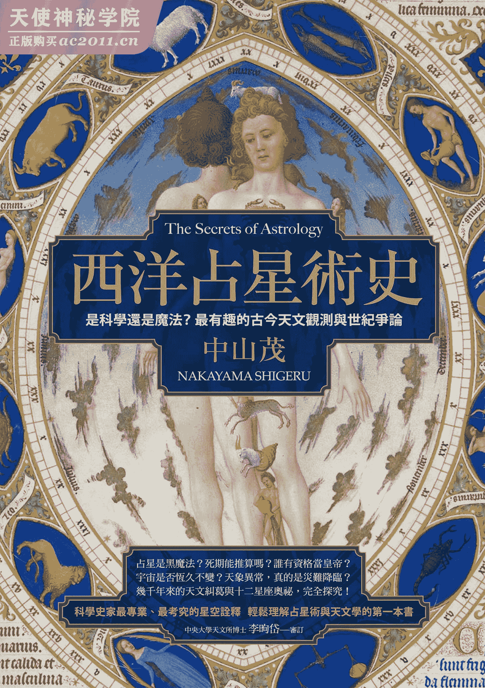

# 前言

复甦的占星术

根据某调查资料记载，在第一次世界大战前的美国，大约只有一百则报章新闻有刊载星座相关的报导；但到了现代，光是 1 千 7 百 50 则报章新闻中，就有 1 千 2 百则是有关于星座的专栏，其读者多达 4 千万人。

为了满足这千万人的需求，占星师约有 1 万人，业余占星家约有 17 万 5 千人。根据世界各地有关于各类占星术的民意调查中，从调查结果得知，有一半以上的受访者都是占星术迷。

即使是不具有西洋占星术传统的日本，在第二次世界大战后，星座专栏开始出现在周刊杂志一角，甚至成为电视节目的谈论内容。

这些阅读占星术专栏的读者大众，不一定代表他们相信占星术，但随着占星术的发展，已经成为一种社会现象或文化现象，变成社会科学家的研究对象。

以历史现象来论述近年来占星术的盛行时，就必须提到占星术曾经风靡一世并影响国政的希腊罗马时期，以及探讨「占星术是否为科学？」而引发学者争论的文艺复兴时期，最后则是占星术中兴时期的第三期。跟前两期相比，第三期的特征是占星术尚未达到知识主流。

无论报章杂志或大众传媒的经营者是否相信占星术，当报章杂志的销售量或电视台的收视率受到占星术专栏文章所左右后，他们不得不重视占星术专栏。因此，今日占星术之所以盛行，其实就是一种受到大众传媒支撑的次文化。

不反对也不赞成的立场

现代英文中将占星术称为 astrology，自然科学的天文学称为 astronomy，将两者加以区别。这两个词汇原本都是指，主宰出现于天上所有现象的事物，并等同视之。

然而到了近代，随着牛顿的崛起，树立了近代科学之际，世人开始清楚地界定两者，占星术则被逐出学问的领域。

不过，原本被科学家忽视的占星术，近年来竟化身为近代科学评论、机械论评论的形式，与超心理学或神祕学等类别，一同为人所讨论。然而，提出评论的学者本身并不是星座或神祕学迷，如果是的话便适得其反，无法提出具评论性的研究。

站在科学哲学的角度，要在科学与非科学之间做区隔是一大问题。过往在大学课程里，占星术经常被视为科学的一门学问受人讨论，即使是身为科学史家的我，对于占星术与科学的关联性，以及如何被刻意拉远两者之间的距离，产生专业上的兴趣。此外，我也感受到职业性的义务，要去解开占星术造成影响力的社会性存在形式。

当我开始致力从学术性角度研究时，如果一开始抱持着否定占星术或推广占星术的目的来检视，就会带有个人的偏见。因此，我尽量排除成见，试图从历史现象及社会现象的角度来研究。

占星术与知识学问有所关联，确实有别于其他的杂占（推断吉凶祸福的占卜术），我希望能透过本书，看透其相关联之处。

# 1 迦勒底的智慧

上天智慧之始

占星就是预见未来的过程，因此广受年轻人的欢迎；占星术是用来解读遥远行星的讯息，多少带有神祕的色彩。由于这些行星自古以来便散发闪耀光芒，古代人与我们一样，都会将自身的梦想寄托在行星之上。

因此，很多人认为人类在文明未开化的时期，就对占星感到兴趣，其实不然。发生于地上的生物现象，远比天象给人更为强烈的印象，人类为求生存，必须与其他动物竞争，时常采取警戒之心以避免被野兽袭击，没有多余闲暇去观察天象。社会人类学家弗雷泽（James George Frazer）指出，根据未开化时代的传说故事记载，当时的人们对于天上的现象并不感到兴趣。

埃及、巴比伦尼亚、印度、中国，随着这些古文明的建立，人们终于有心思并感受其必要性，对于观察天象感到兴趣。然而，并不是所有古文明都对观察天象产生兴趣。有此一说，巴比伦尼亚是观察天象历史最为悠久的文明古国，至今成为定论。

根据历史学家希罗多德（Herodotus）的《历史》及史特拉波（Strabo）《地理学》等希腊、罗马古书记载，以及旧约圣经的记载，相传被称为东方贤者的迦勒底人，将占星术或天文学等上天知识传入希腊罗马文化社会。在西方文明中，它被称为「迦勒底的智慧」，并成为传说流传后世。

在公元前七世纪，迦勒底人是最后建立巴比伦尼亚的种族，他们自居为巴比伦尼亚文化的继承者。

公元前六世纪，波斯灭掉巴比伦尼亚王国，巴比伦尼亚遗民流亡西方，在希腊罗马文化中传入正统巴比伦尼亚文化。因此，提起迦勒底的智慧，泛指巴比伦尼亚文化，如此解释更易于理解。特别是有关于占星术及天文学的知识，可说是迦勒底人的专长。

从传说到事实

在古代的西方社会，只能透过由希腊文或拉丁文撰写而成的古书，或是旧约圣经上的零碎内容，才能涉猎到有关于巴比伦尼亚文化的知识。当时在巴比伦尼亚也有将文字刻在干燥黏土板上的习惯，形成独特的楔形文字，但文字读法冗长不易记诵，没有任何人能解读。

然而，进入十九世纪后，随着楔形文字的解读技术更加先进，陆续揭开未知的全新史实，研究者也为之振奋。

有关于巴比伦尼亚占星术，相传是伴随希腊罗马文化扩散开来，但实际比对书写于黏土板上的楔形文字并正式展开近代化研究的时期，还是在于十九世纪。

根据查尔斯．麦克连（Charles Victor McLean）于一九二九年撰写的著作《巴比伦尼亚占星术与旧约圣经的关联》（Babylonian Astrology and its relation to the Old Testament）记载，在一八五三年三月七日诞生有关于楔形文字的近代化研究中，有位名叫爱德华．因克斯（Edward Hincks）的东方研究学者，在那天找到刻有巴比伦尼亚历月份名的黏土板。

接着在一八七六年，数片同种类的黏土板重见天日，如此一来就能开始研究巴比伦尼亚占星术。

自此以后，随着一些带有占星术含意的全新黏土板翻译出来，并从中获得新的知识，希腊罗马占星术的前身更加浮现。此外，跟巴比伦尼亚周遭区域的记录相比，也能探究这些区域是如何受到巴比伦尼亚的影响。

泛巴比伦主义

然而，随着巴比伦尼亚楔形文字的翻译解读工作持续进行，看到了逐一出现在眼前的巴比伦尼亚文化，学者从中受到鼓舞，也在不知不觉中高估了巴比伦尼亚文化。

当巴比伦尼亚文化与周遭文化有共通之处的时候，光是排列并对照两者的差异，无法找出影响的起源。不过，有一套假设已成为定论并加以蔓延，那就是「泛巴比伦主义」或「放射说」等一切文化都是源自于「迦勒底的智慧」，并且从巴比伦尼亚单点呈放射状，扩散到周遭的文明。

德国学者特别深信这类理论，他们在十九世纪末至第一次世界大战之间，为了协助威廉二世强化权力，在古都巴比伦进行大规模挖掘，后来挖掘工作因大战中断。他们对于巴比伦尼亚文化的憧憬与执念，正是泛巴比伦主义的凝聚。

在一九三〇年代的日本也是如此，根据东洋史学者饭岛忠夫博士的论点，古代中国的所有天文学皆源自巴比伦尼亚，这就是泛巴比伦主义的典型论述。相对之下，京都的新城新藏博士则以天文学分析的角度主张中国文化独立发展说，这似乎是不容易找到结论的论争。

根据饭岛博士的泛巴比伦主义论点，他认为从殷墟挖掘出来的甲骨文，其实是来自于之后基督教活跃时期的汉代前后；但现代学者已论定甲骨文为殷商时代（公元前十四世纪～公元前十一世纪）文字，饭岛博士的泛巴比伦主义显然站不住脚。

即便如此，提到占星术或人们对于天象的兴趣，还是要回溯到巴比伦尼亚。

站在历史的观点，巴比伦尼亚的天文发展并非无中生有，在巴比伦尼亚的天文学与占星术突然现身之前，在这之前应该还有一段历史。我想先从还不值得评论天文学或占星术的时期，也就是受到神话与传说点缀的前期历史，来介绍占星术的演变。

地上众神登天

所谓的历史学，就是藉由留存于世上的文字记录进行研究的学问。提到巴比伦尼亚，也就是底格里斯河与幼发拉底河经过的两河流域，因文字记录的出现，让历史学研究备受瞩目。

在文字出现的时期，巴比伦尼亚已形成众多城邦，各城邦皆有各自的宗教信仰，并以神殿为中心逐渐发展。众神生于地上，在人们建立的神殿中接受祭祀，当时世人还没有连结天与地的想法。

在汉摩拉比国王建立王朝之前的拉尔萨王国时期（公元前二〇二五年～公元前一七七〇年左右）起，人们开始对上天感到兴趣，众神被赋予了与宇宙相关的含意。

上天的天神与神的仆人，也就是地上的人类，两者互相往来，因此要对上天抱持敬畏之心，当时产生了这样的世界观。原本认为神居住于地上的古老信仰开始改变，上天之神所反映的现象是：全新宗教的创立。

地上的民间故事转变成天体天象的运行，地上的历史也成为上天的神话并获得保存。比起文字记载，以神话的形式被说书人传述下来的内容，更为单纯、抽象，也可以作为诗与散文的形式，更易于口述传承。

有关于神的名称，虽然使用以往的称谓，但到了现在，世人已经将神与行星连结，并以相同的词汇来称呼神与行星。神所居住的山林在以往被视为圣地，但后来神明的住所变成了天上的行星。于是，无数的先祖神在天上被人们祭拜，祂们的存在变得无与伦比般崇高。

此外，神殿也产生全新的意义。以往人类会在神殿内举办仪式，以听取预测未来的神谕；但之后人们开始走出神殿，并敬仰天空。

神官虽然依照以往的方式，也会在神殿举行仪式，但他们开始学习有关于上天的知识，从天象判读神的旨意，以将旨意传达给世人。

从此以后，所有的天象都与相呼应的神之声，都能获得一套解释。因此，天与地之间的关系产生学习及研究的价值，这就是天象的学问之始。

七曜的宗教

由此可见，巴比伦尼亚的宗教深受天空学问所影响，例如神殿的结构或器物，也毫无疑问地受到天空之学问的影响。巴比伦尼亚神殿的特征，是具有天文台功能的高塔。

天上最显著的天体（星体）为太阳、月亮，以及在天体之间移动的水星、金星、火星、木星、土星之五大行星，此七颗天体被称为七曜。

此七大天体被视为天神的神殿，相对应的地上神殿（塔庙）设有平台，神可藉由这些平台升天，再次回到地上。

从神殿权力者——神官主掌的宴会或祭典，也能看出对天体产生兴趣所造成的影响；以往只有在播种或收成时期才会举办祭典，自从与天空相关的宗教形成后，祭典的日期开始与天空产生关联。

对巴比伦尼亚的宗教而言，最重要的是月亮的月相，也就是满月及弦月等盈亏圆缺，这比太阳在黄道十二宫的位置更易于观测。因此，自古以来月相一直是引起人们关注的天象。

他们采用的历法称为阴阳历，跟日本在江户时代以前所采用的旧历相同，是依据月亮盈亏圆缺与一年的时间长短调整而成。从昼夜时间相同的春分开始，到下一次春分为一年的时间，一年之间月亮约有十二次盈亏圆缺，因此一年有十二个月。

其历法的主轴为月亮的月相，不是太阳。某月某日的特定日子，代表月亮的月相。每月的一日必定是新月，七日为弦月、十五日为满月。月亮接着开始产生圆缺，到了二十九日或三十日时完全看不见月亮，其周期为一个月。

在汉摩拉比国王掌政的时代，将每月一日、七日、十五日、二十八日订为祭祀的日子，这几天刚好是新月、弦月、满月、晦月。

因为在满月的隔天开始，月相会产生圆缺，百姓便担心是否会遭致众神的不悦，因此在满月之日会在神殿举行特别祭典，以安抚神灵。由于二十八日为看不见月亮的日子，所以人们会在这段期间服丧。

以希伯来文明为例，七日弦月的「七」这个数字，以一周七天来说具有特别含意；在公元前一八〇〇年左右的巴比伦尼亚，弦月七日也是休息之日。在这一天，不会有人遭受鞭刑，妈妈不能打骂小孩，无论是一家之主、工头、工人等都必须停下手边工作休息，也不能在坟墓掩埋遗体，要打官司的百姓也不能上法庭。

七日是巴比伦守护神马尔杜克的圣日，医生在这天不得接触病人，也不能许愿。

因此，神官在进行仪式时候，依据天体或历法的「历数」，具有神祕的含意。

五与七这两个数字尤其重要，前者五为行星的数量，后者七代表月亮的月相（新月至上弦、上弦至满月、满月至下弦、下弦至新月，也就是一个月的四分之一为七日）。

将这些数字相加或相乘后，可算出十二或六十，这也是相当重要的数字。现在的时间单位也会用到十二进制法与六十进制法，皆是起源自巴比伦尼亚。

汉摩拉比国王的创造神话

在先祖神升天后并能操控天体的瞬间，天文现象与神话的连结便成立。根据记载，在比汉摩拉比国王时代更早的时期，天文与神话已有关联。

伊丝塔从地上的女神成为金星女神的过程，有这么一段故事。故事描述伊丝塔为了统治天地万物，臣服于天神安努，想要取得安努配偶的地位。

安努接受伊丝塔的乞求，让伊丝塔不分昼夜都能散发光芒，并宣告所有归属于安努的万物，未来都得归属于伊丝塔。

伊丝塔原本主掌植物生长，在太阳神殿的都市里，无论所到何处都是受人崇拜的女神。然而，由于安努神的宣言，让伊丝塔成为天上的女神。此外，伊丝塔为了治理天界，划分了众神的统治区域，确立了分工体系。

当汉摩拉比国王建立第一王朝后，神官有感王权的强大，向国王谄媚献策，让巴比伦成为权力集中之地。将原本分布于各地的众神权力，集中于巴比伦城守护神马尔杜克一身，试图确立神明的中央集权制。

汉摩拉比国王自身也想打造王朝的新时代，因而编造出巴比伦尼亚的创造神话。

众神原本在地上生活，历经数个世代，后来天神陆续现身，从原始神祇基沙尔（地神）与安沙尔（天神），诞生了安努、恩利尔、恩基、马尔杜克、伊丝塔，文字记录历史的时期一开始，这些神明就开始受到人们的信仰。

之后在众神之间持续上演新旧世代的抗争，在用尽一切祕术以求生存的结果，马尔杜克身为现实世界的统一者，立下显赫功勋，并获得众神认可，成为众神之首。

此民间故事夹杂了地上的历史动机与天神的行为，象征汉摩拉比国王的马尔杜克，以巴比伦天体信仰之首的地位，取代了古代众神，并且将新世代众神供奉于万神庙。马尔杜克取得众神同意，获得统治权。

化身为天体的众神

当天象与地上人类的行为直接产生关系时，这时候会显现出占星术的面貌。根据占星术的解释，如果发生日食或月食，代表太阳神或月神被恶魔击败，是不祥之兆，因此要趁着阴影掠过太阳或月亮表面时，持续进行驱邪仪式。

此外，有关迦勒底天体的神话，可归纳出日月火水木金土之七曜崇拜；伊丝塔为金星神、奈尔伽尔为火星神、马尔杜克为木星神。此外，根据占星术的解释，天上的天体特性会反映出各种神明的性格与行为，并影响到地上万物的运行。换言之，原本天体（星体）的特征只有色彩、明暗、移动方式，却开始具有人性。

金星的特征是表面为黄色且美丽，就象是月神——辛的女儿伊丝塔，也就是恋爱女神。因此，当金星出现时，代表好的兆头；相较之下，火星的表面是红色的，看起来象是残酷的血，就象是残暴的战神奈尔伽尔。因此，当火星出现的时候，代表凶兆已现。

因此，透过神话故事中的各种神明，将火星比喻为恶人的化身、将金色比喻为好人的化身等，每个行星被赋予不同的性格，以当作占星的参考。举例来说，象是木星隐藏在月亮后方的掩星天文现象，代表木星神马尔杜克隐藏，也就是马尔杜克化身的国王死亡之意。

附带一提，为何众神之首马尔杜克的化身不是太阳，而是与木星有所关联呢？在寒带、温带地区，太阳虽被视为宇宙的中心而受到人民推崇；但对于居住在沙漠的百姓而言，太阳的存在受人忌讳。如同后面单元介绍，由于木星具有潮湿的性质，也许对于巴比伦尼亚的居民而言，木星会比太阳更为讨喜。

到了希腊文化时代，这些天体含意更为组织化，神的名称也有所改变；到了罗马文化时代，名称变成拉丁语，成为英语名称的起源。

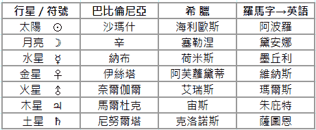

根据多神教所发展的占星术

日本人可能不太熟悉，西方人因从小阅读圣经长大，应该都有看过圣经里有关于占星术的记载，因此对占星术耳熟能详。圣经里预言者所说出的话语，感觉象是一位占星师。

旧约圣经原本是犹太教的主要经籍，公元前八世纪时，以色列的说书人在撰写从创造天地万物时期，隶属犹太人的历史时，也许曾仿效身为文化先进国的巴比伦尼亚历史结构。根据推测，以色列早期的历史学家们十分通晓巴比伦尼亚的神话传承，在撰写历史叙事时自由发挥了自身的知识。

然而，从巴比伦尼亚天之宗教所显现的占卜或偶像崇拜，其实都是以多神教为基础。另一方面，西奈山的雅威神原本只是自然崇拜的对象，却因摩西的关系晋升为以色列民族之神，由于以色列人仅信奉雅威神，并逐渐以一神教为核心，促进以色列民族的融合。

因此，多神教是以色列人想要回避的信仰，倒不如说，他们想要与从邻国传入的星辰信仰及多神教引诱中，下意识地划清界线。

然而，在亚述王国更为强大的时代（公元前九世纪～公元前八世纪），星辰信仰逐渐盛行，并对居住在幼发拉底河流域的以色列人造成极大影。以色列的亚哈斯国王仿效亚述王国建造祭坛，并将祭坛安置在神殿中。

在亚述王国长期掌权的时期，以色列文化也被亚述军队与外交使节所带来的亚述文化所玷污，在耶路撒冷神殿里，巴比伦尼亚与亚述的众神，一同与雅威神受人祭拜。

在巴比伦囚虏时代（公元前五九七～公元前五三八年），以色列采用了巴比伦尼亚的历法，某种程度接纳了巴比伦尼亚的神殿仪式。

然而，在该时期之后，巴比伦尼亚的影响逐渐式微，「天神」、「我们的天父」等用语表现开始固定化。

这里所指的「神」为一神教的神，不是巴比伦尼亚的多神。对于上天也是以大写单数的 Heaven 来表现，而非 Heavens。这时候，人们已经不再将行星的存在视为是天神权威。

不过，到了希腊化时代，在民众之间盛行着满足个人需求的占星术，犹太教的领袖们当然无法默许占星术在百姓之间传播，因为占星术的概念是各天体皆有相对应的众神，也是基于多神教所发展而成。

此观念延续至基督教，无论是古代、中世纪，或是到了近代，基督教与占星术屡屡发生对立，其背后的问题在于一神教与多神教中对于天体的观念差异。

天变占星术与宿命占星术

当地上的神明被捧上天后，众神的意志会影响地上万物的信仰，信仰开始组织化，并产生像占星术这类的整合性知识。其时间为公元前一千年左右，其起源为以下要论述的天变占星术。

现在我们所熟知的占星术，主要性质是算出个人运势或命运，但在现代占星术之前，还存在着其他类型的占星术。例如算出即将发生于天上让人感到不安的灾难，或是造成地上灾厄的前兆等，也就是预测即将到来的灾厄。

这种占星术被称为「天变占星术」，中文的「天文」，是探讨发生于天上的现象，以及对于地上人事物所造成影响的学问。日本继承了来自中国的天文学，持续至江户时代。所谓的「天文」，就是天变占星术。

相较之下，如同后面单元所述，构成本书主题有关个人运势与命运的占星术，则以「宿命占星术」加以区别。

这里，我想先论述天变占星术中，最为显著的题材。天上最严重的变化中，首要为出现日食、月食及彗星，接着是发生日晕、月晕、新星、流星雨、陨石等现象。地上则会发生各式各样的灾难，例如地震、打雷、洪水、旱灾等天灾，以及国王或王族死亡、生病、战乱、叛变等人祸。

这些是在大面积区域中所观测到的共通天变现象，是在广大天下中造成影响的天地灾难。虽然国王、王族等政治上的权力者死亡，属于个人的事态，但因为其影响会扩及天下，就属于天变占星术的对象。

提到天变占星术的原理，首先要谈论「天地相关主义」与「经验主义」。

天上发生日食等异常天象时，地上的天子死去，这时候基于天地相关主义的原理，天与地之间产生关联，两种事件相互连结。如果某一天天空同一处位置发生日食，根据天地相关主义的解释，人们就会担心地上的天子是否会死亡。

例如中国汉代有以下记载：「二八九年正月与十月初一，发生日食。隔年二九〇年四月，武帝驾崩。」

因此，世人尽量记下天变与地上变异的资料，试图找出两者相关关系的规则性。也就是说，尊重过去经验的经验主义，构成天地相关主义的主要原理。

但是，天变与地变并不像自然科学的法则般，藉由必然的因果关系相互连结。此外，如果被必然性法则所限制，即使做了预测也没有太大意义。发生日食的时候君王会死亡，如果这是无法避免的命运，也只能顺其自然静观其变。

占星师的登场

由于天变占星术是试着连结天与地这两个看似不相关的相异世界，无法百分之百预测正确的结果。也就是说，重点在于机率问题。此外，天变与地上的灾厄之间存在时间差，带有预报性与预防性。

当发生天变时，天上向地上传达某种讯息后，人们要尽快解读天上的讯息，以预防即将到来的灾厄，这跟气象预报是相同的原理，具有实用性价值。

举实际的例子会更易于理解，学者从亚述王国时代亚述巴尼拔国王（公元前七世纪）的书库中，挖掘出大量刻有楔形文字的占星术史料黏土板，解读其中内容后发现以下的记载：

当火星逆行来到天蝎座时，国王要特别注意，这天的运势极糟，国王不能走出宫殿。

天与地的现象，原本是依照事实感知的纯粹经验，但将这两种现象连结所做出的解释，则带出了人类潜在的价值观。以上一段的楔形文字记载为例，因为人类对火星与蝎子都有不好的印象，当看到两者重叠后，便提出将带来厄运的解释。

对于古代东方专制君主而言，天变占星术他们最注重的一环，属于帝王学的一部分。因此，君主会任命专注于观测天象的专家，以预测天变。此职位的工作是汇整传统成规或记录天变，在当时是唯一的知识阶级神官。

每当有突发事件时，他们会调查过去的记录，找出发生相同天变的时候，在地上产生什么样灾厄，或是解释天变的含意并向天子报告。此类的神官兼天文观测官员，是占星师或天文学者的祖先。

天子收到报告后，会立刻下令官员采取预防灾厄的措施。但古代并不像现代，看到气象预报后能实时透过现代化措施来预防洪水或涨潮，大多只能进行祈祷或驱邪等仪式。

占星师也会负责驱邪仪式，他们会事先警告天子，发生天变时天灾会降临到地上，得采取加持祈祷等预防措施。如果没有发生灾厄，代表预防措施产生效果，占星师会获得天子的犒赏。换言之，占星师就象是引火后提水自救的双面角色。

天下国家的机密

专制君主极力向天下彰显自身的地位受到上天眷顾，以获得至上无上的权威，因此在中国或日本，君主又被称为天子。

天子试图独占上天，只有天子才能掌握天变占星术的信息，如果起义的首领获得这些信息，他们应该会利用相同的天变讯息来推翻王朝吧！当天变传达当今皇帝即将死去的卦象时，反叛份子势力壮大的机率，会比天变占星术征兆成真来得更高。因此，像这类天变占星术的信息，可说是一国之中最高的机密。

由此可见，天变占星术与天下国家有直接性关联。因此，当时的占星术会比追求规律的科学性天文学，有更高的地位。

规律是死板而无趣的，至少专业科学家以外的人都会这么认为吧！太阳每天早上从东方升起，这是不变的规律，但这是理所当然且平凡无奇的事实，除了想要准确预测日出时刻的专家，没有任何人会感到兴趣。

相对地，如果太阳从西方升起，就会成为天变占星术的严重事件。在现代社会，应该不会有人将天变记录放在「今年的十大新闻事件」；但从巴比伦尼亚或古代中国君主的问题意识来看，年度大事会以天变占大多数。象是记录中国王朝史的「帝纪」，就有许多有关于天变的记载。

也就是说，古代人会将上天视为发生事件的场所，而不是产生自然规律的场所。就象是，以现今新闻记者的角色来看上天，而不是科学家。

所谓的寻求自然规律，是透过科学家眼中所见找出事实，事实具有规律性，对于一般人来说，其影响就没有天变那么强烈。

东方占星术的遗产

在东方社会中，历史学为学问的原型，因此天变占星术会透过史料记载流传，长年来延续到十九世纪。然而，在西方社会，伴随着宿命占星术的应用，天上的学问是以规律性的科学为基础而发展。因此，在西方很少留存有关于天变占星术的记录。

此外，在东方的中国或附庸国朝鲜、日本等国家，由于天变占星术属于官衙的例行工作范畴，并有一套专门制度，天文官员具有观测天变的义务，官衙经常保存大量的记录。在中国持续至清朝末期，在日本到江户时代为止，皆有专人记录并收集天变的资料。

在这类的记录中，象是记载日食、月食或彗星的记录，可当作寻求规律性的资料，作为科学的一部分，对于天文学有极大的帮助。现代社会已经能精确地预测日食或月食的发生，世人了解到彗星是顺着椭圆轨道周而复始地回归，在计算这些天文现象的周期或轨道时，过去的记载便有极大的贡献。

更重要的是有关于新星的记录，公元一〇五四年，从中国的《宋史》与日本的《明月记》都可见「客星」的记载，客星就是现代的超新星，也就是出现一颗没见过的星星。

十八世纪，天文学家透过望远镜从对应客星的位置，发现了蟹状星云。此外，在第二次世界大战后，天文学家还观测到这颗客星发射了电磁波。因此，归功于荷兰与东方天文学家的合力观测记录，确认超新星的爆发到星云的产生，以及发射电磁波等现象，在天文学界造成广大的话题。

超新星在历史上属于一次性的现象，自从有历史记载以来，在东方天变占星术传统中，超新星的出现都会被记录下来，主要提供天变占星术的参考，而不是为了物理宇宙学，但对于宇宙生成论而言却是极为重要的贡献。

也许是食髓知味之故，西方的天文学家为了找到类似的记载，从此以后不断地寻求东方天文观测记录的英文翻译版，虽然找到一些古老时代文献的英文翻译，但十七世纪以后的记录，还没有完整的英文翻译版。

从天文学诞生的天变占星术

天变占星术不具数学性要素，与属于精密科学的天文学之间有遥远的距离，但同样在巴比伦尼亚，自从属于精密科学的天文学成立后，以天文学为基础的数学性占星术蓬勃发展，也让占星术的内容有显著的改变，于是宿命占星术随之登场。

有别于为了君主而推算天下国家运势的天变占星术，宿命占星术仍是用来推算个人运势的方式，无论是君王或百姓，占卜的原理相同，算是极度民主化的占卜方式。当婴儿诞生或女性怀孕时，会观察日月五行星之七大天体位置或排列，算出运势。

原本宿命占星术盛行于有能力僱用占星师的富裕皇族或贵族阶层，但任何人都有想要获知自身运势的欲望，因为普遍性的需求而使宿命占星术突然普及于各阶层。

在公元前两千年纪的巴比伦尼亚，因受到东方专制主义的统治，为了加强天子统治力而施行天变占星术，是理所当然的事情。不过，在公元前第一千年纪前半（公元前一千～前五百年）之前，占星术仍仅停留于经验性的天变占星术。

直到天文学急速发展的公元前第一千年纪后半，主要用来推算个人运势的宿命占星术，开始被应用在天文学的领域。

根据西方的历史，占星术的主流从天变占星术转移到宿命占星术，其中的分隔点是公元前五世纪至公元前四世纪时，在巴比伦尼亚成立了精密天文学。

换言之，当人们理解天文学中的宇宙现象，或是行星运行或日食、月食的原理，并且能加以预测后，对于天变的恐惧感开始消失，并认识到这些现象原来具有规律性。于是，人们才发现到自己的人生会受到天变的影响，并能规律性地预测并计算。

留存至现今最古老的宿命占星术，是公元前四一〇年的巴比伦尼亚楔形文字。根据文字所示，在当时如果有贵族生子，占星师会根据行星的位置或排列来算出小孩的未来。虽然不像当今的天宫图（人类出生时标示行星位置的天体图）如此完整，但巴比伦尼亚楔形文字的确是用来推算个人运势。

到了希腊罗马文化，尤其在希腊化时代，天宫图更为盛行而成熟。

从本章论述来看，希腊罗马文化典籍所提到的「迦勒底的智慧」究竟为何？是巴比伦尼亚的古老天变占星术知识呢？或是新成立的宿命占星术？其实迦勒底人的智慧涵盖了一切要素，甚至还加上一些魔法般的要素，但主轴在于公元前四世纪左右的巴比伦尼亚天文学，宿命占星术则是属于衍生的应用形式。

# 2 希腊人的科学

提升市民价值

在公元前四世纪时，迦勒底的智慧传入希腊世界，以现代语言来形容，就象是技术转移。迦勒底人的天文学、占星术之科学具通用性，如果接收方具有高度知识与文化水平，传入并非难事。然而，如果不是与地区需求紧密连结的技术，传入的也不见得会被接纳。因此，我们先来探讨希腊人的社会条件。

希腊人是民主主义之祖，有别于面积广大的美索不达米亚，希腊属于小型港都的都市国家，要统治并管理国家，并不需要将强大的权力集中在君王一人身上，可透过市民的合议制来决定政策。市民经常透过辩论的方式来表示意见，不仅是有关于政治的问题，无论是哲学、科学、数学，或是个人命运等，都是以辩论的方式来传达。

有别于古代近东专制时代，百姓在君王面前如同蝼蚁般渺小，希腊的个人价值大幅提升，宿命占星术传遍市民阶层，也形成了普遍接纳宿命占星术的社会基础。

由于科学具有普遍性，无论谁去实行，应该都会获得相同的结果，也不会受到科学家个人的资质或直觉所影响。然而，宿命占星术具有高度精密科学的成分，不是任何人都拥有精准计算的能力，因此需要专家的解析。

当某些人具备常人所欠缺的特殊能力时，会创造各式各样的传说，因而产生令人敬畏或敬而远之的异能者。很多人会有所混淆，将天文学家与占星师误认为是异能魔法师，其中也有占星师利用他人的混淆，自称为异能者来蒙骗他人。

这些异能者从东方而来，在希腊化时代，巴比伦尼亚的迦勒底人受希腊市民雇用，作为服侍征服者的知识奴隶，他们以天文学、占星术专家的身分，取得受雇的机会。

罗马时代的希腊人也处于相同的境遇，希腊占星师同样身为罗马市民的知识奴隶，以占星术专家的身分受雇。想当然，因为雇用者所处的市民社会中，极度重视市民个人的运势，并且有经济的余裕能支付报酬给知识性服务，才促使这些职业的形成。

为了制作宿命占星术专用的天宫图，必须要准确地观测人类出生时的天体（星体）位置，王公贵族会僱用专业的天文学家，当小孩出生时请他们观测天象。不过，如果小孩是在白天出生，或是碍于某些因素而无法实时观测天象时，该怎么办呢？

这时候只能依据小孩出生的时刻，计算天体的位置，也就是需要具有定量性与数据的实用天文学。

然而，在公元前四世纪前，希腊人欠缺类似的感受力，喜爱辩论的他们，对于宇宙的现象或天体运行等，都会以政治辩论般的口吻来讨论，不太在意琐碎的数据。此外，他们也缺乏敏锐的感觉，无法让现实中所观测的世界与根据理论计算的世界趋于一致。

例如，公元前四世纪前半，古希腊哲学家柏拉图的弟子欧多克索斯（Eudoxus），应该是第一位具有迦勒底智慧能力的人物，但他对于宿命占星术采取否定态度。最起码在古希腊时代的希腊人，并不具备推算宿命的能力。

亚历山大大帝的传说

很久以前，当希腊被世人高估为西方文明原点的时期，讲究逻辑性的希腊人不可能会认同像占星术这类的奇异拟科学，在希腊学者之间就存在诸如此类的坚定论点。然而，当时的希腊人其实将占星术视为合理性行为。

占星术活动的中心地，并不是在古希腊文化的中心古雅典。公元前三三二年，亚历山大大大帝征服埃及后，希腊人在尼罗河河口建立了殖民地亚历山卓，巴比伦尼亚的天文学，与希腊或埃及的传统在此融合。

自从亚历山卓暂时成为希腊罗马文化的中心地之后，埃及人传入了占星术，并传至后世。然而，如同前述，占星术其实源自于迦勒底（巴比伦尼亚）的智慧。

在此引述有关于亚历山大大帝的占星传说。

亚历山大大帝的母亲——奥林匹亚丝临盆之时，有一位名叫纳塔内波的埃及占星师，劝告奥林匹亚丝要延后生产的时间，这样才能在天体运行的最佳时刻产子。奥林匹亚丝听从纳塔内波的劝告，强忍腹痛延后生产时间，顺利产下亚历山大。

这是有关于亚历山大大帝的占星传说，听起来象是虚构的故事，这也许是后代职业占星师所流传的宣传版本。这则传说故事据说是在公元一世纪被编撰而成，也从中证实在编撰故事的当时，宿命占星术的观念已经逐渐普及。

从天变占星术的威胁中解脱

日食或彗星等天文现象，依旧让人感到恐惧，并引起世人的密切关注。即便如此，这些天文现象不再是仅限君王才能观测的特权，无论是日食或月食都能藉由希腊人的合理性想法及数理性科学，理解到这些现象的发生道理，并加以计算及预测。

相较于月食，地球上分为看得到月食跟看不到月食的地区，要预测月食的确非常困难。但是，透过合理化的方式解开真相，当人们发现这些并不是天变现象，而是例行性的天文现象后，就不会产生恐惧的心情。

直到英国天文学家哈雷（Edmond Halley）计算并预测彗星将再度回归之前，彗星都被世人认为是异常天象；但亚里斯多德等希腊人，则是提倡天与地是受到相异法则所支配的天地双重性原理，这是在受到巴比伦尼亚占星术的天地相关原理所影响之前，于希腊成立的科学。

根据希腊人的科学理论，天体的运行是圆周运动，没有起点也没有终点，因此具有恒久不变的特性。于是，人们可依照必然性法则，来加以计算受到恒久不变天体所决定的宿命。

另一方面，地面是直线运动的世界，具有起点与终点，是有限且变幻无常的世界。因此，天变地异不属于宿命占星术的对象，并被解释为平凡的现象。

到了中世纪，每当彗星出现造成人心惶惶时，神职人员就会现身，安抚无知的人民，强调在天上之父为神圣且恒久不变，不会制造出如此怪异的天体，这些现象就如同地面的热浪微不足道，没有必要担心。

因此，在东方或巴比伦尼亚的公共官僚制度中，已不再组织性地收集天变占星术相关记录。

诺伊格鲍尔的「历史」

接下来在论述占星术具科学的另一面之前，在此我想先做个论述。在比较各地天文学或占星术的时候，如果行星、星座、月日的名称，或是天文学性质的数值（例如一个月或一年的长度等）趋于一致，就可以确认相互关联性。像这些用于天文学及占星术的用语，具有可称为专有名词的特殊意义，比起其他类别的学问，可说是决定文化影响关系的关键要角。

就象是放射性物质进入身体后，可透过示踪剂来追踪其含有的物质是如何在体内移动，从中了解路径。这类的影响关系不仅对于占星术，在作为一般文化交流史的关键因素上，也带有重大意义。

战前的巴比伦尼亚占星术，还是属于经验法则性质。相较之下，希腊的占星术偏向数学性，这是受到天文专家认同的论点。

当时的希腊，诞生了几何学之父欧几里得或阿基米德等数学家，被视为西洋数学或现代数学的源流，古希腊崇拜也在西方文化中扎根。因此，当时的人们认为，巴比伦尼亚的主流是没有运用数学的天变占星术；希腊的主流是透过数学来计算天宫图的宿命占星术，两者是依照功能性区分的共存关系。

不过，到了战后，奥图．诺伊格鲍尔博士（Otto Eduard Neugebauer）及同派学者，大幅改变巴比伦尼亚天文学的解释，他们认为希腊与巴比伦尼亚的并列关系，其实是一方影响一方的纵向关系，因此是从巴比伦尼亚传自希腊的单方影响。无论如何，宿命占星术也是源自于巴比伦尼亚。

但这些理论并不是依据过往毫无批判性的泛巴比伦主义，诺伊格鲍尔学派并不相信神话或传说中模稜两可的记载，而是深信定量性数值。他们透过解读楔形文字资料后加以证明，跟巴比伦尼亚主义者所提倡的时期相比，在更晚的公元前五世纪开始，巴比伦尼亚的数理天文学才趋于繁盛。

他们认为巴比伦尼亚的光荣时期，不在于古老的公元前数千年纪。从数学科学文化的成熟时期来看，公元前五世纪开始的巴比伦尼亚文化，才具有真正的价值，并有极高的可信度。因此，他们对于经常将神话与数学混为一谈，且谈论巴比伦尼亚古老光荣史的泛巴比伦尼亚主义者，抱持着批判性态度。

于是，从纪元前第一千年纪后期开始，巴比伦尼亚文化，也就是所谓的「迦勒底的智慧」，开始传入古希腊或希腊化文化或产生影响。换言之，希腊的精密科学是受到巴比伦尼亚的影响而发展。

那群欧洲的希腊文化学者，一开始无法认同伟大的希腊，竟会屈居于亚洲的巴比伦尼亚之下，并指责诺伊格鲍尔的论点荒谬至极。而且也有人认为，像柏拉图等伟大的哲学家，不太可能会受到巴比伦尼亚这类的野蛮文化所影响。

至今依旧有学者批评诺伊格鲍尔一派，认为他们过于依赖数据，没有考虑到宗教信仰、魔法、神祕主义等更广泛的文化因素。然而，即使诺伊格鲍尔一派有过火之处，大多数人还是不得不接受他们的论点。

从诺伊格鲍尔一派的论点来看，历史只能透过经过证实的资料来逐一组合而成。如果毫无批判性地相信神话或民间故事，并加入后代研究者的想象成分，无论经过多久，也无法产生具有公信力的历史。

黄道十二宫的产生

有关于黄道十二宫，也有相同的议论。

我会在后面的单元详述黄道十二宫，黄道十二宫可说是宿命占星术的基本原理。泛巴比伦主义者认为，黄道十二宫也起源于更古老的时代，但如果宿命占星术是在公元前五世纪产生，在公元前五世纪之前是天变占星术盛行的时代，那么是否还需要黄道十二宫呢？

黄道十二宫是以数学的方式，来得知七大天体的正确位置。在现代天文学中，为了决定天体的位置，会以天球上的赤经、赤纬的坐标值来标示，但黄道十二宫是更早的类似标记方式，可算是子午线的前身也不为过。

因此，巴比伦尼亚的天文学快速转变为精确的精密科学，并产生、衍生出天宫图占星术。由以上来看，黄道十二宫是在公元前五世纪至公元前四世纪时形成，如此思考更为自然。

某些早期世代的东方主义学者，对于自己所发掘出的古代遗迹深深感动，幻想起建立星座名称时期的神话传承世界，因而将所有事物的起源都归类于古老时代。

然而，后代的东方主义学者会以严谨具批判性的态度，仔细地审阅这些资料，如果只是零碎性地出现星座之名，或是发现一些类似的星座图，公信力不足。如果站在精密科学的立场，古代天文学是透过留存的数据记录被再次建构而成，身为其代表的诺伊格鲍尔学派认为，黄道十二宫是在公元前四世纪左右，在巴比伦被当作天文学用途。

拿破仑远征埃及时，在埃及伊西斯神殿天花板的丹达腊天体图中，发现了黄道十二宫图案，有学者认为那是古法老时代的遗迹，主张黄道十二宫起源于埃及。

然而，根据诺伊格鲍尔的论点，只有在公元前四世纪起，亚历山大大帝征服埃及后，才能找出黄道十二宫在埃及被运用于天文学的证据。丹达腊天体图是托勒密王朝的产物，天体图中随机夹杂着天文神话与希腊化占星术（诺伊格鲍尔《The Exact Sciences in Antiquity》Dover Publications，一九六九年）。

天宫图占星术的特殊性

无论在巴比伦尼亚或中华文化圈，都相当盛行天变占星术，但这两个地区未必有信息互通的情形。也就是说，在相同的社会条件下，有可能会出现同样的天变占星术。

相较之下，起源于巴比伦尼亚的宿命占星术，具有显著的特征。不过，宿命占星术不是随便透过天体运行状态来推算运势，而是依照记载黄道十二宫上的七大天体位置的占星表进行占卜，称为天宫图。

因此，起源于巴比伦尼亚的宿命占星术又被特别称为「天宫图占星术」，并成为现今占星术的主流，也是巴比伦文化传递的示踪剂。

天宫图出现在希腊的时间，是亚历山大大帝之后的时代。为了与亚历山大大帝时代以前的古希腊时代科学做区别，亚历山大大帝时代以后的希腊人科学，被称为希腊化的科学。宿命占星术是希腊化时代的科学之一。

我之所以提到宿命占星术是希腊化时代的科学之一，是因为宿命占星术与以往的天变占星术、估算日子好坏（择日）的黄道吉日、星辰信仰等截然不同，是植基于天文学之精密科学的基础。

然而，会统称为希腊化时代，是因为在公元前二世纪天文学家喜帕恰斯（Hipparchus）以后的时期，天宫图突然现身。此外，对照当时的巴比伦尼亚与希腊的文献后，可了解到巴比伦尼亚的数理天文学成果的确有传入希腊。

到了公元二世纪的托勒密时期，天文学家累积了丰富的知识，才能写出象是《天文学大成》（Almagest）、《占星四书》（Tetrabiblos）等有关于天文学或占星术的系统性著作。

因此，在这之前的天文学史中，是喜帕恰斯大幅提升了天文学的水平，他被誉为是古代具最重要地位的天文学家。以托勒密为首，每位天文学家在谈论天文学的起点时，总会归功于喜帕恰斯的贡献。

喜帕恰斯的贡献

然而，即便是天文学的天才，依旧是孤掌难鸣。此外，象是一整年的长度等天文常数，必须得对照过往的天文记录与自己的观测记录，才能算出正确的数据。此举除了以往所累积的学问成果，若没有加上个人的实绩，一切都是空谈。

托勒密的确很少引用喜帕恰斯之前时期的希腊人观测资料，但光是这样，喜帕恰斯宛如从无中生有般地突然构筑天文学，似乎不合乎常理。

换言之，喜帕恰斯是第一位使用过去巴比伦尼亚所保存下来的观测资料，或是将经过计算后的天文常数拿来利用的希腊人，并且将这些资料翻译成希腊文，让其他的天文学家得以参考巴比伦尼亚的天文学知识。

不过，单是以译者的身分，并无法透彻地了解这些资料的天文学含意，也许他曾亲身造访巴比伦尼亚，并将当地的天文学资料带回希腊，如此解释更为恰当。

另外，有关于占星术的部分，喜帕恰斯的相关论述并没有传至后世，但天宫图占星术应该与天文学一同由喜帕恰斯传入，或是由喜帕恰斯的下一个世代传入希腊人的世界。

虽然没有直接的方法可证明，但无论是当今研究喜帕恰斯的泰斗——图默（Gerald J. Toomer）或是我，都有同样的想法。

在希腊化时代文化中，技术性传入了「迦勒底的智慧」，收集希腊的各种元素后，逐渐壮大。在喜帕恰斯现身的时期之前，巴比伦尼亚的确是天文学与占星术的中心，希腊只是附属地区；但在喜帕恰斯现身之后，以亚历山卓为中心的天文学信息被翻成希腊文，加上周遭地区的希腊文信息，使得希腊的天文学与占星术知识远比巴比伦尼亚更为丰富。

于是，占星术的中心从巴比伦尼亚的楔形文字，转移成希腊文。当占星术中心完成转移后，公元二世纪的希腊化科学巨头托勒密，则是扮演希腊天文学与占星术集大成的角色。

依据政治时期区分，托勒密的生活年代为罗马时期，虽然处于罗马帝国的统治，但希腊人的科学依旧保有优势并延续传承。因此，如果要以科学史来区分，可将托勒密之前的时期当作希腊化时代。

近代之前的范例

在介于喜帕恰斯与托勒密的时代，从公元一世纪的罗马诗人曼尼里乌斯（Marcus Manilius）占星诗中，可一探希腊占星术的精髓。

其中象是「生为死的开端，死亡取决于开端。」「命运掌控了一切，宇宙万物是以共通的法则相互连结」等记载，均阐释了宿命占星术的基本观念。

在曼尼里乌斯生活的时代，也许是天文学技术尚未成熟，无法掌握行星的动态；或是还没有将天文学列入占星术的范畴中，所以当时的分析方式略显粗糙。然而，随着时间的流逝，天文学家开始掌握行星的一举一动，对于行星现象的解释也逐渐细分发展。

此外，当时大量充斥着各类占星术解说书，世人往往会阅读到不同的解释内容。所以头尾贯通的西方占星术体系，并非是在一朝一夕之间形成。

因此，托勒密不仅在天文学上有所贡献，在占星术的领域中，他也是各种学说的集大成者，并统一各派说法及加以理论化。直至今日，他也是将喜帕恰斯的天动说天文学集大成的重要人物，并创造天文学范例的古代代表性天文学家。

所谓的范例（paradigm，又称典范），现在指的是公认的思考架构或是政治体制，但原先的含意为：「可作为科学家在一定期间提问和解答模板的古典功绩。」（托马斯．库恩）

托勒密的天文学大作《天文学大成》的代表作用，到了近代才被哥白尼的地动说范例所取代。换言之，在托勒密以后的前近代天文学者，都是一边参考《天文学大成》，一边解开天动说天文学的问题。

《占星四书》

有关于占星术，托勒密还有另一本着作《占星四书》，在书中的开头，托勒密提到《天文学大成》的内容，是透彻了解天文学的第一科学；《占星四书》的占星术，则是属于自明性较低的第二科学。

《天文学大成》让托勒密博取广大的名声，跟之后出版的占星术著作相比，虽然《占星四书》的完成性较低，但在后继的占星师之间，《占星四书》至今依旧是占星术的范例，广受赞扬。

《占星四书》由四卷构成，第一卷的内容为占星术基本原理，第二卷为天变占星术，第三与第四卷为宿命占星术，文笔充满学者风格。

书中的题材虽然类似巴比伦尼亚的神话传说的传统，但托勒密还加入希腊的自然哲学与科学传统，以及自身涉猎的数理性天文学，而不是像童话般胡说八道地论述。对于发生在世上的事件，托勒密尽可能回归自然性事物加以解说，可说是唯物主义。

行星的特性

托勒密在《占星四书》的第一卷提到七曜的力量、善恶、性、恒星的力量、季节的影响、黄道十二宫的性质、天体角度的关系等，论述占星术的特征与原理，并提到可应用在医学领域的可能性。

根据托勒密的论述，天空被恒久不变的「乙太」物质覆盖，地面由火风水土四元素所构成。天体在乙太之中运行时，首先影响到上层的火、风，接着影响下层的水、土，最后影响水、土层中的动植物。

太阳会因光与热，伴随着干潮湿冷热四气影响地面的现象，就如同月球运行会影响地球的潮汐现象，其他天体的运行也会影响地面的活动。

这样的思维很接近于亚里斯多德的宇宙论与自然论，托勒密为了取得自然哲学家的信服，因而透过亚里斯多德的自然论来解释占星术。

有关于个别行星的影响，也可透过干、湿、冷、热四气来说明。然而，在此提到的宇宙，与我们想象中的宇宙有所差异，如果没有把行星层想象成是一层层的洋葱，就会难以理解。

首先，大家都知道太阳是具有炽热气体的大火球，但因为具有过度的热能，属于干燥的性质，其效果依季节而变化，当太阳升到天顶的时候，效果达到最强。

由于月亮靠近地球，从地面升起的蒸气让月亮产生潮湿的性质，因此月亮的效果为软化及腐化物体，但月亮受太阳光照射的缘故，具有一定的热作用。

土星因为距离太阳的热气与地面的湿气较远，属于冷且干燥的性质。

从火星表面如同火焰般的颜色可得知，由于位于太阳的上层且距离较近，具有干燥宛如燃烧般的效果。

木星位于土星与火星之间，效果适中，虽具有热且潮湿的性质，因为下层为火星与太阳，发热效果强大，会制造收成之风。

金星的效果与木星相同，具有沉稳的性质，但作用方向相反。由于靠近太阳，具有稳定的热气，但因为靠近月亮及地球的蒸气，具有湿气的性质。

水星有时候靠近太阳时，会吸收太阳的热气形成干燥性质；有时候靠近月亮或地球时，会吸收蒸气形成湿气性质，同时具有冷热特性。水星的效果会随着在太阳附近移动的速度产生急遽变化。

在干湿冷热四气中，湿气与热气是合并物质的有益之气；反之，干与冷则是分裂及破坏物质的有害之气。

因此，木星、金星、月亮为善星，土星与火星为恶星。太阳与水星具有善恶两面，会因相关联的其他行星而有不同的效果。

此外，自然也有男女性别之分。由于湿气为女性特质，月亮与金星是女性的代表；太阳、火星、木星为男性的代表。由于水星能同时制造干气与湿气，具有双性特征。以上是托勒密所区分的行星特性。

父母星、财富星

托勒密在《占星四书》第二卷提到了自然占星术或天变占星术，但与其将天变的影响直接归纳在人类的行为，倒不如暂且当成自然现象，接着再论述天变对于世事的影响。

托勒密在第二卷中虽有提及国家或都市等一般性主题，但已跳脱东方专制君王时代，并以战争、飢荒、传染病、地震等成为研究对象，而不是君王或王族。此外，他也论述了有关于年度气温变化、暴风雨、酷暑、农作物丰收或欠收等周期性现象，也就是类似于现代气象学的主题。

第三卷的主题为宿命占星术，托勒密在第三卷提及父母、兄弟、姊妹、寿命等人的天性或生理性主题；在第四卷提到名誉、出人头地、结婚、旅行等社会性、人为性主题。

那么，该用什么样的占卜方式，去推算这些多样化的主题呢？托勒密认为，在占卜对象出生时，要先留意从东方升起，位于黄道上的行星。该行星尚未升起的天象与父母的运势相关，升起前后的天象与兄弟的运势相关。

托勒密首先提到父母的运势，由于太阳与土星为男性的代表，与父亲有所关联；月亮与金星为女性的代表，所以与母亲有所关连。换言之，在占卜对象的行星升起前，只要观察这些行星与其他天体之间的关系，就能推算父母的运势。

在代表父亲的太阳旁边，或是附近的星座中存在性质相同的土星时，又或者是代表母亲的月亮旁边，存在同性质的金星时，是父母亲富裕运势最为显著的天象。

当土星与太阳处于最佳的角度关系时，父亲的运势是幸福的；同样地，当金星与月亮处于最佳的角度关系时，母亲的运势是幸福的。反之，当太阳或月亮处于孤立状态，或是与土星或金星的位置关系不佳时，是父母运势不佳的前兆。因此，从行星的位置的关系，可推算父母的运势。

托勒密在《占星四书》中，试图统合亚里斯多德的自然论与宿命占星术这两个完全独立的体系，并藉由前者的理论来解说后者的内容。然而，要统合两种体系并不容易，托勒密的《占星四书》中有许多无法阐述清楚的内容，只能含糊带过。

基本上，托勒密认为第一科学完全适用因果关系，至于占星术这类的第二科学，与其说行星是主要原因，倒不如说只是单纯的前兆。

因此，虽然托勒密论述了占星原理或方法，但感觉他自己并没有从事占星行为。如果自己实地进行过占星，《占星四书》的内容应该会更加浅显易懂，但光是阅读这些内容，要实地从事占星并不是简单的事情。《占星四书》虽然是占星术的古书，要作为指南手册却显得不够完整。

死亡时间可以估算？

托勒密在《占星四书》的第三卷中，以长篇幅论述计算人类寿命方式之后，在结尾穿插了「有关于死亡性质」的章节。

决定死亡原因的主角，是占卜对象出生时，逐渐往西方天空沉没的行星。如果土星是主角，因为土星具有干冷之气，所以这个人会饱受久病折磨而死亡，例如肺结核、风湿等。主角若为木星，他可能会得到肺炎或心脏病。由于火星会产生热气，则会在一天半的时间内吐血猝死。其他象是金星会引发胃病、木星会引发心病等，托勒密详细记载了有关于死亡的各种细节。

像这样制定出主掌死因的行星后，虽然同为自然死亡，但象是恶星重叠之时，或是人们亵渎太阳或月亮时，人类就会死于非命，或是客死他乡。

要决定这类重要的人生大事时，必须考量到各种复杂要素，或是需要正确的天文学知识。我想，这是一般的占星师所无法办到的事情，如果没有精通托勒密的天文学大作《占星四书》，可说是难上加难。言外之意，人类的死期可不是胡乱计算就能加以预测出来的。

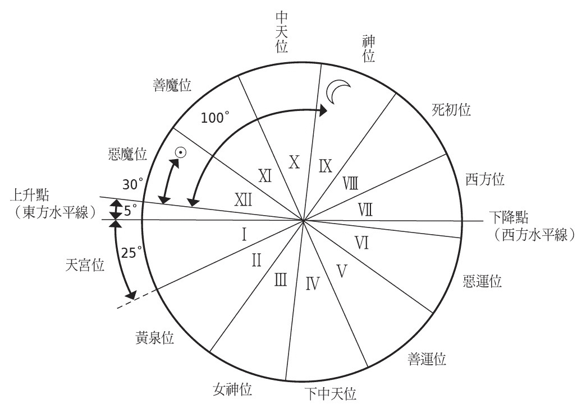

计算寿命的方式

托勒密将东方水平线上方 5 度到下方 25 度的区域，定为第 I 位，每 30 度划分十二位，再描绘出七曜的位置以算出寿命。在思考寿命的时候，要先设定出发点与衰亡点，依据两点之间的角度来估算年龄，因为角度不会超过 90 度，估算最高年龄为 90 岁。

首先是可作为出发点的强大区域是天宫位，接着是 60 度的善魔位、90 度的中天位、120 度的神位、180 度的西方位四区。至于水平线下的方位，也就是图中的第Ⅱ位至第Ⅵ位之间的区域，由于星光会受到遮蔽，可以加以忽略。

如果是在白天出生的小孩，当太阳位于上述的方位时，即可视为出发点；如果太阳没有位于上述的方位，就找出月亮的位置，接着是与太阳处于良好位置关系的行星，如果什么都没有，最后就标出上升点。如果是在晚上出生的小孩，可套用以上的计算方式，太阳与月亮互换。

至于要决定衰亡点，由于端看出发点的位置，计算方式更为复杂。火星或土星被视为恶星，两着靠近后会招致衰亡。如果月亮为出发点的时候，太阳的位置就是衰亡点。由于相位的关系复杂，在计算寿命时会加上相抵的修正。

举简单的例子，假设太阳位于上升点 30 度的位置，月亮位于 100 度的位置。太阳处于恶魔位，无法当作出发点，月亮位于神位，可视为出发点。这时候太阳变成衰亡点，两者的角度差距为 70 度，预测出寿命为 70 岁。

# 3 天宫图的技术

太阳的路径、黄道十二宫

天宫图英文 Horoscope 的 Horo 为时间之意，天宫基本点是人在出生时，黄道上的行星升到东方水平线的点位。在希腊罗马文化时期，天宫基本点指的是，依据七曜的位置来占卜个人运势的图表。

接下来要暂时放下有关于占星术的历史记载，论述天宫图的计算方式与原理。

宿命占星术具有各式各样的做法与发展形式，但其中以天宫图占星术成为西方占星术的主流，并普及至现代社会。天宫图中最重要的概念在于黄道十二宫（兽带），占星师一开始要做的事情，是在黄道十二宫上标出这个人出生时太阳的位置。

满天的恒星中，地球绕太阳转一圈需要一年的时间，这是天文学的基本常识。那么，我们是如何得知太阳移动的路径呢？

白天，由于地球表面受到太阳照射，所以我们无法确认太阳与恒星处于什么样的位置关系。不过当太阳西沉或日出时刻，因为太阳位于地平线下方，天空相当昏暗，这时候就能透过肉眼辨识明亮的星星，并决定太阳与这些星星的相对位置。在巴比伦尼亚的楔形文字中，是以明亮且显眼的星星为基准，标出太阳的位置。

以这样的方式观测太阳的位置，描绘出太阳在一整年中在天体（星星）之间移动的路径，这个路径被称为「黄道」。将黄道分为十二个区域后，太阳在每个宫的时间大约是一个月，各宫是以该区域的星座来命名。

黄道十二宫在日后的西方天文学星图中，占据中心地位，并流传至现代。由于行星及月亮都是环绕靠近黄道的轨道，也能透过黄道十二宫来显示行星的位置。更精确地说，先决定各星座中的代表天体，观测天体进入十二宫的角度后，即可透过度数来找出位置。

在进行占卜的时候，也需要赋予黄道十二宫的性格。春分的时候，位于太阳位置的牡羊座为男性，接着将交互轮替的十二宫、各星座分配男女性别。这是根据毕达哥拉斯学派的灵数而得，将奇数当成男性，偶数当成女性，十二宫因而有男女之分。

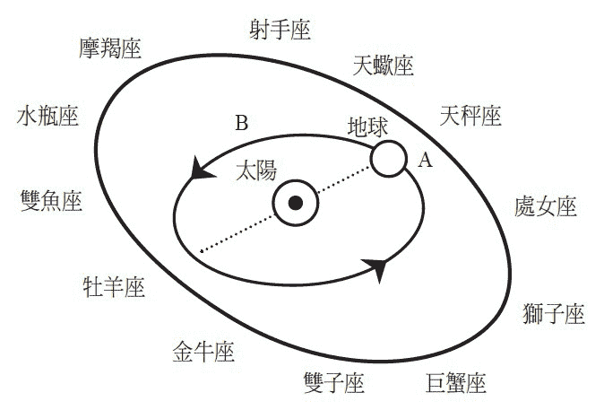

地球会依照上图箭头的方向，花一年的时间绕太阳转一圈，春分的时候地球位于 A 的位置，这时候太阳看起来跟牡羊座重叠；到了夏季，因为地球移动到 B 的位置，太阳看起来象是进入巨蟹座的位置。

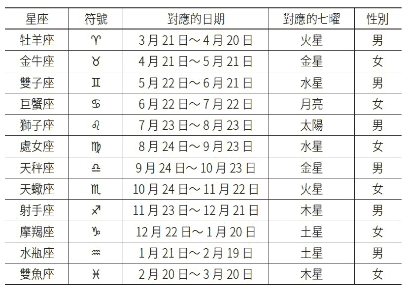

七曜与黄道十二宫的对应位置如表格所示。一整年白天最长的时刻中，太阳位于巨蟹座与狮子座，并造成夏季炎热的特性，因此将这两个星座指派给最明亮的太阳与月亮。由于太阳是男性的代表，对应的星座为狮子座；月亮是女性的代表，对应的星座为巨蟹座。

其他十宫则对应五行星，首先是土星，由于土星具有冷的性质，可指派给与狮子座及与巨蟹座性质相反的魔羯座与水瓶座。因为木星位于土星的下层，可指派给位于摩羯座及水瓶座之后的射手座与双鱼座，最后比照上述方式陆续指派给火星、金星、水星。

依照以上的对应方式后，假使土星位于摩羯座的位置，由于两者冷的性质重叠，冷性质将更为严重，可以如此解释。

两者之间的角度为 120 度及 240 度的星座（牡羊座的话为狮子座与射手座），被称为最佳的「相位」（位置关系）。此外，从黄道十二宫的角度来分析，因为每距离两宫或四宫的星座为同性，性格契合度高。反之，相距 90 度的星座为异性，属于敌对性格。

相距 180 度的星座，其实也是同性的关系，但不知为何在此被解释为敌对且契合度不佳的关系。托勒密在《占星四书》中也无法说明详细理由，只能用含糊的方式带过。归根究柢来说，同性的星座契合度高，异性的星座则属敌对性格，本来就是奇怪的说法。

后期的占星术也开始重视行星的位置，但早期的占星术仅参考太阳的位置，曼尼里乌斯在推算寿命时，主要也是参考人出生时太阳所在的十二宫。

地上十二宫位

除了黄道十二宫，另一个重要的概念是在罗马时代成熟发展的十二宫位，拉丁文称为 Domus，英文称为 House，日文称为「舍」。此外，在日本现存最古老的天宫图（王朝时代）中，将十二宫位称为「位」。

我在前一章提过，在托勒密的时代，要推算父母运势或财运的时候，都会寄托于太阳或月亮等天体进行占卜。然而，因为十二宫位的体系更加完备，所以可透过十二宫各自的位置来推算十二星座运势。

十二宫位是天体（星星）从地面升起的东方开始逆时针绕行，将天空分为十二个区域。各位可以参考插图（天宫图）来思考黄道十二宫与十二宫位的关系，内圈是固定的十二宫位，外圈的黄道十二宫会顺着箭头方向一天转一圈。第Ⅰ位是从「上升点」开始的半圆，位于水平线下（地下）。第Ⅶ位是在「下降点」之后的半圆，位于水平线上（地上）。

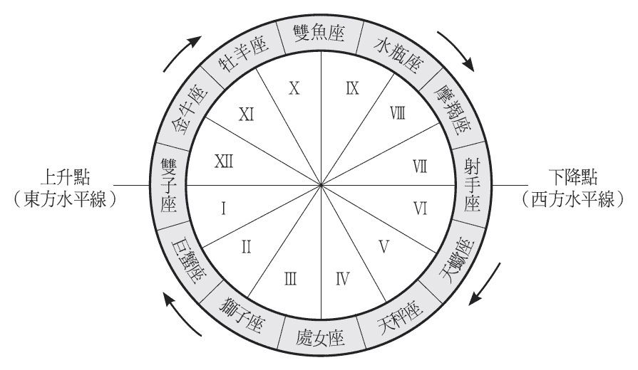

上图是小孩出生时，双子座星星从东方水平线升起的十二宫位图。由于十二宫会依照箭头方向转动，所以巨蟹座与狮子座的星星会依序从上升点升起。因此，可依照这个方式观察小孩出生时位于第Ⅱ位的星星、第Ⅲ位的星星等，藉此推算小孩的人生运势。

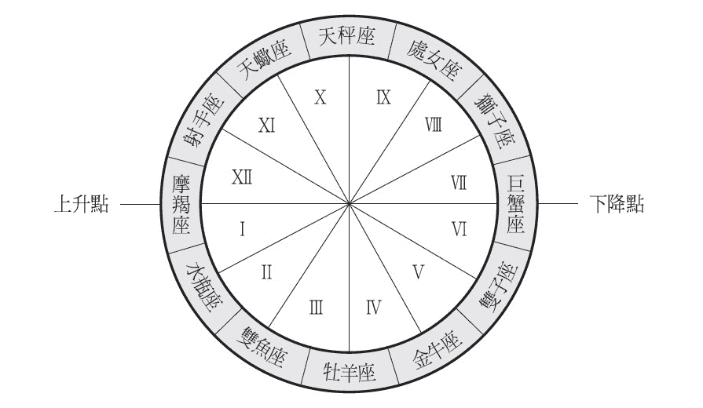

小孩出生时，当位于第 I 位的星星完全（走到）沉没于西方水平线的时候，这时从东方升起的星星，就是出生时位第Ⅶ位的星星。因此，可透过出生时位于第Ⅶ位的星星来推算死亡。

十二宫与十二宫位的关系

当小孩出生的时候，星星从东方升起，在无数的星空之中，增加了一颗全新的星星。同样地，在人类社会中也诞生一个新生命。由此类推思考，小孩与新星就象是命运共同体，星星透过周日运动升到中天时，小孩处于人生的巅峰活动期；当星星沉没于西方天空时，小孩的人生终结。

于是，小孩出生后从东方水平线升起的星星，成为关注的焦点。虽然从水平线升起的星星众多，但以占星术的角度来看，只会把注意力放在黄道上的星星。所以在小孩出生的当下，得立刻观测位于第 I 位的星星为何，以便算出小孩儿时的运势。

随着时间的推进，小孩出生时位于第Ⅱ位与第Ⅲ位的星星，依序从东方水平线升起，因此观察出生后第Ⅱ位以后有哪些星星，即可推算未来的人生，也就是结婚或财富的运势。

位于第 I 位的星星是生命的象征，因此第 I 位的星星完全沉没于西方水平线后，代表死亡的含意。这时候可观察从东方升起的星星，也就是可透过人出生时位于第Ⅶ位的星星来推算死亡。因为在小孩出生时，可以从西方天空看见第Ⅶ位的星星，所以一开始就可以多加留意那个区域。

此外，从第Ⅸ位到第Ⅻ位可推算社会性因素，是独立于出生到死亡的人生区域。

虽然无法透过肉眼看见水平线之下的星星，但可以简单地加以计算。

行星在黄道十二宫的移动速度并没有想象中快，在移动速度最快的月份中，行星一天会移动 13 度，并在一个宫停留 2 至 3 天。但是，比较十二宫位与黄道十二宫的关系后，前者会因观测者而固定，后者会因「周日运动」（Diurnal motion）行星在北极周围一天移动 360 度，因此对应到各星座的十二宫位，就是行星会在 2 小时后移动下一个宫位。

因为星星会时时刻刻移动，如果要以十二宫位的方式来进行占卜，过了 1 小时后星星会移动一半的距离，过了 2 小时后占卜的解释会完全不同。因此，参考十二宫位来进行占卜时，如果无法得知正确的出生时刻，便无法精准地推算运势。

从诞生到死亡

因为是攸关地上人类的事情，所以十二宫位是以人类想要的占卜题材来加以表现。这是从巴比伦尼亚与希腊的时期便延续下来的传统，但占卜题材会因文化多少有所差异，这就是相当有趣的地方。

表格「各地的十二宫位表」的最左栏位是取自托勒密的《占星四书》，「天宫图」原指十二宫位中的第 I 位，但当时还没有确立十二宫位的体系。

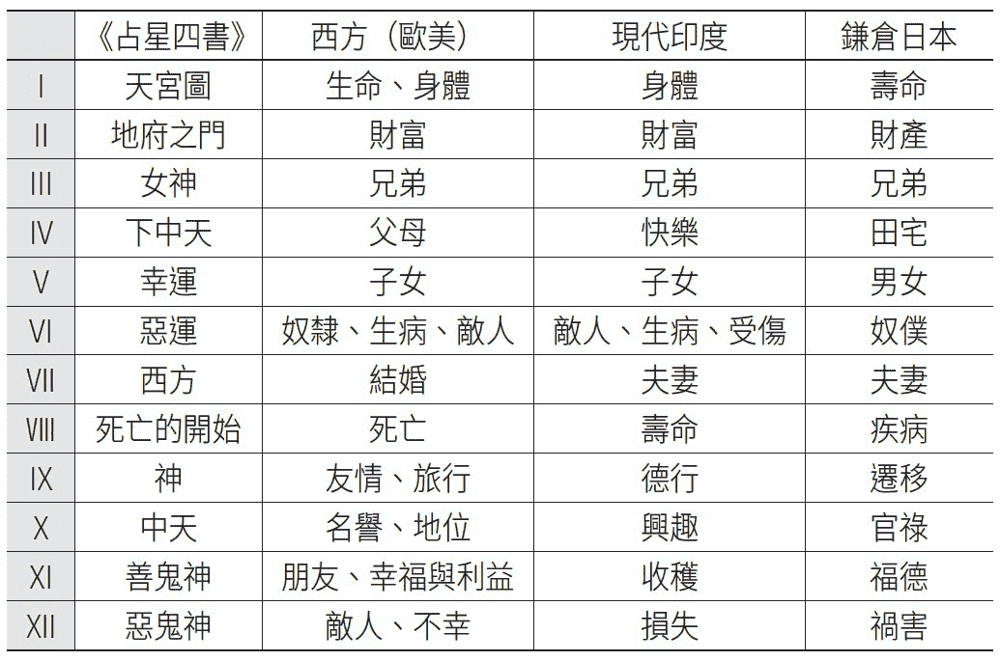

各地的十二宫位表

下一栏的西方是现代（欧美）的占星术解释之一，从叙拉古王国的占星师费尔米库斯．马特尔努斯（Julius Firmicus Maternus）时期开始，十二宫位终于有完整的体系。从当时到现在，历经了不少变迁。

第三栏取自于现代印度所实行的天宫图占星术之一，第四栏是日本鎌仓时期的天宫图，后面这两种十二宫位都是源自将印度佛典翻译成汉字的资料，内容近似。

西方十二宫位中最严重的是第Ⅷ位的死之预言，换成东方的十二宫位后就变成疾病，显得缓和许多，没有发生跟西方一样的问题。

从第 I 位的诞生到第Ⅷ位的死亡，代表人生走了一遭，生命应该在第Ⅷ位结束。不过由此看来，原本只有八位，为何会有十二位呢？我想是为了配合黄道十二宫，因而特地杜撰了第Ⅸ到第 XII 位。

举一个以十二宫位来占卜的例子吧！如果小孩出生时太阳位于生命位的第 I 位，这时候十二宫的狮子座来到该位，从狮子的特性可以联想到小孩的性格应该是具有男子气概，且自我意识强烈。此外，如果他的土星位于疾病位，小孩未来将罹患肺结核而死。

12 与 7

天宫图占星术中，12 与 7 是相当重要的数字，7 无法被整除，是相当特别数字。附带一提，类似于西方一周的单位，中华文化是以十进制为单位，以十天为一旬，将整个月定为上、中、下旬，看起来更为合理化。

不过，这是因为人类的手指头刚好有十根，很适合教小孩用手指算数而已，并不代表十进制比四进位、八进位、十二进制更加优秀，二进制反而是更为合理化的进位制。

即便如此，7 对于现代生活依旧带来极大的影响。7 天一周的概念是犹太人的发明，源自于基督教。无论是周休一日、二日制、三日制等，虽然没有中间值，但这也是具合理化，近代生活受到数字 7 所制约的证明。

另一方面，虽然跟一周没有特别关系，但是在可透过肉眼观察天空的古代中世纪时期，天空中会动的只有太阳、月亮、水星、金星、火星、木星、土星 7 种天体（星），因此 7 这个数字显得格外重要。

「七曜」走过的道路

太阳、月亮、五行星合称为七曜，在中国自古以来也有这个名称。不过，撇开上述不谈，源自于西方的七曜也曾传入中国。严格说来，源自巴比伦尼亚的天宫图占星术，在希腊化时代传入印度，透过八世纪由唐朝高僧不空翻译成中文的《宿曜经》等佛经，将天宫图占星术内容翻译成中文。

当时，作为犹太、希伯来文化特征产物的一周七天制，也经由来自西域的丝绸之路传入中国。这两种文化的传统在中国融合，象是日曜、月曜等日月火水木金土的一周排列，被导入中国历法，接着由空海之手，随着真言密教传入日本。

此外，有关于五行星的名称，以中国的传统名称来看，水星被称为辰星，金星为太白，火星为荧惑，木星为岁星，土星为镇星。后来为了对应金木水火土的五行元素，才改叫作火星、水星等名称。

在西方文化中，日曜与月曜同样对应太阳与月亮，但由于没有五行学说，所以火星、水星、木星、土星并不是对应火、水、木、土；西方的行星是以星神的名称来命名。

虽然传入七曜，但东方社会旬的时间单位已经根深蒂固，周的时间制并无法定型。此外，七曜只会被运用在佛教仪式或天宫图占星术。

此外，在东方世界里，虽然七曜与天宫图占星术的基本构想相同，但比起出生时的七曜位置，东方人更重视以出生年月日与时刻的四柱来区分的十干十二支等历法，透过循环数来计算运势。由于传统的历占（四柱推命或高岛断易等）占据极大势力，从西方传来的天宫图占星术存在感显得薄弱许多，甚至暂时失传。

日本在进入幕末明治时期之后，开始与西方有所往来，当采用西方的一周时间制度后，以往的七曜命名法也随之复活。当时的中国，七曜已经完全被世人淡忘，将日曜日称为星期日，并将月曜到土曜改称为星期一至星期六。

东方自成一格的天宫图

再者，从印度传至中国及日本的天宫图，是比七曜多两个曜名，以「九」为基本数，诞生了有别于西方的传统。除了七曜，多了两个曜名是罗睺与计都。

罗睺与计都都是假想的天体，根据印度的民间故事描述，魔兽居住在太阳与月亮轨道的交会点，经常吞食日月（造成日食与月食），由于太阳轨道（黄道）与月亮轨道（白道）的两处交会点，刚好接触魔兽的头部与尾巴，因而形成这两种假想的天体。

罗睺也许没什么问题，但有学者认为计都是彗星，或是月亮的远地点（天体运行轨道上距地球最远之点）等，并提出各种解释。相关内容，可参考矢野道雄《密教占星术：宿曜道与印度占星术》一书（东京美术／东京美术选书，一九八六年增补修订，东洋书院，二〇一三年）。

七曜加上罗睺与计都被称为九曜或九执，这两个假想的天体，肯定是来自印度或中国、日本的天宫图。现存的王朝期与鎌仓时代的两种天宫图中，都有加入这两个假想天体。

二十七宿或二十八宿与九曜相同，皆常见于印度、中国、日本的天文学与占星术中，也是西方占星术所欠缺的部分。

之所以称为二十七或二十八，是因为月亮在天空绕一圈，大约需要 29 天半的时间（古代认为是 27 天半）；「宿」有停留、住宿之意，代表月亮每日留宿。中国自古以来将二十八宿当作天上的一里冢（古代标示道路里程的土冢，每隔一里于道路左右各设置一冢），但印度则是将星空分为二十七份，因此称为二十七宿。

弘法大师空海将《宿曜经》带回日本后，首度将印度占星术传入日本，并将印度的二十七宿（梵语音译为纳沙特拉）翻译成中国的二十八宿。将二十七宿带入中国传统二十八宿名称后，因为还多一宿，便称为牛宿。

如此一来，就可以找出黄道十二宫的十二与二十七宿或二十八宿相对应的例子。12 可以被 3 或 4 除尽，因为 27 为 3 的倍数、28 为 4 的倍数，更易于归纳出两者之间的对应关系。比起七曜与黄道十二宫的对应关系，二十七宿或二十八宿与黄道十二宫的对应关系更加显而易见。

对应所有事物

话题回到西方，占星术的目的是推算所有的事物，并且将占卜对象对应黄道十二宫或七曜，以进行占卜。

当然不是所有的事物都可以用 12 或 7 等数字来分类，例如我们不可能将人类的血型区分为 12 或 7 等数字来加以说明吧！

因此，对于数字全都搞不清楚的状况下，就必须套用对应原理。如果要将人类的性格等特征加以分类，因为找不到明确的标准，这时候就得套用 12 或 7 等对于占星术来说是特别重要的数字，以制造关联性。

中国自古以来，就存在阴阳五行说这个自然哲学原理，现代的正负电磁现象也沿用了古代阴阳的原理。然而，如果要将所有现象都分成阴阳，是非常困难的事情。打个比方来说，就是把所有成对的现象都必须分成阴阳；其一为阴、其一为阳。

换成五行说后，更显得牵强附会。例如春夏秋冬四季，虽然与西方的四元素吻合，但难以将四季分成五行。如果将火水木金与四季相对应，再于其中或一年之中的特定期间硬塞入土，才能勉强合乎逻辑。

如果是 7 或 12 等大数字，那就更加麻烦了，由于 7 是较特别的数字，很难自然地分配，充其量只能用来对应在极具人为化的「周」。为了让周与黄道十二宫相对应，因为难以整除，在分配上具有任意性，也是占星师较为辛苦的地方。

因为 12 可以被 3 或 4 整除，也是比较容易运用的双数，所以至今依旧留存着十二进制。1 英呎为 12 英吋、一天分为上午下午各 12 小时等，在我们的生活中依旧能看出各种十二进制的痕迹。因此，采用十进制的东方地区，人民都是背诵九九乘法表；但在西方则是背诵十二乘法表。

像这样将数字 7 分为七曜、12 分为黄道十二宫等，依次分配所有要素。男女的性别虽然只有两种，但象是颜色或性格等不特定要素，也能用 7 或 12 来分配。

绘制天宫图的方式

那么，在解说了进行占卜所必备的黄道十二宫与十二宫位的概念后，接下来要教各位试着绘制天宫图。

要描绘天宫图，有各式各样的方法。直到近代，西方的天宫图都是四方形。为了对应十二宫位或黄道十二宫，得使用圆规将圆形分割成 12 块，这时候有人发明出不用圆规也能分割 12 块的方法。

虽说如此，但在日本出土的鎌仓时代天宫图，就有跟现代的天宫图同为圆形，现代人也使用圆形的天宫图。

我们先采用现代的天宫图画法，试着绘制标准的天宫图吧！先用圆规画出两个小同心圆，最内侧的小圆形代表地球，因为占星术至今依旧是以地球中心说为基础，接着在外侧画出两个大同心圆，最外侧的圆形代表天体。

第三个步骤是，画出连接四个圆形的直线，先画出一条横线，代表水平线，接着划出一条垂直线，代表子午线（连接天球南北极的大圆形），接着在直横线之间每隔 30 度画出直线。这么一来，总共有 12 条线连接地球与天体。

在两个小圆形之间的 12 个区域，标出罗马数字 I 到 XII，代表十二宫位，接着以东方水平线下方为第 I 位，依序逆时针沿着地下来到西方水平线下方的第 VI 位。之后从西方水平线上方的第 VII 位绕行地上，到达东方水平线上方的第 XII 位后，绕行地球一圈。

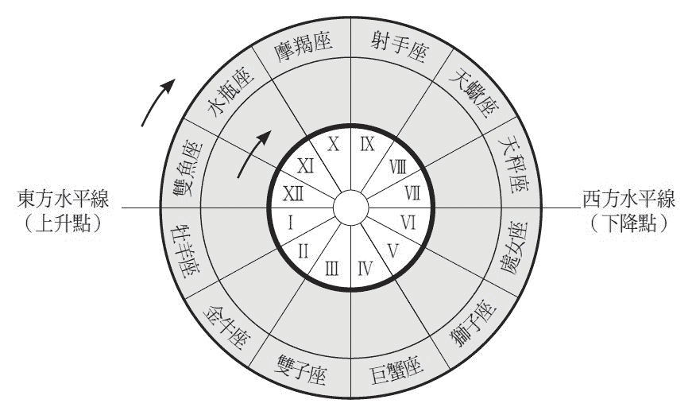

自行绘制天宫图，做出外侧可旋转的两个圆盘

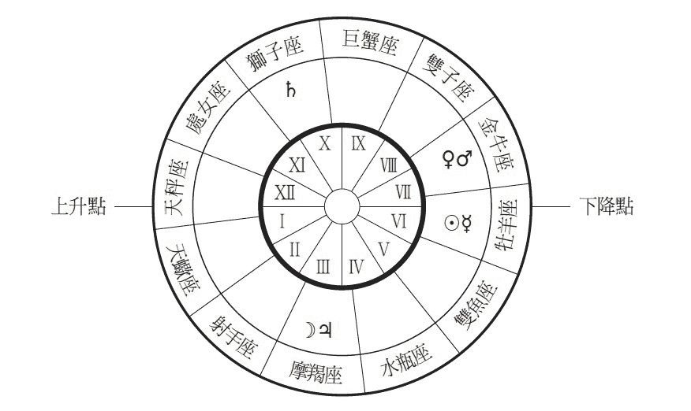

核对出生时从东方水平线升起的星星，再描绘出七曜（太阳、月亮、水星、金星、火星、木星、土星）

自行绘制天宫图

在两个大圆形之间标出牡羊座、金牛座、双子座等天上十二宫（星座），从何处开始都没关系，比照十二宫位的逆时针依序排列，接下来确认占卜对象出生时位于东方水平线的星座为何，制作从外侧可旋转两个圆盘。

最后，再从外侧数来第二处圆盘区域上，描绘出生时，日月五行星在黄道十二宫上的位置。

因为一般人都没有观测过自己出生时日月五行星的位置，所以得事先从现在的位置来倒推，或是利用出生年的天体位置表来标出位置，这样才能确认日月五行星正确的位置。

黄道十二宫或日月五行星的符号，源自于古希腊、罗马时期。附带一提，现代生物学所使用的雌雄（男女）符号，也是源自于行星中的金星与火星符号。

黄道十二宫的赋予性格

因此，作为天文学领域的前置阶段，绘制含有黄道十二宫、七曜（或是九曜）、十二宫位的天宫图后，终于能够解释天宫图对人生的影响。不过，占星术研究书籍却没有提出相关的解释。因为占星方式的不同，存在诸多任意性，加上难以广义化，所以占星研究者要详加记载是十分困难的事情。

另一方面，实用书籍中有关于天宫图的记载，显得丰富许多。由于部分古书大多会将天宫图与巴比伦尼亚，或者希腊罗马文化的神话传承相互连结，如果对于民俗文化或神话世界缺乏兴趣或理解，便难以读懂古书的内容。不过，在大众社会之间依旧盛行着通俗且单纯的解释。

此外，随着占星师长年来传承天宫图占星术的传统，经验性的要素也逐渐加入。也就是依据古今英雄豪杰的天宫图，将有关他的命运资料，加上新的解释。

例如，歌德虽然是天蝎座，却不会因凶恶的蝎子形象，让人联想起歌德的一生会遭逢厄运。而且依据占星师的经验，开始修正以往对于天宫图的解释。解释愈来愈复杂，初期单纯以类推方式所形成的解释逐渐式微，也更难以理解。

来介绍一下原本单纯的解释吧！提到天体对于地上的影响，任何人都无法否定太阳的影响吧！接着是逐渐降下的月亮。人类虽然不会明显感受到行星所直接造成的物理性影响，但根据古代人的类推，与日月同在天空移动的行星，对人类也具有相同的影响力。

然而，首要在于太阳的影响，根据最简单明了的占星术解释，人诞生时可依据太阳所在的黄道十二宫，开始赋予性格。

如果硬要举个例子，人出生的时候，当太阳位于黄道十二宫最初的牡羊座，因为与羊毛产生关联，所以这个人未来如果从事服饰产业会有所成就；占星师可以从星座名称开始做单纯的类推。根据羊来联想其性格时，可预测这个人的个性胆小略带糊涂，但只要被吓到就会讲话带刺，脾气暴躁没有耐性。

金牛座出生的人，脸部跟眼睛较大，鼻孔外露，上半身发达，体型魁梧，这是从公牛联想的类推。根据曼尼里乌斯的占星诗记载，出生此星座的人将来会成为农夫，因为公牛的工作是犁田，是个性沉稳的定居者。

双子座的双子，被解释为在葡萄田中摘葡萄的酒神巴克斯，以及弹奏竖琴的阿波罗两人。根据曼尼里乌斯的解释，出生此星座的人是一位懒散的音乐家，比起战士吹起的小号，更喜欢和平的竖琴。此外，他们也会成为探讨音乐与数学之间关系的毕达哥拉斯学派的天文学家或数学家。

巨蟹座的人皮肤泛红？

巨蟹座出生的人，体型娇小皮肤泛红（因为螃蟹经过煮熟后会变红），骨骼结实、关节较大。因为螃蟹总是孜孜不倦地用螯搬运树叶等物品，巨蟹座的人未来有机会从事木工或石匠等职业。在巴黎圣母院的黄道十二宫巨蟹座雕塑位置，可见木工及石头工匠雕刻图。

狮子座出生的人，胸膛厚实、腿部细长，具有强健的膝盖，个性大胆，如果能成为企业的领导者，应该能获得名誉与财富。根据巴比伦神话纪载，伊丝塔设置了陷阱要让狮子落入，狮子必须随时留意，以免遭到陷害。根据希腊神话记载，狮子会被海克力斯勒住脖子，因此生于狮子座的人经常患有气喘疾病。

处女座出生的人，个性软弱害羞，但天生健谈，适合当学者或作家。根据曼尼里乌斯占星诗的记载，处女原本是学校的女教师，是一位女预言家；根据希腊教训诗之父海希奥德的记载，天上的处女是离开地上飞向天上的「正义」之神。

天秤座出生的人，由于平衡感极佳，适合从事立法、法官、行政等职业。天秤也是制定罗马法律的罗马帝国象征。此外，使用磅秤的银行家、金工、肉贩等，也是适合天秤座从事的职业。

天蝎座出生的人，具有蝎子的性格，是一位战士、拳击手、毒害者、杀手，或是战争游戏、战争图像、战争文献的爱好者。像希特勒、墨索里尼都是天蝎座，歌德也是。

射手座出生的人，具有敏锐眼光且精力旺盛，是一位天生的狙击手。射手座天性活泼好动，不会感到疲倦，适合当马车夫或驾驶员。此外，射手座的人擅长手工作业，也适合从事外科医师等医师职业。

摩羯座的山羊，在黄道十二宫图里被描绘成是一只具有山羊角与鱼尾的生物。生于摩羯座的人，年轻时就跟山羊一样，个性阴晴不定，随着年纪增长后，会转变成鱼一般的冷静性格。

水瓶座出生的人，会从事与水相关的职业，例如凿井者、治水技术者、开挖河道者、桥梁建筑师、钟表师傅（因为古人会使用水钟）等，因为水瓶座花钱如流水，无法好好存钱。

双鱼座出生的人，理所当然会成为一位渔夫，其他还包括鱼贩、船长、海盗、舰队司令，甚至是奴隶等在桨帆船上工作的职业，或是成为造船家或船主。航行于大洋航线的船长，为了掌握正确的航道，必须精通航海天文学，因此，双鱼座的人适合从事天文学者、地理学者、气象学者相关职业。在钓鱼的时候，因为会使用诱饵，所以双鱼座的人也善于说谎。

无限的解释方式

如同上述，这是解析命运最简单的方式，透过人出生时太阳在黄道十二宫的位置，来推测小孩的性格或人生。不过，这样只能算出十二种结果。由于人生过于复杂，人类的命运怎么会仅限于十二种，所以这时候要加入其他的要素。

例如，思考一下，人出生时月亮位于黄道十二宫的位置，并且与太阳的位置组合，12 乘以 12，就会得到 144 种占卜结果。

如果再加上出生时行星位于黄道十二宫的位置，12 的 7 次方会得到 35831808 种结果。

不过，由于水星或金星两颗内侧行星无法距离太阳太远，难以找出十二宫的所有可能性，所以实际上的占卜结果应该会少很多。不过，如果加上透过肉眼看不到的行星，结果数量会来得更多，但在此所指的并非是具体的数字，只是要强调众多组合的可能性。

如此一来，加入分配在七曜的性别或颜色、性格、诞生石等其他的要素，或是相位的角度关系后，就能进行更多样化的占卜。例如，太阳象征父亲，在天宫图中太阳周围存在众多行星的时候，代表父亲的命运是富裕的。

如果能获知出生时刻，即可运用十二宫位来预测人生中所发生的各种事件。例如，火星位于兄弟位时，代表早逝的兄弟较多；土星位于死亡宫位时，这个人很有可能会罹患风湿病而死，或是木星位于死位时，会罹患胸腔疾病而死。

遗传性要素与环境性要素

如果要更周密地进行占卜，就必须让占卜呈现定量化。如果要将黄道十二宫或十二宫位各自的 30 度区域视为同等状况进行占卜，就只能采取定性化的方式。

由于双胞胎是在相同的星座下诞生，应该会发展出相同的命运。因为无论是遗传或生长环境都相似，双胞胎的命运应该相当类似，但实际上还是有所差异。严格来说，只要两人的出生时刻稍有差异，双胞胎诞生之间行星稍有移动，考量到行星的动态，即可预言两人命运的差别。

当两个人因结婚等行为产生关联时，占星师就会参考两人的天宫图，推算契合度。如果天宫图中男性的太阳位置与女性的月亮位置刚好处于 60 度或 120 度的型态，两人就会有好的姻缘。

人生如果真的取决于出生时的行星位置或配置，只要给占星师算过一次后，就没有必要再算第二次。不过，这么一来占星师就没有办法靠占星营利，于是他们开始将人出生时的天宫图，以及占卜未来某时刻的行星天宫图，加以对照后进行占卜。

非要说的话，人出生时的天宫图为遗传性要素，推算未来某时刻的天宫图为环境性要素，人生取决于遗传与环境这两种要素。对于占卜对象本人来说，多少是因为遗传决定论而对人生感到释怀，再加上人们对于占星师也有一定的需求度，所以商机可谓庞大。如果能推算未来特定时间的运势，对于促进占星术的蓬勃发展来说是件好事。

例如，如果要生小孩，就要避免恶星位于小孩宫位的时刻；做生意的时候如果选择善星位于收获宫位的时刻，这桩生意必然成功。当占星术也产生了实用性价值之时，如此一来，有关于占星术的解释开始无限膨胀。

不过，原本是满足个人诉求的天宫图，也可以被运用在国家或制度层面。例如要创立大学的阶段，可以将创立的时间当成人类诞生的时间制作天宫图，以决定最佳的创立时刻。文艺复兴时期的知名天文学家雷吉奥蒙塔努斯（Regiomontanus），曾受到大学委托制作适合创立大学吉日的天宫图。

医疗占星术

要单靠天宫图来占卜世上所有的事物，就必须让所有事物与行星相互对应。因此，即使是在学术领域中，只要是所有关于地球事物的自然哲学，都能与探讨天空现象的天文学连结，实际上也衍生出各种学术。

古代产生了「天体矿物学」或「天体化学」等学术，在巴比伦尼亚地区，从苏美文明时代起，人们将铁称为「从天而降的金属」。陨石所含有的铁成分或是铁陨石，是众所皆知的证据。

因此，发光的铁色被当成是某种星星的颜色；世人认为铁存在天空中，铁掉落到地面后被称为陨石。这种说法广为流传后，世人便认为所有的金属都是从天而降。

此外，居住于阿拉法特山的鍊金术士，认为铜也是从天而降，这是根据日落后天空散发暗红色而得来的类推，他们甚至认为黄金来自太阳、银来自月亮。

这些金属是以颜色为媒介，透过类推将天体与金属连结，但以经验法则连结各行星与金属，并无法让人满足。所以如果要将上述行为化为理论，就得找出对应所有行星与金属的物体，进行「指派」的作业。

根据托勒密的理论，金星的颜色为黄色、火星为红色、木星为白色、土星为灰色，水星的颜色则是依条件而变化。提到与颜色相对应的金属，可将金星指派给铜、火星为铁、木星为锡（白铅）、土星为铅（黑铅）、水星为水银。

将陨石加以广义化，连结行星与金属后，更将宝石也当成从天而降的物体，试着进行相对应的指派作业。为了对应黄道十二宫而分配了十二种宝石，诞生石的概念也是起源于这类占星术的理论。

「天体植物学」的产生过程也一样，季节对应太阳位于黄道十二宫的某个宫位，几乎相当于阳历的月份。

季节（阳历的月份）也会对应植物的生长阶段，因此可以对照特定的药草与季节（阳历的月份），决定采收药草时最具药效的月份。

根据以希伯来文撰写而成的新毕达哥拉斯派文献记载，天体与人类的感觉系统也是相对应的。为了对应日月五行星之七大天体，相对应器官包括两个眼睛、两个耳朵、一个嘴巴，以及一个鼻子，但因为这样只有六个器官，便以一个鼻子中的两个鼻孔来计算，加上两个鼻孔后组成七个器官，如此完美指派给七大天体。相同地，人体的一个头部、一个身体、一个生殖器、两只手、两只脚，也组成七种器官来对应七大天体。

占星师们主要专注于行星与个人命运的关系，并试图营造行星与人类的脏器的关联性。某些占星系统会将水星视为肝脏的代表，其他系统则是将木星或金星当成肝脏的代表，土星为头部、金星为生殖器、火星为胆汁、血液、肾脏。

随着天宫图占星术的普及，占星师也想出将身体部分对应黄道十二宫的方式。依照十二宫位的顺序，由上至下依序对应身体的部位。活跃于公元二世纪的罗马，之后成为西方医学典范的古罗马医学家克劳狄乌斯‧盖伦（Aelius Galenus），在诊治病人时也会参考患者诞生时的行星位置。

在西方医学的传统方式里，外科医师会实施名为放血的疗法，他们就是参考写上十二宫位记号的人体图，来决定放血的部位。

医师在诊断与治疗人类的疾病时，会像这样解读并计算对应身体局部的天体与黄道十二宫记号，思考如何防范天上所造成的不良影响，让患者恢复健康，这就是所谓的医疗占星术（Iatromathematics）。

当然，这样的对应方式并非都具有经验性基础，因为这是源自于传说中的奥祕学之父赫密士．崔斯墨图（Hermes Trismegistus），传授给医师之子阿斯克勒庇俄斯（Asclepius）所得来的方式。

像这样在天地之间，有着某种一贯性对应关系的系统遍布在各处，包括动植物、矿物等地上万物都涵盖于其内。于是，天地相关具一贯性的古代、中世纪世界观，变得屹立不摇。

# 4 「占星社会」罗马

更加笃信占星术的社会

如同希腊与罗马文化的并称，希腊人与罗马人的文化极为相似，大多数人也认为罗马人继承了希腊人的文化。

然而，两者还是有差异性。希腊人创造了科学，罗马人的建筑等技术专长有许多值得学习的地方，但在科学领域上就欠缺独创性内容。

即使是在天文学或占星术的领域中，要在罗马人之中找出像喜帕恰斯或托勒密等大人物，是相当困难的事情，但罗马无论是政治制度或法律等人文及社会层面，皆有显著的发展。

虽然天变占星术是专制君王的特权，但罗马时代的宿命占星术便具有公共性与平民化的特征，任何人都能自由地替他人绘制天宫图。

罗马社会应该是有史以来，无论是上层至下层阶级，都笃信宿命占星术必然性的社会吧！世人的死亡都会被预测，这样的社会想必十分灰暗。在如此的背景下，我要先从罗马时代的宫廷祕辛，来探讨权贵人士的生存方式。

占星师斯拉苏卢斯

在希腊化时代，天文学与其应用形式的宿命占星术相当完善；另一方面，无论是科学或占星术的领域，罗马都没有太大的贡献。不过，统治地中海地区的罗马皇帝，却掌握了公元五世纪之前的所有希腊文占星术文献。

就象是来自巴比伦尼亚的迦勒底人，将天文学与占星术传给希腊人，希腊人在罗马的统治下，传入天文学与占星术，希腊文的文献也被翻译成拉丁文。

斯拉苏卢斯（Thrasyllus of Mendes）的活动时期为基督诞生前后，他在当时是享誉盛名的占星师。斯拉苏卢斯是罗马帝国的第二任皇帝提贝里乌斯（Tiberius Julius Caesar）的好友，也是提贝里乌斯的宫廷占星师，他的儿子巴尔比斯（Tiberius Claudius Balbillus）曾担任克劳狄乌斯（Tiberius Claudius Caesar）、尼禄（Nero Claudius Caesar）、维斯帕西亚努斯（Titus Flavius Vespasianus）几任罗马皇帝的占星师。

斯拉苏卢斯是来自亚力山卓的学者，擅长分析语言文法，他长年定居于罗得岛；喜帕恰斯从前曾经在罗得岛观测天体，知名的斯多葛学派学者波希多尼（Posidonius）也曾定居于此，岛上充满知性氛围，是吸引学者定居的主因。此外，某些不得志的政客，也选择在此隐居。

另一方面，提贝里乌斯早年功勋显赫，他娶了罗马帝国初代皇帝奥古斯都（Caesar Augustus）的女儿，试图登上皇位；但当他得知奥古斯都打算将皇位让给外孙继承后感到失望。在公元前六年，36 岁的提贝里乌斯决定前往罗得岛过着隐居生活，在那里认识了斯拉苏卢斯。

斯拉苏卢斯对于占星术、毕达哥拉斯学派的术数、赫密士．崔斯墨图学派的神祕主义皆抱有强烈兴趣，但与其说他是偏好当今的神祕学，倒不如说他将这些领域当作正派学问，因此重新进行研究。

提贝里乌斯向斯拉苏卢斯学习占星术，推算自己的命运，不久之后传来了好消息。公元二年，提贝里乌斯接获罗马使者通知，请他返回罗马，由于奥古斯都的外孙相继亡故，身为养子的提贝里乌斯成为皇位继承人选。公元十四年，提贝里乌斯继承奥古斯都的皇位，成为罗马帝国第二代皇帝。

随着提贝里乌斯的复权，斯拉苏卢斯也被邀请至宫廷中，成为提贝里乌斯的亲信。以往在宫廷里，占星术受到极度重视，但也有人多少抱持怀疑的态度。不过，随着斯拉苏卢斯的到来，在提贝里乌斯的周遭形成了将宿命占星术当作不变法则的势力；着有占星诗作《天文》（Astronomica）的曼尼里乌斯，也是该势力的其中一人。

宿命占星术从该势力扩展至一般社会，对于上流的知识分子而言，绘制天宫图来进行占卜的宿命占星术，完全是科学性的新知识，可以取代以往的天变占星术等类别，因而广受欢迎。然而，对一般大众而言，此类新知识只不过是新增的一种杂占类别而已。

禁止占星行为

在基督教普及前的罗马，相当盛行这类占星术或占卜，也因为会造成人心惶惶，所以罗马政府必须慎重看待。在公元一世纪时，政府曾六度下令将占星师逐出罗马。

公元十一年，罗马政府针对占卜师，特别是对于占星师，实施了全新的政策。奥古斯都颁布诏令，不光只有罗马或意大利，针对罗马帝国统治的所有区域，只要是特定的主题，一律禁止占星师接受百姓的占卜请托。

那就是，任何人死亡的事情，都不能当作占卜对象来受理，而且为了严格遵行这个法规，占卜师与客人也不能私下单独进行占星行为。

在天变占星术盛行的时代，有关于天上的信息被视为最高机密；到了天宫图占星术的时代则是将天上的信息公布于世，如果任何人都能轻易获知君王正确的出生时刻，就能计算君王的命运及死亡时刻，如此就会造成社会大众的不安。

皇帝的死期接近时，代表权力衰退，将产生后代争夺继承王位的问题，或是让野心勃勃的人士准备取而代之。对于帝国而言，必须事先采取对应措施。

现今我们已经无从得知，罗马帝国政府在颁布的新法令时，奥古斯都与继位的提贝里乌斯是否有负起相关责任。然而，我们却可轻易得知一般社会大众对于此诏令的反应。

在社会之中，占星师为了吸引客人的关注而散布谣言，试图煽动人心。这个谣言就是掌权者年迈即将死亡，政权面临极大变化。

当奥古斯都颁布诏令后，也算是直接对抗这群不轨之徒的势力，这也代表奥古斯都本身的天宫图的确被公布于世，是即将驾崩的证明。

奥古斯都在三年后的公元十四年辞世，从当时的记录看出，有许多古代天变占星术的前兆发生，包括日全食、火焰从天而降引发山林大火、代表凶兆的彗星降落等，这些现象都预告奥古斯都的死亡。在奥古斯都在位期间，也是政府对于占星术法律规范的一大转折点。

死亡占星术

到了公元后时期，透过希腊的莎草纸可见众多天宫图图案，这些都是用来推算皇帝或高官从出生到死亡的运势。由此可见，希腊化时代的埃及或近东地区的埃及人城镇中，占星术的确有所普及。

宿命占星术会造成社会不安，当人们在推算自己的未来时，首先会感到忐忑不安，并想要得知自己的寿命与死期。随着自己死期即将到来，人也会陷入神经衰弱的状态。

得知自己死期的文化，是相当沉重且灰暗的。当时罗马的人民绝对无法像，今日天宫图的流行，是抱持娱乐的心情看待，并非与命运对决。

占星师所预言的内容，是上天的神谕，但不过是一种预兆而已。预言有可能成真，也有可能失准，一切取决于机率，人并不会受到绝对的因果关系所控制。人们应该也有这样的想法吧！

在天变占星术盛行的时期，是以神话传承为主的时代，社会尚未确立自然法则。在那个时代，人们能包容神明反覆无常的特性；人们感到痛苦的时刻便求助神明，进行驱邪仪式或许愿，希望能摆脱死亡的灾厄。因此，在观测天象时会有带着一丝希望的余地。

然而，宿命占星术有所不同。就原理上来说，宿命占星术与自然法则应无相异之处。但倒不如说，无论是自然界或人类的世界，都贯彻着相同的宿命法则。这么说的话，人类根本无从逃避。

实际上，当时并不像现代确立了自然法则，自然法则与人类社会之间的规范和区别，也不像现代如此明确。在世人刚发现天空法则的时代，宿命占星术跨越了界线来到人类社会，造成希腊、罗马宿命占星术的盛行。

操控皇帝的占星师

知名的罗马历史学家与文体家塔西佗（Gaius Cornelius Tacitus），将罗马帝国第二代皇帝提贝里乌斯的时代，形容为充满宫廷阴谋的时代。

罗马帝国的执政官利波（Marcus Scribonius Libo Drusus）的家世显赫，但欠缺才能，人也显得不太起眼，但他对提贝里乌斯充满嫉妒与敌意。利波曾经请占星师推算自己的运势，占星师保证他未来会变得更加富有，可望出人头地，利波听完欣喜若狂。

然而，碍于前述奥古斯都在十一年颁布的诏令，利波被判有罪。据说占星师分析，利波具有帝王之相，但即使是梦中的内容，也会被视为反逆罪名。

看来，利波是落入迦勒底人所设下的陷阱，也有人谣传这是提贝里乌斯所布下的局。然而，因为罪证明确，即使是有权有势的亲人恳求宽恕，也没有任何作用。有此一说是，提贝里乌斯虽然有意要救利波一命，但被冠上反叛者之名的利波，在被逮捕之前于公元十六年自杀。

前往元老院举发利波罪行的三人，瓜分了利波的财产。利波自杀后，法庭依旧持续审判，检察官做了有罪的判决后，还收到了赏赐。

据说，是提贝里乌斯的占星术顾问斯拉苏卢斯提出警告，让提贝里乌斯断然处分此案。斯拉苏卢斯向提贝里乌斯提出，由于解读天象后得知，如果提贝里乌斯对于占星术禁令的处分过于宽松，对于提贝里乌斯感到不满之人或野心者，他们推翻政府的计划会有成功的命运。

提贝里乌斯听从斯拉苏卢斯的忠告，下定决心把占星师逐出首都，因此在利波死后的四个月内，他教唆元老院将占星师逐出罗马。此外，参与利波反叛计划的两位占星师被判处死刑。

不过，也许是受到斯拉苏卢斯的影响，只要没有接触政治事务，提贝里乌斯允许占星师待在罗马从事有关于占星术的学术研究。

从掌权者的角度来看，占星师就象是一把双面刃，会带来极大的帮助，也有可能会成为祸害。对于掌权者而言，在百姓之间极受欢迎的占星师，其存在不可揣测，必须严加防备。

另一方面，对于君主来说，还是需要一位具高度声望的占星师（如果有两位，可能会因争宠而相互斗争，因此只要一位即可）；斯拉苏卢斯就是这样的存在。

满是阴谋的日子

在提贝里乌斯之子德鲁苏斯（Drusus Julius Caesar）的眼中，斯拉苏卢斯就象是在背后操控皇帝的奸臣，是必须要加以驱除的寄生虫。让德鲁苏斯感到不顺眼的另一位宠臣，是近卫军司令塞雅努斯（Sejanus Lucius Aelius），因为斯拉苏卢斯在提贝里乌斯的面前说尽塞雅努斯的好话，而使塞雅努斯攀升高位。

想当然，在斯拉苏卢斯与塞雅努斯之间，形成了政治同盟关系，塞雅努斯的存在是阳（明），斯拉苏卢斯是阴（暗），阴阳互补后让同盟更为坚固。

从斯拉苏卢斯的角度来看，只要提贝里乌斯掌权，斯拉苏卢斯的地位便屹立不摇；但提贝里乌斯逐渐年迈，如果在短期间内辞世，德鲁苏斯就会显露敌意。虽然如此，斯拉苏卢斯对于是否支持塞雅努斯所策划的政变，仍抱持极度谨慎的态度。

在公元二〇年至二十三年之间，争权的危机持续扩大，塞雅努斯成功勾引德鲁苏斯的妻子，妻子被塞雅努斯迷到神魂颠倒，终于在二十三年毒杀了丈夫。德鲁苏斯的两位儿子中，其中一位于该年死亡，另一位年仅四岁，要继承王位时候尚早。

德鲁苏斯是提贝里乌斯的独子，也是王位继承人，但自从德鲁苏斯死后，也引发全新的王位继承争夺战。宫廷上演权谋术数的竞赛，但在过程中塞雅努斯的阴谋曝光，于公元三十一年被提贝里乌斯赐死。想必斯拉苏卢斯是站在提贝里乌斯的背后，操控着争权竞赛的重要人物。

提贝里乌斯以王位继承资格者为首，自行推算皇族、重臣等重要人物的天宫图，并对照斯拉苏卢斯的推算结果后，再下判断。

在推算王位继承资格者的天宫图后，何时继承是一大问题。如果继承时间过于接近，代表提贝里乌斯将面临死亡或暗杀等危机，需要多加提防，要尽早去除祸根。

如果继承的时间太晚，具有王位继承资格的人，会得到皇帝的祝福。不过，当皇帝活得太久，只要接近后代继承的时期，皇帝随时都有可能会改变心意，产生意想不到的事态。

当提贝里乌斯的死期接近时，喜爱说三道四之徒散布了各种谣言。据说埃及出现了凤凰，人们谣传这是提贝里乌斯死亡的前兆。提贝里乌斯对此感到在意，找来斯拉苏卢斯商量，斯拉苏卢斯解读天宫图后，对提贝里乌斯说他还能再活十年。

如果皇帝死去，斯拉苏卢斯与家人必会处于不利的状况，因此为了安抚人心与皇帝，他说出造假的占卜结果。在提贝里乌斯辞世前，斯拉苏卢斯按照自己的天宫图结果，于公元三十六年死亡，然后提贝里乌斯也在隔年辞世。

成为皇帝的条件

虔诚信奉占星术的罗马皇帝，除了前述的提贝里乌斯，还有图密善（Titus Flavius Domitianus）与哈德良（Publius Aelius Traianus Hadrianus Augustus）。图密善有这么一段知名的悲剧故事，当他从占星术得知自己的死期将近时，便陷入神经衰弱的状态，结果真的被刺客暗杀身亡。接下来，还要介绍有关于哈德良的故事。

于公元二世纪在位的哈德良皇帝，大力整顿罗马法律，并积极建造城墙，将城墙扩大至英国等地，无论是内政或外交皆立下显赫功绩。他非常喜爱希腊化文化更甚于罗马文化，众所周知。

相较于东方的王位是透过血缘关系来继承，罗马皇帝经常将王位交给养子继承，这是因为罗马元老院反对血缘继承制度。

如果王位继承牵涉到血缘关系，继承问题当然会更为复杂，而且在公元二世纪时期，血缘继承完全遭到否定。当养子具有成为皇帝的资质，才会被选为继承人。这时候，占星术就会产生影响力。

拥有权势的贵族，会请占星师端详子嗣的天宫图，以推算命运。如果出现帝王之兆，贵族会欣喜万分吧！不过，在这天到来之前，贵族必须保持低调，如果被外人发现，就会以企图争夺王位的逆贼之名遭受刑罚。

如果深信宿命占星术，成为皇帝命运之人就是天命所归，那么这一点原则上是无法以人为方式抹灭的。然而，以皇帝的角度来思考，就会显现出人类心理的弱点，所以占星师得极力避免宿命占星术所宣告的「自然法则」。实际上，大多数的皇帝在即位后，会宣称自己出生时的天宫图具有帝王之命，这就是成为皇帝的资格之一。如果没有帝王的命格，就会换掉占星师。虽然占星术号称为普遍性科学，但也会因占星师解读的不同而众说纷纭。

哈德良的宿命

哈德良的舅舅通晓占星术，当哈德良出生时，他特地绘制了天宫图，宣告这名孩子未来会成为皇帝。如果是图密善在位时期，具皇帝命格天宫图之人会被赐死。但是，罗马政府并没有着手调查小孩的天宫图，对于哈德良来说，这可是相当幸运的事情。

哈德良长大成人后，曾担任守护罗马边境之职，但具高度文化教养的他，难以适应蛮荒的边境生活。原本以为自己有望继位，便开始对于自己的未来感到怀疑，于是他偷偷地请来占星师再次推算自己的运势。

哈德良的父亲早逝，亲戚成为他的监护人，其中一人就是之后成为皇帝的图拉真（Trajan, Marcus Ulpius Nerva Traianus）。图拉真临终的时候，他收养了哈德良，哈德良成为王位继承人，但他的天宫图是否具有成为皇帝的命格，也引发了争议。不过，据说是后代的占星师杜撰了这个故事。

哈德良成为皇帝后，大力支持希腊的学术与艺术发展，其中当然包括占星术。他在每年的元旦订定年度计划时，会重新绘制天宫图以进行占卜。

哈德良晚年多病，在过世的几年前，不断烦恼着继位人选，据说他还运用占星术的知识来寻找继位者。然而，被哈德良选中作为继承者的鲁奇乌斯．凯欧尼乌斯（Lucius Aelius Caesar），却在公元一三八年一月一日早逝，比哈德良更早辞世。

另一位继承人选是弗斯库斯（Cornelius Fuscus），他虽然拥有成为皇帝命格的天宫图，但因为迟迟等不到继承皇位的机会而焦虑，并做出一些危险的举动，结果触怒了哈德良，遭到赐死，当时弗斯库斯年仅 25 岁。根据占星师的分析，弗斯库斯具有成为皇帝的命格，但又同时具有 25 岁早逝的命格。

透过行星运行所得知的寿命

占星师也预言哈德良会在某年死亡，不仅是星座，还要计算到行星的角度。对于皇帝这类地位崇高的人而言，是理所当然的事情。

以下引述占星师赫费斯提翁（Hephaestion）著作的第三卷内容：

为了让人坚信所有论点的可效性，以下是我试着提出的天宫图分析。

各位不妨参考看看，这是纳车普索（Nechepso）和皮特塞里斯（Petosiris）的分析方法，尼西亚帝国的安提柯也曾采用这个方法。他说：

「此人出生时，太阳位于水瓶座 8 度的位置，这时候月亮、木星、天宫点（上升点）都为水瓶座 1 度的位置，土星位于摩羯座 16 度、金星位于天蝎座 12 度、火星位于天蝎座 22 度的位置。由此天宫图判断，土星控制着月亮位，由于土星本位也是位于魔羯座，此人活到 56 岁时会因土星而死。不过，由于金星与土星位于极佳的位置，金星可以延长 8 年寿命，让他活到 64 岁。经过 61 年又 10 个月后，天宫点与月亮会突然进入与土星保持 90 度的位置，但这并不代表死亡，因为金星位于月亮的角落，人会延续几年寿命。」

此天宫图显示金星与土星呈 60 度的相位关系。在思考接近死期的 61 年 10 个月后的行星位置，再加减计算死期，经过相抵后推算出哈德良的寿命为 62 年又 6 个月。

希腊化科学之死

二世纪的哈德良是最后一位重视宿命占星术的皇帝，从此以后进入希腊、罗马文化的衰退期。基督教取而代之，控制整个欧洲，多神教的希腊教被一神教的希伯来所排挤。

希腊化的科学在希伯来信仰的阴影下销声匿迹，宿命占星术为希腊化科学之一，主要概念是众神寄宿在各行星里，并且以多神教为基础，因此难以与新兴宗教的基督教兼容。

受到行星的决定论所控制的地区，人类的命运早已成定局。不分善恶，仅具备唯物论自然法则之处，自由意志不受到认同，奇迹当然也不太可能发生。

基督教会大分裂，分出了希腊正教以及罗马天主教两大派，西方的天主教会与希腊语文化的关系更加疏远。在该时期之前，宿命占星术在拉丁文文化中扎根，但基督教在四世纪成为罗马帝国的国教后，便失去了罗马政府的支持。

罗马帝国分裂为东西两帝国后，在东罗马帝国也产生同样的情况，东罗马帝国的通用语为拉丁文，但民间还是普遍使用希腊文。因此，当占星师直接沿用希腊文撰写而成的占星术原文，并没有将资料翻译成拉丁文来占卜时，希腊占星术以托勒密为巅峰的时期，其伟大的时代便已成为过去。

自此以后，在东罗马的拜占庭帝国统治千年期间，希腊占星术没有任何演变，就这样被保存下来。无论是国家或教会，都对占星师感到厌恶，基督教教廷的皇帝们，也将占星术视为违法行为。

公元三五七年，罗马帝国皇帝君士坦提乌斯二世（Constantius II），将占星师与魔法师及其他占卜师同样视为不欢迎人物。公元四二五年，狄奥多西二世在主教面前焚烧占星师使用过的书籍，并下令全国恢复信奉基督教教义，若不遵从者将遭到流放。同年，东罗马帝国的狄奥多西二世与西罗马帝国的瓦伦丁尼安三世都将占星师视为异端者，下令驱逐。

当然，即使皇帝发出禁令，占星术也不会完全消失，有些占星师暗地活动，但占星术的衰退却是无法否定的事实。

于是，以往作为希腊化科学被寄予厚望的「科学性」占星术，也变成下等的民间信仰，无法持续发展。不仅是占星术，整体希腊化科学都在基督教教徒的打压之下逐渐衰退，启蒙运动者所称的「黑暗时代」支配着中世纪欧洲。

从此以后，西方的学术主流远离基督教教徒的世界，转移到印度到中东的东方世界，也就是伊斯兰教徒的世界。

# 5 文艺复兴大争论

科学史上的东西之分

我们平常都会比较东方与西方文明，但何处是东何处是西，如果没有看过议论的脉络，便难以了解东西的区别。古希腊人、罗马人，或是欧洲人，都认为东西方是以伊斯坦堡的博斯普鲁斯海峡为交界；西方世界（Occident）为欧洲，东方世界（Orient）为亚洲。

他们所称的亚洲，虽名为东方，指的却是现今的中东。然而，如果将视角移向东边地区，中国人也将日本称为东洋。

学术、科学，或是占星术，都是同样的情形。从我们的角度来看，欧洲人认定为东方的印度或阿拉伯等学术传统，绝对不是属于东方，而是西方。因为源自古巴比伦的传统西方科学主流，特别是数理天文学与占星术的主流，曾经暂时传入印度或阿拉伯地区。

这个时候提到的东方学术传统，是以中国为中心，加上朝鲜、日本、越南等卫星国，形成所谓的中华文化圈。近年来西方学者也注意到这点，在排除中华文化圈撰写科学史的时候，会刻意强调是「西方」科学史。

古希腊哲学家亚里斯多德被视为古代西方科学史典范，与他有关并留存至今的文献中，以阿拉伯文写成的文献，远比拉丁文或其他欧洲语言文献来得更多。阿拉伯地区比中世纪西欧更热衷于研究亚里斯多德。在十九世纪之前，中国与日本的学者几乎不认识亚里斯多德，光是这样就能看出，阿拉伯与中华文化圈之间，其学术传统有所差异。

科学的「黑暗时代」并不存在

在欧洲「黑暗时代」时期，希腊及希腊化的科学中心看似衰退，实际上已经远离欧洲，转移到印度或阿拉伯世界。由此可见，「西方科学」并不存在着「黑暗时代」，那些传统经过代代相传后，延续至近代。

占星术也步入相同的命运。跟天文学一样，希腊文的占星术文献被翻译成梵文或阿拉伯文并保存下来，加上当地全新的要素后更有所演进，在上层执政者到下层百姓之间蓬勃发展。

或许可以换个见解，从占星术的产生到文艺复兴初期为止，占星术与数理天文学相同，其发展中心都在于东方的亚洲，只是偶然将影响力延伸至西方，在希腊或罗马普及。

部分文献从巴比伦尼亚开始流传，没有经过希腊，就直接传入印度，并且流传至现今。这段文献，对于我们抱持的欧洲中心史观带来了省思。

由于亚历山大大帝的远征范围直达印度河河畔，所以希腊化文化的确传入印度，但在论述印度的历史时，由于无法确定年代，这是让学者感到困扰的地方。

印度与中国相反，并没有记录时代的习惯，史料也是记载与周遭邻国的关系，难以确定年代。其史料的时代为公元第一千年纪前半，我们只能采用这个笼统的说法。

即便如此，搜集间接性证据后发现，到公元二世纪为止，人类的主要影响来自于巴比伦天文学。之后，尤其到了第一千年纪后半，希腊化天文学、占星术的影响也相当明确。

现今，印度是占星术最为蓬勃发展的地区，其人口中有 90％的人，在出生时会由住家附近的占星师记录诞生时刻，以及诞生当时行星的位置与排列。

当小孩长大成人，遇到各种人生问题时，就会询问熟识的占星师的意见。如此一来，占星师会将占卜对象诞生时天宫图与行星现在的位置及排列加以组合，提供中肯的建议。如果占卜对象打算结婚，占星师也会要来结婚对象的天宫图，以确认两人的契合度。

我听说在印度南部的喀拉拉邦，有一位具领导地位的占星大师，于是前往拜访。他尽可能参考近代天文学等知识，出版、发行一些依据正确行星位置与排列所推算运势的图表或书籍。

我试着问他：「您可以计算人的死期吗？」大师激动地回说：「我绝对不能做这种事！」由于推算死期会衍生很大的问题，在职业占星师之间似乎被视为禁忌。

虽然因地区而异，但可以确认的是，印度对于伊斯兰地区的确造成影响。在中亚的撒马尔罕，除了印度，还能看出中国天文学所带来的影响，当地占星师还会运用中国的二十八宿来推算运势。然而在伊斯兰地区，主要的影响还是来自于西方的希腊化社会，这是无法否定的事实。

十二世纪文艺复兴

西洋史的古代、中世纪、近代的时代区分，到了现代依旧让人摸不着头绪，这原先是崇拜古希腊知识传统的近代启蒙主义者所划分的方式。

文明在希腊产生，经过中世纪的黑暗时代，到了近代文艺复兴时期再次复甦，这是近代启蒙主义者所建立的单纯历史观。在公元二世纪之前，是希腊、罗马文化繁盛的古代，公元二世纪到十四世纪为中世纪黑暗时代，之后经过了文艺复兴，进入近代。

假设将中世纪黑暗期是定在五世纪到八世纪，以上的说法就具有可信度。甚至在十二世纪之前，即使学者从伊斯兰教先进地区造访基督教西边地区，传入精密科学或占星术，当时欧洲的文化水平还是很低。

不过，在该时期以后，大量的阿拉伯文科学文献被翻译成拉丁文，欧洲社会的学术与艺术看见复甦的契机，所以如果世人还是将该时期当作「中世纪黑暗时代」，那么就代表他们忽视了自十二世纪以后，欧洲人将阿拉伯文的学术知识翻译成拉丁文，或是模仿伊斯兰学校（Madrasa）建立大学所做的努力。

或许这些人认为阿拉伯玷污了希腊文化，因此应该要净化文化。

像这样极端保守的西欧中心主义，至今已不复见，但试图彰显中世纪拉丁学者心血的人士，无论是中世纪还是其他名称，他们提倡的是「十二世纪文艺复兴」这类的时代区分。

阿布．麦尔舍的冲击

在十二世纪文艺复兴时期，当学术从伊斯兰地区转移到拉丁地区时，当然也少不了占星术。但不如说，由于占星术与人生有直接的关联，比起纯科学更容易引起世人的关注。

某文化技术转移到其他文化时，首重应用层面。首先，阿拉伯的占星师会绘制拉丁地区掌权者的天宫图，接着翻译占星相关的书籍，最后再翻译原理性书籍。

托勒密的著作也是如此，根据当今研究指出，《天文学大成》翻译书是在一一六〇年问世，但记载占星术的《占星四书》则是在更早的一一三八年被翻译成其他的语言。

然而，在占星术的领域中，托勒密的著作并不是最早被翻译的，中世纪学者在翻译阿拉伯语的科学文献时，并非要树立托勒密古典作品的权威。这些学者跟当今的科学家一样，都是想导入当时最新的阿拉伯占星术成果。

其中，对于中世纪西方学者来说，九世纪的伊斯兰科学家阿布．麦尔舍（Abu Ma'shar，西方名为 Albumasar）是最具影响力的人物。他的著作《占星术入门》（Kitāb al-madkhal al-kabīr）于一一三〇年左右被翻译成拉丁文版本，在之后的一世纪期间，它被视为占星术的权威书籍，后来才被西方学者的著作取代。

翻译阿布．麦尔舍的著作是一件集大成的工作，其内容结合了东方的占星术智慧与亚里斯多德学派的自然学（物理学），并且汇整了托勒密学派的占星术内容。

因此，《占星术入门》深深刺激中世纪的经院哲学（Scholasticism）学者，并让实际的占星行为广泛应用。不过，坊间却流传着更为简单明了的翻译版本，大幅提高了实用性。

说明行星的影响

任何人应该都对占星术的运作结构感到兴趣，并寻求详细的解说吧！每个人都知道太阳或月亮的影响，但换成了行星后，没有人会认为凭着行星微弱的光线就能对于地球产生影响。

就连亚里斯多德也没有提及行星所带来的任何影响。但是，根据托勒密学派的占星术理论，他们认为行星跟太阳或月亮相同，会对地球产生重大影响，甚至影响人生。

行星依靠的自身的作用力，环绕着恒星运转，由于有作用力，便具有影响力，据说这种想法源自印度。因为行星的动态具规律性，可以计算动态。

阿布．麦尔舍为了说明地球多样化的现象，必须计算各种行星具复杂化的影响。虽说为影响，主要分为两种作用方式，包括接触所造成的影响，以及透过媒介所造成的影响。

藉由接触来传达力量，常见于我们的日常生活中，这并非不可思议的事，称为媒递作用（物体之间所有的作用力都必须透过媒介来传递）。

相较之下，太阳、月亮、行星距离地球遥远，却能造成影响，就象是光线的传递一样透过媒介传达力量的方式，称为超距作用。

在之后十七世纪近代科学的成立时期，对于宇宙运行，笛卡尔学派主张的媒递作用，以及牛顿学派主张的超距作用，两者产生对立。虽然最后由后者胜出，但阿布‧麦尔舍已经先行论述这两种学派的观点。

后者的超距作用又可分为三种，第一种是如同太阳般以自身力量在媒介中移动；第二种是如同热气般透过媒介来传达力量；第三种则是如同行星般虽然没有热气与光线，但宛如磁铁能吸引铁，可透过肉眼无法看见的媒介来传达力量。

以上是身为现代人的我们也能加以理解的说明，但当时天文学家所抱持的科学观念，却与现代人的科学观念大相迳庭。首先，当时的人们认为所有的行星都位于地球不远处，附着在水晶球般透明的壳上绕行。我在第二章介绍了洋葱状的宇宙结构，洋葱皮为透明性质，所有行星都会自行发光，并藉由透明的壳将光线传达至地面。

根据阿布．麦尔舍译者的解释，为了对应行星旋转的周期，天上会发出具高低起伏的音乐，并对地上的对应事物灌注了爱。这样的解释是相当难懂的，特别是以个人为对象的宿命占星术，这种解释对于任何人来说都很难理解。

基督教对于占星术的否定

一二七七年，神学名声显赫的巴黎大学，引发了镇压异端运动，使得阿布．麦尔舍所建立的权威暂时受挫。教会对于构成占星术基础的命运决定论感到忧心，因而发起镇压运动。

任何人都心知肚明，命运决定论不是源自基督教社会，而是来自阿拉伯地区。根据当时部分书籍的内容，他们甚至将阿拉伯哲学家视为是最具危险性的思想家，还特别列举出来。

长诗《神曲》的作者但丁（Dante Alighieri）也认为，如果全盘接受阿拉伯科学，将阻碍基督教信仰的发展。他也提到了圣奥思定（Saint Augustine）的《忏悔录》，书中对于世人沉溺于占星术的现象提出警语。

以上是在十二世纪初以后，对于持续百年以上的阿拉伯科学及自然哲学的热潮，所产生的反动思想。

此外，在一四五三年，鄂图曼帝国攻陷君士坦丁堡，导致拜占庭学派瓦解，学者流亡意大利，并指责阿拉伯的行为，包括但丁的次世代佩脱拉克（Francesco Petrarca）、薄伽丘（Giovanni Boccaccio）等人，也具有反阿拉伯的情绪。

后来，随着阿拉伯占星术逐渐失去权威，很多书籍也不再引用阿拉伯占星术的内容。在十五世纪末期，如果家中存放太多有关于阿拉伯占星术的书籍，很有可能会招致杀身之祸。

在罗马时代，政府之所以大力打压占星术，是为了避免因皇帝死亡的预言而造成社会不安，具有社会及政治性的理由。然而，到了中世纪时期，因基督教体制的思想缘故，难以接受占星术的理论。

最令教会神父感到不解的地方，是基督或摩西的人生会受到行星的控制；他们也无法接受占星术对于自由意志的否定。虽然占星术被称为天上的科学，但他们无法认同占星术控制着人类灵魂的论点。

新约圣经的开头，记载了耶稣诞生的过程。根据记载，耶稣诞生的时候，有几位占星师从东方而来，他们观测到一颗明亮的星星升起，认为犹太人之王诞生了。该如何解释这段记载，在基督教会引发争论，但有天文学者解释，耶稣诞生时所出现的伯利恒之星并不是行星，而是亚里斯多德自然学所称的地面热浪。

教会无法接受有人透过占星术的天象来解释耶稣的人生，在一三二七年将绘制耶稣天宫图的切科．达阿斯科利（Cecco d'Ascoli）处以死刑。

然而，在教会的圣统制中，每个层级对占星术的态度也有所不同。高层的意识形态指导者们，认为应该以哲学理论来驳斥占星术的命运决定论，但在教会传教的主教阶层，大多会运用占星术的内容。

举例来说，任何时候我们都能向神祈祷，这是任意性的行为，但祈祷最具效果的时机却是行星对于地球产生影响的时候，因此最好具备一定的占星术知识。一旦有复数以上的行星在天空聚集或接近的时候，就要选择有好预兆的时刻。

罗杰．培根的投机主义

即使阿拉伯占星术的权威低下，该如何向来自东方的新知识及基督教妥协或融合，对于十三世纪以后经院哲学学者而言，这是最大的课题。占星术虽然是新知识之一，但是否要比照其他的科学，将占星术当成相同权威的科学，也成为学者之间争论的话题。

十三世纪，英国方济各会修士、哲学家罗杰．培根（Roger Bacon）倾心于阿布．麦尔舍的占星术，他认为当行星汇集于天空的某一处时，就是历史发生重大转变的契机。因此，占星术并不是用推算个人运势等卑微小事，而是用来预测天下国家大事，称为占星年代学。

罗杰．培根运用占星年代学，证明基督教比其他宗教更加精湛，成功强化基督教的地位。

他把与木星交会的行星（太阳系天体）分配在各个宗教，七大行星扣除木星后，变成六大行星，分别对应六大宗教：土星为犹太教、火星为迦勒底人律法、太阳为埃及人律法、金星为阿拉伯人律法、水星为基督教律法。

如果运用托勒密的天文学来计算水星运行，在各行星之中，水星的运行是最为复杂且难以理解的，以人类的知性来说，难以掌握，具有高深的真理。因此，罗杰．培根将水星分配给基督教。

不过，月亮的动态更加复杂，具有反覆无常的特性，无法遵循特定的法则。因此，可将月亮分配给反基督教、魔法、招魂术等类型。从月亮移动速度较快这点来看，这些宗教运动无法长久持续存在。

从培根以上的评论，显现了初期经院哲学学者豁达且纯真的投机主义。

经院哲学学者的逻辑

同世纪的哲学家和神学家大阿尔伯特（Albertus Magnu）则表示，占星术与基督教徒所称的人类自由意志或行动自由，两者并没有矛盾之处。任何人都会受到太阳的影响，但只要撑伞就能遮蔽阳光。换言之，虽然天体的确会产生影响，但人类拥有能预防或调节影响的装置。

经院哲学学者用来议论的武器是逻辑，不是科学观测或实验，是为了议论而提出的议论。究竟他们对于占星术是否抱持肯定态度呢？其立场并不明确。无论是赞成或反对占星术的立场，他们都是能提出议论的议论高手。

有人认为，连托勒密也认同占星术的合理性，这是希腊时代以来具古典性权威的学术。另外有人则批评占星术的预言缺乏可信度，并不能算是学术。十四世纪的哲学家尼克尔．奥里斯姆（Nicole Oresme）举出所有占星术的论点，采取批判性态度，他虽然肯定自然占星术或行星串连所带来的普遍性效果，却全盘否定了医疗占星术。他认为，对于想要得知人生未来的欲望过于强烈，并不能算是好的征兆，因此对于占卜行为本身采否定态度。

十四世纪末，当意大利宫廷的占星术发展最为繁盛之际，哲学家乔瓦尼．皮科．德拉．米兰多拉（Giovanni Pico dei conti della Mirandola e della Concordia）在著作中从各种层面，彻底批评占星术。

对于街头占星师的欺瞒行为，学者感到束手无策，但还是有许多拥护占星术的学者，并认为真正的占星术是正统科学，与其他的杂占或迷信有所差别。

被纳入大学课程的占星术

根据大学史的定论，第一所大学成立于十二世纪意大利的波隆那与法国巴黎，并演变成为当今型态的大学。到了十三世纪，大学成立了神学、法学、医学三种学系，大学的医学系也将医疗占星术纳入正规课程中。

在希腊时代以后的西洋教育史传统之中，柏拉图的四艺（算术、几何、天文、音乐）被当作是教养课程中的基础教育，其中提到天文这门学术，占星是可说是进入教育制度的立足点。在有关占星术教育的教材中，《占星四书》是经常被讲授的教材。

此外，对于医学系学生而言，占星术是医疗占星术的基础。例如，法国的杰佛瑞教授，一二四一年曾在巴黎大学讲授医疗占星术；一三七九年意大利帕尔马的哲学家布拉休斯（Blasius）在波隆那大学讲授占星术等，都是因医学所需而从事的占星术教学行为。

在当时的知识社会中，比起占星术，医疗占星术更受到一般人所接受。推算运势是否成真，由于结果会立刻显现，骗子的技俩便原形毕露，但在医学上的效果却不会立刻显现。此外，如果没有其他有效的疗法，即使同时使用各种疗法，并运用被天空赋予权威的医疗占星术，也不是件坏事。

因此，在中世纪时期，医疗占星术的教授在大学医学系中大多占有一席之地，帕多瓦大学、波隆那大学、萨拉曼卡大学、巴黎大学等都是如此。牛津大学墨顿学院曾经是闻名的医疗占星术中心。

其中象是沙列诺大学或蒙佩利尔大学等中世纪大学的医学系，就曾扮演指导性的地位。医学的传统从希腊语至阿拉伯语、希伯来语到阿拉伯语传递开来，具有压倒性的影响力。

透过占星术来解说传染病

在以上的传统之中，一三四五年欧洲爆发黑死病（鼠疫），根据占星术的解释，是该年三月二十日土星、火星、木星都聚集在水瓶座的关系，造成人类相继死亡。由于找不到确切的原因，在盛行医疗占星术的当时，人们只觉得是冥冥之中自有天意。

即使是当时的巴黎医学大学，也将黑死病肆虐的原因解释为黄道十二宫与太阳冲突，所造成的雾气飘荡，或是温暖的天空之火与海水剧烈撞击的结果等。他们还认为，只要太阳继续位于狮子座，黑死病的疫情将持续下去。

医生无法救治罹患黑死病的人们，在恐惧与绝望之中，只能将希望寄托在天变与天灾消逝的那一天（一八九四年，日本政府派遣医学家北里柴三郎前往香港调查鼠疫，证实鼠疫是经由老鼠身上的跳蚤所传播。黑死病爆发的成因是老鼠激增，不是受到行星的影响）。

十五世纪末以后，另一种传染病猖獗，也就是现今的梅毒。有学者指出，发生梅毒的原因，是四大行星于一四八四年聚集在天蝎座所造成。根据此学派的论点，再一百年过后，当相同的行星于一五八四年聚集在其他的星座时，梅毒将会消失。

知名画家阿尔布雷希特．杜勒（Albrecht Dürer）的版画，也有描绘占星术关于梅毒成因的解释。根据画中的说明，当时外国佣兵经常将梅毒传播回国内，因而有西班牙病或法国病的别称。

即使过了一百年，到了一五八四年，梅毒依旧没有消失，被称为文明病延续至今。不过，有医疗占星家在偶然中发现，使用碘化汞来治疗梅毒的疗法。根据他的论点，可以透过水星来对抗恶星所造成的不良影响，由于水星对应水银，得出涂抹水银软膏来治疗梅毒的结论。

近代医学因病原体学说发展后，细菌学家伊密．鲁克斯（Pierre Paul Émile Roux）与埃黎耶‧埃黎赫‧梅契尼可夫（Ilya Ilyich Mechnikov）发现梅毒是血液中的微生物造成的疾病；日本医生与细菌学家野口英世，也证实人类脑中存在着造成梅毒的微生物。

哥伦布带领船员从美洲新大陆来到欧洲，船员也将梅毒传到欧洲。因此，梅毒在欧洲肆虐，与行星或天蝎座没有任何关系。

现代人所说的「流行性感冒」，其英语 Influenza 的语源为 Influence（影响），代表天空所带来的影响。

总之，在科学家发现细菌或病毒之前，在无法得知这类传染病是透过何种媒介而爆发的情况下，突然袭击了人类，加上完全无法得知原因，感到恐惧的人类便将原因归咎到上天。传染病就跟地震或打雷一样，都是一种天灾，要消除传染病只能依靠天变占星术。

文艺复兴与柏拉图主义

在十二世纪的文艺复兴时期，阿拉伯语占星术书籍被翻译成其他语言，大学也开始传授医疗占星术，加上经院哲学学者辈出，那么到了十五世纪真正的文艺复兴时期时，世人对于占星术的态度如何呢？

一四五三年，君士坦丁堡沦陷，也就是希腊学者带着古代文献原稿逃到西方之后的时期，在西洋史的分类中被称为文艺复兴时期。然而，在这段期间究竟复兴了什么呢？

的确，古希腊、罗马的文献完整地被保存在君士坦丁堡。但在这段期间，学术的主流却是在印度或伊斯兰地区有所发展。因此，文艺复兴所复兴的文化，并没有受到印度、伊斯兰所玷污，而是古代、原始的希腊、罗马文化。特别是在阿尔卑斯山脉以南的地区，柏拉图学派的理论复甦。

柏拉图学派的学者如何看待占星术，其实因人而异，无法概括表述。然而，他们并不在意占星术与基督教教义之间的冲突问题，为了展露对于古代无穷无尽的好奇心与博学多闻，因而强调占星术也具有「复兴」的价值，跟其他的学术相同，具有成为大学授课科目的权威。

占星术原本就是一种经过严厉计算的决定论，但人类却沉迷于占星术的神祕性。占星术与一般的神祕学，两者的特性完全相反，但不知为何两者常常被归类在相同的范畴中。

有关于这个问题，无论是文艺复兴时期之前，于十四世纪成为西方流行思想的柏拉图主义，或是意大利文艺复兴时期所盛行的新柏拉图主义，都提供了解决问题的答案。

什么是柏拉图主义？一言以蔽之，相较于中世纪的经院哲学以亚里斯多德学术传统为主流，赞扬柏拉图学术传统的便称为柏拉图主义。

无论是柏拉图思想，还是其学术传统，因为日后有各种演进与发展方式，所以可分出各种版本。不过，对于像亚里斯多德或经院哲学，这类着重于逻辑的理性主义，我们可将接纳魔法、神祕学的柏拉图精神主义，放在相对的位置。

在此举出柏拉图主义及新柏拉图主义与科学或占星术产生关联性的部分，尊重数学，就是其中一点。在柏拉图创立的柏拉图学院里，相当重视几何学、天文学、算术、音律学四大数学科目。

另一点是，各种现象的背后都有其存在本质的思考，需要发挥如诗般的想象力，这时候得精通神祕主义。

数学与诗会产生关连性且被拿出来相提并论，身为现代的考生应该都难以想象吧！主要的解释如下。

每种现象的背后，都有某种数学性法则运作着，重点在于取出这些法则。这是近代科学成立时强烈运作的思维。由此可见，伽利略与牛顿都是属于柏拉图主义者。

然而，即使是取出法则，如果没有在现象的背后发挥如诗般的想象力或创造力，也无法取出无形的法则。真正的数学，不会受限于现象的世界，无论是在无限大的彼方，或是在无限小的微渺世界，或是在无限次元，都能自由驰骋想象力。

占星术能满足此项论据，占星术就是数学与诗意想象力的结合，也算是一种柏拉图主义。

软性占星术

现代我们所凭借的近代科学，是解读在宇宙中运作的数学性与力学性秩序，加以表现而成。从亚里斯多德派的逻辑，无法诞生近代科学的构想；自从柏拉图主义成立后，才首次诞生了近代科学，这是近年来较具公信力的说法。

由此看来，占星术也许扮演了近代科学登场的先驱角色，象是十五世纪的欧洲学者马尔西利奥．费奇诺（Marsilio Ficino），就是对占星术寄予厚望的柏拉图主义者之一。

他认为，象是将天空的影响归因于出现在天宫图上的行星位置、十二宫位区别、相位等，以满足个人的占星术之宿命决定论，是一种谬误。不过，以费奇诺为首，多数的柏拉图主义者都认为，天空对于地球的影响力，与天神所造成的影响力相同。

即使占星师强调金星与土星是敌对状态，也不能完全依照字面意思来解读。因为天上的所有物体，都是因为爱而运行。

天空并不是以因果律的枷锁来连结人类宿命的「原因」，只是对人类指出各种「前兆」。

与其把纷纷降临的天神恩典，当作是束缚人类自由的必然之锁，倒不如将它当成是沉静人类心灵的上天恩惠。相对于决定论的硬性占星术，这类非决定论的占星术又被称为「软性」占星术。

重新获得评价的占星术，并不是与精神自由处于相对立的位置上，而是在天空中满溢各地的影响，宇宙则是高深具有韵律与呼吸的有机体，使万物获得活性化，魔法将再次复活。

我们可以试着从科学者个人感情的层面，来思考以上的思想传统与科学研究之间的关系。无论是宇宙或世事都会受到唯物性、决定论、必然性的法则所支配，但从中发掘出有趣的事物，会让人感到期待与雀跃。与其说这是机械论传统，倒不如说是魔法性传统。

例如，利用烧窑烧制陶器时，如果精准地控制烧窑的温度，就能烧出符合预定规格的陶器，这就是机械论。然而，如果在烧制过程中产生有趣的现象，例如有鬼的现身或蛇出没等，到最后，便会有意料之外的结果，这也是烧制陶器的趣味性，这就是煽动鍊金术士的魔法性传统。

在近代科学成立时，不就是这些魔法性传统，在控制科学家的感情吗？在近代科学成立的过程中，不可或缺的实验也是这类的魔法性传统，这就是近代科学的魔法起源论。

占星术与魔法的差别

在此，将从行为者的观点，明确区分占星术与魔法区别。在进行魔法或其他占卜行为时，只要遇到需要占卜的时刻，魔法师或行为者会以自己的意志积极地营造占卜的情境。例如拿出羊的肝脏，或是使用易经的筮竹来占卜。

另一方面，换成占星术的时候，严格来说占星术是不允许人类意志的介入，也无法为了应付占卜上的需要而祈求神谕。

天变占星术也一样，人类无法营造天变，当发生天变的时候，占星师才能解释天变的含意并采取对策，是极为被动的占卜。即使是宿命占星术，所有的命运都已经透过行星来决定。

因此，消极性的占星术对于创造毫无贡献，相较之下魔法是为了诞生某些事物的行为。根据近代科学魔法起源论者的观点，魔法诞生了近代科学。

从行为者的立场来看，只要有人沉迷于解决谜题的过程，科学就会延续下去，并且求新求变。

接下来要从观测者的立场来思考，记载中国孔子言行的著作《论语》写道：「子不语：怪、力、乱、神。」这是对于神祕学的否定，亚里斯多德也具有同样的觉醒性逻辑常识。由此可见，占星术并不是神祕学。

根据占星术的场合，探索未知是受到神祕性情感支撑的行为，但其手段的确是觉醒性科学。只要遵循相同的原理，任何人都能获得相同的结论，是共通性科学。

从占星术的原理来看，并不会因为某人占卜技术高超，就非得请对方来推算不可。因此，常见于日本街头占卜师的神祕学设局方式，并没有其必要性。

哥白尼的革命

东方的学校教科书中，讲到尼古拉．哥白尼（Nicolaus Copernicus）于一五四三年提出了推翻天动说，倡导地动说的革命。在西方，哥白尼也是替宇宙观带来革命的重要人物，但西方并没有使用地动说或天动说这类的文字用语，而是称呼太阳中心说或地球中心说。

在东方社会，静与动的对照，在传统阴阳对应与分配理论中尤其重要，因此有动静的表现。然而，在西方社会，宇宙的中心位于何处，才是西方人关注的重点。

在地球中心说的时代，人类认为自己住在宇宙的中央；但是到了太阳中心说的时代，人类偏离宇宙中心，绕着太阳旋转，处于不安定的状态。当时的人类感觉自己象是突然被带到陌生的世界，失去方向感，无法立刻适应环境。

对于占星术而言，此项革命最重要的是，让行星的概念产生革命性变化。根据以往托勒密的天文学或占星术理论，太阳及月亮与其他的五行星被视为是同等天体，因而有七大行星之称。然而，根据哥白尼的理论，将太阳与月亮从行星群中抽出，取而代之的是我们所处的地球，成为行星群中的一员。

行星的数量不是 7 或 5，而是 6。如此一来，过去以七曜为前提的天宫图计算方式便无法成立，必须全盘修改。

从宿命中解脱

此外，对于占星术来说另一个重点，是托勒密定义的宇宙范围较小，而哥白尼定义的宇宙更为宽广。托勒密宇宙的雏形，是如同洋葱皮般紧密包覆行星的球体，所以比例较小。

因此，中世纪的宇宙观范围狭小，行星就在人类头上往来，向地面传递讯息。在如此狭小的宇宙中间，人类受到天空、天体、天神的监视，渺小地活在世上，只能感受到命运被行星所牵动的宿命。

但是，哥白尼所定义的宇宙雏形，能以三角测量的方式测量行星之间的相对距离。测量方法是以从地球的角度观测，以太阳为中心，只要得知行星的最大距角（行星和太阳之间分离的角度），将地球与太阳的距离当作正弦，即可取得太阳到行星的相对距离。

从结果得知，以太阳为起点，到水星、金星之内行星的距离较短；但面向火星、木星、土星之外行星时，其距离之大是连一本书都无法容纳的程度。

思考地球到恒星的距离时，由于无法发现视差，只能说算是无限远的距离。因此，距离如此遥远的天体，为何会影响地球呢？这是令人摸不着透头绪的地方。

所以，人类终于能从行星的影响中解脱，能摆脱宿命的束缚。随着哥白尼地动说的普及，有这种感受的人越来越多。

撇开太阳中心说不谈，在文艺复兴时期，学者经常争论不休的哲学性问题，是世界是否为复数的？或是宇宙是否无限延伸？因此，人们已经不再坐困于中世纪狭小的宇宙观里。

在无限的宇宙中，太阳只是恒星之一，不会因为是宇宙中心而对周遭造成特别影响。如果连太阳都不会造成特别影响，那么行星的影响就更小了。这样一来，人类能从宿命中获得解脱。

然而，从宿命中获得解脱的同时，人类也突然被抛往广阔的空间，感到无依无靠，心中忐忑不安。「在无限空间面前头晕目眩」是近代，人类面临的情况。

克卜勒的挑战

在西方的知识传统中，直到十六世纪前，包括亚里斯多德宇宙论，以及根据亚里斯多德宇宙论发展而成的天变占星术、医疗占星术、占星气象学等，都还是学界的主流题材。这些是有被列入大学课程的高级占星术，与看手相、风水等民间信仰、寻找失物、推算运势等通俗占星术，有明显区别。

约翰尼斯．克卜勒（Johannes Kepler）是十七世纪科学革命的关键人物，他仅关注前者的发展。他试图排除缺乏天文学根据的项目，也就是要排除掉以满足个人需求的宿命占星术，特别是根据十二宫位所从事的占卜。

克卜勒是柏拉图主义者，他比任何人深信各种现象的背后，都存在着数理性法则。由此可见，克卜勒可算是坚信万物可透过数学来表现的毕达哥拉斯学派。

他深信宇宙具有数学性的法则，也不畏惧宗教改革的乱世，不断地寻求无穷尽的法则性，并且试图奠定占星术的理论性基础。

他效法托勒密，寻找音乐协和音与行星相位的关系，也就是音乐与占星术调和论的关系，尝试各种方法来建构复杂理论。此外，他也试着验证气象资料与相位之间的关系。

宿命占星术也是相同的道理，小孩出生的时候，占星师会观察行星所发出的混合光线，来解释小孩的性格。

不过，克卜勒与托勒密一样，都承认占星术为第二科学，没有应验的结果相当多。不可思议的是，在天文学的领域中，克卜勒虽然提倡太阳中心说，但在占星术的领域中，他并没有提到占星术与太阳之间的关系。

哥白尼与克卜勒都是提倡太阳中心说的知名人物，根据他们提出的新宇宙论，太阳或月亮有别于其他的行星，会对地球造成特别影响，因此可以依据太阳中心说来重新定义占星术。至少克卜勒抱持着如此的志向。

但是，克卜勒信奉的柏拉图主义，大多数以失败告终。各种现象的背后都有出色的法则在运作，并发挥思辨及创意，但结果通常不太顺利。

然而，称为克卜勒三大定律之一的行星运动法则，因为是属于天文学的领域，获得显著的成果，成为近代科学发展的基础。

宗教改革与占星术

由马丁．路德（Martin Luther）或约翰．喀尔文（Jean Calvin）推动的宗教改革，与文艺复兴相同，都是划分西方近代的历史事件。然而，用宗教改革划分时代的说法，仅限于新教成立的阿尔卑斯山北部地区。因此，阿尔卑斯山南部的科学或占星术，与宗教改革没有太多关联。

在拉丁地区，该如何兼容东方的新知识与基督教信仰，是最重要的课题；但在新教地区，信仰自始至终，与科学都是被当成不同的领域，两者的存在是各自独立。

对于新教徒而言，占星术就象是一把双面刃。由于喀尔文等人对于出现于圣经的摩西等预言者，视为类似占星师的身分，并没有否定占星术的存在。

喀尔文抨击占星术的理由，是其决定论会造成社会的危险性，并不是违背科学精神。他虽然毫无犹豫地认定天体具有惊异性的影响，但并不是一种威胁，他不忘强调，神是超乎万物的存在，信奉神之人毫无任何畏惧之处。

不过，天主教会的经院哲学学者动辄批评占星术，作为反动思想，新教徒则是站在保护占星术的立场。为了与早期天主教会大学的学术相互竞争，占星术站上舞台，并一度被被学者接纳。

类似的事件发生于十七世纪中期，英国爆发清教徒革命，占星师布克（John Booker）曾预言瑞典国王古斯塔夫二世．阿道夫（Gustav II Adolf）的死亡而远近驰名，于是一六四三年，当时的清教徒政府便任命了布克为官方公认的占星术书籍出版者。

政府的用意是，防止图谋不轨的反体制性占星术书籍出版，并且为了政治目的而利用这群御用占星师。

占星术在当时获得政府公认，盛极一时。伦敦每年有 40 位以上的占星术师创立学会，定期举办聚会，获得占星术新派教会相关人士的祝贺。这在英国历史之中，可说是空前绝后的现象。

崇拜占星术的族群有两种，一种是能阅读拉丁文的知识分子，另一种是只能阅读本国语言的一般大众。很多知识阶层都会以拉丁文来阅读占星术，对于内容提出批判。

另一方面，当时的英国在占星术的发展尚早，但法国的占星术文化更加蓬勃，象是十六世纪的诺斯特拉达姆士（Nostradamus）等人的法国占星术书籍，屡次被翻译成英文版。对于较少接触各类文化的大众来说，占星术是外来文化的全新知识，因而广受欢迎。着有《基督徒占星术》（Christian Astrology）一书的英国占星师威廉．利利（William Lilly），曾经预测清教徒革命内战时期的议会军将会获胜而声名大噪，获得政府的信赖。他每年出版占星月历，其序文获得当前政府的支持，并预言王政的没落。因此，在王政复古运动后，他闻风而逃，从此消声匿迹。不过，他的著作在之后的二世纪期间，被当成占星术的典型教材。

占星师不仅获得清教徒政府的庇护与奖励，也取得部分激进派宗教作家的支持。英国神学家韦伯斯特（John Webster）深信理性为精神内在之光的敌人，主张将神学研究逐出大学，并纳入以往不受大学重视的占星术或神祕学研究。不过，他的主张却成为其他教派的攻击对象。

最让占星师感到畏惧的批评，是世人将占星术与黑魔法混为一谈。由于当时再次兴起猎巫的行动，让占星的行为就象是自己的生命受到威胁，所以他们必须主张自亚伯拉罕以来，历史上所有基督教的预言者都是占星师，具有与神祕学不同的正统性。

占星术获得激进并分裂为各派的清教徒支持，长老派等保守并寻求统一的派系，则是大力抨击占星术。

占星术在社会的角落之间取得许多百姓的暗中信奉，但在知识分子之间却成为厌恶的存在。但如果占星术获得政府体制的支持，并光明地踏上大街，那些反对的声让也会浮上台面。在清教徒革命时期，无论是在法庭或议会，都激烈地议论有关于占星术的基本问题。

最终，虽然没有找到明确的结论，但在之后的时期，占星术的哲学性与科学性基础广获世人热烈与认真地议论的景象，已不复见。

# 6 从近代科学脱离

从「数学」转变成「力学」

看完公元二世纪托勒密所撰写的著作后，会觉得他就象是一位拥有近代科学家思维的人物，他还尽可能将各种现象还原为自然事物，以说明事物的本质。

事实上，在古希腊时代，特别是进入希腊化时代后，像阿基米德般类似近代科学家风格的人物辈出。

从以上的见解来分析，《占星四书》的占星术可算是《天文学大成》中天文学的应用。也就是说，占星术是近代思维中基础科学与应用科学的连结。基础科学中的天文学，具精确的数理性理论；作为人生应用的占星术，并没有像天文学般精确。

然而，这只是通晓近代科学的近代人的偏见。在古代的提问之中，有许多是近代科学家难以理解，或是已经淡忘的问题，也许大多数只是遥不可及的梦想。

例如，就象是古代的毕达哥拉斯学派，有许多人坚信万物之下皆有数字运作，因此可透过数学来说明万物的本质。托勒密也是其中一人，正因他深信这个道理，才能写出像《天文学大成》的大作。

在同个时期，中国人也将这类学问称为「数学」，名为「象数」之学，也就是计算人类命运的学问。中国人并不认为这是迷信，而是将数学当成学术领域的一部分。换言之，占星术科学横跨东西方，以数学性的原理来预测人类宿命。

但是，近代科学家并不满足于现状，认为如果要连结天空与人生，他们会试着从物理性的原因与结果来产生连结。原因是，可用牛顿所强调的「力学」，并透过力学来解释所有的现象。

近代以前，占星术是以科学的形式，与天文学共享其范例，也就是所谓的数学。不过，近代科学的范例不是数学，而是力学。

从科学脱离

单从欧洲传统文化来看，在中世纪黑暗时代，占星术所衰退的部分是「身为科学的衰退」。但在这段期间，占星术的科学在印度、阿拉伯文化之中发展，然后在十二世纪，占星术再次从阿拉伯传入欧洲。从古代传承下来的科学开始复甦，于文艺复兴时期蓬勃发展。

之后，经过了文艺复兴时期，如同前章所述，「占星术是否算是一门学术？」在学者之间上演激烈的争论。结果，他们认为预测人生这种事，不能当作一门学术，因而放弃占星术的可能性，并将近代科学的方法与对象加以固定化。

十七世纪，以物质与其运动性来解释所有自然现象的「机械唯物主义」自然观，相当盛行。如果要探究物质的内容，就是谈原子与分子的世界。因此，归根究柢，就要提到原子、分子（牛顿称为粒子）的运动。

牛顿先从地球与月亮的关系为例，思考原子、分子运动，从中发现万有引力定律。定律指出，两个质点之间相互吸引的作用力，与其质量的乘积成正比，并与它们之间的距离成平方反比。透过力学来解释所有的自然现象，这就是牛顿的力学自然观。

根据力学的自然观程序，如同将电力或磁力还原为动力，物理现象也可还原为力学现象。

化学现象会先还原为物理现象，再还原为力学现象。虽然整个过程不太顺利，但牛顿学派曾尝试以粒子会因距离的立方反比、次方反比的定律而互相吸引，藉此说明化合现象。

生物现象会依序还原为化学现象、物理现象，最后是力学现象。

至于心理现象与社会现象呢？由于有自由意志介入，所以无法完全还原为生物现象。虽然有些人能将人类心理或恋爱情感还原为脑中原子、分子的力学，但要将占星术的社会现象直接与天体运行的力学现象连结，还是显得不切实际。

近代科学家学习了这套思考模式后，领会到与科学相关的主题之本质，他们并不认为可以运用科学的方法来预测人生。

这些方法无法套用在占星术本身。因此，占星术便在十七世纪末与科学断绝关系，从近代科学的角度来看，占星术已经「从科学中脱离」。

近代科学家开始辨别透过学术所能解决的事情，不会随便夸示超能力。至于持续夸示自身超能力的占星师，则被世人当成魔法师来看待。

当时，占星术与医学是经常被拿来比较的领域，当时医学的水平等同于占卜或魔法，处在还没有成为被称作科学的等级。然而，随着医学的进步，医学晋升为科学的等级，到了现代，已经没有人会提出占星术与医学的比较论述。

然而，过往人类将心灵寄托在占星术，打算预测未来人生的愿望，即使失去了科学的基础，那一丝丝的怨念，依旧被怀抱着飘向空中。因此，即使至今占星术已经被逐出科学界，它仍作为次文化的形式，在人的内心摆荡。

牛顿开启的道路

有趣的是，原本应该是将占星术逐出科学世界的牛顿，却被同侪等近代科学家批评为占星术理论者，因为他所提倡的超距作用，感觉象是一种心电感应，令人难以理解。

十七世纪，是机械唯物主义在思想界中最具优势的时代，英语的 Mechanical 同时具有机械与力学的意思，但换成日文后语感稍有不同。我将牛顿以前的时期称为机械唯物主义自然观，由于牛顿确立了力学，所以之后改称为「力学自然观」。

不过，虽然称为「力」，如果是前述的媒递作用，肌肤就能感觉到压力或冲击。因此，笛卡尔所提出的宇宙受到媒递作用影响的解释方式，以直觉上来说更为浅显易懂。

笛卡尔认为，粒子在宇宙中紧密地挤在一起，连续不断地接触后，传达力量。宇宙的力学就象是在木桶中清洗芋头般，是互相推挤的世界。不过，这是属于流体力学的原型，以数学性来说，至少这在当时算是相当复杂的理论，无法完美说明天体运行的方式。

牛顿提出的超距作用，是将天体当成所有空间中具有质量的一点，由于属于质点力学，以数学性来说更为单纯。

于是，月亮绕着地球转，地球绕着太阳转，牛顿根据万物运动时距离呈平方反比的运行法则，来完全说明天体的运行。

牛顿所提出的天体力学，是近代科学的先锋，属于最精密的科学。由于此法则出人意料地经常套用于各种现象，成为近代科学最基本的法则。

如果流体力学比天体力学更早起步，也就是学者优先采用了笛卡尔的架构作为范例，而不是牛顿所提出的架构，近代科学发展的方向将与现况有极大的差异。

如此一来，就不用思考在天体等遥远的两物体之间运作的无形、超越性力量，也不用过度迷信宛如心电感应或占星术般的力量作用。透过接触的力量所建构而成的物理学与科学，对我们来说，是更加简明易懂而息息相关的学术。

这样的话，学生就不用再苦思「苹果为何从树上掉落？」等问题。有关于电磁力，就是以麦可‧法拉第（Michael Faraday）的电磁感应定律为基础，而不是模仿牛顿的库仑定律（库仑平方反比定律）。

有法国学者认为，爱因斯坦相对论中扭曲空间以传达力量的想法，是继承笛卡尔主张的媒递作用；从牛顿主张的超距作用成为范例这点来看，是近代科学悲剧的渊源。

如果用媒递作用的概念来说明占星术，而不是超距作用，会产生什么样的结果呢？就科学史而言，会有迈向各种发展的可能性。但今日我们所遵循的，只不过是受到历史偶然选择的法则之一。

「计算」行星的影响

在科学史中，牛顿是近代科学成立的分水岭，在牛顿之前与之后的时期各有不同的发展。究竟什么是科学的方法？这是人类长年以来无法找出答案的问题。人类以往绕了许多远路，只为了找出答案。即使踏入占星术的领域，在追寻占星术是否为正确的学术方法时，也只是处于迂回、摸索路线中的一个区块。

占星术之中，宿命占星术并不是特异人士所进行的魔法，而是任何人都能用同样原理进行的方式，很显然这是科学的一种。但是，即便宿命占星术属于科学，却无法永远受到世人的接纳。如果难以被近代科学家接纳，那么宿命占星术就不能算是近代科学。

自从牛顿时期以后，学界取得了共识，终于得知科学的方法为何。换言之，科学就是牛顿式解决问题的过程，这就是学者获得的范例。

所有的现象都依循着机械唯物主义，最终可还原为物质与运动，物质也会还原为无法再分割的粒子（原子），运动也会还原为牛顿力学的基本方程式。

当此方法定型后，科学家会遵照其范例操作，之后只要不断地解开牛顿所提出的理论即可。

首先被提出的是天体运行，因为这是牛顿力学诞生的原点，牛顿透过万有引力法则，阐释了月亮与地球沿着椭圆轨道运行的定律。

人们还可以将此定律套用于太阳与地球、太阳与其他行星，以及其他太阳系天体的运行上，以计算这些天体的运动。这么一来，诞生了天体力学这门学术。

天体力学并不承认占星术的存在。太阳系中所有的天体，的确都会对地球上个人的重力造成影响，但经过计算可发现，太阳的影响程度还是最大，月亮其次，其他的行星则慢慢变小，其他行星的影响甚至可以忽视。

此外，根据牛顿力学的思维，宇宙并不是以地球人类为中心，宇宙并不存在古代、中世纪人类所想象的中心。因此，从牛顿时期开始，在运用天文学（Astronomy）与占星术（Astrology）这两种用语时，开始有了显著的区别。

哈雷慧星的冲击

牛顿本身是一位心思细腻的人，也沉迷于研究鍊金术及圣经年代学，他绝对不是一位死板的近代科学家。然而，他对于占星术却只字未提。

像牛顿这样知名的人物，在后世留下了各种传说。据说某位占星术评论家曾问牛顿，他是否相信占星术，牛顿回说：「我有研究占星术，但你没有。」这是受到占星师反覆流传的故事，但故事缺乏实证来源。

寻找该故事的起源，就会找到某本占星术书籍的记载。据说曾计算出哈雷彗星公转轨道而声名大噪的爱德蒙．哈雷（Edmond Halley），曾经拜访牛顿，并斥责牛顿相信占星术的行为。结果，牛顿对哈雷说：「我有研究占星术，但你没有。」就是这书中记载的故事。

哈雷拜访牛顿，并促使牛顿写出著作《自然哲学的数学原理》（Philosophiæ Naturalis Principia Mathematica），这是在科学史上知名的故事，足以证明两人的关系匪浅，但看不出来两人会有以上的对话内容。

附带一提，哈雷也成为让近代科学排除占星术的推手。在很久以前，日食与月食已经是一种周期现象，其构造相当清楚，但科学家尚未确认彗星的特性，这也是天变占星术所留下的最后课题。恰好在那个时候，哈雷依据牛顿的天体力学，预测彗星将再度回归，并透过实际观测来加以证实。

因此，科学家将确认回归的彗星命名为哈雷彗星，对于主张彗星天变性的占星师造成严重打击。

占星师集团试图拉拢有力人士，以借用牛顿的权威，但他们似乎怨恨鼓吹牛顿思想的法国启蒙时代思想家伏尔泰（Voltaire），还特地绘制了伏尔泰的天宫图，预言他会在 53 岁时死亡。不过，伏尔泰过了 53 岁，还多活了 30 年之久。

占星师能发现海王星？

在哥白尼之前的时期，人们长年来深信天空只有五颗行星。到了近代，当哥白尼的太阳中心说获得采信后，地球成为围绕太阳运行的其中一颗行星，全部变成六颗行星。

以往透过肉眼观测天象，是有极限存在的。到了十七世纪，天文学家开始使用望远镜后，终于发现肉眼难以辨识、又暗又远的行星。

首先，英国天文学家威廉．赫歇耳（Frederick William Herschel）于一七八一年，发现土星外围的行星，将之命名为乌拉诺斯（Uranus），中文翻译为天王星。虽然以肉眼无法看到天王星，但透过望远镜即可辨识其存在。

天文学家以牛顿力学来计算天王星的运行后，发现根据理论的计算结果，无法吻合观测结果，并推测天王星的外侧还有其他的行星环绕，会对天王星的引力造成影响，最终得出吻合的计算结果。

天文学家于一八四六年，将望远镜朝向预设的位置后，果然发现了行星，称为海王星。

如果占星术与天文学同属精密科学，占星师应该也能发现海王星的存在，如果只有纳入天王星，便无法获得正确的占卜结果。因此，假设天王星之外还存在另一颗行星，就能保持正确的占卜结果。这样一来，占星师也可以拿着望远镜朝向预设位置，藉此发现新的行星。

然而，占星师似乎不擅长预测行星的所在，也没有这样的想法。当天文学家发现新行星后，占星师便仿效观测结果，加入海王星所造成的影响，以修正占卜方式。

于是，到了二十世纪，天文学家克莱尔．威廉．汤博（Clyde William Tombaugh）在海王星外发现一个天体，名为冥王星。至今，天文学家尚未发现冥王星以外其他行星的存在。

天王星与铀相似

如此一来，对于占星术的世界也产生极大影响。有占星师辩解，以往占星术无法准确预测，是因为没有考虑到位于土星之外肉眼无法看见的行星之故，因此占星术要顺应时势才行。

在占星术的世界里，各行星透过众神，成为地面事物的守护星，而天王星则是「机械」的守护星。由于当时正逢工业革命，在天文学家发现天王星的七年后，詹姆斯．瓦特（James Watt）于一七八八年制造了蒸汽机，看来占星师也具有顺应时代潮流的眼光。

那么，天王星的下一个海王星呢？天文学家是在十九世纪发现海王星，由于已进入铁路时代，所以海王星被视为「铁路」的守护星。

至于冥王星呢？汽车与飞机是二十世纪的象征，冥王星要作为哪个现代产物的守护星，这是占星师争论的问题，此争论延续到了战后。

某位占星师表示：「天王星的英文为 Uranus，其发音跟制作原子弹的原料铀（Uranium）很像，所以天王星可作为铀的守护星。因此，冥王星是相对于银白色铀的『黑暗』守护星。」

这个逻辑看起来有点牵强，但可看出占星师试图让新发现的行星对应象征时代的产物。

重力造成的微小影响力

无论如何，还必须考量到冥王星对于占星术的效果。但是，冥王星距离遥远，体积非常小，其重力对于地球的影响，远比木星的卫星木卫三或土星的卫星土卫六（泰坦）更小。

根据牛顿力学基础方程式，两个相互作用的力量与其质量的乘积成比例，与距离的平方成反比，公式为重力= G（质量 a×质量 b）÷（距离）2。只要在公式中放入各行星与地球的质量，以及行星与地球之间的距离，即可简单算出重力。

为了更易于理解，如果以火星对地球的影响为基准，来思考各行星的影响力时，太阳的影响力为火星的 85 万 4 千倍、月亮为 4 千 6 百倍、木卫三为 0.004 倍、土卫六为 0.08 倍。冥王星的影响为 0.0000031 倍，比其他行星小了好几位数。

因此，暂且不论月亮，过往占星师没有考量到木星或土星的卫星所带来的影响，显然是他们的疏漏。

如果再考量到地球物体之间重力的影响，象是婴儿出生时母亲对于婴儿的影响、旁边妇产科医生的影响、医院的影响等，其影响力都比冥王星这种又远又小的行星来得更大。根据上述的计算方式，假设母亲的体重为 50 公斤，婴儿的体重为 3 公斤，两者之间的距离为 15 公分，来思考一下母亲的影响力吧！将数字放入公式所得到的数值，是火星对地球影响力的 20 倍。

某位占星师认为，人体大部分是由水组成，就象是月亮会对地球潮汐作用产生影响，行星也会带来潮汐般的影响。不过，经过计算后，行星的影响力比重力更小，也就是与距离的立方反比成比例。

太阳的确有压倒性的影响力，地球的所有能量都是源自太阳，月亮的影响力仅次于太阳，其他行星的影响力则是可以加以忽视的程度。

附带一提，在占星年代学中，有种现象叫做行星串联、连珠，这是在地球单侧，所有行星以同方向相连的现象。于是，加上各行星的影响后，产生了足以破坏宇宙系统与太阳系秩序的天变地异。

然而，经过计算后就会马上了解，在观测太阳与月亮时，虽然其他各个行星不是完全没有影响，只是人类不会有明显的感觉而已。

理论不仅是收集经验知识，而是一种高尚的行为，这是现代人容易抱持的偏见。但是，理论化发展速度过快的结果，就是导致人类难以从理论或教义中获得解脱，这是透过占星术历史所看出的现象。

经过了中世纪以及文艺复兴时期学者激烈的议论后，到了十七至十八世纪的近代，人类才终于从古代建立的天地关联原理之理论中，获得解脱。

以人类为中心的占星术

占星术是立足于人类中心原理，相较之下，科学并非以人类为中心，而是以自然为中心。科学虽然与人类相关，但是将人类当成对象，却很难说其主体是以人类为中心。

想要得知未知未来的人类欲望，强烈占据占星术的中心。至于行星的运行等，虽然是作为科学形式的古典天文学的最大课题，但对占星术而言，只不过是用来占卜的手段之一。

可惜，科学并无法满足人类想要一窥未知世界的欲望。即使在未知的世界，占星术依旧与神祕学的世界划清界线。神祕学的未知是空间性的未知，对于与当今日常世界所不同的世界所产生感情，才会化为神祕学信仰，但永远停留在未知的阶段。

然而，以占星术为首的占卜，其对象是时间性的未知世界。重点在于，得确认到了某一天或某个时刻时，占卜预测是否成真。

当然，所有的预测，都会有相同的命运。在社会科学的领域中，预测的工作会被当作是一个项营业项目吧！然后预测失准，学术的地位便受到质疑。当预测失准时，科学家就会大肆批评，认为预测不能算是科学的范畴。

自然科学并不在意预测，即使没有透过预测，只要能证明牛顿的力学法则是持续成立的状态，这样便足够了。

刚好遇到了哈雷彗星或在太阳系运行等具回归性的天体，能预测其回归性。于是，占星师在运用天宫图占星术时，便利用了预测的可能性，应用在人生层面，这是科学所无法成立的应用形式。

近代科学抛弃了学术的人类中心原理，并从中获得解脱，屏除学术的、以人类中心为原理的要素后，成立了近代科学。所以用机械或机器人就能精准预测事物发生，机器人也一样能做出精准的动作，但要人类以机械为目标，结果往往不近人意。此外，大多数的人类也不想这么做。

换言之，身为实验动物的人类，属于科学的对象，但在行动层面上，人类并不想完全遵照科学原理，因此才会强调自由意志。这么一说，要透过科学精准地预测人类的行动，本来就是不可能的事情。

科学没有目的

随着近代科学舍弃占星术的人类中心原理时，也随之舍弃了相当多的事物，这是无法否定的事实。

古希腊亚里斯多德提出了四因说，来解释世上万物诸事的背后原因，其一为目的因。例如，木头是构成事物材料的质料因，如果要制作木屐，木屐就是目的因。所有的行为通常都有目的因，但近代科学舍弃了亚里斯多德的目的因，否定、舍弃了从事科学的某种目的。

近代科学脱离了目的后，急速进步与发展，这时候科学舍弃了伦理，对人类有贡献的原理遭到舍弃。

近代科学没有目的，因此将科学运用于任何目的时，也有可能是有邪恶目的。威胁人类存在的科学遭到滥用例子，可说是不胜枚举。

但是，人类不能将科学当成占星术的目的。因为即使能准确观察行星的运行，要将行星运行与作为占星术目的做结合，也就是预测人生，是相当困难的事情。

由此看来，以占卜地球的人事物为目的，经过汇整而成的东方天变占星术资料，后来变成没有目的性的科学资料并沿用至今，是相当讽刺的一段历史。此外，这也是相当罕见的例子。

寄托人类梦想的大事业

占星术与鍊金术或超心理学一样，都被称为拟科学，因拟科学的日语发音与「伪科学」相同，也有人因此误写成伪科学。

先有正统科学，接着才有仿效科学性质的占星术，但是以语言的顺序来说，占星术的历史比科学更加久远，因此正统与否的定义并非是根据历史发展的顺序。到了科学被确立为最具正统性学术的近代时，回顾过去，没有成为科学范畴的，就被称为拟科学。

占星术与鍊金术都不是近代科学，无法列入科学的范畴中，科学并没有目的。非要说的话，科学的作用是充分认识与理解自然，如果是为了功利性的目的，便脱离了科学原本客观性的认知。

占星术的目的是预测世界或人生，只是刚好运用天体运行来推算运势，作为一个手段而已。附带一提，鍊金术的目的是长生不老，才不是制造伪金币，其手段是化学性的行为。

无论是预测人生或达到长生不老，占星术已远远超乎科学的客观性认知，寄托了人类无止境梦想，是人生的一大事业。

不过，现今宿命占星术所运用的占卜手段，以机率性来说并无法保证其显著性。现实中的占星师们依旧紧抓着近代以前的托勒密理论不放，被「迦勒底的智慧」所束缚而有所懈怠。

无论是预测景气，或是预测个人事业发展以订定计画，都需要寻求更理想的占卜方式。换言之，在机率性方面，其中确有真正的差异存在。

然而，如此的事业并不是属于科学，占卜是洞察将来的行为，并非寻求科学法则的客观性。如果占卜有着客观性法则，人类的自由意志将没有发挥的空间，并会陷入命运决定论的灰暗宿命支配中。

最终，人生就象是一场游戏，透过占星术推算将来运势，并将希望寄托在将来，凝视着预测与现实之间的鸿沟，接着以鸿沟为反馈，为了下次的预测进行占卜。

# 7 生存于现代的占星术

学生们的要求

一九七〇年代初期，占星术热潮兴起，曾一时蔓延于学生族群之间，尤其在美国更为显著。

在更早之前的一九五七年，苏联抢先美国发射史普尼克 1 号人造卫星，美国为了避免落后苏联，开始改良学校理科教育，打算培育更多的科学人才。

美国的年轻人从小就被灌输科学至上主义的填鸭式教育，对此感到疲惫不堪。在进入大学后随着反越战运动推动学运，作为批判近代科学的手段，学生们再次提出占星术的理论。

「在普罗大众中，占星术迷明显比天文学迷更多，可见社会对于占星术的社会需求度相当高。大学教授与科学家们，是如何看待这个事实呢？」这是许多学生所提出的问题。

身为近代科学的天文学，对于实际的人生显得不切实际，但占星术却能直接呼应任何人都关心的人生诉求，占星术在民众之中拥有广大的拥护者，也是理所当然的事情。

然而，提出要求的学生，是在大学学习各类科学与学术的知性人类。可是，他们竟然要在属于知识圣域的大学课程里，引进占星术并取代天文学，大学校方看到这种情况，只能感叹惋惜。

其中也有屈服于学生的要求，将占星术纳入课程之中的大学或短期大学。此外，也有一些出版社将占星术纳入天文学教科书里。不过，这些都是从科学家的立场，对于占星术提出批判性的介绍。

从提出要求的学生角度来看，这也许只是一种黑色幽默，但美国的部分科学界中，深切地接受了这股风潮。

消灭占星术宣言

一九七〇年代初期，依旧有一些反对六〇年代越战等「异议」世代，在社会运作着外向的激进运动，持续盛行。到了七〇年代中期开始，社会产生反动思想，出现内向性自我封闭的「自我主义」社会风潮。在这股风潮之中，占星术逐渐崛起。

有些人终于看不下去，在一九七五年，有一篇刊登于《The Humanist》杂志中名为「反对占星术」的宣言文章，共有包含 18 位诺贝尔奖得主的 186 位具指导性地位的科学家，在文章中署名。

宣言文章的开头提到：「活跃于各种领域的科学家，对于近年来占星术普及于世界各地的现象，感到忧心忡忡。」列出天文学家巴特．包克（Bart Jan Bok）、科学记者杰若米（Lawrence E. Jerome）、哲学教授保罗．柯兹（Paul Kurtz）三人为文章负责人。文中的声明对于占星术的非合理主义表达批判、谴责、痛惜之意。

其中的主导者包克，从年轻时期开始便多次策画反占星术运动，他藉由过往经验明辨分析，光凭科学评论并无法制止占星术的发展；占星术就象是宗教。不过，他也领悟到现今天文学或物理学的思想，并无法助长占星术发展，专家有义务要让一般人民得知这个事实。

他实际绘制天宫图，阐释天宫图并不符合现代天文学的原理。根据他的理论，占星术师会使用计算机或天文学上的合适资料，散布说它们的活动是立足于科学、合理性的见解，这是对于科学家的挑战。包克以类似公害警告的消费者运动方式，表现出科学家对于民众成为占星术牺牲者的忧虑。

包克当时已辞去美国天文学会会长及哈佛大学天文学教授职位，搬到隐居圣地亚利桑那州，并拥有亚利桑那大学大学名誉教授头衔。以包克为首的学者们，二度带着宣言文章来到美国天文学会。学会事务局相关人士认为，若卷入占星术争论将有损学会名声，以此理由拒绝刊登文章。

因此，包克从天文学会或美国国家科学院等机构的会员中选出 225 人，举办联署活动，结果取得 186 人的赞成。

媒体的逻辑

包克将矛头指向一般大众背后的媒体，他说：「象是知名报社、杂志、出版社毫无批评性地普及占星术预言的现象，我们无法忍受这些媒体的行为。」

新闻媒体抢先回应，接受包克的挑战。事实上所有的美国报社对此都有相关报导，甚至有许多报社也刊登了全版的篇幅来报导。数百家报纸的社论皆有评论此事，电台与电视台也特别开设有关于占星术争论的节目。毕竟以占星术为主题的节目收视率极高，对于新闻媒体而言是不可错过的题材。

没有刊登占星术报导的媒体，认为此宣言有其意义存在，也有媒体对其宗旨表达景仰之意。

但是，大多数媒体觉得，占星术就象是有趣的游戏，如果剥夺老百姓微不足道的消遣来源，也未免太不懂人情世故。

虽然这样说，但还是有狂热份子深信占星术。于是有人提出，针对这些人要跟香菸广告一样，写上：「过度迷信有害健康」之类的警语，但这类的建议只是在开玩笑。

那么，自从有了这些批评言论后，刊登占星术报导的媒体是否就会直接辩驳呢？之后媒体刊登占星术报导的情形是否有所节制呢？

部分报社原本就打算停止刊登占星术报导，并以此为契机付诸实行，但大多数的报社依然持续刊登。没有任何理由眼睁睁看着广大读者群被其他报社抢走，这就是媒体与商业主义的逻辑。

批评科学权威主义

后来，在我所看过的反论中，象是编辑《化学教育杂志》的化学家兼业余科学史家博得．班飞，就提出过略带嘲讽性的评论，他指出：「在这个科学启蒙风潮蔓延的时代，如此认真批判占星术的行为，显得小孩子气。各位应该要多加思考占星术普及的理由。」他的这番言论，曾引来知名科幻作家以撒．艾西莫夫（Isaac Asimov）等人的强烈反击。

我们比较熟悉班飞，能理解他的想法，但艾西莫夫的反论让人想到二世纪之前的启蒙论调。这时候我才想到，当占星术在社会蔓延时，深受其害的是科幻作家与科学启蒙家。

这牵涉到读者市场的问题。另外，在众多科学家中，有多位天文学家毅然决然署名，就是因为他们多次被世人当成占星师，而感到困扰。

曾身为剧作家的哲学家保罗．费耶阿本德（Paul Karl Feyerabend），曾受到贝托尔特．布莱希特（Eugen Bertholt Friedrich Brecht）的影响，持续批评死板的科学信仰，所以他也立刻回应批评占星术宣言。他批评，此宣言充满宗教色彩，是科学权威造成的权威主义，而且提出议论的方式并不恰当。费耶阿本德还认为，这类宣言文章跟文艺复兴时期罗马教廷所提出的镇压异端文章没什么两样。

费耶阿本德还打算提出更细微的科学争论，因为包克在执笔的宣言文章写道：「我可以肯定地断言，天文学或宇宙物理学之近代概念，并无法接纳占星术的宗旨，或是站在反对的立场。」这话表达的重点是，七曜的位置等天体现象，并不会影响地球上的人事物。

不过，自古以来天文学家都知道太阳活动对于人生的影响，却不了解其微妙的相位，这是令人意外的地方。例如，太阳黑子的活动周期就曾经影响地球活动。

这些都是科学家应当探索的课题，但他们却独断性地排斥课题，并从原理性来直接否定占星术，这不就是放弃身为科学家的职业本分吗？就象是相扑时直接将对手推出土俵，这是职业争论者的传统老套手段。

此外，宣言提到科学家反对占星术的原因是「占星术源自魔法」，但这代表他们并不了解占星术。如同本书前面提到，占星术中的宿命占星术至少是从科学开始发展，到了近代才被逐出科学的世界。

虽然在实用层面上，占星术经常被当成魔法，但以原理性来看，宿命占星术的基础为科学性决定论，魔法师无法藉由超能力来控制。

此外，宣言的内容很明显是在强调过往社会的无知，现今社会则是托科学之福，才能造就发达的知识；这是站在启蒙主义的立场。但是，根据近年来人类学家的报告，无论是古代人或现代的「未开化人类」，都具有惊人的丰富知识，只不过是今日的科学知识与种类，有所差异而已。

不合逻辑又如何？

批评占星术的科学家，屡次强调占星术的不合逻辑性。但是，今日占星术大受欢迎，不就是因为其不合逻辑性吗？对于占星术感到兴趣的人，也不会觉得占星术的理论是百分之百正确吧！此外，他们也不会将天宫图所阐述的死期视为是绝对性的结果。

在科学万能的现代社会，大多数人应该都能区别逻辑与非逻辑的差异吧！不过这意思就是，凡事都得遵照科学或专业科学家的指示，形成所谓的科学至上主义。因此有学生假借占星术之名，透过非逻辑主义来反抗科学至上主义。

科学是专家的领域。喔……原来如此，专家所说的话应该是具逻辑性且正确的吧！但是，为何我们一定要听从讲究逻辑的科学家所说的话呢？对于科学家而言，占星术的确是不合逻辑吧！但又如何呢？

对于科学家来说，发现逻辑性事物也许是一件乐趣无穷的事情，这也是大学教授维生的来源。但是，对我们来说，这些事情没有任何乐趣，只会造成大学的知识讯息过剩。如果科学进步，相对地知识量也会暴增，产生知识公害的现象，这应该是广大学生的心声。

像这样，科学启蒙主义成为当然意识形态并横行已久的现今，占星术的现代意义，是让世人注意到科学主张了本分以外的权利。例如，科学的本分不是预测未来，实际上也无法办到。

首先批判占星师

费耶阿本德在柏克莱大学授课时，听课的学生多到挤满教室，甚至到了走廊，是大受欢迎的讲师。他擅长以修辞学来攻击争论对手，一瞬间科学这个现代权威获得解放，学生稚嫩的脸庞，充满陶醉的神情。

天文学家卡尔．萨根（Carl Edward Sagan）曾在《The Humanist》杂志投稿一篇名为「论科学正统性傲慢之例子」文章，文中充满谴责的语气。

美国社会学家罗恩．韦斯特拉姆（Ron Westrum）曾参与编辑世界科学院具批判性内容的书籍。他认为，科学家是尊重科学的一份子，但他们明明不是占星术专家，却不分青红皂白地以科学权威来批判占星术，这不是科学性的方法。他跟萨根一样，都主张应该要透过专家成立调查委员会，以法院争辩般的程序来面对问题。

不过，这些议论者并非完全支持现实中的占星师，一般的占星师度量比科学家更狭小，更加固执己见。因此，占星师是首波被人批判的对象，接着是独断批判占星师的科学家，他们也遭第三方议论者批评，可说是结构层层。

萨根单单只是认为，科学家的做法是一种权威主义，但这样无法说服科学家以外领域的人士，仅此而已。

另一方面，有人也加以批评说，能全盘接受占星术的人，因为不会去阅读科学家的批评文章，这样的宣言并没有任何效果。

占星师的反论是可想而知的，但他们对于其他占星师的批评，出乎意外地多。社会横行许多假冒的占星师，他们不懂占星术 ，经常用骗术蒙骗世人，导致正统的占星术往往被世人误会。

相对地，批评者认为占星师的专业度参差不齐，也不像教会般具有权威性组织，因此并不足以畏惧。

信息化社会下的不安

根据美国的统计，对于占星术感到兴趣的多数人都是轻度崇拜者，他们不会过度在乎占卜结果是吉是凶。相较之下，平均每一万人中大约有一人是笃信占星术的重度崇拜者，这应该是有心理问题的族群。

如果在古代，行星所传达的法则具有必然性，人类只能遵照天体的法则行事，当人类抱持着稳固的命运必然观念时，一切就只能尽人事听天命。

然而，到了近代，人们开始脱离狭隘的宇宙观，在无限空间展翅高飞获得自由，但他们同时在无限空间之前，感到头晕目眩而不安。这是感觉自己被逐出自由空间的近代性不安。

相较于习惯于安定与枯燥无味生活型态的中世纪，近代则是单方向奔往进步的道路，但却看不见进步的终点。

自古以来，政界或演艺圈的人士经常倚赖占星术，因为他们的职业发展不算稳定。第四十任美国总统隆纳．里根 （Ronald Wilson Reagan），他的妻子南希．里根（Nancy Davis Reagan）出身于演艺圈，南希．里根曾请教占星师，运用占星术推算丈夫任免政府高官等有关政治的问题，因而引发新闻媒体的报导。

在科学技术进步的现代，为何占星术反而更为盛行呢？可能的解释之一，是潜藏在信息化社会中的判断、思考问题。在信息化社会中，信息变得更加丰富，人类要如何在爆炸的信息中加以选择并行动，考验着个人的果断思考。

现代已经不是古代受到天空或天神控制的「预定和谐」（pre-established harmony）世界，各人都拥有选择的自由，可遵从自由意志来行动。因此，在信息化社会里，精神病患者剧增。

例如，政府预定要在住家附近盖一座核能发电厂。有关于核能发电厂的危险性，反对派主张核能发电厂会有辐射外泄的风险；相对之下，赞成派会极力说服反对派，强调核能发电厂的安全性。没有学习过原子物理学的老百姓，对于核能发电厂一知半解，夹杂在赞成与反对派的混乱信息中难以判断，因此感到不安。

从前不会有这样的情况，即使人类对于原子物理学一无所知，也不会有任何困扰之处，能继续过着安居乐业的生活。即便如此，很多人说，如果欠缺众人厌恶的科学技术知识，未来人类将无法生存下去。

但如此一来，知识环境充满各种废弃物，因此遭到污染。以往有一群被称为法律流氓的专家，他们熟知法律，经常欺骗无知民众。那么，现在这群科学家会变成科学技术流氓吗？

不过，平民再怎么样也无法赢过专家，如果硬要寻求果断思考，他们就会去求助占星师，以听取占星师的建议及判断，这是较为便利的方式。

扮演谘商角色的占星术

在日本图书馆中，以占星术为首的占卜相关书籍，都被归类在心理学的书柜中。即使在书柜的心理学书区中，占星术书籍往往被陈列在心理谘商书籍的旁边。某天早上，有位名声响亮的国立大学谘商师突然打电话给我，想询问有关于占星术的问题。心理谘商在战后日本看似逐渐成形，但学生不太会前来谘商，因此谘商师认为如果透过占星术来号召，也许会让学生产生兴趣。至于之后的成效如何，是我比较关心的地方。

然而，心理学家不喜欢被拿出来跟占星师相提并论。此外，谘商师所具备的技能，是担任患者的最佳听众；占星师则是解读对方的心理，以先发制人的方式来实行占星术，两者有显著的差异。

但是，一般的占卜师，尤其是占星师，具有比常人更加敏锐的直觉，与其解读客户的星座性格，他们更擅长解读客户当下的心理与想法。相信有很多占星师都具备成为谘商师的资质吧！这么一说，从前老百姓有烦恼的事情时，就会去找街上的算命师商量。

以下是我的亲身经验，我在电视节目上提到，近代科学并无法预测人生，所以占星术无论在哪个时代都能存活下来。结果，上完节目后有人马上邀请我开设天文学史的课程。

虽然天文学史是我的专业领域，因为很少有人邀请我开设这类专门主题的课程，于是我欣然答应了。可是，在上了一段时间的课后，我发现学生对于占星术的兴趣比天文学更高。

我向该机构的负责人询问原因，他说：「很多来这边谘商的人，都觉得自己搞不好明天就会离开人世，他们认为也许能透过占星术获得一丝求生的希望……」我立刻回说：「你们没有办法提供比占星术更为有效的方法吗？」结果对方听完不发一语，当场陷入沉默。

此外，我也曾经在某间文化中心讲授占星术史，大多数的听众都当成文化史聆听，似乎兴趣盎然，但却有一位看起来心事重重的中年妇女，不断纠缠地说希望能透过占星术来解决烦恼，让我感到十分困扰。如果没有把心灵寄托在某些超脱世俗的事物上，就会时时刻刻感到不安。

有关于宿命占星术的命运决定论思想，我们都会指责是对于自由意志的否定，但这是强者的逻辑。相对之下，有许多感到烦恼的弱者，会想从选择的自由重担中获得解脱，将一切托付于超脱世俗与命运性的事物。

为了给予这些人勇气，占星术作为权宜之计之一，以及对症下药的治疗方式之一，运用占星术来治疗便是受人允许的行为吧！有很多人的心灵深处，的确是深信占星的力量。

自古以来，透过占星术的贡献，能够减缓某些人的不安。占星术，在现代信息化社会的作用是减少未知的不安，克服不确定的未来，是一种信息收集的手段，为了让人类在各种选择中能毫不犹豫地做出思考、判断。

# 后记

我有一本名为《占星术——在科学史上的位置》（纪伊国屋书店／纪伊国屋新书，一九六四年，之后为朝日新闻社／朝日文库，一九九三年）的前作，书中重点是以相同的标准，来比较西方与中国及日本的传统，属于比较史的内容。自从前作出版后，已经过了四分之一世纪的时间，由于在这段期间我有许多想要补充说明的全新内容，所以撰写了这本全新的著作。

要区分某种知识活动是否属于科学的领域，是科学哲学的一大主题，这时候几乎都会提到占星术的例子。我透过历史来追寻这个问题，想要以科学的界线设定为轴心，论述占星术是否属于科学的一种，因此在日文的原版书籍下了「介于科学与魔法之间」的副标。

有关于占星术的解释，本书与前作的内容并没有特别不同之处，但我尽可能删去重复的内容，各位可将本书视为前作的续篇。

不过，本书的西洋占星术史内容已有所统一。另外为了让刚接触占星术的读者能了解科学史、天文学、占星术的基本内容，所以我在书中都有详尽解说。

自从前作出版后，对于西洋占星术史研究的解释并没有革命性的突破，但我还是以文艺复兴时期为中心，透过再次审视西方魔法传统等内容，产生更细微的研究，并尽可能列出后再加以汇整，刊载于本书中。

近年来，西洋占星术逐渐受到大众媒体的报导；有愈来愈多的社会科学家，在论文中有提到占星术。大多数的内容都是站在统计、客观、学术性的观点，证明占星师的预言失准的地方，但也会添加一些社会心理学中令人感到兴趣的资料。

一九九一年的夏天，笔者在柏克莱的加州大学高等教育研究中心，搜集了本书所需的史料，在此向热心提供资料的相关人员表达感谢之意。

还要感谢编辑部的丸本先生，对于原本没有打算再撰写占星书的我，不断地给予鼓励并协助汇整。

一九九二年四月

中山 茂

# 解说

镜龙司

占星术研究是一项非常艰难的工作，我想这比各位想象中的还要难上数倍，不对，应该是数十倍。

占星充其量不就是琐碎的占卜项目之一吗？顶多只能在历史的注解中加入相关内容。对于科学史家或文化史家而言，应该会将占星放在本业之外的闲暇工作项目吧……但千万不要有这种想法。

提到「占星术」（Astrology）研究，从名词的本意来看，是指终极的跨学术领域工作。靠着撰写媒体所称的「占星」书籍以维生糊口的我，虽然自以为威风地挂上「占星术研究师」的头衔，但果然是年轻气盛的关系，如今我真想挖个洞钻进去。

只要粗略读过本书就会了解，无论是时间或空间的意义上，占星术这个文化的遗传基因，拥有惊人的范围。

诞生于古巴比伦尼亚的天宫图占星术，其原形在希腊化时代接近成形，经过阿拉伯文化的淬鍊，到了文艺复兴时期，在西欧产生优异的成果。

此外，将占星术传至东方的水脉，流入印度、中国、日本，在日本平安时代的密教寺院，绘有占星十二星座的「星曼荼罗」诞生。

随着科学革命与启蒙主义的兴起，进入了近代。虽然到了近代，占星术在十七世纪以兴盛的印刷术为媒介，于社会大众之间普及。十九世纪末到二十一世纪的现在，占星术仍保有其生命力，托占星术之赐，让我们人类能取得生活的精神粮食。

如果要正式研究占星术，除了须具备英文、法文、德文、意大利文等近代语言专长，还得具备解读古拉丁文、希腊文、阿拉伯文的能力。此外，数学、天文学、宗教、哲学等也是不可或缺的广泛知识。因此，能够进行占星术研究的人，可说是正统的知识分子，如此形容也不为过。

而且，占星术研究具有另一个让人意外的门槛，那就是存在于学院派或知识分子的「占星术恐惧症」（Astrophobia），是根深蒂固的排斥感。

无论好坏，占星术是存活于世上的传统。宗教学家米尔恰．伊利亚德（Mircea Eliade，一九〇七～一九八六年）在一九七四年提到：「相较于占星术在现代社会让人感到头晕目眩的名声，其过往的比例与威望，绝对没有今日旺盛。」即使过了一九七四年注 1 情况也没有太大转变。不！倒不如说透过网络这个新媒体的传播，占星术更加盛行。二〇一八年一月《纽约时报》（The New York Times）电子版刊登名为「占星术是如何主宰网络」的报导，详细介绍占星术广受欢迎的现象。注 2

因此，学者为了避免外界把像我这样的「占星师」与他们混为一谈，必须说出以下的开场白。

哎呀！我们当然不信占星术这一套，我们只是站在人类历史的角度进行研究。

在本书出版之前，同样由中山茂先生撰写的出色占星术史启蒙书《占星术——在科学史上的位置》，书中结尾引述占星术与占卜史研究的古典权威奥古斯都．布什─琉坎（Auguste Bouché-Leclercq，一八四二～一九二三年）所说的话，令人印象深刻。他说：「当你得知其他的伙伴做了哪些徒劳无功之事时，就不再是徒劳无功。」注 3

此外，本书多次参照占星术研究泰斗诺伊格鲍尔（一八九九～一九九〇年）的资料，他称占星术为「可怜的学问」。这一句话代表到文艺术兴时期为止，被视为文化中心且具有权威性的占星术，其衰败的样貌，以及学者在审视占星术时所面临的困难性。注 4

要如何跨越占星术的两大门槛？也就是涉猎占星术所必备的学识，并克服占星术恐惧症，在日本特别难找到这类学术性的占星术书籍可介绍。现今可列出的书籍有Ｓ．Ｊ．泰斯特（S.J. Tester）《西洋占星术的历史》注 5、塔姆辛．巴顿 （Tamsyn Barton）《古代占星术》注 6，还有自卖自夸由我翻译的尼古拉斯．坎皮恩（Nicholas Campion）《世界史与西洋占星术》注 7 等，都是能探索占星术史且具公信力的书籍。不过，当我在求学的时期，中山茂先生的著作与先驱者荒木俊马《西洋占星术》（一九六三年）等书籍并驾齐驱，是相当宝贵的资料。从十几岁起便沉迷于占星术的我，曾经如飢似渴地阅读本书，本书以浅显文字来解说西洋占星术的整体知识，是前所未见无与伦比的珍贵启蒙书。

在欧美地区，从十九世纪末开始进行、构成本书基础的正统「西洋」占星术研究。注 8 先前引用布什─琉坎所说的话，是出自一八九九年《希腊占星术》一书。以比利时考古学家弗朗茨．库蒙（Franz Cumont，一八六八～一九四七年）为中心，研究者们从一八九八年起花费了五十年以上的岁月，编撰了《希腊占星师手稿目录》（Catalogus Codicum Astrologorum Graecorum，简称 CCAG），使初级资料更加完备。诺伊格鲍尔等学者的工作，则是以此史料为基础逐渐建构。

占星术在林恩．桑代克（Lynn Thorndike）的渊博科学史中，占有极大比例。他提到：「占星师的工作是预测未来，表现出自我文明的姿态。」占星术的观点为「拥有与人类生活及兴趣相同的宽阔空间。」因此，不能忽视占星术的存在。注 9 这是桑代克在一九一三年所提出的论点。

另外，象是法兰茨．波尔（Franz Boll，一八六七～一九二四年）、法兰克．埃格尔斯顿．罗宾斯（Frank Eggleston Robbins，一八八四～一九六三年），以及先前提到的诺伊格鲍尔、大卫．品瑞（David Pingree，一九三三～二〇〇五年）、查尔斯．巴内特（Charles Barnett，一九五一年生）、日本的山本启二（一九五三年生）等研究者辈出。

此外，在美术史、图像学领域，占星术也有极为重要的贡献。一九一二年，德国历史学家阿比．沃伯格（Abraham Moritz Warburg，一八六六～一九二九年）于国际美术史学会发表名为「于意大利菲拉拉的斯齐法诺亚宫举办的意大利美术与国际性占星术」演讲，透过演讲他阐明，十五世纪画历所呈现的谜样图画，是起源于埃及并传入印度或阿拉伯的占星术图画。注 10 之后象是欧文．潘诺夫斯基（Erwin Panofsky，一八九二～一九六八年）等学者的著作《土星与忧郁》（Saturn and Melancholy）注 11 等，沃伯格学派产生了相当出色的占星术研究成果。现在，剑桥大学还出版了占星术研究入门手册。

然而，即使在这样的发展下，分隔学术性研究者与占星术实践者的深渊，依旧相当深。对于中山茂先生的著作抱持高度敬意并热中阅读的我，不对！应该是因为热爱阅读其著作，才加以「实践」占星术的我，对于各界对于占星术热爱者所发出的讽刺性言语，多少会感到受伤。

但是，很多人努力去慢慢填补这个深渊，占星术实践者或是对于占星术感到共鸣的研究者，虽然人数不多，已经逐渐现身。

一九八四年是值得关注的一年，伦敦大学沃伯格研究所与占星术实践职业团体伦敦占星联谊会，分别举办了探讨占星术历史的会议。前者由占星术实践者历史学家帕特里克．柯瑞（Patrick Curry）注 12 贡献成果，后者的成果贡献者为占星师安娜贝拉．基德森（Annabella kitson）注 13，他们皆有出版论文集。注 14

此外，在八〇年代以后，占星术实践者罗伯特．汉德（Robert Sterling Hand）、詹姆斯．荷顿（James H. Holden）等人将古典占星术文献翻译成现代语言；尼古拉斯．坎皮恩（Nicholas Campion）等人于一九九七年发行学术杂志《Culture and Cosmos》创刊号。象是费奇诺研究者安吉拉．沃斯（Angela Voss）、希腊主义占星术研究者多利安．格林鲍姆（Dorian Gieseler Greenbaum），或是以哲学立场进行占星术思想研究的杰佛瑞．科尔内利乌斯（Geoffrey Cornelius）等，都是研究者兼具占星术实践者的身分。

身为占星术实践、信奉者是否能客观地研究占星术呢？我想可以用以下的比喻来回答。在研究古乐这个音乐领域时，没有接触过乐器的人，或是不曾体验音乐真正乐趣的人，是否能了解古代音乐的本质呢？

这就是人类学家所称的 etic「客位观点」与 emic「主位观点」。

例如，杰佛瑞．科尔内利乌斯曾评论研究文艺复兴的博学者安东尼．葛拉夫顿 （Anthony Grafton），对于文艺复兴学者吉罗拉莫．卡尔达诺（Girolamo Cardano）所提出的见解。注 15 葛拉夫顿的著作《Cardano's Cosmos》（一九九年），其对于文艺复兴哲学家兼占星师吉罗拉莫．卡尔达诺（一五〇一～一五七六年）所做的研究，毫无疑问是一项伟大的研究。对于其渊博学识，科尔内利乌斯丝毫没有任何怀疑。

然而，当葛拉夫顿提到卡尔达诺占星术充满「非一贯性」的「错误」与「粗糙」时，科尔内利乌斯则是站在实践者的立场来拥护卡尔达诺。注 16

葛拉夫顿指出，根据卡尔达诺的占星术规则，火星位于强大的位置时，预告有人会意外死亡；另一方面，根据人文主义者波利齐亚诺（Angelo Poliziano，一四五四～一四九四年）的诞生星图，虽然火星位于西方地平线，他并没有意外死亡，而是代表「远离自己的故乡」，因此显现出卡尔达诺的「非一贯性」。然而，火星代表意外死亡，只是卡尔达诺所提出的警句，绝对不是占星术解释体系的中心。波利齐亚诺的火星为代表本人的行星，根据专门用语的解释是位于「损伤」的位置，也就是占星术语所称的陷（detriment）或「异乡」（alienato）的状态。科尔内利乌斯在此找出卡尔达诺充满诗意的占星术实践理论，这如果没有透过占星术加以实践，是无法感受其背后的含义。

被称为「可怜的学问」的占星术研究，近年逐渐加入实践者的观点，相信未来也将会逐渐发展吧！因为占星术所描绘的，是扎根于人类内心深处，对于行星和未来的憧憬。

最后，以讲谈社学术文库形式问世的本书，扮演开启占星术研究之门的角色，相信其价值会逐年上升，这是我的大胆「预言」（不过，我没有事先观察星象）。

注 1：米尔恰．伊利亚德《神秘主义、巫术、文化流行》（Occultism, Witchcraft and Cultural Fashions）楠正弘、池上良政翻译，未来社，一九七八年，102 页。

注 2：Amanda Hess,”How Astrology Took Over the Internet”, [`www.nytimes.com/2018/01/01/arts/how-astrology-took-over-the-internet.html`](https://www.nytimes.com/2018/01/01/arts/how-astrology-took-over-the-internet.html)（二〇一九年七月二十五日点阅）

注 3：中山茂《占星术——在科学史上的位置》纪伊国屋书店（纪伊国屋新书），一九六四年，188 页。

注 4：有关于学院派中处理占星术实践性内容的方法论问题，可参照丽兹．格林的《Jung 占星术研究》序章（Liz Greene, Jung’s Studies in Astrology: Prophecy, Magic, and the Qualities of Time, Routledge 2018）（镜龙司监译，原书房）。

注 5：Ｓ．Ｊ．泰斯特《西洋占星术的历史》，山本启二翻译，恒星社厚生阁，一九九七年。

注 6：塔姆辛．巴顿《古代占星术——其历史与社会机能》，丰田彰翻译，法政大学出版局，二〇〇四年。

注 7：尼古拉斯．坎皮恩《世界史与西洋占星术》，镜龙司监译，宇佐和通、水野友美子翻译，柏书房，二〇一二年。

注 8：于十九世纪末学术性与实践性的希腊主义占星术研究进展，可参考 Chris Brennan, Hellenistic Astrology: The Study of Fate and Fortune, Amor Fati Publications, 2017, pp.134-141。

注 9：Lymm Thorndike, “A Roman Astrologers as a Historical Source: Julius Firmicus Maternus”, Classical Philology, Vol. 8, N0.4 (October 1913) , p.416.

注 10：阿比．沃伯格《杜勒的古代性与斯齐法诺亚宫的国际性占星术》（《沃伯格著作集》第五卷），伊藤博明监译，加藤哲弘翻译，ARINA 书房，二〇〇三年。

注 11：雷蒙．克利班斯基、欧文．潘诺夫斯基、弗里茨．萨克尔《土星与忧郁—自然哲学、宗教、艺术的历史研究》，田中英道监译，榎本武文、尾崎彰宏、加藤雅之翻译，晶文社，一九九一年。

注 12：Patrick Curry (ed.) , Astrology, Science and Society: Historical Essays, Boydell Press, 1987.

注 13：Annabella Kitson (ed.) , History and Astrology: Clio and Urania Confer, Unwin Paperbacks, 1989.

注 14：有关于科学与占星术之间充满纠葛的关系，可参照 Nicholas Campion, Patrick Curry, and Michael York, Astrology and the Academy: Papers from the Inaugural Conference at Bath Spa, Cinnabar Books, 2004。

注 15：安东尼．葛拉夫顿《卡尔达诺的宇宙观—文艺复兴时期的占星师》榎本惠美子、山本启二翻译，劲草书房，二〇〇七年，136 页。

注 16：Geoffrey Cornelius, “Review Essay: Anthony Grafton. Cardano’s Cosmos: The Worlds and Works of a Renaissance Astrologer”, Culture and Cosmos, Vol. 9, No. 1 (Spring / Summer 2005).

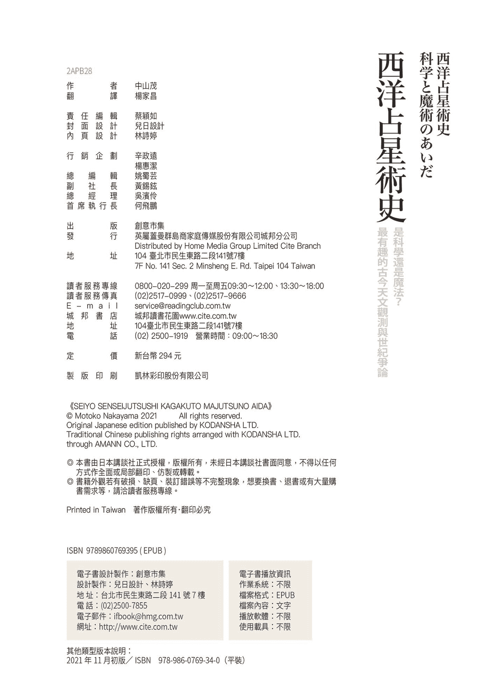