# 视觉心象

## 〈譯者序〉

## 一個可用於改善生活難題的靈修工具

第一次聽到「視覺心像」的概念，是在我的老師德隆瓦洛的課堂上，他不但談到耶路撒冷的柯列女士與紐約的凱薩琳·仙伯格博士，還轉述了一個神奇故事：有位男士因為車禍而截肢，失去一隻手臂，這位男士在柯列女士身邊經過長時間的視覺心像練習之後，慢慢地又讓手臂再度長回來。這個違反現代科學認知的神奇事件是如何發生的？課堂裡所有的人聽了都很驚訝，更加好奇。

「視覺心像」究竟是什麼？英文會用一個集合名詞「imagery」來稱呼它。從字面看，就是許多「圖像」（images）的集合！小時候課堂上不想聽課時，我們會瞪著天花板發呆，腦海裡想像著去某個地方玩的情景；戀愛中的女孩常常對著空氣傻笑，想著甜蜜兩人世界的種種情境；或者回想家中客廳現在的樣子，每個人腦海裡都能立刻浮現一張客廳的畫面。我們所有人的心智中都存在著圖像世界，只是我們忘記那是一種語言、一種能力，以為非得某些特殊的人才有這樣的能力。

的確，受西方影響甚深的現代化教育體制是比較注重分析、邏輯的，尤其自工業革命之後，所謂「科學方法步驟」成為主流，在東西方教育中被強調與放大。我們在這樣的環境下，習慣性地以左腦為主的運作方式看待這個世界，許多人逐漸荒廢右腦的整合與圖像運作方式。如果用電腦的作業系統來看，微軟公司的視窗作業系統剛好是非常典型，注重分析、邏輯、步驟、架構的產物，而蘋果公司的作業系統則是反過來，以整合與直覺性操作見長。一個不斷將大整體切割拆解成越來越小的片段，另一個則是將所有的零碎片段整合成大整體。這兩種狀態沒有所謂優劣對錯，但兩者能夠成就的東西卻不同。

近年來，在神經可塑性（Neuroplasticity）領域的研究，科學家發現當我們在「想像」的時候，大腦不同腦區出現的反應就如同事件真實發生時一樣。當我們「想像看見」一片美味的蛋糕時，大腦視覺皮質區的反應與肉眼實際看見美味蛋糕時一樣；當我們「想像做運動」時，大腦的感覺區與運動區會出現與實際運動時相同的反應。我們的大腦無法辨別「想像力」與「實際行動」的不同，「想像力」與「實際行動」事實上使用了相同的神經路徑。曾經有科學家以「手指肌肉運動」為主題做實驗，兩組受測者中，有一組實際做強化手指肌肉的運動，另一組則是在「想像」中做同樣的手指肌肉運動。持續四週的實驗之後發現，實際做運動的那一組，手指肌肉強度強化了百分之三十，而在「想像中」做同樣手指肌肉運動的那組則是強化了二十二。這樣的結論不是非常有趣嗎？這並不是魔法，純粹是人體的正常機制。在「想像」時，大腦認為我們真的正在做這件事，神經系統會傳送細微的電流到肌肉中發揮作用！這也是為什麼現在世界級運動選手的訓練當中，會加入視覺心像作為訓練內容的一部分。上面所述，是科學層次的事實。

在靈性層次，本書作者介紹的視覺心像修練，是來自猶太教神秘主義哲學（卡巴拉）的一種傳承。它不但可以作爲靈性修練工具，也可用於改善日常生活難題！猶太教神秘主義哲學稱修練這個圖像語言的人爲「夢行者」（dreamer），視覺心像的修練便是夢的修練。本書作者在導讀「醒過來做夢吧」一文中，一開始就提到「這本書要談的並不是『夢』（名詞）本身，而是『做夢』（動詞）這件事。我們也許並未隨時察覺到，但事實上，我們時時刻刻都在做夢」。視覺心像並非一張張固定不變的圖畫，而是包含、濃縮千言萬語的場景。它們是活的、可即刻轉變的，它們跳脫左腦的邏輯思維方式，反而比較像詩一樣跳躍與拼貼。在你的視覺心像中，你是萬能的，你不但觀看在你之內升起的圖像語言，並可與之互動，進一步改變它。

經常有初學者問，這樣練習真的能夠產生效用嗎？其實這些練習就是鏡子，讓你看見內在的狀態。如果問你：「想像你現在是位於叢林邊緣的一隻動物，你是什麼動物？」或者：「想像你漫步在叢林時遇見一隻動物，那是什麼動物？」每個人都會有自己獨特的答案，不會大家都相同，而視覺心像的夢行者就能從這些答案中窺見你的內在狀態。

當你內在的這個圖像語言升起時，或者說當你在「做夢」時，我們不免想問：這個代表什麼？那個有什麼意義？許多人經常立刻跳入左腦的框架中，想用佛洛伊德的解夢方法來理解這些圖像、畫面、場景、夢境。但如同前面提及的，視覺心像是活的，你在其中所見的一切，無法以死板的象徵符號來說明其意義。整個畫面真正的意義，以及其中的「符號」所代表的「象徵」，是一種動態的平衡。如果不同的兩個人看到相同的畫面，但感受不同，那麼這兩個人看見的畫面的意義就不同。

為什麼視覺心像是一個快速好用的方便法門？除了大多數視覺心像練習都有簡短且快速進出的特性之外，最主要是因為當你進入這個圖像語言世界裡，發現需要回應的場景、需要處理的問題時，你無須去探究畫面場景背後代表的是哪個事件、哪個傷痕，而可以純粹去解決畫面中的情境就好，亦即作者在書中談到的「回應視覺心像的必要性」——看見花朵枯萎了就替它就替它澆水，澆水就是「回應其必要性」，而不必去探討這朵花究竟代表什麼、為什麼會枯萎。同時，不妨回憶一下所有你做過的夢，在夢中你能飛翔、遨遊宇宙、即刻變身、時空大跳躍……這些奇妙特質就是視覺心像的特質，你必須抱著孩子遊戲的心情面對所有情境，駕馭噴火龍、馴服獅子、用一把光劍斬斷糾結的藤蔓、用一滴金黃色的光瞬間淨化池塘等。當你真正進入這個圖像語言世界，你會發現自己變得非常「直覺」、非常強大、非常有創意，彷彿在遊戲世界中過五關斬六將，用許多簡單的技巧便能化解一切。而在這樣「遊戲」的過程中，需要非常注意你的感覺與身體的感知，因為感覺與身體的感知是理解與覺察的真正關鍵。

視覺心像的老師會告訴你，當我們在「想像」時，是在「運動我們的光體」。乍聽之下很虛幻，當初我也以為這只是個「漂亮的說法」，直到後來有了親身體驗才恍然大悟。我曾在許多視覺心像工作坊的課堂中擔任口譯，有次翻譯到「花」的練習時，鼻子突然聞到花香；還有一次在翻譯爬山丘的練習時，原本是坐在椅子上、身體靜止，卻突然感覺到自己光體的兩隻腳正一上一下地走動著！在翻譯這些練習的當下，我的腦海中同時形成那個情境的畫面。此外，進行視覺心像練習的過程中，會運作的感官並非只有「視覺」，其他包含聽覺、嗅覺、味覺、觸覺等也同步運作著，因此形成了這些栩栩如生的感官覺受力。當視覺心像中的場景變化發生效用時，對能量比較敏感的朋友或許還能清楚感覺到能量狀態的變化。所以，雖然不需要知道這個必須回應的畫面背後，在現實生活中到底代表什麼問題，但只要去回應其必要性，就會發生實際效用，在能量層次的變化就有可能被感應到。有些人感受到身體溫度的改變，或察覺某個緊繃的身體部位鬆開來，或者可能察覺氣場裡某個鬱結的點突然解開，擴展出去。

許多人會有疑問：我怎麼知道我在腦海裡「看見」或「想像」的，是真的做到了視覺心像的修練所要求的？這個答案很簡單，關鍵就在「身體」。這個身體指的並非狹義的肉體，而是包含廣義的不同層次的能量體。我們的「身體」是外在實體世界與內在想像世界中間隔著的那扇門，許多視覺心像練習在內在圖像世界發生效用時，身體可能會有感覺，而這些感覺又經常因人而異。在視覺心像中，真正需要小心區分的是：什麼是真正的想像或視覺心像？哪些又是幻想？想一想，你能很快回答這個問題嗎？

什麼是幻想？舉例來說，像是「王子騎著白馬來拯救我，從此我們過著幸福快樂的日子」「我是古埃及的高等祭司，具有強大的魔法」等。「幻想」中經常帶著滿足小我（ego）的特質，但是當真正的視覺心像升起時，卻如「詩」如「夢」，無法用左腦去理解與看待——你可以是一朵花，也可以是一隻鳥；你可以是侏儒，也可以是巨人。

文學家說：「人生如夢一場。」《金剛經》說：「一切有為法，如夢幻泡影。」又說：「凡所有相，皆是虛妄。」開悟大師則說：「你只是你心智中的一張圖片。」這些說法便是視覺心像最精華的本質。猶太神秘主義哲學的夢行者就是視人生為「夢」，因為它的本質是夢，所以是一連串圖像與場景的集合；而因為是圖像與場景，所以一切都可以在畫面中修改、修補。

夢行者致力於讓自己在夢中清醒過來，與自己的夢互動，並記住這些夢的細節，帶回清醒時刻，同時也在清醒時讓自己進入彷彿夢境的狀態，能在所有事件發生的當下明白一切表象真正的本質與意義。他們練習在兩種狀態中自由進出，了悟「人生如夢」的特質，並運用自如，打破我們信念的限制。更進一步地說，夢行者認為「夢」即「意識」，我們的實相世界是我們集體夢出來的。想像一下，如果我們這個集體實相意識裡的其中一個信念是「斷肢可以再長回來」，或是「人不需要依賴食物作為能量來源」，你覺得這是否就可能成為真實？

如同作者在本書導讀中提到的，我們時時刻刻都在做夢，夢是一種持續狀態。當我們在想像時，便是睜著眼睛在做夢，我們的集體意識共同創造出生活實相這個「夢境」。如果這樣的說法還是很抽象，就試著回想《駭客任務》（*The Matrix*）或《全面啟動》（*Inception*）這兩部電影，這兩個故事中集體夢境變為實相意識的情節，或許能夠稍微說明一二。在紐西蘭的瓦塔哈人部落裡，便有這樣一種大家能集體做夢的地方，這個集會所被稱為「瑪雷」（Marae）。由此可見，猶太教神秘主義哲學對「夢即意識」的認知並不孤單。如果對這種夢的修練有興趣，還可以進一步參考「巫師唐望系列」叢書中《做夢的藝術》（*The Art of Dreaming*）一書，或者坊間有幾本跟藏傳「睡夢瑜伽」有關的書，都是夢行者修練很好的指引。

西方有個古老傳說，認為在人類建造巴別塔之前，所有人類都使用一種共同的語言，來自心的語言，不需要口說便能傳達與溝通！這個共同語言是以內在圖像語言的方式運作，地球上遠古人類的溝通、開悟大師接受天啟信息、靈通者跨越物種與不同存有或動植物溝通等，便是使用這樣的圖像語言！這個最原始的圖像語言，也就是我們現在說的「視覺心像」。視覺心像是你我都有的原始潛能，只要經過適當訓練，就能找回這樣的能力。視覺心像不只可以作為靈性修練工具，更可應用於生活層面的療癒、運動選手訓練、幫助婦女克服不孕、改善人際關係等。當我們能改變心智中的圖像，就能改寫外在真實世界的結果。

本書作者凱薩琳·仙伯格博士用一種非常引人入勝的方式帶領我們去讀這本精心設計的書，每個章節都彷彿經歷一場不同的故事或夢境，並一步一步往前進展，跟著作者的故事與設計的練習進行，便能以最基礎的方式運用視覺心像的修練！如果你夠敏感，很容易就能發現每個練習所發揮的效用。例如當你在做第一章的「藍色水晶花瓶」練習時，很容易就能感受到身體開始變得溫熱，那是因為這樣的觀想的確將能量帶入身體之中。

視覺心像的許多練習看似簡單，事實上效用都非常強大，但很多人還沒有分辨的能力，所以作者放在本書中的，大多是可以安全自行練習的內容；容易引起深層反應的練習，多數要在有老師指導的課堂中才會進行。

希望視覺心像這門獨特的修練方式能夠幫助更多人找回直覺的圖像語言本能，更希望本書能夠如作者所願，帶領正在閱讀這本書的你，進行一場精采的內在轉化旅程。

## 《作者序》

## 與古老傳承相遇

> 我身睡臥，我心卻醒。
——《聖經》〈雅歌〉5:2

小時候只要聽到音樂，我就會看到顏色非常鮮豔的圖像；我的生活裡有仙子與天使；我可以進到別人的夢裡；我在夢境中「看見」這些人，並幫助他們。我的母親總說我把自己的生活都夢走了，她希望我實際一點，而我覺得自己確實很實際啊。我一直是个夢行者。

舉例來說，我知道做夢不可能取代正規的學校功課，便自創一套方法：我用一隻耳朵聽課，並想像老師講的東西都放進我腦海裡的一個口袋，就像駱駝的第二個胃。我學到，只要將這個口袋視覺化，我就可以在稍後該回答問題的時刻，回憶起相關資訊。

同時，我真正的生活繼續在另一個世界進行著。課堂裡，我會凝視著天花板的某個角落，繼續整天做夢，而且沒人發現。少女時期每當想到上大學這件事，我實在無法想像還有什麼東西能比我夢裡的美麗影像與聲音更有趣，讓我想去學習；長大之後，這些存在於藝術家內在世界的美麗影像與音樂，對我來說變成真實的，我下定決心上大學主修藝術。

巴黎到處都有教堂、宮殿、花園、雕像、噴泉，每個街角都有某樣東西讓你一飽眼福。身為一個主修藝術的學生，我會信步走進羅浮宮看畫，而且經常得在仔細研究一幅畫之後，回家讓自己平靜下來，只因畫裡的每個元素給我的感覺都是那麼強烈。

我經常在想，為什麼畫裡的某些顏色或形狀會如此撼動我，其他部分對我來說卻沒有任何影響？在充滿視覺樂趣與可能性的周遭世界裡，我開始玩起形狀與顏色的遊戲。

舉例來說，我會試著用手遮住馬諦斯畫裡的一顆檸檬，這時畫中的每個元素就會彷彿死掉一般；而當我審視將布呂赫爾的畫作〈盲人引領盲人〉列印成左右顛倒的圖片時，畫面看起來變成往左邊走的盲人尷尬地看著地面上的一個大洞，而不像原作裡盲人往右邊走時是跌跌撞撞地在這無情世界裡走著，兩者的視覺效果完全不同。

我很想知道，有沒有任何法則可以描述形狀、顏色和空間方向如何影響我們的情緒？我知道夢裡的某些特定顏色會讓我害怕，某些顏色卻讓我很快樂；每當走進巴黎聖母院那彷彿飛翔於塞納河上的哥德式大教堂時，我總覺得身體變輕、變高、變亮；而如果在不知情的情況下站在背對塞尚畫作的地方，我背部的皮膚會開始有刺刺癢癢的感覺，我甚至不必轉身去看，就知道這幅畫的畫家是誰。

我開始在想，別人也這麼敏銳嗎？有沒有可能他們也如此敏銳，自己卻尚未察覺？我發現人們常說某些地方讓他們感覺很舒服，某些地方卻讓他們覺得很有壓迫感，類似這樣的體驗，我該去哪裡找到更多資訊？而一旦找到了，我又能拿這些知識來做什麼？

我想以此作爲博士論文主題，但我的老師們不贊同。他們建議我做更實際的題目，於是我放棄了！

想像一個夢行者獨自在巴黎，沒有工作、沒有目標，她能做什麼？當然是做夢啦！我就是做夢，然後夢會告訴我接下來該做什麼。然而，接受這樣的指引卻要以精神上的痛苦爲代價，因爲我還沒學會全然信任自己的夢，結果就是我在做夢境指引我去做的事情時，沒辦法免除對未來的不安與恐懼。

每天面對生活大小事都充滿不確定感，這樣的狀態即使對一個有相當程度的夢行者來說也是很難熬的。於是，我在出版業找了一份工作，然後遇到了一個來自北非的年輕猶太人。

聽他談他的想法、認識他的朋友（他的朋友都是來自地中海區域的猶太人）、跟那些朋友聊天，我被他們流暢的思考、想像力，以及仁慈的態度征服了。我想讓自己完全沉浸在他們的世界中，於是去了埃及。我前後拜訪埃及四次，後來又去了黎巴嫩、敘利亞、約旦。這些國家我拜訪再多次都不夠，它們對我來說就像家一樣。

我來自法國多爾多涅省一個古老的貴族家族，有位祖先參加過十字軍東征，所以當時我對自己新升起的中東狂熱其中一個解釋，是覺得來自那位祖先的基因被的基因被攪動、喚醒了！

後來，整個外在情況，加上得自夢中的指引，帶領我走到下一階段——以色列。我前往一座位於沙漠中的合作農場，現在我真的不知道自己到底在做什麼了，我竟然放棄美國一所長春藤聯盟大學提供的獎學金，跑到沙漠採水果。

我沒職業、沒錢、沒前途，還不會說希伯來語。我在那裡待了兩年，那是我生命中最糟糕的一段時間，能指引我的夢也停止出現，我彷彿置身黑暗之中，深深感到絕望，孤立無援。我沒辦法回家，於是成了一個遁世隱居的人。

合作農場裡有一群年輕的法國猶太人，某個安息日，他們的朋友從耶路撒冷來訪。那天我雖然跟平常一樣畏畏縮縮，但是聽到他們用法文交談，我就像被磁鐵吸引一般，加入了他們在草地上的聚會。

我向一個名叫伊萊的人詢問耶路撒冷法國人團體的狀況，他說那群人的生活基本上就是圍繞著一位名叫柯列的女士。一聽到「柯列」這個名字，我的腦袋彷彿炸開來，變成一片白光。我看到一顆巨大而明亮的星星，並且毫無懷疑地知道，我必須去見這位女士。

我對這位女士一無所知，伊萊能告訴我的也只有他見過她一次，但在聽到她名字的當下，我的夢再度啟動了！我向伊萊要了他的電話號碼，後來一有機會，立即前往耶路撒冷。

當然沒有什麼事情是簡單的，這一路上不斷面臨考驗。首先，伊萊沒有依約跟我碰面，我前後去了耶路撒冷六次，贖罪日戰爭（第四次中東戰爭）都開打又結束了，他還是沒有帶我去見她。我花了很長一段時間才搞清楚，原來他怕如果他真的帶我去見柯列女士，她可能會不理我們兩個人。

在那同時，我想要見到她的渴望更加強烈了。在口袋只有幾分錢的狀況下，我離開合作農場，搬到耶路撒冷。現在伊萊別無選擇了，他得正視這個事實——無論他怎麼想，我這個瘋狂女孩堅持要他引見這位有著非凡魅力的女士。終於，他帶我去見柯列了。

那條街道非常安靜，紫藤花與九重葛隨處盛開。她房子的入口被野玫瑰與茉莉花叢半掩著，庭院大門是藍色的，地上有幾道石階，往下進入她的花園，而門正半開半掩著。

我們穿過一條幽暗的走廊，經過一面高大的鏡子，鏡中倒影彷彿在迎接我們。我們繼續往前，進入一個小沙龍，那裡滿是坐墊與東方地毯，天花板上則懸掛著一盞美麗的阿拉伯風銅製吊燈。

有個聲音呼喊我們進去柯列女士的臥房，那裡看起來就像皇后的會客室。柯列女士半躺在床上，用許多枕頭支撐身體，整個房間以博物館收藏等級的十六世紀阿爾及利亞風格木鑲板裝飾得富麗堂皇。她招手要我們坐到床邊的椅子上，然後問我：「你想要什麼？」

我那做夢般的聲音毫不遲疑地回答：「教我圖像或影像（視覺心像）如何影響人！」

柯列女士笑道：「我等你很久了！」

柯列女士是誰？我甚至沒問這個問題，她對我來說是如此熟悉。第一次見面時，她對我的故事似乎也不感興趣，卻很好奇我的內在視覺看見了什麼：「閉上眼睛，慢慢地深呼吸三次，去想像……然後告訴我，你看到的是什麼。」

我後來才了解，原來我內在視覺看到的影像，已經告訴她所有她需要知道、跟我有關的事，以及我往什麼方向前進。我的視覺心像對她來說就像一張地圖，或是一本她可以閱讀並用來引導我的書。她的反應讓我覺得自己被支持著，並且能夠安心地允許自己被我「看見」的一切引導。一場非凡的探索就此展開！

柯列禁止我問問題，也禁止我閱讀跟視覺心像、夢或神話有關的書。她對我說，經由閱讀引動的影像會跟我內在的影像混在一起，這樣我就無法了解真正的自己了。**我是一本書，書的內容就在我之內。**

柯列女士是誰？我的眼睛告訴我，她是位貴婦，因為我認得出她皇后般的儀態與威嚴的舉止，而她的優雅及對他人無微不至的關懷，讓我想起我的姑婆和叔公。一九六七年的六日戰爭之後，柯列女士再也沒離開過她的房子或她住的那條街，因為隨時可能有人需要她。

對我來說，她就像個強力磁鐵，如母親一般吸引我，卻又讓我害怕。在她面前，我覺得全身赤裸裸，無所隱藏，但又十分著迷，彷彿被愛沖昏頭。柯列將她過世女兒的衣服給了我，並把我帶入她的生活與心中。我很快就知道，原來柯列來自阿爾及利亞一個非常古老且知名的猶太醫生世家，她的父親是名聲遍及整個北非的神經外科醫師，許多阿拉伯人暱稱他為「大聖人」。柯列擔任父親的助手長達十四年，在那段期間，他訓練她觀察病人並診斷。跟在柯列身邊那些年，我從來沒看她診斷失誤過。

在決定以助人為人生志業之前，柯列曾是個頗有成就的舞蹈家、音樂家和雕刻家。後來，她在巴黎跟隨發展出「引導式清醒夢境療法」的督思瓦伊醫師學習。取得心理學學位之後，柯列便到阿爾及利亞首都阿爾及爾醫院的精神病房服務。

因為覺得督思瓦伊醫師的技巧有所限制，柯列開始發展自己的方法，這個方法包含她的家族祖先傳承下來的視覺心像練習及她自己的創造才華。接下來，我將在本書中向你介紹她鍛造出來的這套融貫而包羅萬象的強大系統。

柯列擁有來自古老的伊比利半島卡巴拉學家（猶太教神秘主義學家）家族的血統，父系和母系都有。歷史上有記載的第一位中世紀卡巴拉學家——法國普羅旺斯地區的拉比（猶太牧師）艾賽克瞎子，以及西班牙吉諾納省卡巴拉學家圈子裡的重要人物雅各·班·西賽（他同時也是艾賽克瞎子的追隨者），都是她的直系祖先。這兩個人最知名的，就是透過探索許多很可能源自梅爾卡巴卡巴拉（Merkavah Kabbalah）的神秘學練習，大無畏地探究奧祕。

梅爾卡巴這個最古老形式的卡巴拉，西元一世紀和二世紀就有平民與猶太聖哲在修練，當時最重要的學者拉比阿齊巴也是。修練者的任務是要能在內在視覺中看見自己穿過天界球體（這些天界球體常常被視為不同的宮殿），揚升到神的戰車或寶座（即梅爾卡巴），如果修練者能到達這個階段，就可以「看見」神的形象以「彷彿人的形狀」出現在寶座之上（《聖經》〈以西結書〉1:26）。

在他們的文獻中，卡巴拉學家描述了一個未被中斷、可回溯至《塔木德經》與《聖經》時代的傳承。《希伯來聖經》載有豐富的啟示，這些啟示來自先知以西結、以利亞和以諾見到的異象，以色列族長亞伯拉罕、雅各與約瑟的夢境，以及摩西、撒母耳或約拿看見特殊景象的體驗。從探究《聖經》文本的過程中可以發現，聖經時代最盛行的與神界溝通的方式，顯然是一種視覺性的過程。

由此看來，柯列的工作與她祖先們的修練一樣，都屬於「體驗式」的。她的某些練習雖然基於文本，但與其他的卡巴拉法門相較，她的方法沒有直接去研究或分析文本，沒有字母的變更或替換（這個方法被稱為「數字釋經法」或「字母密碼術」），也跟「生命之樹」及其十個能量球體的研究無關。

柯列所做的是一種純粹的卡巴拉（「卡巴拉」這個詞是「接收」之意），在那個過程中，一個人從他內在的凝視接收訊息。因此，她的卡巴拉並非神秘晦澀、難以進入的系統，而是一種對圖像世界的探索——這個世界的語言對各個宗教派別來說都是共通的。

## 視覺心像妙用無窮

當初遇見柯列時，我還不是猶太教徒，她也從未跟我談過猶太教。一直到我內在接收到的視覺心像告訴我應該去了解猶太教時，她才翻開幾本書，讓我看看猶太教神秘主義哲學卡巴拉的相關內容，而我從那些書中讀到的東西，確認了我在修習視覺心像過程中認識的自己。於是，我改信了猶太教，因為我顯然是個猶太教徒。至於其他學生，則發現自己是佛教徒、蘇菲教徒或基督徒。我們的靈魂透過視覺心像與我們對話，我們也因此被帶領走向自己真正的命運。

猶太卡巴拉一般只傳承給男性，然而，有些伊比利半島猶太人家族會傳給女性，所以柯列家族的女性也被鼓勵來學習這項傳承，並扮演活躍、積極的角色。

柯列年紀還很小的時候，就從她祖父那裡接受了按手之禮，表明整個家族對她的祝福，期許她延續家族傳承下來的種種教導。她有三個很特殊的胎記（一個在第三眼，一個在左手掌，一個在心臟位置），根據家族傳統，這些胎記是實質的徵兆，代表她注定出生來拯救猶太人與這個世界。

而柯列後來也確實與她年僅十幾歲的兄弟荷西·阿布可在北非組織了反抗軍，讓美軍得以在靠近阿爾及爾的地方登陸，隨後並促成第二次世界大戰的結束。戰爭期間，柯列是阿爾及利亞電台的「自由之聲」，後來並成為二戰受勛英雄，你可以在那個時代的歷史書中讀到她的故事。

柯列之後成為北非地區國際猶太復國主義婦女組織的領袖。

此外，猶太教徒、伊斯蘭教徒和基督徒都會求助於她，她並成為天主教會正式認可的驅魔師，而玫瑰十字會也頒授榮譽勳章給她——在她之前只有四位女性獲得這項殊榮，其中包括羅斯福總統夫人愛蓮娜。

來自世界各地的人會坐在柯列家中，接受她的教導。在人生最後的時光裡，她把工作重心放在重症末期病人身上，而那些人做了她傳授的視覺心像練習之後，有許多人至今依舊活得好好的。在紀念大衛王建都三千年的慶典上，耶路撒冷市為了榮耀柯列獨特的貢獻與成就，特別頒給她「摯愛勳章」。

上面提到的只是柯列人生中的零星事蹟。她改變了我和其他無數人的生命，如同她常說的，她認為我們這些學生才是她人生真正的勳章。

不久之後，柯列派我出去當她的大使，把她的練習與安慰的話語帶給耶路撒冷醫院中那些生病的人、受傷的士兵，以及受精神疾患所苦的人。她會在一張小紙條上寫下我可以遵循去做的一個視覺心像練習、想法或方向。很快地，在她的祝福之下，我開始教導某種形式的身體工作（這是由研究希伯來聖經故事裡的動作而來）。為了回應學生的需求，我為不同的生理障礙與病痛發展出各種形式的視覺心像練習。

無論是坐在柯列的花園裡，或者往外去服務人群，我的生命開始綻放、盛開。我在自己的內在與外在都找到了我的伊甸園。

我將這本書獻給摯愛的柯列，她是我的母親，我是她的女兒，我們的靈會永遠連結。她教我去信任我已經知道的，而她教給我的遠多於此，其中有些教導，你們將在這本書裡讀到！

## 〈導讀〉

## 醒過來做夢吧！

> 每當你希望看見先知以利亞，就將意念集中在他身上……有三種方式可以看見他：在夢中見到；在清醒時看見，並向他打招呼；在清醒時看見，向他打招呼，而他也回以問候。

——約瑟夫·卡羅

本書的原文書名有「夢」（dreaming）這個字，但這本書要談的並不是「夢」（名詞）本身，而是「做夢」（動詞）這件事①。我們也許並未隨時察覺到，但事實上，我們時時刻刻都在做夢——閱讀這一行字時、等公車時、在咖啡館跟朋友聊天時、工作時、做菜時、講話時，甚至無所事事的時候，你都在做夢。

做夢這件事源自右腦，而右腦與大腦的其他部分無論何時都未曾停止發出神經脈衝。只要活著，這個自然過程就會日夜進行，不會停止，就像呼吸一樣。

夜夢只是做夢的其中一種形式，而且是很容易辨認的那一種，因為睡著時做的夢被這個社會接受為潛意識的一部分。如果把注意力放在夢上面，這些夢會幫助我們覺察到做夢這件事無時無刻不在進行。

## 語文VS.圖像的解脫之道

我總是告訴學生，在學習上，有兩條重要的途徑可以遵循，一是經由語文心智的解脫之道，一是透過圖像心智達到解脫，而這兩種方法恰好可以用禪宗與藏傳佛教舉例說明。

禪宗教導弟子以放空靜坐來觀察心念的變化，每隔一段時間便出一道似是而非、叫作「公案」的簡短謎語當作靜心的主題，用以測試弟子的進步程度，藉由語文心智的鍛鍊及公案悖論的強度，化解慣性思維模式。

相反地，藏傳佛教則是讓修練者運用自己的圖像心智，接納一個我們居住其中、如森林般深廣的內在圖像世界，精通之，並一躍而入，最終得以穿越，從森林的另一端走出來。這兩條路徑最終的目標都是藉由超脫一切形相而開悟，無論這個形相是語文或圖像。

你可能已經猜到，我們的方式強調的是圖像心智。運用這兩種修練法都能達到無懼與超脫，而每個人在現實生活中也都需要使用這兩種方法。然而，從單純的生理運作層面來看，不同的人幾乎都會對這兩種方式各有其偏好，我們不是被左腦（語文），就是被右腦（圖像）吸引。

左右腦各自與特定的行為傾向有關。左腦執掌抽象面，是心智的語言；右腦則與空間感有關，是身體的信號。因此，讓使用的語言與我們擅長的思考模式一致，是很重要的。

關於這點，有許多迷思存在。身與心之間的問題已經產生了許多言語上的垃圾，讓我們失去清晰的判斷力。這種二分法中存在著兩個不同的世界，它們彼此相關，卻不使用相同的語言。談到左腦時，「語言」這個詞指涉的意義很清楚，但提及右腦的「語言」，我們指的是什麼？

## 圖像世界的語言

右腦的運作方式不是用「想」的，而是用體驗的。它的王國是身體，語言則是由圖像構成——我所謂的「圖像」，指的是右腦將我們的感官體驗翻譯成知覺的過程。

舉例來說，如果有人攻擊你，你可能會看見紅色。這不是個隱喻，你確實會「看見紅色」，而且這個「看見」常常比這簡短的兩個字更複雜——你也許會看見攻擊者是隻暴躁的怪獸。然而，這個影像是如此短暫，以至於它常常就這樣從你的意識中溜走，如同夜晚做的夢一樣，在我們有機會探索它之前就被遺忘。

我們能夠談論這些圖像嗎？我們能夠將一個自身就已完整的經驗轉換成語言所需的分離片段序列，而不破壞其本質嗎？這是所有夢行者在嘗試表達他們的世界時面臨的挑戰，我寫這本書的時候也碰到了：我的文字要如何成功描述一個做夢過程的整體經驗？

許多神秘學家生活在圖像世界裡，他們向世人描述自己與神界密切交流時那種完全無法用言語描述於萬一的狂喜時刻。然而，也許比較接近我們尋覓的那種可以貼切表達的聲音，是詩人的聲音。詩人精準地在圖像與語文兩個世界的連接點上盡情揮灑，對他們來說，夢的世界才是原始的、根本的，語文只是夢的僕人。對詩人而言，圖像世界活生生的各種移動與轉變讓言語或文字誕生，就像地球是生命的泉源。圖像世界的言詞不見得會像智力辯論那樣以理性的序列一個接一個出現，在詩裡，有跳躍，有令人驚豔的並置，也有令人震驚的聯想。

目前依舊很接近圖像世界的，是一些古老的語言，例如希伯來文與梵文。不像現代語言和直接體驗之間有一步的距離，希伯來文與梵文一直非常接近他們試著傳達的原始聲音與移動。它們的文字與符號（如古埃及的象形文字）是重複發生的體感經驗的翻譯，因此可以被我們的身體辨識。

做夢是一個以其自身為食的過程，若希望展開這個過程，就必須抓住「力威亞探」這隻巨獸的尾巴（在希伯來傳說裡，力威亞探藏在海洋底部，此處的海洋是指潛意識），而「牠行的路隨後發光」（《聖經》〈約伯記〉41:32）。這隻巨獸其實就是我們內在那潛藏於意識思維之外的龐大知識，那麼，我們有沒有辦法學會利用這大量的知識？

「無意識」是個流傳已久的不恰當用詞，創造出一種錯誤的思維形式。我們真的要接受有三分之二的自己永遠沉沒在不可知的冰冷水中嗎？或者，我們能否像巨獸力威亞探一樣浮上水面、翻江倒海，暴露出我們隱藏的部分？

如果不屈不撓地仔細檢視潛意識，我們會發現它確實透露出自己的秘密。如果敢問潛意識問題，我們會獲得回答。因此，為了真相之故，讓我們同意將「無意識」這個詞逐出這本書、逐出我們使用的語彙，以「潛意識」取而代之。

探詢潛意識是我們一起踏上的這趟旅程的第一步。但是，既然我們尋找的東西隱藏起來了，那我們要探詢的究竟是什麼？我們要如何抓住那隻巨獸的尾巴？又該從哪裡開始？

上路之前，請先擺脫一個我們的意識心智編造出來的迷思：被定義為可測量、可驗證、可重複現象的實相，才是唯一的實相。我們的意識心智被自己那股想要為萬物本質提供無可辯駁的證據的強大驅動力困住，於是將嬰兒連同洗澡水一起倒掉了。

意識心智與孿生手足圖像心智斷絕了關係，以自己「知道」實相的能力為食。有超過四世紀的時間，意識心智因為可以測量、驗證與證明自己知道的一切而感到驕傲，一個巨大的文化自我圍繞著這份牢牢抓住知識的能力成長。

這個理論上的自我會說：無法被證明的就不是真的，無法被驗證的就不存在。數學的、因果的、被劃定界限的世界是唯一確定且有依據的事實，其他所有現象都是心智千變萬化的幻象，除非被證明不是虛幻的。

這種思考方式非常吸引人，因爲它大幅減少我們面對的不確定性，並允許我們相信自己控制了所處環境。這樣的思考方式爲物質世界許多非凡的技術性成就與發現提供了基礎，我們在此無意否認其顯著的效用。但是，當你釘住一隻抓來的蝴蝶，想留下來檢驗時，你也殺死牠了。與其如此，不如依照常識去請求一項權利——使用圖像世界的分類方式和優先次序來描述和研究這個世界的權利。

許多人都說自己經歷過令人難以理解的超自然體驗，對於這些無法融入這個講求實證的世界的體驗，我們如何看待？似乎沒有一個人完全對這種事免疫，但極少人樂於承認有過這樣的體驗。然而，在受到鼓舞的情況下，你會很驚訝地發現有許多人願意談論自己看到鬼、過世親人、指導靈及天使的經歷。

他們會提到鏡子無故爆炸、物體消失幾天後又出現；他們做過後來應驗的夢、看過真實世界與另一個世界疊合在一起的雙重影像，或者因爲在剎那間領悟真相而改變了自己的人生。

最近我與一位鄰居共進晚餐，她告訴我，她好幾次看見一個像是林布蘭畫裡人物的人出現在她的床尾：「他是真的，我看見他就像我現在看到你一樣！他站在那裡專注地看著我，我覺得他想告訴我一些事，簡直讓我怕死了！」這些人都有妄想症嗎？他們把自己的幻想投射到真實世界了嗎？或者，他們是注意到了確實存在那裡的現象？

奇異的感知、幻想、幻覺、令人毛骨悚然的聲音、怪異的氣味或味道、雞皮疙瘩或其他動覺反應、夜夢、白日夢、幻影、似曾相識的感覺、千里眼、心靈感應、突如其來卻毫無根據的直覺與確定、沒有因果關係的事件——這張清單的多樣性令人困惑，不過我猜百分之八十的人一生中至少都體驗過其中一種現象，而且多數人大概也被這些令人無法理解的現象嚇個半死，就跟那位看到林布蘭人物的女士一樣。

我們為何迴避允許自己的心智真正去檢視這些經驗？懷疑、難堪和恐懼是最常見的原因。所以，我們就來創造一個可行的原則，讓它暫時減輕你左腦的懷疑與難堪，去接納「無法被證明的，不見得不為真」。

這讓我們在缺乏簡單的邏輯工具或一個範式去證明其為真的時候，就能夠接受自己「看見」的事物。至於恐懼，它不就是來教導我們勇氣的嗎？正面迎向難解之謎可以帶領我們進行一場場迷人的冒險，若直接向恐懼屈服，就會錯過這一切。

因此，我們能不能同意來自客觀左腦及主觀右腦的訊息都是「真的」，只不過以不同的方式呈現？有一次，我在麻薩諸塞州一條泥土小路上開車過彎時，碰見一隻北極熊。那隻熊是真的！我看到牠了！牠就站在路中間盯著我，呃，不過在客觀現實裡，牠不在那兒，而是只存在我的內在視覺圖像中。我的左腦確知麻州不會有北極熊，但是，我看見熊這件事有沒有任何意義？

對我的右腦來說是有的。那隻巨大而沉默的熊帶來的某種非常強而有力的感覺令我無法忽略，我因此改變了當時處理自己人生的方式。超自然現象就有這種作用，它們顛覆了我們，帶來的震撼就像現實生活中差點被大卡車輾過一樣。

夜晚的夢也有相同的力量。例如，你夢見有人闖入你家，於是驚醒坐起，搖醒身邊的伴侶，然後把整個家仔細檢查一遍，以確認沒有人已經闖進來了。這個夢是真的嗎？當然是真的，想到有人闖進家裡，你真正感覺到恐懼。不過，這是真實狀況嗎？不是，在檢查完每個房間、每一扇門窗之後，你知道這不是真的。那麼，既然沒有人真的闖入你家，你的夢有任何意義嗎？

這個夢是否在警告你有人將會闖進來？或者，用隱喻的方式來看，你的界限是否被侵犯了，所以應該檢視日常生活中是不是有什麼人或什麼事讓你體驗到被侵犯的感受？

夢中看到的影像可以代表很多不同的事，正因如此，現代某些研究者把夢中的影像稱為「心智垃圾」，但這種說法就像叫你把收到的郵件全部丟掉，只因為其中有一些郵件對你沒有用。如果繼續讀這本書，你很快就會了解，把夢中影像就這麼歸類為垃圾，並不是明智的處理方式。

假設我把手放在心上對你說：「我這裡很痛！」你不會知道我的痛到底是情緒性的，或是心絞痛，只有事情的前因後果能夠告訴你，或者，如果你不知道來龍去脈，也可以藉著直接問我關於這個痛的問題，而得到答案。

夢中看到的影像也是這樣。假設我夢到自己把手放在心上，隔天早上醒來真的覺得心絞痛，我就知道我的痛來自身體，而夢中影像的意義也一清二楚了。

從這個層次上來說，要賦予一個夢意義，取決於夢中影像與「真實」世界的連結多緊密。只要我能夠很容易地藉由賦予意義，驗證現實與夢中影像之間的關連，我那個清醒的、能用言詞表達的自我依舊可以輕鬆掌控一切，並因此與夢行者的世界分開來。

但如果我像精神病院那些不幸的人一樣，已經無法分辨夢境與現實的不同了呢？

睡著時做的夢與有意識時的夢境有何不同？其中一個答案是夜晚的夢比較容易被接納。沒有人覺得睡著時做夢很瘋狂，有些人甚至很熱中於做夢，也不會有人指責他們不正常。

但是，夢發生的時間——無論是夜晚或白天——並未定義做夢這件事究竟是什麼或不是什麼，而只是方便我們假裝它已經被定義了。藉由聲稱做夢這件事只發生在夜晚睡眠時刻，我們就可以畫出一條清楚的線，隔開外面的世界與夢的世界。如果睡夢中的世界不會滲進清醒時的世界，會讓人覺得比較安全，我們就可以抓住自己認為穩定的事物，也就是外在世界。我們假定自己有能力辨識那條分隔線，並緊握那份能力不放，因為我們確信自身安全取決於我們能否如其所是地看見實相。

當然，我們的許多問題來自一個事實：僅有非常少數的人能夠「如其所是地看見實相」，而這單純是因為兩個世界中間的分界線遠不如我們以為的那麼清楚。

我們創造出來的分隔線是人工產物，卻非常強而有力。當我們說「這是幻想，這是現實」時，會覺得自己像個襤褸中的孩子在對抗巨大的虛空。我們的身體因此被保護起來，我們便能假裝對兩邊都很有信心地凝視自己之外的廣闊世界，以及內在的浩瀚世界。

接著，你要了解這兩個世界之間真正的連接點是身體，這是你開始的地方。請信任自己的身體。被包覆在子宮內、與外界斷絕連繫時，你的身體便在做夢；出生的時候，身體被往外推，於是眼睛遇到光，皮膚碰到物體，耳朵聽見生活中尖銳的聲音——還在子宮裡時，羊水形成的緩衝墊般的海洋減弱了那些光、物體和聲音帶來的衝擊。

換句話說，你的感官覺受是進入這兩個世界的路徑，一邊通往實體世界，另一邊通往夢的世界。這些感官覺受就像門一樣，可以隨意往內或往外擺動。

如果你身體某個地方在痛，然後你將眼睛轉向內，去看那個痛，你就有辦法描述它，例如是熱的、濕的、冷的、發炎的、紅腫的、鈍鈍的等。如果繼續看著那個痛，你或許真的會「看見」圖像或聽到聲音。這些圖像或聲音也是在告訴你跟你的疼痛有關的訊息。經驗總是透過感官語言對我們說話。

右腦的內在世界是三維的，在裡頭，我們是用所有的感官在運作（就跟在外部世界一樣）——我們可以看見、聽見、嗅聞、品嚐，甚至觸摸。你是否曾在夜晚的夢中夢到激情的性接觸，而實際引起身體的高潮反應？那份愉悅是如此鮮明，以致你的肉體對夢中的刺激有了實際且相稱的反應。

在夜夢中夢到某項身體活動，例如跑馬拉松，與實際去跑馬拉松是不一樣的。在外部世界，你會被這個世界的規則所限，並且要忍受這些限制的效應，例如筋疲力盡、口渴、燥熱、疼痛等；但是，在夢中跑馬拉松卻毫不費力。

然而，隔天早上如果檢視雙腿，你可能會發現你的肌肉感受到的疲憊，就像做完嚴格的健身訓練一樣。你夢中影像的活動誘發你肌肉的細微移動——順便一提，這就是所有運動觀想（視覺心像）訓練的基礎。夢中的影像與你的身體對話，激發了肌肉反應。

**夢會影響到物質世界。**影像或許是某種「幻想」，它們的作用卻是真實的。想像會影響物質層面，反之亦然，而這兩個世界是透過身體互動。就像胼胝體這個神經纖維束連結了左右兩個大腦半球，你的身體也將你內在的夢之世界與外在的物質世界連結起來。

你的身體既是分界線，也是連結。牢牢地扎根在自己的身體裡，並習慣注意感官傳遞給你的訊息，可以讓你持續進入這兩個世界，同時又能保護你免於在這兩個世界中迷失自己的危險。

藉由注意自己的感官覺受，你會抓到巨獸的尾巴。扎根於當下，並熟練地聆聽身體的感覺正在告訴你的訊息，就是訓練自己成為夢行者的第一步。

想像一個場景：你遇見某人，同時「看見」這個房間變暗了。那麼，你的下一步就是立即把注意力放在身體上：太陽神經叢是否變得緊繃？呼吸呢？有沒有變淺？房間變暗這件事傳達了一個主觀印象——就稱之為直覺吧！

在這個例子中，你的「直覺」是個信號，意味著你清醒夢境中的自己決定介入正在發生的事。除了你有感覺到之外，你知道房間並沒有真的變暗，但你所「看見」的還是告訴了你外面那個真實世界的某件事。它在告訴你，你對剛剛遇見的這個人的反應是什麼，而你現在的任務就是試著找出你為什麼會有這種體驗。

你可以從這裡開始探查：看看你的身體在事件發生時是否處在完全清晰的狀態。我的意思是，你的身體在接收來自對方的信號時，是一個客觀的雷達嗎？或者，你是將你記憶庫中的某個感覺投射到對方身上？

舉例來說，如果這個人剛好跟你不喜歡的某人很像，那麼，房間變暗這件事背後可能有個不愉快的記憶。承認有這種可能之後，你必須問自己：我的反應是一種謬誤嗎？我對這個人是否有某種不實的想像？

大多數人會在這個點上鞠躬退場，因為他們覺得無法分辨自己的投射與夢境之間的差別。對他們來說，直接拒絕視覺心像世界，把它當作虛假的幻想，還比較簡單。他們任由自己那個重視因果關係的心智掌控一切，並再次拒絕一個豐富的世界——如果他們可以接受自己的夢境心智所說的一切，那個豐富的世界原本可以是他們的。

除了鞠躬退場，有沒有什麼可靠的方法可以讓我們在尋找夢中體驗的意義時擁有清晰的思路？有什麼能夠協助夢行者區分自己不實的投射，以開始成為真正的夢行者？成為真正的夢行者是這本書傳遞的教導主要的目標，因為這些教導可以帶領你走上一條全新的道路，讓你經歷你的夢中世界。

我把這些教導分成十二項連續任務，抵達最後一項任務時，你應該會覺得自己可以很輕鬆地區別真正的內在視覺影像與單純的投射或幻想。

要成為一位真正的夢行者、預言家、預視者，甚至先知，你必須如同古代聖哲一樣，展開走入你圖像心智中心點的旅程。

你會從第一章「學會辨認你的奇異吸引子」開始這趟旅程，學習觀察你如何傾向被某些模式吸引，而忽略其他的，因此限制了「你的實相」。雖然你或許相信「你的實相」是唯一存在的實相，但事實上，是你夢出了自己獨特的現實。你要被困在舊框架中？或者，你能夠擴大視角、轉換觀點，來包容一個唾手可得的更大實相？

在第二章「設定你的人生藍圖」中，你會明白你受阻撓的本能、欲望、期待、主張等如何遮蔽了你原本可能擁有且可取用的視覺心像，並進而窄化你可以看見的自身實相。

這一切是如何運作的？大多時候，我們是在「本能」與「情緒」的領域運作 ②，本能被阻礙之後的「反應」，就是產生情緒。與「反應」相對的「回應」 ③則讓你得以對這個世界敞開，而非盲目地「反應」。為了到達「回應」的領域，你必須開始區分你的「本能」與「反應」，而這會讓你開始設定我所謂的「人生藍圖」——一張顯示你現在的行為舉止，以及你希望自己未來如何表現的地圖。

透過「暫停！」遊戲，你將啟動此過程。這個遊戲教你在不適宜的欲望即將顯化時刻意選擇停止它，以此模仿人生。你這麼做並非為了懲罰自己，而是要將自身能量重新導入對你的成長與快樂更有益的管道。

在第三章「留意你的夢」裡，你會發現你的情緒與受阻撓的欲望如何在夢境時刻顯現。大多數人都很順理成章地失去記住夢境的能力，因為思量夢中那些模糊的、渾沌的訊息並不是件愉快的事。你把夢魘、重複夢境、忙碌夢境都淹沒在你白天活動的混亂中。

為了清理渾沌的情緒，回復心如明鏡的狀態，進而接收來自夢的訊息，最重要的第一步是訓練自己記住夢境，即使你對這個夢有厭惡的感受。你要如何克服隱藏的抗拒？你要如何訓練自己記得？而一旦記住夢境，你又該如何處理？這些就是第三項任務的一部分。

在第四章「與夢境互動」裡，你將學習面對夢中影像的挑戰，而不是忽略它們帶來的衝擊。這需要你轉換自己的態度。想要成為夢行者，認真看待自己的夢是第一步，而身為一位堅定的夢行者，你將能夠讓自己的內在影像世界成為強大的工具，來完成你的人生藍圖。小時候，你會玩遊戲、編造事物，藉此訓練自己面對外在世界的挑戰。在這裡，你將應用相同的創造規則，並體認到帶著玩心與夢境互動的樂趣。

至此，你已經在清醒狀態下處理自己的夢，而在第五章「擁有全新視角的逆轉技巧」裡，你將學著更靠近夢的世界——這是你白天世界的鏡像或反轉。透過在即將睡著那一刻有意識地採用逆轉技巧或夢中觀點，你將學會發現許多跟你自己有關、且只有夢的世界才能告訴你的事。

「逆轉」這個動作可說是一種夢的演習，讓你脫離自己的慣性移動，進入另一種新的觀點，鼓勵你去觀察夢境世界如何回應你白天的世界發生的一切。你將體認到夢中影像並非一般描繪的無味食物，而是強大、偶爾令人震驚、甚至不斷帶來衝擊的真相，這些真相可能會狠狠將你震出舒適圈，進入一個更好的地方。

在第六章「回到你的感官」裡，你會認清要克服你的本能模式，以及哄騙自己跳出你的「物質性」的限制，是非常不容易的事。例如，你要如何在睡著的時候變得清醒且有意識？令人驚訝的是，只有在痛的刺激下，你會經由身體感官這道門回溯進入——亦即當你有意識且精確地利用你的「物質性」時，你就能在潛意識的夢境世界裡變得清醒、有覺察力。

但是，當你可以立即直接跳進夢的源頭，並體驗到夢行者的心智觀點時，又為什麼要只依賴夜晚的夢？「做夢」這件事時時刻刻都在進行，因為你就是時時刻刻在體驗人生。想要不斷進入自己的夢，你必須訓練自己有意識地一次又一次跳進夢的源頭。

在第七章「讓生命加速進展的練習」裡，你將開始進行一些練習（這些簡短的引導式練習是根據視覺心像的特定法則建構而成，我後面會討論到）。這些練習會在你這個夢行者的內在引發張力、震盪或興奮的體驗——為了讓你直直落入源頭的即時性與生氣勃勃，這是必要的歷程。

假如你進行引導式練習與回憶夢境的目標，只是為了滿足一時的好奇心，那麼你的練習很快會失去動力。在第八章「意圖與夢境」裡，你將學到你的夢必須主動燃起你的意志，將你夢見的事物顯化出來。卡瓦納（kavanah，你的「意圖」）與你的夢是同胞手足，沒有卡瓦納，你的夢將變成一灘死水。

夢需要被驅動進入實相中顯化，而卡瓦納就是那股驅動的火焰。推動夢的燃料並非意志的純粹力量，也不是夢魘、重複夢境或忙碌夢境，甚至不是清楚的夢，而是由感覺這個源頭升起的所謂「偉大夢境」（發生在夜晚）或「預言性視覺心像」（發生在白天）。

即使你被偉大夢境或預言性視覺心像驅動前進，並因此不得不去完成自己的人生藍圖，有時就是會遇到風變弱，導致你的帆失去動力。你發現自己不知所措、憂鬱、焦慮，或陷在猶豫不決的泥沼中。為了解開猶豫不決這個難題，在第九章「讓一切在你眼前揭露的清醒夢境」裡，你將學習讓自己沉入你的困惑之下，進入你可以自由移動的夢境世界。從這裡，你的卡瓦納會重新浮現在自由顯露的視覺心像中（如果不是你的答案本身浮出來的話）。這個過程就叫「清醒夢境」。

你可能一次又一次發現自己被舊模式困住、被舊情緒打擊，或者被重演的歷史緊抓不放——我們所有人偶爾都會面臨相同的處境。直到你能一環一環地打破自己的負面情緒鎖鏈為止，你都會被來自過去的視覺心像支配。

然而在某個時間點，連你的偉大夢境、預言性視覺心像或清醒夢境體驗也許都無法幫助你擺脫過去。那麼，在第十章「改變過去」裡，你將學到一些專門為了改變你與過去的情緒連結而設計的練習。這些做夢技巧叫「逆轉過去」。

而在第十一章「大師遊戲：完善你的人生藍圖」裡，你已經準備好要玩這個大師遊戲，讓你的人生藍圖更完美。為了最終確實將你的夢魘與忙碌夢境轉變成偉大夢境，你必須讓自己錨定在「感覺」，而非「情緒」之中。你一定要持續完善這項工作，以免又溜回舊習慣裡，就如同你必須不斷抵抗重力，以免倒下去。

從「反應」轉移到「感覺」，是一個漸進的過程，因為身體是習慣的產物。在這一章，你將學會以三個音符組成的音階唱誦某些字，來創造「夢境卡瓦納」。這個古老的練習被稱為「翻轉詞彙」。

第十二章「回歸萬物合一」則要告訴你如何把學自這本書的修練法整合進你的日常生活中。你也會學到利用自身的不平衡，將自己推進「感覺」的領域。平衡只是暫時的，但每次到達平衡狀態，你會知道自己已經超越本性，到達法國人所謂的「超本性」。如果做到的次數夠多，你就能讓自己穩穩扎根在心的領域。

如此一來，你的夢境就會越來越清晰、輕盈、明亮；最終，你的夢會完全變成光。光是你的修練帶給你的回饋，它同時也會帶來平靜、和諧、愛與喜悅，此時無論你做什麼都會很輕鬆、不費力，因為你的意識心智與夢境心智和諧共舞，編織出一個比你所能想像更豐盛、更富足的人生。

真正的「做夢」需要嚴格的訓練、決心與實際修練。一開始，你的夢會充滿不實的投射，因為你的需求、期待、主張、希望與恐懼正在主導這場戲。所以，運用所學來清理你的夢、來打磨你的想像力，直到真正的視覺心像開始發光，便是這趟追尋之旅的目標。

許多騎士與淑女遠離舒適而安全的家園，縱身進入由他們的錯覺、幻想與不實投射組成的神祕王國。就像奧狄賽的部屬在返家的旅程中，因為被女巫賽絲引誘而變成了豬，當今的追尋者必須藉由判定這些幻象何時不過是他們自身的某些面向，來解除面臨的危險（幻象可能以許多不同方式顯現，例如誘人的少女、風車、危險的野獸或令人心動的森林）。

當我們可以透過身體感覺分辨表面反應與真正的直覺感受時，我們就戰勝幻覺與投射了。用這種方式確認視覺心像轉化成身體的行動，我們就能清理自己的內在螢幕，以反射正等著閃耀的智慧之光。這就是我們接收夢的偉大力量之處。

- ①針對「視覺心像的修練便是夢的修練」這件事，譯者序中有較為詳細的說明。此外，「dream」這個字作為動詞，除了「做夢」之外，還有「想像」之意。
- ②「本能」與「情緒」請見第二章的圖3至圖5。「本能」指的是呼吸、睡眠、食物、舒適感、活動，「情緒」則是憤怒、恐懼等。
- ③「回應」指的是愛、耐心、平靜、創造力、成功等，請見第十一章圖6。

## 第1章 學會辨認你的奇異吸引子

> 誰曾用手心量諸水，
> 用手虎口量蒼天，
> 用升斗盛大地的塵土，
> 用秤稱山嶺，
> 用天平平岡陵呢？

《聖經》〈以賽亞書〉40:12

我們生存的世界，是一個藉由各種模式與形式來辨認的世界，萬一這些模式與形式消失了，這個世界對我們來說便不再存在。我們在這些模式與形式中同時感受到愉悅與痛苦，對它們又愛又恨。假如感受不到界限（左腦），我們會覺得全然赤裸裸、覺得很容易受傷，但同時，我們又渴望逃脫一切形式的束縛（右腦）。

我們不都是一直掙扎著想要打破種種形式，即使只是短暫脫離一下都好？我們不是都想要回到心智之眼認為的那種所有生命開始之前的空無狀態？這是一項幾乎不可能的任務，因為左腦就像鉗子一樣牢牢抓住我們。

然而，我們每一天都會見證這樣的時刻：夕陽西下、大地入夜後，一切形體都消失在它們從中出現的黑暗裡。黃昏是神聖的時刻，它讓我們見證形體／形式的消逝，緊接著在黎明這個神奇時刻，形體又奇蹟般重現。

經歷這些特別時刻的方式，不但影響了我們的身體和情緒，或許也透露出如何教導自己隨意在兩邊的大腦之間、在穩定性（左腦）與自由（右腦）之間來回切換的秘密——穩定性和自由這兩項元素對我們心智與性格的成長至關重要。

如果不考慮睡眠，我們最能夠有意識地去體驗無模式、無形式的，便是透過注視渾沌：一種狂野、失序卻生氣勃勃的行動，或是消去唯一決定因素的無盡單調狀態。就像從飛機上觀看的亞馬遜叢林繁盛生命，或是廣大如海洋的人群，或是被熾熱太陽烘烤的黃土沙漠，或是白牆上沒有任何時間流動痕跡的監獄牢房。

如果你曾經為狂亂的繁盛感到氣餒，或者錯把自己的能力用來辨認某種你可以理解的熟悉形式，你就會知道你的身體是如何迷了路，知道那種敬畏「空無」的恐懼如何溶解我們的界限。我們需要形式來塑造自己，然而，我們也必須偶爾離開形式，好讓我們在重回這個有著固定模式的世界時，擁有更廣泛的選擇。

有一次，當我看著兒子一邊尖叫、一邊開心地跑進一群海鷗裡，這個世界消失了——沒有形式、沒有光、沒有我！那是一個全然的體驗。當我能夠再度看見時，我看到兒子在碼頭上，一群海鷗在他頭上盤旋、飛翔。我感受到完整。

多年來，我一直試著讓這個世界一眨眼就變不見，因此當時能夠關掉模式，即使只是一下子，都給我很大的慰藉。這件事讓我確定生命是由我們對模式的追尋所維持，而與之對比的，是在生命中為空無留下空間，這也是脫離形式與模式的簡單訣竅。我們需要形式，也需要從形式中暫時逃開一下子，而這只有睡眠時的無意識狀態，或是右腦的虛幻空無可以提供。

## 人為何有偏好？

我們總是被驅使著在這個世界中尋找意義，以至於面對混亂又繁茂的大自然時，總會直覺地去尋找一組一組的顏色，在滿布樹葉的景致中、在河流的漩渦裡，或是在天空的雲朵中尋找模式。我們在街頭陌生人的身上看到一絲朋友的影子，在灑滿夕陽餘暉的房間裡發現來自過去的奇怪回聲。

雖然偶發事件會將人推往一個無法選擇、無法控制的方向，我們還是會在變化中尋找並找到一種隱約的秩序。而當我們將這個秩序安置好之後，就能夠再度感受到生命的意義。我們可以承受一些混亂，但模式會讓我們的生命接地、有穩定感。如果沒有模式，生命就不再有意義——我們會生病、會發狂，甚至死亡。

我們如何解釋自己的偏好？儘管不是有意識的選擇，我們尋找個別模式的過程似乎也呈現出某種整體模式。大腦在沒有請求我們允許的情況下，好像自動傾向某些特定模式，而忽略其他的。

在渾沌理論中，展現出這種偏好動態的物體，就叫「奇異吸引子」。有一些奇異吸引子說明了——但並未解釋——人們為何有各式各樣的品味與生活模式，那麼，這些奇異吸引子從何而來？我總是受到亮金色、亮綠色、神祕學文本與才華洋溢的人吸引，我的朋友則鍾愛股票市場、只穿黑色衣服、喜歡肌肉男。

但是，把品味不同的問題放一邊，我們是朋友，兩人都在對方身上看到某個讓我們互相吸引的地方。這個鍾愛某樣事物的共鳴或許是最強大、最重要的奇異吸引子，它是一種模式，有時小到難以察覺，有時又大到讓我們的意識難以招架，最終成為每個人的生命指引。這種鍾愛與自己有共同點的人事物的特性，是否會透過另一個人的偏見呈現出來？

## 暫停，才有新的創造

我們可以說人的心智會賦予自己形體。它在外面、在那個被創造出來的世界模式中辨識自己，然後把那些最能映現它的存在模式往內反射回自己身上。這個對自我相似性的追尋進而納入一張持續擴大的理解螺旋網。

觀察著這個世界與它自己的好奇心智進一步探究，藉由觀察它的世界看起來像什麼，來尋找自身本質。心智在追尋有意義模式的過程中永遠不會滿足（這些有意義的模式在卡巴拉學裡被稱為神的眾多「面孔」），但矛盾的是，當人類超越這個被創造出來的世界去到另一端，直接面對不可知、面對奧祕、面對神，並且發現他們是一樣的，此時，兩者便融合為一。模式帶著二元性消失了，這也是為什麼閱讀《聖經》裡的創世故事時，我們發現，在神出於「鍾愛之情」（亦即出於尋找祂自身），而「照著祂的形象」創造人類後，在一個新的開始之前，第七天有個「暫停」（所有形式消融，並合而為一）。

只有在暫停狀態的虛空中，新的創造才會出現，並隨之產生揭露新的奇異吸引子所需的飛躍。

## 你的真相是你夢出來的

在感知你的世界時，你也創造了它——一旦體認到這一點，你就已經準備好要去理解吸引你的事物如何定義你看待世界與你自己的方式。你讓這個世界去適應你奇異吸引子的參數。既然你只傾向某些特定的組態或配置方式，忽視其他的，你的世界觀本質上就是受限的，而你對於自身可能性的信念也同時被限制住了。

「模式」在定義上有著界限與形狀。我們可以說，你的實相是你自己夢出來的，但你的夢被你選擇專注其上的事物包圍起來了。只有當你的視野超越你被困住的那個夢時，你才能想像出一個新的實相。

最終，你的夢或許會擴大到包容整個世界，並超越這個世界，觸及「空無」。但那個時候，你可能會失去自己！這就是當你變成真正的夢行者會面臨的矛盾感受：能夠體驗超越模式的輕盈與自由，卻依舊扎根於肉體裡！不過，在面臨這個兩難處境之前，你還有很長的路要走。這會是你最後的任務，你在本書的最後一章才會遇到。

而你的第一項任務——學會辨認你的奇異吸引子——已經夠難了。我們可以從這個問題開始：你自然而然會受什麼樣的事物吸引？關於這一點，一個更簡單的思考方式是：你有些什麼興趣？就從這裡開始。

## 視覺心像練習

- 找出你的奇異吸引子

在紙上一一寫下所有你感興趣的事物（慢慢來，給自己至少三天時間）。完成之後，看著自己列出來的清單，然後坐在一張扶手椅上，手臂與腿自然擺放，不要交叉。閉上眼睛，慢慢地深呼吸三次，倒數3、2、1，並在內在視覺中看到這些數字，然後問自己：哪些事物明顯被漏掉了？哪些事物是我不允許自己受其吸引的？不要試圖去思考，而是讓模式與視覺心像自然浮現在你的腦海裡。替這些視覺心像命名。呼一口氣，把眼睛睜開，然後在紙上的另外一欄寫下這些視覺心像的名字。

記住，只有你受其吸引的事物會變成你的實相，其餘的你大部分不會注意到。這是否意味著你腦中的奇異吸引子定義了你？你的基因組成是否決定了你做的種種選擇？你能否部分改變或修改你的奇異吸引子，從而給自己選擇，來定義你的實相？上述所有問題的答案都是「是的」「可以」。

僅僅藉由覺察到自己的奇異吸引子，你就能啟動擴大夢境的過程，進而擴展你的可能性。藉由詢問自己錯過哪些事物，你就讓自己對新實相的可能性敞開來了。

《聖經》裡的創世神話告訴我們，我們是神顯化出來的實相。既然我們是神夢出來的，我們就是神，也因此是這個世界的共同造物者。然而，我們被困在尚未開啟的夢裡，陷入遮掩了更大實相的某些實相中，動彈不得。

我們可以自由改變自身實相，以反映越來越多的整體實相——也就是神（我用「神」這個字來反映《聖經》神話中的用字，但你可以用最適合你的信仰與哲學觀的字代替）。

在允許自己擴展視野這件事情上，我們自身的參與是必要的。那麼，該從哪裡著手？我們可以從進一步了解是什麼樣的機制讓我們陷在一個固著、停滯的配置結構裡開始。

英語的文字結構能讓我們知道事物如何形成。它告訴我們，我們「被賦予形式」（informed）；我們的感官覺受會通知（inform）我們。那些味蕾、耳膜、鼻腔纖毛（讓我們能夠嗅聞）、視桿與視錐細胞（讓我們產生視覺）、皮下感覺受器與觸毛（讓我們產生觸覺）會在各局部區域發揮作用，經由神經傳導路徑將它們的訊息送到大腦。這樣的局部資訊來自氣體分子碰觸到鼻腔纖毛、由大氣傳遞的波動模式觸動耳膜，或是光的振動傳遞到視網膜。

我們總是被各種形式（form）的訊息告知（informed），無論這個形式我們摸不摸得到。風會藉由吹動的方向與風聲的振動幅度，藉由讓葉子、帽子或旗子動起來，藉由它觸及我們身體時或輕或重、或潮濕或乾燥、或冷或熱的感受，讓我們知道它的存在。然而，風是肉眼看不見的，我們是內建了可以接收並辨認模式的線路。

有些模式會帶給我們顏色，有些是氣味，有些則是聲音、質地、溫度或形狀。每一種感覺受器都是特化來接受某種刺激，無法接收其他形式的。

我們可以說，感官覺受是有區別的。例如，皮膚上有不同的感覺受器，分別接收輕壓、深層刺激、溫暖、寒冷、疼痛，而我們把這些受器統統歸類到一個叫作「觸覺」的總體感覺之下。

舉例來說，味覺並非只局限在舌頭的味蕾上，一旦失去嗅覺，味覺也會連帶消失。沒有了嗅覺、觸覺、質地、溫度，就不會有味覺；換句話說，所謂的「味覺」並非單一感官體驗（亦即每一種元素都被個別感受），而是一種經過統整、表現為所有感官刺激協同作用的經驗——這些感官刺激在我們體驗味覺的過程中被活化了。這個統整過的經驗就叫「感知」。

想像你的各種感官覺受是電視螢幕上的色點，感知則是你認為是電視畫面的那個整體的、清晰的影像；換句話說，在感知某個模式的過程中，你將之拆解又重新建構了。

讓我們暫時將感知定義為大腦重新建構外在世界的方式。感知是準確無誤的嗎？你有沒有看過日本導演黑澤明的電影作品《羅生門》？這部片敘述了一個透過四位證人的眼睛看到的強暴與謀殺故事。

你可能已經猜到，每位證人描述的故事都不一樣。那麼，真相在哪裡？從感知者的觀點來看，他或她「看到」的就是真相。但是，請從這個角度思考：你的感知受限於你實際所在的位置。

你看到這輛車闖了紅燈，站在對街的另一位證人卻認為車子通過時是黃燈。誰說的才是真相？當然，兩個人說的可能都是事實（除非有一個人說謊），不過，所謂的「真相」到底是什麼？

當這種不一致的狀況出現時，是我們的感知出了錯，或是我們錯誤詮釋了內在螢幕上的整體感知畫面？我們知道，在將感官刺激翻譯給大腦接收的過程中，未受阻礙的感知會出現一個非常短暫的干擾（最多一百到兩百毫秒）。

舉例來說，你曾經被一輛車撞到，於是，那件事現在影響了你的感知——你無法忍受開車的人看到黃燈加速通過。經過那件事之後，你預期所有駕駛人對行人來說都是危險的，所以，你可能真的會「看見」（當然是出於善意）這個開車的人闖了紅燈。

感知，或者更精確地說，那個將映現在你內在螢幕上的感知整體翻譯給你自己接收的動作，是比較具有流動性的，也因此比我們了解的更容易在翻譯或調整的過程中出錯。然而，它也比我們所想的更固定不變。因為你對駕駛人有了固定看法，你會揀選某些細節，而忽略其他的，好讓這個開車的人符合你所謂的「危險駕駛」。

另一方面，純粹的感知就像一面鏡子，是一個具有反射功能的虛空。在卡巴拉文獻中，第一個人類「亞當神人」在從神的恩典中墮落之前，他的身體就像宇宙一樣大，而且完全透明。

當神看著自己的創造物，祂看見的並非那個創造物的形狀，而是一個映照出祂的存在的清澈水塘。對神來說，這面鏡子並未扭曲失真。

但是對人類而言，這個故事以不一樣的方式演出。當亞當與夏娃從他們原始純樸的狀態墮落時，他們的鏡子，他們至今依舊保持透明的身體，對他們來說變得令人厭惡，因為此時他們能夠分辨善與惡這兩種敵對模式了。他們覺察到事物的新形式，一種構成他們的喜悅與痛苦的二元狀態，並且被困在這種覺察中，因此，他們覺得羞恥，並試圖在神的面前遮掩自己。神出於憐憫，用皮子做衣服給他們穿，那件皮子外衣以他們的動物本能、罪惡感、恐懼與欲望為線織成，用來遮掩那些對他們的純粹感知而言已經變成無法承受之真相的事物。

我們在鏡子裡看見的，或許不是我們想要看到的。我們可能很想在它的訊息中摻假，以符合自己的需求或欲望，但這跟鏡子無關。害怕真相、拙劣地修補訊息的是我們（指的是我們大腦中將純粹感知翻譯成意義的那個部分）。鏡子依舊是鏡子，忠實地映照出外在事物，或是，內在的一切——雖然這一點比較少人了解。

不過，在我們之內的是什麼？這對想像力世界／視覺心像世界來說是本質問題。如果內在世界並非具體存在，我們如何感知到它？一個並未具體化的事物如何在我們的感知鏡子上被映照出來？讓我們假設想像力世界在與已知事物的對話中是深不可測的，想像有一種語言從奧秘深淵往上浮到我們感知鏡子的表面，以回應這個顯化的世界。

想要啟動這個對話，可以從觀想這面內在鏡子開始。我們可以想像它是方形的，或者像人的眼睛一樣，是球形的，將來自內外兩個世界的資訊反映在其球形表面上。或者，你可以想像它是一個兩面有著不同圖像的錢幣。無論哪一種，這面鏡子都毫無偏見地接收與反映訊息。

爲了抵達這面鏡子清澈的深處，我們不是要將扭曲的自我完全從路上震開，以即時洞悉真相（這個在第七章會進一步闡述），就是要很有系統地清理路上的每一個干擾。

外在世界的感知干擾可分成兩種，一種是基因上的，另一種是環境上的。

對純粹感知最強大而持續的干擾是我們的基因組成，遺傳方面的背景部分決定了我們的奇異吸引子。這個機制是如何運作的？想像你天生色盲，這個異常會影響你的生活，你可能不太擅長在田裡採草莓，因爲你沒辦法很快分辨綠色葉子與紅色果實；或者，你大概也無法在時尚業或室內設計業找到工作。

我們的樣子（身體構造和機能）、我們的體質（例如強壯的肺、脆弱的脊椎、神經系統狀態等）多少注定了自身生命的進程。我們可以說自己先前的經歷組合在一起，創造出一個能夠順利發揮某些特定功能的載具。這個載具可能很複雜，具備廣泛的功能，而且可以適應改變，但依舊有其限制。

以法拉利車爲例，它被設計成超級跑車，卻無法同時承載一家五口，外加一隻狗；另一方面，切諾基吉普車裝得下一大大家子，卻必須犧牲法拉利的速度與操控性，這五口之家與一隻狗便是切諾基吉普車吸引來的奇異吸引子，它們就是它的實相。

對於自己的基因組成，我們能做些什麼？它是否決定了我們會擁有某個實相，就像切諾基吉普車那樣？此問題的答案是一個有所保留的「是」。一個人的命運是去完全體現他所獲得的基因結構提供的潛力，每個人類誕生在其肉體內都是要實現這個目的。但是，人類會回應所處的環境，有力量做選擇，並在許多不同的層次上運作。

在大多數人的內在，有些層次會維持休眠狀態，有些則因外在環境，我們被迫去使用。另外還有一些層次，我們可以選擇是否要發展，例如你有音樂才能，卻從未去培養這方面的能力，反而成爲數學家。

我們的基因結構內還有更多彈性，數量超乎我們想像，這件事傳達的訊息是：我們不必將自己限制在一個狹窄的範圍內。新的奇異吸引子就像許多等著被我們的吻喚醒的睡美人，發現自己休眠中的遺傳天賦，是一件非常好玩且自由的事。

比基因稟賦更難處理的，是環境限制，這些限制透過從外在世界重複寫入程式制約了我們，讓我們對生命的觀點變狹隘。

這個制約過程從生命之初就存在了。

想像有兩個嬰兒與他們的母親，其中一個嬰兒只要一哭，母親馬上把他抱起來，看看他需要什麼，並盡快滿足孩子的欲望；另一個嬰兒哭的時候，母親卻讓她耗盡力氣，哭到自己停止或睡著。

在嬰兒期，這兩個孩子被教導要去期待不同的世界，這個階段對他們來說已經定型了。第一個孩子會對親密關係與充滿信任的連結產生共鳴，另一個孩子有所共鳴的，則是孤單與背叛。兩個孩子都相信自己的世界才是真正的實相，除非他們被震驚得從自己原本的期待中跳開，被迫對不一樣的事物產生共鳴。

第二個孩子現在已經長大成人，她的期待不多，她奇異吸引子的種類非常貧乏，而她受到的制約迫使她傾向選擇像她母親那樣對待她的男人。她被教導去預期他人會忽視她的情感需求，而當這樣的狀況發生時，就確認了她對實相的觀點——她的預期被證明是對的。

她沒發現的是，她創造出自己想要的證據。她將自己的實相限制在她期待看見的樣貌，在負面制約的掌控中，她必須看著朋友結婚，而自己只是變老。當她在宴會中遇見一位給她負面第一印象的男士時，她會忽視這個警訊。她希望這個人就是白馬王子，因此開始扭曲她的感知，以迎合自己的欲望。

這種惡性循環很難打破，因為就是這個我們必須在自己的感知鏡子上看見的模式，讓我們無法看著鏡子。我們因此變得盲目，卻對這個事實一無所知。我們的記憶、制約、權宜變通、欲望、希望、期待、主張、投射、語言、疾病、濫用藥物，都會扭曲感知。如同耶穌基督提醒的，我們很容易看見別人眼中的刺，卻看不到自己眼中有梁木。如果找不到方法清理那些遮蔽我們眼睛的扭曲，耶穌的話就會一直為真。

這裡有兩個練習可以讓你展開這個清理的過程。

## 視覺心像練習

### 藍色水晶花瓶——清理基因干擾

找個安靜、不受打擾，且能放鬆的地方，坐在扶手椅上，手臂與腿自然擺放，不要交叉。閉上眼睛，讓所有困擾你、遮蔽你、令你疲倦的事物都隨著深呼吸呼出去。把這一切化為輕煙（二氧化碳）呼出去，它很容易就會被周遭的植物吸收。而吸氣時，想像你吸進來的氣藍得如同天空的耀眼藍光，並且充滿金色的陽光。你看見這道藍金色的光充滿你的鼻腔、口腔、喉嚨，然後沿著背部往下流動，彷彿一條巨大的光之河流。你看見它充滿你的腳與腳趾，並且從各個腳趾往外延伸，就像長長的光之天線。然後，你看見這道光沿著你的雙腿環行而上，充滿你的骨盆，並繼續往上到達胸腔，從心臟流進又流出，直到你的心臟變成一盞藍色的燈，散發光芒。你看見這道光像比較小的光之河流，沿著雙臂往下流，充滿你的手與手指，並從各個指尖延伸而出，彷彿長長的光之天線。當你繼續吸進藍光時，你看見這道光持續充滿你全身，看見它開始從各個關節處向外散發光芒——從腳踝、膝蓋、臀部、肩膀、手肘、手腕。你看見光將你填滿，直到它穿透你的皮膚，往四面八方散發光芒。你看見自己像個水晶花瓶一樣充滿這道藍光，並往各個方向發出光芒。接著，張開眼睛，看見自己像個充滿藍光的水晶花瓶，光芒四射，然後就可以停止了。

實際去做時，這個練習可以在一分鐘、甚至三十秒內完成，你聽到應該會很驚訝。永遠不要花超過一分鐘的時間去做。這個藍色水晶花瓶的練習可以提升你的能量，而且最好是早上的時候做。

## 視覺心像練習

### 靈擺——清理環境干擾

閉上眼睛，慢慢地深呼吸三次，從 3 倒數到 1，並且看見數字 1 高大、清澈、明亮的樣子。想像一個很大的水晶靈擺規律地從左到右、右到左擺動。每次靈擺擺到右邊時，它會把你生活中那些局限了你的選擇的環境干擾聚集成堆。當靈擺一一把干擾推到那一堆上面時，試著辨識每個干擾是什麼；而當所有的干擾都被聚集在一起時，深呼吸一次，然後看見靈擺大幅擺動到右邊，再大力擺盪向左，將那一整堆用力掃到左邊。接著深呼吸一次，看見靈擺再次大幅往右，然後擺回左邊，將那整堆干擾從左邊掃出畫面之外，接著就可以呼一口氣，把眼睛睜開。

## 看見想像力的世界

我們已經談過感知如何反映外在世界，現在要進一步討論何謂感知內在世界。反映在感知鏡子上的那個內在世界，就是我們內在身體的圖像嗎？換句話說，我們只是感知來自內在身體刺激的訊息嗎？或者，內在世界是一個存在於身體之外的實體？

身為成年人，我們不會質疑自己理解外在世界的能力，因為在成長過程中，我們必須學會分辨形狀、顏色、聲音、氣味，以及其他所有我們的感官自然記錄下來，而我們現在很容易辨識出來的線索。

還是嬰兒時，我們很自然地只知道如何做夢，而長大成人的過程中，我們被外在刺激拉出自己之外。因此，變成大人的我們必須重新接受訓練，以再度聚焦於內在。

感知內在世界，需要一種與我們的習慣相反的動作。因此，我們必須有意識地進行這項任務。轉向內在時，我們凝視的是什麼？不是形式或模式，而是虛空。

記住，既然內在世界與外在世界是相反的，我們只需要花一點時間暫停一下，別注意外在世界的種種模式，而是讓自己去感知內在世界。我在這裡要指出一點：雖然是往內觀看，我們卻不是看進身體裡。（第六章會談到另一種局部的「看見」。）

我們要深入思考的，是一種非局域性，一個無實體、無形的內在空間。進入這個虛空，是透過往內看的簡單動作，而不是抓住形式與模式。我們這個主動的「觀看」會將光帶入黑暗之中，而在那道光裡，我們彷彿被魔法賦予一種出乎意料的能力，可以在虛空中大玩組態或配置的遊戲。

這就很像伸出食指碰觸一面空白的牆，原本看不見的文字突然出現，但如果試圖將那些字固定在牆上，它們又會很快變成另一種形狀，或者消失不見。在健康的人的內在世界裡，模式並不會束縛我們，反而會充滿喜悅地讓我們進行有意義的想像力遊戲。

不過，「想像力」又是什麼？因為它的本質如此難以捉摸，我們甚至沒辦法給它一個近似的定義，只能假設它是一種「未知與已知的對話」。

當然，「想像力」就像隱身於一層紗之後，它的力量潛藏在令人費解卻富於創造力的蒼穹裡。凝視這個內在世界的虛空，是我們進入另一個真實世界的通道嗎？夢境是一個地方、一個我們可以探訪的「實相」嗎？它是我們藏在迷霧之後的仙境嗎？

我們能否藉由將真的夢境實相帶入一般的意識實相，完成將章魚由內往外翻的把戲？如果繼續往下讀這本書，你會發現這些事情都是有可能的。

同時，回到這一節最初那個關於內在感知的問題，我們想要指出的是，當感知力轉向內在時，它並沒有其他功能，唯一的作用是讓我們得以「看見」想像力的世界，這個想像力世界的組態或配置就像空曠天空中轉瞬即逝的雲一樣，浮起來回答我們的疑問，然後消失在我們「內在視覺」無可比擬的巨大光芒裡。

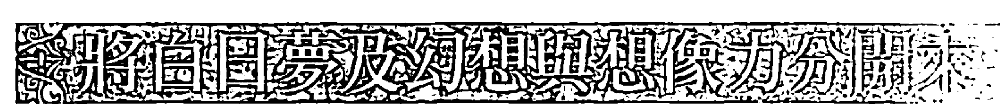

鏡子的內在面也會被干擾嗎？想像力的世界可不可能被操弄、扭曲、變形？當然可能，就像我們對外在世界的感知也會發生同樣的狀況。這些干擾是想像力世界固有的嗎？不是，它們源自身體。

我所謂的「身體」，指的是帶著各種固定模式、習慣、需求與情緒的脆弱人類身體，就是這些事物纏住想像力不放，扭曲它，將之用在白日夢與幻想——這些是偽劣假冒形式的夢行能力，帶著令人筋疲力竭的特質，讓我們很容易辨別出來（洞察純粹的想像力則使我們精力充沛）。

順便一提，請不要把「白日夢」與「遐思」搞混。遐思發生在一種放鬆、開放的狀態，那樣的狀態會誘發白天做夢的行為；然而，白日夢卻是被自我放縱的欲望帶往預料之中的結果。

例如，你做白日夢夢到一個有錢有房、非常英俊又性感的男人瘋狂愛上你，令你神魂顛倒，然後他娶了你。當然，你們從此過著幸福快樂的生活（如果你是男的，可以把這個白日夢的主詞換成「女人」）。

「幻想」透過餵養我們各種匱乏、受挫的期待，干擾內在世界的純粹反射。幻想可能像這樣：「我要把他的手指一根一根打斷，接下來就是他身上的每一塊骨頭！」或者：「我會去死，那麼他們就會明白自己失去了什麼！」然後，你繼續幻想自己的葬禮及親人為你哀慟等情節，鉅細靡遺。

## 視覺心像練習

### 辨識白日夢與幻想

下週花時間注意你白日夢及幻想的內容，不帶任何批判地觀察它們。

留意你的白日夢與幻想，你會發現自己阻塞最嚴重的地方。例如，你對伴侶關係的渴望讓你沉迷，或者你的憤怒變成一種執念，你的奇異吸引子因此成形，並轉變成你不見得很喜歡、卻不幸與之緊密結合的實相。

學會把白日夢及幻想與純粹的想像力區分開來，將展開一個過程（後面的章節會詳述），這個過程能讓你將白日夢與幻想的影像整合進你內在世界的視覺心像場景中，以處理它們，然後將之釋放。花在維持這些幻覺的停滯能量因此被想像力捕獲，用來創造新的、讓人對生命抱持肯定態度的組態或配置。

如果我們一切正常、健康，內在就會有一個安全的中心點，連結外在世界。就像亞當為動物起名字（《創世記》2:19），我們可以替這個世界的不同構成要素命名。無論在感知過程中遇到什麼干擾，我們依然能夠藉由自己認可的模式看見一個一致的世界——這些模式已經被命名，並有固定意義，好讓我們在未來作為參考。

問題是，越是用這種方式觀看世界，我們越容易誤以為這是觀看世界的唯一方法。人是一種自我參照的生物，在前進的過程中會自我訓練，於是越來越陷入自己選擇的常規裡，然後還訓練孩子做同樣的事。

嬰兒剛出生時，就像第一個人類亞當神人一樣，擁有透明的內在身體；但到了孩童時期，所有對內在世界的興趣都被阻止或忽略，因此，他們一開始那種對內在世界非常強烈的感知很快就隨著歲月變弱了。

不過，請想像發生了某件轉變你的覺知的事，例如令人震驚的事件——孩子受了傷，或者你被診斷出癌症，或者分手的情人回到你身邊。無論是恐懼或喜悅，這種震驚的情緒都會翻轉內在那面鏡子，讓你突然看到鏡子的另一面。

在這個新發現的「空無」空間裡，想像力可以讓它短暫卻重要的符號浮出來。但是，真的需要等到生命中令人震驚的事件發生，才能窺見這個秘密嗎？其實，每天晚上都有一絲機會，一個有可能瞥見另一個世界最純粹形式的幸運時刻。從那裡開始探索想像力世界合理多了。

## 視覺心像練習

### 看見臨睡心像

今晚就寢時，讓自己完全放鬆，閉上眼睛，但確認自己保持警醒。不要讓自己有任何內在對話，把所有念頭往左邊掃出腦海，保持在一種平靜、暫時放空卻警醒的狀態。很快地，你就會「看見」閃爍的顏色、片段而不連貫的奇怪影像，或是整個栩栩如生的場景。在你閉起來的眼皮底下，這些事物出現又消失，很快被其他的取代。不要嘗試抓住任何畫面不放，看著就好，你很快就會自然睡著。放手讓這個過程發生。

這些現象被稱為「臨睡心像」，發生在清醒與睡著之間的臨界點，此時你所有的習慣行為都是相反的（你躺著而非站著，眼睛閉著而非張開，肌肉放鬆而不是正在活動）。你放鬆到不想操控自己的視覺心像，這個隱藏的內在世界（外在世界的相反）因而出來表演。

## 學會相信來自內在世界的訊息

黃昏與黎明、瞌睡與清醒引發了朦朧狀態，在這樣的狀態中，各種形狀戲弄著我們，我們的兩個世界相遇、混合，有時讓人分不清兩者。例如醒來的時候，你清楚地想起你將鑰匙放在手提包裡，但後來要找鑰匙時，才突然明白你並沒有真的把鑰匙放進手提包，而是夢到你那樣做了。

或者，當你睡著時，你要另一半去學校接孩子，第二天你才沮喪地發現，你以為自己大聲告訴他這件事了，但那時其實是在夢中。

這樣的混淆完全正常，不必擔心，你很快就能學會同時在兩個世界保持清楚的意識，這些混淆將會消失。睡著的時候，內在世界當然會在夢中出現（至少你是這麼認為的），但目前為止，在夢中你還無法意識到自己正在做夢，只有在醒來之後才記得你做了夢。這一點同樣會改變。

內在世界不像吸血鬼會在黎明雞啼時消失。想像一下月亮是內在世界，太陽則是外在世界。即使從我們的視線中消失，月亮依舊存在；當太陽照亮行星的這一邊時，月亮對海洋與我們體內液體的影響並沒有停止。

我們可以說，鏡子的一邊總是夜晚，另一邊一直是白天，而身體是中間的界面（接受器、傳導體）、我們的感知螢幕，以及兩個世界的鏡子。既然兩個世界同時存在，我們能否不要將它們看成兩個對等的主體，而是視為一個整體？讀完這本書，你應該就能做到了！同時，問問自己：有沒有任何來自內在世界的訊息曾經在你白天有意識的狀態下穿越而出，讓你接收到？

雅各·陸西朗在他的書《於是有了光》（*And There Was Light*）中描述接收到這種訊息的經驗。事實上，陸西朗是個盲人，因此他真正「看見」的，是他的內在世界。讀他的書之所以有趣，是因為他描述了自己**如何看見**。

陸西朗是第二次世界大戰時期法國青年反抗軍運動的領導人物，負責遴選所有的幹部，而身為盲人，他要如何做到這件事？許多可以讓我們了解一個人的明顯線索，對他來說都是不存在的，於是他參考自己的內在鏡子，以做出適當選擇。這面內在鏡子藉由呈現圖像式組態，來回應他的緊急詢問。

例如，有一次陸西朗正在考慮讓一位可能的候選人管理反抗運動的北方分支組織（那個人是唯一人選），當時，陸西朗「看見」一條巨大的黑色斜線劃過他內在的感知視野。

你不需要成為盲人才能像他那樣「看見」，你要做的，只是留意。我等一下會詳細說明陸西朗面臨的兩難困境，在這期間，來看看下面這個練習你能做多少。

## 視覺心像練習

- 白天的內在視覺

閉上眼睛，深呼吸三次，從 3 倒數到 1。回顧自己的人生，去記起並辨認如上述陸西朗那種於內在「看見」的經驗，藉由後見之明驗證你看到的事物傳達的訊息是否準確。深呼吸一次，告訴自己未來要能夠辨識這種發生在白天、如夢般的「看見」。再深呼吸一次，然後把眼睛張開。

舉例來說，你跟朋友聊天，他正在說一個故事，而你觀察著他的臉和手，但同時，你也「看見」他戴著一張面具。後來，你得知他告訴你的一切都是謊言，於是你想起自己的視覺心像。這多有用啊！你不只「看見」了，也能夠驗證你「看見」的是真的。起初唯有透過這樣的驗證過程，你才會開始相信來自你視覺心像世界的訊息。

現在回到陸西朗的例子。當時因為迫切需要找到一個人來領導北方的分支組織，所以儘管他在考慮那個唯一人選時，內在視覺顯現給他看的是一條黑色斜線劃過那個人的畫面，他卻沒讓自己信任內在眼睛所見，還是選了他。不幸的是，那個人最後背叛了整個組織，向德國秘密警察蓋世太保告密，導致陸西朗與他的朋友們被送往集中營。

內在的視覺心像隨時都在反射到鏡子上，閱讀這一段文字時，你也有這樣的內在圖像，但你不是沒看到，就是很少「看見」，因為你已經忘記如何接受這些內在圖像是真實的。但它們一直都在那裡，只要你決定再度聚焦其上，就能夠注視它們，並與之對話。

就像我們先前說過的，內在世界並不是只有圖像。如同外在世界，內在世界會顯化出聲音、文字、完整的句子、氣味與動覺經驗。但與外在世界不同的是，這些模式是流動的、短暫易變的，唯有透過一種敞開而放鬆的「觀察」，才能觀看它們，並因此進入想像力世界。

讓我們在此處暫停一下。你已經準備好要承認想像力世界是活生生的、完好地存在你之內，等著扮演主動積極的角色嗎？你是否像《聖經》中的夢行者與預言家那樣持開放態度，要接收來自另一個「神聖」世界的「訊息」了呢？

## 重新學習內在世界的語言

想像你已經在一個黑暗洞穴中度過許多日夜，當你從洞裡出來、走進陽光時，很可能只會看到紛亂的色彩、朦朧的形狀及失焦的景象，這些都會讓你錯誤解讀。

同樣地，你待在外在世界這個開放洞穴中太久，早已忘記如何在黑暗中「看見」；而當你終於看見時，你看到的事物會是幻想、誤解與含糊不清的訊息。你必須學會再度「聚焦」——意思是，何謂聚焦於外在世界，在夢境世界就去做完全相反的事。

在這個新世界中聚焦時，你其實是掃描全局，而不是將焦點局限在某個特定形式上。你學會觀察一種模式，而不被該模式困住；你教導自己藉由逐漸增加的注意力去聚焦，直到你能夠如實地「看見」內在世界，不會因為缺乏覺察或感知領域中的其他干擾而看到攪假的訊息。換句話說，你必須再教育自己。

還是個孩子時，你非常熟悉內在世界的語言。你在兩種語言中長大，後來忘記了其中一種，但因為你曾經熟悉這個語言，重新學習對你來說很簡單，其中的訣竅是允許自己變得能夠覺察，然後練習聚焦，直到重新獲得所謂「真正的想像力」！

當你可以同樣聚焦於內在與外在世界時，這兩個世界便合而為一。你變回第一個人類，你的鏡子是個透明的巨大球體；你變得被光充滿，照亮了內外兩個世界，而你則成了「一」。這就是我們在這本書中要進行的工作的終極目標。

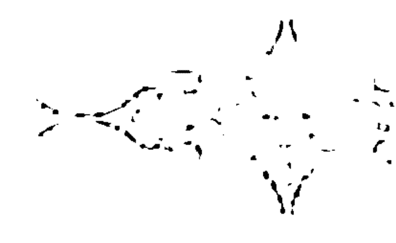

為了達成目標，你必須像古時候的英雄般，完成一些不同的任務，現在你已經做完了第一個：變得能夠覺察到吸引你的各種模式。而為了準備清理你鏡子的兩面，你的下一個任務是去辨識出現在你鏡子上、遮蔽了它的所有干擾。這些干擾是如何操縱你的人生，導致改變的可能性大打折扣？

## 第 1 章視覺心像練習快速指南

### P.48 找出你的奇異吸引子：學習辨識你會很自然被什麼吸引

用三天時間確認並寫下你感興趣的事物，以列清單的方式寫成一整欄。然後坐下來，閉上眼睛，深呼吸三次。你的清單有沒有明顯漏掉什麼？在視覺心像中看到你漏掉的事物，並替這些圖像命名。接著再深呼吸一次，張開眼睛，在另一欄中寫下這些視覺心像的名字。

### P.57 藍色水晶花瓶：清理扭曲的感知

將所有困擾你的事物化為一陣輕煙呼出去，就像香菸的煙霧。從天空吸進燦爛的藍金色光芒，看見這道光充滿你的鼻腔、口腔、喉嚨，然後沿著背部往下流動，彷彿一條巨大的光之河流。你看見它往下流進你的腿部、腳掌、腳趾，並且從各個腳趾往外延伸，彷彿長長的光之天線。然後，你看見這道光沿著雙腿往上流進你的骨盆與胸腔，並且從心臟流進又流出，直到心臟變成一盞藍色的燈，散發光芒。你看見這道光沿著雙臂往下流，充滿你的手掌與手指，並且像長長的光之天線般往外延伸。當你繼續讓這藍光充滿你時，你看見它開始從你的腳踝、膝蓋、臀部、肩膀、手肘和手腕向外散發光芒。現在這道光開始穿透你的皮膚，往四面八方散發光芒，直到你看起來像個充滿光的水晶花瓶，並往各個方向發光。然後，張開眼睛，看見自己像個光芒四射的水晶花瓶。讓自己在睜眼的狀態下維持這個圖像幾秒鐘。

### P58 靈擺：清理扭曲的感知

深呼吸三次，想像一個很大的水晶靈擺從左到右、右到左擺動。每次靈擺擺到右邊時，它會把你生活中那些局限了你的選擇的干擾聚集成堆。試著辨識出每一個干擾。深呼吸一次，看見靈擺大幅擺動到右邊，再大力擺盪向左，將那一整堆用力掃到左邊。接著再深呼吸一次，看見靈擺再次大幅往右，然後擺回左邊，將那整堆干擾從左邊掃出畫面之外。

### P62 辨識白日夢與幻想

下週花時間注意你白日夢與幻想的內容，不帶任何批判地觀察它們。

### P64 看見臨睡心像：開始探索想像力世界

入睡前，保持在一種平靜、暫時放空卻警醒的狀態。觀察閃爍的顏色、不連貫的奇怪影像，或是整個栩栩如生的場景。

### P.66 白天的內在視覺

深呼吸三次，回顧自己的人生，去記起並辨認你有過的那種真正於內在「看見」的經驗。藉由後見之明驗證你的內在視覺傳達的訊息是否準確。深呼吸一次，告訴自己未來要能夠辨識這種發生在白天、如夢般的「看見」。再深呼吸一次，然後把眼睛張開。

## 第2章 設定你的人生藍圖

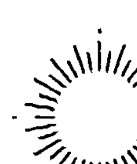

> 拉比希亞說：當邪惡的傾向（未經檢視的衝動）開始將其自身依附到一個人身上時，就像某人來到一棟房子的門前，當他發現沒人試圖阻止他，便進入這棟房子，成了客人。他注意到沒有任何人試圖阻止他，或叫他離開。一旦進入屋裡，而且還是沒人試圖阻止他，他便占了上風，變成房子的主人，因此及時控制了這整個家庭。

——《光輝之書 II》267B-268A

柯列女士告訴我：「在時光中鑄成之事，必須透過時間的推移將之融解回未鑄之前的狀態。」遇見柯列前那短短的二十九年，時光在我身上鑄造了許多事——至少我是這麼認為——以致我無法想像需要花多少時間才能消融那些傷害。當時的我憂鬱、憤怒、混亂、情緒化、個性戲劇化、需索無度、易流淚，最糟的是，我非常沒有耐心！

我希望短短的一秒內一切就好轉、就被治癒，最好柯列揮一揮她的魔法棒便替我完成這一切！但是，那只會發生在灰姑娘那種不憤世嫉俗、每天很有耐心且毫無怨言地完成該做的工作的好女孩身上。

傲慢且急躁的我更像是灰姑娘的兩個姊姊。如同她們一樣，我有兩個部分——我的意思是，我被撕成兩半，像坐翹翹板一樣，從需求那一端掉到欲望這一端，然後又掉回需求，從來不滿足，而同時，我的「內在灰姑娘」依舊隱藏在我種種反應的煤灰之下。

想像你有一位心靈導師，你就坐在他腳邊。這是你們第一次見面，所以當一團毛線突然被丟到你大腿上時，你真的很驚訝。「請理好這團糾纏的線，但不要弄斷任何地方！」你的心靈導師從來不注視你，但你知道自己被他看顧著。

想像你試圖解開這團混亂。面對這項任務時，你有什麼感受？你是迫切地想要解開，或者光是看著它就覺得筋疲力竭？當你展開冗長乏味的過程，努力解開這團混亂時，是否感受到一股想要猛然扯開它的衝動？你渴望把線扯斷嗎？請留意你身體的感受，我們稍後會回來談這個部分。

## 第2章 設定你的人生藍圖 075

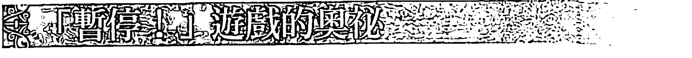

柯列的大家庭經常在安息日的用餐時間玩一種叫「暫停！」的遊戲，「出其不意」是這個遊戲的要素。

遊戲進行時，沒人知道什麼時候會有人喊「暫停」。但突然間，有一個人人大喊：「暫停！」這時，每個人都必須「凍住」，不能再做任何動作，即使他們手上拿著叉子，剛從餐盤叉起食物，還沒放進嘴巴裡，或者精采的笑話正要講到最好笑的地方。

保留安息日的傳統或許是猶太教徒對這個世界最大的貢獻之一。這是他們最神聖的日子，是休息的日子。他們是休息不做哪些事呢？在安息日，全世界所有虔誠的猶太教徒都會玩這個「暫停！」遊戲——他們暫停烹飪、暫停點燃火柴、暫停開燈、不花錢、不寫東西、不切割任何東西，也不旅行。

對大多數人來說，這看起來很可笑、專制，或至少是種束縛。沒有電視或電影可看，不能去鄉下或購物中心走走，不搭電梯，不接電話，所有的樂趣都被排除，而且是在一週的辛苦工作之後？猶太教徒在做什麼？他們是想要懲罰自己嗎？如果真是如此，他們已經這樣做了幾百年，卻沒什麼不良影響。如果開口詢問，猶太教徒會告訴你，他們等不及安息日的到來。

讓我們更仔細地檢視這個謎。前面提到的所有活動是大家每天做的事——我們不會去思考「開燈」，就是直接打開；拿筆寫字、電話響就接起來，或者把手放進皮包裡拿錢，也是很自然的事。我們在每一天的生活中執行這些動作，從來不去質疑。

然而每隔七天，正統猶太教徒會讓自己不去做這些每天都做的動作。找一件你沉迷其中的事，例如一醒來或下班回到家就打開電視開始轉台，然後選一天讓自己完全不看電視。試試看，你很快就會發現自己的意志與需求展開了一場拔河比賽，你腦子裡想的只有電視！

你的頭腦會編造各種藉口，說明為什麼放棄看電視很蠢，為什麼這世上沒有任何理由要你不看電視。你想得越多，這件事就變得越困難，電視會開始不停地對你說：「你要怎麼辦？你要怎麼辦？」

大多數人會在此時棄械投降，同時鬆一口氣，然後恢復老習慣。但這並非沒有後座力。需求的反應就像一隻貪婪的狗，給了牠獵物的一塊肉，牠卻想要一整隻。能夠停下來不是很棒嗎？對電視、香菸、食物、性怪癖或任何你察覺到主宰著你的模式說「不」，不是很好嗎？藉由說「不」成為自身需求的主人，而非奴隸，不是很棒嗎？

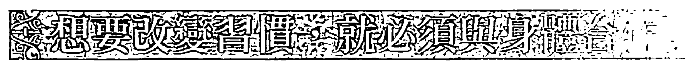

想像你的需求彷彿一匹野馬，而你陷入一場拔河比賽，試圖制服這匹馬。如果只有套索與蠻力，你很快就會累垮。想當然耳，馬的力氣肯定占上風。

但想像你有所準備來參加比賽——你為這匹馬建造了一座圍欄！你一步一步後退，直到將馬完全拉進圍欄裡，然後在牠身後將圍欄的門關上。圍欄是這道方程式的第三個元素，它就

The request was rejected because it was considered high risk

The request was rejected because it was considered high risk

## 第 3 章 視覺心像練習快速指南

### P.104 找出你的重複行為

留意重複的姿勢、肢體動作、表情、模仿行為，留意你說話時是否出現重複的詞、句子、笑話、故事，留意重複的行為模式。

### P.107 注意表面之下：找出你生活中某個重複失敗的領域

留意表面之下，去尋找失敗的源頭。你看到的是什麼樣的畫面（視覺心像）？呼一口氣，然後把眼睛張開。

### P.112 夢的日記

買一本筆記本，並以「夢的日記」為標題。每天晚上在裡頭的空白頁寫下日期，然後讓夢的日記保持打開的狀態，放在床頭櫃，並準備一枝筆讓你可以寫下自己的夢。

## 第4章 與夢境互動

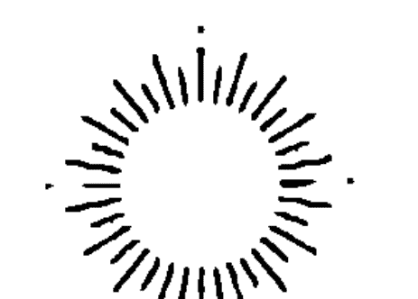

> 好夢與可能是好的夢（惡夢），
> 願全然慈悲的神將之轉化成好夢。
> 七倍的願望希望這旨意來自天堂，
> 它應該是好夢，
> 它可以是好夢。
> ——
> 《塔木德經》〈祝福篇〉55B

當來自夢中的視覺心像彷彿獵食的大鳥撞擊我們，將我們襲倒在地，攻擊我們的眼睛、肚子時，若馬上將這些當作是我們的想像力或潛意識虛構出來的，而不予理會，這樣做有意義嗎？當夜幕降臨、海嘯來襲，當顛簸行駛的汽車失去控制，當蒙面人糾纏我們，當黑暗的水域發出呼喚，我們應該接受那種陳腔濫調的解釋，把令人困擾、痛苦的經驗詮釋成冷冰冰的隱喻，或只是半成形的肉體、情緒或心理狀態的症狀嗎？

假設我們很認真看待這些視覺心像，把它們寫在夢的日記裡，並反覆思量，這時，我們應該更進一步嗎？我們應該認真看待它們藉由顯現在我們身體及生存層次上所暗示的危險嗎？最後，若已經走了這麼遠，那下一步該做些什麼？這個問題的答案是：面對自己的夢，我們應該放棄僅僅做個無奈的旁觀者。

你是否曾經站在深邃峽谷的邊緣，渴望一躍而過，但面對腳下的寬廣鴻溝卻覺得無能為力？你白天與夜晚的生活之間的鴻溝，在你看來可能就是如此。在追尋之旅的此處，白天的意識與夜晚的睡眠還是兩個極度不同且毫不相關的實體。

這些令人害怕、來自夢中的視覺心像，與你白天的生活有何關連？你不能用評斷白天意識中類似事件的方式，來評斷夜晚夢中的視覺心像。睡眠是蒙著面紗的謎；忘川，那條遺忘之河，流經你整個睡眠，即使當你在做夢時，而做夢似乎也是一種遺忘的形式。你保留的夜晚並非一個意識清晰的時刻，而是對某個難以抓住的事物的記憶，某個可能從未存在的事物。

我們稱為「夢」的這個來自潛意識、難以捉摸的蛛絲馬跡，很可能是你的想像力從你在夜晚經歷的各種身體感受的殘餘片段杜撰而成。

或者，夢有可能在快速動眼期的睡眠中顯現，但你想不起來夢發生的時候自己在場，至少那個「在場」的意義與你白天生活事件的「在場」是不同的。更重要的是，夢中事件確實是以你記得的方式在夢中發生嗎？如果是，為什麼你沒有適切地回應？

醒著時，如果看到一輛失控的汽車衝過來，我們會非常嚴肅地看待這個危險情境，跳到一旁，以免被車撞到。但在夢境中，為什麼我們很可能不會以同樣的方式反應，也就是跳到一旁呢？

答案是，對於夢，我們知道自己可以醒過來說：「感謝老天，那只是一場夢！」然而，這種嚇人的夢通常會回來。萬一這個夢不消失怎麼辦？萬一它堅持讓我們留下「危險就在眼前且非常真實」的印象呢？我們該怎麼辦？如果忽視這個夢，我們難道不會懷疑：當持續受到這種被車撞的驚嚇感威脅，然後日復一日、經年累月帶著預期身體被撞擊且受傷的可怕感受，我們的身體、情緒和心理健康會遭受什麼樣的影響？

當一個夢非常栩栩如生，且堅持被記住時，去回想或談論它會有幫助嗎？或者，有沒有可能直接去處理夢想要被關注的需求（我稱之為夢的「必要性」）？我們應該讓自己做夢回到那個夢中，然後避開失控的車子嗎？這麼做真的能夠改變任何事嗎？

去處理夢要你處理的部分，也就是它迫切的「必要性」，看起來可能像跳過萬丈深淵一樣瘋狂、危險、充滿不確定性。當你如此跳向夢時，你就給了它足夠的引力將你抓住，但與此同時，你也放棄了某些你確定無疑的知識，例如什麼是真實的、什麼是想像的。因此，你承擔了可能墜入一個製造幻想深淵的風險。

回應夢的呼喊，意味著你接受了它的實相、它的「物質性」。藉由這個在白天的意識與夜晚的夢境之間架起橋樑的跳躍，你完全顛覆了自己的世界觀。這個意義非常深遠，你準備好了嗎？

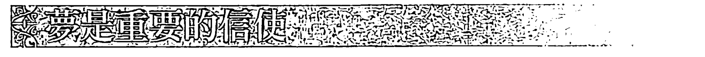

現在你已經記錄了幾個夢，當你閱讀這些夢時，是否像我一樣被某件很明顯卻尚未談到的事卡住了？那件事情是：夢總是比你快一步。它就像一個很健談的人，總是帶來新話題，照亮你現在生活中該注意卻未注意的某個部分。夢警告你會有險惡的陷阱、讓你預先看見即將引起你注意的事物、以新的觀點呈現過往事件，或者只是提醒你某個你已經接收、卻尚未有意識地去留意的潛意識訊息。

你的夢牢牢地將自己放置在你前方，為對話增加某件有趣、刺激、具發展性或促進成長的事。夢從來不會落後，甚至當它看起來一直重複時，傳遞的訊息也是：「嘿！我到底要說幾次，你才會開始注意並採取行動？」

想像你的潛意識是一片海洋，在其深處，你生活中的事件已經引起地震般的劇變。現在，你的潛意識中有一波情緒海嘯來襲，且身體的衝擊正在累積，好讓它開始往上浮到你意識的水面。雖然你並未往這片海洋的深處看去，你的夢境心智卻非常熟悉這個世界，且總是試圖告訴你關於這個世界的一切。

如果關於即將到來的海嘯的夢充滿希望，你就可以準備迎接更好的時機；假如它閃現危險的信號，你就可以開始往高處走。無論哪一種情況，重要的是必須有足夠的能力解讀夢的模式，好讓你採取相應的行動。

如果不信任夢的實相，你就會徹底錯過。舉例來說，如果這個夢歡喜地公布了充滿希望的消息，你將錯過讓自己在這個希望中牢牢立足的機會；或者，假如夢裡的消息跟考驗與損失有關，你就無法做好適當準備，於是會遭受這個夢預告的痛苦事件帶來的全面衝擊。若你選擇什麼都不做，隨後發生的事件帶來的情緒海嘯會擊潰你，徒然增加你的無助感與停滯感。基於以上理由，你不覺得信任自己的夢才是明智之舉嗎？

夢是新事物的信使，且期望自己的付出有所回報。你會回應嗎？你會為這場對話貢獻新東西嗎？

## 視覺心像的力量

並非所有夢中的視覺心像都是未來的預兆。就像日常生活中並非每件事都同樣可以影響我們，許多夢中的圖像在我們沒注意時就已流過，如同夢的自然開展過程的一部分。但是，某些圖像卻會像鎚子打在鐵砧上一樣重擊我們，而一旦接觸到這些圖像，就無法假裝一切都沒發生過。我們就像信封上的熱蠟，被巨大的印信留下深刻的記號。這些視覺心像出現時，如果我們不阻止自己真正「在場」，其迴響會如同一見鍾情般深遠、強烈、難以言喻。

然而，無論我們只是在心智表面反應，或是以整個生命深刻回應這些有創造力的視覺心像帶來的刺激，都與性格及選擇有關。

《塔木德經》裡有個故事提到四位拉比決定造訪伊甸園，而見到其榮光時，第一位拉比因為震驚而死，第二位拉比瘋了，第三位拉比則背棄了信仰，只有第四位拉比阿齊巴毫髮無傷地進出伊甸園，並得以轉化。

除了拉比阿齊巴之外，其他幾位拉比有什麼共同點？他們都以震驚、恐懼、懷疑、憤怒、叛逆做出反應，也就是那些會在我們的身體創造出「不適」（疾病）的負面情緒。只有拉比阿齊巴回應了他所經歷的事物的必要性。他不是反應，而是進入、「看見」，然後回到他日常工作生活的世界（這是他的回應）。那麼，人該如何回應，而不是反應呢？

我小時候經常思索坎特伯里大主教聖托馬斯·貝克特的故事，他在禱告中即將被亨利二世派來的爪牙殺死之際，大聲喊出：「告訴國王，我原諒他！」我在想，他是不是訓練了自己不要反應？

貝克特接受了無可避免的一切，並在自己之內找到他必須說出的事：將永遠改變他與國王之間的對話的唯一真實話語。在那個可怕、暴力的時刻，貝克特如何擁有一顆可以處理他所處情境的必要性的心，去回應，而非反應呢 ①？

## 對自己的夢做出反應

當夜夢中最迫切的必要性出現時，例如入侵者闖入、大鳥俯衝猛撲、巨龍從泥濘的湖水中飛升而起、車子失控而我們無路可退，求生本能會促使我們醒來。這似乎是避開危險比較好的方法，勝過將自己丟回有意識的、清醒的世界，那是夜晚的視覺心像無法觸及我們之處。

如果吸血鬼會在黎明雞啼時消失，那麼夢也應該在我們一醒來就不見——或者我們喜歡這麼說服自己。當然，這種從一個世界到另一個世界的轉換可以是雙向的，這個世界中一個可怕而令人震驚的事件，同樣很容易將我們彈進夢的世界。就像之前的許多英雄，我們可能會發現自己雖然依舊清醒，卻迷失在一片迷霧中——這片迷霧可能是困惑、猶豫、妄想、幻想、茫然、缺乏覺察、感官關閉（不傾聽、不留意等）、暈眩、噁心、出體感受、幻覺、偏執、瘋狂、昏睡。

以上列出的潛在後果讓人感覺不甚愉快，但它們畢竟是非常有用的提醒，讓我們記得：這些來自夢的世界、可以用來對付自己的武器（如果我們選擇這樣做），的確令人畏懼。同時，大多數人也不明白，關閉夢的世界，與不願接收來自清醒世界的訊息，兩者帶來的傷害一樣大。

當面對一個可怕的實相（無論是夢境或清醒實相）變得難以忍受時，我們往往會退出。就像我們經常被困在擺盪於反應與本能之間的翹翹板上（見第二章），我們在這裡也被困住，於固定的兩端擺盪著。

為什麼不單純處在當下，面對那些呈現在我們眼前的事物的必要性？為什麼不用同樣的決心面對實相，無論那是夢境實相或這個世界的實相？

當然，如果面對實相有這麼簡單，我就不用花力氣來談這一點了！在兩個世界都處於當下，是夢行者的終極目標，如果沒有付出相當程度的努力，是無法達成的。所以，當你選擇避開應該面對的事物時，不要覺得自己失敗了。

相反地，從短期來看，退出往往是妳所能採取最安全的舉動，因為如果沒有受過訓練或擁有足夠的配備去面對實相，你就會像個獨自站在田間的農夫，被一位騎在馬上的高大騎士攻擊。你沒有馬、沒有盔甲、沒有寶劍、沒有長矛、沒受過訓練。有時候，你唯一能做的就是逃跑。

退出有許多不同形式，就像前面提到的拉比的故事描述的一樣。我們大多數人都像背棄信仰的那位拉比，換句話說，我們不相信自己的眼睛。雖然我們可能覺得某個夢神祕誘人，卻也可能發現它的奇特之處有些令人反感。如果沒有做過太多客觀檢視自己的練習，我們發現這很容易讓自己對某些感覺起來跟自己、跟我們的真實樣貌格格不入的經驗保持距離。

當我們真正的意思是「這個夢不是我」時，說「這個夢發生在我身上」比較容易。如此一來，我們就能感覺自己在實相與我們面對的視覺心像世界之間保持一種健康的距離。跳過兩者之間的深淵實在不是我們會做的事。

但癥結在於：無論你對自己怎麼說，這個夢就是你。沒錯，你是它的觀眾，但也是它的作者。你並非那些想要把你弄糊塗的瘋狂圖像的受害者，而是它們的創造者，是你的夢充滿力量、才華洋溢、富想像力、具洞察力且敏銳的創造者。假如你開始因為你的夢那些有時讓人發狂、不可捉摸或不愉快的特質而感到沮喪時，請記得這個基本事實。

記住，你內在創造出夢的那個地方基本上是樂觀且自由的。此外，你也可以開始從「你是夢之創造者」的一個非常重要的推論中振作起來：你有力量改變它們。但在你可以將這股力量應用自如之前，你必須學會對自己創造的夢真正地宣示主權。

人們讓自己跟他們的夢保持距離的方法有很多種。如上所述，有些人覺得承認夢是他們自己創造出來的，是件很難或令人反感的事。他們會說：「我不明白我怎麼會夢出這種事。」或者：「這不是我。」或者：「我絕對不可能編造出這麼瘋狂的場景。」然而，有些人會採取幾乎相反的態度，對自己的夢有著迷信般的敬畏反應，把夢看作來自潛意識熔爐或外在某個超自然之處、純粹而完美的呈現。

對這些人而言，光是將夢與他們的內在世界連結，就會破壞這個夢；若是去做像實際改變一個夢這麼極端的事，則會將之完全摧毀。這兩種人可能都認為，竄改夢原有的訊息會使之掉進純粹的幻想裡。

稍早我們談過「幻想」很容易變成任性而自我放縱地操控想像力（詳見導讀與第一章），那麼，質疑「改變夢以迎合自身欲望」難道不等於一種操控，一種在「真實」的夢流出潛意識之際施加其上的細微或不那麼細微的扭曲，也並非不恰當。如果回到夢中，讓自己從衣衫襤褸又笨拙的農夫變成勇猛的年輕戰士，全副武裝、準備好要捍衛自己，這樣難道不是安插了一個謊言到夢的世界裡嗎？

如果返回某個夢確實引起你合理的焦慮，這可能會讓你失去平衡，就像那位瘋掉的拉比。或者，你也許覺得做夢與任性意圖交會之處的地面滑溜溜的，最好像那位震驚而死的拉比一樣把夢完全除掉，以這種方式將幻覺徹底阻擋在外。或者，就像第三位拉比，你也許判定這一切都是「垃圾」，然後背棄自己的信仰走開。很不幸地，如同《塔木德經》裡的聖哲提醒我們的一樣，「所有的夢都跟著你的口」，你怎麼說你的夢，會將之轉變成你的「詮釋」。拉比阿齊巴對夢（也就是他與其他三位拉比進入伊甸園這件事）的「詮釋」很平和，我們能從他身上學到什麼嗎？有沒有一種更完整、更安全的方法可以處理這整件事？

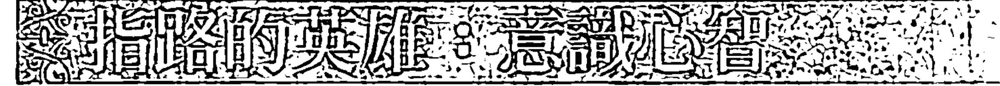

雖然童話故事、神話與傳說提供了無數例子，告訴我們如何成功面對夢中視覺心像的「必要性」，我們依舊無法辨識出神話與夢境之間那個非常有幫助的連結，只因為我們還沒找到那位英雄，還不知道他是誰、他從何處來。

誰是那個無私無我地去對抗黑騎士、殺死巨龍、進入沼澤地、穿越重重鏡子與迷霧、披荊斬棘、刺破厚重的蜘蛛網、下至陰間、面對亡者、誘騙怪獸的英雄？他清理鏡子上的遮蔽物與汙泥，以找到並拯救公主、王國或聖杯。這個公主、王國或聖杯是我們純淨的身體、我們的地球、我們盛滿食物的大鍋、我們的伊甸園，也就是孕育了我們夢中所有奇妙生命、食物與寶藏的子宮。

那位英雄就是我們的「意識心智」。

他只有在迫切的必要性或久久不散的呼喊出現時（一隻凶猛的龍正在破壞王國，或是一位有著出眾美貌的公主正抓住聖杯漂浮著），才會冒險進入夢的世界。英雄總是男性，代表意識的主動性，代表意識有意志、有意圖、有感覺能力的面向。他還年輕，第一次突襲夢的世界，在這個世界裡，毫無防備的旅人會被遺忘、健忘與睡眠征服。他還沒經歷過考驗，還沒面對那道分隔兩個世界的霧牆，穿越它，並在另一邊保持意識清醒。他還沒遇見守在入口的野獸（他的恐懼、憤怒、焦慮、貪婪等遮蔽了鏡子的情緒），征服牠們，或是用計誘騙牠們讓自己過關。

他能否面對潛意識心智，且最後不會被吸入無意識之中？他有辦法在黑暗中讓自己的意識保持明亮、清晰嗎？如果他做得到，他是如何辦到的？

## 在清醒時面對夢的挑戰

想要將光帶入黑暗中，第一步就是接受挑戰。當車子失控衝向你，當獵食的大鳥俯衝撲向你，這就是你的挑戰出現的時刻。但你當然還沒辦法接受挑戰，因為你還在睡，還不知道如何在夢境狀態中保持意識，這稍後會談到。

那麼，你要如何面對挑戰？如果你還在夢境狀態中，就沒辦法這麼做，所以你要從你在這個世界所處的位置面對挑戰，在清醒的時候去面對。就像踏出第一步走向水邊的小孩，你一定也是從乾燥處起步，因為這是你一直被教導要在這裡處於當下、保持意識的地方。你在清醒時與夢的世界展開對話，下面就是進行的方法。

你已經記錄自己的夢一段時間了，看看那些強力攻擊你的視覺心像，它們在大聲呼喊什麼？試著去辨識它們的「必要性」，亦即夢現在強烈要求你的是什麼。如果有個馬桶因為堵塞，導致汙物溢出，或者有個空間非常昏暗，你必須去清理。不要問：「為什麼是我？」畢竟這是你的夢。如果一輛巨大的起重機或坦克車向你開過來，你就必須閃開！

假如有個蒙面人與你正面交鋒，你的挑戰就是摘下他的蒙面布。假如一個黑暗山洞對著你張開大口，或者一隻噴火龍在你窗邊出現，你會採取什麼行動？你有沒有注意到我給你的挑戰越來越困難？清理馬桶是很討厭，但通常並不危險，進入黑暗山洞或面對噴火龍則另當別論了。

記住，恐懼的存在是為了教你勇氣。沒有恐懼，你如何知道勇氣是什麼？你又要如何練習變得英勇？在夢中，你對恐懼的第一個反應也許是：「這簡直荒謬到難以言喻，我不能這麼做！」或者：「我光想到要進入黑暗山洞就嚇死了！」然而，你生命中有過一段練習變勇敢的時光；你曾經一點都不害怕變得荒謬可笑，事實上，你當時從殺掉巨龍或鑽進地底尋找寶藏的想像中獲得極大的樂趣。

當時的你是個孩子，就像梅林（你現在「看見」的能力）還是個小孩。英雄總是很年輕。孩子們玩想像力遊戲時，大家覺得他們只是在假裝，但此時你應該能夠分辨，他們在做的事非常真實。他們在練習勇氣，他們在教自己如何面對實相，而且他們的思維能力與情緒——其實就是他們整個存在——也參與了遊戲。

夢境世界裡的安全配備，只有在你像個孩子時才會出現。沒錯，孩子會害怕窗邊的巨龍，但只要給他一副想像的弓箭，他就會振作起來，射出致命的箭，殺死巨龍，然後馬上回去睡覺！

你英雄那一面一定要像個孩子一樣嬉戲。如同小孩子，你可以提供自己必要的保護，例如弓箭、寶劍、盾牌、來福槍、坦克車、燈、繩子，甚至軍隊，只要你有需要。或者，你也可以用計謀武裝自己，就像柏修斯殺了蛇髮女妖美杜莎那樣——任何看見美杜莎面孔的人都會變成石頭，於是柏修斯將他光亮如鏡的盾牌對準美杜莎，當她看見自己的倒影，就變成了石頭，柏修斯因此能砍下美杜莎的頭，並利用她的頭令人畏懼的力量當作武器，將他的敵人也變成石頭。

這些對你來說都不是新鮮事。你讀過許多英雄出任務的故事；你曾經是個孩子，玩得很盡興，就跟我們其他人一樣。我只是在提醒你，你可以再次這樣嬉戲。

不過，在你清醒的生活裡，你該怎麼做到？

## 視覺心像練習

### 面對夢的「必要性」

坐在一張扶手椅上，手腳放鬆，不要交叉。閉上眼睛，慢慢地深呼吸三次，從 3 倒數到 1，數的時候在內在視覺中看見數字，最後看到數字 1 呈現出高大、清澈且非常明亮的樣子。想像你用你認為自己需要的所有保護或工具武裝自己，然後回去看著那個你想要面對並處理的夢境視覺心像，開始去回應其「必要性」——用你的長矛或弓箭攻擊巨龍，帶著你發出強光的火炬與武器進入黑暗山洞中。你在那裡發現什麼？你如何處理？

盡全力去遊戲，如果開始害怕了，你永遠可以撤退去尋找援軍（包括找夢的治療師帶領你穿越這個過程）。記住，孩子永遠是勝利的一方。

### 放手讓夢掌控故事

當你這麼遊戲時，發生了什麼事？你一開始處理的那個視覺心像不會維持固定不變，死掉的巨龍可能轉變成汨汨而流的小溪，洞穴顯露出驚人的畫。當你圖像心智的肌肉回應了這個夢的必要性，你會在新的夢開始流動、新的視覺心像在你眼前展開時，與原來的夢境視覺心像維持一種充滿活力的連繫（若這個狀況沒有發生，可能意味著你太害怕，或者不願意去看著正在浮現的事物，也有可能你只是擔心自己在編造這個視覺心像）。確實出現的新視覺心像可能完全讓你嚇一跳，它的造訪也許是要你回應它新的必要性。

透過這種方式，每個有意識的夢都會帶你到那個夢的必要性被回應，然後一個新的夢境組態將自己呈現給你的地方。你利用這些不斷出現的線索前進，就像你在尋寶過程中所做的一樣。

如果線索說你必須爬上一道高牆，你就變出一座梯子來回應。你在玩遊戲沒錯，但是要讓任何真正的遊戲可以玩下去，就必須有一些規則。清醒做夢的規則是：從一個視覺心像到下一個視覺心像的過程必須保持開放，這意味著你必須放手讓夢自己控制這個故事。當你抵達尋寶過程的終點時，它們會告訴你。

如果遵循這個簡單的規則，你永遠不必擔心你的意志會被強加到夢裡而使之扭曲。如你所見，除非你讓夢擁有這種自由，否則就會失去尋寶過程中所有的樂趣與興奮感，例如尋找每個線索、解開謎題，然後跟著線索的指引前進。讓夢境視覺心像如此充滿創意地呈現，其實是一件簡單又自然的事，但一開始嘗試時，感覺起來可能沒那麼簡單、自然，以致你害怕你是在用意志力讓這些圖像出現，或者怕自己「做得不對」。

帶著自信去練習，萬一你內在出現一個審查員，告訴你現在你看到的不是你真正看見的，請毫不猶豫地去處理那個人。清醒做夢是一種技巧，就像游泳或跳舞一樣，練習得越多，做得越好。

在視覺心像流動的過程中，如果你在某一刻出現一種強烈的感覺，想要喊出「啊哈！」，你就知道自己已經在夢境中找到寶藏了。你會突然覺得輕鬆無比，或許會有一種輕飄飄的感覺。此時，任何新的視覺心像感覺起來都很強烈且令人舒服。當一個舊模式移進一個新的組態中，你會覺得自己的整個存在都被觸動了。如果你已經有效回應了夢的必要性，不只你夢境世界的生活，連你在這個世界的生活都會改變。

藉由這個簡單的過程去處在當下，並回應必要性，不只能找到困擾你的事物的答案，還能提供相關知識，讓你了解如何轉化與療癒自己。

我是不是聽到你在指責說這簡直是奇想？雖然我的想法也許看來很神奇，但夢境實相（儘管不同於我們的外部實相）同樣有影響力，而發生在夢境實相中的事，當然真實到足以讓你有不同的感受。一旦體驗過它發揮的效果，你會開始承認它的力量。

當你如我描述的那樣深入自己的夢境中探險，你該如何安全地回來？可以遵循拉比阿齊巴的範例，他知道要在夢境世界裡腳踏實地，所以時間一到，他就能平安返回這個世界。

## 視覺心像練習

### 讓自己腳踏實地

從腹部深呼吸，讓自己扎根在這個世界的感官覺受中：感覺你的身體在椅子裡，你的背部靠著椅背，你的腳重重踩在地面，你的手壓在椅子扶手上。接著張開眼睛，看看四周。當你讓自己重新熟悉你的身體與周遭環境時，保留這個夢的新組態產生的視覺心像與感官覺受，如此一來，你就不會失去你剛剛冒險獲得的新體驗。

就像拉比阿齊巴一樣，你已經成功進入光輝燦爛的夢境世界，扮演你的角色，然後成功回來。請持續練習這種移動，直到你對這個過程感到非常自在為止。接下來，你的第五項任務會是一種完全不同的移動方式。這次不是為你夢中的英雄提供清醒世界的武器，而是你會獲得一位女神的幫助，她是夢中聲音的化身，然後你會將她非凡的武器運用在這個意識清醒的世界中。

## 第 4 章 視覺心像練習快速指南

### P.128 面對夢的「必要性」

找出你的夢的「必要性」，然後閉上眼睛，深呼吸三次，從 3 倒數到 1，數的時候在內在視覺中看見數字。回到夢中，用你需要的保護和工具武裝自己，然後去面對你想處理的那個夢境視覺心像。

### P.131 讓自己腳踏實地：學會在從夢境世界回來時腳踏實地

注意自己的感官覺受：感覺你的腳踩在地面，你的手壓在椅子扶手上，你的背部靠著椅背，你的臀部陷入椅子中。慢慢深呼吸一次，然後張開眼睛，覺察自己的感官覺受，同時在睜開眼睛的狀態下看見你的夢境視覺心像。

①作者所指的「反應」（react）是針對一個動作（act）採取某種相應的行動或狀態（re-act）。例如故事中的大主教若在臨死之際充滿憤怒、恐懼與掙扎，便是對死亡做出反應。但主教不選擇憤怒或恐懼的情緒，反而「原諒」國王，並接受不可逆的命運，這便是作者所說的「回應」（respond）。

## 第5章

## 擁有全新視角的逆轉技巧

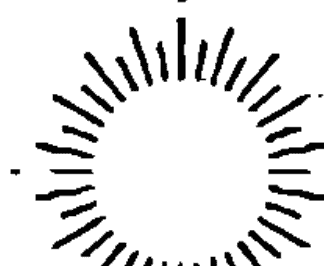

> 現在你們要轉向我，我就轉向你們。
——
《聖經》〈瑪拉基書〉3:7

我們會把所有的夢與睡著時做的夢直接畫上等號，不是沒有原因的。但事實上，我們是在睡眠與清醒之間的模糊地帶，在躺著、放鬆、毫無拘束的狀態下，回想起自己的夢（稍後我們會談到如何訓練自己在睡得很沉或完全清醒且直立的狀態下，也能覺知夢境）。而當雙眼迷濛失焦時，我們開始做白日夢；在半睡半醒之際，臨睡心像（見第一章）則會氾濫，將我們淹沒。

這些栩栩如生、完全不同的視覺心像被沖上我們半閉或全閉的眼皮，就像海浪沖上沙灘。目擊這些圖像時，我們依舊保有意識，不過是在失去意識的邊緣。一旦沉入睡眠中，水就會淹過我們，將我們與自己的意識心智分開來。對大多數人而言，夜晚在遺忘中溜過，只有在睡眠逐漸變淺、越來越接近清醒時，我們才會記起夢中的某些視覺心像。

我們的年輕英雄，也就是英勇的意識心智呢？他已經出發去征服睡眠的遺忘之境／無意識狀態。當他出征去對抗那個守護夢境世界與其中奧秘的黑騎士時，是在進行一項不可能的挑戰嗎？他只有一把寶劍能用來對抗空無，而「意識」配備的鋒利武器，無法刺穿那道特定的牆。

這一次，英雄沒辦法像在第四章那樣，試著藉由把夢帶入清醒世界來解決問題。這一次，他必須在夢的地盤上正面迎戰夢境的「必要性」，而他處於極可能失敗的危險之中，因為他沒有武器可以對抗睡眠。

但就在他即將墜入遺忘之境——或者就像亞瑟王傳奇故事集的圖像描繪的那樣，即將被黑騎士砍下頭時——梅林（我們「看見」的能力）出現在亞瑟（我們）身邊，提醒他（我們）：

如果他能靠近平靜的睡夢湖，並特別留意，他將獲得另一件武器。

看啊，這時候，一隻雪白手臂握著一把寶劍伸出水面！湖中女神，睡夢湖的統治者，穿越了那層紗伸出手臂。她給亞瑟的並非溫暖的擁抱，而是一件能讓他一把抓起的驚人武器。這把夢的寶劍意味著什麼？

我們認為意識就像一把劍，銳利且具評斷力。夢境也有這種銳利的特質嗎？有沒有一種我們可以掌握的夢境意識，能夠刺穿日常生活世界的幻象？英雄獲賜一把「夢中劍」，他是如何掌握它、如何在日常生活世界中揮舞的？如果我們像他一樣學會掌握這把劍，成為舞劍大師，我們將如何從中受益？

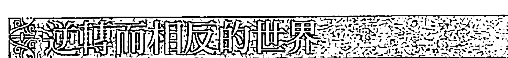

沒有什麼事物比夢更稍縱即逝了！你以為已經抓住它，但一瞬間，夢就消逝無蹤，只留給你一股糾纏不休、想要再次抓住它的需求，一股期待自己再度沉入它的擁抱中的渴望。在你的心智中，沒有所謂「真實的」薄紗、迷霧或黑暗，來讓你怪罪夢的消逝，只不過，在你醒來那一刻，隨著你的頭腦快速充滿與眼前新的一天有關的種種念頭，你的夢原本所在的內在螢幕開始變空，最後通常會變得完全空白。

你還能抓住夢境視覺心像的那一刻實在非常短暫，以致你很容易就會害怕自己也許永遠不會獲賜那把夢中劍。你是否曾嘗試抓住白天變成黑夜，或是第一道曙光出現在黑暗中那個確切時刻？當太陽開始升起，在你知道以前，你已經失去黑暗，正在注視一秒鐘前還不存在的各種形狀或形體！或者日落時分，就在你陷入黑暗之際，你失去了片刻前還能看見的各種形狀或形體。

為了讓你對「有意識地觸及自己的夢」這件事更有信心，我們來玩個遊戲。

## 視覺心像練習

### 轉換位置

站在一面鏡子前，當你凝視你在鏡中的影像時，讓自己變成鏡子裡的那個人。你已經在地理上轉換自己所在的位置，正站在鏡子裡，往外看著鏡子之外那個真正的你。現在，從身處鏡中再次轉換位置，回到自己平常所在的身體裡，而且在這個轉換的過程中要持續凝視自己。如此來回轉換數次，同時要留意自己的感覺。

這個遊戲好玩嗎？或是讓你有點毛骨悚然？你是否很容易就能放掉自己，或者這對你來說既困難又新奇？即使你認為自己以前從沒玩過這個遊戲，但就像做夢一樣，你在年幼時很自然就會這麼做，而且現在還是會做這種轉換，無論你有沒有察覺到。

讓自己更能覺察這種轉換，將幫助你越來越擅長抓住那個你從清醒轉換成睡眠，以及從睡眠轉換成清醒的瞬間。你會發現，只有透過有意識地體驗這樣的轉換，你才能誘騙夢境世界放棄它的寶劍，以及依附著它的秘密。

那個做夢的你，就像你進入鏡子之後的雙生影像。你變成你的鏡中影像時感受到什麼，夢境就是那麼一回事。夢境是意識具體化過程的逆轉①、相反，如同光定義了黑暗、黑暗定義了光，夢境與意識也定義了彼此。這兩個版本的我們代表了我們的天（天堂）與地（地球）。

我們的意識心智（地球）是主動、聚焦、自作主張、任性、敏銳、果斷、分離、評斷的，我們的夢境心智（天堂）卻是閒散、放鬆、接受力強、被動、流動、接納、廣闊、無所不包的。意識心智會去攫取、指引、以線性方式及藉由排除前進，夢境心智卻會去消融、轉化、往前或往任何方向跳躍，就像西洋棋裡的全能王后。

在夢境中，一切都是可能的，各種形狀像天空的雲一樣聚集、變形。在意識世界裡，我們讓自己去對抗明確的障礙，奮力克服它們，讓自己得以成長。各種限制預設了命運、重量、時間。在夢境世界中，則沒有所謂命運、重量或時間，也許有障礙，但我們的奮戰都是當下的。

想像有顆巨石擋住了你的路，你夢中的手指只要輕輕一彈，就能讓這顆巨石滾開，如同一陣強風吹來就會讓雲消失。在夢境世界中，改變瞬間就能發生，其自由令人著迷。那麼，夢境世界的寶劍是什麼？

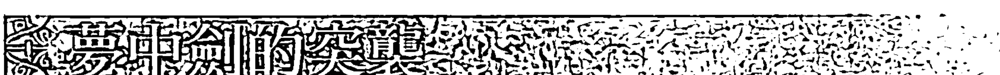

夢中劍對你意識心智的作用，如同第三章裡的漁夫魚鉤之於你的夢境心智。當難以捉摸的夢境視覺心像咬住魚鉤時，你的意識心智就會抓住它，並將它拉進意識全然清醒的狀態，好在記憶或夢的日記中修補。

夢中劍是怎麼發揮作用的？根據夢境世界法則（放鬆），這把劍往後躺平，像水面一樣平（逆轉、反轉、倒轉），並提供它光亮如鏡的表面讓你凝視（鏡像）。在你凝視它水一般的鏡面那一瞬間，你在尋找的視覺心像就會被猛推向你，其真相如此樸素、未經修飾，如同一把劍那麼銳利。

請注意，你遇見的視覺心像是往內觀看獲得的回應，所以它屬於你，是「你的視覺心像」。這個圖像所在的內在世界可能會給你一個有你臉孔的畫面，但也可能提供任何一種該內在世界在感官上的顯化，例如聲音、氣味、觸感、味道、看得見的形狀，或以上感覺的任意組合。下一瞬間，在你覺察到它之後，你當然可以抹除或改變這個視覺心像，來迎合你的虛榮心或期待。但如果你這麼做，就是冒著脫軌至幻想世界的危險，而非留在你尋找真相的主要軌道上。

因為真相在第一次相遇時便已揭露，就像一個掀開盒蓋就跳出來的玩偶，在你最預計不到的時候出現到你面前，試圖把玩偶壓回盒子裡不會改變這個事實。你已經「看見」，真相的種子已在你之內孕育。

這把夢中劍就是你的真相，它像個優秀的決鬥者，利用突襲讓你措手不及，攻擊你最脆弱之處，一擊中的！一瞬間，一切都變了，你已經被劍擊中。也許你的夢境視覺心像用另一個你來面對你，一個比你想要相信的更小氣或更有罪的你；或者，也許你在夢中獲得某個你一直想要解決的問題的答案，但這答案卻與你想聽見的不一樣。

一旦將感官轉向內在，你的真相就會如同鏡子反射般回視你。真相帶來的衝擊有時太令人震驚，你會覺得好像心臟被刺了一刀，但有時又太過「低調」，以致你一開始沒留意它造成的傷口。然後，我們將這種暗示稱為「直覺」或「內在聲音」。

無論如何，你覺得你能逃避你的真相如此清楚明白的洞見嗎？你可以不承認它在最初那一瞬間提供給你的訊息，或者，你可以说服自己你沒有真正「看見」。這樣做很簡單，因為就像所有夢的片段，這個訊息不會停留太久。它一定要在那短暫的瞬間成功讓你留下深刻「印象」，如果不這麼做，它不是會讓你充滿某種不安的感覺，覺得好像有什麼是你該留意的，不然就是會從你的意識中融化、消失。

你可以再次注視，希望獲得不同的訊息，但是夢非常了解它的提問者，同一個問題問兩次，就會讓它變得很狡猾。如果你這麼做，它很可能會提供一個滿足你幻想的畫面。最終，你總是可以回頭更改或操控那個視覺心像，以迎合你對自己不真實的設想，畢竟你是造出這個夢的人，無論願不願意，你都是夢的故事的創造者，即使你扭曲了這個夢，這些扭曲都有你的特徵。在鏡面上呈現在你眼前的每一個模式都是你。

然而，拒絕來自這面鏡子的第一印象，會讓這個過程更加費力。你另外選擇的幻想畫面會將你捲離你的真相，進入與真相相反的死胡同裡。最後，你不得不以許多痛苦、努力與時間為代價來解開真相，還要加上懊悔——早知道一開始就應該傾聽自己的「內在聲音」。夢中劍的突襲是逃不掉的，早晚而已。

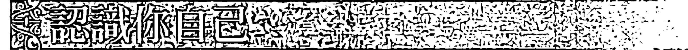

真相對我們最有好處，但同時，它也是危險之物，很少人能夠沉著應對、處理。只有年輕小伙子、傻瓜或想成為英雄的人，才會接受守護睡夢湖與湖中女神的黑騎士的挑戰，因為他們夠魯莽或膽子夠大，想要將那層紗撕成碎片。

與黑騎士對戰，就是冒著被他捍衛的洞見擊倒的危險。有個例子可以用來說明這一點：電影《星際大戰》中的天行者路克在砍下黑暗敵人的頭之後，驚恐地發現與他面對面的，是他自己。

另一個例子是希臘神話中的柏修斯。他比天行者更有智慧，因為他應用眾神的指示，在砍下美杜莎的頭之前並沒有直視她致命的臉，也因此得以避免被令人盲目的真相——關於他自身「醜惡」的真相——變成石頭。

砍下美杜莎的頭之後，柏修斯把頭丟進一個黑色袋子裡，因而遮蓋她令人畏懼的美。柏修斯與真相玩捉迷藏，就像亞當和夏娃嘗過善惡之果後，與上帝玩捉迷藏一樣。因為真相對我們而言如同那顆有名的果實，既善且惡，必須小心處理。

黑色袋子、黑騎士、睡眠、遺忘之境、我們的盲目……就像在遭喪之家蓋住鏡子的一塊黑布，湖中女神令人生畏的守護者也保護著我們，保護我們遠離太驚人、太痛苦、太可怕的真相。有誰想要在沒有某種形式的保護之下，掀開自己的盲目之紗呢？

我們必須一層一層地走向真相。如同《塔木德經》裡的一個故事告訴我們的，如果一夜之間就將洋蔥剝至核心處，第二天早上我們就會死去。沒有人在突然直視神的臉之後還能活著（我們是依照神的形象所造）。那麼，我們要如何訓練自己帶著對我們的脆弱與自我價值的敬意，慢慢地、小心地、一層一層地把皮剝開？我們要如何與真相為友？

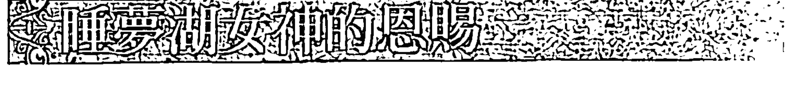

雖然真相在我們看來有些嚇人、可怕、邪惡，或是好得太不真實，但只有在我們眼中是如此。所謂真相就是如其所是，既非善、亦非惡，只是我們內在世界的一個鏡像反射。真相不是我們的敵人，只有在欲望、期待、虛榮與恐懼過多的情況下，它幼稚的任性會遮住鏡子讓我們看不到，並扭曲其中的真實影像。

湖中女神顯然希望我們一切安好。她的領土是畢納（Binah），卡巴拉生命之樹上的第三個圓球，是理解力、洞察力的領域。這可能讓我們有點驚訝，因為我們總是將女性與所有甜美、溫柔、充滿愛的事物聯想在一起，理解力或洞察力聽起來有點疏遠、冷靜、衡量的意味。就是在女神賜予的洞察力之中，這把夢中劍的力量被釋放出來。不過，她沒有讓這把劍帶給我們侵略性的挑戰，這把劍是個恩賜，無論我們是否依然未經考驗，以致無法認出它是恩賜。當我們準備好要接收時，真相對我們而言就會像甜美的蜜。

事實上，睡夢湖女神完全不是敵人，當英雄的劍在與黑騎士的搏鬥中斷成兩截，她把自己的劍給了他。而英雄必須穿越睡夢湖，才能獲得女神的雪白手臂為他舉起的寶劍。

「如果你變成湖、變成舉著劍的這隻手，你就能擁有我的寶劍。」女神似乎這樣說著。這是個詭計嗎？如果變成湖，他就會被吸入湖水的黑暗中。梅林——我們那個年輕、有想像力、可以「看見」的面向——總是站在一旁，好讓我們隨時有需要就可以找他商量。他告訴英雄一個很簡單的方法——一艘藏在水邊蘆葦叢裡的小船，小船的船身圓得像酒杯或環抱的手臂，這是來自睡夢湖女神的另一項恩賜。他要如何上船，然後在繭一般的船體包覆下，安全地划過這深不可測的水域？

很簡單！你現在已經知道夢境世界的相反特質，也知道「轉換」是什麼感覺，那麼，為何不藉由期待轉換、藉由有意識地轉換成睡眠的姿勢，來哄騙睡眠呢？在清醒與睡眠相遇的模糊地帶躺回床上，彷彿身在小船的船身裡，然後允許自己變成做夢那個人，並且在意識凝視著你的鏡子時，刻意以俯臥的姿勢觀看。

讓自己陷入做夢的身體姿勢：躺著、放鬆、眼睛閉上。想一想，與這相反的姿勢是直立、準備移動、眼睛張開。藉由刻意採取做夢的姿勢，你正在引誘那個意識清醒的自己回到夢境裡，就像你的母親在你還是個嬰兒時藉由她的觸摸、聲音與刺激，誘使夢境中的你進入意識清醒狀態。

此刻你依舊清醒著，就在你即將不知不覺進入夢鄉之前，看著你的意識像個漩渦般流進夢境中的你。處於主動接收的狀態中，你身為夢境中的你全然「知曉」你自己正在將它的開展過程忠實地反射回你的意識心智，這個開展過程就像老式錄音帶或錄影帶倒帶那樣，從這一刻倒回你早晨剛醒過來要面對日常世界那個起點（我用「知曉」這個詞是取用《聖經》所指的一種完全體現的經驗）。

當意識再度將自己灌注回你身上，請將自己視為每晚都將太陽吞進她黑暗懷中的天空女神努特的門徒，在她的黑暗中消滅一切非精華的事物，在篩子裡篩出白天經驗的金塊。透過這種方式，你哄騙自己脫離那個太過熟悉的「清醒的你」，回到女神懷中。你變成了正在觀察你的另一個自己，你的孿生兄弟。你對「清醒的你」的體驗，已經從原本那個分離、區別、客觀化、二元化的覺知，移動到一種體驗式、無所不包、自我接納、夢境式的知曉。

## 視覺心像練習

### 逆轉 / 倒轉 / 反轉

今晚在床上嘗試這個練習。關掉燈、躺下來、眼睛閉上、完全放鬆，同時看著自己放鬆。當你覺得非常沉重，或是輕盈到快要飄起來，開始用倒帶的方式看看你這一天是怎麼過的。觀察的時候，允許自己所見的一切沉澱下來，不帶判斷或評論，只要如其所是地認出它。關燈前你是否正在讀一本書？如果是，就看見自己在讀書，並認出伴隨閱讀而來的各種形式的念頭。上床前你刷牙了嗎？開始倒帶：上床、離開浴室、刷牙。辨認所有伴隨刷牙而來的感官覺受與念頭形式。以這種方式往回走過你這一整天的活動。當你來到你和青春期的兒子（或妻子、老闆……）在樓梯上發生的衝突，此時的你不再處於與他衝突的狀態，你（夢境世界的你）正從外面觀看你與他的互動。為了充分理解逆轉與轉換位置在體驗上的價值，請善用夢境世界的自由。想像你往前踩進與你衝突的那個人的鞋子裡，站在他所處的確切地理位置。現在你可以從他的角度看見你自己。此刻，他／你變成你夢境世界中的鏡子，你能從他的觀點看見你的外表、移動的樣子、行為舉止，以及他聽到你說話時的感受。

你以前從來沒有這樣看過自己，因為你太忙於做你自己，那個清醒的你，異常執著於對這世界呈現一個一成不變的身分。現在，你讓夢境世界中那個自由且腳步輕盈的你來引導，能夠移動到任何想去的地方，以獲得一個來自真相、更好的反射。

你用這種方式體驗真相，而非評判它。在體驗的過程中，這段經驗最值得被學習的精華將沉入你的內在，讓你留下印象。我們把這個練習叫作「逆轉」或「良知倒轉檢驗」，它會帶來卡巴拉學家所謂的「曲瓦」（希伯來文 Tshuva），這個詞經常被翻譯為「悔悟」「懺悔」，但它真正的意思其實是「轉向」離開，讓我們因此擁有全新的視角、觀點。

現在告訴我，一旦嘗試過，手持夢中劍不是比被它造成的傷害震驚折磨簡單得多嗎？傳說故事告訴我們，拿起夢中劍並配戴其劍鞘的英雄，將獲得另一個不可輕忽的恩賜：他的傷口再也不會流血。既然他正處於夢境狀態，便能如其所是地體驗真相。他已經學會用「超脫」來「看見」，這個超脫是距離與來自另一個世界的觀點可以給他的。

不過，「超脫」這個舉動通常不是被視為一種理智方面的演練，也就是意識讓自己保持距離與客觀化的能力嗎？步出黑暗帶來的主觀、全感知的體驗，踏進光中，是一種太陽神阿波羅

The request was rejected because it was considered high risk

如果客觀地接近神話世界，我們會遇見一大堆矛盾、牽強的故事。例如，一個理性的人對希臘眾神最溫和的看法，大概就是他們都很善變。某一刻，他們化身全能、美麗、高貴、公正的不朽之軀，下一刻卻變成說謊、詭計多端、嫉妒、惡毒、伺機報復的人。

以月亮女神赫卡蒂為例，古人認為她是隱藏的女神，但她也可以顯現為「狄蜜特」，也就是光芒四射的豐收女神及萬物之母（漸盈月），以及狄蜜特的寶貝女兒——少女神「柏瑟芬妮」（新月）。而當少女柏瑟芬妮被她的伯父——冥王黑帝斯——強姦並擄走時（就像狄蜜特被黑帝斯的弟弟天神宙斯強暴），赫卡蒂也會變成「柏瑟芬妮的影子」，也就是冥后的夥伴（漸虧月）。

但對古人來說，赫卡蒂也是「阿特蜜絲」（散發光芒的滿月，一個極度自由、純潔的處女），同時還是蛇髮女妖「美杜莎」。赫卡蒂如月亮般皎潔光滑的美麗面容，將人類全然的真相反射回去給他們，而看見這個真相，人類便石化了。如同第五章提過的，人必須對真相採取預防措施，而柏修斯在利用他光亮如鏡的盾牌砍下美杜莎的頭時，想必也是這樣做，確保自己沒有直視美杜莎。（柏修斯殺死美杜莎時，可能是冥王黑帝斯，因為他戴著隱形帽；然而當赫卡蒂〔Hecate〕是柏瑟芬妮〔Persephone〕時，她融合了「柏修斯」〔Perseus〕這個名字，「她被柏修斯所殺」。）

當赫卡蒂成為豐收女神狄蜜特，為了失去女兒柏瑟芬妮而復仇時，她讓整個大地變得貧瘠荒蕪——或許因為這個事實，她也被認為是報應女神涅墨西絲！月亮、母親、女兒、妻子？萬物之母與冥界之后？光芒四射、寬大、無情、毫不寬容、滿懷仇恨的不朽之軀，同時也是受害的孩子？哪個才是她？赫卡蒂究竟是誰？

這些故事充滿激情，也擁有顛覆理性的力量，如果訴諸冷靜的合理性，也只用冷靜合理的方式應對，只會遭受挫折。既然已經走了這麼遠，你能否在此暫時停止評斷，信任自己可以在這些故事的明顯矛盾中找到其中隱藏的意義，就像一個有著許多切割面的寶石？

利用下面的類比幫助你理解這些矛盾。想像一朵紅玫瑰插在一個水晶花瓶裡，從你站的地方可以看到花的其中一面，花瓣已經盛開，有些花瓣的邊緣甚至開始枯萎了。你也看見兩片葉子及另一片正要冒出來的葉子藏在花瓶的另一面，以及花瓶的水裡有一枝長了三根刺的強健花梗。把看到的這一面命名為「狄蜜特」。

想要看見玫瑰花的另一面，你必須將花瓶轉過來，或者走到另一邊。在這裡，你看到花瓣尚未完全盛開，也只看得見一片葉子。將這一面命名為「柏瑟芬妮」。

你是不是覺得，因為你已經看過這朵玫瑰的兩面，就是看見它的全部了呢？我不這麼認為！你還必須從它的左邊（美杜莎）、右邊（涅墨西絲）、上方（阿特蜜絲）及下方（赫卡蒂）來查看，以掌握不同的角度與觀點。

然而，你尚未在玫瑰的瞬時性中抓住它，你尚未掌握它的精髓。突然間，一陣香味撲鼻而來，有那麼一個美好的片刻，你體驗到了玫瑰，你變成了玫瑰，你就是玫瑰！女神的眾多面孔在那一刻聚集在一起。

你用一種非常親密的方式了解她，此刻她顯化的不同面向都融合在她的存在中，因為你正藉由她的香味體驗她的全部，彷彿你就在她之內。這毫無矛盾，只有在你跳脫出去時，矛盾才會出現。

很不幸地，我們一直被教導要跳脫出來並置身事外，而且也這麼教我們的孩子。客觀性是我們的信條，能夠辨別、區分、研究一件事物的每個面向，讓我們自豪。

試著描述你剛剛看見的玫瑰所有不同的特徵，這絕非易事，你可能八十年後還在嘗試描述。當然，在這過程中，你或許會變成玫瑰專家，而你鉅細靡遺的觀察將使所有人受益，我們會以前所未有的方式了解玫瑰。但是，在這過程中，你是否變得過度專注於特定面向？你是否失去了玫瑰？

我們能否再度教育自己憶起，對獲得知識這件事來說，體驗與推理及邏輯應用能力同樣有效？

很久很久以前，在大洪水清除這世界的惡人與偶像崇拜後，「那時，天下人只有一種語言，且擁有共同的目標①」（〈創世記〉11:1）。但人類對於享有和平的統一狀態並不滿足，因為擔心失去它，人類決定建造一座城和一座塔，塔頂通天，「為要傳揚我們的名，免得我們分散在全地上」（〈創世記〉11:4）。

「命名」這件事一出現，正在建塔的男人女人都變得很困惑。他們說出的話開始變得模糊不清，彼此無法溝通，而原本建塔的崇高目的——直接與神連繫——也在不同的「命名」與描述的多樣性中被遺忘。

那個謎樣的第一種語言是什麼？它是否真的在時間的迷霧中，與巴別塔一起消失了？或者，它依舊存在，只是被我們集體潛意識的迷霧遮蔽了？

強調「命名」是人類祖先分散各地的原因，暗示著當時那個唯一的語言與我們現在使用的眾多語言非常不同，而且事實上，那個語言並未使用文字。

當我們被告知這些人有共同的目標時，這就是一個線索：這個共同目標是什麼？你可以想想，所有人都渴望什麼？快樂，當然，還有善、愛與和平。那麼，我們原始的「一種語言」，有沒有可能是心的語言？

我們要如何學會解讀神話、童話、宗教神聖文本或儀式祭典中那些引領我們回到本源的神聖符號？還記得進入天堂的四位拉比的故事嗎？他們是如何做的？我們發現，「天堂」（paradise）這個字（希伯來文為 pardes，意為「花園」）提供了解碼的鑰匙。

這四位拉比為了進入伊甸園，必須經歷「PRDS」四個字母（希伯來文的書寫形式中不存在母音字母，所以希伯來文的 pardes 寫成 PRDS），而這四個字母代表解讀一個文本的四個層次。

第一個層次「P」來自希伯來文 pshat 這個字，代表故事或神話的字面意義。在這裡，我們可以遵照敘事的邏輯，每個文句引導至另一文句的順序是不言自明的。在這個層次，我們唯一在乎的是故事內容能夠清楚簡單地呈現：

> 有一天，柏瑟芬妮跑進綠草原摘花時，與母親及看顧她的仙女走散了。此時，地面突然裂開來，從裂開的縫隙跑上來一輛由黑色馬兒拉著的黑色馬車，駕馭馬匹韁繩的是令人生畏的冥王黑帝斯。他抓住這個嚇壞的女孩，鞭策馬兒轉身，再度跳進地裡。
——《多萊爾的希臘神話書》

這個故事有一個敘事邏輯與移動，兩者都讓人著迷，也給我們初步的線索踏上回歸本源的路。若要找到更深的內容，只須按照故事提供的線索走即可。

第二個層次「R」來自希伯來文的 remez，代表的是故事的寓意或結構層次。在這裡，我們關注的是字裡行間的弦外之音，例如模式、相似性、對稱結構、成群出現的圖像、鏡像、逆轉或反向的狀況，以及故事中的移動。只有當我們從故事的線性敘事中後退一步，或者超越其上，彷彿從星星上的制高點來凝視時，才能看見這些弦外之音。像眾神一樣從高處觀看時，我們可以替這個故事畫一張天氣圖，有街道、旋轉、螺旋及漩渦的箭頭，這些最終會將我們捲入它的中心點。

例如，赫卡蒂從天堂墜落，以及柏瑟芬妮墜入冥府，我們注意到兩者的相似性：母親與女兒都被強暴。而出現的模式是：柏瑟芬妮嘴裡的種子（她在冥府吃下石榴種子，這是她每年總是必須回到冥府的原因），類似於赫卡蒂身處洞穴中。兩個圖像同樣有子宮般的結構與橢圓形的主題——洞穴是橢圓形的，種子也是。

還有許多成群出現的圖像，例如月亮、母親、女兒等，而藉由對故事流動方向的理解，以及其中模式的互動，我們對主導想像力移動的法則開始有概念。學習這些法則時，我們可以變成積極的參與者，貢獻有創意的方向與推動力，好讓自己往回歸本源的方向移動。

第三個層次「D」來自希伯來文的 drash，經常被翻譯成「釋義」，但它其實是「詢問」之意。詢問暗示著某種匱乏、某個遺失的環節、某種難以理解的連結，這些都呼喚著我們去問問題。例如，為什麼赫卡蒂與柏瑟芬妮兩人都墜落？

如果你給那個問題一個清醒的標準答案，這個答案來自你的心智或外界，最後你會發現這就是所謂的「釋義」「解釋」。但請把釋義忘了，這裡不需要它，drash 在提出問題時，就已經給了我們所需要的，而且為了讓問題能夠獲得適當的回答，我們必須暫時不管它，將之懸在虛空之上，就像長長的釣魚線尾端那個魚鉤上的魚餌。

第四個層次「S」來自希伯來文的 sod，代表奧祕或本源。當受到震驚、刺激，或是變得激動時，它就會像一條滑溜發光的魚，翻轉跳起、咬住魚餌！它來回應我們的問題。問題的力量引發它出現來刺激虛空，而它的出現創造了新的神話。

記住這四個層次，我們來簡短地「重新想像」柏瑟芬妮的故事。故事的內容（P，第一層次）只不過是敘事，而當地面裂開，夢行者發現自己像柏瑟芬妮一樣位於一個裂開的大洞邊緣時，推動力（R，第二層次）就會出現。然後，夢行者那個發問的自我將他自己推進洞裡（D，第三層次），觸及底部，使本源震驚得開始活動（S，第四層次），激發想像力去回應。

因此，就像柏瑟芬妮或拉比阿齊巴（他是四位拉比中唯一成功進入伊甸園並歸來的人），當夢行者再度出現時，經歷過一種完全不同組態（D，第三層次）的他成了一個已經提升且轉化的人（S，第四層次）。

我們能否像拉比阿齊巴一樣成功地練習進出伊甸園？我們能否考慮到未來，預先主動自我教育、讓自己做好準備，以承擔越來越多任務，而不是讓自己人生故事的情節支配我們，被動地等待喜悅、打擊與功課自己來到我們生命中？我們有沒有可能加快這個提升與轉化的過程？

如果答案是肯定的，我們實際上該如何啟動本源，激發我們重生的想像力進入生命中，開始重新發現那個難以捉摸、原始的、源自心的語言？我們該如何有意識地進入本源？

## 練習全然投入地去體驗

我即將描述的修練法門具有悠久的家族傳承歷史，其最著名的代表與最有可能的鼻祖是十三世紀法國普羅旺斯地區的卡巴拉學家艾賽克瞎子，而我的老師柯列女士即是艾賽克瞎子的直系後代。除了保留其根源，她也以獨特的方式讓這個歷史悠久的修練法更符合現代需求，並適用於各種不同宗教信仰的人。

這項修練法運用的法則，所有神聖傳承追隨者都很熟悉，最主要是因為這些法則對圖像心智來說是共通的。我會描述這些法則，讓你了解建構你將會用到的「視覺心像引導式練習」背後的「科學」。

為了產生效用，這些引導式練習必須將 PRDS 四層次固有的至少一個法則安排在其中。了解這些法則有多精確是很重要的。你也許知道，帶領個人或團體在心智中看見視覺圖像是很普遍的修練方式，這甚至已經是一些嚴肅醫學研究的主題。然而，跟視覺化／觀想過程最終能夠達成的結果相比，它在呈現過程中的真實力量往往被輕視或忽略。人們在練習時經常停留在最基本的第一層次（P 層次，pshat），而如同前面所言，這裡只是事物最字面、最表面的層次。

幾世紀以來，基督教世界中十分有影響力的教團耶穌會的教士，被訓練在第一層次（pshat）以仿效耶穌基督的方式進行靈性修練。我當然不反對第一層次的練習，但其他層次的法則也必須啟動，以充分運用一個人充滿創意的想像力。

為了刺激你，一個小小的驚嚇或衝擊是必要的。除非感受到內在張力，否則你無法進入本源的瞬時性中，你的視覺化過程也無法帶你到任何地方。你或許會擁有某種愉快的體驗，卻無法經歷轉化。

我描述的這種內在張力，會讓你在練習時完全沉浸在感官體驗中。你應該曾在人生的某個時候經歷愛或悲傷的感覺，因此你可以證明這個事實：當這些感覺在你之內活躍時，你的整個自我會全然投入。

當你被某個視覺心像練習的描述文字適當衝擊，而更深入地體驗生活時，你的整個自我也應該這樣全然投入。藉由體現這個練習，你改變了你跟自己、跟世界的關係。因此我們可以說，你在充分練習這些視覺心像引導式練習時，事實上是在練習一種身體語言。

把這個拿來跟瑜伽姿勢呈現的方式比較，會讓你更明白我的意思。瑜伽學生必須在感覺到自己的身體正呈現某個姿勢的同時，有意識地在腦海裡形成那個姿勢的視覺圖像（例如腳往下推以伸展脊椎）。視覺心像引導式練習的學生正是以一模一樣的方式，藉由身體來感受他將練習的描述文字轉成強而有力且具建構性的視覺心像時，會發生些什麼。

事實上，你的身體真正了解且會給予回應的唯一語言，就是視覺心像。因此，支配任何身體工作（例如瑜伽）的法則，與支配視覺心像運作的法則是一樣的。你不必等待生命中的困境來刺激你動起來，相反地，你可以像個優秀的運動選手一樣，練習處在某種運動狀態，以增加你的靈活度，來適應或轉化任何特定情況。做視覺心像引導式練習時，你是在刻意啟動不同的「體」（肉體、情緒體、心智體、靈性體）。

每個視覺心像引導式練習所花的時間大約都在一分鐘之內，跟第五章的練習不太一樣。但就像第五章那些練習，引導式練習也透過戲劇化的方式幫助我們處理日常生活中的問題。如同「逆轉」練習在過去通常由限制性習慣支配的情境中將選擇的自由帶回給我們，視覺心像引導式練習也釋放了我們，讓我們可以冷靜面對無法避免的改變，無論這個改變有多激烈。

經由練習進入自己的本源，我們靈活地移動著，並且很熟悉某種我們過去近乎自動抗拒的體驗。現在我們可以醒過來，並強化內外一致的體驗，如同瑜伽學生一樣，藉由練習腳往下推的姿勢，誘使自己的身體回憶起內外一致的感受。

當生活中的困境讓我們失去平衡時，藉由這些練習，我們會親密地知道那個內外一致的感受，並因此得以流暢而快速地重新調整。我們兩腳踩在地面，伸展脊椎，毫不遲疑地冷靜找回自己的平衡。

進入視覺心像引導式練習前，讓我簡短說明一些你在開始做的時候需要知道的重點。做這些練習時，你應該選擇安靜的時間與空間，然後坐在扶手椅上，手臂自然地放在椅子扶手，雙腳放鬆、不要交叉。唸出練習的內容，然後閉上眼睛，慢慢地深呼吸三次，從 3 倒數到 1，並在你的內在視覺中看到這幾個數字，最後看見數字 1 呈現出高大、清澈、非常挺直的樣子。現在，繼續「感受、看見、感覺、體驗」這些練習。不要去「思考」描述練習的實際文字，而是嘗試運用你所有的感官，透過視覺心像去體驗。

你應該會獲得顏色鮮明的三維圖像作爲回報。而完成練習時，就可以呼一口氣，然後把眼睛睜開。記住，如果只是去讀，或是在心智中解構，視覺心像引導式練習看起來可能很老套；但如果是去體驗，就完全是另一回事了。

當你真正臨在於練習中時，不只你的心智，你的整個存在也會投入那個過程。就像我們先前提過的，這些練習是設計來讓你因爲受到震驚或衝擊而移動。要能夠引起那樣的震驚，當然是種挑戰，而設計練習的藝術正是那個挑戰的答案。有效地運用法則就能讓這件事發生，我稱之爲該練習的策略。

我選擇放在本書的都是簡單的練習，你自己做也很安全。如果練習時體驗到的東西讓你覺得困擾、心神不寧，無論什麼原因，都請毫不猶豫地去尋求協助。練習產生的所有回應都有潛在的爆發性，因爲這些練習就是設計來揭露真正的你。

第三章裡提供了一些協助，教你如何面對與處理惡夢及難熬的夢境視覺心像，這裡也一樣。請回應顯現的視覺心像的「必要性」，更重要的是，記得帶著「遊戲」的心態！

我不會列出支配這些練習的所有法則，但會繼續運用我們在本章稍早提及的柏瑟芬妮的故事中遇到的幾個法則。你會明白每個法則如何主導它之下的整組練習，而且雖然這一組一組的練習是爲了說明每一個法則，但四個層次也會盡可能應用在本章所有的練習中。

## 第一個法則：模仿

在第一個層次（pshat），也就是故事情節中，刻著**模仿法則**。驚訝嗎？模仿是我們第一個全神貫注的活動，嬰兒時期，我們學到、知道的一切，都是從模仿父母和兄弟姊妹而來。之後，我們也從聽到的故事中學習，藉由想像自己是屠龍的王子或愛上野獸的美女等角色來模仿。我們體驗到野獸的恐懼、勇氣與勝利的喜悅，或是美女正在萌芽的愛與憐憫，並覺得那是自己的感受。我們從中學習。

這個自然且必要的衝動可能永遠不會完全停止。如果沒有某些角色作榜樣——無論是正面或負面榜樣，例如老師、明星、心靈導師、英雄、聖人或神——又有什麼好努力的？我們運用想像能力突破界限並融合，讓自己沉浸在我們景仰的那個人的實相中。

實行這個模仿法則的方法有兩種：跟著故事情節的引導，或者完全變成另一個人。記住，在視覺心像的領域中，你的性別、種族和信仰都不重要，想像力是流動（且平等）的，你可以很容易地想像自己是男人、女人、野獸、植物、石頭、空氣、天使等。

〈美女與野獸〉這個故事提供了一個故事情節，讓我們在此應用。故事一開始，美女的父親失去家產，接著他聽說他擁有的其中一艘船倖存下來，並且很快就會入港。在離開他們鄉下的房子去調查這個傳言之前，他問三個女兒希望他用賣掉船上貨物所得的錢買什麼禮物給她們。

大女兒和二女兒都想要昂貴的珠寶與華服，美女卻理所當然地擔心他們的財富或許不會回來，於是她說，既然他們的新家沒有玫瑰花，而她很思念玫瑰，所以她只要一朵玫瑰花，其他什麼都不要。

後來，她父親變得比出發前更窮困，而且返家途中在森林裡迷了路。正在尋找走出森林的路時，他發現了野獸空無一人的魔法城堡與它美麗的花園。他看見花園裡有一朵玫瑰，便毫不猶豫地摘下，這個舉動讓野獸立刻從隱藏處現身，並帶著令人害怕的怒氣。

野獸果真是個怪物，他要求這位父親必須以自己的一個女兒來補償他偷竊玫瑰的行為。而美女不僅貌美，還很善良，她是三個女兒中唯一願意做出犧牲，離開熟悉、安全的家園，去跟那個非常奇怪且可怕的野獸同住的人。

## 視覺心像練習

### 引導式練習 1（模仿 1）

深呼吸三次，想像你如同故事中的美女，必須離家，離開那些愛你的人提供的保護。你有什麼樣的感受（身體的或情緒的）？

## 視覺心像練習

### ✦引導式練習 2（模仿 2）

深呼吸一次，想像自己是故事中的美女，第一次在野獸那奇怪的花園中散步，發現他的玫瑰花叢。慢慢地深呼吸一次。當你在玫瑰花叢那一朵完美的玫瑰花上嗅聞它的氣味時，你感覺到什麼、看到什麼？

在第二個層次（remez），也就是結構中，隱藏著移動法則。移動有非常多類型，我們從歸在「方向性」這個主題之下的開始。在〈美女與野獸〉的故事中，父親因為走錯方向，導致他自己的人生，以及美女與野獸的人生永遠改變了。往上或往下、往左或往右、倒退或前進，會產生不同的結果，我們能明確指出來嗎？

探索全部六個方向，不但能讓夢行者行使這些可能性，還可以發現它們的特質。假設你在家面對一個複雜的情境，探索六個方向也許能幫助你發現許多為你運作的動態。

## 視覺心像練習

### ✦ 引導式練習 3（方向性）

深呼吸一次，像故事中的美女一樣，在離開家很長一段時間之後，再度回到父親的房子裡，用你的感官去感受、去看、去感覺。回家時你是走哪個方向（往右、往左、直走、向前、向後、往上、往下）？慢慢地深呼吸一次。剛抵達時，你看到的是什麼？你有什麼感覺？

## 視覺心像練習

### ✦ 引導式練習 4（穿越 1）

深呼吸一次，想像自己是故事中的美女，正往下看進玫瑰花的中心。你能聞到它的氣味嗎？慢慢地深呼吸一次。你在玫瑰的中心看到什麼？發生了什麼事？

每一個方向的特質是什麼？推開「穿越」的一個個層次，會讓這些特質更清楚。往前推，打開下一扇門，再打開下一扇，也許最終會讓你看見並體驗到某樣新事物（例如你可以在另一條走廊的尾端打開另一扇門，看見沐浴在陽光下的美麗花園）。

沿著某個選定的方向一步一步往前推進，是一種移動的策略。想想看，對一個遭遇某種似乎找不到答案的複雜情境的人來說，這是多麼有用的策略啊。

## 視覺心像練習

### ✦ 引導式練習 5（穿越 2）

深呼吸一次，想像你正站在一扇上鎖的門前，手中握著一大串鑰匙。找出對應這道鎖的鑰匙，將鑰匙插入鎖中，轉動鑰匙，然後打開門。你看見了什麼？你做了什麼？慢慢地深呼吸一次。你是站在門檻那裡，還是穿越了門？

如果穿越的策略——在某個方向上往前推進——沒有打破模式，你會怎麼做？方向都是成對運作的，「上」與「下」一起作用（柏瑟芬妮墜落之後，再度升起），「右」則與「左」。

許多人偏好某個特定方向。假設你非常執著於打造自己的未來，從來沒有時間反思或回顧你的人生，你偏好的方向就是右邊（在視覺心像的領域裡，右邊代表未來）。或者，你總是尋求揚升至自己的肉體之外，進入心智或幻想世界——發現這種逃避痛苦與責任的方式對你而言比較自然，那麼你偏好的方向就是往上。

這兩種都是求生技巧，可能都是童年時期習得的，對現在的你也許已經不適用。持續探索一個方向，以致排除其他的，是一種貧乏。想要成爲真正的夢行者，就必須探索所有的方向。

假設某人總是嘮叨著自己的過往，這在視覺心像領域被轉譯爲左邊。因此，做某個將他帶往右邊——也就是未來——的練習，或許可以創造出一個足夠強大的移動，將他震驚得從對過去的執著中回過神來（當他被這個震驚事件刺激時，他的想像力會呈現一個出乎意料的新組態，讓他印象深刻到減弱或真正抹除他對往事的視覺心像的執迷不悟）。

恢復視覺心像左右軸線的流動性，將使一個人在所有方向移動的能力復活。這個爲了改變而採用的基本策略意味著轉向、走另一條路（這個叫作「曲瓦」的概念，我們在第五章討論過，是希伯來文的「悔悟」之意）。請認出這個轉向，或者轉換到另一極的概念是回歸法則。回歸有助於打破重複行爲，以體驗完全相反的觀點。

## 視覺心像練習

### 引導式練習 6（回歸）

深呼吸三次，在內在視覺中看見目前你與之相處困難的某個人。想像你跨出自己的身體，走向對方，進入他或她的身體。在這個身體裡是什麼感覺？覺得很開闊或很擁擠？暗或亮？平靜或躁動？這個人是The request was rejected because it was considered high risk

## 意圖與意志力之別

萬一男孩當初沒有抓住那個機會呢？萬一他當初因為恐懼而拒絕那個啟示的必要性呢？如果當初他沒買下那個門環呢？那麼，他就會像耶穌對才幹的比喻裡提到的其中一個僕人——那個僕人收下主人給他的三枚錢幣，然後為了安全的理由將錢幣埋到花園裡，硬幣是沒辦法結出果實的。

但儘管如此，這個預視景象的可能結果不斷地糾纏他，就像一個沒有根的靈魂。到了這個節骨眼，那位警覺性高的母親有正當理由這樣說：「不要把你的人生都夢走了！」因為如果你不努力將自己的夢變成物質實相，它就會恢復成一個幻想，一齣你想像力世界裡的沉悶的戲，一份罪惡感，一份悔恨。

那位母親能提出什麼樣的目標來代替她孩子的目標？也許是財務安全、社會地位、婚姻幸福、受歡迎，或是成為醫生、律師、明星，如同她自己夢想過要追求的事物。這些目標看起來非常有正當性，除了一個很明顯的事實：那是別人的目標。這些目標的動力來源是母親自己的夢想、欲望和恐懼。孩子也有可能嚮往這些目標，因為他或她有野心、好勝、善妒、容易被動搖，或者因為孩子純粹想要滿足母親的需求。這些目標是透過排除或計算的心理過程，從外而來。

因為這些「忙碌夢境」（我們與自己所愛的人可能非常勤勞地促成這樣的夢）來自情緒與反應這個泥濘王國，我們稱為「意圖」的純粹火焰不在那裡驅策它們；相反地，是比較小的火焰控制了我們——不是那種強烈又純粹的目標之火，而是一種消耗性的火焰。我們被驅策著去控制環境，或強加自己的意志，或在目標真正可以被抓住前揮動著手嘗試抓取，或因崩潰而變得無能與絕望。

無論哪一種，這個過程對我們而言並不流暢、並不從容。

既然我們能任意使用的能量，是處於「反應狀態」（見人生藍圖表，第二章的圖 5），我們只能運用外力，來擊潰任何阻擋我們朝精心規畫的目標邁進的敵手。

這有什麼壞處呢？任性總比無動於衷好，成功總比不成功好。然而，在我們眼中擁有我們夢想的一切的成功人士，有多少人因為在他們眼中，自己的人生很失敗或毫無意義，而濫用藥物或自殺？否則該如何解釋他們的絕望？顯而易見的是，他們的夢是虛假的夢，被憤怒、野心、憎恨、嫉妒、懦弱驅動——這些情緒追趕著我們，企圖讓我們發狂。

想像你是個美式足球員，你拿到球，憤怒地衝破對手陣地，準備達陣。當你跨越得分線時，每個人都在歡呼，你覺得理所當然、充滿驕傲！你剛剛運用意志力突破激烈的抵抗，而且成功了。

現在想像不同的場景：你剛剛抓到球，然後在那一瞬間，它就這麼發生了！如同它「就這麼發生」在納布西身上，你縱身跳入本源之中，你「看見」自己不費吹灰之力就達陣了！彷彿被施了魔法一樣，歡呼聲消退得像大浪平息，整個體育場變得如此遙遠，敵隊和你，以及你的隊友都變成以慢動作移動，你對自己姿勢的從容與流暢性特別感到驚奇！

這一切發生時，永恆彷彿屬於你，然而在那個「看見」你自己達陣的瞬間，你已經達陣了，就像在夢中時刻。運動領域的人把這個現象稱為「化境」（the Zone）。有過這種體驗的運動員永遠不會忘記自己突然變成明星的那個大躍進，他們「看見」神性在運作：「真正的」預視景象將他們的極限轉化成勝利！

真正的預視景象來自我們的本源，而被真正的預視景象點燃的意圖則創造了「化境」。如果你從自己的本源取用你的意圖，然後跟隨之，一切都會變得從容、流暢、簡單。當一切變得複雜而困難時，你的夢已經脫軌了。你正在運用外力，試圖讓某件不該發生的事情發生，用這種方式使用自己的意志會令人筋疲力盡。

那麼，究竟什麼才是真正的預視景象？自從亞當與夏娃失去伊甸園之後，我們知道必須辛勤勞動以找出藏在塵世中的寶藏。我們每天都要經歷這一切——努力工作，忙著照顧孩子與年邁的雙親，不放棄陷入困境的人際關係，用全部的意志力、咬緊牙關，在這個嚴酷的世界載浮載沉。

如果我們還沒被賜予真正的預視景象，有什麼其他事是我們可以做的？不是每個人都像納布西一樣幸運。等等！這越來越複雜了，我已經可以聽見你的憤怒：為什麼是他，不是我？為什麼對他而言這麼容易，對我來說如此困難？為什麼他滿腔熱情，我卻筋疲力盡？只有找出什麼是真正的預視景象，你才能開始回答這些問題。但首先，我們知道它的存在嗎？

古老的傳說告訴我們，彩虹的盡頭埋藏著一甕黃金，如果敢去認領，它就是我們能繼承的財富。只有丟棄所有的「忙碌」夢境，勇敢踏上七重的彩虹之路，我們才能找到黃金，那個鍊金術石，找到本源。

## 視覺心像練習

### 彩虹

深呼吸三次，想像你正在攀爬一道巨大的弧形彩虹，在不同的顏色之間跳躍、嬉戲，紅、橙、黃、綠、藍、靛、紫。去感受每一種顏色如何在你身體上產生不同的感官覺受、不同的感覺。你可以替這些感覺命名嗎？接著慢慢地深呼吸一次，一路走到彩虹的盡頭，去尋找埋藏在那裡的寶藏。

踏上彩虹另一端的地面時，我們就到達「化境」了，化境的驅動力來自我們的本源，而本源的神秘與力量對我們來說浩瀚難測。它柔和又強烈的光放射出我們感覺光譜的所有色彩。記住，感覺不同於情緒，情緒是受阻的欲望、期待、主張等引發的反應，你可以參考人生藍圖表（圖5）來恢復記憶。我們在反應時，仍然處於對抗狀態，推撞或拉開距離，玩著「任性」的遊戲（參見第二章）。

但是當我們去感覺（愛、同情、美、力量、光彩、勇氣、勝利、喜悅、慈悲、正義等）時，我們往四面八方送出光與溫暖，就像彩虹盡頭那疊黃金或天上的太陽。我們閃閃發光，我們變成了星星。

彩虹盡頭的黃金並非只是給納布西繼承的財富，而是要給我們所有人的——這意味著包括你、我、補鍋匠、裁縫師、富人、窮人、黑人、白人。本源的一切都是光，沒有分別心。形體或形式還沒從中顯露，也尚未經由我們的抉擇顯化。就像《聖經》中的夢行者約瑟，我們都是最受寵的兒女，而我們的父親，也就是將生命之火吹入我們之內的大靈，讓我們穿上彩衣（我在這裡以約瑟為例，是因為男性代表我們內在主動、積極那一面。約瑟（Joseph）這個名字在希伯來文是「外加」「增加」的意思）。

我們必須拋棄所有的「忙碌」夢境，才能重新找回自己的繼承物：那另外一個兒子，也就是會被「外加」到我們與生俱來的天賦（想像力）之上的預視景象。

約瑟像梅林、也像「看見」世界裡的小幫手一樣年輕。他愛上自己的美，這應該不令人意外，因為夢境世界對夢行者而言是如此令人著迷。他做了一個夢，並且跟他的兄弟說了夢的內容：

「我們在田裡捆禾稼，我的捆起來站著，你們的捆來圍著我的捆下拜。」（《創世記》37:7）

約瑟怎麼可能沒有意識到他的話對兄弟們的影響？他是對自己的美好太自負，或者純粹是太天真？恰恰相反，就像夢境世界所有的小幫手一樣，約瑟是無邪的，他是如此想要確認兄弟們確實聽到他的夢境，以致用同樣的模式做了另一個夢，因而「外加」了侮辱到之前的傷害上。

「看哪，我又做了一夢，夢見太陽、月亮，與十一個星向我下拜。」（《創世記》37:9）可以想見，約瑟的兄弟被激怒，很生氣地罵他：「難道你真要作我們的王嗎？難道你真要管轄我們嗎？」約瑟的父親責備他，因為約瑟確實不必要地激怒了他與其他的兒子，但約瑟的父親卻「把這話存在心裡」，為什麼？

你有沒有辨認出其中的模式？約瑟是輪子的中心，他的兄弟、父親（太陽）、母親（月亮）則是輪幅，這是一個「感覺」的夢！它放射出星星般的光芒，將所有主要人物吸引過來。就像約瑟的父親沒辦法忘記兒子的夢，他的兄弟們也忘不掉。

確實，一個散發光芒的夢會讓人留下不可磨滅的印象，不只做夢的人（夢行者），所有聽見這個夢的人也是如此。這個夢在我們的心智中燃燒，令人無法忘懷。它會啟動一個新的預視景象，並使之持續運作，直到這個預視景象實現了自己，讓它的訊息在物質實相中顯化為止。實現之後，這個夢會進入我們最珍視的記憶的世界，或者變成神聖寓言、神話、傳說與童話故事的養分。

當本源被接通，且開始以夜夢的形式揭示它最基本而真實的結構，我們便把這樣的夢稱為「偉大夢境」，用以跟忙碌夢境區別。而當它出現在白天時，就像發生在那個阿拉伯男孩身上的情形一樣，我們稱之為「預言性視覺心像」。

偉大夢境（夜晚）或預言性視覺心像（白天）是唯一能夠創造意圖的夢境類型。在接近只有感覺可以生存與蓬勃發展的燦爛本源時，它們便會點燃意圖，使之移動。

白天突然出現一個強大的預視景象是很好的，這樣的事件令人震驚到足以讓自己相信它的真實性。但夜晚的夢？顯然約瑟認為他的夢很重要，必須告訴每個人！

事實上，他的夢以兩種不同的版本呈現，而且他甘冒激怒兄弟的風險，說了兩次！這麼討厭和嫉妒約瑟的兄弟是誰？現在你應該已經知道了，他們就是約瑟內在的其他部分，亦即由反應引發的情緒，它們在抗拒約瑟的預視景象。它們是我們的地球及天然居所（身體）的移動：我們的本能與欲望，我們的狂暴反應與困惑情緒，我們那些不想被意圖驅逐或移動的壞習慣。

這些匪徒像動物一樣撕毀我們的彩衣、將它的顏色混在一起，然後孕育了忙碌夢境。它們不想讓我們與偉大夢境有任何關連。面對如此困境，即使約瑟那樣的聖人都幾乎要屈服了。他的兄弟撕毀他的彩衣，將他丟進蛇坑裡，而且這樣似乎還不夠，他們甚至把他賣給以實瑪利人。

那麼，我們該如何認出自己的偉大夢境，並證明其為真？我們該如何辨識出偉大夢境已經來拜訪過我們了？或者，我們該如何誘出潛藏在自己之內的偉大夢境？

偉大夢境有什麼特徵？他們結構經典、色彩清晰、簡潔緊湊、景象美麗、帶有衝擊力，且一切簡單。偉大夢境就像好詩，我們信任它們；或者像一個好愛人，強壯、甜美、順從，卻又能激勵我們。偉大夢境像燈塔般照亮並指引我們，讓我們永遠無法忘記。

然而，我們卻像約瑟的兄弟一樣奮力想消滅偉大夢境。難道你不知道它們堅不可摧嗎？我們可以掩埋、扼殺、砍掉偉大夢境，但它們依舊會在最意想不到的時刻大放光芒。如果你覺得從來沒有偉大夢境來拜訪過你，你很可能錯了，在我們之內的本源從來沒有停止散發光芒。

以下提供一種能夠憶起偉大夢境的方法。

## 視覺心像練習

### 第一個記憶

深呼吸三次，回溯你的過去，回到你第一個快樂記憶。回想它，並且認真地經歷那個時刻，感受所有不可思議的細節與細微差別。慢慢地深呼吸一次，然後從那一刻往前穿越你的過去、回到現在，辨識出這個最初的快樂記憶如何燃起你的靈感，並驅動你的人生。

如果你沒辦法很快找到第一個快樂記憶，那麼可以嘗試下面這個練習。

## 視覺心像練習

### ✦ 面對自己的終極意圖

深呼吸三次，想像你看見自己處於生命的盡頭。什麼樣的一個人站在你面前？看進他（或她）的眼睛，在他眼裡蒐集他的成就、特質，以及他體現的本質。慢慢地深呼吸一次，去了解是什麼驅使這個人成為他現在的樣子，並且認出這個驅動力就是你在尋找的意圖。如果可能，為你的意圖命名。

不用擔心你的第一個記憶是否真實可信，或者只是一種「屏障記憶」（意指對某個事件的回憶，你可能是被告知那件事並回想起來，彷彿是個真實記憶，或者，那甚至可能是個從沒發生過的事件），因為無論哪一種，它都能夠變成你個人的神話，它對你產生的效力才是重要的。這兩個練習，不管是讓你想起第一個強烈的快樂「記憶」，或者讓時間往前快轉到生命的盡頭，都能藉由你存在的根本目的，讓你覺得煥然一新。兩個練習都要做，並請記住，是包含了強度與豐富性的預視景象點燃了意圖。

不過，單一個預視景象是否永遠有足夠的力量讓我們不斷前行？即使在我們很有自信，覺得已經辨識出人生的根本目的時，我們這一路上仍然需要不斷被提醒。我們可能需要更具體的指引。

你該如何將自己的旅程拆成許多部分，並且在你生命根本目的的大傘下，為旅程的每一個部分發展其特定意圖？這將是你的第九項任務。

## 第 8 章視覺心像練習快速指南

### P.202 彩虹：觸及本源

深呼吸三次，然後爬上彩虹，在每一個顏色間嬉戲。留意每個顏色在你身上喚起的感覺，並為每一種感覺命名。慢慢地深呼吸一次，走到彩虹的盡頭，去尋找埋藏在那裡的寶藏。

### P.206 第一個記憶：想起一個偉大夢境

深呼吸三次，回到你第一個快樂記憶。再慢慢地深呼吸一次，然後從那一刻往前穿越你的過去、回到現在，辨識出這個最初的快樂記憶如何燃起你的靈感，並驅動你的人生。

### P.207 面對自己的終極意圖

深呼吸三次，想像你看見自己處於生命的盡頭。什麼樣的一個人站在你面前？辨認自己的特質，並且去了解是什麼驅使你變成現在的樣子。想像這個驅動力就是你在尋找的意圖，並為它命名。

## 第9章 讓一切在你眼前揭露的清醒夢境

> 猶太聖哲對亞歷山大說：
> 「這是一個人類的眼球，它永遠不會滿足。」
> 《塔木德經》〈塔密德章〉32B

光的王子或公主能找到生命真正的目標是非常罕見的。我們應該從此過著幸福快樂的人生，再也不需要為生命而掙扎，這樣的快樂結局只發生在童話故事中。雖然看起來很傷感，但或許是件好事，因為陷入掙扎能夠讓我們維持健康，並促使我們進步。

如果我們能夠保持真誠，在旅程中無疑會遇到難解之結，一個看來無解的問題會激勵我們的意識心智，嘗試去解開、剖析或解構這個難解之結。當知識分子面對問題時，總是齜牙咧嘴帶著殺無赦的態度，通常這只會讓事情變得更糟而已，難解之結無法解開，答案也不會出現；就像作家會遇到靈感枯竭的腦閉塞狀態，或者愛人猶豫不敢做出承諾，或者學生在不同的職涯選擇間搖擺不定，或陷入某種僵局無法跳脫。

你現在應該已經知道，我們有兩種心智：邏輯心智與圖像心智。如果其中一種無法幫助你突破僵局，為什麼不試試另一種？

你有跳過探戈舞嗎？那是一種誘人的給予與接受的互動，充滿看似帶著敵意的步伐、形式與糾纏，兩個舞伴合體又分開，他帶領，她蠱惑。這舞蹈中有一種流暢、精心安排的應答模式，那是我希望你們能夠開始辨認的，它完美地示範了我們的意識心智與潛意識心智彼此的夥伴關係，兩者在交手互動之際，那個移動會消融掉舊有的模式，為生命創造出生氣勃勃的新路徑。那麼我們應該何時、該如何開始跳這個舞呢？

## 處理舉棋不定的階段

當事情無法如我們預期進行時，我們傾向去幻想其他人的成功人生，嫉妒他們輕而易舉獲得成功，卻不了解他們也經歷過人生的高低起伏。沒有人能夠免於這個存在於事物中絲毫不留情面的秩序之外，用《傳道書》的話來描述即「哭有時，笑有時」。

在你與你所嫉妒的人之間，唯一真正的區別只有時機而已，就像鳳凰一樣，牠們從自己的灰燼當中死而復生，而你到目前為止卻無法做到。即使你已經發現生命的真正目的、擁有無法計量的珍寶，你依舊必須面對掙扎糾結之事，那是在完成生命目的的過程中必定要經歷的。

此外，可以確定的是，這一路上你必須要面對處理人生無法避免的變幻莫測、不合理、不公正。或者你之所以覺得人生失敗的原因，可能是你正無所適從，處在旅程某個階段的尾聲，但現在還不確定該如何繼續走下去。

儘管約伯這個名字是代表人類的掙扎與苦難，但假如你讀完他完整的故事的話，會發現神的旨意是要讓他成為一個快樂的人，備受祝福且富足地擁有智慧、健康、妻子、兒女、土地、大群牲畜。

約伯的意識心智在他的審判當中是否對他有幫助？當然沒有任何的邏輯能夠抹除他的子女死亡所帶來的震驚。稍早時約伯曾經說過「我願與神理論」，但是當他苦難的遭遇持續時，沒有任何深思熟慮的爭論，能夠回答他的心碎悲慟。

我們的磨難也許不像約伯的故事那樣如史詩般經典，但是人或多或少都會遇到戲劇化的方式、沒有輸贏的情況、陷入僵局、走入荒原、空虛時刻或輕微失焦的憂鬱，在那些情況當中，邏輯似乎無法讓我們解脫。對於不斷出入這些情境，我們似乎能夠侃侃而談，卻沒有能力解決，我們猶豫、搪塞藉口、執迷不悟，我們沉迷於矛盾當中。

我們的問題變成了難解之結，越來越複雜難解，當我們嘗試用邏輯來解時，卻無法找到繩頭帶領我們進入。我們窮一己之力希望能夠從這些結當中找出道理，卻發現自己在優柔寡斷的泥沼中越陷越深。到底我們該如何讓自己從中解脫呢？

讓我們來聽聽亞歷山大大帝與原始的難解之結（哥帝安之結）的故事。故事是從一輛古老的戰車開始，它停在衛城哥帝姆裡的天神宙斯神殿圍牆之內已經有數百年的時間，哥帝姆是弗里吉亞古時的首都（也是安納托利亞中部的重要路口）。相傳神話中的國王麥達斯的父親哥帝安搭乘這輛老舊的木製馬車從馬其頓遷徙到此，他的到來實現了當地一個預言，他變成了這個城市的國王（從此之後這個城市就被稱為哥帝姆），也成為整個弗里吉亞的統治者。

為了表達對宙斯的感激，哥帝安將這個珍貴的古老馬車奉獻在宙斯神廟中，並打了一個巨大、複雜、複合的結，將馬車的軸連接到車輓上，後來就有預言流傳：能夠打開這個結的人，有天將會統治整個亞洲。

亞歷山大大帝在他對抗波斯帝國的知名戰役的第二年來到了哥帝姆城（這是在德爾菲的神諭使者預測新的二十歲馬其頓國王將在戰場上所向披靡之後的第三年），到目前為止，亞歷山大沒有辜負這個著名的預言，但是在那時所有的情勢與事件錯綜複雜，並一面倒地轉向不利於他的方向。

實際的情況是他用來支付軍隊薪餉的錢已將用罄，而波斯軍隊中一位在小亞細亞充滿活力的新任總司令，名為羅德的門農，是來自希臘的傭兵，他正因為跟隨在馬其頓主要軍隊之後而不斷獲勝。整個情況看來，亞歷山大很可能在短時間內被打敗，基於此亞歷山大最好是回頭往希臘走。然而，如果他這麼做的話，不就證明了德爾菲的神諭使者是錯的嗎？

這一大團糾結樹皮打成的結，立在一個重要的路口，在這個關鍵時刻對亞歷山大停滯的思緒來說，卻是一個絕佳的象徵。他會忽視這個結，實現驚人的預言（能夠打開這個結的人有天將會統治整個亞洲），而帶著軍隊回到希臘嗎？回到希臘畢竟是個理智的選擇。或者他會面對正在等待他的挑戰、就像面對那個結一樣？這個激進的做法似乎是許多人會想避免的。

當亞歷山大帶著軍隊一路到了衛城哥帝姆，有大批的馬其頓與弗里吉亞群眾跟隨。被殷殷期盼旁觀者包圍的亞歷山大，內心掙扎但無奈地看著這團如迷宮般糾結的繩子，沉思許久之後，這位年輕的國王一貫的自信似乎減弱，最後他放棄了。根據研究亞歷山大的歷史學家亞里安的描述：「他沉默地站在那沉思許久，但他無法找出解開這個結的方法。」

想像這個轉變：一位國王、一個征服者，充滿了英雄的魯莽憤怒，卻讓他的意識驅動力投降了。他選擇讓他批判的聲音沉默，讓小我謙虛，面對不可知的恐懼。他的偉大之處在於有勇氣承認這個關鍵的僵局：他的意識心智無法解決這個問題。很顯然地，「某些其他事情」應該要發生。

## 視覺心像練習

## 與你的不安共處

深呼吸三次，想像你自己就像亞歷山大，敢於與矛盾、不安或空虛共處，並去感受它。慢慢地深呼吸一次，允許自己縱身跳入表面的問題之下，進入一個開闊的空間。描述這個空間，你在裡面如何移動，以及有什麼正吸引著你？

當意識心智承認失敗，放棄努力解決問題，便產生空間讓情緒可以被感受到。這並不代表意識心智進入沉睡狀態，相反的是，它讓出了舞台中央，走到一旁讓自己處在觀察者的位置。

意識心智選擇暫停本能的判斷，好讓自然的驅力安靜下來，尋找解決方案。把這個意識心智的演練，當做是一種策略，一種讓意識心智自動去發揮找到脫身方法的竅門，正像是探戈雙人舞那樣，男性轉身離開讓出空間好讓舞伴綻放光采。

試試看：當你不再處於必須展現自己的壓力下時，你會看到矛盾不再用同樣的方式干擾你。允許自己去感受任何出現的情緒，承認自己的體驗，不管那意味著「我感覺到挫折與受辱」，或者「我同時愛兩個女人」，或者只是很簡單的「我不知道」。這能夠讓你沉浸在體驗的領域中，在潛意識的領域裡，看似對立的兩種傾向可以共存，就在這個矛盾的大鍋裡「某些其他事情」可以浮現出來。

你的心智現在自由了，不再受限於乏味的方法，像是行進、邏輯、線性等。心智可以任意跳躍、翻騰、關聯、發明、編寫或消融，那是你內在的女巫，就像孩子們放學一樣，突然爆發進入移動狀態，一開始是混亂的，這個移動很快就會形成某種模式、方向。就像突然從校舍往外衝的孩子，往不同方向奔跑，轉了幾個彎，最後看到他往森林深處走去時，在樹木之間穿梭著。

這種情況發生時，你心智中像亞歷山大的那部分是怎麼做的？它會用逐漸展露的驚奇觀察著。

> 我有一種感覺，我的船
已經觸礁，在下方深邃處，
撞上一個龐然大物。
但無事發生！無事……沉默……波浪……
無事發生！還是一切都已發生，
而我們正靜靜地，站在新生活裡？
——《海洋》胡安·拉蒙·希梅內斯

一種新生活出現了，與理性陳舊、沉悶、單調的生活相比，不同得令人難以置信，船沉在海洋底部，喔，這樣的暫停是種恩典！那孩子呢？他現在深入森林之中，彎腰嗅聞花香，與松鼠聊天，沐浴在大片灑落的陽光下，鳥兒在飛翔，樹木在風中搖擺沙沙作響，孩子唱起歌來。

奇怪的是，當你同時處在兩種心智狀態時，你既是意識心智，驚異於新的模式與方向的出現，你也同時是潛意識心智，在森林裡蹦跳嬉戲！同時是觀察者與參與者，這不就是個矛盾嗎？是的，但那只是體驗這個領域的重點！我們自己的兩個面向同時和平共處，這難道不值得你勇敢面對恐懼去探索嗎？

這是否有解決問題？詩人說：「一切都已發生」，但他只是個詩人，出了名的不切實際，我們該相信他嗎？亞歷山大依然必須解開那個哥帝安之結，讓我們來聽聽故事的結局。

亞歷山大在神廟廣場上靜靜地站在那個結之前沉思，四周傳來圍觀群眾的竊竊私語與打氣的鼓譟聲，接下來發生了什麼事，（研究他的歷史學家）亞里安說：「我沒有自信能斷言這情況。」

也許詩人知道的更多，如果我們留給自己餘地來重構發生在亞歷山大身上的事情，讓我們來揣測一下，在他的心智當中，他縱身躍入理性之下，到達「感覺」的領域。這在他光輝燦爛生涯剛開始時，已經發生過一次，當時他進入德爾菲一帶皮蒂雅洞穴的完全黑暗當中，為了藉由皮蒂雅的神諭說法，來讓自己遇見自己。

在這個內在聖堂中，亞歷山大被提醒一件事，皮蒂雅的聲音曾經告訴過他，他是所向無敵的，因為知曉了生命的目的，他感受到完全的安全感！這裡觸碰到了一種情緒，這情緒確實可以激勵亞歷山大：他充滿激情的野心想要實現人生的目的。他並非用理性來打開這個結，而是「看見」他應該應用什麼樣的意圖。超越了理性的冷冽火焰，以野心所燃起的熱火，觸發了一條簡單而清楚的路徑。

雖然我們不知道此刻亞歷山大被賜予什麼樣的視覺心像或聲音，但是我們知道，他突然抬起頭大喊：「我如何鬆開它又有什麼差別呢？」然後他突然拔出劍，奮力一砍，斬斷了哥帝安之結。斷開的亂繩紛紛落下，散布在通往亞洲的路上，之前面對哥帝安之結的人，沒有任何人想過要用這種方式打開，潛意識是個能夠大膽變革創新的心智！

在斬斷哥帝安之結後，亞歷山大再也沒有回頭，就在幾週之後，消息傳來他的敵人門農突然生病去世，馬其頓軍隊在靠近地中海東北角的琵納盧斯河戰勝波斯帝國大軍贏得重大戰役，這場勝利打開了一條路，讓亞歷山大藉由占領港口來將波斯海軍驅逐至戰場外；這也意味著從埃及開始，他現在已經能夠進入東方這個巨大寶庫。

你可能會問，這個我們揣測亞歷山大可能經歷的神諭般的「清醒夢境」與你在第七個任務當中進行的引導式練習有什麼不同？還記得引導式練習都是用一個界限範圍清楚的誘導開始的嗎？這裡的情況卻相反：一團糾纏物，沒有開頭與結尾，陷在一種非此即彼的矛盾情境中，一種無以名之的不安、空虛、絕望，或者單純地疑惑——下一步會是什麼？

在這種情況下，問題是：什麼才是真正的問題？清醒夢境所獲得的視覺心像並不精準。經由引導進入內在的本源，我們學習進行那些練習，但那是在圖像心智領域中一個開放式結局的探索。

然而，當來自意志的指令被消音之後，我們該如何去探索呢？有個現象值得去思索：就像我們的探戈舞伴，我們的兩種心智無法獨立運作卻又不造出我們所謂的難解之結，兩者都需要對方來扭轉各自的自然活動——意識心智必須退一步觀察，潛意識心智必須從隱藏之處現身。

我們把這稱為一種回饋圈：意識心智的「觀看」會激發潛意識的「開展」。如果沒有意識心智的眼睛，潛意識不但會維持隱藏狀態，還會保持不動、纏繞、打結的狀態。

是的，在潛意識當中有一個哥帝安之結，在我們的論述當中，它到目前為止依舊維持隱藏狀態。但現在被提出來討論，當我們「觀看」時，圖像心智領域會開始移動、開展、成形，就像花朵對著陽光的暖意綻放花瓣一樣。如同第一章討論的，這種現象是渾沌學家（研究渾沌與秩序的學者）所稱的「奇異吸引子」。

這正是為什麼我們要走出來的原因：充分地體驗，作為觀察的參與者，「秩序」便從渾沌中浮現。當我們讓開時，解放了潛意識的「渾沌」爆炸，從我們的觀看當中（就像從回饋圈中），會出現一種調節運動，這就是「觀看」（總是在搜尋某種模式）從潛意識心智中召喚而來的「秩序」。隨之而來的新生活將會有效地斬斷你的哥帝安之結。

有什麼事讓你感到衝突嗎？你正在艱難的處境當中嗎？你對於下一步要做什麼舉棋不定嗎？你只是單純地好奇自己是誰嗎？這有一個你能做的練習：

## 視覺心像練習

### 清醒夢境

深呼吸三次，想像你正站在一片草地上，開始看見並感受到在草地上所有一切，小草、花朵、昆蟲、樹木、其他動物、人、房子。抬頭看看天空，天空看起來是什麼樣子？相對於你的位置，太陽在哪裡？這是一天當中的什麼時刻？盡可能敏銳地去感受一切：小草、花朵的氣味，陽光照射的溫暖觸感，如果有的話微風吹拂的感覺，聽見蟲鳴、其他動物、風或各種聲音，如果有任何東西你想嚐嚐它的味道，就去品嚐，重要的是盡可能地在你感受五感的身體當中。慢慢地深呼吸一次。看看四周：有什麼東西吸引了你？你想走去哪裡嗎？讓自己隨心所欲地移動，你唯一要做的事就是感受與看見自己正在做的事情。慢慢地深呼吸一次。跟隨著這個移動（記得你同時正在觀看與參與）要帶領你去的任何地方，如果它帶你登上山丘，那就登上山丘；如果它帶你進入一間小木屋，那就進去。記得你正在探索，如果害怕的話，恐懼會讓你往後退、爬上一棵樹、找到強化的方式，或是乾脆停下來。但不要放棄探索，回到這個探索中，直到你能像詩人一樣說出「一切都已發生」，以及「我正靜靜地站在新生活裡」。當那發生時你會知道，因為你會感覺到滿意、滿足，並且準備好結束這個練習。慢慢地深呼吸一次，張開你的眼睛，記得讓自己感覺到腳踏實地，感覺到自己的腳底緊貼著地面，而你的身體坐在椅子裡。

剛剛發生的事你做了些什麼？用倒述的方式對自己大聲描述，然後立刻用順述的方式寫在清醒夢境筆記本上（這應該是單獨的一本筆記或檔案夾，是你專為這個目的準備的）。不要試著去解讀、詮釋你所看到的，而是很單純地活在那些畫面的當下，那就像女巫預言中的話語一樣，充滿能夠激勵你的力量。要有耐心，也許你無法像亞歷山大一樣鋒利地斬斷哥帝安之結，但也許你可以做到。

我們是否也應該否認潛意識的哥帝安之結的存在？那些突如其來、意料之外的潛意識心智爆發，那些無預期的震撼、令人不快的刺激，或者可愛淘氣的關連：砍斷你老闆的腳，用力把小孩丟入池塘裡，或者與你最好朋友的老公舌吻的喜悅，或者一把匕首插在你的心上。我們該拿這些視覺心像怎麼辦？還有那些重複發生的夢境視覺心像留給我們的無解或困擾的問題？

如果放任不管且不去探索，這些很快就會變成我們隱藏的哥帝安之結，也可稱之為壓抑的情緒，如同佛洛伊德學派學者的稱呼方式。但是我寧願去「看見」它們，就像花朵因為缺乏照顧而下垂一樣，我們可能很快就會有一座荒涼的花園、一片荒原。該如何去處理缺乏照顧的花朵呢？我們可以用「觀看」去灌溉它們：換句話說，我們直視它們。

## 視覺心像練習

### 與你未被注意的夢境視覺心像對話

深呼吸三次，回到你的夢境視覺心像（夜晚或白天的夢皆同），並觀看它。允許它移動、開展、成形或改變形狀，任何它希望進行的方式。如果它依然不動，對它說話，觸摸它，或者從中拿取某些事物（例如從它的頭上拿下帽子，或者用你的食指碰觸它），繼續觀看直到你覺得完成為止。不必擔心你是否能辨識何時完成，它發生時你會知道的。

如此一來，有兩種方式可以來啟動清醒夢境：你可以從一個開放空間開始，或者從你想探索的現有夢境畫面開始。不管哪一種方式，探索的動機是一種不安，而意識心智無法解決這個不安的存在。試著謹慎地探索，無論何時你有需要都可以去做，你正在經由練習去學習，你的兩個心智在跳探戈舞，你會發現跟著清醒夢境治療師去練習比較容易。記得的話，要用遊戲的方式去面對，並且保持這個遊戲是開放式的結局，你可以獨自探險。享受你的探索之旅：他們正在向你透露你自己。

到目前為止在遊戲的這個點上，很清楚的是你承諾要去看看真理、實相。清醒夢境，不但幫助你闡明這件事，它帶來的其實更多，它讓你能夠看見，讓一切就在你的眼前揭露出來，它們可能是隱藏的寶藏、富足、永不枯竭的創造力，以及你生命內在的豐盛。而光是沐浴在內在豐盛富足的意象中這件事，就足以有效地斬斷一個哥帝安之結，讓你步上征服亞洲的坦途，然後再繼續往更大、更好的目標前進。

你生活中的沉悶世界，瞬間充滿了奇妙的色彩、精采的形狀、意料之外的轉折，這座花園正開始盛開綻放。你已經變成跳探戈舞的專家，正用超越認知的方式在改變。現在你願意堅強回頭看看過去那個沒有被好好照顧的花園了嗎？想想如果你用新的豐盛富足去灌溉過去呢？它也可以在你殷殷觀看的光當中，變成「某些其他事情」。你準備好要改變過去了嗎？這將是你的第十項任務。

## 第 9 章 視覺心像練習快速指南

### P215 與你的不安共處

深呼吸三次，敢於與你的矛盾、不安或空虛共處，並去感受它。慢慢地深呼吸一次，讓你自己縱身跳入表面的問題之下，進入一個開闊的空間。描述這個空間，你在裡面是如何移動的，以及有什麼正吸引著你？

### P221 清醒夢境：探索你的潛意識領域

深呼吸三次，想像你正站在一片草地上，開始看見並感受到在草地上所有一切。慢慢地深呼吸一次。看看四周：有什麼東西吸引了你？跟隨著這個移動，進行探索，直到你感覺到滿意、滿足，並且準備好結束這個練習。慢慢地深呼吸一次，張開你的眼睛。用倒述的方式對自己描述這個清醒夢境，此時眼睛是維持張開的。
讓自己感覺到腳踏實地，感覺到自己的腳底緊貼著地面，而你的身體穩固地坐在椅子裡休息。

### P223 與你未被注意的夢境視覺心像對話

深呼吸三次，回到你的夢境視覺心像（夜晚或白天的夢皆同），並觀看它的移動、開展，顯化成新的組態，直到你感覺到完成為止。如果這個視覺心像依然不動，對它說話，觸摸它，或者從中拿取某些事物。

## 第10章 改變過去

> 你也要記念你在埃及地作過奴僕，
神用大能的手和伸出來的膀臂將你從那裡領出來。
——
《聖經》〈申命記〉5:15

你認為我們能夠記得過去嗎？回頭看，你或許記得過去人生的巔峰與谷底、喜悅與傷痛，一如園丁看著盛開的花園時，眼中所見的是最燦爛盛開的花叢和最惱人的雜草。當他走進花園時，也會把目光放在這一片葉子、那一瓣花瓣，或者一個讓他特別喜悅、觸動的場景。

我們的記憶是有篩選機制的。記憶喜於辨識大喜悅，讚嘆奇蹟般的事件，也會記得毫無意義的細節，但若你誠實地檢驗，會發現最常見的記憶往往是不愉快的回憶。

不幸的是，我們的記憶經常被卡在不悅裡。當然我們也可以多花點時間憶起曾有的快樂，但最常激發我們將時間花在其中的，卻是遺憾與失落的記憶，而非快樂的回憶。大多數時候我們卡在不愉快的回憶裡，正如托爾斯泰所說：「幸福的家庭都彼此相似，而每個不幸的家庭卻各有其不幸。」

幸福快樂沒什麼故事性，我們反而喜歡戲劇化、悲劇，甚至痛苦。就像豬隻之於飼料槽一樣，我們會被甜蜜的痛苦所吸引，到底是什麼讓痛苦這麼吸引我們？難道是當下的自己依舊陷在過去的泥沼裡嗎？我們並非陷在過去的泥沼裡，因為那已經不存在了，我們其實是陷在過去泥沼的視覺心像當中，以及自我延續醞釀的情緒。所以在這個當下的我們，依舊感覺到受傷，依舊大喊救命。

時間是週期性的，但在我們看來時間像是線性的。我們有開始有結束，生命從出生起，就註定要走向死亡。不幸的是，當年紀增長，許多人覺得背後被一大堆垃圾推擠著，這堆垃圾隨著時間不斷變大。未來是這麼嚇人，而過去又在後面追趕，威脅要將我們毀滅。我們要跑去哪裡躲起來呢？我們無法逃避未來，那我們可以逃開過去嗎？

難道步上亞當與夏娃的後塵是我們的命運嗎？即使在一切豐盛富足的伊甸園中，「園中各樣樹上的果子，你可以隨意吃。」但是有一項限制：「只是分別善惡樹上的果子，你不可吃，因為你吃的日子必定死。」你的母親說：「你可以在廚房裡做任何想做的事情，只是手不要靠近火！」很顯然，你的母親是基於愛而為你立下這些規矩。神也是，祂基於對人類的愛而立下祂的規則。

夏娃是個最完美、和諧、清澈的生命；你也是個清新、純真的孩子。蛇說了什麼來說服夏娃？牠說如果你吃下那棵樹上的果子的話，你將會像神一樣，能夠分辨善惡。

這不正是夏娃想要的嗎？像神一樣。當你小的時候，你不就是想像你母親一樣？像她一樣把手放在靠近火的地方。當你年幼缺乏經驗時，模仿非常具有說服力與誘惑力。但是為了讓你遠離險境，服從是必要的。

那麼接下來會發生什麼事？你被火燙到，你受傷了。為什麼這發生在你身上，而母親卻沒事？你的純真受到傷害，突然間你感覺到不同、變壞、被放逐，就像夏娃一樣，你從與萬物合一的花園中被放逐，與你所愛、所信任的生命分離。分離就是第一個傷口。

更糟的是，你非常困惑不解。爲何某件事對母親來說是好的，對你卻是壞的？你想不透好與壞、善與惡，就像夏娃吃下善惡之果後也無法分辨一樣。這個善惡之果帶著令人困惑的善惡混合體，當你吃下禁果，如何去分辨善與惡呢？

矛盾的是，隨著分離而來的結果卻是相反的：混合。記得你的忙碌夢境，裡面充滿了不安、躁動與渴望，但同時又有許多美好的瞬間？這些夢之所以變成忙碌夢境，是因爲一切都混雜在一起，同時潛藏著某些好與壞，你不太能夠分辨其中善與惡的差別。

回到你記得的那些痛苦事件：你愛你的父親，但是違背了他的心願；你借了他的相機（所以你可以模仿他能做的事），但後來你卻把相機摔壞了。你違背了他，事情出了極大的差錯，而他處罰了你。結果是：你充滿了恐懼（你懇求地說著「對不起、對不起，我不是故意的！求求你！求求你！」），但你同時對可能的後果也感到焦慮（「父親會對我做什麼事？」），你愛他，而他懲罰你。

他怎麼可以這樣對你？你的純真深深地受到傷害，你要怎麼去釐清這個內在的風暴？你的困惑可能至今還深藏於內在，如果真是這樣的話，你可能還活在惡夢當中。

我們現在來看《聖經》的第二個故事，在那裡事情變得更糟。亞當與夏娃已經被放逐出伊甸園，他們的兒子該隱與亞伯正準備獻祭供物給神，在他們獻祭完成之後，很清楚地知道神偏愛亞伯勝過該隱。

為什麼會如此？為什麼神偏愛亞伯勝過該隱？這一切看起來似乎對該隱很不公平：他已經因為父母所犯的錯受到懲罰而從伊甸園被放逐出來，這已經讓他理直氣壯地憤怒了，因為對神的憤怒，該隱獻祭供物給神時心不在焉，神很清楚的表明祂對於這個心不在焉的獻祭感到不悅，該隱為此坐立不安，「這讓該隱異常惱怒」。

該隱找不到任何方式消除憤怒，而讓挫折感繼續累積，最後拿起一顆石頭，扔向亞伯，並且殺死了他。

現在這已經不再是個忙碌夢境而已，它已經變成了惡夢！「你將變成流浪漢流離飄蕩在地上」。就像該隱一樣，萬一相似的事情發生在我們身上，難道我們不會恐懼自身安危、嘗試想要躲藏、漫無目的的飄盪、惶惶不可終日嗎？這些不就是被惡夢召喚而來的情緒嗎？

後來，該隱的後代拉麥將躁動的該隱誤以為是隻動物而誤殺了他，在罪惡感將他淹沒之時，又因雙手出擊而殺死了自己的兒子，「我是否用我的傷口殺了一個人、用我的傷痕殺了一個孩子？」。

我們可以看見故事中最原始的痛——分離（夏娃純真無辜的不服從）創造出了恐懼與焦慮，而這些恐懼與焦慮也導致了該隱的憤怒與挫折（以及殺氣騰騰的盛怒），而後又導致拉麥更近一步的悲劇殺死自己的兒子（因是意外而被視為無辜），他也因此被他的妻子們以疏遠來懲罰他，引發了罪惡感與怨恨。

想像你對自己的父親感到憤怒，甚至想殺了他，你在腦海裡編造出各種故事看要如何進行。一旦真有壞事發生在他身上時，你反而生起了罪惡感。罪惡感會殺死你的自發性，也就是你的「兒子」，此時順暢的創造力之流停止，而你的「妻子們」，也就是你的想像力，拒絕給你慰藉。而怨恨就像是堵塞的汙水，不斷地在同一團混亂當中發出淙淙水聲。現在這已經變成是重複發生的夢境了。

恐懼與焦慮、憤怒與挫折、罪惡感與怨恨，這些糟糕的混合體來自最原始的分離所造成的傷口。這些情緒讓我們躲避我們所愛的人，好掩飾我們自己，但很快的我們甚至開始對自己隱藏自己了！我們忽視自己的痛苦，精心打造複雜的「故事」當作障眼法，朦蔽我們自己與他人。而我們的痛苦，因此被掩埋的更深，留給我們的是永無止盡的痛苦。

柯列女士總是禁止她的學生使用「困惑」這個字，然而又有誰能否認我們經常感覺到困惑、混淆、躁動不安、不快樂、以及受困？那也是為什麼（一開始）我們會去找她的原因。她禁止我們做的事情是否是「令人困惑」，亦或是我們純真的另一個傷口呢？

顯然我們生活在所有事物皆分離的世界裡，同時「所有的事物卻又忠於彼此，不管是純粹的或不純粹的」。活在這樣一個世界裡，我們要如何從令人困惑的混雜以及經驗當中去辨識出好與壞、善與惡呢？換句話說，我們是否能分辨什麼是潔淨（適於消耗）的？什麼是不純粹的？

藉由要求我們必須精確地描述有哪些元素在我們（困惑混濁）的情緒混合體中，柯列女士其實是給了我們一個線索與一個考驗。以同樣的方式，希臘女神賽姬的婆婆阿芙羅黛蒂給了她一個線索與一個考驗，在她回到丈夫愛神愛羅斯身邊之前，必須完成的任務；她被要求要揀選穀神希瑞絲庫藏來餵養她無數鴿子的穀粒。

## 視覺心像練習

## 如何篩選好壞穀粒

深呼吸三次，想像你正面對高聳堆起的一堆穀糧，你的任務就是要將好的穀粒與壞的穀粒分開來，創造出兩堆不同的穀粒，你要怎麼樣完成任務呢？

這個練習你做的如何？因為賽姬與愛羅斯兩人都非常渴望回到彼此身邊，所以愛羅斯下令讓附近的螞蟻去幫忙這個不可能的揀選任務，螞蟻是出了名的勤勞、有耐心的動物，從來不停止工作。你可能已經猜到，這個工作從來沒有真正完成。

不管我們有多進化、多靈性、多提升，外來的情緒依舊會巧妙地滲透進關係當中，企圖破壞我們。為了要獲致轉化提升而去辨識負面情緒的這個任務，我們應該就此絕望並且放棄嗎？或者我們應該像有紀律又勤勞的螞蟻一樣努力不懈呢？

思考一下，如果不堅持下去會發生什麼事？那些累積的恐懼與憤怒變成像是房子裡從來沒有通風、清理過的物品，東西不斷累積，直到你很難（尚未變成不可能）生活在其中。未解的情緒與受挫的欲望會塞滿我們的腦袋，推擠我們，入侵當下，讓我們對於未來的預視景象變得渾濁，是不是我們該做些什麼的時候到了？

在我們真正開始檢視過去，並加以修正之前，我想檢驗一些貌似強大的力量。在我們試著與糾纏的過去搏鬥時，這些力量總是與我們拉扯。

讓我來告訴你為什麼在釋放深藏的痛苦時，不管是在意識層次或潛意識層次，會有這麼多的阻力。假設你在年幼時被酗酒的父親拋棄，由經常對你大吼大叫的、焦慮驚恐的母親扶養長大。你覺得你在成長過程中會看見人生美好的一面嗎？

不會！反而是你的身體很可能會慢性萎縮來對抗遺棄，武裝自己來對抗焦慮。雖然這可能準確地描述當你作爲一個孩子時，對你所經歷的這個世界的感覺，但是這個因本能升起的心理盔甲，卻從來無法真正地保護你。

其中一個原因，是它讓你變得更脆弱，你的情緒「反應按鈕」會被你遇到的人按下，尤其是展現出侵略性、酗酒行爲或不穩定的人，就像你的父母親很久之前對你所做的那樣。你對這些人的敏感性在你的感知中有其源頭，他們提供某種你熟悉的、你能辨認的感受。

這種熟悉事物的拉力如此劇烈，讓你忘記這些人和帶給你拒絕與羞辱的是同一群人，「這次一定會不一樣的」，你這麼告訴自己，但是在察覺之前，你已經被習以爲常的噩夢迷住與蠱惑。

從惡夢中醒來很困難，因爲過去已經教會你這個惡夢是你唯一的「實相」，因爲「奇異吸引子」的法則（詳見第一章），你已經看到惡夢不斷重播：你被每一個進入較親近關係的男人或女人遺棄。

在某個時間點，當這些吃力不討好的模式讓你覺得非常難受時，你終於決定要做些什麼。假設你採取某些舉動，也發生了一些變化，然而你會有些不愉快的發現，這些發現爲你的新生活帶來的很可能是一個嘎然而止的休止符。

我所說的是我們每個人都會有的，那種對於未知的巨大、經常未被承認的恐懼；這個恐懼所帶來的威脅，加上我們成長歲月如重力般的拉力，使得我們很難去打破惡夢重蹈覆轍的模式。你怎麼可能就此對你不相信的新事物敞開，你一直以來都相信：生活是困難的、貧窮是註定的、寂寞是你的命運。生命已經一次又一次地將這些證明給你看。

如果我告訴你，生命有其他的可能性，你不會相信我，甚至會覺得受辱，認為我忽視或貶低你的純真被傷害時的感受。但我還是要告訴你：你能夠改變生命中的這些模式。

你已經走了這麼遠，你知道自己並非軟弱無力的，你知道自己是生活的共同創造者。現在就使用這些知識來看看，當你允許自己沉迷在一個被遺棄的夢裡的時候，你便無可避免地讓「這個人將會遺棄你」來補位、發生。

我們都會這樣做，我們強迫夢的「故事」進到一個世界，在那裡它們像是一張飢餓的嘴等待被填滿。如果我是一隻手套，一隻手就會伸過來並將我填滿。如果我是個黑暗的山洞，野獸就會前來蟄伏。只有藉由伸展我山洞一般的姿勢，我的「故事」才會改變。

當我真的往外伸展，突然這個山洞就不見了，野獸也就沒有地方可蟄伏，他可能會改變他的「故事」以適應我的新結構，從野獸般的狀態轉化改變，或者就是直接離開去找其他的洞穴。

你是否能夠冒險改變你的「故事」，放棄被拋棄情結，勇敢面對未知，好讓你的新結構能夠出現？你已經在夜晚的夢境中做到了，為什麼不在你的過去中試試看？

第一個原始的傷口是分離：用其他的字眼來表達就是「停止」，你被制止，無法實現你希望與母親、與神合一的渴望。回到第二章我為你畫的圖，當你的本能被制止，當你被迫與完成最深切的渴望分離，你那未使用的能量（用來滿足你的渴望）被分流，反而點燃你的反應機制（恐懼、憤怒的情緒，圖2）。當憤怒與恐懼無處可去，它們會滯留在一池泥濘的水中，開始變得不安、躁動，然後變成焦慮、沮喪、罪惡感、怨恨（圖4）。

很快地，更多邪惡的花朵——失望、憂鬱、絕望、喪失信心、怯懦、懶惰、愚蠢、無知——都開始出現。到了這個程度，你要怎麼去承認你的痛苦？你要怎樣把它們梳理出來？我們已經談過猶太人所說的「曲瓦」概念，或者是轉向，見第五章。

你的目標是要重返和諧之處，那裡能量輕易且流暢地流動著，但是在你能做到之前，你必須先重返傷痛的源頭，下面是如何進行的方法。

## 視覺心像練習

## 逆轉恐懼與焦慮

深呼吸三次，重新回到你第一次感覺到恐懼與焦慮的時刻。你幾歲？那是什麼事件？在哪裡發生？事件中的人是誰？讓自己去感覺那個傷痛，就像你當初所感受到的那樣，不要迴避，承認你的傷痛。你不想去做，因為那個傷口是再度經歷分離的傷痛，完完全全地去感受。慢慢地深呼吸一次。然後往前移動到下一個你能記得感受到恐懼與焦慮的事件。此刻就這樣去做，盡量去經歷你記憶中恐懼與焦慮的事件，隨著時間前移，直到你到達當下這個時刻。

感覺你的痛苦！要幫助一個受苦的孩子，你不可能只是叫他別哭而已！首先你必須安慰他，如果你不安慰他，他有可能只是為了讓你高興而不哭，但是他不會真的與你合而為一，分離依舊明顯存在。

最終，你認為危機已經結束，因為他的眼淚已經停止；然而，他的眼淚之所以停止是因為它們已經結晶了。很快地，這個受苦的孩子會生活在一個眼淚空間裡。你的任務是要找到那結晶的眼淚，並讓它再度流動。你「看見」的能力是安慰眼淚的父母，當你的眼淚再度流動，河流就能再度重返海洋。轉向已經開始。

第一片海洋在哪？就在你生命開始的母親子宮裡，在神的清澈水中，那裡也是伊甸園的所在地。為了重返這個完美的地方，讓你的傷痛在你眼淚的洪流中、在轉向的歡欣期待中，被一掃而空。那傷痛的共鳴，那個「故事」，是你必須一掃而空的。

猶太人還有另一個概念叫做 Tikkun，希伯來文的意思是「修正」，現在可以開始來修正你的過去了。

## 視覺心像練習

## 修正練習

深呼吸三次，想像你有一枝強大的花園掃帚，用樹枝做成的老式掃帚，還有一條強力花園水管與一把刀，以便需要時能用上。重新穿越回到你在上一個練習中到訪過的每一個地方，將每一個地方的恐懼與焦慮的情緒共振掃乾淨，將一切往左邊掃出畫面之外。假如這個方法起不了作用（假如你還是覺得被困住），可以用你的水管，必要時可以用刀子將這個共振切斷，如果有牽涉在內的人是你希望不要再出現在你生活裡的話，也把他們掃走。記得都是往左邊掃出去。持續做到你回到第一個傷痛的記憶為止。然後，將所有的共振掃出去，重新回到你母親的子宮裡。假如這麼做讓你不自在的話，你也可以看見自己沐浴在神在這個地球上的清澈水域裡，你再一次變成祂完美的孩子，你現在可以重生、修正、更新、讓自己趨近完美。

你今天已經盡可能地淨化你自己了，明天你將會再做一次，然後隔天再做一次；更多的事件、更多的細節都會從泥濘的水中浮升到水面上來，好讓我們清理。而你正是在從穀糧堆中分揀好穀粒、壞穀粒。

僅僅是回到過去並不完整，直到你能將新的自己帶回這個世界、帶回當下的時刻之後，才是真正的完整。雖然我們一直是生活在當下，但我們並非經常臨在。當一整池的恐懼與焦慮壓著我們，我們如何才能真正臨在每一個時刻、找回專注力？現在你可以進入伊甸園，並從這裡開始你的旅程，就如拉比阿齊巴一樣，然後直到你在當下的時刻，能夠在新獲得的自由之下，將人生活得淋漓盡致。

## 視覺心像練習

## 嶄新的過去、嶄新的現在

深呼吸一次，想像再一次完美的出生，看見自己開始一趟旅程，穿越過所有你人生發生的困難事件，就如同先前練習你能夠辨認的那些。但是現在你已經自由，不再受到舊的共振影響，發生的事件可能還是一樣，你卻再也不會落入這些圈套了。你無拘無束地穿越過，自由自在，因此創造了一個嶄新的過去。穿越過每一個地方，直到你來到一個嶄新的現在，淋漓盡致地生活。

## 看見嶄新的未來

現在你有全新的過去與全新的當下，那未來呢？那個老舊的「故事」已經消失，當然發生過的事情依舊在那，但你已經用不同的方式來看待，你的感受已經不同，你不再是個受害者或無辜的被壓迫者，其中糾結的情緒已經清除，你的「故事」現在可以放鬆開來，並沉入感覺領域裡迄今未知的深處。

此時你可能失去驅動你故事前進的線性感知，但你可能會體驗到一種新的光采，一種超越時間的永恆感受，那是我們在快樂的時刻傾向去連結的。突然之間，你的預視景象彷彿裝上了翅膀！你能夠飛躍到一個革新性的觀點，看見未來將會是什麼。但是要記得，不要強迫、勉強任何事情。這並不是一種意志掌控的過程，允許你的夢境再一次為你展現道路。

## 視覺心像練習

## ✦ 嶄新的未來

深呼吸一次。看見你自己在嶄新的未來中，看到一個月之後的你，你看起來像什麼樣子？你在哪裡？你是自己一人或者與其他人一起？你正在做什麼？你有什麼感覺？慢慢地深呼吸一次。看到三個月之後的你，你現在看起來像什麼樣子？慢慢地深呼吸一次。看到一年之後的你。慢慢地深呼吸一次。看到五年之後的你。慢慢地深呼吸一次。回到你嶄新的現在，感覺你自己在新生活中，而你嶄新的過去與嶄新的未來，讓你穩固地錨定在嶄新的現在。

給自己一些時間做這些練習，這些練習叫做「逆轉過去」。連續三週的時間每天練習，然後暫停一週。如果你還沒清完所有恐懼與焦慮的記憶，就再進行另一次的循環（練習三週，然後暫停一週）。或者你可以繼續處理憤怒與挫折（你稍後還能回頭處理恐懼與焦慮）。

在清理完與憤怒、挫折有關的每個可能記憶之前，不要放棄。這可能要花幾個月的時間，甚至幾年。怎麼可能不花那麼多時間呢？他們都是經年累月被累積建構出來的。然後接著再處理罪惡感（內疚）與怨恨（憎惡）。

你也許會發現，你對罪惡感與怨恨更有共鳴，而非恐懼與焦慮。你可以自由改變順序，但是不要中斷練習，一直到你過去的傷痛都已經被耗盡、清理完畢。

## 如何處理剛發生的過去？

在清理掉舊有的過去之後，你還要讓新的傷痛累積嗎？你已經從壞的當中揀選出好的，現在你必須學會在發生的當下立刻處理。在發生的當下，有兩個簡單的練習是你可以做的，先試著做這一個，因為當你學會如何閉著眼睛做時，你也能做到睜著眼睛做這些練習，沒有人會注意到你正在做什麼。

## 視覺心像練習

## 黑色三角形

深呼吸，看見你呼出的空氣像是黑色的煙霧，在你面前聚集成一個黑色煙霧三角形，繼續呼出黑色煙霧，一直到你呼出的空氣變得清澈、然後變得透明為止。現在，用力吹一口氣到這個三角形上，將它吹散成數以千計的小碎片；再用力吹第二次，看到這些小碎片溶解消失；再深呼吸第三次，看到你面前的空氣完全被清理乾淨。慢慢地呼一口氣，然後張開你的眼睛。

如果你需要一個更快速的清理，那麼看見你自己深呼吸三次，讓所有那些困擾你的事情，隨著這個煙霧呼出去。
這裡還有另一種快速的方式，可以處理剛剛發生的過去。

## 視覺心像練習

## 清掃枯葉

深呼吸三次，你站在一間老舊鄉村小屋的門廊上，地板上滿佈著乾枯落葉，用一枝堅固的花園掃帚將枯葉掃成一堆，深呼吸一次，然後將這堆枯葉往左邊掃出門廊之外。呼一口氣，張開你的眼睛。

為了讓我的學生能記得做這個練習，我送他們一個掃帚模型，那是一個他們可以放在辦公室桌上或家裡隨時能看見的提醒小物，我們很容易就會因為忘記而讓我們的「故事」又悄悄地回來驚嚇我們。不管是災難般的聲音、令人焦慮的景象、因罪惡感內疚而形成的身體姿勢，都必須被看見，並且承認它們的存在，然後將這些引起的共振往左邊掃出畫面之外。
如果你經常練習的話，你舊有的共振、共鳴就會逐漸消失。但如果你忘記練習的話，就會恢復到舊有的方式裡，因為在夢境世界中，沒有什麼是保持靜態的，就像如果我們不練習挺直站立的話，重力會將我們往下拉一樣。你可能會去選出好的事物，或者瓦解掉回到困惑之中。如果你選擇好的事物的話，一種嶄新的生活將會為你展現黎明曙光，那麼你會選擇好的事物嗎？

清理過去是一項艱難的任務，確認你已經仔細檢驗你能撈取的每一個殘存記憶，因為你的下一個任務將會是最困難的：也就是讓自己錨定在你所選擇的新生活中，你準備好要成為一位「重返大師」或「回應大師」了嗎？你準備好要讓你的生命藍圖更加趨近完美了嗎？這將是你的第十一項任務。

## 第 10 章視覺心像練習快速指南

### P.232 如何篩選好壞穀粒

深呼吸三次，想像你正面對高聳堆起的一堆穀糧要去揀選分類，你的任務就是要將好的穀粒與壞的穀粒分開來，然後放成兩堆分開的穀粒，你要怎麼樣完成任務呢？

### P.236 逆轉恐懼與焦慮（憤怒與挫折，罪惡感與怨恨）

為了清理與改變過去，在以下三組成對情緒中，逆轉各組兩者中的任一個，依照你自己想要的順序去做：（一）恐懼與焦慮，（二）憤怒與挫折，（三）罪惡感與怨恨。深呼吸三次，重新回到第一次你感覺到恐懼與焦慮的時刻。那是什麼事件？它位於你身體哪裡？事件中的人是誰？去感受你的情緒傷痛。慢慢地深呼吸一次。然後移動到下一個你記得的恐懼與焦慮（或是憤怒與挫折、罪惡感與怨恨）事件。此刻就這樣去做，盡量去經歷你所記得你感受到的恐懼與焦慮事件，隨著時間前移，直到你到達當下這個時刻。

### P.238 修正練習

深呼吸三次，想像你有一枝強大的花園掃帚。重新穿越回到你在上一個練習中到訪過的每個地方，將每個地方的恐懼與焦慮共振掃乾淨，將一切往左邊掃出畫面之外。如果有牽涉在內的人是你希望不要再出現在你生活裡的話，也把他們往左邊掃出畫面之外。記得都是往左邊掃出去。假如掃帚的方法起不了作用，可以用一個強力花園水管或刀子。持續做到你回到第一個傷痛的記憶為止。清理完之後，重新回到你母親的子宮裡，或者看見你沐浴在神在這個地球上的清澈水域裡。

### P.239 嶄新的過去、嶄新的現在

深呼吸一次，想像再一次完美的出生，看見自己開始一個旅程，穿越過你人生困難事件發生的所有地方，那裡舊的共振都已經被清掃乾淨。無拘無束地穿越，自由自在，你創造一個嶄新的過去，直到你來到自己嶄新的現在。

### P.241 嶄新的未來

深呼吸一次。看見自己在嶄新的未來中，看到一個月之後的你，你看起來像什麼樣子？你在哪裡？你是自己一人或者與其他人一起？你正在做什麼？你有什麼感覺？慢慢地深呼吸一次。看到三個月之後的你，你看起來像什麼樣子？你在哪裡？慢慢地深呼吸一次。看到一年之後的你。你看起來像什麼樣子？你在哪裡？慢慢地深呼吸一次。看到五年之後的你。你看起來像什麼樣子？你在哪裡？慢慢地深呼吸一次。回到你嶄新的現在，感覺自己在新生活中，而你嶄新的過去與嶄新的未來，讓你穩固地錨定在嶄新的現在。

### P.242 黑色三角形：清理負面情緒的殘餘物

深呼吸，看見你呼出的空氣像是黑色的煙霧，在你面前聚集成一個黑色煙霧三角形，繼續呼出黑色煙霧，一直到你呼出的空氣變得更清澈、然後變得透明為止。現在，用力吹一口氣到這個三角形上，將它吹散成數以千計的小碎片；再用力吹第二次，看到這些小碎片溶解消失；再深呼吸第三次，看到你面前的空氣完全被清理乾淨。慢慢地呼一口氣，然後張開你的眼睛。

### P.243 清掃枯葉

深呼吸三次，你站在一間老舊鄉村小屋的門廊上，地板上滿佈著乾枯落葉，用一枝堅固的花園掃帚將枯葉掃成一堆，深呼吸一次，然後將這堆枯葉往左邊掃出門廊之外。呼一口氣，張開你的眼睛。

## 第11章

## 大師遊戲：完善你的人生藍圖

> 誰是英雄？英雄是那個克制欲望的人。

《密西拿經》AROT 4:1

有一個古老的卡巴拉傳說相信，只要有一個安息日被世界上所有猶太人注意到，那麼彌賽亞（救世主）就會到來，為煩亂、充滿痛苦的生活帶來平靜與和諧。在沒辦法集全世界猶太人之力之下，我們是不是可以退一步將個人的彌賽亞帶來這個世界，讓愛與良善取代人們心中的紛擾與無止盡的欲望？

你已經學會辨識你的主張、期待、需求與欲望，也學會認出你對情緒的反應行為。你要任由這些來主宰你嗎？或者，從猶太人這個美妙的「暫停！」遊戲（即安息日）來學習吧。問問自己，你是否能及時抓住升起的情緒，將其能量轉換到一個「更好的」方向，進而使你的夢行者修煉更加完美？你能想像，情緒可以轉換成感覺、憤怒轉換成愛、恐懼轉換成勇氣、罪惡感轉換成自由嗎？

作為一個夢行者，你畢生工作的高峰，是使天堂能有具體的形象，並將之帶到這個世上。當來自天堂的良善、美及和諧，從你的心散發出光芒並照耀這個世界時，它們會觸及並美化你和所有你遇見的生命。作為一個真正的夢行者，為你的夢行能量引導方向，你可以成為眾多燈塔之一，幫助這個世界提升、轉化成一個更好的地方。

歌利亞是一位經驗豐富、令人印象深刻的戰士。他「自幼就做戰士」，身高約三百公分，是一個非常高大的巨人，身穿鎧甲，腿上有銅護膝，他的鐵槍頭重八公斤。當以色列眾人看見這位冠軍戰士，「他們看見那人就逃跑，極其害怕。」就像這樣，你的恐懼出現在你的夢境視覺心像中，當你第一次看見它揭露真面目，一個巨大的怪物已經準備好要貶低、削弱，並摧毀你。

你的每種情緒出現時，都披了極為可怕的外衣，各自代表著不同的特質：噴火龍、母夜叉、綠斑點怪物可能是你的憤怒、你的惡意、你的懶惰。你沒有一直記得的是，情緒只不過是能量（詳見第二章），偽裝在這一種或那一種裝扮之下。而你可以決定是否要使用你的夢行者魔法棒，來昇華這些令人害怕的圖像。

你已經學會在白天的意識中，重新進入你的夢境，去面對那些在夜晚惡夢中揭露的、令人害怕的視覺心像。目前暫且如此，然而你還沒學會讓負面情緒在白天升起時，完美地立即抓住並昇華它們的方法。你的情緒看起來依舊危險、使人反感、令人沮喪，甚至對和它們共存的你而言，都是如此。你會像以色列人那樣「極其害怕」、不願也無法挑戰你自己的情緒怪獸嗎？

歌利亞冷酷地向選擇與他對抗的以色列戰士挑明他的條件：「他若能與我戰鬥，將我殺死，我們就作你們的僕人；我若勝了他，將他殺死，你們就作我們的僕人，服侍我們。」

只有大衛，這個最矮小、最謙卑、最年輕的以色列東道主，願意回應歌利亞的挑戰。掃羅看見大衛如此瘦弱，把自己的盔甲穿到大衛身上，但是大衛不要任何他沒試過的東西，於是他脫掉國王給他的盔甲。他並沒有用蠻力來對抗這個巨人的力量，因為在那樣的戰鬥中，他必輸無疑。大衛是要智取歌利亞。

大衛在戰場上對歌利亞說：「你來攻擊我，是靠著刀槍、銅戟、和盾牌。我來攻擊你，是靠著萬軍之耶和華的名，就是帶領以色列軍隊的神……普天下的人都知道以色列中有神。」

大衛僅有的簡單武器，是牧羊人用來放牧並保護羊群的機弦甩石。一顆石頭擊中歌利亞的兩眼之間，巨人立即被擊倒，恐懼在那一瞬間轉化成了勝利。稍早還在驚嚇中的以色列人，突然萬眾一心，一湧而上進攻，戰勝了非利士人。

只需要一瞬間、一種看待方式的轉變，令人恐懼的怪物變成了我們意圖的僕人。如同大衛說：「我來豈沒有緣故嗎？」以色列活生生的神所顯現的偉大，是大衛征戰的理由。他將視線轉往神的偉大，如同所有偉大的夢行者所做的，大衛因而轉化並昇華他的能量。突然間，一個通道出現，將被恐懼激發的能量引導到它最有利的地方：捍衛他的神。

想像一下，大衛被點燃的情緒就像電力的放射：電力本身雖然也是危險的，但當它被適當地引導，就能照亮一座城市。而引導這股能量的就是大衛的意圖，這座城市將被我們稱為「感覺」的東西點亮。

為什麼是感覺？情緒與感覺之間有什麼不同？我們之前談過這個問題，此處進一步來探討。一般狀況之下，情緒與感覺不常被區別出來，但若你非常注意的話，你將能察覺一種根本上的差異。試閉上眼睛，照以下方式做做看：

## 視覺心像練習

### 區分情緒與感覺

深呼吸三次，體驗、感受，然後對你自己描述憤怒的移動方式。慢慢地深呼吸一次。感受憤怒是多麼想用一種集中的推力或方向投射出來。用你的手，將憤怒往左邊掃出你的身體之外。再一次深呼吸。現在體驗、感受，然後對你自己描述愛的移動方式。深呼吸一次。感受愛如何漫布並包圍你的整個生命，然後從你開始往所有方向散射出去。停留在愛的感覺中，看見你自己像是一顆星星，將愛的光芒發散到所有方向。

如同第二章所描述的，「情緒」是一種往外的移動，是電力回應外界刺激物而擊發的火花，而「感覺」則是一種生命存在的狀態。就像已經找到容器的電力一樣，以燈泡為例，燈泡被電充滿並開始發散光芒；而「感覺」同樣會發光，從我們身上開始往四面八方發散光芒，這也是為什麼戀愛中的人總是容光煥發。

在了解感覺與情緒的差別之後，現在你是否能明白，情緒既非壞事，也不必壓抑或感到罪惡？相反的，我們可以利用它；它是激發我們的刺激物，也是不可或缺的。我們需要「情緒」的火焰來點燃「感覺」之火。

但請記得，如果我們沒有立即注意到（情緒的）火焰，且覺察我們要如何利用它（點燃火光），它有可能引發一場大火。未經制止的情緒火花在以色列軍隊中激發恐懼，在他們的恐懼中，他們所能想像的只有逃跑，導致潰不成軍。

但是，大衛這個孩子、夢行者與愛人者，他利用恐懼情緒來驅策自己往偉大的事物前進。當我們在學習將年邁的暴君轉變成自願服務的僕人時，也就是在將我們的情緒轉化並昇華成為感覺。就像大衛一樣，我們將被加冕成為情緒的國王。當我們在讓自己與令我們恐懼的夢（惡夢）保持距離時，反覆出現的夢境是如何迷惑我們，讓我們變成卑微生命的僕人？我們有將我們的靈魂錨定在成為國王的偉大夢境裡嗎？

一位朋友對我說：「人若只是單純做出反應，他們就只是動物而已。只有在學會如何昇華成回應之後，才是真正的人類。」回應指的是將情緒轉化並昇華成為感覺。那麼，我們該如何學習回應呢？

## 視覺心像練習

### 辨認你最常經歷的情緒

第一步是要能夠覺察你自己的反應。要記得，當你對外界刺激做出反應時，某種情緒就會被點燃。如果你有完成功課（見第二章），你就會有一本小筆記本，記錄著你一整週的情緒變化。看看你的紀錄表，很快你就能辨識出你最常經歷的情緒。

假設你最常經歷的情緒是憤怒，憤怒就是你這個月需要關注的情緒。不要嘗試一次處理超過一種情緒，因為每種情緒，都有你需要做的功課。你愈快開始將焦點放在一個特定的情緒上，你將明白，它會變得像是動物被逼到牆角、面臨危險、開始激動起來。你知道的下一件事，就是它開始大動作地對外做出反應，就像歌利亞一樣，從非利士軍隊後方、他躲藏的地方出現，開始對以色列軍隊恣意與咆哮。

當你開始針對你的憤怒下功夫，它會開始變得更加猛烈、難以預測、反覆無常。我之所以告訴你這件事，並不是要嚇你，而是要讓你知道可能會面臨什麼狀況。這個警告是個提醒，好讓你不會因此懊惱或措手不及。當憤怒爆發的時候，你就會說：「別擔心！這是意料之內的事！」

為了讓過程有效率，針對一種情緒下功夫的時間長度，需要加以限制。這樣能讓你更加聚焦，並且讓你的能量更集中，從而達成目標。一旦你已經選擇你要下功夫的情緒，那麼，要如何做到像大衛王一樣的境界呢？

情緒並非念頭或想法，它們是一種體驗。當你感覺到憤怒，你的整個身體都參與在內。你的心跳加快、滿臉通紅或身體漲紅、腳在發抖。我們每個人憤怒時呈現的方式，都有些許不同。

你知道憤怒如何呈現在你的身體上嗎？如果不事先辨識出它在身體上的徵兆，在你的憤怒剛出現的第一時間，你可能就無法抓住它了。這不是很奇怪嗎？憤怒是很像鞭炮的一種情緒，一般人都會覺得我們可以立刻辨識出來，但並不盡然。

舉例來說，你在一個晚宴中覺得很愉快，但就在你離開之際，卻感受到一陣憤怒來襲。你有意識到你的憤怒在整個晚宴中慢慢醞釀，但你卻沒有注意到它，而且你根本不知道為什麼憤怒。

回想這過程中，讓你感到不適的具體原因；你想起你朋友所說的、令人不快的評論。同時，因為你在憤怒出現的第一時間，沒有將它辨識出來，它現在已經變成波浪向你直衝而來，並將你淹沒。此時，你沒有任何選擇，只能耐心等待它的消退。但願這個波浪很小，你不會被它淹沒、與它糾纏、或花太多時間來讓它排出你的體外。

若你在憤怒第一次露出醜陋面目時就已經抓住它，不是很好嗎？你也許早就能對它做些什麼了。相較於簡簡單單地活在當下，我們似乎都有一種不太好的本領，總要讓自己活在「延遲的時間」之中。

對於情緒的確切的展露方式，若能變得更具覺察力的話，將可幫助你在它出現的那一瞬間，就能辨識出它來。方法如下：

## 視覺心像練習

### 當下辨認出情緒

深呼吸一次。想像你正在經歷極度憤怒。若你需要回到過去某個時刻來體驗憤怒的話，你就這麼做。對自己描述你的憤怒在你的身體上所有的呈現方式。你在身體的哪裡感覺到它？它是什麼顏色？感覺起來它像什麼？它是種壓力、收縮、崩解、弱化，還是打結？用對的字眼來描述你的感官。當你能很準確地描述它們的時候，就把你的五感知覺往左邊掃出身體之外。呼一口氣，張開你的眼睛。

當情緒發生時，為什麼要敏銳地去覺察它？想像你並不是你人生快速列車上的一個乘客，而是中央機房裡面的控制員。如果你記得的話，這就是一種夢境演練，當你在列車裡加速時，你同時也是從列車控制員的位置在「考慮」列車的行進方向。

就像列車控制員一樣，你熟知機房控制台。如果你仔細看的話，你會看見你的火車正在一條被標示為「憤怒」的軌道上前進。因為你的火車在軌道上總是依照慣性前進，而你還沒意會到你可以改變軌道；你可以讓你的火車轉換到另一個方向加速前進，你需要做的，只是翻轉那個轉換軌道的開關。

然後，你能翻轉換軌開關的時間點不只一個：就在你看見火車駛近、在它到達換軌點之前都可以。但是，如果你不知道要在哪裡改變火車方向，你要如何隨興所至地做出換軌的決定呢？換句話說，你必須隨時準備好，就像有權選擇新目的地（新目標）的列車控制員一樣。

想像將你的火車開往一個名為「愛」的目標車站，只有帶著強烈的意圖，你夢境中「看見」某事大不同於前的能力，才能讓你即時翻轉換軌開關。並請記得，如果你不去翻轉開關的話，那列火車將只會在它慣行的軌道上繼續前進，那麼你就得要等另一列火車的到來。

如同任何一個運轉中的機房一樣，換軌開關（你情緒的新目標）必須被標示出來，我把它標示為「愛」來作為你的範例。但這不應該隨便決定，最好是選擇一個適合你個人需求的目標。為了標示你的新目標，你必須要求你的夢境世界身體來幫助你。

## 視覺心像練習

### 標示轉換開關

深呼吸三次，想像一種與你剛剛經歷的憤怒完全相反的感知。它在你身體的哪裡？它是什麼顏色？感覺起來像什麼？擴展、放大、刺痛感、輕盈等。給它一個名稱，只要你感覺那個名稱是對的，例如：愛、和平、和諧、平衡、安靜。你的夢境將會告訴你。呼一口氣，把眼睛張開。

記得，當我們要免除一種情緒時，需要另一種更好的選擇來做為替換；同樣的，我們要去除一種壞習慣時，也需要用另一種習慣來替換它。這也是許多努力想戒菸、停止暴食、停止變得長期憤怒的人，最終卻慘遭失敗的原因。

不管哪裡有個空出的空間，你必須夢出更好的東西將它填滿，否則這個空出的空間會再度被舊有的夢境填滿，而你也會很可惜地回到原點。在這個過程中，沒有任何方法可以保有不確定性。當歌利亞清楚地做出宣誓，那樣的狀況是必須「像個戰士一樣戰鬥」以主宰你的情緒，或者讓你自己被它們擊垮，變成它們的俘虜。

只有當你可以辨別並標示出那個能夠將憤怒容納、吸收的感覺時，你才能開始鋪設軌道，讓這些軌道引導你的能量，前往它的新目標。

在埃及法老的護衛長波提乏買下約瑟當奴隸不久之後，他不得不承認他的新奴隸是個非凡的人。但不幸的是，波提乏的那位妖媚、決斷、又無情的妻子，卻用她的方式回應約瑟的優秀品德。這個妻子就像一種壞習慣一樣，她日復一日地出現懇求她丈夫的僕役長約瑟說：「你與我同寢吧！」（《創世記》39:12）

你能想像約瑟的感受嗎？他一定充滿了矛盾的情緒：恐懼、憤怒、怨恨，如果我們相信《塔木德經》中聖哲所講的話，還要再加上欲望這項情緒。彷彿是為了挑釁命運，或者看來似乎就是如此，有一天約瑟進入了波提乏的屋子裡工作，當時沒有其他人在家。

果然，「婦人就拉扯他的衣裳，說：『你與我同寢吧！』」但是《塔木德經》的聖哲告訴我們，當時約瑟親近波提乏的妻子是最無法抗拒的，他在窗戶邊「看見」他父親的臉（《塔木德經》〈索塔章〉36b）！這就已經足夠翻轉約瑟的開關了。「約瑟丟下被扯下的衣裳在婦人手裡，跑到外邊去了。」（《創世記》39:12）。

我們知道約瑟跟他父親雅各之間有很深的連結。當約瑟面臨巨大誘惑，欲望看似將攻克他更好的自我時，雅各——代表他的心靈之地、他的更高夢境、以及他童年仰望的目標——此時出現，聲明其主張。約瑟的欲望的能量從波提乏妻子身上「轉移」到那個「更好的」自我，也就是他父親臉孔的視覺心像，在他的內在再度點燃。

但那是約瑟！假如你的生命中，並沒像雅各這樣的人，能在你的生命中形成引力呢？在必要性來臨的時刻，你將在哪裡找到力量來翻轉那個開關呢？

如果你以為我們可以隨興所至地創造一個新目標，那就太過樂觀了，雖然這並不是不可能的。每當遭逢重大逆境之時，人們總是會重新創造他們自己。這些突如其來的重大轉變，往往帶來我們心靈上的巨大損失，但我們不能陷在裡面。因此，最好是事先打好底子，這也就是良好的教育能為我們做的。

就像我們的身體會自然地受到地心引力的影響，我們的心靈也會被更多自然的迫切需求所吸引（欲望與反應）。儘管我們屈服於頹然的身體與易於滿足的欲望，但我們每個人都有一個內在的聲音，催促著我們選擇另一條更好的路。

如同歌利亞在以弗大慨這個地方所指出的，沒有所謂中立的立場；我們總是被相反的方向吸引過去。我們被賜與自由意志，有能力選擇究竟是要屈服於人類「本性」的拉力，或者是向上提升至法國人所謂「在人類本性之上」的「超本性」（Surnature）。

假設我們已經決定不再頹廢，挺直背脊，這對我們來說是個很好的決定，但是我們的本性卻有其他的計畫，我們必須努力來讓超本性出現。我們必須日復一日鍛鍊身體來抵消重力的拉扯：將我們的腳與肩膀下壓，以加強我們大腿內側肌肉、拉長我們的脊柱。下次，當我們在人群中被推擠的時候，這個拉長的習慣將會對我們非常有利；超本性已經站穩腳跟，我們很容易就能重新獲得平衡。

再以約瑟做例子。在被放逐且被販賣為奴隸之後，一種嚴重的失落感，被轉嫁到他對父親的情感、責任與習慣的既存重量中，這會將雅各的臉龐更深地刻畫在約瑟的心與心智上。當他被誘惑要屈服於欲望之時，回到「美好」目標的習慣開始對他有利，那是約瑟的好運氣。但是，如果我們還沒有這樣的教育與經驗，我們要如何將新的目標刻畫在我們的心與心智上呢？

「感覺」這個領域有一個範圍寬廣的應用點。既然感覺是由回應所觸發的，它一直是來自心的境界。愛、和諧、和平、寧靜、開放、同理心、喜悅、慈悲、良善、優雅、希望、快樂、勇氣、剛毅、堅忍不拔、耐心與理解，很顯然都是屬於心的境界。清晰、精準、評判、合理化、憤怒、正義、放下、自由也是屬於心的，但是它們含有嚴厲的成分在其中。（例如，現在有許多人似乎覺得管教他們的小孩是無情的，但是長久來看，當然它是關愛孩子的其中一個必要部分。）

那麼大衛效忠於他的神所顯現的偉大也是嗎？是的，那也是一種心的回應，就像你在夢境中學業優異、贏得網球錦標賽、畫出一張傑出畫作或是事業成功，都可能是心的回應。翻轉到一個更有創意的目標，會讓你從單調貧乏、日常生活的本能行為與反應，提升到一種生命存在的狀態。

在卡巴拉傳說裡，目的地（目標）被簡稱為「該地」（ha-Makom）。

> 但若你心離去，回歸至該地，因那是此一說法之來由「天使離去又回歸」，在此問題之上，一個聖約已破。
——《創造之書》1:8

《創造之書》是最古老、艱深的卡巴拉文本之一，這段文字背後隱藏的秘密，是指要回歸的「該地」探究至終極就是神，我們之所以知道，是因為稱呼神的其中一個名稱就是 ha-Makom。

如果與神合一是你所希望的話，你必須從簡單的事情開始。你已經學會去問你的夢境世界身體，該如何選擇更好的目標。但你必須用你實際的身體，去刻劃出新的目標。隨著規律與習慣，實際的身體是很容易被「編寫程式」的。就像我們在第六章學到的，在這裡，我們要利用身體形成習慣的本性去建構超本性，而非超越本能與習慣。

對女性來說這很容易；女性的月經週期是一種自然且明顯的計時器，我們用經期與經期中間的時間（通常是二十一天）來進行程式編寫或設定，到了經期之時（通常是七天）就中斷、暫停。但，為什麼要暫停呢？

想像一下沒有停頓的音樂，那會變成是噪音的嘈雜聲。身體也是一樣：如果你總是一直在吃東西，你的身體就會無法分辨什麼時候你真的餓了。身體只理解規律性，而規律性是由各個暫停來界定的。為了教身體一個新的習慣，為了在記憶中刻寫一個「更高的本能」，我們需要符合簡單的物理定律。你可以教身體任何新事物，只要你以節拍、暫停等自然節奏的規律間隔來教導它（七與七的倍數是自然的節奏）。

那男性呢？他們使用什麼樣的時鐘？既然他們不像女性有顯著的間隔規律，他們就必須要用外在的節奏來完成。猶太人男性被教導遵循月亮的週期，每個月月初他們會到戶外以歌唱與禱告迎接新月。如果你是男性，遵循月亮的節奏很簡單，可能對你有效。

找一個包含月亮週期變化的日曆，或者觀察夜空。但若覺得太複雜，只要用二十一天作為週期來設定新習慣，從一個月的任何時間開始，都會有效。用這種方式的話，男性的身體也會變得跟女性一樣有韻律且容易訓練。

有很多種方法可以用來為自己編寫程式作設定，好為你的能量建構新的目標，而聲音就是其中一種更強而有力的方式。主要是因為喉嚨周圍有比身體其他地方更集中的肌肉群，聲音本身在我們內在震動，創造的肌肉動力效應則因聲音的本質而異。

當你的身體因此被強力啟動，感官的協同效應就會發生，以特定的模式銘刻在圖像心智中。你將會發現我即將描述的唱誦方式，能喚醒你所有的身體感官，聽覺、觸覺、動覺、視覺、嗅覺、味蕾，依此順序強度慢慢降低。

如果你以規律的週期與精準的方式來啟動你的身體，你很快就會發現，身體的飢餓感會對應你習慣給予它的刺激類型，而且正是出現在那些精準的時間間隔中。身體已經變得習慣於特定的模式，再也離不開它。

各大宗教完全理解這一點，當他們制定正式禱告為一日三次，或像穆斯林一日五次那樣，穆斯林同時還將唱誦以及帶有很強效應的禮拜加入禱告中。宗教儀式所達到的效果，近似於我們回歸到一個（感覺）目標（對他們而言則是回歸於神），一天三次或五次。

食物是另一個很好的例子。你一天進食三次或五次，因為你進食頻率是這麼頻繁，想想一天當中食物有多常進入你的念頭裡。如果你已經養成一天對神禱告三次或五次，神進到你念頭的頻率會遠高於那些沒有每天禱告的人。藉由這樣的練習，卡巴拉學家學習與神融合為一體。

我們這夢行者的修練工作，我把它稱之為「大師遊戲」，這是要追隨被稱為「感覺」的圖像心智，而這也是以心來回應的一個境界。當我們在發展以心回應的能力之時，我們將會自然地被引導去思索更高的境界（超本性）或者是神，如果那是我們所想要追求的一個方向的話。

進行唱誦時，最好是使用神聖的語言。神聖語言與我們想要傳達的身體體驗，比現代語言有更密切的關連。舉例來說，試著唱誦「啊」（Aaa）這個聲音。

## 視覺心像練習

### 用唱誦錨定你的「感覺目標」

閉上你的眼睛，唱誦「啊」這個聲音。慢慢來。去感受聲音如何啟動你的身體，並對自己描述其所有的身體效應。然後停下來觀察。你要用什麼名稱來稱呼你所感覺到的？

你有感覺到「啊」這個聲音如何讓你的胸腔開始擴展，並且打開心的中心嗎？希伯來人知道這個現象，這是為什麼他們的「愛」這個字是「AHAVA」。注意在「AHAVA」這個字裡面有三個「A」（啊）音。現在閉上你的眼睛，嘗試唱誦英文的「Love」（愛）這個字，你的胸口發生什麼樣的事？

如果你有觀察到的話，我相信你已經發現，當你在唱誦英文「Love」這個字時，你的胸口這個地方會收縮，而非擴張的感覺。你會明白為什麼使用像希伯來文或梵文這樣的神聖語言來唱誦，才是比較明智的。我會在附錄二提供希伯來文的唱誦詞彙清單。

如果使用神聖語言的方式讓你不自在的話，你就使用中文、英文詞彙，因為最後最重要的是你在過程中要感覺舒服、自在。如果是這種狀況，你唱誦的詞彙雖然不會產生效用，但是你的意圖還是有效。

在我們的傳統中，我們唱誦時是用「Mi」（咪）、「Do」（兜）、「Re」（瑞）三個音符來唱。這三連音的節奏是非常重要的，因為「三」是我們很容易辨認的內在模式。舉例來說，我們很輕鬆的就能記得三步舞，而且我們傾向以三個步驟去思考：命題、對立命題、綜合命題。

如果你有鋼琴的話，試著在鍵盤上彈奏「Mi-Do-Re」。如果你不是音樂家、樂手，就是依照「Do-Re-Mi-Fa-So-La-Si-Do」的順序去唱，找到並辨認出「Mi-Do-Re」的音調。關於這個音調，重要的是它並非只是單純的樂音高低而已，它的音調從高移動到低、再移動到次高的音，這是一種能夠啟動你的身體的模式，因為它是不規律的。再次說明，我們依舊保持在稍早追尋新目標的過程中，所定義過的參數範圍之內：也就是韻律與活化啟動。

## 視覺心像練習

### 以「Mi-Do-Re」旋律唱誦

深呼吸一次。用「Mi-Do-Re」這三個音符來唱誦希伯來文的「愛」這個字「AHAVA」（音「A (Mi), HA (Do), VA (Re)」）。每個音節都慢慢唱，唱誦三次。眼睛依舊閉著，然後觀察發生什麼事。你可能會感覺到一種肌肉動力的移動，或感受到一種氣味、味道，或可能有視覺心像。這就是你的「新目標」的顯化，當你感覺到這個移動已經完成，就深呼吸，把眼睛張開。

為這個練習準備一本筆記本，並寫上標題「詞彙」。把你的經驗寫下來，你將會發現這是非常有幫助的。當你將你的經驗具體化，它會在實體世界中獲取物質，變成它自身的實相（如果視覺心像出現，也一樣要描述它們，你也可以畫出所見）。

不管你在这个练习当中体验到的是什么，都是非常重要的，因为它是你的新目标的显化，就像雅各脸孔的图像是约瑟新目标的显化。

為了將你的新目標深深刻畫在你生命的內在，早上三次、晚上三次唱誦「AHAVA」（或者其他你選擇的字），如果可能的話，在每天同樣的時間裡唱。當你在唱誦時，專注在你的新目標，這個練習持續進行二十一天、暫停七天的週期循環，如果你是女性，在經期結束時開始做，直到下一次經期開始之前停止。在暫停七天之後，再用另一個新的詞彙，以及你想轉化、昇華的新情緒（恐懼、忌妒、貪婪等等）重新開始。

若能將這個任務持續進行一年的時間，會是非常好的練習。在這一年的時間當中，你將能走過你在第二章的小筆記本列出的所有情緒列表。將這個練習變成你的例行公事，就已經是大師遊戲的第一步，第二步是在日常生活中，當負面情緒露出它它醜陋的臉孔時，立刻就將它轉化並昇華。

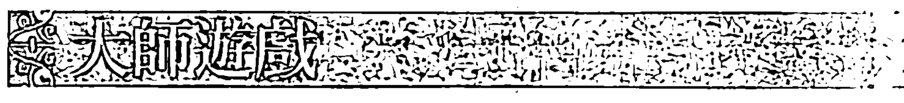

假設你已經選擇憤怒作為練習主題，當你晚上在進行逆轉練習的時候，特別去注意你在白天時如何呈現你的憤怒是很重要的；而在白天時，要留心當你的憤怒出現時，你所知道的第一個徵兆是什麼。

一旦你感知到這第一個徵兆，不需要將你的注意力聚焦在此，而是藉由記得你所選擇唱誦的字、特定的視覺心像、氣味、味道或肌肉動力的移動等，任何一個界定你新（感覺）目標的方式，將注意力翻轉成爲往新目標前進的動力。追隨、前往你的新目標，並去感受到它所喚起的感覺。

換句話說，將你目光凝視的焦點從憤怒切換到愛，這很像是將一張憤怒圖片翻轉到背面去看愛的圖片一樣，這應該是瞬間就能完成。

你一旦完成，就跟隨著這「好的」一面，你將會在你的身體裡感受到一種不尋常的移動，那種感受是很細微的，因爲那比較是你「意識夢境裡的身體」在移動，而非實際的身體。你可能感覺到手有麻麻刺刺、腳趾拉長或脖子伸長的感覺，我們每一個人會有的轉化昇華「徵兆」都不一樣。

一旦發現你的轉化昇華徵兆，你將會明白徵兆出現的方式都一樣，你能夠辨識出它們是很重要的事，因爲那是在告訴你轉化昇華已經發生。只要能感受到這個徵兆，你就可以放輕鬆，因爲已經沒有什麼需要你去做了，憤怒已經消失，已經被愛所取代。

這樣的生命存在狀態，將會讓你能針對觸發你憤怒的情況，做出適當的回應，就像大衛一樣，從恐懼轉移至他對神的愛，優雅地、甚至遊戲般地回應歌利亞所帶來的威脅。這個「新的意識夢境」毫不費力地引導我們的回應。

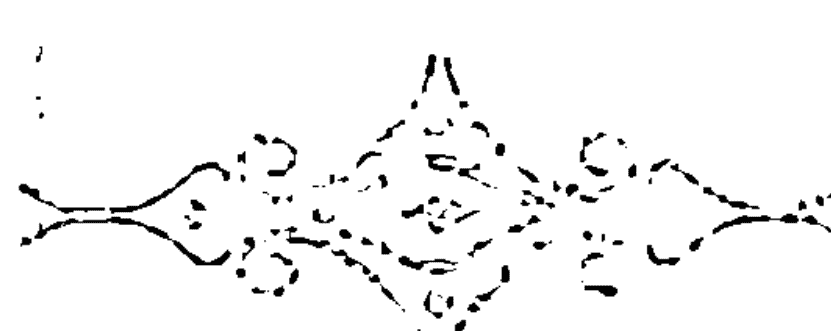

你已經用唱誦將自己帶入心靈之地，萬一你再度失去它、或再度作出反應、或屈服於你的衝動，不要因此絕望。不要浪費時間去感受罪惡感，只要抓住下一個機會將本性轉化成超本性，並使你的人生藍圖越來越完善。

當干擾無法再干擾你，而是變成可被開採的寶石，可被切割散發出最璀璨的光芒，當你覺得你已經可以掌握錯綜複雜的事物，將之轉化、昇華並找到你的徵兆，你就可以繼續往下到第十二個也是最後一個任務。

在那裡，你將學會為即將完成的工作潤色，也就是編織自己進出夢境世界與意識世界的能力。完成這個最後的任務，你將能夠把兩個世界合為一體，並讓這個夢行者修練工作變得完整。

## 第 11 章 視覺心像練習快速指南

### P.252 區分情緒與感覺

深呼吸三次，讓你自己感受一種情緒，例如憤怒的移動。對你自己描述憤怒的移動方式。然後用你的手，將憤怒往左邊掃出你的身體之外。深呼吸一次。然後讓你自己體驗一種感覺，例如愛的移動。深呼吸一次。去感受並對自己描述情緒與感覺會帶給身體什麼樣的不同體驗。

### P.254 辨認你最常經歷的情緒：選擇一種情緒來練習

檢視你在第二章裡辨識出的情緒列表，找出最常出現的情緒，這個情緒將是你下個月（或者對女性來說是下一個兩次經期之間的時間）要練習的重點。在情緒出現的當下將它辨識出來：這是一定要去修練的必要功課。

### P.256 當下辨認出情緒

深呼吸一次。想像你正在經歷極度憤怒（或者任何你選擇的情緒），對你自己描述你的憤怒在身體上所有的呈現方式。你在身體的哪裡感覺到它？它是什麼顏色？感覺起來它像什麼？它是種壓力、收縮、崩解、弱化，還是打結？深呼吸一次。將憤怒的五感知覺往左邊掃出身體之外。再次呼一口氣，張開你的眼睛。

### P.258 標示轉換開關：從情緒轉換到感覺

深呼吸三次，想像一種與你剛剛經歷的憤怒完全相反的感知。它在你身體的哪裡？它是什麼顏色？感覺起來像什麼？（擴展、放大、刺痛感、輕盈等等）給它一個名稱，只要你感覺那個名稱是對的；這是你的「開關」或「感覺目標」，你的夢境將會告訴你要給它什麼名稱，例如：愛、和平、和諧、平衡、安靜。深呼吸一次。

### P.266 用唱誦錨定你的「感覺目標」

一旦你已經選好你的感覺目標，並且已經給它一個名稱，就練習用唱誦來錨定這個新的感覺目標，唱誦「啊」這個聲音，或者其他你選擇的詞彙。

### P.267 以「Mi-Do-Re」旋律唱誦

深呼吸一次。用「Mi-Do-Re」這三個音符來唱誦希伯來文的「愛」這個字「AHAVA」（音「A（Mi），HA（Do），VA（Re）」），或者任何其他你選擇的詞彙（見附錄二）。每個音節都慢慢唱，唱誦三次。眼睛依舊閉著，然後觀察發生什麼事。你可能會感覺到一種肌肉動力的移動，或感受到一種氣味、味道，或可能有視覺心像浮現。就是去觀察注意，當你感覺到這個移動完成，就呼一口氣，張開你的眼睛。每次唱誦你選擇的詞彙三次，一天兩次（早上與晚上），連續做二十一天，然後暫停七天，然後再用另一個新的詞彙，以及你想轉化、昇華的新情緒重新開始。

## 第12章 回歸萬物合一

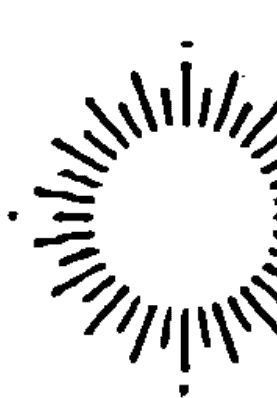

當雅各被帶到約瑟的內在以求安心，太陽也與月亮重聚，然後那裡開始產生後代，約瑟是他們的祖先。因為是那源源不絕的水流使土壤肥沃，從那些世代開始，便繁衍到世界各地。因為即便是當太陽接近地球的時候，如果沒有那一層級的幫助，也就沒辦法讓植物生長，而這是以正義之名行之。

> 《光輝之書 II》180A

在心靈之地下錨之後，我們是否能保持停泊在那？就像港口裡的船，我們也許能夠停留一段時間，但最後這艘船終究必須將錨拉起，並且繼續它的航程；那是船的本性，也是它被建造的理由。就像我們投胎為人，走過這一世的旅程，我們不能停留在一個地方，生命不允許如此。此外，我們的道路就像障礙賽跑道，布滿了這個物質實相的跨欄。

從一開始，我們必須正視自己的局限，所有的不確定性與渴望也隨之衍生，而它們也會讓我們變得盲目，讓我們看不見自己與生俱來的內在豐盛。再次遇到障礙時，當然我們可以崩潰，也可以讓自己往上提升，去尋找風暴中心點那個清澈天空的藍色眼睛。

但是，在發現它之後，我們不能沉浸在舊日光環裡，若是一直將錨固定在一個地方，會導致停滯、被動，甚至縮減，最後還會讓心靈之地變成了我們口中的塵土。

我們的生命之舟是用來航行在廣大海域的，停泊就像臍帶一樣，只是暫時的。是的，知道我們已經成功找到心的中心點，將會提醒我們目標是什麼，指引我們回到正軌，找回帶給我們希望的記憶，以及每當我們嘗試時，能更快速、更不費力的將我們帶回港口。

但總是有一種抵銷力會出現：當我們不斷努力利用夢境回到心的中心點，物質世界也總會讓我們感到怯懦與失去平衡，一次又一次將我們從感覺的狀態切斷開來。這是它的本性，就如同蠍子會試圖叮咬背牠過河的烏龜一樣。

如果沒有夢出或走出我們的路，來通過大自然為我們設計的考驗，烏龜（做夢、夢境）與獺子（意識）兩者都會淹死。如果我們將生命暫時看成一個訓練場來發展我們的「更高本能」，也就是我們個人風格的「超本性」，我們就不會以憤怒來對抗命運；相反的，我們會利用每個機會去共同創造更好的生活，夢境與意識在其中就會再度團聚。

對我們來說，如果物質世界有其教導的話，內在世界同樣也有。物質世界會這麼說：「所有的改變……」內在世界會這麼說：「……除了改變之外。」改變的發生是種重複模式（而非多樣性），讓我們自己依附在這個事實中，改變的模式就是我們做夢的方式，我們學習與其中的行動合而為一，並讓我們在這個流的韻律當中休息。

跟著它的流動性做夢，已經教我們不費力且彷彿遊戲般地移動穿越所有一切，行動並非來自外在的某種東西，而是變成我們生命中一個活生生的部分。但物質世界還是會再次干預，並且把新的障礙與限制放在我們前進的路上，提醒我們改變會帶來嚴肅的後果，也需要清醒的心智來面對。那我們該如何才能同時帶著遊戲的心情又保持清醒呢？

我們所面臨的矛盾是必須同時生活在這兩個世界，才能完成這項偉大的工作。但這兩個從根本上來看，各方面都相反的世界，是如何支持且供應彼此的呢？有一個古老矛盾的諺語說：「我們要如何讓一百萬個天使站在針尖上呢？」

你在本書中的任務，形成一種遞增的進展，朝著完成終極目標邁進：也就是活化並平衡兩個世界，避免其中任一個變得過大。意識現在越來越靠近，能夠穿透夜晚夢境，穿透我們的本能特質，藉由逆轉穿透我們的過去；而夢境也開始在白天開出花朵，在實驗性且控制過的環境之下開花，藉由引導式練習與清醒夢境來開花。有沒有可能男性導向的意識與女性直覺性的夢境能以彼此的不同為樂？並從彼此的力量中吸收養分成長？它們能不能以一種合作的完美婚姻融合、分開、又再度融合？若要完成這工作，有哪些是必須的？

在這個終點，我們不再討論練習，而是要來真的了。你已經受過訓練，現在必須踏上戰場來證明自己。雖然在最後這一章還有個任務要進行，這個任務特別是要幫你從訓練生變成大師，這就是你的啟蒙儀式。

清醒的時候抱著遊戲的心情，需負責任時充滿想像力（已經學會「回應」的你，現在已經踏上真正「責任」的道路），這是怎麼運作的？在兩個世界各自保持其獨特屬性的時候，又從另一方的立場設身處地，你已經淺嘗過這樣的矛盾：在意識世界裡做夢，在夢境世界裡保持意識。

這個逆轉的交叉，不再是一種練習，而是一種舞步，是生命一種親密的方式，是邁向體現這個矛盾的第一步，在這個交叉點上，練習不再是必須的了，雖然我還是會給你們一些練習。

你必須教自己本能且持續地逆轉你的兩種思考模式，這將會帶來革命性的結果。當乞丐變成國王那天，國王讓出他的王位與皇袍，被丟棄到大街上，自己照顧自己。這兩位在這一天所能學到的，比過去一輩子一成不變的生活所能學到的，還要多更多，此後再也沒有任何事還會跟從前一樣。國王從這個體驗中提升，受到磨練，變得更有智慧，他體驗到貧窮中的疾病與虐待，感受到自由與仁慈來臨時的喜悅。而乞丐學習到的是「責任」的重量，權力所帶來的殘酷愉悅，以及受到愛戴的不確定性。

在完成這個不尋常的交叉之後，他們兩人都回到原本的生活裡（乞丐回到貧窮裡，國王回到王位上），但卻都多加了一點點東西，那是在經驗網絡裡快速捕獲對方特質的殘留物，這個練習同時鼓舞了乞丐與國王，為兩人帶來蓬勃生氣；當他們目光交會的時候，我能想像他們之間會有創意十足的對話。自此以後，他們將會一直保留一些被對方實相所觸動的感知。

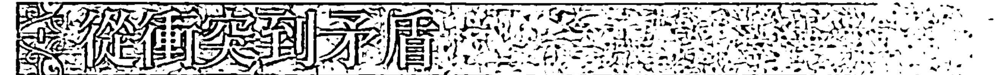

物質世界的二元性質，對我們而言很清楚，我們的生命就沉浸在其中。沒有他的臣民，就沒有國王；沒有黑暗來幫助我們區辨，就沒有光明；除非我們知道自己與他人之間是分離的，否則我們不會真正認識自己；除非將我們自己推離地面，否則不會推動我們自己前進。怪不得我們的生活是對立傾向之間的恆常的拉鋸狀態，某一個趨勢總是渴望勝過另一個？這就是我們生活的這個世界的本質。

然而，還有一個世界存於我們的內在，它的法則與這個世界完全相反。在這個內在世界裡，沒有任何的對立存在，因為界線不清楚，各種形式形狀流動進入彼此，融合、借用、轉化昇華、消融，完全是在嬉戲放縱的狀態當中。

對大多數的人來說，這兩個世界向來沒辦法快樂地共存，它們之間自遠古時代就存在一種權力鬥爭，兩個世界就是這樣只經由對立來認識彼此。

但對於你們當中已經持續練習逆轉的人（見第五章）來說，有一種和解已經發生了，就如同這個和解也一定會發生在國王與乞丐之間。當然，除非他們的體驗只衍生出了厭惡與更多的對立，這也有可能發生，而且是不論何時我們進行逆轉時所需要冒的風險。但我們必須冒這個險，否則最後將會落入粗糙沉悶的生活裡，一種因衝突而變形的生活，一種和平與和諧永遠無法占上風的生活。

將夢境與意識世界分隔，只會導致更多對立，這難道還不夠明顯嗎？而且最終，如果對方的苦難無法持續，或者其中一個世界閉塞，難道一場全面性的戰爭不會隨之而來嗎？想像一下：如果國王忽視乞丐的困境，將會有什麼樣的苦難發生在這個王國裡。

因此，為了真正去挑戰你的意識，你必須採取非比尋常的步驟：將慣例上夢境世界所討厭的對象，帶到面對面的情境當中，就是非因果、非理性的部分。而為了真正去教育與挑戰你的夢境，必須讓它正視總是想逃避的部分，也就是物質世界的嚴酷現實。

一個培養清醒（耐心、注意力）的意識，將會接收到一種理解主宰「非理性」層面「法則」的洞察力為獎勵。在培養遊戲心情（把焦點放在遊戲心情與遊戲意志）的過程中，夢境世界將會顯化到真實世界當中。評論家將會歌頌跨界的理性主義者是一位偉大的「夢想家」，而讓夢實現的夢行者，將被譽為「現實主義者」。

儘管如此，我們常常要麼是夢想家、要麼是現實主義者，我們可不可以改變想法，同時擁抱兩個世界呢？包含兩個世界中所有的挑戰？我們能不能忍受矛盾？

就像我們擁抱孩子，接納他們所有的好與壞，超越任何評價地愛他們，我們能不能同時擁抱兩個世界，超越意見平等地支持兩者之間的分歧、矛盾與對立呢？這需要的不僅是和解，還要兩個心智的力量與勃勃生氣能均等地匹配，才有可能發生。

我們知道，逆轉練習是邁向完善這個平衡的第一步：意識世界同意後退一步，夢境世界前進一步。意識向夢境學習謙卑，夢境向意識學習專注。夢境為了更聚焦的轉化蛻變，而放棄了混亂奔放的熱情，同時意識能夠辨識許多差異，卻不會緊抓不放。

達到平衡的過程往往是不穩定的，我們達成平衡，然後又失去平衡，作為再次找到它的一種學習過程。真正的重點不在我們失去它，而是我們能夠多快將這個平衡找回來。因此，將達成平衡當成你的任務（這就是你在本章的任務），也是一項進展中的工作。所謂完美，只存在於某個短暫時刻裡而已。

說了這麼多，除了逆轉之外，還有什麼是我們需要去做的？對身體工作來說，所謂平衡是需要來自所有方向的均等壓力同時匯聚與背離才能達成的。試著站在你的腳趾頭上，你必須往下推並往上伸展（背離），同時收縮大腿內側肌肉以及胸肌（匯聚）。要發展兩種心智的平衡狀態，我們需要體驗對立兩方的背離（天與地就是對立的）與匯聚（天與地可以在心智之眼中保持平等）。

## 視覺心像練習

### 生氣蓬勃的對立

深呼吸三次。去看、感覺、並身歷其境在那樣的體驗當中：同時成為國王與乞丐。深呼吸一次。同時成為天與地。深呼吸一次。同時成為光明與黑暗。深呼吸一次。身歷其境那樣的體驗，同時活著與死亡。或者想像兩片蘊含強大能量的海洋，一片海洋是紅色，另一片是藍色，兩者對衝、流入對方海域；想像它們會合時的衝撞，因為衝撞而起的噴射流高高升起，紫色泡沫落下像是翻攪水域之上的巨大開放式風扇：像是兩個鈸互相敲擊，喚起一種覺醒，一個全新的世界。深呼吸一次，把你的眼睛睜開。

當我們敞開來，允許所有形式的生物、道路、真相一起肩並肩共存，讓羔羊與老虎、乞丐與國王共處，理解、智慧與同理心就會呈現指數般的發展；當心的中心點被觸動，就會擴展、會放射。每一次當我們達成兩種心智的平衡，我們心的中心點就會再擴展更多。心的中心點擴散的樣子，就像宇宙在前進的時候同時在擴展，或者我們應該說，它從一開始就像是往外倒退的？

是什麼將一個矛盾的雙重性提升轉化成一種創造？一個意外、一種更大的強度、還是加倍的專注？當一男一女以性行為結合，也許會受孕，也許不會，但是熱情、專注與對的時機都是這個創造「奇蹟」發生的誘因，如果沒有意圖，創造可能就不會發生。將所有的元素都聚合在一起之後，我們唯一能做的就是「放手，讓神介入」！

實驗用的蒸餾器是子宮也是心智，新的創造就在其中誕生，兩個看似不相容的部分在其中混合，創造出的孩子看起來像父親也像母親，但這是如何發生的？混合物讓眼睛混淆了，逗弄、震驚、解體我們先入為主的觀念，並使之失去平衡。我們的心在驚喜的自由中大步跳躍，這份自由來自打破無彈性疆界的創造性力量，融合不相容的形式。這個轉換是如此令人震驚、興奮，徹底解放了我們「真正的想像力」。

而想像力已經被淨化，一切都是純粹的愛。

愛傾瀉而出成為一片海洋，與另一個流動的海洋融合，流動海洋中蘊藏著未定型的各種形式，這些形式就是後來的新孩子；孩子按照順序擁抱無數的可能性與矛盾，無拘無束且尚未被未來的期待與欲望影響。愛是花蜜，是在創造奇蹟發生之前來自兩種心智在思索玩味中所形成的完美平衡。

當夢境世界與意識世界的兩個心智融合，它們的孩子在解體元素的碰撞中誕生，這些孩子可能是笑聲、詩歌、音樂，甚至是悲劇。古希臘人把這些「心智之子」稱為繆思女神，無論繆思到哪裡，各種混合的形式總是相伴：人魚、半人馬、飛馬、人面獅身、鳳凰等。謎語、難解之謎、文字雙關語、笑話、意想不到的並置，這些跳躍的圖像從它們生命豐盛之處一躍而出。

超越平凡、深入本源、將新事物帶出，這些事情會嚇我們一跳，跳出慣性模式，進入意料之外的狀態。因為在心智的蒸餾器中，這兩個世界的對立經常產生震驚、矛盾、驚訝、幽默、荒謬，甚至奇蹟的效應。

與繆思面對面一直都是一種體驗：這個你熟知的世界會突然暫停。你的注意力被喚起，被新事物挑戰、挑釁。你或許想忽視或拒絕繆思，但你依舊需要處理你的反應。面對不可能、不理性、過大的喜悅、你的身體 心智可能因此失去定義而垮掉，或者經歷某種看起來像是要昏倒、卻依然保持清醒的事情。

當你踏上男女性、左右腦合一的無人之境時，好好地觀察自己。你的困惑（confusion）並非平淡無奇，事實上是一種共同融合（co-fusion）的結果！當你意識清醒或正在做夢，你可能會感覺到自己直直落入一團柔軟的白光中，在那裡，時間是靜止的，噪音悶悶低鳴，親密感駐留其中。或者驚奇透過你烙印下痕跡，就像一團白色熱能，或者一個鼓舞人心的「啊哈！」。共同融合會催促你遠離地平線、遠離太空，事物往「現在－永恆」前進。這樣的經歷總像是在某種垂直的當下：往下是休息，往上是狂喜！

## 惡水上的大橋

你要如何準備進行共同融合？跳進矛盾與可能性的發酵醬缸裡，你必須學會保持清醒。如神一般地眉清目明，你必須學會順著流與矛盾的線索、令人惱火的挫折、不理性的往前躍進、人生的起落一起漂流，卻又不會因為恐慌而溺水下沉。

當然，說總是比做容易。如果你已經是五十五歲的女性，卻單身沒有伴侶；如果你的醫生告訴你，你的疾病只有百分之四十的機會復原；如果你已經失業、卻付不起稅金；難道你沒有恐慌的權利嗎？然而這裡正是清醒必須出現的地方，如果你不清醒的話，你要如何去「看見」並依循「夢境」留下的線索呢？就像「神的靈運行在水面上」，你也必須運行在自己的「混亂」之上。

如同在清醒夢境當中，你歡欣愉悅的清醒觀察，將會使形式穩定下來，你的生活也是如此。當你的心智嘗試在過多的刺激當中釐清線索時，別讓優柔寡斷將你捲入恐懼或癱瘓中；你要教導自己去觀察。

這並不容易，因為在危急時刻，你的外在世界似乎失去了穩定，看起來像在模仿你夢境世界過多的流動、延展性、荒謬與奔放熱情。但要記得：你已經受過訓練，知道如何回應夢境的流動性。當生活呈現如「惡夢」般的特質或具有「魔法」般的色彩，那麼你就已經非常接近共同融合的狀態。你要恐慌還是保持冷靜？而且如果你完成了共同融合，你能夠繼續保持在這個狀態裡嗎？很少人會因為我們新創造或新孩子的喜悅而死去，只要我們能夠承受這個混合所帶來的震驚，就能夠將我們的回應穩定下來，但是我們還能讓驚奇感保持完整無損嗎？

當我們要將一種模式與另一種互換時，有多容易？例如，將新生兒長相內化到我們的意識中，我們很快就會失去它的新穎與易變性的美妙之處。或者如果情緒上太容易受到影響，我們會在思索嬰兒靈魂中的新鮮感與延伸性時失去自己，同時偶爾忘記要去回應它的物質需求。

但幸運的是，兩個世界都很堅持要抓住我們的注意力，就像嬰兒大哭要引起我們注意力一樣（用比我們呼吸還要快的節奏大哭，那是一種無法忽略的刺激），所以繆思女神藉由重複、持續的呼喚與令人震驚的行為，來引起注意。當我們準備好要擁有一種新的結構或配置、一種新的「實相」，我們的心智會在不知道它自己機制的情況下，開始去搜尋並鎖定無所不在的模式、相似性、象徵意義、共時性與同步性。

現在讓我們為了需要清醒的時刻暫停一下：這些同步性只是我們的心智自己認為的嗎？或者這些同步性確實在發生？外在世界是否牽涉其中，參與進來為我們創造這些線索，戲弄我們、挑逗我們、在我們的鼻子前揮舞著突然出現的意義群集，就像揮舞紅旗一樣？當我們移動至宇宙事件的時候，宇宙是否也移動到我們的故事裡？外在世界有沒有一個目的可以回應我們的目的，並且也帶動我們移動，就像空氣被低氣壓與冷鋒移動那樣，空氣也被我們肺部吸氣的動作移動？這個世界是否有更多的延展性是超過我們願意承認的？

如果夢境有潛能變成物質實相，我們在第八章已經看到它確實可以，回顧一下那麼物質實相是不是也有潛能變成夢境？如果是的話，它的固定性並沒有我們想像的那麼固定，很清楚地，一切端看其中的關係：我們心智的傾向，決定了我們在外在世界裡所關注線索的本質。

這些按照順序來，似乎突然開始的注意力彷彿像是受到提示才出現一樣，它們依序影響我們的內在狀況，我們越主動積極在兩個世界之間來回，就越容易將兩邊世界融合在一起，如此一來就能發現一個新層次的實相。我們能不能大膽假設，在物質世界的決定機制可以被夢境世界轉移？我們是否能冒險希望「信念（確實）能移動一座山」？

我們在物質實相中顯化成肉身存在的挑戰之一，就是習慣，它們是多麼令人厭倦、多麼難逃脫習慣的掌握！但是如果將我們清醒的注意力帶到那些重複發生的模式、新的結構配置中，加上我們的心智與這個世界共同呈現的徵兆與線索，也許能夠逃脫我們的基礎制約，就像眾神一樣，（雖然不是無中生有）能夠創造出新事物。

等候線索，跟隨著它們，線索將引導你穿越兩個世界之間的縫隙。轉動門鎖當中的小金鑰，推開那扇秘密之門，滑過光的銀色光輝。你已經短暫地拜訪了這個世界。當然那裡是心靈之地，在那裡，真正的想像力——也就是愛——占有絕對優勢。

進入存在的狀態，去體驗你的夢境能夠多麼輕鬆地流動，進入物質實相中，並用遊戲般的輕鬆與魔法所帶有的特質去影響它，而此時你的意志能夠泰然自若地去穿越天堂般的迷霧，追尋它的聚焦點，將實體與有形的顯化，帶入夢境世界當中。

但請記得，不要沉浸在舊日的榮耀裡，不要認為你從此就能過著幸福快樂的生活！那只會發生在童話故事裡，這種念頭或其他令人不安事物的虛榮心，會將我們輕輕推離心靈之地，當然也會帶來另一個機會，去重新征服並擴展它，全然的光明並不屬於這個世界：因為總是會有新的因素導致不平衡，也總是有新的心靈空間能夠繼續成長與融入。

好好地犒賞自己一下，跳上飛機到英國去，就像我兒子跟我去年那樣。當你下飛機時，希斯洛機場是黎明時刻，但你覺得好像還是夜深人靜的時候，你幾乎沒怎麼睡。

租一輛車，他們那裡只有手排車，突然間你在馬路的左邊開車，駕駛座在右側，用你的左手排檔，試著讓你的眼睛習慣往左邊去看路標，往右邊去看對向來車。然後你突然駛進一場四月的暴風雪裡，就像我們當初那樣，這時你會笑你自己笨手笨腳地要跟上所有這些人為的逆轉以及心智的扭曲狀態，但你還是必須維持清醒，拜託不要有任何意外！

我希望他們永遠不要改變英國的道路系統，彷彿跟著一開始的震驚而哈哈大笑一起誕生，我們的旅程也像夢境一樣開展，我們只是碰巧遇見幽默、不尋常的、像天使般的人，碰巧遇到最好的餐廳、典雅奇特的飯店、令人驚嘆的秘密景點，以及天堂般的花園。然而我們並沒有偏離預訂行程太遠，這讓我們在客觀的實相裡還能有腳踏實地的感覺。

想像我們的行程是條直線，我們的夢境則是一條蛇行的曲線，與直線交叉之後又再交叉，這一路的旅程，我們最後完成了一開始就設定好要去做的全部事情，但我們隨性所至而接納了新線索與其他可能性，為我們的體驗帶來色彩與歡樂。

## 視覺心像練習

### 物質世界的逆轉

任何你平常所做事情的逆轉，都可以算是這個練習：例如去到一個你不會說當地語言的國家，吃一種你從來沒嘗過的食物，去從事你覺得你會討厭的運動。去嘗試這些事情，因為他們跟你正常會去做的事情相反。當然，不要故意只是為了逆轉而逆轉，將這樣的轉換變成一種蓄意的過程，將會讓你陷入一團混亂當中。

始終保持在夢境的流裡，跟隨其中夢的線索，以及那些令人驚奇的同步性、同時性，這樣外在世界就會永不停息地帶給你驚喜。例如，有三個人在同一天同時跟你聊到航海之旅，你對這個巧合印象深刻，隔天你突然遇到一位多年不見的老朋友，他跟你聊起一趟航海之旅！事實上，他來到這裡就是要登上開往加勒比海的一艘船，但啟航時間因為其中一位成員在最後一刻決定退出而延後。

這就是你的夢的線索，你的機會！你接下來幾週都沒事，你自己還不知道要做些什麼，而且你一直都想來一趟航海之旅！不用刻意去尋找，如果有個機會出現在你面前，大膽試試看吧！將你的能量從優柔寡斷、呆滯惱怒（以「提示」的方式呈現）轉換成積極參與，進入這個流中。

勇敢去冒這個險！如果你不去，你會永遠納悶自己錯過了什麼。這並不是關於強迫你自己去做與自己所喜歡的相反事情，而是要去抓住夢境的尾巴。

同時，把這當做一個練習，從人為的逆轉開始。我有一間老屋在森林深處，只有一條小小僅容一輛車通過的泥土路能抵達，當另一輛車要過來時，我們其中一輛必須倒車後退，在那條泥土路我體驗到的，是大多數的人都不知道如何倒車。去學習完美快速的倒車！開車往前與往後應該是沒有什麼差別的，你可以好好地練習這件事！

在你進行網球賽、劍術、高爾夫、畫畫時，學習使用你的左手（如果你是左撇子就練習右手），我的一位詩人朋友總是在寫作落入窠臼時換手寫，她一首詩中的一部分，有時候甚至是整首詩，是左手的那個她所寫成的，她的寫作障礙因此被擊倒、失去平衡，被右腦靈感新吹起的風席捲而走（左手是由右腦支配）。

當你明白你仍然有能力讓自己感到驚訝，或外在世界還能讓你感到驚訝時，這是件好事。

#### 在沉睡中清醒

還記得夜晚的埃及女神努特嗎？每個黃昏她吞下太陽，太陽整夜行經她的身體在天空形成的浩瀚蒼穹，然後在每個黎明從她的雙腿之間再度誕生。我們看到努特女神的古老圖畫，太陽在她黑暗的擁抱中與在天空中時一樣的金碧輝煌，然而當它的光芒照耀時，卻沒有沖刷掉黑暗，這就是努特的神秘之處，以及她巨大的力量：她在黑暗中能夠容納光，同時依舊忠於她的神性。

她不就是這個豐饒黑夜的女性守護者嗎？她提供給我們沉思的矛盾究竟是什麼？我們從她身上能不能學到更多關於將意識帶入夢境時刻的事？意識是否能夠行經夢境時刻的黑夜去「看見」而不是去破壞？意識在此是否能夠變得活躍積極，而不需要將我們從睡眠中喚醒？

到目前為止，逆轉已經教你將意識帶到接近睡眠的時刻，但不要讓它實際穿越過你的睡眠（見第五章）；作為一位年輕的英雄，也就是勇敢的意識心智，你現在必須前進到甚至更靠近遺忘之境黑洞鴻溝的地方。

## 視覺心像練習

#### 在沉睡中清醒

當你睡著時要保持警醒，去注意你沉入睡眠狀態的那個確切的時刻。一開始在你明白它正在發生之前，可能就被睡眠擊倒，如果你堅持不懈，終會有這麼一個晚上到來，你瞧瞧！你在你眼前陷入沉睡狀態，甚至能對自己描述在睡著那一刻的身體徵兆變化。對我來說，睡著就是我們下巴發出喀嚓聲，這就是我睡著的徵兆。對你來說可能是別的不同徵兆，就是好好地去觀察，直到你能做到，能夠在那個轉換的瞬間保有意識。也試著在早上快醒時保有意識，在前一晚要睡覺之前，告訴自己要在睡眠與醒來的那個轉換時刻保有意識，然後觀察身體會有什麼樣的徵兆，也要觀察你的思考過程是如何開始侵入你那一片靜止未開展的夢境視覺心像裡，試著同時保有兩種狀態，不要讓你醒來的過程淹沒，並沖刷掉夢境。

在轉換的過程當中保有意識，是清醒的一種形式。那將會讓你準備好去面對最後的轉換，難道你不想在經歷死亡的過程中保持覺察嗎？讓這個偉大奧秘快速墜落？但是別急，我們一生中還有許多刺激的事情要做，像是教導自己在夢境時刻中確實保有意識。我們能夠像太陽行經努特的身體那樣，在睡眠中保持覺察與清醒嗎？

## 視覺心像練習

### 在夢境時刻醒著

在做逆轉練習之前先做這個練習。躺在床上，閉上眼睛，告訴你自己要在做夢的時候覺察到自己正在做夢，指示自己要（在你的夢裡）說出：「我正在做夢。」

每天晚上都這樣持續不斷地告訴自己，並且每天早上檢查，你是否確實理解你在夢中能夠知道「我正在做夢」，這並不難做到。當你精通這個練習時，你可以讓它每晚都發生，你也會開始覺察到，你在夢中感覺到非常清醒。

在這種情況下，你可以輕鬆地前進到下一個練習：學習面對必要性，在夢中回應夢的挑戰，而不用等到早晨才去做，尤其是當你已經走到這一步。

## 視覺心像練習

### 在夢中回應夢的挑戰

你已經多次練習在白天時回應夢的挑戰，現在試著在夢裡，面對你的夢的必要性時直接回應它，在夢中說：「這是我的夢」，你知道這些是你的視覺心像，你選擇如何遇見它們是你的責任。然後從前面一個練習來擴展，藉由積極適當地回應夢的挑戰以及必要性，把握挑戰與必要性，在夢裡出現在你面前的那一瞬間去回應。

當我剛遇到柯列的時候，我病得很重，深入夢境的迷霧中，不再感覺到周遭的實體世界，你可以從我的描述中得知，當時的我一點都不清醒！因為我已經失去外在世界腳踏實地的感覺，而夢境充滿嬉戲的情境也使我困惑，事實上，我以為我快死了，每天晚上我都會做可怕的惡夢！

柯列給我的祕方是：清理！如果是內在髒污，那就去清理外在，清理陽台、地板、擦拭銅罐、托盤及銀器（在柯列的十六世紀北非風格裝飾的房子裡有很多這些東西！）；替花園除草、修剪灌木、清空垃圾桶。我很清醒地知道她不是在利用我，而是在教我一些東西，而且我很快就學會了。

有一天晚上，我像往常一樣做惡夢，但那次我並沒有汗水淋漓、驚恐地醒來，我聽到自己說：「這是我的夢！」然後拿起我的圖像世界的桶子與刷子（就像我在實際生活中做了很多次那樣），將黑暗清理掃出我的夢中！

當你變得精通於直接與你的夢相遇時，你可以與它對話，所需技巧是相似的。

## 視覺心像練習

### 與你的夢對話

在練習逆轉之前，躺在床上，閉上眼睛，深呼吸三次，從 3 倒數到 1。想像你拿了一枝金筆在黑暗當中畫出一個金色的圓圈，在圓圈當中，寫下一個問題給你的夢，文字也是金色的光構成的。例如：「我懷孕了嗎？」如果這確實是你當下最迫切的問題，你的夢當然會給你答案；如果那個問題不是最迫切的，你收到的答案事實上會是要給你當時真正最迫切的問題的，你是沒辦法朦騙夢境世界的。早上醒來時，確認讓自己精準地記下你夢中的所有細節。我們有一種方式可以操控視覺心像來迎合我們的希望，尤其是在我們還沒把它們寫下來的時候。

要在睡眠中保持清醒是一種獨特的感知，一開始你可能會覺得你並沒有睡好，很快地一種相反的感知會逐漸適應，你會感覺到獲得很好的休息，感到非常清晰，你生活裡睡著、醒來、睡著的循環變得適切順暢；最後，意識甚至會滲透到你睡眠裡沒有圖像畫面的時刻。

一開始，在你清醒時做夢看起來並不那麼困難，你能夠在腦海裡構築圖像世界，不管這些是記憶、白日夢或幻想，而且你已經學會如何將它們圖像化了。這些狀況都跟夢境有關，因為它們連結到想像力的啟動，但是白日夢與幻想是由意志思考所主導，不要將它們跟自發性的夢境視覺心像混淆在一起。至於你已經練習的圖像化的部分，只是幫助你去刺激真正想像力的練習。現在於自發性活動中去看見你真正想像力的時候到了。

既然我們已經假設白天時也會做夢（而且已經證明我們可以經由練習與清醒夢境來誘發做夢），我們是否能夠抓住發生在幕後的那一瞥，或者整個系列的自發性夢境，同時又保持完全清醒的意識？有時在極大的壓力之下，圖像世界會爆發往前並破掉，就像是浮在我們白天意識水面的泡泡一樣。

但通常在一個健康的人身上，白天做夢就跟陽光燦爛的天空裡的蒼白月亮一樣模糊，有時我們瞥見全幅的圖像畫面或被審核過的訊息，而有時我們就是直覺地意會到。但是，在大多數的情況下，我們都沒注意到這些來自夢境世界這些纖細脆弱的禮物。當意識吹奏勝利的號角，一切都沐浴在光的通道中時，

## 我們要如何改善我們白天做夢的觀照與覺察？

《光輝之書》（十三世紀最著名的卡巴拉文本）告訴我們，當神創造太陽與月亮，月亮看見太陽的壯麗，在比較太陽光與自己柔白光輝時開始忌妒，於是她對神抱怨。神為了懲罰她的壞脾氣，於是讓她變小變暗，使她必須依靠反射太陽的光才能發光。但就像我們聽到的故事，當有一天月亮變成跟太陽一樣大且同樣光芒燦爛的時候，那就是世界會變得完美的時刻。

當然，月亮就是你的夢境，在你的覺察中月圓月缺，有時甚至完全消失不見，正像是月亮一樣。而太陽是你的意識，強勢地保護他的特權，不讓你的夢境侵入他防衛嚴密的保留區。

既然跟意識競爭沒用，那何不試著跟意識合作呢？為什麼不用它來觀察呢？不只觀察意識所偏好的外在世界，也觀察內在世界；一隻眼睛看向外面，一隻眼睛看向裡面，或者如果你想要，可以想像你的眼睛就像一個球狀的鏡子，兩面同樣都可以用來往內看、往外看。

如你所知，夢境的視覺心像是稍縱即逝的，你若是感覺到任何壓力，它們就會消失。就像飄渺的煙霧變成某種形狀，然後又太快飄遠變形，無法被洞察，除非你能夠非常專心致志在觀察上！除非你像一個獵人那樣小心翼翼，不發出任何聲響（沒有任何心智噪音），用一種無情而非沉默的張力去追尋你的獵物。森林裡充滿競技，如果你可以跟著樹木與地景融入，你將很快會看見那個害羞隱密的動物世界開始活過來。

## 視覺心像練習

### 內在洞察力與外在洞察力

想像你有一隻眼睛往外看，一隻眼睛往裡看。或者如果你想要的話，想像你的眼睛像是一個球面的鏡子，同時往外與往內看，不管是哪一種方式，去覺察到你的觀看是種雙向的移動。永遠不要停止觀看外在世界正在發生的事（這非常重要，因為在夢境中的傾向是在夢中失去自己），也觀察你的內在世界正在發生什麼事。觀察你的視覺心像，那是自發性地發言呈現在你的內在屏幕上，不要嘗試去解讀，就只是讓你的意識吸收。如果你讓它們平靜地停留在心智裡，很快它們的意義就會來找你。

對於精通這種雙向視覺移動的人來說，他們的眼睛會有一種非常特定的樣子，一旦你能夠辨認那種樣子，你就永遠不會忘記：這樣的眼睛很矛盾地既銳利又深邃，有著乾燥的核心，卻又水汪汪的。這種眼睛就是你會在聖哲身上看到的眼睛，也是具有靈視力者的眼睛。為什麼會這樣？因為靈視力是練習這種雙向視覺的第一個必然結果。而且是的，這也可以發生在你身上！但是不要太過去注意你的超感知覺，只需要將它視為是你通往成為真正夢行者路上的一個指標即可。

當你的鏡子非常清晰的時候，即使只有很短暫的時間（沒有主張、期待、欲望、想要），你的想像力會忠實地回應你在外部世界所看到的，就是這麼簡單。要記得真正的想像力，作用的方式很像是左右顛倒的鏡像一樣，有一種方式來呈現詭譎多變的視覺心像，照亮你慣性上不會去聚焦的隱藏面向。

因為具有互動的特性，這面鏡子比起一面普通平面的鏡面，有無限多更複雜的方式可以顯化呈像，就像哈利波特魔法世界裡的圖畫一樣，它會揮手回應你！這很類似你的夜晚夢境，會經常去強調你在白天生活清醒時刻沒有覺察到應該多加關注的面向。

想像你站在一個球狀房間的中心點，這個房間完全被鏡子所覆蓋，不論是哪一邊都無法直接反射全部的你，每一邊都不得不依賴另一邊去呈現完整的圖像，正如夢境一樣，你的意識的雙生開關，顯示出你的意識所錯失的是什麼。

隨同附屬於內在世界的一切事物，你已經在清醒時刻辨識出你的夢境，你必須帶著這個體驗前進物質世界中，好讓它所帶來的影響能夠扎根。忠於逆轉練習（在夢境世界與意識世界之間反覆來回）是這項修練的基礎，你必須行動或說出你的內在洞見。

或者，如果你選擇在當下保持沉默，那也必須是一個帶著意識的行為，不會淡忘其中的訊息，而是儲存起來作為未來的參考。但是記得，如果你無法勇敢面對亞里斯多德學者的蔑視①，你將會把夢境託付給幻想，就如同你的意識思考如果拒絕去擁抱夢境世界的非因果關係與神祕，它會減弱成為枯燥的邏輯。就如同我們最知名的科學家愛因斯坦經常說的：「想像力遠比知識更重要。」

為了將你白天的夢境帶入這個世界，你必須學會大聲說出你的夢境洞見，不要試著將你的視覺心像翻譯成帶有邏輯順序的內容，不要迴避不合邏輯的推論，只需要如實地接納你所看見的，並與之相處，與這個「看見」的語言同在，並且就像你在描述物質世界地景那樣地描述它，讓自己更加靠近你的本源。

例如，假設你遇見一位美麗女子，當用你批判性的左腦在打量評價她時，你也同時在「夢」出你對她的回應。我們假設你的夢境回應是去「看見」一片罌粟花田，一片田野的有什麼意義？而且為什麼是罌粟花？不要讓這些邏輯性的問題遮蔽或複雜化你的內在洞察力，就讓這個畫面與你同在、安撫你、知會你，然後說出來，對這位美麗女子說：「看見你時，讓我想起一片罌粟花田。」她可能會臉紅，但會很感動，因為如你所知的，視覺心像的語言是一種無文字的語言，也是情緒與感覺的語言。

如果對她說出這些話是不恰當的話（因為她有個善妒的丈夫可能會認為你是要追求她），那就把這些夢境視覺心像儲存起來供未來參考，不要將它託付給遺忘之境，從「罌粟花田」的視覺心像而獲得的知識（令人沉醉的美麗、陶醉、熱情、優雅）可能在後來會派上用場。

如果你看見的是負面的視覺心像呢？在你的修練走到這個點時，你知道你已經不再投射次級情緒，所以你可以信任你的內在眼睛，假設你在朋友的周圍「看見」暗紅色的斑點，你只要說：「當我見到你的時候，看到你的周圍都是紅色，你在生氣或對某事不開心嗎？」

換句話說，從夢境視覺心像中直接發言，而不是讓大腦輸入的內容有一半短路，當你學會使用左腦與右腦這兩者來餵養你的對話，它將會有更活躍的交流。

## 視覺心像練習

## 從夢境中發言

使用眼睛的雙向移動，當你在與另一個人對話時，同時看見你的內在與外在，然後練習從兩邊的源頭說話發言，左腦評判而右腦做夢，使用兩邊所輸入的內容，既然通常是來自夢境世界的輸入內容較為缺乏，全神貫注在表達你思考屬於夢境的那一面，不論何時你開始與他人對話都可以進行這樣的練習。

一開始你可能會發現這樣很尷尬或很難做到，但是要堅持下去。你會看到跟你對話的人突然振作起來、開始發光、變得友善，這種內在直覺式的語言在你溝通的時候，會打開人們的心門與心智，就像也打開你內在的門一樣，人們將會因此欣賞你的大膽與流暢性。

練習從你的「內在洞察力」發言，很快你的兩種語言就會融合，你會為自己創造出一種嶄新、新鮮與非常鮮活的溝通方式。那會讓你從算計與操控中解脫，變得自由，夢境世界的優雅、從容與魔法將會賦予你所有的生命邂逅。

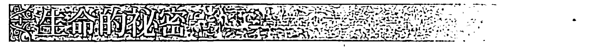

很久以前有一個人旅行世界各地，想要尋找一個問題的答案：「生命的秘密是什麼？」他把這個問題拿來問哲學家、數學家、天文學家、占星家、預言家、賢哲、聖人、大師，但都徒勞無功，所獲得的答案都沒辦法滿足他的渴望。在他終於抵達一個山腳下的小村莊時，感到疲憊、幻滅且痛苦。那裡的村民於是指著高聳的山頂。

所以這個旅人最後一次出發去爬上這座山，在山峰上坐著一個微笑的乾癟小老頭，他說：「生命的秘密是一個噴泉！」

這個旅人被激怒了：「我已經走了這麼遠，不是要來被告知生命的秘密是個噴泉！」

「喔，不是嗎？」小老頭問著。

如果像這個旅人一樣，你讀這本書已經走了這麼遠，卻沒做書中的練習，你也可能覺得你還在尋找，不滿意我的答案，感到幻滅與苦澀。我可以到世界末日都堅持這樣的說法，也就是當你能夠平衡你的意識世界與夢境世界，當你的兩種語言融合為一，你會感覺到生命力的泡泡在你的內在升起，你將會體驗到喜悅、樂趣與興奮，這個噴泉會在你的內在升起！但為什麼我該說服你呢？你必須自己去發現。

如果你還沒感覺到生命的喜悅像是清澈的噴泉在你的內在升起，你可能還需要重複這本書中描述的某些任務。記得想像力是一種沒有時間性的世界，它會永遠在那裡。雖然，為了簡化我的跟你的任務，我將這些任務排了順序並且組織成十二個部分，你必須同時去進行全部的任務，這看似很難，但其實並不難，因為當你熟悉所有的任務時，你會很自然地想要整合成一種流暢的修練。

有什麼樣的徵兆是沿著你前進的路散布，好讓你知道你是往對的方向前進？那些是我之前還不能告訴你的，因為怕會影響你「看見」的能力。但假如你已經走到這一步，並且如實地做了你的練習，你當然能夠辨識出這些我將要描述的徵兆。

還記得太陽與月亮的故事嗎？當你剛開始練習時，你的夢境是每日生活的反射，就像月亮的光芒是在反射太陽的光芒。你的夢是忙碌夢境、惡夢或重複夢境，他們的光芒像月亮一樣月圓月缺、暗淡與變黑，那是因為你還沒有將情緒穩定下來，或者還沒學會將情緒轉變為感覺。

當你練習清理過去也清理日常生活事件，當你透過練習激發想像力，一種魔法般的事情就會發生：你內在的月亮會開始散發出自己的光芒。曾經是黑暗、稠密、沉重、封閉、混亂、麻木不仁，要不就是太飄飄然、易逝、難以捉摸或不穩定的想像力，現在變得清晰、銳利、乾淨，混雜的顏色消失，取而代之的是純粹的色彩。移動的方式則是流暢且多變的，新的組態很容易就能發生，轉化提升則是充滿驚喜、令人驚奇，且使人感到愉快。

當你能夠持續不斷地練習，純粹的色彩會開始從深色範圍移動到淺色，變得更加清晰，更像粉彩色，它們會變得透明並開始發光，即使是嘗試去看見黑暗，那時看到的黑色將不再是濃重的黑，而是半透明且發光的黑色，一種光芒照耀穿透所有的形式，它們會閃爍並散發光芒。

到最後，各種形式都融化成光，失去界線，並且全部合而為一，散發白色光芒。心靈、心智與身體擴展融合成這個無界線的光芒裡，然後變成透明。修練者被照亮、啟發，然後與宇宙合而為一。

這就是最後的工作了嗎？意識世界與夢境世界的太陽與月亮的結合？不是，為了完成這項工作，修練者還必須下山來，光必須被進物質實相裡，使之落在適切的行為與謙遜裡。交織的舞步一定不能停止，不要休息，而要不斷地重新創造你自己，直到你嘆下最後一口氣為止；這樣人生將永不止息地帶給你充滿流暢性、從容與豐盛的驚喜。

隨著時光不斷前行，如果你來到一個地方讓你覺得已經失去那天堂般的光芒，永遠記得你曾經找到它，只需藉由積極地平衡你的兩個世界，那個光芒就可以再度被發現。這永遠會是一個值得去努力的理想，永遠不要放棄你回頭尋找的權利！

當太陽與月亮融合成為一體，這項修練就已經臻至完美，光芒安居在你之內，且日夜都能穿透你，即使在你最深的、無夢的睡眠當中，你也知道這個光芒在那裡。意識世界與夢境世界在所有的時間裡鮮活地活在你的內在。

你曾經一度受到外在與內在力量的重擊，但現在你已經學會成爲精通這些力量移動的大師。不論何時，即使只是短暫的一瞬間，如果你能夠碰觸到這個移動靜止的中心點，你將會變得完整。在它的中心點靜靜地坐著，同時你也繼續跟隨它的移動：此時天堂便已來到人間！你心靈之地的花園便會開啟，並散發出熾熱的光芒！

## 第 12 章 視覺心像練習快速指南

### P.281 生氣蓬勃的對立：教你自己與矛盾安然共處

深呼吸三次。去看、感覺，並身歷其境在那樣的體驗當中：同時成為國王與乞丐。深呼吸一次。去看、感覺，並同時成為天與地那樣地活著。深呼吸一次。去看、感覺，並同時成為光明與黑暗那樣地活著。深呼吸一次。去看、感覺，並同時感覺到活著與死亡。深呼吸一次，把你的眼睛睜開。

### P.288 物質世界的逆轉：學會在物質世界中逆轉所有你能想到的任何方式

練習人為的逆轉，藉由換手打網球、高爾夫，或者擊劍、畫畫、寫作，或者開車時能夠完美地倒車等。跟隨著你內在的與外在世界的夢境線索，去觀察同步性、同時性，以及夢境之流呈現給你的機會，並且毫不猶豫地抓住這些機會。

### P.291 在沉睡中清醒

當你快睡著時，要保持警醒，去注意你沉入睡眠狀態的那個確切的時刻。深呼吸一次。也試著在早上快要醒來時保有意識，在前一晚要睡覺之前，告訴你自己要在睡眠與醒來的那個轉換時刻保有意識，不要讓醒來的過程淹沒，並沖刷掉夢境。

### P.292 在夢境時刻醒著

在做逆轉練習之前先做這個練習。躺在床上，閉上眼睛，告訴你自己要在做夢的時候覺察到自己正在做夢，指示自己要在夢裡說出：「我正在做夢。」

### P.293 在夢中回應夢的挑戰

你已經多次練習在白天時回應夢的挑戰，現在在夢境時刻裡直接回應它，在夢中說：「這是我的夢。」你知道這些是你的視覺心像，對於你選擇要如何遇見它們是你的責任，然後適當地回應夢的挑戰。

### P.294 與你的夢對話：練習向夢境提出重要問題

在練習逆轉之前，躺在床上，閉上眼睛，深呼吸三次。想像你拿了一枝金筆在黑暗當中畫出一個金色的圓圈，在圓圈當中，用金色的光寫下你的問題問你的夢境。例如：「我懷孕了嗎？」如果這確實是你當下最迫切的問題，你的夢當然會給你答案；如果那個問題不是最迫切的，你收到的答案事實上會是要給你當時真正最迫切的問題的。你是沒辦法朦騙夢境世界的。早上醒來時，確認讓自己精準地記錄下夢境中的所有細節。

### P.297 內在洞察力與外在洞察力：學習聚焦於外在世界時同時觀看夢境視覺心像

永遠不要停止觀看外在世界正在發生的事情，同時也觀察你的內在世界正在發生什麼事。觀察你的視覺心像，以及呈現在你的內在屏幕上自發性地升起的發言。不要嘗試去解讀，只要讓你的意識去吸收。

### P.300 從夢境中發言：練習大聲說出你的夢境視覺心像

使用眼睛的雙向移動，當你在與另一個人對話時，同時看見你的內在與外在。然後練習從兩邊的源頭說話發言，左腦評判而右腦做夢，使用兩邊所輸入的內容，既然通常是來自夢境世界的輸入內容較為缺乏，全神貫注在表達你思考屬於夢境的那一面，不論何時你開始與他人對話都可以進行這樣的練習。

①之所以有「亞里斯多德學者的蔑視」這中說法，是因為亞里斯多德認為研究哲學意味著從研究特定現象提升為研究事物的實質。在拉斐爾著名的畫作〈雅典學院〉中，柏拉圖手指向天，象徵他認為美德來自智慧的「形式」世界；亞里斯多德則手掌面向地下，象徵他認為知識是透過經驗觀察獲得的概念。

## 〈附錄 1〉 系列練習範例

這是引導式練習的範例之一，進行這些練習時，建議坐著練習並一次做完，然後寫下你看見的視覺。

### 彩虹橋

1. 去看見、感覺、經歷在暴風雨之後，降下了淨化的雨，暴雨之後出現了彩虹。
2. 看見一滴水懸在雲端，進入這滴水裡，去到中心點。你發現什麼？
3. 去看見、感覺、經歷這個彩虹如何變成你與神之間的橋樑。
4. 你看見並且知道，為什麼彩虹是神顯化的徵兆，告知人類將免於遭受另一次大洪水的災難。
5. 想像爬上一個階梯，每踏一步就是彩虹的一種顏色。當你踏上紅色那階，聽到紅色的聲音，感覺這個聲音在你身體的每一個地方。去看到紅色為你喚起的視覺心像。深呼吸一次，踏上橙色。深呼吸一次。踏上黃色，深呼吸一次。踏上綠色，深呼吸一次。踏上藍色，深呼吸一次。踏上靛藍色，深呼吸一次。踏上紫色。
6. 現在從階梯下來。去感受、看見、感覺被披上一件擁有階梯全部七種顏色的衣服。聽見它們創造出的和諧樂章。
7. 去感受、看見、感覺這件多彩的外衣是神聖母親（舍吉拿）的擁抱。深呼吸一次。看見並知道為什麼如果沒有它的話，我們的身體會像缺水的植物一樣凋謝。
8. 去感受你身體裡一個疼痛的地方，看看你的疼痛是什麼顏色。深呼吸兩次。將手放在疼痛點之上。觀察那個顏色發生什麼事。
9. 在你的內在視覺當中，看見你週遭親近的人們。去辨識並對自己承認你對其中一些人的負面情緒。為你自己辨識出哪裡有惱怒、憤怒、羨慕、嫉妒、恐懼。看見你的情緒，並給它適當的名稱。不要試著去假裝那是不同的狀況。深呼吸一次。看見你情緒的顏色，它是如何投射出來的，它是如何在你與那個人之間創造出一個防護盾的。深呼吸兩次。往後退三步，觀察你情緒的變化。你看見什麼？發生了什麼事？
10. 你看見並且知道，顏色變黯淡是來自分離。深呼吸兩次。去看見、經歷是什麼隱藏在你羨慕的情緒背後。
11. 去看見、感覺、知道你真正在競爭的是什麼。深呼吸兩次。你曾經感覺過憎恨嗎？將憎恨跟它的顏色都辨識出來。
12. 去看見、感覺，並知道為什麼神聖母親（舍吉拿）經常隱身在黑色衣物之下。深呼吸一次。去看見、感覺，並知道為什麼傳說因為約瑟的緣故，紅海才會為希伯來人分開。關於將情緒轉化昇華，這故事告訴了你什麼？
13. 去感受、看見、感覺到情緒是如何改變你的呼吸。當你恐懼、憤怒、羨慕、憎恨時去體驗你的呼吸。深呼吸兩次。當你有敬畏、愛、感恩、勝利的感覺時，又是怎麼呼吸的？深呼吸一次。去經歷並知道，當你回歸自然呼吸的韻律時，你就是在恢復你與神之間的聖約。
14. 在你的內在視覺當中，看到你從腳部往上經過身體正面的每一個部位，想像你正在撫慰你氣場中的顏色。觀察你是如何呼吸與感覺的，還有你的顏色如何變化。你的身體發生什麼事？深呼吸一次，然看見自己被彩虹的光輝覆蓋。

## 〈附錄 2〉 唱誦詞彙清單

這裡有一份唱誦時可以選擇的完整字彙清單，使用希伯來文音譯的部分唱誦，用「Mi、Do、Re」三個音來唱。如果你找不到能夠描述你新目標最適切的字彙，那就選一個合適的英文或中文字彙。或者如果你懂希伯來文，最好是用希伯來文來唱。當你選擇的字彙只有兩個音節時，將第一個音節唱兩次，一次在 Mi 的音上，一次在 Do 的音上。CH 的發音則是硬式的喉音。

| 中文 | 英文 | 希伯來文音譯 | 希伯來文 |
| :--- | :--- | :--- | :--- |
| 豐盛 | Abundance | SHEFA | שֶׁפַע |
| 覺醒 | Awakening | H'ARAH | הָאֲרָה |
| 開始 | Beginning | BERESHIT | בְּרֵאשִׁית |
| 福氣至喜 | Bliss | ONEG | עֹנֶג |
| 鎮靜 | Calmness | SHALVAH | שַׁלְוָה |
| 慈善 | Charity | TZEDAKAH | צְדָקָה |
| 清晰 | Clarity | BEHIRUT | בְּהִירוּת |
| 同情 | Compassion | CHEMLAH | חֶמְלָה |
| 概念化 | Conceptualization | B'RI'YAH | בְּרִיאָה |
| 自信 | Confidence | BITACHON | בִּטָּחוֹן |
| 勇氣 | Courage | OMETZ | אֹמֶץ |
| 創造（世界、宇宙、萬物） | Creation | YETZIRAH | יְצִירָה |
| 區分 | Differentiation | HAVDALAH | הַבְדָּלָה |
| 信念 | Faith | EMUNAH | אֱמוּנָה |
| 勇往直前 | Forward | KADIMAH | קַדִּימָה |
| 快樂 | Happiness | SIMCHAH | שִׂמְחָה |
| 純真 | Innocence | TEMIMUT | תְּמִימוּת |
| 喜悅 | Joy | SASSON | שָׂשׂוֹן |
| 生命 | Life | CHAYIM | חַיִּים |
| 愛 | Love | AHAVAH | אַהֲבָה |
| 慈愛 | Loving kindness | CHESED | חֶסֶד |
| 慈悲 | Mercy | RACHAMIM | רַחֲמִים |
| 秩序 | Order | SEDER | סֵדֶר |
| 耐心 | Patience | SAVLANUT | סַבְּלוּת |
| 平靜 | Peace | SHALOM | שָׁלוֹם |
| 準確 | Precision | DE'YUK | דִּיּוּק |
| 領悟 | Realization | ASI'YAH | עֲשִׂיָּה |
| 憶起 | Remember | Z'CHOR | זְכוֹר |
| 回歸 / 悔悟 | Return/Repentance | TESHUVAH | תְּשׁוּבָה |
| 神蹟、顯靈 | Sign | SIMAN | סִימָן |
| 正直、坦率 | Straight | YASHAR | יָשָׁר |
| 靜默 | Silence | SHEKET | שֶׁקֶט |
| 成就、成功 | Success | HATZLACHAH | הַצְלָחָה |
| 寧靜 | Tranquility | MENUCHAH | מְנוּחָה |
| 整體、完整 | Wholeness | SHALEM | שָׁלֵם |

http://www.booklife.com.tw

reader@mail.eurasian.com.tw

## 800 年的古老傳承，曾指引古代先知、預視者和聖哲
穿越生命迷宮，更是符合現代人眾多需求的實用技巧！

這是一本介紹「視覺心像」（內在視覺看到的影像）這個古老技巧的書。作者凱薩琳師承耶路撒冷傳奇人物柯列女士，受全球心靈圈眾多大師級人物推崇，例如《生命之花的靈性法則》作者德隆瓦洛·默基瑟德就極力推薦她。她也成為許多從事靈性科學相關研究的實驗室追逐的對象。

在本書中，作者透過12項任務，傳授你4種視覺心像基本技巧：

- 引導式視覺心像：幫助你描繪並建構自己的內在風景，讓你在清醒狀態也能看見如夢境般栩栩如生的影像，並獲得指引。
- 清醒夢境：幫助你探索藏在理性思維後面的圖像。
- 逆轉：讓你練習擁有全新的視角。
- 人生藍圖：幫助你辨認出受阻的本能、反應、情緒和次級本能，因為它們屏蔽了你內在原本可取用的視覺心像。當你能辨別自己的慣性行為模式，之後碰上任何情境，就能更好地回應，而不是反應。

透過書中種種實用練習，你將學會視覺心像這個強大技巧，並將之運用在日常生活中，例如療癒病痛、改善健康或情緒狀態、提升運動效能、增進人際關係、獲得生活指引，甚至更特殊的領域，例如不孕問題的受孕、胎兒發展、孕婦分娩等。

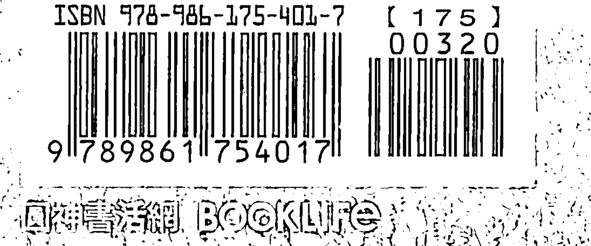