# 覺醒2.0

關上眼，你才能看見命運的原始碼。

REBUILD YOUR SOUL'S CODE

命運只是一種程式，誰學會它的語言，誰就能改寫自己的人生

你所認知的命運，往往只是頭腦狹隘的投射。
當你深信，自己的人生是由老天決定時，
事實上，你的這些心念和行為，反而在編寫你的命運

當你的人生，被「頭腦」鬼遮眼，
你的命運，就會由一連串的「意外」組成。
相對的，當你從覺醒中「看見」命運，
進而看透編寫命運的語法，
你就可以改寫命運這個程式的「原始碼」，
擁有全新的人生。

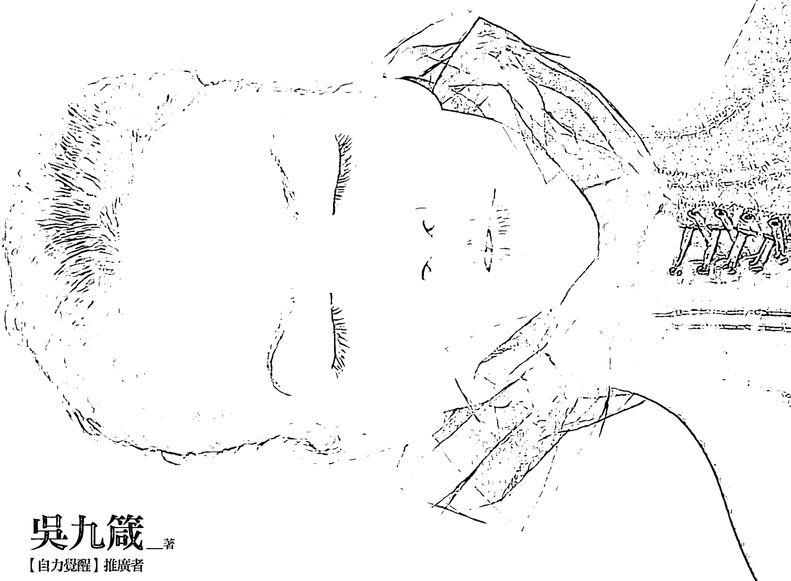

吳九箴 著
【自力覺醒】推廣者

# 覺醒2.0

關上眼，你才能看見命運的原始碼。

AWAKING : BEHOLD THE INSTANT TO REBUILD YOUR SOUL'S CODE

吳九箴 著
【自力覺醒】推廣者

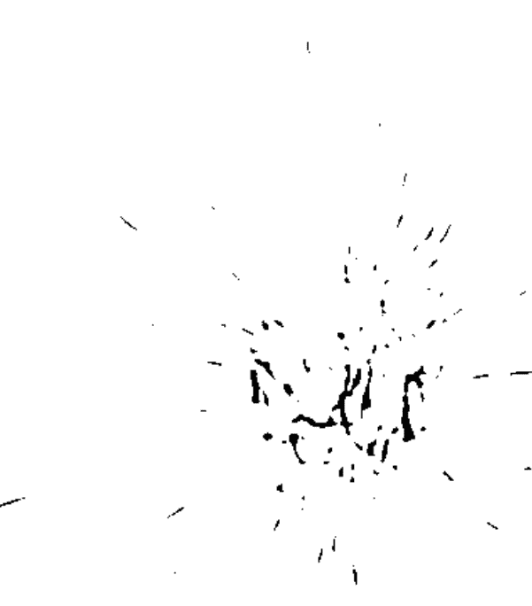

> 你沒有覺察到的事，
將來，就會變成你的命運。
——精神分析學家 榮格

# 目錄 Contents

【自序】如果命運不能被改變，那麼，我早就不在人世間 008

【前言】讓你的人生，從「黑白電視」升級到「HD高畫質」吧！ 017

# 第一篇 如果命運是大象，我們往往只看見牠的腳趾

- 01 改變命運，其實只要0.018秒 028
- 02 出生就拿一手爛牌，如何改運？ 036
- 03 我們都習慣用一根吸管看大象 044
- 04 在你看見真相前，要先過五座橋 050
- △為何光是覺醒，還無法改變命運？ 057

# 第二篇 命運不是玄學，是可破解的「三界語法」程式

- 05 為何有人能改寫命運，有人被命運掌控？ 064
- 06 命運的引擎，由三種力量來推動 070
- ▽ 每個人體內都有「法界」三因子 077
- 07 人類「編寫命運」的模式有九種，你是哪一種？ 080
- 08 M型人：不自覺地用「石斧」或「弓箭」去解決問題 086
- ▽ 經濟弱勢者，都習慣用「肉眼」來看世界 092
- 09 O型人：習慣性用「情緒」和「妄想」去解讀現實問題 094
- ▽ 人心和股票一樣，都是可被操弄的資源 101

# 第三篇 如何運用「MOC」來安裝「覺醒 2.0」？

- 10 C型人：懂得用「意識和信念」，來處理人生問題 104
- 11 運用M型「因果法則」，由外而內來趨吉避凶 114
- ▽ 洋蔥放鬆法 119
- 12 借用O型「習性」和「業力」來改變生活模式 122
- ▽ 卡在頭腦裡的死知識，會讓你變「瞎子」 128
- 13 活用C型「共業變數」，來學會平靜和自在 132

# 第四篇 如何運用「覺醒 2.0」來解決問題及改變命運？

- 14 閉上眼，你才能看見「業力軌跡」 142
- ▽墨鏡、夜視鏡和電子顯微鏡 147
- 15 無敵鐵金剛、超人或外星人：你怎麼看自己？ 150
- 16 鐵鍊、粉筆線和承諾：你和他人的關係 154
- 17 貧富之間的界線不在「錢」，而在「覺醒」 162
- 18 不要用M型或O型層次，來看輕自己的工作 174
- ▽如何用MOC三型，來自我療癒？ 180

# 【後記】未來十年，你的靈魂該何去何從？ 182

# 【附錄】吳九箴語錄 190

# 【自序】如果命運不能被改變，那麼，我早就不在人世間

我一直相信，老天給我們這麼多的苦難和病痛，必然是要給我們一些重要的訊息。

然而，我這樣的想法，並不是每個人都能認同，包括過去未覺醒前的我。

這幾年一直有很多讀者寫信來，問我覺醒有否用處？能改變他們悲慘貧困的命運軌跡嗎？

關於命運是否能改變，也有不少讀者告訴我：萬般皆是命，半點不由人。

我曾私下調查了一下幾位讀者，對命運的認知是什麼？
結論是，十個人有九個都說，命運對他們來說是一種詛咒。
老實說，未覺醒前，我也認為命運是一種詛咒，而且，我也相信，人是無法擺脫命運詛咒的。
但是，覺醒後我才明白，原來，命運到底是詛咒或祝福，全在我們的一念之間。
我所說的一念之間，絕不是空話。因為，我確實透過覺醒，改寫了自己的命運軌跡，而且證實命運是可以被改寫的。
如果，命運果真是不能被改變的絕對值，那麼，我早就不在人世間了。

從我懂事以來，就有人告訴我，說我的家族是受詛咒的一群罪人。因為，我的原生家庭是破碎零亂的，從小我就被遺棄，在同樣也是窮困的親戚和鄰居的冷漠施捨下，有一餐沒一餐地長大；長期營養不良，一身病痛，又沒錢看病，只好被放著等死，任我自生自滅。
據親戚說，我童年時曾經病到只剩一口氣，我母親已經打算去找木箱當棺材，把我埋掉。雖然，當時我莫名不藥而癒地活了下來，但我冷眼看著無業且不負責任的父親，以及一直在貧困泥沼中打滾的母親及親戚們，在欠債逃債和菸酒賭博中繞圈子，我開始相信宿命和詛咒這件事。
我們這個家族，從曾祖父開始，都是貧困無業之流，偶爾有聽說父母親或親戚們在做一些小生意，但沒多久都是失敗收場，且欠下一屁股債，跟著惹來一堆財務糾紛和江湖仇怨。
我相信，基因和原生環境，就是編寫一個人命運原始碼的作業平台。
或許，幾百年前，我的祖先們就已經在不知不覺中，把這個詛咒，寫進自己的基因裡。
很顯然的，到了我們這一代仍然是被詛咒的。

我的哥哥遺傳了父母的人格特質，到處擴張信用借錢做生意的下場，也是揹一堆債，甚至還被地下錢莊追殺，最後因為家族遺傳性的糖尿病發作，又不敢去就醫，病死在出租套房中。
弟弟也遺傳了受詛咒的特質，從小就不想踏實過日子，為了一步登天或賺投機財，也因背信侵占被判刑入監，出獄後身體也開始出現大問題，失業好長一段時間，最後只能靠勞力賺辛苦錢度日。
我當然也是這家族的一份子，只是，我從小就立志要破除這個詛咒，要脫離這個家族為我編好的命運軌跡。
然而，儘管我很小就離家流浪，靠著不服輸的毅力白手起家，但也是擺脫不了命運的詛咒，我的事業被惡意倒帳兩次，十年來破產兩次，都是一夕之間一無所有，更糟的是，本來就虛弱多病的身體，也開始亮起紅燈，命在旦夕。
曾經，在最絕望最無助的低潮時，我決定向這個詛咒低頭。

眼看我因被倒帳而負債累累，家族遺傳性的各種惡疾也開始甦醒，啟動，法院傳票和討債公司也步步進逼，過去的朋友一個個視我如瘟神，沒有人敢伸出援手，我不得不相信，人是不能和天對抗的，我更相信，我們這個家族是受到詛咒的。

我想，或許老天這樣子對我們這個家族，有他的道理。

即使我不讓自己沾染家族菸酒賭博的惡習，即使我吃的藥比別人還多，我付出比別人更多的努力，來投入事業；然而，我所獲得的回報，就是更多的病痛和債務，以及看不見未來的恐懼和絕望。

如果這不是受到詛咒，那要做何解釋呢？

那個時候，我決定放棄自己，不再做任何掙扎。

當我閉上眼，在腦中回憶此生的點點滴滴時，內心深處湧出一股不甘心，我不停地掃瞄著過去的記憶片段，那一股不甘心和不願屈服的力量，卻漸漸強大。我不停地想，難道我就只能坐以待斃，等著老天毀掉我？

在這股不甘的力量中，我集中精神在過去記憶片段中，想找出任何決定我的命運的相關線索，即使真有個老天爺在我的人生中動手腳，我也要搞清楚我是怎麼走到這步田地的。

就這樣，我把自己從小到現在的人生，在內心不停地重播，每一個細節都不放過。這時，我才看見，我過去實在是做了不少無知及愚蠢的決策和行為，甚至有些是非常離譜的錯誤決定，我不知當時我為何會有這樣的想法和決策。

原來，我的失敗和不幸，都和老天沒有關係，而是我自己沒有看清實相，沒有做對判斷和決策。

原來，所謂的家族詛咒，所謂的命運多舛，都是我自己的無明所造成。

原來，決定命運的關鍵點是我自己，編寫命運藍圖或劇本的，不是老天或祖先，而是我自己。

在這些醒悟中，改變我這一生最重要的關鍵是，之前我深信不疑的那個——老天對我們家族的詛咒，說穿了，只是一個，因為我看不清實相的錯誤認知，所做出的荒謬結論。

就這樣，我在無意中，發現了有效對抗命運的第一個力量——「反省」。

從此以後，我每天都找時間，讓自己靜下心，閉上眼，不停地檢視自己過去的種種，不停地反省、反省再反省。最後，我終於知道如何改寫自己的命運原始碼。

雖然，現在的我沒有什麼偉大的成就；但是，我終於有了安定的生活和穩定收入。身體雖然還是有一堆慢性病；但是，在體質及抵抗力上，都比以前進步不少。而且，我家族遺傳的糖尿病基因，我是唯一一個過了發病年紀，還沒發病的家族成員。

或許，對一般人來說，所謂的改變命運，是指讓自己名利雙收或是大富大貴，擁有超凡的成就、地位和人生。
然而，對我來說，我只要能擁有平凡人的生活，不要再像以前一樣四處流浪，過著沒有尊嚴的貧困以及病痛生活，我就算是徹底改變命運了。
如果你也曾經抱怨自己受了詛咒，抱怨老天總是針對你一個人，故意折磨你或找你麻煩，這時，請你靜下心來想想，靜下心來反省再反省，這種認知是否客觀正確。到底是真的有老天，還是，所謂的老天，只是你為了抱怨而抱怨，而找到的一個替死鬼？
如果你不能勇敢地去看清，自己總愛抓「老天」來合理化自己的無明和愚昧，的這個事實，你就永遠無法從「反省」中，找到改變自己的力量和可能性。
如果，你也想改變命運，希望我的經歷和體悟，能對你有幫助。

其實，改變命運就像開保險箱，關鍵不在於你看見什麼，或擁有什麼破壞工具，而在於你是否懂得靜下心來，閉上眼，用心去聽保險箱裡鐵鎖滾珠或齒輪的聲音，你才能在對的時機，破除命運的枷鎖，打開命運之門。

因此，當你的人生被困境卡住，當你的人生陷入四面楚歌、走投無路的逆境，請不要睜開眼睛去找神棍改運或投機鑽營；你唯一要做的，就是閉上眼，讓心靜下來，讓自己看見，過去做了哪些錯事傻事，然後勇敢地去修正這些錯誤認知和行為，你才能真實不虛地改寫自己的人生。

# 【前言】讓你的人生，從「黑白電視」升級到「HD高畫質」吧！

如果把人看成電視機，那麼，過去的我，生命的品質就是處於畫面雜訊亂竄且扭曲變形的混亂狀態，畫質差，甚至還經常是黑畫面。

如果把人看成手機，過去的我，人生品質則是經常當機，收不到訊號，或者通話品質很差，不能上網，也沒有智慧功能的低階手機。

當然，我會有這樣的低階和混亂狀態，其來有自，原因紛雜；然而，最大的責任，是在於我自己不懂得，如何讓自己的意識作業系統升級。

直到我受夠了憂苦不安的日子，才下定決心要脫胎換骨。接著，在好幾年不停地摸索中，我終於找出了幾個關鍵點，然後花了很長時間的實驗，我才成功地脫離那地獄般的人生品質。

其中的關鍵轉折，就是覺醒。

過去我寫的幾本書，一直是分享我如何離苦的體悟和心得，告訴大家如何從我執的妄想假夢中醒來，如何用靜心觀照去看見實相，進而離苦，脫離悲慘的業力軌跡。

這個讓人從妄夢中醒來，看見自己無明，讓人離苦的覺醒階段，我稱之為「覺醒1.0」版本。

當時，不少讀者寫信來，要求我分享如何進一步運用覺醒，來改變自己，改變命運，甚至改善健康、感情、人際關係和財務問題。

然而，我一直沒有往下寫，是因為，要覺醒，要脫骨換骨，全面地提升生命和人生品質，並不是像我們直接到電器行或手機商店，換一個全新或更高階的電視和手機，那樣簡單。
如果沒有一段時間的觀照基礎，就急著脫胎換骨，反而容易走火入魔。
現在，我想時候到了，這本書就是要告訴你：
我們的意識存在，很像電視或手機，但問題是，我們不是電視或手機。
我們想要升級的唯一方式，就是透過觀照來調整或改寫，自己內在的意識和認知程式。軟體升級了，我們的健康、事業、人際關係或感情，以及財務和人生品質，才有可能跟著升級。
這個讓人逆轉業力軌跡，讓人全然脫胎換骨的覺醒階段，就是「覺醒2.0」版本。

幾年來，我自己透過「覺醒2.0」，來讓自己的生命品質，從雜訊干擾的黑白電視，提升到HD高畫質般的狀態，也讓我的生活和人生質感，從夜市地攤的黑心貨層次，升級到國際精品般的高質感。只要你願意改變和覺醒，你也可以和我一樣。

或許有人要問，覺醒1.0和2.0版本之間的差異在哪裡？

簡單地說，覺醒1.0是入門心法，重點在於覺知和觀照。覺醒2.0版本，則是在觀照後，把原本只在內心運作的心法，延伸用到生活層面來，進一步去改變生命和人生的品質。不同於覺醒1.0的覺知和觀照，整個覺醒2.0版本的核心功法有三個：放鬆、放空和放下。

很多人都說放鬆放下之類的，是很容易的事。當然，如果你只是用嘴巴來練功，的確是很容易的事。

事實上，放鬆、放空和放下，不僅不容易，而且都是要有相當悟性，以及經過長時間練習，才能做到的人生大事。

人生要有品質，要能夠從苦海中解脫，這三件大事是關鍵，猶如人類進化的保險箱密碼，一旦密碼按對，它們會給你不可思議的強大力量。

就以我自己為例子。

當我窮苦潦倒，一無所有時，唯一的本錢就是：放鬆。

無所求的放鬆，全然地擁抱寂寞孤單和失意，少吃少喝少妄想，靜靜地呼吸，靜靜地等待因緣的變化，讓身體不會因為內心的苦悶和煎熬，而失去能量崩潰掉。

如果你也在低潮或緣息期，就算走投無路，山窮水盡時，千萬別忘了，你還有與生俱來的本錢：放鬆。

當我功成名就、一帆風順時，唯一能讓我立於不敗之地的，就是：放空。
學會放空，讓我隨時都可以回到原點，不會讓眾人的喝采或奉承，像濃妝般掩蓋了自己的本來面目，忘了自己的來時路。
因為放空的強大力量，我不會患得患失，更不會因恐懼而強求，因強求而陷入我執，而做出錯誤決策，再度讓自己陷入無明困境。
切記，當你來到緣生期，站上人生的高峰時，別忘了時時讓頭腦放空，才不會丟掉原來的自性。

未來，當我臨終時，我要做的最後一道功課，就是：放下。
不管我有多少成就名氣或子孫親友，不管我過去累積了多少恩仇榮辱和悲喜苦樂，都要毫無條件地放下。
因為，在這個當下，我最需要的是全然的平靜，連「自我」都放下的平靜。

我本來就不是我，我本來就是許多因緣聚合的一個意識，時候到了，名字、長相、出生地、身分證、頭銜，和那個由頭腦架構出來的自我形象，都要全然放下。
這樣的平靜，沒有罣礙和恐懼，沒有貪戀和牽絆，才是人生這場幻象遊戲的最佳句點。
我一直主張，身為人就要全然地去體驗這滾滾紅塵的一切，無須躲在深山幽谷，美其名修行，實則逃避自己的責任和人生功課。
在這人間，人人都想功成名就和幸福美滿，只是，人世間有太多考驗和挑戰，並非我們想要什麼，就能盡如己意。
其實，我很贊成大家為了自我挑戰或實現人生夢想，而入世地追求自己想要的東西；然而，我不希望有人滿腦子只為追求某些東西，太過偏執，而失去了身心平衡和靈魂的平靜，甚至失去自我。
我相信，追求人生目標和身心平衡，以及擁有高品質的意識和人生，是不相違背的。
只是，我看到太多自我迷失的人，為了追求財務自由而犧牲健康；或者為了成全愛情而賠上自己的靈魂；更有人為了不存在的安想，而去作奸犯科，危害人間。
在這裡，我想告訴大家，你想擁有自己的事業、房子、尊嚴、愛情、名利和幸福，都是值得鼓勵的。
但你的身心有一定的極限，外在因緣也並非總是如你意，每天讓你自摸或中樂透。如果你不懂得讓自己保持身心平衡，不懂得讓自己隨時靜心充電，讓靈魂回歸原點，當你機關算盡，不擇手段得到你要的，同時也賠掉了你的健康、親人甚至靈魂，這時，就算你擁有全世界的財富，也是一場空。

因此，真正的成功者，不是光看外在擁有什麼，而是當你登上人生高峰時，你的內心，還剩下什麼。

古人有云：一將功成萬骨枯。
在我看來，這是最笨最愚蠢的無明戰略。
如果你能覺醒，就會發現，不論你要追求或改善的，是健康、財務、事業、人際關係或感情，你的戰略最高原則，應該是先回歸到自己的身心修鍊，用無上智慧和潛藏在身體裡面不可思議的力量，讓自己從根本，從源頭，從內心最深處的靈魂開始，全然地脫胎換骨，變成一個清醒的人，超越無明業債的覺者；如此，你的人生，才算真正開啟舞台的布幕。

然而，從無明到覺醒，到脫胎換骨，絕非短時間的易事。期待有緣人看了本書，可以從內心做出改變，並且勇敢地付諸行動，讓自己升級。

至於，每個人能領悟多少，能改變多少，就不是我能強求的了；畢竟，天底下的醫生千千萬萬，但真正能治癒你的，只有你自己了。

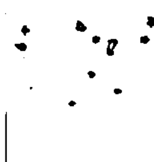

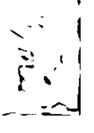

0
2
6

# 第一篇 如果命運是大象，我們往往只看見牠的腳趾。

## 01 改變命運，其實只要0.018秒

命運，是可以被改變的。

所有生物中，只有人類擁有改變自己命運的特權。

然而，在改變命運之前，你必須先看見它長什麼樣子。

如果你的命運是一頭大象，那麼，你的頭腦所能看見或認識的命運，往往只是局限在象鼻子或象腳，並非看見完整的實相。

為什麼你的大腦只能看見狹隘的真相？

那是因為，你大腦的作業系統還是舊時代的版本，你活了二十或三十年甚至更久，卻一直在使用老一輩傳下來或從童年就架構好的低階意識作業系統，來看自己、看他人和這個世界；甚至，用這個低階系統來定義自己的命運，來扼殺自己的未來。

當你的大腦作業系統，仍停留在迷信或無知的低階版本，你看命運的視點，往往是被一堆信念框架限制或遮蔽的，因此，你只能看到被大量信念框架如果命運是大象，我們往往只看見牠的腳趾。

遮蔽後，命運真實臉孔上的一個小角落。

所以，你很容易就掉進「宿命」的陷阱，一步也不敢踏出框架，一輩子都只能在層層疊疊的信念框架中，演出自己狹隘認知下的命運劇本。

或者，你的大腦沒有太多的信念框架限制，但也會因大腦作業系統的版本太老舊，覺察和觀照功能不足，於是，每當有人告訴你一些想法，或是自己遇到挫折不順，就開始把別人的想法或自己過去的恐懼和創傷，拿來當成逃避現實的藉口。

因此，你所看到的自己和世界，經常是戴了墨鏡後的灰暗陰沉，又或是戴上濾色鏡片，過濾掉人生中的某些自己不想看到的顏色，活在自己架構起來的認知牢房裡，自欺欺人過一生。

這種時候，你就很容易掉進「認命」的假象中。

## 01 改變命運，其實只要0.018秒

事實上，所謂的宿命和認命，都只是頭腦的產物，都只是一種對自己和世界的錯誤認知，只是一個抽象的標籤。

如果你大腦裡的意識作業系統沒有升級，你就永遠無法擺脫這些認知標籤給你的限制和阻礙，同樣的，你就無法改變自己的命運軌跡，掌控自己人生的方向盤。

人活著，都需要大腦裡的意識作業系統，來讓自己認知這個世界，進而整合所有感官訊息的輸入。接著，經過意識作業系統的處理和運算，再輸出各種想法和決策，來決定自己要做出什麼行為。

然而，這世界是不公平的，最大的不公平，不在於你出身在什麼家庭，或是你父母擁有多少財產，或是你長得帥氣或美麗，而在於每個人的意識作業系統的版本和功能都不同。

意識作業系統高階或功能強大的人，可以接受一般人覺察不到的訊息，可以精準且複雜地處理和運算，那些來自內部和外界的細微訊息，並做出最佳的決策；運用最少資源，洞燭機先，來改變自己的命運。

相對的，擁有低階意識作業系統的人，往往對許多重要或關鍵訊息視而不見，聽而不聞，就算看見聽到了，大腦裡的作業系統也不會做有效率的處理和運算。

很不幸的是，他們根本不知道自己的意識作業系統功能不足，任憑內在的不安或快感驅力，和外在的恐嚇或誘惑誤導干擾，頻頻做出錯誤決策，陷自己於險境。

這些人，即使想找人幫忙，也分不清好人壞人，等於中邪生重病，還請鬼抓藥單，自然會覺得人生是苦，處處是危機。

由於他們無法覺察問題的源頭，也看不清實相，為了避苦，只能想盡辦法用菸酒毒品或藥物來麻痺自己的大腦，逃避現實，迷失自己。

因此，決定你的命運的關鍵，不是上帝或老天，也不是你的行為和祖宗八代，而是你的意識作業系統。

既然如此，你何不透過意識作業系統的升級，來改變自己的命運呢？

有人說，改變命運需要很長的時間，需要一年作法，或等十年大運來，才有用。但我說，改變命運，其實，只需要一個念頭的時間。

人的一個「心念」起伏，只有一個「剎那」的時間。

據說，人的一天有480萬個「剎那」，如此算下來，一個「剎那」大約是0.018秒。因此，一個人改變命運的時間，只要0.018秒。

道理很簡單，心念是顆種子，當你在心中播下一顆「改變命運」的種子，你的新人生就開始在心田裡滋長。日後，不管這顆種子長成什麼樣子，長得多麼茂盛翠綠，長得多麼高聳挺拔，這一切，都必須從一顆種子的誕生開始。

當一個街友或乞丐在內心產生了一個念頭，一個決定勇敢面對人生，重新站起來的念頭，他的命運，在那個當下就改變了。如果他的這個念頭沒有放棄，或是沒有被別的念頭推翻，他必然會起身去一步步走出自己的路，慢慢地改變自己的命運。

當一個長期被家暴的婦人，勇敢地擁有一個結束這段惡緣婚姻的念頭，這一個剎那，她就開始改寫了自己的命運藍圖，也改變了她孩子和施暴者的人生。

同樣的道理，當你想改善自己的健康、財務、人際關係或生活品質，這一切的改變，都需要從一個心念開始。

人類最偉大的地方，不同於禽獸之處，在於我們擁有自我反省和學習成長，以及進化升級的能力。

如果人的一天有480萬個「剎那」，那麼，你每天都有480萬個改變命運的機會。

當你陷入困境，遭逢各種挑戰時，與其道聽塗說，到處求神問卜，或自欺欺人地花錢改運，不如讓自己靜下心來，反省過去所作所為，觀照問題的根本和實相，在480萬個剎那中，抓住一個心念，讓自己啟動改變命運的開關，重新改寫自己的人生。

## 02 出生就拿一手爛牌，如何改運？

有讀者來信質疑，光是覺醒，光是往內心去修行，仍不能改變他是貧賤人家出身的這個事實。

同樣是年輕人，他的同學因為家裡有錢，加上父親的人脈，早已是連鎖店的老闆；而他還要為三餐去賣命，每個月賺三萬元，繳了房租和水電，再扣除油錢和吃飯，根本所剩無幾。每當親戚問他何時買房娶媳婦，他也只能苦笑地說，連房租都快付不出來，還談什麼置產。

他問我，透過覺醒來改變命運，是否為空談？

我告訴他：覺醒，進而讓你的意識作業系統升級到覺醒 2.0，目的不在於去改變你的過去和出身，而是要讓你擁有掌控命運的能力，為自己重新設定未來的人生藍圖和業力軌跡。

當你有了覺知，有了洞察自我和看清萬事萬物運作規則的能力，你的一個念頭、一個想法、一個認知、一個習性和每個當下的行為，都可以改變自己，進而改變他人以及許多情勢和局面。

這些你可以掌控的念頭、想法、認知、習性和行為，甚至由許多行為組合起來的戰術和策略，都是你可以運用的資源。

從這個角度看，你擁有的成功或改變命運的本錢，其實是和其他年輕人都一樣，真正的財富和資源，不在於你是否擁有富爸爸或有充沛人脈的家世背景，而在於你看穿了多少事物的本質，運用了多少資源。

同樣是剛從學校畢業的年輕人，A和大多數年輕人一樣，進入一家小餐館當服務生，然而，他只想著有一份工作可以付房租，沒有什麼大志向。每天上班只想著趕快下班，下了班可以和朋友去逛街唱歌吃東西，週休二日就和朋友騎車出去玩，平時沒事在家就上網玩遊戲。

有一天，外場服務生因有人離職而人手不足，老闆一時找不到人遞補，要求包括A在內的服務生，假日都要來排班支援。

大家週休二日無法出去玩，又忙又累，月底領薪水時發現週休二日的支援排班沒有用加班的薪資計酬，只用平時的一般薪資計算。

A心生不悅，首先發難去找老闆抗議。

老闆說當初面試A進來時，早已講清楚工作時間包含週末和週日，因此，只能用一般薪資來計算。

A要求加薪不成，唆使其他服務生一起罷工，來逼老闆就範。

其他服務生大都跟著罷工，只有幾位沒有跟進，其中有一位B不贊同A的說法和認知，決定留下來繼續外場的工作。

A和幾位服務生抗議了一段時間沒上班，過沒幾天因曠職太多天而被老闆開除。

B不但留了下來，還自願幫老闆找工讀生，並到書局去看餐飲管理的書，協助老闆建立更有效率的排班制度，更從許多成功人士的傳記中，擷取人家的經驗，制定了外場服務和管理的SOP。

幾年後，B的老闆事業做得更大，原本的小餐館也變成知名的連鎖餐廳，B也從服務生晉升為管理部經理。

這時，A仍繼續遊走在許多餐館之間，成為資深服務生，週休二日就和朋友騎車出去玩，平時沒事在家就上網玩遊戲。

請各位想想，同樣是假日支援排班，A認知是犧牲員工休息時間，B則認知是分內的事。

同樣是領一般薪資，A認為老闆剝削勞工，B則認知週末本來就是餐飲業的正常上班時間。

同樣是領不到加班費，A內心起了個罷工的念頭，B則起了個如何協助老闆度過難關的心念。

同樣是領一份薪水的服務生，B願意把餐館當成是自己的事業，利用下班時間去找書來改善工作上的問題，A則把餐館當成是老闆的事業，下了班就把工作拋到腦後。

在此，我並不是要大家一定要走B的路。A和B各有人生目標，沒有什麼對錯。我只是就一個事實來說明，資源的價值，其實是在於你用了多少，而不是你擁有多少。

如果你的想改變命運，也和B一樣，想擁有自己的事業來改善生活，來提升職位和收入，在工作中培養出專長以及享受成就感，那麼，B確實是成功地改變了自己的命運。

很顯然的，B從一個地位基層的服務生，晉升到管理部經理，靠的不是家世背景或錢財，而是他可以掌控的心念、認知和行為。

只要你有正常的意識和健全的身體，同樣的，你也必然擁有掌控心念、認知和行為的能力。

為何B可以從基層改變命運，而你不能？要知道，一個細胞的存在和繁殖，最重要的是細胞核內的DNA。同樣的，一個人要擁有成就和改變命運，關鍵不在於外部資源，而在大腦裡的意識作業系統，在於他的「覺」和「識」，識就是擁有自我覺察能力的認知，有了這個核心的升級和改變，命運才能真正被改變。

我的觀照筆記

## 03 我們都習慣用一根吸管看大象

我們所認知的命運，往往只是頭腦狹隘的投射。

以上篇中的 A 和 B 為例，幾年後 B 成了管理部經理，A 卻仍是服務生。當兩個人到了該成家立業的年紀時，A 必定會怨天尤人，為自己事業的運途不順感到懊惱。

當 A 看到 B 事業有成，他必然看不見自己和 B 的差異在哪裡，同時也會把 B 的成就歸於祖上有德或好運臨頭所致，他不會覺察自己在心念、認知和行為上出了問題。

於是，他所認知的命運，只限於遇不到貴人或流年不利等等狹隘的框架中，猶如他習慣只用一根吸管來看大象，永遠只看到大象的腳趾或尾巴，即使偶爾命運這隻大象從他眼前走過，他也認不出來。

同樣的道理，每當有人向我抱怨他的運勢不順，甚至是老天故意捉弄，我都不會立刻贊同他的認知和說法。

因為，十個來抱怨運不好的人，經過我仔細查問後，有九個半都和A一樣，犯了用吸管看大象的錯。

而且每一個人都聽不進我說的實相，他們不承認大象的真實面目就是大象，每個人都固執地認為自己認知的是對的。

類似這種無知又固執的人，我斷定他們無法改變命運，因為，命運是由實相中的許多因緣組合而成的，並不是由個人的主觀框架和一廂情願的想法架構起來的。

當一個人無法看清這個事實，就等於分不清水和油的差別，當他急著想改變命運的時候，往往反用油去救火，可想而知，結果必然和他想的不一樣，而且是天壤之別。

我們所認知的命運，往往只是頭腦狹隘的投射，更可怕的是，如果那個投射的源頭是我們不敢面對的恐懼或創傷，那麼，這個狹隘投射所造成的偏差或錯誤認知，會把我們推入地獄的深淵。

有一個女孩半夜坐在客廳裡，拼命打男友的手機卻沒人接，於是，她開始胡思亂想……

自從和這位帥哥男友交往以來，她每天都活在不安中，她知道自己早陷入不可自拔的愛情黑洞中。

她不能沒有他，如果她被拋棄了，她不知如何面對自己和這個世界。

如果她被拋棄了，她深信，從今以後再也沒有人會愛上她這種相貌平凡的女孩。

如果他真的有了別的女人，那她再也沒有活下去的勇氣……

就是這樣，她光是坐在客廳，只用幾個「如果」，就把自己推入十八層地獄般的恐慌中。

等到她男友回到家，推開門就聞到一股焦味，原來，她已經燒炭自殺。

可想而知，女孩最後會做出這樣的決定，必然是把狹隘的「如果」，當成是「真實」的命運。

當她的恐懼投射出這個被扭曲且偏離事實的命運結局，而且她的大腦選擇相信它時，她的恐慌必然逼她走上絕路。

我的觀照筆記

## 04 在你看見真相前，要先過五座橋

有一次我和朋友到鄉下去散心，途中向一位老農夫討水喝，突然間，一隻烏鴉從我們的頭上飛過。

老農夫本來欣然答應要給我們一杯水，突然間面色凝重，說烏鴉這時飛過，是不好的徵兆；他不能給我們水。

當時，天邊開始有黑雲聚集，顯然天氣要轉陰雨。我們告訴老農夫，烏鴉低飛是因為天快下雨的因素，和徵兆沒有關係。

然而，老農夫就是不相信，他說不僅看到烏鴉，還看到惡靈在天上飛，要我們趕快離開。

我們的大腦並不是客觀的機器，我們的眼睛也不是真實映照事物的原貌。

當你看見一個東西，其實那個東西不是你看見的那個模樣。

當你認定某件事是事實，其實你認定的事實只是一個幻影和幌子。

當某個事物，透過眼睛到達我們的認知系統前，它還必須通過信念這個有色鏡片和濾網。

只是，信念這個東西，是由色受想行識五座橋組裝起來的，而且，這五座橋遠遠看是橋，但你近看卻是空無一物。

上帝造人，給了我們相同的系統和機制，每個人都透過這五座橋來認識和定義我們所看到或接觸到、感受到的東西。

尤其是在這人世間擁有愈多資歷的人，他所看見和感受到的東西，就會受到愈多的干擾；畢竟，活了這麼久的人，身體的細胞和意識、潛意識都累積了很多的記憶和認知參數。

如果一個人沒有覺察到，我們一直透過這五座橋在看世界，那麼，他活得愈老，所看到和認知到的東西，將離實相愈來愈遠。

我有位遠房親戚，年輕時頭腦很好，也很有才幹，一直靠著理智和邏輯來做決策，生意做得相當大。

但是年老時，因為氣虛體弱，開始失眠憂鬱，整個人也莫名其妙地焦慮起來，每天活在不安和恐懼中。

當他的恐懼像病毒一樣在內心擴散開來，他開始不相信任何人，他只相信自己的判斷。

但他不知道自己的判斷和定論，都要經過這五座橋，而橋上累積了太多的記憶和參數，讓他陷入混亂不安中。

最後，他把照顧他幾十年的髮妻趕走，然後聽信圖謀不軌的親人耳語，把自己的孩子以詐欺或偷竊罪告上法庭。

有一次，他在法庭外的走廊等開庭，一位年輕法警看見他的皮夾從大衣口袋中掉到地上。

法警過去撿起來還給他，他卻用言語羞辱年輕法警，認定法警是為了討好他，才把皮夾偷走再還給他，讓年輕法警也勃然大怒，最後告他誹謗，連媒體也來報導此事。

佛陀說，人和這個世界，都是這五座橋架構起來的，因為五座橋的相互運作，我們才會產生一個「我」的認知和錯覺，每個人才會各自創造出不同於他人的世界。

因此，同樣一個世界，我透過我的五座橋看到的世界，和你和他，以及世界上每個人所看到的世界都不一樣。

然而，每個人都是獨一無二的個體，每個人的世界觀和認知系統，也都是獨一無二的，即使這世上有幾十億人，也很難找到認知系統完全一模一樣的兩個人。

因此，法律並沒有規定誰的認知是對或錯，佛陀也沒有說怎麼樣的認知系統才是正確的。

意思就是，那位不給我們水喝的老農夫，他對世界和烏鴉的認知雖然和我們不一樣，但沒有誰對誰錯的問題；唯一的差別只在於，誰的認知系統比較接近實相，或者誰的認知系統比較能讓自己好過罷了。

然而，如果你像老農夫在深山耕田自給自足，只要不會危及自己的生計或安全，只要不危害他人，你要如何賦予烏鴉從頭上飛過的意義，我想，連佛陀也不會有意見。

話說回來，如果你活在城市中，需要和他人合作才能生存下來或擁有競爭力，那麼，你的認知系統就不能離實相太遠，否則你會把自己逼到絕路。

當然你的認知系統更不能和大家的差太多，否則你永遠只能自說自話，無法和人溝通，孤立無援。

切記！在我們看見真相之前，必須先經過五座橋。

同樣的，過去以來你一直認知的「命運」，也是經過這五座橋才到達你的意識，才讓你產生對命運的定義和認知。

因此，你大腦中的意識所認知的命運，和實相中的命運本尊，有著五座橋的干擾和加工，早就不是原汁原味。

這就好像，你到街上買一瓶果汁，儘管口感很好喝，但你永遠不知道，真正的現榨原汁，並不是這個口感和味道，你所喝到的果汁，早就經過人為的加工處理。

甚至你的瓶裝果汁裡，也有可能完全沒有果汁的成分，你所看到的顏色是人工色素調出來的，你所嚐到的味道，也是人工香料調配而成的。然而，因為瓶裝上寫著果汁，所以你的大腦就相信且認知到這瓶飲料就是果汁。

如果你想通了這個道理，就不要太快或武斷地執著於某個人或團體告訴你的命運定義，也不要死守因為自己過去的陰影或創傷，讓你產生的對命運的錯誤認知；否則，你就不可能改變命運。

事實上，每個人內心的這五座橋上，都殘存或囤積由來已久的身心記憶和認知參數，而覺醒就是讓你看清這個實相，讓你懂得定期清一清，如此，真相才不會死在這五座橋上，永遠到達不了你的意識。

### □ About Awakening 2.0

### ▽ 為何光是覺醒，還無法改變命運？

有讀者來信，說她歷經愛人背叛和事業破產，整個人已經覺醒，也已經看清過去自己一直活在不切實際的妄想中。

如今她徹底想通了，醒了，但仍然一直陷在人生谷底，健康和財務都出現警報，感情也沒有寄託，空虛寂寞每天一寸一寸地吞噬著她，她感覺自己根本無路可走了，甚至不想再活在人世間。

她問我，為何已經覺醒的人，仍無法改變命運？

關於改變命運的方法和原理，即使沒有歷經苦難的人都知道。然而，不論是聽人演講或看書，甚至經歷人生重大打擊後才領悟的道理，這些都只是頭腦的「知道」，並不是整個人的「覺悟」，因此，所謂的改變命運，永遠只是存在於頭腦裡的一個概念，根本無法實際讓人脫胎換骨。

事實上，改變命運的關鍵，不在於「知」，而在於「覺」和「行」。當你大腦裡的意識作業系統沒有升級，你光是知道改變命運的方法和原理，根本只是紙上談兵。

因為，你的意識無法管理或掌控，那些來自舊有認知或信念框架的意識運作模式，以及這些低階運作模式，進一步所產生的驅力程式和迴路。

例如，你的想法和認知一直被某些錯誤的程式操控著，因此，只要有點風吹草動，你自己就會對號入座，執著於某些想法和框架，進而啟動過度的情緒反應機制，讓自己陷入危險之中。

例如，你的許多行為和決策，其實都不自覺地被「快感驅力」操控著。

因此，明知有些人不能愛，你還是寧可像飛蛾撲火般，不計代價地跳入火坑。

明知菸酒狂歡傷身，然而，為了逃避寂寞或自卑所帶來的痛苦，或是享受大腦被夜生活刺激的快感，即使健康亮起紅燈，命在旦夕，也在所不惜。

世上有多少種人，就有多少種「快感驅力」，時時刻刻在操控著人們的生活。

有的人的「錯誤認知」以及「快感驅力」是隱性的，雖然行為上沒

如果命運是大象，
我們往往只看見牠的腳趾。

有驚人之處，但在工作、健康或人際關係上，則選擇逃入自己架構起來的虛擬世界，或者選擇不願去看見實相；如此一天過一天地封閉在宿命的囚牢裡，庸庸碌碌或抑鬱寡歡地走完一生。

因此，當你有了改變命運的念頭，你只到覺醒 1.0 的層次，你還必須擁有改變命運的能力，要擁有這個能力，就必須從意識作業系統的升級開始。

當你的意識作業系統升級，你就到了覺醒 2.0 的階段，你就有能力看見過去的業力軌跡，在覺知中管理以及改寫自己的認知參數；如此，你才能真正脫離快感驅力的控制，改變自己的行為模式，進而改變命運。

話說回來，如果你不能掌控「快感驅力」或由內心恐懼投射出來的妄想和欲望，不論你再怎麼發誓要改變命運，也只是空談。

## 04 在你看見真相前，要先過五座橋

就好像有個讀者問我，她要如何脫離現在的負債生活，重回有計畫且安定的日子，不用再害怕被追債而天天心驚膽跳？

我問她，每個月最大的開銷是什麼？她竟然說是逛百貨買衣鞋和包包。她也知道這種行為是她負債的原因，然而，她說她無法不去購物，因為她每天活在壓力和不安中，如果不讓她去購物，不讓她去享受那種，可以讓她完全忘卻工作壓力和負債的快樂，那麼，她寧可不要活了。

當然了，我只能回答她，當她不能讓自己的意識升級，不能用意識去掌控住內在的快感和恐懼這兩種東西時，她要擺脫負債，根本是痴人說夢話。

總之，當你比別人還努力一百倍，甚至拼了命用盡所有力氣，仍然無法改變命運時，你就該靜下心來想想問題在哪裡。

事實上，改變命運的關鍵，不在於「拼命」，而在於「覺」、「知」和「行」。

當你有了「覺醒」，還必須再加上「對」的「知見和方法」，這樣你的命運，才能從宿命和認命的「定數」，變成可逆轉可重新改寫的「變數」。

接下來，我就要告訴各位，為何大部分的人都無法改變命運。

## 05 為何有人能改寫命運，有人被命運掌控？

同樣是人，為何有人從早就辛苦工作，一天要做十幾個小時，天天如此，收入不過是幾萬元；而有些人卻每天開名車逛街，有空看一下股票，再去喝下午茶，輕鬆愜意地過日子，卻月入百萬？

更不公平的是，為何大部分的人，都是付出的多賺的少，愈是努力打拼賺錢，過的日子就愈苦？

只要是人，都想改變命運，即使是富人或好命人也有相同的想法。

然而，對那些收入不高的大部分人來說，改變命運似乎也只是神話，只能聽聽或想想，卻永遠無法用來改善自己的生活。

為何大部分的人都無法改變命運？

我想，最主要的原因，是大家都摸不清命運的底吧！

如果命運是大象，
我們往往只看見牠的腳趾。

想像一下，當你想改變一部電腦的運作，如果你不去認清和了解電腦的組成和運作原理，不去使用電腦聽得懂的語言，你如何去改變這部電腦的運作或功能呢？

從某個角度來看，人、萬物和宇宙的運作，就像電腦的運作一樣，必然有它的本質和運作原理。

命運也是如此。

同樣的道理，當我們要改變命運之前，我們也要先搞清楚，命運的運作原理，以及為何有人可以掌控命運，有人卻被命運掌控？

同樣是人，同樣擁有人類DNA所架構起來的神經系統和大腦；然而，世上有多少人，就有多少種命運的軌跡，這是什麼原因？

答案就在我們大腦內的意識作業系統。

我們大腦內的意識作業系統，就和電腦的作業系統一樣，有各種不同的版本和等級。

不同的意識作業系統就有不同的功能和效率，即使我們都活在同一個地球，但因為彼此意識作業系統的等級和功能不同，加上大家的意識作業系統裡的各種程式和設定參數也都不同。

因此，面對同樣的困境或問題，不同人有不同的反應和處理方式，當然結果也就不同。彼此的命運軌跡，於是開始產生落差，甚至有天壤之別。

就拿改變命運這件事來說，擁有不同等級意識作業系統的人，所認知的命運就有所差別，當大家所看到的命運臉孔都不同，改變命運的方法和策略，也自然會不一樣。

意識作業系統比較高階的人，所看見的命運原貌，就會比較接近命運的真相，他所用來改變命運的語言，也會比較有效用。
相對的，意識作業系統比較低階的人，不僅看不見命運的運作真相，也看不見自己的盲點和無知；可想而知，他和命運的對話，永遠是雞同鴨講。

因此，想改變命運，就必須先搞懂命運的運作法則和原理，以及學會使用命運聽得懂的語言，改變命運才不會變成自欺欺人的荒謬劇。

# 第二篇 命運不是玄學，是可破解的「三界語法」程式。

## 06 命運的引擎，由三種力量來推動

事實上，命運的運作，主要是靠三種力量和法則，來影響人的一生。

這三種法則就像是一棟三層樓的大樓，三者密不可分，而且是由一到二到三的疊層向上發展，又由三包含二和一、二包含一的方式向下運作，三者間相互作用變化，以千變萬化的模式，來決定人的命運。

第一層法則是因果，主要構成的元素是物質，因此，我們也可把第一層稱為「物質界」。

在物質界，所有的物質都是無機物，沒有生命，沒有情感，更沒有意識，所有物質的生滅聚合變化，都遵循著因果法則，也就是遵循著物理化學的法則在運作著。

例如，一個氧和二個氫結合就變成水。
例如，液態的水被加熱，就會變成水蒸氣，水蒸氣遇到冷空氣，又會還原為液態水。

或者，就像你用石頭去敲玻璃，玻璃會破掉，你打開電源，讓電通過電熱器，電熱器就會發熱一樣；只要物質間的關係，符合因果法則，物質就會按照這一層的法則，去做變化或產生作用，它們不會有情緒，也不會有什麼自我意志和自由，該做什麼就做什麼，不會有例外。

第二層法則是業力，主要構成的元素是物質和有機物，組合出的千萬種有情生命。這些生命，從低階的有生化反應生物，如植物，到有動物本能，有感情和想法的高階生物，如人類。因此，這個層次可稱為「有情界」。

有情界的運作變化，遵循著「業力法則」。所謂的「業力法則」，是指包含著物質界的「因果法則」，加上生物的感情和意志等力量作用下的一種長時間的隱性影響力。

例如，一個人從小被虐待，長大後他內心的陰影，會干擾且影響他和別人互動的關係和模式。
或者，某人年輕時，曾一時胡塗偷了別人的錢，害人家想不開自殺，這個過錯也會長駐在他內心深處，日後有人懷疑他偷人家錢財時，他會產生極端的恐懼，情緒激動地反駁指控，甚至失去理智來攻擊他人，造成更大的過錯。

我有位朋友，年紀和我差不多，但他的臉頰膚況很糟糕，雖然我的膚況也只是普通，不算是細皮嫩肉，但他的臉頰不僅斑黑枯槁，而且還像月球表面那樣坑洞一堆，甚至還有脫皮紅腫的現象。

有一天，他說自己去參加宴會，被客戶提醒後，回家仔細照鏡子才發現，自己的臉頰膚況實在太糟糕。他一直想不通為何如此，直到他去找皮膚科醫師，才知道，原來上了年紀的人，皮膚功能也會退化，需要每天清潔滋養照護，才能有正常人的膚質。

於是，他就買了一堆保養品，按醫師指示每天清潔照護。過了一個月，他再來看我，我發現他的臉頰膚況好了很多。

這個例子，就是「有情界」中，業力法則包含著因果法則，來影響人們的簡單案例。

例如，皮膚是有情界的有機物，然而，因為人的錯誤觀念和不當使用，造成它長期缺乏物質界的維生素或其他元素，加上長期有汙垢和灰塵堆積在皮膚上，才會讓包含著物質因果的業力，開始在皮膚上產生發炎和敗壞作用。

因此，我們可以簡單地為「業力」下一個定義，那就是，只要物質因果法則，加上生物及人心的干擾及影響，就會在時間的累積下，形成一種不停向前推進的力量。除非種種干擾和影響力消失，否則，這股力量就不會減弱，甚至消失。

第三層法則是「共業」，主要構成的元素是人類的知識、意識和文明。我們可以稱這一層為「意識界」或「文明界」。

這一層樓的力量對人的影響，不再只是一個個體的生老病死或喜怒哀樂，以及個體利益和存活的問題，而是擴及整個社會、國家、種族，甚至是整個地球圈的層次。

這個層次對人的影響，包含著物質界的因果法則，和有情界的業力法則，再加上人類文明的法律、道德、科學、哲學、經濟和科技彼此間的交互發展和串連，形成一個多層次且複雜的「法界」，對人們的影響最大，甚至可說是主宰人類命運的最大力量。

例如，你在公司犯了一個小小的錯，像是寫錯一個字或多打一個零，影響到你的部門同事和長官，也影響你的考核和薪資，甚至影響了你和同事間的關係，或許最後也因此讓你離職，成為失業人士；因為沒了收入，接著，也影響到你和家人的感情。

光是一個小錯，就會有這麼多的牽連和影響，這些影響力的背後，就是一圈又一圈的「共業法則」，在推動許多文明界的事物，去執行該執行的法則。

這個力量，遠遠超出個人的極限，是個人難以去改變的，這個強大力量，就是「共業力」。

同樣的小錯，例如，寫錯一個字或多打一個零這件小事，如果是發生在你自己家裡的「有情界」，可能只是你自己在家裡寫作或算帳，你的行為不在「共業網」的連結中，這個小錯也只會在你個人的感受上留下一點小波瀾，無傷大雅。

除非你把這篇寫錯字的稿子寄出，或者是把算錯的帳拿去指責他人，否則，你的損失是微乎其微。

很不幸的是，隨著人類文明的發達，網路科技的高速進化，我們在家也可以透過網路，到各大社群網站發表意見。

當我們上網去發表意見時，嚴格來說，我們已經進入這個文明的「共業網」的連結。儘管我們不用本名發表意見，但如果我們的言論有違反這個文明界的「共業法則」，我們一樣會受到文明界的共業力影響。

總結來說，因果法則決定物的命運，業力法則決定人類個體的命運，共業法則影響的是人類集體的命運。

### About Awakening 2.0
### 每個人體內都有「法界」三因子

命運如果是一個精密複雜的強大程式，那麼它的原始碼只有三種語法，那就是「物質界」的M型語法（Matter），「生物界」O型語法（Organism）和「意識界」的C語法（Consciousness）。

這三種語法，也是推動命運前進的三個因子。這個世界存在各種法則和力量，然而，不管命運的力量有多大，所有的運作規則都由這三因子所編寫出的劇本（原始碼或程式碼），絲毫不差地完美演出。

萬物都是「法界」的產物，人也不例外。然而，人類和其他法界存在不同的地方，是每個人體內都含有「法界」三因子，不像物質只有M因子，植物和狗貓低等生物只有O因子，人類的存在，包含了M、O及C的因子。

可惜的是，有些人一輩子沒有覺察到，自己體內有來自造物者的恩典，不懂得開發及運用C語法，來改寫自己的命運原始碼，一生都活在M或O的夢境中。

例如有人遇到逆境就用酒精或藥物來麻痺自己，有人用賭博或感官刺激，來讓自己成為快感驅力的囚徒。當他們的存在，大量地使用M及O語法來面對自己的人生，而且比例和深度都違反大自然的設定時，就會發生新聞中的家暴、性侵親子或逆子弒親的悲劇。

## 07 人類「編寫命運」的模式有九種，你是哪一種？

| 問題\認知 | M | O | C |
|---|---|---|---|
| M | MM | OM | CM |
| O | MO | OO | CO |
| C | MC | OC | CC |

當我們看清，整個「法界」都是運用MOC三型，來決定我們的命運軌跡，接下來，我們再往法界的內部去觀照，會發現，所有的人類，都運用這MOC三型所產生的三種認知，來看待及解決人生中的三種層次的問題。

因此，MOC三型各自對應三種層次，就會產生九種解決問題的模式，這九種模式如左表：

所謂的命運，從這九種模式來看，可以說是「認知設定」和「問題層次」間的不同組合，所產生的結果罷了。

也就是說，除了不可抗力的天災或意外，我們的命運，都是由我們自己選擇使用哪一型的模式，來處理當下遭遇的三種層次的問題，所決定的。你選擇哪一種模式，去面對人生，自然就會有什麼樣的結果。

當你遇到物質層次的問題，例如很單純的有石頭擋住去路，你就用力把它搬開，這是你運用身上的「力」，去移動石頭這個物質的「位置」，純粹是運用物理因果法則，這就是用物質認知去解決物質層次問題的MM模式。

然而，如果你體內因缺少維他命C或感染某種病毒，而引起頭痛不舒服，你卻用物質界的認知，拿石斧或木棍來打自己的頭，這就是MO模式，用物質界的認知，來解決生物界的問題。

所謂的命運，不過是：你選擇用什麼樣的模式，來處理你的人生問題。因此，一個人的命運好壞順逆，取決於你是否用對了解決問題的模式。

接下來，當你要改寫命運之前，你必須知道由三型所發展出來的九種模式，各自的內容有什麼不同。

### M型命運模式

M1-MM：用物質界的認知，來解決物質層次的問題。
例如：用暴力或武力來移動或改變物質的位置和完整性，像是搬開椅子，或用錘子把箱子打破，用電鑽在牆上鑽一個洞等等。

M2-MO：用物質界的認知，來解決生物層次的問題。
例如：用酒精藥品等化學物質，來緩解病痛或影響人體的神經系統；或者用按摩器等物理性治療，來影響人體的肌肉和神經系統。

M3-MC：用物質界的認知，來解決意識層次的問題。
例如：有人欠稅被追稅款或犯錯被司法單位判刑，卻用汽油彈攻擊稅務或司法單位，不但不能解決集體意識架構起來的文明層次問題，反而罪加一等，製造更多意識層次問題。

### O型命運模式

O1-OM：用生物界的認知，來解決物質層次的問題。
例如，你體內缺乏鎂或鋅等微量元素，而引起身體不舒服，你卻用大哭大叫，或像原始部落土著用唱歌跳舞來轉移痛苦，但問題還是沒有解決。

O2-OO：用生物界的認知，來解決生物層次的問題。
例如，你連續熬夜工作好幾天，又餓又累，於是很自然地大吃大喝，然後盡情地睡覺，幾天後體力恢復，解決了生物層次的問題。

O3-OC：用生物界的認知，來解決意識層次的問題。
例如，你經濟及工作上的壓力很大，對於這些由人類集體意識架構起來的文明問題，你只能用對等的知識和智慧去解決，然而，你卻用大吃大喝或唱歌跳舞來對抗內心的不安，問題根本無法解決。

### C型命運模式

C1-CM：用意識界的認知，來解決物質層次的問題。
例如，你透過醫學界研究所累積的知識，且從檢查報告或醫生診斷中得知自己缺少鎂或鋅元素，就去買鎂鋅補充劑，精準且有效地解決了體內缺乏微量元素的問題。

C2-CO：用意識界的認知，來解決生物層次的問題。
例如，你的身體有感染發炎或病毒侵入，因而生病，你會找醫生，運用醫學的力量來讓自己痊癒，這就是用意識界認知來解決健康問題的最佳範例。

C3-CC：用意識界的認知，來解決意識層次的問題。
例如，你不懂稅法或法律條文，因而犯錯被處罰，你就學習並調整意識作業系統上的許多認知和邏輯，修正過去自己曾有的錯誤認知，確保自己下次不會再犯同樣的錯，因此解決了稅務或法律上的問題。

## 08 M型人：不自覺地用「石斧」或「弓箭」去解決問題

在高度文明化的時代裡，應該不會有人，會再習慣性地用「物質界」的認知，去解決生活或人生的所有問題了。

然而，我們仍然可以在大腦未發育成熟的小孩子身上，看見他們下意識地拿棍子或塑膠鎚，把所看到的東西打壞打碎。事實上，這是他們認識這個世界的方式之一，並不是我們要談的案例。

比較諷刺的是，在這高度文明的世界裡，生活在其中的人們，按理說對世界的認知，以及處理問題的層次，應該早已提升到意識界，應該知道大家活在這社會中，有許多看不見的遊戲規則要遵守，有許多看不見的力量要尊敬。尤其是人類集體意識架構起來的律法和規則，不僅是維持人類集體生活秩序的依據，也是個人生活需求和安全受到保障的基礎。

然而，這些屬於意識界的律法、知識和信念，並不是所有人的生活準則和行為依據。

有一次我開車遇上紅燈停在路口，這時，可以開始右轉的綠色燈號亮了起來，我旁邊車道的右轉專用道上，有一位老伯伯的車卻停在原地不動，他後面的車子等得不耐煩，開始猛按喇叭。老伯伯可能不想右轉，但又不小心佔用了右轉專用道，不理會後車的催促，仍停在原地。

這時，他後面的車子下來了一個壯漢，拿了一根球棒，對他破口大罵後，要老伯伯立刻往前開，但老伯伯卻試圖跟他說道理；壯漢二話不說球棒就朝老伯伯的車身揮了下去，猛打幾下後，又敲破車子玻璃。路人報了警，本來只是一個小小的交通糾紛，卻演變成毀損罪。

人類是法界三因子的「全存在」，也就是說，人是同時包含三因子的生命體，因此，即使是高學歷且西裝革履的文明人，在情緒失控後，也會退化到用石器時代的認知和解決問題的模式，做出用物質力量，來排除眼前障礙的決定和行為。

這種習慣用物質界思考及認知，來解決問題的人，基本上，他們看整個世界，包括自己和他人，都是以物質界的角度來詮釋。

我曾輔導過一位受家暴的婦人，幫她重新調整對自己和人生的認知。在輔導過程中，我發現她說話的語意和用詞，似乎把自己當做是一件物品，不敢有情緒、意見和想法。

例如，她常說自己很習慣被當沙包，甚至想成為一台故障的電器，直接被丟到資源回收場，她反而覺得是解脫。

當然了，她會有這樣的認知，和她老公有很大的關係。根據她描述，她老公一有不高興，就對她拳打腳踢；如果她有點意見，她老公就舉手作勢要打她，她就閉嘴；或者當她很累不想做家事，她老公卻說，不想做，被他打一頓就會想做了……之類的話。

此外，她家裡的櫥櫃門和房間木門，沒有一片是完整的。可想而知，她老公的暴力行為，不僅針對她，也針對家裡的所有物品。

## 命運不是玄學，是可破解的「三界語法」程式。

日常生活裡，就把那些家具看成和人是一樣的物質存在，或者是把人當成家具一樣，遇到問題就用物質界的力量來「解決」。

事實上，他所認知的解決，只是自欺欺人的假象，因此，他的世界只能被侷限在物質的世界中，像是家中的電器、家具、牆壁，以及那個被他視為「物質存在」的老婆。

除此之外，他一出門，暴力行徑就被鄰居投訴或抗議，甚至曾被法院判刑；除了他老婆，沒有人會接受他習慣性地把人當成物件的認知。

儘管我們活在高度文明的社會中，但只要你用心觀察，也可發現我們周遭也存在許多「隱性」的M型人。

或許，你我在某些時刻，也曾陷入「物質界」的認知框架中。

長時間活在物質界認知框架中的人，如果沒有覺知，就會淪為暴力和物質主義的信仰者。

## 08 M型人：不自覺地用「石斧」或「弓箭」去解決問題

根據心理學家的研究和分析，那些把人當成豬狗宰殺或物件解體的變態殺人狂，他們眼中的世界，都是物質組成的存在。他們不相信靈魂和鬼神，他們需要眼見為憑，只相信眼睛所看到的東西，看不見的則不存在。因此，他們可以把人當成物質一樣地殺害分解，而沒有罪惡感。

M型人，可以說是我們老祖先，在石器時代的求生模式和經驗，形成「印記」藏在潛意識深處。

因為童年的教育出現問題，或者遭遇創傷或打擊，喚醒石器時代的印記，讓這個印記成為人格發展的主要架構，形成他們用物質角度來看這世界和人生的傾向。

因此，即使太空梭早已登陸月球，人類科技和文明已經高度發展，仍然有人不自覺地會用石斧或弓箭，來解決人生的種種問題。

## 命運不是玄學，是可破解的「三界語法」程式。

可想而知，這種M型人活在這個文明時代，必然是動輒得咎，寸步難行的，他們的命運也必然是坎坷艱困的。

我們都有共同的祖先，我們體內都有石器時代老祖先的生活印記，千萬不要以為我們已經是百分之百的文明人。

時時保持覺知，當你察覺自己的「物質界」思考和認知愈來愈少，你的命運軌跡就會愈來愈寬闊平順。

### □ About Awakening 2.0

▽ 經濟弱勢者，都習慣用「肉眼」來看世界

為何在現代文明中，貧者愈貧，富者愈富？答案就在，你是用什麼「觀點」來看世界。

## 08 M型人：不自覺地用「石斧」或「弓箭」去解決問題

例如，同樣一台小筆電，在C型意識界者的眼中，是可用來處理許多資料的工具，對於他們來說，筆電的功能和價值，在於「看不見的部分」，也就是「軟體」的部分。

然而，在M型物質界者的眼中，小筆電不過是一個用塑膠做成的小瓦片，對於他們來說，筆電的功能和價值，只在於它的物質層面，在於看得見的部分，也就是外在的硬殼；因此，他們頂多拿筆電來墊桌腳或壓報紙。

因此，經濟弱勢者，都習慣用他們的「眼睛」來看世界，相對的，他們對疾病的認知，也都集中在外形外表的層次，在人口健康的統計分析中，他們也是比較弱勢的族群。

## 09 O型人：習慣性用「情緒」和「妄想」去解讀現實問題

O型人無所不在，當一個人沒有覺醒，幾乎全部的人生，都在用O型模式，去解讀或詮釋所有問題。

如果你可以用心去觀察別人，或是靜下心來觀照自己的過去，你會發現，我們一直以來，都用「生物界」的認知，來看這個世界，包括看自己的人生和他人的一切。

情愛是人的天性，然而，當一個人的情愛是來自生物界，一直用生物界的觀點和認知，來看待情和愛，那麼，這種狹隘的情愛認知，不但不能幫他改善命運，反而會讓他因此陷入險境。

老一輩的人曾說，世上所有男人都是女人人生的，同樣的，世上所有的壞男人也是女人寵出來的。

有位痴心女孩，愛上壞男人，儘管她知道男人在外販毒且誘騙未成年少女賣淫，但她仍選擇全心愛他，並且為他的罪行找藉口合理化。直到她被男人詐騙去做毒品交易，兩人失風被捕後，還要求在監牢裡和男人結為夫妻。幾年後出獄她仍執迷不悟，跟著男人做不法勾當。直到她被男人賣入妓女戶，染上愛滋病且病發命危時，才頓時醒悟，不甘心自己的人生和命運，就此葬送在這個男人手中，但為時已晚，過沒多久她就死在醫院裡。

同樣的，有位婦人中年得子，把兒子視為心肝寶貝，兒子長大後遊手好閒，後來又染上賭博惡習，一再地輸錢後，就想盡辦法偷搶詐騙，婦人也一再去法院為他交保。最後兒子又借了地下錢莊的錢還不出來，錢莊逼兒子在婦人前演苦肉計，婦人被榨到一文不剩，兒子自此從人間蒸發。

事實上，會陷入生物界情感陷阱的人，絕不是只有女人，男人感情用事或心軟誤事的例子，也處處可見。

然而，這類極端的例子畢竟是少數，我想談的是，一般人會常遇到的生物界認知框架問題。

例如，職場上很多人和同事間的互動，都是以生物界的求生模式來對應。

所謂生物界的求生模式，就是遇到任何威脅或危險時，生物的本能只有兩個反應，一是逃走，一是攻擊。

事實上，職場上的同事來自於不同生長環境，性格和認知參數也不會和你一致，如有意見相左或做事習性不同處，是可以透過溝通或協調，來化阻力為助力的。

然而，有人一遇到不如己意的事態，就會不自覺地運用攻擊模式，來讓對方消失在自己的世界，或者用逃避的方式選擇辭職。

我常聽到，職場中有人用「生物界」的手段，來對付自己的同事或朋友的故事。

例如，A在一家公司做了五年，好不容易爬到主管位置，後來，他介紹自己的好朋友B進公司，來成為A部門的成員。

雖然，兩人工作上合作無間，但B總覺得自己和A同年紀，本就應該平起平坐，如今卻要屈就於他之下，心裡很不是滋味。

然而，某天早上大家上班時，卻從傳真機看到一張黑函，是不具名者投訴A私下收授廠商的招待，在物料驗收時放水，造成公司損失。

這件投訴案傳到老闆耳中，老闆震怒之下，找人進行調查。雖然查了一陣子仍找不到具體證據，但A的操守和誠信，仍被大家打了個折扣，連老闆也開始為了防止A有任何不軌，把A的採購權轉給B。

過沒多久，A也受不了這種被人當小偷防來防去的日子，主動請辭。

A離職後，沒多久老闆就把B升起來當主管，採購業務也交給B去辦理。幾個月後，許多客戶開始集體拒絕付款，以此行動來抗議公司給他們的物料品質太差。

公司老闆立刻下令調查，才知是B收了廠商大筆回扣，逼得廠商只好把物料品質降低，以保住自己的利潤。

老闆氣得想找B來解釋，想不到B早就把東西收拾好，人間蒸發了。

其實，像B這樣的到處都是。或許某個時候，我們也會像B一樣多疑，或者情緒化地先入為主，未審先判，然後，在恐懼無知中做出損人利己的事，而不自覺。

總之，O型人無所不在，當一個人沒有覺醒，幾乎全部的人生和所有的問題，都會習慣用O型模式去解讀或詮釋，一直到老死。

我認識的幾位老人家，據說，從年輕到老年，永遠都喜歡用自己的主觀來批判世界上所有的事。

有一次，我聽他們的子女說，他們的主觀和固執，甚至嚴重到，一有選舉時，老人家一定要逼所有子女都去投某個黨派的候選人。

他們的子女都不堪其擾，但又不敢違抗，私底下透過別的長輩去問老人家，為何連續幾次選舉，都要指定子女去投某某候選人，是否老人家認識這些候選人，和他們有私交，知道候選人不為人知的才能和過人事蹟？

結果，老人家卻說都不認識那些候選人，為何要指定投他們，是因為老人家討厭另一個政黨，如此而已。

只選擇看見自己想看到的東西，或者只聽見自己想聽的，其他的，讓自己討厭的，都選擇看不見聽不到，是O型人的一個特質。

總之，生物界的力量對人的影響最大，人類從一出生到童年期，所有行為和本能的程式碼和參數，都是根據生物界的「原廠設定」來運作的。

說白話一點，也就是說，當你沒有保持覺知，你就會不自覺地被生物界的習性控制，在無意間就埋下了許多惡業的種子，等到惡業種子長成大樹，開始向你討債時，你後悔就來不及了。

因此，想改變命運，不妨先從自己一天的行為，開始去覺察和反省，試著去發現，自己的哪些行為是自己深思熟慮的決策，哪些是來自生物界的「原廠設定」。

當你愈清楚自己在幹什麼，你的命運掌控權就會愈高；這時，你才能為自己的命運重新編寫程式碼，擁有屬於自己的人生。

> □ About Awakening 2.0
▽ 人心和股票一樣，都是可被操弄的資源

雖然我們身處高度文明的「意識界」，然而只有極少數的人，真正活在意識界中；大部分的人，仍然會把人情、感情、交情等生物界的力量，視為個人生活和集體意識中，很重要的資源。

例如，有個殺人犯殘忍地殺害了幾名少女，在被司法審判的過程中，如果這位殺人犯很懂得操控人心，又有熟悉媒體操作的律師協助，他的罪行經過包裝後，加上後續的刻意表演，只要能取得大眾的同情和法官的肯定，往往他就能不用以死償命，入獄關了幾年後表現良好假釋，又回到社會開始尋找獵物下手。

因此，人心是可被操弄的，人性是健忘且情緒化的。

從溫馨的角度來看，人的有情是可愛的；但從意識界的律法或公平正義角度來看，有時候，人心是人類文明進化的阻礙，也可能是你命運軌跡上的絆腳石。

我的觀照筆記

## 10 C型人：懂得用「意識和信念」，來處理人生問題

在意識界中，人們用科學知識和哲學邏輯，來解構所有的問題，再用信念和意志，來架構自己的人生和世界。

如果我們的意識作業系統，等於電腦裡的視窗作業系統，那麼，我們的科學知識和哲學邏輯，就是編寫程式的原始碼和語法，而信念和認知，就是我們的網路瀏覽器。

如果這樣的比喻太抽象，那麼，你可以把科學知識和哲學邏輯，看做是顯微鏡，而信念和認知，就是我們的眼鏡或墨鏡。

隨著人類文明的高度發展，不可避免的，意識界的人將擁有最強的競爭力和生存優勢。

因為，整個世界的法，就像一塊金字塔型的三層蛋糕，中間的生物界向下控制和包含著物質界，最上層的意識則向下控制和包含著生物界和物質界，而生物界和物質界卻不能向上包含意識界。

這也意謂者，意識界的人，可以處理意識界以及向下包含的生物界和物質界的所有問題，生物界和物質界的人卻無法發現或認知意識界的存在，當然也無法處理意識界的問題。

例如，一輛車子的零件故障了，光是針對零件壞了，無法讓車子運用力學，把動力傳給輪子向前進，這是屬於物質界的物理因果法則的問題；然而，車子這個概念和設計，不是屬於物質界的，是來自意識界的產物。

如果A是M型人，他可能分不出車子故障前和故障後，有什麼差別，因為，有些零件的故障，從外表是看不出來的。

A如果一直從物質界的角度來處理故障這個問題，他只能選擇放棄車子或把車砸壞。

如果B是O型人，他可能聯想到怪力亂神或是車子本身也有脾氣，才會故障不聽話。因為，他的認知只到生物界的層次，所以會很自然地用生物界的主觀情緒和感情來解決問題。

原始部落裡有巫師，只要有人生病，或是有探險家的車子不會動，薩滿教的巫師就會用祈禱或舞蹈的方式，來解決眼前的問題。

每個人在五或六歲以前，尚未有認知能力時，是屬於物質界的，任何事，包括人和動物在內，在他們眼裡都是物質。

然後，他們在成年或十八歲之前，都是屬於生物界的，他們會覺得任何事物都是有靈魂和感情的；因此，孩童五或六歲以後的時期，洋娃娃或動物玩偶的銷量是最大的。

如果某人是意識界的人，學過汽車組裝原理和維修，他就會運用專業知識，來找出故障的零件，然後把零件換掉，車子的運作就恢復正常；相對的，他不會去求平安符或拿斧頭砍車，來解決零件故障的問題。

比較有趣的一點是，對於車子領域來說，維修師傅雖然是意識界的人，但出了車子領域，到了經濟、醫學、哲學或其他領域，他就未必是意識界的人，反而有可能是生物界或物質界的人。

相對的，有個科學家車子壞了，拖來給維修師傅修理，這也不代表這位科學家在汽車領域是生物界或物質界的人，或許他也屬於意識界的人，只是沒有時間去輸入和整合有關汽車的專業知識。或者科學家知道汽車運作的原理，也知道是哪個零件故障，只是他沒有零件和工具可以維修罷了。

從這個角度來看，生活在文明世界中的人，大家都可能只是某些領域的C型人，而在其他領域，就有可能降為生物界或物質界的人。

同樣的，某些人在某些領域中是生物界或物質界的人；然而，進了某個領域，就成為C型人。

例如，研究物理學的科學家，在醫學領域是無知者，因此長期食用高油脂食物，導致心血管疾病等等。

然而，我這裡提到的覺醒 2.0，指的是對世界所有法則都看清的人，並不會只局限於某個領域才是覺醒者；我說的覺醒，並不是像一根蠟燭或手電筒，而是像太陽一樣，一覺百覺，遍照萬物。

真正的覺者，所悟到的是萬物遵循的「法」，而不是死的知識。

當你全然洞悉了所有法的運作，不論你要切入哪個領域，在吸收和整合那個領域的知識時，就會比別人快且有系統。

因此，覺者可以運用所悟到的法，來解決各種問題。這樣的悟和覺，才是真正屬於意識界的人。

前面談的是意識界中，有關科學知識和哲學邏輯的部分。

意識界的C型人，之所以能擁有生存優勢，除了上述部分，還有信念和認知的強大力量，來解構和架構，以及進一步分析各種問題，進而找出「最佳化決策」，來讓自己用最小的資源，得到最大的回報。

關於信念和認知，意識界的C型人都洞察了一個實相，那就是：你的信念和認知，將決定你成為什麼樣的人。

因此，當C型人對某件事的某個認知，對他們產生了負面的影響或阻礙，他們就懂得調整認知參數，來化險為夷，轉危為安。

同樣的，當C型人知道事態的發展，有一定的法則和趨勢，他們就會給自己一個強大信念，讓自己不受外界或他人干擾，來堅守自己的決策和觀點。

例如，當全球經濟景氣流言四起，情勢混亂時，不懂得經濟情勢分析的人，就只能盲目跟著人家搶進或出場，最後賠光本錢。

這時，如果你懂得情勢分析，知道市場的運作法則，就可堅守自己的信念，不受市場流言動搖，最後就能靠景氣和走勢擁有獲利。

所謂的命運方程式，也是靠分析來洞察未來走勢，再加上對的認知，和堅強的信念，結果就是達成目標或心想事成。

然而，世界之大，人口之多，構成了一個極複雜的共業圈。當我們生活在這個共業圈中，你很難獨善其身，只顧自己的分析和規畫，不去考慮其他人和因緣，可能帶給你的各種變數。

除非你一個人在月球生活，否則，活在這地球，你就脫離不了人類這個超大型的共業圈。

在這當中，只要有兩個人互相影響，就是一個共業圈。

當你組成一個家庭，你就進入這個家庭裡的共業圈，家裡每個成員的每個決定或行為，都會影響到你的生活或命運。

同樣的，當你進入一家公司，或參加一個社團，或加入一個俱樂部，你就等於進入一個共業圈。

所有共業圈中，就屬全球性的共業圈最複雜。

因此，面對難以分析計算的超大共業圈，C型人必須先懂得如何自保，再求如何靠共業圈的力量，為你的命運加分。

# 第三篇 如何運用「MOC」來安裝「覺醒2.0」？

## 11 運用M型「因果法則」，由外而內來趨吉避凶

每個人都生物界的存在（Being），每個生物都包含著物質，都是靠物質來做基礎，才有生命的現象發生。例如，細胞再向下分析就是分子和原子，這就是物質的範疇了。

既然我們是靠著物質為基礎而活下來的生物，在生活中，就不能忽略M型層次的因果法則。

不管你的目標是在哪一個領域要有成就，名利也好，感情也好，精神層次的修鍊也罷，你都需要有個擁有正向能量的身體和場域。否則，沒有了身體和健康，一切都是空談。

我們都需要健康和能量，然而，從M型層次來看，我們生活中的「物質」多半是由外在來影響身體和能量的。

這時，只要你覺醒，能看見M型層次的實相，你就能運用M界的「因果法則」，來讓自己擁有天地間的最佳物質元素，讓自己趨吉避凶，在健康和能量上加分。

例如，日本福島核災發生後，大量外洩的輻射能量，必然會造成各種生物的細胞病變。如果你選擇住在這種被輻射汙染的環境，就等於找死，根本不用談什麼健康和改變命運。

這裡談到的輻射能量，就是M界的物質。它沒有思想意識和個性，它只是個無機物，只要誰靠近它，誰就受它影響，不會有例外，這就是M界的因果法則。

同樣的道理，當你選擇住家，如果你太忽略M界物質的影響力，住在一個有火車經過或工廠噪音的地方，或是空氣中有汙染物的環境，或是堆放垃圾的山邊或河邊，這些噪音、空氣、塵垢垃圾，都會耗掉你的能量，由外而內進入你的身體，讓你衰敗虛弱，百病叢生。

如果你能看透M界的「因果法則」，是如此無情地影響人類的健康和能量，有覺知和智慧的你，就會懂得反過來，運用這個法則，去找一個沒有噪音和空氣汙染的環境，一個能讓自己放鬆，有陽光和乾淨的環境，來讓自己的健康和能量加分。

例如，平時工作緊張、壓力大時，晚上回到家，可運用聲波的能量，聽一些讓你感到放鬆的音樂。

同時，還可運用一些電器來產生負離子，讓自己的細胞可以放鬆，自律神經系統自動平衡，能量因此可以回復，甚至增加。

此外，多向醫師請教，平日如何吸收一些對人體有益的微量元素，像是鋅、鎂、硫等，這些M界的物質，使用得當，都可以讓我們趨吉避凶。

總之，物質沒有思想意識和個性，它只是個無機物，由物質產生的「因果法則」同樣是一板一眼，絲毫不會打折扣的一種力量。

只要你懂得運用它，成為它的主人，它就會忠心地為你工作或趨吉避凶。

## 如何運用「MOC」來安裝「覺醒2.0」？

不會要求加薪或請假，更不會罷工。

因此，懂得運用「因果法則」，你就等於擁有千軍萬馬來保護你，甚至為你打仗。

相對的，無明的人，不懂「因果法則」的殺傷力，凡事都靠情緒或妄想決定，無形中，等於為自己樹立了無數的敵人，讓自己身陷險境而不自知。

如果你已覺醒，就會懂得如何舉一反三地活用「因果法則」這個死板板的力量。如何進一步活用，請閉上眼，靜下心去觀照吧！

## 11 運用M型「因果法則」，由外而內來趨吉避凶

### □ About Awaking 2.0

### ▽ 洋蔥放鬆法

放鬆，是安裝「覺醒 2.0」的基本功。

人心像洋蔥，隨著時間流逝，洋蔥的外層愈來愈多，每一層都是進化的產物。

為了應付大自然和文明的考驗，我們的心也愈來愈多層次和複雜化，到了最外層，意識作業系統被建構出來，然後，在這意識作業系統上，我們的大腦又創造了許許多多的應用程式，好來應付人世間的各種挑戰。

因此，當你要放鬆靜心時，可以想像，自己的心就像剝洋蔥般，把應用程式一層一層關閉，然後，也把意識作業系統關閉，再繼續往內剝除。當我們剝開洋蔥的最內層，會發現裡面空無一物，這個空，就是初心。

人心這個洋蔥，第一層是初心，第二層是認知，第三層是習性，第四層是思惟和行為框架，第五層是人生劇本。

每天睡前用一點時間，來練習看見這五層架構，再練習一層一層剝掉，自然可以讓身體放鬆，頭腦放空，進入靜心的境界。

## 11 運用M型「因果法則」，由外而內來趨吉避凶

我的觀照筆記

## 12 借用O型「習性」和「業力」來改變生活模式

我曾說過，有一個女孩半夜坐在客廳裡，因為一直打男友的手機卻沒人接，她就開始胡思亂想；最後，等到她男友回到家，推開門就聞到一股焦味，原來，她已經燒炭自殺。

然而，我聽過另一個故事。
同樣是女孩在等男友回家，等到半夜不見人影，打手機也沒人接，她也開始心慌。
然而，當她一焦慮就會拿巧克力來吃，再開電視，剛好偶像劇開演，於是她就邊吃邊看電視，看得笑呵呵。
雖然心裡還是掛念著男友，但身心的放鬆，讓她不會把男友的晚歸朝負向的想法推演。
結果男友回來了，看她一個人開心地看電視，反而開始擔心起來，心想是否她在外邊有了別的男人？否則為何不會牽掛他的晚歸？

有時候，當人面對困境、低潮或挫敗，如果你有好的習性，不但可以解決問題，甚至會因為好的習性，平時不自覺地做出好行為或凡事往正向去思考，讓你的人生困境和低潮減少很多。

習性是業力的基礎，它就像是自動執行的程式，一旦安裝後，就會一輩子自動執行。

因此，它可以是殺人的武器，用溫水煮青蛙的方式讓人陷入不可逆的危機，也可以是救人良藥，讓人逆轉業力軌跡，就看你怎麼運用。

此外，在所有習性當中，就是認知和思考的習性，對人產生的影響最大最深遠。

例如，人生很多的走投無路和絕境，其實都是頭腦的自動執行程式製造出來的，並不是事實，也不是符合邏輯的推論。

然而，很多人一聽到不利的消息，像是檢查出重大疾病或癌症，或得知家人和親密夥伴似乎做出背叛自己的事，就立刻啟動長期累積下來的思考和認知習慣，把事情或單純的訊息，解讀或推演成無藥可救的絕境。

如果你也有這樣的負向思考習性，就可以運用覺醒中的觀照，先去看見自己的習性是如何運作，再進一步在靜心反省中，把原來的認知參數和思考模式調整或改變；如此，你日後在面對困境和挫敗時，就會有比較強的抗壓力。

我說過，命運是由一個人的生活模式編寫成的，而生活模式是由行為組成，而行為則是一連串的認知框架和決策組成的；這些認知、決策和行為，之所以能自行運作，都是靠習性的機制。

因此，要改變一個人的命運，就必須先改變一個人的習性，進而改變生活模式，才能跳脫原來的業力軌跡。

例如，有人總是習慣在睡前玩電腦遊戲，長期下來，影響他的自律神經和睡眠品質；但他沒有自覺，因此，也就無法改變這樣的狀態，最後必然進一步影響他的工作、人際關係，最後也影響到感情和收入。

除了生活模式外，也有人長期一直使用錯誤的決策模式，來把自己的命運搞得一團糟。

我有一個朋友，每次一想到什麼點子或想法，就無法靜下來，先做每個決策的優劣分析，或是多比較其他的決策，就急著下決定。

例如，他去逛街時，在第一家店看到喜歡的包包，就立刻下決定要店員打包。等他逛完整個商圈，才發現同款式的包包，竟然有十幾家店都在賣，而且價格高低不一，當然他買到的價格不會是最便宜的，卻往往是最貴的。

他的這種不良習性，不論身邊朋友怎麼勸，他都聽不進去。

或許，他的這個決策模式使用太久，變成一個房子裡的固定裝潢家具，漸漸地家具和房子已經成為一體，再也拆不掉。

有一次，他領了年終獎金說要犒賞自己，竟然看了雜誌介紹後，直接衝進百貨公司買了一支十幾萬元的手錶。更離譜的是，他的朋友帶他去看新車展示，他也是看了第一家展示場，就下訂買了一輛百萬名車。他這樣的衝動決策模式，在朋友和家人不停提出指正後，他還會找出一堆理由，來合理化他的決策，並相信自己的決策是對的。

由此可知，習性的力量有多強。它所推動的業力，對人更是有相當深遠的影響。

如果你能看透並且分析自己的決策模式和生活模式，其中到底暗伏了多少不良習性，那麼，同樣的，你就可以在靜心反省中，去修改這些模式的原始碼，再透過行為上的自覺調整，快則一週，慢則一個月，你為自己量身訂做的好習性，就會成為你的僕人，全年無休，全自動地為你編寫良好的命運碼。

如此，改變命運不但是可能的，而且是容易且輕鬆的。

### About Awakening 2.0

### ▽ 卡在頭腦裡的死知識，會讓你變「瞎子」

當人有了追求的目標，就開始會有焦慮和盲點。
人生最偉大的挑戰，不是去挑戰某個高手，而是去挑戰自己。

然而，幾乎所有人都習慣向外挑戰，向某個人挑戰。當你的頭腦有了和人比較的認知，你就會以為自己的一生就是要打敗別人，這才是成功，才是你來這世間的目的。

我們的頭腦會產生苦，往往是因為塞滿了太多自以為是的認知和訊息。

當你全心地向自己挑戰，摸清自己的缺點，看清自己大腦裡的假象和陷阱，勇敢面對自己的恐懼，你會自然地靜下心來看見自己的成長和變化。

相對的，當你一直把心力向外去找人挑戰，你就會愈來愈焦慮不安，甚至壓力大到自律神經失調，進而憂鬱失眠，得不到平靜。

總之，不要用無知膚淺的頭腦去追求一個目標。

因為，任何成功，都需要太多太多你我無法計算、掌控或預測的因緣來聚合，才能成功，例如天氣、景氣、公共建設或市場趨勢等，這些都超出個人的力量。

我們唯一能做的，就是不要和別人做比較，不要想去打敗別人，而是不停地挑戰自己，戰勝自己，讓自己一點一滴進步，全然地去投入你想做的事，不要有太多的頭腦和自以為是，不要有任何投機或自欺欺人的預測，因緣來了，風來了，雨停了，季節對了，該來的自然就會來。

當你丟掉了心的感受，丟掉了「覺」的體驗，習慣地用頭腦來批判或貼標籤，或是去認識事物，去和這個世界連結，你就掉入頭腦的陷阱，也就是佛陀或老子說的「智」的黑洞裡。

如果你丟掉感覺和體驗，只用頭腦和知識來連結世界，那麼，你所認知的世界是支離破碎的。

要知道，所有的知識都只是一種工具，所有的工具都來自某個封閉的框架。

知識只是一把梯子，可以幫助你爬出人生的盲點和種種困境；然而，當你把所有的人生都放在知識上，知識就會變成一種偏見，一種狹隘的視點和結論。

在你發現某些事實的真相之前，這些偏見，已經盲目地幫你做出最終判決。

有人笑文盲什麼都不懂，是知識的瞎子。

然而，當你頭腦塞滿了死的知識，那些知識反而會干擾你或阻撓你，去看見事實的真相，這時，你才是最可悲的瞎子。

## 13 活用C型「共業變數」，來學會平靜和自在

我們活在一張巨大的共業因緣網中，全世界的人都連結在一起。即使你沒有過失，但別人的無心之過，也可能為你帶來災難。

幾年前雷曼兄弟破產，在全球引發骨牌效應，接著是歐洲許多國家的債務無法清償，也連帶讓全球股市受到波及。

當然了，這些事件都和我們無關，但他們引發的蝴蝶效應，卻是生活在同一個共業圈的我們，無法避免的原罪，因為，有太多人因此被連累而破產，甚至跳樓自殺。

當你覺醒，你必然可以看見一個實相：在地球這個共業圈中，沒有人可以獨善其身，獨自享受地球的美好，而不管其他人的愚行或痛苦。

另一個實相是：我們都逃不出地球這個共業圈。

是的，我們除了一起改變一些錯誤認知和意識，讓這個共業圈的體質改善，讓大家都能長長久久平靜生活下去之外，我們沒有第二個選擇，我們注定無路可逃。

這就好像，我們和六十億人一起搭一艘船，因為這六十億人的重量，我們就必須輪班，不停地划水，船才不會沉下去。

然而，只要有人不願輪班，不願盡自己的義務，去為大家的生存付出和奉獻，這艘船很快就會沉下去。

因此，有可能你是那個無私奉獻，每天用力划水，划到筋疲力盡的人；但是很不幸的，當你累到不醒人事睡著時，其他人不願接手划水，結果你還是和大家一起沉入海底。

我有一位朋友，是個性忠厚的公務人員，他工作了三十年，雖然不是很富有，但至少有房有存款。

然而，他老婆的弟弟，也就是他的小舅子，因為生意失敗，三天兩頭來向他老婆下跪借救命錢。
眼看小舅子又是欠銀行，又是欠地下錢莊的，再沒有人出手救他，小舅子一家三口，尤其小孩子才七歲，都要跟著被追殺。
因此，朋友不得已拿出退休金借了。

本以為這就解決問題了，誰知小舅子沒有說實話，原來，他欠的錢如無底洞，數目字太大，上次朋友借他的錢，根本只是零頭。

朋友驚覺錢不但拿不回來，還會惹來債務糾紛，就鐵了心不再借出；但小舅子竟然私下騙朋友老婆，拿出房屋權狀向銀行借了一大筆錢，錢到手後就人間蒸發。

朋友還不出借款，房子因而被拍賣，害他老來無依靠，年紀一大把了，還要出去找工作租房子。

我自己也有被人連累的經驗。
十幾年前我自己做小生意，把產品交給經銷商去發到市場銷售。辛辛苦苦由零到有，每天工作十幾小時，老老實實地把產品做好，本來收回一點錢，算是小有成就。

但一夜之間，經銷商無預警，連同我在內一起倒帳幾十家公司，總金額好幾億。

結果經銷商負責人跑掉了，我也跟著一夜之間破產，此外，還要花好幾年的時間去打官司，去解決債務。

當時我覺得很冤，這口氣一直吞不下，無法接受我的努力工作，結果卻換來一堆債務和妻離子散。

然而，十幾年後我放下了，我看透了，沒有什麼好怨天尤人的，一切都是我太放心經銷商，是我活在妄夢中，看不清真相，因此，沒有做任何風險控管和因應準備，才會一夜之間就破產，絲毫沒有抵抗力。

相對的，覺醒的我，看得很清楚，只要我們活在這個共業圈一天，就要有心理準備，去承擔共業圈中難以預測的無常變數。
不論這些變數是否來自你認識的人，或和你沒有直接關係的陌生人，只要因緣俱足，他人的無心之過或起心動念，都會影響我們的人生。

當然，對許多還活在夢中的人來說，他們一直以為整個世界是平穩不變的，整個世界的運作是理所當然的。
每天醒來，自來水、食物、空氣、大眾交通工具，以及每天都會看到的銀行、百貨公司和政府，都是會無條件地永遠存在。
因此，他們可以睡得很香甜。

然而，許多和我一樣過了四十歲的人，幾乎十個有九個都睡不好。
因為，他們見過太多共業圈給他們的無常變數。
因為，他們遇到太多莫名其妙被他人連累的慘痛經驗。
當他們不知道明天還會有什麼變數來臨時，潛意識的焦慮讓他們無法香甜入眠。

因此，我才不停地強調要每天放鬆和靜心。

在靜心觀照中，看見這個世界的變化無常，看見自己現在擁有的，其實都只是有條件式的因緣聚合，看見過去已失去的，也並不是夢幻泡影，因為，只要因緣俱足，一切都會再回來。

當你能用清明的心，去觀照這個幻變無常的共業圈，不再有絲毫違反實相的妄想，和不切實際的期待，你自然可以在這動態不定的世界中，得到平靜和自在。

對於覺者來說，平靜和自在是很重要的。

因為，當你被幻變無常的人事物干擾，因而失去平靜時，必然就會陷入頭腦的妄想中，跌入恐懼失落的深淵，再也看不清實相。

如此，想要改變命運，就等於是自欺欺人了。

總之，活在這個無常的共業圈中，任何你想得到或想不到的事，都可能發生，世上沒有什麼是永遠不變的。

這就是 C 型意識界的本質和遊戲規則，當你看透了這個實相，即使世界末日來臨，你仍然可以在平靜中擁有自在。

# 第四篇 如何運用「覺醒2.0」來解決問題及改變命運？

## 14 閉上眼，你才能看見「業力軌跡」

我的高中同學K君，自小家境優渥，長得又高又帥，白白淨淨的。然而，畢業將近二十年後，他來找我，卻是氣色晦暗，滿臉憔悴。

我還未開口問他，他就開始抱怨，說幾年前開始走衰運，破產負債，每天跑法院和應付黑道，同時，老婆又讓他戴綠帽，跟情夫私奔。

最近他又昏倒送醫，被檢查出罹患了肝癌。

他心有不甘，自認一生沒幹什麼壞事，大聲地問我，為何會遭如此衰運？

我告訴他：

「人生的苦厄有兩種，一種是你走在路上，樓上有人跳樓壓到你，或者你在在家裡看電視，有一台飛機衝進你家客廳。這才真正叫衰運。

另一種苦厄，是自己種下的因，經過業力的推進，所得到的果報，這不是衰運，而是報應。

例如，老婆跟人家跑，但老婆是你自己選的。

例如，事業失敗，破產負債，
事業是自己經營的，不要牽拖老天和命運。
而且，你本是富家子弟，家財萬貫，
卻搞到兵敗如山倒，還要跑法院躲黑道，
別人白手起家，卻能從平地築起萬丈高樓。
因此，你要為自己的苦厄負全責，不要牽拖命運。
例如，你從小吃得比人家都好，身強體健的，現在搞到得肝癌，
這時，過去的酒池肉林、豪飲縱慾，
卻忘得一乾二淨，把錯都推給衰運。
當初沒有種這些惡因，現在就不會有這些惡業，
糾纏著你，逼你走絕路。」

他怔了半天，說他不相信什麼業力，因為他看不見，也摸不到業力。
我說，業力不是怪力亂神，也不是宗教信仰，而是真實不虛的因果法則下
的，一種不可思議的力量。

他又質疑地問：「業力在哪裡？為什麼我看不見？」
我說：「業力無所不在，也並非你看不見，而是你選擇不想看見。」
他胸口不停起伏地喘著氣，陷入沉思……

業力無所不在，它像一輛全力加速的車，即使放開油門，它仍會依慣性定律，全力地往前衝。

業力的可怕，在於即使你不想面對它，你用酒麻醉自己，你躲在被窩不想醒來，或是你拼命作法事、點光明燈、花錢去放生，它還是會按照自己的進程，不停地影響你，把你推入一個，你自己預定好的「業力軌跡」。

可惜的是，「業力軌跡」只有覺者看得見。

當你有了一個妄念或做錯一個決定，後果，其實是你自己可以預見的。

只是，業力的軌跡，需要時間的刻度來顯示。

畢竟，一顆種子會變成一朵花或樹，絕不是一瞬間或十分鐘的事。

遺憾的是，無明的迷者，沒有保持覺知，沒有記錄下來，自己在過去，曾幹過什麼傻事，因此，看不見那個，用時間刻滿尺度的「業力軌跡」。

K君沉思了許久，或許想起以前如何用錢汙辱老婆，交的都是酒肉朋友，把XO當啤酒喝，把鈔票當面紙來擦，還讓酒肉朋友介入公司業務，才會演變成今天這個下場。

他再開口時，心情平靜了許多，他輕聲地問我，如何才能看見，自己的業力軌跡？

我說，閉上眼吧！唯有閉上眼，往自己的內心去省思、去觀照，你才能夠看見，自己的「業力軌跡」。

### □ About Awaking 2.0

### ▽ 墨鏡、夜視鏡和電子顯微鏡

當你遇到問題時，最好先檢驗它的起因，是屬於M、O、C中哪一層次。

如是M，就用M物質界的「因果法則」去解決。如是O，就用O生物界的「業力法則」。如是C，則要從文明的「共業法則」去找出解決方案。

然而，很多人都看不清這實相，經常用M界的拳頭來解決O界的感情問題或C界的法律問題；可想而知，愈用力問題就愈多，命運多半都是自己的「無明」造成的。

當你選擇用不同層次的認知，來看問題時，你就等於為自己戴上了一個眼鏡。在這裡，我用三種東西來比喻M O C三界的認知。

M界認知——墨鏡：只能看物體的外表，而且是片面的認知，只能看見光亮之物，而看不見黑色或藏在陰暗處的東西。

O界認知——紅外線眼鏡：即使在黑暗中，也能看見或感應到有熱能的物體，所有有生命有能量有感情的存在，都能被察覺。

C界認知——電子顯微鏡分析儀：能超越肉眼的限制，看見肉眼看不見的細菌或病毒，甚至能看見原子和量子的運行法則。

我的觀照筆記

## 15 無敵鐵金剛、超人或外星人，你怎麼看自己？

## 15 無敵鐵金剛、超人或外星人：你怎麼看自己？

活在M界的人，只看見肉眼可看見的東西，他會以這個認知去看世界，也會以這個認知來看自己。

因此，除非自己的身心已經被他濫用或逼到極限，否則，他不會意識到，身體也需要休息和保養，內心的感情或情緒，也需要紓解或有所寄託。

或許，他要遇到一次大災難或生一場大病，才會發現自己的存在，不僅是M型物質界的，也有O型生物界和C型意識界的因緣要去正視和經營。

像這樣的人，只要沒有覺醒，就會把自己當成無敵鐵金剛。

同樣的，活在O型生物界的人，常會因為情緒或感情因素，而逼自己去當超人，不停地用焦慮和不安，逼自己的身心開發出驚人的能量和意志力；直到生物界的能量額度都用完，整個人像枯木一樣倒下，才意識到自己不是超人，而是活在不安和恐慌中的一個可憐人。

生活中的典型超人，就是每天為孩子擔心或收爛攤子的父母，或是心軟不捨得自己家人親人或愛人受苦的濫好人，寧可自己做到死，也不想要別人去為自己承擔。

像這樣的人，只要沒有覺醒，就會把自己當成「超越人類極限」的普通人，為別人累死做死，人家還嫌他多管閒事。

此外，那些活在C型意識界的人，反而是太注重知識、信仰、律法或精神層次的東西，而看輕M界和O界的外星人。

我認識很多這樣的人，和他們談話幾分鐘，就會讓我產生意識錯亂，似乎我不是和正常人類在交談。

我有個朋友一直在研究塔羅牌，然而，每次見面，他就說前一晚和許多某外星來的朋友聊天，不然就是和某某神明開會。

像他們這樣的人，不重視物質享受，但他們鄙視物質或享樂，以及不屑和一般人有社交或建立關係，多半是貧困孤僻的人。

當然，也有情況不是那麼嚴重的。例如我有位律師朋友，或許是工作環境使然，在他眼裡，只要是違法或做錯事的人，就完全不值得同情，不管對方有什麼苦衷，都要依法來懲處。

可想而知，這樣的人自律甚嚴；然而，自律雖是好事，但人的存在本來就是包含MOC三界，如果一個人只能活在C界，而看輕M和O界，這也是一個病態和違反自然的狀態。

像這樣的人，只要沒有覺醒，就會把自己當成「在天上飛」的外星人，腳永遠不會踩到地上的泥巴，但也離不開地球這個共業圈。

你是無敵鐵金剛、超人或外星人？

你希望怎麼看自己，或你應該怎麼調整看自己的層次？MOC三界的認知，可以協助你找回自己。

## 16 鐵鍊、粉筆線和承諾：你和他人的關係

如果你有一位女朋友或男朋友，不管你在工作或是跟朋友聚會時，對方總是對你奪命連環叩，讓你必須每分鐘都對他做現場實況報導；在覺得困擾或生氣之餘，不妨靜下心來想想，他或她，為何會這樣對你？

有位朋友送我一隻小狗，我領養牠時，牠已經快兩歲，不管我怎麼教牠，牠總是趁我不在時，在客廳沙發或茶几小便。

我請教寵物教練，他說小狗一出生沒有教牠要在定位大小便，長大後就很難調教。

最後，我只好聽教練建議，買一個大型狗籠，當我不在家時，就把狗關在裡面，以免牠又趁四下無人時，到處大小便。

這是我和小狗之間的關係。

我是C型，小狗是O型中的低等智能生物，我無法對牠解釋，為何不能在客廳大小便，牠也不在乎我的生氣和困擾。

於是，我只好用籠子把牠關起來。

同樣的道理，當你的女朋友或男朋友，把你盯得一點自由都沒有，顯然的，你在對方心中，是一隻讓對方無法信任和控管的寵物；因此，對方才會用無形的籠子，來避免你造成對方的傷害。

相對的，你如何對待他人，也取決於你怎麼認知他人的層次。

當你把他人看成是O型界的生物層次，覺得無法跟他溝通，但又不得不管他時，你就會用鐵鍊或籠子來對待他。

因為如此，很多時候，他只要有一點不合你意，你就會認為他是故意找你麻煩，未審先判，氣得失去理智破口大罵。

於是，你和他的關係，就開始惡性循環地發展，彼此敵意愈來愈高，最後進入冷戰或關係破裂。

這種情況，最常出現在親子或家人，以及親密伴侶之間。

鐵鍊和籠子，都是用來對付M型層次的物質存在，或者是O型界中比較低等的生物的認知框架。

即使某人是人類，然而，當你內心對他有偏見或不滿時，當你沒有覺察時，你就會把他當成是「會走動的物質」或是無法溝通的「低等生物」。

不過，話說回來，有些人即使已經成年，意識的層次仍停留在O型界的低等層次中，讓人無法和他溝通或講道理，不得不用鐵鍊和籠子來對待他或避開他，這也是無可奈何的事。

例如，有位不肖子，不停地在外面闖禍騙錢，每次都用謊言來欺瞞家人，讓家人到處借錢幫他。

然而，幾年下來，他的謊言一再地被揭穿，他卻一直繼續用謊言來讓家人擔債，愈來愈多。

最後，家人實在是受不了債務壓力，只好選擇和他切割關係，在心中用鐵籠把他關起來，不論他再編什麼謊言，家人再也不相信他。

類似這樣的危險份子，如果你沒有用「對」的認知去看他，明明他是O型界的低等存在，你卻要用O型界的高等有情者去看待他，或是C型人的層次去相信他，你會因為他而揹債或惹來麻煩，也只能怪你自己的覺察力不足，怪不得別人。

如果你和某人的關係，可以提升到O型對O型，當然都是對等的高等層次，那麼，你和他的關係，就不需要用到鐵鍊和籠子，而只要一條粉筆線，就可以了。

例如，孩子在很小的時候，智能還沒完全開啟，這時候，你要用M型的鐵鍊和籠子模式，不停看著他，防止他打翻熱水或是把垃圾吃進嘴裡。但是，當他開始上小學，開始懂事，你就可以用粉筆在地上畫一條線，告訴他不能踩你的底線或進入危險禁區。

當孩子可以接受這種規範，遵守這個規則，以此為基礎和你互動，你們的關係就進入可以溝通的層次。

在職場中，許多老闆都用這種模式，來和員工溝通。

也有許多主管，會在新同仁到職時，開宗明義地告訴對方，自己和公司的粉筆線在哪裡，只要對方不踩線，大家就可以相安無事地共處。

許多熱戀的情侶，剛開始都習慣用鐵鍊和籠子，來關住對方的心，用鐵鍊和籠子來讓自己擁有安全感。

但是結婚多年後，十有八九都會提升為粉筆線模式，各過各的生活，互不越線侵犯，就算天下太平。

然而，人和人的關係，最完美的狀態是互相信任，用承諾來連繫彼此的心，即使因為工作需要而暫時分居兩地，也不會活在猜疑和不安中。

當你用「覺醒2.0」來改善你和他人的關係時，不妨先用MOC三型，來檢驗你和對方的關係，再來決定，是否要調整或提升彼此的關係。

如果對方是無明狀態的人，也不要強求對方要給你承諾或遵守粉筆線的規定，如此才能找到有緣人，在人際關係中趨吉避凶，為自己的命運加分。

## 17 貧富之間的界線不在「錢」，而在「覺醒」

生活在C型共業圈裡的人，如果一直處於貧窮線下或負債狀態，大部分都是沒有用C型認知，來看透資本主義真面目的經濟弱勢者。

當你懂得用C型層次，來看地球這個超大經濟圈，你就會發現，幾乎所有資本主義發展出來的商業活動，都屬於「踩油門」的經濟模式。

例如，全世界所有MBA學院教出來的學生，都被洗腦，被置入一個錯誤認知：企業就是要不停獲利；如果去年成長百分之三，今年要成長百分之五，明年就要成長百分之十。

然而，如果頭腦正常的人，都會發現這種理論和目標，根本是貪婪之下的荒謬妄想。

不幸的是，很多企業都很虔誠地奉行這個謬論。當全球主要的已開發市場已經飽和，貪婪無度的企業，只好去開發其他開發中或未開發市場；如果所有市場都飽和了的話，企業唯一的辦法就是讓消費者的支出增加。

因此，企業會無所不用其極地用廣告、活動、行銷或促銷手法，刺激消費者去增加自己的慾望和需求。

打個比方，我只要吃一個漢堡就飽了，然而，企業為了獲利增加營收，就會推出加十元就有一份套餐的促銷活動，想辦法讓你多吃一些薯條和飲料。

或者，本來你開的是2000C.C.的車子，但企業會用廣告對你洗腦，讓你以為3000C.C.的車子才夠安全或氣派。

此外，智慧型手機也是一樣，本來手機只是用來打電話，但企業卻告訴你，現代人的手機要能下載軟體，還要能拍照、聽音樂才夠酷。

這就是資本主義發展出來的「踩油門」經濟模式，也是美國次級房貸風暴或歐債災難發生的主因。

因為，過去對美國人來說，買得起房子的人都已經有房子了，為了做出更多的生意，美國房仲業者只好找中低收入者，或沒有房產的經濟弱勢者，讓他們破例貸款買房。

但因為跟這些人做生意風險太大，房仲業者又把貸款的餘額，也就是應收帳款，包裝成另一種投資工具，再去賣給投資者，這樣房仲業者就避開了可能的風險。

如果我們用C型層次來分析這個現象，就會發現，房貸業者為了衝業績，找了無法負擔起房貸的人來買房，這使得他產生呆帳的風險增高；因此，他為了要避開風險，就把這些貸款再做包裝，丟到金融市場。可想而知，最後真正倒楣的卻是銀行和投資者。

不幸的是，全世界的資本主義社會，都在玩這種踩油門的遊戲，只是之前的金融風暴是從房貸開始爆起的，其他的產業的地雷還沒爆開，人們就以為一切都是正常的；事實上，大家都活在斷崖邊而不自知。

當所有的企業為了提高利潤，不希望消費者在支出上踩煞車，於是他們想盡辦法刺激消費者，讓你忘記自己的局限，不斷踩油門，直到油門都鬆了，你也跟著衝下斷崖，負債多到破產，但一切都為時已晚了。

更可怕的是，你的破產還不是遊戲終點，因為，眼中只有錢的商人，還可以把你的破產包裝成商品賣給討債業者。

一直到你被討債業者追殺，甚至自殺身亡，商人都還能從你的遺體上獲利，例如，殯葬業者就能夠從喪事的過程賺一手，而且喪家還不會殺價。

當你沒有用C型意識境界的層次，看清楚資本主義在玩的這套遊戲，你的下場就會像一頭牛一樣，從皮到肉到骨頭，被資本主義利用殆盡，完全不會留下任何殘骸。

此外，在這過程當中，因為受到資本主義商人的洗腦、欺騙，你還覺得很快樂，很有成就感。

你完全不知道自己早已經踏入這個陷阱，不停地陷進去，而且一旦陷了進去，就是一條不歸路，無法回頭。

全世界的經濟龍頭是美國，而因為美國企業踩油門的經濟模式實在太成功了，所以印象中美國人開大車、住大別墅、穿皮草，幾乎每天都在辦派對。

相對的，美國人也普遍債臺高築，平均每個人必須揹的債務高達台幣近二十萬元，而且數字每天還在增加中。

不幸的是，當美國把他們的「加油門模式」，依樣畫葫蘆地複製到其他國家，使得大家的經濟模式遵循著他們滾雪球的方法來運行，不斷要求企業獲利再獲利。

於是，整個世界的大部分消費者，不知不覺間，都成了加油門模式下的犧牲者。

如果你具備C型層次的觀照力，你就能輕易洞察到，滾雪球總會有到終點的一天。

如果你沒有看清楚這個事實，你就淪為雪球裡面小小顆的雪花，滾到最後，雪球掉入懸崖，你也只能跟著同歸於盡。

因此，當你覺醒，當你想脫貧、想消除債務，你就必須要想辦法，跳脫這種踩油門經濟模式的迴路。

如何跳脫呢？

首先，你要懂得如何解讀，你從媒體或企業產品所得得到的訊息，要先還原訊息的原貌，才不會被他們的洗腦訊息朦騙了。

例如，房地產業者或仲介告訴你，現在是一個進場好時機，如果現在不買，將來一定會漲，到時候你只能後悔莫及。

聽到這種肯定的訊息，你最好先想一想，這個時間點是否正好是房地產業者，必須衝業績的時刻？

此外，當你看電視或報紙時，常會看見有很多室內設計師，正在展示他們裝潢的成功案例。

這些裝潢看起來非常漂亮，有法式風，也有鄉村風，但說穿了這些節目背後其實是有建商支持的，節目呈現的內容和手法，其實也只是想刺激你的消費欲望，讓你產生更大的需求。

或許，原本你新房子的裝潢預算可能只有五十萬，但看過這些商業訊息，你可能把預算增到兩百萬，甚至更多；如此一來，他們就達到讓你增加消費的目的了。

同樣的，當你接到理財專員的電話，告訴你現在是買某某基金的好時機，一定可以獲利可觀；或是保險公司打電話給你，說要推薦你一檔投資型保險，現在買絕對不後悔，可以讓你晚年有依靠或是利率遠遠超過市場行情。這時候，你就要小心，要懂得去還原訊息背後的真正意義。

到底這些訊息是真是假？

真的像理專或保險人員講得這麼好賺，可以靠這個投資工具得到生活保障或致富？

還是他們剛好缺你這筆業績，才能達成自己領取獎金的額度？

再來，繼續用C型層次的認知來觀照，更進一步把這種踩油門促銷模式，延伸到消費性或生活產品。

從衣服、鞋子到車子，業者都是花了大把的鈔票製作出感人肺腑的廣告，讓你的O型本能沒有招架之力。

但是，業者不僅要回收這些廣告成本，他還要增加利潤，最後的目標，當然是要從你的口袋裡掏出更多的錢。

當然，這些物質享受無可厚非，但是一定要有前提：如果你只是一個無產階級的上班族，每個月的薪水都要拿去繳車貸、房貸等等，甚至還得拿錢回家奉養父母，那麼，你根本沒有一點踩油門的本錢；否則，可能你輕輕一踩，你的人生就會翻車，最後變成一團廢鐵。

相對的，那些有錢人可不一樣，他拿資產裡的九牛一毛，就可以滿足這些消費欲望。

據說，澳門有一位富商，曾經在一個慈善拍賣會中，花了台幣約六百萬元去買了一顆白松露。

或許，六百萬對他來說，可能根本連他總資產的一毛都不到，但他買下這顆松露，卻可以形塑出他個人慈善形象，也可能再轉賣給餐廳大賺一筆。

因此，他隨便踩個油門就可以沖上天，可惜的是，不是所有人都是這種富可敵國的商人。如果你是貧窮的上班族，看到有錢人出手闊綽的新聞，也跟著衝動消費，這不是自己害自己嗎？

如果，你只是一般上班族，不妨先把可動用的資產握在手裡，讓資產去做增值，放大資產價值；直到你的資產規模，可以大到以資產零頭做些消費，那你油門拼命踩、拼命消費，就不會有危險。

總之，你如果一直處於貧困和負債中，那麼，必然是你對經濟和財務世界的法則，有了錯誤認知。

或許，你一直在用M型或O型的層次，來看這個由C型共業架構起來的資本主義世界。

因此，要脫貧，要消除債務，關鍵不在於你是否應該多打幾份工，或是少吃一點，甚至不吃不喝只為了多存點錢，而在於你是否能在安裝覺醒2.0之後，能提升自己的認知層次，看清這個世界，有關錢的遊戲規則。

如果你能按我所說的，去改變自己，提升自己，你就能改善自己的財務，改寫自己的命運。

## 18 不要用M型或O型層次，來看輕自己的工作

或許你都沒想過一個問題：到底是誰決定你可以當老闆？還是員工？你是有錢人？還是窮人？

其實那個做決定的人，不是別人也不是上帝，而是你自己的認知。

當你立志只想成為上班族，你就等於一直用M型或O型層次，來看輕自己的工作；因此，你注定永遠只能在資本主義的經濟框架中玩遊戲。

偏偏這個遊戲是資本家制定規則的，因此，你只能跟著資本家的屁股後面，遵循他的規定，用刀削掉自己的腳，來穿人家為你設計的鞋。

例如，老闆必須決定為你加薪，你才能多分到一小杯羹，如果老闆說公司不賺錢，也可以好幾年不給你加薪，你也無可奈何。

如果你不想再讓老闆操控你，如果你也想變成資本家，那你就必須先用更高的層次，來看待自己的工作，你才能了解資本家玩遊戲的真正邏輯，學習他們的C型模式。

然後，從一個小莊家開始當起，日後，你才有可能擺脫窮人的這種宿命。

如果你不想創業，那麼，你也可以向老闆提議，你要分紅，而不是要不停地加薪水。

只是，在跟老闆提分紅之前，請先判斷這家公司有沒有前景，以及你的老闆是否有遠見和大格局的思惟。

對老闆來說，他永遠希望可以在不增加任何營業費用的情況下，創造更多的利潤。

但是上班族永遠搞不清楚這件事，他們總是用M型或O型層次來看自己的工作、老闆以及他的事業。

就因為大部分的上班族，只會想到自己的利益，於是他只懂得向老闆要求加薪、加津貼，卻沒有想到過，這樣的要求只會讓公司的營業成本不斷增加。

如果營業額沒有因此增加，老闆的利潤還會被你加薪的要求給吃掉，這種情況下，他當然不會願意幫你加薪。

上班族如果只懂得用「自己值得，也應該拿到多少錢」這種心態和老闆談加薪，老闆一方面安撫你之餘，心裡想的一定是：「怎樣做才能不幫他加薪，同時公司可以正常運作呢？」

如果你的職位和能力剛好是可以被取代的，老闆就還會再自問：「公司是不是找得到可以取代他的人？而且還是個成本更低的人？」

因此，當那些自身的被取代性高，而且談判前也沒想清楚的上班族，向老闆突然提出加薪要求時，這些人的下場，多半只能自己出去找新東家，或回家吃自己。

因為，老闆根本不會留你。

要抓住老闆的心，讓老闆甘願將他的利益分享給你，就必須在不增加營業成本的情況下，幫老闆增加公司的利潤。

這就是運用C型層次來看工作和公司，讓自己借老闆和公司之力，在職場上為自己提升的最佳範例。

這個概念不只可用在向老闆提加薪時，其實，人性都是如此，都希望可以用最低的成本，取得最高的收益。

因此，你也可以把這個策略，運用到工作或生活中的其他層面。

例如，當你買彩券時，明明中獎的機率都一樣，中獎的金額也一樣，你會選擇用五百元的高成本買一張彩券，還是會用一元成本去買五百張彩券？

答案當然是用一元的成本去買五百張彩券。

因為，你知道要用最低的成本去賭那一筆彩金，而且要讓中獎的機率增加，才能有獲利。

同樣的道理，老闆的想法也是這麼簡單，因為他賺錢的公式，也一定是希望以最低的成本，去獲取最高的利益。

## 18
不要用M型或O型層次，來看輕自己的工作

例如，像網路拍賣這種經營模式，如果你今天要去批貨來賣，然後再轉賣出去，你當然是希望進貨成本愈低愈好，然後你轉賣出去的中間差價，才是你的利潤。

所以說，進貨成本低，利潤就會高；進貨成本高，利潤就會被壓縮。

這就是老闆的典型心態，他批貨的心態是這樣，同樣的，他用人的心態也不會差太多。

如果用一個只拿兩萬元薪水和另一個拿十萬元薪水的員工，兩個人能做的工作一樣，達到的效率一樣，他當然會選擇雇用只拿兩萬元薪水的員工。

相對的，天底下所有的老闆，都希望初期的營運成本愈低愈好，後面如果真的有利潤，他才會把利潤拿出來和員工分享。

而且不光如此，真正懂得當老闆的人，他還知道除非有十足的把握，否則永遠別當那個先把錢掏出來的笨蛋。

## 如何運用「覺醒2.0」來解決問題及改變命運？

只要是老闆都知道，先拿錢出來投資的人，風險都會壓在這個人身上。尤其在資本主義的邏輯之下，這個經濟模式是以資本為基礎，但資本也等於風險，拿愈多資本出來的人，就必須得負擔愈大的風險。

這些在資本主義裡打滾多年的老闆，想必都很了解這種資本主義的潛規則。他知道賺錢的首要之務，就是要先降低風險，所以當優秀的員工向他提加薪或分紅時，他會把員工的這種期望化為員工自身的動力，然後再為他賺進更多的鈔票。

相對的，如果你能把自己提升到C界的層次，採取和老闆合作的模式，來取代傳統要老闆養你的觀念，你的工作和事業層次，也會跟著提升。

## 18
不要用M型或O型層次，來看輕自己的工作

### □ About Awaking 2.0

### ▽ 如何用MOC三型，來自我療癒？

- M型物質界：手作療癒，如拼布、玩具模型、手工皂。
- 物理療癒，如SPA按摩、色彩和音樂。
- O型生物界：家人、朋友、寵物、社團、唱歌、小說。
- C型意識界：觀照冥想、信念或信仰、知識汲取。

# 後記
未來十年，你的靈魂該何去何從？

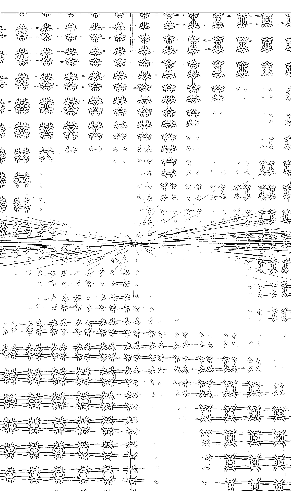

# 後記
未來十年，你的靈魂該何去何從？

未來十年，你的靈魂該何去何從？

無庸置疑的，擁有「覺醒」和「意識進化」資源和能力的人，可以在最短時間內，將舊時代人類遺留的低階意識系統，自動升級為高階意識系統。

當你的意識升級為高階系統，你就再也不用受「無明」這個債主或暴君的奴役。

你可以解除或超越，人類從爬蟲腦系統沿用至今的「快感驅力」程式，不再受無止盡的欲望衝動所控制，做出低階的自虐或害人行為。

相對的，無法解除「快感驅力」系統的人，注定成為低階靈魂，永遠在餓鬼或畜牲道的迴路程式中，消耗掉所有的生命能量。

此外，透過高階意識系統的升級，你的精神代謝和免疫力等功能，也會超越常人。

那些來自過去的創傷和恐懼，以及對未來的不安和恐慌，都會被你內心強大的覺察系統新陳代謝掉。

相對的，你的靈性免疫系統，因為生命能量的穩定和增強，也會跟著升級，所有的意識或思想病毒，從此很難再入侵你的靈魂。

因此，未來的世界，決定你存活成敗的，不再只是物質和經濟層面的戰爭，誰的精神代謝和免疫力愈強，生存和競爭力就愈高。

此外，在認知的系統升級上，也是如此。

當傳統價值的架構崩解，無法再維持人類及地球的秩序時，為了讓你的靈魂有所依歸，你唯一能做的，就是重新升級自己的認知系統，改寫舊有不合時代的認知和信念。

例如，當婚姻的成本和傷害，大於幸福報酬時，你根本不需要再執著於「只有結婚才能為你帶來幸福」這樣的信念框架。

# 後記
未來十年，你的靈魂該何去何從？

相對的，你應該要學習重新認識自己，在靜心觀照中發現真正的自己，進而讓靈魂回歸平靜。

如此，當有緣人來臨，你才能全然地享受你和對方的共業因緣。

此外，孩子也不再是防老或逃避寂寞的日用品。

感情更不是被你用來消費情慾和不安的促銷品。

你的健康和財務及感情，都和你的靈性有關係，再也無法切割。

因為靈魂的迷失，現代人只能從各種價格中肯定自己，不願再用心去經營價值。

那些在意識M型化赤貧端的年輕人，也只能在夜店和物質消費中，找回短暫的存在感，來麻痺自己。

這樣的靈性趨勢，讓愈來愈多的女孩只嫁有錢人，而不是愛她的男人。男人寧可花大把鈔票買美女，即使她是人工的也沒關係。

# 覺醒2.0
閉上眼，你才能看見命運的原始碼。

當人們的靈魂感到寂寞和孤單，只要有錢，都可以用城市的各種功能來自我麻痺或逃避。

此外，未來十年整個人類的心靈變化，還會出現幾個趨勢：

不幸和創傷會透過認知傳給孩子，低階意識的無明和業障，如同貧窮和異常原生家庭帶給孩子的影響，也會傳給下一代。

某些人信仰傳統宗教，不再是為了完成使命的犧牲奉獻，而是為了逃避恐懼和孤單。我身邊就有些貴婦級友人，把宗教當成社交圈，來排遣無聊或展現財力，買回美名和尊敬。

人跟人的交往，除了現實或工作上的需求，就是為了打發寂寞和殺時間，或者透過打壓他人，來展現自己的存在意義。

# 後記
未來十年，你的靈魂該何去何從？

外貌勢力變成主流，媒體和商人的推波助瀾，讓人們迷失在膚淺外貌和包裝過的虛假演出，精神內涵漸漸被年輕一代疏離及漠視。

再者，老態是遭人唾棄的標籤。人人都渴望成為不老妖精，永遠享受青春外貌帶來的快感。

人生網路遊戲化，讓人脫離現實和靈性的軌道。許多人整天大腦訊息超載，因為，如此他的大腦就沒有空間去安裝不安和煩憂。

然而，這樣的現象，只會讓人們的內心更空洞和退化，精神代謝及免疫力下降，一旦被植入負面訊息或認知，自殺或傷人事件將層出不窮。

根據因果業力法則，如果大家的意識不同步升級，我所提到的這些現象，將會變成事實。

# 覺醒2.0
閉上眼，你才能看見命運的原始碼。

因為，整個世界的運作，是所有人類的共業推動的，光是少數人覺醒，無法逆轉這像巨輪般的業力。

因此，我寫這本書的目的，是期待人人都是有緣人，都可以看懂這本書，讓自己的意識作業系統升級，在活著的每一刻，都能享受高質感的人生。

畢竟，一個人的起心動念，只是起心動念，千萬人的起心動念，就會產生奇蹟。

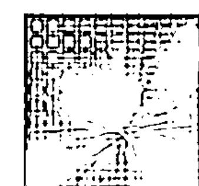

# 後記
未來十年，你的靈魂該何去何從？

我的觀照筆記

189

# 覺醒2.0
閉上眼，你才能看見命運的原始碼。

# 吳九箴 語錄

- ◎ 我們的頭腦會產生苦，往往是塞滿了太多自以為是的認知和訊息。
- ◎ 真正的成功者，不是光看他外在擁有什麼，而是當他登上人生高峰時，他的內心還剩下什麼。
- ◎ 所謂的宿命和認命，都只是頭腦的產物。
- ◎ 我們所認知的命運，往往只是頭腦狹隘的投射。
- ◎ 因果法則決定物的命運，業力法則決定人類個體的命運，共業法則影響的是人類集體的命運。
- ◎ 所謂的命運，不過是：你選擇用什麼樣的認知模式，來處理你的人生問題。
- ◎ 真正的覺者，所悟到的是萬物遵循的「法」，而不是死的知識。
- ◎ 如果你懂得運用「因果法則」，你就等於擁有千軍萬馬來讓你差遣。

# 附錄
吳九箴語錄

- ◎ 習性是業力的基礎，它就像是自動執行的程式，一旦安裝後，就會一輩子自動執行；因此，它可以是殺人的武器，用溫水煮青蛙的方式讓人陷入不可逆的危機，也可以是救人良藥，讓人逆轉業力軌跡。
- ◎ 如果你丟掉感覺和體驗，只用頭腦和知識來連結世界，那麼，你所認知的世界是支離破碎的。
- ◎ 只要活在共業圈一天，就要有心理準備，去承擔共業圈中難以預測的無常變數。不論這些變數是否來自你認識的人或陌生人，只要因緣俱足，他人的無心之過或起心動念，都會影響我們的人生。
- ◎ 對許多還活在夢中的人來說，他們一直以為整個世界的運作是理所當然的，每天醒來，自來水、食物、空氣、大眾交通工具，以及每天都會看到的銀行、百貨公司和政府，都是會無條件地永遠存在。
- ◎ 你現在擁有的，都只是有條件的因緣聚合，你過去失去的，也並不是夢幻泡影；因為，只要因緣俱足，一切都會再回來。
- ◎ 活在M界的人，只相信肉眼可看見的東西，他會以這個認知去看世界，也會以這個認知來看自己。

# 覺醒2.0
閉上眼，你才能看見命運的原始碼。

- ◎ 人的存在本來就包含M O C三界，如果一個人只活在C界，而看輕M和O界，這也是一個病態和違反自然的狀態。
- ◎ 當你對某人有偏見或不滿時，你就會把他當成是「會走動的物質」或是無法溝通的「低等生物」。
- ◎ 當你懂得用C型層次，來看地球這個經濟圈，你就會發現，幾乎所有資本主義發展出來的商業活動，都屬於「踩油門」經濟模式。
- ◎ 當你的意識升級，你再也不用受「無明」這個債主或暴君的奴役，你可以解除或超越，人類從爬蟲腦系統沿用至今的「快感驅力」程式。
- ◎ 無法解除「快感驅力」系統的人，注定成為低階靈魂，永遠在餓鬼或畜牲道的迴路程式中，消耗掉所有的生命能量。
- ◎ 未來的世界，決定你存活成敗的，不再是物質和經濟層面，而是你的精神代謝和免疫力。

# 附錄
吳九箴語錄

- ◎ 因為靈魂的迷失，現代人只能從價格中肯定自己，不願再用心去經營價值。
- ◎ 一個人的起心動念，只是起心動念，千萬人的起心動念，就會產生奇蹟。

▶ 吳九箴作品集 004

## 當你接受自己，
人生才真正開始。

你也可以用半點覺知，來改變命運軌跡
THERE'S NO LIFE UNTIL YOU FOUND THE TRULY YOU

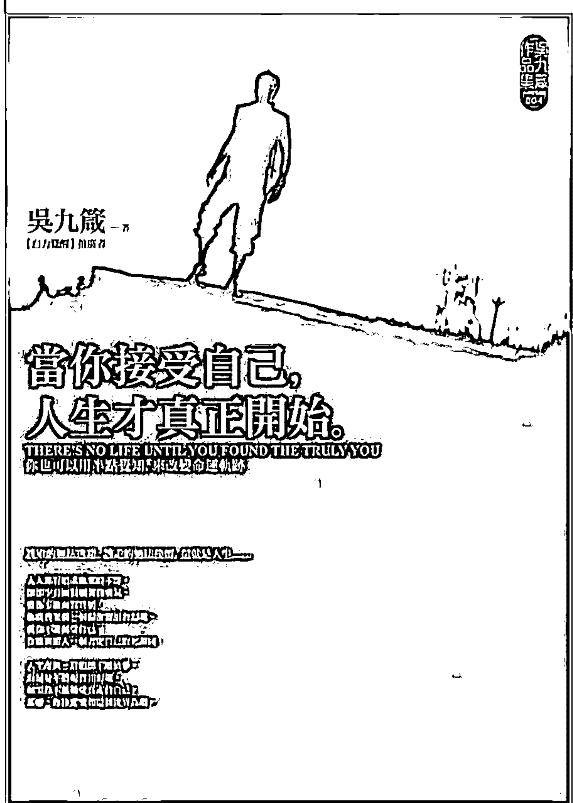

作者 吳九箴
定價：230 元

人人都有追求快樂的本能，
卻都少有面對痛苦的勇氣。
當你不敢面對實相，
你就會架構一個偏離實相的幻境。
當你不能接受自己，
你就會鑽入一個否定自己的死胡同。

人生在世，最怕的不是做夢，
而是分不清現實和幻境。
如果你不能接受真正的自己，
那麼，你注定要和這個世界為敵。

訂購專線：02-2218-2708 | 傳真專線：02-8667-6045 | 總經銷：叢通文流社有限公司

▶ 吳九箴作品集 003

## 煩燒城中，
盡是任性小孩

讓你看清實相，也讓你改變命運的21個覺
YOUR WILLFULNESS CREATES NOTHING BUT ANNOYANCES

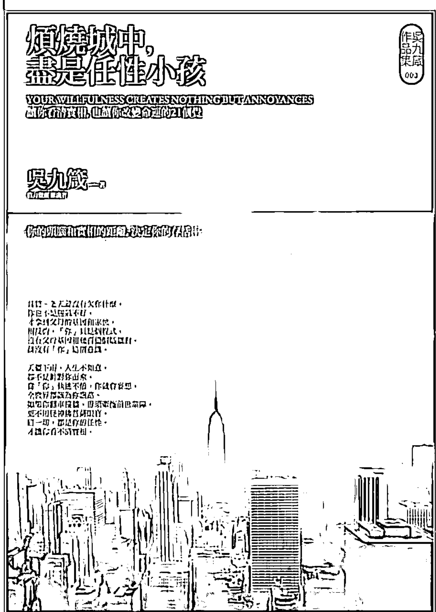

作者 吳九箴
定價：230 元

其實，老天爺沒有欠你什麼，你也不是運氣不好，
才拿到父母的基因和家世，相反的，「你」只是個程式，
沒有父母基因和幾百億個腦細胞，就沒有「你」這個意識。

天要下雨，人生不如意，都不是針對你而來。

當「你」執迷不悟，你就會妄想，全世界都該為你讓路。

如果你翻車撞牆，毋須牽拖前世業障，更不用怪神佛菩薩眼盲，
這一切，都是你的任性，才讓你看不清實相。

訂購專線：02-2218-2708 | 傳真專線：02-8667-6045 | 總經銷：叢通文流社有限公司

▶ 吳九箴作品集 002

## 你的寂寞，
是沒有鑰匙的鎖

關於寂寞和愛情，你必懂的27個覺醒
AWARENESS IS THE ONLY CURE FOR SOLITUDE

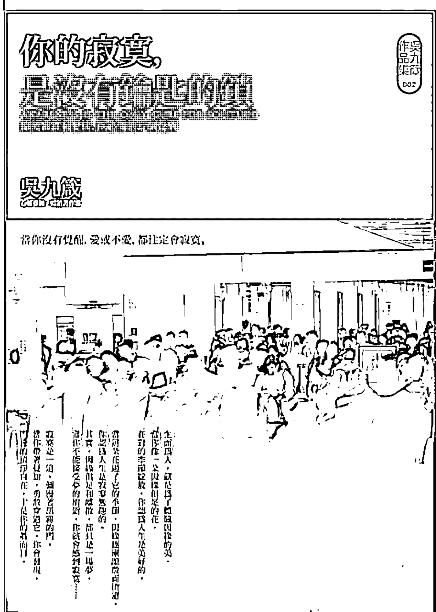

作者 吳九箴
定價：230 元

生而為人，就是為了體驗因緣的美。
當你像一朵因緣俱足的花，
在對的季節綻放，你認為人生是美好的。

當這朵花過了它的季節，因緣逐漸離散而消逝，
你認為人生是寂寥無趣的。
其實，因緣俱足和離散，都只是一場夢，
當你不能接受夢的消逝，你就會感到寂寞……

寂寞是一道，彌漫著黑霧的門，
當你帶著覺知，勇敢穿過它，你會發現，
門後的清淨自在，才是你的真面目。

▶ 吳九箴作品集 001

## 其實，
你和你的煩惱都不存在

面對煩惱，你必懂的八萬四千種觀照
ADVICE FOR THE PEOPLE WHO LIVE IN THE BUBBLE

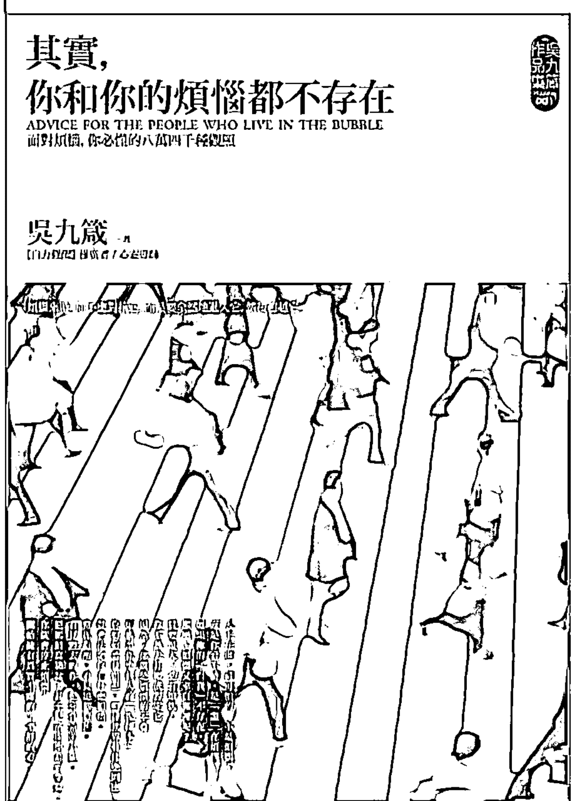

作者 吳九箴
定價：230 元

人生在世，最可怕的，不是煩惱，
而是你看不清，是「誰」在煩惱？
如果你的「自我」不存在，那麼，煩惱又來自哪裡呢？
只要是人，必有煩惱，你不該去打壓或否定它，
因為，你就是煩惱的本尊，煩惱是你整個人的「複印本」。
你如何看待自己，期待世界有什麼回應，
就會決定你有什麼煩惱。
當你覺醒，看見這個實相，
看見過去的你，把牙膏當美乃滋，
把馬桶當臉盆，甚至把清潔劑當可樂時，
你就會停止煩惱，開始擁有真實不虛的，平靜的心。

訂購專線：02-2218-2708 | 傳真專線：02-8667-6045 | 總經銷：叢通文流社有限公司

## 你可以成佛，
卻不能成為悉達多

關於佛法，法師和高僧不會告訴你的事

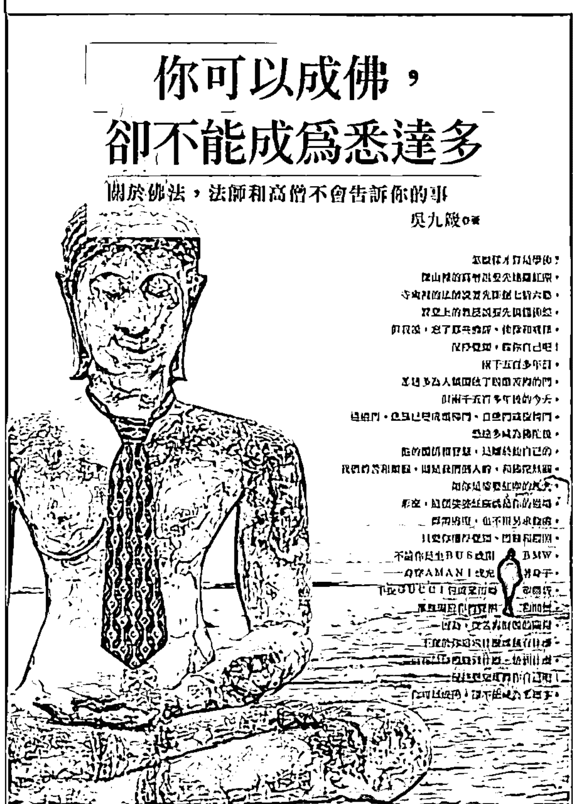

作者 吳九箴
定價：220 元

怎麼樣才算是學佛？
深山裡的高僧說要先遠離紅塵，寺廟裡的法師說要先斷絕七情六慾，
課堂上的教授說要先搞懂佛經，
但我說，忘了那些佛經、佛像和戒律，保持覺知，做你自己吧！

悉達多成為佛陀後，祂的體悟和智慧，是屬於祂自己的，
我們的苦和煩惱，則是我們個人的，和佛陀無關。
如你是娑婆紅塵的凡夫，
那麼，這個娑婆紅塵就是你的道場，毋需逃避，也不用另求他處，
因為，從苦海解脫的關鍵，不在於你追求什麼或擁有什麼，
而在於你體驗到什麼，悟到什麼。保持覺知地做你自己吧！
你可以成佛，卻不能成為悉達多。

## 你和佛陀之間，只隔著一條線

佛陀該說，卻沒有說透的人生真相

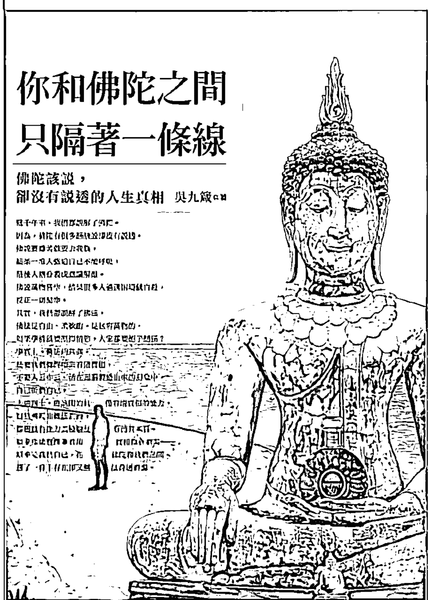

作者 吳九箴
定價：220 元

幾千年來，我們都誤解了佛陀。
因為，佛陀有很多話該說卻沒有說透。
佛說要離苦就要去我執，
結果一堆人強迫自己不能呼吸，最後人格分裂或意識解離。
佛說萬物皆空，結果很多人遇到困境就自殺，反正一切是空。
其實，我們都誤解了佛法，佛法是自由、柔軟的，是包容萬物的，
如果學佛就要壓抑情慾，大家都要絕子絕孫？
事實上，佛法的真義，是要我們覺醒地去看清實相，
不要人云亦云，活在頭腦製造出來的幻象中，自己折磨自己。
如果你能覺醒並看清實相，你會發現，
原來是我們自己，在佛陀和我們之間，
劃了一條不存在，卻又無法跨超的線。

▶ 勵志系 009

## 不想當人，就別想成佛

如果你還沒找到自己，請不要學佛

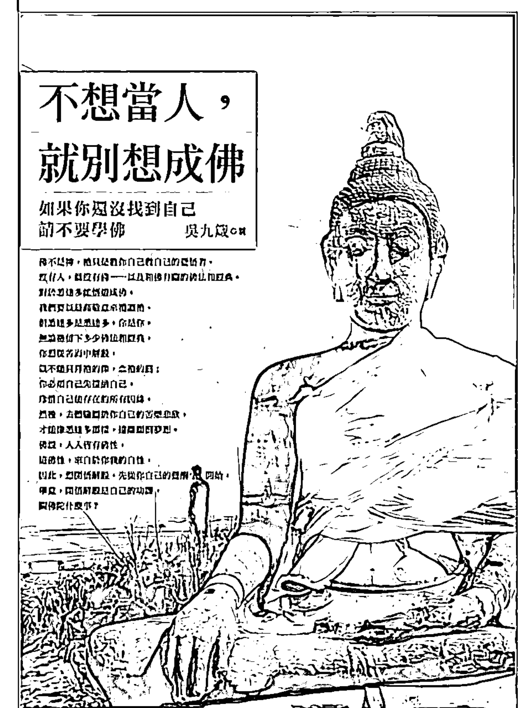

作者 吳九箴
定價：220 元

佛不是神，祂只是教你自己救自己的覺悟者，
沒有人，就沒有佛……以及和佛有關的佛法和經典。
對於悉達多能悟道成佛，我們要以最高敬意來禮讚祂，
但悉達多是悉達多，你是你，無論祂留下多少佛法和經典，
你想從苦海中解脫，就不能只拜祂的像，唸祂的經；

你必須自己先接納自己，珍惜自己能存在的所有因緣，
然後，去體驗屬於你自己的苦樂悲欣，才能像悉達多那樣，遠離顛倒夢想。
佛說，人人皆有佛性，這佛性，來自於你我的自性，
因此，想開悟解脫，先從你自己的覺醒開始，
畢竟，開悟解脫是自己的功課，關佛陀什麼事？

訂購專線：02-2218-2708 | 傳真專線：02-8667-6045 | 總經銷：彙通文流社有限公司

▶ 勵志系 008

## 其實，佛不是佛，你也不是你

四十歲前你必須看透的26個假象

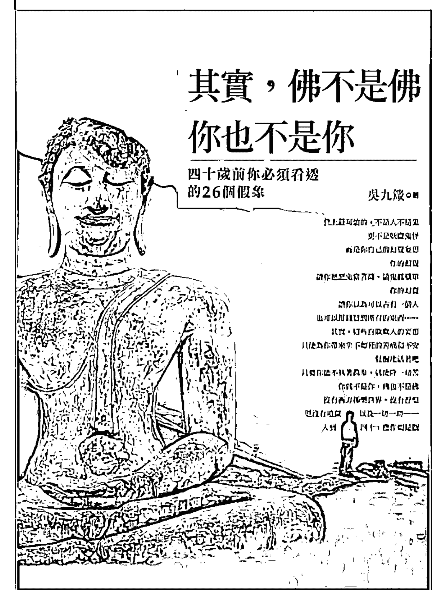

作者 吳九箴
定價：220 元

世上最可怕的，不是人不是鬼，更不是妖魔鬼怪，
而是你自己的幻覺妄想。
你的幻覺，讓你把惡鬼當菩薩，請鬼抓藥單，
你的幻覺，讓你以為可以占有一個人，
也可以用錢買到所有東西……
其實，這些自欺欺人的妄想，
只能為你帶來生不如死的苦痛和不安。
覺醒地活著吧！只要你能不執著萬象，就能除一切苦，
你就不是你，佛也不是佛，
沒有西方極樂世界，沒有涅槃，更沒有地獄，
以及一切一切……
人到四十，應作如是觀。

## 當佛陀也要繳信用卡債

佛法如不能活用在紅塵裡，寧可不要

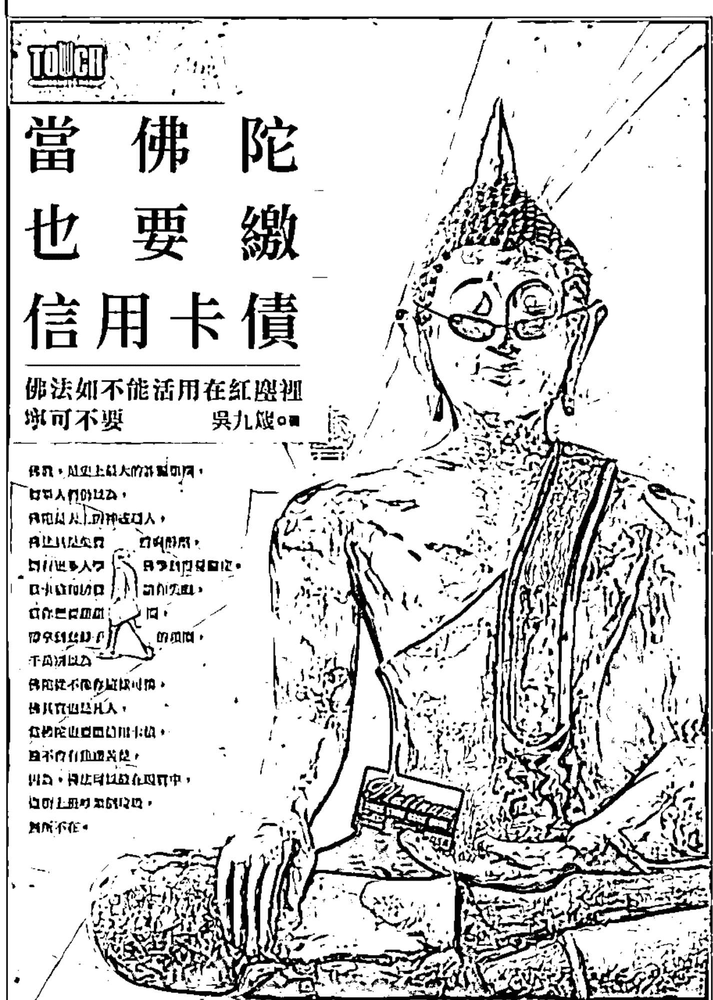

作者 吳九箴
定價：230 元

佛教，是史上最大的詐騙集團，
如果人們仍以為，佛陀是天上的神或超人，
佛法只是免費的麻醉劑，
將有更多人學佛學到得憂鬱症。

當卡債和房貸讓你失眠，
當你想要甜甜圈卻拿到套脖子的項圈，
千萬別以為佛陀從來沒像你這樣可憐，
佛其實也是凡人，
當佛陀也要繳信用卡債，
祂不會有焦慮苦楚，
因為，佛法可以放在現實中，
逛街上班吵架倒垃圾，無所不在。

## 國家圖書館出版品預行編目資料

覺醒2.0 ／ 吳九箴作. --初版. -- [臺北市] : 人本自然文化, 2012. 04
面； 公分. -- (吳九箴作品集)
ISBN 978-957-470-573-3 (平裝)

1. 人生哲學 2. 自覺 3. 內省
191.9 101003808

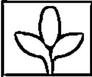

## 人本自然

吳九箴作品集 005

### 【覺醒2.0】閉上眼，你才能看見命運的原始碼

命運只是一套程式，誰學會它的語法，誰就能改寫自己的人生

作 者／吳九箴
出 版 者／人本自然文化事業有限公司
視覺美術顧問／李建國
主 編／劉又甄
責任編輯／吳惠雯
校 對／吳惠雯、楊蕙苓
美術設計／張巧佩
編輯協力／王啟芬
電 話／(02)2351-0260
傳 真／(02)2322-3891
地 址／10074 台北市羅斯福路一段86號11樓之一
製 版／海王印刷事業股份有限公司

總 經 銷／樂通文流社有限公司
23150 新北市新店區中央五街42號
電話／(02)2218-2708 傳真／(02)8667-6045
劃撥帳號／19650094 樂通文流社有限公司

讀者意見信箱／service@3eyeintegrated.com
訂書信箱／sdn@3eyeintegrated.com
香港經銷商／〔時代文化有限公司〕九龍旺角塘尾道64號龍駒企業大廈3樓C1室
〔一代匯集〕九龍旺角塘尾道64號龍駒企業大廈10樓B&D室
〔香港聯合零售有限公司〕新界大埔汀麗路36號中華商務印刷大廈
版權聲明／本書著作權交由松果体智慧整合行銷有限公司全權代理，如有意洽詢，
請寫信到版權洽詢信箱enquiry@3eyeintegrated.com聯繫。

2012年04月 初版一刷 〔版權所有，翻印必究〕
◎本書若有缺頁、破損、裝訂錯誤，請寄回本公司調換。

## 如何索取本公司的圖書目錄

- (1) 您可 E-mail 至 sdn@3eyeintegrated.com 或打電話至 02-2218-2708 請客服小姐傳真或郵寄書目。
- (2) 您可上博客來網路書店或各大連鎖店之網路書店，查詢我們的所有圖書和相關資料。

## 如何訂購本公司的書

- (1) 您可前往全省各大連鎖書店或書局購買，如遇缺書請向門市要求「客訂」，請書店代您向我們訂書，我們接到書店「客訂」訂單，會盡速將書送到書店，您再至書店取書付款即可。
- (2) 您可上博客來網路書店或各大連鎖店之網路書店訂購。
- (3) 您可透過郵政劃撥方式，載明您的姓名、地址、電話、書名、數量以及實付金額，書款一律照定價打九折（請外加運費或郵資新台幣五十三元，台北市和新北市以外七十四元，離島及海外請勿使用劃撥購書）。
- (4) 如果您一次的購買數量超過五十冊，即可享有「團體訂購」之優惠，依定價打八折，請利用本頁背面之「團體訂購單」，將書名和數量及姓名或機關行號名稱和送貨地址填好，傳真至：(02)8667-6045 二十四小時傳真專線，將有專人會與您聯絡收款及送貨事宜，運費由本公司吸收（離島及海外地區除外）。
- (5) 「團體訂購」單次購買數量超過五十冊以上時，請直接與我們聯絡：02-2218-2708，或 E-mail：sdn@3eyeintegrated.com 我們將視數量提供更優惠的價格，保證讓您物超所值。

實體書總代理 彙通文流社有限公司 02-2218-2708

## 彙通文流社有限公司團體/專案訂購

訂購單位：
日期： 年 月 日

連絡人：
電話/手機：

送貨地址：

| 書 號 | 書 名 | 出 版 社 | 數 量 |
|---|---|---|---|
| | | | |
| | | | |
| | | | |
| | | | |
| | | | |
| | | | |
| | | | |
| | | | |
| | | | |
| | | | |
| | | | |
| | | | |

【合計】 共 ________ 種 共 ________ 冊

請將此單直接傳真或放大影印，如不夠填寫，也請自行影印！
24小時傳真專線 (02) 8667-6045 客服專線 (02) 2218-2708

| 廣告回信 |
| --- |
| 板橋郵局登記證 |
| 板橋廣字第698號 |
| 免貼郵票 |

23150
新北市新店區中央五街42號
彙通文流社有限公司　收
電話／(02)2218-2708　傳真／(02)8667-6045
劃撥帳號／19650094　彙通文流社有限公司

人本自然——Living Nature
BOP005 【覺醒2.0】閉上眼，
你才能看見命運的原始碼
命運只是一套程式，誰學會它的語法，誰就能改寫自己的人生

## ▶ 會員回函。入會申請函

□ 謝謝您購買本書，請詳細填寫本卡各欄，對折黏貼並寄回，即可成為會員，可享有購書一律九折價，並可不定期收到本出版社之最新資訊。
□ 欲知本書相關書評、參加線上讀書會、投稿
詳情請上網站 http://www.wretch.cc/blog/eye3eye

◆ 姓名：________________________ □男 □女 □單身 □已婚
◆ 生日：______年______月______日 □第一次入會 □已是會員
◆ 身分證字號（會員編號）：________________________________________
（此即您的會員編號，為日後購書優惠之電腦帳號，敬請如實填寫）
◆ E-Mail：________________________ 電話：________________________
◆ 住址：________________________________________________________________

◆ 學歷：□高中及以下 □專科或大學 □研究所以上
◆ 職業：□學生 □資訊 □製造 □行銷 □服務 □金融
□傳播 □公教 □軍警 □自由 □家管 □其他

◆ 閱讀嗜好：□兩性 □心理 □勵志 □傳記 □文學 □健康
□財經 □企管 □行銷 □休閒 □小說 □其他

◆ 您平均一年購書：□5本以下 □5~10本 □10~20本
□20~30本 □30本以上

(以下1~4項請詳細填寫)

◆ 1. 購買此書的金額：________________________ ◆ 2 購自：________________________ 市(縣)
□連鎖書店 □一般書局 □量販店 □超商 □書展
□郵購 □網路訂購 □其他

◆ 3. 您購買此書的原因：□書名 □作者 □內容 □封面
□版面設計 □其他

◆ 4. 建議改進：□內容 □封面 □版面設計 □其他
您的建議：

# 覺醒2.0
## 閉上眼，你才能看見命運的原始碼。
### AWAKING BEHOLD THE INSTANT TO REBUILD YOUR SOUL'S CODE

人心像洋蔥，隨著時間流逝，洋蔥的外層愈來愈多，每一層都是進化的產物。為了應付人世間的各種挑戰，在意識作業系統上，我們的大腦又創造了許多應用程式。因此，當你要放鬆靜心時，可以想像自己的心就像剝洋蔥般，把應用程式層層關閉，然後，也把意識作業系統關閉，再繼續往內剝除；當我們剝開洋蔥的最內層，會發現裡面空無一物，這個空，就是初心。

在靜心觀照中，你可以看見這個世界的變化無常，看見自己現在擁有的，其實都只是有條件式的因緣聚合；看見過去已失去的，也並不是夢幻泡影。因為，只要因緣俱足，一切都會再回來。

信念這個東西，是色受想行識五座橋組裝起來的，而且，這五座橋遠遠看是橋，但你近看卻是空無一物。佛陀說，人和這個世界，都是這五座橋架構起來的，因為五座橋的相互運作，我們才會產生一個「我」的認知和錯覺，每個人才會各自創造出不同於他人的世界。

當你的意識升級為高階系統，你再也不用受「無明」這個債主或暴君的奴役；透過高階意識系統的升級，你的精神代謝和免疫力，也會越超常人。未來的世界，決定你存活成敗的，不再只是物質和經濟層面的戰爭，誰的精神代謝和免疫力愈強，生存和競爭力就愈高。

BOP005 NT$230 HK$77
◆線上投稿拿現金、成為人氣作家，
請上松果體網站 www.3-eye.com.tw