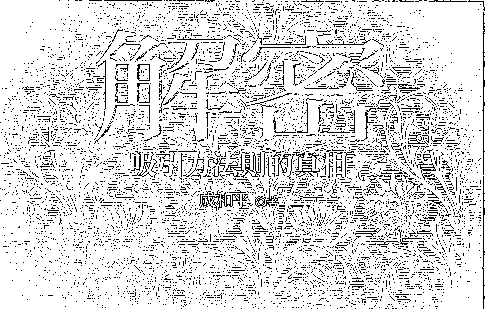
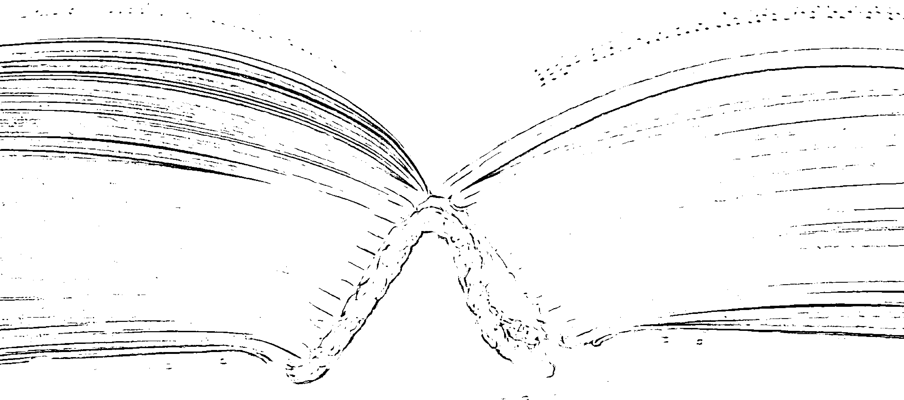

## 神秘
## 吸引力法則的真相

成和平 ◎ 著

以心電感應（telepathy）與念力（psychokinesis）為例，目前已知非常微弱且難以捉摸。心想事成並非不可能，但絕非坊間書籍所描述的那樣單純。還有其他因素在作用，本書有詳盡的解釋。希望本書不是引來趨炎，而是誘發清醒，換來深思，或者，起碼讓大家獲悉一些科學新知，沒有浪費買書的錢，那麼筆者的目的就算達成了。

## 吸引力法则的真相

成和平 ◎著

## 自序

大家看過吸引力法則的相關書籍嗎？這類書籍已暢銷於世界各地，並引發廣泛的討論，類似勵志書籍更加雨後春筍般冒出，多不勝數。問題是，坊間關於這類書籍的探討呈現一面倒之勢，盡是歌頌與讚揚，大家會不會覺得奇怪呢？既然有這麼多人看過這類書籍，也有人出面見證，彷彿非常有用，為何大多數人仍無法心想事成？難道真的如書中所言，無法成功是因為意願不夠堅定？或者，無法成功是因為違反宇宙的吸引力法則？或者，無法成功是因為負面思想的阻礙？或缺乏愛心？

我研究超自然現象多年，對超能力的實驗與研究如數家珍，非常清楚人體的極限在哪裡，我不會隨便相信任何怪力亂神的言論。這類書籍的內容卻遠超過人體的極限，彷彿歷年來的科學研究變得微不足道，真令人震驚不已。以心電感應（telepathy）與念力（psychokinesis）為例，目前已知非常微弱且難以捉摸，這類書籍的內容卻將兩者無限上綱，變得好像無所不能，與科學研究結果有天壤之別。

此外，對任何事情保持正面的態度，當然是有益身心之舉，但這些書籍將負面的態度推入萬惡的深淵中，連想都不可以，等於極度壓抑情緒，這是可能會引發癌症的C型人格，不可不慎呀。心想事成並非不可能，但絕非這些書籍所描述的那樣單純，還有其他因素在作用，本書有詳盡的解釋。

本書最後跳脫心想事成的狹隘範疇，透露真正偉大的宇宙「秘密」是什麼，鼓勵大家以宏觀的視野，檢視全部的人生，因為唯有站在最高遠的角度，才能避免迷失與犯錯。如果大家不喜歡虛幻的神話，歡迎閱覽符合現實的本書，保證不會後悔。

## 前言

本書依照吸引力法則書籍的主要內容逐一審視，為避免侵犯著作權與版權，只提及其概念，大家若想知道詳情，請參閱原書。

另外，本書引用大量的研究資料，讓大家明白科學家的心血結晶，有一份證據就說一份話，絕非這些相關書籍那樣信口開河，撒下漫天大謊。

大家也可以直接跳讀至最後的結語，中間完全不看，但這樣做會損失不少好東西，有點可惜。

心想事不成的朋友們，若覺得吸引力法則沒有助益，本書或許可以提供另一個腳踏實地的思考方向，完全排除宇宙的神祕力量或怪力亂神。

沒有人可以保證心想事成，但本書揭露的是絕對正確的道路，而且是朝向生命的終極目標前進，不會偏差或走火入魔，自然非短期短視的成功術可比擬。

請大家放鬆心情，端正坐姿，喝杯咖啡或茶，播個音樂也無妨，細細品嚐本書的另類滋味吧。

## 目錄

## 總錄

- 自序 I
- 前言 III
- 第一章 吸引力法則可驗證嗎？ 1
- 吸引力法則的由來與發展 3
- 潛意識或直覺有多大的能耐？ 5
- 關於超心理學 8
- 懷疑論者的意見 9
- 巧合的機制 10
- 整場程序（Ganzfeld procedure） 13
- 心電感應夢的研究 15
- 超感知覺與破案 16
- 愛因斯坦寫序 17
- Pearce-Pratt 系列實驗 18
- 遙視的實驗 19
- 超感知覺與土著 20
- 有名的遙視實驗 21
- 另一個遙視實驗 22
- 派柏夫人的事蹟 23
- 李納德夫人的「書籍測驗」 24
- 我的經歷 26
- 自己創造自己的實相？ 27
- 祈禱有用嗎？ 29
- 尼娜·科拉金娜的作弊 31
- 隨機數（據）產生儀（器） 32
- 隨機數（據）產生儀（器） 33
- 大傘藻實驗 34
- 全球意識存在嗎？ 36
- 念力可以瞪死山羊？ 37
- 維基百科的文章 38
- 手指識字的疑點1 39
- 手指識字的疑點2 41
- 手指識字的疑點3 43
- 手指識字的疑點4 44
- 超能力可以穩定發揮？ 47
- 超能力偏見 48
- 頭彩的背後 49
- 念力只對自己有用 50
- 外氣存在嗎？ 51
- 外氣另一章 52
- 外氣的科學實驗？ 54
- 流言終結者的實驗 56
- 第二章 吸引力法则的反例 59
- 恐龙灭绝 60
- 躁症 61
- 罕见疾病 62
- 头彩得主的心态 63
- 富翁的心态 64
- 死前会后悔的二十五件事 66
- 物理学家的批判 68
- 网友的批判 72
- 反对「成功学」之我见 73
- 一定要励志吗？ 76
- 正面思考对没自信的人有害 78
- 正面思考的另一个坏处 80
- 正面思考者未必长寿 81
- 毫无根据的传闻 82
- 睡眠不足與過度樂觀 83
- 負面思想真的沒用？ 84
- 善用負面思考 86
- 吸引力法則的其他錯誤 88
- 吸引力法則的新錯誤 92
- 常被修改的吸引力法則 94
- 對吸引力法則的辯護？ 96
- 第三章 吸引力法则的错误推论 101
- 吸引力法则又被修正了 102
- 你可以成為任何想成為的角色？ 104
- 你的內在擁有一切的力量？ 105
- 人生只有正面與負面兩種事物？ 106
- 愛的力量超過大自然的力量？ 106
- 出生與發明都源自於愛？ 107
- 吸引力法則支撐著宇宙？ 108
- 吸引力法則就是愛的法則？ 109
- 給出去的，就是會得到的？ 110
- 接收到的事物以出去的為基礎？ 111
- 喜歡或討厭什麼，就會如你所願？ 111
- 愛會讓你自由？ 112
- 為自己帶來美好事物的能力是無限的？ 113
- 好與不好不可能同時存在？ 114
- 被蚊子叮與車子拋錯都是負面思想引起的？ 115
- 每天感謝所有的人、事、物？ 115
- 生命的一切都不是偶發，而是對自己的回應？ 116
- 你想要的全是美好感受推動的？ 117
- 先付出快樂，才能得到快樂？ 118
- 所有負面感覺源於缺乏愛？ 118
- 收到巨額帳單與東西故障是對金錢感覺不好的結果？ 119
- 不相干的事情其實是吸引力法則在作用？ 120
- 好事常常不斷、衰運常常連連？ 121
- 活在當下才是對的？ 122
- 渴望就是愛？ 123
- 愛花得花，愛裙子得裙子？ 124
- 應該常常想像你最好最棒的狀態？ 125
- 不該想像最糟的狀況？ 126
- 想像走失的狗，就可以再見到牠？ 127
- 想像你想要的任何事物？ 128
- 想像夠逼真，就可以心想事成？ 129
- 人的周圍電磁場，就是吸引力來源？ 130
- 沒買到花是好事，後來卻得到花？ 131
- 你的願望都太小了？ 132
- 想像已痊癒，創傷就會康復？ 133
- 每天花七分鐘，想像自己已得到想要的事物？ 134
- 轉移不好的感覺的方法是愛或放輕鬆？ 135
- 肥胖與不孕是自找的？ 136
- 看到不好的事物，趕快避開以免受影響？ 137
- 無論期望多麼美好，都有可能成真？ 138
- 去做自己喜歡的一切，因為可以感受愛？ 139
- 給出越多愛，意識越清明？ 140
- 感恩是愛的最高表現形式？ 141
- 三位名人成功的證明？ 142
- 富人對錢的好感覺，多於不好的感覺？ 144
- 對錢有不好的感覺是錯的？ 145
- 錢永遠跟著愛在走？ 146
- 頭彩得主回復到得獎前的狀態，是因為缺乏愛？ 147
- 在帳單上寫感謝語，會引來更多錢？ 148
- 想像自己被錄取，就真的被錄取？ 149
- 付出比報酬更多的價值，事業將一飛沖天 150
- 滿懷愛與歡笑，可以得到一部車？ 151
- 批評別人，最後會回到自己身上？ 152
- 八卦也有黏性？ 153
- 廣受歡迎的人，大多感覺良好？ 154
- 付出愛，最後會回到自己身上？ 155
- 疾病是身體無法放鬆的結果？ 156
- 水的結晶美醜，會隨著人們情緒而定？ 157
- 對疾病有壞感覺，將無法獲得痊癒？ 158
- 體檢時有美好感受，就有美好的結果？ 159
- 想像心臟強壯，就真的會強壯？ 160
- 你自認可以活多久，就活多久？ 161
- 付出愛，身體會產生正面的變化？ 162
- 想像早產兒痊癒，就真的會發生？ 163
- 開車時看到警車，代表生活失序？ 164
- 聽到身旁陌生人的講話，就有意義？ 165
- 掉東西、跌倒、衣服勾到東西、撞到東西，全是有意義的？ 166
- 人死後處於最高頻率？ 167
- 第四章 真正偉大的宇宙秘密 170
- 正確的人生觀總整理 174
- 成功的基本要件——清心寡慾 187
- 麥田圈是最偉大的秘密？ 191
- 真正偉大的秘密 193
- 科學證據1 194
- 科學證據2 195
- 不是幻覺 197
- 史蒂芬·霍金的說法 198
- 如何體驗 199
- 結語 203

## 第一章
### 吸引力法則可驗證嗎？

### 什麼是吸引力法則？我簡述如下：

當你有了一個思想或心像，就會吸引同類的思想或心像過來，最後會變成實物，譬如財富，回到你身邊，就叫做吸引力法則，是宇宙的最大秘密。只要了解並貫徹這個秘密，就可以心想事成，無往不利。

一個偉大的法則，必須要有堅實的理論基礎，經得起各項考驗，本章就特別針對這項理論做驗證。

首先，到底有沒有這樣無限的宇宙神秘力量，在支配我們的生活？坊間各類成功勵志書籍強調的，大多是觀人術、人際關係、說話技巧、演講要領、甚至厚黑學等，相當符合現實的需要，頂多再加上自我暗示或催眠，讓自己有自信而已，從未提到有所謂宇宙的神秘法則。

所以，一般途徑是行不通的，只能從神秘學的角度探查，我以超心理學研究家的身分來審視，吸引力法則的途徑可能有三種（以財富為例）：

- 一、當你發出賺大錢的願望後，被神或上帝知悉，然後發動神力，透過他人移動財富到你的身邊。
- 二、這個願望被某些貴人以心電感應的方式收到，然後將財富帶到你的身邊。
- 三、這個願望本身就是念力，直接將財富移到你的身邊。

吸引力法則是哪一種呢？還是兩種以上的混合？或者，根本沒有這些過程，純屬虛構？

### 吸引力法則的由來與發展

前面提過，吸引力法則是指我們的思想具有某種頻率或磁性效應，任何你所想過的都會傳送到宇宙中，然後宇宙將以相同的頻率反饋給你。換句話說，當下的想法會創造出實相，然後成為你的未來。

且讓我娓娓道來。

大家可能不知道，超能力的科學實驗已多不勝數，足以回答後面兩種可能的真實性，我認為第二種說法還算說得通，也就是以心電感應的方式，讓所謂的貴人接收到訊息後，有意無意跑來助你成功，第三種說法根本不可能，又不是變魔術。

依照吸引力法則的內容，最有可能的是第一種說法，但為何不直接解釋成神或上帝，只說是宇宙的力量呢？也不解釋什麼是宇宙的力量，讓人丈二金剛摸不著頭緒。難道怕被人扣上傳教的帽子？我不懂。

「吸引力法則」這個字眼的正式誕生，距今不過一百多年的歷史，但是它隱藏的意涵卻存在於古老的印度人信仰之中。早年印度教對通神學有一定的影響，吸引力法則的概念便逐漸出現在一些早期的通神學的文獻中。

一八七七年，「吸引力法則」第一次出現，在赫蓮娜·布拉瓦茨基（Helena Blavatsky）的書《揭開伊西斯的面紗》（Isis Unveiled: Secrets of the Ancient Wisdom Tradition）中。

一八七九年四月六日，《紐約時報》刊登一篇報導淘金熱的文章，又提到了「吸引力法則」，這是「吸引力法則」的概念第一次出現在大眾的面前。

一九〇六年，威廉姆·沃爾特·阿特金森（William Walker Atkinson）在他的書《思維波動或思維世界的吸引力法則》（Thought Vibration or the Law of Attraction in the Thought World）中，也介紹了「吸引力法則」。

一九〇七年，布魯斯·麥克萊蘭（Bruce MacLelland）在他的書《想像力帶來富有》（Prosperity Through Thought Force），對吸引力法則做了總結，並提出「你是你所想，而非你想你所是」（You are what you think, not what you think you are.）的概念。

從此以後，關於吸引力法則的研究層出不窮，譬如一九二六年出版的歐內斯特·赫爾姆斯（Ernest Holmes）所著的《心靈科學的基本思想》（The Science of Mind）、一九四九年雷蒙德·霍利維爾博士（Dr. Raymond Holliwell）所著的《讓吸引力法則伴隨工作》（Working With The Law）等。

二十世紀九○年代，傑瑞·希克斯（Jerry Hicks）和埃絲特·希克斯（Esther Hicks）出版了《亞伯拉罕的教義》（The Teachings of Abraham）、《情緒的驚人力量》（The Astonishing Power of Emotions: Let Your Feelings Be Your Guide）等系列著作，因為這三本書籍的暢銷，吸引力法則的說法再度引人注意。

二○○六年，一部叫做《秘密》（The Secret）的電影上映，以及同名書的上市，才真正讓「吸引力法則」的概念風靡了全球。

### 潛意識或直覺有多大的能耐？

既然無法查明吸引力法則的源頭是什麼，回頭看看潛意識或直覺有多大的能耐，或許是個好主意。

一般人總會被一些問題困擾，譬如明天要去哪裡玩？應接受哪一份工作？該和哪一個對象結婚？杜克大學曾研究人們如何應付「難以決定的事」。小事譬如今晚在哪裡吃飯，大事譬如該不該和「這個男的」分手。科學家做了一系列實驗後，竟然推論出一個驚人的辦法——

當你碰到一個很困難的問題，與其仔細思考所有的可能性，還跑去問人，不如就完全不想、不問、不求籤，「通通放掉」，當場直接付諸「潛意識」，請它幫你做一個決定。這樣的決定，科學家發現，往往是驚人的「正確」！

杜克大學的研究人員找來好幾位實驗者，將他們分為A、B、C三組，請他們在精心安排的四個「差不多」的選項中選擇一個。A組必須在某個時間內答出來（譬如三分鐘），B組則被允許想多久都沒關係，想完再提供答案即可，C組和A組類似，也給一樣的時間思考，但是在時間快到時，科學家會給他們一大堆干擾，強迫他們分心，逼他們沒辦法在限時內想完，只能靠「潛意識」勉強擠出一個答案。

驚人的結果出現了：隨便猜猜的C組，竟然表現的比專心思考的A組還好，在四個選項中做了比較正確的選擇，而且其正確度已經接近了B組的水準。也就是說，同樣是在固定時間內要答出來，「隨便想」的，居然比專心想的還好！換句話說，潛意識提供的答案，比清楚意識還要高明？

科學家認為，一般人碰到複雜問題，總會想辦法將「所有可能的結果」在腦中列出來，或在紙上寫下來，但人腦的運算力量顯然遠比我們預估的還強大，在開始計算之後沒多久，就已經「知道」最好的選項是哪一個。如果這個時候，不馬上跟著感覺走，還硬要鑽牛角尖，人腦就會開始被一些「不重要的資訊」蒙蔽了。

不過，顯然「潛意識」也要謹慎使用，科學家另外設計了第二份考題，讓四個選項變得差異很多，只要稍微想一下，就可以區分出哪個是最正確的選擇，結果發現，這樣的考題，對於C組就不行了，A組反而比較厲害。也就是說，剛剛這種「潛意識」，只能放在選項差不多、無法解讀的狀況下才有用，譬如在難以決定的「兩難」、「三難」、「四難」的習題時，才適合發揮潛意識！

一般人在做決定時，最大的問題是在「把不重要的看成重要的」。如果問題已經很難了，還要去個問題給自己，結果看起來很小心的人，常做出錯誤的決定。

所以潛意識並非萬能，但有一些價值，可以去接近它，而非開發它，更不能無限上綱成無所不能。前面提到的「通通放掉」，是在殫精竭慮、絞盡腦汁之後才能進行，通常配合休閒旅遊、大睡一場、或催眠暗示自己放鬆，會更有效。所以，請費盡心思、潛心研究自己的難題後，再通通拋諸腦後，去休閒旅遊、大睡一場、或催眠暗示自己放鬆都可以，才有可能出現解決問題的靈感，吸引力法則卻完全沒提到放掉這個訣竅，發明它的人顯然不了解潛意識與直覺的作用機制，只知妄想最後的成果，唉！

此外，只要是教人放鬆的催眠暗示都可以，譬如暗示從頭到腳的肌肉逐步放鬆，只要做得好，效果與休閒旅遊或大睡一場雷同。請見本書第四章。

### 關於超心理學

前面提過念力與心電感應，它們都屬於超心理學（parapsychology），這是一種實驗心理科學，肇始於二十年代末，致力於用實證科學的方法，驗證人體潛能是否存在以及影響這些潛能的因素。國內將人體潛能稱超能力或特異功能，西方稱為賽（psi）現象，代表未知的意思。

目前研究的賽現象主要包括兩大類：超感知覺（Extrasensory Perception）和心靈致動（Psycho Kinesis）。

超感知覺是指不通過五官而知覺信息的能力，包括他心通或心電感應（telepathy）、透視力或天目（clairvoyance）、遙視（remote viewing）、宿命通（預知未來、precognition），回知過去（retrocognition）。

心靈致動是指不動手動腳，而能影響與操控外界物質的能力，如意念移物，意念影響電子儀器等。

### 懷疑論者的意見

一九七六年，有名的學者卡爾・薩根（Carl Sagan）與一群懷疑論者成立了超常主張科學調查委員會（CSICOP），其目的是為了糾正當時媒體對於所謂「超常現象」的過分關注。後來這個團體改名為CSI，也就是懷疑論調查委員會。

卡爾最有名的一本書《魔鬼出沒的世界》，在他逝世的那年出版，現在已經成為了懷疑論的經典著作，以下是書中的一段：

> 「在這本書的寫作期間，在超感官知覺領域有三個命題，以我之見，值得認真研究：
>
> 1.  通過獨自思考，人（勉強）可以影響計算機的隨機數產生器；
> 2.  人在適度的感覺喪失的情況下可以接收到「投射」向他們的想法或圖像；
> 3.  小孩子有時會講出前世的細節，並被證明是準確的，除再生之外別無其他途徑可以知道。
>
> 我提出這些命題不是因為它們可能是合理的（實際上我不贊同這些命題），而是因為它們可以作為可能是正確的論點的例子。第三個命題至少有一些，儘管仍是可疑的實驗支持。當然，也許我錯了。」

我也覺得值得研究，卡爾提到的前兩項與吸引力法則有関，將於後面篇章詳述。

### 巧合的機制

吸引力法則完全否決巧合的可能性，認定一切皆由思想吸引過來的，是真的嗎？

人們常常用「極不可能發生」的傳奇來向科學家挑戰，譬如夢到或感覺到某個親友死了，過了幾分鐘便接到一通電話，正好是那個親友突然過世的消息。目前科學界引用「大數法則」的機率原則來解釋，以下摘錄自《科學人》（二〇〇四年九月號），請大家看看：（http://sa.ylib.com/circus/circusshow.asp?FDocNo=537&CL=23）

## 第一章 吸引力法則可驗證嗎？

有一個稱為「大數法則」的機率原則告訴我們：在數量樣本較少時機率很小的事件，在數量樣本較大時，其發生的機率便會變高。以預知死亡為例，假定在一年裡，你所知道的人中有十人過世，而你每年各會想到這十個人一次，那麼一年裡有時十萬五千一百二十個五分鐘可供你想這十個人，命中機率為1/10512，當然近乎不可能。但美國有二億九千五百萬人。為方便計算，假設每個人的想法都一樣，每年就有1/10512×295000000＝28063人，相當於每天有七十七人次的預知死亡成真。美國新澤西州普林斯頓高等研究院的物理學家戴森說：

> 「我們每天醒著、忙著過活的時間約有八小時，這其間大約每秒鐘我們就聽到或看到一個事件。所以每天發生在我們身上的事件約有三萬件，近乎一個月一百萬件。這些事件除了少數例外，其他都不怎麼特別，不是奇蹟。而出現奇蹟的機會大約一百萬個事件中會有一件，因此我們可以預期，平均一個月會發生一次奇蹟。」

戴森還聲稱：心靈研究會與其他組織所收集到的各種消息顯示，在某些條件下（如壓力），有些人有時會展現超常力量（但進行控制實驗時力量便會消失），戴森覺得：

> 「有大量的證據可證實，超常現象是真實的，只不過它們存在於科學範疇之外。」

> 「精神現象的世界是可能存在的，然過於變換不定又倏忽消失，所以笨重的科學工具難以捕捉。」

想要知道那些軼聞所說的究竟是不是真實現象，唯一的方法就是控制實驗。人們要不就是可以讀取他人心思（或第六感卡片），要不就是不行。科學已經清楚地顯示不行——證明完畢。即使身為整體論者而非化約論者、即使認識與心靈研究有關的人，或是讀到他人發生的怪事，也不會改變這個事實。

以上薛莫的文章大部分是正確的，但這句話

> 「人們要不就是可以讀取他人心思（或第六感卡片），要不就是不行。科學已經清楚地顯示不行——證明完畢。」

是有問題的，因為超感知覺沒有被科學證明是完全不存在的，許多心理學教科書仍將雙方爭議列入內容中，如果得到完全不存在的證明，就不會寫出來誤導學子了。

此外，我覺得要視個案而定，譬如預知，當事人的腦中畫面與真實事件的相似度有多少？如果薛莫真的有科學查證的嚴謹精神，應該統計出相似度是多少百分比，以數據來說明才有說服力，而且必須言明，多少百分比以上才算是預知，多少百分比以下是巧合。我不喜歡他的最後一句話：

> 「即使身為整體論者而非化約論者、即使認識與心靈研究有關的人，或是讀到他人發生的怪事，也不會改變這個事實。」

『這個說法不好，因為會被批評為「不理性」，不理性的態度無助於化解懷疑論者與相信者之間的衝突。』

所以，吸引力法則的成功案例，絕對不能排除巧合，這是無庸置疑的。

## 整場程序（Ganzfeld procedure）

在介紹這種實驗之前，先談談感覺剝奪（sensory deprivation）的意義。當一個人的視覺與聽覺被剝奪之後，潛意識的訊息會填補上來，例如在夜深人靜的時候容易見鬼，就是因為太黑太靜的地方等於感官被剝奪了，而腦部在缺乏感覺回饋的情形下，會自行創造感覺與思維。

超心理學家便假定，此時的腦部也可以接收神秘的訊息，譬如他人的念頭。

實驗時，讓接收者戴上半個網球做成的眼罩，阻隔視覺，並透過耳機播放嘶嘶聲，等於阻隔外界噪音與光線的影響，時間約半小時。

有的時候傳送者可用素描的方式，畫下幻燈片的圖案細節，據說有利於心思傳送。傳送結束後，請接收者看四張圖片（有一張是真的），以決定哪一個才是傳送的訊息。

這個實驗是測驗心電感應的正確命中率，如果是用亂猜的話，機率為四分之一（25%）。一個題外話，我很反對心電感應一詞，因為極不精確，接收者不可能分秒不差的收到傳送者的訊息，萬一在數小時之後才收到，難道也算嗎？如果提前幾秒收到，應該算是預知才對，所以心電感應的說法應該揚棄。

對神秘現象吹毛求疵是必要的，希望大家也有同樣的態度。

整場程序被許多研究者反覆使用，目前已有共識出現，就是命中率達32～38％以上，即可視為有顯著的統計意義，因為想達到38％命中率的機會只有十億分之一。許多實驗室做出這樣的結果，有少數實驗室做出更驚人的成績。

懷疑論者認為，仍有一些實驗室做不出顯著的結果，所以不相信是神秘的心靈力量所致，或許只是巧合或實驗過程不夠嚴謹罷了。

我認為傳送者與接收者的精神狀態可能對結果有影響，專心的程度應該是傳送過程的決定因素，精神散漫與胡思亂想應該不利於結果。

另有一些因素，可能也影響成功率，譬如相信超常感應的程度、以前的超常感應經驗、冥想經驗、藝術創造力、與發送者的親密程度等，但未獲證實。

二〇一〇年，一群學者分析了一九九七年至二〇〇八年的二十九個實驗，在一千四百九十八次測試中，有四百八十三次命中，機率為32.2%，p<0.001，也就是在統計上有意義，大家參考看看。

不過，這麼微小的效果，與吸引力法則的通天本領，實在不能相比，我想不出支持吸引力法則的證據何在？

## 心電感應夢的研究

紐約的兩位醫師做過這樣的實驗，值得探討：

請受試者躺在隔音室裡睡覺，頭上綁著電極，以便測試睡眠腦波。另一位實驗者在很遠的房間裡，集中精神看一張隨機選來的圖片。

在受試者開始做夢的時候，實驗者就開始看圖片，等受試者做夢結束，便喚醒他，詢問記錄他們的夢，然後請與實驗無關的裁判員比較夢與圖片的關聯性。

結果顯示，平均每三次實驗就有兩次具備統計學上的意義，換句話說，成功的機率高於巧合。這個實驗算是很好的實驗，但有個缺點，圖片多是名畫家的畫，內容有點複雜，如果改成簡單的單一素描圖像，譬如金字塔，恐怕會有更明確的結果。另有一間「夢研究實驗室」做了類似的測試，共做了十五次實驗，有七次獲得正面的有意義結果，但有更多的實驗室沒出現有意義的結果。發明吸引力法則的人總是宣稱神奇無比，要什麼有什麼，夢中的心電感應顯然無法解釋，所以我還是抱持保留的態度。

## 超感知覺與破案

一九三七年美國曾發生一件有趣的超能力測試，一名孩童被綁架，報紙公開徵求與破案線索有關的夢，結果收到一千三百多封來信。

後來，這名孩童被發現在離家數英里外的樹林裡的淺墳墓中，肢體殘缺不全，兇手也被抓到了，是一名德國木匠。

很多信有提到兇手是外國人或操外國口音的男人，但只有5%的信說孩童已死亡。真正成功描述屍體位置與隱藏方式的信，只有七封，其中一封最為正確：

> 「我想我正站在或正走在一個有很多樹的泥濘的地方。一個地點看上去好像是一座圓的、淺的墳墓。就在那時，我聽到一個聲音說：『那個孩子已經被謀殺了，就藏在那兒。』」

## 愛因斯坦寫序

如果這個神奇的夢境是從兇手腦中的畫面得到的，便屬於心電感應，但整體而言，成功的機率實在太低了（七／一三〇〇），仍很難用來解釋吸引力法則。

美國著名作家 Upton Sinclair，曾獲得普立茲獎，寫過一本書《精神傳送》（mental radio），描述他與妻子瑪麗做的實驗。他請一位實驗者在四十英里外畫下見到的東西，譬如鳥、樹、花等，然後裝入不透光的信封內，再交給瑪麗，以超感知覺的方式，畫出信封內的東西。在二百九十次測試中，六十五次完全命中，一百五十五次部分命中，七十次失敗，算是相當不錯的成績。

由於相當特別，愛因斯坦還寫了德文前言，認為此書「值得最認真地思考」、「的確遠遠超出一個自然界的調查研究者可想像的範圍」、「作者良好的可信性與可靠性是不被懷疑的」。這樣的書獲得愛因斯坦的推薦，顯示非同小可，值得科學家重視，不能以一般的怪力亂神書籍看待。

如果瑪麗的感應是從實驗者的腦海中得到，也可以算是心電感應，其成功機率雖然稍高，仍不敵吸引力法則如天馬行空、不著邊際的誇張言詞。

## Pearce-Pratt系列實驗

透視是指隔牆隔物看到隱蔽物或圖像的能力，這方面的最有名的實驗是Pearce-Pratt系列實驗。

美國杜克大學（Duke University）的萊茵博士（Rhine. J. B.）曾于一九三四年使用五種卡片，被稱為超感測試卡、ESP卡、齊納卡片（Zener card），每種卡片上各有一個簡單圖案：

- 圓圈
- 方框
- 十字
- 流水
- 星形

利用這五種卡片，他與當時的助手普萊特博士（Pratt. J. G.）針對一位自稱有透視能力的學生彼尔斯（Pearce, Jr. H. E.）進行了一系列實驗。

## 遙視的實驗

實驗在一九三三年八月和一九三四年三月之間進行了三十四次，每次實驗用五套卡片（共二十五張）。普萊特先把手中的卡片洗亂，有圖案的一面朝下，請彼爾斯「看」這些卡片的圖案。就這樣每分鐘一張卡片，直到二十五張卡片全部用完。統計結果表明，在總共的七十四輪實驗，一千八百五十次透視中，彼爾斯答對率超過30%，測中五百五十八張，亂猜只能說中三百七十張（20%），在統計學上遠遠超過或然率，顯著水平達負的二十二次方。這一實驗曾在心理學界得到重視，萊茵博士也因此被譽為現代實驗心靈心理學之父。後來的許多實驗卻無法重複萊茵的結果，顯示這種透視的能力忽隱忽現，且比亂猜好一點而已，大家想想看，比20%好一點的30%，對現實有何幫助？

曾有一位學者在巴黎，擔任發送者，集中精神想像一個玻璃漏斗，另有兩名接收者在紐約。結果一個接收者畫出了一個水果盆，形狀像公鹿的角，另一位接收者直接畫出了一個漏斗。

這個實驗在超心理學界很有名，只是缺乏嚴謹的統計數據，譬如多安排幾次發送，以算出命中的機率。

如果吸引力法則是真的，信徒在發出願望的時候，願望應該出現在別人心中，並誘導別人跑來襄助自己一臂之力。

問題是，即使在別人的腦海浮現財富的畫面，他又怎麼知道是誰發出來的？就算知道是誰發出來的，又怎麼知道是叫他送錢去，而不是其他人？

所以，我還是懷疑吸引力法則的真實性，大家以為呢？

## 超感知覺與土著

曾有學者強調，現代文明人的超感知覺（超能力）比原始人差，是因為現代教育的關係，真的嗎？

澳洲的一位學者曾針對當地 Woodenbong 土著進行 ESP 卡的測試，出現了有趣的結果。

ESP 卡是單面印有十字、流水、正方形、星星、圓形等五種圖案的卡片，通常翻過來放在桌上，讓人看不到圖案，以便測試透視超能力。澳洲土著的測試成績如下：三十二名受試者歷經了二百九十六輪（一輪使用一套二十五張卡片）的測試，有二百二十六輪比亂猜的成績好。

有一次測試十二名受試者，平均每輪的命中率為十張，機率高於亂猜的五張甚多。土著不會現代魔術，比現代人單純，參與這種實驗應該沒有作弊或受到暗示的問題。二十五張命中十張，等於40%的成功率，高於亂猜的20%（二十五張命中五張），最強的土著不過爾爾，現代文明人呢？

吸引力法則鼓吹的是意念如果專一，要什麼就有什麼，土著都做不到了，超能力比較差的現代人就更甭提了，所以大家務必擦亮眼睛，不要被哄騙了。

## 有名的遙視實驗

著名的美國物理學家塔革（Russel Targ），曾對一位受試者進行遙視實驗，值得一提。

塔革先選定一百個景點，都在實驗室附近，然後隨機找出一個，請人開車到那裡並逗留十五分鐘，仔細欣賞風景。

接著請受試者感應開車者的腦海印象，以筆畫下來或說出來。結果在九次測試中，有七次完全命中，令人驚訝。後來塔革又進行多次實驗，總計二十八次測試，有十五次取得成功。最妙的是，塔革有十八次實驗未公布，竟有八次在統計上有意義。由於成績不錯，美國政府還出資贊助，名為星門（Stargate）計畫，目的是研究超能力在情報方面的應用。後來星門計畫因效果不彰而喊停，顯示超能力是偶發現象，根本無法用在實際生活中，更不如科學的情報偵查手段，吸引力法則的誇大說法，大家還願意相信嗎？

## 另一個遙視實驗

這個實驗也相當有名，一位美國受試者，試圖感應一位德國實驗者的腦海印象，成績也不錯。德國實驗者每天在四十個景點中的一個逗留，連續進行十天，等於逗留了十個景點。結果顯示，美國受試者感應的成績，其出現的機率為百萬分之一。由於受到懷疑者的批評，後來請完全不知情的人來評斷是否命中，成績仍然差不多。

## 派柏夫人的事蹟

關於遙視的各種實驗，常常出現互相矛盾的結果，顯示超能力是若隱若現、難以捉摸的，即使成功，也只是比亂猜機率高一些，絕非吸引力法則所宣稱的那麼神奇。

史上最出名的靈媒，被美國心靈研究會一再研究的派柏太太（Leonora E. Piper，一八五七～一九五○），我舉個例子給大家看看：

薩維奇是一名超心理學家，他曾教女兒帶著三束頭髮，去測試有名的靈媒派柏太太，請她說出三束頭髮的主人姓名為何。結果在撫摸頭髮之後，她說出正確的答案，還說其中一人為何只剪下沒生命的髮尾，而不是髮根，事實也真是如此。

在另一次通靈會場合中，她對一位有敵意的醫師說，他（醫師）有四個小孩，其中十三歲的女生有大眼睛，某眼上方還有疤。他的跛足兒子不太乖，只好送他去學校讀書。還說醫師的消化不良，喜歡喝熱水，有一次差點溺水。

那醫師本來非常懷疑派柏太太是騙徒，聽了以上的描述後坦承幾乎全說對了，除了女兒沒有跛足以外。

醫師第二次去見派柏太太，派柏太太承認自己說錯了，醫師女兒的殘障在耳朵，不是腿。醫師非常驚訝，因為他女兒真的發過燒，現在已重聽了。

還有一次，派柏太太摸著來訪者帶來的手錶說：你的兩位叔父小時候差點淹死，曾在田裡殺了一隻貓，並非常寶貝一個蛇皮。

來訪者不知道這些事的真假，遂向手錶的主人，也就是他的叔父求證，結果真的發生過那些事。

當然，懷疑論者會說這些事未經科學查證，也可能是派柏太太的運氣好猜對了，或事先探聽過，我也不置可否，羅列出來給大家參考參考吧。

值得注意的是，史上最厲害的靈媒，其心電感應也會出錯，可見吸引力法則所言之神奇力量，根本不可能存在。

除了派柏夫人外，另一位顯現超能力的靈媒，是英國的李納德夫人（G. O. Leonard，一八八二～一九六八）。

## 李納德夫人的「書籍測驗」

她最炙人口的，是一種叫「書籍測驗」(book test)的實驗，過程是當她進入恍惚狀態後，由背後相關的「亡靈」說出在某個書架上，第幾層的第幾本書，書中的第幾頁第幾行上有那一句話，而那一句話是與亡靈或當事人相關的話，或是亡靈要傳達給當事人的訊息。

在一場降靈會上，有一個據說已陣亡的年輕軍官，透過李納德夫人傳話給他父親，他說：「進到客廳，在門右邊的書架上，第三層，從左邊往右數第九本書，在第三十七頁開頭有一句話。」

結果，他父親依言在客廳右邊的書架上，找到一本書，書名為「樹」，在第三十七頁的開頭，有一句話：

「有時候，在木頭上，可以發現一些很奇怪的痕跡，是一種甲蟲鑽的，對樹的危害很大。」

原來是這位陣亡軍官的父親對森林非常有興趣，尤其對「吃樹的甲蟲」有強烈偏好，曾經是家人的笑柄，這位年輕陣亡軍官的「靈魂」，似乎可以感應到父親的心靈。

也有一個婦人參加降靈會，她的亡夫傳話給她說，請她在這家裡的書架上找一本書，並說這本書不是印的，而是用手寫的，書面是暗色的，書裡有一張摺疊表格，並注意第十三頁的一句話。這位婦人根本沒看過這本書，因此不以為意而隨便敷衍幾句話，但回去後還是依言找了一下，結果真的找到了一本舊的黑色筆記本，是她亡夫的遺物，筆記本裡真有一張摺疊表格，而筆記本的第十三頁，恰好記錄了一本名為《死後》之書的內容。

以上事蹟當然可能是李納德夫人事先打聽來的，但萬一不是，就值得探討了，心電感應加上透視現場的訊息，似乎是存在的，但這種事蹟極為罕見又盡是雞毛蒜皮的日常小事，與吸引力法則所謂的動用宇宙的力量相比，實在是小巫見大巫，差多了。

## 我的經歷

有一次，我開玩笑地逼問一位修行境界頗深的朋友，光會講道不會神通是不行喲！在勉為其難的情形下，他說有一位女藝人將於近日被殺。當時我沒在意他說的話，不當一回事。沒想到三日後，一位在胡瓜節目中的星座女專家（姓陳）真的被殺，我大感吃驚，跑去問朋友，你有看到藝人的面貌嗎？我想比對看看。

朋友的回答更怪，他說沒看到面貌，只是一個女藝人被殺的概念閃現腦際而已，也不認識那星座專家。

沒有畫面，居然可以比有畫面還準，真神！

當然，也可以說我朋友好運猜中了，但女藝人被殺是常發生的事嗎？猜中的機會應該很低吧？

或許兇手的意圖在犯案前，被我朋友心電感應獲知了，但知道這個有何用？不懂。吸引力法則卻認定心電感應與念力很有用，我很懷疑作者到底對超能力了解多少？

## 自己創造自己的實相？

實相一詞源自於英文：reality，本意是真實的事件，所以自己創造自己的實相的意思，等於吸引力法則所強調的，一切發生在自身的事件，全是內在的意念吸引來的。

當初翻譯成實相的人，可能參考中國的古老觀念：「相」由心生，境隨意轉。相由心生是很有道理的，但自己創造自己的實相就有待商榷了。

這句話是修行界常使用的話，我以前也非常相信這種說法，現在已不同意了，理由如下：

人的出現不過數百萬年，生命的出現也只有數十億年，宇宙有一百三十七億歲耶，在生命或意識尚未出現之前，宇宙是誰幻化出來的？所以，根本說不通！

正確的說法是，宇宙的「表相」才是人心幻化出來的！

由於人腦的結構都差不多，所以我們看到的都大同小異，但蜜蜂看到的畫面就不一樣，因為牠們可以看到紫外線。

將宇宙全部說成是我們的意識投射，那外星人的意識擺在什麼地位呢？

依照物理學的定義，原子內部非常空曠，原子核小得可憐，電子更是微不足道，所以宇宙的真正樣子應該是空空如也，我們卻解讀成花花世界，可見我們的意識幻化出宇宙的表象而已。

許多變數會影響真實事件的發生，除了個人的意念以外，運氣占了不小的地位，吸引力法則信徒將運氣也歸因於意念的吸引，我並不認同，連超心理學裡的念力（psychokinesis）也沒那麼大的能耐。

不過，自己創造自己的實相，若改成自己創造自己的「心態或心境」，就非常有理了，所謂境隨意轉嘛。

正面的意念當然是正確的生活態度，但不可能沒有負面想法，心理學上有個說法叫做「壓抑」，將負面意念強力壓入潛意識中，可能會造成心身症，豈可不慎。

還不如採取「接受」的態度，接受自己是個凡人，好思想或壞思想都有，若將自己捧成聖人，等於給自己壓力，這樣活著是很難過的。

所謂「謀事在己，成事在天」，將勝利成功看得太重，將有輸不起的壓力，遊戲人生嘛，認真的態度只能用在過程，不能用在結果呀！

## 祈禱有用嗎？

維多利亞時代的高爾頓假設，如果祈禱真的有效，比多數人禱告更久更認真的神職人員應該會比較長壽才對。他廣泛分析《人物辭典》裡的數百筆資料，結果發現神職人員其實比律師與醫生短命，這讓極為虔誠的高爾頓不禁懷疑禱告的力量。

有人曾在美國的醫院選了一千八百名心臟病病人作實驗，這些人全部要進行冠心繞道手術。這一千八百名病人分為三組：一、有人為他們祈禱，而他們不知道有人在旁替他們祈禱。二、沒有人為他們祈禱，他們不知道無人為他們祈禱，此即「控制組」。三、有人為他們祈禱，而他們知道。誰為這些病人祈禱呢？有三所教堂的教友被安排為他們祈禱。祈禱者不認識病人，也不会去探访病人。祈祷者被告知病人姓名，以便在祈祷时有个「标的」。最后结果揭晓，令人大吃一惊：

有人代为祈祷的病人，跟无人代为祈祷的病人，情况没有差别。换句话说，两批病人的康复率及健康程度相似——祈祷并没有效用。

至于第三组病人——也就是被告知有人为他们祈祷的病人，则表现出反效果，出现并发症的比率反而高，康复速度比无人祈祷的人更慢。

这群学者提出的理由是：Performance Anxiety，也就是知道有人为你祈祷，你就有精神压力，反而让病情变差。

换句话说，知道有专人为自己祈祷时，会这样想：「天啊，一定是我的病好严重，不然怎么会无端端有人替我祈祷呢……好可怕呀……」这样想，病情当然变差啦。

这个实验有个问题，第一组的病人应该再分为两组，一是在手术过程中有人祈祷，二是手术过程前或后有人祈祷，因为据说在昏迷的状态下，祈祷的力量才能生效，可惜没做。

同理，吸引力法则会有效吗？我很怀疑。

## 尼娜·科拉金娜的作弊

尼娜·科拉金娜（Nina Kulagina）是前蘇聯最著名的特異功能者，號稱從未被抓到作弊，目前網路上充斥著她過去的各種表演，曾被認為是世上最偉大的念力（psychokinesis）表演者。她也號稱擁有無眼視覺，類似手指識字。

在諾莫夫等科學家設計的實驗中，她可以在一米八以外，將實驗容器內生雞蛋的蛋黃和蛋白分開，然後又將它們合攏，真實性值得懷疑。

結果在一次念力測試時，被逮到作弊：

他們一開始並未防範偷窺，後來才嚴格管制，稍後便逮到她用透明線和藏起來的磁鐵表演念力，還被刊登於《科學美國人》雜誌一九六五年二月號，五七—五八頁。

> 以上出處：《看看這個不科學的宇宙》（Are universes thicker than blackberries?）一書，Martin Gardner著，遠流二〇〇六年出版，第六十三頁。

世上最強的念力異能者居然作弊，傷透了多少粉絲的心，到底還有什麼念力表演是真的？我很懷疑。

## 隨機數（據）產生儀（器）1

心理學家們曾利用現代電子技術設計了高速隨機數據發生儀（High-Speed Random Number Generator），用以測試人的念力。

該儀器的電子元件以每秒產生一千個隨機數據的速度運行，據說具有念力（心靈致動）的人，可以影響隨機數據發生儀的數據分布狀況。

為了讓實驗結果比較正確，在無人的情況下，隨機數據發生儀產生的數據被連續二十天記錄分析，確定其隨機程度，然後與經過意識作用的數據進行比對統計與檢驗。以下是過程與結果：

「在一九五六至一九八七年中，就有六十八位科學家對普通人的意識和隨機數據發生儀之間的互動進行了八百三十二項實驗。所用的工具是由商用信號器（Elgenco#3602A-15124）驅動的微電子隨機數據發生儀。

最初十二年的實驗中，九十一位沒有任何特異功能的成人參與了實驗，積累了二百四十九萬七千二百輪的實驗數據。

科學家們將每種意圖下的數據進行了統計，計算了數據分布的平均數、標準差、標準數（z score）、偏離理論分布的程度、置信區間、顯著性。當受試者被示意使儀器產生多於理論分布的字節數時，儀器便產生得多；反之則產生得少。兩種數據分布與對照組織之間的差異，達到了6.99X10-5的顯著水平。綜合分析所有數據後，實驗數據分布與離理論分布的差距竟達七個標準差，這意味被測試的意識能毫無疑問地影響數據產生的模式。看來，普通人照樣能以意識作用於物質，只是我們平常不易察覺而已。總體來說，男性比女性對儀器的作用更強。九十一人中，有66%的男性被試者能使數據朝預想方向分布，而只有34%的女性能顯著達到目標。（摘錄自吳淵的文章）

我的看法是，宇宙射線或太陽突然射來的粒子，都有可能影響儀器的數據分布，實驗者應該完全去除這些環境因素，譬如對照一下太陽黑子的觀測報告，才能下定論。

動物星球頻道的「動物擂台：十大迷思」節目，曾提到普林斯頓大學的工程與奕異現象研究所，他們花了二十五年研究心靈可否影響物質，值得一提。

## 隨機數（據）產生儀（器）2

## 大傘藻實驗

以下文章摘錄自《念力的秘密》一書：

「大傘藻可說是大自然的妙造，最長可到兩英寸，然而卻是一顆單細胞生物。

《秘密》作者的胡謅能力令人大開眼界。可以影響巨大實物譬如錢財鈔票，

與科學家研究的電子相比，尺寸差太多了，實驗方式是請受試者以意念來左右正面或反面的次數，

等於是干擾電子的隨機運作，顯示心靈可影響物質，

## 35—第一章 吸引力法则可验证吗？

我们的实验致力于影响大伞藻的光子放射量，而它的光子只能从身上唯一一个细胞核放射，所以摆动幅度必然非常微小。摆动只要稍为增加或减少，就可以相当程度地肯定，那是受到来自我们的远距离念力所影响。只有仰赖这么简单的生命系统，才可以毫无争议地证明变化是出于念力的影响，而不是来出于其他几十种可能性。光子扩大器，它们形状像个现代化大盒子，与计算机联机，可以计算光子的数目。我们发送的意念只包含两部分内容，一是减少每个实验对象的放射光子数，二是增加他们的健康和健全。我要要求参与者每发送十分钟意念给四个实验对象后，就休息十分钟，然后再发送十分钟。换言之他们每小时会发送二十分钟意念。对象是大伞藻、腰鞭毛虫和青锁龙。与对照时段相比，三种生物体在实验时段的放光量都显著减低。在大伞藻的情况中，我们的念力让光放射有五百七十三次低于常态，只有二十九次是高于常态。—— 我的意见还是一样，必须完全去除太阳突发粒子的影响，而且必须解释高于常态的原因，才能做出结论。

## 全球意識存在嗎？

> 以下文章也摘錄自《念力的秘密》一書：

> 有證據顯示，當一群人全神貫注時，一樣會對隨機事件產生器的輸出產生重大影響。

> 一九九七年，在世界各地安裝了多部隨機事件產生器，為了進行這個後來被稱為「全球意識計畫」的方案，尼爾森建造了一個中央計算機系統，讓分處世界的五十部隨機事件產生器把數據透過網絡源源不斷輸入中央系統。 在九一一恐怖攻擊期間，三十七部隨機事件產生器突然出現數據，在第一架飛機撞上世貿大樓之前幾小時，它們的輸出模式越來越相似。 雖然不是每位分析者都同意這些結論，但權威物理學期刊《物理學基礎快報》經過審核後，還是願意把實驗結果的摘要刊登出來。 但來自「全球意識計畫」的數據有一個嚴重限制：不管測量有多精確，仍然只能反映出群體的專注程度。

這麼微弱的念力，反而說明吸引力法則的誇張言詞，是多麼不可信呀。

我的意見是，既然環境因素無法完全排除，實驗結果仍是可疑的，而且另外十三部隨機事件產生器為何沒有反應？

## 念力可以瞪死山羊？

> 以下根據英國《每日郵報》與《每日快報》的報導：「上世紀七、八○年代，美國軍方曾秘密研究穿牆術、隱身術、千里遙感術。美國軍方還夢想炮製出能靠『意念』殺人的完美刺客，據稱一名『通靈士兵』用意念力殺死了一隻山羊。用意念殺人的研究計畫被稱做DMILS（對活物的直接精神交感計畫）。美軍在北卡羅萊納州布拉格堡的研究基地運送了一百隻山羊，讓一些士兵和山羊進行對視，

嘗試用『意念力』來殺死它們。一名『通靈大兵』喝了一杯咖啡，並將『意念力』集中在『17號』山羊的身上後，這隻山羊突然倒地抽搐死掉了。

據說血從山羊的鼻子中滴了出來，它的嘴中也開始口吐白沫，然後它倒在地上，抽搐著死掉了。

後來這些「通靈部隊」的絕密內幕被英國作家瓊.羅森寫成了暢銷書《凝視山羊的人》，好萊塢也將這一匪夷所思的故事搬上了螢幕。

我的看法是，該山羊正好因某病發作吧？為何沒請獸醫查明病因呢？如果沒寫出死因，硬說是念力的傑作，豈不太草率了嗎？

## 維基百科的文章

以下是維基百科的摘錄文：

「一九七九年三月十一日，《四川日報》通訊員高琪、丁先發，記者張乃明報導：大足縣最近發現一個能用耳朵辨認字、鑑別顏色的兒童唐雨。四川醫學院的專家對唐雨進行了一個星期的測試，由吳家文、劉协和、劉安負、陳開俊四位醫生共同簽屬的報告有以下的內容：「總的說來，唐雨弄虛作假的手法是比較快的，基本上採取了魔術師的那一套……

## 手指識字的疑點1

根據以上調查觀察，證明唐雨的耳朵不能「識字」。耳朵只能接受聲波傳遞的信息，不能接受文字傳遞的信息。這類科學知識有必要在群眾中加以普及。」中國科學院心理所專家對北京石景山自稱有特異功能的兒童姜燕進行了科學測試，發現姜燕多次作弊，實驗結果表明，“用耳認字”完全是假的“。蘭州大學生物系生物物理組從一九八○年四月到一九八一年十二月，用了二十一個月的時間，對二千八百三十二名兒童作了三萬二千七百四十個樣本的普查，積累了三千份資料。結論是：在我們所實驗的二千八百三十二名兒童中，無一人具有非視覺器官辨認圖像的“特異功能」者，因而非視覺器官辨認圖像的機能帶有一定程度的普遍性的論點是沒有嚴格的實驗根據的。」大家看完後有何感想？我覺得足以說明，這種超能力必須存疑，否則很容易上當，甚至被兒童欺騙！台大李校長曾做過手指識字的實驗，請朦眼受試者用手指觸摸摺疊好的紙團，在幾十秒到幾分鐘內「看」到紙團上用彩色筆所寫的字或所畫的圖案。當初鬧得沸沸揚揚，網路上已有太多資料，這裡不再介紹。他推崇高橋舞小姐具有最強的透視力，卻被其他人抓到兩次作弊。（http://novus.pixnet.net/blog/post/21690675）

我覺得李校長很可憐，被魔術師耍得團團轉，卻渾然不知他開的手指識字班裡的學生，已透露出真相。

一九九六年起他利用暑假開手指識字訓練班，每次訓練四天每天兩小時，結果三年來訓練了六十位六到十四歲的小朋友，其中有六位小朋友出現了「手指識字」的功能，約占10%。

他的學生應該不會耍魔術，雖有一些人會手指識字，但成功率據說只有兩成，這才是超感知覺的真相——難以捉摸、偶然出現又無法排除巧合！

值得注意的是，李校長的學生雖有人出現兩成的成功率，但只限於偶發情況，無法一直保有這樣的識字率。

如果可以維持固定的識字率，早就飛到美國拿走一百萬美元的超能力挑戰獎金了，還留在台灣摸紙團幹嗎？

## 手指識字的疑點2

有網友提出疑問，我一一回答如下：

- 1. 高橋舞怎可能在眾多台大教授的監看下作弊？
答：魔術師在眾多觀眾的監看下，也施展戲法，誰看出破綻了？只有魔術師，甚至魔術協會，才有能力破解魔術表演，科學家不但無法破解，還被魔術界笑稱為最容易上當的社群。

- 2. 十幾歲的小孩怎可能騙台大教授好幾年？
答：劉謙在七歲時學魔術，九歲時就當眾表演非常厲害，十幾歲的小孩還用說嗎？已有十歲小孩奪得世界魔術大賽青少年組冠軍了，當今世上最年輕的魔術師只有四歲！

- 3. 超能力雖與魔術的結果雷同，不代表過程雷同吧？
答：話是沒錯，但萬一有魔術師冒充超能力者，難道不可以破解，任憑他騙財騙色嗎？

- 4. 萬一將超能力者誤解成魔術師，豈不冤枉？
答：絕大多數的超能力者都是魔術師，極少數才是真的，但這少數只能偶爾出現超能力，不可能在眾人面前輕鬆表演成功，很難被冤枉，所以不必多慮。

- 5. 超能力者偶爾作弊，不代表其他表演都是假的。
答：話是沒錯，但也不能保證其他表演都是真的吧？所以，為了保證研究數據的正確性，勢必排除作弊者的數據，這是無可厚非的。

- 6. 李校長的論文都沒有價值嗎？
答：還是有價值，由於高橋舞的部分全部有問題，她的近百分之百命中率資料全部不能算數，而另外三個小弟妹的近20%命中率資料才算數。所以，李校長的論文必須全數刪除高橋舞的部分，剩下的才是真正的精華，譬如：

> 「王小妹妹經過一年半一百九十二次的實驗，我們發現她認字的機制大體與第一位（高橋舞）類似，但在生理上卻與第一位不同。例如王小妹妹看到屏幕時中腦動脈血流量並未有大幅波動，手上僅偶然量到電壓脈衝。她屏幕停留的時間很久，有時甚至不會消失。但是在信號之傳遞上例如看從紙面反射之信號則與第一位女孩幾乎完全一樣。」

## 手指識字的疑點3

只要刪掉高橋舞因緊張作弊而引起的腦動脈血流量與手上電壓脈衝大幅波動資料，保留屏幕停留在腦中的時間很久、從紙面反射之信號這部分，就是正確的。

面對非凡的現象，必須要有無可挑剔的非凡證據。所以，有道德疑慮的受試者，必須接受不斷的質疑與挑戰，不能像李校長這樣，毫不猶豫的將可疑資料納入信息場的理論框架內。

另外，歡迎點閱網路影片，保證收穫滿懷，不再輕信超能力的誇張宣傳，關鍵字：「魔術師之終極解碼」。

網友又曾提出一問：高橋舞的胼胝體在識字時有異常反應，我認為與努力作弊有關，因為胼胝體負責左右腦溝通，若有大量反應，代表在努力用腦，試圖以手指上的液體，努力將紙團上的圖文印到手指上，以便拿出來偷看……。

李校長曾表示，迄今已有一百七十三位學童完成全程四天的訓練，共有四十一位具「手指識字」能力。

他曾於二〇〇二年在台灣舉辦的第二屆國際整體醫學研討大會上發表演講，強調手指識

## 手指識字的疑點4

這個資料很重要，因為十四歲是國中教育的開始，曾有學者強調，現代文明人的超感覺覺（超能力）比原始人差，是因為現代教育的關係，真的嗎？
前面曾提過澳洲土著40%的成功率，高於亂猜的20%，最強的土著不過爾爾，其他土著的成績也只是比現代文明人差不多或略好而已，顯示特異功能與現代教育的關係有限。
可惜李校長未深究十四歲關卡的問題，反而一再強調超過十四歲還非常厲害的魔術師高橋舞的研究資料，非常可惜！

http://sclee.ee.ntu.edu.tw/english/mind/humandoc/the%20connection%20model%20be-tween%20keywords%20and%20information%20field%20.pdf

以上論文的討論有些問題，羅列如下：

- 1. 高橋小姐在看由藏文、希伯萊文及緬甸文所寫之神聖字彙時均看到異像，而她本身並不認得這些文字之意義，因此異像之產生與大腦之認知能力無關，並非大腦產生之幻覺，而是接受了外界對應文字之信息，這表示身體之宇宙中是有一個信息場存在。需宣稱有異像以展現自己很厲害嘛。

## 我的意见：

高橋很可能作弊偷看，既已知道測試神聖字詞，當然在看到陌生字詞時，

- 2. 手指識字的正確率以高橋小姐最高，王小妹妹第二，陳小弟弟第三，徐小妹妹殿後。

由高橋及王小妹妹實驗結果來看，『佛』字被變成『佛』或破壞屏幕中異像就會消失而出現文字，好像這些神聖字彙就是網際網路上之網址，網址一被改掉就無法聯上對應之信息網站一樣。而信息場似乎就是由各種不同的信息網站組成，各有首頁，功能人在用手指識字看這個神聖彙就好像在Click這個網址，一旦聯上就把首頁信息取回在大腦屏幕上呈現。

## 我的意见：

很明顯，除了高橋以外，其他小朋友的結果比較可信。東方人在看到佛時，都有發光的刻板印象，不是什麼信息網站關鍵字。

- 3. 徐小妹妹及陳小弟弟均能看到『佛』字，但在看『藥師佛』、『彌勒佛』或『阿彌陀佛』時均看到亮光亮人，出現異像，這表示大腦與信息網站之聯接與小朋友本身之功能有關。兩位小朋友功能較差，Click『佛』字卻聯不上『佛』之網站，表示大腦之認知能力較差，好比網路之瀏覽器版本較舊，抓不到網站上新版本之信息一樣。而『藥師佛』、『彌勒佛』或『阿彌陀佛—信息網站上之信息新舊版本均有，因此不論小朋友功能高低均可聯上。而「佛」的信息網站似乎更新很快，需要高功能新版本的瀏覽器才能閱讀。

我的意見：每個人對佛的觀感不一樣，剛好徐與陳兩位小朋友對那三種佛特別有印象，所以有發光的異像，與什麼瀏覽版本無關。

- 4. 由繁體字及簡體字字彙所造成之反應來看，簡體字在中國只有五十年之歷史，比不上繁體字近二千年之歷史，因此繁體字的神聖字彙似乎與對應之信息網站聯繫較為通暢，但由於實驗數據較少還不能得出肯定之結論。不過以英文名字來測試舊約聖經的猶太人先知，都顯出一致相同的反應，就是屏幕英文文字出現周圍也有些亮光，表示字與對應信息網站之聯繫仍然存在，但是似乎較為局部，管道不夠通暢，頻寬不夠。由此可得初步結論，傳統神聖文字改變會減弱天人合一之聯接管道。神聖字彙之小幅度扭曲會導致發光的屏幕變成正常不發光的屏幕，但是文字仍然無法看見，而是在屏幕中看到遠遠的有一排字看不清楚。再大幅度之扭曲當然導致清楚的文字出現在正常的屏幕中。因此在信息網路的世界中，不同種類的文字仍然可以聯接對應之網站，但小幅度的扭曲網址，則會嚴重破壞聯接之管道。

我的意見：台灣人對簡體字與英文的熟悉度，不如繁體字，當然在手指識字的反應中，

## 超能力可以穩定發揮？

每次我提到特異功能與巧合無法區分，就會有「大師」跳出來反駁，他們說在經過適當的鍛鍊之後，超能力可以穩定發揮，甚至到達百分之百的成功率，絕不是巧合。

我反問他們，為何沒人領取Randi的一百萬美元的超能力挑戰獎金呢？Randi是一位魔術師，懸賞在他面前表演超能力成功者，可領取價值一百萬美元的紐約市債券，歷經數十年無人成功。

大師們：充滿敵意的挑戰譬如Randi，會使他們的超能力無法發揮。

我反駁說：那是因為過程嚴謹，無法作弊。

大師們說：作弊只是偶然的行為，因為一直表演會累，超能力會減弱，眾人又高度期盼，只好作弊。

我反駁說：為何作弊的手法媲美魔術師？每天冥想鍛鍊超能力都來不及了，怎有心機偷學魔術技法？還學得那麼好，目的何在？

大師們：......（無言）

## 超能力偏见

特異功能並非完全不可能，而是在科學的檢視下，排除騙術與魔術之後，無法與巧合區分，這是目前的現實，許多大師卻有意無意的忽視這樣的現實，還在做白日夢，以為超能力無所不能，頗令人浩歎！

最近看了《魔术师教你诈》（时周文化出版，二〇〇九）一书，介绍外国某大学心理學課的學生，曾分成三組，分別欣賞魔術師表演。第一組在看表演前，先告訴他們，魔術師是超能力者；第二組則告訴他們，魔術師是業餘魔術表演者；第三組則告訴他們，魔術師完全沒有超能力。在看完表演後，第一組有77%的人相信魔術師是超能力者；第二組沒有數據，但比77%少；第三組有58%的人相信是超能力。可見一般大學生真正有懷疑精神的，只有23％；而已經表明魔術師沒有超能力，卻還是偏見作祟的，居然有58％！難怪神棍想騙人還真容易，外國大學生裡面的58％就是待宰肥羊，兩個人就有超過一個人是易上當者，國內應該差不多，搞不好更多，唉！不知大家做何感想？

## 頭彩的背後

曾有一位在台北市擔任金融業主管的男子，在看過《秘密》後，花了兩百元買四注大樂透彩券，結果自己選號的彩券中了一億元頭獎。

另一位民眾獨得大樂透九．三億頭獎，也說自己是《秘密》忠實讀者，靠著祈求好運並加上參考前十期號碼後中了頭獎。

大家想想看，彩券都是先買了放著，等開獎中心的彩球跑出號碼，才有可能命中頭獎，彩球那麼大顆，怎麼可能有六顆（大樂透為例）都遵照念力跑出想要的結果？更有頭獎得主連自己的號碼都不知道，糊里糊塗就中獎呢。

請頭獎得主們做實驗，可以馬上證明我的說法是對的：在下一期開獎的時候，請他們對著開獎機發出念力，看看可不可以跑出他們想要的號碼？我敢說，幾乎不可能跑出六顆一樣的號碼，搞不好連一個號碼都沒中！

科學家研究念力已二十五年了，結果非常微小，本書前面已有文章介紹過，《秘密》一書將成功歸因於念力，即使不正確，由於鼓勵積極向上，倒也無需在雞蛋裡挑骨頭，但樂透牽涉到無生命的彩球，我寧可相信中大獎是運氣好，與念力無關。

## 念力只對自己有用

參考第093001期至第099000054期大樂透的資料，這段期間出現了一百五十七位頭彩得主。所以，這些得主之中有兩位讀過《秘密》，不會奇怪吧？别忘了，《秘密》曾是暢銷排行榜的冠軍呢。如果所有相信《秘密》的人都沒中過頭彩，才是奇怪的事，我說的沒錯吧？

曾有清華大學的學生做過實驗，找了一百名高中生，當他們說出「我愛你」時，發現有九十二人會有「胸口溫熱」的生理變化；說出「我恨你」時，有七十五人胸口有刺痛感；說出「偉大、完美、博愛、和平」時，有四十六人中有遼闊的感受；說出「懦弱、殘破、自私、毀滅」時，有五十一人感到很「悲傷」。

一名英國小學女校長在五個月的時間內，成功減肥近四十公斤，方法是被催眠以為已動手術安裝胃束帶，令人噴噴稱奇。

這名五十九歲校長先看完真的胃束帶手術影片，再由治療師以深度導引的意象，將一條想像的胃束帶環繞在校長的胃部，形成一個大小如高爾夫球的袋子。

結果在短短的五個月內，她的體重驟降，衣服的尺碼也小了五號，甚至原本的糖尿病也消失了。但另一項研究顯示，請超重者聆聽幫她們減肥的潛意識錄音帶，結果與沒聽的對照組差不多；另一項研究，請警察聽號稱二十週可以改善槍法的錄音帶，結果也與沒聽的對照組沒兩樣。可見，自我催眠發出的念力，是因人而異的，而且只可能對自己有效，對別人下指令是無效的。如果對別人無效，對「神秘的宇宙無限力量」下指令就更不可能有用，而人類社會是群居的世界，別人沒有受到指令的感召，如何跑來幫助自己成功？

## 外氣存在嗎？

氣功師常常說，他們可以發出外氣，到底是真是假？關於內氣，我不討論，因為已有許多文章討論過，目前仍無共識，但外氣就值得商榷了，曾有一名氣功研究權威說：外氣根本不存在！記得很多年前，一位美國的催眠大師來台，接待者竟然是國內著名的氣功師，讓人搞不清楚。

### 外氣另一章

我曾在電視節目中遇過一位氣功大師，他可以隔空感應與搖晃別人，隔牆也可以，他的徒弟常被他的外氣震得東倒西歪，於是我提個建議，找個陌生人在牆後讓他發功，事後他說在牆後的人的上半身有寒氣：……。

事實上，我安排製作單位清空牆後任何人，也就是牆壁後面根本沒有人！那氣功師不是騙子，只是他不知道他的徒弟被他催眠了，以為換成別人也可以……。

Discovery 頻道曾播出一位武術大師，宣稱可用外氣推倒人，他的徒弟當場全部跌倒在地，結果找了個懷疑論者一試，完全紋風不動。大師居然說，懷疑論者的腳拇趾往上翹，就可以抵抗發功，製作單位為了顧全他的面子，沒再戳破謊言。

**結論：外氣是不存在的，即使念力（心靈致動力，psychokinesis）真的存在，也不是以外氣做為媒介，許多發出念力的人根本沒抬起手臂。至於催眠師常常張開手掌作發功狀，其實是不必要的，因為催眠的媒介是催眠師的聲音，不是外氣。**

我在醫院工作時，常常跟著科主任學習，曾有一位患者的遭遇相當離奇，值得一談。

他是四十歲左右的男子，罹患「突發性耳聾」，單側耳朵突然因為病毒感染（只是猜測）而聽不見。他已看過不少醫師，吃藥打針都試過，聽力仍無法恢復，後來跑去大陸找氣功大師也無效，才來求救於主任。

那位氣功大師的發功非常奇特，在大吼一聲後，沖向患者，張開雙手作灌氣狀，但沒觸碰身體。當時他被嚇了一跳，聽力卻突然恢復了。大喜之餘，他急忙搭飛機回台，卻在飛機上又聽不見了，所以只好來找主任。

基本上，我不相信「外氣」的存在，但純粹以催眠的角度來解釋，行得通嗎？目前在文獻上的資料顯示催眠暗示的力量，可以使腫瘤縮小甚至用儀器照不到，那應該有可能吧？

說實話，我不知道如何解釋聽力短暫恢復的機制，這件事是我的親身見聞，大家可以參考看看。

我的一位好友回應得很妙：該位患者被氣功大師嚇一跳可能就是問題的關鍵，我想真正的答案可能不是他並不是真的聽不見，而是純粹一時的心理因素使然，嚇一跳就如同打散了已經堆積致聾的思想根基，因而解決了病症。

我覺得是很有道理的說法，大家以為呢？

## 外氣的科學實驗？

曾有一位大陸著名的氣功師嚴新，接受了一些科學實驗，試圖證明外氣的存在，以下文章摘錄自清華化學系主任宋心琦教授對嚴新實驗的看法：(http://www.cintcm.com/lanmu/zhongyi_qigong/xueshu_zhengming/zhengming_yan.htm)

嚴新等人在清華大學做了三個實驗，第一個實驗是關於激光誘導螢光的實驗，一共做了三個試樣，有一個試樣在螢光光譜上出現了一個新的峰。根據當事人講，這個峰重複了三次，另外兩個試樣未見異常。第二個實驗是激光拉曼光譜實驗。一共做了二十次實驗，就是連續掃描二十次，有一次和其他十九次不同（尤其是用自來水代替去離子水）。第三個實驗是電子自旋共振譜實驗。一共有三個樣品，結果有一個樣品的電子自旋共振譜有異常。

不說異常是否真是由氣功產生的，就整個實驗的過程來說，有很多地方很不嚴格的，因此結論的可靠性是很成問題的。

第一、樣品的採集和處理是由送樣者進行的，這不能排除專業人員無意中在樣品中引進雜質的可能性。第二、所有的實驗沒有未發過氣的樣品作對照組。第三、對有異常的樣品沒有進行反覆的測量，也沒有保留下來。這樣可以隨時拿出來備查。因氣功作用後有改變的東西有兩種可能性：一是可能有永久的改變；一是改變是暫時的，那麼可觀察到其逐步的還原。第四、對實驗結果的解釋和光譜的異常，沒有必然的對應關係，也就是不能排除儀器本身的不穩定性所造成的影響。

因此，我不能接受這樣的實驗結果，更不能相信這就是所謂的科學實驗根據。他們的實驗沒有嚴格遵循科學實驗的基本原則，因此是不足為憑的。

其實，還有許多科學家的文章質疑最新的氣功科學實驗，譬如《評一組甚不科學的「氣功外氣影響物質性質的科學實驗」》、《嚴新在北大的氣功表演不具科學性》、《對「氣功外氣作用於原子核並引起放射源衰變率改變」的質疑》、《氣功能夠遠距離傳送嗎？》、《一功外氣影響...》一次沒有被證實的氣功碎石實驗》、《科學實驗要遵循一般原則》等，所以大家不要被氣功的神效宣傳騙了。

### 流言終結者的實驗

曾有科學家發現，龍血樹似乎對人的思想有反應，Discovery頻道的流言終結者，曾對一種植物『千年蕉』做相同的實驗，結果如下：

-   1. 當實驗者對著千年蕉發出憤怒的想像時，有35%的時間，裝在千年蕉葉片上的測謊器上出現波動圖形，在人與植物隔離的情形下，仍有28%的時間出現波動。
-   2. 將糖粉倒入一瓶優酪乳中，另外一瓶優酪乳裡面的腦波儀竟出現波動反應，若倒入沸水則沒反應，顯示優酪乳裡面的活菌似乎對同伴的遭遇有反應。
-   3. 分離出來的白血球，對主人遭受痛苦的電擊毫無反應。
-   4. 千年蕉在旁邊的雞蛋遭沸水燙煮時，也毫無反應。

結論是植物沒有情緒反應，28%的波動與優酪乳反應無法重複出現，所以不能算是科學發現。

這些結果反而印證了我自創的理論：植物或微生物即使有超常感應（ESP），也是偶發的，與人類的ESP一樣，無法以科學實驗來重現效果。吸引力法則的發明者應該徹底認清超常感應與念力是飄忽不定的，而且只有極微小的影響，根本不能當成宇宙的無限力量來源，不要再騙讀者了。

## 第一章 吸引力法則的反例

意外提出一些正確的說法，但說實話，錯的多於對的。以《秘密》一書為例，這樣的書大賣，影響層面非常可觀，想來令人不寒而慄！本章將討論各種關於成功的迷思，大家看完後一定會恍然大悟，原來事實的真相可能被扭曲成炫麗花俏卻離譜誇張的說法，很難一眼看穿。

### 恐龍滅絕

大家都知道，恐龍在很多年前已滅絕了，科學上目前的說法是一顆巨大的小行星墜落於地球，導致大多數的生物滅亡。恐龍不像人類，沒有複雜的思想，不會想東想西，所以不會有什麼對未來的正、負面思想存在。那麼，它們怎麼會幾乎全毀，只留下鳥類的祖先呢？目前已斷定，鳥類的祖先是恐龍的一支。依照吸引力法則的推論，橫死是負面思想的一個嚴重後果，六千五百萬年前的恐龍達到空前繁盛的程度，而且沒有一隻負面思想，居然幾乎全數暴斃？

所有生物都會死，這是大自然的定數，但被隕石殺害，依照吸引力法則，絕對有負面思想的介入，怎麼在人類身上好像說得通，卻不能適用於恐龍呢？

### 躁症

另一項有利的反證是躁症患者，他們在發作的時候，將自己視同超人，以為無所不能。

躁症患者的信心指數絕對超過大多數人，他們可以犧牲全部的睡眠來進行他們所謂的偉大計畫，一般人辦得到嗎？

信心滿滿到那樣的程度，躁症患者卻常失敗，因為他們的計畫總是與現實的差距太大，當然不可能成功。

吸引力法則強調的是百分之百的信心，認定自己必能成功，不能有一絲懷疑，否則日後的失敗，就是這一絲懷疑造成的。

吸引力法則一再強調負面思想是失敗的主因，看起來適用於每個人，因為沒有人沒有一絲負面思想，那麼躁症患者怎麼解釋？

他們在發作的時候，可是連一絲負面思想都沒有喔！

當然，如果強辯躁症患者的潛意識裡有負面思想，那我也沒辦法反駁了，反正無從查證是否屬實。

大家想相信我的說法，還是吸引力法則的支持者，就自行斟酌考量吧。

### 罕見疾病

任何人皆有正面與負面思想，只要成功，吸引力法則信徒就說是正面思想所致，如果失敗，順理成章就是負面思想所致，而世上不可能有人完全沒有負面思想，怎麼說都是他們有理，結果我又找到一個不錯的反證，可以戳破他們的神話：

大家看過罹患罕見疾病的兒童吧？他們從出生開始，就一直被病魔折磨，那是基因缺陷所致。

請問大家，那些病童有什麼負面思想？

根本連思想都還沒出現，在出生後就被病魔糾纏得死去活來，這個時候還說是病童咎由自取，負面思想作祟，不是太離譜了嗎？

很奇怪的是，每次我提到這個反證，吸引力法則的支持者就不太高興，彷彿罵他們心腸不好、不夠厚道，其實我沒這個意思。我只是就事論事，吸引力法則既然號稱為宇宙最偉大的秘密，怎會經不起單一例子的考驗呢？如果連一個簡單的案例都說不通，就應該在書中載明：本法則不適用於某些案例，有例外，這樣不是很好嗎？結果為了暢銷，將法則提升至『神』的地位，好像有神力介入，不是很誇張嗎？這樣是對的嗎？大家評評理吧。

### 頭彩得主的心態

台灣史上最高彩金十一・二億元得主的經驗，正好是吸引力法則的反證，值得一題。

新聞是這樣報導的：一位少婦抱走超級頭獎，還要先生來捏她的手，痛了，才確認自己不是做白日夢！從中獎到領獎這一個多月期間，中獎人夜夜失眠，體重還掉三公斤。

大家想想看，她是頭彩史上的總冠軍，絕對有資格證明吸引力法則的功效，結果呢？她做夢也沒想到自己會中獎，與當初的期望差很多，導致失眠與體重減輕，而吸引力法則卻強調，先想好自己已經是富翁了，才能變成富翁，兩者簡直有天壤之別。

無心插柳的中獎額度（十一・二億元），反而勝過朝思暮想的中獎額度（一般是幾千元）。

大家還願意相信吸引力法則的說法嗎？

還是一句老話：中獎純屬機率問題，與有沒有了解吸引力法則是毫不相干的，如果還有要相信，我也無話可說了。

### 富翁的心態

最近《讀者文摘》刊出一篇調查發現，富翁的心態根本不是一般人所想的那樣，在這裡提供給大家參考。

吸引力法則強調，只要保持富人的心態，宇宙間就有神祕的力量，像磁石一般吸引各種助力，然後獲得財富。但問題是，什麼是富人的心態？

富人之間並沒有同樣的個性，有人很揮霍，有人很節儉，怎麼模仿？光是想像自己很有錢就可以了嗎？那份調查發現，持久的富人，不是短期的暴發戶，有個共同的特性，就是在必須花錢的時候，不會計較價格，而是注意品質，但在非必要的花費上，就顯得非常謹慎，甚至錙銖必較！

換句話說，持久的富人對於金錢的觀念是：該花則花，而且追求最好的品質，不惜血本；但未必要花的，則能省則省，連多一分錢都不應該！

希望以上的觀念對大家有幫助，日後成為持久的富翁，無需藉助虛無縹緲的宇宙力量。最近讀了一本叫做《光環效應》的書，完全推翻有所謂企業的成功模式，只提出一個忠告：一旦做出決定，就要不屈不撓執行到底，比較有成功的勝算，但不保證成功。與我說的追求品質是同樣道理，我認為即使失敗，也可以學到教訓，如果見異思遷、隨便亂做，成功的機率是很低的。

隨便亂做後失敗，將無法得知這個失敗的模式是否真的無效，等於沒學到東西。

### 死前會後悔的二十五件事

有一本書針對一千個臨終病患，統計出死前會後悔的二十五件事，值得一提。這一千個臨終病患說出什麼是人生該做而沒做的事，列舉如下：

-   1. 不重視健康
-   2. 沒有戒菸
-   3. 沒有表明自己的生前預囑
-   4. 看不清治療的真義
-   5. 沒有去做自己想做的事
-   6. 能實現夢想
-   7. 曾經為非作歹
-   8. 一輩子受到感情操縱
-   9. 沒能對他人體貼
-   10. 深信自己是最好的
-   11. 沒有決定如何處理遺產
-   12. 沒有計畫自己的葬禮
-   13. 沒有回故鄉
-   14. 沒有吃好吃的東西
-   15. 全心工作沒有時間培養興趣
-   16. 沒有到想去的地方旅行
-   17. 沒能見到想見的人
-   18. 沒有談過刻骨銘心的戀愛
-   19. 沒有結婚
-   20. 沒有生孩子
-   21. 沒讓孩子結婚
-   22. 沒有留下自己活過的證據
-   23. 無法超脫生死的問題
-   24. 不知神佛教誨
-   25. 沒有對所愛的人說「謝謝」

其中第十項「深信自己是最好的」，大家會不會覺得奇怪，怎會在死後後悔？吸引力法則強調的是正面思考，這種激勵自己是最好最棒的話，竟然出現在這二十五項黑名單之中，發明吸引力法則的人實在應該好好看看這本書了。深信自己是最好的，很容易變得唯我獨尊，剛愎自用，不傾聽他人意見，導致一錯再錯。因為事實的真相是，人外有人、天外有天，自己怎麼可能是最好的？即便真的是最好的，譬如世界冠軍，也不代表永遠是最好的。唯有承認自己不夠好，才有改進的空間，如果已經是最好的，還需要改進什麼？有人提出這樣的詭辯：一方面認為自己是最棒的，另一方面繼續努力。如果是這樣的邏輯，只能說他思想混亂，自打嘴巴了，還能說什麼呢？

### 物理學家的批判

以下是物理學家薛莫（Michael Shermer）的文章，摘錄自《科學人》雜誌二〇〇七年七月號：（http://sa.ylib.com/circus/circusshow.asp?FDocNo=1039&CL=23）有個打著賺錢秘方招牌、並已成經典的行銷騙術，就是教人寫本如何賺大錢的書，然後以郵購方式販賣。當買了書的凱子收到書一看，會發現這個秘方是：寫本如何賺大錢的書，然後以郵購方式販賣。 與此類似的鬼崇伎倆，可在伯恩及一批教人自助的宗師編寫的書《秘密》（The Secret）及拍攝的同名DVD中找到。由於歐普拉（Oprah Winfrey）的背書，迄今該書及DVD總加起來已經賣了超過三百萬份。其中的秘訣是所謂同性相吸的「吸引力法則」：從你身體散發出來的正面想法，有如磁能一般，會以任何你所想像的形式回歸，好比說金錢。書中告訴我們：「任何人錢不夠的唯一原因，是由於他們本身的思想把錢給擋住了，讓錢進不來。」該死的肯亞窮人，你們別那麼怨天尤人就好了。該影片的促銷預告片裡，充斥著自負虛榮的求財真言，像是「我能點石成金」、「我是吸錢機」，以及我最喜歡的一句：「此刻還不斷有更多的錢在為我印製。」 在哪裡印？影印店嗎？ 預告片裡有一票衣著光鮮的快樂名流向觀眾打包票，《秘密》根據的是科學：「科學已然證明，正面想法要比負面想法強大個上百倍。」沒這回事。「人體生理製造疾病，為的是給我們反饋，讓我們曉得自己的觀點不夠平衡，愛心及感恩之心也不足。」那些癌症病人難道不知道感恩嗎？「你體內所含的能量，足以提供一整座城市的照明之需達一週之久。」沒錯，如果你可以利用核分裂，把體內所有的氫原子轉變成能量的話。「我們的思想不斷發出磁性訊號，並將相同的訊息吸引回來。」不過以磁鐵而言，異性的正極與負極才會相吸。「人的每種思緒都有特定頻率，如果你不斷重複某種思緒，你就會把該頻率發射出去。」人腦當中的神經元使用離子流在突觸間傳遞訊息時，確實會產生電性；根據馬克思威公式，任何電流都會產生磁場。不過，美國加州大學洛杉磯分校的神經科學家波爾德瑞克（Russell A. Poldrack）向我解釋，人腦磁場極其微小，只有在嚴密隔絕外在磁場的房間內，使用極其靈敏的超導量子干涉儀（SQUID）才檢測得到。再者，我們還得記住平方反比定律：從某個源頭發出的能量波強度，隨測定點與源頭的距離平方成反比。兩個大小相當的物件，其中一個與能源的距離是另一個的兩倍，它所接收到的能量就只有後者的四分之一。人腦的磁場強度在十的負十五次方特士拉左右，並從腦殼向外快速遞減，很快就被其他的磁力源給蓋過了，更不要說地球本身的磁場有十的負五次方特士拉，那是腦磁場強度的十的十次方倍！在一切條件相同的情況下，正面想法當然要比負面的好，只不過在現實生活裡，不論你的想法有多樂觀，其他條件就從來不會完全相同。這一點，你只要問問納粹集中營裡的存活者就可知道。如果說吸引力法則是真實的，那麼猶太人，連同被屠殺的土耳其亞美尼亞人、被姦淫的南京中國人、被殘殺的美國原住民，以及被奴役的非裔美國人，不就是咎由自取了？上述最後一個例子，對照歐普拉在其網站對《秘密》的支持，更讓人心酸：「你貢獻給宇宙的能量，無論好壞，都會照樣回到你身上。也就是說，你每天所做的決定，就造成了你生活的環境。」難道說非洲人當初製造了讓他們奴役他們的環境？

歐普拉，請你收回對這本可笑廢話的支持，一如你在發現佛雷（James Frey）的回憶錄《百萬小碎片》只是「百萬小謊」後所做的舉動，並請告訴你的廣大追隨者，成功來自相當程度的努力及創意，一如當初你所做的。

我覺得薛莫寫的真好，值得大家仔細看，如果吸引力法則真的那麼棒，為何不見容於著名的科學雜誌呢？

在這裡鄭重向大家推薦《科學人》雜誌，它是目前最好的科學雜誌之一，希望大家可以常常去網站閱讀文章，甚至購買雜誌，保證有不一樣的收穫。

### 網友的批判

有一位網友提出批判，我覺得很好，他說他學生時代也會被這類勵志的書籍吸引，但到了某個年齡之後就覺得荒謬可笑。他認為雖然這些作品可以給人心理上的不凡力量，卻會妨礙找出真正的解決之道，因為沉緬於自戀，又怎能看清真相？他舉了例子，以前猶太人依賴宗教力量凝聚士氣，幫助他們趕走外敵。但當真正強大的敵人，譬如埃及、亞述、羅馬人出現時，除了信念之外，顯然還需要很多作法。以前幫他們凝聚心理力量的宗教，反而成為一大包袱，因為在一敗再敗之後，整個民族都變成極端信徒，大家仍然覺得問題出在信得不夠虔誠，沒有人尋找保衛家園真正有效的方法。我們清朝時代的義和團，不也是同樣的例子嗎？他們自信神明附體，刀槍不入，拿著大刀衝向外國軍隊的時候，有誰想到是錯的嗎？許多激勵團體在開大會的時候，氣氛High到高點，全場民眾莫不受到鼓舞而熱淚盈眶，有人甚至痛哭流涕，結果在開完會後興奮幾個禮拜，又回到殘酷的現實。

如果把那些沒用的冗奮時間，用來檢討失敗的原因並充實自己，結果應該會更好，我說的沒錯吧？

## 反對「成功學」之我見

以下是廖晟向老師的大作，請大家欣賞：

隨著工商腳步的繁忙和大家越來越重視「實質的利益」，強調【複製】、【快速】的「成功學」已經潛移默化深植於人們生活中，其中著重實質業務量的業務員、傳直销業者更把「成功學」奉為至上圭臬……但是，它的荼毒遠遠超出你我的想像。

簡單來說，成功學可算是一種資本主義制度下的思想產物。極重視結果論，而忽略了每個人的諸方與眾不同處以及整個過程的體悟……好比每個「人」都可以被依照機械語言和標準作業流程，統一製模、沖壓、成型一樣。二十歲剛出社會時的我，曾為此「主流」的思考模式深深著迷過，但邊學邊抱持懷疑，在整合各方知識、經驗後，用了約十年時間，我才徹底看穿它，故甚表不認同。

（礙於贅言，只提點方向性，看得懂的人不妨深入思考一番。）個人提出質疑和淺釋如下列：

### 1. 【成功难以定义，遑论复制】

每个人对于成功的定义截然不同；虽然你我很清楚：目前主流的成功定义就是“有形的资产或超出等值之回馈”，然后彼此为目标较量到死亡！（物竞天择？）另外该论也太强调结果论了～

### 2. 【人类有人性的性格，无法一纲一本】

把人类比拟为机械而想统一制作？可惜人类终究不是机械，纵然制度面可以不断地制约、毁坏、崩解人性，但是想把人类的人性磨合成完美，又遵从「超完美机器语言」的去执行种种指令，但只能改变表面，真的——只是皮毛！！

### 3. 【幸福、快乐、成功，无法感染，更无法复制】

这二年流行一种「正向心理学」的思考技巧，连美国名校哈佛的大学生，甚至整个社会群起效法。表面上，每个人似乎已经把竞争、学习有形资产的心量，移转到学习内向的平衡或快乐；但是仔细一推敲，还是成功的元素深藏其中在作祟。「见贤思齐」是人性祈求或效法真、善、美的良善哲思。但是重点乃是要去看、去听、去学、去思考别人的优点，再检视自我并修正之。不是把那支形式上完美

### 4. 【成功的定義是活的，隨著時代、流行會不斷改變中】

從「蛋塔風潮」中（次文化或流行風潮），我們不難發覺：人性是善變的，環境是無情的。今日之標竿、準則、成功，明日將成萬骨枯，隨清風飄逝。人們的角色定位，經仔細篩選後，僅分為兩類：領導者和盲從者。我所談的領導者，是最嚴格、無法複製的那種千萬中選一：「創先者」，各領域只有一人，後起之秀頂多只能很接近／很接近「創先者」，餘等皆為盲從者，比較良善的，權稱為跟隨者。

稍作舉例之。比方某人號稱：我要超越比爾・蓋茲！我們知悉比爾・蓋茲在當年草創期時，他可是該領域的先創。在菁英或佼佼者的世界裡面，別忘記——人人都在精進中，想幹掉一位菁英先創談何容易呢？再者，「超越他人」本身就是個悖論與無從類比之行徑，而是當提升自我的某項或全面性之最高最高最高價值吧？！因為人是活的，社會制度也是活的，成功定義當然也必然是活的！

我就簡單扼要地留下上述四大疑竇，讓有心人參學（「誤會」成功的價值，我走了十年的路〉。僅能說：成功學只適用於有能力、有智識，更有常人有的「惰性」；所以這類人需要有某種技巧去激勵他向上的一種手法；真的，真的不適合「大部分人」……。當然耳，您必須是三餐溫飽之人，欲邁入「自我實現」階段（瑪斯洛的需求層級）的有緣人。清談——古往今來只適於不安於現況人士的思想浮世繪。

成功、快樂、幸福、智慧……等正面力量，嚴格來說，沒有那麼容易垂手可得，你所見到的只是一種資本主義制度下的假象。願您徜徉在週末的下午，輕盈地漫步在燦爛向晚的海灘邊，緩慢散步，緩慢移動您輕鬆的步伐，並悠然拾遺您心愛的貝殼……也唯有悠然地一點一滴去拾遺，去輕鬆地檢視，去收藏，那——才會是你的。

## 一定要勵志嗎？

周芬伶教授在〈一定要勵志嗎？〉一文中指出：

> 【勵志文讀來如下猛藥，馬上覺得自我提升不少，世界也變光明了，如脫胎換骨一般，然而不過幾天就又掉下來，必須再讀更猛的……。】

人需要的是真正的思辨，只有哲學與思想才能拯救自己。勵志只是速成的思想，只有結論，缺乏思辯的過程，有時候傾向簡化人生或問題，讓人無法深入思考，又或作者講的道理對他自己有效，對他人卻不一定有效。

我覺得頗有道理，周教授甚至建議勵志文只需要列入小學課程中，中學以上就不必了。

以減重為例，曾有減重班學員宣稱自己「一定要成功」、「從不大吃大喝」的，反而容易減重失敗，顯示「自我感覺良好」反而不利於減重。

深究其實，學員太過自信，反而不會真正去落實減重行動，出席減肥班的比率就遠低於減重成功的學員。

所以，常一「宣稱」自己減重的決心有多堅定、不碰美食的自制力有多強，很容易成為減重不成功的原因。

人們總是喜歡活在虛幻的陶醉中，很難真正面對殘酷的現實，勵志文章將繼續盛行下去，永不褪色。

特別在沮喪不安的時候，任何人都想來個強心劑，提振士氣，甚至寄望出現強大的念力來扭轉乾坤，其實是無可厚非的，但腳踏實地才是真正持久的成功之道。

## 正面思考對沒自信的人有害

「我工作那麼賣力，老闆應該給我加薪。」 「我考試一定可以通過。」 「我那麼優秀，肯定會再找到真愛。」 這些話是上進的員工們、學生、失戀者在不順遂的時候，常常掛在嘴邊不斷重複的激勵話語。 自從一九五二年一本經典的書《正面思考的力量》出版以來，這類書籍都在鼓勵自卑的人們多做正面的自我評價，但最近的研究顯示，這種行為可能弊多於利。 心理學家已發現，人們喜歡聽好話，譬如個性很好，與人和善等，而不喜歡壞話，譬如個性孤僻，沒有人緣等，因為人們更願意接受那些跟他們本身的看法相近的說法，而排斥那些和自己看法不同的。 加拿大滑鐵盧大學的心理學家做了一系列的實驗，他們訪問了六十八人，男女皆有，用已經被廣為利用的方法來測定自我認同程度，接著請參與者用四分鐘寫下任何腦子裡出現的念頭和感覺。

然後在測試過程中，隨機抽出一半的被訪者，請他們在每次聽到鈴聲的時候就寫下「我是個可愛的人」。這時，研究人員馬上問受試者一些問題，譬如：「三十來歲的人，遇上幸福美滿的浪漫關係的可能性有多大？」接著用 0 到 35 分的分數系統來衡量每個受試者的情緒，以前的研究已經顯示，高分代表受試者的情緒比較高漲。研究論文在《心理科學》雜誌上發表，結果是那些原來自我認同程度高的人，讓他們重複說「我是個可愛的人」之後，他們在情緒測試中的平均分數是 25；那些原來自我認同度比較低的人，如果讓他們重複說那句話，他們的平均分數是 10；而原來自我認同度比較低的人，沒有說那句話的平均分數是 17。正面的自我評價反而引起了自我認同度低那群人的情緒低落，因為這種正面的自我評價和他們對自己的低評價相衝突矛盾，如果衝突得很厲害，不僅會讓他們抗拒這種正面評價，還會加強他們對自己的低評價。那些認為自己不夠可愛的人會覺得說自己可愛實在太扯了，太離譜了，根本不可信，這時反而會加強自己原本負面的想法，所以很多自我感覺不好的讀者，如果去讀鼓勵做正面自我評價的勵志書籍，恐怕不僅是無用，甚至還有害處，不得不謹慎呀。

## 正面思考的另一個壞處

一般人都認為，好人的無私的行為會讓他們受歡迎，但新研究顯示，大多數人不喜歡好人。英國《每日郵報》(Daily Mail)報導，已有不少研究發現，自願去做大家不想做的事，或自願分發禮物的人，可能馬上被人孤立。心理學家認為，這些行為會讓其他人有罪惡感，好像逼迫大家要有同樣無私的行為，當然令人不舒服。換句話說，好人可能會讓人討厭，因為他們提高了一般認定的行為道德標準，會讓其他人看起來都是壞人。心理學家認為，這無關乎某人的無私行為是否會改善團體的整體利益，甚至說出這樣的話：「好人也被視為是破壞常規的人，就好像他們玩大富翁遊戲，把錢送給別人繼續玩，折磨其他玩家卻苦無結局。」

## 正面思考者未必長壽

這是美國華盛頓州立大學的帕克教授做的一系列實驗，他把自願者分在不同組別，要他們做一些事情，像是拿點數換餐券等。

自願者被告知如果放棄餐券，團隊得到獎金的機率就會提高，而獎金由隊員平分。

有些自願者被告知要故意做出偏差的行為，譬如囤積餐券，顯現出自己很貪婪，或不拿平分的錢，表現出無私的模樣。

實驗最後，這些自願者都被問到團體成員間的互動關係。

結果大部分人說，他們不想再跟「貪心」的人合作，但也有大部分的人不想跟展現不自私行為的成員合作。

他們常說：「這個人讓我看起來像壞人。」或說：「他破壞常規。」或說：「有時候，我懷疑這個人意圖不軌。」

可見，好人要做得不露痕跡，才不會被眾人孤立，如果大張旗鼓惟恐天下人不知，就不是適當的行為了，吸引力法則的信徒不知會怎麼看待這樣的研究？

美國耶魯大學的研究團隊有一項趣味研究，根據長期的追蹤發現，在學校中被師長評定為快樂開朗的學生，日後竟然比個性謹慎的人，還要短命。大家會不會覺得奇怪？聽到天真無邪的笑聲，任何人都會跟著快樂起來，這種人怎麼可能短命呢？耶魯大學的一些學者專門研究陰暗面，蒐集了一九二〇年代的學校紀錄，被評定為「快樂開朗」的學生，日後進行追查，沒想到這些人竟然比謹慎的人還要短命，令許多民眾與專家跌破眼鏡。以前大家都把開朗與長命畫為等號，怎麼可能會有這樣的結果呢？原來，開朗的人比較沒有戒心，容易陷入危險而不自知，而且也可能放縱自己的生活，過得不健康；太容易開心，也較易招來忌妒，被人陷害；此外，這樣的人情緒起伏比較大，容易出現躁鬱症或氣喘的症狀。所以，謹慎一點還是比較保險，開心太過頭可能樂極生悲。

## 毫無根據的傳聞

許多勵志演講家會提到「耶魯目標研究」（Yale Goal Study），這是一九五三年的研究資料，一群研究人員探訪耶魯大學即將畢業的學生，詢問他們有沒有寫下想達成的特定人生目標。 二十年後，這些研究人員再次詢問同一批受訪者，結果原來有寫下特定目標的學生，約有 3%，他們個人財富的總和，竟比其他 97% 的同學的個人財富加起來還多！ 這是一個非常激勵的故事，很多書籍與研討會上會引用這個資料來證明正面目標的力量。只是——這個實驗從來沒發生過！ 二〇〇七年，一家雜誌的作家想追蹤這項研究，乃逐一探查與研究有關的人員，發現沒人可以提出任何證據，證明曾經有那樣的研究。 很妙的，一些勵志大師很喜歡提出這種故事來證明他們的觀點，卻不去查證是否真的存在，令人遺憾。

## 睡眠不足與過度樂觀

美國研究人員曾指出，睡眠不足的人，常常做出過度樂觀的決定，也更容易涉及高風險的賭博，已刊登在《神經科學》（Neuroscience）期刊上。 其實，賭場老闆早就知道這樣的事實，吃角子老虎機的聲光效果，很容易使賭客輸到精光後還想翻本。

## 負面思想真的沒用？

科學家利用核磁造影（MRI）檢查睡眠被干擾的人的腦部，然後與休息正常的人做比較。
結果顯示，睡眠不足的人，評估正向結果的大腦部位比較活躍，而評估負面結果的腦區比較不活躍。
接著讓受試者做一個有風險的決策，結果發現睡眠不足會使多數人出現認知偏見，從避免損失轉向追求獲利。
研究更指出，喝咖啡因飲料、呼吸新鮮空氣、或是運動，都不足以抵抗睡眠不足所造成的負面影響。
宣稱吸引力法則有效的人是不是有許多睡眠不足者？令人懷疑。

負面思想已被許多人罵到臭頭，但真的是一無是處嗎？
在社交活動中，最怕遇錯人，讓自己苦心付出的感情付諸流水，但研究指出，在人際關係中出現的不安全感，是源自於人類自衛的本能。
任何人都想要幸福美滿的關係，但身旁若出現不安全感的伴侶，經營親密關係恐怕就不太容易。

## 第二章 吸引力法則的反例

以色列的研究人員實驗發現，在一群學生中，若有幾位比較無安全感的同伴，一旦緊急事件譬如火災發生時，他們對災害的警覺反應會比較快。

人們在面對大自然威脅或處理親密關係時，對「世界抱持安全感」或「沒有安全感」的兩組學生反應明顯不同，以演化的觀點來看，兩組不同個性混在一起的團體，存活的機率較高。
研究人員聲明，有安全感的人也有盲點，他們反應較慢，因為他們的腦部需花時間來組織環境資訊。

根據估計，全球人口中有將近一半的人屬於「無安全感傾向」類型，特徵是較冷淡、較迴避，或喜歡獨自處理事情，而不靠旁人共同合作。

擁有良好關係的人，通常屬於「安全感傾向」的人，他們通常認為世界是安全的地方，因此比較樂觀且專注工作，也樂於過著團體生活。
實驗也發現，具有「迴避」個性的學生，當火災發生時，通常是第一個離開現場的人，所以他們的基因就可以存活下來了。
早期人類曾遇上大乾旱，全球人口銳減至兩千人，要不是一些「無安全感傾向」的人幫助「安全感傾向」的人脫離災難，人類恐怕早就滅絕了。

所以，吸引力法則的信徒不要再蔑視負面思考了，任何特性會留存至今，必有其道理，不能一概抹殺。

## 善用負面思考

最近看了這本書《負面思考的力量》的連載，提到心理學裡有個有趣的實驗：讓健康的人與輕度憂鬱症患者、重度憂鬱症患者三人擲骰子猜正反面，比較猜對的機率，大家覺得誰會猜得最準呢？

重度憂鬱症患者因為總往壞的一面想，所以猜錯的機率高，最正常的健康人也因為想法樂觀，結果並不大好。

是的，預測結果最準的其實是輕度憂鬱症患者。也就是說，「加些負面觀點，反而更能正確地看到現實」。

超心理學界有所謂綿羊與山羊效應，也就是相信超能力存在的人，比起不相信超能力的人，猜對的機率高一些，前者稱為綿羊，後者稱為山羊。

樂觀的人不是綿羊嗎？憂鬱者不像山羊嗎？說實話，我不認同什麼羊的理論，但也不認為輕度憂鬱症患者的猜中率每次都比一般人好，一次實驗的結果不算什麼，需重覆實驗成功才算數，但值得大家深思。

我在王溢嘉的文章中看過一個實驗，實驗者找了一百人，其中一半是自認好運者，另一半是自認壞運者，然後預測骰子的點數，結果兩方成績平分秋色，沒有哪一方比較厲害，顯示一切還是運氣在作用。

《讀者文摘》曾刊登過成功者的特質，就是盡力做好每個工作，並有最壞的打算。

許多人只往好的方向想，沒有預設退路，結果一旦事與願違就崩潰了，甚至一敗塗地、不可收拾。

所以，加些負面觀點，的確可以比較正確地看到現實，增加成功的機會，大家務必抱持這樣的觀念。

不過，負面思想太多，對健康會有妨礙，所以還是要盡量減少，但絕不是用吸引力法則的壓抑法，將失敗全歸咎於負面思想，然後連想都不敢想。

我的方法有三個，首先要睡飽，每天至少睡八小時，讓自己有精神，然後每天運動三十分鐘，譬如快走，讓自己的情緒不會變壞，因為醫學已證實，運動可以改善心情。

以上基本功必須貫徹達成，才可以做下一步：多多接觸正面的人事物，譬如結交益友、收看國家地理頻道、Discovery 頻道、動物星球頻道、旅遊生活頻道等節目，閱讀有益的書籍雜誌與網站文章等。

換句話說，無聊、低級趣味、八卦、爭論性的報導與節目必須少看，只有盡量少接觸，才不會被影響，產生一堆負面思想。

## 吸引力法则的其他错误

《秘密》一書錯誤百出，我沒辦法全數寫出，這裡僅列舉一些明顯的，請大家看看：

- 1. 正面思想的力量，大過負面思想數百倍。（原書第三十一页）
批判：那人怎麼都會死？為何沒有一個超強正面思想的人永遠不死？正面與負面怎麼比？單位是什麼？

- 2. 思想決定頻率，當你覺得好的時候，會吸引好的；覺得不好時，會吸引不好的。（原書第五十三頁）
批判：許多自我感覺良好的人，反而被批評為高傲自大，人人敬而遠之；許多自我貶損的人，反而被稱讚為幽默風趣，人人喜歡親近，請問怎麼解釋？

- 3. 過去知道這個秘密的都是大人物，譬如柏拉圖、莎士比亞、牛頓、雨果、林肯、愛默生、愛迪生、愛因斯坦。（封底）
批判：請拿出文獻證據來，為何一般人甚至學者都不知道？沾這麼多名人的光，擺明是一種行銷手法。

- 4. 向宇宙要求你的願望，徹底相信，並提前接收已成功的感覺，就會真的成功。（原書第七十八頁）
批判：所謂騎兵必敗，古有明訓，每個騎兵都是希望必勝、相信必勝，且提前慶祝，難道是對的嗎？

- 5. 觀想你在享受想要的事物，常常在睡前做，就會真的心想事成。（原書第一〇三頁）
批判：一般成功者絞盡腦汁、朝思暮想的是，如何達成想要的事物，特別是品質，而不是提前慶祝，觀想法毫無統計上的支持證據。睡前應該觀想放鬆，請見第四章。

- 6. 專注於錢不夠，不會變成富翁，專注於富裕，才會變成富翁。（原書第一二一頁）
批判：許多富翁非常節儉，甚至到吝嗇的程度，與窮人的心態無異，請問如何解釋？

- 7. 假装很有钱，对钱有好的感觉，将引来更多的钱。（原书第一二一页）
批判：有一些头彩得主做梦都没想到真的会中奖，甚至拖了五十五天才去领钱，理由是金钱会引来灾祸，只好捐出部分奖金作公益，以化解未来的霉运，请问如何解释？

- 8. 当妳觉得自己很好，就是在吸引爱，吸引更多好的人与情境。（原书第一三三页）
批判：正确的自我感觉良好，应该是感觉「活着真好」，而不是跟他人比较优劣，否则只是陷入自恋，对人际关系反而有害。

- 9. 想着我是健康的，就会真的健康。（原书第一四九页）
批判：正面的心态有助于健康，这是毋庸置疑的，但是指心情好、常微笑，不是想着自己是健康的，这是倒果为因，所以应改成：让自己更愉快，就会真的健康。

- 10. 如果身体微恙，不要想它，以免更严重。（原书第一四九页）
批判：正好相反，许多人小病不管，拖成大病才就医，最后甚至来不及挽回生命。合理的担忧，小病才不会变成大病；不合理的担忧才会变成心身症。

- 11. 相信老化，就会走向老化，所以必须放掉这样的想法。（原书第一四九页）
批判：我曾拿一張女人的照片問一些人：大約幾歲？大家都說照片中的人大約七、八十歲，結果她在留影時才六十歲而已，後來卻活到一百二十二歲，榮登史上最長壽的金氏世界紀錄。老化與長壽無關，也與相信與否無關，而是與基因與環境有關，大家不要被騙了。

曾有一篇報導，請一群老人想像自己變年輕了，結果真的胃口變好、活力變好，但有個問題，許多老人就是以為自己還年輕、做出體能限制外的動作而摔倒骨折，所以這種自我催眠是有後遺症的，不能輕易嘗試。

- 12. 專注在負面事物上，你的生活會增加更多負面事物。（原書第一六三頁）
批判：我的小孩曾有一位女導師，完全不管學生的負面行為，只獎賞正面行為，結果全班超級乖又聽話，但每個學生都不喜歡她，因為不好的行為都只是暫時被抑制了，只要導師不在就完全失控。如果專家學者都不專注在負面問題的解決方法上，社會問題或全球議題將日益嚴重，只要專注在負面問題的解決方法上，而不是情緒上，就不會有後遺症，我說的沒錯吧？

- 13. 你是唯一創造自己「該有的生活」的人。（原書第一八五頁）
批判：這句話又說錯了，因為還有貴人相助、損友帶壞，或運氣巧合等因素，怎可能只有自己在創造自己的生活？只有情緒才是自己創造的。

- 14. 做你喜爱的事。（原书第一九五页）
批判：請問，那誰做清道夫？正確的說法是：即使在做不喜歡的事，也要找出喜悅之道，才會活得自在。

- 15. 宇宙因你而存在。（原书第一九四页）
批判：亂講，那人類尚未出現之前，宇宙就不存在了？應該說：你對宇宙的感覺，是你自己創造出來的。

## 吸引力法则的新错误

其實，《秘密》一書的錯誤遠多於上述，但作者人數太多，專挑其一來批判，會顯得小題大做，所以我只選擇編者整理的摘要與封底介紹來踢爆。

《秘密》作者群與其他人最近錄製了一份光碟《當心靈遇上科學》，內容訪問了十四位專家學者，包括哈佛、史丹佛、洛杉磯大學的教授，以類紀錄片的手法，闡述如何以量子物理學解釋心靈現象。

「如果你打心底相信你能在水上行走，这可能会发生吗？一定会的，这好像是正面思考！」

这样的内容当然很好，但里面有些资料就让人无法苟同了，譬如：「如果你打心底相信你能在水上行走，这可能会发生吗？一定会的，这好像是正面思考！」

这样的思路正是许多神棍用来骗财骗色的借口，世上已有许多不幸的悲剧一再上演，难道《秘密》的作者还要火上加油吗？

如果在水面上可以走路，莘莘学子读那么多物理与化学的知识有何用？用超凡的精神力量就可以超越物质世界的定律，而且还超过甚多，科学家何必苦苦追求物质世界的法则呢？

另外，该光碟提到一九九三年的夏日，在华盛顿特区曾进行了一个大型试验，来自一百个国家的四千名志愿者在某日一起静坐冥想，结果华盛顿特区的犯罪率下降了25％。

如果这25％是真实的数据，我有以下疑问：

- 1. 下降25％是罕见的情况，还是原来就会出现的现象？因为犯罪率本来就是起起伏伏的波形，静坐当天正好遇上波谷，也是有可能的。
- 2. 四千人的聚会，必吸引媒体的大量报导，早有证据显示，媒体多多报导好的事情，可以改善社会上的暴戾之气，进而减少犯罪，这才是真正的原因吧？
- 3. 目前科学研究的念力，顶多偶尔影响电子的行进路线，而且还有争议，嫌犯的脑……部比电子大那么多倍，请问如何影响？完全说不通。
- 4. 既然名为试验，应该封锁消息，让四千人安静的冥想，不要大张旗鼓、四处宣扬，才能排除媒体的宣传影响，为何主事者没想到呢？

我不是鸡蛋里挑骨头，而是彻底厘清现实与迷信的分野，让世人不再被神棍所骗，《秘密》的作者们是否应该站出来批判神棍的作为呢？让读者变成毫无判断力的迷途羔羊，日后很有可能遭到神棍的欺凌压榨，难道是对的吗？

## 常被修改的吸引力法则

《秘密》的作者之一，与另一人合写了一本书《零极限：创造健康、平静与财富的夏威夷疗法》，里面修正了吸引力法则，作者说，以前都教人反复看《秘密》或其他相关书籍，并做好冥想，化解心中阻力，结果效果不彰，于是在此书中修改成：

常常在心中默念「我爱你」、「对不起」、「请原谅我」、「谢谢你」四句话，来清理自己，「疗愈」得越多，就越能清明地去实现自己的期望，因为释放了淤塞的能量，让这些能量可以用来做其他的事。

简单的说，作者认为心中的疙瘩越少，愿望成真的机会越大。

基本上，我不反对常常默念上面那些话，因为宽恕与感恩的态度，真的可以改善一个人的身心，而心中无挂碍与烦恼，就可以专注在愿望的实践，成功的机会自然比较大，实在不必归因于上帝或神奇的法则。

但《零极限：创造健康、平静与财富的夏威夷疗法》里面有一段话我就不苟同了：「我看到那些墙，发现它们需要重新粉刷，」他告诉我：「但油漆一刷上去就剥落，没有一次留得住，所以我就告诉那些墙，我爱它们。然后有一天，有人决定粉刷墙壁，而这次油漆就留在墙上，不再剥落了。」

我查过资料，湿度会影响油漆的附着力，而天空气的湿度不一样，所以会有不同的结果，这是理化知识，根本不是什么神奇的力量所致，大家务必认清这一点，不要被骗了。

其他相关书籍也针对吸引力法则做了许多修正，还美其名为「补充」，让人不知该相信哪一种说法。

吸引力法则到底还要修正多少次，才是真正无误的宇宙法则？许多人买了许多书或光碟，仍不知被唬弄了，结果是作者一人赚饱了，千万读者仍没什么成效可见，唉，令人摇头叹息！

## 对吸引力法则的辩护？

曾有网友提到日本首富孙正义的故事，据说孙正义两三岁的时候，他的父亲一再告诉孙正义：「你是天才，你长大以后会成为日本首屈一指的企业家。」

在孙正义六岁的时候，他就常跟别人做自我介绍：「你好，我是孙正义，我长大以后会成为日本排名第一的企业家。」

孙正义给自己制定的个人蓝图：

- 十九岁规划人生五十年蓝图。
- 三十岁以前，要成就自己的事业，光宗耀祖！
- 四十岁以前，要拥有一千亿日元的资产！
- 五十岁之前，要作出一番惊天动地的伟业！
- 六十岁之前，事业成功！
- 七十岁之前，把事业交给下一任接班人！

这个例子似乎可以说明吸引力法则，但在我的周遭亲友中，也有不想担任主管的，却被赶鸭子上架，在心不甘情不愿的情形下上任，又怎么解释呢？

网友的辩护不外乎以下内容，以下六点出处：(http://www.wesoul.com/viewthread.php?tid=1491)

### 1. 不知道自己要什么

常见的状况是受过打压或否定，或有过无法接受的失败经验，而转向隐藏自己的需要想要，躲在很多「理所当然」后面低调的活着。如果你有这种倾向，邀请你看我稍早的博文〈生命就是一场派对！〉(问题是，谁能确定自己真正要什么吗？详见本书第四章。)

### 2. 误以为自己要什么

我们的很多价值观或愿望，都是被父母、老师或是电视广告教出来的。所以我们常常会误以为自己想要干哪一行、开什么车、当哪一种人……这些真的是你要的吗？还是别人要的？想一想，这是个有趣的过程。

### 3. 企图控制别人

一个人无法控制另一个人，就算你是「为他好」。我看过很多妈妈的愿望写着：「儿女考上某大学某科系。」或是「儿子从事哪个行业」或「女儿嫁给什么样的人」，你猜会实现吗？

### 4. 竞争性的愿望

想击败谁成为冠军？想打倒情敌赢得美人芳心？竞争性的愿望不是宇宙会支持的，建议你将愿望调整得更具开放性、创造性。假如你想干掉某产业的龙头自己成为霸主，还不如开创新领域去发挥。宇宙会支持的是创造性的愿望，祂支持欣欣向荣，而不是唯你独尊。这一点你去深山里或是公园里走走你就知道了，大自然是最棒的老师。

（这点也很正确，但跟宇宙力量无关。）你只管吸引你要的就对了，不要限定是谁来帮助你实现，那是在为难宇宙。爱他请允许他发挥智慧！各位亲爱的朋友，别人的人生由他自己去吸引，那位哭着打电话来的朋友就是这样写的，难怪无法实现。

（龙头霸主都不用吸引力法则吗？自打嘴巴、自相矛盾！）

### 5. 你自己都不相信的愿望

有位哥儿们在自己的愿望清单里写着：我某某某是亿万富翁。然后他又说：这愿望好像太夸张不可能实现，感觉很可笑。假如写一个自己都不相信的愿望，会让你觉得自己很好笑，那么你将会吸引到更多「让你觉得自己很好笑」的事物来到你的生命中。所以请写下你会相信的，并且会让你感觉很美好的愿望。

（有些头彩得主事前也认为中头彩不太可能实现，还不是成功了？）

### 6. 与灵魂提升相违背的愿望

这一题与宗教或道德有关，我们暂不深入讨论，简单说每个人都有光明面与黑暗面，既然在宇宙中生而为人，往光明走、往灵魂提升之路走，肯定是相对喜悦自在的。所以假如你有邪恶的愿望、堕落的愿望、会破坏别人家庭的愿望，建议你再好好想一想。

（正确的思想，但现实世界还是有一大堆刑事悬案，坏人终生逍遥法外，怎么解释？）

其实上面的论调，反而把吸引力法则的错误处一一修正，根本不是辩护，大家可以参

## 第二章 吸引力法则的错误推论

《秘密》一书虽有不少错误，但在数量上远不及《力量》一书，根据我的估计，后者平均每两页，就有一项错误，一本书畅销书写成这样，真是怵目惊心！ 一般人总是会这样想，一位作者若写了好几本书，一定是最后一本比较成熟，比较完善，想细读或浏览一下，没想到朗达·拜恩反其道而行，越写越糟！

## 吸引力法则又被修正了

吸引力法则已是最好的，为何作者朗达·拜恩又写出《力量》一书，大家知道是什么原因吗？难道需要修正？请看该书的部分内容： 几年前，我的财务状况掉到人生空前的谷底：我有几张已经刷爆的信用卡、公寓抵押贷款金额已到上限，而因为正在制作《秘密》这部影片，所以我的公司负债了好几百万美元。我认为我的财务状况糟透了。我需要钱来完成影片，于是，我采取……从我的信用卡账户内领了好几百美元……，然后把钱分送给街上的个人。（出处：http://www.books.com.tw/books/series/series9789861752211-5.php）

作者说，发挥爱心后运势开始转好，后来便写下《秘密》与《力量》来跟大家分享。我不反对分钱给别人，我质疑的是《秘密》是一本畅销书，影响层面非常大，拥有台湾出版史上最高销售纪录——超过一百万本，没想到作者写书的动机是解决其负债问题，难道在播出《秘密》这部影片时，作者无法吸引到宇宙的力量来赚钱，还要靠写书来弥补？再则，吸引力法则被形容得那么完美，竟然还要写出《力量》来强调爱的重要性，谁知道哪一天可能又写出一本类似「修正补充外传密录」，让原来的信徒掏钱再买。

所谓一将功成万骨枯，我觉得作者是「一将」，因写书而赚翻了，而绝大多数的读者是「万骨枯」，生活仍未改善，这是哪门子的吸引力法则？

至于捐钱发挥爱心，我举个例子：中国首善陈光标热心捐钱，疏于管理其公司，业绩曾严重下滑，三个月没接到业务，陈光标甚至说过：「我做慈善捐款从来没有帮公司带来直接效益，只是为我拿到一大堆感谢证书。」可见捐钱与运势是两码子事，朗达·拜恩却将之定位为因果关系，显然有误。

## 你可以成为任何想成为的角色？（原书第一页）

《力量》写出这句话，让我想起某位早期心理学家也曾发出类似的豪语，然后无疾而终：他说给他几个婴儿，他可以培育成各种行业的人。他认为环境可左右一个人的未来发展。当然，随着科学的进步，已发现基因的力量非常强大，甚至超越环境的影响，这种环境决定论已被人扬弃了。以同卵双胞胎为例，若其中之一罹患精神分裂症（大多与基因突变有关），另一位罹患的机会高达75%，良好的教养环境只能挽回25%的人，可见基因的力量有多强大。没想到《力量》还活在过去陈腐的思维中，显然只是为了激励人心，但罔顾事实，让人活在不切实际的妄想中，是对的吗？大家可以评断一下。

## 你的内在拥有想要一切的力量？（原书第二页）

《力量》一再否定「运气」的存在，认定一切事情在冥冥之中皆有吸引力法则在安排，我只要举一个例子就可以揭穿这样的谎言：请作者拜恩拿起一个骰子，然后发出念力，从1点开始，到6点为止，每发一次念力，就掷出骰子一次。如果六次都猜错，就重复1点到6点，直到骰子命中念力为止。请问拜恩，妳敢说命中的那一次是念力所致？其他没命中的怎么解释？总不能说不够专注吧？更严谨的方法是，发出念力之后，给自己的专注度打分数，才掷出骰子，就可以发现一件事實：念力的强弱根本与掷出的点数无关。这是非常简单的巧合实验，拜恩如果还坚持不是巧合，真的会让路人笑掉大牙！我们的内在当然拥有力量，但不是想要什么就有什么，运气是一个关键因素，这是不能随便唬弄就可以忽略的东西！

## 人生只有正面与负面两种事物？（原书第五页）

拜恩写书写得太顺手了，居然忘记还有‘中性’的东西，真令人吃惊。很少人总是活在情绪的漩涡中，大半时间是在平静中度过，因此对世界的观感是既不喜悦也不悲伤，既不兴奋也不沮丧，便是我所谓的‘中性’。举例来说，当大家看见‘举例来说’这四个字时，会有什么情绪吗？难道会悲伤？生气？高兴？振奋？或者，看到本书的页码时，也会出现情绪吗？答案是很明显的。大家仔细想想，一天之中有情绪的时间是不是不多？如果常常喜怒哀乐，不但有躁郁症的可能，心脏也承受不住吧？正常人的心跳总是维持在固定的范围内，波动的情况不算多见，这是‘中性’事物的明证，拜恩以偏概全又一桩，大家务必留意。

## 爱的力量超过大自然的力量？（原书第七页）

拜恩举例，重力与电磁力的力量远不如爱的力量，这是非常离谱的说法。两种不同单位的东西，如何比较强弱？爱的单位是什么？怎么比？譬如三公尺跟三公斤，怎么比较强弱？如果拜恩的意思是指宇宙诞生的动力是爱，重力与电磁力是其延伸，就真的比较弱了，她却不是这个意思。她说生命的源头是爱，随处可见，可是，宇宙诞生已一百三十七亿年，生命诞生却只有三十多亿年，前者的力量远超过后者的力量吧？如果爱的力量那么伟大，人类为何总是担心，被大自然毁灭？末日预言为何一再出现？地球将于五十亿年后，被燃尽膨胀的太阳吞没，请问爱的力量如何对抗？

## 出生与发明都源自于爱？（原书第八页）

人会生下来，不就是「性」吗？怎会是爱？拜恩将性与爱混为一谈，这是罔顾事实，请问性侵之后生下的小孩是爱的结晶吗？发明与发现更不是因为爱，我觉得是为了生活便利，譬如不想走路就发明车子来代步，不想费事生火就发明打火机，其实说穿了，是为了「懒惰」而已。大家想想看，如果你很勤劳，喜欢走路健身，就不会骑车或开车，车子就不是生活必需品，与爱有何关联？ 放眼望去的任何科技产品，都是为了满足人类的懒惰，有时是为了娱乐（这种产品现在比古代多），爱几乎没有置喙的余地，拜恩胡言乱语的功夫令人大开眼界。 有一部电脑动画片《瓦力》，便是描写人类在极度进步之后的场面，每个人都是肥肥的无法走路，整天躺着由机器人照顾打理一切。请问，这是爱引起的，还是懒惰引起的？ 答案是显而易见的。

## 吸引力法则支撑着宇宙？（原书第十一页）

拜恩说，原子、分子、星辰都是因吸引力法则而存在，又是一个乱七八糟的说法。天文学家已发现，宇宙最大的力量是排斥力（暗能量），其次才是吸引力（暗物质），最小的是日月星辰与原子分子。大家可以去查证我说的对不对，作者将吸引力法则说成伟大无比，只是贻笑大方而已。如果她有研究过宇宙学，就不敢随便乱说，其实只要改两个字，我马上不敢批评：「排斥力法则支撑着宇宙」。宇宙真的是由暗能量主宰，依据目前的估算，宇宙最终命运可能是全数瓦解——连时空结构都崩裂，排斥力决定一切，而非吸引力。

## 吸引力法则就是爱的法则？（原书第十二页）

吸引力法则在人际关系中才能得到证明，譬如所谓狐群狗党、酒肉朋友，请问，这是爱的法则吗？有人说，社会是个大染缸，什么人玩什么鸟、臭味相投、同类相聚，《力量》的作者不可能不懂，却写出离谱的话，令人难以置信。如果改成：「吸引力法则的正面就是爱的法则」，也是有问题的，因为同样志趣的人吸引在一块儿，通常是基于欣赏，与爱也没有关系。如果一个人奉行吸引力法则，想像自己成为有钱人，结果真的变成有钱人，请问，这个过程中有一爱吗？所以，这两个法则是不相干的，即使有什么重叠之处也是不多，拜恩写书已犯了率强附会的毛病。

## 给出去的，就是会得到的？（原书第十二、十三页）

这句话当然是错的，随便举一个例子就可以驳倒。曾经有位勇士，救了十几个溺水者，他给出去的，是这些人的重生，结果呢？这位勇士晚年穷困潦倒，没有因救人而得到什么。世上也有许多「悬案」，凶嫌根本抓不到，善有善报、恶有恶报的说法不攻自破。如果修改成：「给出去的，会换别的回来。」就很合理了，做好事的人心安理得，做坏事的人良心难安，这才是比较有可能的情况。我不是鼓励大家不做好事、多做坏事，而是世界的运行并没有赏善罚恶的主宰存在，做好事让自己愉快，就是换来的报酬，怎可希望同样的好事发生在自己身上？同样地，做坏事也不一定会有「反馈」，一个毫无悔意的坏人，只要抓不到他，未必有什么报应发生。依照蝴蝶效应的论点，给出去的，会换别的回来，比「就是会得到的」更有可能，希望大家认清事实。做好事不求回报，因良心谴责而不敢做坏事，才是比较健康的心态，怕被杀被关而不敢做坏事，难道就是正确的吗？大家可以想想我的看法合理与否。

## 接收到的事物以出去的为基础？（原书第十四页）

这句话也有问题，许多善良老百姓无故被坏人打伤或杀害，难道是自己给出去的「回馈」？曾有人问《力量》作者朗达·拜恩，在海啸中死亡的人，是自己吸引灾难来的吗？不料，朗达·拜恩回答：他们的思想处于同一个频率，并暗示他们本来可以幸免于难。那么，怎么让自己不要处于「灾难」频率上，她没说明。喷饭又笑掉大牙！当你走在路上，被空中的鸟粪击中，代表你的思想处于「倒霉」的频率上？简直令人还是一句老话：运气永远是人生的一个重要环节，拜恩将运气完全否决，不知是依据什么论文研究还是统计调查？她大概也没听过因祸得福这几个字，人生的遭遇瞬息万变，有意外也有因果，没有她想的那么简单。

## 喜欢或讨厌什么，就会如你所愿？（原书第十七页）

拜恩说，当你称赞店里的鞋子，你迟早会得到它，而当你嫌太贵的时候，就会得到其他昂贵的东西。哇！这是什么歪理，一个比较穷的人，会得到昂贵的东西？第一名模林志玲是众人羡慕与称赞的对象，可是仰慕者都会得到漂亮的东西或抱得美人归吗？美丑的看法因人而异是没错，但还是有一些共识存在，这些共识就可以吸引类似的东西到自己身上吗？当我痛骂通缉要犯很可恶的时候，就会有报应出现吗？显然拜恩碰到坏人坏事的时候都不会检举，因为会「伤及自己」，大家想想看，这是对的吗？负面思想盘据心头，当然对身体不好，但采取行动制止，总比故意忽略好多了，拜恩为何要视负面思想为洪水猛兽呢？

## 爱会让你自由？（原书第二〇页）

爱会让你自由？（原书第二〇页）拜恩引用耶稣的话：「真理必叫你们得以自由」，却推论成：爱会让你自由，怪哉？心中充满爱，真的可以让自己脱离恨的漩涡，但不会真的自由。耶稣说的才是对的，认清真相，才不会陷死胡同或钻牛角尖，许多男女爱得死去活来，请问，他们自由吗？认清真相可以换来真正的平静，因而脱离情绪的风暴，达到真正的自由。拜恩举了一个例子，正好说明我是对的，她是错的：有一位女士遇上家暴，却从不埋怨，并幻想未来会遇上好老公，后果然在离婚后与一位好人结婚。这位女士认清真相：埋怨无济于事，辱骂更会招致严重后果，于是忍气吞声至离婚，前夫当然就不会跑来骚扰报复，拜恩却解释成女士付出爱？不埋怨与付出爱是不一样的，大家想想看，「以德报怨」与「以直报怨」一样吗？拜恩举证错误却浑然不知，实在有趣。

## 为自己带来美好事物的能力是无限的？（原书第二十二页）

这句话很奇怪，请问有谁拥有无限的能力？如果历史上从未有这样的人物出现，拜恩就不该信口开河。她的原意可能是为了激励，但「为达目的，不择手段」是对的吗？她可以说：能力是超乎想像的，也可以说：能力是丰沛巨大的，我都不会有意见，唯独说成「无限」就太夸张了，又不是神。此外，拥有美好人生的人，不見得常谈到他们喜爱的事物，譬如在混乱不堪的国度里，过得最好的人常是工于心计、谨慎行事者，没有设防的人反遭人欺侮陷害。

## 好与不好不可能同时存在？（原书第三十一页）

拜恩认为，好的感觉，不可能与负面思想并存，坏的感觉，也不可能与正面思想同在。以我为例，嘴里总是有溃疡存在，台语叫做「嘴破」，完全没有口疮的日子不多。可能是体质，加上压力引起的，我已经习以为常了，通常在长假期間就消失。然而，我常常在嘴里有五个溃疡的痛楚下，依然谈笑风生，眼尖的人可以看到我的眼角流下眼泪，那是因为痛而引起的！所以，不好的感觉，可以与正面思想相伴相随，否则在安宁病房的末期患者，都没有正面思想吗？同理，许多犯罪的快感，却基於负面思想之上，当然这是一种病态，但拜恩不可能不知道吧？

## 被蚊子叮与车子抛锚都是负面思想引起的？（原书第二十三页）

我的天啊，这种话能听吗？

蚊子是依循热气与二氧化碳浓度高的地方飞去，以便吸血维生，与负面思想有何关联？

车子抛锚与零件故障或操作错误有关，拜恩居然扯到负面思想譬如恼怒上，实在令人大感不解。

听到这些话，一般人顶多觉得荒唐而已，若让蚊子习性研究学者或修车师傅知道，恐怕会勃然大怒了！

现代的分工极细，唯有尊重专业，才是最健康的生活态度，像拜恩这种包山包海的浮滥言论，不仅贻笑大方，甚至会出意外，譬如因轻忽蚊虫而致病，因没保养车子而出车祸。

## 每天感谢所有的人、事、物？（原书第二十三页）

拜恩建议，每天花几分钟感谢周遭的一切。我不反对这样做，但应该只限于亲友吧？

对着无生命的事物道谢，是否过于虚伪呢？

譬如抹布吧，叫我对着肮脏的抹布感恩，说实话，办不到。

## 生命的一切都不是偶发，而是对自己的回应？（原书第三十五页）

有些情况也不宜感恩，譬如身上的病痛，有些宗教人士会对着病痛言谢，因为他们认为是一种美好来生之前的试炼。
不过，有病痛就应该治疗吧？我们应该感谢的是别人的病痛促进了医学的进步，让我们知道保健与治疗之道，而不是病痛本身。
有病痛却只感谢而不治疗，很容易变成大病，然后难以治愈，这不是显而易见的道理吗？

前面已提过丢骰子的实验，这里强调另一个层面的问题。
拜恩认为世上无巧合，若以丢骰子的力道、角度、方向、空气的流动、以及骰子本身的材质重量分布来看，掷出某个点数真的不是巧合，因为只要上述因素改变一点点，结果就不一样了。

> 即便动用所有科学也无法预测。
> 所谓天下底无新鲜事，大自然有一定的运行法则，骰子的点数也不例外，但结果还是与人类的思想法则无关。

## 你想要的全是美好感受推动的？（原书第二十七页）

这句话有漏洞，许多东西反而是不好的感受推动出来的，譬如武器、警局、监狱等。

如果我们对犯人尽是正面思想，何必设立以上三种来防备他们呢？好言相劝不就行了？

所以，拜恩的逻辑不通，我们想要的事物是由正、负面思想联合推动的，怎可能是单一因素？

以保险为例，有些人真的是这样想：「我生病或死亡，不要拖累家人，所以要投保。」

但也有人是这样想：「万一得病没钱医，痛苦甚至死怎么办？所以要投保。」

前者是正面思想，后者是负面思想，但不能说孰优孰劣，两者皆是正常的考量。

我不知道拜恩自己有无保险，如果有恐怕也不周全，因为他可能视保险为诅咒自己，连想都不敢想。

现在她赚翻了，恐怕更不可能投保或加保，我比较「负面」怕死，人寿、医疗、意外险一应俱全，哈哈！

在量子的微观世界中，机率概率决定一切，更是人类常识无从置喙的地方，拜恩应该看一些物理的科普书籍，就不会那么反对机率巧合了。

## 先付出快乐，才能得到快乐？（原书第二十八页）

拜恩的意思是：无需等到某个阶段，现在就可以快乐了，譬如不必等到买房、旅行、成功、小孩念完大学，现在就可以先快乐起来。

基本上我认同这些概念，所谓过程与结果同样重要，不能只看重结果。

不过，也有人真的在事业有成或小孩长大后才比较快乐，研究更发现，一般人在老年时期比较快乐，所以不能一概而论。

拜恩却认为等待快乐违反爱的运作方式，并抵触吸引力法则，我觉得言过其实了，凡事大多有例外，不能把话说死。

将过程与结果看得同样重要，是很不容易的，我也克服了不少心理障碍才勉强达成，大家应该心有同感吧？

## 所有负面感觉源于缺乏爱？（原书第四〇页）

这又是以偏概全的说法，随便列举一个例子就推翻了：

当我们生病觉得不舒服的时候，是身体的感觉传至大脑而引起的，与爱有何关系？

如果改成：「所有负面思想源自于缺乏爱」还比较说得通，不过仍有例外，譬如武器是用来杀人的，研发者只是想赚钱而已，并非缺乏爱。

如果有人说你缺乏爱，你相信吗？此外，负面感觉比较容易在疲倦的时候产生，原因是睡眠不足，这是大家都经历过的，

以开车为例，在睡不饱的状况下，比较容易心浮气躁，在睡饱的状况下，就比较平静，完全与爱无关吧？

## 收到账单与东西故障是对金钱感觉不好的结果？（原书第四十七页）

拜恩说，当你对金钱感受不佳时，可能会收到巨额账单或东西故障，更榨干你的钱。

真是胡言乱语何时了！

巨额账单的原因有很多，譬如交通罚款，但通常是因为精神不济或贪快，跟对钱的观感有何关联？

东西故障的原因更多，必须求助于专业维修人员，与对钱的印象实在是八竿子打不着，

拜恩胡诌的功力也太差了吧？

如果改成：「人际关系变差是对金钱感觉不好的结果」，还有点道理，因为与朋友斤斤计较金钱，是有可能吓跑朋友的。

## 不相干的事情其实是吸引力法则在作用？（原书第五十一页）

事实上，世上很少人对金钱抱持负面想法，只有自己的钱太少，或别人的钱太多时，才会抱怨，这是人之常情，拜恩却「牵拖」到巨额账单与东西故障，离谱至极。

拜恩举的例子总是有问题，请看：
当你抱怨某店的店员，几个小时后邻居打电话来抱怨你的狗乱叫，两者有关？
拜恩相当不重视专业，狗会乱吠，必须请教动物学家或兽医，才能了解原因，她却给出答案，是狗主人的抱怨引起的，天啊！

再请大家看个例子：
当你帮别人捡东西之后，就找到一个停车位；帮孩子写功课，隔天获得更多的退税；
帮朋友的忙，老板突然送两张比赛入场券。

这些例子根本就是巧合，拜恩硬说是吸引力法则在作用，夫复何言？
既然她这么推崇吸引力法则，可以请她到街上找六个人，请他们自行商量，然后对着骰子发出念力，譬如A君发出点数1的念力，B君发出2的念力……F君发出6的念力。

## 好事常常不断、衰运常常连连？（原书第五十三页）

然后拜恩掷出骰子，六个人一定有一个人命中点数，难道拜恩要当场跪下来拜命中者为「吸引力大师」吗？如果她不愿意，就代表吸引力法则有漏洞！

依照吸引力法则，每个人都很容易好事不断或衰运连连。

可是，中国古谚却说：「福无双至，祸不单行。」怎么会这样？

我个人认为，精神不济或恍惚，才是衰运连连的源头。

换句话说，即使运气不佳遇上祸事，只要精神不错，就不会衰运连连；如果运气超好遇上喜事，只要精神不佳，就会福无双至了。

我的说法才是真正符合真相的，拜恩的吸引力法则根本罔顾事实。

大家如果下过棋，就会明白一个道理，精神不济很容易下错，所谓人生如棋，只靠正面的信念，却不好好睡觉，怎能希望得到好结果？

曾有人问我，什么是科学的改运法，答案就是增加睡眠！或者，改善睡眠品质！

我本身是黑白棋高手，写过黑白棋书，深知错一着全盘输的道理，人生不也如此吗？唯有旺盛的精神以及步步为营的态度，才能享有比较好的生活，绝非拜恩所言之天马行空不断幻想就可以成功，大家务必认清真相。

## 活在当下才是对的？（原书第五十六页）

拜恩认为，今天的感觉才是重要的，只有今天才能决定未来。

她说的没错，活在当下是最重要的，但吸引力法则又鼓励幻想未来，互相矛盾，怎么解释？

我个人的看法是，活在当下必须占去大部分的时间，设想未来只能利用一小段时光，但不能完全没有。

人类之所以存活至今，没有灭绝，就是善于未雨绸缪，否则早就被无情的大自然消灭了。

根据化石纪录，人类演化史上有许多旁支亲戚，但全部走向灭绝，唯有人类这一支留下来，可见计划未来不是缺点，而是生存法宝。

不过，未来很难预料，整天想着未来如何如何，是浪费时间，且无济于事的，我的建议是偶一为之可也，真正需要全力以赴的是眼前的事。

至于宗教修行上所谓的活在当下，又是另一回事，通常是观想体内有一物体持续发光不消退，与一般人的认知不同，这里暂且不提。

## 渴望就是爱？（原书第六十三页）

拜恩认为，心中没有足够的渴望，就没有足够的动力去驾驭爱的力量。

说真的，拜恩这种牵强附会的说法，只是让人越听越糊涂而已，渴望与爱有何关联？

我渴望吃鸡腿，就必须杀鸡，难道是爱鸡的表现？

没错，渴望是许多行为的动力，可以完成许多事，但与爱是不相干的两件事，为何要牵扯在一起？

拜恩将爱无限上纲，变成正面思想的源头，看起来很伟大却是经不起考验。

以武器研发专家为例，他们渴望研发出更厉害的武器，当然是以杀人越多、范围越大为考量，请问，这与爱有关系吗？

武器使用得当，可以发挥吓阻力量，换来和平，或许是爱的表现，但仅限于爱同胞而非爱敌人。

所以，世上大多数的成就，或许与渴望有关，就是与爱无关，或很少关联，这是事实的真相。

我自己就有发展出一套解释灵异现象的理论：「讯息不灭」，但与爱毫无关系，纯属个人兴趣与渴望使然。 随便找一个原创者，恐怕都不认为自己的动机是爱，拜恩实在应该自己去调查一下，不要妄发怪论。

## 爱花得花，爱裙子得裙子？（原书第六十四、六十五页）

拜恩举的例子总是相当奇怪，譬如有个女人想像白色海芋在手上，后来真的得到一朵；她自己喜欢一件裙子，后来也真的在异地买到同一款裙子。 如果白色海芋与那款裙子真是稀世珍宝，我承认那样的奇遇真是难以解释，不能以巧合随便套用。 问题是，白色海芋与那款裙子多得不得了，想遇上第二件难道很难吗？ 为何要将生活过得这么神秘兮兮呢？仿佛有强大的灵异力量在左右，换成是我，实在无法轻松自在乐道了。 如果拜恩举的例子是极为少见的东西，我就不会在这里吹毛求疵了，因为也没什么毛病可挑。 说实话，如果我遇上同样的绝世珍品，也不会想成是伟大的超能力，还是认定为巧合，将自己膨胀成伟大的吸引力大师，是对的吗？
有自信与有超能力，两者是不一样的，前者是正常现象，后者有精神病之嫌，不可混为一谈。

全世界绝大多数的成功者，很少自认为有伟大的超能力，拜恩自爽就好，不要教坏他人。
遗憾的是，大多数人总是喜欢被说成超能力者，我的苦口婆心恐怕不甚中听，唉！

## 应该常常想像你最好最棒的状态？（原书第六十七页）

拜恩建议，要把想像力延伸到极致，出现自己最好最棒的画面。
我只能说，痴心妄想到极点！

许多童话的结局，都是男女主角过着永远幸福快乐的日子，难道《力量》是一本童话故事？

写给大人看的小说，就不会有这样的问题，因为任何头脑清楚的大人都知道完美的结局是不可能的。

我们当然可以想像自己变好变棒，但想得太好，就是一种「完美主义者」，可就不好了！
心理学上有所谓「A型人格」，就是完美主义者，常常有心脏病或胃溃疡的问题，大家希望变成这样吗？
我们常常说追求进步，这是非常健康的心态，但拜恩居然提高门槛到「最」的地步，置身体健康于不顾，太离谱了。
另有所谓「B型人格」，意指比较放任的人，通常易出意外，「C型人格」则是压抑性格者，通常易罹患癌症。
中国人讲究中庸之道，过与不及都不好，希望大家可以认清这样的事实。

## 不该想像最糟的状况？（原书第六十八页）

拜恩是一位完全不想退路的人，因为一旦稍微触及，便是日后任何挫折的源头，所以，她认为不该想像最糟的状况。

这就是吸引力法则的最大问题，把巧合完全排除后，只能把失败硬推给过去的「负面思想」上，依照这样的逻辑，投保犯下大忌，是严重的错误？

人寿保险就是想像自己最糟的状况——死亡，而医疗保险是次糟的状况——住院，拜恩如果有投保，就是自我矛盾！
另外还有火险、地震险、强制责任险一大堆，难道都不应该投保？

天下不如意事十之八九，这是国父孙中山先生说的，他那么伟大，居然有这样的感慨，显示挫折失败是难免的。既然挫折如影随形，我们更应该事前防范，才能减少发生的机会，岂可完全不想？许多紧急应变措施都有所谓A、B、C……方案，最后一个方案就是设想最糟的情况发生，拜恩难道反对这样的方案吗？其实她不太可能反对，但明显与吸引力法则相抵触，一个思想混乱又矛盾的畅销作家，会害多少人，想来令人不寒而栗！

## 想像走失的狗，就可以再见到他？（原书第七〇页）

拜恩的狗曾走失过，她以栩栩如生的想像，终于等到有人捡到送回。她想像狗在家中一如往昔，不但提供狗食，还听到项圈发出的铃铛声。这就是拜恩的问题，否认运气巧合的存在，以至于做出荒唐的举动！

在台湾走失的狗，常常是被车撞死，如果是有身价的宠物，就可能被人抱走，重回主人怀抱的情形不多见。我小时候也有一只狗被人绑走三个月，后来牠咬断绳索自行跑回家，当时牠欣喜若狂扑向我，想来令人感动！

不过，那三个月之中，我没有想像牠在家中模样，还不是重回我的怀抱？运气就是运气，我不理解有人会如此坚决反对其存在，拜恩面对我的狗案例，不知如何解释？

许多伤心的人，会想像走失的宠物犹在身边，但那是触景伤情或睹物思情，绝不是发出什么超能力扭转乾坤，不能混为一谈。真正应该做的，不是发神经胡乱想像，而是找人帮忙协寻，以任何有效的方法挽回遗憾。我说的没错吧？

我觉得这些想像全是浪费时间，且毫无可靠的效果可言，不如进行以下方法，还比较可以收到立竿见影之效：

- 研究人际关系学：如果不懂人际相处之道，怎可能有良好的人际关系？
- 研究时间管理：如果不懂事情的轻重缓急，怎可能有良好的工作效率？

拜恩举了好几个例子，譬如想象良好的人际关系、工作突飞猛进、获得喜欢的钱、身体非常健康等。

## 想像你想要的任何事物？（原书第七十二页）

增加睡眠、均衡饮食、适度运动、放松冥想：这些才是促进健康的王道，拜恩难道不知道吗？

想像自己各方面都完美，只能偶尔白娱自乐一下，让单调无聊的生活多一点色彩，岂能当真？

拜恩居然包山包海，无视专业，可叹！

我提到的才是真正的脚踏实地的方法，特别是健康之道，更是我的职业专长（医师），

至于放松冥想，我在最后一章会提到，都是有凭有据，且有权威人士背书的，绝非拜恩所想的「力量」那么简单。

## 想像够逼真，就可以心想事成？（原书第七十五页）

拜恩举了一个例子，某位女士爱马如痴，却买不起马，于是就买下马的周边产品，甚至带小孩试穿马靴。

她每天还幻想一匹马在家中庭院漫步，没事时以画马自娱。后来在一次展览会上，抽中大奖，就是一匹马。

问题来了，多少人幻想中了头彩后怎么花用，为何后来都没中？

拜恩大概没有这种经验，买彩券的人谈到兴高采烈时，连奖金怎么领、怎么分、怎么利用的细节都有，后来却是空欢喜一场。反而许多中头彩的人不知所措，不但常常失眠，还向他人征询如何利用这笔钱，所以根本不是所谓的心想事成。曾有人写书，特别强调心不想事成，也就是说越无心理负担，越能全力以赴，反而达成目标。我觉得，想不想根本不是重点，世事不会因你多想而垂手可得，也不会因你不想而永远无关，一切归因于努力与运气！只要将运气巧合当真，世上就没有玄奇的事，也不会神秘兮兮，以为发生了什么伟大的超能力，我说的没错吧？

## 人的周遭电磁场，就是吸引力来源？（原书第八十一页）

拜恩认为，人的周遭有一圈光环或光晕，古书上就有这样的描绘，是吸引力法则发挥作用的源头。

> 天啊！居然将物理上的磁场，硬掰成「灵学」上的磁场，根本是胡扯！

人的周遭当然有电磁场，但非常微弱，一离开皮肤就几乎测不到，与吸引力毫无关系。至于灵学上的磁场，也是很有问题的，不同的灵媒，看同一个人，会有不同的光环，到底谁说的才是对的？我不敢否认灵学磁场，但A大师说某人的磁场是白色的，B大师却说是紫色的，怎么办？

如果境界最高的人看的最准，请问，谁是世上功夫最强的人？拜恩说的出来吗？

如果无法定出客观标准，灵学磁场只是公说公有理、婆说婆有理的自由心证，根本不能尽信。

一个可以信口开河的磁场，会是伟大的「吸引力」的来源？太可笑了！我完全没有吹毛求疵，只是就事论事，希望大家看清真相。

## 没买到花是好事，后来却得到花？（原书第八十三页）

拜恩说自己爱花，有时却因花市休市而买不到花，不但不失望，反而庆幸是好事，没多久就得到一大束花。

她的姐姐託人送来花，于是便认定为正面思想（认为是好事）吸引来的。

## 你的愿望都太小了？（原书第八十五页）

拜恩认为，我们的愿望都太小了，等于对吸引力法则说，得不到再大一点的愿望，所以总是以失败收场。

拜恩犯下严重错误，希特勒与日本军阀的愿望都是征服世界，愿望够大了吧，结果呢？

实在很奇怪，拜恩为何不明说姐姐送花的原因？还是不敢说？

我觉得是不敢说，原因可能与吸引力无关，譬如花市大特价，她姐姐多买一些送她而已。

如果她姐姐说：突然感到或在梦中察觉拜恩需要花，于是买来相送，就有可能是吸引力法则在作用，可惜拜恩没这样说。

没有科学头脑是很悲哀的事，拜恩举的例子缺乏可信的逻辑，又没有心电感应的蛛丝马迹，实在不值得重视。

而且，认为没花可买是好事，依照拜恩的吸引力法则，应该演变成好几天没花可买，怎会有相反的结果呢？

所以，话都是她说的，随便乱编来符合她自己的想象，大家还愿意相信吗？

她还说，把愿望想成一个圆点还太过头，因为对爱的力量来说，愿望比圆点还小。那么，野心家完全符合拜恩的说法，真是太离谱了。所谓「好高骛远」、「眼高手低」、「不切实际」，全是形容拜恩说法最贴切的词句，畅销作家居然这样作为，令人齿冷。爱的力量很伟大，我不否认，但与愿望有何关系？我反而觉得，我们的愿望都太大了，所以才有挫折感，一帆风顺的人很少吧？其实，愿望大小是不重要的，重要的是符合实际，一个乞丐的愿望是首富，就是愿望太大，一个财团董事长的愿望是首富，就没有什么问题了。教人立志是好事，但应该循序渐进，按部就班，从小愿望开始，再逐步扩大理想。我们可以说，三十年后想当总统，却不能说现在就要，现在的愿望应该是做个称职的党员吧？

## 想像已痊愈，创伤就会康复？（原书第八十七页）

拜恩建议，已受伤的人必须多多想像自己完全恢复健康的样子，就真的会带来康复。我们当然可以期望自己快好，但怎可以假装已痊愈？

## 每天花七分钟，想像自己已得到想要的事物？（原书第八十八页）

如果只是想像，对伤口可能没什么影响，但拜恩说的是逼真的想像，不就等于可走、可跳、可跑？

大家想想看，有伤口在身，却不听医师指示而进行日常活动，譬如行走或跑步，还有愈合的可能吗？

拜恩对我的说法可能会抗议，因为她只说「想像」而已，问题是，想像愈合却不去走动，还算是真正的想像吗？

许多大联盟投手在手臂出现不适之际，还以为没问题而继续投下去，结果整个球季报销，入院接受手术，都是假装痊愈的后果，不知拜恩如何解释？

许多老人也以为自己没问题，作出年轻时的动作，结果骨折入院，不知拜恩怎么看待？

我们应该活在真相中，譬如真的受伤了，怎能活在谎言里，譬如已痊愈了？

自欺欺人或自不量力，都是不好的行为，大家务必认清这个事实，以免招来恶果。

拜恩这样建议，令人想到有浪费时间之嫌，拿来做其他有意义的事不是更好？

每个人都有憧憬的梦想，活在梦想中并得意洋洋是常发生的，长辈总是会训斥，不该做这种「白日梦」。哈佛大学的研究发现，人们有46.9％的时间在胡思乱想，包括白日梦，而这段时间总是最快乐的。他们又发现，活在当下最快乐，而且比想象愉快的事情还快乐。哈佛大学的研究人员举出一些活在当下的例子，譬如鱼水之欢、运动以及与朋友深入对话等，另外还指出以下活动容易放空头脑：休息、工作、使用家用电脑。既然已有46.9％的时间在乱想，加上拜恩建议的七分钟，岂不更糟？我们应该减少做白日梦的时间，脚踏实地，实事求是，怎可火上加油？治丝益棼？将眼前的事尽量做好、做完，再来幻想未来，不是比较好吗？

## 转移不好的感觉的方法是爱或放轻松？（原书第九十、九十二页）

拜恩提供的方法居然有两种，第一种是放爱进去，第二种是放轻松、开心玩，到底是哪一种？爱不等于玩，拜恩难道不知道吗？我的看法是，放轻松是正确的，放爱进去只是唱高调而已。

當我們覺得煩悶痛苦時，放輕鬆轉移焦點，當然是心理學界推薦的方法之一，卻從未聽聞有放愛進去這種怪招。問題是，怎麼放愛進去？拜恩沒說明，我也想不出辦法，難道是想像心中充滿愛的光芒？修行界的確有冥想光芒的心法，但通常不是愛的光芒，而是越亮越好的光芒，拜恩恐怕不是講這個。至於放輕鬆，不一定是開心玩，因為在傷心苦悶的時候，很難玩得起來，我的看法是轉移注意力，譬如聽音樂、運動或自我催眠放鬆肌肉。關於逐步放鬆肌肉，我會在下一章詳述，大家可自行翻閱。

## 肥胖與不孕是自找的？（原書第一〇一頁）

拜恩認為，因肥胖而難過，或因不孕而沮喪，就會持續肥胖或不孕。拜恩大概忘記「厭食症」這種疾病，這類病人一直以為自己很肥胖，即使已骨瘦嶙峋，還是拒絕進食，正好是反證。而且許多減肥成功的人，也曾經羨慕別人的好身材，並為自己的肥胖難過，怎麼解釋？減肥成功是運動或節食所致，跟「自以為」有何關聯？

不孕症是更專業的項目，只有婦產科醫師才能判斷病因，拜恩為何要胡言亂語呢？

她認為，看到別人的小孩就覺得沮喪，會使不孕持續下去，大家以為呢？

我建議拜恩應該開一個課程，召集婦產科醫師進行再教育，讓他們知道什麼才是不孕症的原因？

實在太可笑了，一個非專業人士竟然擅自編造專業的東西，如果還有人要相信，我也無話可說了。

現代社會的分工變得極為精細，一個外行的人若隨便發表言論，很容易被專業人士恥笑，減重門診與不孕症門診醫師看到拜恩的說法，想必不以為然，甚至一笑了之了。

## 看到不好的事物，趕快避開以免受影響？（原書第一〇一、一〇四頁）

拜恩指出，評斷別人很壞，就會為自己帶來負面的東西，所以應該避開不談。

這讓我想起許多父母，聽到小孩提及死亡，就趕快制止，以免有不良影響。

表面上看起來，不好的東西少碰為妙，是正確的舉動，但問題還是沒解決，遲早會再遇上的。

## 無論期望多麼美好，都有可能成真？（原書第一〇六頁）

社會上有恐龍法官、塑化劑污染、歹徒罪犯等不好的事物，我們可以趕快避開嗎？好像不可能吧。真正會影響身心健康的是情緒不佳，如果我們在談論壞人壞事的時候，臉紅脖子粗又心悸不已，就不妙了，但如果只是一點點不爽呢？避開不談只是一種逃避問題的幼稚行為，而且可能會助長壞人壞事的蔓延，我們應該學會控制情緒，讓負面心情適可而止，以理性來面對，這樣不是更好嗎？拜恩說，不要評斷，事實上，她已經在評斷了，否則怎麼辨別好事與壞事？正確的說法是，盡量減少不好的情緒，彷彿一位犯罪學者在談論犯罪事實一般，冷靜而客觀，不帶有個人情感，我說的沒錯吧？

拜恩是用另一種說法：沒有一樣事物好到你不能擁有。我覺得非常荒謬，她在鼓勵貪婪。知足常樂，古有明訓，當慾望大到如無底深淵時，怎能常樂呢？每個人都會幻想，而且有可能到達極致，譬如幻想自己受到萬人景仰朝拜，只要不當真，其實都沒問題。

目前許多小說或電影都有個共同情節，男女主角擁有超能力，在危急存亡之際發揮出來，反敗為勝，扭轉乾坤。

讀小說或看電影的人大多知道，那些不可思議的神力或神功只是虛構的，在現實世界中是不可能出現的。

拜恩卻鼓勵人們做不切實際的白日夢，而且還推崇超人般的憧憬，太誇張了。

若有人幻想自己是皇帝，請問拜恩，這是好得不能再好的理想，在民主自由的台灣，有可能發生嗎？

每個人都可以立下宏願，但不能太離譜，難道希望千千萬萬人向自己跪地朝拜，也可以發生嗎？

認清事實、埋頭苦幹，才有可能達成宏願的一部分而已，因為不可能要什麼有什麼，大家不要被拜恩騙了。

### 去做自己喜歡的一切，因為可以感受愛？（原書第一二〇頁）

這句話是大多數人的寫照，根本不必強調，但有個問題——健康。

曾有一個病人問醫師，他的身上有那麼多病，除了吃藥以外，日子要怎麼過？

醫師居然回答：吃妳不喜歡的食物，做妳不喜歡的事情，就可以了！

大家可能會覺得奇怪，醫師怎麼可以這樣講？其實是這病人生活作息不正常，又吃過甜、過鹹、過油的食物，以至於百病纏身，醫師不得不說出狠話。

所以在健康方面，真的不可以做自己喜歡的一切，必須參考醫學上的見解。

或許有人會問，人類為何演化成好吃懶做又貪玩的品種，卻不會滅絕呢？當然這是指本性而言。

任何人都不喜歡辛苦的工作，這是無需解釋的，但喜歡吃口味重的食物，是源自於環境壓力。

早期全球人類銳減至兩千人左右，這些人可以存活下來，是因為嗜吃高油脂的食物以抵抗嚴寒或飢餓，結果當初可以保命的法寶，卻變成現在的健康殺手。

如果每個人都做自己喜歡的一切，那骯髒、危險、又累人的工作誰來做？

## 給出越多愛，意識越清明？（原書第一二三、一二四頁）

拜恩的意思是，你給出越多的愛，就越有警覺，越有知覺，越可以掌控心智。她又錯了！情緒越平穩，意識越不會被牽著走，才能越清明、警醒。所謂人生如夢，當你不隨著夢的情節而喜怒哀樂時，才能「大夢初醒」，保持清楚的覺知，跟愛有何關係？拜恩大概發覺自己講錯，隨即修正為：「持續向自己發問，可以維持警覺的心智」，這就非常正確了，因為質疑自己起伏的情緒，可以拉回走失的心智。可是，愛與提問是不一樣的，拜恩兩者都提到，讓人無所適從，搞不清楚哪個才是對的。許多熱戀中的男女，她們給出的愛還不夠多？結果呢？反而看不清世事的真相，等到熱戀消退後才能理性行事。拜恩推崇愛至不可思議的程度，卻又改口修正為發問，這種前後不一的論調，讓人一頭霧水，請大家務必注意。

## 感恩是愛的最高表現形式？（原書第一二七、一三〇頁）

拜恩這句話讓人摸不著頭緒，難道世上所有表達感激的人，都是至愛者？在我看來，光是感恩是不行的，還要付出，甚至是無條件付出，才是最高的表現形式。許多公益團體或基金會，就是最佳典範，他們不會流於口號形式，而是以行動表達愛心，拜恩有想到嗎？以前健康幼稚園火燒車事件，林靖娟老師奮勇救出許多學童，自己卻陷身火海喪命，令人唏噓。

如今基金會成立，戮力於學童安全的宣導與維護，這些行為比單純的感恩有意義多了。如果拜恩說的是對的，每年定期到林老師的墳前上香送花，表達感恩，就是愛的最高表現形式嗎？

真正該做的是，不要讓類似事件重演，讓感恩發揮到極致，惠及後代子孫，才是至愛至德，我說的沒錯吧？

所以，拜恩的這句話應改為「付出是愛的最高表現形式」，感恩只是動機而已，光說不練是不行的。

這不是雞蛋裡挑骨頭，而是把話說清楚，可以減少許多誤解。

## 三位名人成功的證明？（原書第一三八頁）

拜恩舉出三位名人，描寫他們的心路歷程，姑不論是否真有其事，我查到的資料卻不太一樣。第一位名人是藍斯·阿姆斯壯（Lance Armstrong），拜恩說他一直想像自己成功，就真的獲得七次環法自行車賽冠軍。問題是阿姆斯壯被驗出服用禁藥，正接受調查，他的成功值得頌揚嗎？

第二位名人是阿諾·史瓦辛格（Arnold Schwarzenegger），拜恩也說他不斷想像自己成為出色演員，就真的演出好多部賣座電影。可是我查到的資料顯示，阿諾是因為健壯的形象而獲得演出的機會，與自己想像無關。

第三位名人是尼古拉·特斯拉（Nikola Tesla），拜恩認為他創造自己想像的世界，就真的得到三百多項電氣專利發明。很遺憾，我找到的資訊卻表明，尼古拉擁有照相機一般的心智，可以記下整本書，因而博學多聞，觸類旁通，並非以空想獲取靈感。

所以，名人的成功必須觀其行，不能只聽其言，他們演講的台詞通常有美化之嫌，不能盡信。

我們不能只看事情的表象，必須深入探究其背後的隱藏線索，才能找出真相，大家以為呢？

## 富人對錢的好感，多於不好的感覺？（原書第一四九頁）

這是拜恩想當然耳的推論，事實呢？我曾親眼看見很有錢的人，從口袋裡掏出一把鈔票，大家猜得出來是什麼樣子嗎？結果是揉成一團的鈔票，乍看之下會以為是垃圾紙團！一個對錢有好感的人，會這樣對待鈔票嗎？或許有人會說，對紙鈔不好，不見得對金錢的觀念不好，如果真有這樣的人，還真奇怪呢！

大家想想看，自己心愛的東西，會揉成一團塞在口袋裡嗎？我常常看到揉成一團的發票，被棄置在街道上，如果說發票主人很愛發票，有誰會相信？

富人對錢的感覺有好有壞，但不一定哪個比較多，我認為跟一般人差不多，真正的差別是富人比較會賺錢而已。

拜恩寫書的時候，先預設立場，然後越寫越順，連未經求證的地方都一網打盡，造成錯誤百出，請大家務必留意。

## 對錢有不好的感覺是錯的？（原書第一五〇頁）

拜恩舉了一些例子：「我們買不起那個」、「錢是萬惡淵藪」、「有錢人一定不誠實」、「想要錢是錯的，而且很俗氣」、「要擁有很多錢，意味著要拼命工作」，她說這些「全錯」。

這些想法都是一般人曾有的印象，實在不必大驚小怪，說成貧窮的根源。

「我們買不起那個」有何錯誤？事實陳述也算錯嗎？以後買得起不就行了？

「錢是萬惡淵藪」也不能算錯，毒梟的錢不就是如此嗎？只需改成有時是萬惡淵藪就行了。

「有錢人不誠實又俗氣」也只需要改成「有時候是如此」就行了。

至於「想賺大錢，必須拼命工作」，我不認為有什麼錯，所謂一分耕耘一分收穫，不勞而獲是不良示範，一般人都會嫌棄，拜恩難道會推崇這種人嗎？

舉例來說，超級頭彩得主是眾人羨慕的對象，卻不是尊敬崇拜的對象，因為是不勞而獲嘛，拜恩到底有沒有弄清楚這個淺顯的道理？

## 錢永遠跟著愛在走？（原書第一五一頁）

拜恩認為，錢永遠會流到「愛」最多的人，使他們變得富有。她的意思是，「愛」會啟動吸引力法則，使錢自動流過去。

這又是一個胡言亂語的推論，那些最有愛心的人，大多不是有錢人，譬如大愛獎得主、亞洲英雄獎得主、志工獎得主，拜恩怎麼解釋？

如果修改成「錢永遠跟著創意在走」，就比較有道理了，譬如一些3C產品，相當有創意，也賺了好多錢。

我實在搞不懂，社會上賺大錢的例子很多，處處顯示創意的威力，拜恩竟然看不到嗎？

那麼，愛是創意的源頭嗎？當然不是，創意常常在百思不得其解之後，某個不經意的場合突然出現，跟愛毫無關聯。大家可以看看國際發明展的大獎得主，都是在一番嘗試錯誤之後，某日靈光乍現，一舉突破瓶頸，絕非什麼受到最高點之後的結果。

所以，將愛推廣到無所不能的最高境界，是非常荒唐的，與金錢頂多只有偶然間接的關係，這是務必認清的事實。

## 頭彩得主回復到得獎前的狀態，是因為缺乏愛？（原書第一五一頁）

調查顯示，大多數樂透彩的得主，在幾年的狂歡之後，又恢復成原來的經濟狀況，甚至更糟。

任何人看到這樣的調查，都會認為是奢侈浪費所致，唯獨拜恩發出怪論，說是缺乏愛使然。

一個一毛不拔、吝嗇成性的鐵公雞，在獲得樂透獎金之後，會變成赤貧嗎？當然不可能。

所以，能不能保有巨額獎金，與愛沒什麼關係，反而與奢侈的本性有關。

一個愛慕虛榮的人，或許與缺乏愛有關，但也有可能只是缺乏安全感，需擁有大量物質來滿足而已。

人的慾望如無底洞，若在贏得頭彩後不知足，還想賺更多，就有可能在投資上血本無歸，這也是有些得主的下場。

我的看法是，浪費與貪心，是頭彩得主從雲端掉落谷底最重要的兩個原因，與愛的關係很小。

## 在帳單上寫感謝語，會引來更多錢？（原書第一五五頁）

拜恩認為，在未繳帳單上寫著「感謝你，已付清」、「感謝你給我這筆錢」，可啟動吸引力法則，引來更多財富到身上。這真是一個奇怪的建議，繳不起帳單的錢，應該檢討原因，改正自己的賺錢理財方式，才是正確的作法吧？對著無生命的紙單感謝，頭腦是不是有問題？如果想祈求上蒼幫忙，也應該抬頭感恩祈禱、雙手合十吧？拜恩似乎將吸引力法則視為上帝的等級，可隨時監看人類的一舉一動，並作出適當的反應，我說的沒錯吧？精神病院也有許多患者對著無生命的東西喃喃自語，難道上帝也管這種事？我們可以感謝各行各業人士對我們的服務，但應該當面言謝，才有誠意，對著帳單感恩，提供服務的人卻感受不到，真是怪異的舉動。腳踏實地的找出原因補救，才是獲取財富的王道，寄望虛無飄渺的法則來拯救自己，實在很不恰當，也不太可能成功。

## 想像自己被錄取，就真的被錄取？（原書第一六二頁）

拜恩的意思當然是啟動吸引力法則，不是一般人所想的充滿自信而獲得錄取。

問題在於，面試的時候，充滿自信的人，真的比較容易獲得賞識與青睞嗎？

有些面試官不喜歡驕傲與強勢，若應徵者表現出精明老練、捨我其誰的模樣，未必得到加分的效果，反而有可能適得其反，被淘汰出局。

徹底了解應徵的工作，表現出熱切的渴望，當然有助於面試通過，但千萬不能面露驕傲或得意，引來反感。

想像自己已擔任應徵的職位，是無可厚非的，但若過度想像，自以為是老鳥，忘了菜鳥應有的謙虛自制，就不恰當了。

若依照吸引力法則，不徹底想像自己成功，就有可能失敗，那麼菜鳥的想像是不合格的。

許多公司喜歡新進人員的衝勁與一絲不苟，雖然資深人員也有經驗老到的好處，但互相配合才是最大的利基，這是不容否認的。

所以，吸引力法則是有問題的，與現實狀況是格格不入，大家務必看清真相。

## 付出比報酬更多的價值，事業將一飛沖天（原書第一六四頁）

拜恩寫的這句話是對的，可是與「愛」不一樣，到底是「付出」，還是「愛」？ 「付出」的真正意涵是提高品質、效率或創意，讓消費者有物超所值的感覺，並願意繼續光顧、再次消費。 「愛」的真正意涵不是付出吧？愛自己的工作會盡力做好一切，卻不見得在品質與創意上超出所值，這是另一回事。每個公司都有研發部門或人才，他們做的若讓消費者有「賺到了」的感覺，就是成功的付出，這與愛是不相干的。其他部門的人員則在服務上努力，讓消費者有「賓至如歸」的感覺，就是成功的付出，也與愛是不相干的。也許拜恩的用詞不夠精確，不過每天想像愛自己的工作，跟實際耗費精力改善服務，兩者不一樣吧？站在顧客的角度來看自己的工作，才是改進服務的最大關鍵，與空想或幻想愛是很有大的差別的。

我個人反對虛無縹緲的想望，或許不夠浪漫，但現實是殘酷，錯一著有可能全盤盡墨，還是步步為營比較好。

## 滿懷愛與歡笑，可以得到一部車？（原書第一六五頁）

拜恩說，她的妹妹非常快樂，因而買到夢想中的車，過程是這樣的：她妹妹聽到兄弟買新車後開心掉淚，後來自己的舊車被洪水損壞，她在遇險期間一直笑，最後拿到理賠支票，買了一部新車。

拜恩又犯了歸因錯誤的毛病，買新車與開心笑有什麼關係？在洪水中脫困，是運氣好，不是傻笑所致，許多幸運逃生者也沒笑，還不是沒事？而運氣好的原因，必須請教洪水專家，一般人也知道高處比低點安全的道理，拜恩的妹妹應該在地勢比較高的地方吧？

至於理賠支票是理所當然的，不論人員有無傷亡，保險公司一定要受理泡水車的賠償，與狂笑、傻笑、大笑是沒有關係的。

如果拜恩妹妹是這麼樂觀的人，依照吸引力法則，根本就不會涉險，應該在安穩的家中，冷眼看洪水的新聞吧？

## 批評別人，最後會回到自己身上？（原書第一七二頁）

當我們對別人表達憤怒或不耐煩的時候，心臟總是跳得比較快，對健康是有害的，這是無庸置疑的。

但若只是建設性的批評，就沒什麼問題，拜恩為何如此害怕批評呢？

問題就出在吸引力法則，因為只要有一點點負面思想，譬如批評別人，就有可能導致後面的失敗或挫折。

這是很離譜的，將失敗牽拖到批評上，那麼，世上的評論家不就完蛋了？當然沒這回事。

大家可以看看電視上的名嘴們，特別是政治名嘴，批評最厲害的賺最多，怪哉？

批評有善意與惡意兩種，前者不但不會倒楣，甚至更發達成功，後者就有可能傷到自己了。

世界需要各種批評才能進步，平庸的政客更需要理性建言才能變好一些，怎可能視之為洪水猛獸，避之唯恐不及？吸引力法則本身也需要批評，才能變得完善一些，而不只是唬弄催眠的把戲，拜恩不反對吧？

很多公司行號都有「顧客意見表」供人填寫，照拜恩的說法，應該全部撤掉以免害人嗎？答案是很明顯的。

## 八卦也有黏性？（原書第一八三頁）

拜恩認為，談論八卦，道人長短，也會傷及自己，我很認同。

不過，她提出的方法是不參與八卦的談論，並當場說感謝被談論的人的某項特質，我就不認同了，因為會得罪在場談論的人。

我的做法是盡量少看八卦新聞，譬如一些社會或影藝新聞，但問題來了，一般人都喜歡八卦，難道要離群索居嗎？

其實，多看一些知性節目，譬如國家地理頻道、動物星球頻道、Discovery頻道，然後中斷八卦，主動拋出知識訊息就可以了。

我常常主動提到「在某個知性節目中看到有趣的畫面……」這類的話語，吸引周遭朋友的注意，便是移轉八卦的妙法。幫被談論的人說話，除了可能得罪人以外，也可能被貼上標籤，大家會以為你是一丘之貉、同流合污，豈不更糟糕？我說得沒錯吧？

## 廣受歡迎的人，大多感覺良好？（原書第一八八頁）

這句話在大多數的情況是對的，但必須考慮「強顏歡笑」、「表裡不一」等例子。

有些諧星廣受歡迎，私下卻被人批評「難以相處」、「寂寞憂鬱」、「難搞」等。

我有一位朋友的修行境界很高，常處於迷醉的狀態，卻不是一位廣受歡迎的人，可見不能只看表面。

如果倒過來，感覺良好之人，必廣受歡迎？當然不是，許多高傲的人也感覺良好，卻受人排擠。

我覺得常常微笑的人，真的會廣受歡迎，或至少不被人排斥，但微笑的背後是什麼，就是另一回事了。

絕大多數人都戴著所謂「面具」處世，讓自己的行為符合社會的期望，所以要看穿一個人，最重要的線索是肢體語言。

話語可以迷惑人，表情也可以欺瞞人，唯獨肢體語言很不洩漏內心動機。所以，一些情報人員的訓練，就包括判讀肢體語言，已有不少書籍上市，大家可以去瀏覽看看。

## 付出愛，最後會回到自己身上？（原書第一八九頁）

這句話當然有問題，我舉一個例子給大家看：一名婦人的兒子摔死，她慨然捐兒子的器官給五個人移植，結果兒子是愛滋病帶原者，反而害了那五個人。這件事轟動國內，也震驚國際，兒子的母親發揮大愛，卻換來可怕的結局。當我們付出愛，只會產生所謂蝴蝶效應，甚至影響到全世界，是福是禍卻無法逆料。許多人花錢買下一些動物來放生，自以為愛心滿滿，卻引來生態浩劫，這是始料未及吧？正確的態度應該是付出愛，不要要求回報，因為不知道是否「愛之，適足以害之」，拜恩的功利想法是錯的。當我們捐錢給路邊的乞丐時，應該是一時惻隱之心使然，不要妄想「我會有福報」、「我會進天堂」等，因為全是無法預測的虛幻。反過來說，也有人倒楣送命，卻換來更精良完善的制度與改進，可見吸引力法則不敵蝴蝶效應，後者才是真理，大家必須看穿真相。

## 疾病是身體無法放鬆的結果？（原書第一〇〇頁）

醫學已表明，疾病的原因常常是多重因素所致，非單一因素。以國人第一大死因癌症為例，幾乎都是遺傳基因的問題，加上致癌因子所致，放鬆並不是原因之一。即使是壓抑型性格（C型人格），也只是「可能」與癌症有關，未獲完全證實。緊張、焦慮、恐懼等負面情緒，的確有可能引發疾病，這是非常確定的，但不是一定會發生，還須配合其他因素。同樣緊張的氣氛，會使甲得到胃潰瘍，卻使乙得到氣喘，因為甲的胃本來就比較弱，乙的氣管本來就比較差嘛。教導人們放鬆，真的可以減少疾病的產生，但不是完全杜絕疾病，這是必須搞清楚的一件事實。我研究過世上許多超級人瑞（活過一百一十歲者），科學早已表明，除了生活習慣比較健康以外，基因是最重要的因素。目前尚在世上的超級人瑞，沒有一個是放鬆、氣功、瑜伽、催眠大師，可見基因的力量有多大！

## 水的结晶美丑，会随着人们情绪而定？（原书第二〇五页）

拜恩提到是日本江本胜所著的《水知道答案》一书，宣称人的意念可以改变雪花结构，但书中某些雪花的放大图，已被踢爆与加州理工学院的物理学家拍的雪花照片一样（如下网址），涉及造假，这是疑点一。（http://eternity.whys3.net/redirect.php?fd=6&tid=2748&goto=nextoldset）
他又列举了一个实验，即：在三个不同的瓶子装上米饭，对第一个瓶子每天说“谢谢”，对第二个瓶子每天说“混蛋”，对第三个置之不理，结果：三个瓶子里的米饭依次呈现发酵似的样子、腐臭变黑和腐烂得更快。作者得出的结论是：米饭也通人性，对它置之不理，就是对它最大的伤害，所以腐烂得更快。
我做的实验呈现完全不同的结果：
我认为饭粒没有生命，怎么可能听懂人话？霉菌才有可能被念力影响，我的实验结果是称赞可以加速霉菌的生长，不是置之不理，怎么会这样？
其实，巧合可能才是真正的原因，霉菌孢子只是随机落在瓶子中，以至于不同的实验有不同的结果，江本胜的结论是有问题的，这是疑点二。

还有其他疑点，譬如江本胜的实验有许多问题，举例如下：

-   1. 缺少对照组，无法分辨结果是真的还是巧合。
-   2. 他本人应离开现场，否则有他的意志力在场，无法判断单纯文字的影响力。
-   3. 他必须解释为何别人做不出同样的结果。
-   4. 应该请外国人想像美好的字眼，却把写着骂人日语的纸片贴上水瓶，或反过来做，看看结果会怎样。
-   5. 他必须定义什么是美或丑的结晶。
-   6. 我做的霉菌实验完全与外型无关，怎么解释？

## 对疾病有坏感觉，将无法获得痊愈？（原书第二〇七页）

这句话完全是胡说八道，我举两个例子给大家看看：

曾有一位先后罹患五种癌症的人，将癌症视为敌人，与之奋斗不懈后，竟然喜获新生。

另一位脑内长瘤的小孩，也在想像消灭敌人（脑瘤）之后，瘤居然不见了。

对抗癌症最成功的人，大多采取正面迎击敌人的态度，不是爱，更不是拜恩说的“忽略”、“不予理会”、“当作没事”、“假装已好了”。

许多人讳疾忌医，假装没病，结果拖延至很严重了才就诊，失去治疗的黄金时间，就是拜恩这种心态所致。

有病就要医，而且要趁轻微的时候赶快治愈，以免变得不可收拾。

当然，各种小病不断，常常是生活方式出了问题，若只就医却不改善，仍无法彻底解决。

预防保健永远是最重要的，包括饮食、睡眠、喝水、运动、多活动各方面，唯独没有“对健康说谢谢”这一项，拜恩不是专家，实在不宜大发厥词，误导人心。

## 体检时有美好感受，就有美好的结果？（原书第二〇九页）

这句话太夸张了，如果每个人都带着微笑接受体检，就会有漂亮的报告出现？如果在健检的前几天，一直维持愉快的心情，可能在检查当天的血压，出现比较平稳的结果，其他检验会改变吗？

举例来说，血脂肪会因微笑而降低吗？肝功能、肾功能也会变好吗？

大家可以出一个事实，外行人在谈论内行的问题，不仅错误百出，还可能贻笑大方，

甚至令人笑掉大牙！

体检当天的身体状况已是定数，绝不可能有什么改变，顶多在脉搏血压方面产生轻微

的数字变化，不至于影响医师的总结判断。

况且，在体检当天才有美好的感觉，给人临时抱佛脚的感觉，健康是日积月累、慢工

出细活的结果，不是一朝一夕可见到效果的。

以我为例，每次体检都不害怕，心情也很好，因为本身是医师，出来的报告还不是有

红字（异常）？正好戳破拜恩的神话。

譬如抽血，我不但一点都不害怕，还一直盯着护士的针插进我的皮内，全程都不眨眼，

这么完美的正面态度，红字依然出现在报告中，怎么解释？

## 想像心脏强壮，就真的会强壮？（原书第二二〇页）

拜恩举了一个例子，一位女士罹患心脏病后，她把手放在心脏位置，每天想像心脏很

健壮，四个月后，检查结果竟是正常的。

## 你自认可以活多久，就活多久？（原书第二二三页）

拜恩举出古代的例子，有人可以活几百年，就我所知，中国的彭祖活了八百岁。

她认为现代人相信自己活不了那么久，就真的如愿以偿。

这是很讽刺的，不够逼真的想像（没激烈运动），反而可以保护心脏，吸引力法则该修

正了。

我认为是服药救了她的心脏，而想像正面的结果也有利于心脏，加上没有剧烈运动，

更防止进一步的伤害。

依照吸引力法则，想像越逼真，越容易成功，但那位女士的想像可能不够逼真，没去

激烈运动，让心脏有机会喘息复原。

想像自己有健壮的心脏，其实没什么不对，但若想像太逼真，跑去激烈运动的话就不

妙了。

饮食、健康食品、放松吐纳、运动等方法获得重生。

这让我想起一位长者罹癌康复的故事，他绝口不提曾接受过放射治疗，却一再宣称靠

这个例子有个大问题，她到底有没有服药？拜恩完全没提。

我的天啊！几百岁的寿命是神话好不好？拜恩不知道吗？而且古代文献不知经过多少人改写，其真实性已有问题了，必须再经过考证才行，拜恩没想过这样的问题吗？
当今的世界纪录是一百二十二岁，是一位法国女人创下的，这个纪录相当惊人，因为没有人证明可以活过一百二十岁，她居然遥遥领先，独领风骚。
全世界的原始部落相当多，也不乏长寿者，但没有人超过一百二十岁。
大家想想看，原始人没有固定寿命的信念吧？还活不过一百二十岁？
医学研究已证实，基因决定大部分的寿命，其他因素是生活习惯与环境。
如果信念算是生活习惯的一部分，也只能影响寿命的小部分，非拜恩所言之那么巨大的力量。

## 付出爱，身体会产生正面的变化？（原书第二二五页）

拜恩说，当付出越来越多的爱时，食物吃起来会更美味，眼睛更明亮，耳朵听得更清澈，痣与斑点会淡掉，身体更有弹性，关节不再咯吱作响。
很奇怪，她是说坠入爱河吗？许多谈恋爱的人，真的会出现上述部分现象，可惜她说的不是恋爱。

我写过一本讨论超级人瑞的书，提到一张某女人六十岁时的照片，曾拿去给许多人看，大多认为是七十岁以上。

若一个人的表面年龄比实际年龄还大，通常代表保养不佳，寿命也不太可能长，对吧？结果令人吃惊，那一张照片里的六十岁女人，竟然是史上最长命的人，后来活到一百二十二岁！

我曾仔细研究她的生平，她是一位生性乐观、好动、生活优渥的人，有没有付出很多爱，我是不清楚，但其身体状况绝对是同年龄者最佳的！她的脸部皮肤显然不太好，才会被误认为苍老，可能与她吸烟有关。如果大家想要容光焕发，付出爱是不错的方法，但过度劳累反而会伤及身体，还是要想办法过得优渥一点，如那位一百二十二岁的超级人瑞一般。

## 想像早产儿痊愈，就真的会发生？（原书第二二六页）

拜恩提到一个例子，一位体重只有三百四十公克的早产儿，其父亲每晚想像爱的光芒照耀儿子，四个月之后，终于康复出院回家。这又犯了归因错误的毛病，为何不提医护人员的辛劳照顾呢？

祈祷小孩早日康复，这是人之常情，但真正康复原因是小孩本身的体质与医学技术，祈祷在统计上是没有显著意义的。

况且，三百四十公克是世界纪录吗？当然不是，目前早产儿存活的最低体重纪录是二百四十三・八公克，大家觉得如何呢？

随着医学进步，二百四十三・八的纪录仍会被打破，祈祷根本不是原因，道理是非常明显的。

如果拜恩提到是二百四十三・八公克的例子，我就不敢批评了，因为到达医学的极限，或许有念力介入，但三百四十公克是在极限内，不能算是奇迹。

每次拜恩提到的奇迹，都是没有到达世界纪录的例子，难免令人感到不够看，她应该做足功课再来出书，才有说服力吧？

## 开车时看到警车，代表生活失序？（原书第二三二页）

这句话大概是拜恩最离谱的一句话了！

她的意思是看到警车代表必须小心一点，或者忘了回电给友人，或者没有感谢别人的帮忙。

这完全是胡言乱语，请问，住在警局旁边的人，每天开车出来就看到警车，怎么办？

## 听到身旁陌生人的讲话，就有意义？（原书第二二四页）

拜恩的这个推论也是荒谬至极，有任何研究可以佐证吗？
听到身旁陌生人的讲话，顶多只有一个意义，就是自己的注意力从内在转为外在，恰好听见而已。

个问题？
如果在路上看到什么，就推敲代表什么的话，生活就会严重失序，拜恩有没有想过这个问题？

务，但在梦里的警车就不一样了，被撞也不会怎么样。
譬如在清醒时警车开过来，我们要不要让？当然要，因为除了会被撞以外，也不能妨碍公务。

没错，梦见警车，似乎有某种警示的意味，但可以适用在清醒的时候吗？当然不行。
在解梦领域里，有所谓梦到什么就代表什么，拜恩似乎以为她在解梦。

看到警车是警讯，那看到灵车不就完了？

可以编出歪理，实在令人摇头叹息！

吸引力法则信徒最糟糕的地方就是完全否定巧合，结果变成强词夺理，连看到警车也
看到警车根本没什么意义，巧合而已！

## 掉东西、跌倒、衣服勾到东西、撞到东西，全是有意义的？（原书第二二六页）

如果一个人喜欢流连声色场所，听到的可能尽是相关话语，但不代表不会听到其他的内容。

同理，喜欢在图书馆看书的人，比较会听到文雅的字眼，但也可能听见情侣的私密对话，没什么稀奇之处。

当然，在不良的场所逗留，的确是不好的，但问题是在自己，不是别人。

只要心地纯正、动机善良，到哪里都一样，许多志工深入贫民窟或监狱服务，

照拜恩的说法，警察不该巡逻特种行业的店号，以免听到不该听的？

古代皇帝若是昏庸，身旁尽是佞臣，听到的都是阿谀之词，请问有何意义？能听出什么？

唯有正本清源，清心寡欲，不被周遭环境牵着鼻子走，才是王道，我说的没错吧？

我觉得这些事情都是巧合而已，拜恩说成该停止当时思考或感觉的事情，实在非常奇怪。
粗心大意丢三落四，任何人都知道是精神不济或心不在焉所致，唯独拜恩说出诡异的

言论，唉，夫复何言？
伟大的科学家常常全心投入，即使吃饭睡觉，脑部也不停止，牛顿曾将手表当成鸡蛋烹煮，爱因斯坦走路还撞到树，他们应该停止思考吗？
灵感稍纵即逝，难道要他们放弃创意吗？

文学家在写小说时候，常常不容许他人干扰，甚至到了废寝忘食的地步，因为伟大的

拜恩的谬误在于不反省自己，却在环境中找意义，而且还从陌生人身上找出关联，误

人又误己。

坚持自己的理想，即使环境再恶劣，人言多可畏，依然勇往直前，才是真正的成功之道，
怎可被他人左右、人云亦云？

缝衣服的时候刺伤自己，只能怪自己没睡饱，想成是什么恶兆将临，岂不荒唐？

## 人死后处于最高频率？（原书第二四二页）

拜恩认为，人死后会到达最高的频率，也就是爱的频率。她的理论依据可能源自于以
下网络文章：（http://examine.nownews.com/examine_detail.php?eid=5437）

大衛・R・霍金斯（David R. Hawkins, Power vs. Force）通过二十多年的研究表明，人的身体会随着精神状况而有强弱的起伏。他把人的意识映射到一～一〇〇〇的范围。

任何导致人的振动频率低于二〇〇（20,000Hz）的状态会削弱身体，而从二〇到一〇〇的频率则使身体增强。霍金斯发现，诚实、同情和理解能增强一个人的意志力，改变身体中粒子的振动频率，进而改善身心健康。

死人的频率没有意义，邪念会导致最低的频率；当你想着下流的邪念，你就在削弱自己。渐高依次是恶念、冷漠、痛悔、害怕与焦虑、渴求、发火和怨恨、傲慢，这些全都对你有害。

但信任在二五〇是中性的，信任有益于你。再往上的频率依次是温和、乐观、宽容、理智和理解、关爱和尊敬、高兴和安详、平静和喜悦在六〇〇，

开悟（enlightenment）在七〇〇～一〇〇〇。他遇到过的最高最快频率是七〇〇，出现在他研究德蕾莎修女（一九一〇～一九九七，获一九九七年诺贝尔和平奖）的时候。当德蕾莎修女走进屋子里的一瞬间，在场所有人的心中都充满了幸福，她的出现使人们几乎想不起任何杂念和怨恨。

一〇〇〇被称为是神的意志或精神，这是绝对力量的频率，甚或更高。传说耶稣在

美国著名的精神科医师大衛・霍金斯博士（Dr. David R. Hawkins），运用人体运动学的基本原理，经过二十年长期的临床实验，其随机选择的测试对象横跨美国、加拿大、墨西哥、南美、北欧等地，包括各种不同种族、文化、行业、年龄的区别，累积了几千人次和几百万笔数据资料，经过精密的统计分析之后，发现人类各种不同的意识层次都有其相对应的能量指数，兹摘录其主要项目如下：

-   1. 开悟正觉：七〇〇～一〇〇〇
-   2. 安详极乐：六〇〇
-   3. 宁静喜悦：五四〇
-   4. 爱与崇敬：五〇〇
-   5. 理性谅解：四〇〇
-   6. 宽容原谅：三五〇
-   7. 希望乐观：三一〇
-   8. 中性信赖：二五〇
-   9. 勇气肯定：二〇〇

书中表示目前78%的人类生命能量尺度在一〇〇以下。霍金斯的研究发现，绝大多数的人类其生命能量尺度终生很难提升。唯有时时保有一颗真诚、善良、宽容与坚忍（真、善、忍）的心，才能提升一个人的生命能量尺度。

-   10. 骄傲轻蔑：一七五
-   11. 愤怒仇恨：一五〇
-   12. 渴望欲望：一二五
-   13. 恐惧焦虑：一〇〇
-   14. 忧伤懊悔：七五
-   15. 冷漠绝望：五〇
-   16. 罪恶谴责：三〇
-   17. 羞愧耻辱：二〇

文中提到德蕾莎修女的境界是最高的，她生前的信件却揭露一个惊人的秘密，她没有感受到上帝的存在。

（http://www.lama.com.tw/content/msg/data.aspx?id=5938）、（http://blog.sina.com.cn/s/blog_485e51d50100czqn.html）

如果真的是开悟正觉，怎会有这样的秘密？所以我很怀疑霍金斯的文章，他怎么测量德蕾莎修女的？

在台湾，还有更夸张的，利用霍金斯的文章，宣称练完法轮功后可变成一万以上：（http://blog.sina.com.tw/poseidon_son/article.php?pbgid=16392&entryid=584457）

（禅修者最快的脑波也才超过30 Hz，而真正物质世界的分子振动频率可高达数千亿 Hz），

霍金斯没有公布测量的仪器名称，数据的单位也不清楚，随便说德蕾莎有70,000 Hz

所以，拜恩说的死后到达最高频率，是缺乏正确依据的。

## 第四章 真正伟大的宇宙秘密

《秘密》与《力量》提到的宇宙法则，既已被本书批判为不存在，那么，宇宙之中没有真正适用于人类的秘密存在吗？这里当然不是指宇宙诞生或外星人的秘密，因为那些与我们的关系太远，况且目前也无定论，很难运用在人生或成功的哲理上。在介绍真正伟大的宇宙秘密之前，先综论一下前面提过的各种正确的人生态度。

### 正确的人生观总整理

许多励志书籍鼓励人们往光明、健康方面去想，除了可以激发向上的意志之外，还宣称会有益于健康的促进，这是真的吗？理论上来说，正面思想当然有益于身体健康，但“知易行难”，头脑很容易就被负面思想所盘据。其实，正面与负面的思想都是必然存在的，可谓一体的两面。举例说明便清楚了：怀疑这一切是否太过顺利而暗藏凶兆？同样地，一位倒了八辈子楣的人，在梦里却

可能出现美好的情景，最常见的例子便是住在集中营里的人。换言之，我们即使有办法使自己变得完全乐观，却无法控制夜梦的反扑，因为心灵的机制本就如此，不能改变。凡事得失看淡，才是比较符合现实的态度，身体才不会因想太多、烦恼太大而变差。因为未来是多变的，最好或最坏的结局都有可能，多思无益。一般人应付负面情绪（譬如愤怒、恐惧、悲伤、烦闷等）的方法不外乎几种，如宣泄、忽略、投射、反向、升华、合理化等，而最常用的就是忽略或转移注意力。譬如在烦闷的时候，可能开电视、听音乐、出去走走、打球、打麻将、找人聊天等。这种方式虽一时避开了负面情绪，但在没事做的时候又会在脑中重演一次，因为根本问题未获解决。那么，一再逃避负面情绪会影响健康吗？答案是：有可能，但不一定。如果在负面情绪之后能获得很好的纾解作用，自然能维持身心的平衡，反之，如果换成拼命工作或借酒消愁，就很容易生病了。世上有许多事情或困难无法立刻解决，负面情绪自然难以避免，有时明知多想无益，

却不能控制脑子往不好的地方去想，这时就要就医服药或接受心理治疗了。根据研究，具有坚忍性格的人，即认清现实，善于适应挫折者，活得比较健康长寿。

以超级人瑞（寿命超过一百一十岁）为例，他们大多有一颗平静坚忍的心，但没有资料显示他们是怎样办到的，不过我长期研究心灵的真相，对平静也有一些见解，如果大家不嫌弃，或许可以参考看看。

### 一、挫折或失败无法完全避免

假设对孩子施行最好的教育、最佳的饮食，并给予最佳的环境，甚至最好的资源，那么这孩子日后必然成功吗？答案当然是：非也。

挫折是永远无法闪躲的，就算请了高超的外星人来指导也没用！成功与失败是一体的两面，没有失败的对照，成功将有何意义？任何人都不喜欢挫折或失败，也一定会产生苦闷或悲伤的情绪，即使明知失败有可能会降临在自己头上。

正确的人生态度当然不是让负面情绪消失，因为那只是冷酷而已，不能产生恒常的喜悦。以当今最为流行的认知心理学来看，负面情绪最好以原始形式出现较好，譬如悲伤变遗憾，恐惧换成警觉等。

换句话说，不要“夸张”负面情绪是非常重要的，因为事情还没有变成难以收拾或妨碍生存的地步，就无须认定“一切都完了”“那么糟糕”。还有，负面情绪越快结束越好，不要影响了生活，甚至牺牲了健康。

### 二、自己的想法不一定是对的

这个主题的答案似乎很简单，一般人皆会回答：不一定。但真是如此吗？

曾有人说过一句妙语：如果不认为自己是天下最伟大的或最重要的人，就活不下去！

许多人口头上承认自己的想法是错的，内心却同时有另一个声音：“有什么了不起！”或“我只是一时疏忽而已！”或“闻道有先后，术业有专攻，你只是比我先知道而已。”或“如果我也学会了，一定比你强！”

“面子问题”是许多人非常在乎的，其实与真正的生活方向——求生存之关系不大，可能会真心认错，因为不会伤及自己的自尊或自信，大事搞错了就难以心悦诚服了。

实在不必看得太严重。俗云：人有失手，马有乱蹄，不要把自己无限上纲，也不要自责自怜，错了就错了，下次避免再犯才是重要的。被人骂笨并不是什么丢脸的事，因为人本来就有愚蠢的时候。

### 三、人生可以尽力追求完善

根据研究，人有三种性格，谓之A、B、C型，其中A型人格即所谓完美主义者。就某方面而言，完美主义者是社会进化的一种动力，一旦缺少这种人就会使社会死气沉沉，停滞不前。但以健康的角度来看，A型人格易罹患焦虑、高血压、溃疡、偏头痛、心脏病……等，似乎不值得效法。

其实，没有什么事是完美的，但可以尽力做到完善而了无遗憾。所谓完善，是就自己努力的限度而言的，换句话说，尽了全力所获得的结果就是完善，而非完美。即使自己认为相当十全十美，仍只是个错觉，因为一定还有别的人或别的方法可以做得更好，或未来的人们可以做得更棒。

如果完美背后的动机是追求“快乐”，就不需要吹毛求疵了，因为在努力的过程中自然会有快乐出现，目的不也达到了吗？任何完美的追求不外乎为了快乐喜悦，切勿本末倒置，或甚至顾此失彼！

### 四、危机与转机无关

一般人很喜欢用“危机是一种转机”来安慰自己，等于是找个合理化的借口。如果拥捫心自問，危機之後一定會有轉機嗎？或者，成功之後一定沒有危機嗎？事實的真相是：危機根本與轉機無關！有人一生窮困潦倒、禍不單行；也有人一帆風順到年老，即使他不這麼認為，旁人卻羨慕至極。

前面曾提過，承認錯誤只是承認自己可能犯錯的本質而已，雖然有可能使自尊受損，但可以更認清自己，更有助於日後減少再犯的機會。

不過，即使藉著錯誤的反省而成功了，也不能把功勞歸之於以前犯下的錯誤，譬如熱心於公益活動，是因為自己以前的冷漠而深受其害，遂發願助人，這雖是很好的事，但不能「感謝過去的無知與冷漠！」那只是一次嘗試錯誤而已。「嘗試錯誤學習」是動物求生的模式，人類也有，但不可以當成心靈的潤滑撫慰劑。危機就是危機，至於會不會變成轉機就只有天知道了。

### 五、天下不如意事十常八九

大部分人都會同意「天下不如意事十常八九」這句話，只有少部分人會持懷疑的態度。

事實上，即使最成功、最有錢、最健康或最快樂的人也不能否認這句話，譬如一些成功的大企業家即使非常滿意現狀，但請他們捫心自問，現狀真的與自己的期望一模一樣嗎？應該有比較好或比較差的情形出現吧！當事與願違時，如果尚可接受，就會找個藉口安慰自己「這樣也不錯」！當事情好得超出預期時，當然就更滿意了。前面曾強調過，即使事前的準備工作做得很完善，未來的結局仍很難逆料，因為一件事的完成常牽涉到許多人事物，而這些是不能完全掌控的。如果連自己也不能掌控，又怎麼能掌控其他而達成目標？

當然，未來很難期盼，不代表消極悲觀的行事態度，只是奉勸大家「求人不如求己」，先學會控制自己，才可能對未來有些許的控制，求助別人不太可靠且難以持久。

### 六、活出快樂自在最重要

許多人想必贊成這種論點，可惜的是根本轟烈不起來，只好過得既緊湊又「充實」？當然也有人只想過得平平淡淡，不想強出風頭。平心而論，絢爛也好，平淡也罷，只要好好活著就行了，何必想太多呢？

至於所謂緊湊又充實的日子就值得商榷了，因為緊湊易導致緊張，接著引發疾病，除非能有適當的休閒。現代社會講求效率，很容易引導人們過忙碌的日子，彷彿不忙就代表沒有效率或好吃懶做，實在荒謬至極。想使人生有意義，不必搞得連喘口氣的機會都沒有，因為那樣做不見得有意義，願望不一定能達成。

真正能達成目標的方法不多，其中最重要的就是冷靜、沉著，遇事不慌亂。如果生活太緊湊而「充實」，怎能挪出時間思考人生方向呢？頂多像隻無頭蒼蠅或熱鍋螞蟻般可憐而已。活出快樂自在，才是人生的真正方向，轟轟烈烈或平淡乏味根本沒有關聯。

### 七、嚴以律己，寬以待人

有人以「難得糊塗」作為座右銘，有人卻不以為然，認為人生應過得精明一點較好。究竟哪一種說法才是對的？以健康的觀點來看，自然是糊塗一點比較好，因為想得越少身體越好，越接近野生動物的身體狀況。但人類社會容不得不花腦筋的人，該怎麼辦呢？

真正的人生，應該是不斷地做好每件事，並對結果抱持「糊塗」的態度！前面曾提過，除了自己以外，別的人事物均很難掌控或預期，如果不糊塗一點，豈不氣死自己？至於做事方面，糊塗就不應該，因為隨便亂做還不如不做比較好。隨便做的結果自然是可預期的，

### # 八、好好活著即是人生終極目標

前面曾提及「好好活著」是生命的方向，那麼，也是所謂的終極目標嗎？答案是：也！不管各位心中有什麼目標，譬如發財、成就、愛情、友情、尊重、快樂……等，都無非是達成「好好活著」的手段而已，難道還有其他嗎？所以，好好活著是遠程或終極目標，財富、智慧、成就、愛情都只是近程或中程目標。

如果近程目標達不成，也不必灰心喪志，因為還有其他途徑可以達到好好活著的目標。至於好好活著的標準，一般人都定得太高，譬如要得到很多財富或很高成就，才可以活得下去，否則就頹廢或自殺，這是不對的。好好活著是指活在快樂的生命本質裡，而不是活在所謂成功的滿足中。成功當然很好，但不影響人的本性，看看健康的小孩就知道了；他們為何那麼活潑興奮？有什麼偉大的成就值得高興？根本沒有，但生命本來就值得慶祝！

### # 九、過程與結果同等重要

一般人都會對結果抱持高度興趣，而對過程沒什麼興趣或充滿無奈、忍耐。但事實的真相是：人的一生幾乎都是「過程」組成的，「結果」反而只占一小部分！

譬如從小立定志願要成為大企業家，即使後來終於達成了目標，卻又開始對成果不滿，進而想成為跨國企業集團大財閥！於是，活在「結果」裡的時間，遠不及活在「過程」中來得多。

「貪得無厭」是人的本性，這是無可厚非的，因為不曾接觸過內心的寧靜喜悅本質，當然會不停地向外追求成就或快樂。如果人們能多認識自己，就會認為過程與結果都重要，也都不重要！

活在內在喜悅本質裡的人，認為過程與結果是人間的必然現象，當然都很重要，但如果不盡如人意，也不要太認真，因為已經有了內在喜悅，何必太在乎外在的得到與失去呢？

### 十、適度控制情緒起伏

有人說：人生如戲，或人生如夢，所以情緒起伏很大才是「真性情」，起伏太小根本就是「虛偽」。事實是如此嗎？

如果一位罹患氣喘的患者向醫師請教，一定會得到這樣的答案：避免大哭、大笑、大吵、大鬧，因為情緒起伏太大會引發氣喘！顯然氣喘患者不能表現「真性情」，必須加以控制，否則會有危及生命之虞。

也許大家不知道，人的內心有個寧靜喜悅的彼岸，只要到達了，就不會喜歡生活在起伏太太的情緒裡，但一般人就不一樣了。現代世界中刺激極多，看要看最精彩的，聽要聽最震撼的，摸要摸最驚人的，聞要聞最撲鼻的，嚐要嚐最香辣的，想要想最奇異的，不一而足。這種現象固然可推動科技的進步，卻使人類離本性越來越遠。據說追求刺激的程度與腦中化學物質有關，若真是如此，似乎不易更改，那就隨君選擇吧，只要不後悔就好。

### # 十一、樂活人生的健康之道

超級人瑞的健康之道違反本性嗎？大家可能會以為健康之道很難實行，真的是這樣嗎？首先，大家應該聽過「樂在工作」吧？市面上有許多關於樂在工作的書籍，倡導人們如何在工作中得到樂趣，卻沒有一本書教人在追求健康的過程中還可以找到樂趣。人類的本性總是以逸樂取向，譬如偏好口味重的食物，茶來伸手、飯來張口，喜歡新奇好玩的刺激，不喜歡花腦筋，也不喜歡重複單調的工作等，所以麻煩的飲食控制，累人的揮汗運動，食之無味的大量開水，無聊又浪費時間的長睡，根本沒有樂趣可言，怎能持續做下去？

結果，大多數人都知道健康之道大概是什麼，卻很少有人完全做到，除了本性作祟之外，時間上的不允許可能也是因素之一。所以本書提供許多巧妙的方法，讓健康之道自然而然的融入工作與生活之中，減少無聊勉強與練苦功的感覺。

如果大家不否認人類有好吃懶做又貪玩的本性，本書的標新立異與錦囊妙計正好可以滿足這樣的需求，絕非一般保健書籍提倡的刻苦自制可相提並論。只要大家讀完本書，就會發現原來健康可以這樣玩出來，而且可以到達自己從未有的境界，以前做不到不是因為能力不足，而是沒找到方法而已。

此外，本書描述的各種方法，無需什麼毅力便可做到，沒有決心的人依然可以試試看，希望不會浪費大家的時間與金錢。我舉個例子給大家參考：如何控制口慾？

肥胖是現代人常常擔心的問題，它會惡化體質，進而降低抵抗力。在瞭解控制口慾之前，必須先知道什麼是飽的感覺。如果確切知道吃飽的感覺，再以意志力控制自己，就能達成控制口慾的目的了：

- 請各位在吃東西的時候，順便感覺一下腹部的「動靜」。
- 請體會腸子蠕動的感覺，以及食物翻攪的聲音。如果體會不出，起碼注意肚子微漲的感覺。
- 請注意，微漲就已經代表吃太飽了。

有人提倡七、八分飽有助於健康，是有些道理的，日本的沖繩人相當長壽，當地的超級人瑞密度在日本屬一屬二，主要的原因是飲食的控制——吃八分飽。太飽不僅會造成肥胖，也會造成腸胃負擔。據我的體驗，七、八分飽的感覺，應該是腸胃蠕動不明顯的時候。

接下來就是考驗意志力堅強與否的問題了：在美味當前，您能在腸動減慢或微漲出現時不再進食嗎？慢慢體會，就不會暴飲暴食了。

### ## 十二、信仰宗教安定人心

信仰可以增進健康嗎？曾有人針對有宗教信仰的人做研究，認為可以增進身體的健康。但亦有反對文章，目前尚有爭議。

其實，信仰是否違反身體的操作原則很有關係，如果教人整天打坐或在半夜裡不睡覺，怎能獲得健康呢？前面曾提過，身體幾乎可算是一部機器，機器的使用一定有法則，就算有心靈上的啟發或感動，不見得能克服胡亂使用身體的後果。

許多心靈境界極高的大師亦有身體上的病痛即為明證，達賴喇嘛曾指出自己的背部有一塊癬，治都治不好，但與一般人不同的是，大師不會被病痛影響而降低境界。

換句話說，信仰可作為精神上的慰藉，進而提高免疫力，但若嚴重違反正體使用原則，譬如達賴喇嘛可能過度勞累，一樣會生病！

有些虔誠的教徒在半夜裡猛讀經書或祈禱，不但惡化了原有的症狀，還產生新的疾患。

我覺得人人皆會生病，但只要減少心理衝突，症狀應不致惡化，除非濫用身體至離譜的程度。

請記住一個事實：只要信仰能助人快樂，就值得去追求，至於會不會獲得健康，就因人而異了。有人是堅定的無神論者，照樣活得很高興，可見態度堅定也是一種信仰，總比疑神疑鬼、內心惶恐好多了。

## 成功的基本要件——清心寡慾

《答案》(The Answer)一書的作者曾說過，圓夢DNA＝放膽作夢的勇氣（Dream Big）＋啟動意識的力量（Neural Power）＋萬人實證的行動方案（Action Program）。

看起來好像有道理，問題是根本沒有所謂的萬人實證的行動方案，成功是沒有固定法則的，最後總是變成「一將功成萬骨枯」，一將是作者，萬骨是讀者，作者一人賺翻了，其他人還是一樣。

那麼，成功沒有一點點基本要件嗎？請大家看看以下我改寫過的報導：

食衣住行的各項必需品，範圍若減少到只能擁有一百項，多少人能夠活得下去呢？美國最近掀起只靠一百種物品過日子的極簡風潮，身體力行的網路女作家史楚貝（Tammy Strobel）因而爆紅。

本來就習慣於高消費的美國民眾，這幾年受到經濟不景氣的影響，慢慢開始有人重新思考過去只願追求物質的浪費模式，出現了一百種物品過日子的極簡生活主義，希望可以破除過去那種物慾所壓迫、甚至以購物換來快樂的迷思，希望找到內心的真正滿足。

這股風潮彷彿是復古的動作，因為古人常常也是這樣過日子的。

每天食、衣、住、行必須用到的必需品，總數加起來不能超過一百種，對於許多女孩子來說很困難，特別是衣服、鞋子、首飾、皮包，算起來往往已經超過一百種了。

那麼，這樣的極簡生活主義只是唱高調、虛無縹緲的理論，還是真的可以落實在日常生活中的做法呢？

現居波特蘭的網路女作家史楚貝，把她的極簡生活過程詳細記錄下來，透過個人網站向大家發表分享，竟獲得美國主流媒體的大幅報導，讓她成為風雲人物。

三十一歲的史楚貝原本在加州一家投資顧問公司擔任專案經理，年薪約四萬美元，但她發現自己陷在一種賺多少就花多少的循環裡，於是想改變生活。她與丈夫討論如何規畫未來的生活重點，結論是要過簡單一點的生活，希望空出來的時間可以用來多陪陪親友，還有可以當志工。於是史楚貝開始清理東西，將日常生活必需品減少到一百種之內，清出來的東西都捐給慈善機構，包括二十多件搪瓷餐盤組，甚至連車子也捐出去。有人問她，把車捐出去，會不會捨不得呀？她笑著說，做這個決定當然很困難，因為車子的價值那麼高，但有趣的是，現在我並不思念它，有時候我會想說有車真方便，但我不懷念車貸、保險、保養維修等等。所以我很興把它處理掉。後來她們從加州搬到波特蘭，她的工作變成網頁設計與自由撰稿，家裡就是辦公室，廚房的小餐桌就是辦公桌，年薪雖然只有過去的六成，卻完全沒有付債或貸款的壓力。原本擁有兩台車，住的是有兩個房間的大公寓，現在則有兩台腳踏車，住在只有一個房間的小公寓，面積為四百平方英尺（約一百二十三坪）。客廳裡沒電視，只有一張沙發，一張木桌以及兩張單人椅，夫妻兩人的婚紗照則是客廳牆上唯一的擺飾。廚房裡的碗櫃只有兩個杯子、四個盤子，還有一些最基本的料理用器具。她的衣櫃裡，所有衣褲加起來大概只有二十到二十五件而已，各種鞋子加起來則只有三雙。她說，雖然衣物很少，卻都是自己非常喜愛、而且品質極佳的品牌，所以都很耐穿愛穿，不會閒置。波特蘭是全美腳踏車專用道規劃最完善的城市，史貝楚雖然沒車，騎腳踏車出門還是非常便利。史密斯說，因為沒有車子，腳踏車就變得非常重要，更重要的是腳踏車來自台灣，是高品質產品，國際聞名的台灣之光！目前她已成為網路紅人，獲得許多網友的熱烈迴響，許多網友覺得她這樣過日子很快樂，未來應該會繼續維持下去。她說，好的生活品質不必靠大量購物來創造，對於現在的生活就覺得很快樂，未來應該會繼續維持下去。所以，成功的基本要件就是清心寡慾，只要願望不大，成功的機會自然比較大，何必訂出貪得無厭的超高目標呢？大家不必只靠一百種物品過日子，但物慾越低，心想事成的勝算就越高，這不是很簡單的道理嗎？除了清心寡欲以外，成功的方程式就是努力與創意，加上一點運氣，根本沒有什麼宇宙的祕密力量，大家不要癡心妄想。

當然，由儉入奢易，由奢返儉難，大家可以慢慢減少，而且順便減輕溫室效應與環境污染，心理上的衝擊應該不大。

不過，想要儘快過清心寡慾的日子，必須在心態上有所調整，後續內容就有達成這種心態的基本知識，請大家看看。

## 麥田圈是最偉大的秘密？

有人說麥田圈的訊息才是真正最偉大的秘密，我先澄清一下。

目前世上出現的麥田圈，有逐年變複雜的趨勢，令人不得不懷疑，這不就是人為的證據嗎？

外星人如果想留下訊息，何不在開始的時候，直接在白宮草坪上做個超複雜的草田圈，而且成功預言未來的事件或科學，讓全世界讚嘆不已，怎可能在技術上慢慢進步？

可以克服時空障礙來到地球，卻在製作過程中呈現摸索學習的階段，有可能嗎？

以前在國家地理頻道露面的一位農莊主人，面帶微笑的說，他很想逮到那些偷偷在他麥田上造圖的人，因為害他損失十噸小麥，當時我很相信他的話。

恶作劇的可能性当然有，特别是第一次做麥田圈的團體，需要練習嘛。但一直免費做麥田圈，勞師動眾、耗費時間又夜不成眠，不管是孤芳自賞或心中暗爽，好像不太可能。

最早恶作劇的兩位英國人，後來都有豐厚的分紅，曾有委託他們的農場在一個月之內獲利三萬英鎊，被壓壞的小麥只值一百五十英鎊，所以上面提到的農莊主人很可能說謊，因為一旦公開是自己叫別人來做麥田圈，就沒有門票收入了，怎麼可能說實話呢？而且以後還可以再搞一次更大的麥田圈來吸金。

絕大多數的麥田圈都找不到作者，因為麥田主人要賺錢嘛，當然不能承認是自己找人做的，有誰要花錢看假造的？

二〇〇八年英國BBC舉辦了麥田圈設計比賽，史上第一個冠軍出爐，Robert Evans 的設計圖得到冠軍，然後他的團隊花了一個晚上做出以下驚人的麥田圈：（http://www.bbc.co.uk/wiltshire/moonra...p_circle_full_scale.shtml）

大家可以上網看到麥田旁的遊覽車非常小，此麥田圈還真大呀！所以，將麥田圈歸因於外星人的說法，我覺得站不住腳，人類還不是在一夜之間做出來了？

有些麥田主人對外宣稱麥田圈在極短時間內瞬間完成、絕對是外星人幹的，但奇怪的是，他們怎麼確定是極短時間，半夜都不睡覺嗎？明顯有問題。

我覺得他們是否該接受測謊？難道必須全盤接受他們的說詞嗎？況且所謂的先進圖案，

## 真正偉大的秘密

其實都未超越當代的尖端知識，根本不值得研究。
如果不查證麥田圈的來源，直接猜測圖案的涵意，然後宣稱是外星人的訊息，是否本末倒置呢？

世上有了一種經驗非常特別，凡遇上人都會有物慾降低的現象，我故意不提宗教家的說法，請大家看看愛因斯坦說過的一段話：

> 「要向完全未曾經歷這種經驗的人解釋這種感受，的確非常困難，特別是完全不對應神靈的觀念時，更是困難。個人對人類的慾望、目標、崇高感，以及顯示自然和思維世界的不可思議秩序時，都感到一切空無。將個人的存在視為一種監獄，因此希望擺脫監獄，去體驗宇宙是一種意義深遠的整體。」

物理學大師薛丁格（Schrodinger）也說過：

> 「對一般人而言，這似乎是想像不到的。你與其他有意識的東西全部都在一個更偉大的整體之中。因此，你現在存活的生命不僅是全部存在的一小部分，就某個意義上來說，這個生命是一個整體。於是，你可以讓自己躺臥在大地之上，張開你的雙臂，以確定你和大地合而為一，大地亦和你在一起。你被穩定地安頓下來，像大地一樣無懈可擊，一點都不會動搖。」

有名的懷疑論者卡爾薩根（Carl Sagan），在其小說《接觸未來》（Contact）裡也說過類似的話：

> 「我曾經有過一個體驗，連我自己都無法證實，甚至無法解釋。但身為一個人，我知道「我即一切」這件事是最真實的。我是美妙存在的一部分，也是永遠改變我的那個存在的一部分。宇宙之中有一個聲音彷彿在告訴我們自己是多麼渺小卑微，也是多麼稀有珍貴。也有一個聲音告訴我們，我們是屬於某個比我們更大的存在。我們並不孤獨，我們沒有一個人是孤單的。」

## 科學證據 1

美國的兩位科學家發現，當僧侶打坐或聖方濟會的修女祈禱時，腦部掃描顯示他們頂葉後上方的活動量很低。他們為該區域取名「定位關係區」（orientation association area, OAA），OAA提供身體在空間中正確位置的知覺，這個部分有損傷的人，連在家裡行走都很困難。

正常人的OAA都會運作，「自我」與「非我」之間的區別很清晰；當OAA減少活動時（就像打坐或祈禱時），這種區分就會消失，使得身體與外界的分際變得模糊。

此外，他們的前扣帶皮質與前額葉皮質區特別活躍，這是注意力集中的現象，加上自我感消融，或許可以解釋為何僧侶感受到與宇宙融為一體、修女感覺神的存在或與上帝神交，或自認被外星人綁架的人認為自己從床上浮起來，飄到飛碟上。

所以，科學上已找到天人合一的腦部機制，雖然細節部分尚未弄清楚，但絕對值得大家重視與研究。

## 科學證據2

請大家看看一篇報導：

二〇〇四年十一月發表在《美國科學院院刊》的一份報告，美國威斯康辛麥迪遜大學戴衛森（Davidson）博士指出，追蹤八名西藏僧侶打坐時的腦波狀態，當時僧侶進入「無條件仁愛慈悲之境」，腦波檢查發現，僧侶腦中產出形態強烈的α波與δ波（gamma waves），後者是一種腦細胞共振，與注意力集中、新洞見及情緒控制有關。戴衛森博士也針對二十五名志願者測試，打坐八週後，左前大腦的神經活動大為增加。研究團隊指出，該腦部特定區域在人有快樂等正面感受時會很活躍，另外志願者免疫功能也有提升。早些時候，在一九九七年賓州大學紐柏格（Newberg）針對佛教徒禪修時測試，左前大腦的神經活動也同樣增加。戴衛森博士表示，總結這些研究顯示：「諸如慈悲及利他等人類特質，或多或少可以視為技能，可以經由心靈訓練而改善。」

先介紹我們的腦波有五種：γ波（gamma 21赫茲以上）、β波（beta 13-20赫茲）、α波（alpha 8-12赫茲）、θ波（theta 4-7赫茲）、δ波（delta 0.4-3.5赫茲）。

出現，α波在放鬆、冥想下呈現，θ波是淺睡或半夢半醒狀態，δ波是熟睡中。所以，真正的愛，也就是「無條件仁愛慈悲之境」，是在放鬆冥想的情形下產生，通常是觀想體內有一個發光物體，絕非《秘密》、《力量》作者強調的一直催眠自己產生愛，请大家注意。

## 不是幻觉

有人会问，天人合一的感觉常被神棍拿来宣传骗人，怎么知道是不是幻觉？

我列出一些比较，让大家看看：

-   1.  精神疾病常会定期发作，而天人合一的感受终生可能只有几次。
-   2.  精神疾病的每次狂喜感常常是同一种，而天人合一感会有变化。
-   3.  精神疾病常限于一种幻觉，譬如不是视觉，就是听觉，而天人合一感则有多重的立体真实感。
-   4.  精神疾病在发作后，患者会知觉那是破碎的体验，甚至认为不是真的，而天人合一的真实感受不会随着时间而消失。

曾有一名多重骨折、历经死亡边缘被救回的朋友问我，那种与宇宙合一的感觉非常美好，一切历历在目，仿佛昨日才发生，该如何唤回呢？

也就是说，那种感觉太真实生动了，无法从记忆中抹除，强度却在日常生活中减弱了，他想请教我如何重温往日的狂喜？所以，天人合一不是幻觉，虽然没有科学论文完全证实，至少当事人都感觉良好，没有发疯或影响日常生活，值得科学界继续研究。

## 史蒂芬·霍金的说法

当今的物理学大师史蒂芬·霍金（Stephen Hawking），在其新书《大设计》（The Grand Design）中宣称，解释宇宙时上帝不是必须的，M理论就够了。

M理论结合了当前所有五种超弦理论和十一维的超引力理论，目前是解释一切宇宙现象的可能理论之一。

霍金写道：

> “由于M理论的存在，宇宙有能力且也乐意把自己从无到有地创造出来。所谓的‘自然发生’，解释了‘有物胜无物’的道理，亦解释了宇宙和人类存在的原因。因此，没必要祈求上帝来点燃蓝色导火纸让宇宙诞生。”

“乐意”？“有物胜无物”？

霍金似乎将宇宙整体“拟人化”了，变得好像有喜恶的情绪，不是所谓的唯物论调。这让我想起修行界常说的：

> -   “你在宇宙之中，宇宙在你之中。”
> -   或“你在神佛之中，神佛在你之中。”
> -   或“你在上帝之中，上帝在你之中。”
> -   或“天地与我并生，万物与我为一。”

霍金的说法与上述相比，是不是很像？如果宇宙与个体不是一体相融的，又怎会有情绪呢？值得大家深思吧。

## 如何体验

既然有这么一个绝对融合的境界，也就是一般人所谓的天人合一或物我合一，与物欲又有何关联呢？

大家想想看，这种极度舒服安详的感觉，当事人都形容为世上最棒的，那么，声色犬马的感官愉悦又怎能相提并论呢？

以台湾的濒死体验者赵翠慧为例，她看到了永生难忘的一幕：

> “远处有一片金黄色的万道光芒，光中出现一片云海与数不清的仙女。在美妙的天乐声中，仙女们彩虹般的美丽衣裳裙裾飘飘，对她散发出温柔的欢迎。沐浴在这片至福的彩虹光晕中，她感到无比的喜悦。清醒后，她宛如重生。”

所以，有这种经验的人都会有欲望降低的现象，烦恼苦闷自然跟着减少了，也不再汲汲追求所谓成功的哲学。

接下来的重点是，如何体验这种感觉？皈依宗教吗？当然不是。

首先，刊登一段我的老师王大鹏先生的话，给大家看看：

> “摆一个舒适的姿態，回忆一下以前看过的生理解剖图，骨骼的构造，内脏的位置？肌肉的线条？盘骨的构造？心脏在哪里？肾脏在哪里？好，让我们真正的‘从头开始’，请跟着我一起观想：
> 以天灵盖为起点，也就是头顶的正中央，头骨松开了，脑内松散了。二侧的耳朵也松下来了，眉心舒展开来，眼神变得温柔了，鼻子松，嘴角带着微笑，舌头不再顶着上或下颚，而轻松的放在中间部位。
> 轻轻的摇晃一下整个头部，将脖子摆在一个最舒畅的位置，双肩松下来了，手臂关节全开了，自由任意的挂在肩膀上。手指松，上半身二侧的肋骨全都伸展开了，背后的整根脊椎骨也一节一节的松脱了，在它附近的内脏：心哪、肺哪、肝哪、胃哪、脾哪、腰二侧的肾哪，全部像挂在枝上的葡萄，毫无压力又极其自然的垂着，像吹过来就会微微晃动那样。生殖器后端就与肛门之间的那些肌肉（会阴）也向四周松脱了。没有丝毫重量，骨骼松、肌肉松、盘骨没有任何压力、臀部也松弛了、大腿、小腿的肌肉全伸展开了，松了。关节松、双足松、脚趾松、最后，想一想双足的足心融入大地了。
> 现在全身都放松了，没有任何牵绊，轻飘飘，软绵绵，柔若无骨。地心引力不再。你是宇宙的影舞者。缓缓的挥挥手臂，随兴的摆一个姿態，多美呀，你是宇宙的精灵。
> 没错，想到达物我相忘的浑然一体境界，必须学会放松自己，而上述的练习过程是我见过最好的，大家应该常常进行这样的自我练习，譬如在没事的时候，或睡前。
> 如果这种放松的感觉在做事的时候也能保持，天人合一或美好的体验将随时出现，无需多做其他练习，譬如瑜伽、气功、持咒、念经、祈祷等，因为已经足够了。

许多修行家在进行修练的时候，宣称境界有多高，一旦回到日常生活时，境界就跑掉了，殊为可惜。所以请大家在练习后要牢记那样的放松感，因为日常生活才是该放松应对的时候，而不是只限定在特定的休息时段。唯有从容面对日常生活，譬如上班与考试，烦恼与压力才会跟着减少，回到家裡才放松又有何用呢？

## 结语

现代人的欲望太大，想拥有更多的权利，拥有更多的东西，拥有被羡慕与被尊重的感觉。

这种无底深渊的可怕欲望，使得吸引力法则这类书籍大行其道，即使未必可以满足需求，依然可以盛行不衰，反正永远是读者不够努力，作者永远没错。

如果大家仔细看过本书，就可以抱持比较踏实的态度，不再痴心妄想，不再以为有什么无限的力量在运作护持。

吸引力法则只能在人际关系中找到，譬如所谓同类相吸、臭味相投，绝不是什么宇宙最大的秘密，更不是发出超能力的方法，大家不要被骗了。

本书有大量无可辩驳的吸引力法则的反证，目的是告诉大家，宇宙不是依照人类的想法在运行，成功的果实也未必必要发给念力最强的人，只要得失看淡，海阔天空将任君遨游。

真正成功的秘诀是在欲望不高的情形下，努力工作与发挥创意，再加上一些运气就水到渠成了，完全没有宇宙的虚妄秘密力量在作用。

真正健康的态度是善用负面思想，化危机为转机，化悲愤为力量，而不是将失败全归咎于负面思想作祟，连想都不敢想，然后拼命催眠自己产生正面思想或爱。

如果大家进一步体验本书提到的绝对和谐状态，除了欲望降低以外，也会明白“谋事在己，成事在天”的道理，不再随便“向宇宙下订单”。

好好对待自己的身体，体会真正放松的感觉，就是接近绝对和谐状态的途径，这个时候再来发出愿望，比较不会荒腔走板、脱离现实。

希望本书不是引来挞伐，而是诱发清醒，换来深思，或者，起码让大家获悉一些科学新知，没有浪费买书的钱，那么作者的目的就算达成了。

最后送给大家一句话：

只要我们接近终极的生命意义，就不会想太多或要太多，真正的宇宙秘密远比物质享受更伟大、更舒适、更宁静、更和平。

祝大家早日接近这个终极目标！

## 解密：吸引力法则的真相

-   作者◇成和平
-   发行人◇施嘉明
-   总编辑◇方鹏程
-   主编◇叶帼英
-   责任编辑◇徐平
-   美术设计◇郁婷

出版发行：台湾商务印书馆股份有限公司
台北市重庆南路一段三十七号
电话：(02)2371-3712
读者服务专线：0800056196
邮拨：0000165-1
网络书店：www.cptw.com.tw
E-mail：ecptw@cptw.com.tw
网址：www.cptw.com.tw

局版北市业字第 993 号
初版一刷：2012 年 6 月
定价：新台币 280 元

ISBN 978-957-05-2705-6
版权所有・翻印必究

## 解密：吸引力法则的真相／成和平著．-- 初版．

-- 臺北市：臺灣商務，2012.06
面 ； 公分．--

ISBN 978-957-05-2705-6(平装)

-   1. 超心理学
-   2. 吸引力
-   3. 心电感应

175.9  101005971

感谢超过五百位「超自然揭秘知识团」团员对作者的支持！

> **novus**：在许多最后没有成功的人身上，也可以看到正面想法。吸引力法则支持者却说是正面程度不足、没有坚持到底、思想的方法不正确等，都是自圆其说而已。

> **Kaworuweb**：吸引力法则的思考模式跟莫非定律有点类似。莫非定律不是真正的定律(law)，吸引力法则也不是真的法则(rule)。

> **兹·须州海畅游诗人**：成功学只适用于有「惰性」的人，需要有某面激励向上的技巧，不适合大部分人。

> **良金**：这类莫名其妙的法则跟人类伟大论点的宗教其实都是大同小异的，都是假知识。

> **见山是山**：这些大师们可以用「无所不能的超能力」去引导飓风到别地方肆虐啊！干嘛可怜兮兮的跟一般大众一样，东躲西藏的哪里都不敢去？

> **天秤哈拉族**：信念及自我催眠固然很重要，但只有信念而不去努力实践是无法完成预期成绩的！