百家电视台热播《传奇》之精华

# 解读占星术

传奇·欧洲密码
SAGA·EUROPE MYSTERY

传奇翰墨编委会

江西教育出版社

# 图书在版编目（CIP）数据

解读占星术／贺鹏飞主编．—南昌：江西教育出版社，2009.12
(传奇翰墨．欧洲巫术)
ISBN 978-7-5392-5523-1
Ⅰ．解… Ⅱ．贺… Ⅲ．占星术－通俗读物 Ⅳ．B991-49

中国版本图书馆CIP数据核字（2009）第227966号

# 书名：解读占星术
Astrology Interpretation

出品人：傅伟中
责任编辑：万哲 尧伟
装帧设计：Mellon灵动视线
出版 江西教育出版社
发行 江西教育出版社
社 址 南昌市抚河北路291号
邮 编 330008
开 本 700×1000 1/16
印 张 12
字 数 160千字
版 次 2010年2月第1版 2010年2月第1次印刷
印 刷 北京凯达印务有限公司
书 号 ISBN 978-7-5392-5523-1
定 价 24.80元

> 爱因斯坦说：“人类最美的经验是神秘感，神秘感是一切真科学与真艺术的真源泉。”

> 坦桑尼亚专家珍妮·古多尔博士在自己的著作中也说道：“如果我们人类最终失去了所有的神秘感和畏惧感，如果我们的左侧大脑完全主宰了右侧，致使逻辑思维和推理完全取代直觉，把我们与我们内心和灵魂深处的东西隔绝开来，那将是多么可悲的事情。”

可以说，神秘感是人类最深邃、最美丽的情感，也正是神秘感，驱动人类不断探索自然和自身。

我们曾经尝试破解一个民族、国家或者一个大洲的神秘文化现象，但是，当今社会生活变化如此之迅速，使我们尚不能全面把握任何一种新的文化现象，而新的文化现象又层出不穷，令我们目不暇接。然而，不变的却是这个民族、国家或者大洲的神秘文化根源。那我们为什么不试图从根源入手呢？欧洲的神秘文化现象是与女巫、炼金术士、占星家以及吸血鬼紧密联系在一起的。

解读神秘文化，透视生命意义，传奇翰墨编委会以独特的视角、新颖的观点、多维的解构方式为读者精心打造了《女巫宣言》《欧洲吸血鬼》《解读占星术》《炼金术解密》4本图书。本丛书用最清晰的文字，解说神秘文化的源泉；用最直观的图片，呈现神秘文化的面目——它们，就是破解欧洲神秘文化的密码。

通过本套书，可以使你了解欧洲，了解神秘文化，了解笼罩欧洲长达一千年之久的黑暗的中世纪。

# 第一章 占星术与苍穹秘密

- 占星起源于美索不达米亚 ………… 008
- 古埃及的星神崇拜 ………… 018
- 古希腊罗马占星术的发展 ………… 025
- 占星术的式微与发展 ………… 038

# 第二章 占星术与帝王命运

- 亚历山大大帝与占星术 ………… 044
- 恺撒遇刺前的预言 ………… 055
- 有关暴君尼禄的占星预言 ………… 073

## 占星术与希特勒的灭亡 ……… 083

## 第三章 占星史上知名占星家 ……… 093

- 诺查丹玛斯: 王侯生死的“判决者”………094
- 约翰·迪: 英国女王的亲密顾问………106
- 利利: 克伦威尔的座上宾………109
- 伊丽莎白·泰西埃: 法国总统的政治顾问………111
- 嘉瓦娜·卡维莉: 里根总统的占星情缘………114

## 第四章 占星术与其他 117

## 占星术与天文学 118

## 占星术与医学 149

## 占星术与文学 157

## 第五章 现代社会中如何占星 165

## 从认识十二星座开始 166

## 用星座解释生活常见问题 170

## 对出生图的简易解析 185

# 第一章 占星术与苍穹秘术

虽然古巴比伦人和古埃及人都建立了一套独特的占星术体系，但从历史影响力看，古希腊才是占星术走向世界的大门。后世研究者一致认为，在占星术从巴比伦向四方传播的过程中，传入希腊无疑是意义最为重大的一步。因为正是在这里，占星术得到进一步的改造和发展，并在希腊化时代以及继之而来的罗马帝国时代，向几乎整个西方和中近东地区扩散开来。

## 占星起源于美索不达米亚

几千年来，两河文明一直被视为世界上最古老的文明之一，其年代甚至可超越古埃及、古希腊以及古中国文明。值得一提的是，古代两河文明在许多领域都取得了辉煌的成就，无论是文字、建筑、天文、历法、数学等，都堪称人类文明的典范。而对西方历史影响深远的占星术，就被公认最早发源于美索不达米亚地区。

### 辉煌的古代两河文明

每年春天，由于高原地区的积雪融化，这两条河就在美索不达米亚泛滥成灾，特别是下游一带，地势低洼，几乎全被淹没。但另一方面，河水的泛滥也给当地人带来了福利，因为泛滥的洪水所携带的大量淤泥，使两岸的土壤变得十分肥沃，再加上这里光照强烈，水量充足，庄稼年年丰收，因此远在公元前4000年左右，这里就有了最早的居民——苏美尔人。苏美尔人是美索不达米亚文明的奠基者，早在公元前3500–前3200年，他们就已使用金属工具，一些村落也转变为城市，城邦国家政权出现。在随后一千余年的时间里，苏美尔人创造了极为丰富的文化。

苏美尔人不但在天文、历法、数学、医学乃至音乐等方面取得了巨大成就，这些成就对后来希腊、罗马文化的发展也产生了深远影响。从公元前2900年开始，苏美尔城邦进入一个“诸国争霸”的时代，较大的有埃利都、基什、拉格什、乌鲁克、乌尔和尼普尔等。这些城邦因水权、贸易道路和游牧民族的进贡等事务进行了长期的互相征战。各城邦为了争雄称霸，相互征战，大大削弱了苏美尔人的力量，最后他们臣服于闪米特族的阿卡德王国。约公元前2371年，伟大的征服者，阿卡德人首领萨尔贡在美索不达米亚南部建立了阿卡德王国，定都阿卡德，即后来的巴比伦城。不过在约公元前2191年时，古提人又灭掉阿卡德王国，建立起古提姆。也就是在这一时期，不少苏美尔城邦已开始复兴，并最终建立起一个纯粹的苏美尔人的帝国——乌尔第三王朝（公元前2113–前2006年）。

公元前2200年左右，一支来自叙利亚草原的民族侵入了美索不达米亚平原，他们自称为“阿摩利人”。尽管阿摩利人此时尚处于氏族部落时期，但他们骁勇善战，很快就在两河流域站稳了脚跟。不久之后，美索不达米亚平原的中部就出现了由阿摩利人建立的两个新城：伊新和拉尔沙。很快，为了争夺霸主地位，这两座阿摩利人的城市展开了激烈的较量。据历史记载，伊新和拉尔沙之间的对峙持续了两百余年之久。公元前19世纪初，一支名为阿姆纳努姆的部落在巴比伦摆脱了伊新的控制，并在他们的首领苏穆阿希姆的率领下，成功地以巴比伦城为中心建立了一个新的王国——古巴比伦第一王朝，王朝大致在当今的伊拉克共和国版图内。这个原本是幼发拉底河边的一个不知名的小城市，从此在历史上写下了浓墨重彩的一笔。

巴比伦城位于幼发拉底河岸边，最早在阿卡德人的一块碑文中，就曾提到巴比伦的名字。公元前1894年左右，来自叙利亚草原的阿摩利人攻占了这座城市，建立了国家，史称“古巴比伦王国”，阿摩利人也因此被称为巴比伦人。巴比伦人继承了苏美尔人和阿卡德人的文明成果并发扬光大，把美索不达米亚文明发展到了顶峰，因此人们喜欢用“巴比伦”来概括古代两河流域的文明。从地理位置上看，巴比伦位于幼发拉底河中游东岸，正好处于两大河流相距最近的地区，扼西亚商路要冲，因此具有极为有利的战略和经济地位，有助于以巴比伦为中心的统一。而到古巴比伦第六代国王汉谟拉比（约公元前1792年—前1750年在位）统治时期，更是创造了巴比伦帝国的辉煌。

在汉谟拉比统治时期，巴比伦统一了两河流域全境，创建了一个南抵波斯湾、北逾土耳其南境，东起扎格罗斯山、西至叙利亚的大帝国。在保存下来的一些铭文中，这位雄才大略的君主自称为“神任命的牧者、常胜的国王、天下四方的庇护者、众王之王、众王之神、强大的国王、巴比伦的太阳、光明照耀苏美尔阿卡德全境、四方威服之王”，这个尊号之长，超过了先前任何一位国王。在他当政期间，巴比伦成了西亚最大的经济、政治和文化中心，创造了高度的古代文明。由于汉谟拉比的历史功绩，古巴比伦人又尊称他为“月神的后裔”。

## 从巫术到占星术

在远古时期的美索不达米亚，面对浩瀚的天空，苏美尔人一方面在观察天象的过程中积累起原始天文知识，比如行星的移行、四季的递变、日升日落的规律等等；另一方面，面对神秘的天象，他们又将世间的各种祸福与之联系起来，试图从中寻找某种规律，并由此发展出最早的占星术。据说在阿卡德王国时期，伟大的统治者萨尔贡（约公元前2750年左右）就曾下令将所有关于占星术的知识刻在石板上。考古发现证实，远在公元前18到公元前16世纪的古巴比伦王朝，就出现了第一本论述天体预兆的楔形文字泥版书。

历史学家告诉我们，当时的古巴比伦人在数学和天文方面已拥有很高的造诣。他们的计数法已经采用十进位和六十进位法，而在天文学方面，已懂得区分恒星与行星，并开始对已知的星体命名。古巴比伦人通过对天象观测的长期积累，使其后继者新巴比伦人能预测日月食和行星会冲现象，并进一步推算出一年是365天6时15分41秒，这比近代的计算只多了26分55秒。

实际上，古巴比伦人发明出最早的占星术并不奇怪，因为这也与他们那独特的巫术文化密切相关。在那个时代，巴比伦人认为通过巫术和占星术，人类不仅能探究自身命运与星象之间的关系，甚至能预测未来。按照美索不达米亚人的宗教观念，神不仅给人们带来物质利益，而且还赋予人预言未来的能力，它还通过托梦、创造神奇和显示预兆来传达神的意旨。另外在他们的宗教观念中，宇宙间凡是阴暗的地方都有魔鬼。一旦有机会，这些魔鬼就要扑到人身上，尤其是人做了亏心事的时候，鬼最容易上身。因此，驱鬼的办法一是对神灵进行诚心忏悔，祈求神的宽恕；二是让巫师驱鬼辟邪。驱鬼辟邪时，要举行一定的仪式。比如，给病人治病时，要把圣水，即从幼发拉底河或底格里斯河取来的水，洒在病人的身上，用纸画一个鬼，并扎一只小船，把符咒送到河中。如果一阵大风把船吹翻，病人就有可能痊愈。

他们还认为，地球上的一切事物都是天穹的反映，日月星辰的运行预兆国家和个人的命运，天气的阴晴冷暖与人间的一切息息相关。在他们眼中，行星具有拟人化的神的特性，比如火星代表的是凶恶，喜欢发怒，是战争、疾病和死亡之神；水星活泼、好动，是智慧之神；土星稳重庄严，是胜利之神等。按巴比伦人的星象，如果7月1日是阴天，必定有战争发生；若在13日和19日是阴天，国王必死；若在30日是阴天，国王必定长寿。总之在古巴比伦时期，占星术可预测许多大事——战争、干旱、瘟疫、收成、人的祸福凶吉。社会或整体性的预卜在巴比伦盛行一时。

古代巴比伦占星术其实是维护专制王权的工具，它首先是为帝王们的统治服务的。古巴比伦人笃信“王权神授”之说，帝王们总是宣称他们的统治权是诸神授予的，因而至高无上，天经地义，唯我独享。关于这一点，亚述王朝时期著名的占星术文献《征兆结集》就是最好的说明。《征兆结集》由70余块泥版组成，包括7000余项征兆。其中的一些条目，就反映了占星术的这一特色。后世将这些条目归类为“征兆占星学”。

在古代美索不达米亚，人们很早就认为周期、季节和星辰能影响人生。在他们的神话体系中，最早的医神是月神辛，她掌管药草的生长，因此有些药被认为不能见日光。而一些用来调制春药的植物，也必须在月光下采集才被认为有效。在后期，美索不达米亚医学主要是以魔术和符咒语来治病。他们还信奉许多与医学有关的神。有一组神共八位，每位能治一种病，又有“众医神之长”尼努尔塔以及“众医之王”医神尼纳苏等。医学与各种对星象及占星预言的迷信结合在一起。当时的人们认为，人的生老病死、健康与否等，一切都依赖于天上星辰的玄妙力量。同时，人体之内的体液，也被认为是受星辰运行的影响，好比星辰之影响自然力或月相盈亏之影响大海潮汐一样。

古巴比伦王国终结后，统治美索不达米亚的亚述帝国同样信奉占星术。在亚述的每一座城市中，都设有观察天体运行的观测台，并且通常紧临神庙或王宫建造。观测台中的教士们通常过着极孤僻的生活，他们每天不停地观察天体的运行、风向或是预测蚀象。除了人们的生产生活外，无论是建造新的城市还是战争等国家大事，都要严格参照天体运行的时间。据记载，亚述帝国历史上最后一位有作为的国王亚述巴尼拔就是占星术的热烈支持者。他在帝国首都尼尼微建立起一家图书馆，里面除了当时巴比伦、埃兰等地占星学家提供的各种占星术文献之外，还有医学、数学、地理、历史、巫术等方面的大量书籍。直到19世纪中叶，英国考古学家还曾在这座图书馆遗址中发掘出泥版文书两万余块。到新巴比伦王国时期，源于美索不达米亚的占星术又开始向周边地区传播。

### 古巴比伦占星术的传播

公元前 612 年，亚述帝国灭亡，美索不达米亚进入了新巴比伦王国时期（公元前 611—前 540 年）。该王国由迦勒底人所建，因此又被称为“迦勒底王朝”。有趣的是，正是因为该王朝时期占星术的发展达到了鼎盛，结果在西方，“迦勒底人”后来便成了“占星学家”的同义词。

据考证，远在公元前 3000 年前，迦勒底人就从东部山岳地带来到两河流域，并在那里建立了国家。迦勒底人是牧羊民族，深信占星术。夜晚，他们一边看守羊群，一边眺望美丽的星空，在他们眼里，天上的星星就宛如地上的羊群，因此迦勒底人把星星称为“天上的羊”，把行星称为“随年的羊”。迦勒底人还注意到，天上的“羊群”是随季节而变化的，于是他们便以此来占卜人世间的吉凶祸福。

在长期的星象观察中，迦勒底人积累起了丰富的天文知识。例如他们发现日食每 18 年重复出现一次，被称为迦勒底周期。为了占星的需要，迦勒底人继承古巴比伦王国时期的做法，把天上显著的亮星，用想象的虚线连接起来，描绘出各种动物和人的形象，并且用一定的名字称呼它们，这就是现今星座的由来。大约在公元前 540 年左右，迦勒底人征服了巴比伦人，但却被巴比伦人同化了。巴比伦人一手创造的天文观测和占星术被迦勒底人继承下来并发扬光大。在巴比伦的大小城镇都建有台阶式的四角塔，僧侣们从塔顶仰望清澄的天空，观测星辰。除黄道十二星座以外，巴比伦人又创造了其他种种星座。美索不达米亚的文化被认为是西方文化的源泉，而那时期的天文学也被认为是西方天文学的鼻祖，因此迦勒底人的星象天文学一向为人们所重视。

不过，古巴比伦占星术的向外传播，在很大程度上要归功于波斯帝国的崛起。波斯帝国兴起于公元前 6 世纪中叶，于公元前 539 年消灭了迦勒底王朝，将美索不达米亚地区收归帝国的版图；公元前525年又征服埃及。从公元前490年开始，波斯帝国又与希腊长期交战，直到公元前330年被亚历山大帝国消灭。正是在这200年间，随着东西方交流的频繁，巴比伦占星术传播到周边世界。从公元前6到公元前4世纪，美索不达米亚的天体预兆学传入埃及、希腊、近东地区和印度，后来又经印度僧人传到中亚。

在巴比伦占星术传播的过程中，古希腊学者贝罗索斯功不可没，正是他将迦勒底占星术输入希腊。贝罗索斯晚年定居希腊的科斯岛，并在岛上建立起一所正式的占星术学校。据说，他在这所学校里向希腊学生系统地讲授巴比伦占星术。他在《迦勒底》一书中曾多次谈论占星术，例如他谈到行星与太阳发生“合”时，会导致地震；行星如果聚合在巨蟹宫中，洪水就将遍布世界等等。贝罗索斯去世之后，他的学生安提帕特路斯和阿基拿波罗斯继续传播占星术。

不过，希腊人并没有全盘接受巴比伦的军国占星术与生辰占星术，而只对后者颇为青睐。从此之后，生辰占星术便成为西方占星术的主流。公元前3世纪以来，有人把大小宇宙相对应的概念数学化。所谓的“小宇宙”指人体。他们还把黄道十二宫进一步细分，认为五星在黄道不同弧段上的作用各有主次。某星对人的影响力按照其所处的弧段以及与其他敌友弧段的关系而定。十二宫又和人体的特定部位相应，千变万化的物质世界和人的性格多少也和十二宫有关。星相学家根据给定的时刻的日月五星坐标和黄道十二宫的位置，以及它们之间复杂的几何关系，算出行星的影响力，再利用占星天宫图，找出上述各种因素与地上事件的对应关系，得出占星的结果。到公元1世纪之后，上述方法基本定型。

另外，希腊人在接受美索不达米亚星座划分的基础上，自己又创造了不少星座名称，并把它们与古希腊娓娓动听的优美神话传说联系起来。例如在公元前270年古希腊诗人阿拉图斯写的《天象诗》中，就载有44个星座。到公元前2世纪，希腊天文学家托勒密总结了到那时为止的天文学成就，编制了当时比较完备的星表，共列48个星座，由此构成今天国际通用的88个星座的基础。

巴比伦的巫术与占星术流传甚广，不但传播到埃及、希腊和罗马，其影响还一直延续到现在，甚至连欧洲人今天的一些迷信习惯都可以追根溯源到巴比伦。比如，当一只黑猫从面前走过时，他们就会习惯性地背过脸去，而这种迷信就来源于古巴比伦。

### 古埃及的星神崇拜

在美索不达米亚地区的占星术逐渐发展并向外传播之际，与两河流域相邻的尼罗河文明也同样孕育着独具特色的占星文化。众所周知，古埃及文明的历史极其悠久。大约在公元前3000年，埃及便出现了文字。从那时起直到公元前332年被亚历山大大帝征服，埃及共经历了31个王朝，又被称为“法老时代”。法老作为古埃及君主，集军政、司法、宗教等大权为一身，被认为是太阳神之子，是神在尘世的代理人和化身，臣民对于法老要如神一样尊敬。有证据表明，古埃及人在法老时代已有相当水准的天文学知识，并同样发展出一套已具雏形的占星体系，只不过与古巴比伦比起来，他们的水平还处于较低层次的星神崇拜阶段。

## 最早的算命天宫图诞生于埃及

古埃及人盛行多神崇拜，并形成一个完整的系统。在诸神中，最显赫、最尊崇的是太阳神拉，他又是天地之神，主管宇宙间的秩序和尘世间的正义；拉神又常与别的神结合，成为组合神，最显赫的是与阿蒙的结合而成的阿蒙－拉神，也被视为太阳神。月神为透特，常以灵鸟或狒狒之形出现，他是诸神的信使，又司书写。另有一位与天象有密切关系的神，即伊西斯女神。伊西斯是拉神的后裔，她又是其兄奥西里斯的妻子。伊西斯象征忠贞之妻与尽职之母，在神话中，奥西里斯被害之后，悲痛欲绝的她上天入地，终将奥西里斯的遗体找回使其复活，并为他生下了王位继承人。伊西斯又擅长巫术，神通广大，因而受到广泛崇拜。她后来又成为司生育、繁殖的女神。古埃及人又将伊西斯尊为天狼星之神，他们认为泛滥的尼罗河水是伊西斯的眼泪。正是在几千年的星神崇拜中，古埃及人发展起他们自己的天文学，并且出现了占星术的萌芽。

! 古埃及神话人物奥西里斯，其妻伊西斯被尊为天狼星之神

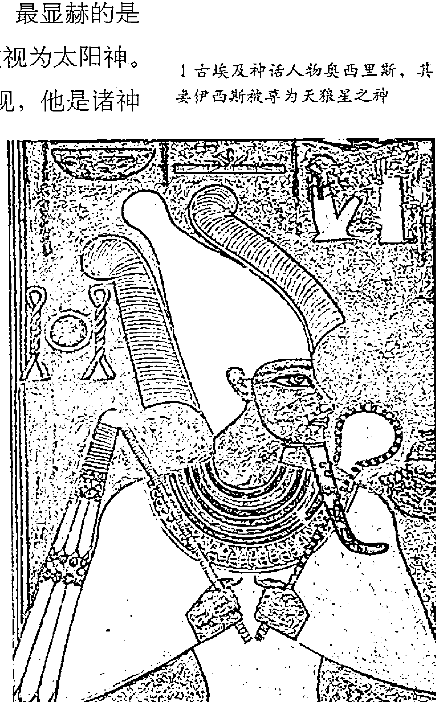

古埃及神话中的太阳神

伊姆霍特普，古埃及最著名的建筑师、医生、祭司、巫师，其另一个身份便是占星家

比如著名的伊姆霍特普，作为第三王朝法老乔塞尔时期（约公元前2686－前2613年）的宰相，被尊为“圣人”、“不朽神人”，被视为伟大的建筑师、医生、祭司、巫师，其生前即享有盛誉。至希腊－罗马时代，对他的崇拜臻于极盛。伊姆霍特普虽然主要是作为医神受人崇拜，但他还有一个重要身份——占星学家。许多研究甚至相信，人类历史上最早的一张纸算命天宫图可能早在公元前2767年时就已出现在埃及了。更令人称奇的是，在第十九王朝著名法老拉美西斯二世的墓中，考古学家发现了两个金环，上面不但有划分360度的刻度，而且还有显示某些恒星升降的象征符号。学者们推测，这可能说明拉美西斯二世对于黄道升上东方地平线的时刻及度数感兴趣。稍后，在第二十王朝法老拉美西斯五世墓中的一份纸草书上，考古学家也发现了关于一年中每月、每时的占星学暗示。

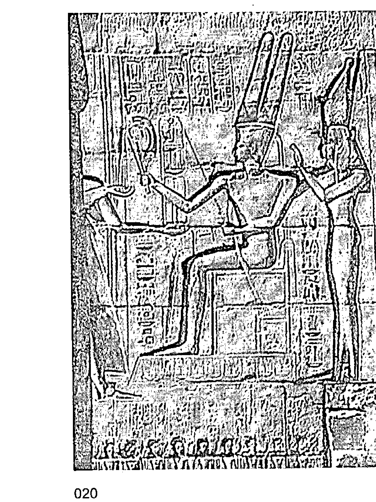

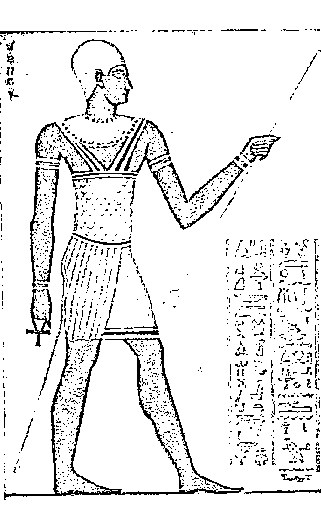

## 占星文献的秘密

不过对于埃及而言，真正意义上的占星术是一种外来文化与本土文化的结合体。研究者认为，占星术在埃及的发展可以分为两个时期。

第一个时期起源于公元前5世纪时波斯人的入侵，当时的占星术混合着埃及早期的宗教传统。那个时期，关于占星术的知识为少数人如国王、教士和贵族所掌握，他们随时将天象抄录下来，以备政治所需。至于普通民众，占星术仅限于天狼星的观测，主要为了预测尼罗河的泛滥。但有一点必须承认，那就是发端于古巴比伦的占星学已传入了埃及。

在考古发现中，学者们整理出了一份年代最早的古埃及占星文献，并将其命名为——《维也纳世俗体交蚀征兆纸草书》。虽然它是罗马统治时期（约公元前2-公元3世纪）的抄本，但因其中全未提及黄道十二宫，西方学者普遍相信是公元前4世纪亚历山大远征之前的作品。在《维也纳世俗体交蚀征兆纸草书》中，保存着埃及星占术的几套时间分野体系。这些分野体系所涉及的地区，除埃及本身外，还有其周边诸国：叙利亚、克里特、希伯来、阿莫等。其中第一套分野将日、月天象分别对待，对于太阳天象的对应之法如下：

- 冬4月—夏3月：希伯来
- 夏4月—洪水3月：埃及
- 洪水4月—冬3月：（缺损）

这里的冬、夏、洪水三季，就是指播种、收获和洪水三季。上表的意思是：自冬季第4月至夏季第3月，有关太阳的天象兆示希伯来土地上的国运；自夏季第4月至洪水季第3月则兆示埃及本土的国运，其余类推。关于月的天象，则是将一年12月分为4组，每组3个月，分别对应各国：

- 洪水4月—冬2月：希伯来
- 冬3月—夏1月：阿莫
- 夏2月—4月：埃及
- 洪水1月—3月：叙利亚

其意义与上述太阳部分相仿。

! 在几千年的星神崇拜中，古埃及人发展起他们自己的天文学，并且出现了占星术的萌芽

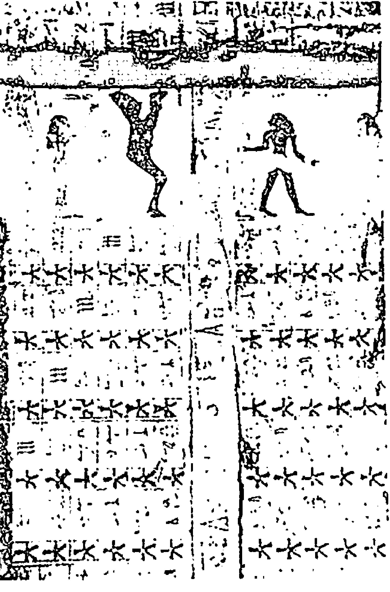

1 年代最早的古埃及占星文献——《维也纳世俗体交蚀征兆纸草书》

古埃及人分一天为昼、夜两部分，自日出至日落为昼，自日落至日出为夜，昼、夜各 12 小时。此 24 小时与各国分配对应，也形成一套时间分野：

| 昼12时 | 夜12时 |
| :--- | :--- |
| 1—4：埃及 | 1—3：埃及 |
| 5—8：克里特 | 4—6：希伯来 |
| 9—12：阿莫 | 7—9：阿莫 |
| 10—12：叙利亚 | 10—12：叙利亚 |

这样，每昼夜 24 小时之中，“埃及世界”的诸国各有其地位。

除上述各种时间分野外，《维也纳世俗体交蚀征兆纸草书》中还有一种比较简单的天区与地区作如下对应：

- 北天：希伯来
- 中天：克里特
- 南天：埃及

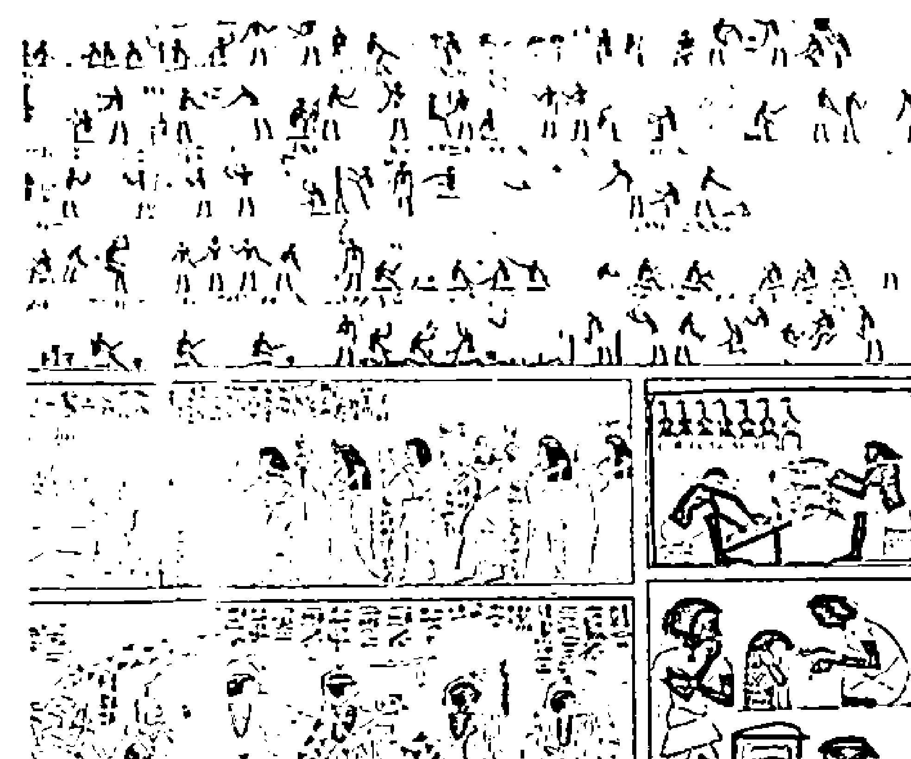

这种对应是专为日食征兆而设。关于月的天象及征兆，也有类似分野。

设定分野体系，就可以依据所见天象对大地上不同地区的人事进行预占了。在《开罗纸草书》中，提到了这样的占星词：

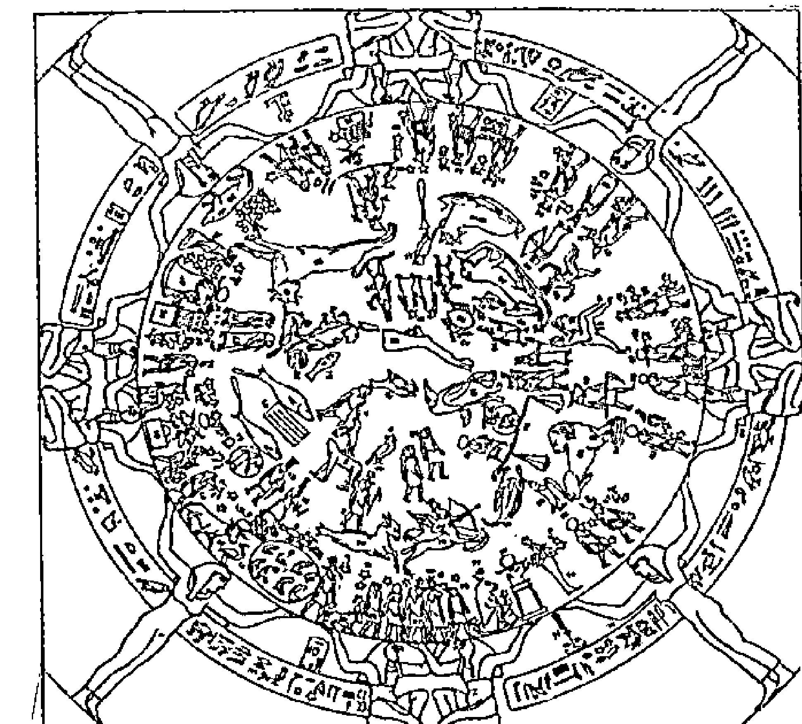

> “如果索雪斯星（古埃及人对天狼星的称呼）升起时，月亮正在人马宫，那么……”

> “如果索雪斯星升起时，水星位于双子宫，则……”

## 埃及人对黄道十二宫的贡献

在后世西方盛行的黄道十二宫中，古埃及的影响非常明显，尤其是白羊、金牛、室女和摩羯四宫，体现得更为显著。

- 白羊宫：神物形象为羊首人身，神名为阿蒙，在埃及神话中，有时就被表述为牧羊。
- 金牛宫：神形为牛，神名为阿匹斯，古埃及神话中的圣牛，又名天牛。
- 室女宫：神形为手持双穗的女子，神名为伊西斯。谷穗是生育、繁殖的象征。
- 摩羯宫：神形为犬首人身之物与另一怪兽，神名为安努毕斯。古埃及神话中的墓地之神，负责将尸体制成木乃伊。

第二个时期则是在亚历山大征服埃及之后的几百年间，即所谓的希腊化时期。其间，由于希腊文化的传入，埃及也由此发展起了真正的占星术。例如著名占星学家和天文学家托勒密所著的《四书》，就将希腊人的逻辑混合了埃及的宗教神秘主义色彩。通过进一步发展，埃及人开始将占星术的知识应用到现实生活中。埃及人对于占星术的贡献主要是将黄道十二宫的每一宫，分为3个10度，每一个10度有一个行星支配，这一贡献甚至影响到了近代一些占星术的理论。在受到希腊文化影响之前，埃及民间所崇拜的是尼罗河神。但在希腊人征服埃及之后，埃及人也接受了迦勒底人占星术的符号。

据考证，大约在公元前4—前3世纪，天宫图传入埃及。在一座公元141年的两兄弟墓葬中，考古学家在墓室顶上发现了一幅埃及算命天宫图。图中的埃及象形文字与图形交错共处：上部，从左至右，依次排列着天蝎宫、人马宫、摩羯宫、宝瓶宫、双鱼宫、白羊宫；下面一行，从右端开始向左排列，依次为金牛宫、双子宫、巨蟹宫、狮子宫、室女宫、天秤宫。五大行星及日、月各在何宫，图中也绘得清清楚楚。除此之外，还发现了一些希腊化时代与占星术有关的埃及文献以及一些纸草书。

### 古希腊罗马占星术的发展

> > 有学者指出：“占星术的根，无疑就在美索不达米亚，它从所有关于征兆的文献中浮现出来……我们从希腊占星文献中可以发现，希腊人大大发展了占星术。古代占星术的真正中心，无疑是在希腊化时代的亚历山大，从这里，占星术向外扩散，最终遍布整个世界。”

### 古希腊哲学家们的神秘世界

占星术在希腊的发展又可分为两个阶段：古希腊以宇宙哲学建构占星学时期；亚历山大大帝东征后的希腊化时期以及随后的罗马时代。早在公元前7世纪上半叶，一位名叫赫西奥德的希腊诗人就在其长诗《工作与时日》中留下了类似的记录，例如他写到：“下述这些日子是无所不知的宙斯定下的，只要人们不把它们搞错了。首先，每月的第一、第四、第七天皆是神圣至日……第八天、第九天——上旬里至少这两天是特别有利于人类劳动。十一日和十二日两天都是好日子，无论用于剪羊毛，还是用来收获喜人的果实……每月中旬的第六天非常利于植物，但有利于男孩降世，不利于女孩出生，不利于姑娘出嫁。每月上旬的第六天不适宜女婴出世……这天适宜男孩降世。但是，那天出生的人将喜欢挖苦、说谎、狡辩和私通。在伟大的第十二天，聪明人应该诞生，这样的人最有深谋远虑。每月第十天是男性降生的吉祥日，每月中旬的第四天是女性降临的吉祥日……要躲过每月第五天，因为这些天艰难可怕。在某个月的第五天，据说厄里斯（复仇女神）曾帮助了誓约女神的降生，而誓约女神是斯特里夫（不和女神）生下来追究违誓者的。 每月中旬第九天愈晚愈好，但中旬的第九天完全不害于人类，这天无论对男性还是女性都是出生吉祥日……以上说的这些日子对大地上的人类是一大恩典。其余日子捉摸不定，不那么吉利，不带来任何东西……一个人能知道所有这些事情，做自己本分的工作，不冒犯永生的神灵，能识别鸟类的前兆和避免犯罪，这个在这些日子里就能快乐，就能幸运。”可以看出，这种观念与古巴比伦的某些占星术极为相似。

不过这一情形的出现，首先还应追溯到希腊古典时代的文化氛围，尤其是以毕达哥拉斯、亚里士多德等为代表的学者，他们所提出的宇宙哲学观念，后来更成为西方占星术的重要支柱。

与毕达哥拉斯一样，古代希腊最伟大的学者亚里士多德，其宇宙哲学对占星术的影响也极为深远。亚里士多德，公元前384—前322年，古希腊哲学家、逻辑学家和科学家。出生于斯塔吉拉城，18岁跟随著名哲学家柏拉图学习，后来曾担任马其顿王子亚历山大的教师。他在许多领域里都取得了巨大成就，尤其是物理学和哲学方面对后世的影响极为深远。亚里士多德认为，自然中一切对象都由质料构成，并且必然具有运动和变化。他认为空间运动伴随着其他种类的运动，空间和位置是一切种类运动的普遍条件。他认为物质是可以按照某种规律合成的，而世界由四种基本元素——水、土、火、空气构成，物质的所有形态都由这四种元素根据不同的比例组成。他还提出，地球是球形的，位于宇宙的中心，地球本身不动，其他天体都围绕着地球运转，天体围绕地球运动分为若干层，如月亮、太阳、水星、金星、火星、木星、土星等依次一层层地排成若干同心圆，宇宙的最外层是不动的推动者，即神是一切天体追求的根本动力和最高目的。后来经过古代天文学家托勒密的整理，亚里士多德的宇宙哲学形成“地心体系”，并一直是占星学最重要的基础。

在亚里士多德流传下来的大量著作中，集中讨论天学的有《论天》《天象学》以及《论宇宙》等。在《天象学》中，亚里士多德用了不少篇幅谈论彗星。他认为彗星的构成性质类似火，彗星出现常常是干旱和大风的预兆：“当彗星很多，而且经常出现时，那些年份就明显是干旱的和多风的……例如，当那块石头从大气中落入埃戈斯河中时；在那时，有颗彗星也恰巧出现在西方。再有，在大彗星出现时，冬季干燥，北风凛冽，潮浪由于风而相对撞……”这种认为天象能够影响气象的思想，后来便逐渐演化为所谓的“占星气象学”。

诚然，当来自美索不达米亚的占星术最初传入希腊世界时，相当一部分人对其表示了置疑。例如著名的天文学家、数学家欧多克斯（公元前 408—前 355 年）就坚决反对迦勒底的生辰占星术，他说：“对于那些依据人们出生日期来预言和判断他们一生的迦勒底人，不应给予任何信任。”而另一位学者、亚里士多德的弟子西奥弗拉斯托斯（约公元前 372—前 287 年）也对占星术能够根据一个人出生的时刻来预言其一生深表怀疑。但是总的看来，越来越多的希腊人开始接受占星术的理论。据说在公元前 372 年时，希腊人曾观测到一颗彗星，其彗尾长达 60 度，当时许多人就认为这是斯巴达人衰落的预兆。

## 第一黄金时代

从严格意义上说，巴比伦占星术在希腊世界的正式传播是从亚历山大东征时开始的。正是由于这位征服者建立起一个空前庞大的帝国，一举囊括了包括欧、亚、非三大洲在内的各古老文明，从而直接促进了东西方文化的交融，也使得希腊人真正与巴比伦占星术发生亲密接触。

由史料得知，亚历山大大帝（公元前 356—前 323 年）原本是马其顿国王腓力二世之子。然而在一些古代传说中，这位伟人的身世却充满传奇色彩，而且与占星术密切结合在一起。据一些野史记载：相传亚历山大的真正父亲是末代埃及法老奈克塔内布。这位法老有类似“撒豆成兵”的法术，能凭空召唤大军集结。但在公元前 356 年那年，天上的行星向他兆示：他的王国将被强敌征服，任他法术高深也无济于事。于是奈克塔内布化装成占星家前往马其顿，想方设法进入腓力二世的宫廷。有一天，他乘腓力二世外出之时潜入王后的寝宫，然后竟伪装成阿蒙神下凡使王后怀孕。等到分娩之日到来时，奈克塔内布又去王后的寝宫，在那里大施法术。他安置起一个占星用的金盘，外圈是埃及的36旬星，中圈是巴比伦的黄道十二宫，内圈是日、月；还有一些标志，用来表示行星位置。他要王后控制婴儿降生的时刻，待到他据金盘排算出来的吉祥时刻再分娩，结果亚历山大果然降生于吉日良辰。亚历山大出生之后，奈克塔内布又成为其启蒙老师，向后者传授占星术。可是当亚历山大王子长到12岁时，却将自己的生父兼恩师奈克塔内布扔下了悬崖，目的就是要证明这位占星术家并不能正确预言自己的死期。

如果上述这个故事多少带有荒诞的成分，那么另一些历史记载则应值得我们重视。据古希腊作家阿利安《亚历山大远征记》一书的记载，亚历山大大帝在远征途中，曾多次与巴比伦发生占星术接触。其中一个故事说：亚历山大率领部队渡过底格里斯河之后，就向巴比伦进军。半路上遇上一些迦勒底占卜家。他们把亚历山大从战友那里拉到自己一边，请求他停止向巴比伦进军。他们说，这是因为他们从别卢斯神那里得到神谕，说亚历山大那时到巴比伦去一定会凶多吉少。可是亚历山大却说道：

> “预言家，预言家，预言最好的事，才是最好的预言家。”

那几位迦勒底人说，

> “不过，国王陛下，您可别朝西看，也别带您的部队往西走。您最好带着您的部队向后转，往东走吧。”

! 亚历山大帝国，通过亚历山大的征服，源自巴比伦的占星术开始传往古希腊，并在周边世界传播开来

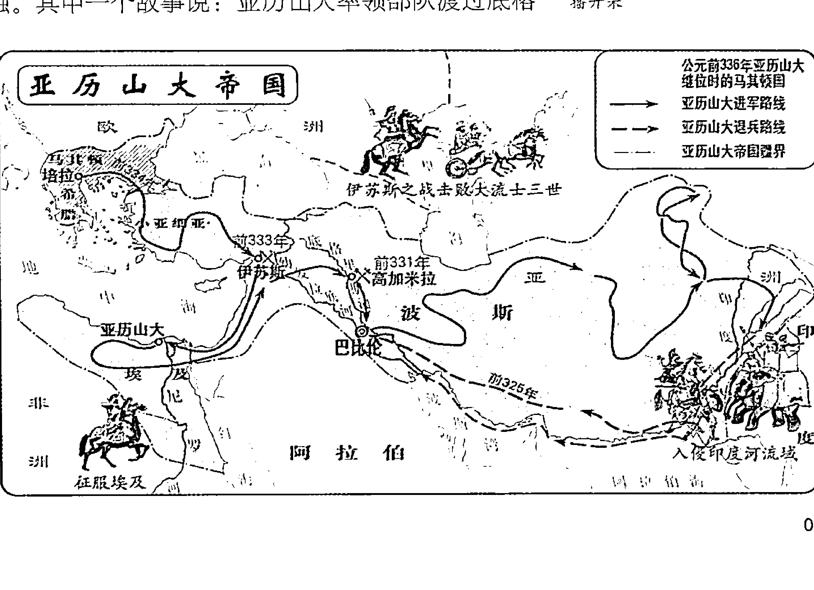

虽然亚历山大所建立的帝国在历史上仅是昙花一现，很快就随着他的英年早逝而分裂了，但从此之后，源自美索不达米亚的占星术却迅速在周边世界传播开来，并在随后的希腊化及罗马时期进入其第一个黄金时代。

## 希腊化及罗马时代的占星术

亚历山大大帝逝世后，他的几名部下分别在欧、亚、非三大洲建立了由希腊人主导的王国，由此进入了长达数百年的希腊化时期。与此同时，在意大利半岛，罗马人也迅速向外扩张，逐渐由共和国发展成为一个大帝国。由于地域及文化上的亲缘关系，希腊人的许多文明成果也为罗马人所吸收，而占星术也在此列。结果从公元2世纪一直到西罗马帝国灭亡之前，占星术出现了极为鼎盛的时期。另外，随着希腊－罗马世界与东方各民族的交往，西方的占星术也反过来影响到东方。在罗马帝国时代，这种希腊－罗马的占星术又向波斯传播，再稍后又对印度产生了很大影响，而黄道十二宫的概念就是这样传入印度的。

这一时期首先应该提到的奠基者是伟大的天文学家、占星家托勒密。作为西方占星术发展史上最重要的人物之一，生活于公元2世纪的托勒密又是希腊化时期（虽然当时他生活的埃及已成为罗马帝国的一部分）最伟大的科学家。在他的著作《四书》中，已将占星术的架构说明得相当详细，并基本上奠定了占星术的发展方向。与托勒密同一时期的罗马诗人马尼利乌斯，也在其著作《天文学》中提出了自己的占星术理论，强调“命运控制着世界，万物都依无可避免的定律，它创造了人们，但也在他们出生时决定了他们的寿数和命运的变化。”

## 生辰占星术的星神对应

通过托勒密等人的著作，可以看出当时关于天宫图等学说已相当具备了。在当时，王公贵族们所豢养的宫廷占星家无时不在为主人寻求吉利时刻，从事政治、军事、经济的活动，而后来占星术又几乎成为王公贵族们必备的知识。据说罗马帝国的开创者屋大维就曾公布自己的本命天宫图，以向全国表明自己的独特性。

与其他古代民族有所不同的是，罗马人对占星术的兴趣主要是在日常生活的应用方面，即所谓的生辰占星术。他们也将本民族神话中的神和英雄与天上的行星和星座对应起来，比如五大行星分别为：

- 水星 —— 墨丘利，旅客、商人，甚至盗贼的保护神，又是诸神的使者；
- 金星 —— 维纳斯，众所周知的爱与美之女神；
- 火星 —— 马尔斯，战神；
- 木星 —— 朱庇特，众神之主，相当于希腊神话中的宙斯；同时还是光明之神、雷电之神、护军之神、胜利之神；
- 土星 —— 萨图恩，农耕之神；先前也曾经是罗马人的主神，后来让位给朱庇特。

在希腊化及罗马时期，最盛行的是生辰占星术，即根据一个人出生的日、月和五大行星在黄道十二宫位置，预言其人此后岁月中的一系列事件，包括生老病死，穷通祸福，以及此人在性格、体质等方面的特征。在这方面，留存下来的资料也非常丰富，诸如——

> “生于公元104年4月23日：手臂短。又一人：有病，在海上出逃不遂，但幸赖土星位置之仁慈，终可幸免于难。”

> “生于公元114年11月10日：42岁与一女子口角纠纷，大出其丑；两年后一奴隶横死，他的父亲陷于危险，性命攸关；他本人受到‘门第微贱’、‘强奸’等指控。但他能得到朋友们的帮助和恩惠。”

> “生于公元116年1月12日：女人气，且有难言的恶习——因为摩羯宫是淫荡好色的，而它的统治者（土星）又远在金牛宫……他看来将由于一些无法防止的意外事件，在军中高位上被人鸣鼓而攻，届时人们将无不惊奇。”

在这个时代的占星家心目中，世间各种事件与日、月、五大行星之间有着密切的对应及互动关系。例如，太阳常与生命联系在一起，而且一天之中不同时刻的阳光有不同性质。又如，火星总是与战争联系在一起，金星则对应于爱情，水星对应于速度和情报信息等等。关于五大行星的“性质”或“性格”，又有一套说法。比如，木星和金星被认为是仁慈的，火星和土星则会相冲相克，而水星则是中性的。行星和月亮的影响力，则依据它们对于地球与太阳相对位置而有大小不同——金星、水星、月亮的影响力弱，火星为中等，木星与土星则强。与此相对应，金星和月亮是“湿性”的，而湿性代表雌性、女性；反之，木、土二星则代表雄性、男性。

随着占星术理论的发展，希腊－罗马人逐渐发展出一种“非前定派”的占星术理论，即只承认人间万事中有一部分是前定的，还有一部分则未经前定，因此人们至少还有一些操控未来的余地；在此情形下，时间和地点的选择就显得非常重要，如果选择不当，做某件事会招灾惹祸，反之则会大吉大利。按照“非前定派”占星家的观点，操控分娩过程、选择婴儿降生时刻就成为关系到其一生祸福的大事情了。不过，那时的占星家还需要根据孕妇的预产期，事先排算好一系列的算命天宫图，由此看出哪些日子、哪些时辰分娩吉利，进而再指导产婆帮助产妇操控分娩过程，力求趋吉避凶。

## 中世纪的曲折前进

公元4世纪以后，随着基督教在罗马帝国范围内确立统治地位，从本质上属于另类信仰的占星术自然与其发生冲突。加之当时罗马帝国已处于风雨飘摇之中，因此一些基督教会的权威人士便开始猛烈抨击这种“异端”学说。

不过随着西罗马帝国的灭亡，拜占庭帝国的建立，中世纪欧洲与东方的文化交流更加频繁，而经历了短暂低潮的占星术又继续向前发展了。到公元6世纪以后，大部分西方学者已经开始承认，

> ！在正统教会人士眼中，占星术无疑是一种异端文化

# 解读占星术

占星学是整个人类知识体系中的一个重要成分。比如东哥特王国时期的意大利学者波伊提乌，就在其著作《哲学的慰藉》中认为，行星的运行是由“不朽的神意”所操控的，而从恒星的天球运动中，可以演绎出尘世的事务。他还赞同柏拉图的见解，认为每颗行星有着自己对应的音阶，构成“天球的音乐”，显示出宇宙的和谐。该书中还有一些推算天球运行的细节，绘有一些在占星学著作中常见的示意图。

公元8世纪以后的几百年间，欧洲先后涌现出一大批著名的占星学家，而那些统治者也对他们非常器重。据说在公元1066年诺曼公爵威廉渡海征服英国时，正值哈雷彗星出现，人们认为正是这颗彗星“引导着公爵取得胜利”。威廉自己也非常笃信占星术，在远征时就带着自己的宫廷占星家。接着，占星家又为他择定了加冕为英国国王这一仪式的吉时——公元1066年圣诞日中午，这一时刻被认为非比寻常，它正可为英格兰择定一张新的算命天宫图。也正是由此开始，欧洲大陆上流行的占星学传入英国，并得到越来越多人的信任。

到13世纪以后，中世纪欧洲的占星术再度出现了繁荣，其程度甚至超过了希腊化时期。无论是哪一种占星术，都有了更大的发展。从中世纪中期开始，有一套将黄道十二宫与日月及五大行星相互对应附会的学说，也日益流行起来。在当时许多著作、绘画中都可以见到这套学说的表现和影响。由这套学说出發，又进而附会出许多结论来。比如，日月和五大行星常在一些占星图册中被绘成人形，他们手中所持的器物也固定下来。

- 日：老年王者，手持书册与权杖。
- 月：裸女，手持号角与火把。
- 水星：男子，手持囊袋和两条缠在一起的蛇。
- 金星：裸女，手持镜子与花卉，有时还头饰花冠。
- 火星：武士，顶盔披甲，手持军旗和利剑。
- 木星：猎人状，手持箭矢和杖。
- 土星：男子，手中持镰刀，有时还拄着拐杖。

在中世纪，基本上趋于成熟的占星术越来越多地渗透到社会的各个领域中。虽然生辰占星术在欧洲各国占据主流地位，但类似巴比伦时期的军国占星术也屡屡成为焦点——占星家们甚至得以介入国家的政治生活中。因而在这数百年间，欧洲社会上不断流传着形形色色的预言，成为一大历史景观。据历史记载，就连当时的教皇也对占星术深信不疑。教皇克雷芒六世就曾命占星家穆尔斯为其排算了“占星年历”。这种“年历”实际上是一份预言编年表，由占星学家根据其人出生时刻的算命天宫图，推算出此人今后逐年的祸福、健康、奇遇、注意事项等等，有时可以长达数百页。当时人们相信，如果占星家为某人所排算的占星年历有多少年，就意味着此人能活多少岁。而在著名的英、法“百年战争”（公元1337—1453年）期间，占星家还积极预测战役的胜负、国王的死期以及王位继承人的命运等。可以说，直到14世纪末，欧洲各国的宫廷仍在相当大的程度上依赖占星家。那些君主们需要占星家的智慧和预言，他们让占星家提供咨询，充当顾问，甚至直接参与机要，委以重任。因此与希腊化以及罗马时代相比，占星术的整体地位进一步提高了。

## 第二黄金时代

14世纪时，随着工场手工业和商品经济的发展，资本主义生产关系已在欧洲封建制度内部逐渐形成；在政治上，封建割据已引起人民普遍不满，民族意识开始觉醒，欧洲各国大众表现了要求民族统一的强烈愿望。从而在文化艺术上，也开始出现了反映新兴资本主义势力的利益和要求的新时期。新兴资产阶级认为中世纪文化是一种倒退，而希腊、罗马古典文化则是光明发达的典范，他们力图复兴古典文化——而所谓的“复兴”其实是一次对知识和精神的空前解放与创造，于是便出现了历史上著名的“文艺复兴”。在这一时期，由于对古典希腊以及东方文化的热烈研究，占星术也迎来了它的第二个黄金时代。与希腊化时代相比，这一次的规模更大，而且也同样出现了两大特色：一是君王贵族等上流社会人物普遍沉迷于占星术；二是出现了身兼天文学家与占星学家的代表人物，如第谷和开普勒等。

在文艺复兴的发源地意大利，占星术几乎渗透到每一个地区，以至于当时意大利的上层社会几乎家家都雇佣一位占星学家。那时，每个君主的宫廷里几乎都有占星学家充当顾问，为他们的大小事务出谋划策。即使在佛罗伦萨等“自由城市”中，也有市政府正式任命的占星学家。而在大学里，从14世纪起就任命了占星学教授。至于罗马教皇们，无一例外地迷信和依赖占星学。据说，教皇保罗三世对占星术痴迷的程度甚至达到了“在占星学家为他定出时间之前是从不召开枢机主教会议”的地步。在英国，人们同样信奉占星术。例如著名的伊丽莎白一世女王，她举行加冕典礼的吉日就是由占星学家约翰·迪用占星学理论为她推算择定的。名垂千古的大科学家牛顿，年轻时也曾买过关于占星学的书，而到晚年时，他还曾热衷于研究所谓的“预言书”。

## 占星术的式微与发展

当今社会无疑是一个科学主导的时代，而那些曾盛行一时的迷信则基本退出历史舞台。与许多带有神秘色彩的事物一样，17世纪以后，随着日心说的确立和近代科学的兴起，占星术也失去了科学上的支持。但是与炼金术等神秘文化不同的是，占星术并没有彻底消亡，而是以另一种姿态继续存在于当今社会，只不过它再也不能成为社会主流文化的一部分了。

### 反对声音从未停止

早在罗马帝国初期，就有许多人明确表示怀疑占星术的理论。其中，古罗马著名的政论家、雄辩家西塞罗就一直坚持自己的立场。尽管西塞罗曾与信奉斯多噶派哲学的占星家波塞多尼奥斯交往，又与热衷于占星术的罗马执政官菲古卢斯友谊甚笃，但仍表示无法相信占星术。他还在《论预言》一文中对占星术提出八项具体的批评。古罗马诗人卢克莱修则从哲学角度对占星术表示了怀疑，他的长诗《物性论》中认为来自天球的影响不可能有机会发生作用。至于著名政治家塞涅卡，则更尖锐地质问占星家们：“从这类知识中我们能得到什么呢？我是应当为土星与火星的对峙，或因在能完全看到土星的夜晚里却看不到水星而担忧呢，还是应当逐步懂得这些天体不论在什么位置都同样吉利，它们的位置是不会变更的呢？如果是它们致使一切事件发生，那么仅仅熟悉一个不可改变的东西的过程又有什么帮助呢？如果它们能预示一切事件，那么预先知道自己无法逃脱的厄运又能怎样呢？”甚至有人更清醒地批评占星术，他们认为，占星术的预言通常总是宽泛不定、模棱两可，因而毫无意义。占星家所预言之事，非吉则凶：若预言你吉庆有余，你将被徒劳无益的企盼弄得可怜可笑；若预言你在劫难逃，你又将被徒劳无益的恐惧弄得可怜可笑。所以无论如何你不应该与那些自诩能预知未来的人掺和在一起。

教会批判是以奥古斯丁为代表的。圣·奥古斯丁，公元354—430年，出生于北非（现阿尔及利亚），古罗马帝国时期基督教思想家，欧洲中世纪基督教神学的重要代表。奥古斯丁在皈依基督教以前，爱好世俗文艺，对古希腊罗马文学有深刻的研究，曾担任文学、修辞学教师。在这之后，他痛悔为世俗文艺引入歧途，极力攻击世俗文艺。他把哲学和神学调和起来，以新柏拉图主义论证基督教教义。

奥古斯丁认为一切美源自上帝。美是分等级的，最高的、绝对的美是上帝，其次是道德美，形体美是低级的、相对的美。低级有限的形体美本身并无独立价值，只是通向无限的绝对美的阶梯。美体现为整一、和谐，而整一与和谐是上帝按照数学原则创造出来的，因而美的基本要素是数。这个观点明显是受到毕达哥拉斯学派的影响。他还主张艺术应抛弃现实世界而反映上帝，达到为宗教服务的目的，造型艺术应用于装饰教堂，诗和音乐也应赞美上帝。

当基督教在西方占据统治地位后，以奥古斯丁等人为首的神学家曾对占星术大加鞭挞。作为一名虔诚的基督徒，奥古斯丁以基督教“万能的主”不能冒渎，在其名著《忏悔录》中极力抨击占星学。不过在事实上，奥古斯丁早年也曾研究过占星学。因为在当时，为了吸引信徒，基督教并未明确反对占星术。但是由于占星学的预卜未来和以一切为上帝旨意的基督教教义格格不入，自会引起教会人士的批判。

所谓盛极必衰，占星术的发展同样也不例外。就在文艺复兴的历史土壤为占星术提供营养的同时，又在不经意间培养着摧毁它的力量。17世纪以后，随着西方社会冲破神学枷锁，近代自然科学的飞跃发展，以迷信为基础的占星术注定要走到尽头了。

一方面，对占星术的反对和置疑之声从未停息过。另一方面，由于时常陷入政治斗争的旋涡，许多占星家难免遭遇灾祸。例如1555年，英国占星学家约翰·迪等人，就因为用占星学为女王伊丽莎白推算寿命而被逮捕。1581年，英国国会通过法令规定：预测女王寿命、为女王或她的继承人排算绘制天宫图等皆为重罪。

与此同时，文艺复兴运动培养出了一大批学者，也高举理性的旗帜反对占星术。例如哲学家彼特拉克晚年与薄伽丘的通信中，表示了他对占星学家的极端轻蔑。甚至有些作家这样嘲笑他们：

> 占星家们是如何地幸运啊！如果他们在一百句谎言里边说了一句真话，人们就信仰他们；而其他的人在一百句真真话里边说了一句谎言就失去了一切信任。

矛盾的是，批评与怀疑的声音在这个时期虽从未停止，但却丝毫无法阻止许多人对占星术的信奉。甚至有些人虽然在理论上对占星术持怀疑态度，但行动上未必如此。比如著名的统帅恺撒，一向不相信占星术，但他选金牛座图案做军团旗帜。再如奥勒利乌斯皇帝，他本人主张万事前定，在位时也不大与占星家交往，但也曾追随潮流，让占星家为他的两个儿子排算了算命天宫图。

## 现代占星术何去何从

到17世纪以后，占星学在西方日渐走向衰落。特别是由于近代天文学等领域的发展，人们终于彻底走出了神秘主义的幽谷，而流传了几千年的占星术，也成为历史长河中的符号，偶尔在一些特殊的社会群体中招徕顾客。但它并没有真正地销声匿迹，恰恰相反，这种古老的预言术仍活跃于社会的各个层面。

古今黄道十二宫区别

刚刚创立黄道十二宫的时候，春分点在白羊宫，因此将白羊宫定为黄道第一宫。那时侯的春分点也在白羊座。但是，由于岁差的原因，春分点的位置在黄道上每年向西移动大约50°2'，总体向西移动了30°多，黄道十二宫也随之一起西移。现在的春分点和白羊宫对应的已经不再是白羊座，而是双鱼座。大约还要再过24000年左右，白羊宫会重新对应白羊座。

在20世纪70年代，有多达186位学者（其中包括14位诺贝尔奖获得者）发表宣言公开表示反对占星术。但是正如很多人所了解的，在科学昌盛的今天，占星术仍在欧美各国广泛流传。例如在2001年初，由于土星和冥王星的180°对冲，有不少占星家预测出了全球的经济衰退周期以及股市将会暴跌，而当“9·11”事件发生后，他们又将其附会为具体时间。

现代占星术由于一些心理学家和统计学家的不断实践和修订，已经有了全新的理论基础和科学依据，整合了现代心理学、生物学、物理学、天文学的知识，辅以计算机软件的运用，从根本上改进和提高了占星技术的理论层次和精准度。而所谓的心理学分析，已经成为现代占星术的应用技术主流。心理学帮助占星学摆脱了宿命的色彩，从一个全新的、人性的角度去解释和看待人的个性与命运。另一方面，占星术又以通俗娱乐的特色成为大众文化的一部分。

在这样一种时代背景下，占星术领域仍不断产生出各种人物和故事。通过这些人物和故事，我们又不得不承认，占星术的彻底消亡，恐怕还需要很长很长的时间......

# 第一章 占星术与帝王命运

那些时刻考虑自己权力的帝王们，与占星术结下了不解之缘。而另一方面，后世历史学家为他们做传时，也往往从神秘主义的角度来解释其人生的经历。

## 亚历山大大帝与占星术

前面提到，西方占星术的“第一黄金时代”是由亚历山大大帝东征开创的。正是由于这位征服者建立起一个空前庞大的帝国，使得巴比伦占星术在希腊世界加速传播。而综合各种记载和传说，我们还会发现，在其短暂的一生中，亚历山大大帝的身世同样充满传奇色彩，而且往往与占星术密切结合在一起。抛开荒诞的故事不提，仅从史实的角度看，亚历山大的所有经历也足以激发后人的兴趣。

### 战神预言

公元前356年，在希腊北部的马其顿王宫，一名王子呱呱坠地了，他就是后来的亚历山大大帝（公元前356—前323年），古代最著名的征服者。

马其顿原本是巴尔干半岛北部一个不起眼的小国，当亚历山大的父亲腓力二世于公元前359年即位时，这个国家正处于内忧外患之中。不过经过腓力二世几年的经营，马其顿依靠其强大的军事力量迅速强大起来，逐步称霸于希腊北部。

当时在马其顿有一位名叫亚里斯坦德的著名预言家，一直在王室效力，并深得腓力二世的信任。虽然当时巴比伦占星术尚没有传入，但其实古希腊人也一直有预言的传统，只不过其方法与理论与占星术不同。据有关史料记载，亚里斯坦德前后竟有19次极为准确的预言。在后来亚历山大远征时，他还随军充任其顾问。而亚里斯坦德之所以得到马其顿王室的信任，很重要的一个原因就是对小王子亚历山大出生一事的正确预言。

据说，在亚历山大出生以前，腓力二世梦见他给王后奥林匹娅斯的子宫上盖了一个狮头印章。当他将此梦告诉亚里斯坦德后，后者经过一番推算，最终预言奥林匹娅斯将生下一位战神。另外还有一个关于亚历山大出生时所发生的故事：有一天夜晚，亚细亚城邦以弗所的一座神庙忽然遭遇大火而焚毁，就在同一夜，奥林匹娅斯生下了亚历山大。

在开始天亮时，当地的预言家们开始惊恐地喊道：“亚细亚的灾难和毁灭在前一夜出生了！”看来，亚历山大自一出生，就连他将来的敌人也预感到大事不妙了。

正如亚里斯坦德所预言，亚历山大从小就显示出了不同寻常的霸气和过人的机智。据说在一次奥林匹克竞技会上，当被问到是否愿意参加比赛一展身手的时候，年幼的亚历山大竟然回答：“我不反对，如果对手都是君主的话。”另一则著名的故事说：亚历山大12岁的时候，他的父亲得到了一匹名叫布塞菲勒斯的名种马。该马性情刚烈，桀骜不驯，无人能够驾驭，腓力只得命人将马牵走。一旁的亚历山大则难舍这匹好马，他发现布塞菲勒斯虽然刚烈暴躁，却非常害怕自己的影子，于是，亚历山大将马头转向太阳，马影就此留在马的身后。在布塞菲勒斯安静下来的瞬间，亚历山大迅疾跃上马背，烈马狂怒咆哮，绝尘而去。而当随从们找到亚历山大的时候，布塞菲勒斯已被驯服。听到这一消息后，腓力二世不禁感慨地对身边人断言，亚历山大必将超过自己，成就一番伟大的事业。

还在很小时，亚历山大就以其在军事上的出色表现验证了“战神”的预言。据说他特别喜欢荷马史诗《伊利亚特》，史诗中的希腊英雄阿喀琉斯则是他最为崇拜的人物。他从16岁起便随父出征，骑着烈马布塞菲勒斯征战南北。18岁的时候，他就率军击溃了希腊联军中最精锐的底比斯神圣军团，立下了赫赫战功。当腓力二世于公元前336年遇刺身亡时，已经成长起来的亚历山大便决定继承父王未竟的事业，准备在遥远的东方一展身手了，当时他年仅20岁。

亚历山大要征服的对象——波斯帝国，当时虽然已经开始走下坡路，但仍是当时地球上最庞大、富强的帝国。这个帝国不仅地域辽阔，国力强盛，而且人口众多，可以轻易组建起上百万的军队。尽管如此，亚历山大仍以莫大的自信开始了自己的军事冒险行动。

公元前334年，经过一番准备后，亚历山大发动了对波斯帝国的进攻。尽管手中仅有35000人的部队与几十万波斯大军抗衡，但亚历山大还是凭借其杰出的军事天才和训练有素的士兵，取得了一个又一个的胜利。据说在临行前，他把自己的所有地产收入、奴隶和畜群都分赠给人。一位大将迷惑地问他：“请问陛下，您把财产分光，给自己留下什么？”“希望”，亚历山大说：“我把希望留给自己，它将给我无穷的财富！”于是将士们彻底被亚历山大的雄心所激励，决心随他到东方去掠夺更多的财富。

## 决定战局的占星术

亚历山大的征服开始以后，随着他踏上美索不达米亚的土地，当地的巴比伦占星术便逐渐与他发生了纠葛，并演绎出一个个传奇。

要想凭借弹丸之地的马其顿征服庞然大物波斯，不但需要亚历山大拥有超人的智慧与毅力，而且还需要一点运气。神奇的是，各种关于亚历山大历史的记载表明，在他一路向东方的征战中，的确经常受到命运的眷顾。在一系列关键战役中，总会出现一些有利于亚历山大的征兆，甚至连天气也对他格外开恩。这些带有神秘色彩的情况，集中体现在与波斯的大决战——高加米拉战役中。

从公元前334年起，亚历山大渡过赫勒斯滂海峡，在与波斯大军的几次交战中，陆续获得了一些胜利。特别是在著名的伊苏斯战役后，波斯皇帝大流士被迫求和。而后的两年中，亚历山大又南下进军腓尼基和埃及，并在埃及被尊为太阳神。与此同时，还有相当实力的波斯又重整旗鼓，集结了全国的军队，准备与亚历山大一决雌雄，一场规模空前的战役在高加拉米展开。

据可信史料记载，大流士手中拥有步兵20万人，骑兵4万5千人，战车200辆。公元前331年9月，当这支庞大的军队出现在马其顿人面前时，即便亚历山大也曾产生过忧虑。因为当时他的军队虽已得到补充，仍只有不到5万人，其中步兵4万人，骑兵8千人。那么，在双方实力如此悬殊的情况下，亚历山大是如何获得胜利的呢？几千年以来，西方的历史学家基本上将其归功于亚历山大的英明指挥和大流士的临阵退缩，不过在近些年，这种观点已被颠覆。20世纪80年代，历史学家破译了大英博物馆中的一批古巴比伦泥版书，根据这些最原始的资料，人们惊奇地发现，其实决定这场战役结局的，更多的是一些非人为的因素。从中也可以看出，那些占卜师们之所以预言亚历山大将成为“战神”，似乎并不是胡言乱语。

众所周知，由于古代人们的科学水平有限，因此对一些天文现象非常重视，认为其可以决定人间的命运。据史料记载，就在高加米拉战役进行前几天，也就是公元前331年9月20日，出现了一次月食现象。古巴比伦的那些泥版书也记载道：“大流士5年乌吕卢月第13天有月全食，月亮完全变黑，挡住了木星，四指以外的土星可见。月食完全时，西风劲吹；月亮重现时转为东风。”

当月食发生时，马其顿大军刚刚渡过底格里斯河，而波斯大军正在南面100公里的地方严阵以待。

# 解读占星术

史料记载，当晚马其顿大营乱成一团，士兵奔走呼号，埋怨亚历山大把他们带到天涯海角，攻打别人的国度，导致天神盛怒，遮掩了月亮的光辉。在这危急关头，随军前来的占卜师亚里斯坦德出面对士兵说：“希腊人崇拜太阳神阿波罗，波斯人崇拜月亮女神阿斯塔特，因此月食是不利于敌方的征兆，”从而平息了恐慌。几天以后，夜里出现了罕见的流星雨，士兵同样惶恐不安，亚历山大不得不下令就地扎营，整整四天按兵不动。

对马其顿人非常有利的是，月食当晚波斯大军同样一片恐慌气氛，但不幸的是大流士面对这种局面却无能为力。关键时刻，巴比伦的占星家研究后得出结论，认为这次月食是波斯亡国的征兆：月食当中劲吹的西风，表示征服者将从西方来；月食完毕以后转东风，表示战败者必须逃向东方才得保全。对于这种解释，波斯人深信不疑。因此月食出现的那天，所有对天文略知一二的波斯贵族，包括大流士本人，都觉得波斯帝国大势已去。

接着，试图避免决战的大流士第二天就派特使求见亚历山大，提出停战请求，愿意割让幼发拉底河以西所有的波斯领土，赔款3万塔兰特黄金，以及将一位公主许配给他作为条件。当亚历山大召集部下进行讨论时，以帕马尼奥为首的大多数将领都表示大流士的提议可以接受，帕马尼奥对亚历山大说：“我要是亚历山大，就会接受这些条件。”但亚历山大却出人意料地回答说：“我要是帕马尼奥，自然会接受这些条件。”显然野心勃勃的他瞄准的是整个波斯帝国。

消息传到波斯大营后，据说当时大流士曾悲愤地呼喊：“亚历山大，我到底对你犯了什么不可饶恕的大罪？难道你的哪一位亲人为我所杀，因此我的暴行应得这样的惩罚？”就这样，绝望的大流士被迫迎战，而在他的影响下，整个波斯大军的士气也非常低落。

在决战过程中，还发生了一件怪事。双方交锋后，本来波斯大军凭借人数和装备的优势，曾一度占据上风，而马其顿军队则身处险境，不但阵线中央被突破，连大营也失陷敌手。但就在此时，一个奇迹发生了。史书记载，一只苍鹰突然飞临马其顿阵线右翼上空，在亚历山大的头顶盘旋。看到此情形，亚里斯坦德立刻跳上一匹战马，沿着马其顿阵线奔驰，大声呼唤：“看那只盘旋的鹰，这是马其顿胜利的征兆！”马其顿官兵士气大为振奋，一举扭转了败局，将波斯骑兵驱逐出去。

最终，惊心动魄的高加米拉之战结束了，马其顿人大获全胜。此战，波斯人死亡4万余人，而亚历山大一方仅阵亡500人。几天后，亚历山大兵不血刃进入千年古都巴比伦，并被加冕为“亚洲之王”。而战败的大流士则被迫溃逃，最后在伊朗高原北部山区的埃克巴塔那被叛将贝苏斯杀害。亚历山大后来处死了贝苏斯，将大流士的遗体运回巴比伦，举行盛大国葬仪式。

## 在印度的奇遇

公元前330年，亚历山大又彻底击败了大流士的后继者，从而征服了整个波斯帝国。但此时灭亡波斯帝国已不能满足这位“战神”的欲望，他要继续领兵东进。

经过两年的征战，亚历山大基本确立了在中亚细亚的统治地位。随后，他便将目光转向了神秘的印度。在短短的时间里，就占领了西北印度的广大地区，据说还在印度河谷建立了两座以自己名字命名的城市。

尽管在印度活动的时间不到两年，但亚历山大似乎命中注定要在这里留下神奇的印记。他的到来，不但开拓了西方人的视野，了解了另一个更广阔的世界，而且由于交通的开辟，整个中亚地区与小亚细亚和地中海东部诸港的贸易也迅速发展，从而为后来各希腊化国家的繁荣奠定了基础。不过，亚历山大东征的这些后果只是客观的历史影响，而另外一个在印度所发生的故事，则似乎预示了这位征服者的最终命运。

这个故事是这样的：当亚历山大征服印度某地时，当地一位名叫卡兰努斯的智者因触犯了他而被判处火刑。出人意料的是，这位智者在从容走上火堆时，竟说道：“啊，最美好的解脱啊！像荷库鲁斯那样，随着肉体的燃烧，灵魂挣脱了束缚并得以进入光明。”当亚历山大问他是否还有什么愿望时，他回答说：“谢谢。很快，我将看到你。”言下之意，亚历山大的死期也不远了。不过，当时的亚历山大年仅32岁，事业蒸蒸日上，身体又强壮无比，因此对这番话根本就不屑一顾。

当亚历山大返回巴比伦时，马其顿已成为一个版图空前庞大的帝国，其地域横跨欧、亚、非三大洲，西起希腊、马其顿，东到印度河流域，南临尼罗河第一瀑布，北至药杀水。为了便于统治，亚历山大还将千年古都巴比伦作为帝国的首都。亚历山大是一位充满传奇色彩的君王，由于其罕见的赫赫战功，还被视为一个神话般的英雄。从某种程度上讲，亚历山大的确实现了自己的理想。他一心想成为史诗中阿喀琉斯那样的神话英雄，创造辉煌的伟绩，他做到了。但是别忘了，希腊神话英雄阿喀琉斯却是短命而死，不知他会不会想到这一点。

有一种传闻说，原先为波斯帝国服务的那些巴比伦占星家曾私下里预测：波斯帝国的征服者将只能享国8年。按照这一预言，公元前331年进入巴比伦的亚历山大，会不会在8年后的公元前323年遭遇灾难呢？

据历史记载，亚历山大后来还试图继续再开展征服活动。在其计划中，甚至包括了阿拉伯、不列颠等地区。但或许是由于上天的安排，这一切都终未发生。因为在公元前323年6月，当时身在巴比伦的亚历山大突然死去，年仅33岁。关于其临死前的一些情形，历史上有详细记载。

公元前324年，还在印度时，亚历山大最亲密的战友赫费斯提翁不幸染上热病，8天后病逝。传说当时亚历山大曾抱其遗体痛哭3天，当载着他们的战车穿越人群与队伍时，乌云突然开始漫布天空。占卜者私下得出结论说，亚历山大大帝也将随着他的朋友离去。果然，第二年，亚历山大就暴病身亡，年仅33岁。遗憾的是，由于他死时还非常年轻，竟还没有男性继承人，而他临终前也来不及指定接班人。当亚历山大的部下冲入王宫，询问谁来继承王位时，他用微弱的声音说：“世上最强壮的。”

不过亚历山大又是幸运的，因为他没有亲眼目睹自己费尽心血建立起来的帝国走向崩溃的悲剧。就在他死后不久，手下那些手握重兵的部将们很快就展开了殊死拼杀。在这一过程中，亚历山大的母亲、妻子等都死于非命。而曾经震撼整个世界的庞大帝国，最终却分裂为几个各自独立的王国。几百年后，这些王国又先后被罗马人逐一吞并。只有那些以亚历山大的名字命名的城市，诉说着曾经的传奇故事。

### 赫费斯提翁

赫费斯提翁为马其顿贵族，亚历山大最亲密的好友和传说中的同性爱人。出生于马其顿古都佩拉，从小受教于腓力二世，并成为亚历山大的儿时好友。赫费斯提翁伴随着亚历山大赢得了许多战役的胜利，但是他高超的战略和外交才能也被亚历山大的光芒掩盖。

### 恺撒遇刺前的预言

尤利乌斯·恺撒，古罗马最伟大的统帅和征服者，其业绩与亚历山大并称，伟大的戏剧大师莎士比亚曾专门为他创作了一部戏剧。他虽然生活在古罗马共和时期，却常被人们称为“大帝”。然而，他又是一位悲剧性的人物。因为正当他处于事业巅峰之时，却被包括自己最亲信的人在内的阴谋者所刺杀。更令人惊奇的是，从当时留下的各种记载看，恺撒在临死前曾多次得到警告，劝他加强戒备。有一名预言者甚至将灾难发生的具体时间都告诉了恺撒。但是，悲剧最终还是发生了。而在他死后，占星家们又发现当时的天象极为怪异。这一切，似乎都在昭示着恺撒注定难逃厄运。

### 征服者的出世

公元前100年7月13日，罗马著名的尤利乌斯家族诞生了一名男婴，他就是日后罗马历史上最伟大的人物之一，政治家、军事家尤利乌斯·恺撒。

公元前1世纪时的罗马，正面临一个历史的转型时期。虽然它的国力强盛，但同时出现了许多社会问题。一方面是由于在对外征服中屡屡获胜，大量的奴隶和财富源源不断地流入罗马，从而滋养了一批腐朽的贵族元老。另一方面，国内的阶级矛盾却日趋激烈。下层人民不断起来反抗罗马贵族的统治，著名的斯巴达克起义就使得罗马大伤元气。此前的几百年，罗马实行的一直是共和体制，但这时却越来越走向集权和独裁。在恺撒出生的那个年代，罗马就先后出现了马略、苏拉等强大统治者。正是这一特殊的历史背景，造就了恺撒的成就。恺撒的家族背景可谓相当显赫，他的父亲和母亲都属于纯粹的贵族家庭。恺撒的许多直系亲属，曾担任过执政官、大法官等罗马共和国的最高职务。赫赫有名的马略是他的姑父，而他外祖父也曾担任过执政官，并在早年给予了恺撒强有力的支持。为此，在登上罗马最高权力宝座后，恺撒还努力为自己创造了一个神圣的家谱，声称自己是罗马神话英雄伊尼阿斯的后裔。

在早年，恺撒如同众多年轻的罗马贵族一样，接受了良好的教育，学习辩论、哲学、法律以及军事等。经过严格训练，他能讲一口流利的希腊语，而且对希腊历史产生了强烈的兴趣，从而对希腊古代伟大的征服者亚历山大大帝充满了崇敬和羡慕之情，发誓长大后要做亚历山大式的人物，成为“罗马第一人”。

公元前82年，恺撒通过在海外活动开始了他的政治生涯，并迅速显示出了非凡的军事和外交才能。公元前75年，他在旅途中被海盗劫持，最后以50塔兰特的赎金被释放。而他获释之后做的第一件事就是组织了一支舰队，捕获所有劫持他的海盗，并把他们全部钉在十字架上。回到罗马后，恺撒先后担任祭司和军事保民官职务。30岁时，恺撒通过选举当选为财务官，并获得元老院议员的资格。此后，他又曾在西班牙负责财政事务。正是在西班牙期间，发生了改变他命运的一件事。有一天，恺撒在神庙中看到了亚历山大大帝的塑像，这大大触动了他的内心，联想到亚历山大在30岁时已征服世界，而自己至今仍无所作为，于是抱负宏大的他主动辞职离开了西班牙。再次回到罗马后，恺撒先后担任了市政官、祭司长和大法官以及西班牙总督等显赫的职务，从而一步步登上权力的顶峰。

公元前60年，通过一系列政治手腕，恺撒与庞培和克拉苏缔结了政治联盟（前者是军事实力派，后者则是罗马第一富豪），这就是罗马历史上著名的“前三头同盟”。三人结盟后，恺撒的势力大增。但为了获取能与另两人相抗衡的资本，恺撒于公元前58年发动了对高卢地区的战争，在长期的高卢战争中积蓄了实力。其间，恺撒率军征服了外高卢，并占领了不列颠岛北部，占领了800多个城市。当他回到罗马城时，率领着部下风光无限地通过凯旋门，身后则是抬着缴获的2800顶金冠的士兵，罗马城万人空巷，民众纷纷去欢迎他。随着大量战利品和奴隶源源不断地送回罗马，恺撒的声望几乎达到了顶峰。在西方历史上，恺撒是与亚历山大和汉尼拔齐名的伟大军事家和征服者。他在军事战术上的主要贡献，就是善于选择主要突击方向，巧妙地分割敌军，将其各个击破；在战斗队形中通常留有强大的预备队作为重要组成部分，用来加强部队在主要方向上的突击力量，实施决战和扩张战果，这是一项伟大的创举。更难得的是，恺撒还是一位杰出的作家。他一生勤于著述，流传到后世的著作有《高卢战记》《内战记》等，都是他自己亲身经历的战争回忆录，文笔清新简朴，行文巧妙。

公元前53年，克拉苏在亚洲战场上阵亡，于是恺撒与庞培之间的对抗也日趋激烈。公元前49年，终于爆发了恺撒与庞培之间的内战。结果恺撒的军队势如破竹，庞培仓皇逃往希腊，不久又逃往埃及，最终在那里被杀。

“前三头同盟”破裂后，正是依靠民众的支持，恺撒得以打败曾经不可一世的庞培，成为罗马唯一的主宰。获胜后，恺撒拥有了更加充足的资本用以收买人心。根据历史确切记载，他以战利品的名义给老兵军团的每个步兵发放24000塞斯特尔提乌斯，还给他们分配土地；每个罗马公民除获得10斗粮和10磅油外，还有300塞斯特尔提乌斯的收入。他还举办规模盛大的宴会，并向人们免费分发肉食。据说仅仅为了庆祝某次战役的胜利，他就举办了两次午宴。由于抱怨第一次午宴太过节俭，不足以说明他的慷慨，五天后便又举办了另一次极其丰盛的午宴。

在当政期间，为了迎合罗马民众的口味，恺撒继续经常举办各种各样的表演，诸如剑斗士比武、戏剧表演、赛马和海战表演等，使罗马城常年笼罩在一片热烈的节日气氛中。在市中心广场上的斗剑比武中，一些贵族青年进行着殊死的格斗；在赛马场上，一些年轻人驾着战车隆隆驶过；在竞技场上，运动员进行了3天时间的比赛；在斗兽场上，人兽格斗的表演竟一直持续了5天的时间，令无数的罗马观众如醉如痴。最吸引人的要数两支军队的战斗表演，双方各用500名步兵、20头大象、30名骑兵展开殊死拼杀。嫌不过瘾，恺撒又下令在平原上挖一个湖泊以供海战表演。在表演时，装载大量战士的“推罗舰队”和“埃及舰队”进行海战，场面甚是壮观。为了观看表演，罗马人从四面八方赶来，而许多外地人只好在大街小巷或道路两旁搭起帐篷过夜。由于过度拥挤，许多人被践踏致死，甚至包括两名元老。

正是通过这样一种金钱政治策略，恺撒终于走向权力的顶峰。公元前48年，恺撒被选为终身保民官和为期5年的执政官，3年后又被宣布为终身独裁官，不久元老院又授予他“祖国之父”的称号，此外他还拥有统帅、大教长等尊号，成为名副其实的军事独裁者。至此，恺撒成为整个罗马帝国的唯一主宰，实际上已与皇帝无异。以致到后来，西方的一些帝王纷纷以“恺撒”自称，如俄国的沙皇就由此而来。另外，由于他决定采用的历法成为现在大多数国家通用的公历的前身，并且他把7月以自己的名字命名为JULY，更使他成为全世界家喻户晓的人物。

虽然是一名独裁者，但恺撒在治理国家方面却是值得称道的。他大胆改革当时已经非常腐败的罗马的共和制度，在元老院增补300名成员，而这些成员多数来自被元老贵族轻视的商业和一般职业阶层，甚至还有被征服国的代表。另外，恺撒还慷慨地授予自由奴隶的子女和高卢人以公民权，给受迫害的犹太教徒以宗教信仰的自由，还将许多居民移居到法国、西班牙、希腊等地。他还通过种种措施制止了税收官的投机活动，保证了货币流通稳定等等。据历史记载，恺撒当时还拟订了一系列保卫和扩大罗马帝国的更加宏伟的计划。这些计划包括：兴建一座壮观的马尔斯神庙；在泰比亚山丘建造一座最大的剧场；编纂一部简洁实用的民法典；开办一座藏书丰富的公共图书馆；修建自亚得里亚海至第伯河的大道；开凿一条穿过科林斯地峡的运河；甚至还准备继续发动对帕提亚人的征战等等。

总之，独裁的恺撒给人民带来了一个公平、仁慈、开明的社会，将罗马塑造成一个强大的中央集权帝国，使罗马成为古代最鼎盛的帝国之一。

正因如此，很多历史学家称他是才干卓绝、仁慈大度的君主，一位出类拔萃的政治家。在许多人的心目中，恺撒是英雄的象征，才智的化身。

在私下里，一些共和派贵族还指责恺撒放肆地蔑视祖宗惯例。如他任命几年任期的高级官吏，把执政官的徽章授给10名前大法官，允许已经取得公民权的非罗马人和某些半开化的高卢人进入元老院，这些所作所为都极大地触动了贵族们的传统利益。此外，恺撒竟让自己的奴隶管理造币厂和国家税收，还把3个军团的监督权和指挥权委任给自己一名释奴的儿子。

遗憾的是，面对政治上的巨大成功以及民众所敬献的一系列荣耀，恺撒开始骄傲了。在这种心态的驱使下，恺撒的一些所作所为越来越背离了罗马的共和制传统，从而使他踏上了一条危险的道路。而他的那些宏伟计划，将永远不可能实现了。

### 刺杀阴谋

在大多数罗马民众心目中，或许恺撒是可敬的。但对许多忠于罗马共和制的贵族而言，恺撒却越来越引起他们的愤怒。这些共和派贵族认为，恺撒处处滥用职权，这将直接威胁到国家的安全。的确，恺撒不但接受了前无古人的尊荣，将他的塑像与古代那些神圣的罗马国王并列，甚至在剧场中的座位也高人一等。不仅如此，他还容许授予自己只有神才配享用的东西，包括：元老院和法庭上的金座椅、迎神去竞技场的游行队伍中的神车和轿子、神庙、祭坛、与神并列的塑像、神榻、一个佛拉门祭司、一个牧神祭司团、以自己的名字给一个月份命名等。

更令那些共和派贵族难以忍受的是，恺撒常常公开挑战他们的权威。据记载，恺撒曾公开傲慢地宣称：“共和国啥也不是，只是一个没有形体的空名”，以及“当苏拉放弃独裁权时，他连字母都不识”、“现在人们跟恺撒讲话应当更慎重周到点，应当把他说的话视为法律”等。

在古代罗马，通常遇有国家大事时，总会举行占卜仪式，然后根据动物的内脏来进行分析。在罗马人眼中，这一切都是非常神圣的，但是恺撒却不以为然。有一次，当占卜者向恺撒报告动物的内脏里缺少心脏时，他却说：“如果我希望如此的话，那么这样的预兆就是更为吉祥的；如果一个动物没有心脏，不应当被视为是怪事。”此言一出，贵族们顿时一片哗然。

当时流传下来的记载表明，恺撒的各种举动，的确足以招致贵族们的仇恨。据说当全体元老把许多最庄严的决议呈递给他时，他总是坐在先祖维纳斯神庙前接见他们，居然不站起来主动迎接。虽然有些人认为，当他想站起来时，被科涅利乌斯·巴尔布斯阻止了。但更多的人则认为，他根本没想站起来，相反，当盖乌斯·特列巴奇乌斯提醒他应当起立时，被愤怒地瞪了一眼。还有一次，当恺撒自己在凯旋式上驾车通过保民官坐席时，其中一个名叫庞提乌斯·阿奎拉的保民官没有起立，他非常气愤，竟怒喊：“喂，保民官阿奎拉，你从我这里恢复共和国去吧！”此后连续好多天，他如果向任何人作出许诺的话，总要加上一句：“总之，如果庞提乌斯·阿奎拉许可的话。”要知道，保民官可是罗马人向来尊敬的重要角色。

对于罗马的最高统治机构元老院，恺撒也表示出了毫不掩饰的蔑视。有一次，在恺撒参加拉丁大典献祭后回城时，人民向他致以前所未有的欢呼。在欢呼中，有一个人把系有洁白绦带的月桂花冠戴在恺撒的塑像上。看到此情景，平民保民官厄比底乌斯·马鲁路斯和凯塞奇乌斯·弗拉乌斯命令从花冠上取下绦带，并把这个人投入监狱。但恺撒知道后，却严厉申斥并解除了两名保民官的职务。从那时起，罗马到处流传恺撒将要当国王的说法。虽然恺撒曾在平民欢呼他为国王时对他们说“我是恺撒，不是国王”，但这一切已使得那些极力维护共和制的贵族们担忧了。因为接下来还有传闻说，恺撒打算迁居亚历山大里亚或伊利乌姆，随身带走帝国的财富，并通过征税把意大利搜刮罄尽，把罗马城交给他的朋友管理。到公元前44年时，尽管恺撒表面上享受着无上的尊荣，但各种迹象表明，他的处境其实已经非常危险了。

当时主要有两件事给恺撒招致了灾祸。其中之一便是他与埃及艳后克里奥帕特拉的关系。据记载，当初恺撒与庞培发生内战时，曾追杀后者到托勒密王朝统治下的埃及。当时，该王朝内部正陷入争夺王权的混乱之中。恺撒到达那里后，争斗的双方都希望获得他的支持，以巩固自己的权力。而埃及艳后克里奥帕特拉凭借其美貌与智慧，成功地俘获了恺撒。

# 解读占星术

了恺撒的心。很快，两人陷入了热恋当中。恺撒在埃及逗留了相当长一段时间，并在这里迎来他们的儿子恺撒里昂的诞生。在平定了小亚细亚的庞培余部之后，恺撒带领着克里奥帕特拉和他们的儿子回到了罗马。据说，当恺撒班师凯旋，回到罗马时，全罗马都沉浸在狂欢之中。他们纵情玩乐，游行庆祝，游行队伍抬着2800多个金冠进入城市，威风凛凛的恺撒高坐在战车上接受人民的欢呼致敬。

但是在欢迎他们的同时，本来就对恺撒的威望惴惴不安的元老们，对于一同前来的克里奥帕特拉及其儿子却表现出了高度的警觉。他们怀疑恺撒会照搬埃及的东方传统，自立为罗马国王，并让他那并非罗马公民，在罗马没有继承权的埃及儿子接管王位。

恰在此时，罗马到处都在传言，说在下一次元老院会议上，鲁基乌斯·科塔将宣布15人祭司团的决定：授予恺撒国王称号。正因如此，坚决维护共和制的贵族们加紧了行动计划的步伐，以免批准这项决议。因此，以前经常是三三两两分散进行的密谋，这时联合成了一个总的运动。他们公开鼓动民众起来反对恺撒的种种举措，还到处张贴标语、传唱歌谣以收拢人心。比如当恺撒决定让外邦人入选元老院时，就有人贴出了这样的标语：“上天保佑！但愿无人愿给新选元老指点到元老院会堂去的道路！”还有人冒险在恺撒本人的塑像下写道：“布鲁图，由于他赶走了国王，成了第一任执政官；这个人由于他赶走了执政官，终于成了国王。”

据记载，当时参与反对恺撒的密谋者共有60多人，为首的是盖乌斯·卡西乌斯和马尔库斯·布鲁图以及德基摩斯·布鲁图。值得一提的是，马尔库斯·布鲁图能够被争取过去，的确是恺撒的悲哀。

马尔库斯·布鲁图的身份究竟有何特殊之处？我们从恺撒在临死前所说的一句话就可略知一二。那句话便是：“还有你？我的孩子！”那么，他们之间到底是什么样的关系呢？

马尔库斯·布鲁图，公元前85—前42年，古罗马政治家。他是罗马显贵家族的后裔，而他的母亲塞尔维利娅年轻时曾是恺撒的情妇。一些历史学家认为，尽管恺撒有许多情妇，但他最爱的却是布鲁图的母亲塞尔维利娅。早在公元前59年，在恺撒出任第一任执政官期间，曾买了价值600万塞斯退斯的珍珠送给塞尔维利娅，可见他们当时的感情绝非一般。事实上，恺撒年轻时确与塞尔维利娅疯狂相爱，而布鲁图就恰好出生于那个时候。因此，恺撒私下里一直认为布鲁图是自己的儿子，许多罗马人也这样传言。

可惜的是，布鲁图本人却从来憎恨这种说法，并断然否认他与恺撒之间的关系。公元前77年，布鲁图的父亲被“前三头”之一庞培暗杀，他被叔父收养。成年后，他靠发放高利贷迅速成为显贵，并进入了元老院，开始在政治上崭露头角。不过，在政治上，他属于保守共和派，从而与恺撒站成了对立面。因此，在公元前49年爆发的庞培与恺撒的罗马内战中，尽管与庞培有着杀父的不共戴天之仇，布鲁图却加入了后者的阵营。不久在希腊战场上，庞培大败。可能的确是出于慈父之情，恺撒对反对他的布鲁图非常仁慈。他命令部下，在战争中，不得伤害布鲁图，如果他愿意投降，就让他当俘虏；如果他不愿意当俘虏，也随其便。最终布鲁图写信向恺撒请求原谅，而恺撒也慷慨地既往不咎，反而将他召入了自己的阵营。据说恺撒当时把一柄长剑和一把犀利的匕首交到布鲁图手中说：“孩子，这些作为军人是不可缺少的,留在身边你自己用吧”。但是，他做梦也不会想到这些武器有一天却用在了他的身上。

图注：青年时代的布鲁图，据说他是恺撒的私生子

归顺恺撒后，布鲁图的仕途可谓一帆风顺。由于他机智、才华出众，且富有管理国家的才干，所以得到了恺撒的宠爱和信任。当恺撒在征服高卢，建立独裁统治制度之后，就把总督大权交给了布鲁图，还使其担任城市法官等显要职务。恺撒十分喜欢布鲁图，并且尊重他的意见。正像古罗马著名历史学家普鲁塔克所说的，“恺撒不但深爱塞尔维利娅而且也爱布鲁图，虽然他不过是私生子”。总而言之，恺撒对布鲁图可谓仁至义尽，将其当做最亲密的朋友，甚至在遗嘱中安排他作为第二顺序继承人。

然而，政治立场的冲突，却最终导致布鲁图再次站到了恺撒的对立面，而这次的结果更悲哀。布鲁图作为共和派，极端仇视君主专制制度，担心有一天恺撒会称帝。面对有称王企图的恺撒，布鲁图表示了坚决的立场：“为国家自由而死，是我们刻不容缓的职责！”布鲁图决心“拯救”罗马，在他心中，恺撒就是暴君的代表，刺杀恺撒天经地义。而且，布鲁图从来不把自己看做是恺撒的儿子。就这样，恺撒最信任的人却选择了与反对派一起策划刺杀他的阴谋。

在密谋中，他们拿不定主意，不知采用哪个方案好。最初，他们计划在马尔斯原野的选举会上杀死恺撒。即在恺撒召集特里布斯人民大会投票时，他们分成两个组，一组把他从桥上扔下去，另一组等在桥下刺杀他。还有一个方案便是：在圣路或剧场入口处向恺撒发动攻击。当元老院会议宣布于3月15日在庞培议事堂召开后，他们便选择这个时间和地点行动。

## 斯普林那的预言

恰在这时，一些对恺撒不利的预言出现了。在古代罗马的各种历史著作中，关于恺撒的不祥预言被描述得非常详尽。尤其是在普鲁塔克所著的《希腊罗马名人传》中，为后人留下了生动的记载：

> 一些明显的怪事向恺撒预示，他将被杀。在此前的几个月里，根据尤里乌斯法，被遣往卡普亚殖民地去的殖民者为了建设庄园，拆除了一些古墓。他们干这事越干越起劲，因为，当他们在附近寻找时，发现了一批古代手工

图注：《希腊罗马名人传》中，关于恺撒的不祥预言为后人留下了生动的记载。图为16世纪西班牙语的残页

艺品的小瓶，在一个据说是卡普亚的创建者卡普斯的墓葬中发现了一块青铜书板，上面用希腊文刻着大意如下的铭文：一旦卡普斯的遗骸遭到暴露，尤里乌斯家的一个子孙将死于自己亲族之手，而且马上又会发生使意大利大不幸的报复。

对于这一故事，普鲁塔克坚决认为它是真实的，决非人们的虚构，因为据说恺撒的一个最亲密的朋友科涅利乌斯·巴尔布斯就曾对此予以证实。另外有记载说，在恺撒临死前几天，有人向他报告：他在渡过卢比孔河时已献给了卢比孔河神的马群（已放开牧养，不加看管）怎么也不肯吃草，并且泪如泉涌。

恺撒有一位朋友，名叫斯普林那，他是当时罗马著名的占卜师。也许正是风闻共和派的动向，才使斯普林那做出了惊人的预言。有一天，当他们一同参加献祭后，斯普林那突然悄悄地提醒恺撒谨防危险，并说这一危险不会晚于3月15日发生，但恺撒却不以为然地一笑了之，甚至讽刺斯普林那杞人忧天。

事发前几天，共和派元老前来通知恺撒，请求他于3月15日到元老院的庞培议事堂主持一次重要会议，恺撒当时毫不犹豫地答应了，而完全忘记了斯普林那的警告。

更令人惊奇的是，在出席元老会的前一天，当恺撒和他的骑兵长官雷必达一起用餐时，突然提出一个问题，“怎样一种死法是最好的？”大家纷纷发表意见。最后恺撒表示，他愿意突然而死。

同时，各种不祥的预兆仍不断出现。就在3月15日前一天，一只名叫“鸟王”的小鸟受到附近丛林飞来的各种鸟的追击，衔着一根月桂树枝飞进庞培议事堂，在这里被撕得粉碎。而在当天夜里，恺撒本人也梦见自己忽而在云端飞翔，忽而与天神朱庇特携手。与此同时，他的妻子卡尔普尔尼娅也出现莫名其妙的幻觉，她在恍惚中看见自己家的屋顶坍塌了，一会儿丈夫又被刺死在自己的怀里。由于内心感到恐惧，卡尔普尔尼娅苦苦哀求恺撒不要前往元老院。面对这么多怪异的事情，一向自负的恺撒也开始犯嘀咕了。加上那几天确实身体状况不佳，因此他一度打算回复元老们，他将待在家里闭门不出，而推迟原计划进行的会议。

当获悉恺撒的打算后，本来已经预谋好的贵族们惊慌失措。为了促成恺撒动身，他们派德基摩斯·布鲁图前去劝驾。后者告知恺撒，全体与会者已经等他多时了，劝他莫使他们失望。于是，不想让人讥笑为胆小鬼的恺撒决定按原计划出席会议，他于下午5点钟左右走出家门。就在前往元老院的路上，还有一个神秘的人递给恺撒一张揭发阴谋的纸条，恺撒把这张纸条与他左手拿的纸条放在一起，打算一到元老院就宣读它们。

为了进一步占卜吉凶，恺撒在进入元老院之前还像罗马人通常所做的那样——宰了几个献祭动物，查看内脏，但都未能得到吉兆。不过他还是以蔑视灾难的态度走向了元老院，途中并没有什么异常。因此恺撒开始笑话随行的斯普林那，说他是一个不灵验的预言家，因为3月15日已经到来，他却没有受到任何伤害。但是斯普林那回答道：“3月15日是的确到来了，但还没有过去。”

殊不知，随后在元老院内将会是另一番景象。

## 惨案上演了

公元前44年3月15日，古罗马历史上最黑暗的一天，一件震惊历史的大事发生了。

当密谋者们安排好一切后，恺撒来了。进入议事堂时，他的几名随从被挡在门外。事前，斯普林那曾警告恺撒会发生危险，劝他带上卫队，但他却断然拒绝了，并说：“要卫队来保护，那是胆小鬼干的事。”当恺撒单身一人进入议事堂后，他大步走向自己的座位。这时，阴谋者向他围拢来，好像献殷勤的样子。充当刺杀主要角色的提留斯·辛布尔立即走到他身边，好像要问什么，但恺撒做了个手势让他等一等。突然，辛布尔抓住恺撒的双肩喊道：“这是暴力！”这时，其他密谋者便纷纷动手了。其中一个叫卡斯卡的人从背后刺中恺撒的喉头偏下部位，遭到突袭的恺撒奋力还击，他用手中的铁笔戳进被他抓住的卡斯卡的手臂。就在他想跃起身来时，又被刺了一刀，就跳不起来了。

图注：公元前44年3月15日那天，在元老院内所发生的恐怖一幕

很快，恺撒发现，他的四面八方都受到了匕首的攻击。特别令他震惊的是，他居然发现马尔库斯·布鲁图也持刀扑过来。他用希腊语说：“还有你，我的孩子？”后来，自知反抗无望的恺撒便用托加（罗马长袍）蒙住自己的头，左手把长袍下摆拉到脚上，以便把自己身体的下半部盖好，倒下去时体面些。就这样，恺撒总共被刺了23处，倒下了，恰巧死在庞培雕像的脚下。当所有密谋者逃之夭夭之后，气绝身亡的恺撒躺在那里。过了一会儿，闻讯赶来的3个年轻奴隶把恺撒放在轿子里抬回家中，一路上恺撒的一只胳膊还耷拉在轿子外面。据医生安提斯提乌斯的检查，在那么多的伤口中，除了胸部的第二处伤口外，没有发现哪处伤是致命的。

恺撒被害后，密谋者本想把他的尸体抛进第伯河，没收他的财产，废除他的法令，但是由于惧怕执政官马尔库斯·安东尼和骑兵长官雷比达，他们没有这么做。为了开脱自己的罪行，布鲁图宣称：“我爱恺撒，但我更爱罗马！”可是罗马的平民没有一个人对恺撒之死表示高兴。当凶手们提着血淋淋的短剑走出元老院的时候，和他们所预料的欢呼场面相反，看到的只是表情冷漠、充满怀疑目光的人群。再后来，恺撒的继承人屋大维打败了共和派密谋者，正式建立起罗马帝国。

图注：恺撒遇刺一案被蒙上了神秘的面纱

就这样，一位曾经驰骋战场、傲视群雄的人物从历史的舞台上消失了。

## 占星家们的预言

在古代历史上所有著名的政治谋杀案中，从来没有任何一起凶案像恺撒之死那样让人充满疑问。诚然，其他一些谋杀事件发生之前，也曾有所谓预言的警告。但是两千多年来，人们总是怀疑：恺撒似乎知道将要发生的谋杀，因此才对那些预言毫不顾及。

据有关文献记载，雄才大略的恺撒虽然并不笃信占星术，却也喜欢谈论和利用它。例如他选用金牛图案作为自己军团的旗帜，就被认为是着眼于占星学意义。据说他本人还写过《论星宿》这样的著作，不过未能流传下来。有许多资料表明，恺撒遇刺身亡之前，确实曾有占星家对他作过预言忠告，不过他不大信这一套。而更令人惊异的是，在恺撒遇刺之日，人们赫然看到天空出现了大彗星，连续七晚清晰可见。对于这一奇异的天象，有的占星家解释为这预示着恺撒的不朽。人们相信，那持续的彗星正是恺撒升天的灵魂。正是由于这个原因，他的塑像头顶上加上了一颗星。元老院为此决议：封闭恺撒被害的大厅，命名3月15日为弑父日，元老院永远不得在那一天集会。

古罗马著名诗人奥维德还在其《变形记》中对此事进行了神奇的描述，“维纳斯女神自苍穹飞降，立于元老院的人群中，但没人能看得见她。她从恺撒躯体内解救了灵魂，不让它飞散，而将它带上天界。但在向上飞升时，女神感到她所携灵魂化为一种神灵的质素焚烧起来。她不得已只好任它逸出怀中，灵魂升至月球天之上，变为明星，在广袤的空间中拖着一束火焰式的头发。”

图注：奥维德在其《变形记》中对恺撒之死有过神奇的描述

## 有关暴君尼禄的占星预言

在罗马帝国的众多皇帝中，著名的暴君尼禄与占星术之间的故事无疑是最多的，也是最神奇的。如果我们了解一下他的有关故事，就会对罗马时期的占星术有更深的体会。

## 尼禄出生

公元37年，在罗马附近的海滨城市安提乌姆，一个婴儿出生了，他就是后来大名鼎鼎的罗马皇帝尼禄，当时被取名为卢西乌斯。

尤利亚·维普桑尼亚·阿格里皮娜是尼禄母亲的全名，出身名门，一生共经历过3次婚姻，尼禄是她和第一个丈夫阿赫诺巴尔布斯所生。

当尼禄出生时，前来探望他的一些占星家惊奇地发现，在这个婴儿呱呱坠地时，旭日刚刚从东方升起，太阳的光辉恰好照射在他的身上，一向怀有野心的阿格里皮娜为此请来了当时罗马几位最有名的占星家。当这些占星家观察了尼禄出生时的异常星象后，竟异口同声地对阿格里皮娜做出了一个恐怖的预言：这个男孩有朝一日将会当上罗马皇帝，但是，当他登上帝位后，却会杀死自己的母亲！闻听此言，阿格里皮娜顿时目瞪口呆，但仅仅过了片刻，她便面无表情地回答说：“只要能做皇帝，杀就杀吧。”

图注：尼禄的母亲阿格里皮娜，一个美貌的女人

阿赫诺巴尔布斯在公元40年时一命呜呼，当时阿格里皮娜带着仅3岁的尼禄改嫁。为了摆脱第二任丈夫帕西安努斯·克里斯普斯，竟将他毒死了。此后，爱慕虚荣而充满野心的她便将目光盯向了罗马皇后的宝座。

事实上，阿格里皮娜是罗马皇帝克劳狄的侄女。一心一意要登上皇后宝座的她，竟不顾二人之间的亲缘关系，极力以自己的美貌诱惑克劳狄，最终她成功了，并成为皇后。

自从与阿格里皮娜结婚后，原本就软弱无能的克劳狄就更加昏庸了。而登上权力顶峰的阿格里皮娜开始处心积虑栽培儿子尼禄。为了架空皇帝，树立自己的权威，她广泛收买心腹，培植党羽。

作为一个女人，阿格里皮娜深知，要想长久维护自己的地位，唯一的办法就是让自己的儿子登上帝位，因为克劳狄毕竟已年迈了。于是，在这一动机的驱使下，她千方百计地为儿子谋取皇储的身份，极力蛊惑克劳狄将尼禄收为养子。公元50年2月25日，老迈昏庸的克劳狄终于决定，将尼禄收养为自己的继承人。

图注：克劳狄受尽阿格里皮娜的摆布

更令人费解的是，除了收养外，克劳狄还采用了其他的方式来培植尼禄：公元51年，在尼禄按照罗马习俗举行成人礼、穿成人托加（罗马长袍）的那一年，老皇帝自己又出任了一届执政官；授意元老院将其推举为罗马城外的帝国执政官；带着尼禄出席各种大型活动，并让大家向尼禄欢呼；使尼禄的头像出现在帝国的钱币上，并冠之以“年轻人的领袖”这一称号。公元53年，为了进一步加强尼禄的地位，克劳狄又将女儿屋大维娅嫁给了他。最终，尼禄被确定为克劳狄的皇位继承人，阿格里皮娜的愿望基本实现了。

不过有趣的是，到了晚年，克劳狄突然有所醒悟，他曾多次对与阿格里皮娜结婚及收养尼禄为子表现出明显的后悔，但一切已无济于事。预感到大事不妙的阿格里皮娜决心提前动手，除掉克劳狄，为羽翼已丰的儿子开路，于是在饭菜里下了毒。第二天，在安排好有关继承人的一切事项后，阿格里皮娜对外宣布克劳狄驾崩的消息。克劳狄享年64岁，共在位14年。他的继承者，年仅16岁的尼禄当天中午就被元老院宣布为新的皇帝。就这样，占星家关于尼禄将当上皇帝的预言实现了！

## 弑母预言实现

即位之初，尼禄还力图显示自己对亲人的虔敬。他为克劳狄举办了极其盛大的葬礼，发表了葬礼颂词，并尊死者为神。他还沉痛地追悼了先父多密提乌斯。为了酬谢母亲的功劳，他把一切国事和私事都委托给她。据说在即位第一天，他向卫队长发布的口令竟是“良母”。此后更是经常同她一起乘坐肩舆出现在大街上。少年尼禄当上皇帝后，一切国家大事几乎都由母后做主，然而没多久他的暴君面目就显露出来。随着年龄的增长，他的所作所为比起母亲的罪恶行为来，简直是有过之而无不及。正如历史学家们的感慨：“蛮横、好色、奢侈、贪婪和残忍在他身上起初是逐渐表现出来的。”身为皇帝的尼禄逐渐暴露出他邪恶的一面。他认为，利用财富和金钱的唯一方法是挥霍，他称那些精打细算的人为寒酸的守财奴。在他看来，只有那些挥金如土、肆意妄为之徒才是正人君子，因此他在开销方面毫无节制。令人难以置信的是，他在一位客人身上一天就花掉80万塞斯特斯。他从来不重复穿同一件衣服。他掷骰子赌博时，一个点就押40万塞斯特斯。

图注：蛮横、好色、奢侈、贪婪和残忍在他身上起初是逐渐表现出来的。

据说他外出旅游从不少于1000辆华丽大车。更令人发指的是，由于抱怨所居住的皇宫简直就是破茅草屋，尼禄竟策划了一起可怕的火灾。

图注：尼禄耗费巨资兴建的“金屋”，如今仍留存一些遗迹

史料记载，公元64年夏天，罗马突然发生了一场火灾。大火延续了9天，全城14区只有4个区保存下来，3个区化为焦土，其他各区只剩下废墟。大火对罗马城的人民来说，无疑是一场空前的灾难，无数的生命、财产被火舌所吞噬。但据传说，正当罗马城变成一片火海的时候，尼禄却登上自己的舞台，高歌有关特洛伊毁灭的诗篇，安然自在地观看烈火燃烧的场面。大火之后，尼禄利用国家灾难的机会，抢先修建了自己称为“金屋”的宫殿。

> 历史学家记述：“宫殿的前厅是那样高大，里面可容一尊120罗尺高的尼禄巨像。殿的面积是如此之大，仅三排柱廊就有一罗里长。还有一个像海一样的池塘，周围的建筑物宛如一座座城市。旁边是乡村，装点着耕田、葡萄园、牧场和林苑，内有许多各种各样的家畜和野兽。宫殿的其余部分全部涂金，并用宝石、珍珠贝壳装饰。餐厅装有旋转的象牙天花板，以便撒花，并设有孔隙，以便从上部洒香水。正厅呈圆形，像天空，昼夜不停地旋转。在浴池中，他让海水和黄绿色水长流不息。”

> 当尼禄为宫殿举行落成典礼时，竟感慨地说：“我终于开始像人一样地生活了！”

形势发展到最后，权势欲极强的尼禄又与自己的母亲产生了矛盾。在其当政之初，由于实际政治权力都控制在母亲阿格里皮娜的手中，因此他还比较敬畏母亲的权势。但随着年龄的增长，尼禄逐渐怨恨起母亲对他的控制，这种矛盾也越来越尖锐。

阿格里皮娜发现，原先很听话的儿子居然经常公开对抗她，而阿格里皮娜对尼禄婚姻的干涉，则彻底导致了母子二人反目成仇。尼禄曾先后结过三次婚，其中第一个妻子就是克劳狄乌斯的女儿屋大维娅。在屋大维娅还没有被遗弃时，阿格里皮娜还能通过这桩婚姻间接对儿子施加影响，但是一个女人的出现改变了这一切。

公元58年，尼禄结识了轻狂而毒辣的罗马贵夫人波培娅·萨宾娜。对于这个女人，古罗马历史学家塔西陀曾评价说，萨宾娜“什么都有:美丽、聪明、财富，样样俱全，可就是缺少一颗正直的心”。正是在萨宾娜的影响之下，尼禄要求与屋大维娅离婚，以摆脱阿格里皮娜的控制。而阿格里皮娜则极力反对尼禄这一行为，并对萨宾娜心生仇恨，从而使得母子间的矛盾达到了不可调和的地步。问题是，这时的尼禄已不比从前了，他从心里讨厌母亲挑战他至高无上的特权，于是竟生出了一个罪恶的念头：杀死阿格里皮娜！

在母子二人的关系破裂后，阿格里皮娜发现对儿子已无可奈何了，于是便知趣退却。但她的让步并没有换来尼禄的谅解，她的各种权力和荣誉都被剥夺，连贴身卫队也被取消了。再后来，尼禄又逼迫母亲搬出皇宫，让她退居乡里。但是不久，尼禄又接到报告说，阿格里皮娜准备纠集人马反抗他，于是便下决心杀死母亲。

的伎俩——下毒。但他三次下毒都失败了，因为老谋深算的阿格里皮娜早已提前服用了解药。后来，尼禄又在母亲的卧室安装天花板，以便深夜用机器松动板块，乘她熟睡时砸在她身上，但是这一计划泄露了。于是他又设计了一艘容易散架的大船，只要一撞船或船舱坍塌，就会使船上的母亲溺亡。但会游泳的阿格里皮娜却安然脱险了。最终，已无计可施的尼禄干脆命人将一把匕首偷偷放在阿格里皮娜手下人的身旁，然后吩咐将这个获释奴逮捕起来，五花大绑，说他是阿格里皮娜收买前来谋害皇帝的刺客。凭借这一借口，尼禄终于心安理得地派人秘密处死他的母亲，同时他还故意制造一种假象，仿佛阿格里皮娜是自杀，以逃避败露的罪行。

或许当阿格里皮娜看到儿子派来的杀手时，方才回想起当初尼禄出生时占星家的预言，不知她此时是否后悔将那个弑母的儿子扶植上皇帝的宝座呢？当然由于毕竟杀死的是自己的亲生母亲，尼禄后来也曾深感罪孽深重。他常常说，母亲的阴魂和复仇女神弗里娅的皮鞭与燃烧着的火把在追赶着他，因此他让术士举办祭典驱散阴鬼和祈求宽恕。

## 在诅咒中覆灭

阿格里皮娜死后，尼禄更加肆无忌惮了。此后，他往往不分青红皂白，随便找个借口，就可处死任何一个人，随心所欲地滥杀无辜。尼禄的倒行逆施，引起了各地和各阶层的普遍不满，反抗的情绪日益激烈。

据历史学家记载，公元64年，正当暴君尼禄为所欲为之时，天空突然出现了一颗大彗星，人们普遍认为这样的天象预示皇位将有变动。因此人们就开始议论谁将继位，仿佛尼禄已经被废黜了似的。风闻此消息后，尼禄大为震怒。同时，他所宠信的占星家巴尔比洛斯也告诉他这是大为不吉的天象，将对皇帝不利，除非处死一些贵族，方可回转天意。于是为了保住自己的宝座，残暴的尼禄下令逮捕和处死贵族，强加于他们的罪名则是企图谋害皇帝，另立新君。公元65年，一些罗马贵族组成了刺杀尼禄的集团，准备趁尼禄出席竞技场时把他杀死，但是由于领导者的优柔寡断，计划被揭露。尼禄立刻展开大屠杀，在极度疯狂和恐惧中，他宣布全国进入戒严状态，使整个罗马笼罩在一片恐怖气氛中。只要他提一个人的名字，这个人就会被处死，许多元老院议员、名人和卫队官员就这样被残害了：有些人被斩首，有些人被勒令自杀，还有些人被切开动脉血管，就连他的老师塞涅卡也被勒令自杀。

在尼禄安坐皇帝宝座14年后，罗马人民终于彻底将他抛弃了。公元68年，大规模的起义在高卢爆发了，领导这次起义的是尼禄派往高卢的副将盖乌斯·尤利乌斯·文德克斯。他在讨伐尼禄的檄文中公开宣布，起义的唯一目的就是从暴君手中把罗马解放出来，推翻“丑角元首”的统治。文德克斯的号召，得到了帝国西部行省总督及军队统帅的普遍响应，在他的周围迅速集结了十万之众。西班牙和阿非利加行省的总督也都效仿文德克斯，集结军队，讨伐尼禄。虽然日耳曼军团击败了高卢起义军，但不久以后日耳曼的各个军团也起来反对尼禄，并宣布他们的指挥官维尔吉尼乌斯·鲁福斯为皇帝。就这样，到了68年夏天，罗马帝国历史上骄横一时的尼禄已经处在四面楚歌之中了。

在穷途末路之际，各种不祥的梦境、卜兆和预言使尼禄心惊肉跳，一些占星家又向尼禄预言，总有一天他将被推翻。一向信邪的尼禄噩梦连连：梦见自己驾着一艘船，舵柄从他手中滑掉了；梦见自己的妻子屋大维娅把他拖入黑洞洞的深渊；梦见一群带翅的蚂蚁爬满了全身，忽而又被装饰庞培剧院的民族雕像包围起来，使他停住脚步；梦见自己所喜爱的西班牙骏马的后半身变成猴形，头部一点没变，而且发出悦耳的嘶鸣；梦见陵墓的大门自动敞开了，从里面传出呼喊尼禄名字的声音……

当尼禄准备召集军队前去镇压起义时，发现竟没有一个人响应。而不久，元老院又将他宣布为公敌，准备将他处死。听到这一消息，尼禄赶紧仓皇逃跑。据记载，众叛亲离的尼禄当时赤着脚，穿一件内衣，披一件破旧斗篷，蒙着头，面部罩着一块纱巾，骑着马，只有4名仆人伴随。一行人躲进一幢乡村别墅里，面临绝境。当听到追兵到来的消息，走投无路的尼禄在手下的劝说下，被迫选择自杀。临死之前，痛哭流涕的他还无耻地重复说：“一个多么伟大的艺术家就要死了！”最后，尼禄在仆人的帮助下，将匕首刺进了自己的喉咙。一代暴君，终于结束了他罪恶而无耻的一生，时年32岁。

## 占星术与希特勒的灭亡

时间推移到20世纪，虽然由于现代科学知识的发展，占星术早已丧失了中世纪时期的威力，渐渐被排斥到主流文化的边缘，但在一些特殊的时期，它仍会在一些重大历史事件中扮演独特的角色。据有关资料披露，在第二次世界大战期间，纳粹德国的独裁者希特勒，为了所谓“第三帝国”的复兴，就曾深深地陷入到对占星术的痴狂之中。但是最终，这位战争狂人也未能挽回自己的败局。

### 战争狂人

1889年4月20日，在奥地利边界城市布劳瑙的一个海关职员家里，一个瘦弱的男孩降生了。男主人阿伯雷·希特勒曾经当过鞋匠，后来才转为海关文职人员。所以他无论如何不会想到，这个其貌不扬的孩子，将在多年后被整个人类视为混世魔王，给全世界带来一场巨大的灾难。而其名字——阿道夫·希特勒，将永远被历史所铭记。

在地理位置上，布劳瑙位于莱茵河畔，在德国的巴伐利亚州邻近，因此与德国的关系非常密切。在童年时期，希特勒性格倔强而放任，至于其他方面则没有什么异常之处，唯一称得上特长的地方就是喜欢绘画。由于中学时成绩非常差，因此希特勒未毕业就退学了，后曾报考维也纳美术学院，但未被录取。更不幸的是，到青年时，由于父母双亡，希特勒一度生活窘迫，被迫流浪到维也纳街头行乞，还曾靠卖画为生。正是在流浪期间，他接触到了各种狂热的民族主义，并阅读了大量吹嘘种族优越的书籍。从此，郁郁不得志的希特勒开始痴迷于这种邪说，居然发誓要为“德国复兴而奋斗”。

第一次世界大战刚爆发时，身为奥地利人的希特勒志愿参加了德国巴伐利亚州的军队，前往西线与英法联军作战。由于表现突出，1917年由传令兵晋升为下士班长，据说还曾获得过勋章。不过随着第一次世界大战的结束，希特勒的生活又没有着落了，但机会很快降临了。当时，为了镇压新兴的共产主义革命，德国政府成立了一个调查局，而希特勒被该调查局录用了。在工作期间，他逐渐表现出特殊的演说才能。1919年，在一次执行任务时，希特勒认识了德国工人党主席德莱克斯勒，随后加入该党，不久又成为主席团委。3年后，他又成为该党党魁，并正式将其更名为国家社会主义德国工人党（即纳粹党）。

1923年，羽翼未丰的希特勒密谋发动了啤酒馆暴动，结果行动失败入狱。在狱中，他进一步发挥自己的政治思想，写下了《我的奋斗》一书。1924年12月出狱后，他又于次年重建纳粹党并成立党卫军。20世纪30年代之初，因受世界性经济危机的波及，德国陷入了空前的政治混乱。而希特勒则充分利用了这样的混乱局面，迅速扩张纳粹党的势力，并成功赢得在国会的选举。1933年1月30日，希特勒终于如愿以偿地出任德国总理。1934年8月1日德国总统兴登堡病逝后，他又兼任德国总统，并将总统与总理两个职务合二为一，从此拥有了无限的权力，并可以无限期连任元首，而所有军队以及法官和政府官员都要向他宣誓效忠。作为元首和总理，他成为国家政权的单独执掌者，即独裁者，把军队和教会之外的所有政治社会机构都一体化，并且取缔其他一切政党和团体，宣布纳粹党为唯一合法的政党。至此，希特勒统治下的德国成为了德意志第三帝国。

自从成为德国的主宰后，希特勒就越来越暴露出其魔鬼般的恐怖面孔。在国内，他实行法西斯式的一党恐怖专政，仇视且排斥其他非纳粹政党和思想，包括共产主义运动。更令人发指的是，他还鼓吹日耳曼民族优越论，仇视其他民族尤其是犹太人。为此，他利用纳粹军事组织，实行种族灭绝政策。在希特勒的直接指挥下，一座座死亡集中营被建造起来，而犹太人等民族则被押送到这里进行大屠杀。根据粗略统计，希特勒统治期间，总共有约600万犹太人死于他的种族灭绝政策！

对于整个世界而言，希特勒同样是一个狂魔。1936年，他和另外两个邪恶国家——墨索里尼领导的意大利以及军国主义的日本结成轴心国，开始走上了与全世界为敌的道路。到1939年，希特勒悍然发动了对欧洲各国的闪击战，从此拉开了第二次世界大战的序幕。

## 在预言中扩张

希特勒登上权力的顶峰之后，他在大多数德国人的心目中的形象可谓光辉无比。甚至在一些人眼中，元首就是神的化身。不过令人奇怪的是，种种事实表明，狂傲之极的希特勒竟对占星术异常感兴趣，甚至还曾于 1938 年组织德国多位占星大师召开“预言家大会”，对德国的未来进行预测。

据说早在 1923 年时，一位德国的占星家就曾建议希特勒不要在秋天发动任何政治行动。希特勒对此不屑一顾，于 1923 年 11 月 9 日进军慕尼黑军事统帅部，企图通过政变夺取政权，结果惨遭失败。希特勒因叛逆罪被判 5 年监禁，后侥幸得到缓刑提前释放。更神奇的是在 1939 年 11 月，一位瑞士占星家克拉弗特警告希特勒：“黑暗力量”将发力。果然不久后，有一次希特勒去参加一个纪念活动，当他刚刚离开现场，一枚炸弹就在他站过的地方爆炸，导致 8 人死亡。经过这些惨痛教训后，希特勒对占星术达到了痴迷的地步，并将这一法宝运用在对手下的蛊惑上。

据希特勒的私人医生记载，这位战争狂人有时会进人一种虚妄的状态，说出一些连他自己也不明白的“预言”。有一年夏天，希特勒突然对周围的人说：“1935 年后，人类将分成两类，无论国家社会，无论男女，都将两极分化。”而事实的确如此，随着战争的爆发，整个世界分化为以同盟国和轴心国为核心的两大集团。

另据说，1939 年 8 月末的一个夜晚，希特勒突然从睡梦中跳下床来大叫：“就是现在，我已接到指令！”实际上，这也可能是他所采用的一种特殊蛊惑手段。几天之后，德国军队以闪电般的速度占领了波兰，发动了第二次世界大战。当德军通过闪击战迅速占领欧洲许多领土后，他又对手下“预言”说：“我们纳粹军队将不伤一兵一卒就能突破马其诺防线，占领巴黎。”果然不久后，德军兵不血刃地进入了巴黎，法国从此沦亡了。

1938年3月15日清晨时分，在德国中部图林根州小城埃森纳赫里，召开了一次秘密的“预言家大会”，共同探讨德国的未来。这次“大会”是经希特勒授意，由纳粹宣传部长戈培尔组织，与会代表约12人。同时，盖世太保在大会现场还布置了话筒和电台等高科技装备，以便戈培尔可以同步听到那些“专家术士”究竟在说些什么。

令希特勒深感不祥的是，这些“预言家”似乎并不理解他的真正意图，而是据实进行了预言。例如，与会代表中有一位来自慕尼黑的教授，他预言说：1942年秋冬之季，在俄罗斯境内某条大河沿岸边，德军将会大规模伤亡。他还说，1943年夏天将会有50万名德国士兵死在苏联战场。更多预言家的“战况预报”则称，1943年到1944年期间英美两国将对纳粹德国发动硬碰硬的战争。

预言家还预言，苏联、英国和美国结成盟军是必然的事情，因为这3个国家都对帝国和元首充满敌意。在谈及对苏联战争的结果时，预言家们显得有些“狡猾”——他们只是含糊其辞地说，1945年5月，所有国家将走上“一条崭新的发展道路”。在这一问题上，预言家们产生了一点小分歧：一些人说这个大日子是5月8日，另一些人则说是5月9日，他们还说德国的边界也将随之发生改变。

听到这些不祥的预言之后，希特勒大为恼火。结果，那些竟然做出 “德国即将战败并且战后将分裂成两部分” 的预言家，都被统统送进了集中营。

### 邪恶而神秘的纳粹

除了深信自己的预言能力外，希特勒这位战争狂人还对占星术有着特殊的兴趣。尤其是纳粹干将戈培尔和赫斯，更是极力向他们的元首证明其法力。1932 年时，由于在总统竞选中失利，纳粹党的金库也因为连续的选举而枯竭，希特勒陷入了前所未有的困境。这时，戈培尔鼓动占星家去为希特勒占卜，结果占星家居然预测说希特勒将很快获得政治成功，而就在第二年，年事已高的兴登堡总统竟莫名其妙地任命希特勒为德国总理，从而应验了占星家的预测。从此，野心勃勃的希特勒开始把那些号称能预测未来的占卜 “大师” 们敬若上宾。

此外，希特勒还试图借助某种魔法征服世界。在这种想法的驱使下，他做出了许多疯狂的事情。这些流传后世的故事，也成为纳粹德国历史上的笑柄，包括寻找传说中具有超自然力量的地下王国，试图建立 “超人” 军团；寻找有着巨大魔力的 “圣杯”，强行夺取基督圣物 “命运之矛”；研究北欧古老文字，企图获取魔法力量。

尽管在战争的初期，希特勒确实一度获得了巨大成功。在德军闪击战的打击下，欧洲众多国家纷纷沦陷，无数人民在法西斯的铁蹄下呻吟。然而随着世界反法西斯阵营的形成，纳粹德国遇到了越来越多的阻力。特别是发动了对苏联的侵略后，他们更是陷入了战争的泥潭中不能自拔。就在这种情形下，一向对预言情有独钟的希特勒也开始发生了心理上的动摇。

希特勒有一位亲信叫鲁道夫·赫斯，此人是纳粹的副元首，也是一个不折不扣的占星迷，一直在研究占星术与地缘政治的关系。1941 年 1 月，占星家施特拉特豪斯为赫斯观天象，随即预言 1941 年 5 月 10 日将发生一次异常的行星会合，五大行星将在金牛座会合，而那天又恰好是月圆之日。赫斯认为，这一天将是实现他关于“盎格鲁-日耳曼联盟”（英德联盟）梦想的关键日子。

要知道，当时德国正陷入对英国的漫长战争中，却始终无法使对手屈服。于是在占星结果的鼓舞下，异想天开的赫斯竟决定在那个大吉大利的日子前往英国，试图一举实现两国的和解，也为元首立下汗马功劳。孤注一掷的赫斯在那天到来时冒充飞行员，偷偷驾驶飞机在苏格兰着陆。但是令他失望的是，此举并没有获得英国人的任何好感，反而被英国人逮捕。当希特勒得知赫斯被俘的消息后，暴跳如雷，为失去一位得力助手而伤心不已。随后，他下令将那些占星家全部送入集中营。

到了 1944 年时，随着盟军在诺曼底登陆，苏联红军也一路势如破竹地西进，纳粹德国的末日一步步临近了。希特勒及亲信戈培尔等人又一次向占星术求救了。这次，为了活命的占星家预言，战争将在 1945 年的 4 月份发生转折，第三帝国将重新崛起。随后，满怀希望的希特勒便死心塌地地等待“奇迹”发生。

凑巧的是，这年的4月12日，美国总统罗斯福突然去世。得知这一消息后，戈培尔立刻打电话给希特勒，他兴奋地尖叫：“我的元首，我祝贺你，罗斯福死了！这就是转折点！”不过他们的兴奋并没有持续多久，因为不久后，苏联红军就攻入了柏林市区。

有趣的是，希特勒对预言的特殊偏好，在二战中也成了他致命的弱点，多次被对手所利用。根据最新披露的资料，二战期间，英国情报部门了解到，金牛座的希特勒对占星术异常痴迷，于是便决定将计就计，制订了一套绝密计划，即在世界各地散布“希特勒将于1942年死亡”的“预言”，试图令其精神崩溃。

据说，英国的这一绝密行动，竟是在首相丘吉尔的授意之下进行的。当时，英国“特别行动处”利用各种宣传手段，在世界各地的报纸上发布大量虚假的“占星预言”，称星相变化表明“希特勒不久后将死在柏林”。为了让“预言”散布到世界各地，英国派出大量特工前往土耳其、埃及、新加坡和西非。很快，这一“惊人消息”就被路透社记者获悉。当路透社对此进行报道后，全世界都知道了“1941年下半年希特勒的命运将会出现重大转折，并将在1942年死亡”的预言。

英方认为，以希特勒的迷信程度，当他读到这些预言之后，很可能开始怀疑自己的决断能力，甚至精神崩溃。因为盟军方面的占星家们认为，1889年4月20日出生的希特勒所属星座是金牛座，而海王星的运行轨迹往往神秘莫测、充满变数，并受到离自己最近星座的威胁，当1941年希特勒的生日即将来临的时候，海王星就会和他的星相相克。果然，在风闻这些预言后，希特勒身边最亲近的幕僚都变得犹犹豫豫，不再像以前那样卖命效忠，而金牛座人的所谓标志就是欺骗和幻想。不过如前所述，由于鲁道夫·赫斯鲁莽行动的失败，希特勒当时已经不再相信占星术了。虽然英国的秘密行动当时没有收到多少效果，但盟军方面一些心理学家却根据种种迹象，大胆预测希特勒将在不久后自杀。

实际上，还在希特勒最猖狂的时期，他身边那位备受信任的瑞士占星家克拉弗特，就曾坦白指出：战争如果不能在1942年结束，那么到1945年时，希特勒的下场将会很悲惨。同时，克拉弗特还大胆预言了希特勒的死期和地点。不过听到这番话后，恼羞成怒的希特勒却下令将克拉弗特关入集中营。正如我们后来所看到的，到1942年时，随着德军在苏联战场上遭遇一系列惨败，希特勒已被战争死死拖住；到了1945年，四面楚歌的他最终被迫在柏林的地下室里开枪自杀，结束了自己罪恶的一生。

纳粹党的一些荒唐仪式

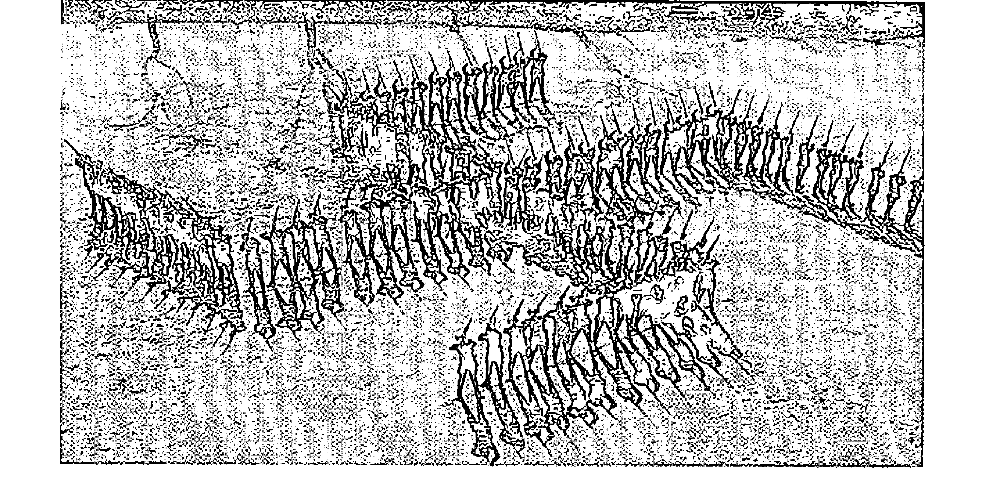

## 第二章 占星史上的知名占星家

从诞生的那一刻起，占星术就因其“预言”的超强功能而引起人们的兴趣。许多占星家以及他们的“预言”都曾产生过巨大的社会影响，并且不可否认的是，占星术一度影响到国家政治。

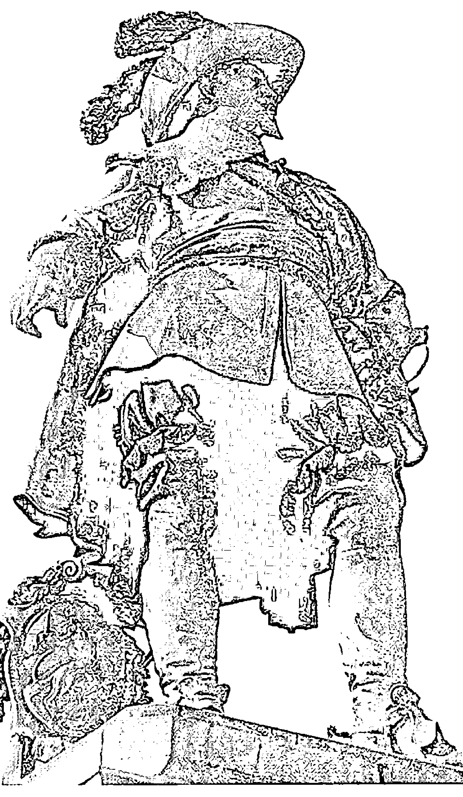

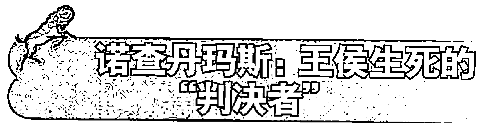

在中世纪欧洲众多的占星家中，如果仅就在后世的影响而言，恐怕没有谁比得上诺查丹玛斯了。即便在当今时代，这位16世纪的大预言家仍经常成为人们热烈谈论的话题。

### 神秘的预言家

米歇尔·德·诺查丹玛斯，1503年12月14日出生在法国普罗旺斯一个叫萨朗的地方，其外祖父和祖父都是著名的医学家和占星家。诺查丹玛斯在家中是长子，有4个弟弟，其中最小的弟弟曾在普罗旺斯最高法院任检察官。诺查丹玛斯一家原本信奉犹太教，当他9岁时，全家又皈依天主教。不久后，诺查丹玛斯的父母改信基督教，并加入了新基督教教会。不过由于早年经历的影响，诺查丹玛斯从小就深受犹太神秘文学的影响。

根据有限的资料记载，诺查丹玛斯从小就因非凡的才能而十分引人注目。他的天分很早便被祖父赏识，后者曾专心向他传授医学和占星学的宝贵知识，并教他拉丁语、希腊语、希伯来语、数学等，使得少年时的诺查丹玛斯几乎无所不学，无所不通。祖父去世后，他回到住在巴里大街的父母身边，继续接受外祖父对他的教育。不久，诺查丹玛斯被送到阿维尼翁去学习，与居住在当地的几位表兄弟住在一起。

1522年，诺查丹玛斯19岁时，家人送他到蒙彼利埃改学医学。就是在这段时间，诺查丹玛斯对占星术显示出了极大的兴趣，在他与同学们中间，有关占星术的讨论时常发生，这使他的父母深为担忧。3年之后，诺查丹玛斯轻松获得了学士学位，并拿到开业许可证。之后，他决定离开大学返回家乡，全心全意治病救人。

当时，法国各地正面临一场瘟疫的肆虐。在与瘟疫抗争的过程中，身为医生的诺查丹玛斯表现出了高尚的医德。从1525年-1529年，他奔波于法国各地，救治了许多病人。1529年他重回蒙彼利埃学医，获博士学位，还在当地任教。总之，在那几年内，性格颇为含蓄的诺查丹玛斯一直过着安定而富足的生活。

1530年，由于在教学期间提出了许多新的理论，诺查丹玛斯毅然辞职，重新开始了漂泊不定的游医生涯。1534年前后，诺查丹玛斯曾与一位出身高贵的富家女结婚，婚后生下一男一女。然而不幸的是，尽管自己是一位医生，他的妻子及两个孩子却先后死于瘟疫。这种家庭的惨变，在很大程度上改变了诺查丹玛斯的人生轨迹。

1538年，由于被误会触犯教会，诺查丹玛斯被有关当局视为异端分子。为了逃避教会的纠缠，在随后的8年当中，诺查丹玛斯流浪各地。正是在流浪期间，几件著名事件的发生，使他开始以惊人的预言能力而闻名欧洲。

据说有一次，当诺查丹玛斯在意大利滞留期间，曾遇到一名养猪出身的年轻修士。不可思议的是，当诺查丹玛斯见到此人后，突然向对方下跪并尊称其为“至神圣的”，而当时这一称呼只能为教皇所有。结果到后来，这位修士竟真的成为教皇塞克斯托恩五世。还有个故事说，诺查丹玛斯曾到一位叫做弗罗朗比尔的朋友家中做客，当与诺查丹玛斯谈到有关预言问题时，弗罗朗比尔随意指着院子中的两头小猪崽说：“请你占一占它们的命运，让我看看你的预言能力。”诺查丹玛斯当即回答道：“那头黑色的猪崽将会成为你的盘中餐，而那只白色的猪崽将会被狼吃掉。”不服气的主人立即悄悄命令厨子将白猪杀掉做晚餐。厨子遵命而行，不料就在白猪被宰杀后，主人养的一只小狼竟偷偷将白猪吃了。厨子为了交差，便只好将黑猪宰了来做晚餐。开饭后，主人十分得意地对诺查丹玛斯说：“那头白猪已经在餐桌上了！”可诺查丹玛斯则说：“这一定是头黑猪。”双方争执不下，只好把厨子叫来询问。

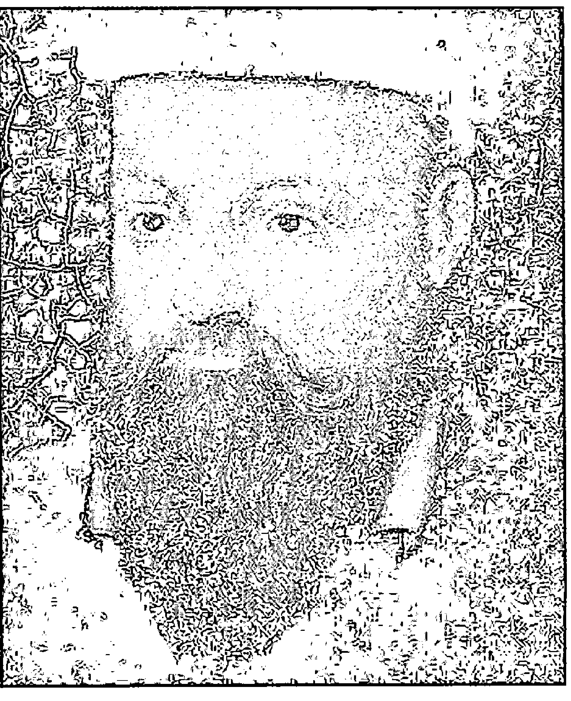

经过严词盘问，厨子说出了真相，于是举座为之叹服。

1544年，由于家乡再次发生了瘟疫，诺查丹玛斯又回到法国行医，还曾为此受到政府的奖励。在这里，他又与富孀安努·蓬萨尔结婚。经济状况的改变，使诺查丹玛斯过上了安稳的家庭生活，而正是在此期间，他把主要精力放在潜心钻研玄学及著书上。从1550年起，他每年要编制一套占星年历。1554年以后，又开始出版预言集。也许是最初的成功给他增添了巨大的信心，他开始全身心地投入到预言工作中。据记载，诺查丹玛斯将他住宅的最顶层改造成研究室，每到夜晚，他总是与那些神秘学的书籍为伴，在研究室中展开细致的研究。1554年，据说由于钦佩诺查丹玛斯的占星术造诣，波努市长埃姆·M·杰维尼竟然辞去市长职务，请求他收自己为弟子，专门研习占星术与天文学。诺查丹玛斯去世后，杰维尼为整理编纂诺查丹玛斯的预言集做出了巨大的努力。

### 对法国王室的惊人预言

1556年7月14日，诺查丹玛斯应王太后卡特琳娜·德·梅迪西斯的召请前往巴黎。因为特别关照，原本需要 8 周的旅行仅用了一个月的时间就顺利到达了巴黎。第二天一早，王太后便召他进宫。在当地警察署长的带领下，诺查丹玛斯拜见了王太后。据说二人的会谈长达两小时，王太后很可能向诺查丹玛斯询问了暗示国王之死的四行诗，并对他的回答表示满意。事实上，卡特琳娜至死都一直相信诺查丹玛斯的预言。在巴黎滞留的两周里，诺查丹玛斯还会见了许多慕名来访者，利用占星术给以预见性忠告。

回故里后，因患痛风及关节炎，诺查丹玛斯几乎没有做多少像样的工作，大多数时间都在接待来访者或著书立说。在其晚年，由于许多预言都得到了惊人的应验，他在上层人士中获得了巨大声望。1566年，长期忍受痛风折磨的诺查丹玛斯意识到自己时日不久，于是在6月17日写下了遗嘱。7月1日，他请当地的神父为自己举行了临终仪式。第二天早上，人们发现他死在床边一张长凳上。对于自己的死亡，他也留下了准确的预言，自己“将会被发现僵硬地躺在椅子与床之间”。

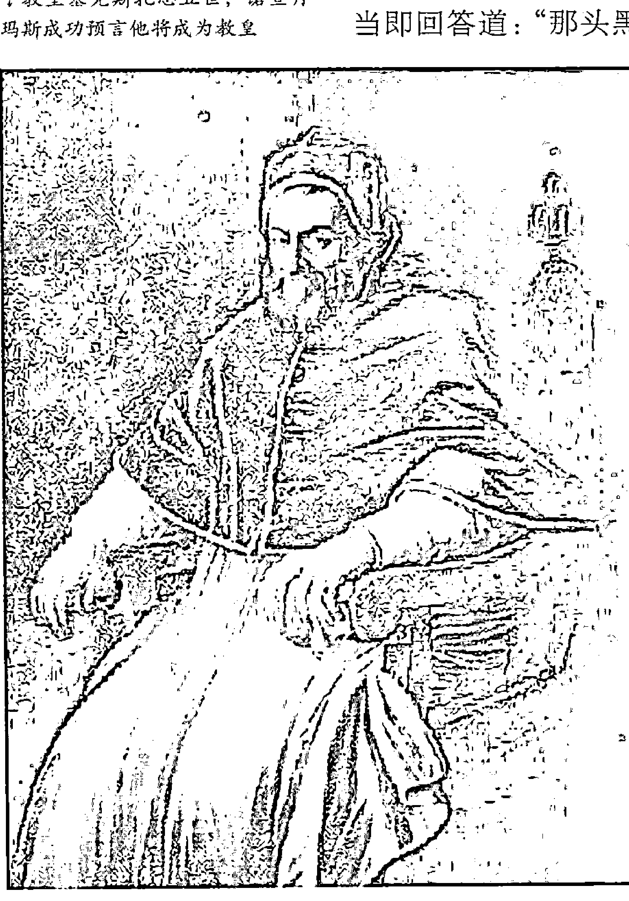

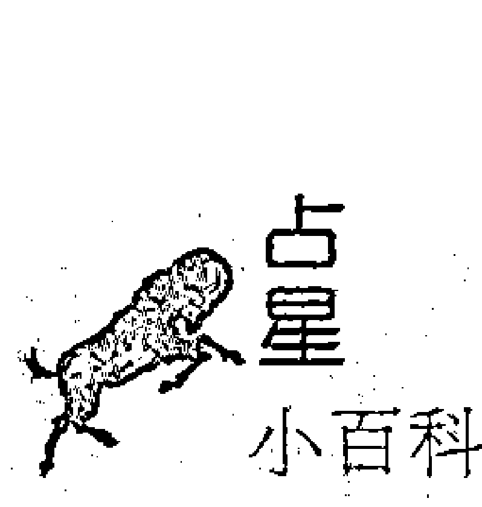

## 占星小百科

### 诺查丹玛斯预言集

1555年，诺查丹玛斯完成了他的第一部预言集，此后便一发不可收拾，终于完成了被命名为《诸世纪》的预言诗集，时间跨度竟从他所生活的时代直至3797年。

他的预言诗是以晦涩难懂的文体写成的，其中有法语、普罗旺斯方言、意大利语、希腊语以及拉丁语等，时间顺序也故意被打乱。尽管如此，后人还是在他的预言中发现了诸如拿破仑、法国大革命、世界大战等事情。

作为一名法国人，诺查丹玛斯在其预言诗集《诸世纪》中，有关自己祖国的内容也最多。尤其令后人感兴趣的是，诺查丹玛斯似乎与法国历代王室有着不解之缘。

早在1555年，在《诸世纪》的第一纪第三十五首诗中，诺查丹玛斯就曾写下了这样的预言：

> 年青的狮子将战胜年老的
> 在一场单对单的战斗中
> 他将刺破金笼中的双目
> 两个伤口合成一个
> 他死于残酷的死亡

当时人们都觉得这些隐晦的诗句不知所云，然而仅过了4年，一起突发事件的发生，立即使诺查丹玛斯成为瞩目的焦点。

那是在1559年的7月10日，法国王室举行一次婚宴期间，国王亨利二世忽然心血来潮，执意要与一名年轻贵族举行击枪比赛。不料这场原本为了取乐的游戏竟出了意外：年轻贵族的矛头刺穿了国王护脸的镀金头盔，插进了眼睛。10天后，亨利二世在极度苦痛中死去。当为国王料理完丧事后，人们终于想起，这起事件的各种细节,正是诺查丹玛斯上述预言的应验！于是，诺查丹玛斯的预言能力顿时在法国贵族和王室中间引起巨大震撼，同时也引起很多人的不安。可能也正是由于这件事所引发的恐慌,诺查丹玛斯在世时，并没有将《诸世纪》剩余的部分出版。

不过即使如此，诺查丹玛斯的预言仍得到了法王室的信任。在亨利二世死后，王太后曾召见诺查丹玛斯，要求他对自己7个孩子的运势进行预言。其中，诺查丹玛斯对亨利二世长子法兰西斯二世的预言为：

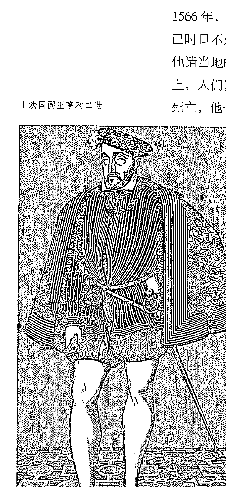

> 那长子
> 不幸婚姻下没有子女的遗孀
> 两个不和睦的岛屿
> 18岁前仍只属少
> 那定了亲的在更年轻时继续其位
> （《诸世纪》纪十，三十九）

果然不久后，1560年，刚刚即位的法兰西斯二世就因病去世了，离18岁还差六星期。而他的王后、苏格兰女王玛丽返回故乡后，英、法两国关系开始恶化。接着，法兰西斯二世的弟弟年仅11岁时便与奥地利公主订婚。

更令人叹服的是，诺查丹玛斯不但对当时法国王室的命运做出了精确预言，而且对200多年以后的同类预言，也没有丝毫偏差。在《诸世纪》中，围绕着200多年以后法国大革命期间所发生的一系列重大事件，都有着详尽的预言。例如：

- 伟大的人被虐待
- 神圣的法律被废弃
- 教会因被另一种法律管辖
- 一个新的金银宝藏被发现

暗指革命期间，法国的神职人员被法律剥夺了合法身份，教会的财富被充公，以作发行新货币的支持力。

### 断头台上的应验

在诺查丹玛斯的诸多预言中，最著名的当属《诸世纪》中关于法国国王路易十六命运的几条预言，它们分别是：

- 入夜时一对夫妇经由蜿蜒的山谷
- 穿越雷恩的门
- 赫尼那白石般的
- 僧皇穿上灰衣
- 进入瓦伦
- 被选出来的
- 引致暴乱、火、血和切割
- （《诸世纪》纪九，一一〇）

- 凶兆出现，暴君被杀
- ……
- 小鸟停留在红砖塔上
- 嘎嘎地叫了7个钟头
- 它在兆示死亡染血的雕像
- 暴君被诛，人民欢呼

如果我们了解法国大革命的历史，一望便知这是预言国王路易十六夫妇被送上断头台的结局。那么这一预言又是如何神奇应验的呢？我们不妨再回过头来，看一下当时所发生的一切。

公元1789年7月14日，法国爆发了轰轰烈烈的大革命。由于不堪忍受波旁王朝的腐败统治，愤怒的革命群众攻占了封建专制主义的象征——巴士底狱。当时的法国国王路易十六，虽然在革命后的一段时间内保住了自己的王位，但某种不祥的命运似乎正朝他走来。1791年6月，当他与王后玛丽·安托瓦内特试图逃出国时，在半路上被认了出来。随后，国王夫妇被押到巴黎。接着，对他们的审判开始了。在国民大会上，激进的革命领袖罗伯斯庇尔说：“路易应该死，因为共和国必须生！”最终，经国民大会投票，路易十六最终被判处死刑。1793年1月21日，天空下着雨，在巴黎革命广场，革命者将路易十六及王后玛丽送上断头台。

实际上，传说路易十六的王位被废除时，的确有一只小鸟停在宫廷外一幢红砖楼顶不停地叫。这完全契合诺查丹玛斯有关路易十六夫妇命运的全部预言。

有趣的是，除了对路易十六之死做出了惊人的预言外，诺查丹玛斯在《诸世纪》中，对法国大革命后来的几个阶段也做出了准确预言。

我们知道，路易十六夫妇被处死后，法国革命的脚步并没有就此结束。由于政治立场上的冲突，较为温和的吉伦特派开始与以罗伯斯庇尔为首的雅各宾派走向对立，但此时法国的局势已完全不在他们控制之中了。从1792年秋季起，要求打击投机商人和限制物价的群众运动高涨起来。以愤激派为代表的平民革命家要求严惩投机商，全面限定生活必需品价格，以恐怖手段打击敌人，但是吉伦特派却颁布法令镇压这场运动。此外在1793年初，以英国为首的欧洲各国再次组成反法联盟，加强武装干涉，而国内又发生了大规模王党叛乱。4月，前线的吉伦特派指挥官又叛变投敌。在革命处于危急的时刻，巴黎人民于5月31日－6月2日发动了第三次起义，一举推翻吉伦特派的统治，最终建立起雅各宾派专政。

雅各宾专政后，新政权面临严峻局面。为了巩固自己的统治，雅各宾派政权联合广大人民群众，采取了激烈的革命措施，从6月3日-7月17日，先后颁布3个土地法令，废除农村中的封建特权，以有利于农民的方式拍卖没收封建地产，使大批农民得到土地；严禁囤积垄断，对投机商人判处死刑；号召人民武装起来保卫祖国。9月，国民公会把“恐怖”提上议事日程，派出由“无套裤汉”组成的革命军下乡征粮打击投机商。国民公会先后颁布嫌疑犯法令和对生活必需品和工资实行限价的法令。10月底，一批吉伦特派被处决。由于实行这些措施，革命力量加强，形势迅速好转。1793年底—1794年初，外国干涉军全部被赶出国土，国内的叛乱基本平息。

随着胜利的取得，以丹东为首的一部分雅各宾派要求停止实行恐怖。而埃贝尔为首的一派则坚持继续加强恐怖统治。不幸的是，受到两面夹攻的罗伯斯庇尔派，于1794年3-4月先后逮捕并处死两派领导人，继续扩大执行恐怖政策。

1794年6月，随着法军在比利时境内的弗勒吕斯取得重大军事胜利，国内反对恐怖统治的势力进一步加强。1794年7月27日，国民公会中占多数的平原派同原丹东派、埃贝尔派以及一切反罗伯斯庇尔的势力联合在一起，发动热月政变，推翻雅各宾派专政，并于7月28-29日处死罗伯斯比尔等90人。

热月党人胜利后，他们废除雅各宾派限制和打击资产阶级的政策，封闭雅各宾俱乐部，使资产阶级解脱恐怖时期的束缚。1795年10月，国民公会被解散，取代它的是督政府。1799年11月9日，拿破仑·波拿巴发动政变，结束了督政府的统治，建立起临时执政府。至此，轰轰烈烈的法国大革命宣告结束了。

对于大革命时期雅各宾派与吉伦特派之间的矛盾，诺查丹玛斯似乎也已作出了预言：

> 当旋涡的废弃物倾出的，
> 他们的脸会被他们的斗篷遮盖，
> 共和国被新冒起者掀起汹涌波涛，
> 红党人和白党人各持着对另一方的相反意见。
> （《诸世纪》纪一，三）

在这首预言诗中，竟惊人地出现了“共和国”一词。红党和白党分别暗指雅各宾派与吉伦特派，而“他们的脸会被他们的斗篷遮盖”则预示着雅各宾派恐怖政策的极端性。

再如关于雅各宾派内部矛盾的预言：

> 红党迈进以求结果
> 皇室以死亡而差不多彻底完结
> 而红色的红党将击倒红党
> （《诸世纪》纪八，十九）

其中“红色的红党”系指雅各宾派中的的激进分子，而即使丹东这样的革命领袖，也因较温和的主张而被处死。最后，该派的最高领袖罗伯斯庇尔本人也被推上了断头台。

更值得一提的是，或许是风闻诺查丹玛斯神奇的预言能力，在法国大革命时期，迷信的士兵们将他的墓掘开，将其遗骨埋到萨朗的另外一个教会里。如今，诺查丹玛斯的墓地已成为无数游人的凭吊之地。

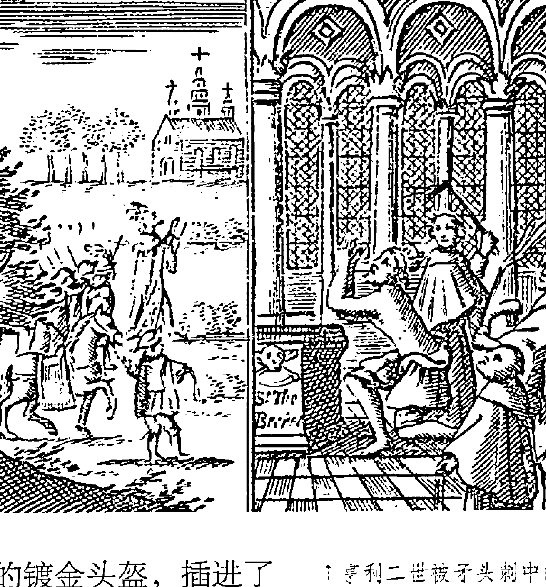

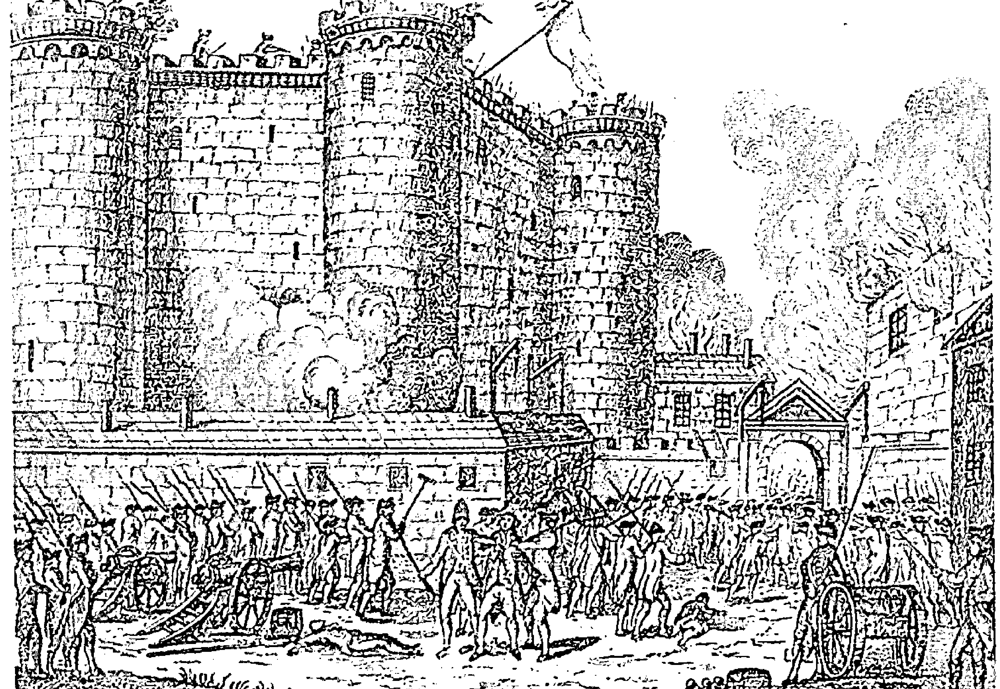

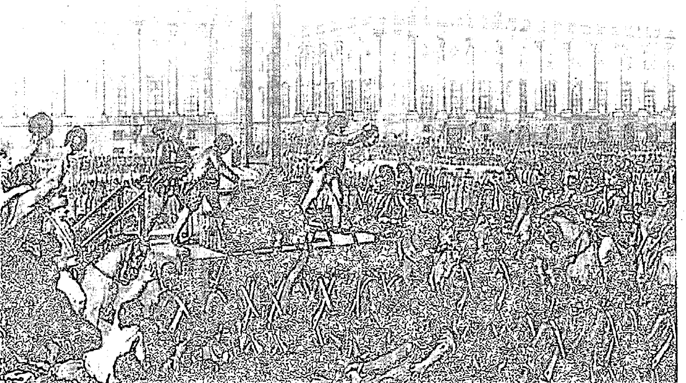

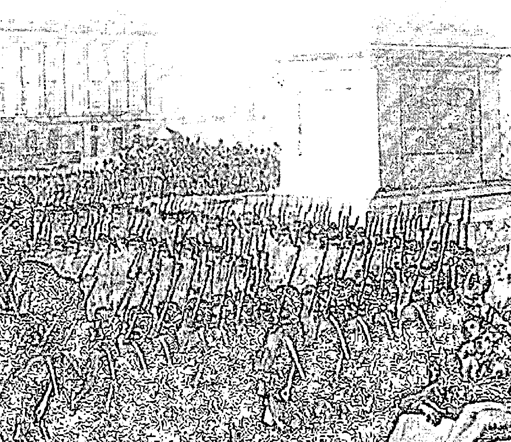

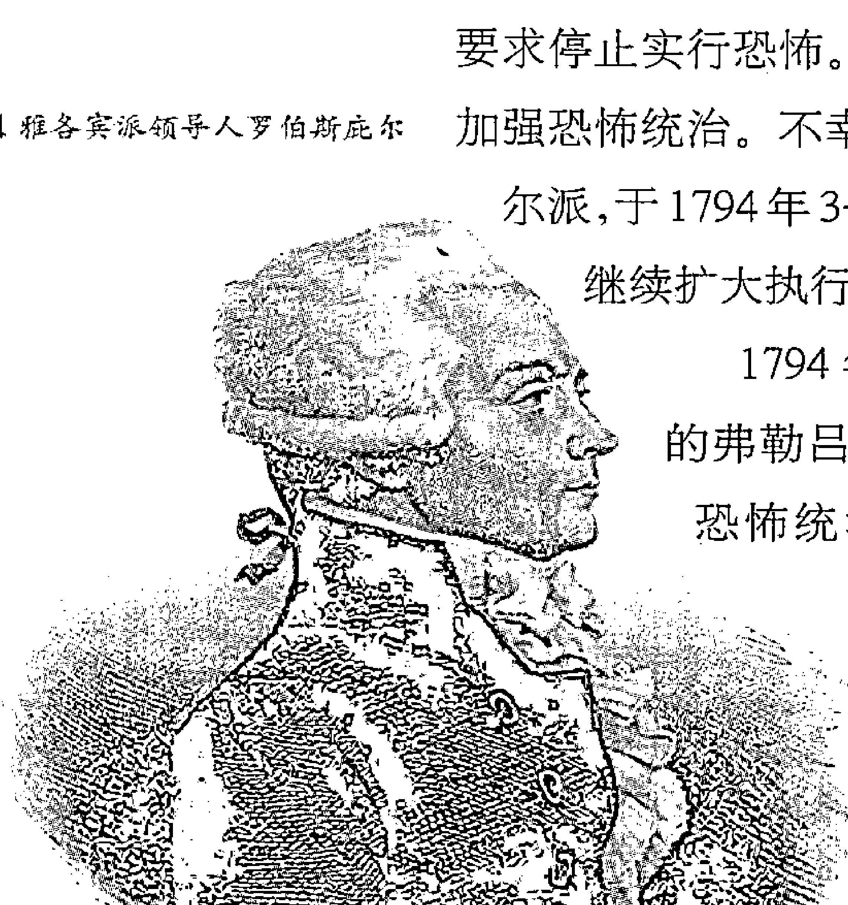

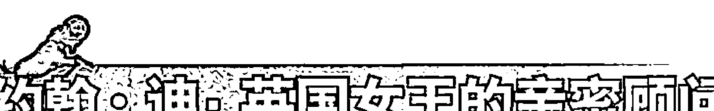

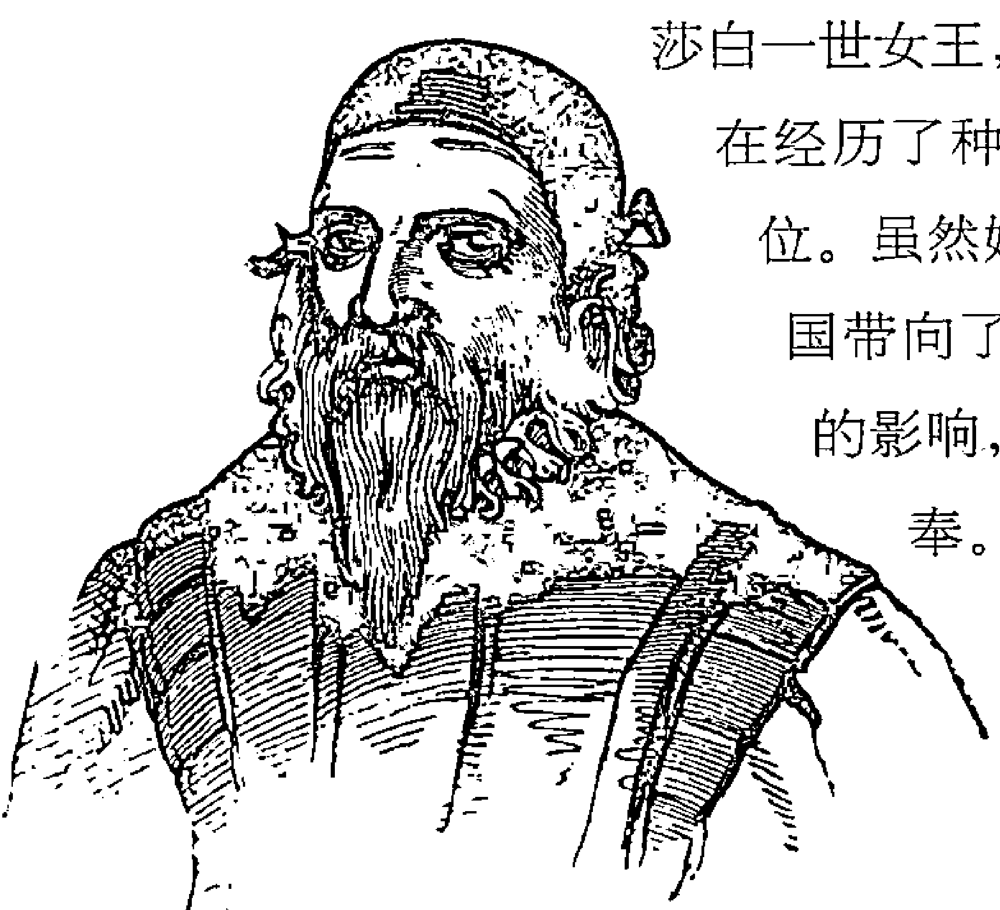

到 16 世纪，欧洲又涌现出一位著名的占星家，他就是曾备受英国女王伊丽莎白信赖的约翰·迪。

提起英国历史最伟大的统治者之一——伊丽莎白一世女王，相信很多人都不会陌生。这位女王在经历了种种磨难后，才一步步登上英国的王位。虽然她拥有众多优秀的品质，并的确将英国带向了空前辉煌的阶段，但是受时代风气的影响，她同样对占星术等神秘学说颇为信奉。有关史料表明，为了更好地驾驭国家，伊丽莎白女王不仅在身边准备了魔镜等用具，还曾召集了一批神秘的宠臣顾问，而约翰·迪便是其中之一。

### 卜算女王登基日

约翰·迪，英国中世纪著名的占星家，1527年生，被称为“魔术师”，同时还是天文学、数学、乐律、光学、地图绘制、航海、地理、密码学、医学、神学、法律、文学和历史方面的专家。由于天资聪明，还在少年时，约翰·迪就被称为神童。1542年，15岁的他就进了剑桥大学。1548年获得硕士学位之后，约翰·迪来到了布鲁塞尔附近的卢万大学，在那里学习民法和数学，并且很快崭露头角，许多当地的贵族前来访问他。

1550年，约翰·迪回到英格兰，先在英王爱德华六世的权臣诺森伯兰公爵约翰·达德利家里充当家庭教师。1553年，爱德华六世驾崩，玛丽·都铎成为女王。两年之后，约翰·迪因被指控犯有“预谋”和“做巫法”等罪行而被逮捕，但其实他的真正罪行是与玛丽同父异母的妹妹伊丽莎白结交甚深。不久后，伊丽莎白也被捕。这一段特殊的经历，使后来成为女王的伊丽莎白与约翰·迪一直保持着密切的友谊。

1558年，玛丽女王死去，伊丽莎白幸运地登上了王位。经过约翰·迪的占星，女王将自己的加冕日子定为1559年1月15日。此后，深受女王宠信的约翰·迪进入了人生当中最辉煌的时期。1566年，他搬进伦敦西南8英里处泰晤士河上的一处豪华住宅。那里附属的房间装有4万册书籍、各种科学和占星仪器，还有好几个实验室在进行着炼金试验。他的住宅成了形形色色的知识分子、贵族和探险家聚集的地方。在此期间，约翰·迪在数学、光学、航行学和天文学等领域都进行了研究，不过约翰·迪相信，有些有天赋的占卜家能看见上帝的天使并与之对话，为此他请来一些占卜家来做试验，并如饥似渴地记录每次试验的过程。虽然最终没有任何结果，但他仍继续寻找着理想的占卜者。

## 占星小百科

## 鲁道夫二世

鲁道夫二世是个郁郁寡欢、神秘莫测的人，对各种知识都感兴趣，他的宫廷不仅以吸引了全世界最著名的科学家和艺术家而闻名，而且以鲁道夫本人对神秘学和炼金术的沉迷而名声远扬。

值得庆幸的是，尽管当时英国的官方法律禁止占卜术和巫术之类的实践，但是伊丽莎白女王和她的大臣们却对此深信不疑。1577年，当一颗彗星的出现使整个宫廷陷入恐慌时，伊丽莎白女王就将约翰·迪召到宫里，后者花了3天时间来安慰女王丢掉恐惧。有了女王的支持，约翰·迪得以继续进行占星术方面的研究。据说当航海冒险家德雷克完成环球航行回国后，曾将一面来自美洲的阿兹特克黑曜岩镜子送给约翰·迪。

为了完成自己所追求的占星术最高境界，1583年9月21日，约翰·迪带着3个孩子以及他全部的家当前往欧洲大陆。在之后的3年中，他频繁往返于布拉格、克拉科夫和特热邦城堡之间。在布拉格，他深受神圣罗马帝国皇帝鲁道夫二世的信任。1589年11月，约翰·迪和全家动身返回英格兰，但此时他的处境已大不如前了。1605年，他的妻子和两个孩子死于瘟疫，他本人也身患重病，最终于1609年2月26日去世。

沉迷于占星的神圣罗马帝国皇帝鲁道夫二世

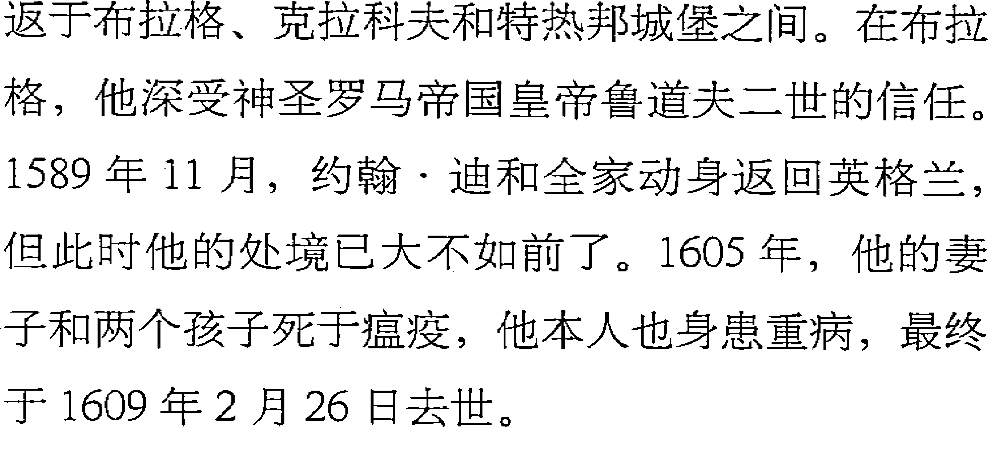

## 利利：克伦威尔的座上宾

在16、17世纪，占星术在欧洲进入最后一个辉煌时期。在当时，由占星家们所编写的占星历书堪称最为畅销的读物，据说销售册数甚至超过《圣经》。当时的一册占星历书，通常由三大部分组成：第一部分包括这一年的天文事件，如日食、月食、行星的“合”之类；第二部分给出该年的历日以及注明重大的宗教节日之类；第三部分则对该年重大事件进行预测，这些事件包括战争、自然灾害、年成丰欠等等。公众购买这种历书之后，既可以很方便地排算各种时刻的天宫图，又可以“预知”来年的大事，以及日常许多行事的吉凶宜忌等。而就是在这一时期，英国又出现了一位著名的占星家——利利。

## 占星小百科

## 光荣革命

1688—1689年英国资产阶级和新贵族发动了推翻詹姆斯二世的统治、防止天主教复辟的非暴力政变，西方资产阶级历史学家因为这场革命没有流血，故称之为“光荣革命”。

## 曾影响英国历史

说起17世纪以占星家的身份对王朝军政大事的预测和参与，利利无疑是最著名的一位。从16世纪末开始，英国政局进入多事之秋。17世纪上半期由于国王与议会的长期对立与斗争，导致两次内战，最后王军战败，建立共和国，国王查理一世被处死。接着又是克伦威尔的独裁，王朝的复辟，直到1688年的“光荣革命”。可笑的是，在斗争中，各方都请求占星家为自己预测局势、提供决策建议。正是在这一情形下，利利登场了。

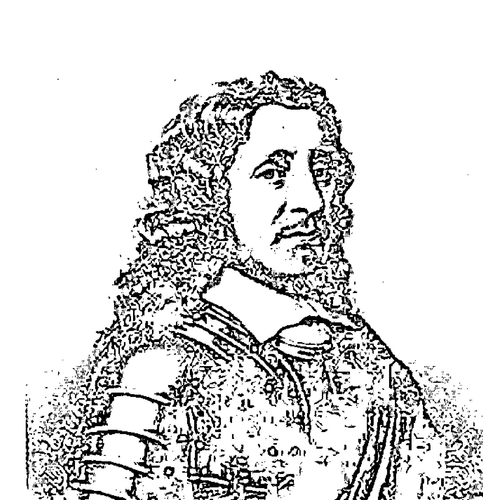

！英国资产阶级革命时代的领袖克伦威尔，曾对利利颇为器重

作为著名占星家的利利善于观察，能够及时领悟局面，因而左右逢源，几乎从不落人困境。在国王与议会内战期间，他站在议会方面，利用他的巨大声望为议会军队助威。据说当克伦威尔的军队在苏格兰时，有一位士兵拿着利利编的占星历书，向过路的议会军队鼓动说：“听利利是怎么说的吧——你们在这个月就能取胜！战斗吧，勇敢的小伙子们！”在1648年科尔切斯特围城战期间，利利和另一位站在议会方面的占星家布克被派去鼓励士气。这两位影响巨大的占星家一致预言“这座城市将很快被攻克”，结果竟真的应验了。

有趣的是，围城之中也有忠于国王的占星家汉弗莱，他竭力用虚幻的援兵消息鼓舞守城军队的斗志，但是无济于事。在此之前，利利还曾正式访问议会军队，他与布克受到军队将领的欢迎，而这两位占星家则向军队保证，他们用来为议会军方面服务的占星学“是合法并且与基督教义一致的”。

当时社会上甚至流传一种说法，如果国王能将利利收买过去，足可抵得上六个团的军队。但利利明智地站在胜利者一面。到了共和国与“护国主”克伦威尔当政期间，利利名望更大，甚至当着克伦威尔和枢密院官员们的面用天宫图推算国会选举的结果。

1660年，查理二世复辟，但奇怪的是曾为共和国竭力服务的利利却安然无恙，还得以继续经营他的占星事务所。据透露，在他公开反对国王、支持议会的同时，也向国王的支持者提供帮助国王从被囚之处出逃的建议。此外，他还积极为复辟政府提供占星咨询。在后世，很多人都相信，这位占星家用其理论解释了整个16世纪的英国历史。

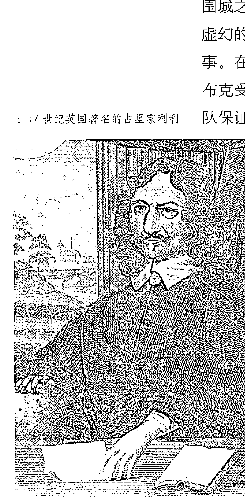

## 伊丽莎白·泰西埃：法国总统的政治顾问

法国似乎向来对神秘文化持有宽容之心，比如在中世纪，该国就产生了像诺查丹玛斯这样著名的占星家。在近代，类似的案例也是层出不穷。有趣的是即便在现代，法国人对这种文化仍颇为热衷。

据有关资料统计，在法国6000万人口当中，居然大约有5万人从事占星术，其中1万人还拥有各类占星专科学校的毕业证书。占星业的年营业额高达上亿欧元，至少一次求助过占星术的法国人近1000万，几乎每家书店都上架占星算命的书刊，销售量动辄就数十万册，比很多龚古尔文学奖小说都要畅销。有报纸调查表明，有58%的法国人表示相信占星术是一门科学。正因如此，在20-21世纪的法国，一位名叫伊丽莎白·泰西埃的女占星家曾一度成为人们关注的焦点。

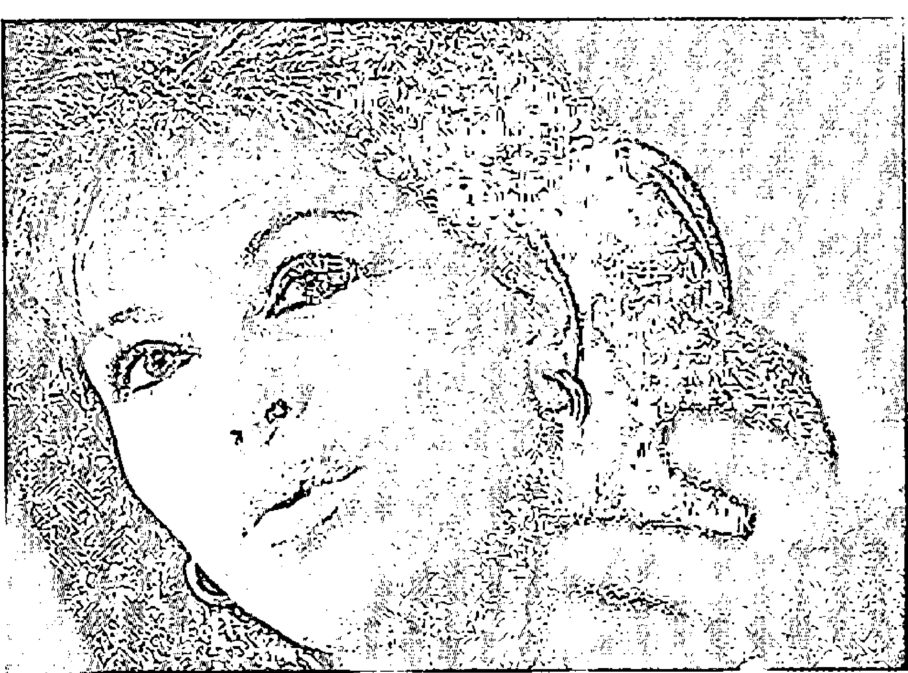

↓当代法国著名的女占星师泰西埃，其传奇般的经历颇为有趣

## 占星小百科

## 龚古尔文学奖

龚古尔文学奖为法国文学奖。龚古尔兄弟是法国自然主义小说家，弟弟茹尔·德·龚古尔于1870年去世后，哥哥埃德蒙·德·龚古尔十分悲痛，于1874年7月14日立下遗嘱，为了纪念他的弟弟，要用遗产作为基金，成立龚古尔学院，即龚古尔文学奖评选委员会，并指定福楼拜、左拉、都德等10名友好作家为第一届院士。龚古尔学院于1902年成立，1903年1月11日获得批准，当年2月26日举行第一次会议，决定设立5000法郎的奖金，奖励当年出版的最佳长篇小说、最佳短篇小说、最佳想象性散文作品，这一年12月21日颁奖。为了保证院士们能不偏不倚地进行评选，遗嘱规定每位院士可享有一栋住宅和一份保障生活的年金。

## 从影失败转学占星

伊丽莎白·泰西埃，1938年出生，法国著名女占星家。关于此人的身世，简直可用“传奇”二字来形容。20世纪60年代，年轻貌美的她一心想成为女明星，但做过十几年演员和模特儿，却始终没能出头，直到遇见了著名导演费里尼，她的生活才发生了巨变。1968年1月，渴望饰演角色的泰西埃前往罗马求见费里尼。据她本人回忆：这位大导演欣然请她共进午餐，作陪的有当时世界影坛演技派明星马切洛·马斯特洛尼亚。当她提出希望在费里尼的影片中演个角色时，后者告诉她“你太美了，演不了我片中的女人”。接着费里尼和她谈论星相学，并亲昵地对她说：“我的女巫，去学星相学吧。”于是受这一席话的触动，泰西埃竟真的投入到占星术的研究中。可谁又能想到，她果真在这方面取得了巨大成功呢？

> “你太美了，演不了我片中的女人”。
> “我的女巫，去学星相学吧。”

经过一番努力，当然也不排除炒作的成分，泰西埃逐渐成为法国颇有名气的“星相大师”。她那难以企及的美貌，在某种程度上也推动了她的事业。1989年，她甚至受到时任法国总统密特朗的青睐。据说有一天，密特朗通过私人秘书，电话约泰西埃在总统府图书馆共进早餐。见面后，两人欢谈达一个半小时，而此时门外还有美国黑人政客杰克在苦苦等候。从这以后，密特朗就频繁约见泰西埃或者打电话给她，每次都提同样的问题：“我的运程如何？法国如何？”最让法国人后怕的是泰西埃关于海湾战争期间密特朗的回忆，按照她的说法，从1990年8月2日伊拉克入侵科威特到1991年3月2日盟军停止轰炸伊拉克，密特朗对局势每一次做判断前都要询问她的意见：萨达姆会撤军吗？战争会爆发吗？哪天向法国人民发表电视讲话最佳？甚至私下要她为其他国家的领导人算命。

从1989到1994年，泰西埃充当密特朗的特殊顾问长达六七个年头。不过她也很懂得保守秘密，从未随意对外透露过什么政治内幕。直到1996年密特朗去世，她才出版了《在密特朗的星相下》一书，随即引起了巨大轰动。

2001年，泰西埃还把自己变成了学术明星。原来在法国新一代著名社会学家米歇尔·马费索利的支持下，泰西埃到巴黎索邦大学攻读了社会学博士学位。4月7日，她顺利通过了答辩，其论文名为《透过后现代社会的“迷恋-排斥”双重性看星相学的认识论现状》，长达900页。消息传出后，法国学界反应空前激烈，400多位社会学家在请愿书上签字，要求索邦大学校长对此事件进行独立评估，法国科学信息联合会则委派一个由天文学家和社会学家组成的小组评审她的论文。媒体也迅速加入，法国《世界报》连续发表多篇报道，《费加罗报》《鸭鸣报》《解放报》参与争论，美国《纽约时报》也做了详尽报道。8月，评审小组负责人发表谈话，认为论文答辩是泰西埃利用社会学使占星术活动合法化的事件。但不管如何争论，她的博士学位是不会被取消的。泰西埃甚至想借此在索邦大学谋求教授星相学的讲席。在漫长的占星生涯中，泰西埃声称她有三大成就，即分别预测了1981年里根遇刺、1987年股市灾难和1989年柏林墙倒塌。其中，1981年里根遇刺一事最具有典型意义。

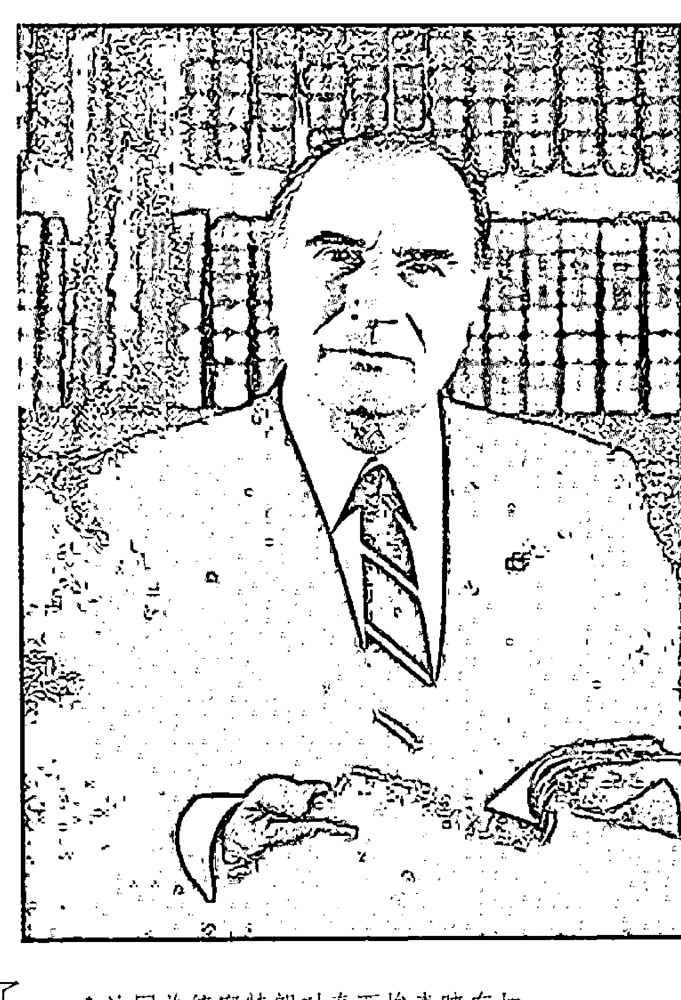

↑法国总统密特朗对泰西埃青睐有加

## 嘉瓦娜·卡维莉：里根总统的占星情缘

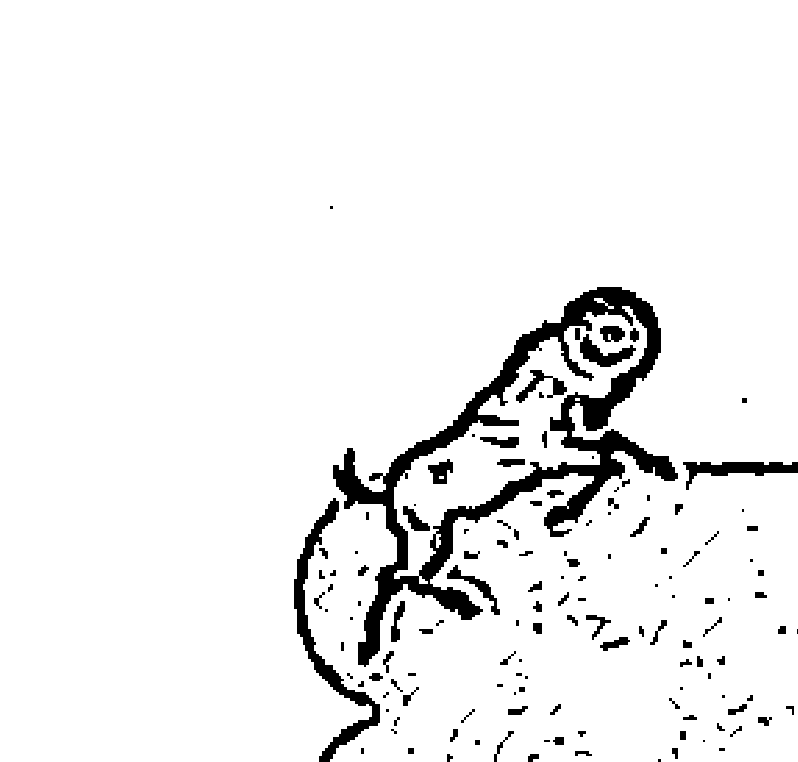

20世纪80年代初，美国政坛发生了一起轰动世界的案件：刚刚上任两个月的里根总统，在华盛顿一家饭店遇刺。刺杀事件发生后，里根一家的生活由此发生了重大变化：在夫人的鼓动下，里根与占星术结下了不解之缘，而总统夫人则与女占星术士嘉瓦娜·卡维莉结为密友。

## 因遇刺事件结缘

1981年3月30日，里根前往华盛顿的希尔顿饭店。他是应美国劳联-产联建筑工会的邀请，前去对数千名工会代表发表讲话的。讲演完毕后，里根走出饭店，他笑容满面，向马路对面的人群频频挥手。一位美联社记者叫住他预备提问，白宫新闻秘书布雷迪走过来，正要帮助总统回答记者的问题，就在这时，一个金发青年拔出左轮手枪，向总统射击了6发爆炸性子弹。枪声响后，白宫特工人员迅速扑向凶手，用自己的身体挡住总统，从而使最后几枪都打偏了。受伤的里根被送往附近医院抢救。其实，子弹并没有直接击中他，而是打在防弹车上反弹进他的胸部，击断了第7根肋骨后钻进左肺叶离心脏仅3厘米的地方。经过医生的紧急抢救，里根总算被抢救过来了。

20世纪80年代初期登上总统之位的里根

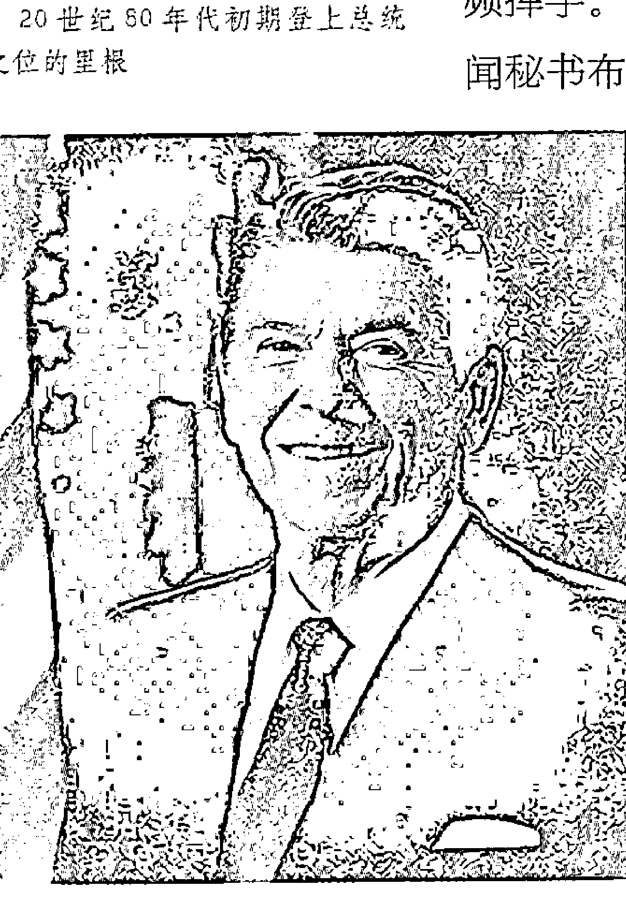

经审讯，凶手名叫约翰·欣克利。令人不可思议的是，他刺杀总统的目的只是为了赢得女演员朱迪·福斯特的芳心，后者因在电影《出租汽车司机》中扮演一个妓女而名声大振。影片描写了一个孤独的出租汽车司机，为了表达对妓女的爱情，而去刺杀一位总统候选人。欣克利十分崇拜福斯特，给她写信、打电话，百般纠缠。但福斯特一次也没见他，因此他决定用刺杀总统这一具有历史意义的行动博得福斯特的尊敬和爱情。不过在美国这样的国度，几乎什么事情都可能发生。尽管欣克利因为犯有谋杀总统等种种罪名而被起诉，但他以精神错乱为由拒绝服罪。最后在其辩护人的有力辩护下，欣克利居然被判无罪。

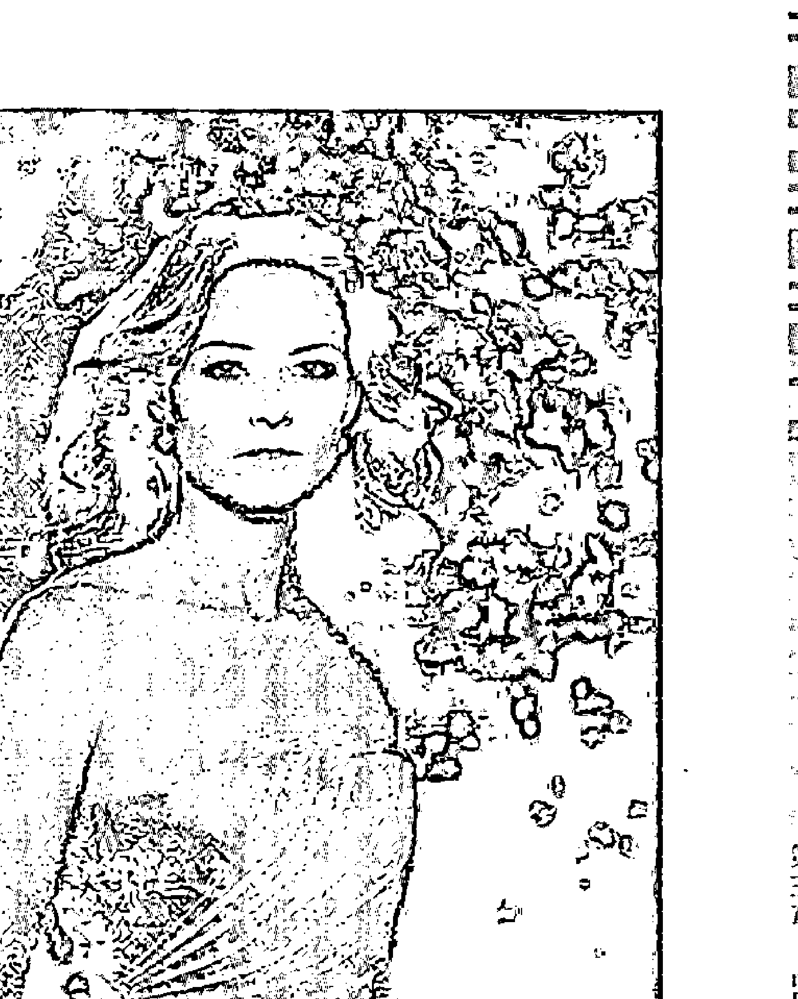

↑ 好莱坞女星朱迪·福斯特

当时，里根虽已70高龄，但却非常迅速地恢复了健康，枪击事件发生12天后便重返白宫。1984年11月，里根在总统大选中再次获胜。

！在经过刺杀事件后，里根的夫人开始痴迷于占星术，并以占星家的推算来安排丈夫的一切

据说在欣克利事件后，为了安全起见，白宫宣布停止公布总统工作日程。而由于70岁的里根恰好在执政第70天遇刺，他的妻子、第一夫人南希因此而疑神疑鬼、惊魂难定。为了保证丈夫的安全，她遍访占星大师，夜观天象，经常借助占星术挑选良辰吉日，并随机安排总统工作日程，结果引起了白宫高级幕僚们的极大不满。到后来，白宫办公厅主任里甘与南希闹得水火难容，最终被迫辞职。1987年，里甘向里根总统正式辞职。他坦率地向里根说：“我认为，在这种环境下工作是痛苦的、难堪的。所有的人都认为错误出在我身上，而我是无辜的。错误来自占星术！现在我只能说：拜拜！”辞职后，里甘还写了一本回忆录——《记录在案》，书中把里根夫妇笃信占星术这一内幕的各种故事彻底披露出来，一度引起了全世界的轰动。

## 占星小百科

## 演员出生的里根总统

里根于1911年2月6日出生。在其一生中，他共拍过54部电影，还曾担任过美国电影演员协会主席和电影工业理事会主席。

退出影坛后，里根投身政坛，成功当选为美国第40届总统。他是美国历史上年纪最大的总统，也是唯一一位演员出身的总统。

里甘在其回忆录中指出，里根夫妇笃信占星术，而他们的密友便是女占星术士嘉瓦娜·卡维莉。嘉瓦娜·卡维莉每天要为里根仔细推算星命，并且把一个星命日历放在白宫办公室主任里甘的桌上。里甘每天上班的第一件事，就是研究星命日历。日历上各种颜色线条都有不同寓意。一位民间女占星术士所推算的星命日历就这样关系到总统的安危和美国的命运。这样一来，身为白宫办公室主任的里甘就常常处于两难之地，一方面他无法根据国家的需要安排总统的工作日程，还不能泄漏其中的内幕。而另一方面，政府官员们却不断指责他办事不当，却不知真正的幕后指挥者其实是一位女占星术士。

# 第四章 占星术与其他

占星术除了出现关系国家大事的“军国占星术”和个人命运的“生辰占星术”，另外还发展出一种关乎健康的“医学占星术”。然而，这还不是它的全部。随着占星学这门古老的学问进一步专业化，曾一度渗透到社会的方方面面。

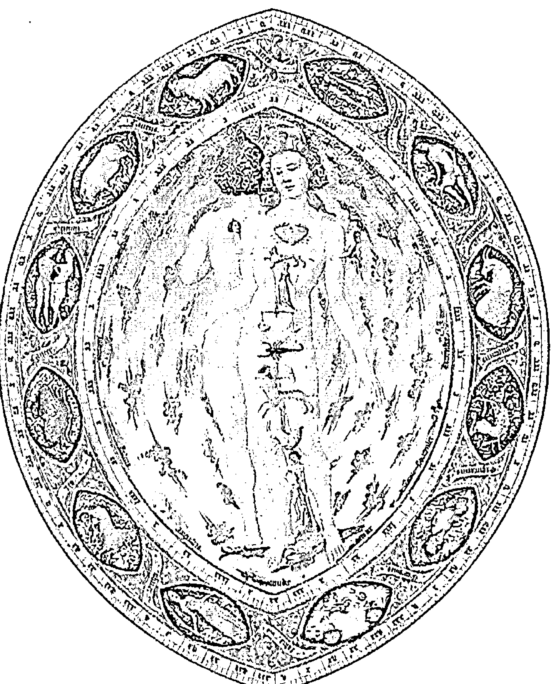

## 占星术与天文学

几千年来的历史表明，占星术和天文学可以说是密不可分的。一方面，占星术必需仰赖天文的观测及计算来确定出星体的位置。另一方面，这种行为本身又不断积累了近代天文学所需的各种宝贵资料。

### 孪生之学

毫不夸张地说，天文学是一个庞杂的体系，其主要概念包括：星座、宫位、星图、星体、天球、黄道、岁差等等，而这些概念，早在古巴比伦时期就开始一步步地演化了。

古巴比伦占星术留下了各种珍贵的天文资料。例如在古巴比伦泥版文书中，考古学家发现了一种名为“三环星盘”的占星术文献。三环星盘上的36星可分为3组，每组12星；每栏中的3颗星都只有在该栏所代表的月份中才能被看到；而36星中竟有3颗行星。在长期的天象观测中，古巴比伦占星家留下了许多非常罕见的珍贵史料，其中不仅有行星位置的变化，日（月）食，春分、秋分、夏至、冬至的时间，还有虹、晕、雷、雨、云、暴风等气象的记录，甚至还有关于彗星周期的记载。在占星术的另一个源头——古埃及，天文学也很发达，尤其对于天狼星、尼罗河与历法，古埃及人很好地将它们结合在一起。众所周知，尼罗河与古埃及人的生活息息相关，古埃及人根据尼罗河年年泛滥的规律发明了一种自然历，自然历将每年分为3季，依次是：洪水季、播种季、收获季。每季4个月，每月各有名称。后来，古埃及人又根据天狼星的活动规律而改进历法。原来在盛行星神崇拜的古埃及，人们特别注意天狼星，在天狼星的有关天象中，他们又特别注意天狼星清晨时与太阳在同一方位升起的现象。因此到后来，埃及官方所颁布的历法就规定：新年的第一天，应是尼罗河泛滥与天狼星偕日升同时发生的那一天。再到后来，他们更发现“天狼星年”的长度是365.2507日。

还有一个有趣的例子，是关于金字塔的星象观测之谜。近代科学家研究发现，根据现存的大金字塔、神庙等建筑遗址在方位上的准确程度，可以断定古埃及人有能力做出精度甚高的天文测量。然而令人惊奇的是，迄今为止从古墓壁画及实物方面的考察，人们只发现一种极为简陋的古埃及观星仪器。这种简单的瞄准器具只是一块中间开有狭缝的长木条，外加一对悬锤。使用时，两人配合，先利用北极星一狭缝一悬锤的三点一线来确定当地的子午线，即正南北方向，然后守候所要观测之星，当它经过子午线时记下时刻，接着再守候其相邻之星……这样就可以绘制出星空图。更令人惊奇的是，人们还发现：胡佛大金字塔上有一条进入塔心墓室的斜通道，其坡度恰好是30°，而现代的测量表明，大金字塔的所在地吉萨的地理纬度是29°59′！这就是说，在墓室中，从这条通道向北望去，恰好能见到北极星。如果这一切不是巧合，那就足以证明当时埃及占星家观测的精确程度！

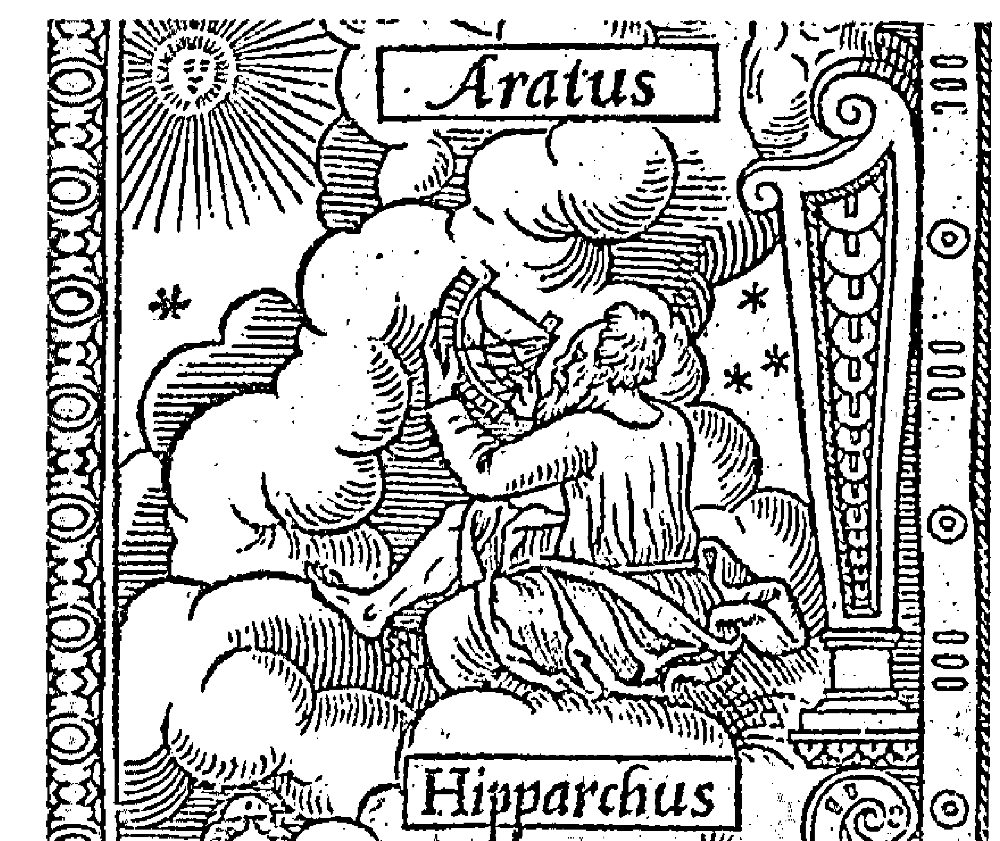

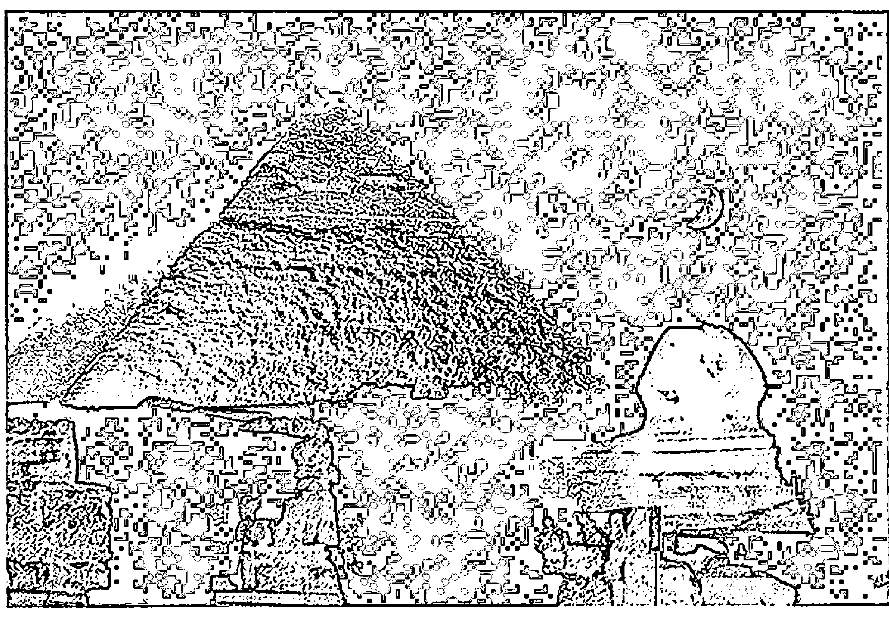

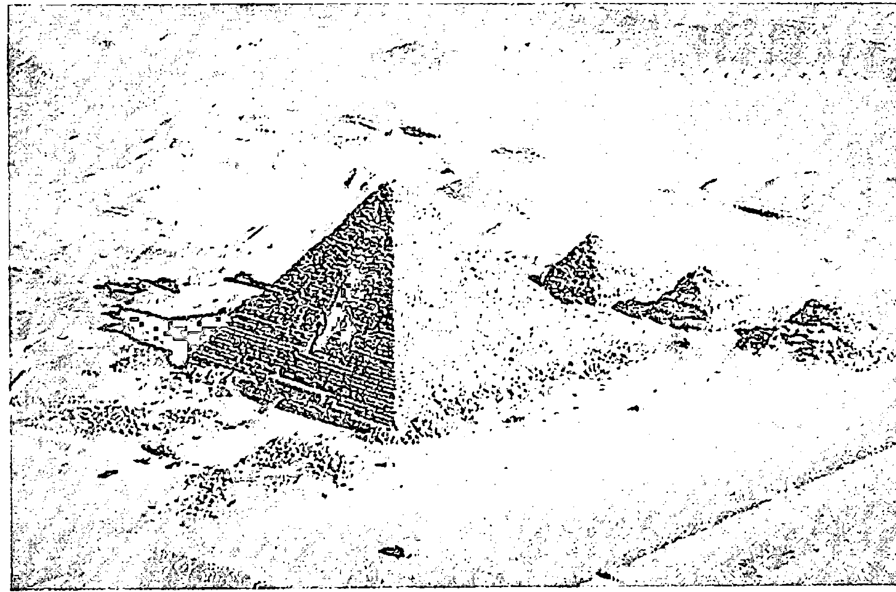

↑金字塔的设计足以证明当时埃及占星家观测的精确程度

就另一个角度而言，近代天文学的诞生又必须感谢占星术。不得不承认，抛开迷信和神秘的成分不讲，古代占星术确实需要精密的观测和计算。也正因如此，占星术才哺育了天文学的成长，并为后世留下了重要的科学遗产。

首先，占星术为后世留下的是大量的天象观测记录，其中特别有价值的便是异常天象的记录。在占星家看来，太阳每天东升西落，这并没有什么占星意义；但是如果在天空出现了一颗彗星，或发现某星座中出现了一颗新星，那就非同小可了。因此出于这种需要，在长达几千的时间里，古人都孜孜不倦、年复一年地记录了大量的天象观测资料。

其次，占星术促使人们对恒星位置进行了精确测定并建立天球坐标系。由于占星术要根据天象的变异来预卜人事吉凶，这就必须对奇异天象发生在哪一位置进行确认，而这就需要对天空进行区域划分，于是便出现了西方的“星座”。在传世的古代占星术文献中，各种恒星位置表和星图始终是现代天文学家和天文学史专家特别重视的部分之一。历史上几乎所有著名的恒星位置表和星图都出自占星大家之手或与占星术有关。另外，占星术还极大地促进了人类对日、月和金、木、水、火、土五大行星规律的研究。

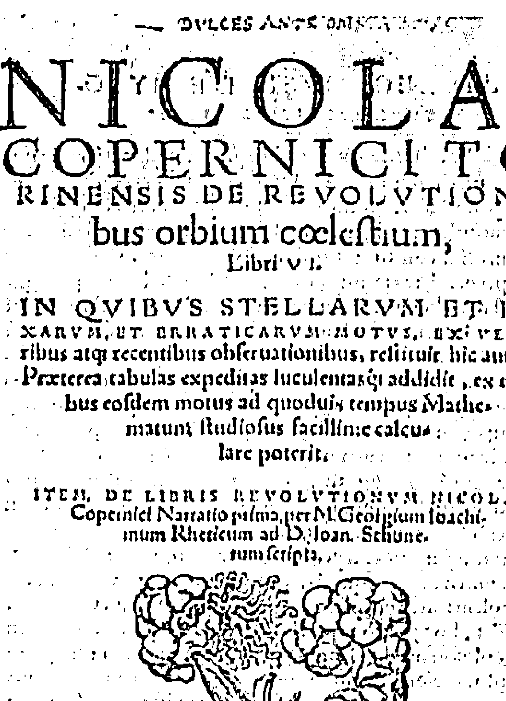

> 1 哥白尼的巨著《天体运行论》，是天文学与占星学分道扬镳的里程碑著作

在闪族叙利亚学者那里学习，并在那里接触到了东方的宗教和文化。以后他又多次随父亲商务旅行到小亚细亚。公元前551年，毕达哥拉斯来到米利都、得洛斯等地，拜访了泰勒斯、阿那克西曼德和菲尔库德斯等著名学者，并成为他们的学生。公元前550年，30岁的毕达哥拉斯因宣传理性神学、穿东方人服装、蓄长头发而引起当地人的反感，被迫离家前往埃及，途中他在腓尼基各沿海城市停留，学习当地的神话和宗教，并在提尔的一座神庙中静修。

最后，古代占星术还为后世历史学家留下了一份宝贵的遗产，即用来解决年代学问题的独特资料。由于占星术总是对奇异天象十分注意，通常越是罕见或惊人的天象就越是被赋予重大的占星术意义，占星术文献中也会留下更多的细节记录。同时，占星术又相信天象是对人间大事的兆示和反映，因此一些重大历史事件的发生往往被与当时的奇异天象联系在一起。由此，后世的历史学根据各种文献记载进行推断，便会确定一些原本模糊的历史年代。

# 第四章 占星术与其他

## 毕达哥拉斯

毕达哥拉斯，约公元前580—前500年，古希腊数学家、哲学家、音乐理论家、天文学家和勾股定理的创始人，他认为数学的本原就是万物的本原，从而为占星术的数学结构提供了坚实的基础。

毕达哥拉斯出生在爱琴海中的萨摩斯岛（今希腊东部小岛），他的父亲是一名富商。毕达哥拉斯从小就聪明好学，9岁时被父亲送到提尔，在闪族叙利亚学者那里学习，并在那里接触到了东方的宗教和文化。以后他又多次随父亲商务旅行到小亚细亚。公元前551年，毕达哥拉斯来到米利都、得洛斯等地，拜访了泰勒斯、阿那克西曼德和菲尔库德斯等著名学者，并成为他们的学生。公元前550年，30岁的毕达哥拉斯因宣传理性神学、穿东方人服装、蓄长头发而引起当地人的反感，被迫离家前往埃及，途中他在腓尼基各沿海城市停留，学习当地的神话和宗教，并在提尔的一座神庙中静修。

抵达埃及后，毕达哥拉斯进入神庙学习。从公元前535年到公元前525年这10年中，他学习了象形文字和埃及的神话历史和宗教，并宣传希腊哲学，因而得到许多希腊人的尊敬，有不少人投到他的门下求学。49岁时，毕达哥拉斯返回家乡萨摩斯，开始讲学并开办学校。公元前520年左右，为了摆脱当时君主的暴政，他带领母亲和唯一的一个门徒离开萨摩斯，移居西西里岛。后来定居在克罗托内，在那里他广收门徒，建立了一个宗教、政治、学术合一的团体，史称毕达哥拉斯学派。该社团有男有女，地位一律平等，一切财产都归公有。社团的组织纪律很严密，甚至带有浓厚的宗教色彩。每个学员都要在学术上达到一定的水平，加入该组织还要经过一系列神秘的仪式，以求达到“心灵的净化”。要接受的还有长期的训练和考核，遵守很多规范和戒律，并且宣誓永不泄露学派的秘密和学说。他们相信依靠数学可使灵魂升华，与上帝融为一体，万物都包含数，甚至万物都是数，上帝通过数来统治宇宙。这是毕达哥拉斯学派和其他学派的主要区别。

后来由于受到迫害，毕达哥拉斯学派在克罗托内的活动场所遭到严重破坏。毕达哥拉斯被迫移居他林敦，最终于公元前500年去世，享年80岁。但直到公元前4世纪中叶，毕达哥拉斯学派仍持续繁荣了两个世纪之久。

1古希腊伟大的数学家、天文学家毕达哥拉斯，其理论对西方占星术有极大的影响

毕达哥拉斯学派对数学的重视使他们试图用数来解释一切，研究数学的目的并不在于使用而是为了探索自然的奥秘。在毕达哥拉斯学派看来，数为宇宙提供了一个概念模型，数量和形状决定一切自然物体的形式，数不但有量的多寡，而且也具有几何形状。在这个意义上，他们把数理解为自然物体的形式和形象，是一切事物的总根源。因为有了数，才有几何学上的点，有了点才有线、面和立体，有了立体才有火、气、水、土这四种元素，从而构成万物，所以数在物之先。自然界的一切现象和规律都是由数决定的，都必须服从“数的和谐”，即服从数的关系。

毕达哥拉斯还通过说明数和物理现象间的联系，来进一步证明自己的理论。他从球形是最完美几何体的观点出发，认为大地是球形的，提出了太阳、月亮和行星作均匀圆运动的思想。他还认为10是最完美的数，所以天上运动的发光体必然有10个。在此基础上，他提出：地球沿着一个球面围绕着空间一个固定点处的“中央火”转动，另一侧有一个“对地星”与之平衡。这个“中央火”是宇宙的祭坛，是人永远也看不见的。这10个天体到中央火之间的距离，同音节之间的音程具有同样的比例关系，以保证星球的和谐，从而奏出天体的音乐。

有趣的毕达哥拉斯学派规矩包括：
- 禁食豆子。
- 东西落下了，不要拣起来。
- 不要去碰白公鸡。
- 不要用铁拨火。
- 不要吃整个的面包。
- 不要戴花环。
- 不要坐在斗上。
- 不要吃心。
- 不要在大路上行走。
- 房里不许有燕子。
- 锅从火上拿下来的时候，不要把锅的印迹留在灰上，而要把它抹掉。
- 不要在光亮的旁边照镜子。
- 当你脱下睡衣的时候，要把它卷起，把身上的印迹抹平。
……

# 托勒密

公元2世纪，西方世界产生了一位划时代的天文学家，他就是克劳狄乌斯·托勒密。关于他的生平，人们至今所知甚少。不过根据他所留下的著作，研究者推测出了一个基本的轮廓。

托勒密，约公元90—168年，生于埃及，父母都是希腊人。那时，埃及已成为罗马帝国的一部分，而身为埃及居民的托勒密则拥有世袭的罗马公民权，这可能是由罗马皇帝克劳狄或尼禄赠给他祖先的。尽管如此，由于文化渊源的关系，托勒密在大多数情况下都被视为希腊化时代的人物。公元127年左右，年轻的托勒密被送到亚历山大去求学。在那里，他阅读了不少书籍，并且学会了天文测量和大地测量。他曾长期住在亚历山大城，直到151年。由他的著作推断，托勒密在哈德良皇帝时代就已很活跃。而从其留下的观测记录来看，他的所有天文观测都是在亚历山大城进行的。

作为古代最伟大的科学家之一，托勒密在许多领域都做出了巨大贡献，尤其是天文学方面，他提出了自己的宇宙结构学说，即“地心说”。其实，地心说是亚里士多德的首创，托勒密全面继承了亚里士多德的地心说，并利用前人积累和他自己长期观测得到的数据，写成了八卷本的《至大论》。在书中，他把亚里士多德的9层天扩大为11层，把原动力天改为晶莹天，又往外添加了最高天和净火天。托勒密认为宇宙的运动是由上帝推动的；宇宙是一个有限的球体，分为天地两层，地球位于宇宙中心，所以日月围绕地球运行，物体总是落向地面；地球之外有9个等距天层，由里到外的排列次序是月球天、水星天、金星天、太阳天、火星天、木星天、土星天、恒星天和原动力天，此外空无一物；各个天层自己不会动，上帝推动了恒星天层，恒星天层才带动了所有的天层运动；人居住的地球，静静地屹立在宇宙的中心。托勒密设想，各行星都绕着一个较小的圆周运动，而每个圆的圆心则在以地球为中心的圆周上运动。他把绕地球的那个圆叫“均轮”，每个小圆叫“本轮”，同时假设地球并不恰好在均轮的中心而偏开一定的距离，均轮是一些偏心圆；日月行星除作上述轨道运行外，还与众恒星一起，每天绕地球转动一周。

尽管今天看来地心说是错误的，但在古代，托勒密的天体学说却能够流行千年，这当中自然是有一定历史原因的。首先，天体绕着某一中心的匀角速运动，符合当时占主导思想的柏拉图的假设，也适合于亚里士多德的物理学，易于被接受。其次，用几种圆周轨道不同的组合预言了行星的运动位置，与实际相差很小，相比以前的体系有所改进，还能解释行星的亮度变化。最重要的是，地球不动的说法，对当时人们的生活是令人安慰的假设，也符合基督教信仰。当然，托勒密本人声称他的体系并不具有物理的真实性，而只是一个计算天体位置的数学方案。更何况，他生活的时代，基督教还没有在欧洲占据主导地位。至于中世纪的教会利用和维护地心说，则根本就与托勒密无关了。

可以肯定的是，在当时的历史条件下，托勒密提出的行星体系学说，是具有进步意义的。它不但肯定了大地是一个悬空着的没有支柱的球体，还从恒星天体上区分开行星和日月是离我们较近的一群天体，这无疑是把太阳系从众星中识别出来的关键性一步。托勒密留下了数量众多的天文学著作，其中最主要的《至大论》《实用天文表》《行星假说》《恒星之象》等，堪称集古希腊天文学之大成。

除了在天文学方面的造诣，托勒密在地理学上也有出色的成就。他认为，地理学的研究对象应为整个地球，主要研究其形状、大小、经纬度的测定以及地图投影的方法等。他还制造了测量经纬度用的星盘和后来驰名欧洲的角距测量仪。在数学方面，他用圆周运动组合解释了天体运动，这在当时被认为是绝对准确的。他还论证了四边形的特性，即有名的托勒密定理。他对光学也作过研究，认为光线在折射时入射角与折射角成正比关系。

不管其主观意愿如何，由于在天文学方面的一系列贡献，托勒密又被后人尊为古代最伟大的占星家。客观上讲，在托勒密的诸多天文学著作中，真正专门讨论占星术的不是很多。例如在其代表作《至大论》中，几乎完全没有讨论星占术，而在《恒星之象》和《谐和论》两书中，也只是有些章节论及占星术。不过后世广泛流传的《天文集》，倒算得上是占星术方面的书籍。在该书中，托勒密假定存在某种形式的、来自天体的自然辐射影响着人类。但以影响力而论，《四书》才是托勒密对西方占星术最大的贡献。事实上，在此书问世后一千多年间，它就一直被视为西方占星术的《圣经》。

在托勒密的各种著作中，《四书》相对来说是最独立的，它基本与托勒密的其他著作没有什么直接联系。该书共4卷，托勒密将此书视为《至大论》的姊妹篇，写作时间约在公元139—161年之间，即在完成《至大论》之后若干年。但是作为一部占星术专著，《四书》却在中世纪产生了巨大的影响，而托勒密也由此长期被视为占星大家。

在《四书》中，托勒密系统地阐述了行星运动是如何影响人类世俗事物的，但他极力避免一些占星学中说不清楚的内容，比如很少涉及占星很重要的两个概念：星座和宫位，而是把理论建立在行星和行星运动的基础上。

《四书》卷一可视为占星术的预备知识，集中讲述日、月、五大行星运动以及恒星位置等数理、天文学知识——这是任何一个人流的占星家都必须掌握的。在卷二中，托勒密设法为占星术确立一些理论基础和原则。例如他论证道：既然太阳、月亮可以通过季节变换、潮汐涨落来直接影响地球上的人类生活，那么五大行星也能影响尘世事务，应是无可怀疑的事实。托勒密也谈到占星术可应用于两个领域：国家民族和个人。但对于前一领域，他主要是谈论水土、气象之类，与古巴比伦人的占星术完全不同。在卷三，托勒密先谈到获取精确出生时刻的困难，而这是以后一切推算的基础。至于准确得知受孕时刻自然更为困难。确定这些时刻都要靠天文观测，使用星盘和时计，被特别提到的是水钟。这些所谓在出生时刻获得的特性，就是日、月、星辰对人的影响。接下来，托勒密详细论述算命天宫图的构成与排算。他认为，一个好的占星家能够从中发现许多信息，这些信息中的一个重要组成部分是自身的体质特征。例如当土星位于出生时刻天宫图东侧时，这个婴儿将来会是“黄肤色，好体格，黑色卷发，宽阔而坚强的胸膛，常规眼睛，身材匀称，气质是湿与冷的混合”；而如果土星位于西侧，则是“形象黑暗，薄弱单薄，头发稀疏，身上无毛，体形悦目，眼睛为暗黑色、气质的主要成分是干和冷”等等。在卷四中，托勒密继续阐述算命天宫图的各个方面；辨识婴儿未来的健康状况;预言他（她）的社会地位和职业，他（她）未来的婚姻情况，乃至对于性的态度等。

总的看来，《四书》集希腊化时代占星术之大成，它在西方占星术史上的地位，确实可与《至大论》在西方天文学史上的地位并驾齐驱。《四书》为此后1000多年间的西方占星术的理论和实践提供了标准模式。令人惊奇的是，直到1300年之后，欧洲的算命天宫图仍然遵守与该书完全一样的标准形式。甚至直到今天，仍有占星家阅读此书，从中获取灵感并寻找理论根据。有趣的是，在托勒密逝世后，许多占星家还将自己的著作伪托在他名下。

# 哥白尼

希腊文明衰落之后，在罗马帝国时代，由于占星术基本上沦为帝王们的工具，因此在科学方面自然不会有更大的收获。至于黑暗愚昧的中世纪，天文学更是完全为宗教服务，只是进入文艺复兴时期以后，随着占星学在欧洲再度兴盛，天文学也随之取得了一系列进展，但两者仍相互联系在一起。16世纪中叶，当哥白尼的巨著《天体运行论》于1543年问世后，天文学才开始与占星学分道扬镳，而这一年也被视为现代天文学的诞生。从此，二者基本走上了独立发展的道路。

1473年2月19日，在波兰维斯瓦河畔的托伦城，一个名叫尼古拉·哥白尼的男孩诞生了。很少有人会料到，这个男孩将在多年后成为现代天文学的创始人、现代日心说的创立者。哥白尼的父亲是个当议员的富商，但在哥白尼10岁的时候，父亲就去世了。随后，哥白尼被送到舅舅务卡施大主教家中抚养。务卡施是一个人文主义者，他和当时波兰进步的知识界来往极为密切。在哥白尼念中学的时候，务卡施就带着他参加人文主义者的聚会。1491年，按照舅父的安排，哥白尼到克拉科夫大学去学习天文和数学。1496年，23岁的哥白尼又来到文艺复兴的发源地意大利，在博洛尼亚大学和帕多瓦大学攻读法律、医学和神学。在博洛尼亚大学，哥白尼深受天文学家德·诺瓦拉的影响，并从他那里学到了天文观测技术以及希腊的天文学理论。后来，哥白尼在费拉拉大学获得宗教法博士学位，另外他作为一名医生，还因其医术高明而被人们誉为“神医”。可以说，后来身为神职人员的哥白尼并不是一位职业天文学家，而他的天文学巨著是在业余时间完成的。

如同当时所有研究天文的人一样，哥白尼也曾十分勤奋地钻研过托勒密的著作。所不同的是，他看出了托勒密的错误结论和科学方法之间的矛盾。哥白尼认识到，天文学的发展道路，不应该继续“修补”托勒密的旧学说，而是要发现宇宙结构的新学说。早在克拉科夫大学读书时，哥白尼就开始考虑地球的运转问题。他观测天体的目的和过去的学者相反，不是强迫宇宙现象服从“地球中心”学说，而是要让宇宙现象来解答他所提出的问题，要让观测到的现象证实一个新创立的学说——“太阳中心”学说。

> 早年，哥白尼也曾研究过占星术

值得注意的是，哥白尼的研究也与占星术有一定关联。例如在克拉科夫大学时，他就曾利用著名占星家玛尔卿·布利查赠送给学校的“捕星器”和“三弧仪”观测过月食，研究过浩瀚无边的星空。1496年，哥白尼前往意大利北部的博洛尼亚大学学习“教会法”，同时努力钻研天文学。在那里，他开始用实际观测来揭露托勒密学说和客观现象之间的矛盾，从而把托勒密的地心说打开了一个缺口。在意大利期间，哥白尼还熟悉了希腊哲学家阿里斯塔克斯的学说，确信地球和其他行星都围绕太阳运转这个日心说是正确的。

1506年，哥白尼结束了在意大利10年的留学生活，动身回国。就在这时，欧洲的占星家们再度活跃起来。原来在当年秋天，天空出现了彗星断天的异象，欧洲大部分地区瘟疫流行，正在这时，罗马教皇亚历山大又误喝了谋害别人的毒酒而丧命，罗马教会就趁机提出种种“警告”，招摇撞骗，愚弄人民。当哥白尼回到波兰时，天空出现另一个罕见的星象，教会也在大肆活动，闹得首都克拉科夫乌烟瘴气。原来教会宣告天空将连续出现4次土星和木星“会合”的异象，说这是上天对世人的一个严重警告。世上将出现一个冒牌的先知，洪水和瘟疫将接连而来，并将引起社会骚乱和国家崩溃。种种谣言闹得人心不安，有钱的人拼命寻欢作乐，希望摆脱对未来的恐惧；穷苦的老百姓则为向教会购买“赎罪符”而弄得倾家荡产。

针对这种情形，哥白尼和他的朋友们开始在克拉科夫研究两星“会合”的问题。哥白尼发现教会的说法包含数据的错误，显然是妖言惑众。于是他和朋友们决定各自在不同的地区进行观测，以便一起来揭发教会的阴谋。第四次“会合”发生的时候，哥白尼正在赫尔斯堡舅父瓦兹洛德的主教官邸，主持与十字骑士团的斗争，虽然政务繁忙，哥白尼仍然坚持观测星象。观测的结果证实了哥白尼的预见：“会合”的日期和教会所说的不符，而和哥白尼的推算却是相符的——它提前了一个多月。不久在朋友们的催促下，哥白尼把他的“太阳中心学说”写出了一个提纲——《试论天体运行的假设》，抄送给他的几个心腹朋友。它宣布：“所有的天体都围绕着太阳运转，太阳附近就是宇宙中心的所在。地球也和别的行星一样绕着圆周运转。它一昼夜绕地轴自转一周，一年绕太阳公转一周……”

经过长年的观察和计算，哥白尼完成了他的伟大著作《天体运行论》。他在《天体运行论》中观测计算所得数值的精确度是惊人的。例如，他得到恒星年的时间为365天6小时9分40秒，比现在的精确值约多30秒，误差只有百万分之一；他得到的月亮到地球的平均距离是地球半径的60.30倍，和现在的60.27倍相比，误差只有万分之五。1533年，60岁的哥白尼在罗马做了一系列的讲演，提出了他学说的要点，并未遭到教皇的反对。但是他却害怕教会反对，甚至在他的书完稿后，还是迟迟不敢发表。直到在他临近古稀之年才终于决定出版。1543年5月24日，哥白尼去世的那一天收到了出版商寄来的一部他写的书。

《天体运行论》的不朽贡献，在于它根据相对运动的原理，解释了行星运行的视运动。在哥白尼以前，这一原理从来没有被这样详尽地阐述过，也没有人根据这一原理得出过这样重要的结论。哥白尼还论证说：“地球虽然是一个巨大的球体，但比起宇宙来却微不足道。”他注意到地平线把天球剖分为均匀的两半，曾利用这一现象来证实宇宙是无限的这个论断。哥白尼还认为太阳是行星中相对不动的中心。他的功绩在于：用科学的太阳中心说，推翻了在天文学上统治了几千年的地球中心说。这是天文学上一次重大的革命，引起了人类宇宙观的革新。哥白尼的伟大成就，不仅铺平了通向近代天文学的道路，而且开创了整个自然科学向前迈进的新时代。也正是从哥白尼时代起，脱离教会束缚的自然科学和哲学开始获得飞跃的发展。

哥白尼的学说一诞生就引起了巨大轰动，许多科学家都对其表示了崇敬之情。例如意大利天文学家伽利略就是哥白尼学说的热烈信奉者，他利用自制的能放大30倍的望远镜，观测到许多足以说明哥白尼学说的现象，如金星绕太阳转动、月亮上的“山”和“海”，看到了繁星密聚的银河、木星的四个卫星以及太阳表面变动不定的黑子。他的许多新发现，有力地证明了哥白尼的日心学说。伽利略曾经写信给开普勒说：“我信服哥白尼的观点已经有很多年了，我根据他的观点，发现了自然界很多现象的原因。我写过许多驳斥对立论点的文章……”至于另一位意大利学者布鲁诺（公元1548—1600年），不但推崇哥白尼为最伟大的天文学家，甚至为维护自己的信仰而付出了生命的代价。

# 第谷

哥白尼“日心说”的问世，无疑昭示着现代天文学的诞生。然而由于传统影响的存在，天文学并没有很快就与占星术分道扬镳。就在哥白尼逝世后，欧洲又出现了两位集天文学家与占星家于一身的著名人物——第谷和开普勒。而这两位人物的人生经历，又演绎了占星术历史上的一段传奇。

第谷·布拉赫，公元1546—1601年，丹麦天文学家和占星家。1546年12月14日生于斯坎尼亚省基乌德斯特普的一个贵族家庭，其父是律师，后由其叔父抚养。1559年，第谷进入哥本哈根大学读书。1560年8月，他根据预报观察到一次日食，这使他对天文学产生了极大的兴趣。1562年，第谷转到德国莱比锡大学学习法律，但却利用全部的业余时间研究天文学。1563年，他观察了木星合土星，并写出了他的第一份天文观测资料，同时注意到合的发生时刻比星历表预言早了一个月。在领悟到当时用的星历表不够精确后，第谷开始了长期系统的观测，试图自己编制更精确的星历表。1566年，第谷开始到各国漫游，并在德国罗斯托克大学攻读天文学，从此开始了他毕生的天文研究工作。

在巴塞尔和奥格斯堡继续求学后，第谷因父亲生病而返回家乡。1572年11月11日，他看到仙后座有一颗新的明亮恒星，便使用自己造的仪器对这颗星进行了一系列观测，直到它1574年3月变暗到看不见为止。经过前后16个月的详细观察和记载，第谷取得了惊人的结论。不但彻底动摇了亚里士多德天体不变的学说，而且开辟了天文学发展的新领域。

由于坚持同一名农家女子结婚，第谷与家庭决裂。1576年，丹麦国王腓特烈二世将汶岛赐予他作为新天文台台址，并许诺他一笔生活费，于是第谷在丹麦与瑞典间的汶岛建立了著名的“观天堡”。

观天堡堪称世界上最早的大型天文台，设置了4个观象台、1个图书馆、1个实验室和1个印刷厂，配备了齐全的仪器，耗资黄金1吨多。第谷在这里工作20多年，直到1579年，取得了一系列重要成果，创制了大量的先进天文仪器。其中最著名的有1577年对两颗明亮彗星的观测。通过观测得出了彗星比月亮远许多倍的结论，这一重要结论对于人们正确认识天文现象产生了很大影响。

1599年丹麦国王腓特烈二世死后，第谷又在神圣罗马帝国皇帝鲁道夫二世的帮助下，移居捷克首都布拉格，在那里建立了新的天文台。

在天文学方面，第谷的确做出了一系列不可磨灭的贡献。灭的贡献，他所做的观测精度之高，令同时代人望尘莫及。另外第谷编制的恒星表也相当准确，至今仍然有使用价值。正因如此，后世将他视为现代天文学的奠基人之一。但与此同时，第谷又是一名占星大家，其声望曾一度如日中天。

第谷对占星术的兴趣，早在少年时代就已表现出来了。据说还在德国莱比锡大学求学时，第谷就为一位教授推排过算命天宫图。20岁那年，他在罗斯托克，适逢一次月食，他推算后宣称：此次月食兆示着土耳其苏丹苏莱曼之死。不久之后，果然传来苏丹的死讯。尽管后来人们了解到这位苏丹其实是死于月食发生之前，不过按照占星术的某些原则，第谷的这次预言仍很成功。

1574年，第谷在哥本哈根大学作题为《论数学原理》的演讲。在这篇非常重要的占星术文献中，他阐述了自己的占星观。他认为，占星术与神学并无冲突，《圣经》只禁止妖术，并不禁止占星术。对于占星术的各种各样反对者，他认为

> > “唯一有真才实学的”是皮科伯爵，因为皮科伯爵试图从根本上驳倒占星术。然而第谷接着又指出：不幸的是，伯爵之死却恰好证明了占星术的正确。因为曾有三位占星家都预言火星将在一个时刻威胁伯爵的生命，而伯爵竟真的死于此时——1494年11月17日！

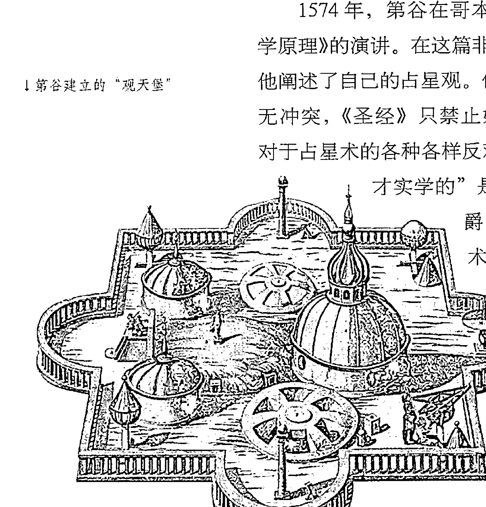

在这篇著名演讲中，第谷还强调了“哲人主宰星辰”的传统观点。据说他用那个时代流行的夸张语调向听众们说：“占星家并未用星辰来限制和束缚人的愿望，相反却承认，人身上有比星辰更崇高的东西。只要人像真正的人、像超人那样生活，他就能依靠这种东西去克服那带来不幸的星辰影响……上帝将人塑造成这样：只要他愿意，他自己就能战胜星辰的影响。”意思是，人的命运虽可通过分析星辰运行来揭示，但这一命运并非绝对不可变更，通过意志和自身努力就有可能改变它。第谷认为，上帝当然也能改变人的命运。这种非宿命论的占星术观，听起来较为合理，也更容易使他的占星预言常立于不败之地。

1573年，第谷在其天文学著作《论新星》中，讨论了1572年超新星的占星术意义。在讨论1577年大彗星的德文小册子中，他也用了很大的篇幅着重论述大彗星出现所具有的占星术意义。此外在与友人的书信中，他也很认真地讨论着占星术。1576年，丹麦国王将位于丹麦海峡中的汶岛赐予第谷，并拨巨款令他在岛上修建宏大的天文台。不过，第谷在汶岛上从事天文学研究期间，还要为丹麦王室提供一些服务，其中最重要的就是作占星预言。例如，他为丹麦国王的三位王子分别推排了算命天宫图，这三份装帧华美的文件原本至今仍珍藏在哥本哈根的丹麦王室图书馆中。这份文件实际上是一份冗长的报告，先是王子降生日刻的日、月、五大行星在天空中的位置图示，接下来是各种计算和详细论证，这些内容都是由拉丁文写成，但是最后的结论部分用德文再次书写，据说是为了照顾王后的阅读。

> > “王子的童年将平安度过，因为金星处在有利位置上；尽管由于水星位置略为欠佳，会使王子在出生后第二年染上小病，但有惊无险，并不严重。从12岁起王子将染上起因于黑胆汁的较为严重的疾病。29岁那年王子必须在健康和尊严两方面都特别小心。56岁那年是一大关口，因为太阳和火星都不怀好意，金星对此无能为力；倘若王子能够度过这一劫难，他将会有幸福的晚年。”

不过，谨慎的第谷在每份报告后面都强调指出，他的预言并不是绝对的，“因为上帝根据自己的心意可以改变一切”。

不可思议的是，当时在实际的政治生活中并不起眼的第谷，居然还以其占星活动影响了欧洲的历史。对于这一事实，历史学家也予以承认。

有一次，第谷应邀为瑞典王室成员古斯塔夫进行占星预言。不料经过一番推算后，第谷得出了一个惊人的结论：古斯塔夫未来将成为瑞典国王。在当时，很少有人相信这一点。因为从血缘关系上论，古斯塔夫不过是瑞典王室的支系后裔，正常情况下是不可能继承王位的。然而后来的故事却让人大跌眼镜，第谷去世之后10年，古斯塔夫果真登上了瑞典王位！

回过头来看一下古斯塔夫的历史：古斯塔夫二世·阿道夫，公元1594—1634年，瑞典国王，著名军事改革家。曾指挥瑞典军队击败了俄国军队、波兰军队和神圣罗马帝国军队，被后世誉为“北方雄狮”和“现代军事之父”。

古斯塔夫二世的爷爷是瑞典王国瓦萨王朝开创者古斯塔夫一世·瓦萨，父亲是瓦萨王朝君主查理九世。古斯塔夫17岁时继承王位成为一国之主，他能够保住自己的王位，经历了诸多磨难。

古斯塔夫是查理九世的长子，从小就天资聪颖，懂得8门语言，对政治、军事、历史、文学都有很大的兴趣，11岁就参加国事讨论，16岁第一次驰骋疆场，被称为“神童”。1610年，查理九世患脑溢血，瘫痪在床，朝政由王后和王子料理。这对古斯塔夫只是初步考验，而真正严峻的考验是其在父亲死后，开始掌管国家大权之时。

1611年10月30日，查理九世病逝。根据继承法，身为长子的古斯塔夫理应继位，不料一场政治危机几乎使他与王权无缘。原来古斯塔夫被称为“北方雄狮”的古斯塔夫二世。第谷生前曾预言其将成为瑞典国王

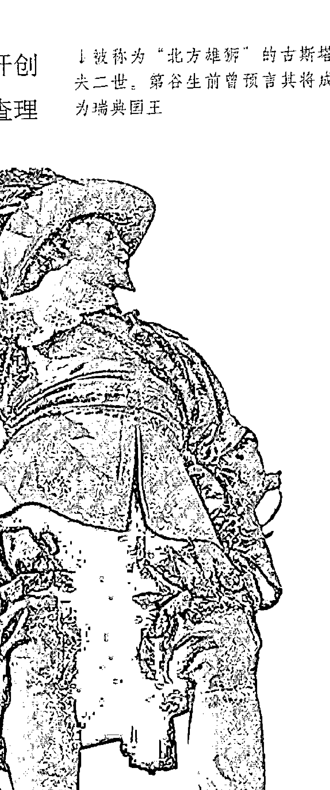

的祖父古斯塔夫·瓦萨国王有3个儿子，依次是埃里克、约翰和查理。三兄弟同父异母，埃里克为卡特琳娜王后所生，但古斯塔夫·瓦萨因与卡特琳娜感情不和，所以对她生的儿子埃里克也从不喜欢，因此埃里克从小憎恨父王。瓦萨去世后，按规定传王位给埃里克，立约翰为芬兰大公，查理为西耶特兰大公。

埃里克当了国王后，由于兄弟关系紧张，终于酿成内乱。最终，约翰与查理联合起来废黜了埃里克。之后约翰登上王位，他死后又遗命将王位传给自己的儿子——波兰国王西吉斯蒙德。但是西吉斯蒙德还未来得及回国，查理就自立为王。因此，怀恨在心的西吉斯蒙德始终坚持自己是瑞典王位的合法继承人。当查理九世死后，西吉斯蒙德又重申自己的要求，指责古斯塔夫篡夺了他的王位。

就这样，在争议中登上王位的古斯塔夫不得不面对各种困境。当西吉斯蒙德率领大军前来进攻瑞典时，这位年仅17岁的统治者虽一度处于下风，但凭借其坚定的毅力和出色的组织能力，最终成功挫败了对手。而据历史学家记载，正是第谷的占星预言，才鼓励了古斯塔夫的勇气，使之下决心去夺取那个几乎被他人揽入怀中的王位。

## 开普勒

第谷和开普勒同为欧洲杰出的天文学家，开普勒更因以发现行星运动三定律而名垂千古。但在这两位天文学家一生的事业中，占星同样是一大内容，他们所留下的一些著作还成为后世占星家的经典。不过在开普勒之后，几乎就再也没有集天文学家与占星家于一身的代表性人物了。

约翰尼斯·开普勒，公元1571—1630年，德国著名天文学家、物理学家和数学家。其主要科学贡献包括：发现了太阳系行星运动的三大定律；编制了更为精确的《鲁道尔夫星行表》；研究了光的折射、透镜的性质以及视觉理论；数学方面确定了计算旋转体体积的方法。主要著作有：《宇宙的奥秘》《新天文学》《前维特利奥纪事》《屈光学》《宇宙的和谐》《哥白尼天文学纲要》《鲁道尔夫星行表》《测量酒桶体积的新科学》。

1571年，开普勒出生于德国的威尔德斯达特镇。长大后，他就读于蒂宾根大学，1588年获学士学位，3年后获硕士学位。当时，大多数科学家拒不接受哥白尼的日心说。而开普勒早在蒂宾根大学学习期间，听到对日心学说所做的合乎逻辑的阐述，很快就相信了这一学说。从蒂宾根大学毕业后，开普勒在格拉茨研究院当了几年教授，在此期间完成了他的第一部天文学著作。1600年，第谷邀请他去布拉格附近的天文台给自己当助手。1601年第谷去世后，神圣罗马皇帝鲁道夫又委任开普勒为皇家数学家。

作为第谷的接班人，开普勒认真地研究了前者多年来对行星进行仔细观察所做的大量记录。第谷是望远镜发明以前最后一位伟大的天文学家，也是历史上最仔细、最准确的天文观察家，因此他的记录具有十分重大的价值。开普勒认为，通过对第谷的记录进行仔细的数学分析，就可以确定究竟是托勒密还是哥白尼的行星运动学说是正确的。然而经过多年煞费苦心的数学计算，开普勒的希望破灭了。

幸运的是，开普勒最终认识到了存在的问题：他以前所有的经典天文学家都假定行星轨道是由圆或复合圆组成的，但是实际上行星轨道不是圆形而是椭圆形。随后，开普勒花费数月的时间来进行复杂而冗长的计算，以证实自己的学说。1609年，他发表了著作《新天文学》，其中提出了他的前两个行星运动定律。行星运动第一定律认为每个行星都在一个椭圆形的轨道上绕太阳运转，而太阳位于这个椭圆轨道的一个焦点上；行星运动第二定律认为行星运行离太阳越近则运行就越快，行星的速度以这样的方式变化：行星与太阳之间的连线在等时间内扫过的面积相等。10年后，开普勒又发表了他的行星运动第三定律：行星距离太阳越远，它的运转周期越长；运转周期的平方与到太阳之间距离的立方成正比。 后世天文学界一致公认，开普勒定律对行星绕太阳运动做了一个基本完整、正确的描述，解决了天文学的一个基本问题。即使后来彻底解释了行星轨道运行的牛顿，也是在开普勒理论的基础上完成的。除了发现行星运动定律外，开普勒还对天文学做出了其他一些贡献。1627 年，他秉承第谷的遗志，出版了巨著《路德福星表》。这是天文史上值得称赞的一部星表，其完备和准确度远胜过前人。在以后的百余年间，该表一直被天文学家和航海家们奉为至宝。

不幸的是，开普勒的晚年不断遭遇坎坷。特别是在“三十年战争”期间，由于神圣罗马帝国皇帝鲁道夫经常拖欠薪水，结果使育有 12 个孩子的开普勒陷入经济困难。另外由于他坚信自己爱好和平的信仰，不断遭到新旧教派两方面的迫害。1630年，开普勒在德国的雷根斯堡去世。

与他的恩师第谷一样，开普勒在从事天文学研究的同时，也以占星大家的面目活跃在欧洲。开普勒属于那种对神秘主义事物十分入迷的天才人物，并曾深深卷入当时与重大政治、军事形势有密切关系的占星活动。

据记载，开普勒 23 岁时曾被推荐到奥地利格拉茨路德派高级中学出任数学教师。但由于薪俸很少，据说为了度日，他只好在教学之余靠编制占星历书养家糊口。他自我解嘲地说：“作为女儿的占星术若不为天文学母亲挣面包，母亲便要挨饿了。” 在开普勒生活的时代，贵族们对据说能够预测人生吉凶祸福的占星术很感兴趣。于是为了生计，也为了自己的科学研究，开普勒涉足了占星术。比如，他就曾为当时神圣罗马帝国皇帝鲁道夫二世修订了新的星行表——《鲁道夫星行表》，并据此编定带有占星内容的历书。在当时众多的历书编撰者中，开普勒以他预言的准确性而闻名遐迩。开普勒主要想从经验物理学的角度证明自然情况的预报。他在格拉茨编的第一本年历上就预言：1595年，天气为大寒，且有土耳其人入侵。他在一封致马斯特林的信中写道：“年历至今都证明是对的，我们这儿是罕见的严寒。由于严寒，阿尔卑斯山的牧人死了不少。据可靠报告，有些人回家后一擦鼻子，鼻子就掉了；冻僵的关节也发生了骨疡。土耳其人在这些天里把从维也纳到诺伊施塔特的整个地区都夷为荒野，掳掠人口物品。”

开普勒不但把占星术作为自己的副业，还把其作为一门科学研究。他曾说：“我们可以看到，占星术无论如何与人们的经验相合，而与任何人都确知的原因则无关，我认为这就是占星术的价值……决不能视占星术为废物而弃之，这一点必须予以肯定。”有趣的是，开普勒经常运用占星术做出天气预报，其结果常与实际相符。但是另一方面，开普勒十分自觉地提防宿命论的色彩。他认为，谁以为自己的命运被星辰决定着，他就没有成熟，他就没有把上帝为他点燃的理性之光放射出来。因此，他只限于把天上的征兆说成是全知上帝的警告，上帝发出警告是为了改善那些不幸的人们的境遇和安慰那些被压迫者；不幸的威胁不来自星辰，而是来自人，来自人的权势欲和人的宗教不宽容性。

在开普勒的占星生涯中，关于华伦斯坦的预言堪称欧洲占星术的经典故事。那是在1608年的一天，有人来找开普勒，要他为一位“不想说出姓名”的贵族排算算命天宫图，并预测此人的未来。开普勒虽然已经知道此人是谁，但并不说破，他推算之后做出如下预言：

> 此人忧郁警觉，酷爱炼金术、魔法和通神术，蔑视人类以及一切宗教的戒律习俗，怀疑一切，不论是上帝所为还是人的作为……因为月亮显得很卑劣，所以他的这些特征将变成引人注目的缺点，他将受到那些和他打交道的人的蔑视，他将被看做是一个怕见阳光的孤独野人。他残忍不仁，目中无人，放荡淫乐，对下属严厉凶狠，贪得无厌，到处行骗，变化多端，他常常沉默不语，暴躁易怒，好争好斗……成年以后，大部分恶习都将被磨去，而他的这些不寻常的品性会发展为坚强的办事能力。在他身上还可以看到争名夺利的强烈欲望，企求威严权势，因此他就会有许多强大的、对他不利的、公开和隐蔽的敌手，但他们大部分都将不是他的对手……由于水星正和木星对立着，因此他将赢得声望，他将成为一个特别迷信的人，依靠这种迷信的方法他能把一大群老百姓笼络在自己周围，并被暴徒们推为首领。

这个匿名来占星预卜的贵族就是华伦斯坦，开普勒知道是他来求卜，他将华伦斯坦的名字用他自己的密码文字记在那份算命天宫图的原件中，可以证明这一点。那么，这位华伦斯坦是何许人呢？

阿尔贝特·华伦斯坦，公元1583—1634年，神圣罗马帝国军队总司令、大元帅、公爵、亲王。是“三十年战争”当中的名将。由于受到皇帝的猜忌，在皇帝的指使下，刺客杀死了病床上的华伦斯坦。

在1608年的占星预言16年后，那份天宫图又被送回开普勒手中，上面已有华伦斯坦的亲笔批语，这次他仍然匿名，要求占星学家为他补充未来命运的细节。此时，华伦斯坦即将参加“三十年战争”并出任联军统帅。但开普勒拒绝这样做，他认为一个人不应该相信自己的命运全由星辰决定。尽管如此，华伦斯坦这位当时威震欧洲的大人物却对开普勒表示了好感，他依旧颇为慷慨地赞助后者的天文学工作，为他提供住宅和各种方便，让他安心编撰星表。令人惊奇的是，开普勒为这位统帅所作的占星推算中止于1634年，他不愿意继续推算下去。而偏偏就在这一年，这位统帅在达到他成就的顶峰之后，因受到猜疑而被解职，随即又在2月25日遇刺身亡！

实际上，对于规模空前的“三十年战争”，开普勒也用占星术进行了预言。他在自己编写的占星年历中对1618年做了这样的预言：春季“不仅气候，而且首先是行星的运行，都使人偏好争斗”。更奇怪的是，在这一年，他精确预言了“三十年战争”的爆发时间：“肯定在五月里爆发。”果然在1618年5月23日，布拉格发生起义，“三十年战争”因此爆发。

## 占星术与医学

随着占星术在巴比伦的生根发芽，另一种在巴比伦时期并不显赫的占星术——医学占星术也开始发展起来，并在后来成为欧洲医学界的一种传统。

公元13世纪下半叶，著名的意大利医生彼得在其《安抚者》中提出，关于天体运行的知识，对于医学而言不仅是非常有用的，而且是“根本的”；而每一次服药，都应该在研究了日、月和五大行星的位置之后再进行。当时，还出现了一些专门为医生占星所制造的仪器，其中包括：一种专供医生使用的星盘，星盘周围刻有黄道十二宫、昼夜24时等；一套同轴圆盘用来指示日、月、五大行星的位置。这样，医生施治时所要了解的天象内容，就可以一目了然。

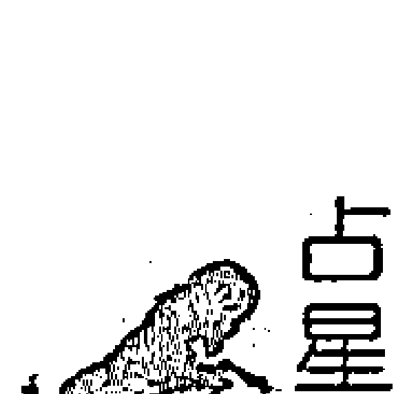

### 十二宫医学应用

每个宫与身体上标明的部分，或者与一种位置不那么明确的功能是一致。这是医学占星术的基础。

- 白羊宫：头
- 双子宫：胸廓上部、肺、双臂、双手
- 金牛宫：咽喉
- 巨蟹宫：胸部、胃
- 狮子宫：心脏
- 室女宫：肠
- 天秤宫：肾脏、身材
- 天蝎宫：生殖器官和肛门
- 人马宫：腰部、大腿、动脉循环
- 摩羯宫：膝部、骨骼、关节
- 宝瓶宫：脚踝、静脉循环
- 双鱼宫：双脚和体液交换

### 希波克拉底

古代西方，医生在开业时都要宣读一份有关医务道德的誓词：“我以阿波罗及诸神的名义宣誓：我要恪守誓约，矢忠不渝。对传授我医术的老师，我要像父母一样敬重。对我的儿子、老师的儿子以及我的门徒，我要悉心传授医学知识。我要竭尽全力，采取我认为有利于病人的医疗措施，不给病人带来痛苦与危害。我不把毒药给任何人，也决不授意别人使用它。我要清清白白地行医和生活。无论进入谁家，只是为了治病，不为所为，不接受贿赂，不勾引异性。对看到或听到不应外传的私生活，我决不泄露。如果我违反了上述誓言，请神给我以相应的处罚。”这就是著名的希波克拉底誓言，后来经世界医协大会修改，如今已成为国际医务人员所公认的道德规范。

希波克拉底，约公元前460—前377年，古希腊著名医生，西方医学的奠基人，被后世尊为西方“医学之父”。他提出了“体液学说”，认为人体由血液、黏液、黄胆和黑胆4种体液组成，这4种体液的不同配合使人们有不同的体质。他把疾病看做是发展着的现象，认为医师医治的不仅是病更应是病人，从而改变了当时医学中以巫术和宗教为根据的观念。他还主张在治疗上注意病人的个性特征、环境因素和生活方式对患病的影响。其医学观点对以后西方医学的发展有巨大影响。

希波克拉底出生于小亚细亚科斯岛的一个医生世家，祖父、父亲都是医生，母亲是接生婆。在古希腊，医生的职业是父子相传的，所以希波拉底从小就跟随父亲学医。父母去世后，他在希腊、小亚细亚、里海沿岸、北非等地一面游历，一面行医，从而增长了知识，接触了民间医学。那时，古希腊医学受到宗教迷信的禁锢。巫师们只会用念咒文、施魔法和进行祈祷的办法为人治病，致使许多病人因耽误病情死去。

公元前430年，雅典发生了可怕的瘟疫，许多人突然发烧、呕吐、腹泻、抽筋、身上长满脓疮、皮肤严重溃烂。患病的人接二连三地死去。没过几天，雅典城中便随处可见来不及掩埋的尸首。危急时刻，时为马其顿王国御医的希波克拉底却冒着生命危险前往雅典救治。他一面调查疫情，一面探寻病因及解救方法。不久，他发现全城只有一种人没有染上瘟疫，那就是每天和火打交道的铁匠。他由此设想，或许火可以防疫，于是在全城各处燃起火堆来扑灭瘟疫。

值得一提的是，在探索医学的过程中，希波克拉底还向他的门徒传授占星术，以便让他们掌握病人的“凶日”。他曾说：“谁要是不理解占星术，那就不是医生而是白痴。”希波克拉底的这些观点，使“医学占星术”这一脉日渐光大。在他的影响下，一些希腊医生便根据占星术的象征和兆示来决定医疗措施。

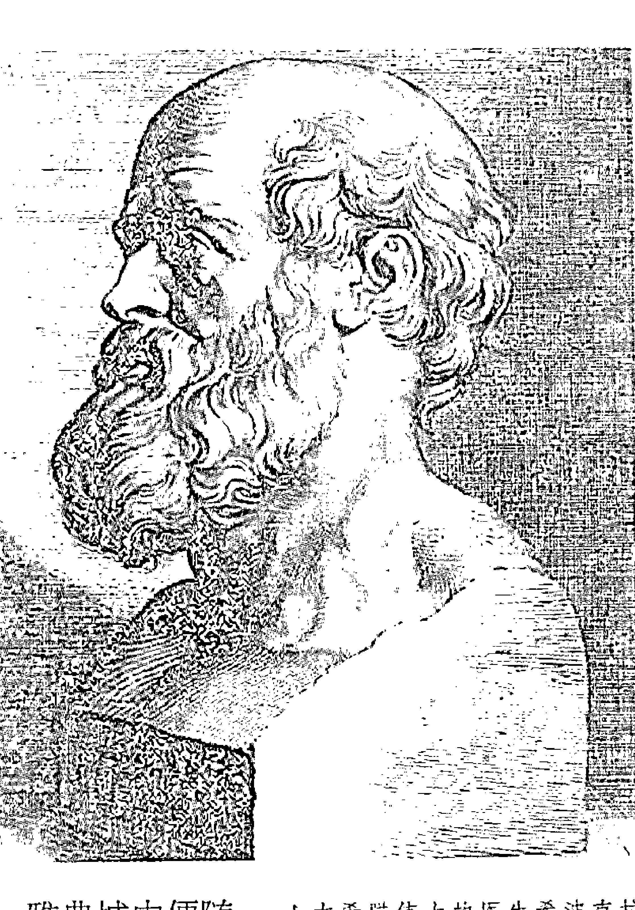

> | 古希腊伟大的医生希波克拉底，曾向他的门徒传授占星术

## 盖伦

与希腊时期相比，罗马人主要在医学占星术方面有了更进一步的发展，而其代表便是著名医生盖伦。

盖伦，公元129—199年，古罗马时期最著名最有影响的医学大师，曾担任罗马帝国皇帝奥勒利乌斯皇帝的御医，被认为是仅次于希波克拉底的第二个医学权威。

盖伦出生于小亚细亚爱琴海边一个建筑师家庭，早年跟随当地柏拉图学派的学者学习，17岁时跟随一位精通解剖学的医生学习医学知识。在古罗马时期，医学被认为是一门实用的科学，因此相对受到了重视。他一生写了131部著作，这些著作既反映了他的学术成就，也反映了他的敏锐观察能力和实践能力。

除了在解剖学和药物学方面的研究，盖伦的最重要成就是建立了血液的运动理论和对3种灵魂学说的发展。大约在公元前5世纪后期，毕达哥拉斯学派的菲罗卢斯认为人体具有3种灵魂：生长灵魂，这是人、动物和植物所共有的，在人体位于脐部；动物灵魂，这是人和动物所共有的，位于心脏，主管感觉和运动；理性灵性灵魂，只有人才具备，位于脑部，主管智慧。同一时代的亚里士多德分别称

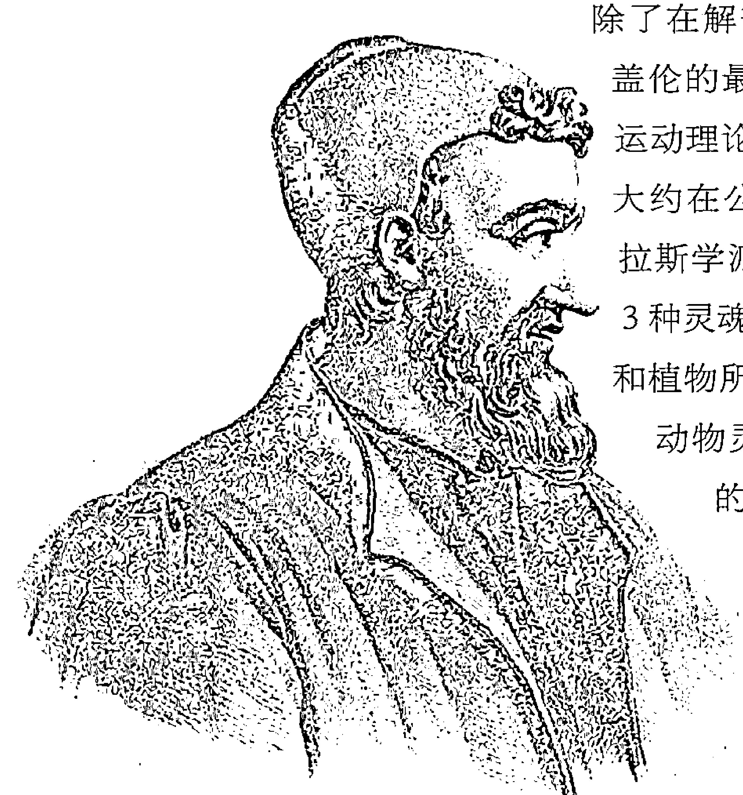

罗马时代的医生盖伦，对占星医学颇有研究

这3种灵魂为生殖灵魂、感觉灵魂及理性灵魂。植物只有生殖灵魂，动物有前两种灵魂，只有人才具备3种灵魂。盖伦则把这3种灵魂的说法与人体的解剖学、生理学知识创造性地结合起来，提出了所谓“自然灵气”“生命灵气”“动物灵气”的理论。在长期的行医过程中，特别是由于曾在科林斯和亚历山大城学习，盖伦也深受希腊医学占星术的影响。他认为好的医生也应该是哲学家，并接受了亚里士多德“在自然中一切都是有目的的”的观点，认为人体构造，如手上的肌肉和骨骼，都执行事先安排好的功能。他特别注意病人得病的时间，还要仔细考虑为病人施术时天狼星的位置。在他的一篇医学论文中，讨论了月亮和行星在黄道十二宫不同位置时对疾病及治疗的不同影响。

### 卡尔达诺

在占星术的第二个黄金时代——文艺复兴时期，西方世界涌现出一大批著名的占星家。与古代希腊—罗马的那些占星家所不同的是，这一时期的很多占星家都在其他领域内取得了巨大的成就，而他们在后人眼中的身份，也大多是天文学家、数学家，乃至物理学家、医学家、哲学家等等。还有一些占星家，则日益走向职业化，专门为各个阶层提供相关咨询。因此与古代的占星家比起来，他们对历史的影响似乎更为明显。在前一类人中，意大利占星家卡尔达诺堪称代表性人物。卡尔达诺，公元1501—1576年，出生于意大利帕维亚，卒于罗马，文艺复兴时期著名的数学家、医学家、物理学家、哲学家及占星家。

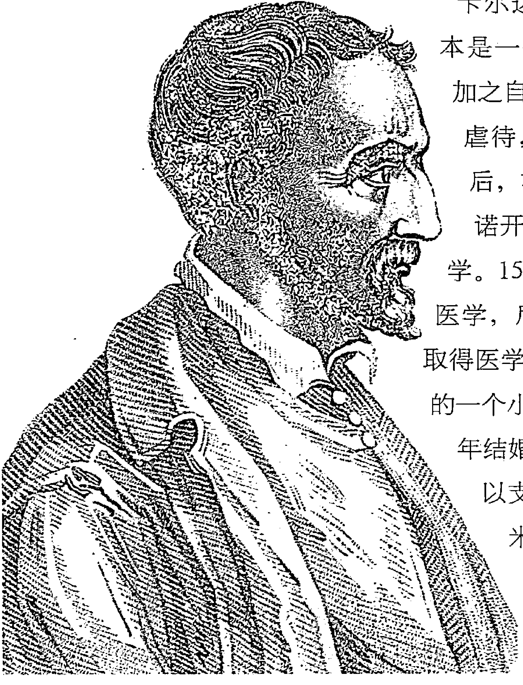

卡尔达诺早年的经历非常坎坷。他本是一个法官和一个寡妇的私生子，加之自幼体弱多病，因而备受歧视和虐待，而其性格也冷漠倔强。

长大后，在父亲的资助鼓励下，卡尔达诺开始学习古典文学、数学和占星学。1520年在帕维亚上大学时又学习医学，后转学于帕多瓦，1526年毕业取得医学博士学位，随后在帕多瓦附近的一个小镇萨科隆戈行医近6年。

1531年结婚后，卡尔达诺因收入微薄，难以支撑不断扩大的家庭，被迫搬到米兰居住以谋取公职。但由于他是私生子，米兰医学协会认为其出身卑贱，拒绝他加入该协会，卡尔达诺只好独自开业行诊，生活十分拮据。

1534年，在父亲一个贵族朋友的举荐下，卡尔达诺成为米兰专科学校的一名数学教师，在那里讲授几何学，同时任贫民院的医生，生活略有好转。他除了教学和诊病外，还潜心医学研究，自1536年起在威尼斯等地出版了几部专著，阐述一些理论问题，总结行医经验。

由于医术高超，逐渐在米兰取得声望。1539年，米兰医学协会重新接纳他为该协会正式会员。同年，卡尔达诺转到米兰的医学院任教，不久成为该院的负责人。1543年又到帕维亚大学任医学教授，几年之内便成为全欧洲闻名的医生。1552年，他还专程到英国爱丁堡为大主教及其他达官显贵治病。

不幸的是，1560年，卡尔达诺最宠爱的大儿子因

↑ 16世纪意大利百科全书式的学者卡尔达诺

犯“毒死妻子罪”被处决，这对他的精神打击很大。而他的小儿子则生活放荡，桀骜不驯。为摆脱烦恼，卡尔达诺于1562年转投波洛尼亚大学任教。

在科学史上，卡尔达诺的性格颇为奇特，他一方面在数学、哲学、物理学和医学中都有一定成就，同时又一直醉心于占星术和赌博的研究。1570年，他因为给耶稣算命而受到宗教法庭监禁，被起诉为异教徒。直到几个月后宣誓放弃异端邪说才获释出狱，但也因此失去了教学职位和学术出版权。1571年，卡尔达诺移居罗马另谋生计。在这里，他又因占星学研究而得到教皇皮乌斯五世的赏识，后者付给他终身年薪，将其留在教廷供职。

> 卡尔达诺一生都痴迷于占星术。遗憾的是，卡尔达诺的占星结果经常发生偏差

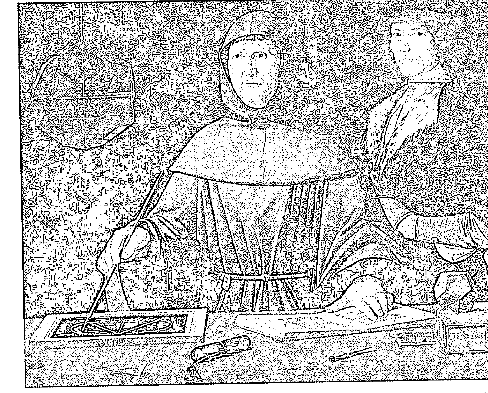

卡尔达诺被誉为百科全书式的学者，他一生共写了各种类型的文章、书籍200多种。除了作为正式职业的著名医生、医学教授、占星家引起注意外，人们还公认他为数学家、哲学家、物理学家。他的著作主要有数学方面的《算术实践与个体测量》《大术》，百科全书性的《事物之精妙》及其补充《世间万物》，他还在地质学方面最早提出水的循环理论。

在科学家形象的背后，性格怪异的卡尔达诺一生都痴迷于占星术，尽管这一兴趣曾多次给他带来灾祸。据说还在他年轻时，曾与著名的宗教改革家马丁·路德相识，两人因占星术而结缘。当时，马丁·路德在欧洲正如日中天，但这位宗教改革家却为自己的算命天宫图而烦恼。为了避免自己将来遭受厄运，他甚至改变了自己的生辰日期，试图通过这种方式避免灾难。但是马丁·路德的占星术造诣显然不够深，因为当卡尔达诺为他排算了天宫图后，却预言他在后半生仍将遇到坎坷。

1552年，身为当时欧洲著名医生的卡尔达诺专程前往英国爱丁堡，为大主教及其他达官显贵治病，在此期间，留下了占星术历史上的一段趣话。原来在英国时，卡尔达诺见到了当时年幼的国王爱德华。经过一番推算，他乐观地预测，这位国王将至少可以活到55岁。谁知令人尴尬的事发生了：没过几天，这位国王就去世了。为了替自己挽回颜面，卡尔达诺随后发表了爱德华的天宫图，并附上一篇文章辩解说：自己的预言之所以失败，是由于在计算时略去了一些细节，而这些细节的计算要耗费他100多个小时的工作量，他不过是“因懒惰而冒险”，这才铸成大错。更令人惊奇的事还在后面，据说在晚年时，卡尔达诺已为自己算定了归天的日期，可是到了那一天，他依然没有临终的迹象，于是历史上最不可思议的一幕发生了：为了使自己的“预言”应验，以维护自己占星家的声誉，卡尔达诺竟采取了惊人之举——自杀！

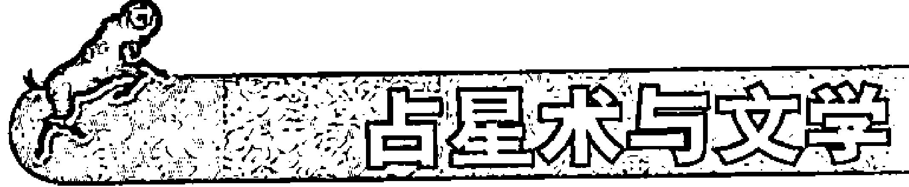

由于占星术在现实生活中有如此巨大的影响，因此一直以来，许多文学家和艺术家都从中汲取营养，在他们的作品中溶入了这种神秘的元素。

## 《达·芬奇密码》背后的悬疑

2003年3月18日，美国著名的兰登书屋出版了一本名为《达·芬奇密码》的小说。出乎很多人意料的是，该书一经问世，立即掀起了一股热潮。短短时间内，这本小说在美国的销售数量竟达750万册，而其全球累积销售量也突破了4000万册，成为有史以来最卖座的小说之一。至于小说的作者丹·布朗，原本只是一名没有多大名气的惊悚小说作家，教师出身，先前有过3部作品，但都反应平平。谁料《达·芬奇密码》出版后，一下子登上《纽约时报》等各大畅销书排行榜的榜首，好评如潮。的确，这绝对称得上是一部非常好看的小说，既混合了谋杀、侦探、解谜、悬疑、追捕等常规的畅销要素，又加进了大量艺术史、宗教史、象征学

↑《达·芬奇密码》的作者布朗

等文化佐料。其主要情节如下：

博物馆的馆长雅各·索尼埃是著名的象征学学者，死于谋杀。索尼埃的死状恐怖邪异，他被枪击中胃部，可是在生命的最后几分钟里，竟将全身的衣服剥去，仰面朝天躺在地上，四肢伸展开来，摆成一个达·芬奇名画《维特鲁威人》的姿势，并用手蘸自己的鲜血在腹部画了一个五角星，还在身旁写下几行谜样的数字和祷句：

> 13-5-2-21-1-1-8-5
O, Draconian devil
oh, lame saint

这些符号据说是数学史上最有名的斐波那契数列。数字重新排列后，变成1-1-2-3-5-8-13-21，每一个数字都是前两个数字的和。死者想通过这些符号告诉人们什么呢？

但是，难道事情就这么简单？

凶杀现场的真实照片有被警察悄悄擦去的最后一行文字：“P. S. 找罗伯特·兰登”。但苏菲知道那并不是说兰登就是凶手，只有她知道那个P. S. 不是“又及”的意思，而是她自己昵称的缩写，因为死者正是她的祖父。《维特鲁威人》是苏菲最喜爱的达·芬奇作品，那一串数字是为了把DCPJ密码破译处卷进来，是濒死的索尼埃向苏菲发出的最后召唤。索尼埃要苏菲找到兰登，是要他们一起合作寻找发现一个被保存了几千年的事关人类命运的重大秘密……

正如《哈利·波特》曾涉及了炼金术一样，在《达·芬奇密码》中，占星术的元素也很明显。正是由于它将各种神秘的社会文化和历史元素糅合在一起，因此深深地吸引了成千上万的读者。不过在另一方面，许多人认为《达·芬奇密码》曝光了基督教正统过去的真相，结果招致了来自天主教和其他基督教团体、历史学家、艺术史家及其他抱怨其研究粗糙的读者们的负面批评，甚至有历史学家认为丹·布朗歪曲甚至捏造了历史。

2006年5月，由哥伦比亚制片公司改编拍摄的电影《达·芬奇密码》在全球上映，主演为好莱坞巨星汤姆·汉克斯，女主角为奥黛莉·朵杜。

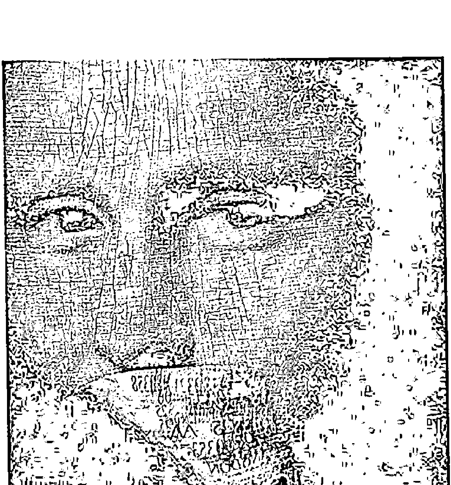

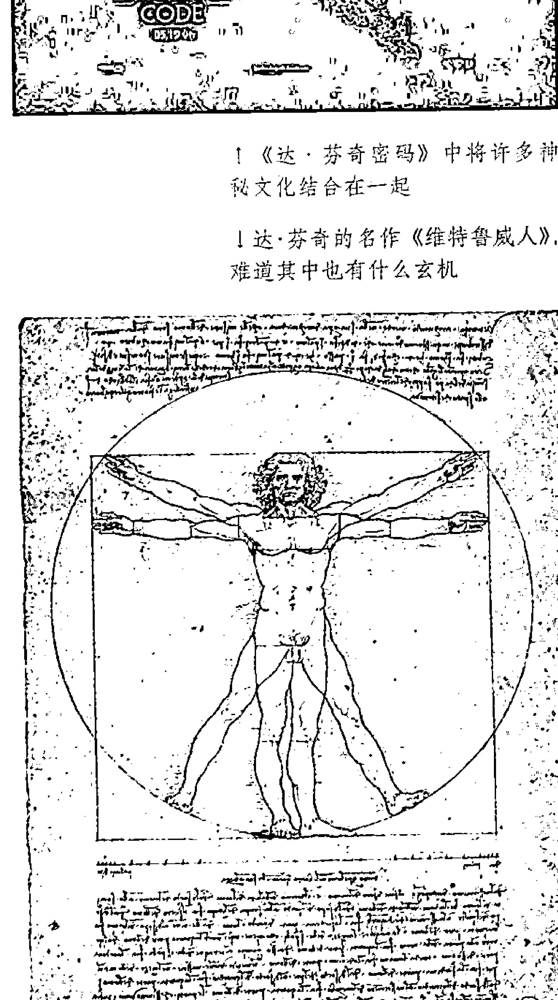

## 《神曲》中“天”的安排与结构

但丁是意大利的伟大诗人，曾系统学习过拉丁文、修辞学、诗学和古典文学，同时，但丁还精心研究过神学和哲学，古代教父圣·奥古斯丁的思想对他影响很深。《神曲》成书于13世纪末期，是但丁历时14年完成的长篇诗作，原名为《喜剧》。1555年后，人们把书名前加上“神圣的”修饰语，既表示了人们对但丁的崇敬，也暗示了此诗主题的庄严与深奥。

全诗长14233行，分《地狱》《炼狱》和《天堂》三部分，是但丁幻游三界的神奇描述。《神曲》是中世纪文学哺育出的一份瑰宝。但丁借助基督教救赎观念和地狱、炼狱、天堂三界的神学教义来订出全诗的结构，将复杂的素材纳入严谨的构架之中。

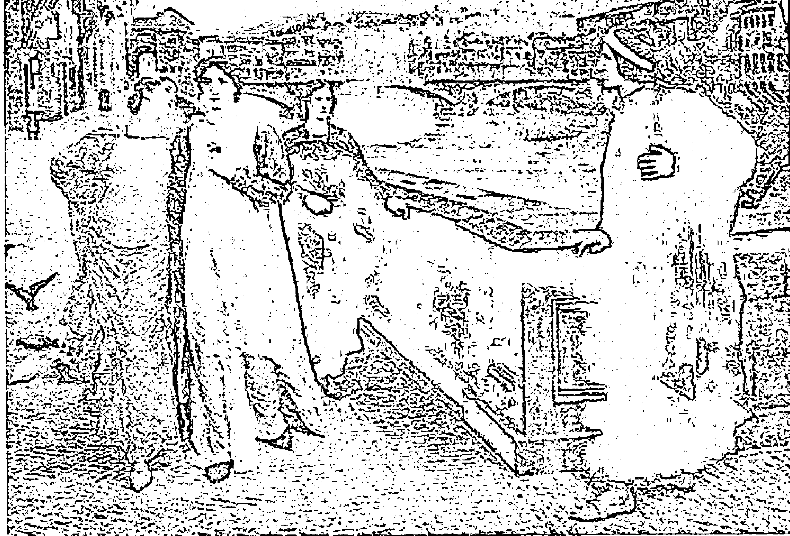

诗中的许多人物虽说是诗人笔下的鬼魂，但依然被写得有血有肉，一个个性格非常鲜明，令读者难以忘怀。

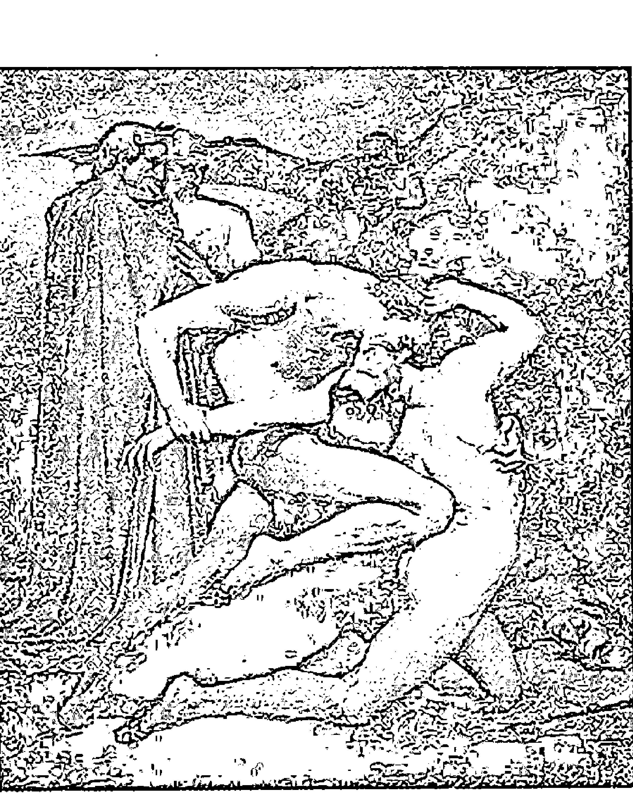

在诗中，但丁说自己迷失于一座黑暗的森林（象征罪恶）之中，而唯一的山口，却被象征逸乐的母豹、象征野心的雄狮和象征贪婪的母狼挡住了。正在此时，罗马大诗人维吉尔来了，对但丁说：他受别人之托，来给但丁指明另一条路径，帮助但丁脱离险境。然后又带着他游历了地狱、炼狱和天堂。

在《神曲》中，但丁对占星学持贬斥态度，但是他对“天”的结构的知识，却依旧未脱离中世纪星占学家们的常规。这可以从《天堂篇》中看到——

突然间，天空彩霞万道，但丁顿觉身心清爽，已由贝阿特丽齐带领着进入了天堂。整个天堂气象宏伟，建筑庄严，流光溢彩，处处都充满了仁爱和欢乐的气氛。天堂共有九重天，分别叫太阳天、月球天、水星天、金星天、火星天、木星天、土星天、恒星天和水晶天，所有的天使们都住在这里。

“天”，也就是那时人们所知道的宇宙。在这一同心宇宙结构中，地球毫无疑问正在中心位置。关于“天”的安排与结构，还常被现代人引作中世纪欧洲人对宇宙结构认识的例子。

但丁笔下天堂的九重天结构，主要是以被教会接受的托勒密天体论为依据的。诗中所谓的“永久的轮盘”，主要是指宇宙是由同一个轴心上的九重天构成的球面体。

## 《太阳城》中的设想

托马斯·康帕内拉，意大利文艺复兴时期的空想社会主义者、哲学家、作家。1568年9月5日生于意大利南部，1639年5月21日卒于法国巴黎。1582年入多米尼克会。公元1591-1597年间，因发表反宗教著作3次被捕，先后坐牢6年。1597年12月获释。被勒令返回故乡后，因参与领导南意大利人民反对西班牙哈布斯堡王朝的斗争，于1599年9月被西班牙当局逮捕，度过27年的监狱生活。1628年7月获释后，继续参与组织家乡人民的反西班牙起义，不幸又因叛徒告密而失败。1634年10月逃亡法国。他的著作有《太阳城》《论最好的国家》《感官哲学》《论基督王国》《神学》《诗集》及《形而上学》等。

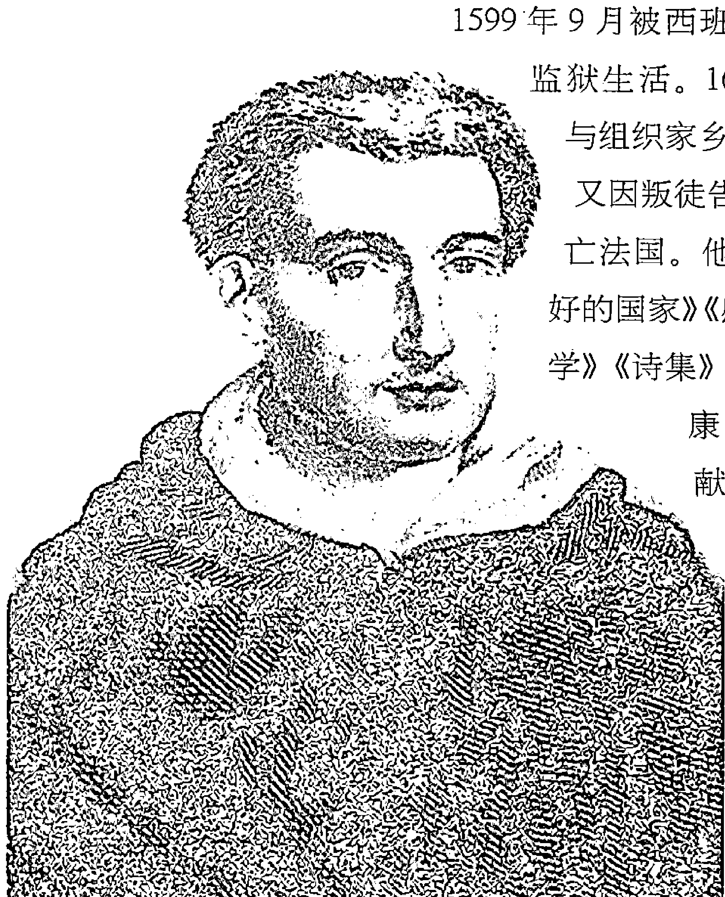

康帕内拉对后世最杰出的贡献，是他的代表作《太阳城》及其空想社会主义思想。值得一提的是，由于康帕内拉本人也精通占星术，加上当时社会风气的影响，在《太阳城》中，还有大量有关占星术的描写。《太阳城》假托一位“航海家”向人讲述他远航中去过的一个城市——太阳城。太阳城的最高领导者被称为“太阳”，只有最贤明、最博学并具有正直、仁慈、慷慨……所有美德的人才可出任此职。作者还强调，在这位“太阳”必须懂得的学问之中，占星术是特别重要的几项之一，因为城中的许多工作和活动都必须由占星术来加以指导。

首先，太阳城是一座理想之城、幸运之城，当这座城建立的时候，就由占星家们进行了严密推算。

> 作者写道——
> “当他们建立自己的城市时，曾确定宇宙四个角落的固定标志。在占星表中：

+   太阳以东的木星处在狮子宫；
+   水星和金星处在巨蟹宫，但它们在近处，所以形成了同行；
+   火星处在人马宫，即第五室，因为阿费塔和占星表扩大了，所以是吉祥的方位；
+   月亮处在金牛宫，这是对水星和金星有利的方位……
+   土星力图处在第四室，但绝不会危害太阳和月亮，而且能促进基础的加固。
> ……所以他们的星相学是值得重视的。”

### 占星促成了《太阳城》问世

在反抗西班牙人的统治而被关入监狱20多年后，年老体衰的康帕内拉只能在狱中写作自己的《太阳城》，谁料就在这时，一个重大的机遇降临了：谣传教皇乌尔班八世将于1628年9月死去。恰在这时，有人向教皇推荐被关押的康帕内拉，说他精通占星术，懂得如何避免灾难。康帕内拉到来后，过了9月，教皇仍没有死。后者深信，这无疑是康帕内拉的法术起了作用，由此对康帕内拉感激万分，还允许他公开发表作品，而当康帕内拉完成了《人如何能避免星辰所预示的命运》一书后，教皇更是决定给他人身自由。

其次，太阳城统治地区的农业生产是“根据风向和星座所处的良好位置”去进行的；畜牧业也依赖占星学的指导，例如，让马交配的时刻必须是“人马座处在星占表中火星与木星的良好方位上的时刻”，牛交配的时间要由金牛座的位置决定，羊交配的时间则取决于白羊宫的位置，如此等等。太阳城人患病时，“就要观察星象进行祈祷，并吃各种草药”。太阳城的居民人人都各尽所能，“每个人在根据自己的禀赋进行工作时都能胜任，且愉快地履行自己的义务”，因为“每个人的职务，都是从童年起就根据他们的爱好和他们诞生时辰星象的配合而确定的”。

最后，康帕内拉借那位“航海家”之口，大大谈论了一通太阳城人的占星观：星象是赞成人类善的意志的，星象是赏善罚恶的；星象与技术的发明、法律的演变、宗教的传播、王朝的更替、女性的掌权，以及淫乱、卖淫、道德败坏等等都有密切关系。

# 第五章 现代社会中如何占星

占星术可以理解为一种符号系统，这些符号分为星座、宫位、行星、相位等几部分。行星与行星的组合，相位的组合，行星与星座的组合等，都会有特殊的含义。占星学家为每个符号都总结了关键性的形容字诀，当我们去解读这些符号时，必须运用丰富的想象力，才能了解到文字以外的一些东西。

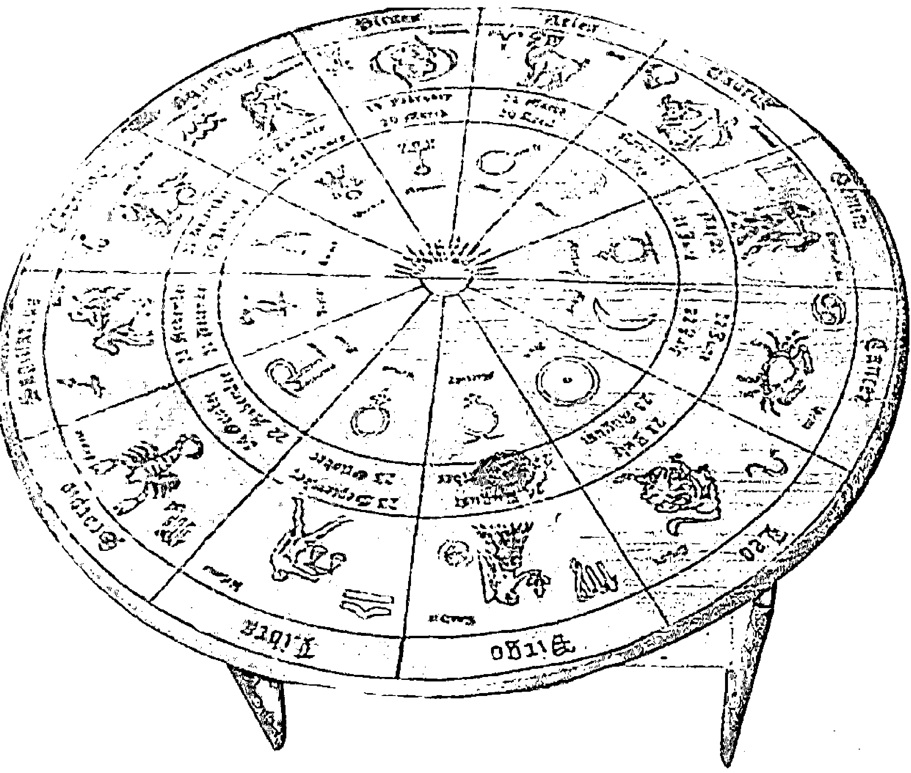

## 从认识十二星座开始

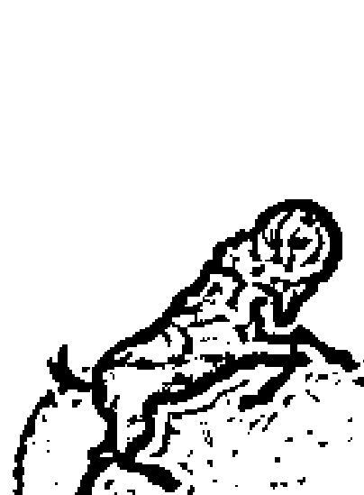

在宇宙中，星体之间并没有什么实际的关系，只是散乱地排列在那里，把位置相近的联系起来，就成了星座。占星学认为，黄道十二星座的形象，是在以某些因果性或非偶然性的方式，预示着人间万物的变化。在占星学中关于星座还有众多优美的来历，下面是希腊神话中的诸神以及与十二星座的关系。

## 白羊座（牧羊座）

大旱之年，狠心的继母以祭天为由要除掉被赶走的王后所生的双胞胎儿女。王后急忙向天神求助，求得金毛有翅公羊。行刑那天，公羊将小王子、小公主救走。由于速度太快，顽皮的妹妹跌落大海，而开朗的哥哥则安然无恙。尽职的公羊一边回头努力寻找妹妹，一边全力守护哥哥，因而形成现今的白羊座。王子的乐观和公主的粗心也因此成为此星座最大的特点。

## 金牛座

美丽的公主欧罗巴玩耍时，发现有一头牛特别高贵华丽。欧罗巴欣喜地跳上牛背，忽然间牛全速奔跑起来，将公主带到一座岛上。高贵的牛其实是天神宙斯的化身，这一切都出自爱神维纳斯的安排。因为公牛渡海时身

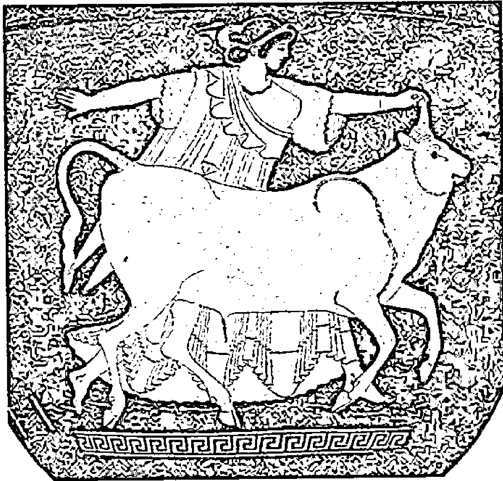

美丽的公主欧罗巴和牛玩耍体大部分都在水下，所以星座只看到牛头、牛肩及一双前腿。
金牛座因此而成爱与美的象征。

## **双子座**

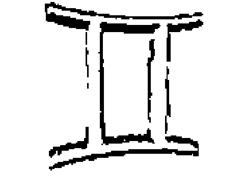

斯巴达王妃有两个可爱的儿子，大儿子是与天神宙斯所生，具有永恒的生命力。在一次争执中，弟弟被人刺死。为救活弟弟，哥哥同意将生命力的一半分给弟弟。虽说弟弟会因此救活，但哥哥却会变成一个凡人，随时都会死去。天神宙斯深为这份兄弟情深感动，就以兄弟俩的名义创造了一个星座，这就是双子座。

## **巨蟹座**

天神宙斯与凡间女子生下神子，因受到善妒的天后诅咒，神子犯下许多罪行，为了能将功抵罪，他奉命挑战极危险的项目，其中有一项是制服躲在沼泽附近洞窟内的蛇妖。九头巨蛇其中有 8 个头是杀不死的。为了阻止他达成任务，天后派巨蟹紧紧钳住神子的脚想使他动弹不得，结果巨蟹被踩碎，蛇妖也被成功制服。蛇妖和巨蟹分别成为长蛇座和巨蟹座。

## **狮子座**

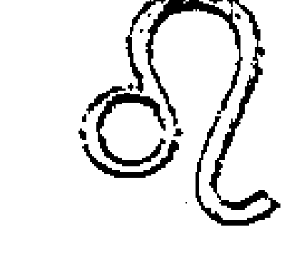

杀死住在神殿附近的狮子也是神子为了赎罪完成几乎不可能的任务之一。狮子有着刀枪不入的厚皮毛，怒吼起来摄人心魄，神子与其搏斗很久，将其勒死。巨狮的利爪被斩下，狮皮被做成战袍，狮头被制成头盔。狮子被放在天空，以让抬头可见。

## 星座符号释义

### 处女座（室女座）

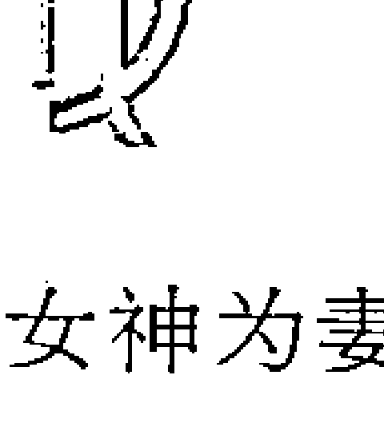

白羊座用羊的角表示。
金牛座象征牛的头部。圆圆的牛脸代表着安逸和享乐，但尖尖的牛角提示着脾气不是太好。
双子座表示双胞胎兄弟，比较抽象。
巨蟹座像胸。
狮子座像狮子的心脏和尾巴。
处女座象征着清纯的少女头发。
天秤座像一杆秤子。
天蝎座像蝎子的尾巴。
射手座表现为射向目标的一支箭。
摩羯座像羊头和鱼尾。
水瓶座象征着流水和空气中的波。
双鱼座是一条丝带将两条鱼连接在一起。

冥王欲娶春天的灿烂女神为妻，将其带回地府。女神的母亲是大地之母、谷物之神，听到呼救声，立刻扔下了手中的谷物，开始寻找女儿。人间因为没有了大地之母，种子不再发芽，土地不再生长麦穗，人类面临着巨大的灾难。女神后来得以重返人间，当她回来时就是春天，而每年尚需四分之一时间留在地府，这时就是大地结霜、寸草不生的冬天。
女神就是处女座的化身。

## 天秤座

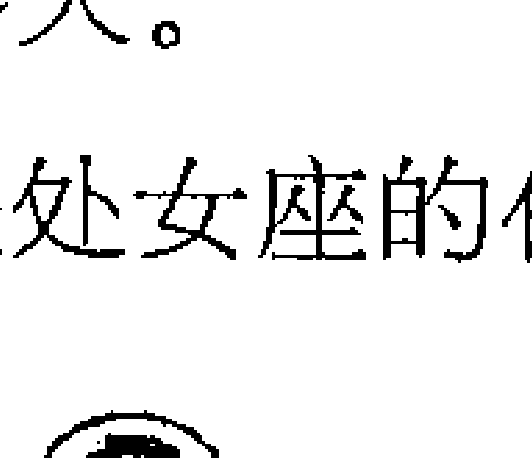

众神和人原本和平共处大地上，但人越来越好争斗，恶业横行，战争频起，打打杀杀，惹得神越来越失望。最后众神返回天上，只有正义女神留守人间教人为善。她一手持秤，一手握剑，天秤的功用是为人类做善恶裁判，剑的作用是斩除邪恶。为求公正，她的眼睛始终蒙着。
天秤座是正义、和平、公正的象征。

## 天蝎座

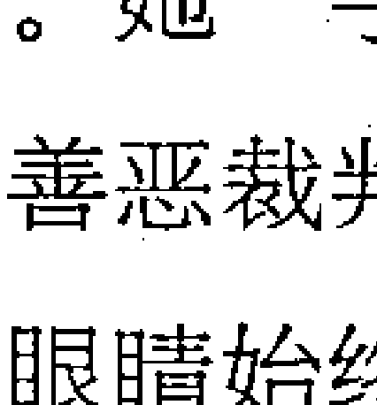

天蝎奉命去降服傲慢无礼的神的儿子，偷偷溜到毫不知情的神子身边，以毒针向其后脚跟刺去。此后，每当天蝎从东方地平线上升起时，猎户便从西方匆匆离去。两星座远居天空的两侧，永不会同时在天上出现。

## 射手座（人马座）

射手生性善良，聪明、高尚、崇尚自由、不受拘束，对人坦诚真挚，谦逊有礼，受到全族人的尊敬和爱戴。有一天被大力士的毒箭误射身亡，身体碎成了无数的星星，飞到了天空，聚集成人马的样子，似乎还能看到那支在胸前的箭。

## 摩羯座（山羊座）

牧神潘是众神传信天使的儿子，相貌奇特，有着山羊角、蹄及胡子，以美妙的笛声闻名。有一次正在为众神吹奏时，突然蹿进来一个多头怪物捣乱。慌忙中潘跳入水中，不料因为太过紧张，只有下半身变成鱼尾，而上半身仍旧还是山羊的样子。羊的模样。这便是摩羯座神话由来。

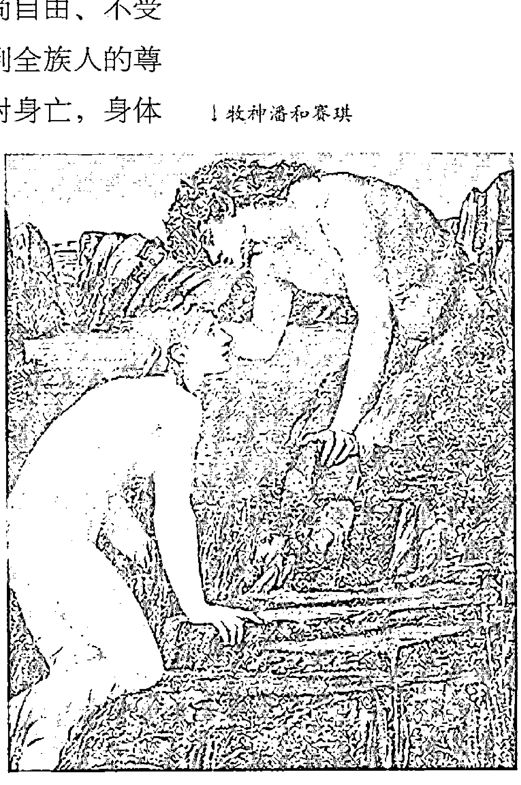

## 水瓶座（宝瓶座）

年轻英俊的特洛伊王子被强迫为天界的水瓶侍者，永生永世为宙斯服务。只是，水瓶中倒出来的却不是水，而是眼泪，众神无不为之动容。少年提壶斟酒的形态让人念念不忘，宝瓶中的液体成为众神智能的源泉。忧伤的神灵，永远留在了天上。

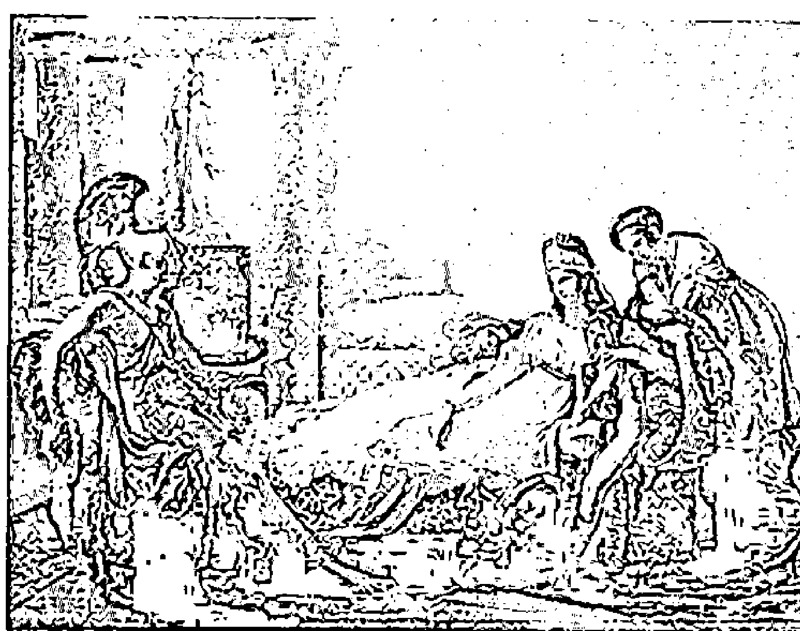

## 双鱼座

怪物将神之宴会搅得一塌糊涂。众神除了逃跑，没有别的办法。爱神丘比特被妈妈拽入河中，两人变成两条鱼来脱险。因为担心儿子有闪失，母亲便扯下身上一片衣服作为丝带系住儿子的脚，母子俩就这样以尾巴相连、永不分离的姿势升天，这就是双鱼座的由来。

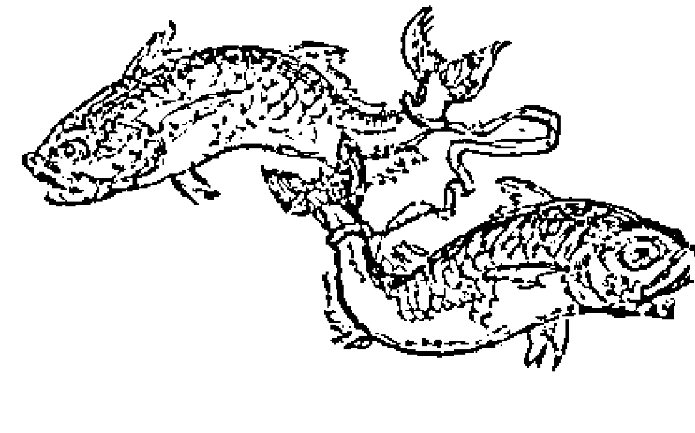

## 如何克服性格弱点

白羊座是孩子气的强人，具有光明、热情的本质，不畏困难，自我牺牲，有正义感。最恐惧输给别人，虽然是乐天派，但凡事也要稳着点。幸运地点是繁华的大都市。

金牛座喜欢自然的感觉，爱美、热情、冲动、温柔、敏感、害羞、依赖。最恐惧改变，如果偶尔跨出保守，将是良性的冒险。幸运地点是安静的郊外。

双子座习惯用两个自我来看世界，有文学细胞、聪明、思考、善变、攻击性及两种个性。最恐惧落伍和别人有自己没有，好奇、好动、好玩将使人生更精彩。

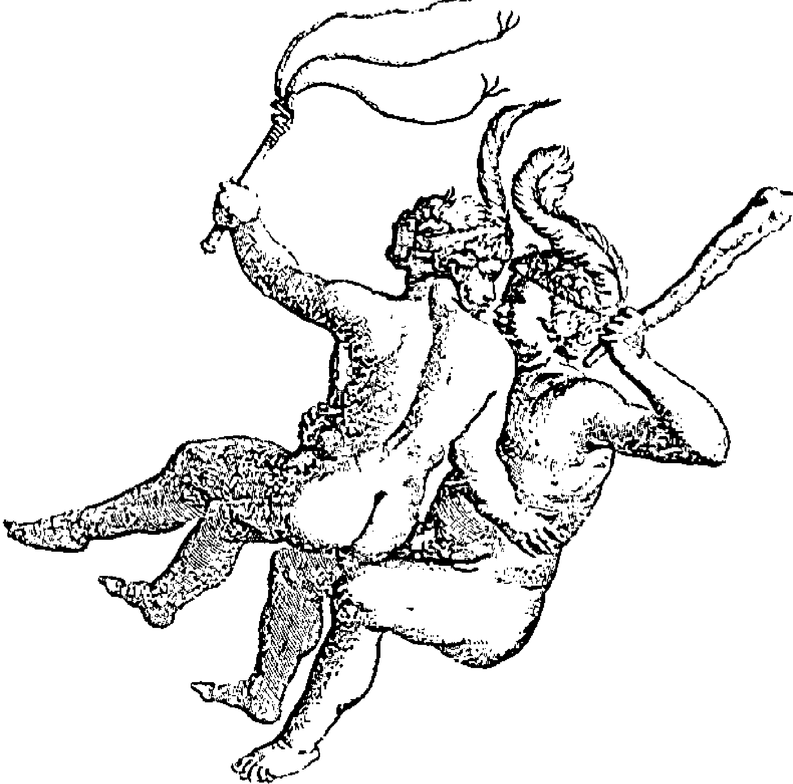

↑双子座

幸运地点是高于海平线的地方。

巨蟹座是月亮代表自己的心，很会保护自己，好吃、有怀疑心但也有同情心，母性化。最恐惧没安全感，要注意减少情绪风暴发生的次数。幸运地点是海边、接近水的地方。

狮子座是最忠实又热情的朋友，有生命力、攻击力、开创力，有勇气、名望和王者之风，但也要小心伤人，或被伤害的痛苦、精神上的压力。最恐惧没面子，小心被强烈的自尊心反咬一口。幸运地点是宽阔的场所。

处女座是天生的完美主义者，大多有正义感、善恶分明、智能型、有观察力、单纯，也因要求完美而太苛求及保守、冷淡、神经质。最恐惧犯错和挨批评，要注意小细节，抓住大方向。幸运地点是小城市。

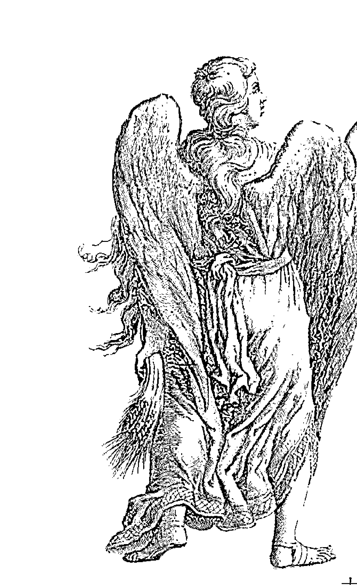

天秤座永远都在追求平衡，公平正义，好交友，有审美眼光，虚荣心强，感情时脆弱、被动。最恐惧孤单没朋友，持中庸之道将享受平稳人生。幸运地点是人多的地方。

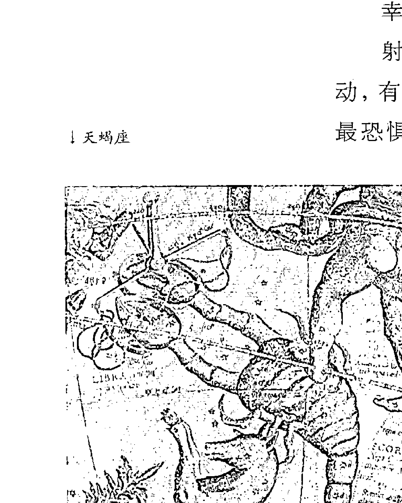

天蝎座徘徊在圣人与罪人之间，具有敏锐的观察力、慷慨、同情心，也很情绪化，做事勇往直前，小心努力不够而致功败垂成。最恐惧背叛、没权威，切记可以孤独，但勿封闭。幸运地点是近水的地方。

射手座追求绝对的自由，积极、外向、好动，有时也有固执、不受拘束、爱好自由的个性。最恐惧失去行动自由和被叮咛，自由将助其接近阳光。幸运地点是一望无际的野外。

摩羯座的巅峰是永恒的诱惑，具有山羊的个性，温和保守，有耐力，执著，易受人激怒，也属踏实型。最恐惧没钱和出糗，踏实的作风将助其达成目标。幸运地点是远离嘈杂的静僻之所。

水瓶座是好奇的解谜者，聪明理性，独立自主，有美感，也较善变、神经质。最恐惧没有心灵自由，应加强热爱知识，丰富精神生活。幸运地点是现代都会区。

双鱼座拥有充满神秘及智慧的灵魂，天生仁慈大方、温和，爱幻想，神秘，情绪化。也有两种明显的个性，一种是非常乐于与他人相处；另一种则是相当保守及冷漠。最恐惧现实压力，应加强锻炼意志力。幸运地点是海边。

### 如何选择最适合的事业

白羊座的关键词是“开拓”，特别需要专业的上司。勇战派奋斗型的白羊座擅长脑力激荡，不管前路有多少障碍，只会愈战愈勇，凡是符合挑战的职业都适合羊儿，如冒险、从军、运动员、消防。事业软肋表现为喜欢出风头，如果一定要做第一，就要切忌冲动，最宜采取突击手法。最佳搭档是摩羯座，实干第一的摩羯会帮你收拾残局，让你冲起来无后顾之忧。

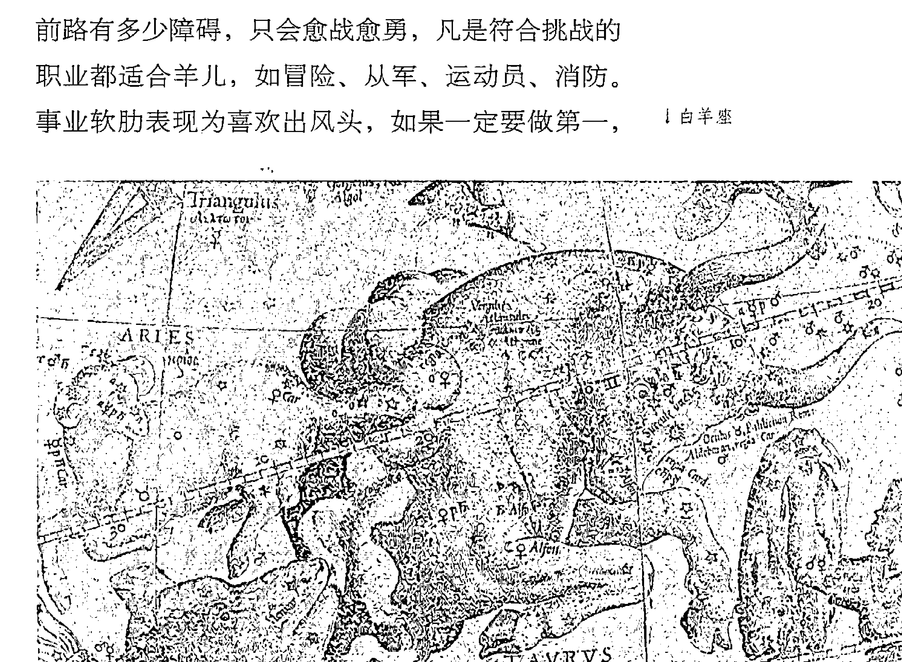

金牛座的关键词是“获得”，控制情绪能使眼光更犀利。金牛座天生拥有会算账的头脑，强调实践的行动力，在工作上考虑得周详而务实，并且具有出色的品味，适合服装设计、雕刻艺术、销售。事业软肋表现为懦弱保守，划地为限，最怕没有工作、缺乏收入和没安全感，要明白成功需要付出，不可懒散。最佳搭档是水瓶座，瓶子可以忍耐你的慢性子，规划好了你做执行，将卓有成效。

双子座的关键词是“传递”，反应灵活，工作表现一向杰出。双子座拥有能言善辩的天赋本钱，相当重视人际关系的建立，喜欢探索各方面的消息，五花八门的传播事业和日新月异的信息产品工作将使变幻的双子座如鱼得水，适合新闻业、企划。事业软肋表现为以幼稚的行为引起他人的注意，在工作场合扮小丑以引起他人的注意，如此很难得到他人的尊重，不宜随时转变方向。最佳搭档为天蝎座，这个星座不怎么说话，但做得很好。

巨蟹座的关键词为“安置”，研究的精神终使事业有成。巨蟹座是一个重视生活细节的星座，做事低调，不喜欢太多激烈的竞争，不适合去学过于热门的学科，适合从事一些非前线又有同情心的工作，如护士、教练。事业软肋表现为固执又不认输，在奋斗期间要注意避免暂时的困境而导致的悲观情绪，过得开心已是最大的成就。最佳搭档为双鱼座，遇到工作上的麻烦，细心又体贴的双鱼很愿意听听你的烦恼，帮你舒缓情绪。

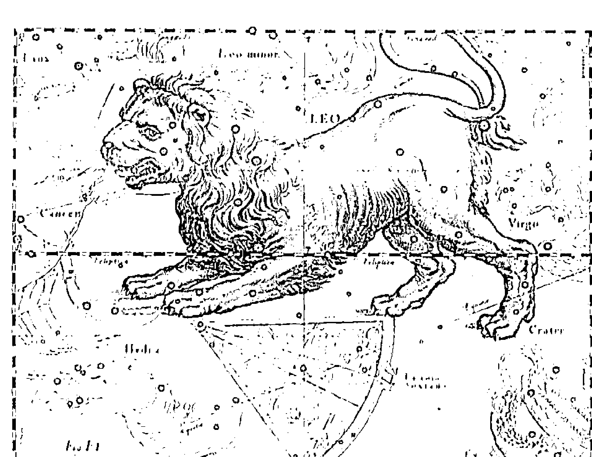

狮子座的关键词是“展现”，上进心让你绝对发光。狮子喜欢出风头，不能从事太过于没地位的职业，这会严重地损伤自尊心，适合从事一些管理与决策性的工作，如演艺事业、体育界、政治家。事业软肋表现为妄自尊大，过于自负，注意不要被胜利冲昏头脑。最佳搭档为金牛座，金牛根本不在乎你以喜恶来对待他人的态度，只要你为他带来实际利益，他很愿意全力为你提供帮助。

处女座的关键词是“使用”，一丝不苟让老板很放心。处女座最大的优点是细心，适合一些需要专注和细心的工作，如书画编辑、科学研究、办事员、会计出纳。事业软肋表现为斤斤计较，任性挑剔，其实事情并非想象得那么复杂，不要想太多。最佳搭档是天秤座，天秤会给你最适当的评价和鼓励，你的啰嗦在他们来说反而是智慧的体现。

天秤座的关键词是“结合”，能维持工作场合的和谐。极富正义感并有着理性和谨慎的性格，对天秤座人来说美与和谐是人生最重要的事。同时因上天赐予天秤座出众的口才，这些能说会道的本事，将对职业生涯大有裨益，适合做美容师、外交公关、司法人员。事业软肋表现为爱卖弄小聪明，要赢人必先要赢自己，克服犹豫不决就是成功。最佳搭档是白羊座，白羊的冲劲会是你前进的动力，跟着一起冲就是了。

天蝎座的关键词是“再生”，惊人的专注力是成功的踏脚石。天蝎座的人对工作有权力欲望和野心，对于自己所喜欢的工作，可以显露出无限的热情，而神秘性质的职业也最能展现蝎子细腻察觉的本事，适合灵媒、中医、心理学、文字工作。事业软肋表现为报复心强，易意气用事，记住野心再大也得按步骤来，因其鲜明的个性不适于团体作战最好独自行动。最佳搭档是狮子座，狮子热情的太阳能量将使天蝎从疑神疑鬼中走出来。

射手座的关键词是“扩展”，再多点耐性就平步青云了。对于各类新事物抱着尽量吸收的心态，在职场上最容易展现高度的学习能力，追求自由的个性使其绝对不喜欢成天坐在屋里的学科或职业，适合做外交人员、旅游业者。事业软肋表现为追求刺激，爱走偏锋，一定要有充分的发展空间，如果他们整天埋在刻板的工作中，就算职位多高，也没有成就感可言。最佳搭档是巨蟹座，巨蟹超强的组织能力会帮你打理不耐烦的所有杂事，免得你玩昏头而忘掉工作。

摩羯座的关键词是“杰出”，不屈不挠迟早会成功。这个星座是名副其实的超级工作狂，行事作风保守稳健，希望学过的东西可以用一辈子，易从事稳定而没有风险的行业，如建筑雕刻、从政、技工。事业软肋表现为总认为自己的才能不像别人想象中那样好，要相信自己，要成功就得从自我设限中走出来。最佳搭档是射手座，射手们超灵活的脑袋，可以将羯子的能力发挥到极致。

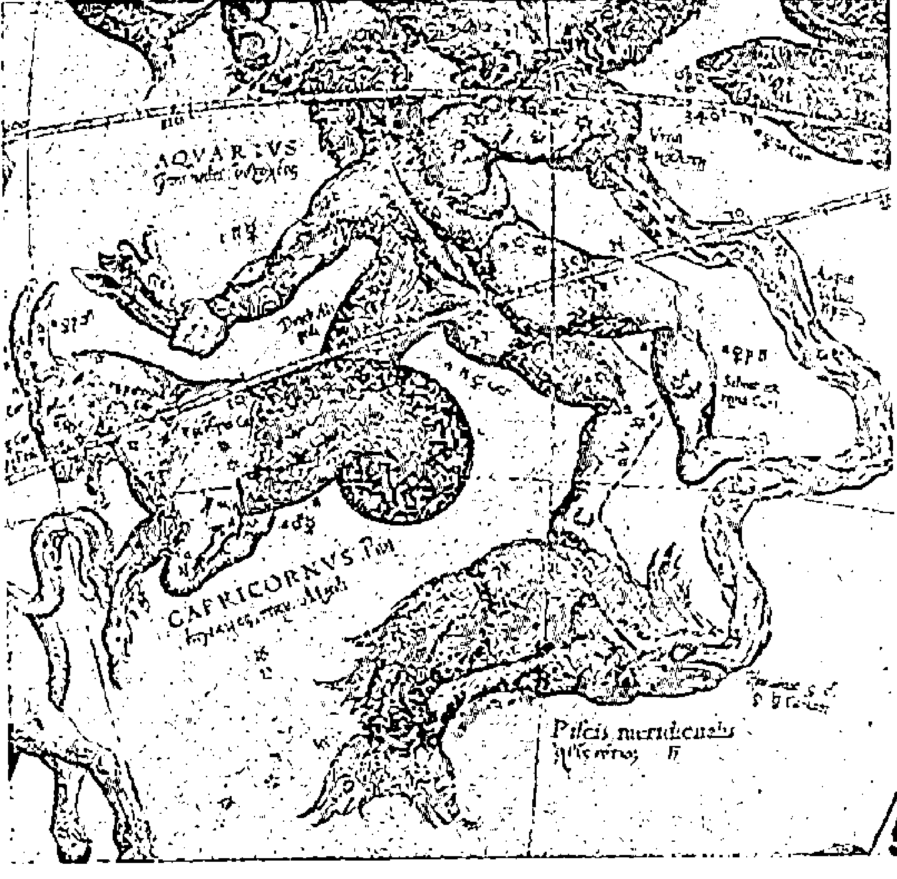

水瓶座的关键词是“认识”，在自由的环境中能最大程度地发挥才能。这个星座常被称为天才星座或未来星座，好奇心强得一塌糊涂的瓶子拥有发掘、开创新事物的能力，适合创意和发明创造性工作，如发明家、广告创意、业务代表。事业软肋表现为执拗多疑，心胸狭隘，整日疑神疑鬼，总在揣测别人的动机，计较同事是否在背后算计自己，必须知道何为自己所需。最佳搭档是处女座，制式化工作就让细心和耐性的处女座帮忙好。

双鱼座的关键词是“提供”，敏感的特质适合从事艺术行业。需要想象力与创造力的艺术简直就像是为鱼鱼们量身打造，有时随意性弄弄就是经典，在选择职业时还要兼顾闲散模糊的特性，不宜选太大压力和责任的工作，适合社工人员、文字工作者、宗教传播。事业软肋表现为只说不做，过于感情用事，要有想法还要有行动。最佳搭档为双子座，个性类似的双子座冷静得多，海量的资讯和建议可以帮鱼鱼们从幻想中早点回到现实。

## 如何在爱情上扬长避短

白羊座的感情强烈直白，一旦动了真情就会非常冲动，情愿为了彼此的爱，牺牲很多东西。相处技巧是“用火热的心去融化对方吧”。这个星座最容易被天蝎座吸引，只有天蝎座的人才能使白羊座的人爱得死心塌地。约会场地挑人多的地方，如迪厅、私人聚会、爵士乐酒吧；定情之物可选鲜花，羊儿们希望自己能同花儿一样保鲜。

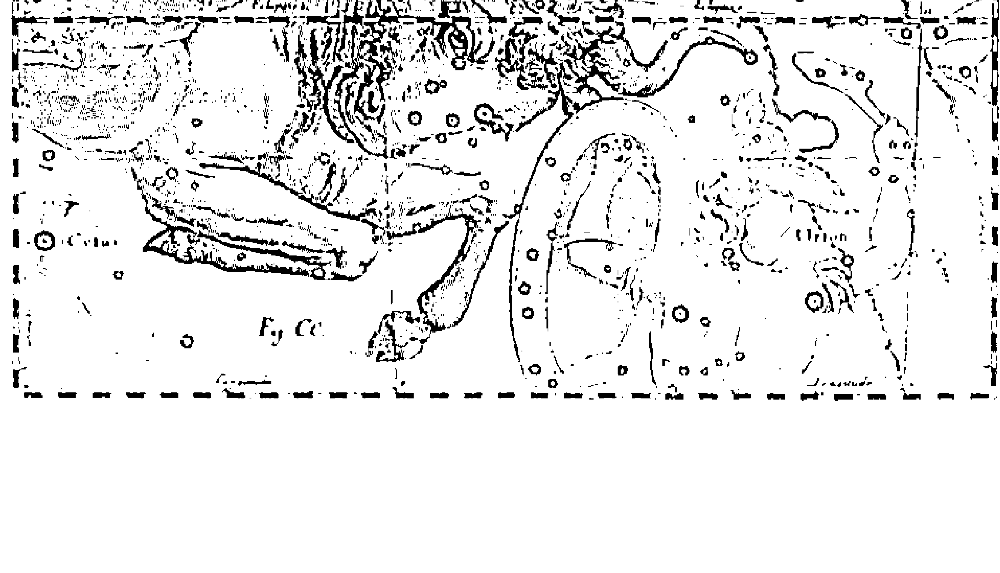

金牛座的倔强个性体现在爱情里，显得非常的死心眼，对对方充满了强烈的依恋和温存，最怕辛苦经营一场空。相处技巧是“与其三思不如行动”。这个星座最容易被天秤座吸引，所谓情人眼里出西施。约会场地切记唯美浪漫，如高层办公室的落地玻璃飘窗前、林阴道、幽静咖啡馆；定情之物可选项链，对金牛座来说礼物的价值可以判断受重视的程度。

双子座风趣幽默，是爱情游戏的高手，但只限感觉对了才爱，且从不谈天长地久，每天感觉可能都不一样。相处技巧是“不失为优秀的情人，但是要做一位合格的伴侣，要学习的还有很多”。这个星座最容易被巨蟹座吸引，巨蟹座的人使得双子座神魂颠倒。约会场地借助有朋友在的地方，如朋友家里，有朋友陪伴的电影院、麦当劳；定情之物可选手机，符合双子爱说话的特性。

巨蟹座的爱是恒久忍耐，至死不渝，一旦选中目标，就视为终身伴侣，承受不起失恋的打击，非常脆弱。相处技巧是“火热的态度将让恋爱更幸运”。这个星座最容易被处女座吸引，处女座几乎是一生最重要的人。约会场地除家里以外的任意地方，如浪漫海边，温暖的朋友聚会也不错；定情之物可选宠物娃娃，能激发蟹们母爱的礼物就是最好的礼物。

狮子座爱得纯真，对待伴侣非常坦诚，没有一丝保留，始终信奉爱一个人就爱对方的全部。相处技巧是“如果爱就是霸气，谁又能逃离强有力的狮爪呢”？这个星座最容易被摩羯座吸引，若没有摩羯座便如没有了生命色彩。约会场地挑刺激场所，如有过山车的游乐园、蹦极、野外生存地；定情之物如品牌服装，符合狮子好面子、什么都想用最好的特性。

处女座最喜欢挑挑拣拣，是完全的洁癖主义者，不会容忍神圣的爱情受到一丝的侵犯，如果事与愿违，那么情愿放弃全部爱情也不会保留残缺的美。相处技巧是“放宽标准，情人就很完美”。这个星座最容易被金牛座吸引，源自金牛座的独特魅力。约会场地浪漫安静即可，如图书馆、环境优美的大学校园；定情之物可选知名景观的缩微版饰品，这会让处女座感觉很受重视。

天秤座自己都搞不清楚爱不爱对方，最爱双人拔河。爱情忠告是“试着热情拥抱主动敲门的爱情吧”。相处技巧是“伴侣必须要懂得爱情对于这个星座来说既要长久又要充满激情，完美爱情是天秤一生都在追求的东西”。这个星座最容易被巨蟹座吸引，被巨蟹座影响一生幸福。约会场地须具备美感，如美术馆、茶艺馆；定情之物可选沙漏，“∞”一样的外形代表着无穷大与永恒，这正是天秤想要的。

天蝎座一面酷酷地说：背叛爱情者死，一面对着诱惑意乱情迷，不爱则已，爱就死去活来。相处技巧是“别压抑，炽烈的火焰本是蝎座本色”。这个星座最容易被狮子座吸引，狮子座的雄风能把天蝎座完全钳制住。约会场地尽量挑人多的地方，如海边、有个性的餐馆酒馆；定情之物可选信件，真挚的感情最能打动蝎子。

射手座用眼神、行动表达“你就是我的”，爱得十分强烈，可谓见一个爱一个。相处技巧是“挣脱一切束缚，走向新生活，哪怕未来的情路并不好走，依然要勇敢前进”。这个星座最容易被白羊座吸引，对白羊座的人永远不离不弃。约会场地选容易表现之处，如足球场、火车上、露天广场；定情之物可选饰品之类，不拘小节的射手不太在意礼物。

摩羯座寻找的是一个可以共赴未来的知心爱人，小心翼翼地保护自己，保护自己的爱情。相处技巧是“主动点，别害羞”。这个星座最容易被水瓶座吸引，水瓶座的人能使这个星座的人爱得疯狂。约会场地可往“田园”走走，如河滨公园、田间小道、海洋馆；定情之物可选围巾，什么能比暖身暖心的礼物更能让蝎子动情呢？

水瓶座永远在模糊爱情友情界限，除了自己别人永远摸不透，异性朋友大把，幸好爱情专一。相处技巧是“放下执著，不要一贯在感情中扮演悲剧角色”。 这个星座最容易被巨蟹座吸引，巨蟹座能把水瓶座的人完全玩弄于股掌之中。适合约会的场所如各式展览场合、咖啡店、自由交谈的派对、高科技主题乐园。约会场地与电器有关就会带来好运气，如资讯展览、旅游展览、电子卖场；定情之物可选捉摸不定的水晶球，这个与水瓶个性相似的礼物最能令其心灵相通。

双鱼座既想爱又怕受伤害，期待甜蜜的爱人，又嫌眼前一切不够完美，爱欲纠葛难分，难以割舍。相处技巧是“受到伤害的时候，也要体会一下爱人同样在备受煎熬，不要轻易地放手”。这个星座最容易被射手座吸引，射手座能使双鱼座的人对自己死心塌地、不动声色地爱着自己。理想的约会场地挑艺术感强的地方吧，如电影院、话剧院、情调酒吧；适合的定情之物是海豚项链，鱼们最爱幻想，也最喜欢和海有关的东西。

## 如何利用体质养生

白羊座性急的个性其实和肾上腺素有关，遇到紧急状况时，肾上腺素会被送到血液中，健康风险最易头痛。饮食上绿绿的小麦苗汁有益健康。适合打篮球、赛车、骑自行车等运动。

金牛座掌管的腺体是甲状腺，情绪化的金牛固执又不知节制欲望，尤其在饮食上放纵，最容易出问题。如果甲状腺失调就会产生浮肿和体重增加的困扰，严重的可能会引发其他疾病，因此这个星座的人对于体重的控制要多花一点心思。

健康风险如声音沙哑、喉咙痛、鼻过敏。温热的蜂蜜绿茶有好处。适合有氧舞蹈、花草园艺、高尔夫球。

双子座的肺部很容易受到感染，包括支气管等呼吸器官要好好保养，同时因为容易忧虑的性格特征慎防神经紧张和过分劳累的问题，要保证充足睡眠。平时多食小麦胚芽、啤酒酵母、生菜沙拉。适合慢跑、网球、登山。

巨蟹座由于天性容易沮丧，杞人忧天，因此经常出现消化不良和胃溃疡等疾病，肠胃功能弱，健康风险如胃癌、过敏肤质等。注意不要吃得太咸、太油腻，通过固定的饮食习惯和正常的起居作息来调理消化器官和胃部保养。适合游泳、洗温泉、骑自行车。

狮子座事必躬亲、不遗余力的态度容易造成心脏的负荷，应将步调放慢，吃喝玩乐方面都应该有所节制，以减少身体的负担，健康风险如心脏病、运动伤害。饮食上宜大蒜、红酒、海鲜。适合高尔夫、网球、拳击。

处女座体质普遍较差，和性格上的忧虑、患得患失及不均衡的饮食有很大的关系，一点小病痛都会变得很严重，最容易患消化功能紊乱以及肠道方面的疾病，健康风险如便秘、拉肚子、胃痛。进食五谷杂粮、菠菜、动物肝脏将有益健康。适合室内脚踏车、跑步机。

天秤座的人习惯平衡而规律的生活，一旦生活受到扰乱就会造成此星座肾功能的负担过大，健康风险是肾脏病、后背痛。天秤座喜嗜甜食和精致的菜肴，又不喜欢运动，这些不良习惯都会使身体囤积太多脂肪，每天务必饮用大量的水，健康饮食如豆类、深绿色蔬菜、酪梨。适合运动如桌球、壁球、排球。

天蝎座在性方面精力过人，很容易因为压力而不当发泄，易患的疾病和喉咙、鼻骨、心脏、背部和性器官有关，健康风险是怀孕产子、泌尿疾病、视力问题。在饮食习惯上因经常过量的食用肉类与辛香调味料在体内累积了无数毒素，如果有饮酒和吸烟的习惯，会很快将身体弄垮，因此调适饮食、节制欲望是保持健康的秘诀。适合海边冥想、森林浴。

射手座生性积极好动，但过分躁动会增加意外伤害的几率，加上情绪起伏的影响会直接影响到健康，健康风险如骨质疏松症、肝病，应多注意腿及冠状动脉等部位。太丰盛的食物对射手座没有好处，应多食优酪乳、深绿色蔬菜、豆类。

摩羯座要预防患牙齿及骨科方面的疾病，其实这些疾病有许多是因为消化功能不良所引起的：食物在胃肠发酵，其中的酸素积聚在关节处；尿酸代谢的过程缓慢，也经常造成关节的肿胀和疼痛，健康风险是关节炎、神经紧张、消化不良。饮食上应克服偏食的习惯，均衡摄取食物营养。适合打高尔夫球、郊游、洗按摩浴。

水瓶座最怕冬天的严寒，手脚经常冰冷难耐，要注意保暖，而周期性的神经质和忧虑不安则会影响睡眠导致急躁易怒，易患静脉曲张、血压问题，精神方面也应注意。应克服胃口随情绪的好坏而造成不定时定量习惯，并且应注意细嚼慢咽。适合有氧舞蹈。

双鱼座应注意脚部的关节炎或运动伤害、精神紧张，因体质敏感，对药物经常会产生不良的反应，因此在用药时千万要特别小心，尤其应该慎防副作用。在饮食方面易有贫血的毛病，应多食鱼少吃肉，克服少量多餐的方式，戒掉对身体百害而无一利的零食，多吃新鲜蔬果。适合太极拳、静坐、游泳。

## 全球5/6的人同意的相貌统计

- 来自美国星座专家数据——
白羊座：体型瘦小，脚粗手短，田鸡样；
金牛座：脸颊丰腴，肩膀宽，手脚粗肥；
双子座：肤色偏白，手脚修长，眼睛小；
巨蟹座：体型中胖，睫毛卷，嘴巴小；
狮子座：眼睛大，嘴巴小，发色偏咖啡；
处女座：头发少、发质差，嘴巴大；
天秤座：头发油性，嘴巴小，肤色偏黑；
天蝎座：腿短，腹部稍微有肉，鼻子挺；
射手座：容易长痘痘，皮肤不好，指甲短；
摩羯座：体型庞大，臀部丰腴，椭圆脸；
水瓶座：发色黑，嘴巴大，有双下巴；
双鱼座：天妇罗手，手指甲长、肌肉多。

## 对出生图的简易解析

一个人的出生图又称命盘，是研究占星术过程中一个不可缺少的工具。占星学家形象地把出生图与人的关系比喻为：一个人在出生时，有人在太空拍了一张相片，那张相片所显示的内容，是天上运行的星体所在的具体位置。在现代占星术中，是以一个人出生时的星体状态来代表这个人的。

## 十一行星特性

包括太阳与月亮的11个行星，是占星学中判断的主干。占星学上的行星，指的是实际太阳系内运行的行星，而太阳和月亮也被当成是行星。国际天文学联合会大会曾经投票决定，将冥王星降格为“矮行星”，剔出行星之列。但冥王星仍旧在占星学中占有重要地位。

在占星术中，行星一般用于分析个人星盘和推运。

太阳是所有行星当中最重要的一颗，因为它是地球上所有生物体的生命来源。所以，在古代原始神灵的崇拜上，太阳神可以说是众神之主。科学家还统计，在满月的时候，人们的情绪趋于不稳定，犯罪案件也明显高于其他时期。我们还知道，当太阳黑子爆发的时候，科学家都会提醒人们不要在高峰时期出门，以防身体受到损害。解读它的关键词是成功、自信、领导能力、大智慧、名声、男性、父亲、丈夫、老板、政治家、心脏、脊椎、体格、生命力、金子。

月亮在论断上的重要性，仅次于太阳而已。之所以重要的原因，除了距离地球最近，影响力最大以外，也与移动速度最快有关。由于距离地球最近，所以会形成物理现象上的引力作用，月亮的圆缺，会引起地球的潮汐现象，进而形成了月亮对于情绪波动的主宰。约28天绕地球一周的月亮周期，恰好也和女性的月经周期相当接近。解读它的关键词是内在、潜意识、温柔、情绪、变动、阴性、过去、回忆、妈妈、妻子、家庭、不动产、职员、小孩、胎儿、女性、一般日常生活、饮食。

水星属于中性行星，解读它的关键词是聪明、沟通、文笔、手艺、分析、口才、反应、烦恼、短暂、神经系统、逻辑观念、小旅行、中学以前的教育。

金星属于阴性行星，具有女性色彩。解读它的关键词是金钱、美、品味、和谐、犹豫不决、懒惰、爱情、女朋友、俊男、美女、小排演员、艺术、美容、小企业、荷尔蒙。

火星就是战神，主宰着一切具有战争特性的事物，这是因为火星本身就是一颗精力充沛、战斗力旺盛、爆发力强烈以及充满高度企图心的行星。解读它的关键词是行动力、勇敢、积极、刚强、火爆、冲动、短暂、争吵、战争、刀伤、男朋友、运动项目、军警、金属、机械。

### 1. 星座与守护行星

木星是一颗阳性行星，被认为是第一吉星。解读它的关键词是财富、幸运、地位、人道、爱心、成功、乐天、繁荣、浪费、国外旅行、大学后教育、贵族、中型企业。

土星与木星正好是互相搭配的一组，被认为是第一凶星。解读它的关键词是严肃、劳碌、努力、实力、中年有成、坚硬、磨炼、损失、上司、专家、老年人、牙齿、骨骼、关节、皮肤、慢性病、风湿病。

天王星是一颗相当“奇特”的行星，这种奇特来自于它的自转（东西转向）与其他的行星完全不同。解读它的关键词是趋势、革新、创意、新奇、意外、博爱、发明、占星、高科技、精神、文明、怪异、标新立异、飞行、社团、在野党、太空。

海王星是一种弱化的象征，这除了因为它是阴性行星之外，更与它所具有的侵蚀特质有关。解读它的关键词是升华、舞蹈、艺术、社会福利、奉献、迷糊、酒、化学、药、巫术、糜烂、脚、烟雾弹、朦胧、航海。

冥王星曾被认为是太阳系中最远的行星。解读它的关键词是秘密、洞察力、强制、大动乱、再生、阴谋、审判、地震、革命、税务、死亡、心灵学、心。

## 十二星座特质

十二星座配列在太阳所行经的黄道上。但占星学中的十二星座，不是天文学中实际的天体，而是以春分点为准，将黄道以每30°的距离而划分开来的区域。所以，实际上与夜空的星座位置有点出入。

十二星座表示人生经验的性质。在占星时要注意对比星座特质同守护星特质的关联。

白羊座是火相星座，表示自我的觉醒，活动性、好战性。爱好新经验的倾向；火星守护，象征能量与精力；在人生阶段中代表婴儿，有勇气、斗志、好胜的特质。

金牛座是地相星座，表示温厚、占有欲，对五官有追求美好的倾向；金星守护，象征爱与美的结合；在人生阶段中代表幼儿，有谨慎、温和、务实的特质。

双子座是风相星座，表示轻快、知性，欲语言化的倾向；水星守护，象征心灵的交流；在人生阶段中代表儿童，有机智、善变、好奇心旺盛的特质。

巨蟹座是水相星座，表示母性本能、容易亲近，欲保护、养育的倾向；月亮守护，象征情绪和感觉；在人生阶段中代表少年，有敏感、情绪化、外刚内柔的特质。

狮子座是火相星座，表示自尊心、生命力、创造性，欲表现自我的倾向；太阳守护，象征热情和活力；在人生阶段中代表青年，有慷慨、霸气、自尊心强的特质。

处女座是地相星座，表示批判性、分析性，欲服务的倾向；水星守护，象征知性和工作；在人生阶段中代表青年，有细心、唠叨、完美主义的特质。

天秤座是风相星座，表示社交性、调和性，欲取得平衡的倾向；金星守护，象征爱与美的结合；在人生阶段中代表成年，有优柔寡断、追求公平的特质。

天蝎座是水相星座，表示探求、执著、深度，欲置身于深情之中的倾向；冥王星守护，象征着转变；在人生阶段中代表成年，有神秘、爱恨分明、占有欲强的特质。

射手座是火相星座，表示对自由、遥远的憧憬，欲迈向理想的倾向；木星守护，象征智能及变量；在人生阶段中代表壮年，有乐观、诚实、爱冒险的特质。

摩羯座是地相星座，表示自我管理、责任感、保守性，欲完成事物的倾向；土星守护，象征狂热与力量；在人生阶段中代表老年，有意志坚强、专注力高、勇敢的特质。

水瓶座是风相星座，表示固有性，对任何事都欲独立、自由的倾向；天王星守护，象征智慧及变数；在人生阶段中代表重生，有睿智、独立、叛逆的特质。

双鱼座是水相星座，表示同情心、情绪化，欲置身于某种情境之中的倾向；海王星守护，象征着高超的幻想力；在人生阶段中代表灵魂，有浪漫、富同情心、不切实际、优柔寡断的特质。

## 十二星座的对应出生日期

- 白羊座：3/21-4/19
- 金牛座：4/20-5/20
- 双子座：5/21-6/21
- 巨蟹座：6/22-7/22
- 狮子座：7/23-8/22
- 处女座：8/23-9/22
- 天秤座：9/23-10/23
- 天蝎座：10/24-11/22
- 射手座：11/23-12/21
- 摩羯座：12/22-1/19
- 水瓶座：1/20-2/18
- 双鱼座：2/19-3/20

## 宇宙对人的影响有多大

星体力量对人体的影响有多强？占星家认为这好比大小宇宙的关系。

大宇宙指星空环境。因为整个太阳系，是在各星体的磁场共振的影响下度过周天的，其中太阳和月亮对人类的影响，已经被人所接受，而同为宇宙中重要的星体的木星、土星和冥王星等行星，都会发出一种强大的宇宙磁场。占星家认为：当行星到达某个位置时，对个人星座就会有特定的影响。

小宇宙指人体。占星家认为人出生前，在母体中隔离大部分磁场的影响力，而从降生起，即暴露在宇宙中，自然也不可避免地接受磁场的影响。

**【出品人】**
傅伟中

**【出版策划】**
熊佩 凌立 贺鹏飞

**【主编】**
贺鹏飞

**【执行主编】**
王连华

**【责任编辑】**
洪晓梅

**【文图编辑】**
郭晓飞

**【文字撰稿】**
杨红林 徐宏丽

**【特约编校】**
张兆生

**【装帧设计】**
Metis灵动视线
010-85983452

**【美术编辑】**
张立波

**【图片提供】**
北京大陆桥文化传媒
Imagemore

**【网络书店】**
点击 http://www.pfylbook.cn

**【网上商城】**
好书网
www.haoshuwang.cn

## # Astrology Interpretation
解读占星术

> > 世界上有两种东西能震感我们心灵，一种是人类遵循的道德准则，一种是我们头顶的灿烂星空。 ——康德《德国哲学家、天文学家、星云说的创立者之一》

> > 占星学……是大自然给予天文学的一个附属学科。 ——开普勒（星学之王）

> > 百万富翁不信星占，而亿万富翁却信。 ——J.P.摩根（20世纪最大的银行家之一）

传奇翰墨 CHUANQIHANMO

定价：24.80元