你會用數位相機拍到過黃金球嗎？
照片中出現的黃金球意義何在？
請NASA科學家帶我們一起來探究！

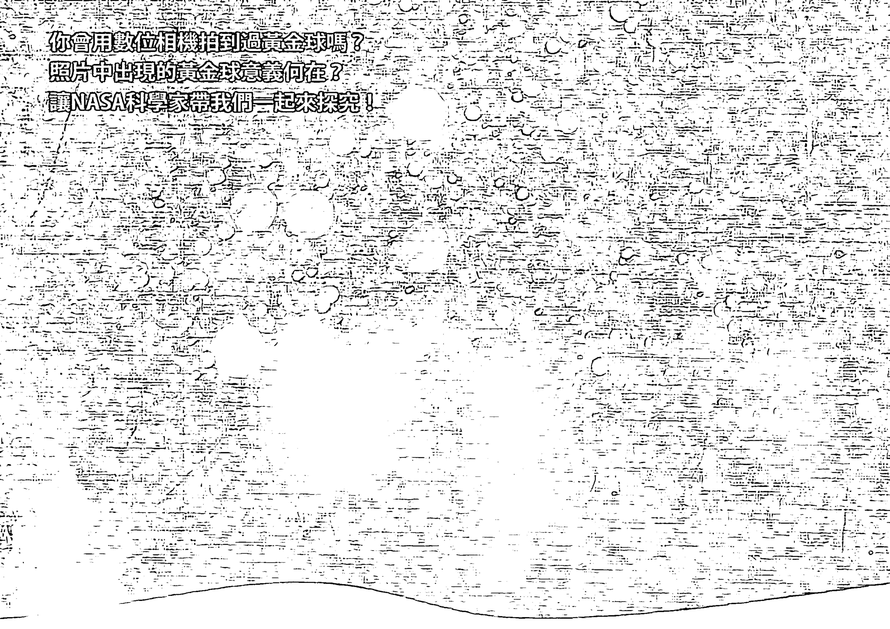

# 解讀黃金球的
靈性能量

克勞斯·海涅曼、昆蒂·海涅曼 著
李欣諭 譯

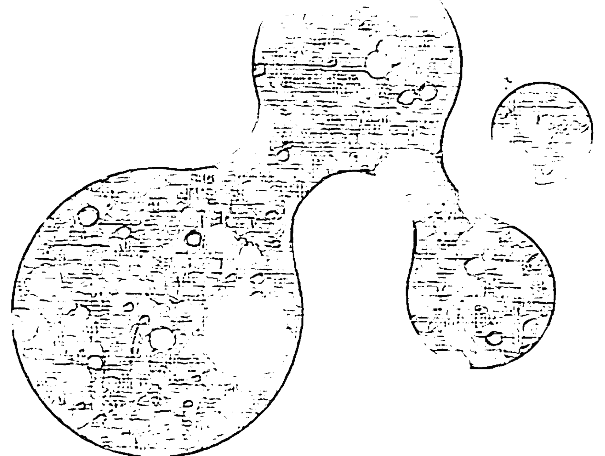

許添盛、李欣頻、丁鳳逸 讚嘆推薦！

## 福利公告：

凡在【天使神秘学院】购买任何电子资料赠送实体书，详情请咨询店铺客服！

备注：如客服不知道这活动你可能进了盗版店铺！赠书活动仅在以下正版店铺购买有效哦！

## 【天使神秘学院】淘宝店
手机淘宝扫以下二维码

1、打开手机淘宝：搜索“天使神秘学院”
2、点击“店铺”按钮就是

## 【天使神秘学院】微店
手机微信扫以下二维码

用手机微信扫码进店

## 制作说明：

本书由《天使神秘学院》出重金从台湾购入的原版书籍扫描制作完成。为达到最好阅读效果，特地把书全部切开后，再经由专业扫描设备高精度扫描完成，并经过一张张的PS后期处理最终成书，其间花费大量的人力、物力以及时间，只为能给大家提供经济并优质的神秘学学习资料而努力。

本学院强力谴责某些机构和个人，把本学院花心血制作完成的电子书籍，包装后直接放在自家网上低价倾销的行为，以谋取不劳而获的经济利益。如果长此以往最终将无人愿意再为大家花心思制作电子书，那以后可能大家再无新书可读。

为让大家以后能够读到更多的好书，也为了本学院的良性发展。本学院恳请大家尽量做到如下几点：

-   一、尽量在天使神秘学院的官方网站购买电子书籍。
官网访问地址：http://www.ac2011.cn
短网址：ac2011.cn
网址含义：(Archangel College 成立时间：2011年)

-   二、在收到电子书后小范围传阅即可，千万不要公开传播，更别挂到网上低价销售。

同时为答谢广大支持者，学院电子书将做如下调整：

-   一、学院会把一些早已收回制作成本的电子书折价销售。

-   二、最新制作的电子书籍会开放打印功能，大家购买后有条件的可自行打印成书。

天使神秘学院
2021年3月

# Orbs: Their Mission and Messages of Hope

## 解讀黃金球的靈性能量

克勞斯·海涅曼、昆蒂·海涅曼 著
李欣諭 譯

### 〈推薦序〉

#### 為世界帶來正面能量與珍貴訊息的書

賽斯身心靈診所院長、新時代賽斯教育基金會董事長、賽斯文化發行人 許添盛醫師

如果你問我：「許醫師，你相信黃金球這種東西嗎？」我會告訴你，我不但百分百相信，而且這根本就是我親身體驗。

事情是這樣的。從大約二十年前，我自身的海底輪能量便開始發動，至兩、三年前，終於走完了七個脈輪。那時，我感覺到一道強大的金色光柱，由我的頭頂衝上天際，讓我完全睜不開眼睛（奇怪的是，雖然我是閉上雙眼的，卻有種睜不開眼的感覺）。

常常在和賽斯家族上賽斯課的過程中，或是開工作坊的當下，我會在雙手之間感受到一股熱能，那是一種看不見的光，從手、體內開始向外輻射。有時甚至全場的學員會感受到一股熱風或太陽光的照射，充滿光明、愛與溫暖，連我自己都不太明白發生了什麼事！

此時，如果有人拿起數位相機，加上閃光燈，通常會照到巨大的黃金球，像是當我在中正紀念堂或賽斯文化講堂演講時，現場學員用相機拍到黃金球的次數不勝枚舉，這個現象對我們來說已是司空見慣了。所以，長年來閱讀賽斯書的體悟，加上自身體驗，使我深深相信，那是內在靈性存有的能量展現！

十分樂見這本《解讀黃金球的靈性能量》出版，相信它所帶來的訊息，能為這個世界挹注一股正面能量！

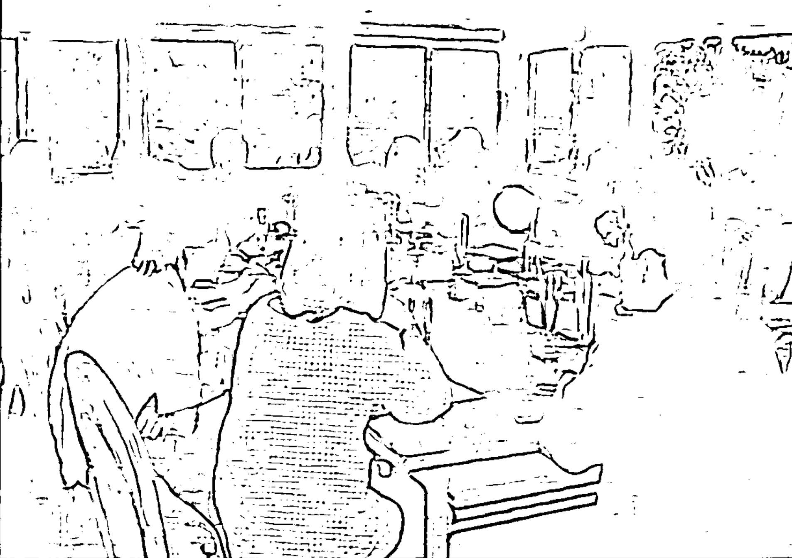

賽斯教育基金會主任會議現場，照片中黃金球顯而易見，當時我感覺能量主要由心輪發出。
（照片提供：許添盛）

### 〈推薦序〉

#### 終於有科學來證實黃金球的存在了！

創意人暨作家 李欣頻

七年前我首次在印度拍到黃金球，從此黃金球在我生命中已常伴左右，無論是在聖地之旅、巡迴演講、一些特殊派對，或是在大自然界，甚至某些特殊的人身上……都會看到它們的身影。

如今，我手上拍到黃金球的照片已經多達上千張，這些黃金球如影隨形，每每讓我感到溫暖與興奮。

三年前在我家的讀書會上，我與所有讀書會的成員一起分享黃金球的影片與照片，也力促方智出版社主編賴良珠小姐盡快出版關於黃金球的專書。所以，當我收到《解讀黃金球的靈性能量》這本書時，內容提到：「科學上已有足夠證據顯示黃金球為靈性存有的發光，在全世界各地拍攝到驚人數量的黃金球影像是真實的，這既不是相機瑕疵所造成的，亦非因空中懸浮微粒或濕氣所引起的反射，也不是其他的繞射現象，而是靈性存有透過科技將能量轉換成可見的黃金球。」我很開心將來不必再費唇舌解釋何謂「黃金球」，因為終於有科學來為這些美麗而神聖的存有背書了！

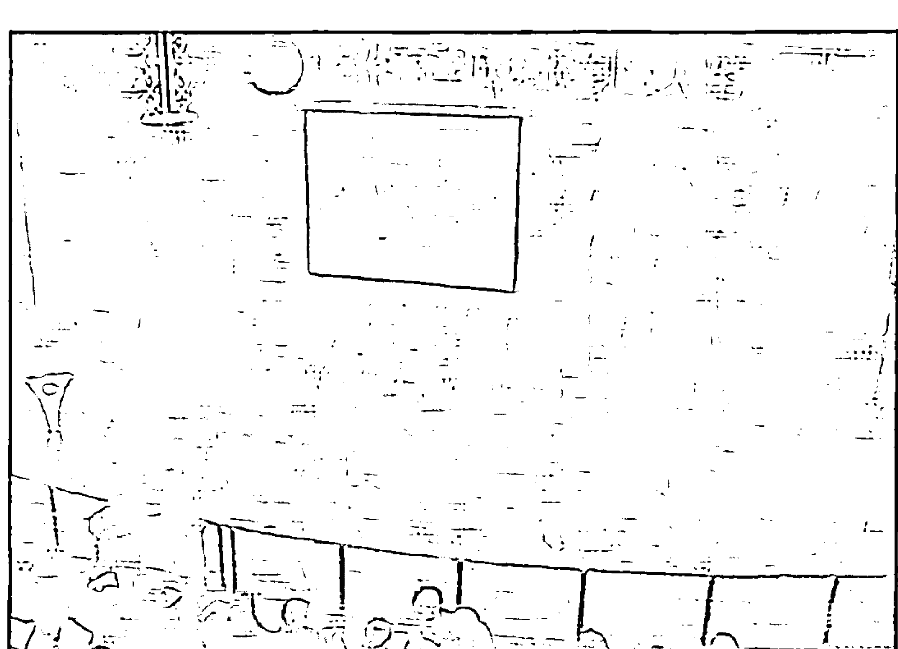

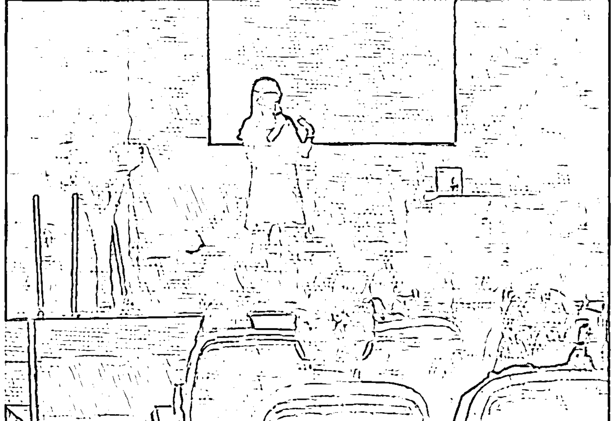

我在大陸巡講時的黃金球照片。
（照片提供：李欣頻）

### 〈推薦序〉

#### 一本探討黃金球現象的重要力作

333⁺ 光之海身心靈工作室負責人、身心靈課程講師、療癒者、譯者 丁鳳逸（A.Naeemah Ya-Ya）

終於，一本專門探討黃金球現象的書，要在國內問市了！
相信有很多人都跟我一樣，在許多隨手拍的照片中發現了這些可愛又迷人的小光球！對於在身心靈道路上已有一段時間的我而言，雖然這些靈性現象已不是我所追求或看重的目標，但不可否認的是，黃金球的出現讓人們有更多的討論與交流靈性訊息的機會。畢竟，我們處在一個眼見為憑的世界裡，而黃金球的出現，無疑是上天的慈悲，讓我們這些「眼未開、心未明」的麻瓜們不會因為自身的「遮障」，而錯失接觸靈性世界，並得到其幫助的機會。甚至，光是注視著某些高靈的黃金球，還可以幫助你去除這些遮障，開啟天賦本能！
從另一方面來說，黃金球的出現也意味著全體人類意識已經成長到一個階段，讓這些「形而上」的生命可以「形而下」的從天垂降，大大方向我們宣告靈性時代的來臨！
本書最可貴的地方在於，它是由一位科學家與他的療癒師妻子所共同撰寫而成，是一本既有左腦推理邏輯，又有右腦直覺感應，「陰陽」並重的大作。加上許多黃金球照片佐證，讓再「鐵齒」的人都不得不承認，也許這個世界上真的有我們肉眼看不見的生命形態，而這也是黃金球現在大量出現在照片裡的目的。

黃金球是有意識的高度進化生命的光體，所以它會跟人互動！近年來，我有幸獲得幾次與黃金球互動的經驗，而底下這張引起許多詢問的合照就是這樣得來的！下次當你因為生命成長而感到喜悅，當你處在意識擴展的高能量高頻率時，別忘了伸出手來，與這個充滿光與愛的存有共同歡慶！

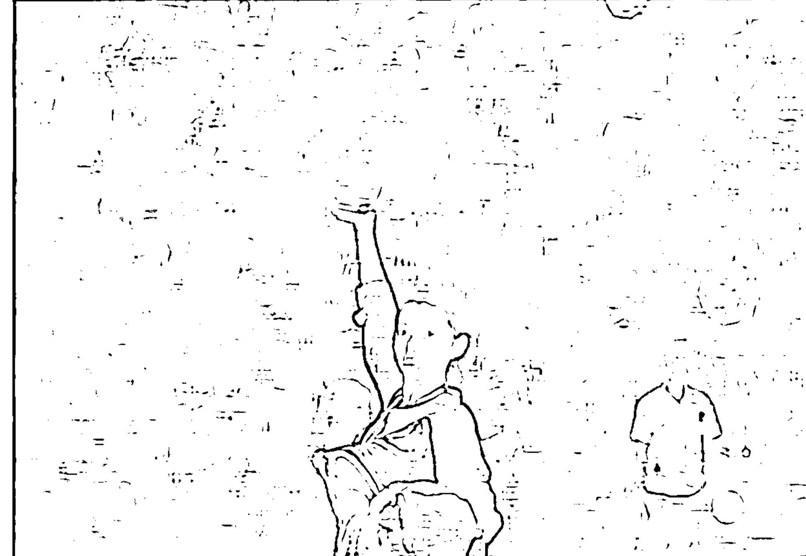

二〇一〇年攝於印度合一大學。
（照片提供：高桂卿）

### 〈推薦序〉

#### 為整體療癒指引方向

《喬治·艾略特還活著》作者 斐列達·薛尼

我很榮幸能為這本深具開創性的書寫推薦序。我想，沒有任何文字足以表達我對海涅曼夫婦的敬意，不僅是對他們提出這些足以轉化生命資訊的專業，同時也是對他們待人處事時所展現的謙卑態度。他們的研究值得信賴，解讀的黃金球意識與其療癒意圖，可說是無懈可擊！儘管這書的題材廣義上與物理學相關，但文中並未充斥著艱深的科學理論；相反的，這是為了消除眾人對黃金球的疑惑撰寫而成的一本書。因此，關於黃金球具有幫助與療癒的能力，作者將會在書中提出洞見。

這書是由海涅曼夫婦共同創作而成。自二○○四年秋天，頗負盛名的治療師隆·羅斯邀請他們在芝加哥的一處靈修營中拍攝黃金球的照片起，他們便開始發掘黃金球所代表的意義，兩人的攝影足跡遍及全球。他們曾與其他七位專家共同參與《黃金球：揭開面紗》的DVD拍攝，一起向世人介紹這個出現在數位相片中的明亮圓形物體。

作者之一的昆蒂是受過學院訓練的教育家，其專長為能量治療，並且擁有多項另類療法執照，同時也是一位攝影師，十分專注黃金球現象的技巧層面。克勞斯是一位受過學院訓練的物理學家，其專長為精密顯微技術，所以他投入較多心力在探索黃金球研究中與詮釋、原理、邏輯相關的面向。兩人對於宗教與靈性方面的事物十分感興趣，所以對於黃金球領域的探索亦相當有熱忱。

在本書中，你將看不到任何對宗教立場、科學原理與一般人物的論斷，字裡行間也找不到任何關於鬼怪的敘述，你會看到許多關於人們發現黃金球、與人分享照片，進而成為觀察者的美好故事。而這些故事的主角，不但熱衷於觀察這種現象，更了解黃金球為生命所帶來的意義。其中有一則經由喬治·艾略特（十九世紀英國維多利亞時期的女性作家）生平所經歷的命運旅程，則是我自己的故事。故事開始於一張圖書室照片中的黃金球，而在命運的啟示與療癒中達到高潮。與其他人的故事一樣，我的故事將使你敞開心扉，接受個人與黃金球療癒的新可能性。除此之外，無論你的宗教信仰為何，書中許多照片如同藝術作品般，適合用來靜心與治療。

每天都有新的身心靈作家投入出版界，在形而上學的領域中漫步前進，不時才會有一兩本書脫穎而出，成為曠世巨作，例如在這方面頗具影響力的兩位作家——江本勝（《生命的答案，水知道》作者）與琳恩·麥塔嘉（《療癒場》作者），而本書亦是如此。雖然每位作者發掘真相的方法不盡相同，但在覺知的庇護下，對於身、心、靈的重視程度卻是相同的。

一九六二年，美國太空人約翰·葛林以超過每小時一萬七千英里的速度繞行月球三圈，不到五十年的時間人類就可以預訂俄國太空梭的座位，前往國際太空站參觀。當人們發現一項新的概念，並且朝相同的方向一起努力時，很快就能達成目標。所以，我誠摯的相信海涅曼夫婦能夠成爲一盞明燈，爲人類整體療癒指引方向。

### 〈前言〉

#### 調整心態，接收黃金球的訊息

> 神秘是我們所能經歷最美的事物。 ——愛因斯坦

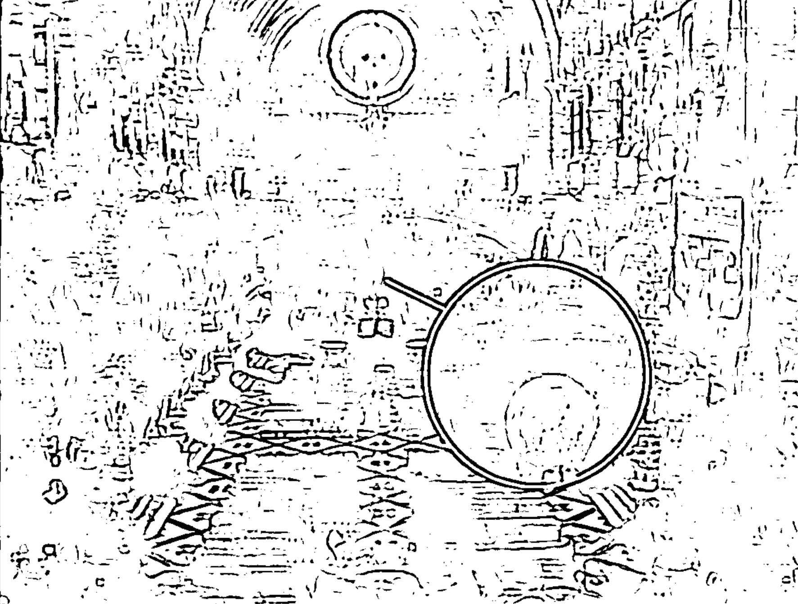

照片1：教堂中美麗、內部五彩繽紛的黃金球，與窗戶上的彩色玻璃窗相比，美嗎？

人類所存在的物質領域之外，是否還有其他具有意識的生命形式？綜觀歷史，這個問題無疑是人類史上最被廣為討論，且看法最分歧的議題。

儘管近來有不少證據顯示「不具形體」的生命確實存在，但也僅止於軼事趣聞而已。這是因為一般人無法直接目睹或感覺到「其他世界」的生命形式，也未能設計出一種能夠確切無誤的偵測到它們的物理實驗，所以大多數的人認為，只要是無法用傳統的科學方法觀察、衡量或偵測的事物，就必然不是真實的。

因此，依每個人被制約與偏好的程度而定，對於非物質實相不具形體、但有其獨特智能與意識是否存在一事，我們通常都落在相信與不相信這兩個極端——從不可見但仍盲目接受到激烈反對，甚至認為它們根本不存在。

從另一方面來看，如果不具形體的獨特智能與意識無法被人類感覺或測量，就很難引起人類注意。就算我們能夠不受約束，敞開心胸來看待，並視它們為整體實相中極為重要的一個面向，但我們仍然缺乏明確的方法可以與之溝通。我們既無法確切的感受到它們的存在，也不明白它們對我們提出的問題有何解答，更無法了解它們可能正試著傳遞給我們什麼樣的訊息。

然而，黃金球照片的出現，改變了這一切。靈性存有（這是一個簡化的用語，用來代表其他世界獨特智能與意識的承載者）已經克服「得到大多數人注意」這個重大障礙，透過數位攝影，證明就算沒有過人的視力，只要有一台數位相機，人人都能得到證據。儘管照片中關於黃金球確切的顯像機制尚有許多疑問，但以下幾點卻是無庸置疑的：

-   ①黃金球體可能不是靈性存有，靈性存有也不在於黃金球內部，而是靈性存有所散發出來的光芒。
-   ②黃金球是依自己的意志出現在數位照片中，有時也會出現在以傳統感光底片所拍攝的照片中。
-   ③由於科技的進化，黃金球出現在數位相片上只需耗費極微量的物理能量。
-   ④黃金球只需一點點來自閃光燈，或是其他自然光、能量源等物理能量，就能夠被記錄在數位相片上。
-   ⑤為了將被相機記錄所需的能量降至最低，黃金球並不會無緣無故的發射光能，或是朝沒有相機的地方發射，而會像雷射光般精準的瞄準相機。
-   ⑥黃金球會回應邀請它們出現的請求而出現在相片中，如果它們預期自己的存在不會被注意到，就不會浪費能量現出蹤跡。

人們在數位照片中看見靈性存有所發出的光，這些證據展現了它們的智能與意識，因此可以合理的假設它們以有形之姿外顯必有其意圖，而這類型的存有越是高度進化，該假設就越有可能是正確的。

就像物質界的存有一樣，我們可以假設在靈性的領域，各種智能的存都有不同的樣貌。例如某些存有的心智就像孩童一樣，只是單純的享受被拍攝下來的感覺，但是當它們漸漸成長，洞察力越來越成熟，此時只有基於特定的原因，它們才會選擇出現在相片中，事情就是如此簡單。另外，風景照上出現黃金球的機會通常比人物照多，這或許是因為顯現出來並被拍攝到的靈性存有種類不同的關係，像是未進化的「自然靈體」通常會出現在自然景色中，而意識程度較高的存有則會為了某些特定的原因，而出現在人物周圍。

本書將針對高度進化的靈性存有所形成的黃金球加以討論。假設它們不能像人類一樣發出聲音講話，但它們卻有可能透過在照片中顯現的方式，讓人類知道它們的存在，並且與人類進行溝通，像是傳遞訊息給拍攝或被拍的人，甚至全體人類。

既然黃金球不會透露任何語音訊息，那我們就必須探索隱藏在黃金球裡的視覺訊息，如顏色、大小、強度、形狀、出現的地點，或是球體內部所能被辨識的特徵（像是曼陀羅、人臉等）。還有，某些黃金球照片中的訊息是以直接且直覺性的層次來與人溝通，透過靜心、觀想黃金球照片，靜定於接收的狀態，與內在覺知相調和，人們才能了悟其中的訊息。

在此，我們將透過通用的分析準則，對為數眾多的黃金球照片進行理智且直覺性的評估，進而找出黃金球照片中可能隱藏的特定訊息。你或許可以在網路上發現許多極為壯麗的黃金球照片，但撰寫這本書的目的，並非以神奇的黃金球照片讓讀者留下深刻印象，所以書中收錄的大多是相當普通的黃金球照片，你亦可輕易的將自己的照片歸類其中。

黃金球之所以動人，並不在於它的大小、數量與明亮程度，而是它的出現對你的意義。它可能只是想傳遞簡單、實際的訊息，並且讓你相信，它將有助於你。接下來，請調整自己的心態，準備接收吧！

-   〈推薦序〉為世界帶來正面能量與珍貴訊息的書 許添盛 002
-   〈推薦序〉終於有科學來證實黃金球的存在了！ 李欣頻 004
-   〈推薦序〉一本探討黃金球現象的重要力作 丁鳳逸 006
-   〈推薦序〉為整體療癒指引方向 斐列達·薛尼 008
-   〈前 言〉調整心態，接收黃金球的訊息 011

## Chapter 1 黃金球的真實性 021

## Chapter 2 做為轉化符號的黃金球 031

## Chapter 3 在不同地點出現的黃金球 041

## Chapter 4 與一般事件相關的黃金球 067

## Chapter 5 出現在孩子周圍的黃金球 073

## Chapter 6 出現在魅力人士周圍的黃金球 083

## Chapter 7 出現在劃時代事件中的黃金球 091

## Chapter 8 出現在聖地的黃金球 095

## Chapter 9 出現在家中的黃金球 101

-   Chapter 10 黃金球內的臉部特徵 111
-   Chapter 11 環繞你我四周的黃金球 127
-   Chapter 12 黃金球的靈性療癒 133
-   Chapter 13 令人訝異的歐傑克現象 151
-   Chapter 14 解讀黃金球之外的延伸視野 159

## 〈後 記〉跟著好奇心一同探索未知領域 165

-   附錄1 證明黃金球非懸浮微粒的無塵室實驗 167
-   附錄2 關於黃金球真實性的補充證據 168
-   附錄3 關於歐傑克現象的補充說明 172

### Chapter 1

#### 黃金球的真實性

> 世界上最悲慘的莫過於徒具視力卻無遠見的人。
——海倫·凱勒

#### 健康的懷疑態度
促進新觀點的發展

首先，要強調的是健康的懷疑態度。我們希望所有持懷疑態度的人，都能來檢驗我們的發現，並且驗證結果，接受啟發，然後進一步探索，發現自己的黃金球照片背後所隱藏的意義。

克勞斯從小就喜歡聽母親講故事或讀故事書，通常他都會先問那是不是「真實」的故事，除非母親確定是真的，否則他就會拒絕聽下去。從那時起，這種實事求是、絕不道聽塗說的種子便在他心中慢慢發芽，最後開花結果，貫穿整個人生歷程。他畢業自德國知名大學，取得物理博士學位後，輾轉到美國太空總署與史丹佛大學做研究，在材料科學的專業領域獨力和與人共同發表了超過六十篇科學論文。此外，他也曾出版過關於太陽能工程的教科書，甚至還創辦過一家承包太空總署研究計畫的公司，並且帶領此公司超過二十年。對克勞斯而言，在工程與科學的領域上分辨真偽，一直都是他的優先要務。

然而，隨著量子物理學與相對論的出現，一切都改變了。物理學家必須拓展對世界運作的觀點，而關於如何得到真相這件事，他們也必須拓展原有的認知。儘管在所有實際的、與工程類似的領域——從玩具的製造，到將太空船降落在火星上——仍然有效，但牛頓學派的世界觀已然落伍。我們學習到機率法則、量子變化的狀態、彎曲時空宇宙論的真相，以及一些大於光速的速度，也了解到大腦與心智的不同，在心智的範疇內沒有空間與時序的限制等。事實上，心智是完全不受身體限制，在宇宙中無論何時何地的何種思想與話語一直都在「繞行」，是可以被收回的。

隨著這些改變的發生，我們明白到傳統上用來區別真實與虛假的方法已然不足，所謂的「科學方法」需要被重新定義。從前的科學方法有個全然符合邏輯的定義——有意義的實驗與可複製性，已被沿用約四百年，但這已經不足夠了。

在科學上，以下這些事物被牛頓派物理學家視為「無意義」（即本質不良或混亂的物品）：如無法被看見、秤重、測量、聽見或計算其存在，以及虛假、非理性或不可知者。但是，關於無意義的定義本身就隱藏著一個內建的認知缺失，此缺失在於我們以同樣的術語來定義它，換言之，那是無意義的。

對於無意義，我們需要一個新的、現代的、具有開拓性的## 定義。舉例來說，無意義也許可以被重新定義為「難以理解且缺乏意義的事物」。這個新的定義或許能夠符合現代物理學，讓我們得以在等式中將空間、時間與人類智力的不足予以排除。我們不能再仰賴某些人來替我們決定無意義與否。在廣義上，將無意義的新定義套用於難以理解的事物上，並進一步檢查其是否具有意義，這樣就可以得到一個較為客觀的工作方式，足以認定何者為無意義。我們是否還敢丟棄如照片中所顯示的證據？（本書接下來的篇章中會詳細討論黃金球內部臉形的主題。）

由於對無意義的全新認知，傳統上科學方法的第二項準則——可複製性，就變得更難達成了，而這也理當如此。過去，因為實驗者的想法使得實驗結果有所偏差，那麼在考量如何進行科學研究時，就必須摒除這類因素。但是這麼一來，威廉·提勒教授所有劃時代的心靈能量實驗就全都成了離經叛道之舉，並且也將被歸類為無意義。所以我們必須考量一個無法被複製，或是無法一致被複製的實驗，卻仍屬有效實驗的可能性。

是故，持懷疑態度的人對新觀念的科學探索上扮演著極為重要的角色，不過這一切都必須在這些人能夠接受新的、較為廣義的無意義之定義的前提下才能成立。否則，我們將無法在了解真相上有真正的進步。

### 足夠的證據顯示黃金球為靈性發光

自從照片中首次觀測到黃金球後，相信許多人都對黃金球究竟是靈性存有所發射出的光或攝影瑕疵有許多疑問。儘管在上一本著作《黃金球計畫》（*The Orb Project*）中早已證實了黃金球的真實性，但是身為一個經過專業訓練的科學家，克勞斯仍然未能提出充分的證明，以及他為何確信黃金球的真實性（關於此議題的論述，詳見〈附錄2〉）。根據他在這個領域周詳的研究，所得到的結論是：在世界各地拍攝到驚人數量黃金球影像是真實的，這既不是相機瑕疵所造成的，亦非空氣中懸浮微粒或濕氣所引起的反射，也不是其他的繞射現象。本書只著墨於最重要的論點，但仍鼓勵讀者去看附錄中更深入的討論。

關於黃金球的真實性，大多數人認為可能是相機或內建的電子設備出現雜質或異常物質，而他們最常提出的論點就是：黃金球是在接近相機鏡頭的地方出現，可能是懸浮於空氣中的顆粒所產生的反射。但是，根據一項最新的實驗顯示，在無塵室中拍攝黃金球（亦即懸浮微粒無法存在的環境中），黃金球還是出現了（更多說明詳見〈附錄1〉）。其他像是荷蘭籍專業攝影師愛德·佛斯所拍攝的眾多黃金球照片，以及其許多人以傳統底片拍攝到的照片等。基於幾項相關的事證顯示，這一類的論點均可不予考慮。

而證實黃金球的真實性最具意義的論點則是：有驚人數量的證據顯示，黃金球會有計畫的出現在特定的照片中，並居於策略性的位置。這些證據也讓我們更加確信，黃金球事件絕非偶然。既然黃金球是非物質存有所發射的光，那麼這些存有應是妥善運用照片中黃金球的特殊定位，嘗試與拍照或看見照片、研究照片的人進行溝通，而本書所提出的資料也大多是針對這個主題。

### 黃金球出現的位置，絕非偶然

即使所有在照片中出現的黃金球都可以被證明是空氣中懸浮微粒的物理反射，然而照片中明顯不是以隨機方式出現的黃金球，以及其特殊的定位，仍舊足以顯示在所處的物質場域之外，有某種思想牽涉其中。

如此一來，我們的論點就從解釋黃金球的來源，移轉至何以這些懸浮微粒的位置會如此具策略性。當閃光燈被觸動的那一瞬間（甚至與手持相機的位置有關），這些懸浮微粒究竟是如何能清楚排列，燦爛如星群，以致在照片中顯示具有意義的定位。

換句話說，如果是懸浮微粒，就會浮懸在隨機的位置，所以黃金球應該隨機出現在照片中的任何位置，絕對不可能出現在「有意義」的位置上。所以，即使黃金球是由懸浮微粒的反射而來（我這麼說絕非表示實際上這可能是其中的機制），非人類思想存在的證據，但其神秘性並未降低。這將從利用來自另一個場域的方法製造（小量的）物理能量的「神蹟」，移轉到另一種同樣非凡的神蹟——以一種具有意義，而且顯然違背統計法則的方式，影響眾多懸浮微粒出現的位置與時間點。

是故，我們的立場是：黃金球出現在照片中具有意義的位置，絕非偶然，因為它們是經過設計才出現在那裡的。

### 透過照相科技將能量轉換成可見的黃金球

所以，拍攝黃金球照片時究竟發生了什麼事？如果它出現在照片中表示某種形式的物理過程正在運作，那它到底是什麼？我們以手邊的證據做為基礎，假設整個過程始於在這個世界之外有情感的生命意識，結束於一台相機所記錄到的實體影像。換言之，一個來自物質領域之外、含有意圖的能量，被記錄在物質實相之內。

即使最後我們終於明白這一切是如何發生，意即相機是如何記錄到黃金球——如果我們毫不懷疑，就能夠更清楚明白——不過，這僅僅表示我們只了解兩個步驟中的一個，而不是全部過程。另一個有待了解的步驟則是去發掘這些有情感覺知的生命，如何能「產生」此紀錄過程所需要的物理能量。黃金球顯現在照片上所需要的實際物理能量非常微小，也許不會超過一千光子所含的能量，約莫只有點亮一盞一百瓦的燈泡一秒鐘所需能量的千億分之一的千億分之一。

但即便如此微小，它依然是能量，這意謂在這些非物質存有所處的實相中有能量成分，同時也顯示這些存有已經成功的利用人類的科技，將最小量的能源轉換成可見、可論證的東西。微量光子能源轉換成大而明亮，有時甚至五彩繽紛的攝影紀錄，讓人們得以看見並一再欣賞。這真是太不尋常了！

雖然我們還不了解創造這種能量的過程，因為我們不明白這些存有的真實面貌。不過，它們或許可以轉換能量，例如藉由閃光燈產生的能量，或者自己產生能量，然後將此能量對準記錄影像的設備。也就是說，在不需要它們的方向，或是不會被發現的地方（也就是沒有相機的地方），它們並不會發光，因此能節省寶貴的能量。

關於黃金球攝影的物理面向，顯然有許多疑問尚待釐清，但本書僅探討黃金球的使命，以及它們嘗試與人類溝通的訊息。

## Chapter 2

### 做為轉化符號的黃金球

> 當主要思考的對象不再是自己或自我防衛時，
我們便會經歷真正英雄式的意識轉化。
——當代神話學大師 喬瑟夫·坎伯

從物理學的觀點來看，人們認為黃金球可能是某種類似等離子體（一種由自由電子與帶電離子為主要成分的物質形態，廣泛存在於宇宙中，常被視為是物質的第四態）的能量特徵。根據熱力學定律，非固態凝聚物要產生最大能量，最有利的形狀為球體，而在攝影影像的平面投影中，球體呈現出來的當然就是圓形。因此，根據眾多的證據顯示：在多數的黃金球照片中，黃金球所呈現的圓形實際上是球體的投射，而非來自圓形平面。因為如果是來自圓形平面，就可以看到許多橢圓形的黃金球，但那就與數以千計在世界各地所拍攝到的黃金球不相同了。

球體與圓形是物理學及數學中最基本的形狀，它們無始無終，沒有明確的方向，但卻具有完美的對稱，且看起來十分完整。雖然圓形使黃金球看似平凡，不過對人類的心靈而言，球體與圓形一向具有特別的影響力。不妨花點時間環顧四周，看看哪些東西是圓形。舉例來說，從我的書桌開始看起，可以看到兩個球形燈罩、三個球形的蠟燭杯、四張有環狀靠背的椅子、一支有八個圓形嵌入座的燭台、一個地球儀、一些圓柱形的蠟燭、點綴著數百個圓形圖案的蠟染布製壁飾、四個圓形的彩繪玻璃藝術品、一個圓柱形的鼓、一只球狀的聖餐杯、數十個圓形或環狀的物品，其他像是環狀的腕錶與結婚戒指等也都是。我們神奇的被這些基本的圓形吸引，它已經成為一個有力且普遍的符號象徵。

球體或圓形的黃金球之所以吸引人，並非僅僅來自於它那令人感到愉悅的外形，而是來自其內部特徵——它們大多顯示出非常吸引人的內容，較少布滿灰色的內襯。本章將先介紹黃金球可能具有的轉化力量，接著詳細討論包含曼陀羅在內的圓形象徵，然後再歸納出某些特定黃金球所要傳達給人們的重要訊息。

### 由直覺所得知的訊息

> 宇宙間並無多餘的碎片，每個人身處於此都是因為有其必須填滿的地方，正如每個碎片都會在大拼圖中找到合適之處。
——知名精神教育家 狄帕克·喬普拉

人類具有憑直覺知曉事物的能力，所以在大部分的日常行為與決定中，直覺都扮演著關鍵角色。像是在書店裡，我們可能被其中一本書所吸引，而非另外一本；或是在其他時候，我們能立刻被某人吸引，但卻不想跟另一個人互動；甚至有時我們能感覺到一個人即將要說的話，即便他尚未開口說出任何一個字。同樣的，在人生的道路上，有些特定的轉化符號指引著我們，並產生深刻的影響；有些則以十分細微的方式與我們對話，讓人很難注意到它們的存在。

某些特定類別的黃金球對人類具有轉化效果，通常它們的外觀都很神秘，具有特別的美感，且布滿看似不規則，實則留下許多想像空間的幾何形狀（如一張或兩張人臉、天使或守護天使的樣貌，或是已經去世的親友來訪等），在在刺激著人類尚待開發的直覺領悟力。

我們無法確切知道，但「不知道」本身或許正是它具有神奇作用的地方。心智具有不可思議的能力，如果它能夠像比其他藥物更具療癒力的安慰劑一樣，療癒癌症、高血壓與各種疼痛，那麼透過心智強大的力量，經由觀看一個來自實相之外的意識，甚至是高度進化的存有所創造的美麗圖像，我們豈不是可以得到更多力量？

照片3：建議以一個高度進化靈性存有的發光體為範例，思索並允許來自所處領域之外的直覺經驗。

請觀看、思索照片3中的黃金球，並且允許它對你說話，你心中自然浮現的第一個感想，或許正是此刻對你有意義的關鍵。

接著，用遊戲的心態來觀看這張照片，並且想像你正與一個來自靈界、高度進化且帶著善意的存有連結。它對你有絕佳的意義，同時也是來幫助你的。當你下次準備好接收新的訊息時，不妨再試一次。

另外，這些象徵轉化符號的黃金球也可能會對你產生療癒效果。當你注視著靈性存有所發出的光時，如果能夠與它連結，那麼對於下一步該採取什麼行動，可能就會直覺的獲得答案，甚至受到渴望獲得的治療。以開放的心胸來享受這趟新的冒險，隨心所欲，重複去做。

照片4：出現在巴西知名的教堂裡，一個高度進化靈性存有的發光體緊貼著木製三角架的頂端，此三角架被視為轉化的符號。

或許你會對照片4中右下角的咖啡色部分有所疑惑，其實那是一個木頭三角形的頂端，這個三角形在巴西小鎮艾巴迪亞尼納的聖伊納西奧之家教堂被視為轉化的符號，該地是著名的醫治者「上帝的約翰」（用神奇的靈療手術治療病患的奇特男子）所駐之處，人們到此教堂在木頭三角架前靜心，並視需要留下所愛之人的照片與被醫治的請求。

長久以來，三角形被視為女性與男性向上擴展、渴望達到神界的象徵。三角形是一個有力的符號，常被用來表示穩定。它的底部代表人類深深根植大地，兩個側邊向上伸展，則代表人類想要知道得更多，了解未知，向無限潛力的領域不斷前進。

有一次，我們應邀前往芝加哥，到隆·羅斯所主持的靈修營中拍攝照片，這個有力的符號正好就豎立在祭壇上。黃金球就出現在三角架的頂端，彷彿在說：「嗨，注意！從此刻開始，有些重大的意義等著你們去發現。」那是我們拍攝最美麗的黃金球之一。

兩位好眼力的朋友看出照片4與照片2的黃金球，正是基督教傳統中關鍵的揚升大師。下次當你再看著這兩張照片靜心時，不妨思量這事，對那些由靈性偉人所散發出的正面能量、美與無條件的愛敞開胸懷吧！

### 做為轉化符號的黃金球所帶來的訊息

當符號出現在我們眼前，以特有的語言直接與靈魂溝通時，通常都具備轉化能力，能夠指向某件使我們做出改變的事物，並驅使我們朝本質邁進。符號就像路旁的指標，可以引導我們發現更深層的意義與生命中重要的事情。

符號在我們處理資料時以直覺的方式對我們說話，直抵我們的核心，在溝通資訊時包圍我們的心智。環狀或球體以立體影像顯示呈現時，代表合一、完整、一致，亦即「以合一的方式同在」。

當太空人看見地球是在太空中繞行的一個球體時，他們便有了深刻的體悟。自一九六八年從月球拍攝到人類所居住的地球，那張照片就成了一個轉化的象徵，提醒人與人之間相互的連結性，以及我們所生存的這個系統是何等脆弱。現在，地球的照片唾手可得，而這些照片的作用是在提醒我們，命運必須以合一的方式同在。

數位攝影能夠讓人看見以往不可見的東西。當世界各地的人紛紛報導他們曾經拍攝到圓光或黃金球——也就是我們所說的靈性存有發射的光芒，且這種具意識的實體不存在於我們所處的物質世界裡。也許黃金球顯現的目的是要喚醒我們注意以下概念：

- ①你是合一的。
- ②全體是合一的。
- ③我們是合一的。
- ④一個地球，同樣的人性，相同的精神。
- ⑤一個種族，相互連結，相互關連，命運共同。

換句話說，唯有共同努力，我們才能解決無數挑戰。難怪當人們一起慶祝、唱歌、跳舞、合作時，黃金球會大量出現。也許它們想要藉此提醒我們：和諧相處，以了解「以合一的方式同在」，並攜手為全體的利益盡最大的努力。

黃金球提醒我們，當它們被拍攝下來時，內部那些奇妙的形狀與不同的顏色，都具有重要的含意。隨著時間的推移前進，這些特徵所要表達的特定訊息可能會更清楚。

佛萊迪·西瓦是世界知名的麥田圈與黃金球專家，他表示，近來黃金球似乎已取代麥田圈，成為眾人討論的現象。當全世界成千上萬的人都拍攝到極為豐富的黃金球時，我們似乎接收到強烈的訊息，要大家注意究竟是什麼東西將所有人連結在一起。

要忽視這些訊息很困難，同時也不負責任的。在合而為一的過程中，為了全體的利益合作，將展現出許多驚人的可能性。當我們將「全體是合一的」概念深植於心中，就能夠釋放與生俱來的天賦，以一種充滿覺知、自我完成的方式共同創造生命，帶來豐富的成果。

充滿希望的使者環繞在我們四周，等著伸出援手——雖然它們一直都在，但如今我們終於可以見到它們了！它們居住在不同的能量體系，在此之前，它們與我們所處的、堅固密實的物質體系之間的糾葛太細微，以致於人類無法辨認。進步的科學成就非但沒有助益，反倒使我們與其他場域的連結能力惡化，直到數位相機的出現，才使我們能夠大規模的接收到它們的訊息。

黃金球已經變得如此強而有力，使我們越來越難以忽略。雖然它們所展現的並無新意，但是卻藉由一種新的方式，傳達了智慧永在的概念。但願人類對這種智慧更具覺知，讓我們一起來探索這種智慧吧！

## Chapter 3

### 在不同地點出現的黃金球

> 那些大自然令人類眼眸所不能見者，便顯現給心靈之眼。
——《變形記》奧維德

真正的黃金球在照片中的位置並非隨機安排，而是有策略性的位置。我們將在本章中介紹幾種典型的案例，並試著詮釋這些特定位置背後的意義。我們相信在大多數情況下，黃金球背後所代表的意義與拍攝的地點有關。另外，還必須考量到拍攝者與被拍攝者的思想、情緒與感覺。所以，我們會在案例中加入相關的故事。（案例中的人物名稱皆已變更，以保護當事人隱私。）

### 案例 1 出現在專訪地點——幫助訪談順利進行

當照片與拍攝者的詳細情況被納入評估時，黃金球就可以透過在照片中某一特定位置出現，驚人的傳達明確的訊息。

有一次，克勞斯在新墨西哥州聖塔菲的旅館房間裡，接受電台專訪與黃金球相關的事情。過程中，我們兩人都感覺到某種存有正主導著這次的訪談。克勞斯的心中浮現出最適當的例子與故事，而話語也自然的從他口中說出。當訪談結束後，我們決定在旅館附近散步，順便呼吸新鮮空氣，走著走著，昆蒂忽然想要拍張照片，希望邀請那些隱形助手出現在房間附近的照片中。結果照片裡真的出現了一個明亮的黃金球，以及一個同樣大小但強度稍弱的黃金球。最神奇的是，它們精確的標示出房間的所在位置！

兩個黃金球標示出進行過訪談的房間位置，這種機率真的非常低。因此，我們可以從這張照片得到以下的結論：當靈性存有想要與人進行溝通時，它們有能力、也願意應允我們的請求，不管是希望它們出現在特定的地點，或是當我們求助時前來幫忙。

我們甚至可以進一步推論它們所要傳達的訊息：它們很高興在電台專訪中幫助我們。也就是說，我們訪談時那個正面的感覺是對的，它們之所以會留下訊息，則是對此的肯定。另外，我們也將它們的出現解讀為：當我們請求時，可以仰賴它們的幫助，而幫助的方式是透過直覺而來。因此，想得到幫助，唯一要做的便是：讓直覺接手，如同克勞斯在訪談中所做的一樣。由於克勞斯通常是透過左腦來主導運作，換成由右腦來主導才能感到安全自在，所以對他而言，這是一個不尋常又強而有力的經驗。

### 案例 2 出現在婚禮上——已故的兒子現身

這張照片拍攝於一場婚禮的舞蹈中，它所呈現的訊息令人動容。根據拍照的人表示：「我的兒子在十八歲那年過世，而這張照片是在一年後女兒的婚禮上拍攝的。當我看著女兒與新婚丈夫共舞，我感覺被愛並受到祝福，同時也想起過世的兒子，覺得他就在現場。」再看看照片中黃金球出現的位置，任何人都可以將它解讀為對拍攝者的正面回應，好像在說：「媽媽，我在這裡！我為妳們感到高興，一切都很好，不必擔心，好好享受吧！」

### 案例 3 出現在生日派對上——守護天使降臨

根據提供照片的人表示：「這個黃金球很大，它出現在我親愛的朋友上方，當天是她五十歲的生日派對，但她在拍照後的四個月後就過世了。」接著又說：「這張照片是吹完蠟燭時拍的，當時每一個人都很高興，而我也對這份友誼感到全然的欣喜與感恩。我們連續拍了好幾張照片，不過就只有這張照片出現了巨大的黃金球。照片中，我穿著紅色的衣服，而黃金球則是出現在身穿綠色外套的卡羅拉上方。我至今仍很清楚的記得當時所想的事情：卡羅拉是我很好的朋友，她親自策畫了這場派對，我很高興也很感謝。畢竟在結束一段痛苦的療程後，還能夠舉行這場小小的生日派對，就心理層面來看，這個情況非常特別：那是一種我與卡羅拉之間的能量。幾個星期後，她因纏鬥四年的癌症再度倒下，並且在四個月之後就過世了。她是如此害怕死亡，而我多年來也一直試著幫她克服這種感覺。我不禁納悶，這個黃金球是否為保護她的天使？」

根據數位分析的結果顯示，在相機對準卡羅拉拍攝的情況下，黃金球出現在距離她最近的地方（漂浮在她的正上方），因此這張照片所要傳達的訊息很可能是屬於個人性質的，僅僅傳遞給照片中的人。他們在拍照時那種喜悅的生命狀態，可能促使一個來自靈界的慈愛存有現身，為的是讓他們明瞭，卡羅拉即將通往另一個境界，而非進入空無。

### 案例 4 出現在古老民宿裡——留下美好的經驗

別再敲門了！你已經在門內了！

### 案例 5
出現在歌手的嘴上——感謝美妙的獻唱

> 美是救贖，美是療癒，美能激勵，美是連結，美將我們帶回原點，而最終極的救贖存在其中……
——知名演員 馬修·福克斯

才華洋溢的非裔美籍歌手芮妮在隆·羅斯所舉行的儀式中，完成一場感人的演出。隆將手搭在芮妮的肩膀，感謝她真心誠摯的歌聲。照片中黃金球出現在芮妮的嘴巴上，彷彿在說：「是的，我們同意！真是太精彩了！畢竟我們是經由妳而歌唱！」後來我們給她看這張照片，她也謙卑的承認確實如此。

### 案例 6
出現在新人互許終身的瀑布前
——表示祝福

> 我將此視為兩人共結連理時最崇高的任務：一方得守護另一方的孤獨。
——詩人 賴內·馬利亞·里爾克

照片10是在這對情侶互許終身後不久所拍攝的。在這類背景豐富的照片中，黃金球往往很容易被忽略，因此我們特地使用加強對比的數位技術來處理這張照片。儘管背景複雜，但仍可看到照片中的兩個黃金球彷彿在這個重要的決定時刻，帶來喜悅與表示支持的訊息。而它們的現身，不但代表相信這對情侶乃天作之合，同時也對這個決定感到滿意。在聽了我們的詮釋之後，這對情侶也覺得非常高興。

### 案例 7
出現在諮詢場合——來自靈性的指引

照片11：在諮詢的過程中出現靈性的顧問。

> 愛是我們真正的命運，我們無法自己單獨尋找生命的意義，必須跟另一個人在一起才找得到。
——作家、和平與民權運動者 多瑪斯·牟敦

當時昆蒂很清楚的依直覺拍下這張照片。照片左方那位名叫達納·杜耶的朋友是加州聖拉斐爾靈性成長基金會的執行長，當時他正在與朋友進行諮商。他對靈性存有具有非常敏銳的覺知，所以當他第一次看到這張照片時，就毫不遲疑的說：「這是我的靈性導師。」

無論可見或不可見，靈性指導者並不會出現在所有照片中，但它們以這樣的方式出現乃是常態，而非例外。既然靈性存有時時刻刻都在我們身邊，在人生的每一步協助我們，那麼當我們主張原創意念時，尤其應該感到謙卑。好似在強調達納所言毫無疑問是正確的時候，靈性發光體看起來正在移動，而這正是黃金球重要的跡象之一。

### 案例 8
出現在治療紀錄本——幫助病患痊癒

> 我堅信所有人類皆可存取非凡的能量，由神秘經歷的述說、不斷提升的創造力，或是運動家與藝術家卓越的表現來判斷，我們所擁有的生命遠比所知道的更偉大。
——人本主義心理學大師 珍·休士頓

病患在聖伊納西奧之家接受過靈療手術治療後，會將他們的名字與地址記錄在一本治療紀錄本上。如照片所示，一個黃金球精準的懸浮在紀錄本上，彷彿在提醒人們，龐大的力量正在運行，以幫助他們痊癒。

### 案例 9
出現在船上——擁有愉快的旅程

當遊輪船長正在向乘客致歡迎詞，很明顯的，有一個靈性存有對發生的事很感興趣，對船長所說的話也深表贊同（照片13）。

致詞中，船長高興的向來自各國的船員致謝，表示大家一起提供優良的服務，對同樣來自世界各地的旅客展現合一精神。他說：「如果我們在這個漂浮的小島能相處愉快，那麼到任何地方我們理當能夠如此。」

在拍攝完照片後，其中一名服務生注意到我們，我們向他解釋那是因為一個靈性存有發出光芒，而光圈的位置就在船長頭上。服務生驚嘆道：「那是不可能的！」即使他看了照片卻仍舊不相信我們所說的。

後來上甜點時我們忍不住又拍了一張照片，當他看見照片中真的出現了一個黃金球在他頭頂上方（照片14），他立刻就成爲黃金球的愛好者。那個黃金球彷彿在說：「嗨！你看！我們真的在這裡，相信我們。」自此之後，許多船員都對黃金球照片產生了極大的興趣。黃金球不但照亮了船員當天的生命，同時也在剩下的航程中出現在更多的場景裡。

### 案例 10
出現在洗禮堂——導遊的笑話並不好笑

> 當你改變看待事情的方式，該注意的事也改變了。
——德國物理學家 馬克斯・普朗克

照片15：出現在聖母像附近的黃金球。

在一個下過雨的午後，我們來到義大利的比薩。拍攝這張照片時，導遊正在解釋洗禮堂入口上方聖母馬利亞與耶穌雕像的重要性，剛好一個黃金球就出現在聖母像附近。洗禮堂與著名的斜塔是不同的建築物，不過它就在斜塔旁邊。後來導遊開玩笑的說：「洗禮堂也傾斜了，雖然不像比薩斜塔傾斜得那麼嚴重，但仍清楚可見。」看看照片，看對誰來說這個故事比較不有趣！因為當導遊說完這句話，我們並沒有拍到黃金球。

### 案例 11
出現石棺附近
——聖者的精神永在

照片16：黃金球出現在一群做彌撒的修女上方。

> 祈禱，希望，不要憂慮。憂慮是無用的，神是慈愛的，祂會聽你的禱告。
——聖比奧神父

當我們經過派德·皮歐曾服事的地方時感到十分敬畏，因為他在數十年前創立的小醫院，如今已成為一所大型的醫療機構，並且提供許多工作機會給具備不同技能的人。

每年都有為數眾多的訪客前往義大利東南部的聖喬瓦尼羅通朝聖，向一九九九年五月二日被教宗約翰·保羅二世封聖的皮艾特爾欽納的聖皮歐致敬。當我們繞著派德·皮歐的石棺走時，毫無疑問的在房間裡感受到他的臨在。我們跟其他旅客一樣拍下照片，並且如預期的出現一個明亮且正在移動的黃金球。可見派德·皮歐的精神仍然指引追隨者前進，並獲得支持。

### 案例 12
出現在山邊——改變懷疑者的態度

> 唯有擺脫已知之事，才能獲得自由。
——印度哲人 克里希那穆提

德國南部的海德蘭是一個很壯麗的地方，非常適合家人、朋友齊聚慶祝。我們常常面山而坐，觀賞並拍攝山嵐的變化，一坐就是好幾個小時。昆蒂有個對黃金球感到質疑的兄弟，在看到照片17的黃金球後仍無法信服。他開玩笑說：「將妳的相機對著左邊，朝向可以聽到牛鈴的那個山丘，然後拍一張照片！」昆蒂遵照他的指示拍下照片18，令人驚訝的事情發生了！當天晚上最明亮的黃金球出現在照片中，又一個懷疑者被改變了。

### 案例 13
出現在畢業典禮上——幫助被拍攝者

> 每一句話或每一個觀念，儘管看來十分清楚，但其適用性仍然有限。
——德國物理學家 維納·海森堡

約翰將他在催眠學校畢業典禮上的照片寄給我們，除了上方那個明亮且正在移動的黃金球外，還有來自另一個未知世界的小小道賀者出現在照片中。約翰注意到站在中間的自己，手中的畢業證書下方出現一個黃金球，然後表示：「當接過文憑的那一剎那，我覺得催眠治療與其特殊教導將我三年來所研究的輔助性治療技巧——串連起來！」

約翰是一位傑出人士，他擁有好幾個碩士學位。文憑封印下方的黃金球不知道是不是在告訴他，得到認可的封印後，應該運用治療技巧來幫助更多的人，而未知的世界會幫助他？那個明亮且正在移動的靈性發光體是否是為了幫助所有教職員而來，並且告訴他們在教導輔助性治療技巧方面，能夠得到它的幫助？而照片中位於天花板、窗簾上與門邊那些依稀可見的「訪客」是否為更多靈性諮詢導師？它們是不是正為這群畢業生能夠獲得人類可以具備的智慧，為全人類創造一個更好的世界而感到喜悅？這些都是十分有可能的。

由於拍攝照片的是一位敏銳的黃金球攝影師，所以這些黃金球照片主要是想傳遞訊息給被拍攝者，以及某個特定族群的人（學校的教職員）。

### 案例 14
出現在比賽前——幫助參賽者

> 奮勇向前可能讓人暫時失去立足點，但猶豫不前卻會讓人徹底喪失自我。
——丹麥思想家 齊克果

三個黃金球出現在克莉絲汀（右）與康妮（左）準備參加鐵人三項比賽的照片中，她們表示對這次具有挑戰性的比賽有很高的期望，而這張照片則是在向她們保證願望已經被聽見，那個來自不可見領域的指引會在過程中保護她們。

黃金球出現在該運動所需的重要部位——心臟與股四頭肌（人體最大也最有力的肌肉群之一），因此照片中的黃金球顯然是要傳達個人性的訊息給照片中的人。

### 案例 15
出現在草地上——相信就能看見

> 能遇到悖論是多麼美好的事，現在我們有了進步的希望。
——丹麥物理學家 尼爾斯·包爾

照片21：黃金球正在「觀察」攝影師的配備，而攝影師也在等待適當的時機「捕捉」黃金球。

在這個偏僻的草地上，我們正等待太陽下山，以便為一項黃金球研究拍攝大量的照片。一位年輕的新手記者對黃金球現象尚有些懷疑，他將三腳架豎立在草坪上的一棵巨大橡樹下，希望等太陽下山後就可以捕捉到黃金球的影像。

看著這位攝影師架在橡樹下隨時可以啟動的相機，昆蒂忽然覺得有股力量在召喚她，於是她從所站立的地方拍下了照片21。一個顯而易見、明亮的黃金球現身在那部相機前面，彷彿在說：「我們隨時都在這裡準備好被拍攝，只要相信並熱情的歡迎我們，我們就一直在你們身邊！」

### 案例 16
出現在靈性活動上——在神凡事都能

照片22：在一場靈性聚會上，黃金球緊貼著重要的句子。

> 當在上者流入在下者時，在下者的本質得以轉化，成為與在上者一樣。
——德國聖哲 艾克哈特

在加州帕羅奧圖的一個大教堂裡有一場靈性治療的活動，牆上清楚寫著：「在神凡事都能！」（With God all the things are possible!）一個黃金球正好出現在「凡事」（all things）二字之下，表示肯定這句話（照片22）。

接著，在準備這項治療服務時，我們將幾個普通的象徵符號放在祭壇上，其中包括一個放在祭壇蠟燭旁的地球儀，彷彿懇求世界各國得以被醫治。結果，來自不可見領域的光之存有似乎了解這個意念，一個黃金球正好出現在地球儀上的中東國家（照片23），似乎說道：「我們全力以赴，其餘的就得跟你們人類了！請依照世上最偉大教師之一的話去做吧！在神凡事都能！」

### 案例 17
出現在報紙拍攝時——表示事情的重要性

當記者寫完準備刊登在《泰晤士報》的黃金球專欄〈克勞斯·海涅曼一天的生活〉，發現只缺一張克勞斯的近照。原本應該由專業攝影師到我們位於加州的住所拍攝，但是我們一方面懷疑黃金球是否願意應我們的需求，為這樣的拍照計畫現身；一方面又擔心專業相機的CMOS感應器，不適合拍攝黃金球。最後，昆蒂雖然有些疑慮，但仍抱著樂觀的態度讓克勞斯坐在椅子上看著《黃金球計畫》那本書，並且一共拍了十五張照片。其中有十二張照片黃金球出現在克勞斯的頭部與上半身附近，似乎是想向我們表明靈性黃金球要傳達的訊息為：「這個要刊登在報紙上的故事對我們很重要。」

## Chapter 4

### 與一般事件相關的黃金球

> 所有科學曾經教會我的，以及繼續教導我的，都會加深我對死後靈性繼續存在的信念。所有事物都不會不留痕跡而消失。
——火箭科學家 華納·馮·布朗

#### 案例 1
出現在慶典中——表示感謝人們

義大利人總是他們的聖者為榮，並且把聖者們當成家庭成員的一部分，所以當我們前往義大利東南部的維斯堤時，有幸參加聖安東尼生日的慶典，市集上不但有樂隊的遊行表演，晚上還有照亮夜空的壯麗煙火。當我們從旅館房間觀賞這場盛宴時，竟驚訝的發現為數眾多的黃金球也參與了這場慶典，它們彷彿在說：「是的，我們這些聖者在你們之中繼續活著，謝謝你們的答謝！」

#### 案例 2
出現在會議上——表示支持

> 我們每個人都能顯現超越時空與線性因果關係的意識領域屬性。
——當代超個人心理學大師 史坦尼斯拉弗·葛羅夫

在二〇〇八年於加州棕櫚泉所舉辦的第二屆國際「黃金球：與其他維度溝通」先知會議中，其中一位與會人士在簡報時拍攝到一張傑出的照片（照片26）。拍攝這張照片時，投影片上出現的文字是「每個人皆應睿智的為合一與全體福祉一起努力工作」，照片中則可以清楚看到兩旁各有一個大而明亮的黃金球。

在進行簡報時，我們都強烈的感覺到來自另一個場域的指導者在現場，它們帶來的訊息是：「黃金球與我們同在，並且會前來幫助我們。」同時強調：「當我們調整內在智慧的頻率，便能找到為合一與全體福祉互相合作的方式。」

我們第一次看見這張照片時，便清楚明瞭這兩個大黃金球是來自指導者的答案，目的是要告訴我們，它們同意簡報的內容。簡單來說，黃金球是靈性存有所散發的光芒，要傳達給人類的是它們愛我們，並且會在我們為了保護地球給下一個世代所必須經歷的意識躍進過程中，幫助我們。

但是，這樣的詮釋是否與拍攝照片的琳達·霍頓所想的一致呢？當我們請霍頓女士回答這個問題時，她表示：「照片對你我來說，都是很珍貴、美好的禮物。我只知道當時心中有一股巨大的力量，指示我去拍下那張照片。」

其實早在簡報開始之前，就已經有許多黃金球出現在會場，照片27便是其中的代表作。在這類型的照片中，黃金球的數量遠比位置來得重要。靈性存有意圖擴大黃金球的光芒，以便讓大量的黃金球能夠被看見，以代表它們對這項議題的支持。

另外，請注意這些黃金球的特徵：有內部極少或沒有明顯特徵、大而明亮的圓形黃金球；還有內部出現眼睛、外圍呈現不規則的黃金球；以及其他不同顏色的黃金球等。甚至還有人在其中幾個黃金球內部看見臉，例如照片左邊花束上方的綠色實體內部。

#### 案例 3
再次出現在會議上——為了融入其中

在另一場關於黃金球的研討會中，與會人士再次拍攝到黃金球照片。當時，我們正在討論一段關於黃金球的投影片，一個明亮的黃金球顯然想要加入其中，因為它適度的調整自己的大小，以配合影片中那一圈黃金球。後來，經過具有千里眼般超感知能力者的鑑別，認定它是高度進化的靈性存有。

照片28：二〇〇八年於英國格雷思頓貝瑞一場座談會簡報。

## Chapter 5

### 出現在孩子周圍的黃金球

> 你們的孩子並非真的是你們的，乃是生命本身渴望降臨的。
——紀伯倫

許多宗教與傳統靈性教導在靈性領域總是對孩子特別關注與感興趣，他們在新的環境中誕生，必須消化大量的印象，但又尚未取得應付這一切的智力，所以顯得非常無助。根據許多研究顯示，孩子受到天生的直覺引導，具有較高的天分能夠看到靈性存有。如果我們敞開心胸，接受並傾聽孩子的想法，就可以聽見他們談論光的存有、天使或光球（黃金球），有時甚至還能夠聽見他們與這些光球交談。而這些現象就是孩子如何看待實相的一部分，所以當大人說孩子無法看見靈性存有時，孩子們就會覺得非常驚訝。

在菲律賓與巴西等文化中，父母普遍知道孩子具有這樣的能力，所以會根據自己的了解給予支持。然而，在大部分的西方文化中，大人始終對這樣的現象持懷疑態度，所以當他們表示懷疑時，孩子也會開始懷疑自己，進而忽略自己的這種天賦，最終再也看不見靈性存有。

從世界各地許多黃金球拍攝者的照片中，皆證明了孩子身邊存在著很多靈性存有。我們有預感這或許是因為孩子們朝氣蓬勃、歡樂、富有冒險精神與好奇心吸引了黃金球，並讓它們在多方面協助並保護孩子。本章我們將會提出許多相關的例子來證明。

#### 案例 1
出現在山獅出沒地點——保護孩子

> 你絕對不能允許自己在任何時刻耽溺於負面思考。
——玄學家 埃米特·福克斯

古老的諺語曾說：「孩子被守護天使圍繞著。」如果對此有任何懷疑，這個故事也許可以消除你的疑惑。

幾年前，我們曾經協助媳婦安娜貝兒的三個女兒受洗，儀式在靠近舊金山一個美麗的自然保護區進行。一年後，她們與家族朋友羅蘭來到同一個地區健行，並且拍下了這張照片。為此，安娜貝兒表示：「當時我們一行人來到艾覺伍德公園健行，走到受洗儀式地點附近時，羅蘭拍下了這張照片。因為近來有多起報導指出附近有山獅出沒，所以我警告她要小心一點。起初，她以為我在開玩笑，後來由於孩子們在附近跑來跑去，於是開始有些擔憂。但從照片中看來，似乎有同伴正在保護她們的安全！」

#### 案例 2
出現在歡樂孩子身邊——一起同歡

也許是受到後面那台鋼琴的啟發，三歲的薇拉與五歲的伊莎貝拉很自得其樂的炫耀最近在芭蕾舞課上學到的搖擺與旋轉。她們的笑聲與愉悅的表情則是最好的配樂，難怪薇拉頭上

#### 案例 3
出現在喧鬧場景中——做為守護天使

會出現一個大的黃金球（照片30）一起加入這個獨特且喜悅的時刻。

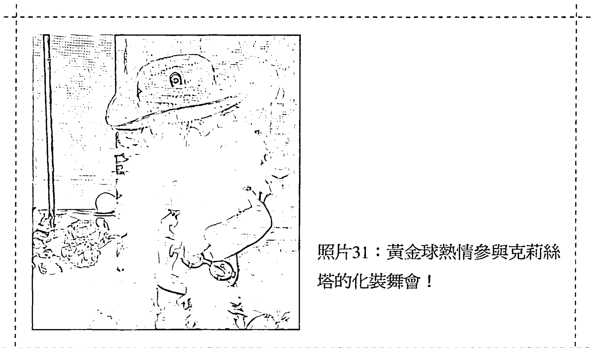

盛裝打扮、穿著五顏六色跳舞是學齡前孩子最喜歡的娛樂，照片31中的黃金球緊貼著克莉絲塔的帽子，一起參與這個有趣又好玩的經歷。

一群孩子們剛從巨大的塑膠溜滑梯上滑下來，非常開心的笑鬧著（照片32）。要從一群嬉鬧的孩子中找到我們的孫女克莉絲塔似乎不太容易，但在這張活動結束時的快樂合影中，黃金球卻出現在她的頭頂上。原本我們還對這個年僅兩歲，並且有聽覺障礙的她，如何在如此活潑的團體活動中應對，感到有些擔憂，不過她的「守護天使」似乎一直在她身邊守護著。

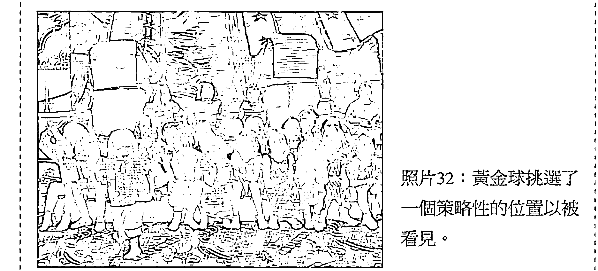

值得注意的是，在這樣五彩繽紛的場景中，黃金球選擇了完美的位置——照片中少有的深色色塊，好讓它能輕易被看見。或許克莉絲塔頭上的紅色色塊是一個更好的地點，但話說回來，靈性存有亦有其偏好，選擇藍色作為背景可能是訊息的一部分。因為藍色通常與信任、忠誠、智慧、信心、知性、信賴與真理有關，所以它所帶來的訊息可能是來自不可見世界的存有會圍繞孩子，並持續幫助、保護與指引他們。

#### 案例 4
出現在需要幫助的孩子身邊
——展現慈愛

> 生命是神聖的，生命是非凡、不可思議、神奇的現象，是我們最寶貴的禮物。 ——前聯合國秘書長 羅伯·穆勒

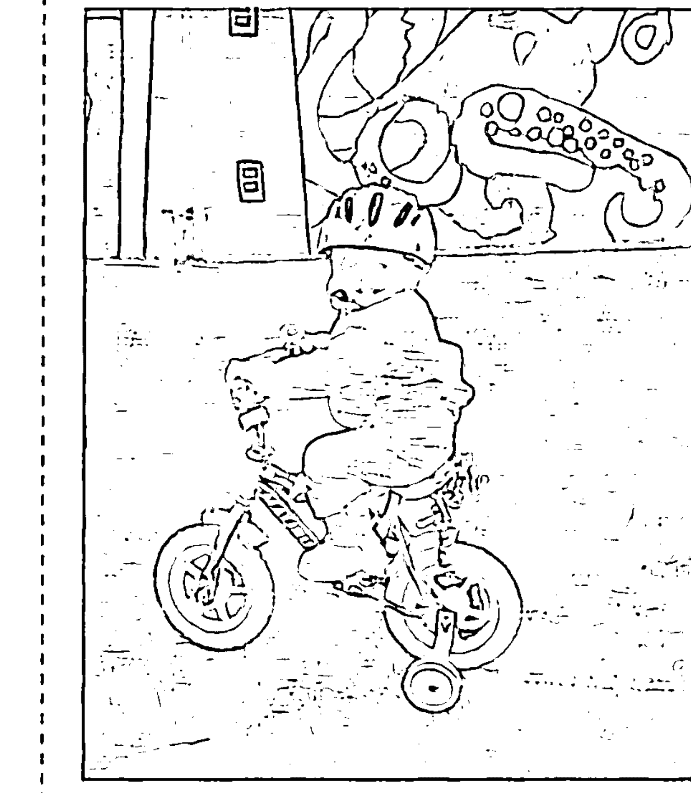

照片33：黃金球陪伴一個兩歲大，面對聽障挑戰的女孩，與她一起探索生命的喜悅。

兩歲的克莉絲塔一出生就有嚴重的聽覺與肢體障礙，即便如此，她仍想活出生命的精采，所以愛好運動的姊姊與父母，在所有帶來歡樂的冒險中都會帶著她同行。照片中，克莉絲塔第一次戴上助聽器，興高采烈的騎著粉紅色三輪車練習轉彎。這是她生平第一次可以聽見外界的聲音，而牽引著她的黃金球似乎指出來自不可見領域的靈性存有是慈愛的，會一直保護著她，並對她的生命展開新頁感到欣慰。

### 案例 5
出現在學校表演——守護天使再次出現

> 當我接近孩子時，他們激起我兩種情操：溫柔，因其所在；尊敬，因其所能是。
——法國微生物學家路易斯·巴士德

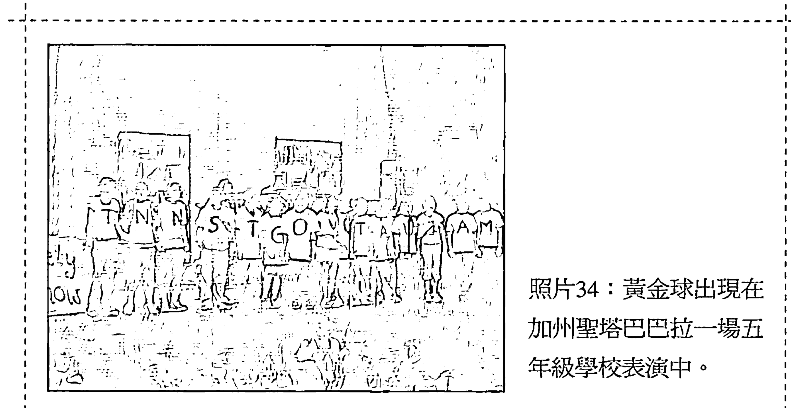

在小學任教的女兒康妮邀請我們去看她五年級學生的戲劇表演，我們坐在交誼廳後面拍了一些表演的照片，出乎意料之外，許多張照片都出現了黃金球。一年後，又有同樣的表演，這次由康妮自己拍照，友善的守護天使也再次出現了！

### 案例 6
出現在溜冰場內
——每個孩子都有守護天使

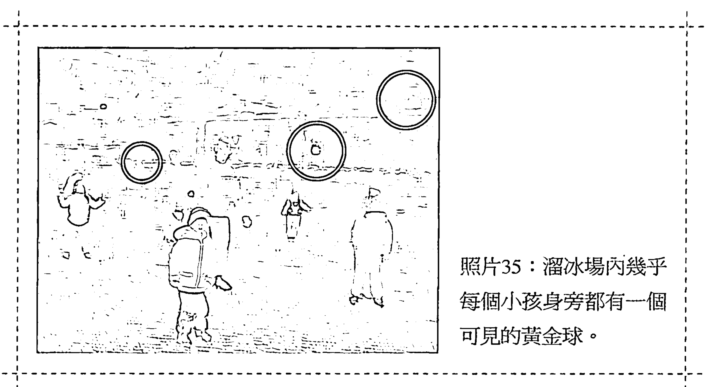

這是我們拍攝一場孩童溜冰的活動照片，照片中出現許多靈性存有發光體。我們試著圈出一些較微弱的發光體，讓它們比較容易被看見，然後發現溜冰場內幾乎每個小孩身旁都有一個可見的黃金球。

## Chapter 6

### 出現在魅力人士周圍的黃金球

> 我可以成為任何我所希望的人，如果我信任內在的那個音樂、那首歌與神的振幅。
——奧斯卡最佳女主角得主 雪莉·麥克雷恩

#### 案例 1
出現在演講者周圍——認同觀點

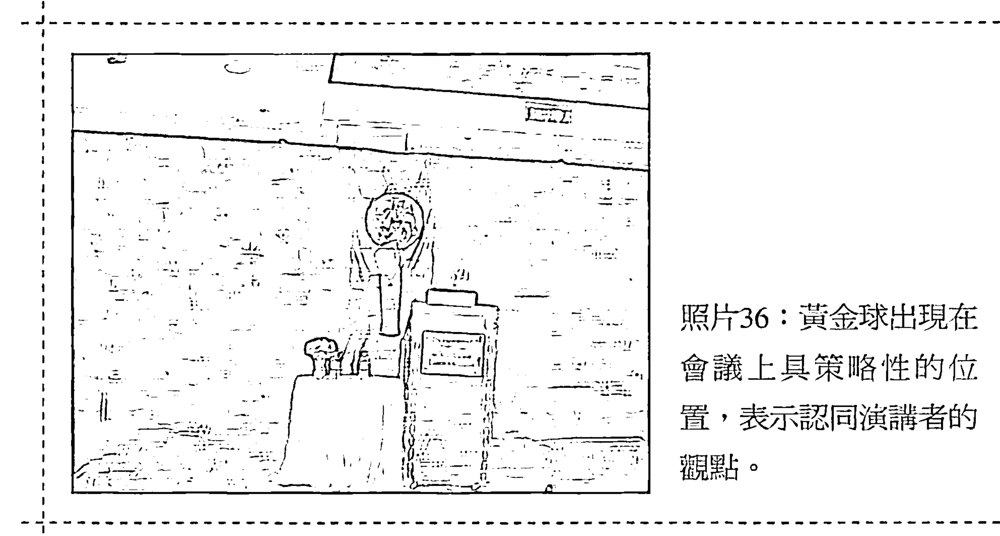

在意識提升的研討會上，每位演講者的照片中都出現了數個黃金球，這樣的情況發生過好多次。例如在二○○八年在新墨西哥州聖塔菲的第十屆國際科學與意識研討會上，我們拍攝了幾位演講者的照片，並且針對其中幾位被挑選的人，故意只拍一張或極少張照片，結果發現來自不可見領域的存有並非對所有演講都同樣感興趣。它們對某些議題或簡報似乎產生了強烈的共鳴，但在其他演講中卻完全不見蹤影。

像照片36就是一個產生強烈共鳴的例子，當時魯伯·薛德克博士正要結束有關「形態共振」的演說，現場的靈性存有似乎在傳達它們同意博士的假設——人類意識完全存在於肉身之外，處於一個無所不在的形態領域，這個領域可以透過共振偵測與放大的過程，讓任何人在任何地點皆得以存取。照片中位於地球圖片上方，內部如曼陀羅的明亮黃金球似乎備受鼓舞，彷彿在說：「是的，一旦人類對意識本質認知的典範轉移有更深刻的了解，未來就可以安全的守護地球。」

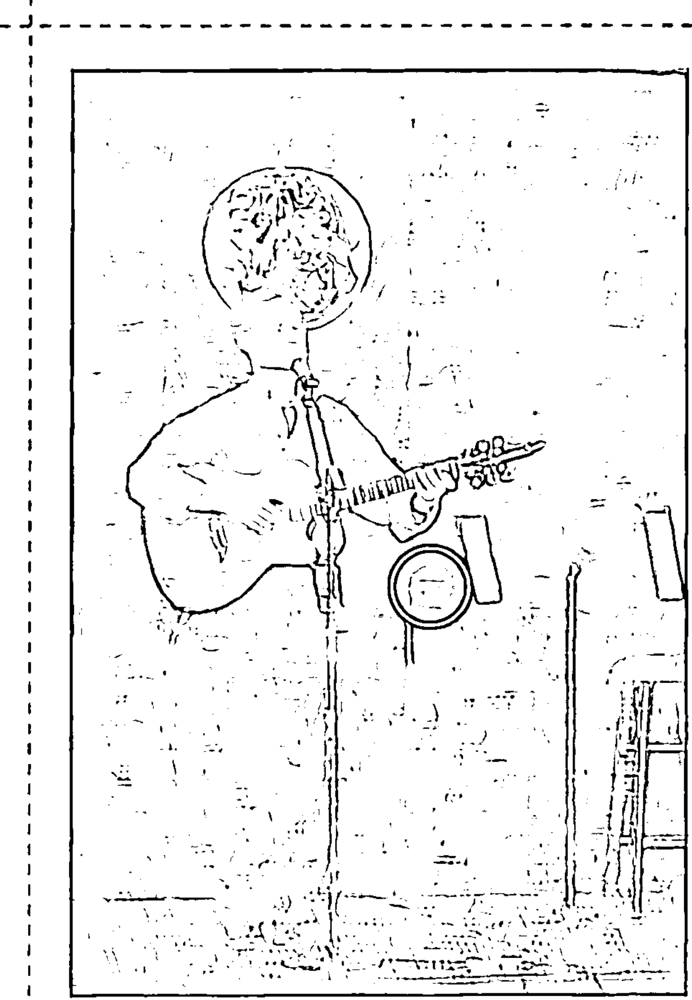

而在同一個研討會上，主辦人葛雷格·田柏林在中場提供音樂演奏以娛樂觀眾（照片37），結果四周出現了無數個黃金球。值得注意的是，有一個來自另一維度的代表在他彈奏吉他的手部附近，彷彿說道：「是的，你彈得很好，我們很喜歡！」

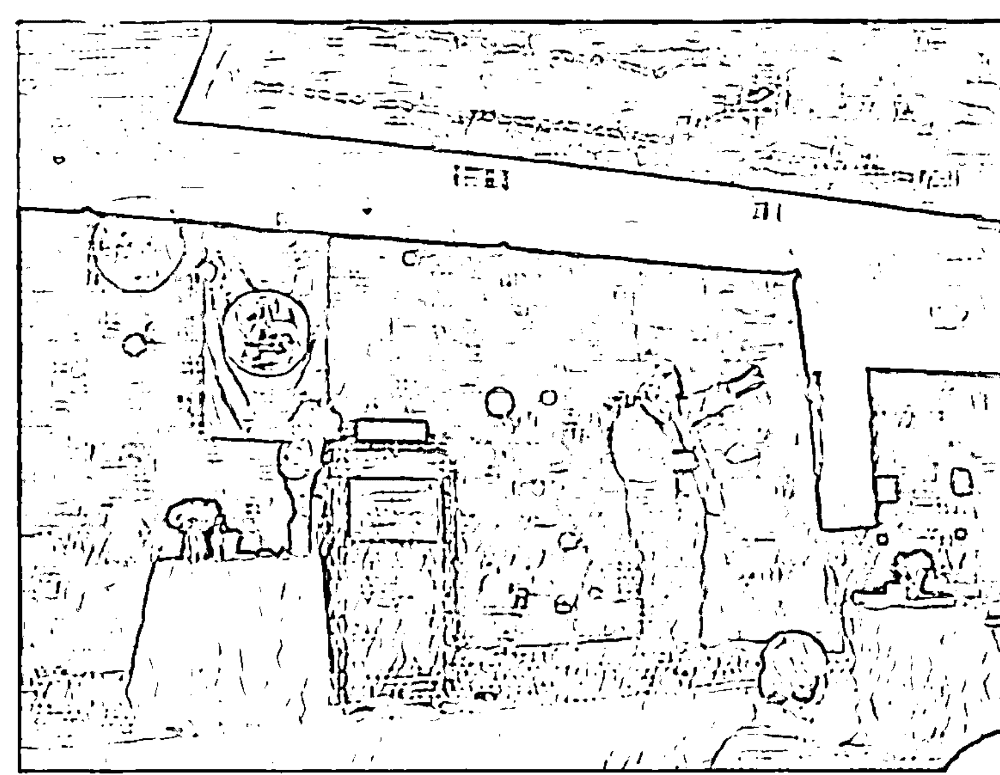

照片38：黃金球大量出現在德薩瑞·赫塔克的演講上，表示非常認同他的主張。

另外一場由德薩瑞·赫塔克所主講的關於符號學的演講，則吸引了一大群來自另一個維度的觀眾，它們排列在黑色舞台簾幕前，因為它們知道那是最能夠被看見的地方（照片38）。

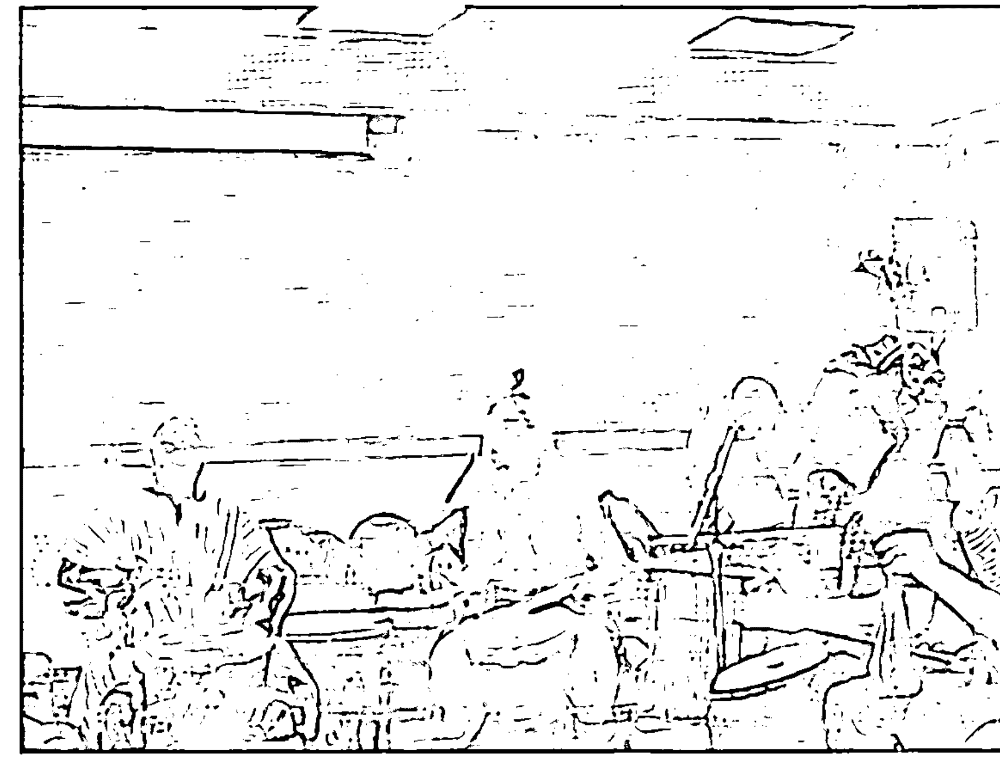

照片39：黃金球出現在歐耶·歐耶馬奇（左一）的音樂療癒會上，彷彿認同他的方法。

還有在二○○九年的科學與意識研討會上，歐耶·歐耶馬奇博士介紹了一種令人振奮的方式，即透過音樂、擊鼓與舞蹈的療癒（照片39）。無數歐耶馬奇以肉眼所不能見的觀眾也參與了他的醫治服務，彷彿同意他的方法一般。

#### 案例 2
重複出現在靈修團體創始人周圍
——相同的靈性存有

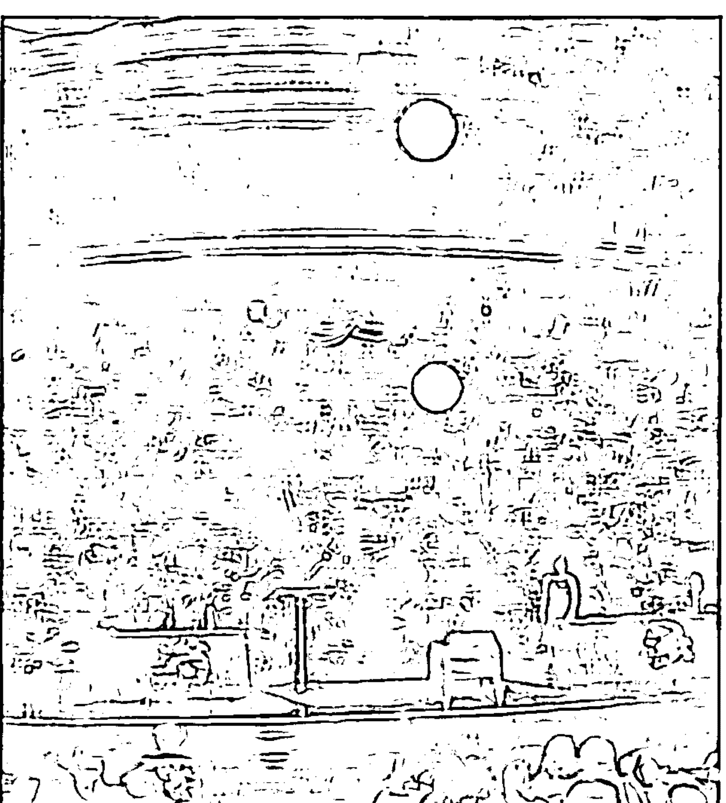

照片40：一年前的聚會，出現了兩個來自另一維度的靈性存有。

亞伯拉罕靈修團體的領導創始人伊絲特·希克斯與傑瑞·希克斯夫婦，在全美超過六十個城市舉辦工作坊，並且擁有廣大的聽眾。在兩場相隔一年的聚會中，我們分別在開場前五分鐘拍攝了一張照片，兩張照片都出現了無數個來自另一個維度的存有。值得注意的是，這兩張照片中都有兩個大而明亮的黃金球，而且仔細觀察將會發現，這些黃金球似乎都有類似曼陀羅的內在，這可能表示在兩場活動中所出現的靈性存有是相同的。

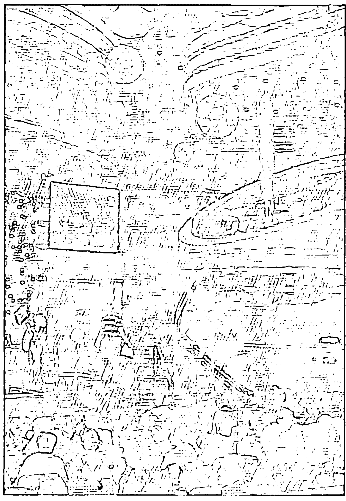

照片41：一年後的聚會，兩個黃金球的內在與一年前的相同。

#### 案例 3
出現在歌手的表演——享受演出

> 我不知道在舞台上發生了什麼事，某樣東西似乎接掌了。
——歌劇女皇 瑪麗亞·卡拉絲

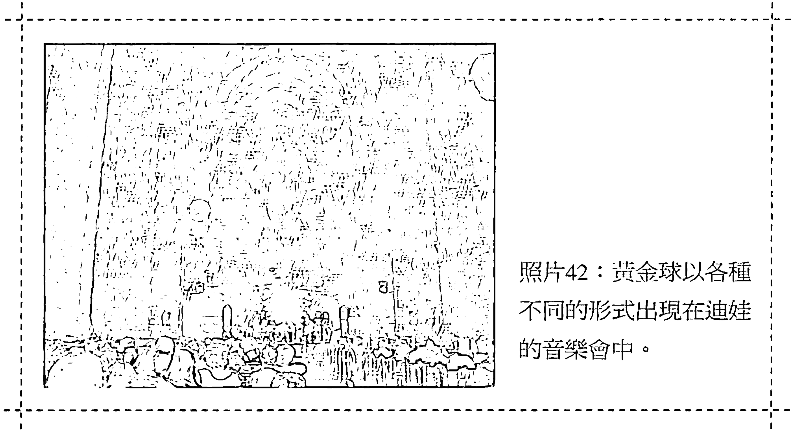

有一次，知名的心靈歌手迪娃·裴摩爾在舊金山聖恩堂演出時，我們從教堂後面拍攝了幾張活動照片，所有照片中均出現無數的黃金球（大小很不尋常，且顏色變化多端）。這些黃金球給人的印象是它們排列整齊的朝向舞台，表示來自另一個世界的存有也同樣享受她的演出。

## Chapter 7

### 出現在劃時代事件中的黃金球

> 做出你想在世上看見的改變。
——甘地

#### 案例 1
出現在總統當選之夜——支持變革

> 各位女士先生們，我在世界處於極端矛盾的時局中就任。
——德國前總統古斯塔夫·海涅曼

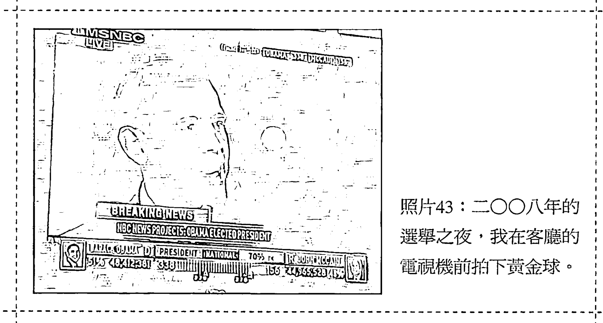

「票數終於出來了，歐巴馬將成爲第四十四屆美國總統。」
爲了親眼見證這歷史性的一刻，我們聚集在客廳觀看總統當選人歐巴馬發表的當選演說，他謙卑的請求每一位公民：「讓我們一起促成變革。」此時，電視中有一個黃金球出現在他身旁（照片43），而且還接連兩次出現在我們所拍攝的照片中。或許黃金球是在說，只要每個人都願意盡一己之力，促成變革，它們將承諾幫助我們。治理國家並非一個人就能達成，而是所有人攜手為了更大的利益共同合作，如此才能促成改變。

#### 案例 2
出現在紀念會——啟發人心

> 如果所有人都有機會根據其能力得到尊敬、責任、進步與報酬，整體社會將深受其益。
——美國第一位女大法官 珊卓拉·歐康諾

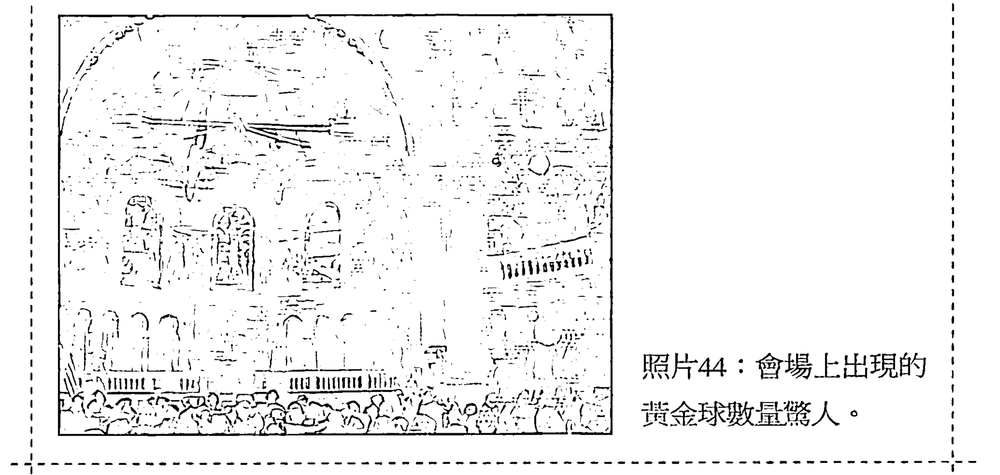

二.png)

二〇〇七年在帕羅亞圖史丹佛紀念教堂舉行了一場哈利·雷瑟朋博士的紀念追思會。他是史丹佛大學法學教授與靈性導師，於一九八九年過世。雷瑟朋博士生前非常受人敬重，最為人所知的是他對畢業生的精彩演說。演說中，他提醒大家要以拿薩勒耶穌的第一與第二戒律為充實人生的指導原則。

在這場紀念會中，曾為雷瑟朋博士的學生的前美國最高法院大法官珊卓拉·歐康諾發表了一場動人的演說，她也提醒觀眾要以這些原則為人生指引。

當歐康諾大法官與雷瑟朋博士的兒子理查·雷瑟朋走下講台時，我們拍攝了一張照片，照片中出現為數可觀的黃金球，顯示在這場創造歷史、啟發人心的活動中，出席的靈性存有遠比在場的觀眾還要多。包括許多史丹佛的新鮮人在內，所有觀眾均能一瞥哈利·雷瑟朋博士的靈性財富。

## Chapter 8

### 出現在聖地的黃金球

> 經歷生命只有兩種方式：一種是彷彿沒有任何事出現奇蹟，另一種則是將所有事皆視為奇蹟。
——愛因斯坦

#### 案例 1
出現在聖杯之泉——協助療癒

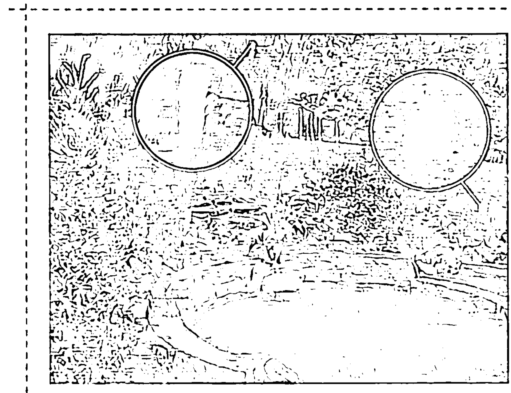

照片45：在英國聖杯之泉出現兩個高速移動的黃金球。

二〇〇八年在英國舉行有關「黃金球：與另一個領域的互動」的先知研討會時，我們趁機造訪了格拉斯頓伯里市中心的美麗花園。聖杯之泉就在花園內，人們相信亞利馬太的約瑟曾將接過釘死基督的十字架所流出寶血的聖杯安置於此。基督教神話暗示此處泉水的紅色，代表釘死基督所用的生鏽鐵釘。

照片中，在水泉下方的小水池出現許多黃金球，其中有兩個快速移動的不透明黃金球在拍攝時出現，其條紋長度可用來估算它們移動的速度。位在中間的黃金球有數英尺長的條紋，這表示它移動的速度大約是每小時五千英里，而右邊的黃金球則約以每小時三百英里的速度移動。它們似乎表示，當需要它們出現以提供醫治協助時，速度根本不是問題。

小水池造景呈象徵永恆的符號形狀，流入池中的水據說含有特別的療癒能力。我們的假設為：靈性存有在此出現不只是提供希望，甚至還實際協助人們療癒，而它們的醫治能力則據信與其極高的移動性有關（詳見〈Chapter 12：黃金球的靈性療癒〉）。這兩個以極高速度移動，但仍能慢到讓人看見的黃金球是否印證了上述關於微妙能量療癒機制的假設？

#### 案例 2
出現在教堂附近——心懷感激

我們踏入一間位於英格蘭西南端，靠近聖麥可山的小教堂，驚喜的在禮品店中發現這首諾貝爾文學獎詩人——約瑟夫·魯德亞德·吉卜林的〈如果〉：

> 如果當身邊眾人皆昏濁且歸咎於你，你仍能保持清醒；
如果眾人皆懷疑你，而你仍能卓然自信，
並且思考他們懷疑的原因；

如果你能期待，而不為期待所疲憊，
或被人欺騙，而不欺騙人；
為人疾恨，而不生怨恨之心，
既不作鄉愿，亦不賣弄聰明；

如果你有夢想，而不為夢想所主宰；
如果你能思考，卻不思則不行；
如果不論成功失敗，都能保持同一心態；
如果你敢以累積的勝利，孤注一擲，
失敗，從頭再來，一聲不提你的損失；

如果你能與鄙夫言，仍保持美德；
與權貴行，而不失本色；
如果不論仇敵或愛友皆不能傷你，
如果所有人皆仰賴你，但無一過多；
如果你能在每一分鐘無情的歲月裡，
盡六十秒最大的努力，
那麼這個世界的一切都將屬於你，
更多的賞賜是，你將成為一個男子漢，兒子！

在英格蘭小教堂旁發現這首短詩令我們對此地產生興趣，同時也對這個平易近人的地點更爲感激。於是我們在教堂裡拍下這張照片，並且欣喜的發現兩個黃金球，它們似乎在說道：「你們到此是有原因的。是的，這首詩值得牢記於心！」

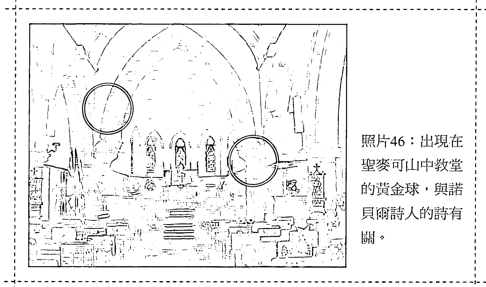

## Chapter 9

### 出現在家中的黃金球

> 你的神聖之處乃是你可以一次又一次找到自己的地方。
——當代神話學大師 喬瑟夫·坎伯

#### 案例 1
出現在家中的鋼琴上——享受樂趣

> 向內看，定靜。擺脫畏懼與執著，了解修行生活的甜美。
——佛陀

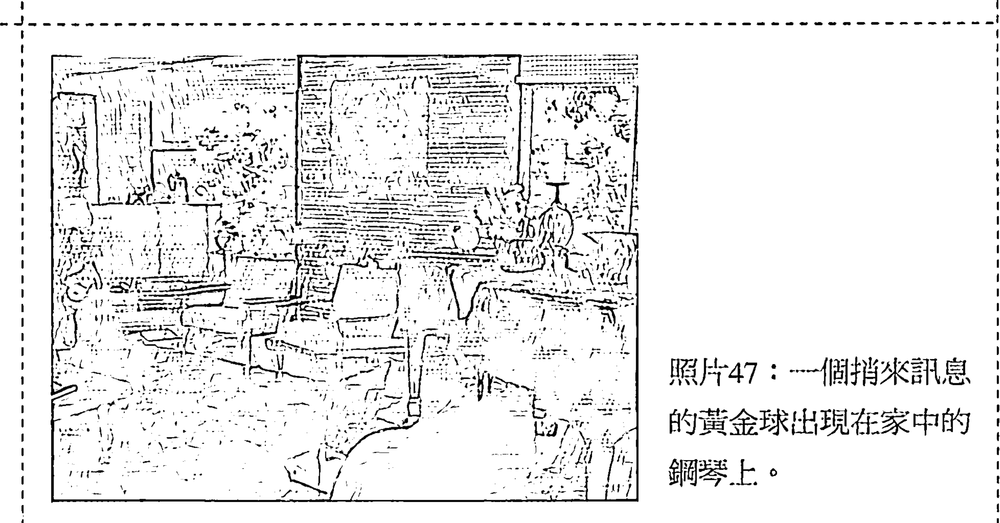

我們兩人都曾經很喜歡彈鋼琴，但因為生活中太多其他活動的干擾，使得我們很久沒有繼續練習，並且享受此藝。近來，有好幾次我們曾看見黃金球出現在鋼琴旁（照片47），它們是否帶來微妙的訊息，要我們重拾此藝？因為疏於練習，所以我們的技巧已略顯生疏。黃金球是否在告訴我們，不需要完美的技巧才能享受彈奏鋼琴的樂趣？它是否要讓我們了解：如果可以在工作與休閒活動間找到平衡，那麼將更能促進我們的福祉？

#### 案例 2
出現在天使裝飾品附近——平衡生活

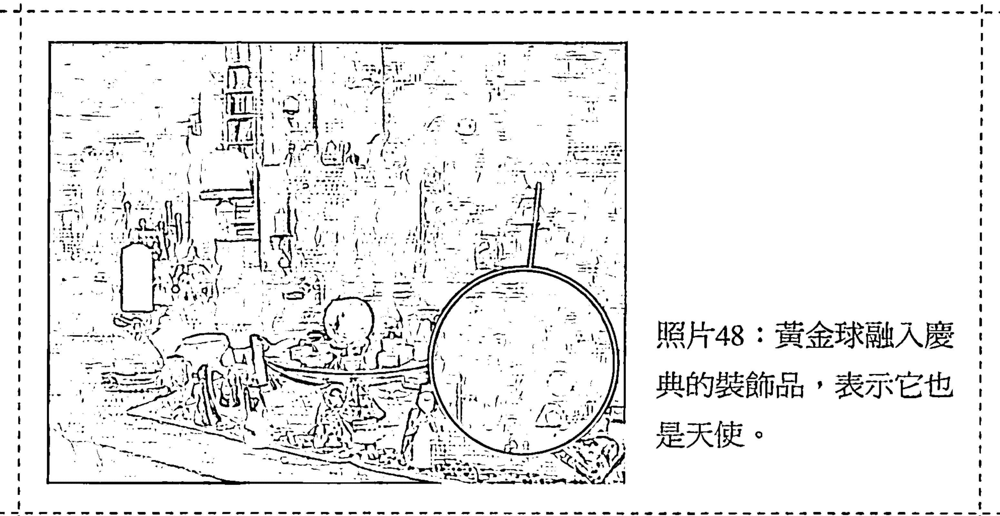

某個節慶時，我們在咖啡桌上擺設天使的裝飾品，而黃金球則出現在窗戶上，就在耶穌誕生景象的上方，旁邊還有其他球形的懸掛裝飾，它好像在說：「我很融入這個場景吧？畢竟，我也是天使呀！」或是想傳遞用美麗的裝飾布置房子，可以幫助我們平衡過於混亂的生活這樣的訊息。

#### 案例 3
出現在新家附近——正確的抉擇

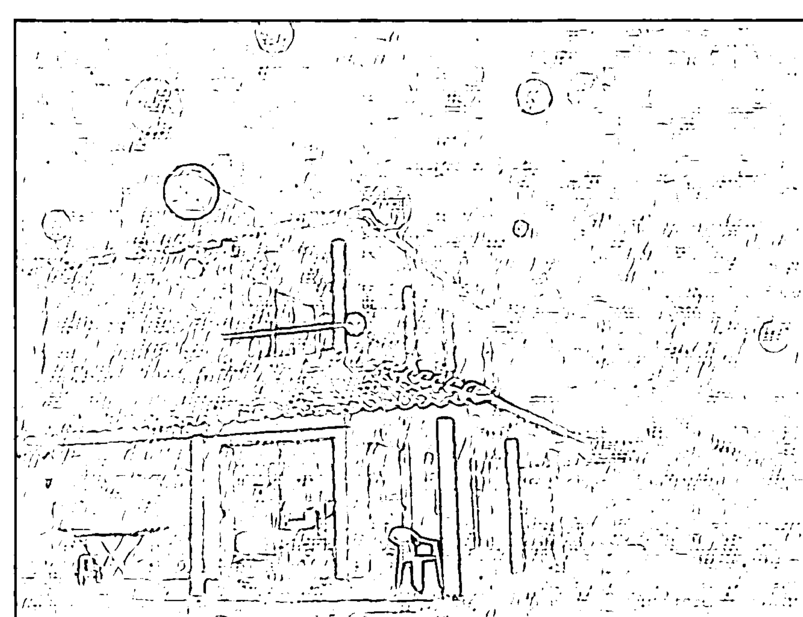

照片49：應邀出現的黃金球，確認這是一項正確的選擇。

既然黃金球是具有覺知的存有，那麼我們便可請它們為我們解答，它們會以自己的方式回應，我們再自行詮釋答案。
拍攝這張照片的人買下這棟位於「上帝的約翰」所在城市的房子，想知道是否做了正確的決定。從照片中看來，來自另一個世界的正面回應令人興奮。但為了確認照片的真實性，並且排除黃金球是由懸浮微粒所造成，於是她在拍攝這張照片前後也各拍了一張，但那兩張並沒有出現黃金球。

#### 案例 4
出現在家庭聚會——歡樂時光

> 最終，重要的不是生命中的年歲，而是年歲中的生命。
——林肯總統

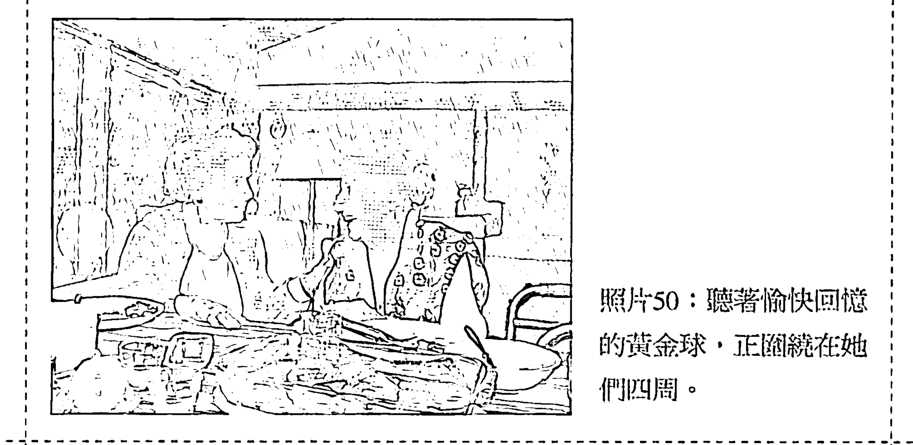

你認識多少百歲人瑞？我們很榮幸認識一位剛慶祝一百零一歲生日的人瑞，她仍然非常精明，記得幾乎一整個世紀前發生的事。照片中，右邊的女士就是她，她正與旁邊那位只比她年輕幾歲的女士交談。這張照片是由她的媳婦所拍攝，她表示：「兩人在這場慶祝派對上認識的。雖然她們是第一次見面，不過由於兩人都很幽默、外向，所以喝了點小酒後就開始笑著回憶她們的人生。兩位女士的家人也都在現場，大家一起談論著家中快樂與值得回憶的時光，整個屋子都充滿了笑聲。」顯然，來自另一個維度的聽眾與她們可敬的歲數一樣多。

### 案例 5
出現在吹笛手身邊——音樂精靈來訪

> 我們遠離靈性經驗，因為內在世界存在著過往的創傷；隨著我們開始清除記憶，神聖之光的能量與愛將開始流過我們的生命。
——神父 湯馬士·基廷

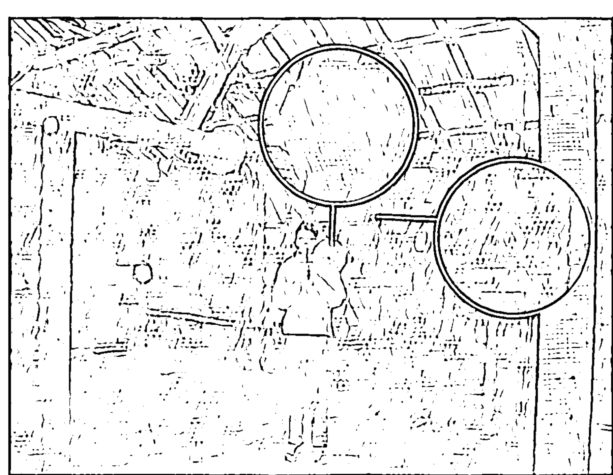

照片51：在熱情的吹笛手身邊：出現了數個大而明亮與小黃金球。

一位剛讀過《黃金球計畫》的女士寄了這張照片給我們。這張照片很驚人，上面出現了兩個巨大的黃金球，根據它們出現的位置，似乎暗示著它們帶來與地點相關的訊息。還有，一些傳統的黃金球看起來似乎是隨機分布。比較不尋常的是，照片中也出現了大量的的小黃金球，如果不加以放大很難被看見。從其中一個被放大的小黃金球中可以看到，其中心有一隻銳利的「眼睛」，而其他的小黃金球則有個別的內部特徵。

照片中的人物是艾美，她正在吹奏愛爾蘭錫口笛。她是一位極具天分、很有成就的音樂家。從五歲開始學小提琴，並從兩年前開始自學錫口笛。她喜歡古老的音樂，例如塞爾提克、愛爾蘭與中世紀音樂。自童年早期，艾美便有來自前生的回溯經歷，她表示：「拍照時，我回憶起可能是在愛爾蘭前一世時光，我接收到来自綿延碧綠的山丘，以及高興的跳愛爾蘭踢踏舞的影像。我依稀記得自己曾在父親開的酒吧中的桌子上跳舞，旁邊還聚集了很多人觀看，大家一起跳舞拍手。」

這是否表示過去這些人的靈魂來訪問她呢？從不可見實相來的生命是否也都喜歡錫口笛？抑或它們是被她的演奏技巧所吸引？

「我想它們是喜歡我音樂的精靈！因為我注意到當自己在吹奏活潑快樂的曲調時，就會出現很多觀眾；但當我吹奏憂鬱哀傷的慢歌時，就幾乎沒有任何黃金球出現。」這張照片似乎確認她憑直覺所得知的。

### 案例 6
出現在寵物旁邊——來自親人的訊息

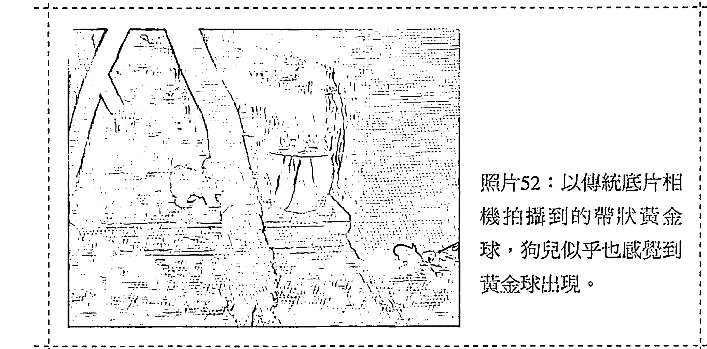

許多飼主都曾經在照片中看見黃金球出現在寵物旁邊，於是我們從各地寄來且為數眾多的照片與故事中，挑選了一張由珊卓·桑德思所拍攝的極不尋常的照片。這張照片是在九○年代末期，以傳統底片相機所拍攝的。照片上是她新養的小狗與一隻較老的狗，牠們已經玩了好一陣子，但某天卻突然停下來吠叫，而珊卓就是在那個時候連續拍下這些照片。這張照片最特別的是在老狗的頭上出現了「帶狀」的黃金球，那是飛快移動的黃金球所留下來的痕跡，大多為不透明的。

對此，珊卓描述道：「我覺得這是與我父親有關的靈性現象。自從父親去世後，家裡的電話就經常無緣無故的響起，但是當丈夫或我去接聽電話時卻沒有聲音，也沒有靜電干擾聲……什麼都沒有。」

關於這張照片，有幾點非常有趣。首先，它清楚的顯示在某些情況下，黃金球也會選擇出現在傳統底片相機的照片中。其次，關於珊卓過世的父親，他也許真的想與珊卓接觸並傳遞訊息。黃金球是電磁波的顯現，因此也具有足以觸發較低能量的電子活動，例如使電話聲響起，像是珊卓所描述的。這與其他人所報導的類似經歷相符，也與照片中訊息的強度相符。如此清楚並能被傳統底片所捕捉的黃金球，一定比一般出現在數位相片中的黃金球，擁有更大的能量。

此外，珊卓是唯一接收到父親訊息的人。為了了解他所想傳達的訊息，她必須將所有不尋常的狀況都納入考量，例如老狗與小狗；出現於黃金球幾乎不為人知的時代的高能量靈性發光體；她已去世父親的職業、時間、地點等；以及其他曾經歷過的不尋常事件。接受直覺的指引，並且相信這個訊息與整個經歷是正面、友善、慈愛的，或許就能夠從黃金球訊息中，接受療癒。

## Chapter 10

### 黃金球內的臉部特徵

> 轉化真的代表超越你的外形。
——諮商心理學博士 韋恩·戴爾

有很長一段時間，克勞斯不承認黃金球內可能具有臉部特徵，他認為此類照片純屬巧合或趣事軼聞。既然黃金球的光源很顯然是具有高度智慧的靈性存有，但在克勞斯尚未親眼看到可信的證據之前，無法完全將其排除。也就是說，或許黃金球內真的可能有臉部特徵。不過，他也不會斬釘截鐵的排除將黃金球影像解釋成某些臉部表情的人，或許他們是真的有所領悟。現在，就讓我們更深入來探討令他對此完全改觀的特徵。

#### 案例 1
黃金球只傳遞訊息給能辨認其特徵的人

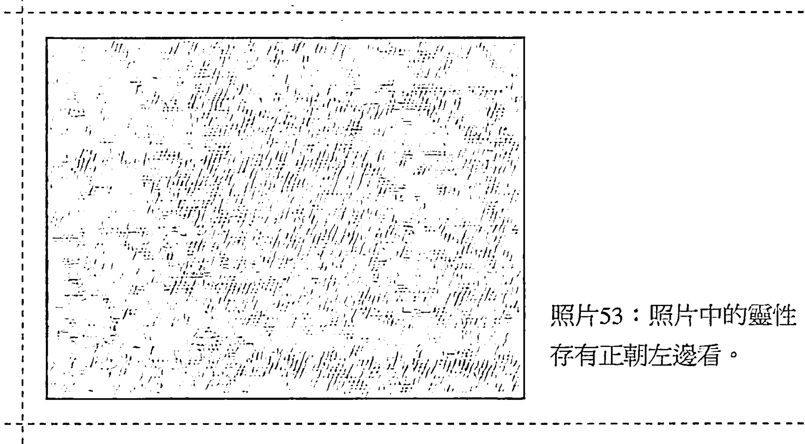

照片53、54是一位來自英國的黃金球愛好者——珍妮絲寄來給我們的，然後我們從原始照片中擷取出這兩個黃金球。關於照片53的黃金球，她描述道：

> 「首先，我必須清楚說明我是一個非常務實且理性的人。前陣子，我搭飛機前往克羅埃西亞準備參加女兒的婚禮，在飛機上剛好讀了你們刊登在《泰晤士報》上關於黃金球的文章，我覺得很有趣，於是將文章留下來給一位朋友看。婚禮在一處保有古老教堂遺跡的地方舉行，後來的致詞與餐會則移到一棟舊建築後面，那裡有個露天舞池，不遠處還有樹林作為背景，非常具有田園風格，既單純又質樸，可愛極了！當樂聲響起時，我轉身將手上的數位相機朝向完全沒有光源的樹林，並且想起那篇黃金球的文章，還有你曾提到關於邀請黃金球前來的事。於是我謙卑的低聲說：『歡迎這附近的黃金球一起來參加舞會。』然後才拍下照片，並且驚訝的發現照片中有許多大小不一的黃金球。

> 「接著，我將照片拉近放大，以便能看清黃金球內的圖案。其中有一個小小的黃金球特別顯眼，因為它裡面有一張非常清楚的臉，不過我不記得你的文章中曾經提過，所以很驚訝。我又將影像放得更大，竟出現了不是人類，但極有可能是某種存有的臉，它正朝左方凝視著。它頭部的形狀聳起如雕刻過的顴骨，細緻、大大的眼睛，以及一個好像在吹氣的小嘴巴，看起來好像在觀看正在發生的事。」

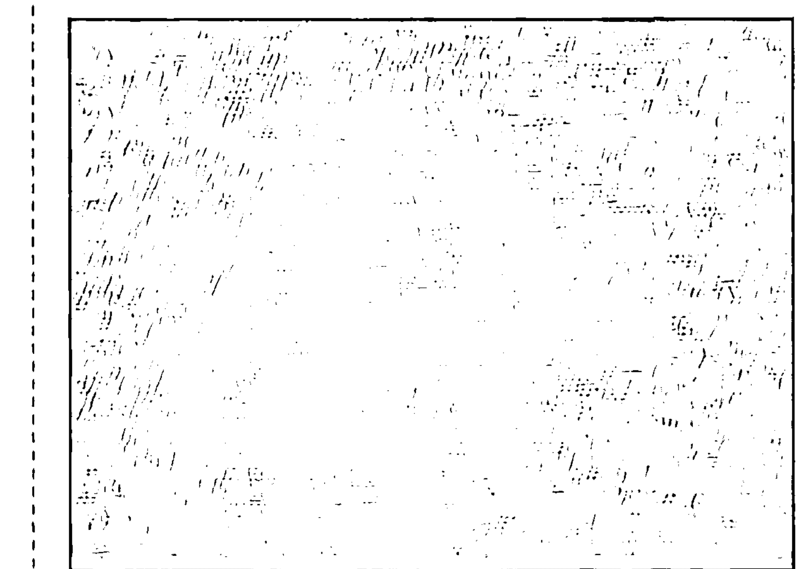

照片54：照片中確實出現了一張白色的臉。

關於照片54，她提道：「照片中很明顯的是另一種存有的白色臉部，感覺很像大氣層的一小個圓形部分剝落而顯露出來。」

兩個黃金球所帶來的訊息，也許是針對可以辨認出其特徵的拍攝者，而非給一般大眾。第一個或許是向珍妮絲確認她所讀到關於黃金球的事確實是真的：妳可以邀請它們前來，它們就會出現在妳的照片中，它們是聰明的，也會對妳身邊發生的事感到興趣；第二個也許是要讓她明瞭：即便黃金球內部特徵的解析度很低，還是有很多不同樣貌的可能性。重點不在於讀者是否能夠和珍妮絲一樣，可以清楚的解讀照片。至於如何闡釋黃金球內的特徵，則沒有絕對的對與錯，可以容許觀察者保有某種程度的主觀性。

#### 案例 2
利用比對的方式確定臉部特徵非背景

> 相信自己，你所知道的比你以為的更多。
——世界著名的小兒科醫生 班傑明・史波克

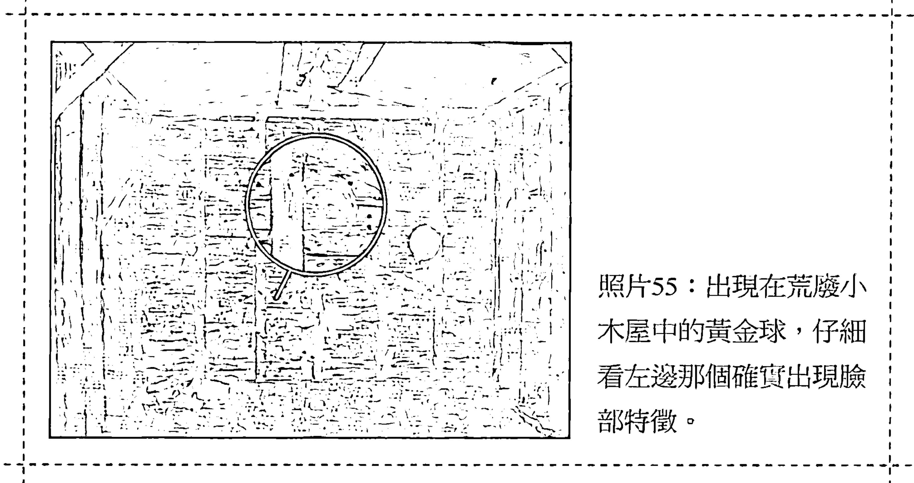

克勞斯對黃金球影像內部的臉形辨認始終保持強烈的懷疑態度，直到二〇〇八年六月底的一個晚上，一切都改觀了。我們在德國北部的一場研討會中介紹黃金球，當晚研討會主辦人邀請部分與會者加入他們在某個偏遠田野的黃金球拍攝活動，據說那個地方常有靈性存有造訪。但是，我們對靈性存有也許比較喜歡到某一個地方，特別是到偏遠的地區，這樣的觀念並不是很同意，只能勉強跟著去。事實上，由那天晚上照片中出現的黃金球來看，數量好像並未多過典型以人物為主的場景中所能見的。

其中有一位黃金球拍攝同伴是當地人，他建議我們拍攝位於田野邊緣一間荒廢小木屋的內部。小木屋有一側是完全敞開的，也許數十年前這間小木屋是健行者在惡劣天候中的避難所。此次拍攝的第一張是照片55，它不僅出現兩個非常明亮的黃金球，而且其中一個（請注意左邊的放大圖）的內部含有極清晰的臉部特徵，以致於克勞斯不再懷疑黃金球內所出現的臉部特徵。他的問題不再是可能在黃金球內看到臉部特徵，而是我們在照片中看到的是誰。

然後，我們針對同樣的場景又拍了幾張照片，以便分析具有臉形的靈性存有如此不尋常的樣貌，或許可以用來比對臉部特徵（如眼睛、鼻子、嘴巴、鬍子等）與紋路複雜的木質背景之間的關連性。不透明黃金球之下的背景特徵所帶來的影響，的確是對臉形持懷疑觀點的人所提出來的一項合理論點。他們可以爭辯說，黃金球內所可見的臉其實不是黃金球本身的特徵，而是背景特徵穿透黃金球而來。

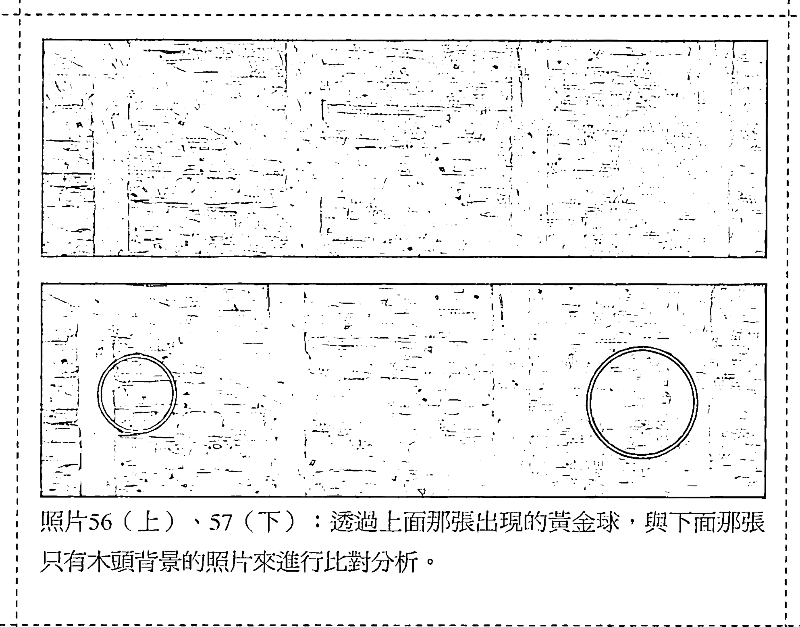

照片56是從照片55上擷取下來的，而照片57則是在拍完照片55之後緊接著拍攝的照片所擷取。我們在照片57上以圓圈標示原始照片中黃金球所出現的位置，但是卻沒有出現黃金球。根據這兩張照片的分析顯示：黃金球臉形照片（左邊）中的眼睛與木板的結狀紋路並不完全相符，但眼睛確實出現在顏色非常深的木紋上。雖然照片56的鼻子與嘴巴的確與某些木頭特徵相同，但照片57的特徵絕對沒有詳細到能使人辨認出一張臉或臉部表情。而出現在照片56中右邊那個黃金球，我們發現在它出現的位置在照片57中有類似的強烈背景變化，然而這個黃金球並不具任何臉部特徵。

因此，我們可以很謹慎的認為，黃金球（也就是是發出黃金球光源的靈性存有）也許可以在影像中利用實體背景的特徵，形成臉部影像，如果這是它們所想要傳達的。

另外，由這組照片我們亦可推論：

- ①針對拍攝照片的人所要傳達的主要訊息，黃金球的確可以顯現臉部特徵。
- ②明智的利用背景特徵可以強化臉部表情，也就是照片中的黃金球透過技巧性的定位，將背景結構最佳化，把顯現黃金球實際所需的物理能量降到非常少。
- ③因為產生臉部特徵的機制非常複雜，所以大部分的黃金球通常不會顯現臉部特徵。但由於一般背景結構的緣故，要將之套用到每一張黃金球照片則是不可能的，舉例來說，在單一顏色背景上的黃金球就完全無法使用這套機制。
- ④如果不跟隨預感，照片與其中所包含的個人化訊息均無法發生。就如同我們在照片中所見到的第一個黃金球必定得跟燈泡一樣又大又亮才足以吸引我們的注意力，而要改變我個人偏見的第一個黃金球內的臉部特徵，也必須絕對清楚才可以。

#### 案例 3
黃金球會選擇最適合的情況出現

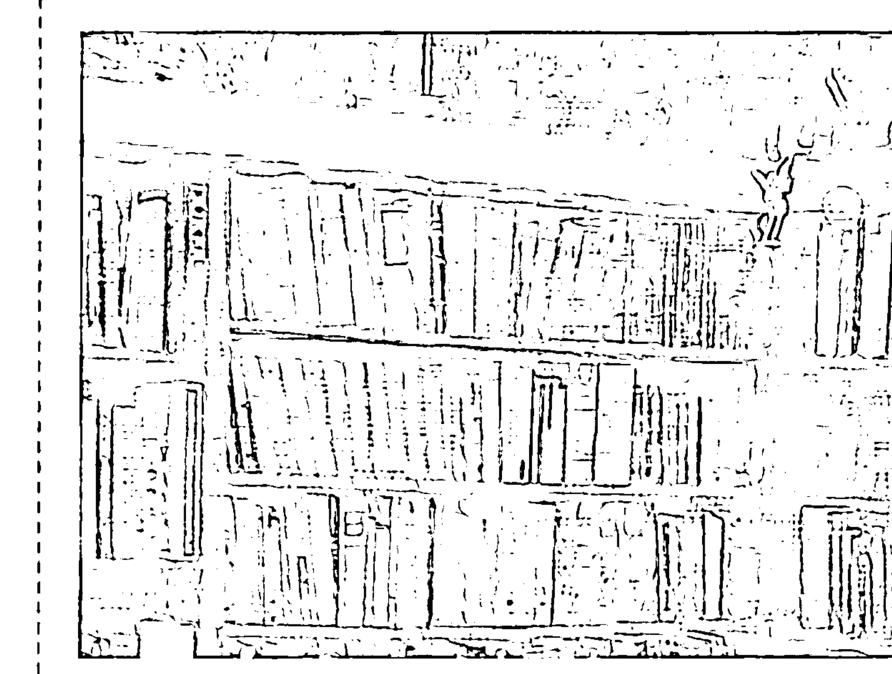

斐列達·薛尼寄來一張照片，她的故事令人無比驚奇，我們因此與她往返溝通，而這個過程驗證了上述的一些發現。她在自己的圖書室拍到這些黃金球，以下是她的描述：

> 「我將黃金球在電腦上放大，看見它好像懸浮在一本小說上面，那是喬治·艾略特所寫的《弗洛斯河上的磨坊》（照片58）。這令我覺得很意思，所以我在螢幕上將它再放大，發現黃金球裡面有一個女人與一個年輕女孩的臉。其中，女人留著金髮，身穿淺色洋裝；年輕女孩則是深色頭髮，穿著一件有白領子的深色洋裝。

> 「為了滿足我的好奇心，我把《弗洛斯河上的磨坊》由書架上拉出來開始讀。書中人物的畫像剛好也有一個女人留著蓬鬆的金髮，穿淺色洋裝；還有一個深色頭髮的年輕女孩，穿著有白蕾絲領子的深色洋裝……這一切純屬巧合嗎？丈夫建議我先去讀這本書，看其中是否有我生命中某些謎團的解答。」

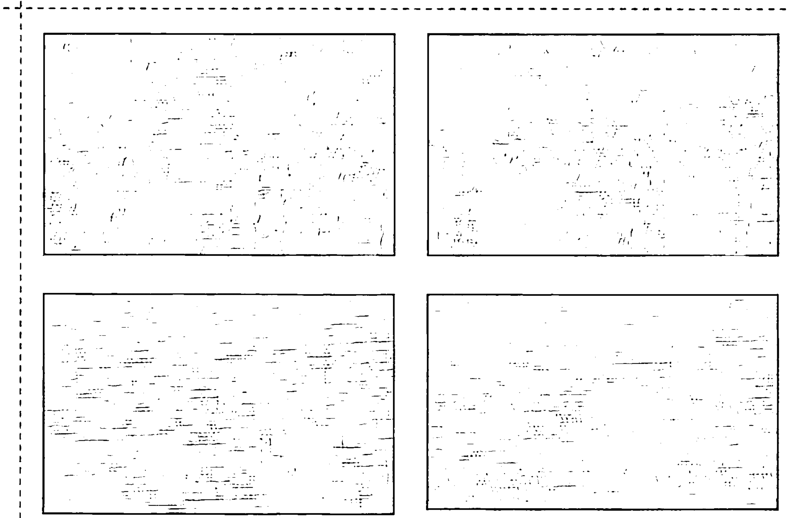

照片59（左上）、60（左下）、61（右上）、62（右下）：左邊兩張為黃金球出現的連續放大圖，右邊兩張則是黃金球出現前的連續放大圖。

照片58是原始圖書室牆上書架的照片，而照片59、60的兩個影像則是兩張黃金球與內部特徵的連續放大照片，在此只針對放得最大的照片60進行微小的對比加強。我們必須承認，在解讀斐列達詳細敘述的這張具有兩位女子臉部特徵的照片時，確實很困難。但毫無疑問的，我們可以清楚辨識似乎是兩個女性的存有在黃金球內。

我們要求斐列達將她看到黃金球出現在牆面上八秒鐘之前所拍攝的照片寄來給我們，正如我們所預料的一樣，在同一個位置並沒有出現黃金球。所以我們得以分析黃金球下面的背景，以確定背景中是否有與女子臉部特徵相似的紋路，就像前一個案例所做的分析。

運用類似先前將黃金球內部存有放大的對比加強技巧，詳細檢視黃金球出現的位置，我們得到信賴度極高的結論：背景特徵與黃金球內的兩個存有影像並無明顯的關係。照片62為黃金球出現前所拍的照片，經過同等放大後與出現黃金球的照片60做比對，兩者皆為圖書室牆面的同一區塊。也許仍然有某種巧合使人覺得左邊黃金球內的兩個存有影像是因此而來，但即使極為模糊，兩個存有的影像的確是真實的。

由前一個例子我們得到以下的推論：如果靈性存有想顯現在具有如臉部特徵般的黃金球內，它們則會聰明的利用已有的背景特徵，但並非全部案例都有效的。另外，它們也可以只靠自己就直接組成想傳達給觀看者的影像。

根據我們與斐列達溝通這個初步的結論，並且推薦她按照丈夫的建議去讀《弗洛斯河上的磨坊》，希望她或許可以找到有關黃金球意圖傳達給她的一些訊息線索。結果她真的這麼做，並且發現這真是太不可思議了！很明顯的，喬治·艾略特正是根據她的生平創造了《弗洛斯河上的磨坊》中瑪姬這個角色。

「瑪姬（及喬治·艾略特）與我之間有太多相似之處，」斐列達如此寫道，「多到必須花很多時間才能一一道盡。我在下面列出幾項最明顯的地方，因為我對書中的線索極為著迷，它們帶領我了解自己，並且得以一種客觀的方式了解自己的生命。」接著繼續敘述瑪姬與她自己之間令人驚訝的許多相似之處——從她們共同的興趣，到相同的家庭生活，以及情緒偽裝等。在此我們僅列出幾項：

- ①喬治·艾略特研讀神學，而斐列達則是神學博士。
- ②瑪姬的哥哥得到父母的偏愛，而斐列達的父母也偏愛她的兄弟們。
- ③故事最後瑪姬為了救哥哥湯姆而死在一艘小船上；斐列達有一次跟朋友外出划船，也差點死在一艘船上。
- ④斐列達與瑪姬一樣，都曾經做了不幸的選擇，並因此受苦。兩人都經歷過一段黑暗時期，然後自經驗中成長，一直忠於直覺。瑪姬情緒化到了人們無法了解她的地步，渴望被愛與被接受；而斐列達則是在年輕時母親便過世了，因此缺乏親情的滋養；至於喬治·艾略特的母親也在她十幾歲時過世，並且終其一生經歷了無數的情緒挫折。
- ⑤喬治·艾略特在第一任丈夫喬治·路易斯去世後，嫁給一個名叫約翰·華特·克羅斯的人；而斐列達第一任丈夫的名字叫做約翰·華特。

除此之外，斐列達還提到更多驚人的相似之處，在她所寫的《喬治·艾略特還活著：一個不可思議的轉世故事》書中有深入討論。斐列達表示：「我從未讀過《弗洛斯河上的磨坊》，直到黃金球帶領我才第一次打開這本書。事實上，這本書收在盒子裡，從書架上根本無法看見它那有紋飾的封面。」

最後，斐列達總結在這段經歷中由黃金球照片所學習到的：

> 「喬治·艾略特的生平與作品，特別是《弗洛斯河上的磨坊》一書，使我了解在同儕中與眾不同的自己並不孤單。瑪姬本身就是一個很好的例子，她用像孩子一樣的方式來了解生命的不同面向，那是一種神秘的方式。不管是孩童時，還是成年後，她一直都是勇敢、驕傲，並為人所誤解的——這也是多年來我所努力對抗的。最後，也是最重要的，喬治·艾略特的書帶給我的意義是：如果我們不屈不撓，一定可以發現我們一直知道——神以彎曲的手指書寫，陳述其意。如果可以度過靈魂的暗夜，我們就可以向前行，將新的意義帶進人生的新方向，所以我們一定要敞開心胸。」

> 「喬治·艾略特曾經寫過一篇名為〈被掀起的面紗〉的中篇小說，小說的主題是超自然現象。然而，她大部分的作品都是現實主義。我覺得很不可思議的是，她居然寫了一本關於超自然現象的小說，而小說的名稱與〈黃金球：掀起面紗〉DVD的主題非常相似。

> 「或許黃金球靈體知道我會如何鍥而不捨的研究這個資訊，並與其他人分享，所以為了啟發更大的益處而精心布了這個局。畢竟在黃金球出現之前，我對她的作品一點興趣也沒有，如果不是黃金球給我的線索，我根本不可能去研究她的生平與作品。」

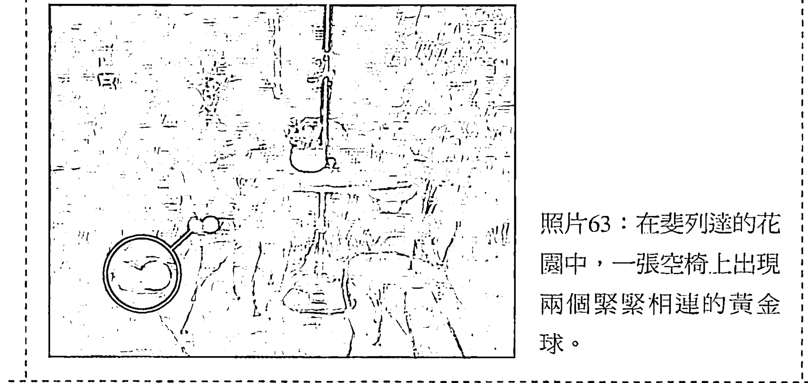

在揭開所有啟示之後，我們問斐列達是否有其他的黃金球照片可以寄給我們。她從一個很大的個人照片資料庫中，挑選出一張在黃金球出現於《弗洛斯河上的磨坊》前四年所拍攝的照片。左頁那張照片是在露台上所拍攝的，兩個黃金球正坐在同一張椅子上。

為什麼她會從數百張黃金球照片中選出這一張？這真的只是隨機挑選的嗎？從斐列達的觀點來看，也許是。但有可能是因為其背後的故事嗎？我們謹慎思索這些精彩的照片與事件所可能隱含的故事，於此以假設的方式述說如下，讀者可以自行認定是否可信：

喬治·艾略特完全清楚斐列達是她的轉世，她強烈感到必須與其溝通。然而，斐列達對這些溝通的企圖卻渾然未覺。艾略特知道斐列達對黃金球感興趣，於是便試著透過黃金球發光進行溝通。也許她想藉由這張照片讓斐列達明白，這個線索指出黃金球代表的是同一靈魂的兩個轉世——她們兩人在宿命的意義上仍緊密相連，但斐列達無法產生連結，所以艾略特的計畫失敗了。

四年後，另一個溝通的可能性出現了，艾略特立刻抓住機會。必須了解的是，在此情境中，從艾略特的觀點而言，時間幾乎無關，而實相本質上是無始無終的。過去即現在即未來——這由人類的觀點來看實在很難理解。這一次斐列達在圖書室中拍照，艾略特好不容易等到機會，在自己的作品上留下線索——一個可以成功引起斐列達注意到那本書的黃金球，進而注意到她們平行的人生。透過《弗洛斯河上的磨坊》所揭露的訊息，這一次終於成功了！

斐列達的故事是個絕佳的例子，代表含有臉部影像的黃金球試著與拍照的人溝通。如果設計黃金球的靈性存有知道主要看到照片的人，也就是拍攝者，能敏銳的辨識類似人類的臉部特徵，它們可以也願意選擇以這種方式出現。而斐列達正好具有這樣的敏銳度，但其他對如此的溝通管道較不敏銳的人，它們就會透過黃金球影像的其他特色，如類似曼陀羅的內在等，以較為容易的方式來回應。

顯然，觀看者對黃金球內的某些特徵看法是否一致並不重要，重要的是我們發展覺知到一個足以了解黃金球影像背後確實有其意義的程度。發出黃金球光源的存有會調整自己，並選擇最適合情況的形式出現。

## Chapter 11

### 環繞你我四周的黃金球

> 直覺與概念構成所有知識的元素，沒有直覺的概念不等於知識；同樣的，不具有概念的直覺也無法產生知識。
——德國哲學家 康德

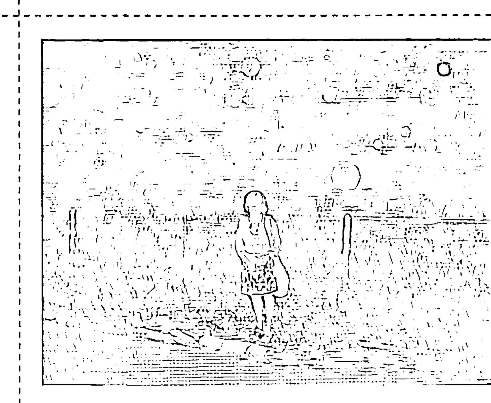

照片64：昆蒂被來自不可見領域的豐盛存有所圍繞。

我們撰寫本書的目的在於傳達本章標題所代表的事實與意義，其意義不只是因為靈性存有環繞在我們身邊，並且可以被數位攝影捕捉到，如照片64所顯示的。重要的是，靈性存有對我們是有目的的，一個明顯且正面的目的，就是在旅程中的每一步幫助我們。

不過，並非所有與黃金球相關的經驗都需要透過相機被記錄下來。在某些案例中，當黃金球四處活動時，人們是可以用肉眼（或其他感官）看見它們，而在這些案例當中，有些經驗強烈深刻到連進一步的紀錄（如照片）都不需要。接下來請看這則由住在密蘇里州的凱所寄給我們的故事：

> 「我在二〇〇七年七月二日星期三的晚上有了一個與黃金球相關的經歷。我對它們所知不多，從這次經驗後我學到了關於它們的一些事，原本我以為大家都和我一樣可以直接看見它們，現在我才知道原來大部分的人只能透過數位照片見到它們。

> 「那天晚上我真的和一個『光能量』有了接觸，不只親眼見到它，還與它互動，整個過程大約兩個小時。那個光能量在我位於密蘇里州布蘭森西市的公寓外面，從晚上十點待到半夜。它本來在我上方三十英尺左右，但越來越靠近我，甚至一度只離我高舉手的幾寸之遠。在那令人難以置信的兩個小時將結束時，它非常快速的離開我，上升到空中，然後消失不見。

> 「它的外表看起來像是四團模糊的白光，以反時鐘方向旋轉，且間距相等。在旋轉四到六次之後，那四團白光（像是透明簾幕）集合在中間，變成一個實心的光球，然後互相彈撞開來，又回到四團分開的等間距微弱光球，並且繼續不斷旋轉。

> 「當我在體驗這個不尋常的事件時，我請位在紐約的妹妹與我保持手機通話。她為我感到擔心害怕，並叫我回到屋子裡，但是我一會兒後就不再感到恐懼，反而被這個體驗給迷住了。我第一次看到它時它在屋頂上，我以為那只是廣告招牌所發出的光。不過，當我往前走到停車場時，它居然跟著我移動，隨即移動到我頭頂上方，然後向下靠近我。整個過程不斷的繞圈，集合到中心，然後快速分開彈回成四個光球。

> 「我十分好奇，決定跟它玩玩，於是便走到離公寓左邊大約五百英尺的建築物，沒想到它居然跟著我！接著我決定走上斜坡來到高速公路旁的購物中心，當我到達斜坡的頂點時，向上伸出右手並繼續與妹妹保持通話，那團光則往下移動到非常接近我的位置，其中一團光甚至脫離了其他在它後上方繼續不斷逆時針旋轉著的三團光，然後向下移動到幾乎碰到了我的指尖！

> 「當下我只感覺到純粹的愛與和平！實在是太美妙了！我記得當時感到充滿了愛，然後對在電話另一頭的妹妹說：『它實在是太美了！』但我所謂的美並不是實體上的，因為那些光很黯淡模糊（色彩既不鮮明也不是很有特色），我指的是我所感受到的美，當時我全身滿盈著愛與和平的感覺。

> 「然後我繼續往上再往右走了大概一千五百英尺，那些光也跟著移動並保持在我右上方。接著我坐在路邊和我妹妹講了二十多分鐘的電話，對於整個過程還是感到十分震驚，它們又往上朝天空移動了一點，但還是沒有離開我的頭頂。我看著它們不斷轉呀轉、集合到中間，再彈開變成四團分開的光。

> 「我決定走下坡回到我的公寓，那團光還是跟著我。當來到我的公寓時，拿了一張折疊椅放在停車場的中央，並坐下來與妹妹繼續通電話，而那團光則全程都在我頭頂上盤旋。接著奇怪的事情發生了！當我想要用相機拍下這個畫面，好留下證據證明給朋友看時，那些光卻立刻變成四團實心的光球（像是骰子上的圖案）往上竄升離開我，接著閃了一下就消失了！一開始我很害怕，以為它們要把我變成光波傳送走，但它們只是消失了而已，在那之後我就再也沒見過它們了。」

這則故事最特別的地方在於整個過程長達兩個小時，並且還有一位證人在電話上作證，那個存有跟著她走了一大段距離，整個過程充滿了喜悅、和平、愛的感覺。而這個非凡的經驗，似乎是我們所知道的類似案例中最長的，且無論是已知或未知世界裡的參與者都十分的享受。

此外，就我們所知，靈性存有跟著凱走了幾千英尺是十分不尋常的，而且她能夠在整個過程中感到愉悅與安心。這些靈性存有是具有善意且仁慈的，它們一定很高興凱能夠感覺到它們的存在，並且在過程中一直與她妹妹溝通，使她成爲揭開這個神秘故事的另一位見證人。而黃金球之所以在凱有想要拍攝它們的念頭時離開，很有可能是因爲它們覺得「證據」（即黃金球照片）完全是多餘的。

另一個可信的理由也許是因爲它們不喜歡凱改變成左腦運作——當凱開始擔心無法向其他人證明此次經驗時即是如此，而這也顯示出黃金球會偏好透過掌管直覺的右腦來與人類溝通。

## 第12章 黃金球的靈性療癒

> 生命無非是一場迷人的靈性揭露，
> 這是科學、哲學或宗教迄今所無法完全解釋的。
> ——《聖境預言書》作者 詹姆士·雷德非

在許多另類靈性療癒的活動中，黃金球都會出現在照片中。很長一段時間，我們一直納悶這究竟代表什麼意義。雖然這樣的治療方式有許多，但黃金球似乎並不加以區分。它們是否想要告訴我們，特定的方式並不是最重要的，任何一種療法都只是某位特定醫治者輕扣、探往不可見領域的方式罷了。還有，另類療法所使用的能量可能是來自它們的領域，以及它們只是要提醒我們萬物合一。不過，最令大家感到好奇的還是，究竟靈性存有的出現可以實際幫助療癒嗎？

脊骨神經學大約是在二十年前由唐納·愛普斯坦醫師所創始。與一般整脊非常不同的地方在於，它的施行方式是透過治療師以非常輕柔的方式，沿著脊椎接觸病患微妙的能量點。

在身體這個神奇的系統含有數兆個細胞，而且它們每一個都知道如何正常運作。然而，關於每個細胞存在所必須要有的正常環境，在某些情況下我們可能無法察覺，所以才會導致我們覺得不舒服，或是發現自己罹患某種疾病。

在脊骨神經學中，醫治者相信這種輕柔的操作可以重新建立與病患腦部的連結，而大腦是先天即有的健康知識中樞，如此便可在細胞內重建所謂「健康的記憶」，促使腦部對運作不良的細胞區塊（如肌肉、器官、神經等）回饋正常運行所需的先天知識，而療癒便完成了。

#### 案例 1
出現在神經整脊技巧上——觀察過程

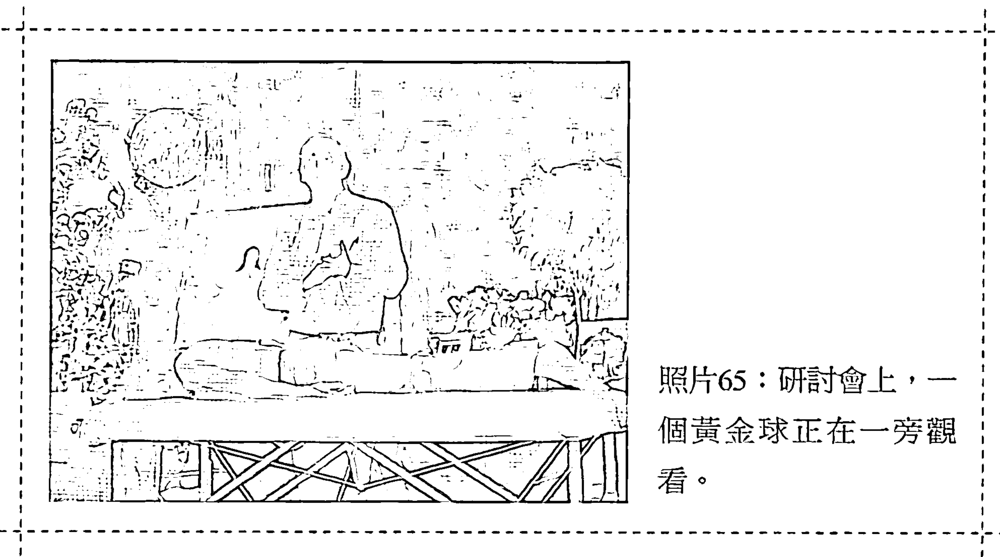

照片65是某位整脊師在一場靈性研討會中對大約三百名的觀眾示範神經整脊技巧，而來自另一實相的靈性存有正在觀看。

#### 案例 2
出現在療癒觸療上——傳遞能量

照片66是某位著名的醫治者正在將療癒能量送達被醫治者身上，他所使用的療癒方式是呼求聖靈，懇求祂將無限的能量傳向所需要的人身上。這位醫治者並不只使用一種固定的方式，有時他選擇觸摸病患，有時則口頌訊息或祈禱，有時他會自觀眾中挑選接受治療的人，或是請自願者上前接受治療。

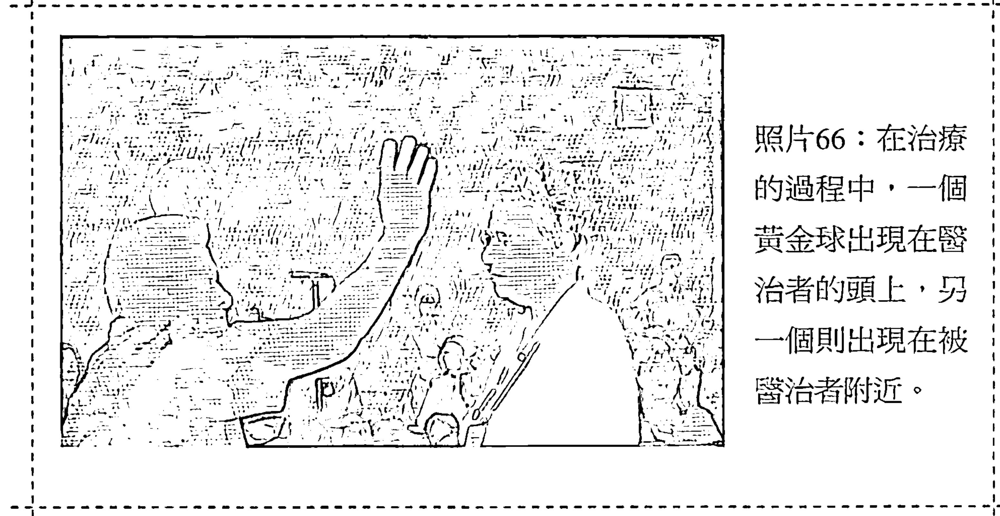

#### 案例 3
出現在靈療手術治療——發出能量訊息

照片67是醫治者「上帝的約翰」在進行靈療手術治療時典型的黃金球照片。請注意醫療場景上方浮懸的黃金球：因為房間光線充足，而且牆壁油漆是白色的，這個不透明的圓形幾乎不可能被看到。

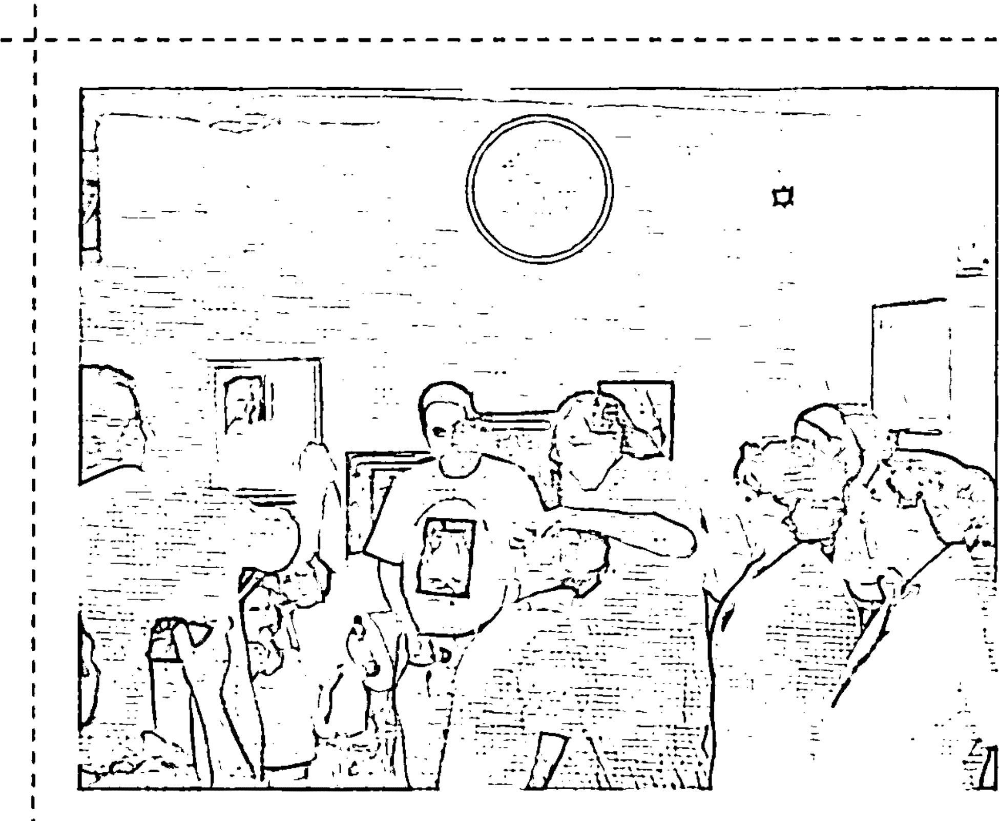

照片67：「上帝的約翰」在巴西聖伊納西奧之家進行治療。

#### 案例 4
出現在量子觸療聚會——表示參與

照片68是一群量子觸療班的學員，他們皆是透過觸摸將醫治能量轉移至接受者身上，同時這也是世界各地許多治療師進行另類療法時的代表範例。

雖然這些照片涵蓋許多不同的療癒方式，但是它們的共同點在於醫治者、被醫治者或學生的頭部附近會出現黃金球，而且我們並不認為這是隨機發生的，相反的，我們推論這些位置背後皆有其意義。

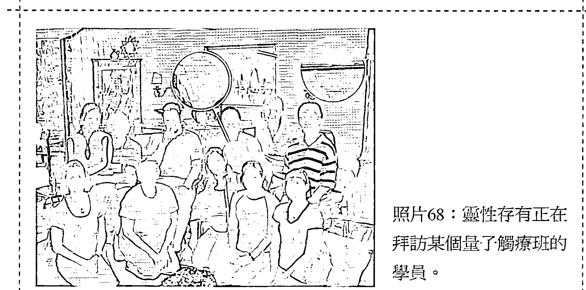

> 所有療癒方式均應建立在全人類的福祉上

如果隆可以做到，你也可以！ ——隆·羅斯

在隆·羅斯密集的治療中，他會一再的重複上述的這句話，並且請觀眾一次又一次的念出聲音——只爲讓他們明白靈性治療技巧並非如一般人所說的，是專為少數有天分的人所保留；相反的，每一位立定心智的人皆可得到。

自從十多年前第一次參加靈氣大師的課程後，為數眾多且值得注意的新療法就不斷引起我們的關注，舉凡脊椎神經分析、靈氣與卡魯那靈氣、量子觸療、療癒觸療、仁神術、般尼克療法、袁氏療法、本體能量療法、海寧格家族排列法等，我們都曾經研究過，而且這個名單至今仍在不斷增加當中。

這些新興療法數量驚人的成長的確是一個充滿希望的徵兆，因為這表示除了請醫生開藥之外，治療身體疾病還有許多新的觀念已然成型。每種療癒方式都有其專注之處，其技巧由正確的將手指或手放置於接受者身上，到使用正確的呼吸技巧、利用符號、發聲吟誦、實施者正確的觀想顏色等。所有技巧皆有其正當地位，創始者與導師通常都會強調方法的簡單性，以及醫治者態度的重要性，關鍵在於他的存在狀態，以及他們是否明白自己僅是一項工具，好讓神聖的療癒能量流向病患。

如果我們的解讀是對的——即單純、開放、不執著於結果，這些在靈性療癒中都可說十分重要，並且可以用來統合這些看似分歧的治療技巧。如此我們便可認定它們每一個都很重要，喜歡吟誦的就在治療過程中使用吟誦技巧，對色彩的深層意義具有高度敏銳性的醫治者就進行色彩治療，而有直覺天賦、可以透過手部感覺細微能量的人便可觸摸接受者，將手放置於他感覺到有需要的身體或靈氣部位。但最重要的是，每一位醫治者皆必須了解自己正通往另外一個實相之外的療癒能量場域，同一個普拉納（為古代梵語中「生命」或「呼吸」的意思），同一個生命力能量，同一個可以激發患者先天療癒能力的細微能量場，而不是因為醫治者的優越技巧，儘管在很多情況中，醫治方法是執業者的第三維度重點（凡是機械性的、可加以計算或操作的皆稱為「第三維度」）。

不幸的是，許多療法都分成許多不同的等級，通常必須花數年的時間才能取得認證，而且所費不貲。這使得那些天生只須接受很少訓練就能夠成為醫治者的人，需要花上數倍的時間、金錢來取得資格，而其他人透過勤奮學習得到認證卻未必精通此藝。事實上，成為合格的醫治者所需要的並非結業證書，而是其他更重要的因素，如謙卑、慈愛與服務的意願。

我們難道不該讓出路來，並且不再執著於結果？我們難道不該以一種單純的態度來處理每一種療癒方式？如此簡單的原則理應貫穿所有另類療法，多強調這個服務真正所需要的，並以此取代獲得證書所要求的諸多不必要的先決條件。

至於出現在醫治者周圍的黃金球到底是要傳達什麼樣的訊息？相信宇宙在觀看人類時，必定覺得很有意思。由於它們知道人類喜歡創新與複雜的事物，因此帶著無比的耐心以我們稱之爲「新的療癒方式」啟發某些人，於是我們擁有許多選項可供選擇。但是，難道它們不是在告訴我們，這些方式的共同點在於爲尋求醫治者服務？難道不是來自不可見領域的靈性存有慈愛的回應，幫助我們施行多元化的療癒方式？

黃金球是否只是在告訴我們，完成療癒的不是我們，而是更高維度所給予的恩典；它們是否是在指出，我們只是旁觀者，或許透過它們發光所形成的黃金球，也就是高度進化的靈性存有，才是真正協助療癒的功臣，而這些才是靈性療癒的真正意義。

#### 靈性療癒的治療過程

照片69是一位加拿大遊客前往聖伊納西奧之家所拍攝的，當時「上帝的約翰」正在對一位病患進行鼻子的靈療手術，而這位拍攝者做了以下這段發人深省的陳述：

> 「我是一個具備分析與數理心智結構的工程師，但是我對新奇的事物感覺敏銳，所以也是個發明家，我的專利包括一個已經上市二十年的電子影像處理設備。

> 「當我前往阿巴迪尼亞釐清一個重要的健康問題時，由於先前沒有任何黃金球經驗，所以在聖伊納西奧之家看到別人所拍攝的黃金球照片，便立刻引起我的興趣，想要親眼看到它們。不過，當時我只有一台老舊的相機，想要拍到黃金球照片不知道會不會太過陽春。

> 我見證了幾次『上帝的約翰』的靈療手術治療，發現它的能量非常強大，一個人居然可以在幾尺外觀察到所發生的事情。而那些手術工具看起來只經過最小程度的消毒，但病人卻像是並未承受到任何的痛苦。『聖靈在我們的四周。』他們這麼說，而我也相信。不過，當我看到它以黃金球的形式出現在我所拍攝的照片中，我有了一個深刻的體驗。

> 「我擁有一個可以擷取高爾夫球被球杆擊中那一瞬間影像的感應器專利，所以當職業高爾夫球選手都在討論著球杆擊球的角度時，我卻能夠透過這個感應器證明給他們看，並且造成了很大的改變。這與黃金球照片相似，當黃金球在做一些我們無法用其他儀器看到的事時，我們卻能夠透過相機這項輔助工具，在某些特定的時間看到它們的存在，並將這些片段『凍結』在時空的四度空間裡。這張照片對具有創造力的心智而言成了一個動機，驅使我去探索與它們有關的任何事情。

> 「這也就是為什麼當我在電腦上看到這張特別的照片時，我立刻興奮的聯想到之前做過的實驗——一個讓我得到專利的實驗。我們使用一部非常特別的錄影機，希望能夠以一萬兩千分之一秒的速度捕捉到一個空格影像。不過剛開始以電子分格的方式取得影像非常困難，因為我們根本不知道自己究竟有沒有看到它。隨著我們的發明更臻完美，從不確定到取得清楚的照片，再進步到清晰的知識，對我們來說真是莫大的喜悅。

> 「是故，黃金球照片不但是靈性存有存在的證據，我們還能夠從這裡獲得關於這一切究竟代表什麼意義的知識。」

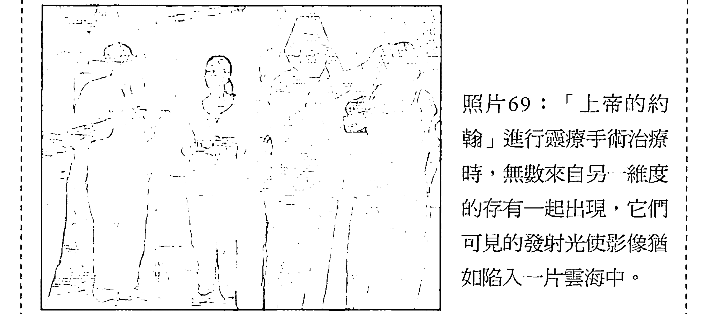

推測將某個特定時刻下的高速狀態凍結下來能夠得到某些資訊，是一件很有趣的事情。由於肉眼沒辦法分辨出間距短於二十五分之一秒的個別過程，所以如果有某樣東西只出現千分之一秒，我們既無法看到，也無法有意識的感覺到它。但是，如果我們可以用閃光燈拍下照片（一個電子閃光約可持續千分之一秒），它們就會清楚的出現在相片中（如果閃光與事件能夠完美的同步），然後就可以分析並鑑定它。對我們懶惰的眼睛來說，它們移動得太快，可是卻能夠在照片上大量出現，這表示它們的出現無所不在，能夠到處移動並快速的改變大小。而對某些重要情況而言，它們的出現不僅僅是要表達訊息，實際上還可能參予了靈性治療。

以下是我們目前關於黃金球如何參予靈性治療過程的想法，透過多年的研究與考量，我們發現了這些特色：超高速，具有極快擴張與收縮、改變大小的能力，以及高度的意識。以此為基礎，我們為靈性引導療癒的機制制定一個假說，它包含了三個構成要素：

1.  進化的靈性存有透過放射進入物質實相（即黃金球），可以在人體內變得十分活躍。透過一連串收縮，黃金球成為一個小的高能量密度球體，接著再擴張、舒展成為一個大的低能量密度球體。它會選擇性的矯正某些缺陷，例如破壞或重新建立化學鍵，或者在高能量密度的狀態下，將整個細胞或細胞群蒸發。
2.  靈性存有具有（或本來便能立即取得）應用此能力所需的智慧與資訊，以進行治癒人類疾病的任務，而此任務被理解為由單一能量介入極長的能量串流。然而，既然此事要發生所需的速度本質上是不受限制的，所以即便是數以億計的細胞、分子或原子大小的療癒事件，皆可於一瞬間的一小片段內發生。
3.  所以，只須一個進化的靈性存有便可能在非常短的時間內，在許多人身上同時進行療癒。

因此，靈性存有可以使黃金球製造一連串超級快速的擴張與收縮，以矯正身體器官或組織的問題。它們可以透過賦予化學鍵能力或將其去耦（阻止從一電路交換或回饋能量到另一電路，影響其他電路正常工作），也能夠視需要將分子或整批細胞以蒸發的方式達成此目的。單一的能量介入以極高的速度連續成爲一個療程，而本質上這種介入的準確性不受任何限制。

或許這個解釋被過分簡單化，但也許正因如此，它才能夠令人信服。即便人類對靈性領域所知有限，這個解釋仍然顯示靈性療癒是可信的。而黃金球拍攝者，如本書中所討論過的，正是被另一領域的慈愛存有所挑選，希望透過它們傳達靈性療癒的確是真實的。

讓我們想像一個被診斷出有惡性腫瘤的人，根據我們假設的醫治情節第一部分：靈性存有能夠縮小其能量場的大小，變成與極小的組織細胞一般大小，然後將收斂過的高濃縮能量場精確的聚集於所需要的點上——可能是一個癌細胞，或是一群需要被切除的癌細胞。如此便能達到與傳統放射線治療或化學治療完全相同的效果，而且具有分子大小精確度的附加優勢。

取決於聚焦在細胞或其內部某一分子的能量多寡，它可以破壞一個導致病變作用的有效連結，或是重建一個可能已遭破壞所造成細胞功能失常的連結，還可以修復基因病變、進行任何治療細胞或DNA所必須之事——將病變組織整個蒸發，或是在造成進一步傷害前將其圍堵。

根據假說的第二部分：靈性存有可以馬上獲得病人確切的病因。它會知道哪一個細胞產生何種病變作用，以及如何去處理那個問題，還可以極快的連續方式完成這一切，一個細胞接著一個細胞，不管需要處理的總數有多少。分析、收縮進入一個精確的部位、擴張，分析、收縮、擴張……一個循環接著一個循環，如果有必要，可如此重複數以千億次，全部都在一秒鐘裡的一小個片刻即可完成。當癌症擴散到淋巴結也沒關係，它們會馬上知道，並處理那些細胞。

不受速度極限的限制，癌細胞腫瘤的大小真的不是主要的疑慮。一旦完成一個患者的療程，在極為短暫的時間中，靈性療癒可以專注在下一個病人，下下一個，下下下一個……由於患者的思考過程與靈性存有在同一個領域運作，因此當患者有意識或無意識的不相信靈性存有醫治他們的能力時，兩者會互相衝突，這就是為什麼許多靈性治療最終並未得到持久的痊癒。

#### 兩階段式靈療的意義

根據手邊的黃金球證據，我們歸納出上述的假說為靈性治療可能的機制。舉例來說，在聖伊納西奧之家所發生的事情，便足以支持這樣的假設情況。

首先，讓我們來看看在那裡進行的靈療手術，此療法同時可對多達一百人的團體進行。在簡短的介紹與禱告後，治療便開始了。期間，接受治療的人皆保持坐姿，通常他們會閉起眼睛，冥想所希望的結果。有些人可以感覺到一些事情正發生在他們身體上，有些人則可以感覺到一點點或甚至沒有感覺。沒有人真正知道身體裡面的「手術」在哪裡進行。幾分鐘過後宣布結束，人們被帶到一個恢復空間，並在那裡被提醒剛剛經歷過的「手術」，不管他們有沒有感覺到，都需要一段時間休息。大部分的人，甚至是那些在靈療手術發生時沒有感覺的人，很快都會感受到的確有事情在他們身體裡發生，並且樂於遵守休息的指示。

我們的假說與上述事件的順序符合。病患必須是自願的，療程才可能成功，而假說中事前選擇的過程符合此需求。以團體的方式進行，所有人接受靈療手術所需的時間雖然短暫，但卻是可信的，這可歸因於靈性領域所具有的高速度。許多病患甚至沒有感覺手術正在進行，這則是因為在此情況下所執行的手術不需要任何切口，如果有影響的話，也僅止於極少數的神經細胞。手術並不會危及不必要的健全組織，其傷害僅限於那些有病變的細胞、器官或組織。

病人需要時間來恢復是可以理解的，畢竟發生的是一種對身體的介入干預，結束後的虛弱與痠痛也是可預期的。據說，許多過去終其一生皆在醫療領域工作的人就是現在在聖伊納西奧之家執行手術的靈性存有。某些靈性存有雖不具備那樣的背景，然而也跟那些有背景的一樣有效益，這說明施行靈療手術所需的實際知識是可以被任何進化的靈性存有取得。然而，也許在靈性的世界就像在物質世界一樣，靈性存有也會從事它們喜歡或想要去做的事。這可以解釋為什麼那些在過去生為人類且有醫療背景的靈性存有，相較於那些在過去生為人類卻從事不同職業的靈性存有，較有可能傾注其才華於靈性治療的目標上。

接著，讓我們再來看看在聖伊納西奧之家所施行的靈療手術的介入治療，或是那種由著名的靈性治療師所施行的療程，因為這與我們假說中的靈性或不可見的療癒有關。第一眼看到時，可見式的介入治療似乎與不可見式介入治療沒有很大的差別。許多接受如隆·羅斯與理查·巴利等醫治者觸療的人，皆經歷過一種能量「掃射」（energy "zapping"），這可能是靈性存有所施行的療癒行為，與我們的假說一致。在這種情況下，人們所經歷的強烈感覺——搖擺、膝蓋變軟、事後數小時甚至數天中所產生的某種虛脫感，以及奇蹟般的痊癒——的確符合我們這裡所描述的模式。

在聖伊納西奧之家與其他地點（如巴西、菲律賓等）所施行的可見式介入治療非常有趣。舉例來說，根據相關人士指出，就療癒效果而言，不可見式與可見式介入手術同樣有效。他們聲稱施行可見式介入手術最主要的理由是為了旁觀者的利益，或是患者本身。當他們親眼見證手術的進行——沒有麻醉、幾乎不會疼痛、沒有出血、沒有手術切口所留下的疤痕，這樣他們就更容易信服靈性存有的醫治能力。

如果人們可以將手術看成一個具有兩階段的過程，我們假說的情境也許能夠很貼切的解釋上述這件事：第一階段是實際可見的程序（切口、以簡單的刀子輕刮眼睛，或是由鼻孔插入一只長的金屬器具），而第二階段則是真正在病變組織上「工作」。

第一階段會是個大工程——再一次經由靈性發光體能量場指引的一連串收縮與擴展，不爲別的，僅是展示靈性存有可以施行所有這一切的步驟。處理切口，不會出血，沒有疼痛，不需要麻醉劑，這一切所發生的均與假說一致——一連串幾乎無止盡的分子層次行爲，其中涉及在靈性引導下充滿能量的靈性發光球體之收縮與擴展所形成的極快速能量鏈。這一切作爲只是爲了「掩飾」在這個可見的手術中，醫治者所留下的粗暴切口所帶給病患的衝擊。

第二階段爲實際的醫治行爲，正如前面所描述的不可見式介入治療。第二階段與第一階段實質上絲毫沒有關聯，第一階段大部分只是爲了滿足人類的好奇心，第二階段才是使病患可免於任何疾病折磨的真實療癒行爲。

## 第13章 令人訝異的歐傑克現象

> 對那些相信的人來說，不須有任何字句；對那些不相信的人來說，找不到任何字句。
> ——聖依納爵·羅耀拉

最後，我們以「歐傑克現象」來總結本書，因為這個現象在許多方面都與黃金球相同，但在其他方面卻比黃金球現象更難以解釋且更具啟示性，同時也提供更多關於黃金球攝影機制的線索。

在威廉·提勒博士所寫的《黃金球計畫》序中，包含了兩張照片。它們是如此特別，以致於當克勞斯第一眼看到時，便猶豫是否該將它們收錄在本書當中。因為，那是一張相機鏡頭蓋上蓋子後所拍攝的照片！

### 歐傑克現象與黃金球現象驚人的相似之處

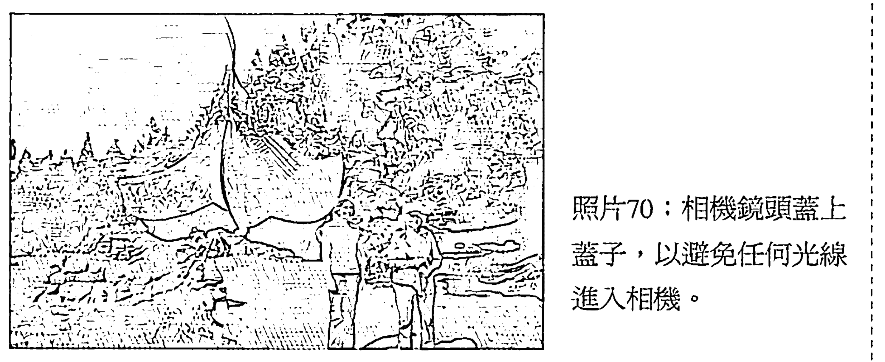

在那本書出版之後，歐傑克博士與克勞斯取得聯繫，表示自己就是那張照片的拍攝者。他們第一通電話長達一個小時，兩人都感覺在很久很久以前就有過親近的連結，只是無法確切指出緣起何時。更多的電話往來接踵而至，一個禮拜之後他們便各自帶著妻子相約在海邊聚首，從黃金球、另類療法到拍攝照片時出現的異常現象等，都是我們探索的話題。

歐傑克博士請克勞斯去買一卷底片，並將它裝進他那台有點像古董的傻瓜相機內。當克勞斯仔細檢查無異狀後，就將鏡頭的蓋子蓋上，然後我們四人便前往著名的海邊牧場教堂拍照。之後，歐傑克博士認真的對每張照片做筆記，清楚描述場景、鏡頭蓋的狀態（打開或關上）、日期、時間，以及其他細節。總共有二十四張照片都是在鏡頭蓋子蓋上時所拍攝的，其中大約三分之二皆為完整的彩色照片（如照片70），照片上為歐傑克博士的妻子海倫（左）與昆蒂（右）站在海邊牧場教堂的前方。

攝影時將鏡頭蓋上與黃金球有什麼關係？為什麼我們要在書中涵蓋這樣的實驗？這種拍攝方式與拍攝者的目的有關，答案即將揭曉。或許有人會問：「這個騙局的詭計是什麼？」提出這樣的疑問很正常，可是說真的，沒有所謂的騙局，也沒有所謂的詭計。因為我們詳細的檢查過相機，所以這些照片的真實性無庸置疑，但這簡直令人匪夷所思！（在〈附錄3〉中我我們將對歐傑克博士的照片提出更仔細的分析，並得到一個初步的解釋。）

很明顯的，由於自然光無法穿透鏡頭蓋，因此這些照片不可能是經由一般自然光所拍攝出來。但是，如果有其他具有如自然光一樣的波長光譜，但只有大約它十分之一頻率的光或輻射，的確可以穿透鏡頭蓋，與自然光一樣在鏡頭內衍射，而產生如歐傑克博士所拍出的那些不尋常照片。

不過，這個以較低頻率產生驚人效果的概念，卻與對靈性有興趣者的認知相抵觸。他們一般皆認為靈體是較高且較好的，所以應當具有較高的振動頻率。但根據歐傑克的照片指出，在論及生存的理想狀態或行動方向時，或許有時比較適當的用詞是「不同的」，而非「提高的」頻率。

也許歐傑克現象中最有意義的結論是，此現象與拍攝者本身密切相關。雖然我們無法複製歐傑克博士的結果，也不認得其他展示過類似照片的人，而歐傑克博士也無法預測每次嘗試都會成功。不過，他以蓋上鏡頭的相機所拍攝的照片中，很大一部分皆可預料將產出黑白照。

所以，歐傑克博士究竟有何不同之處？第一，他是如此謙虛的人，根本不會聲稱自己與其他人相比有何特殊之處。然而，我們的確知道歐傑克博士每天嚴謹的練習冥想，數十年如一日，或許靈性成熟度就是使他與眾不同的關鍵要素。

這樣的思考方向似乎是正確的，如果再將威廉·提勒博士著名的「意向印記電子原件裝置」所進行的心靈能量實驗納入考量，毫無疑問的對實驗對象抱持特定意圖，進行長時間高強度的專注冥想，如提高或降低水的PH值，將是實現其預期效果的先決條件。

當然，有關歐傑克博士穿透鏡頭蓋的攝影與提勒博士的專注意向實驗，尚未有定論。但是他們確實指出（而且是不容質疑的），專注的力量非常真實，能夠外顯成爲可被一般科學儀器所測量的效果，像是歐傑克博士例子裡的相機，或是提勒教授的電子測量儀器。

### 拍攝者促使靈性存有以黃金球的形式出現

這個尚未解開的疑惑提醒了我們，拍攝者的意圖如何可以外顯，以致於產生足夠的能量來反射所有出現在照片中的物體，並且在相機底片上留下印記。在這個過程中，有可能因爲相機閃光燈能量被加以利用，使得拍攝者的心智功能比較像是個催化劑，而非能量來源嗎？如果是這樣的話，就能量考量的角度而言，我們可以比較容易的將這個狀況合理化，但有一個根本的問題將會持續存在——源自心中的微妙能量，如何將一小部分來自相機閃光燈的實質光子能量，轉變成一種具有較少能量、且波長光譜與一般自然光類似的未知光形式？

可想而知，關於我們所知的黃金球攝影也是依照同樣的推理方式。舉例來說，無數黃金球拍攝者曾報告說，一旦他們下定決心要在他們所拍攝的照片中看到黃金球，這些照片中所產生出來的黃金球效果（即便不是每次都可預測的）會明顯高於其他沒有如此專注於這個能量的懷疑者。而我們自己在試過之後，也曾在照片中見到數量高於平常約一百倍的黃金球，其他黃金球拍攝者也曾說過類似的數量增加。

這可能代表發出黃金球光芒的有意識靈性存有，與意念專注的黃金球拍攝者所發出的細微能量產生互動，它利用從閃光燈所發出的光照射到黃金球上，並將此能量轉變成一束具高度方向性的輻射光，其波長在可見光的光譜範圍內，且頻率較自然光低。較低的頻率可以允許黃金球所發出的光透過敞開的鏡頭直達相機，而不會被虹所阻礙。在大多數情況下，虹乃由在一般可見光下呈不透明的塑膠材料所製成，但此材料在低頻率輻射光下呈現半透明。

綜觀這個過程中的能量學，黃金球攝影顯然比透過鏡頭蓋的攝影簡單許多。如同我們在本書其他地方所陳述的，只需要幾百個具高度方向性的光子，便足以產生一個黃金球影像，而這顯然比鏡頭全蓋上時拍攝照片所需的光子數少了好幾次方。可想而知，靈性存有本身的意識可能在觸發能量轉換上扮演著極為重要的角色。拍攝者於是只須做為靈性存有的「溝通者」（又或許是一個激發因素），使黃金球觸發能量轉換，從閃光成為低頻率的輻射，再由靈性存有將之導入拍攝者的相機中。

## Chapter 14

### 解讀黃金球之外的延伸視野

> 最長的旅程是通往內心的旅程。
——聯合國前秘書長 道格·哈馬紹

### 拋開現實的制約
去看待萬事萬物

我們認為，黃金球現象與其他長久以來人類所目睹的超自然現象，都是來自不可見的實相所給予我們的線索。它們將聚光燈投射到某一個議題上，針對特定問題指引解決方向，鼓勵並給予人類一個驚奇體驗。如果我們表示贊同，將可以受邀將所見之事變成個人經歷。這並非一門精確的科學，因為與覺知意識有關的皆非精確科學，且無法保證可被複製——適合一人的未必適合另外一人，反之亦然。

意識的世界（黃金球為由此而來的訊息使者）是一個被其他定律主宰的領域，與物質實相關的定律在那裡是起不了作用的。定律不是絕對而是相對，如同我們所知的時空限制，在意識世界中並不存在。在那裡，過程的速度雖然仍可能是連續性的，但比在物質領域快出很多很多。

克勞斯從小被教導，所看到、聽到、嗅到、摸到、感覺到，以及計算與合理化的東西全都已然存在。從早期童年開始，他被教導生命中有些具有真實面，而有些只是童話故事，最終只有真實的生命經驗才是重要的。他也被教導要相信死後仍有生命，但為了更清楚了解，每次他問到關於死後生命會如何的尖銳問題時，卻往往因為魯莽的提問而遭受訓斥。大人總是對他說：「就是這樣，你必須相信靈性的事，但這些事情不應該被當成是『事實』，因為畢竟現實世界中沒有天使，死亡就是生命的終結，而所有受過良好教育的人都知道。」

在你成長過程中所受的教導是什麼？你曾經看過已去世、為你所愛的人的靈魂出現在你面前嗎？你曾看過有人在你母親身邊，但她卻沒有看到嗎？你曾聽過父親沒有聽到的聲音，然後他說你在做夢？你曾有過在數學考試時，正確答案浮現在腦中，但老師卻說你作弊？

當我們所受的教育越多，「可接受的」現實觀點與「不可接受的」的直覺部分之間的差異會越來越大，而基本物理學與工程學也會強化我們的觀點，告訴我們沒有任何事物比光速更快，沒有任何事物比光子更輕、更快，但我們的心志仍是一個不完全為人所了解、必須忍受生理反應的肉體物質聚合物。

我們希望這本書能夠讓你重新思考這些曾經被制約的事情，並且衷心盼望人們再也不會聲稱天使不存在，只因為看不到祂們；再也不會否認死後仍有生命存在，只因為無法看到我們可以接受的證據；再也不會說沒有真的「預感」，只因為我們理所當然的必須按照可計算的原理來進行每一件事。

雖然過去沒有工具可以鑑定這些是否為真，不過現在黃金球對我們展現了不同之處。它們被授以能力，但不會直率的在照片中替人們加上翅膀，而是比這更複雜一些；它們不會直截了當的說，死了以後我們會再活個幾千年，而我們都還會看到生者還存活在這個實相，但他們卻看不到我們；它們更不會說我們應該停止去上學，並且從此以後只憑當下的感覺行事。事實上，它們正在邀請我們對一個更大的情境，拓展覺知。

這依然是我們認為黃金球為靈性存有所發射光芒的原理。簡而言之，這代表我們的實相並未在目前所認知的物理終點上結束，也就是光速或大部分的現代粒子物理學。相反的，它遠遠延伸，超越這個終點，進入一個像我們所在的領域一般，圍繞著具感情覺知的存在——也許比我們在此物質實相所能找到更具智慧的存有。

### 朝向人類有益處的方向邁進

我們正開始發現，另一個實相與我們所處的領域一樣，都建立在能量上。但是，以我們在此實相中所知道的物理能量的質量與性質而言，黃金球的能量其實是非常微小的。所以，想知道這個能量要對我們的物質實相做些什麼事，就像你我用盡肌肉的力量，也無法強迫一列停在軌道上的貨物列車回到行駛狀態一樣，非常困難……

那麼，我們應該要做些什麼，才能證明自己可以讓列車再次移動？我們必須要聰明。過去，我們之所以無法辦到，是因為我們的肌肉力量不夠。但現在，因為我們夠聰明，所以設計出可以產生動力的機械，以我們的智慧找到讓火車繼續移動的方法。

靈性存有的世界亦是如此。它們雖然非常聰明，但是要如何向人類證明其存在，卻依舊相當困難。所幸，隨著數位攝影的發明，我們自己（而非靈性存有）創造了一個簡單的方法——透過極微量的物理能量（如閃光燈），便可以憑肉眼看到某些東西。

不幸的是，即使大多數人所觀察到的黃金球是真的，也無法讓懷疑人士停止他們的爭論。因為閃光燈反射空氣中的懸浮微粒跟黃金球很像，以致於所有類似影像都被認為是懸浮微粒的反射。試著以不同的事實去說服這些懷疑人士並不會得到什麼好處，就如同說服十六世紀的神職人員，地球是繞著太陽轉動一樣，沒有任何好處。

由於大多數的懷疑人士都相信統計數據的力量，因此我們或許可以透過統計資料的力量，增進黃金球照片的可信度。因為我們可以由照片中黃金球的位置或內部的樣貌中得知，大多數的黃金球照片皆有其意義。而在本書中，我們也提供了無數的範例，證明黃金球的位置或樣貌是獨一無二的，而非只是統計上的隨機。從這些來龍去脈中，我們了解到這是目前靈性存有透過黃金球照片向我們展現的——它們可以被看見，可是它們無法說話，也無法書寫，更無法透過我們慣用的方式給予訊息。

這就是為什麼我們得完成自己的責任，解讀靈性存有透過黃金球所帶來的訊息。我們必須敞開心胸，相信黃金球照片中的確含有訊息的可能性；必須讓感知它們的藝術，更臻於完美。以這本書中給予的範例，我們希望你可以拓展與生俱來的能力，感知並讀取這類的訊息。

從其他領域來的使者在我們朝向完整合一的旅程中給予協助，它們似乎一直以千變萬化的形式與我們取得聯繫。我們很容易便可推斷，在冥冥之中有股強大力量，想幫助我們拓展洞察力，進而成為更慈愛的人類。因此，我們必須在接收到它們的訊號時，讓天生的創造潛力一一顯露，進而引領自己朝向一個對全人類皆有益處的新發現！

### 〈後記〉

### 跟著好奇心一同探索未知的領域

> 任何事物的真實本性，是它所能達到的最高境界。
——亞里斯多德

前面我們熱切的分享了黃金球的案例與故事，希望能夠激發你去探索與研究這個現象背後的意義。

從過去到現在，人類透過不同形式的象徵與符號，接收訊息與暗示。這些似乎都在告訴我們——其實我們並不孤單，而且還受到幫助、引導，以提升全體生命的品質。現在，還有一個包含著知識、智慧與無止盡可能性的領域，等著我們去探索。

而這些多元化的訊號正有耐心且巧妙的向我們傳遞訊息，並引誘我們去注意這一切。或許現在正是時候仔細傾聽我們的心之所向，以輕鬆玩樂的態度測試我們從這個無形的資源中所得到的直覺，或許就能發現援手是如何從另一端伸到我們現在所處的世界裡。

把自己調整到與這個具有無限可能性領域相同的頻率，並找出屬於自己問題的解答吧！無窮的機會就等在前方，我們只須任由自己單純、好奇的冒險精神來帶領我們！

## 附錄 1

### 證明黃金球並非懸浮微粒的無塵室實驗

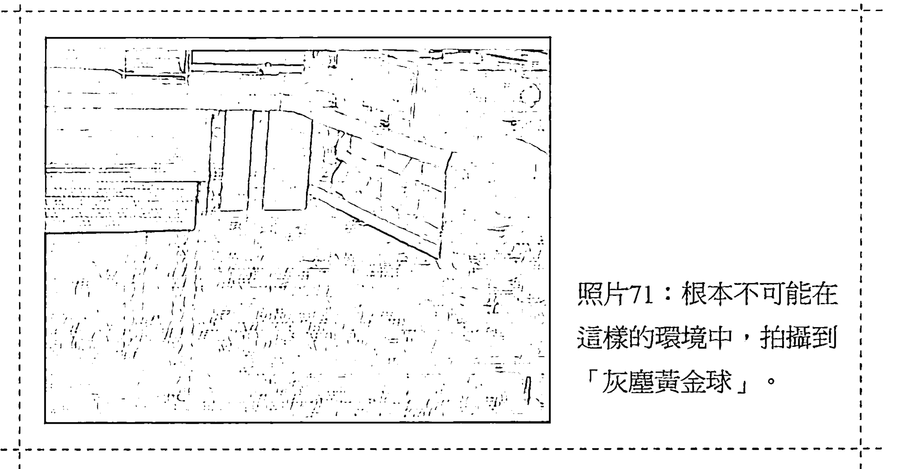

這張照片是伯卡特·沃茲博士於二〇〇九年一月在ISO 14644-1第七級的無塵室裡所拍攝到的，它可說是黃金球不能被解釋為空氣中的懸浮微粒反光的最重要證明。

這個無塵室的狀況明確指出一顆五厘米的懸浮微粒會出現在「黃金球區域」（大約離鏡頭前方一立方英寸）的機率是二十分之一，而更大的粒子則不被允許進入無塵室。這應該使用基本的幾何規則來審視：假設一顆灰塵粒子要能夠達到照片中黃金球的大小，會需要大約五百厘米的體積，亦即大於這種無塵室的最大粒子體積限制的一百倍。根據這些數據，我們可以有把握的指出，出現在照片中的黃金球，雖然以低反差的方式出現，但絕對不是空氣中懸浮微粒的反光。

對此，沃茲博士表示：

> 「受到《黃金球計畫》裡的科學檢驗方法所啟發，讓我產生了用從事牙科研究與發展的醫療無塵室來進行實驗的想法。在沒有灰塵與水的無塵室裡拍攝到的黃金球，明確的說明黃金球並非懸浮微粒，同時也指出這是一個具有能量在場的現象。雖然這張照片以低反差的方式呈現，但是卻可以毫無疑問的分辨出黃金球的確出現在人的附近。」

## 附錄2
關於黃金球真實性的補充證據

對於黃金球的真實性最普遍的爭議就是：它們被認為只是相機鏡頭前方的懸浮微粒反光。滯留在空中微小的灰塵在鏡頭前方幾厘米處（即黃金球區域）的確會反射閃光燈，也確實會產生像黃金球般的影像，但這個理論經不起考驗，因為全世界數以千計的人拍出了不可勝數的黃金球照片。在此，我們歸納出反駁黃金球為懸浮微粒反光的論點如下：

- ①距離：在許多黃金球拍攝者所拍攝的黃金球照片中，黃金球被幾英尺外的物體給「遮蔽」住，所以它們不可能是懸浮微粒，因為它們已經遠遠超出黃金球區域的範圍。
- ②數量：《黃金球計畫》的合著者米西爾·列威博士拍攝了超過三十萬張黃金球照片，而我們則有數以千計的照片存在電子資料庫裡，另外還知道其他人也有類似的資料庫。是故，因為沒有令人滿意的科學解釋就斷定所有照片都是人工合成，是十分不可理喻的。
- ③清晰度：如果物體非常靠近相機，例如在要讓「黃金球區域」理論可行的距離內，物體一定會變得模糊不清且難以辨識，這是因為受到相機鏡頭景深限制的結果。也就是說，物體若是離相機幾厘米，那麼拍攝出來就一定會失焦。但是，黃金球不管離相機多遠，其光芒與銳利度都維持不變。
- ④連續拍攝照片之間的改變：如果黃金球是懸浮微粒的反射，那麼當我們在進行一連串快速拍攝時，照片中的球體就會落在附近的區域，且數量理應相同。可是，許多黃金球拍攝者都指出，他們常常看到其中一張照片裡面有一個或一群黃金球，但接下來幾張卻完全沒有。假設空氣中懸浮微粒的分布是如此不規律，以致於一大群粒子會全部在某個時間點靠近相機，而在幾秒鐘前後又突然消失，這樣的說法根本就不合常理。
- ⑤靜止不動的位置：空氣中的懸浮微粒不斷的在移動，所以在兩張間隔幾秒鐘前後所拍攝的照片中，它們不可能在同一個位置。但是，我們不斷的在不同案例裡重複觀察到在連續照片中一直在同樣位置上的同一個黃金球。
- ⑥高速移動：在許多照片中黃金球以每小時五百英里或更高的移動速度出現，但是空氣中的懸浮微粒是無法達到這樣的速度的。根據《黃金球計畫》與許多研究中的實驗指出，研究人員故意製造的懸浮微粒與水滴反光並無法達到在真實黃金球照片裡的高速。
- ⑦不對稱的內部結構：真的黃金球常常顯現出特殊的內部結構，包括真空的內部或極為類似人類臉部的特徵。如果只是空氣中的懸浮微粒、水滴或昆蟲之類的東西反光，便難以解釋這種狀況。
- ⑧無塵室內的黃金球：實驗室裡的無塵室是用來確保空氣中某個大小以上的懸浮粒子不會沉積在研究樣本上，例如半導體器件製造中的晶圓。所以根據〈附錄1〉的實驗結果，我們得到了黃金球並非懸浮微粒的最佳證據。

其他懷疑人士所提出關於相機與其內部電子紀錄裝置的雜質與異常的論點，則可以透過下列的觀點來反駁：

- ①不同場景的連續攝影：我們能夠很輕易的分辨一台相機是否故障，因為不管拍攝的場景為何，故障一定會重複出現在連續的相片中。還有，專業的黃金球拍攝者會例行檢查自己的照片與相機是否有故障，如果無法完全排除故障的可能性，拍攝者是絕對不會指認照片中的黃金球為真實的。
- ②底片種類沒有影響：雖然絕大部分的黃金球拍攝者都使用數位相機，但是使用傳統底片相機的拍攝者也能拍出很好的黃金球照片。像是荷蘭職業攝影師愛德弗司，就曾拍攝並發表了許多使用傳統底片所拍攝的黃金球相片。
- ③感光耦合元件（CCD）與互補式金屬氧化物半導體（CMOS）：絕大部分的數位相機是靠CCD來運作的，但是還有另一種截然不同的影像感應技術叫做CMOS，只有幾款高階數位相機上有裝載。兩種相機最大的差別在於，CMOS擁有較小的有效感應器尺寸以用來記錄到感光板上，因此CMOS相機需要更大強度的光才能記錄到黃金球。為此，我們曾用尼康D5000 CMOS相機來做實驗，並確認此類型相機所拍攝的照片中，黃金球數量遠低於平常於用CCD相機所拍攝到的，且黃金球內部的解析度也較差。

## 附錄3
關於歐傑克現象的補充說明

繼〈Chapter14：令人訝異的歐傑克現象〉一章所建立的基礎上，我們想要更深入驗證歐傑克現象。在此，我們將更深入研究歐傑克博士在靠近加州北部海邊牧場教堂所拍攝的照片。

- ①歐傑克博士的照片看起來像是在正常成像狀況下所拍出來的照片，且沒有任何照片失真的證據，但是相機的鏡頭蓋卻是蓋起來的。照片中並未遺失任何物體，前景的特色看起來就跟背景的一模一樣，均完美成像。
- ②在那張蓋上鏡頭所拍攝的照片70中，不但在每一個成像區域皆有對焦，而且還沒有任何部分被淡化掉，也沒有類似因為在曝光過程中晃動所可能發生的散光或單向模糊的證據。
- ③根據這張照片的所有方面顯示，該照片是原始、一致的，且與平常拍攝的彩色照片無異。

簡而言之，蓋上鏡頭蓋所拍攝的照片，所有細節皆與一般相機所拍攝的照片無異，差別只在於後者的鏡頭蓋是被拿下的。

歐傑克博士在過去三十年間，於全世界各地拍攝此類照片。他用過許多不同的廠牌（如柯達、佳能、尼康等），且偏好低感光度（感光度100）的底片（照片70就是用普通的100感光度底片拍攝的），因為對他來說，感光度低似乎可以產生較好的照片。此外，這些照片通常都是在快門速度為二十五分之一秒以大光圈拍攝。

假設某個電磁的發射形式具有與普通可見光同樣的波長光譜，但是頻率大約只有正常光的十分之一（意味著大約有○．二五電伏的相同能量，以光速十分之一傳送），原則上就可以在技術面解釋歐傑克博士蓋上鏡頭蓋的攝影照片。再加上，普通光線並不能穿過鏡頭蓋，這就更加證明一定有其他的電磁輻射參與其中。既然波長光譜應該是不變的，那麼就是頻率與普通光不同。在普通光中，波長光譜與頻率相乘等於光速，如果我們保持波長不變而改變它的頻率，這個新的光線將會變得比光速更快或更慢，端看它的頻率是比普通光更高或更低。

一般來說，比可見光更具高頻率的輻射光不像可見光般可以輕易穿透塑膠材料（甚至玻璃），而我們必須在此計算中排除更高頻的光線。還有，塑膠材質與玻璃的透光度一般會隨著光線伴隨的遞減頻率而增進，所以轉成較低的頻率會克服困難，這可以解釋為什麼歐傑克博士照片的光線能夠穿透塑膠鏡頭蓋。

但是，除此之外還有其他要素必須考慮。不管我們面對的是什麼樣的光線，它都必須有足夠的能量使相機底片銀鹽分子分開。使銀氯化物分開的能量大約是四分之一伏特，所以我們必須推斷在相片中所面對的光線有比這個更高的能量。可見光的光子能量大約是二．五伏特，或是大約是分開銀氯化物能量的十倍，這會限制我們試圖要去定義的光線頻率到大約只有可見光頻率的十分之一。換句話說，具有如此大小頻率的紅外線，的確可以穿透鏡頭蓋所用的塑膠材質。只要它的波長光譜與可見光一樣，但是頻率接近紅外線，比可見光低大約十倍。

歐傑克博士的實驗數據顯示與這些假設相符，包括他的觀察——低速底片感光的效果明顯的比高速底片好出許多。低速底片的顯影相較於高速底片，每張需要較多的銀鹽來分離，所以低速底片顯影比高速來得厚。由於我們的低頻光線相較於高頻比較難被非結晶型的材質吸收，包括影像顯影，將歐傑克博士的攝影記錄在較重的低速顯影比較具有優勢。只不過，如果歐傑克博士進行更多這樣的攝影實驗，並且使用一些紅外線不能滲透的材質（如鋁箔）固定於鏡頭蓋上，卻還能夠拍到這樣的照片，那麼我們的假設將會遭到反駁。

雖然這個假設非常務實，並且排除了所有難以理解的解釋。但是，如同根據最新的量子理論觀點進行推斷所揭露的，會給予這個與其他類似的現象更多「優雅」的解釋，這些解釋不需要按照傳統物理學的方式，企圖將一切合理化。

還有許多我們的假設無法解釋的問題，像是以十分之一光速傳播的光線究竟是從哪裡來，用傳統物理學的角度來看，這樣的光線是不存在的！沒有已知的光線具有這些特質，所以在物理上是不可能的。很明顯的，我們必須走出傳統物理學外，並且考慮這個現象解釋的其他線索。

國家圖書館出版品預行編目資料

解讀黃金球的靈性能量 / 克勞斯·海涅曼，昆蒂·海涅曼 著；
李欣諭 譯.-- 初版.-- 臺北市 : 方智, 2012.10
176面 ; 14.8×20.8 公分.-- (新時代 ; 159)
譯自 : Orbs : Their Mission and Messages of Hope
ISBN 978-986-175-282-2 (平裝)
1.超心理學 2.靈修

175.9

101016642

http://www.booklife.com.tw

inquiries@mail.eurasian.com.tw

新時代系列 159

## 解讀黃金球的靈性能量

作 者 / 克勞斯·海涅曼、昆蒂·海涅曼
譯 者 / 李欣諭
發 行 人 / 簡志忠
出 版 者 / 方智出版社股份有限公司
地 址 / 台北市南京東路四段50號6樓之1
電 話 / (02) 2579-6600、2579-8800、2570-3939
傳 真 / (02) 2579-0338、2577-3220、2570-3636
郵撥帳號 / 13633081 方智出版社股份有限公司
總 編 輯 / 陳秋月
資深主編 / 賴良珠
責任編輯 / 張瑋珍
美術編輯 / 王 琪
行銷企畫 / 吳幸芳、施伊姿
印務統籌 / 林永潔
監 印 / 高榮祥
校 對 / 賴良珠
排 版 / 陳采淇
經 銷 商 / 叩應股份有限公司
法律顧問 / 圓神出版事業機構法律顧問 蕭雄淋律師
印 刷 / 國碩印前科技股份有限公司
2012年10月 初版

ORBS
Copyright © 2010 by Klaus and Gundi Heinemann
Originally published in 2010 by Hay House UK Ltd.
This edition published by arrangement with Hay House UK Ltd. through Bardon-Chinese Media Agency
Complex Chinese translation copyright © 2012 by The Eurasian Publishing Group (imprint: Fine Press)
All rights reserved.

※如欲收聽Hay House廣播，請上：www.hayhouseradio.com

定價 280 元

ISBN 978-986-175-282-2

版權所有・翻印必究

◎本書如有缺頁、破損、裝訂錯誤，請寄回本公司調換

Printed in Taiwan

黃金球是一種出現在照片中如月亮般的圓形，經常出現在喜悅快樂的情境裡，或是能量場很好的地方。它的出現，是為了要傳遞訊息，與人類進行溝通……

本書作者海涅曼博士，在美國太空總署與洛杉磯加大研究材料科學多年，他發現妻子在一次靈性治療師聚會拍下了不尋常的照片——多幀照片上都有個如月亮般的圓形，引起他極大的興趣。經過幾十次精確的科學實驗後，海涅曼博士得到了驚人的結果！這名理智的科學家不得不承認，圓光是超自然現象，而這樣的圓光被稱為「黃金球」。他肯定圓光的出現不是機件故障、手震、塵埃、水珠、反射等影響，並且認為黃金球很可能是靈性存有所傳遞的訊息，而非靈性存有本身。

假設黃金球不能像人類一樣發出聲音講話，我們就必須探索隱藏在黃金球裡的視覺訊息，如顏色、大小、強度、形狀、出現的地點，或是球體內部所能被辨識的特徵（像是曼陀羅、人臉等）。透過對黃金球照片的觀看、靜心，一起深入探索黃金球的神秘世界吧！