### 認識頌缽音療：平衡身心，紓壓助眠

## Preface 作者序

回想過去在頌缽入門學習時，因為授課的老師無法充分回應我對於頌缽原理的提問，導致後來展開一系列的自學過程，不但持續相關領域的進修之外，也查詢許多國內外的研究資料。長年累積諸多個案施作與教學收穫之後，逐漸地構築出一套符合邏輯思維且具有科學架構的學習系統，因緣際會之下，開始走向「聲音療癒」教學與創作的道路，著實是一個無心插柳的意外。

這幾年在聲音療癒的推廣過程中，常看到一些富有熱情的音療師，由於對頌缽特性的理解不足抑或操作技巧的忽略，導致療癒效果大打折扣，甚至造成被施作者的身心不適，不禁令人嘆惋，更加深了我想將個人所學分享給大家的信念。

這本書的撰寫是為了想要認識頌缽音療但卻不得其門而入的朋友，內容絕非市面工作坊只是停留於個人主觀經驗的心得分享，而是透過較為客觀的理論分析，將看似抽象的「身心療癒」與「頌缽音療」連結，深入淺出地向各位介紹頌缽聲音療癒背後的脈絡原理及其與人體相應的關聯性。同時，本書特別增設「自我練習」的章節，將原本繁複的頌缽敲擊法「化繁為簡」，拆分成可供讀者自行練習的具體操作方法，達到更有效率的學習。

最後，特別感謝內人一路的支持與鼓勵，謝謝你開啟了我對於聲音療癒的視野，也因為有了愛妻在旁的陪伴與協助，與我齊心合力地攜手共同創作，這本書才得以順利地誕生。在此期盼本書能成為讀者邁入頌缽世界的入門磚，陪你一起探索聲音療癒的奧秘，進而藉由頌缽的音聲療癒，讓更多的人在這紛擾嘈雜的世界中，重新找回內在的平靜與喜悅。

- 和鳴心境療癒工作室負責人、心靈音療師（銅鑼／頌缽／水晶缽）
- 第一本中文銅鑼音療專書《認識銅鑼音療》作者、中國自然療法師頌缽課程授課師資、中華新時代協會頌缽課程授課師資、美國 NGH 催眠治療師、美國第七奧祕學校授證教師階、DNA 活化治療師、臼井靈氣一／二階認證療癒師、卡魯那靈氣一／二階認證療癒師、加拿大人文臨床催眠治療 Humanistic Hypnotherapy 治療師
- 專長：聲音療癒（銅鑼／頌缽／水晶缽）、心靈對話教練、OH 卡潛意識帶領、催眠

---

自二零零六年認識頌缽以降，便愛上這種雖無明顯旋律卻深具療癒性的心靈音樂，從此開啟我對於頌缽的濃厚興趣。近年來陸續進行相關領域的學習，順著流走，也在無意中踏上了聲音療癒的旅程。孰能料到十五年後，竟有幸與外子共撰頌缽音療的著作，此無疑是我生命裡最美的轉化。

「敲缽」對我而言，不僅只是「音療的技術」，更是一門「靜心的藝術」。兩者之間的區別，就在於操作者是否能要求自己的心念達到「定」與「靜」，將「靜心」融入「敲缽」的過程。伴隨每一次的敲擊動作，用心感受頌缽在當下的音頻與振動，並以缽音為媒介，傳遞出一聲聲寧靜的心音波，為世界帶來更多的祥和與平靜。

我深深相信，但凡秉持純淨正念所敲、磨的每一個缽音，都會提升自己的意識能量，透過「共振」連帶提高周遭環境的頻率，創造出更多的「愛」與「光」，從而協助地球順利地揚升次元，這也是我推廣音療迄今的衷心夙願。

誠摯地希望透過本書的出版，能讓喜愛頌缽的讀者不再停留於「被動聆賞」的階段，而能更進一步地藉由「敲缽」、「磨缽」的應用，在「技法」與「心法」雙方面徹底下足功夫，先從療癒自己開始，之後若因緣俱足再順勢為親友或他人實施音療，以期越來越多的人都能親身體驗到來自頌缽神奇美好的療癒能量。

祝福大家，NAMASTE。

**和光**

- 現在：和鳴心境心靈空間聲音療癒講師、聲音療癒演奏師（銅鑼／頌缽／水晶缽）、心靈探索教練
- 經歷：中華新時代協會頌缽課程講座助理講師、臼井靈氣一／二階認證療癒師、2019 金樽跨年聲波靜心活動帶領師
- 專長：聲音療癒（銅鑼／頌缽／水晶缽）、心靈探索對話、臼井靈氣

---

## Foreword 推薦序

### 透過頌缽音療，帶著你回到那個完全屬於自我的內在小宇宙

我是一名廣播節目主持人，同時也從事溝通主題的教學工作，偶爾搖身一變成為催眠諮商師，看似以說話為主軸的斜槓工作內容，實際上我聽話比說話的時間多。除了聽對方說些甚麼之外，我更用心聽他們的聲音能量。以人聲來說，具體上包括話語的內容、抑揚頓挫的聲調和發聲的共鳴位置等，抽象上則包含了說話者的起心動念和內在情緒，閉起眼睛甚至你可以清楚描繪這個聲音是甚麼顏色、甚麼形狀，想想，身邊哪些人的聲音讓你聽起來是舒服的？放鬆的？

也因為工作，我培養了敏銳的聽力，自然喜歡親近那些讓我感動、放鬆、開心的聲音。當我第一次聽見頌缽聲，瞬間，腦袋淨空，說也神奇，腦袋空了，內心和身體的感受反而多了起來，我很難具體說明那是甚麼感受，也許只是很單純地跟著頌缽的頻率在震動著，但光是那樣，身心就很舒服了。

張達老師是個實事求是的教學者，他不會只是告訴你頌缽聲音具有甚麼樣神奇的效果，但他卻強調頌缽的操作者應該要注意甚麼樣的細節可以保護自己也保護個案，世界萬物皆共振，唯有把自己身心調整好，才足以和頌缽一起給出好的能量。同時也給想要體驗頌缽音療的朋友一個提醒，你必須要讓自己真正打開耳朵，甚或是全身細胞來聆聽，相信頌缽會帶著你回到那個完全屬於自我的內在小宇宙，在那一刻，你會聽見自己最真實的聲音。

**—— 中央廣播電台節目製作主持人、廣播金鐘主持人**

### 跟著理工男的科學音頻，陪您找回最初的平衡

我喜歡在享用早餐的時候有巴哈郭德堡變奏曲為我開啟一日的序曲。開車時我習慣有廣播的音樂陪我順心的轉動方向盤。搭捷運時從耳機傳來輕鬆的 Bossa Nova 樂曲讓我有了片刻的舒緩。

會有這樣聽音樂的習慣應該來自於大學時對聲音的著迷，於是當年我加入了廣播社，也正是我認識學弟張達的時候。過了這麼多年，我們學生時代的互動其實有點模糊了，但沒想到，直至現在彼此仍都在聲音的世界裡流連忘返，他用頌缽擊聲，我在廣播發聲。

在前幾年張達的第一本書《認識銅鑼音療》裡，就看見他用理工男的思維研究銅鑼音療所帶來的能量，用科學的方法應證聲音如何與人的身體產生對話，讓人能透過科學觀點理解聲音對健康的意義。

很開心的，張達沒有因為第一本書而停下傳遞正確觀念的腳步，第二本書接續的想把更多頌缽的好以更完整的架構和知識與愛好者分享。就像書中提到「是什麼時候人類開始對聲音產生興趣？」這倒讓我思考，好像我們一直身在其中卻從未認真思考「聲音」是何時帶給我們的邂逅，是如何依賴與依存。透過這本圖文並茂且架構完整的內容，很適合讓初學者或是從未接觸聲音療癒的朋友們來認識，跟著理工男的科學音頻，讓頌缽的音域陪您找回最初的平衡和身心的健康。

**—— 「發現生命力」廣播節目主持人**

---

## 目錄 CONTENTS

## CHAPTER 1 認識「聲音療癒」 UNDERSTANDING SOUND HEALING
- 010 關於聲音療癒
- 011 聲音如何帶來療癒
- 014 聲音療癒的種類
  - 014 音樂療癒
  - 016 音聲療癒
- 017 聲音療癒對人體的好處
- 020 為何稱「聲音療癒」而非「聲音治癒」
  - 020 什麼是治癒
  - 021 什麼是療癒
- 022 聲音療癒的關鍵要素
- 024 聲音療癒與其他療法的差異

## CHAPTER 2 認識「頌缽音療」及失眠壓力 UNDERSTANDING "SINGING BOWL SOUND HEALING" & STRESS OF INSOMNIA
- 026 關於頌缽音療
- 027 頌缽的歷史
- 029 頌缽的製作過程
- 031 頌缽的材質與種類
  - 031 傳統頌缽的材質
  - 032 傳統頌缽類型
- 037 頌缽對身心的好處
- 040 關於失眠與壓力
  - 040 失眠與壓力的形成
  - 040 從生物機制看失眠壓力的發生
  - 054 從中醫原理看失眠壓力的發生
  - 061 從能量觀點看失眠壓力的發生
- 067 透過頌缽音療告別壓力、遠離失眠

## CHAPTER 3 頌缽操作技巧 SINGING BOWL OPERATION SKILLS
- 070 頌缽如何產生療癒
  - 070 振動
  - 071 音聲
- 072 認識頌缽構造與音聲
- 077 基本頌缽持拿技巧
  - 077 持缽
  - 078 穩缽
- 079 基本頌缽敲擊技巧
  - 079 點敲
  - 080 撈敲
  - 081 勾敲
  - 082 平敲
- 083 移動頌缽的基本技巧
  - 083 直線移動
  - 084 弧線移動
- 085 頌缽音療施作的基礎流程
- 086 「音聲共振法」的操作練習
  - 086 單缽音聲共振的操作方式
  - 088 雙缽音聲共振的操作方式
  - 095 三缽音聲共振的操作方式
  - 101 四缽音聲共振的操作方式
  - 110 七缽音聲共振的操作方式
- 123 「缽體共振法」操作練習
  - 123 單缽共振的操作方式
  - 127 雙缽共振的操作方式
  - 134 三缽共振的操作方式
  - 139 四缽共振的操作方式
- 144 「混合共振法」操作練習
- 152 頌缽靜心的練習
  - 152 固定的靜心地點與時間
  - 153 頌缽靜心前的呼吸調息
  - 156 頌缽靜心

## CHAPTER 4 頌缽工具的選擇 CHOICE OF SINGING BOWL TOOLS
- 158 選購頌缽的考量
  - 158 頌缽的大小
  - 160 頌缽的音調
- 166 頌缽的周邊配件
- 170 選購頌缽的三種組合參考
  - 170 「基本」的頌缽組合
  - 171 「中階」的頌缽組合
  - 172 「進階」的頌缽組合
- 173 頌缽的保養與照護
- 176 頌缽問答

---

## CHAPTER 1 認識「聲音療癒」
### Understanding "SOUND HEALING"

### 關於聲音療癒 About Sound Healing

尼古拉·特斯拉 (1856 ~ 1943) 曾言：「如果你想知道宇宙的秘密，就用能量、頻率與振動來思考。」而後，愛因斯坦 (1879 ~ 1955) 也說道：「所有有形的外在物質，都是由一種無形的內在能量形式所組成的。」並於 1905 年提出著名的質能方程式「E=mc²」(E 代表 Energy 能量，m 則是代表物體的 Mass 質量，c 代表光速)。這一個公式，恰巧就用來說明「有形的物質，就是無形的能量」。換句話說，「有形的物質」和「無形的能量」，兩者其實是「同一個東西」，只是分成「內」、「外」兩種不同的表述而已。

### 聲音如何帶來療癒 How Sound Brings Healing

若從「能量」的觀點來解釋「聲音療癒」，意指：透過會產生「聲音」及「波動」的器物（多半指的是樂器），在器物與人體兩者之間形成「共振」，藉由能量的來回流動，達到療癒的效果。

此處以家用電器為例說明：如果在不對的電壓環境之下工作，家電不但無法發揮它原本百分之百的功能，甚至有可能因此而無法啟動。由此可見，「電壓」本身就是家電的動力來源。如果我們把家電來比作人體，那麼人體體內「每一個細胞的能量振動」，就是維持運作的動力來源。

人體的每個細胞，隨著不同的身體部位，都有它們各自不同的振動頻率。當細胞的振動正常，就能維持該部位的能量狀態照常運作；反過來說，一旦人體細胞或器官頻率失衡，就會造成能量的供給不足，除了影響該部位之外，有時甚至會波及整個身體的機能運作，因此產生了疾病。而伴隨不同部位的細胞失調，就會在人體呈現出與相對應的病狀徵兆。

#### 其他舉例及說明

#### 說明 ①
傳統中國醫學認為：身體的各種「頻率變異」，跟人體體內的「五臟六腑」有關。如果身體狀態健康，發出的聲音頻率就會自然和諧，反之亦然。至於中醫「望、聞、問、切」四種診斷理論之中的「聞診」，廣義來說，其實也可以算是「聲音療癒」眾多的方式之一。

#### 說明 ②
中央研究院物理所博士王唯工教授提出的「血液循環共振理論」，認為中國傳統中所提及的「氣」，就是一種「共振」現象。透過「氣」的共振，使得人體內的血液得以擁有動力來產生循環，當主動脈從心臟出發後，轉了 180 度，透過這樣的急轉，藉此轉換血液的位能成為動能，促使血管振動，帶動全身的經絡跟著一起共振，使血液可以不斷的輸送並供給氧氣與營養，同時也能將體內不需要的廢棄物代謝輸出。聲音療癒的原理，就近似於「氣」的循環，都是透過不同的媒介來形成「共振」，以調整身體的細胞，使它們恢復原本健康的狀態。

#### 說明 ③
生物物理學家艾札克·班多夫 (Itzhak Bentor) 在《走在狂盪的鐘擺上》(Stalking the Wild Pendulum) 一書曾述：「我們或許可以把疾病視作為是身體器官頻率失序的行為。當我們對疾病施以一個強力振頻時，便能對器官產生干涉的波動，讓其再次以不同頻率來脈動。」當人體細胞、組織與器官失去本有的頻率時，就無法應付原本擔負的體內運作職責，造成身體功能失調的負向循環。

而「聲音療癒」的介入，恰巧可以在此時發揮「調頻」的作用。聲音療癒師在個案的身體之外，透過「聲波」的共振，將療癒的音頻能量導入人體，引發身體的共振反應（心率快慢、呼吸節奏、脈搏起伏、腸胃蠕動和肌肉收縮）。目的就在於透過聲波的律動，帶動並調節人體失衡部位的振動頻率，使身體回歸應有的正常頻率，回到最初的平衡。

#### 說明 ④
醫學博士楊定一更是直言：「聲音的頻率與人體身心運作的波動頻率最為接近，也因此，聲音的頻率能直接影響人體的能量及健康。」主張「聲音」確實能夠透過「頻率」對於人體的「能量」產生影響，進而達到療癒效果。這也為聲音療癒的理論，提供了具體的依據與基礎。

### 聲音療癒的種類 Types of Sound Healing

聲音療癒依照「傳遞媒介」的不同，可分成「音樂」與「音聲」兩種。此兩者最主要的差異，就在於前者透過「有意識」的設計與組合，將多種音聲形成「有旋律的音樂」；後者往往出於「無意識」，自然而然形成某種「無旋律的音聲」。

#### 音樂療癒
透過有組織、有目的的設計，將不同的音符結合成帶有節奏的旋律性樂音，以此針對個案的身心狀況進行療癒。

- **1. 使情緒變安定**：舉例來說，當我們情緒波動比較大的時候，聆聽五～十五分鐘的古典音樂，就能讓自己的意識狀態變得安定。除此之外，音樂療癒也常被運用在幫助孩童提升注意力，使他們能更有效率的學習。
- **2. 減輕疼痛**：有一項 2017 年的研究發現，在脊柱手術後的三十分鐘，結合傳統療法與音樂療癒雙重護理，有助於減輕患者的疼痛。
- **3. 舒緩緊張情緒**：許多醫療場所都會放著輕柔的音樂，相信許多人都曾對於牙醫診所裡的鑽牙聲恐懼不已，所以牙醫診所普遍都會放著輕柔的音樂，希望藉由柔和的音樂，盡量舒緩患者焦慮的情緒。
- **4. 降低壓力**：懷孕的媽媽也可透過舒緩的音樂，來降低懷孕期間的壓力，除了促進肌肉的放鬆之外，也能使精神提振，讓後期的自然分娩能夠更加順利。

#### 音聲療癒
- **1. 大自然的音聲可舒緩身心的緊繃情緒**：當我們壓力大的時候，常常會跑去大自然中聆聽自然的音聲，諸如蟲鳴、鳥叫、風聲、雨聲、樹葉磨擦聲、流水聲、海潮聲，讓身體和心理由緊繃的狀態中放鬆下來。也有研究指出，帕金森氏症患者在聽了水晶缽的音聲演奏之後，意識維持清醒的時間比原來更長。
- **2. 隨著音聲頻率，使身體進入自我療癒狀態**：人體的呼吸、心跳、脈搏和血壓，也與音聲的頻率具有密切的關聯。比如說，當我們聽到比較緩慢的音聲頻率，如頌缽、銅鑼較為柔和且節奏穩定的敲擊聲時，就可以讓自身的呼吸變得更深、更長，心跳也會隨著敲擊音聲的頻率而逐漸緩和，降低身體原先的緊繃感，思緒變得更加清晰，連帶心情也跟著平靜許多。此時，人體的生理與心理皆能獲得雙重的緩解，無形中也有助於體內細胞進入自我療癒與修復的狀態。

### 聲音療癒對人體的好處 Benefits of Sound Healing to Human Body

- **1. 降低緊張、疲勞、疼痛等感覺**：美國國立衛生研究院 (NIH) 喬治帕特里克博士在一項緩解疼痛和減輕症狀的計劃中發現：聲音的振動頻率可以改善並治療患者的疼痛和病症，同時也降低了緊張、疲勞、疼痛、頭痛和噁心感。
- **2. 影響血液循環及體溫**：另有研究指出：利用音聲來進行顫動聽覺的訓練，可幫助身體嚴重痙攣的患者，增強他們臀部和腿部的動作。通常較低頻的聲音 (40 ~ 60Hz)，能促使身體的下背部、骨盆、腿部肌肉有比較大的反應；當頻率提高時，則在頭頸、前胸和上背部會有比較明顯的感覺。所有的聲音都會影響血液循環，進而對人體的體溫產生影響。節奏強烈的音樂，會使體溫跟著提高；反之，若是舒緩的節奏，體溫則會跟著降低。

## ③ 對外界產生警戒的反應

美國南卡羅萊納大學 Thompson 教授的研究也指出：過度的噪音，常會讓人的血壓提高 10%。因為噪音會迫使人體對於外境做出警戒的反應，產生戰鬥或逃跑的行動，進而引起腎上腺素的分泌，導致血壓的升高。

## ④ 細胞聲音改變，可觀察是否產生病變

美國加州大學洛杉磯分校的 James Gimzewski 教授，曾使用原子力顯微鏡（AFM）和靈敏度超高的麥克風，來監聽受測細胞所發出的聲音。透過這個系列的研究，在 2002 年提出「細胞聲學」（Sonocytology）的理論，主張每一個細胞和我們一樣具有獨特的聲音特徵。並於 2004 年在著名的《科學》雜誌中發表自己的研究結果：「生物細胞從誕生到死亡，過程中始終以某種特定頻率進行運動。這些運動會保持在某些特定的頻率範圍內，並透過聲音的方式做為呈現，同時這些頻率也代表某種特殊狀態和意涵。」

若將這個觀點用於醫療，就可以明白：透過觀察細胞在「聲音」上的變化，就可以提早發現哪些細胞可能產生「病變」。

斯波爾丁（Spaulding）醫生早在 1903 年開始，就透過鋼琴來試著匹配耳鳴患者在聽覺上的頻率，直到患者聽不到耳鳴的聲音。由此項研究發現：某些特定的聲音，也會影響人體的呼吸、心跳、腦波以及荷爾蒙的分泌。

## ⑤ 分散注意力及焦慮感

《美國醫學協會期刊》曾於 1966 年的研究中指出：待產的孕婦若能在臨盆的前期聆聽輕柔的音樂，就可藉此分散陣痛階段對於疼痛的注意力，並降低面臨生產的焦慮感；同時，音樂也可促使人體體內的內啡肽分泌，減少其對麻醉藥物的需要，甚至能夠達到不透過麻醉即可自然分娩的良好結果。

## ⑥ 影響大腦控制情緒、接受新信息等

同時具有醫學博士和生物物理學家雙重身分的 Gerald Oster 博士，曾於 1973 年的論文〈大腦的聽覺節拍〉（Auditory Beats in the Brain）指出：聲音會影響大腦吸收新信息、控制情緒、睡眠模式、回應等方式。此外，其餘相關的研究結果中，證實了特定的聲音與音樂頻率，也可用於產生血清素等的神經遞質。

## ⑦ 改善血液循環及骨骼代謝

芬蘭于韋斯屈萊大學在 2009 年的一項研究發現：若將「低頻聲波」用於治療，不但可以改善人體的血液循環，也有助於骨骼的代謝。

## ⑧ 減輕疼痛

2017 年發表的醫學研究指出：病患在脊柱手術之後的 30 分鐘，同時接受聲音與傳統護理結合的療法，有助於減輕術後的疼痛。

## ⑨ 癌細胞生長速度減緩

德國的佛萊堡醫學院腫瘤科與海德堡德國音樂療法研究中心合作，曾經做過一項關於聲音療法的研究，發現有一些「特定的聲頻」可以讓癌細胞的生長減緩，有益於協助癌症患者的治療。

截至目前，許多歐美國家針對「音聲如何影響人體健康」的研究，投入了大量的研究資源，其餘各國也累積了上百篇關於聲音療法的臨床研究，由此可見聲音療癒的重要性正與日俱增。而聲音療法對於人體帶來健康的正面效果，也為許多為疾病所苦的病患，開啟了新的選擇。

### 為何稱「聲音療癒」而非「聲音治癒」
Why Is It Called "Sound Healing" Instead of "Sound Treatment"

有些坊間的療癒師，常會對外宣稱他可以單從聲音療法來「治癒」個案特定的疾病，但這種說法其實不太妥當。

首先，建議一般民眾在體驗「聲音療癒」之前，必須先明白「治療」和「療癒」的定義，進而辨別兩者之間的差異，才不至於後續對期待調整的目標有所偏離。

#### 什麼是治療

所謂的「治療」，比較像是生病時去醫院或診所尋求醫生協助，醫生針對患者的病徵做立即性處理，藉由消除疾病或是解除生理上的病症，來恢復身體的功能。當我們不具備醫生身分，無法進行醫療手術與診斷開藥，卻又對外宣稱自己可以「治療」病症，其實是非常不合適的說法。

#### 什麼是療癒

「療癒」的範圍較廣，不局限於身體的病症治療，更擴及了心理、情緒、精神以及靈性的層面，主要是針對個案的身心狀況，給予全盤性的調節。

但「療癒」並不是「局部消除」或「停止」病症，也不只是讓身體恢復到被診斷出疾病之前的情況，而是更深入地向內在探索為何身體出現特定病狀的緣由，展開超越身體層次的溯源過程，協助患者找回自己的力量，使他們在「身、心、靈」三方面的狀態回到本來應有的健康與活力，達到「整體修復」的療癒成效。所以，當「療癒」起到作用時，結果往往會比疾病發生之前的狀態更加良好。

舉一個生活上的例子，應該更容易幫助大家理解。當你發現水管被堵住時，我們去把堵住的部分做疏通，讓水管快速的恢復本來的功能，這就像是「治療」；而「療癒」，則更像是去處理造成水管塞住的問題根源。

### 聲音療癒的關鍵要素
Key Elements of Sound Healing

聲音是一種「能量」的形式，主要是透過「空氣」做為介質，以「疏密波擠壓」的方式前進傳送，對人體的「聽覺」與「觸覺」產生刺激。

- 1. 聲音對「聽覺」的刺激
當聲波透過外耳進入到鼓膜，將它們傳到中耳組織後，再被引導至內耳與耳蝸；接著，位在耳蝸內的聽覺接收器便會將它們接收到的聲波，經由聽覺神經，再將訊號傳送到大腦，就形成聽覺。

- 2. 聲音對「觸覺」的刺激
透過聲波傳導介質所產生的疏密波，直接傳送到身體皮膚內的接收器；當接收器受到刺激時，則會讓體內的神經末梢形成局部電位，而局部電位又會引起局部電流，並將其傳到中樞神經系統，最後到達大腦，形成觸覺。

由上述可知，透過聲波的傳導，「聲音療癒」可以透過「聽覺」與「觸覺」兩個元素，於人體內部產生刺激而起到療效，「聲音」與「人體」之間才得以進行深入的交流與內在的聯繫。

### 如何透過聲音產生療癒作用

當我們需要透過「聲音」來產生「療癒」的作用時，就需要讓個案在「聽覺」與「觸覺」兩種的感官體驗上獲取最佳的舒適感受。

至於要如何讓個案在聲音療癒的時候產生愉悅的感官經驗呢？首先，必然要從聲音療癒師在操作聲波的「穩定度」開始，要求每一次聲波的傳遞，在音量的大、小以及音頻的高、低，都能達到近似「週期性」的穩定可控。

乘船時忽大忽小的浪與搭飛機時不穩定的氣流都會造成不適與不安感。

打個比方來說，當我們搭飛機遇到高空中的亂流，或乘船時遇到忽大忽小的浪潮，如此不穩定的振幅，皆會帶來生理上的焦慮及心理上的不安。若以上述二例類比「聲音療癒」的過程，也是如此。如果聲音療癒師施作的聲波不夠穩定，就很難起到很好的療癒作用，更甚者還會造成個案的身心不適。

「聲波」是一種「振動」，也是一種「能量」。如果力道、方向和幅度不斷變動，力道忽強忽弱、振幅忽大忽小、方向忽左忽右，就會導致人體的肌肉、骨骼甚至神經系統難以忍受，這種感覺跟搭車時遇到司機在油門上忽踩忽放，乘車者產生的不適感是類似的。不穩定的方向、力道和幅度，往往會造成身體負面的感受，更嚴重的話也有可能造成傷害，不可不慎。

由此可知，聲音療癒的關鍵要素，就是在「聽覺」與「觸覺」上，提供「穩定」的音頻，使得個案擁有較好的身心感受，同時也能達到更佳的療癒效果。

### 聲音療癒與其他療法的差異
Differences Between Sound Healing and Other Therapies

與其他療法最大的不同是，聲音療癒是一種「非侵入式」的療癒保健方式，透過不同的聲音療癒樂器所產生的「聲波」與「振動」，使得個案體內的細胞、肌肉、骨骼、腦波、各式組織及神經系統有正面的影響，並促使其內分泌系統能更有效的運作，分泌出對於人體健康有幫助的體內激素，讓身體恢復原本應有的正向療癒循環。

在聲音療癒的過程中，被施作者不需做些什麼，只需放鬆地坐著或是閉眼躺著聆聽音頻，單純接受聲波在自己身體上產生的局部振動，即可完成整個療程。

而聲波透過不同程度和範圍的振動，促進皮膚和小肌肉群內部的血液循環，同時影響腦波和呼吸的節律，進一步地啟動身體展開自我的修復。此種「全面性」的療癒，有別於其他局限於「局部」的一般療法。

簡而言之，聲音療癒與其他療法最大差異之處，如下所列：

- 1. 近似於「物理治療」的保健法。
- 2. 「非侵入式」的自然療法。
- 3. 「被動式」的療癒方式。
- 4. 透過「聲波」作為療癒能量的媒介。
- 5. 利用「空氣」作為能量傳送的介質。
- 6. 利用「振動」的方式作為療癒主體。
- 7. 同時啟動「聽覺」和「觸覺」的感官體驗。

## Chapter 02
### 認識「頌缽音療」及失眠壓力
### Understanding "SINGING BOWL SOUND HEALING" & Stress of INSOMNIA

### 關於頌缽音療
About Singing Bowl Sound Healing

最一開始，頌缽的用途並非如今我們以為的「樂器」或用於「身心療癒的工具」，而是日常生活中被用來儲放物品的「容器」或盛放食物的「餐具」。古代的貨幣往往取決於內含的金屬重量，所以頌缽有時也會被拿來作為「貨幣」使用。除此之外，也有修行人利用頌缽敲擊發出的聲音，提醒自己維持精神上的專注，因此在許多的佛寺廟宇或是西藏苯教的儀式當中，也可常見到頌缽的身影。

在 1970 年，來自西方的旅行者到喜馬拉雅山一帶旅行，意外發現作為食器使用的頌缽在遇到撞擊時所發出的聲音悠長平靜，十分悅耳動聽。自此，頌缽便開始作為樂器使用，被引進至西方之後，逐漸廣為人知。

在 1972 年，音樂家亨利·沃夫（Henry Wolff）和南西·亨寧斯（Nancy Hennings）合作錄製的音樂專輯《藏傳鐘聲》，有不少樂曲都引入頌缽作為音樂元素，受到不少聽眾的喜愛。當時的樂界正好風行世界音樂與新時代音樂，這也使得頌缽的名聲不脛而走，成為近年興起熱度的樂器之一。

同時，因為相關類型的音樂專輯陸續問世，大家對於頌缽音樂的認識幾乎都來自於西藏，因此加深「頌缽」與「西藏」之間的關係聯結，從而使得二者成為一般人眼中密不可分的既定印象。

### 頌缽的歷史
History of Singing Bowl

由於頌缽來源並沒有確切相關的文獻記載，但又因為現今常將「頌缽」前面冠上「西藏」統稱為「西藏頌缽」或是簡稱為「藏缽」，導致大部分的人都誤以為頌缽最早的起源來自於「西藏」或「喜馬拉雅山」一帶（印度、尼泊爾和西藏）的地區。但根據今人的考古發現，頌缽的來源並非源自西藏或是西藏的周邊區域，而更早可追溯至西元 5000 多年前的美索不達米亞平原。

#### 從美索不達米亞平原到喜馬拉雅山

考古團隊發現在美索不達米亞平原有類似頌缽的器物，只是他們使用的材料與現代的頌缽在金屬上的「成分組成」略有不同而已。

此外，也有其他的考古學家在波斯（現今的伊拉克）西元前 3000 多年前的眾多文物當中，發現一個由七種金屬製成且類似頌缽的碗型器具。

而這些文物的出土，不免讓大家感到好奇，如果頌缽最早被發現的地方不是在喜馬拉雅山一帶，那麼頌缽又是如何輾轉流傳至喜馬拉雅山周邊的區域呢？關於這一點，我們或許可以從其他的考證中找到一些蛛絲馬跡。

有考古學者在印度河的河谷挖掘出一個古文化遺址，其出土的文物與美索不達米亞平原的吾珥古城遺址十分相似。從這個發現，則可推測出這兩個地方在很早之前應該有相互交流及影響。

根據最新的考據發現，在西元前 334 到西元前 324 年期間，馬其頓帝國的國王亞歷山大大帝對東方各國如波斯等國家，發起一系列侵略性的戰爭。而隨著亞歷山大大帝的遠征之舉，促進東西方的文化交流，使得美索不達米亞平原的文化，也跟著傳入古代波斯帝國和印度之間，頌缽有可能就是在此時被引進喜馬拉雅山周邊一帶的區域。

在西元 800 年左右，藏傳佛教始祖蓮花生大士再將頌缽從北印度帶入西藏與喜馬拉雅山，自此伴隨佛教文化的東傳，頌缽也跟著被引入中國、日本、韓國，甚至遠及泰國、緬甸……等東南亞國家。

### 頌缽的製作過程
Making Process of Singing Bowl

### Stage 1. 熔鑄
先根據製作頌缽種類的不同，將金屬原料的成分（如：銅、錫、鋅、鐵、鉛、金、銀等）依據配方按照不同的比例，並將這些金屬置於熔爐內，使它們因高溫而熔解成液體化的金屬後，將這些金屬液取出，倒入預先準備好的模具當中，等待冷卻，固定成型。而缽的形狀，也會隨著模具大小、厚度、尺寸的差異，而有不同的區別。

### Stage 2. 加熱
從模具取出 4 ~ 5 個金屬圓餅，先層層疊放為一個缽型，再放入爐火中持續加熱，直到呈現赤紅的狀態才可取出。

### Stage 3. 鍛打
當呈現赤紅色的滾燙金屬圓餅被取出之後，會有幾位技藝純熟的工匠圍成一圈，大家對著正處高溫的金屬圓餅進行錘擊。其中一人負責用工具夾住金屬圓餅，並適時的來回旋轉，以方便其餘的工匠進行反覆敲打，以此確保缽體的每個部位都能被均勻的敲擊，呈現一致的厚度。

### Stage 4. 回火
在不斷鍛打缽體的過程中，隨著金屬溫度的自然減低，韌性也隨之下降，致使金屬圓餅逐漸變硬、變脆。等到金屬的溫度降低至一定的程度時，經驗豐富的工匠就會觀察金屬的顏色，並以此來判斷何時將金屬圓餅重新放回爐火中，再次加熱直至赤紅狀態，進而取出缽體，並於爐外進行敲打。

第三階段的「鍛打」與第四階段的「回火」，需要一組工匠來回不斷地反覆確認，直到將金屬圓餅錘擊成缽體預設的形狀和尺寸，才能進行下一個階段。

### Stage 5. 退火
當缽體初步成型後，接著要對缽體進行退火處理，讓成型的缽體在室溫之下逐漸冷卻，使得缽體內部材料的晶粒細化，同時也能促使缽體的金屬組織均勻化。

### Stage 6. 打磨和拋光
當工匠確認缽體完全冷卻之後，會將成型的缽體進行打磨與拋光。

### Stage 7. 雕刻上色
最後，完成打磨拋光階段後的缽體，會依據不同的產品需求，將缽身內、外部的表面進行染色或雕刻處理。

### 頌缽的材質與種類
Material & Type of Singing Bowl

#### 傳統頌缽的材質

相傳古代的頌缽是利用掉落在喜馬拉雅山的隕石作為主要的製作成分，其中一共包含「金」、「銀」、「銅」、「鐵」、「錫」、「鉛」、「汞」等七種金屬。而這七種金屬成分，恰巧對應了古印度文化中的七個能量中心（脈輪），所以現今大部分的人都會對外宣稱頌缽是由七種金屬成分所構成。

但英國曾經對此進行一番研究，科學家將蒐集到的所有頌缽在材質上進行檢測與分析，鑑定後發現：即使是十六至十八世紀之間的老缽，絕大部分構成的金屬元素都只有「銅」與「錫」而已，而這兩者當中，以「銅」佔據最主要的成分，這也是為何坊間有時會將頌缽稱之為「銅缽」的原因，至於「錫」的成分則居次，其他五種未必每一個都有。

至於頌缽的主要構成為什麼是「銅」與「錫」兩種金屬為主呢？我們可以從其材質的「特性」試著了解。

#### Column 1. 銅
首先，銅是一種「質地軟」且「富延展性」的金屬元素，一般熔點為 1083°C，有較好的導熱度表現；加上銅在乾燥環境之下不易產生變化，材料取得相對來說較為容易，所以當時作為食器為主要使用目的的頌缽，「銅」自然而然成為頌缽金屬的優先選擇。

#### Column 2. 錫
不過，銅雖然具有良好的「韌性」，但是「硬度」卻不夠，導致「強度較弱」，需要添加其他的金屬來增強其剛性。所以「錫」便是在這樣的需求之上，被選來增加合金的「強度」與「耐腐蝕性」。

若從金屬不同的成分比例觀察，可以發現：如果頌缽材質添加的「錫」成分過高，就會形成「剛性較強」、「質地較硬」的缽體，敲出的音調也會容易變高，同時聲音的延續性會變得較短；反之亦然，如果「錫」成分的比重較低，敲出的音調就會比較低沉柔和，傳遞的聲音顯得更加飽滿圓潤，缺點則是缽體的「剛性較差」，容易「變形」或「受損」。

由此見，缽體材質在「金屬種類」的選用及「比例」的多寡，對於頌缽的音頻與硬度都會造成至關重要的影響。此外，也要了解到缽體合成金屬的種類並非越多越好，每個成分的比重也要適當地斟酌搭配才能創造出同時具有「韌性」、「剛性」與「耐磨損性」各方面需求的優質頌缽。

#### 傳統頌缽類型

### ① Bodhi
此款缽當初被發現時，因為最上緣的邊緣線部分呈現稍微外翻的外型，容易使人聯想到菩提樹（Bodhi）向外蔓延的枝條，因此得名。

### ② Buddha
此種款式的缽主要源自於印度，缽壁通常沒有特別突出的傾斜角度。在西元 200 至 300 年期間的一些浮雕壁畫上，也常發現此種缽型被繪製於其中。

### ③ Dharma
此類型的缽形狀較為輕巧，缽口處稍微內凹，缽腹呈現中廣型。在缽壁下緣約一公分處，通常刻有一條虛線構成的紋理；而缽內的底部中間則刻有同心圓的圖樣，成為本缽最大的特色。

### ④ Jambati
在所有缽款當中，Jambati 相對來說算是最大、最重的款式。其特徵在於缽壁較高，弧線優美。至於缽身的外觀，常會看到明顯的錘打痕跡，在缽的外部邊緣下方則有經典的蝕刻線，內部的缽底處常刻有圓形的標記。在過去，Jambati 常被拿來作為穀物存放、音樂表演及舉辦儀式的用途，因此保存的狀態較為完整且良好。

### ⑤ Lingam
此款缽最大的特徵，在於缽身內底的中心處有一個宛如男性性器的明顯突起處。Lingam 意指印度教濕婆派和性力派崇拜的男性生殖器，象徵濕婆神，在過去大多作為儀式的用途。

### ⑥ Lotus
這款缽的缽底中心有點稍微隆起，從外面看來缽壁就像是蓮花般向外開展，所以後人便以蓮花（Lotus）作為命名的由來。也因為其缽壁不但薄而且高，在敲擊時多半呈現較為低沉的聲音。

### ⑦ Naga

外型近似於「杯器」，又被另稱為 Stem 缽款。在工法的處理上，從兩個不同的部位鍛造而成：一個是上方的缽體本身，另外一個則是下方的缽底基座。而呈現近似球型的缽底並與基座相連，即為此款缽最主要的特點。

### ⑧ Mani

它的出現最早可以追溯至 16 世紀末至 19 世紀，也被稱為 Mudra。此款缽體的缽底平坦，缽壁較厚，缽身中段的口徑長度比起缽的底部和上緣的唇部都來得寬廣，且通常都配有裝飾性的標記，此為最主要的特徵。也因款式較為罕見，重量又很重，在過去普遍被視為寶貴的珍藏品，甚至作為結婚禮物的一種。

### ⑨ Manipuri

該缽除了缽身的外部可以看到許多明顯的錘痕之外，至於缽內部的表面則非常光滑，是一種比較原始的頌缽款式。自 1970 年代開始，由西洋歌手引進歐美各國之後，這種款式的缽便廣為流傳迄今。

### ⑩ Remuna

此種缽的缽體從扁平底座向上彎曲，缽腹是略帶球型的弧線，缽壁輕薄光滑，有時在缽底的內側中央處會呈現輕微凸起的丘型區域，或是在缽內的底部中心雕刻同心圓的紋理，整體的外觀簡單又不失精緻。

### ⑪ Trapezoid

這款缽的底部十分平坦，缽腹的兩邊相互對稱，缽壁的側面有明顯的傾斜，呈現近似於「梯形」的樣貌，缽的外緣通常刻有紋線的蝕刻線，為其特色所在。

### ⑫ Thadobati

Thadobati 是最古老的碗器之一，最早甚至可以回溯至十五世紀。在尼泊爾語中，Thad 在字面上有「直」的意思。而這種缽款最主要的特點，在於它具有筆直的缽壁與平坦寬闊的缽底。此外，由於早期 Thadobati 製作的數量較多，所以價格相較於其他傳統的缽款來得便宜。

### ⑬ Cup-bowl

此款缽是 Thadobati 款式中的其中一種，外觀近似於「杯型」，尺寸不大，通常介於四英寸至六英寸之間，有利於攜帶。不過因缽體較小，敲擊出來的音頻顯得較高。

### ⑭ Karma

這款缽是 Thadobati 款式中的其中一種，外型與 Bodhi 款有點類似。不過，兩者之間最大的差異，就在於 Karma 的缽身弧線比起 Bodhi 來說更加筆直，缽底也更為平整一些。

### ⑮ Tara

在外觀上與 Thadobati 款頗相似，不過 Tara 比起 Thadobati 的缽壁更加高聳、缽身更加圓潤，較有「女性化」的柔美之感，因而得名為 Tara。

### ⑯ Ultabati

此款缽的外部多為黑色或較為深的顏色，缽身的內部十分光滑，最特別的是缽壁上緣有一個類似瓶子般的缽頸，缽壁由上而下經過缽頸後，形成一個向內彎曲的弧度。

### ⑰ Void

這個款式靠近缽壁最上的邊緣處，刻有一連串由小圓圈環繞整個缽身而形成的點狀絲帶紋理，為古老的神聖幾何符號。在喜馬拉雅山一帶或藏傳佛教的語境中，該符號表示從一個點為中心對周圍的一切向外共振，乃至與整個宇宙相互共鳴，同時也有「虛空」的象徵意義。

---

### 頌缽對身心的好處
Benefits of Singing Bowls for Body & Mind

源自於喜馬拉雅山的頌缽，其餘韻悠長的音頻，以及自然和諧的泛音，再加上敲擊時於個案的身體或場域的空間所傳遞的缽體振動，無論是從「聽覺」或「觸覺」，皆有助於長期精神緊張與充滿壓力的現代人。

透過缽音的傳導，容易使聽眾不自覺放鬆下來，腦波頻率跟著放緩，同時進入體內細胞深度修復的狀態。也因此，在冥想、瑜珈、舒眠及各式自然療法的場域，皆能看到頌缽的身影。

### ① 緩解生活緊張所造成的壓力

聲音療癒對於人體能夠獲得的立即性改善，莫過於「緩解壓力」。舒緩穩定的聲音有助於重新調整腦波，對於平日累積的壓力得以達到更好的調節。

### ② 減輕壓力造成的頭痛症狀

許多人使用聲音療癒的目的，就是希望藉此緩解慢性頭痛和偏頭痛。在一項研究報告中發現：患有偏頭痛的成年人在經過為期兩週的聲音療癒後，症狀得到明顯的改善。不僅如此，若能定期搭配聲音療癒作為輔助，還可進一步地減緩壓力或高血壓等造成頭痛的根本原因。

### ③ 釋放恐懼、增強信心

利用聲音療癒，可逐漸釋放過去曾經壓抑在內心的深層恐懼，進而在大腦中重新創造一個新的積極經驗模式，為我們帶來自信與勇氣。而透過信心的建立，我們能有充足的勇氣迎接未來種種的挑戰，並在生活中做出新的改變。

### ④ 恢復細胞活動

在歐美與聲音療癒相關的眾多研究當中，指出音樂療法確實可以有效的幫助細胞活化，同時加強細胞壁膜功能和活絡程度，甚至有望能恢復原本的功能運作。

### ⑤ 提高專注力

透過相關的科學實驗，證實有注意力障礙的孩童，能夠藉由聲音療癒的協助，提升他們在學習上的注意力。此外，有些特定的聲音也可降低腦波的頻率，幫助我們的注意力更加集中，讓自己有意識地將自己偏離的生活重心，做一番重新的對焦，校準心之嚮往的生活型態。

### ⑥ 提升能量狀態

人體大部分的感覺，都來自於大腦向全身傳遞的信號。一旦感到壓力的話，身體就會感到疲勞且提不起勁。而影響人體內壓力感應的主要器官之一，就是我們的耳朵。所以透過聲音治療，不但可以激發大腦釋放潛能，還能補充身心所需的能量，進而提升整體的狀態。

### ⑦ 睡眠品質的改善

在長期的慢性壓力之下，除了導致身體持續性的疲勞之外，大腦的認知功能也會隨之降低。若能聆聽適當的音樂，有助於降低壓力造成的疲勞感，同時也能提高睡眠品質，達到更好的休息。

### ⑧ 改善內分泌功能

當我們處於壓力的狀態，隨著腎上腺素和皮質醇的釋放，會導致身體的內分泌系統中經歷多種變化。這些神經化學物質又會影響了體內其他激素的運作方式，進而造成內分泌系統陷入混亂的狀態。透過聲音療癒達到的減壓結果，恰巧就能為內分泌系統帶來顯著的改善。

---

### 失眠與壓力的形成
The Formation of Insomnia & Stress

#### 從生物機制看失眠壓力的發生

#### Column. 1 認識人體的生理機能

人的生物機制有很多種，但與「壓力」有關的機轉，主要是人體在生物本能上為了應對可能產生的害怕與威脅等情境，所做出的一連串反應。由於一開始是經由「大腦」先意識到所處的環境是危險的，才可能進行後續的因應與調節。有鑑於此，要了解人體在面對「壓力」的機制與反應，就須先來認識「大腦」的構造。

首先，我們必須對大腦中的「杏仁核」與「海馬迴」兩個部位有基本的認識。「杏仁核」主要是處理關於害怕和威脅等的相關情緒，而「海馬迴」則是負責處理大腦的記憶相關事情。

也就是說，當人面臨到一個具有壓力的情境時，大腦裡會產生出受到威脅與害怕的感覺，而這樣的感受刺激源會刺激大腦中的杏仁核部位，接著由海馬迴負責將此感受記憶儲存，緊接著交感神經會受到激化。當交感神經受到激活後，會產生出相對應的生理反應，如瞳孔放大、血管收縮、血壓升高、腎上腺素分泌、心跳加速、呼吸加快，腸胃減緩蠕動、將肝醣轉為葡萄糖，以提供身體所需要的能量。

#### 交感神經受到激化

另外，關於與睡眠對應的生理機轉，我們可以先從「為什麼需要睡眠」開始理解。

#### Column. 2 為什麼我需要睡眠？

科技的進步帶給人們生活型態新的改變。除了照明技術劃破了白天與黑夜的界線之外，手機與各種新型態的生活（如：24 小時書店、餐廳與便利商店等），都讓人恨不得一天 24 小時都維持在清醒的狀態，這樣就可以讓時間有更多的利用，從事更多的生產工作。

這不由得讓我們開始好奇，在生物的進化過程中，為何會產生出「睡眠」這樣一個平白耗費每天將近三分之一時間的機制？以遠古時期為例，睡眠不僅無法從事生產，甚至還有可能在睡眠過程中產生被其他動物攻擊的可能性。更別說身體大多數的時間得呈現躺著的姿勢來獲得更深度的睡眠，這對曝露在草原時期的人類而言可說是相當危險的。因為這就表示：一旦發生突發狀況時，需要更多的時間，才能從深度睡眠中恢復清醒，進而對外境做出反應。由此推測，在演進過程裡將「睡眠」這個機制延續至今，勢必有其重要功能或存在意義。

若從「睡眠時間」的分布來推究可能的原因，不難發現大多數生物普遍都是選擇「入夜」的時候「入眠」。在遠古時代，照明遠不如現代社會的普及，太陽下山之後，黑夜比起白天不僅能見度降低，出沒的動物數量頓時銳減，同時也增加了狩獵或覓食的風險。所以當生物無法在夜間確定食物來源的情況之下，為了確保在天色轉亮後有充足的體力去捕食，更重要的是「維持身體的能量狀態」，於是演化出「睡眠」這個生理現象。

#### Column. 3 生理的節律的調控

生理學家研究發現，身體本身具有一個進行自然調整的「節律調控」機制，讓身體對於白天和黑夜做出不同的生理活動以符合生存的需求，就是人們所謂的「生理時鐘」。根據這個節律，可以判斷何時需要狩獵覓食或休養生息，並適時地配合相對應的生理機能，譬如呼吸快慢、血壓高低、消化食物、體溫調節、細胞修復和細胞活動等，而這個負責讓身體分辨的關鍵，就是由松果體所釋放的「褪黑激素」。

「褪黑激素」的分泌，通常會從晚上到深夜且持續增加，而到半夜時會達到最高峰，之後分泌的數量開始遞減，一直持續到清晨。因為當大腦下視丘裡的「視交叉上核」（suprachiasmatic nucleus, SCN）受到光線的刺激時，就會通知松果體停止釋放「褪黑激素」。

或許有人會問，生活在永晝或是永夜的人，生理時鐘若無法透過「光線的變化」來調整節律的話，又該怎麼辦呢？若在沒有光源的環境條件之下，身體就會轉而藉由「其他人體的行為」作為調節的依據，透過活動、進食或睡眠等的規律，為身體節律進行調整與重新設定。

#### Column. 4 睡眠時的生理特徵

「睡眠」是為了生物能在覓食率低的時間「儲備身體能量」與「避免夜間被攻擊」所發展出來的生理機制。由此可知，我們若能從「生物演化」的觀點作為切入點，可以更容易了解伴隨在睡眠過程出現的生物本能及自然反應。

首先，為了避免睡眠時期受到其他生物的攻擊，人體也發展出對應的機制，指對於外環境的「反應靈敏度」進行調整——採取「抓大放小」的策略，唯有重大的刺激才會給予回應；其次，當人體在活動時，主要會有兩種類型的能量消耗，其一是為了供給「運動」所需要的「肌肉」能量，其二是運動時「體溫上升」的能量調節。而這兩類對生物都會產生極大的耗能，此時就特別需要透過「睡眠」的補足，作為「儲備能量」的對應機制。

針對上述提及的相關因素，「睡眠」相應而生的生理機制，值得注意之處有下列五點：

- **① 反應外境刺激的靈敏度調控**：對於外境的刺激「抓大放小」，是人體在休眠時期的最主要策略。關於「抓大」部分，指對環境發生「重大刺激」的當下能夠馬上做出反應。當外境產生較大的騷動時，可能會有較嚴重的「立即性危險」，在此情況下人就會從睡眠中迅速醒來，即刻恢復清醒狀態，且在短時間內難以再次進入睡眠。至於在「放小」部分，則是指休眠時對於周遭發生「微小刺激」暫時不予回應，保持靜默不動的狀態，避免成為被攻擊或捕食的對象，減少遇到天敵的危險。
- **② 身體溫度降低**：體溫上升所需耗費的能量較多，反之亦然。所以生物為了避免保持「較高體溫」以致造成「多餘」的能量消耗，身體會趁著睡眠時，自動進入「溫度調節」的階段，讓體內維持一個相對於人體活動時「較低體溫」的狀態，以累積能量。
- **③ 肌肉釋放緊繃**：人體的肌肉之所以會緊繃，主要是因為身體有運動的需求，但同時也會造成相當程度的耗能。所以，當人體在「休息」時，就會呈現「放鬆」狀態，盡量釋放長期緊繃的肌肉，用以減緩能量的持續消耗。
- **④ 增強同化作用（合成代謝作用）**：會幫助身體將食用食物後消化分解出的小營養分子做全新的合成，以組成人體所需要的分子。同時也可以促進體內細胞、組織和器官的構造，以及受損組織的修復。簡單來說，就是把人體所攝取的營養物質「轉化」並「組成」人體內可以吸收的成分，並且「儲存能量」的一個機制。
- **⑤ 降低異化作用（分解代謝作用）**：與「同化作用」負責「合成」的功能恰巧相反，異化作用主要是擔任「分解」的功能。進行「異化作用」時，會將體內的大分子分解成小分子，釋放出能量。睡眠的生物機轉是以「儲存能量」為主要目的，所以當人體進行睡眠時，自然會盡量降低不必要的異化作用。

#### Column. 5 人體睡眠的主要階段

一般人體在睡眠時，主要會分為兩部分，分別是「非快速動眼期睡眠」（NREM）和「快速動眼期睡眠」（REM）。一般而言，一個睡眠週期當中，會出現 NREM 和 REM 的相互交替。以成年人為例，這個過程大約是 90 分鐘；而在「非快速動眼期睡眠」中，依據睡眠的深淺度，美國睡眠醫學會又區分出 N1、N2、N3 共三個階段：

| 階段 | 名稱 | 特徵與腦波 | 佔比 |
| :--- | :--- | :--- | :--- |
| **N1** | 輕度睡眠 | 清醒到睡眠的轉換，腦波由 β波/α波 轉為 θ波。對外界刺激敏感。 | 3 ~ 5% |
| **N2** | 中度睡眠 | 以 θ波 為主，出現睡眠紡錘波與 K 複合波。心跳呼吸變慢，體溫降低。 | 40 ~ 50% |
| **N3** | 深層睡眠 | 腦波為慢速 δ波。進行生理修復，難以被喚醒。 | 25% |
| **REM** | 快速動眼期 | 眼球快速轉動，腦波為 θ波。產生夢境，肌肉鬆弛但生理指標升高。 | - |

##### Stage. 1 非快速動眼期 (NREM) 睡眠 N1
這個階段又稱「輕度睡眠」，是由清醒狀態到睡眠的轉換階段，通常也稱為「微睡眠狀態」，也就是一般俗稱的「恍神」。此時腦波會從清醒時的「β波」（Beta wave）或者「α波」（Alpha wave），慢慢轉為頻率更緩慢的「θ波」（Theta wave），此時人體的精神狀態會處於相對渙散的情況，對於外界的刺激敏感度較大，容易因為外在的聲響而有反應。

##### Stage. 2 非快速動眼期 (NREM) 睡眠 N2
這個階段又稱「中度睡眠」，在眼睛闔上的情況下，左右轉動的慢速動眼現象減少，開始進入以「θ波」（Theta wave）為主的腦波狀態，同時大腦也會伴隨「睡眠紡錘波」（Sleep spindle）與「K 複合波」（K-complex）出現。通常進入這個階段，睡眠者會微微發出鼻息，較不容易被喚醒，心跳與呼吸逐漸變慢，體溫也開始降低。

##### Stage. 3 非快速動眼期 (NREM) 睡眠 N3
這個階段又稱「深層睡眠」，腦波變成更慢速的「δ波」（Delta wave），其特性速度緩、振幅高，所以也被稱為「慢波睡眠」。在此階段，人體呼吸、心跳與血壓處於最低緩狀態，血液流向肌肉以補充能量、進行生理修復；反之，流向腦部的血液減少，大腦皮質層幾乎暫停作用，形同失去知覺。若無法進入此階段，容易導致失眠與睡眠障礙。

##### 快速動眼期 (REM) 睡眠
進入這個階段後，眼球會左右快速來回轉動，腦波呈現快速低振幅且不同步的「θ波形」（Theta wave），又稱為「去同步睡眠」。一個成人的正常睡眠通常會經歷四至五個週期。此時大腦較活躍，視丘傳遞記憶與情緒訊息到大腦皮質層，產生「做夢」現象。生理上除了肌肉維持鬆弛外，呼吸、心跳及血壓都會升高、加快且變得紊亂，回到像清醒時的狀態，故又被稱為「異相睡眠」（paradoxical sleep）。

#### Column. 6 從生物機制來理解壓力

**為什麼人會有壓力？**

在生物的進化過程中，壓力的產生是為了應對天敵的出現與危險的產生所做出的必要反應，這是一種人體內部的「戰鬥」或「逃跑」機制。當這個機制被啟動時，人體的分泌系統就會釋出大量的皮質醇、腎上腺素與去甲腎上腺素，讓身體做出心跳加快與肌肉增強等應敵的準備狀態。簡言之，「壓力」一開始就是為了「維持生存」而產生。

若是壓力累積過多的話，就會造成身心不適，產生許多問題，如下：

- 1. 憂鬱或焦慮等身心症狀。
- 2. 睡眠障礙問題。
- 3. 免疫系統相關疾病。
- 4. 消化系統問題。
- 5. 皮膚過敏或不適。
- 6. 心血管相關疾病。
- 7. 脂肪代謝問題。
- 8. 專注力與記憶問題。

## Column 7 壓力發生時身體的變化

當壓力來臨時，人體就會從「一般功能狀態」切換到「緊急狀態」，讓所有體內降低免疫系統或消化系統的日常工作優先順序，進入「戰備模式」，此時神經系統會開始透過釋放大量的腎上腺素和皮質醇等與壓力相關的激素做出反應，促使人體採取緊急行動。此刻身體的生理狀態會出現心臟與脈搏跳動加速，血壓開始上升、呼吸速度加快與肌肉緊繃等現象，來讓身體可以提升注意力，並加快身體意識或者肌力的反應能力。

## Column 8 造成壓力的關鍵因素

觸發人體分泌系統、心跳與肌肉進入戰備狀態等一連串生理反應的源頭，就是「壓力源」。而究竟什麼樣的因素會造成壓力產生，主要可以區分為「外部事件」與「內在性格」兩個類型。

### 「外部事件」壓力源：

- 1. 生活忙碌壓力。
- 2. 社會期待壓力。
- 3. 升學壓力。
- 4. 工作壓力。
- 5. 人際關係壓力。
- 6. 生活突發重大事件。
- 7. 感情壓力。
- 8. 家庭壓力。
- 9. 育兒壓力。

### 「內在性格」壓力源：

- 1. 完美主義。
- 2. 悲觀主義。
- 3. 負面思考。
- 4. 思考僵化。
- 5. 性格偏執。
- 6. 高度敏感。

## 你知道嗎？聆聽好的音聲可以讓身體帶來像戀愛一樣的愉悅感。

2016 年，在美國西維吉尼亞大學（West Virginia University）公衛學院的教授 Kim Innes 在研究中觀察到，聆聽音樂可以緩解壓力與促進心情愉悅，改善身心健康。另外也有研究發現：好的音聲會幫助大腦釋放俗稱為「愛情激素」的催產素（Oxytocin），當腦內的催產素過低時，會使得精神的健康狀態受到影響，產生如焦慮、憂鬱、躁鬱、精神官能症、社交恐怖症和自閉症等負面情緒與症狀。所以接受聲音療癒時，大腦接受刺激產生的催產素，對於人體的健康可以帶來以下效果：

- 1. 提升創造力。
- 2. 減輕壓力和舒緩焦慮，增加平靜與安全感。
- 3. 改善情緒，增加滿足感。
- 4. 減少壓力荷爾蒙、皮質醇的釋放。
- 5. 提高成癮藥物的耐受性。
- 6. 緩解炎症並加速癒合。
- 7. 緩解疼痛感。
- 8. 減少戒斷症狀。
- 9. 幫助與人建立聯繫、產生信任感。

## Column 9 從生物機制來理解失眠

為什麼人會失眠？從失眠病因的角度來看，不外乎從幾個層面造成，列舉如下：

### ① 由精神疾病所引發的失眠

通常是由精神類型的病因造成，譬如壓力過高、神經緊張、憂鬱和適應障礙，或是較為嚴重精神類型疾病，諸如精神分裂症、躁鬱症與焦慮症。

### ② 由身體疾病所引發的失眠

多受到身體疾病產出的身體不適感所影響，常見於頭痛、牙痛、胃痛、胸悶、心絞痛、四肢痠痛、關節痛和生理痛等各類型的疼痛；或是睡眠過程中呼吸的不順暢與頻尿，也是常見的主因；其他還有一些疾病，例如：帕金森氏症、甲狀腺或腎臟功能的異常等，也會引發失眠的情況。

### ③ 由藥物與飲食所引發的失眠

除了前述原因之外，飲食或服用藥物也是造成失眠的成因之一。飲用含咖啡因、酒精等較有刺激性成分的飲料，以及服用一些類固醇或是部分降血壓的藥品等，會容易造成失眠。

## Column 10 怎麼樣才算是醫學上認定的失眠

目前，在國際上對於「失眠」的診斷標準，主要以國際睡眠疾患分類（International Classification of Sleep Disorders）的「ICSD-3」、美國精神醫學學會（American Psychiatric Association）的「DSM-5」作為判斷依據。

為了方便提供大家檢視自己是否正處於失眠的狀態，在此綜合上述「ICSD-3」、「DSM-5」兩者對於「失眠」的診斷，將失眠的特徵整理為以下六點：

- 1. 有入睡困難的情況（例：如果兒童準備睡眠時無照顧者在旁協助，便無法入睡）。
- 2. 有維持睡眠的困難。
- 3. 清晨過於早起，醒來後就無法再次入睡。
- 4. 上述睡眠障礙造成日間生活上功能的缺損。
- 5. 即使有充分的時間與良好的睡眠環境，仍然有睡眠問題。
- 6. 每星期至少有三天晚上難以入睡，此情況持續三個月。

#### 常見的改善睡眠方法

### ① 睡前聽和緩助眠的音樂

和緩平穩的音響對睡眠有一定的幫助，除了幫助調節呼吸與大腦神經放鬆外，也可以幫助腦內分泌荷爾蒙，來幫助放鬆調節壓力，更快進入睡眠狀態。

### ② 保持適當的臥室溫度

日本學者 Kazue Okamoto-Mizuno 和 Koh Mizuno 在 2012 年的研究指出：因為環境的「溫度」關係著人體溫度的「自我調控」，因此睡眠環境的「溫度」是影響睡眠的重要因素。一旦睡眠環境的溫度過高或過低，就會影響人體「內部溫度」的調節，導致睡眠中斷的情況發生。一般普遍科學研究認為：在正常情況之下，「18.3 度」是相對合適的環境溫度。大家可以根據自己的寢具、睡衣做出些微的調整，試圖找出趨近「18.3 度」或最適合自己的溫度，來提高睡眠的品質。

### ③ 保持睡眠環境的安靜

一個安靜的環境對於睡眠初期是很重要的，除了要確保環境音量不要超過 70 分貝，也要避免突發的高分貝音量干擾。一般而言，對於「低於 50 分貝」的規律環境音量，通常是可以忍受的範圍。

### ④ 避免頭部附近擺放電子產品

由於電子設備所產生的「電磁場」會影響大腦裡「褪黑激素」的產生，進而造成生理時鐘的混亂。所以睡前請留意電子產品的擺放，盡量遠離人體的頭部，以免使睡眠品質降低。

### ⑤ 降低人造光源的影響

按照人體的生理機轉，入夜之後，伴隨白天的光線逐漸消失，會讓大腦裡的視交叉上核驅使松果體釋放「褪黑激素」，自然而然地引導身體至睡眠的預備狀態。但在現代生活裡有過多的人造光源（LED 燈、手機等），延長了視交叉上核對光線接收時間，造成本來應該在天黑時就開始分泌的褪黑激素「延遲」產生。由上述可知，就寢之前應將室內光源的照明度調至最低，維持光線昏暗或甚至完全黑暗的環境，這樣更能幫助我們快速入眠。

### ⑥ 配戴具有「藍光過濾」功能鏡片的眼鏡

人造光源中帶有「藍光」的 LED 光源或顯示屏幕，容易造成「抑制」褪黑激素的問題，致使失眠的機率變高。也就是說，若能降低人體在夜間接觸「藍光」的時間，就可以讓褪黑激素的分泌回歸到較正常的機制。睡前最好減少使用液晶屏幕、電視、平板與手機等電子用品，若真的免不了接觸的話，在此建議配戴具有「藍光過濾」功能鏡片的眼鏡，藉此降低藍光的刺激，以免影響睡眠的品質。

#### 從能量觀點看失眠壓力的發生

關於人體能量機制的分類有很多，其中以「脈輪」、「七個身體能量」與「阿育吠陀」等系統最具代表性，引起的討論及響應也最為熱烈。由於此前拙作《認識銅鑼音療》已對「脈輪」及「七個身體能量」有諸多說明，於此就不再贅述。以下主要以「阿育吠陀」對於人體能量的詮釋脈絡做一詳細論述。

## Column 1 什麼是「阿育吠陀」

「阿育吠陀」源起的時間可以追溯自 5000 多年前，在印度古老的傳統醫學中，最早記載於《吠陀經》一書。若從字源上來看，「阿育吠陀」源自於梵文詞彙 आयुर्वेद，表示「長生之術」；轉寫為 Āyurveda 一詞，則可拆成二部分說明：前段的 Āyur 代表「生命」，後段的 Veda 代表「知識」，兩者合併的意思為「生命的知識」。

阿育吠陀主張人體每個區位都需要維持各自的「平衡」狀態，唯有如此才能保持身體的健康；反之，若因日常飲食、生活作息、外部環境的影響，以及內部情緒的改變，導致身體任何一個部位的能量狀態失去平衡，則會使身心產生不適，進而引發疾病。

## Column 2 阿育吠陀中的五大元素

在阿育吠陀預設的能量架構中，認為所有存在物質的基礎核心是由「空」、「風」、「火」、「水」、「土／地」等五大元素所組成。而人體本身即是一個小宇宙，也是大自然的縮影；也就是說，人體無論是在生理（五種感官、身體運作）或心理傾向等各個層面，都與五大元素有相互對應的地方。

### 第一個元素：「空」（Space/Ether）

「空」是第一個元素，也被稱為「乙太」，它是整個世界意識尚未顯化時，隨著宇宙的第一聲 AUM 開始振動所產生的元素。因此「空」在感官的對應上與「聲音」有關，所以和人們五感中的「聽覺」相應；在身體運作上，則與人體內諸如口、鼻、呼吸道、胸腔、胃、腸、腹腔和血管等組織臟器有關聯之處；在心理上，「空」在正面上所帶來的是平靜、擴展和自由，失衡時則會產生急躁、空虛與孤獨的感受。

### 第二個元素：「風」（Air）

當「空」元素開始產生移動，就開始顯化出第二個元素「風」，雖然它並沒有具體的形狀，但仍可以透過皮膚的觸覺來感受。「風」在感官的對應上與「觸碰」有關，所以與我們五感中的「觸覺」相應；在身體上，則與體內的細胞、組織和臟器運動，不管是心臟的跳動、血管的收縮、胸腔呼吸時的收縮、腸胃蠕動、神經傳導時的電子訊號傳出與接收等皆有關聯；在心理上，它帶來了興奮、愉悅、喜樂，失衡時則會有沒安全感、焦慮、敏感的情緒。

### 第三個元素：「火」（Fire）

當「空」元素移動產生出「風」元素，而在運動過程中所產生的摩擦帶出了熱能，帶動出第三個元素「火」。由於火的產生會帶來光，在感官的對應上與「光線」有關，所以「火」和我們五感中的「視覺」相應；在身體上，火會引導人體溫度的變化及能量的轉換，所以它會與人們的視覺細胞、消化系統和新陳代謝有關聯；在心理上，「火」代表著熱情、力量、轉化、蛻變、理解，而失衡時則會有憤怒、競爭、忌妒和仇恨的感覺。

### 第四個元素：「水」（Water）

當「火」元素產生時，空間中部分的「空」元素產生液化，形成了「水」元素，水的存在使得分子可以群聚在一起，以便讓舌頭可以分辨出味道，所以在感官的對應上，和我們五感中的「味覺」相應；在身體上，它與身體的體液諸如唾液、細胞液、汗水、血液、消化液、黏膜和尿液等有關聯；在心理上，它代表著知足、愛與慈悲，失衡時則會呈現自私、悲傷、抑鬱及情緒化。

### 第五個元素：「土／地」（Earth）

最後一個元素是「土」元素，在阿育吠陀中代表著「固態化」的意識。當「水」元素稠密到一定程度後會變硬，形成具體的型態，而生命之所以能形成物質化的體態在這個物質空間中存在，都源自於「土」元素。在感官的對應上，與我們五感中的「嗅覺」相應；在身體上，它與身體固體化結構如皮膚、毛髮、牙齒、肌肉、肌腱和骨骼等有關；在心理上，它在正面上所帶來的是包容、支持、實際、穩定和成長，失衡時則會有過度依賴、沉重與固執的情況發生。

## Column 3 阿育吠陀的三大人體能量類型

阿育吠陀系統認為：世上所有的物質體內，皆存在「空」、「風」、「火」、「水」、「土／地」這五大元素，元素之間也會因不同程度的結合，構成「風型能量」、「火型能量」與「水型能量」三種不同的能量模式。反映在人體方面也是如此，每一個人都具有這三大能量，只是會有主次之分。唯有三者達到平衡才能創造健康，反之則會形成疾病。

### 風型能量（Vata）

由「空」元素與「風」元素構成，代表「運動」的能量。在生理上，它支配著體內所有的運動，包括呼吸、心臟與脈搏的跳動、肌肉收縮、組織運動、細胞移動和人體內所有神經系統的脈衝流動。當「風型能量」平衡時，可以擁有較高的創造力，遇到事件時較能靈活應變；失衡時，則會導致精力過度耗損，引發疲倦、恐慌、焦慮及孤單感。

### 火型能量（Pitta）

由「火」元素與「水」元素構成，代表「轉化」的能量。在生理上，它促使身體進行各種能量上的調節與轉換，如：體溫、食物的消化、體內各種細胞或養分的合成與分解。當「火型能量」平衡時，可以增加對事件的理解；失衡時，則會帶來沮喪、挫敗感、批評、憤怒及仇恨。

### 水型能量（Kapha）

由「土」元素與「水」元素構成，代表「身體結構構成」的能量。水型能量將「土」、「水」兩種元素融合並凝聚在身體內，提供身體所需的物質。在生理上，它提供體內物體結構上所需的潤滑與滋潤，還有細胞修復時的體液，幫助傷口癒合，同時也為身體帶來精力與維持穩定。當「水型能量」平衡時，可以勇於表達自我，同時愛的流動也比較順暢；失衡時，則會引起固執、忌妒、佔有慾、過度依戀及過度貪婪。

## Column 4 阿育吠陀系統中的時間節律

中國古代將一天的時間分為十二個時辰，中醫則是以此對應人體不同的經脈部位。同樣，阿育吠陀與中醫的時辰觀點相似，也有自己的時間節律。但不同的是，阿育吠陀以人體「能量運作」的角度，將「風型能量」（Vata）、「火型能量」（Pitta）、「水型能量」（Kapha）各自影響程度最大的範圍，劃分出「六個時段」作為區別：

### 上午六時～上午十時：水型能量
這段時間主要為水型能量運行，身體會感受到水型能量所帶來的沉重感，之後會跟著太陽光線的增強而開始緩慢甦醒。此時可以透過一些伸展的動作，來試著減緩水型能量所引發的厚重感。

### 上午十時～下午二時：火型能量
能量開始由水型能量轉化融合到火型能量，逐漸擺脫身體的沉重感，精神處於清醒的狀態，思考力與注意力也較能聚焦，此時會感到飢餓，消化系統也開始運行。

### 下午二時～晚上六時：風型能量
能量型態運行至風型能量，帶來了輕盈與快速的能量狀態。在這個時段，不管是思考或是對外境的反應，都處於節奏較快的狀態，雖然不容易聚焦，但是更容易開展新的思維。

### 晚上六時～晚上十時：水型能量
能量型態從風型能量轉回水型能量，太陽日照逐漸消逝，能量衰退。再次感受到沉甸感，身體順應生物的節律，開始為睡眠做準備。

### 晚上十時～清晨二時：火型能量
此時能量再次轉換回火型能量，但不同於前一次火型能量的運作，這次的火型能量不再聚焦於消化，而是轉向肝臟與腎上腺素，開始為身體的修復與儲備能量進行準備。

### 清晨二時～上午六時：風型能量
火型能量工作完畢後，重新回到風型能量。身體開始為隔天的新週期做預備，再次處於較快節奏的狀態。對於許多修行人或冥想者而言，這是一天裡頭最能與自然、宇宙或更高意識連結的片刻。當這個能量流轉完後，會再次回到水型能量，重複下一個新的循環。

## Column 5 能量失衡與失眠、壓力

當體內的能量狀態失去平衡時，容易引起身心的不適，嚴重時甚至會造成疾病。

### ① 從能量角度來理解壓力

由於「壓力」常會導致「神經系統」錯亂，而這部分對應到阿育吠陀的能量觀點，恰巧與「風型能量失衡」有關。

「風型能量」(Vata) 在生理上主要與體內所有的運動，包括呼吸、心臟與脈搏的跳動、肌肉收縮、組織運動、細胞移動和人體內所有神經系統脈衝流動相關，為的是讓我們遇到事件發生時，人體可以快速地面對狀況並做出相對應的應變。所以當「風型能量」過度累積時，往往會促使腸道紊亂、注意力難以集中；在心理上，則是呈現孤單感、緊繃、焦慮、恐懼與焦慮的感受。此外，由於「風型能量」與「輕」、「冷」、「乾燥」、「不穩定」等屬性有相通的地方，一旦這些屬性的成分比重過高，「風型能量」就會失衡，也會隨之產生壓力。

換句話說，若要達到減緩身心壓力的目標，就要從「風型能量」的對治之道開始進行。此時，我們可以透過與前述「輕」、「冷」、「乾燥」、「不穩定」等屬性相反的性質，如：「增加濕度」、「保暖度」、「靜止性」、「穩定性」等，試圖將「風型能量」恢復原本平衡的狀態。

### ② 從能量角度來理解失眠

生活當中常見的「失眠」，主要跟以下二種「能量失衡」有關：

- **「風型能量」過強**：風型能量主宰體內心肺、組織運動和神經系統，所以當它的能量過於旺盛時，就會造成精神性的壓力增加。當遇到此種情況時，可以透過「保暖」、「讓心情平靜」與「保持規律的作息」調節風型能量。
- **「火型能量」過強**：火型能量主要是促使身體進行各種能量上的調節與轉換，所以當它的比重過重時，就會造成能量過盛，而導致失眠。當遇到此種情況時，可以透過「確保溫度不要過熱」、「較低的濕度」的方式來平衡過於旺盛的火型能量。

#### 從中醫原理看失眠壓力的發生

如果要從中醫的角度來了解失眠的發生，首先要對五行（金、木、水、火、土）及五行與人體五臟六腑間的對應關係有基本的認識。

## Column 1 五行間的相互關係

在中國醫學理論中，「五行」之間被認為存在著「相生」、「相剋」、「相乘」、「相侮」一共四種關係。

### ① 相生
五行「相生」，指的是五行之間「相互滋生」與「相互促進」的關係，透過彼此「相互滋長」成為一個循環，讓整個系統可以生生不息。五行理論指出：木能生火、火能生土、土能生金、金能生水、水能生木。

任何有「相生」關係的兩行，彼此互為一個「母子」關係，譬如：木生火，對「火」而言，「木」則為母的關係；相反的，對「木」而言，「火」則為子的關係。

### ② 相剋
五行「相剋」，指的是五行之間「相互制約」的關係，恰巧與「相生」相反。五行理論指出：木能剋土，土能剋水，水能剋火，火能剋金，金能剋木。透過彼此的「相互抑制」，使五行間能夠維持一個平衡協調的穩定狀態。

### ③ 相乘
所謂「相乘」，有「乘虛侵襲」的意思。也就是說，在「相剋」的過程中，因為某一元素的過強，超出一般正常的制約調節，使得五行間失去原本正常的協調狀態，並出現有違常理的奇特現象。而「相乘」通常會發生以下兩種情況：

- 1. 假設在五行當中，元素 A 過於強盛，使負責克制元素 A 的元素 B 造成過度抑制，反而讓被克制的元素 A 變得過度虛弱。舉例來說：木本來是要剋土的，但當「木行過強」，則會造成「剋土太過」，產生「木乘土」的狀態。
- 2. 被克制的元素 A 過度虛弱，而讓本來要克制它的元素 B 顯得相對的強盛。舉例來說：在「木能剋土」的前提之下，但如果是「土行過弱」，就容易造成「土虛木乘」的情況。

## ④ 相侮

所謂「相侮」，指的就是五行之間出現「反相克」的情況，也就是說，本來「應該被受制」的五行元素過度強盛，「反過來去壓制」本來要克制它的五行元素。舉例來說：土本來是克水的，但在特殊的情況之下，受制方的水行元素過度強盛，造成土非但不能克水，反過來還被水所克，形成「水侮土」的奇特情況。簡言之，「相侮」就是「反向的相克」，屬於一種反常的現象。

## Column. 2 五行介紹

認識完五行中「相生」、「相剋」、「相乘」、「相侮」四種關係後，可以幫助我們更容易理解臟腑相互之間的關係。因為中醫的理論裡，把人的身體視為一個「內宇宙」，而人體當中的五臟六腑也與「五行元素」(金、木、水、火、土)以及自然界的規律有著相互對應的關係。透過五臟間彼此的「相互滋生」和「相互制約」，藉此來維持人體內的動態穩定與平衡狀態。

在中醫當中，依照每個元素的特性，將它跟不同的臟腑做對應匹配。而每個五行元素的特性，可參考古籍《尚書·洪範》的記載作為依據：

> 「五行：一曰水，二曰火，三曰木，四曰金，五曰土。水曰潤下，火曰炎上，木曰曲直，金曰從革，土爰稼穡。潤下作鹹，炎上作苦，曲直作酸，從革作辛，稼穡作甘。」

| 五行 | 特性 | 五臟 |
| :--- | :--- | :--- |
| 金 | 「金曰從革」，具有沉降、肅殺、收斂等性質，這與「肺」屬「降」的特性相同，所以「肺」屬金。 | 肺 |
| 水 | 「水曰潤下」，具有滋潤、下行、寒涼、閉藏的性質，這與「腎」主「藏精」而精氣當中又帶著水分相應，所以「腎」屬水。 | 腎 |
| 木 | 「木曰曲直」，具有生長、升發、疏泄功能，對應到「肝」主「升發之氣」，所以「肝」屬木。 | 肝 |
| 火 | 「火曰炎上」，具有溫熱、向上等性質，此點與「心」為血府，主「血脈鼓動」一致，所以「心」屬火。 | 心 |
| 土 | 「土曰稼穡」，具有生化、承載、受納等性質，而「脾」為人體消化水穀運送養分，是氣血生化的來源，其性與土相符，所以「脾」屬土。 | 脾 |

透過前述的說明，對於不同臟腑彼此對應的相互關係有了初步的理解之後，我們再將焦點再拉回「壓力」與「失眠」。在中醫的角度來看，「壓力」與「失眠」大多被認為與人體的「心」、「肝」、「腎」三者有關。

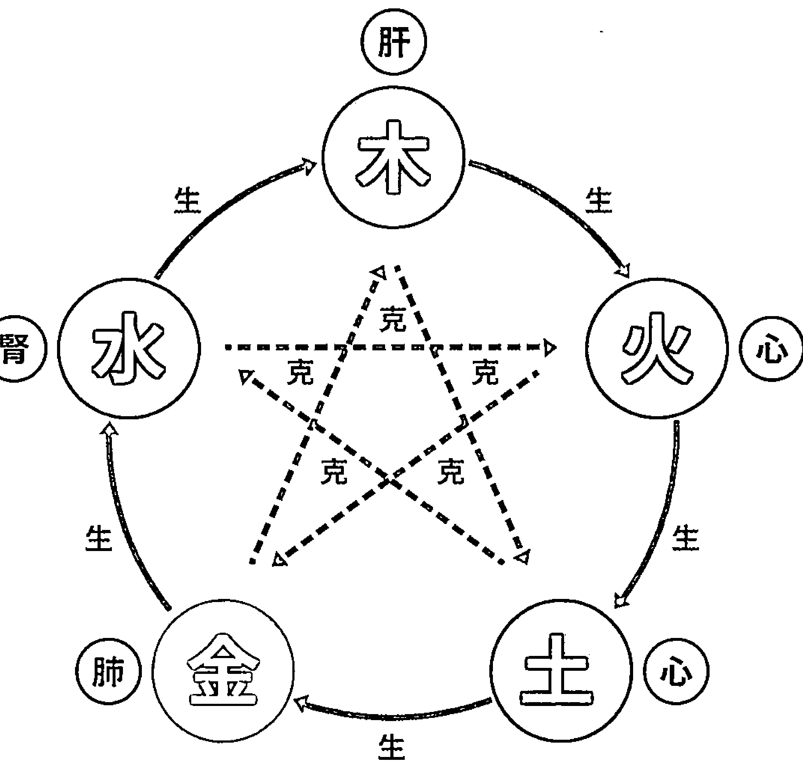

## Column. 3 從中醫的角度來理解「壓力」的發生

一般而言，中醫認為：當人處於高度壓力時，身體會形成「氣鬱」的狀態，大多屬於「肝鬱氣滯」的類型。

肝主要掌管人體內部「疏通」及「宣泄」的功能，負責疏泄全身的氣、血與津液。當此三者無法疏泄時，容易有焦慮躁動、暴怒不安、精神抑鬱與失眠的情況發生，日積月累就會導致自律神經系統的異常。另外，當五行中屬「木」的「肝」，發生「氣鬱」導致「氣滯」，就會影響到五行中屬「土」的「脾」，造成脹氣、消化不良等「腸胃系統」的相關病症。

## Column. 4 從中醫的角度來理解「失眠」的發生

中醫理論將引起失眠的不同成因分為下列幾種類型：

- ① 心火熾盛型
  因心火熾盛而導致的失眠，容易煩勞傷心、心火獨盛、心神不寧。表現癥狀多為睡眠品質不佳且易醒、容易上火、胸口煩熱與口渴、口舌部分容易生瘡；此外，小便顏色深黃，有時排尿時還會略帶疼痛滯澀。
- ② 心脾兩虛型
  因心脾兩虛而導致的失眠，主要是由於思慮勞倦而傷及心脾，導致脾氣虛弱，氣血生化之源不足，造成血不養心，以致心神不安，夜不成寐。這種類型的失眠，表現癥狀多為多夢易醒、面色憔悴缺少光澤、身體易有倦怠感、呼吸時氣短、容易心悸與健忘、通常脈象細而弱。
- ③ 心膽氣虛型
  因心膽氣虛而導致的失眠，主要因容易受到驚恐而造成膽傷，使得膽氣變虛，而膽奪心氣，造成心氣也跟著表現虛態；另外，有些時候心氣虛，不濟於膽，也會導致膽氣虛。這種類型的失眠，表現癥狀多為多夢易醒、容易心悸心煩、遇到事件時常常會受到驚嚇、氣短、容易發汗、身體容易表現出倦怠乏力。
- ④ 肝鬱化火型
  因肝鬱化火而導致的失眠，主要是由於容易發怒造成肝的受損與失調，使得氣鬱化火，上擾心神。這種類型的失眠，表現癥狀為入睡困難甚至整夜不眠、容易做惡夢、雙目充血、口苦口渴、發聲耳鳴、便秘與小便顏色偏黃；在個性上顯得急躁易怒，常有頭暈腦脹的情況發生。
- ⑤ 痰熱內擾型
  因痰熱內擾而導致的失眠，主要是由於食滯的關係導致積濕生痰，而痰鬱生熱上擾，造成心神不寧。這種類型的失眠，表現癥狀為睡不安穩、入睡困難且易醒、頭重目眩、舌苔黃膩、痰多、惡食、噯氣(打嗝)、胸悶、心煩、懊惱等情況。
- ⑥ 陰虛火旺型
  因陰虛火旺而導致的失眠，主要是由於腎陰虛耗不能上濟以滋心陽，容易心肝火旺，造成虛火擾神，以致心煩導致失眠。這種類型的失眠，表現癥狀為心煩不眠、頭暈、耳鳴、盜汗、口乾、腰部與膝蓋酸軟；另外，在掌心、足心與胸口會有煩熱的感覺。
- ⑦ 脾腎陽虛型
  因脾腎陽虛而導致的失眠，主要是由於感受外在寒邪，睡眠時因體內畏寒，所以即使已經蓋被還是不覺得溫暖，仍持續發冷造成難以入睡的情況。這種類型的失眠，表現癥狀為失眠多夢、頭暈耳鳴無力、易感到身體虛勞、四肢畏寒、夜間頻尿、身體水腫、小腹發冷或感到疼痛。

### 透過「頌缽音療」告別壓力、遠離失眠
Say Goodbye to Stress & Stay Away from Insomnia with "Singing Bowl Sound Healing"

#### 研究證實

加州大學聖地牙哥分校的 Tamara L. Goldsby 和 Michael Goldsby 博士在 2016 年於《實證整合醫學期刊》論文中指出：62 位受試者在經過「頌缽音療」的施作之後，原本的緊張、憤怒、疲勞和沮喪的情緒，都有了明顯的降低。

另外，Gunjan Y Trivedi 與 Banshi Saboo 醫學博士在 2019 年於《國際健康期刊》發表的〈安靜平躺與平躺時同時施與頌缽音療，對於兩者間受試者的壓力指數和心率變異性的比較研究〉指出：相對於安靜平躺的受試者，平躺且配合 20 分鐘的「頌缽音療」施作的受試者能更加放鬆，並得到更好的心率變異性（HRV）指數。

由此可知，「頌缽音療」可以幫助人們「減輕壓力」，並增強人體的「副交感神經」活動。而「副交感神經」的活動情況，也會影響「睡眠」的品質。當「副交感神經」活動得到增強時，心跳速度會放緩、呼吸頻率變慢、血壓下降、體溫降低，有助於人體順利進入睡眠的狀態。

#### 實際操作案例

在我過去進行「頌缽音療」的過程中，無論是將頌缽直接放在個案身上透過「缽體振動」進行的「缽體共振法」，或是透過頌缽「音聲傳遞」而沒有直接碰觸到個案身上的「音聲共振法」，都能發現頌缽的「音頻振動」對於個案在「減低壓力」與「改善睡眠」這兩個方面有顯著的改善效果。

回顧以往累積「頌缽音療」的個案經驗，大約有八成以上的個案能在為期一小時的施作過程裡，藉由聆聽頌缽的「音頻」或感受缽體的「振動」，都能在短時間內迅速進入「半睡半醒」的狀態，甚至有人直接陷入「深層睡眠」的狀態。而當施作結束，個案醒來之後，頭腦不但不會昏沉，反而會因獲得優質的睡眠品質而更加清醒。一般而言，在每一次「頌缽音療」的施作之後，個案改善睡眠的效果通常能夠維持二～三天。

雖然其他的聲音療法也能帶來降壓、舒眠的療效，但是頌缽的「強感受性」、「非侵入性」、「利於攜帶」以及「便於自我操作」等優勢，更能貼近一般民眾的需求，這也是為何「頌缽音療」會成為近年來盛行的自然療法之一。

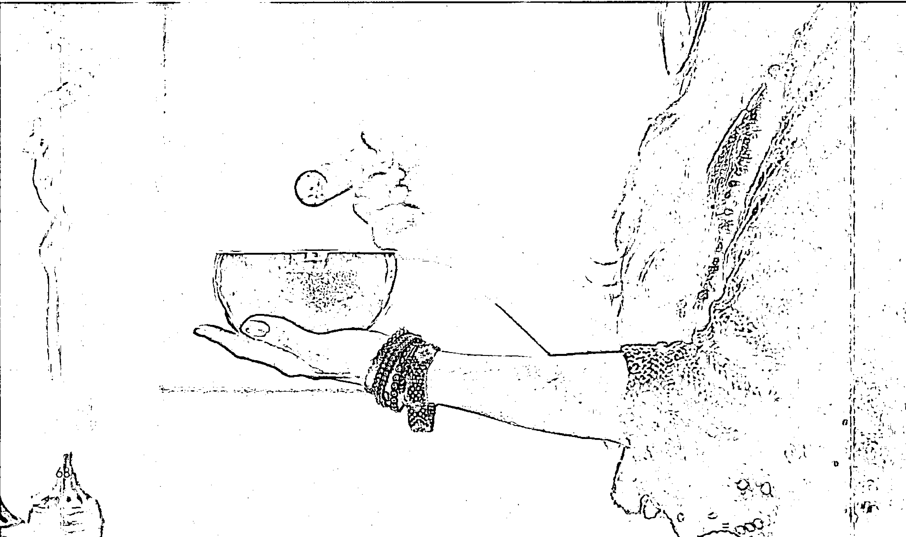

## Chapter 03 頌缽操作技巧
### SINGING BOWL Operation Skills

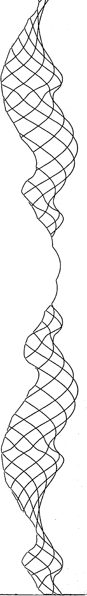
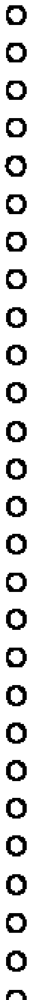

### 頌缽如何產生療癒
How Singing Bowls Produce Healing

頌缽主要是藉由「振動」與「音聲」兩個層面產生療癒。首先，操作者敲擊頌缽後使缽體的周圍空氣產生「振動」，進而觸發人體的「觸覺感知」；同時，缽體被敲擊後所發出的「音聲」，也會刺激人體的「聽覺感知」。敲缽本身能夠同時透過「振動」與「音聲」，協助個案的身體狀態達到全面性的調整與修正。

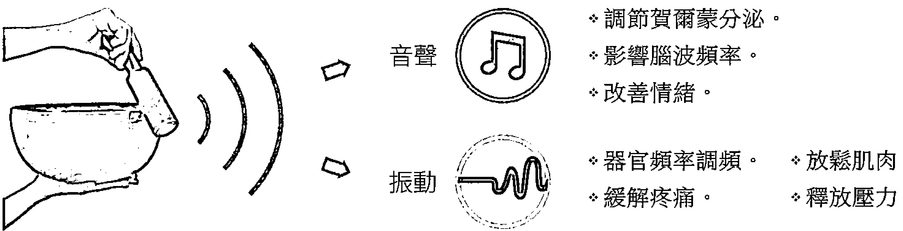

#### 振動

利用敲擊頌缽所帶動的「缽體」與「缽身」周圍空氣的振動能量，透過共振反應傳遞到各部位，對身體內的細胞分子、水分、器官和骨骼產生共振反應，透過這個反應來激化的細胞分子活性，同時也可以讓身體內的器官藉由共振來讓原本失序的頻率，獲得調整。

而當頌缽受到敲擊時，它所產生震波的能量進入身體內部，可以刺激神經裡頭的觸覺接受器，當觸覺接收器所產生的訊號傳到中樞神經時，由於這些訊號已經把神經通道佔滿，使痛覺訊號無法透過通道傳到腦部，也使疼痛的感覺獲得些微的減緩。

另外，藉由頌缽產生的振動，共振體內深層的肌肉與筋膜，使得緊繃的肌肉得以放鬆，並且解開肌肉和筋膜的沾黏，同時消除筋膜因緊繃所引發的肌肉僵硬，降低肌肉的張力進而得到舒緩。

## 音聲

穩定且和諧的頌缽音聲，可以正面地影響身體的循環系統、呼吸系統，並促使體內荷爾蒙的分泌，如被稱為「腦中快樂物質」的「多巴胺」(Dopamine)、被稱為「愛情激素」的「催產素」(Oxytocin)、「內啡肽」(Endorphins)和「血清素」(Serotonin)等四種物質，使呼吸、心跳甚至腦波都跟著激素的改變而發生變化，進一步調節大腦皮質層的興奮度，情緒機轉得以在這個過程中改善，讓人們的情緒獲得好轉。

### 催產素 (Oxytocin)
被稱為「愛情激素」的催產素，它是一種強大的激素和神經遞質，當腦內的催產素過低時，會使得精神的健康狀態受到影響。

### 多巴胺 (Dopamine)
多巴胺是大腦中的一種神經遞質，通過神經元釋放一種化學物將信號發送到其它神經細胞。這種傳導物質主要負責大腦的情慾、感覺、傳遞愉悅與興奮的信息，同時也與上癮有關。

### 血清素 (Serotonin)
又被稱作「幸福荷爾蒙」，是一種神經遞質，與情緒調節有關，它主要由大腦中的神經元產生和傳播。有助於決定個人的整體情緒，克服情緒變化，如：焦慮和抑鬱等。

### 內啡肽 (Endorphin)
內啡肽是腦下垂體分泌出來的荷爾蒙，它能降低壓力、增加愉悅感……等作用，另外內啡肽也能緩解疼痛，所以當我們平常出現損傷或撞傷時，能夠在短時間內感覺到疼痛減緩，這就是它的作用，所以又被譽為「人體的天然鴉片」。

### 認識頌缽構造與音聲
Understand the Structure & Sound of Singing Bowls

如果想要透過頌缽來進行療癒或是靜心，只有先明白頌缽的構造、原理與特性，並確實地學習敲缽的技巧，才能明確掌握缽聲傳遞的品質。

#### 頌缽的構造

大部分的頌缽，呈現的外觀多為「碗型」的構造。從缽的壁面內、外不同，分為「內缽壁」與「外缽壁」；至於整個缽體，可再細分為「缽頂」(缽緣)、「缽身」(缽腰)與「缽底」三個部分。

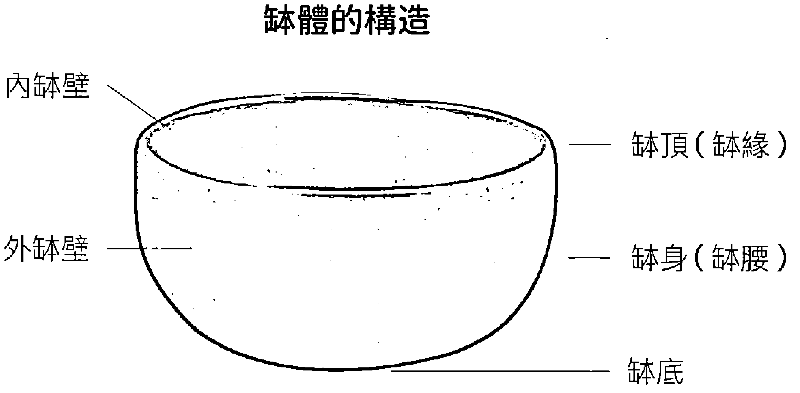

#### 頌缽的敲擊區域

一般而言，敲缽通常是指敲擊缽體的「外缽壁」為主，而缽棒觸擊到缽壁的接觸點，就是所謂的「敲擊點」。而隨著敲擊點的不同，對於「缽音持續性的長短」及「缽體振動延續性的強弱」有著密切的關聯。

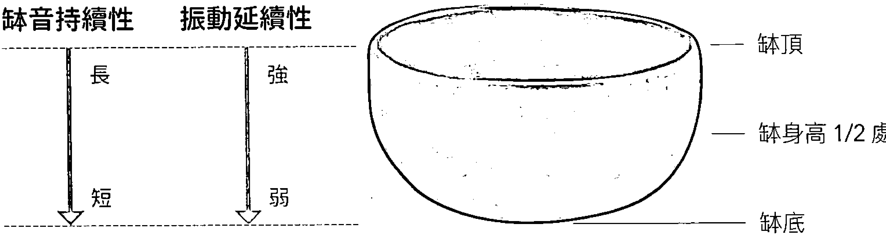

當缽棒敲擊缽體的部位越接近「缽頂」（缽緣）時，缽音的持續性就會比較綿長，而缽體的振動延續性也顯得較強。總體來說，落於缽體外壁靠近缽頂約 1.5 公分的位置，即為頌缽的「最佳敲擊點」。

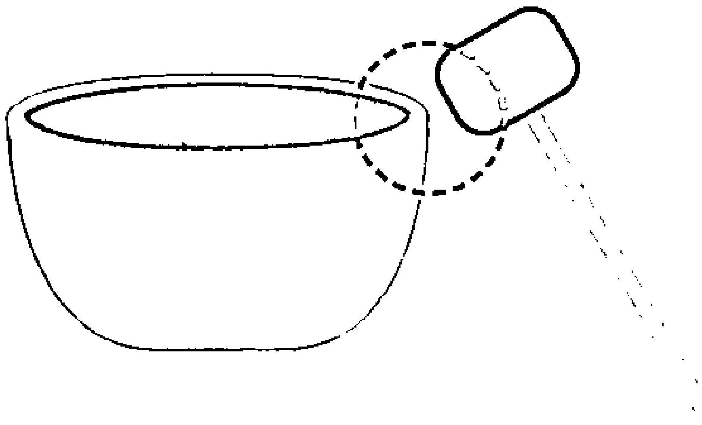
*最佳敲擊點為缽壁最頂端處約 1.5cm 處。*

反之，當缽棒敲擊在缽壁上的落點離缽頂越遠時，缽音的持續性和振動的延續性也會表現的較差。至於敲擊點落於缽身高度的 1/2 處至缽底之間，缽所產生的音響與振動微乎其微，甚至完全沒有。

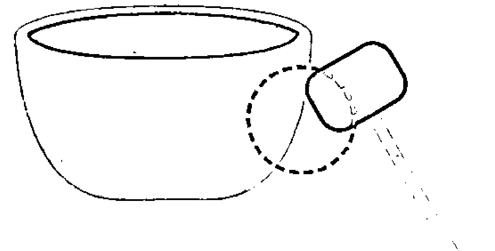
*當敲擊點過低，產生音聲和振動延續性差。*

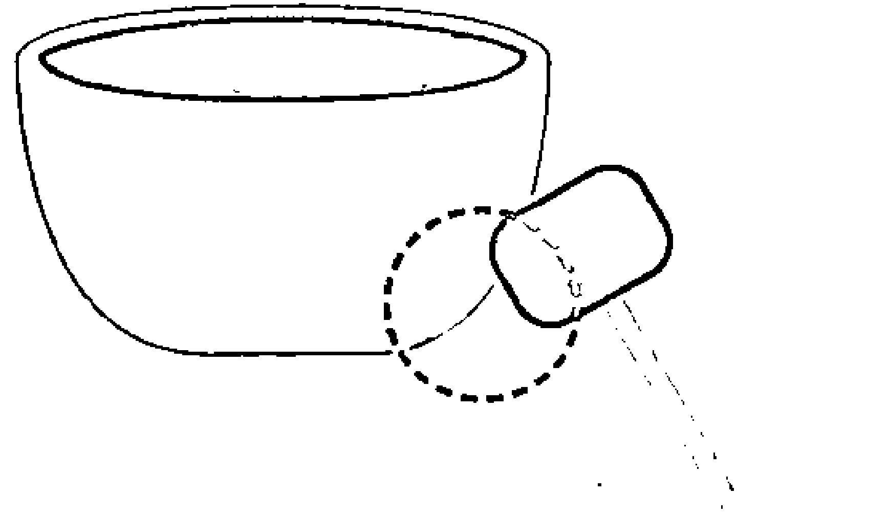
*當敲擊點接近底部，幾乎無法產生音聲和振動。*

#### 尋找頌缽的「有效擊點」(熱點)

傳統的頌缽，多半為手工製作而成。為了確保缽壁能呈現一致的厚度，在製缽的過程中，雖然歷經數位工匠反覆地輪番鍛打，但畢竟仍是出於「人為」，外觀無法像機械缽一樣具有完全均勻的缽壁。

所以，只要是出於手工打造的頌缽，聲音的表現就會隨著缽壁厚、薄的些微差異，存在些許的不同。這也是為何每一個頌缽都有屬於自己獨一無二的「有效擊點」，即使是前面提到的「最佳敲擊點」，也未必適用於所有的缽身與缽型。

所謂的「有效擊點」，有時也被稱為「熱點」，指在缽體的某些特定位置進行敲擊時，會得到最佳的音聲與振動品質，但需要操作者歷經無數次的逐一敲缽，側耳傾聽、細心觀察才能尋獲發現。至於「有效擊點」的練習，可以幫助我們發掘出每一個頌缽所能表現的最大潛力。

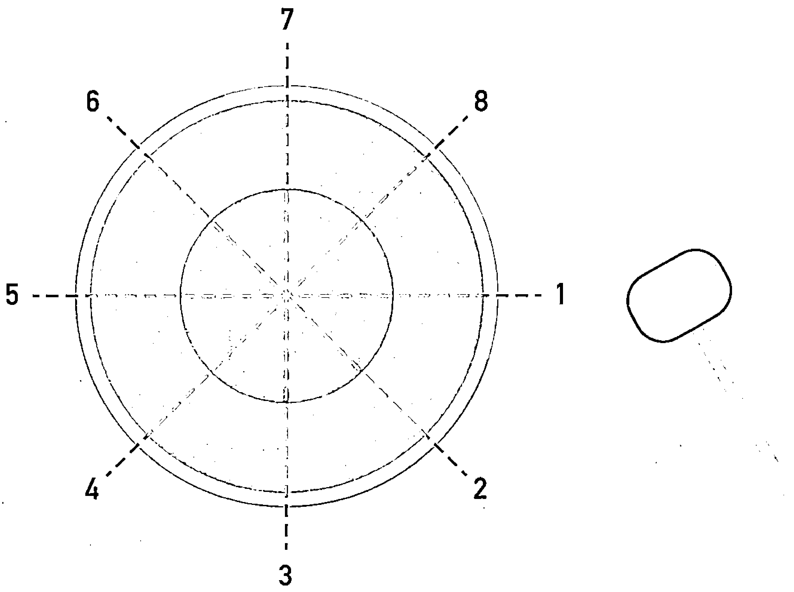
*由點 1 開始依序敲擊，並聆聽頌缽所發出的聲音，直到找到屬於該缽的有效擊點或稱熱點(圖為上視圖)。*

- Step. 1 一手持缽，另一手握缽棒，定位於缽的其中一側，準備開始尋找。
- Step. 2 將外缽壁的一側設定為「點 1」，並以此為始點，依序將缽均分成「8 個等分」，更大的缽則可以細分為「16 或 32 個等分」。
- Step. 3 從「點 1」開始進行敲擊，當每一個點敲擊完後，將缽靠近耳邊，全神貫注地聆聽頌缽傳遞出的音聲與振動的品質，直到缽音與振動「完全停止」，才算是一個循環的結束。
- Step. 4 之後，依序逐一敲擊至「點 8」，以此類推，直到找出頌缽的「有效擊點」(熱點)時，就結束敲擊。

一旦當你找到了頌缽的「有效擊點」(熱點)，之後就可以反覆運用不同的「力道」與「節奏」去敲擊，嘗試做一些變化，並且專注的聆聽與熟悉它所傳遞出來的聲音與振動。

#### 探索頌缽的音色練習

在開始進行敲缽之前，除了找出頌缽的「有效擊點」(熱點)之外，了解頌缽的「音色表現」也是很重要的，探索頌缽「音色」的練習方式如下：

- Step. 1 一手持缽，另一手握缽棒，定位於缽的其中一側，準備開始探索頌缽的音色。
- Step. 2 將外缽壁的一側設定為「點 1」，並以此為「始點」，將缽均分成「8 個等分」；體積更大的缽，則可以細分為「16 或 32 個等分」。
- Step. 3 從「點 1」為「始點」，開始進行敲擊。當每一個點敲擊完之後，將頌缽靠近耳邊，全神貫注地聆聽頌缽傳遞出「音聲」與「振動」的品質，直到缽音與振動「完全停止」，才算是一個循環的結束。
- Step. 4 再次敲擊「點 1」，但改採用「不同的缽棒」敲擊「不同的節奏」，譬如可以試著「連續敲擊兩下或三下」，敲擊完後，將頌缽靠近耳邊，聆聽頌缽傳遞出「音聲」與「振動」的品質，直到缽音與振動「完全停止」，才算是一個循環的結束。
- Step. 5 持續敲擊「點 1」，但改採用「點敲」、「撈敲」、「勾敲」與「平敲」等不同的敲擊方式各別進行一次。敲擊完後，將頌缽靠近耳邊，聆聽頌缽傳遞出「音聲」與「振動」的品質，直到缽音與振動「完全停止」，才算是一個循環的結束。
- Step. 6 重複步驟 3-5，依序從「點 2」逐一敲擊至「點 8」，漸次探索，除了運用不同的「敲擊方式」之外，還可變化不同的「節奏」，熟悉每一個區域的音色表現與振動狀態。以此類推，直到完全熟悉頌缽八個不同區塊在「音色表現」與「振動狀態」後結束。

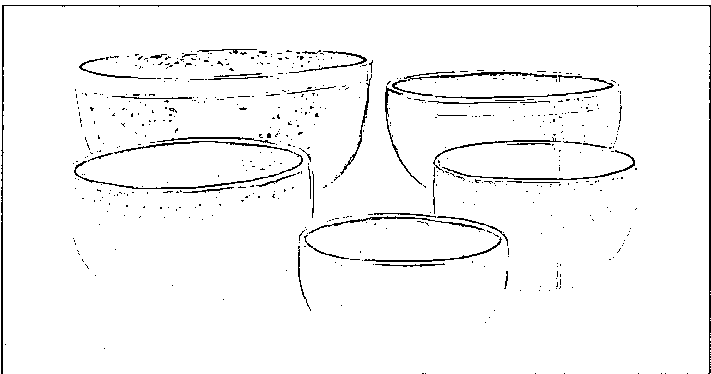

## 基本頌缽持拿技巧
Basic Singing Bowl Holding Skills

### 持缽

以手「持缽」，是透過我們的手掌與缽產生「連結」的第一步驟，在這個動作中，可以讓我們直接感受到敲缽時由缽底傳遞出來的「振動」，有助於幫助操作者透過掌心振動的強弱狀態，並依此決定下一次的敲擊力道。

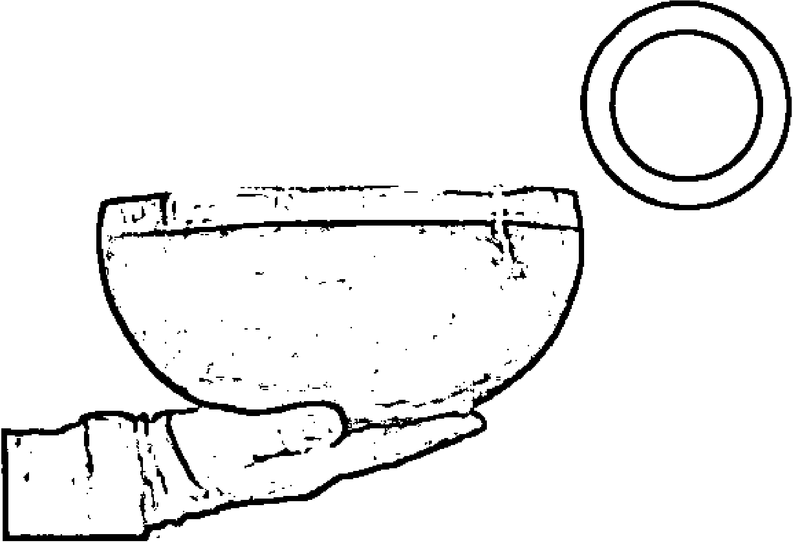
*手掌攤平向上，將缽置放於掌心上。*

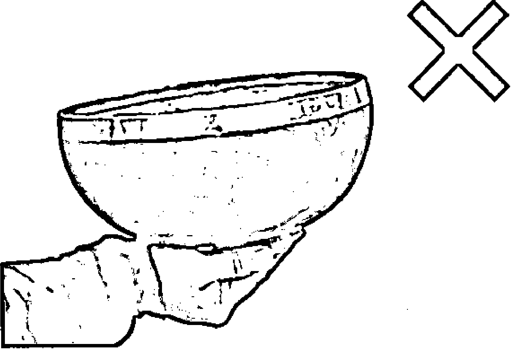
*手掌過於彎曲（錯誤示範）。*

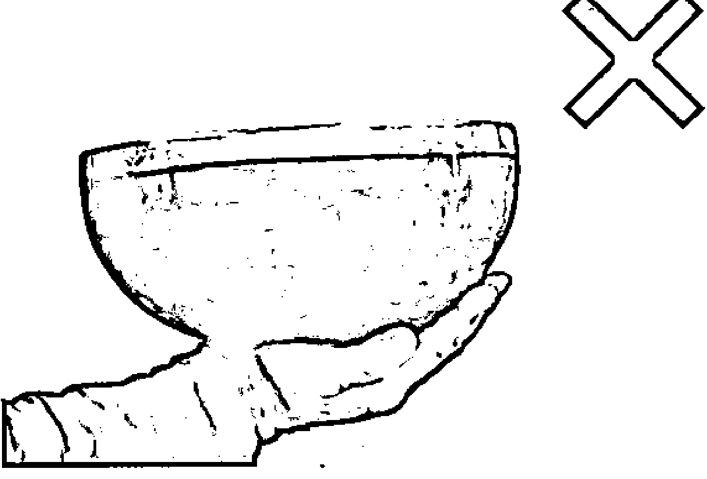
*缽側接觸面積過大（錯誤示範）。*

為了讓持缽時的振動與聲音維持得更久，學習正確地持缽是很重要的。

以整個缽體而言，缽壁的範圍是整個敲擊時的扭動面（指缽頂到缽底的高度），當可以扭動的面積越大，頌缽可以持續的振動幅度也會越大。

在持缽時，儘量讓手掌向上「攤平」，如此一來，不但可以使缽體振動持續得更久，也能因為手掌攤得越平，構建出較為平整的缽底面積，使敲擊出來的品質更加穩定；在聲音的表現上，也會比起掌心彎曲時的音色更加低沉。

### 穩缽

有時候，我們需要將頌缽置放在較為「不平整」的表面上進行操作。這個時候，就必須使用「穩缽」的技巧。何謂「穩缽」？顧名思義，就是一種「將缽身穩定」的手法。

先把手心朝下並緩緩放入缽身裡頭，同時將手掌攤開，五指放鬆並輕壓在缽體內緣中心的底部，五根手指的力道盡量平均分配，不需要太用力，但也不能完全無力，力道的拿捏適中，手指向外延展、攤平，這樣既能固定住缽身，又能達到一定的舒適度，為「穩缽」的主要追求。

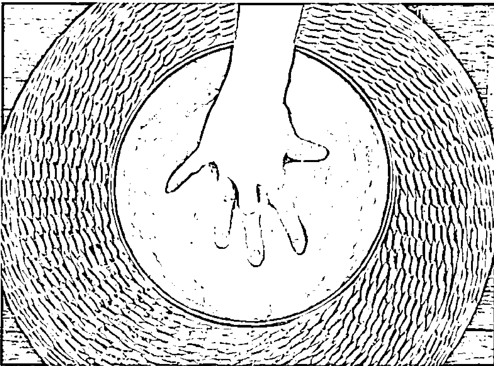
*手心朝下將手掌攤開，將手掌放到缽內，五根手指平均施力輕壓缽身內側底部。*

## 基本頌缽敲擊技巧
Basic Singing Bowl Percussion Skills

### 點敲

**使用時機**

當一些個案因為身體過於虛弱、術後尚未復原等原因，無法直接承受缽體所傳遞的過大振動時，或是靠近人體的心臟、耳朵附近、出血或結痂不久的傷口、肌肉較少或較靠近骨頭等不宜直接受刺激的部位，施作時必須克制敲擊的力度不能過強，此時就適用「點敲」的手法。

**敲法**

- 1. 將缽棒置於缽壁外大概「一顆拳頭」（約 7 ～ 10 公分）的距離。
- 2. 以適中的力道施予一次的敲擊。
- 3. 敲完後，讓缽棒自然彈回敲擊之前的所在位置。

### 撈敲

**使用時機**

「撈敲」的操作方式，因像煮麵時正要「打撈」麵條的手勢，因此得名。

此種敲法所帶出的敲擊缽體振動與音聲的強度「偏小」，與「點敲」適用的時機與實施於個案的身體部位大多相同。不過，有別於「點敲」是出自操作者的刻意施力，「撈敲」的力道主要是憑藉缽棒本身的重量，透過借力使力，自然彈擊缽壁。

撈敲動態影片 QRcode

**敲法**

- 1. 將缽棒自然地垂直倒放，缽槌置於缽壁之外約「一顆拳頭」（約 7 ~ 10 公分）的距離。
- 2. 將缽槌往後拉起約「15 ~ 30 度」，再輕輕放開缽棒，使缽棒自然地擺動到外缽壁。
- 3. 待缽棒的槌頭敲擊完後，順勢再彈開回到原本的位置。

### 勾敲

**使用時機**

此種敲法所帶出的缽體振動與音聲的強度「中等偏大」，通常用於敲擊個案的大腿、臀部等肌肉較多的位置，以及腹部、背部等面積較大且平坦的身體部位。

勾敲動態影片 QRcode

**敲法**

- 1. 將缽棒置於缽壁外約「三～四顆拳頭」（約 20 ～ 30 公分）的距離。
- 2. 當缽棒敲擊缽壁後，讓缽棒的槌頭隨著手勢的收回，順勢往回並往上勾。

**敲擊路徑**

### 平敲

**使用時機**

平敲帶出的缽體振動與音聲的強度「中等偏大」，與「勾敲」的使用時機相同，通常用於敲擊個案「肌肉較多」或「面積較為平整」的身體部位。但兩者的差異之處，就在於「勾敲」受限於身體的某些角度而無法進行施作，「平敲」的運用範圍則更廣，比如說個案的「身體側邊」，僅適用於「平敲」而非「勾敲」的手法。

**敲法**

- 1. 將缽棒置於缽壁外約「三～四顆拳頭」（約 20 ～ 30 公分）的距離。
- 2. 當缽棒敲擊完缽壁之後，讓缽槌直接順著原來的路徑，平拉回敲擊之前起始的預備位置。

**敲擊路徑**

## 移動頌缽的基本技巧
Basic Skills of Moving Singing Bowls

有些頌缽療程，會將缽體直接放在個案的身體上，以此進行動態的施作。為了避免過程中不會因為移動時遇到障礙而停止振動，還有確保缽體能夠「貼近」個案的身體表面移動，並維持良好的「振動」品質，操作者就要學習如何有效且平穩的掌握「移缽」的技巧。

一般而言，移動頌缽有「直線移動」與「弧線移動」兩種基本的技巧。

### 直線移動

當缽身持續在振動的狀態時，若要從 A 點到 B 點進行「直線」的移動路徑，以下列圖示說明：

- 1. 將「手指的頂部」對齊並指向所要移動的方向。
- 2. 將施力點的重心移至「前三指」。
- 3. 透過手指的指腹與頌缽接觸點所產生的「摩擦力」，手指向前輕推，直到進入 B 點的目標，即完成頌缽的「直線移動」。

### 弧線移動

當缽身持續在振動的狀態時，若要從 A 點到 B 點進行「弧線」的移動路徑，以下列圖示說明：

- 1. 將手掌呈現「攤開狀」，置於缽身內緣的中心底部，並將施力點均勻地分布於五根手指。
- 2. 運用手指的指腹與頌缽接觸點所產生的「摩擦力」，稍微「扭動手腕」，藉此對齊要移動的方向。
- 3. 憑藉手腕因為些微的扭動而形成的自然弧度，再沿著弧線挪移至 B 點的目標，完成頌缽的「弧線移動」。

### 頌缽音療施作的基礎流程
Basic Process of Singing Bowl Healing

一般來說，常見的頌缽音療依照不同的共振方式，區分為「音聲共振法」與「缽體共振法」兩種。

#### 音聲共振法

此法是藉由頌缽發出的「音聲」帶來的療癒效果。因此，操作者是以頌缽發出的「音聲」為主，敲缽時隨著缽體帶動的「氣體振動」為輔，即使個案並未與頌缽有實質上的直接碰觸，也能使他的身心狀態達到一定程度的舒緩與提升。

#### 缽體共振法

敲缽時由缽體傳遞至人體的「振動」所帶來的療癒效果。因此，操作者會直接將頌缽的缽體放在個案的身上，以頌缽被敲擊時從缽底產生的「振動」為主，缽身周圍與空氣共振的「氣體振動」與「音聲」兩者為輔，三者合一，能夠有效地讓個案的身體得到立即性的放鬆，感受到明顯的共振，心情也會隨之變得更加平靜。

缽底產生的振動為主，缽身周圍氣體振動與音聲為輔。

### 「音聲共振法」的操作練習

#### Column 1. 單缽音聲共振的操作方式

單缽音聲共振動態影片 QRcode

當操作者手邊只有一個頌缽時，為了讓個案的全身都能接收到缽體傳來的音聲與共振，在此建議的操作方式為：

- 1. 一手托住缽底，另外一手則配合敲擊。
- 2. 每一次敲缽之後，等頌缽的音聲逐漸變得微弱之際，開始緩步地移動，再沿著個案的身體，搭配不同路徑的變化，進行下一次的敲擊。
- 3. 從起點開始，直至終點結束。

單缽的操作步驟有三，步驟一主要針對個案的「頭部」進行腦波的平衡，步驟二和三則是針對個案的「身體軀幹」進行療癒。值得注意的是，在步驟一～三的過程中，每當缽的音聲變得微弱時，隨即進行下一次的敲擊，以確保音聲能夠持續不間斷（以下圖示皆以個案的身體決定方位）。

**STEP 01**

- 請個案躺平，手持頌缽位於個案的頭頂中心上方約十五公分的距離，開始進行敲擊。
- 環繞個案的頭部，採用「弧線移動」的技巧，由頭頂為起點，緩慢地移動至個案頭部的左側，再返回頭頂，改換至個案頭部的右側，如此為一個循環，來回進行三次。

**TIP.**
當頌缽與個案耳朵的距離較接近時，敲缽的力道不要太大，以免使個案受到驚嚇或者聽力受損。

**STEP 02**

- 進行完步驟一之後，將頌缽從頭頂中心上方位置往上抬高，使缽底與個案身體保持約十～十五公分的距離。
- 以個案的頭頂為始點，依序停留在胸口、腹部、大腿、小腿、腳底等部位的上方，持續進行敲擊。

**STEP 03**

- 將頌缽從腳底上方為始點，依序停留在小腿、大腿、腹部、胸口等部位的上方，一樣使缽底與個案身體保持約十～十五公分的距離。
- 操作者邊敲缽邊緩慢地朝個案的頭頂上方移動，直到跨過頭頂，即完成整個療程。

#### Column 2. 雙缽音聲共振的操作方式

當操作者可以運用兩個頌缽進行施作時，可將雙缽同時置於個案身體的兩側，就可由「單點」的波頻振動轉變為「兩點一線」的波頻振動，並進一步讓兩個頌缽在個案的身體周圍產生「線性」的波頻振動。

比起單缽而言，雙缽的操作步驟較為複雜，一共有九個步驟。以下每一個步驟，敲擊頌缽的次數視情況做增減，大部分以「三～五次回合」為主（以下圖示皆以個案的身體決定方位）。

**STEP 01**

- 請個案躺平，操作者先將兩個頌缽分別放在個案的「頭頂上方」與「腳底下方」。
- 步驟一的敲擊方向為「由上到下」，敲擊順序為先敲擊個案「頭頂上方」的缽，接著再敲擊個案「腳底下方」的缽，頭、尾各敲擊一次，視為一個回合。
- 步驟一至少要完成「三～五個回合」才算結束。

**STEP 02**

- 步驟一結束之後，待缽音變得微弱時，將兩個頌缽分別放在個案的「身體上段」（「頭部至頸部」的部分）的左、右兩側。
- 此時敲擊方向為「由左到右」，敲擊順序為先敲擊靠近個案「身體上段左側」的缽。
- 接著再敲擊靠近個案「身體上段右側」的缽，左、右各敲擊一次，視為一個回合。
- 步驟二要完成至少「三～五個回合」才算結束。

**STEP 03**

- 接續前一步驟的敲擊，待前一次缽音變得微弱時，開始進行步驟三，注意敲擊過程中不可讓缽音中斷。
- 將缽移置於個案的「身體中段」（「胸部至腹部」的部分）的左、右兩側，敲擊方向為「由左到右」，先敲擊靠近個案「身體中段左側」的缽。
- 接著再敲擊靠近個案「身體中段右側」的缽，左、右各敲擊一次，視為一個回合。步驟三要完成至少「三～五個回合」才算結束。

**STEP 04**

- 接續前一步驟的敲擊，待前一次缽音變得微弱時，開始進行步驟四，注意敲擊過程中不可讓缽音中斷。
- 將缽移置於個案的「身體下段」（「大腿至小腿」的部位）的左、右兩側，敲擊方向為「由左到右」，敲擊順序與次數與前一個步驟相同，同樣先敲擊靠近個案「身體下段左側」的缽。
- 接著再敲擊靠近個案「身體下段右側」的缽，左、右各敲擊一次，視為一個回合。步驟四要完成至少「三～五個回合」才算結束。

**STEP 05**

- 操作者將兩個頌缽重新放回個案的「頭頂上方」與「腳底下方」，但敲擊方向有別於步驟一，改為「由下到上」，敲擊順序為先敲擊個案「腳底下方」的缽。
- 接著再敲擊個案「頭頂上方」的缽，尾、頭各敲擊一次，視為一個回合。
- 步驟五至少要完成「三～五個回合」才算結束。

**STEP 06**

- 接續前一步驟的敲擊，待前一次缽音變得微弱時，開始進行步驟六，注意敲擊過程中不可讓缽音中斷。
- 將缽移置於個案的「身體下段」（「大腿至小腿」的部位）的左、右兩側，敲擊方向改為「由右到左」，先敲擊靠近個案「身體下段右側」的缽。
- 接著再敲擊靠近個案「身體下段左側」的缽，右、左各敲擊一次，視為一個回合。步驟六要完成至少「三～五個回合」才算結束。

**STEP 07**

- 接續前一步驟的敲擊，待前一次缽音變得微弱時，開始進行步驟七，注意敲擊過程中不可讓缽音中斷。
- 將缽移置於個案的「身體中段」（「胸口至腹部」的部位）的左、右兩側，敲擊方向為「由右到左」，先敲擊靠近個案「身體中段右側」的缽。
- 接著再敲擊靠近個案「身體中段左側」的缽，右、左各敲擊一次，視為一個回合。步驟七要完成至少「三～五個回合」才算結束。

敲擊順序：個案的右到左

**STEP 08**

- 接續前一步驟的敲擊，待前一次缽音變得微弱時，開始進行步驟八，注意敲擊過程中不可讓缽音中斷。
- 將缽移置於個案的「身體上段」（「頭部至頸部」的部分）的左、右兩側，敲擊方向為「由右到左」，先敲擊靠近個案「身體上段右側」的缽。
- 接著再敲擊「身體上段左側」的缽，右、左各敲擊一次，視為一個回合。步驟八要完成至少「三～五個回合」才算結束。

敲擊順序：個案的右到左

**STEP 09**

- 操作者將兩個頌缽重新放回個案的「頭頂上方」與「腳底下方」，敲擊方向為「由上到下」，敲擊順序為先敲擊個案「頭頂上方」的缽。
- 接著再敲擊「腳底下方」的缽，頭、尾各敲擊一次，即完成整個流程。

**操作 TIPS**

- 1. 操作者在調節呼吸時，應趨於規律和緩，並保持心平氣和的狀態。
- 2. 操作者在移動步伐時，請盡量安靜無聲，以免影響個案的體驗過程。

#### Column 3. 三缽音聲共振的操作方式

當操作者可以運用三個頌缽進行施作時，就可以由「單點」或「兩點一線」的波頻振動，轉變為「封閉三角」的波頻振動，得以讓三個頌缽在個案身體的周圍產生「局部性包覆」的波頻振動。

過程中，三個缽的擺放原則以構成「封閉三角」為基準，隨著敲缽的方向，變化為「上三角」、「左三角」、「右三角」與「下三角」四種類型，透過三個頌缽所形成的「封閉三角」缽頻振動，使得個案的全身都能獲得完整的包覆。

以下，每一個步驟都會形成一個由「三個頌缽」為定點擺放而成的「封閉三角」區塊，當操作者依序敲完三個頌缽時，可視為一個回合。敲擊頌缽的次數視情況做增減，大部分以「三～五個回合」為主（以下圖示皆以個案的身體決定方位）。

**STEP 01**

- 請個案躺平，將三個頌缽分別放在個案的「頭頂上方」（A點）與「頭部兩側」（B點、C點），形成一個由「A、B、C三點」組成的「上三角」。
- 操作者依序從A點、B點、C點各敲擊一次，視為一個回合，每一個回合之間稍作停頓，待前一個回合的缽音變得微弱時，再進行下一個回合的敲擊。步驟一至少要完成「三～五個回合」才算結束。

**STEP 02**

- 當步驟一完成之後，先敲擊 B 點，並將原先放在 A 點的缽，挪置 E 點後進行敲擊；緊接著，將位於 C 點的缽，移置於 G 點後進行敲擊。
- 此時，三個頌缽分別放在個案的「頭部左側」（B 點）、「腹部右側」（E 點）與「腿部左側」（G 點），形成一個由「B、E、G 三點」組成的「左三角」（以個案的身體決定方位）。
- 操作者依序從 B 點、E 點、G 點各敲擊一次，視為一個回合，每一個回合之間稍作停頓，待前一個回合的缽音變得微弱時，再進行下一個回合的敲擊。步驟二至少要完成「三～五個回合」才算結束。

**STEP 03**

- 將原先放在 B 點的缽移置 F 點後進行敲擊，敲擊完成後循著紫色箭頭方向，敲擊 G 點的缽；再將位於 E 點的缽，移動到 H 點後進行敲擊。
- 此時，三個頌缽分別放在個案的「腿部右側」（F 點）、「腿部左側」（G 點）與「腳底下方」（H 點），形成一個由「F、G、H 三點」組成的「下三角」。
- 操作者依序從 F 點、G 點、H 點各敲擊一次，視為一個回合，每一個回合之間稍作停頓，待前一個回合的缽音變得微弱時，再進行下一個回合的敲擊。步驟三至少要完成「三～五個回合」才算結束。

**STEP 04**

- 將原先放在 G 點的缽移置 D 點後進行敲擊，敲擊完成後循著紫色箭頭方向，敲擊 F 點的缽；緊接著，將位於 H 點的缽，移動到 C 點後進行敲擊。
- 此時，三個頌缽分別放在個案的「腹部左側」（D 點）、「腿部右側」（F 點）與「頭部右側」（C 點），形成一個由「D、F、C 三點」組成的「右三角」（以個案的身體決定方位）。
- 操作者依序從 D 點、F 點、C 點各敲擊一次，視為一個回合，每一個回合之間稍作停頓，待前一個回合的缽音變得微弱時，再進行下一個回合的敲擊。步驟四至少要完成「三～五個回合」才算結束。

## STEP 05

- 將原先放在 F 點的缽移置 B 點後進行敲擊，敲擊完成後循著紫色箭頭方向，敲擊 C 點的缽；緊接著，將位於 G 點的缽，移動到 A 點後進行敲擊。
- 此時，三個頌缽分別放在個案的「頭部左側」(B 點)、「頭部右側」(C 點)與「頭頂上方」(A 點)，形成一個由「B、C、A 三點」組成的「上三角」。
- 操作者依序從 B 點、C 點、A 點各敲擊一次，視為一個回合，每一個回合之間稍作停頓，待前一個回合的缽音變得微弱時，再進行下一個回合的敲擊。步驟五至少要完成「三～五個回合」才算結束。

## STEP 06

- 先敲擊 C 點，接著沿著紫色箭頭方向，敲擊 B 點，當 B 點敲擊後將原先放在 A 點的缽移置 H 點後進行敲擊。
- 此時，三個頌缽分別放在個案的「頭部右側」(C 點)、「頭部左側」(B 點)與「腳底下方」(H 點)，形成一個由「C、B、H 三點」組成的「逆三角」。
- 操作者依序從 C 點、B 點、H 點各敲擊一次，視為一個回合，每一個回合之間稍作停頓，待前一個回合的缽音變得微弱時，再進行下一個回合的敲擊。步驟六至少要完成「三～五個回合」才算結束。

## STEP 07

- 將原先放在 C 點的缽移置 A 點後進行敲擊，接下來將原先放在 B 點的缽移置 F 點後進行敲擊，敲擊完成繼續將原先放在 H 點的缽移置 G 點後進行敲擊。
- 此時，三個頌缽分別放在個案的「頭頂上方」(A 點)、「腿部右側」(F 點) 與「腿部左側」(G 點)，形成一個由「A、F、G 三點」組成的「正三角」。
- 操作者依序從 A 點、F 點、G 點各敲擊一次，視為一個回合，每一個回合之間稍作停頓，待前一個回合的缽音變得微弱時，再進行下一個回合的敲擊。步驟七至少要完成「三～五個回合」才算結束。

## STEP 08

- 來到最後一個步驟，將原先放在 A 點的缽移置 H 點後進行敲擊，接著沿著紫色箭頭，往下依序敲擊位置點 G 與位置點 F。
- 此時，三個頌缽分別放在個案的「腳底下方」(H 點)、「腿部左側」(G 點)與「腿部右側」(F 點)，形成一個由「H、G、F 三點」組成的「下三角」。
- 操作者依序敲擊 H 點、G 點、F 點為一個回合，每一個回合之間稍作停頓，待前一個回合的缽音變得微弱時，再進行下一個回合的敲擊。
- 步驟八至少要完成「三～五個回合」才算結束。

## 操作 TIPS

1. 操作者在敲擊頌缽時，節奏須維持穩定，尤其要避免因心急而使缽音急促，造成個案心理上的緊繃與壓迫。
2. 每一次敲完頌缽之後，須等到缽音變得微弱接近無聲之時，才能接著進行下一次的敲擊。

## Column. 4 四缽音聲共振的操作方式

當操作者可以運用四個頌缽進行施作時，就可以由「單點」、「兩點一線」、「封閉三角」的波頻振動，轉變為「封閉四角」的波頻振動，得以讓四個頌缽在個案身體的周圍產生「局部性包覆」的波頻振動。

過程中，四個頌缽的擺放原則以構成「封閉四角」為基準，隨著施作重點的不同，分為「頭頸部平衡」與「全身平衡」兩種操作類型，透過四個頌缽所形成的「封閉四角」缽頻振動，使得個案的全身都能獲得完整的包覆。

以下，每一個步驟都會形成一個由「四個頌缽」為定點擺放而成的「封閉四角」區塊，當操作者依序敲完四個頌缽時，可視為一個回合。敲擊頌缽的次數可視情況做增減，大部分以「一或二個回合」為主（以下圖示皆以個案的身體決定方位）。

### Method. 1 頭頸部的四缽平衡操作

操作者依據頌缽「音調」的不同，將 B 調、A 調、G 調和 C 調的頌缽分別置放於個案周圍的定點位置。此可參考下方表格：

| 敲擊位置點編號 | 頌缽音調 |
| :--- | :--- |
| 1 | B tone |
| 2 | A tone |
| 3 | G tone |
| 7 | C tone |

#### STEP 01
採「S 型」方向繞行，進行個案「全身」的平衡。

**敲擊順序**：點 1 ➡ 點 2 ➡ 點 3 ➡ 點 7

請個案躺平，操作者先將四個頌缽分別放在個案的「頭頂上方」(點 1)、「頭部右方」(點 2)、「頸部左方」(點 3) 和「腳底下方」(點 7)。步驟一採「S 型」為繞行方向，依序從「點 1、點 2、點 3、點 7」各敲擊一次，視為一個回合。步驟一完成「一個回合」即可結束。

#### STEP 02
進行個案「頭部」與「頸部」的平衡。

**敲擊順序**：點 1 ➡ 點 2 ➡ 點 3

操作者先敲擊位於個案「頭頂上方」(點 1) 的缽，再敲擊位於個案「頭部右方」(點 2) 的缽，最後敲擊位於個案「頸部左方」(點 3) 的缽。依序從「點 1、點 2、點 3」各敲擊一次，視為一個回合。步驟二至少要完成「兩個回合」才算結束。

#### STEP 03
採「逆時鐘」方向繞行，進行個案「全身」的平衡。

**敲擊順序**：點 1 ➡ 點 2 ➡ 點 7 ➡ 點 3

採「逆時鐘」為繞行方向，敲擊順序為先敲擊位於個案「頭頂上方」（點 1）的缽，接著再敲擊位於個案「頭部右方」（點 2）的缽，然後敲擊位於個案「腳底下方」（點 7）的缽，最後敲擊位於個案「頸部左方」（點 3）的缽。依序從「點 1、點 2、點 7、點 3」各敲擊一次，視為一個回合。步驟三至少要完成「兩個回合」才算結束。

#### STEP 04
由「反方向」繞行，再次進行「頭部」與「頸部」的平衡。

**敲擊順序**：點 1 ➡ 點 3 ➡ 點 2

敲擊順序為先敲擊位於個案「頭頂上方」(點 1) 的缽，接著再敲擊位於個案「頸部左方」(點 3)，最後敲擊位於個案「頭部右方」(點 2) 的缽。依序從「點 1、點 3、點 2」各敲擊一次，視為一個回合。步驟四至少要完成「兩個回合」才算結束。

#### STEP 05
採「順時鐘」方向繞行，進行個案「全身」的平衡。

**敲擊順序**：點 1 ➡ 點 3 ➡ 點 7 ➡ 點 2

採「順時鐘」為繞行方向，敲擊順序為先敲擊位於個案「頭頂上方」(點 1) 的缽，接著再敲擊位於個案「頸部左方」(點 3)，然後敲擊位於個案「腳底下方」(點 7) 的缽，最後敲擊位於個案「頭部右方」(點 2) 的缽。依序從「點 1、點 3、點 7、點 2」各敲擊一次，視為一個回合。步驟五至少要完成「兩個回合」才算結束。

#### STEP 06
採「逆 S 型」方向繞行，進行個案「全身」的平衡。

**敲擊順序**：點 7 ➡ 點 3 ➡ 點 2 ➡ 點 1

採「逆 S 型」為繞行方向，敲擊順序為先敲擊位於個案「腳底下方」（點 7）的缽，接著再敲擊位於個案「頸部左方」（點 3）的缽，然後敲擊位於個案「頭部右方」（點 2）的缽，最後敲擊位於個案「頭頂上方」（點 1）。依序從「點 7、點 3、點 2、點 1」各敲擊一次，視為一個回合。步驟六至少要完成「一個回合」才算結束。

### Method. 2 全身的四缽平衡操作

操作者依據頌缽「音調」的不同，將 B 調、F 調、E 調 (或 D 調)、C 調的頌缽分別擺放於個案周圍的定點位置。此可參考下方表格：

| 敲擊位置點編號 | 頌缽音調 |
| :--- | :--- |
| 1 | B tone |
| 4 | F tone |
| 5 (背側) 或 6 (腹側) | E tone 或 D tone |
| 7 | C tone |

#### STEP 01
採「S 型」方向繞行，進行個案「全身」的平衡。

**敲擊順序**：點 1 ➡ 點 4 ➡ 點 5 (或點 6) ➡ 點 7

請個案躺平，操作者先將四個頌缽分別放在個案的「頭頂上方」(點 1)、「胸部右方」(點 4)、「腹部左方」(點 5 或點 6) 和「腳底下方」(點 7)。步驟一採「S 型」為繞行方向，依序從「點 1、點 4、點 5 或點 6、點 7」各敲擊一次，視為一個回合。步驟一完成「一個回合」即可結束。

#### STEP 02
進行個案「上半身」的平衡。

**敲擊順序**：點 1 ➡ 點 4 ➡ 點 5 (或點 6)

敲擊順序為先敲擊位於個案「頭頂上方」(點 1) 的缽，接著再敲擊位於個案「胸部右方」(點 4) 的缽，最後敲擊位於個案「腹部左方」(點 5 或點 6) 的缽。依序從「點 1、點 4、點 5 或點 6」各敲擊一次，視為一個回合。步驟二至少要完成「兩個回合」才算結束。

#### STEP 03
採「逆時鐘」方向繞行，進行個案「全身」的平衡。

**敲擊順序**：點 1 ➡ 點 4 ➡ 點 7 ➡ 點 5 (或點 6)

採「逆時鐘」為繞行方向，敲擊順序為先敲擊位於個案「頭頂上方」（點 1）的缽，接著再敲擊位於個案「胸部右方」（點 4）的缽，然後敲擊位於個案「腳底下方」（點 7）的缽，最後敲擊位於個案「腹部左方」（點 5 或點 6）的缽。依序從「點 1、點 4、點 7、點 5 或點 6」各敲擊一次，視為一個回合。步驟三至少要完成「兩個回合」才算結束。

#### STEP 04
進行個案「下半身」的平衡。

**敲擊順序**：點 4 ➡ 點 7 ➡ 點 5 (或點 6)

敲擊順序為先敲擊位於個案「胸部右方」（點 4）的缽，接著再敲擊位於個案「腳底下方」（點 7），最後敲擊位於個案「腹部左方」（點 5 或點 6）的缽。依序從「點 4、點 7、點 5 或點 6」各敲擊一次，視為一個回合。步驟四至少要完成「兩個回合」才算結束。

#### STEP 05
採「順時鐘」方向繞行，進行個案「全身」的平衡。

**敲擊順序**：點 1 ➡ 點 5 (或點 6) ➡ 點 7 ➡ 點 4

採「順時鐘」為繞行方向，敲擊順序為先敲擊位於個案「頭頂上方」(點 1) 的缽，接著再敲擊位於個案「腹部左方」(點 5 或點 6) 的缽，然後敲擊位於個案「腳底下方」(點 7) 的缽，最後敲擊位於個案「胸部右方」(點 4) 的缽。依序從「點 1、點 5 或點 6、點 7、點 4」各敲擊一次，視為一個回合。步驟五至少要完成「兩個回合」才算結束。

#### STEP 06
採「逆 S 型」方向繞行，進行個案「全身」的平衡。

**敲擊順序**：點 7 ➡ 點 5 (或點 6) ➡ 點 4 ➡ 點 1

採「逆 S 型」為繞行方向，敲擊順序為先敲擊位於個案「腳底下方」(點 7) 的缽，接著再敲擊位於個案「腹部左方」(點 5 或點 6) 的缽，然後敲擊位於個案「胸部右方」(點 4) 的缽，最後敲擊位於個案「頭頂上方」(點 1)。依序從「點 7、點 5 或點 6、點 4、點 1」各敲擊一次，視為一個回合。步驟六至少要完成「一個回合」才算結束。

## Column. 5 七缽音聲共振的操作方式

當操作者可以運用七個頌缽進行施作時，就可以突破「封閉四角」的波頻振動，轉變為「封閉七角」的波頻振動，讓七個頌缽在個案身體的周圍產生「全身性包覆」的波頻振動。

過程中，七個缽的擺放原則以構成「封閉七角」為基準，隨著施作重點的不同，分為「基本型序列敲擊」與「加強型序列敲擊」兩種方式。透過七個頌缽形成的「封閉七角」缽頻振動，使個案的全身都能獲得完整的包覆。

以下，每一個步驟都會形成一個由「七個頌缽」為定點擺放而成的「封閉七角」區塊，當操作者依序敲完七個頌缽時，可視為一個回合。敲擊頌缽的次數可視情況做增減，大部分以「三～五個回合」為主（以下圖示皆以個案的身體決定方位）。

### Method. 1 基本型序列敲擊的七缽平衡操作

操作者依據頌缽「音調」的不同，將 B 調、A 調、G 調、F 調、E 調、D 調、C 調等七個頌缽分別擺放於個案周圍的定點位置。此可參考下方表格：

| 敲擊位置點編號 | 頌缽音調 |
| :--- | :--- |
| 1 | B tone |
| 2 | A tone |
| 3 | G tone |
| 4 | F tone |
| 5 | E tone |
| 6 | D tone |
| 7 | C tone |

#### STEP 01
採「波浪式」的「下行」方向，進行個案「全身」的平衡。

**敲擊順序**：點 1 ➡ 點 2 ➡ 點 3 ➡ 點 4 ➡ 點 5 ➡ 點 6 ➡ 點 7

請個案躺平，操作者先將七個頌缽分別放在個案的「頭頂上方」（點 1）、「頭部右方」（點 2）、「頸部左方」（點 3）、「胸部右方」（點 4）、「腹部左方」（點 5）、「髖部右方」（點 6）、「腳底下方」（點 7）。

步驟一採「由上到下」、「一左一右」近似於「波浪」曲線的敲擊方向，依序從「點 1、點 2、點 3、點 4、點 5、點 6、點 7」各敲擊一次，視為一個回合。每一次的敲擊，會漸次地擴大音場包覆的範圍，得以讓個案感受到缽頻振動的充分洗禮。步驟一至少要完成「三～五個回合」才算結束。

#### STEP 02
採「波浪式」的「上行」方向，進行個案「全身」的平衡。

**敲擊順序**：點 7 ➡ 點 6 ➡ 點 5 ➡ 點 4 ➡ 點 3 ➡ 點 2 ➡ 點 1

敲擊方向改為「由下到上」，同樣也是一右一左近似「波浪」的曲線，依序從「點 7、點 6、點 5、點 4、點 3、點 2、點 1」各敲擊一次，視為一個回合。步驟二至少要完成「三～五個回合」才算結束。

### Method. 2 加強型序列敲擊的七缽平衡操作

由於每個人的身心狀態不同，所以在完成「基本型序列敲擊」的七缽平衡操作之後，操作者可以評估個案的狀況與需求，搭配不同部位的敲擊模組，針對較有問題的區塊再次進行「局部」的加強。

「加強型序列敲擊」的七缽平衡操作，依照不同的身體部位，分為「頭頸部」（紫色區塊）、「胸腹部」（藍色區塊）、「頂根部」（綠色區塊）三種「加強型」序列敲擊方式。

#### 「頭頸部」加強型序列敲擊（紫色區塊）
當個案做完「基本型序列敲擊」的七缽平衡之後，請個案繼續放鬆地躺平著，操作者再針對個案的「頭部」與「頸部」施行能量的平衡與強化。

##### STEP 01
採「逆時鐘」方向繞行，進行個案「頭部」與「頸部」的「能量釋放」。

**敲擊順序**：點 1 ➡ 點 2 ➡ 點 3

- 操作者採「逆時鐘」為繞行方向，先敲擊位於個案的「頭頂上方」（點 1）的缽，接著再敲擊位於個案「頭部右方」（點 2）的缽，最後敲擊位於個案「頸部左方」（點 3）的缽。
- 依序從「點 1、點 2、點 3」各敲擊一次，視為一個回合。
- 步驟一至少要完成「三～五個回合」才算結束。

##### STEP 02
採「順時鐘」方向繞行，進行個案「頭部」與「頸部」的「能量匯聚」。

**敲擊順序**：點 1 ➡ 點 3 ➡ 點 2

- 操作者採「順時鐘」為繞行方向，先敲擊位於個案的「頭頂上方」(點 1) 的缽，接著再敲擊位於個案「頸部左方」(點 3) 的缽，最後敲擊位於個案「頭部右方」(點 2) 的缽。
- 依序從「點 1、點 3、點 2」各敲擊一次，視為一個回合。
- 步驟二至少要完成「三～五個回合」才算結束。

#### 「胸腹部」加強型序列敲擊（藍色區塊）
當個案做完「基本型序列敲擊」的七缽平衡之後，請個案繼續放鬆地躺平著，操作者再針對個案的「胸部」與「腹部」施行能量的平衡與強化。

##### STEP 01
採「逆時鐘」方向繞行，進行個案「胸部」與「腹部」的「能量釋放」。

**敲擊順序**：點 5 ➡ 點 4 ➡ 點 6

- 操作者採「逆時鐘」為繞行方向，先敲擊位於個案的「腹部左方」(點 5) 的缽，接著再敲擊位於個案「胸部右方」(點 4) 的缽，最後敲擊位於個案「髖部右方」(點 6) 的缽。
- 依序從「點 5、點 4、點 6」各敲擊一次，視為一個回合。
- 步驟一至少要完成「三～五個回合」才算結束。

## STEP 02

採「順時鐘」方向繞行，進行個案「胸部」與「腹部」的「能量匯聚」。

敲擊順序：點 6 ⇒ 點 4 ⇒ 點 5

- 接著，操作者採「順時鐘」為繞行方向，先敲擊位於個案的「髖部右方」（點 6）的缽，接著再敲擊位於個案「胸部右方」（點 4）的缽，最後敲擊位於個案「腹部左方」（點 5）的缽。
- 依序從「點 6、點 4、點 5」各敲擊一次，視為一個回合。
- 步驟二至少要完成「三～五個回合」才算結束。

## 胸腹部加強

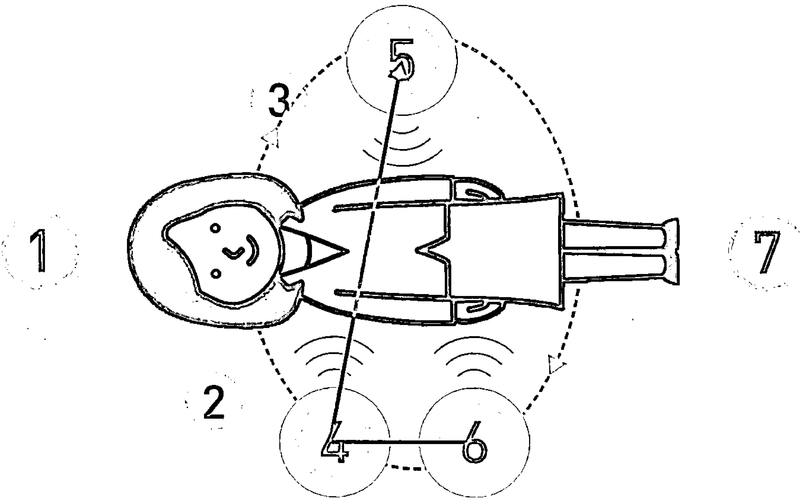

## 「頂根部」加強型序列敲擊（綠色區塊）

當個案做完「基本型序列敲擊」的七缽平衡之後，請個案繼續放鬆地躺平著，操作者再針對個案的「頂部」與「根部」施行能量的平衡與強化。

「頂根部」加強型序列敲擊的重點在於加強人體「頂部」與「足部」的流通狀態，通常可以與「頭頸部」或「胸腹部」兩種加強型序列敲擊一起組合運用。

## STEP 01

採「逆時鐘」方向繞行，進行個案「頂部」與「根部」的「能量釋放」。

敲擊順序：點 1 ➔ 點 7

- 操作者採「逆時鐘」為繞行方向，先敲擊位於個案的「頭頂上方」（點 1）的缽，接著再敲擊位於個案「腳底下方」（點 7）的缽。
- 依序在「點 1」、「點 7」各敲擊一次，視為一個回合。
- 步驟一至少要完成「三～五個回合」才算結束。

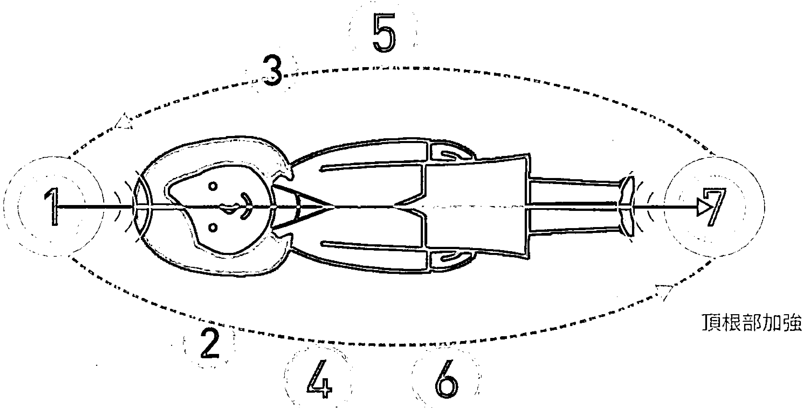

## STEP 02

採「順時鐘」方向繞行，進行個案「頂部」與「根部」的「能量匯聚」。

敲擊順序：點 7 ➡ 點 1

- 操作者採「順時鐘」為繞行方向，先敲擊位於個案的「腳底下方」（點 7）的缽，接著再敲擊位於個案「頭頂上方」（點 1）的缽。
- 依序在「點 7」、「點 1」各敲擊一次，視為一個回合。
- 步驟二至少要完成「三～五個回合」才算結束。

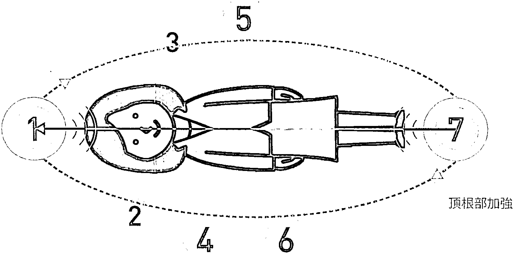

一般而言，操作者可以視個案的實際狀況，將「基本型序列敲擊」搭配不同的「加強型序列敲擊」作為補充與強化。兩者交相組合運用，可更適性地符合個案的需求。

## 舉例說明

若個案的需求是在於紓解「頭部」的緊繃，操作者便可在做完「基本型序列敲擊」的七缽平衡後，另外結合「頭頸型」與「頂根部」兩種「加強型序列敲擊」的操作，再針對個案的「頭部」進行能量的「釋放」、「匯聚」以及「平衡」、「強化」，更能達到最佳的音療效果。

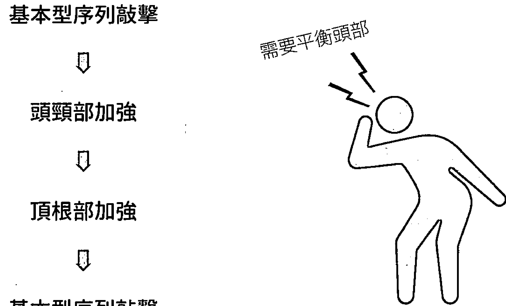
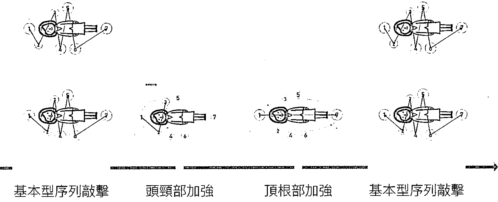

## 「缽體共振法」操作練習

### Column 1. 單缽共振的操作方式

當操作者進行「單缽共振」的施作時，為了讓個案全身都能均衡的接受到頌缽底部所傳遞的共振，在此建議的操作方式為：一手挪缽（如下圖右所示），另外一手則配合敲擊。在每一次敲擊後，等待頌缽的音聲逐漸變得微弱時，緩慢地將缽挪移至下一個定點，再進行下一次的敲擊（以下圖示皆以個案的身體決定方位）。

「單缽共振」的操作，一共有九個步驟：

步驟一到五，敲擊方向為「由上而下」，操作者從「A 點」依序敲擊頌缽直至「E 點」。

步驟六到九，敲擊方向則改為「由下而上」，反過來從「E 點」依序敲擊頌缽直至回到「A 點」。

起點即終點，上下來回一趟，確保個案的全身都能得到缽頻振動的洗禮。

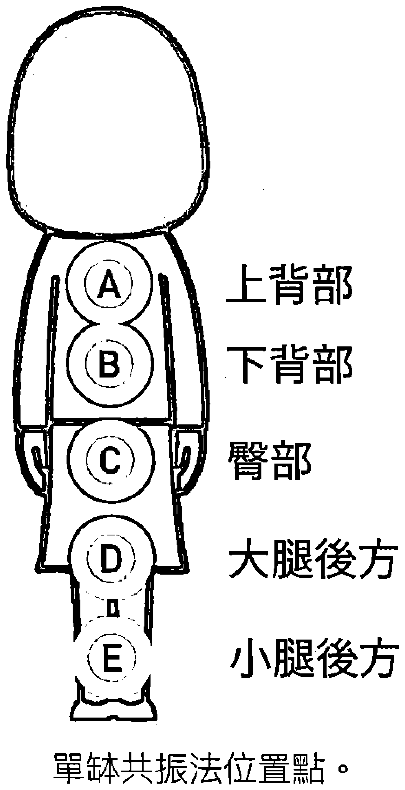
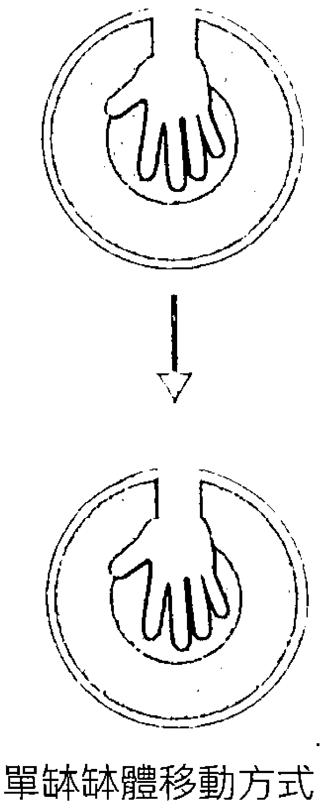
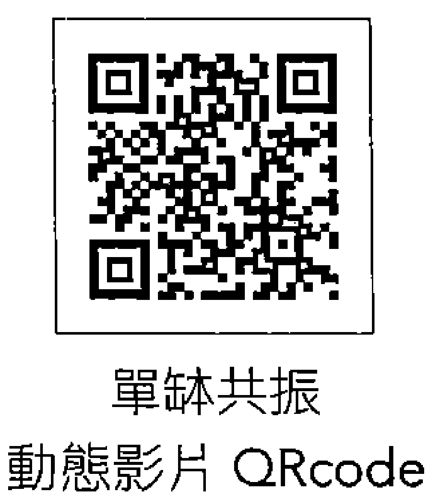

#### STEP 01
請個案翻身趴平在軟墊或診療床上，並將缽放在個案的「上背部」（A 點），接著進行三～五次的敲擊。
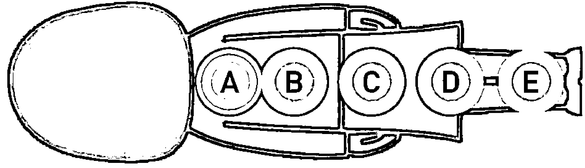

#### STEP 02
將缽由「上背部」（A 點）挪移至個案的「下背部」（B 點）之後，進行三～五次的敲擊。
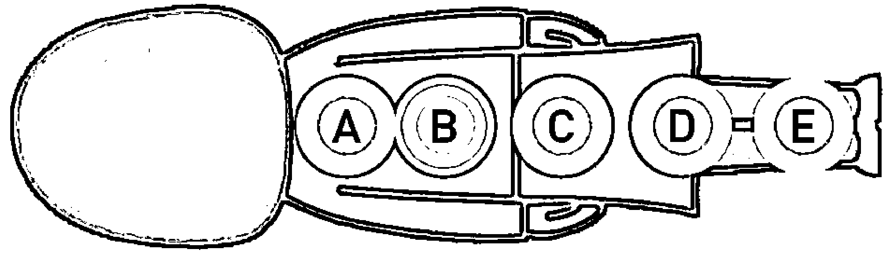

#### STEP 03
將缽由「下背部」（B 點）挪移至個案的「臀部」（C 點）之後，進行三～五次的敲擊。
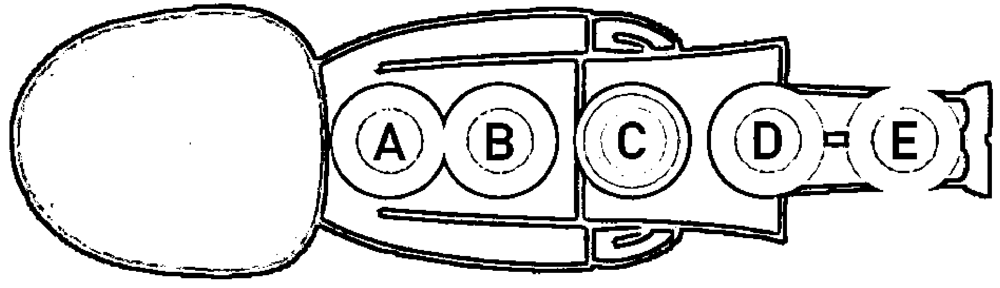

#### STEP 04
將缽由「臀部」（C 點）挪移至個案的「大腿後方」（D 點）之後，進行三～五次的敲擊。
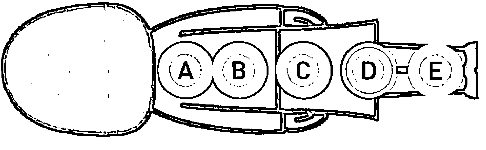

#### STEP 05
將缽由「大腿後方」（D 點）挪移至個案的「小腿後方」（E 點）之後，進行三～五次的敲擊。
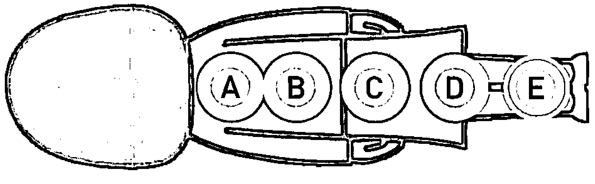

#### STEP 06
接著，方向改為「由下而上」，將缽從「小腿後方」（E 點）挪移至個案的「大腿後側」（D 點）之後，進行三～五次的敲擊。
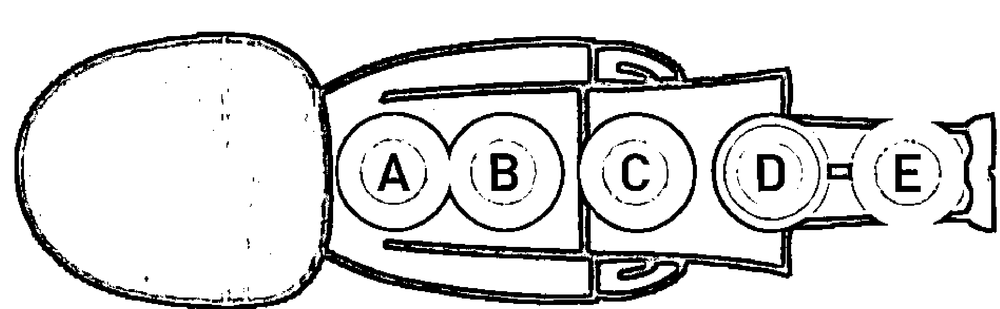

#### STEP 07
將缽從「大腿後側」（D 點）挪移至個案的「臀部」（C 點）之後，進行三～五次的敲擊。
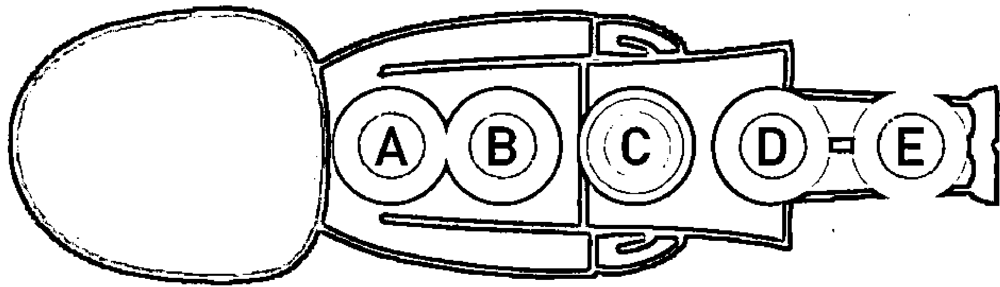

#### STEP 08
將缽從「臀部」（C 點）挪移至個案的「下背部」（B 點）之後，進行三～五次的敲擊。
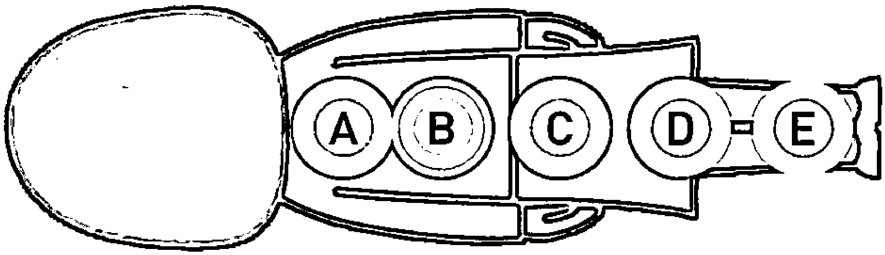

#### STEP 09
將缽從「下背部」（B 點）挪移至個案的「上背部」（A 點）之後進行一次的敲擊，至此完成「單缽共振」的操作。
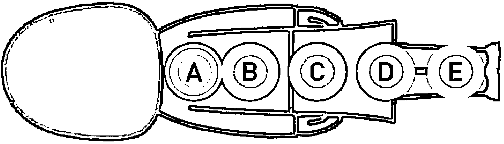

### Column 2. 雙缽共振的操作方式

當操作者進行「雙缽共振」的施作時，過程中將兩個頌缽置於個案身上的兩個定點，就可以透過雙缽之間串成「兩點一線」的波頻振動；此外，再搭配缽體的位移，讓兩個頌缽在個案身上形成「線性」的波頻振動，使個案感受到更強的能量流動。和「單缽共振」相比，「雙缽共振」的操作方式較為複雜，一共有十三個步驟（以下圖示皆以個案的身體決定方位）。

#### STEP 01
- 請個案翻身平趴於軟墊或診療床上，並將缽分別放在個案的「上背部」（A 點）和「下背部」（B 點）。
- 先敲擊位於個案「上背部」（A 點）的缽，再敲擊位於個案「下背部」（B 點）的缽。「A 點」、「B 點」各敲擊一次，視為一個回合。
- 步驟一至少要完成「二～三個回合」才算結束。
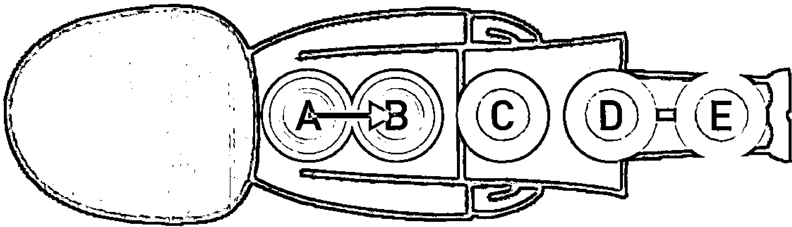

#### STEP 02
- 先敲擊位於個案「上背部」（A 點）的缽，再將原本置於「下背部」（B 點）的缽挪移至「臀部」（C 點）後，再進行敲擊。
- 「A 點」、「C 點」各敲擊一次，視為一個回合。
- 步驟二至少要完成「二～三個回合」，最後敲擊一次位於個案「上背部」（A 點）的缽才算結束。
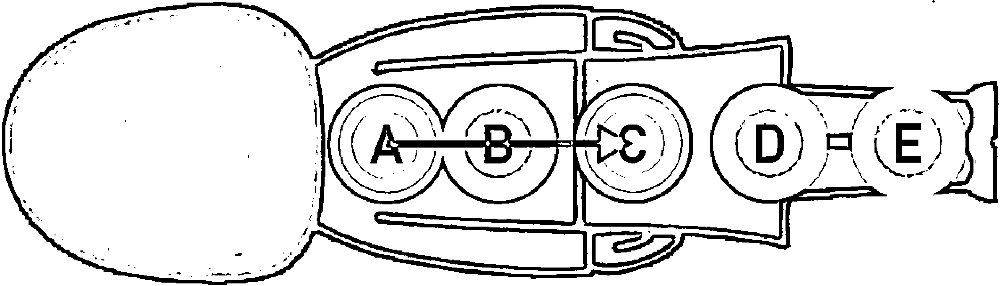

#### STEP 03
- 先敲擊位於個案「臀部」（C 點）的缽，再將原本置於「上背部」（A 點）的缽挪移至「下背部」（B 點）後，再進行敲擊。
- 「C 點」、「B 點」各敲擊一次，視為一個回合。
- 步驟三至少要完成「二～三個回合」，最後敲擊一次位於個案「臀部」（C 點）的缽才算結束。
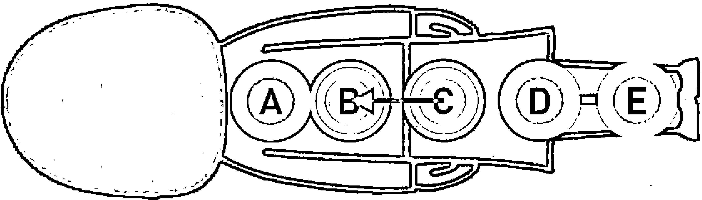

#### STEP 04
- 先敲擊位於個案「下背部」（B 點）的缽，再將原本置於「臀部」（C 點）的缽挪移至「大腿後側」（D 點）後，再進行敲擊。
- 「B 點」、「D 點」各敲擊一次，視為一個回合。
- 步驟四至少要完成「二～三個回合」，最後敲擊一次位於個案「下背部」（B 點）的缽才算結束。

#### STEP 05
- 先敲擊位於個案「大腿後側」（D 點）的缽，再將原本置於「下背部」（B 點）的缽挪移至「臀部」（C 點）後，再進行敲擊。
- 「D 點」、「C 點」各敲擊一次，視為一個回合。
- 步驟五至少要完成「二～三個回合」，最後敲擊一次位於個案「大腿後側」（D 點）的缽才算結束。

#### STEP 06
- 先敲擊位於個案「臀部」（C 點）的缽，再將原本置於「大腿後側」（D 點）的缽挪移至「小腿後側」（E 點）後，再進行敲擊。
- 「C 點」、「E 點」各敲擊一次，視為一個回合。
- 步驟六至少要完成「二～三個回合」，最後敲擊一次位於個案「臀部」（C 點）的缽才算結束。
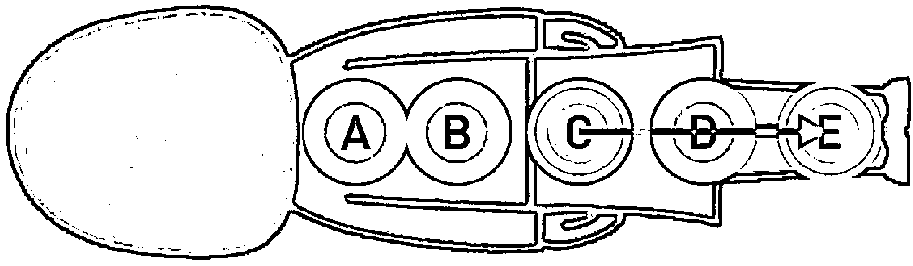

#### STEP 07
- 先敲擊位於個案「小腿後側」（E 點）的缽，再將原本置於「臀部」（C 點）的缽挪移至「大腿後側」（D 點）後，再進行敲擊。
- 「E 點」、「D 點」各敲擊一次，視為一個回合。
- 步驟七至少要完成「二～三個回合」，最後敲擊一次位於個案「小腿後側」（E 點）的缽才算結束。
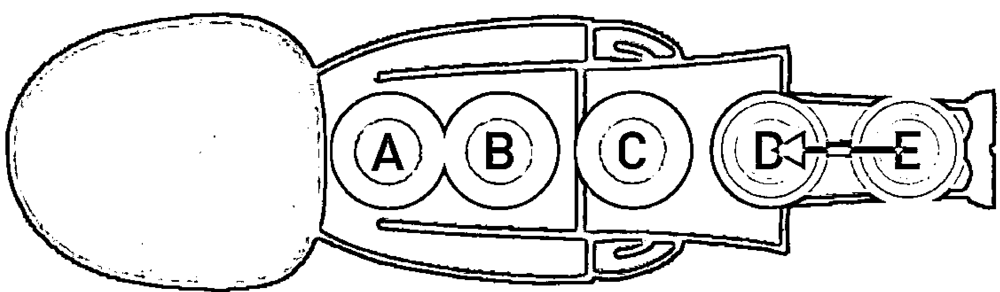

#### STEP 08
- 先敲擊位於個案「小腿後側」（E 點）的缽，再將原本置於「大腿後側」（D 點）的缽挪移至「臀部」（C 點）後，再進行敲擊。
- 「E 點」、「C 點」各敲擊一次，視為一個回合。
- 步驟八至少要完成「二～三個回合」，最後敲擊一次位於個案「小腿後側」（E 點）的缽才算結束。
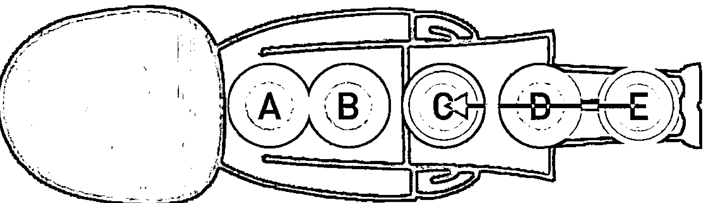

#### STEP 09
- 先敲擊位於個案「臀部」（C 點）的缽，再將原本置於「小腿後側」（E 點）的缽挪移至「大腿後側」（D 點）後，再進行敲擊。
- 「C 點」、「D 點」各敲擊一次，視為一個回合。
- 步驟九至少要完成「二～三個回合」，最後敲擊一次位於個案「臀部」（C 點）的缽才算結束。
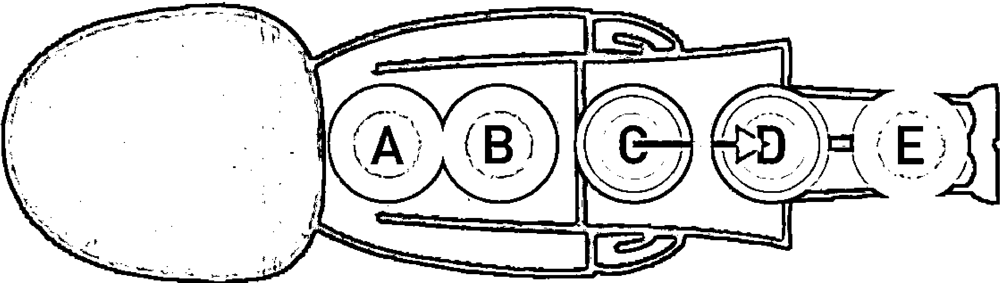

#### STEP 10
- 先敲擊位於個案「大腿後側」（D 點）的缽，再將原本置於「臀部」（C 點）的缽挪移至「下背部」（B 點）後，再進行敲擊。
- 「D 點」、「B 點」各敲擊一次，視為一個回合。
- 步驟十至少要完成「二～三個回合」，最後敲擊一次位於個案「大腿後側」（D 點）的缽才算結束。
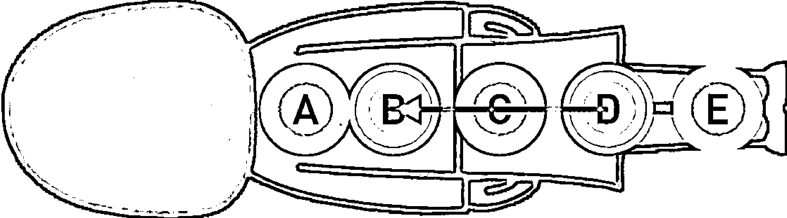

#### STEP 11
- 先敲擊位於個案「下背部」（B 點）的缽，再將原本置於「大腿後側」（D 點）的缽挪移至「臀部」（C 點）後，再進行敲擊。
- 「B 點」、「C 點」各敲擊一次，視為一個回合。
- 步驟十一至少要完成「二～三個回合」，最後敲擊一次位於個案「下背部」（B 點）的缽才算結束。
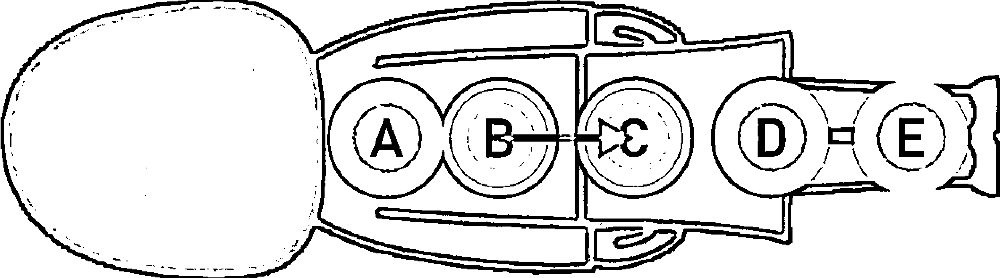

#### STEP 12
- 先敲擊位於個案「臀部」（C 點）的缽，再將原本置於「下背部」（B 點）的缽挪移至「上背部」（A 點）後，再進行敲擊。
- 「C 點」、「A 點」各敲擊一次，視為一個回合。
- 步驟十二至少要完成「二～三個回合」，最後敲擊一次位於個案「臀部」（C 點）的缽才算結束。
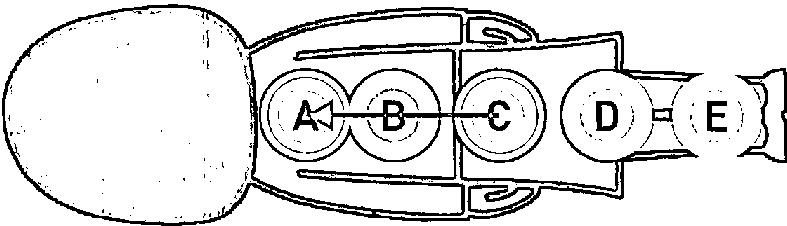

#### STEP 13
- 先敲擊位於個案「上背部」（A 點）的缽，再將原本置於「臀部」（C 點）的缽挪移至「下背部」（B 點）後，再進行敲擊。
- 「A 點」、「B 點」各敲擊一次，至此即完成「雙缽共振」的操作。
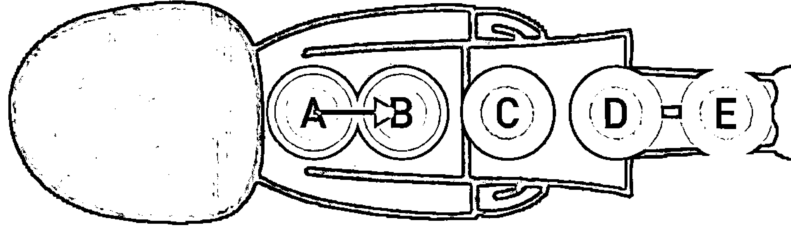

### Column 3. 三缽共振的操作方式

當操作者進行「三缽共振」的施作時，過程中將三個頌缽置於個案身上的三個定點，由此形成「封閉三角」的波頻振動，使個案感受到「局部性」的能量包覆。

三缽當中的其中兩個缽，分別放在個案右、左兩手的「手掌上方」，用以刺激並強化個案與掌心對應的「身體反射區」，作為「靜態」的「定點敲擊」之用；此外，結合「單缽共振」的手法，三缽中的另外一個缽，則作為「動態」的「位移敲擊」之用，以此進行個案身體不同部位的缽頻共振。

「三缽共振」的操作，一共有九個步驟。過程中，位於個案「右手掌心」（X 點）與「左手掌心」（Y 點）的兩個頌缽，皆在相同的位置不動；唯有另外一個頌缽，會隨著操作者的敲擊方向做上、下的移動，以下搭配圖示說明（以下圖示皆以個案的身體決定方位）。

#### STEP 01
- 請個案翻身平趴於軟墊或診療床上，將掌背平放，掌心向上，五指攤開。
- 操作者將三個缽分別放在個案的「上背部」（A 點）、「右手掌心」（X 點）與「左手掌心」（Y 點）。
- 先敲擊位於個案「上背部」（A 點）的缽，再敲擊位於個案「右手掌心」（X 點）的缽，最後敲擊位於個案「左手掌心」（Y 點）的缽。
- 「A 點」、「X 點」、「Y 點」各敲擊一次，視為一個回合。
- 步驟一至少要完成「三個回合」才算結束。
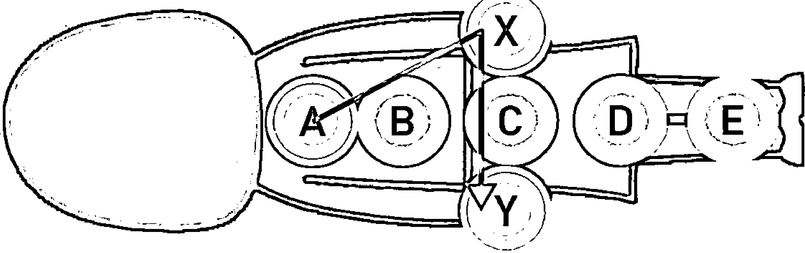

#### STEP 02
- 操作者將位於個案「上背部」（A 點）的頌缽，挪移至「下背部」（B 點）。
- 操作者先敲擊位於個案「下背部」（B 點）的缽，再敲擊位於個案「右手掌心」（X 點）的缽，最後敲擊位於個案「左手掌心」（Y 點）的缽。
- 「B 點」、「X 點」、「Y 點」各敲擊一次，視為一個回合。
- 步驟二至少要完成「三個回合」才算結束。
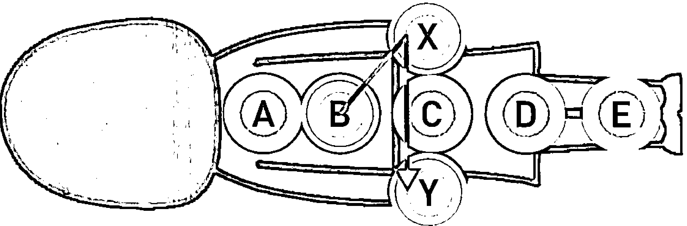

#### STEP 03
- 操作者將位於個案「下背部」（B 點）的頌缽，挪移至「臀部」（C 點）。
- 先敲擊位於個案「臀部」（C 點）的缽，再敲擊位於個案「右手掌心」（X 點）的缽，最後敲擊位於個案「左手掌心」（Y 點）的缽。
- 「C 點」、「X 點」、「Y 點」各敲擊一次，視為一個回合。
- 步驟三至少要完成「三個回合」才算結束。
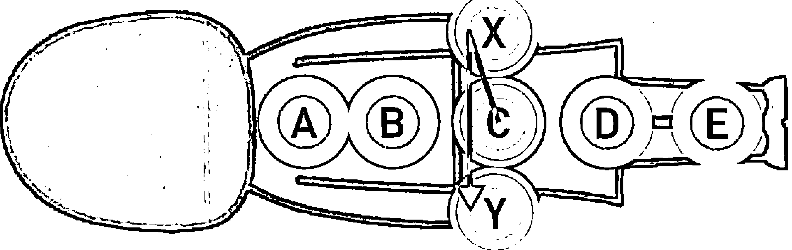

#### STEP 04
- 操作者先將位於個案「臀部」（C 點）的頌缽，挪移至「大腿後側」（D 點）。
- 先敲擊位於個案「大腿後側」（D 點）的缽，再敲擊位於個案「右手掌心」（X 點）的缽，最後敲擊位於個案「左手掌心」（Y 點）的缽。
- 「D 點」、「X 點」、「Y 點」各敲擊一次，視為一個回合。
- 步驟四至少要完成「三個回合」才算結束。
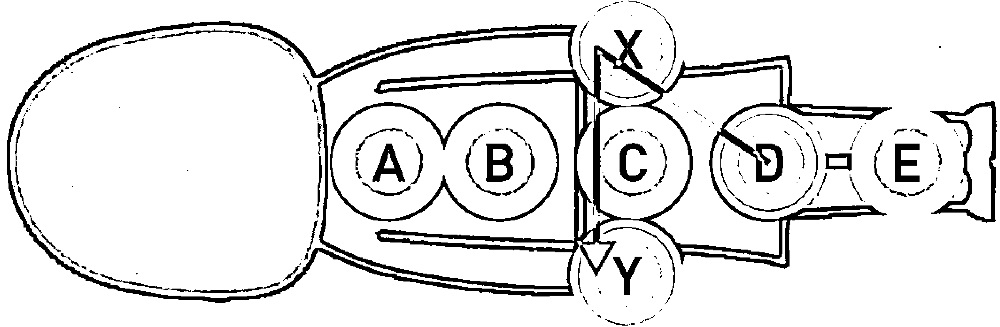

#### STEP 05
- 操作者先將位於個案「大腿後側」（D 點）的頌缽，挪移至「小腿後側」（E 點）。
- 先敲擊位於個案「小腿後側」（E 點）的缽，再敲擊位於個案「右手掌心」（X 點）的缽，最後敲擊位於個案「左手掌心」（Y 點）的缽。
- 「E 點」、「X 點」、「Y 點」各敲擊一次，視為一個回合。
- 步驟五至少要完成「三個回合」才算結束。
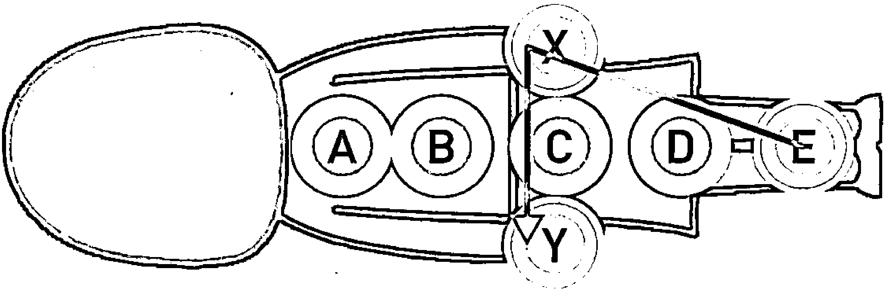

#### STEP 06
- 操作者先將位於個案「小腿後側」（E 點）的頌缽，挪移至「大腿後側」（D 點）。
- 先敲擊位於個案「大腿後側」（D 點）的缽，再敲擊位於個案「右手掌心」（X 點）的缽，最後敲擊位於個案「左手掌心」（Y 點）的缽。
- 「D 點」、「X 點」、「Y 點」各敲擊一次，視為一個回合。
- 步驟六至少要完成「兩個回合」才算結束。
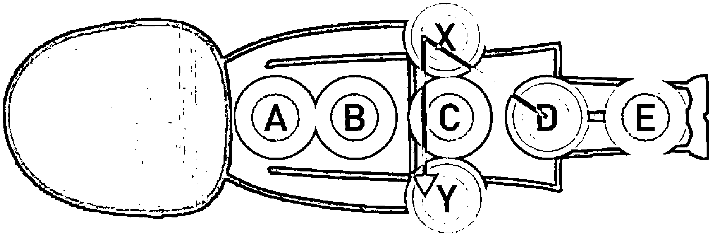

#### STEP 07
- 操作者先將位於個案「大腿後側」（D 點）的頌缽，挪移至「臀部」（C 點）。
- 先敲擊位於個案「臀部」（C 點）的缽，再敲擊位於個案「右手掌心」（X 點）的缽，最後敲擊位於個案「左手掌心」（Y 點）的缽。
- 「C 點」、「X 點」、「Y 點」各敲擊一次，視為一個回合。
- 步驟七至少要完成「兩個回合」才算結束。
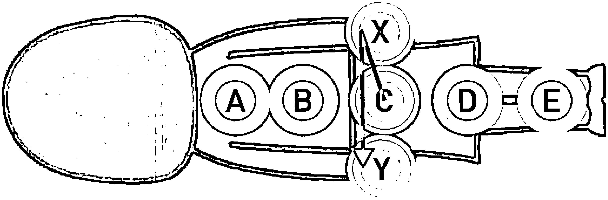

#### STEP 08
- 操作者先將位於個案「臀部」（C 點）的頌缽，挪移至「下背部」（B 點）。
- 先敲擊位於個案「下背部」（B 點）的缽，再敲擊位於個案「右手掌心」（X 點）的缽，最後敲擊位於個案「左手掌心」（Y 點）的缽。
- 「B 點」、「X 點」、「Y 點」各敲擊一次，視為一個回合。
- 步驟八至少要完成「兩個回合」才算結束。

#### STEP 09
- 操作者先將位於個案「下背部」（B 點）的頌缽，挪移至「上背部」（A 點）。
- 先敲擊位於個案「上背部」（A 點）的缽，再敲擊位於個案「右手掌心」（X 點）的缽，最後敲擊位於個案「左手掌心」（Y 點）的缽。
- 「A 點」、「X 點」、「Y 點」各敲擊一次，即完成「三缽共振」的操作。

## Column 4 四缽共振的操作方式

當操作者進行「四缽共振」的施作時，過程中將四個頌缽置於個案身上的四個固定點，由此形成「封閉四角」的波頻振動，使個案感受到「局部性」的能量包覆。

「四缽共振」的操作，是以「單缽共振」與「三缽共振」合併為基礎而衍生的手法。四缽當中的三個缽，分別放在個案的「右手掌心」、「左手掌心」、「膝蓋後側」，作為「靜態」的「定點敲擊」之用；至於另外一個缽，則作為「動態」的「位移敲擊」之用，以此進行個案身體不同部位的缽頻共振。

敲擊位於個案兩手「手掌上方」的頌缽，用意在於刺激並強化個案與掌心對應的「身體反射區」；至於敲擊位於個案膝蓋後方的頌缽，則是對應「委中穴」的部分，刺激此穴位可以達到舒筋通絡、散瘀活血的好處，此處也是「淋巴結」的所在，經過激化可以增強淋巴的循環，並促進腿部排棄廢物的代謝能力。

「四缽共振」的操作，一共有七個步驟。過程中，位於個案「右手掌心」(X 點) 與「左手掌心」(Y 點) 以及「膝蓋後方」(E 點) 的三個頌缽，皆維持固定的定點不動。唯有另外一個頌缽，會隨著操作者的敲擊方向而做上、下的移動，以下搭配圖示說明 (以下圖示皆以個案的身體決定方位)。

### STEP 01

- 請個案翻身平趴於軟墊或診療床上，將掌背平放，掌心向上，五指攤開。
- 操作者將四個缽分別放在個案的「上背部」(A 點)、「右手掌心」(X 點)、「左手掌心」(Y 點) 以及「膝蓋後方」(E 點)。
- 先敲擊位於個案「上背部」(A 點) 的缽，其次敲擊位於個案「右手掌心」(X 點) 的缽，再敲擊位於個案「膝蓋後方」(E 點) 的缽，最後敲擊位於個案「左手掌心」(Y 點) 的缽。
- 「A 點」、「X 點」、「E 點」、「Y 點」各敲擊一次，視為一個回合。
- 步驟一至少要完成「五個回合」才算結束。

### STEP 02

- 操作者先將位於個案「上背部」(A 點) 的頌缽，挪移至「下背部」(B 點)。
- 先敲擊位於個案「下背部」(B 點) 的缽，其次敲擊位於個案「右手掌心」(X 點) 的缽，再敲擊位於個案「膝蓋後方」(E 點) 的缽，最後敲擊位於個案「左手掌心」(Y 點) 的缽。
- 「B 點」、「X 點」、「E 點」、「Y 點」各敲擊一次，視為一個回合。
- 步驟二至少要完成「五個回合」才算結束。

### STEP 03

- 操作者先將位於個案「下背部」(B 點) 的頌缽，挪移至「臀部」(C 點)。
- 先敲擊位於個案「臀部」(C 點) 的缽，其次敲擊位於個案「右手掌心」(X 點) 的缽，再敲擊位於個案「膝蓋後方」(E 點) 的缽，最後敲擊位於個案「左手掌心」(Y 點) 的缽。
- 「C 點」、「X 點」、「E 點」、「Y 點」各敲擊一次，視為一個回合。
- 步驟三至少要完成「五個回合」才算結束。

### STEP 04

- 操作者先將位於個案「臀部」(C 點) 的頌缽，挪移至「大腿後側」(D 點)。
- 先敲擊位於個案「大腿後側」(D 點) 的缽，其次敲擊位於個案「右手掌心」(X 點) 的缽，再敲擊位於個案「膝蓋後方」(E 點) 的缽，最後敲擊位於個案「左手掌心」(Y 點) 的缽。
- 「D 點」、「X 點」、「E 點」、「Y 點」各敲擊一次，視為一個回合。
- 步驟四至少要完成「五個回合」才算結束。

### STEP 05

- 操作者先將位於個案「大腿後側」(D 點) 的頌缽，挪移至「臀部」(C 點)。
- 先敲擊位於個案「臀部」(C 點) 的缽，其次敲擊位於個案「右手掌心」(X 點) 的缽，再敲擊位於個案「膝蓋後方」(E 點) 的缽，最後敲擊位於個案「左手掌心」(Y 點) 的缽。
- 「C 點」、「X 點」、「E 點」、「Y 點」各敲擊一次，視為一個回合。
- 步驟五至少要完成「三個回合」才算結束。

### STEP 06

- 操作者先將位於個案「臀部」(C 點) 的頌缽，挪移至「下背部」(B 點)。
- 先敲擊位於個案「下背部」(B 點) 的缽，其次敲擊位於個案「右手掌心」(X 點) 的缽，再敲擊位於個案「膝蓋後方」(E 點) 的缽，最後敲擊位於個案「左手掌心」(Y 點) 的缽。
- 「B 點」、「X 點」、「E 點」、「Y 點」各敲擊一次，視為一個回合。
- 步驟六至少要完成「兩個回合」才算結束。

### STEP 07

- 操作者先將位於個案「下背部」(B 點) 的頌缽，挪移至「上背部」(A 點)。
- 先敲擊位於個案「上背部」(A 點) 的缽，其次敲擊位於個案「右手掌心」(X 點) 的缽，再敲擊位於個案「膝蓋後方」(E 點) 的缽，最後敲擊位於個案「左手掌心」(Y 點) 的缽。
- 「A 點」、「X 點」、「E 點」、「Y 點」各敲擊一次，即完成「四缽共振」的操作。

## 「混合共振法」操作練習

「混合共振法」的操作，是將「音聲共振法」與「缽體共振法」兩種原理「合而為一」的「複合式」手法，用意是使個案能夠同時感受到頌缽「音聲」與「缽體」雙重共振帶來的最佳療效。

當操作者進行「混合共振法」的施作時，過程中將四個頌缽分別置於個案身體周圍的四個定點，由此建立一個「環繞式音場」，使個案全身有被頌缽音頻完整包覆的感覺；接著再放一個頌缽於個案的身上進行敲擊，以使個案直接感受到缽體的振動，達到身體與意識的放鬆。

若要施行「混合共振法」，操作者手邊需要持有「B 調」、「A 調」、「G 調」、「C 調」、「F 調」共五個音調的頌缽才能進行。過程中，操作者依據頌缽「音調」的不同，依序將「B 調」、「A 調」、「G 調」、「C 調」等四個頌缽分別擺放於個案身體周圍的定點位置，此可參考下列的表格：

| 敲擊位置點編號 | 頌缽音調 | 敲擊位置點編號 | 頌缽音調 |
| :--- | :--- | :--- | :--- |
| 1 | B tone | 4 | C tone |
| 2 | A tone | A/B/C | F tone |
| 3 | G tone | | |

「混合共振法」一共有七個步驟，以下搭配圖示說明（以下圖示皆以個案的身體決定方位）。

### STEP 01

- ① 操作者請個案平躺於軟墊或診療床上。然後將「B 調」的頌缽置於個案的「頭頂上方」（點 1）之後，進行一次敲擊。
- ② 將「A 調」的頌缽置於個案的「身體右側」(點 2) 之後，進行一次敲擊。
- ③ 將「G 調」的頌缽置於個案的「身體左側」(點 3) 之後，進行一次敲擊。
- ④ 將「C 調」的頌缽置於個案的「腳底下方」(點 4) 之後，進行一次敲擊。

步驟一採「斜 N 型」為繞行方向，依序敲擊位於個案的「頭頂上方」(點 1)、「身體右側」(點 2)、「身體左側」(點 3)、「腳底下方」(點 4) 的頌缽一次。「1 點」、「2 點」、「3 點」、「4 點」各敲擊一次，視為一個回合。步驟一至少要完成「兩個回合」才算結束。

### STEP 02

待個案身體周圍的「環繞式音場」建立之後，操作者將「F 調」的頌缽放在個案的「上腹部」(B 點)，並進行一次敲擊。

- ① 「上腹部」(B 點) 的頌缽不動，操作者依序敲擊位於個案的「頭頂上方」(點 1)、「身體左側」(點 3)、「腳底下方」(點 4)、「身體右側」(點 2) 的頌缽一次。「1 點」、「3 點」、「4 點」、「2 點」各敲擊一次，視為一個回合。此步驟至少要完成「兩個回合」才算結束。
- ② 先敲擊位於個案「上腹部」(B 點) 的頌缽一次，然後向上採「直線移動」的方式，將頌缽挪移至個案的「胸部」(A 點)，等到原有的缽音漸弱之際，再進行下一次的敲擊。

### STEP 03

- ① 「胸部」(A 點) 的頌缽不動，操作者依序敲擊位於個案的「頭頂上方」(點 1)、「腳底下方」(點 4)、「身體左側」(點 3)、「身體右側」(點 2) 的頌缽一次。「1 點」、「4 點」、「3 點」、「2 點」各敲擊一次，視為一個回合。此步驟至少要完成「兩個回合」才算結束。
- ② 先敲擊位於個案「胸部」(A 點) 的頌缽一次，然後向下採「直線移動」的方式，將頌缽挪移至個案的「上腹部」(B 點)，等到原有的缽音漸弱之際，再進行下一次的敲擊。

### STEP 04

- ① 「上腹部」(B 點) 的頌缽不動，操作者依序敲擊位於個案的「頭頂上方」(點 1)、「身體右側」(點 2)、「腳底下方」(點 4)、「身體左側」(點 3) 的頌缽一次。「1 點」、「2 點」、「4 點」、「3 點」各敲擊一次，視為一個回合。此步驟至少要完成「兩個回合」才算結束。
- ② 先敲擊位於個案「上腹部」(B 點) 的頌缽一次，然後向下採「直線移動」的方式，將頌缽挪移至個案的「下腹部」(C 點)，等到原有的缽音漸弱之際，再進行下一次敲擊。

### STEP 05

- ① 「下腹部」(C 點) 的頌缽不動，操作者依序敲擊位於個案的「腳底下方」(點 4)、「頭頂上方」(點 1)、「身體右側」(點 2)、「身體左側」(點 3) 的頌缽一次。「4 點」、「1 點」、「2 點」、「3 點」各敲擊一次，視為一個回合。此步驟至少要完成「兩個回合」才算結束。
- ② 先敲擊位於個案「下腹部」(C 點) 的頌缽一次，然後向上採「直線移動」的方式，將頌缽挪移至個案的「上腹部」(B 點)，等到原有的缽音漸弱之際，再進行下一次敲擊。

### STEP 06

- ① 「上腹部」(B 點) 的頌缽不動，操作者依序敲擊位於個案的「腳底下方」(點 4)、「身體右側」(點 2)、「頭頂上方」(點 1)、「身體左側」(點 3) 的頌缽一次。「4 點」、「2 點」、「1 點」、「3 點」各敲擊一次，視為一個回合。此步驟至少要完成「兩個回合」才算結束。
- ② 最後，等到原有的缽音漸弱之際，再敲擊位於個案「上腹部」(B 點) 的頌缽一次，完成「混合共振法」的操作。

### 頌缽靜心的練習
Singing Bowl Meditation Practice

關於「靜心」的方法與種類很多，本小節主要是介紹結合「呼吸調息」與「聲音療癒」兩者而衍生的「頌缽靜心法」，提供讀者參考練習。

### 固定的靜心地點與時間

如果你過去從來沒有任何的靜心習慣，那麼在開始進行靜心之前，建議大家可以做一些事先的準備。

首先，可以在家裡找個「適合獨處」的角落作為自己靜心的地方，或是某個僻靜且不易被他人打擾的場地。一旦確定了靜心的場所，最好不要隨意更換。如果能長期都在「固定的地方」進行靜心活動的話，之後只要置身在這個地方，就能更快地讓自己的狀態安定下來，做好靜心的準備。

再來，就要選擇確保有長期「固定的時間」作為自己靜心的時段，並使靜心成為一種「習慣」。舉例來說，有些人每日都會「定時」用餐，所以每當快到「飯點」的時候，身體就會因應「生理慣性」而開始產生飢餓的感覺。之所以會有這樣的生理慣性，就是因為「固定的時間」有助於形成某種「規律」。假若能將靜心變成生活中的「常態」，就能養成「定點靜心」的習慣，身心就能自然而然地調節到最合適的狀態與之相應。

- 養成靜心習慣的步驟：
    - 固定地點 — 協助初學者快速切換到靜心模式。
    - 固定時間 — 協助身體養成靜心的規律及習慣。

#### 頌缽靜心前的呼吸調息

在許多瑜珈的理論當中，都有提到「有意識的呼吸」可以控制呼吸的深度、長度、規律與節奏，得以調節人體的自主神經系統，引導身體進入較為安定的狀態，讓身心趨於平衡，進而幫助我們進行接下來的靜心活動。

同時，透過「調息」的技巧也可以打開「中脈」（體內能量通道），使積存在中脈底部「海底輪」內的能量，順沿著中脈往上穿越六個脈輪後，達到「頂輪」的位置，昇華至「合一」的境界。

而不同「吸氣」、「吐氣」的節奏，則會對應出各異的「生理反應」。所以，伴隨不同類型的靜心活動，就可選擇不同的呼吸法進行搭配。下列所舉的「腹式呼吸法」與「哈達呼吸法」，就是常被用來作為「頌缽靜心」前導的兩種呼吸法。

### Column 1 腹式呼吸法

一般的呼吸主要是由胸部肌肉來帶動，也因此造成較為短淺且沒有規律性的呼吸，導致沒有足夠的氧氣可以提供肺臟與血液做氣體交換，此時體內的二氧化碳逐漸累積，使得腦部缺氧，進而出現疲憊、暈眩等症狀，更甚者還會引發因慢性缺氧而產生的諸多疾病。此外，呼吸急促的人，因容易產生壓力，較難定下心來。

「腹式呼吸法」常用於瑜珈的練習過程，又被稱為「丹田呼吸法」，它的重點就在於「橫膈膜」的運動。操作者在吸氣時盡其所能的吸入更多氣體，使得橫膈膜下降，腹部向外撐開，以增加肺部擴張的空間；在呼氣時則放緩吐氣的速度，並拉長呼出氣體的時間，此時的腹部會向內收縮，同時形成壓力，將橫膈膜往上推提。因「腹式呼吸」可以有效地進行體內的氣體交換，讓身體的含氧量增加，促進血液循環與新陳代謝，並有助於減緩緊張，達到舒緩壓力的益處。

### 「腹式呼吸法」的流程

- ① 讓身體自然且放鬆地站立、坐著或躺平，緊接著將兩手的掌心貼近自己的下腹部。
- ② 吸氣時，緩慢地將空氣吸入腹中，直到腹部脹滿氣體為止。
- ③ 當完全吸飽氣體，此時進行憋氣，並稍作停留。
- ④ 憋氣之後，再進行吐氣。吐氣的時盡量放慢速度，拉長將氣體呼出的時間。
- ⑤ 重複步驟 2 至步驟 4，輪番進行「三～五個回合」。

### Column 2 哈達呼吸法（左右脈淨化呼吸法）

一般呼吸時，左、右兩邊的鼻孔所流動的空氣量，大部分是「不均等」的，通常會有一邊的空氣量較多、另一邊的空氣量較少。而「哈達呼吸法」（左右脈淨化呼吸法）的設計，就是為了「平衡」左、右鼻孔呼吸時空氣的流量，進一步地打破左脈、右脈原有的支配優序，好讓中脈受阻的情況重獲開通，最終使得昆達里尼（Kundalini）的能量從海底輪中被釋放出來。

### 「哈達呼吸法」的流程

- 1. 讓身體自然且放鬆地坐好，將脊椎打直，下巴微微收起。
- 2. 舉起自己的右手，將中指和食指下彎貼至掌心，然後將「大拇指」、「無名指」分別貼近鼻翼的兩側。
- 3. 用右手的「大拇指」按壓「右鼻翼」，再透過「左鼻孔吸氣」4 秒鐘。
- 4. 用右手的「無名指」按壓「左鼻翼」，再透過「右鼻孔吐氣」4 秒鐘。
- 5. 用右手的「無名指」持續按壓「左鼻翼」，換成「右鼻孔吸氣」4 秒鐘。
- 6. 再用右手的「大拇指」按壓「右鼻翼」，換成「左鼻孔吐氣」4 秒鐘。
- 7. 重複步驟 3 至步驟 6，輪番進行「八個回合」的操作。

## 頌缽靜心

經過「呼吸調節」之後，讓身心的狀態逐漸平定下來，此時才開始進行「頌缽靜心」的活動。所謂的「頌缽靜心」，就是藉由反覆且穩定地敲擊頌缽，讓意識伴隨缽音的節奏、音量與流動，進入到「無念無想」的禪定狀態。

### 「頌缽靜心」的流程

- 1. 讓自己席地盤坐於坐墊或蒲團，盤坐時確保臀部處墊高，維持身體的穩定度。
- 2. 讓身體處於自然放鬆的狀態，將脊椎打直，下巴微微收起。
- 3. 將準備好的頌缽托放於腿上，並進行「三次」的深呼吸。盡可能的讓呼吸時間拉長，同時讓呼氣的時間比吸氣更長。
- 4. 一手托持著頌缽，另一手拿著缽棒，在敲缽之後，閉上眼睛仔細聆聽，感受音色和音量的變化。
- 5. 等待缽音變得微弱、近乎停止之際，再進行下一次的敲擊。每一次敲缽的力道、角度和節奏，盡量維持一致。
- 6. 重複步驟 4 至步驟 5，敲缽的時間為「十～十五分鐘」。
- 7. 直到最後一聲的缽音「完全停止」之後，再將頌缽與缽棒置於一旁，最後「靜坐」十～十五分鐘，持續規律且穩定的呼吸，並覺察此時身心的變化。

## Chapter 04 頌缽工具的選擇
### Choice of SINGING BOWL TOOLS

### 選購頌缽的考量
Considerations for Buying A Singing Bowl

在選購頌缽之前，必須先確認以下列出的四個重點：

- 1. 使用頌缽的「用途」與「目的」是什麼？
- 2. 頌缽採用什麼「施作方式」？
- 3. 是否需要時常「攜帶頌缽」？
- 4. 購買頌缽的「預算上限」是多少？

> **舉例說明**
> 
> 如果沒有要特別為他人進行頌缽的聲音療癒，只是單純地喜歡聆聽頌缽所發出來的音聲，或是想要隨時可以透過敲缽來讓自己放鬆的話，就可以先歸納出「用於放鬆」、「便於攜帶」、「可隨時敲擊」三個選購頌缽的要點，之後就可以在挑選頌缽的時候，針對「音頻是否穩定」、「體積不要太大」、「重量不要太重」等方面作為考量，並且在自己的「預算之內」，購買一個「中小型」的頌缽即可。

### 頌缽的大小

「我需要買多大的缽？」這是一般人在首次購買頌缽最常遇到的問題，而這個問題涉及的層面包含了「價格」、「使用目的」及「攜帶性」三個因素。

#### Column 1. 價格

一般而言，「老缽」的價格通常會比「新缽」來得高；而「手工缽」也會比「機械缽」來得昂貴。至於相同款式的頌缽，「價格」與「尺寸」大多呈現「正相關」。換句話說，尺寸愈大，價格愈高；尺寸愈小，價格愈低。

新缽的缽壁較厚，加上尺寸又小的話，不但音調較高、音聲的持久度不長、缽體的振動性也較差，但價格相對來說較為低廉。如果是以「價格」作為購買的優先考量，那麼在「預算上限」之內盡量選擇「最大尺寸」的頌缽，至少「音聲穩定度」和「缽體振動性」還是會比中小型的頌缽來得好。

但若是將頌缽的「療癒效果」作為主要目的，則建議至少要購買「口徑 22 公分以上」的頌缽，無論是在「音聲的持久度」抑或「缽體的振動性」，整體來說都有較佳的表現。

#### Column 2. 使用目的

頌缽的使用目的可分為「演奏」與「療癒」兩種。

- 1. 以「演奏」為目的：須考慮頌缽的「音調高低」和「音色品質」是否符合演奏的標準。
- 2. 以「療癒」為目的：要先考慮的是採用「音聲共振法」還是「缽體振動法」。若是採用「音聲共振法」，除了要先選出療癒所需的「音調」之外，最重要的是要找到符合音聲「穩定度高」與「延續性佳」的頌缽，才能達到最好的療癒效果；若採用的是「缽體振動法」，那麼缽體的「振動性」就很重要，振動愈強，療效也就愈好。因此，在選擇上就要以缽體的「振動強度」為首要考量，挑選「振動較強」、「延續性佳」的頌缽為主。

#### Column 3. 攜帶性

如果需要經常攜帶頌缽出入往返，尺寸偏「中小型」的頌缽較為適合。建議挑選「口徑 26 公分以下」與缽體「高度 20 公分以下」的頌缽，比較能夠收納在一般的背包裡。

不過需要注意的是，如果你擁有的頌缽數量較多，建議在購買時，能將尺寸較小的頌缽疊放於大缽裡面，「由小到大」一個個地套疊，以減少收納的體積。至於一次攜帶多缽的重量限制，則以不超過收納袋可以承載的最大重量為基準。

### 頌缽的音調

頌缽依據本身的音頻屬性，大致上分為「C 調」、「D 調」、「E 調」、「F 調」、「G 調」、「A 調」、「B 調」等「七種音調」，恰巧可以對應到人體能量系統中的「七個脈輪」。

「脈輪」(Chakra) 一詞，源自於梵文，意指「旋轉能量之輪」。最早可追溯至公元前 1500 ～ 500 年間古印度的《吠陀經》。從「脈輪」的角度認為：人的體內有七種不同的「能量中心」，分別掌管生命歷程中「不同階段」的身心靈層面，可統稱為「脈輪」。

關於「脈輪」的詳細介紹，可參見下列的圖表：

#### 第一脈輪：海底輪
- **對應顏色**：紅
- **身體位置**：位於人體脊椎末端。
- **建構發展年紀**：0～7 歲。
- **對應音調**：C
- **平衡時的狀態**：在平衡的時候，會感到與大地相互連結，心緒較不易浮動，你會感覺自己是安全的，身體比較能放鬆且具有活力，個性上也會比較穩定。
- **失衡時的狀態**：失去平衡時，內心會感覺受到威脅變得沒有安全感，容易對物質層面產生執著，不穩定、浮動、沒有歸屬感與失去活力；在身體方面，當此脈輪失衡時，可能會出現便祕、結腸、膀胱、下背、腿部或腳的問題。

#### 第二脈輪：臍輪
- **對應顏色**：橙
- **身體位置**：位於人體下腹部，從恥骨上方延伸到肚臍。
- **建構發展年紀**：7 ～ 14 歲。
- **對應音調**：D
- **平衡時的狀態**：在平衡的時候，情感表達和創造力可以很順暢的流動，你也能清楚知道自己的方向、情緒穩定、有能力給予和接受。
- **失衡時的狀態**：失去平衡時，會有情緒控制失調、性壓抑或沉溺於性、對事物過於執著、感覺不被愛、容易充滿被害者意識和無法肯定自我價值；在身體方面，當此脈輪失衡時，可能會出現下背部的問題。

#### 第三脈輪：太陽神經叢
- **對應顏色**：黃
- **身體位置**：位於人體上腹部，相當於胃部附近。
- **建構發展年紀**：14 ～ 21 歲。
- **對應音調**：E
- **平衡時的狀態**：在平衡的時候，較佳的自我認同感、充滿活力、意志堅定。
- **失衡時的狀態**：失去平衡時，會有控制慾、缺乏自信、消極的想法、自我懷疑、防衛心強和充滿恐懼；在身體方面，當此脈輪失衡時，可能會出現胃、肝臟、脾臟問題和容易疲勞的狀況。

#### 第四脈輪：心輪
- **對應顏色**：綠
- **身體位置**：位於胸腔的中央，也就是兩乳之間的胸骨。
- **建構發展年紀**：21 ～ 28 歲。
- **對應音調**：F
- **平衡時的狀態**：在平衡的時候，你可以自然的表現愛，不僅愛別人，也愛你自己，你會懂得接納自我，同時也能擁有比較佳的人際關係。
- **失衡時的狀態**：失去平衡時，會產生情緒的困頓，你會容易忌妒、感到孤寂、容易缺乏同理心；在身體方面，當此脈輪失衡時，可能會出現肺、肋骨和心臟有關的疾病。

#### 第五脈輪：喉輪
- **對應顏色**：藍
- **身體位置**：位於喉嚨中心。
- **建構發展年紀**：28 ～ 35 歲。
- **對應音調**：G
- **平衡時的狀態**：在平衡的時候，你可以自然的表達，同時也能理解別人所表達的一切。
- **失衡時的狀態**：失去平衡時，無法說出你真正想說的話；在身體方面，當此脈輪失衡時，可能會出現頸部和喉部有關的疾病。

#### 第六脈輪：眉心輪
- **對應顏色**：靛
- **身體位置**：位於眼睛上方兩眼眉心中間。
- **建構發展年紀**：35 ～ 42 歲。
- **對應音調**：A
- **平衡時的狀態**：在平衡的時候，你會有比較好的心靈覺察力，你會跳出事件本身，看清事件的原貌。你可以直覺的做出決定，同時可以區分現實和夢想。
- **失衡時的狀態**：失去平衡時，會發生注意力無法集中的現象，難以客觀的看待事件和做決定，同時也無法區分幻想和現實的差異；在身體方面，當此脈輪失衡時，可能會出現眼疾、頭暈、頭痛、腦部病變以及和睡眠有關的疾病。

#### 第七脈輪：頂輪
- **對應顏色**：紫
- **身體位置**：位於頭頂中央。
- **建構發展年紀**：42 ～ 49 歲。
- **對應音調**：B
- **平衡時的狀態**：在平衡的時候，你在精神層面上容易與更高頻率的意識連結，同時你也能有足夠的智慧去面對生活上的事件。
- **失衡時的狀態**：失去平衡時，容易出現抑鬱、精神錯亂、信仰喪失、癡呆、癲癇和精神分裂症等狀況；在身體方面，當此脈輪失衡時，可能會出現光敏感的問題、頭痛、自身免疫性疾病和神經系統疾病。

每一個脈輪都有它們專屬的「振動頻率」。若振動頻率得以「保持平衡」，就能達到「健康和諧」的身心狀態；反之，一旦振動頻率「失去平衡」，就會連帶造成「疾病」或「亞健康」的相關症狀。

若將頌缽音療施作於個案身上，是否需要針對人體的「七個脈輪」，選擇「音調」與它們特定「振動頻率」相應的頌缽呢？關於這個問題，其實有兩種回答。

若是經濟狀況許可，手邊持有「C 調」、「D 調」、「E 調」、「F 調」、「G 調」、「A 調」、「B 調」共七種音調的頌缽，就能在進行聲音療癒的施作時，針對個案不同的脈輪，選擇「振動頻率」相符調性的頌缽，達到最完整的「共振」效果。

若礙於手邊持有的頌缽數量不足，在進行聲音療癒的施作時，無法針對不同的脈輪搭配相符調性的頌缽，不能直接對應與個案脈輪相合的「振動頻率」，使得「共振」的效果較弱的話，此時如果能強化敲缽、挪缽的穩定度，挑選適合的施作流程，從敲擊頌缽的「技巧」與「方法」兩方面作為補強，也可「趨於」七種音調頌缽的「共振」效果。

此外，如果想要透過頌缽的音頻振動來強化「脈輪」能量的話，就可參照上述七種「脈輪」的圖表簡介，選擇購買「音調」屬性相對應的頌缽。

但大多時候，頌缽普遍「沒有標示音調」，自己又無法單憑聽音辨識音頻的調性，導致選擇上遇到障礙，此時就可靜下心來，憑靠直覺找到「音調聽起來順耳」的頌缽。

### 頌缽的周邊配件

購買頌缽之後，再來就要根據選購的頌缽，挑選與頌缽相合的「墊圈」、「敲棒」與「摩棒」。慎選優質的頌缽周邊配件，不但能使頌缽的音頻振動更加穩定之外，同時也能提升聲音療癒整體的品質，為整個療程帶來更加舒適的情境，以下將針對這三樣配件的挑選，為大家做簡單的介紹。

#### Column 1. 墊圈

墊圈主要是提供頌缽作為「底座」之用。為了確認頌缽能在施作的過程中保持缽身的穩定，不致於因為敲擊滑落而造成個案受到驚嚇或損害缽體，所以操作者在進行挑選的時候，務必考量所選的墊圈「厚度是否平均」，及內裡的「填充物是否緊實」。

一般常見的頌缽墊圈，外圈的直徑通常以「8 ~ 20 公分」為主。實際上，伴隨每個不同尺寸的頌缽大小，都有相對應的墊圈外圈直徑長短。

唯有找到適合的墊圈，才能更有利於搭配頌缽的敲擊。以下列出與不同尺寸的頌缽所對應的墊圈外圈直徑範圍，以供各位參考：

| 序號 | 頌缽缽口直徑 | 墊圈外圈直徑 |
| :--- | :--- | :--- |
| 1 | 7 ~ 11cm | 8cm |
| 2 | 9 ~ 13cm | 10cm |
| 3 | 11 ~ 15cm | 12cm |
| 4 | 13 ~ 17cm | 14cm |
| 5 | 15 ~ 19cm | 16cm |
| 6 | 17 ~ 23cm | 18cm |
| 7 | 19cm 以上 | 20cm |

#### Column 2. 缽棒

對於頌缽的操作者而言，選擇不同類型的敲棒，可以傳遞出不同的音色、音量與缽體振動。一個好的敲棒，除了可以敲出沉穩的音頻之外，也能使泛音有較為綿長的表現，並建構出更多樣性的音聲氛圍與振動層次。

一般而言，頌缽的音頻振動，會受到缽棒「槌頭的材質」、「槌頭的硬度」、「槌頭的大小」以及「手柄的重量與長度」等四個因素所影響。以下列點說明：

**① 槌頭的材質**
缽棒的槌頭主要由「手工」製作而成，材質可分為「羊毛氈」與「布料」兩種，其中以「羊毛氈」的槌頭最常見。如果包覆槌芯的「羊毛氈厚度過薄」或「布料質地較硬」，則容易讓槌頭敲擊缽緣的當下，除了本身的缽音之外，連帶產生啪啪的聲響，造成多餘且讓人不適的雜音。挑選上以「厚實的羊毛氈」或「柔軟的布料質地」包覆槌芯的槌頭為佳。

**② 槌頭的硬度**
缽棒的「槌頭愈硬」，敲擊出的音聲較為「輕脆」，呈現出音色的「明亮感」；相反的，缽棒的「槌頭愈柔軟」，敲擊出的音聲較為「柔和」，呈現出音色的「飽滿溫潤感」。如果是為了「聲音療癒」的用途，建議可挑選槌頭「軟硬適中」的缽棒，傳遞出的音質會更讓人更加放鬆與平靜。

**③ 槌頭的大小**
根據頌缽的尺寸，選擇大小相對應的槌頭，才能找到最適合的缽棒。若是「中小型」的頌缽，就要搭配槌頭「形狀較小」的缽棒；反之，若是「中大型」的頌缽，則要搭配槌頭「形狀較大」的缽棒較為適宜。此外，槌頭的「形狀大小」，也會影響頌缽的「音色」。

當槌頭的形狀愈「小」，敲在缽上的音調會較「高」；當槌頭愈「大」，敲在缽上的音調較「低」。因此，若要呈現「低沉」的音色，可以選擇「形狀較大」的槌頭；反之，若要呈現「清亮」的音色，可以選擇「形狀較小」的槌頭。

| 槌頭形狀 | 音調 | 音色 |
| :--- | :--- | :--- |
| 小 | 高 | 清亮 |
| 大 | 低 | 低沉 |

**④ 手柄的重量與長度**
當缽棒手柄的長度「愈長」，重量「愈大」，造成敲擊頌缽時的手感「愈沉」，手持缽棒的迴轉度也會跟著「愈大」，揮棒也因力臂變得「較長」而變得更加「省力」；反之，當缽棒的長度「愈短」，重量「愈小」，造成敲擊頌缽時的手感「愈輕」，手持缽棒的迴轉度也會跟著「愈小」，揮棒也因力臂變得「較短」而變得更加「費力」。

| 頌缽手柄長度 | 重量 | 手感 | 迴旋度 | 省/費力程度 |
| :--- | :--- | :--- | :--- | :--- |
| 長 | 大 | 沉 | 大 | 較省力 |
| 短 | 小 | 輕 | 小 | 較費力 |

若是「小型」的頌缽，可以搭配手柄長度「約 20 公分」的缽棒；若是「中型」的頌缽，可以搭配手柄長度「約 24 公分」的缽棒；若是「大型」的頌缽，建議搭配手柄長度「28 公分以上」的缽棒。

#### Column 3. 磨棒

目前較常見的磨棒，可以按照材質的不同，區分為下列兩種：

- **①「全為木柄」製作而成的磨棒**：由於此種磨棒的前段並無皮面包覆，只是單純使用木棒在缽緣磨擦，導致發出的聲音較為「尖銳刺耳」，較不適合作為「聲音療癒」之用。
- **② 前段有「皮面包覆」的磨棒**：由於此種磨棒前段有皮面的包覆，與缽緣的磨擦接觸面質地較軟，所以發出的聲音較為「低沉柔和」，較適合作為「聲音療癒」之用。

合適的磨棒，可以在磨擦頌缽的過程中使振動加速產生。在選擇時，以前段有「皮面包覆」的磨棒為優先。根據頌缽的尺寸，選擇相對應的大小，找到最適合的磨棒。當磨棒皮面處的直徑「愈小」，磨缽所發出的音調也就隨之變得「愈高」；反之，當磨棒皮面處的直徑「愈大」，磨缽所發出的音調則隨之變得「愈低」。

| 磨棒皮面處直徑 | 敲出的音調 |
| :--- | :--- |
| 小 | 高 |
| 大 | 低 |

若是「小型」的頌缽，可以搭配皮面處直徑「約 2 ~ 3 公分」的磨棒；若是「中型」的頌缽，可以搭配皮面處直徑「約 4 ~ 5 公分」的磨棒；若是「大型」的頌缽，建議搭配皮面處直徑「6 公分以上」的磨棒。

### 選購頌缽的三種組合參考
Three Sets of Singing Bowls for Reference

選購頌缽及周邊配件的多寡，可以根據個人的需求做增減，大致上可分為「基本」、「中階」及「進階」三種組合，以下搭配僅供讀者作為參考。

#### 「基本」的頌缽組合
- **一個頌缽**：選擇缽口口徑「約 22 ~ 24 公分」、重量約「1.2 ~ 1.6 公斤」的一個「中型」頌缽。
- **一個墊圈**：選擇外圈直徑「約 20 公分」的一個墊圈。
- **一個缽棒**：選擇手柄長度「約 24 公分」、槌頭為「羊毛氈包覆」的一個缽棒。
- **一個磨棒**：選擇皮面處直徑「約 4 ~ 5 公分」、前段有「皮面包覆」的一個磨棒。

#### 「中階」的頌缽組合
- **兩個頌缽**：
    1. 選擇缽口口徑「約 22 ～ 24 公分」、重量約「1.2 ～ 1.6 公斤」的一個「中型」頌缽。
    2. 選擇缽口口徑「約 25 ～ 28 公分」、重量約「1.6 ～ 2.5 公斤」的一個「中大型」頌缽。
- **兩個墊圈**：選擇外圈直徑「約 20 公分」的兩個相同墊圈。
- **兩個缽棒**：選擇質地各為「羊毛氈」與「布料」兩種不同面料所包覆槌頭、手柄長度「約 24 公分」的兩個缽棒。
- **一個磨棒**：選擇前段有「皮面包覆」且皮面處直徑「約 6 公分」的一個磨棒。

#### 「進階」的頌缽組合
- **三個頌缽**：
    1. 選擇缽口口徑「約 16 ~ 20 公分」、重量約「0.6 ~ 1.2 公斤」的一個「小型」頌缽。
    2. 選擇缽口口徑「約 22 ~ 24 公分」、重量約「1.2 ~ 1.6 公斤」的一個「中型」頌缽。
    3. 選擇缽口口徑「約 25 ~ 28 公分」、重量約「1.6 ~ 2.5 公斤」的一個「中大型」頌缽。
- **三個墊圈**：選擇外圈直徑「約 16 公分」、「約 18 公分」、「約 20 公分」的三個墊圈。
- **兩個缽棒**：選擇質地為「羊毛氈」與「布料」兩種不同面料所包覆槌頭、手柄長度各為「約 20 公分」與「約 24 公分」的兩個缽棒。
- **兩個磨棒**：選擇前段有「皮面包覆」、皮面處直徑各為「約 4 ~ 5 公分」與「約 6 公分」的兩個磨棒。

### 頌缽的保養與照護
Maintenance & Care of Singing Bowl

### 安全的持拿

當你有需要移動頌缽的時候，切忌不要使用單手持拿缽體，如果稍有不慎，或突然遭到外力的撞擊，此時如果只有用單手持拿的話，很容易造成缽體向下脫落或向外滑出。

若真的有移缽需求的話，請務必保持「雙手持拿」的方式，小心翼翼地握緊頌缽的兩側，才能安全地進行搬運。

### 定時的保養清潔

為了防止結塊的灰塵影響到缽音的表現，以及避免灰塵積聚在缽體表面而使灰塵與缽體的金屬間發生化學反應，操作者須經常使用軟布擦拭頌缽，定期地「清潔頌缽」是非常重要的。

關於頌缽的保養，最常遇到的問題，就是金屬的「氧化現象」。以下列出一些可以改善頌缽「氧化現象」的處理方式，以供操作者參考：

- 出現「初期氧化」而產生的「輕微發黑」情形：當頌缽出現初期的「輕度氧化」時，會造成缽體「表面黯沉」或是局部出現一些輕微發黑變暗的「小汙點」。此時的氧化還不算太嚴重，只要使用「拭銀布」擦拭金屬表面，就能恢復原本的金屬光澤了。
- 出現因為「氧化」而產生的「發黑」情形：如果頌缽金屬表面因為「氧化」而出現「較大面積的發黑」情況，此時可以利用乾淨的「軟布」或「餐巾紙」，先沾上些許的「牙膏」，接著在發黑的地方以「畫圓圈」的方式輕輕推磨，直到黑色的氧化物消失。
- 出現因為「氧化」而產生的「銅綠」情形：如果頌缽金屬表面因為「氧化」而出現一些綠色的氧化物，可以利用乾淨的「軟布」或「餐巾紙」，沾些許的「白醋」後，在發綠的地方以「畫圓圈」的方式輕輕推磨，直到綠色的氧化物消失。提醒各位不可使用化學清潔劑，以免同時除去缽體金屬表面原本的顏色。

### 頌缽的煙薰淨化

如果經常使用頌缽為他人進行療癒的話，為了避免上一位個案的能量殘留於頌缽，而讓下一位個案受到影響，建議可以透過「薰香」的方式，進行頌缽的「淨化」。

常被用來作為薰香淨化的有「白鼠尾草葉」、「甜草辮」、「艾草葉」、「雪松葉」以及「聖木條」等乾燥植物。操作者每次在完成頌缽的療癒之後，可將上述其中一種的乾燥植物，透過「燃燒」後產生的「煙霧」，環繞於缽體的內部，用以去除前一位個案殘留於缽內的能量。

在煙薰淨化時，值得注意的有下列兩點：第一，缽體與火源必須「保持距離」，不可讓火源與缽體有近距離接觸，僅需讓煙霧將缽體來回薰繞過即可；第二，頌缽薰香的時間不宜過長，免得缽體的溫度過高，造成觸碰缽體時被燙傷。

### 保持乾燥

因為人體的皮膚有代謝作用，會分泌汗水與油脂，所以在接觸頌缽之後，最好能使用乾布輕輕擦拭，去除因肌膚觸碰而附著在缽體的汗水或油脂。收藏頌缽時，也請務必保持乾燥。

若頌缽因不小心而沾到水氣的話，記得一定要盡快將頌缽徹底弄乾，以免水分和濕氣的殘留，造成頌缽的金屬表面產生「氧化」的現象。

### 避免碰撞

為了避免缽體遭受外力的撞擊而影響音質的表現，在攜帶頌缽的過程中，請將全部的缽身做「完整的保護」，尤其是頌缽的「底部」更要進行額外的包覆與加固，以免缽底中心若不慎遭到撞擊時，瞬間應力過大，造成缽體的損壞與裂縫的產生。

## Questions & Answers of SINGING BOWL

### 頌缽問答

### 01 什麼是頌缽音療？

透過頌缽的敲擊，傳遞出穩定的音頻振動，透過「音聲」與「缽體」的雙重共振，協助個案舒緩壓力、情緒調節、放鬆肌肉、提升睡眠品質等方面進行改善，有助於人體恢復到「身心平衡」的和諧狀態。

### 02 「頌缽音療」施作過程如何影響我們的身體？

頌缽缽體產生的振動，會對人體形成一種「感覺刺激訊號」，而此感覺會進一步地刺激體內的「本體感覺受器」，當接收到這個訊號後，會發出相對應的訊號，使肌肉做出放鬆的反射性反應，讓本來緊繃的肌肉得以放鬆。

另外，當共振的能量傳導進入人體組織之後，振動能量會被轉化成「熱能」，促使組織內的「溫度升高」，血管因此擴張而導致血液的流量增加，促進「血液循環」與「新陳代謝」。

另外，隨著過程中所傳入耳內的音頻也會影響我們的腦波，由「β波」(Beta wave) 開始切換到「α波」(Alpha wave) 的模式。當身體處於「α腦波」(Alpha wave) 的狀態下，「副交感神經」會取代「交感神經」，開始排除體內的毒素，進入「身體修復」的過程。

### 03 進行「頌缽音療」時，有特殊的衣著規定嗎？

若要進行「頌缽音療」的施作，要避免穿著帶有「鈕扣」或「凸起裝飾」的衣服，以穿著「舒適寬鬆」、「材質柔軟」的衣服為宜。此外，如果有配戴「項鍊」、「手鍊」、「手鐲」、「腳鍊」以及「手錶」的話，也要在施作之前先取下，以免缽體振動時易與物品產生撞擊，發出刺耳的聲響，並造成頌缽與物品的毀損。

### 04 為什麼「頌缽音療」可以幫助身體「自我療癒」？

頌缽音療所傳遞出的音頻振動，能夠帶動體內的細胞、水分、器官和骨骼產生「共振反應」，激化細胞分子的活性，強化身體的代謝作用，如：血液輸送頻率、循環系統、呼吸系統，甚至大腦還有身體荷爾蒙分泌等。當代謝的能力增強，自然也就會使呼吸節奏、心跳頻率，甚至腦波都連帶發生正向的循環，讓身體的自我療癒能力得以正常發揮，獲得一個較佳的身體狀態。

另外，在聆聽的過程中，穩定和諧的頌缽泛音也會調節大腦皮質層的興奮度，使得情緒機轉得以啟動調節，來讓人們積壓的情緒獲得釋放。

### 05 為什麼「頌缽音療」能改善睡眠品質？

頌缽在經過敲擊後，會產生「振動」與「音聲」兩個對應的產物。

在「振動」層面，透過缽體本身帶來的振動，可以帶動身體表層的毛髮、皮膚、肌肉甚至體內細胞組織與器官的振動，以產生「律動式的振動」，達到近似「體內按摩」的操作，讓身體的緊繃得到舒緩，達到放鬆舒眠的效果。

在「音聲」層面，當操作者反覆敲擊頌缽，穩定的音聲帶來「規律性的音頻」，就能讓大腦從頻率較快的「β波」（Beta wave），調整進入頻率較慢的「α波」（Alpha wave）。這個時候，身體開始進入「輕度睡眠」的狀態，如果施予「頌缽音療」的時間更久，甚至會進入「中度睡眠」或是「深層睡眠」狀態時才有的「θ波」（Theta wave）與「δ波」（Delta wave）。由此可見，頌缽音療確實可以透過影響腦波模式的切換，進而改善睡眠的品質。

### 06 「頌缽音療」過程中會經驗或感受到什麼？

由於都市社會的生活節奏緊湊，加上網路與通訊軟體的發達，造成現代人的身心長期處於高壓狀態，連帶引發許多相關的身心病症。因此，透過「頌缽音療」所導引的共振反應，會為個案的身體帶來近似於冥想、瑜伽或太極拳的放鬆狀態。

透過頌缽音頻的包覆，個案的頭腦受到音聲導引而無法再聚焦於工作或生活上所掛念的事情，阻斷了繁雜的思慮，讓腦袋得以放空，此時肌肉開始不自覺地鬆弛下來，腦波從本來的「β波」（Beta wave）逐漸切換到「α波」（Alpha wave）的模式，呼吸和心率開始減慢，身體從原先「對外警戒」的狀態，轉變成「自我修復」的階段。

通常在進行五至十分鐘的「頌缽音療」之後，個案就可以進入「深層睡眠」的階段，即便被施作的時間只有短短一小時，卻能獲得很好的休息品質。此外，也有部分的個案在「頌缽音療」的過程當中，覺得自己都沒有睡著，從頭到尾保持「意識清醒」的狀態，但實際上他的身體早已睡著，甚至出現打呼的情況，此即「意識與身體分離」的奇妙體驗。

### 07 「頌缽音療」療癒安全嗎？

「頌缽音療」主要透過穩定的音頻振動，讓身體的細胞受到缽體的振動而產生共振，屬於一種「非侵入式」的「自然療法」。

當然，一個好的工具更需要有正確的操作方式，才能帶來正面的效果，否則反而會造成傷害。尤其是敲擊頌缽的力道是否控制得當、音頻是否穩定，都會影響個案的身心感受。建議大家若想嘗試「頌缽音療」的話，事前務必謹慎評估，找到經過專業訓練且信譽良好的聲音療癒師進行操作。

另外，需要提醒大家的是，「頌缽音療」只是一種身心調理的輔助方法。如果有病症還是要尋求醫師的診斷，切勿過度仰賴「頌缽音療」而擅自停藥或中斷醫療。

### 08 任何人都能學習頌缽嗎？

是的，只要你對於頌缽音療有興趣，都可以學習頌缽來助己助人。其實類似的音聲共振經驗都在我們的生活中發生，只是我們本身並不瞭解，當然如果你想要學習聲音療法來幫助自己或幫助人，你要做好的學習準備就是你的「內心」。

一開始先讓自己內心安穩下來，選擇一種聲音療癒的樂器開始熟悉它的技巧，不需刻意用腦去記憶，當你不斷反覆練習時，你的身體會記得這些律動，同時你需要把自己的感官與覺知打開，去覺察在學習與施作過程中你在感官中經驗的一切，此時你就已經在踏上聲音療癒的道路上，不需要過去有任何關於聲音療癒的學習經驗。

### 09 頌缽的使用跟「宗教」有任何關聯嗎？

雖然頌缽與「佛教」有比較深的淵源，在許多廟宇也會將缽視為「法器」的一種，但其實這與「聲音療癒」的施作並無直接關聯。實際上透過頌缽進行「身心療癒」的用途，在歐美地區早已行之多年，也有許多與頌缽相關的研究與實證，荷蘭甚至將「頌缽音療」納入「健保給付」的範圍。

### 10 施作頌缽有合適的時間點嗎？

- 夜晚睡覺前：透過頌缽的音頻振動，可以舒緩身體緊繃與僵硬的部位，並讓腦波緩慢下來，緩解壓力，讓身體放鬆，提昇夜晚的睡眠品質。
- 當身體感到疲憊時：在身體感到疲憊的時候，透過頌缽的敲擊，可以幫助身體放鬆，降低沉重感。
- 洗完澡之後：當身體經過沐浴之後，身體的血液循環加快，此時可以搭配頌缽音療，增進新陳代謝的活動。
- 運動完之後：運動結束之後，藉由頌缽的敲擊，可以透過聲波與人體產生的共振反應，解除肌肉的緊繃，恢復身體原本應有的彈性與活力。

### 11 有沒有任何身體的禁忌症狀，不適合進行「頌缽音療」的情況？

- 有心血管疾病的患者。
- 體內裝有心臟支架或是心律調整器。
- 血栓、癲癇症或哮喘。
- 燒燙傷、擦傷等皮膚外傷者。
- 急性韌帶扭傷、骨折、脫臼或關節腫痛。
- 近期剛進行了開刀手術，建議至少「術後三個月以上」再進行施作。
- 懷孕中婦女應避免施作，如有任何其他疑問，請諮詢專科醫生以獲取建議。
- 避免飯後三十分鐘內施作。用餐之後，人體的血液大多集中於腸胃，若在此時進行頌缽的施作，容易造成消化不良的情況。
- 避免飲酒後施作。若在飲酒後進行頌缽的施作，容易發生頭暈、嘔吐等情況。

### 12 可以透過頌缽的音頻振動來「淨化空間」，是真的嗎？

我們所生活的「物理空間」，只是「能量振動」的一種呈現。當視覺神經接收到能量的訊號，再經過大腦的轉換，最後才形成我們肉眼看得見的物體。當空間的能量讓人感到不舒服的時候，可透過敲擊頌缽傳遞的音頻振動，帶動空間中原本阻滯的能量一起共振，形成能量的流動，達到「淨化空間」的效果。

### 13 接受「頌缽音療」能治療我身體的病症或不舒服嗎？

「頌缽音療」比較是一個幫助身體恢復自癒能力的自然療法，所以聲音療癒師並不會對你身體的病症做任何的診斷或治療，也不會保證治療結果。所有的診斷或治療，務必尋求醫師的協助，如果有任何聲音療癒師告訴你「他能幫你治療你的身體病症」，請不要相信。

### 44 在「頌缽音療」過程中，一定得躺著被施作嗎？

在「頌缽音療」過程中，有些參與者表示「坐著」的時候，可以讓他們保持在「半夢半醒」的狀態，更能保持覺知並完整經驗整個過程；也有參與者表示「躺著」的時候，能感覺更加放鬆，並能更快進入冥想的狀態。一般而言，坐著和躺著的狀態會有不同的經驗，視每個人的狀態而定，沒有硬性規定非得要躺著或坐著才行，只要參與者感到放鬆且舒適的姿勢，都可以進行「頌缽音療」的施作。

### 45 為什麼施作「頌缽音療」之後會感到飢餓與口渴？

因為施作「頌缽音療」的時候，身體會與缽體產生共振，加快身體的「新陳代謝」，進而促進體內的「消化吸收」，更容易產生「飢餓」與「口渴」的感覺，以此提醒體內的組織與器官，此時需要適量的水分與養分來維持自己身體正常的功能並運作。

### 46 我需要多久進行一次「頌缽音療」，需要安排週期性的療程嗎？

在初次接受「頌缽音療」的前期，最好進行「一期六次」完整的療程為宜。前三次的療程，可以「每週」進行一次，先將累積的疲勞、毒素和壓力逐漸釋放，讓身體的代謝循環獲得整體的調整與改善；剩餘的三次療程，則可拉長至「每兩週」或「每三週」進行一次，針對各別需要加強的部位，再進行調理與疏通。

但究竟需要多久進行一次「頌缽音療」，還是要根據每個人的身體狀態來進行評估，此處的建議僅供讀者參考之用。

### 47 我能購買頌缽回家自行操作嗎？

建議最好先跟專業的聲音療癒師學習「頌缽音療」相關的知識與技巧，再購買頌缽回家進行操作。

### 18 有人說接受完「頌缽音療」後，可以將身體內的神經系統、內分泌系統、呼吸血液循環系統、免疫系統、生殖系統、消化系統、淋巴排毒系統等校正回正常的工作頻率，是什麼意思？

在「頌缽音療」的過程中，身體的每個細胞和器官會與聲波一起共振，進而讓體內的器官獲得按摩。

身體若處於生病的狀態，某些特定的器官會失去它健康狀態時的振動頻率。當個案接受療癒之後，缽體的聲波振動會傳入人體，帶動身體內的細胞、組織和器官一起振動。藉由外力共振的能量供給，身體因而獲得足夠的能量來啟動人體組織系統應有的頻率，使體內的細胞、組織與器官頻率重新調整，接近本來正常功能時的頻率狀態，使身體回到原本正常的工作頻率。

### 19 為什麼聆聽頌缽音聲的過程中，常會有種「半夢半醒」的感覺？

我們在聆聽頌缽音聲的過程中，此時的腦波會從本來的「β波」（Beta wave）逐漸地切換到「α波」（Alpha wave）的模式，甚至也有可能進入到「中度睡眠」或是「深層睡眠」狀態時才有的「θ波」（Theta wave），此時的精神會處於相對渙散的狀態，對於外界的刺激敏感度較大，更容易因外在的聲響而起反應，所以在這個情況下容易出現「半夢半醒」的感覺。

### 20 有些聲音療癒師會在個案的身體或周圍擺放水晶或其他寶石是必要的嗎？目的是什麼？

有些聲音療癒師在進行「頌缽音療」時，會在個案的身上或周圍擺放一些水晶或寶石，是因為他們相信透過這些礦物可以帶動個案本身的能量，並強化和頌缽間共振的反應，進而提升整體的療癒品質與效果。

「聲音療癒」原本就是以「聲波」為主的療癒，所以「頌缽音療」未必一定要擺放能量礦物，端看聲音療癒師個人的取向與操作而定。

### 21 只聽 CD 或 YouTube 上的頌缽音頻，與現場聆聽頌缽的音聲，兩者有何不同？

數位音樂的製作，必須先經過收音麥克風將聲音收錄下來，再傳送給後端系統，經過類比音頻與數位音頻的轉換，又為了使聲音檔案的容量變小而進行壓縮，最後透過喇叭播放出來。以上種種過程，都會造成原始音源的損耗，產生不同程度的「失真」。而親臨現場，聆聽頌缽的音聲，除了可以從聽覺上接收到來自「聲波」的「音頻振動」外，在身體上也能感受缽體與空氣共振所傳遞出的「觸覺振動」，那是完全不一樣的感覺，帶出的療癒效果自然也有所不同。

### 22 頌缽的體積大或小，對「頌缽音療」的施作效果會有什麼影響嗎？

若以缽底中心當支點，缽壁的上緣到缽底的中心之間（相當於敲擊缽體時的主要振動部位），即可看成是缽體的振動力臂。當頌缽的體積愈大，振動力臂就愈長，振動力矩也愈大，缽體產生的振動強度隨之愈強，所發出的聲音持續性也變得愈長。反之，當頌缽的體積愈小，振動力臂就愈短，振動力矩也愈小，缽體產生的振動強度隨之愈弱，所發出的聲音持續性也變得愈短。由上述可知，頌缽體積的大小，主要會影響到「缽體振動的強度」與「聲音延續性的長短」這兩個層面。

### 23 我要如何找到最適合我的頌缽？

如果是以「頌缽音療」為目的，需要將頌缽擺放到個案的身上進行操作，建議挑選「缽體振動強」與「體積中偏大」的頌缽；如果是以「頌缽演奏」為目的，建議選擇「音色優美」與「聲音延續性長」的頌缽。伴隨不同的使用目的，選擇頌缽的考量也會不同。

### 24 頌缽的製作產地為何？

目前頌缽製作的主要產地以北印度與尼泊爾為主。此外，在泰國與印尼的少數地方也有在生產製作。

### 25 頌缽有新缽與老缽之分，有什麼差異？哪一個在使用上，效果會比較好？

新缽與老缽的差異，主要在於「鍛打的次數」。一般而言，老缽的鍛打次數明顯比新缽多出許多。伴隨不同的鍛打次數，也各別影響到「缽體的厚薄度」以及「音聲的飽和度」。一個保養得宜的老缽，在「音色」與「振動」兩方面都有較佳的表现。至於在使用的效果上，老缽普遍優於新缽。但是不能只單單看樂器的新舊就輕易地判斷優劣，最主要還是取決於操作者的技術與穩定度。

此外，由於老缽在市面上的價格高出新缽許多，所以有一些不肖業者會「以新充老」，將新缽的外觀顏色做舊或刻意產生人為的鏽斑，當作老缽出售。在此提醒讀者，購買時務必要先確認老缽的真、偽，以免得不償失。

### 26 頌缽的製造材質使用越多越好嗎？

從頌缽的製作流程來看，首先要將所有要使用的金屬材料熔合在一起，而熔合多種材料的目的在於創造出所想要的金屬特性（譬如：延展性、導熱性、熔點、強度、硬度、抗軟化溫度或易切削性等特性），再者由於不同的金屬進行鍛造時，如果選用金屬熔點較高，意味著成本的提升，這些都是重要的金屬成分選擇依據，所以材質的種類並不是越多越好，而是要符合所要製作出來的材料特性。

### 27 構成頌缽的主要金屬成分是什麼？

早期的頌缽會使用金、銀、銅、鐵、錫、鉛、汞等七種金屬作為製作材料，如今的頌缽大多只有銅、錫、鐵等三種金屬作為製作材料，但仍會有部分的商人會聲稱自己販售的頌缽是由五種、七種或十二種金屬材料所構成，然後以更高昂的價格提供給消費者。此處也請各位讀者留意，不要因此而上當。

### 28 有些人說在接受「頌缽音療」後，身體會產生「好轉反應」。請問什麼是「好轉反應」？每個人在接受「頌缽音療」後都會出現「好轉反應」嗎？

所謂的「好轉反應」(Reverse Reaction)，是人在身體狀態進行改善的過程中，從「亞健康」轉化到「健康」而產生的一種「生理排毒反應」，又被稱為「反轉反應」、「瞑眩反應」或「治癒反應」。「好轉反應」會經歷以下幾個階段：

- 細胞修復：這段期間隨著新陳代謝變得旺盛，會出現體力變好和皮膚恢復光澤等現象。
- 體內毒素排出代謝：進入排毒期，會將體內毒素與酸性物質排出，讓身體恢復「弱鹼性」。由於正處於排出毒素的過程，所以常常在這段過程中會有皮膚癢、皮膚起疹子、打嗝、排氣及腹瀉等現象。
- 氣血循環強化：當氣血循環開始變得更加活絡時，過程中如果遇到氣血不通的區段，會因阻滯所造成的壓力而產生痠痛感。
- 細胞再生：經歷上述階段之後，身體會接著進行細胞再生與修復的工作，所以這個階段容易產生睡意或倦怠感。

常見的「好轉反應」會出現皮膚發癢、起疹子、咳嗽、排痰、頭部暈眩、想睡覺、各種疼痛或發燒等，視每個人的身體狀況不同，症狀也會不同，一般持續時間約莫三～七天左右（身體重症者時間會更長一些）。簡言之，就是一種源自於人體「自癒力」機能的現象反應。

當個案接受「頌缽音療」，且在頌缽的聲波振動下引發身體的「共振反應」時，能促使體內的代謝和循環能力得到強化，並伴隨代謝與循環功能的改善。這些本來無法自行排除的毒素與廢棄物得以排出體外，使身體恢復健康的過程，我們稱之為「好轉反應」。

但並不是每一個人在接受「頌缽音療」後都會出現「好轉反應」，主要還是要依據每一個人的身體狀態而定。如果個案本身的健康良好，身體機能佳，平常就可以把體內的毒素或是廢棄物自然地代謝排掉，那麼接受「頌缽音療」後則不太容易出現「好轉反應」。反之，當個案的身體狀態已經惡化到細胞失去反應能力的情況之下，也不太會出現「好轉反應」。總體而言，「好轉反應」多半發生在介於完全健康與生病狀態之間「亞健康」的個案身上。

## Postscript 後記

繼第一本書《認識銅鑼音療：透過聲波，療癒身心》，距今已時隔兩年之久，感謝靛藍出版社的再次邀稿，使得本書《認識頌缽音療：平衡身心，紓壓助眠》順利問世，得以成為「聲音療癒」系列的姊妹之作，實為樂事一樁。

當然，除了頌缽與銅鑼這兩大音療界的主流樂器之外，還有水晶缽、薩滿鼓、音叉、風鈴、單弦琴以及管鐘……等同樣具有聲音療效的諸多樂器，也盼將來可以一併介紹給對此深感興趣的朋友與同好，好讓大家能夠更全面且完善地深入瞭解「聲音療癒」的世界。

本書雖聚焦在頌缽對於「減壓」與「助眠」的功效，但實際上頌缽的運用範圍其實非常廣泛，絕不僅止於此。在我過去展演與教學的眾多經驗中，發現頌缽本身具有的獨特「療癒性」，不只適用於「醫療」，還可結合「芳療」、「茶道」、「香道」等藝術人文的相關活動，抑可應用於學校「特教班」與企業「員工教育」等課程，對於「個人」或「團體」在緩解壓力、穩定情緒、開發潛能、激發靈感與創造力、提升學習專注力、增強執行力等方面，都有正面的影響與效果。

往後若有機會繼續撰寫「聲音療癒」系列的作品，除了針對不同的「樂器類型」詳加介紹之外，還希望能夠藉由不同的「應用主題」，讓「聲音療癒」不再局限於部分特定的範疇，而能連結至各個領域，讓聲波的美好無所不在。

祝福大家能在「聲音療癒」的道路上，感受它所帶來的幸福與寧靜。

## 認識頌缽音療
Learning The Singing Bowl For Sound Healing Will Keep You Away From Stress And Insomnia.

### 平衡身心，紓壓助眠

| 項目 | 內容 |
| :--- | :--- |
| 書名 | 認識頌缽音療：平衡身心，紓壓助眠 |
| 作者 | 張達、和光 |
| 發行人 | 程顯灝 |
| 總企劃 | 盧美娜 |
| 主編 | 譽緻國際美學企業社 · 莊旻嬑 |
| 美編 | 譽緻國際美學企業社 · 羅光宇 |
| 封面設計 | 洪瑞伯 |
| 藝文空間 | 三友藝文複合空間 |
| 地址 | 106 台北市安和路 2 段 213 號 9 樓 |
| 電話 | (02) 2377-1163 |
| 發行部 | 侯莉莉 |
| 出版者 | 靛藍出版有限公司 |
| 總代理 | 三友圖書有限公司 |
| 地址 | 106 台北市安和路 2 段 213 號 4 樓 |
| 電話 | (02) 2377-4155 |
| 傳真 | (02) 2377-4355 |
| E-mail | service@sanyau.com.tw |
| 郵政劃撥 | 05844889 三友圖書有限公司 |
| 總經銷 | 吳氏圖書股份有限公司 |
| 地址 | 新北市中和區中正路 788-1 號 5 樓 |
| 電話 | (02) 3234-0036 |
| 傳真 | (02) 3234-0037 |
| 初版 | 2021 年 02 月 |
| 定價 | 新臺幣 380 元 |
| ISBN | 978-986-99529-3-4 (平裝) |

◎版權所有 · 翻印必究
◎書若有破損缺頁請寄回本社更換

**國家圖書館出版品預行編目 (CIP) 資料**

> 認識頌缽音療：平衡身心，紓壓助眠 / 張達，和光作.
> -- 初版. -- 臺北市：靛藍出版有限公司, 2021.02
> 面；公分
> ISBN 978-986-99529-3-4 (平裝)
>
> 1. 心靈療法 2. 缽
>
> 418.98 110001351