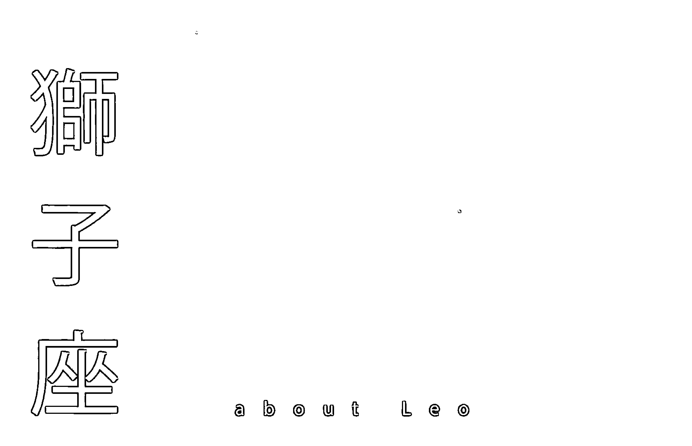
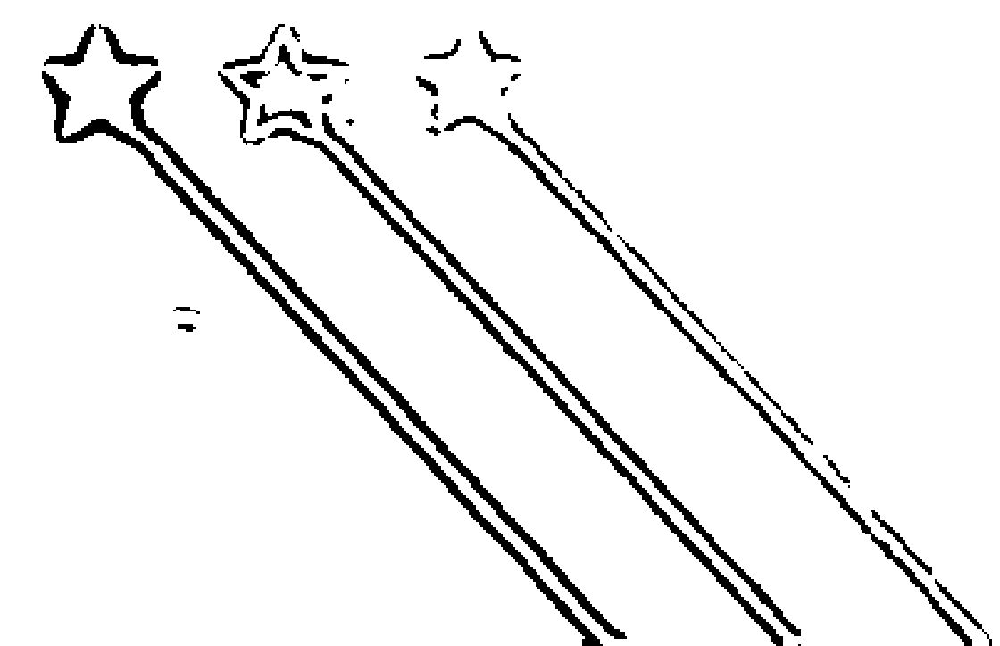

# 说12星座的坏话
## 反击

看穿人性邪恶面，读懂那些心里话，愉快反击笑着放下的才是赢家

讨厌一个人，除了说他坏话，更应该要搞懂他，才有机会完美击溃他！从占星统计与心理分析切入，精准分析行为背后的真相，让你了解星座更看懂人性！

泽谊——著

## St. Royal College
天使神秘学院

-   专业占卜预测机构
-   神秘学培训机构
-   水晶能量研究中心
-   神秘学资料库
-   官方微信：strcdts
-   微信公众平台：strc2011
-   读书交流QQ群：

占星塔罗占卜师交流群：814594478（加入密码：PDF）
神秘学其他综合群：659338717（加入密码：PDF）

微信号：strcdts
天使神秘学院

天使神秘学院 院长QQ：715104687

微信公众平台：strc2011

# 制作说明：

本书由《天使神秘学院》出重金从台湾购入的原版书籍扫描制作完成。为达到最好阅读效果，特地把原版书全部切开后，再经由专业扫描设备高精度扫描完成，并经过一张张的PS后期处理最终成书，其间花费大量的人力、物力以及时间，只为能给大家提供经济并优质的神秘学学习资料而努力。

本学院强力谴责某些机构和个人，把本学院花心血制作完成的电子书籍，包装后直接放在自家淘宝网上低价倾销的行为，以谋取不劳而获的经济利益。如果长此以往最终将无人愿意再为大家花心思制作电子书，那以后可能大家再无新书可读。

为让大家以后能够读到更多的好书，也为了本学院的良性发展。本学院恳请大家尽量做到如下几点：

1.  尽量在本学院的网站购买电子书籍。
2.  请勿用技术手段把电子书内的水印及加密去掉。
3.  在收到电子书后小范围传阅即可，千万不要公开传播，更别挂到淘宝网上低价销售。

同时为答谢广大支持者，学院电子书将做如下调整：

1.  学院会把一些早已收回制作成本的电子书折价销售。
2.  最新制作的电子书籍会开放打印功能，大家购买后有条件的可自行打印成书。

天使神秘学院
2019年1月

# 推薦序
# 會說你壞話的人，都是你的嚴師！

一般去算命的人都想聽好聽的話，講到不好的或不順利的，都會想逃避不聽。一樣的，一本講你壞話的星座書，你會怎麼看呢？

當然，這絕對不是要嚇跑你、給你惡感，相反的，它正是要用壞話來強調她對你的深度關心，並告訴你，用人性和哲學的角度同步來透析自己的弱點，甚至讓弱點有機會改正。

改正，是需要自動自省才有意義，而澤誼的指「壞」，不是要指責你，要你改正，而是提醒你，你的這個「壞」，很可能是命定難改，要趨吉避凶的方式也許就是把這個特色用在對的地方和避開這個壞帶來的災難。

這就是澤誼跟其他星座專家很不一樣的地方，她很有溫度，也很關心時代的走向，如果我們對星座的印象還是停在運勢如何，那麼，星座能給你的其他啟示就變得乏人問津。津，其實運勢都是起起伏伏的，不是此刻的好對未來都是好的影響，是每一刻都有好的考驗和壞的提醒。

會從壞話的角度談星座是很有現代感的，談星座最壞的就是談命好命不好，最好的就是忘了命好命不好的議題，直接以拋物線的速度深刻到彼岸，去等分數揭曉，不如去感受著高高低低的起伏，澤誼是可以信任的導遊，讓她帶你去一趟奇異的冒險，放下你原來對星座的舊印象，也許，那些會讓我們受傷的壞話，就會是你的嚴師，要你參透傷的原因與受的過程，原來每句壞話，都是暗器，讓你不斷學習好好接招。

作家、知名音樂人
許常德

# 推薦序
# 從星座了解人性的趣味

這是一本跳脫星座既有框架、案例多元、市場少見的一本星座書。這是我會推薦的三個原因。

為什麼會說是「跳脫既有框架」呢？不同於坊間以星座命盤、月亮上升等許多既有框架的分析，本書常是以生活化的例子，協助我們從日常生活中常見的一些星座的案例，從中找到一組到兩組常見的經典個性特質與行為模式，引導我們在心中堆疊出對這些星座的原型，也就是原始圖像，讓非專業達人的讀者，也能在心中形成對該星座的基本認識。這真的很不容易，既要跳脫框架，有不能違背星座理論，還要從讀者的角度出發，並兼顧趣味性，一來一往，並不容易。

怎麼會說是「案例多元」呢？作者從個人過去提供星座諮詢的經驗出發，同時也在臉書經營的社團中多角經營，接觸過的大量案例實在經典。當然，作者在這些案例中，整理出經典的原型，從這些原型中衍伸出職場與人際關係的辛酸，兩性愛情的議題，最後不藏私的真心建議與提醒。在上述議題的分享中，作者文字洗鍊，字字俱到，直達重點。讓我們在了解星座的同時，也對於該星座在職場人際關係中的行為模式有了更多認識，也更清楚如何應對進退。同時，也讓我們知道在愛情中該如何應對進退，遇到十二星座恐怖情人要如何好好的活下來，挑戰更高。

至於市場少見，大概也不用我多贅述了。誠如前文我列舉出來的關鍵，讀者應該已經發現這是一本不同與以往既定視野的星座書了，與其說是一本星座書，不如說是一個星座專家的人性手扎，連我都非常期待作者後續的人性觀察記錄了，更期待是否未來有更多合作的機會了。

這本書值得我推薦，我很喜歡，也希望您會喜歡。

臨床心理師
周鈺翔

## 自序
# 說壞話有益身心

認識我的人都知道，我談星座談的是人性，星座反而是配角，我覺得人性好玩，配上星座就變得更有趣，尤其觀察不同的星座的行為模式與反應，時常讓我觀察出很多心得，因為人性很多變，搭上星座自然就會有一套邏輯出現。我在臉書開的社團「說十二星座的壞話」時常惹惱一些人，覺得為什麼我只談缺點，難道他們沒有優點嗎？其實說星座壞話雖然有一部分只是為了發洩（我好誠實），但另一部分是跟大家一起討論這個星座的負面特質。

我時常在社團丟出某個星座的議題，然後大家都會開始想起來這個星座是否會這樣子，進一步去分享經驗與自身經歷，甚至還有怎麼對付這種情形發生的教戰守則，不得不說，有時候還真的幫助一些人看開。例如遇到巨蟹座不理的時候他們的心態是什麼？遇到獅子座覺得丟臉時你該怎麼辦？大家集思廣益的想想辦法，順便罵罵星座，週五的晚上喝上一杯紅酒，看著星座壞話，這就是有格調的生活對不對！

這本書我把多年來觀察到的心得與星座結合而成，寫了一系列十二星座耍壞時會是什麼模樣跟大家分享，希望大家除了看壞話紓壓之外，還能在遇到問題時，翻翻壞話書好好的思考一下這個星座為什麼會這樣做，他們的心態是什麼？當你有所體會認知後，就會比較冷靜地去想怎麼處理，所以本書不只是娛樂效果用，其實還有救濟世人的偉大理想，希望大家遇到他人有人際上的困難時，能偷偷送他們一本好解決他人人際上的狀況，你這樣是做好事，我替對方感謝你！（魔羯座招式心機重的打書法）

本書作者
澤誼

## 前言
### 了解你内心的坏孩子，然后安抚他吧！

市面上的占星书，大部分是告诉我们，你有什么样的优势、特色、人格，去解读性格。然而这本书我却希望集中火力在看到我们内心「坏孩子」那一面去了解自己，进而也可以了解，当别人对你使坏的时候，他心态的出发点是什么？我们用星座去观察，坏孩子什么时候会出现，他出现的行为会是什么？这对我们人际关系、感情上的处理跟情绪上的认知会有一定的帮助。

使用本书的时候，你可以先理解自己的星座缺点是什么，或许你就可以知道为何在某些情境发生时，为何别人会对你有这样的态度。你也可以看看你身边人的星座，在你搞不清楚他们为何老是犯同样的错误时，他们的内心层面的坏孩子是怎样在作怪。所以我们并非要去压抑或教训这个负面的坏孩子，而是去理解这样一面的心态是怎样让我们产生如此的行为，了解它才有机會安抚它。講到这里，那就不能不提一下影响我们坏孩子的星座：月亮星座！除了我們都熟知的太陽星座之外，月亮星座的影響力，完全是不輸給太陽星座的喔。

太陽星座可以說是倔強的孩子，它是屬於比較外顯的那一面，別人比較看得到你頑皮囂張的那個形象，但月亮星座是代表著你的情緒跟感受，還有潛意識的狀態，所以是比較內斂的性格，不過因為月亮星座比較難以看到表現，所以我會形容它是比較容易使壞的，因為躲藏起來的性格，比較有隱私跟安全感，使壞的孩子總是不希望被發現啊！因此，使用本書你可以觀察太陽跟月亮星座的影響在哪裡，或你想觀察的人，太陽跟月亮星座的差異點。很有趣的，你會看到跟以前完全不太一樣的另一個人，然後可能會恍然大悟——為什麼當初他會有那樣的情緒跟行為。

## 前言
# 月亮代表的意義

每個人的占星命盤，都有十顆行星，分別坐落於不同的星座與宮位。太陽在天文學的定義是恆星，但在占星學的視角，從地球的角度看過去，太陽會輪流在十二星座中移動，所以占星學的定義中，太陽屬於行星的一種。一般最常聽到的星座，通常都是代表太陽的位置。另外，還有九顆行星也各自有代表的星座意義。為何會特別強調太陽的位置的星座呢？因為太陽代表我們的生命力與自我意志。我們會想要活出太陽的面貌，所以在公眾面，會是以一種太陽的性格出現在大家的面前，也因此太陽星座會被廣泛的討論。

月亮與太陽就像是陰與陽的對比，或是母親跟父親角色的代表。太陽是外放的鞏固自我，代表陽性與父親，月亮是內斂的情緒，代表陰性與母親。月亮可以說是我們真實的感受與性格，不需要做給別人看，油然而生的感覺。這個感覺會讓我們對很多事物有不同的感受，產生各種複雜的情緒。所以，月亮的重要性完全不輸給太陽，月亮就像你性格的另一面，別人看不到，但只有你知道為何你會這樣想、這樣做、這樣下決定。

月亮也比較不是那麼理性，因為月亮的感受是很主觀的，也可能是以前的經驗所殘留下來的陰影。太陽是因為你對自己的期望跟社會的看法，讓你決定怎麼行動。月亮直接感受到快樂與悲傷，沒有任何的理由的情緒，引導你的做法。很多黑暗面的情緒都會是月亮所管轄的，因為月亮很敏感，而且常常帶著過去的陰影，強加在現在的生活經驗上。

如果你看到一個人的太陽星座跟你認識真實的他不太像，或許月亮星座會是一個很強烈的線索可以讓你理解這個人為何會有這些行為與反應，相較於太陽星座的外放，當你開始了解月亮星座，有些狀況會恍然大悟，原來，這個看似太陽星座比較強勢的火象星座人（牡羊座、獅子座、射手座）月亮在水象星座的話（巨蟹座、天蠍座、雙魚座），也有他敏感玻璃心的一面啊！

舉例來說，黛安娜王妃的太陽是巨蟹座，她的形象帶著母親那種親切感，溫和的感覺，所以會讓人覺得很溫暖。但她的月亮是水瓶座，真實性格其實是很難接受傳統方式的壓制。她嫁入皇家，這跟她的月亮水瓶座獨立反叛的性格，實在是差異太大。因此我們可以從她的緋聞，看到一些對於皇家權威的那些抗議的舉止，並非如我們見到的太陽巨蟹座，願意為了家庭忍氣吞聲的形象。所以月亮星座的重要性可完全不輸給太陽星座。

# 星座小知識

推薦這個占星的網站，你可以詳細的查到整個星盤的位置，自然就可以知道你的月亮星座。

https://www.astro.com/horoscope/zh

查詢的步驟如下：
從首頁點進去「個人免費占星」，然後會看到兩個部分，一個部分是針對註冊用戶的，另一個是對於遊客用戶，不需要註冊直接進去遊客用戶的「點擊這裏進入資料輸入頁面」後，會看到一個要你填資料的頁面，如果只需要知道月亮星座，填上出生年月日跟出生地點即可，如果需要知道詳細的宮位的位置，就要加上出生的時間。
注意，出生地的名稱請用英文才會找到喔。目前Astro.com的資料缺乏澎湖、金門、馬祖、雲林的經緯度資料，如果你的出生地是在這幾個區域，請輸入離你出生地最近的城市即可。
填完後，按下繼續，就會出現整張星盤，你就能看到月亮星座的位置。

# 目錄

002 推薦序
許常德：會說你壞話的人，都是你的嚴師！
周鈺翔：從星座了解人性的趣味

008 前言
了解你內心的壞孩子，然後安撫他吧！
月亮代表的意義

018 牡羊座 Aries
談星小劇場
職場與人際關係的心酸：如何與牡羊座相處
兩性愛情觀點：牡羊座感情上的陰暗面
愛情、職場、人際關係大補帖
太陽照不到的另一邊：月亮如何影響牡羊座的黑暗面

040 金牛座 Taurus
談星小劇場
職場與人際關係的心酸：如何與金牛座相處
兩性愛情觀點：金牛座感情上的陰暗面
愛情、職場、人際關係大補帖
太陽照不到的另一邊：月亮如何影響金牛座的黑暗面

060 雙子座 Gemini
談星小劇場
職場與人際關係的心酸：如何與雙子座相處
兩性愛情觀點：雙子座感情上的陰暗面
愛情、職場、人際關係大補帖

078 巨蟹座 Cancer
談星小劇場
職場與人際關係的心酸：如何與巨蟹座相處
兩性愛情觀點：巨蟹座感情上的陰暗面
愛情、職場、人際關係大補帖
太陽照不到的另一邊：月亮如何影響巨蟹座的黑暗面

098 獅子座 Leo
談星小劇場
職場與人際關係的心酸：如何與獅子座相處
兩性愛情觀點：獅子座感情上的陰暗面
愛情、職場、人際關係大補帖
太陽照不到的另一邊：月亮如何影響獅子座的黑暗面

118 處女座 Virgo
談星小劇場
職場與人際關係的心酸：如何與處女座相處
兩性愛情觀點：處女座感情上的陰暗面
愛情、職場、人際關係大補帖
太陽照不到的另一邊：月亮如何影響處女座的黑暗面

138 天秤座 Libra
談星小劇場
職場與人際關係的心酸：如何與天秤座相處
兩性愛情觀點：天秤座感情上的陰暗面
愛情、職場、人際關係大補帖
太陽照不到的另一邊：月亮如何影響天秤座的黑暗面

158 天蠍座 Scorpius
談星小劇場
職場與人際關係的心酸：如何與天蠍座相處
兩性愛情觀點：天蠍座感情上的陰暗面
愛情、職場、人際關係大補帖
太陽照不到的另一邊：月亮如何影響天蠍座的黑暗面

180 射手座 Sagittarius
談星小劇場
職場與人際關係的心酸：如何與射手座相處
兩性愛情觀點：射手座感情上的陰暗面
愛情、職場、人際關係大補帖
太陽照不到的另一邊：月亮如何影響射手座的黑暗面

200 魔羯座 Capricorn
談星小劇場
職場與人際關係的心酸：如何與魔羯座相處
兩性愛情觀點：魔羯座感情上的陰暗面
愛情、職場、人際關係大補帖
太陽照不到的另一邊：月亮如何影響魔羯座的黑暗面

220 水瓶座 Aquarius
談星小劇場
職場與人際關係的心酸：如何與水瓶座相處
兩性愛情觀點：水瓶座感情上的陰暗面
愛情、職場、人際關係大補帖
太陽照不到的另一邊：月亮如何影響水瓶座的黑暗面

240 雙魚座 Pisces
談星小劇場
職場與人際關係的心酸：如何與雙魚座相處
兩性愛情觀點：雙魚座感情上的陰暗面
愛情、職場、人際關係大補帖
太陽照不到的另一邊：月亮如何影響雙魚座的黑暗面

## 牡羊座
about Aries

## 談星小劇場

在某個咖啡廳裡，聽到的對話，有三個女生在聊天，媽媽、女主角、妹妹，這位女主角啊，我聽完她的回答跟辯解，真的差點在旁邊大笑拍桌，像這樣理所當然的囂張態度，想必一定是牡羊特質很重的性格。

> 媽媽：「妳喔！不要生活過得那麼亂，叫妳早點睡就早點睡，該吃飯要吃飯！」
> 女主角：「喔！」手在玩頭髮，眼神空洞看某處，看得出來完全沒在聽話。
> 妹妹：「她每次都很晚才睡，偷偷在打電動！」
> 媽媽：「妳看妳，都不去找工作就是沈迷電動，要適可而止啊。」

牡羊座的理所當然的態度，就是很直白的——做錯不會去想自己的問題在哪，而是去找誰是代罪羔羊？完全沒有要檢討自己的意思呢。

女主角：「妳給我閉嘴。」對著妹妹怒吼，作勢要拿東西丟妹妹。
媽媽：「妳脾氣真的很差，就念妳兩句而已。」
女主角怒視妹妹，完全沒有檢討的樣子。
妹妹：「媽～而且她騙妳說她戒菸了，某某某上次跟我說他看到姊在抽菸。」
媽媽：「妳不是跟我說妳戒菸了？妳戒菸我才願意資助妳去買手機，妳手機錢還我喔！」
女主角：「是誰看到我抽菸的？妳快跟我說是誰喔，都是他害我的，我要去爆打他一頓讓他好看，我手機如果被沒收就是他害我的，是誰！」

## 職場與人際關係的心酸
### 如何與牡羊座相處？

要跟牡羊座相處，要先知道他們就是一個永遠把「我」放在第一位、一個自我意識超強的星座，所以你去跟他說道理講條件他們都不太會理會你，如果這些東西不是他們想要的，他們不太會為了顧全大局退讓，因為牡羊座就是要一個當下贏的爽快，想跟這樣的牡羊座協調，作用實在不大。想要跟他們相處，其實你可以以退為進，讓牡羊座覺得他要的都滿足了，自然就會比較願意把他覺得他不要的恩賜給你呢。雖然這樣的方式令人當下很不是滋味，牡羊座其實腦袋也沒那麼複雜，花點力氣拐他們一下，你要的也得到了，這不是也是雙贏嗎？

### 牡羊座的笨點在哪裡？

大家可以去做個實驗，找個牡羊座問他：「咦？聽說牡羊座好像都不用大腦這是真的嗎？」牡羊座會非常慎重的告訴你：「拜託，我們可是很聰明的，只是不喜歡用心機，那樣太累了！」實情是，他們的確不愛動腦、四肢發達，頭腦簡單的代表星座非他們莫屬。我有個太陽月亮都在牡羊座的朋友，牡羊特質非常明顯，我記得他的口頭禪是：「你現在不要問我，我現在不想動腦。」「現在不要討論這件事情，我不想思考。」「我現在只想放空，什麼都不要問我」只要不是當下急需解決的事情，就會變成這種死樣子。

牡羊座不喜歡事情複雜，他們很容易覺得麻煩覺得累，索性乾脆都不用想就好啦，總之事情發生再說啊！該說他們是很樂觀還是逃避呢？雖然說這樣個性好像用在某個時刻也算很有效率，人生就是這樣遇到再說感覺也不錯，只是如果是要跟牡羊座合作的人可就苦了，所以許多牡羊座就是被討厭也不知道為什麼，牡羊座的OS：哼！他們應該都忌妒我吧。（真心覺得他們活得很另一個我覺得最厲害的笨點，牡羊座好像不知道丟臉為何物，會做一些讓人感到尷尬的事情，還覺得自己真誠不做作。舉例來說，牡羊座因為不愛思考，就連炫耀，也炫得很差，如果是過得很好的牡羊座，當然怎麼炫耀都看起來很爽（只是這種炫耀法也會使人討厭）。重點是過得普普通通的牡羊座，還是硬要炫耀就看起來很可憐。

譬如，很想結婚的牡羊座終於如願了，他就覺得結婚這件事情無比了不起，整天炫耀他的婚姻生活，但他過的日子看起來也不怎麼樣，但是，牡羊座就是炫耀也不知道該包裝一下，大辣辣地把他看起來不怎麼樣的日子昭告天下，還一臉得意洋洋的覺得自己非常幸福。平凡的日子幸福當然很好，只是炫耀這件事情，本質就是要讓人羨慕，怎麼會做到反而讓人想同情你呢？只能說就連炫耀也是要所本才算達到目的啊。

## 牡羊座囂起來有多討厭

「我現在要過去了，等我十分鐘就到！」牡羊座忽然打來「通知」我？
「什麼？你過來幹嘛？我們又沒約！」我滿頭霧水。
「有啊，我前幾天有說可能今天會過去，難道現在我不能過去？」牡羊座的口氣很理所當然的樣子。
「你又沒跟我確定時間，我哪知道啊？而且什麼叫做難道我現在不能過去，你總得先跟我講一聲吧？我現在剛好要出門，所以沒辦法，我們下次再約吧！」我得把話跟牡羊座說清楚。
「喔，嘟嘟嘟嘟嘟嘟嘟嘟」我聽著電話掛掉的聲音，心想，牡羊座你下次給我小心一點！（怒）

牡羊座的世界裡只有兩種人，一種人是「我」一種是「某個人」。簡單來說，他們以「我」為中心，其他的人都是某個存在於世界上的某個人，管你是誰，管你的交情跟我好不好，當牡羊座的自我意識的那個我出現，其他的存在都是虛幻的……。

講的好像太玄了（苦笑），但有時候真的覺得牡羊座把自己這個「我」看得那麼大，實在不得不佩服一下。當牡羊座覺得一定就得這樣時，其他不讓他進行的事情都是阻礙，他們才不管什麼要彼此圓滿達到共識才對，哪有這種事情？當然只有配合我才是最完美的結果，搞什麼鬼，怎麼會有別的選項呢？他們的原則很簡單，唯我獨尊，其他不用廢話，只要違背這件事情，很好，我就生氣，我就發怒，我就覺得大家都對不起我啦！

如果將牡羊座譬喻為蠻荒人，接下來的解釋都很好理解。牡羊座的世界裡，大家應該是以他為中心而活的，別人都要注意他們，只要注意力被轉移走，牡羊座很快的就會用很誇張的方式，要大家轉移到他們身上，彷彿這世上所有的人，做任何事情都該以他們為標準。你如果受不了這樣的牡羊座，試著想將主導權拉回自己身上，牡羊座絕對不客氣的用他那最大的力氣搶回來。他們完全不怕自己這樣的行為會被人說話，想讓牡羊座丟臉，真的太難了，他們臉皮之厚，從不怕丟臉為何物，他們也從不隱藏情緒，不爽不滿全寫在臉上，像是怕沒人看到他們一樣。遇到這樣的牡羊座，你會看到一隻永遠在不滿的羊跟總是被惹生氣的模樣，你會很慶幸自己好像還有一種叫理智的情緒。

### 小心防範_牡羊座怎樣惹火everyone

牡羊座無疑是星座中最容易惹火人的翹楚！他們隨便一句話就能讓人立刻氣到自燃，對方被氣到發火時，牡羊座的反應是絕對不可能自省的。他們會覺得「這個人幹嘛那麼愛生氣，我只是說實話而已啊！」像我成立的FB「說十二星座壞話」這個社團，每次只要有人PO文罵牡羊座，牡羊座就會立刻以作戰之姿出來抗拒，並且強烈反對被說壞話的態度非常堅定。但平常一起罵其他星座的時候，他們也是沒在客氣的，火象星座只准州官放火，不准百姓點燈的病態情形是非常嚴重的！

牡羊座還有個嚴重的毛病，他們當下想要這個就一定要得到，跟人生經歷與年紀完全沒關係。他們就算是見過大風大浪，人生閱歷十足了，也會時常因為某件小事不順他們的意，就會鬧到大家都得順從他們。而且他們手段粗糙，要得到某件東西就得用點心思去獲取，更何況還不是什麼大事，何必因為一點小事就搞得人仰馬翻呢？但是牡羊座才不管那麼多呢，尤其越親密的人會越容易看到他們這種無理取鬧的樣子，戰鬥力都放在「我想要、我就要、我現在就要」這件事上，這種個性誰被惹到不會燃燒啊。

我想到我有個牡羊座的朋友，每次約出門的時候，如果確定自己九點會到，他就會跟大家約八點四十分，然後大家準時抵達了，他自己卻在九點整到，每次都這樣，有一次終於有人受不了問他：你為什麼每次都會遲到個10-20分鐘啊？牡羊座非常爽快地承認：「因為我不喜歡等人，但又怕你們遲到，所以我只好這樣說啊！」嗯！我忽然覺得，牡羊座應該是十二星座在暗巷被蓋布袋的冠軍吧（沉思）。

## 兩性愛情觀點
牡羊座感情上的陰暗面

牡羊座在感情上，真是標準的非常急躁控制慾又強，他們非常不喜歡被人家管，可是他們卻又無比的愛管別人，所以如果你覺得你怎樣對我、我就怎樣對你，這種看似公平的方式去跟牡羊座相處，牡羊座是絕對不能接受，他們就是有一套對待情人的態度跟法則，這跟他怎樣對待自己可是完全沒有關係的喔，如果要跟牡羊座交往，學著怎樣先讓著他們，可能是最佳的生存法則吧！

## 討厭情人之牡羊男的真星話

「有空嗎？來約會吧！」羊男直接了當的提出邀約。
「我們可以先留聯絡方式聊聊啊。」被羊男追的女子，趕緊回答著。
「我不喜歡打電話聊天，也沒在用通訊軟體，直接約出來，我們可以更清楚的了解彼此啊！」
「這……我最近是比較忙一點，有空再約好了。」女子給羊男一個無奈笑臉。

沒多久，女子從朋友那邊聽到，「這女的好難約，現在女孩真不好追！」

女子心想，不過才第一次見面，就要立刻約成，約不成還到處跟朋友抱怨，好險自己沒答應這種沒誠意的邀約哩！

牡羊座男就是那麼自負，他們沒耐心玩欲擒故縱的遊戲，看對眼了就直接衝（當然也有害羞的天然呆牡羊，但不在我們壞話討論範圍內）猴急著想要快點有結果，如果人家不如牡羊男的反應，他們還會怪罪於別人。以上這個故事，可是真人真事，女生本來是願意給牡羊男機會的，只是覺得要再花時間認識一下（否則連電話都不想給吧？），但牡羊男的熱情過剩，就變成猴急男，這會讓女生覺得很不受尊重，本來的好感也被毀得一絲不剩！

不用擔心牡羊座被拒絕會受傷，基本上，他們會將錯怪到對方身上，所以如果要拒絕牡羊男，請大方的say no即可，因為你迂迴的拒絕也沒用，牡羊男最後還是會覺得是你不識貨，我有個牡羊男的朋友，每次我問他為什麼又分手了，他總是回答：「我不知道原因，就這樣分手了啊。」聽一次覺得還好，聽了好幾次後，我才知道，原來牡羊座真的很難理解感情中到底錯在哪裡？犯錯不討厭，但死不認錯，就真的是沒救了。

### 討厭情人之牡羊女的真星話

跟牡羊女在一起的男人，要有心理準備，她們只差沒幫你冠上她的姓，或在你臉上寫著，「此物歸我有，請勿隨意拿取。」一旦你跟牡羊女在一起，從此你就是她們的所有物，她們的佔有慾不是心靈派的層面，牡羊女就是很肯定的認為你已經賣給她了。她可以幫你安排人生所有的一切，你無須擔心，只要照著她的指引走，就會走出康莊大道！牡羊情人像極了媽媽跟女魔頭上司的結合體。

可是非常不公平的是，你們可不能這樣對待牡羊女喔！她們的佔有欲是只許自己這樣做，卻完全無法忍受一秒被人管，她們覺得你就該無條件的信任，她們可以隨意打電話查你勤，只因為她說過她需要知道，但換作是你這樣做，她們就抓狂，羊女並不會做任何努力使你覺得公平，因為她們覺得自己可是很有分寸的，哪輪得到你來教她們呢？但你可就不一樣了——男人啊！都是極容易受誘惑的，當然要嚴加管教啊！所以如果很不幸的，你已經擁有一個牡羊女情人，就知道她們的雙重標準，是沒有任何理由與解釋的。

## 愛情、職場、人際關係大補帖
不可不看的
牡羊座精華篇

「惡人無膽」這四個字就送給牡羊座，請想要對付牡羊座的人都要把這句話謹記在心喔！牡羊座就是很容易什麼道理都不講就先來吼一頓再說！先爭先贏，用暴力、用搶的、用吵得能贏就是我的，所以你跟他走文明的招數那絕對是輸得徹底。所以最好的辦法，就是大家乾脆全部挖出來講個明白，你會惡人先告狀，我就來個以暴制暴啊，太讓著牡羊座的下場，通常就是他們可是贏的理所當然，完全不會反省自己。但如果他發現他這樣對待別人後，自己也被這樣對待，多少就會覺得好像這樣做原來下場是這樣，才可能真的反省自己，改變自己的錯誤。

### 反擊吧！對付牡羊座你可以更勝一籌

「我們吃軟不吃硬，假如對我們來硬的，我們就更硬！」牡羊座這樣說的時候，你該不該相信他？千萬不要被他們騙了，牡羊座全身最硬的是那張嘴，超愛嗆聲、嘴硬得跟石頭一樣，但也就限於那張嘴，牡羊座就我看來，是吃硬不吃軟的，你給他軟的，他就當你小綿羊好欺負，但只要氣勢比他們強，一副你再兇，我也沒在怕的強大氣場面對牡羊座，很神奇的，就算牡羊座嘴巴上還是一樣得理不饒人，但你可以感覺到他們已經在退縮，尤其是他們感受到威脅時，求生意志會很強大的，所以要對付牡羊座，不管他們嗆得再怎麼囂張，你都要不為所動的比他更兇、更得理不饒人，這才是面對牡羊座贏在起跑點上的唯一路途！

也不是我愛這樣鼓勵大家兇牡羊座啊，實在是因為他們太遲鈍，逼得別人得用盡力氣嗆回去，才能贏得他們注意，能夠和平解決誰不要呢？而且牡羊座對越熟悉的人越容易無理取鬧，如果你是牡羊座親近的人，就更要秉持著這個原理，千萬不要覺得這次讓他就好，有了第一次就有千千萬萬的下次。

再次叮嚀，對付牡羊座心臟要夠強，因為他們就算已經輸了，嘴巴還是很硬，如果你被他激怒而不理會，並不會讓他們比較尊重你，反而只會讓他覺得，原來這個人可以這樣對待啊。

### PLUS
太陽照不到的另一邊
月亮如何影響牡羊的黑暗面

月亮落在牡羊座的人，最讓人詬病的就是他們非常缺乏同理心，所有的問題都是因為他們很難理解別人的感受，所以做事情就會特別自我為中心，他們只重視滿足自己的想要、想望，要他們體諒他人這件事情是特別困難的，因為他們時常會用自己很狹隘的角度去斷定別人會怎麼樣，這樣做出來的行為，自然就不太可能多體貼，而是會帶著一種很霸道的態度，令人感到難以相處。

## 牡羊座的黑心小劇場

「凡是我 不喜歡的，我討厭的都是糟糕的，我才不管你 們怎麽看。就我來看，我就是覺得不行！」牡羊座的 自白：「我的世界，由我的眼界與喜好為主，配合別人 我不擅長，要求別人怎麽配合我，可是一件理所當然、 自然不過的事情，」牡羊座的自我，從來不吝嗇讓人知 道，打從心裡的要求是那麽無理，他們永遠不會懷疑自 己有問題，本能反應就能讓他們一口咬定，相信自己才 是最高統治者。

牡羊座說好聽是天真，保持著赤子之心般的童真，實 際上就是幼稚鬼，明明幼稚，卻又愛表現的一副自己很 純真熱血的模樣，明明欠缺考慮，卻愛裝得自己有著勇 者無懼的力量，事實就是他們尚未進化，根本是尚未開 發的野蠻民族。什麽都不懂，什麽都不顧慮，當然不知 道害怕。這種特質，用在非必要時刻可能聽起來很勇 猛，但活在這個人與人交際如此密切的社會化環境網絡 裡，本能的野性太多的話，反而顯得過於魯莽。

牡羊座的求勝慾望很高昂，不管是什麼事情，他們就是想要搶快搶先搶第一。不過，他們不會去注意別人是否有贏他，因為他們是看不到別人的。通常是他發現那樣的東西他想要，但是別人有而他沒有，他就會心癢癢的覺得自己一定也要擁有。比較上進的一點是，他們不屑搶別人的！要就掙來一個比你威風的！不用搶，因為我本身就是贏家。他們會為了某個想得到東西花費最大的力氣，不管是，愛情、工作、財富，什麼都好，他就是要比誰都厲害。可是人總是有人機運差跟天賦不足的時候，當實力未到但又想逞威風時，牡羊座就會誇大實情以滿足自己的慾望，什麼臭屁又誇張的話都會控制不了說出口，當你發現牡羊座的話越來越偏離事實時，你就會知道，他們最近過得特別不好了。

### 悲哀人生_牡羊座到底有多失敗？

奉行只要我喜歡，有什麼不可以的牡羊座（好老派的台詞），聽起來很帥氣，但碰到的釘子也不少，畢竟這個社會，你要那麼任性，要不就是先天條件超好，要不然就是本事強到世界沒有你不行，牡羊座如果兩者都沒有，卻依然要順應自己所有的感受去過生活，用想的就知道，人世間險惡，又不是每個人都跟你明著來，牡羊座因為這樣而吃到的苦頭只能自己吞下去。

他們不是固執，是當下想怎樣就怎樣，這跟其他固執的星座不同，固執是有原則性的，但牡羊座就是完全憑藉著我「爽不爽」來判定每件事。舉例來說：牡羊座想結婚是因為我爽，想當媽因為我沒當過，想賺錢是因為別人不肯把錢給我花。以上例子，有哪個看出來是經過考慮的？更何況還都是人生大事！牡羊座的悲哀是太重視當下的感覺，說要得到就一定要現在就擁有，非常之沉不住氣，管他是人生大事還是雞毛蒜皮小事，一概這樣處理，逞一時之快，行一時之爽，悲哀的是後續要收爛攤子也得自己來，然後再來裝作一切都沒事。想讓牡羊座繼續悲哀下去嗎？激怒他做些傻事，很快的他們就得吞下那些苦果、得承擔一切了。

# # 金牛座

### about Taurus

金牛座出名的頑固與不願意溝通，落實在實際的生活上，讓人常感到很頭痛。

## 談星小劇場

一個妻子想要跟金牛座的先生開啟一段有意義的對話。

> 妻子：「你覺得我們是否需要溝通一下？」

> 先生：「………………。」

> 妻子：「你有聽到我的聲音嗎？」

> 先生：「我有聽到啊，但我不知道要說什麼？」

> 妻子：「我就直白的說，我覺得你的生活習慣實在不太好，我這樣幫你做東做西覺得很累，我又不是你媽耶！」

> 先生：「噢，那你不要做就好。」

> 妻子：「那大家都不要做，一起擺爛嗎？你習慣好一點，大家都舒服，我也不用做得那麼累。」

> 先生：「………………」

> 妻子：「又來了，又不講話了，每次遇到你不想面對的事情就開始當啞巴！」

> 先生：「我懶得解釋，我改不了。」兩手一攤，躲進房間睡覺去。

留下憤怒的妻子的無奈歎息……

### 職場與人際關係的心酸
# # 如何與金牛座相處？

跟金牛座相處其實並不難，只要秉持著，我跟他如果是同一國，那基本上不用什麼太大的交情大家都能相安無事，但如果你們有著利益上的衝突，或是可能是打對台的，那你就放棄這輩子要跟金牛座當什麼好朋友。金牛座有特殊的嗅覺，他們能察覺到誰才是不會危害他權力的人，他們雖然不會主動去搞別人，但防衛防線可是很強的，別想去挑戰他們那些原則跟防線，所以認清楚金牛座就算跟你再怎麼要好，一旦彼此有利益上衝突點時，他們會冷漠起來也是一件很正常的事。

# # 金牛座的笨點在哪裡？

每個星座的笨點都不同，就像人家說雙子座雖然反應很快，但笨起來也是很蠢的，不過金牛座真的很切題，他們的笨就是很單純的「反應很慢＋理解力差」。你不該去要求一個只在乎自己吃飽喝足有沒有睡飽的人反應快，因為他們天生就是不喜歡動腦，只想依循某個規則不用動腦的過完一天。大家以為金牛座抗壓性強，其實是他反應不過來，不知道這件事情有多嚴重，用他們那狹隘的腦袋去判斷事情，結果明明恐怖的大事他們看起來好穩重，無聊的小事例如今天吃到難吃的午餐而鬱鬱寡歡一個下午，金牛座的腦袋的神經傳達跟人家不一樣。

我奶奶是一個標準的金牛特質很強的人，她可以扛下一家的重擔不吭一句，但會為了一個杯子沒放在她想要的地方，惹火全家人！你好說歹說告訴他們不用為了這件事情憤怒，弄得全家烏煙瘴氣，但金牛座就是無法接受，他們就覺得為什麼我的要求那麼小你就不肯做？但問題是你何必為了一個杯子弄得氣氛那麼差呢？不知變通反應又慢的金牛座時常鬼打牆，加上有時候又鑽牛角尖的情緒化，別人也不知道他們內心的運作是怎麼一回事，自然就讓人絕難以溝通而無法達成共識了。

## 金牛座賤起來有多討厭

金牛座的耍賤其實不是很明顯，這是他們的優勢，讓人容易輕敵，不過你還是能從以下幾個方式見識他們的賤招。

- 賤招一、一副不沾鍋的樣子，展現中立的態度，當你跟他抱怨時，他們會不太想要參與，於是你以為他們只是不想招惹麻煩。
- 賤招二、不願意別人干涉他的事情，也對別人的事情沒興趣，但如果別人的事情對他們有幫助，就會變得很熱心。
- 賤招三、裝得很中立，但一旦立場改變對他們有利時，就會立刻選邊站，卻還裝的一副若無其事的樣子。
- 賤招四、對自己很大方，對他人很小氣，天生有佔人便宜的習慣。

如果你的角色跟金牛座有那麽一些利益的衝突時，你就會很明顯的看得出來他們那種害怕被你害的嘴臉。舉例來說，如果你們是同事，位階一樣，主管是同一個，這就算是有點利益衝突的立場，因為你們或許哪天可能會是對手，像這樣的狀況會讓金牛座有很重的防衛心，就算你觉得我們都只是上班族，你也沒想要升官，只想要大家互相合作愉快就好也沒用，因為金牛座就是會防著你。但他們會隱藏得不錯，你也看不出來，可是哪天如果損害到他的利益時，他們可是會不顧一切的捍衛自己的權利，傷到誰他可不管，中立是怕惹麻煩，才不是因為客觀哩！

### 小心防範_金牛座怎樣惹火everyone

星座生化研究專家指出，在餐廳發現暴食死亡的金牛座，經過雙魚座媽媽苦苦哀求想要知道兒子死因，於是送到星座人體研究實驗室解剖有重大發現，金牛座的器官與一般人不同，專家發現，金牛座的腦袋的物質與石頭相同，而心臟的物質與玻璃相同，簡單來說，金牛座的器官是由裝石頭的大腦與玻璃般的心臟所組成。

### 裝石頭的大腦——冥頑不靈

想要說服金牛座真的很難，甚至不見棺材不掉淚這種程度的事情也撼動不了金牛座，我看是要讓他們直接進棺材才會發現，哇！原來這樣不行啊！金牛座的堅持常常是沒有原因的，就算這個堅持搞得大家人仰馬翻，妻離子散也要堅持下去，這很麻煩的是，你無法用正常的理由告訴他，因為他就是沒有任何理由的要堅持無謂的事情啊。對牛彈琴這句話真的沒騙人，對金牛座說理，就像是跟他們在講外星話一樣。

### 玻璃心——鑽牛角尖、活在自己虛構的世界裡傷心

不要以為金牛座沒有情緒喔，他們情緒其實蠻多的，只是不太願意表現出來，他們也是有小劇場在上演的，只不過他們這劇場的主角跟觀眾都是同一個人，哈哈，非常幽默的星座，自己上演世間情，但卻沒有人看過，哪像水象星座多麼出色，總要拉一堆觀眾上演小劇場才覺得像活著，很在乎收視率，金牛座就完全沒這個問題，所以我每次聽到金牛座說：「我快要爆炸了」，我就想，你們世間情演兩百集了，現在要完結篇了嗎？

## 兩性愛情觀點
金牛座感情上的陰暗面

對金牛座來說，另一半一定要有用處，長得好看可以欣賞的是一種用處、會打理一切的是一種用處、資源豐足的也是一種用處，然後他們會希望，如果所有的一切用處都能集合在另一半身上，那真的是夢想成真啊！那種什麼很虛幻的愛，沒有求回報的感情，他們是很難理解的，這世上怎麼會有那種摸不到猜不透的東西，居然有人還願意去追求？對金牛座來說，他們對另一半的要求就是那麼的世俗，這樣就夠了，愛不愛太遙遠，想要滿足金牛座，愛這件事從來不是最重要的。

### 討厭情人之金牛男的真星話

獻給愛上公牛的人一句話，公牛的幼稚，需要地方媽媽來拯救，謝謝你讓世界少了一隻牛。他們幼稚起來真的沒救，懶散又只顧自己，忙的時候不准煩他，想上床的時候你得乖乖等他，把女人當一件多功能性的家電兼老媽兼床伴就是金牛男的夢中情人，在身邊不准吵，離太遠又要鬧，金牛男麻煩起來是不輸給任何一個星座，但大家都說金牛男穩重負責任，其實是無聊又沒話講，一個口令一個動作，只有上床會主動！

金牛男真的被美化得很嚴重，其他星座男都蠻多壞話大家如數家珍的，只有遇到金牛男會卡住，這個星座沒什麼好講，就連話壞話都不知道從何說起。金牛座的壞話很簡單，他們如果是金牛壞男人就是非常明顯那一種，老子只想打砲、不要來跟我談那種要負責的感情，但玩玩小戀愛有助打砲情調那很好，因為他們也怕麻煩，如果沒有很真心就會表現得很混蛋，這種壞法的金牛男算是簡單的，最怕遇到覺得你是他需要，但又不是真的那麼愛的，那他們可能就真的會為了利益而跟你交往。

The request was rejected because it was considered high risk天天，你只能捏自己大腿，望著蒼天，欲哭無淚。

雙子座就像天使與惡魔的化身，伴隨著他們的心眼以一種超級自然態度的方式達到自己的目的，他們的隨和態度其實是我隨便，你自便，卻還一副理所當然的樣子，他們讓別人「不小心」吃到的悶虧，才不是什麼一切都是註定的，雙子座早就知道了，他們的反應很快，尤其在標榜自己該怎麼表現才是最受注意的當下，他們就是天才，他們很懂得給人一分的甜頭，自己能獲得三分的方便，他們可以動之以情的告訴你很多歪理，只為了可能現在想要拿到想要的東西，狡猾是他們的天性，不管他們看起來多麼的……和善又謙虛？遇到雙子座，請你自求多福。

## 逼哀人生_雙子座到底有多失敗？

不要看雙子座出一張嘴很會講，講了一百件事情，規劃了兩百個方向，真正要他們動手去做的時候，又會有各種藉口只為了閃躲做這件事情的麻煩。對雙子座來說，人生輕輕鬆鬆就是他們的目標，追求這樣的目標沒什麼不對，誰說人生一定要那麼辛苦。但矛盾的是，雙子座又很怕無聊，喜歡追求新鮮有趣的事物，輕鬆的人生就不可能有太多的挑戰與變化，所以他們老是一下嫌日子無趣，一下又嫌累嫌煩，這就造就什麼事情都很容易虎頭蛇尾，給人一種不可靠又難以託付的形象，誰知道託付的事情對他們來說是麻煩還是好玩的挑戰？而且他們最讓人詬病的是，事情沒完成也不會交待一下，總覺得人家的事情都不急（自己廢事倒是很看重），你催他們還會嫌你給人壓力太大，不好相處，久而久之，誰會相信這樣的人？

別看雙子座那麼無所謂的樣子，其實他們蠻在意別人的評價，但要他們努力去經營維持他們又不夠用心，老想著最輕鬆可以一步登天的方式來展現自己的自以為聰明，這樣性格讓雙子座很難深入任何事情，卻又異想天開的想像自己的人生與眾不同。聰明反被聰明誤，最後只能騙自己，其實這樣也不錯，雙子座這哀人生是一種不甘平凡卻又無法認清現實的可悲。

## 巨蟹座 about Cancer

巨蟹座的保護性跟家族性很強，所以當孩子要獨立時，他們時常是不適應的一群，於是就很容易有這種衝突，其實是巨蟹座的不安全感在作祟。

# 談星小劇場

一個家庭的對話，巨蟹座的爸爸、媽媽、兒子，正在討論家族聚餐的事宜。

> 媽媽：「 兒子啊，你12月3日那天要留下來，家族聚餐你上次沒去，大家都在問你在忙什麼呢？」

> 兒子：「 就說我在工作啊，你們約這種平常日，有在工作的上班族實在不是那麼好請假。」兒子有些不耐煩的回覆。

> 巨蟹爸：「 我們是一家人就該全家一起出現，你知道少了你去我一直被問覺得多丟臉嗎。」

> 兒子：「 丟臉？不過是聚餐我沒去有什麼好丟臉，我又不是退休老人整天閒閒的可以不用工作。」

> 巨蟹爸：「 所以你在嫌我沒工作退休在家的意思？我到底養你這種兒子要幹嘛！」

> 媽媽：「 你們不要吵了啦，不過就是個家族聚餐，兒子要上班也是沒辦法的，你幹嘛說他讓你丟臉，姨婆他們家還不是兒女都在上班啊！」媽媽也顯得有些惱火。

> 巨蟹爸：「 那是姨婆家他們教育有問題，兒女本來就不孝順，我們家要表現團結一致的精神，怎麼可以每次這種聚會都讓我們自己去。」

> 兒子：「 你每次都用這種方式情緒勒索我，難道我不能有自己的事嗎？你非要做給什麼狗屁家族看！」

> 巨蟹爸：「 你這個不孝子，那麼簡單的事情都做不到，我看我也不用奢望你能多孝順了。」

職場與人際關係的心酸

# 如何與巨蟹座相處？

巨蟹座喜歡搞小圈圈，對他們來說有小圈圈才有熟悉感，沒有小圈圈就是可憐蟲的邊緣人，所以巨蟹座絕對受不了在人際關係上被邊緣化的感受，一旦他覺得他在這個場合有很多事情他不知道而別人知道，就會覺得自己彷彿被排擠，就容易胡思亂想，搞一堆小動作，所以要跟巨蟹座相處，讓他成為一隻被收服的螃蟹，最重要的就是讓他覺得你跟他是同一國的，時常跟他分享一些你知我知的小事，巨蟹座覺得你很在意他的存在，就能收買巨蟹座跟你共進退的心了。

## 巨蟹座的笨點在哪裡？

很少有巨蟹座覺得自己笨的，因為他們心思縝密，想的很仔細也很多，總是把整個局想過一遍又一遍後才下決定，這樣精打細算的巨蟹座，照道理來說，應該很精明，笨點會是什麼呢？當巨蟹座覺得自己想得很周到，想得很齊全時，他們就會忽略這些想出來的結果，依循的邏輯與客觀性在哪？巨蟹座的確算是細心的星座，他們想很多，尤其是無中生有、弄假成真更是有一套，本來可能很簡單的一件小事，被他們那詭異的腦袋瓜一想，事情就變得非常不單純！所以當巨蟹座覺得自己想得很周全時，大部分可能是一些微不足道的線索，加上巨蟹座的疑心病轉變成巨蟹座的自以為理智周全，反而弄巧成拙的把沒事變有事，小事變大事，人生為了這種本來沒事的事情搞得團團轉，這笨點的破壞力真的非常大，巨蟹座可能終其一生都被這種笨點給害死。

巨蟹座的第二笨點也是挺寶的，巨蟹座有時也會有想要耍心機搞手段的心眼，來暗的通常是土象與水象星座的慣用手法，巨蟹座其實蠻怕跟人正面衝突，所以想搞點小動作時當然也會偷偷來，只是巨蟹座永遠搞不清楚自己的能耐到哪裡，誰叫巨蟹座的情緒化很難忍住不發作情緒一來，就會陷入無限恐慌與妄想中，耍心機搞手段其實是要很理智才能玩得好，如果想搞小動作還不能控制情緒氾濫導致決定錯誤，當然就會變成一場災難，爆走的巨蟹座，總是連自己都炸到。

# 巨蟹座賤起來有多討厭

巨蟹座真的要很小心，他們賤起來就是會得到「歐巴桑症候群」——不限女人喔，男巨蟹賤起來照樣得這種病。巨蟹座很俗辣，他們耍賤一定是私底下搞小動作，而且完全沒有計畫那種，忍不住情緒發作的時候就開始搞怪，事後再來覺得自己好像也沒必要這樣，但一切都來不及，等到下次又不爽的時候，又忍不住，這……真的很像三姑六婆的歐巴桑性格，尤其搭配上表面上不想得罪人家的時候，就會變成喜歡暗地裡去說人壞話，然後你仔細去聽聽巨蟹座說人的壞話，那些對他不好的事情其實也沒有很嚴重，只是小心眼犯了，想要找人說說，卻忘記了聽在別人耳中，會覺得這個人很愛計較又大嘴巴。以下是我親身經驗的情境，大家可以回想一下巨蟹座是否有這樣的問題，而讓你覺得老是被他們誤會啊！

> 巨蟹座：「你們剛剛在笑的是事情是在恥笑我嗎？」
我：「沒有啊，我們只是在講笑話，沒提到你耶！」
巨蟹座：「但我也做過那種糗事，你們這樣講我有點傷心，而且上次A君也在笑這件事情，我覺得他這個人品行不是很好，你要小心一點。」
我：「我們都不知道你也做過這種糗事，你也太容易不高興了吧？這樣跟你相處讓我覺得壓力很大耶。」
巨蟹座：「我不是在說你啊，我說的是×××。」
我：「但我也可能犯了A君那種錯誤，只是因為我不知道你也這樣過，下次你是否就會說我這樣？」
巨蟹座：「唉呀，我不是這個意思啦⋯⋯為什麼你要幫A君講話？」
我：………………。

巨蟹座就是這樣，愛跳針又記恨，然後再來怪罪人家不挺他，看到這邊，你還不討厭巨蟹座的話，算你們厲害（臉冒青筋）。

# 小心防範_巨蟹座怎樣惹火everyone

不知道大家有沒有被巨蟹座惹火的經驗？其實被巨蟹座惹火，不是很明顯被惹火的感覺，像火象星座惹火人就是一把火燒死你，但被巨蟹座惹火，是悶燒的狀態，你會有股怒氣往心裡吞，卻又不知道怎麼發作，巨蟹座會表現得一副都是為你好的樣子，他都裝模作樣為你好了，你還不能直接跟他們明著來，被巨蟹座惹火的人一定都會覺得吃了悶棍，非常不開心啊！

有歐巴桑症候群的巨蟹座，很愛管人閒事，也不想想造成人家多大的困擾，但在歐巴桑症候群的巨蟹座身上，打從心裡就是覺得「我只是為你好，管管你，你何必反應那麼大呢？」但其實他們自己超敏感不說，隨便講幾句話就疑神疑鬼的人，竟然還這樣對待別人，只准自己玻璃心，別人就得心臟很強接受他們的諄諄教誨，這種雙重標準也難怪他們能以悶燒狀態惹火別人！

另外，巨蟹座也以情緒控管極差出了名，他們時常散播擔憂為樂，譬如你很歡樂的跟他們講著無關緊要的話題，他們總能一副擔憂兼恐嚇的嘴臉來煽動你的恐懼神經，事後想想根本就小事情，哪有巨蟹座說的那麼嚴重，等到清醒過來時，你會覺得還是少跟這種人混，免得自己也變得神經兮兮。

記得我有一次想給個朋友A驚喜，告訴巨蟹座的朋友我和其他人想這樣做，巨蟹座的朋友立刻嚴正的指責我們這樣做恐怕會有問題，本來喜滋滋的心情頓時嚇了一跳，想說難道是我們想得太不周詳了嗎？後來果然被影響後，我們就沒執行驚喜了。之後跟A提到，他很疑惑的說：「這超級好玩的，你們又不是不知道我的個性，怎麼會覺得我會生氣呢？」我們才恍然大悟，都是被那多疑的巨蟹座影響的，這完全是巨蟹座自己容易擔憂的想像啊！

# 兩性愛情觀點
巨蟹座感情上的陰暗面

巨蟹座的沒安全感，是他們感情裡的弱點，這個弱點會讓他們可能想從很多人身上得到愛與安全感，也可能對某個對象要求時間全部都要給他，而讓人感到窒息。巨蟹座本來就帶著母性的特質，想想看，一個覺得總為了孩子好、沒有安全感的母親，偏激起來會是多麼的可怕？這也就是巨蟹座在感情上如果走向負面的特質，會是這樣的情境，一旦「我為你好」、「我要安全感」成了感情的重點，那就會是一場令人疲憊的情緒勒索。

# 討厭情人之巨蟹男的真星話

看這個系列之前，請大家去谷歌大神搜尋「地表最強十大劈腿男」前十名有三個巨蟹座穩坐排行榜，看了這些男星的形象，大家對糟糕的巨蟹男就會有個底。（是不是好貼心）

巨蟹男的劈腿原因常常會是大家覺得很瞎的：他覺得兩個都是他的真愛，因為兩個他都有感情無法割捨。聽起來很像幹話啦，可是，關於這點他們是誠實的。相較於雙魚男的無法拒絕，巨蟹男讓人覺得更可恨的是，他們的確將過多的情感分散於不同女人身上，所以他們被稱媽寶、最愛劈腿的男人，因為他們要的情感太過貪心，一個女人要有很多個角色才能滿足他，當他說他愛著兩個女人的時候，不一定是藉口，只是他愛這個女人的安全感，但又無法抗拒另一個女人的魅力。他們想要抓緊著身邊的每個人，如果你進入他的生命，他就是要拖你下來攪和到天荒地老，就算巨蟹男知道這是一段不健康的關係，也依然無法克制自己與生俱來的多愁善感，縱使他們看起來冷靜得像尊雕像。

另外，巨蟹男最厲害的是，他們擅長用愛情當籌碼製造一種利他的氛圍。

> 「這一切都是為了我們兩個好。」
「如果不是你這樣對我，我也不會做出這樣的事情，這一切讓我感到很灰心。」
「都是我的錯，如果我沒有愛上你的話！」
巨蟹男擅長以退為進，但他們退了一步，就會進三步，直到哪一天，妳再也沒退路可走……。

## 討厭情人之巨蟹女的真星話

「女人啊，說不要就是要！」男人自以為的偏見，戲謔地說著老掉牙的論點，這句話帶著貶低的意思，讓我很不爽，但抱歉，這句話我得拿來形容巨蟹女的心思，實在是太貼切。巨蟹女很彆扭，管她看起來多麼隨和、好相處、成功女強人或賢淑好老婆，彆扭是不分身份職位，就是巨蟹女的本質，因為她們實在太在乎自己的感覺與情緒，所以得防衛著任何值得懷疑的動機，於是養成了先防衛性的說謊，之後再觀察對方怎麼做？敵不動我不動。如此大費周章的方式，你以為在演哪一齣犯罪心理警匪片，最後才發現，可能只是比芝麻綠豆還小的事。巨蟹女就是愛觀察→試探→再觀察→再試探→然後結果是什麼連她都不清楚，但這過程就夠搞得讓人仰馬翻。況且，巨蟹座掩飾得並不好，她嘴巴說不要就是要，但你就是知道她想要！你又擔心違背她的意思會有什麼後果，請她直接說，又怕巨蟹女的玻璃心容易打碎。

巨蟹女的死穴——不被在乎，只要讓她感受到你的生命裡沒有她，那就足夠讓巨蟹女立刻躲回她的巢穴，巨蟹女的瀟灑與無所謂，全都是傷心與防衛心所拼湊出來的硬殼，這身硬殼能讓她們在情場上無堅不摧，不用怕受傷，是因為她們比誰都容易受傷，就像越脆弱的人，就越需要保護，聽起來多麼讓人感到憐惜，因為化身為文字她們的立場讓人感到一絲同情，但如果你實際遇到這樣的巨蟹女，只能祝福你被摧殘後，還能跟她們玩愛情裡的猜猜看直到永遠。

# 愛情、職場、人際關係大補帖
不可不看的
巨蟹座精華篇

別給巨蟹座什麼暗示，就用最火爆最直接的方式，將所有的事情都攤開來說，別給巨蟹座空間，解讀什麼其他的故事劇情，一切都是按照實際狀況說清楚講明白，並且讓他知道你的底限是什麼，如果你犯了這個底限，那就大家掰掰不聯絡。原則非常重要，尤其是面對巨蟹座！如果你退讓原則或是說得不夠明白，那就會讓巨蟹座有無限腦補空間，之後要對付就很難纏了。

# 反擊吧！對付巨蟹座你可以更勝一籌

「氣死我了，我同事居然跑去跟老闆告狀說我事情沒做完就下班！」

「對了，他是巨蟹座，整天打混又愛打小報告，我超討厭他。」

「有沒有什麼辦法可以對付這種人啊？」被巨蟹座害的朋友，氣得講個不停。

「對付巨蟹座超簡單，但看你敢不敢做啦！」我很有自信的保證。

「聽起來很複雜又刺激耶，是要搞什麼手法啊？」

「絕對不搞手法，直接對質，把話攤開來說就好。」我覺得很簡單，但我知道不是每個人都敢這樣做。

「這樣會得罪他吧？以後不就更敢搞我啊？」

「放心啦，以後他就不敢惹你了，巨蟹座其實本質超級膽小，只要覺得你有威脅性，就會縮了，但重點是你得讓他知道你不好惹，否則螃蟹的橫行霸道是很麻煩的！」

「聽起來挺有趣，明天就來實驗看看！」射手座的朋友，興致勃勃的口氣，不知道他明天還記不記得這件事……。

對付巨蟹座，訣竅很簡單，你只要讓他清楚知道，「惹我！你就死定了」的訊息，我保證，你的周遭將不會有螃蟹出沒！哈哈。大家都吃過螃蟹吧，殼硬得要死，鉗子那麼大一個，結果深藏在裡面的肉質超柔軟，這也說明了巨蟹座的特質就是底子根本超膽小超怕事的，你得得先讓巨蟹座知道你不能惹，而且要清楚明白地讓他不要搞什麼暗示手法，巨蟹座老愛亂解讀人家的訊息，直接翻開來說，可以宣示你的決心與狠勁，也不會讓他誤解成另外一種意思，還能把他嚇的這段期間都不敢接近你，這種對付招式說有多簡單就有多簡單，只是要翻開來說這一刻，大部分的人都會覺得這樣做好像不太好，如果你這樣想，就得繼續接受巨蟹座的荼毒吧！

### PLUS
太陽照不到的另一邊
月亮如何影響巨蟹的黑暗面

月亮巨蟹的黑暗面，比太陽巨蟹還要深刻。月亮是巨蟹的守護星，所以月亮巨蟹座更情緒化，也更加敏感，對於別人的一言一行都容易檢視放大、去連結是否跟自己有關係？這樣會讓月亮巨蟹的人時常會判斷錯誤或想得過多，然後默默覺得受傷了，最後就不願意搭理別人，或躲在自己的殼裡不願意溝通，但是他們是期待被關心，當他發現傷他心的人居然不知道要安慰他，月亮巨蟹就會覺得更有陰影，但是對別人來講，完全是莫名其妙不知道發生了什麼事，於是造就這樣的惡性的循環，使得月亮巨蟹更加害怕這個世界而更情緒化了。

# 巨蟹座的黑心小劇場

周星馳所主演的電影「食神」主角史提芬周在少林寺得罪了方丈，想要溜走時被十八羅漢發現，十八羅漢講了「得罪了方丈還想走」，後來這句話變成鄉民用語，意指你得罪某個愛記恨的人，就別想輕易求得原諒。對於巨蟹座，我想說：「得罪了巨蟹還想逃？」十二星座中，最愛記恨的冠軍就頒給巨蟹座吧！這個時候天蠍座可能會跳出來說：「唉呀，我也想拿冠軍啊，我才是愛記恨的狠角色！」要比愛記恨，這兩個星座的確不分軒輊，但巨蟹座記恨的範圍比天蠍座大得多，天蠍座比較在意背叛或欺騙這種大件的事情，但巨蟹座記恨的範圍是沒有邊界的，什麼雞毛蒜皮都能來拿來記恨，所以天蠍座你就默默退下這記恨的冠軍寶座吧。

巨蟹座常常會有不爽的事情是他們自己的腦補，「看到黑影就開槍」是巨蟹座人生的座右銘。當巨蟹座的黑心劇場大戲上演時，是看到黑影就開機關槍、丟手榴彈吧！任何一丁點小事，巨蟹座都有本事搞得像是在打第二世界大戰，每次聽到巨蟹座不爽的事情我都覺得超級無聊，搞不懂為什麼他們老愛覺得人家在針對他，後來弄懂後，我才知道，這是巨蟹座與生俱來的防衛心，因為他們對情緒很敏感，如果不稍微克制一下任由情緒氾濫成災，就會變成這種德行。不過好消息是，巨蟹座的黑心劇場最痛苦的是他們自己，所以他弄別人，其實自己的痛苦更是多上好幾倍，不是以報復別人為樂那種心態，而是連自己的情緒都是非常糟糕的。

# 逼哀人生_巨蟹座到底有多失敗？

「短視近利」是我獻給巨蟹座失敗的匾額，巨蟹座的短視近利，並不是全然為了利益而來的，他們只想抓住眼前的東西，對於未來要放手一搏這件事情會讓巨蟹座非常恐懼，於是他們只好緊捉住眼前的機會不放，才能讓他們覺得暫時安心，但這眼前的機會說不定根本就不適合他們，因為不放手，所以無法得到更好的，於是只好在遠地踏步。當巨蟹座不一味固守著堅持眼前的東西，就很難有機會逆轉人生，就算現在可能算是過得不錯，但也就不過如此，人生很快就被定格，何況有許多巨蟹座其實是不滿現狀卻又恐懼未來，於是只好死抓著不放，這樣的惡性循環，使得巨蟹座的人生被自己給困住。

巨蟹座非常容易慌張，他們就算表面看起來很平靜，其實內心的恐懼是一直都存在的，當他們越無法靜下心來思考，就越容易對眼前的事物無法放手，我看過很多失業或愛情不如意的巨蟹座，一邊抱怨，卻又不願意改變現狀。他們很敏感，所以也難以把吃苦當吃補享受現狀，明明痛苦的待著，卻又沒辦法離開，或是哪天鼓起勇氣離開了，卻因為害怕未知的未來，又跑回原點，寧願被舊有的習慣與痛苦綁著，也不願意去開創自己的天空。

# 談星小劇場

在美髮沙龍裡獅子女與美髮助理的對話。

> > 洗髮助理：「妳這個腮紅的顏色非常好看耶，是哪個牌子的腮紅啊？」助理對著洗頭的獅子女問道。

> 獅子女：「蛤！這是我天生的膚色，我沒上腮紅啊！」得意洋洋的說著。

> 美髮助理：「哇，天生麗質耶，那你的皮膚那麼好也都是天生的噢，我以為妳應該會去打什麼雷射之類的？」

> 獅子女：「喔，我才不做那些東西呢，我這都是自然美喔，我很瞧不起那些人工美女好不好。」

> 美髮助理：「真的，你真的天生條件很棒！」美髮助理講的時候一直忍不住偷笑。

獅子座的自卑情結，
往往讓他們做或說出一些令人匪夷所思的話，
他們的大頭症來自於希望被注意，
但又不希望讓人看到他們拼命求關注的樣子，
所以自然會有這種態度出現。

獅子女離開後，美髮助理與美髮設計師的對話。

美髮助理：「我真的快忍不住笑出來，我剛剛明明看到她在廁所補妝時有上腮紅，到底為何要講這種話啊！」

髮型設計師：「我聽到也是蠻傻眼耶，這種東西到底有什麼好騙的啊？而且她好像忘記她上次才跟我說，她去做脈衝光覺得效果很好耶。」

美髮助理：「還說什麼人工美女她最討厭，我看她的臉很明顯就是有動過啊，但其實這也沒什麼，為何要批評做醫美的人。」

髮型設計師：「也許是自卑吧？人家不是說自卑的人會變自大嗎？」（聳肩）

# 職場與人際關係的心酸
如何與獅子座相處？

很多人應該都聽過，要跟獅子座相處就是要摸順他的毛，這說起來很簡單，但做起來其實不簡單，因為獅子座就是要你哄著、誇獎著（但又不能太假）肯定著、給他很多的甜頭跟鼓勵，自然就會比較好應付，不管這個獅子座是你的誰，上司也好、下屬也罷，不會因為他的身份不同就要改變方式，不過這種方式的確可以讓獅子座比較願意赴湯蹈火。這麼做功力要很強，要花心思去哄獅子座，你前面要花的力氣可不小，因為過於曖曖內含光的方式獅子座可不買單，要哄獅子座，請讓全世界知道的那般華麗就是了。

## 獅子座的笨點在哪裡？

獅子座的笨就是一個好騙的大老粗，到底多好騙？以前也不覺的獅子座好騙，獅子座通常都看起來超級精明，又不好惹的樣子，要騙他們感覺沒那麼容易啊？為什麼獅子座好騙？獅子座就算很聰明能幹，也時常聽到他們敗在一些很無聊的小事上，我都懷疑那些高知識份子被詐騙集團騙的人都是獅子座（太偏激），只能說獅子座天真起來內心住著小甜甜（男生就住著湯姆歷險記的湯姆好了），你就會覺得，天啊！你都幾歲了還在幻想白馬王子來救你的影集？

這跟雙魚座或射手座的天真又不一樣，雙魚座跟射手座也是蠢起來不遑多讓，但他們重要時刻會忽然精明起來，可是獅子座是平日超級精明，處事能力一級棒，但某一天就忽然被騙到脫褲子，可能只是因為他相信的那件事情深信不疑，所以就算是很瞎的理由騙他們，獅子座還是被騙的很慘。然後，因為面子使然，被騙到脫褲子了還要裝作沒事似的，免得面子掛不住，就這樣不懂得設停損點，為了面子，拿一生去賠都有可能。只要去打聽一下獅子座，幾乎都有過很慘烈被背叛的故事，幾乎都是因為太相信自己的判斷的大頭症以及為了面子不得不演下去，非得吃到苦頭，獅子座才可能有覺醒的一天。

### 獅子座賤起來有多討厭

號稱太陽之子，如此光明正大，陽光正面的獅子座是能怎麼耍賤，感覺獅子座好像都大咧咧的，怎麼會耍小人手段呢？耍賤也不見得要偷偷摸摸，獅子座耍賤也很明顯，如果是女獅子耍賤，你就會覺得她們像是美國影集裡啦啦隊隊長，專門笑胖妹的那種自以為很正的女人，要不然就是甄嬛傳裡的華妃，賤得很怕人家不知道，你要說他們明著來算是賤人界的正人君子也好，但實際上他們就是一個無法低調的星座，才會導致耍賤也得全世界都知道，所以為什麼獅子座耍賤特別討人厭？因為太囂張了，獅子座就是把賤這件事情寫在自己身上當作箭靶中心點，任人看了都想往死裡打。以賤的程度來說，他們可能算是十二星座吊車尾的賤法，但以討人厭的程度來說，獅子座絕對是名列前茅的。

另一種稍微低調的獅子座，賤法就不一樣，這種號稱低調的獅子座喜歡裝清高，實際上也是愛現的一種，只是表現的態度不同，其實也是一種我跟大家不一樣的優越感，這種獅子可能很不恥世俗眾人所追求的東西，覺得自己才是王道，才是正確的方向，眾人皆醉我獨醒，這樣的獅子座表面很和善又客氣，但內心可能會覺得「唉呀！我們是不同世界的人」之類的優越想法。這種獅子座比較不會招敵，但跟人的交往程度其實很表面，除非他願意承認你的程度真的是高他們太多，他們不得不佩服之下才會折服，否則這種低調的獅子座，其實是很活在自己的世界裡的。

## 小心防範_獅子座怎樣惹火everyone

獅子座總是一副開朗樂觀的模樣，其實他們超級玻璃心，是非常容易得罪的一個星座，不過他們不是記恨，獅子座不走這個路線的，因為太在意形象跟面子，所以很重視別人對他們的看法，只要這個看法跟他所希望的不合，獅子座就會有以下的情況上演一場內心戲。

一群朋友討論著收入多寡，有人提到，這個社會一個月要賺十萬以上才算好過，純粹討論，沒有情緒。

獅子座OS：難不成我之前說我月薪五萬，他覺得我賺得很少！

朋友繼續討論，誰誰誰賺多少錢，讓人羨慕啊。

獅子座OS：所以現在是在酸我賺得少？

朋友見獅子座不搭腔，隨口問：「你工作能力那麼好，一定賺不少啦！」

獅子座OS：對啦，我能力很差，賺很少啦，現在是怎樣，你們又賺多少要這樣數落我呢？

獅子座先是惱羞，覺得大家都針對他，之後再來玻璃心碎一地，然後孤僻躲起來，再做些證明自己不是這樣的蠢事，完成這一回合的獅子座小劇場。

跟獅子座相處，其實沒你想像的那麼容易，總得誇他們五句，才能消滅他們覺得人家在批評他們的警戒心，但誰有空整天在顧慮你的自尊跟心情，要這樣應付你的啊？然而獅子座認定了你是這樣的意思，怎麼解釋都聽不進去，自然很難溝通，沒辦法溝通的獅子座就是暴君又孤僻，相處起來真的是累死人的。

### 兩性愛情觀點  
獅子座感情上的陰暗面

獅子座對於自己想要怎樣的愛，通常很難明白，因為他們太容易把伴侶當豪華配件，卻忘記了每個人都是主體，你把人家當配件，人家付出的愛就不會是太真心，最後感情可能變成像是交易，雖然各取所需，但最終還是會讓獅子座感到寂寞的，只是獅子座就連覺得寂寞都認為這是一個不夠成功人才會有的感覺，一個勝利的人應該連寂寞都不能有，所以當得不到真的愛的獅子座，他的扭曲會讓他追求更多的外在條件，好讓人知道，他們才不是感情中的失敗者，只是誰贏誰輸，只有他們內心知道了。

### 討厭情人之獅子男的真星話

交往前的獅子男 —— 熱情、有抱負、精壯身材、愛笑、陽光、喜歡旅遊、幫忙做家事。

交往後的獅子男 —— 懶惰、散漫、發胖、叫不動、宅、大男人主義、偏激。

獅子男交往前後差異超大，倒也不是他們用詐欺手法欺騙女性，而是當時他們就是求偶本能導致他們一定會以最好的一面這樣展示自己，盡可能的討好對方是獅子男展現誠意、要認真追求方式，這樣獅子座還算是很有誠意了，因為代表當下他們是真的對妳是真心的，只是他們的獵物本能會讓自己用這種方式去達到自己想要的。至於交往後新鮮感退去後的懶惰大男人才是他們的真面目啊！當獅子男覺得危機解除，女人把到了，就會恢復懶獅一枚的本色，就像個愛享受的大爺要人家事事都以他為主，要把他們當天一樣相處。

咦，如果是遇到一開始就以交往後面目出現的獅子男，難道就是做自己很真誠嗎？這種獅子男請把她往資源回收丟就對了，獅子男如果很真誠的要追妳，絕對是使出渾身解數再說，這種一開始就耍廢的獅子男，絕對不可能認真到哪裡去，而且有很大的機率是渣男，連追妳都懶了，交往後我看妳的地位就更低下了，甚至連用本章的反擊獅子法也沒用，一個一開始就對妳很差的獅子男，玩玩的機率是百分之兩百啊！（清醒了嗎？）

### 討厭情人之獅子女的真星話

情人對獅子女來說，就是戰利品，她當然想獵的是值錢又能炫耀的獵物，如果獅子女看你如小狗小貓，很可惜的，小狗小貓是很可愛，但也只是寵物，不能當情人。獅子女看起來挺強勢，應該會喜歡乖乖聽話的男人，一切在她的發號司令下，彼此個性才能互補。但獅子女偏偏不愛這一型的，能讓她們定下來的，除了順從，能力也很重要。她們喜歡的情人是能帶出門的，有才華也可以，有錢當然更好，她們可不喜歡走悲情戀愛路線，要結婚就得是最豪華的婚禮（不管她嫁幾次），要讓姊妹羨慕就得找個金龜婿才有面子，當然也有奮發向上的獅子女，只是，愛攀富的也不在少數，誰叫讓獅子女在意的事情，全都得用錢堆出來。物質對獅子女來說不只是安全感，還是攸關這輩子能不能趾高氣昂的重要條件，所以你叫她不在意，不如要她丟掉性命！

獅子女的愛情很浮誇，她就是要你對她好得像偶像劇才行，不過獅子女絕對不會承認這般不實際，別忘了獅子座可是什麼都要的，怎麼能讓人發現她們如此膚淺。獅子女在外形象喜歡裝得很獨立，實際上也是超容易被愛情沖昏頭的，獅子女怕寂寞怕得很，沒有男人的日子會讓她們覺得自己沒有價值，她們就是無法忍受沒有護花使者，哪有女王孤零零的，這般落魄獅子女可是完全無法忍受的。

### 愛情、職場、人際關係大補帖

### 不可不看的獅子座精華篇

獅子座很重視別人對他的觀感，所以必須讓他知道你對他是善意的，然後用上口才加演技，唱作俱佳戲劇化的演出，讓他們知道你不只是善意，還加上了幾分激賞，這樣就能輕鬆收買獅子座了。不過如果你不想收買他，想跟他為敵的話，其實真的不用我多講，你就隱隱地對他蠻不認同的就夠了，獅子座就會把你視為不同圈子的假想敵啦！

### 反擊吧！對付獅子座你可以更勝一籌

對付獅子座的方式很簡單，灌他們迷湯就對了，這湯不能是紫菜蛋花湯那麼無聊的東西，要類似無敵海景佛跳牆那種湯，最好喝下去會膽固醇過高有礙健康那種迷湯，獅子座超吃這一套，儘管他們嘴硬老愛說：我們最討厭人家拍我們馬屁了！拜託，誰相信誰就比獅子座蠢！（下詛咒）

我就曾經看過超級甜言蜜語的雙子座對獅子座灌了佛跳牆迷湯，那些甜言蜜語簡直讓人想吐，雙子座恥力很強的這樣灌獅子座，從此之後，獅子座就覺得雙子座是他們忠誠的子民，誰敢說雙子座一句話壞話誰就死，雙子座拿了獅子座的免死金牌，囂張的很呢！很簡單的，手頭上有要對付獅子座的你，一定要記下來，保證你手到擒來。

如果你沒辦法擁有雙子座的恥力，你可以有另一條路，靠演技總可以吧，如果你口才不好的話，可以演悲情劇碼，獅子座超愛可憐蟲，可憐蟲讓他們覺得自己超有用，他們活著就是為了拯救世人、拯救世界，其實就是一個有超級英雄病的星座，但英雄需要可憐人才演得下去，如果世界上的人都很有用處，英雄就沒頭路，所以獅子座要很多倒楣鬼來證明自己很優秀。

如果你要對付獅子座就得讓自己看起來慘兮兮，想騙他錢的，就得裝窮鬼，讓獅子座炫富炫到以為自己是首富最好，想騙他感情的，就讓他知道你以前的慘烈情史，需要被保護被疼愛，他是天，你是地，沒有他你什麼都不是。當獅子座覺得你沒有他不行時，對付獅子座就易如反掌啦！但是，這不簡單，畢竟不是誰都有這樣的演技跟口才。

### PLUS
### 太陽照不到的另一边
### 月亮如何影響獅子的黑暗面

月亮獅子座是非常需要被肯定的，他們很需要花花世界的高調招數來證明自己的存在，所以各種外在的條件對月亮獅子座是非常重要的，因為他們會覺得自己不想當失敗者，勝者為王，敗者為寇的信念根植在他們的內心，他們會很喜歡跟別人競爭，但這種競爭並非良性的，完全是害怕自己輸掉，自己不被看到的恐慌，這樣的競爭力量往往讓月亮獅子很不快樂，因為自己努力的一切，不是為了自己，而是為了填滿恐懼的自我。

### 獅子座的黑心小劇場

獅子座的自信，用氣球來譬喻吧，明明只是一層薄薄的塑膠皮，空氣灌得氣球越來越大顆，看起來氣勢驚人，但其實只要一根針，就能將氣球炸開，這根針可以是一句話、一個行為、一個鄙視的眼神。不要輕易去戳破獅子座辛辛苦苦營造出來的自信，那是比獅子座命還重要的東西，你刺破了，就像氣球爆炸聲一樣，你不一定會被傷到，但絕對會被嚇死。

為什麼那麼驕傲的獅子，需要這樣膨脹自己的實力呢？因為自不量力是獅子座的特性，他們希望不管在什麼地方，做什麼事情，都是最獨一無二，最有天賦，最讓人激賞的奇才。他們貪心的希望自己史上無敵最帥、最美、最有魅力、最聰明、最沉得住氣、婚姻最美滿、祖先是貴族、看起來比實際年紀小10歲……要我寫下去，我可以寫個十頁都沒問題。獅子座就是個愛往自己臉上貼金，喔！不，是貼金條，99純金那種金條才足以表達獅子座是多麼希望自己與眾不同。但人都有極限的，什麼都行的天才世界上也沒出幾個，但獅子座就是要讓人覺得他們最行，但其實已經超出正常的能力範圍，只好用很多外在的條件來告訴眾人，我可是最行的獅子座呢！（牡羊座就沒這個煩惱，牡羊座覺得自己本身就是金身，不需要往自己臉上貼金條）

可是獅子座有那麼拼嗎？其實獅子座超怕辛苦的，怎麼可能多努力，要說拼，火象星座的牡羊座雖然常拼錯方向，但他們不怕丟臉的拼勁才是真的很拼，獅子座嘴巴說很拼，實際上，就是懶獅一隻，但又很想要博得史上無敵×××××（你可以套任何頭銜進去），越是這樣的人，當然表面上的自信就越對他們越重要，一個有實力的人還需要一直不斷地說嘴嗎？

### 逼哀人生_獅子座到底有多失敗？

有個非常誠實的獅子座曾經跟我說過：「對獅子座來說，人體最重要的器官是面子，沒有面子就如同不能呼吸一樣，可以讓獅子座覺得活不下去！」

Come on！有那麼扯嗎？把面子講得跟命一樣，面子一斤是值多少錢啦？喔，不！對獅子座來說，面子1克值1克拉鑽石（什麼奇怪標準），那是他們的財富跟生命，無面子，毋寧死，為了面子，獅子座可以花一輩子去證明啊。

愛面子的獅子座，為了形象做的努力，的確是能活得看起來光鮮亮麗，使人覺得他們總是很好命的一群，誰管他是真是假，反正這個社會，表現出來的那一面，才是會被人所注意的。但獅子座可悲的是，他們建構出來的美麗城堡，是很富麗堂皇沒錯，但他們也就被困在那樣的城堡中，就像高級監獄究竟還是監獄，一個只困在自己漂亮城堡的獅子座，也浪費了他們天賦中那種大方陽光的性格。這樣活在假象裡的獅子座，內心其實很快樂，因為他們本性是希望受人愛戴，並且要人發自內心的喜歡，但如果獅子座是用假象達成這樣的目標，他們心裡有數，要花更大的力氣來維持城堡永遠不倒。可悲的獅子座，就算城堡內已經殘破不堪，還是要用一輩子告訴眾人，我還是那個最高貴的獅子國王（女王）。

## 處女座
about Virgo

只要是處女座，幾乎都有些強迫症的性格，
生活上他們時常會表現出：
我的規定就是最合理的，
你的要求我卻覺得沒那個必要，
這種雙重標準，
時常讓人恨得牙癢癢。

### 談星小劇場

「妳把錢包拿過來給我整理一下！」處女男對著女友說。
「為什麼？我錢包又沒怎樣。」女友不太甘願地回答。
「我跟你講過多少次，鈔票要放同一個方向，妳的鈔票都排得亂七八糟！」處女座直接去女友的包包拿出錢包開始整理。
「我覺得你有病耶！」女友無奈的看著男友。

「妳是不是有用我的梳子？」處女男看到梳子有移動的痕跡。
「我昨天急著出門找不到我的，有用你的梳子梳一下頭，怎麼了？」女友有點緊張的問。
「我上次就告訴過妳，用我的梳子不是不行，但必須是洗澡後洗過頭後才能用！妳這樣我這個梳子就髒了。」處女男微怒的回答。
「啊！我下次不用了，我無法記住這種細節，對不起！」女友委屈樣。

「你為何書桌都那麼亂啊，看了好煩喔，可以收一下，讓我位置用嗎？」女友問。
「不行收，這樣我會找不到東西，書桌亂又不髒，我這是亂中有序好嗎，你不要給我動喔！」處女男強硬地說著。
「我真的覺得你對別人的標準好嚴，對自己好寬鬆喔。」女友抱怨著……。

### 職場與人際關係的心酸

### 如何與處女座相處？

跟處女座相處真的很需要穩定情緒與耐心，因為如果你腦袋稍微不清楚，就會被處女座那雜亂的邏輯給拖下水，最後吵成一團，根本不會有任何的結果，還傷了彼此的感情。跟處女座相處，最好的方式就是你要穩定好自己的原則、做好自己，不能有一絲一毫的猶豫，因為這個猶豫會讓他有機可趁去影響你的決定，而且最後你會發現，這個影響真的為你好的成分並不多，而是他一時的緊張跟恐懼。想要被潑冷水找處女座準沒錯，但如果你不想要的話，請堅定你的立場。

### 處女座的笨點在哪裡？

跟雙子座一樣，處女座是覺得自己很聰明的，只是雙子座會洋洋得意秀一下，處女座比較低調，他們是走孤芳自賞路線，時常覺得別人笨，而且他們超痛恨笨蛋，對笨蛋會非常瞧不起。這樣討厭笨蛋的處女座，究竟自己有多笨呢？（盛竹如上身）有聽過聰明反被聰明誤這句話吧？這句話我覺得應該是古人用來罵處女座的（才不是）！

處女座的笨就是自以為聰明！感覺很深奧吧，我時常看到處女座東算西算，花了一堆時間，計較一堆，最後什麼都沒得到，一切一場空。我心想，何必呢？你這樣浪費很多力氣跟時間，一點都不划算啊。但他們就是無法控制自己不這樣做，不這樣做他們就是會覺得很吃虧，不管結果是不是真的佔到便宜。

處女座偏執起來智商是負數，平常也沒笨成這樣，遇到自己堅持的瞎事就笨到無法溝通，遇到這樣的處女座，我勸大家別想改變他們或試著講道理，就讓他們去吃虧，吃久了他們自己就會收斂一點（但通常還是忍不住），只是你會感到莫名其妙平日精打細算的處女座，為什麼會在某個偏執的點笨到不行，腦袋怎麼轉都轉不過來？你就想他的笨是強迫症加上焦慮症發作就好，這是無法控制的生理活動啊！

### 處女座賤起來有多討厭

處女座婊你是一種很隱性的挑釁，他們會看似很理智的告訴你很多理所當然的想法與做法，但不知道為什麼你會越聽越覺得疑似有問題？因為這冷靜與溝通的背後是一大堆對自己有利的立場，嘴巴卻說得一口理所當然的好話，稍不注意你就會被他們耍著走，還感激他對你的諄諄教誨。

尤其是沒吃過處女座虧甚至還有點崇拜的小嫩嫩一定要小心（我就當過這種咖），當你將他的話奉為聖旨小心翼翼的執行時，你卻不經意地發現，哇！他們自己完全做不到耶！然後你質疑他們為什麼嘴巴說成這樣，自己卻沒照做時，那平日看起來敦厚老實低調的處女座忽然激動起來，這個時候的說法又不一樣了。你想試著跟他吵，他又忽然冷靜下來要跟你「好好談」，你那本來想跟他對嗆的決心又忽然掉下來，想聽一下他怎麼解釋，這下好了，你聽完又要開始懷疑到底是不是自己有錯，原來處女座可是為你好呢，太過分了都是你誤會了他們……

嗯，等到你吃了幾次虧，你就知道你被婊了！然後在這之前你還是抱著感恩的心覺得他們人很好，這種賤法，我覺得是十二星座裡面很高招的，因為千錯萬錯都是你的錯，處女座還願意解釋給你聽，讓你知道自己錯得多離譜呢。（攤手）

## 小心防範_處女座怎樣惹火everyone

究竟處女座是沉默寡言，還是傳說中的超愛碎念呢？這兩種狀況我都在處女座身上看過，差別在於是角色不同的問題。處女座防衛心很強，他不喜歡說太多自己的事情，你跟他如果只是朋友（不管再熟）是看不到他們瘋狂碎念的那一面，大部分要家人或另一半才能看到這婆婆媽媽惱人的嘴臉。他們愛念的原因很簡單，就是想要表達的東西太多太雜，什麼都想說個周全，又不相信別人有辦法做到，於是就變得一件事情要吩咐好幾次才會感到安心。

不過，愛念也絕非他們真正讓火大的原因，真正讓人想掐死他們的，就是他們性格中最喜歡反反覆覆又挑剔時，常把人搞得人仰馬翻，事情不講清楚，事後再來解釋自己的用意，這要不惹火人很難吧？難怪大家聽到處女座的主管都聞風色變，跟這樣的人共事與生活就是會有無形的壓力，你永遠不知道他下一步要怎麼挑剔你，還是又想到什麼找人麻煩的創新招式。

另外，處女座出名的小氣性格也是惡名昭彰的，但我替他們說幾句話，他們真的沒有覺得自己沒有在計較要來惹惱你，他們真的覺得自己是有原則，害怕破壞彼此應該遵守的界限，所以就會讓人覺得他們計較很多卻還一堆理由。

### 兩性愛情觀點
### 處女座感情上的陰暗面

處女座的感情觀，一向是很難捉摸的，他們最麻煩的是，不知道自己要什麼，而且不了解一個人的優缺點都是相對而來的，你喜歡他這個優點就得知道他有部分的缺點會伴隨著。處女座就是在追尋一個不可能的完美情人，如果發現自己根本找不到這樣的人，他會怪自己不夠厲害，也會遷怒在他認為他只能遷就的伴侶身上，這樣的感情實在是太累、太令人疲倦。

### 討厭情人之處女男的真星話

表面上非常尊重女性的處女男，的確是個擅長飾演彬彬有禮的白馬王子一角，他們總是很細心又體貼的觀察女性此時的需要，在陽性又盧莽男人堆中無疑是一股清流，如果你的前男友愛打電動或麻將、貪戀杯中物、看朋友比看女人重，妳遇到處女男這像是童話故事走出來的好男人，妳不中箭落馬才怪！

等等，這樣的好貨色，我的形容卻像是妳如同小白兔中了陷阱般變成任人宰割的獵物？不，處女男不是獵人，這與他們的形象不符，要說也應該是糖果屋裡的巫婆，用糖果引誘妳，使妳飄飄然後再給妳一頭棒喝。處女男就是來陰的，他們一貫的手法。露出真面目的處女男會是什麼樣子？很簡單的，妳只要欣賞他討厭的人事物，就可以看出他們激動又瞧不起人的樣子，與平日絕對判若兩人。妳可以喜歡賈伯斯、巴菲特這種有能力受大家肯定的成功家，他會跟你侃侃而談人生價值觀。但只要提到某位不知名的諧星或脫星，他就不予置評，提的次數多了，他會開始覺得你們像是不同世界的人，如果無法認同你的層次，處女男內心會覺得你配不上他。

果他想教育妳，就會曉以大義，說著人要提升自己balabala。白馬王子破滅後變成愛計較的大老爺，而且還是個想把自己的價值觀強灌在對方身上，卻裝得理智的分析給你聽。

最可怕的處女男其實是很現實又愛計較的，但可怕的是你看不出來，而他那種愛計較的勢利又不只是針對錢那麼簡單，那可是全方位的在生活中若隱若現的讓人感到很不舒服，我寫過一篇真人真事的文章就是針對處女男，標題就是「斤斤斤斤斤計較的恐怖情人」，這真的是處女男致命的缺點。如果你遇到很完美的處女男，很幸運的，你身上有他除了愛情以外還需要的東西，唯有這樣，才能讓處女男稍微甘心一點的不對你下手啊。

## 討厭情人之處女女的真星話

處女女絕對是難纏的傢伙，喜歡試探、測試，然後下定論！這過程都是她們自己決定的，你只是被測試的對象。我舉個例子說，處女座想要結婚，迂迴的問了男友結婚的想法，男友被問得興頭來了，反問處女座：「我們結婚好了，就訂明年吧。」處女座此時冷冷的不發一語，男友覺得碰了軟釘子：「結婚是大事，從長計議吧！」你自以為說得漂亮，像這樣簡單的一句話就能觸發處女女發明獨創邏輯、自我說服法開始演算，她可以把一個簡單再不過的回答綁上一百個結，你的說法能讓她揣測到外太空去。多慮的處女座很難相信別人，縱使你以為你很了解她，那也是她想給你看到的那一個她，當她預設的答案無法得到解答時，她們的焦慮一般人是很難理解的。

處女女很難放得開，但其實又非常渴望一場虐心情深的戀情，她們害怕付出後的失去，所以在無聊安全的愛情裡無法安分，在刺激失控的愛情裡尋找安定，最終不管是什麼選擇都感到後悔，就算當初是她挑到最完美的對象也終究很難滿意。如果發現你的處女座伴侶挑剔多疑又難以接近的感覺越來越強烈，別太責怪自己哪裡做錯，她們不定期的發作懷疑自己究竟要什麼已經變成一種無法控制的習慣，一種定期折磨，她們一貫的挑剔著，卻裝得沒什麼，但任誰都感受得到那種焦慮的感覺，別逼她們承認，你又不是不知道口是心非是處女座的官方說法。

## 愛情、職場、人際關係大補帖

### 不可不看的處女座精華篇

水星掌管的處女座，其實是非常會爭辯的，完全不輸雙子座喔，所以如果你跟處女座相處他想訓話或有些批判性，請讓他先發洩完再說，不要急著跟他解釋，解釋對處女座來說通常帶著「你在反對我嗎？」的先入為主，因為他們早就有一大堆貼在你身上的標籤，你急著拿掉，就是作賊心虛啊！所以請沈住氣讓他們發洩完，事後他們會比較冷靜下來會認為自己好像太嚴苛了，反而才可能反省自己，但如果你越是跟他爭奪，會更讓他肯定自己是對的而你是錯的了。

## 反擊吧！對付處女座你可以更勝一籌

閉嘴就對了！沒有別招，對付處女座就是閉上你的嘴，不管他、忽視他、由他怎麼解釋你都要忍住。或許有人會覺得奇怪，這就是搞冷戰，對誰都有一定的殺傷力，為什麼要拿來對付處女座呢？相信我，處女座非等閒之人物，他們如果想要解釋的話，你一定會忍不住聽進去，然後想要繼續跟他說個清楚，這就完蛋了，當你想跟他一起說清楚時，就會像鬼打牆一樣，永遠解釋不完，而且他會講得很有道理、很理智的引誘你說出真心話，如果你傻傻地說了，賓果！恭喜你正式掉入處女座設下的陷阱，因為他們會繼續辯駁解釋替自己開脫，談到後來，天啊！還是你的錯，不管這談話的過程多麼和平。

所以別怕，就是不要讓他解釋就對了，你讓他有縫隙解釋，他覺得自己有理就會理直氣壯，但如果他悶著無法說出來，他會慌張、焦慮、不知如何是好，戰鬥力會變弱，只想先裝沒事，誰對誰錯就沒辦法去計較太多，所以對付處女座，當下不能跟他起舞是很重要的，抓住這個原則，你跟處女座相處會比較輕鬆一點。

至於如果你是被冷戰的那一方呢？一樣不要管他，你越管他，他就越覺得這件事情很嚴重，然後都是你的錯。也別逼他跟你談，當處女座悶著不想講的時候，那話一定是他無法說出口的，能說出口的他們絕對不吝嗇跟你訓話一番，所以給他們點空間時間自己去躲起來，等到他們覺得好像也沒那麼嚴重的時候就會出來裝沒事了！（裝沒事是處女座的強項）如果他們還是持續冷戰不理呢？答案很明顯了，別再纏他們，否則他們會有更強力的理由告訴自己遠離你是對的。

## PLUS 太陽照不到的另一半：月亮如何影響處女的黑暗面

月亮處女座的人，有著精密的挑錯警報器，很容易看到問題跟缺失，這是他們的優點，但也是充滿批判性格的問題，不只折磨自己，也會因為這樣的情緒而折磨別人，他們容易焦慮不安，因為他們的情緒總是隨著外界的不穩定而起舞，但人生是無常的，所有的事情都不可能如月亮處女座想的那樣妥當，缺乏彈性的容易緊張，是月亮處女座人生上很容易限制自己發展的一個絆腳石。

## 處女座的黑心小劇場

討厭失序的處女座，很害怕所有的事情都不按他想的進行，他們追求安全的人生觀，不喜歡事情在意料之外發生狀況，一旦事情不如他的安排，就會焦躁又情緒化，但是又不願意承認自己會失控，於是借題發揮變成發洩情緒的方式。

我舉個感情上的例子，處女座看不順眼另一半工作不夠認真，開始擔憂自己選錯人，東想西想後越來越不爽，但又不肯直接去溝通，於是開始看對方什麼都不順眼，挑東挑西，冷淡沉默，直到伴侶感到莫名其妙，決定不再隨處女座起舞，做自己的事情，過自己的日子。處女座又驚覺這樣下去好像這段感情跟婚姻快撐不下去了，這並非他要的結果，也不在他的計劃內，所以又恢復正常，希望對方趕緊跟他回到之前的樣子就好，至於令他感到焦躁的理由就先暫時放著，等到哪天看對方又疑似工作不認真的時候再來發作就好。

很多星座書都提到，處女座追求完美所以會挑剔，這聽起來很冠冕堂皇，因為討厭看到缺失，所以追求高標準的目標，但讓人火大的是，他們挑剔的標準是自己訂的喔，而且還給我每月每年都出修訂版似的標準說變就變。你以為現在照他的標準行事就萬無一失嗎？錯！他們永遠都有新招對付你的，你會驚訝於處女座在挑剔界裡多麼充滿創造力，尤其當他對你有怨言時，開始覺得你不是他所想的那樣時，處女座的挑剔、機車就會慢慢滲透到你生活裡，搞個你雞犬不寧。

## 逼哀人生：處女座到底有多失敗？

「為什麼處女座不管看起來多勤奮，但結果都不了了之？」壞話社的讀者來信問我。
「你說的是哪一個層面？」
「我也不知道怎麼講耶，好像就各個層面都有，不管是工作、感情、人際關係。」
「嗯！你不知道龜毛害他們多少，但他們還以為自己是仔細呢！」
「真的，他就覺得我很莽撞，老是看不慣我的作法，一開始覺得自己很失敗怎麼老那麼衝動，他們好理智喔，可是最後發現，奇怪了他們選擇的東西就很……無聊？也跟他們當初說的雄心壯志不一樣啊？」
「他們失敗的地方就是他們害怕失敗啊，所以最後就變得什麼都沒辦法做了！」

因為一點瑕疵無法接受，而放棄全部是處女座的詛咒。很多人說處女座潔癖龜毛，許多處女座會跳出來說，才不呢，我家很髒亂，誰說處女座都有潔癖的，星座根本不準！這話沒錯，誰說處女座就一定愛整潔，這是一種對處女座的偏見，龜毛可以用在很多地方，不見得要用在維護整潔，每個處女座都有他們龜毛的地雷點，而這個地雷往往阻礙了他們的發展，他們一方面死守著自己訂下的堅持，另一面又感到惶恐不安，拉拉扯扯之下乾脆全盤放棄，因為無謂的堅持又害怕失敗的感覺，讓處女座一直承受著矛盾的情緒，他們很難有豁出去的決心，卻又不甘於平凡，沒有一個處女座喜歡平凡度日，他們終究渴望著有著自己的地位，但卻又不肯先付出，總是計算清楚付出的如何回收，既沒有下定決心的勇氣，又小家子氣的害怕吃虧，處女座的悲哀是理所當然。

## 天秤座

about Libra

## 談星小劇場

天秤男：「我跟她現在就只是朋友而已，妳為何老要懷疑我？」

女友：「為何要跟前女友當朋友？你們半夜聊天聊了一個小時，這是普通朋友？」

天秤男：「我不覺得跟前女友當朋友有什麼不對，你也可以交朋友我也沒阻止你啊。」

女友：「就算我跟前男友還是朋友，我們也是生活沒交集，你們連續好幾天都在聊天到底是聊什麼！」

天秤男：「她工作上不太順利，希望我給他一些意見，我覺得幫助一個人又有什麼問題。」

女友：「我想這應該是我的報應吧，想當初你跟你前女友還在交往時，我就是那個請你幫忙的朋友，後來幫到床上去，你也拖很久才分手跟我交往，現在又來這招！」

天秤男：「妳是妳，她是她，為何要混在一起？妳這樣講有失公允，我對妳難道不好嗎？」

天秤座喜歡到處當好人，要曖昧，只是為了表現他們的紳士風度與優雅，他們不喜歡拒絕人因為這讓他們顯得不從容，但有時候答應了能力不及時，可能就會惹得一身腥了。

天秤座就是討厭爭吵、他們不喜歡不和諧的場面，所以如果你用怒氣的方式去溝通他們通常只會逃得更遠，但如果你用好聲好氣地希望他能夠配合一些事情，他們又很可能只是表面答應，但因為覺得麻煩又不一定會去做。所以其實最好的相處方式是，別逼他，讓他自己去收拾殘局吧，你也可以優雅的給他加油打氣，一切讓他自己去處理後果，火燒屁股時，他們就得去面對了，何必被他覺得你難看又沒形象，卻又是那個幫他收拾殘局的人呢。

## 天秤座的笨點在哪裡？

最近我們在Facebook社團「說十二星座的壞話」有團員提出一個問題：「大家覺得由周星馳主演的電影，大話西遊記中的唐三藏是什麼星座？」結果分成兩派，一派說是處女座，因為覺得電影中唐三藏很愛碎碎念，另一派則是覺得唐三藏是天秤座，因為唐三藏很鄉願，根本搞不清楚狀況只會相信妖怪，最後還要靠孫悟空來救。這個討論超有趣，因為問的是周星馳電影版本中的大話西遊，裡面唐三藏有個橋段是把妖怪念到自殺，所以碎碎念的形象讓大家覺得唐三藏是處女座，但如果是以一般版本的西遊記來看，唐三藏如我們版上討論所說的，如此鄉願、耳根子軟的蠢蛋應該是天秤座才對！

「鄉願」就是天秤座笨點的代名詞，他們很愛緊抓住自以為的真理跟人爭辯，但其實他們底子是沒原則又優柔寡斷，那些他們拿來爭辯的東西都是很站不穩腳的，但天秤座就會緊抓住不放，任憑你用事實勝於雄辯的方式讓他們知道，他們還是無法理解。我記得我曾經在網路上跟一個天秤座筆戰，他拿出來筆戰的資料全部都是google搜尋出來對他觀點有利的資料，但反面的資料他則完全不予理會，或是我用我親身經驗告訴他，他還是相信網路那些未經過濾的資料，這讓我想像到天秤座的笨點就很像政治狂熱人士，只選擇想看的新聞台與報紙，只相信自己想看的論點和資料，可悲的是，主觀的人如果知道自己主觀，還算有擔當，天秤座總是認為自己是最客觀看待的，也難怪永遠不可能有清醒的那一天，就像那些只有顏色、沒有是非的基本教義派了。

## 天秤座賤起來有多討厭

講得一副頭頭是道，正義凜然的模樣是天秤座的強項，但事實上，說一套做一套正是天秤座的真面目。譬如說，當天秤座告訴你：「女人就是得獨立自主，經濟靠自己才是真正展現自我，不受拘束的過日子。」拜託你千萬不要相信！天秤座喜歡的是獨立自主高尚生活的形象，但要他們對此付出努力可就很難，他們往往都只看表面，但真正要天秤座花費力氣執行目標時，卻又變得很懶散。深入了解天秤座就會知道，他們表裡不一的情況特別嚴重。

天秤座最愛當正義魔人，他們永遠有自己一套標準喜歡秤斤論兩，但標準都是自己訂的，自以為客觀，其實非常狹隘，而且當他們認定自己的立場絕對是對的時候，是死都不肯退讓之外還會加以教訓他人的看法。他們是正義的一方，沒有任何轉圜的餘地，如果他們只堅持自己的不去理會他人也就算了，但重點是他們又很愛當公親，然而，當事實不如他們想的發展時，天秤座立場會立刻轉變成對他們有利的說法。假正義讓天秤座沒有任何罪惡感，也因此做出傷害他人的事的時候，他們還會覺得「我可是最公正，且站在絕大數人有利的立場才去執行的。」天秤座完全忽略究竟對誰有利，可不是從他們的角度去判斷的。

## 小心防範：天秤座怎樣惹火everyone

天秤座很會說得一口理想，但你深入了解他們，就會知道那些理想的立基點絕非他們講得那麼崇高，大部分都是虛榮心或貪圖形象在作祟而已，絕對不會真正捲起袖子執行。舉個例子來說，當你的天秤座情人告訴你：「我多想要一個家，一個屬於兩個人的世界，互相扶持鼓勵包容，我願意排除萬難只為了這樣的溫暖。」聽起來多麼理想，但大家也知道，真正要走到這種境界的相處，必須要經過很多的磨合與數次的溝通或爭吵，人生又不是偶像劇，當然會有些醜陋的地方需要克服，但天秤座只是覺得這種形象很和諧很溫暖，他多想要這樣的感覺，但真正要執行時，忽然發現，父母可能會吵鬧說：「我們要三代同堂，你們搞什麼兩人世界，要不然我就斷你金援」，保證天秤座立刻退縮，他們那麼懶惰，怎麼可能為了這件事情搞革命？而且天秤座又愛當好人，不會立刻跟另一半說清楚，拖拖拉拉到最後，一副自己很為難大家都逼他的樣子，要不然就陽奉陰違，表面說好，但做的時候就是另一套，如果對方責怪他們，天秤座就來個無言以對或惱羞成怒。

被天秤座惹惱的方程式如下：
誤信天秤座好話→想跟他一起打拚達到那樣的境界→開始遇到問題→想找天秤座討論→天秤座不給正面回覆，躲躲藏藏→繼續問天秤座→天秤座開始找藉口應付你，但什麼也沒做→你被騙了一陣子後，發現事情不對勁→詢問他什麼時候能解決→天秤座說自己壓力很大，推翻之前說法，惱羞成怒或逃之夭夭，說話前後標準不一致→請天秤座解決否則就放棄，天秤座開始找新的藉口要你不要放棄→你聽信天秤座好話→想跟他一起解決問題……（無限循環）

## 兩性愛情觀點：天秤座感情上的陰暗面

只希望能在愛情裡追求到快樂跟浪漫是天秤座的天性，所以往往當天秤座剛交往時都會覺得自己非常的幸福，但隨著時間過去，問題出現了，天秤座卻完全不想面對感情上要解決的麻煩，他們希望一切都能水到渠成，想要的夢幻感情城堡就這樣輕輕鬆鬆從天而降，他們不知道一段感情一起克服的深刻，只想要海市蜃樓的甜蜜影像，這樣的天秤座，感情總是難以牢靠也是很正常的事。

## 討厭情人之天秤男的真星話

拜託那些被天秤男哄得甜滋滋的女人們，清醒吧！如果妳認真地將他的溫柔看待的太認真，將會從天堂掉進地獄……。天秤男是非常自私的，但他們喜歡展現出很紳士的形象，又很懂得怎樣說話才能讓女人喜歡，不過，當妳真正了解天秤男，其實就知道，他們隨時隨地都在評估跟妳在一起是否值得。

要讓天秤男對你死心踏地，首先要做的是妳得讓他覺得妳不麻煩。天秤男很害怕承擔責任，又懶惰，對於要花太多力氣經營的愛情是沒興趣的，他們要的是愛情是只有快樂的那一面，要面對相處有摩擦需要解決的話，就會讓天秤男退縮。

也因此，跟天秤男在一起得像他媽一樣照顧他，但又不能像個老媽子，因為他們都愛美女。妳要幫他生小孩，然後得快點恢復身材，否則他覺得妳就是一個不懂自制的黃臉婆。妳還得保持在職場上的競爭能力，否則他會覺得妳會變成他負擔。只要妳三頭六臂、愛天秤男愛得可以不要自己，做到以上這些，或許你就能跟他們長長久久！喔，對了我還忘了說，他們也需要愛情的感覺，你也要努力營造出這些氣氛，否則他們出軌會告訴你「你很好，但我對你已經沒有感覺了！」

## 討厭情人系列：天秤女的真星話

看似冷靜獨立又理性的天秤女，時常給人一種冷冷的形象，不用男人也能活得很好的，遇到任何事情都有辦法說出個道理，天秤女，好像世界只剩她們自己就能活。其實，天秤女非常怕孤單，也很需要另一半的陪伴，但她們很挑剔，明明是一個那麼冷酷的女人卻比任何一個女人都需要浪漫來迷惑她們，因為愛情對她們來說就是該有這樣的氣氛，否則寧願不要。天秤女挑剔的原因，是如此的不切實際。

所以你追天秤女要有點冒險的勇氣，沒了拉倒，但只要嘗試著不同的方法追求，可能就會一舉成功，畢竟天秤女是需要覺得自己是特別的，才會降低自己那種無法控制的挑剔，所以你會發現，天秤女最後找的伴侶，都會令人跌破眼鏡。

天秤女的批判性也很強，那是因為秤子的習性，秤斤論兩的個性在天秤女身上也能看得到，她們隨時隨地都在努力追求公平這件事情，以至於讓她們顯得很不可愛，甚至有時候還會有點苛薄地對待親密的伴侶，只是因為她覺得這件事情的是非對錯不能改變，何況她已經講了快一小時的論證告訴你了，為什麼你還不懂而不照著做呢？天秤女有時很婆媽，有時很冷漠、就像秤子一般，如果連自己的定位都找不到了，你又奢求她們能夠有個準則去對待任何人嗎？

## 愛情、職場、人際關係大補帖：不可不看的天秤座精華篇

對付天秤座就是以牙還牙，以眼還牙啊！他們怎樣對你，你就用一樣的方式對付他們，其實他們對於看似沒惡意但也沒誠意的方式很沒輒，就像他們也都用這種方式對付其他人。你認真想跟他談論解決的方式都會被無視，而且你一直逼天秤座，他會覺得是你殘忍、是你太過不饒人，所以不如先這樣開端，你既不會生氣，他也無從批判你，最怕的是，當你認真想出辦法要解決問題，卻引發了天秤座想跟你爭他才是對的靈魂，這可就是無限循環，也難以讓你脫身了。這樣你還想跟他一起認真解決問題嗎？

## 反擊吧！對付天秤座你可以更勝一籌

對付天秤座的方式就是直接走人，非常了無新意，因為你對誰都可以這樣，這是最直接了當的方法，所以我明查暗訪了很多對付天秤座再搭配上星座專業的特質，告訴你怎樣跟他們接觸，又能爽快地對付他們。

> > 「唉，我覺得我沒錢耶，好煩喔！」

天秤座因為隨意揮霍花掉錢後抱怨著。

> > 「告訴你一個賺錢的方式唷。」

我正經的想解決他們的問題。

> > 「說來聽聽，搞不好我可以試試看。」

> > 「首先你可以養成記帳的習慣，每天將你的花費算清楚後，就能知道不必要的浪費在哪裡，然後領到薪水先將要存的錢扣下來存進戶頭不能花，少刷卡盡量以現金支付，久了你就會一筆存款了，這方法很好用的。」

我誠懇又中肯的告訴他該怎麼賺錢。

> > 「喔！」

天秤座回答的很簡潔。

就這樣？是的，對付天秤座就是要這樣！重點在於你要跟他們打「官腔」，但這官腔要言之有物又不能太有個人觀點存在，總之就是類似某周刊老愛用激勵人心的手法寫一些老掉牙的觀點，對付天秤座也是這樣，你就要跟他們說一些大家都知道的事情，但這事情是普遍價值觀都認同的。

像我舉的這個例子，要有錢就是記帳加上存錢那麼簡單的道理就好，你不必去指責他們幹嘛揮霍，也不用跟他們說太認真要怎麼賺錢（因為他們會有一堆藉口說做不到），重點就是說一個誰都做得到的方法好心的分享給他們，這樣一來他們就會閉嘴，也不會再跟你多說什麼。有沒有發現很熟悉？表面敷衍法，也是天秤座會時常拿來用的一招，我們只是還回去而已。

## PLUS 太陽照不到的另一半：月亮如何影響天秤的黑暗面

月亮天秤座的人，很重視別人對他的態度是否公平，如果覺得付出不對等，他們就會覺得這一切不值得，為何要他繼續付出呢？但問題是，所謂的付出平不平等，是他們認定的，月亮天秤或許覺得自己的付出值得10分，但別人的付出才值得1分，這樣的對照下，好像就很容易輕視別人的努力，而覺得自己總是比較努力的那方，月亮天秤座的標準是感覺，而不是真的有一個客觀性，這會讓月亮天秤的人總是落入永遠都覺得不公平的痛苦中。

### 天秤座的黑心小剧场

天秤座带着一种很强的批判性，很少人看得出来，因为他们擅长装得规规矩矩的模样。几乎所有的天秤座都觉得自己高人一等，不管他们目前的身份地位是什么，他们总能分出阶级高低加以评判，说句最通俗的，他们就一群自视甚高又虚荣的人！

天秤座就是会不由自主喜欢接近比较有社经地位的人，在这样的环境中让他们感到很有自信又自在，他们绝对不怕与这样的人交际，天秤座富有交际手腕与这样的人交手，这是他们的天赋，但也养成他们虚荣的性格。

天秤座给人一种不太诚恳的感觉，跟陌生人能很快的谈上几句，称兄道弟的，但跟真正的朋友相比就很表面且难以真正的熟悉，而且他们平日看起来很正常，实在很难相信他们会是这样虚荣的人，所以大家往往难以防备天秤座。记得在某个聚会里，有个天秤座的朋友形象很好，跟大家也都非常熟悉，就在大家聊天聊到隔壁店家要收了，因为房租太高所以撑不下去，觉得很可惜，因为店家生意很好东西又实惠，房东为什么要涨他房租害他经营不下去呢？这个时候天秤座开口表示意见：「我是房东也会涨房租，想做生意就得接受这种事情，否则就不要做生意啊！」他说完，我们现场一片静默，我则是感到很诧异，他平日的形象没有那么市侩，就在他摆出一个理所当然的表情后，立刻转为很和善的微笑，大家装作没听到，继续聊着其他话题。后续我观察着天秤座，几乎都会有这样的情况出现，只能说他们平日真的装得很好，偶尔这样的状况出现，大家自然而然的不会想太多。但事实上，这才是天秤座真正价值观。

## 悲哀人生_天秤座到底有多失败？

天秤座很爱装得一副优雅、随兴、不为所动，一种对世事都抱着不在乎的模样。这世上最蠢的人就是被天秤座流于表面给骗的。只是在这个世道啊，这一套往往很吃香，让天秤座靠这一套走遍天下，吃了不少甜头，毕竟靠包装就能过得挺好，为什么还要努力的过日子？要说十二星座之懒惰，我觉得天秤座真的可以得冠军，他们的懒不像金牛座那种能坐就不要站劳动的懒惰，天秤座的懒只能用一句成语形容最贴切「好逸恶劳」，已经懒成这样，却还要求超高标准，从不惦惦自己的斤两有多重，整天做天上会掉大礼物的美梦来欺骗自己，舒服的生活才是人生至上的目标，但是努力对他们来说太辛苦太不优雅，于是他们会变得有点愤世嫉俗，外表很平和，但内心充满着对世界不解的怨恨。

天秤座的缺点——犹豫不决、做事不果断、时常摇摆不定。这种个性就是什么都想要，不知道鱼与熊掌不可兼得，怕放弃一方就失去其他，但往往因为不愿意决定也不想放弃，结果搞得自己什么也没得到，之后再找很多借口说服自己，或是怪罪于他人让事情演变成这样，最终又回到原点，继续怨恨世界对他们不公平。永远不懂得反省自己的天秤座，人生当然就是一直在原地踏步了。

## 天蝎座
关于天蝎座

天蝎座的竞争性很强，他们时常会有一种想要抢夺别人手上珍惜的东西的毛病，这是他们的动力，也会是他们的诅咒跟最讨人厌的地方了。

### 谈星小剧场

三个好朋友在聚餐时的对话。

朋友A：「你最近在忙什么啊？看你好像很上进耶，看你打卡点都在图书馆。」

天蝎女：「没有啊，去晃晃而已。」

朋友B：「对啊，最近约你出来，你以前都很快答应，现在都很难约，忙什么啦！」

天蝎女：「可以不要讨论我吗？」口气变得不太好。

朋友A与朋友B互看一眼，觉得莫名其妙，她干嘛那么生气？

朋友A：「没有啦，只是关心而已，不想说没关系，我们等下看要去哪……」

朋友A：「你知道天蝎女最近在忙什么吗？」

朋友B：「我哪知道啊！上次问她又不讲神神秘秘的。」

朋友A：「我不是看上一个蛮不错的职缺，但是要有证照才能去应征吗？」

朋友B：「喔喔，对啊，听你讲过。」

朋友A：「我有在里面工作的朋友，跟我说来了一个不错的人去面试也应徵上了，我好奇这个人条件是什么，问完后就觉得非常熟，很像天蝎女，结果我叫他去帮我查名字，真的就是她！」

朋友B：「我真无言，她明明知道你在存钱准备要考证照，他居然还去抢喔。」

朋友A：「大家都有资格去应徵的，我只是难过为何他不跟我说实话，当下还表现得那个职缺很烂呢？」

### 如何与天蝎座相处？

天蝎座天生的竞争性是与生俱来的，倒不用把这种特质看得太过负面，其实能当天蝎座的假想敌，代表他们有某部分是欣赏你的，所以不如好好享受天蝎座对你的关注，把这个关注当作进步的动力，就能化解老是觉得被天蝎座针对的感觉。当你不断的进步，而他离你越来越远时，反而就会放弃将这样的人当目标，如果你真的遇到一个很烦人的天蝎座，不如就把他当作让自己前进的一股力量吧。

### 天蝎座的笨点在哪里？

不管男女天蝎都超容易在爱情里跌得狗吃屎，在爱情里天蝎座就是低能儿。要比爱情低能儿，一定有人又要抢着说双鱼座才够格吧，亲爱的，要说比笨点，双鱼座只是看起来笨，天蝎座只是看起来精明，看起来不代表真的是，君不见，双鱼座伤了多少人的心，天蝎座呢？他们要伤人前自己也毁了七八成，走一个要死大家一起死光光路线，这奖牌当然是天蝎座稳拿的，爱情里的天蝎座就是笨得可以。

天蝎座非常爱逞强，不服输的个性在遇到爱情之后就忘了一干二净，或许躯壳还是演得很强势，但因为爱情的昏头让天蝎座立马变成小奴才一只，天蝎座为了爱而抛弃自尊的耻度极高，非亲眼所见你会完全不敢相信，那些在你面前理智冷酷的天蝎形象全部瓦解，我想到曾经崇拜一个天蝎座的长辈，对爱情之见解多么独特与自在，却不小心看到她被早已不爱她的前夫呼来唤去卑微的模样，自此之后我就知道，天蝎座的无所谓与强势只是保护色，遇到爱情的他们，就会笨的人神共愤了。

于江湖上有一种烂到极点花到爆的天蝎怎么说？这种天蝎也只会欺负能被他欺负的人啊，他们有着很好的嗅觉知道该怎么去找被他们虐待的人，所以遇到这种天蝎的人，你也该检讨一下自己为何被他吃得死死的，是不是你们气味相投，才会被他一网打尽。

## 天蝎座瞧起来有多讨厌

「我劝你多少注意一下自己的身材，别再发胖下去！」蝎子满脸好心的说着。

「忽然劝我这个干嘛，关心我身体健康？何况我也不是真的胖到不顾健康。」我狐疑的回问。

「总之我是为你好，想找好对象，你不重视外表可以吗？而且我觉得你现在这个工作没什么前途，女人还是要为自己打算得好！」

「蛤？干嘛忽然劝我这个，我觉得我的工作不会没前途，但需要时间爬上去是真的，而且我很喜欢我的工作耶！」蝎子没再说什么，一脸我干嘛说不听的样子。

这件事情在我心上成了一个谜，因为我知道他一直是那种很懒的管别人事情的人，忽然劝我让我觉得怪怪的而且我隐约觉得有被嫌弃的感觉很不好受，但又说不上来为什么？直到一段时间后，我从其他朋友那边得知，蝎子跟其他的共同朋友说他觉得我不求上进而且身材又不好时，他劝我我居然还一副无所谓、游戏人生的样子。我怒气渐渐的从胃里翻腾了起来，一种被看轻被比较的感觉油然而生，到底何时他开始那么关心起我的人生了？

这小故事，是某个找我算塔罗牌个案所分享的，她很不好意思地问我说，可否算一下这好友的心态是什么，还有她感到不舒服的原因是什么，她觉得自己有点小心眼，毕竟对方没做什么。我对这故事的氛围觉得熟悉，问了她好友是什么星座。天蝎座！她一说出这三个字，不用占卜我就知道为什么。

「不用算牌我直接告诉你，她只是忍不住想展现自己的优越感而已，大概是妳最近的表现颇让她吃味？想想看妳最近做了什么事情？」
「啊，我想起来了，我只是有跟她说过，我发现我变胖了然后异性缘还变好，觉得很奇怪，难道我要当个受欢迎的胖子吗？然后最近换的新工作也很顺利又是我梦想的工作，所以……」

「看吧看吧！果然事出必有因，我想妳这位天蝎座的朋友应该是一个很努力的人，觉得只要拚了命就能赢，忽然看到好朋友这样傻傻的得到好运当然就吃味了！因为这会让妳觉得努力还被比下去，感觉会很差。」

「天啊！她不是我好朋友吗？这样我还要跟她往来吗？」

「妳就看她平常对妳好不好啊。」

「她对我很好，非常有义气，所以你这样分析我才很惊讶。」

妳其实可以很开心的，她想对妳展现优越感代表妳是个咖，如果妳什么咖都不是，她就不会这样做了。所以妳还是可以继续跟她当好朋友，当她这种情况越来越严重时，就是妳越来越值得她嫉妒了，这是人生进步的好指标呢！

这就是天蝎座，对他们来说，他们很认真的用尽力气在过日子，对于别人如果轻松日子就过得不错，他们都会觉得很不是滋味，可是他们又不会像火象星座那样直接较劲，而是用一种想要让对方知道你是比较弱势的方式打心理战，让你自己没自信。他们想当某个团体的地下老大，不管在哪个地方都希望自己是最厉害的那个（但他们不会表现得很明显）擅长恐吓别人的天蝎座，自然会用这样的方式去应对他想对付的人。

## 小心防范_天蝎座怎样惹火everyone

要说最自恋的星座，奖座献给天蝎座当之无愧。自卑造成自恋自大是狮子座的问题，天蝎座就是太关注自己了。但爱自己也没错，为何天蝎座的路线就是感觉特别惹火人？这也是我当初很疑惑的问题，后来发现，自恋的天蝎座没有假想敌的话，怎能显出自恋的优越感，所以处处喜欢跟人家比来比去，这可说是天蝎座进步的动力，说句公道话，我真不能不否认这种黑暗的动力真的可以鞭策一个人往前走，人性啊，比起自己想努力，如果有个可恨的人让你想赢他，肾上腺素都喷发了，能不进步才难吧？但重点在于，你要跟谁比啊？但天蝎座是无所不比，真的厉害的达人或离他生活圈太远的人他就没动力了，他非要跟身旁的亲朋好友、同事比个上下才爽，明明爱争出头却又装得无所谓，再来搞点小动作以证明自己很重要。

天蝎座是「无法控制赢才是活着的感觉」，比起火象直接的表达「我就是强」的态度，天蝎座就不敢这样明目张胆，结果比谁都在意。他这样惹火人之前会先折磨自己，所以当你遇到天蝎座这种态度时，只要想着，他们心理的折磨也不好受，其实也是挺可怜的。

获取更多好书，请加微信号：strcdts

店铺：http://strc.cr.cx

### 两性爱情观点
天蝎座感情上的阴暗面

感情是天蝎座的罩门，他们时常是在其他地方优秀得很，清醒得很，但往往在感情上就容易失常。他们太需要那种赤裸裸的亲密感，一种你给我看光但我可以保留自己的那种爱情，但任谁都有想要保有自己的一面，但天蝎座却紧抓着爱情必须要有这样的强度才罢休，清清淡淡的日子过不了，只能让自己在感情水里来火里去的，经历这种魔考是天蝎座的宿命。

### 讨厌情人之天蝎男的真心话

天蝎男，不管看起来多老实、多深情、多听话，他们的侵略性是绝对隐藏在看不到的角落，等着伺机而动，就在妳误触他的雷区时，被炸得粉身碎骨，怎样死都不知道！这句话打完，我完全能想像天蝎男那副嘴脸——「哼，不可能有人明白我的。」（冷笑）他们自以为刻意隐瞒的强势与自大，谁都看不出来。十年如一日的惯用伎俩，只要是跟天蝎男交手过的女人都能清楚明白，愚昧的天蝎男却还沉溺在自己可是最敏锐的猎人般的得意。如果能看懂天蝎男的招，他们真的很好对付，妳甚至可以在旁边摇头笑笑，用一根手指头打发他。但只要妳还在他的圈套中，就会像是蜘蛛网中的囊中物，怎么逃都逃不掉。

天蝎男总想掌控一切，尤其当他发现妳是占下风的那一方，当他嗅到你们关系的风向时，小心，这个时候就是他们露出真面目的时机。反之，如果妳是占上风的那一方，他们会对妳为之疯狂，没有来由的天蝎男会掏心掏肺，要他们做什么他们就拼了命给妳，这样的天蝎男，像是让人上瘾的毒品，妳会觉得世界上再也没有男人能这样对妳，何况，天蝎男擅长用强烈的情绪暗示，女人啊，一不小心，就以为这是最炙热的真爱。不过当妳失去了占上风的优势时，妳才开始发现展现出来的样子好像越来越不一样，当妳已经完全明白他的真面目时，要脱离他们已经不是那么容易了。遇到天蝎男，妳只能跟他拚，不是赢就是输，不是比他强就是干脆弱到连自尊都没有，绝对没有灰色地带。

### 讨厌情人之天蝎女的真心话

天蝎女，不管看起来多强势、多能干、多了不起，在感情上她们就是超无能。天蝎女这样厉害的角色，面对爱情时常摔得狗吃屎，然后还觉得屎是香的，劝她别再吃屎了，她们还觉得妳不懂他们之间的感情。是啊！谁懂像这样把狗屎涂在身上，还那么得意的天蝎女，天蝎女究竟在想什么呢？

对天蝎女而言，平凡的爱情就跟死掉没两样，她们需要爱情的刺激才会觉得自己活着。但言情小说般的爱情毕竟只是虚构，爱情电影的浪漫也只是满足现实无法达成的欲望，谁当真，谁的日子就不好过。很悲惨的，天蝎座就是想要这样的爱情，想到就会痛、会哭、会让自己翻来覆去的，才觉得这叫爱情。但现实不是虚构人生，再怎么疯狂开始的爱情，都会有渐渐平凡的一天。这会让天蝎女觉得自己不被爱，所以开始找麻烦，替她的爱情找碴，找些搞砸自己爱情的事情，越混乱越好，简直有受虐狂。

我以前时常纳闷，为什么明明可以过得很好的天蝎女，却得找铁板来踢，还踢得那么乐此不疲。这告诉我们，如果你跟天蝎女在一起，真的不用给她太好过，一旦看到天蝎女那种对你们爱情无精打采的模样，你就得注意了！看是要替你们的爱情找什么刺激来引起她注意，很快的，她会重新回到那种恢复战力的模样了。

### 爱情、职场、人际关系大补帖
不可不看的
天蝎座精华篇

对付天蝎座你的气势一定要有啊！你要让他知道你搞我一分我会回你三分，因为天蝎座很会去试探对方的底线，如果你越是孬孬的不敢反击，他就会看你很弱势，反而不会尊重你，还把你踩得更下面。所以遇到天蝎座别再装不在意啦，而是把气势拿出来，让他清楚地知道，我可不是好欺负的！要比大家来比个过瘾啊！（哼）

### 反击吧！对付天蝎座你可以更胜一筹

- 秘招一：反击为成功之母，如果什么都不做你就输得脱裤子
- 秘招二：他有多低级，你就得多低级

对付天蝎座，就是要让他恼羞成怒，让他没办法耍心机搞谋略，把他气得跳脚，气得失去分寸般的发疯后，恭喜你，这场战役你就赢了。要让天蝎座恼羞的秘招很简单，拜托你不要装大方，就是要跟他们计较到底你可能赢，或许你会有点尴尬觉得计较这丁点小事很难看，要不然就以为自己乱想，人家或许没这个意思。

你要看看你对付的是谁啊（激动）！天蝎座就是很会这招，让你以为你自己在乱想，这就是他要扰乱你的招数啊，如果你觉得有什么，他就真的是什么，如果你是个正常人（至少不会幻想神盾局局长来追你那种脑补人），发现天蝎座做了很多小动作都让你觉得怪怪但又说不上来，我拍胸脯拍到吐血保证，他就是针对你没错！此时请你以小人之心度天蝎之腹，只要你反击成功，就能看到他咬牙切齿的决定远离你，噢，胜利的气味是很芬芳的。（吸一口气）

举个例子来说比较好懂，如果有朋友一直用恳切的态度劝你要减肥啊，要打扮啊，这听起来很正常，说话比较直的朋友会这样，是真的为你好的，你会感受得到。但天蝎座的方式是会劝你之后再来顺便暗示他比你好，所以你才会困惑他是什么意思，如果你就带着疑惑也不反击而结束话题，你就输了！在天蝎座心目中，你就会落实他想的那样——他就是比较优越。你应该在他讲完这个话题后立刻跟他说：「是喔，我的确是比较懒啊，所以懒得打扮跟减肥，但你已经那么努力了我看起来也没跟我差很多啊？所以你的方式可能有问题喔，你要不要去请教一下专业呢？」

天啊！说完这段我感到羞耻，但面对天蝎就是秉持秘招二，你低级我就比你更低级，跟你保证，这样反击回去他下次会对你比较尊重，也比较不敢时时刻刻要跟你比个输赢了。万一他气跑也好，代表你们不是真的那么真心，因为天蝎座就算爱跟你比，也骂不跑的。只是偶尔要治治他们这讨人厌的毛病，还是得适时的反击一下。

### PLUS

太阳照不到的另一边

### 月亮如何影响天蝎的黑暗面

月亮天蝎座的情感起伏很大，他们也乐于享受这种情绪化的感觉，他们深陷在自己错误的情感里，时常会自欺欺人，容易自以为自己打量的很周全，其实是凭着自己的想像在做事，容易自卑所以会变成善妒的情绪，容易悲观所以玉石俱焚的想要毁了自己跟别人，这是一个情感很激烈的位置，一不小心就会走偏走歪，对他们来说，除非有足够的安全感，否则终其一生，他们都会一直在信任跟背叛的议题中，受到很深的教训。

### 天蝎座的黑心小剧场

不管天蝎座人看起来多nice，或他自己说自己是属于天蝎座中弱势的那一种，记住，只是一个说法，一个天蝎座觉得最能博取人信任的一种说词罢了！好吧，或许他们真的觉得自己人很好，只是心眼多了点，做事情周详了些，有点掌控欲，但那是必要的，否则事情不如他们想的那样发展就危险了。事实上，事情如果都按照他们的计划发展才是真正深陷危险，总之他们不会否认自己是黑心的（甚至很得意），那些只活在阳光中的人是无知又愚笨的，像他们这样躲在暗处仔细思量才是真正的智慧，殊不知，人生搞得一团糟的天蝎座可是一狗票，也不见他们人生特别出色啊。

什么事情都要耍心机是天蝎座的本能，开朗的天蝎？别闹了，没有这种生物的，硬要说有比较开朗的天蝎是经过大风大浪、看得开的天蝎座，也绝对不可能是天生开朗的天蝎。他们喜欢事情发展的背后是由自己运作的，这会让他们觉得很有安全感，不管你觉得这事情有多小多无聊，他们就是得这样做才会觉得安心。而且他们有强大的意志力在搞小动作这件事情上，不像双子座连耍诈都续航力不足。天蝎座很好战，大大小事情他都要搞得像场战役一样，只是他的战役是特务间谍形式，而非像牡羊座是直接开战的模式。

## 悲哀人生_天蝎座到底有多失败？

不知道大家有没有看过蓝色蜘蛛网或玫瑰瞳铃眼这种很夸张的类戏剧，没看过的千万去朝圣一下，因为你想综观天蝎座的一生，只有这种戏剧可以表达出天蝎座人生的张力啊！天蝎座可能抗议说，又不是每个天蝎座都会杀人放火或是被杀，或卷入刑案那样恐怖，我也讲得太夸张，好像天蝎座都会为非作歹一样。撇开类戏剧的结局全部都是李组长眉头一皱，发现事情并不单纯，最后就通通送警局这样的结局之外，我觉得类戏剧的过程就很天蝎，因为是一种没事找事做的感觉，明明可以平顺一生的过下去，类戏剧的主角们就是会找一个很瞎的麻烦跟很废的动机去做一些很扯的事情，搅和到最后人生一团糟，怎么都想不通明明心思用尽、城府深到总统府的天蝎座，为什么失败起来可以把人生都毁了？

天蝎座有一股热切的情绪需要发泄，可是他们很孬，害怕被人看到情感丰富这一面，偏偏又控制不住这热切的力量使得他们在平凡的生活中，得找些乐子玩玩才会觉得自己像活着。他们不想破坏原来的生活秩序，秩序的生活让他们隐身在人群中，才能安全的搞东搞西，替自己平淡无味的人生增添气味，这他们自以为刺激的味道，回过头来看，结果是屎味，把自己搞得满身屎味，却还自以为不凡人生，天蝎座的毅力与持续力用在使自己的人生更糟这回事他们倒是做得很到位呢。他们冷眼看着别人的人生，有非常准确的直觉与一针见血的看出黑暗面，却对自己的人生视而不见，只想享受一时欲望冲昏头的刺激与快乐。失败都是自找的，是天蝎座莫大的悲哀。

## 射手座

about Sagittarius

### 談星小劇場

「這有什麼難的，我們一定做得到啊！」射手男的拍胸脯保證。

「等一下，要怎麼做到啊？你知道這個客戶的要求會害我們賠錢嗎？」阿志被射手男的樂觀嚇到。

「如果什麼事都要考慮利潤，我們怎麼打天下呢？」射手男再次樂觀地表示。

「哇勒！不考慮利潤的話公司餓死，我們也不用幹了，我覺得可以讓利，但不是賠錢好不好。」阿志越講越不爽。

「我覺得你太小鼻子小眼睛了，我們就試試看，這個客戶以後就會跟定我們啊。」射手男堅持要做。

「除了沒利潤之外，我們還要貼錢外包一部分的業務出去，那個我們完全無法做。」阿志越講越大聲。

「我們或許可以自己做啊，不要外包出去，就省一筆錢了。」

射手座就是幹話連篇，自以為什麼事都能克服，結果事情辦不好就逃之夭夭，他們總是太高估自己的能力，把自己跟身邊的人都拖下水，實在是不得不防。

射手男口氣雀躍。

「天啊，你到底在犯什麼蠢，這個領域我們完全不懂，你承擔下來沒有交期內把案子完成，你知道我們會被罰死嗎？」

「喔！我只是覺得可以試試看啦，不用想那麼多，人生總是闖關難過關關過。」

「你是不是聽不懂人話……」阿志放棄抵抗。

### 職場與人際關係的心酸

## 如何與射手座相處？

射手座其實並不難相處，如果你跟他交情不深、彼此之間也沒啥合作機會，他們總是看起來那麼樂天開朗，又能接受各種意見。但如果你跟他比較深入之後，你會發現，射手座的難相處在於，他們其實太容易膨脹自己的能耐，然後總是愛畫空氣大餅，可是因為太理想難以執行時，就全然放棄或不負責任的情況會變得很嚴重。然後就容易變成憤怒別人憤怒社會。所以要跟射手座相處，一定要知道他們這個理想化的毛病是改不掉的，不要去戳破他，但也不要過於相信，一切看到有成果，才能定義是否是真的還是真的只是空氣大餅了。

## 射手座的笨點在哪裡？

射手座的白目算是眾所皆知老掉牙的話題了，就連射手座也知道自己有這樣的毛病，不過他們覺得這樣是直率沒心機，反正射手座白目的受害者是別人，又不是他們自己，射手座就是這點讓人激賞，白目到欣賞自己的人也只有射手座有辦法辦到而已。

射手座白目的行為，就是會在不適合的場合說不適當的話，然後一點都不在乎別人怎麼看他。甚至有時候會製造出反差的「笑果」，所以射手座才不在意自己的白目會給人帶來麻煩，當然就更不自制自己的天兵行為。如果只是日常小事白目那也就算了，偏偏射手座的心臟很強，白目一視同仁，不分程度輕重，如果你得跟他當同一邊的盟友，我勸你還是要燒香拜佛希望他不要替你惹出什麼蠢事才好。你很擔憂的告訴射手座要識相一點，他可能還會覺得你真是一個充滿負面能量的人，一切都沒問題的。但很奇怪的，當有誰惹射手座不開心，他也完全不會看場合要生氣就生氣，但他們惹別人的時候那就叫沒心機跟直率大方。這種雙重標準還真的是很讓人無言。

還有一個讓人很無奈的笨點，射手座真是特愛收爛攤子，覺得自己在挑戰極限！但你就覺得說那麼簡單的事情你要搞到這個地步，再來拚死拚活收爛攤子還得意洋洋自己的辦事能力很強？當一個人都把力氣都花在救火上，只會陷入惡性循環，最終離成功只會越來越遠而已，怎麼會覺得自己聰明絕頂呢？

## 射手座賤起來有多討厭

不管你是射手座的同事、伴侶、朋友還是兄弟姊妹，不管你們多親密多要好，千萬不能輕忽防範射手座，因為他們表面不賤，也不是真心想要賤，但他們就麻煩在因為不是故意要耍賤，只是想爽爽過，輕鬆過，做自己有興趣的事情就好，其他他不感興趣或覺得麻煩的事情他們可以一概不理會。江湖上俗稱的「擺爛」我想射手座是這方面的專家。

把事情丟著不管這檔事，大家多多少少都會遇過這種人，也許覺得這沒什麼。這樣想就太小看射手座了，射手座擺爛之程度是完全不管他人死活，但是嘴巴又講得很輕鬆，如果你太相信他，很快的你就會發現自己被騙，之後就有一堆爛攤子等著你收，射手座早就逃之夭夭，留下你無語問蒼天啊。

射手座的擺爛踐法可不是每個人都能練成的呢，如果你是個容易有罪惡感的人，就沒辦法練成這樣的功夫，因為罪惡感會讓你害怕對不起人，就算擺爛，程度也有限，但擺爛踐法鼻祖射手座境界是無人可及。當他們決定要這樣做，那可是再嚴重的事情也都沒在怕的，腳底一抹油就能溜得遠遠地，歌照唱，舞照跳，看到這邊，有沒有忽然覺得這簡直是值得欽佩的功夫，因為常人是做不到這種境界的呢。

## 小心防范_射手座怎樣惹火everyone

一般來說，跟火象星座溝通就像在跟原始人講話，因為他們通常都蠻霸道又唯我獨尊，但我覺得火象星座的射手座就有一點點不一樣，他們比較不會主觀意識那麼強，侵略性也沒那麼重，甚至你大部分的時間都覺得他們還算好相處，彼此互相溝通說的內容都很有共鳴，然後你就誤會你跟射手座已經達成共識……

這是一場可笑的誤會，在你還沒看到他們所做所為之前，請不要太把你們之間口頭上的承諾當真。當你遇到彼此間觀點不同時，牡羊座會跟你爭輸贏，獅子座會對你說教，但射手座不會，他們懶得跟你說，反正他自己知道怎麼做就好，所以你會對射手座疏於防範，然後就比較容易信任他們。直到你發現，天啊！你們之間的溝通與協調原來都是放屁，他做的事情全都是他自己想做的，等你回過頭問他們為什麼，他們就會惱羞成怒的跟你全盤否認他們有這樣想。哈哈！你覺得自己被騙了，但射手座會堅決否認到底，只能說你自己笨要怪誰呢？

射手座最讓人詬病的就是這一點了，他們很少聽得進去人家說的話，總是自己埋著頭編織他們那自己幻想的世界，他們真的覺得自己在幹大事，最好全世界都不要煩他，只要等著他拿出偉大的成果來就好，所以當你跟射手座有合作上的需要時，會發現看似溫和好相處的射手座居然如此難以溝通，而且他們天馬行空的想法也讓人很難理解是怎樣的邏輯，沒有一定的標準又時常變來變去，讓人感到很頭痛啊！

### 兩性愛情觀點

## 射手座感情上的陰暗面

我一直強調射手座有過於理想化的特質，在感情上他們也是這樣的毛病，不太知道兩人的關係需要經營跟磨合，一直覺得反正大家在一起快樂就好不快樂就閃，遇到挫折時不是想怎樣解決，而是覺得我該怎麼逃比較好，所以射手座一直让人有一种不太负责任的感觉，因为他们容易在感情上觉得厌烦，或是过于天真地认为自己想要怎样的感情对方就该全部配合他，他们表面看起来很温和，其实真实的他们配合度是非常差的。

### 讨厌情人之射手男的真星话

听了几百回，射手男最爱用搞消失的方式分手，多少女人因为一辈子得不到分手的答案而夜夜失眠，虽然答案是什么并不重要，但一声不响就逃之夭夭的射手男，在爱情里绝对是恶名昭彰的。

比起火象中的狮子男跟牡羊男，射手男显然比较幽默风趣，他们也比较不会那么大男人，反而比较像个大男孩，时常会唤起女人的母爱。但……如果你开始母爱喷发就是把射手男推开的导火线，他们才不是什么可爱阳光的大男孩，说残酷一点，他们是无法承担男人的责任，幼稚又怕麻烦的中二生才对，只是女人往往一开始会被貌似男孩温暖的射手男所骗，女人如果像个妈妈一样无微不至的照顾射手男，射手男就会化身为叛逆的愚蠢青少年，你说东他偏要往西，他们不正面冲突，反正左耳听右耳出，装傻、不耐烦，最后看到新目标（不一定是出轨，可能是其他兴趣）就来个拍拍屁股走人，吃干抹净，最后还嫌对他们好的女人啰嗦，一脚踢掉刚刚好而已！

至于那些终于回头的射手男，请勿高兴的太早，他们痛哭流涕的告诉你他错了，他最爱的还是你，正当你感动之余，请check他的口袋是否已经空空，或者被另外的女人狠狠教训过，或身体已经「害了了」，总之要让射手男回头总是得受过教训，只是你能不能接受就看你是否能忍受或许哪天他们又再次消失……

### 讨厌情人系列__射手女的真星话

不知道为什么，射手男是中二生，照道理来讲，射手女应该就是叛逆少女，这样才符合射手座给人的印象，爱自由、叛逆，做自己！但事实是，射手女分成两种，一种是啰哩啰嗦什么事情都要管的管家婆，一个是市侩的要命还怕全世界不知道他们多现实的笨射手。这两种类型的射手女都是灾难，而且擅长把无事变有事，小事化大事之本领令人啧啧称奇。

如果你遇上的是管家婆型的射手女，她们基本上比较没心机，但就像个老妈妈一样什么都要管，什么都有意见，虽然感觉她们没有恶意，可是就是让人觉得很烦躁，因为她们完全不懂得怎样在适当的场合说适当的话，当另一半劝射手女不要这样白目，还会觉得自己可真性情，不明白为什么大家要这样说自己，整天急急忙忙的，却什么事情都没做好。

另一种市侩写在脸上、比较有心机的射手女就更蠢了，她们所有的要求与目的都超级明显，可是却觉得自己很聪明。譬如果说明明就要任性要讨糖吃，却硬要表达出自己是在争取女人自主的权益，但偏偏她们做的又不够漂亮，最后只会让人觉得你想要什么就说清楚，要不然就戏演好一点，别这样不上不下的，反而笑掉人家大牙。这样的射手女的灾难比管家婆麻烦，因为她们很容易引起别人不快，另一半就会遭殃，毕竟她们只会理所当然地认为都是别人的错，比起射手男射手女好像可恶程度没那么高，但麻烦程度可是完全破表的。

### 爱情、职场、人际关系大补帖

不可不看的射手座精华篇

射手座的人很难说有什么固定的样子，他们通常会随着环境的变化，改变也会很大，所以必须认清楚射手座现在的社会地位跟资源有什么，这样才能真的理解他会是怎样的作风，进而看是要远离他们还是收买他们！射手座很需要别人跟他们站在同一阵线的感觉，他们对于盟友会比较友善，不过他们不一定表现出来，因为他们其实并不太喜欢大的冲突，所以先搞清楚他们的信念跟理想是什么，你就会比较容易掌握射手座的习性了。

### 反击吧！对付射手座你可以更胜一筹

反击射手座你得先认清楚你要对付的射手座是什么等级，如果是稍微有点成就的射手座，那他一定有大头症，这种大头症的射手座讲话会很夸大，我建议是能远离就远离，因为大头症的射手座已经没有了他们射手直率大方的特质了，这种射手座会变得非常现实，只为了匹配他们认为自己高尚的身份。

前面很多章节我都说过了，射手座是一个乐极生悲的星座，越是得意忘形就越容易在人生的路上跌个狗吃屎，但偏偏他们是标准不见棺材不掉泪的犯贱个性，所以遇到这种射手座，你不但要撇清，还要逃得远远的，因为他们也很擅长拉别人下水，如果被他们拉下水，不要说反击，你还会惹得一身麻烦，最简单的方式就是让他们去失败后去承受，看能不能大彻大悟，然后在他们需要帮忙的时候给他们一点援助，射手座才会真正的感激你，对付射手座，一定要雪中送炭而不是锦上添花。

另一种还没有太大成就的射手座就不一样了，射手座其实算是蛮好拉拢的，然后对人生又充满成功的期待，这个时候他们会希望有很多资源可以运用，你只要给予一点好处，他们通常都会觉得你是站在同一边的。所以对付这样的月亮射手不用反击他们，而是收买他们，化敌为友，射手座没那么坚持的，你会看到他们态度转变很快，上一秒是敌人，下一秒他们就跟你称兄道弟了。在应付射手座之前，先秤秤他的斤两，你就可以个别击破！

### PLUS

太阳照不到的另一边

月亮如何影响射手的黑暗面

月亮射手座对他人的感觉、情绪、表现行为是迟钝的，因为他们总觉得那不是最重要的事情，最重要的事情是保持信念的去解决实践，听起来非常的优秀，也很正确，但问题是缺少了理解感性的面向，于是对于他人的真正需求会视而不见，反而会用一种优越感的态度要别人去进步。他们为何不觉得这样有什么问题？因为月亮射手座觉得自己可是出自善意，只是别人不理解他们而已。这使得月亮射手的人缺乏同理心并且显得自大又过于嚣张。

### 射手座的黑心小剧场

对射手座来说，什么事情都是很简单的，他们其实不懂为什么大家非得把一件事情搞得那么复杂，真是太没效率又太蠢的行为了。射手座会一副天真纯洁的姿态告诉你：「人生是多么的光明，你该努力的往前走，想那么多干嘛？」射手座乐观的认为，那些创业家都是因为穿上高级西装，租了一间很漂亮的办公室才有办法获得成功的。多么天真无邪的射手座，就是能把一件事情看得那么容易，如果你担忧的告诉他，这没那么简单，射手座会以一种什么事情都不用怕、有我扛的姿态，让你信以为真。

我觉得射手座都该去诈骗集团上班，业绩一定很出色，毕竟这种空口说白话的本领也不是每个人都能做到的。对射手座来说，人生爽快为第一目标，轻松达到最高境界也是他们所追求的，所以他们特爱赌，什么都能赌，这个赌不只是赌博，而是当他们发现人生没有想像中那样简单，遇到问题时就想以小博大，看能不能一次翻身。要射手座按部就班地达到目的，实在是一件太费力的事情。

## 逼哀人生_射手座到底有多失败？

「我决定要开一间史上无敌最好吃的餐厅」店才刚倒闭的射手座，又告诉我他要创业。

「请问你做过厨师吗？还是你对吃的很有品味？或是你有认识值得信赖帮你顾店的人？」我好心的提醒他该注意的事情。

「那个很简单啊，我想找一间加盟的店试试看，反正都会教，之后再自己开一间也来搞加盟，这样就能赚大钱了！」射手座得意洋洋地回答我。

「又要加盟？你倒闭的那间店不是也是加盟的，而且问题不是很多吗？」

「放心啦，这次不一样唷！」

「哪里不一样？」我心想他到底哪来的自信啊？

「人生不赌赌看怎么知道呢？你不要因为一次失败就那么害怕啊，很多老板也都是失败多次才站起来！」射手座说得口沫横飞。

这个例子应该很清楚看得出来，射手座为什么失败的原因吧？简单来说，他们很容易好高骛远，做事情瞻前不顾后，但他们自以为这叫做冒险。大部分的射手座都觉得冒险是一件很酷的事情，那是他们人生的真谛，却不知道真正成功的人才不只会做冒险这件事情，只有冒险其他什么都不管的话，这叫好赌不叫冒险好嘛！再来，他们因为老爱把事情看得太过简单，所以总是在做火烧屁股收尾的事情，好一点的射手座会自己收，更坏的射手座是丢给别人收，这样的人不失败，还有谁能失败的啊？

下次如果你又看到一个满怀希望的射手座，请你离他们远一点，因为你不会知道这个射手座是真的充满勇气冒险犯难的梦想家，还是一个无脑的赌徒。

## 魔羯座

about Capricorn

魔羯座重视利益与权力，于是愿意低就妥协，但往往，他们却不知道，自己已经沦落成别人的工具与奴才，却自以为占到便宜得到好处。

### 谈星小剧场

魔羯妈：「妳觉得交往的这个男朋友可以给妳什么好日子？我看没房也没车，家境又不好。」

女儿：「他很疼我，而且我们可以自己打拚啊，为何一定要嫁有钱人？」

魔羯妈：「少在那边恋爱粉红泡泡，没钱没资源，妳会很惨。」

女儿：「所以我学着独立，自己能养活自己，以后遇到什么男人，我都有本事离开。」

魔羯妈：「我就看妳最好有那个本事！」

女儿：「像妳这样一辈子守着看似有钱的爷爷奶奶跟大爷老爸，根本被他们当佣人，我看妳日子过得也是很辛苦，难道妳喜欢这种生活吗？」

魔羯妈：「妳以后就知道我的苦心了，这些东西以后也都会是我们的，妳少那边不知足了。」

女儿：「如果要苦一辈子好几十年，只是为了以后可能是我的，然后我都老了走不动了，我不知道意义在哪？」

#### 职场与人际关系的心酸

### 如何与魔羯座相处？

魔羯座对于开口请求帮助这件事情，是蛮难开口的，他们对于互助这件事好像有很大的障碍，所以时常是闷在心里觉得别人都不帮助他，自己做很多，然后默默的帮身边的人扣分，最后不如自己的期待就会变得很偏激！跟这样的魔羯座相处，就是谨守该做的事情跟界线，不要让他觉得你欠他的，他们还蛮在意自己的付出是否可以获得等值的回收，如果没这种谁给谁比较多的问题，他们自然会比较好相处，也没那么多怨言，自然沟通上也比较顺畅。

### 魔羯座的笨点在哪里？

我记得我在说十二星座的坏话社团中叙述过这一段「魔羯座的冷静是因为他们反应慢！虽然脾气差，但遇到让人生气的事情还要想一下来龙去脉，然后结果就是要生气的时候也来不及生气了……大家以为魔羯座很冷静，哈哈哈哈，其实我们内心根本火山，只是爆发之前要先说等我一下～（呐喊）（好弱）」

魔羯座的反应真的不快，他们是属于那种默默准备好才能展现实力的人，任何的突发状况都会让他们脑袋打结，然后又怕做错事情，所以当下就会像尊雕像什么都不做，然后也没什么反应，最后被误会是冷静的人。但实情就是他们慌了，计划没照着他们想的走而当机，按什么指令都没用，死当的魔羯座就是死人样。请理解魔羯座当机时就是如同废物的时候，无行为能力的人。

另一种笨点跟牡羊座有点像，牡羊座是分不清楚什么该炫耀，然后把丢脸的事情拿出来炫耀，然而魔羯座更矛盾，什么事情都要揽起来做，强势得要死，然后再被讨厌被嫌弃，可是累死他们自己，又抱怨人家都不懂他们的付出，这个笨点我觉得就自找的，很多事情不需要那么坚持，但魔羯座就会坚持这些点，然后再把关系搞得很糟糕。自己还做的累死，别人劝他不要做那么多，还完全听不进去，不知道什么叫放松什么叫享受人生，这种苦命令人难以同情，因为一切都是魔羯座的苦命基因在作祟啊。

### 魔羯座贱起来有多讨厌

> > 「阴阳怪气的神经病、嘴很贱、自命不凡」是我对魔羯座贱样的解读。

阴阳怪气的神经病：不知道在装模作样什么，想要又不敢讲，不想要也不说清楚，总之就是会有些奇怪的行为模式，觉得大家都该配合他们，时而嗨时而沉闷，情绪暴躁时就一股气把不满说出来，然后事后又装没事，觉得自己很伟大，做的事情都很重要，一下又觉得自己很没用，应该被社会遗弃了，这种人你跟我讲好相处啊？我打死都不信！

嘴很贱：看别人的事情都觉得超级客观，没问他还好，一问他就要拿一把刀往你心坎刺进去，还要你跟他说谢谢！魔羯座就是非常主观，他管你什么立场，你要问他意见就要有心理准备，平日明明客气又蛮沉默的，但是一发表高见的时候，就一副你不听我的你就死定的自大态度，心脏不够强的人，听他们的安慰可能会有忧郁症发作，谁叫他们觉得忠言逆耳，不听的人，就是不受教。

自命不凡：时常沉溺在自己的世界里的死硬派，只要觉得自己比别人努力又厉害的时候，大头症就犯，但他们跟火象星座不一样，火象星座是一种本能性的耍大牌，顶多幼稚愚蠢而已，但魔羯座的大头症更惹人厌，因为他们会有一种「你我是不同世界的讨厌模样」，然后还觉得自己很低调。其实越是低调，越是让人觉得，你以为你是哪根葱啊？

## 小心防范_魔羯座怎样惹火everyone

> 「好可怕喔！魔羯座居然跟我告白，我根本不知道他在追我？」

> 「他到底是有什么不满啊，为什么忽然说分手？」「他说我不是他可以结婚的对象，然后就搬走了？」

魔羯座的小剧场不比水象星座少，而且非常喜欢演独角戏，一人分饰多角喔！魔羯座就算演小剧场都要一身兼多角，真是一个辛苦的星座。水象星座的小剧场还比较有趣，他们边演会边把身边的人拉进来搅和搅和，至少剧情比较有张力，但魔羯座的剧场就超无聊，根本就是默剧或演给神明或阿飘看的野台剧（搞不好神明跟阿飘也看不懂），但他们演得很起劲，只是没有观众久了他们觉得这样不对时，再化身为恐怖份子，把整个剧场炸掉，然后从此消失得无影无踪。

这是魔羯座最爱搞的把戏，自以为付出与隐忍到最后一刻，然后终于忍受不住时，不管三七二十一就来个大爆炸，我就说魔羯座有一半以上应该去住精神病院的。

啊！

明明就是小事可以解决的，或是刚开始发生的时候，摩羯座讲清楚或许就没事了，但是摩羯座总爱隐忍着然后把每件事情自以为柯南记得牢牢，等到事情没转圜余地了，再一次因为压力无法宣泄而爆炸，然后惹得旁人根本不知道发生什么事情，根本没给人机会解决、解释。摩羯座自以为事情演变成这样就是无可奈何，其实根本就是自己爱钻牛角尖、口是心非造成的结果，小小的事情变得那么复杂，也让身边的人觉得很无力。而这一切的混乱摩羯座自己才是始作俑者。

## 兩性愛情觀點
摩羯座感情上的陰暗面

愛情對摩羯座來說就是奢侈品，他們早早就認清這種奢侈品總有過期跟退流行的一天，所以他們要保障，一個不能給他各方面保障的對象就是不用認真，這樣的摩羯座當然給人一種現實功利的形象。不過這樣算得那麼清楚後，摩羯座真的能如願以償嗎？悲慘的是，他們卻被命運捉弄，越是在意，越是常常進入一段往後可能要付出更多的痛苦關係，因為當人心充滿算計時，別人也會算計你，算來算去，不但沒有享受到愛情的快樂，接踵而來的是一段難以割捨的複雜關係，以及一堆的利益糾葛罷了。

## 討厭情人之摩羯男的真心話

抑鬱的時候，摩羯男沉默又難以理解；熱情的時候，摩羯男嗨得有點過了頭，不知道多少無知的少女，敗在摩羯男的手上，只因為跟著他們的複雜起舞。然而最後在他們身邊的，是那個什麼都不想，被他豢養的女人，或是一把抓的，那個豢養他們的女人。

摩羯男終究是要有個家的，所以他們在安定下來之前，可能是個什麼都玩過的浪子，也或者，是個沒交過女友，但一旦交往就要當老婆的實際主義者。他們可能要小女人乖乖聽話也好，也可以是大女人要他們乖乖聽話，兩者，摩羯男都可以做得很好，前提是，在那個時間點，妳是他藍圖中的女人，讓他「安心」是最主要的定下來這樣單純的因素罷了。

摩羯男臭屁得很，大男人主義又自負，如果妳跟他同一型的，就得比他更強大，或許他們才會變成妳的小男人，因為他們有某部分的因子是有點受虐者人格，既自大又受虐，這種男人那麼複雜，難怪在市場上名聲很差，遇到摩羯男，摔一跤的女人大有人在，请不用太惊讶，他们就是那么麻烦，管你看到的形象是哪一种摩羯，男人摩羯与坏男人摩羯，全都是一个样，你可以虐待他然后再听他话，听他话再虐待他，嗯！保证你们一辈子都能永不分离（真是变态）。

### 讨厌情人之摩羯女的真心话

摩羯女总是给人一种很难接近的感觉，你以为她爱恨分明，要就要，不要就不要？拜托，这就是她的伪装术，摩羯女让人以为的独断，其实内心优柔寡断的要命，只是她们特别会隐藏，所以会被骗的人也不用难过。她们总是在盘算着什么，在还没算清楚前，摩羯女就是会这样吊着你，但她要的不是你的物质跟温柔，只是，她们觉得爱上之前就得为未来做打算，所以不搞清楚你的企图，她们可不会就这样跌进去。

摩羯女感觉难搞、冷漠、情绪时好时坏、讲话尖酸刻薄，全都是为了试探你，不管你们是已经在一起的情侣，还是在暧昧期的友达以上，恋人未满，在尚未有个她想的结果之前，摩羯女总是会出其不意的想要试探你对她能付出到什么程度，心里有底了，才决定该怎么进行下一步，尤其是过了热恋期后，她们会快速清醒，用最严厉的条件检视着你，而你完全不知道自己何时会出局，还是被她圈进合格圈？

如果你以为被说现实的摩羯女就是能用钱衡量一切，那也太浅！她们要的是，决定权跟控制权，有钱了不起吗？能给她用的才算钱？住豪宅又何必？不能作主的女主人住豪宅下场有可能落得管家的地步，钱是拿来买控制权的东西，她们受不了被管制的感觉，所以钱能效劳的她们当然重视，只是重视的背后的不是物质的价值，而是那份控制一切权力的滋味。

### 爱情、职场、人际关系大补帖
### 不可不看的摩羯座精华篇

对土星人摩羯座来讲，他们蛮重视你是一个有用、自律的人，对这种人他们会自动比较尊敬一点，但如果你不是，是走幸运路线或热爱使用小聪明达到成就的，摩羯座对你的评价大概也会是那种「喔！那又怎样？」的心态。所以要应对摩羯座，你要展现你的能耐是自己打拼出来的那一面，就算你觉得这种打拼好像很无聊没啥好说嘴，也要刻意去表现这一面，他们对于努力过日子的人会是比较友善的，也会好沟通很多，因为你的经验是他做不到的。

## 反擊吧！對付摩羯座你可以更勝一籌

對付摩羯說很簡單因為重點就是那麼一個，說很難也很難因為「那一個」可不太好達成，但是一旦達成，摩羯座就像啞巴吃黃連有苦說不出啊！

到底是哪一個？答案是「實力」！你就拿出他沒做到但你做到的事情給他看，保證摩羯座大話不吭一聲。舉例來說：你身材健美，飲食控制，作息正常，你告訴摩羯身體健康很重要，他會笑咪咪地問你怎麼做到的，你們聊得很愉快。但如果你是個菸槍，身材發胖，動不動感冒，因為最近開始跟隨流行，想去跑馬拉松，拉著摩羯座去，他會回你：「菸沒戒掉，你跑死也沒用，省省吧！」看，多討厭的摩羯座，這冷水潑得很有力，但你又不能說他錯，對摩羯座來說，你要說嘴的東西請你有幾分實力來看看，摩羯座就會比較願意忍氣吞聲一點。

所以我才說這很簡單又很難，你要壓制他就得先讓他佩服你，當他覺得你沒什麼好佩服的時候，是聽不太進去你說的話的，甚至你沒做到還要跟他說嘴，他還會對這種人評價很低，說摩羯座功利就是這麼一回事，每個人都要秤斤論兩的看，不夠格的他就懶得理會，頂多敷衍敷衍。

也因此，摩羯座主動來問你的問題，通常都是覺得你這方面比他厲害，他們想來請教你，這個時候你就好好的表現，從此以後摩羯座會把你畫進他的勝利組圈子，相處起來就簡單多了。夫妻之間也是一樣，你在這個家庭如果沒什麼功用，摩羯座的另一半就比較無法忍受你，個性會較強勢，但如果你的功用比他高，摩羯座相對來講就會比較收斂一點，只能說這是摩羯座的天性，能摸清楚的話，對付摩羯座其實真的也不難啦！

### PLUS
太阳照不到的另一边
月亮如何影响
摩羯的黑暗面

月亮摩羯座的内心，有著把事情都往坏的地方想的习惯，他们悲观，而且总是觉得幸运是无法降临在自己身上的，这样的信念他们对于快乐的事物总是难以享受，所以他们会很习惯的把标准放在看得到的物质上，因为他们无法感受什么叫作单纯没有利益的幸福，所以只能将力气放在那些外在的权力、金钱、受人崇拜的名声。但是，就算他们拥有了很多这些东西，月亮摩羯座的悲观还是难以真的满足，这会让他们陷入一种对整个世界都觉得不安全感的恐惧的感受。

## 摩羯座的黑心小劇場

> 「摩羯座是不是很恐怖啊？他们感觉心机很重耶！」
> 「摩羯座听说很现实，他们是不是只跟有钱人交朋友啊？」
> 「摩羯座感觉跟天蝎座一样，都是那种会复仇的人，不要得罪他们比较好吧！」

以上，是摩羯座给人的刻板印象，现实、为了利益、心机重、摩羯报仇三年不晚，你问十个摩羯，有八个摩羯会否认，然后有两个摩羯沉默不语的不愿意跟你多说，为什么他们要承认？他们跟天蝎不一样，摩羯座从来不觉得自己的黑心是一种武器，天蝎是得意洋洋的打从心底喜欢自己这样，但是摩羯座平日不觉得自己需要这样，直到事情发生需要作战时，才会显露出本性。所以他否认的时候是真心的，但事情发生后的作为他们觉得一切都是不得已的，这就是为什么他打从心底不这么觉得自己会怎么现实。

当摩羯座把一切都怪罪给环境的时候，理所当然的态度，造就他们死不认错的性格，也就更难撼动他们的立场。摩羯座认定自己是为了生存所以一定得这样干的时候，绝对是不顾一切的，尤其是一个曾经当过乖乖牌、装傻装到被社会打脸的摩羯，情况会更加严重，因为他们吃过苦头，所以会认为一定是因为自己太过付出，才会落到这个下场。这种防卫心很强又受过伤的摩羯，就会更现实、更功利，摩羯座的黑心剧场，其实是一颗易碎的玻璃心在作祟，只是他们不永远不会承认自己脆弱的一面。

## 逼衷人生_摩羯座到底有多失败？

> 「妄自菲薄」这一句成语，说明了摩羯座失败的主因——过于自卑而不知自重！（摘自：教育部国语辞典简编本）

摩羯座说好听是追求更高的境界，所以不敢出手，因为他们觉得自己不足。但实情是，他们就是一个超喜欢躲在悲情角落觉得自己什么都不行的失败者，却依然觉得，唉呀！我就知道我没办法。或许你会觉得矛盾，摩羯座不是很自大又自命不凡吗？为什么又说他们自卑了？我只能说摩羯座的人生胜利组跟人生失败组是很宿命的，当摩羯座天生条件比较好的时候，就超级容易自大过了头，然后如果是处在人生失败组的摩羯座，就会走一种放弃治疗的路线，认命承受着痛苦的生活。虽然他们也是努力的在熬日子，照道理来说应该要很上进才对，但是他们很容易宿命论，所以吃苦当吃补，久了就习惯了。自卑的个性压过他们的上进心，于是变得得过且过，最后沦为可怜的阿信，一辈子翻不了身。

人生胜利组的摩羯座，遇到困难会想更上进，那是因为他们有资源在背后挺着，说到底，还是得有一些后援，并非大家认为的摩羯座就是那么的不顾一切。人生失败组的摩羯座，遇到逆境就是认命，更惨一点的，还完全放弃人生的可能性，因为自卑的心态让他们觉得自己再也没有什么可以改变的了，当放弃一切的摩羯，摆烂起来，就是废的很痛苦，因为他们内心还是永远渴望成功与幸福的那一天。

## 水瓶座 about Aquarius

### 谈星小剧场

「×××妳过来，我们来讨论一下这个案子的问题！」老板充满疑惑的口气把水瓶女叫过来。

「你不觉得这个案子这样的程序有问题吗？为何时间要拖那么长才结案，而且完成的时间跟要验收的时间也隔也太久，这样收款不是会更晚吗？」

「报告老板，因为这样的话，我们才有足够的时间可以修正是否有哪里做得不好，让客户有时间好好的检查一下喔。」水瓶女一脸得意地表示自己的周到。

「我知道你想要表现给客户看，但是，你忘了上次的教训吗？就是拖太久没验收，然后客户就开始龟毛一直挑一直挑，结果收款拖了半年。我不是说不让客户检查，但要时间要合理啊，不能永无止尽让客户当奥客吧。」老板耐着性子想跟水瓶女说明。

水瓶座的固执脑袋，一旦认为自己的理念是对的，就完全无法替别人着想或站在对方的立场去看，于是就不断的鬼打墙，任凭谁跟他们说，他们都会觉得很难明白，他们的死脑筋有时候完全不输金牛座喔。

「报告老板，我觉得这是客户的权益，我们不能去剥夺他们的，这样以后客户会对我们的评价不好，我觉得这样不妥。」水瓶女死不认为自己有需要调整的地方。

「我又没说不让客户检查，你把时程缩短一点好吗！不结案我们怎么接下一个案子。」

「报告老板，恐怕不行，我觉得@$%&(__+)*^%$#@$&(__(&^$#@*))。」

「好，你不要说了，我请别人跟你讲好了。」脸冒青筋手扶着额头的老板虚弱的回覆。

#### 职场与人际关系的心酸
#### 如何与水瓶座相处？

水瓶座并非你表面看到的那样好配合，这点你一定要搞清楚，他们客气有礼貌都是一种觉得自己是文明的表现，但并非他们比较愿意倾听别人的意见，相反的，水瓶座其实很固执，他们是风象固定宫的星座，跟其他风象星座比，思考是最容易被定型的，一旦坚持起来就是不管什么不合理都会接受，所以要跟他们相处，要知道他们的脑袋异于常人，当他们决定好的话，什么奇怪的事情都会说服自己是合理的。所以用常规的方式劝他们是没用的。

#### 水瓶座的笨点在哪里？

你去看很多星座书，几乎都标榜水瓶座是天才、鬼才、想法与众不同、聪明、有研究精神。真的去跟水瓶座相处后你会发现，大部分的水瓶没有星座书上说的那么聪明啊。反而，有时候你会觉得他们理解力很差，尤其是面对日常生活的事情，更是有自己一套莫名其妙的逻辑。喜欢看尼采又怎样，喜欢爱因斯坦的物理学又如何，他们最爱吊书袋（意指，喜欢引经据典，假装很有知识的人），但遇到简单到不行的日常与观念，无法理解时，他们脑袋就卡住，然后，要绕好几个圈去理解很简单的小事，搞得旁人都觉得水瓶座真的很难相处。而且水瓶座很任性，只想研究自己感兴趣的领域，其他事情他都觉得那个不重要啦，也没耐心去理解。但偏偏生活就是日常小事组成的啊。

举例来说，我有个星盘有强烈水瓶特质的朋友，他看我从洗衣机里将衣服拿到烘衣机里，按下烘衣机的按钮后问了一句话：「这烘完还要晒吗？」我回：「如果还要晒的话何必烘呢？我直接晒就好了啊。」
「因为我没用过烘衣机，我以为烘不干的话要再拿出来晒啊！」他振振有词的说着。
「如果不够干，我可以继续烘，烘到干为止啊！」我内心已经在翻白眼了，我是在跟三岁小朋友说话吗？
「哈哈哈哈，好像有道理」水瓶继续惹恼我的回答。

诸如此类的事情不断的发生在水瓶座身上，他们自以为有理的遵循着他们完美的逻辑与工程式，不知变通，但又很爱探究原因。我觉得他们很像扫地机器人！程式写好，开始执行，遇到非程式内写好的指令就会秀逗（这令我想到扫地机器人一直撞墙的画面）。

#### 水瓶座贱起来有多讨厌

讲起水瓶座的贱真是气得让人牙痒痒，彷佛世界上只有他的真理是对的。任何意见，他们都会一副怀疑你的思考逻辑，也不想想自己的逻辑才有很大的问题呢。水瓶座超主观，这他们承认，他们不会去说服你要理解他们的主观，但他们会有一种高高在上的态度，反问你许多问题时，态度真的很嚣张喔。水瓶座明明早有定见，但还会假装客观的要询问别人的意见，当别人的意见不是他们想的那样时，此时就会开始上演假装口氣很客气的跟你进行争论大会，目的就是为了要得到他要的答案，否则绝对不停战。自以为很客观的水瓶座，一争下去就没完没了。

水瓶座他们认为自己如果做的事情是对的，他们会完全不顾别人的需求，假装表面很客气，其实根本不配合别人，他们觉得自己不受社会那些常规的规范，因为自己很特别，会做出一些不太负责任，还认为自己是活出新自我的先进人类。举例来说，一样比较不负责任的星座，射手座也有这种特质，但射手座或许他的不负责任就是他单纯嫌麻烦而已，并没有那么多理由。水瓶座的不负责任是他会拿一大堆看似很合理的理由来美化自己的行为，但说到底，其实可能只是无赖，水瓶座却会弄得好像自己多有抱负要来改变社会的观念呢。

### 小心防范_水瓶座怎样惹火everyone

你会发现水瓶座平日还算正常，但忽然神经接错线的时候，就是一个疯子，女生可称为疯婆子，男生就是台语说的「中猴」（意指没来由的疯癫）。我是不知道他们运作的小星球中神经接错的反应会如此外放，而且完全不管场合与他人眼光，没来由的，直接问很不适当的问题跟诡异的反应，惹得他人觉得尴尬。但他们却一脸不以为意，理所当然的样子。如果你一直以为水瓶座就像你看到的那样正常，只能说，你跟他们的交情只限于点头之交。只要跟水瓶座有较深入的来往，你真的会完全被他们的怪异气死。

举例来说，我跟我一个水瓶座好朋友一起去溯溪，她像个女汉子一样征服攀岩、跳水、什么都不怕，还能够照顾我。正当我觉得她太威风的时候，她就不知道哪来的灵感接错线，到处告诉每个人她敲到头所以目前暂时失忆，以致于有段记忆是消失的（那为什么妳记得撞到头？），每个人听到了，都不知道该做何反应。正当她跟我讲了第三次敲到头所以失忆时，我超不爽臭骂她一顿，她一脸正经地回我：「我是因为刚刚失忆，所以忘记我有跟你讲过这件事了！」想到这件事情，我都后悔为什么当时没把她推下溪谷呢！（开玩笑的）

水瓶座永远不知道为什么大家要生气呢？他不过是有一点小疑问想要了解而已。他们与这个社会格格不入，却当自己是独树一格。也因此，水瓶座是没有道德界线的，我时常看到水瓶特质重的人，会因为自己的坚持的理念，而抛弃该有的道德规范，却一点都没有罪恶感。这让我联想到《老残游记》说道：「赃官可恨，人人知之；清官尤可恨，人多不知。盖赃官自知有病，不敢公然为非；清官则自以为不要钱，何所不可，刚愎自用，小则杀人，大则误国。吾人亲目所见，不知凡几矣。」水瓶座就是有这样的味道，觉得自己是对的，就不顾一切坚持到底的刚愎自用。

### 水瓶座感情上的阴暗面

爱情对水瓶座来说，可以很重要，也可以是垃圾，水瓶座对感情的态度常常让人搞不懂他到底爱不爱这个人，为何有时候自私起来可以那么的不怕人知道？只是因为他们觉得自己有自己的想法跟独立性，尤其他们害怕传统的束缚时，就很容易说逃就逃。要讲情份，水瓶座是没在吃这一套，所以要跟水瓶座谈一场恋爱，你必须知道他们内心是很害怕被管束的，可是他们又希望拥有一份精神上很特别的恋情，可以对自己的人生交代，但现实层面的社会事，他们却又觉得那是一种很烦人的压力，不想面对就会逃避，使得跟水瓶座交往的伴侣，都会觉得水瓶座是那么的难以理解他们的真心。

### 讨厌情人之水瓶男的真心话

水瓶男绝大部分都挺绅士的，他们会很认真的听妳说的每句话。妳会觉得这样的男人感觉挺舒服，甚至会觉得，自己是不是他内心，最特别的那个人。其实，水瓶男不是故意要让妳误会的，他们当时是真的会好好听妳说的每句话。他们跟天秤或双鱼那种无法拒绝人的态度不同。水瓶座只要对妳有一丝好奇，就会用一种很认真的态度守在妳旁边，正当妳甜滋滋的感觉好像想进一步时，水瓶男又一溜烟的跑掉，留下妳错愕的想着，这段时间我究竟误会了什么？然后最可恶的是，妳很难怪罪他，因为妳们之间的氛围，是那样的……不够暧昧？但却充满着一种愉快的氛围，不像朋友，也不像以前经历过，单身男女互相较劲的求偶角力。所以妳没办法怪他，甚至还会有点怀念妳们之间的回忆。

至于他为什么要跑掉呢？妳别也别想得太梦幻，很简单啊，因为真正要能满足他们生活的女人，绝对要让他生活很轻松，只要有一点是他们觉得不适合的，他们就会立刻转换目标，水瓶男婚前可能很好玩啦，但是，婚后是暴君的可也不少。婚姻对他们来说是一种需求，这种需求如果不能满足于他们的需要，很快的，他们跑得比谁都快，管你多漂亮、多麽特别，那是你家的事，水瓶男要满足的就是自己的事。自私就是水瓶男的标记，不管他包装得多麽正直。但也有一款水瓶男是喜欢找罪受的，你越是特别的与社会不同的边缘路线，他们越是觉得你与众不同，特别想要拯救你。但这样的人通常也不太开心，如果为了要抓住水瓶男变成这样的人，也太得不偿失了。

### 讨厌情人之水瓶女的真心话

要说脑袋灌水泥的，水瓶女绝对是稳稳当当的，打从娘胎就注定的宿命。我没说她笨喔，她们只是固执得很，然后又不像金牛座那种坚持到底，没有原因也没关系，愚公般固执，还有点可爱。水瓶女的固执，可以讲上一百种理由与不知哪学来的法则，我想到珊卓布拉克，在麻辣娇锋中饰演一个学历很高的探员，什么事情都爱用理论去解释，完全忽略经验与事实的发生。电影中有一幕是，有个人被食物噎住，她居然想到她学过气切，现场就要拿刀进行手术，结果把那个人搞得要死不活。这例子很夸张，但是我觉得非常像水瓶女那种，「我可是有根据的喔！」的精神。

说好听一点，水瓶女是重视自我价值，但你仔细一瞧，这大女人背后好处他们全拿走了，假惺惺的两性平权，实际是我爽，故我在！而且还振振有词的教育你「我这可是为了我们俩个好」。包着独立自主的包装，实际上只想懒散过一生的水瓶女超级多，然后还闹着说自己可要争取自己的权益。这假性女强人，你们可千万要小心再小心！水瓶女容易觉得很无趣，那种无趣就是不安于室无法满足现状的性格，所以如果另一半是属于比较麻烦种类的人，水瓶女搞不好还因此比较容易忙得不亦乐乎呢（摊手）。但如果你是负责任又比较安定的人，水瓶女就蛮容易不珍惜的，因为对她们来说，浩瀚的世界都没趣味的话，那人生到底有什么意义呢。

# 愛情、職場、人際關係大補帖
## 不可不看的水瓶座精華篇

反擊水瓶座，其實就是你要活出更有特色的自己，他們其實會臣服於這種為自己努力活的發光發熱的人，那樣的態度可不是只是一直拼命賺錢，而是有點像是活得很有生活品質，硬要找一個角色，我覺得水瓶座大概都很喜歡真文青的模樣，一旦把你當做他認同的文青樣，你就能得到他的尊重跟願意貢獻的東西，但如果他覺得你只是一個普通人，那他就沒必要特別的尊重你了，這就是水瓶座的天王星的特色，喜歡怪異卻又活出自我的人。

## 反擊吧！對付水瓶座你可以更勝一籌

告訴大家一個秘密，水瓶座其實脾氣超差，超沒耐心，他們理智的外在是一種與外界保持距離的冷漠，所以你看不出來他們的情緒，甚至他們表達生氣的情緒，你也看不懂，哈哈。水瓶座真的很莫名其妙，連情緒表達都讓人摸不清，然後該生氣的不生氣，不該生氣的他氣死，有時候會覺得，跟他相處很累，這種無法磨合的感覺，會消磨人的心智。

到底怎樣對付這樣冷漠又怪異的人種，才能相安無事，甚至征服他們呢？基本上，水瓶座的自私是沒有理由的，人們自私通常是為了利益，你還有所本可以投其所好。但水瓶座的自私是天性，你要對付他，就得比他自私，比他更愛自己，但你不能表現得很不自然又高調，你得把自私跟愛自己這件事情表現得渾然天成，很奇怪的，水瓶座特愛這個調調，他們寧願看到你壞壞又囂張地活著，也不想看到一個搖尾乞憐的失敗者，你得把自己放在跟他同等的位置上，他們才會至少看你一眼，如果你用老掉牙的模式想擊敗他或贏得他注意，很悲慘的，水瓶座甩都不甩你一眼。

切記，水瓶座軟硬都不吃，而你最該做的事情就是讓他覺得你很特別就夠了，當他臣服於你的獨特，水瓶座就做什麼都甘願，只是該怎麼讓他達到這樣的態度，你必須好好的做自己，別把他當重心，是不二法門。

### PLUS：太阳照不到的另一面——月亮如何影响水瓶的黑暗面

月亮水瓶座的問題出在於他們覺得情緒跟感覺是無用的，他們對於感性的理解喜歡用解決問題的態度去解釋，這會顯得很不近人情，因為那些細微的情緒，其實或許就問題的所在，但月亮水瓶座的人就會忽略他，而用一種少來煩我，我有更重要的事要做的處理方式去壓制這樣的感覺。所以要跟月亮水瓶座的心理狀態時常呈現一種抽離冷漠的態度，自然對於很親密的關係會覺得不舒服不自在，永遠給人一種難以接近的味道了。

### 水瓶座的黑心小剧场

如果你認識水瓶座，挺喜歡他們的，剛好彼此又抱持一定的距離，我勸你，這是最好的狀態，切忌勿再前進，因為真正的水瓶座跟你看到的樣子，反差極大。水瓶座有著讓人難以發現的黑心，看似友善又總很有禮貌的水瓶座怎麼可能黑心？他們會為了新聞報導虐童的事情流下眼淚，雖然他沒有小孩；為了路上的流浪貓狗，不顧自身安危的衝去馬路旁搭救；痛斥喜宴上有魚翅這道菜而滿臉愁容，如此正義感的水瓶座，卻又為什麼會黑心呢？或許，他們可能對於社會上的公平正義很關心，這些事情引起他們的好奇心去探索。水瓶座覺得有趣，覺得這些事情是值得去做的，那可不一定是發自善心，而是做這件事情的當下，能讓自己與眾不同。所以，他對於別人的平凡很不以為然，覺得你跟他是不同世界的人，水瓶座懶得理源自於他的優越感，只是他們的優越感不是錢跟地位，而是一種生活態度，這會讓他們變得骨子裡是很偏激的，甚至有時候會有點反社會的心態出現，天王星所掌管的水瓶座，自然不會是多「正常」的那種人。

不過值得慶幸的是，他們頂多覺得道不同不相為謀，懶得理會別人，只要不要跟他們爭辯，一般人也不會發覺這一點。所以在水瓶座的黑心劇場中，他們認同的真理才是王道，不用符合社會規範，也不理會是否有其他的感性因素，他們實際上是霸道又唯我獨尊的，因為從來不刻意表現出來，所以當你不小心踩到他的規範時，管你是誰，水瓶座照樣六親不認的反擊回去，而你卻完全不知道自己做錯了什麼，所以啊，與他們保持距離的忠告，別說我沒講啊。

### 逼哀人生_水瓶座到底有多失敗？

我很喜歡形容水瓶座，是活在自己星球的一群人種。這個星球裡所有的事情，都是照著他們邏輯所制定的安全地帶。活在星球裡越自在的水瓶座，他們的現實人生就越失常，因為他們很習慣自己所建構的星球裡的一切是如此運作，但現實人生可不是他們的小星球。當水瓶座無法適應真實世界的規則時，他們會覺得自己彷彿是個格格不入的怪胎。別人講的話他聽不懂，他講的話別人也聽不進去，雞同鴨講的過程，讓水瓶座無法明白到到底是哪裡出了問題，為什麼大家都如此不能明白他們的邏輯呢？於是，內向的水瓶喃喃自語越發怪異的，活在自己的世界；外向的水瓶忿忿不平地做些傻事來證明自己的存在。

這樣的前因，讓水瓶座變成不擅表達的一群。或許有時候他們能講出神來一筆之話，但大部分都是在不對的場合，說不對的話。為什麼這個時候我不能這樣說話呢？水瓶座很難明白為什麼自己老被人白眼。明明在自己專業的領域中是如此傑出，但一離開後就變成科學怪人似的讓人難以忍受。而且，水瓶座最痛恨檢討自己了，他們只想找出問題，卻不知道問題是出在自己身上。當水瓶座排除自己就是問題本身後，就更加覺得自己絕對是站在對的那一方，只是問題還是得解決，於是他們往錯誤的方向繼續想著，這可是躲回水瓶星球最快的捷徑，只要待在自己邏輯軌道中安全的回到星球，我就是老大，我就是對的！水瓶座的失敗人生，大部分都是敗在自己莫名又不知所以然的堅持與躲在星球的孤僻。

# 雙魚座
### about Pisces

雙魚座的爛好人心腸，常常造成別人的困擾，他們不懂得斟酌自己的能力，反而連旁人都拖下水，勸他們還會被認為是狠心的人，令人哭笑不得。

## 談星小劇場

雙魚女：「我覺得我老公對我好差，我好苦命。」哭哭啼啼的雙魚女正在跟朋友抱怨著。

朋友：「他怎麼對你差了？我感覺他還蠻負責任的啊！」

雙魚女：「我不過是想幫忙朋友跟娘家，他就覺得我在亂搞！」

朋友：「幫忙娘家應該的啊，幫忙朋友是怎樣？他為何要阻止你？」

雙魚女：「我弟沒工作想買車，想說載女朋友方便，我爸媽拜託我，我就付了十萬給我弟當頭期款，我先生就生氣了。」此時雙魚女流下眼淚。

朋友：「蛤……」

雙魚女：「朋友做直銷我想給他點鼓勵，也是花了十萬塊買產品，先生說我買的東西都用不到，就跟我吵架了，我的命好苦喔……」

雙魚女：「我怎麼做怎麼錯，我真的不知道該怎麼辦了。」雙魚女啜泣起來。

朋友：「你先生可能賺錢壓力大，你就以後注意就是了。」朋友安慰了雙魚女後忍不住搖頭。

### 職場與人際關係的心酸：如何與雙魚座相處？

要跟雙魚座相處，首先你要先有強大的心智穩定好自己的情緒不要被他們影響，如果能做到這點，你會比較好判斷到底只是雙魚座一時的情緒噴發，還是真的需要去解決。因為雙魚座本質會容易過度解讀很多事情，而把一切都看得蠻嚴重的，他們缺乏消化壞情緒的能力，旁人就很容易被他們影響，所以保持理智在雙魚座的面前是非常重要的事情，有了這個基石你才能在跟他們相處時知道輕重緩急，判斷該是給予感性地安撫還是必須把他們拉回現實。

## 雙魚座的笨點在哪裡？

雙魚座的笨，就是笨到無法分清楚輕重緩急，在還沒弄清楚狀況之前（他們也沒想搞清楚），完全憑著自己的感覺下判斷做決定，這種粗糙的執行方式，自然讓雙魚座老是將事情越搞越糟，但雙魚座永遠不知道自己到底錯在哪？譬如說，雙魚座覺得自己是一個很會守秘密的人，他們也的確沒有要當大嘴巴，可是如果有人套他話，他就會不小心說出來，當人家問他為什麼要傳這些話的時候，雙魚座就會覺得很無辜，他並沒有說出去啊，你又沒交代我不能這樣講，這樣講也不會有什麼影響，總之雙魚座就是因為永遠搞不清楚重點，才會無法分辨原來自己這樣做其實就是洩漏秘密了。

雙魚座是屬於水象變動宮的星座，所以他們的立場不會很堅定，說好聽是很彈性，說壞話的話是隨波逐流，沒有自己的原則與意見。他們的耳根子很軟，時常受別人影響，不太會判斷是非，憑藉著喜好來決定受誰影響，這樣的人當然很容易被騙或因為受壞朋友影響而做出奇怪的事情。我在我另一本著作中「實話實說雙魚座」中的後宮甄嬛傳中雙魚座的角色就是代表齊妃，齊妃就是完全被皇后操控，無法分辨是非的愚婦，縱使他心地不壞，但因為笨得將人生交給別人操控，才會落的淒慘的下場。

## 雙魚座賤起來有多討厭

雙魚座的眾印象是傻傻呆呆的，但他們要起賤來我覺得也是大魔王等級喔，很難防範，因為他們的耍賤法，完全沒有邏輯可循，而且他們很愛用「裝可憐」的招數來博取同情以達到目的。就算是他們做錯，他們還是會以受害者的樣子展現出自己的委屈，這招不算高明，但恥力很高，並不是每個星座都做得到這種方式。雖然這心機耍的不厲害，但卻還是有一定的門檻，丟下自尊演起悲情劇碼可不是人人都能演的好的！

雙魚座總是以為他們做的事情是很偉大的，一切都是為了大家好，他可是犧牲自己成就大家，為什麼別人都不懂他們的用心？當他們用為了大家好這個大帽子扣上所有的事情後，他們就更肆無忌憚的覺得自己所作所為都沒有錯，這種自以為善心的幻想，變成雙魚座要賤的動力與拋開罪惡感的源頭。

雙魚座耍賤最懂的示弱，這可是最容易讓人卸下心防的招數，有些人終其一生很強勢，風裡來火裡去的漢子，結果最容易敗在這種雙魚手上，因為強勢又愛備受注意的人喜歡別人崇拜，喜歡照顧弱小感覺自己的偉大，如果這個時候碰上一個別有居心的雙魚座，那就完全對了胃口，一開始強勢的人可能看起來很威風，但最後的勝利會是雙魚座這種看似最無害的悲情角色。

## 小心防範_雙魚座怎樣惹火everyone

「我覺得他這樣很可憐。」雙魚座的朋友口氣同情的指著路邊正在翻垃圾桶的流浪漢。

「是很可憐，但我們也不知道他們的故事，能幫他們的就是希望他這一餐有得吃，買個便當給他吧。」我想了這樣的方式，希望多少能幫一點忙。

「但是……這樣會不會傷害他的自尊，他又不是乞丐。」雙魚座擔憂的說著。

「我們也不是給他錢啊，而且他看起來好像很餓才會去翻垃圾桶吧，這個時候吃飽應該比自尊重要。」

「可是……流浪漢也是有自尊的，為什麼大家都覺得這樣的人沒有自尊呢？」雙魚座繼續鬼打牆。

「所以你要在這邊跟我討論流浪漢的自尊，卻連買個便當給他們吃都不肯？」我開始大聲的回嘴。

「我不是這個意思，妳為什麼要誤會我呢？我只是覺得……這個……那個……他們的自尊……。」

老實說，我光寫這一段的時候就已經被惹火了（脾氣差）！至少對我這個實事求是的魔羯座來說，我真的超容易被雙魚座這種光有同情心卻廢話一堆的個性給惹火。當大家都說雙魚座富有慈悲心，這點是沒錯，因為雙魚座很敏感，遇到可憐的人、事、物，自然是比較有感覺。但雙魚座就是缺乏執行能力，又很容易搞錯重點，所以他們除了有慈悲心外也不能做什麼有意義的事情，更糟糕的雙魚座，還會轉移責任到別人身上，只是因為他們覺得很可憐（但自己什麼都做不了）。最常見的例子就是做慈善做到家庭都不管的，只因為他們覺得這是大愛，任憑家人怎麼抗議都沒用，還會怪罪別人沒愛心，這種特質就是雙魚座濫用同情心，搞不清楚狀況的樣子。所以這種特質會讓人覺得你怎麼老丟攤子給別人，自己卻沒有那個能量扛起來呢？所以這用在感情、職場、人际关系都會給人一種，遇到雙魚座請小心，不知道他又會在那邊發作什麼神經，給大眾帶來麻煩了。（攤手）

### 兩性愛情觀點：雙魚座感情上的陰暗面

雙魚座對於愛情的觀點，非常受他們從小處在的環境跟價值觀的影響，所以差異非常大。如果是在充滿愛的家庭長大，他們會把愛情看得很美好，如果是在比較刻苦的環境成長，他會一邊依戀的著愛情的堡壘，又一邊懷疑這宇宙有沒有人愛他。他們或許可以給人愛情的美好，卻完全無法承擔愛情中那些要克服的問題，所以他們會對愛情會時而樂觀時而悲觀，他們非常需要可以投射感情的對象，否則那過多的情感無法宣洩，可能就會變得怪裡怪氣。他們喜歡用我很爛我過得很差來測試對方是否願意收他的爛攤子來測試愛情，他們不一定知道自己這樣，卻總是在每段愛情裡一直重複這樣的軌跡。

## 討厭情人之雙魚男的真星話

愛上魚男請注意，這隻看似彬彬有禮又溫柔的魚，其實暗藏著很多隨時把你拖入大海淹死的賤招，在妳沉淪於他們的愛情時，就得時時刻刻注意保持清醒。雙魚男非常勢利，而且勢利得很難看得出端倪，因為他們總有很多的不得已，這些不得已彷彿都是整個社會欠他們的，魚男會懊惱著他們的命運，裝出一副「雖然這世界是對不起我，但我還是很寬容默默地接受這一切，我是悲憤的又矛盾的存在著……」。如果妳腦袋不清楚，很快就會變態的習慣愛情中存在的障礙，越是困難妳越愛，殊不知這些障礙不是誰來阻礙你們，罪魁禍首就是那隻勢利又矛盾的雙魚男，有的女人終其一生腦袋都不清楚，也就將自己的一生陪葬在魚男建構的世界。

魚男不懂得拒絕，是他們一貫的手法，他們用慈悲之名行渾蛋之事，還要人家替他們歌功頌德。許多魚男總是說：「他好可憐，我不得不幫他。我不幫他那他怎麼辦？」自以為聖人的魚男喜歡當偉人，但就在當了偉人後，發現自己處理不了偉人的責任與艱難，所以他們選擇擺爛、逃之夭夭、丟爛攤子給別人，總之他們濫情的感性總是能將事情搞得一團糟，完全對於真正愛他們或付出的女人視為理所當然，妳說這樣的人事真慈悲，我覺得只是特愛被依賴，但又沒辦法有肩膀的扛起依賴的軟爛男而已。

## 討厭情人系列__雙魚女的真星話

雙魚女的壞話江湖上早就已經傳得沸沸騰騰，什麼花痴啊、心機重啊，雙面人啊，都是雙魚女給人的壞印象，但雙魚座總是睜著大大的眼睛含著淚地表情，像是在述說「我沒有，為什麼世人都要誤會我。」其實雙魚女還真的不是故意的，只是她們控制不住自己要這樣做啊（讓人更生氣的解釋）。愛上雙魚女的男人們一定很享受雙魚女那種需要人照顧的模樣，而且很奇怪的是，雙魚女就算已經很堅強獨立了，還是會散發一種需要被保護的氣質，此時男人的雄性賀爾蒙就會噴發「我願意一輩子照顧你！」然後照顧下去之後就發現，慘了！這個女人是認真的，她們真的大小事都要人擔心，然後雙魚座還要抓你進來一起擔心路人甲的事情，當你受不了告訴她們，雙魚女卻還是一副為什麼你那麼無情的樣子。最可惡的是，你覺得做牛做馬只為了雙魚女的一句輕聲呼喚：「你辛苦了，我很感激你！」然後她居然還用她那嗲聲嗲氣的口氣告訴妳：「不知道為什麼，我對你沒有感覺了。」招惹雙魚女的下場就是得給她更多的愛情，她們對愛情有著本能性強烈的嗅覺，當她們嗅到愛情的味道時，是可以頭也不回的奔向愛情的誘惑，除非，你讓她受苦受難，或許她的幻覺會以為愛情是需要苦難的時候，就會永遠在你身旁了。

# 愛情、職場、人際關係大補帖
## 不可不看的 雙魚座精華篇

雙魚座的特色，就是他身上有每個星座的一點點影子，然後變成一個他！讓人實在很難聚焦去對付一個隨時都會變的雙魚座，那就見招拆招吧！把雙魚座當作江湖上最後一個大魔王，可以把前面的每個星座的對付法則都拿來輪過一遍，然後觀察一下哪個時候用哪個星座的招數，會比較有用，久而久之你就大概有個方向了。但最重要的，還是那堅強的心力，不要被雙魚座的恐怖負面情緒侵襲，才是核心的對付法則！

## 反擊吧！對付雙魚座你可以更勝一籌

如果你要對付雙魚座，一定得堅守自己的原則與立場，千萬不能隨著他們上演翻來覆去的爛戲碼，被雙魚座拖下去的人，只會覺得自己在廢事中打滾，一點意義都沒有，如果你做不到這一點，就會隨雙魚座一起沉淪，不要說反擊了，我看是被雙魚座一起拉去廢物世界當主角才對。

雙魚座是一個很奇怪的生物，他們有點受虐狂但又很怕壓力！哪像天蠍座就是被虐待得很開心，壓力越大越嗨，可是雙魚座就是很怕壓力但又容易被虐待狂給吸引，對付雙魚座就得一下虐待他們，一下關懷他們，一下不理他們，一下又愛的要死！剛好雙魚座適應力超強，你讓他的世界像洗三溫暖，他們光是追逐你就來不及了，所以對付雙魚座就是要先下手為強，比他更會打迷糊仗，這樣的你在雙魚座的面前就是一個非常強的存在。

如果你覺得這樣反擊也太累，好像要陪雙魚座玩下去你沒力氣，那就可以用第二招，直接戳破他的幻想，把事實分析的清清楚楚給他聽，然後就再也不理他，任憑他怎樣說都不受影響，這會讓雙魚座覺得很慌，然後也會開始自我懷疑自己這樣做到底對不對？不過這一招還是沒有第一招好用，因為雙魚座還蠻會自我欺騙的，等到他們找到藉口欺騙自己的時候，你再怎麼老實的分析說出實情，他們一樣會活在自己的世界裡，所以這一招是能拖延時間，但不是最終的反擊招數。

### PLUS：太阳照不到的另一边——月亮如何影响双鱼的黑暗面

月亮双鱼座的人，内心永远住着一个要被照顾的内在小孩，他们忘了这个内在小孩要照顾的是他们自己，期待着他们的内在小孩是要别人来帮忙照顾，才会觉得有安全感，这也就是他们为何充满依赖性的原因，他们将期待放在一些不切实际的人、事、物上，这背后的原因是因为他们有一些幻想，所以幻想如果不能成真，他们就会觉得失望，觉得被这个世界给背叛，于是他们就会更沈溺在其中，而难以真的听见自己内心的需求，他们一直帮自己写了各种洒狗血的剧本，却忘记了自己其实是可以只是一部有质感的纪录片。

## 雙魚座的黑心小劇場

有一部電影叫做「白日夢冒險王」敘述一個上班族老愛幻想恍神，整天做白日夢幻想自己的生活充滿精彩的冒險，直到有一天因為陰錯陽差的一張照片，讓這個平日生活乏味的上班族，真的踏上了冒險的旅程……。鋪了一個電影梗，其實是想介紹雙魚座是名符其實的「白日夢幻想王」因為他們也跟男主角一樣很愛做白日夢、編故事，想著各式美好的劇情，但他們絕對沒有那個力氣與勇氣去實現那些精彩的冒險。

雙魚座其實很矛盾，他們既享受安逸的生活，卻又總是不安於室，他們很容易羨慕別人的生活，卻完全不知道別人的生活能走到這一步，過程也是付出很多心血與努力的，雙魚座只會羨慕著，然後怨恨世界對他們不夠好，但要他們可以積極的追求，雙魚座卻又一副人生為什麼要那麼累、懶洋洋的模樣。就是因為不滿足，所以他們得藉著幻想來彌補自己的空虛。

很多人覺得雙魚座心機重，因為覺得他們時常做出一些表裡不一的事情，雙魚座總是很無辜的否認，反而讓人更反感。其實雙魚座他當時真的沒有覺得要害誰，只是因為敏感，心眼就會多，心眼多就會不自覺依照本能，做出一些利於自己的事情而完全不自知。他們真的能夠很真誠的告訴你，他們沒有這樣想，沒有這樣做，也不是故意要害誰，但是事實擺在眼前，他們還是一貫的認為自己才沒有那樣，只能說雙魚座是一個連自己做了什麼事情都搞不清楚的星座，又怎能奢望他們能承認錯誤呢？

### 逼哀人生_双鱼座到底有多失敗？

雙魚座依賴性很重，對他們來說獨立自主這件事情是很恐怖的，沒有靠山與依賴的感覺會讓雙魚座很恐慌，對他們來說人生如果沒有浮木或救生圈，就會覺得自己像是茫茫大海裡沒人要的小可憐，這樣的心理因素，讓雙魚座養成了依賴的習慣，卻也是他們失敗的起點。雙魚座的依賴並非沒辦法賺錢養自己這種表面的意思，他們的依賴是不管他們現實多成功，他們還是得找人當靠山，多奇怪的星座，就是無法脫離這種詛咒，如果你看## 說12星座的壞話

對於事業成功的雙魚座卻永遠離不開愛情，或是照三餐唸他的伴侶也不用覺得驚訝，因為這就是雙魚座與生俱來的軟弱，打從內心的瞧不起自己，所以才會讓自己陷入這樣的困境裡。

雙魚座的幻想能力很強，這幻想的副作用就是讓他們想得很多，卻做的很少。因為幻想的東西時常是超出自我能力的時候，雙魚座當然覺得要真的執行是很難的，於是「愛幻想＋無法執行＋依賴性強＝希望有人救贖」，這讓雙魚座永遠等著別人當他們的白馬王子（公主），救離他們脫離現實世界，卻永遠認不清自己才能救自己，將期待放在別人身上，於是就喪失了對自己負責的能力。也因此雙魚座很容易沾染一些使他們脫離現實的藥物與菸酒也就不奇怪了。這些東西能讓他們暫時脫離現實的一切，活在自己建構的世界不需要對誰負責，雙魚座的失敗永遠脫離不了他們無法認清現實的殘酷，以致於賠上整個人生。

看穿人性邪惡面，讀懂那些心裡話，愉快反擊笑著放下的才是贏家

作者 澤誼
發行人 黃鎮隆
副總經理 陳君平
總編輯 周于殷
特約編輯 Ting Chung
美術總監 沙雲佩
封面設計 陳碧雲
內頁排版 劉淳淓
公關宣傳 邱小祐、洪國瑋
國際版權 黃令歆、李子琪

國家圖書館出版品預行編目 (CIP) 資料
說12星座的壞話 / 澤誼作. -- 1版. -- 臺北市: 尖端出版: 家庭傳媒城邦分公司發行, 2019.09
面; 公分
ISBN 978-957-10-8526-5(平裝)
1.占星術
292.22 108002581
◎版權所有・侵權必究◎
本書如有破損或缺頁，請寄回本公司更換

出版 城邦文化事業股份有限公司 尖端出版
台北市民生東路二段141號10樓
電話：(02)2500-7600 傳真：(02)2500-1971
讀者服務信箱：spp_books@mail2.spp.com.tw
發行 英屬蓋曼群島商家庭傳媒股份有限公司
城邦分公司 尖端出版行銷業務部
台北市民生東路二段141號10樓
電話：(02)2500-7600(代表號) 傳真：(02)2500-1979
劃撥專線：(03)312-4212
劃撥戶名：英屬蓋曼群島商家庭傳媒(股)公司城邦分公司
劃撥帳號：50003021
※劃撥金額未滿500元，請加付掛號郵資50元

法律顧問 王子文律師 元禾法律事務所 台北市羅斯福路三段37號15樓

台灣地區總經銷 中彰投以北(含宜花東) 棨彥有限公司
電話：(02)8919-3369 傳真：(02)8914-5524
地址：新北市新店區寶興路45巷6弄7號5樓
物流中心：新北市新店區寶興路45巷6弄12號1樓
雲嘉以南 威信圖書有限公司
(嘉義公司)電話：0800-028-028 傳真：(05)233-3863
(高雄公司)電話：0800-028-028 傳真：(07)373-0087
馬新地區經銷 城邦(馬新)出版集團 Cite(M) Sdn.Bhd.(458372U)
電話：(603)9057-8822、9056-3833 傳真：(603)9057-6622
香港地區總經銷 城邦(香港)出版集團 Cite(H.K.)Publishing Group Limited
電話：852-2508-6231 傳真：852-2578-9337
E-mail：hkcite@biznetvigator.com

版次 2019年9月初版 Printed in Taiwan
ISBN 978-957-10-8526-5

获取更多好书，请加微信号：strcdts 店铺：http://strc.cr.cx

## 這是一本非典型占星書，能讓你更了解自己與他人內心的脆弱與暗黑面

市面上的占星書，大部分是告訴你有什麼樣的優勢、特色、人格，去解讀性格。這本書談星座也談人性，從人性出發，星座反而是配角，書裡集中火力在看到我們內心「壞孩子」那一面去了解自己，進而也可以了解，當別人對你使壞的時候，他心態的出發點是什麼？用星座去觀察「壞孩子」什麼時候會出現，他出現的行為會是什麼？這對我們在人際關係、感情上的處理跟情緒上的認知會有一定的幫助。

> 知名音樂人 許常德 「會從壞話的角度談星座是很有現代感的，澤誼是可以信任的導遊，讓她帶你去一趟奇異的冒險，放下你原來對星座的舊印象，也許，那些會讓我們受傷的壞話，就會是你嚴師，要你參透傷的原因與受的過程，原來每句壞話，都是暗器，讓你不斷學習好好接招。」

> 臨床心理師 周鈺翔 「跳脫星座既有框架、案例多元、市場少見的一本星座書，以生活化的例子整理出經典的原型，作者文字洗鍊，直達重點，讓我們在了解星座的同時，也對於該星座在職場人際關係中的行為模式有更多認識，也更清楚如何應對進退。同時，也讓我們知道在愛情中遇到十二星座恐怖情人要如何好好的活下來，挑戰更高。」

