# Inspire your audience and Own the Stage.

有「人」的地方就是「舞台」！
說出好人緣，講出好業績！

# 王東明◎著

# 說中點 講重點

說出你的自信指數

# 我就是能 說動人

沒有名門和學歷光環，而我......
從教攝影賣滷味，到中國香港馬來西亞教學，建立自己的團隊，
做公益讀書會，擔任電視節目說話專家。

開始改變自己，就從說出自信開始。
你絕對不知道提升說話能力之後，會展開什麼樣的精采人生！

# 作者簡介

# 王東明

動靜皆宜、說唱逗學驚豔全場，多元化專業風格，
兼具企業講師、活動策展人、文字人、主持人四重身分
曾任知名廣告公司幕後攝影，更涉獵劇團、廣告演員、電
視名嘴各大領域
具有深厚豐富的行銷企劃專案經驗，更具業界知名正面教
材之專業形象
細膩的心思，總是以學員需求優先，課程豐富多元。

學員在適度吸收與超越期待間，取得最佳平衡。
提倡快樂學習，深刻體悟，並具體力行，以正面鼓勵的教
學方式，
讓學生在自己的領域中，找到定位，突破自我，躍上屬於
自己的舞台，發光發熱！
期許給予讀者能夠快速找到屬於自己的獨特魅力與自信.

東明老師告訴你～有人的地方就是舞台.

# 部落格

喬治六世－王東明老師
http://leo54185.pixnet.net/blog

# 臉書

王東明 東明老書 粉絲專頁

www.coolbooks.com.tw
世茂出版官方網站

# 福利公告：

凡在【天使神秘学院】购买任何电子资料赠送实体书，详情请咨询店铺客服！

备注：如客服不知道这活动你可能进了盗版店铺！赠书活动仅在以下正版店铺购买有效哦！

# 【天使神秘学院】淘宝店
手机淘宝扫以下二维码

1、打开手机淘宝：搜索“天使神秘学院”
2、点击“店铺”按钮就是

# 【天使神秘学院】微店
手机微信扫以下二维码

用手机微信扫码进店

# St. Royal College
天使神秘学院

- ※ 神秘学资料库
- ※ 神秘学培训机构
- ※ 水晶能量研究中心
- ※ 专业占卜预测机构
- ※ 官方微信：strcdts
- ※ 微信公众平台：strc2011
- ※ 官方店铺网址：http://strc.cr.cx
- ※ 读书交流QQ群：
    - 占星塔罗占卜师交流群：814594478（加入密码：PDF）
    - 神秘学其他综合群：659338717（加入密码：PDF）

微信号：strcdts
天使神秘学院

微信公众平台：strc2011

# 制作说明：

本书由《天使神秘学院》出重金从台湾购入的原版书籍扫描制作完成。为达到最好阅读效果，特地把书全部切开后，再经由专业扫描设备高精度扫描完成，并经过一张张的PS后期处理最终成书，其间花费大量的人力、物力以及时间，只为能给大家提供经济并优质的神秘学学习资料而努力。

本学院强力谴责某些机构和个人，把本学院花心血制作完成的电子书籍，包装后直接放在自家淘宝网上低价倾销的行为，以谋取不劳而获的经济利益。如果长此以往最终将无人愿意再为大家花心思制作电子书，那以后可能大家再无新书可读。

为让大家以后能够读到更多的好书，也为了本学院的良性发展。本学院恳请大家尽量做到如下几点：

- 一、尽量在天使神秘学院的官方网站购买电子书籍。
官网电脑访问地址：http://strc.cr.cx

- 二、在收到电子书后小范围传阅即可，千万不要公开传播，更别挂到淘宝网上低价销售。

同时为答谢广大支持者，学院电子书将做如下调整：

- 一、学院会把一些早已收回制作成本的电子书折价销售。
- 二、最新制作的电子书籍会开放打印功能，大家购买后有条件的可自行打印成书。

天使神秘学院
2020年5月

# 有人的地方就是舞台
Inspire your audience and
the Stage.

這本書，
成想很久沒見面會見家人、朋友，
以及支持著客戶和書生們。
還有一位不在人世間的學者Chirs，
曾想過你要把未來變成的人世，一個個的夢想。

感覺生命中出現的每個人和物，
讓我的世界更加繽紛色彩。
創造出全新的人生價值。

# 差異性就是競爭力

「企業內訓」活潑有趣教學的方式。
引導學員在工作職場上，積極正面的態度完成工作！

## 主張
快樂學習

工作既是生活的一部分，我們更該極值得玩、極值得試挑戰，快樂學習！

# 危機就是轉機

就算只剩下一支筆我也能「教課」，已經把自己磨練多時，舉凡電腦當機、投影機故障、麥克風訊號不穩，我都可以教課！也因此，才有很多「經驗」教大家如何在台上有自信！

# 什麼是自信？

最常在課堂中，用「自信」互動討論，答案不同，我都認同。我對「自信」的解說？自信是自在！少一點就「自卑」，多一點就會「自傲」，剛剛好的自信就是「好自在」

# 人沒有缺點
只有加強與調整

我把自己比喻成一種「混音器」，隨時「加強與調整」！人沒有完美，只有努力的做自己。「勇敢」面對自己的問題，找對方法來處理，這是我一直對自己與學生的提醒。

# 企業名師

# 憲哥說：

> 『會紅、可生存的企業講師要有，把複雜變簡單，把簡單變複雜的能力』

# 電影
# 「三個傻瓜」啟發

把複雜的變簡單；
把簡單的變有趣；
把有趣的變好記；
同時主張「快樂學習」
做一個正面幽默，
具有啟發性的老師...
我朝這目標努力著！

# 如果不會說，連做的機會都沒有

文明的世界裡...大家都使用科技產品來溝通，
人的表達能力、溝通能力已經慢慢退化...
我無法改變這個世界，但我可以做些我想做的事情。

走入小朋友世界，
讓他們懂得自信，
學會用心看世界。

因為城鄉差距很大的
澎湖七美國中、嘉發
梅山鄉太和國小，教
導小朋友「自信」的
課程記錄

能活著就是幸福，
做志工時，從一個躺在加護病房的病人，
要我不要「自活」。
當下我期許我自己，讓自己的生命有價值！

本書
封面 攝影
彩頁 攝影/美編
by 京城創藝-謝瑋銘

要自信 勇敢面對自己不擅長又害怕的事情！
蛻變 ... 除了機緣之外，要靠自己的意念！

# 推薦序

『勇者無懼，築夢踏實』！
東明老師憑藉積極、正面，努力不懈的精神，
一步步走上人生舞台，盡情自信展現，追求成就他人的價值，堪為典範！
～陶淑貞（盟亞企業管理顧問公司 執行長）

麥克風加信念可以改變世界，
東明在舞台上說出了最佳的詮釋！
～謝文憲（兩岸知名企管講師、商業周刊專欄作家）

如果您也害怕上台？讓東明老師的書幫助您自信上台，
自在表現，作一個更好更有魅力的自己。
～王永福（知名企業簡報教練，內部講師訓練專家）

東明老師以自身破繭的經驗幫助學生蛻變，他帶給學生最棒的禮物就是—自信！自信說話，就從《說中點 講重點》開始！

> ～周震宇（聲音訓練專家）

說話，想說出自信，又說到讓人相信，王老書這本書，可信也要信。

> ～唐崇達（文案達人 文案的第一把『教』椅）

上台就像上擂台!? 讓東明老師幫您上台就像上舞台！塑造有自信的自己就從這本書開始！

> ～劉恭甫（創新管理實戰研究中心執行長、兩岸知名企業管理顧問講師）

常覺得自己不知道在講什麼東東？想要說好話說對話就聽他說分明！

> ～蔡祐吉（TVBS新聞部製作人、世新大學口語傳播系講師）

> 「一言可興邦，也可喪邦。」
如何掌握談話技巧，待此書細細說來。
～陳瓊華 Robin（講師；人氣社群炒手）

> 說一套做一套，聽眾馬上就知道，
交給東明老師，讓你馬上變成表裡如一的閃亮巨星。
～張力仁

練習說好話，可以建立優質人際網，練習說對話，可以發揮超級影響力，
想同時學習如何把話說對又說好，東明老師這本書絕對讓你茅塞頓開。

> ～陳彥宏（人生教練成長顧問（股）公司 總經理）

您準備好每次上台都展現『The Best』了嗎？
透過東明讓您做到『自信十狀態＝內外合一』

> ～林聖修 Ben（丞鑫企管 負責人，企業訓練講師/教練）

人生無限可能的自我價值，
透過熱情可以看見奇蹟，透過本書可以找到自信。
～曾德偉（電影『陣頭』九天民俗技藝團音樂總監兼著團作曲家）

創意想像無限，如何讓想法說清楚講明白？
跟著東明一起講重點，成為夢想的實踐者不難。
～楊婕妤（關愛之家創辦人、16屆醫療奉獻獎得主）

把語言變成快樂元素，
用信心鼓舞芸芸眾生～這就是東明！
～張天雄（公益藝術家協會理事長、大學學務長）

舉凡學生、老師、上班族、士農工商、小吃攤～
都是東明的學生！更是一路以來改變他的活教材～
當別人的老師不稀奇！當自己的老師教自己～
用精采的人生教你說聽講！

～王紙盒（大河創意製片 導演）
看東明老師教你如何有絕佳的溝通能力，
讓你見人就能「侃侃而談」，在上司與客戶面前「滔滔不絕」！

～梁丹青（南台科技大學資訊傳播系所助理教授）
改命改運，不如改變說話方式
跟著東明老師學說話，改變命運。

～Ada（筆記女王）
口才訓練找東明，
輕鬆表達你變行！

～ABoCo 沈寶仁（陸保科技行銷有限公司 執行長）
會說話很好，但說好話更酷
東明魔法力，展現個人好魅力

～陳慶任（鉅鋼機械執行副總經理）

> 東明老師的說話煉金術，讓我的麥克風點石成金。

汪逸仁（愛爾航空培訓 總經理）

> 東明老師教會我劣勢變優勢的能力，說出客戶想聽的語言，講出自己的特色。

陳美邑（頂級 樹也 ChooArt Villa 營運長）

> 東明老師是我遇過最懂「說得精彩，講得漂亮」的人，能看到他魅力表達的精華集結成冊，只能說：「福氣啦！」

貓眼娜娜（暢銷作家 & 出版人）

> 用最正向的能量，展現最漂亮的口才！

東明老師教的，是一種做人的藝術！

宋美薴（美商英瑞其生技（股）公司總經理 十藝生技（股）公司執行長，網路行銷專業講師）

上台的表現，在職場上是最直接，也是最重要的競爭力！
／楊智為（勤智企管顧問公司　總經理）

東明的內心住著一個熱心助人的天使，
正面能量是他的魅力！教人說話是他的能力。
讓人有自信是他的魅力。
／插畫家王子麵

說出自信演出人生，創造職場優勢
／蕭合儀（職場作家）

相手の心を聴かれるのは大事ですが、
その心をなだめるような話し方はもっと大事です。
東明の建言、聞かなきゃ！
／Hiro（Kamata 顔分析　藝術總監）

口語表達與溝通技巧，是倚天劍加上屠龍刀，
讓東明老師幫你打通任督二脈，笑傲舞台！
～吳伯鴻（台北市企業經營管理顧問職業工會理事長）

東明老師說話不只有魅力更有種魔力
讀者能在書中找到運用溝通，實踐夢想的說話之道！
～趙大鼻（圖文作家　暢銷書──大鼻的抗癌日記作者）

『王』氏語錄喜相逢，『東』南西北處流通
『明』白說話關鍵事，『讚』聲自信收穫豐
～趙胤丞（卓越華人訓練團隊視覺總監、弘光科技大學老福系講師）

有人的地方就是舞台，東明親自示範激發，
人人都能演出人生精彩好戲！
～賴麗雪（中華民國微電影協會秘書長.讀人俱樂部創辦人）

東明老書能幫助您克服上台恐懼，
盡情表現自己，展現自信魅力！
～楊偉龍（就是愛創意有限公司執行長、知名行銷講師）

自信就是像東明老師一樣在任何時間空間都自在表達，誠心分享
～董正堯（命理型男）

若想要讓對方留下好的印象，首先就是說一口好話，
不僅要說得漂亮、還要說的有誠意。這本書覺得可以讓您說一口好話
～文耀忠（聯賀欣企業管理顧問有限公司總經理）

臺上滔滔不絕、台下孜孜不倦；獨創與感性的婚禮策劃戰略，
如低調中的奇葩，是一部「經典老書」
～黃秀萍（馬來西亞柔佛州DIY一站式婚禮策劃館 董事經理）

> 東明老師的說話術，
讓青春期彆扭的刺蝟孩子，變成笑容燦爛的魅力發光體！
～吳憶如（澎湖 七美國中校長）

# 作者序

# 種下「夢想」的種子，肯定人生的十個「好啊！」

每一顆種子，透過陽光、空氣跟水，都有可能長成大樹；在播種的過程中，種子卻有可能被烏鴉叼走，也有可能遇上大雨泡爛，當然也有可能太陽曝曬，連發芽的機會都沒有，而幸運的我，總是跟上蒼祈禱，只要給我種下種子的機會，就是人生最幸運的事情了。

在書完成的前夕，我花了點時間把序寫完，往事就如同黑白電影一樣，把自己的人生經歷回顧了一遍，在家裡坐在電腦前面，邊寫邊笑邊修邊哭，一把鼻涕一把眼淚的感謝老天爺：我真的很幸運！

一路的「誤打誤撞」一直說「好啊！」秉持著先求有再求好的學習信念，

造就了今日的我。我的人生，就像是一部部的微電影，每個片段都成就了更好的自己。

還記得那天……，好友 Waylon & Robin 詢問出身廣告公司商業攝影師的我：「我們在社區大學教網路行銷，你有商業攝影背景，不知道你願意來教學生攝影？」

「好阿！」這是我人生的第一個好啊，讓我變成攝影講師，一路教「用傻瓜相機拍聰明照片」的課程。

當時，智慧型手機還沒普遍，大家都有傻瓜相機，有不少父母，不太好意思問自己的小孩如何使用照相機，所以只能自己報名上課，課堂上除了教這些比我還大的長輩拍照的同時，也打開了我「上台教課的興趣」！我深信，機會，總在不經意的時候敲門。

後來，我在蘆洲長安街賣了四年滷味，有客人問我說：「東明你很活潑，我親弟弟下個月結婚，你來主持好嗎？」

「好阿！」第二個好啊，將我推上舞台

台，讓我得到第一次拿麥克風說話的機會，也得到出乎我意料的酬勞（紅包），讓原本不懂婚禮大小事情的我，精進自己，同中求異，走出自己的一個市場。

> 阿甘正傳說：「人生就像一盒巧克力，你永遠不知道下一顆會是什麼口味。」

有回收到一封意想不到的訊息，好友問我文大推廣部正在找「婚禮主持人」講師，詢問我的意願：「你要不要去試試？」我人生第三個「好阿！」在層層嚴謹的審核下，文大推廣部邀請我到開課教書。如果沒有當初的「好阿」，我無法了解我的實力，居然可以在文化大學推廣琳琅滿目的課程與老師中，脫穎而出當上三次十大講師，且學生給予我更大的回饋是，四次課後分數排行榜前十大的見證。

在不經意種下的種子，逐漸發芽。我成為了婚禮顧問講師、活動企劃講師，同時也指導馬來西亞學生在當地開設第一家婚顧公司，而開幕當天，破天荒地上了當地各大新聞媒體報導。

這個鼓勵讓當時教主持的我，信心大增，於是將我的努力過程中的主持語言經驗，以及學習方向，編撰成教學構思，創立了很多「獨家工具、自信心法」，希望可以讓跟學生教學相長，提供學生正確的學習方向。有一個學生跟我說：「老師你教的活潑有趣，『主持』不是每個人都需要，要不要把課程名稱調整一下？」我依然笑笑地說：「好啊！」

於是，第四個好啊，也造福每個不同的族群，相信在人生的各個階段以及各種職業，都需要「自信、說話、表達」，透過不同的語言學習技巧可以讓人以及教材，能夠讓人調整修正成更好的自己！

一個學生問我，老師你的課都在平日的晚上，我的朋友們想進修只能在假日學習。是否可以開公開班讓朋友也可以一起進修，「好啊！」第五個好啊！機會就這樣開始了「說話煉金術」「人際感染力」公開班持續到現在，同時也到了香港、廣州、哈爾濱、馬來西亞教課，突然間英文不怎麼流利的我，站上了「國際」舞台。好運接踵而來，突然有一則私密留言問我，「東明老師我一直觀察你的部落格，也感受到你的教學熱情，由於我的工作屬性，職場身分無法參加公開班，是否能有一對一的顧問教練課程？「好啊！」這個第六個好啊，讓我開始了一對一顧問教練的課程。

這樣的課程多方深獲好評，學員來自各行各業。比方說：很多職場發言人卻無法流利展現；專業講課卻無法跟學生有共鳴的講師；擔任業務工作卻不會做語言行銷；領導組織需要規劃的跨領域經理；很會寫書不會演講的作家變成當紅的課程講師；擁有碩士博士學歷在人前卻沒自信的經理，因不會表達、工作能力出現瓶頸，在課後狀況改善，甚至感情空窗很久也有了另一半……，等，也是因為一個「好啊」，變成了個人顧問與生命教練，這一切都讓我感謝上天的安排，給讓我的工作有了不一樣的使命感跟責任感。

從個人走入國際，從校園走入企業。人的機緣無限延伸，有回認識了某公司的人資HR，特別邀請我到企業講課，過去我雖然走過很多校園、公開班，沒有機會走進企業，也從一個「好啊！」（第七個）我的舞台人生已經大為不同了！

我的第八個好啊！又是來自好友Robin，她問我：「想成立一個公益讀書會（益讀）嗎？」只邀請出書的作者演講工作人員，講師都沒有酬勞車費，參加者也只收二○○元，扣除場地費用，全數捐給明陽基金會，累積至今居然也七年了，共捐出快五○萬新台幣。因為益讀的經驗，後來公司也開始經營自信講堂，採訪在職場中有經歷故事的朋友，把我喜歡在電視裡的「看板人物」、「小燕有約」搬到咖啡廳，也因為這樣認識出版社，共同製作募心世愛讀書會，除了邀請出版社書的作者之外，更讓自己的學生上台主持，完成我退居幕後策展，創造舞台給學生上場的夢想。

人生的境遇，遇上對的人真的很重要。「學長，你能教課、說話，學妹我簽下你，安排上電視當專家？」第九個好啊！讓我走上螢光幕，還是不改我一路走來的風格，先求有再求好！讓很多失聯同學、過去的同事主管、學長姊找到「王東明」之外，更讓常常對我的表現說「還好、還可以」的媽媽，熬夜守在電視看節目重播的同時，讓我看到對我不曾有「眼神有光芒嘴角微笑」那內斂驕傲的樣子，透過一個眼神嘴角，雖然長輩沒有講出口，但是一切盡在不言中，我知道媽媽很感動、有驕傲。

談到現在，只是想要跟大家分享，當我說出第十個「好啊！」讓我出了這本書。

有時會想，常教課、演講的我，卻不能在自己的「益讀」站上舞台，讓自己心中有點小小遺憾。直到有天，我在臉書上寫上有書籍出版的問題要請教，與出版社簡小姐有了共識，也想要將一路走來的舞台交流能力傳出去，想要透過書及影響更多人。

我不知道……我的下一個說「好啊！」的機會會在什麼時候？大家相信三十歲前的我，不會電腦，不會打字，更沒有email，第一台電腦還是朋友送我的中古IBM筆電，寫網誌常有錯字的我，進化自己到可以出書跟大家分享我的專業！套句課堂上講的幾句金句。

> 「先求有，再求好……求好之後，要成經典」

> 「不要跟人比跟自己比就好，因為每個人最大的敵人是自己」

> 「一天進步一點，十天進步就十點，不要跟人相比，因為每個人的起跑點不一樣」我一直精進自己，成就自己內心那個「想要成為什麼樣的人」……

我是平凡人，也可以做不平凡的事情……

開始改變自己就從說「好啊！」開始。
因為你絕對不知道在你說「好啊！」之後會有什麼樣的精采人生。
你也會因為這樣「誤打誤撞」躍上另一個經典舞台嗎？
我可以，你也可以！

感謝幫過我，給我機會的朋友……
謝謝大家，謝謝出現在我生命中的每一個你 妳！

# 目 錄

推薦序

作者序

# LESSON 1
自我改造第一部：自信力

透過說話技巧，了解「不足」的自己

- 1-1 為何我只能當「壁花」？ 28
- 1-2 我是不是該安靜的走開？ 34
- 1-3 外表帥氣，卻總是人氣低迷？ 41
- 1-4 勤背笑話卻老是被打槍？ 46
- 1-5 逢迎拍馬是對自己沒信心？ 52
- 1-6 一句話毀了一場約會？ 58

# LESSON 2
自我改造第二部：成就感

要練說話神功，必先努力用功！透過說對話的次數，快速累積成就感

- 1-7 見風轉舵卻常常觸礁？ 64
- 1-8 常常懷才不遇，被老闆嫌棄？ 70
- 2-1 牙牙學語「說話」演進史 78
- 2-2 心事啥人知，不當人前悶葫蘆 84
- 2-3 說對話的次數比字數重要 90
- 2-4 想要學會神功，必先學會「進攻」 97
- 2-5 先說出自信，才會感到自在 103
- 2-6 長舌男女出頭天，勤業必勝！ 109
- 2-7 轉換自己的節奏，跟對方一個調調 115

# LESSON 3
自我改造第三部：舞台力

- 2-8 沒關係扯關係，扯遠了也沒關係 120

說話者要有魅力，才能找出專屬舞台 125

- 3-1 發揮舞台力從「自我介紹」開始 126
- 3-2 多幻想，提升情境聯想力 133
- 3-3 常聽音樂，練習說話節奏感 139
- 3-4 掌控舞台互動的「球球理論」 145
- 3-5 讓觀眾從一人變成十萬人 152
- 3-6 麥克風別錯過想發言的人 158
- 3-7 舞台劇效應，言語之外「隱」響力 163
- 3-8 從對方笑聲掌控互動氛圍 168

# 3-9 「真的！」五種語氣肯定法 174

# LESSON 4
自我改造第四部：故事力

人人都愛說故事包裝，人脈存摺UP！ 179

- 4-1 每一場對話，都是一場表演秀 180
- 4-2 糧事要說得含蓄，喜事要說得精采 186
- 4-3 利用「關鍵字」打通人際任督二脈 192
- 4-4 把握當下感動，來場「即興演講」 198
- 4-5 幫新朋友「編」故事，人際關係大加分 203
- 4-6 讓商品有故事，激出好人氣 209

# LESSON 5
自我改造第五部：領導力

一位出色的領袖，要懂得拿回麥克風，讓人「安靜」且「聆聽」 215

- 5-1 用「反問法」打回失禮問題 216
- 5-2 說話有策略，學會理直服人 221
- 5-3 奪回麥克風有妙招 226
- 5-4 你說的話，別人懂多少？ 231
- 5-5 職場七「諫」無往不利 236
- 5-6 輕重有度，不一棍子打死 242

# LESSON 1
自我改造第一部：自信力

# 1-1
為何我只能當「壁花」？

人生常有許多重要的場合，我們都期待可以眾人矚目的焦點，所以我們提升自己的外表、也改變了自己的穿著打扮，但是孰不知就算整裝上陣，還是有可能被狠狠丟在旁邊當壁花，對症下藥改變自己，才能成為低調奢華風的名牌貨。

在很多好萊塢的大片中，高校舞會是美國人最喜歡的人生轉折點戲碼，不論高中三年，曾是不太出眾的醜小鴨，總是是可以透過這一次的宴會，一洗過去灰塵不起眼，成為閃亮耀眼、受人歡迎的舞會之王。每每在授課時與同學分享這樣的影片橋段，總不難看到台下會有幾位同學露出羨慕的眼神：「好好歐！我也想要變成人氣王。」

這些羨慕的人當中，不僅是剛畢業的大學新鮮人、還有很多專業人士，其中有一位，更讓我訝異，他是許多知名歌手化妝師，但是技術超群的他，卻坦白與我分享：「對過去曾有些遺憾，當年製作單位邀請上節目，大秀專業口才時，因為與生俱來的性格關係，難免有些怯場，因此錯失不少良機，而今日不少後起之秀，口條佳膽子大，在節目包裝下都變成美容達人、或是化妝界名嘴，想起這些，不禁心裡有點感嘆。」一個有專業、絲毫不出錯的人，是否靠這樣的形象，獲得一般大眾的好人緣呢？答案很難說，要看行銷的方式跟包裝方式。但不免俗地說，如果魅力跟專業能力可以並存，當然會幫自己的人生加分許多，大家說是嗎？

事實上，我相信多數人都有過這樣的經驗，在求學時期，一大群人簇擁中，有些人很自然而然的就變成受歡迎的人氣王，吸引到別人的目光，但是也有些人，不習慣主動爭取、被動接受場合中的氣氛導向，只能待在角落裡當壁花、或是跑龍套的角色，你說是嗎？其實，我認為想要學會真正的說話術，必須先把內心問題解決，才能得到「自信」，也才是改變自身未來方最好的方式。

在真正進行上課課程前，我必須在第一章節，帶領大家慢慢地、清晰地釐清一些人生的觀念，每個人都有心態的問題，障礙往往是來自於不為人知的成長過程，不論這些成長過程如何影響未來，在NLP法則裡，只要改變個人的潛意識認知，我們都有機會可以成就不一樣的形象。

# 生命從別怕改變開始

每一回我到大專院校演講時，當我一個人站在舞台上，要遞出我的麥克風，請台下的學員跟我一起互動、發表意見的時候，我總能看見，有部份人的眼神跟肢體裡透露說：「老師不要叫我，求求你！」這樣的人一般都會眼神閃爍、手腳緊張的亂晃，就算他真的知道我問題的答案，講話時也會氣若游絲，讓人感到不耐煩，時間拖越久，越磨損了一些等待者的熱情，全場也容易冷掉，但是這樣的人，對於自己當下的反應往往都是不自覺的，也讓人容易習慣去忽略他。英國鐵娘子柴契爾夫人曾經說過：「思想影響語言，語言影響行動，行動影響性格，性格影響命運。」上課時，我都跟大家說：「千萬不要變成小媳婦路線！」如果大家不想要自己被歸類成「被忽略」的角色，從現在起，就要先改變自己不正確的思想以及行動。

如果我不想要當壁花，應該要怎麼做呢？「當麥克風遞過來的時候，你不能閃躲，反而要很期待老師叫到你！不論講對講錯，都要大方的講出來！「一個有魅力的人，就算跌倒，也要用最大方的姿態。除了心態調整正確，如何透過一些個人的練習，以及他人的協助來改變自己的行為模式呢？我們可以從不同的工作形態以及需求，進行階段性的能力調整，讓每個人依照現下的需求，走出「壁花」陰影！

# 擺脫壁花框架，能力微整形

每個人都有想要改變的想法，卻沒有改變的行動方案。有位讀大四的同學激動地分享：「我從小說話就有點大舌頭，所以大家都在聊天的時候，我因為太害怕大家的眼光，所以我總是逃避上台報告的機會。」大四學生的天生個人或環境的障礙，造成了他的自信心不足，此外，也讓他自己自我設限了「後天」改變的人生機會！

想要擺脫壁花框架，全靠能力微整形。每個人都有天賦本能，而這些能力，只是沒有發揮，透過正確的引導，也能夠獲得更巨大的肯定。特里·伊格爾頓曾說過：「我們知道獅子強於馴獸師，這一點馴獸師知道，觀眾也知道，但是獅子不知道。」在一般人的心目中，一位專業的作家，絕對是運用辭彙表達的能手，但是想要請他們一瞬間變身習慣群眾的講師，就需要作一些調整。比方說：我有一位學生是講幽默的講師，但是他一上台就全身僵硬，如果我們可以藉由簡報的調整，改變作家慣用的陳述方式，採取「簡單、易懂」的關鍵字調整，就可以增加作家的信心，也減少聽眾對於作家的熟態度。

檢視過往且遠觀未來，人生旅程千變萬化，每個人都不應該受限於過去的說話經驗，畢竟，就像我個人最近閱讀到的一段文字，深受震撼：「別忘了，你已經不是當年的你了，有時候你真的不知道，現在的自己有多棒！」站上舞台前，要戰勝的並非台下的群眾，要戰勝的首要敵人，絕對是深藏在過去被你制約的心。

## 【東明老師五分鐘錦囊】

首先：隨時審視自己的外在！隨著年紀與場合的不同，挑選適合自己的身分、年齡、氣質、環境配合，在打扮的過程中，可以透過服飾更加了解自己。

第二步：建立說話的自信，進入一個陌生的環境，注意自己全身的姿勢，抬頭挺胸，聲音宏亮，表達清楚，眼神專注，可以強化對方印象。

第三步：適度表達自己的意見，一般社交場合中，盡量利用簡短而肯定的語氣，表達自己的意見，如果不知道要說什麼，可以用「我不太清楚，但是我很想聽聽你的意見！」取代「我不知道」。

# 1-2
我是不是該安靜的走開？

有人群的地方稱之為「場合」，每個場合都有一定目的，社交場合、商務場合，依不同成舞台上不同場景，一幕場景中，需要很多角色，主角、配角，也需要沒台詞的道具，一個具有魅力的人在不同場景中，適切更換自我定位，可凸顯特質，進對得宜。

除了平常愛看電影，郭富城郭天王的歌更是我人生重要的精神糧食之一，有時候上課時，我也喜歡用歌曲來引導大家思考。不曉得大家還記不記得這首歌：「我不知道為什麼這樣，愛情不是我想像，總是找不到往你的方向，該不該將你遺忘？」其實在很多場合裡，我們就像站在大雨中，與人對話如陷入五里霧中，尤其是心裡油然而生的懼怕感，就如同站在要表白的愛人面前，懷著忐忑的心境，反覆琢磨思考，這時候該不該接話？會不會講錯話？這句話在這段溝通中，是不是會造成不同的影響呢？

請大家思考，一個有魅力的人，是不是隨時都是話匣子全開呢？而每個場合、每個場景裡，每個人都適合當主角嗎？如果人生舞台上沒有那麼多主角可以當，還有哪些角色可以讓我們「扮演」呢？

有一回有位學生來上打造個人品牌的課程，我詢問他原因，他說他原先在公司裡擔任一位專業的工程師，但是因為近幾年來公司內部編制修改，所以以上級主管希望他可善用他的專業，轉任業務職，他非常擔心，特別跑來跟我求助。

經過一番深談，終於知道他擔心的原因了。他說：「要談論科技方面的專業知識，我都可以照流程，一問一答絕對不是問題，多數人也都可以接受我的講話方式，但是一想到要轉任業務職，真的一點信心都沒有，在不同的場合，我該講什麼話呢？好多次，只講得上幾個專業術語，真令人沮喪！我真的很希望我可以適時地接話。」

聽到了這位學生的心聲，我重申了一直堅持的理念。對企業而言，要建立品牌才能永續經營，對個人而言，要建立形象品牌，才能出類拔萃，可是建立個人品牌需要花多少時間呢？很難預測。除了個人特質強烈是先決條件，還要懂得接換場合定位有切換能力，也很重要！有些人天生麗質，想當然爾每回都會被選為主角，就像金城武、高以翔這一類的人；有些人屬於長得有特色，能讓人過目不忘，躍升成喜劇泰斗，紅花也需要重要的綠葉襯托，就像許效舜、陳漢典等扮演重要的配角；更有些人是透過努力，擅長在化解場合尷尬，從B咖裡產生的頂尖人物，多從主持做起，所以，任何人都不該妄自菲薄，懂得在場合中做出最適切的演出。對我來說，每一個逆境，都不是逆境，反而代表了最好的轉機。

# 沒有開不了口的場合，只有不敢開口的人

有一回我舉辦了一個非常特殊的活動《美味關係》，由於現場是一位法國藍帶美女主廚親自下廚，除了帥哥美女的組合，還有電影情節中的奢華、浪漫，美酒、佳肴都在眼前，自然氣氛很快地熱絡起來，吸引了非常多「層次」頂好的貴婦們來參加，一場美食活動中，也成了時尚名流的交誼場所。

由於報名的人員來自各行各業，面對生活背景不同的人，平常吃的東西不同、價值觀以及花費的標準都不同，往往談論品味的話題，會有極大的差異，因此不知該如何開口，怕說了顯得自己不夠檔次。這樣窘境你遇過嗎？「到底我要怎麼開口比較好呢？」想要延續場合中的好印象，又想藉著在輕鬆的氛圍，認識新朋友。要講什麼話，才能凸顯個人呢？

我是這樣建議，想要懂得場合的掌握，不是一句兩句話，就可以輕易帶過的，全部都要靠經驗的碰撞火花，故有需要先練出敏銳觀察力，讓個人成為「環境變色龍」。該如何了解環境呢？進入場合前，要先了解活動的規劃方向，當然，做到每參加一個活動，都要身家調查，是太過誇張，至少自己要先喜歡這活動，全心投入場合，才能說出自在！

# 藝高人膽大，黃金人脈晉升術

來上過我的課程的學生都知道，說話是一種天份，有時候更是一種技巧演練。譬如說，有一位女學生就曾經問過我：「一堆人中，我如何在當下判斷自己的角色呢？」

首先，我們要先放掉「先入為主」的心態，我們不是每次都是主角，有時候大堆頭的時候，就可以大量放空，不見得每一次都要插話。然後呢，我們要繼續練習，在每一回與人交談，甚至一個眼神交會，先判斷對方有沒有興趣聽我說話的話題，眼睛要正視對方，微笑加上點頭，如果說這句話，對方的表情是茫然，還是皺眉？接著判斷皺眉是聽不懂，還是不開心？如果是前者，不妨問問看：「您對於剛才的話聽得明白呢？」如果是後者，發現對方不開心、話題沒興趣，就先換其他人開口，若還想要繼續撐下去的話，再嘗試看看開新的話題。

所以我們重新再提醒大家，融入場合絕佳流程如下：先觀察→聆聽大家的話題→開始發表意見→觀察聽眾的眼神跟表情→再決定要不要更深入。大家要讓自己完全融入一系列的流程，最好可以變成一種習慣，立馬就有決定場合角色扮演的能力，我是主角？還是綠葉？還是該閉嘴凝聽，然後等待適合的時機插話，當我們可以透過觀察力，判斷後馬上轉化自己內心的技巧，不僅僅不用提早離開聚會場所，還可以把新朋友都變成黃金人脈。

我們在本節一開始的時候，有提到工程師轉成業務的案例，商務場合搭得上話，更是大家想要了解的重要議題。我有一點小小建議，越是重要的黃金人脈，從配角轉換為主角的時間，觀察越要有耐心，要拉長觀察時間，台語說：「呷緊攏破碗。」真的不知道要怎麼開口，就先聽聽別人怎麼說。

我曾經參加過一個場合，是一場律師公會演講活動，在場都是專業律師群，穿著有質感，有著一定的品味，身上不見得配戴名牌，卻可以從他們的私人用品發現，每個人都很重視身份地位！因專長跟興趣也不同，可在打聲招呼後，從個人配件、近期的社交活動開始閒聊，比方說：重視搭配的律師，不妨詢問有無最喜歡的品牌、運動、以及車款等，倘若是年紀比較大的律師，就要準備一些輕鬆的笑料，或是問候家人的近況等等，都是挺不錯的切入點。

如果以上幾點，都沒有顯著的效果，則可選擇扮演好「綠葉」的角色，聽大夥閒聊什麼樣的話題應和，或是細心、貼心地幫忙拿取飲料等等，只要大家聊開了，話鋒總有轉到你的時候，就有機會聊上幾句！但此時不見得要馬上急於表達，有時候保持神秘感、禮貌地說：「我這個人很無聊，我比較喜歡聽你們說話！」也是一種不錯的變色龍保護色，保留進可攻退可守的空間！

## 【東明老師五分鐘錦囊】

讓自己升級場合主角的三撇步：

第一步：參加活動前，要評估自己背景跟活動其他的人的背景，有何相同處，有何相異處。

比方說，參加品酒活動中，如果大家都聊威士忌，新夥伴可選擇高粱酒，創造出不同話題聊天的機會。

第二步：特別提醒大家，一個想要掌握場合的人，要知道「主從身分」的改變，主人在旁邊的時候要介紹，別人在發言的時候，先聽完再插話，要重視禮貌！

第三步：保持安靜的時候，還是要有微笑跟眼神的交流，認真聆聽對方說話，不能分心。

## 外表帥氣，卻總是人氣低迷？

天生好外表，往往可以減少受挫的次數跟機會，可是隨著年歲增長，空有外表的繡花枕頭，也會讓人感到俗不可耐，好外表不等於好人氣，自信與自傲就在你個人是否懂得定位的訣竅。

在大家週遭，都有外表比較出眾的人，大家覺得跟這些人相處起來，對方會不會比較有天生的優越感呢？從幼稚園開始，老師是不是都比較喜歡白淨、臉蛋漂亮的小孩子呢？從國小開始，漂亮的模範生，總是比較容易得到師長的誇獎，不是嗎？大家被一些外在的表象制約了，難免有一些主觀的想法。近年來，在年輕族群中，帥氣、美麗的外表，已經變成討人喜歡的首要要件，但進入職場後，可就不一定了，外表在能力評量的佔比中，不見得討喜，有逐年下降的趨勢。

在某次知名保險公司企業內訓的過程中，為了更了解單位需求，訓練前我特別與一位女性業務主管聊起用人標準，她說：「外表是基本的條件，但是應對進退的能力，以及個人化的說話印象，更佔了挑選人才時，百分之八十的考量。」我又問：「那如果外表最亮麗新進人員，業績就是最好的嗎？」主管笑地回答我說：「東明老師，這倒不一定，相貌端正、親和力高的同仁，反而多有亮眼的業績表現。」

聽完這一番話，想請問大家有什麼樣的想法呢？是否跟我一樣有對於原本的想法，有了不一樣的衝擊呢？帥氣、美麗的人，雖然容易取得印象加分的入場券，卻不見得是企業最喜歡的員工，為什麼會有這樣的觀念落差呢？我遇到某些學員因成長過程中，外表討喜而易得長輩喜愛，卻不懂得溝通，被平輩或是同儕討厭，造成心態扭曲；也有些人慣於用油腔滑調來掩飾自己的自卑感，不論真正的原因是哪些，既然我們看到了問題，就有了「覺知」，要懂得透過後天的學習，來改變目前已經產生的劣勢。

## 錯誤定位影響品牌人生

為什麼稱這樣的狀況叫做「劣勢」呢？帥不好嗎？帥當然很好，但是用錯方式、放錯地方，絕對是不好的，因為過度自信很有可能轉變成驕傲，這樣就不太好囉！對於個人的品牌形象也是大大扣分，就好像有些男性業務，特別喜歡在女性面前，不斷強調自己的豐功偉業，不在乎別人的想法，就算他有討喜的外表，也變成了削減人氣度的主因。

很多年前，王力宏剛出道的時候，經紀公司先考量了他的外在條件，以及長遠的市場規劃，最後決定將他定位成「偶像派」，當然一開始的時候，確實吸引了大量的粉絲，人氣指數攀升極快，但是在他個人特質中，也有不容小覷的音樂實力，卻是多數人沒有看到的。這，都是包裝錯誤的定位，抹殺了王力宏在星路上嘗試不同走向的機會，大家說是嗎？一位成熟的人，應該優先在人生不同階段，依照不同的工作性質，設定自己不同的品牌定位。

想要站上更高大的舞台，就要懂得隨時轉換天生的「包袱」。有個在出版業工作的企劃 Miss Li 來找我，因為她身高很高，所以一直覺得自己不適合主持，但是臉蛋秀氣精緻的她告訴我，她想要當一個婚禮主持，但是，我很明確的告知她：「婚禮主持不適合你，沒有新娘喜歡比自己身高高的主持人，但是你絕對適合流行精品以及珠寶的場合。」讓她了解自己的優勢劣勢後，轉劣勢為優勢，作出適合的決定。多聽取專業的建議來了解自己，也是找到自我定位的方式之一。

## 微笑藝術博人氣

學生常問我：「如何善用外表來提高人氣呢？」對於外表出眾的人來說，多數人都會犯了忽略「臉部表情」的小毛病。不論說話者或是聆聽者，都喜歡跟親和力高的人相處，而代表了親和力的重要工具就是「微笑」。

微笑本身就是一種「以退為進」的說話自信表達技巧，不僅可以面對客戶的問題、面對陰錯陽差的窘境，都可以靠「笑而不答」來作為解套的方式，將自己過度的自信外表，轉變成一種內斂的魅力，也可以創造讓別人了解自己的機會。在人際交流上，微笑是最萬無一失的進攻。有些學生會問我：「那為什麼不採取哈哈大笑的方式呢？不是更捧場？」根據多年經驗，此方式對有些人來說，是不見得通用，有時還會造成反效果。

任何說話表情的運用，都要因人而異，就像人需要化妝一樣，不同職業也需要不同的形象，才會應用得宜。結合我們上述所提到，要結合個人工作、年齡作規劃，一位20來歲的房屋女仲介，意識到自己的五官屬於艷麗系，她就避免不要擦過於華麗的睫毛膏、大紅朱唇，淡妝反而可以添加親和力，拉進人與人的無形距離，了解了自己的定位，在提升個人工作業績的同時，也會培養得心應手的自信。

> 【東明老師五分鐘錦囊】
> 表情更重於外表所傳達的感受，切記勿踩表情地雷區！
> 第一點：態度冷淡，會使感到疏離，缺乏聆聽的興趣。
> 第二點：舉止隨便，人必自重而後人重之，當你對別人待以尊重，別人也會回饋。
> 第三點：表情不宜過度嚴肅，會使人產生緊張感，行為壓抑且拘謹。
> 第四點：聽別人說話時，表情不宜太驕傲，對於比較沒有自信的人來說，容易傷害對方的自尊心。

## 勤背笑話卻老是被打槍？

只要談起幽默說話術，就會想到背笑話。說笑話，更是在冷場的時候，最快暖場的方式，笑話說得好，不費吹灰之力就可激起大家興趣，倘若講述過程死板板，抓不到箇中眉角，反而雪上加霜，自信瞬間腰折。

有心想展現個人魅力的人，多數都想要嘗試幽默風趣路線。但對於多數人來說，若不是天份過人，否則很可能在沒有透過學習掌控笑與語言的結合之際，卻鬧出很多冷場面，產生出師未捷，身先士卒的狀況。

比方說：我常常以文會友，所以每月都有個活動是邀請作家來分享新書。有一回我遇見一個有趣的作家，她平常在私底下都可以表現得很好，反應機智靈敏，為了炒熱本次活動的氣氛，她還特別背了很多個笑話作為串場用，想不到，事情卻不如我們想像，她，出包了！全場氣氛冷到谷底，站在台上的她不知所措，因為笑話都說完了，台下怎麼都沒有反應，幸好我趕緊接棒，才讓場面控制住。

這位作者非常難過，活動結束後私下來找我，「東明老師，我笑話都背很熟，也沒有忘詞，為什麼會這樣呢？我好難過歐，完全沒有信心了。」像這樣的狀況，在我們的日常生活中常常發生，有些喜歡講笑話的男生，讓女生感到無趣；拜訪客戶時，明明每一次都有準備，卻讓場面冷場結冰，這樣的笑話不僅沒有發揮感染力，反而讓自己大打折扣！

## 懂笑話不如鬧「笑話」

要如何不讓自己尷尬，又講出一個博大家歡心的好笑話呢？不忍心看大家一頭霧水，我偷偷的透露，講笑話是有訣竅的！只要把絕竅抓牢，不用背笑話，也會讓簡單的生活瑣事，透過個人的詮釋，變得有趣而生動。

從我個人多年來教授說話的經驗來看，每個人都具有理解笑話的能耐，卻少了點融入笑話的天真，怎麼說呢？多數人都可看出文章的笑點在哪裡、故事結構想要表達的「梗」，但是笑話不是說故事，它只是一個氛圍、一則小品，所以，不需要大量的鋪陳跟陳述，最快速又好上手的方式，就是「鬧」笑話。

通常對於表演經驗不足的學生，要準備上場說話之前，都建議大家都要先練習「深呼吸！」藉由吐納，先化解緊張的情緒，讓全身都放鬆，不要太在意笑話的內容有沒有每個字都講到，也不要太重視流程的時間控制，只要記得讓聽笑話的人感到放鬆，「吵吵鬧鬧、瘋瘋癲癲」，就是一個想要傳達笑話的人最重要的心法，想要催眠別人，自己要先被催眠，挑簡單的方式呈現，不要怕失敗。如果真的失敗了怎麼辦呢？提供以下的緩衝方式。

假設是我在台上，講笑話講到一半忘詞了，多會這樣的回答：「怎麼辦，剛剛那個笑話，好像不夠好笑耶，同學們，我們該怎麼辦呢？那就涼拌炒雞蛋吧！反正把場子搞冷才是我的強項。」當然講這段話的時候，為了有效果我還會故作任性跺腳狀，裝裝可愛吸引台下的人注意，或套句口頭禪：「雖然我是偶像，但是我沒有包袱。」不怕鬧笑話，才能真正融入人群中。

## 講笑話是轉換印象的捷徑

我常說：「說話很容易，卻蘊涵了看不到的功力！」說話在日常生活中，除了是一種表達，透過聲音，也能發揮傳遞情緒的感染力。比方說，大家覺得喜怒哀樂，何者最容易感染人呢？四種表現方式，都有學員認同，但大家有沒有想過，當一般人哭著、氣著跟別人說一件事情時，效果往往不如笑著陳述，來得深入人心。

想把笑話說得好，必須設身處地了解對方的心態，轉化角度，回想自己會因為什麼樣的狀況而發笑呢？多數人會因為誇張的肢體動作、怪異的聲音、還有不如常人的表情，容易被逗笑，也要針對笑話屬性的不同，作出配合的動作如下述這個常聽到的網路笑話。

隔壁的王小姐有一回經過地下街的時候，遇到一個占卜的人，跟她說：「小姐，我看你臉色發青，要不要讓我幫你解凶兆！」王小姐一聽拔腿就跑，警察先生剛好經過，就查問王小姐，小姐說：「地下街有變態，一看到我就叫我解胸罩！」

這雖然是一個短短的舉例，但屬於「看了」才懂的「梗」。凶兆、胸罩同音，在講述的時候，要加上拔腿就跑、解開胸罩的動作，聽眾才會真正的理解，如果算命師加上台灣國語腔，這樣人物就更生動有趣了！

再舉一個例子來說，難以意會的即興冷笑話，是最容易冷場的。有個大學生想要跟朋友開啟聊天話題，於是他問了朋友說：「你知道媽媽最怕什麼人嗎？」朋友回答說：「不清楚。」於是大學生就說了：「面速力！」同學們問說：「為什麼？」大學生答：「因為面速力打母。」

這種類型的笑話，需要兩人間有點默契的激盪。一開始的時候，大學生的朋友就不積極的猜謎、參與，就算知道答案，他也不覺得好笑，所以要在講述的過程，時間上，需要停留空白5～10秒，讓對方參與且有熱絡度。最後，奉勸大家，笑是最有力量的無聲語言，越多人笑，也就表示受到越多的支持，但是當沒有人笑的時候，也要自己幫自己加油！老話一句，先催眠自己，就可以催眠他人，如果連你自己都不相信自己可以裝瘋賣傻，結果當然是不如預期的囉！

## 【東明老師五分鐘錦囊】

如何快速抓到笑話講述秘訣呢？

第一步：在講述笑話的時候，絕對不要自己先笑，這樣會讓大家聽不到重點，而且講述的過程中，可以加強眉毛、嘴巴的表情。

第二步：挑選笑話的長短要重視，如果對於故事詮釋沒有把握，最好挑1～2分鐘即可表達完的篇章。

第三步：講述笑話的時候，可以把最好笑的那句話，擺在最後面，這樣才具有「聚焦性」

## 1-5 逢迎拍馬是對自己沒信心？

在與人群接觸時，大家常常會犯了一個說話上的盲點，常以為說好話，一直誇獎人，甜言蜜語就算是會「說話」，多數人沒有思考過，人與人交談過程中，過度吹捧人、讓人飄飄欲仙，也是一種說話者缺乏信心的表徵。

我喜歡逛街，尤其喜歡逛服飾業，因服飾業是面對群眾的第一線業務單位，有時候在逛街的時候，與店員的短暫接觸，可從輕鬆交談中，察覺一些說話慣有的習性，例如：一個厲害的店員，要怎樣不吹捧，就可以打動顧客的心思呢？是不是一定要說很多好話，客人才願意買單呢？

有一回，我買衣服的時候，遇見了一位銷售人員，當我挑了大紅色的皮外套時，他對我說：「王老師！你超有明星臉的，好像港星×××歐！」聽完他的稱讚，我禮貌性點頭微笑，但是心裡其實很不悅，因為我一點都不喜歡對方提起的那位明星，甚至覺得這樣的稱讚，很虛偽，後來這位銷售人員，並沒有發現我的臉色怪怪的，持續談論著明星與我相似度有多高，卻沒有花心思在幫我配搭上，後來，我約略又逛了五分鐘，就離開這家店面了。

有人問，我買了沒？答案是，沒有。大家是不是跟我一樣，在逛街的時候遇過這樣的狀況呢？請問你們對於這樣的銷售技巧，有什麼想法呢？在說話課講堂上，我也遇過這樣的學生，他跟我說：「老師，你說的說話技巧我都知道，我嘴很甜！很會誇獎人。」此時，我絕對會吐槽他：「你嘴很甜，那為何你業績不好？」

事實上，對不少銷售人員來說，說好聽話只是拉近人際關係的一種淺規則而已，就像一件高級的珠寶首飾，一定需要一個漂亮的絨布盒子裝，才能吸引人有打開包裝的欲望，但是，如果外在的盒子過度華美，可能裡面裝的是199元的爛飾品，這樣的說話術，並不能為自己的銷售模式加分，反而顯得銷售人員過度吹捧自己的商品，讓消費者產生有可能會「被騙」的警覺心！

## 每個人心中都有警報機制

我想問問大家，你覺得每個人都喜歡聽好聽話嗎？好聽話會讓人飄飄欲仙，但是常常聽、聽久了，又會產生什麼樣的質疑呢？說話的內容豐富，是銷售人員必需具有的條件，但說話者本身，可以透過什麼樣的方式，強化自己給人的自信呢？

有一回，我去一個企業做內訓，是一批新進的銷售人員，平均年紀約24～28歲左右，在互動的過程中，我約略了解此次訓練人員過去必沒有實際的銷售經驗，多為行政轉職、初入社會的人居多。

在上課之前，HR人員特別跟我溝通，想要培養有自信的銷售技巧，所以我採用個別演練的方式，還很嚴格地規定，只能用一分鐘介紹商品，結果幾乎每位同仁一上台，都是說明「商品優勢」，在聽了20個成員後，我問台下的同仁們，「你們聽完，真的覺得商品很好用嗎？大家來統計一下。」結果，在舉手投票表決下，有11個人覺得不知道，有5個人覺得很好用，有4個人覺得不好用，為什麼會產生這樣的結果呢？每個人都講東西好，不等於這東西真的好。

因為人性對於過度包裝的好處，會產生質疑。

在學習說話的過程中，我們會遇到形形色色的人，但是不論我們遇上什麼樣的人，都不能忽略了這些人都有個共同特色——人性，人性本多疑，台語俗諺說得好：「有一好，就沒有兩好。」在分享、談論商品的時候，不可能樣樣都好，總會有商品優勢，也會有商品劣勢，如果只是一味的吹捧優勢、好處，不敢把缺點講出來，久了，聽者心裡的警報機制也會啟動，一旦客戶有防心，過度吹捧的銷售，自然沒有打動人心的效果。

## 把話反著說，老實贏人心

回到上一段的例子，如果是我來介紹這項商品，我會怎麼傳達呢？首先，我會通盤了解商品的優勢、劣勢、價位、適合對象等，當這些基礎工作做足了，才來選擇想要介紹的說話方式；比方說：一位常常使用類似商品的客戶，當他詢問我商品的時候，我就會把話反著說：「這商品沒有那麼適合你。」「這商品沒有那麼好。」

學員聽完大吃一驚，連忙問我：「為什麼要說反話？這樣客戶不會生氣嗎？」我笑笑地接著說：「那你們是不是覺得我很老實，想要問問為什麼呢？」台下大家點頭如搗蒜，沒錯！當我們夠了解商品的時候，我們說話的選擇就多了，當對方問：「為什麼不適合我？」的時候，我們已經成功引起對方興趣，不是嗎？吸引對方注意力，才逐步詢問，他對哪一個特點，特別有興趣，慢慢了解對方需求，挑到對方適合才誇獎，才是真正的誇獎！

然而，大家進一步來了解，為何部分資深業務，為何無法在業績上有所突破，也就是卡在這個點上！如同我一開始所討論的關鍵點，「如果你嘴巴那麼甜，為什麼業績永遠都無法突破？」因為客戶在你說話之前，就已經預測了你的說話方式，那麼，請問又怎麼會把你的話聽進去呢？利用「說反話」的技巧，讓對方的思維跟自己的產生衝擊，也可以增加說話的趣味感，讓你的專業引領客戶「換個角度想」，這才是有自信的表達，也才能讓你的業績有突破的空間。

在學會「說話表達」的過程中，我總不忘提醒學員們：「嘴甜很重要，但是你的甜不是真的甜，是代糖甜！」誠意十足的嘴甜，會懂得站在對方的立場，切換不同角度，讓對方感受到實在、中肯讚美，真心就會自然回甘，選擇適切的表達方式，才能深入人心。

## 【東明老師五分鐘錦囊】

建議：對於一個銷售人員來說，除了要了解自家商品，不見得要馬上說好話，可利用肢體語言決定說話時間，比方說：可以從改變自己給客戶的感覺開始，談話時要耐心聆聽，不要東張西望，最好可以自然地肩並肩站在一起，讓兩人的親密感拉近，看看對方的態度，再決定要不要誇獎對方。

目的：在兩人初次見面時，可藉由靠近對方的距離遠近，做為兩人關係的初步判斷，如果講話越來越投機，就可以越來越靠近，以測試對方對你的防衛程度。

## 1-6 一句話毀了一場約會？

在追求另一半的過程中，好不容易來個型男大改造，對外在加分，還打點了約會行程，所有小細節，但不論如何周全，能夠在相處的時候說對話，絕對是開始下一次約會的契機，也是導入好關係的關鍵點。

在我公司諸多的課程中，有一堂非常有趣的課程——型男大改造。為什麼會有這個課程的產生呢？這也是來自年輕時心酸的心路歷程，在高中的時期的我，並不懂得打扮，常常帶著厚重的大眼鏡，總是一副老實樣，只敢遠遠暗戀著心愛的對象，不知道如何吸引她們注意，就這樣度過了慘淡的青春歲月，直到年紀漸長，幾位前輩指點，學會了自信說話，開始改變了個人穿著，挑選適合風格服裝路線，才開始獲得好人緣。談起這段往事，怎麼眼角有點酸酸的。

也就是基於這樣的原因，加上電影《全民情聖》Hitch 威爾史密斯所飾演的愛情專家，兩相對照之下，我赫然發現，電影裡的教練人生，不就是我嗎？我應該要將個人從自信說話術中獲得的轉變，身體力行地分享給大家，於是乎，大家現在看到的，就是改造型男的現代版威爾王老師！自從這堂課開啟後，造福了不少靦腆又內心熱情滿滿的男性們，也遇到不少有趣的案例。

有一位學員，是來自桃園，年約33歲的工程師，就像每位認真的學生一樣，在國中時期大家都在談戀愛的時候，媽媽有交代，要認真讀書，到了20多歲出社會，老闆有交代，要認真衝刺事業，才能交往到好的對象，到了快30歲，父母急了，大家都在催婚，才赫然發現，自己根本沒有什麼戀愛的經驗值，這可怎麼辦呢？於是乎，他跑來參加我們的型男改造課程，換掉單一的格子衫加上牛仔褲，藉著身高174公分的優勢，在我們團隊巧手地打造下，搖身一變成了運動型男，發揮他陽光外型特色，讓他後來也順利地在辦公室增加不少異性緣！

## 換湯不換藥，難得美人心

在與女生交往的過程中，這位工程師同學，又遇上了新問題，老是說錯話！究竟，他是說錯了什麼話？怎麼會讓我們費盡心思規劃的一切，都前功盡棄呢？原來，事情的經過是這樣的，這位工程師同學與女生第一次出遊，點餐時，因為女生什麼都想要嘗試，於是乎點了很多份不同的蛋糕，這位工程師同學自己平時並無吃甜食的習慣，也覺得吃不完可惜，於是很直地跟女生說：「你怎麼那麼會吃？」對方女生當下除了覺得被嫌棄，也暗暗地這男生也未免太小氣了吧！心裡變得不是滋味，回家後便傳了簡訊跟工程師說：「我想我們觀念不合，還是當朋友好了。」

後來，工程師心情低落，跟我訴說這樣的一段過程，雖然我也替他惋惜，但不禁陷入思考，為什麼工程師會有這樣反應呢？他這樣的反應錯了嗎？在說話表達之前，我們都必須了解「只要是正向的溝通方式，沒有對錯。」在這個工程師的性格以及工作環境中，本身就沒有修飾說話方式的經驗，所以儘管他外表改變了，說話的方式我行我素，在此，也提醒所有想要改變的學生，所有說話的練習，都是「歷程」，既然有心想要改變，除了改變外在，也要開始練習調整自己的說話方式，才能獲得美人心！

## 學會自我解嘲，勤練說話基本功

我常說：「一個再會表達的人，只要在壓力的情況下，總是會擔心出錯！尤其是在重視的人面前。」所以，對於剛開始接觸說話表達的學員，我會建議，除了平常透過練習，累積對於不同場面、不同對象的應對，提升自己的自信度外，最保險的方式，就是學會自我解嘲，因為只要是犧牲的是自己，就不會傷害到別人，還能化解尷尬！

就像上述的例子，當女孩子點了很多甜點的時候，男生如果想要提問，不妨在這個時候，換個方式說：「我媽都說我是粗魯男人，對於甜食不懂欣賞，你可以告訴我，為何你可以品嚐這麼多甜點的差別嗎？」先用「粗魯男人」來自己虧自己，讓自己當主導者後才發問，往往在約會時，會有意想不到的效果，因為約會多是兩人對話，不是虧自己，就是問對方，所以兩者取其輕，還是先虧虧自己，才能創造更多話題，大家說是不是呀？

這樣的狀況，不僅僅情人約會時候會發生，在商務會議時，也常出現。在談業務時，不少的業務「高手」，常常會犯了很基礎的錯誤，就是在談到敵對手時，用數落對方的方式，來強調自己的優勢，就算一開始的時候，對方對貴公司的商品印象很好，也很容易因為你的表達不當，而喪失了好感，所以面對狀況不明的約會時，還是可換句話說，「我是不清楚別家的玻璃好不好，不過我家的玻璃超耐用，有時我老婆外出沒砧板都拿來切菜用，夠誇張吧！呵呵。」

總而言之，說話表達有很多不同的場合跟對象需要考慮，當然也要思考為何面對這個對象，我需要轉個彎說話，不是一定要展現說話技巧，但懂得避開說話時會踩到的地雷，也是不善表達的人，需要勤勞練習的基本功。

## 【東明老師五分鐘錦囊】

建議：對於不善表達情意，或是在重要場合、面對壓力不懂得聊天的人，不妨先運用自我解嘲的方式，想一想，如何「虧」自己，比方說：沒有啦，我就是沒啥神經！我媽說，我神經比電纜線粗...等等，都是不錯的方式。

目的：與其讓別人來主導說話方式，不如先拿回說話的主導權，是一種犧牲小我取悅對方的手段。

## 1-7 見風轉舵，卻常常觸礁？

俗話說：「見人說人話，見鬼說鬼話。」不少人都以為懂得看場面，見風轉舵就可以說話表達的領域上，順風順水，一帆風順，卻想不到也有一種人，因為過度會見風轉舵，一天到晚常觸礁；見風轉舵是一種方式，找到正確的狀況跟目的，才能明確的駛向終點。

上過我課程的同學都了解，想解決說話上的問題，「想清楚」永遠比「做什麼」重要。所以我總是會先針對說話的狀況提出問題，讓大家思考，因為找回自信的說話術，不僅僅著重在技巧面而已，而是遇上狀況時，如何可以馬上做出適當的應對，所以不斷地提問題，讓頭腦反芻，讓上課的學生，越來越清楚個人的狀況。

所以有一回我上課，我提了以下的問題，「什麼狀況需要見風轉舵？」

從事行政工作A同學說：「開會大家意見僵持不下的時候。」

從事業務工作B同學說：「想要成交客戶訂單，但是與客戶意見相左的時候。」

從事創意工作C同學說：「想要創造更多效益以及產值！」

家庭主婦的D太太說：「老公生氣不給家用的時候。」

針對不同的工作屬性，以上的同學都提供了很多非常好的答案。看大家熱烈反應，我又丟出了另一個問題：「見風轉舵有那些方式？」

同學又開始七嘴八舌地說道：「改變話題！」、「順著對方的意見。」、「傻笑！」

以上的答案都是方式，既然大家都明白，那麼為什麼還是有人常常見風轉舵會觸礁呢？明明是大家都知道的方式，為什麼總是事與願違呢？究竟如何才能不觸礁呢？一連串的問題，不用去追求答案的標準性，只要知道，多聽聽各方的意見，都是我們在學習說話術時的最佳養分。

## 說話投緣更「投機」

在多年培訓主持人的過程中，在學員裡常會遇到兩人搭檔的主持方式，兩人如何產生良好的互動，在訪問的過程中，當然就需要見人說人話的工夫，這可是門學問！

有一回，我主持一個婚禮，女方的爸爸非常喜歡聊天，熱情的爸爸總是會有拿著麥克風不放的狀況，談起女兒過去30年來的生活經驗，總是「落落長」，很容易讓場子冷場，此時一個懂得見風轉舵的主持人，該怎麼說呢？

一位新手主持人居然犯了以下的大忌，耐不住性子，硬是要插話。「爸爸說得真好，我們也覺得很棒，那就先謝謝你了，我們讓雙方舉杯。」中途打斷的方式，雖然可以讓節目順利進行，但是雙方主婚人，心態上會感到些許不舒服，也會讓台上台下溫馨氣氛當場冷掉，全部的人都很錯愕，好像台上的主持人在趕場，讓賓主無法盡興。

如果有經驗的主持人，多數會用另一種見風轉舵的處理方式。最好用的，絕對是詢問的方式，「爸爸你很感動吼？女兒也很感動吼？我也好感動捏！台下大家眼淚都快要掉下來了，讓大家平復一下心情，先來舉杯一下吧！」藉由這樣提問的方式，反而可以轉移台上台下的注意力，讓用愉悅地心情配合著主持人的速度。

故事中的新手主持人提醒了我們兩點：想要化解場面，見風轉舵卻觸礁的人，多半會犯了「過急」跟「目的性過重」毛病，大家常常跟主持人一樣，心裡忙著趕時間、趕流程的時候，當然沒有時間感受當下的氛圍，當然也就錯過了「見風轉舵」最重要的一點：時機，懂得抓準說話機會的人，才能順利把場子的方向轉向心裡所嚮往的結局。

## 巧妙接話才能順理成章

在文章一開始的時候，我們不斷地討論，什麼狀況需要見風轉舵以及見風轉舵的方式有哪些。而現在我又要發問了！當以上的狀況都出現的時候，我們可以馬上把方式做最適切的運用嗎？答案是肯定的、絕對沒有辦法，因為人天生的反應跟不上狀況的發生，所以腦袋會產生直覺反射性的反應。

舉例來說，當兩位陌生男女，第一次約會時，女生想要開啟話匣子，主動問道：「你平常是不是很少看書」「是！」「你是不是一個上班族？」「是！」男生在接連回答了好幾個問題後，回答問題的速度跟不上反應的速度，不僅顯得場面冷清，也讓人對於下一個提問興致缺缺，然而這樣的方式並沒有辦法改變現場的氛圍。

具體來說，想要改變氛圍，最好的方式，就是學會巧妙的接話。一樣的狀況，如果換成是我的話，當對方問我，「你平常是不是很少看書？」我會回答：「不太常看，但是最近有什麼好書可以推薦的嗎？」想要見風轉舵能成功，要學會的第一件事情，就是不斷使用其他名詞或是形容詞取代「是」，在轉換、溝通的過程中，嘗試透過提問法讓話題做延伸，「我平常很少看書，不過聽說喜歡看書的人心思都很細密，很多A型或是B型的人都喜歡看書？你是什麼血型？」藉由不同的問法，就把話題轉到了另一個話題上，慢慢地扯遠了，聊開了，也達成了約會愉快的效果。

總而言之，不論是工作上、對談上，見風轉舵的「舵」要使得好！除了懂哲見風轉舵，更要有目標的「掌舵」，未來的前景掌握在自己手上。而過程中，首先要先搞清楚自己航行在什麼樣的海面上，目前是幾級陣風，看看天空有什麼可以指引的星辰，觀察自己有利的狀況跟真正想要前往的目標，而不是只看著地圖，照著原有航線不懂得微調與變通，這樣當然會觸礁，大家說是嗎？

## 【東明老師五分鐘錦囊】

建議：

首先：不懂感受氛圍的人，需先改變點頭稱是的呆板習慣，順著問句問對方句中的關鍵字，用「是！」以外相關字來回答，同時要學習把話題做延伸，隨時修改自己想要問的方向。

第二：要聽完對方完整的陳述，不要打斷、扭曲他說話的原意，才能聽懂對方真正想要傳達的意見。

目的：訓練機智應答的反應，在不同的狀況下，都可以讓自己有緩衝空間，可以好好思考。

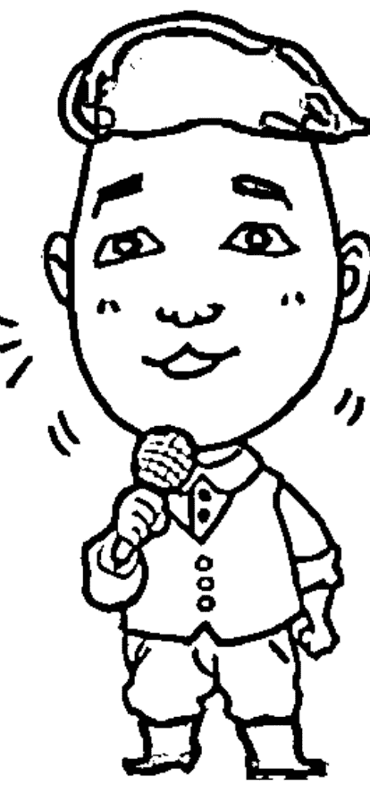

## 常常懷才不遇，被老闆嫌棄？

在職場上，為何升遷的機會總是輪不到我？同事之間明明有好康，可是為什麼我總是被跳過？把事作對不如把話說好，說該說的話，建立信任度，才能順勢而為。

在授課的過程中，我遇到不少的行政人員、企劃人員以及各行各業的專業人士，在薪資凍漲、景氣不佳的這幾年，不少人都想要在職場上保住飯碗、力求表現，所以更願意花錢投資自己，學習專業的說話技巧。

想要滿足這些學生們的需求，不免也要檢視問題的本身，「懷才不遇到底是誰的問題？是老闆沒有看見你？抑或是老闆已經看見你了，但是卻因為哪些特質，讓老闆遲遲不敢拔擢你？」在課程中，我不斷地請大家回想、思考這個問題。

當然，要在大庭廣眾下討論此問題，大家難免都會顧及面子，所以我先大略歸納出以下幾種結論：

- 第一種，平常在辦公室裡，喜歡當獨行俠，所以很少聽到聲音。
- 第二種，雖然在工作上表現不錯，但是老是說錯話，不得老闆喜愛。
- 第三種，工作表現佳，老闆也喜愛，但說話氣焰過高，功高震主。

除了以上三種，還有第四種、第五種、第六種，因為每個人的狀況與性格都不同，會產生的職場狀況，當然不能用系統性規納法，大家說是嗎？

但是，談論至此，大家有沒有發現以上的狀況都有個共通點，就是「說話者的心態」，在職場上，不論你嘗試要跟主管對談、還是提供建議，除了要有正確的表達方式外，也要先建立正確的心態，千萬不要犯了職場上的大忌：「想說就說。」

## 位高權重也有可能踩到「地雷」

在企業內訓的過程中，我常常遇到很多令人捏把冷汗的狀況，不過多數是員工跟主管之間開錯小玩笑，有一個令我印象深刻的是，在一場兩天一夜的企業內訓中，學員們正興高采烈地驗收成果，此時，我為了增加學員們的自信心，特別邀請該企業的老闆出來給予幾句勉勵的話，想不到，老闆講出來的話，卻讓人跌破眼鏡，你知道老闆說了什麼話嗎？「各位同仁，這兩天來都辛苦了，你們呀！要懂得我的苦心，我們公司可是花了大筆的費用，希望你們大家未來在工作上，絕對要有優異的表現，你們懂嗎？」

請問如果你是台下的員工，你聽到老闆這一番勉勵的話語，你會有什麼樣的感想呢？受訓員工會感覺到心情愉悅嗎？當然不會，只會澆熄原本在學習過程中所重拾的熱情而已。這個個案想要傳達給大家的是，不論在任何的位階，只要在工作職場上，「想說就說」的說話心態，不論表達方式為何，都只會帶給人家不舒服的感受而已，並沒有辦法達到我們原先設定的方向跟目標。

倘若我們想要達到的目標是，讓老闆喜歡我進而讓我有升遷的機會，我們要怎麼做呢？古人有句話說：「知之為知之，不知為不知，是知也。」這句話運用在職場升遷上，可以解釋成，就知道的事情回答知道，而不知道的事情就回答不知道，不要加油添醋，只講「確定」「肯定」的事情，才能在職場上先為個人累積良好的印象分數！

## 用「肯定句」深耕信任，建立個人品牌

就職能測試來說，我們常把職場人員性格分成「積極、熱愛挑戰」的老虎、「分工合作及工作品質」的蜜蜂、「樂觀、愛分享」的海豚、「心思周延、面面俱到」的八爪魚、「有耐心、重組織性」企鵝等五種，你本身是哪一種呢？

根據我的經驗，這五種性格的人，有些人擅長主動表達；而有些人則屬於沉默寡言，但是不管是主動、被動，都千萬要記得，絕對不要「想說就說」，最為保險的方式為，多運用肯定句，以建立討人喜歡的好印象。

在職場上表達，千萬不要過分炫耀自己。舉例來說，我常在課堂上遇到很多比我「資深」的業務員同學，當我問及他們工作的經歷時，他們往往可以講得口沫橫飛，談起商品，幾乎是能治百病的仙丹。身為一個好的行銷人員，這樣熱愛且推廣公司的商品，是相當好的一件事情，表示這些同學對於公司商品認同度極高，但是，如果在任何狀況下，都使用這樣的方式說話，反而有可能產生不必要的誤會，甚至引起別人的反感。

求好心態人人會有，但要如何表現得當呢？我建議大家不妨多用「肯定句」，不論是讚美、回答，都需要用肯定的方式，以誠交友的方式？比方上面那個案例中，老闆在勉勵時可以說：「公司對於大家十分有信心，所以投注了大量的金錢全力支持，也辛苦大家有心撥時間來配合，一起共同成長。」在短短的言論中，老闆支付了金錢的事情是肯定，但在邊告知員工狀況的同時，也肯定了員工的付出與辛苦。

除了肯定別人，我也常常遇到有一種狀況，就是當別人肯定你的時候，不要任意否定別人的讚美。舉一個例子來說，我有一個工程師學生，對於自己的外表相當沒有自信，我觀察過幾回，每回當他外表打點好，同事說：「你的衣服很好看，一定很貴吧？」他就會忍不住急急回答說：「沒有啦，就是便宜貨。」或是當老闆稱讚他工作表現的時候，卻回答：「還好吧，不要開玩笑了！」

事實上，在肯定別人的同時，對方善意的回應，也會讓人感到拉近距離，如果只是一味想表現謙虛，反而會讓人有不好相處的錯覺，所以在肯定別人的時候，也不忘了要接受別人的肯定。這樣的說話方式，才能產生雙贏的局面，千萬不要只是「想說就說」，想提及個人優點以及輝煌事蹟，也要懂得點到為止，也才能在同事、主管心中，建立信任度以及良好的個人形象。

## 【東明老師五分鐘錦囊】

建議：首先，對於職場上說話的應對進退沒有把握時，先觀察對方以及團體的互動狀況，然後再決定哪些話是「肯定的」、「正面的」、「可以說的」、「應該說的」、「一定要說的」。第二步，避免「想說就說」的窘境，說完之後，觀察一下大家的眼神、臉色，如果表達的不好，可嘗試用輕鬆微笑帶過。

目的：藉由這樣的方式，適度調整說話心態，多活絡自己的說話時的思路，讓說肯定的話變成一種習慣，增加自己在職場上受重視的機率。

# LESSON 2 自我改造第二部：成就感

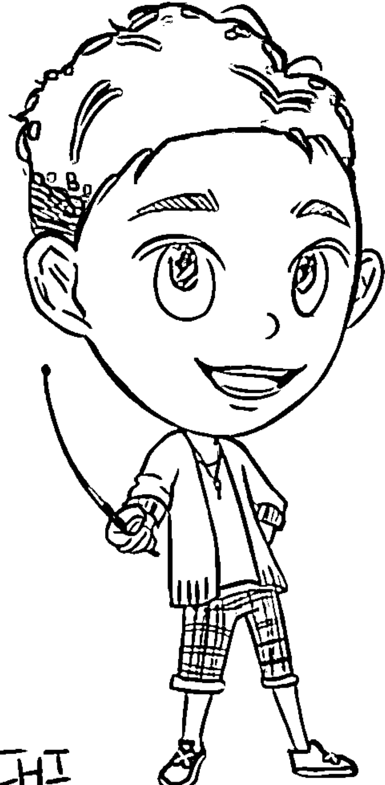

> 要練說話神功，必先努力用功！透過說對話的次數，快速累積成就感

## 2-1 牙牙學語「說話」演進史

沒有人天生就很會說話，也沒有人是天生的談判家，語言學家針對初生嬰孩做研究後發現，孩子的語言能力，多受後天形塑，而不少很會談判的高手，在學生時代是老師眼中的「閉俗小孩」，所以，學表達隨時都可以開始。

在前面的第一章中，我們提到了不少有關表達上的盲點以及困境，有沒有激盪出大家的新想法呢？在這個章節裡，我即將帶領大家進入一個更為明確的方向。在進入訓練課程前，我慣性在課堂上藉由提問，讓學生對於未來要進行的目標更為明確。所以，我會問學生：在說話的練習中，什麼讓你感到最害怕？

有些學生回答：說錯話。

也有一些學生則會回答：不敢說話。

更有些學生說：不知道對方想聽什麼話。

以上的回答，都是大家平時埋藏在心中的恐懼，藉由課堂上的互動，讓大家面對自己的恐懼，讓自己思考歸零。答案沒有對錯，因說話具有許多技巧層面的不同，比方說：表達、溝通、甚至於談判，每一種的技巧，都需要靠經驗跟環境裡累積，所以，在練習的過程中，累積「成就感」是最重要的！

為什麼呢？其實在授課的過程中，我真的真的遇過很多學生，雖然來上課，但是心底是不想要改變的！我詢問他們，為什麼每個人都想要成就更多事情、心裡有很多夢想，那麼為什麼不想要改變呢？學生回答我說：因為改變的過程充滿了挫折、未知跟不熟悉，讓人感到害怕，而這些都來自於，我們沒有從學習中得到互動跟鼓勵。

我們常說：「知己知彼，才能百戰百勝！」言語的一來一往中，遇到不同人，不同狀況都會有不同的反應方式，也不見得一定要論輸贏，我常常在課堂上與學生分享，最正確的學習態度，就是築夢踏實。

有人問我：「什麼是築夢踏實？」我特別喜愛跟孩子相處，他們就像是一張白紙，曾經由不同的環境，讓他們重新學習新的方式，想要學習新的表達方式，就要了解，表達能力是可以重新學習的，跟孩子牙牙學語的過程相同，利用平實簡單的方式，重複演練，就能夠獲得整體性的大提升。

## 別太執著於慣用的表達習性

在《太極張三豐》一片中，張無忌求助於武術宗師，哪一門武功最為高強呢？張三豐說道：「忘掉所有招式，就成太極。」在學習表達之前，要練好的內功心法是，不論我表達好不好，只要是朝正確的方式做，都要給自己一個鼓勵；而且不論以前我是用什麼樣方式做表達，現在都要忘掉以前慣用的習性。有一回，我在訓練一群知名主持團隊，因為這些主持人在他們的領域上，都已經小有名氣，所以當他們來上課時，先入為主地提出了以下疑問。

> 「老師，這方式以前我有用過，但是我覺得主持起來效果不好，這真的有用嗎？」

> 「老師，你講得我都知道，但是現場狀況並不是這樣，一緊張就說不出來了！」

> 「老師，我覺得你講的很容易，但是實際上執行起來並沒有這麼簡單！」

是的，以上的答案沒有對錯，都是一般人對於未知的行為所產生的不安，想要練就真正的自信說話術，要先把自己當成小朋友，孩子學習各種語言都是最快的，因為他們從來都不會去質疑表達的形式，他們會用開放的心胸先「練習」，再下定論！

而且孩子還有一個很有趣的習性，就是可以從不同的小練習中，累積成就感。請大家問問自己，在我出社會後，我們都是為了目的性而學習，當目標沒有達成，會越來越有挫折感，但是，孩子則不會對自己設限，儘管有多次失敗，只要有一次實驗成功，他們就會不停地讚賞自己，在挫折中前進，成就自己面對不同表達磨練的動力。

## 利用「實際素材」讓目標視覺化

在孩子牙牙學語的過程中，我們常常會看到很多幼兒的輔助教具，而在我們學習語言表達的過程中，也有這些引導教具的存在，可以訓練自己說話的邏輯。

有位知名作家曾說過：「簡報是缺乏演講經驗者最好的小抄！」

在學習語言表達的過程中，我們要懂得借用實際素材，讓視覺目標化。我特別喜歡看舞台劇或是演唱會，大家有沒有發現在看演唱會的時候，除了看到歌手的表演外，輔助工具也是相當重要的，良好的輔助工具，可以促進活動更加精采，有時也讓台下的觀眾，充分了解歌手所要傳達的情境，在學習語言表達的初期，我都會鼓勵學員，要善用簡報，將演講的內容組織成一個故事。

簡報是最好的視覺傳達工具，有些人甚至會視演講時間的長短，放入大量的圖片跟文字，但是我也常常遇到一種狀況，就是因為簡報太過枯燥，導致影響到表達的效果。舉一個例子來說，我曾經遇過一個企劃人員，因為長期以來，他在辦公室裏，都是利用簡報作表達，所以，簡報內容往往慣於使用條列式方式，他來上課的時候，十分苦惱地說：「老師，怎麼辦，怎麼樣才能讓我的表達能力提升，做簡報的時候，台下不要睡成一片呢？」我跟他說：「在簡報之前，我們要把自己當成說故事的人，這個故事要精彩，就要先鋪排過，要有互動的橋段，這樣下面的人，才會融入故事之中！」這位同學後來回到辦公室演練了幾次，非常開心的寫信跟我說，他的表達方式不再死板板，簡報的編輯也讓他平常說話方式變得比較有趣了，從中獲得很大的成就感。

俗話說：「萬事起頭難。」但是只有要興趣、有熱忱，從練習中獲得成就感，就會越來越想要投入其中，練習說話也是一樣的，當我們看到對方眼中閃耀的眼神，以及達到說話時的互動，漸漸就會建立起個人的說話風格，不論是談判、表達、主持、演講，都能夠隨時最好最完美的切換，「機會是給準備好的人。」

> 【東明老師五分鐘錦囊】
建議：在牙牙學語的階段，簡報是最快進入故事性互動的方式，要如何呈現呢？首先：設計簡報時，要先運用影片、故事讓大家產生共鳴。然後，利用「提問」的方式，讓台下產生互動，最後，才提出「答案」解決大家的疑惑。
目的：學習語言表達的過程上，除了要有歸零的心態外，也要懂得運用輔助工具提昇自己的成就感。

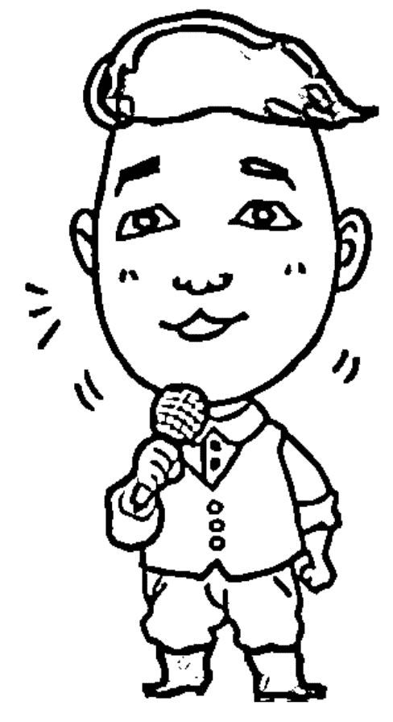

## 2-2 心事啥人知，不當人前悶葫蘆

在說話表達中，試圖解釋、減少贅詞、正確詮釋是非常重要的三個步驟，說話是一種行為，而在說話之前，我們必須先克服「心中的情緒」，才能更客觀！更點題。

在坊間有不少的說話技巧課程，牽扯到很多技巧面的練習，在我多年的實務經驗中，有一個很大的體悟：「燈不點不明，話不說開，心事誰人災！（台語）」既然我曾經遇過一個學員，他每一回的課程都會準時來上課，筆記以及練習狀況也都非常好，但是，每回我問他，這項課程在你生活應用上，有沒有實際的幫助呢？他總是一臉茫然，搖搖頭說：「我也不知道耶！好像有吧！」我又接著問：「可不可以跟我分享一下，覺得平常有什麼樣的改變？或是運用成功的經驗呢？讓老師也快樂一下！」他又小小聲地說：「嗯……我也說不上來。」

大家是不是也有過這樣的經驗呢？只要是解說工作上的專業，就能夠滔滔不絕地說個沒完，若要請他自己分享個人的想法，以及與別人交流，就會變得不知如何詮釋，讓這些情緒，成為對外溝通上的小障礙，一個想要在說話表達上，有顯著進步的人，絕對是一個「樂於分享」的人。我常跟學生說，既然已經來參加了我的說話課程，就表示大家有心想要改變，除了要學會技巧，也要學會穿越自己的情緒！

曾經在課堂上問過大家：「在表達溝通的時候，什麼樣的情況，容易讓你心口不一呢？」

家庭主婦A回答：跟老公要錢的時候，講不出口。
學生B回答：想要表白的時候，怕被拒絕，所以想要討好對方。
業務C也回答：跟人家吵架、心情不爽的時候。

這些情況，我一個一個的寫在白板上，然後請大家一起評估看看，條列出來狀況中，有什麼樣的相同點？哪些部分又有改進空間呢？在以上的答案中，我們不難發現，語言表達深深被個人的情緒所控制，所以，如果我們不先維持客觀、中立的角度，就很容易「心口不一」，在心態上就被自己打敗，更不用談到，要如何包裝美化成就自信說話術了，大家說是不是呀？

## 放「開心」才能說出真相

想起一開始創辦益讀俱樂部的時候，自己也很緊張，因為很少參與主辦活動的經驗，也很害怕做不好，甚至不敢跟每個同學邀約，看到別人支支吾吾的推託，就以為是對方在拒絕我，心情常常掉到谷底，也因為這樣，越來越不敢開口邀約，就算我的動機是好的！活動是很棒的！也不敢將這樣好的意念傳達出去，後來我的前輩 Robin 老師鼓勵我，她說：「開心，才能讓好的訊息傳達出去，我們用正向的方式傳達出去，就是說出好話！」

在這樣的經驗傳承下，益讀俱樂部的活動也持續了多年，其中，讓我驕傲的是，我持續邀約過不少非常頂尖的作家以及講師，透過種種練習，手上所承接的活動，也越來越多，這，就是自我戰勝情緒的結果，面對邀約挫折，穿過害羞、拒絕、無奈等等情緒，導致真心地相信：「人生不就是要『玩』出火花！玩出樂趣！當你開始對於表達有了樂趣，才勇於去做、去說，才能心口合一。

在追求成就感的過程中，我們學會「面對真相」，才能敢說敢做，能夠完整詮釋以達到說話真正的目的。然而，提醒大家一點，在試圖解釋進步到正確詮釋真相的過程，很多人都會忽略了一個小小的細節，就是想要讓別人聽你說話不緊張，且感到舒服，就要學會減少贅詞。

## 戒緊張，從語言中的「無謂贅詞」開始

有一個學生，可能是處女座加上A型的關係吧！（我猜），最討厭別人糾正他的小細節，有時候在旁人看來無害的小細節修正，他的反應就比一般人大很多，大致上舞台的表現都已經有了一定規模後，我開始雕琢他的小細節，卻赫然發現，明明很好的表現卻更不如預期，研究後發現，學生太害怕被糾正，把心思放在小處，平時的「嗯」「啊」「好吧」「對」「然後」等贅詞，就會增加成原本的四倍之多，就更無法順利完成。

當然，這位學生不是單一的個案，我後期在其他學生的訓練中，也發現到不論在任何年齡層、性別、工作別、身分，都會有這樣的問題。贅詞多給聽眾的印象是負面的，想提升自己的狀態，先從戒掉語言中無謂的贅詞，每句話都給予「肯定」以及「清晰」，寧可慢慢闡述，也不要用語助詞帶過，每一句話在說出去之前，力求表達清楚，透過這樣的練習，除了說的功力提升，也會給人穩重跟可信賴的信心。

至於，這裡也要提醒大家，什麼贅詞與贅字是有差別性的，有時候一個兩個字，並不會影響一整個句子的氛圍；但是贅詞過多，比如說：然後、我想、可能或者是在句尾多了「吧」「了」等詞彙，就會變成不肯定的語氣。想當然爾，每個人說話多多少少都會帶有「情緒」，連我自己偶爾遇到現場狀況，我也會忍不住想要飆上幾句，不過呢，透過這樣的練習，絕對可以先讓自己順順心、順順氣，再選擇自己想要表達的語言，說話其實沒有那麼複雜，只要不要害怕小細節，先克服自己的心情就好了！

## 【東明老師五分鐘錦囊】

建議：先寫出自己準備表達之前，最在意的狀態。
比方說：如果是邀約客戶，打了這通電話，會擔心哪些話說錯，先寫在紙上，然後練習多講幾遍，反覆聽聽看，講的時候，是流暢的嗎？
然後，嘗試跟朋友對話（或是自己錄下來），聽聽看在說這些語句的時候，自己是不是還是在緊張的時候，穿插語助詞？每一次贅詞的出現次數，有沒有減少？
目的：越是擔心越會出錯，先把預期情境畫面在心中模擬一遍，讓自己覺得滿意、流暢，被質疑或是緊張時，也不會想用「嗯」「啊」「好吧」，或者會支支吾吾逃避，講不出話來，要力求表達清楚。

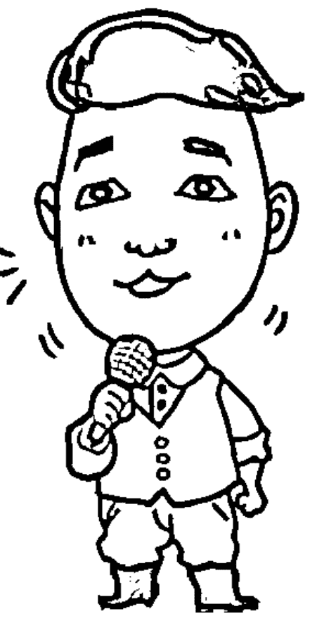

## 2-3 說對話的次數比字數重要

除了自我對話外，想要與人「對話」，就要學會聆聽，唯有先聽懂、聽清楚對方說話前後語意，才能提高真正的對話，單方面的闡述，不論字數多寡，內容多精采絕倫，也只能達到娛樂自己的效果而已。

請問大家如何看待「溝通」跟「表達」這件事情呢？「溝通」與「表達」大家認為溝通是什麼？這兩者的差異性，很多人分不清楚，就像是古時候的白馬非馬一樣，白馬雖然是馬的一種，但又被歸類成白色的馬，不是一般的馬匹。相對的，如果要照字面上解釋，我們也可以說：廣泛來說，溝通是表達力的一種，但因為對象的不同，而有可能產生不同的效果。

不過，這樣聽起來還是太複雜了，把複雜的事情變簡單，一向是我工作的原則跟目標，所以，簡單來說，我請大家幻想一下畫面，當對方提到溝通兩字，你腦海中會浮現什麼樣的圖像？學生很直覺地回答道：「會想到兩個人面對面，有交流跟對談。」那麽談到表達的時候，大家的腦海中又會浮現什麼樣的畫面呢？另一學生很熱烈地回答：「一個人在台上唱作俱佳地、比手畫腳的呈現某一個故事。」

這不就證明了透過畫面的想像，反而讓我們對於文字有更強大的理解力，大家說是嗎？所以在傳達、溝通的時候，也提醒大家，不要忘了多添加畫面的運用。好吧！我們回到正題，既然大家平時講話的目的是想要對方理解，那麼不論是兩個人面對面，或是一個人在台上唱作俱佳，都是有「聽眾」存在的，對嗎？

我問大家：「如果沒有聽眾，不在乎聽眾的感受，那溝通表達還有意義嗎？」

台下大家的反應，都很一致，很聽話地搖搖頭：沒有意義。

既然所有人都認同，但為什麼有些人老是喜歡自說自話呢？當「聽眾」沒有反應，或是說者不懂聽話（對象）心裡想法的時候，對方會給你什麼樣的反應？

- A 同學說：大部份會臭臉吧！
- B 同學說：發呆、玩手機
- C 同學說：一樣很認真聽，但是，眼睛視線發直，應該是神遊去了。

如果自己是主要講者，遇到這樣的狀況，要如何處理嗎？所以，不論你想要嘗試哪一種對話，都需要先引導對方說話，然後聆聽，才能有效率的回話。一場談話下來，說對話的次數，絕對比想要說什麼，以及說了多少字重要多了！

## 看清楚對方的表情再說話

在主辦活動、主持演講的過程當中，每天都會遇到形形色色的人們，當然，在活動會場，跟大家一樣，與現場所有的與會來賓都是第一次見面，不了解對方的背景，加上我往往都是主持人，根本沒有辦法，其他像與會人員一般，可透過主辦單位事前蒐集的資料、或是交換名片，了解對方的工作與職稱，來創造聊天的話題，在這樣的狀況下，我要如何馬上了解對方，達到有效的溝通表達呢？

假設現在在課堂上，請大家閉上眼睛，同時也幻想一下這樣的場景，面對活動進行的同時，腦子裡還要不斷地思考與「初次見面的人」互動，對話，甚至可以進入深談，這段關係的建立，短短十多秒的時間，大家會說些什麼呢？

有同學分享道：「老師，我會選擇先自我介紹！告訴他我是誰，我的工作。」

另有同學說：「如果我是主持人，我會先把他的名字跟工作職稱記下來，以方便之後的活動進行！」

以上的答案都非常好，可是會有一個大問題，大家有沒有推算過，一場活動裡會遇見多少陌生的與會來賓，而自己又有多少時間可以跟他們每個人做互動呢？也許是十秒、也許是只有一面之緣，有時候根本來不及，把自己準備好的東西說完整，反而顯得急急忙忙，慌慌張張。所以與其先想好要跟對方說些什麼，不如把握住大方向：觀察對方的表情，每一次都把話說對。

剛剛在一開始的時候，我跟大家分享了，「溝通」跟「表達」都是為了滿足聽眾互動而存在的，所以，隨時在對話的過程中，也要適時地對對方點頭、微笑，先自我介紹，回應時，如果沒有時間寒暄閒聊，可以用「很棒！」、「我認同！」等等正面而肯定的語言，先獲得對方回應，我自己的口頭禪是：「先求有，再求好。」只要建立了第一次的互動，優質的溝通模式就會建立起來了。

## 把話說對七次，贏得一門好生意

日本心理學大師內藤誼人曾經說過：「暗示不是直接訴求，而是間接誘導對方的一種溝通方法。」我們為什麼要學習溝通對話技巧呢？最終的目的，都是希望可以提升我們職場上、業務上的能力，所以，想要驅使暗示別人做事情，也要先把話說對了，漸漸地累積兩者間互動，才能順利地把「訴求」加入對話當中，大家說是嗎？

在我輔導眾多的企業團體中，我發現特別需要把話說對的行業，應該就屬保險、銷售業者為多。有一回，有個壽險公司的人資部門，邀請我去上說話表達課程，當天來上課的人員，是來自於全台各地的中階主管，當課程還沒有開始的時候，就有不少人主動與我交換名片，嘗試觀察過這些主管，多數人並不是一直在報告自己的金融商品，而是在我們眼神交會的同時，就會聊到一些理財規劃的訊息，當我們越常眼神交會，彼此之間的好奇心就越來越重，這時候我該說些什麼？讓自己在未來推廣業務上可以更順利呢？

跟大家分享我個人自我行銷的經驗，首先，我會先聽對方說話，聽聽看他說什麼，然後給予認同的表情，開始告訴他我是「王東明」，工作性質是講師以及婚禮企畫專業教練（第一次暗示），然後在上課途中，我會再提到一次，與「王東明」這個講師相關的資訊，比方說我有在哪裡上課（第二次暗示），每隔一個段落的時間，我會很大方的與大家分享，學生的感受以及上課的方式（第三次暗示），大概舉了三次學生的案例，最後，在結束的時候，總是帶上點自我風格，不免俗地開個無傷大雅的小玩笑：「王老師很貴，大家願不願意買單呢？」

根據心理學家統計，大多數的人如果互動的過程中頻頻點頭，超過七次，就會對於對話的內容以及商品產生認同感，也就是說，想要達到有效的銷售溝通，其實不難，只要看著對方的眼睛，分享且傳達好的意念，點頭七次就成交囉，想到說話術，怎麼能忘了「王東明」這個品牌呢？大家說是不是呀？

## 【東明老師五分鐘錦囊】

建議：除了把話說對了，觀察對方肯定的表情外，
不妨在言語中，多利用跟使用一些疑問句，
譬如說：「大家覺得是不是呀？」、「有沒有
很棒呢？」、「下次要不要再來呀？」暗示引導大家點頭，以示肯定，強化溝通中催眠的效果。

目的：無時無刻利用有限的時間，做好有效的行銷，減少負面印象的產生，強化正面印象的能力。

## 2-4 想要學會神功，必先學會「進攻」！

想要有所得，就要有所捨，就像東方不敗的葵花寶典一樣，想要學表達，更懂得把個人的意見藏起來，學會利用聽跟問的方式進攻，帶著空杯的心態，才能承載、內化更多思想。

有一回學生跟我說，由於在台灣的社會環境下成長，培養出逆來順受的個性。小時候上課時總覺得老師說什麼都是對的，所以也很少在課堂上詢問老師問題，甚至課後私下找老師問問題也需極大勇氣。透過說話獲得好人緣的課了解學會「問」與「聽」，比「說」還重要，事實證明，若要成為一個厲害的人，就是要學會「問」與「聽」，兩者就是進攻的首要秘訣！

請問大家一個問題，當大家進入與不同行的朋友接觸，或是遇到一個不熟悉的領域時，要怎麼展現自己的語言表達能力呢？因為行業別不同，分門別類的訊息相當多，譬如一個3C產業，就有分電腦硬體跟電子系統，兩者在聊天的時候，如果各說各話，這樣還聊得起來嗎？或者是，一樣是服務業，做餐飲業的人一直講述餐廳內碰到的客戶笑話，那美髮業的人會聽得懂笑點在哪裡嗎？所以，學會聊天技巧，不是如何講述自己的想法，而是要「優先」懂得問問題跟聽答案。

舉一個例子來說，我常常主持婚禮活動，當第一次遇到雙方家長的時候，我絕對不會一直講述過往主持活動的例子，而是會先問問雙方：「大家對於這場婚禮有什麼樣的需求？有沒有特別的想法？」當對方開始開口表達討論時，拿出筆來認真記錄，然後再次針對剛剛的說法中，再次追問：「X爸爸，剛剛提到音樂，要用台語的是嗎？那如果穿插點英文歌，你覺得呢？」如果對方很配合地說出自己的需求，當然非常好！但是，如果對方總是含糊帶過呢？我們又要如何應對呢？

## 展現問題的技巧，一字在於「纏」

「我很會問問題！」偶爾在課堂上，我會跟學生這樣分享，不論身為活動主持人、講師、企劃專案，扮演各式各樣角色中，都能夠勝任的大絕招，就是利用問題，展現「以退為進」的說話功力。很多人都以為能夠說服對方，即可稱為溝通技巧，事實上，從問問題中，了解對方的想法、做出抉擇跟參考，才是化溝通為無形的最上乘功力。

究竟是什麼是「纏」呢？透過個人進一步的解釋就是，就是「使命必達」的精神。我們在上一段的案例中，有提到好的開始就是成功的一半，如果在雙方溝通時，問對問題，可以透過回應的答案，了解對方對事件的看法跟需求，甚至從對方講話的快慢、速度、語氣，判斷個性等等小細節，大家可能會擔心，這樣的評估需要多久的時間呢，萬一時間不夠問問題怎麼辦？事實上，只要常練習，從見面到問問題了解一個人的需求，不會超過五分鐘的時間。所以，懂得察言觀色，問對問題真的很重要！

懂得進攻的首要心法後，接下來要討論的是，萬一遇上的對象，總是含糊帶過：「隨便你怎麼想，你認為如何就是如何囉！」「都好，我沒有特別的想法。」「也可以，大家開心就好。」此時，大家千萬不要覺得很開心，很有可能這些人在活動進行中，或是交談過程裡，心裡有諸多的意見跟不滿，所以最好的解決方式就是，不要放棄追問，多運用糾糾「纏」的功夫，多問問他：「我真的非常誠心誠意想要了解您的想法，您剛剛講的，可不可以說具體一點呢？拜託！」

讓對方卸下心防，說出更多具體的需求後，給予正面的認同：「是的，我了解了！我也非常贊成！那我可否也給小建議呢？」如果對方不排斥，趁機表達意見，拉近雙方的距離，可讓溝通更為流暢。

## 帶聽眾進入自己的領域

透過兩個進攻的小訣竅，大家對於如何打開溝通的大門，了解對方（客戶）的需求，是不是有了初步概念了呢？因為此章節裡，所談到的是「進攻」的技巧，除了懂得問、懂得聽，在身體動作上，也要懂得拉近彼此間的距離，以達到先發制人的效果。

請問大家，當我們問問題的時候，聽別人說話的時候，要間隔多少距離才會讓人感受到存在感，又不造成壓迫呢？大家都有吃過喜酒的經驗吧？當我們坐著的時候，如果想要跟對方聊天，但是中間隔了三個人，是不是雙方都會聽得很吃力呢？換成兩人肩並肩，竊竊私語，是不是感覺上比較有「私密空間感」呢？所以當我們想要與人溝通時，可以嘗試先挪動身體的距離，將對方進入自己的領域（約雙臂展開畫圓弧的空間），會讓對方不自覺就被你吸引歐！

最後，神功的口訣在於：以動帶靜，不論是言語或是肢體，表達者都應該以對方的需求為優先，引領對方講述心中真正的想法，全盤了解後，大家才會知道如何才能達到有效溝通，省下爭辯不休的時間，也避免造成「各說各話」的誤會！

## 【東明老師五分鐘錦囊】

建議：不知道如何才能問對問題嗎？在問之前，不妨先把對方說過的話，用筆記記下來，然後，在對方全部講完後，重複一次講述內容，將個人覺得疑惑的點，做再次確認。確認後，再提出個人想到的疑點，提出發問或是建議。

目的：做到有效溝通，減少猜疑的時間跟爭辯不休、各說各話的狀況發生。

## 2-5 先說出自信，才會感到自在

多數人都同意，說話溝通表達是一種生活經驗的累積，但是卻忽略了這種累積也是循序漸進的，藉由「了」、「到」、「完」、「好」四個階段，成就自在的能量。

不論哪一個行業、哪一種表達方式，每個人都會對自己有一定的期許，但如果盲目的憑感覺走，就像在大海裡航行，容易失去方向，如果可以有羅盤跟識途的船長，更能引領大家前往正確的方向。然而，什麼是從「自信」到「自在」的指針呢？我將個人多場活動經驗，列出一套分階的標準，我們稱之為用心法則，不論做事或是學習，都有「了」、「到」、「完」、「好」四個階段。

在幫某知名婚禮顧問企業內訓時，我曾經提過，「做」雖然是個動詞，但是卻有四個階段性，從做「了」、做「到」、做「完」、做「好」。請學生們先自行想像：哪一個動詞是自己對自己的期許？自己期許自己是個什麼樣的人？什麼樣的主持人？什麼樣的婚禮顧問呢？

在課後心得分享中，學生談到：「我是一個喜歡預習準備的人。但這一連串的提問，還是讓我有些措手不及。因為認真來說，我其實並沒有認真去思考過，這一個一個的問題。」是的，多數人跟這位學生的想法都是一樣的，所以，當大家都有做了、也做到了標準，甚至每次都有做完整，卻永遠都不會達到「自信跟自在」的層次。

任何說話技巧都可以透過演練而變得純熟，就像上面學生心得分享的內文一樣，幾年下來，雖然已經知道「婚禮顧問」要做些什麼事情，要跑些什麼樣的流程，每一回都把事情做完，但是，快樂嗎？結束活動後，會有充滿喜悅跟獲得成功的滿足感嗎？唯有把事情完完全全地做好，這樣的演練，才會具有能量！

## 每個人都有習氣，修正就對了

大家都以為有做了就好，除了做「了」到做「好」，還有更慘的是，做「壞」了，常常把不自覺把事情做「壞」了，要如何補救呢？也因為這樣，在課程中，我們需要把「做」分為這樣的階段性，讓大家可以了解正確做事情的方式。

至於，為什麼要如何導正大家觀念呢？先透過學生的心得來跟大家做個分享。舉例來說，上述的學生談到他措手不及，為什麼會措手不及，他在後面的心得中，我們得到了答案：「我是一個運氣很好、小聰明很多、卻沒那麼努力的人。或許加上努力，我可以事事做到，但我卻習慣只付出五六成來達到大家眼中的「做完」。」我十分欣賞這位坦白的學生，這些話莫不是每個人長年來在工作上的習氣。

古人說：「積習難改」，在求學過程中、家庭環境裡帶出來的做事習慣，都會影響到未來工作上，或許，在家裡爸媽並沒有要求事事都要做好，只要做到，久了，大家就覺得工作上也只要做到六十分就好了；出了社會，還是新鮮人的時候，主管沒有給予優質的訓練，所以，大家也覺得只要有交差就好了，然而，一不小心這樣的習氣，卻形成了我們成長無形的絆腳石。

想要尋找更好的舞台，態度決定了一切，而思想也決定了口袋。每個人都會有難以發現的習氣，透過階段性目標的規劃，加上專業人士在旁的微調整，更能看清在表達上的優缺點，就算還有不足，也沒有關係！透過自我對話，加上客觀的調整就能前往正確的方向，慢慢調整，就會越來越好！

## 「我好緊張」轉換成「我好興奮！」

大家覺得自己是個具有正面能量的人嗎？如果現在還不是，那就要馬上變成這樣的人，身為主持人、演說者甚至表演者，每一次拿起麥克風，都希望事情順利進行。每個人都會面臨緊張、腎上腺素激增，當面對新挑戰的時候，總是會緊張、疑慮，想要建立穩定的「台風」就要懂得時時提醒自己：善用「轉換」的能力。

一個沒有受過專業舞台訓練的人，在緊張的時候，大部分會怎麼說呢？會說「我好緊張！」緊張，其實就是腎上腺素的增加，通常會很直覺反應，那麼何不換個一樣是腎上腺素增加的說法：「我好興奮喔！」雖然字面上看來只是名詞的替換，卻讓說的人、聽的人，都有不一樣的感覺！身為專業的說話工作者，除了會說話，更應懂得隨時在腦中汰換「最好的詞彙」達到自我要求，能夠在做完之後，更上一層樓，越來越接近「專業」跟「完美」的境界。

某企業董座曾經說過：「魔鬼都在細節裡」。一句話、一個詞彙、一個語氣，都能語言工作者大大提升。在我授課的學生中，多是各行各業的資深工作者，倘若小細節能夠多多注意，就可以從資深變成優勢！一詞之差，往往就改變了聽眾的認同感跟感受度。

## 【東明老師五分鐘錦囊】

建議：身為一個產業從業人員，請大家先思考一下，在目前的工作職掌上，處於做「了」、做「到」、做「完」、做「好」哪一個階段？位於這個階段，尚有哪些不足，為何長期不能突破，如何才能補強？

目的：想要成為專業人員，要先懂得自我檢視，找出過去的積習，才能對症下藥，魔鬼就在細節裡，先把細節搞定，就能自在自信。我常說：「何謂自信，就是自在，少點自卑，多點自傲，一切剛剛好，就會好自在。」

## 長舌男女出頭天，勤業必勝！

想要變成什麼樣的人，就要從「模仿」開始！同一句話，每個人都有自己的風格跟自己的表達方式，但是多說多講多揣摩，找一個對象，先從模仿開始，就可以建立獨特風格。

「每個人都有一定的特質，你想要接近哪位名人形象呢？」我在白板上寫下這段文字。在一些模仿大賽中，我們都會看到一些人藉由模仿他人的方式，變成一個「鮮明」的風格，如果你也想要有鮮明的風格，你想要變成哪一種呢？哪一種的說話方式、音質可以讓自己最快被眾人「注意」到？多數人來上課的時候，都沒有一個想法，所以每次寫完白板，台下的學生，都是鴉雀無聲。

我記得有個做廣播的朋友曾經跟我說過，在他們廣播圈裡，如果想要讓更多聽眾認識他們，都會習慣先找一個前輩模仿，學習前輩們說話的音調、用語、甚至是呼吸斷開的段落，為什麼要這樣呢？因為在沒有辦法與聽眾面對面的情況下，聲音是唯一建立聽眾印象的工具。當然，做講師、業務等等工作，要比他們來得幸福多了，我們多數人溝通的時候，都還是跟觀眾面對面的，所以，我們也可以先從他人的穿著、形象跟表達動作來學習，最後才是說話的方式。

那要怎麼模仿才會成功呢？以我為例，我最愛「郭富城」郭天王，我想要成為什麼樣的人，我就要把不足的地方補齊，所以，我每一次講課，都當成要上台表演。有一回跟香港友人去看紅磡演唱會，在郭天王要謝幕倒數幾秒，我跟他同步說了：「多謝！多謝！」跟著他一起揮手，一起跟觀眾告別，朋友忍不住驚呼了起來，好奇地問我：「東明！為什麼你會學得這麼像？連時間都抓得這麼精準？」我笑笑地說：「因為我常看他演唱會和DVD，每次台詞雖然都大同小異，但是對於觀眾來說是「第一次」聽到，就算講了一千次，也要能keep住熱度，讓每一次時都是維持在「彼此第一次接觸」的熱情！我也將這樣的舞台精神放入個人的講課中。

## 透過「掌聲」快速累積成就感

我絕對相信，每個人都可以透過不間斷的、努力不懈的練習，就可以站在舞台上，因為我就是這樣。當年我剛開始當講師，我也不知道我適合什麼樣的舞台風格，在不停的觀察、做功課、了解舞台，進而找到了「郭天王」，從他身上學習不同的人生態度，我才開始真正知道自己適合的舞台方式。

剛開始上課的時候，學生常常問我：「老師，我看了很多溝通表達的書，但是每回看完了，普遍運用不上，感到更加挫折，怎麼辦？」遇上這樣的狀況，我還是一樣會建議他，先找出一個跟自己行業、特質相近的人物，先從觀察開始，做很多功課，開始分析人物特性，進而模仿他的穿著、閱讀他的傳記，甚至可以模仿他講話的方式，就當遊戲一般快樂，更能將學習融入應用中。

譬如說，有一回我去幫一個作家學生上課，她期待在新書發表會的時候，可以擔任主持人。因為她的外型跟講話風格都非常犀利，很多人覺得她像小S，於是我便建議她，可以多聽聽小S在主持時講話的方式，以及什麼時候會丟出爆點，錄下她講話的精采片段，有空沒空就拿出來反覆練習，久了會越來越能掌控現場的氣氛，有次，她興高采烈地跟我說：「老師！我才學小S講話，現場歡聲雷動，我好有成就感，大家都說我進步很多！」不要怕說錯，敢說、多練習，最後就會變成自己的風格。

## 懂得拿捏，轉換成個人風格

大家有沒有煮菜下廚的經驗呢？每個人不見得都會燒得一手好菜，但是都有煮泡麵的經驗吧！我煮的泡麵真的很好吃，因為我剛開始煮泡麵只會煮熟，後來大概知道時間跟溫度後，漸漸會加入蛋、青菜跟火鍋料，這碗泡麵，也從單調的泡水麵變成「王大廚什錦麵」！

每個人在一開始的時候，都可以靠模仿累積基礎，當有一天，有人開始跟你說：「哇塞，你好像某某人，怎麼那麼像呀！」此時，你就可以加入自己個人風格。有了之前累積起來的信心跟基礎，不論你添加了任何的新元素，至少都會有一定的把握，大膽嘗試，再利用事後檢討、修正，會有更多人喜愛、接受，而要從無到有的這段歷程，是辛苦的，只要夠努力，終究會走出自己的路。

想要擁有個人風格，需要堅定的信心跟勇氣！帶領學生成長，總是令我深受感動，也與大家分享其中一位學生「小花」的心路歷程：「二○一二年在高雄《活動企畫與主持》結識了王東明老師。這堂課，影響了我後來的主持、教課，經營自己的大抵方向。『不要輕易接受極限，告訴自己，我能模仿、學習，創造。』這句話我今年常常對自己說，我認為每個人身上的專長或技能，能夠有更多的可能性與發展，讓自己喜悅，也讓別人喜悅。這一年裡，我從不倦勤，到台北、台中、高雄上課精進，從企畫『大老二理論』、『冰箱理論』到『黃金五點十微笑』、『西瓜、醫生理論』筆記不用抄太多，因為這些重點並不只是紙上的理論，是能夠馬上運用在職場、社團與日常生活上的工具。」

其實，課堂上都會出現「不說」、「敢說」、「會說」、「能說」幾種學生，但不論是哪一種，模仿要透過內化，才會變成自己的寶物，溝通表達透過不停的練習，獲得掌聲跟認同的次數越多，越能累積成就感，除此之外，不斷地轉換自己的學習對象，永遠往更好的方向前進，才能真正變成「擁有自我風格」的人！

## 【東明老師五分鐘錦囊】

建議：模仿可以從身邊人做起，首先，如果可以的話，跟心中覺得不錯的對象討教，回家做筆記，會加速你學習的速度。

此外，多探討對方受人歡迎的原因，最好馬上學起來，即知即行，才不會忘記，才有機會將別人的優點變成自己的。

目的：根基打得夠深，面對變化來臨，才能夠穩如泰山。模仿是創造的第一步，從模仿中發現他人受歡迎的訣竅，有時比自己摸索來得更省事。

## 2-7 轉換自己的節奏，跟對方一個調調

不知你是否發現，兩個初見面的人，不管為了什麼樣的理由見面，當一方有意要跟另一方建立交情的時候，一舉一動都會互相影響。適時轉換自己，跟對方同調性，會拉高溝通的流暢度。

好的行銷人員，都是說故事高手，但因為說故事的對象不同，就要轉換自己的方式。我最喜歡跟孩子相處了！因為每回跟孩子相處，我的用詞都會變成疊字：「東明哥哥，跟大家說，坐車車、吃飯飯的時候，要乖乖的呦！」跟老人家相處的時候，同樣要吃飯坐車，我則會說：「阿媽，愛呷飯歐！身體要顧歐。」

大家想一想，為什麼面對不同的對象，我要用這樣的語調跟聲音呢？一位從事工程師的朋友說：「那是東明你呀！你是講師的工作，才需要這樣轉換，我們工作習慣了，哪說得出吃飯飯這樣的語氣。」沒錯，很多人習慣把工作上的專業帶回家，但是千萬不要把工作上的語氣帶回家，很可能會導致不知不覺的溝通隔閡。「調性」如果要用文字來說明，很多人都會一頭霧水，就像上一章提到的每個人就像不同的樂器，有自己的風格，但是為了取得其他人的認同，隨時要轉換自己的調性，成為溝通表達上的變色龍。簡而言之，講話就是要「對頻」，與對方找到共同且對的頻率，對不到頻率，就要懂得調頻，懂得調整說話速度，調到適合對方頻道。

譬如，老婆一回家跟老公說：「我今天好多快樂的事情歐！」最後一個字的「歐」的音調是向上揚升，如果老公回答是：「對呀，很不錯。」聲音是向下沉的，這音色一高一低的不同，會不會也造成感受度的不同呢？答案當然是肯定的，每個人都想要獲得別人的認同，所以在心理學上，越能在表情、動作、語言、以及口氣上有「一致性」「相同性」，越能提升人際關係。

## 每個人心中都有一座「艾菲爾鐵塔」

在上我的課之前，首先要重申：「我不是講教材的講師，我希望每個人可以從觀念開始改變，才能夠活用在生活中。」雖然我常常在講台上，開開大家玩笑，而且不給大家壓力，不代表我不在意「教學相長」，我常跟學生說，我適用最生活化的方式，讓大家可以理解以及運用。

或許學生會問我：「老師，如果把語氣改變了，轉換同調性，對於我們溝通有什麼幫助呢？」說真的，如果你開始身體力行，自然而然你也會徹底改變念頭。我常常跟大家分享一個故事。

某一年我跟著舊公司到法國旅行，舉辦活動的同事跟我說，東明，因為預算的關係，我們只有提供到第二層的經費，想要上到第三層，可能要自費。當時候我的決定是，我願意花更多錢去看不同的角度。請問大家如果你們呢？你們會不會跟我有一樣的選擇？有些同事就會說：「沒什麼好看的，反正有看就好，看來看去還不是同一片風景。」

他說的沒有對錯，但是決定權還是在你手裡！有時候，跳脫自己平常慣用的方式跟語氣，就是一個新的開始，改變舊有習氣不難，只是讓觀念變成習慣，這件事情很難，時時刻刻注意自己的說話內容、說話語氣、模仿對方，取得認同，透過不同的角度，看到同一片風景，人生會有不同的格局跟應變方式。

## 轉換調性，請多說正面的語言

聽過了艾菲爾鐵塔的故事，我會在課堂上接著問：「我們都知道在工作上，很多人會說換個位置要換個腦袋，大家聽到這句話有什麼感受呢？」

公關業的林小姐說：「很煩，因為老闆每次都在有限的預算下，要我們找更多免費資源！換顆腦袋當然很快，但是還是沒有錢。」

服務業的張先生說：「就是嫌我們工作不認真，希望變相要求更多服務！」

事實上，「換個位置、換個腦袋」這句話聽來很刺耳，但是我認為這句話相當正面！把腦袋先準備好，只要上了位置，就不容易被換下來了，大家說是嗎？當然每個行業都有辛勞的地方，但是如何透過說話方式把工作圓滿處理，才是溝通表達最後的目的。在我從事了上千件的公關活動以及客戶服務輔導，我認為，這是一句非常正面的話，就像我們與孩子交談，在心態上，當然要轉換孩子聽得懂的語言，猶如我登上艾菲爾鐵塔，雖然我多花錢，看同一片風景，但是，我可以看到不同的角度跟格局。

多說正面的語言，利用語言表達，取得對方的認同感，說話之前要想一下，對方想要聽的是什麼？絕對不是道理、規則，而是可以有共鳴的故事，大人、小孩都一樣，隨時準備讓自己想像自己心中有一座艾菲爾鐵塔！每回想要回話的時候，先想一想，我現在站在哪一層，應該要如何說話，音調才會讓人感到舒服、接受度最高，大家都可以適當表達自己的辛勞以及不滿，但是，透過「同調性」「同理心」的轉換，絕對會讓溝通的結果變得大不同歐！大家不妨先試試看。

> 【東明老師五分鐘錦囊】
建議：在開會前、想要跟別人溝通前，可以先拿出一張白紙，寫下自己所想要傳達的建議（包含抱怨的內容）；而跟情人、老婆、家人互動，則是可以先看看對方的臉色，再決定現在要用的語氣，先對著空氣說一遍，如果覺得不習慣，可以跑去廁所練習。
目的：說出與對方語氣契合的話，可以減少語氣不同所造成的感覺摩擦，把事情單純導向溝通，避免雙方都有情緒。

## 沒關係扯關係，扯遠了也沒關係

熱忱與真心會表現在言語表達上，所以表達清晰、語氣懇切，亦容易被對方接受，懂得找話題、拉關係，有時東拉西扯，扯遠了也沒關係。

大家喜歡逛街嗎？逛街時，除了可以吸收時下的流行資訊外，也可以觀察一下不同業種的介紹商品的方式，以及聊天話題歐！尤其是服務業的說話態度，除了要理解商品專業外，面對形形色色的顧客，創造從初次碰面到創造聊天話題，加深顧客印象，讓大眾感受到服務熱忱，也是創意表達不可或缺的課程內容。

很多人以為服務業只需要外表長相可人、口條清晰，但是就社會現實面來說，外在只是基本條件，想要真正的「打動人心」，則是要仰賴「找話題」的技巧！就像有一回我去幫某航空公司上溝通表達課程，看到一票帥哥美女，實在令我興奮無比，但是在上課的過程當中，我卻不免眉頭深鎖。為什麼呢？因為我發現這些外貌出眾的小姐、先生們，都是「冰山美人、冰山帥哥」，在機上服務客人的過程中，除了基本的對話外，在肢體、語氣上，無法將對於顧客的熱忱、關心，傳達給對方，這也就變成企業整體的大麻煩，畢竟，這些小姐、先生都是第一線人員，也代表了航空公司企業的軟性形象。

我們常聽到大家說：「某某航空服務好貼心！下回搭機還要搭這一家。」「某家店面的老闆娘好用心！下次還要去光顧。」除了語氣外，大家想一想，還可以藉由什麼樣的媒介，讓對方感受更為強烈呢？這，就是所謂的「創造話題拉關係」。

## 創造有話題性的「HELLO KITTY」專機

在大家上課前，我必須要先重申：「拉關係不是走後門、官商勾結歐！如果有人這樣想，可就大錯特錯了。」這裡所提到的拉關係，其實是創造商品、事件與客戶之間的關係。大家有沒有發現，每個媽媽只要提到自己的孩子，眼睛就會閃閃發光，每個孩子都是媽媽心頭寶，所以聽到任何有關孩子的話題，總是話匣子停不下來，所以呢？只要自己是媽媽，銷售媽媽用品時，馬上就熟捻起來了！

那麼針對商品，跟顧客又要如何創造話題跟關係呢？譬如說，某某航空公司近期推出了「無嘴貓」的專機，就是一個「用商品創造話題」絕佳的例子！當顧客選擇搭乘後，空少與空姐只要稍微聊到相關週邊商品，這些乘客們，馬上就會熱情的回應，甚至會產生幫朋友託購的互動。航空公司本身透過這樣的包裝方式，與「特定客戶」拉關係的方式，大家是不是覺得親和力倍增呢？穿上造型服裝的空姐跟空少，也不再那麼制式化、冷冰冰了。

總而言之，身為服務業的前線，不論是講師、銷售員，乃至於企業，都需要創造自己的「HELLO KITTY」專機，要建立跟對方「有關係」的話題性，喚起討論的熱情。就像我自己曾經銷售過精油，也很會沒關係找關係歐！發揮聯想力，建立精油跟顧客的關聯性，看到一個業務人員，不妨可以先問問她有沒有使用過精油，提供「工作相關的建議」，比方說：好的精油可以提升磁場，是招財的好方式；如果遇到家庭主婦，可以建議哪些精油可以舒緩先生工作壓力，讓家裡更溫馨！

## 「誠」意打動天，最佳行銷利器

當我們學會了建立商品話題拉關係之後，就可以建立良好的服務印象了嗎？當然不見得，因為有話題可以聊天，只是互動的媒介，想要近一步，就是要「熱誠分享」。

曾經有句行銷名言：「只要搞定一個奧客，就可以得到一個最忠實的客戶。」這句話代表了，想要建立良好且長遠的顧客關係，需要付出同等的耐心與誠心。譬如說：當客戶氣急敗壞地告訴我們，精油使用後，發現家裡有人會過敏，是不是精油的問題呢？身為銷售人員一定要先照顧客戶的心，不妨先問一下：「真的吼！除了過敏還有沒有其他症狀？真是太糟糕了！」千萬不要急於辯駁，也可以繼續扯關係，問問過敏的家人，平時是不是就有對香精過敏的狀況，或是出入過哪些場合等等，透過詢問方式，找出主要的問題所在，讓對方感受到被關心、被呵護的感覺。

解決了客戶的心，才能滿足客戶的需求。在這個章節中，我們要說明的說話技巧其實很簡單，拉關係創造話題，就像蜘蛛結網一樣，先從外面開始慢慢布局，最後才切入銷售的中心點，越能夠誠心誠意的打動客戶，才能夠將「品牌形象」慢慢放到顧客的心中，創造越多聊天話題，越能累積更多忠實客戶歐！

> 【東明老師五分鐘錦囊】
建議：不論銷售人事物，都要找出與銷售顧客之間關係。大家可以拿出紙筆，利用心智圖法的方式，把「商品」「事件」放在白紙的中間，然後往外聯想，有無相關的話題，利用不同顏色的筆，分為生活上、工作上、形象上，越多相關的事情，就越能夠打開話匣子歐。
目的：利用創造話題拉關係，在行銷表達上，可以讓顧客感受到關心，具有高信賴的服務熱忱，才能累積客戶的忠誠度。

# LESSON 3

## 自我改造第三部：舞台力

## 3-1 發揮舞台力從「自我介紹」開始

好話術，就像美女的化妝易容術一樣，除了可以改變自己給人的形象，學會具有個人戲劇感的自我介紹話術，對於開拓社交圈，以及個人的舞台定位，有其驚人的幫助！

大家為何想要改變？有些人說話說得不錯，口齒清晰？為了什麼想要改變？在我多年的授課過程中，這是我與學員第一次見面，必問的重點問題之一。

大家不妨想一想，「人都會說話，為何想要改變？」課程的學員來自各行各業、各種年齡層，也不乏是專業的律師以及業務主管。這些人都有一個共通性，就是他們都不是口齒不清、窘於發表意見的人，但是仔細觀察，發現自己在說話上還差了那麼一點點，也因此希望我可以給他們每個人不同的專業的建議！

這個問題一出，我得到以下的答案。

有人回答我說：「因為想要更上一層樓！」

也有人回答我說：「我上台講話大家都睡著！」

更有人半開玩笑地對我說：「因為我們不帥！」

我不急著公布正確答案，接續著在白板上寫下第二個問題：「你會自我介紹嗎？」

我環視了台下的學生們，大家的臉上幾乎都露出笑容，有一人忍不住回答道：「王老師，你是看不起我們嗎？自我介紹誰不會，我從國小開始就會自我介紹了！」

是的，這問題乍聽之下，似乎很沒腦袋，不過我不在意學員的態度。我開始請學員逐一上台自我介紹，依照白板上的細目是：姓名、星座、個人興趣、最喜歡的事情以及最討厭的事情，表達自己的狀況，從第一位到最後一位，學員們開始發現，有舞台力的人與缺乏魅力的人，聽眾的人氣度，在反應上有明顯不同。

## 素人變裝美「話」術

從以上的教學狀況，我發現每個人都有這樣的問題，自我介紹不難，但是一旦換成站上舞台的是你，你會怎麼自我介紹呢？「我是王東明，我的星座是雙子座，我平時愛閱讀，最喜歡是郭富城，最討厭……。」你是不是也跟其中一些學員一樣，不到100字就報告完了個人的資料呢？我必須老實說，這樣的自我介紹沒有不好，但是想要不到五分鐘，就吸引人家的注意力，成為舞台上的亮點，還有一大段的距離要努力！

聽我慢慢說來，好話術，就像素人變美女的美容裝術，一個有說話魅力的人，跟一個沒有魅力的人，差別就在「舞台力」。站上舞台時，平鋪直敘的自我介紹法，等於是一個容貌端莊、五官端正的素人，雖然看起來很清爽但是讓人沒有記憶點，如果想要變成讓人看一眼就被吸引，比方說：如果是迷你眼女生，不妨貼上假睫毛，就可以變成大眼妹；男生頭髮沒造型，靠著一頂帽子就有型！說話也是，想要讓人被你的話吸引，就要擴大自己在別人聽覺中的份量。

如何才能說話具有畫龍點「睛」的功夫呢？透過以上不斷的腦力激盪，大家是不是對於個人說話魅力上的問題，越來越清晰了呢？接下來就讓我們一起來領略，靠說話創造無可取代的自我介紹法！

## 抓緊五分鐘聽覺神經，建立小巨人形象

我常常跟學生討論起我的偶像—郭富城天王，但是大家知道他究竟多高嗎？多數對於郭天王不熟的人，都會猜175公分以上，但是事實上，郭富城的身高不高，比例也不是四大天王中最好的，為什麼站上去舞台，會讓大家感到如此巨大呢？

我們都知道郭富城是舞蹈者出身，對於舞台的華麗包裝跟肢體展現，往往會讓大家忽略了他的本身的高度。在社會心理學中有一個理論叫做「月暈效應」。就是一個人表現好時，大家對他的評價遠遠高於他實際的表現，就像我們看月亮的大小，不是實際月亮的大小，而是包含月亮的暈光，也是因為這樣，所有的演員都可以就不會受限於自身的條件，多元化展現出不同的個人吸引力。

然而，在舞台上，我們也可以透過說話的呈現方式，創造同樣的效果，藉由自我介紹的過程中，一提到個人的最喜歡的事情，可以加入強化動作的聲音表演。我有一位33歲的女性客戶，她的聲音非常低沉，但是她是銷售化妝品的講師，為了提升她在講解化妝時的說話魅力，我讓她去練習看外國傳教士的電視節目，在講解課程的時候，低沉的聲音，讓人在講笑話時，具有冷面笑匠的效果，偶爾穿插誇大的肢體動作、誇張的表情，讓上課的人就像在看一場國外時尚表演一樣，雖然一樣的是五分鐘，對於聽課的人來說，感受就完全不同，會覺得特別有趣，讓講課內容趣味化。

人生角色總是在切換，職場、家庭兩頭忙，我有一個女學員，是兩個孩子的媽，有一個星期，公司要她在八千人面前，做個三分鐘短講，為了脫穎而出，她非常的緊張，也請求我的協助，亦希望在這三分鐘裡，可以給予八千人帶走些正面能量，同台的管理階層都在講「時間管理」「做就對了」等話題，但是她不想講，我特別為她量身訂做設計了一個劇本。首先，我請她穿套裝上台，但腳踏家居拖鞋，左手拎一雙「高跟鞋」，右手背了一個大包包，裡面尿布、奶瓶、公司資料，當走上台那一刻，她，在眾目睽睽下，自在換上高跟鞋（展示腳上這雙高跟鞋），並大聲對觀眾點頭問道：「美吧！」八千人同時說「美！」

於是，在舞台中央，她娓娓地訴說：「我也知道它很美，但我穿的很不舒服，其實，穿拖鞋比較舒服，但為了美，我還是努力站在這雙高跟鞋上面，因為我知道當我穿上這雙美麗不舒服的鞋子的背後，擁有我的夢想與目標，老天給予的時間大家都一樣，只是怎樣運用，對我來說，就是角色切換，在事業上我努力善用時間不浪費，對家庭、小孩、老公，盡量滿足！我不會告訴大家我多偉大，我跟台下的你都一樣，為了家，為了自己，再怎樣不舒服，也會穿上這雙美麗不舒服的高跟鞋，因為我知道我的夢想與目標。」說完了這段話，她把地上的拖鞋拿起來，放進裝著奶瓶尿布的包包裡，自信地跟台下八千人揮揮手，且優雅走下台，當她走入自己的座位時，忍不住再次跟大家揮揮手，並給了舞台主持人一個大大的微笑！隨著她的演繹詮釋，我相信這三分鐘，肯定讓台下八千人知道她是誰、她的夢想以及喚醒大家對工作和家庭的感動！

回歸原點，善用「自我介紹」將說話魅力無限放大，不僅僅可以運用在工作上，也可以運用在各種人際關係上，透過這樣的自我訓練，可讓每個人在形象建立上，更加得心應手，也成為魅力四射的自信領袖！

## 【東明老師五分鐘錦囊】

建議：首先，學員在家的時候，可以自己先拿出白紙，寫下個人資料，寫下工作、興趣、個人特色、最喜歡的電影、印象最深的糗事等項目，針對幾項寫下200～300字的陳述，盡量生動有趣。第二步，則利用錄音筆以及計時器，分別練習1分鐘、3分鐘以及10分鐘，三種不同時間的介紹方式。最後，挑選一首適合自己調性的出場音樂，在錄音練習時，一起產生說話的律動感。

目的：透過這樣的簡單練習，主要在提升說話的自信度以及建立個人特色，可以改變自己，給人感染力，學會具有個人戲劇感介紹方式。

## 3-2 多幻想，提升情境聯想力

有人的地方就是舞台，不是只有在課程中才懂得表現自己，要隨時隨地遇上任何情境，都可以發揮溝通表達的能力，才是真正的「學到」「做到」，進而才能「做好」！

我從來沒有想像過，會進行這樣教學的方式。當我開始從事教學工作的時候，思考過很多次：「什麼樣的課程鋪排，才能讓學生快速地運用在生活裡，馬上就可以上場？」、「什麼樣的教學方式，只求學生不要睡著？」、「每個人屬性、角色定位都不同，怎麼樣協助他們找出個人定位跟自我風格？」、「怎麼樣才能讓『無時無刻溝通』成為生活中的習慣？」於是乎，我開始打破傳統的上課風格，把我的講堂變成了一個遊戲場，每個人都是評審、也都是主角、也可能是老師。

第一次來到課程的同學都會問：「老師，為什麼這堂課沒有講義？」我搖搖頭：「沒有，連筆記都不准抄，因為這是一堂教練式課程，大家都要放開心全神投入！」我們課堂上常常會有新生報到，按照慣例，我們會請新生先來上一段3分鐘的「自我介紹」，然後請台下的同學們給「建議」，每回遇上陌生人評語時間，剛開始上台的人，總是會有些尷尬的表情，畢竟，在這個社會中，我們都已經習慣接受「不太實際的讚美」，有時要透過一些陌生人的視角，才能夠隨時做好個人的微調。

學生剛開始會反應：「老師，我覺得很害怕，我不曉得我在大家眼中是什麼樣的？萬一表現不好怎麼辦？」

也有學生反應：「我都不知道我的手該擺哪裡？這樣是不是很糟糕？」

大家有沒有從這些學生的反應中，發現一個有趣的觀點：人們平時習以為常的行為動作，當站上舞台，好幾隻眼睛注視著自己，成為焦點人物時，大家反而不知所措，沒有辦法及時反應了，為什麼會這樣呢？答案是：因為大腦裡從來沒有想像過這樣的情境，所以不知道如何應對。反之，在我們的表達力課程中，如果可以先想過這樣的情境，那麼，我們大腦裡儲存的應對方式越來越多，溝通表達也就會越來越自然、越來越輕鬆了。

## 「我愛你」有幾種說法呢？

我一直相信，人的行為模式是可以透過學習演練而改變的，讓表演轉換思維，成為成為日常生活的習慣。如果有人的地方就是舞台，那麼在這個忙忙碌碌的生活中，大家每天要扮演幾種角色呢？有人在外是老闆，回家是老爸，還有一出生就是人家的兒子女兒，假設要請用以上的幾種身分，說出同一句「我愛你！」你會怎麼有幾種說法呢？

當我們是別人兒子的時候，對媽媽可能有點靦腆的，眼神看著牆壁說：「媽，我愛你。」

當我們是年輕老爸的時候，對稚幼的孩子可能會又抱又親地說：「寶貝，把拔最愛你歐！」

當我們是年紀較大的老爸，或許，這句我愛你已經變成嘴巴含滷蛋：「恩，我愛你。」快速帶過。

當我們是一個公司老闆的時候，大庭廣眾下，我們也要豪邁地說：「謝謝大家，我愛大家！」

這就是語言有趣且不同的地方，一句『我愛你』就有不同的說法！不同的說法，就有不同感情的傳達！我們都知道這個淺顯易懂的道理，但是我想請問大家，如果以上幾個情境產生，是否能夠適切且即刻流暢地講出不一樣的「我愛你」呢？仔細想想，問問自己這個問題。

事實上，透過課程想告訴大家，不論內心的答案是什麼，透過這樣的練習，大家要清楚地了解，溝通是非常靈活的運用，最好可以變成生活的一部份，如果想要在工作上有好互動表達，平常就要多想想有可能會遇上哪幾種情境，有能力回答哪些話，這些話有沒有可能再進一步，再加上「肢體」「聲音」「表情」三大要素，隨時思考這樣的問題，就像一個平日不上場的籃球選手，也要在場邊做足基本功，從運球跟模擬上場狀況，觀察別人打球方式，等到一上場，亟須馬上反應，要灌籃、要傳球都只有幾秒鐘的判斷時間。

## 說而優則演，人生如戲常脫序

蔡依林曾經說過：「我從來就不是一個天才，但是我很努力，我是一個地才。」從不會唱歌到變成歌手，開始在每一場的表演中，想像自己是個舞蹈家，想像自己是一個體操選手，想像力會讓自己有無限的可能；這樣的狀況不僅僅會發生在蔡依林、郭富城這樣的明星身上，只要我們願意，也會發生在我們身上。

說話不僅僅只是發音這樣單調，也需要添加想像力。就像每回到企業去做內訓，有時候會遇上很多優秀的業務團隊，他們對於公司商品，從製造過程到有幾項國家認證，真的是倒背如流，如數家珍，不過咧？山珍海味天天吃也會膩，偶爾也想要吃點不一樣的路邊攤，同樣的，專業是一定需要的，但是在與客戶分享過程中，優質業務行銷人員，除了提供專業外，有無其他「新鮮感」呢？既然要聊專業，說不通，就演給你看囉！

「XX先生，其實～我想要跟你說，我們家的商品，有夠讚啦！」擺脫正經八百的形象，偶爾換上台灣國語腔當個反差大的台客，也十分有趣，反而會讓客戶覺得你這樣的業務人員很吸睛，該說的內容已經倒背如流，如何幻想情境，即興演出，別太緊繃，讓溝通表達融為生活的一部份，讓客戶捨不得不跟你說話。

## 【東明老師五分鐘錦囊】

建議：針對自己的工作模式，扮演角色，寫下有可能遇到的情境，在情境中，自己會用什麼方式詮釋這些專業素材，怎麼講才會讓別人感覺到個人風格。風格有很多種：犀利、有趣、溫暖等等，都可以事前練習。

目的：提升對於重複性事務的應變能力，造成個人風格的反差度，讓別人產生眼睛為之一亮的感覺。

## 3-3 常聽音樂，練習說話節奏感

每個人都像是一種不同的樂器，在傳達語言涵義的同時，也賦予人不同的聲音感受，我們無法改變自己的天生特性，卻可以操控股說話的節奏，改變與人「聲音印象」！

有一回，到高雄演講途中，帶了形象大改造的學生到某知名品牌 OUTLET 挑選適合的服飾跟皮件，作為造型的搭配，也讓學生更能掌握自己的形象，甫踏入一家店面，正在專注挑選皮件的時候，忽然聽到一陣高頻率的聲音，機哩呱啦不停地重複，彷彿廣播電台切換時的雜訊，我拉了拉學生的衣袖，兩人連東西都沒有挑就飛奔出店門外了，到了門外，學生跟我說：「我的天呀！他的聲音好吵，他介紹的商品我一個字都沒有聽進去。」

請問大家，都聽過自己平常講話的聲音嗎？你講話的習慣又是什麼呢？是否一講起有趣的事情，就如同連珠炮般停不下來？還是總輕柔緩慢地說完每一句話呢？在逛街的時候，大家有沒有發現一件有趣的現象？當我們踏進一家服飾店面，如果是播放輕柔的鋼琴古典樂，我們的心情也會不自覺感到輕鬆愉悅，如果我們踏入店面，結果聽到的是重金屬搖滾樂，心情也會變得煩躁，想要馬上離開現場。那麼假設店裡面沒有播放音樂，店員說話的節奏跟速度，就變成了影響顧客的重要原因了。

就像上述故事裡的店員一樣，或許，他沒有注意過自己的聲音是屬於頻率比較高的，也沒有注意過自己的講話的速度快慢，最後，熱情的介紹方式，卻變成了趕走客人的敗筆，大家說是不是很可惜呢？說話的目的，在於讓對方清楚了解，否則就是浪費。在眾多的人當中，我們可以想像大家都是一種樂器，一群樂器在演奏的時候，有些人的音質是高音喇叭；有些人的音質是低音鼓；有些人是小提琴，怎麼表現才會在發表的時候，讓人感到愉悅，是非常重要的。

## 避開機關槍跟高射炮

有回我去大專院校演講，在活動開始前，總是會有一些熱情的學生會委員，會幫我開場，這位台下講話柔美女同學，但是一上台拿起麥克風，馬上轉換了語氣很緊急的拉長聲音大喊：「同學們，請快速坐好，§#%$^%。」大家覺得現場反應如何呢？動動腦想像一下，因為同學人數眾多，講台又遠，女同學的勸導一點用都沒有！沒有用，就等於浪費力氣。

溝通表達是一件很累人的事情，以我的工作性質為例，除了交涉工作、專案分配，還要擔任活動主持，有時候一整天要講很多很多的話，所以呢？我希望大家都可以用最省力的方式，就獲得別人的認同。在此也提出兩種特別要注意的說話方式，要先避開「機關槍」，什麼是機關槍呢？就是從頭到尾不讓人插嘴，或是在場地大的場合，讓聲音糊成一片，別人完全聽不懂對方說什麼，這種學生的口頭禪常常是：「我跟你說，那個我聽到……，結果他說……，後來我說……，接著他說……。「到底是誰跟誰說呢？這段話中，「你我他」糊成一片，都不知道誰是誰了，所以最好訓練自己，說話時快慢合宜，讓聲音清楚傳入他人耳中，說一句，別人就聽懂一句，不用再發問。

第二種，也是幾乎「全部人」都會不知不覺犯上的小毛病。在太吵的場合，或是心情過於愉悅的時候，音量也會越來越高，其實這樣有點小討厭，因為自己講得興高采烈，別人不方便提醒你，但是，身為你的長期聽眾，恐怕有自動關上耳膜的念頭，是一種非常惱人的毛病！

常跟學生提醒，每個人說話節奏都沒有大缺點，只是有些小毛病常常忘了，所以只要時時提醒自己，加上有效且有趣的調整方式，效果就會大大提升，搞不好順便會提升自己的人際關係，「只顧自己爽快」的說話方式，其實也會變得有點討人厭。

## 從聆聽音樂節拍，調整節奏感

大家都聽音樂嗎？多數來說，都是聽哪一類型的音樂呢？不論哪一種音樂，我們都不排斥，但是大家有沒有注意到，一首歌裡除了有節拍、聲音大小也有強弱，有時候是強、有時候是弱、有時候是極弱，隨著這樣的聲音運用，人們會不知不覺想要拉長耳朵，聽聽你下一句話要說什麼？

在我上課的過程裏面，很多學生最難擺脫的，就是過於「理性」，得想辦法教他們「感性」，人跟人的溝通橋樑，不僅僅只建立在文字上，藉由音樂的演練，我們讓大家進入另一個氛圍，多聽聽音樂，然後在每一次說話前，幻想你現在如果是聽眾，現在的情境跟狀況，你想要聽到什麼樣類型的音樂，把自己當成是廣播主持人就對了！

**在說話之前先想三秒鐘**，想要給對方輕鬆愉悅的感覺，就記得要放慢自己的說話速度；想要擲地有聲的表達你的意見時，可以稍微拉高一點音量，但務必讓每句話都能被聽得清清楚楚；當然，如果是要吵架，就千萬不要太小聲，不然一點氣勢都沒有。如此一來，不僅傾聽者容易聽得入神，講話的內容也不會空洞，容易引起聽眾感情的共鳴。

## 【東明老師五分鐘錦囊】

建議：首先，一樣要利用錄音機，把自己的聲音錄下來，在眾多樂器當中，你認為你跟哪一種樂器的聲音頻率最接近呢？開始觀察，這樣的樂器在演奏的時候，多半怎麼表達呈現？透過這樣的方式，了解了個人的音質，你要怎麼讓別人聽你說話的時候，感到舒服呢？低頻率，過慢的速度，要變快；高頻率卻常常講太快的，要盡量轉慢，找出適合距離對方，聽得到的音量，可以放一些不同的背景音樂，會提升練習效果。

目的：懂得調整自己的說話速度，讓聲音語句清清楚楚的傳入對方耳朵中，不會造成心態上的負擔，引起對方的共鳴。

## 3-4 掌控舞台互動的「球球理論」

說話本身就是一種「訊息」的傳達，透過不同人的接收以及轉達我們會把訊息傳出去，舞台上的我們就像球場上的球員，想要得到勝仗，就要懂得傳遞時的技巧。

在說話自信講堂公開班上，不會只有一個學生，當我們面對人群說話的時候，也不會只有一個人，有時候是來自四面八方的雜音，就像明星開記者會一樣，我們需要想像面前有好幾十隻的麥克風，每一個人都會問你不同的問題，面對不同的問題，我們要如何做出正確的反應，給出正確的答案呢？

在培訓活動主持人的過程當中，我常常遇到一種學生，長得乖巧可愛、看起來就是聽話的乖乖牌，大家一定覺得這樣甜美的女生，非常適合當主持人，但是大家有沒有想過一個問題：活動會場什麼臨時狀況都會有！只是點頭微笑，有辦法掌控全場嗎？如果不行？至少要有哪些功夫呢？

第一次來的同學A回答：「要會拒絕？」

複訓第二次的同學B回答：「要會扭轉局勢？」

最後，已經是知名婚禮主持的同學C淡淡地回答：「要會收錢！」

聽他說完，全場同學都笑了。我當然也笑了，想要當一個稱職的主持人，會遇上各種臨時提問的狀況，如果把丟問題跟接問題，想像成兩人對打的羽球賽，就要懂得接球、殺球、作球等種種功夫，才能做到面面俱到，所以上過我的課程的人都知道！「球球理論」是身為一個好的主持人，必備的6大技巧。

## 我，是一位「排球冠軍」

要介紹「球球理論」前，我在課堂上先寫下了這樣的問題：

請大家發揮一下你的想像力，如果每說出一句話，就是丟出一次球，那在眾多球類運動中，你與他人的對話，像是一場什麼類型的球賽呢？

「我與客戶之間，是一場網球賽。一來一往要快狠準，一句話說出去就要有八成的把握，要對方下訂單！」一位當業務的同學自信滿滿地說。

「對於我在公司的角色上，我就像是棒球賽裡的外野手，我只要把握出來的球接好，不要造成公司過多的損失就好了。」這一位在公司裡擔任的是業務部的後勤人員。

「當我在幫藝人發言的時候，我覺得我是一個捕手，因為不論記者問任何問題，我都要全部接到。」我經紀人無奈地笑了笑。

在眾多的球類運動中，當然都有會傳球跟得分的方式，因為自己的工作性質不同，產生不同的變化，所以想要在不同工作場合中脫穎而出，我發現每個人都要具備「十項全能」的應變度！就像是一位排球冠軍一樣，可以發球、可以做球給別人發、也要會接球，偶爾換了不同的位置，就要馬上轉換腦袋。

俗話說得好：「機會是給準備好的人。」也許你從來沒有想過，有一天你會被派去前線當業務；也許某一天你也會變成公司活動晚會的主持人；更或許有一天你會變成跟同仁訓話的大老闆；人生角色大不同，做好「球球理論」基本功，就連王建民的伸卡球，也不放在眼裡！

## 球球理論八大招

### 第一、丟球

在主持活動、以及上台簡報的時候，為了吸引台下聽眾的注意力，我們要學會丟球給別人。

用問題的方式，尋求聽眾的互動，舉例來說：「大家想要聽嗎？大家想知道嗎？」

### 第二、接球

面對主管、客戶的詢問時，我們要適時表達個人的意見，以做出接球的動作。常見的方式是回答「我知道。」「我不知道。」「我覺得...」「我認為...」

### 第三、躲球

面對主管、客戶質詢卻不想要正面回應的時候，我們可以選擇先閃躲的方式，不需要針對問題正面回應。

就像是藝人常常在面對記者質詢時，總是顧左右而言他，回答很有幻想空間的答案。舉例來說：記者A：「請問你陪睡的價碼是多少？」藝人多數會回答：「我沒有陪睡過，如果我要陪睡價格一定很高。」

### 第四、搶球

在一群意見領袖當中，言論聲此起彼落，可以利用出其不意的方式，將注意力引回自己身上。

「午餐要吃什麼？要去哪一家餐廳？」 「我覺得XX餐廳更好！」 「不覺得，我覺得另一家XX餐廳更好！」 「我才覺得XX餐廳最好！」 「我突然間，傳來一聲「安～～～～～靜！」 一轉頭看到一個瞪眼雷公的表情，讓大家不知不覺就忘了原本在討論的事情，也是搶球的方式。

### 第五、護球

我們有說過，「訊息」就像是一顆球，如果當球是別人發出的時候，我們就要在旁邊幫腔，叫做「護球」。

這樣的狀況在主持時，最常出現；當訪問來賓時，現場聲音過於混亂，就要幫來賓抓回發言權。

舉例來說：有一回我主持烏克麗麗作者的發表會，當大家都七嘴八舌討論學習方式的時候，我就會主動問作者：「如果大家今天在現場不了解的，可不可以免費諮詢呢？」作者就會更詳盡的告訴現場朋友相關聯絡方式，也幫作者爭取發言機會。

### 第六、收球

能放能收才是說話的最高境界。在一場活動，或是一場發言結束時，總要有人做一個總結，此時，我們就可以說：「今天的課程有人喜歡、也有人不喜歡，學習的形式本來就有很多種，沒有對錯，但是都希望今天的課程結束後，大家都可以往『成功』前進！」

在面對客戶、多人會議諮詢的時候，也可以利用這樣的技巧，重新提醒會議重點，也給予大家肯定、正面的回應，就是最好的收球方式。

當然，更進階的，也有殺球跟做球。以上八大招的方式，並不像坊間的書籍一樣，解說得落落長，因為所有的招式都濃縮在這簡單的心法當中，不論面對哪一種說話的場合，只要隨時認清自己現在的位置，想清楚，我該接？該躲？還是應該收？就能夠在球（訊息）丟過來的時候，做即刻的反應跟運用。

> 【東明老師五分鐘錦囊】
> 建議：很多人都用腦袋記口訣，但是我建議可以先用腦袋幻想，訊息就像是一顆傳來傳去的球，當一句話說出來，就像是一顆球打過來，你有沒有能力接起來？還是只能先閃躲？讓你的腦袋反應比身體快，也比嘴巴快，先做出選擇，自然說話能力也會提升。
> 目的：利用幻想技巧，增強對於臨時狀況的應變程度，是一提升現場靈活度的方式。

## 3-5 讓觀眾從一人變成十萬人

在表演學中，「動作」是否落落大方，能在數萬人面前表演，吸引眾人的目光，也代表了某種程度上的自信，所以強化自己的肢體動作，足以增加表達的廣度。

當我們演說或是表演的時候，無法預測舞台的場地會有多大，也無法預測人們的目光，唯一可代表自信的，是千錘百鍊的肢體語言。當然，我們不是每個人都有機會站上舞台，但是大家要相信：「舞台上每個人都會發光」。

有一回，跟一個很特別的團體配合，是陸軍官校的軍樂隊，在一群正經八百的人當中，達到一個畫面上的協調、動作速度的平衡，實在很不容易，尤其是大家的時間排程上都相當的忙碌，沒有過多彩排演練時間，等於一碰面就要上場。平常走歡樂幽默、機智反應路線的我，跟正經八百的軍樂隊，大家想想，光是想像就有多格格不入呢？

首先，先不用說到這些軍人們體型、身高跟形象，簡直是標準到可以當模特兒，加上管弦樂團手上都有樂器，遠看十分吸引觀眾目光，而我一個人居然要扮演獨唱的角色，加上本身是「臨時邀約」的業餘歌唱家，想要在這群人當中，順利演出順帶吸引大家目光，實在不是一件太簡單的事情，大家說是不是蛤？

想不到出乎意料之外，當影片分享在臉書（facebook）上，得到大家的熱烈迴響，甚至個人歌唱表現，也變成了大家討論的焦點，為什麼會這樣呢？

網友A表示：「不知道為什麼，看起來管弦樂團反而凸顯了演唱者的特色。」

網友B表示：「因為演唱者的曲目雖然不複雜，卻很吸引人。」

最後，有一個頗有舞台經驗的講師悠悠地說：「因為，平時有舞台基礎訓練，不論在任何場合，都不會被氣勢壓過。」

是的，我們常說「氣勢」足以傳達個人的能力，究竟什麼是氣勢呢？平時又該如何透過肢體動作表現出自信度呢？透過化繁為簡的教學技巧，來慢慢描

## 隨時準備好「畫西瓜」

大家看過舞台劇嗎？舞台上面的表演者，不論觀眾買的票是多近多遠，都可以讓進場的觀眾，都要盡力讓對方對於自己的肢體動作一目了然，唯有看清楚動作，就算台詞不甚清楚，也可以推測且意會到台上人演出的內心戲碼。

每回看到上過課的學生寫的課後心得，都是極好的回饋！心得如下：

> 「上過課程後，很容易讓人記住，其中有兩個是『西瓜理論』。也就是說，在台上說話時，手勢等肢體動作要盡可能張大，讓聽眾對所談的內容而加深印象，也能具說服力。而在進行手勢輔助時，也要盡可能的讓整場講話加分，如果不必要的枝節動作，要盡可能減省。」

> 「練習的過程中看到每位同學畫的西瓜都不一樣，也因著老師每一次的強調而慢慢加大，並且維持在胸線以上，讓自己在講話的過程中能夠生動，具有加分的效果。」

聽完以上學生的分享，究竟什麼是西瓜理論呢？在這裡跟大家解釋，就是想像自己雙手拉平，以手肘為軸心往外劃一個大西瓜（大圓），解釋白板上（或簡報）第一點、第二點、第三點內容時，手要隨之自由的活動，且手隨時保持在胸線以上，讓個人的姿態，能讓手腳跟視覺作一延伸，千萬不要跟鵪鶉一樣糾成一團，看起來就不大方囉！大家準備好一起站在鏡子前面畫西瓜了嗎？

## 隨時習慣讓視線延伸——黃金五點大延伸

我喜歡看很多類型的書，有時候套用在舞台表演上，也非常適合，企業管理學裡，有一句話叫做：「想要領導人，就要先學會被領導。」相對地，想要徹底看清舞台上的樣子，就要在台下當一個好觀眾。

不知道大家有沒有這樣的經驗，很想看一場演唱會，卻因為搶不到搖滾區的票，買距離舞台較遠，且位置差座位的票，遠遠地可能看不清對方的表情，但是卻很期待偶像可以看自己一眼，心裡只因為他的頭微微地轉向我們這邊，就認定有了眼神的交會！會讓人雀躍不已。所以，在不論台下一個人，還是十萬人的觀眾，身為一個溝通表達者，都要學會在講話的過程中必要與台下的聽眾有所交集，這時就可以設定台下某幾個定點來與下面的聽眾做回應。

一個舞台那麼大，並不是每個地方都能兼顧，這時就利用奧運的五個圓圈圖案來設定黃金五點，但也因人而異。黃金五點的正確設定方式是什麼樣子呢？假設在一個四方形的會議廳，以舞台呈現主要放射，我們可以將空間分成前面兩點跟後面三點，涵蓋區域（觀眾席）如奧運圓圈的圖案，當視線投射到圓圈區，會讓聽眾產生台上表演者在看他的錯覺。

不論進入到多大的空間裡，都可事前在心中做好這樣的設定，容易掌控全場的觀眾氣氛！將心比心，為台下的人做設想，才能讓任何溝通表達傳到聽眾心坎裡。

## 【東明老師五分鐘錦囊】

建議：要回家對鏡子演練，不論是30、120、150人的會場，都需要對黃金五點呈放射性微笑，讓對方錯以為主持人有在看他，才能吸引對方的注意力，隨時可以觀察對方，便於運用丟球跟收球的動作。

目的：運用台下觀眾的同理心，可以反向引領氛圍，讓每一個聽眾都感覺被照顧到，為身為舞台講師的專業。

## 3-6 麥克風別錯過想發言的人

走入人群、觀察人群，與人群互動，利用小道具拉近講師與台下聽眾的距離，而傳遞麥克風的動作，表示活動不是一言堂，願意邀請大家共襄盛舉的熱情，小動作代表了大誠意！

舞台究竟有多大？有人群的地方，才是「真正」的舞台，不是有燈有麥克風的地方，才是舞台。曾經看過很多表演者，總是把自己侷限在舞台上，彷彿只有在台上，只有拿著麥克風，才懂得溝通、才懂得演說，如果沒有完整的流程與講台，是否就不能表演呢？

在國外旅行的時候，我最喜歡看街頭藝人們的表演，一路上總是驚奇，有時會遇上一個小提琴家，不論他是不是站在國家劇院上拉提琴，琴藝總是無懈可擊；偶爾會遇上一個默劇表演者，不論他是不是有說話，肢體的精彩度，就活脫脫像是從黑白影片走出來一樣，偶爾遞上一顆球，一個拐杖，我們就一起在街頭演起了戲劇，這樣的經驗真是太有趣了！

大家有想過嗎？什麼是一場優質的演講？我想，絕對不會是「一言堂」，當一個人在台上講得口沫橫飛，而台下則是呈現一片死寂，這樣的學習方式，會快樂嗎？一堂課程結束，除了滿滿的筆記外，回想起來又有什麼可以現學現用的溝通技巧呢？難道，要跟客戶對談的時候，還要隨身帶著溝通課程的厚重筆記嗎？

答案當然是否定的，想要達到真正「教學相長」的溝通，就要適時地把麥克風遞出去，才能換得台上台下觀眾真心的回饋跟互動。但是，這樣的技巧到底要如何運用呢？

## 不要輕忽「皺眉頭」

在這個章節當中，我假設每個人有上過舞台，拿過麥克風訪問人的經驗。當我們從舞台上走入人群，想要跟別人拉近距離互動的時候，往往都要先學會「看人臉色」。請問大家有沒有遇到一個狀況是，當我們從台上走到台下，想要遞給別人麥克風說話，對方會連忙揮手說：「不要不要。」或是眉頭深鎖，透過這樣的表情動作，我們必須分析，對方真的表示不想要發言嗎？還是另有其他的涵義呢？會不會因為個人的誤判，而錯過了想要發言的聽眾呢？

第一次上台的同學A說：「他應該是真的不喜歡吧！」

有過幾次婚禮主持的同學B說：「對方有兩種狀況，一種是被嚇到，一種是客氣的推託。」

一位具有專業授課經驗的講師C說：「不論對方的反應是哪一種，還是要先訪問對方，不要因為對方說不要，就直接跳過，這樣很沒禮貌！」

有時候，人們常常透過「表情語言」來傳遞難以說出口的話，但是身為一個全場的掌控者，要懂得時時刻刻體貼台下觀眾的心情，藉由傳遞麥克風的動作，適時聆聽聽眾的聲音，引導他們參與整場活動，要記得！誰拿麥克風，誰就是全場主控者！要HOLD住全場，連自己都怕被拒絕，那麼要如何主導整個流程呢？

## 訪問記得「微笑！微笑！微笑！」

我曾經幫不少婚禮主持人上過課程，他們在主持婚宴的過程，常常犯上一種小毛病，就是當邀請台下朋友們發言的時候，常常會遇到不知所措而臭臉的新娘、新郎長輩們，如果是這樣的狀況，又該怎麼自己圓場呢？

事實上，當主持人走入台下面對任何狀況，我還是建議只有一種處理方式：一定要先「微笑！微笑！微笑！」俗話說得好：「伸手不打笑臉人。」透過微笑的傳導，往往可以獲得對方的共振效應，臉上的表情不僅可以減弱對方心理的防衛感，也可以引出對方不自覺地微笑。

此外，微笑也可以當作讓對方下台階的好工具，因為當麥克風遞出去了，如果接受訪問的朋友，一直臭著臉，場面很快就會冷掉，如果可以兩個人臉上都掛著微笑，就算是沒有滔滔不絕地回答，也可以維持現場的氣氛，也讓大家對於這位受訪者留下好印象！

## 【東明老師五分鐘錦囊】

建議：想要從台上走到台下，需要一定的勇氣，因為萬一搞得不好，場子容易冷掉，所以一旦走入人群，就要小心觀察每個人的表情跟個性，有人可以開得起玩笑，有人則不行，不論如何都要保持正面、樂觀的笑容，才能主控全場。

目的：台上台下我HOLD住，想要走入人群就要先有心理準備，不是每個人都買帳，但是就算對方不買帳，也要自行化解。

## 3-7 舞台劇效應，言語之外「隱」響力

一切盡在不言中，不說話往往比說話高竿，舞台上真正的戲劇張力，不在於台詞多精彩，而是透露在行為裡的小細節，甚至只是拿一枝指揮棒。

身為舞台表演者，我隨時都在進修，不論是電影中、書籍裡，還有戲劇中，透過不同角度的舞台呈現，要去深究表演者獲得觀眾喜愛的原因。不知道大家有沒有看過《麻雀變鳳凰》呢？身為中下階層的茱莉亞・羅勃茲，遇上了金融大亨李察・吉爾，有一回李察・吉爾打算給茱莉亞・羅勃茲一個小驚奇，他帶她去看了一齣歌劇，雖然從頭到尾茱莉亞・羅勃茲都不了解其中的台詞內容，但是，看到最後她卻哭得唏哩嘩啦，為什麼呢？

因為在歌劇動人的音樂以及劇情的編排下，她，心靈被「Touch」到了。這樣感覺很難懂對不對？舉一個例子來說，有些比較感性的人，有時候會看到別人隱忍著哭泣，身體在抽動，或是聽到別人啜泣的聲音，自己也會忍不住被影響，覺得悲傷的情緒，在體內忽然湧現，雖然對方從頭到尾沒有半句台詞，依然會被吸引住，產生了這樣的反應。

我統稱這樣的影響力，叫做「舞台劇效應」，當然不是每個人都喜歡看劇，或是就算看劇也不會注意到這麼多細節，那麼再換個角度說好了，從小到大，在家庭裡面，大家最依賴的是媽媽，平時你回家的時候，媽媽就算一句話都不說，只是單純看著你進門的腳步是否沉重，坐在沙發上，嘆幾口氣，就知道何時要遞上水果、喜歡的食物，想要討你歡心，就算兩人之間沒有一句台詞，旁人卻可以感受到母子間的愛。這就是舞台所「隱藏」的影響力，不透過台詞，卻能透過行為模式傳達訊息。

大家有沒有想過一個問題：身為舞台表演者，如果不說話、甚至抽離音樂，你可以傳達給觀眾什麼呢？大眾會因為看到了什麼而深受感動呢？身為一訊息傳達者，腦袋就是一個大電視，隨時都想好畫面，才能做出最動人的呈現！

## 化不經意為「正常」

在我們的課程中，除了教大家說話表達外，期待大家可以真正懂得「展現個人在場面中的優勢」。也就是說請大家務必要做到，站在人群中，就算不說話，也要充滿了畫面張力，這樣講，好像太複雜了點，對吧？我說說個人的糗事好了。

有一回我參加一個婚宴，當天盛裝打扮是一定的，儼然就是個國際巨星的主持人，千想萬想，我都沒有預料到舞台實在有點小，在介紹的時候，我居然滑了一跤！天呀！在300人面前跌倒，還真的不是大家都有的經驗，當300雙眼睛眾目睽睽的瞪著我，我依然按照自己的節奏，緩緩地站起來（心裡想著我就是在演一個跌倒的人）臉上掛著戲謔的表情，然後誇張地爆出一句：「真的好痛呦！想不到王東明也會跌倒！」

雖然這是突如其來的意外的，但是，我的表情是確認好的，動作是穩定的，不是驚慌失措，不是不知道手要擺哪裡，不是匆匆忙忙，一切都好像是理所當然的發生。在現場主持的時候，我們最怕遇上一種狀況，就是現場出現臨時狀況，比方說：說錯台詞、麥克風忽然沒有聲音，但是回歸我第一段問大家的，如果這些東西都沒有的情況下，你個人會展現出什麼樣的表現呢？這，才是真正的功力。

## 瞬間逆轉勝的關鍵

「觀念對了，方向就對了；追尋誰，就會有正確的信念。」一個好的舞台劇演員，之所以可以成為好演員，是因為他當自己無時無刻都在演；一個好的業務員，之所以可以不斷地創造新業績，是因為已經習慣了就算踢到鐵板，也能夠馬上轉化角度。

我曾經遇過一個有趣的朋友，他是一位知名的指揮家，有一回，他急著要上台，但是卻忽然找不到指揮棒，但是節目即將開演，台下觀眾早已坐滿，想不到他急中生智，居然找了一個很有趣的替代品，大家知道是什麼嗎？居然是一枝「衛生筷」，站上舞台的那一剎那，他揮舞著指揮棒的背影，絲毫不受限，我稱他為「連背都有戲的男人」，一切行為盡在不言中，值得被注視跟感受。

舞台表達的意境，有時不在於台詞的多寡，現場人員對話有多精采，只要觀念對了，扮演好自己的角色、方向，自然形於外，瞬間真情的流露，就能獲得各方的掌聲！

> 【東明老師五分鐘錦囊】
> 建議：有些人總是犯了太急於用言語表達的毛病，或許大家可以想想，如果今天我不說話，是不是一樣可以傳遞某一種感覺？利用行為取代語言，會讓對方留下更深的印象。
> 目的：太想要說服別人，反而容易讓自己陷入惶恐、困境，隨時準備好正確的心態，以不變應萬變，更顯功力。

## 從對方笑聲掌控互動氛圍

### 3-8

講話要打在「甜蜜點」上，如果不清楚對方的點在哪裡，只要大家都笑了，就能循序漸進打破人與人的藩籬，在整個流程中，拿回流程主導權。

在講師人生紀錄中，我曾經在同一個大專院校，但是不同系所，講過三場不同的演講，上課學生是不同的，一天下來，經驗豐富的專業講師，也會覺得疲累，要如何才能從場合中得到力量呢？大家都以為講師是奉獻（dedicate）的角色，但是，我們又是如何補充課堂上的能量呢？答案就是：觀眾的笑聲以及充滿光彩的眼神。

當然，不是每一種表達溝通都需要這樣的技巧，但是在講師、客座教授等特殊行業，常態性面對人群與學生，就有必要了解這樣的小技巧。在講師內訓中，我曾經問過學員們，一個新手講師，當單位窗口通知演講活動邀約，清楚時間、講題後，大家會如何開始規劃整場演講呢？

習慣業務簡報的學生回答：「我會先把我的商品重點寫出來，然後放在很多投影片上，因為我怕講錯。」

喜歡做企劃的學生回答：「如果時間很長，我想大家應該記不住重點，所以我打算找一個影片，讓大家先笑一笑。」

最後，工程師的學生也說：「如果是我，我應該就把研究方向、內文、未來規劃都放進去，這樣，能保證所有時間沒有冷場。」

聽完了以上三組來自不同工作人馬的建議，書本前的讀者們，你的想法又是什麼呢？我想的則是，如何在這些時間中，讓台下的聽眾「笑」。為什麼要先讓台下笑開呢？因為笑聲是全世界最受歡迎的共同語言，具有難以言喻的渲染力，而且是會累積能量的，不僅僅可以鼓舞觀眾，也會隨著笑聲次數越來越多，全場的氣氛越來越高漲，在歡笑中收尾，是演講表達的最高境界！

## 時間分配得宜，能讓笑聲不斷

在一個天晴好天氣，我受邀到好山好水的花蓮東華大學，在上百人的講堂中，講了三小時半的課程，這220分鐘裡，台下學生笑了幾次？間隔多久笑一次？講到什麼樣的話題，他們會笑……？大家相信嗎，以上的這些問題，其實我心裡都很清楚，因為「一個講師在舞台上的角色，不僅僅是演員、也是編劇、也是導演。」

想要編導一齣好的戲碼，時間分配得宜，絕對是吸引觀眾專注力，最重要的訣竅！以這一場演講來說，我會把220分鐘分成前中後三段，在前段將會有一開始的引導（比方說：一個笑話的開場、或一段逗趣發笑的影片）、中場的討論（在闡述時，只要舉例說明，可以穿插反差性大的笑話，開開同學的玩笑），最後絕對要保留重要發問時間，分這樣三個段落，大家有概念了嗎？

如果大家已經有了初步概念，我想要與大家分享：當分配了大架構的三個段落後，我們就可以開始鋪排流程了。假設以220分鐘為例，一開始的前段只是要暖場，所以可能只需要10分鐘的時間，讓大家先笑一下，氣氛緩和；中場的部分，比例比較重，假設有 2 小時時間，那最好是每隔 15 分鐘，或是看到觀眾席上有人快要度卒（打瞌睡），就講一下笑話。

最後，在要讓大家 Q A 發問的時候投入，不要一講完就散場，沒啥特殊的方式，就要一直逗笑大家，讓大家離不開現場。此外，也要特別注意，如果遇到的聽眾族群跟我一樣害羞、內向，主導全場的講師要先準備「HAPPY ENDING」，幾個有趣的笑話是一定要的，這樣才能呼應前面的主題，讓整場活動留下美好的印象，餘韻無窮。

## 餘韻能夠讓人回味無窮

我想要請問大家，對於一場表演、一場演說，什麼會讓人產生「回味無窮」的感覺呢？在人的喜怒哀樂，哪一種感受大家會記得最清楚呢？答案絕對是肯定的，歡笑總是最讓人念念不忘。

笑聲的堆疊技巧，就像台語節目常常說：「歡樂的時光總是過得特別快，咻一聲時間就過去了！」對於講師、教授等專業授課人員來說，內容也許不如業務報告、商品表達來得有趣，偶爾也會被學生嫌過於乏味，畢竟，活動與專業演講所要闡述的內文概念是不同的，添加點笑料，能夠讓整場演講活了起來，更讓人有所得，甚至每回都想要聽同一個講師授課，成就學習的樂趣。後段的QA……很多學生舉手提問發言，過程中，也會有學校教授一起參與。

一個專業的演說家，絕對不是在碰巧得到稱讚，而是在每一個時機段落，都可以掌握台下觀眾反應；不是因為觀眾想要笑才笑，是這個時間點，他們一定會笑，這個動作他們一定會有反應，就像全民大悶鍋的演員們，每一個橋段出來的時候，每句話都打在「甜蜜點」上，收視率才會一直長紅，如果只是亂槍打鳥，無法利用笑聲做出渲染力，不論演說多精彩，也不見得能夠深得人心。

## 【東明老師五分鐘錦囊】

建議：什麼是說話的甜蜜點呢？就是逗人發笑的時間點，要抓準這樣的時間點，上台前就要針對本次聽講的族群年齡別、工作別做事前的功課，畢竟，年輕人可能聽不懂老人家的笑話，而工程學系也不了解文學系的浪漫是一樣的，時間編排、笑料內容準備是非常重要的基本功。

目的：讓整場演講透過笑聲的渲染力，提升講堂的印象，產生餘韻效應，也讓許多生硬的素材，變得有趣好吸收，成為受歡迎的講師。

## 「真的！」五種語氣肯定法

利用聲音表情，適時的加點重音，是讓說話表達更為準確的小技巧，重音就像人的食指，指示對話中的節奏感，光憑簡單用語，就可以創造出不同的氛圍。

蘇聯著名的戲劇家斯坦尼斯拉夫斯基說過：「重音就像人的食指，指示著節奏中或句子中最重要的詞。」這句話是什麼意思呢？在舞台上，除了前面章節所提到的動作、肢體以及種種表達方式外，還包含了最重要的「台詞」。以前我在擔任大專院校演說表達評審的時候，每回看到同學們表演，都非常驚艷！因為現在的孩子創意十足，對於舞台活動流程的規劃，都超乎我們以前那個年代的水準，可是想要領先群雄，獲得勝利，卻往往是在小處用心。

大家猜一猜，在創意、肢體之外，勝出隊伍的差異性在哪裡呢？絕對不是因為他們用美色誘惑，或是要請喝咖啡（這些是開玩笑的），主要的差別在表演「台詞對話」時的方式。這樣說大家一定還是一頭霧水。舉例來說好了，如果一個男生語氣平平地對女友說：「你—好—漂—亮。」跟「你—真的（重音）好漂亮！」哪一個會讓女朋友感到開心呢？而在講「真的」兩個字，是不是讓聽的人感覺較為輕快呢？

如果聽到這裡，大家是不是有比較清晰的概念了呢？就像我們當年國小在學國語符號，國高中學習英文一樣，重音的所在，一般就是說話者所要突出的重點所在，如果強調重音的位置有所不同，也就代表所以表示的語音，跟情感強度也會有所差異歐！

## 一起說「真的」

如果大家還抓不準重音要如何應用，就一起來練習說：「真的。」在自信講堂上，有一段有趣的練習，我們會邀請兩位學生到台前對話，其中一位A學生可以開心的問任何問題，但是B學生只可以用「真的」兩個字回應，作為重音的基礎練習。

比方說，A學生說道：「我覺得你今天的外型很搶眼。」
B學生則要回答：「真的？」B學生在這裡的語氣充滿疑惑，「的」字的語氣要上揚。

當A學生又說：「當然呀，我跟你這麼多年朋友有騙過你嗎？」B學生則回答：「真的。」因為語氣充滿確定，所以「的」字的語氣要肯定。

當A學生又說：「難得今天萍水相逢，這麼有緣份，我請你吃大餐，好嗎？」B學生太開心大叫：「真的！真是太棒了！」

透過以上的對話範例解釋，大家是不是對於「重音」與「聲音表情」的運用，有更深一層體認了呢？透過不斷地練習，當句子變長的時候，大家也會不自覺斷句、不自覺加上重音，就像相聲表演一樣，不用透過肢體跟表情，聽者的感受度自然而然不同，越是重視這些小細節，越能顯出個人的特色跟差異化。

## 讓說話有響亮的放大點

當說說話語氣有了重音的加持，就有了響亮的放大點，可是若重音放錯位置也會出現搞笑的錯誤歐！舉例來說，在大專院校演講的時候，有一位學生不小心放錯音樂，結果教官跟值星小隊長先後跟他說：「你呀，怎麼又出包了呢？」但是同樣一句話，教官把「你呀」拉長又響亮，小隊長則是把「又」這個字加重音，所以同學聽起來的感覺也完全不一樣。

聽完教官這樣說，犯錯的同學靦腆地微微笑，頭低低有點愧疚；但是聽到小隊長這樣說，這位同學卻怒目相視，忍不住說：「哪有！這是我第一次出包。」就因為重音的位置不同，聽者也會有不同的感受，教官是長輩，雖然語意有點責怪，但是帶有一種親切感；但是同輩之間，又大刺刺地指責，讓人不由得會產生反抗的心態，大家說是嗎？

事實上，我們每句話中的重音，也代表了「放大情緒」的作用，想要傳達什麼樣的情緒，讓句子中段落重音響亮，讓語句有節奏地傳達給對方，才能達成預期的效果。

## 【東明老師五分鐘錦囊】

建議：如果大家不知道語句中的重音要放在什麼位置比較適當，請拿報紙文章來練習，先拿紅筆圈起來，強調這是這句話的重音，很多廣播主持人在讀稿前，都會運用這樣的方式。

目的：說語氣需要經過調整練習，才能夠精確地傳達出當下的情感，也增加個人聲音的辨識度。

# LESSON 4

## 自我改造第四部：故事力

## 4-1 每一場對話，都是一場表演秀

說故事就要就要說出畫面，整理稿子的時候，不要逐字寫出來。每一場對話，都要讓人有身臨其境的感覺；每一段文字，都需要有「關鍵字」提示，才能創造豐富而多元的表達。

不知道大家有沒有欣賞舞台劇或是相聲的經驗？在課堂上我都會先問問學生個人的經驗，以及想法。「每一齣戲碼都在說故事，最吸引人的也是故事的說法。大家看過哪一些呈現方式呢？故事想要說得好，要有哪些功課要做呢？」

全場學生每個人都轉動著眼神想破頭。

學生A說：「我喜歡看一個人的獨白，當鎂光燈打下來的時候，主角很像有很多內心話想要訴說。」

學生B說：「最精采的部份，應該是舞台劇的對手戲，因為一來一往的闘述立場，台下觀眾才不會無聊。」

學生C說：「舞台劇的場面浩大精采，燈光、舞蹈戲劇驚人，舞群出場的時候，就已經訴說了很多不同的故事背景，讓人目不暇己。」

聽完了以上三位學生的話，大家對於故事的呈現方式，有沒有什麼新的想法呢？在課堂上常與大家分：「企劃是編劇，主持是導演，燈光音效是靈魂，而優質的企劃與最佳詮釋的演出，就是對話的精隨。」我們常說說話之前要先想過，每個人都猶如自己對話的編劇，鋪排整段對話應該怎麼樣說？流暢度為何？效果為何？才能有最佳的詮釋跟動人的效果。

## 當畫面的編劇，先把「重點」放前面

大家想一想，以前在學習寫作文的時候，國文老師都會用什麼樣的架構來說明文章的寫法呢？多數的人都應該會記得「起、承、轉、合」這四字訣吧！對話是文章的3D動態版本，所以，在規劃台詞的時候，當然都會用文字來規劃架構，既然如此，鋪陳好對話裡的起、承、轉、合就變得非常的重要囉！

在這段課程中，我們依然要發揮想像力，請大家把自己當作一個舞台劇的編劇，當你要闡述一段過程或是介紹一個商品的時候，大家會先講哪一段呢？舉一個例子來說，有一回我請一位作家，講述一段自己個人記憶深刻的「糗事」，她說：「我記得國中的時候，當時我們住宿在學校，有一回我跟同學一起去學校福利社買東西，但是走到階梯上跌倒了，旁邊有很多人在看，我覺得非常丟臉，所以站起來，拍拍手跟腳上的灰塵，假裝沒有事，繼續往前走，但是回到宿舍看到熟悉的同學，忍不住大哭了起來。」

這是一段平鋪直述的說話方式，哪麼在文章中，哪一個部分是「起」？哪一個部份是「合」呢？以下是我們的分析。

- 起—國中的時候住在學校
- 承—跟同學去福利社買東西
- 轉—跌倒了
- 合—回到宿舍放聲大哭

好的，請問大家，如果你是這齣舞台劇的編劇，會選擇哪一個部份要優先呈現呢？要把對話跟故事講好，要先懂得分出架構，才能找出吸引人聆聽的差異性；如果先講「轉折點」，我們會這樣說：「有一回我跌的很誇張，超級糗！大家知道發生什麼事情嗎？」用轉折點吸引大家注意；如果要講「結論」，我們也可以這樣說：「發生糗事的時候，很多人都會大哭，我也有這樣的經驗。用結論跟大家同理心互動，這樣換來換去的鋪排，說話是不是也變得有了畫面，且生動許多呢？

請大家想想，如果一個人在表達的時候，老是用「起承轉合」的陳述方式，聽眾聽久了，會不會感到無趣呢？所以，建議大家可以在說話前，先把說話變成文字的架構，利用說故事方式，行銷個人的經驗法則！

## 把故事簡單化的「漏斗」原理

我的學生們都非常熱情又用功，加上舉一反三的能力很強大，所以在提出了說故事的架構之後，他們馬上問我：「有沒有把複雜的架構變簡單的方法？」因為大家對於學習有著滿滿熱情，我也馬上分享了獨創的「漏斗式歸納法」。什麼是「漏斗原理」呢？大家都有看過漏斗吧，就是上面開口大，最後穿過漏斗後，會細細歸納出來比較精華的重點。因長期整理規劃不同的活動企畫與聽眾產生共鳴，為了把故事說得精采，且產生互動。主要技巧就是「整理重點，說中點」要每天蒐羅的資料整理出主要的訴求重點，用重點講中對方心裡的點，以下就是學生的案例。

我有一名學生是「兩性」作家，在我與她對話的時候，為了讓她對於相關的話題有共鳴，在整理聊天素材（大範圍資料蒐集，如漏斗的大口），舉凡看到的新聞、音樂、偶像劇，我都會剪貼下來，放在電腦資料夾裡：，只要是跟「兩性」議題就會特別篩選出來，就如同經過漏斗的小口，這些即可作為創造話題的題材，透過把原本相關的20個素材，減量為5個，再運用臨門一腳的功力，變成2項重點，可以避免掉對方不想聽的狀況。

透過這樣的素材整理，我們就能夠輕輕鬆鬆在對話的過程中，不會跳脫對方有興趣的話題，也可以增加對話架構中的豐富度，俗話說得好：「工欲善其事，必先利其器」，想要把對話架構呈現得優質且圓滿，就要先把善用腦袋裡的分析工具，常常做這樣的分析練習，自然而然，每一場對話都會變成最精彩的故事！

## 【東明老師五分鐘錦囊】

建議：每個演說人都應該有企劃腦，有編劇的靈魂，做功課蒐集資料的時候，就要想好講述時，畫面應該要怎麼鋪陳，才能把原本簡單的原理，講述的精彩。在表演題目的過程中，首先，應該建立共鳴點，利用漏斗原理，把關鍵文字挑出來。接著將這些篩選過的素材放到「起承轉合」的文章架構中，最後，才能挑選要對話時要鋪排跟呈現的方式。

## 糗事說得含蓄，喜事要說得精采

說故事的時候，千萬要「因事制宜」，故事不一定要講得非常精采，要體貼聽眾的心情，注意正確的字眼跟語氣，免得弄巧成拙，反而講得越鉅細靡遺、越發讓人厭惡！

我們常常聽到有人說：「見人說人話，見鬼說鬼話」，比照之前的慣例，問問課堂上的學生，這句話是正面的形容詞？還是負面的呢？請大家想一想，不少學生會說：「老師，這句話不是拿來損人的話嗎？」事實上，用正面的角度去思考，真正一個八面玲瓏、懂得說話術的人，才能真正的識大體、識人、識場合、識事件而發表言論。

有很多學生是從事業務性質的工作者，學生上台演練的過程中，除了要求大家要把故事說得精采外，也會探討「個人形象品牌行銷」的狀況，舉凡服裝、平常的應對進退……等，因為互動熱烈，學生都會主動詢問我的專業意見，在分享的同要更有「人味」，說話，不能只是就自己的角度出發，傾聽主角說話，連主角的背景、感情都要考量進去，站在對方的角度看待事件發展，也能在講述過程中，更為貼近人心。

有一回，遇到一位學生是保險業務員，剛好最近他遇上了一些感情的狀況，並不是那麼順利，某一天，心情不好來到台中辦公室，在協助學生放在心胸的過程中，剛好現場有其他類似經驗的同事，高談闊論地說道：「這些事情我都遇過了，沒什麼啦！有什麼好難過的！我跟你說，我的故事……」看著這位分享得興高采烈的同事，心中有許多的疑問，這位同事雖然說得都是事實，但是因為口氣跟態度不夠體貼，讓他人聽來相當不舒服。大家想想，情傷的人已經夠難過了，這位同事喜悅且興高采烈地說話方式，對方會感到舒服嗎？還是覺得相當的刺耳呢？後來，我默默點了電腦的MP3，傳出一首療癒情傷的音樂，希望可以撫慰這位學生受傷的心靈，也緩和辦公室裡的氣氛。

「不對的字眼跟口氣，往往會讓一段很簡單的述說，流於八卦與是非。」

往往誤會、爭吵，都不是「講」的內容不對，而是「說」的口氣不對；我們在表達的時候，常常過於注重事件，會忘了「聆聽對象」的重要性，說話是說給人聽，顧全現場所有聽眾的感受，才是最為重要且圓滿。

## 說話有感，才不會聽完無感

說話，需要適時調整事件不同，發揮不同的感受力，再將感受良善而正面地傳達出去。當我們接收到一些訊息，不僅僅單純是一個事件，需要花點心思去感受、體會、思考，再用正確口氣、聲音表情、肢體動作、甚至眼神，傳達出去適度的關心，經過這些在腦袋繞過的繁瑣步驟，才能傳達「合乎情理」的感受，先照顧對方的心，說好話，才能開出美麗的花。

有個女性朋友跟我說，她與她年邁的老母親，以前感情很好，但是最近搬回家住，卻老是吵架，問我有沒有什麼建議。我好奇地詢問：「怎麼了？妳平時對外面的人也很是能言善道，怎麼會這樣呢？」她才娓娓地跟我說了兩人互動的經過，原來媽媽年紀大了，常常會有很多不為人知的痠痛，有時候不發一語坐在沙發上，但是這位女性朋友，平常說話就是嘻嘻哈哈的態度跟口氣，不懂察覺人的臉色，常常當眾人面前說：「我媽媽現在已經老了，都不愛理人。」

雖然是開玩笑，但是老人家聽完並不覺得好笑，只覺得自己老了就被嫌棄，每每都為了這樣狀況生悶氣。

聽完上述的故事，大家有什麼樣的想法呢？如果有跟老人家相處過的經驗，一般來說，上了年紀的老人，因為身體的功能退化，也因為這樣的狀況，伴隨而來強大的失落感，常常在他們身邊的兒女，沒有感同身受，以前開玩笑的話，現在一樣笑笑鬧鬧地亂講，沒想到老人家的身心痛苦，反而，有可能會造成傷感情的狀況，想要撒嬌竟會變成「嫌棄」父母，這就是「說者無意，聽者有心」的狀況。

## 因「事」置宜，適度丟球情境引領

在婚禮主持的時候，每位主持人都會經歷過事前排練流程，在流程中，我們都會事前知道婚禮上，哪時候該講述有趣的故事、何時又該講述感動人心的故事，為了讓婚禮上的氛圍可以營造得當，事前排練時，一個專業主持人，都會考慮到受訪者的說故事能力，適度的丟球給對方，就像下述的狀況一樣。

比方說，在婚禮進行中，我們在一開始的時候，我們請新郎新娘講述認識

主持人訪問新郎：「請問新郎跟新娘怎麼認識的？」
新郎面無表情地說：「是同學。」
主持人此時就要穿插曖昧的表情，反問：「那是夜間部同學？還是日間部同學？」

透過主持人的丟球，讓現場觀眾感受到這段事件的有趣程度。

相對的，如果是在婚禮上講述感謝父母恩情的狀況時，如果新郎跟新娘都屬於比較理性或是大而化之的人，可能現場就不容易產生感人的氣氛，這時候主持人也可以順勢提醒一下：「聽說女兒都是爸爸上輩子的情人，爸爸一定非常捨不得，不要忍耐，牽起女兒的手交給女婿，未來會好好照顧她。」把語氣跟現場氣氛作補強，也是一個懂得掌控現場氛圍的主持人，重要的工作。

透過前兩段的故事跟情境分享，這章節我們只想要強調一個重點，事件本身是單純的陳述，但是透過對的口氣，加入感同身受的講述，才能喚起聽眾正面的回應，如果老是搞錯說故事的場合跟語氣，就算是一件單純敘述一件好事，也很有可能樂極生悲。

## 【東明老師五分鐘老師五分鐘錦囊】

敘事透過聯結，可以創造故事的合理性。建議在說任何故事前，首先要想想跟觀眾有什麼樣的連結性，在講述的時候，故事中的主角有沒有在現場，多數聽眾是什麼角色，有沒有與這件事情相關聯，會不會傷到人？或是有何錯誤的聯想？先想好再說。此外，在講述故事過程時，不要有過度修飾，否則容易造成聽眾的不信任，以貼近人心感受為故事主軸。

## 4-3 利用「關鍵字」打通人際任督二脈

致詞要講重點，發言就像迷你裙，小故事大啟示，藉由故事串場言簡意賅，找出演講內文中的「關鍵字」，更能讓任何年齡層、不同背景的聽眾，都能夠在長時間的聽講中，清楚明瞭。

這個章節，我們提到故事力，想要問問大家，大家認為要發揮一個故事的影響力，要多少長才夠呢？是不是故事說得越長，對於聽眾的影響力就會越深呢？不論大家心裡有什麼想法，都請先放下，先聽聽以下的分享。

在親子暢銷書《美國媽媽教自信》一書，書裡提到了台灣媽媽對於掌控孩子的表達能力，非常重視，也因為這樣，總是期待孩子可以把文字內文從頭到尾，一字不漏的背下來，連中間少了幾個字，也會斤斤計較！相對地，國外的父母在引導孩子表達時，大多不給他們規範以及限制，只會大範圍地給孩子一個主題，任由孩子發揮想像力，不著邊際的聯想，最後堆疊了一個個天馬行空的故事。讀到這一段，讓我有很深的感觸，大家發現了嗎？這兩種表達訓練法長遠來說，會有哪些顯著的差別性呢？

多數家長總羨慕外國孩子的獨創性高，望子成龍、望女成鳳，發展出領袖的人格，在提出來的見解方面，都能創意十足而且充滿自信，反觀目前國內的教育環境，孩子總是擔心自己說錯、做錯不夠完美，為何會這樣呢？身為一個專業的表達能力訓練師，我想要跟大家分享一個學員的故事。

前幾個月，我非常榮幸地陪同一位國二生的人生轉折點，Ricky代表通過國內國中學生競賽，有幸接受國外實驗科學展甄試，天下的母親都望子成龍，求好心切，黃媽媽聘請了專業的表演訓練師，也租借了有鏡子的排練教室，讓兩位孩子在上場前可以得到充分的練習，事實上，這一次的簡報相當專業，幾乎全場都是英文解說，內容也是科學競賽的內容，稍嫌枯燥乏味，一般人如果不仔細聽，恐怕很快周公就會找你聊天囉！

當然，除了表達方面的專家，學生媽媽也邀請了一位非常資優的清交大學作爲孩子的家教，特別針對簡報作檢討，雙管齊下，在大家多方的努力下，兩位小朋友上了台，文法正確、解析完整，照表抄課，越來越有模有樣，卻感覺上缺少了一些東西！當下我敏銳地察覺，應該是缺乏了表達上的「出奇制勝」！

## 運用「關鍵字」串起黃金點線面

老實說，我的英文能力並不是一等一，想要通盤理解孩子的專業簡報素材，可能要從查字典，再找個翻譯之類的，但是，透過孩子的表演，我馬上詢問了幾個篇章中，簡單英文的「關鍵字」，孩子開心地告訴我說：「這是一個關於水資源、地球生態、解決缺水危機的科學簡報。」

大家想想，聽到這些關鍵字，腦袋瓜子裡會有什麼樣的聯想呢？想要創造故事的獨特性，就要靠孩子的想像力。於是乎我利用黃金點線面的聯想法，請孩子學習如何去將這些關鍵字組合與應用；將許多個關鍵字聚在一起，透過彼此的連貫及安排，形成線與面，進而連結成一個「水資源」的故事。

我問道：「請問缺水的時候，生活會有什麼樣的不方便呢？」

孩子們開心地說道：「缺水時，會沒有水沖馬桶，也有可能魚會死掉，加上大家沒有水喝，會渴死，所以我們才提出珍惜水資源的方案。「有了這些素材，我們開始在開場的兩分鐘，做了妥善的運用，利用故事情節，串起這個簡報議題，首先，孩子們演了一個正在上廁所卻沒有水的窘境，一尾在岸上垂死的美人魚，以及拿起寶特瓶卻沒有水喝，馬上渴死的人們，有了這些片段，開正式開始複雜的議題。

以上的調整，都是透過「關鍵字」聯想，簡短的故事加持，是不是讓人對這次的簡報新創意，眼睛為之一亮呢？後來，這次的表演訓練，也確實讓孩子奪得了國外的科展名額，大家都欣喜若狂，有效的教學方式，往往可以有畫龍點睛、錦上添花的奇特效果！

## 懂得方法，進而掌控時間有效訓練

進一步來說，懂得「關鍵字」運用，除了創意聯想的效果奇佳，對於掌控時間也是相當有幫助！怎麼說呢？以上述的Ricky的例子來說，那天晚上因為場地關係，我們只有三個小時的使用時間，孩子也上了一天的課，相當疲累，顯得興趣缺缺，加上冗長的英文台詞，想要把握練習情緒跟有效學習氛圍，就要靠「關鍵字」拉攏所有活動配合人員的人際關係。

就像我們去參加喜宴，如果每次致詞人講話都像老太太的裹腳布又臭又長，聽的人也會越來越不耐煩，所以懂得利用「關鍵字」可以減少相當多的時間。

一般來說，我都是這樣分配的，初期訓練的第一小時，首先以調整心態為主大方向，所以，這段時間我只會跟對象閒聊一下主題重點，開始擬黃金點線面的故事；第二小時則開始針對第一次提出的「黃金點線面」調整大方向的結構；第三小時要成為「專業教練」口吻，在有效時間內提升專注力，做關鍵字的加強，以Ricky的例子來說，最後一小時，我們不斷地重複練習故事情節，孩子們演得很開心，而台下的觀眾也容易理解簡報議題，拉近「主題」與「觀眾」關係的速度也變快了。

總歸一句話，有趣而簡短的創意故事是拉起人際關係的調味料。優質的表達訓練，是透過聯想力而發揮獨創性，不少家長都希望孩子可以高人一等，目光卓越，卻沒有想到創意是從平常就要練習，而照表抄課往往會扼殺了孩子的創造跟想像力，父母也可以常常常用關鍵字的方式，在家跟孩子做互動，對於孩子的基礎表達訓練，會有很大的幫助。

## 【東明老師五分鐘錦囊】

想要提升關鍵字的聯想力，可以利用報紙上的大標題，剪下標題作討論，請大家練習組織成一個完整的故事情節，花2～3分鐘講述，再邀家人一起聆聽，可以強化信心。

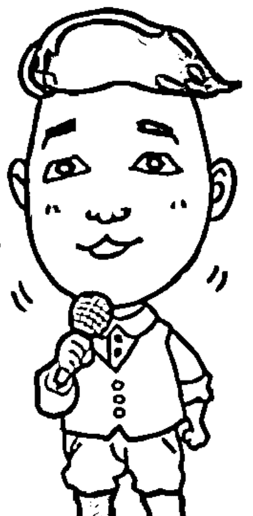

## 4-4 把握當下的感動，來場「即興演講」

不少讓人感動的片刻就像火苗，如果可以借力使力。透過第三者的人物、事件、畫面，來上一場簡短而感性的演說，可把感動火焰燒得更熾熱，多年之後，回想起來讓人懷念無比，這就是感動行銷。

在婚禮現場，有時會遇到一種狀況，女兒輕輕地把手帕遞給爸爸，這個小的動作，往往一切盡在不言中，如果剛好男女朋友坐在旁邊，此時，馬上求婚成功的機率是不是比平常高許多？更甚至，當我在逛樣品屋的時候，坐在軟綿綿的沙發裡，全身放鬆地看著電視，此時如果銷售人員走過來，與我分享上一個客人的故事：對方辛勤工作，換來一個溫暖的家，這樣與我類似的遭遇，深深打動我柔軟的心，忍不住也想拿出訂金來下訂了！

當什麼都不說的時候，才是感受到人們真正的「需求」，觀察對方的表情、眼神，一切盡在不言中，用心感受對方的感受，多一些溫暖的詢問，然後順著對方的感受說道：「我能理解你的想法，因為曾經遇過這樣的狀況……」掌握外界時機，創造不期而遇的感動，是不少行銷人員慣用的方式。

在另一章節裡，我們有提到幫商品說故事，兩者技巧上最大的不同，就是在這裡想要行銷商品，完全不用「說」，只需要在感動的火苗升起時，適時地添入一些柴火，心中的慾望之火，就會熊熊燃燒，把握當下，懂得拿捏狀況即興演講，可以拉高成交的機率。

## 借力使力不費力，「蒐集」過程很重要

在課程中，很多很認真的學生，除了學習表達、懂得說話技巧外，更想要取得我腦袋裡最有價值的東西，那是什麼呢？就是經年累月下來，蒐集資料時的思緒敏捷度。

我常常跟學生說：「做功課」總是會讓你胸有成竹、自信加分。當廣告公司在使用情境感動行銷的時候，一定不僅僅是把樣品屋佈置好，還會優先了解購屋族群的屬性，是男性為主？還是女性優先？現在有購屋能力的年齡層落在幾歲？這些人都喜歡什麼樣風格的屋型？藉由這些資訊架構起來的「樣品屋」，可以節省很多解說的力氣，服務人員只需要懂得察言觀色就好了！

然而，所謂的「情境」是可以透過人為因素作佈置。在我製作婚禮企劃的時候，也常常運用這樣的手法，比方說：在佈置會場的時候，要優先想好，要使用什麼樣的花束？在收禮台可以放哪些具有紀念性的照片？兩人認識時，有什麼樣的特殊歷程？利用這些素材，讓所有與會的賓客，可以感受到「新人的獨特性」，此時適時地加上司儀的口白介紹，賓客們對於婚宴的新人勢必會留下深刻的好印象。

## 利用「小物」跟畫面，讓餘韻永留存

從上述的介紹，我們不難發現，如果想要掌握「即興」、「即時」兩個重點，就需要事前醞釀好的情境環境，留下一些伏筆。譬如說：我在婚禮主持的時候，為了讓婚宴的餘韻留存，往往會利用婚禮小物的贈送，或是運用現場播放的相關畫面，搭配上適合的音樂，配上口白跟小故事，讓人為這段活動，留下完美的 Ending。

多年前我看過一部電影，叫做《楚門的世界》，在這個世界中，因為是真人表演，十分貼近一般人的生活，所以容易取得共鳴，現在很多人都會運用網路影片，讓大家產生共鳴度。今天我出席了一場婚宴，拍攝下一個孩子學說話的過程，將他上傳到網路上，讓大家因為看到了畫面，而引起的討論話題，開設關於說話自信的一長串討論，也可以達到情感行銷的效果。

網路工具是一項多元又好用的感動行銷工具，因為除了圖片之外，我們還可以運用「影片」「聲音」檔，找到與對方聊天話題的共通性，如果大家是屬於業務人員、活動企劃等工作，你卻不善於情境引導，不妨多多運用這樣的小工具，適時地補上幾句話，就能事半功倍，在智慧型手機風行的今日，掌握感動行銷真的非常重要！

## 【東明老師五分鐘錦囊】

平時就要多多蒐集讓人感動、容易引起共鳴的小故事以及圖片等等，且做好資料夾的分類，對於想要分享的對象、興趣，也要有通盤的了解，當對方有所反應的時候，適時搭配小故事，才能有一氣呵成的感覺。

## 幫新朋友「編」故事，人際關係大加分

人脈是現下社會裡重要的隱形資產，在介紹朋友認識前，應該找出「個人特質」的獨特性，當作引薦的工具，建立人與人之間的好奇、良性互動的橋樑。

長期接觸活動的企劃以及主持，多會遇到介紹來賓進場，以及引薦朋友認識的情況，朋友有感於臉書上的互動，跟平日接觸，常常會好奇問我說：「東明，為什麼你的貴人這麼多？」不可否認，想要累積好人緣，且化小人為貴人，確實有一些眉眉角角要注意，我思考了一下，想要將人生歷練的所得，跟大家分享。

在開門見山分享前，還是想要請大家先檢視個人平常的行為模式。我想要請問大家，平常在介紹親朋與好友認識的時候，都會採用什麼樣的方式呢？

有個已婚的女學生說：「我會跟第一次見面的親戚說，這位是我先生，大概就這樣。」

一位資深的經理人說：「可能會說，這位是我二伯是從事營造業，這位是我朋友，目前在XX公司擔任經理，已經做很久了。」

一個還在念書的大學同學很可愛地說：「HELLO，這是二伯，這位是我親愛的阿娜達！要當好朋友好好相處歐！」

看看以上三組人馬的介紹方式，請大家回想一下，自己平常介紹他人時，比較偏向哪一種呢？是第一種？第二種？還是第三種？還是以上皆非呢？如果是我，多半會這樣引薦：「二伯，這位就是我常常跟您提到，在業界相當富有名氣，而且非常年輕就當上經理的同事；而這位就是我家那位成就驚人，但是為人相當風趣的二伯，今天有機會介紹兩位認識，真的是太巧了！果然一切都是緣分。」當然，引薦跟介紹的方式有分成非常多種，不見得要依照某種特定的方式而進行。

課堂上傳授的一切，沒有對或不對，只有結果不同。透過不同的應答方式做比較，相信大家可以得到比較多的感受，以上三種回答與我的回答有什麼差異性呢？除了我的回答裡，字數比較多之外，是不是讓人感到親切、資訊豐富以及拉近雙方的距離呢？我們要先設想，雙方對於彼此都是相當陌生的，此時，中間介紹的引薦內容就變得格外重要。

## 好奇心開啟一扇「主動求知」的門

好印象是踏入社交圈的重要門檻，優質的引薦是打開好印象的主要鑰匙，有鑑於網路的發達，近年來更認識了不少人生的貴人，而貴人往往值得更重要、更巧妙的「說話術」包裝。

身為一個專業的舞台表演者，我總是不停地尋找成長的目標，從不停歇。為了要提升自己變成跟郭天王一樣，連背影都充滿了戲劇張力！於是，開始在網路上搜尋哪些舞台表演者，具有這樣的特質，譬如說：指揮家、鼓手，於是在因緣際會下，我在網路上遇上這位與眾不同的指揮家。

透過不少的關係，終於讓我聯絡上對方，且有機會前往高雄欣賞於九天民俗技藝團的表演，隨行與一位作家朋友一同前往，在搭乘高鐵的路上，我們聊起了參加這場活動的緣由，我緩緩地提到：「讓我太感動了！在網路上影片中，對方指揮時背影的震撼力，驚為天人！有幸在台中跟他碰上一面，更詫異於他極具戲劇性的人生歷程，真的是個相當有趣的人！很值得我衝到高雄再見他一面！語畢，只見身旁的作家朋友連忙打開手邊的筆記型電腦，即時就搜尋起這位指揮的資料，看來這一番有趣的緣起，成功引起了這位朋友的興趣，大家說是嗎？

總而言之，好奇心可以殺死一隻貓，也可以引領人進入無限大的想像空間。很多人喜歡閱讀偵探小說，在作者筆下因為有層層關卡堆疊中，更容易讓人想要知道過程跟結局，如果一開始說破結局，這本小說銷量還會好嗎？人類的原始慾望中，總是有很多很多的好奇心，想要創造引人入勝的故事，不妨從建立「反差」開始，比方說：這個人平常很邋遢，但是一上台驚為天人！從好奇心的引導，開始對於見面有所期待，由中間人所引導出「滿心期待」的心情，足以讓人充滿新鮮感，猶如戀愛中約會般的快樂，也能促進見面後的好印象。

## 「T-UP」技巧搭起高度的橋樑

除了利用「人物的反差性」引出大家的好奇心外，進一步，更要拉抬雙方的高度。俗話說：『龍交龍，鳳交鳳』，在社交圈裡，如果能結交不同領域的能人異士，未來也許有互相幫助的機會，所以，適時拉抬引薦對象的資歷，也是相當重要的。

相信大家都聽過這句名言：『在別人身上灑香水，自己也會聞到香味』，懂得幫引薦對象編故事的人，才能獲得大家的喜愛。在這個章節中，我們要提到一個在業務工作上，常常使用的小技巧『T-U-P』要介紹的對象，譬如說，有一位A同事想要把B公司主管，推薦給C朋友，在這三位的關係中，因為要強調B主管的專業程度，以強化B對象的社會地位。

事實上，在主管B跟朋友C，尚未見面前，A同事就要常常在朋友C面前美言：『我們經理以前去國外留學過，對於工商管理相當專業，更在業界已經有十多年的經驗，加上他都是白手起家，實在令人佩服！』諸如此類讚美方式，將個人專業經驗累積成一個個新奇的創業故事，讓朋友C產生仰慕跟共鳴度，先做好這一層的『能力故事化』之後，不論在哪個場合、時間有機會碰上一面，朋友C對於主管B已經產生先入為主的好印象了！

在工作職場上，總是寧可多一個貴人，也不要多一個小人，要養成誇獎不在場的第三者的好習慣，在職場上流傳著一句話：『地球是圓的』，換言之，就是告訴大家，在社會上的人際關係總是山水有相逢，只要把握「多說好話、少說是非」的原則，就能常保好人緣。

> 【東明老師五分鐘錦囊】
在引薦時運用故事力，必須先把握幾個重要的原則：首先，先搞清楚引薦對象的角色、背景資料，以及引薦給誰，兩者之間有無合作、衝突關係等評估。
第二、包裝人脈的故事，多以「形象加分」的內容為主，避開言語上的地雷區。

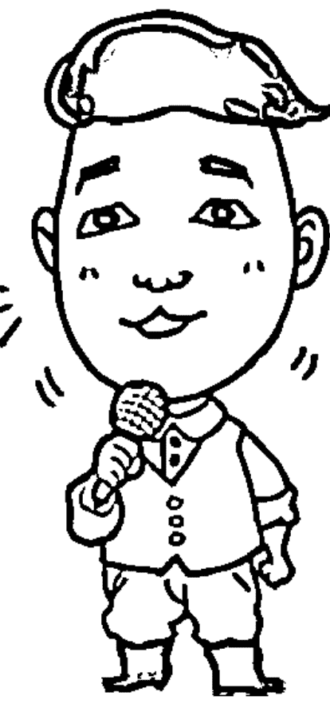

## 4-6 讓商品有故事，激出好人氣

商品靜置在櫥窗內，如果沒有櫥窗設計的好巧思，平面廣告的好故事，商品依然只是一項靜物，無法產生共鳴，創造購買慾望，透過幻想畫面營造，以及語言的述說，讓人目不轉睛，愛不釋手，就是故事行銷的力量。

請問大家記憶最深刻的廣告畫面是哪一則呢？腦海中閃過的畫面，又代表了哪一類型的商品？根據網路統計，目前具有感性訴求的形象故事廣告，最能讓人產生共鳴。

因廣告播放一直隨著時間、季節在變化，所以，我們列舉幾個常見商品的例子，比方說：某某電子的廣告。在逢年過節的時候，畫面裡傳來買冰箱壞掉了，媽媽沒有錢可以買，最後主打可以「分期零利率」揪感心。電器用品什麼時候會被換掉呢？當然是壞掉的時候！但是，老人家都很節儉，往往都是壞了還是修理一下繼續使用，到了逢年過節的時候，如果看電視時看到別人家的故事，電冰箱「又」壞掉了，最終投射到自己身上，也忍不住想要買一台回家，這就是「感受力」銷售法。

之前我看過一本書《FU對了，就暢銷》封面是一隻貼了OK繃的小熊，大家看到封面就馬上被吸引，一隻看起來像是瑕疵品的小熊，本來應該是被清掉的滯銷品，後來聰明的行銷人員，給了OK繃小熊下了一個很棒的slogan：
「你願意跟不完美的我，當朋友嗎？」不完美也變成了另一種特色。在故事力的章節裡，我們要跟大家分享的是，不論任何的商品，如果只是放在櫃台上裡，就是只有實用性的功能，大家考慮到的只有好不好用？可以使用多久，但是如果可以找出商品的特色，幫他編出打動人心的故事，就可以提升消費者對於商品的感性訴求，創造原有商品的價值感。

## 「人」也是一種商品，找出商品特性說故事

只要具有品牌形象，都可以歸類成一種商品，其中「人」也可等於商品。以我作為商品的例子，大家都常常聽到這段自我介紹：「王東明是兼具理論跟實戰的老師！我的故事可以從賣滷味開始說起，……」當這項商品訴求變多元了，也比較能夠吸引更多的消費族群。

聽到這裡大家是否有「商品故事化」的概念了呢？如果還是不太清楚的話，拿最近輔導的案例來跟大家做分享。在個人品牌諮詢的個案中，有一位在人資界歷練相當久的專業HR人員，想要轉型為專業「講師」，銷售的商品就是「課程」，除了要適當地打點對方的專業外表，也要找出學生願意付費上課的銷售賣點，首先，當這位學生來找我的時候，履歷表上閱歷相當豐富，在大公司擔任人資主管將近十多年，看過上萬份的履歷表，這就是「商品特性」，所以，面對失業率高的就業市場，我們一起討論後，找出這樣的故事：「張先生閱人無數，等於是一部活動的履歷雷達檢測機，舉凡任何履歷經過他的面前，就能一眼被辨識，有能力的人不見得會寫履歷，履歷寫得好的不見得有能力，能夠被看過上萬份履歷的雷達眼掃射過，才能找出最適合自己的職涯規劃！

有了這樣的文字介紹，接下來就要構思畫面！大家不妨也一起動動腦，如果要設計張先生演講課程使用的海報，會是什麼樣的圖片呢？腦海中是不是一直出現專業講師雙眼冒雷射光的畫面呢？不僅僅結合了他專業的資歷，個人特色也相當明確，掌握了個人風格的話題性。

## 知名度不等於人氣王 貼近人心永留傳

商品有了故事包裝後，往往可以製造豐富多元的話題，讓人討論，就像之前偶像劇《我可能不會愛你》，大家為了預測男女主角的結局，聚集了相當高的人氣！但是戲劇裡默默無名的男女主角們，雖然透過這一次的戲劇被捧紅了，如果沒有個人特色，還有平常跟影迷們的貼心互動，很難延續之前的高人氣。

所以，透過這樣的案例，大家在幫商品企劃時應該要注意，需要針對不同族群創造不同的故事，譬如說：針對新鮮人的履歷講座，應該有什麼樣子的課程內容；中年失業人的履歷講座，族群不同要修正，履歷方向也會有所差異化，這樣的故事行銷策略，才會讓不同族群感受到商品是有「溫度」的，上完課之後，除了記得講師的風趣幽默，也能針對自己的狀況得到改善。

總而言之，商品需要故事包裝，且故事性就像鑽石一樣，「一顆恆久遠，鑽石永留傳」，鑽石本身只是一顆經過千年淬煉的透明石頭，但是它在愛情上所代表的意義，卻是「永恆不變」的堅貞，也因為動人的解讀，才會讓它幾十年來，都是婚姻裡最堅實的信物，這也是商品故事化的力量。

> 【東明老師五分鐘錦囊】
如果初次接觸商品包裝企劃的新手，可以從平日電視廣告入手，找出平時記憶深刻的三個廣告，然後將商品的實用性寫下來，再對照廣告故事的方向，練習做商品故事化的發想練習。
首先、拿出紙筆寫下「商品」為何？功能為何？然後進一步分析，為什麼這支廣告要用這樣的故事呈現？看完後個人感想是什麼？他人的評價是什麼？將這些資料收集後，分析比對。

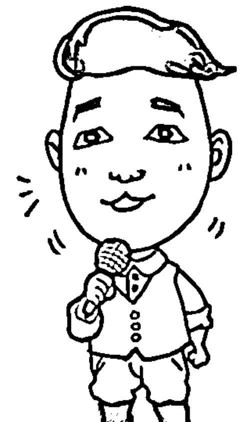

# LESSON 5

## 自我改造第五部：領導力

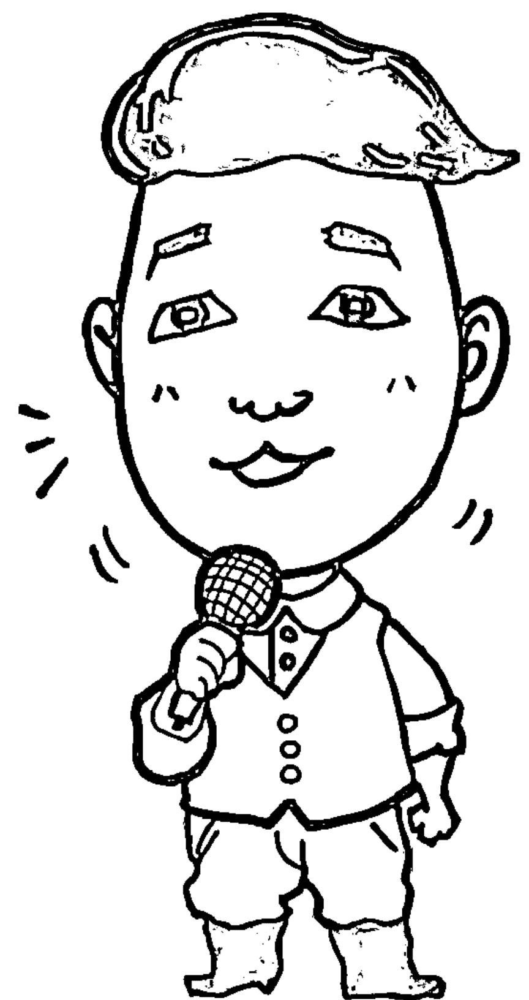

> 一位出色的領袖，要懂得拿回麥克風，讓人「安靜」且「聆聽」

## 5-1 用「反問法」打回失禮問題

一個富有修養的人，在面對失禮的狀況時，往往不會採取直來直往的應答方式，而是轉個彎利用反問的方式，提點一下對方的狀況，也適時為說話者保留了面子。

有人問我說：「王老師，你平常都笑嘻嘻的！有生過氣嗎？」老實講，這個問題讓我思考了非常非常久，還特別問問與共事很久的助理，兩人實在想不出最近一次發脾氣、口氣差的狀況，請問大家最近生過氣嗎？為了什麼事情呢？大家又是如何回應呢？

有一位學生跟我說：「有呀！我常常在生氣，因為我的工作是髮廊的櫃檯小姐，偏偏每回會找上我的，就是嬌滴滴的貴婦，問題多就算了，偏偏口氣又很差，一天來個十個，我都快氣炸了！可是我又不能開口大罵，不知如何回應的狀況，讓我每天回家心情都非常低落！

而另一位學生則是有不同的感觸：「王老師，我是那種一口氣都忍不下去的人，遇到別人揶揄我，我一定會反擊，可是呀！每次反擊的結果，都會把場面搞得很難看，我也不想這樣，畢竟，我只是想要表達我的不滿而已，唉，請你教教我，有沒有什麼比較好的方式呢？」

在生活中，我們都曾經遇過「啞口無言」的狀況，尤其是面對奧客跟無可奈何的指責，深怕回錯話會讓事情越演越烈，雙方怒氣一來不可收拾；但是，長期下來，如果學不會應對的方式，又常常成為別人「軟土深掘」（台語）的對象，啞巴吃黃蓮有苦說不出，隨著人生閱歷的增加，面對這些狀況，我們不妨透過表達方式的演練，提升自己反擊卻又不傷人的能力。

## 當我們遇到「不公平」的時候

說真的，在我還是社會新鮮人的時候，也常常遇到這些狀況，不論是職場上、家庭裡、甚至朋友間，有時候總難免遇上言語挑釁、揶揄等種種不公平的情境，剛開始的時候，我也總是單純的為自己辯解，想不到對方不但不領情，狀況不僅沒有改變，也讓傷到了自己的信心，後來越來越不敢說話了。透過語言表達的練習，我發現，面對不公平的時候，善用一些小技巧，其實是可以慢慢調整自己的修養，當自己智慧提升，有了應對的自信力，這些小人也就自動退散了。

舉個例子來說，職場上不乏不公平的狀況，當主管在安排工作的時候，或許，A同事跟B同事因為個性不同，B同事向來嫻靜少抱怨，所以老闆老是柿子挑軟的吃，不少吃力不討好的工作就分配在B同事身上，面對這樣的狀況，B同事應該要怎麼向上反應呢？有些個性較為耿直的人，往往會這樣回答：「不公平，老闆偏心，我也很辛苦很累，某某人還有時間準時下班，為什麼不找他呢？」說者雖然無心，只是反應公司同事的工作狀況，但是聽在老闆耳裡，這些聽來就很不是滋味。

大家想想有沒有比較適合的回應方式呢？如果換個方式回應，「沒問題，但之前是您『親自』且『特別』交代下來的案子還在忙，公司目前有沒有其他適合人選呢？如果這件事情非我不可，實在分身乏術，您覺得我要優先處理哪件事情比較好呢？」在這段話中，我們利用了反問法跟加重音，提醒老闆目前

## 對於敏感問題，回答不用太「客氣」

在上述的例子中，我們運用反問法，可以適度減輕壓力，把問題丟回給對方，算是生活中小狀況，所以也是半輕鬆的回應。但有一種狀況，我們就真的不用太客氣了，譬如說，我年輕的時候，曾擔任過攝影師，在接案的過程中，難免會遇到一些同行想要探探我們的接案價格，這位同行直接跟我說：「東明，我看你價碼應該很好，案子這麼多，賺翻了吧？」礙於價格的敏感問題，所以我也笑笑地回覆他：「如果那麼好賺，就不用那麼辛苦了！不是嗎？」

我必須在這裡澄清，通常在說話術中，大家都期待可以儘量替對方設想，幫對方留餘地跟留面子，但是面對一些刻意打探、找麻煩的人，為了避開這些問題，也讓對方知難而退，其實回答的語氣上，不用太過客氣！在之前「舞台力」的章節中，我們有提到，語調跟口氣，要順著聽眾的狀況而做調整，才能提升表達的意境。

事實上，「反問」的方式運用千變萬化，如果要知道詳細的用法，可以回去翻翻前面章節的「球球理論」，只是這邊我們舉以上的兩個分享，是要提醒大家身為一個有號召力跟領導力的人，絕對不是貿然用言語攻擊他人，但是當自己遇到攻擊的時候，也會懂得用適量的力道反擊，在商場上、職場上，運用說話能力達到軟硬兼施，不論對方出什麼招，說什麼話都不被激怒，才是真正的強者。

> 【東明老師五分鐘錦囊】
建議：找出自己常常生氣的理由，把對方究竟說了哪些話，讓你產生怒氣寫下來，然後在紙張上記錄下來，如果下次聽到這些話，自己會選擇如何回應？回應方式有哪些？
然後，在筆記本上記錄，某月某日針對某件事情，當自己真的做出這些回應的時候，心情如何？對方反應如何？一次一次檢討，才能在下次遇到同樣的狀況時，應對得宜。

## 5-2 說話有策略，學會理直服人

常言道：「動之以情、曉之以理、誘之以利、脅之以力」，說話除了表演跟心法外，策略性的交錯運用，才能讓人心服口服！

讓別人心服口服的方式，究竟有幾種呢？老實說，我也回答不出來，想要發揮說話的影響力，不僅僅有時要用眼神交會，動之以情；有時光是用眼神是不夠的，缺了點說服力，還要加一點道理，但是道理說得過多，又會讓人覺得很煩人，總之，想要說服他人，就要帶點策略，才能讓人心服口服。

就像很多人在職場上，遇到個性跟自己不一樣迴然不同的對象時，就不知道要什麼回應！比方說：自己是一個很愛說道理的人，剛剛好遇上一個喜歡講感覺的同事，每回要討論事情的時候，一開口詢問同事：「根據公司條例，你怎麼都不照著規矩走呢？我們都已經共事這麼久了，你不清楚這件事情的嚴重性嗎？」當喜歡講感覺的人一聽到這樣的語氣，頓時也變得非常不開心，就算事情沒有這麼嚴重，已經破壞了原先討論的氣氛，再也講不下去了。

倘若一個老是喜歡偷懶的員工，遇上一個想要激勵士氣的老闆，又要如何應對呢？我建議可以先找其他員工聊一下天，了解一下這位員工平常的表現，是屬於喜歡貪小便宜的人，還是怕惹麻煩的人，旁敲側擊地詢問員工：「聽說你最近可能家裡有急用，對於公司的薪資福利是不是有什麼想法？公司希望可以栽培你，當然，也是要跟你確認一下，如果你有心在工作上長期表現，我這邊可以跟會計談一下。」在這段對話中，老闆就運用了誘之以利跟脅之以力，兩種動機的策略搭配，當然，最後老闆得到了雙贏的局面，不僅員工開心，公司的生產力也變好了。

透過以上兩個案例的分析，我們不難發現，說話不僅僅是一門技巧，也是一種謀略的應用，面對不同狀況、想要達成不同目的，要會講理、也要會動情，多管齊下，順利達成協調溝通的結局。

## 面對不同對象，建立說服的策略

在做企業內訓的時候，我常常提醒學員們，說話技巧的運用要懂得「臨危不亂，處變不驚」，任何好的說服方式，都不可以從頭到尾用同一招，因為天時地利人和不同，就算是同一招，用錯了時間點，有時也會弄巧成拙。

有一位從事保險業務員的學員跟我說：「老師，為什麼我的同事平時很少進辦公室，只喜歡跑醫院，提供理賠服務，但是業績卻很不錯？」想要達成業績，說話對象跟場合的策略組合就更加重要了。因為這位學員的同事，雖然不像這位學員一樣擁有很多張證照，但是卻十分的感性，每回在醫院裡，看到理賠的家屬，總是一把眼淚一把鼻涕地跟家屬分析：「王媽媽，你不要傷心了，王伯伯當年就是因為有購買這張保單，所以今天你們醫藥費的部分，才不用擔心，為了全家人的幸福，保險規劃真的很要緊，我們改天等您精神好點，再約出來喝咖啡聊天？」

以上的案例裡，這位同事看準了生老病死的感性場合，發揮了說服技巧中的「動之以情」，而且恰如其分的拿捏著說話的分寸，知道那個場合不適合講太多大道理跟專業，做了下一次的邀約，也埋下了下一次成交業務的伏筆。而至於我那位具有專業證照的學員，可不可以用這樣的方式呢？當然也是可以，不過因為每個人的特性不同，專業證照是他的強項，善用「曉之以理，誘之以利」的策略組合，會更適合！

## 拿捏說話的分寸，想想該說多少話

當簡單的說話技巧，有了繁複的組合，就像是一份完整的攻略，除了要有大綱，當然也要注重細節。在評估過自己的特性，跟對象關心的重點後，該怎麼拿捏說話的分寸，跟時機點就變得異常的重要，就像一場美麗的婚宴，所有佈置都到位了，要擺上多少朵花，才不會剛剛好雅緻，卻不顯得俗氣呢？

在一開始跟對方溝通的時候，千萬不要一次就把話說完，就像唱一首歌，想要歌聲好聽，也要懂得在唱歌換氣的時候，轉換聲音大小跟情感。舉個例子來說，大家都想要跟老闆要求加薪，但是要怎麼開口呢？多數都要先探探口風。

「老闆，我最近家裡剛添了新成員，家裡的開銷變大了，唉。」停頓一下，觀察一下老闆的表情，如果老闆問：「家裡還好嗎？」然後，可以訴之以理「你也知道我們家全靠我一個人在賺錢，從來我也沒有遲到過，對於工作上的事情都很盡責，同期的同事，上星期都升了課長了，也該輪到我了吧。」

過鐵路的時候，大家都知道要停看聽，在思考如何達成實際溝通成效時，也不能缺少了這門功夫。就像上述的例子一樣，與對象講話前，最好先點出重要的關鍵訊息，因為剛添了寶寶，開銷變大，盡量不要太詳細，等老闆想要知道如何支持你的想法時，才訴之以理，最後才能皆大歡喜。

> 【東明老師五分鐘錦囊】
建議：想要說服他人時，應該要先擬定計畫。把自己有可能遇到的難題，寫在紙張上，然後根據困難度，看是要從最難的開始挑戰，還是要從最簡單的方式測試，千萬不要想說就說，不給對方思考時間，往往很容易把事情搞砸。

## 5-3 奪回麥克風有妙招

個人行銷的時代，不少人只要有機會發言，就滔滔不絕，有時讓人敢怒不敢言，所以，適時在會議、宴會、談判的場合提點一下，利用引導、歸納、總結，輕鬆說服對方讓出發言權。

在企業內訓講堂內，不乏一般的員工訓練，有不少人也是個各業界的翹楚，諸如大學內的授課講師、某業界的中階主官們，遇上這些術業有專攻的領導階級，意見交鋒的時候，我們要如何順風駛舵，尋求對方的認同，自動讓出手上的發言權呢？這件事情是相當有難度的，在課堂上，詢問學生類似的狀況該如何處理，結果得到很大的迴響。

身為業務主管的學生A認為：「我最不喜歡老闆每次開會的時候，拿起麥克風就不停，有時候已經約了客戶，整個早上的時間，就都花在開會就好。」

著名婚禮主持界的第一把交椅學生B談到：「婚宴場合上，總是會有很多致詞的佳賓，把短短的祝福時間，當成演說大會，讓台下等吃飯的人，臉都綠了。」

一位喜愛公關活動的朋友C說：「不要說平常演講場合，我們最受不了老闆每回都喜歡把公司聚餐場合，當成個人演唱會，還說要讓我們放鬆，真的讓人覺得哭笑不得。」

在這種極為重視個人品牌行銷的時代，一些具有領袖特質的人，總是想要隨時出風頭。在會議場合以及交流會上發言，是一種良性的互動，可以讓意見跟資訊交換，此時，我們千萬要記得拿到發言權的時候，絕對不是想要說服他人，或佔用了別人的時間，以強化自我的光環，而是學會「引導」、「歸納」跟「總結」的能力。

## 小「暗示」幫大老闆踩煞車

究竟什麼是「引導」、「歸納」跟「總結」的能力呢？為了避開領袖的正面衝突，我們一般來說，都會運用暗示的技巧！譬如說：當婚禮主持，我們遇到拿著一致詞就忘我的特別來賓，我們都會怎麼做呢？如果是我，可能就會用「引導」的方式提醒：「我非常欣賞這位議員的用心，因為新娘已經穿好衣服要出來敬酒了，但是我們都知道好酒沉甕底，我們先請議員等等再上來！」

我也曾經在會議場合上，遇到類似的狀況，有一回，幾個活動的企劃一同開會，有一個主要的大老闆，一提起活動的想法，就滔滔不絕，但是所提出的方向跟本日會議的主題完全不相干，當他發表高論將近一個小時後，我非常客氣地點了點頭說：「讓老闆這樣用心的說了一個小時，讓小弟我來幫大家歸納一下，您的建議非常中肯，目前很多業界的老手都是這樣做的！首先、……，然後……。」利用中場「歸納」重點的方式，把老闆的麥克風搶回來，後來，也藉機開始當天真正的議題討論，才順利結束這場會議，不然我想，從早上九點開到晚上，應該也開不完吧！

最後呢？我還要舉一個「總結」的運用方式。在談判的時候，我們有機會遇到雙方僵持不下的狀況，因為對方可能為了要爭取個人的權益，不斷地想要說服對方，所以「落落長」（台語）的講了一大段的話，就是不讓對方有插嘴的餘地，此時，我們不妨先挪動身體，運用一些看錶、伸展的肢體動作提醒對方你的不耐煩，然後客氣地說道：「您說的話我都相當認同，我想我們一起來下個結論吧！這樣做，可以符合你想要的效果，我建議：……」藉由這樣的方式，幫大老闆踩煞車，也順勢奪回發言權，適度地闡述個人的意見。

## 運用「醫生理論」轉化心態

大家都有看過醫生的經驗嗎？來看醫生的人，都抱持著什麼樣的心態呢？當一個人滔滔不絕地說著自己的事情，希望得到專業人士的認同，如果臨時被打斷，當下的心情跟感受度又會是如何呢？有些人會覺得沒有關係，但是有少部分較為主觀或是關注自己病情的人，就希望得到醫生全部的關注，其實，很多領袖性格的人，都有這樣的特性。

那麼考考大家的觀察力，大多數的醫生，為了讓性急而主觀的就診病患，得到妥善的回覆，多數都會採取什麼樣的處理方式呢？他們會說一般而言，話都很少，但多都是以「詢問」的方式，抓出病患想要的重點，最後，才會給出自己的「答案」。譬如說：文章開頭時，業務員A有提到，老闆總是喜歡開冗長的會議，造成大家的不便，難道老闆自己不知道嗎？我相信，老闆多多少少知情，但是依然想要開這場會議的目的，是希望公司進行方針受到重視，那麼，當他一直詢問大家意見的時候，不妨先展現出「與老闆一樣對會議重視」的態度。

正所謂：「伴君如伴虎」，懂得搶回發言權，但是該有的份際還是要有，優先重視對方所重視的是情，千萬不要有小媳婦的心態，發言權掌控在自己手裡，懂得尊重對方，挑對時機表達個人意見，自然就會在工作中獲得肯定，種下好的種子，才能結出美好的果實！

> 【東明老師五分鐘錦囊】
建議：在練習「引導」、「歸納」、「結論」三種方式的時候，千萬要記得永遠要優先尊重說話者的感受，臉部表情也很重要，點頭微笑外，還要露出肯定對方的眼神，要切入對方的話題時，可以用眼神示意「請容於我幫大家解釋一下……」再把三種方式帶入，才能一氣呵成不得罪人。

## 5-4 你說的話，別人懂多少？

日本口語溝通專家箱田忠昭指出：「別人火冒三丈的時候，最需要被安撫的是情緒。」如果提出要求，對方卻不願意協助，自己要先檢討，是不是在溝通過程，忽略了對方的「心」。

一個具有領導能力的人，往往都有運籌帷幄，尋求協助他人的能力。歷年來，我們公司的案件規劃，涉足了不少跨行業的異業結盟，常常遇到窗口上的協調問題，也讓我發現，口語溝通中一件重要的事情：提出要求前，要先安撫對方的心。

公司同仁常常跟我反應一種狀況：「老闆，我們都已經很認真地跟對方窗口溝通了，有時候，還是沒有辦法如期完成呀！我們也很不願意呀！」我相信只要不是單打獨鬥的工作，都會遇到需要請求協助的狀況，當自己很急，對方卻不急的時候，大家可能要重新思索，是不是雙方面的溝通出了問題？問題絕不會出在一個人身上。

有一回，我在溝通講堂遇到一個學生，他說：「我是從事工程相關工作，我最討厭跨部門的合作案了，因為我明明需求表寫的相當完整，但是採購部門總是拖拖拉拉，每回去都碰了一鼻子灰，有時候一拖再拖，影響到工作進度，又是我的問題，唉。」當然，正常來說，職場上，除非自己就是老闆，不然沒有任何員工喜歡自己的工作量增加，所以當我們我們提出需求的時候，除了檢討規劃的完整度外，還得要拉高自己的EQ。

## 請求協助，攻「心」為上

這裡講的攻「心」，絕對不是氣急攻心呀！想要人家願意幫忙，EQ就要更高，先學會安撫別人的情緒，站在對方的立場著想，利用說話術建立良好關係。以上述學生的狀況來說，因為他是工程師，所以開出來的需求表一定是工程需要的規格，假設預算有可能比較高，就會造成採購部門的困境，所以在表達需求前，不妨先跟採購窗口聊聊天，表示一下，這次的狀況有可能會造成對方的困擾，但是如果以後有機會，一定會記得對方的幫忙，雙方都會有好處。

當然，在溝通的過程中，除了說話態度要誠懇外，聊天話題也很重要，如果過於重視利益關係，也會讓對方感受到強迫且不舒服，儘量以「我也知道你的難處，如果你願意盡量幫忙，我會非常感激。」換得對方的信任度跟好感。

進一步，也可以提出懇求：「如果可以的話，是不是方便給我一個比較確定的日期呢？畢竟，我也是需要對其他主管交代，再麻煩你了！」

尋求協助，要量力而為，先求有再談成效，想要建立不同部門同事的交情，不妨從一個無法拒絕的小忙開始，「我遇上這個專業名詞不太了解，可以告訴我嗎？」就像我們要去投資股票或是基金，如果一開始的時候要求對方要拿出一百萬出來，對方當然會覺得壓力很大，倘若只是拿出一、兩萬元出來，對方能力許可的範圍下，可能願意小小配合一下，之後再提出真正的請求，此時可以增加對方未來願意幫忙的可能性。

## 被拒絕才是打開心門的契機

在請求他人協助的時候，多數人都會到一個心理上的問題！請問大家猜猜看是什麼呢？答案就是「沒面子」。當尋求合理的幫忙，對方卻沒有馬上答應，多數的人心裡都會有一個OS「不幫就算了，這是不是我私人的事情！」或是挫折感加重，見面就不給對方好臉色。

事實上，第一次被拒絕後，才是打開心門的契機，當我們放下身段拜託別人的時候，拒絕的人多數心裡也會懷有愧疚感，忘掉被拒絕的情緒，能夠不計較依然保持風度跟氣度的人，往往可以獲得對方的好感；若是「見笑轉生氣」（台語）反而會讓人覺得這個人真是脾氣不好、沒風度，留下不好的印象。

總而言之，說話表達除了心法、口氣、技巧等等，最重要還是在「人心」，個人能夠保持高度的EQ，不受他人跟自己的情緒影響，為了尋求最終的圓滿，不斷請求，會讓對方因為柔軟的讓步感到壓力，對方會更容易完成你的要求！那麼請問大家，究竟要被拒絕幾次才會成功呢？哈！這就要看大家的功力了，如果可以加上淚眼汪汪、無辜可愛的表情，也許只要兩次就可以敲開對方心門囉！

> 【東明老師五分鐘錦囊】
建議：要準備與他人協商，達成未來共識以及協助的時候，首先要建立良好關係，先把雙方可以配合的時間、方向敲定，放大雙方都可以互惠的好處，以及訂下明確的日期。在配合的過程中，姿態不宜過於高，以免造成對方反感，如果被拒絕了，也還是要保持好風度，因為拒絕後的第二次要求，往往才能打動對方的心。

## 5-5 職場七「諫」無往不利

俗話說得好：「忠言逆耳。」面對經驗豐富的上司，想要提出公司需求，融合時代新觀念，與老闆共舞，是現下不少上班族新鮮人的磨考，但是只要掌握應對進退小技巧，就能無往不利。

前陣子《甄嬛傳》重播了好多次，隨著戲劇的催化，不少人也開始研究起宮廷職場學，在深宮大院裡，伴君如伴虎，說對話雞犬升天，「對」的話，用錯表達方式，還要看皇帝老爺當天心情爽不爽快，一個不小心，不僅得罪上司，還有可能從此被編入黑名單，所以在分享會上，遇到不少學生熱烈地討論。

當業務助理的Amy說：「我每個月都要跟老闆報告客戶聯絡狀況，有些客戶真的很機車，但是我每回反應，老闆每次都說，那是你的問題，不然我請你來做什麼？」

而學生 Billy 也說：「每個老闆都要馬兒好，又不給馬兒吃草，薪資福利一直縮減，我要怎麼爭取加薪呢？」

最後，一位自己創業當老闆的學生 Andy 也很無奈的搖搖頭說道：「如果是為了公司好，當老闆的誰不想要聽到真心話！但是，總覺得員工有時候都在推託、藉口很多，根本聽不到重點。」

結束了這場激烈的討論，看來勞資雙方各有各的立場，公說公有理，婆說婆有理，我們實在無法評論誰對誰錯，但是在職場上生存，大家表達前，千萬要掌握一個大原則，就是「共好」（Win-Win）。說真的，每個老闆的前身，都是優秀的員工，因為未來開發業務來源的每個客戶都等同於是我們的老闆，惟有學會「對上管理」，才能幫自己開拓更多的機會！

## 學會把「諫」言轉化成建言

古人說得好：「勇者無懼」，惟有主動迎擊，不懼艱難的正面思想，才能得到雙贏局面，究竟是什麼是「共好」呢？在我的課堂上，讓學生大量討論的好處就是，學生可以透過不同角色的發言，得到不同的想法跟意見。當自己是員工的時候，我們當然會覺得老闆的要求很無理，但是，大家有沒有想過，也許老闆的要求很合理，只是因為他表達的方式，不是對方所喜歡的？換句話說，員工有想法很棒！是不是員工表達的方式，只要微微修正，就可以達到共識了呢？

那麼面對不合理的要求，如何將「諫」言轉化成建言呢？舉例來說，在婚宴場合我常常遇到，很多專業人員的合作，如：燈光音控、飯店人員、主持人等，有時因為時間、場地的配合狀況不佳，導致大家會有互相推責任的狀況，當然我身為主要的負責人，當業主（上司）方向反覆，家裡人七嘴八舌，變成多頭馬車的時候，我會跟他說：「親愛的××先生，我很認同你在燈光、會場上的建議，但是您也很清楚說過，這件事情要往這方向前進，為了讓事情更完美，我們可以到第二階段的時候，再看狀況。」以上這段話，是面對上司不合理的要求時，我們仍需要先尊重上司的角色，也堅守自己的立場，事情還是有空間，但是目前為了時間有限，雙方必須都要退讓一步。

事實上，事情本身並沒有那麼複雜，但是因為人都會隨著別人的情緒起舞，不少人在溝通之前，就會先預設立場，譬如說，會不會因為說了這段話，得罪了上司，就會失去一些原本的信任跟利益？心態上過於討好，事情的發展往往會無法掌控，到最後變成責任踢皮球，這樣沒有達到「雙贏」，還有可能變成「雙輸」的局面。

## 直言敢「諫」提升職場競爭力

在前一章節中，我們有提到「正面語言」的力量，還有艾菲爾鐵塔，換個位置要換個腦袋的心態。這些都是說話基本功裡，要具備的進攻心法！當我們在工作上有了想法，不妨試著相信自己專業的判斷，且對自己深具信心，加上好的應對技巧，適時點出公司「缺乏」的部份，才能提昇大環境的競爭力，這樣的員工，才是對公司有助益且需要的員工，老是說好話，逢迎拍馬的員工，雖然一開始會受到同事的喜愛，但是久了，睿智的老闆也會發現兩者的不同。

這裡我再舉一個來上課的學生們，會發生的通病。不少學生對於現下工作都有不少「抱怨」，總是會先跟我說：「這些狀況我都已經跟老闆說過了，但是他就是不聽，最後事情不順，他還是怪在我身上，我真的很煩！」當我聽完這段話的時候，先不批判對錯是非，因為透過正確的語言表達方式，一切都可

以改變，建議學生們，聽聽這樣的說法：「這些狀況我們已經報告老闆，尊重他的選擇，希望事情非常順利，如果最後是我的問題，我們只能再尋求更好的方式解決。」

以上兩個說法都是針對事情提出「意見」，請大家比較一下透過不同思想表達，聽起來有什麼不同呢？感覺上有什麼差異呢？我們常說：「想法影響感覺，感覺影響思考，思考影響行動。」想要說出有建設性的「建言」，在說話之前就要先確定自己的想法，問問自己，真的是希望公司好嗎？還是只是想要傾吐自己的不滿呢？最後，甚至說話表達只想責怪對方，無怪乎別人無法接納。

發言的主控權，永遠操之在我們自己的手裡，丟出一顆善意的球，對方自然會有善意的回應，在適當時候說了「對」的話，自然可以直言敢諫，成為老闆不可或缺的軍師。

## 【東明老師五分鐘錦囊】

建議：面對不同的業主跟上司，不要一味地說好話，應該要把利害得失，作一客觀的分析，有時候態度誠懇，反而會得到長官與客戶的信任。

首先，檢視整件事情的狀態，在心中捨棄誰對誰錯的想法，把要提出建議的事項寫出來，重覆看看要提供建議的文字中，是否有「指責」「埋怨」對方的想法，如果有請拿掉，把文字改成「希望共好」「期待有共識」的方向，在家練習幾次後，才能心平氣和的跟對方討論，持續練習後，大家會發現，互相指責的機率越來越少，工作溝通模式也越來越順利。

## 5-6 輕重有度，不一棍子打死

在協商洽談的過程當中，不論當下雙方是否有得到共識，還是最後導致破局，都不應該把話說死，畢竟山水有相逢，緩兵之計才能爭取更多的思考空間。

多數的學員除了是我的學員外，到最後都會變成好朋友，可能個人在性格上就有樂於分享的優點，所以也有不少學員聊天範圍很廣，生活上任何瑣事都會拿出來分享。然而，透過這些學員的分享中，我發現，只要是陷入協商洽談的過程中，多數學員都有「喜歡烙狠話」的通病，不曉得是不是受到八點檔鄉土劇的影響，還是現在的人都只想要「快刀斬亂麻」而忽略了通盤思考的重要，我有時也被搞得糊裡糊塗。

也因為看到了這些迷思，請大家設想一個狀況：在人際網絡交集頻繁的社會裡，什麼狀況，你會跟對方老死不相往來呢？如果無法確定未來都不會有交集，那麼有必要在一開始協調的時候，就把話說死了嗎？舉例來說，有很多年輕人不論在工作上、或是感情上，都習慣用情緒處理事情，受了委屈就會找同事、朋友訴說，有時候還會鬧到網路上所有親朋好友都知道，但是一旦情緒退去，他心裡又後悔了，但當初說的抱怨全傳到對方耳裡了，後續的狀況又該如何處理呢？

正所謂：「識時務者為英雄」，但是英雄卻常常因為沉不住氣，就變成了落水狗熊了；說話是門藝術，也是門自我管理的學問。在辦公室裡也是一樣，我們常常聽到很多是非傳來傳去，如果沒有辦法先沉住氣，分辨事情的輕重緩急，只是想要快速解決事情，而把話說絕了、說死了，事情恐怕就沒了轉圜的餘地，就算千般後悔也難以收拾了。

## 協商小重點，「警鈴」大作前先三思

講起協商的個案，不論在我們工作上、還是生活週遭，簡直不勝枚舉，就

像我公司助理上回遇到的一個案例來說，因為下半年度出書、演講以及舞台劇等等重大規劃，相對的，偶爾也會遇到配合廠商延誤了配合時間的狀況，當然我們都以誠信的原則與廠商配合，但是面對廠商拖延跟回覆的理由，為了確保雙方的信任度，我們還是要問清楚，避免事後無法補救的狀態。

這時候建議作法是，做任何思考判斷前，都先要養成建立「警鈴」系統的習慣。比方說：不輕易相信藉口，當我們優先先打電話確認對方在執行上的狀況時，對於剛獲得的訊息，不可以直接下批判或是評論，可以問問「那你的想法是該怎麼處理比較好？」、「你覺得呢？」、「事情有其他可能性嗎？」運用提問的狀況，可以收集及爭取更多的思考參考值，讓自己的腦袋有空間想想，萬一這件事情砸鍋了，又該怎麼處理。

當然，後來這些事情都順利的完成了，但是助理跟我分享：「老師，我被你『嚴厲指導』的次數變少了耶！透過反覆提問，除了幫自己爭取一點思考空間外，也可以確保事情不會遇到開天窗，或是導到無法收拾的田地！我覺得我有變聰明歐！」透過這樣的案例，我們不難發現，很多事情不一定有辦法一次到位，利用雙方對話中反覆協商確認，可以避免我們因為心煩意亂而莽撞行事！有了警鈴系統，可以增加妥善思考的能力，面對狀況思考的角度更廣，思緒也

### 更為縝密。

## 地球是圓的，打不過就先退吧

我們常常說：「商場如戰場」，尤其在固定的業界裡，大餅總是固定的人分食，就像戰國時代，有時需要結伴而行，有時卻有可能成為敵人，在當時不少的政治家，多採「合縱」、「連橫」等策略，套句白話一點的意思就是：「地球是圓的，這次我們沒有達成協議，但是下回有機會，我們依然可以一起作戰，畢竟有錢大家賺。」

所以，為了顧全大局，也為自己留下下次合作的契機，說話技巧就相當地重要！譬如說，當對方提出質問：「請問這個企劃案，到底什麼時候會確認呢？」如果尚未確定，不妨可以用緩兵之計回答：「那到底何時下次開會再討論。」如果對方依然不願意放棄，一直提出質詢：「畢竟企劃審核需要時間，你有更好的方式嗎？」倘若對方因為這樣就生氣了！該怎麼善後呢？當然是幽默解套囉，稍微安撫一下對方：「一定要這樣嗎？你看我為了這

個案子臉上都已經變成豆花男了說！

當然，大家要記得一個重點，所有說話技巧的演練，都是為了讓雙方的結局更為圓滿，且達到共識，而不是故意推託，或是推責任，因為起心動念的不同，也會影響到結局的不同，懂得在狀況不明的情況下，幫自己爭取緩衝空間，可以避面災情擴大，撫平雙方情緒，但是如果刻意濫用說話技巧推託拉扯，長期下來就會讓對方失去信任感，所以，留得青山在，不怕沒柴燒，應對得宜，誠信以待，才是懂得分輕重的領導者。

> 【東明老師五分鐘錦囊】
建議：用時間跟思考空間換取雙方未來配合的機會。面對客戶的逼問或是攻擊，也許我們沒有馬上決定的能力，有可能要詢問主管，或是思慮不周，為了避免正面衝突，可以三秒鐘後再做一次口頭重覆確認：「你剛剛說的話是這個意思嗎？」對方如果非常肯定，然後再做後續的處理，切忌：貿貿然地回答，容易讓人產生不夠穩重的負面印象。

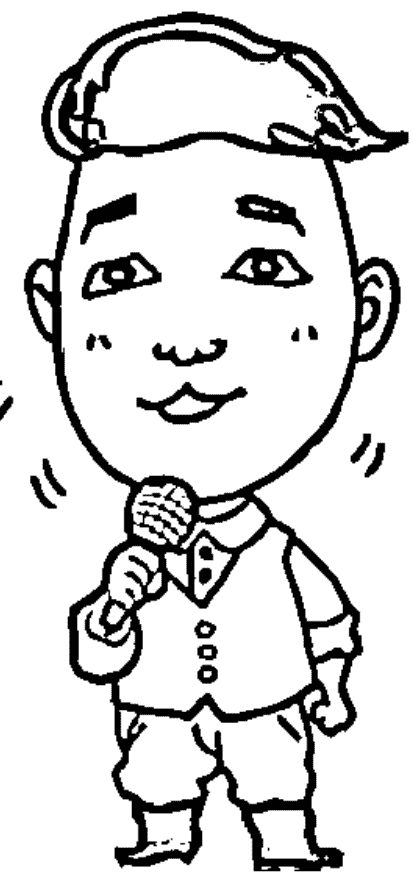

## ◎ 說話進階評量表

| 階段 | 特徵 | 類型（舉例） |
|---|---|---|
| 第一階段「不說」 | · 台下很會說。 · 不敢上台發表意見，遇到時立刻推託、搖頭說不。 | 一般人 |
| 第二階段「敢說」 | · 敢上台發表意見，但講話較為零落。 · 內容常讓人想乏味、想睡。 · 大家可用堅定語氣、眼神、點頭等，鼓勵對方，幫助建立信心。 | 學校教授 |
| 第三階段「能說」 | · 敢上台，但只是把話說完而已。 · 需要投影片輔助。 · 投影片重點過多。 · 過度專業，讓人聽不懂。 | 工程人員 |
| 第四階段「愛說」 | · 享受人前拿麥克風的感受，不停的講話。 · 在KTV拿到麥克風放不掉。 · 多講是非，喜歡像三姑六婆一樣。 | 賣場推銷員 |
| 第五階段「亂說」 | · 像喝醉酒一樣，該講不講，不該講卻亂說。 · 常常否認自己講過的話。 | 一般人 |
| 第六階段「懂說」 | · 講話說重點。 · 精簡有力，由內而外散發魅力。 · 成熟度高，讓人想要聽他說話。 · 氣定神閒。 | 美國總統歐巴馬、蘋果電腦執行長賈伯斯等。 |
| 第七階段「懶說」 | · 只要一個眼神、動作，對方就知道你的意思。 | 電影《穿著 Parda 的惡魔》總編輯米蘭達的劇中角色一樣，老闆階級必須達到此階段。 |

補充說明：在敢說、能說、愛說階段中，通常會卡在亂說，只要度過這段撞牆期，說話技巧就能大大提升喔！

國家圖書館出版品預行編目資料

| 說中點・講重點，我就是能說動人：說出你的自信
指數 / 王東明作. -- 初版. -- 新北市：智富，
2013.11
面； 公分. -- （風向；70）

ISBN 978-986-6151-56-9（平裝）

1. 說話藝術  2. 口才  3. 成功法

192.32 | 102020818 |

風向 70

## 說中點・講重點，我就是能說動人 —— 說出你的自信指數

作　者／王東明
主　編／陳文君
企劃編輯／蕭合儀
插　畫／王子麵
攝　影／謝瑋銘
插畫設計／古玟倩、黃冠融
封面設計／鄧宜琨
出 版 者／智富出版有限公司
發 行 人／簡玉珊
地　址／（231）新北市新店區民生路 19 號 5 樓
電　話／（02）2218-3277
傳　真／（02）2218-3239（訂書專線）
　　　　（02）2218-7539
劃撥帳號／19816716
戶　名／智富出版有限公司 單次郵購總金額未滿 500 元（含），請加 50 元掛號費
酷 書 網／www.coolbooks.com.tw
排版製版／辰皓國際出版製作有限公司
印　刷／世和彩色印刷股份有限公司
初版一刷／2013 年 11 月

I S B N ／978-986-6151-56-9
定　價／280 元

合法授權・翻印必究
Printed in Taiwan

## 自我經營推薦書

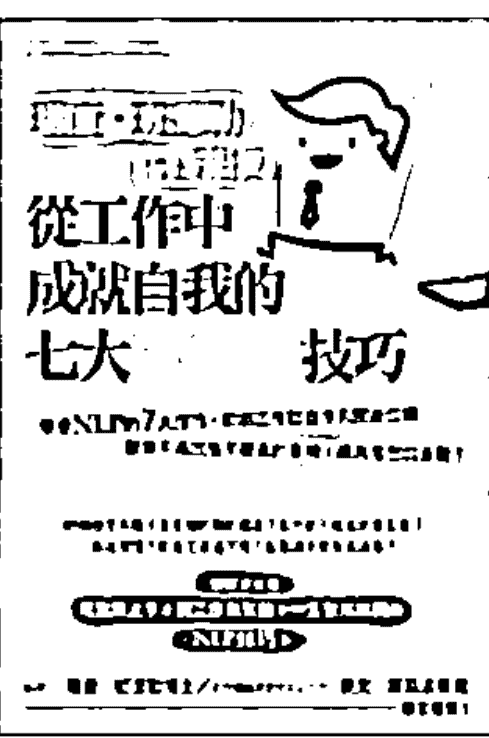

理查・班德勒博士親授——從工作中成就自我的七大 NLP 技巧
白石由利奈◎著 定價◎ 240 元
美國總統柯林頓、歐巴馬演說，都使用 NLP 溝通技巧！
作者致力於 NLP 的國際推廣，獲班德勒博士認可為 NLP 高階訓練師，以及全世界唯一的「Enhancing International Cooperation」。嚴選 NLP 七大祕訣，助你擺脫先入為主的無用觀念及成見，人際關係提升，工作自然暢行無阻、輕鬆順利！

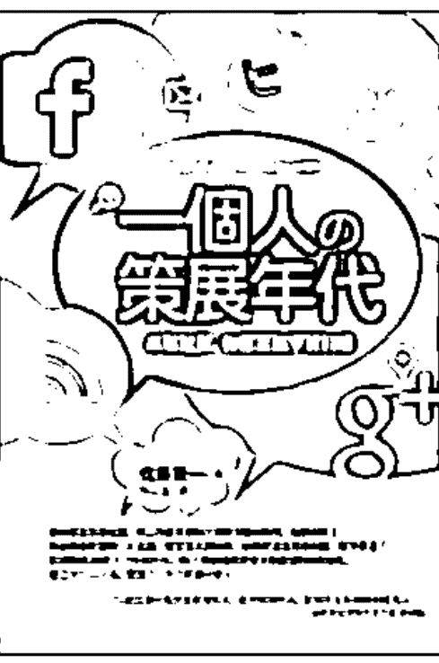

一個人的策展年代——串聯社群，你需要雜學資料庫
佐藤賢一◎著 定價◎ 240 元
榮獲日本「COURRIER Japon 雜誌 總編輯獎」，對於現代人滿肚子的專業知識，卻無法形成個人社群，只能眼看超級策展人身價節節上漲，自己卻淹沒在逐咖回收場……。資訊是廉價的，知識已死。你必須透過好奇心，傾注熱情在你所關注的主題上，建立專門「雜學資料庫」，成為這個時代所需的「策展人」。

零雜念——東大和尚教你做自己、活得輕鬆自在
草薙龍瞬◎著 定價◎ 260 元
我的心中曾滿是雜念。十六歲時休學離家，進入人人羨慕的東京大學法律系之後，卻因空虛而離開日本，前往印度，尋找平靜的方法……一位日本僧人，將自己在經歷過東大、出家後，終於悟得清除雜念的方式，有系統、條理、邏輯，具體介紹給讀者。

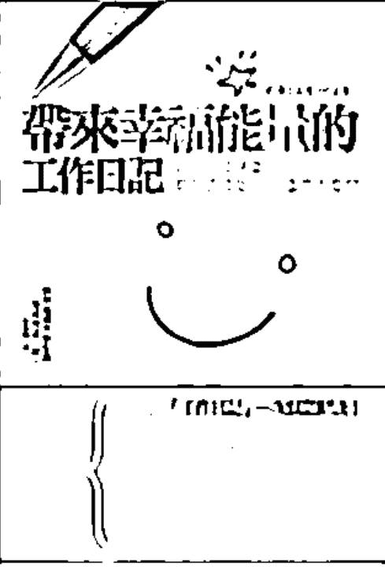

帶來幸福能量的工作日記——日本心理學家教你這樣寫日記，工作不憂鬱
海保博之◎著 定價◎ 260 元
肯貧、窮忙時代來臨，您是否每天為龐大的工作量忙到焦頭爛額，卻看不到自己的未來？東京成德大學校長寫「工作日記」25 年，教你擺脫「失敗模式」，獲得滿滿的幸福能量，走向理想中的幸福人生！

世茂集團出版部落格
愛閱讀，就是我的 Style
http://shymau.pixnet.net/blog

> 「先求有，再求好…求好之後，要成經典！」
「不要跟人比，跟自己比就好，因為每個人最大的敵人是自己。」
「一天進步一點，十天進步就十點；不要跟別人比，因為每個人的起跑點不一樣。」
我是個平凡人，但是我要告訴你，平凡人也可以做不平凡的事！

## 自我改造五部曲

- ①自信力—透過說話技巧，了解「不足」的自己
- ②成就感—要練說話神功，必先努力用功！
- ③舞台力—說話者要有魅力，才能找出專屬舞台
- ④故事力—人人都愛說故事包裝，人脈存摺UP！
- ⑤領導力—出色的領袖，要懂得掌握麥克風主權！

常覺得自己不知道在講什麼？
想要說好話、說對話，就聽王東明說分明！
**蔡祐吉**（TVBS新聞部製作人、世新大學口語傳播系講師）

麥克風加信念可以改變世界，東明在舞台上說出了最佳的詮釋！
**謝文憲**（兩岸知名企管講師、商業周刊專欄作家）

如果您也害怕上台？讓東明老師的書幫助您自信上台，
自在表現，作一個更好更有魅力的自己。
**王永福**（知名企業簡報教練，內部講師訓練專家）

東明老師以自身破繭的經驗幫助學生蛻變，
他帶給學生最棒的禮物就是—自信！自信說話，
就從《說中點 講重點》開始！
**周震宇**（聲音訓練專家）

