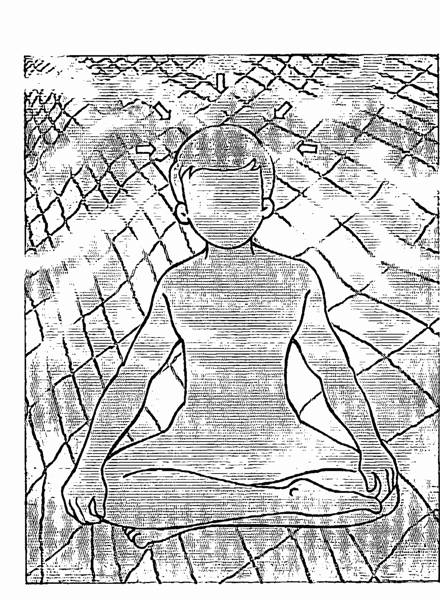
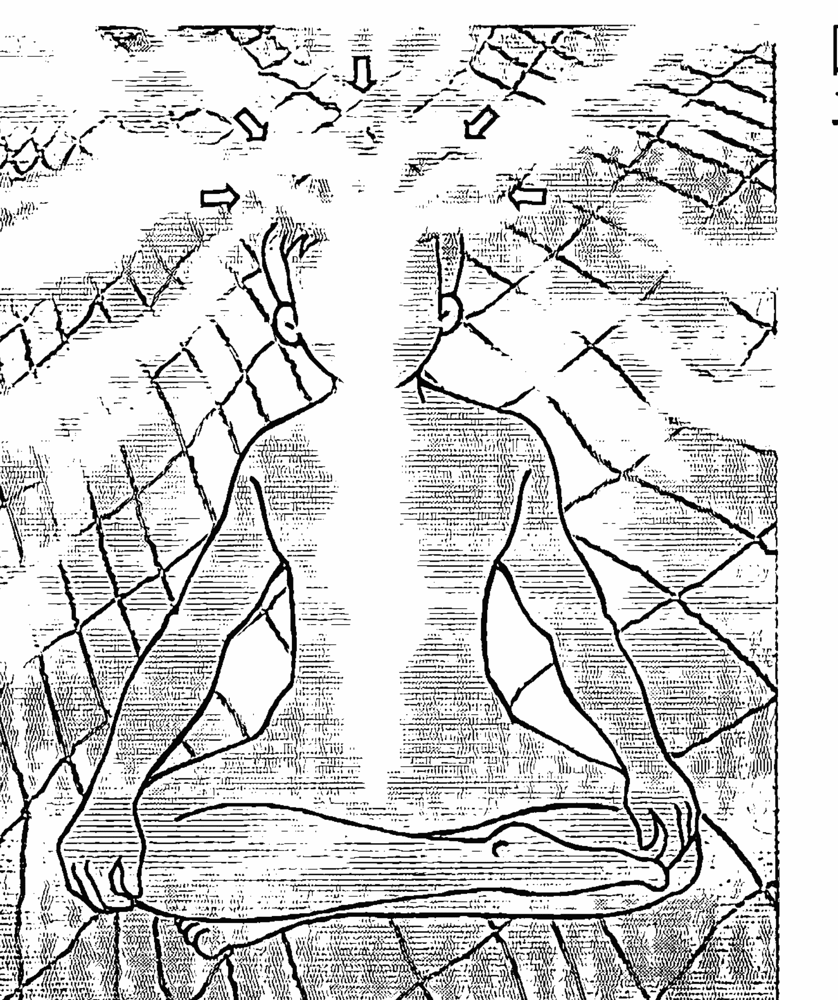
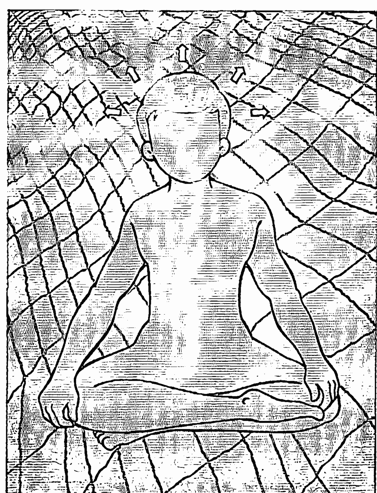
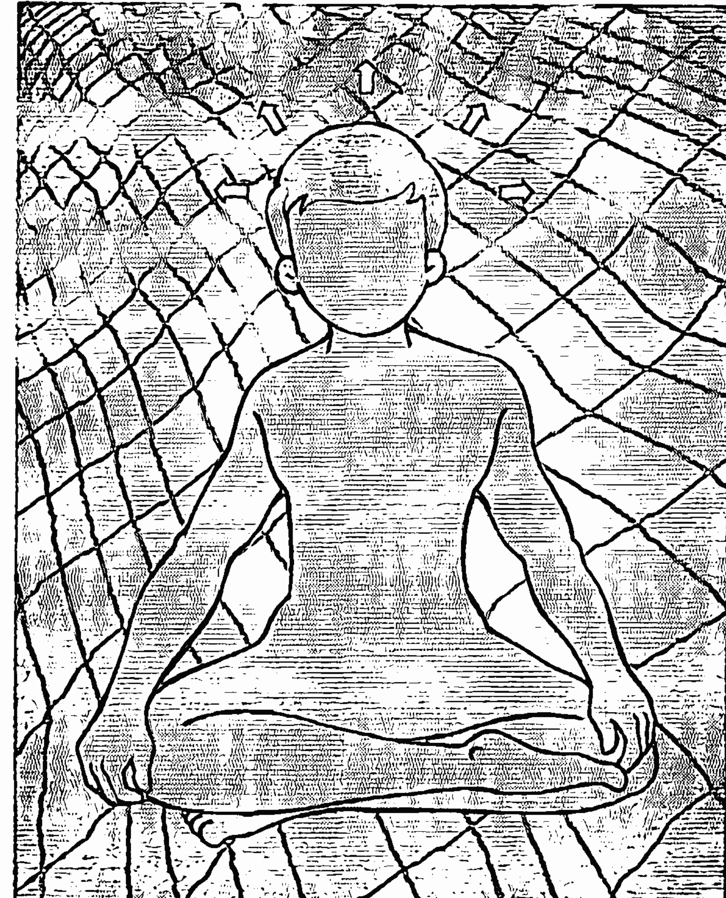
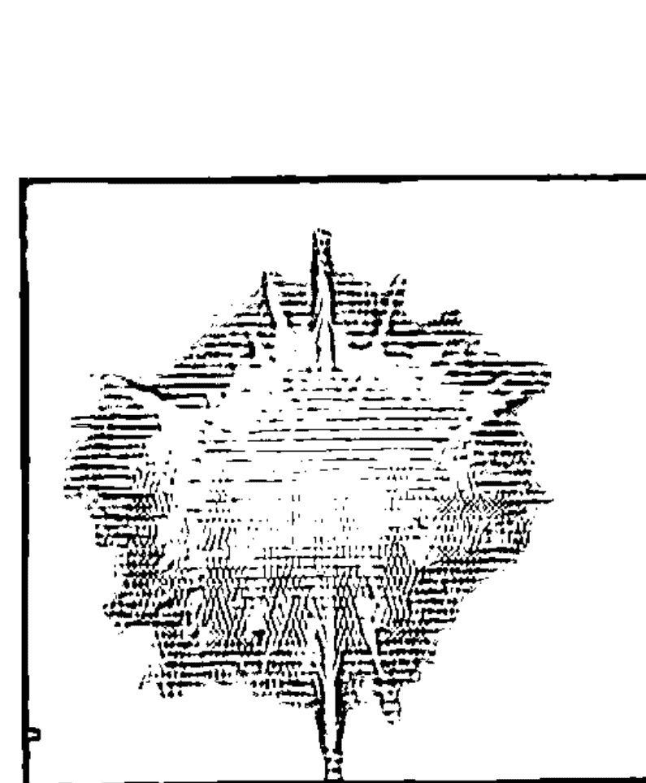
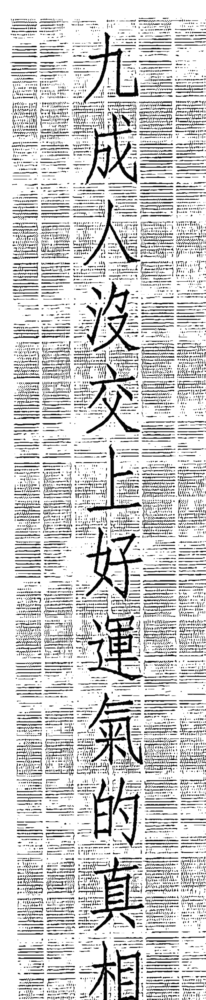
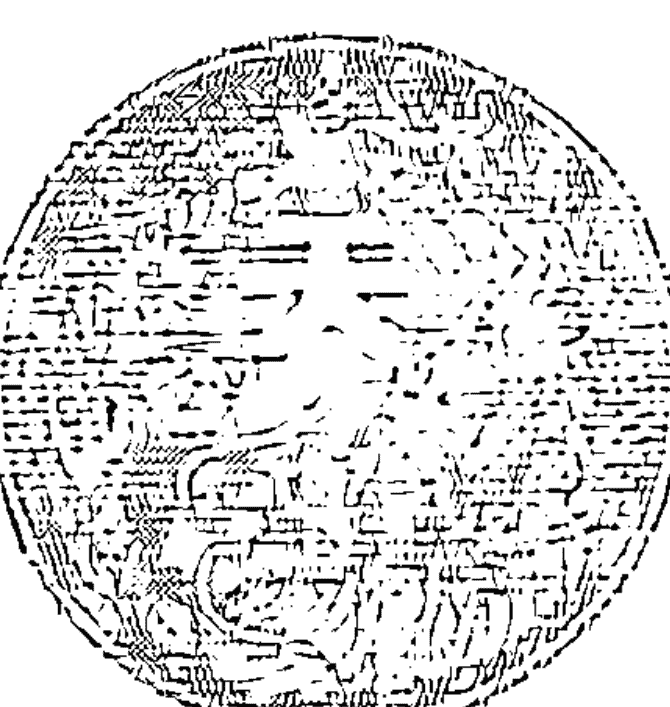
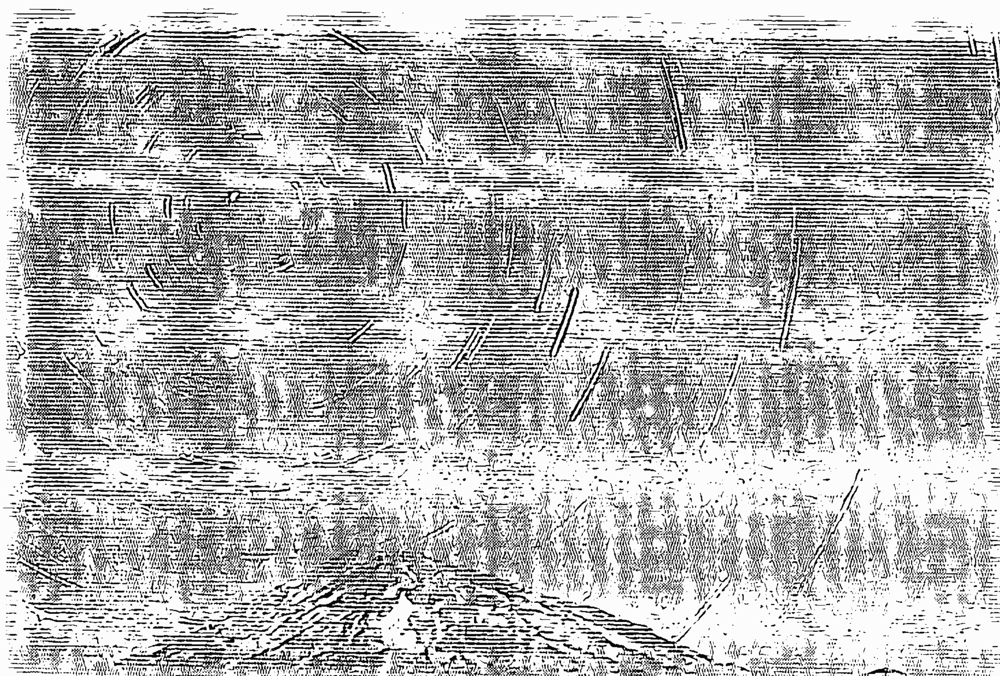
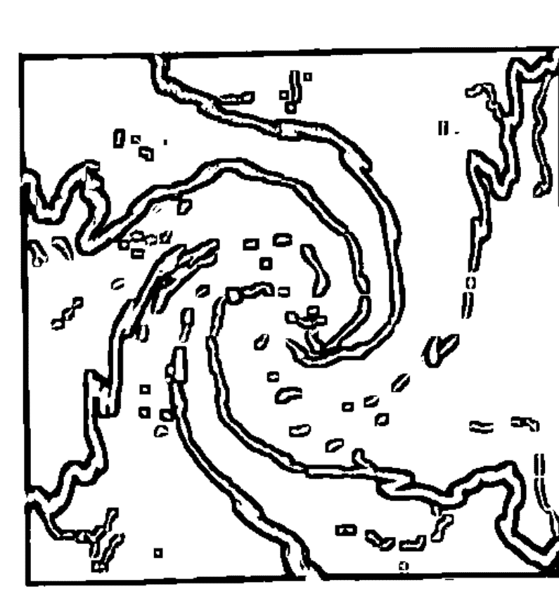

# 誰偷走了你的運氣

Unleashing the luck within

開竅重生，
掌握運氣，
本書肯定為你帶來
一生最大的改變。

非常品出版集團

# 制作说明：

本書由皇家圣学院出重金从台湾购入的原版书籍扫描制作完成。为达到最好阅读效果，特地把原版书全部切开后，再经由专业扫描设备高精度扫描完成，并经过一张张的PS后期处理最终成书，其间花费大量的人力、物力以及时间，只为能给大家提供经济并优质的神秘学学习资料而努力。

本学院强力谴责某些机构和个人，把本学院花心血制作完成的电子书籍，包装后直接放在自家淘宝网上低价倾销的行为，以谋取不劳而获的经济利益。如果长此以往最终将无人愿意再为大家花心思制作电子书，那以后可能大家再无新书可读。

为让大家以后能够读到更多的好书，也为了本学院的良性发展。本学院恳请大家尽量做到如下几点：

- 一、尽量在本学院的淘宝网购买电子书籍。
- 二、请勿用技术手段把电子书内的水印及加密去掉。
- 三、在收到电子书后小范围传阅即可，千万不要公开传播，更别挂到淘宝网上低价销售。

同时为答谢广大支持者，学院电子书将做如下调整：

- 一、学院会把一些早已收回制作成本的电子书折价销售。
- 二、提供现有电子书籍的纸质复印版本，价格可直接咨询淘宝客服。
- 三、最新制作的电子书籍会开放打印功能，大家购买后有条件的可自行打印成书。

皇家圣学院
2015年4月

# St. Royal College
皇家圣学院

- ※ 专业占卜预测机构
- ※ 神秘学培训机构
- ※ 水晶能量研究中心
- ※ 上海市黄浦区泰康路274弄25号（田子坊内）
- ※ 官方淘宝：http://strc.taobao.com
- ※ 官方微博：@皇家圣学院

微信公众平台：strc2011

大天使
皇家圣学院 院长
QQ：715104687
手机/微信：13641926204

# 自序：幸運兒是可掌握的學問

## （一）第一個感觸……

這個世界充滿不同質素的幸運兒，有些聰明、有些愚蠢、有些正直、有些奸詐、有些勤奮、有些懶惰、有些積極、有些被動……你想到的人，他們卻可能是幸運兒，對於一些執迷簡單宇宙法則的人來說，這些現象明顯混亂，令人困惑：「為甚麼上帝沒有合理的安排？」然而，在混亂的狀況中，明確地存着一些我們忽略的規律，支配着我們的命運。也許，我們一直誤會了這個世界——

這本書從各種角度瞭解運氣，完全超越了傳統「善有善報」的簡單法則，也是說，

只要你擁有、或學會當中任何一個幸運竅門，你也可以躋身幸運兒行列，而不受制傳統的狹隘因果觀念。

久受不如意命運折磨的一群，不斷在追求改變之道，然而，方向錯了，如入迷宮，愈走愈遠，愈走愈不幸，終身難安然。

可能你沒有想到，運氣其實就在身旁，一躬身，便掬在手中。

## （二）第二個感觸……

自從金融風暴後，我一直遇上自怨自艾的人，有的怨政府、有的怨自己、有的怨朋友、有的怨運氣。一向順風順水的人，彷彿完全接受不了一個現實：月有陰陽圓缺，人有旦夕禍福。這種哲理用在社會如此，在人事方面也一樣。

因為這種感觸，導致我決定寫這本書。在書中，我告訴各位一個有關人生的實相：在過去逾三千多年的中外歷史，決定人的成就，運氣的因素居首位。生意失敗，不是代表你無能，而是運氣欠佳。婚姻破裂，原因也如此，這和你的質素無關。事業跌宕，權力與替，更加如此。在付出了個人的努力後，運氣支配了我們的前景。而大多數人對這種近乎黑洞的力量毫無瞭解，怎不落得焦頭爛額的下場？相信運氣並不等如宿命，因為運氣其實是一種可以掌握的學問，只不過傳統教育不會教你，主將心物二分的科學家更是諱莫如深，於是大多數人被逼做摸索着前進的盲人。

怎樣將西方的自我改進的精神和傳統的趨吉避凶的智慧結合，是我的寫作過程中一個艱苦的平衡。稍一偏差，便會落得一個脫離現實又或悲觀宿命的下場，所以，這本書寫了近九個月，令我頗有心勞力竭之慨。

書名原為《運氣解構》，但編輯小姐說太嚴肅了，左右思量下，作了如今的改動。

希望本書重新燃亮讀者們的希望。

大多數人的痛苦無非出自錯誤的抉擇，而錯誤的抉擇莫不與運氣有關。當你學懂掌握運氣，最沈重的人生，也一定變得輕鬆快樂。

陳浩恩
序於二〇〇二年除夕夜

# 目錄

- 第一章 中西改運蔚成狂潮 …… 1
- 第二章 讓孔子啟示你運氣之重要 …… 5
- 第三章 運氣的黑白洞——逆熵之秘密 …… 9
- 第四章 九成人沒交上好運氣的真相 …… 21
- 第五章 改運必須瞭解的第一步 …… 31
- 第六章 錯誤的運氣觀念乃業力的漩渦 …… 37
- 第七章 吸引好運的法則（一）透視自己運氣的五大秘訣 …… 49
- 第八章 面對衰運。迅速扭轉的妙法 …… 59
- 第九章 吸引好運的法則（二）美好的的人際關係
- 第十章 吸引好運的法則（三）測驗你的人緣力量
- 第十一章 吸引好運的法則（四）關之琳的啟示
- 第十二章 吸引好運的法則（五）誰是幸運兒
- 第十三章 揭開「命中注定」的迷霧
- 第十四章 複製另一個世界首富蓋茨——重塑命運之疑惑
- 第十五章 塑造優質子女的配方
- 第十六章 錯誤的成龍教育
- 第十七章 開發右腦令你心想事成
- 第十八章 右腦第一潛能——直覺力致富
- 第十九章 右腦第二潛能——創造力帶來好運氣
- 第二十章 如何從預兆掌握未來
- 第廿一章 日常生活中吸金十二法

皇家圣学院 http://strc.taobao.com

# 第一章

## 中西改運蔚成狂潮

## （二）「想出個未來」只是理論

人類的歷史，自古以來大可歸類為一闋集體與個人的命運交響樂。歷史上的名人，絕大多數因反抗坎坷的命運際遇而得以名垂千古。但人類對命運的態度，因文明的演進，逐漸產生了戲劇化的改變。希臘神話到中國的古典文學，一直在申訴——人是上天的一枚棋子，謀事在人，成事在天。失意時，心有不忿，便像被放逐的攸里西斯對上天破口大罵。

到科學昌明的現代，人類登上月球後，發覺沒有甚麼不可能的事，豪情壯語一發不可收拾，遂有「隨意創造未來」的身心靈學說。

此時此刻，再提命運，彷彿是落伍、迷信及不合時宜的事。

「只要想，就會實現」，多麼吸引人的理論。

但過度的期望，造就了更大的失望。這個世界，並不會因為人肯想，而變得更美滿。

世界如是，人亦如是。

努力上進，樂觀地追尋夢想，這些行為並沒有問題，問題是大家將一門改造命運的學問看得太簡單、太表面化，以致變成空中樓閣的幻想，一旦發覺事與願違，登時有熱臉貼上冷屁股的痛苦。

首先，我們一定要明白，根據現代心理學大師楊格的集體潛意識的理論，過去的文化，一直在支配着我們，以佛經的說法，它深深藏在我們的心坎，是為第八類意識。過去絕不能否定，也不能抹去。

我們絕對不能在空白的心靈畫面上重塑未來，這只是幻想、理論，實踐起來，難比登天，唯一做到的人，恐怕已成了佛，也毋須「創造未來」。

對絕大多數人來說，0與1之間，需要一道橋樑，這道橋樑便是，我們應該面對過去的文化，承認命運，然後改變命運。

承認命運，然後努力改變命運，跟完全不承認命運，而確立未來，根本上是兩碼子的事。

分別在：承認命運，相等認清楚自己；不承認命運，相等拒絕看清楚自己。

## （二）為甚麼改運不見成果

生命有延續，故有命運。

現代醫療出現很多問題，因為現代西方的對抗式治療，近乎「頭痛醫頭，腳痛醫腳」，踏進診所，醫生從不熱衷瞭解過去，探求病因，着眼的只是目前的徵狀，結果，一針沒有退病，導致愈來愈多的頑疾絕症，糖尿病醫不好，腎病、肝病，心病也醫不好，病人踏進醫院，終身出入不停，這便是所謂現代的醫療精神了。

基因學說出現，情況好一點，起碼大家探求病因的層次比較深遠一點。

同樣地，西方一窩蜂出現自我改造的學說，原意非常良好，為失意的一群製造希望與前景，沒有工作比這個更有意義。然而，在製造了一陣子的熱潮後，自我改造的潮流居然褪色，我用上「居然」這字眼，因為理論上一種學問生效，只會製造更大的迴響，百川歸河，絕對不應靜止下來。

靜止下來，原因只有一個，大多數人覺得不生效。

由接觸水晶開始，十八年，我接觸不少新紀元的學問，我發覺，整體上的人類方向，如大同、如博愛、如環保、如照顧弱群，它做得最好，基本上喚醒了大多數人的靈知及共同渴求，但在開發個人潛能，俗稱「改變命運」方面，成績比較遜色，原因便是剛才我所說：

以基督精神為基石的西方文化，基本上否定前世今生，既否定前世今生，也就無所謂「命運」一回事。

整個西方文明著眼一生的成果，態度也許可取，但當我們想改變不如意的現狀，它缺乏足夠的瞭解及透視，以致流為理論的空談，難以產生石破天驚的成效。

# 第一章

## （一）孔子也有運滯時

孔子，不單是儒家文化的倡立者，也是當代的科學家，因為孔子最著名的一句「不語怪力亂神」——譯作現代語，不談怪異的鬼神世界，支配了不少知識份子的心態，直到現在。

孔子刪定的「詩經」、「尚書」，凡有遠古流傳的古怪，不可思議的內容，一律刪纂，直到合情合理為止。

# 第二章 讓孔子啟示你運氣之重要

例如：古代傳說，有一頭怪獸，像牛而無角，只有一足（見山海經），孔子卻說這是一個人，並將一足，改為解釋：只有一個人就已足夠。
另外，古籍說：黃帝有四張面，經弟子子貢問起，孔夫子則纂義為：「黃帝派了四人分治四方。」
將「怪力亂神」合理化，刪除迷信，將國民民智開導，用心良苦，精神高尚。
然而，像孔子這樣理性而富科學頭腦的精神導師，卻由衷的相信命運的存在。
矛盾嗎？驚訝嗎？
是因為孔夫子年老時，一句「五十而知天命」一句話嗎？
遠不如如此簡單。

# 第二章 讓孔子啟示你運氣之重要

且引一段歷史：孔子在陳蔡二國受困，有斷糧七日之苦，子路認為惡有惡報，好有好報，遂問孔子何以惡劣處境出現他身上。

孔子嘆口氣，說：你別以為有才必遇，王子比干剖心而死，伍子胥含恨剝目，伯夷、叔齊餓死首陽山，皆表明一事，行衰運時，有才能之人一樣無能為力，何止我孔子？

話之你是孔子，不遇其時，一樣要受沒飯吃的折磨。

## （三）承認不等同宿命

朋友，你不相信運氣嗎？有志氣，但同樣表示，你是不大瞭解宇宙規律的一個人。

你活在自以為是的世界。

你一定以為自己比孔夫子更博學，更有勇氣，以及更有理想。

孔夫子並不是宿命，又或悲觀，他只是承認世事無常，人有三衰六旺——這個宇宙實相而已。

承認並不等如認命，更不等如宿命。

只有透過理解，深入運氣的本質，我們才可掌握及對運氣進行反操縱。孔子做了第一步，沒有做第二步。才智過人如孔子，皆受限於時遇，我們是否更無能為力，任由命運的支配及擺佈？

不是的，我研究道家逾廿載，逐漸發現孔子受制於時遇，因為他不是科學家，他是哲學家、教育家，創立的是儒家的人本主義。

在中國古代，道家才是真正的科學家，只有道家貫徹了「我命由我不由天」，扭轉乾坤的改運思想。西方漢學大師著的「中國古代科技史」就對道家的人體科學觀，予以驚嘆的好評。

讀三國演義，諸葛亮屈指一算，算出壽元已盡，於是點燃七星燈，以求續命。這些不甘屈服命運的思想，在其他先秦諸子是不會找到的。

也只有道家，一直發揚、傳承自主命運、擺脫因果——（如今的科學語言則是基——的精神。

山、醫、卜、星、相，若干範圍，在現代人眼中，流為迷信，但在古代，全部源自「瞭解命運，改造命運」這種積極上進的精神。

# 第三章

## （一）運氣的簡史

對於「運氣」一詞，大多數人是不大了了，好像非有驚人的際遇，像中三Ｔ、六合彩，不足以顯示它的存在，其實，「運氣」應該理解為：我們與際遇的互動關係。這個互動關係帶來好結果，是為好運，帶來壞結果，則為衰運。

在國外，「運氣」一詞，源自歐洲的荷蘭，泛指一些享有免稅待遇的少數特權份子——路卡人（Luk）。但到了十九世紀，Luk演變為Luck，應用在所有與小賭博有關的事。

在賭博，運氣的意義更加尖銳和突出，一鋪定輸贏，同樣買大小，李嘉誠的贏面和我們不相伯仲。這是說，宇宙間有一種力量，超越才能，性格，而支配着每一個人的命運——

以上是一般人對運氣的瞭解——

我們以「運氣」來解釋四周不合理的現象。

一個其貌不揚的女孩子，嫁給一個又有錢又英俊的金龜婿，旁人嘩然，大呼「走運」。

一位朋友胡里胡塗在低處買進股票，心血來潮在高處賣掉，跟着「九一一」出現，股市大跌，旁人頻說：「這傢伙真好運！」

還有，公司裁員，能幹的逃不過，庸碌的留下來——

我最近親眼目睹的一個例子：一位學生在間公司做了十二年，悶極，準備轉工，這個時勢，居然有一間外資公司北上發展，以多一倍的高薪禮聘過檔，就在他遞辭職信前三天，舊公司宣佈結束營業，真正的好運是：老闆有足夠資金遣散所有員工

然而，這個世界的不合理現象，是否一句「運氣」，又或「因果」，便可令人釋然，不再耿耿於懷。

甚麼是運氣？除了上帝，誰可控制宇宙的骰子？令它擲出隨心如意的數字？

我在以前的著作，清楚地解釋，這個世界所有的現象，俱是物以類聚的結果，人的命運、際遇，其理同一。

但「物以類聚」只是一個初步的解釋，要深入瞭解其中的奧義，不得不借助的尖端物理學的理論。

二〇〇〇年冬季，大概聖誕節後的日子，我首次在講會中，詳述運氣的原理，猶記得講會後，一位聽眾走來對我說：

> 「這個講會來早半年，我的下半生恐怕截然兩樣，但現在恐怕太遲，我的一生積蓄已經毀於一旦——」

我止着他的話，斬釘截鐵地說：「永遠不遲！」。運氣和股市一樣，永遠存着轉機，只要你懂得掌握其中的契機，每一年都是大牛市。

## （二）逆熵是有史以来最大的秘密

以下是講會的內容摘錄：

相信年過三十的人，大多體驗過甚麼是好運氣，甚麼是壞運氣。

好運來時，順風順水，心想事成，一切得心應手，連帶精神，健康處於高昂的狀況。

相反地，衰運來時，頭頭碰着黑，事事功虧一簣，好像老是有一種力量和自己對着幹，心情低落，自不待言，連身體內的壞基因也爆發出來，忽然出現難以置信的頑疾絕症。

人還是那個人，內外條件不變，如果你信命的話，更容易混亂，因為人生出來，出生的年月日時已定，所謂「好醜命生成」，但一條好好的命，在短短的歲月，居然由好變壞，由天上掉落冰窖，豈不令人惘然？

命好不如運好。命是內在的條件，運是時空的變化，兩者結合，產生真實的人生。

皇帝是好命，以現代用語來形容基因指數好到爆燈。但皇帝之中，有個末代皇帝，處境甚至比小市民還惡劣，權勢沒有，自由也沒有，傀儡一名，這種「命」，相信沒有人願意要。

其實，末代皇帝，是典型「命好運滯」，皇帝命沒有問題，問題是以後的時空變化，亦是際遇，令人有不堪回首的唏噓！

相對皇帝，乞丐是賤命。以前元朝將人分為九流十家，乞丐最下等，稍低書生一線，雖然這是封建社會的階級分化，以全球的價值標準來計，乞丐肯定是賤命之最。

但如果有一天，你忽然做了丐幫幫主，像武俠小說的洪七公，統領數以萬計的幫員，那算不算一場造化？化悲為喜？「命劣運好」此之謂也。

以上的舉例有點極端，過份戲劇化，在實際的命理，做到丐幫幫主，也肯定是一條好命，本身不可能差到那裏。

運氣帶來截然不同的結果，道理何在？

一般人習慣將「三衰六旺」掛在口中，而缺乏深入的理解。

原來，運氣的學問，可用物理學的「熵」現象來瞭解。物理學的能量轉移、傳送、平衡等，全是遵守物理學的「熵」現象原理。甚麼是「熵」現象原理？在物質的世界，一杯熱水投進冷水中，冷熱水會互相混和，溫度由熱變為暖，直到兩者的溫度達致平衡點，遂靜止下來。但在量子力學的非物質世界——亦即心靈世界，亦即運氣的世界，能量以的是「逆熵」現象運行。
即是說，弱能量不會和高能量調和，相反地，它會毫無保留的奔向高能量，形成「強者愈強」、「弱者愈弱」的狀態。
用武俠小說來形容，一個人行衰運時，四周的磁體，宛如黑洞，宛如吸星大法，將能量自身體抽離，令原有的強大力量枯竭乏力。
到極端衰運，亦是身體能量被抽至一點不剩，奄奄一息，無法維持正常的身、心、靈運作；負能量自四面八方圍攻，一波緊接一波。
行衰運時，同一個人，方寸全失，進退失據，作的決定事後看來錯之又錯。根本的道理，是外表看來沒有改變，但內在的能量體系已然瓦解，變成另外一個人。相反來說，好運氣來時，個體與外在磁場的強弱逆轉，今趟是「我強彼弱」，導致外在的能量奔向一己之身，形成強大的凝聚力，奠定心想事成，順風順水的基石。

## （三）七個輪位是旺弱樞紐

翻回以前說過的話：宇宙規律為物以類聚，如果我們將正面強大的力量介定為成功、財富、智慧、健康、快樂、吸引力、生育、升職、權勢、名氣等價值，那麼弱的身心靈力量將會帶來失敗、貧窮、愚笨、病痛、哀愁、惡劣人緣、不育、丟職、潦倒、卑微、低下等際遇。

孔子有「時不我與」之嘆，用我們的說法，他不是受制於環境，而是受制於一己之身。

熱水倒進冷水，有一個接觸面，如果是兩杯水，那麼，杯子的寬度就是彼此進行「熵」的地方。

人呢？

一位學生是唸生物的，資質聰敏，他幾乎馬上提出上述問題，而這個問題是其他人完全沒有想到的。

他的問題是：行好運或衰運時，我們身心靈的力量，怎樣與外界的進行逆熵？

有一位學生反應：全身細胞都是小宇宙，這種逆熵，一定是全身同時進行的。

也算說得通，也是答對了，我想補充一點：

氣場的交流，可以透過一個細胞作為橋樑，但主要的通道，仍然是輪位。

換言之，我們身體的七個輪位，是能量的交流樞紐，控制它們相等控制外內力量的強弱。

但普通人無法在惡劣的逆熵之中，力挽狂瀾，轉危為安，最重要一點，當身體能量陷於低潮時，首當其衝的，便是精神情緒，意志的崩潰。你已無法維持一貫的定力，作出正常的判斷，更遑論理性，冷靜地面對自己的處境。

許多朋友當經歷過這樣的遭遇，忽然間，有一、兩年，又或更長的時間，無緣無故情緒低落，作甚麼也不對勁，脾性跟著一百八十度改變，旁人驚訝不已，自己卻懵然不覺。

## （四）變臉為運勢所導致

有過兩性密切關係的，最能體察此中的玄機。有一個學生告訴我，拍拖五年，以為自己很清楚瞭解對方，怎知結婚後，兩年間，對方好像川劇的「變臉」，儼然變了另一個人，刁蠻任性，自把自為，他常為此和對方爭論，說：「你變了。」對方「哼」地反應：「我本來就是如此。」

學生沮喪不已，以為自己有問題，過份執着，過份要求，導致雙方產生不必要的磨擦。

不是她變了，便是我變了？究竟是誰變了？

普通人只能以成敗論英雄，一是我低首，一是你認錯，再不是，互不遷就，分手收場。真相仍然不大了了，惡夢糾纏到來生。

其實，問題出自那裏，一看兩人的運勢，自然得到解答。

我很清楚地告訴學生，不是你變，而是對方變。因為對方兩年間，進入了極差的逆熵時空，潛伏的劣性被引爆，一發不可收拾。

## 第三章 運氣的黑白洞——逆熵之秘密

古代的命學家，有一個恰當的形容，稱為「傷官之運」。感情方面產生這種變異，事業、健康、子女、權力也同樣如是。有時，全面告急，一蹶不振；有時，一得一失，部份能量被抽離吸乾，另一方面加強，交上好運，悲喜交集，遂構成豐盛多彩的人生。

請讀者諸君緊記以下四圖——

## 第三章 運氣的黑白洞——逆熵之秘

好運時，能量自四方八面湧入，源源不絕，造成強者愈強的所謂氣勢。這時身體呈相對性強能量。

衰運時，外在能量呈強勢，抽乾身體能量，抽離多少，視衰運程度而定。

圖三

跟著下來，基於物以類聚的原理，我們和四周的事物相應，共同呼吸，遂形成各式各樣的悲喜人生。

圖四

## 第四章

## （二）準備妥當迎接一鋪牌

上文提過，許多人有個誤解，總以為非中六合彩、三T，逢賭必贏，不能稱上好運。

反過來說，那一陣子經常輸麻將，自然列入衰運之期。

真正的好運其實有一個更嚴格的定義，定義是：「你已擁有迎接好運，發揮好運。

## 第四章 九成人沒交上好運氣的真相

的條件，它適逢其時來了，才稱上好運。」

相近意義的話，名演員亨利方達說過，他從演員角度演繹「紅」的好運，一個演員，如果沒有真材實料，紅起來也不長久，也是說，好運很快無以為繼。

不但表演行業如是，連賭徒也一樣。

許多人以為，賭徒贏錢，純粹運氣使然，答案是錯的。如果你只賭一場半場，一招了事，運氣的指數當然高，一旦終年累月，一生一世的賭，沒有掌握好運的條件，根本不用賭，已可蓋棺定論，戳上：「貧窮潦倒」的批句。

我認識一位朋友，有二十五年的悠長光景，這位朋友，絕對稱得上以賭為生，整輩子的錢，都在富有的友儕中贏來，他的賭博數簿，密密麻麻，註明每場賭博的結果，歷來贏的錢，數以千萬元計。

普通人覺得不可思議，對他來說，這和經營一門生意沒有分別：嚴格的自律，精湛的技術，孤注一擲的膽色以及圓滑的人際關係。

當然，最後一個，也是根本的條件，他是一個早年上運的人，四柱我看過，贏大錢的期間，全是助身的好運。

## 第四章 九成人沒交上好運氣的真相

## （三）誰擁有二、三十年好運

這位朋友，且名為黃先生，大家可能沒想到，在最初研究賭術的期間，為了一舖牌，可以整個晚上做筆記，檢討策略或技術上的得失，更為了一次錯誤，輾轉失眠到東方之白。

世界上像黃先生賭術出色的人相信不多，但也不會少，在賭場馬圈以賭為生的人比比皆是。

但在賭徒中，蓋棺定論，最後收支平衡結算，真正有盈餘的，恐怕萬中無一。絕大多是三更窮，五更富，以短暫的風光來製造自欺欺人的幻象。

為甚麼以賭為生如此困難，有如緣木求魚？是上帝不鼓勵貪婪，設下禁制嗎？

是大多數人注定是輸家，抑或他們力有不逮，技術及條件未到家？

事後的孔明，原因一大堆，簡單點說，原因只有一個：他們不了解自己的運氣。

因為不了解自己的運氣，所以贏錢時已種下輸錢的將來。

對於經年累月，一生一世都在賭的人來說，一年、兩年的好運，完全沒有意思，

那非得好像做官一樣，有上十年、二十年的好運，財富才可真正累積，進入自己的口袋。

然而，芸芸眾生，誰擁有一、二十年的好運？

我自己研究命理，超過二十年。起初是想瞭解人到底有沒有命運，後來，卻集中研究命運的軌跡是否可以改變。在整個過程中，搜集下來的命盤不下萬個。綜合所得，九成人依照命運的軌跡做人，不幸的是九成的人在黃金歲月沒有超過持續十年的好運，更遑論二、三十年。

大多數人一生擁有斷斷續續的三、五年好運，在好運，錢來得容易，愛情也如是，然而因為連貫性弱，一旦上了雲霄，摔下來豈有不頭崩額裂？

大多數人的悲劇由好運開始，尤其做生意的朋友，開始賺錢，是因為第一年交上好運；第二年，雄心萬丈，肆意擴充；第三年，無以為繼，慘淡收場。

第一、第二、第三年亦可演繹為或長或短或更短的三階段。

總而言之，大家緊記，輸錢皆因贏錢起，不是金科玉律，不是一成不變的真理，真正的真理是：

## （三）博士賭徒的誤會

大多數人不瞭解自己的好運，毫無進退的智慧。運過即敗，賭徒尤其深切體會其中奧妙。人生的起伏跌宕，分析起來，就是如此簡單。

十年前，我認識一位客人，本身經營布匹生意，家族有頗悠久的歷史，自少在外國讀書，學成回港在世叔輩的金融公司打工，過程可謂風平浪靜。有一年，他對賽馬產生濃厚的興趣，起因是同學會的公司馬跑出冠軍，主席拉了他去拖頭馬。

一拖從此上癮，開始喜歡賭馬。起初是賭消息，小注怡情，後來是賭眼光，動輒上落十萬的注碼。

為甚麼一個擁有博士學位的知識份子會對賭馬如此瘋狂？原因是他不以賭為賭，而是作為一門投資的生意。他從一個職業賭馬集團中，學到分析冷門馬的秘笈，也和一位被稱為馬神的外國人稱兄道弟，自信經年累月，長期

的賭，最後是一門盈利數以千萬計的大生意。

結果，第一年，賺大錢；第二年，輸大錢；第三年，平平無奇。

三年總結，收支相抵，輸了無數的精神、時間，以及雄心壯志。

他以為原來屬於賭運的行業，可以科學化地掌握，結果證實，並不如是。

於是，他開始想到，這是否運氣的問題？

結果，他發現了一件非常沒趣的事，第一年，他交好運；第二年，交衰運；第三年，無關痛癢的運。

根本上，他自以為學曉掌握賽馬的學問，不過在和本身的運氣互相呼應而已。

也許，分別是掌握了相信的學問，他賭起來，才會如此博命。

我將原委道來，他聽了，目瞪口呆，心中有如打翻五味架，很不是味道。

他的遭遇，令我想起西遊記的齊天大聖，在如來佛祖掌心翻筋斗，翻了十萬八千里，撒泡尿以為記，結果仍在佛祖的手心。我們的如來佛祖，就是運氣。

這位朋友，萬事俱備，只欠東風，後來，他專心這個東風的追尋，開展了另一個新的人生階段，又是另一個有趣的故事。

## （四）知命又要抗命——追尋夢想

說到這裏，許多讀者心向下沉，宿命的影子籠罩下，暗嘆一聲：「我注定是九成的大多數了。」

事實又並非如此，人活着，既要知命，又要抗命。

前者總括為東方的智慧，後者歸類為西方的自我超越的精神。

兩者結合，才能真正的深入命運的迷宮，加以掌握，並且改變，而不是流為空想，「但求努力，不計成果」的失敗者哲學。

為甚麼要改變命運？

因為我們有夢想，夢想成真，人間無以上之的快樂。

夢想，有渺小、有偉大，像安徒生童話的雪地小姑娘，一根火柴的火餡，代表一個簡單的渴求，也有如德蘭修女，以照顧世界上的弱者為己任。

無論如何，人應找尋並實現自己的夢想。

我很佩服作為出世的智者代表，達賴喇嘛竟然說出如此明白豁達的話：「人生的意義就是追尋快樂。」小學生也懂的話，在大智者口中道出，意義迴異，快樂的感

覺，原來大家是一樣的。

大多數人淪為失敗者，夢想不成真，自然也不快樂，到了一個階段，心灰意冷，接受了「認命」的智慧。

但這個接受，無奈而且充滿遺憾。遺憾的感覺一旦出現，心靈難免充滿陰影，成為業力的基因，世代的循環，命運模式隨而出現。

婚姻不好，是一個記憶，也是一個遺憾，也是一個學習的機會。

怎樣才可以找尋一段理想的婚姻？

條件愈差，挑戰力愈大，達到目標後，快樂也更多，生命的意義淋漓盡現。

可惜大多數人採取了逃兵政策，以不同的藉口，方向來轉移視聽。好比「三昧禪」，一入定煩惱全消，好不快活，但回到現實，午夜夢迴，依然遺憾難消！

經濟不好，恨錢成狂，求之不得，遁入空門，也是性質相同的悲劇。

我認識一位朋友，大學畢業，嚮往成為一個企業家，翻滾了二十五年，搞過十間以上的公司，全部慘淡收場，欠下一屁股債，容貌憔悴到不得了。

我非常清楚他的問題，也想給他一些意見，但每次語重心長的時候，他就講佛偈：

## 第四章 九成人沒交上好運氣的真相

「我現在甚麼都看開了，是非成敗轉成空，得與失，對我一點不重要，我實在非常快樂。」

過一段日子，又聽到他搞新公司。

他的一輩子，大概在自欺與欺人間掙扎，以及痛苦中渡過。

對他來說，宗教近乎一劑鴉片，具鎮痛神效的，假如有一天飛黃騰達，心想事成，他的佛偈馬上拋諸腦後，真正「丟下」了。

……

寫到這裏，想起一個問題：是不是有些人格外需要運氣？

全世界四十多億人口，每天同時體驗運氣的存在，依道理說，運氣對每個人同樣重要，但有些行業，每天倚重機緣，運氣尤其顯得舉足輕重。賭徒不說，舉娛樂圈為例。

我經常遇到不少娛樂圈的客人，他們似乎予人一個印象，不惜一切，找尋好運的法門。假如，印度有一塊石，摸了立刻飆紅，他們是第一班出發的人。普遍認為藝人迷信，其實有點偏見。世界上沒有一種行業，比娛樂圈更能體驗運氣的重要。紅起

來，沒道理，話紅就紅。開一部戲，捧一個人，運籌帷幄後，全看運氣。郭晉安半浮沉了十二年，一齣「憨夫成龍」沖上雲霄，紅得發紫，你說郭先生的條件比過去都好嗎？人還是這個人，經驗多了，但寶貴的青春少了，但運氣來時，所有的磁力集中在一己身上，馬上變得光芒萬丈。

一個公務員，朝九晚五，刻板工作，變化的空間極少。無所謂好運、衰運，但盡量散發身體能量，吸引名氣、金錢到自己身上的娛樂藝人，每一天都是挑戰，少一點運氣的助力，在劇烈競爭中，難以脫穎而出。

他們不是特別迷信，而是行業獨特，特別體驗到運氣的重要性。對藝員來說，條件具備後，還得看運氣的東風——

轉運前，大多數人懂得改變自己的身心能量。有兩個男女影帝，未成影帝前，一直鬱鬱不得志，也從未有人會說，他們有拿金馬獎的條件。但到了這一天，他們忽然心血來潮，跑來買水晶，而且用心地學習。兩年間，機會來了，沖上雲霄，一片而紅，變身成為另一個人。他們早已擁有成功的條件（不然就做不成影帝影后），就等這一點運氣——運氣——的確非常重要！

## 第五章

## 改運必須瞭解的第一步

## （二）古代人已懂「創造未來」

類似西方「創造未來」（Create your future）的學問，中國古已有之，不過，尚未流行而已。

中國歷史上，第一個反對天命，亦即命運的人，名叫王允，東漢時代一名鼎鼎大名的學者。

差不多所有中學生都知道，王允反對「天人合一」的識諱術——其堅持的唯物精神類近現代駁斥特異功能的科學家。

蓋因西漢時出了一名大儒董仲舒，將儒學神化，提出「天人合一」，「天人感應」，說天是有意識的，人按天的意志造成，個人命運如此，皇帝大將及天星下凡，故有祥瑞或異災。

董老此說，其實很有意思：不乏真知灼見，想一想，現代外國的新興學說：「楷兒理論」（GIA Theory），將地球視為一生命實體，將人與宇宙看作同一來源，禍福共享的關係，本質沒有甚麼大的分別。

不同之處，古代民智未開，太過迷信，一下偏失過份，流為識諱之學，而在漢光武帝劉秀混水摸魚下，成為禍國殃民的工具。

倘若我們堅持不「以人廢言」，識諱學的本質：「天人相應」，相等現代瑜伽的精神。

「YOGA」近世紀盛行歐美，標誌着人回歸宇宙的方向，而「YOGA」，在原來的印度文，意義相等「天人相應」。

## 第五章 改運必須瞭解的第一步

「天人相應」，亦相等「天人合一」。

回說漢代大科學家王允，提出「天道自然也，無為」的理論，天既然無意識，又如何會按世間的意識造人，派「天星」、「魔君」下凡？

因為天沒有意識，亦無所謂「天命」，於是，決定人的命運，不是天，而是自己。

現代西方哲學家提出「性格創造命運」，在中國，原來一早已有祖師。

王允還間接提出：「人定勝天」的理論。這種理論，在封建時代，非常夠膽，一個不好，就落得立心造反，午門斬首的下場。

## （二）「天人合一」和「無病理論」

在撥亂反正，破除迷信的風氣方面，王允做得很對，在那個混亂的時代，的確需要有人出來唱反調，潑一下冷水，王允作為時代先鋒，貢獻不容否認。

但董仲舒的「天人合一」的理論，並非錯，硬說成錯，只因將「天人合一」的定義狹隘化、圖騰化，如將天定為神祇的世界：玉皇大帝掌管天下，手下一百零八罡

星，卜凡警惡懲奸……之類。

如果我們將天，改用現代語言來形容，如西方心理學大師容格所言的：深層意識，集體意識，宇宙意識——

「天」的確是有意識的。

人也的確受「天」所支配、影響。

相反來說，如果「天」的定義，僅為藍天白雲的每個人頭上一片空間，風雷雨電的自然現象，物質世界的演變，「天」，當然是毫無疑問，沒有意識。

董仲舒說的，是哪種「天」？瞭解古中國文化，當然明白，他說的「天」，不是物質世界的「天」，而是非物質世界的「天」，亦即是意識世界的「天」。

## 第五章 改運必須瞭解的第一步

因此，王允學說近乎牛頓古典物理學家的心物二言論，反迷信，態度可取，但不怎樣令人信服。

同樣，反宿命的人比比皆是，大多數如王允，態度正確，也有對社會的正面意義。

他們的意見符合組織的存在價值，但對飽歷人生滄桑的過來人，卻不能真正的得到認同。

只因他們不是站在命運線上教人超脫命運。

舉個真實的例子，二十年前，我對另類醫療產生濃厚的興趣，接觸了不少「無病」學說，所謂無病學說，乃西方鼓吹心靈力量的醫生所推動，「無病」一詞，乃我杜撰，方便大家瞭解，因為認真介紹起來，非一萬數千字不可。

這一派學說，理論石破天驚，如天際一道迅雷，他們說，世界上根本沒有「病」，「病」只醫療制度製造出來的，一大串唬人的名詞、病菌，形成圖騰的符號，困擾每一個人，形成心魔後，「病」遂無處不在。

只要我們不相信「病」、不相信醫院、不相信醫生的權威、心魔祛除，自然百病

不侵。

理論無懈可擊，我也相信了一陣子，但逐漸發現了一個思想上的吊詭：我們生活在地球有數以萬計的歲月，原始人的壁畫，古埃及人的記載，早已有了「病」的存在。人有生老病死，早已構成我們潛意識不可分割的一部份，現在，「病」的恐懼加重，是社會文化的偏差，但一下問將它連根拔掉，有多少人可以做到？

我相信寫書的作者自己也無能為力，正如我說過，能夠徹底淨化自己的人，早已成了佛，對「病」也不會執着，大做其文章。

過不了自己一關，就是「自欺」，「自欺」的心態狀況下，絕對不能建立解決問題的真正方法。

反宿命一詞，應界定為：命運不是無法改變的，而不是：根本沒有命運的存在。

道理和醫病相同。

## 第六章

## 錯誤的運氣觀念乃業力的漩渦

## （二）快樂不等如成功

我認識的朋友不乏商場精英人士，他們大多受西方教育長大，信奉自我超越的學問；所謂自我超越，即潛能無限，人可以透過終身學習，終身改善來成就生命上的積極意義及價值。

於外國這方面的書，由拿破崙希爾、卡耐基以至新紀元時代的NLP導師如安東尼

羅賓，可謂浩瀚廣大，琳琅滿目。

這一百年間，自我改善的學問，大概可分兩個階段：第一個階段，着重道理；第二個階段，着重技法。

講道理，新舊如一，俱着重身心靈的提昇，但大多數人被吸引，卻是對「成功」的嚮往，在這裏，成功是自我改善後的結果。

但這其實多少有誤導的成份。

自我改善，可以肯定更快樂，但不等如更加成功。

讓我來澄清一些美麗的誤會，雖然如此一來，可能毀滅了一個希望，但邁向真理，同樣跨進一大步，這一大步就是「成功」與「不成功」的關鍵點。

先由傳統的錯誤性觀念說起。

## （二）錯得厲害的因果觀念

佛教傳入中國，發展成生活風俗的一部份，逐漸地，大多數的中國人接受了善惡的因果論。

## 第六章 錯誤的運氣觀念乃業力的漩渦

「善有善報，惡有惡報」成為一般人深信不疑的宇宙法則。

但這個理解，其實與原始佛教（即佛陀的口口相傳教義）大相逕庭。

佛陀原來對宇宙法則的領悟是這樣的：「世事無常，充滿變幻，但事物的結果，必然有起因。」

道理好像相同，留意，分別在佛陀有如下闡釋：

「但世界的因緣太複雜了，有果必然有因；但沒有必然的因，也沒有必然的果。」

舉例說明，「我生病，因為昨天沒蓋被子，著了涼。」

落在俗眼，卻成為：「不蓋被，一定生病。」

結果，很多人不蓋被，身體依然精壯，於是，由不可解變為「沒有天理」。

我讀中學時，我認識一位唐學長，比我高兩年級，唐學長主持棋藝會，技藝精湛，是眾同學心目中的偶像。當時，全校的挑戰者都在他指下稱臣，我跟他學藝之餘，卻聽了足足兩年憤世嫉俗的牢騷。

「這個世界根本沒有天理，殺人放火金腰帶，修橋整路無屍骸，你要勝利，就要不擇手段。」他經常向我灌輸博弈哲學。

原因是他父親是個人人稱道的好好先生，卻在一個晚上，出外給流浪犬施食時，意外給輾斃。

那位司機逃去無蹤，一直沒給逮着。那年唐學長不過十二歲，父子一向情深，所受打擊可想而知。

我當時頭腦簡單，完全不懂分辨，只是在點頭稱是，心中卻難禁地疑惑。

「這個世界果真如此殘酷？」

到了今天，我明白為甚麼唐學長的棋藝那麼了得，原因是他以蹂躪他人，報復世界為樂。

我也明白，唐學長對世界的瞭解是錯的。

「殺人放火不一定金腰帶，修橋整路也不一定無屍骸。」

大多數人的痛苦是執着必然的因果觀念來理解這世界，結果種下不可解的鬱結。

「善有善報，惡有惡報」，目標是警世懲奸，用心良苦。但因果報應豈可如此簡單？

但世人如執着善報，必然遭受更多的痛苦。

## 第六章 錯誤的運氣觀念乃業力的漩渦

「做了那麼多的善事，也不發達，天理何在？」這類抱怨話，每天都有人說。八個字，應改為：「善有樂報，惡有苦報」才是永恆的真理。既貼合宇宙實相，也更能鼓勵人心的發展。助人為快樂之本，害人午夜難眠，此中的分別已是人間的天國與地獄，還需要甚麼「善報」？

## （三）任何條件皆可發達

怎樣才可以發達？要種甚麼發達的因，才有發達的果？我相信由自有資本主義的一天，市面上出現超過一萬種教人發達的書，天天新款，花招百出。基本上，一個名人的訪問，已是一個發達的心得的披露。但照着做，你不一定發達，坦白說，不一定也可以定義為「大多數」——不發達。早一陣子，有間美國大學訪問了頂尖的CEO，綜合心得，總括成功的條件：

- 第一：坦誠對待他人。
- 第二：努力學習。

第三：保持樂觀的心態。

第四：勤力工作。

第五：……

不寫下去了，因為放眼四周，我認識，或你認識，符合其中條件，比比皆是，但他們從來沒有成功過——以世俗的標準看。

同樣的，跑進書店，每一本教人發達的書，背後總有一個神話，經過分析後，神話歸類為好幾個條件——亦即是「因」，但神話永遠不可能普及化，因為神話不可能學習，也不可能照版煮碗，結果也就是讀者得不到渴望的「果」。

正如我們所瞭解，教人發達的書，只是分析一個結果，而得出理所當然的「因」，但「因」和「果」根本沒必然的關係，所以，當你學足所有發達的因，結果也不相等李嘉誠或黃永慶！

很令人氣餒？這是否嘆息，人的努力不敵上天安排的命運？

實情並非如此，所有教人發達的書，都是對的，它們揭櫫朝往成功道路的奧義。

問題在哪裏？為甚麼我們不能從中獲得一加一等如二的結果？

## 第六章 錯誤的運氣觀念乃業力的漩渦

為甚麼努力與付出不相等收成？
當你提出疑問時，已在埋怨：因果不存在，上天不公平。
然而，上天創造了這個世界，為甚麼別具慧眼，照顧少數的特殊份子？
你相信有這樣的上天嗎？
當然不會有這樣的主宰。我們須平心靜氣找出答案。而我在這裏告訴你們一個秘密——

### （四）陰性學問才是成功的關鍵所在

關鍵是：所有教人發達的學問，都是陽性的學問，在可見的物質世界中，歸納公式。
他們看到李嘉誠動力，於是說動力是發達的條件；看到黃永慶有紀律，於是說紀律是發達條件；看到蓋茨創造財富，說創造力高於一切；看到巴菲特投資股票成功，於是說定力是投資的最大本錢——一個人買了一隻股票，三十年後沽出，恐怕和尚才有此等定力。

大家企圖將人生的成敗合理化，邏輯化以致數據化。

所以，對成功的另一面，也就是陰性的無形世界，隻字不提，就算提，也是一筆帶過，從沒真正地分析和研究。事實上，對大多數人來說，運氣相等上天，無從瞭解，也無從探索，無從掌握。

最後大家得到的成功學，只是一半的成功學。

對一些運氣條件成熟的人來說，一半的力量已足夠開竅，令他們得了打破命運的迷宮，釋放出成功的潛能。但對於一些有待運氣來扶持的人來說，這些學問近乎望梅止渴，到頭來並沒有產生實質的奇蹟。

這個時候，他們需要同時掌握運氣，才可以作出真正的突破。

我是唸歷史的，一本二十四史，簡單地歸納，不外「成者為王，敗者為寇。」

成者既為王，事後自然有史筆歌功頌德，羅列成功因素。好像漢高祖劉邦，原本素質奇差，乃無賴市井之徒，輔助他上台的，樊噲是屠狗輩，灌嬰是小市販，韓信乃寄人籬下的貧民，彭越乃打家劫舍的強盜，一大班人絕對是烏合之眾，如果不看Ending，只看開首的畫面，我敢說，沒有一個史家敢推出劉邦得天下的成功法則。

結果，劉邦打敗項羽，一統天下，史家就說，劉邦這個人雖然不學無術，腹無半點墨，但勝在知人善用，知錯能改，韓信歸漢，屢用奇計，助漢弱楚，奠立興國之道。

但歷史上，具同樣條件的何獨劉邦？三國演義中，劉備、曹操何嘗不知人善用？何嘗不知錯能改？為何結局宛如雲泥？

### （五）成功和才華無必然關係

歷史學家不會說，劉邦能夠一統天下，除了起碼的優點（能夠凝聚一大群人在身邊，當然有過人的優點，又或魅力），更重要的是他適逢其會，碰上一個比他低劣的對手，用通俗的說法，適逢其會便是運氣好，如果他遇上成吉思汗，又或努兒哈赤般強頑對手，在烏江自刎的，便不是楚霸王，而是劉邦。

歷史上的成敗，基本是廣義相對論，與一般人心目中的能力標準完全無關。如開首所舉例，論才華、道德、修養及魅力，孔子稱第二，沒有人敢稱第一，我們的萬世師長，一生鬱鬱不得其志。同樣，三國演義中，周瑜的感慨道盡了歷史的無情及混沌，周瑜的軍事才能，放在任何時代，俱為一時之選，但偏偏與他共生的同儕，出了一個諸葛亮，於是失意之餘，流傳了「既生瑜，何生亮」的感嘆。

但歷史學家一直企圖將物質世界合理，邏輯化，陰性的學問，不是隻字不提，便是輕輕帶過。

大多數人的怨憤、抑鬱、痛苦，又或迷惘，便是由這樣的誤導而引起。

如果他們一早懷抱運氣的學問，承認「人有三衰六旺」，「風水輪流轉」的無常智慧，觀察世情，心胸自然廣大，也更接近實相。

但歷史學家從來不會將運氣放進歷史。這是學者的本份，也是局限。

沒有時空的瞭解，我們怎樣訂出恰如其份的標準。

事實上，歷史上重要的一刻，往往繫於無常的運氣——甚至天氣。

一九四四年的六月六日，盟軍反攻納粹，奠定最關鍵性的局面。

六月六日，也就是D-Day，拍成電影，名為「最長的一天」，港譯「碧血長天」。

由小到大，我看了這齣電影不下十次，每次感受皆不同。荷里活電影，將盟軍拍得英明神勇，眾志成城，但真正的D-day，運氣絕對站在盟軍的一方。

### （六）重要一刻由運氣決定

早在一九四二年，艾森豪將軍已考慮反攻法國。兩年後，一切準備就緒，忽然遇上壞天氣，六月四日，傾盆大雨將整個英倫海峽封鎖，大雨加大風，翻起千重浪，盟軍不能逆天行事，強行登陸死路一條，如不登陸，德軍遲早悉破企圖。兩難之下，天文台傳來消息，六月六日，天氣會有三十六小時的好轉。

艾森豪當機立斷，與天氣作了一場大賭博，結果贏出歷史上最著名的戰役。

事後分析，艾森豪的決斷是正確的，天文台的預測也是正確的，兩個正確構成了更大的正確。然而，氣象人員都知道，英倫海峽及諾曼第的氣候一向難以預料，押中了，絕對與運氣有關。

緊記，我們提到的氣象預測，時為一九四四年，沒有衛星，沒有全天候的大氣層監察。

天氣恰如其份的改變了，也許是天意，如中國人不是老說，「謀事在人，成事在天」？

天助盟軍？

以後的內容，我教大家分析運氣，當知道艾森豪將軍，不是毫無把握的與未來對抗。

他實在掌握了操縱運氣的秘訣，當時作出決定，當有實在的信心在背後支持。如果我教歷史，我會說，歷史上的英雄及偉人，往往比一般人優勝，就在這點：他們往往在命運的三岔口，找到正確的去向。

他們擁有與好運掛勾的能力。

這些能力，有些屬自覺，有些不自覺，有些天生，有些後天鍛鍊，無論如何，他們一直站在更廣闊的時空對未來作出判斷及取捨。相對來說，普遍人猶如一群瞎子。

## 第七章 吸引好運的法則（二）透視自己運氣的五大秘訣

### （一）別 Downgrade 自己的運氣

古代的人明白了世事無常，人生起伏，跌宕有緻，於是對生命的本質有了透徹的瞭解，參與世俗的名利遊戲，更加進退有度，得心應手。中國歷史上充滿了不少睿智的傳奇人物，處身極權的世界中，周旋自如，玩弄帝王在股掌之間。其間需要頗透徹的洞悉力，洞悉力之一，首先瞭解自己的運勢。

在學習操縱運氣前，你必須瞭解，人在衰運時，產生甚麼的現象。

這點瞭解非常重要，多年的經驗，大多數人原來的命運，其實不是那麼差。簡單說，死了的不該死、破產的不該破產、離婚的不該離婚、嫁不去的不該獨身、生意破敗的不該破敗，諸如此類。

他們弄壞了原來的命運，將生命能量 Downgrade。

我曾經做過一件非常愚蠢的事，企圖將運氣數量化，在四柱學中找出每一個刑沖會合的精確結果，一按電腦，出現答案，即如，那個時候意外死亡，甚麼時候會天折，甚麼時候會賺最多的錢，甚麼時候結婚、生仔等等，結果當然失敗。

事實上，大多數人處於混沌的狀況。差的時候，差到甚麼的地步；好的時候，好到甚麼的環境，其間頗有極大的發展空間，絕對不可能如劇本上演。四柱學不可能科學化，因為它無法計算，一念之間，行差踏錯，或一念之間，立地成佛這樣的心力變化。

但軌跡處境仍然是確實的，即如一個人行衰運，身處其間，諸事不利，處處受制，在所難免，但有智慧的人（請留意聰明與智慧有極大的分別）自懂轉危為安，避過大劫。

### （二）將無形的危牆變走

孔子曰：「君子不立危牆之下。」頗具啟發性，甚麼是危牆？有人知，有人不知，此其一。知道之後，願不願意離開危牆，此其二。

以「逆熵」的量子理論來瞭解，衰運這堵無形的危牆，降臨時，有好一段日子，你在它的影響下度日。但危牆與你，有互動的關係。如果你懂得處理的學問，危牆可能永遠不會倒下來，又或，它消失了，危牆不再成為危牆。

讓我告訴你，衰運來時，你會產生甚麼的互動反應及現象。

第一點：你會做錯決定。因為能量抽離，重心偏失，同一個人，在短短的時間，變成截然不同的人。以往謹慎，現今衝動；以往聰明，現今愚蠢；以往溫柔，現今暴躁；以往知足，現今貪婪……等等。在這種情況下，作出的錯誤決定，注定了以後不可收拾的失敗的命運。

除了少數的天災人禍，旅行遇上意外，公幹遇上恐怖份子，睡眠適逢山泥傾瀉等，衰運十居其九源自錯誤的決定，責無旁貸，理應反省。

有一個女性朋友告訴我，她一生感情崎嶇，遇上的男人都不是好東西。

但男人都是她揀的。

有一位先生告訴我，他沒有投機的運氣，買的股票，最後一定變為廢紙。

但股票是他揀的。

有一位太太誤信庸醫之言，做了切除子宮手術，事後發覺完全沒有這需要。

但醫生是她揀的。

在衰運時，只要你停止作出決定，它的傷害力，基本上可以減少到最低。

有一個客人告訴我，二十五歲時，父親留下一間旅館給他，結果他在葡京，一個晚上輸掉，還欠下貴利王一身債。

他清楚記得，當時玩百家樂，開了十二鋪莊，他不信邪，賭轉路，不停買閒，結果那天晚上連氣開了二十五鋪莊。

是上天注定他一個晚上敗盡家財？

當然不是，他的固執與愚蠢將衰運的殺傷力發揮到加零一。換言之，他將命運改得更壞。在四柱學來看，他當時是行衰運，但是是否衰到這個地步，事前沒有人可以下判語。

人生不外乎選擇與決定。成功的人，重要關頭做對了；失敗的人，如拿破崙在滑鐵盧之役，一次錯誤，永不超生。懂得在衰運時收斂，不作出關鍵性的決定，已然達到進退有度的人生智慧。

睿智：衰運來時，我們通常被引誘，在難以抑制的貪念、憤怒及衝動情緒劣根性下，作出重大的決定。

第二點：當身體能量被外界時空抽離時，外觀容貌或未變，但內在已然出現混亂。

首先反映在情緒方面，整個人的起伏不定，易喜易怒，一般而言，情緒傾向低落及消沉，正因為出現這些負面的情緒，許多人出現反抗性行為，企圖扭轉局面，結果愈弄愈糟。

有一位客人是公務員，九七年退休，領了一筆公積金，以他的年紀，正好舒舒服服過餘生，不愁衣食，但在九八年，忽然間，坐立不安，被一股焦慮及失落的情緒籠罩，老是想着坐食山崩的畫面，於是萌起做小生意的念頭，正因這念頭，因緣機會認識一位搞小食店的朋友，一拍即合，投資開快餐店，結果——不用我說，大家也知道是悲劇收場。

睿智：情緒往往反映體內的能量狀況，過高過低的感覺，都是反常，不是好現象。當出現這種現象時，盡量令自己平靜下來，作深入的反思，切勿魯莽行事。

第三點：情緒與身體的健康狀況息息相關，前者帶動後者的反應。在運氣低潮中，身體潛伏的疾病基因自然爆發出來。

有一個學生自小有皮膚病，西醫斷為濕疹。眾所周知，皮膚病頗難根治，時好時壞，而且跟情緒起伏有緻。逐漸地，學生開竅了，發現一件有趣的事，就是每當皮膚病發作後一星期，他一定遇上壞運氣。他是當保險的，通常在這星期後的一段日子，生意差到無法相信。

睿智：運氣不但在情緒，也在身體上反映。以我的經驗，大多數人或多或少有這方面的反應，只是大家沒有仔細聆聽這方面的訊息。

第四點：物以類聚反映好運氣，也反映壞運氣。後者通常以破壞好關係，締結壞因緣的形式出現。

在現今世界，最常見的例子是婚外情，包二奶。十年來，我見過無數的類似例子，轉運時，關係必然產生改變。而婚外情通常代表衰運的開始。

這話並非危言聳聽，原因很簡單，只有在晦氣臨頭時，人才會頭昏腦脹，情慾薰心。晦氣，泛指不利的外界時空。

許多人時運低時，格外多桃花，這些桃花，表面令人羨慕，其實禍根暗藏，它們的出現，代表當事人晦氣日重，能量減弱，一次又一次被合、糾纏。

舉一個誇張點的例子，約翰甘迺迪當選總統時，時值英年，當古巴豬灣的飛彈危機出現時，他顯示堅強的原則，一篇演辭令克魯曉夫倉皇退卻，創造美國極輝煌的一刻，但這個時候，他的身旁出現一個女人，這個女人，大家知道是誰。
瑪麗蓮夢露的出現，標誌甘迺迪的噩夢悄悄開始。
最後，甘迺迪被刺殺，運氣走到人生的谷底。
並不是誰拖累誰，而是，壞運氣來時，反常的人際關係，一定出現。
總統也不例外。

睿智：觀察自己與人相處的狀況，或多或少，這些狀況反映出運氣的變化。與一度親密的伴侶分手，尤其徹底反映這點。有一位朋友在太太懷孕時，鬧出婚外情，搬出老家後，哀足十年。十年來，不停地搞新生意，沒有一樁是成功的，他壯志消沉，寄情佛學，我覺得菩薩並不能打救他，他已跌下另一個黑暗的深淵，更悲的是他毫無反省的智慧。

第五點：運氣變化時，我們的口味會產生改變，從來不喜歡吃酸的，忽然日日啖酸梅，從來不喜歡大紅大綠，忽然打扮成聖誕樹，從來不喜歡黎明，忽然間覺得他變成至愛，對四周的人，尤其如此。

有一晚朋友聚會，在座有位秦小姐，往昔她是紅模特兒，現今為保險界精英，她聽見我講述命運的種種，忽然靈光一閃，問了一個很有智慧的問題：

> 「陳先生，改變對男朋友的口味，是否相等於改變命運？」

「這個當然。」我點頭：「不過，大多數人是運氣改變時，才改變口味，而不是由自己的改變，引導外界的改變。」

睿智：只有主動地改變口味，才可以達到改變運氣的目的，改變口味，說得容易，實踐困難。單是改換慣有衣着顏色，很多人第一個反應是，大皺眉頭。然而，放棄喜好的顏色有甚麼關係，有甚麼比改變運氣，願望成真更重要？

另外一提，衰運時，人的口味一定變得惡劣，拖一個豬懣當美人，棄端莊的女朋友不顧，還沾沾自喜，是為最普遍的例子。女人也如是。我目睹一個女強人，一向衣著講究，品味獨特，忽然間，對一個獐頭鼠目，油腔滑調的男人，吃得死脫。不用說，運氣低到極點，這期間，她作了人生最失策的投資。

以上五點，全是瞭解運氣的竅門，擅加運用，趨吉避凶，如呼吸一樣的自然。

## 第八章 面對衰運。迅速扭轉的妙法

當你明白身處惡運的「逆熵」漩渦時，應當如何自處：

第一：馬上靜止下來，重建正在散失的能量軸。

通常能量自兩個大輪位（一）心輪、（二）太陽輪消散得最快，在這兩個輪位佩戴寶石飾物，有效地堵塞缺堤的崩潰。

第二：停止作出重大決定及抑制不了的衝動。只要你意識到身處惡劣的處境（最危險是完全意識不到），這點反而不難做到。
收斂雜念，有一特效方法：專注身心的感覺。例如，走路時，將精神專注於腳底與地面的接觸，吃東西時，專注嘴嚼食物的口腔舌頭感受。以專注代替雜念，自然將衝動的決定減至最低。

第三：靜坐補充能量。愈失運，愈難靜坐，愈難靜坐，愈容易散失能量。這是人與時空的互動關係。
無論如何，強逼自己每天早上（最好是卯時（五至七時）太陽剛在地平線昇起）靜坐，放置三角形黑水晶，觀想一條晶瑩的水晶柱在脊骨前出現（磁化身體的能量軸）。晶柱出現得愈清晰，凝聚的力量愈大，散失的相對性能能量愈少。

第四：中止惡劣的關係。前文解釋過，基於「物以類聚」的法則，人在衰運時，會產生不正常的關係如三角戀、包二奶、似好實壞的幫手等，如果你繼續下去，不擺脫這個能量漩渦，它將是一個毀滅你的黑洞。最簡單的方法，忍痛成一快。

第五：找一間好風水的房子。搬屋有兩種意義：第一、擺脫舊有的糾纏；第二、注入新的活力。問題是，行衰運時，往往找到落井下石的心頭好。如果你不想花錢在風水師身上，我教你一個簡單俐落的方法：首先，放棄自己的口味；第二、找一個你認為運氣不錯的朋友，由他替你作出選擇。

上述五個方法用得好，第一時間止血，停止能量繼續散失，你會發現四周的事物彷彿一下間靜止下來，似乎沒有好轉的奇蹟，也沒有進一步惡化。

這條運氣曲線一開始在底部橫行，累積上昇的動力，蓄勢待發。好轉的時間因人而定，過程的徵狀則是千遍一律，沒有人能例外。

## 第九章 吸引好運的法則（三）美好的人際關係

> ——克里希納穆齊：「沒有關係，就成不了生命。」——

### （一）為甚麼總會遇上陰險小人

過去的事，瞭解得多了，感到很感慨。在帝王時代，無論你如何知書識禮，聰明賢慧，才高八斗，一旦為小人中傷，馬上就落得一個失意仕途的下場。

現代人不停地強調法治，自然地，我想起法治祖宗韓非子。韓非子未紅前，寫了五十五篇共逾十萬言巨著，廣泛流傳韓國，早為行內人稱道，秦王政慕名，一看之下，感動得說：「有機會向這高人學習，死也甘心。」

為求得韓非子，秦王派兵攻韓，逼韓王交人，結果韓非子送到秦朝為國師，在這樣的列強局面，相等去了美國打NBA，不是交上大大的好運是甚麼？

焉知韓非子去了不到一年，還未及受重用，當時秦相李斯怕自己失寵，不斷在秦王面前落藥，為了表示公允清白，他拉了另一德高望重的名臣姚賈落水。

秦王耳朵軟，聽了讒言，將韓非子下獄治罪，跟著李斯斬草除根，派人下毒，一代法治之王韓非子死在獄中，享壽六十有多。

以上事蹟，源自司馬遷的史記。整部史記，又或二十四史，不斷重複一個主題：好人被小人陷害，壯志未酬。

為甚麼中國那麼多小人？似乎古代的史家習慣將人二分法，不是君子便是小人，既然韓非子是君子，李斯與他為敵，就是小人。

在現代的角度，我們大可不如此想。

重新將事情解構，推出另一個可能性：韓非子失意，因為人際關係弄不好，這個不好，基本上是書生的自閉累事。不單止韓公如是，李斯也如是，前者是不懂和權貴打交道，後者是不懂容納異己，結果同是知識份子，卻互相傾軋，互相排擠，落得悲慘下場。李斯後來失勢，被腰斬而死，早知今日，何必當初。

如果，他們學懂了「雙贏理論」（這原是數理學家的發明，解釋零與一，不是對立，而是共存，競爭雙方，同可成為贏家，我們的李超人顯然很推崇「雙贏論」，曾在國內演講中予以申述），大家的下場可能截然迥異。兩人聯手，不但不會被秦政任意魚肉，相反，置天下於股掌間，帝王何足道？

### （二）最高招：成為自己的貴人

在帝王時代，所有的好運俱是由上而下，由比自己高一班的人帶來的，古代稱此為「貴人」帶挈。

命有「貴人」，逢凶化吉，加上好運，自當時來風送滕黃閣，飛上枝頭當鳳凰。

然而，為甚麼貴人駕降，幫你而不幫其他的人？你有甚麼過人之處，是其他人無

## 第九章 吸引好運的法則（三）美好的人際關係

走運的人，關鍵時刻，來一個貴人，已是截然不同的人生。

以韓信為例。韓信是軍事天才，戰必勝，攻必取。但在未得蕭何賞識前，只是一個主管糧食的小官。有一天，他聽信謠言，劉邦戰敗，馬上嚇得屎滾尿流，跟着諸將逃亡去了。

蕭何對其他的人，毫不在意，一聽說韓信也逃走，卻大為緊張，馬上派人追回來。跟着對劉邦說：「大王必欲爭天下，非韓信無可以計事者。」

劉邦對韓信不大放在眼內，卻對蕭何言聽計從，從此委任為大將軍，一夜間，韓信命運立變。蕭何這名貴人，發揮了扭轉乾坤的巨大威力。

蕭何看上韓信，非親非故，原因何在？古人美其名為愛才，現今的政治理論，名為建立戰略性伙伴，亦即是「雙贏理論」的勾結與實踐。

韓信是蕭何的人，韓信「掂」，蕭何更加「掂」。韓信不「掂」，蕭何陪葬，風險不可謂不大，但在古代權力追逐遊戲中，這是必然面對的人生重大抉擇及冒險。

顯然，蕭何知人善用，押對了最重要的一注。

以後，蕭何成為劉邦的開國功臣，榮華富貴，一時無兩，與其說，他是韓信的貴人，毋寧說，他藉着人際關係，聰明地塑造自己的未來與運氣。他為栽培了別人，也同時栽培自己。

### （三）人際隱藏無數機會

近代西方教人自我改造的書，我看過很多，沒有一百，也有八十本。總括來說，很多道理，似曾相識，想清楚，原來不過換一種手法，換一個名稱表達出來。拿破崙．希爾非常看重人際關係，卡耐基尤其如是。他最擅長處理人際關係的危機及衝突，怎樣可以令一個怒氣沖沖的顧客安靜下來，接受你的解釋，還有，成為你的不異之臣？他的書中盡多這樣的例子。

少一個敵人，多一個朋友；少一份責罵，多一份支持，此消彼長，人生的運氣遂由此改寫。

道理很顯淺明白，奈何我們一直沒有好好領略與實踐，現代流行決絕的人際關係，不是朋友，便是敵人；不是愛人，便是仇人，結果，運氣的緣份益見薄弱。

我研究五行命理，瞭解越多，愈發覺古人有智慧。

我且以中國命理解構「貴人」，在中國四柱學有四種日子，庚辰、庚戌、壬辰、戊戌的人，名為魁罡，貴人不臨。

貴人為甚麼不臨？古人長篇大論地解說包括「河魁絕地」等駭人字眼，說穿了原來是老生常談：脾氣剛愎自負，反叛成性，難與人發展出長期的和諧關係。

蕭何提攜韓信，因為韓信不但軍事了得，還是天大好人，值得投資。

韓信老實忠直，心地寬弘，蒯通勸他三分天下，自立門戶，他卻忠心耿耿，心懷感激之情，還以為劉邦不會負他。

蕭何知人善用，當然明白這是理想的策略性夥伴。

關於人際間關係，古人瞭解得異常透徹，以魁罡日主的人為例，既然貴人不臨，沒有人提攜，唯有靠自己。所以，古人說魁罡命格的人最宜身強，命裏有三四重魁罡更佳。阿爺是魁罡，父母是魁罡，自己又是魁罡，構成一個硬漢世家的基因，強橫到底，就能不靠別人，赤手空拳，打出天下。

關於半軟硬之流，不靠人際關係，只好靠醫卜星相等專長混飯吃，更次而下之，一技之長欠奉，潦倒街頭，沿門托缽，魁罡命格衰起來，近乎一蹶不振，究其理，皆因自絕外力之故。

古代如是，現代更加是。

除了中六合彩、三T，我敢說，所有的好運皆是人帶來的。

我有個學生，失業半年，彈盡糧乾，正準備收拾細軟，返回新加坡老家孵豆芽，忽然接到一個電話，是大學的同窗打來，開腔第一句問：「有沒有興趣當CEO？」

原來他當了家族生意的接班人，急於樹立自己的班底，頭號幫手，想到這個同學，喜歡他在學生會時聰明能幹，性格隨和，易於合作。

一夜間，學生由失業漢變為大公司CEO，他請我吃鮑魚，說多謝我的指導。

我說：「你該多謝你自己的性格，換了我是老闆，也會作出這個決定。」

他的成功，因素頗多，也不單純是運氣，但這一刻我親眼目睹的，人緣怎樣發揮近乎起死回生的力量。

同樣地，當特首選閣下為部長，你該同意，這與才華未必有必然的關係，但人緣肯定是主因。

### （四）未來世界還看人緣

俄國大文豪屠格涅夫寫下「性格創造命運」的不朽名句，啟示我們，原來部份人不是難以改變命運，而是難以忤逆本性。正是「江山易改，本性難移」。

去年我在台北，遇上一名客人，是電子業的翹楚，魁罡重疊，氣魄膽識俱見不凡。

辛巳年剛好刑沖，我說他將會在生意上和夥伴分手決裂，他聽了一呆，反問：「為甚麼？」

我答：「因為你太過有主見，喜歡別人聽你的話。」

他沉默半晌，徐徐道出心中話：「不敢相瞞，我正有此意。但心中委實矛盾，現在做生意不能沒夥伴。」

「兩個選擇——」我舉起手指：「第一、改變自己的性格；第二、堅持到底，世界上不乏成功的獨裁者。」

對方聽了，想了想，回答得很妙：

「那一個對我比較好？這是說，將來事業的發展比較大，錢賺得比較多。」

我答：「從進化的角度來說，第一個比較好，人與人之間的信任與密切，帶來的快樂無與倫比，從中可以產生極大吸引運氣的動力。」

他點頭稱是，結果，三個月後再面晤，他告訴我，公司已經改組，結果仍然是決裂了。

他想了三個晚上，才作出決定，道理也是大義凜然的。

「做人不暢快，錢賺來也沒有意義，我還是做回自己的好。」跟着興緻勃勃研究新寫字樓的風水該如何擺設。

他已完全記不起，當初的問題。

其實，我可以更徹底地給他忠告：在現代傾向全球化，一致化的年代，沒有他力，沒有貴人，單靠自己，成就大極有限。

我記起當代印度大聖克里希納穆齊的話：「沒有關係，就成不了生命。」——

### （五）人緣的三個重要法則

有關人緣的重要，上面已經闡述得頗為清楚，如果還有疑問的話，那應該是餘音未盡的補遺，這是本章的份內工作。

歸納以往的經驗，大多數人在瞭解人緣的重要性後，不自覺泛現疑慮與不安，最普遍的問題，不外是：

> 「這豈不是說，我要笑面迎人，與自己從來不喜歡的人做朋友？」

更誇張的形容：

> 「人盡可夫的事，我是從來不做的，要做的話，豬狗不如。」

再糾纏下去，恐怕我成為逼良為娼的人，罪大惡極，實在負擔不起，因此，非得在此詳細解釋。三個人緣的法則，你必須緊記：

### （二）以心為本

人緣必須有愛心的根藉，徒有表面的姿態，毫無意義。要數出人緣最好的人，非酒樓知客莫屬，一日之中，起碼和數以百計的客人熱情招呼，狀甚老友，但人緣的好運法則並不一定在知客身上應驗，歸根究底，這便是「有心」與「無心」的分別。

對一個人笑，皮笑肉不笑，比比皆是，每天我們遇上一百個以上的人，我們會動心嗎？當然不會。

靜坐的課程中，我教過一些開發心輪的捷徑，在此寫下來，讓各位參考。

方法：早上起來，望着鏡子（當然，這個時候的你，樣子並不好看，但你千萬不要繃眉頭），營造腦海中一個微笑的畫面，亦是第三眼的畫面。眼睛照常張大，視若無睹。當腦海中的笑意愈來愈濃厚的時候，你微微着力，開放心輪，綻現喜悅的感覺，一下間，你便會出心坎裏笑出來。

這個時候，望着鏡子的自己，真正動人的畫面赫然在目。

如果你能夠保持這種笑容，不消百日，你一定是得到幸運之神眷顧的一個人。

### （二）人緣好並不如多朋友

你對人的善意及愛心，比認識一連串的名字更重要。

目睹不少現代人，人緣欠佳，四下尋找解決之道。吸引人喜歡自己，並不是件困難的事，只要你懂得魅力的竅門，一下間可改變別人對你的感覺。但問題是，很多朋友根本不喜歡人、害怕人，不自覺迴避人，那麼用水晶吸引別人注目禮後，如何維持長期的關係？

著名的哲學家佛洛姆在五十年前寫過一連串當時人類心靈反思的作品，（那時是所謂「失落的一代」，至今仍然擲地有聲，他教人真正瞭解「朋友」之義，言不及義，無謂膚淺的交流，棄之不足惜。我們認識那麼多「朋友」作甚麼？飲食之交，說來說去，毫無共鳴的門面話，簡直浪費生命。寂寞真的是那麼可怕的字眼嗎？

我必須向你強調，只要你不討厭人，不憎恨人，而對「人」這類生物有溫和親切的感覺，已然足夠，所謂足夠，是說回本書的主題：讓你心中產生足夠的逆熵力量，吸引好運到來。

你實在不必像酒樓部長、政客、推銷人員等到處派名片，結交「人類」。

虛假的人際關係，不但不能消弭寂寞，相反地強化自己對自己的討厭。結果形成虛弱的內心能量狀況，「逆熵」出現，運氣加倍低落。

有位學生天性害羞，每次上課，只是瞪大一雙小眼睛，注視着我。提問題，不回應，好像天生是一個旁觀者。

二者。

二〇〇〇年新年的講會後，我提及上述的道理，他在我上洗手間忽然趨近，結結巴巴問：「我從來沒有朋友，很失敗吧？」

我答：「有一點可惜，不過，最可惜是你情願養變色龍也不喜歡人。」

他怔着的望着我。

後來這位小男生很努力的改變自己，差不多每天花上兩個小時做一連串的練習。

半年後，令他感到意外，從來不喜歡他的上司，忽然主動獎勵他，還提供一個頗珍貴的發展機會。

他告訴我，朋友依然不多，但人緣明顯不同了。

古人說，相由心生；我說，運由心造。

記着我的忠告：對人的感覺，較表面的交朋結友為重要。

我本身抱着這信念做人，熟悉我朋友都知道，我從來不應酬。

不應酬無妨礙事業的發展，九四年我想在台灣開店子，動念間，一個非常理想合作人選出現，然後生意順利展開。直至如今，我大概三個月，總會到台灣一逛。事前有朋友說，在台灣做生意必須應酬，以個人經驗來說，並不是一個事實。

我不應酬，但無妨礙我與人的關係。

### （三）必須有一個以上的知己

古代人說，君子之交淡如水，頗具真知灼見。當你毋須利用朋友來解悶消愁，又或帶來利益的憧憬，人與人的交往，不過是止於一個眼神而已。

現代人普遍會認同：朋友易得，知己難求。所謂知己，就是可以交心的對象，這牽涉毫無保留的坦白及信任。

只有毫無保留的坦白及信任，才可達到徹底的溝通，從而產生心靈的連繫。通常，男女間的結合，自自然然朝這方向前進。愛一個人就是這樣了。

然而，假使你從未談過戀愛，找一個知心的同性朋友，也可得到同樣的感受。

有位朋友問一個刁鑽的問題，他說：「祈禱可否做到同樣的效果？」

他是天主教徒，份屬沉默寡言的一族。

這份屬經驗的答案，我沒有這方面的經驗，所以很難回答：可以或不可以。

理論上，我相信可以。

但有一假設前提：你必須相信上帝在聽着你的話。

關乎信念，信念產生「以假修真」的力量。

跟着又有一位女士問：向神父告解可否達到同樣目標。

我哈哈笑，宣佈落堂。大家明顯出現了一個問題，反來覆去，不外千方百計逃避人與人的關係，根本存有強烈的恐懼感。

再問下去，可能是：

「同心愛的狗傾心事，可不可以？」

「我是花痴，以花代人，可不可以？」

「貓很可愛，我每晚擁着牠，當我的知己，可不可以？」

「電子寵物可不可以？」

「IQO可不可以？」

……

全都以。

孔夫子一句話：「汝安則為之」。

「將運氣的竅門教給身邊的朋友，就是替自己及下一代凝聚好運的捷徑，請將本書推介出去。」

## 第十章 吸引好運的法則（三）測驗你的人緣力量

### （二）克林頓的好運秘密

美國最近兩位總統，克林頓和布殊，表面上分隸兩大政黨，政見分歧，實際內裏的性格更見分歧。克林頓喜愛人，布殊討厭人，這是兩人最不同的地方。

去年初（二〇〇一年），加州一位華裔商會主席來拜訪我，談及美國的國運。我簡單的說了幾句，大意是，克林頓做總統，一定比小布殊好，因為克林頓天生喜悅，克林頓有一雙帶笑的眼睛。

福星高照，小布殊剛相反，他基本上討厭自己，也討厭四周的人。

小布殊出身世家，克林頓不是，但克林頓有一個非常富鼓舞性的母親，自少誘發出他樂觀自信的性格。

但關鍵性還得說說克林頓對自己及其他人的喜愛（當然包括女人）。我讀過一篇訪問，一名美國女記者憶述，第一次和克林頓見面，馬上給他過人的魅力吸引着，當時他已貴為州長，邁向總統寶座，在談話過程中，記者描述他全神貫注凝視對方，面帶笑容，好像和自己最親切的朋友相處。令到慣於權貴打交道的她，禁不住烙下一生難忘的印象。

那位女記者的描寫非常細緻吸引，否則我也不會記在心中。研究人的運氣，克林頓絕對是典範例子。

在步向總統的過程，波詭雲譎，由零希望到充滿希望，一次又一次衝上政治生涯的高峯。每次看來絕望，總有幸運之神在伸手，是那種質素吸引如此龐大的運氣能，不斷注入他身上，構成充滿色彩的燦爛人生？

我可以答：喜愛人是基本的原因。

首先，我再在此聲明，我研究的是人的運氣，不是人的道德。道德因人而異，隨時代而改變，而運氣反映出宇宙真正的機制。當然，有運氣又有道德更加完美。

克林頓上台，美國經歷最繁榮的牛市，國際上，基本和諧共處，中東問題，雖然未解決，但在危急關頭，總有克林頓伸出滑頭之手，予以化解。

小布殊上台，情況一百八十度改變，先有「九一一」，後有股市崩潰，美國的壞新聞，無日無之。

小布殊行衰運，已是不爭的事實，我們應該研究：是他帶給美國衰運？抑或他的出現，反映出一個大國的衰落？

我的答案是：一個銅錢兩面看。

### （二）小布殊的惡運根源

二○○四年再連任，不是代表他運氣好，而進一步顯示：美國前景不樂觀、美元下跌、失業高企、經濟倒退……。美國國運由盛而衰，乃宇宙大氣候下必然的陰陽消長，而小布殊將一個衰退落井下石，推到更惡劣的地步。

那麼，小布殊的惡運源自那一端？

克林頓笑瞇瞇看世界，小布殊則怒目四周。敵我分明，建立心目中的邪惡軸心的世界，結果將求仁得仁。他的惡運源自他對人的厭惡。

小時候，我們總聽到類近的人生哲學，你怎樣看世界，世界便是怎樣了。

一個人不斷塑造心目中的魔鬼，自此世界永無寧日。

人的運氣很奇怪，可大可小，可收可放，本身是個生機體，衰運來時，適當地退讓，足有空間化險為夷，自轉弱為強。

卡耐基曾經舉過好些例子證明人是非理性，自我中心到極點的動物，其中黑社會頭子卡邦一段最為傳神。

卡邦作奸犯科了大半生，殺人無數，死前竟然三番四次向手下吐苦水：「我一生人為別人帶來快樂，讓大家有好日子過。可是我得到的只有辱罵，這是我變成亡命之徒的原因。」

於是，卡耐基教我們處世之道，千萬不要直接指責別人，逼他上梁山。而換以善解人意、寬恕的態度。

奈何國際政治舞台從來不曾出現上述場面。相反，盡是以牙還牙，以眼還眼的勾當，世界怎可能享有和平？國運怎會興隆？

卡耐基死了近半個世紀，六○年代開始，美國書評界普遍對卡耐基沒有甚麼好話。總括一句，說他出售行貨人生哲學，內容千篇一律，膚淺表面。但我覺得，有些話他真的說對了，尤其是成功人物對人際關係的看重。

我總括一句，許多好運都是人帶來的，要改變運氣，先得修正對人的看法。

### （三）測驗你的人緣力量

你是虛偽，還是真心喜歡人？

以下是一項簡單的測驗：

1. 你會不自覺找出別人的缺點？ □
2. 四周的人討厭者多，可愛者少？ □
3. 遇上不喜歡的人，掉頭走？ □
4. 很難結交新朋友？ □
5. 如非必要（或工作關係），不會找人閒聊？ □
6. 在街上行走，從來不對四周的面孔產生興趣（除了靚女）？ □
7. 沒有興趣聆聽別人的故事（除了娛樂八卦）？ □
8. 強烈對某種人厭惡？ □
9. 喜歡動物多過人？ □
10. 覺得自己充滿缺點？ □

十條之中，六條屬「是」，你已是一個心坎裏不喜歡同類的人。

不喜歡人，相等不喜歡自己，用「逆熵」的運氣理論來說，內心的正面凝聚力減少。相對來說，外界成為強大的抽離力量（眾多的同類「人」成為對立的外界）此消彼長，人生在長期角力下難有如意好運。

### （四）與人為敵的富豪

講述這一篇的內容時，有一位學生問了個有趣的問題，他說，他認識一位富豪朋友，是幹傳媒生意的，這個人有一個特點，從不相信做生意靠交情，與有錢人的關係也格外差（因為不斷爆他們的負面消息）。然而，在他眼中，這位朋友的運氣也是蠻好的，至少，他承認自己一直得上天眷顧，是好運一族。

為甚麼有些人完全不喜歡人，不相信人，一樣得到好運的照應？

看到這裏，你心中可有相同的問號。

給五分鐘時間，讓你好好的想。也許索性掩上書，讓大腦放任一會——

我在書的開首說得很清楚，不同類型的人只要發揮出一點潛在的力量，都可以吸引好運到來。

好運必然有原因，但沒有一定的原因。

還有三個道理——

第一點：人緣差的人也有好運，因為人緣不能帶來好運，但其他方面的強項為他帶來好運，信念帶來好運。

第二點：傳媒大亨不是沒有人緣，他的讀者群就是人緣。他只不過作了選擇，放棄一部分，取了另一部分。兩者俱無，我很難相信他仍得上天眷顧。

第三點：與天下人為敵，整個身心能量體系當然不妙，只要還有一點心靈支持，例如親密的家庭關係，仍可產生巨大的平衡力量。希臘神話中的攸里西斯並不算淒慘，雖然他差不多整個人生都被放逐，有家歸不得，六親緣盡，但他依然有一班同甘共苦的手足，同甘共苦，人生的真正淒慘不是與上天對抗，而是眾叛親離，連一點力量的根都給砸掉。

迄今我未見一個完全獨打獨鬥的成功人物！

如果你找到，請不妨通知我。

## 第十一章 吸引好運的法則（四）關之琳的啟示

### （二）眼神宣示未來

近十年，與人接觸多了，對人的感覺愈來愈強。有一段日子，我將人分為本質上幸運和不幸運的人，而結果總是準確的多。

學生問我怎樣作出判斷，我事後總能侃侃而談，分析得頭頭是道，但坦白說，整個評分就是基於少於零點一秒的第一眼——直覺。

不幸運的人總有一種眼神，這種眼神是充滿懷疑，以及自我保護的，你可以說，他們吃虧多了，自然有這種眼神，俗語「一朝被蛇咬，十年怕井繩」，人的性格是逐漸發展出來的。

然而，我在四、五歲的小孩子看過這種眼神，也在一、兩歲，以致在十周的BB看過這種眼神，怎樣解釋呢？十周的孩子總不成被蛇咬過吧？

科學家說，小孩子是一張白紙，任意塑造。我同意後天努力的決定性力量，但不同意小孩子是白紙。很多小孩子哇哇落地，已強烈顯示一種性格。

人本身是一團能量、一組頻率，而這種能量與頻率，基數因業力而定，絕對不是全部由零開始，認真探討下去，絕對是另一本書，我們暫且打住。

不幸運的頻率基於習慣性的心態，也是說，它們的思想與角度，一直逗留在不幸或悲觀的層面。

舉例，跑步一不小心，摔了一跤，幸運的孩子會馬上站起來，若無其事，因為奔跑玩樂的吸引力大於一切。

不幸運的孩子馬上會退縮，整個人小心翼翼，也許，晚上吃飯時，也帶著那一刻的教訓——

看到這裏，有些讀者會馬上想：關鍵就在這裏，以後，他們各有迥異的人生際遇。

## （二） 關之琳的幸運並不偶然

先說一個有關運氣的研究，英國一間大學——赫弗賽（University of Hertfordshire）邀請一百個人來進行一項實驗。一百個人之中，經過問卷的分類，半數認為自己是幸運兒，半數認為自己是倒霉鬼。

這就是說，他們一同看到世界美好與醜惡的兩面。

這一百個人來到校園，進行電腦化的投幣測試，猜估正面或反面的結果。

結果非常出人意表，兩方的命中率差不多，幸運兒的自信不曾帶來更高的運氣，倒霉鬼也不比前者更不幸。

到此，唯物主義又或經驗主義，一定雀躍起來，大數唯心主義的不是——那有主觀願望創造世界之理？

然而，這項實驗帶出一個重要的訊息。幸運兒的運氣雖然不見得好，但因為他們自覺幸運，心中常懷積極自信的力量。追尋夢想或理想，格外起勁。他們不怕失敗，勇於嘗試，結果重複的投幣次數比倒楣鬼多，一生人埋單算帳，自然水漲船高。於是更加凸顯我是幸運兒的信念，這是一個滾雪球的良性循環。不但如此，做這個實驗的科學家還找出一個幸運的秘訣：一旦你自己自認為幸運兒，別人自然會附和及認同，結果，眾星拱月後，你自然會成為幸運的焦點，更獲幸運之神的眷顧。

現代的心理學不是一直強調：性格創造命運嗎？答案是：一半對，一半不對。

我有一個朋友，名叫白韻琴，她是名女人，大家都知道，新聞之多，恐怕藝員也要瞠乎其後。白小姐鬧出大新聞，恐怕一般人都知，但大家可能不知，白小姐是一個中獎運氣極高的人。大半生人，中獎無數。宴會的抽獎，頭獎落在她身上，比比皆是。有一幕廣泛流傳，在電影公司的歡宴中，最後頭獎公佈，獎品是汽車一輛，司儀公佈前一刻鐘，白小姐竟然霍地點起來，語氣肯定地說：「他一定叫我的名字。」結果，恰如其所言。至今仍然在我腦海中縈迴，不是中獎場面的歡叫，而是回憶起來她的語氣，那麼自然而然充滿信念。能幹本事的人我見過不少，但從來沒見過一個人，由頭到尾如此確定自己是一個幸運的人。白小姐不覺地運用催谷好運的秘訣（我相信是天賦的能力），在聚會中，她經常以自己的中獎經驗為話題，樂此不疲，既催眠自己，也催眠他人，結果一頓飯下來，所有新認識的朋友，都會熱烈叫她帶頭買馬——結果呢？「小燕子」是成功的明證。

另外，名藝員關之琳也是一個極好運的人，她有金手指，經常中獎。朋友簡直歎為觀止，羨慕不已。她的好運源自對生命百分之一百的熱愛。之琳對生命從來沒有抱怨及悲觀，永遠從正面的角度觀看事物，就算失戀也如是，明天又是好的一天！

相反的，倒霉鬼老是長吁短歎，第一次接觸，你會以為遇上一個絕症病人。

又有一名藝員，是我的客人，姓名不用提了，姑且稱為R小姐。R小姐第一次見我，衝口而出，一番自白：「陳先生，也許你不相信，過去三年，我是電視台最失意的一個人——」我怎會不相信，用這種確定而自信的語氣，不失意才怪。

科學家的硬幣猜估實驗，成功的否定了幸運和心態有關嗎？

這一章繼續進一步的探討。

## （三）外圍因素是悲劇的成因

科學家的實驗並不可能稱得上成功。

首先，我們得明白，猜估硬幣，與直覺力，或第六感有關，與運氣無明確的關係，而直覺力只是人生運氣的一部份（詳見下一章）。

開首時，我們已清楚說明，運氣主要牽涉外在時空的變化，例如：

剛剛上班，老闆宣佈破產——

跑上輪船，以為是享受人生之旅——原來是「鐵達尼號」。

接任為總統，本是天大好事，忽然發生「九一一」事件，接着壞消息接二連三——

甚至，發生車禍，不見一條腿，回家孩子又發現患上癌症。

以上種種，看似戲劇化，其實順手拈來，乃活生生現實例子。這些例子，並不是由個人的抉擇而導致，而是忽然間，外圍因素產生變化，個人夾處其間，不能自拔，慘受牽連。

古代稱此無能為力的個人命運為悲劇——「造物弄人」。用另一角度理解，在晚上，望向天際，一大團質子，正以逆時針方向高速旋轉，逐漸形成一個巨大的吸力磁場黑洞，掠過其旁的太空船，無一倖免，被吞噬，燃燒殆盡。

悲慘的人生，相等誤入黑洞的太空船，一旦自投羅網，在最後的階段，無論個人怎樣努力、奮鬥，最終仍是大文豪海明威的名句：勝利者一無所有。

# 第十二章 吸引好運的法則（五）誰是幸運兒

## （二）塑造長期的抽獎運

為一個幸運兒作素描、作傳記，不是我份內的工作，我將白韻琴小姐的例子寫出來，原因是她的好運質素格外強烈，強烈到可以令你馬上感受得到，而透過後天學習「模仿」，得到同樣的好運。

有些人，一生得一次好運，如報載一名男子中三T，獲獎三千萬，但理財不善，揮霍無當。兩年後，打回原形，家庭破碎，比前更坎坷。

這種好運近乎行雷閃電，捕捉起來，難比登天，但改變身體的頻率，吸引經常性的好運，卻是每一個人能力範圍的事。這種好運比較實際，也更持久、更實在。

有一段日子，我深入研究好運的規律，如果你是其中被研究的對象，一定會奇怪我反覆追問一些瑣碎的細節，這些細節對他們來說，近乎無關痛癢。但對我來說，卻具啟發性的發現，重要的線索。

以白小姐為例，有一趟，我問：「平日你在發獃時，腦海出現甚麼的畫面？」

她答：「想一些開心的事。」

「甚麼事？可以具體的形容？」

「例如，到甚麼地方遊玩，眾星拱照的聚會，又或弄些好吃的東西。」

「一般來說，心情處於甚麼的狀況？」

「非常輕鬆，是旅遊的心。」

「平日喜歡看災難片？」

「不喜歡，一見到血腥的畫面便反胃，打打殺殺也如是，蕭公子最知我心，以前拍拖時他從不勉強我看警匪片。」

「由小到大如是？」

「近六十年來，一點沒改變。」

謝律師在旁聽着，大感興趣，追問：「箇中玄機，可否告知？」

我微笑，半晌：「遲些告訴你。」

現在不單止告訴謝律師，也告訴各位朋友，中獎的好運是怎樣構成的。

## （三）關鍵秘密在渴望與擁有

重複一點，這裏的好運，以平均數來衡量，不是一次半次的中獎。

所有好運的人，基本上都有一個慣性的內心畫面，想着一些令自己開心的事。

基本上，所有人都會想一些令自己開心的事，分別在比重的多少，無聊時的發獸，最能顯出這種特質。

有些朋友聽了，便馬上答：「我整天渴望中三T，結果由季初輸到季尾，好运何來？」

箇中奧妙在此。

首先，大家一定要分清楚，渴望與擁有屬完全相反的心態。

愈沒有，愈渴求，愈渴求，愈沒有。

瑜珈的奧義書說：「人因渴求來到這個世界。」

因渴求來到這個世界，結果大多數人的處境是不愉快、匱乏的。

渴求代表一種缺乏的處境。這種處境容或帶來上進的動力，但一定不會帶來不勞而獲的幸運。

幸運兒的心態不是渴求，而是已經擁有。用英文語法來說，為現在進行式，那是在他們的慣性心態，已不停地享受擁有的樂趣。

請細味上一段白小姐的對話。她一直在想令自己開心、興奮的經驗，而不是痛苦的空虛。結果幸運兒以幻得真，不自覺成就了幸運的世間法。

現代人注定不如意事十常八九，源自社會的戾氣太重，每個人不自覺地互相感染，糾纏到更惡劣的命運時空。翻開報章，頭條新聞在說甚麼？裁員、通縮、不景、燒炭自殺、謾罵、埋怨、敵意，不知不覺間，我們將世界抹上黑暗的色彩。

傳媒的朋友說，這是反映現實，我更正他，不是反映現實，是塑造現實。大多數人的內心畫面從此被設定，這是很可悲的引導。我一直避開慘劇新聞，知之無益，運氣有損。

## （三）第一個畫面石破天驚

我認識一位女士，十四歲做童工，胼手胝足，一天工作十四小時，所有收入全交母親。因為一家六口，父親早逝，只餘下母親與身為長女的她在苦苦支撐。細節不用描述，大家可憑想像出箇中苦況，絕對是血淚染成日子吧！怎會有好經驗、好回憶。

但在十六歲時，她遇上人生的轉捩點，洗衣店的老闆見她乖巧，在自己生日的時候，送她一塊大蛋糕。

她從來未吃過那麼美味的東西，吃着間，眼淚淌下，不知是感激還是悲哀。一塊蛋糕只吃了一半，餘下的拿回給母親。但半塊蛋糕的美味，一直在齒頰間迴盪，每當飢餓時，她不自覺回憶那種充實的感覺，慢慢地整個人變得快樂起來。

不久，老闆看重她，調離工場，不用作體力勞動，還鼓勵她唸夜校。五年後，她當上公司的會計。

後來，她頂替生病的同事，落門市幫手，因緣機會，認識了一位醫生客人，對方受她的喜悅性格吸引——展開追求。結果，六年後，她是兩子之母。

我和這個太太見過四、五次面，開首便被她那種豐足的神情所吸引，在斷斷續續的交談上，砌出過去的畫面，在她的面相，完全沒有留下過去的滄桑傷痕。

她笑說，打破了很多相士的招牌，他們一見她，便說她有貴氣，含着銀匙出生。

在我收集的幸運檔案中，她是一個較為特出的樣板，她在好運中尋求突破，但上天並沒有設定一個目標。結果，她超額完成，在某種程度下改變了自己的命運。

## （四）與好運二合為一

來個總結，要吸引好運，大家得運用以下法則：

-   一、令自己、四周的人相信自己是幸運兒。養成散發好運訊息的習慣，當然，你須留意自己的行為，有時自吹自擂到令人神憎鬼厭，那便是你的失敗，不但沒有好運，還有挫敗！得學一些NLP的技巧，不知不覺間，作出暗示，催眠四周的人。

例如：「我腰包一塊錢也沒有，不過，我肚子餓的時候，自然有貴人來請食飯。」

這樣，你的朋友自然成為貴人，你也可以繼續好運。

基本上，我不鼓勵學生偏重技巧，最重要還是那顆心。有心自然有力。好像那位太太，一直有那顆心，不開腔，你自自然然覺得她是上帝的寵兒。

-   二、如果你要成佛，應學金剛經所言：「無所住而生其心。」簡單點解釋，不執着、不眷戀、不被外物牽引。

作為幸運兒，你則要學習，常住在幸運的心態中。

遠離負面的情緒及思想，當你知道「物以類聚」的宇宙法則，抹一把汗之餘，還敢沉溺於痛苦、災難的畫面？

我經常問：「有哪位朋友發夢時，夢到自己結婚、中彩票、受上司賞識，又或家有喜事。」

沒有人舉手。

追問下，原來普遍的夢境是：「在高處跌下、被鬼追、狗咬、上司責罵、同事暗箭傷人、狼狽逃亡、海嘯又或掉大牙。」

佛洛伊德說，夢是潛意識的反映，依此引伸，大多數人的內心並不好過，倒是不爭的事實。

夢裏不辨東西，白天的日子，意識清醒時，那又如何？

每天在熙來攘往的城市人潮中出入，留心四周的面孔。在地鐵、在小巴、在超市的人龍，他們在發獸時，是多麼落寞、不豫的神情。你又如何？

今天中午，沒有工作，一個人獨處，閣下神遊那處？

老老實實寫下來，當知道，你和好運告別，並不偶然。

重複一句：平日要住在好運中，有那個畫面、那個感覺。不是渴求，不是廣東人的口頭禪：「恨」嫁、「恨」錢、「恨」中三T、「恨」生仔——

愈「恨」愈沒有。「恨」即渴求、即遺憾、自置排斥好運的頻率於體內，注定出局收場。

# 第十三章

## （二）一個濫用了的藉口

「命中注定」是一個濫用了的字眼，因為濫用，它的殺傷力，近乎洪流，一下間摧毀了無數人的希望及鬥心，造成無可挽救的缺堤現象，對於真正瞭解命運意義的人來說，這是異常可怕的誤解。

讓我這裏為你作出一點額外的詮釋，甚麼是「命中注定」的真義。

普遍地，大家有一個誤解，以為「命中注定」是上天將一種際遇套在我們頭上，於是出現了無可抗拒的結局（當然是悲慘的多），難道中六合彩你會長嗟短嘆？

一個女人遇上發達薄倖郎，上天注定。

一個男人被失事的貨車輾倒，上天注定。

上鐵達尼號是命中注定。

災難接二連三而至，意外又患癌症，上天注定……諸如此類。

是近我聽到一個耳熟能詳的故事，某君往北京公幹，在社交場合認識一位漂亮的女士，一見投緣，跟着乾柴烈火，一發不可收拾。男女相戀，本是美事，奈何使君有婦，發展下去，便成辦公室的醜聞，他太太鬧上辦公室，要生要死。旁人看不過眼，勸他及早收手，免變成第二個陳健康。他答得很妙：

> 「我與xx，是前生注定，第一眼，已有隔世重逢之感，說出來沒有人相信，我和她約會，只談了兩小時，那種默契及熟絡，比結婚二十年的配偶還要深。我相信這段孽緣是上天安排，只有時間，可以沖淡一切。」

說到底，他還是堅持三人行，原因是上帝在他出生時，已經安排一個情婦，她就站在那裏，等待他的出現。

更妙的是，他去看鐵版神數，批文中有一句：一字記之曰木，捨不得。

他將木附會到女朋友的姓氏「林」，四下拿給人看：瞧，換着你是我，恐怕都是一樣的結局。緣份來時，跑也跑不掉。

「命中注定」，多少罪惡假汝之名而行事。

## （三）個體輪迴不存在

首先，我要告訴各位第一個真相：在真正的佛教教義中，個體輪迴並不存在。一個人死了，並不會出現粵語片的場面，整個人變成一團白光，飛往親人或仇人中投胎，伺機再續未了緣。

佛佗以薪火相傳來解釋輪迴，大多數人仍然不大了了，不明白死了怎樣變成火把一部份，繼續輪迴下去。

用我的解釋，可能較貼合現代人的理解。這個世界既然是物以類聚，人死了，變成一團無形的靈識能量，繼續物以類聚下去。

頻率高，上仙界類聚；頻率低落，埃塞俄比亞類聚；更低的，在森林類聚。如果你蠢的話，變成野豬；如果你善良的話，變成羚羊；如果你兇惡的話，又或變成獅子。

在我們人的世界，緣份完全基於物以類聚的法則而產生。

兩個人乾柴烈火的纏上，不是前生大家有過一手，而是，大家前生都偷過情，潛意識因子到時候到候爆發，四下散射，在空中尋找氣味相投的同道。

非洲原野，大笨象每到交配季節，四下追逐母象，經過一番血戰，成功取得交配權力，於是施施然作入幕之賓。對動物來說，這不過是本能，是遺傳的基因在作祟，大笨象A找到大笨象B，並不存在任何前世姻緣、前世有路。

換了人類，除了吟詩作對，還加上一大堆似是而非的辯辭。

我說過，命理顯示的訊息，不外是傷心的流轉過程。昨天做過了，成為慣性及慾念，今天心癢難搔，又想來一次。昨天是前生，今天是今生。大多數人不能改變命運，只是擺脫不了慣性，與緣份實無關。

## （三）因果法則既存在也不存在

為甚麼有因果？

因為宇宙以圓形的能量模式運作，太陽系是圓形的，包括星球的形狀，以及運行的軌跡。

愛因斯坦說過，如果用一個無限遠的望遠鏡向前望，最後我們一定看到一個奇怪而熟悉的物體——我們的後腦。

所有力量，包括行為與意念，產生後，最後一定回到原來的起點。這形成了大家耳熟能詳，「善有善報，惡有惡報」的觀念。

然而，宇宙不是人，它只是一個自然的機制，本身不包含任何人際間是非善惡的審判觀念。

它只是老老實實執行一個「道」。

天一定有眼，絕對不是俗眼。

## （四）沒有注定的未來

理論上，我們抹除身體內深層的記憶，就能一百分之一百改變命運。抹除記憶，相等沒有起點，沒有起點，因果法則遂不成立。作個譬喻，越洲飛彈升空，向目標前進，忽然間，目標不見了，飛彈再不是飛彈，它已沒有摧毀目標的威力。

絕大多數人不能改變命運，因為一個原因，他們相信因果，也相信因果是無法改變的。

共同業力基於這種執着，遂發展得愈來愈強烈。

過去十年來，我每天至少聽過三個人對我說，他是罪孽深厚的，罪孽既然深厚，那當然要去服刑，還來改甚麼運？

三番四次解釋，仍然不能令他打消心意，我就知道，這個人要改變自己的將來，難比登天。

他一定服刑到死為止。

# 第十三章 揭開「命中注定」的迷霧

當我向一個朋友解釋，他的結婚對象是前生注定的時候，大家的理解有點不同。在他的腦海中，出現一幅畫面，這就是梁祝故事的再版，前世是夫妻，今世再續未了緣。

但我通常（因為有額外的例子）意味，他們之間，有着同模式的前世記憶，這導致強烈的同步磁體，吸引他們走在一塊。

例如：前生喜歡家庭生活，注重配偶的感受，今生自然吸引賢妻良母到來。基本上，這是一種累積力量的迴環，跑也跑不掉。但人生也不單純是重溫往日情，我們不斷同時創造今日的新經驗，可怕的是，上昇困難，沉淪容易。破壞一手建立的好緣份，一個出岔便做到了。所以我從來不相信「絕對的未來」，我看過太多不能單純從傳統命理解釋的例子。明明是好的，最後悲慘收場，因為，我們有最可貴，也最可怕的「自由意志」。

發作起來，自暴自棄，上帝也無能為力。偏偏大多數人，在做了長時間好孩子後，一定會心癢難搔，客串一下放縱的角色。到時候後果如何，還看際遇。

好運的，留下心底的秘密，一切依然故我；不好運的，骨牌效應產生，一下間改變整個人生。甜蜜生活了二十年的夫妻反目成仇比比皆是。

看得多了，下句評語，我只能說，他們是前生注定的結合，但不是前生注定的分手。

（當然，也有些是由頭到尾同樣注定。

矛盾嗎？人生本來就是充滿矛盾。

## 第十四章 複製另一個世界首富蓋茨——重塑命運之疑惑

## （二）基因工程無法複製外在時空

自從第一隻複製羊桃麗在地球出現後，不安的情緒逐漸擴散。許多人擔心，基因改造工程愈來愈成熟，整個原有的社會結構遭受巨大衝擊。簡單地舉個例子，有錢人可以複製另一個我，不斷將特權階級延續下去，到時，窮人又或弱勢群更難有出頭天。

享壽如彭祖，八百歲的期間，億萬富豪豈不早已一統天下？新一代如何還有創業的空間及機會？

有一個專搞環保的朋友對我說，基因工程違反自然，問題還不大，因為人類自在醫院生仔的一天，已經幹盡違反自然的事。基因工程真正要命的是，它可以創造不斷延續一己之身的夢想，因為不死或極長壽，人會放棄以往立德、立言、立功的生命意義及價值，人會變得自私自利，只懂維護本身的利益，甚至連子女也當為競爭的敵人。

有趣的是，那一天晚上，我看電視的紀錄片，英國一名基因改造專家，立志在太太身上進行一百種複製核細胞的技術，成功的話，他的太太起碼有二百歲壽命，由頭到腳都可換掉，怎不壽比南山？

德國因輿論的反對而引起回應，立例禁止複製人，美國及許多先進國家也如是。在新基因技術下，高大、威猛、聰明、俊秀的新一代將成趨勢，這是否意味他們將壟斷全世界的利益？

紀錄片作了可怕的預告，新一代是未來世界的主宰。但我告訴你，上述的恐慌完全是杞人憂天。

科學家只可複製「命」（以中國人的看法，也只是部份的命），而不能複製「運」，而「運」往往是人生成敗勝負的關鍵點。

複製另一個蓋茨不等如複製另一個微軟，如蓋茨的聰明富創造的人，不會多，但不至於絕無僅有，令他脫穎而出的是際遇及時機，適逢新科技的爆炸性發展，如中國人常掛口邊一句：時勢造英雄！

科學家可以一百分之一百複製一個蓋茨，但無法複製時空，這是上帝老懷安慰的地方，畢竟人類還是有局限的。

德國有人偷了希特拉的血液樣本，用基因工程的方式，複製了一個男嬰。幾年後，男孩子的長相居然和希特拉有幾分相近，而性格脾氣如出一轍，旁人引以為憂，擔心三十年後，又一個希魔。

我相信，希特拉這種憤世嫉俗性格的人，到處破壞，製造動亂，在所難免，但殺傷力去到甚麼的地步，完全關乎後天的運氣，與能力無關。

一個運氣不好，他分分鐘落得一個橫死的下場。

## （二）擇日生仔牽涉條件極多

一個有趣的問題：將希特拉的基因，擇日出生，是否代表命與運的結合。

我以前寫過，中國人造命的學問，有點驚天地泣鬼神的意味。陰宅風水便是箇中佼佼例子，原理是將死去的靈魂納入明亮的時空，澤蔭後人以及自己。

風水是道家的學問，大家可能不瞭解，道家基本上反宿命、反因果。二千年前提出「我命由我不由天」的口號，那個時代很不簡單，民智低，流行佛教因果報應的故事，要是投降臣伏，早就乖乖等死，何來一大堆醫、卜、星、相的學問。

道家發展為道教，早已有悖本意，離經萬丈。道家是中國最偉大的命運科學家，至今仍然如是。

古代人沒有擇日生仔，因為古代沒有剖腹的技術，並不表示這方面的學問不成

基因一書的理論，當人人行險惡時，你做老實人，就可以得到信任，得到好處。因為發展到這階段，人與人之間再沒信任，凡事總從權術角力，做奸人的競爭愈來愈大，也就無便宜可撿；於是好人遂有翻生餘地，仁義的學問遂有市場。

所以，孔子根本上欠點運氣。

場，連壯年也握不到，更遑論征服歐洲。
有夢想、有野心的人，成功機會比沒有夢想及野心的人大，蓋因機會到來，早有心理準備及預設藍圖，能夠將有利的因素發揮到淋漓盡致。有位先生是極成功的藥業大王，別人眼中，他甚麼都搶先一着，但藥業大王告訴我，他讀小學的時候，已準備做當代扁鵲，後來唸了中醫，覺得個人之力，救人有限，便念念不忘開發放諸四海而皆準的成方。
機會未到，他等；機會到來，他第一時間已知道每步棋怎樣走。
小夢想，妻財子祿，過安穩生活這一類，容易成真，因為牽涉的時空條件不多。在地球上，任何時代，任何地方，只要你做對了，如願以償實在不太困難，也可說任何人優而為之。
然而大夢想，譬如創一番大業，建立三不朽的地位，牽涉的時空條件遠為龐大，不能不講一番際遇、氣數。
孔子在戰國時代行仁義之術，乃是生錯時代投錯胎，折騰大半生，終不能一展所長，此乃時也命也，非一己之力所能自主。歷史學家大多作出上述理論。然而，我們從另一角度看，孔子也實在不夠運，他連一個逆思考的統治者也遇不上，以「自私的

立。

我讀過不少反對剖腹生仔的文章，愈讀愈糊塗，愈讀愈不明白，大家正義凜然，反對逆天行事，形容企圖改變因果業力是妄想，「命裏有時終須有，命裏無時莫強求」，偏偏大家又接受了陰陽宅風水的學問，為甚麼替「死人」造命心安理得，替「生人」造命有悖天理？為甚麼有些因果可以改變？又有些因果不可以改變？此間的尺度又是怎樣釐定出來呢？

一齣紀錄片（好像是BBC的製作），講述現時科學上十八種生仔的方法，內容匪夷所思。美國一名五十四歲的華裔女士，收經後再度懷孕，產下一女，身體健康，天真活潑，科學家一直在突破因果的局限，完成人類的夢想，倒沒想到自設藩籬，自絕於希望。

先此聲明，我不是在鼓勵剖腹生仔，只是在此對這自相矛盾的觀念提出疑問。畢竟，擇日牽涉極複雜的學問，擇日之前，你應該做一套整合的準備，才能產生預期的效果。有一個認知異常重要，日子只是一個五行能量的反映，如果在日子之前，身體的能量不足以應付五行的運作，出生之後，便應了古代命學家所言「貧賤不入富貴門」，出現生離死別的現象。

## （三）不能如願的三大因素

冥冥之中，無形之手在主宰。如果我說，連擇日也是上天的安排，你一定不以為然，事實上，我經常看到這種情況：

第一種：找了一個錯誤的人來擇日，好心做壞事，結果擇出來是一條歹命，我看過一些所謂擇日，居然單單以日柱來決定，完全不理其餘三柱的五行關係，這些擇日，成功機會極微，失敗居多，真正害人不淺。

第二種：陰差陽錯的捉弄，擇日通常在預產期一周左右，有些人身體健康，可以預長一點，但擇了好日子，遇上早產，則徒呼奈何，再度將命運交由上天安排。這些情況頗為常見。擇日要做足準備功夫，將失誤的可能減到最少，這牽涉極為複雜的綜合學問，無形與有形兼備，缺一不可。

第三種：日子並不是代表一切。基本上，六十年間，同一出生年月日時的人再出現一次。以毛澤東為例，他的四柱是癸巳、甲子，丁酉、甲辰。六十年後，即一九五三年十二月十二日早上七至九時，同樣四柱人再度出現。屈指一數，迄今六十年了，類近毛澤東的人出現沒有？古代的命學家頗能自圓其說，他們指出，每個人出生地點不同，承受風水力量不一，自然產生差以毫釐，謬之千里的變化。命學寶鑑「造化元鑰」，經常出現以下的類近句子：「庚甲並透，科甲有許，如有不驗，風水之薄」，大意說，如果你符合這些條件，仍然不發達（古代以中狀元論發達），一定得歸咎風水欠佳。

以我的經驗，確實如此。最關鍵性的原因，沒有一本書提過，而箇中道理是我以前研究道家體會出來的，現在將它揭露如下：初生的嬰兒，自切斷臍帶的一刻，即已成一小天地，進入後天之數。身體的五行，與體外的五行，互相交流，構成命運基石，「落地喊三聲，好醜命生成」，此之謂也。但先天與後天的交流，以汞合的狀況出現，是一個過程，而不是忽然一刻，也是說，嬰兒在出生後一段時間，體內的五行仍然在發育中，這個時候，居住環境的風水成關鍵因素。

舉例一個人以火為用神，火力的多少，影響他體內能量軸的發展，以及後天因緣際會的吸引，如果住的地方，火象薄弱（四面環海）或方位錯誤，起不了作用，那麽，結構遂嚴重受損，命格趨低下。

研究八字的人都知道，許多時候，身強身弱，不外一線之隔；發與不發，又是一線之隔；從與不從，又是一線之隔；這一線之隔，便是後天風水的作用。我有一位朋友，沉迷電腦十幾年，一直夢想用電腦算命。花了多少時間搜求程式，中港台三結

## 第十四章 複製另一個世界首富蓋茨——重塑命運之疑惑

合，到今天前，他還是失敗的。原因便是如上述，電腦無法判斷後天風水的影響力，這需要事例來作定奪。

接回原來的話題，有一點要補充，嬰孩出生後，大局雖定，但有若干程度的五行（方便大家理解，那便是百分之十），在第一個月吸納，傳統將「滿月」視為大日子，其理基此。

然後，在足歲的日子，即腦筍關上前，汞合的過程，仍然出現，只是比重已大為減輕。

以後的人生，「一命二運三風水四積功德五讀書」，大多數的命運，軌迹已定，所作的努力，只在一定幅度的空間變化，衰者不衰，好者更好，如此而已。

後記：本書付梓前，全球第一個複製女嬰（夏娃）已於二〇〇二年十二月二十六日誕生，策劃的一羣科學家屬雷爾教會員，雷爾教稱人類乃外星人的科學產品。簡而言之，他們相信科技創造生命，而不是造物主。基於這種信仰，他們毫無顧忌的複製生命。事件公佈後，全球掀起反對浪潮。但複製生命的紀元已然展開，恐怕難以遏止。令人感興趣的是：外國科學家在複製生命之餘，有沒有想到用上占星學擇時出生，將有形的肉身和無形的運氣結合，創造更優秀的下一代？

「夏娃」生於上午十一時五十五分出生。四柱折算為壬午、壬子、戊辰、戊午。

戊土生於嚴冬，月令壬水為患，以丙火調候為第一用神，同時間又須強木洩水生火以為救應，但四柱不見木蹤，年柱午火為子水沖走，時柱午火為辰土所晦，明顯為財多身弱之局。再看後天大運，一路金水，忌神猖獗，恐怕凶多吉少，難有健康的成長。

壬水財星為忌，顯示父親「生育無能」兼且「過度聰明」累事矣。按此四柱計，複製人根本是一個不成熟的實驗！

## 第十五章 塑造優質子女的配方

## （二）望子成龍錯得厲害

近來流行幼兒教育，本來是美事，這代表家長父母珍惜子女每一個日子的成長，照顧得無微不致。然而，在功利的社會中，幼兒教育迅速變質，尤其出了一「哈佛女孩」這一類望子成龍的教本後，催谷子女進入名校，已成為人生的最大目標。對兒童早期的期望，變成摧殘性的訓練。論製造禍害，莫此為過。

「哈佛女孩」本身沒有問題，它只不過講述培育子女的一些方法，問題是捕風捉影的父母欠缺應有的智慧，以偏概全地扼殺了整體的認知。「哈佛女孩」的方法與理論，不完全正確，也不完全錯。

為甚麼我這樣說？

這得由百多年前德國教育學者卡爾（Carl Weter）的理論說起。

卡爾提出最偉大一點見解：任何人，不論資質愚劣，皆可從適當的幼兒教育做起，培養成才。他以身作則，將自己原來資質平庸的孩子，培養成卓越的學者。

後來一些幼兒教育學者，作了多方的研究，提出一個令人震驚的說法。大多數人的腦部發展，在六歲之前，已經定型，以後縱使再三努力，變化也不大。這相等明示六歲前不好好照顧及開發子女，將來成就一定有限。

此理論一出，幼兒教育即成狂流，席捲世界各地。相關的生意如雨後春筍，令新一代的父母疲於奔命。

首先，我得聲明，我不反對幼兒教育，只是想大家明白，幼兒教育非常重要，但不可以定論為：沒有早期教育，便沒有將來。這完全是恐嚇式的商業行徑，情況如減肥等如終身幸福一樣，令顧客陷入歇斯底里的恐懼中。

## （二）愛因斯坦是笨小孩

近代世界歷史上公認最聰明的一個人是愛因斯坦。這個在一八七九年出生於德國的猶太人，童年的表現，內向而自閉，由他的母親一度以為他是低能兒，三番四次找專家研究他的問題。

結果小時不了，大卻了了，他在一九○五年發表狹義相對論，一九二一年獲諾貝爾獎。以現代幼兒教育學者的「三歲定八十一」的理論，愛因斯坦根本一早已廢了，還有可能成為近代史上最偉大的科學家？

我相信愛因斯坦在香港誕生，最普遍的幼稚園也不會讓他畢業。他一定得入特殊學校。發明之王愛迪生也同樣如是，早年一無是處，語言能力非常低，是不折不扣的愚童。但這無損他成年後在科學上的驚人成就。

帶領英國打勝第二次世界大戰的邱吉爾，小時候嚴重口吃，毫無語言天份可言。長大後，以辭鋒銳利享譽國際，還被譽為英國第一偉人。

我們唐宋八大家之一蘇洵，蘇軾之父，也印證了「三歲定八十」的不可信，此君小時候，一塌胡塗，三兄弟之中，其餘兩兄早已出人頭地，科舉揚名，他依然故我，被稱為稱為鈍胎。鈍了二十七年，忽然咬起牙齦，再戰科壇，四十七歲中進士，從此開竅，文名大盛，光華日重，埋單計算，歷史地位遠超兩兄之上。

漢文帝劉恆也是一個鈍胎，他本為劉邦次子，但因資質平庸，被譽為毫無希望的太子。呂后專權，剷除異己，醒目仔都給殺掉，留下這個沒有威脅力的阿斗。後來劉恆做了皇帝，才華綻現，開啟歷史上聞名的文景之治，論賢明，歷史上肯定在五名之內。

「三歲定八十」，有些人是，有些人不是，情況好比十個光頭九個富，碰巧大家都是第十個。

美國物理學家麥克哈特改行研究歷史，寫了一本《影響世界歷史一百位名人》，一百人之中大多是出身貧窮，早年在艱苦中成長，不但沒有所謂適當的教育培訓，連足夠營養食物也付之闕如，但他們全在中後期的奮鬥脫胎換骨，奠定不朽的功業德行。這些名人例子證明：任何人，任何年齡皆可開竅，皆可成才，以致吐氣揚眉。你說，「三歲定八十」如何站得住腳？

稍後有關右腦的一章，解答了大家的疑問，為甚麼大思想家在幼童時代，大多沉默內向，不擅對答，反應遲鈍，被四周的人誤為低能兒。因為當時他們生活在右腦的感性世界中，主宰邏輯語言的左腦的運用遠較同齡的孩子為遜色。

正因如此，他們保留了可貴的右腦力量，在以後的人生中脫穎而出。而一早運用左腦，口齒伶俐的兒童，反而在成長後，欠缺推動力，停滯不前，無以為繼。

## （三）從謝霆鋒例子啟示成才玄機

從西式理論到中式命理，我們換一個角度，理解子女的成才與否。

中國人的命理學是頗宿命的，舉個例子，如果你跟我說，根據卡爾 (Carl Weter) 的理論，任何孩子皆可成才，我會回答：「這是理論，不是實況。」

假定這個孩子很愚蠢，他遇上一個智慧的父親，經過悉心教育下，他終於開竅，擺脫愚昧。

其間牽涉一個關鍵性的條件，他有一個很好——有智慧、有能力、有耐心、有愛心的父親。

擁有一個這樣質素的父親，現代社會是萬中無一。

我看到大多的例子是：有金錢沒有愛心，有愛心沒有智慧、有智慧沒有時間、有時間沒有愛心……等等，像卡爾那樣擁有教授的學識，放棄事業，二十四小時陪伴兒子成長，你說是不是天方夜譚的真人真事？

擁有一個這樣素質的父母，在四柱命學中，月柱的父母宮位一定好到無與倫比，亦是所謂福澤深厚，用神有力，成功是遲早的事。這孩子基本上好命一條。傳統命學被批評為宿命，有箇中的玄機及道理：任何人皆不能選擇祖先父母。

而祖先父母的優劣決定了你在成年前的命運。

成年前際遇不佳，譬如父母教導無方，有心無力，又或關係破裂，難免造成童年的不如意等等。外國以遺傳基因看兩代的影響，中國人更為深入，以祖先父母的條件，推演一生人的造化。

寫到這裏，同事遞過報紙，赫然入目的頭條「謝霆鋒入罪」。

## （四）謝霆鋒殺重之謎

看下有點唏噓及惆悵，雖然我已遠遠不是歌迷，但記憶之中，二十五年前，我剛出來工作，為雜誌寫專欄及顧問時，謝霆鋒每年都在母親懷抱中為周刊拍賀年照。這段日子維持了好幾年。也可說，看着他成長、看着他出道、看着他成名、看着他入獄。

謝霆鋒生於一九八〇年八月二十九日（報章的資料，時辰不詳）。

三柱排列如下：

| 柱 | 天干 | 地支 |
| :--- | :--- | :--- |
| 年柱 | 庚 | 申 |
| 月柱 | 甲 | 申 |
| 日柱 | 甲 | 戌 |
| 時柱 | （時辰不詳） | |

無論遁出甚麼時辰，皆為殺重身輕之命。殺從何來？

首先，我們得理解十神之義。在四柱學中，七殺有多重意義。它可以類化為名氣、權力、鬥心、暴力、壓力等等，好命產生正面意義，壞命背道而馳，霆鋒八字中的七殺，明顯來自上一代的名氣及不自覺的要求，令他自少承受了非常大的壓力及痛苦（殺重身輕方如此）。

七殺過重時，有幾種應付的方法，其一是古人推許的「一仁可化」，此仁為印星，可類化為父母的愛心。父母對子女要求，嚴加鞭策的同時，兼有無微不至的關懷、照顧及愛心，如此，壓力方可順理成章轉化為正面上進的動力。

我看過好幾位大機構主管的命，皆呈現相同的處境。但這些人如非擁有一段春風化雨的日子，便是經過一段狂暴後，遇上一位好老師、長輩之類，又或遇上大運流年，得以感化，納入正軌，綻出驚人的上進動力。

時辰不詳，無法斷言霆鋒是否有印星，但我從兩點推論他的化殺能力不足。

一、與女性的關係，混亂而迷惘，呈現愛恨的矛盾特性。如果你懂佛洛伊德的兩性理論，你會明白我說甚麼。如果你不懂，問其他的人。

二、霆鋒寒背及患哮喘，寒背表現內心壓力的畏怯、不信任外界及自我保護。以「做自己的醫生」露意若希兒的理論，哮喘源自不能與外界結合的疏離心理。「在五行來說，此乃庚金殺勢過強所致。金主骨骼及呼吸系統。」

因此推論霆鋒從小開始，已是一個充滿渴求及寂寞的孩子，不羈只是保護罩。

按「造化元鑰」，甲木秋生，以洩為生，必以火為第一用神，火是格局用神，亦為更重要的調候用神。假定霆鋒乃擇日出生時柱有火，便成古人所謂庚、甲、丁三透，大富大貴之命。但食傷駕殺之局，雖然標誌才華過人，但亦主終生戰鬥不停——食傷駕殺，在性格方面，用現代語言來解釋，就是以個人才華爭取外間認同，紓解內心的壓力，但食傷駕煞，在五行命理，最忌印星（水）破格，壬午年（二○○二年）壬水絆丁火，小事化大事，癸未年癸水傷丁火，諸事不吉，彷彿證明此點。

## （五）獻給霆鋒的話

我們在經驗中成長，外國新紀元學者愛引大喇嘛羅桑倫巴的說法，地球是一個大學校，我們投胎，是不斷的學習，學習去除缺點，邁向完美。過程中的不如意，儘管以愛心包容——包容別人及自己。
以這個理論看人生，任何處境都有正面的意義——
貧窮令你正視金錢的作用。
病痛令你珍惜健康及人生。
失戀令你反省與世界的關係。
災難令你體驗世事無常的道理。
對少年得志的人來說，汲取教訓相等孕育更大的上進動力。

## （六）行運即可成才

再說回子女成才與否。我寫這篇文字，目的說明，任何人在任何時刻，皆可成才。絕非所謂小時不了，大時一無是處。
科學的反證，上面已說完，今趟講玄學——運氣。
讀書階段只是人生一小部份，然而，一個人行運，自然開竅，自然聰明，讀書有成。對一些講科學的人來說，很不可思議，但研究命理的人，多會同意：事實的確如此。後天的際遇與蛻變息息相關，俗稱所謂「時勢造英雄」，意思相近，沒有適當的時空，身心靈的種籽難以發芽。

遇上時空不對，不行運，千辛萬苦的琢磨，進度緩慢，氣煞家長。然而當各方面的努力耗盡心血時，父母不用灰心，小時不佳，可能造就將來更大的成就。

首先，大家得理解命運的主要規律：

- 一、沒有人一世行運。
- 二、通常能量愈集中，運氣愈好。成大事的人，一定（一百分一百）是「大病得藥」，意思是坎坷半生，然後遇上二、三十年的好運，從此一鳴驚人，飛黃騰達。
- 三、少年得志，通常代表行早運，早運一過，以後江河日下，難再闖生命的高峯（明顯的例子是童星）。
- 四、過份照顧的一代，缺乏人生經驗的衝擊。在心理學來說，缺乏上進的動力，在五行結構來說，代表欠缺「病藥」，一生雖無大礙，亦難有過人成就，所以，富無三代有一定的道理。講教育，富豪之子都在哈佛、史丹福、牛津、劍橋等名校畢業，學養人品俱佳，為何一般無甚建樹，難以超越上一代的成就？我們當然可以用心理學來解釋，因為沒有自卑感，沒有嚴重的缺憾，他們不用徹底開發身心的潛能，追尋更大的補償。但命理學精彩的地方是，它有運氣這部份。當好運都集中到前半生，不愁衣著、滿屋玩具、上一流的小學、中學、大學，開心快樂了三十年，然後，面對屬於自己的人生，最好的運氣已然過去，悲劇正好開始——

## （七）塑造子女的好運

明白到人生不外乎平衡的學問，家長們必須為塑造子女未來好運下工夫：

- 一、自少要子女吃苦，絕非不能縱容與溺愛。如果你希望他將來有快樂與燦爛的人生，早期的犧牲是必然的。
- 二、盡可能讓他們過最簡樸的物質生活，不妨用二手玩具、二手衣服。總而言之，你得緊記，所有的遺憾必然換回將來的福澤。現在的壞運氣就是將來的好運氣。
- 三、學外國的富豪如巴菲特、蓋茨，只留下一小部份財產給子女，讓他們不致在三十歲時享用盡一生的財富及福澤，以後再無以為繼。
- 四、在子女出生後，定期用他們的名字佈施，行善積德。年事較長，誘導他們多參與義務性工作，自少推動一個良性的循環力場。
- 五、盡可能找出子女五行的喜忌，如顏色、方位等，令他們在成長過程中，得到更集中的能量，投射到學業方面。這樣就算在重要的考試時刻，遇上惡運，也產生不了打擊性的「逆熵」效果。
- 六、子女聰明，也勤力，但無法專心，讀極不入腦，很可能適逢「逆熵」的忌運，身心能量散失，事倍功半。此情此刻，父母應以體諒的心情，加以適當輔導，不該一意孤行地強加要求。
- 七、因為血緣關係，子女的命運與父母息息相關。父母不應對子女過份的期望，因為他早已遺傳了你的種種，從有形的基因到無形的業力。如果你「掂」，他「唔掂」，他應該「掂」，你「唔掂」，他起步艱難。改善自己，其實也是改善子女的命運，期望子女成龍，先期望自己成龍。

昔孟母三遷，啟示後人如何教育子女，而我在這裏，啟示你如何為子女帶來幸運的將來，這比期望成才更為實在；這比單純倚重教育，寶貴百倍。

## 第十六章 錯誤的成龍教育

### （一）一息尚存的活死人

「為甚麼現代人的運氣愈來愈差？」

一個女孩問：

我「唔」地反問：「有甚麼證明現代人的運氣愈來愈差？」

「我也不知道。」她聳聳肩：「好像四周都是不快樂的人。讀小學的時候，身旁的同學已經嚷着做人沒意思，一了百了。」

事實上，她是個敏感的女孩子，觀察敏銳，現代人的確愈來愈不快樂，相對地運氣也愈來愈差。

這種失敗的結果牽涉範圍很大，其中一個原因，和我們的填鴨式教育制度有莫大的關係。

我們的教育，名為作育英才，其實是扼殺英才，從幼稚園到大學，不停地灌輸知識，學這學那，結果學到人人變成奄奄一息，行屍走肉，真正的行屍，沒有感覺，這還罷了，最慘的是人性未泯，一息尚存的活死人。

大多數父母是無知得要命，有一個明星生下男嬰，其妻急不及待向記者宣示其培植大計，嚴加管教不在話下，還加上全天候語言教育，連印傭的家鄉話也一併物盡其用，這樣精心設計下的產物，將來就是「悲劇的一代」的典型樣板。

這種孩子學曉各種紀律、語言、邏輯、分析以及衡量得失的能力，競爭上可能沒問題，但因為自少整個教育設計，環繞生存的技能，左腦過份發達，右腦提早枯萎，最後喪失整個心靈力量，這便是典型在中環追逐金錢、名譽、地位，聽任命運擺佈的一群。

好運的，衣食無憂，家山福澤稍欠，分分鐘成了燒炭的一代。

### （三）現代教育遺害無窮

現代的父母頗惆悵，生活艱難，以心比心，為子女的將來打算自是費煞思量。那種感覺好比在下沉的鐵達尼號，第一個條件反射的動作，將子女搬上救生艇，以求心安。

這艘救生艇，有一個漂亮的名稱，名為學校教育。彷彿有了好的學校教育，他們的焦慮、不安及沉重的責任感才可紓緩，告一段落。

但學校教育是否代表美好人生的保證。沒有人敢想下去，在大多數人的認知能力下，只能做到這地步。再下去，由上帝作主吧！

孟母是偉大的，她的偉大，並不單純指愛心，而是她向天下父母啟示教育的方法。環境是重要的，近屠豬變屠夫，近仵工變仵工，一方以群分，物以類聚」，於是她將孟子送到私塾的懷抱，成就了一代大儒。

但現代的父母顯然沒有這種智慧，當每個孩子在出生時，擁有卓越的身心靈力量，充滿直覺、創造力，準備在人生舞台大展身手時，卻在大家的努力栽培下，成為社會上毫無個性的一份子。

也許，說到這裏，你還未清楚我說甚麼？

我簡單的點題，我們有左右兩個腦袋，左腦是工具，右腦是運用工具的主人，左腦只能為你賺錢，但右腦令你享受錢帶來的快樂及喜悅。

右腦不開發，人生成就有限，生存的意義近乎零。

現代教育失敗的地方是，完全沒有照顧莘莘學子的心靈，亦是他們的情感、詩意、創造力、勇氣及直覺力，它們來自右腦，而這個右腦，在現代填鴨式制度下，在幼稚園，小學的期間，已給摧毀得一乾二淨，看過小學生的書包多沉重？

所以，為甚麼我們中國人的智力，較白人優勝，而百年間，偉大的發明，卻跟我們沾不上關係。

分別是：外國人有現代孟母的智慧，第一、他們不嚴加管教子女，力求聽話。子女是朋友，不是尊卑上下的階級；第二、他們容許子女自主，發揮潛能。絕不一早計劃妥當，強加所謂有用的價值觀；第三、他們尊重創意，而我們尊重博學強記，結果人家出科學家，我們出考試狀元。他們追逐夢想，而我們除了買六合彩，一切實是求是。

家長父母之外，還有我們的教育制度。

這樣，你大概知道為甚麼龜兔賽跑，最後龜跑贏兔，這一趟，小白兔一開始，已給廢了一雙腿，天殘地缺下匍匐前進——

### （三）紫水晶的寶貴作用

遇上望子成龍的父母，我通常會教他們開發子女早已枯萎的右腦，工具之一，是為紫水晶。

紫水晶在國外稱為「夢石」、「第三眼守護石」、「潛意識的靈石」，許多人以為這是修練靜坐的人才需要的力量，大錯特錯，所有成大事的人，左腦不發達，毫不重要，右腦一定要好，沒有這方面的動力，在芸芸眾生中，出人頭地是異常困難的事。

## 第十七章 開發右腦令你心想事成

科學家很早已發現，人的腦袋那麼大，但人的一生臨終，只用了大概 3 % 至 4 % 的腦力。而歷史上的成功人物，他們的腦力，平均的開發則遠比普通人為高，即使如此，他們也用不到大腦潛能百分之十五，包括大科學家愛因斯坦在內。

看到這裏，你大概明白，按道理，每一個基本上都是成功偉大的，分別是，我們有沒有努力開發未知的潛能而已。

左脑：分析、邏輯、理性、組織、語言及意識的中心，一般俗稱為語言腦。

右脑：聖潔、直覺、創造性、藝術性、非語言及潛意識的中心，一般通稱為圖象。

為了簡化認知，我們將大腦分為左腦及右腦。右腦一般通稱為圖象，但實質上，它有更高層次的功能，它是聖潔、直覺、創造性、藝術性、非語言及潛意識的中心。左腦是分析、邏輯、理性、組織、語言及意識的中心，一般俗稱為語言腦。簡單點說，左腦是太陽，右腦是月亮，一般認為，我們必須左、右腦平衡發展，理性與感性同步，才可享有美滿人生。

然而，在二十一世紀，邁向高科技年代，右腦遠比左腦重要。原因很簡單，我們的教育，從小集中左腦的開發，相對地，右腦迅速枯萎，置於附屬的位置。

請問各位，這個世界還有甚麼比「心」更重要？「心」死亡，人生有何快樂可言？右腦便是我們的心，而這個「心」，在科技年代，愈來愈沒有生存的空間。近年，歐美、日本興起右腦研究，赫然發覺，原來傳統的教育，錯得很厲害。專業性的訓練製造了很多生活一團糟的博士專家。美國教育性的報導出現以下一則發人深省的笑話。

「一個太空總署的主管，因為死了一頭貓，脆弱得跳上火箭自殺。」

事實上，在我們的世界，為雞毛蒜皮的瑣事要生要死的人多得是。

這得多謝我們的教育及社會，製造了完全不懂得創造快樂的一群人。

人生的路向不外乎兩種：一是追求存在的意義，一是追求寶貴的感覺經驗。前者以哲學家及偉人為代表，後者以探險家為代表。然而，無論走哪一條路，結果只有一個：你始終以快樂與否來作生命的總結。

如果到這一天，你擁有一切，仍然不快樂，你便要反省：應否轉一個方向？

## 第十八章 右腦第一潛能——直覺力致富

### （一）李嘉誠和張榮發的發達秘密

作家朋友孔昭小姐告訴我，成龍電影中（記憶依稀是「警察故事」）億萬富豪一角，引用的發達心得，和我在水晶宮之旅說的大同小異。承蒙編劇先生厚愛，將一個致富真理發揚光大，如果你錯過了，請詳閱本篇，這裏有更深入的介紹。

哈佛大學作出一個調查報告（應該是八十年代作出的），內中訪問了美國傑出的社會精英，探索成功的背後因素。分析下來，成功條件一大堆，大部份是人所熟知的老生常談，如注重人際關係、有團隊精神、注重創意、有勇氣承擔、不怕失敗……等等。然而，到底這一群精英都是坦白的人，他們在兜兜轉轉間，最後同意，運氣佔了決定性的因素。他們往往在重要時刻，作了正確的決定。決定是成敗的關鍵，也是冒大險的。在一大疊資料間徘徊，去或不去，to be or not to be，當前面滿佈陰霾，未知的變數時，他們毅然作出決定，結果居然做對了。是運氣吧！但我的看法是，成大事的人，除了聰明才智外，往往擁有過人的直覺力，對事物的未知因素，判斷得比普通人好。用現代的科學語言，他們的右腦比較發達，經常和未來時空的畫面、圖象連繫起來，令他們用這幅旁人看不到的心靈地圖，作出令人目瞪口呆的決定。當代富豪中，有兩個人的直覺力值得一提。第一個是香港的李嘉誠，第二個是台灣的張榮發，亦是我十年前在《水晶宮之旅》提到的台灣船王，當時沒有提名字，現在補上。

李嘉誠寬廣的前額，像一具感受超凡的雷達。

張榮發的八字眉，顯示開敞的眉心輪——第三眼無礙地觀察四周的機會。

### （二）歷史偉人有守護神報訊

直覺力可以說成「第六感」，亦即外國人說的ESP，名稱不重要，只要我們身處緊急關頭，苦苦的思索下，忽然靈光一現，它自自然然跑出來。

自甚麼地方跑出來？自我們一直被忽略、壓抑的右腦。因為它這種「絕處逢生」的本質，（一）當時是處於危機的壓力中；（二）經過長時間的苦思（所以第六感用在投機賭博，一點不靈光）。

反而是做大事時，愈發顯出它這種運轉乾坤的力量。

大人物通常有強烈的第六感，除了幫助他們作出歷史上的重大決定外，還可趨吉避凶，避過千鈞一髮的致命時刻。

法國第二次世界大戰時的民族英雄戴高樂，據正式的統計，一生之中，被行刺超過九次，最著名一次為「豺狼」代號的職業殺手所為，後來兩度拍成電影。戴高樂在好幾次被刺殺中，顯示令人難以置信的好運，不是臨時改變行程，就是忽然間提高警覺，加重保衛，令對方難以下手。

一些西方靈學作者作出結論，戴高樂有很強的守護靈。

但是，守護靈人人都有，大多數人卻永遠犯錯，不能自拔，又是甚麼道理？

關鍵在於有些人擁有強烈的第六感、直覺力，可以清晰感受守護靈的提訊；而有些人麻木不仁，完全感受不到無形的警告。

西方神秘學者公認，每個人都有守護靈，一部份是宗教因緣、一部份是祖先的高靈、一部份是仁慈的靈界扶助。

另一個歷史英雄，戴高樂的同期戰友邱吉爾也三番四次顯示這種能力。

據歷史記載，有一晚，他在唐寧街十號首相府宴客，當時出現空襲，邱吉爾忽然間站起來，跑到廚房，將所有工作人員趕到防空洞，自己又跑回大廳，繼續宴客。三分鐘後，一枚炸彈落在廚房，炸個稀爛，但整件事中，沒有一個人受傷。同類的吉人天相發生好幾次，大戰後接受訪問。邱吉爾說，每當危急時，他聽到有聲音在耳邊，教他怎樣做，他依樣葫蘆，避過大難。這方面的記載在邱吉爾的傳記中屢現不爽，如果大家相信邱吉爾貴為一國元首，不會胡謅，未來完全是一種可感受的存在。

### （三）用第六感直接找尋答案的實例

不但如此，第六感又或直覺力是解決問題的一種龐大的力量。一般人以慣性的方法瞭解、分析及找出解決問題的方法，從幼稚園到大學到出來工作，已成一種牢不可破的慣性行為。解決問題不來，大家自然在想：是否知識、分析不符要求，致出現偏失？於是瘋狂的提昇這方面的學習指數。如果有人對我們說：不用學那麼多，用直覺力，答案自然出來了。你信不信？

一百個人九十九個答：不信。餘下一個，不是白痴，便是天才。在注重直覺力的瑜伽文化，流傳了不少令人震驚的真實故事。印度人以數學天才稱著，但有一個人叫夏康塔拉（Shakuntala）的女人，只是一個中學生，但顯示的數學能力，令眾多的大學教授目瞪口呆，包括當時蜚聲全球的愛因斯坦在內。愛因斯坦在世時，多次對她提出考驗，但在他還沒有問完以前，她已寫出答案。愛因斯坦給她一張證書，內容大意：「我提出一個問題，世界上，沒有人包括我自己在內，在三小時內寫出答案，但這位女士在問題出現後，第一時間將答案寫出來。」他感到難以置信，這是不可能的事。「你怎麼辦到？」女士答：「我不知道，它只是發生了，你一問我，數字馬上出現眼前，我只是一直的寫。」如果你沒看過本篇的文字，一定以為是特異功能，高靈上身之類，其實，答案如1、2、3般簡單，只要我們的直覺力夠強，我們可以繞過所有的程序，直接與答案連繫起來。

既然看到賽馬結果，還需要甚麼賽前分析？

六祖慧能悟道，原理相同，當神秀斤斤計較思考的程序、邏輯時，他已將答案一塵不染的放在眼前。

上述的實例，比較特殊，難以引起廣泛的共鳴，畢竟數學天才是很學術的事，與生活壓根兒沾不上關係，我找到另一個例子。

也是瑜珈大師奧修津津樂道的。

在蘇聯革命後，蘇俄人將列寧格勒城（Leningrad）更名為：彼得格勒（Petrograd）在彼得格勒的美麗古堡前，有一塊巨石阻礙現代車路的發展。

工程師想破了頭，不是炸掉它，就是將它切割後再重新組合，但列寧下的指示，這塊石頭如此美麗，你們不能破壞它？

怎樣將石頭保留，又不影響車路的發展？

工程師喋喋不休，爭論了大半天，完全不著邊際。

一個騎驢子的鄉下人經過，聽到大夥兒的話，禁不住笑起來。

列寧望他一眼，有點責怪的意味：「你在笑甚麼？」

這個人答：「保留大石，可是件容易的事，只要你們沿石的邊緣挖掘，不斷加深，最後它自然沉下去，你不用搬走它，也不用切割它，它就在這裏，再不妨礙車子。」

列寧和工程師面面相覷，如夢方醒。

在大革命家、大知識份子眼中的難題，竟然給一個目不識丁的鄉下人，輕描淡寫的解決掉。

### （四）報章財經專家皆是事後孔明

如果說，人生不外乎解決難題，我們的人生那麼苦，那麼多煩惱，是不是我們根本用錯了解決的方法？

如果解決問題的能力和讀書，沒有重大的關係，我們讀那麼多的書，是不是方向錯了？

每一日，我都看報章的經濟版。看經濟版，不是找投資指導，而是找樂子。

看到所謂投資專家如何在預測中黔驢技窮，左支右絀，自圓其說，可謂世界十大奇觀之一。

原來人類自欺欺人了那麼久，每天專家都出錯，報紙依然照用，讀者照看，一天復一天，習以為常。

憑甚麼？

憑的就是大家承認但無能的權威預測理論。所謂知識，原來知識是用來混飯吃，理直氣壯的犯錯。大家早已向真理扯白旗投降。

我們的世界就是如此可笑。

十年來，我不斷告訴客人、學生，他們要在股票中賺錢，只要做兩件事：

- 第一、掌握基本學問後，不看報紙，不聽分析。
- 第二、好好開放第六感，低買高賣，就是如此簡單。聽話的，幾年間都賺了錢，賺多賺少，視能力而定。總而言之，和以前聽任何專家指導，儼然兩個天地。

大道至簡，預測的真理也如是：

世事在陰陽消長中變易。

未來，充滿變數，是陰性的學問。

現在，充滿實相，是陽性的學問。

以陽性的學問，推論陰性的變數，相等以今天論明天，近乎賭博，機會少於二分一。少於二分一的，原因是陰性的發展方向永遠和陽性背道而馳，而大多數人總站在陽性空間，股市尤其如此。

人人看好，股市一定跌。

人人看淡，股市一定升。

道理說出來簡單，但明白道理而身體力行者萬中無一，在過程中，你面臨兩大難題：

- 第一、拋棄原有的認知架構，將習以為常的權威搗個粉碎，其中需要極大的信心、智慧及勇氣。
- 第二、捨棄陽性學問之後，你需要取代的法寶，這便是直覺力、第六感的開發。

一般人更改思維的習慣，需要一段的時間。改變的快慢視天份，努力而定，開首時，絕對需要韜光養晦，靜待蛻變，如果革命尚未成功，你已心癢難搔，不克自制，恐怕一樣是失敗的多。直覺力是一種境界、一種狀況，可意會不可言傳。總而言之，最後，你發覺看事物，完全與別人不同，別人看到表象，你在腦海出現真實的內在！

學生翁先生是投資公司的執盤人（負責買與賣，從表現中分紅），每月經他手的股票總額以三十億港元計算。這行業競爭劇烈，人才輩出，但他屹立不倒，超過十五年，在行中是非常罕有的奇蹟。他告訴我，多年來，目睹不少高學歷的理論專家，通常握不了一個風浪，跟着消聲匿跡。好運的，乘上市場，好景五、六載；不好運的，落鼓打三更，上台下台，不過一年半載。

他們的失敗，完全是方法錯誤，走進分析的死胡同。他是聰明人，洞悉玄機，所以一早背道而馳，以自己的直覺來導航。後來接觸到水晶，如魚得水，更上一層樓。結果在今年最慘烈的大跌市，他賺取最輝煌的戰果。現在事業發展到高峯，為跨國財團招收旗下。

他喜歡變幻莫測的不明朗局勢，此時此刻，才是最容易大展身手賺大錢的良機。

翁先生的視點，與評論家完全不同，與大眾更加南轅北轍，但他是戰場上的勝利者，他憑的不是學歷（比起其他學歷彪彪的專家，他望塵莫及），而是別人忽略的潛能。

他說，凡事必有兩面者，只要說得出的見解，都有一大堆專家在各抒己見。大多數人的所謂分析及抉擇，正確與否，其實是當時的運氣。

記得第一次面晤時，翁先生提出一個很令人意外的要求，他希望我教他不同的方法，開發第三眼，整整十堂如是。

我笑：「這是個鉅大的工程。」

「對我來說，這是值得的，我是賴此維生。」他答得斬釘截鐵。

### （五）父母是扼殺直覺力的第一號罪人

關於直覺力的開發，我在《水晶宮之旅》、《活用水晶》中有專題論述。大家有興趣的話，請自行參閱，當得到進一步的啟發。

基本上，人人俱有與生俱來的直覺力，一絲不欠，問題是在成長的階段，部份被錯誤、不正確的教育扼殺，部份被父母的偏見埋葬。

前者易明。關於後者，我以一個實例來說明。

兩年前，一雙年青父母來見我，偕同的還有一個清秀但怯生生的小男孩，年齡大概五、六歲。

父親是醫生，也是個研究文史的知識份子，母親也是大學生，現在在家相夫教子。

父親對我說，小男生很有問題，不合群，喜歡一個人在窗外看景物。

我問：「這有甚麼問題？」

父親「唔」地說：「不合群，將來很難溶入社會，人際關係不理想，我猜想是不是他的心輪塞了？」

我細心觀察小男生，半晌，笑了笑說：「你過於憂慮了，沒這方面的問題，他是個極其聰明的孩子。」

父親似喜還悲：「但他不喜歡說話，語言能力比較差，同學都能操流利的英語對答，他還是在期期艾艾。」

我解釋現時他的右腦發展得比較好，語言能力相對慢一點。歷史上很多偉大的人物，孩童時都是沉默寡言的，愛因斯坦正是其中之一。這根本不是問題。

母親鬆一口氣，怪責地看先生一眼：「他老是要我多訓練孩子說話，巴不得小學前操三國語言，簡直過份。」

父親還在自圓其說：「我看他的發展比同齡孩子為慢，自然擔心——」

追求標準、平庸化，是我們的父母最壞的善行。

香港從來沒有出現過偉大的思想家，恐怕和現代的家教息息相關。

愛因斯坦說過：想像力比知識更重要。

莫札特說：「我不知道樂章從何湧現，只要在無人干擾的情景下，靈感自然源源不絕。」大家可有想像自己的孩子也是如此優秀的？

補充一點，有些人誤解，憑直覺做人，過的是動物性生活，和非洲的獅子大象沒有分別。

我們應明白直覺有兩種層次：第一、直覺根藉於動物本能，當然是混沌未開的野蠻景象。相反地，第二、根植於理性和神聖，就會蛻變為偉大智慧。

在民智未開的巫術年代，右腦主宰一切，左腦的開發難得可貴，成為「知書識禮」的文明標誌。但到了二十一世紀，四歲入學，以後不停與書本文字結緣，左腦早已開發得足夠，相對而言，右腦普遍呈現萎縮及退化，有待再生。這時候擁有右腦力量的人，便可傲視同儕，脫穎而出。

睿智：右腦主宰（一）創造力及（二）直覺力。對進入電腦年代的現代人來說，這兩種能力發揮得好，你一定是個富泰成功的人。

## 第十九章 右腦第二潛能——創造力帶來好運氣

### （二）有創造沒有煩惱

創造力為甚麼那麼重要？
上帝以身作則，示範了一次實證：他用七日時間創造了天地，又創造了亞當、夏娃，開始了人類的世界。
無中生有，是為創造。

既然世界也可以創造出來，這個世界，還有甚麼不可能的事？

將眼光放到「造世界」這一層面，我們日常生活中的問題，馬上變得微不足道。

所以，我對你說，上帝一定沒有運氣上的煩惱，他舉手投足間，盡是瑰寶，而煩惱，是那些受制於時空的人才會面對的。

大多數人不斷在慣性思維中兜圈，不斷在重複行為，不斷在僵化了的規條活動，最後出現了運氣上的問題。

退一步，海闊天空。換句話說，站在另一角度，運氣也就不同了。

可惜大多數人就不懂換一個角度看事物。換一個角度，運氣不同，原因是人的意念，帶動出時空的變化，用「逆熵」的原理，新意念的出現，導致身心靈的負極能量，轉向正極能量，從而吸引不同的際遇來到我們的四周。

一念間，另有洞天。西遊記的神仙世界如此，凡人的物質紅塵也不例外。

道理說出來很簡單，做到的人，雖不致萬中無一，肯定寥寥可數。

基本原因是：我們從小到大，一直生活在扼殺創造力的社會。

### （二）蟻社團扼殺學童未來

我們的社會，名為進步，其實另一個意義，大家都是蟻巢中一隻蟻，分別是工蟻抑或兵蟻。

團體研究指出，香港過半數兒童被估為創造力不足，近六成解決問題的能力亦偏低，研究人員指斥「填鴨式」教育為罪魁禍首。

報告一出，社會嘩然，將矛頭轉向教育制度，彷彿教育制度一改，小孩子自然當起死回生，脫胎換骨。

你聽過橘樹生蟲的故事沒有？一棵橘樹生滿大蟲，農夫想，放頭啄木鳥上去，自然吃個一乾二淨。結果啄木鳥出現後，蟲兒開始消失。但過了不久，啄木鳥沒有東西吃，飛到另一棵橘樹。原有的一棵經過一陣死寂的平靜，又再度滋養出整身的樹蟲。

農夫站在樹前，無可奈何。

鏡頭拉後，出現一個大園林，林裏每棵植物都滿佈蟲，橘樹只是其中一株可憐的傢伙。

在我們的世界，政府是農夫，啄木鳥是所謂對策，橘樹的蟲是普遍目睹的怪現狀，而社會，就是一個大森林。

### （三）父母家長負最大責任

我在大學畢業後，不久投身幼兒的出版事業，一幹二十年，我的出版社名「綠葉教育出版社」，當時是全港最大的兒童書出版社之一，高峰期，差不多百分之七十的幼稚園都用我的書。對於兒童教育，自問是個內行人。如果你問我，是否學校制度令香港的兒童缺乏創造力。

我會答，是。但更大的原因與家長父母有關。

首先，大家一定得明白，創造力與生計無關。這是一份純淨的生活態度，因為沒有攙滲任何功利色彩，所以就能以更高超、更輕鬆的角度觀看事物，在沒有壓力下，人的潛能自然流露，帶出無與倫比的動力，再沒有甚麼是不可克服的難題。

在這裏要澄清，創意不等如「度橋」，「度橋」是新瓶舊酒，是包裝上的整色整水，基調毫無新意。

偏偏我們的社會以「包裝」為「創意」，以謀生本事為創造精神，這是最大的失誤。有創造力的人一定會快樂，起碼，他懂得創造快樂，創造令自己喜悅的生活方式。現代人生活得公式化，乏味就想死，結果，連死都那麼乏味，一窩蜂燒炭。兒童不可能在制度化的學校學曉創造力，除非你將「創造力」低貶為一句漂亮的口號。

真正啟示兒童創造力，應該是父母家長。父母家長有責任向孩子顯示，他們如何以不同的思想方式，在每一個日子中，體驗生命的樂趣。於是，孩子逐漸在成長過程中，發展活潑、正面、樂趣的生命能量，亦是我們習慣稱謂的「創造力」。他們用這種能量，追尋各有所好的人生價值及目標，亦因為這種力量，他們自可在更廣闊的時空，吸引更廣泛的運氣因緣，如願以償。
可惜，我們的家長父母，本身的生活也那麼乏味，千篇一律，週日活動不外上館子、逛公司，在這種氣質薰陶下長大的孩子，創造力可以好到那裏？
我的大學同窗，兒女成才者，比比皆是。所謂成才，有一套香港精英教育的標準，幼稚園、小學、中學到大學，皆在名校畢業，便可歸轄成才系列。
成才的後輩，我見過不少，很抱歉，以我的標準看，他們都是罐頭產品，與成才攀不上關係。因為，我們的教育很失敗，學了一身專業知識的人，竟然不懂得處理人際關係，為女友喊生喊死、為上司的責備而精神崩潰、為負資產而怨天尤人、更有甚者，為被壓抑的性慾而鬧出醜聞，生活如此亂七八糟，更遑論作出甚麼高人一等的大發明、大創舉、大意念。

是外國名校哈佛、耶魯、史丹福不能培養出他們解決問題的創造力？
還可以找甚麼更高超的名校？
大家應該明白，完全與學校無關，與父母倒一百分一百有關係，因為他們的父母就是沒有創造力的人。

### （四）開發創造力的秘訣

沒有創造力的父母，自然培養出沒有創造力的子女。物以類聚嘛！

美國有一位專家作出研究，在人種之中，論智力，中國人第一，白種人居二，黑種人包尾。

美國人自認敝鄉，乍聽之下，頗令人欣喜，想落卻十分可悲。可悲之處是，我們智力第一，但所有影響世界大勢的重大發明，都沒有我們的份兒。

我們的超人智力去了哪裏？

關於創造力的題材，足夠寫一大本書，不過，今趟不是講創造力，扯得太遠便離題，簡單點總結，創造力絕對與運氣有關，因為創造力說的是 Think Different。

Think Different亦相等與眾不同，當我們明白整個人類社會是一個大的金字塔，大多數人構成失敗的一群，在物以類聚的業力漩渦中糾纏翻滾，Think Different是改變身體頻率，令我們跳出舊有運氣軌迹，轉到全新的「逆熵」時空的一個有效方法。

創造力的發展領域非常大，近乎無限，這關乎我們怎樣將人生變得趣味盎然，充滿做人的喜悅。好比一個兩歲小孩子，每天早上起床，東摸西摸，每一樣事物都是充滿新鮮感、吸引力，甚至一枝筆、一張紙，其樂無窮的渡過整個早上。

成人的世界也可以如此，只要我們打破舊有的思維，用嶄新的視點觀感四周，人生完全不可能是痛苦，以燒炭了結的。

對普通人來說，目標比較現實：創造力怎樣帶來金錢事業，以濟燃眉之急。那麽，請你細讀以下一段，開發創造力的秘訣：

#### 一、不怕犯錯：

世界上所有的大意念、大創舉，都是在逆思考中出現的，逆思考就是人家不敢想的，你去想。為甚麼人家不敢想，因為他們怕犯錯，怕遭受懲罰。外國人比較有創造力，基於外國的父母習慣容忍孩子的頑皮與犯錯。而中國人一味要孩子聽話，要孩子乖，結果乖孩子換來創造力的枯萎。我們的右腦基本上是破壞之神，不守成規、不重紀律、恣意探索，源源不絕的創造力由此產生。

如果你一向戰戰兢兢做人，一直擔心犯錯，從今以後，不妨作點改變，將這方面的顧忌拋諸腦後。

#### 二、習慣放鬆：

科學家說，我們死前的一天計算，腦袋潛能用不到十分之一。箇中道理原委，沒有清晰地說出來。我想其中最大的原因，便是現代人不懂放鬆。一天到晚讓自己的腦袋填滿無謂的意念。所有動物都懂放鬆，獅子吃飽後便在草地伸懶腰。

人呢？賺了一大筆，晚上沐浴按摩，還在想著怎樣乘勝追擊。非常進取，但生命力便在永無止境的追逐下折騰得奄奄一息，再沒有所謂清晰的腦海景象可言。而創造力，往往以圖象在右腦浮現。因為沒法感受圖象，現代人只好剽竊別人的靈感及圖象，造成普遍跟風搶機的潮流。

放鬆：包括身心靈，就是甚麼都不想、不做，感受存在的喜悅。在這種情況下，身體才能得到徹底的休息，以及再度運動起來的巨大潛能，想出一些別人不會想到的大意念。

#### 三、粉碎自我：

你有沒有留意，創造力豐富的人，通常較少執着，尤其道德包袱。一開口便是誰是誰非的人，可能是很好的時事評論員，但不會是富有創意的人。

當我們不以自己為中心，與四周的世界隨意結合時，才可變成無垠之身，擺脫任何思想上的障礙，在意念空間，任意飛翔。

一個從事廣告行業的客人告訴我，多年來，他發掘創作人才，有獨特的經驗。一大群人面試，能夠不停說上十分鐘，而完全不表達任何個人是非意見的，一定是上駟之才。這類人是他心目中有正的Free！

#### 四、學懂發夢：

第一架飛機出現，原因是人類夢想如雀鳥一般飛行。西方文化鼓勵夢想，他們明白，沒有夢想，這個世界將成尼采口中的災難。但中國人不鼓勵夢想，因為我們是腳踏實地的民族，不可一步登天，結果別人登天了，我們還在原地行。

我問過很多人，平日在發獸時，腦海中想甚麼。他們都來我店子買水晶，目的想轉運，想落自然萬變不離其宗。出人意表，我得到大部份答案是，他們在發獃時，腦海中只有胡思亂想，不克自制的過去記憶，竟然沒有夢想自己的願望變為真實。

安徒生童話中的小女孩，在臨終前點燃三根火柴，以一點微弱的火焰換取短暫的滿足，這是安徒生眼中的人之常情，以夢想逃避現實，現實社會中，我們大多數人，連做夢的勇氣或習慣也沒有。

所以安徒生成為大文豪，我們只是小市民。

由今天起，百無聊賴時，強迫自己發白日夢。以明確的畫面代替胡思亂想。

逐漸地，你的意念聚焦作用，自會吸引意想不到的好運氣。

有一趟，進行水晶靜坐，其中一環節，引導學員進入喜悅狀況。

有一位面目嚴肅的先生聽了，馬上舉手發問：「我通常不會作沒有原因的反應。」

這位先生大半生人，從未體驗無條件的愛，他的父母非常嚴厲，要求苛刻。

我明白他的問題，答：「想你自己是天空一朵雲，自由自在，了無牽掛，非常快樂。」

半晌，他張大眼，問：「這朵雲在飛機之上，不是飛機之下？」

「沒關係，隨你喜歡。」

「有關係的，太高有恐懼，太低容易受干擾。」

……

喪失感受的能力，是現代人巨大的悲劇！

### 後記（未來的勝利者——右腦）

是巧合或緣份，在撰寫本章的內容時，翻開訂閱的「天下」雜誌，看到相關題材的文字，頗感參考價值，不由我不得將它撮要地介紹。

文章名「石滋宜」：重視右腦發達的人

「我完全不認為學校第一名畢業就可把事情做好。所以有人問我為甚麼生產力中心博士很少，我就回答說，博士太多，生產力中心就垮了。因為很多博士只看上面，不看下面。

我選人主要選四種特質：一、敏感，現代企業天天都在危機管理中，必須能恰當、快速的反應各種變遷局勢；二、彈性，能回應環境變遷。而改變行為模式，不固執成規的能力；三、創意；四、適應能力。

作者強調的四種能力，綜合起來，查實只是一種——右腦發達的人，通常擁有上述能力，所以它其實是形容右腦人的特質。

外國近年流行右腦的研究，科學性的數據多如汗毛，證明右腦如何重要。

商界推銷熱門書教人「學習女人的感情世界，不懂女人，怎能開發商品。」

諷刺的是，大家忘記了，右腦的世界，是感性、人性、非理智的，根本不可能從書本中學習得到。

## 第二十章 如何從預兆掌握未來

### （二）過去、未來有迹可尋

為甚麼有預兆呢？
道理很簡單，世界上的事物，皆有一個發展的過程，正所謂「冰封三尺，非一日之寒」。當無形的力量凝聚成物質時，外圍的變化，已然不斷作出提示，這些提示，古代的人習慣上予以重視，遂發展出預兆的學問。

整部聖經充斥預兆的故事。最著名的是創世記中七肥羊和七瘦羊的故事，因為明白了背後的意義，七肥羊代表七豐年，七瘦羊代表七旱年，災禍遂得以避過。預兆具正面及積極性意義，亦解釋了為甚麼古代的人一直重視預兆，對他們來說，這是掌握未來的科學。

中國的古代歷史，同樣充滿預兆，易經有云「夢主凶吉」。相傳春秋時期，秦穆公昏睡了七日七夜後醒來，告訴身邊的人，他去了上帝那兒玩樂。上帝還告訴他，未來晉國大亂，秦國將稱霸諸侯。這番話當時記錄下來，應驗不爽，後人稱為秦讖。

三國演義中，兩軍對壘，還未交鋒，兆頭已經出現。一看羣鴉飛舞，無枝可棲，暗嘆一聲，大事不妙了——諸如此類。

有人說，古代民智未開，迷信天象，故多穿鑿附會之說，這些批評頗有道理，但不等如可以全盤否認預兆的存在價值。

我們得理解，古代的人慣用右腦，發展出感性的科學，以四周的圖象解釋不可測的將來。

對於習慣左腦來分析世事的現代人，留意預兆，相等捕捉陰陽變化，其實是極有用的補充——補有形學問的不足。

風雲變色，豈無天機。

預兆是否屬實，還得看你懂不懂用。

### （二）回歸時大凶兆

這一課教你開預兆之竅。
先由香港說起。現今處境如何，大家有目共睹，無謂多言。總括三字：慘！慘！慘！
但回歸前，各方面的預測，包括報章、雜誌的財經專家，莫不全面看好，臚列四方八面的因素，證明前途一片光明燦爛，我記得當時股評人預言恆生指數年尾上二萬點，樓價再昇百分之二十。

今日看來，他們錯了，錯得很厲害。
未來雖然不可掌握，預兆卻在九七前，層出不窮。

先說九七年初，新界出現竹樹開花的異象。大家可能不知道，宋朝以後，歷史國師皆將竹樹開花列為大凶之象。這代表地氣的變動，帶來天災及人禍。
日本人抄襲中原文化，傳統民俗學家，將竹樹開花列為大凶兆。碰巧近代日本最大一次人為災難——廣島原爆，發生在竹樹開花之後。
九七年一月一日，元旦花車遊行，輾斃一名洋婦。意外歸意外，弦外之意：歡樂後便是災禍。
回歸前，浙江省贈慶送來三足寶鼎，結果慶未來，先出事，在裝卸期間，三足折其一，在易經來說，折足乃大凶卦。
這些都算不了甚麼，你可以說，它們沒有明顯的相關意味，對比起回歸時，彭定康在港督府，傾盆大雨，愁雲慘霧下接收國旗，上述凶兆皆小兒科。
看過當時的交接儀式的香港人都會同意，當時的氣氛非常悲慘及淒怨，這是香港回歸祖國的大好日子，一洗百年國恥之辱，適逢此烏天黑地之日，是否除了一「巧合」，還有甚麼特別的意味？
如果當時你懂得這樣想，恭喜！起碼你已築起防線，對前途有所保留，以後的股票、樓市齊跌，縱有殺傷力，也不會要命。

前面說過，中國在漢朝時，有「天人相應」的理論，以全息的角度看宇宙萬物，依這理論，沒有任何異象是偶然的。
歷史記載，宋朝理學大師程顥和程頤，在散步時，聽到杜鵑鳥鳴叫，頓時面色大變。時值早春，杜鵑鳥提早鳴叫，代表南氣北移，南人會當宰相，南人當宰相，自然威脅到北人的地位。他們的反應絕非過敏，不久，南人王安石做了宰相，推行新法，跟著天下大亂。
以同樣的理解看香港回歸，情況不遑多讓，所有異象俱為大凶大壞，毫無喜悅之情可言。最離譜是交接儀式之日，淒風苦雨，完全是一闋輓曲，結果不久金融風暴爆發，經濟垮台，六百萬名小市民的表情，前呼後應，儼然天衣無縫。
國家有預兆，個人的際遇也有預兆。回歸當年，我經歷近年最恐怖的畫面，當時是新春（年初四），我回鰂魚涌的出版社開年，途經英皇道吉之島附近，忽然天上墜下一團黑影，隨即轟然巨響，腦漿四濺，前面行人傳來女性的尖叫，跟著嚇昏倒地。我距離事發地點，不過十碼之遠。整個下午忐忑不安，腦海的跳樓自殺陰影揮之不去。我直覺地知道，這一年非常可怕，足足一個月反覆在午膳時向學生朋友傳遞這訊息，我說：「回歸後，恐怕很多人跳樓。」

結果不幸而言中。

第六感，又或直覺力，不是人人皆有，透過後天的訓練，也得看天份，但預兆的捕捉，基本上是「習慣」的訓練，只要養成留意預兆的習慣，就算是最沒有直覺力的人，也可透過發生在自己四周的畫面，掌握到未來的發展。

### （三）學習透視預兆的四大法則

當然，你需要這方面的知識，方便大家學習我化繁為簡，現歸納為以下幾個法則：

#### 第一法則：傳統的文化符號是指標

根據心理學宗師容格集體潛意識的理論，人體在發展文化的期間，建立了共通的符號及語言，譬如：中國人視龍、麒麟、觀音、財神、喜鵲、豐收、彩虹、月圓、旭日、太極、八卦等為吉祥的化身。在夢中，又或日常際遇中，出現有關的畫面，代表與好運產生連繫。

有一年，我探訪朋友，還未站定，朋友追著問：「怎樣，怎樣，住得過嗎？」

我幾乎第一時間反應：「好！結婚生仔，雙喜臨門。」朋友以為我順口開河，逗他歡喜，其時，剛踏進大廳，赫然看到露台左方築了一個燕子巢，雌雄翻飛，在黃昏下，非常溫馨美麗。

到今年，我當初順口說的兩句話，全應驗了，小朋友不知有沒有印象？我看風水非常注重這些預兆。有時，預兆代表一個時空的初期，比單純從死板的坐向數理知識更為精確。

#### 第二法則：異象通常非善類

前文說過，竹樹開花是異象，南方地帶（尤其夏日）下冰雪，亦是如是。一九八九年三月，旺角下過一陣子冰雹，蔚為奇觀。到了六、七月，香港的股市災難性崩潰到高峯，股市下挫至六千點。民生方面，一片風聲鶴唳，苦不堪言。

蝗禍也是異常，蝗蟲繁殖率忽然大增，與地氣的變動有莫大關係。正如前面提到「南人北上」的例子，杜鵑早啼，是極不尋常的現象，凡變異，主災禍。

古人以「天狗食日」來附會全日蝕與全月蝕，但實則上，這只是星體的正常運行軌跡，不算異象，所以應驗性不大。

#### 第三法則：物極必反的通則

預兆難以科學化，因為它存有一種混沌的特性，古代易學家毛符在「夢列」中兩句話，表達得一清二楚：

> 「陰極即吉，陽極即凶」

意思是，過了吉的極點，吉夢變為凶夢；反之，過了凶之極點，凶夢變為吉夢。

古代將這道理用在解夢，產生一派「反說法」。

「敦煌遺書」中記載大量反說法的夢例，內容饒有趣味，僅此摘錄數則，以供參考：

- 夢見斬傷出血，大吉。
- 夢見為刀所傷，大吉、得財。
- 夢見被人縛，大吉。
- 夢見身死，必長命。
- 夢見哭泣，有喜事。
- 夢見糞汙衣，得財。

讀者看到這裏，可能一頭霧水，不知所措。怎樣作出一個判決的標準呢？

竅門是：物極必反！
當你長期處於好運時，預兆通常宣示「改變即將出現」，好運的改變何者？當然是惡運！
九七前，香港繁榮了大半世紀，順風順水，忽然出現愁雲慘霧的景象，不是大禍臨頭是甚麼？
換言之，如果香港是埃塞俄比亞，饑民遍地，出現風雨的景象，可視為回歸祖國，得以重生的開始。

#### 第四法則：預兆由遠而近、外而及內

曾否看過鯊魚游弋的畫面嗎？預兆大概是這樣。鯊魚圍着獵物，不停地打圈，愈逼愈近，水中的生物受到驚嚇，跳出水面，氣氛愈來愈肅靜，一番擾攘後，最後獵人出擊，張開血盤大口——

壞運氣出現，儼然是同樣過程的再版。大公司鬧出新聞，起初是星星之火，小職員遭檢控，然後，愈來愈多職員受牽連，高級人員紛紛落馬，最後大老闆成為眾矢之的。整個過程，由外而內，由遠而近，最後來到公司的核心，大老闆正墮下惡運的深淵。淵，黑洞的中央，一蹶不振。
專家教人應付鯊魚，第一、不要恐懼；第二、冷靜地注視牠的出擊；第三、舉起拳頭，打牠最脆弱的鼻子，鯊魚自會落荒而逃。
三點可歸納為一點，由頭到尾注視着敵人的一舉一動，找出死裏逃生的一刻。
其間，有人失敗，有人成功。端視運氣與能力，然而有一點則千真萬確，沒有這份警惕，十個死十個，半分生還的希望也沒有。
大多數人的運氣是否那麼糟？我肯定的答：不是。一個惡劣的處境來到，你毫無所覺，迎向血盆大口，這才是真正的致命。

## 第二十一章 日常生活中吸金十二法

生活不外乎習慣，改變習慣，相等改變與外界的關係，改變與外界的關係，相等改變運氣。而有些習慣，不外乎雞毛蒜皮的小事，改變起來，一點困難也沒有，問題只在你的取向。

無以名之，簡稱吸金十二法：

### 第一法：永遠掛上親切的笑容

滿懷心事，愁眉不展的人，通常難得喜神眷顧。如果皺眉之餘，還加上長吁短嘆，這個人恐怕一生得與不幸結為兄弟。

無論如何，表情不外乎習慣，由今天起，經常對鏡子裏的自己微笑。還有，隨身攜帶一本笑話，有空時翻閱。遠離文藝性悲劇，包括小說及電影。緊記：「錢」與微笑息息相關，是孖生兄弟。

### 第二法：每天閱讀一則發達故事

每個人都經歷到勵志的階段，也是說，每個人都看過億萬富豪列傳，但有些人養成經常性的習慣，有些人三分鐘熱度。後者只不過曇花一現的激情，難以產生聚焦作用。每天撥出固定時間，閱讀勵志的書籍，堅持地相信，它和吃飯一樣重要。

### 第三法：切勿將獎品隨手丟掉

好運如滾雪球，愈滾愈大。第一個好運出現，可能是無關痛癢的獎品，但你不可掉以輕心。我常看到有些朋友，在宴會中得獎，一看是三流獎品，嗤之以鼻，轉手送與他人。他不是送出獎品，是送出好運。就算沒有用的獎品，也要心存感激、珍惜收下，過一段時間，才可送與他人。珍惜每一個上天賜給你的好運。

### 第四法：不可養成賭博的習慣

橫財亦是偏財，偏財相等大眾之財，注定財來財去，難以久享，這是命理，也是宇宙法則。當一個從不賭博的人沾上賭博的習慣，已代表他與惡運連繫，是壞的開始。大多數人由贏錢而墮入輸錢的深淵，固然是運氣，更大原因與自律有關。懂得自律，你起碼賺了「不輸」這桶金，站在社會大多數人之上。

### 第五法：切勿憎人富貴

既然你喜歡錢，自當喜歡有錢的人。正如你喜歡吃東西，自然喜歡美酒佳餚。但普遍人由自卑、嫉妒等心理，發展出對有錢人愛恨交集的心態。提起來，咬牙切齒，極度怨憤。這些失常的心態遠離客觀標準，自絕於好運，戒之為妙。

當你懷抱有錢人都不是好東西的心態時，你已選擇另一個人生方向，永遠不做有錢人。

### 第六法：戒悲劇的口味

大多數人不自覺有悲劇口味，例如：嫁不去的看獨身女人手記，窮極無聊，看餓快活的雜文，不快樂時，看「末日浩劫」等災難性電影，又或傾向於與潦倒同志呻氣，醉臥街頭。

當悲劇口味成為嗜好、生活主流，你真真正正成為悲劇之一。

### 第七法：和有錢人交朋友

你始終要交朋友，為甚麼不和有錢人交朋友？基於「物以類聚」的法則，和有錢人交朋友是改變財運的捷徑。

你要學習以下幾點交友要訣：
- （一）不提金錢：有錢人通常對錢異常敏感，一定不可觸及禁忌。
- （二）平等相交：因為無求，你遂可平等地交往，建立長久的關係。
- （三）慎言慎行：不可賣弄關係，四下炫耀，有錢人最痛恨是非流言。

簡單點說，和有錢人交朋友，代表你克服矛盾的心理，不再壓抑對財富的喜好。喜歡錢，當然喜歡有錢的人！

### 第八法：養成佈施的習慣

每一個月，抽出部份收入，回饋社會。數量多少不重要，重要的是心意。只要真心真意，小小的數目已可產生巨大的回報善果。

佈施是生活一部份，終身的目標，切勿視為許願的臨時交易。善待同類相等善待自己，以佈施催財，並不罪過。

### 第九法：付錢時應付微笑

我見過不少人付帳時，出現心如刀割的表情，不用說，他們容或小富由儉，財運一定不會好。原因是他們的財富能量有入無出，是一潭死水。

付帳時，應面帶微笑，如果克服不了心痛，馬上在心中誦唸以下的確定語：「它（指付出的錢）將會千百倍回來。」It'll come back in a hundred folds.

想到這裏，你當如釋重負，欣慰莫名。

### 第十法：積極參與喜宴場合

喜宴場合，可以解釋為幸運能量的結晶，獲得邀請，應該抱分享的精神，踴躍參加。只要你投入，湧現與當事人一樣的喜悅，你便可溝通(channel)對方的氣場，換言之，同樣擁有對方的好運。

大多數人參加喜宴，抱「貼錢買難受」的心理，這是非常不應該的態度。

### 第十一法：修葺祖先的墳墓

家運往往和陰宅風水息息相關，財運也一樣。如果你一直倒霉，破財不已，不妨慎重考慮，整理祖先山墳。

整理山墳有雙重意義：（一）將連繫自己的負性能量減少；（二）表示一點感恩之情，重新建立與宇宙本源（生命力）的密切關係。

### 第十二法：適當的吝嗇是致富良方

蓋茨身為世界首富，坐飛機只挑經濟位；李嘉誠身為香港首富，手上一隻精工錶戴了超過二十年；日本的超級巨富松下幸之助，一直省下董事長專用的辦公室……。

然而，他們用在慈善上的金錢數以億計。

有錢人通常有一套花錢的標準，普通人頗難理解。但懂得吝嗇，明顯是重視金錢的表現。只有重視金錢，金錢才會被吸引到你的身上。

適當的吝嗇相等花錢的原則，你一定要學，而且堅持。

## 後記：毛澤東與曾國藩的運氣睿智

（一）
完成最後一章時，我忽然想起毛澤東的故事。老毛學問淵博，恃才傲物，平生極少佩服人。曾國藩卻是稀有的例外。為甚麼老毛對曾國藩另眼相看呢！我想，除了曾氏的不朽功業、滿腹學問外，就是他那洞悉世情的睿智，大異於傳統的腐儒。曾氏精通相學（著有《冰鑑》一書），對人生的進退瞭如指掌。他建立湘軍，被太平軍打敗過，失意過，最後戲劇化地扭轉大局，助清平定長毛之亂。但曾國藩並沒有將成功攬在身上，在經歷輝煌燦爛的人生後，竟然留下六個令人瞠目結舌的人生概言：「不信書，信運氣。」

公之言垂百世矣！

事實是當你掌握運氣的竅門時，運氣已成一門無堅不摧的學問，人生宛如指揮棒下的交響樂，起伏自如，對比起來，書本上的傳統知識不值一哂。

我相信眼光與眾不同的毛澤東，就在這些歷史英雄中，找到啟示，助他完成中國近代史上最大的功業。

（二）

由二○○一年開始，我已停止公開授課，將精神放回寫作方面，我覺得憑書寄意更符合我的個性。在我的一生，將自己知道的廣泛流傳出外，讓其他的人分享，就是最大的喜悅來源，多謝上天一直給我這個任務及機會——

## Crystal Palace

水晶宮國際有限公司

### 五行基因改運服務

無形的能量由六數變為五數，進入物質世界的時空，是為五行。五行主宰人的命運，家運興衰，國運起伏。

水晶專家同是易學大師陳浩恩先生徇眾要求，推出個人顧問服務，包括風水、能量的改造、命運解構、栽培優質子女，幫助大家進一步用水晶組合調整身心頻率，回復豐足富泰的生命力，達成願望，圓滿人生。

（每月固定名額，額滿即止！）

## Crystal Palace

水晶宮國際有限公司

### 十三載口碑 創造無數奇蹟

八○年代開始，歐美先進國家掀起水晶熱潮。大家明白到，水晶是一種能量科學，背後蘊藏着龐大無倫的神奇力量。只要它跟我們的意識結合，就可以扭轉命運，願望成真。

水晶宮天然水晶店 應運而生，融合中外古今的傳統智慧，為水晶創造更豐盛的運用方法，令每個首先接觸水晶的人受惠，在健康、事業、愛情、財富方面都得到迅速的改善。十三年經驗，奇蹟無數。

### 水晶宮一直堅持的三項承諾

- 1. 百分百純天然水晶。絕無污染
- 2. 所有水晶均已加持。保證優質
- 3. 專業水晶顧問服務。稱心滿意

### 誠意邀請您駕臨水晶宮參與水晶寶藏的開發

香港店：銅鑼灣禮頓道77號禮頓中心地下23號 電話：2504 1319
九龍店：旺角新世紀廣場5樓596號舖 電話：2317 1702
九龍城賈炳達道128號九龍城廣場3樓329室 電話：2716 2680
九龍塘達之路80號又一城高G35舖 電話：2265 8228
新界店：沙田新城市廣場1期4樓433B號舖 電話：2602 8180
台灣店：台北市信義路4段401號1樓 電話：(8862)2722 6262
高雄市苓雅區廣州一街153-4號1樓 電話：(8867)222 3632
馬來西亞店:吉隆坡武吉免登路179號吉隆坡廣場2樓S01-02室 電話:(603)2142 3681
廣州店：廣州市北京路194號銀座廣場3樓322-323舖 電話：(8620)8337 1973
深圳店：深圳市上步南路國企大廈國際商場3樓 電話：(86755)212 9424
深圳市深南中路城市廣場二期1樓L139-L140號舖 電話：(86755)2598 5605
Web site: http://www.crystalpalace.com.hk e-mail: palace@netvigator.com

非常思想。非常啟發。非常文字。

享譽國際的水晶大師
**陳浩恩先生**最新力作。利用水晶改變命運，早已有之。但箇中的奧妙之處及其運用法，對一般人來說，卻比較抽象、複雜。
透過圖畫，將這些實用的水晶運用秘法，活現在大家的眼前，令廣大的讀者從心所欲，將世界變得更美好。

### 《水晶秘法圖解》

陳浩恩 著

ALL YOU NEED ——
按照本書的方法，圓夢！

- 如何分辨真假水晶、蜜蠟
- 解開水晶圓夢之謎
- 水晶風水改運竅門
- 速成事業、錢財、姻緣水晶法
- 水晶駐顏、減壓實用技法......內容豐富，不能盡錄。
- 全書彩色，圖文並茂。

定價港幣 $88 元正

### 《自學水晶風水秘笈》

陳浩恩 著

- ☆扯下風水的神秘面紗
- ☆全新風水學理演繹
- ☆教你徹底扭轉時空，活出好運來。
- ☆從生活各環節示範風水的應用方法
- ☆將風水淺白化，人人可讀，人人可用。
- ☆大量實用技法及圖解
- ☆內容豐富，不能盡錄
- ☆全書彩色

定價港幣 $ 58 元正

### 《財情兩得意》

陳浩恩 著

- 本書概括兩個命運的大主題：錢財與愛情
- 改善你的人際關係
- 改變命運第一天
- 揭示桃花的秘密，助你催旺桃花
- 速成桃花水晶法
- 教你擊退情敵
  包括防止老公包二奶及第三者
- 教你尋找致富的運氣，財富生基法
- 開發你的身心賺錢潛能......等等
- 內容豐富，不能盡錄
- 全書彩色，輔以漫畫，圖文並茂。

定價港幣 $ 45 元正

### 《創業開運天書》

陳浩恩 著

- 本書概括**創業**基本運氣掌握的秘訣
- 千挑細選合夥人五大要訣
- 物色少年李嘉誠做合夥人
- 借運的四個秘訣
- 怎知自己行好運抑或衰運
- 怎樣選擇適合的行業
- 如何催旺開張時的運勢
- 事業催谷絕世好方
- 揀好員工的秘訣......等等，內容豐富，不能盡錄。
- 全書彩色，輔以漫畫，圖文並茂。

定價港幣 $45 元正

### 水晶風水的秘密

怎樣才可徹底借用無形天地之氣，結合水晶的神奇力量，改變命運，達到出世或入世的大成就？為甚麼風水有時會生效，有時會不生效？怎樣確保真正生效的風水？本書內容豐富，發前所未有之見，揭盡宇宙秘密之能事，實在彌足珍貴。

### 如何發揮水晶的神奇力量

此書選自《水晶宮之旅》及《活用水晶》。特點是內容簡明扼要，文字通俗易懂。用淺白的語言講述水晶的奧妙，教你如何利用水晶改變家居風水，創造財富；如何佩戴水晶飾物改善人際關係，締結良緣，甚至獲取健康，改變命運。

### 水晶靈擺應用法

首冊由澳籍華裔靈擺卜測研究員徐錦城先生，以中文論述的靈擺智能卜測應用書籍。內容淺白，闡述人類如何藉潛意識和超感直覺，讀取宇宙空間訊息，經靈量化處理後，通過靈擺運動式樣，破譯回視覺辨識。全書貫以十數則靈擺卜測個案、範例、實習和實驗為主；輔以歷史、神話、圖表，並首次提出訊息波磁場靈擺理論假設，以及開發靈擺周易卦象卜測技術。

中華、商務、三聯、馬健記及各大書店均有代售
利源書報社發行 電話：2381-8251

### 著名水晶專家。陳浩恩先生

### 水晶宮之旅

中文界第一本全面介紹水晶的著作。這書涵蓋介紹神奇的石頭——水晶的故事，以及古文明的重生。透過此書，大家會明白水晶不僅不是「死物」，更是充滿智慧與生命的「有情物」。它將水晶背後那「透明的秘密」揭開，帶你進入宇宙智慧的水晶宮，將你本來已具備的「超人力量」發揮出來。這是一本「神話一般的科學書」。

### 活用水晶

衝破現代西方水晶學的局限，與東方古代神秘學相結合，是陳浩恩先生集多年研究水晶能量學的心得，一一向你披露，教你如何靈活運用水晶能量，掌握命運，發揮潛能，創造出如水晶般光芒璀璨、透剔玲瓏的人生。

### 水晶治療

水晶治療不斷創造治療奇蹟。究竟這種被譽為「下一世紀的治療方式」是甚麼一回事？我們怎樣將它應用到生活的需要，尋回失去的健康？作者透過它傳遞一個挑戰絕症的學問訊息。

### 解開運氣，掌握運氣

本書揭開命運的最根本秘密。

這個世界有三種人。

第一種人，

從沒有作好準備，因此，運氣來時，只是過眼雲煙的機會。

第二種人，

一早作好準備，運氣來時，箭在弦上，一觸即發。

第三種人，

已作好準備，但一直遲疑，只差一點運氣。

無論你是哪種人，你都非常非常需要掌握運氣，塑造美好的將來。

運氣，其實不難獲得——但你須掌握個中秘訣。

這是一本深入淺出的書，由淺入深，引領、掌握。

前所未有的天機！！

本書作者陳浩恩先生曾有鑑於華人社會的自我改善風氣，

銷路逾六十萬冊。

十年一劍，他在本書為各位展開前所未有的透視運氣的智慧。

定價HK$68.00