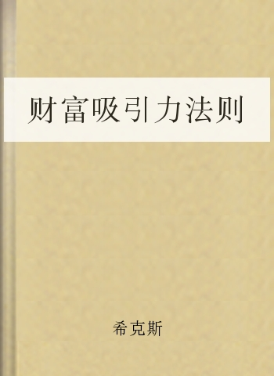

# 目录
Content

*   Chapter_1

## Chapter_1

前言（1）

杰瑞·希克斯

你认为本书有何吸引人之处？你为何会阅读本书呢？哪部分标题吸引了你的注意力？财富？健康？幸福？学会吸引？又或者是吸引力法则？

不管你关注本书的原因何在，本书将会为你答疑解惑。

这本书是讲什么的呢？它教导我们生活是美好的，我们的幸福是自然存在的。它教导我们，不管你现在的生活如何安逸，它还是可以更美好。只要你愿意，你可以拥有更丰富的生活经历。它也提供了实际的思想工具，只要你持续不断地使用，它将助你拥有财富、健康和幸福——这些都是你的天赋权利（我知道之所以这些，是因为我已经有所体验，生活也开始蒸蒸日上）。

生活万岁！现在是 2008 年的元旦，当我开始写这篇序言时，我正坐在加利福尼亚州德尔玛（该市以风景如画、豪宅众多而闻名）新家的餐桌前。

自从埃斯特和我结婚以来（1980 年），我们就视此处为我们的“伊甸园”，常常在梦中前往。现在，在欣赏圣地亚哥的风景很多年后，我们最终成了这儿的居民。

为何不学会欣赏呢？正是我们的朋友替我们找到了这处房产（我们曾告诉他，我们正在德尔玛附近寻找一处房产，可以停放我们长达米的旅游巴士）。这儿有景观设计师、工程师、时装设计师、木匠、电工、水暖工。这儿有贴砖匠、粉刷匠、家具匠。这儿有地板安装工、滑动门安装工、木窗安装工。这儿有高端的高科技人才，安装了路创自动照明系统，音频、视频、电脑的多媒体网络系统，自动无声的多分区空调，施耐德/美诺/博世/维京厨房器具（这些都是欧美厨卫用具的名牌）。这儿的商家服务周到，不厌其烦地为我们布置家具。这儿有勤劳的挖掘工、搬运工、水泥工、石匠、花匠……这儿还有成千上万的人热衷于发明、创造、新产品的传播——并借此赚钱……这里值得欣赏之处够多吧。

那只是值得你欣赏的事物中的九牛一毛。也许几分钟后，你又会发现一家价廉物美的餐馆，还有贴心的服务人员。热情好客的邻居们以别开生面的方式欢迎你的加入。

还有更多的事物道之不尽。向南边极目远眺，正是陶利松州立自然公园（据说此类松树全世界只有两处），越过卡梅尔山谷的潺潺溪水和水鸟禁猎区和礁湖，太平洋的海浪一浪接一浪，不知疲倦地冲刷着陶利松海滩。啊，生活多美好。

（埃斯特和我刚刚在海边散完步，我们现在正为新书《财富吸引力法则：学会吸引财富、健康、幸福》收尾。）

回想 40 年前，当我在全国的大学巡回演讲时，在蒙大拿的一个汽车旅馆里，我偶然发现咖啡桌上有一本书——拿破仑·希尔的《思考致富》，它完全改变了我对金钱的信念。利用他所传授的法则，我取得了巨大的成功，那是我连做梦都未曾想过的。

我其实不太在意财富的多少。但是，在发现此书后，我决定改变自己的挣钱方法——我要挣到更多的钱。说起来，我之所以注意到了希尔的书，正是因为我有这样的“愿望”。

在蒙大拿的汽车旅馆读到《思考致富》后，我在明尼苏达遇到了贵人，他为我提供了很好的机会。那项事业和希尔的教导相当吻合，我在那愉快地待了 9 年。9 年间，我的公司已成长为资产上百万的国际公司。在那些年里，我也从一名普通收入水平的美国公民（那是我以前打算的生活）变为百万富翁。

前言（2）

我从希尔的书中受益良多，开始将其作为“教科书”，并向朋友大力推荐。但是，虽说这些教导让我大获成功，我已意识到，只有部分朋友获得了巨大的成功。我想让所有人都成功，因此，我开始寻求可以让更多人受益的方法。

在《思考致富》的经历后，我已坚信：通过学习，人人都可以获得成功。我们不必出生在富贵之家；我们不必在学校名列前茅；我们不必认识某人，出生在某个国家；或是要有恰当的身材、肤色、性别、信仰等等。我们只要学会一些简单的法则，并且将它持之以恒地应用于实践，成功唾手可得。

然而，并非每个人都能从相同的文句中看出相同的信息，从相同的书本中看到相同的结果。因此，当我渴求更深刻的体悟时，理查德·巴赫的奇书《幻影》进入了我的视野。《幻影》带给了我一段激情岁月，一些令我大开眼界的概念和现象，我能熟练地在生活中运用它的基本原则。

一次，我在凤凰城图书馆消遣时，在书架上层偶然瞥到了一本书——简·罗伯茨和罗伯特·布茨合著的《赛斯如是说》。我摒弃其中无关之处，提炼出合理之处与帮助他人致富的部分。

赛斯对生活的观念和我先前接受的固有观念大相径庭，我对赛斯的两段话特感兴趣：“你创造你的现实”和“力量源于当下”。虽说我反复阅读，却总觉得自己始终没有真正了解这些原则。但我相信，这里有我苦苦追寻的答案。然而，赛斯后来没能进一步阐述。

在一系列偶然之后，我的夫人埃斯特开始接受一系列讯息，即现在众人皆知的亚伯拉罕教诲（如果你想听听我们对亚伯拉罕最初的介绍，可以访问，此网站提供对亚伯拉罕长达 70 分钟介绍的下载）。

当埃斯特自 1985 年开始灵修后，我就感觉，这将有助于我对宇宙法则有更透彻的了解，并能帮助我们更好地掌控生活。因此，早在 20 年前，我和埃斯特和就向亚伯拉罕询问了 20 多个方面的上百个问题，特别是灵修实践，并用录音机记录下来。当许多人对亚伯拉罕有所耳闻，希望和我们交流时，我们就将这些磁带分为两大主题出版了。

过去 20 年间，在我们的书籍、磁带、DVD 以及各类研讨会、采访的影响下，上百万人了解了亚伯拉罕教诲。同时，其他畅销书作家也开始在他们的书籍、电视访问中使用亚伯拉罕教诲。两年前，一位澳大利亚电视制片人开始以我们和亚伯拉罕的工作为主题拍摄纪录片。她带着摄制组上了我们在阿拉斯加的游艇，拍了一些场景，又找了一些可以融入其情节的受我们教导的学生——余下的众人皆知。

制片人将影片命名为《秘密》，展现了亚伯拉罕教诲的主旨：吸引力法则。该片虽未被澳大利亚网络电视台（9 频道）采纳，却直接发行了 DVD 和相关书籍。正是因为《秘密》，吸引力法则被成百上千万渴望更美好生活的人知晓了。

这本书就是在我们 20 年前所记录的手稿的基础上写成的。这些手稿还是首次出版。为了让读者更易理解和付诸实践，按照亚伯拉罕的意见，我们对每一部分都进行了修改，使之颇有系统，而不会有零碎之感。

在演讲圈有句俗话：“告诉他们你打算说些什么，然后告诉他们你说了些什么。”因此，一旦你主动学习这些技巧，你会通过不断重复而获得进步，所谓熟能生巧，学习也不例外。你不可能一边继续老习惯、旧思想，一边产生新想法、无限的可能。但是通过简单的重复，一段时间后，你就会养成新的积极的生活习惯。

传媒界也有句俗话：“人们更乐于娱乐而非教益。”但读过本书，你会发现一种审视生活的新方式，从而无比快乐。这本书对人的教益更胜于娱乐，不像读完放一边的娱乐小说，更像一本教科书，教你如何取得和保持财富、健康、幸福。因此，它需要不断阅读并付诸实践。

一直以来，我都希望能够帮助别人走上成功之路，特别是在财富方面。我相信，这本书能够为你答疑解惑，不管你有何困惑，都可以在本书中找到属于自己的答案。

这本《财富吸引力法则》是计划中四卷本“吸引力法则”的第二卷。两年前，我们出版了《吸引力法则：亚伯拉罕的基本教诲》。下一卷将是《人际关系吸引力法则》，最后一卷将是《灵性吸引力法则》。

在准备此书出版时，重温这些改变命运的文字，对我和埃斯特来说，都是一次愉快的经历。我们再次回想起了初次和亚伯拉罕讨论这些基本法则时的情景。

从一开始，埃斯特和我便决定将亚伯拉罕的教诲付诸实践。我们的经历十分愉快：在实践这些法则的 20 年后，埃斯特和我依然恩爱如初 （虽然我们在加州购置了新家，在得克萨斯州的公司也翻新了，但我们更愿意驾驶着我们那 137 米长的汽车参加一个个研讨会）。我们已经 20 年没有进行医疗检查（保险）了。我们没有债务，而且今年交的税比我们在遇到亚伯拉罕前的所有收入总和还要多呢。财富和健康并不必然通向幸福，埃斯特和我依然探索着通往幸福的途径。

总之，通过我们的亲身经历，我们很乐意告诉你：这确实有效。

正面思维法和积极面之书

财富吸引力法则

强大的吸引力法则时刻回应着你的念向、你所讲述的生活故事，你生活的每一部分均是由此而来。你的财富和资产，你身体的灵活性、高矮、体形，你的工作环境，你被对待的方式、工作满意度、奖励。你生活中之所以有愉快的经历，正是因为你描绘了一个新版本的自己。如果你能有意识地修改和增加你每天所讲述的内容，生活必然蒸蒸日上。

生活待你不公

你想拥有更多成就，每天兢兢业业、任劳任怨，但日思夜想的成功依然迟迟未现。起初，你拼命工作，进退得宜……但是老天依然不开眼，事业还是没有起色。

小时候，当你第一次渴求成功时，长辈们替你制定了一系列成功法则。当你满足了他们的期望时，你也有些成就感。你的父母和良师益友为你指明成功之路时似乎信心满满：“不要迟到，做到最好，努力工作，诚实，自强不息，乐于助人，没有付出没有回报，最重要的是永不言弃……”

但是，随着时间的推移，你发现按当年这些法则行事，你的成就感却越来越少。不管你如何努力，始终不尽如人意。回望过去，你发现这些法则也没给长辈带来成功，至少大部分如此，于是，你变得更加沮丧。更糟的是，你遇到一些人（他们显然不遵循上述法则行事），他们的成功和你一直努力践行的法则毫不沾边。

你不得不自问：“到底咋回事？为何努力工作的回报如此之少，平时散漫的人却能有所成就呢？为何我昂贵的教育投资血本无归呢——那些百万富翁却只有高中文凭。我的父亲劳苦了一辈子也没攒下什么，在为他办丧时，我还得向外借债……为何我辛勤工作却没有回报呢？为何只有少数人富贵，我们大部分人却在苦苦挣扎？我到底缺什么呢？那些富人有什么秘诀吗？”

“做到最好”还不够吗

当你每天认真做事，努力践行能够为你带来成功的法则，成功却迟迟不来，这很容易让你产生挫折感，甚至会对那些成功人士产生愤恨之情。有时，你发现自己之所以谴责他们，是因为看着别人成功实在痛苦至极。你长年财政赤字的状况，促使我们出版了这本书。

当你公开谴责你渴望的财富时，不仅财富离你而去，你也失去了上苍赐给你的健康和快乐。

许多人结论地认为，周遭的人因为某种阴谋相互结合起来，阻止自己成功。他们觉得自己已经尽力了，成功之所以迟迟尚未出现，必是被某些阴谋给剥夺了。但是，我们向你保证，这类因素不能决定你是否成功。成功由你掌控，无人可以阻止。我们写作本书的目的就是告诉你，你可以从容而有意识地控制成功。

播种渴望，收获成功

现在，你应回归本心，有意识地通过生活经历确定心中的渴望。当你从容放松之时，深呼吸，从容阅读，你将会逐渐记住成功之所由。你天生便有此能力，当你阅读本书时，必与宇宙至理形成共鸣。

永恒的宇宙原则恒定如常、坚若磐石，蕴涵着膨胀和爱的承诺，通过强大的韵律展现给你。从第一页开始，随着阅读的深入，当你记起如何接近那创世的宇宙能量，你将唤醒内心潜在的力量和沉睡的意识。

如果宇宙有唤起你的愿望的能力，必然也拥有为愿望结出果实的能力。此乃规律。

天生我材必有用

当人们事与愿违时，大部分人会认定有人从中作梗，因为没人会讨厌成功。将不利因素归咎于他人也许易为人接受，但是，认为有人从中作梗而导致你失败的这类想法，有着巨大的负面影响：当你忽以物喜，忽以己悲——你将无法作出改变。

当你渴望成功却无法实现，你的内心深处就意识到——生活出了毛病。情绪紊乱恰好表明你无法实现渴望，你会接二连三地产生一系列负面想法，对成功者的嫉妒，因失败而对他人的怨恨，甚至自我贬抑（这是最为痛苦的）。我们认为，这类情绪的滔天巨变不仅是表面的，更是对你的匮乏感的全面回应。

你的情绪紊乱是重大信号，表明你的生活出了问题。你本应成功，失败却令你饱受打击；你本应健康，却未老先衰；你本该飞黄腾达，现状却是令人难以忍受地裹步不前。生活本该是美好的——若非如此，必定是出了问题。出错并非因为不公正或命运之神不再眷顾于你，或是别人夺走本该属于你的成功，而是因为你和你的内心不再一致，还有你的真我、生活的馈赠、你的目标、宇宙法则。出错的并非是你无法掌握的外部因素。错在本心——贵在省身。只要你理解了本我、吸引力法则、天生的情感引导系统的价值（它一直活跃着，此刻亦然，而且极为易解），你一定能控制自我。

金钱本非万恶之源，亦非快乐之由

有关金钱或财富的话题十分重要，并非因为如众人所说它是“万恶之源”，或是幸福的必由之路，而是因为有关金钱的话题，成百上千次地被人们提及。它是一个重要因素，影响你的振动构造，影响你的个人吸引力。对于这个时时刻刻影响着你的因素，如果你能够成功掌控它，就可以取得成功。由于你的意念每天都接触有关金钱或财富的话题，只要你能自主地引导它，不仅财富滚滚而来，还能带动生活各方面的自主发展。

如果你是自主创造型人才，如果你想主动创造自己的新生活，如果你想掌控生活，如果你想实现你的愿望，你对“财富吸引力法则”这类流行话题的理解，将会对你大有裨益。

我的生活我做主

你的生活本该是富有、令人振奋而愉快的，你希望自己的一生富有激情，回报丰厚。五色五味刺激你的渴望，你知道这类愿望可以轻松实现，且愿望没有尽头。

生活无限精彩，你曾激情四射，斗志昂扬。你的愿望不因怀疑和不安而静默，因为你已了解自身所具力量，也知道世间原是修行地。你知道自己天生就有引导系统助你保持本真，还有由此源生的不断修正的意识，你对这个世界满怀渴望。

即便你刚刚出生，身形弱小，也是内心强大的巨人，时刻关注新鲜事物。

你天生便知晓自己生而为王，是生活的创造者，而吸引力法则是创造的基础。你记住，吸引力法则是宇宙的基础，它将任你差遣。

你需记住：你是世界的创造者，通过思想而非行动创造世界。即使你是不能行动、无法言语的婴儿，也不必惴惴不安，因为你记得初生于这个世界的欣喜，也知道有足够的时间适应新环境，学习语言。最重要的是，你知道即使大量知识无法直接转化为物质财富，那也没关系。因为通向愉快创造的道路早已铺就：你知道吸引力法则无处不在，引导系统时刻活跃着。最后，你即便会犯错，也会通过尝试，最终完全适应新环境。

我已领悟吸引力法则的一致性

宇宙中，吸引力法则恒定如常、坚若磐石。当你踏入一个新环境时，这是影响你信心的一大关键，因为你已领悟：生活的回馈将会助你立足。万物无不振动，吸引力法则对这些振动有所回应，依其本质重新组织：同性相吸，异性相斥。

因此，你无需担心无法立刻掌握这些知识，或者给你的周围人解释，他们似乎对此一窍不通。因为这一强*则的一致性，会通过你自己的例子迅速显示其效果。弄清你自己的振动并不困难，因为不管你的振动为何，吸引力法则均会源源不断地为你提供各类相似迹象。

当你觉得压抑时，那些能够帮你摆脱压抑的人与事将会离你远去，你也无法找到他们。即使你努力寻找，也无济于事。那些被你吸引来的人不仅对你没有任何帮助，反而增加了你的压抑感。

当你觉得受到了不公平待遇，公平就找不到你。你对不公平的感知及其导致的振动，使得真正的公平之物远离你。

当你沉浸于为财力紧张而失望或忧虑的情绪中，财路大开的机会将会继续离你远去。并非因为你不名一文，而是因为吸引力法则使得同类相吸。

当你觉得自己身世可怜，你只会招来穷困；当你觉得富足时，成功自然伴你行。这项法则始终如一。如果你有所注意，它就会在你的生活中教你运用之道。当你掌握了你所思考的事物的本质，你就拥有了自主创造生活的金钥匙。

何谓振动

当我们谈及振动，实际上是希望你注意，生活中的一切都在振动。我们同样可以用能量指代，还有很多类似的表达，比如有时用乐器以重低音演奏时，可以感觉到声音的振动。

我们希望你明白当你“听到”时，你正在将振动转变为可以听到的声音。你所听到的是你对振动的独特转译。万物皆在振动，你的感官随时解读振动，并有对振动的感知，于是，你的视觉、听觉、味觉、嗅觉和触觉方能存在。

当你明白了自己身处高度和谐而有规律振动的宇宙中，振动在你的灵魂深处通声相应，你就会理解振动之道。

空气中，微尘中，流水中，身体中，存于其中的一切皆有振动，万物皆遵循吸引力法则。

在六种解读振动的感官中，你的直觉是最强大、最重要的。它通过与你内心的对比，不断对你当前的思想（振动）作出反馈。

非物质世界是振动的。

你已知的物质世界是振动的。

振动之外，别无他物。

吸引力法则莫不遵循。

你对振动的理解将助你认识精神与物质世界。

无须了解复杂的视神经系统或大脑皮层视觉神经中枢而眼观八方；不必了解电学才能开灯；不必理解振动才能感觉到和谐和紊乱的差异。

当你学习接受振动的本质，并开始有意识地利用你的情感指示器，你才能主动控制自己的个人创造与生活经历。

我觉富足时，富足自找我

当你有意识地体验吸引力法则，你就有能力改变一切。如果依然我故，你所渴望之物，将越发匮乏，并继续排斥你。

人无法得偿所愿时，常常错归于外部力量：“我不能成功是因为我家太穷了，因为父母没有成功，他们也没有能力指引我；因为别人成功了，拿走了本该是我的资源；因为我受骗了；因为我一文不值；因为我浪费了青春；因为政府忽视了我的权利；因为丈夫好吃懒做……”

我们要提醒你，你之所以“未成功”，在于你提供的振动与成功的振动相异。你不可能自觉贫寒而能富贵。如果你不发出富足的振动，富足也不会找到你。

有人问：“如果我未成功，我如何能提供成功的振动？不是只有在成功之后才能提供成功的振动吗？”在春风得意时，当然更容易成功，因为你只关注事物的积极面，你的观察使之源源不断而来。但是，当你深处渴望之物的匮乏之境，你必须在它到来之前，找到感受其本质的方法，否则，它永远不会到来。

生活我主张，而非一避再避

本书是为了提醒你在某一程度上已经了解的事实，激活你的振动的知识。只有你不断深入了解这些知识，才能真正读懂本书——那是从更广的视角下所获取的知识。

醒来吧！是记起你的能量和存在理由的时候了。深呼吸，心平气和，慢慢欣赏本书，回归你原初的振动。

过不多久，你将满心喜悦：不再是受人摆布的婴儿，逐渐适应新环境，重新认识新能量，掌握你的命运；借助强大的吸引力法则，不再手忙脚乱，从容地应对生活。若要如此，你不能讲述与生活毫不相干的愿景应当讲述你渴望的生活，而非继续过去和现在的状态。

讲述你的渴望

欲从容生活，必先从容思考。若要如此，你必须要有一个参照点，以决定正确的思考方向。自你降生起，这两大要素皆已具备。吸引力法则（宇宙间最为强大而一致的法则）无处不在。你天生的引导系统随时予你直接的反馈。你只须做一件看似微不足道实则威力巨大的事：重新讲述新版本的你，讲述你内心的渴望。

当你讲述自己的生活故事时，必须心情愉悦。每一刻，每一主题，你都可以积极或消极地看待。宇宙中每一微粒中——每时每刻——皆有消极或积极的振动待你选择。当选择出现时，你可以关注你的渴望或其匮乏面，因为每一主题都有两面：渴望之物及其匮乏面。通过感觉，你可以判断自己关注于哪面，进而作出选择。

每一主题皆有两面

以下的例子帮助你理解为何每一主题皆有两面。

富足\贫困（富足的匮乏）

健康\疾病（健康的匮乏）

快乐\悲伤（快乐的匮乏）

清醒\迷糊（清醒的匮乏）

生机勃勃\暮气沉沉（生机的匮乏）

知识\怀疑（知识的匮乏）

兴致勃勃\味同嚼蜡（兴致的匮乏）

我能完成\我不能完成

我想买\我买不起

我心情愉悦\我情绪低落

我要更多财富\我钱不够了

我想赚钱\我不知道如何挣钱

我想有钱\那人的财富本有我一份

我要苗条\我很胖

我要一辆新车\我车太久了

我要恋人\我没有恋人〖HT〗

当你看到这个列表，当然知道哪一项是更好的选择，但你也许会忘记一件简单而重要的事：当你阅读此列表时，你会趋于陈述事实，而非表明你的渴望。这类趋向是你排斥渴望之物的主要原因。所以，在本书中，我们为你提供了一些示例和技巧，助你通向你的渴望。

如果你希望吸引力法则带给你别开生面的生活，你必须讲述一个新版本的你。

我现在的版本是怎样的？

有个方法对于讲述新版本的你十分奏效。首先，去倾听你现在所言所思，当你发现其中有一段与你的渴望相反，你便自问：“嗯，我清楚地知道这并非是我渴望的，那么我的渴望是什么呢？”接着，说出你的渴望。

我讨厌这辆丑陋破旧的破车

我想要一辆漂亮的新车

我很胖

我想要苗条

我的上司忽视了我

我希望受到上司的赏识

许多人认为，仅仅改变说法并不会改变现状，这样做并不会让一辆新车自动出现，或者令你的身体变得苗条，或者让你的上司态度好转对你另眼相看——但是他们错了。当你有意识地关注你渴望的话题，从渴望的未来讲述，你对这些话题的感觉将会发生真正的改变，那也意味着振动的改变。

正面思维法为生活再定位

所谓正面思维法，即有意识地认识到每一主题都有两面，并不断地言说和思考该主题的积极面。正面思维法帮你激活任一主题的积极特征。一旦你掌握这个方法，你渴望之物将会进入你的生活。

我们必须作出一项重要的声明，以防大家误解：如果你一边谈论你的渴望，一边又有所怀疑，你的言语并不会为你带来渴望之物，因为你的感觉才真正表明了你的思想——振动的方向所在。吸引力法则回应你发出的振动，而不是言语。然而，因为你不能同时论及你的渴望和厌恶之物，当你更多地谈及你的渴望时，将迅速改变振动平衡。

正面思维法的威力之大远不止于此：当你生活陷入困境时，一切都不是你想要的，当你自问：“我知道这不是我想要的生活，我梦想的生活在哪里？”并从内心作出回答，在那一刻，你的振动开始变化。正面思维法是强大的思想工具，可以即刻改变你的生活。

幸福生活靠自己创造

你是幸福生活的创造者。作为创造者，你必须明白，创造不是依靠你现在所作所为，甚至不是你的所言所述。你通过强大的思想创造现有生活。

当你说话或行动时，必伴有思想振动发生。然而，你的思想振动时，未必伴有言语或行动。早在模仿成人说话时，小孩子便开始模仿周围人的振动。

你的每一次思索均有其振动频率。不管是来自你的记忆，还是来自他人的影响；不管是你的思考，还是和他人思考互振的产物，你的每一次思索均以特定的频率振动。通过强大的吸引力法则，这类想*吸引类似的想法。现在，结合之后的思想以比之前更高的频率振动着。通过吸引力法则，继续不断吸引，直到这类思想足以吸引“现实生活的情景”。

通过思想的强大力量，你可以吸引所有的人、事、物。一旦你理解了思想之存在，你会发现新的解决之道，并以此指导思想。

愉悦之思

许多人相信在物质实体如血、肉、骨之外，人有更广阔的存在，我们将那巨大、永恒而智慧的部分称为本我。如何说明那永恒的部分并不重要，重要的是，你应当明白：永恒皆在、今在、永在。它对你在地球上的生活有着无与伦比的影响力。

你的一言一行皆以更广大的视角为背景。你之所以清楚地知道己之所憎、己之所喜，是因为你一直专注于你的渴望。

当你努力引导思想，向着你的渴望，如此每天坚持不懈，你将渐趋佳境。因为你的振动不断与自然接近，你的愉悦心情将会带你与本我契合。实际上，除非你此刻的思想与本我的思想振动一致，否则，你无法感受到内心的愉悦。

例如，本我关注你自己的价值——当你抱怨自己的缺点时，消极情绪正表明了你处于振动紊乱的状态。本我只关注美好而积极的方面——当你关注于令人厌恶的方面，你的振动便不再与本我相一致。本我只关注成功——当你只看到失败时，你与本我便背道而驰了。

追本溯源看自己

通过积极地思考，讲述你的渴望，你将自己的频率调整到与本我相一致的状态。在物质世界生活的同时，与更广阔的视角相一致，能让你将生活看得更清晰。从本源看世界实在是观察生活的最佳角度。从这振动的有利位置俯视，你会与最适合你世界的事物相一致，并吸引它。

埃斯特早已明白如何调整其振动，因此可以自如地将我们的知识转译给朋友，但是这一契合的另一益处她尚未知晓。

在一个春日灿烂的清晨，她正沿着送人车道为其同事开门，那位同事会开车过来。

在等待时，她忽然发现头顶的天空比以前更加漂亮了：色彩层次分明，白云蓝天交相辉映。她能听见极远处鸟儿的歌唱，美妙的乐音让她激动得发抖，感觉像鸟儿就在眼前。她能感受到来自草木、花儿、泥土的芳香，随风而来，萦绕其中。她感受到了生活的喜悦，爱上了这美丽的世界。她立即喊道：“从未有这一刻如此美妙，就是此时此地。”

我们笑了，因为她让我们视从其所视，听从其所听，嗅从其所嗅，触从其所触，享受美好的物质世界。

当你极度兴奋之时，此时此刻，你的本源与你合二为一。当你受到某些想法、兴趣的强烈吸引，亦是合二为一。实际上，你越愉快，与本源越一致，真我亦然。

与更广的视角的契合，能帮你更快实现你的渴望——融洽的人际关系，满意的工作，足以随心所欲的资源。它也同时提升你生活的每一刻。当你调整到与本我相一致之时，你的生活必定会有圆满、爱和清晰。此时此地，这也正是你真正想要的生活方式。

我能让自己更愉悦

埃斯特之所以能体验如此美妙的经历，正是因为她在努力寻找愉悦的感觉。当她躺在床上时，她便开始寻找，那感觉不断吸引类似的感觉，直到她走出门口（差不多是两小时以后了）。通过积极地选择，她已将振动频率调整到和本我相一致的层次，因此，本我很容易与其互动。

你选择的思考不仅吸引着下一步的思考，也提供与本我契合的平台。当你自觉而持续地思索，说你的渴望之物时，你就会不断地与纯粹、积极的本源相契合。此时，你的生命将会更加精彩。

负面情绪会致病吗

埃斯特的经历乃是源于她和本源的振动契合，及进一步与绝对愉悦的契合。如果你与本源及愉悦相脱离，同样也会有反作用。当你拒绝与愉悦一致时，虚弱和疾病将纷纷而至。

当你觉得情绪低落时（害怕、怀疑、沮丧、孤单等等），这类负面情绪正是你的振动和本我不一致的结果。在你的所有经历中——物质或心灵的——你的本我只知道积极面。因此，当你的思考与本我不一致时，你会首先觉得不情愿。

如果你保持下蹲，阻碍了血液循环，又或在颈部按上压脉器，减少氧气流动，你会立即感觉不适。同样如此，当你的思考与本我不一致时，能量的流动就会受到抑制——抑制则会导致负面情绪。当你的负面情绪长期存在时，常常会导致体质下降。

记住，每一主题皆有两面：渴望之物及其匮乏面。就像一根细棒的两端：一端是你的渴望，一端是你的厌恶。“健康”这根细棒也有“健康”和“疾病”端。然而，人们生病不仅因为他们关注“健康”棒的负面端，更是因为他们在许多类似细棒中关注“我所厌恶的”。

当你长期关注你的厌恶之物——而你的本我永远指向你的渴望，你的振动便与本我相脱离了。那也正是疾病的本质：因你的思考，你与本我相分离。

正面思维法，从糟糕到愉悦

每个人都想拥有快乐的人生，但大部分人相信，只有环境适宜，他们才会觉得快乐。实际上，大部分人的心情多由自身经历控制。如果他们遇到了好事，自然很高兴；如果遇到了坏事，常常觉得很糟糕。大部分人认为无法保持快乐，是因为为了快乐往往要改变环境，而他们更相信自己无力改变环境。然而，只要你了解每一主题皆有两面——渴望及其匮乏面，你便可以将注意力投注于事物的积极面。那正是正面思维法的真谛：不管你的注意力何在，自觉寻找积极面。

当你处境艰难，因而心情低落时，如果你自问：“我知道这不是我想要的生活，那我的渴望是什么呢？”受你的关注点的影响，你的振动将会改变，你的吸引点亦然。这正是开始讲述不同的生活故事的好方法。不再说“我没有钱”，你会说“我会找到更多的钱”。这是两个非常不同的故事——不同的振动，不同的感受，同样带给我们不同的结果。

当你不断自问，从更有利的方向出发，“我的渴望是什么？”你的状况将会为之一新。你不断讲述自己的渴望，你的吸引点方向就会改变。这个过程将是缓慢的，但是只要持之以恒，用不了多久，意想不到的精彩将纷至沓来。

我与渴望一致？

正面思维法其实很简单：当你知道自己情绪低落时（这表明你已经觉察到自己脱离了内心渴望），你只需停下脚步，并自问：“我现在情绪低落，这表明我和我的渴望不一致，那么，我的渴望是什么？”

每当你情绪低落时，正是确认你的状况、渴望的好机会——当你处于困境中时，将更加清楚内心的渴望。所以，停下脚步吧，向内心确认：一定有很重要的事，否则，我不会觉得心绪不安，我的渴望是什么呢？接着，你关注于渴望之物，负面吸引立即停止，正面吸引则重新开始。此时，你的感觉将从糟糕到愉悦。这正是正面思维法。

我的渴望

人们之所以不愿讲述不同版本的自己，多半由于相信应该承认生活的“真相”。但是，当你明白了吸引力法则回应的是你所描绘的理想中的自己——并令其不断延续——你也许会更愿意讲述一个不同的故事，一个与你的理想生活相符的故事。当你想到你不喜欢的，并自问：“我的渴望是什么呢？”你便开始转向讲述一个新版本的自己，还有更积极的吸引点。

你须记住：你只能得到你的思考之物——不管你情愿与否——因为吸引力法则始终如一。因此，你不仅在讲述你现在的生活，你也讲述你正在创造中的未来生活。

有时，人们会误解正面思维法，认为回天就是专注于不可能之事，并令自己信服。他们认为，我们正在引导他们颠倒黑白，又或是自欺欺人。但是，你永远不能通过欺骗而变得愉快，因为你的感觉由自己主宰，而它又是你所选择的想法的产物。

注意生活中你不想要的，会慢慢清楚自己真正的渴望，这实在奇妙得很。当你注意到自己的感受时，可以用正面思维法令注意力更多地集中于积极面。当吸引力法则对你的积极想法作出反应时，你会发现，生活也在向积极面转变，而消极面则不断消退。

当你有意识地运用正面思维法时，你是在有意识地选择自己的想法，选择你的振动，选择你生活的方向。正面思维法通过有意识地控制你的思想，引导你的生活。

此时我愉快至极

人们常常抱怨，如果生活美好，他们就更容易积极地生活了。他们也承认生活优裕时，心情坏不了。我们当然也认为，当你关注于积极面时（含上面的情况），则更容易愉悦。但是，你如果觉得自己只能关注于正在发生的事情，那么，如果它不能令你快乐，你只能等待一辈子了。因为你对厌恶之物的关注将会阻止你的渴望向你靠近。

你不必等待好事临门才喜气洋洋，因为不管自己处境如何，你都可以引导思想关注于积极面。当你注意到自已的感受，并将注意力集中于积极面，你的生活也许会发生积极的变化。

流入你生活经历之事是对你的振动的回应，你的振动由你的思想提供，你可以通过情绪感知思想的性质。找到愉快的思想后，愉悦的感觉随之而至。

许多人会说：“如果换个环境，我就会更快乐；如果我的人际关系更融洽；如果我的同事更容易相处；如果我的身体更完美；如果我的工作更高效；如果我的财富更多……如果我的生活处境更好些，我自然会更快乐，更容易积极地思考。”

良辰美景的确让人赏心悦目，也更容易让人感觉愉快。但是，你不可能总是一帆风顺，别人也许是在对你逢场作戏，希望别人为你提供完美的环境不是最好的办法，因为他们没有责任为你创造完美环境；他们不可能控制你已经创造的环境；最重要的是，你将失去创造自我生活的能力。

不管你的注意力何在，永远寻找事物的积极面，你的生活必将美好。

厌恶吸引厌恶

良辰美景事，亦有伤心处。宇宙的每一微粒都有着积极面和消极面。当你关注于事物的消极面，并试图推开，它反而会不断靠近，因为不管你是否情愿，你确实是在关注它。

你所处的宇宙以“包容”为基础。在“包容的宇宙中”，没有任何事可以“排斥”，当你看到你的渴望之物，并祈求得到它，相当于在说：“是的，那正是我渴望的，快快来我这！”当你看到你不喜欢的，并对它说“不”，实际上等于说：“快快来我这，我不喜欢的！”

围绕你的一切，均有积极与消极之分，你可以自主决定关注于渴望之物。你的环境正是与一系列选择的决斗，你应当更自主地对自我思考作出选择。当你试图选择令你愉悦的，当你开始讲述一个不同的生活、人物、经历故事，你会发现，你的生活会向你所讲述的新方向作出改变。

喜欢还是厌恶

有时，你会觉得自己正关注于渴望之物，实际恰恰与之相反。因为你的积极语言、微笑，并不必然意味着你发出了正面的振动。当你说话时，只有意识到当时的感受，你才能确定，自己真正提供了所渴望之物的振动。

关注解决之道

有一次，正当气象播音员播报“严重干旱”时，我们的朋友沿着得克萨斯希尔农产品公司的小道散步。她发现草木因为缺水而干枯发黄了，便立刻担心起来。她发现几小时前刚给鸟儿喂的水已经一滴不剩了，又想起了干渴的鹿可能为了饮水而跳出篱笆。当她为这一情况发愁时，突然停下来，望向远方——以非常积极的情绪祈求：“降一些雨水吧！”

从这匮乏处，你认为她能获得降雨吗？

她此刻做错了吗？

如果她想：我渴望降雨，因为它能苏醒万物，它为灌木丛中的生物带来雨水，它能让草儿变得更绿，这一切令人心旷神怡。

可以说，现在，她正在吸引雨水。

为什么要降雨呢？要脱身于问题，而将注意力转移到解决之道。当你考虑你为何才有此渴望，你的振动就会转向你的渴望。当你只想到它何时、为何发生，你的注意力又回到了未解决的问题本身。

从错误的关注中走出,通过分析渴望降雨的原因,她完成了逆转。她不但开始考虑自己的渴望及其原因，情绪也一步步开始好转。那天下午果然降雨了，当地的天气预报员报道了“这一不同寻常的暴雨”。

你的思想十分强大，你对生活的控制力远比你意识到的巨大。

我要快乐

一位年轻父亲因为儿子天天尿床而焦头烂额，这一情绪持续了很长时间，显然儿子的行为让他很尴尬。“他已经长大了。”他向我们抱怨道。

我们问：“今天早上你进卧室时，发生了什么事？”

“我一走进卧室，闻到尿骚味就知道：他又尿床了。”他答道。

“那时你有什么感觉？”我们问。

“无助、愤怒、沮丧。我经常有这种感觉，自己也不知道该怎么办。”

“你怎么对儿子说的？”

“我让他脱掉衣服去澡盆里洗洗。我告诉他，他已经长大了，这样做很不好。之前我已经说过很多次了。”

我们告诉这位父亲，正是他令儿子不断地尿床。我们解释说：“当你觉得受制于形势时，你就无法改变形势。但当你能控制自己对这一形势的感受时，你就可以改变这一形势。比如说，当你进入儿子的卧室，发现他尿床了，你可以停下一会儿，承认这个事实并不是你所愿意看到的。你自问自己希望如何，并通过寻找原因来向另一面逆转，你不但会立即心平气和，过不了多久，也会看到积极的结果。”

“你希望怎么样？”我们问。

他说：“我希望小可爱能一觉醒来清清爽爽的，我希望以他为傲，不再尴尬。”

当这位父亲关注于希望时，就轻松多了。因为在这种努力下，他与其愿望相契合。我们告诉他：“当你关注于积极面时，你所发出的频率将与内心的渴望相契合，你会对儿子施加更积极的影响。你就会说：‘哈，这也是成长的一部分。谁都有这种经历，你也会快快长大的。现在，脱下衣服到澡盆洗一洗吧’。”不久，这位父亲便开心地打电话告诉我们，他儿子不再尿床了。

情绪低落时，事事不如意

虽然人人都多少了解自己的情绪，却少有人明白情绪的引导作用。简单地说：当你情绪低落时，你正吸引令你不快的事物，情绪低落乃是因为你在关注它。

许多人讨厌负面情绪，我们更愿引导你，助你理解你关注事物的性质，你振动的性质，我们称之为“引导之铃”，它提供逆转你的情绪的信号。

你的情绪是你的引导系统，助你理解每一次思索。当刚刚明白思想的威力和关注积极面好处的人处于负面情绪时，常常觉得尴尬甚至愤怒。其实，因为拥有全面引导系统而对自己生气实在没有必要。

当你意识到情绪低落时，通过自我表扬，以意识到引导系统，并通过思考积极面扭转情绪，这也是非常微妙的正面思维法，它能让你的思想更积极。

当你觉察到自己有负面情绪时，你可以对自己说：我感觉到了负面情绪，那表明我正在吸引令我不快之物。我想要的是什么呢？

只要承认你“想要快乐”，便会扭转你的思想向着更积极的方向发展。但是，“想要快乐”和“不想一团糟”之间的区别非常重要。有人会认为，这只是同一件事的不同表述，其实这两类表述大相径庭，有着巨大的振动差异。如果你能让你的思想不断寻找令自己愉悦之物，你会形成新的思想或信念模式——它可以帮你创造美好生活。

我的思想要更强

不管你思绪何在——遥远过去的回忆，你正遇到的事，或你对未来的期待——只要你在思索，它就会吸引类似的想法。你的思想不仅会吸引类似的想法，而且你的关注时间越长，思绪就越强烈，吸引力也更强。

我们的朋友杰瑞常常拿船只进港时的绳子作类比。船只通常会被系上一根又粗又长的绳子，这根绳子过于粗大而不能扔过一片水域。因此，首先是把一团麻绳扔到码口那儿。捻线后，麻绳变粗，继续捻线而变得更粗……最终，又粗又长的绳子很容易就能拉过水面，船只也安全进港了。这和你思想的连接十分相似，一个接一个，一个又一个。

对于某些话题，因为你一直在捻长负面之绳，你很容易就会冒出消极的想法。某人的几句话、一段回忆或一些意见，都会马上令你情绪低落。

你平时的所思所想，经过日积月累，可以基本决定你的吸引点，你可以积极或消极地引导自己的想法。比如，你在杂货店时，突然发现平时购买的必需品涨价了，你感到一丝不快。也许你只是因为商家的突然涨价而感到意外，因为对于商品的定价，你也说不了什么，只能承受，所以就不高兴。然而，我们要指出，你的不快并非是因为杂货铺商品的涨价，而是因为你自己的思考角度。

就像刚才类比的不断捻连的绳子，你的想法也是一个接一个，并产生振动。例如，哇，这价格比上周可涨了不少，这价格不太合理，市场上的价格没有合理的……一切都做不了主，我都不知道怎么过下去……像以前的日子那样是不行了……我的经济太糟了，我无法承受这些涨价……我的日子又要苦了……我的工资可不像这生活费节节攀升……

当然，这载满消极想法的列车可以向多个方向行驶，抱怨店主、经济形势、政府，它会令你觉得形势大大不利，因为你观察的每件事都是自己的感触。所谓境由心生，因为你提供了自己的振动，它通过对你思想的选择影响你现在所吸引的。

如果你意识到自己的感触，并了解你的情绪指示了你的思考方向，你便可以引导思想。例如，哇，这价格比上周可涨了不少……然而，我没注意篮子里的商品，它们的价格没变，甚至还降价了，我注意到，因为商品涨了不少，才吸引了我的注意力……价格确实涨了，我尚能处理，一切尚可接受……

一旦你注意保持快乐，你会发现，让你的思想变得愉悦并非很难。

当你对愉悦的渴望活跃于心中，便会不断地唤起美好的感觉，你会发现自己的思想越来越容易集中于积极面。你的思想拥有巨大的创造力和吸引力，你只能通过不断地愉悦思考才能驾驭。当你的思想在胜负得失、喜欢讨厌间来来回回时，你就失去了纯粹而积极的思想带给你的劲头。

创造积极面之书

在我们积极于这项工作的第一年，在可以辐射方圆 480 公里的合适地方租了家小旅馆，这样，人们在提问时便有了一个舒适的场地。奥斯汀市的一家旅馆似乎常常忘记他们的预定，虽说埃斯特已经签了合同，甚而在前一天晚上打电话确认。这家旅馆每次都能提供食宿（虽说当他们到达时，没有人想想他们的预定），但是每次都要催促店员在客人赶到之前准备好屋子，这令杰瑞和埃斯特很不舒服。

最后，埃斯特说：“我想我们最好找家新的旅馆！”

我们说：“也许你们对的，但是要记住，你始终带着你自己。”

“你这话是什么意思？”埃斯特的问题有点火药味。

我们解释道：“如果你因匮乏而采取行动，常常会适得其反。实际上，新旅馆会像上一个旅馆那样对待你。”她豁然开朗，不禁哈哈大笑，为了这个理由，她已经换了好几家旅馆了。

“我们该怎么做呢？”她问道。我们鼓励她们买一本笔记本，并在封面上写下：“我的积极面之书。”在书的第一页写上：“奥斯汀市——旅馆的积极面。”

于是，埃斯特开始写：“这儿环境优美，位置优越，与市区接近，容易找到方向，这儿的房子规格多样，店员态度好……”

当埃斯特写下这些时，她对这家旅馆的看法大为改观，从负面变为正面。当她的想法改变时，她对旅馆的吸引同样有所改变。

她并未写：“他们随时准备好了接待我们。”因为这与她的经历不符，写下那些会让她觉得与现实相矛盾，并感到苦恼，又或有几分自我辩护的意味。通过保持愉悦，并将注意力集中于旅馆的积极面，埃斯特有关旅馆的吸引点改变了。接下来，发生了好多有意思的事：这家旅馆不再忘记我们的到来了。埃斯特很快明白，旅馆忘记他们的合同并非因为他们不关心，只是店员受到了埃斯特的思想影响。而现在，他们也受到了埃斯特的积极思想的影响。

埃斯特非常享受积极面之书，她很快将之应用于生活的各个方面。我们鼓励她不仅记下了她所寻找的快乐，还有她曾经享受的愉悦，以养成愉悦思考的习惯。这样的生活很潇洒。

吸引力法则为思想添威力

在陷入困境时，你常常会寻找原因，以说明你为何落得如此境地。当你在辩解抱怨、寻找理由时，依然处于负面吸引之中。当你解释事情为何不能如你所愿时，你的一言一语正在吸引负面想法，因为当你只顾解释为何不能如愿以偿时，就无法关注渴望。你无法同时关注积极面和消极面。

当你试图确定困境始于何处，只会继续负面吸引：我的困境源于何处？为何我不能如愿以偿？你希望生活蓬勃向上，因此需要解决这些问题。但是，寻找解决之道和通过对问题的强调而寻求解决，这两者间的差别大得很。

认识到事情并非如你所愿是重要的一步。一旦你确定了，你越快转移到问题的解决，对你越有利，因为对问题的过长关注将会阻止你解决问题。问题的振动频率与解决之道截然不同。

当你意识到正面思维法的价值，并确认你厌恶的，你应立即关注你的渴望。你会发现生活的美好，因为生活出现的问题还不是很多。每天利用积极面之书将会助你积极向上，它将帮助你逐渐将你的思想导向渴望。

你越关注令你愉悦的思想，越会发现思考积极面和消极面之间的重大差异。当你在谈论或思考你的渴望时情绪低落——例如，更宽裕的财政、更融洽的人际关系、健康的身体——你正在阻抑自我发展。

正面思维法和积极面之书均是为了助你认识——在你创造的初期——你正在拉着负面的线团。你可以立即将之放开，并寻找正面之线。

从令人愉悦的想法出发，一点点地变得愉快，比之于直接通向美妙的想法简单得多。因为所有的想法均受吸引力法则控制。

每天保持好心情

当你关注于消极之物时，更容易留意消极的话题（甚至找到其他证据支持），而非转移到积极视角，因为同性相吸。如果你想从负面、消极的话题直接转向积极而愉快的话题，很难成功，因为两者之间的振动差异太大了。改变你自己振动的办法还是从一点一滴做起，慢慢通向你的渴望。

当你早晨起来，在睡了几个小时觉后（因此和厌恶之物的振动相脱离），正好处于积极振动状态。如果你在起床前思考生活的积极面，你整天的情绪将会很积极。吸引力所提供的思想也会更加令人愉悦而有益。

每天清晨，你都会推出别的振动基准，为你一天的思考定调。虽然有时生活中的事情与基准相差很远，但你会发现，你已经完全控制了你的思想、你的频率、你的吸引点、你的生活！

睡眠是能量调整的最佳时机

当你睡觉时，或你的身体完全休息时，身体的吸引完全停止。睡眠时，你的本我重新调整能量，身体也获得休息，驱除劳累。当你上床后，如果你说：“今晚我会睡个好觉，我知道所有的吸引都会停止，当我一觉醒来时，我将重新回到物质世界。”你将会从睡眠中获得更大益处。

早晨醒来其实和新生差不多。当你醒来后，睁开眼睛说：“今天，我将保持愉快。没有比快乐更重要的事情了。我选择的思绪奔涌而来，借以提升我的振动频率，使之与宇宙的积极面相呼应。”

如果你在睡觉时满腹疑虑，当你醒来后，会立即承接昨晚的思绪，这一天的思想也将会继续走向负面。吸引力法则会不断为你提供类似的思想。但是，只要你在睡觉前确立生活的积极面，并且记住在睡觉时会与外界振动脱离，当你醒来后，你会睁眼说：“今天，我将保持愉悦。”你将重新掌握你的思想和生活。

不要杞人忧天或想着今天必须完成的作业，刚醒时，你只要躺在床上寻找生活的积极面：“这床多舒服，被子多暖和。我的身体精力充沛。空气多清新，生活多美好！……”你已经开始捻正面之绳。

吸引力法则就像放大一切的巨型放大镜。当你醒着并寻找愉悦的理由时（有些就在你身边），吸引力法则将会接连不断地提供类似的想法。那正是我们所说的“以正确的方式起床”。

通过一点点努力，对快乐的渴望，你可以引导你的思想通往更美的图景，直到你改变自己的思维习惯及吸引点。你思想的变化很快将会在生活中有所体现。

积极的睡眠过程

行动导向令你相信一分耕耘一分收获。但是，当你学会自如地引导思想，你会发现思想的巨大威力。只要你持之以恒地关注自己的渴望，而非在渴望与厌恶之间来来回回，你会通过亲身经历明白此话的正确含义。因为你的行动导向信念，有时过于辛苦了。所以，你常常关注于问题（或者需要在哪方面弥补），而非关注渴望。

通过寻找积极面的过程，你可以对此有所改善。当你躺到床上后，试着回想一些白天发生的趣事。一天里当然有很多事情发生，你可以沉思一刻。也许你记得一些令人不快之事，但更应当关注于那些快乐的事，细细品味。

起初，你可以说：我最喜欢的事……我最喜欢的部分……沿着积极的线索思考你白天最快乐的部分。当你感觉到积极思想的效果时，立即回到你的主题：睡个好觉，醒时神清气爽。

对着自己说：“我现在要入睡了。当我睡觉时，因为不再思考，吸引将会停止。我的身体将会神清气爽。”关注到你身边触手可及的事物，像舒服的床、柔软的枕头、此刻的轻松适意，接着继续你的思绪：“我会睡觉睡到自然醒。一觉醒来后，又将是新的、愉悦而积极的吸引点。”接着，入睡吧。

积极的早晨

当你在第二天醒来时，情绪将会十分积极，你首先会想：“嘿，我醒了。我又回到了这个世界。”在床上静静躺一会儿，细细享受这番舒适，开始思索：“今天，不管我上哪儿，不管我做什么，不管我和谁共事，我都要保持愉悦。当我快乐时，我的振动发出更强的威力；当我快乐时，我和我的渴望相一致；当我快乐时，我正吸引着周围令我快乐的事物；当我快乐时——我就快乐！”（如果快乐只带给我们片刻的好心情，这也不错——但是它带给你的好处远不止此）

我们在床上躺上两三分钟，便开始寻找周围的积极面。当我们开始新的一天时，会发现更多的积极面。不管注意力何在，我们都能找到快乐的理由。

虽说一早就寻找快乐，我们还是会发现一些负面情绪，因为有些话题天然有着负面倾向，我们会停下，并说：“我希望保持快乐。我有些负面情绪，那正表明我正关注令我不快之物。我的渴望是什么呢？”我们要立即关注于内心渴望，关注于新的、积极的思想。只要时间足够长，我们便会感觉到积极的能量开始重新在体内涌动。

当你继续生活，寻找更多的乐趣和欢笑，希望快乐时，不必一板一眼过于严肃；当你随意谈论时，就不大会注意其匮乏；当你不再关注于匮乏，会更快乐；当你更快乐，会吸引更多的渴望之物，你的生活也会越来越好。

晚上，当你躺在床上，你有很多快乐足以回味，带你进入甜蜜的梦乡。次日醒来，你的情绪又会更加积极。

我的感觉我知道

当你处于困境之中时，你常常试图发现一些积极面。有些事令人难以忍受；有些问题如此之大，似乎找不到一点积极面，但是，这一切皆是因为你的跳跃幅度过大——从你现在关注的困境到你渴望的解决方案。如果你有切中问题的解决行动，却发现没有一个举动可以药到病除时，切记此刻的一举一动未必有积极效果。当你无法理清头绪，不知何种处理方式有利于自身时，只需牢记你的感觉。

这情形如同有人说：“我刚刚跳下了飞机，可我没有带降落伞。我该怎么办？”一般在这种情况下，没有一个行动或想法可以取得显著效果，改变即将到来的结果。与此类似，有时你找不到一个有效的行动，也没有足以改变一切的想法。

但是，如果你理解了持之以恒的思想所拥有的巨大影响力，你会自如地通过情绪的引导选择你的思想，通过关注积极情绪，可以轻易地将你的生活变为愉悦的经历。如果你能在自主选择的思想中找到些稍微的放松，解决之道的大门便缓缓开启了。

有时，你无法确定下一步的方向，甚至无法确定内心真正的渴望，但是，你永远不会忘记自己真切的感受。你知道自己愿意快乐而非痛苦，活力而非疲劳，热情而非冷漠。你知道自己愿意多产而非低产，自由而非禁锢，增长而非停滞……

行动常常无法弥补不一致的思想，但是，当你能够自主地决定自己的思考方向，控制了自己的感觉方式，你会发现思想的强大影响力。如果你能更自如地控制自己的思想，就能够随心所欲地控制生活。

快乐才是王道

自主思考并非难事。你很关注自己的衣食住行，而学会自主地关注令你愉悦的话题所起的作用，远比饭菜、车辆、服装的选择大得多。

当你阅读本书时，你感觉到与能量的应和，当你感受到负面情绪时，你便意识到受了思想的重要引导。你陷入负面情绪时，绝不会不知道你正在吸引令你不快的事物。意识到情绪及其引导作用十分重要，因为即使你不了解负面情绪的含义，依然会吸引负面之物。所以，了解自己的情绪将会令你掌握生活。

当你情绪低落时，不妨停下来对自己说：“快乐才是王道——我希望保持愉悦的心情。”你将找到积极的情绪，它又会吸引一个又一个类似情绪。当你养成了寻找积极思想的习惯时，你的环境必然会大大改观。吸引力法则正是如此。当你心情愉悦时，幸福之门将为你敞开；当你郁郁寡欢时，生活之门便会缓缓地关闭。

当你情绪低落时，你处于拒绝你渴望之物的状态，这一拒绝会对你产生影响，它将影响你的身体健康，影响着足以进入你生活的美好事物的数量。

通过你在生活中对积极面和消极面的关注，你得到了一张振动支票。它为你提供你的渴望之物，但只有你发出的振动频率与其接近时，才能在生活中真正得到。除非你在它们尚未显现前，就寻找到有关它们的愉悦感，否则，你只能眼巴巴地看着它们在门外，而无法打开大门迎接它们。然而，当你开始寻找它们的积极面时，这扇门终将打开，你渴望的每件事也会涌入你的生活。

锦上添花花自来

不管你的注意力何在，当你自觉地寻找积极面时，你发出的振动也调整到了更为积极的波段。当然，你也会调至消极波段。许多人因为来自父母、老师、同学的负面对比而不断在自责中挣扎，自我否定对人的积极吸引能力的危害最为巨大。

因此，选择一个给你带来较少消极想法的主题，你可以调整到更积极的频率。从愉悦状态出发，当你重新调适对自己的想法，你会发现，其实自己的优点也不少。当你发现周围更多的积极面，你也会发现自己更多的闪亮点。一旦如此，发掘生活中的积极面也将易如反掌。

当你自厌时，又会发现其他缺点。你会说：“坏了，更坏了。”但是，当你自觉寻找自己的积极面时，你会发现更多优点：“好了，更好了。”

我们不能过份强调寻找积极面的价值，关注更多的渴望之物，因为靠近你的每件事依赖于一条简单的假设：不管是否如你所愿，思考越多，获取越多。

我的宇宙正负平衡

你是生活的创造者，或者说，你是生活的吸引者。所谓创造并非只是吸引目标，不断追求和达到目标。创造是关注内心的渴望，将你的思想调整到你所渴望经历的各个方面，允许吸引力法则将其带入你的生活。

不管你在回忆往事、想象将来或者思考现状，你都提供了思想——振动，吸引力法则会对其作出回应。你也许会将思想理解为渴望或信念（信念只是一种长时间的思索），无论在何处，你的注意力均会形成吸引点。

因为每一主题皆有两面——渴望及其匮乏面——当你相信自己关注于积极面时，你很可能在关注消极面。人们会说：“我想要更多的钱。”但是，他们心中实际所想的是他们拮据的经济状况。生病时，人们常常会谈到对健康的渴望。他们对令人不快的论题的关注促使他们关注自己的渴望。在大部分情况下，即使他们所说的似乎是在关注自己的渴望，实则恰恰相反。

当你谈话时，只有自觉地意识到自己的感觉，才能判明你所吸引的是积极事物还是消极事物。也许你所进行的吸引过程无法立刻见效，你的所思所想不断汇聚你的思想、振动、能量；最后，结果将会十分明显。

我的宇宙回应我的注意力

许多人一厢情愿地认为：宇宙对其言语的回应类似于周围人对其言语的回应。当你向某人打招呼：“嘿，来我这儿。”他肯定会过来。当你说：“不要过来。”他当然会走开。但你生活在一个相互吸引的宇宙，那意味着没有“不”。

当你关注于你喜欢的物品并说道：“嘿，来我这儿。”你在所发出的振动中包含了它，吸引力法则就开始产生作用了。但当你看到了令你不快的事物并说道：“不，我不想要，快离开！”宇宙也开始吸引了。你的注意力在此，因此你发出的振动与其一致，也带来了回应。

当你说：“健康，我寻找你……我渴望你——我在健康的想法中。”你正在吸引着健康。但是当你说：“疾病，我不想碰到你。”你就在吸引着疾病。当你说：“不，不，不。”它反而会不断地向你靠近、靠近。因为你越是排斥你所讨厌的，越被其笼罩。

人们常常认为，只要找到志同道合者、修得完美的体重、积累足够的财富，便一劳永逸了，他们也将找到最终的幸福。但是，宇宙中没有一处地方只有积极面存在。积极面和消极面（渴望的和厌恶的）存在于宇宙的每一微粒之中。作为创造者、选择者、定义者、决定者，当你寻找积极面时，它就会在你生活中的各个方面出现。你不必等待完美生活显现时方才有积极的回应，你可以积极地训练自己的思想和振动，成为创造者。

我们鼓励你每天做此陈述：今天，不管我去往何方，不管我做什么，不管我与谁共事，我都要寻找我希望见到的。

记住，每一个清晨醒来，便是你的再次新生。当你睡觉时，所有的吸引便停止了。几小时的睡眠（那时你的意识不再吸引）带给你全新的开始。因此，除非你一大清早便继续昨天的烦恼，否则，在你新的一天、新的生命，新的开始时，没有任何烦恼。

感觉愉悦吸引愉悦感觉

一位妇女告诉我们：“最近我有三四个节日宴会，我一听到消息，就情不自禁地想，哎，玛莉也会去，她一定光彩照人。我立即有了开始和别人攀比的想法。我真希望可以停止胡思乱想，安心享受宴会，不管有谁在那儿。你能指导我用正面思维法和正面思考解决这一问题吗？我真的不愿参加这些宴会。”

我们解释如下：当你考虑到参加宴会时，你不自然的感觉被放大了，你的不安并非由宴会或玛莉导致。当我们考虑和他人的关系时，总是复杂得很，有时甚至可以追溯到童年，其实没有必要这样做。从你此刻的状态出发，你完全可以找到积极面或消极面——思考想要的和不想要的——不管你立刻开始，或在参加第一个宴会的几天前开始，或者等到宴会开始时，步骤均一样：当你关注其中时，寻找积极面。

因为你对自己的心理活动更容易控制，在你涉足其中之前，更容易发现该情景下的积极面。如果你想象着你期望的场景，对即将到来的情况积极回应，当你参加宴会时，你前几天的观念控制将会发挥效力。

你不可能同时既高兴又悲伤，不可能同时关注想要的和不想要的。在参加宴会之前，如果你将思想集中于你所见的和渴望的，吸引力法则将会带给你喜悦和愿望。

如果你希望这次的宴会与从前宴会相比，能有不同的收获，你必须讲述不同版本的自己。你以前的版本也许是这样的：“我之所以被邀请参加宴会，皆是因为我同伴的关系。我在宴会中似乎无足轻重。我与周围的环境格格不入，我对他们感兴趣的话题一窍不通。我是个局外人。玛莉可不像我一样，她的举手投足都散发着自信心。在玛莉面前，我总是相形见绌。我讨厌这样。我真希望我没来。”

再来看另外一个版本，你也许会是另一种感受：“我的同伴受人尊重。她的公司为职员提供了很好的交流机会，而且可以携带家属。我不用对他们的工作进行讨论。实际上，这个晚会更适合享受别的事。”

“生活远比我丈夫的办公时间大得多。我从来没有陷入他们的工作困境，对他们来说，我就如一阵新鲜空气。玛莉表现很友好。她显然没有陷入办公室政治或问题中。看着她真有趣。她的衣服在哪儿买的呢，穿起来很合身的样子。”

你明白了吗，你不必列出令自己感到不安之处，并利用办公宴会解决它。只要关注积极事物，感受心境的变化，玛莉或许会成为你的朋友。在任何情况下，一切取决于你和你使之实现的振动。

我如何不再为他们悲伤

杰瑞问过我：“大部分时候，我之所以不安，是因为看见了别人的痛苦。我该如何使用正面思维法，使我不再因他们而痛苦？”

我们解释：不管你关注什么，它既有你想见的，也会有你不想见的。你的痛苦并非因为你看到了别人的痛苦，而是因为你只看到了其中导致痛苦的一方面。两者大相径庭。

当然，如果这个人满脸笑容，你会很容易感到快乐。但是，为了控制自己的感受方式，你不应该依赖于环境的变化。无论外界如何，你必须具有关注积极面的能力。为达到此目标，必须记住：每一个论题皆有积极面和消极面，只要你主动寻找，一定可以发现阳光。

当然，思考眼前的场景要比想象渴望简单得多。然而，当你确实心情愉悦时，就不会单单是被动的观察者，因为你对快乐的渴望唤起了寻找积极面的热情。你越是关注快乐之物，吸引力法则越会带来令人愉悦之物，直到你完全进入积极状态，并忽视与其不符之物。

我们建议一位母亲无视儿子的问题，这位母亲问道：“他会不会觉得被放弃了呢？我不应该帮助他吗？”

我们认为，关注她儿子生活中的积极面并非是所谓的“放弃”，放弃令你不快的思想有着巨大的价值。我们说：“仅仅倾听他们的抱怨和问题，你就无法帮助他们。通过想象你儿子生活中的进步，你会帮助他不断为之努力。你只需在远方静静等待，带他走向圆满幸福。”

当你自觉地希求快乐，关注所思所想，你会发现，越来越多的论题为你带来了类似的思想与快乐。你可以为更好地和他人互动（不管好坏）做好准备。因为你渴望愉悦，你会以你的视角与之互动。不管他们处境如何，你都能更容易地靠近他们处境中的积极面。如果你无法掌握振动，不能持之以恒地关注愉悦及其振动，你也许会卷入他们的困境，并因而烦恼。

我们再强调一次，你并非因其处境而感受到他们的痛苦，你的思想带来了你的痛苦感受。对这类知识，你完全可以自控，并运用自如。当你可以控制自己的所思所想与感触，那么，你在这颗星球上便是“快乐由我”了。当你相信感触源于外界的情形与行为——知道自己无法控制外界的形势——你自然无法感受自由的芬芳。实际上，那正是你所描述的痛苦。

我的同情不值一文吗

杰瑞告诉我们：“当我的注意力从处于困境的人那里转移，我就不会感受悲伤。但是，这依然对他们无所帮助。也就是说，我并未解决问题，而是在回避问题。”

我们回答：如果你不关注他们的困境，你可以继续保持快乐，但问题依然存在。不过即使你关注困境，觉得不安，他们也会继续情绪低落，因为他们依然处于困境。如果你继续关注困境，也会同样陷入困境；然而，如果你不再死盯着他们的问题，而是试图想象他们积极的成果，你就会情绪饱满——而你的情绪也会带给他们更加积极的成果与想法。

当你处于负面情绪之时，你对别人并无丝毫价值（你也无法提供解决方案），因为你的负面情绪表明你正关注于匮乏，而非你的渴望。

如果某人处境糟糕，他们令你笼罩在巨大的负面情绪之中，如果你无法自觉地保持与愉悦情绪相一致，就很可能会被卷入其中。你也许会成为他们痛楚链的一部分，同时将消极情绪传染给别人。

如果你在每天临睡前对自己说：“今晚，当我睡着了，一切吸引都将会停止，明天又将是新的开始。明天我会寻找我想见的，因为我心情愉悦——愉悦才是一切！”当你隔天醒来之后，一切重新开始，没有了昨日的阴影。当你上班时遇到一位愁眉苦脸的人，你不会成为痛苦的一部分，反而会提供快乐，因为你的感觉会发出振动。

现在，不仅你会开心，别人也会分享你的快乐。实际上，当你的感觉和别人感觉大不相同时，你很难与之交流。如果你保持积极情绪，他们会立刻受你的感染，他们发出的振动也不会影响到你。只有当你不断关注满腹牢骚者时，他们才会在你的生活中不断出现。

如果你和另外两人沿着山边行走，你不小心落在了崖边，被一根细藤挂着。你的一位朋友强壮而步履坚实，另一位朋友则笨手笨脚，你更愿意哪位在场？寻找积极面和选择朋友一个道理，它发自你的内心。当你持之以恒地与愉悦相一致，宇宙中的大量资源终将为你所拥有。

对他人的同情意味着关注他们的处境，并与之感同身受。而每个人均有感觉快乐或糟糕的可能——渴望的成功实现或失败——你可以选择感受他们的任何一面。我们鼓励你选择他们令人积极向上的一面，这能影响他们积极地看待生活。

当别人感觉受伤时，自己如何不受伤

有人问：“如何恰当地结束和某人的关系，即使别人受伤，自己也不会受伤？如果你决定分手，别人却不甘心，他便会很受伤，在这种情况下，你该如何保持平衡？”

我们的意见是：当你以别人的感受决定自己的一举一动时，将会变得无助。因为你无法控制别人的观点，也无法在你的振动吸引点上获得长足的进步。

如果你尚未做足功课，关注你的渴望并明白其缘由，即使你采取了断续关系的举动，这类举动只会给你带来不安。即使和朋友关系结束后又孤单一人，又或交到新朋友，这些负面振动也不会允许快乐进入你的生活。你不如找到你的振动平衡后再采取行动，否则只会带给你长期的不安。

你觉得关系不好，才会分手。你觉得分手后，你有更多快乐的机会。但当你告诉他时，他却十分不高兴。现在，因为他不高兴，你也不高兴了。

你可以选择保持现状，并说：“别不高兴了，我只是开个玩笑。”但这一切是你们两人都不高兴所引起的。你决定分手，这令你的朋友更不高兴。当你收回你的决定时，你的朋友不像平常那样不高兴了——但你们两人不是都高兴。除了事情曾有一点恶化之外，几乎没有任何改变。你仍然对这段关系感到不满。

另一个选择是坚决离开。你可以关注这个关系带给你的尴尬之处，用这些为你的离开辩解。对负面事物的关注，给你带来了离开的勇气，但你并不会有很大的改善。一旦你希望通过分手来减少痛苦，你会觉得需要不断地分手，你依然不快乐。即使你已经从令你不快之物中走开，依然觉得烦恼。

实际上，你无法阻止别人情绪低落，因为他们之所以情绪低落并非你的原因。人际关系中最大的失败莫过于：通过察言观色并辅之以行动来使别人高兴。

你惟一的快乐之道便是快乐地生活。当你担负他人快乐的责任时，无异于竹篮打水，而且自己也会陷入紊乱状态。

现在让我们考虑正面思维法和积极面：待在原地，不要盲目做出巨大变动。如果你与人同居，继续如此；如果你们一起生活，继续如此。这次改变的是你的思想而非你的行动。这些步骤帮助你关注不同的场景，给你讲述不同的人际关系、生活，让你比以前更积极，更乐观。

例如，之所以要分手是因为我发现这关系令我不快。当我想到分手，我意识到我会带上自己——如果我分手因为我不快乐，我会带上不快乐的自己。我要分手是因为我希望拥有更美好的生活，而如果不分手，我也许就没有美好的生活。我不知道我们现在的关系是否有令人愉悦的时候。

我记得和他见面时的感觉。我记得这个人对我的吸引力，并渴望我们能够有更多的愉悦感觉。我怀念当初的关系。我觉得相处越久，越意识到我们并非天生一对。我不觉得这是失败，性格不合并不意味着我们当中有人错了，它只意味着我们也许会有更适合的一半。

这个人的许多品质都值得人欣赏：聪明伶俐、兴趣广泛、幽默风趣……我很高兴遇见他，我相信我们在一起的日子对双方都有价值。

所以，我们对你问题的回答如下：你无法通过改变行动而控制别人所感受到的痛楚。但是，你可以控制自己的痛苦，通过引导你的思想降低你的痛苦，并被愉悦感所代替。当你关注你的渴望，你总会感觉到愉悦；当你关注于渴望之物的匮乏，你会感觉忧郁。

你的行动导向令你觉得必须立即解决所有问题，而你的朋友却不能立刻恢复。你的朋友之所以如此，也不是由你导致。这是一个长期的过程。动量在其间不断聚集。因此，不要幻想你的谈话可以令一切即刻改观。可以视你自己为播种人，撒下一粒坚强、强壮的种子。你细心培育，用言语精心浇灌，即使你离开后，这粒种子也会继续开花结果。

也许你有许多关系不适合继续，但是愤怒、羞愧无助于走出这种关系。调整你所发出的振动，保持愉悦，然后再离开。这样，接下来的生活便不会重蹈覆辙。

无须为别人的生活负责

别人的生活经历，你不必为之承担责任。视其刚走出匮乏，而且他们的生活会欣欣向荣——你会觉得比较愉快。在睡觉时，你还有可能激发他们向上。当你想起他们时，想着他们的笑脸。不要在心中重复悲伤的对话，想想他们和你一样向着幸福生活前进，相信他们的引导可以助其找到正道。

许多人常常希望帮助别人，他们相信，别人需要帮助是因为他们无法自助。这类看法对他们是有害的，因为在其内心，他们知道自己可以达成所愿。

你可以对你的朋友说：“你真是了不起的人物。尽管我们不能继续这段感情，但我相信，一定有更完美的人在等着我们。去寻找吧！我不希望你一直围绕着我。我希望彼此可以寻找自己的渴望。我不是想和你就此断绝关系，我只是说：‘让我们的关系有个新变化，从激情和积极的渴望出发，不受过去事情的困扰。’”

你还可以说：“虽然你现在满腹忧愁，但一定会守得云开见月明。我希望你开开心心，因为我更喜欢这样的你，你也会更喜欢这样的自己。”

这似乎听起来冷酷而艰难，但是别的办法未必行得通。

聆听引导，达致愉悦

在任何绝境之下，你均有回天之力。不管形势如何恶劣——你都可以关注于其中的积极面。惟一阻挡你的也许是一些旧习惯，又或是他人的强烈影响。

大部分人依靠习惯行动，习惯常常根深蒂固。只要你在睡觉时采取正面思维法，以寻找最近的愉悦之路，次日醒来，你已经在渴望的方向中。在睡觉前保持愉悦，享受睡眠带来的平静，次日醒来，神清气爽，你最终可以完成真正的回天之旅。只要依此实行几日，你的思维习惯和吸引力将会有巨大的改变，你也会发现，生活中各个方面正以不可思议的速度发展。

去玩虚拟游戏

我们鼓励你积极地看待事物，无论处境如何，常常有人会问：如果有人丢了工作，又要养活妻子和五个孩子，他的房租只剩两天就到期了，却没有钱交，他该怎么办？如果有位妇女被盖世太保抓住了，准备将其投入毒气室，她该怎么办？这些人如何回天呢？

对于这类问题，我们常常如此回答：这就像你从 6000 米高的飞机上跳下，却没有带降落伞，你问：“现在我该怎么办？”一般说来，这类似乎绝无生还可能的极端情形你没机会遇到。然而，即使是这些极端情形，既带给你灾难和悲剧，也带给你能量。通过恰当的关注，你也会找到办法，而在外人看来，那简直是一种奇迹。

任何困境，你都能找到积极的解决方式，但是，为了取得成功，你必须高度集中思想。在这种情况下，大部分人无法达到这种程度的集中——那正是他们一开始便陷入困境的原因。

当你处于极端情况下，你的力量来自内心。由于你愿望的密度之大将会令你停滞，如果你集中精力，就会取得大幅度提升。病人的位置比别人更好，是因为他们的渴望被放大了。但是，除非他们可以回天（将其注意力转移到健康而非远离对疾病的注意），否则终将失败。

我们鼓励你玩虚拟游戏时，寻找积极面。不是在社会中寻找现实的例子，说明弱者无法控制他们的生活环境，讲述一个给你带来赋权的版本。不是讲述一位无助的受害者的版本，并放大你作为受害者的感受，而是讲述另一个版本。

例如，如果这位妇女在盖世太保来之前已知道几星期之前发生的大屠杀？如果她和其他村民已经离开了村子？如果她对此并不畏惧？如果她在两周前已经和她的叔叔婶婶及姐姐移居国外，当盖世太保敲门时，她已不在了？

始终寻找渴望之物

天无绝人之路，没有无法跳出的困境。实际上，你的身边有成百上千的选择机会。但是，习惯使然，许多人选择了不利的一面，直到发现自己陷入了困境，而且已经无路可退。

当你的意识不断寻找幸福、成功、快乐的迹象，你发出的振动也会调至这类状态，这类愉悦感也会充满你的内心。今天，不管我自何处行，不管我在做什么，我始终在寻找我的渴望之物。

当你顺遂生活之流，成为一位有意识的和积极的贡献者，你将在你的世界中发现勃勃生机和愉悦。如果你在你的世界、国家、邻居、家庭、身体中发现了不愿看到的事，你也知道自己有讲述新版本的自己的能力，这会产生巨大的威力，你将会步入自己的知识殿堂，特别是在决定了与你的世界共舞之后。

你无法超脱现在的地位，但是你有表达你所向往的生活的能力。当你有意识而自主地实践时，将会发现，你的能力将在你的渴望之物中出现。

当你祈求愉悦时，当你有意识地在日常生活中寻找事物的积极面时，当你不断关注内心的渴望时，通向永恒愉悦的道路将向你打开。

这些步骤简单易行，但不该因其简单而低估它们的威力，持之以恒地运用，你将发现思想与创世能量的强大威力。

