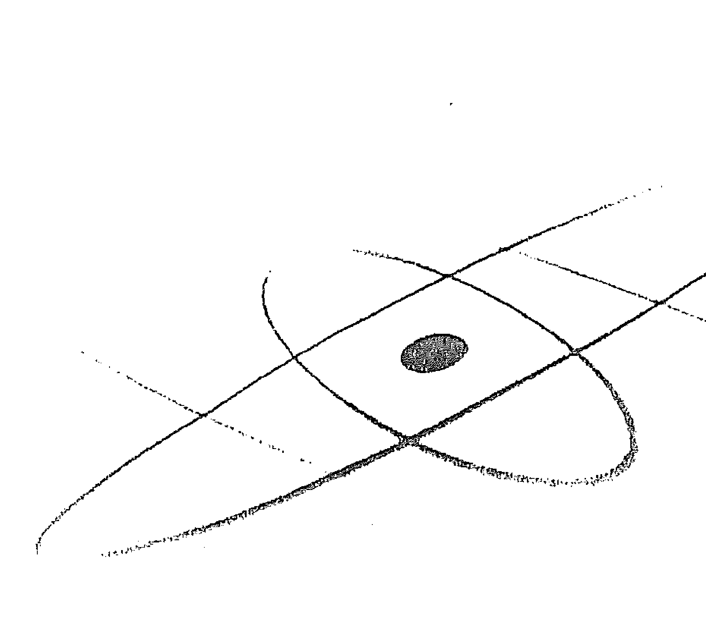
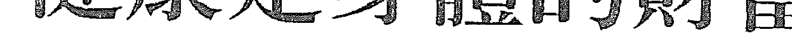
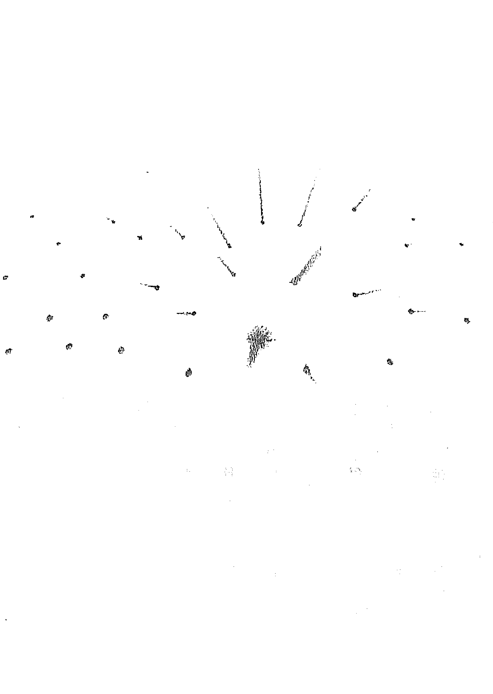
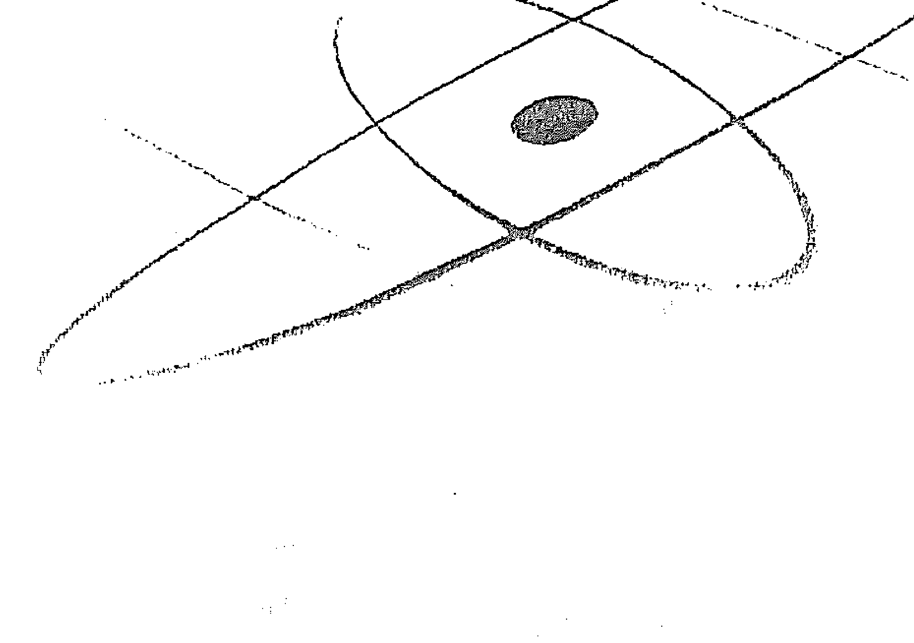
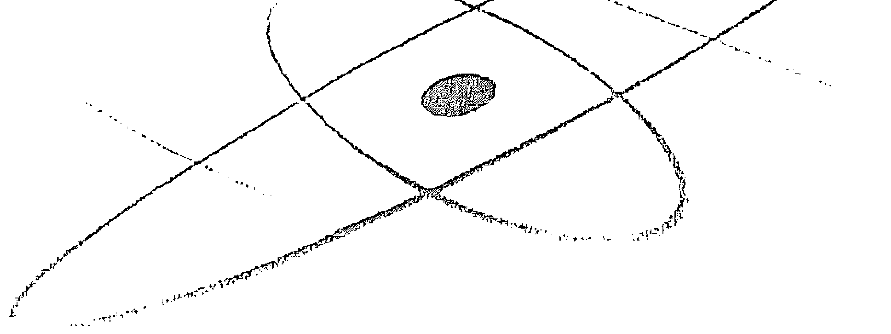

# 财富的吸引力法则

## Money, and the Law of Attraction.

金钱所表现的，与你认为的，会成为你生活的现实。 你想要什么，只要用对方法，就能吸引到！ 你想要的生活，只要用对方法，就能吸引到！

当你将意念专注於反省与改善你所诉说的 人生故事，我们向你保证，你的生命一定會变得愈来愈美好。因为，在吸引力法则的效力下，一定會如此！

### 前言

你認爲是什么吸引你翻開了這本書?爲何你覺得自己應該讀這些內容?哪些標題引起你的注意?金錢?健康?喜悅?或者吸引力法則?\n內心曾經浮現的要求（asking）。\n書裡寫了些什麼呢?這本書要告訴讀者，生命應該很美好，幸福圓滿的感受是自然的狀態。不論你覺得當下的生活好不好，它永遠可以變得更好，而改善人生體驗的選擇和力量就在你手中。書中提供實用的思想工具，只要持續實踐，你將體驗到更多與生俱來的財富、健康和喜樂。（我懂，因爲我不斷經歷這樣的過程。每次感受到對比，就讓生命眞美好!寫作這篇文章的時候，正好是二〇〇八年元旦，我就坐在美國加州德爾馬爾（Del Mar）新家的餐桌前，這是我們新的「避風港」。我跟伊絲特在一九八〇年結婚後即下定决心，只要行有餘力，就要常常到這個宛若伊甸園般的地區參觀拜訪。經過多年，現在我們總算從外來客變成真正的居民，對此我

### 前言

你認爲是什么吸引你翻開了這本書?爲何你覺得自己應該讀這些內容?哪些標題引起你的注意?金錢?健康?喜悅?或者吸引力法則?\n內心曾經浮現的要求（asking）。\n書裡寫了些什麼呢?這本書要告訴讀者，生命應該很美好，幸福圓滿的感受是自然的狀態。不論你覺得當下的生活好不好，它永遠可以變得更好，而改善人生體驗的選擇和力量就在你手中。書中提供實用的思想工具，只要持續實踐，你將體驗到更多與生俱來的財富、健康和喜樂。（我懂，因爲我不斷經歷這樣的過程。每次感受到對比，就讓生命眞美好!寫作這篇文章的時候，正好是二〇〇八年元旦，我就坐在美國加州德爾馬爾（Del Mar）新家的餐桌前，這是我們新的「避風港」。我跟伊絲特在一九八〇年結婚後即下定决心，只要行有餘力，就要常常到這個宛若伊甸園般的地區參觀拜訪。經過多年，現在我們總算從外來客變成真正的居民，對此我

### 財富的吸引力法則

## Money, and the Law of Attraction

我們告訴他，我們希望在德爾馬爾這一帶找到一棟房子，還要有地方可以供我們停放那輛將近十四公尺長的巡迴巴士。馬爾這一帶找到一棟房子，還要有地方可以供我們停放那輛將近十四公尺長的巡迴巴士。士。）也要感謝景觀設計師、工程師、室內設計師、木工師、室內設計師、木工師、電氣技師、水電師傅、鋪設屋頂和裝置排水管的專家。另外要感謝才華洋溢、技術純熟的工匠們：貼磁磚的、塗水泥的、作畫的，以及製作圍籬、大門和鍛鐵的藝術家。還有鋪地板和打造拉門、木質拱門窗和彩繪玻璃的人。更要感謝高科技術專家們為我們安裝了調光系統、電腦網路系統、靜音中央空調系統，以及頂級的廚房與洗衣設備。有人幫我們運來了新家具，因為我們的三心二意，又協助移動了幾次位置。辛苦的工人們挖溝、搬運、倒水泥、打磨石材、種下大樹……所有這些過程牽涉到數千種商品，有數千人參與這些產品的發明、創造及配送，並因此獲利。 總之，感激不完。 以上只是跟居家有關的部分，要感激者遠甚於此。比方說，我們發現了只要幾分鐘路程就能到達的餐廳，餐點、老闆和員工都很不錯。左鄰右舍各有風格，熱情好客，令人如沐春風，並以我們從未體驗過的方式歡迎新來乍到的我們。 還沒說完呢！屋子南側的風景美得讓人驚嘆，就正對著原始的多利松國家保護區，

## [第一部] 轉換思考與正向思維
Pivoting and the Book of Positive Aspects

似乎都對他們定下的成功規則充滿信心且深信不疑：一定要準時，一定要全力以赴，一定要努力，一定要誠實，爲了偉大目標而奮鬥，好還要更好，不勞則無獲，最重要的是，絕對不要放棄……然而，隨著時間經過，儘管那些一定下成功規則的人認同你的努力，你得到的滿足感卻逐漸消退，因爲不論你再怎麼努力，那些規則並無法帶來它們所承諾的成功。更令人氣餒的是，當你往後退一步，想要把整個過程看得更清楚，你發現那些定下成功規則的人大多也無法享有真正的成功。更慘的是，你遇到一些完全不遵守規則的人，你努力學習應用的道理在他們身上根本不適用，但他們卻比你更成功。你忍不住要問：到底怎麼一回事？爲什麼努力的人獲得那麼少，不努力的人反而得到那麼多？我花了那麼多錢讀書，卻看不到回報，高中輟學的人反倒成了百萬富翁。我爸一輩子辛苦工作，但他過世後我們家人還得借錢才能替他辦後事……爲什麼我盡心盡力卻落得如此下場？爲什麼只有少數人真的享有財富，而大多數人都要爲生活苦苦挣扎？我做錯了什麼？有錢的人知道什麼是我不知道的？

### 財富的吸引力法則
# Money and the Law of Attraction

### 全力以赴還不夠？

當你想得到的你都做了，連別人告訴你該怎麼做才會成功，你也都努力做到了，可是成功並沒有如預期般來臨，這時你一定會覺得自己沒有錯，可能還會把氣出在那些獲得你所渴望的成功的身上。有時候你甚至會譴責他人的成功，只因爲看著別人享受對你來說遙不可及的成功，是一件痛苦的事情。正因如此，我們把這本書呈現在你眼前，回應你長久以來無法擺脫的財務困境。你渴望財富，卻又公開譴責那些享有財富的人，眞要如此，你永遠無法變得富有，上天賦予你的健康喜樂也會離你而去。事實上，很多人會做出錯誤的結論，認爲是有形環境中的其他人共謀要阻礙他們邁向成功。他們相信，全心全意相信，自己已經全力以赴，如果還是看不到成果，一定是因爲其他不好的力量在作祟，導致他們得不到自己想要的东西。但我們要向大家保證，你想要卻得不到的東西，或者你不想要卻出現在你生命中的事物，絕對不是別人造成的。没有人阻礙你，也没有人能夠阻礙你，更没有人能雙手捧著成功獻給你。成功與否，操之在己。一切都掌握在你手中。我們寫這本書就是要告訴你，成功可以透過你的意念與意識去掌控與達成。

## [第一部] 轉換思考與正向思維
Pivoting and the Book of Positive Aspects

### 心想事成，有求必應

心想事成，有求必應 此時此刻，你要回歸存在的本質，以自身的生命體驗來決定你想要追求的事物，確確 實實體驗那種感覺。好好地放輕鬆，深吸一口氣，繼續讀下去，你一定會慢慢回想起成功 是如何到來的，因為你一生下來就明白當中道理，而當你讀到本書所提到的絕對眞理，一 定深有同感。 永恆的宇宙法則穩定可靠，始終如一，所承諾的擴展和喜樂絕對不會失效。宇宙的法則以充滿力量的節奏，帶你了解書中的內容，一開始會在你心中發出小小的芽，然後隨著你翻過的書頁不斷擴展，直到你再度覺醒，知道自己的目的和力量，憶起如何找回創造世界的宇宙力量。 若眼前的這個時空實相能激發你內心的願望，那麼它一定有能力把同樣的願望圓滿地 彰顯（manifestation）在你眼前，讓你覺得滿足。這就是法則。

### 財富的吸引力法則
# Money, and the Law of Attraction

### 成功的權利與生俱來的權利

倘若生活無法如你所願，大多數人自然會假設一定是有外力阻擋，讓自己的生活無法變得更好，因為沒有人會故意拒成於門外。把過錯都怪到別人頭上，認定眼前這些不想要的情况並非自己的責任，或許會讓你覺得好過些。但是，相信外力是造成自己無法成功的原因，會帶來極度負面的影響：當你把成功的榮耀或失敗的過錯加諸其他人身上，你就無力做出任何改變。你想要成功，但從你的眼光看來，你一點也不成功，在你的內心深處，你知道出了問題。內在這個強烈的不和諧感受，讓你更加意識到你得不到自己想要的东西，由此常會引發不好的假設，導致你去嫉妒其他比較成功的人，責怪許多人阻擋你的前途，並對他們心生怨恨。甚至你會因此貶低自己，而這是最讓人難過、也會帶來最負面想法的一件事。我門以為，這種令人不快的驟動是正常的，是你自覺無法成功才會引發的反應。情緒上的不安是個重要指標，告訴你一定有什麼地方出了差錯。你應該要成功，失敗會讓你覺得不快樂。你應該要過得很健康，病痛是令人難以接受的狀況。你應該要擴展，停滯不前是無法容忍的事。生活應該要很順利，不順利的话，就是出了問題。但出了問題，並不代表不公平，或是幸運之神不肯眷顧你，或者其他人搶走了原本該 屬於你的成功。問題其實是你無法跟自己和諧共存，無法與「本來的面目」（who-you- really-are）調和，無法與生命所激發的願望達成一致，也無法與擴展後的自己相容，更無法與始終不變的宇宙法則相契。出了問題的地方，並不是你無法控制的外在事物。問題其實統（Emotional Guidance System）一直在你眼前，也非常容易了解，只要你能夠明白，就能掌握全局。

實從你而來，你的確有能力掌控。本來的面目、吸引力法則，以及與生俱來的情緒引導系統（Emotional Guidance System）一直在你眼前，也非常容易了解，只要你能夠明白，就能和個人吸引力中扮演了重要角色。若你能成功控制影響你每日生活的事物，是一件相當有意義的事。換句話說，既然你的思維時常繞著金錢或財富打轉，只要你能夠用心引導自己的思維，不只你的財務狀況會有所改善，這樣的進展也會幫助你改善生活體驗的每一個層面。

### 財富的吸引力法則
# Money, and the Law of Attraction

### 所有的體驗都由我吸引而來

如果你上過用心創造的課程，如果你想要有意識地創造出自己的實相，如果你想控制自己的生命體驗，如果你希望實現存在的目的，那麼當你了解財富和吸引力法則這兩項重 要課題後，就能事半功倍。你注定要擴展、要快樂、要有美好的體驗。當你決定在這個時空實相中，投注於這個有形的身體，這就是你的計畫。你期待有形的生活體驗充滿刺激，給你豐富的報酬。也就 是說，你知道多樣化和對比會刺激你的願望不斷擴展，你也知道這些願望很容易就能圓滿達成。你知道，新的願望會繼續擴展。進入有形的身體時，你非常興奮，因為這趟體驗會激發出無限的可能，恐懼或懷疑都無法消滅你一開始擁有的願望，因為你知道自己有力量，也知道所有的體驗和所有的對 比都會變成肥沃的土壤，孕育出精采的擴展。最重要的是，你知道你帶著一套引導系統進入這趟生命體驗，它會幫助你忠於原本的目的，也忠於因各式體驗而不断修改淬鍊的意 念。簡單地說，你渴望來到這個時空實相，幾乎不受有形的形式所影響。

## [第一部] 轉換思考與正向思維
Pivoting and the Book of Positive Aspects

雖然你才剛進入一個還十分弱小的身體，但你不是新手了，你是充滿力量的創造者，專注於宇宙前緣的新環境。你知道你得花上一段時間來適應，重新找到舞台，開始用心創造的過程，但你一點也不擔心這段適應期。事實上，你很享受自己誕生的安樂窩，也很喜歡在這個新環境中迎接你的人。雖然你還無法使用他們的語言，雖然迎接你來到這世上的認為你一無所知，需要他們的指導，但你擁有他們早已遺忘的恆心和智慧。你知道在這個新環境中，吸引力法則是一切創造的基礎。你記得吸引力法則（同頻共振，也知道在這個新環境中，吸引力法則是一切創造的基礎。你記得吸引力法則（同質相吸）是宇宙的基礎，你也知道吸引力法則對你很有幫助。它確實如此。你還記得你就是自身體驗的創造者。但更重要的是，你記得你是藉由思維去創造，而不是透過行動。當你還是一個無法行動或說話的小嬰兒時，你並沒有因此感到不自在，因為你記得宇宙的幸福圓滿，你記得來到這個有形身體的目的，你知道你要花很多時間來適應語言和新環境，尤其你也知道，雖然你無法把自己對無形環境的豐富知識直接轉化成形的話語，但是沒關係，因為能夠讓你走上快樂創造一途的必要條件早已就緒：吸引力法則則始終如一，你的引導系統立刻發揮作用。最要緊的是，你知道透過嘗試，或是某些人所說的「錯誤」，最後一定能夠完滿地適應新環境。

### 財富的吸引力法則
# Money, and the Law of Attraction

### 吸引力法則始終如一

當你來到這個有形的新環境中，知道吸引力法則在宇宙中永恆不變這件事，對你的信
心來說非常重要，因為你明白生命的體驗會幫助你記得並重拾立足點。你記得振動是一切
的根源，吸引力法則會回應這些振動，組織它們，把相似的振動聚合在一起，把不一樣的
振動分開。

因此，你不擔心是否能夠立刻用言語表達你知道的事情，也不用向周圍那些似乎什
麼
都忘了的人解釋，因為你知道強大的吸引力法則始終如一，很快就會透過你的體驗展現出
來。你知道要弄清楚自己發出什麼樣的振動並不困難，因爲不論你如何振動，吸引力法則
都會不斷把證據帶到你眼前。

換句話說，當你覺得不知所措時，能幫助你脫離這種感覺的人人和事物都找不到你，你
也找不到他們。再怎麼努力也找不到。而被吸引來到你身邊的人不僅無法幫你，反而讓你
更不知所措。

當你覺得受到不公平的對待時，公平就找不到你。你所感受到的不公平待遇，以及因
著你的感受而發出的振動，都會妨礙你認為公平的事物來到你眼前。

當你沒有得到你認為自己需要的財富時，失望和恐懼感襲捲而來，財富或帶來財富的
[PAGE 30]

# |第一部| 轉換思考與正向思維\nDivolving and the Book of Positive Aspects

### 振動代表什麼意思？

機會也會繼續遠離你……並不是因爲你不好或沒有資格，而是因爲吸引力法則會把類似的東西配在一起，不一樣的就無法相配。你覺得很窮困，就只能碰到跟窮困有關的事物。你覺得很富足，讓人感覺富足的事物就會來到你眼前。吸引力法則沒有例外，如果你專注意念，就能透過生活體驗，學習到法則的運作。當你明白自己的思維，也注意到你吸引而來的東西，你就掌握了用心創造的關鍵。

說到振動，我們指的是你對於自身體驗的關注，因爲所有的事物實際上都以振動爲基礎。我們或許可以用能量這個詞來替換，在你的詞彙裡應該還有很多其他的同義詞，也能表達同樣的意義。大多數人都知道聲音會振動。樂器的渾厚低音驟然作響時，你甚至能感覺到聲音的振動。

我們要你明白，不論何時，每當你「聽見」聲音，你就是把振動轉譯成你聽到的聲音。

音。你見的是你對振動的釋；你感受到的是你對振動的獨特釋。你有視覺、聽覺、嗅覺和觸覺，由於宇宙中所有的事物都在振動，你用五官察覺振動，感受振動的存於是你明白了，你住在一個振動的宇宙，裡頭充滿各種和聲，而在你存在的核心，你也斷地振動，達到完美的振動平衡。空氣、土壤、水和人體所有組成元素，一切事物都在不斷地振動，而且所有事物都由強大的吸引力法則掌管。即使你想要分辨這些振動，但是你做不到。你也不需要這麼做，因爲吸引力法則會加以分辨，不斷把相似的振動匯聚在一起，不同振幅的事物則離得愈來愈遠。除了視覺、聽覺、味覺、嗅覺和觸覺，情緒是第六種用來轉譯振動的感官，事實上它的思維（振動）是否和諧。無形的世界就是振動。你眼前的有形世界也是振動。除了振動之外，別無其他。所有的事物都由吸引力法則掌控。

## [第一部] 轉換思考與正向思維 Pivoting and the Book of Positive Aspects

### 只要我覺得富足，富足就會上門來

了解振動，可以幫助你有意識地連結有形和無形的世界。

學，也能夠打開電源。要感覺和諧或不和諧之間的差別，也不需要先了解振動。

體驗的成果。

學習接納自己的振動，有意識地利用情緒的振動指標，你就能掌控個人的創造和生活
把自己的感受和實際的生活體驗有意識地連結起來，你就能夠改變一切。如果你無法
建立連結，繼續想著你缺乏的東西，你想要的就永遠不會來到你跟前。

由於誤解，人們常把力量賦予外在的事物，以解釋爲什麼自己無法得償所願，享有想
要的財富：「我沒辦法成功，因爲我生長在不好的環境裡。我沒辦法成功，因爲我的父母
不成功，他們無法教我成功的方法。我沒辦法成功，因爲那些人成功了，把所有原本應該
屬於我的資源搶走了。我沒辦法成功，因爲別人騙我，因爲我不值得，因爲我上輩子做錯了事，因爲政府藐視我的權利，因爲我丈夫不負責任……因爲……因爲……因爲……因爲……

## 財

### 轉換思考，重新定位人生

### 財富的吸引力法則

## Money, and the Law of Attraction

轉換思考的過程是指有意識地察覺到所有東西其實都具有兩個面向，接著用心把你想要的那一面說出來，將思維集中其上。轉換思考能幫助你由內啓動所有你想要的东西，一旦做到了，不論你許下什麼願望，相關事物的振幅一定會進入你的體驗。

這裡我們必須先說明一件事：當你說出你想要的东西，但又對自己的話語感到懷疑，那麼你說的話就無法帶來你想要的东西，因為你的感覺才是思維振動的真正指引。吸引力法則不會回應你說的話，只會回應你發出的振動。

既然你無法同時說出你要什麼和你不要什麼，愈常提及你要什麼，就會愈少談論到你不要什麼，如果你專注於描述你想要什麼，而不是只談現在的狀況，隨著時間經過（通常不用很久），你會改變振動的平衡狀態。如果你常常提起你要的東西，你就會體驗到愈來愈真實的感受。

轉換思考的過程還具有一個更重要的力量：當生活推著你朝反方向走，想要的东西離你愈來愈遠，想想：「我知道哪些東西是我不想要的，但我想要什麼？」答案必須從你內心召唤出來，而當答案出現時，你的振動也會改變。轉換思考的威力強大，會立刻讓你的生活變得更好。

## [第一部] 轉換思考與正向思維 Pivoting and the Book of Positive Aspects

### 我創造我的生命體驗

你的生命體驗由你創造，作為自身體驗的創造者，你一定要明白創造並非憑藉你的行動，也不是你的所作所為，更不是你說的話。你的創造，完全以你發出的思綱為根基。當你說話或做事時，一定會發出思維的振動。然而，當你發出思維的振動時，卻不一 定要開口或行動。在模仿周圍的成人開口說話前，孩童早就先學會了模仿成人的振動。每個思維都有專屬的振動頻率。你發出的思維，不論是來自記憶，還是受別人的影響，或者結合了一直繞在你心頭的想法和他人的念頭，所有出現在你腦海中的思維，都以特定的頻率在振動……根據強大的吸引力法則（同頻共振，同質相吸），你的思維會吸引振動頻率相符的思維。現在，這些集合在一起的思維具有比之前更强的頻率振動；根據吸引力法則，它們又會吸引另一個思維，一個接著一個，最後，這些結合在一起的思維就有足夠的力量，吸引「真實生活」的情況，或具體彰顯出來。所有的人、環境、事件和情況都因著你腦海中思維的力量，被吸引到你眼前。一旦你了解自己到底在想什麼，透過振動饋思維成真，你就會許下新的願望，並且更用心地導引自己的思維。

### 思維相契讓人更快樂

### 財富的吸引力法則
Money, and the Law of Attraction

很多人認爲自己的存在超乎有形實相，他們不只是由血肉骨骼組成的身體。他們費盡心思想要描述身體以外的自我，於是發明了靈魂、本源或神等等說法。我們把這個更大、更成熟、更有智慧的你稱爲你的內在存在，而你選擇用來稱呼它的說法並不重要。最重要的是，你了解這個無形的你確實存在，且對你在地球上的生活體驗扮演非常重要的角色。所有的思維、言語和行動都存在於一個更廣闊的背景之下。事實上，由於無形的你會專注於你想要的东西，因此每當你明白自己不想要什麼，就會更強烈知道自己想要什麼。努力引導自己的思維，一天又一天，朝著你想要的方向前進，你就会覺得愈來愈快樂，愈來愈歡喜，因爲你的感受所發出來的振動，跟無形的你愈來愈契合。你想要讓人感覺良好的思維，如此一來你和內在存在更寬廣的視野會合而爲一。事實上，除非你當下的思維能和內在存在的思維振動相符，否則你不可能覺得快樂。舉例來說，你的內在存在把注意力放在你的價值上，可是當你發現自己的缺點，所受到的負面情緒就造成不和谐的振動或抗拒。內在存在選擇把注意力放在能感受到愛的事務上，當你想著你害怕的人或物，你的思維就跟內在存在無法相符。內在存在只專注於成功，當你選擇把自己的行爲看作失敗時，你就跟內在存在的觀點無法契合。

## [第一部] 轉換思考與正向思維 Pivoting and the Book of Positive Aspects

### 透過本源的眼睛看世界

選擇讓你感覺更好的思維，多提及你想要的東西，少提你不想要的，你就會慢慢把自
己的振動頻率調整符合更廣大、更有智慧的內在存在。當你在有形的世界中體驗時，能夠
與更寬廣的視野享有契合的振動頻率，是最棒的一件事，因為當你的振動頻率符合更寬廣
的視野時，你就能夠從更寬廣的視野來看你的世界。透過本源的眼睛看世界，便能看到
令人噴為觀止的景象，因為站在振動的制高點，你只會和你認為最好的世界振動相符，你
也會吸引到你想要的事物。

負責把亞伯拉罕的振動轉譯為文字的伊絲特知道該怎麼做。她會放鬆自己，用心讓自
我存在的振動升起，直到與亞伯拉罕的無形振動完全契合。她已經練習好多年，對她來說
這麼做再自然不過了。她早就了解振動相符合對她多麼有益，如此她才能把我們的知識順利
轉譯給有形世界的其他朋友。但直到某個美麗的春天早晨，她才明白振動相符合有其他好
處。那天她獨自走向門前車道，因為朋友待會兒要開車過來，她先去幫忙開門。

站在門口等待時，伊絲特凝望天空，覺得那一天的天空比之前更美麗：色彩豐富，鮮
藍色的天空和雪白的雲朵形成強烈對比，讓她忍不住讚嘆。她聽見遠處傳來甜美的鳥鳴
聲，但看不到鳥兒在哪裡，那悅耳的鳴唱讓她興奮地渾身打顫。聽起來就像鳥兒正在她頭
上盤旋飛舞，或者坐在她的肩膀上。然後她注意到周圍的植物、花朵和土壤散發出各種美
妙香氣，隨風飄散，把她整個人圍繞起來。她覺得充滿活力，愛上了這個美好的世界。然
後她大聲說：在宇宙各處，再沒有任何時候或任何地方能比此時此地更加美好！

然後她說：亞伯拉罕，是你們吧？對不對？我們讓她咧嘴而笑，她發現我們透過
她的眼睛看世界，透過她的耳朵聽，透過她的鼻子聞到香氣，透過她的皮膚感覺。

「沒錯，」我們說，我們透過你的身體來感受有形世界的美好。」

當你感受到純粹的愉悅時，就是你和你內本源完全契合的時刻。你覺得某個想法深深
地吸引你，也是完全契合的時刻。事實上，你覺得愈開心，和本源就愈加契合，更貼近你
本來的面目。

和更寬廣的視野契合一致，會讓你更快達成生命中的重大期望，比方說美好的伴侶關
係、令人滿意的事業，並且得到足夠的資源去做你真正想做的事，而這個有意的契合會增
進你每日每刻的體驗。調整自己去符合內在存在的視野，你就能看得更清晰，對生活更滿
意，享有更多的愛。在這個美好的世界上，在這個美好的時刻，透過這個美好的身體，你
找到了自己想要的生活方式。

## [第一部] 轉換思考與正向思維
Pivoting and the Book of Positive Aspects

### 選擇讓自己更快樂

### 負面情緒會引來病痛？

伊絲特能讓亞伯拉罕透過她的感官欣賞世界，給她美妙無比的體驗，原因在於她一早起來就期待會有好事發生。還躺在床上時，她就開始尋找能讓她感到快樂的事物，那令人愉快的思維吸引了另一個令人歡欣的思維，一個接著一個，持續地到來，等她走到門口（大概是兩個小時後），靠著用心選擇的思維，她讓自己的振動頻率變得非常貼近內在存的振動頻率，內在存在因此能和她順暢無阻地交流。你現在選擇的思維會吸引接下來的思維……此外，它也能幫助你和內在存在更契合。專注於你想要的东西，不去想你不想要的东西，你會發現，自己更貼近本源純粹、積極的振動。這麼一來，你會覺得生活快樂無比。伊絲特的振動頻率完全符合本源，讓她在自家門口的體驗更上一層樓，達到圓滿的境界。但如果你的振動頻率跟本源及圓滿的境界完全不符，有可能會體驗到更深一層的負面
感受。也就是說，當你的振動頻率無法與圓滿契合時，疾病或病痛就會找上身來。體驗到負面情緒（恐懼、懷疑、挫折、寂寞等等）時，負面情緒的感受就是你當下的思維和內在存在的振動頻率無法協調的結果。在所有有形和無形的生生活體驗中，內在存在（無形的你）是更大、更有智慧的存 在。因此，每當你專注於和內在存在的知識不協調的思維上，就會帶來負面的情緒。如果你坐在自己的腳上，阻礙血液的循環流動，或者把止血帶繞在脖子上，阻礙氧氣在體內流通，你會立刻感覺到受限。同樣地，當你心中的思維柵欄內存在的思維，進入身體的生命力（也就是能量）也會遭到阻擋，受限的結果就是你會感受到負面的情緒。負面的情緒持續很長一段時間後，你的身體也會體驗到健康惡化的情況。別忘了，所有事物都具有兩個面向：想要的，和缺乏想要的。好比拿起一根棍子，一端代表你想要的，另一端代表你不想要的。我們姑且把這根棍子取名爲「身體健康」，它的一頭代表「健康」，另一頭則是「疾病」。大多數人光是看著這根棍子的「疾病」那一頭，並不會因此生病，他們會生病，是因爲他們看著許許多多不同的棍子時，都只看到「我不要」的那一端。你只注意自己不想要的东西，而內在存在卻注意你想要的东西，長久下來，你會覺得自己的振動頻率完全不符合內在存在，這就是疾病：因著你選擇的思維，你和內在存在之
間出了距離。

大家都希望能夠快樂，但多數人認爲，周圍要先有令人覺得悅的事，他們才會感到快樂。事實上，大多數人的感受都會受到當下觀察對象的影響。如果看到的东西無法讓人覺得高興，他們就很不開心。大多數人覺得自己無法一直保持愉快的心情，因爲他們相信，要得到快樂，周遭的情況必須先改變，可是他們又認爲自己沒有能力改變這麼多狀況。

然而，一旦你明白所有事物事實上都具有兩個面向（你想要的，和得不到你想要的一），當你看著一件事物時，你就能學會看到更多正面的地方，也就是會讓你感覺更快樂的方向。

過程：不論對象爲何，用心去看更正面的地方，也就是會讓你感覺更快樂的方向。這就是所謂轉換思考的過
面對你不想要的狀況，並且覺得很糟糕時，如果你願意說：「我知道我不想要什麼……那我到底想要什麼呢？」你的關注方向會影響你的振動頻率，振動會出現些許改變，讓你產生的吸引力跟著改變。這就是改變人生故事的方法。與其說：「我的錢總是不
變，讓你產生的吸引力跟著改變。這就是改變人生故事的方法。與其說：「我的錢總是不
夠用。～不如說：「我希望能有更多錢。」這是一個截然不同的故事，完完全全不一樣，感覺也不一樣，過了一段時間，就會帶給你不一樣的結果。

在視野不斷變化的同時，繼續問你自己：「我究竟想要什麼？」最後你就會進入非常喜悅的境地，因爲你一直問自己想要什麼，產生的吸引力也一定會朝著那個方向移動……過程雖然緩慢，但持續練習下去，只要幾天，就能看到奇妙的成效。

轉換思考很簡單：每當你發現自己感受到負面情緒時（其實你是感受到你和你自己想要
的東西無法契合），就停下來告訴自己，我感受到負面的情緒，表示我跟我想要的東西無
法達成和諧。那我想要什麼呢？每次感受到負面的情緒時，其實你正站在有利的位置，可以找出在這個時刻，自己到
底想要什麼，因為有了不想要的體驗，你才能更清楚知道自己想要什麼。所以，停下來，
對自己說：一定出了什麼問題，不然我不会有負面的情緒。是什麼呢？我要什麼？然後，很簡單，只要把注意力轉移到你想要的東西上……當你將注意力轉移到你想要的東東西，負
底想要什麼，因為有了不想要的體驗，你才能更清楚知道自己想要什麼。所以，停下來，

每次感受到負面的情緒時，其實你正站在有利的位置，可以找出在這個時刻，自己到
的東西無法契合），就停下來告訴自己，我感受到負面的情緒，表示我跟我想要的東西無
轉換思考很簡單：每當你發現自己感受到負面情緒時（其實你是感受到你和你自己想要

面的吸引力就會停止；負面的吸引力一停下來，正面的吸引力就開始運作。就在這個時刻，你的感受會由負而正。這就是轉換思考的過程。

### 我想要什麼？爲什麼我想要這些東西？

當你開始訴說不同的人生故事，或許最強烈的抗拒是來自你認爲應該要「實話實說」的信念。但是你要明白，當你用「事實就是這樣」的方法說故事，一定會得到吸引力法則的回應，不論你說什麼故事，它都會流傳得更久。或許對你最有利的做法，是說個不一樣的故事，更貼近你現在想要的生活方式。「我究竟想要什麼？」慢慢改變說故事的方法，讓自己更靠近正面的吸引力。

別忘了，你心裡想什麼，那些事物的振幅就會來到你眼前，不論你要不要，因爲吸引力量則就是如此運作。因此，絕對不要用「現在就是這樣」的方法說故事。以你當下的創造爲基礎，訴說希望未來能得到的體驗。

有時候人們會誤解了轉換思考的過程，做出錯誤的假設，認爲轉換思考是要把注意力移到不想要的東西上，還努力讓自己相信那才是

## [第一部] 轉換思考與正向思維
Pivoting and the Book of Positive Aspects

### 我真正想要的，就是覺得快樂

一位年輕父親對自己的小兒子每晚都尿床感到無計可施。一早起來發現床單和衣服都濕透了，真的令人討厭，而且他很擔心若情況持續下去，會讓他情緒崩潰。大家也看得出來，他覺得兒子的行為很可恥。他對我們抱怨：「他已經長大了，不該再尿床。」我們問：「早上你進去他的房間時，情況怎麼樣？」「只要一聞到味道，我就知道他又尿床了。」「那你有什麼感覺？」我們問。「很無助、生氣、挫折。他尿床的問題持續好久了，我不知道該拿他怎麼辦。」「你會跟他兒子說什麼？」「我會叫他把尿濕的衣服脫掉，進到浴缸裡。我告訴他，他已經長大了，不該再尿床，我們早就討論過這個問題了。我們告訴這位父親，他的做法只會讓兒子繼續尿床。我們向他解釋：當某種情況控制你的感受時，你無法用你的力量去影響這個情況；但當某種情況發生時，你可以控制你的感受，那你就有力量去改變這個情況。舉例來說，當你進入兒子的房間，看到你不希望發生的事情發生了，如果你可以停下來，承認你不想要的事情發生了，問你自己，你想要什麼。

### 財富的吸引力法則
Money and the Law of Attraction

### 一覺得不開心，就吸引來不想要的事物

壓，然後問你自己爲什麼想要那樣東西，強化轉換思考的過程，你立刻就會覺得豁然開朗，也會看到你發出的正面力量具有什麼效果。
「你想要什麼？」我們問。
這位父親把注意力放在他想要的东西上，立刻覺得鬆了一口氣，因爲這麼做，他和自己的願望得以協調一致。我們告訴他：「在你思考這一大堆的想法時，從你心中發出的思維會跟你想要的達成一致，那麼你對兒子就會產生更正面的影響。接著，你可能會說：
「噢，這是成長的過程。大家都經歷過這個階段，你就要長大了。現在把濕衣服脫掉，去洗澡。」這位年輕的父親不久之後就打電話來，很開心地位我們，他兒子再也不尿床了。

雖然多數人或多或少都能察覺到自己的感受，但只有少數人真的明白他們的感受或情緒所提供的引導有多麼重要。用最簡單的說法來解釋：只要一覺得難過，你會開始吸引
一覺得不開心，就吸引來不想要的事物

### 財富的吸引力法則
Money and the Law of Attraction

讓你覺得不開心的東西。負面情緒之所以產生，是因爲你把注意力放在你不想要的事物上，或者只想著你壞乏或缺少的東西，沒有例外。很多人把負面情緒當成不想要的东西，但我們覺得負面情緒是很重要的引導，幫助你了解你的注意力正往哪裡走……也就是你的振動方向……也就是你發出吸引力的方向。你應該把負面的情緒當成「警鈴」，因爲這樣的情緒一出現，你就收到了訊號，知道該轉換思考了。我們想稱之爲「引導鈴聲」。

剛明白思維的力量，知道要把注意力放在讓自己感覺快樂的事物上時，若他們發現自己出現負面情緒，通常會覺得很不好意思，甚至生自己的氣。但是這表示你的引導系統運作正常，沒什麼好氣的。每當你察覺到負面的情緒出現時，讚美自己能夠察覺到引導系統，然後選擇讓你更快樂的思維，慢慢地讓自己覺得更好。這是非常微妙的思考轉換過程，你正用心地選擇讓自己更快的思維。

感覺到負面情緒時，對自己說：我感覺到負面的情緒，表示我正吸引我不想要的東西。那我想要的是什麼？通常只要坦承你「想要覺得很快樂」，就可以把你的思維轉到感覺更快樂的方向。但

### 財富的吸引力法則
Money and the Law of Attraction

### 我的思維聚合成更有力量且契合的思維

你一定要明白，想要覺得快樂跟不想要覺得糟糕之間的差別。有些人覺得這只是
同一件事的兩種說法，但這兩種說法其實正好相反，振動頻率完全不一樣。如果你一直尋
找能讓你感覺快樂的事物來引導你的思維，隨之發展出的思維模式或信念，就能幫你創造
出精采快樂的人生。

不論你正在想什麼，也許是過去的回憶、當下的觀察，或對未來的展望，這個思維正
浮現在你腦海，並且會吸引類似的思維和想法。你的思維會吸引其他振幅相似的思維，當
你專注的時間愈久，思維就變得愈強大，凝聚更强的吸引力。

我們的朋友傑瑞把上面的現象比喻成船繩。船夫要用很粗的繩子綁住船隻，但繩子太
粗了，他無法將它抛過水面丢到船上。於是船夫從碼頭丢了一個繩球過去，用繩球解開
的繩子繞成粗繞，然後結成更粗的繩子，再結出更粗的繩子……最後，這條粗繩子繫在船
上，就能把船隻輕鬆地固定在碼頭上。你的思維也一樣，不斷聚合，彼此連結。

碰到某些問題時，因為你把負面的繩子拉長了，就很容易朝著負面的方向愈走愈遠。

### 財富的吸引力法則
Money and the Law of Attraction

也就是說，某人只說了幾個負面的字眼，說你回想起某件不好的事，或者別人給了你建議，你就立刻陷入負面的慌亂情緒。你無時無刻不在想事情，這就是你發出的吸引力，你可以把你的思維引導到正面的方向，也可以引往負面的方向。舉個例子，你去雜貨店買東西，卻發現你固定會買的東西價格翻了好幾倍，你感到一陣恐慌。或許你以為，你會震驚只是因為那個東西的價格突然上涨，而既然東西要賣多少錢不是你能決定的，你別無選擇，只能任由不安的感覺盤據心頭。然而，我們要指明，你感到不安，並非因為店家抬高了貨品的價格，而是因為你自身思維的走向。說：噁，這東西比上星期貴多了……價格漲得沒道理……老闆太過分了，賣這麼貴……通貨膨脹失控了……不知道將來還會怎樣……我們的日子快過不下去了……經濟出了問題……我買不起價格漲這麼多的東西……我賺錢很辛苦，都快入不敷出……賺錢的速度比不上物價飛漲的速度……當然，負面的思維有可能朝很多方向走——責怪店老闆、責怪經濟狀況、責怪政府，但通常還是會回歸到你的感受，你對這情況的感受會給你負面的衝擊，因為所有你觀察到的事物都只屬於你自己。事實上，所有的東西都只屬於你，是你對它發出振動頻率，並透

### 財富的吸引力法則
Money and the Law of Attraction

過思維影響你所吸引到的東西。如果你能察覺到自己的感受，明白情緒會指引思維的方向，你就可以用心地引導你的思維。比方說：噢，這東西比上星期貴多了……但是，瞧瞧購物籃裡的其他東西，或許一樣變貴了……也有可能比較便宜……我都沒注意到……我只注意到這樣東西變貴了，因爲價格真的漲了很多……物價的確會波動……我一向應付得很好……價格變貴了，不過我還能維持生計……物流系統眞令人噴爲觀止，我們能買到這麼多不一樣的東西……一旦你下定決心要感到快樂，你會發現自己更容易讓思維走向令人覺得快樂的方向。點燃了內心想要感到快樂的願望後，要讓快樂的思維一直繞繞心頭，如此一來，你會發現要把自己的思維引導到富足喜悅的方向變得愈來愈容易。你的思維具有強大的創造力和吸引力，只要你不断發出令自己快樂的思維，就能好好駕馭這些力量。當你的思維在想要和不想要的、優點和缺點、長處和短處之間不斷來回擺盪時，你就失去了純粹的正面思維所能帶給你的力量。

### 財富的吸引力法則
Money and the Law of Attraction

### 創造正向的記事本

傑瑞和伊絲特剛開始跟我們合作的那一年，他們在距離德州家中百哩遠的大小城市租用飯店的會議室，提供有興趣的人一個舒適的地方來跟我們討論個人的問題。有一間飯店記了我們的活動。盡管飯店保證有辦法接待來賓，傑瑞和伊絲特還是很緊張，但他們還是忘促飯店員工快點把會議室準備好，等待聽眾到來。伊絲特忍不住說：我覺得我們應該訂另一家飯店。我們說：或許這個想法不錯，但別忘了，你要把自己也帶過去。「什麼意思？」伊絲特語氣有點防衛。我們解釋：如果你採取行動的起點是出自匱乏，你的行動一定會產生不良的後果。事實上，另一家飯店很有可能發生跟前一家飯店一樣的失誤。我們的解釋讓傑瑞和伊絲特哈哈大笑，因為他們之前才因為同樣的理由，從一家飯店換到另一家。「我們該怎麼辦？」他們問。我們鼓勵他們去買本新的記事本，在封面上寫幾個大字：我的正向記事本。在記事本的第一頁，就寫上「關於奧斯汀某某飯店的正向記事」。伊絲特寫下了：這間飯店很完美。地點很棒，靠近州際公路，路線也很好找。任何
大小的房型都有，很適合不斷增加的聽眾人數。飯店員工一向都很友善……
伊絲特寫下了她的想法，她對這家飯店的感覺從負面變成正面，等她的感覺改變了，
來自飯店的吸引力也改變了。
她並沒有寫：「員工一定會先準備好，等待我們到達，」因爲這抵觸了她的體驗，寫
下來的話會引發矛盾的感受，激起自衛或辯解的心理。她想要感到快樂，並用心地把自己的
注意力放在飯店的優點上。伊絲特對這家飯店所產生的吸引力出現了變化，然後發生了
一件伊絲特覺得很有趣的事情：飯店的員工再也沒忘記她預訂的活動。伊絲特覺得這件事
很耐人尋味，她發現飯店員工並不是因爲不關心或丟三忘四才忘了她的預約，他們只是受
到她的主觀思維影響。簡單地說，他們無法抵抗伊絲特發出的負面思維。
伊絲特很喜歡她的正向記事本，喜歡到她把生活中大大小小的事情都寫在上頭。我們
鼓勵她除了寫希望改善的地方外，也要寫已經給她正面感受的事情，養成正面思考的習
慣，享受令她覺得快樂的思維。這是一種非常好的生活態度。

### 吸引力則增強思維的力量

體驗到不想要的狀況時，你往往覺得必須解釋爲什麼會發生這樣的事，而這麼做或許只是爲了替自己辯解。不論是自衛、辯白、找理由，還是責怪某件事或某個人，你都無法擺脫負面的吸引力。在解釋爲什麼某件事無法如你所願時，你說的每個字都持續發出負面的吸引力，因爲在你解釋爲什麼會碰到不想要的事情時，你無法專心想著你想要什麼。你無法同時把注意力放在負面和正面的地方。想找出問題從何而來，通常只會讓自己發出更多負面的吸引力：問題的根源是什麼？爲什麼我無法隨心所欲？想要改善自己的體驗，是很自然的事，專心尋找解答，也很合乎邏輯……但是認真尋找解答，和強調問題來證明你需要找到解答，是完全不同的兩件事。把注意力轉到尋找解答的方向，會更好，因爲對著問題鎖牛角尖，只會妨礙你找到答案。問題和解答的振動頻率完全不一樣。明白轉換思考的價值後，你可以熟練地辨別你不想要的东西，並立刻把注意力轉移到想要的东西上。你將會發現，周圍充滿了美好的事物，在你的世界中，好事比壞事多。此外，每天運用正向記事本寫下你的感受，你會變得更容易想到正面的事物。久而久之，你

## 吸引力法則增強思維的力量

體驗到不想要的狀況時，你往往覺得必須解釋爲什麼會發生這樣的事，而這麼做或許只是爲了替自己辯解。不論是自衛、辯白、找理由，還是責怪某件事或某個人，你都無法擺脫負面的吸引力。在解釋爲什麼某件事無法如你所願時，你說的每個字都持續發出負面的吸引力，因爲在你解釋爲什麼會碰到不想要的事情時，你無法專心想著你想要什麼。你無法同時把注意力放在負面和正面的地方。想找出問題從何而來，通常只會讓自己發出更多負面的吸引力：問題的根源是什麼？爲什麼我無法隨心所欲？想要改善自己的體驗，是很自然的事，專心尋找解答，也很合乎邏輯……但是認真尋找解答，和強調問題來證明你需要找到解答，是完全不同的兩件事。把注意力轉到尋找解答的方向，會更好，因爲對著問題鎖牛角尖，只會妨礙你找到答案。問題和解答的振動頻率完全不一樣。明白轉換思考的價值後，你可以熟練地辨別你不想要的东西，並立刻把注意力轉移到想要的东西上。你將會發現，周圍充滿了美好的事物，在你的世界中，好事比壞事多。此外，每天運用正向記事本寫下你的感受，你會變得更容易想到正面的事物。久而久之，你

### 以正向的思維展開一天

的思維就會慢慢地移向你想要的東西。\n愈是專注於尋找令自己覺得快樂的思維，你會愈加感受到，想著你想要的东西，跟想獲得改善。\n（例如改善財務狀況，或改善身體狀況），或產生類似的思維時，反而會妨礙自己，無法
在一開始的創造階段，轉換思考和正向記事這兩個過程可以幫助你了解自己是否正抓
著負面的想法，如果是的話，你要馬上放開手，想

## |第一部|轉換思考與正向思維

## Pivoting and the Book of Positive Aspects

### 感覺快樂才是最重要的事

但不论何時，你一定知道你想要什麼樣的感受。換句話說，你要快樂，不要難過；你要提起精神，不要覺得疲憊；你要充滿活力，不要衰弱頹廢。你知道你希望自己成就豐碩，不要徒勞無功：你要自由，不要受限；你要成長，不要停滯不前……

思維無法與內在達成一致，再怎麼採取行動都没有用，但當你能夠更用心地選擇思維走向，掌控你的感受，你就會發現思維的強大力量。如果你能更用心地控制思維，就能更用心地掌控生活體驗。

用心選擇思維，其實一點也不難。通常你對吃的食物、開的車子和穿的衣服，都有自己

的想法選擇，而做個用心的思考者，所需要的用心程度不過於此。學習引導思維朝著讓你覺得快樂的方向而去，這麼做對生活的改善程度遠超過你對食物、車子或衣服的選擇。讀了這些字句，感受到自己和它們的意義及力量和諧一致，下次當你再度感受到負面情緒，你會知道這其實是很重要的情緒引導，能幫助你把思維轉到更有成效、更有益處的方

向去。也就是說，當負面情緒來襲時，你明白這表示你正在吸引不想要的东西。即使你

不知道負面情緒所爲何來，你仍會吸引不想要的事物，因此能夠清楚察覺你的情緒，以及情緒提供的引導，是很重要的一件事。了解情緒，就能掌握生命的體驗。的事，我要找到讓自己快樂的理由。如此一來，你就会找到更積極的思維，然後積極的思維，周圍的環境一定會有所維會不斷進入你的腦海。養成習慣，不斷尋找讓自己快樂的思維，周圍的環境一定會有所改變。吸引力法則就是這麼運作的。當你覺得快樂，你會體驗到宇宙協力，所有門都對你敞開；當你覺得難過，彷彿到處吃閉門羹，齊心協力之感也不見了。感受到負面的情緒時，你就進入抗拒的模式，抗拒你想要的东西，而你会爲此付出代價。你的身體會受到損傷，你允許進入自身體驗的美好事物也会減少。一生中，你會注意到想要的東西和不想要的東西，因此創造出某種振動暫存區，你想要的東西都會先暫放在這裡，等你跟它們的振動頻率相符時，才能真正擁有你想要的東西。西。但除非你找到方法，在還沒體驗到這些事物前，就能因爲它們而感到快樂，否則你会覺得永遠被拒於門外。然而，心驟念某些事物時，開始尋找相關的正向思維，也就是用心選擇更正面的想法，大門就會爲你敞開，你想要的东西就会進入你的體驗。

選擇更正面的想法，大門就會爲你敞開，你想要的东西就会進入你的體驗。

### 錦上添花，好上加好

不論看著什麼東西，你都會用心尋找正向的地方，那麼基本上，你已經把自己的振動頻率調整至更爲接近所有事物美好的那一面。當然，你也可以朝著負面的方向前進。很多

這種負面的自我態度對正向的吸引力傷害更大。因此，有時候你可以選擇一些你並未抱持如此負面想法的事物，自我調整，找到更快

樂的頻率；以此爲基礎，將思維轉到自己身上，你會比平常更能夠找到正向的地方。一旦

你找到周圍環境中更多正面的事物，你會發現自己身上有更多正面的地方，尋找正向美好的

事物也會愈來愈容易。當你發現自己身上有不喜歡的特質後，你在別人身上會看到更多你不喜歡的特質。

就像你們說的：‘錦上加霜，火上澆油。’但若你能用心尋找自己或其他他人身上正面的地方，

你會發現是：‘錦上添花，好上加好。’我們一直強調，你要尋找正面的事物，把注意力放在想要的东西上，

因爲所有朝你而來的事物，都立基於一個簡單的前提：不論你要不要，你心裡所想的东西，會不斷來到你

眼前。

### 財富的吸引力法則
Money and the Law of Attraction

### 你的體驗，由你吸引

你的體驗，由你吸引。或者可以說，你的體驗，由你吸引。所謂創造，並不是找出你想要的東西，然後去追求、去爭取。創造是把注意力放在想要的东西上，把你的思維調整符合你想要體驗的事物，讓吸引力法則把事物帶到你的體驗中。

當你想起過去的回憶，想像未來的事情，或者觀察當下的狀況，你發出的思維振動都會得到吸引力法則的回應。你可以把你的思維稱作願望或信念（信念只是一直繞在你心的思維），但不管注意力在哪裡，都會產生吸引力。

頭的思維，但不管注意力在哪裡，都會產生吸引力。所有事物都具有兩個面向：你想要的，和缺乏你想要的。所以，有可能你以為自己正想著正面的事物，實際上卻把注意力放在負面的地方。人們會說：「我要更多錢。」但事實上他們心裡想的是，他們擁有的財富無法滿足需要。而當人們感覺不舒服時，更有可能表達出想要健康的願望。也就是說，他們的注意力放在不想要的東西上，口中說著他們想要的東西。在大多數的情況下，就算他們言語上看似把注意力放在想要的東西上，事實卻正好相反。

要知道你正在吸引正面還是負面的事物，一定要有意識地認清自己的感受。或許你無法馬上看到吸引力發揮了作用，但你心中的思維凝聚了相符的思維、振動和能量。最後，

### 宇宙回應我的意念

你吸引到的事物就會清楚彰顯在你眼前。

周遭的人經過訓練調整，有時候確實可以回應我們的話語與需求，所以每個人都相信

（或想要相信），宇宙間所有的事物也會如此。對別人說：好，過來吧，你可以預期

他們會走過來。你說：不要，走開，你可以預期他們會離開。但身在吸引力法則的宇

宙中（納入型的宇宙），即使你說不要也沒有用。

把注意力放在想要的东西上，說：好，過來吧！這個東西就會納入你的振動，吸

引力法則便開始運作，把你想要的东西帶過來。但當你看著不想要的东西，說：不要，

我不要，走開！你不要的東西也會被宇宙帶到你眼前。把注意力放在某個事物上，你的

振動頻率就會跟這個事物達成一致，也會引發宇宙的回應。

因此，你說：我想要健康的身體……來吧，我全心全想要健康的身體。你說：不要，不要，不要！

健康。但當你說：病痛，遠離我。你會吸引病痛。你說：不要，不要，不要！

那東西反而更加靠近。你愈用力挣扎，想要對抗某個東西，那個東西反而愈容易變成你的

體驗。很多人以爲，只要找到完美的伴侣，或達到完美的體重，或累積足夠的金錢，就能一 劳永逸，找到真正的快樂……但是世界上没有任何东西只有正向的那一面。宇宙的完美平 衡代表正面和負面（想要和不想要）的东西到處都有。而你身爲創造、選擇、定義和決定 的人，尋找正面的事物，正面事物就會變成你的生活，充滿生活的所有面向。你不用等待 完美的事物來到你眼前，才能獲得正向的回應。你可以用正面的方式訓練你的思維和振 動，然後你就能吸引或創造出正面的事物。 我們鼓勵你每天一開始就對自己說：不論我要去哪裡，不論我要做什麼，不論身旁的 人是誰，我最強烈的意念就是要找到讓我覺得快樂的事物。 别忘了，每天早上起來的時候，你又重生了一次。在睡眠中，所有的吸引力都停止了。 睡眠猶如隱退了幾個小時，你的意識會暫停發出吸引力，讓你恢復活力，享受新的開 始。不要一大早就反覆思索前一天的麻煩，在這新的一天，那些煩惱都會遠離你，你已經 重生，從頭來過。

### 決心讓自己快樂，就會吸引快樂的感覺

一位女士告訴我們：「最近我得去參加幾場節日派對，我一聽到消息，就心想：喔，瑪麗也會去，她一定會打扮得美艷動人。我馬上開始拿自己跟別人比較。我不想再比下去了，我只希望對自己能有良好的感受，盡情享受派對，不管誰會出席。我們能幫我實踐轉換思考和正向記事，改變我對自己的感覺嗎？事實上，我根本不想參加派對。」
我們解釋：雖然你的感覺和自我意識在考慮要不要參加派對時被放大了，但派對或瑪麗都不是讓你覺得不自在的原因。要聽清你跟他人的關係，或者要追溯童年時代，回想這些感覺從何而來，看來通常很複雜困難，而且這麼做其實沒有什麼意義。就在此時此刻，你有能力找出事物正面或負面的地方，方法就是思索你想要或不想要的东西。不論你現在就開始轉換思考和正向記事，還是在第一場派對舉行的前幾天開始，也有可能你想等到派對舉辦的那一天再做，過程其實都一樣：把注意力放在讓你覺得快樂的事物上，尋找這些事物。
對於你所思考的事物，你有更高的主控權。通常在狀況發生前就去尋找正面的地方，會比身處問題中要去尋找來得容易。如果你確實把狀況想像成你心中想要的模樣，對即將發生的狀況提供正面的回應，那麼在參加派對時，你會見證到幾天前你就已經發出的主

事物。

### 如何不去感受到他人的痛苦？

人。不知道她的衣服在哪兒買的，她穿戴的東西都很漂亮。

看吧，你不需要利用這場辦公室派對來解決所有不安的感覺。找到正面的事物，把注

意力轉移過去，感受隨之而來的好處。同時，瑪麗也不會造成你的困擾，說不定你還能跟

她做朋友。選擇在你手中，你發出的思維振動，能夠完全掌控情況。

我們的朋友傑瑞問說：「每次我感到不安，似乎都是因為看到其他人的痛苦。要怎樣才能用轉換思考的方法，不去感受到別人的痛苦呢？」

我們的解釋：不論你把注意力放在什麼東西上，這個東西都包含你想看到的部分，和

你不想看到的部分。你感受到痛苦，並非因為你眼前的人正覺得痛苦。你覺得痛苦，是因
为你選擇把注意力放在會導致你感受痛苦的地方。你要明白其中的差別。

當然，如果你觀察的對象並不覺得痛苦，而是覺得喜樂，你就更容易感到喜樂，但是

你不應該冀望外在情況改變，好改變你的感受。你必須訓練自己專注於正面事物的能力，

不管當前的情況如何。要達到這個目標，務必記得，所有的東西都包含你想要的和不想要

的，如果你用心，就可以找到讓你覺得更快樂的事物。觀察眼前的事物確實比用心選擇你想看到的事物更加簡單。然而，如果快樂的感受對你來說很重要，你當然不願隨便地、馬虎地觀察，因爲想要快樂感受的願望會激發你的意願，去尋找正面的事物。此外，愈常尋找令你快樂的事物，並專注於這些事物，吸引力法則就會帶給你更多這類的事物，最後你的注意力會轉向正面的地方，根本不會注意到不符合正面的東西。我們曾建議一位母親忽略兒子的問題，她回應：「但他不會覺得我放棄他了嗎？我不是應該一直站在他身旁支持他？我們解釋，把注意力從問題上移開，絕對不是「放棄」，你真正要放棄的是讓你覺得不快樂的思維。我們說：「當其他人碰到問題或不斷抱怨時，幫忙出意見不算是幫忙。認定你兒子的生活會持續改善，等於幫助他朝著這個目標前進。你要站在他身旁，把他帶到更令人快樂的地方。」用心尋找快樂的感受，確實關注自己的感覺，你會發現自己有愈來愈多的思維，是關於愈來愈美好的事物。然後你也会準備得更好，去面對其他或許覺得快樂、或許覺得糾糕的人。因為你的願望就是讓自己快樂，所以你早已鋪設好跟其他人互動的體驗，不論這些人的處境有多麼混亂，你還是能把注意力放在正面的地方。但如果你不好好引導自己的

### 我的同情心對他人來說毫無價值？

振動，也沒有讓自己持續處於令人感受到快樂的思維和振動中，你便很有可能陷入他們的處境，感覺不安且不快樂。

我們想要強調，你並非感受到他們的處境所引發的痛苦，而是感受到你內心思維挑起的自身痛苦。明白了這個道理，你就握有最高的掌控權，以及真正的自由。當你發現，你能控制自己的思維，也能控制自己的感受，你便能在你的星球上自由快樂地行事。但當你相信你的感受會受到其他人的行為或處境影響，你也明白你無法控制他人的行為或處境，你便感受不到自由。那其實才是你口中的「痛苦」。

傑瑞告訴我們：「那麼，如果不注意那些有麻煩的人，我就會覺得快樂。但是，他們並沒有因此而有所改善。也就是說，我沒有解決問題，只是避開了問題。」 我們回覆：如果你不去注意他們的問題，快樂的感覺就不會離開你，儘管問題還是存在。但如果你把注意力放在他們的問題上，你覺得不開心，他們一樣繼續不開心，問題依然存在。倘若你繼續關心他們的問題，不久你也会碰到同樣的問題。然而，如果你不去注

意他們的問題，反而去想像解決之道或好的結局，你就會覺得很快樂——然後，你才有可 能去影響他們，得到更正面的思維和結果。 簡單來說：當你感受到負面的情緒，你對他人來說就沒有價值（也永遠無法提供解 答），因爲內心的負面情緒表示你只注意到匱乏的東西，而不是你想要的事物。 要是某人碰到麻煩，籠罩在強大的負面能量下，也被你發現了，如果你尚未用心和快 樂的感受達成一致的頻率，你就會被他們的負面能量擊倒。你可能會跟他們一同體驗到接 睡而來的痛苦，也很有可能把你的不快樂傳遞到其他人身上，然後其他人再傳給更多的人。 每晚睡前把頭靠在舒服的枕頭上，對自己說：今晚，當我閉上眼睛睡覺時，所有的吸引力都會停止，表示明天我會有全新的開始。明天我會尋找我想要看到的東西，因為我要感 覺快樂，快樂是我的第一要務！用心為新的一天打好基調，早上起床後，你就走上全新的 道路，前一天的面情緒消失無蹤。然後，當你走到某個地方，看到一## 財富的吸引力法則
## Money, and the Law of Attraction

充滿力量。舉例來說：我覺得跟伴侶在一起不快樂，所以想要分手。但我發覺就算我走了，我還是帶著自己；如果因為不快樂而離開，我也會帶著那個不快樂的自己離開。我想要分手，是因為我想要快樂的感受。如果不分開，我也能變得快樂嗎？在這段關係中，有什麼地方屬於正面的，讓我一想到就覺得很快樂呢？

我記得我們剛認識的樣子，還有我那時候的感覺。我記得我深受這個人吸引，很想再進一步，看看我們彼此能有什麼新的發現。我喜歡新發現的感覺。我喜歡一開始在一起的感覺。我想，在一起愈久，我們就愈了解其實我們兩個人不是完美的一對。我不認為這是誰的問題。不是完美的伴侶並不表示我跟對方出了什麼差錯。只是我們或許可以找到更好 的伴侶。 伴侶身上有很多我喜歡的地方，大家也都會讚賞這些優點，諸如：聰明、對很多事情有興趣、愛笑、喜歡玩鬧……我很高興我們有機會在一起，我相信這段在一起的時光對兩人來說都非常珍貴。

所以，對於分手這個問題，我們的答覆如下：你無法藉著改變行為來控制其他人感受到的痛苦。然而，你可以引導你的思維，讓傷痛消失，讓更好的感覺湧上，這就是控制自 身痛苦的方 法。當你全心全想著你要什麼，你一定會覺得很快樂。把注意力放在缺乏想要的

## [第一部] 轉換思考與正向思維
## Pivoting and the Book of Positive Aspects

### 我不負責其他人的創造

東西上，一定會覺得很糟糕。如果你只注意到某人想要某物卻無法得到，你也会跟那個人一樣不快樂。

在有形的世界中，大家都是行動導向，認爲你必須立刻修正所有的問題。你的伴侶並非突然之間進入這個狀況。你的伴侶不是因爲跟你在一起才會走到這個地步。這條路很長，一路上累積了不少推動力。因此，不要期待兩人在這個時刻的對話會造成多大的差異。你要把自己當成一個播種的人，你播下的種子充滿力量。你種植的方法非常完美，也用自己的話語提供滋養，即使你之後離開了這個世界，種子仍會繼續茁壯成該有的樣子。不適合你繼續走下去的關係很多，但在結束一段關係時絕對不要懷抱著憤怒、罪惡感或自我防衛。調整你的振動，找到令你快樂的思維，再離開。往後你才不會重蹈覆轍。

別人的生活體驗絕對不是你的責任。你看到他們處於匱乏的狀態中，不過你知道情況一定會有所改善。你也可以鼓勵他們在睡眠狀態中轉向更好的方向。想到這些人的時候，

想像他們快樂的模樣。不要在心中反覆回味你們之間令人不快的對話或分手的情景。想像

### 財富的吸引力法則
# Money and the Law of Attraction

他們過得很快樂，就跟你過得很快樂一樣。相信他們內心也有引導，能找到自己的方向。你想要幫助別人，你相信他們需要你的幫助，因為他們沒辦法幫助自己，這是最大的錯誤信念，而這樣的信念對他人來說並沒有好處，因為在內心深處，他們知道他們自己可以做得到，也想要去做。你可以對伴侶說：『你很好，非常好。雖然我們之間有很多地方無法像我期待的那麼契合，但我知道一定有一位完美的伴侶正在等著你，我要讓你自由，去追尋那美好的機會。去吧！我不要把你困在這裡，困在我們兩個都不想要的處境中。我希望兩個人都能自由，去尋找我們想要的東西。我並不希望再也看不到你，我的意思是：『這段關係讓我們對彼此有了新的認識，這是來自熱情、積極的願望，並不是因為我們害怕可能發生的結果而走上這條路。』然後繼續對伴侶說：『當我想到你時，我知道，雖然你現在很難過，但是你之後會很快樂。我的選擇是要看到快樂的你，因為那是我最喜歡的樣子，也是你最喜歡的樣子。』或許這段話聽起來很冷酷無情，但很有意義。

# [第一部] 轉換思考與正向思維 Pivoting and the Book of Positive Aspects

### 追尋良好的感覺
## # 假設的遊戲

我們鼓勵你盡自己的力量，尋找每樣東西正面的地方。但還是有人會問：要是有人
把注意力轉移到正面的地方。只有一些根深柢固的習慣，或其他人強烈的影響力，才有可 能阻嚇你。大多數人天生就有一些習慣，生活模式已經很難改變，所以有時候要找到快樂，最快 的方法就是在睡前練習轉換思考，第二天早上起來，你就已經朝著自己想要的方向前進。在睡前思 索令你快樂的思維，在睡眠期間體驗平靜心靈帶來的益處，然後在醒來的時候，立刻轉向令你快 樂的思維，如此一來就完成了基本的轉換思考過程。花幾天時間遵循這樣的模式，就能大大改變你 的思考習慣和所發出的吸引力，你也会發現生活中的所有事物都跟著改善了。

不論情況如何，你都具有轉換思考的能力。不管某件事看起來多麼悲觀，你都有能力

### 財富的吸引力法則
# Money and the Law of Attraction

剛失業，而且他有老婆和五個小孩要養，兩天內就要繳房租，卻口袋空空，該怎麼辦？還有，如果蓋世太保正埋伏在一個猶太女人家門口，準備把她帶往毒氣室處決，怎麼辦？些人要怎麼轉換思考？

飛機上跳下來，卻沒有帶降落傘，於是你問：「現在我該怎麼辦呢？」在極端的狀況下，似乎沒有簡單的解決方法，通常你也不太可能碰到這樣的狀況。然而，在極端的狀況下，充滿了戲劇性和傷痛，也會帶來無比的力量，只要你抓對專注點，就可以找到解決方法，讓置身事外的旁觀者看了嘆嘆稱奇。

也就是說，不論是什麼樣的情況，你都能找到正面的解決方法，但你必須非常專注，才能找到這樣的解答。大多數人在極端的情况下，或許無法那麼專心，正因如此，他們才會陷入這種負面的情況。

碰到棘手的狀況時，力量會從內心發出來，靠著強烈的願望，只要你能專注，就能讓自己繼續提升。換句話說，那些飽受病痛折磨的人，其實處於比其他人更有利的位置，因為他們渴望健康的願望非常強烈。但是，除非他們能夠轉換思考（把注意力轉移到健康的願望上，不去想著病痛），否則難以痊癒。

我們鼓勵大家來玩玩假設遊戲，尋找正面的地方。別在周遭的環境中尋找失去力量的

例子，不要去看那些無法掌控人生的人，你的故事要讓你覺得自己充滿了力量。不要從可慘受害者的角度來訴說故事，這只會加強你身為受害者的感受，說個不一樣的故事吧。比方說：假設這位女士在蓋世太保的環境中？假設兩個星期前她已經決定要跟親人到新的國家展開新生活，所以當蓋世太保來敲門時她並不在？假設她並不怕不可預知的未來？假設她不需要留在熟悉的當其他人離開時她也跟著離開了？假設她並不怕不可預知的未來？假設她不需要留在熟悉的環境中？假設兩個星期前她已經決定要跟親人到新的國家展開新生活，所以當蓋世太保來敲門時她並不在？玩假設遊戲時，尋找你想要看到的东西。尋找會讓你覺得更快樂的東西。不論什麼樣的狀況，一定都有個出口。事實上，可行的選項成千上百，但是，大多數人出於習慣，還是繼續選擇「匱乏」的那一面，直到最後才發現他們到了一個不想要的地方，那裡的選擇似乎沒有那麼多。當你專注意念，想要享受成功和快樂，你必須先把自己的振動調整成符合那些東西的頻率，那些令你快樂的體驗才會在你的生命中占據更重要的位置。今天，不論我去哪裡，不論我做什麼，我最激烈的意念就是要找到讓我覺得快樂的事物。下定決心，不要當個袖手旁觀者，要用心積極地貢獻，你會發現，參與地球上的事務會讓你更快樂。當你看到你不希望在你的世界、你的國家、你的社區、你的家庭或你的身體發生的事情，要記得你有力量訴說不一樣的故事，你也知道訴說不同的故事，會給你更

### 財富的吸引力法則

# Money and the Law of Attraction

強大的力量。當你決定要向前積極參與，你會找回原本就有的豐富知識。

你現在在這裡，就在這裡，你有力量，能以更好的方法表達你的想法。當你用心明確地表達出來，不管你看到什麼，都能見證到專注意念的力量。

下定決心，讓自己感到快樂，並用心尋找每天生活中正面的地方。當你用心找出你想要的事物，專心想著那些事，永恆的滿足和喜悅就會在你眼前開展。

這些做法都很簡單，也不難實踐，但不要因為簡單，就低估它們的力量。持續應用，你會看到契合的想法具有多大的力量。你會發現創造世界的能量，這股能量隨時能為你效力（但你直到現在才知道如何運用），你要專心以這股力量從事個人的創造。

# [第二部]

# 吸引財富，彰顯富足
## Attracting Money and Manifesting Abundance

### 財富的吸引力法則

# Money and the Law of Attraction

### 吸引財富與彰顯富足

對某些人來說，金錢或許不是絕對必要，但在大多數人心目中，金錢就等於自由。身而爲人，對於自由的權利具有強烈意識，而既然金錢與自由脫不了干係，因此金錢對人類來說是生命體驗的重要一環。難怪你們對對金錢有如此強烈的感受！

你需要或想要的來得少，所以你覺得不自由。在這裡，我們要明白解釋，爲什麼會有這種財富不均的狀況，了解之後，你才能開始讓你想要得到且應該得到的富足進入你的體驗。當你閱讀這本書的時候，當你開始和根據吸引力法則運作的事實產生共鳴，你的願望與富足將契合一致，很快你和周圍的人都会見證到這種契合的證據。

或許你已經工作多年，或許你是剛步入職場的年輕人，不論你從哪裡開始，達成財務圓滿的旅途不一定很漫長，也不一定需要付出大量的時間或體力。接下來我們會以簡單明瞭的方法，向你解釋如何利用你能夠掌握的能量。我們要告訴你，你對於金錢的思維、想到這些思維時你的感受，以及流入你生命體驗中的金錢，三者之間絕對相關。當你能夠有意識地做出這樣的連結，並且能夠用心引導你的思維，你就可以利用宇宙的力量，你也會明白時間和體力與財富反而較不相關。

# [第二部] 吸引财富，彰顯富足
## Attacing Money and Maniesting Abundance

我們要先從宇宙和世界的一個簡單前提說起：你想什麼，就會得到什麼。有些人會說：不對呀，自我有記憶以來就想想要賺錢，腦袋裡一直想著錢，但是我的錢還是不夠，過得不夠快樂。～如果你也想要改善財務狀況，一定要好好了解我們給這些人的回覆：金錢這個東西實具有兩個面向：一、錢，很多錢，以及富裕金錢所能提供的自由和自在感受；二、沒有錢，錢不夠用，想到沒有錢所引發的恐懼和失望感受。很多人以為當他們說出「我要更多錢」，就表示他們對金錢有正面的想法。然而，提到金錢（或其他東西）時，如果你感到害怕或不自在，表示你談到的主題並不是金錢，而是沒有足夠的金錢。你一定要夠辨別這一點，因為正面的態度會把錢帶給你，但若是想著沒有足夠的金錢，則會讓金錢更遠離你。如果你能察覺到自己實際上在想什麼，將大有助益，更重要的是你要了解自己對金錢的感覺。如果你心裡想的或嘴裡說的是：「噢，那好棒啊，但是我買不起！～你的振動頻率就無法帶來你想要的富足。承認你買不起那樣東西時所浮現的失望感受，表示你的思維傾向匮乏的那一端，而不是你的願望這一端。承認你買不起某樣東西時所感受到的負面情緒，是了解自己思維傾向的一個方法，而你實際上所體驗到的富足，則是另一個辨認的方式。很多人在生活中不斷感受到「不足」的體驗，只是因為他們的想法無法超越實際的 體驗
驗。也就是說，如果他們覺得錢不夠，也發現錢不夠了，還常常把錢不夠掛在嘴邊，他們就永遠陷在那樣的情況裡。我們提到，在描述財務狀況時，要說出你想要樣子，而不是當下的處境，唯有如此才會產生改變的力量，但很多人會抗議，因為他們認為應該要誠實描述實際的情況才對。

我們要你明白，假如你只看現狀，也只討論現狀，就無法如你所願經歷改變。你或許會看到周遭的人事物不斷改變，但自己的體驗卻沒什麼進步。如果你希望你的生命體驗能夠出現真實的改變，你必須發出不一樣的振動，這表示你必須轉換不一樣的思維。

傑瑞：很多年前，我在德州阿爾帕索附近開了一家旅館，那個時候，名列全美富豪排行榜（身價數十億美金）的石油大亨杭特（H. L. Hunt）打電話給我。他買下格蘭德河上的
一個渡假村，但經營不善快要倒閉了，他聽別人說，或許我能提供一些有用的資訊，幫他扭轉乾坤。他到我開的小咖啡店來跟我碰面，談話間我一直無法集中精神，因為我不明白
爲什麼一個那麼有錢的人會如此不滿足，還想賺更多錢。我不明白他爲什麼不把渡假村賣
掉，賣多少都無所謂，然後靠著積蓄就可以

## 第二部 吸引财富，彰显富足

Airacing Money and Manifesting Abundance

### 需要金钱并无法吸引金钱

去发掘周围的事物有多美好。一旦你明白了自己的富足，你就会变得愈来愈富足。

需要钱的人常是最不成功的人，而最不需要钱的人反而最成功。这不禁让我在想，需要钱的人是否必须更努力，才有可能成功。

亚伯拉罕：很多人进入自称无欲无求的境界，是因為他们也会欲望无穷，但他们不了足也一樣。

的教导都告诉他们，金钱是罪恶，金钱是不道德的，最好是留在原地不动，就算觉得有所

杰瑞：我注意到，一般而言，不怎么成功或不太喜欢到别人成功的人，他们所接受的

的体验都一样。在宇宙间，你找不到任何证据能反駁吸引力法则。

有需要的人就脱离了匮乏，所以他們的行動一定见效。你有什么感受就吸引到什么，所有

话說，强大的感觉超越了他们的行動。由匮乏的感受所发出的行動必定缺乏成效。不覺得

亚伯拉罕：所有處於匮乏状态的人，不論探取什麼行動，只會吸引更多的匮乏。換句

的人是否必须更努力，才有可能成功。

需要钱的人常是最不成功的人，而最不需要钱的人反而最成功。这不禁让我在想，需要钱

杰瑞：亚伯拉罕，有件事情让我很难过。我帮助很多人获得更多财富，但我发现，最

## 财富的吸引力法则

## Money, and the Law of Attraction

解所有的东西都是一体两面，他们只注意到自己缺乏想要的东西，没把注意力放在想要的东西上。因此，他们不断吸引匮乏的状态。到了最后，弄得自己精疲力竭。当想要和匮乏什么东西，我就感到不安，还是什么都不要比较好。

亚伯拉罕：完全正確。他人对你的观感不会影响你产生的吸引力，除非他们 的观感让你觉得困扰。把你的体验跟他人的体验相比，会讓内心的匮乏感加深，因為你觉 得他们比你更成功，内心产生了一種「不如人」的感覺。此外，注意到他人的不幸福，也無法让你吸引到更多幸福，因為你想什麼，就會吸引什么。

因此你并未处於匮乏的状态，如此一来，你就能更快迈向富足的境地，对嗎？傑瑞：有人拿自己和你做比较，最後得出的結論是你很窮，但是你並不覺得自己窮，你所吸引到的（或被你驅走的）跟其他人做了什麼無關。即使当前的实际情况跟富足差了十萬八千里，只要你能感受到愈來愈富足，富足就會變成你的。與其注意他人做了什麼

## 假设「穷人」不觉得自己穷呢？

## [第二部] 吸引财富，彰显富足

Allracting Money and Manifesting Abundance

慶，不如專注於自己對金钱的感受，如此會帶來更豐富的成果。

想要讓更多金钱流入你的体验，需要付出的並不如大多數人所以爲的那麼多。你只要

能夠達到思維的振動平衡。如果你想要更多錢，卻懷疑自己做不到，就失去了平衡。如果

你想要更多錢，卻相信金钱跟負面的東西有關，你就失去了平衡。如果你想要更多錢，卻

討厭那些比你有钱的人，你就失去了平衡。當你感受到不對、不安全、嫉妒、不公平、憤

怒等等情緒，就是情緒引導系統在告訴你，你跟自身的願望無法保持一致。

大多數人未曾努力讓自己的振動頻率和金钱达成一致。他們反而花了多年、甚至一輩

子的時間，指出他們眼中的不公平，想要定義金钱的对与错，還想要制訂法律來規範文明

社會中的金钱流動。但想要控制這些外在狀況只是白費力氣，要享有美好的報酬其實很簡

單。

最重要的，就是你必須感到快樂，因爲當你感到快樂，你就能和你的願望達成一致。

很多人相信，努力奮鬥是成功的要件，也是一種值得尊敬的生活方式。艱難的時刻確實能

幫助你決定自己想要什麼，但除非你放下痛苦的感受，否則你想要的不會進入你的體驗。

人們常常覺得應該要證明自己的價值，達到這個目的後，才會得到獎賞。但我們要告

訴你，你已經很有價值了，你無法證明自己的價值，也沒有這個必要。你應該要跟獎賞的

振動達成一致，你才能得到獎賞。你必須先讓自己的振動符合你想要經歷的體驗。

## 财富的吸引力法则

# Money and the Law of Attraction

我們了解，光靠文字無法通達一切，我們對吸引力法則和個人價值的知識，並不表示你讀了我們的文字後就能明白自己的價值。然而，當你思索我們在此提出的想法，實踐我們們建議的做法後，我們相信宇宙會回應你改變後的振動，你會看見吸引力法則確實存在的證據。不需要等很久，也不需要特別費力實踐你在這本書裡讀到的訊息，你就會相信自己的價值，也相信你有能力創造出你想要的东西。很多人不相信自己的價值，主要原因在於他們找不到方法得到自己想要的東西，所以便做出錯誤的假設，認為自己得不到他人的認可，所以也得不到獎賞。這麼想就大錯特錯了。你的體驗，由你創造。你應該這樣說：我要盡力變成最好的模樣。我的行為和生活方式都要符合我心目中最好的美善。在這個有形的身體中，我想要與我心目中最好的生活方式契合一致。如果你能做出這種陳述，並且在你感受到真正的快樂以後再採取行動，那麼在人生的道路上，就能與令你覺得快樂的事物和諧一致。

## [第二部] 吸引财富，彰显富足

Attracting Money and Manifesting Abundance

### 如何说说「富足」的故事？

亞伯拉罕：很多人因著匮乏的想法，讓自己得不到內心渴望的富足。當你相信財富有
限，無法分給所有人，看到某些人比其他人更加富有，你就覺得不公平，認為是因為他們
享有富足，才剝奪了其他人變成富人的權利，這麼想你將離富足愈來愈遠。其他人的成
功，並不是你缺乏成就的原因，你之所以無法成功，是因為你負面的比較，把注意力放在
無法達成的願望上。當你指責他人不公義、浪費財富或自私，或者你相信沒有足夠的財富
可以分配給所有人，負面情緒將跟著浮現，讓你自己陷入無法改善的境地。
他人擁有什麼或做些什麼跟你完全沒有關係。用思維發揮無形的能量，才是影響你如
何體驗的唯一因素。你體驗到富足或匱乏，跟其他人擁有什麼或做了什麼無關。它只跟
你自己的想法有關，只跟你發出的思維有關。如果你希望財富增加，就要開始說不同的故事。
很多人會批評生活富裕的人，因為他們擁有許多土地、金錢和財富，但批評就表示一
個人的思維傾向匱乏的那一端。他們想要變得更快樂，他們相信如果可以讓自己無法達到
的事情變成是一錯一的，他們就會覺得更快樂。但是他們始終與快樂無緣，因為他們只想
著匱乏，眼中也只有匱乏。假如他們心中沒有想要變得成功富足的想法，當他們看到別人
的成就時就不會覺得不自在。而他們心中隨時浮現的負面想法，只會讓他們的振動離願望

## 财富的吸引力法则

## Money, and the Law of Attraction

愈來愈遠。

換句話說，如果某個人打電話給你，說：「喂，你不認識我，但是我打這通電話是要
告訴你，我再也不會打來了。～那麼就算那個人再也不打電話來了，你也不會有不好的感
覺，因為他的存在與否跟你的願望無關。但如果打電話來的人對你來說很重要，你會感受到強烈的負面情緒，因為你的願望和信念變得不一致。

感受到負面情緒時，表示來自個人體驗所產生的願望，和你目前的想法有所牴觸。振
動不一致是負面情緒的原因。透過負面情緒的引導，會幫助你重新改變思維，和你本來的面目及現在的願望達成一致的振動頻率。

### 假如穷人批评富人呢？

傑瑞：在我還小的時候，生活周遭都是不怎麼富裕的人，而且我們向來喜歡取笑有錢人，比方說開豪華轎車的人。因此，等我長大後，很想買一輛凱迪拉克，卻又覺得不好意思，因為我怕其他人會取笑我，就跟取笑別人一樣。所以我買了一輛國產車。

最後我還是買了凱迪拉克，我對自己說：好吧，買了這輛車，所有負責生產這輛車的
人都能因此獲利。我爲所有提供零件和材料的人創造了工作機會，比方說皮件、金屬和玻
璃，還有技工等等……找到了正當理由後，我才去買車。用這種方式，我找到了跨越思維
亞伯拉罕：你跨越思維的做法很有效。想要感到快樂，並且逐漸找到讓你覺得愈來愈
快樂的思維，你就讓自己與願望契合一致，也釋放了妨礙你進步的阻力。把注意力放在他
人反對的意見上，永遠無法成功，因爲你內心一定會因此出現不協調，妨礙你繼續進步。

總是會有與你意見相左的人，把注意力放在這些人身上，只會讓你的振動頻率脫離自身的
願望。傾聽你的引導系統，把注意力放在自己的感覺上，才能了解你的願望和行動是否相
符。

每件事都有正反兩面，不論你看哪一面，總會有人跟你的意見相反。這也是爲什麼我
們希望你了解，你一生最重要的任務，就是跟你本來的面目達到契合。如果你相信自
己，如果你相信透過一生的體驗，你已經充滿智慧，你可以信任個人感受所提供的引導，

明白自己想要做的事情是否恰當，那你就能把引導系統的作用發揮得淋漓盡致。

## 财富的吸引力法则

## Money, and the Law of Attraction

### 假如金钱失去價值呢？

傑瑞：亞伯拉罕，以前流通的錢多半是硬幣，用有價值的貴金屬製成。比方說二十美元的金幣，一個硬幣本身的金子就價值二十美元，面值一美元的銀幣則價值一美元。因此，要知道硬幣的價值很簡單。但現在我們用的錢本身沒有實際的價值，紙鈔和硬幣基本上一文不值。

上一文不值。

我一直在覺得用貨幣購買商品和服務非常方便，不需要用雞去換牛奶或換一籃馬鈴薯。

但現在，金钱因人爲因素不斷貶值，要明白一塊錢具有什麼價值愈來愈難。另一方面，這也讓我想起尋找自身價值的過程：「我的才華值多少？對我付出的時間和精力，我應該要求多少報酬？」但現在我從你們那裡學習到了，那不是評估自身價值的方法。我們只要考慮自己想要什麼，並讓這些東西進入我們的體驗。

我發現很多人對自己的財務展望都不樂觀，因爲他們覺得自己無法控制金錢的價值，貨幣價值通常操控股在一小群人手中。很多人擔心通貨膨脹愈來愈嚴重，或出現另一波經濟蕭條。我希望大家能了解你所教導的吸引力法則，才不會擔心自己無法控制的事情，例如貨幣的價值。

亞伯拉罕：關於金钱這個主題，你說中了一件非常重要的事。你說的沒錯，很多人認
## 财富的吸引力法则

## Money, and the Law of Attraction

為現於你的錢比以前的錢小。但這也是一種圓乏的態度，如果你不能放棄這種態度，就無法吸引屬於你的富足。我們希望你了解，一塊錢和它被賦予的價值對你的體驗來說，並不如你以爲的那麼重要。如果你可以把注意力放在想要的东西上，存在而後擁有，擁有而後行動，那麼所有的重要，或者其他能把你想要的东西帶來的方法，就更容易進入你的體驗。我們一直重複同樣的說法：從圓乏的角度出發，無法吸引富足。因此，只要調整你的思維，契合內心深處能讓你覺得快樂的想法，這樣就夠了。你所有的思維都會發出振動，藉由思維的振動，你才能發出吸引力。當你想到圓乏，圓乏的思維不斷振動，與內在存在完全無法相容，所以內在存在便無法與你產生共鳴，結果你心中就會浮現負面的情緒。想到跟快樂、富足或圓滿有關的思綱時，這些思綱一定會跟內在存在相契合。如此一來，你會充滿正面的情緒。你必須信任你的感受能夠指出你正處於正面或負面的情緒。或是金钱，或是缺乏金钱，也可能是健康，也可能是缺乏健康，有可能是伴侶關係，也有可能是缺乏伴侶——只要你覺得快樂，你就能吸引你想要的东西。

### 如何扭轉下滑的超勢？

陳瑞：看到別人面臨財務問題時，我總是為他們擔憂。看著他們每況愈下，直到最後全盤崩潰，宣布破產。但不久之後，他們又買了新的遊艇、新的豪華轎車和漂亮的房子。也就是說，我看到的人似乎都不會久居人下。但為什麼他們無法在情況變糟以前就停損，更早往上爬升呢？為什麼一定要落到谷底，才能重新站起來？亞伯拉罕：之所以會每況愈下，是因為他們只專注於匱乏。他們害怕失去，或看著自己失去的東西只會愈來愈多。他們小心謹慎，充滿防備，或開始找理由或藉口責怪別人。他們門站在匱乏的這一端，所以體驗到愈來愈強烈的匱乏。而一旦落到谷底，就再也不需步步為營，反正他們已經一無所有了，注意力焦點就會改變，振動跟著改變，產生的吸引力也會改變。當他們相信自己已經落到谷底，就會抬頭仰望。你可以說，他們不得不開始訴說不同的故事。人生體驗讓你想要得到許許多多非常美好的事物，這些東西原本都會進入你的體驗，但是你的擔憂、懷疑、恐懼、憎恨、指責、嫉妒等等負面情緒，讓這些美好的事物無法繼續前進。美好的事物已經受到吸引來到門外，大門卻緊緊關著。開始訴說不同的故事。你

能用一百元買到哪些東西呢？放鬆心情，把注意力轉移到生活中正面的地方，更用心選擇 令你感覺更快樂的振動，大門就會敞開，你想要的东西、體驗和人際關係也會不斷出現。

### 反戰本身就是一場戰爭

亞伯拉罕：你就是自己人生體驗的創造者，引導你的思維，學習用心思考。多數人都需要經過調整才能真的做到改變思維，因為很多人長久以來都相信，要透過行動才能看到成果。除了這個錯誤的想法，你還相信，如果努力避免不想要的东西，這些事物就會遠離你。因此你們有「對抗貧窮」、「反毒」、「抗愛滋」和「反恐

## [第二部] 吸引财富，彰显富足
Attracting Money and Manifesting Abundance

比例超过所有其他国家。我们也努力打击疾病，但医院愈盖愈多，生病的人也愈来愈多，就比例而言，美国受病痛折磨的人口也是世界上数一数二的。我们也想消弭战争，寻求世界和平，感觉不久以前我们还庆祝，「柏林围墙倒了，世界终于和平，不是太美妙了吗？～但转眼一看，我们又参与了一连串的战争，这个国家周围的围墙愈乐愈多。我也听到很多人担心虐待孩童和暴力的问题，但是，打击虐待孩童的口号声愈响，我就听到更多虐待孩童的案例。我们想要努力对抗某件事物时，做什么反而都没有用。这个国家唯一朝著正面向前进的领域，似乎就是富足。我们有很多食物和很多钱，也能把多余的东西分送到世界各地的改变。但是，很多人在追求富足的同时，为了交换金钱，失去了不少个人自由。而有些人似乎很自由，却因为钱太少而不能好好享乐。那些有钱的人反而没什么时间享受金钱带来的乐趣。我很少看到拥有丰足金钱的人也有时间享受金钱能带给人的乐趣。亚伯拉罕，请你們用你們的观點来评論我的看法好嗎？

## 财富的吸引力法则
# Money and the Law of Attraction

亚伯拉罕：不论你看到的問題是没有钱，还是没有时间，你看到的都是缺乏的那一面，因此便让自己继续抗拒你真正想要的东 西。负面情绪或许来自感觉自己没有时间，或许来自没有钱，总之如果你感受到负面的情绪，处在抗拒的状态，你想要的东西也会因此远离你。

感觉到自己没有时间去做所有你需要或想要做的事情时，所带来的负面冲击远超过你察觉到的：感到不知所措是個指标，表示你拒绝让自己接近有益的想法、情况 和所有可能，如果你不让自己的事物进入你的体验，就无从获益。感到没有时间，你会去注意自己排得太满的行程表，并因此感到不知所措，陷入恶性循环，如此一来，你发出的振动就不可能带来改善。

你必须开始说不同的故事，倘若你不放棄抗拒，就只能继续抱怨你为什么这么忙碌。愿意与你协力的宇宙就在眼前，早就准备好提供协助，而且它所能提供的能量，远超过你的想像。

当你只看著低愿望的事物，你就无法得到你想要的东 西。感觉到自己没有足够的金钱，把注意力放在圆乏上，等于关闭了所有让你变得更富足的渠道。你必须开始说不同的故事。你必须找到方法创造富足的感受，然后富足才会到来。

当你开始感觉到在时间和金钱上的自由程度都提升后，大门就会敞开，会有人来帮助你。

## 对疾病的负面感受

你，你也会发出令人耳目一新、更有成效的想法，周围协力的环境和事件一一彰显出來。改变你的感受，你就能接触到创造世界的能量，这般能量早就准备好爲你效力。

保羅：对金钱有负面的感觉，因此得不到金钱，但是很多人说：「我不想得癌症！」反而得了癌症。两者之间有什么差别？亚伯拉罕：让我们来说明其中的道理。你想什么就吸引什么，因此当你想到缺乏健康时，你就缺乏健康。你想到缺乏金钱时，你就缺乏金钱。发出思维振动时，你可以靠着自己己的感受来分辨，你会吸引正面或负面的事物。宇宙听不見不。当你说：不，我不要疾病。你对疾病这个主题的注意力其实在大喊：来吧，我不想要的这个东西，来我这里。任何得到你关注的事物，都获得你的振动邀请。当你说，我要钱，可是钱不來，你对匮乏的注意力就等于在说：我不要没有钱，来吧，没有钱的狀态。当你以能够实现的方式來思考金钱时，你一定會觉得很快樂。当你以会把金钱拒斥在外的方 式在思考金钱时，你一定會觉得不快樂。由此你可以知道其中的差別。

### 他不必为钱苦苦挣扎

到金钱，就像你的确想要健康。你不想要得到癌症，那么想著钱，就能得到钱？～你的确想要得什么，或嘴巴说什么，只要确定这些思维和话語都是发自正面的情緒，你就会开始吸引你想要的东西。负面情绪显现时，你会吸引到你不想要的。

> [以下例子来自听众在亚伯拉罕工作坊中提問的問題]

提問者：我有一个朋友，在经济上资助她丈夫十年的时间。她非常努力工作，照料丈夫的一切，有时候差一点入不敷出。最后她无法继续忍耐下去，她丈夫又不愿意帮忙赚钱，两人就分开了。对她丈夫来说，金钱似乎不怎么重要。但后来他继承了数百万美元的财产，却不愿意和资助他多年的前妻（我的朋友）分享。

这件事感觉很不公平，她很在意金钱，工作也很努力，却只得到一点点回報。而她前夫几乎没工作过，也不在意金钱，现在却继承了一大笔遗产。为什么會这样？

### 如何改变你所发出的吸引力？

我们了解吸引力法则，所以这个故事在我们听来並沒有不合理的地方。你的朋友工作很辛苦、心怀怨恨、注意力都放在匮乏上，宇宙的回報便完全契合她的感受。她的前夫覺得很自在、拒绝罪恶感、期待不劳而获，宇宙的回報便完全契合他的感受。

很多人相信一定要努力工作、付出代价、感到痛苦，才能得到報酬，但這不符合宇宙法則：旅途不快樂，就难以期待有個快樂的結局。因为這牺牲法則。

没有任何证据能反驳吸引力法则。这个例子对你而言是个启发，认识这两个人，看到他们的态度，观察他们的结果：一个努力挣扎、辛勤工作、按著社会教育行事，却得不到自己想要的……另一個拒绝挣扎、坚持无所事事，却能接收足够的资源，继续游手好閒。

很多人说：「好吧，或许這符合宇宙法則，但是這沒有道理啊。」可是我们要你知道，当你能够和強大的法則契合，你就明白这绝对有道理。

既然你能控制自己发出的振动，那麼宇宙就是按著你发出的振动给予回報。强大的吸引力法则按著每个人发出的振动，公平回應。一旦你能夠控制自己的思维，不公平的感受就會平息，取而代之的是对生命豐富的熱情，創造出你天生该擁有的東西。宇宙間所有的事物都可以當作例證，證明吸引力法则運作的方法。

如果你相信努力工作，才能得到应得的回報，那麼，除非你努力工作，否则就得不
到報酬。但是透過行動而來的金錢和透過思維契合得到的金錢相比，實在少之又少。有些
人费心费力，却得不到什麼報酬，有些人幾乎沒什麼行動，却得到豐富的報酬，你當然會注意到其中的強烈差距。我们要你了解，当你比较這兩種人的行動時，你會看到差距，但當你以他們和宇宙能量的契合作爲比较基準時，就看不到差距或不公平的現象。財務成功或其他形式的成功，不需要努力工作或採取行動，思維契合才是不可或缺的。对你想要的东西發出負面的思維，然后想靠著行動或努力来彌補，不可能達到功效。學會引導自己的思維，你會明白該如何利用契合的能量。財富对你来说其實垂手可得，只是你把自己拉遠了，因為在想到財富時，你立刻想到萬一得不到財富，你會有多懊惱。因此，你的思維轉向匱乏的那一端，你不讓自己想要或期待得到財富。這就是為什麼大多數人只能過著平庸的生活。你會說，金錢不代表一切。沒錯。不需要金錢，也能擁有愉悅的體驗。但在人類社會中，生活或多或少都跟金錢有關，大多數人把金錢當作自由的同義詞。既然自由是存在的基本宗旨，和金錢保持契合，能幫助你建立平衡的立足點，对人生的其他體驗也很有價值。

### 花钱让你觉得自在嗎？

从此段开始到第二部结束都是亚伯拉罕的教導
有一位女士说，她每次花錢時總覺得很不自在，这也讓我們看到一種很普遍的金錢觀。这位女士多年來存了不少錢，但每次想到要花錢，她就猶豫不決，「害怕繼續向前走」。我们解释說，当你相信透過行動才能得到金錢，你也相信你無法永遠持續同樣的行動，於是你會想要把錢抓緊，慢慢花，好讓存款能持久一些。我们能明白為什麼會有這樣的恐懼。然而，擔心圓乏會減慢金錢進入你體驗的速度。如果花錢的想法讓你覺得不自在，我們當然不會鼓勵你在感到不自在的時候去花錢，因為在負面情緒出現時，所採取的行動絕對不值得鼓勵。可是，你的不自在並非出自花錢的行動，而是指出你那個時刻和金錢有關的思維所發出的振動頻率，並不符合你自己的願望。出自匱乏的信念，永遠無法契合更大的視野，因為在更大的視野中沒有匱乏。注意到你缺乏想要的東西，一定會引起負面的情緒，因為引導系統指出，你的思維已經與富足和圓滿背道而馳。找到方法緩和你的不自在，將情緒轉化為希望的感覺，接下來則是正面的期待。讓自
己感到更快樂，奠定穩固的基礎後，猶豫不決的感受會被自信和熱情取代。或許你注意到金錢圓乏，或許你看到自己生命有限（因此每過一天，就更靠近人生終點一些），但從更大的視野來看，你知道自己的存在永垂不朽，所以衰退的感覺抵觸了你的認知。

### 如何改变你所发出的吸引力？

事，才會有不同的結果。

我们會這麼說：我要感到快樂，我要感到充滿活力，能夠擴展。我的思維奠定好的基礎，讓我吸引到所有我覺得美好的事物，包括能讓我覺得安適喜悅的金錢，還有周圍也會
有健康快樂的人，給我積極的鼓勵、振奮精神和提升活力……

嗎？～等等描述方式，用快樂的想法來強化你正面的期待。

你可以說：只有好事會發生在我身上。雖然我不知道所有的答案，雖然我不知道所有的步驟，我也不知道哪些門會為我而開，但我知道當我在時空中移動時，就會看得到路徑。我知道繼續走下去，就能找到答案。每次說能讓你更快樂的故事時，你會覺得更快樂，生活中的大小細節也跟著改善。好還會更好。

有時候你們會擔心，長久以來說的故事都跟自己不想要的东西有關，剩餘的生命中，已經沒有足夠的時間來彌補多年來只注意到金錢匱乏的結果。不過這沒有什麼好擔心
的。
沒錯，你無法回頭，無法解除之前的負面思維，但就算可以，也不需要從頭再來，因
為你已經擁有所有的力量。在當下找到令你更快樂的思維時，你所產生的吸引力就改變了——就在這個時刻！多年來累積的負面思維之所以會對你現在的生活造成影響，只有一
個原因，那就是你還在延續多年來的負面思維或信念。信念只是你反覆回味的思維。信念
的振動，改變你所發出的吸引力。
隨身帶著一百元，注意一整天下來你能買到多少東西。這個做法很簡單，卻能大幅改
變你吸引金錢的關鍵。如此簡單的做法，就足以撼動振動平衡，讓你看見吸引金錢的實際
結果。在心裡想像你花了多少錢，想像比現在更好的生活方式。想像有一大筆錢能隨心所欲地運用會是什麼樣的感覺，用心召喚自由的感受。
你看，吸引力法則會回應你的振動，而不是你當前的現實生活。但如果你接下來的振動也只跟實際情況有關，就不出現任何改變。你可以想像你想要的生活模式，把你的注
意力放在這些影像上，一直到你感覺到慰藉，表示你的振動真的出現了改變。要改變你所
發出的吸引力，就這麼簡單。

### 我的標準，由我訂定

有時候發現自己錢不夠用時，你會覺得眼前看到的东西你都想要。心中湧現無法控制的渴望，沒有錢可以花讓你覺得很痛苦，或者你投降了，花了你根本沒有的錢，增加自己的債務，讓你更加苦惱。在這種情況下，想花錢的渴望其實是個假象，並非來自真正想要
擁有這些東西的願望。多買一樣東西帶回家，並無法滿足你的渴望，因為你真正感覺到的
是空虛。唯有跟自己本來的面目達成一致，才能填滿這種空虛感。

現在，你覺得沒有安全感，而你本來的面目卻絕對具有安全感。你覺得什麼都做不
好，而你本來的面目卻什麼都能做好。你覺得匮乏，而你本來的面目卻十分富足。你渴望
的是振動改變，而不是渴望有能力購買某樣東西。等你能夠達成契合，並一直保持契合的
狀態，財富就會流入你的體驗（如果你想要的东西）。有可能你還是會花一大筆錢買
你想要的东西，但這時候買東西的感覺就不一樣了。你不會以買東西來滿足匮乏或內心的
空虛，反而會覺得買東西帶給你一種滿足的感受，從想法成形到體驗的完整實現，整個過
程都會帶給你滿足和喜悅的感受。

不要讓別人來設定標準，規定你該有多少錢，或者規定你該怎麼花錢，你才是唯一能
夠設定標準的人。當你和本來的面目達成一致，那麼你根據體驗而知道自己想要的東西，
[PAGE 129]

# 財富的吸引力法则
# Money, and the Law of Attraction

### 為了安心而存錢對嗎？

便能順利進入你的體驗中。

一位男士告诉 我们，有位导师告诉 他：存钱才有保障就等於好好规划以预防灾害发生，但事實上想要得到安全感只會讓你觉得更不安全，因爲你采取的行動會吸引你不想要的災難。他想知道這位导师的法是否符合我们关于吸引力法则的教導。

我们告诉 他，那位导师说的沒錯，当 你把注意力放在某件事物上，会讓它的振幅更靠近你。因此，如果你把注意力放在未來可能发生的壞事上，思索這些不想要的事情時，会讓你感到非常不自在，這便是個指引，表示你正在吸引壞事到來。然而，你绝对有可能短暂想到未來可能會发生你不想要的事情，例如当 你想到财务状况时，不安全感便油然而生，但这样 的不安全感會让你想到你真正想要的是什麼樣的财务狀況。

当你把注意力放在你想要的安全感上，你或許会受到刺激，采取行动以便增強你的安全感。存钱或投资等行为本身沒有有所謂的正面或負面可言，但那位导师有个地方說对了，你不能从不安全的起點进入安全的境地。我们鼓励你用心智的力量把注意力放在能让你感覺
良好的安全感上，然后从那個让你覺得快樂的基礎開始，采取正面的行动。让你覺得快樂的事情就跟你想要的事物完全契合。让你覺得不快樂的事情跟你想要的事物互相抵觸。道有人說你不應該愛錢，因爲對金錢的渴望屬於物質層面，而非心靈層次。但我们要你記得，你來到这个有形的世界上，心靈和物質已经混在一塊兒。你無法脫離心靈的層面，在你進入有形身體后，你也無法脫離物質的層面。身邊所有物質層面的美好事物，本質上也屬於心靈層次。

說你的故事跟你的金錢觀时，从你想要的觀點出發，而不是你目前正在經歷的情況，如此一來，你的思維模式就會改變，所發出的吸引力也會變得不一樣。現狀跟即將發生的事情沒有關係，除非你一直反覆思索現狀。多想多說你真正想要的生活型態，可以讓當前的生活變成跳板，助你通往你想要的人生。但如果你只談論現狀，

你只會跳進一個和現在差不了多少的地方。 看看下面的問題，按著本能回答。閱讀一些範例，想想看你要怎麼說新版本的金錢故事。接著，說出你想要的故事，你會發現周圍的環境和事物都出現變化，讓你的

## [第二部] 吸引财富，彰显富足
Attracting Money and Manifesting Abundance

的观点，我不需要了解他人的意见或体验。我知道我不需要把一切都弄明白。我唯一的工作，就是要让自己对金钱的思维契合对金钱的愿望，只要我感到快乐，我就连到了契合。得更快乐的方向。想到令我感到快乐的思维，我才能享有正面的结果。

我明白，改变思维后，金钱不可能立刻进入我的体验中，但我期待用心去想让我感到更快乐的思维后，能够看到稳定的改善。和金钱契合的第一项证据，就是感觉变得更好了，心情和态度也是，然后财务情况马上就会出现真正的改变。我很有信心。

我察觉到我对金钱的思维和感受与人生体验有直接的关系。我可以看到吸引力法则准确无误地回应我的思维，我也期待看到吸引力法则回应我愈来愈好的思维。

我能感受到强大的能量，因为更用心选择我的思维。我相信其实我早就知道了，能够回归核心的信念，明白我的力量和价值，感觉真的很不错。

我的生活非常富足，能实现人生体验带给我的愿望，我真的很高兴我能做得到。知道自己有无限可能，实在太棒了。

发现自己不需要等待金钱或其他东西真正进入生活体验，就能感到更快乐，我觉得非常宽慰。现在我明白了，当我感到快乐的时候，我想要的事物、体验和金钱一定也会变成我的。

## 财富的吸引力法则

正如空气轻而易举地进出我的身体，金钱也一样。我的愿望把钱带进来，我的自在思维让金钱流出去。有进有出。进了再出。永远流动。永远简单。不論我想要什么，不論何时，就跟我的愿望一样，生生不息。说新版的故事，没有什么对或错的方式。过去、现在和未来的体验都可以变成故事的内容。唯一重要的准则，就是你要明白你为什么要说一个让你感觉更快乐的新版故事。一天下来，说许多让你感觉快乐的简短故事，就会改变你所发出的吸引力。不要忘了你说的故事是你人生的基礎。所以，用你想要的方式，说说你的故事。

## [第三部]

## 健康是身体的财富

### Maintaining My Physical Well-Being

### 思维创造有形的体验

## 财富的吸引力法则
Money and the Law of Attraction

对多数人而言，所谓“成功”多半离不开金钱、房产或拥有更多东西，但我们认为，喜悦才是最大的成就。拥有金钱和美好的事物当然能够让你更加喜悦，但是一个让你感觉良好的身体，才是常保喜悦和幸福的要素。

人生的各种体验都是透过身体感官而来，当你感觉快乐时，眼前所見尽是美好。若身体稍有损伤，要保持良好的心态不无可能，但拥有一个让你感觉快乐的身体，才是常保良好心态的重要根基。既然你的感受会影响你 对事物的思维和态度，而你的思维和态度就等于你所发出的吸引力，你所发出的吸引力又等 于你的生活将如何发展，那么拥有一个能够带给 你美好感受的身体，价值无与伦比。

反之也会让你的身体更加健康。有人以为，要有完美的健康状态，才能感到轻松愉快，然后才能通往美好的心情和态度。然而，事 实并非如此，就算身体正遭受病痛折磨，你还可以找到让自己愉快的方式，跟着你你会发现身体状况有所改善，因为你的思维创造出 你的实相。

## [第三部] 健康是身体的财富

### Maintaining My Physical Well-Being

### 抱怨只會引來更多抱怨

很多人抱怨说，你還年轻，身体也很健康，当然可以保持乐觀，但要是你老了、病了，怎麼保持乐觀呢……我们从不鼓励你用年齡或日渐衰弱的健康状态来限制自己的思维，这么做法让你获得改善或康复。

了自己的健康。很多人不知道自己的思维有多大的力量。他们不明白，当他们继续抱怨时，就阻碍某个惹你生气的人，或某个背叛你的人，或你觉得不對的行爲，或自己身体上的毛病，抱怨就是抱怨，只會阻碍复原。

或许你觉 得很快乐，想要持續快樂的狀態，或許你的身体出了毛病，你想要尋找复原的方法，過程都一樣。學習把你的思维引導到让你觉 得快樂的事物上，唯有当你的思维振动与本源互相契合时，才会得到力量。

继续读下去，你會记起早在你出生前就知道的事情，你會和这些法則与過程產生共鳴，然后你會觉 得充滿了力量。想要有一个健康且令你感到愉快的身體，并维 持良好的状态，只要用心專注於思维和感觉上，真心期待能有快 乐的感受。

## 财富的吸引力法则

## Money, and the Law of Attraction

### 我可以感受到身體健康

如果你觉 得身體不適，或觉 得自己的外表看起來不符期望，这样的状态會反映在生活間，没有其他面向上，這也就是爲什麼我们 要強調保持身體狀況的平衡和圓滿非常重要。在宇宙間，沒有其他事物能比你的身體更快地回應你的思綱，與思維相契能帶來快速的回應和顯著的成果。

事。然而，由于你透過身體的感受来釋世界上所有的事情，如果身體的狀況失去平衡，除了健康之外，對生活的其他面向也會產生嚴重的負面影響。

当你生病不舒服的時候，也是你最渴望健康和良好感受的時候，因此生病的體驗會讓你對健康發出最強大的要求。如果生病引發了你對健康的要求，你會全心全意地想要健康，健康也會立刻來到。但是对大多數人來說，既然在生病時覺得很不舒服，他們只會注意到不舒服的感覺。一旦生了病，理所當然你會注意到當下的感受，由於你只注意到疾 病，所以只會延長生病的時間……但你之所以生病，並不是因爲你把注意力放在缺乏健康上。你之所以生病，是因爲你只看著自己缺少很多想要的东西。

長久下來，如果你只注意到不想要的东西，將會讓你陷入無法享有身體健康的情况，

### 財富的吸引力法則
# Money and the Law of Attraction

快樂思維。換句話說，如果在出意外前或生病前，你並未選擇與內在契合的思維，就不太可能在面對不適或痛苦或駭人的診斷結果時，還能突然找到契合的振動頻率。

美的健康狀態。然而，如果你能把注意力從生活中不想要的事物轉移到令你覺得更悅的地方，就有可能從你當前的情况轉向你想要的情况。專注思維才是關鍵。

快樂的事物上。事實上，懂得「用心創造」的好手中，有幾位就曾被醫生宣判過死刑，治療無效，但他們現在都很用心地專注於快樂的思維，也有好的成果。

經習慣了以行動為導向的世界，因此行動在大多數人心目中都是最佳的優先選擇。我們不想引導你脫離行動，但是我要鼓勵你先找到令你更快樂的思維，然後再採取被激發而出的行動。

## [第三部] 健康是身體的財富
### Maintaining My Physical Well-Being

### 先天性的疾病可以透過思維振動來消除嗎？

亞伯拉罕：如果一生下來就有先天性的疾病，也能透過思維振動來消除嗎？

傑瑞：如果一想到哪裡，你就会到達哪裡。如果你能明白，現在只是未來的跳板，你就能更快地（甚至從你非常不想要的东西）轉移到令你覺得愉悅的事物。

如果人生的體驗讓你產生願望，那麼達成願望所需的方法也會為你所有。但你必須先專心想著你要去哪裡，而不是你在哪裡，不然就無法朝著願望前進。然而，你無法創造超越自己信念之外的事物。

### 為什麼不斷有重大疾病出現？

傑瑞：我年輕時一些常見的重大疾病，例如肺結核和小兒麻痺，早已消聲匿跡。但現在乎出現以前從沒聽過的各類心臟疾病和癌症。以前梅毒和淋病常常出現在報紙裡，現在則很少聽到了，但是愛滋病和胞疹成為新的焦點。為什麼總有新的疾病冒出來？為什麼發現新的治療方法後，還是有那麼多治不好的疾病？

### 財富的吸引力法則
## Money, and the Law of Attraction

亞伯拉罕：因爲你們只注意著圓乏。無力感和容易受傷的感覺會讓你覺得更無力，更 容易被傷害。當你專心想要克服疾病，就一定會想到疾病。但是，你們一定要明白，在尋 找治療疾病的方法時，就算找到了，也只是短淺的解決辦法，就長期而言並沒有效用，如 會造成疾病時，由於你並未專注於治癒的方法，最後只會創造出更多的疾病。若你能用心 同你所指出的，新的疾病不斷冒出來。當你尋找會導致疾病的振動，也明白什麼樣的振動 專注於舒適的感受，並達成一致的振動頻率，就能過著無病無痛的生活。 好起來。令你快樂的思維會帶給你健康，也能保持下去。你活在一個忙碌的時代，有很多 事情令你心煩意亂，因此，你的振動頻率就失衡了，結果導致自己生病。接著，你只專注 於疾病，所以一直好不起來。記得，你隨時都能打破這種循環。你不需要等待社會了解疾病 和治療的關係，才能給自己良好的健康狀態。健康圓滿的狀態對你來說才是最自然的狀態。

### 我見證了身體的自然痊癒

傑瑞：早在年輕的時候，我就發現身體自己會快速痊癒。如果我不小心割傷或抓傷，，

不用五分鐘的時間，就能看到傷口開始收合，在很短的時間內，就完全好了。亞伯拉罕：組成身體的細胞非常聰明，一定會想辦法保持平衡，你的感受愈快樂，振 動就愈不可能去干擾細胞的平衡。如果你老去看讓你煩擾的事物，身體細胞的自然平衡過 程就受到阻礙，一旦診斷出有病痛，你的注意力都放在病痛上，干擾也更強烈。

既然身體的細胞知道該如何保持平衡，如果你能找到方法，把注意力放在令你感到快 樂的思維上，就能停止負面的干擾，也會開始自然復原的過程。疾病出現，一定是振動失 衡或受到阻礙，毫無例外。由於大多數人在生病前都未察覺到思維失調（通常也不太努力 找到讓自己感覺快樂的思維），一旦生病了，就很難找回純粹、積極的思維。

但如果你能明白，你的思維會導致抗拒，妨礙身體健康，你知道要把思維轉向更正 面的方向，身體復原的速度也會變快。不論生了什麼病，不論病況如何，問題都一樣：你 能否將思維引導到正面的方向？

通常這時就會有人問：「那剛出生就生病的嬰兒呢？不要以為孩子不會說話，就認 為他不會思考或發出振動。即便還在子宮裡，或剛剛出生，孩子仍會影響自身的健康狀 態。

### 財富的吸引力法則
## Money, and the Law of Attraction

### 專注於健康，就能保持健康？

傑瑞：見證過身體的自癒力，我便期待身體的癒合。但是，要怎樣才能知道身體不論 何處都會復原呢？人們最害怕的似乎是他們看不見的地方，也就是身體內部。

亞伯拉罕：能清楚看見思維帶來的結果，實在太好了。正如傷口或疾病證明振動頻率 的失衡，復原或健康也證明了振動頻率相符。你對健康的喜愛遠超過疾病，正因如此，即 使有些負面的思維，大多數人還是能保持健康。

你期待傷口會癒合，癒合的過程因此獲得力量，但是當疾病出現在你看不見的地方，必須仰賴醫生以測試或設備來診斷時，你會覺得無計可施，充滿恐懼，這樣一來就讓癒合 的過程變慢了，同時也讓疾病得以成形。很多人想到肉眼看不見的身體部位，會覺得無法 防備，而無力感就成為強烈的催化劑，導致疾病綿延不去。

大多數人生了病會去看醫生，問醫生自己的身體出了什麼狀況，當你想找問題， 通常就會找到問題。吸引力法則始終如一。持續尋找身體有什麼問題，很快地問題就會出 現，並不是問題潛伏在看不見的地方等你來尋找，而是因為你的反覆思維最終創造出你所 想的事物。

## [第三部] 健康是身體的財富 (Maintaining My Physical Well-Being .

### 何時該去看醫生？

亞伯拉罕：很多人抗議我們的觀點，說我們不負責，竟然不鼓勵大家定期檢查身體，及早發現出了問題的地方，或可能出現問題的地方。要是我們不明白思維的力量，我們或許會說，如果看醫生能讓你覺得更有安全感，那就去吧。事實上，有時候你想找問題卻找不到，你確實會因此覺得比較好過。但是更常見的情況是，你一直尋找問題，結果問題就真的出現了。就這麼簡單。我們並不是說吃藥不好，也不認為去看醫生是浪費時間。藥物、醫生和所有相關行業都無所謂好壞，是透過你的振動，他們才有了價值。我們鼓勵你注意自己的情緒平衡，用心找到讓你感覺最快樂的思維，努力練習，讓這些思維變成你的習慣……先照顧好自己的振動頻率，再採取因此激發出來的行動。也就是說，去看醫生（任何形式的行動）時，若能感受到喜悦、愛或令你快樂的情緒，那就很有價值；若你的行動是出自懼怕或軟弱，或任何令你感受不佳的情緒，就沒有價值了。身體健康跟其他所有事物一樣，你所秉持的信念會深深影響到它們。通常年輕人對健康期待比較高，但隨著年紀老去，大多數人開始退化，因此也就反映出你在周遭的人身上看到的：老年人比較容易生病，比較沒有活力。但伴隨年紀增長而來的退化，並非是因 為身體早已設計好要跟著時間退化，而是因爲活得愈久，愈容易找到愛煩擔心的事情，導致與生俱來、源源不絕的幸福感受遭到了阻礙。疾病跟反抗有關，不是年齡造成的。

### 在獅口下感受到愉悅？

傑瑞：我聽說，知名的傳教士李文斯頓醫生（Dr. Livingstone）在非洲的時候，曾被獅子咬住拖走。他說，他進入了一種愉悅的境界，一點都不覺得疼痛。我看過獸物要被大型掠食動物吃掉時，乾脆拖著腳往前走，感覺像完全放棄了，再也不想求生。我的問題是，李文斯頓醫生說他不覺得痛，他所謂的愉悅是心理還是生理的狀態？是否只有在極端的情況下，比方說快要生或被殺時，才會有這種感受？抑或在感受到痛苦時，可以用這種方法來消除疼痛？

亞伯拉罕：首先，我們會說你根本無法正確辨別生理狀態、心理狀態，以及更高的內在存在。也就是說，你是有形的存在，你也是會思考的一種存在，你也是一種來自更寬廣視野的生命力和能量。在有可能送命的情況下，比方說獅子把你咬在嘴裡（通常人也打不過獅子），你的內在存在會介入其中，提供的能量流被你接收到後，就是一種愉悅的狀態。

## [第三部] 健康是身體的財富
### Maintaining My Physical Well-Being

其實你不需要等到如此緊急的情況發生，就可以接收到來自本源的能量，但大多數人總要等到別無選擇，才願意接收。你說完全放棄，一點也沒錯，因爲放棄，幸福的強大能量才能流入。但我們要你明白，你放棄的其實是拚扎、抗拒，而不是想要活下去的願望。到同樣的狀況時，你必須考量到所有可能。有些人對生活較無熱情、對生命較無信心，碰到同樣的狀況或許會體驗到完全不同的結果：被獅子咬死吞下肚。你體驗到的所有事物都反映出願望和期待兩者之間的思維平衡。你必須在日常生活環境中不斷練習隨順的狀態，而不是等到被獅子攻擊時才想到是，就算被獅子咬在嘴裡，緊張害怕得不得了，你的意念仍能左右結果。把注意力放在令你快樂的思綱上，找出契合的頻率，才能夠帶你走上感受不到痛苦的道路。疼痛只是強調你的抗拒。負面情緒最先出現，然後是更多的負面情緒，還有更多的負面情緒（你偏離了正軌），接下來是感覺，最後是疼痛。至也不想辦法去修正抗拒的思維，那麼按著吸引力法則，抗拒的思維就會愈來愈強大。如果你有負面情緒，卻不明白那表示你心中出現抗拒的思維，甚果你仍不想辦法調整振動頻率，專注於令你更快樂的事，抗拒的思維會愈來愈強烈，最後你就會感受到痛苦、疾病或其他抗拒思維的指標。

### 財富的吸引力法則
## Money, and the Law of Attraction

### 痛苦時如何把注意力轉移到其他地方？

傑瑞：好，你們說，為了要治療自己，我們必須不去想問題，只想我們要什麼。但 是，如果感覺到疼痛，怎樣才能忘掉疼痛的感覺？如何才能把注意力從疼痛上面移開，轉 到我們想要的事物上？

亞伯拉罕：你說的對。腳趾痛得受不了，怎麼有辦法不去想它。大多數人要碰到不想要的情況後，才會清楚他們想要什麼。大多數人每天都過得渾渾噩噩，跌跌撞撞地四處移動，沒有發出真正有意識的思維。你不明白思維的力量，便無法發出用心的思維。除非你不想要的東西來到你眼前，你才知道你真正想要什麼。然而，當你面對不想要的东西時，會用盡全力去攻擊。你我都明白吸引力法則的運作，這麼一來，你的注意力就會被吸過去，情況只會雪上加霜……因此，我們要鼓勵你：尋找感覺不到疼痛的時候，然後專心想著那時候的狀態。

你必須找到方法，分別體驗中發生的事物以及你對眼前事物的情緒反應。也就是說，或許你的身體感到疼痛，在疼痛時也覺得恐懼，也或者你的身體雖痛，心中卻充滿了希望。痛苦不一定要左右你的態度或你當下的思維。你心裡想的或許不是疼痛這件事。如果能做到如此，疼痛很快就會消退。然而，萬一感到疼痛，你又全心全意想著疼痛，不想要 [PAGE 160]

## [第三部] 健康是身體的財富 Maintaining My Physical Well-Being

### 幸福圓滿的狀態是自然的狀態

亞伯拉罕：你的存在核心就是健康和圓滿，如果你體驗不到健康和圓滿，表示振動中 存有抗拒。把注意力放在缺乏想要的东西上，就會導致抗拒……把注意力放在想要的東西上，才能帶來隨順……當思維無法與本源的觀點契合，就會導致抗拒……當下的思維與本 上，才能帶來隨順……當思維無法與本源的觀點契合，就會導致抗拒……當下的思維與本

如果你的注意力一直放在各式各樣的負面事物上，而且你現在正感受到疼痛，那麼為的疼痛就更難消除了。了克服疼痛，你必須要把注意力轉向正面的地方。但轉向正面的思維以求健康並非一蹴可幾，因為你還必須先對抗阻礙你轉換思維的病痛。就健康而言，預防總是比治療來得容易，但不論要預防還是要治療，關鍵在於能讓你更快樂的思維，這樣的思維能讓病痛愈來愈緩和。即使在無比痛苦的情況下，不適的感受仍有程度高低之別。從你的體驗中選擇感受最好的時刻，找到正面的地方，選擇讓你更加快樂的思維。繼續尋找讓你的情緒愈來愈緩和的思維，積極正面的學習最後會帶你回到健康的狀態中。毫無例外。

存有抗拒。把注意力放在缺乏想要的东西上，就會導致抗拒……把注意力放在想要的東西上，才能帶來隨順……當思維無法與本源的觀點相契，才能帶來隨順。

你一生下來，就注定要享有絕對的健康和完美的身體狀態，如果你體驗不到，那是因源的觀點相契，才能帶來隨順。

為你內在的思維都專注於缺乏想要的事物上，而不是專心想著你想要的東## 忽略病痛就能減輕病痛？

### 財富的吸引力法則

## Money, and the Law of Attraction

傑瑞：我從來沒有病到無法做完當天預計要完成的事。也就是說，我總覺得工作很重要，我甚至沒想過不要去工作。然而，我注意到，就算我覺得有點不舒服，好像快要感冒了，只要我能專心做好工作上的要求，感冒症狀就會消失。這是不是因為我專心想著我要的東西？亞伯拉罕：因為你想要工作的意念很強烈，也因為你工作時能樂在其中，你擁有一股強大的動力，朝向健康圓滿前進。若因為注意到不想要的东西，讓你偏離了健康圓滿的路徑，你只要把注意力專注於平日的意念上，很快就能找回契合，頻率不一致的徵兆也會馬上消失。你想透過行動去達成的目標太多了，當你採取行動時，通常會覺得很疲憊，不知道該如何繼續，這些感覺就指出你該停下來，休息一下。但是，你往往繼續透過行動往前走，不願意花時間休息和調整振動頻率，這就是為什麼不適的症狀會開始出現。大多數人覺得自己生病時，會把注意力放在症狀上，而這麼做通常只會加重不適和頻率失調。關鍵在於早點察覺頻率失調的問題。換句話說，一感受到負面的情緒，就該尋找不同的思維，改善振動平衡。如果你不改變思維，負面訊號會愈來愈強，最後你會覺得身體不舒服。但就算到了那個地步，你還是可以重新把注意力放在你想要的東西上（不再注意讓你失衡的事物），達成一致的頻率，疾病的症狀就一定會離開。沒有打敗不了的疾病，不過假如你能在狀況輕微時就發現它，便更容易克服它。

有時候生病正好讓你逃離一件你不想做的事，因此，在你的環境中，你寧可用生病來交換不去做那件事。但是，當你開始玩這種遊戲時，你就敞開了大門，讓更多疾病得以入侵。

傑瑞：既然說疾病是由我們的思維所造成的，但疫苗似乎能防止某種疾病的擴散，比方說小兒麻痺症，爲什麼？

亞伯拉罕：疾病讓你的願望更強烈，疫苗讓你的信念更強烈。因此，你達到了創造的微妙平衡：你想要，並隨順，也充滿信念，想要的东西就變成你的。

## [第三部] 健康是身體的財富

Maintaining My Physical Well-Being

### 疫苗對疾病具有什麼效用？

# Money and the Law of Attraction

### 醫生、信仰治療師和巫醫

傑瑞：我接下來還有一個問題。巫醫、信仰治療師和醫生等等……他們有可能治得好某些人，也有可能治不好某些人。這些治療者在我們的思維或生命中占有什麼地位？亞伯拉罕：這些人最重要的共通點，在於他們能激發患者的信念。由於疾病增強了對健康的願望，任何能帶來信念或期待的事物，都具有正面的效果。而當你停止尋求治療的方法，轉而尋找振動成因或不平衡，復原的機率就會提高。如果醫生不相信你能戰勝疾病，你和醫生的關係對你極為不利。常見的情況是，好心 的醫生懷疑你無法康復，於是指出你痊癒的機率非常低，說你不太可能逃過這個不治之症。這個推論的麻煩之處在於，它完全和你無關，即使它是根據醫學和科學的事實或證據。你能不能復原，只有兩個要素：你的願望和你的信念。負面的診斷結果會妨礙你的信念。如果你想要康復的願望非常強烈，醫生卻不給你希望，理所當然你會想要尋找其他方法，讓你重拾希望，得到鼓勵，因為有很多證據顯示，有些人得了理因「無藥可救」的疾病，仍恢復了健康。

## [第三部] 健康是身體的財富 Maintaining My Physical Well-Being

### 醫生是通往健康的工具

亞伯拉罕：不要責責你們的現代醫學，因爲它之所以被創造出來，是來自社會成員的思維、願望和信念。我們要你知道，你有能力達成你所有的願望，不過你無法從他人身上找到指引，你的指引應該以情緒的形式，從你內心發出來。

找到指引，你的指引應該以情緒的形式，從你內心發出來。

不要把不可能的任務放在他們身上——不要叫他們治療你與宇宙能量之間的不協調。

沒有要求，就不可能有回應，把注意力放在問題上，其實就是要得到解決方法，所以以醫生多半會檢查病人的身體出了什麼問題，以找出解決的方法。但尋找問題是個強力的催化劑，會吸引更多問題，因此，即使醫生用意良好，也有可能招來更多他們無法找到治療方法的疾病。我們的意思不是說，醫生不想幫助你康復；我們的意思是，他們在檢查病患時，主要的目的就是要找到出了問題的地方。既然他們的用意是如此，他們吸引來的疾病自然也變多了。

身處其中，不久之後他們會相信人類很容易出問題。他們常忽略沒事的地方，只看有問題的地方，這就是爲什麼很多醫生自己也陷入病痛中。

傑瑞：所以，那就是爲什麼醫人者無法自醫？

### 財富的吸引力法則

## Money. and the Law of Attraction

亞伯拉罕：正是。把注意力放在他人負面的事物上，自己也難免體驗到負面的情緒，為負面事物開了門，疾病就跟著進來了。從未體驗到負面事物的人也不會生病。

### 我可以為他們做些什麼？

傑瑞：對於為疾病所苦的人，我能為他們做些什麼？

亞伯拉罕：聽別人的抱怨，並不是幫助他們的方法。以你所知他們想要成為的樣樣來看待他們，便是你能為他們做的最有意義的事。有時候你必須從他們身邊退開，因為靠得太近，很難不去聽到他們的抱怨。你可以對他們說：‘我了解專注思維的力量，因此當我聽到你談論我知道你不想要的東西時，我必須抽身離開，因為我不想幫你創造出你不想要的东西。’一想辦法讓他們不去想抱怨的事情，想辦法幫助他們把注意力放在正面的地方……盡全力想像他們會康復。當你想到某個人的同時也能覺得很快樂，你就知道你對這個人會有幫助。當你能不帶愛感地愛著他人，你才能帶給他們好處。喜歡跟某些人在一起，你就幫了他們大忙。期望其他人能夠成功時，你就給了他們助力。換句話說，當你看到他們的樣子，跟你內在存在一樣時，你跟這些人的關係才對他們有益。

## [第三部] 健康是身體的財富

### Maintaining My Physical Well-Being

### 我能爲昏迷不醒的人做些什麼？

傑瑞：常聽到別人說：「我有個朋友或家人昏迷不醒。」當所愛的人失去了意識，我
們能爲他做些什麼？

亞伯拉罕：你和身邊的人透過振動溝通的機會遠超過用言語溝通，就算所愛的人失去意識，不表示他無法接收到你的溝通。你們甚至可以和那些已經在形式上轉換成所謂「死亡」的人溝通。所以，不要以爲失去意識的人會溝通受阻。

昏迷不醒或失去意識的人，主要是因爲他們想從阻礙自身的虧乏思維中退出，恢復最初的神態。也就是說，雖然他們意識不到日常生活中細節，但他們處於一種用振動與內在存在溝通的神態。這是一個休養生息的機會，通常也是一個做決定的時刻：他們要決定，是要回到無形的狀態，找回一致的振動頻率，還是要醒來回歸到有形的身體中。就各方面而言，這跟當初降生在有形身體中沒什麼兩樣。

對這樣的人，你能採取的最好態度是：我要你選擇對你最重要的事。不論你如何決定，我都支持你。我無條件地愛你。如果你留下來，我會很高興……如果你要走，我也很

### 財富的吸引力法則

## Money, and the Law of Attraction

### 我會受遺傳疾病影響嗎？

亞伯拉罕：有些思維是你從父母身上學來的，吸引力法則對這些思維的回應，通常就被視為是遺傳的傾向。然而，你體內的細胞都是會思考的結構，細胞跟你一樣，也會向周遭的細胞學習振動。當你發現你想要的東西，找到讓你覺得快樂的思維，表示你跟內在存……在或本源達成一致的振動頻率，體內的細胞就會很快地調整成幸福圓滿的振動頻率，建立

我外婆也過重，我的小孩也一樣。我們會從上一代身上遺傳到生理疾病嗎？ 傑瑞：有些人說：「我有偏頭痛，因為我母親也會偏頭痛。」或「我母親體重過重，

傑瑞：所以，那些昏迷多年的人……他們想要昏迷不醒？ 亞伯拉罕：如果過了那麼久的時間，大多數人其實早就決定不要回來了，但有形世界的人無視他們的決定，用機器維持他們的生命，但他們的意識已經離開，再也不会回到有形的身體中。

定，我都支持你。我無條件地愛你。如果你留下來，我會很高興……如果你要走，我也很

## [第三部] 健康是身體的財富

Maintaining My Physical Well-Being

起正面的思維。當你和本源享有一致的振動頻率時，體內的細胞就無法發展出會引發疾病的負面傾向。

你的身體是思維的延伸。「被傳染」或「遺傳」而來的負面症狀，得靠負面思維來支 撑，長期保持正面的思維，不論父母有什麼樣的疾病，也不會出現在你身上。

亞伯拉罕：如果我聽母親抱怨頭痛的事情，也聽進去了，那我也會開始頭痛嗎？

傑瑞：如果我聽到母親抱怨頭痛不舒服，也有意識地拒絕，並說：「你有頭痛的問 題，但我沒有。」這樣就能保護自己嗎？

症狀，這時你的注意力不需要放在頭痛上，也會覺得頭痛。

內在存在的圓滿狀態時，就會出現這種症狀。舉例來說，擔心工作或怨恨政府會引起生理

上，久久之，那樣的振幅就會來到你眼前。頭痛表示你抗拒健康，當你的振動頻率低暈 內在存在的圓滿狀態時，就會出現這種症狀。舉例來說，擔心工作或怨恨政府會引起生理 症狀，這時你的注意力不需要放在頭痛上，也會覺得頭痛。

亞伯拉罕：不論你是聽母親說，還是聽其他人說，你都把注意力放在你不需要的事物 上，久久之，那樣的振幅就會來到你眼前。頭痛表示你抗拒健康，當你的振動頻率低暈 內在存在的圓滿狀態時，就會出現這種症狀。舉例來說，擔心工作或怨恨政府會引起生理 症狀，這時你的注意力不需要放在頭痛上，也會覺得頭痛。

亞伯拉罕：說出你想要什麼，總是對你有好處，但當你專注於母親的頭痛時，無法和 本來的面目保持一致的振動頻率。提及你想要什麼，卻看著不想要的东西，並不會讓你的 振動頻率契合想要的东西。把注意力從你不想要吸引的東西上移開，轉而放在你想要吸引 的東西上。你應該關心母親身上令你覺得快樂的地方，或其他讓你覺得快樂的事物。

### 財富的吸引力法則

## Money, and the Law of Attraction

### 媒體在傳染疾病中所扮演的角色

傑瑞：近來媒體報導說，民眾可以免費接受流感疫苗的注射。相關報導會影響流感病
毒的擴散嗎？

亞伯拉罕：會，流感病毒會因此更加肆虐。在你們今日的環境中，電視發出的負面影
響難以估計。當然，在你們的環境中，有人愛看電視，有人不想看電視，若你懂得調整注
意力，便能從電視和媒體中獲益。但電視和媒體也帶來扭曲、不平衡的觀點。傳媒到處翻
找問題，打上聚光燈，放大問題，用戲劇性的音樂強調問題，然後把問題硬塞到大家的客
應裡，你們看到的问题已经扭曲变形，跟地球上的幸福圆满完全扯不上邊。

各種醫藥廣告所發出的負面影響非常強大，廣告中不斷重複：「每五個人當中，就有

一個人可能得到這種病，那個人或許就是你。」它們影響你發出的思維，然后它們說：

「請盡速就醫。」你去看了醫生（別忘了，醫生的目的在於找到問題），現在你的負面期

望出現了，或者變得更強了。受到足夠的影響後，這些滲透力強大的思維就會讓你的身體

展現出證據。你們的醫學發達到前所未有的程度，但患病的人卻愈來愈多。

別忘了，想要創造，你必須發出思維振動，還有心存期望，然後就能看到成果。傳媒給你看統計數字、告訴你恐怖的故事、激發你的思維，思維帶來刺激，情緒跟著出現：害
[PAGE 176]

# [第三部] 健康是身體的財富 Mainlaining My Physical Well-Being

### 及早察覺不愉快的感受

亞伯拉罕：阻礙自己的身體變健康的第一個指標，就是你的負面情緒。負面情緒剛浮現時，你看不見身體出現問題，但一直想著導致你感受到負面情緒的問題，最終一定引引起疾病。

如果你無法察覺到負面情绪，表示振動頻率出了問題，阻礙你得到幸福圓滿，或許你跟大多數人一樣，接受了某種程度的負面情緒，不覺得應該想辦法改善。大多數人即使感覺到負面情緒或壓力，並產生了警覺，卻不知道該怎麼處理才好，因為他們相信眼前的情

怕、恐懼……我不要！然後傳媒鼓勵你去檢查身體或打流感疫苗：很明顯，我們知道疫得害怕，反而感到好笑。如此一來，當電視上播出可怕的故事（你不需要的生活）時，你看到他們的版本並不會覺們所說的任何事物的振幅。現在你站在最佳位置，準備好接受流感或它

[PAGE 177]

### 財富的吸引力法則

# Money and the Law of Attraction

### 關節炎和阿茲海默症也能夠治癒嗎？

況不是自己能夠控制的。既然無法控制這些令人不快的情況，他們也覺得無力改變自己的感受。

我們要你明白，你的情緒是爲了

### 財富的吸引力法則
## Money, and the Law of Attraction
### 關於身體健康的「新版」故事

果。我猜年紀大了，健康自然也會變差。我父母親就是這樣，所以我也很擔心自己的健康。

我的身體會回應我對身體的思維，和所有我想到的東西。思維的感受愈好，個人健康的程度也愈好。我的感受、長期的思維，以及我想到某些思維時的感受，它們之間有絕對的關聯，我很高興我能明白這一點。我也很高興我能明白，那些感受是爲了幫助我選擇感受更好的思維，製造出更快樂的振動，身體也會變得更健康。我的身體對我的思維非常敏感，我很興我了解這一點。

我更懂得如何選擇思維。不論身處什麼樣的情況，我都有能力改變。我的健康狀況是指標，指出長期思維的狀態。健康和思維都在我的掌控中。

人的身體實在太奇妙了，能從一團細胞變成完全成熟的個體。看到身體不需要意識的指引就能達成這麼重要的功能，以及人體的穩定度和細胞的智慧，實在令人稱奇。

[第三部] 健康是身體的財富
Maintaining My Physical Well-Being

眾好，我不需要刻意維持體內血液或氧氣的流動。眾好，我的身體知道該怎麼做某件事，而且做得很好。人體整個來說眾令人驚奇：有智慧、有彈性、有耐力、自癒力、看得見、聽得見、聞得到、能分辨味道、有觸覺。

錯。我喜歡用身體去體驗生命。我喜歡透過身體探索生命。我充滿活力，肢體柔軟，感覺很不距離。我也享受聽覺、嗅覺、味覺和觸覺。我喜歡這些感受，喜歡美妙的生看著傷口上覆蓋了新生的皮膚，看著創傷後身體復原的方式，身體的自癒力令我嘆。

真好，我了解身體的柔軟度、手指的靈活度和想做什麼事時肌肉的立即反應。維形成阻礙，一定能常保健康。真好，我明白情緒的價值，也知道我有能力達到和維護身體的健康，因爲我找得到快的思維，也能保持下去。不論何時，就算身體不在最佳狀態，我也能察覺到還有更多部位保持著原有的功能，我一心只想著健康。

### 財富的吸引力法則
## Money, and the Law of Attraction

最重要的是，我的身體會快速回應我的意念。我喜歡探索身心靈的連結，以及用心符
合振動頻率後帶來的強大力量。

我喜歡用身體體驗生命。我渴求這樣的體驗。我覺得很快樂。

說說新版的故事，沒有對或錯的方法。過去、現在、未來的體驗都可以加到故事裡。

唯一重要的準則是你的意念，你想說一個讓自己更快樂、內容更美好的故事。在一天的生
活中，說說更多讓你感到快樂的小故事，改變你所發出的吸引力。別忘了，你說的故事，
會爲你的生活奠定基礎。所以你的故事，應該符合你的願望。

[第四部]
## 健康、體重與心智
Perspective of Health, Weight, and Mind

### 財富的吸引力法則
## Money, and the Law of Attraction
### 我想要有健康的身體

護身體的振動頻率和本源達成一致極爲有益，因爲：

一、身體是大家最常關注的焦點，你去到哪裡，身體也跟到哪裡。

二、所有的看法或思維都必須透過有形的身體來傳達，你對每項事物的態度都會受到身體感受的影響。

身體感受的影響。

科學和醫學味於承認心智和身體、思考和結果、態度和效益之間的關聯性，因此對於自己的身體，大多數人都被各種互相矛盾的指引給洗腦了。但如果對身體的理解是建立在錯誤的基礎上，用再多方法、藥劑和療法都無法達到永久的效果。由於信念、願望、期望各有不同，以及早期和目前的各種影響，所以每個人的能量契合程度也有所差別，難怪沒有一每次都有效一的療法，也難怪大多數人不知道該怎麼看待自己的身體。

你試著去收集並整理其他人的身體發生了什麼事的資訊，卻不利用自己的情緒引導系統去了解你目前的振動頻率是否和能量相契，這麼做就像在甲地看乙地的地圖：地圖上的資訊和你目前所處的位置毫無關係。

你得到很多資訊，但那些資訊和我們所了解的知識互相矛盾，也牴觸宇宙法則。因此，我們很高興能有這個機會，討論你和你的身體在更廣大的世界中扮演什麼樣的角色。

## [第四部] 健康、體重與心智
Perspective of Health, Weight, and Mind

### 我想要平衡我的願望和體驗

我們要幫助你明白如何變得更健康，體魄強健，擁有你想要的外表（身心靈都非常健），而且當你用心專注思維，和內在存在的思維達成一致，你的身體就會展現出頻率一
說，或許你覺得要有感受良好、好看的身體，你就要注意飲食攝取並多做運動，但事實上，有形存在和無形存在之間的振動頻率是否相符，才是重點。一旦你接納了個人完整的存在，把振動平衡擺在第一位，你就已經踏出了第一步，朝
著想要的健康狀態前進。但如果你用其他人的狀況、其他人的體驗和其他人的意見來衡量
你的健康，你就無法控制個人的身體狀況。也就是說，如果你努力想要達成的健康標準，是透過和其他人的體驗比較而來，而不是努力達成有形的你和無形的你之間的振動平
衡，那麼你就永遠找不到掌控個人健康狀況的方法。

衡，那麼你就永遠找不到掌控個人健康狀況的方法。

### 不需要拿自己的身體跟別人的身體比較
### 財富的吸引力法則
## Money, and the Law of Attraction

我們想幫助你了解，沒有任何存在的狀態可以稱得上標準，或者是最多人想要的，因爲身體狀態有很多種，在你進入有形的身體時，你就做出了選擇。如果每個人都想要跟別人一樣，那麼大家就會長得一個樣兒。但是你並不想跟別人一樣。人來到世界上，高矮胖瘦各有不同，柔軟度和靈活度也不一樣。有些人比較強壯，有些比較敏捷……什麼樣的人都有，各種不同的差異對人類整體來說非常有益。人類的多樣化讓這個時空有了平衡。因此，我們要鼓勵你：與其看著自己，發現自己缺乏這種或那種特質，不如讓我們幫助你看向你的優勢。也就是說，當你在評估或分析自己的身體時，尋找對你對一切萬有的平衡具有益處的優點。傑瑞：我記得我以前在馬戲團的時候，常在高空繩上練習，但我太重了，無法當那個需要被接住的空中飛人，而當個需要接住別人的空中捕手，我又顯得太單薄。所以高空繩繩並不是適合我的地方。不過我還可以擔任高空特技演員，我的道具是空中飛桿，沒人得接住我，我也不用接住別人。我不覺得圓乏，因爲我不期望自己改變體型。我找到了亞伯拉罕：很好，非常好。

## [第四部] 健康、體重與心智 Perspective of Health, Weight, and Mind

### 在我眼中，我已經很完美了

傑瑞：我們可以用同樣的方式看待體重、心智能力和個人才能嗎？是否每個人都可以把自己看成是完美的人？

亞伯拉罕：我們並不鼓勵你看著當前的狀態，然後宣稱自己「很完美」，因爲你總會努力超越現狀。但在目前的體驗中，找到令你覺得快樂的地方，把注意力投注在上面，你的振動頻率就能契合內在存在，因爲內在存在一定處於圓滿的狀態。我們鼓勵你去感受，看看你對身體的思維，以及內在存在對你的身體的思維，两者是否契合。不要只想讓你的身體狀況變得和周圍的人一樣。

### 抗拒不想要的，反而吸引更多不想要的

亞伯拉罕：當你明白你的創造必須透過思維，而不是行動時，要達成願望，就有事倍之效。不需要挣扎，就有更多樂趣。在睡眠以外的時間，你不断思考，養成習慣，發出讓你覺得快樂的正面思維，對你非常有益。

### 關注匱乏，吸引更多匱乏

你誕生後進入的社會不斷警告你要去對抗不想要的東西，隨著時間經過，大多數人都變得很謹慎。你們「反毒」、「反愛滋」和「抗癌」。你們每個人都相信，要得到你想要
的，就必須打敗你不想要的，因此你全心全意對抗不想要的东西。如果你像我們一樣明白吸引力法則，如果你了解你是靠著思維來吸引其他事物，你就会明白，大多數人的做法其實是朝反方向走。

魔。一其實，你是採取了謹慎防衛的姿態，還有負面的情緒，而這麼做只會讓疾病繼續纏身。

你說：「我病了，我不想生病，所以我要戰勝病魔。我要採取行動，我會打敗病
亞伯拉罕：所有事物都具有兩個面向：一面是你想要的，另一面則是匱乏。說到你的身體，既然你所有的思維都是透過有形身體的看法來篩選，如果身體的感受跟你不一樣，或者外觀跟你不一樣，或者外觀跟你想要的不一樣，那麼你的思維很自然地就會偏向匱乏的那一端。從匱乏的角度來看待事物，你只會吸引到更多的匱乏，這就是爲什麼大多數的減肥飮
[content]
[PAGE 192]

# [第四部] 健康、體重與心智 Perspectives of Health, Weight, and Mind

### 種下懼怕的種子，長出更多懼怕

傑瑞：我有一個很好的朋友，他在生意上給我很多建言。這位好友自願參加一項醫學研究。他說雖然他的健康狀況良好，但如果對別人有益，他就願意參加研究，因為很多跟他同齡的人都死於某種疾病。結果，不到幾個星期，他就告訴大家，他被診斷出了那種病。現在他已經脫離了有形的身體。他似乎對疾病無懼。難道只因為他把注意力放在疾病上，就讓自己生病了嗎？

亞伯拉罕：他之所以生病，是因爲他對疾病的關注，也可以說是他想造福其他人的意念。因此，他讓研究人員檢查他的身體。在檢查的過程中，他從其他人身上接收到足夠的
食法都沒有成效：你注意到你的脂肪，你注意到你的外觀和願望不符，情況愈來愈糟糕，你無法忍受了（或許是自己的看法，或許是受到別人責備），然後你說：‘我不想繼續留在這個負面的地方。我要節食，我要拋掉所有不想要的东西。’但是，你的注意力仍然放在你不想要的东西上，所以這些東西也一直留在你的體驗中。要達成你的目標，就要把注意力都放在你想要的事物上，不去注意你不想要的东西。

[PAGE 193]

### 財富的吸引力法則

Money, and the Law of Attraction

思維刺激，察覺到罹病的可能性。除了可能性之外，還有機率。研究人員種下了機率的種子，接著，在用儀器探查的過程中，思維的平衡改變了，他的身體也跟著回應。你提供的例子非常好。他注意到這種疾病，疾病才會進入他的身體；把注意力放在疾病上，身體也會回應。刻。健康或者生病，都由你決定。你選擇的思維決定你有什麼樣的體驗，以及體驗有多深

### 關注疾病，一定會吸引疾病嗎？

傑瑞：我們對待跟疾病有關的思維該有多認真？舉例來說，有人在看電視時，得知他可以免費去檢查某個身體部位，萬一他說：「哦，好吧，我去做個檢查好了。我覺得自己没事，但是如果免費的話，何不去一趟？這會產生什麼樣的結果？你們不是說，激發了思維，最後會得到不想要的結果。

亞伯拉罕：沒錯。由於人類社會對疾病的關注，各種疾病才得以肆虐。人類的醫學技術很先進，你們有各種工具，還有很多發明，但今日病重的人卻比以前更多。重症如此普
[PAGE 194]

# [第四部] 健康、體重與心智 Perspective of Health, Weight, and Mind

### 我的注意力是否放在圓滿健康的感受上？

遍，主要就是因爲你們放太多注意力在疾病上。你問：「該有多認真？」我們說，你很在意自己的食衣住行，卻不太注意你在想什麼。我們鼓勵你去關注自己在想什麼。把思維放在跟你想要的东西能保持和諧的那一邊。想著健康，而不是缺乏健康。想著你要什麼，而不是缺乏你要的。疾病並非只因爲你對它的負面注意力所以出現了。你之所以生病，是因爲你覺得自己無力抵抗，只能採取防衛的姿態。訓練你對所有事物的思維（不只是身體健康），把思維導向你想要的事物，改善情緒狀態後，身體一定能保持健康。

傑瑞：有個好友最近正在改建自宅，好讓健康惡化的婆婆搬來一塊兒住。她婆婆喋喋不休，一直說自己的健康有多糟糕，人生有多不快樂，還有這次手術跟上次手術的經過。我這位朋友的母親高齡八十五歲，趁著假日到她家拜訪。她母親一生從未住過院，結果在她家和口中不斷提到疾病的婆婆共住一個星期後，健康狀況急速衰退。他母親後來進了療養院。光是幾天負面的影響，就有可能讓一個人的健康惡化到這種地步嗎？

[PAGE 195]

### 財富的吸引力法則

# Money, and the Law of Attraction

亞伯拉罕：生病或健康，都看你的決定。不論你的注意力放在哪裡，都會開始在心中
形成思維的振動，並將之展現出來。不要輕忽思維的力量。

很多人認爲，人活到八十五歲，身體應該已經接收了不少負面的影響。健康惡化的思
維不斷攻擊你：你需要買醫療保險、需要買喪葬保險、需要立下遺囑、需要面對死亡等
等。你朋友的母親在碰到親家母之前，健康狀況早就受過負面的影響。

既然她已經開始動搖，對自身的健康有些不確定，親家母又喋喋不休地抱怨，結果她
的思維就失衡了，負面的症狀立刻出現。然後，因爲她把注意力放在個人負面的症狀上，
在那緊張的環境中，症狀會惡化得更快。

當某個人進入你的體驗，激發你的思維，讓你只想到疾病，忘記健康，只想到缺乏圓
滿，忘記原本的圓滿，你覺得很脆弱，必須

## [第四部] 健康、體重與心智

### Perspective of Health, Weight, and Mind

一切都來自絕對的自由，你要尋找喜悅，而人生體驗的結果就是成長。你也知道你很完

成。我們能否有意識地生出新的肌肉和骨骼？

傑瑞：小時候我有意識地、用心地讓我的身體長出了新的肌肉，因為我想要肌肉，但

是，我們能否有意識地影響骨骼的生長？亞伯拉罕：可以，方法也一樣。差別在於，你已經擁有自己能鍛鍊出肌肉的信念，但

傑瑞：對，我看到拳擊手的肌肉很發達，自己也想要。由於還有很多人也鍛鍊出肌肉，所以我相信我也可以。但我還沒看過有誰讓骨骼生長出來。

亞伯拉罕：現在，在你們的社會中，很多事情無法改變，是因為大多數人只把注意力放在現狀上。若要看到改變，眼光必須超越現狀。

如果你必須看到證據，才願意相信某件事會發生，你的改變速度就慢了下來，因為那表示你要等到有人先去創造了，你才會相信。但是，當你了解宇宙和吸引力法則會公平地

回應你想像的想法和眞實的想法時，你就能更快地前進，創造出新的事物，不需要等別人先創造出來。

傑瑞：所以，挑戰在於當個「開創者」，也就是第一個出線的人。

亞伯拉罕：宇宙前緣的這個時空中，有願景和期望，那也是最充滿喜悅的地方。心中有了願望，且沒有任何懷疑，就是最令人滿意的體驗。想要某樣東西，卻認為自己無力達成，一定會讓你覺得不快樂。只要想著你的願望，不要以懷疑或不信任來牽制願望，宇宙馬上就會回應你的願望，而你立刻就能感受到專注意念的力量。但那種「純粹」的思維需要練習，你必須花更少的時間去觀察現狀，花更多時間想像你要體驗的事物。為了說更美好的人生故事，你必須花時間思考，說出你想要的體驗。每天花一點時間想像你想要的生活，就是威力最強大的事情，超越所有的行動。我們鼓勵你每天找一個安靜無人的地方，閉上眼睛，用十五分鐘的時間想像你想要的身份、環境、人際關係和生活。已經發生的事和即將發生的事一點關係也沒有，其他人的體驗和你的體驗也沒有關係……你必須找到方法將自己抽離，離開過去，離開其他人，你才能變成你想要的樣子。

### 萬一個人的信念和願望衝突呢？

傑瑞：人類已經跑了好幾千年，但從來沒有人能以四分鐘的時間跑完一哩路。直到羅鐘一哩一的紀錄。

亞伯拉罕：有些人不願意接受別人做不到的事他們也做不到這樣的說法，於是他們對其他人就產生無比價值，因爲一旦他們能夠突破並做出創造，其他人就會看見，很快地也會跟著產生信念或期望。因此，你所做的每一件事對你的社會都非常有意義。

生命不斷延續，你們的舞台也跟著擴展，每個人都過得愈來愈好。然而，我們要你超越「眼見爲憑」的習慣。我們要你明白：只要你相信，你會看見。所有在心中反覆出現的想法，一定都會在你眼前彰顯爲實際成果。這就是法則。

你不需要等別人成就某件事並證明可行之後，你才能去做。當你明白這一點，你會感受到無比輕鬆。練習新的思維，找到更好的情緒，然後看著宇宙提供的證據，你就知道你擁有什樣的力量。如果某個人告訴你，你患了不治之症，你可以很有自信地說：「我的生活由我決定，因爲我的體驗由我創造。」如果你的願望夠強，就會壓倒負面的信念，你也会很快复原。

### 財富的吸引力法則

### Money, and the Law of Attraction

有一個故事是這麼說的：一位母親看到孩子被壓在重物底下，這個重物比她能搬起最重的东西還要重上好幾倍，但她要救孩子的願望非常強大，便把重物抬起來了。在一般的情況下，她沒辦法抬起那麼重的東西，但當願望如此強大時，她平常的信念暫時失去了效用。如果你問她：‘你相信你能抬起那個重物嗎？’她會回答說：‘當然不相信，我連一用。如皮箱都提不動。’但信念跟這件事無關，孩子的性命岌岌可危，她想要救出孩子，所以她做到了。

### 假設我相信有危險的病菌呢？

傑瑞：我真的很想要健康，但我也相信我可能會生病。結果每次去醫院探病時，走在醫院走廊上的時候我都會屏住呼吸，避免病菌進入身體。

亞伯拉罕：你去探病時一定都匆匆忙忙的。（笑）

傑瑞：的確很匆忙，我還會一直走到窗户旁邊呼吸新鮮空氣……要是我相信屏住呼吸就能避開病菌，這樣的信念能讓我不生病嗎？

亞伯拉罕：你的方法很怪，但是你能維持振動平衡。你想要健康，你相信病菌會讓你

生病，你相信避開病菌的行爲能夠防止病症，因此你達到了對你有效的平衡。然而，你選的這條路比較難走。如果你真的能夠好好聆聽你的引導系統，你就不會進入一個你認爲可能含有病菌並危害健康的環境。走進醫院時感到的恐懼，表示你在達成一致的振動頻率前就先採取行動。你可以乾脆不要去醫院，但你又覺得不自在，因爲你知道住院的朋友很希望你去看他。所以以你要找到一個去探病又能不感到害怕的方法。那就是我們說的，先找到一致的振動頻率，然後才採取行動（去醫院探病）。只要你對自己的健康充滿了信念，或想要健康的願望變得非常強烈，到了任何環境中，都不會覺得健康受到威脅。當你的振動頻率符合本來的面目，同時你也願意傾聽強大的引導系統，你就再也不會進入可能受到威脅的地方。可惜的是，很多人爲了討好其他人，否決了自己的引導系統。假設有兩個人一起走進了醫院，其中一個人完全沒感覺到健康受到威脅，另一個人則擔驚受怕。第一個人不會生病，第二個人則可能會生病，而他之所以生病並不是因爲醫院裡的病菌，而是個人的振動和所感受到的健康之間失去平衡。我們並不想改變你的信念，因爲你的信念並沒有什麼不妥。我們想要讓你察覺到你的情緒引導系統，以便讓你的願望和信念達成振動平衡。做「正確」的事，表示做那件事跟

### 假設有兩個人一起走進了醫院

很多人想要討好他人，忽略了自己的引導系統；也有很多人會指責你自私或懦弱，因爲你膽敢討好自己，而不去討好別人。通常別人會說你自私（因爲你不願意屈服於他們的自私念頭），卻沒發現自己的要求才真的虛偽。有時候別人控訴我們教導自私的觀念，我們不得不承認這種說法沒錯。你要是不自私，先照顧好自己的振動，讓自己跟本源保持一致，就沒有東西可以貢獻給其他人了。責怪你自私或懦弱的人，他們的振動很明顯也已經失調了，調整你的行爲並無法讓他們恢復平衡。不斷思索和討論自己的健康問題，身體健康的振動模式會變得更難改變，吸引力法則帶到你身邊的事物也會增強和鞏固你的負面信念。你愈常說健康的故亊，就愈不會感到病弱，你所發出的吸引力也會改變，周圍的情況也會變得不一樣，你對情況的感受也會有所改變。

### 引導我朝向喜歡的事物前進

亞伯拉罕：通往你想要的內在存在，只有一條路，就是抗拒最少、隨順最多的路：讓你自

己連結到本源、連結到你的內在存在、連結到你本來的面目，連結到所有你想要的东西。感受到良好的情緒，表示你進入了隨順的境界。如果你把快樂的感受放在生命的第. 優先，每次你的對話無法和你想要的健康契合時，你就会覺得不快樂，然後你會警覺到自己出現了抗拒……你可以選擇讓你更快樂的思維，立刻轉回正道。

一感受到負面情緒，表示引導系統要幫助你了解，在這個時刻，你正發出抗拒的思維，妨礙流向你的健康。引導系統彷彿在說：你看，你又來了，你又來了。負面情緒表示你正在吸引你不想要的东西。很多人忍受負面情緒，忽略引導系統，因此無法從更廣的角度看事情，享受引導的好處。但是人生體驗讓你發覺你想要某樣東西，那麼當你看到相反的事物，或想到自己沒有這樣東西，一定會帶來負面的情緒。願望一旦產生，要覺得快樂，就必須想著你的願望。因為，生命已經讓你發出要求，你無法回頭。如果你的願望是健康，或某種特殊的身體狀態，要是你把注意力放在两者的匮乏上，一定會感受到負面情緒。感受到負面情绪時，停下手邊的工作或腦海中的思維，對自己說：我到底想要什

### 首先，我必須願意讓自己快樂

壓？～然後，由於你把注意力轉移到你確實想要的东西上，負面的感覺就會被正面的感覺取代，負面的吸引力也會被正面的吸引力取代，你就回到了正軌上。

### 死亡有適當的時間嗎？

傑瑞：我們對身體狀況的控制是否有年齡上限？
亞伯拉罕：思維受限的話，身體才會受限。這些限制都是你自己加上去的。
傑瑞：死亡有時間表嗎？如果有話，什麼時候？
亞伯拉罕：無形的你永遠存在，所以事實上沒有「死亡」。你的意識一直在這個你定義為你的有形身體內流動，但那流動總有一天會停下來。
何時要從有形的身體中退出，那是你的決定。如果你學會把注意力放在讓你覺得快樂的事物上，繼續在這個環境中尋找讓你開心或產生興趣的事物，你把注意力放在有形身體
上的時間就永遠沒有終點。但當你把注意力放在負面的事物上，慢慢縮減你和本源能量的連結，有形的體驗就會縮短，因爲你的身體得不到本源能量的補給，無法長久維持下去。
負面情緒是一個訊號，表示你切斷了本源能量的補給。保持快樂，才能安享長壽。

### 死亡一定是某種形式的自殺嗎？

亞伯拉罕：那麼，死亡一定是某種形式的自殺嗎？

無法給你思維或提供你振動，所以發生在你體驗中的所有事物都是你自行施加的，包括你所謂的死亡。大多數人並非決定要死，只是決定不想繼續活下去下了。

傑瑞：對於那些決定要死，採取我們所謂「自殺」行動的人，你們有什麼看法？

亞伯拉罕：你的思維或許是來自你用心選擇要關注的事物，或許是你閒來無事觀察某件事物時想到的，但兩者沒有差別，因爲那都是你的思維，你發出了振動，並收割那思維彰顯的成果。所以，不論有心與否，你都一直在創造自己的實相。

有些人因著很多不同的原因想要控制你的行為，甚至希望能控制與你個人體驗有關的思維，但他們一定會覺得很挫折，因爲他們無法控制其他人，即使想要控制也只是屢試屢敗。因此，看到有些人透過「自殺」的方法終止有形的身體體驗，這種行為或許就會讓多人覺得不舒服。但我們要你明白，就算你「自殺」來離開有形的身體體驗，或許你不是故意的，但你會成為永恆的存在，回顧你拋下的有形身體體驗時，會充滿愛和渴望。

### 要怎麼管理體重？

有些人活在這個有形世界裡，心中充滿了恨意，長期下來慢慢脫離了本源和幸福圓滿狀態，最後走向死亡。有些人就是找不到覺得有趣的事情去集中注意力，轉而關注無形的世界，這就是他們死亡的原因。也有人不明白能量、思維和契合的頻率，費盡心力想要找到快樂的感覺，卻找不到方法停止長久累積下來的痛苦，最後選擇回到無形的世界。不論你是哪一種，你都是永恆的存在，一旦把注意力置於無形的世界，你就会變得完整，感到煥然一新，跟本來的面目完全契合。

傑瑞：所以，每個人或多或少都能選擇在每段人生體驗中要活多久時間？亞伯拉罕：你來到這個世界上，是爲了生活和喜悅地擴展。忽略你的引導系統，繼續尋找切斷自身跟本源連結的思維，你和提供補給的本源能量漸行漸遠，少了本源的支持，你就失去了生命力。

傑瑞：有些人想要控制自己的體重，你們會建議他們怎麼做呢？亞伯拉罕：關於這個主題，有很多不同的信念。眾人試過的方法不勝枚舉，但大多數

有體重問題的人，在試過這麼多方法以後，卻不見任何持久的成效。因此，他們的信念是

他們無法控制體重，所以他們就真的無法控制體重。我們鼓勵你想像自己想變成的樣子，你眼中看到的自己就是那個樣子，如此才能吸引你想要的外型。一旦你看到的自己是想像中的模樣，別人的想法和肯定，所有的環境和事件，都會互相效力，助你實現你的想像。如果你覺得自己很胖，你吸引不到苗條。如果你覺得自己很窮，你吸引不到富足。你 的樣子，也就是你感覺到的存在狀態，就是吸引的基礎。這就是爲什麼「好會更好，糟會更糟」。某件事帶給你非常負面的感受時，不要急著想要下定論並立刻尋找解辦法，因爲負面的角度來看待這件事情。先轉移自己的注意力，等你變得快樂後，再從正面

### 傑瑞：很多人吃「超級減肥餐」，一下子掉了不少體重，然後又胖回來，原因就是你們剛才說的嗎？願望很強烈，但沒有信念，從自己眼中看出去，看不到自己很苗條，他們還是看見肥胖的自己，對嗲？亞伯拉罕：他們想要食物，但他們相信食物會讓自己變胖。當他們想到自己不想要的東西時，在信念中，他們創造出自己不想要的東西。那是一條很辛苦的路。減重後又快速

### 要怎麼管理體重？

胖回來，最主要的原因是他們永遠得不到自己想要的自我形象。他們一直覺得自己很胖。以，如果你覺得自己很健康，你就很健康。如果你的身體會回應你的自我形象，沒有例外。所以要不要不同的體型或體重，你就能變成那個樣子。我能想吃什麼就吃什麼嗎？

亞伯拉罕：有些人說，如果他們聽從我們的建議，一心尋找讓他們覺得喜歡的事物，那麼他們

## 第四部 健康、體重與心智

法讓我瘦下來。不公平。我不想變胖……

拒絕美好的食物，最後也沒有得到美好的體型。好難，真的好難，我的新陳代謝就是沒辦法。

不久。我一定要拚死拚活，才能稍稍有我想要的样子，而要維持卻難如登天。我厭倦了！

我不喜歡我的體型。我曾有過又瘦又健康的時候，但現在已經難以達到，而且也維持

那樣的等式有太多變數，無法達成平衡。

所以，如果有人對你說：「你身上有些地方我不喜歡。」我們會說：「那就看其他的

地方吧。你覺得我的鼻子怎麼樣？小小的是不是很可愛？還有這邊的耳朵呢？也就是

說，我們鼓勵他人去看正面的地方，我們會以開玩笑的方式來表達，並且不傷害到自己的

感覺。事實上，多多練習正面的思維，別人就無法傷害你的感受。

### 關於身體的「新版」故事

### 財富的吸引力法則
Money and the Law of Attraction

我的身體反映出我大多數的思維。我很高興我能明白引導思維具有多大的力量，我也

期望看到身體的改變反映出思維上的變化。預期自己的體型變得更好看，我覺得很快樂，

我也很有自信。變化已經出現了。同時，我也覺得很快樂，因為我並沒有因為當前的情況

而感到不快樂。用心思考真的很有趣，更有趣的是看到用心選擇的思維能帶來什麼樣的結

果。我的身體敏銳地回應我的思維，真好。

說說新版的故亞事，沒有對或錯的方法。過去、現在、未來的體驗都可以加到故事裡。

唯一重要的準則是你的意念，你想說一個讓自己更快樂、內容更美好的故事。在一天的生

活中，說說更多讓你感到快樂的小故事，改變你所發出的吸引力。別忘了，你說的故事，

會為你的生活奠定基礎。所以你的故事，應該符合你的願望。

## 第五部 職業生涯：快樂的泉源

### 職業生涯的第一步

### 財富的吸引力法則

# Money and the Law of Attraction

亞伯拉罕：我們要怎麼知道自己選對了事業？你們有什麼建議嗎？要怎樣才能在自己選擇的事業上表現出色呢？

亞伯拉罕：你對事業的定義是什麼？

傑瑞：事業就是一輩子的工作。一份可以讓人全心投入、全心表現的職業。在大多數情況下，當然也希望得到財務上的報酬。

亞伯拉罕：一輩子的工作是什麼意思呢？

傑瑞：就是人們會花一生的時間去做的事，或許是一個職務、一個專業、一門生意……

亞伯拉罕：你是說，在你們的文化中，大家都相信或認為選擇了一份事業後，就可以期待一輩子過著幸福快樂的日子？

傑瑞：就我記憶所及，是這樣沒錯。在我還小的时候，大家就一直問我，長大以後要做什麼。周遭的大人們灌輸我一個觀念，就是要趕快選擇一個志向。現在想起來挺有趣的。我記得那時候我看到送牛奶的人，把裝在玻璃瓶中漂亮又可口的牛奶送到各戶人家門口，然後開車離去，我心想，我以後也要當送牛奶的人。後來我又看到警察在路上攔下母

親的車子，要她停下來，當時只要有人能命令我媽做任何事情，都會讓我覺得很崇拜，所

以有一段時間我決定要當警察。過了不久，醫生治好了我斷掉的手臂，我又決定要當啞

生。後來我家失火了，當消防員變成我最新的夢想。

此，周遭的人都對我有點失望，因為我一直換工作，沒辦法安頓下來，找到「一輩子的工

作」或「一份真正的事業」。

亞伯拉罕：長大後要做什麼的心願一直隨著生活體驗而改變，很多人或許會說你這樣

的行為是幼稚或不符合實際的做法。但我們認為：生命中的各種事物不斷激勵你、啓發

你，當你願意隨著這些被激發而出的想法順流而下，就能享受到喜悅的體驗。有些人會為

自己的選擇找正當的理由，例如家族傳統或高薪收入，如果你跟他們一樣，就不太可能體

驗到喜悅。

要決定把一生的時間投注在什麼樣的工作上，的確不容易，因為你是擁有多元面向的

存在，你的主要目的是要享受絕對的自由，在追尋喜悅經驗的過程中，體驗擴展和成長。

也就是說，如果感覺不到真正的自由，沒有喜悅；沒有喜悅，就無法體驗真正的擴展。

或許對許多人來說你的行為很幼稚，但生命原本就該激發你不斷去冒險。

我們鼓勵你及早下決心：存在的主要目的和原因就是要一輩子隨著快樂的生活。做

你喜歡的事，擁抱和內心意念契合的願望，也就是自由、成長，還有喜悅。與其找工作賺錢，然後用錢來做讓你覺得快樂的事，不下定決心，把一輩子幸福快樂當成一種「事業」。如果快樂的感覺是你生命中最重要的事情，你用以維生的工作也讓你覺得快樂，你就找到了最棒的組合。

### 你在哪兒高就？

你可以鍛鍊自己，在任何情況下都能感到快樂，而當你懂得先達成振動平衡，並且把同樣快樂的環境和事物吸引過來，就更有可能一直保持快樂。

傑瑞：現在有很我們所謂原始或野蠻的族群，他們似乎只活在當下，沒有工作，要是肚子餓了，就去捕魚或採野果。

亞伯拉罕：他們會看到這本書嗎？(笑)你認爲什麼樣類型的人會讀這本書呢？

傑瑞：我想，這本書的讀者應該認爲，每個人都要有一份能帶來收入的工作。

亞伯拉罕：你覺得爲什麼很多人會認爲，應該要在年輕時找到一份事業，然後一生努力工作？

傑瑞：我當然沒辦法代表所有人，但我覺得從道德上來看，每個人都應該去找能賺錢的工作。而拿了錢卻不付出努力，或者沒有生產力，感覺不太妥當。亞伯拉罕：你說的對。大多數人覺得要付出努力或工作，才能為存在找到正當的理由，或許那就是為什麼在第一次碰見某人時，你會問：你在哪兒高就？傑瑞：大約有四十年的時間，我每天只工作一個半小時。別人聽到我工時這麼短，收入卻這麼高，都會露出不滿之情，所以感覺上我得為自己辯護，我會解釋說，那九十鐘的時間我費盡心力，我也花了多年的時間磨練自己的技能，而且我還得開好久的车去上班。換句話說，我覺得我需要去證明自己的收入其實很公道。亞伯拉罕：振動頻率達成一致後（表示你跟內在的本源能夠契合，你自己的願望和信念也呈現平衡的狀態），你就再也不需要證明給別人看了。很多人想向別人證明他們的想法或想法，但以其他人的意見作為尋求契合的引導並不好，没有任何工具比得上你自己的引導系統。

在你很年輕的時候，周圍的人多半會要求你遵從他們的規定和意見，但如果你做任何決定都以他們的想法為重，你只會愈來愈偏離本來的面目和你與生俱來的目的，還有從你的人體驗中發展而來的願望。除非你放棄想要討好他人的念頭，代之以跟本來的面目（你的本源）契合的強烈意念，關照自己的感受，選擇讓自己快樂的思維，達成振動的契

合，如此你才能體驗到自由的感受。

覺得別人不贊同你或攻擊你，你當然會想要保護自己，但是當你訓練自己跟內在存在

保持契合，想要防衛的念頭很快就會消退了，因為無力感將全都消失，你會確實察覺到自

己本來的面目。

不論你做什麼選擇，一定都會有人不同意你的選擇，但當你找到平衡，保持一致的振

動頻率，大多數人會比較想問你成功的祕訣是什麼，而不是批評你的成功。至於那些繼續

批評你的人，他們就算聽了你的解釋也不會滿意，不論你的說法有多麼令人信服。

你不需要去改變別人內心匱乏的感受，你只要保持自己的平衡。當你允許社會或任何

人來規定你應該要什麼或應該如何表現時，你就失去了平衡，因為存在的重點便是自由的

感受，而你的自由感受遭到質疑挑戰。當你把注意力放在你的感受上，訓練充滿力量的思

維契合你本來的面目，你就變成了成功的表現，周圍看著你的人都能因而獲益無窮。

要幫助窮人，你不需要變窮；要幫助病人，你不需要生病。只有在你充滿力量、頭腦

清晰、振動一致時，才能提升其他人。

### 吸引力法則和事業有關係嗎？

### 亞伯拉罕：渴望擁有一份事業的主要原因是什麼？

亞伯拉罕：我讀到一份最近的研究報告，報告中說大多數人想要名望。也就是说，如果有比較高的頭銜和比較高的薪水可以選擇，大多數人會選擇頭銜。

亞伯拉罕：想要名望的人忘了自己的引導系統，轉而尋求他人的認可，那樣的生活方式無法帶來真正的滿足，因為你想要討好的人並不會一直把注意力放在你身上。那份研究報告看起來沒錯，因為大多數的人真的比較在乎別人怎麼想，而不是個人的感受，但是那種形式的引導無法永遠保持一致。

有時候你們會擔心自己太自私，覺得不該把自身的快樂放在第一位，忘了關心身邊的人，但我們認為要反過來才對。你要先關注自己跟本源的契合程度（從你的感受可以看出來），努力維護你與內在的連結，接下來當你的注意力轉到誰身上，誰就會獲益。如果你切斷了自己跟內在的連結，就無法幫助他人。

我們明白，要是有人將關注焦點投射在你身上，讚賞你的一切，你會感覺很快樂，因為他們做的就跟我們剛才解釋的一樣：對你的讚賞表示他們和本源緊密連結，也帶給你無盡的幸福感受。但是，要求別人保持契合，並一直把你視為關注焦點，好讓你享受他們帶

盡的幸福感受，一點都不符合實際，因爲你無法控制他人的連結，你也無法永遠是別人的

關注焦點。不過，你可以控制自己跟本源的連結，當你專注意念，保持自己和本源的連結，不去管他人的想法，你就能脫離討好別人的桎梏（因爲你無法一直討好別人），維繫長久的連結，感受到幸福圓滿。

關注自己想法的人也會一直保持快樂的情緒，並且和本源保持連結，不論他們的注意力放在哪裡，都能發出正面的思維。通常他們在別人眼中也充滿了吸引力，能夠接收到眾人的讚賞和認同。

如果你需要別人的認同，或者你覺得缺乏認同，你就得不到認同。或許你有一間辦公室，窗景佳且附停車位，門上還貼著你的名字，還有一個令人歡佩的頭銜，但是，脫離了本來的面目後，你所感到的空虛無法被填滿。能夠契合本源，漂亮的辦公室或頭銜感覺都沒有那麼重要了，但你仍會享有這一切。

他人無法填滿你內在的空虛

傑瑞：二十年来，我在娛樂界做過各式各樣的工作，真的很好玩。工作的時間不長，

但我碰過許多挑戰性很高的任務，因此我有了很多新的體驗……我常常告訴別人，走過人得永恆保存的東西。

生，回頭卻看不見留下的軌跡。也就是說，我覺得我帶給觀眾短暫的歡樂，但是沒留下值

我們是否天生就想要去鼓舞、幫助其他人？這是來自另一個層次的動機，還是我們誠亞伯拉罕：你一生下來希望自己有用，想去造福別人。你一生下來就知道自己有

用。你口中的圓乏，並不是因為你無法為他人提供永恆的價值，而是因為你的思維一直不讓你跟本源契合。道理是這樣的：你跟本來的面目（你的內在存在或本源）達成契合，你接觸到的每一個人，你都情不自禁地想要去鼓舞助他們，在契合的狀態下，你不会注意到其他人的振動頻率失調了。當你感到滿足時，吸引力法則不會讓你周圍充滿不滿的人。當你不滿足的時候，吸引力法則不會讓滿足的人來到你身邊。

花再多時間，採取再多行動，就是無法彌補你的振動失衡。你找不到足以調和失衡的想法。你對周團的人具有什麼價值，只有一個判準：你跟本源的契合程度。你唯一要做的

事，就是達到振動契合，當別人看到你的狀態了，心理也會想要，於是會努力去達成。你無法把振動平衡帶給他們。

你帶給觀眾的娛樂其實比你所能察覺到的更有價值，因為你讓他們分心，不去想煩惱

的事情，他們的注意力一旦從問題上移開，就能有所成就，有很多人還能跟本源達到暫時的契合。但你無法跟著他們移動，作爲他們的關注焦點，好讓他們維持快樂的感覺。每個人都爲自己的思維和意念負責。
在每個人的內心深處，都知道自己來到這個世界上，是個充滿喜悅的創造者。你總是希望朝著喜悅的目標前進，但你預期要達成的目的其實並不多。你的目的是要讓有形的環
境激發出源源不絕的擴展或願望，接著你想要和內在的本源達成一致，以完成這些想法與願望。換句話說，你知道體驗會帶來願望，內心的願望燃起後，就可以專注意念，直到達成期望的感受，然後你的願望就會開花結果。
在創造的等式中，旁人主要的功能在於提供多樣化的體驗，讓你產生願望。你的目的並非以別人的價值來評估自己的價值，而是要靠著周圍事物的結合，激發出新的想法。和別人比較，只是爲了激發擴展後的願望，並不是要貶低你的價值。
下班、週末和退休後做的事情，並不是生命中最重要的事。生命最重要的時刻，就在當下，由你現在的感受彰顯出來。如果你的工作讓你感到不悅或沒有成就感，或者很難達成，那不是因爲你選錯了地方，而是因爲你的視野矛盾的思維給籠罩了。
不愉快的旅程絕不會通往快樂的結局。而結局也絕

### 財富的吸引力法則
## Money, and the Law of Attraction

多人看到別人不勞而獲，會抱怨世界不公平或不正義，因爲有些人工作非常努力，卻沒什麼成就。但是吸引力法則一直都很公平。你的生活體驗，確實反映出思維的振動模式。你似的振動，你給什麼，就會得到什麼。亞伯拉罕：先不談錢的話，如果說我們不是爲錢而做事，那人生在世界該做什麼？亞伯拉罕：大多數人做的事情就是採取行動，想要彌補振動失調。換句話說，他們一直想著不想要的东西，結果想要的东西就無法順利進入他們的體驗，而他們只想著要透過行動去彌補失衡的狀況。如果你先照顧好你的振動平衡，認識情緒的價值，把注意力放在讓你覺得快樂的事物上，那樣的契合會帶給你無比的益處，不需要行動，好事就會不斷發生。

現代人的行動都伴隨著強烈的抗拒，這就是爲什麼那麼多人相信生活必須苦苦挣扎。這也是爲什麼很多人跟你一樣，相信成功和自由無法並存。但事實上，這兩樣東西是同義詞。不需要把金錢從等式中拿掉。追寻喜悅應該是等式中最重要的一部分。能做到這一步，富足才會流向你。

## 歡迎來到地球上
## [第五部] 職業生涯：快樂的泉源 Careers as Profitable Sources of Pleasure

亞伯拉罕：進入有形的身體後，與我們對話對你將非常有益，因爲我們會說：「歡迎來到地球上。你想變成什麼樣子、想做什麼事、想要什麼東西，都能隨心所欲。你在這地球上一輩子的事業，就是追求喜悅。」你住在一個擁有絕對自由的宇宙。你自由得不得了，所有的思維都會引你吸引你想要的東西。」「想到讓你覺得快樂的思維時，你就能契合本來的面目，進而運用充分的自由。先尋喜悅，所有你能想像的成長都會出現，讓你感到喜悅，無比富足。」「但以上這些並不是你的人生體驗。對大多數人而言，在看這本書之前，你早就被說服相信，自己是不自由的，你認爲自己沒有價值，覺得你必須透過行動證明你值得得到獎賞。很多人目前的事業或工作都讓他們非常不快樂，但他們覺得不能掉頭就走，不然經濟狀況會讓現在的不快樂雪上加霜。還有很多人目前沒有帶來收入的工作，他們感到不快樂，覺得無法養活自己，未來也沒有保障。但不論你現在是什麼情況，如果你決定把眼光放在正面的地方，你會停止抗拒，如此才能貼近你真正想要的东西。你不需要回頭看你錯過了什麼，也不需要責怪自己還沒有成就。」

### 財富的吸引力法則
## Money, and the Law of Attraction

### 感覺快樂最重 要

可以的话，現在就是你人生體驗的起點。想到金錢這個主題時，不要再感到沒有價值 或充滿憤恨，你要抵抗那種令人不悅的負面思維，接著你的財務狀況就會立刻出現改變。你只需要說，我在這裡，在人生體驗中，從現在起，我最重要的目的就是尋找讓我覺得快 樂的理由。我要快樂。再沒有什麼東西比得上快樂的感受。

爲，要真正的快樂，就必須遠離這些負面的影響。但辭職離開的想法通常也會讓你不快 樂，因爲生活吃緊，不能中斷收入，你只得繼續下去，你覺得非常不快樂，覺得被綁住 了。

如果你能稍微退後一點，不要把事業看成換取金錢的工作，而是以生活體驗來換取喜 悅，你會發覺，你的思維和言語都偏離了對喜悅的追尋。如果你說：快樂對我來說才 是最重要的事。你就會發現你把自己引導到不同的思維、言語和行動上。

用心尋找目前的工作和同事有哪些正面的地方，做法很簡單，而且能立刻讓你感到歸
了口氣。那輕鬆的感覺表示你的振動改變了，你所發出的吸引力也跟著改變。之後，吸內而外的創造，而不是透過行動由外向內創造。定下簡單有力的前提，決定讓自己感到快樂，周圍的事物會立刻出現戲劇性的好轉。

## [第五部] 職業生涯：快樂的泉源 Careers, as Profitable Sources of Pleasure

### 我的事業為何停滞不前？

傑瑞：有些人剛踏進職場，有些人準備轉換事業跑道，正在評估收入或成長的潛力，以及產品或服務的需求。對於想知道該怎麼選擇未來方向的人，你們有什麼建議嗎？亞伯拉罕：過去的人生體驗讓你決定了你現在想要的體驗是什麼，最完美的情況已經在那裡了，就等你去體驗。你現在的工作並不是去找到最完美的情況，而是隨順，隨著事的情緒的開展，讓你進入一個境地，滿足無數生活體驗為你帶來的擴展。也就是說，你一定得先經歷過不想要的，才能清楚知道你想要什麼。因此，沒有足夠的錢，讓你想要更多錢。不體恤下屬的老闆讓你想要能有一位欣賞你才華的雇主。不需要花腦袋的工作讓你希望能擁有激發出清晰的思緒和擴展的體驗。需要

長時間通勤的工作讓你希望能找到住家附近的工作……以此類推。我們要告訴那些想換工
作環境的人：你想要的，已經在振動暫存區裡等著你。過去和現在的體驗幫助你找出你想
要什麼，而你的工作就是要去契合你想要的东西。

聽起來或許很奇怪，但是要改善工作環境，最快的方法就是在你目前的環境中尋找讓
你覺得快樂的事物。可是大多數人卻反其道而行，指出眼前的缺點，想要為更好的環境找
到存在的理由。但是，吸引力法則會根據你的注意力焦點來吸引，如果你的注意力放在不
想要的东西上，就會吸引到更多不想要的東西。因為不想要的東西而離開某個環境，你會
發現在下一個環境裡，仍會出現那些東西。

想想看你想要什麼，大聲說出來。列出目前環境中令你喜悅的事物。想想看即將來到的
事物，感受到振奮。不要再強調你不喜歡的事物，強調你喜歡什麼。改善振動後，觀察宇
宙的回應。

傑瑞：換句話說，除非我們能把注意力放在想要的东西上，不再去注意之前或現在的
環境中不想要的東西，不然還是會再度創造出負面的情勢？亞伯拉罕：一點也不錯。不論你認為負面的情緒有多麼正當的理由，你還是會把自己的
未來弄得一團糟。大多數人都想過自己要什麼，好讓自己可以活得充實快樂，但他們卻關上了心門，因
此無法實踐。你的心門之所以關閉，是因為你忙著抱怨現狀，或忙著為目前的狀況找藉口……尋找讓你快樂的理由，在喜悅中，你就敞開了心門。在你敞開心門後，所有你說過「我想要」的東西就會不斷流入。我們期望，在那樣的情況下，你會過著幸福快樂的生活，畢竟那才是你從事這項事業或在人生體驗中，真正想要達成的目的。
想要做，還是應該做？

錢，我做過很多工作，都非常辛苦，一點也不好玩。我會養雞送到市場上去賣；我也種過番茄，收成後拿去賣錢；我也曾賣過劈好的柴堆，那時候我賺了不少錢，可是我不喜歡那
份工作。在紐奧良唸高中的時候，我也做了很多不好玩的工作，像是鋪屋頂、板金和維修
電梯。第一份比較有趣的工作是在海灘當救生員。我覺得我跟身旁的人一樣，沒想到樂趣跟賺錢可以合而為一。在做那些無趣且困難的工作時，是下了班之後我才覺得有樂趣。晚上我會跟其他年輕人到公園碰面，在那邊彈吉他，我也志願參加了教堂的唱詩班，也去紐奧良歌劇院演奏。我是童軍社的社長，會雜技表演，也志願教別人體操和舞蹈。我做了很多好玩的事情，但是並未從中獲利。長大成人後，我再也不花時間去做不喜歡的工作。我從事自由業，那些爲了樂趣而無償做的事情我也沒放棄，而且那些事情後來也帶給我收入。我從沒想過要走上音樂、歌唱、跳舞或雜技表演的路，我也沒受過相關訓練，但是後來板金工會發動罷工，沒事做的时候我在基督教青年會的健身房碰到一個人，他邀我加入古巴的「桑托斯阿提嘎斯大馬戲團」，負責表演空中飛桿。我父親期待我從事的工作是鋪屋頂和板金，但我沒走上那個「安全的」方向。鋪屋頂和板金的收入很穩定，雖然我很不喜歡這兩樣工作，但是我受過訓練，技術也很好，可是由於我不想要的工會罷工發生，我轉向真正快樂的生活，享受冒險和賺取金錢。從古巴的馬戲團開始，我展開了二十年娛樂界的生活。亞伯拉罕：聽了你的故事，其中的細節很清楚地表現出我們在這裡要告訴大家的事情。你看，年輕時努力工作，盡管做的都是你不喜歡的事情，卻幫你明白你不想要什麼，
也幫你決定你喜歡什麼，不是嗎？雖然你十幾歲的時候做的都是你不喜歡的事，你卻花了
很多時間在你真正喜歡的事情上。因此，喜悅創造等式的兩個元素已經到位了：困難的工
作讓你開口要求；參與你喜歡的音樂和做你喜歡的體操，在你心中培養出隨順的態度；然
後，透過抗拒最少的道路，宇宙給了你另一條路，去追尋你想要的自由、成長和喜悅。

你很怪，也可以說你與眾不同。接下來，你的願望就出現了。
很多人覺得自己想要做的事情，跟他們認爲自己應該做的事情，是截然不同的。大多
數人可以把可以賺錢的事情歸類爲我應該做的事情。這就是爲什麼賺錢變得很難，也是爲什麼
很多人覺得錢不夠。

如果你有足夠的智慧，跟著讓你快樂的思維走，你會發現快樂的道路領著你得到你想
要的東西，你的振動頻率會符合本來的面目和你想要的东西，一旦達成契合，宇宙就會讓
你得到所有你想要的。

### 我的快樂吸引來金錢
### 財富的吸引力法則
Money, and the Law of Attraction

傑瑞：亞伯拉罕，伊絲特和我開始跟你们合作後，並沒有想到會因此獲得收入。我們很喜歡你們的教導，應用這些教導所得到的成果也非常正面，令我們興奮極了，但我們從未想過要把我們的合作變成一門生意。我們獲得的啓發就是很單純的樂趣（現在還是很有趣），然而現在有了一戲劇性的擴展，變成全球性的大企業。亞伯拉罕：所以，你們的人生體驗擴展了，想法和願望是否也跟著擴展呢？雖然在一開始的時候，你們無法看見或描述事態会如何進展……因為有趣，因爲你們覺得很快樂，這就變成了充滿力量的通道，滿足你們在遇見我們和開始這項工作前早就懷抱的願望和目標，對不對？傑瑞：對，我一開始接觸你們時，是希望能用更有效的方法幫助其他人改善財務狀況。我也想學習如何讓我們的生活更契合自然的宇宙法則。

## [第五部] 職業生涯：快樂的泉源 Careers as Profitable Sources of Pleasure

### 我希望工作給我自由的感覺

傑瑞：大多數人可能會說，我這麼多年來從事過的事業，一開始都不是很好的賺錢方法。那些事不過就是我喜歡做的事，可是後來也變成收入的來源。

亞伯拉罕：對，那就是成功的祕訣。因爲你早就決定快樂的感受對你來說是最重要的法。那些事，所以你能夠找到種種有趣的方法，也一直保持同樣的目的，殊不知，成功的祕訣就是讓自己保持快樂。

很多人從小就被教導說，追尋自己的快樂是自私的，是不好的，真正的目標應該以承諾、責任、搶扎和犧牲爲中心……但我們要你明白，你可以承諾、可以負責、可以鼓舞其他人……：……並且保持快樂。事實上，除非你能保持真正的快樂，不然做什麼都只會讓你覺得空虛，說的話沒有真正的價值。能連結到本源得到力量，你才能獲得改善。

很多人說：我不想工作。意思是：我不想去那個地方，爲了賺錢做我不想做的事情。當我們問他們爲什麼時，他們回答說：因爲我要自由。但你追求的不是行動上的自由，因爲行動也可以很好玩。你要追求的也不是金錢上的自由，因爲金錢就等於自由。你你希望能從負面的想法中釋放，再也没有抗拒，讓你契合本來的面目，不再抗拒——生下來就有權享受的富足。你要脫離匱乏，追尋自由。

### 財富的吸引力法則
## Money, and the Law of Attraction

### 正面的地方在哪裡？

亞伯拉罕：感受到負面的情緒時，表示情緒引導系統告訴你，這個時刻你正看著負面

的地方，因此你得不到想要的东西。

如果下定决心，不論注意力放在哪裡，都要找到正面的事物，你就会立刻看到抗拒的

模式消失了，振动出现變化後，宇宙就能讓你實現長久以來的夢想。

很多人換了一個又一個的工作，轉換跑道、換了老闆後，只是發現下一個地方並沒有

比前一個好，爲什麼？因爲不管他們去哪裡，都放不下自己。當你去到新的地方，卻繼續抱怨上一份工作有哪裡不好，想要用這個方法來解釋你爲什麼換了新工作，你發出的振動同樣具有抗拒，繼續妨礙你實踐願望。

要改善工作環境，最好的方法就是把注意力放在眼前最好的地方上，直到你自己的振

動模式充滿了好的思維，改變振動後，你就可以讓改善後的新環境進入你的體驗。

有些人擔心，如果聽了我們的鼓勵，在他們的處境中尋找美好的事物，只會讓他們繼續留在不想要的工作崗位上。但事實正好相反：在充滿正面思維的狀態中，你卸下了自己

加上去的所有限制（所有限制其實都是你加的），釋放自己，接收美好的事物。

傑瑞：亞伯拉罕，正面看待事物在創造的等式中扮演什麼樣的角色？看了希爾的《思

考致富》後，我學會決定我要什麼，然後專心想著我要的東西，直到我的願望成

### 財富的吸引力法則
Money and the Law of Attraction

時間不夠，不是你的問題。金錢不足，不是你的問題。無法連結到創造世界的能量，才是所有匱乏體驗的核心。只有兩樣東西能夠填滿空虛或匱乏：和本源的連結，以及和本來面目的契合。覺，以及你願意隨順的結果。把時間放在一旁，在心中想像你想要的生活，你就能獲得力量，當你只看人生的問題時，你就難以利用這種力量。

無法成就。之所以有這些差異是因爲有些人透過思維，利用振動契合的影響力，而有些人卻透過思維發出抗拒的力量。

想像你要跑一哩路，路上要通過兩千扇門。想像你跑到門前，要用個人的力量打開門，然後才能通過。想像你正跑到門前，門就自動打開了，所以你可以保持同樣的步調前進，不需要在門前慢下腳步。當你能夠契合創造世界的能量，就再也不需要停下來開門。

與能量的契合讓一切事物都在前頭等著你，而行動是你享受契合益處的方法。

# [第五部] 職業生涯：快樂的泉源 Careers, as Profitable Sources of Pleasure

### 我應該更努力工作嗎？

亞伯拉罕：你是充滿力量的創造者，來到這宇宙前緣的時空中，專注於你想要的東西，透過思維的力量來達成創造。創造不需要仰賴行動。

或許你需要花一些時間，才能調整想法，明白創造要透過思維，而不是行動。我們一直強調，對於某些事物，你的思想和言語都要表達出你喜歡的樣子，而不是描述它們現在的樣子。當你明白思維的力量，並用心把這股力量導往你想要的事物，你就會發現你是透過思維創造，而行動則是享受創造成果的方法。

達成一致的振動頻率（表示想到某些思維時，你覺得很開心），接著再採取行動，在有形和無形的世界中，你就做到了最好。符合本源的振動頻率後，行動將不費吹灰之力，你會覺得受到激勵而想要採取行動。而成果一定會讓你非常快樂。但没有先達成一致的振，動頻率就採取行動，就要耗費不少心力，成效不佳的行動持續一段時間後，反而會讓你疲力竭。

大多數人都忙著處理眼前的事情，沒有時間去顧及最重要的東西。很多人說，他們忙著賺錢，沒有時間享受金錢……當你只能靠著行動創造時，多半會累到無法享受創造的成果。

### 財富的吸引力法則

提問者：我的工作就是冒險，我很喜歡這份工作。但當我想到我賺的錢，就覺得很緊張，工作的喜悅也沒了。兩者不能並存嗎？

亞伯拉罕：我們常聽到音樂或藝術創作者說他們很喜愛音樂或藝術，但要把最愛當成主要的收入來源時，除了賺不到足夠的錢，音樂或藝術帶給他們的喜悅也跟著消失了。

大多數人對金錢之所以抱持著負面的態度，只是因為他們常提到買不起的東西或賺不到想要的金錢，卻不去提金錢的好處。還有，他們花很多時間思考當前的體驗，不去想他們希望能夠發生的事情，所以，雖然並非有心，但大多數人只能想到金錢匱乏的那一面。把你喜歡的事情，比方說你的冒險、你的音樂或你的藝術，配上你長久以來一直覺得強烈匱乏的事物，比方說金錢，思維的平衡就會改變。花更多時間想像你要的東西，花更少時間觀察現狀，練習更積極、令你感覺更快樂的故事，不久之後，你的冒險就會變成心中最主要的振動，再將冒險配上你賺錢的方法，兩者就會完美融合，彼此強化。

賺錢最好的方法，就是做你喜歡做的事情。金錢會透過無窮盡的管道流入你的體驗。你選擇的行業不會限制金錢的流動，但是你對金錢的態度卻會造成限制。這就是為什麼許多小市場能夠持續開發，有些人搶得先機，變得非常富裕。你的實相由你創造，你要創造自己的市場和自己的金錢。

## [第五部] 職業生涯：快樂的泉源
Careers, as Profitable Sources of Pleasure

### 關於事業的「舊版」故事

你永遠無法定義哪些行動很簡單，哪些行動很困難，因為當事物和你的願望能達成一致時，一切就垂手可得，但當事物達反你的願望，一切就很難取得，阻力也更强。你要明白，只要你覺得自己做的事情是一種挣扎，矛盾的思維就會把抗拒加到成功等式中。想著你不要的東西，就會帶來抗拒，你也因此耗盡精力。每一份工作我都非常努力，但没有人真正感激我。雇主似乎都只想利用我，把我榨乾了，卻理直氣壯地只給我一點點回報。我厭倦了付出那麼多，卻得到這麼少。我想退缩了，何必把自己累得半死，反正没有人會注意到我。周圍的同事知識不如我，工時不如我，卻賺得比我多。眞不公平。

### 財富的吸引力法則

# Money, and the Law of Attraction

### 關於事業的「新版」故事

我知道我 不會一直留在這裡做同樣的工作。真好，我知道世界上的東西會不斷變化，想想未來要往哪裡走，還挺好玩的。

有很多地方或許比我現在的處境更好，但這其實不是問題，因為「我現在的處境」持續在改善。當我尋找周圍美好的事物時，這些事物就會變成我的體驗，真好。

我知道一切問題都能迎刃而解，也能看到實證，真好……每天我都看到更多證據。

說新版的 故事，沒有對或錯的方法。過去、現在、未來的體驗都可以加到故事裡。

唯一重要的準則是你的意念，你想說一個讓自己更快樂、內容更美好的故事。在一天的生
活中，說說更多讓你感到快樂的小故事，改變你所發出的吸引力。

是說新故事的時候了

舊版故事的内容：

……出錯的事情。

……情況不如我所願，或者不符合我的預期。

……其他人讓我失望。

……其他人對我不夠誠實。

……金錢短缺。

……時間不夠。

……向來如此的情況。

……過去的人生體驗。

……最近的情况。

……我看到的不公平。

……其他人沒辦法了解。

……其他人不努力。

……其他人能做卻不去做。

……不滿意我的外表。

……擔心我的身體健康。

……利用其他人的人。

想要控制我的人。

新版故事的内容：

事物有哪些正面的地方。

我心中期盼的情况。

目前的狀況有多順利。

吸引力法則才是一切萬有的法則。

大量流動的財富。

時間是知覺的產物，永遠不會用盡。

我看到最美好的事物。

我最珍愛的回憶。

生活的明顯擴展。

世界中驚人的、有趣的、美好的地方。

周圍令人難以置信的多樣化。

那麼多人的意願和效力。

思維的力量。

個要素。你的金錢和財產、身體的健康狀況、頭腦清晰度、靈活度、體型、工作環境、待遇、工作滿意度和獎賞，總的來說，你人生體驗的快樂程度，都根據你所說的故事而來。下定決心，你最主要的目的就是改善你每日說的故事內容，我們向你保證，你的生活一定會變得跟改善過的新故事一樣。這就是強大的法則！

強大的吸引力法則會回應你的思維和你說的人生故事，吸引組成你人生體驗的每一……絕對的自由，和察覺到自由後的愉悅。……我們如何創造實相。……健康的身體。……身體正面的地方。

# [第六部]

# 亞伯拉罕現場文字紀錄
吸引力法则工作坊

Transcript of Abraham Live: A Law of Attraction Workshop

### 財富的吸引力法則

# Money, and the Law of Attraction

# 你的振動頻率契合你的願望嗎？

大家早。我們很高興看到大家來到這裡，爲了共同創造而聚在一起真好，你們說對不對？你知道你想要什麼，真的嗎？我們相信，你認爲自己或多或少已經知道自己要什麼了。換句話說，知道你不想要什麼，可以幫助你知道你想要什麼。

好，這麼說吧！你相信你的振動頻率符合你的願望嗎？真的符合嗎？讓我們來告訴你，要怎麼知道你的振動頻率是否和你的願望一致。當你的振動頻率符合你想要的东西，你就會擁有你想要的東西。人生體驗讓你了解到你想要有多少金錢，當你的振動頻率符合
你想要的金錢時，你會擁有它們、消費它們、享受它們……金錢會不斷進出你的體驗。當
你的振動頻率符合你想要的東西，

我們的互動式網站：www.abraham-hicks.com）克絲出版社，地址是P.O. Box 690070, San Antonio, Texas 78269。如果想看看我們出了哪些書，請到我們的互動式網站：www.abraham-hicks.com）

文字內容經過少許編輯，以方便閱讀。如果你對其他的錄音帶、光碟、書籍、錄影帶和DVD有興趣，或想參加亞伯拉罕·希克斯吸引力法則工作坊，請致電830-755-2299，或寫信到亞伯拉罕·希克斯出版社，地址是P.O. Box 690070, San Antonio, Texas 78269。如果想看看我們出了哪些書，請到
我們的互動式網站：www.abraham-hicks.com）

## [第六部] 亞伯拉罕現場文字紀錄
Transcript of Abraham Live: A Law of Attraction Workshop

你的振動頻率符合人生讓你了解到你所想要擁有的關係，你就會經歷那樣的關係。

所以，這個問題不好回答（別氣餒），因為當我們問：你知道你想要什麼嗎？有形世界的朋友會認為我們說的是那些還沒出現的東西。換句話說，我仍然在追求那些東西。

有一天，我們想讓某個人把注意力放在正面的事物上，並且把她可能想到的正面事物
都列了出來，她說：「哦，亞伯拉罕，這些我都不要，因為我已經有了。」她真正的意思是：「：「我想要的东西是我尚未擁有的東西。」

我們要幫你明白，如果你想要某些東西，但你心裡想的卻是這些東西還沒有實現（尙
未出現在你的體驗中，你仍體驗到匱乏。更重要的是，如果你想到這些東西，就會出現責
面的情緒，覺得很挫折，因為你等了好久一直得不到，別人卻能擁有），這就是個有力的
指標，指出你正發出什麼樣的振動頻率，你也可以說那是一種長期的振動頻率，也就是信
念。而這也表示你正處於懷疑的狀態，你和你想要的东西之間仍有距離。這也是很多人長
久以來的處境。

你應該認識這樣的人，他們的伴侶關係很差勁，每次跟你碰面就一直抱怨，直到最後
受不了，他們才結束關係……然後，你馬上又聽到他們談起新的關係，接下來又是無窮
無盡的抱怨……

如果你有過這樣的經驗，如果你注意到這些人（或者我們說的就是你），那你應該會
發現，盡管他們認識不同的人、去過不同的地方，但他們的體驗並沒有什麼改變。他們好
像每次都跟同一個對象結婚。他們每次約會的對象其實都是同一個人。他們每次都會搬到
同樣的社區，有同樣的鄰居，住同樣的房子，碰到同樣的問題。

傑瑞對伊絲特說：「地板還沒弄好，對不對？每次整修房子，地板都會出問題。」

伊絲特說：「地板是我很在乎的地方。」

傑瑞說：「那當然。如果你完全不去想地板的問題，我們就會有完美的地板。」

吸引力法則會導你保持你的信念模式（信念就是繫繞心頭的思維）。在你還年輕的時候，生活經驗讓你產生某些思維模式。有時候，別人也会很謹慎地教導你一些思維模式。

有時候，你看到某些事情，經過討論，也記下來了，建立起思維模式……然後，你吸引到
相同的思維……你談論這些想法並且把它們記在心中……然後又吸引相同的思維。

人生真的很有趣，對不對？你提到某件事，然後那件事就變成你的體驗。按著這樣的
方法，你發展出所謂的事實。你說：「一開始我不確定，然後我想了一會兒。當我又注意
到它的時候，到處都出現了證據。現在我相信了。因為我的相信，我也體驗到了。」

感覺很不錯，對不對？如果那是你想要的東西，那真的不錯。但是，倘若你重複的思
維模式是繫著你不想要的東西打轉呢？（你們真的很擅長這件事。）你們有所謂的集體意
識理論：如果我們不宣揚過去的教訓，一定會重蹈覆轍。

## [第六部] 亞伯拉罕現場文字紀錄

### Transcript of Abraham Live: A Law of Attraction Workshop

我們說，相反才對。愈去宣揚某件事情，愈會在你的振動中出現那件事的振幅。振動愈活躍，吸引力法則就會帶來愈多相符的事物。吸引力法則帶來愈多相符的事物，你就會觀察到愈多。觀察到愈多，討論也愈多。花愈多時間討論和觀察，你就花愈多時間宣揚或發出相符的振動頻率。愈多相符的事物，你就會經歷到愈多類似的事物，花愈多時間討論，宣傳愈多，發出愈多相關的振動……你的振動頻率愈往那個方向走，吸引力法則會帶來愈多相符的事物。吸引力法則會帶來愈多相符的事物，你就愈容易注意到。愈容易注意到，你就花愈多時間討論。花愈多時間討論，振動愈活躍。振動愈活躍，吸引力法則就帶給你愈多相符的事物。吸引續說同樣的故事，就得繼續活在同樣的環境中。因此，這次聚會的主題叫做說不同故事的藝術。說說人生故事的藝術會幫你慢慢雕塑出你的故事。用你的說法、你的觀察、你的期望和你的振動來說說故事。當吸引力法則回應你用心發出的思維，你就能得到你想要的，而不只是你看到的。

### 財富的吸引力法則

# Money, and the Law of Attraction

# 振動的本源能量

聽很多朋友說，他們會談論某件事，是因為那件事是「真的」，我們覺得這個說法很好玩。我們說，這樣的理由其實不夠充分，因為有太多眞實的事物。眞實只表示某人把注... 意力轉到上面，發出相應的振動，吸引力法則就把這個東西帶來。由於吸引力法則帶來事的物的振幅，於是他們就會觀察到類似的事物。觀察到之後，就會發出振動……咦，這好像

### 財富的吸引力法則
## Money, and the Law of Attraction

則能給你回應。現在，你不需要擔心吸引力法則是否會回應你，因為法則永不止息。吸引力法則一直保持開啟。也就是說，不論你發出什麼樣的振動頻率，都會得到回應。但大多數人都沒發覺，你的存在有兩個層面會得到吸引力法則的回應：一個是無形的你，我們已經解釋過了，這個部分的你一直專注於無形的世界（時間久遠）；另一個是有形的你，從你一生下來開始到現在（時間還沒有那麼久）。所以，吸引力法則會回應你無形的層面，以及有形的層面。我們要你明白，你主要屬於無形的層面，因為吸引力法則不只在 你出生前就給你回應，也會回應進入有形身體的你 的本來面目。人生體驗會讓無形的你繼續擴展和改變，懂嗎？那就是為什麼你來到這個地 球上，知道嗎？你們所說的故事非常不合理，像這樣：「本源很完美，我來到這裡，是為了要明白如何變得完美。本源決定了我要學習的法則，我要學習這些法則，我會不屈不撓，我會達到本源已經達成的完美。」我們要你明白，你口中的本源一直在你心裡。你無法脫離本 源。或許你脫離了正軌，但在你心中的本源一直在你裡面。你可以用你的感受來察覺你當下的思維隨順本源的完美到什麼程度。感受到你對自己或別人的愛，你的振動就完全契合內在的本源。感受到對別人或自己 的憎恨或憤怒，你的振動就完全偏離了本源。你放任自己變成的樣子和本來的面目之間的振動頻率差了十萬八千里，負面情緒就指出兩者之間的振動差異。你脫離本來面目的程度，跟你體驗到的負面情緒程度成正比。願意讓有形的你跟隨本源，一同追求自己的願望，你會感受到熱情、熱切、愛、踏實和活力，你充滿了能量……你熱愛生活，也就是你本來的面目愈來愈遠。措、憤怒、失望、恐懼或沮喪，你就離你本來的面目愈來愈遠。因此，我們要你明白，你正感受到什麼樣的情緒（或許感覺像愛，或許感覺像絕望）——不論何時，你感受到的情緒就指出在這個當下，你把注意力放在哪裡，以及人生體驗塑造出來的你和你放任自己變成的樣子，兩者之間有什麼樣的振動關係。無時無刻都要用心引導！清楚看到你本來的面目和你真正想要的，以及你說過你真的想去的地方。換句話說，一旦你能察覺到，這精密的引導系統就會一直跟著你。這個引導系統和車子的導航系統很像。系統知道你在哪裡，當你輸入你想要去的地方，導航系統就會計算出你目前的位置和目標之間的路線，而你的引導系統也一樣。你在這裡，或許手頭很緊，或許跟伴侶的關係很糟糕，或許身體出了狀況，讓你不悅或覺得害怕。你在這對比的體驗中，持續發出願望，希望能有更好的體驗。你發出的願望比從前更多，因為你知道不想要的會牽你找出你想要什麼。內在的本源除了送出願望，振 動上也會變成你擴展後的新樣子。

所以我要問你：現在，按著你的思維和言語，你是否讓自己跟上本來的面目？是否 跟得上生活為你塑造出來的樣子？如果答案是肯定的，你已經調整、發掘和啓動了。你覺 得很不錯。如果你覺得快樂，就能隨順，讓自己變成擴展後的你。然後你就能透過本源的 眼睛看世界。

如果感受到負面的情緒，表示你把注意力放在某樣負面的事物上。我們知道你不是隨 口亂說的，你真的看到它了。你並非刻意讓自己脫離本來的面目，但你一感受到負面的情 調，你就讓自己脫離了本來的面目。

我們要教你如何辨別自己的引導系統，如何有效地運用你的引導。我們要你離開這次 聚會時，下定決心達到振動相契，並且明白你的感受指出你和本來面目契合的程度——端 觀在這個時刻你是否願意讓本來的面目展現出來。

很多人一生只是繞著本來面目的影子而行。母親對著孩子生氣咆哮，但在這世界上她 們最愛的就是自己的孩子。她們失控，在愛的振動中不知道該怎麼控制脾氣，因為她們靠著直覺來回應生活。我們要你開始採用相反的方法，用心、有意識地洞察一切。我們要你明白生命的要素。當你得到本來的面目，當你感覺到本來面目的感受，調整自己去符合那種感受，你的振動頻率就會符合你本來的面目。當你做好調整，當你發出的振動頻率來自存在的核心，你的影響力強烈到其他看著你的人都會非常訝異，你在生活中充滿了自信和力量。當你的振動頻率契合本來的面目，吸引力法則就會帶給你強大、喜悅的機會，機會源源不絕而來，充滿生活每一處，生活體驗不斷變化，不斷開展，充滿了喜悅。知道你不想什麼，才能知道你想要什麼，然後才能找到你想要的东西。但這不是重點。我們並不是在討論幾樣、甚至數千數百樣你想要的东西。這次工作坊的目的不是要幫你得到你想要的東西，而是要引導你去領悟為什麼你要進入有形的身體。你要什麼，然後實現你想要的，並生活其中。你來到這個世界上，並不是為了「完成大業」。你來到這個世界上，並不是為了找到壓，如此才能朝著你要的方向前進，享受恆久不變的生命之流。你想要順著本來的面目，你不想抗拒。吸引力法則對你現在的面目的回應，創造出一股流，感覺就像河流或小溪，這股流前進的方向就是生活為你塑造出的樣子。當你讓自己順流而下，你感受到的情緒就是正面的情緒。但是當你逆流而上，你會感受到阻力，你的存在充滿了抗拒。你會感受到抗拒，因 為你不讓自己回歸本來的面目。能量的矛盾會把你撕裂。你覺得很痛苦。你全身不舒服。

生活開始崩潰。你無法貼近本來的面目。因為當你死了，當你經歷所謂死亡的經驗，你 就停止強調有形世界裡一切讓你煩惱的事物，本來面目的振動跟著就變強了。

只要一個動作，你就變成生活塑造你成為的樣子。但我們要告訴你，你不需要等到翹 辮子了，才能達成願望。你可以留在這裡，留在有形的身體裡，不論何時，不論哪一天，只要你關注自己的感受，調整自己的頻率去符合存在的振動。當你把自己調整成本來的面目，就能明白人生有多麼美好。生活原本就該這麼美好，因為人生原本就應該很美好。

目，就能明白人生有多麼美好。生活原本就該這麼美好，因為人生原本就應該很美好。
傑瑞和伊絲特去年夏天有趟很棒的體驗。他們去泛舟。當他們把小舟拉下河岸……同 行的人不少，連他們的朋友總共六個人，還有十多個還是高中生的摔角選手。他們分搭好 幾條船。那天他們一直亂濺水，玩得很高興。活動發起人不是高中生，而是傑瑞和伊絲特 的朋友……不過一玩開了，大家全身都濕漉漉的……他們到了河邊，没有人想要把船往上 游划，逆流而上。大家都看得出來，在那湍急的河流中，只能順流而下。
泛舟的導導告訴大家：「各位，這裡不是迪士尼樂園，我們不能把激流關掉。」他希 望大家能了解河流的力量。我們也要對你說同樣的話。我們要你了解這條河流的力量，而且沒有人可以把流水關掉。早在你來到這個有形的身體以前，你的河流就已經啟動了。從你進入有形的身體開始，這條河就流得又快又急。每當你發現自己不想要什麼，你就發出你想要什麼的願望，水流的速度也會變得更快了。這條河愈流愈快，因為不論在任何存在的層次，每當你找到你喜愛的東西，或希望生的振動頻率。然後，強大的吸引力則會回應你發出來的振動，接著就有一股吸力拉著你過去。（你們聽明白了嗎？）我們要你明白這條河流的速度有多快，重要的是你必須順流而下。當你順著你目前的樣子繼續往前走，順流而下會讓你覺得很輕鬆自在。如果你改變方向，你會感覺到抗拒的阻力。你感受到的情緒也會跟著變化。感受到負面情緒，表示人生帶來的願望超越這一次的思維、行動和言語要你變成的樣。舉例來說，「人生讓我明白我想要更多錢，但我現在沒有那麼多錢。」你一定想像不到在你的振動暫存區中已經累積了何等程度的富足。真正財富正在呼喚你。但你在这裡，口中常說：「我錢不夠用。」更重要的是，錢不夠用會讓你感到失望。

[PAGE 275]

### 財富的吸引力法則

# Money, and the Law of Attraction

我錢不夠用，我錢不夠用。我想買那個，可是我買不起。我希望能買那個，可是我 買不起。我買不起想要的东西，真是受夠了。我錢不夠用，真是受夠了。我錢不夠用。我認識的人幾乎錢都不夠用。我錢不夠用。我錢不夠用。我認識的人幾乎錢都不夠用。我錢不夠用。那個不要賺的有錢人才有夠
用的錢。他擁有的比他應得的還多很多很多很多。他揮霍無度，亂買不需要的東西。你知道有多少人快要餓死了？我錢不夠用。我錢不夠用。我錢不夠用。我錢不夠用。那個可能靠販毒賺錢。我錢不夠用。我錢不夠用。我錢不夠用。我錢不夠用。
我們要你明白，你要是有那種感覺，金錢就不會流向你。沒辦法，兩者的振動頻率差太遲了。
失望的感受，表示你不讓金錢流入。沒有金錢流入，也是另一個指標。換句話說，情 縮可以指出你的表現如何，證據出現後，你也會有些覺醒，對不對？我們要你明白，你的生活方式就是指標，指出你的振動是否契合。但還有……（哦，我們一定要讓你聽到。我
要一直說到你明白為止。再一下子就好）……你過著什麼樣的生活，表示你發出什麼樣的振動頻率。你覺得這句話有什麼意義嗎？聽起來夠重要嗎？你過著什麼樣的生活，表示

[PAGE 276]

## [第六部] 亞伯拉罕現場文字紀錄

### Transcript of Abraham Live: A Law of Attraction Workshop

你發出什麼樣的振動頻率。聽起來很重要，但我們不希望這句話變得那麼重要，因為，這 只是頻率的指標。

「我的銀行帳戶是振動的指標。我看到銀行帳戶就生氣。戶頭裡不能多一點錢呢？為什麼不變多呢？為什麼不變多呢？為什麼不變多呢？為什麼我的 戶頭裡不能多一點錢呢？為什麼不變多呢？為什麼不變多呢？為什麼不變多呢？為什麼不變多呢？為什麼我的
變多呢？為什麼不變多呢？為什麼不變多呢？為什麼不變多呢？

「好痛，我的身體感覺很不舒服。我要我的身體感到舒服一點。我去看了醫生，我不 喜歡身體出現病痛。你的身體和你過著什麼樣的生活是振動頻率的指標。就這麼簡單。

「我不喜歡身體出現病痛。我沒辦法控制身體。我不知道發生了什麼事。我很怕。我不知 道該怎麼辦……」你過得如何，就指出你正在大聲說些什麼，就這麼簡單。

很多人會討論人生的實相，似乎實相很重要。我們要你明白，實相只是暫時的指標。

你開車去加油站加油，是因為儀表板上的指標指出油箱空了，而不是你先開車去加油站，看到油表才大吃一驚，怎麼搞的？為什麼？為什麼會這樣。你會把頭埋在方 向盤上大哭嗎？哦，你看，怎麼會這樣。我完了，我這一輩子就這麼過了，看看我淪落 到哪裡。還是，你只要把油加滿就好了？

你的身體出了狀況，你慢慢走進診所，手撫胸口，怕醫生說出你不想聽的診斷結果。醫生可能會拿出工具檢查你的身體，檢查你看不見的地方，然後說你的身體出了問題。我 们要你回答：很好，很好，不需要告訴我，我感覺得到不對勁。不論你過著怎樣的生活，不論是你的身體還是人際關係，或者是金錢，不論跟什麼有關，生活模樣只是暫時的，短暫地指出你這個時刻的振動。就這麼簡單。

唯一的問題在於，你不知道振動只是一時的，於是你一直說著同樣的話，然後你的振動動就變成那個樣子。你一直說說同樣的故事，你不知道有新的故事可以說。不知道為什麼，你認為你應該「實話實說」。

現在，重複我們剛才說過的，「實話實說」。你母親說：「告訴我眞實的現況。」你說：「我的錢不夠用。我的錢不夠用……我恨你。我恨你。我恨你……我不喜歡你這樣。我不喜歡你這樣用我的錢。我不喜歡你看待政府的方式。我不喜歡你這樣……我們想說明這個道理，我們知道你可能開始覺得煩了。但我們要你明白，你必須說說不同的故事。

你懂了嗎？我們一直在解釋你發出的兩種振動，無形的你和有形的你。明白了嗎？你相信嗎？你是否明白你就是本源能量的存在？聽聽這兩種不同的內容：「我的錢不夠用。」

我的錢不夠用。我的錢不夠用。我的錢不夠用……世界上有很多錢，我的錢一直不夠用……世界上有很多錢，有很多東西，有很多資源。一切事早已安排好了。有錢，有錢。你看，你看，你看，你看。

### 財富的吸引力法則

Money. and the Law of Attraction

我們給這種情緒簡單的說法吧：就是自在的情緒。我們要告訴你，不管你在哪裡，你就在這裡。我就在這裡。我就在這裡……件侶關係、身體、金錢、哲學、世界觀、家庭體驗，不論什麼事物，我就在這裡。意思是說，我訓練過我的振動，讓我能夠一直產生吸引力，去吸引我想要的东西。也就是說，你所體驗到的事物並非單純地發生在你身上。事情會發生，是回應你發出的思維和思維模式。你的思維多半都棒透了，對不對？我們覺得你只要做一點調整就夠了。我們的意思是，你只要花一點心思，按著你想要的方向去學習。

後，明白你是產生吸引力的關鍵，你發出的振動信號會得到吸引力法則的回應，你就能憑著感受來判斷自己是否跟上本來的面目。對你來說，最重要的就是感到快樂，一旦你開始以感受來引導自己的思維、言語和行為，而不是靠著事物的事實，一旦你把自己的感受當成最重要的事，你就能充滿喜悅，用心創造，這就是你生下來的目的。如果做不到，你就會偏離本來的面目。

因此，你要追寻自在的情緒。我們要教你如何找到讓你感到自在的思維。我們知道參加工作坊的人都有種傾向，想要思索無窮無盡的事物。只要你覺得某件事很重要，我們就願意跟你討論。我們要你記得，你現在正發出振動頻率……你先發出振動

很重要，我們就願意跟你討論。我們要你記得，你現在正發出振動頻率……你先發出振動

## [第六部] 亞伯拉罕現場文字紀錄
Transcript of Abraham Live: A Law of Attraction Workshop

信號（其實不需要很久的時間），然後就會設定頻率，開始吸引力的模式。如果你現在就能按著你的願望來說說故事，而不是照實陳述，就更有幫助了。因為說說目前的情况，只會讓你留在原來的吸引力模式裡。
發出負面的吸引力，其實就是阻礙已經發動的正面吸引力，你能感覺到嗎？我們想讓
你明白，黑暗沒有來源。你不會走進房間，尋找黑暗的開關。「哦，對了，打那個開關，
讓房間漆黑一片吧，讓光線消失吧。」你知道那違反常理。惡劣、邪惡和疾病都没有來
源，是你阻礙了流動，負面的事物才會出現。生活已經把你變成這個樣子，你只能阻礙自
己不去變成那個樣子。
因此，一切都比你想的更簡單，因為你所有的力量都在當下，也只有在當下，你才能
發出振動。或許有件事發生很久了，但你仍可以發出相關的振動，只是振動一定發生在現
在。你可以記起很久以前或昨天發生的事，但你現在才記起來。你可以預測某件事明天或
十年後才會發生，但是你現在就在預測。
不論你想什麼，都會發出信號，並產生吸引力。如果你發出的吸引力持續十七秒，吸
引力法則就發動了。也就是說，相符的思維配上吸引力法則，達到了燃點。保留同樣的思
維，再等十七秒，又到達下一個燃點。持續下去，直到你的振動契合長達六十八秒的思
維，周圍就會出現變化，你就會看到證據出現。就這麼簡單：花六十八秒的時間說你想

### 財富的吸引力法則

### 金錢的振幅

要的故事，而不是描述現況。生活中的事物是否如你所願？續說你的故事。生活中的事物是否不如你所願？停止說那個故事。事物是否不如你所願？停止說那個故事。「但是我好忙。我要做的事情超乎我的能力範圍。」好消息是，你再也不需要發出負面的訊息，也不會感受到它。當你察覺到自己有所選擇，你當然會選擇感覺比較好的事 物，這不是很棒嗎？所以，自在的情緒是最需要你關注的重點。

提問者：謝謝你們。我花了好長一段時間想要匯聚大量財富，我…… 亞伯拉罕：請不要說諷刺的話。（笑） 提問者：我想問一下你們的體驗，我要如何才能用心學習金錢上的隨順。 亞伯拉罕：剛才有注意聽的人或許很想說：「亞伯拉罕真的很吹毛求疵。」但我們要你感受問題的感覺——你說「大量財富」的口氣似乎帶點諷刺。「如果有……那我的呢？」 如果吸引力法則真如你們所說，我已經聚集了這麼多財富，那這些財富在哪兒？我要怎麼得到它們？

得到它們？

## [第六部] 亞伯拉罕現場文字紀錄
Transcript of Abraham Live: A Law of Attraction Workshop

我們要你感受一下，在你表達那樣的心情時，主要的振動是什麼樣子。你發出振動時，是出自圓乏，還是出自有錢？
我們知道，你會說：「他當然還在圓乏中，因爲時機還沒到。那麼，他發出的頻率怎麼可能符合他還沒達成的境界呢？」我們說，你只要明白怎麼做好了，如果你不明白，你就無法擁有你想要達成的境界。你必須找到那種境界的振幅。
我們認爲，一開始時有疑問很正常。「我做錯了什麼？我要怎麼改善？」這些其實才是你想要說的話。但我們要你感受你說的話和對事物的態度有什麼樣的陷阱。做法是，你必須找到方法，讓自己不再去注意金錢的圓乏，從內心發出對金錢的感受。
就好比對富足感到渴望，渴望能擁有更多富足。事實上，我們要說，就算你抱持著希望的態度，你的振動也比抱持著懷疑的態度更接近隨順。
我們剛才嘲弄你說「大量財富」的口氣似乎有些諷刺，但我們要你明白，當你感到諷刺，當你感到悲觀，你就離樂觀和希望更遠。所以，要回答你的問題：「怎麼讓財富來到我眼前，我怎麼樣找到財富？」答案是假裝你已經做到了。帶一點錢在身上，在心裡想像花錢的方法。想像有錢之後多麼有樂趣。就算你還沒找到感覺輕鬆自在的真正理由，也可以享受輕鬆自在的感覺。照顧好你的感受，就能引導思維超越實相。
因此，諷刺（我們真的只是跟你開玩笑）和樂觀或正面的期望比起來，抗拒程度更

### 財富的吸引力法則

# Money, and the Law of Attraction

高。感受這兩句話的差異：「我的錢來得好慢。我開始相信金錢在我的振動暫存區裡，但壓辦，一定好極了。等我知道該怎讓錢進來。感受一下其中的心情。然後再來看第二句：「等我知...

道該怎辦。我努力好久了，還是不知該怎壓辦，一定好極了。釋放抗拒。我還不知道該怎待能找出辦法。釋放抗拒。這句話充滿了抗拒，完全是逆流。我都很期待要...

要能找出方法就太好了。在每天的體驗中，我都會看見方法。在不同的事物上，也會看見方法。我表現得還不錯。我知道我已經累積一筆財富了，真好。我的生活體驗讓我在振動暫存區中累積了一些東西，知道這一點真好。發覺內在的本源已經跑在我前頭，知道我能滿足夢想，真好。負面情緒表示我脫離了本源對我的看法，能了解這一點真好。本源看我很富足，但...

負面情緒表示我不夠富足，能明白這一點真好。本源能夠引導我，帶來更正面的情緒，真好。負面情緒表示我偏離了本源想要的方向。能明白這一點真好。我做得很好。我察覺得到我的感受，我知道差別在哪裡。我注意到我的思維和呈現出來的證據之間的關聯。我知道實相會改變，符合我長期的感受。我也明白要花一點力氣，把思維從我正在想的事情上移到不一樣的事物上。我知道只要專注更長的時間，就會更加簡單。我知道花愈多時間談論某樣東西，說起來也就愈簡單；說得愈多，愈容易去期

## [第六部] 亞伯拉罕現場文字紀錄
Transcript of Abraham Live: A Law of Attraction Workshop

待。我知道期望會帶來不同的感受。我知道希望的感受和懷疑的感受有什麼不一樣。我知道期

待。我知道期望會帶來不同的感受。我知道希望的感受和懷疑的感受有什麼不一樣。我知道我做得到。

道興奮的感受和沮喪的感受有什麼不同。我可以的。我知道我做得到。像這樣的對話就能改變世界。就這麼簡單。

我們知道感覺很緩慢，但做法就是這樣。你無法一下子養成長期的思維。你必須慢慢
培養。你沒辦法一下子就改變。你必須慢慢改變……如果你想要一下子養成長期的思維。你必須慢慢改變，也開始去做，你就會得到鼓勵。

做不到，那麼你就會覺得沮喪。但如果你期待慢慢改變，你就可以得到鼓勵。所以，一次說一件事就好，按著你要的方法和你想要的結果來說故事。

就用這個方法來說你的故事吧：我最近才知道在振動暫存區中有大量的財富在等著我。聽起來真好。我的人生體驗和我的生活方式，就是這筆財富的由來，實在太棒了。我
可以變成我想要的樣子，可以擁有我想要的東西，太好了。我要用我想要的方式來說我
的故事。我不認為金錢會帶給我快樂，但我也不認為金錢是萬惡之源。我覺得金錢會帶給
我自由。我想，有了更多錢，選擇也更多，選擇變多了，就更有樂趣。按著感覺來做我想
要的事，而不是按著我能不能花得起那個錢，真好。

太好了，我有機會增加財富，但那筆等著我的財富並不是讓我感到快樂的唯一因
素。我自己、我的家人、周圍的人、我對生活的看法、我體驗生活的方式都會受到影響。

想到這些變化，我就興奮不已。

### 財富的吸引力法則

# Money, and the Law of Attraction

一我熱愛生活的各個面向，我知道金錢向著我流過來，生活各方面都會出現改善。今天多得了幾百美元，表示我能有所變化。今天多得了幾千美元，表示我能有另一些變化。如果我今年能多得幾十萬美元，我就可以搬到哪兒去、可以開哪種車，也表示我的工作……表示我不用去那兒上班表示我不用去那兒上班了。～在心裡開始想像吧。我們玩了好多種遊戲，最有效、力量最強的一種（我們看過很多人實踐了）就是：把一百塊美金放在口袋裡，每天在心裡花用這一百元，用了再用，不斷重複。好好思量，你可以用這一百元買些什麼。很簡單的遊戲，卻能改變你對金錢的看法，效力實在太驚人了。你自由了，因為你一向習慣說：～哦，我想買那個，可是我不該買。～但這一百元說：～想要的话我买得起。所以，再也不要說「我買不起」這幾個字，你說：～想要的话我买得起。想要的话我买得起。想要的话我买得起。想要的话我买得起。想要的话我买得起。想要的话我买得起。有人會說：～亞伯拉罕，你們很少接觸有形世界吧，因為一百元買不到什麼。～我們會說，如果今天你在心裡花了一千次一百元，你就累積了等於十萬元的價值，那就能細水長流，改變你的振動。有人會說：～那又不是真的。～我們說，會成真的。會成真的。你必須先感受到，等那振動在你心中成形，就會實現了。

## [第六部] 亞伯拉罕現場文字紀錄
Transcript of Abraham Live: A Law of Attraction Workshop

吸引力法則一定會根據你的振動，帶給你途徑、方法、共同創造的人和我結果。當你都在振動中召喚富足時，富足一定會進入你真實的人生體驗，實現的方法很多，在每個角落都看得見。只要你增強振動頻率，不論你轉向何方，富足就會展現在你眼前。事情並沒有你們想的那麼難。但爲什麼感覺很難呢？因爲你只看著現狀，發出符合現狀的振動頻率，長久以來一直深入現狀，你說：「我已經這麼努力了，我做了這麼多事，我工作了這麼多年，結果，我只能達到現在地步而已。光是那麼一點點的努力能帶給動力。振動力讓你得以利用創造世界的力量和能量。我什麼？我這麼努力，結果也才這樣。」我們說，你的努力只是行動，我們鼓勵你發出振動持續改變你的振動，你想要的就會真正彰顯出來，但當你說：「我要，因爲……我要，但是……你不会有任何進展。當你说：「我要，因爲……我要，但是……我要，因爲……我要，但是……我就開始向前了。當你说：「我相信我做得到。我想我做得到。我懷疑是否做得到。我懷疑我是否做得到。我懷疑我是否做得到。我懷疑我是否做得到。我懷疑我是否做得到。我懷疑我是否做得到。我懣的很想試試看，但我做不到，因爲我没有經驗。但是我想試試看，我真的很想試試看，但我還沒開始。其他人幾乎也做不到。但是我想試試看，我真的很想試試看，但是很難，我一点進度也沒有。我想試試看，但是我不知道該怎麼做……然後，什麼都不會改變。你

### 財富的吸引力法則

# Money, and the Law of Attraction

### 成功致富的故事

必須把思維放在不一樣的故事上。現在，告訴我們你的財富故事。

提問者：一一切都很好。聽完上面的對話，我只想說，一切都很好。我眞的有這種感覺。感覺很不錯，很自然。我想我只有一個問題：那是必經的過程嗎？

覺。感覺很不錯，很自然。我想我只有一個問題：那是必經的過程嗎？亞伯拉罕：就像我們說過的，百分之九十九的創造在你得到實證前，早就在振動中成了。就像從鳳凰城前往聖地牙哥，你要去聖地牙哥，但是在四百哩的路途上，大部分的時間你都不在你要去的地方。如果不在目的地會讓你覺得很挫折，從振動的角度而言，你可能會掉頭，返回鳳凰城，那麼你永遠無法到達目的地。要從一個地方移到另一個地方，注於對的方向，每走一哩路，我就離我不想去的地方更遠了，也更靠近我想要去的地方。」 此，不會有人真的掉頭回到原點。也就是說，你有信心，你有信念。你不會說：「聖地牙」你要有信心，因爲會有證據告訴你離目標愈來愈近了，你更靠近了，愈來愈近了。因

## [第六部] 亞

### 財富的吸引力法則
## Money, and the Law of Attraction
### 波士頓工作坊結語

路。如果能夠實踐，明天你就能看到財富的證據。

亞伯拉罕：這次聚會都很有收穫。我們非常喜歡跟所有會眾的互動。我們感謝大家願意坐下來耐心聆聽，追尋埋藏在這裡的寶藏。

我們告訴你們的話，並非爲了讓你的思維開花結果，而是要你好好品味輕鬆自在。只要你想要輕鬆自在，就能找到輕鬆自在。

我們並不是要引導你找到彰顯出來的證據，因爲我們認爲你一定要去體驗。我們要引導你成功創造出證據。我們要你控制好自己的振動，因爲你的振動就是你當下的生活。

你現在的感受包含你最新的面目和你允許自己變成的模樣。那一切都屬真實。當你察覺到能用哪些工具或方法幫助你走向本來的面目，你就可以幫助自己變得更喜悅，這是你一生下來懷抱的目的。

我們不是要你變成百萬富翁，但你一定會很富足。我們要你充滿喜悅，享受探索喜悅的過程。我們要你專注於有形世界這一趟順流而下的旅程，因爲那是你誕生前就已立下的目標。

我們要你知道你不想要什麼，然後你才能知道自己要什麼。我們要你感受兩者的差異。我們要你轉向自己想要的东西，感受輕鬆自在，我們要你清楚感受到你的振動剛才已經異。我們要你轉向自己想要的东西，感受輕鬆自在，我們要你清楚感受到你的振動剛才已經經變得更好了。接著，我們要你看著宇宙的力量聚合在你四周，向你證明你的振動已經契合。你會感到非常快樂。然後，我們要你站在新的舞台上，我們要你感受到讓你發出另一個新願望的對比。我們要你感受到新願望的力量，以及你的振動和新願望的關係，我們要你再次明白，你還沒趕上生活讓你變成的模樣。但我們要你細細品味剛才學到的知識，多多練習，你會知道該怎麼辦。我們要你用心尋找讓你更快樂的思維。尋找讓你更快樂的思維，朝著你想要的東西前進，然後感受到彰顯出來的證據。我們要你塑造你的生活，我們要你愛上塑造生活的感覺。跟結果沒有關係，我們更重視契合的過程。我們要你關注內心的能量。我們要你改善自己的情緒。我們要你察覺到緒改善後的證據。我們關注你之前的感受，我們也關注你現在的感受。如果没有之前的感覺，現在也不會有這樣的感覺，这不是很有意思嗎？也就是说，振動就是你的生活，無所謂好壞。就看你怎麼塑造。

### 財富的吸引力法則
## Money, and the Law of Attraction

我們的喜悅無法言喻。從我們的角度來看，生活美好得不得了。我們要你從我們的眼睛看你的世界，因爲從我們眼中看到的一切美好無比！參加這次聚會後，張開雙手擁抱美好的生活吧！
願大家都能感受到深深的愛。一如往常，我們的喜悅沒有盡頭。
