# 财运

# 风水

# 学

# 你的财运财位在哪里

# 风水正偏横财三得意

# 把握财运创造财富

邵伟华 著

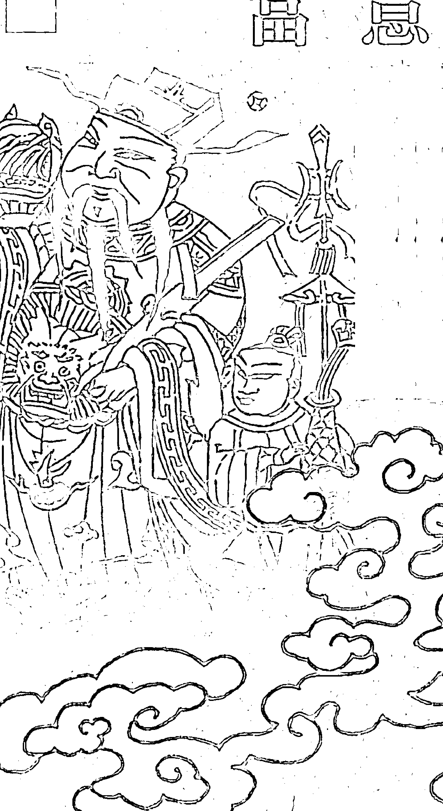

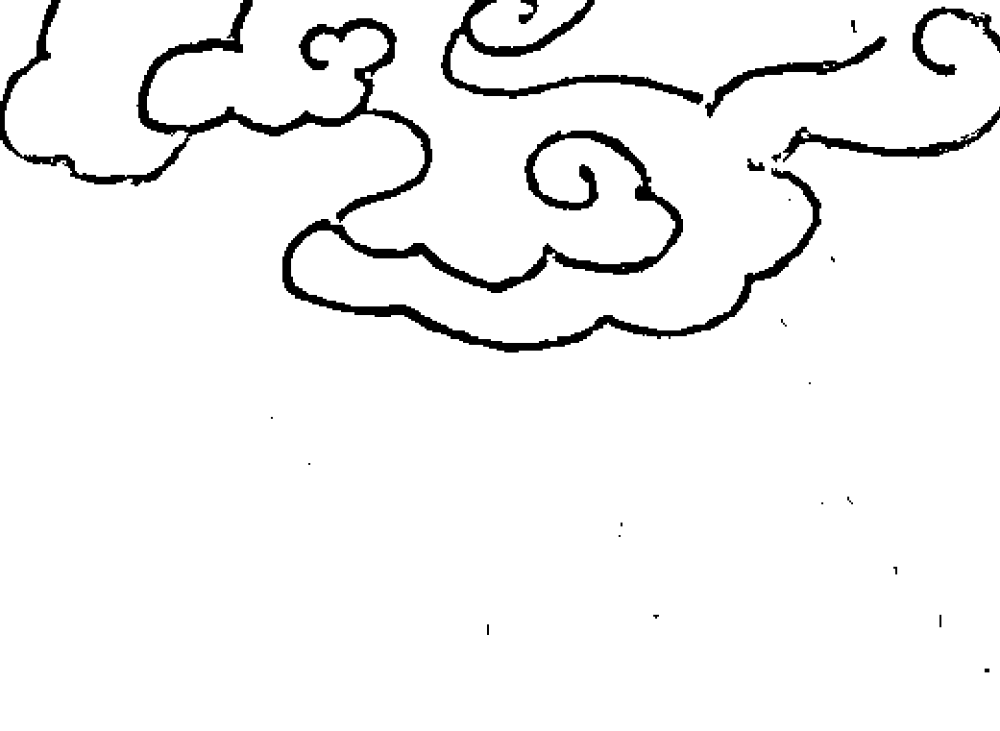

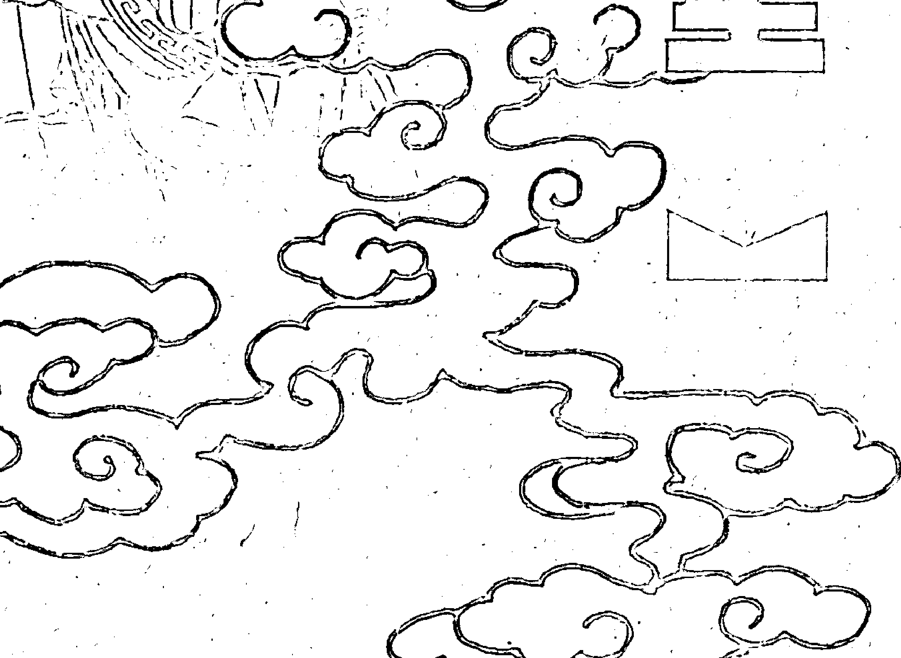

财为养命之源，一人为财死，鸟为食亡。当你财运失意时，当你在正偏横财三者皆不得意时，当你想改变财运时，你不妨试试风水招财改运的方法。术数与现代社会的融合，把握运气创造财富，此书正是为你改善财运而写。

ISBN 7-223-01170 定价：22.00元

# 财运风水学

# 你的财运财位在哪里

风水正偏横财二得意 把握财运创造财富

> 【邵伟华 著 ○ 西藏人民出版社 】

责任编辑 李海平

装祯设计 丹 朗

# 图书在版编目（CIP）数据

财运风水学/邵伟华著．—拉萨：西藏人民出版社，2006.1

ISBN 7－223－01170－X

Ⅰ. 财… Ⅱ. 邵… Ⅲ. 民俗文化研究—中国—当代

Ⅳ. P195.2

中国版本图书馆CIP数据核字（2005）第056359号

# 财运风水学

邵伟华 著

西藏人民出版社出版发行

西藏军区印刷厂印刷

新华书店经销

880×1230毫米 1/32 10印张 220千字

2006年3月第1版 2006年3月第1次印刷

印数：1—3000册

ISBN 7－223－01170－X 定价：22.00元

版权所有·盗印必究

# 卷首语

常言道：一命二运三风水。风水虽然是世间小道，却有大作用。在命运不济时，我们可以通过改造风水，转变外在的气场，使其从外到内的发生转变，将命运扭转。其中一项是很多人都想改的，那就是财运。

金钱相当可贵，什么是经济问题？其实那就是金钱问题。经济低迷之时，一些人收入减少，甚至失去了收入来源，当每一样物资、货品、服务，如粮食、饮水、住房、医疗、教育、衣服、被铺、家具等，还有娱乐，都是通过金钱才可购买得到，这时，人们就知道金钱是何等重要。俗世上，没有人可以自命清高，人人都需要为获得金钱而奋斗努力。

从某种意义上来说，财源不外有三种，分别是正财、横财、偏财，当中并没有哪一样优于另一样的。有人命中偏向发横财，打工求正财但财源少，打工一世穷，但求得横财却迅速大发。有人要走正行却头头碰着黑，而做一些合法的偏财生意，却财源滚滚。另外却有人求偏财多遇挫折，回归正财却可安稳。当然，最好就是正偏横财，三者皆得意。

若要正偏横财三者都得意，可以向风水里求。世界上不知多少具有赚钱才华的人，却好像是时也命也，不但一事无成，反而连连亏蚀，做生意失败，很多机遇来到，在别人眼中是发财的机会，一到他们面前便都成了破财的契机。失败的原因他们应该作多方面的反省，但风水定是其中重要的一个原因。古代有很多术数学派，门中弟子学习不同的术数，如四柱八字、河洛理数、铁板神数、紫微斗数、金面玉掌等，但讲到改运之法，便非风水不可。从周代有史记载风水学以来，风水就成了转运的重要法门。

当你在正偏横财三者皆不得意，又想在这三方面同时得意，或只在某一方面得意，你都不妨试试风水招财改运的方法。这本《财运风水学》便是专门为你改善财运而写。

# 目录

# 第1卷 正财篇 / 1

+   - 经商最紧要是财位
  - 空气清新则财气旺盛
- 把来客都变成贵人
  - 商业大厦的门口
- 开发经营者的经营智慧
  - 太极八卦转乾坤
- 经营者的办公室不可外露
  - 对面店铺形成的风水力量
- 经营者与吊灯
  - 商店的门口就是气口
- 横梁不可压顶
  - 收银柜也要有靠山
- 选址开业看人流
  - 大装修以求转运
- 同一天桥可破财也可聚财
  - 生地可生财
- 八字与招财风水
  - 打工保住饭碗风水法
- 选址经营也宜看坐向
  - 失业者凭风水易找到工作
- 镜子的妙用
  - 更容易升职的风水格局
- 勿在庙前做生意
  - 文职从商可供奉文财神
- 狮子拱护添吉祥
  - 诚心供奉菩萨有利正财
- 水为财

# 第2卷 偏财篇 / 77

+   - 求偏财要注意业力
- 赌业
- 风月行业
- 一串古钱招财来
- 聚宝盆
- 花瓶招风月偏财
- 化解外来势力的干扰
- 远离风月病

+   - 养黑摩利招偏财
- 大杀三方的貔貅
- 刀剑招偏财
- 风铃招偏财风水法
- 风水宝石招偏财法
- 供奉四面神利偏财
- 供奉鬼谷子大利偏财
- 合法偏财业可供奉关帝

# 第3卷 横财篇 / 131

+   - 人无横财不发
- 招财风水树
- 阴气就是财气
- 火煞明堂令财旺身子弱
- 养鱼可招横财
- 时钟带来机会
- 罗经可除横财的障碍
- 鲁班先师风水法
- 龙吐珠可化赌场的招财格

+   - 以水招财
- 黑水晶最有利招横财
- 三脚金蟾催横财
- 供奉武财神赵公明
- 供奉密教黑财神大利横财
- 霓虹灯犯冲求偏易招灾
- 神前庙后不利横财
- 建利于横财运的风水

# 第4卷 实践篇 / 183

+   - 如何寻找房宅的财位
- 三房式组屋的财位
- 四房式组屋的财位
- 五房式组屋的财位
- 公寓式组屋的财位
- 独立式排屋的财位
- 独立式洋屋的财位
- 财位的具体布置

# 附 常用招财风水工具 / 283

+   - 财神
- 福德正神
- 黄财神
- 五帝古钱
- 貔貅
- 麒麟
- 金蟾
- 鱼缸
- 水晶
- 金元宝
- 睚眦
- 风水象
- 风水龙
- 金钱牛
- 金钱龟
- 金钱鼠
- 马踏财乡
- 招财羊
- 运财童子
- 年年有余
- 玉琮
- 玉璧

# 第1卷 正 财 篇

# 经商最紧要是财位

# 1. 求正财有两条路

求正财不外乎两条路，一是作上班族，不投资不做生意，不承受业务风险，只安心地赚取月薪、年薪等，在做事的过程中，自己并不是决策人，要看老板的想法，要服从老板指令。另一条路是做生意，使自己参与实务，也投人资金，冒资金亏蚀的风险，自己就是老板，是生意中的最高决策人。大多数人都想做生意，因为做生意可以博取未可预期的利润，打工则相反，收人多少相对固定，就是分享奖金或提成，也有一定限度，不同做生意，在生意好时，还可以赚得很多。

不过，人人都想做生意，却不是人人都有这种本事。有人开业做生意，能灵活处理，使生意有声有色，一本万利。但有人开业做生意，却是弄得一头烟，把所有资金都蚀光了，反不如打工更加稳当。相反，有人打工时，意见多多，对老板上司的决定，诸多不满，受人制肘，总觉得怀才不遇，心情苦闷，因此，他们自己经营生意，反而更利于发挥个人才能。

做生意，就得承受做生意的风险。做生意可能赚钱，也一样可能蚀钱，可能成巨富，也可能破产。在市面上，天天都有新店铺开张，也天天有旧店铺因亏蚀而结束经营。有人辞官归故里，有人乘夜赶科场，有利可图的生意，没有人愿意结束。每一个想做生意的人，都要看自己的命格，看看自己是不是适合做生意，也应该看看自己是不是适合从事某些行业，不要做不适合自己的生意，先定一个行业之后，便全力向该行业进军。在开业时，生意人最好查问自己的五行和该行业的五行性质，是不是相合投契，合则可做，不合则应考虑别的行业。

# 2. 每家写字楼店铺都有一个财位

在配合命格的大前提下，你应该考虑到公司和店铺的风水。在住所里的风水，包括睡房、厕所、厨房、客厅、饭厅等的位置和设计，影响到家宅中成员的健康和各方面的运势。生意人的店铺和公司的风水，则和业务好坏有直接关系。最简单的方法，是要先能催动起财气，正财自然滚滚而来。你首先需要找出你做生意的地方的财位，并且善加利用。

每一家店铺或办公室，都有一个财位，这个财位的财气最旺，能生旺公司的运势，招来财帛。但由于每一店铺或办公室坐向都不相同，财位也就各不相同。依八卦给坐向分类，店铺办公室的坐向，实质不外分成八类，即是：坐东向西、坐西向东、坐南向北、坐北向南、坐东南向西北、坐西北向东南、坐西南向东北、坐东北向西南。

坐向是风水堪察最基本的要求，简单来说，大门口所向的方位，便是向方，和向方刚刚相反的方向，则是坐方，知道向方就可以决定坐方，定出坐向，也从而得知到底店铺中的哪个方位是财位。

# 第1卷 正财篇

# 3. 不同方向店铺写字楼财位

◎ 店铺写字楼坐南向北，财位在东方。

◎ 店铺写字楼坐东向西，财位在南方。

店铺写字楼坐东南向西北，财位在北方。

店铺写字楼坐北向南，财位在东南方。

◎ 店铺写字楼坐西北向东南，财位在西方。

◎ 店铺写字楼坐西向东，财位在西北方。

◎ 店铺写字楼坐东北向西南，财位在西南方。

◎ 店铺写字楼坐西南向东北，财位在东北方。

# 财运风水学

# 第1卷 正财篇

# 4. 催动正财的基本方法

每一家店铺或写字楼都有财位，只是财气不催便不动，我们需要使用风水方法使财气动起来，就可得财。其中最简单的方法，就是使用一盆茂盛的绿叶盆栽，把盆栽放置在财位上，让绿叶散发的气催动财气，因而利于公司写字楼店铺的生意，招来财帛。不过，唯有绿叶盆栽充满着生机，才可以形成财气，故绝对需要好好照顾这个盆栽，不能让盆栽的叶子发黄，也不要封尘，它愈茂盛，你的财气也愈旺。

最常见的绿叶盆栽，是万年青，但其他绿叶盆栽也无可，例如，黄金葛便是更具生气的绿叶植物。

如果财位不但没有摆放催正财气的绿叶盆栽，反而是给一些沉重的劳物，甚至是有污染性的东西压着，便会有反效果，反而会导致财气弱，使你频频破财。

# 把来客都变成贵人

# 1. 使顾客变为你的贵人

做生意的财气，并不是从天而降，必然要顺着世间的法则呈现出来，这些财气的带动者，不是别人，而是--个走进店内的客人。无论做甚么样的生意，带来财帛的，都一定是顾客。所以，在商业上有很多关于顾客的格言：“顾客永远是对的”、“顾客是我们的衣食父母”等等。

顾客走进来，他们并不一定想买点甚么，也许只是想看看而已，但是，一个出色的经营者，出色的店员，却需要尽量使顾客有购买的冲动，就是进来的时候，并不打算购买甚么，但在离开时，手上却拿着一些货品。销售的技术，是化被动为主动，顾客当然有主动权去决定是否购买，但店员也应主动一些，使顾客行使他们购买的主动权。很多店员纯粹被动，顾客走进来，连“欢迎光顾”之类的话也不说，只当顾客是透明人，或是被监视的对象，最紧要不让对方有在店铺盗窃的机会。

这些态度只会把顾客都赶跑掉，店铺和顾客之间站在对立面上，那可不要期望顾客会把金钱送进来，唯有使顾客感到舒适、自在，让店铺内的气牵动他们购买物品，经营者得到所想要的金钱，各得其所，才形成双赢局面。这一过程，就是把一个普通的客人，变成为店铺的贵人。

# 2. 招贵人的风水法可带来财帛

风水学有两个概念，是源自天星学观念，一是“青龙”，一是“白虎”。青龙所主的是贵人，白虎所主的是小人，白虎不但令人无益，反而有可能造成种种麻烦。青龙则给人带来种种好处。我们见到的最好是每一个人都是贵人，在各方面都得到贵人帮助，事情就会顺利得多。如果在身边的都是小人，结果就是无风起浪，麻烦多多。

青龙招贵人，白虎招小人，我们需要认识清楚店铺的青龙方和白虎方，要作出适当的设计，使我们得到青龙方的利益，使每一个客人都成为贵人。

哪里是青龙方，哪里是白虎方，这是相当容易分判的，你只要站在店铺或办公室之内，面向大门口，那么，在你的左方，就是青龙方，就是招贵人的方位，而在你的右方，就是白虎方，这方位容易招小人，不要使用。

# 青龙方和白虎方

具体的应用，是把客人的进路设在青龙方，而避免使用白虎方。有时候，在店铺的设计上，正是左右之别，使得生意相差极大。简单地说，就是把店铺的入口，开在店铺的左边，于是，每一个顾客走进来，便都是从青龙方进入，凡是进来的都是贵人。

# 细微变动已经足以改变财气

张先生是一位中医师，家族世代行医，从清朝中叶的祖辈开始，到他已经是第八代，最近由于旧楼清拆，他父亲留下的中药店被收回，他不得不另觅新址经营。他的新店面积不大，但店后留有比较大的空间，用来存放药材、浸制药酒药散，以及代客煎药。由于店子是开在旧铺附近，所以，附近相熟的坊众还是会前来光顾，生意不应差太远，事实上，新店所在之处，人流更广。

但是，新店开业，生意大不如前，前来看病和购买药材的顾客，都减少了很多。因此，他开始检讨那是甚么原因。自己没有变，依然是原来的那个中医师，依然使用他所学的医术济世，医术并没有也不可能突然倒退，他买人的药材，依然是相同的数家中药材供应商的货，一切都没有变，变的只是店铺的位置和装修而已。到最后，他认为那是风水的问题，他经一位师兄介绍，联络上了笔者。

# 顾客从青龙方进来

# 第1卷 正财篇

那是一家结构相当简单的店铺，并不复杂，店铺的门牌号数和叶先生的命格配合，坐向也不错，只是店内的基本格局却有问题。在叶先生的小店，他封了青龙方，用来作为百子柜及执药材的地方，留了白虎方让顾客进出。结果，进入进出的顾客都成了小人，财气未能因而被带旺。笔者的基本建议，就是把店铺的格式，左右倒置，重新装修一次。换言之，百子柜要从一边拆下来，改装到另一边去，其他的药材厨柜也需要这样。

这一改动，使财气的流动发生了重大的改变，顾客不再从白虎方进出店铺，而改由青龙方进出，于是，每一个顾客都成了贵人，中药店的生意也慢慢好起来，回复到了店铺搬运前的水平。

# 开发经营者的经营智慧

# 1. 虚位后面要有“靠山”

店铺招财，并不单单只是有财气就可以。一家空店，一无所有，或是各方面都管理得差强人意，毫无特色，就算是财气旺，是吉铺，也不可能招来甚么财帛。对于风水吉凶的理解，需要与科学化的因果配合起来，才能够把握到个中真象，否则，以为风水吉就万事顺遂了，便不能好好地招正财。

做生意招正财，需要一个非常重要的条件，就是经营者要发挥经营智慧的头脑。生意人并不是只要打开门做生意，一切就可以自行运作，自自然然地财源滚滚。生意人要成功运作，需要好好策划，撰写出周详的计划书，这计划书订出了明确的生意目标，并且就这些目标（可能多于一个），订立合适的计划，而这些计划的具体执行步骤，也一条一条地清楚列出，这是实际可行的方案，按照计划执行，可才能达到预期

# 第1卷 正财篇

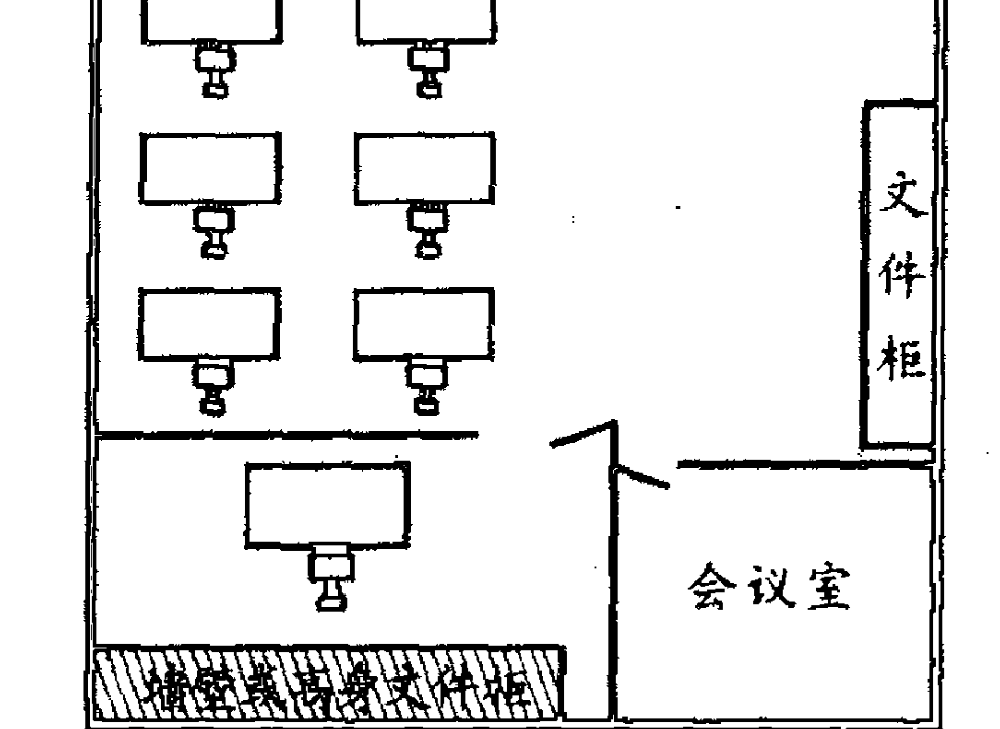

# 经营者的座位背后要有靠山

有好处的，天然的光线从身体的背后照进来，映照在桌面的文件上，感觉相当舒服，只是并不符合风水原则。风水要求背后有靠，如果背后是窗户透光，便代表了背后无靠，失靠山则精神不安稳。另外，即使背后是墙壁，但却悬挂了一块大玻璃镜，就算大玻璃镜悬挂之处是一道坚实的墙壁，也一样使靠山浮动，因为镜子给经营者背后开创了一片阔大的空间，原来安稳的墙壁，也变得不安稳起来。

# 经营者的办公室不可外露

# 1. 失败的写字楼风水一例

欧先生夫妇是经营东南亚出入口贸易生意的。在经营的头数年，生意蛮不错，也赚了不少钱，家居也从旧楼房搬进了高档豪华住宅区去，愈忙也就高兴。后来，他们更扩充业务规模，公司从四百余尺的单位，搬进到面积达二千尺的办公室去，员工也增聘了多个，接待来自泰国、菲律宾、马来西亚等地区的顾客。

不过，自从搬进到新的经营地点之后，生意就开始下坡了，以前那份忙得不可开交的景象，慢慢变得比较清闲，以前生意一桩接一桩，现在却是清闲多了。欧先生不明白是甚么原因，于是，一方面检讨整套经营策略，一方面便求教于术数。当笔者为他们堪察公司的风水状况时，便作出多方面的调整。企业的财运好坏变化，涉及很多不同因素，在欧先生的例子中，有一个相当特殊的原因，值得拿出来探讨。

欧先生为了便于监察员工与顾客的接洽，索性与所有员工打成一片，没有自己独立的办公室，把自己的办公室摆在大堂中，于是，欧先生夫妇的座位并没有靠山，同时也没有其隐蔽的风水功能。欧先生夫妇的写字桌，就是大堂里众多写字桌的其中两张，没有独立的特色。这一情况，使欧先生夫妇无法从公司内繁琐的事务中抽离，因而在日常的繁琐当中迷失了自己，没有办法运筹帷幄。

# 2. 老板一定要有个人空间才利于招财

作为企业的经营者，实在需要拥有隔离于外在的空间，以便于运筹帷幄，关起门来，在门里统揽大局。无论是政府机构，或是大财团大企业，核心的领导层，都保有其神秘性，有其闭门决策而不流露透明度的地方，好像企业的董事局，以及董事长和他的智囊们，或是我国政府的政治局常委会等，或是欧美政府领导人的内阁会议等都是。

个别的企业都是这样，经营者应具有自己独立的空间，这个空间应该是较为隐蔽的，与外面分隔开，无论经营者在营运上如何节省，给自己腾出一个隐蔽决策的空间，绝对需要。在这个空间里，经营者可以处理好自己的业务机密，运筹帷幄，很多重要的商业决定和买卖，都可以在闭门中完成。

所谓防人之心不可无，人心隔肚皮，公司聘用了好些员工，也常有顾客或其他人登门造访，如果经营者并没有属于自己独有的空间，一些商业机密便可能泄露出去。所以，经营者有自己独立的工作房间，那里就可以形成聚气的地方，隐藏商业机密，关门决策，招聚财气，这才是求正财的吉利风水。在某些机构里，最高的负责人并不面对一般访客，一般的访客都由其他员工接待，他能关门苦思，就能够专心处理最核心的事务。

# 经营者与吊灯

# 1. 灯光和风水有关

店铺及办公室里的每一样事情，严格而言，都和风水有关。---花---草---木，一碗一碟，无一不是风水器物，问题是我们是否够细心，察觉到而已。我们家居及店铺与办公室，有些东西因为太过常见，以致我们忽略它们在风水上的价值。实质上，认真研究，就知无一物不和风水有关，只是就重要性而言，当中有轻重主次之别。

灯是最常见的东西之一。灯有照明功能，每家每户都设有灯，因为有灯，我们就不用害怕黑暗。灯光把黑暗驱除，使光明---天二十四小时都存在。不过，灯光更是强而有力的风水工具，在安装的时候，可不能草率。

灯光具有两大特点，一是光，一是热，光和热都是能量的表现，足以影响到风水的吉凶变化。一般来说，办公室装置了假天花，在假天花的上面，装上了统一规格的光管，每一支光管的长短和色调相同，加上了假天花板的分隔，这会偏向于较为中性，但如果是使用额外的灯，那就需要小心考虑电灯悬挂或摆放的位置。

企业经营者想增加一点气派，或喜欢在自己办公室里装一些别致的灯饰，吊灯会是一大考虑。尤其是一些水晶吊灯，看来更是美轮美奂，一盏吊灯，可以使整家办公室生辉。不过，吊灯的位置却需要注意，大原则是：不要让吊灯太过靠近经营者的头顶，否则会有损正财运。

# 2. 光和热就是风水能量

吊灯产生光和热，头脑对于光和热，却是相当敏感。头脑要在安宁舒适的情况下，才能发挥最佳效能。光和热都会对头脑造成刺激，使头脑正常的运作添加了障碍。

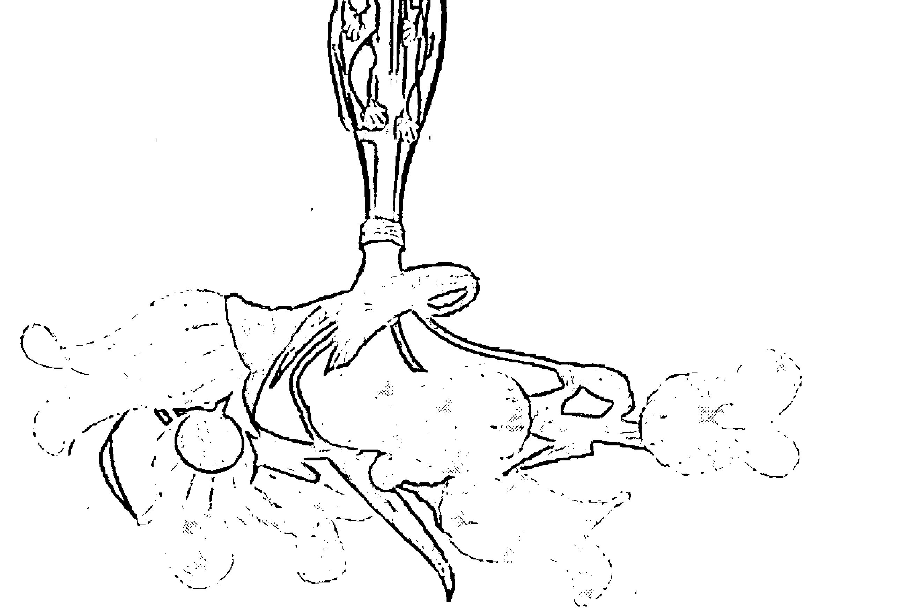

# 吊灯

首先，热力可以冲昏大脑，令理性被冲动所掩盖，因而变得比较情绪化，脾气较为暴躁，这是生意经营的大忌。一方面对于员工动辄无理责骂，另一方面就连与顾客之间的关系亦蒙上了阴影。其次，头脑受热感到不适，也难以作出良好的商业决策，而在竞争极大的商业社会，逊色的商业决策会令公司在竞争中给击倒，这也必然影响到正财的获得。

因此，吊灯不宜直接安装在头顶上方，若果要安装的话，最好就是安装在座位前面约两三尺的上方，使灯光远离头顶，这可使你免于受到不必要的干扰，使头脑潜能得到有效发挥。

# 横梁不可压顶

# 1. 横梁压顶的煞气

每一所楼房都必然有横梁。梁和柱二者，一横一竖，纵横构成了楼房的支架，不可缺少。但是，从观瞻而言，横梁有碍观瞻，建筑师和室内设计师，会有技巧地把所有横梁隐藏着，例如，把墙壁间隔设在横梁下之类。不过，基于不同的楼房使用者有不同需要，还有一些楼房在间隔上，并没有经过深思熟虑，所以，横梁并没有好好给隐藏起来，就横在人们生活空间之上。

横梁在头顶上方，便是风水学所讲的“横梁压顶”，无论在任何情况之下，横梁压顶都是重大的煞气，人人都应该避之。经营业务为的是求财，办公室风水如果遇上了横梁压顶，对公司，对经营者个人，对财运，都有相当不利的影响。经营者的座位上，要避免遭到横梁压顶。

横梁如果是压在其他地方，例如，压在货仓里，那也没有甚么严重的问题，最怕就是压在经营者的座位上。当他正在忙于工作的时候，头顶上却受着横梁的煞气，这对于经营者的身心健康都不利。经验所得，凡是长期受到横梁压顶的人，身体都比较容易发生毛病，有病的人在工作效率方面，难免要打折扣，做事未能够集中精神，决策总是挂一漏万，缺点多多。这对业务有重大的妨碍，而身心本是一体，身体健康有问题，头脑也不可能独善其身。

经营者的决策有问题，业务发展便必定有障碍，即使原本有很多好机会，都会因为未能把握住而错过，或是一些原可以避免的风险，也因为横梁压顶引致判断失准，应把握的把握不了，应避免的也避不了。

# 2. 横梁压项的风水化解方法

要改善这一情况，最直接而有效的方法，就是把座位移开，避免继续接受横梁压顶的煞气，只要座位移离横梁之下便可。

如果因为种种原因，不能搬迁的话，应在桌上摆放最少两只风水龟，以风水龟去承托横梁，以免煞气临到自己身上。风水龟数目，三只亦可。

# 财运风水学

# 第1卷 正财篇

# 选址开业看人流

# 1. 风水要看大环境和小环境

想通过经营生意求正财，要考虑的事情实在很多，不是随随便便选个店铺，跟着进货就可以开门营业，单单是选址经营，便已经相当费工夫。

有一位朋友有心做生意，后来，他告诉笔者，他已经在某商场内租用了一个小铺位，他神气地说：“租金相当便宜，月租不过千余元。”

租金真是便宜得惊人，一些店铺的租金，千余元甚至支付不了一日的租金，如今竟然只需千余元，就可以租上一个月。笔者对于这店铺的价值相当怀疑，便宜并不代表好，没有一个业主愿意做亏本生意，他们总是尽量提高租金的价值。任何店铺赚大钱，业主总是在续租约时，大幅加租，要和租户对拆利润。那样相宜的租金，不禁令人相当怀疑这商铺的商业价值。

果然，开铺不到十天，便收到朋友的来电诉苦，他邀请笔者亲身到他的店铺参观一下。笔者在某个非假期的午后，前去参观朋友的店子。笔者还没有推门走进该商场，先在商场大门外浏览一会，午后的行人疏落，这里曾经是著名的工厂区，商场位于工厂区旁边，如果是在当年，这些商铺外，一定是人流不息，只是今时不同往日，地运发生了重大改变，工厂区花果凋零，工厂大厦空置率高，七十年代到八十年代初期，工厂工人布满大街小巷，这一光景已经不复存在。工厂区就业人口少，其外围的商场的生意，也好不到哪里去。

商场外人流稀疏，商场内更是小猫三数只，眼前所见，有好些店铺都是空置着，笔者乘扶手电梯上了二楼，在转角近后楼梯处，找到了朋友的店子，举目一望，在这个时候，除了二楼的一家茶餐厅还有些食客之外，便再见不到一个逛商场的路人。此情此景，朋友经营的零食，谁会光顾。他问笔者有甚么风水方法可以改善生意。这句话听起来真是古古怪怪的，他以为在客观环境完全无法配合的情况下，还可以使用一些风水方法来独善其身，那是不符合自然定律的。

# 2. 大环境比小环境更具有决定意义

财气并不是虚无飘渺的事情，而是有实质的根据。零售业的财气，重点之一是来自人流，人气旺并不一定财气旺，但人气旺却是财气旺的基本条件。要店铺财气旺，首先便需要有人流，人流是可以透过风水方法改善的，但那是要从整个地区，或是整个商场着手，不是单单改改个别店铺的风水就可以改善。如果是整体人流旺，唯独单是自家的店铺，人流过门不入，那才可以单单改自己店铺的风水。否则，空改自己的风水，外围大环境却完全不配合财气，那是没有甚么作用的。

举一个例子，一家店铺的坐向一流，店外有明堂聚水，无论楼房内或楼房外，都样样符合风水的原则，建构出一个相当理想，利于招聚财气的环境。那么，这店铺的经营者必发吗？必定客似云来，生意滔滔吗？

如果这一家店铺是开设在繁华的路段，那么，这是大有机会招聚财气的。假如这店子是开设在大沙漠当中一个了无人烟的小绿洲上，那么，就是风水布局再好十倍八倍，也一样不能够招财气，因为外面的大环境根本就完全不能配合。

城市中的店铺也是这样，需要外面有人流的风水条件，吃得着人流中的龙气，有龙脉蜿蜒而来，形成热闹景象，这样，商场得其福阴。一些未有能力在流经财气积聚上得益的店铺，就可以做一些风水的补救措施，能招得顾客，改造财运。所以，笔者建议朋友，不要留着这家店子，虽然租金便宜，但在非洲撒哈拉沙漠找个地方开茶水亭，就是租金全免，也完全没有生意可做，倒不如当是买个教训，另择地方经营好了。

这类位于人流弱的地区的商铺，并非完全没有招财的价值，只是不能经营一般依靠人流的零售业，而是要建立起业务的特色，要吸引得到好此道的人前来才可。举一个例子，八十年代香港的信和中心，虽然位于热闹的弥敦道，却相当冷清，没有多大人流，里面的店子，或是经营一些小饰物，或是集邮社，数量较多的是新界离岛渡假屋的代理。后来，随着日本风在香港盛行，漫画风、动画风、色情资讯风，使信和中心得以脱胎换骨，一星期七天的人流都是那样大，完全改变了面貌。

# 同一天桥可破财也可聚财

# 1. 天桥有不同形状和意义

天桥早已经成了城市建设必不可少的部分。以前，天桥仅仅是一道天桥，目的是要建起一道架空道路，以跨过面前的障碍物，或跨过其他道路而已，行人天桥也不过是为了帮助行人安全横过马路。但到现在，天桥无论是行车天桥还是行人天桥，都发展成“道路网”的概念。行车天桥是要使车辆在较高速的道路网络上行驶，不必在马路上遇到不同程度的交通挤塞，使道路更加畅通无阻，更顺利更快到达目的地。行人天桥也不单单是横过马路，而是使一些小地区可以连结起来，不用横过一条又一条的马路，而且天桥更多加了盖，使其不必承受日晒雨淋的不便。

天桥在运输系统中扮演的角色愈来愈重要，也愈来愈普遍，在都市里形成不同的形势，这些形势对于风水有不同的意义，认识天桥的形在风水上的意义，对于寻找财气积聚的经营地点，甚有帮助。架空道路网络的天桥，都是建成一条直线，以便于新建及方便车辆以较快速度行驶。不过，当车辆进人高速道路系统前，或是要离开高速道路系统，便需要经一条弯弯的道路回到地面，一些弯弯的天桥，经常是在大厦的外围绕过，因而形成了不同的风水意义。

同一天桥，对于围绕于这天桥的不同位置的商铺及住宅，在财气上会有不同意义，有些地方主吉，能招聚财气，另一些地方却不吉，使财气流失。在传统的风水学上，有“有情水”和“无情水”两个观念，这原是指河流溪涧的形势，但路被视为水，皆有让气流动的性质，所以，有情水和无情水，在没有河流溪涧的环境中，都可以使用于道路方面。

# 2. 有情水可招财

水重有情，有情之水，是自远方而来，来到面前，水流速度大减，离去的时候也是较为缓慢的，好像是依依不舍那样。这如同男朋友送女朋友回家，送了她进家门之后，她从窗口外望，男人走两步，便回头看一看，依依不舍的，走了好久，却还是离女友的家门不远。

相反，无情之水便像个无情人，来也匆匆去也匆匆，从远而近，急急而至，跟着便毫不留恋的跑开了，如同一般的过路人，彼此无情，没有甚么感觉。在判断家门或店铺外的来路吉凶，有情无情两个观点，相当重要。同一条天桥，给一些家宅商户带来财气，却同时给另一些家宅商户带来破财，其中原因，就是因为从某些角度来看该天桥，是构成了有情水，从另一些角度来看，却是构成了无情水。有情招财，无情退财。

有情之水，简单来说，就是当外面的天桥形成一道弧型时，家宅商铺正位于弧型的内围，这一道天桥便构成了有情水。相反，如果家宅商铺位于天桥的外围，这一道天桥便形成了无情水。

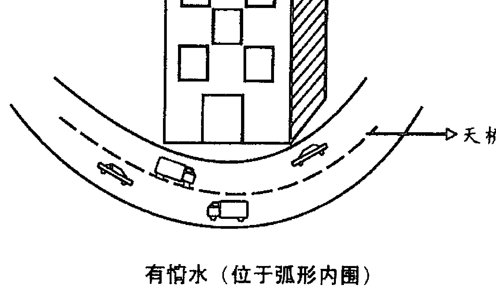

# 风水学

# 第1卷 正财篇

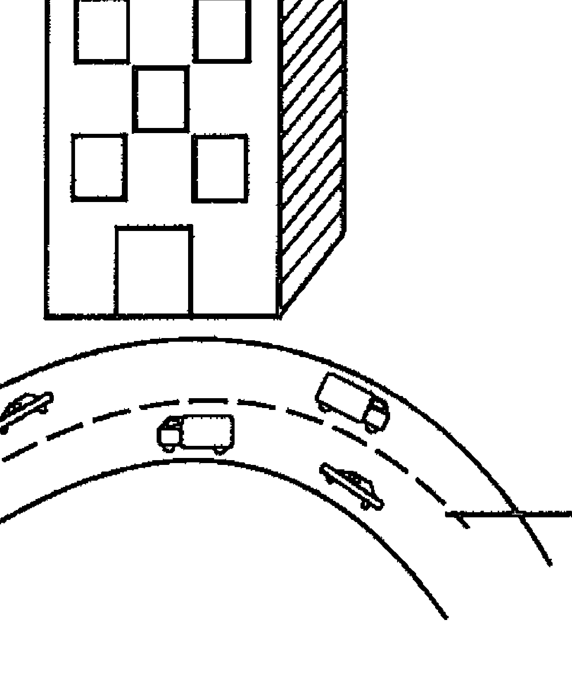

# 无情水（位于弧形外围）

# 3. 无情水一定要避免

在选择家居或是商铺办公室时，如果楼房外面是有天桥的，便应该留意天桥和该座大厦之间的联系，要选择位于天桥内围的建筑物，尽量避免选择天桥外围的建筑物，两者有极大差异，甚至可说是南辕北辙，一个聚财，--个破财，一个送水，一个扯水。

经营生意要想求得正财，店铺外的格局要以聚财气为佳。气从远方来，而聚于店铺一带。“明堂聚水”所以被视为聚财的佳格，正是因为此格局可以使气聚于大门内外，为大吉大利之象。就是未得明堂聚水之格，能获得有情之水，水由远而近，慢慢而来，并且不舍地离开。财气也是如此，气易来不易走，便聚财聚气，做生意得这种地方，可以使业务兴旺。

相反，如果处于迎接无情水的位置上，财气根本就不能积聚，来了便去，具体情况，就是顾客像是川流不息，却没有光顾多少，业务不佳，常有亏蚀。

# 八字与招财风水

# 1. 风水补命理五行之不足

大概没有一位术数师会否认一项事实，就是命理学有多种，包括了果老星宗、河洛理数、皇极经世、铁板神数、紫微斗数、十八飞星、四柱八字等。其中最完整而最具学理的，应用性最广泛，也最具人生哲理意味的，非四柱八字不可。很多其他的术数类别，如占卜、风水，都和四柱八字有千丝万缕的关系。四柱八字命理学，是命理学中很高深的学问，论具体程度之惊人，它不如皇极数，但论到趋吉避凶的实用性，并且顾及到当事人的人生态度，四柱八字却是极高的。

另一方面，由于四柱八字的基础，就是阴阳家的阴阳五行哲理，而其他诸家术数，好像风水、姓名学、占卜等，都不离阴阳五行，甚至中医学也不

# 选址经营也宜看坐向

# 1. 店铺由不同人经营则旺衰不同

何先生的旧店子租约期满，他打算另觅新址经营，却遇上了一个难题，所以找了笔者研究这个问题。何先生经营的是面店，售卖的就是诸如馄饨面、牛杂面、鱼蛋面、墨鱼丸面等普通大众化的面食，虽然竞争大，但客路也相当广。他从小便在父亲的面店打滚，早已经掌握了精湛的煮面技术，对于经营这个行业相当有信心。他说：“只要有懂得欣赏面的人，我就不愁没有生意。” 事实确是如此，无论经济情况如何，他经营的面店都有钱赚。

何先生的难题，在于一家开业不久的馄饨面店结束经营，对方打算把整套用了不久的面店设备连同铺位，一同转让给何先生。何先生看过店的环境，也看过店内的所有设备，觉得对方开出的价值相当超值，但也由于太过超值，他反而犹疑起来。后来有朋友告诉他，也许是这家店子的风水差，生意差劲，对方才把店子大贱卖。何先生是个信邪的人，他对自己的煮面技术有信心，但讲到风水等问题，他便感到无能为力，万一真的斥资买下这样的店子，日后生意差劲，如何是好？

何先生还没有决定是否买下这店子，自己的老店子如常营业，他找了自己的两个儿子帮忙，在附近暗中观察这面店一整天的生意，并且装作是食客，光顾这面店，吃吃这面店的面食。何先生从儿子处得到的报告是，这店的师傅煮出来的面食，味道和质素都不如父亲的制品。而有趣的是，对该面店和邻近其他的面店作了比较，发现该店的食客数目，比其他的面店少三成至五成，就是在午膳时间，当其他面店已经没有空座位了，但在这家面店，也还是可找到座位。

何先生怀疑起那家店铺的风水，他不想买，可是，撇除风水的因素，从纯商业的角度考虑，却应是大有可为的，而且店东开出的价钱实在便宜。何先生委决不断的情况下，决定找笔者为他看风水。

# 2. 旺你的来必旺他人

这店子的风水其实相当简单，属于中庸平凡的格局，风水并不如想象中的那么差，而且对着绿叶成阴的休息处，应比邻近的面店更具竞争力才对。但原来的老板无法使面店变成生财的金蛋，自应有其特殊的原因。笔者估计那可能是面店的方位理气，和店主的命格并不相符。依据何先生给笔者的生辰八字，判断了其五行状况，发现其五行缺水，而面店的门口，正好朝着北方，北方属水，这店正好生旺何先生五行所缺的水，对他绝对是吉相。

笔者估计，想把店子脱手的人，可能命格根本已经是水旺，店铺门口向北，使水势更旺，使其五行更加不平衡，更不符合中庸之道。因此，这店子的风水不吉，并不是客观上不吉，而是主观上不吉，情况就如病人吃了不符合他病情的药物，因而病情加剧，不能获得药物的益处。相反，另有病人对症下药，就可以得到药物的益处，药到病除。

笔者建议何先生把面店买下来，前一位老板生意差，但相信在何先生手上，却可以有起色。何先生接受笔者的提议，决定把面店买下来。果然，何先生新店开业不久，便已经客似云来，不到半年，就因为生意太好，便连隔邻的空置铺位也租了下来，添加了五六张桌子。

选址经营也宜看坐向，情况就和经营者的办公桌应定好坐向一样，要配合人们的命格五行，要生旺自己所欠缺的，才能造就一个利于生财的风水环境。

# 财运风水学 第1卷 正财篇

# 镜子的妙用

# 1. 常见日用品，也是风水工具

镜子是相当常见的日用品，几乎家家户户都一定有镜子，镜子可以用来整理衣冠，用来反映眼睛看不到的身体部位的情况。从清早起来，我们刷牙洗漱，穿著衣服，都是要对着镜子进行，镜子已经成了生活中不可或缺的用品。风水学经过长期的发展，也已经孕育出很多实用的风水工具，风水师各师各法，甚至自行发明创造，制造出只此一家别无分号的风水工具来。

风水工具虽然种类繁多，但实际上，风水工具的制造，也是按照某些原理进行，例如，依据五行相生相克道理，以不同的质料克制某一五行属性。又例如，以物理功能，好像光、热、磁、色泽等，使环境中的气场发生改变，从而也改变了运程。镜子成为风水学中常用的工具，主要就是利用光的原理，因为镜子本身就是最普遍最常见的光学工具。

旧式的镜子是使用铜制的，把一面铜块的表面磨得相当光滑，直到能把外面的影像反映到铜片上才可。现代的镜子，则是以水银涂于玻璃之下，水银反映的清晰度，更胜铜片。风水学经常应用到镜子，而镜子有三个类别，一是平面镜，一是凹镜，一是凸镜，各有特殊的用途。

本篇探讨的，是关于平面镜如何应用于改善财运的问题。

# 第1卷 正财篇

# 2. 将他方吉利之气反映过来

镜的功能在于反映，而这个反映，必然是把外面的影像吸收过来，这也会把外面的气吸收过来。镜子所反映的事物景像，和事物本身有相同的属性，因此，家宅或办公室，面对一些吉利的形势，便可以利用镜子，对着吉利的形势，把那个影像吸收进镜子中，便如同从远方把那个事物吸收过来那样，因而能招纳吉气。因此，外面的风水形势，对于我们便有重要的意义。我们置身于大环境当中，不能避开大环境风水的影响。如果外围的风水佳，只要配合家宅或店铺内部的结构，便可以利用大环境的吉气，招吉进财。就是吉利的风水形势在比较远的地方，也一样可以有办法，把其吉势纳为已用，窍门不在别的，正在于镜子。

镜子有吸纳吉气的功能，所以，窗户对着的远处，如有甚么吉利的形势，便可以透过镜子，把吉气吸纳，因而带旺了家宅店铺办公室的财气，利于招财纳吉。例如，从你的办公室的窗口，看见远处港湾波平如镜，如同远方的聚水明堂，这原本非自己有缘份享用得到的，但凭着一面镜子，把镜子悬挂在窗台上，正正对着远处的明堂聚水，就可以增加一份吉气。其吉利程度虽然不如正式座落于港湾畔，但还是有所帮助。

使用镜子时需要小心，确保镜子对着的是吉利之物，而非带煞气的东西，否则便会把煞气也带进家宅办公室内，反而招灾破财。

至于镜子的形状，最好是圆形，因为圆形属金，财气也是属金，而且圆形有周而复始之势，代表了生生不息，就如生财可以不息那样。

# 勿在庙前做生意

# 1. 庙宇前后都无良好的气场

庙宇曾经是社区的核心地带。古代的中国，在乡村城镇内，大家都信神敬神，社区内所设的神庙，象征了大家的共同信仰，每到甚么时节，或是家中有甚么重要事故，便都会到庙宇去拜神。庙宇所在的地方，也必然带来了一些生意机会。在庙外，因为常有人聚集，便会自然地形成市集，售卖一些和庙宇信仰有关的物品，或是有江湖术士郎中兜生意。不过，依风水学的传统理论，却要指出庙前庙后是不出富人的，这对于选址做生意求财，有一定的指导意义。

庙宇前后都无良好气场

为甚么庙宇四周并不能带来财气，很多人对此百思不得其解，但事实确是如此。居住邻近于庙宇的地区，都不具有从贫转富的条件，或是在庙宇一带经营生意，都较难有突围的能力。一般认庙宇是吉地，因为庙宇有神明居住坐守，变成了神圣的地方，好像黄大仙庙里有黄赤松大仙，关帝庙里有关圣帝君，观音庙里有观世音菩萨，玉皇庙里有玉皇大帝等。

# 2. 只利于术数和宗教物品

甚至是外国宗教的庙宇也一样，好像基督教的教堂里，有耶稣基督，天主教的教堂内，除了耶稣基督之外，还有圣母玛利亚，以及多位被封圣的圣人。另外，伊斯兰教寺则有其真神阿拉，印度教庙内有创造之神大梵天、维持之神韦斯纽、毁灭之神湿婆等，而佛道两教的神明佛菩萨仙人，数目更多。

庙宇是供信众参拜的地方，是人与神结缘的地方，表面看来，近城隍庙可以把握机会，求一纸好签，以为在庙宇附近营业做生意，自得到神的祝福，其实并不是这样。由于神明慈悲，会接引我们看不见的灵界众生，让他们都聚集在庙宇当中，接受神明的阴庇，如果有讲经说法，灵界的众生也会成为听众，如同佛陀在世说法时，也有诸天神明、天龙八部等前来听法那样。

这些灵界的存在，有相当强大的能量，由于他们聚集于庙宇中，便会尽吸地气，地气都凝聚在庙宇范围内，庙宇外便无地气，因而偏向贫穷不聚财，尤其是正正位于庙前，更不主富。因此，选择经营的地点，便应该避免选择在庙宇前面，适合在庙宇前长期经营的，只有宗教及术数两个类别。

# 狮子拱护添吉祥

# 1. 风水狮子的作用

狮子有“万兽之王”的美誉，在陆地上所有走兽当中，没有一种动物比得上狮子那样威猛，就连老虎或豹都比不上。狮子的神态沉着，一派王者风范，就连风水家也留意到狮子的形相所呈现的灵意。

以狮子为座驾的文殊菩萨

狮子无论在中国，或是在古天竺，都不约而同地具有特别地位。在印度天竺，一些神佛都以狮子作为座驾，好像文殊菩萨，或是密宗的一些金刚本尊，有些本尊甚至是现出狮子之相，而相传佛陀降世时，也曾经发出威猛的吼声，这威猛的吼声被称为狮子吼。在中国，狮子的地位仅次于龙，龙是九五之尊的皇帝家族的专利，狮子则是贵族所采用，在官宦之家门外，或是在衙门的门外，都会摆放着一对石狮，作为其守护者。

这一对石狮子，实际并不只是守护者而已，它更具有一种保障地位和权力的意义，能够迎接瑞气，招财纳吉。这种方法在过去仅是官宦之家的专利，但现在已经没有禁忌，任何人想要摆放一对石狮子，只要愿意付出这笔费用，便都可以。在现代，风水狮子也不限于石狮，铜狮也是相当常见的。

风水狮子的第一项重要功能，就是能够辟邪。在我们生存的大环境当中，遍布着邪气，这些邪气只要因缘条件合适，便会肆虐，干扰人们的幸福，破坏人生的正常秩序。狮子的形相威猛，具有征服邪气的能力，在大门口摆放一对狮子，可以镇宅，但其镇宅是良性的，不会连吉气也阻挡着。相反，狮子是瑞兽，能招来吉祥的风水。

# 2. 化煞招财 排除万难

风水狮子也可以化煞。大环境当中有很多形煞，例如，一些嶙峋怪石，或是尖角，或是坟场殡仪馆，或是污水渠，或是排放废气的烟囱等。处理形煞最佳的方法，莫过于改善环境，那是最能根治风水问题的，只是外面的环境并不是我们能控制左右，未能改变，便只有使用另一种方式调节，风水狮子就是其中一个方法。把狮子摆放在对着煞气的地方，可以化煞减灾。

简而言之，风水狮具有排除邪气煞气的功效，在财气方面的意义，正在于它可以排除进财的障碍，令进财变得比较容易。目前，最多使用风水狮子的，都是商业机构，最著名的，莫过于汇丰银行。他们在总行摆放的一对巨大狮子，使他们能排除无数的业务障碍，成为香港企业的龙头，并且成为在国际金融界举足轻重的金融机构。

# 3. 摆设风水狮子的原则

摆放风水狮子的原则，在于成双成对摆放，不能单丁地放置一双，因为狮子的摆放是一雌一雄，成双成对地分别放置于左右，这便如一对夫妇那样，不能拆散，拆散了便失去效力。所以，在购买的时候，便需要整对的买回来。日后，如果狮子有甚么损坏，更换也不能只是更换毁烂的其中一只，而是也要整对更换。

其次，狮子的摆放是有左右之分的，应该放置在左边的狮子，便放置在左边，应该放置在右边的狮子，也就放置在右边，不得左右倒置，否则便会失去化煞驱邪的意义。通常，放在左边的是雄性，放在右边的是雌性。

第三，狮子虽然是吉祥的瑞兽，但毕竟呈现着凶相，故此，狮子本身是带有煞气的，不能够让狮子头对着室内，否则便可能有损室内家庭成员或办公室人员的健康，容易生灾。要风水狮子除煞化煞，便得把狮子头对着外面，或是放置在门口对外，或是摆放在窗台上对外均可。

狮子虽非财兽，但狮子能排除障碍，障碍除去，自然较容易得正财。

# 水为财

# 1. 山管人丁水管财

俗语说：“水为财。”这应是脱胎自风水学术语的一句：“山管人丁水管财。”看家宅人丁的兴旺与否，应看家宅一带的山势，看家中的财气，应看家宅一带的水路如何。凡是和水相关的东西，都和财气有关。

水对于财气的影响力，有很多原则，需要在不同的情况灵活运用，其中一个原则是：当水有动象的时候，才能够带动起财气来。很多招财的风水工具，便是按照这一个原则运作，动则生财，不动则静如处子，没有财帛流入的现象。

利用水的功能使财气流动方式，大致有两种形态，一是使水流动不息，在流动当中便带动财气，形成了吉利的气象。另一种方式，就是使水流上下往返，循环不息。在过去，由于科技落后，水流利用以招财气，只能依赖自然界力量，那是很受约束很受限制的，如果家居未能靠近水源，便很难得到水的祝福，或是天旱以致水流不足，一样妨碍了风水工具的运用。

# 2. 要善用风水工具

但到现在便不同了，科技的发展使人们能够利用电力能源，水的流动升降，都可以使用电力达成。而风水工具配合起科技，也变得多姿多彩起来。很多风水工具，其实就是寻常的装饰物，只是大家不知道它的意义，偶尔使用，碰巧遇着财位，竟然获得很好的招财效果，生财顺利。到尖沙嘴走走看，你就可以见到不少这样的例子。

# 3. 转动的水车可招正财

开设店铺，想要别出心裁，搞搞新意思，较能吸引顾客，不妨在门口安装小小的喷水池或是水车，既具装饰功能，又可以招纳正财，一举两得。

# 空气清新则财气旺盛

# 1. 空气差会影响财运

空气污染已经成了全球性的问题。由于工业发达，科技进步，高度生产力和高度消费互相配合，以致各种各类的工业生产不断进行。在生产过程中，很多污染物都被排放在空气当中，而且也使全球空气温度上升，造成了严重的生态问题。由于污染的速度太快，地球的自然净化功能，根本就无法赶及处理这庞大的污染物。结果是：世界处处都有空气污染问题。就连努力处理输出污染物的美国，也一样无法使其本土的空气干净。一项医学调查发现，美国每五千人当中，便有一个因空气污染致病。

空气污染从某一个角度来说，是富裕的象征。财富的增加，主要是由于工业发达所致，最大的工业国就是世界最富裕的国家。然而，实际工业国也正努力于减少污染，提高生产过程的净化质素。另外，他们还把污染物输送出国处理，使污染问题给移师到较贫穷的海外国家，一些高污染的生产工序，也移到第三世界设厂生产。

如果一个国家长期处于空气高污染的状态，那必然削弱其财气，唯有空气清新，才有利于创造生财的环境。就个别的商人和企业而言，店铺及办公室也应该尽量避免受到污染的风水影响，这才能保障企业的财气。就是在工业区，也应在能力所及的范围内，努力维持办公室的空气清新。

# 2. 形煞可以用风水工具化解

保持空气清新，是整体社会的责任，政府需要做积极的措施，以控制空气污染，通过立法，建立环境保护条例，严格执行，保持生活环境的空气清新，而空气好，配合上其他良好的风水格局，就可以形成财气。

店铺及办公室的门口，是吸纳吉气的通道，如果大门口外受到污染性的事物破坏风水，对做生意求财，便有不良作用，需要对症下药，使用特别的方法化解。例如，工厂需要排放黑烟，生产过程产生的废气，要通过烟囱排放出，所以，无论是工厂大厦，或是独立的工厂厂房，都一样设有烟囱。这些烟囱是一条黑色的柱状物，就其形而言，这柱状物是顶心柱，是穿心煞。如果刚好冲着你店铺或厂房的大门口，对于大门内工作的人，便构成了重大的煞气，不利健康，容易遭到意外。一家企业营运的得失，涉及很多因素，如果员工个个容易生病，或是受到意外伤害，精神不振，那便很难产生足够的竞争力，难望生财。而烟囱内布满了污染物，也必然使门口难以吸纳清气旺气。

面对这些情况，最理想的处理方法，在于不要租用这些店铺办公或作为厂房，改为租用其他地方，如果已经租用了，最好就是搬迁。不过，搬迁并不是简单的事，涉及到搬迁的成本，还有就是搬迁有可能导致很多熟客流失，这都是需要考虑的。一些老字号店铺，在那个位置已经建立起很深的形象，深入民心，搬迁有可能损害了这个形象。因此，退而求其次

# 商业大厦的门口

# 1. 租金便宜不等于值得

开业经营，都是为了要赚钱，再没有比能够大展鸿图、生意滔滔更加快乐的事了。只是，要达到这一个愿望也不容易，需要很多条件因缘配合起来才行，要开业十分容易，只要申领一纸商业登记证，租用一个商业单位做生意就可以，最小的商业单位，不过是租用一家写字楼内的一张写字桌而已。

租用写字楼或店铺相当容易，尤其是在经营环境较差的时期，处处都有空置的店铺和写字楼，真是丰俭由人，租金想要多便宜便有多便宜。但是，租用经营地点最紧要的是合适，免费的地方未必有价值，租金百元一平方，却可能是物有所值，这需要经营者审慎判断，看看自己的需要，否则，租错了地方，徒然劳心伤神。

租用写字楼，当然要选择商业大厦，这和租用店铺有点不同。租用店铺，经营门口生意，最紧要的是商场的人流量大，路经的人数多，参观的人也多，惠顾的人也相对增多。相反，人流稀疏，小猫三四只，就难以维持经营。写字楼便不同，就是该商业大厦所在的位置，交通较不便利，街道上没有什么人流可言，也一样可能值得租用，租金也许因为交通不便利而便宜很多，最重要是看所经营业务的性质和方式。

# 2. 要留意经营地点门口纳气吉凶

选择商业大厦，除了看租金、地点、位置、业务性质之外，还要看看商厦的风水吉凶。有些商厦位置比较偏僻，但却风水甚佳。要研究一所商业大厦风水是否利于财气，主要是看大厦的门

口，虽然现代都市有很多商厦的门口是对着街道，楼下是只有数尺阔的行人路，跟着便是马路，但实际上，虽只是行人路和马路，当中却有些原则，帮助判断是不是适合经营赚钱。

商业大厦地下的大门，是整幢大厦纳气之口，看大门口的吉凶，便已经在一定程度上，显示这大厦是否值得租用。大厦门口所纳的气，是健康之气，是凶气，是财气，视乎门口的风水如何而定。最理想的，就是明堂聚水。

所谓“明堂聚水”，在过去，是指门口对着一个湖或是池塘，水质清澈，水面波平如镜，一片空阔。在现代，明堂便是指大门外是一片空地，或是公园，或是广场，广场上有花草，或有喷水池，都属吉利，因为门口所纳的都是清气。

无可否认的是，现代大都市地小人多，楼宇挤逼。商厦门外就是马路，除非大厦的大业主在兴建时，刻意把风水的因素计算在内，否则，便很难期望大厦门口有理想的风水。我们只能够作一比较，选择一些门口风水比较佳的，作为求财基地，其次，就是在自己租用的写字楼内多花心思，力求使写字楼的风水理想，以补不足。

# 财运风水学 第1卷 正财篇

# 太极八卦转乾坤

# 1. 太极八卦含藏一切万物

太极、八卦，是中华文化的瑰宝，只是对于没有深入中国哲学的人，会对这块宝轻视，以为那是没有任何价值的封建糟粕，实不知太极八卦是最高深的归纳法。太极八卦含藏了一切，也可以说，一切皆从太极八卦衍生而出，对于求财，太极八卦图也存有颇深的风水意义。

宇宙的存在，一切是从无开始，道家称为“无”，也就是佛家所称的“空”。这“无”就是无极，无极无可名状，可无形容，无可称呼，也就是道，是一切的本源，是清净无染之心。但是，这个“无”，或这个“空”，却是含藏一切，一切皆依空而成，空就是一切，一切就是空，所以如《心经》所言：“空即是色，色即是空。”一切的富足皆在空中，皆在无中。

从无而成有，从绝对一元变化，便成为相对二元，那就是阴阳两仪，就是显现于世间存在的太极。太极当中藏有阴阳两仪，意味着世间一切都是由阴阳生成，一切事物都是相对的，整个存在就是相对的，即是黑与白、男与女、阴与晴、善与恶、高与低、好与坏、主体与客体、生成与毁灭、离与合、聚与散、得与失、贫与富等。整个存在都是在相对之中。

太极是一阴一阳的两仪，由两仪的配搭，生出老阴、少阴、老阳、少阳四种组合，这就是四象，由此四象再生，便成为八卦。八卦分别是乾卦、坤卦、震卦、巽卦、兑卦、艮卦、坎卦、离卦。八卦藏万象，由八卦上下组合，可成八八六十四卦，更由六十四卦衍生到无空无尽，以《易经》为基础的高深易学，讲的是易变之道，就是由这六十四卦开始。

# 2. 求甚么都可从太极八卦而得

太极八卦图含藏有丰富的智慧，这图象在道家中被广泛应用，风水家也常常应用，但一般人都仅仅以为八卦可以化煞挡灾，甚至认为八卦是煞气很重的工具，照到哪里，哪里便给煞气进攻。有些一知半解的，见到人家的家宅以八卦镜照过来，便以牙还牙，又拿一面八卦镜反照回去，如同术士斗法那样，其实，如果认清八卦的功能，那大可不必。

八卦有化煞的作用，尤其是由于时间秩序变化，以致某个方位里形成了煞气，使用八卦镜会有很好的化煞效果，这是需要使用玄空飞星学进行计算的，但无论照着甚么，都不会给那事物带来煞气，因为八卦只不过是含藏万象的智慧结晶而已，而太极就更无杀伤力。

# 财运风水学

# 第1卷 正财篇

太极八卦含藏万象，能把时间秩序的煞气化解，事实上，它还有更加正面的意义，就是摆放得恰当的话，可以获得在世间上之种种所需，因为太极八卦本身就是宇宙的缩影，包含了一切，故此，适当地摆放，可从八卦的灵意当中获得祝福，得到自己想要的东西。

开设公司经营，想要赚大钱，你不妨把这个意念投入到一面太极八卦镜上，那是中央为太极图，旁边则是八卦，宇宙一切讯息都在其中。这一面太极八卦镜，可以悬挂在自己的办公椅后面的墙壁上的正中央，以保持其神圣庄严的感觉，尤其是当业务经营了一段时间之后，觉得没有甚么起色，不妨使用这一方法，或许有转变乾坤的效果。

# 对面店铺形成的风水力量

# 1. 对面或楼上下是偏门行业的化煞法

中国香港的道路，相比于世界其他地区，路面真是相当狭窄，在其他地区的大城市中，一些主要道路，四线行车，双程而每程四线，马路两边之间便相隔了八条行车线，而过了马路之后，行人道也颇为宽阔，所以，两边的店铺遥遥相当。有这样大的距离，彼此的影响就相对地弱得多。香港的情况便很不相同，很多道路仅是单程行车，并且是单线行车，两旁有一些泊车位，跟着便是两边很狭窄的行人道，然后就是店铺。这一边的店铺的人，和对面店铺的人，真是可以相隔着马路来谈话的，也由于相距那样近，彼此的风水情况便会互相影响。

对面的店铺经营一些甚么行业，对自己店铺的影响，要视乎当中的相对性，并没有绝对的好，也没有绝对的坏。排除风水问题，纯从商业角度考虑，不要以为同行便如敌国，其实同行走在一起，揉合起来，反而可以带旺一个地区，吸引更多人流，更多顾客。例如，黄金商场是电脑软件硬体，与及数码影音产品的集中地，相似类型的店铺开得成行成市，彼此有互相竞争的对立，但也因为形成了一大商场特色，以致吸引了好电脑玩意及喜欢数码影音产品的消费者前来。

这一情况，好像当年的鸭寮街，那时很多人喜欢原子粒及无线电的玩意，鸭寮街便有很多店铺销售这类产品。在通菜街，这是著名的女人街，有很多女性成衣销售，女士们想买有不同特色的内衣外衣，甚至是相当性感的贴身衣物，通菜街都不会令她们失望，于是，通菜街的商贩之间，便彼此既互相竞争，也互相帮助，制造起整个街头夜市的特色来。

# 2. 供奉观世音菩萨的作用

从风水角度来说，如果与带有煞气或是捞偏门的行业相对，便需要注意其中的不良影响，只要能作出一点点风水改善的措施，有时甚至可以化煞为吉。带有煞气的行业，好像五金业及肉食行业，两者都是使用刀剑利器的，煞气不言而喻，而肉食行业更是沾满了血腥，煞气更加强烈。一般行业如果受到这些行业所冲，便很难生财获利，障碍多多，所以，你也不难发现，在很多地区，当有五金行业的店铺开设时，邻近及对面，也每每只能让一些诸如五金业木匠之类的行业生存，很多行业难于立足。事实上，这亦非死症，不一定要搬迁，还是有药可医，只要在门口左右两旁，分别摆放一对风水龟，便可以除障化煞，免去了被煞气的侵扰。这是由于风水龟的背脊是弧形的，有卸去煞气的作用，而且风水龟是吉祥瑞兽，可化煞气为祥和，使令受影响的店铺得到安稳，有赚钱生财的空间。

风月行业亦是会形成煞气的行业。风月是艳情性质，表面上，那是温柔香艳，和煞气没有甚么关系，但实际并非如此。风月行业一向不被社会主流接受，属于社会边缘营生的行业，却也不知到底养活了多少人。女人卖弄风情，甚至出卖肉体，以讨男人欢心，赚男人的钱，多少人间的悲哀事，都在风月行业中发生，有妻离子散的，有因爱成恨，有染上令人羞愧的顽疾病的，有伦常血案，有少女的幸福给埋葬在其中的。经营这些行业的人都知道自己走的是偏门路线，凡是偏门路线的行业，便都容易招惹阴魂鬼怪，所以，所有风月场所，都一定供奉神佛，一定拜神祭祀，撒阴间钱，甚至每天下午正式营业之前，都会有职员先烧元宝，以求工作顺利，心安理得。

煞气阴气这样大的行业，岂能对于对面的店铺毫无影响，就是风月场所位于二楼三楼，甚至更高层，煞气也一样沿楼梯或沿电梯而下。位于风月场所对面的店铺，无论是哪一行业，都应该先求化解这阴气煞气。化解方法也相当简单，只要在店内供奉观世音菩萨的神位就可以，让菩萨像对着门口，与风月场所的人口处，遥遥相对着便可以，能够化戾气为祥和，使做生意顺利。

# 商店的门口就是气口

# 1. 做小生意要注意店铺门口风水

有朋友离开了打工生涯，决定自己创业做老板，这原应是可喜可贺的事，祝他大展鸿图，生意滔滔，但对这朋友来说，却非好事。原来他所以离职，实在非出于自己的意愿，只是任职了近二十年的公司易手，新人事自有新作风，新老板登场，便要对高层人员，逐一换马，换上自己的心腹亲信。朋友是旧人，并不容于新领导班子中，结果便给踢出局。

不过，离职之后，差不多五十岁的年纪，面对经济不景气，在外面已经很难得到同一层次的职位，几经考虑，索性选择从此离开人力市场，自己开业经营一些小生意，反正他自己已经有一笔不少的积蓄了，原本可以拿着这笔积蓄慢慢吃一世，但他还是认为作一点小本经营，作为长期稳定的财源。朋友选择了在学校附近，开设一家小书店，售卖一些参考书、补充练习和课外读物、文具等货品，并有影印及图文传真服务。

朋友不愿意冒太大的风险，所以，在开业之前，他作了相当周详的经营计划，并且订立明确的销售策略，把他在商场打滚所获得的经营知识，应用到自己的小生意上。他还想借助风水的作用，使店铺建立起良好的经营环境，不致于在经营当中遇到重大挫折。他找笔者为他的新店子看风水，由于店子还是光铺，没有任何设备，要进行符合风水的布局，便容易得多。

# 2. 门口大才能吸纳财气

朋友看中的店子，位于一幢二十多年楼龄的旧楼地下，面积很小，阔度只有六尺，长则有十来尺，朋友必须要充分利用这细小的空间，又要摆放货品，又要有容纳顾客的空间，可不容易。而且他针对的顾客群是学生，学生顾客的一大特色，在于喜欢成群结队，一位少年人要购买一个铅笔刨，便可能与三、四位同学一起走进来。因此，笔者在数项提议当中，特别强调要充分利用空间，以及断不能够让顾客进走时有压逼感。

笔者向朋友建议，这样狭小的空间，门口就不宜小，要尽量使门口宽阔，利用店铺的阔度，尽量容纳多一些顾客。朋友便把门口的阔度，等同于店铺的阔度，因为门口就是气口，气口阔，吸纳财气的通道便阔。从心理角度来说，这给了顾客宽阔无压逼的感觉，使他们较喜欢在这里购物。

# 收银柜也要有靠山

# 1. 有靠山就可保住财气

零售店铺都需要经常收银和找零。以前的小店子，处理现金的方法相当原始：一个抽屉摆放币纸，另有一个小筲箕盛载辅币，或是索性把钱币都放在一起，收支没有精确的记录。但到现在，收银机已经相当普及，差不多除了街市小商贩之外，所有店铺都使用收银机处理现金收支，每一次收支都有记录，帐目相当清楚。

现时电脑化也同样普及，电脑化和收银机已经联系起来。收银机和电脑合而为一，货品编有电脑条码，每一个条码的电脑素描之后，银码立即记录在电脑内，甚至所销售的是甚么货品，也清楚记录，每一桩交易的货品种类、数量、金额，买卖的日期时间，都有清楚记录，这同时大大减省了理货需要花的时间。

每一种货品到底销售了多少，还剩多少，要不要尽快人货，都可以一目了然，不致于令畅销的货品缺货，而滞销货也逃不过法眼。而一些大型连锁店，更能通过电脑统一所有存货资料，而利于迅速分配及转移存货。

在一家零售店内，收银柜已经被视为管理的中心。收银柜的风水，对于生意招财，也相当重要。对于收银柜的摆放方式，便应如前面讲到如何摆放经营者的办公桌一样，道理相通。

# 2. 收银柜后不宜有镜

收银柜和经营者的办公桌一样，都应该有靠山，收银柜象征了财气，靠山可以使财气安稳，虽不主财源广进，却具有消极性的防守作用，避免财帛无缘无故的流失，这就是财气安稳的基本现象。所以，收银柜的位置，在收银员后面，应依着一道墙壁，而没有任何可供人走过的空位。这是可以从心理角度及防盗的角度理解的。

从心理角度来说，一个正在处理着金钱的人，是不愿意有闲杂人等在旁边的，因为这会形成心理威胁，有可能在不留神之际被旁人偷走甚至抢走金钱，因此，处理金钱的人会感到心神不宁。尤其是人家在自己的背后，他们正在做甚么，自己完全不知道，不安的感觉便更加强烈。在店铺内，会有很多闲杂人走进来，他们或是顾客，或是窃贼，或是来自邻家公司的商业间谍，无论是谁在背后，心理威胁都会存在，引致心神仿佛，不得安宁，这对于心理健康和日常工作，都会有所妨碍。

另一方面，社会确实有很多坏人，在垂涎着店铺里的金钱，每一家店铺的负责人和店员，都有责任管好自己的财物，既要留意货架上的货品不被窃贼偷掉，又要注意收银机里的钱不被人盗取。如果收银柜后面还有很多空间，让其他人走动，那么，后面的人便可能有机会偷取店铺的钱财。

如果收银柜后面还有很多空间，让其他人走动，就算实际上根本就没有人在走动，也依然不符合风水原则，是无靠山的现象，对于做生意求财，会有不良影响。改善方法相当简单，只需要把收银柜设在靠近墙壁的位置就可以了。不过就是靠近了墙壁，这块墙壁上也不宜装上镜子，因为镜子具有反映作用，背后的镜子可以向面前的人反映收银柜情况，这绝对不适宜。

# 大装修以求转运

# 1. 生意走下坡可能吉气渐尽

移民可不是轻率的决定，世界上绝大多数人都不适合移民，在本地出生成长，也在本地努力奋斗，甚至能在本地求功名得富贵，在本土浮沉，除非是很特殊的政经情况，否则，本土可以提供比较安稳的环境。不少在这些年来移居海外的中国人，其实发展并不比留在国内好，甚至移民可说是自找麻烦。

忽然对移民有这样的感慨，只因笔者收到一位已经移居美国新泽西州的朋友打来的长途电话。说是闲话家常，实际还是有所求。朋友在移民之前，一向是经营饮食业，对于经营酒楼餐厅，有相当丰富经验，在香港的事业高峰期，他曾经拥有一家酒楼，两家餐厅及一家茶楼，还有一家快餐店，另与人合资经营数家饭店菜馆。等到决定移民美国时，便陆续把自己在港的业务结束，把阵地转移到美国去。

来到美国，最好就是做回老本行，重新经营饮食业。有一个很奇怪的现象，就是美国在多方面都相当先进及充满创意，可是在饮食文化上，真是叫人不敢恭维，美国本地的饮食文化相当差劲，欠营养，欠花款，欠烹调技艺，也欠色香味。所以，美国人要品尝美食，不是出国旅游，就是要依赖移居美国的世界各地侨民。他们进人美国，也把家乡的饮食风味带到美国去。

中国数千年的文明，地大物博，建立了丰富的饮食文化，香港更是世界饮食文化的汇萃之地，朋友自信可以凭着他多年经营饮食业的经验，在美国创造一番成绩。不过，事与愿违，美国的经营环境根本就和国内不可同日而语，

# 风水飞星学 第1卷 正财篇

又移到吉位上，吸纳财气，再次生意滔滔。当然，如果有精通玄空飞星学的风水师在旁提供意见，是最好不过，但就是按照自己的理解改动，配合上室内设计师的意见，也常能把衰颓的运势改变过来。以餐馆为例，餐馆旧有的主色可以改变，墙壁上的装饰品可以改变，旧有的桌椅可以丢掉，换上新的，门口的装修也改变一下，重新建立起一套风格来，于是，旧的走势便去掉，改成新的走势。

每一层建筑物的落成，都依其落成的日子而形成了楼运，此楼运一走便是二十年，但在二十年当中，每一年也有不同变化，即是流年运正在改变当中，其变化相当复杂，业务的运势一路走下坡，显示出楼运流年运的变化不利，于是，转一转，按照自己的认识去改变一下，谁敢说改变之后不会转运呢？

在我们身边，很多店铺因生意差而倒闭，易手之后，新业主新租户改变了之后，来个天翻地覆的装修，经营和上一位业主租户同类的业务，结果却是大展鸿图，生意滔滔不绝，究其原因，就是装修配合了新的飞星布局的结果。

# 第1卷 正财篇

# 生地可生财

# 1. 中国五术很多共通点

中草药学可说是人类医药界的伟大宝库。笔者这样说，好像是中草药著作的开场白那样，但这实在是事实，世界上堪与中草药学相比的草药体系，真是凤毛麟角，从《神农本草经》开始，本草书籍的著作便不断面世，而最后到明朝，由李时珍著《本草纲目》，集其大成，为本草著作中最完备的一本。

中医药学有一特色，就是源出于道家。中国的道家何其博大精深。这门学问完全与术数等学相通，但当然科学化得多。道家传有五术，分别是医、卜、山、相、命。命是命理学，就是按照一个命造出生的年月日时，整理出他的命格与一生的穷通得失，如四柱八字、紫微斗数、河洛理数、皇极经世、果老星宗都是。卜是占卜，是利用心灵与宇宙的感通，向宇宙求问答案，而能测知未来，好像梅花易数、文王卦等都是。相是相术，如面相、掌相、风水都是，是从事物外在的相状，而得知其吉凶好坏，风水也是相学，但所相的是外在的环境，是宅的相状。山就是仙术，是修行法力及求出世解脱的法门，内容有深有浅，作用也各不相同。

至于医术，其实也包含了仙术和相学，导引术和气功治病的方法，便和仙术有关，诊症之法和相学有关，诊症法中的望诊和切诊，甚至是闻诊，都是从不同方面的相状观察判断，不必把病人解剖，而能推知内里的情况。

上述各种学问，也同样离不开阴阳五行之道。中医药学以阴阳五行为基础，术数也是以阴阳五行为基础，所有草药，也同样离不开阴阳五行。其实，这些中草药不但适用于治病，也同样适用于风水，因草药的名字和性味，而有不同的作用。在中药店的百子柜中，每一个柜筒里，都有独特的性质，善于应用的话，每一种药材都可以拿来治病。

## 2．“生地”即生财之地

在招正财方面，可以使用“生地”。生地这种药材，来自玄参科植物地黄的根块。地黄是多年生草本植物，全体长有灰白色长柔毛及腺毛，根茎肥大，肉质圆锥形或纺锤形，带橙黄色，根生叶丛生，茎生叶稀少，叶片长椭圆形或倒卵形，边缘有钝锯齿，叶表面多皱，基部延长成叶柄，花分散排列于茎上，花萼钟状，上部五裂，花冠筒状略弯，先端二唇形，外面紫红色，内面黄色而有紫斑。蒴果包于残留的萼筒内。

在风水招财法上使用生地，适用于任何一个行业，而且使用方法也十分简单。这个方法从购买生地开始，便已经在进行中。在中药店购买一两左右，买来之后，再把生地好好遮盖着，不可以暴露在阳光之下，要放在口袋中，隐遮地带回店铺。在店铺内，

把生地拿出来，以预先准备好的红布袋或红纸袋，将生地放人里面，封口，再把这红纸袋或红布袋放进收银机里，或是放于摆放财物的抽屉里。其生效的原则，在于购买之后，便不被阳光照射，也一直都不让人看到它。

日久之后，这生地会变成粉状，那就意味着其招财的风水力量已经用尽，完全失效，需要依上述的方法，再买人新的生地摆放收藏。这一方法大大有利于任何行业招徕顾客，增加营业额。

为何运用“生地”？原因就是“生地”即生财之地，大利正财经营者。

# 打工保住饭碗风水法

# 1. 经济不景气要保住饭碗

在经济繁荣时期，百业兴旺，老板赚大钱，打工仔亦收入丰厚，每家企业都不嫌人手多，处处都需要人手，便抢高了工资，打工仔亦不愁工作，不打东家打西家，打开报章的招聘栏，随时随地都可以找到工作，那是打工仔的黄金时代。但是，这黄金时代不能长存，正如经济的繁荣期不能长存，总有起落。

当经济步入衰退，甚至进入萧条期，打工求职便失却了优势，人力市场上人浮于事，外来人口众多，而且毕业生一批接下批投人劳动市场，使失业人口更加膨胀，僧多粥少，求职者多，职位空缺少。这时候，求职者便发现原来有数以百计千计的人，一同争夺少数的几个职位，信心大受打击。

依然拥有一份工作的打工仔，亦一样危机感极强。老板生意未必理想，可能要精简架构，收缩经营，意味着裁员，自己会不会因此成为失业大军中的一份子，或老板想聘用人工更低的人替代，这都是未知之数，但失业的危机如架在头上的刀，随时准备把自己的头砍下来。

在这段时期，对大多数打工仔来说，不要奢望加薪，能够保得住饭碗便已经万幸，就是稍稍被削减点薪金，也不必有怨言，有饭碗解决一家生计便很幸运了。

# 2. 稳定收入风水法

这种时势，要保住饭碗，便得加倍努力，要自强，要资源增值，使自己更具备坐住这岗位的条件，不能依赖老板的恩典，要

干出一些表现，使老板觉得这个人值得继续重用。

有一种风水法，可以帮助使事业的气维持稳定，减少动荡，由于正拥有一份工作，自然以稳定为佳，稳定则少变，以不变应万变，方法是使用一只风水牛。

牛受到印度宗教的重视，被认为是神明的化身，具有灵性，在旧农业社会，牛与人类是最好的拍档。它们辛勤地工作，减少人的辛劳，为人带来粮食。所以，牛具有忠诚、和善、勤恳之气，不斤斤计较于多少工作量的差异，任劳任怨，这份特质，正是老板所欣赏的特质。只要加上才能、智慧，以及减轻老板辛劳的能力，便大大增加让老板把他留下来的机会，从而保住饭碗。

牛在术数中为丑，丑在十二地支中属土，陶瓷质料正好配合这一种性质，风水牛宜摆放在个人办公桌上，亦可以放在家居作息地方，要小心保持清洁，不要沾污。沾污的风水牛的风水功能会被削弱。

# 失业者凭风水易找到工作

# 1. 失业使人意志消沉

拥有工作便需要保住工作。已失去了工作的，便要积极寻找工作，经济不景时失业率高升。很多人在失业之后，再难找到新工作，甚至应征了一百数十份工，却依然没有获得聘用的回音，成了一个长期失业者，变得消极，再提不起劲去找寻新工作。长期如此，不单意志消沉，更对心理健康造成相当坏的影响。

失业者实在值得人同情，不是他们喜欢无所事事的生活，不是他们喜欢依赖失业救济金维生，他们也想自食其力，也想每天勤勤力力作事赚取生计。这令他们活得有尊严，有信心。导致长期失业有很多原因，好像受到知识和技术认识的限制。一些行业正处于式微状态，或被其他技术或高科技机槭所取代，或是受到年龄的影响，年轻人在求职上一般较占优势，尤其是应征者都欠缺所需的经验时，年轻人较容易被重新塑造，弹性较大，加上其他原因，因而人到中年，甚至接近晚年，竞争力就愈来愈弱。

不过，反过来，很多年轻人就业，也由于欠缺社会经验，以致在另一些工作上吃亏，特别是那些读书不成又无一技之长的，一样可能成为长期失业者。

# 2. 辟决失业风水有助力

僧多粥少，人力市场的需求有限，职位空缺又那么少，失业人数却远多于职位空缺。解决社会失业问题，是需要看整体的经济气候。在这种情况下，我们应力求独善其身，自己先求在竞争职位激烈的情况下，较容易找到工作。

在风水法上，利于找到工作，可以使用白玉麒麟。麒麟是相当常用的风水工具，有化煞、辟邪、招吉、生旺的作用。在应用于失业后寻找工作方面，其意义在于与进行应征面试及上司老板等人建立起友好的关系，当中有和谐之气运行，因而较容易获得聘用。

想保住饭碗，可以使用风水牛，质料最好的是陶瓷之类，因为牛在术数中为丑，丑在十二地支中属土，陶瓷质料正好配合这一种性质，风水牛宜摆放在个人办公桌上，亦可以放在家居作息地方，要小心保持清洁，不要沾污。沾污的风水牛的风水功能会被削弱。

# 更容易升职的风水格局

# 1. 各行各业互有兴衰

同样是在就业情况不景气当中，有人被裁员解雇，或是公司破产而失业，有人忧心饭碗不保，有人的收入则如吊盐水。但是，另有一些人却是饭碗安稳，不单如此，还可以拥有求升职，薪酬级跳的雄心壮志。这并不是不正常的现象，因为有些行业正在萎缩，也有些行业正在兴盛，个别人士的才能适合市场所用，变得吃香，因而同人不同命。

不过，真要博取升职，并不是这样简单，竞争激烈，要能在竞争中成功，依然需要过五关斩六将，这非要个人的才能和运势配合不可。升职并非对每一个人都是好事，人在其位，便需要具备应付该职务所需的才能。一个欠缺担当更高层职务能力的人，勉强升到该职位上，必然吃力不讨好，很容易弄得心力交瘁，头发斑白，甚至因为升了职而面对被排挤被攻击的命运，结果不是被解雇，就是自愿辞职，如果没有升职，反而因为称职，能过比较安乐的日子。

一个自问具有处理更高层职务能力的人，如果没有升职机会，会觉得龙游浅水，怀才不遇，眼红人家升职。事实上，升了职，权力便增加，收人和福利也会增加，增加了付出的，也增加了获得的，这是大多数有上进心的人的愿望。看着自己从办公室大堂迁进主任办公室，从主任办公室迁进副经理室，从副经理室迁进经理室，一层一层上升，那份感觉真是挺好，最终坐到最高管理层的圈子内，更是意气风发。

升职既是才能的考验，也是一场竞争游戏，你想升职，别人也想升职，大家就得比拼，这还涉及到运气的问题。才能是主体的，是内在的，运气是客体的，是外在的。主体的能力可以经训练而得，多学习，多阅读，多参加与工作相关的课程，可以提高自己的能力。但运气则不是，不是学得来的，除了和命格有关，风水的改造也可以使运气变得对自己有利。

# 2. 借助白水晶改造风水

白水晶散发的能量有利于升职，适当摆放白水晶对于求升职有利。白色在五行中属金，在九宫飞星法当中，一白星和六白星是白色的，期望升职的人，宜利用每年一白星和六白星飞躔的宫位，在家宅这两个宫位摆放白水晶，能够催起升职的吉气。不过，九宫飞星所飞躔的宫度，年年都不相同，摆放的位置，要视该流年而定。

二〇〇二年，一白星在东北方、六白星在东南方；二〇〇三年，一白星在南方、六白星在中宫；二〇〇四年，一白星在北方、六白星在西北方；二〇〇五年，一白星在西南方、六白星在西方；二〇〇六年，一白星在东方、六白星在东北方；二〇〇七年，一白星在东南方、六白星在南方；二〇〇八年，一白星在中宫、六白星在北方；二〇〇九年，一白星在西北方、六白星在西南方；二〇一〇年，一白星在西方、六白星在东方。

到二〇一一一年，一白星和六白星所到的位置，便和二〇〇二年相同，因为九星所到位置，每九年便重覆一次。

这个方法所应用的白水晶，是水晶柱，形相属木的。白水晶粒或水晶球不及水晶柱，因木形和功名晋升有关。从水晶店把白水晶买回来，经清洗以后，便摆放在一白星及六白星所在之处。到翌年，便要顺序改变摆放的位置，就是升了职，这一套风水格局也可以利于保有所得的职位与权力。

星曜飞躜位置的变换，需要按照节气而变，在立春日变化，即是说，在每年的立春日以后要变更位置。

# 文职从商可供奉文财神

# 1. 逆境时才知人不能胜天

当人们际遇顺风顺水时，总是觉得人定胜天，大地在我脚下，自我感会膨胀得相当厉害。可是，一旦面对挫折，便对事业失意，环境处处都好像正在和自己作对似的，这才知道自己一个人原来是那样渺小，才知道外来的助力是那样重要，外来的运势每每左右了大局。自己所能做的，只是整件事情的一小部分而已。

人生得失的外在力量，具体的表现就是运势。形成运势的力量相当复杂，涉及多方面的因缘条件。在冥冥中有一股力量，就是神明的力量。神明的存在，有人会视为迷信，认为在这个科学时代，讲究实证，神明不能被证实，就不能被视为存在。

事实上，相信神明的人，也难以举出神明存在的直接证据，只能提出一些佐证供人们参考，但依然难以完全满足科学上的证据要求。没有人可以证明神明存在，也没有人可以证明神明不存在。对神明有信仰的人，却是信则有，不信则无。

# 2. 文财神无私心

但是，诚则灵，任何一个信仰神明的宗教，或是民间信仰，其信众通过他们的信心，经历了神明的实在，满足了他们心灵的需要，也满足了实际需要。在信心当中，在诚意当中，形成了改造命运的力量。

文财神是中国民间信仰，从商朝的传说展开这位神明。当时纣王无道，他的长辈比干却是德行高尚，对于纣王的可耻暴行，常常忠言劝谏。这惹来了纣王不满，便把他的胸膛剖开，要把比干的心取出来，看看他心的颜色和形状，可是，比干却没有立即死去，虽然无心，却依然能活着离开皇宫，直到他去到市场，被人提醒他没有心，才惊觉死去。后来，由于他的无心，便被认为无私心，因而被供奉为文财神，认为他的私心可以接济世人，为世人带来财帛及其他祝福。

文财神是最适合从事各正行正业的人供奉的财神，不管是从商，或是打工受薪，都可以在家中或在办公室，设神坛供奉文财神。从内心而言，是祈求增加财富，增加业务进财的水平，增加收入。从外在而言，文财神造型本身便是风水工具的一部分，放置在家居内

或办公室内，便形成了招财的气场，而在文财神前设一香炉，早晚诚心供香，更能增强这度招财的气场。

# 诚心供奉菩萨有利正财

除了供奉文财神有利于改善正财运之外，供奉佛教各位大菩萨的任何一位，诚心作他的弟子，也可以提升财气。

菩萨是印度梵文的中文译音，原义是觉悟的有情众生，是慈悲化身。依《华严经》的记载，菩萨有五十阶位，即是菩萨追求成佛的历程中，要经历五十个阶段，那些已入于最高境界的菩萨，具有出神入化的神通力，为了要普渡从生，可以有不同的示现，他们会倾听信众的祈求，体察他们的心思与需要，给予及时的帮助，要使信众能明心见性。

悟道离苦，大菩萨尚且能够助上一把，更何况只是依世间俗人的需要赐上财帛，更是简单得很。

依佛教的华严哲理，一花一叶一如来，在每一颗尘埃当中，便已经藏有无数的佛。所以，宇宙穹苍有佛无数，而菩萨之数亦是如此，由无数的佛菩萨庄严了这个华藏世界。不过，我们的心念不够广，不可能同时敬拜无数的菩萨，只能够选择一两位菩萨敬拜，才能够表现出诚心诚意，才能有灵验之效。

菩萨是佛教的观念，原始佛教和小乘佛教的教法中，并没有菩萨这回事，但大乘佛法很重视菩萨，因为菩萨就是慈悲的示现，是大乘佛法的具体表现。

在大乘经典中，介绍了很多菩萨，其中最受中国佛教重视的，有观世音菩萨、文殊菩萨、普贤菩萨

# 第2卷 偏财篇

就是做生意，经营买卖，当中也一样有很多是偏财生意。基于社会的幸福和稳定，有很多货品是受到管制，甚至是被禁止发售的，但这些货品会有需求，有人把握这些需求，暗地里进行有关的生意，买卖法例禁止进行买卖的货品，从而赚大钱。最常见的，对社会的祸害也最严重的，是毒品买卖。百多年前直到二十世纪初期的中国，多少商人依赖贩卖鸦片给中国人，荼毒中国人，从而赚取极其丰厚的金钱，甚至成为一代巨富，渣甸洋行大班的祖宗，更是其中的佼佼者，在林则徐于虎门炮台焚烧鸦片以后，就是这个人在英国议会上，游说通过向中国出兵，发动鸦片战争的。在香港，也有华人的商界豪门的祖先，在鸦片生意合法时，也是靠种植、提炼、贩卖鸦片而成为巨富，但虽说是合法生意，当中却违反道德，结果也怀疑因鸦片利益问题，被人暗杀而死。

毒品令人上瘾，荼毒吸毒者的身心，上瘾之后，灵魂便如卖给了魔鬼，没有了未来，只有吞云吐雾，只想着享受沉溺于毒品时的飘飘欲仙或是兴奋莫名，从此不能自拔。现代的毒品，种类和花样更多，除了传统的鸦片类制品，像鸦片、海洛因、吗啡等，还有各种各类兴奋剂或镇静剂，名目繁多。毒品买卖是一门大生意，能够如上述两位豪门祖先，或是如已故的跛豪，或已经投降给泰国政府的金三角鸦片大王昆沙那样，足以成为巨富，只是这些金钱，却不知通过破坏多少人的人生幸福而获得，这是大大的偏财。

另外，还有处理贼赃的生意，还有清洗黑钱的生意，还有各种走私避税的生意，也都是属于偏财。

还有现代相当普遍的高利贷生意，在港澳一带，在报章的分类广告上，或是贴在街头巷尾的招纸上，都有不少财务公司的宣传。这些自称为“财务公司”的，不少都是没有领取牌照，走的是非法高利贷生意，利息超过法例规定，而在欠债人未能依时偿还本息时，他们会采用暴力威吓的手段逼欠债人还债，甚至是殴打，或逼欠债人参与一些非法勾当，女性的欠债人略有姿色，也会被逼当娼。这种生意也是偏财。

# 3. 一定要是合法的偏财方可运用风水

一切这类作奸犯科的偏财，笔者都不愿谈。没有一个有良心的人，愿意从事这一类行业，任何一套伦理体系，都无法接受这些损人利己的行为，也为国法所不容。如果有风水家愿意为这类偏财出谋献策，那实在是埋没良心的做法，是参与从事恶业，这会带来痛苦的果报，而直接从事这类偏财行业的人，都是犯罪分子，危害社会的稳定，应受到法律制裁。

社会上确有不少人，需要依赖偏财维生，有从求正财转向偏财，有从求偏财转向正财，各人有各自的因缘，不能够一概而论。但不管求什么样的偏财，首先需要对得起良心，不能够伤天害理，不能够犯恶业，犯了恶业就会有痛苦的果报，或是来世受报，但也经常是现眼报，很快就招致报应。这会破坏了人生的幸福，不义之财只会招致恶运。因此，本书讲的求偏财，并不涉嫌这类犯罪行为，求偏财务必要注意业力。

# 财运风水学

# 第2卷 偏财篇

# 赌业

# 1. 赌业有些是合法的存在

偏财行业一路都存在着，在任何一个社会，无论社会的经济情况怎样，不论政治环境如何，偏财行业都是或高调或低调的存在着。众多的偏财行业中，稍为容易被社会接受的行业，只得两个，一个是赌业，另一个是风月行业。

在国内，赌博被视为违法的。但国人在闲逸之时，免不了呼朋唤友地小赌几把。也有不少人整日沉溺于麻将馆，并靠此为生。正所谓“小赌养家糊口，大赌发家致富”。香港特区政府通过了收受赌注的新法例，严打一切赌博活动，无论是在香港境内或境外收受赌注，或是投注，都被列作犯法，而把赌博的专利，定于一尊，只有香港赛马会经营，除了香港赛马会主理的赛马投注和六合彩投注外，其他人士经营的任何赌博活动，都被视作非法。

# 澳门葡京赌场

小赌可以怡情，大赌可以乱性，沉溺于赌博便如沉溺于其他嗜好一样，对于个人构成的祸害很大，因此，控制的应是沉溺于赌博的习惯。赛马投注合法，不是也有些人沉迷于赌马而废寝忘餐，甚至倾家荡产吗？就是在香港不赌，坐不到一小时航程的喷射船到澳门，不也一样赌个不亦乐乎吗？

另外，海外很多地方都容许赌场的合法存在，最著名的，莫过于美国的赌城拉斯维加斯，当地赌场林立，夜生活多姿多彩，是国际著名的旅游胜地。澳门积极发展其经济，重点在于旅游业务，而吸引游客的重点方法，就是使澳门变成像拉斯维加斯那样的东方著名赌城，并且配合着丰富的夜生活，这亦使澳门这个小城，成为全中国唯一赌博合法化的地区。

# 2. 赌业肯定是偏财

赌业是偏门行业，这是没有异议的。在过去，赌业都是由江湖人物经营，赌业的风风雨雨，有其一套江湖解决办法。早年的澳门江湖，赌业由高可宁和傅老榕等人掌管天下，采用的就是江湖的管理方式，就是后来傅老榕的叛将，即是有“赌圣”之称的叶汉，联同何鸿燊、叶德利等，争得澳门的赌业天下之后，也·样是以江湖方式处理澳门各方面的势力问题。除非赌业被政府纳入现代化的管理模式当中，否则，赌业的事，就是江湖的事。

在中国，政府严厉管制赌业，根本不容赌业的存在，所有赌场都是非法的，除了香港赛马会，没有人能合法经营赌博，连澳门赛马会在香港开设收受赌注的办事处，也无立足之地。在市面上，能见到和赌业有关的行业，只有麻将馆。不过，麻将馆和一般的赌场并不相同，赌场有庄家，赌客和庄家对赌，不是赌客胜，庄家负，便是赌客负，庄家胜，赌客和庄家之间是对手的关系。但麻将馆则不是这回事，麻将馆只是提供一个供麻将爱好者耍乐的地方，麻将馆赚钱的方式是抽水，所以，嬴的不是麻将馆，输的也不是麻将馆，赌的只是围着一张麻将桌的几个人。

每一个人都可能沉迷于某一些嗜好，人们不是一样为了搓麻将而荒废事务，不理家庭吗？不是一样有女人在麻将桌上输了大钱，而要以肉体偿还钱债吗？过错并不在麻将本身。事实上，搓麻将是相当有趣的游戏，不是只讲运气的玩意，麻将的爱好者，已故专栏作家兼马评家简而清先生，便是研究麻将术的高手。

麻将馆就是在政府不容赌业之下，唯一和赌业相关的偏门行业，在很多地区，尤其是在闹市，有不少麻将馆林立，很多人也依靠着麻将馆维生，有人根本就是职业赌徒，经常在麻将馆“做生意”，以精湛的麻将技术赚钱。

当职业赌徒并不容易，世界上也确实有不少人在吃着这一行饭，表面看来，赌博全凭运气，但实际上还是有技术可言，使赌场闻其名而色变的赌博专家，不出老千，完全公平地对赌，但却可以常常嬴个盆满钵满，而讲究技术的麻将，更是有法可依。

赌博并不值得鼓励，但从事赌业的人，开麻将馆，或是当职业赌徒，那都是自己的事，并不伤害任何人，正所谓吹皱一池春水，可不是作奸犯科，是属于偏财中的正行。

# 3. 赌业可以运用风水招吉

只要是正正当当的开张做赌业，或是从事赌业人士，而不是作奸犯科，就可以透过风水的原理，招来好运，招来偏财。虽然有人说赌这一行，会使不少人倾家荡产，不过，赌场打开门做生意，并不是强迫赌客前来，而是明买明卖，愿者上钓，虽然钱财来源并非正财，是偏门生意，却不是伤天害理，与那种迫良为娼，犯毒害人等，终究有分别。这些偏财生意，也可以利用风水的摆设，招来财运。在以下章节中，会详细解析这一门生意在风水上可以怎样招来好运。

# 财运风水学

# 第2卷 偏财篇

# 风月行业

# 1. 风月行业自古已经有之

比赌业的市场更加广泛，更多支持者，也有更多从业员的，是风月行业。繁华都会，“马照跑，舞照跳”，但所跳的是什么舞？难道是土风舞么？当然不是，那是指舞厅里面的跳舞。男人上舞厅跳舞，舞厅会提供舞伴，舞小姐陪客人倾偈谈天，陪客人饮酒，也让客人搂搂抱抱，揩揩油，满足男人与女人亲近的欲望。

舞厅只是风月行业的一种形式，风月行业所包含的内容比舞厅广泛得多，但都是为了满足男人对女人的欲望，只是当中以不同方式表现，有明刀明枪赤裸裸的，也有温柔细致的呵护，亦有如男女朋友一般的谈情说爱，打情骂俏，可说是各适其适！

风月行业比赌业更具争议性，风月行业买卖的，涉及人类的性本能。一向以来，无论是哪一个文明，都不同程度上以性为耻，尤其是自视为有高度精神文明的文化，更是如此。在东方，有中国的封建礼教；在欧洲，有维多利亚时代，有中古政教合一的时代；在美洲，有随着清教徒移居到美洲所带进去的清教徒道德。大家以为性是污秽的，是不洁的。伊甸园里，亚当与夏娃的故事，人们耳熟能详，但人们却偏向扭曲了故事的原意，把亚当与夏娃所尝的禁果，从分别善恶树上的果子，变成了男女之间的性关系，有了性关系之后，天起凉风，男女彼此发现

自己是赤身露体的，因而有强烈的羞耻心，视性为罪恶。在中国，从朱熹以后，他的学说对于政治垄断者非常有用，用以压逼和控制平民，把性视为污秽，于是令很多人都有羞愧感。

性被视为污秽，性活动却不息地进行着，每一个人在青春期开始，便对性有憧憬有期望，男人并不以只有一位妻子为满足，而喜欢与不同的性感漂亮女子相亲相爱。《玉蒲团》中的未央生，有“淫尽天下美女”的“大志”，这其实就是男人在潜意识深层的写照，只是大家并不敢承认。基于这一份潜在的强烈欲望，风月行业便应运而生。古代的诗人墨客，官宦商贾们，有财有势，便寻求风月方面的乐趣，既在家中纳妻纳妾养女奴养歌姬，也到外面的青楼妓院里寻花问柳。在青楼妓院中，既有歌舞娱乐，也有美女陪饮陪吃，知情识趣，享受当中的温香软玉，进而入房中胡天胡帝，乐不思蜀，有些公子哥儿上京赴考，带着大量盘川，结果，偶然在青楼中渡宿，从此乐而忘返，连上京赴考也忘了，只等在销金窝里花尽盘川，才羞愧地回家向父亲请罪。诗人说：“十年一觉扬州梦，赢得青楼薄幸名。”就是文人在青楼中享受人生的写照，秦淮河畔的桨声灯影，充满着浪漫的诗情画意。

# 2. 风月行业也可以风水招财

在香港，自从塘西风月以后，法例便不容许娼妓卖淫，只是这些法例的执行，时紧时松，而且执法机关，要举证便得花上很多时间精力，相比于其他种种犯罪勾当，风月行业对社会也不构成多大伤害，只要没有逼良为娼，没有引诱未成年少女便是，况且，很多风月行业讲情趣为主，也不直接进行性买卖。

香港的风月行业，一天二十四小时都在进行中，只是在黄昏华灯初上以后，霓虹光管招牌亮起，便进入黄金时间。一个个风月女郎陆续上班去，在没有红灯区之名而有红灯区之实的太子旺角油麻地，风月女郎穿梭于其中，在给晚上添上姿彩，给无数男
人带来不同形式的娱乐。

风月行业并不容于社会意识形态的主流，总是认为有伤风化，是不道德，所以法例给予风月行业的保障有限，很多提供性服务的女子，不是要接受帮会势力的控制，便是要自求多福，既要面对勒索压迫，有时又要面对警察的封杀，是处境相当不利的一群。

不过，风月行业自古以来便和人类一同存在。在经济好景的时候，很多女子借助风月行业容易赚钱的特点，从草根跃升为中产阶级；在经济不景气的时候，也从风月行业赚取自己和家人的生计。而这个行业的从业人员，除了风月女郎之外，还有其他的从业人员，包括侍应、经理等等。这种行业养活了不少人，他们亦知道自己从事的偏财行业，所以，在开工的时候，他们都会向鬼神祭祀，烧金银衣纸，以求顺遂。这一行业，如能撇开伪道德的包袱，也应明白，这是偏财行业中的正行。

从事风月行业的人，有时是为了生活，甚至为了家人的生活，真的是“人在江湖，身不由己”，迫于无奈。另外，开设舞厅等经营者，他们因为是拿到牌照经营，也是合法的生意，只不过财源是偏财而已。只要是合法，并非作奸犯科，伤天害理，一样可以运用风水方法，使他们的收入更好。至于以这一行业为生的人士，大多数是女性，也一样有风水方法，使她们的收入增加，甚至进一步保护自己身体健康。风水可以改变一个人的命运，虽然不是彻底的改变，起码会为这行业的人在钱财上得以改善。

# 第2卷 纂财篇

# 一串古钱招财来

# 1. 以金钱招金钱

金钱具有金钱的力量。这一句话并非废话，正如电有电力，磁有磁力，不同的事物本身，便具有它本身的力量，风水需要利用这些力量，使任何事物皆有益于人类。求财最直接的方法，就是金钱本身，尤其是求偏财，因为偏财有兵行险着的性质，纯粹从金钱利益上着眼。所以，使用金钱的力量最恰当。

金钱其实只是一个概念，是一个信用，意味持有这个数量的金钱，便获得这个数量的信用，社会承诺支付等值的货品或服务给持有人，所以，在金融与银行体制健全的社会，金钱不必是一张张可见的纸币，也不必是一个个掷在地上发出铿锵之声的硬币，而只需是一个财政记录，银行负责这个财政记录的准确性。金钱的持有人只要向银行发出指令，便可以把金钱向其他人支付，在自己的帐户上减少存款，人家的帐户中增加数目。

不过，一张张的纸币，一个个的硬币，由于长期作用于经济中，这些货币便具有金钱的风水力量，物以类聚，可以用来招财生财。

中国人使用金钱的历史相当久远，最早期的货币是贝壳，后来则发展成使用青铜、银、黄金等，其中以黄金的价值最高，银次之，价值最低的是铜。以铜制作成钱币，最早是使用于战国的后期，当时使用的铜币有两类，一种是圆形圆孔，另一种是圆形方孔，铜币中间要有孔，是为了方便把钱币贯串起来。圆形方孔的铜币，设计的概念在于外法天，内法地，因为中国古人有‘天圆地方’的观念，天是圆的，地是方的，人居住于大地上，所以
人居住的楼房建筑物，便应该是方的，不是圆的。所以，中国古建筑，全都是四四方方或长方形的。看故宫的设计，富家的四合院设计，围村的设计，各古城的城墙，可见一斑。

至于天圆的观念，应用到墓地去，人死归天，坟墓是其归宿，所以坟墓的设计是圆型，但人类居住的地方却不可以。铜钱是钱，具有富的意义。很多铜钱都铸了“长命富贵”的字样，作为对人们的祝福，不过，是不是真的能得到铜币的祝福，得到长命富贵，还要擅用铜钱才可，不是持有铜钱就可以长命富贵，否则，中国人早已经不用捱穷了，早已经个个富起来。现实并非这样，而且以铜钱作为祝福物，也只能祝福富裕，至于是否可贵，是否可长命，那是另一回事。另外，也有一些铜币铸了“如意吉祥”或“龟鹤齐寿”等字样，那其实亦不是铜币祝福的范围。

不过，这些字样总有其吉利意义，把一个铸了“如意吉祥”的铜钱，清洗干净，再以红线穿起来，悬挂在颈项上，对于穿戴的人，毕竟有祝福意义。如果这些铜钱经过法师祝福，对于被鬼怪骚扰或是因业力抱恙的人，可以把鬼怪驱除或使病情改善，但铜钱在风水上的根本意义，还是在于招财，使用合适的古铜钱，可以带来不错的招财效果。

# 2. 五帝古钱招偏财

老郭是职业赌徒，他其实并不是不学无术的人，他受过不错的教育，在大学时代修读数学，相当懂得计算，完成大学教育之后，曾经从事教育工作，也曾经在银行任职。在那段时间，他开始注意到赌博求财的方式，他运用他的数学知识，研究多种赌博玩意的机会率，构思赢钱的可能性，对于不同的赌博玩意，都有研究，这让他发现了种种赌博的策略，他拿到赌场去作实验，发
现效果也相当不错，用小赌怡情的心情去赌。他并且发现，如果无休止地赌下去，赢钱的必定是庄家，赌徒必定输得精光。因此，他订

# 第2卷 偏财篇

熙、雍正、乾隆、嘉庆五帝时的钱币，依次排列起来，成一横线。在安装时，最好是藏于台阶内，即是说，不要让古钱在台阶上突起，或是压在台阶同一平面上，甚至可以藏于台阶之内，再以水泥覆盖，使五帝古钱藏在里面，从外面根本就看不到。

五帝古钱的装设之一

我亦见过有人把五帝古钱以箭嘴的形式安设，箭头向着门内，象征财气由此路进。箭头是顺治古钱，排在之后是康熙古钱，康熙古钱之后是雍正古钱，左面是乾隆古钱，右面是嘉庆古钱。

五帝古钱的装设之二

这个装设法，和前述的方法一样，都可以藏在台阶之内。

因为是引财入宅，所以就不适合装在宅门的内部，否则就不具意义，这点不可不留意，亦是这个装设的局限。目前大多数楼宇都是多层复式大厦，受到相应的限制，不能随意在门外设台阶，所以就不能把五帝古钱装在门外。不过，由于五帝古钱可以藏在地下，所以亦可以考虑偷偷把门外的公众阶砖拆起，把五帝古钱依法藏在阶砖下，再把阶砖砌回，那就无人察觉。但要紧记在搬迁时，要把五帝古钱取回，以免肥水流向别人田，而自己也丧失了一件良好的招财风水工具。

# 4. 五帝古钱要‘净化’

由于五帝古钱是古董，凡是古董，都必定带有很复杂很不纯净的气，所以，五帝古钱也不例外。你的五帝古钱来自何处？这可能是你的祖传，你在自己的祖屋旧床底下，偶尔整理杂物时找出来，亦可能是从古董店中买回来的。由于是钱，所以必定曾经让很多人接触过。这些人有很多，他们会是你的历代祖先，有男有女有大人有小孩，亦可能有无数商贩、盗贼、妓女、官员、小偷、银号职员等人接触过。

每一个曾经接触过这些古钱的人，都会在古钱上留下属于他们的气，这些气有正有邪，有吉有凶。你亦不知在这些古钱的身边，到底曾经发生过些什么事，可能有凄惨的伦理悲剧，可能有可哀的病人，可能发生过谋杀案、乱伦案、强奸案、伤人案、盗窃案、诈骗案等，古代亦可能给掷进水池中，在水中留了很长的岁月，才被人找出来。每个人都有不同的故事和经历，古钱亦是一样，这些经历会在它们的气上，留下痕迹。

因此，在使用五帝古钱时，如果没有经过净化的程序，那么，使用者不单是用上了财气，亦受到其他无数不净之气的影响，因此，净化程序是必须的。未经净化程序的古钱，可能具有招来财运的恶果，甚至招惹阴灵妖物。

净化的过程也十分简单，用买来的绿柚叶子煎水之后，把五帝古钱浸在其中，趁水还热气腾腾时便浸，浸最少两小时，即浸一个时辰，然后就可以拿来使用，旧有的不净之气已经给留在秽水上。而这套五帝古钱就只留下原来的兴盛之气，可以用来招财人宅。

如果是开设店子的，例如，开设按摩院，或是公寓，或是赌场，或是夜总会等，都可以在门口设作这样的风水安装，以招来财运，带来贵客。

有一点还需要注意的，是五帝钱法定必要五位帝王的古钱都齐备，不能缺少其中任何一个。我见过有些人，由于未能齐备五位帝王的古钱，欠了顺治帝的，所以就用两个嘉庆帝的古钱代替。甚至有人只求顺利，手头上只有五个乾隆钱币，于是就不再找其余四帝的古钱了，那亦是不恰当的，无论如何，定必要五帝齐备，否则就没有效力。

这一方法适合喜欢赌博的人，无论是不是职业赌徒，都可以运用。如果是开赌场的，这套古钱，就可以掩藏起来，使其他人看不到，以免给其他懂得风水的人“破法”。当然，赌场的风水结构复杂得多，并非只是一串古钱就可招来偏财。但作为赌众，一串古钱，只要运用得好，就已经足够招来偏财的好运。

# 聚宝盆

# 1. 以财招财的另一种风水方法

使用钱币作为风水招财法，老郭的方法并不是唯一的一种。用清代黄金时代的五帝古钱，会有一定限制，因为并不是人人都可以搜购得五帝古钱，我们还可以使用现代钱币的方法，是通过使用聚宝盆方式，把金钱的财气渐渐集合累积，从而形成招财的风水效果。

岑叔可说是出生于商人世家，父亲那一代在内地时，已经是经营生意，一家四兄弟，一同合力经营粮油生意，后来迁居香港。岑叔的一代，早年也是数兄弟姊妹合力谋生，在街头当小商贩，后来分道扬镳，但大家都是各自经营不同类型的小生意，岑叔到退休前，是一家贸易公司东主。

岑叔好赌，却赌得相当理性。笔者发现，所有能当真正职业赌徒的人，都是能高度控制情绪的人，那些受不了赢和输的冲击，以致情绪低落或高涨的人，都会在赌桌上惨败，甚至输得负债累累，惹来严重后患。岑叔到退休前，赢输参半，这已经是个不错的成绩，而他也从赌博当中得到了乐趣。

后来，岑叔经朋友介绍给笔者认识，笔者传授了一些招财方法给他，其中之一，就是使用聚宝盆。以前，有一电视长片，片名就是叫做《聚宝盆》，这个盆力量无边，只要把一些钱财放进去，就会变出很多同样的钱财来，直到盆子盛满，于是，拥有聚宝盆的人便自然发达。世上当然没有这样便宜的事，但使用聚宝盆的风水技术，却可以改动环境当中的财气，由少而变丰，用于求偏财，改造赌运，有奇特的效果。

# 2. 聚宝盆招偏财方法

聚宝盆招财的方法，需要预备一个五行属土的盆子，即是说，这个盆子是石质或陶瓷质料，盆子大小随意，但不适宜太过巨型，因为这盆子需要逐渐放入一些钱币，盆子太大，便和钱币的多寡不相称。一般而言，大约直径有一尺左右便可，盆子的式样随意，可圆可方。盆子要有盖子，平时要把盖子盖上，不让有光线从外面照进去。所以，透明的玻璃盖子不行，玻璃盆子亦不行，因为玻璃虽为土质，却是透光的。

另外，可在盆子的四周要围上一些石卵，这在海岸或溪河有不少，因受到水力的长期冲擦，使石块外形圆润无角。

在聚宝盆的盆身上，要在上面以金色的漆油写上“为善最乐”四字，然后，每天晚上作息之前，把一些金钱投入聚宝盆内，再好好地把盖子盖上，每个晚上都如是，金钱的数目，可随心意，丰俭由人，经济富裕的，可以放多一些，否则，三数元也无妨，每天都放一些，胜过一个月只放一次而金额较高。

你需要在家中承诺，当这个聚宝盆储满之后，便拿去行善助人，不是用来给自己享用的，并且心中要感谢那些需要你帮助的人或慈善机构。这看来好像很有趣，你去行善帮助人，你反而不受人家的感谢，而是你去感谢对方。这个原因其实相当简单，因为对方是福田，给你种福，使你得益，所以应该让你来多谢他们，感激他们。你也可以鼓励你的家人跟着这样做，家中有访客，也可以建议他们这样做，这个聚宝盆，日久便形成财气。

# 3. 以小财招大财

岑叔使用上这个方法，他的赌运便慢慢地发生了改变，手风愈来愈顺，但他听从笔者之言，切忌贪心，所以，每次进入赌场，他都仅是五局定胜负，是嬴是输，都要离场。结果，十次进入赌场，也总有八次是收钱而回，只是嬴得的数目，有时多一些，有时少一些。退休之后，岑叔便开始他的职业赌徒生涯，没有发达，收入却和退休前少不了多少。

这个聚宝盆，可以摆放在家中的客厅的任何一个角落，只要不对正着大门口便可以。

这种招偏财方法，不论是职业赌徒也好，业余赌徒也好，或是开设赌馆赌场的人士也好，都用得着。

# 花瓶招风月偏财

# 1. 花瓶可招姻缘亦可招财

花瓶是相当普通的装饰品，用来插花。有时候，一瓶花已足以使死气沉沉的房间，满室生辉。花瓶精致美观，鲜花除了美丽之外，更会散发生气，无论鲜花或花瓶，都是十分常见的风水工具。对于一般人而言，插上了鲜花的花瓶，最常使用于求姻缘桃花，但对于从事风月行业求偏财的女郎，却可以转化成招财的风水工具。

欢场是嘻嘻哈哈的地方，寻欢作乐，暂时逃避世俗，客人在这里，只有尽情的笑，女郎在这里，要出卖她们的笑，因为她们的笑令男人高兴，在外面没有多少女人对他们笑，但在这里，他们付钱，就是贵客，就是上宾。在日常生活中，他们的女朋友或太太，已经因生活琐事而失去迷人的笑容，男人却需要见到那份笑容，尤其是让他们感觉到，女人的笑容是因他而来，给予他自豪感，觉得自己是英雄，是吸引女人的男子。尽管自己心知肚明，这只是一场戏，但人生如戏，这又有什么不可以呢。

整个风月行业所以吸引那么多男人趋之若鹜，甚至足以吸引所有具有正常性心理的男人，全因为在风月场所里有一场戏，那些女郎是为了客人而演。她们不谈自己的背景，不讲自己的伤心事，只管笑，只管令男人高兴，男人要淑女一样的微笑，女人便装出这个微笑，男人要荡女的痴笑淫笑，女人便装出痴笑淫笑，总之要温柔有温柔，要狂野有狂野。一般来说，男人也只求开心，不会把自己的愁烦带到风月女郎身边，只求迷失自我的狂笑，但如果压力太重，男人也可以把女郎拿作倾诉对象，说过了，聪明
的女人只要聆听便可以，心情也畅快一些。

以前有一则新闻：香港大学陆佑堂，闯进一名持刀客，胁持中文系系主任的秘书，与警员对峙，原来这是和桃花有关的案件。该名持刀客据说是从美国来港修读港大短期的普通话课程，他遇上了端庄漂亮的普通话女教师，产生了极强烈的感觉。但女教师已婚，对于这学生的追求，感到相当苦恼，甚至相当害怕，对方死缠不休，以致女教师要千方百计逃避他。但对方深深被吸引，爱得深切，当女教师暂时避走美国时，他便到对方工作的办公室去，求职员把她的电话号码提供给他，甚至用数千元去行贿，或撇下尊严跪地哭求。显然，他已被对方吸引得好像这个世界只有她一人，没有她，他的世界便如同崩溃下来。

# 2. 花瓶招风月偏财的方法

有些女性对个别男人，便有这样的吸引力，或可以说是前世的冤孽。另有一些女人，却是自然地流露风情，本能地吸引着每一个男人，两者都是命犯桃花，而后者投身于风月行业，便具有相当受欢迎的魅力，性感、美艳、风情、善解人意。事实上，投身演艺界的女子，如果也具备这种桃花命格，她们是会相当成功的。女子在演艺界中的魅力，其实是和风月行业的魅力相同，只是所应用的范畴并不相同而已。

从事风月行业的女性，命格中的桃花和求风月偏财有直接关系，桃花愈强，求风月偏财的能力也愈强。但单凭桃花命格，并不保证生财，反可能惹来种种烦恼，但使用风水方法，却能够把桃花转化成生财的力量，这一工具不是别的，正是一个插了鲜花的花瓶。

这里先提一提女子招感情桃花的方法。感情与婚姻对于女子的幸福感相当重要，就是如今女子的生活独立，爱情生活的滋润才会使她们觉得生活趣味盎然。婚姻未必需要，但爱情却是不可
少。有些在感情上空虚的女子，想求爱情运，使用的风水工具就是插上了鲜花的花瓶，只是需要注意到方位的应用。

女子追求爱情，便要催动男子所属方位的桃花。在这感情与桃花运上，要注意正东方和正西方，正东方为震卦，为青龙方，主男性，正西方为兑卦，主女性，女子求感情姻缘，便要利用正东方，可以在自己的闺房的正东方，摆放一个花瓶，花瓶上要经常插着鲜花，而且要使用暖色的花，不要用冷色的花。暖色的花艳丽，好像红色、紫色、粉红色等，淡色的花淡雅，如淡黄色、奶白色等。唯有暖色的花才能催动桃花。任何样式的花都可以，但以目前的经验来看，玫瑰花是最理想的一种，其香气与波动，都具有催动桃花的效果。

# 花瓶能催桃花财运

就这样子，把一个雅致的花瓶，插上新鲜的及暖色的花，摆放在闺房的正东方便可以，但这只是催动桃花运。要催动起风月中的桃花财运，那还有个小小的秘密，方法是把几个钱币，先行清洗干净，再在阳光之下晒数个小时，化去煞气，再放进花瓶里，在鲜花之下，给清水浸着，财气和桃花之气，可以混合起来，配合了风月偏财特有的性质，能渐渐使从事风月行业的人士财运增长，生财顺遂。

这个方法，即使是营运风月场所的人士，也一样可以运用。

# 3. 按摩女郎使一家丰衣足食

欣欣（假名）在十多年前，是从内地移居香港的新移民，现在四十多岁，但依然相当漂亮和有风韵，可以想像到在十多年前，虽然称不上是大美人，但也有相当的魅力。欣欣来港，是由于和一位香港人结婚，结婚不久，便移居深圳，数年之内，生了三个孩子，然后取得了单程证，一家数口便移居香港，和丈夫团聚。丈夫从事建筑行业。当时，香港的建筑行业兴旺，丈夫收入不错，欣欣表示，丈夫年纪比他大二十年，工作相当勤力，只是赚得来花得去，并没有什么积蓄。

不幸的事，发生在来港之后不到一年，丈夫晚上醉酒，因此不小心跌倒在马路上，给汽车撞了，导致双脚折断，失去了工作能力。他长期以来都没有管理自己的财务，一旦无法工作，家庭经济便顿时陷于困境。结果，经济重担便不得不落在欣欣身上。家中三个子女，谁来照顾？她无可奈何，只有厚着脸皮，把年幼的两个，交给丈夫的一位亲戚照顾，那个正在读幼稚园的，则留在自己和丈夫的身边。当时，丈夫正在供楼，那是一条很简单的算术题，如果她到工厂工作，那根本无法应付供楼，所以，她把心一横，便决定到风月行业中工作。

良家妇女要走入风月行业，绝对不是易事，要冲破自己和丈夫的心理障碍。就女子说，无论她投身哪种风月场所，都要以不同的方式服侍男人，同如服侍自己的丈夫那样，身体让人抚摸，甚至可能要和陌生人发生性关系，那是一个相当沉重的代价。在丈夫方面，这是一大耻辱，让男人觉得自己无用，才要太太做这
样的事情。

干这一行，更怕被别人知道，做得愈隐蔽便愈好。最后，她选择了芬兰浴室。这类场所的环境是黑场，里面黑黑的，客人有时连按摩女郎的脸孔也看不清楚，欣欣当时觉得这种场所较令她心安理得。起初，由于欠缺按摩经验，技术学得不好，连穴位也拿捏得不准确，加上心理障碍大，服务较差，所以没有回头客，甚至被投诉。为了顾客不礼貌不尊重的态度，为了被投诉，为了被老板指责，也为了自己的屈辱感，她哭了多次。只是她在同事之间的人缘好，有几位姊妹安慰她，其中有一位后来经朋友介绍，她找到了笔者，笔者便教她使用花瓶催动桃花及招风月偏财的方法。她照姊妹所教，在家中睡房摆放插了鲜花的花瓶，并且在花瓶里摆放了一些硬币。

大概是风水方法的效用，加上她渐渐揣摩到从事这行业的态度和方式，她的生意也渐渐好起来，有回头客，并且受到称赞。就这样，她的风月事业上路了，家庭经济大有改善，能供楼，能养活一家数口，能有闲钱让家人过上了较富裕的生活。十多年了，她虽然转了多个场，但还是在这行业中工作，是个中老手，大儿子已经升读大学，次子和三女也在中学读书，丈夫已经去世，家庭经济就是在她的手上撑了起来。

# 化解外来势力的干扰

# 1. 人在江湖身不由己

风月行业经常由一些帮会势力控制，或是由个别长袖善舞，在江湖上经验丰富的人经营，风月女郎只能在他们之下求得荫庇，与他们分拆利润，想要自己经营，就得直接面对外来的压力。对于一个女子，或是两三个女子，虽然不一定适合使用“弱质女流”一词，但实际要自行经营并不容易，因为风月行业总会招惹江湖人物，而且会受到执法者的管制监视，涉及色情时，更要面对执法者的控告。

没有势力支持的女子，不能自己经营夜总会、舞厅，或比较正式的桑拿浴室。也有一些女子经营“男子美容”服务，在美容以外，也提供按摩，为了投男性顾客所好，也默许按摩女郎给顾客提供某些服务。另外，就是那些自己一人在街头兜搭顾客的流莺。

虽然这些活动是非法的，并不值得鼓励，但仍然有一些人因为生活问题，迫不得已，而操这些生涯。女子自己一人经营风月行业的风险不少，社会上人心险诈，并且因风月行业涉及色情时，成了执法者针对的对象，将她们绳之于法。

这类女性，过去

# 风运风水学 第2卷 偏财篇

龟长寿，可以活上千年万年，并且龟能继续赐福予人间。而龟的形象本身，亦具有祝福世人的意义。

龟后来被广泛应用于占卜，起初是灼龟壳看其裂纹，后来文王卦的占卜法兴起，便改以三个铜钱入于龟壳来，摇出的正反便建立起卦象，再判断其爻辞的意义。

龟被认为具有灵性，所以，在放生祈福的活动中，所放生之物都有龟的份儿，人们相信，放生具有灵性的龟，可获得更多的祝福。

龟在风水的意义上，除了主长寿祝福健康之外，还主化解。龟壳呈弧型，具有卸去直接攻击的意义，正如太极拳这种至高的拳学，经常走弧形路线，能够借力打力，四两拨千斤。

独力求风月偏财的女性，面对外来势力的干扰，是完全无法力敌的，只能求妥协，求化解，不能兵来将挡，水来土掩。要使求财顺遂，风浪少，可以使用风水龟，方法是在家宅或经营地点的大门口的左右两旁，各摆放风水龟一只，即合共两只，一左一右，对着门口，使外来的煞气得以缓和。

# 第2卷 偏财篇

# 远离风月病

# 1. 风月病令人烦恼

对于求风月偏财的女性，最大的烦恼之一，就是性病问题。性病是风流病，又称风月病，是经由不同形式的性接触所传染的疾病，是皮肤病，但比一般的友肤病要严重得多，而且当中还牵涉耻辱的问题，其伤害便更加大。

在色情泛滥的时代，性病都无可避免会成为社会一大危机。现代对性观念走多元化的路线，对于旧观点进行理性的质疑，没有人可以把自己的一套性观念，强加诸于其他人身上，所以，有人守身如玉，有人狂情放纵，有人从一而终，有人常常更换伴侣，有人采用独身禁欲主义，有人拈花惹草。由于性禁忌的迷思被打破，所以，在性自由的风气下，性关系便比以前复杂得多，加上风月行业的普遍，性关系是容易以金钱换得的服务。

然而，性关系是人类之间最亲密的接触，当中包括了多方面的体液交换，好像汗水的交换，唾液的交换，男子精液和女子阴道分泌物的交换等，这些体液的交换，无异于把身体的健康状况互相交换。因此，性接触成了相当容易引发疾病的行为，只要其中一方有可经由性接触而传染的疾病，另一方便可能被传染。没有专一的性伴侣时，这些性病便可以辗转传染，一个传一个，以致形成了严重的社会卫生问题。

# 2. 风月病害己害人

风月女郎基于工作需要，并不会理会顾客的健康背景，只要他们付钱，便会与他们发生不同形式的性接触，她们可以把疾病传染给顾客，也会被顾客所传染。性病的种类不少，好像淋病、梅毒、越南玫瑰、胞疹二型等，还有目前还是无有效药物可治愈的后天免疫力缺乏症，即艾滋病。而较轻微的，则有阴蚤，那是寄生于阴毛上的生物，经由阴毛接触而传染，并不致命，但却痕痒得令人尴尬。

风月女郎长期都暴露在性病的风险之中，任何一个惠顾的客人，都可能是性病患者，而她们被传染，也一样成为性病的媒介。在过去，性病的危机远比现在高，以前没有安全套这种产品，风月女郎只能事后浸浸“灰锰氧”，作为消毒杀菌的工具，但毕竟风险依然相当高，唯有安全套使用以后，性病机会才得以减低。

政府预防艾滋病的宣传，都不断提醒在风月场所流连的男女，不要忘记使用安全套，只是，很多教育程度比较低的顾客，还是欠缺安全意识，心存侥幸，以为不会那样“幸运”染病。结果，很多染了病的顾客，事后就后悔不已，甚至因此把性病传染了给太太，不被原谅，无地自容，而选择跳楼自杀，这种案件确实发生过。

顾客可以选择不嫖，但是风月女郎却没有什么选择，只能选择做或是不做，这涉及到生计问题。她们的选择少，实际比顾客更加须要注重卫生。在不卫生的情况下，她们是风险最高的受害人。让她们选择的话，她们宁可每一位顾客都注重卫生，清洁好身体，使用安全套。

# 3. 无病则易生财

风月偏财需要以健康的身体才能求得，女性的吸引力，虽说可以通过化妆、发型、发色、护肤品、衣服等东西来形成，但在本质上，还是来自健康。唯有健康才能使青春持久，健康使女人的肌肤能装载水份，使充满弹性，令女人肌肤光滑，再加上其他护肤美颜的方法，才能维持美人的胚子，这是求风月偏财需要依重的本钱。因此，健康最重要，远离风月病，既可避于痛苦，也

可以增加生财的能力。

保持健康及治愈疾病，有一种风水工具可以应用，就是葫芦，对于风月女郎，使用这个方法相当简便容易。葫芦是中国传统的器皿，用来装载液体，好像远行的人会用葫芦盛水，喜欢杯中物的人会用来盛酒，但中医郎中则会用来盛药散药酒等，基于中医使用葫芦的历史，风水葫芦具有保障健康除疾病的意义。

葫芦是葫芦科植物的果实，是瓜的一种，可以用来佐膳，风水葫芦便是使用葫芦瓜制成的，人们把葫芦瓜里面掏空，晒干，便是葫芦。现代在风水的应用上，并不一定使用真葫芦，还可以使用铜或木制品。风水葫芦可以吸纳病气，对于无病的人有保健作用，对于生病的人，有加速痊愈之功。

风月女郎的健康对于求财相当重要，要作长远的生财计，健康不可以不注意。

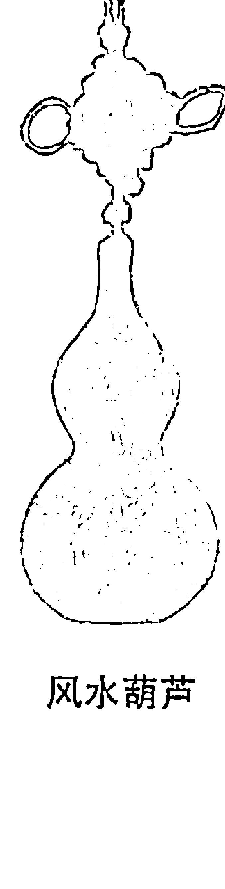

风水葫芦

# 财运风水学 第2卷 偏财篇

# 养黑摩利招偏财

# 1. 正财偏财风水法不同

每一种事物都具有其风水意义，有吉利意义，也有凶的意义。这不单包括了死物，就是活生生的动物，一样具有风水意义。我们对于养鱼风水法并不陌生，在家中或在办公室里，都可以因为摆放鱼缸并饲养一些合适的风水鱼，而改善了某一些运程。

一般求正财行业，主要是饲养好像金鱼、锦鲤之类的风水鱼，有利于兴旺事业，招财进宝，但偏财则有点旁门左道的性质，若使用这些正路的风水鱼，恐怕未能够有效催起财气。对于偏财，效果最佳的是黑摩利。黑摩利是常见的鱼类，在各家水族店很容易购买得到。从色泽而论，黑摩利全身黑色，以正业为白，以偏财为黑，故黑摩利的黑彩已经相当符合偏财的要求。 从事偏财行业饲养黑摩利，要注意行业的性质，以决定饲养多少尾黑摩利。

# 2. 不同行业养鱼数目不同

偏财行业属于风月艳情性质，宜饲养一尾黑摩利，因为一数是贪狼星卦，主桃花，符合风月性质。

偏财行业和医药治疗有关的，宜饲养两尾黑摩利，因为二数是巨门星卦，主医药和疾病。

偏财行业与官非词讼有关，宜饲养三尾黑摩利，因为三数是禄存星卦，有法律争讼的性质。

偏财行业与文职及教授某些技术知识有关的，宜饲养四尾黑摩利，因为四数是文曲星卦，有文学与教学的性质。

偏财行业与血光或肉食有关，宜饲养五尾黑摩利，因为五数是廉贞星卦，有血的性质。

偏财行业与武职有关，宜饲养六尾黑摩利，因为六数是武曲星封，符合武功的性质。

偏财行业与财物有关的，宜饲养七尾黑摩利，因为七数是破军星卦，有财帛骤得骤失的性质。

偏财行业与田宅地产有关的，宜饲养八尾风水鱼，因为八数是左辅星卦，具有土地田宅的性质。

九数是右弼星卦，泛指顺利，和气生财，可通用于各个行业。

# 大杀三方的貔貅

# 1. 貔貅是常用风水兽

貔貅是常用的风水兽。很多从事求偏财行业的人，早已经懂得使用貔貅，以求镇宅辟邪利招财。风水兽有很多类，如龟、马、兔、羊等等，都是人间可见的，但貔貅则在动物百科全书里，绝对找不到它的踪影。相传它是灵兽，早在汉代以前便已经有关于它的记载，但在当时称作“翼兽”。

貔貅的形相奇特，一般以为那是狮形的变奏，由于貔貅镇宅辟邪之功效良好，所以人们又叫它“辟邪”。貔貅被拿作招财的工具，实际也是基于其辟邪的能力，能够辟邪，就能够排除求财的障碍，因而增长了财运。很多从事偏财行业的场所，都是阴气比较盛。例如，在风月场所内外，都是阴气比较重，一方面是风月场所多数灯光较暗，另一方面，也是和这类场所阴灵较常聚集有关。

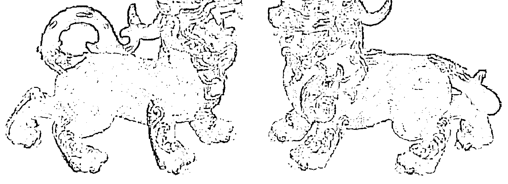

# 貔貅

# 2. 应该置于何方

貔貅是凶猛的灵兽，在所有风水兽当中，造型最凶的便要算是貔貅，而经营偏门行业的人，很多都具有煞气，煞气愈强，事业的成就也愈大，进财愈多。他们和貔貅的气相当吻合，故适合摆放貔貅，有助于他们大杀三方。

貔貅的摆放方法，一般是作为神楼主要的副手。例如，经营场所供奉观世音菩萨或四面佛，或是关圣帝君，便在神像左边摆放一只貔貅，这会增强化煞除掉生财的作用。一般而言，这些神楼是放置在面对大门口的位置上。其实就是把貔貅放在室内其他地方，一样可以增强除障招财的效果，只是摆放时应该隐蔽一些，宜藏在抽屉里，或是用布把它遮盖。当然，如果是风月场所，便不应把它藏在小姐招呼客人的房间，以免引起误会。

要增强大杀三方的效果，在场所多放几具貔貅无妨。

# 刀剑招偏财

# 1. 偏门行业涉及社团帮会

偏门行业每每涉及到社团帮会。帮会的历史源远流长，读武侠小说，几乎所有武林中的帮派，全都含有帮会的性质。帮会在历史上，也每每起着重要的功能，例如，刘邦在秦朝末年打天下前，他在自己的家乡沛县，便是市井中的帮会头目，起事时，最先跟随他一起进攻咸阳城的，就是这一群有帮会背景的将领土兵。以后，帮会一直都在民间活动着，有不同的帮会出现，此起彼落，此盛彼衰。

以宋朝为背景的著名小说《水浒传》，描述的梁山泊一百○八条绿林好汉，这梁山泊就是帮会。及后到了明朝覆亡，汉人的帮会便主要以反清复明为大目标，最著名的就是天地会。到民初期间，至新中国成立前，最著名的帮会是上海的青帮，青帮领袖杜月笙等，财势雄霸一方，影响力巨大。

除了中国，就是在其他地区，好像日本、意大利等，帮会都相当庞大，和军政商界的关系千丝万缕。日本民间对于帮会，常用的一个称号是“暴力集团”，这词在某一程度上，也反映了帮会文化的特色，就是他们基于种种原因，对帮内帮外人使用暴力手段。

# 2. 偏门行业须带煞气

帮会分子和一般人一样，以不同方式赚钱营生，有从事正行业务，从作犯法勾当，也有在正邪之间的偏门行业营生。就是非帮会中人，在偏门求财时，也很难避免要和帮会分子打交道。例

如，在红灯区经营风月场所，便难免需要有人守场，以保护业务。因为，经营偏门行业的人，不论是否有帮会背景，也需要带有一些煞气，才能利于安稳招财。

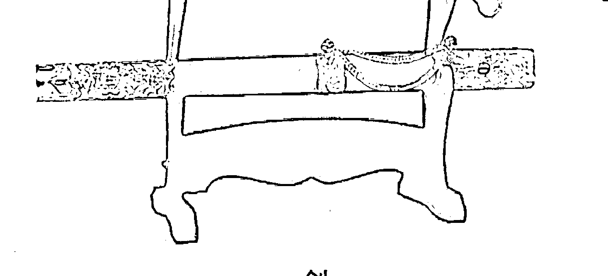

偏财行业的经营者，在家中的厅堂悬挂刀剑作为风水工具，便具有增强煞气的功效，可间接招财。除了刀剑之外，其他传统兵器也有同样功效，好像枪、矛、戟、月牙铲等等都是。这类刀剑兵器应以金属制造，因金属才符合武曲星属金的性质。但兵器不宜开锋，即是仅有形相便可，锋口不宜锋利，否则，命格的煞气如未能配合，反容易招血光之灾。另外，这类风水工具仅宜放在书房厅堂等地方，忌摆放在睡房。

# 财运风水学 第2卷 偏财篇

# 风铃招偏财风水法

# 1. 风铃作用

风铃是常见的家居装饰物，那是由若干块铜片及若干支铜管，以丝线串成，悬挂在门前或窗前，或是悬挂在对着露台的位置。 当吹起微风时，铜片铜管之间便互相轻撞，发出铿锵的声音，在午饭后躺着聆听，每有催眠使人入睡的效果。 风铃是装饰品，风水学也有使用风铃，由于风铃是金属物，所以当某些方位犯了土煞或木煞时，便可使用风铃，因为土生金，属金的风铃可以泄掉土气，金能克木，属金的风铃能直接压制木气。 除此之外，风铃其实还有招财作用，不过所招的是偏财为主，正财一般不用风铃。风铃是金属物，属金，属武曲星，有财气，但这还要和风铃的招鬼功能合起来看。

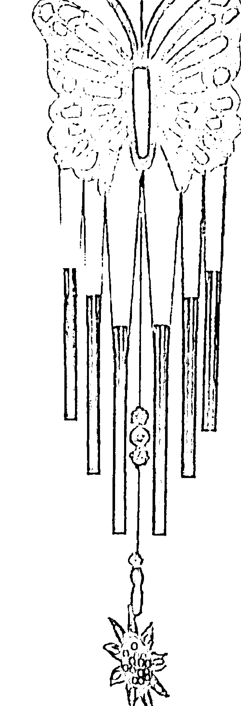

# 2. 貔貅和风铃不能共用

貔貅能招财，因为貔貅能克制驱赶阴灵作祟，减少障碍。风铃能招财，意义却刚好相反。风铃不单不克制驱赶阴灵，反而是具有“迎阴灵”的作用。你不妨留意，道教术士招魂，使用摇铃，密宗上师开法会，也使用摇铃，而摇铃的声音和风铃颇相像，彼此

的功能相同，阴灵会因为摇铃声被召集。同样，阴灵也会因为风铃声而被召集。

把风铃悬挂于合适的方位，能形成召集阴灵而借助阴灵的力量加强财运效果，挂错方位无效，但挂正了位置，便能使偏财的财气倍增。这个方位就是东北方。东北方是艮卦，为鬼门，在一般家宅或一般经营正行正业的机构，如果在东北方挂风铃，会不得安宁，但偏财行业的场所，却刚好相反，阴灵的招财力量能为己所用。很多对风水稍认识的人都知道，绿色植物有财气，甚至坟场也有财气，这财气其实就是阴气，而风铃招得阴气，这份阴气在偏财行业中，正好转化成财气。

不过，由于性质相反，所以，摆放貔貅便不宜再悬挂风铃，悬挂风铃便不宜再摆放貔貅，否则招财作用会互相抵销。

# 风水宝石招偏财法

# 1. 西方也流行风水

风水之道，如今在西方已经愈来愈流行。很多人原本对风水相当轻视的，也重视起风水来，加以认真研究，甚至采用现代化的科学方法来处理风水问题，也得到了一些成果。据估计，在众多术数当中，风水学将能最先进入科学的门墙，成为环境学的一部分。有些朋友总存有错误的观点，以为中国的风水学和科学格格不入，而使用的风水工具，也往往相当“古典”，好像风水龙、风水狮、貔貅、莲花、如意、葫芦、金钱、剑等，觉得没有什么根据。

可是，如果谈起宝石，他们的感觉却是截然不同，认为传统中国风水学的风水工具不科学，宝石却科学。传统的风水工具不存有能量，不能改运，宝石却可以改运。要改变这些观点，并不是一朝一夕可以办得到。面对他们，唯有投其所好，不谈传统风水工具，却谈宝石，因为宝石也确实具有相当良好的风水效果，而且由于宝石学起源于西方，西方人的科学精神作主导。所以，宝石学早已和科学扯上了关系。讲到招财方法，宝石亦是一大宝库。

宝石的种类很多，好像：蓝宝石、蓝金石、蓝孔雀石、紫水晶、翠玉、纹玛瑙、猫眼石、红玉、拓榴石、绿玉、琥珀、蓝玉、珊瑚、锆英石、珍珠、水晶、甲虫石、虎眼石、钻石、黄玉、土耳其玉、电气石、翡翠、血玉石、红玛瑙、红铁矿、绿橄榄石、孔雀石、月长石、玛瑙、红宝石、紫翠玉石、天河石、紫黄水晶、海蓝宝石、砂金石、石青、黑电气石、蓝黄石、方解石、玉髓、矽孔雀石、绿玉髓、黄水晶、光玉髓、翠铜矿、绿宝石、鹰眼石、

火蛋白石、萤石、石榴石、金黄晶、乌刚石、鸡血石、闪灵钻、白纹

# 财运风水学

# 第2卷 偏财篇

# 供奉四面神利偏财

# 1. 印度人及泰国人最信奉的神

凡是有印度人或泰国人聚居的地方，都必定有四面神的踪影。印度教的庙宇里可见四面神，部分印度人的家中也供奉四面神，而泰国人的家庭或泰国人经营的店铺，也有供奉四面神的神楼。不少人前往泰国拜神，所拜的也就是四面神，甚至迎请神像回来，安在家中供奉。

![img/d3b0115d48cf4d9c4ec2b634d458de6d_133_0.png]

四面神源出印度，也就是大梵天的真身，押有世间一切丰盛，是创造之神。后来，大梵天被佛教吸纳，成为护法。便随佛教传入泰国，在泰国当地区而发扬光大，广为非印度裔人倍奉。

四面神有四块面，有人说这是代表了酒色财气四样，那当然仅是戏言，实际那是指四面神能眼看四方，无所不见，因为一切都是属于他的。四面神是创造之神，在宇宙当中拥有一切财富，由于并未解脱出三界之外，所以不像菩萨们那样清高，就是经营偏财生意，从事偏财行业，也可以供奉敬拜四面神而得财。

# 2. 拜四面神利偏财行业

事实上，近年发现，从事商业活动的人，从事偏财生意的人，祈求四面神相当有利，求进财顺遂，不遇障碍，或是在逆境中求

四面神

![img/d3b0115d48cf4d9c4ec2b634d458de6d_133_1.png]

[PAGE 134]

# 第2卷 偏财篇

一条生路，也常常能够达成目的。

供奉四面神的方法，可以像供奉一般中国的神明那样，把神位安装在墙壁上，在神像前摆一个香炉，早晚诚心上香，并且常摆放一些水果鲜花美食等东西。但是，这种供奉的方式始终有缺点，因为四面神有四面，神位安在墙上，便必然有一面需要“面壁”，这其实略有不敬之嫌。

最适当的供奉四面神的方法，其实应是设在家宅或办公室的中央，神位宜泰式或中式的亭子设计，使四面神可以眼观四面，而每一面都要设一个香炉，早晚上香时，也要四面都供香一支，并且每一面都要参拜，而供献美食水果鲜花等，也应每一面都有一份。

![img/d3b0115d48cf4d9c4ec2b634d458de6d_134_0.png]

# 四面神要放在厅堂的中央

[PAGE 135]

# 财运风水学

# 第2卷 偏财篇

# 供奉鬼谷子大利偏财

# 1. 偏财行业带点旁门左道

偏财行业就是带一点旁门左道性质的行业，要能立足，要能赚钱，便需要有灵活的头脑，经常保持弹性。一些求偏财的人，真是百足那样多爪，通过不同的方式和渠道，赚取丰厚利润。愚笨的人尚且在正行中吃亏，在偏财业务中，更是进退维艰。影响进财的因素有很多，其中之一，就是头脑，要偏财就手，便应致力于获得一副偏财的头脑。通过供奉敬拜鬼谷子仙师，就可以得到。

![img/d3b0115d48cf4d9c4ec2b634d458de6d_135_0.png]

[PAGE 136]

![img/d3b0115d48cf4d9c4ec2b634d458de6d_136_0.png]

# 财运风水学

# 第2卷 偏财篇

鬼谷子是春秋战国时代的传奇人物，他的生平不详，真正的姓名也早已被历史淹没，不得而知，只知道他当时在鬼谷这个地方设帐授徒，这方面，相信他是受到孔子的影响。孔子是率先兴办民间讲学的贵族后人，而鬼谷子所传的，应是那个时代的秘传，不会传给平民，但他的弟子却不乏平民之辈。有学者考据他的学说，认为他所教授的，应是道家正统的人世应用部分。

鬼谷子是当时无双的智者，但他并不当帝王之师，而是当一个教师，他对当时政局好像没有什么影响力，但实际上他的弟子（甚至可能包括了徒孙）却令春秋战国风云色变，最著名的便有孙膑、庞涓、苏秦、张仪。孙庞二人得的是兵法之学，苏张二人得的是纵横家谋略之学，后人便以苏张二人的纵横家学说，封鬼谷子为春秋九流十家当中纵横家的大宗师。实际上，鬼谷子所传，远超出了纵横家的范畴。

# 2. 并非财神，却有利求偏财头脑

供奉鬼谷子仙师的神位，可以得到鬼谷子仙师的祝福加持。他并非财神，并不直接赐予财帛，和财运没有直接关系，只是鬼谷子赐予智慧，供奉鬼谷子对头脑有利，在竞争激烈和多风浪的偏财行业中，能够维持竞争优势，立于不败之地，变成“桥王”，有更多的谋略处理人常事务。

供奉鬼谷子的方法很简单，只要如供奉祖先那样，用红纸写上“鬼谷子仙师”，放入金边的框架内，供在神楼上便可，早晚上香敬拜，并按自己的心意摆放供品便可。

[PAGE 137]

# 财运风水学

# 第2卷 偏财篇

# 合法偏财业可供奉关帝

中国史上有好几位武神，但最多人供奉，香火最鼎盛的，莫过于关圣帝君。关圣帝君就是汉末三国时代的蜀军大将关羽，即是关云长。罗贯中撰写巨著《三国演义》，把这时代所有人物都描写得栩栩如生，关云长的武神形象更是传神。

![img/d3b0115d48cf4d9c4ec2b634d458de6d_137_0.png]

# 关圣帝君

关云长一生忠肝义胆，义薄云天，但并非单纯一介武夫，而是有高度的儒家道德操守，能文能武，尤其对《春秋》一经深入研读。他的武艺超凡，一生中在战场上，不知斩下了多少人头，这亦给自己造了很多杀业，因果报应，结果自己也死于非命，不得善终，死后亡魂不得安息，怨气甚重，却给圣僧点化，因而把其善业发挥，不求报仇雪恨，而是以善业好报所得法力，帮助苍生。因为多灵验事迹，所以供奉他的庙宇神坛便愈来愈多。

[PAGE 138]

# 第2卷 偏财篇

供奉和敬拜关圣帝君已成普遍风气，香港政府的执法部门，从殖民地时代开始，华人执法人员便都已经供奉关圣帝君，坚信关圣帝君可以带来祝福，帮助把歹徒们绳诸于法。但有趣的是，很多打家劫舍之徒，所谓“吃大茶饭”的，一样拜关帝，求关帝保祐作事顺利，尤其能免于被执法人员捉拿。这非常可笑，是一个无法解决的矛盾，关圣帝君在天有灵，仅能保祐其中一方，而看关圣帝君的德行，他会保祐哪一方，自是不言而喻。

关圣帝君充满正义感，自然是保祐正义的执法人员，所以，求偏财的，可不能进行作奸犯科的勾当，然后妄求关圣帝君保祐。但那些对得住良心的偏财，不犯法的，则可以供奉关圣帝君招财。供奉关帝，务要早晚诚心上香叩拜，有人以为关帝是武神，一生血腥，所以喜肉食，便以肉食供奉。其实关帝已经当了佛法的大护法，净化了内心，故不必供肉食，素菜果品便可。

[PAGE 139]

# 第3卷 横 财 篇

![img/d3b0115d48cf4d9c4ec2b634d458de6d_139_0.png]

[PAGE 140]

<!-- no content -->

[PAGE 141]

# 第3卷 横财篇

# 人无横财不发

# 1. 横财和偏财有分别

每个人都想凭着自己的能力发财致富。可是，致富并不是一件简单的事，需要讲才能，讲知识，讲办事能力，讲创意，还有机遇，相当复杂。能成就富贵的人，并不简单，总有帮助他们致富的因缘。所以，世上人虽多，但真正发达的人，数目却并不多。很多人打工受薪，役役营营，结果，捱了数十年，却没有储到多少钱。好运的，也许有足够的钱财养老，享一个安乐的晚年。但大多数人甚至连这一点也办不到，退休之后，计计数，积蓄实在有限，结果退休就是失业，需要重新找工作，六十岁退休，也许到七十岁还是不能停下来。

想要发达，很多人都依靠着横财，人无横财不发，没有横财，大多数都要长久辛劳，一旦发了横财，如果横财够丰厚的话，从此打跛腿也无休，可以火烧旗杆长叹。所以，你不难发现，每到赛马T投注时，投注额会相当高，而六合彩在有巨额的多宝奖金时，横财三千八百万，也吸引了大量投注。

横财是甚么？那是全凭运气而得的财帛，是偶然而来的财帛，并不是自己创造出来，也不是经由努力可以获得的。例如，未懂得马匹的知识，未有深入研究赛马的知识，却靠运气赢钱。或是投注根本没有技术可言的六合彩，靠运气而中了六个数字，获得头奖，这就是横财。

很多人喜欢到赌场里去赌博，赌场里有各种各样的赌局，好像沙蟹、骰盅买大小、百家乐、轮盘、吃角子老虎机等，那些没有什么赌博技术的人，随意地碰运气，结果却误打误撞的赢了收

[PAGE 142]

# 财运风水学

# 第3卷 横财篇

![img/d3b0115d48cf4d9c4ec2b634d458de6d_142_0.png]

# 轮盘

钱，这就是横财。相反，如果是职业赌徒，以此为业，即使从赌场中赚到不少金钱，这却是偏才，而不是横财，因为这些钱财并非偶然而得，而是你本来就以此为止。

所有偶然而得的财帛，都是横财。例如，你的一位远亲去世，由于他没有近亲，为怕遗产被充公，所以，他立了遗嘱，决定把所有遗产都送了给你，这也是横财。

# 2. 横财运到，仍然要懂得运用风水催动

横财可大可小，有些人只不过一次发横财，便已经从此经济无忧，原本日日为三餐糊口奔波，一旦发了横财，便休哉悠哉过日子，过截然不同的生活。

曾经认识一位仁兄，从事运输工作，自己拥有一辆载货小巴，每天从早到晚都在路面上走动，有时做到通宵达旦，相当辛劳。

但是，一次横财，使他的生活变得游闲起来。很多香港人都有投注六合彩，这称为“摩登字花”的玩意，中奖率其实很低，有人每期都购买二十元，买了一年，便连四个字也没有中过，中头奖要六字全中，那就更加不是易事。可是，偏偏有人却误打误

[PAGE 143]

# 第3卷 横财篇

撞的中了，以前六合彩仅有三十六个数字，以重本作大包围的方式，依然有胜算，如今四十九个字，大包围的风险便相当高。

这位仁兄偶尔买买六合彩，从没有指望赢多少，但是天降横财，结果从“香港赛马会”取走了一千多万元。据他表示，当时他一年的收入，也不过是十来万，换言之，他忽然之间获得了做一百年才赚得的酬劳。他的情况便发生了一百八十度转变，原本天天都要早出晚归，现在可不用了。他连载货小巴也卖掉，手上大笔金钱，便进行种种投资，首先当然是置业，跟着就是投资股票和外汇，另外储备一大笔现金。

就这样，他每天都在享受人生，以投资收益应付生活，早上吃早茶，然后便是看市买卖，在日间也能消闲娱乐，不同终日在马路上穿梭。如果他没有中过六合彩，他的生活将会是一直五十年不变，日日在驾驶着载货小巴四处忙走，奔波劳碌，但忽然富裕起来，生活质素便大大提高，自主的空间更加广阔。

自由可贵，金钱是换取自由的好工具，对大多数人来说，无横财不发，就算不是一下子赚大钱，但偶然而来的欢喜财，也弥足珍贵。我们并不鼓励人们不劳而获，但这世界确实有很多横财的机会，能够利用风水方法捕捉这些机会，为何不好好捕捉？不过，任何横财有侥幸的性质，并不是依靠真材实料而得，全凭运气，所以，求横财要顺其自然，要看机缘，不要强求，不要拔苗助长，当时机到时，自然可以水到渠成。风水只是一种助缘，并非单凭风水，就会使你一定得中数千万元的六合彩。

假使你流年运程高，又有横财运之时，如果你不知道，又或即使知道，却并不懂得将这些横财运气催动的话，横财运气也可能就此走失，至为可惜。但如果遇到这种情况，你懂得风水之道，或是找懂得风水之学的人，为你改动风水，催动横财运程，你获得横财的机会就会提高很多。

[PAGE 144]

# 招财风水树

# 1. 植物风水可以招财

植物是遍布于大自然的东西。在百年以前，地球上的树木覆盖率相当高，处处是树林，处处是森林，树木给世人带来祝福。随着科技发展，加上资本主义需要不断地掠夺天然资源，树林森林不断地给开垦，地球的土地覆盖率便愈来愈少，引起了种种严重的环境问题。

风水之学，在本质上，其实就是环境之学，就是研究人和环境之间的关系，看看如何利用环境，使环境更加符合世人所需，令人们居住得更加舒服。中华民族是具有高度智慧的民族，以农立国，很早就认识到环境和生活质素的关系，因此，风水学在中华民族诞生。风水学的基本内容，就是自然环境与气候，由此继续发展，而变化得多姿多彩，也变化得芜菁并存，究其本质，是相当朴素的。

风水学，顾名思义，就是致力研究“风”和“水”。世人生活于土地上，除了不能离开土地之外，还不能离开风和水。风就是空气，水就是水流，就是江河湖海等，一切生机，都是在土地和风水中产生，而土地在风与水的滋润下，加上阳光和种种肥料，生机就会勃发，花草树木就会茁壮生长。中国人以农立国，尤其重视花草树木给自己和社会带来的意义。社会就是个人集合起来的整体，风水是宏观的，其影响力并不限于少数个别的人，一村风水佳，整条村落的村民都受惠，一村风水坏，整条村落的人都受到坏影响。

风水学除了着重风和水，还相当着重树。着重风水的村落，

[PAGE 145]

# 财运风水学

# 第3卷 横财篇

都会种植树木，以改变风水，使风水更加有利，这就是风水树。风水树是指能对风水发生良好作用的树，无论是生旺，或是化煞，都统称作风水树。中国人喜欢使用的风水树，主要有竹树、榕树、桂树等。

竹树在中国社会中，相当常见，也有相当实用的功能。竹树的竹身，可以用作制造家具及房子的材料，可以用来筑篱笆，用来晾晒衣物，作为撑船工具，作乐器，箫和笛都是用竹制造的。另外，竹叶可以成药，是很常用的中草药，有清热功能。埋于泥土中的竹荪，则可以佐膳食用。农村要获得良好的风水，需要在村的背后有靠山，靠山形势的好坏，很影响农村整体的运程，如果靠山的形相不佳，或甚至该村落根本就没有靠山，便需要自己制造出一个靠山来。村民会在村的背后，种植一片竹树林，作为村的靠山，而这靠山的竹树愈是青翠苍绿，村民便愈吉利平安。

# 2. 你可考虑运用盆栽植物招横财

榕树亦常给用作风水树。榕树的生长相当快速，而且生得高大，寿命极长，有二三百年的寿命也不稀奇。一棵榕树在没有人为干扰下，可以发展成一片榕树林，榕树有着开枝散叶、百子千孙的意象。所以，在香港，也留下了很多榕树的痕迹。在旧区，在新界村落，得到保留的榕树，看来总是蔚为奇观。在村落的靠山或旁边，发展出一个浩大的榕树林，也作为风水树，象征村落兴盛。

风水树壮大翠绿，凡是绿色的植物，用之恰当，都会有招财效果。风水树绿叶成荫，便可以作为良好的招财工具，可以使用于求正财，但求横财也一样适用。现代寸金尺土，要种风水树，并不是人人都有条件，只能

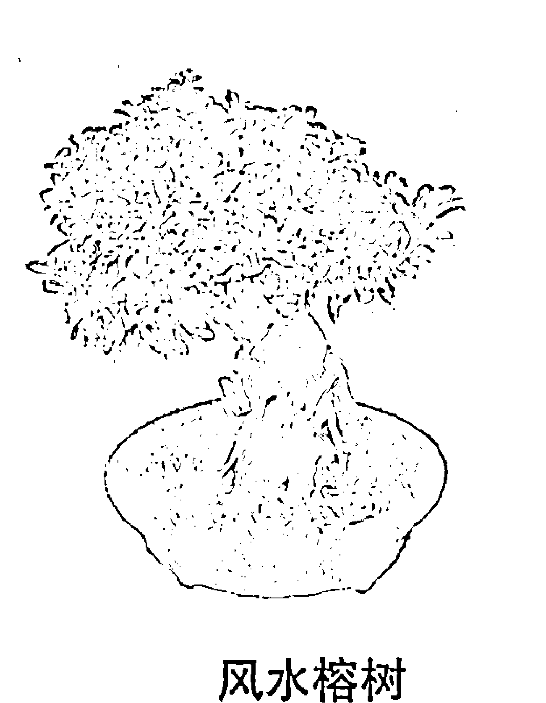

[PAGE 146]

# 第3卷 横财篇

求于屋苑的大业主在设计屋苑时，融入了风水树的意念。否则，便独立豪宅的地区，才可以使用风水树。

现代，我们讲的风水树，很多都是以盆栽方式来种植，一样有招财效果。

种植招财风水树的方式很简单，并不限于榕树或竹树，任何绿叶茂盛的树都可以，种植的位置，是在大门的门外，

# 第3卷 横财篇

有些坟场的外围会种树，以致加强遮隔的效果，这没有问题，树木能过滤阴气，依然能得财气。这道对着坟场的窗口，需要使用百叶帘或是窗帘布作遮挡，长期遮蔽着窗口。

阴气人屋，因为是作用于人的身心，便需要进行一点转化，否则对运程有不利影响，方法就是在家宅的厅堂里，设置一盏长明灯，使长明灯属阳的灯光和阴气揉合起来。长明灯可以是一个小灯泡，也可以是一支小光管，灯光需要一天二十四小时长期亮着，不要关闭。

坟场的阴气非常强烈，所以，能够善加利用坟场的风水，财气会相当畅旺，容易招得横财运，容易在一些博彩活动中赢钱，甚至赢大钱。

# 第3卷 横财篇

# 火煞明堂令财旺身弱

# 1. 知道自己旺运就应催动横财

徐先生是术数中的行家，但是，从一九九一年以后，当他的人生走上第五个大运时，他不再以术数为业，而改用种种术数的技艺为自己求财。从紫微斗数星盘看，他的第五大运是财帛宫，原局武曲化禄、贪狼化权同度，已干大限，运中的化星也是武曲化禄、贪狼化权同度。这十年的财运大旺，他才狠下决心，从旧行业连根拔起，完完全全向金钱着眼。

这十年间，他转向多方面的投资，从事物业投资买卖，也买卖股票外汇，也作高风险的炒卖。就连九七年前的炒邮票热潮，他也参与一份，而能准确占算出邮票热的泡沫爆破，在接近高峰期以前，勇于把所有邮票沽出，狠狠赚了一大笔。

他的横财运也和他的正财偏财运，同样优胜。他对于赌博并没有什么研究，所以仅作随机的投注，或是在赌场随意的买大小，虽说是随意，但实际在他的心中，常常在占算着。结果，他也经常赢钱，频频到投注站去收派彩，令很多自命是赛马投注专家的朋友也感眼红。

这数年间，徐先生肯定赚了不少，他的家宅从油麻地搬到了港岛南区，家宅面积也大了数倍。

在一九九六年末，在香港楼市还没有完全达到高峰时，他已经预见香港楼市的前景有大风浪，及时抽身而出，把手上所有楼房物业卖掉，就连自住的豪宅也卖了，搬了去另一地方租五百尺的单位居住。有朋友估计他是某方面的投资惨败，才落得如此下场。可是，他却只管微笑，保持缄默，笔者同样占算，知其心意，这也算得上是拈花微笑。

果然，踏入九七年的下半年，由索罗斯领导的金融风暴爆发，香港有强大的外汇储备压阵，金枪不倒，甚至把这些大炒家的攻势击退，令他们有惨重亏蚀。可是，香港的货币价值不跌，因为有联系汇率，资产价值便需要大跌，地产业价格从一九九七年底以后，便一路滑落。这时候，朋友们都成了负资产业主，甚至因为持有物业太多，以致兵败如山倒，弄到要宣布破产，这才钦佩老徐的真知灼见。老徐早已把所有物业卖掉，拿着现钱，如今便可以慢慢地拣楼了。

结果，他一直拖到二〇〇二年才入市，在港岛南区买回同样面积和坐向的物业，但楼价却比他的九六年底的售楼价，便宜百分之六十，这一仗赢得相当漂亮。

# 2．“火煞明堂”风水局招来横财运

徐先生的财运如此旺，其中一个相当重要原因，固然是由于他正在走着旺财的大运。另一个原因，是他使用了独特的风水布局，这一布局称作“火煞明堂”。如果走进他的家宅去，就很容易看到这个格局到底是什么的一回事。我有幸参观，不过，这一格局实际是利害参半，如果没有弊端警觉，实际不宜使用。

推开徐先生的家居大门，就在门的前方，便见到一个小小的水池，水池是圆形的，下方有气泵，使水形成流动的感觉，并非一潭死水。水中饲养了数尾体形不大的金鱼，在上方的灯光照射下，闪闪生辉。这一格局称为金形水，因为圆形属金，以圆形盛载水，便是金形水。大门内外的位置是明堂，所以，这亦是水聚明堂格局。

在这水池的中央，有一高台高出水面，这台上摆放了一个白水晶制成的金字塔，估计大概有两公斤重。金字塔是尖顶的，在五行中属火形，火形是形煞，是煞气的一类，主刑伤，不利人丁。

但在这个格局上，却有凝聚财气的作用，能产生横财运，形成了火煞明堂的格局。不过，其刑伤的性质并不可免，故有财旺身子弱的特点，利财运，却不利健康。

金字塔形水晶（火煞明堂）

徐先生知道这一格局的特点，有了身子弱的心理准备，因此，徐先生在这十年中，相当致力于照顾自己身体，经常拜会一位中医师，接受中医药保健。不过，这些年来，他还是常常有感冒体虚的情况，并且有轻微的慢性支气管炎，这是发财所付出的代价。

# 养鱼可招横财

# 1. 养鱼是一种良好细艺

年龄对于人到底有多大影响，这是一个相当重要的心理学课题。青春岁月是最美妙的人生阶段，这时期的男女，年青力壮，活动能力强，而且英俊美丽，对人生有很大的憧憬和期望。不过，青春岁月过后，无可避免要面对衰老，这是一个相当缓慢的过程，从二十来三十岁开始便已经起步，三十来岁与二十来岁相比，在体力上和健康上，已经有一大段距离，英俊美丽的黄金时间亦已经过去了。然后是四十来岁，五十来岁，跟着踏入六十岁，便正式步入老年。

一个能看透人生的人，就知道生老病死是无可避免的，有生必有死，衰老是必经的阶段，快乐的人生要从少年时便开始预备，及早保持多方面的兴趣，以致到老年时，依然感到生气勃勃。有很多事情都可以给自己提供趣味，过着这样趣味的人生，才不枉在世间走一回。老年人最可悲的，并不是体力衰退，不是健康一天比一天差，而是失去了人生的趣味。你不难发现，很多老人家每天的生活相当苦闷，老朋友甚至配偶，正在一个接一个的离开他们而去。他们的活动能力也远不如青少年时期，如果没有预备好，便会相当苦闷，觉得人生没有意义，相当凄凉。

我们应该在少年时，便掌握一些细艺，一些可以供自己消遣一生时光的玩意，保持着多方面的兴趣。那些拥有多方面兴趣的老年人，其实他们和少年人一样，可以生活得多姿多彩，而非灰白一片。你也应该趁青少年时代，培养一些自己一生受用的细艺。养鱼是其中一种有趣味的细艺。

# 财运风水学

## 第3卷 招财篇

养鱼当然不是养来吃。中国人崇尚“民以食为天”，常常把思想放在吃方面，甚至认为“背脊向天的便可以吃”，因而孕育出相当伟大和丰富的饮食文化。世界上没有一个地区的饮食文化可以比得上中华饮食文化，所以日本语言里，“中华料理”也成了一个普遍的专有名词。但除了吃的艺术之外，还有不是为吃而设的养鱼艺术。

# 2. 养鱼是一种招财风水工具

可供饲养的鱼类，品种相当多，等闲也有数百种，每一种形相和色彩都不相同。就是最普遍的金鱼，在家中饲养一缸，也会感到生气盎然。如果你到过马尔代夫等潜水及游泳胜地，那里的海洋污染度低，水中世界真是美不胜收，鱼种类极多，令人神往。在家中设一个金鱼缸饲养金鱼，便是在一定程度上，把这一美景移植到家中。别说老人家可以金鱼以排遣时光，就是年青人，饲养金鱼也可以如集邮那样，作为一种长远的兴趣。

养鱼不单是细艺，还是一种相当重要的风水工具。风水家堪宅看风水，经常教人在家中或在办公室饲养风水鱼，因为风水鱼

有多种多样的功能，按照饲养不同的鱼类，而能配合不同的人之转运需要，达到不同效果。这主要是利用鱼的数目、品种、色泽等，建立起一套格局，以达到催吉避凶效果。

有一些招财的风水鱼，特别有利于那些横财运，就是锦鲤，事实上，锦鲤不单利于横财，也能祝福一般工薪阶级事业进步。

饲养锦鲤可说是养鱼的一个“派别”，因为锦鲤有不少品种，色泽花纹和大小并不相同，虽然它的招财力量温和，但很适合一般人饲养，没有刻意沉迷于赌博或求什么横财，但把锦鲤养着，顺其自然，每在偶然的时刻，获得进横财的机会。饲养锦鲤是一门学问，在决定饲养时，需要认真学习饲养锦鲤的知识。

养的数目，可以一或四条。家宅够大，可以养八条。

# 时钟带来机会

# 1. 机会是从时间而来的

对于时钟，一般人都已经习以为常，它挂在墙壁上，或放置在桌上，当想要知道时间，举头一望，便立即知道。一旦没有了时钟，我们就感到相当不方便，想知道时间，只有靠估计，有太阳的话，可能要复古，学习使用日规，透过日影所在方位，从而判断是什么时间。然而，日规绝对不如时钟那样准确，时钟可以算得一秒钟的移动，但日规却不能。

时钟是近代的科技产物，它含有相当深的意义，因为时钟好像是时间的化身，而任何事物都不能离开时间，都是存在于时间当中。时间含有相当难以令人明白的奥秘。爱因斯坦的相对论，指出在理论上，时间是可以倒流的，它和光的移动速度有关。在西藏佛教格鲁派（即黄教）的密宗修法上，无上密法中的最高法门，有一套就是“时轮金刚”大法，这修法正是和时间有密切关系。据说，那些得道的大成就者，在他们的时间观里，并不存在过去、现在、将来，而仅有永恒的现在，经历着这永恒的现在，可以扫荡世间一切烦恼苦闷。

时钟便是时间的化身，传统式样的时钟都是转动的，上、右、下、左、上的规律，周而复始，不断地在转动。严格而言，时间是永恒的，没有止息的，所以，时钟的转动也应该是没有止息的。代表永恒时间的时钟，就挂在你家中的墙壁上，也挂在我家中的墙壁上。另一种时钟的式样是跳字的，没有指针，而是代表时分秒的数目。

人生的每一个机会，和一切存在一样，都是只存在于时间之中，正确地摆放时钟，时钟的风水可以带来机会，包括了横财机会。时间遍布于穹苍四方，无处不在，所以，时钟原则上摆放在哪里都没有问题，只是若要催动起机会的吉运，便要应用五行原则，才能帮助获益。

# 2. 不同地点应摆不同颜色及形状时钟

如果要把时钟悬挂或摆放在东方或东南方，时钟应以绿色或青色为主，形状则以长方形为佳，因为东方和东南方都是五行属木，绿色、青色、长方形，都是五行属木。

如果要把时钟悬挂或摆放在南方，时钟应以红色、紫色、橙色为主，形状以六角形或八角形为佳，因为南方是五行属火，红色、紫色、橙色、六角形、八角形等，都是五行属火。三角形也是属火，但三角形属于廉贞煞，主不利，故以不使用三角形为佳。

如果要把时钟悬挂或摆放在西南方或东北方，时钟应以黄色、咖啡色为主，形状以正方形为佳，因为西方和东北方五行属土，而黄色、咖啡色、正方形，都是五行属土。

如果要把时钟悬挂或摆放在西方或西北方，时钟应以白色、金色、银色为主，形状以圆形为佳，因为西方和西北方五行属金，白色、银色、金色圆形，都是五行属金。

如果要把时钟悬挂或摆放在北方，时钟应以蓝色、黑色为主，形状以椭圆形为佳，因为北方五行属水，而蓝色、黑色、椭圆形，都是五行属水。

# 3. 时钟风水带来机会

每一个家宅都可以分为上述八方，但摆放时钟并不是随意的，决定悬挂摆放在哪个方位，还需要按照一些原则，在此需要先认识前朱雀、后玄武、左青龙、右白虎、中勾陈的观念，这是源自中国古代天星学的观念，后来给引用于风水学上。

一所家宅楼房，可以分成五方，你站在楼房的中央，这个位置就是中勾陈位，面向大门口，大门所在的方位就是前朱雀，而与朱雀相反的方向，即是自己的背后，就是后玄武。当年李世民夺权夺嫡，发动玄武门之变，在玄武门设伏兵，把他的哥哥李建成和弟弟李元吉杀死，这玄武门，就是皇宫中的后门。

面向前朱雀方，背向后玄武方，左方就自然是青龙方，右方也自然是白虎方。

朱雀位是属于动方，时钟无论是行针还是数字，都是动态，所以可以悬挂或摆放在朱雀方。

青龙位是吉位，有招贵人招机会的性质，可以用时钟的动态催动其功能，所以，把时钟悬挂或摆放在青龙方，也是适宜的。

白虎位是凶位，这位置以不动及少用为佳，时钟不宜放在白虎方，以免给动态催起了其功能，反而不利。

玄武位是后方，以安宁为佳，主静不主动，如果给催起了功能，反而令人不安，故亦不宜摆放悬挂时钟。

朱雀、玄武等方位，是属于相对性的观念，可以应用于一个地区，可以应用于一所楼房，也可以应用于一个小房间，每一个空间都可以被视作一个小太极，是一个独立的世界，都可以分作这五方。所以，适宜悬挂摆放时钟的朱雀位和青龙位，可以是客厅的朱雀位青龙位，也可以是睡房内的朱雀位青龙位。不宜悬挂摆放时钟的玄武位白虎位，可以是客厅的玄武位白虎位，也可以是睡房的玄武位白虎位。

在人们坐立及躺卧地方的上.方，不宜悬挂时钟，因为这会对人的精神造成干扰，在潜意识里也有心理威胁，并不适宜。

在睡房里，时钟不宜放在床头，因为这人们在休息睡眠时，太过接近头脑，其动态会不利睡眠。

横财就是一种机会。适当的摆放时钟，更容易带来得到横财的机会。

# 罗经可除横财的障碍

# 1. 罗经含藏空间力量

风水师为人家堪宅转运，必然手上拿着一个红盘，盘上有指针，盘上并刻有很多文字，这些文字在不懂得风水学的人看来，仿如天书，但在懂得风水学的行家眼中，却是收集资料数据进行分析的重要工具。这一个红盘就是罗经。

罗经其实就是指南针的发展，吊着铁针，由于地球的南北极有磁场，所以，铁针便会一头一尾，分别指向正南方和正北方。南北方向确定，便定出所有方位。现代的罗经，便用于各个需要分辨方位的范畴内，如航海、航空、野外活动、军事、建筑等。

这些行业的定位非常重要，精确度的要求，比风水学更加严格，而现代地理学把方位分为三百六十度，套用于风水学依八卦建立的八方，每一方便占有四十五度。

风水学中的玄空飞星学派，把方位分作二十四山，即是把八方再一分为三，每一山占有十五度，另外，还有三合派等，就方位各有分别的方法。这些资料，便都刻在风水学使用的罗经上。任何一个风水家，要认真地堪察风水，必然罗经不离身，因为方位极其重要，整套风水理气的系统，都是建基于方位和时间的秩序上。有些风水家比较草率，堪宅时只是站在某个方位上，拿着罗经看便是，这有时是会出现偏差的，比较严谨的，则是小心地在家宅的中央定出立极点，然后仔细量度家宅，以准确的比例绘出一幅家宅图，并且配上精确的方位。

罗经是重要的风水工具，但它的功能却并不限于判断方位，它本身还具有化煞的功能。每一个人都会多少有一些横财运，问题只是这些横财运，一般人未知道在什么时候降临，以致没有横财运时求横财，在横财运到时却又收手，错失良机。另外，还有因为每一个人都有很多业障，障碍着我们的运程，因而无法把握横财运，但罗经却有化煞的功效，化煞之后，横财运自然在没有障碍之下而容易获得。

罗经所以能化煞，在于罗经上所刻的内容，如果说时钟与时间的奥秘有关，那么，罗经便是与空间奥秘有关。在罗经上，一切结构都不离八卦、十天干、十二地支，八卦是乾、坤、坎、离、震、巽、艮、兑。十天干是甲、乙、丙、丁、戊、己、庚、辛、壬、癸。十二地支是子、丑、寅、卯、辰、巳、午、未、申、酉、戌、亥。时间和空间的秩序，甚至宇宙万事万物，也不离此套系统，这看来有点匪夷所思，但如果你深入研究“易学”，就知道此言非虚，“易学”包含了宇宙中一切学问。

# 2. 罗经可化解一切煞气招横财运

罗经内藏八卦、阴阳、五行，具足了宇宙中一切。方位中的煞气，其实就是阴阳五行在时空中交换变化的结果，因为阴阳五行因缘和合而形成了煞气，但面对罗经时，却可以被罗经所化解了煞气，因而使命格中原本应得的横财运，会如同水到渠成那样的降临。

何女士并不是沉迷的赌徒，只是样样赌艺都懂得，有兴趣去玩，却没有沉迷，最主要的原因，是她相信自己并没有横财运，一切凭运气而得到的利益，都好像是与她不相干似的。何女士表示，从小到大，她都与抽奖之类的玩意无缘，从没有抽中过一次，那些慈善奖券，从认捐过不少，但似乎并非

# 第3卷 横财篇

# 4. 流年犯太岁的生肖及方位

子年：在午年出生的人和午方，都是犯太岁；
丑年：在未年出生的人和未方，都是犯太岁；
寅年：在申年出生的人和申方，都是犯太岁；
卯年：在酉年出生的人和酉方，都是犯太岁；
辰年：在戌年出生的人和戌方，都是犯太岁；
巳年：在亥年出生的人和亥方，都是犯太岁；
午年：在子年出生的人和子方，都是犯太岁；
未年：在丑年出生的人和丑方，都是犯太岁；
申年：在寅年出生的人和寅方，都是犯太岁；
酉年：在卯年出生的人和卯方，都是犯太岁；
戌年：在辰年出生的人和辰方，都是犯太岁；
亥年：在巳年出生的人和巳方，都是犯太岁。

犯太岁的人自然会在该年度内比较运滞，横财运欠奉。

那些经常运滞的人，无论出生年支在该年度内是不是犯太岁，都会有一些阻碍的力量，从犯太岁的方位干扰着他。他们如果使用罗经把这些障碍化除，运势每每有焕然一新之感。那些完全欠缺横财运的人，可以在家宅中，依据太岁每年所犯的位置，悬挂一具罗经，便有化解之功。

如果在该流年内是出生年支犯太岁，更应到道教的庙宇去拜太岁。

# 鲁班先师风水法

# 1. 有横财运就应该运用

每一个人都可能拥有横财运，只是有些人一生中从来都不赌博，根本就不知道自己拥有横财运，而是平平实实地工作，知悭识俭，脚踏实地，量人为出。这一种态度相当可嘉，他们能免于赌博求富的诱惑。可是，反过来看，他们也未能尽用命数给他们提供的利益，也有点暴殓天物之感。

我们最好就是能够善用上天赐予的横财运，但不过于贪心，顺其自然地获得自己应得的财帛，便可心安理得。

梁先生是退休装修判头。装修这个行业的从业员，有一陋习，就是喜欢赌钱，有空闲的时候，大家便走在一起赌几手。如果大家只当作消遣娱乐，可没有什么伤大雅之举，但问题是，赌博常常赌出瘾头来，愈赌愈大，以致不可收拾。那些横财运差劲的人，便每每赌到倾家荡产，赌到一无所有，有时连客户支付的材料费也拿了去赌，结果无法向客户交代。

梁先生也赌，只是他却没有染上豪赌的坏习惯。据他表示，他随缘而赌，却经常都有点进帐，而偶尔投注赛马，也会有收获，虽然从没有中过三T，但多年以来，他先后从马会手上赢得的，已经是数以十万元计。不过，赢得来，花得去，他用财也确实颇豪爽，请朋友手足吃饭，绝不吝啬，而且也存善心，常常做善事。

# 2. 横财运要平常心

梁先生所以与同行的个性很不相同，是因为受到家学渊源的启发。梁先生的先翁，原是术士，懂得道家及阴阳家的多门学问，既修出世的道，也通晓人世的命理风水，掌握面相及驱鬼等学问。他得到道教真传，所以从小便读道书善书，懂得做人道理。不过，梁先生的先翁知梁先生的命格，知他并不是修道之人，也不走术数之路，所以无一法传授给他，而另有弟子得真传。但是，梁先生却从父亲手上得到一本《鲁班经》。

# 财运风水学

# 第3卷 横财篇

## 鲁班先师

鲁班师傅就是中国工匠行业中的先师，没有一个装修行业的人不认识他，每到鲁班先师诞辰，同行所有工匠都必然拜祭先师，以求行业顺境，工作平安。相传鲁班师傅留有一部遗著，但这部遗著并不是关于建筑装修的学问，而是和风水有关，当中记载有很多不同的方法，使用的人，或是可以招得不同的福泽利益，或是用在仇家的家宅中，使仇家招祸患。这两套方法，前者流传较广，后者则是秘传中的秘传。梁先生两套《鲁班经》都得到，不过，梁先生表示，他只使用过招福的方法，从没有使用过诅咒招灾的，他认为这会引起恶报。

梁先生的横财运，也是因为使用《鲁班经》的秘传而得。笔者看过梁先生的命盘，他确实有横财命，其他人觉得进横财不容易，他却觉得好像十分自然，而他不贪的心理，使他更把握到横财不可强求的真谛。更诡的是，这真谛又反过来使他更容易获得横财。

笔者参观梁先生的家居，令笔者留下极其深刻的印象的，便是在客厅中，摆放了一只有两尺长的木制模型船，木船的船尾朝着大门口，船头对着后玄武位。便问：“这就是你招财的方法吧。”他微笑点头，这果然给笔者猜中，因为笔者也懂得这个方法。

# 3. 鲁班经的风水法

依《鲁班经》的原书所载，招财的木船应该是藏在斗中的，而且体积相当细小，便已经可以有很强的招财效果。如今梁先生只是变通一下，使用一只相比之下大得多的木船，效用相同。木船的摆放，有一定的法则需要循从，就是船头一定要向着后玄武，船尾对着前朱雀，这便好像是一艘船刚刚沿大门从外面回来那样，是盛载着财宝从外面的大海洋回来。

这个摆放的方式绝对不可以搞错，否则便不能产生改变财运的好处。尤其是不能头尾倒置，把船头对着大门口，把船尾对着后玄位，因为这样摆放的话，木船便好像是从宅内驶出宅外，便如同把财宝运送出去，这反而会造成了财帛流失现象。

另外，这还有一个小小秘密，就是要把一些钱财藏在木船内，无论是硬币也好，是纸币也好，这会给木船装载财气，形成祝福的风水力量。

这个方法其实适用于任何方面的财运，所以梁先生从事装修工业，可以风生水起，当了小富翁，而且在股票投资及外汇投资方面，都经常有不错的收获。在赌钱方面，更加是经常输少赢多。

# 龙吐珠可化赌场的招财格

# 1. 以煞气破罡煞气

这亦是关于梁先生使用的招财方法。

梁先生偶尔赌博，除了和自己相熟的朋友对赌之外，间或也会到澳门及外国的赌场去。他不会劲赌，因为他知道自己有横财运，却没有偏财运，不能以赌博为职业，只能作为闲时的生活嗜好。忽然发一些欢喜财，就是到了赌场，把握到机运赢钱，也没有给利欲薰心，一样能收能放。

梁先生知道赌客在赌场中要能控制自己，并不容易，因为不少赌场都设计了各自的招财局。这些成功的招财局，会吸引赌客留在赌场里赌博，但可不会只管令赌客输，因为如果只输而不赢，赌客对赌钱就会失去兴趣，输光一次之后，以后永远不会再回来。但如果他们有时赢，有时输，在输赢之间形成了魅力，形成了期望，他们日后便可能再回来，再输，再回来，这样，赌场才可以获得最大的利益。

这些格局，其中一种，是五鬼搬运法，那是用布或纸张，绘画了五鬼的形相，经过一定程序和计算，藏于赌场某些地方，形成了招财格局，五鬼可以自赌客手上搬财过来。

对抗赌场诸如五鬼搬运法的方式，最直接了当的方法，就是不要进入赌场。但有偏财运与横财运的人，赌场是既可恨也可爱的地方，他们可以间或到赌场里赚一点零用钱，不受五鬼控制，又飘然离开。梁先生认为，他可以化解赌场的招财格，他可以轻松自主，是由于他在家中饲养了龙吐珠，破解了赌场的五鬼招财风水局。

# 2. 所属五行不同 饲养数目亦须不同

龙吐珠是一种带有很强煞气的风水鱼，外形尖薄如刀锋，一般人并不适合饲养，但所从事行业带有煞气的，或是命格带煞气，或是从事偏门行业的人，却适合饲养龙吐珠。装修行业的从业人员，需要经常使用金属利器，工作比其他行业有较大危险性，所以，梁先生也算是适合从事这一行业。梁先生饲养龙吐珠，既能够在他的本行中保持竞争力，也能够增加赌博的横财运，在赌场内可以克服引诱，能进能退。

饲养龙吐珠的鱼缸，所摆放的位置必须是在失运的地方，在当运之处摆放龙吐珠，反而会破坏运程。

另外，饲养龙吐珠的数目也需要留意，并不是随便的，具体的方法，就是依据户主出生年支的五行性质而定。五行是金、木、水、火、土，十二地支当中，每一支都有其五行的属性：

+   - 子年（肖鼠）生人属水
+   - 丑年（肖牛）生人属土
+   - 寅年（肖虎）生人属木
+   - 卯年（肖兔）生人属木
+   - 辰年（肖龙）生人属土
+   - 巳年（肖蛇）生人属火
+   - 午年（肖马）生人属火
+   - 未年（肖羊）生人属土
+   - 申年（肖猴）生人属金
+   - 酉年（肖鸡）生人属金

摆放龙吐珠鱼缸的人，需要看自己的生肖五行所属，然后决定饲养龙吐珠的数目：

+   - 五行属水，可养龙吐珠六条；
+   - 五行属火，可养龙吐珠九条；
+   - 五行属木，可养龙吐珠十一条；
+   - 五行属金，可养龙吐珠十三条；
+   - 五行属土，可养龙吐珠十五条。

不过，江山易改，本性难移，风水较能够改变客观的运势，却较难改变心性，心性还是要依靠自己的修养达成，而龙吐珠则有辅助功能，可以化赌场的煞气，招来横财运。

# 以水招财

# 1. 真水招真财

中国人一向都有浓厚的家庭观念，就是传统的道德观日渐瓦解，也一样相当重视家庭。钱不流向外人，但对于自己的家庭成员，却绝对不会吝啬，觉得把钱用在他们身上是应该的，和家庭成员之间有点一体感。也因这个原故，大家亦喜见家庭成员发迹变泰，喜见他们得财成富，最好就是家宅中每一位成员都得到财气，人人都有财路。

"山管人丁水管财"，水在风水学上，经常与财帛有关，只是目前的风水招财法，多把道路视作水，反而忘记了真正主财的真水。实际上，能善于利用真水，对于招财的效力更大。“明堂聚水”格是甚佳的招财格局，大门正对着洁净雅致的花园或广场，便是明堂，有个喷水池或鱼池在其中，便成明堂聚水格。如果面对的，是一个良好的港湾，这个明堂聚水格便更是上品。

以水招财，并不限于在明堂位上，本文所教的方法，可以利用家宅的阳台，或是室内任何一处地方，重点是这个地方必须有阳光照到。由于室内的阳光，多数都不是整天可被阳光照到，所以，一般来说，还是放置在阳台为佳，如果家宅有小花园等，小花园亦可以利用。

阳光具有热力和光，照射在水中，水能吸收光能和热能，光和热的力量都可以被水吸收运用。水为财，能够助全家招财得福。这个方法相当简单，需要的工具主要就是一盆水。

# 2. 一盆水就已经有招财效应

你可以随随便便的拿一个破盆来招财，但如果你能够选择质佳精美的盆子，那才真正和财的性质相配合。塑料盆可以，但使用陶瓷或金属的盆子更佳。在水中，还应摆放几个钱币，使财气和水相配合，加强招财效果。不过，钱币在使用前，应该先行清洗干净，再放置在阳光下三数小时，以驱去阴气。

把水盆放置在任何一个位置都可以，都一样有招财的效果。不过，如果是放在正东、正南、正西、正北，则进财的方式和桃花有关，因为这四个方位是属于桃花位。桃花进财有很多种方式，如果是求风月偏财的女性，对于工作会有利，对于一般的男女来说，则可能是因感情和性欲带来财帛。例如，结识了富裕的异性朋友，为你突然之间带来一笔横财。

招财的水一定要经常保持清洁，不能被污染。因此，每天早上起床，你都应该把清水更换，切勿长期不换水而令水盆积聚污垢，有蚊虫滋生，甚至弄得发臭，这只会破坏财气运程。

# 黑水晶最有利招横财

# 1. 横财并不单纯是运气问题

横财并不单纯是运气问题，事实上，在这个世间上并没有偶然的事情，达尔文的进化论认为生命是偶然而来的，绝不可信。生命不是偶然，运气也不是偶然，运气的背后，其实包含了人的内心和自然界之间的感应，也就是内在和外在的感应。你也许也曾经有这样的经验：你花了很多心思研究六合彩，把过去开彩的数字排列出来，逐一研究，整理出一堆数字，然后大包围，下重注，结果却全军尽墨，连百数十元的安慰奖也得不到。可是，有时候，一次无心插柳，只花五元买一条，却竟然能中上三四字。--注便中三四字，并非偶然，而是福至心灵，内心和宇宙意识之间进行了较有效的沟通，因而得到感应，把那些数字很轻易地写出来。

如果没有突然而来的福至心灵，便很难获得横财，但偶然一次，心灵和宇宙意识接通了，灵感来了，便看来很随机地投注某几只马匹，或是写下几组数目字投注六合彩，或是在赌场参加骰盅或百家乐之类的博彩，结果便获得横财，并不费力。

# 2. 黑水晶招横财的作用

黑水晶可以帮助你形成招得横财感应的能力。无论是黑曜石，或是黑玛瑙，或是黑骨干晶石，或是黑电气石，都具有这种作用。它们作用于身体上，大致有两个功能，一是在于降低头脑的能量，一是使人体能量的管道得以畅通。能量管道畅通，则能量循行无阻，有利于人体每一个细胞接收从宇宙中来的讯息，而降低头脑的能量，则容易令人收摄显在意识。显在意识就是我们平时心意造作的意识，这意识相当浮浅，唯有当显在意识安静了，深处的潜在意识才会发挥作用，而接通宇宙讯息的，就有赖这潜在的意识。

你想要接通这招横财的意识，心灵和意识有所沟通，可以把一颗黑水晶珠摆放在床头上，让轻量的能量达到净化头脑和身体细胞的功效，利于能量循环，利于获得发横财的灵感。

平常将一颗黑水晶放在身上，一样会对招横财有所帮助。

# 三脚金蟾催横财

# 1. 和道家南宗开宗大师刘海蟾有关

三脚金蟾是利于发财的风水器物。相传这三脚金蟾和道家南宗的开宗大师刘海蟾有关，所以坊间流传着一幅“刘海戏金蟾”的吉祥画。在画中，刘海蟾拿着一条串上了若干个大铜币的绳子，用来与一只三脚金蟾嬉戏。据说谁人只要得到这一只三脚金蟾，便可以成为大富。

# 刘海戏金蟾

是不是真的可以成为大富，人人不同，但这三脚金蟾却必有利于横财运。三脚金蟾的招财特色，在于特别和那些无知无识，欠缺发财本领的人有缘。在坊间有很多关于创富的书籍，也有很多名人开办创富成功课程，不断地激发人们的积极性，他们甚至指出：钱就在你的身边，只要你想取得，就随时都可以取得。

这种说法，实在令人充满了雄心壮志，觉得人生真的有前途，有盼望。但是，对于能力不足的人，横顾左右，却发现一分一毫都没有，如何能够取得大量的金钱致富，要谋三餐糊口已经不容易，如何奢望发达？要发达，想想容易，要真的实践，就不是这一回事了。举一个很简单的例子，一个没有接受多少教育的母亲，丈夫早死，自己独力照顾三个孩子，日日忙于工作，早出晚归，没有什么特殊才能，也没有时间进修，就不能像创富学所讲的那样容易发达了。她需要的，是不必冒高风险就可以获得的横财。

# 2. 不必冒风险而得的横财

能满足这种需要的风水工具，不是别的，正是三脚金蟾。不过，三脚金蟾的吉祥风水画，必然是和刘海蟾联系在一起。事实上，有一个关于三脚金蟾的秘密，是很多人不知道的，就是人们捉错用神，以为招横财的力量在于那头古古怪怪的三脚金蟾，实际并非如此，真正为人招横财的，是与金蟾嬉戏的那位刘海蟾。

道家丹道派，无论东宗、南宗、西宗、北宗，都是教理高深而行法奥妙的修行派别，开宗者为仙人。刘海蟾早已得大成就，已成仙成佛，只不过道家秉承着游戏人间的低调作风，作大事而不居功，于是让人们把功劳归于三脚金蟾，而令人没有注意到他。但无论如何，只要在家中悬挂“刘海戏金蟾”吉祥画，对于求改善生活而获横财，会有好处。

运用三脚金蟾和刘海蟾祖师爷的铜像或瓷器像，放置于家中，尤其是

# 霓虹灯犯冲求偏易招灾

在繁华闹市中，要显示歌舞升平的景象，除了马照跑，舞照跳之外，另一个显示的方式，就是由黄昏开始便相继亮着的霓虹灯管招牌。很多店铺和消费场所，为了能吸引客户光临，都会在经营场所外，悬挂或大或小的霓虹灯管招牌，这些招牌装有不同颜色的灯管，所以能散发出不同颜色的灯光，显得缤纷灿烂，而众多霓虹灯聚集起来，形成闹市，看来真是一片富裕及和平的景象。

在贫穷的社会，是负担不起晚上广大消费和灯光电费的。只有社会人士消费力强，社会的经济能力较高，霓虹灯才能亮起来。

霓虹灯由于热力强，而且光度强，所以，只要亮起来，就难免对灯光带的风水，造成不同程度的影响，有好有坏。好处是某些霓虹灯悬挂的位置佳，能驱除阴气，催起阳气，势必形成动象吉气，利于生意，但那是对于悬挂该招牌的商号而言。

至于坏处，则主要是受霓虹灯光影响的民居。在中国，建筑及物业条例随着时代变化而不断修正。早期的物业条例比较宽松，很多楼宇都可以商住两用，因此，在楼下固然有很多商业场所，而在楼上，亦是住宅和商户混杂起来，无论楼下商号或楼上店铺，都一样可能会在大厦外墙悬挂霓虹灯管招牌。

居住在这些楼宇较低层的人士，窗口外便可能正正对着不少霓虹招牌，这些灯光五颜六色，照入住宅之内，对于住宅便会发生种种风水上的影响。霓虹灯管有两个特点，一是光，一是热。在光方面，由于有很多种颜色，所以，这个颜色可能刚好位于不恰当的位置上，以致形成煞气。而热方面，则热力会对身心有很重大的影响。

# 第3卷 捞财篇

方位吉凶共分为八种，分别是生气、天医、延年、伏位、祸害、六煞、五鬼、绝命，其中后四者是煞气凶星所在。如果霓虹灯管刚好从这些方位中照入，而且帮助催起这些煞气，就会形成不吉利的影响，尤其是求偏财人士，在求财过程中的风险就极大。

若霓虹灯照入的方位是祸害、六煞，五鬼、绝命所在，方位为东方或东南方，五行属木，犯了木煞，而霓虹灯的颜色恰是属木的绿色、青色，或是生木的水色如蓝色，便为不利；方位为南方，五行属火，犯了火煞，若霓虹灯的颜色又是属火的红色、粉红色、紫色、橙色，或是生火的木色如绿色、青色，便为不利；方位为西南方或东北方，五行属土，犯了土煞，若霓虹灯的颜色又为属土的黄色、咖啡色，或是生土的火色如红色、紫色、粉红色、橙色等，便为不利；方位为西方或西北方，五行属金，犯了金煞，若霓虹灯的颜色为属金的白色、杏色，或是生金的土色如黄色、咖啡色等，便为不利；方位为北方，五行属水，犯了水煞，若霓虹灯的颜色为属水的颜色如蓝色，或是生水的金色如白色、杏色，便为不利。

犯了这些颜色的煞气，因这些颜色而催动起不吉之气，对于求偏财的人士，主有是非、口舌、斗争、官司等。最起码的情况，是有了坏声名，令自己在其他人面前没有面子，商誉不佳，难以立足，或是大大妨碍了生意。严重一些的，每每有形形色色的斗争，并不容易解决，尤其是在偏财行业中，竞争对手的风格都是比较霸道，要硬碰硬，要狠斗狠，以致诸多困难，麻烦丛生。

在偏财行业中的斗争，比一般行业更加令人心绪不宁，更加多事端，弄得不好，会有严重的破财，甚至是血光之灾，受到恐吓威逼等。无疑，不少从事偏财工作的，对此都有点心理准备，但受到霓虹灯光的影响，冲起了煞气，危机也就更加多。

偏财生意始终都是在法律的边缘上走动，所以，偶尔不慎，亦容易惹上官非词讼。犯官非的结果，可大可小，小则只是虚惊一场，或花掉庞大的律师诉讼费用。情况较为严重的，则除了要花掉大量的律师费用以外，可能要兼付堂费，或更要被法庭罚款，或受缓刑，甚至要铆铐入狱，留下案底，有刑事记录。

要减少这些情况发生的可能性，遇到上述的不利霓虹灯现象时，就要设法加以改善，不能让不利的风水存在。只要流年飞星有凶星飞到，就起克应，一次意外，足以致命，不可不妨。

解决的方法，在于不让霓虹光入屋，能阻挡这些光线，对于家宅风水就有改善，但要彻底阻挡这些光线入屋，就可能需要使用一块很厚很厚的布帘，才能把所有霓虹光隔绝开来。事实上，如果你到那些旧区看看，就可以看到一些位于大厦低层单位的窗户，是涂上了漆油的，不透光的，把室内和室外隔绝了。尤其是那些公寓之类可能带有色情性质的场所，更是封闭起来，这一来是由于行业性质所需，二来亦是因为要改善风水的原故。

另外，霓虹灯光近距离照入屋内，必定带有热力，热力也是属于风水能量的一种，热力在凶方产生，亦不利于阳宅内的人的脾气。求偏财容易动气，这样子的风水，就更是火上加油，容易因为一时冲动而破坏了生意，就算是下了厚厚的布帘，亦一样不能隔热，反可能有吸热的功能，对于情绪的坏影响更大。不过，布帘不可不下，热力为火，水能克火，若果能以属水的东西，对于化解这种不利情况，会有好处。

最普遍的属水摆设，就是鱼缸，在鱼缸内注水及养鱼，可以调节室内的温度。但原则上化解这种热力，不必养鱼，只要放一盆水就可以了。

# 第3卷 横财篇

# 神前庙后不利横财

任何一个地区都有宗教的出现，即使未必为正式的、系统的、有教义的、普世性的、高尚的宗教，亦必会涉及对于神鬼妖物的崇拜。符合上述原则的主要宗教有基督教、佛教及伊斯兰教。

佛教诞生于二千五百年前的印度，那是人文主义的宗教，以人为中心，不以神为中心，是别树一帜的宗教，及经过不断发展和适应不同时代和不同文化的挑战，所以变化成比较朴素的南传佛教和比较赋有强烈宗教色彩的北传佛教。

南传佛教为佛教传到斯里兰卡、泰国、缅甸、越南、柬埔寨、印尼、马来西亚等地的佛教，崇尚最原始的教典，并仅以佛陀为敬拜的对象，且敬拜的态度就如学生行谢师礼一样，不涉及祷告祈求之类。

北传的佛教则有四系，一是中国佛教，一是日本佛教，一是韩国佛教，一是西藏佛教。

中国佛教历来对于原始教典比较忽视，反而较重于后期出现结集的大乘经典，当中涉及很多天神之说，而佛陀亦是大能者，可以听取祷告祈求的，并有很多很多菩萨，如观世音菩萨、地藏王菩萨等。仪式、唱诵等等，都比南传佛教复杂得多，并且经由中国大师们把佛法洗礼过滤，因而形成了大乘八宗，分别是：三论宗、法相唯识宗、天台宗、华严宗、神宗、律宗、净土宗、真言宗等。而日本佛教和韩国佛教，则由中国传入，故和中国佛教比较接近。

西藏佛教则传于西藏和青海一带，神教的色彩比中国佛教还要浓厚很多，这是由于西藏佛教的很多内容，是吸纳了印度教后期的文化所致。其派系主要分为格鲁派（黄教）、萨迦派（花教）、宁玛派（红教）、迦举派（白教），这是显教和密宗共修的系，涉及更多更复杂的仪式、敬拜，重视禅定，而佛本尊菩萨的内容就更加多。此教把佛菩萨本尊分为佛部、莲花部、金刚部等共五部，各有不同的部主和眷属，亦因此有不同的修法，大体而言，这些佛菩萨，不是属于寂静本尊，就是属于忿怒本尊，神鬼的色彩甚重。其中的密法共分四层次，即是事瑜伽、行瑜珈、大瑜伽、无上瑜伽等，其中前三个层次和中国的真言宗相通。

除了被视为正统的佛教外，亦有一些被视作佛教旁门的宗教，如日本的日莲宗等便是。

基督教诞生于二千年前，由犹太人耶稣基督创立。依基督教的说法，耶稣基督是旧约圣经预言降世为世人赎罪的唯一真神的儿子。而依东方宗教的说法，指耶稣基督在十一岁以后的少年到二十九岁传道以前，他是前去了印度北部的克什米尔地区的修道院修学，所以耶稣基督和印度瑜伽及佛法同源，即是说，耶稣基督的教法和佛陀的教法，都是由印度宗教摇篮孕育出来的。

基督教在目前，主要分为三大系，即是天主教、东正教、基督新教。天主教具有严密的宗教组织，以罗马梵帝岗教廷为中心，在每一地区均设有教区，大教区以下又分为小教区，最高领导人是教宗，而教廷内有好像政府内阁那样的组织，是管理全球天主教事务的最高单位，而教廷内还有很多神职人员，处理不同的事务。在各个教区内，亦有不同的职能划分，包括了传教、慈善福利、教育、牧养等等，对政治、经济、文化皆有影响力。

东正教的背景和形式，与天主教颇为接近，其流传局限于俄罗斯、东欧、北欧等地。

基督新教是由马丁路德、加尔文等人创立，较诸天主教、东正教，有较大的自由，而教义亦有分别。不过，基督新教并没有统一而严密的组织，情况和佛教有点类似，新教内有不同的宗派，有基本上相同的神学主张，但在仔细的内容上，亦可能有分歧。一些基本教义必须信受，好像三位一体、耶稣赎罪论、地狱永死论等，如果有不信这类基本信条的基督教会，那就被视为异端。这类新教，如长老会、浸信会、循道会、卫理会、中华基督教会等，数目非常众多，而且各有组织，各有分堂，虽有区分，但基本教义相同，所以不同教会的教友，又常能走在一起。

但基督教中，亦有不少被视为异端的，他们讲道德，比一般社会对道德的要求更重，所以不是邪教。但由于信条有异，故被视为异端，是教会的旁门左道，所以受到排斥。

至于伊斯兰教，那是由阿拉伯人穆罕默德所创。据说他是个文盲，但后来却竟得启示而写出了整部《可兰经》，并且广收门徒，而建立起今日的伊斯兰文化。伊斯兰教的团结性非常强，其教规的严格，每每影响了政治、经济和文化。当在必要时，他们会采用武力解决问题，进行圣战，其教徒遍布甚为广泛。在阿拉伯地区，伊斯兰教建立起不少伊斯兰国家，如沙特阿拉伯联合酋长国、科威特、伊朗、伊拉克等。而印尼、巴基斯坦等，则是亚洲地区的伊斯兰教国家。

除了上述三个教系，其他还有日本的神道教、中国的道教、印度的印度教等，具有其民族特性。但当中有些却可以渗进其他国家民族的人的心目中，渐渐发挥了普世性，好像印度教，其密教文化和瑜伽文化，已渐渐深人西方人的心中，成为精神修练的重要部分。

宗教有很多很多，凡是宗教，都必定有其寺院庙宇，供信众聚会，崇拜他们信奉的上主，以及讲经学法。寺庙虽然是修心养性，改善品格，敬天敬神的地方，但对于求横财偏财而言，寺庙的风水绝不吉利，不必看它位于家宅的哪一方，也不必理会它和经营地点形成什么样的方位关系，只要是寺庙，就可视为不吉，不利横财偏财运。

依风水典籍所言：“神前庙后为孤煞之地。”其孤和煞的性质，可以分开来讲。孤的意义，在于神前庙后不旺人丁，无论是在寺庙的前面，或是位于寺庙的后面，都具有不旺人丁的性质，也不管是什么宗教的寺庙，亦不必理会所拜的是什么神佛菩萨。

煞的意义，在于不利财，尤其是横财偏财，只要是居住于寺庙的前后，皆主不利，投资偏财生意，易有亏蚀，赌博求财，则经常输钱。无论是投注六合彩，或是赌马，或是入赌场，甚至是在投资市场作高风险的投机活动，皆有利。

究其原因，是所有庙宇的风水性质都比较强，有鬼神仙佛菩萨的坐镇，加上寺庙为游魂野鬼的临时聚居安身之所，故此，寺庙会尽纳这个地区的地气，以致让其他住宅楼房分受的气，便所余无几，故不利人丁，亦不利横财偏财。

如果你的家居或经营偏财生意的地点，刚好位于神前庙后，那就并不吉利，需要做一些化解的工夫。一般而言，可以选择的话，最好搬离现时居住或经营的地点，但如果受经济条件或其他因素而觉得不可行，那不妨考虑在向着庙宇寺院前后窗口，悬挂起一块凸镜，把寺庙的煞气化解，增加横财偏财的吉利。

# 第3卷 实践篇

# 建利于横财运的风水

无论是赌马还是六合彩，或是人赌场面对很多复杂而多姿多彩的赌博游戏，除了可以提供刺激外，更重要的，是公平的赌博会给具有横财运的人带来好运，当中含有无穷无尽的可能性，时来运到，可赢到盆满钵满。

赌博最紧要是公平公正，投注赛马，最忌就是造马。任你如何聪明，任你如何花精神时间去看晨操，做足种种分析，如果是造马的话，你的一切努力都白费，即使有时买中，亦不过是偶然加巧合而已。而赌场如果不公平，出老千，问题就更加巨大，随时可以害到赌客倾家荡产。

因此，横财运的大前提，是要有一个公平的赌博环境，没有这种环境，就什么都不用谈了。

以公平为大前提，然后，我们就可以靠运气，亦可以加上实力来胜出赌博。你以为只有靠运气才可以赢大钱吗？不是的，真正赌博高手，是能运用计算能力而大大提高胜算，一次赌博不能定胜负，能精于计算的，可以在进入赌场之后，在一张赌桌前长坐而胜过庄家。这类人并不很多，但一些颇有名气的人，确有此能，例如，已故的赌王叶汉先生，及发明艾滋病鸡尾酒疗法的华人博士何大一，都是个中高手。何大一博士更表示，由于他的计算能力，所以有些赌场把他列为不受欢迎的人物，而他的本领在于记牌，然后采用或然率的计算。

要改善横财运，并不一定要凭着运气。运是客体的，但和主体的素质亦有关，两个人走着同样的横财运，但一个的头脑素质较优，另一个的头脑素质较差，那么，走同样的横财运中，却可
能有两个结果。一个赚了点小财，银行存款由十万变成十一万，就是这么多，对于长远的人生，并没有什么重大影响；但另一个头脑素质高的，却可能把银行存款，由十万变成二千万、三千万，对往后人生的变化，相差就真是南辕北辙。

因此，求横财运之改善，最好亦要注意头脑的改善，头脑素质较佳，就更加有效地把握横财运，甚至可以致富。

在家宅中，对头脑影响最大的其中一样事物，就是我们的睡床。所以，自古以来，睡床的风水，一向为人所重视，因为我们每日花上很多时间在睡床上休息，每日睡眠也起码要六七小时以上，甚至九小时十小时。因此，改造头脑，最好是利用睡床的风水，以下是一些重要的原则，虽然原则简单，却是睡床风水的精要：

+   - 睡床所在的位置，应位于吉方上，以生气最佳，其次为天医，再其次为延年，更次则是伏位。
+   - 睡床的床头要有靠山，即是要依在墙壁上，这可以令精神安定，无靠山则不安，令思绪欠缺条理。
+   - 睡床忌犯门卫煞，即是睡床所在的位置，不能正对着睡房门口，否则就是犯煞，尤其是睡床对着睡房门，而睡房门又正对着大门口，则门冲加门冲，煞气就最重。
+   - 睡房门不利对着厨房门，也不利对着厕所门，因为厕所和厨房都带有秽气，门门相对，就会受秽气所薰，使睡床受污染而不利头脑。
+   - 睡床床头所靠的墙壁，背后不宜是厨房或厕所，否则亦不利头脑。
+   - 睡床忌犯横梁压顶，即是说，当你躺下来时，如果你头部的正上方，刚好就是楼房的横梁，那就不利头脑，不单运作不灵光，而且会常感头痛。

# 第4卷 实践篇

# 如何寻找房宅的财位

前文分别介绍了如何求取正偏横财的方法，在所有的方法中，均涉及到一个财位问题。如何找出财位便成为求取各类财物的关键，本卷力求以最简单明了的方式，让广大读者对财位的寻求有一个明确的了解。

如果大家想了解自己的居家或公司、店铺的财位，建议先明白自己的方位。因为古圣先贤是根据八个卦位即：乾、坎、艮、震、巽、离、坤、兑分成八个方位为房子的太极点，乾卦属西北方、坎卦属正北方、艮卦属东北方、震卦属正东方、巽卦属东南方、离卦属正南方、坤卦属西南方、兑卦属正西方，每个卦的房的卦位占四十五度，八个卦位正好一个圆周三百六十度，找

# 时言风水学 第4卷 实践篇

# 9. 坐山西北乾卦的方位、度数与财位列图

![img/d3b0115d48cf4d9c4ec2b634d458de6d_202_0.png]

坐山西北乾卦【WN】（293度至338度）
房宅的财位在正西方（South）或正北方（North）

# 10. 坐山正北坎卦的方位、度数与财位列图

![img/d3b0115d48cf4d9c4ec2b634d458de6d_203_0.png]

坐山正北坎卦【N】（338 度至 23 度）

房宅的财位在西南方（South West）或正北方（North）

# 财运风水学

# 第4卷 实践篇

# 11. 坐山东北艮卦的方位、度数与财位列图

![img/d3b0115d48cf4d9c4ec2b634d458de6d_204_0.png]

坐山东北艮卦【FN】（23度至68度）
房宅的财位在西北方（North West）

# 第4卷 实践篇

# 12. 坐山正东震卦的方位、度数与财位列图

![img/d3b0115d48cf4d9c4ec2b634d458de6d_205_0.png]

向正西
西南
西北
正北
东南
东北
正东坐
财位

坐山正东震卦【E】（68度至113度）

房宅的财位在正东方（East）

# 13. 坐山东南巽卦的方位、度数与财位列图

![img/d3b0115d48cf4d9c4ec2b634d458de6d_206_0.png]

向
西北
正西
正北
西南
东北
正东
正南
东南
坐
财位

坐山东南巽卦【ES】（113 度至 158 度）

房宅的财位在西南方（West South）

198

# 第4卷 实践篇

# 14. 坐山正南离卦的方位、度数与财位列图

![img/d3b0115d48cf4d9c4ec2b634d458de6d_207_0.png]

坐山正南离卦【S】（158 度至 203 度）

房宅的财位在东北方（North East）或正南方（South）

# 15. 坐山西南坤卦的方位、度数与财位列图

![img/d3b0115d48cf4d9c4ec2b634d458de6d_208_0.png]

向 东北
正北
正东
西北
东南
正西
正南
西南 坐
财位

坐山西南坤卦【WS】（203 度至 248 度）

房宅的财位在正东方（East）

200

# 财运风水学

第4卷 实践篇

# 16. 坐山正西兑卦的方位、度数与财位列图

![img/d3b0115d48cf4d9c4ec2b634d458de6d_209_0.png]

坐山正西兑卦【W】（248 度至 293 度）

房宅的财位在西北方（North West）或正南方（South）

201

# 四房式组屋的财位

# 1. 坐山东南巽卦的方位、度数与财位列图

![img/d3b0115d48cf4d9c4ec2b634d458de6d_210_0.png]

坐山东南巽卦【ES】（113 度至 158 度）
房宅的财位在西南方（South West）

# 财运风水学

# 第4卷 实践篇

# 2. 坐山正东震卦的方位、度数与财位列图

![img/d3b0115d48cf4d9c4ec2b634d458de6d_211_0.png]

坐正东
东北
东南
正北
正南
西北
西南
正西向
财位

财位

坐山正东震卦【E】（68度至113度）房宅的财位在正东方（East）

# 财适风水学 第4卷 实践篇

# 3. 坐山正南离卦的方位、度数与财位列图

![img/d3b0115d48cf4d9c4ec2b634d458de6d_212_0.png]

坐山正南离卦【S】（158度至203度）

房宅的财位在正南方（South）或东北方（Sorth East）

204

# 第4卷 实践篇

# 4. 坐山西南坤卦的方位、度数与财位列图

![img/d3b0115d48cf4d9c4ec2b634d458de6d_213_0.png]

坐山西南坤卦【WS】（203 度至 248 度）

房宅的财位在正东方（East）

205

# 5. 坐山正北坎卦的方位、度数与财位列图

![img/d3b0115d48cf4d9c4ec2b634d458de6d_214_0.png]

坐 正北
西北
东北
正西
正东
西南
东南
正南 向
财位

财位

# 第4卷 实践篇

# 6. 坐山东北艮卦的方位、度数与财位列图

![img/d3b0115d48cf4d9c4ec2b634d458de6d_215_0.png]

坐东北
正北
正东
西北
东南
正西
正南
西南向
财位

坐山东北艮卦【EN】（23度至68度）
房宅的财位在西北方（North West）

207

# 7. 坐山正西兑卦的方位、度数与财位列图

![img/d3b0115d48cf4d9c4ec2b634d458de6d_216_0.png]

坐山正西兑卦【W】(248 度至 293 度)

房宅的财位在西北方（North West）或正南方（South）

# 8. 坐山西北乾卦的方位、度数与财位列图

![img/d3b0115d48cf4d9c4ec2b634d458de6d_217_0.png]

坐西北乾卦【WN】（293度至338度）

房宅的财位在正北方（North）或正西方（West）

# 9. 坐山东南巽卦的方位、度数与财位列图

![img/d3b0115d48cf4d9c4ec2b634d458de6d_218_0.png]

向
东南
正东
正南
东北
西南
正西
正北
西北 向
财位

坐山东南巽卦【ES】（113度至158度）
房宅的财位在西南方（South West）

# 第4卷 实践篇

# 10. 坐山正东震卦的方位、度数与财位列图

坐正东
东北
东南
正北
正南
西北
西南
正西向
财位

坐山正东震卦【E】（68度至113度）

房宅的财位在正东方（East）

![img/d3b0115d48cf4d9c4ec2b634d458de6d_219_0.png]

# 11. 坐山正南离卦的方位、度数与财位列图

![img/d3b0115d48cf4d9c4ec2b634d458de6d_220_0.png]

坐山正南离卦【S】（158度至203度）

房宅的财位在正南方（South）或东北方（North East）

# 第4卷 实践篇

# 12. 坐山西南坤卦的方位、度数与财位列图

![img/d3b0115d48cf4d9c4ec2b634d458de6d_221_0.png]

坐山西南坤卦【WS】（203 度至 248 度）
房宅的财位在正东方（East）

213

# 13. 坐山正北坎卦的方位、度数与财位列图

![img/d3b0115d48cf4d9c4ec2b634d458de6d_222_0.png]

坐山正北坎卦【N】（338 度至 23 度）

房宅的财位在正北方（North）或西南方（South West）

214

# 14. 坐山东北艮卦的方位、度数与财位列图

正北
正东
西北
东南
正西
正南
西南向
财位

# 15. 坐山正西兑卦的方位、度数与财位列图

![img/d3b0115d48cf4d9c4ec2b634d458de6d_224_0.png]

坐山正西兑卦【W】（248 度至 293 度）

房宅的财位在正南方（South）或西北方（North West）

# 财运风水学

# 第4卷 实践篇

# 16. 坐山西北乾卦的方位、度数与财位列图

坐西北
正西
正北
西南
东北
正南
正东
东南向
财位

财位

坐山西北乾卦【WN】（293 度至 338 度）

房宅的财位在正西方（West）或正北方（North）

# 17. 坐山西北乾卦的方位、度数与财位列图

![img/d3b0115d48cf4d9c4ec2b634d458de6d_226_0.png]

向 东南
正东
正南
东北
西南
正北
正西
西北 坐
财位

财位

坐山西北乾卦【WN】（293 度至 338 度）

房宅的财位在正西方（West）或正北方（North）

218

# 风水学

# 第4卷 实践篇

# 18. 坐山正北坎卦的方位、度数与财位列图

![img/d3b0115d48cf4d9c4ec2b634d458de6d_227_0.png]

向 正南
东南
西南
正西
西北
东北
正东
正北 坐

坐山正北坎卦【N】（338 度至 23 度）

房宅的财位在正北方（North）或西南方（South West）

# 19. 坐山东北艮卦的方位、度数与财位列图

向
西南
![img/d3b0115d48cf4d9c4ec2b634d458de6d_228_0.png]

正南
正西
东南
西北
正东
正北
东北
坐

坐山东北艮卦【EN】(23度至68度)
房宅的财位在西北方（North West）

# 第4卷 实践篇

# 20. 坐山正东震卦的方位、度数与财位列图

![img/d3b0115d48cf4d9c4ec2b634d458de6d_229_0.png]

向
正西
西南
西北
正南
正北
东南
东北
财位

正东
坐

坐山正东震卦【E】(68度至113度)
房宅的财位在正东方（East）

# 21. 坐山东南巽卦的方位、度数与财位列图

![img/d3b0115d48cf4d9c4ec2b634d458de6d_230_0.png]

向
西北
正西
正北
西南
东北
正南
正东
东南
坐
财位

坐山东南巽卦【ES】（113 度至 158 度）

房宅的财位在西南方（Wouth West）

# 22. 坐山正南离卦的方位、度数与财位列图

![img/d3b0115d48cf4d9c4ec2b634d458de6d_231_0.png]

向
正北
西北
东北
正西
正东
西南
东南
正南
坐
财位

财位

坐山正南离卦【S】（158 度至 203 度）

房宅的财位在正南方（South）或东北方（North East）

# 23. 坐山西南坤卦的方位、度数与财位列图

![img/d3b0115d48cf4d9c4ec2b634d458de6d_232_0.png]

向 东北
正北
正东
西北
东南
正西
正南
西南 坐
财位

坐山西南坤卦【WS】（203 度至 248 度）

房宅的财位在正东方（East）

# 风水学

![img/d3b0115d48cf4d9c4ec2b634d458de6d_233_0.png]

# 第4卷 实践篇

# 24. 坐山正西兑卦的方位、度数与财位列图

向 正东
东北
东南
正北
正南
西北
西南
正西 坐

坐山正西兑卦【W】（248 度至 68 度）

房宅的财位在西北方（North West）或正南方（South）

![img/d3b0115d48cf4d9c4ec2b634d458de6d_233_1.png]

财位

财位

# 25. 坐山西北乾卦的方位、度数与财位列图

![img/d3b0115d48cf4d9c4ec2b634d458de6d_234_0.png]

坐西北乾卦【WN】（293 度至 338 度）

房宅的财位在正西方（West）或正北方（North）

# 第4卷 实践篇

# 26. 坐山正北坎卦的方位、度数与财位列图

![img/d3b0115d48cf4d9c4ec2b634d458de6d_235_0.png]

向 正南
东南
西南
正东
正西
东北
西北
正北 坐

财位

财位

坐山正北坎卦【N】（338度至23度）

房宅的财位在正北方（North）或西南方（South West）

# 27. 坐山东北艮卦的方位、度数与财位列图

![img/d3b0115d48cf4d9c4ec2b634d458de6d_236_0.png]

正南
向
西南
正西
东南
西北
正北
东北
坐
正东
财位

坐山东北艮卦【EN】（23度至68度）
房宅的财位在西北方（North West）

# 风水学

![img/d3b0115d48cf4d9c4ec2b634d458de6d_237_0.png]

向 正西
西南
西北
正南
正北
东南
东北
正东 坐
财位

坐山正东震卦【E】（68度至113度）

房宅的财位在正东方（East）

# 29. 坐山东南巽卦的方位、度数与财位列图

![img/d3b0115d48cf4d9c4ec2b634d458de6d_238_0.png]

向
西北
正西
正北
西南
东北
正南
正东
东南
坐
财位

坐山东南巽卦【ES】(113 度至 158 度)

房宅的财位在西南方 (South West)

230

# 第4卷 实践篇

# 30. 坐山正南离卦的方位、度数与财位列图

向
正北
西北
东北
正西
正东
西南
东南
正南
坐
财位

财位

坐山正南离卦【S】（158 度至 203 度）

房宅的财位在正南方（South）或东北方（North East）

# 31. 坐山西南坤卦的方位、度数与财位列图

向 东北
正北
正东
西北
东南
正西
正南
西南