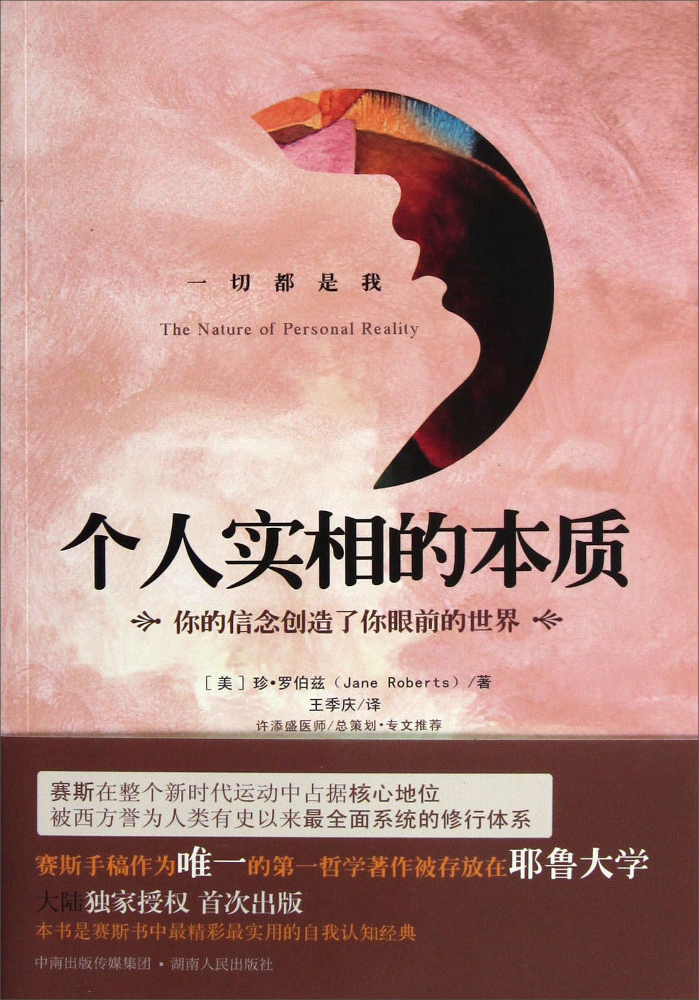

#### 版权信息

书名：个人实相的本质

作者：［美］珍·罗伯兹（ Jane Roberts ）

译者：王季庆  

总策划：许添盛

ISBN：978-7543-88829-6

请购买实体书籍·该电子版本仅供参考

## 专文推荐

你相信吗？外在的一切全部来自内在，从来没有一桩例外！

赛斯书对我的灵性之旅有极大的益处，帮助我看到看世界的另一种方式。很简单，这是我读过最好的书之一。

——李查·巴哈 著有《天地一沙鸥》，该书在美国销售排行仅次于《圣经》

珍·罗伯兹这本杰出的好书——《个人实相的本质》是一部心灵书籍的经典，也是影响我一生的好书之一。合上最后一页之际，我抬起头来看到的是，一个无止无尽、充满各种可能性的新世界。

——丹·米尔曼 全美顶尖身心灵导师，著有《深夜加油站遇见苏格拉底》

赛斯是我的第一位形而上学老师。在我的生命中，他一直是个不变的知识来源和灵感。

——玛丽安·威廉森 《纽约时报》畅销书作家，著有《发现真爱》

《个人实相的本质》对我的生命和工作影响重大，赛斯的教导是我最初写作《心想事成》这本书的灵感来源之一。

——夏克蒂·葛文 著名身心灵导师，著有《心想事成：创造性视觉法》

在我心灵旅程上，赛斯书给我的益处最大，并且帮助我用不同的角度看世界。

——杰若德·詹波斯基 著名身心灵导师，著有《爱是放下恐惧》

当人被卷入一场他所不熟悉的危机时，多半有一种生命不是操之在我的感觉，接着很自然就会怨天尤人。赛斯的话语使我从怨恨和向外抨击的“反应”，突然扭转成向内自省的“行动”。那样的扭转使我感到前所未有的独立、自主和责无旁贷。

——胡因梦 台湾著名身心灵导师，著有《生命的不可思议》

就对个人而言，《个人实相的本质》是一部最扎实的修行书。

——许添盛 台湾著名身心灵导师

按照赛斯的平行世界概念来看，所有已选择、未选择的，各种可能其实都在发生，全观来看，没有错误的决定，都是体验生命的方式，所以不需对过去做的某项决定感到遗憾或悔恨，只需从其中学到功课即可。

——李欣频 著名广告人，作家，心灵导师

## 关于赛斯文化

我是个脚踏实地的理想主义者。

赛斯文化，是为了推广身心灵健康理念而成立的具有公益性质的文化事业，希望透过理性与感性层面，召唤出人类心灵的“爱、智慧、内在感官及创造力”，让每位接触我们的读者，具体感受“每天的生活，都是灵魂的精心创造——You create your own reality”。我们计划出版符合新时代赛斯精神之书籍、有声书、影音产品及生活用品，并将经营利润致力于赛斯思想及身心灵健康观念的推广，期待与大家携手共创身心灵健康新文明。

## 策划缘起

许添盛

欣见台湾赛斯文化将出版赛斯书全集。

2009 年 7 月，赛斯早期课的学生瑞克（Rick Stack）来台举办灵魂出体工作坊，与我在花莲赛斯村有一场东西方的交流对话。那时，许多赛斯家族的朋友见我在讲座上莫名地流下激动的泪水，老实说，我自己也颇感意外。不过各位想想，在中国台湾、大陆、香港、马来西亚、美国、加拿大的华人地区默默努力推广赛斯思想一二十年的我，和在美国、欧洲推广赛斯思想不遗余力的瑞克，有朝“相逢”在台湾花莲赛斯村，你说，这场面能不令我感慨万千吗？

其后邀请瑞克夫妇到我新店山上的家小聚，我才又灵光乍现，脱口而出：“一切都是我！”那年，初遇赛斯，心弦震动，仿佛风云全为之变色，随后找到中文赛斯书的译者王季庆，死缠烂打地自愿担任她的翻译助理，将一本又一本的赛斯书译成中文，也找了当年的方智出版社合作。由于出版社担心书的销路，所以最早的版权费还是王季庆自掏腰包的呢！终于促成中文赛斯书的出版。

王季庆是隐士型的人，不想出风头，更不愿找麻烦，但因为我对赛斯书的热爱，于是她在内湖家中成立了台湾最早的一个赛斯读书会，随后伴同陈建志南下台中、高雄成立赛斯读书会分支。

因着我的坚持，虽然不愿意，王季庆依然支持我由读书会走向成立“中华新时代协会”。刚开始就只读赛斯书，后来才有人陆续带进奥修、克氏、光的课程、灵气等，而我始终如一，独钟赛斯。当年的我尚年轻资浅，于是王季庆担任理事长在先，二届之后才由我接任，开始大力推广赛斯思想，以及经我整理赛斯书精髓并融合医学专业（家医科与精神科）的身心灵健康观念。

这样说来王季庆应该不会反对——我是一切的“元凶”，所有华人地区赛斯书的出现及推广，我即是那背后最强大的推动力。当然，王季庆是我早期最大的爱护者及支持者。在我生命中最孤单、最无助、最关键的 15 年练功期，她的呵护陪伴我茁壮成长。

我告诉瑞克这段往事，他似乎有所领会，自 2007 年起，“花莲赛斯村”、“赛斯文化”、“赛斯身心灵诊所”、“新时代赛斯教育基金会”、“赛斯花园”，陆续在我的热情推动下成立，这些年来随我打天下的工作同仁们，也都功不可没。

其时，我并不知道美国赛斯书版权主要是由瑞克夫妇处理的——于是这么一来，想当然尔，瑞克夫妇当然信任由我们赛斯文化兼具专业与热诚的编辑团队来出版，加上新时代赛斯教育基金会同步大力推广赛斯思想，真是再完美不过了。

这就是赛斯文化出版全系列赛斯书的缘由。事后看起来理所当然，当时却也是创造实相的成功典范，正如我常说的：“结果先确定，方法自然来，轻松不费力，信任加感恩，但要有耐心！”

〔推荐人简介〕许添盛，曾任台北市立仁爱医院家庭医学科专科医师、台北市立疗养院成人精神科医师、台北县立医院身心科主任，现任赛斯身心灵诊院长、赛斯文化发行人、新时代赛斯教育基金会董事长。许医师钻研新时代思想十数年，尤其偏爱赛斯；同时从事身心灵整体健康研究，对于癌症的治疗及预防复发有独到心得。成立“身心灵整体健康成长团体”、“美丽人生癌症病患成长团体”及“赛斯学院”，并定期受邀至台湾、香港及美国等地演讲。著有《绝处逢生》、《我不只是我》、《许医师咨商现场》、《不正常也是一种正常》等十余种书及有声书。

## 推荐序：一字一句，老实修行

许添盛

如果说《灵魂永生》这本赛斯书是一部浩瀚如海的总论，那《个人实相的本质》就是对个人而言，一部最扎实的修行书。怎么说呢？因为赛斯在这本书中提到了个人如何能与内在的感觉基调联结的方法。感觉基调即每个人内我的纯能量，是个人与生俱有，与一切万有连接的能量核心，是每个人“信念创造实相”的能量来源。

首先是和内我能量的联结，再来是了解“信念创造实相”诸般精微奥妙的剖析，从深度的自我觉察中，慢慢体会到个中三昧。我自己学习赛斯心法已有二十三四年了，每每在心理治疗的历程中，在赛斯书讲解的课程中，在自我静默的时刻，都有一番全新的体会及感动。过去曾有“一字千金”这样的成语，但在我对赛斯书的体会中，真的是句句千金，且撼动人心。

赛斯的每一句话其实都是修行的法门、自我觉察的方法，也可以用在心理治疗及精神分析当中，比如赛斯在自序中提到：“不管你自己知道不知道，你都曾经怀抱着决心踏上今天所走的路，你运用着各种资源，去追求那一度你认为合理的目的和理由。”各位，这段话的学问及智慧可不得了，通常我们见到今日之果，已忘记了过去之因；信念为因，实相为果，即为真正的因果论。不明就里的人，还在传统的因果论里纠结，把行为区分为好坏，再由外界的准则及赏罚施以果报，真是谬以千里啊！

于是，每个人都像个健忘的老教授，纷纷在亲情、友情、爱情及人际关系的纠缠里，情绪起伏不定、经济陷入困境、身体疾患的人生苦痛里，不得解脱；却忘了，今日之果乃过去之因啊！那因在哪里？因就是你的心啊！你过去的心、现在的心及未来的心。记得到北京雍王府参观时，一个大殿上供奉着三世佛，过去佛、现在佛及未来佛，说的就是过去、现在、未来三心皆不可得，唯有当下是威力之点、解脱之道啊！

“信念创造实相”不是口号，是一个深度的自我觉察及自我开悟的修行口诀。一般人经常停留在表面的好坏及对世间万事万物肤浅的看法中，认为哪有人愿意创造出疾病、愿意离婚，或辛苦了一辈子却一无所有？殊不知《易经》所言，凶藏吉，吉藏凶，世间无绝对的好坏。一件不好的事发生了，请问，有没有它好的那一面及创造出一个好的走向，或酝酿着一个潜藏的好呢？一件好的事发生了，请问有没有它的弊病、缺点及隐藏某个不好的面向呢？举个例子，如果你和某位朋友感情很好，请问是不是容易卷入他的喜怒哀乐中不易客观判断？如果对方无理、有所求，你是不是也不容易拒绝、不容易做自己，因为怕伤了感情及和谐？唯有智慧乃解脱良方，这本书将可帮助无数现代人跳脱二元对立、苦痛轮回。

生病是一件不好的事，但有没有好处？当然，可以免除自责及休息的罪恶感，可以得到更多爱和关心。只有明白实相乃自己一手所造，你就可以重新创造实相。赛斯也清楚地解释了创造实相的步骤：信念感受先建立，想象行动跟着来，实相创造就完成；信念改变一瞬间，创造实相要时间。

世间有许许多多修行、心灵、宗教方面及所谓新时代的书籍，一下子流行一个学说，一下子流行一本书，一下子又迷哪位修行人或大师。各位，清醒一点，回来找你自己吧！一字一句，老实修行，由这本《个人实相的本质》开始。开悟解脱的智慧，尽在其中。祝福你。

## 译序：精彩实用的人类心理学

王季庆

赛斯这本《个人实相的本质》的译稿，经过长达六年的“酝酿”，终于与读者见面了。

喜爱“赛斯书”的读者们，曾来信催促我快些把他的其他作品译好。有人抱怨说，怎么译一本赛斯书比十月怀胎还要漫长。且听我把译这本书的曲折过程慢慢道来吧。

1985 年我收到王育盛由美国的来信，说他和我一样都是生命真理的追求者，看了我译的第一本赛斯书——《灵界的讯息》后，赞叹我译书之举的功德比造七级浮屠强胜无数倍。并且他告诉我，他当时已开始译《个人实相的本质》这本书。我心喜有人为赛斯书共同努力，视为同道。当年夏天我乘赴美之便，去拜访了他和胡英音夫妇，秉烛夜谈，一见如故。

那时我已出版了《灵界的讯息》及《灵魂永生》两本赛斯资料。我便另外选译了《心灵的本质》，也于 1987 年出版。1988 年我问老王《个人实相的本质》译得如何了，他说搁置下来了，我便说那我来接力吧。他交给我五章多的译稿，我接译完第九章，就因积极进行“新时代系列”的筹划和翻译工作，而暂停了此书。后来他又把稿子要了回去。直到 1990 年我催问他情形如何，他说没空再续，我便再度向他要回原稿，他也慨然让我全权处理。

于是，去年暑假我便邀因赛斯而结缘的年轻朋友许添盛来助我一臂之力。他对赛斯理论的认同与热爱，也成了驱策我集中精力去完成此书的重要因素。

《个人实相的本质》原书有 510 页，老王译到 123 页。去年夏天我由第十章开始，一边看原文一边思考玩味一边口述，由许添盛笔录下来。但他的参与亦不止于笔录。首先，他随时不忘以“读者”身份提醒及要求我尽量用较适合汉语语法的句子。赛斯书的英文，原本就相当的严谨紧密，句子冗长复杂，即使对美国的读者而言，也不是可以如“行云流水”般阅读下去的，珍也提到过，她的“文字”与她在 ESP 班上用到的聊天口吻是大不相同的。因此我仍保留了她这种“论文式”的风格，而未加以“稀释”或“诠释”（后来在读赛斯早期课时，赛斯也强调，不可将赛斯资料加以稀释），句子结构仍是相当紧密的，但我认为这是其“本来面目”。

正如珍说她完全照赛斯口述成书，既无“增润”，也无“减损”。我也是完全尊重原著，认为“翻译”不是“解释”或“译述”。

前三本赛斯译著，许添盛已读得烂熟，从而把它吸收了解到一个程度了，因此，碰到书中文意难解之处，我也跟他反复讨论、斟酌，务必弄清原意。许添盛和我这样一周工作六天，一天有时做到十小时，如此全速全力进行了两个月，终于译完全书，后来我再一个人把前头的九章重新修正。

这本赛斯书可以说是最精彩实用的一本谈人类心理学的书。不同于坊间一般倡言“正面性、积极性思考”的书，赛斯更进一步，领我们直探更深层的心理本源。他强调“信念”的重要性。

“信念”令你产生某种“思想”，“思想”令你产生某种情绪，而后“思想”与“情绪”由内向外地造成了你的身体状况、你的人生经验、你的“个人实相”。外在的一切，因为是由你内在信念创造出来的，因此永远符合你对实相的信念，因而你会理所当然地对其背后的信念视而不见，每个人的“盲点”就是由此而来。因而“觉察自己”是最重要的。他也提出了一些很实用的如何检查自己的信念、如何脱离自造的困境的方法。

这本书虽然因赛斯的“苦口婆心”而相当的长，但在翻译途中，叫苦之际，我们也往往为了他某个精辟的见解，真的禁不住“拍案”叫绝！就只为它是如此的精彩绝伦，因此所有的苦都是值得的，正如书中珍和罗对他们传述赛斯书的这个工作，说是“A labor of love”。对我们而言，又何尝不是如此？

一九九一年

## 珍序：过更开心且富有创造力的生活

珍·罗伯兹

这本书能在我的名下出版，我深引以为荣，虽然我并不完全了解这本书的制作过程，或我在其中所扮演的那个将这本书“写”出来的角色究竟是怎么一回事。在本书的创作过程中，我从未有意识地参与过，我所做的只不过是每个星期“出神”两次，以赛斯这个人的身份，或者“代替”赛斯，以一个中间人的身份，将这本书“说”给我先生听，而由他记录下来。

虽然如此，我还是认为这本书是“我”的作品，因为我深信若不是有我这个人，加上我特有的能力居中传递，这本书根本就不可能问世。从另一个角度来看，这本书的产生其背后所涉及的东西极多，例如，连我自己都要将原稿看过后才知道它里面在说些什么；所以，这本书又不能说是“我”的书。我说这些话是什么意思呢？

我的看法简单来说就是：通常我们的着眼点，几乎完全放在我们所认为的“真实”世界之中，但是，问题是“实相”（reality）有这么多个。借着转换我们意识的焦点，我们就能张望一下其他的实相，而所有的各种实相，则又全部是“实相”在各种不同情况下显现出来的不同景观。在我看来，想要以某一个实相为标准来形容另一个，简直是件不可能的事情。

这些年来我一直处在一种困扰中，总是希望能以我们这个世界中“是非题”的二分法标准，来替赛斯这个人物做一番定位。我究竟应该把他当做一个有一般精神信仰的人心目中认为的那种独立精神体——“指导灵”——好呢，还是把他列为科学解释的——他只是我自己人格中一个错置部分的显现。这两种解释对我而言，都没有抓到痒处。

如果我说：“喂！大家不要搞错了，赛斯不是你们所以为的那种精神体。”那么，大家马上会把我的话当做我在承认原来赛斯只不过是我性格中的另一面。还有些认为自己终于找到一位“超灵”的人，会以为我在故意抹杀赛斯的地位，不肯让他们受到这个超然精神体的帮助。

事实上，我认为我们在正常生活中所自知的自己，只是其他源头自己在三度空间中所作的显现而已，我们从那些“自己”中取得了生命与能量。他们的“实相”根本无法为我们的生物形态架构包容，但是却不断经由我们这些个体的作用而转译出来。

像“指导灵”这种说法，也许只是以上观念的一种简化、方便且象征性的代表，我并不是说“指导灵”不存在。我的用意只是在阐明“指导灵”这个观念应该值得我们去做更进一步的探讨，因为这个名词真正代表的意义可能与我们想象的差得很远。此外，如果我们过于执着这两个名词（spirit guide），先入为主地把一切富有启示的知识当做外来的启发，或是穿凿附会地把不包括在这种范围之内的其他异象，也都列入这个范围，那么，这种“指导灵”的观念反而会变成一种限制。

当我试着用以上这种观念来解释赛斯的存在，老是在怀疑他是否是一个“指导灵”时，我反而受到某种程度的限制，自外于赛斯那更大的实相，自闭于他那存在于广大想象力、无边创造力、比所有一切具体世界要大，也根本无法为唯事实是问的世界所容纳得了的实相之外。（While I was trying to define Seth that way and questioning whether or not he was a spirit guide, I was closed off to some extent from his greater reality, which exists in terms of vast imaginative and creative power that is bigger than the world of facts and can't be contained in it.）就拿赛斯跟我们开课这件事为例子来说吧，我们能看得到他的独特个性显现，但是这些东西的来源我们却观察不到。相同的情形，任何一个人的来由，在这客观世界里都不是“显”的，也都是一个神秘的谜。我的工作就是去扩大这个世界的范围，开阔大家对这个世界的观念。

赛斯书或许只是我自己意识中某一个属于另一度空间且又不把注意力放在人世间的“面向”，加上其他某些用人间言语解释不出的因素而生产出来的成品，在其中，造就出“赛斯”这了不起的心灵作品，它“真”的程度比任何所谓的“事实”还要“真”。赛斯存在的地方，也许只是某个在事物安排上与我们人间习惯不一样的层面而已。

我并不是说，如此一来，我们就可以不必把从赛斯书中所学到的那一套应用到这个世界来，事实上，我自己就一直如此在做，而赛斯写这本书的目的，就是在教我们如何去有效地应付我们的日常生活。我要在此特别强调：当我们在看这本书时，一定要注意不要随便望文生义，或是断章取义妄下断语，或自以为是，否则我们便犯了一个错误：硬把多度空间性的东西强塞到三度空间，而妄以人间所谓的真、假来限制与评判事物。

不管在直觉或是情绪感受上，我们了解的事情往往都比理性作用下所能知道的要多。如果我们硬是要把一种富有启示的讯息，或是像赛斯这样的事件，用我们自己那种有限的观念去把它“框”起来，就等于是强行以编号三来解释一朵玫瑰，或是硬拿两件毫不相干的事情来互相解释一样。

想想也很有意思，一个根本不把注意力放在我们这两个（原文中没有这个意思）世界的“人”，却能借着他显示给我们看的一个事实——其他实相确实存在——来帮助我们过更开心、更充实的生活。（The funny thing is that a personality not focused in our reality can help people live in that world more effectively and joyfully by showing them that other realities also exist.）在这本书里面，赛斯说明了我们的生活经验是可以改变的，改变之道在于改变我们对“自己”以及对物质生命的“信念”（beliefs） 。

对我而言，“赛斯资料”已是一种不再需要以人间基础去评判的源源而来的神奇理论了。以一种莫名所以的方式，这些理论活了过来，藏于赛斯理论中的观念也变成了一种像是有生命的东西。（To me, the Seth Material is no longer a continuing manuscript of fascinating theories to be carefully judged against reality. In a strange way it has come alive. The concepts within it live.）我能感受到它们的存在，也由于此，我个人的实相也为之大大开阔，我因而开始对我们生命所由来的更广大的内在次元略见一斑，也更因而学会了其他感知的方式，这不仅使我能看到一些其他崭新的“世界”，更能够帮助我以更有效的方式去应付我们今天的世界。

当赛斯在进行这本书的著述时，我自己的生活在完全始料未及的方式下受到了无可计量的饶益。在赛斯叙述这本书的时候，常常发生一些与他所述内容相呼应而令人心神大为动荡的事件，而我的创造力与心灵能力也发展到了一个意想不到的新境界。

比如说，在赛斯快要开始本书的著述时，我发现自己步上了一个新的征途，这种迈进被我称为“苏马利”（Sumari）的发展。“苏马利”的意思是指在某种程度上有着相同整体特性的一个意识“家族”。我和这个意识家族的交流，使用一种特殊的“语言”，但这种“语言”不是我们一般认为的语言。我猜想这种语言的作用就像一种心理与心灵上的架构，使得我可以不受正常口语词汇的束缚，让我表达、传递形式化的遣词用字模式之下存在的内在感觉和资讯。

这种苏马利的发展在赛斯进行本书著述时不断扩大。有好多种不同层次的意识状态牵涉到苏马利的发展里面。比如说，在某一种状态中我可以写苏马利的诗；而在另一种意识状态中，我可以把我所写的苏马利诗翻译出来；更在另一个不同层次，我可以唱苏马利的歌，显现出远超过我平常秉赋或背景的音乐素养及表现。这些歌也可以被翻译出来，但是这些歌在本质上表达的是“情”，而歌词的本身是否能为人听懂倒在其次。而在另一种不同的意识状态中，我还可以收集到一些资料，这些资料想来应属古代“说法者”（Speaker）遗存的手稿，而我后来也翻译出来了。赛斯说“说法者”就是老师，有些有形，有些无形，而所有说法者千古以来都不断地扮演一个将内在知识解释与传达出来的角色。我先生也能写苏马利语言的东西，但是却翻译不出来，非得靠我来为他翻译不可。

在赛斯持续进行本书的著述时，我完成了一整份诗稿的创作，名为《灵魂与必朽的自己在时间当中的对话》（Dialogues of the Soul and Mortal Self in Time）。在这首长诗中，我根据赛斯在他书中提示的建议发展出很多我自己的信念，而这个发展又催生了我另一组诗作《说法者》的问世。

就我而言，我自己的这些经验说明了一个事实，那就是：天地间本来就有一个蕴藏着丰富知识与创造的宝脉，每个人都可以根据他自己能力的不同而自这股宝脉中获得不同程度的收益，这股脉流所存的地方就正在我们平常意识的表层之下。我深信这本来就是人类遗产的一部分，任何一个真正有心向自己内心去探寻的行者，都能或多或少进入到这层宝脉而有所收获。

《灵魂与必朽的自己在时间当中的对话》以及《说法者》这两份诗稿，与我所写的某些其他苏马利诗，已由 Prentice-Hall 出版公司合并为一册，并将于近期内出书。我认为它应属本书的姐妹作，因为这本诗集说明了当赛斯在叙述《个人实相的本质》时，在我自己的个人世界中发生了什么事，同时也显示了创造动力如何向四面八方迸发而进入一个人格所有的领域中。赛斯在写书时常常引用到我所写的这些诗，以及触发这些诗的那些体验。有很多这种“触机”的情形，是由于我拼命地想要搞清楚，到底他的世界与我的世界之间有些什么关联，或者内在体验与外在经验之间究竟有什么理路可循而发生的。

除了这些之外，我在赛斯进行本书著述的同时，还发现自己突然在写一本小说，书名叫做《超灵七号系列：漫游前世今生》（The Education of Oversoul Seven），本书颇有自动就写出来的味道。书中的主角是超灵七号，是一个已经圆满成就了他自己境界的“人”。在写那本书的时候，我只要在心里说：“七号，该写下一章了吧？”然后，我就发现自己飞也似的接着写出下一章。该书还有一部分内容是由我的梦境而作出的。

我心里明白书中的那位七号和他的老师赛普路斯（Cyprus）确实以某种方式存在着，但是他们存在的实相却不是我能以一般俗世真假的角度去描写形容的。比如说，这本小说里包含了很多苏马利语言的诗，以及部分的《说法者》留下来的手稿内容。当我在唱苏马利语的歌时，我会有一种与赛普路斯产生认同的感觉，可是赛普路斯应该只是一个虚构的人物。另外，我又发现：当我在受到个人考验的时候，我还可以把自己调整到七号的方向而向他求援。

我在碰到事情的时候，喜欢毫无保留地全力以赴，喜欢在不受拘束的情况下尽情释放自己的能力。但矛盾的是：当我在尽情施展的同时，常常会在理智上为自己这么受直觉驱使而觉得羞愧，又有时，在对这种情形做了一番理智上的解释之后，自己觉得很不好意思。而我对这情形也并不想自己骗自己。我想，这种忽而直觉、忽而理智的复杂状况，背后一定有它的理由。

我终于渐渐了解到，直觉与理智两者不管是对我自己要做的工作，或是对赛斯所做的工作都相当重要。也许，我这种不肯向“自我安慰式的答案”妥协的态度，反而导致了我往这方面去作更深入的探讨。同时，还在相当程度上帮助我将赛斯而非一个疯子“带”到这里来。

这种苏马利的发展，以及与《超灵七号系列：漫游前世今生》及本书相关的经验，为我带来了一大堆疑问，使得我不得不向更广大的领域去寻求解答，以搞清楚到底这当中发生了些什么事。

这种追寻又令我开始了另一本书《意识的探险》（Adventures in Consciousness：An Introduction to Aspect Psychology）的著述。在那本书中，我希望能替大家对“人格”这个问题做一番注解，也希望我的立论，能大到足以将人类心灵的真相及各种行为的解释都涵盖在里面，这本书预期可以在 1975 年内完成。在本书《个人实相的本质》中，赛斯也常提到。

在这同时，我只能说：我们活在一个一切以具体事实为基准的世界里，而这些具体事实却来自一个更深的“创造”领域。真要说来，所谓的“事实”，其实就是在我们经验中活起来的“虚构”（fiction），所有的事实皆是如此。那么，赛斯这个“人”就跟你我一样的真，只不过他以一种奇怪的方式跨在两个世界上。我希望《意识的探险》也能够助我们将这个“事实世界”与其所产生的丰富内在实相连接起来，因为我们的经验与感受里面包含了这两个世界。

《个人实相的本质》这本书不仅大大饶益了我的创作生涯，还同时考验了我的信念与想法。

我知道赛斯的理论和许多为人们所接受的宗教、社会或科学上的教条相冲突，但是我还是毫不保留地完全赞同赛斯的理论。对于那些将赛斯理论实际运用到日常生活上而产生了疑问又写信来询问的人，本书无疑是最佳解答。此外，我还相信本书肯定能帮助许多人处理日常生活中的各种难题及事件。

赛斯主要的理论在于——我们个人的实相是根据自己对自己的信念，以及对其他人和对整个世界的信念自行创造出来的。根据这一点延伸下去，他说明了所谓的“威力之点”，并不在前世，也不在来生，而在“当下”。他强调“个人”具备“有意识行动”的能力，并且提供了绝佳的练习方法，这些方法告诉我们如何将他的理论活用在任何生活中的情况里。

本书的主旨非常清楚：我们并不是任凭自己潜意识摆布的东西，面临外力的时候也不是毫无自主之力。“意识心”指挥无意识的活动，而所有“内我”的力量全都在“意识心”的控制之下，这些力量要怎么用，完全根据我们自己对“实相”这两个字抱着什么样的观念而定。赛斯说：“我们是一群躺在‘生物属性’（creaturehood）怀抱里的‘神’。”我们被赋予了将我们思想与感受实际显现的能力，然后从这些显现中形成自己的经验。

赛斯第一次提到要写《个人实相的本质》这本书，是在 1972 年 4 月 5 日的第六〇八节里，当时我和罗才刚刚将他的前一本书《灵魂永生》（Seth Speaks :The Eternal Validity of the Soul）的稿子校对完毕，而他正式开始口述这本书的时间是同年 4 月 10 日。口述刚开始，我俩的“个人实相”马上就被突如其来的艾格妮丝飓风带来的水患所干扰。由于这次的事件，本书的进行耽搁了好一阵子，个中详情请看书中罗的注解。

发生在我们生活中的各种事件，常常被赛斯信手拈来作为某些更重大问题的例子，而我们那次水灾的经验，结果变成了赛斯讨论“个人信念与灾难”这个题目的滥觞。另有几次，我们生活中的一些情况被他引用成资料的来源——一个有趣的转折。

很早以前，从我们与赛斯开始有所接触之初，赛斯就管我叫“鲁柏”，而称罗为“约瑟”，因为他说这两个名字代表了我们更大的“我”，而我们目前的身份是源自那更大的“我”。在本书中，赛斯仍然沿用他一向对我俩的称呼。

同往常一样，发生在我们课中的所有资料，仍然由罗以他自己发明的速记方式记录，尔后再打字整理出来。对罗来说，这比用录音机录下整个过程、重放，然后再打字整理，要简单得多。

罗常常在记录中不时记下时间的流逝，以显示出赛斯在说到某一个题目时总共用时多长。赛斯口述他的著作，随时不忘说明哪个字要在底下加画一条线，哪个字要加引号，什么时候要用括号。

此外，他也没忽略掉其他标点符号的使用。

本书应该可以帮助每位读者了解自己个人经验的本质，进而去用这份知识改造自己的日常生活，使自己的生活过得更开心、更具创造力。

珍·罗伯兹 谨识

于纽约州艾尔麦拉市

1973 年 11 月 6 日

## 自序：个人实相的制造

赛斯

### 第六〇九节 1972 年 4 月 10 日 星期一 晚上九点二十分

（两个礼拜以前，珍提起说好像赛斯又要开始写另一本书了，她这个想法是有天晚餐后“就这么出来了”。当时我们对这件事并不当真，因为我们在上个月底才刚刚完成赛斯前一本书《灵魂永生》的校对工作，根本就没想到他真的有这么能干，马上可以接着进行另一个大计划。珍自己也根本没有动过任何有关这种计划的念头，也没有想到过任何主题或是赛斯能写的书的标题。

附带一句：本书中会一直经常引用《灵魂永生》以及另一本于 1970 年出版的珍自己写的书《灵界的讯息》（The Seth Material）。至于说“赛斯”这个“人”则是珍在出神状态中登场的主角。

（一直到了上周星期三，在我们定期的赛斯课里，赛斯才证实了珍预期的事情，但是却没有提及到底什么时候才会开始著书。以下是赛斯说的话：

（“现在，鲁柏〔赛斯称珍为鲁柏〕的感觉很正确。我们确实是在准备写另一本书，而中间的这一段时间是特意留给你，让你休息时用的。

（“这些书把我的资料一气呵成，而在某种有纪律的架构下展现给读者……你现在也已知道的，你得花不少时间整理你的笔记，因此我等了一阵子。

（“鲁柏对这件事情的感觉相当清楚，也少不了会有一番阵痛的感觉，他一直在猜想这一次我又要写些什么，而这本书又会是怎样的一本书。这样的一本书可以用平常而又轻描淡写的方式，在你们平时与我聚会的时间里写出来，不仅能增长你们自己的见解，将来还能帮助很多其他人。我建议我们尽可能以一种最单纯的方式来进行这本书的著述；我的意思是我们在著书的‘机制’上采用一种最精简的过程。你懂不懂我的意思？”

（我回答说：“懂。”然后我们当晚讨论的话题，就转到别的题目上面去了。

（现在回到今天晚上：当我们坐在这里等今夜的赛斯课时，珍说：“我觉得赛斯已经完全准备妥当，我已经感受到他那股快要开始的冲劲了，也许写书就是今天……”在这之前，她并没有特别将心放在这件事上面——或者至少我不记得她说过多少有关这件事的话。

（透过珍而展现出的能量直到现在还令我觉得震撼，尤其是当我在念及这个小女人体重还不足 95 磅的时候。在她同意之下，赛斯的确能以非常有力的方式透过她而展现。虽然她现在说话的情形只是一般普通状态，但是我想要说明的是：当她在替赛斯说话的时候，她的音域明显地降低，但是音量却多少更强，并且带着赛斯慎重从容却独特的腔调与节奏。珍现在摘下了眼镜，把它摆在我俩之间的茶几上。接着，她的眼睛变得更黑了，已完全进入了出神状态。）

现在，晚安。

（“晚安，赛斯。”）

今夜的这一篇短文可定名为“个人实相的制造”。

经验与体会是“心智”、“精神”、“有意识的思想与感受”，以及“无意识的思想与感受”的产品。这几样东西加起来就形成你个人所知的实相。因此，你并不会受到外来的、不可抗拒的或是强加于你的外界环境所左右。由于你太过将自己与组成你生活经验的那些具体事件连接在一起，使得你往往很难分辨仿佛是发生在外界的事件，和令它们发生的那些思想、期待或渴望。

如果在你最切身的思想里有着非常强烈的负面特质，而这些负面因素又真的在你与更充实的生活间形成了障碍物，你还是经常视而不见，一旦看了过去而不知这些障碍的存在，直到有一天你真正认识到它们是障碍为止。话说回来，甚至是障碍也都有其存在的理由。如果这些障碍是你自己制造的，那么就只有你才能决定是否要将它们辨认出来，并且找出它们之所以存在其背后的理由与情况。

你自己有意识的“思想”就是最佳线索，足以引导你去发现，在你生活中的各种障碍究竟因何而来。你对自己思想熟悉的程度实际上比你自己“想象的”要差了一大截。这些思想常常就像水从紧闭的指缝中溜走一样逃过了你的注意，它们里面带有足以滋养你整个心灵的养分——同时还经常带有足以淤塞住“经验”与“创造力”等管道的烂泥与渣滓。

如果你细细审查一下自己有意识的思想，你会发现，这种审查可以告诉你很多关于自己内心深处的心态、意图和期望，并且还常常导致你去直接面对自己的挑战及难题。你的思想，在经过细细的探讨之后，会让你明白你到底走向何处。它们会清清楚楚地点明一个真相，那就是：所有存在于世间的事事物物，原来全都是先存在于思想及感受里。除此以外，别无其他法则。

（九点四十分。）

你之所以会有一个“意识心”（conscious mind）的存在，其背后大有道理。要知道，你不受“无意识冲动”支配，除非你有意识地默许这种情形的发生。你当前的各种感受与期望永远可以被拿来当做检查自己处境的工具。如果你不喜欢自己现在的境遇，你所要做的就是去改变自己有意识的想法与期盼的性质。你务必要去改变那些透过你自己的思想而送到自己身体、朋友或是生活中相关的人的各种讯息。

以你们的话来说：每一个念头都会有一个结果。如果你一再习惯性地重复一个念头，它就仿佛变得多少具有一种永久效果了。如果你对这种“效果”并没有不满意，那你就不太会有想要检验一下这个念头的想法。但是一旦当你发现自己深受生活中的种种难题煎熬的时候，你就会开始疑惑到底是哪里不对劲了。

在这个时候，你也许会怪别人，或怪自己的际遇；若你相信有轮回的话，你也许还会怪自己前世不修；你也可能认为若不是上帝就是魔鬼，二者之间总有一个，要为你的境遇负责；甚至你也可能会“认”了，将一切归诸“命”，从而逆来顺受，把一切横逆当成自己生命中的“不解缘”。

也许，你终于对“实相的本质”有了一知半解，而哀叹说：“我相信是我引起了这些不幸的结果，但是我发现我没办法使它好转。”

如果情形真是如此，那么不管到现在为止你跟自己说了什么，你仍旧没有真的相信自己就是自己种种际遇的创造者。但是，若你一旦真的了解这个事实，你马上就可以着手去改变那些令你恐惧或不满的境遇。

（九点四十九分，停顿了一分钟。）

没有人强迫你要用哪一种特别的方式去思考。过去也许你已经学会了老是将事情往坏处想，你也许会相信悲观的想法比起乐观的想法要来得实际些。你甚至会跟很多人一样，认为悲怆会令人高贵，是非常具有灵性的一个迹象、一种脱俗的征象，或是一种作为一个诗人或是圣贤之类的人物不可或缺的精神装扮。这种观念可说是集谬误之大成，再也难以找到比这个距事实更远的想法了。

在每个生灵的深处都藏着一种永不止息的冲劲，想要寻求能力的尽情发挥、胸怀的开阔，以及乐观进取地去突破那些表面上似乎存在的种种障碍。没有一个意识会答应任何要将它束缚住的想法，即使是最微小分子内的意识亦然。它们都渴望着新经验及新的生命形态。那么，甚至连原子也都不断地在寻求加入新的结构，或是追求一种新的意义。原子、分子的这些行动及希望本来就是它们的“本能”。

“人”天生就有一个有意识的心灵——“意识心”，而“人”又把这个“意识心”赋予了身为人身的自己，去主宰自己所创造的东西的性质、形状与形式。因此，所有存在于人心深层的渴望、不自觉的深层动机，以及未曾言宣的驱策力全都上升到表面来，等待着“意识心”的认可或否定，并且等待着它的指挥。

“意识心”有主宰这些东西的全权，只有当它“弃权”的时候，才会让自己被“负面的感受”所支配；也只有在拒绝承担它的责任的时候，才会觉得自己好像被事情牵着鼻子走一样，对发生在周遭的事物也好像有一种无力感。

现在我们休息一下。

（“谢谢。”）

（十点整，珍很容易就回过神来。“我有一种感觉，”珍说，“赛斯刚刚说的这一段好像是第一章的开始。”她这个印象是由于赛斯把今晚所说的内容称作“短文”（essay）的缘故——这是赛斯第一次用这个词来形容他的文章。事后证明珍猜对了一部分。十点零七分继续。）

现在开始。那些光是倡导“积极思考”的书籍虽然有时候有益，但它们通常都忽略了“负面的感受”、“攻击性”或是“受压抑的感觉”所具有的“习惯性”。这些感受通常都只是被扫到地毯下面去了。

写那些励志书的作者鼓励你做人要往光明处想、要有同情心、态度要坚强、要乐观进取、要保持开心及热心等，却没有教你如何从困境中自拔，也无从知道你到底被困于哪一种恶性循环的心态中。那些书有时固然很管用，但是却说明不了“思想”与“情绪感受”究竟是如何地造成了“实相”。那些理论也没有考虑到“我”这个东西的各种多重次元“面向”，更没有考虑到每个人虽然遵循着明确的常规，却终究得找到如何使这些常规适应于他的个别境况的法子，再跟着做。

如果你的健康情形不佳，你可以设法补救。不满意自己的人际关系？你可以改善。穷困？你可以令自己置身于富足的环境中。

不管你自己知不知道，你都曾经怀抱着决心踏上今天所走的路，你运用着各种资源，去追求那一度你认为合理的目的或理由。你也许会说：“我看不出‘生病’对我有什么意义可言。”或是：“一个破碎的婚姻关系绝不可能是我自己有意去找的。”你也可能会说：“哪有人会自讨苦吃，在这么辛苦的工作之后所追求的反而是贫苦？”

如果你生来就穷困或是一出生就带病，这种情况在表面上看来当然是外来的横逆，其实不然，这些情形还是多少有改善的机会。

这并不是说努力和决心就不再需要了。我这句话的重点是在点明你并不是无力去改变事情，而每一个人，不管其地位如何、情况如何、身体状况又是如何，他个人的经验、体会全都在自己的掌握之中。

你眼中所见与心中所感，全都是你自己预期会看到和会感觉的东西。你所知的世界就是一幅由你自己的期盼所显现出来的画，而整个人世间，就是你们每个人个别的期待综合之后的具体化。就跟小孩是从你们的身体组织中而来一样，这个世界乃是由你们共同创造而成的。

（十点二十六分小停了一会儿，然后赛斯微笑着以轻柔的语气继续说道：）

我写这本书的目的，是要帮助你们每个人解决自己个人所面临的困难。我希望能借此告诉你们：你们个人的实相是如何由自己所一手造成的，以及解释给你们听要如何才能转逆为顺，而达成我的心愿（I hope to do this by showing you exactly the way in which you form your own reality, by explaining the ways in which you can alter it to your advantage.）。

简而言之，我不会掩饰所谓“负面”思想及感受的存在，但是也不会忽略你足以处理这些东西的能力。因为负面思想和感受全都在你自己的掌握之中，而我们有方法利用它们作为进一步“创造”的跳板。我绝不会告诉你，你应该去压抑或忽略那些想法或感受。我会教你如何认出你经验中的负面思想与感受，去找出它们哪一个失控了，以及如何去处理那些看起来好像是在你控制之外的想法与感受。

我所要说的那些方法，都需要你去努力、去集中心神才能办得到。它们也会向你挑战，而把最有益的那种意识的扩展和改变带到你的生命里来。

我不是一个有形体的“人”，但是，基本上，你们也不是。只不过你们现在的感受及体验很“具体”。你是一个将自己的期待带到具体形式里的“创造者”。这个世界的意义就在于做你自己的“参考点”，而所有外在的显现其实也就是你自己内在渴望的翻版。你可以改变自己个人的天地，而实际上你一直也都在这样做，只不过是行焉而不察罢了。你真正要做的，只在于如何去有意识地运用自己本有的能力，去细察自己的想法与感受的性质，然后把那些你基本上赞同的想法、感受投射出来而已。

你的这些想法与感受在进入了这个世界之后，就合成为你切身相关且非常熟悉的种种事件。

我会教你们一些如何认识自己实相的本质，以及如何方能照着自己的意思去改变那种实相的方法。

（声音转大：）口述告一段落。

（“好家伙，你用这种方式来展开新书的著述，可真奸诈得很啊！”）

（和悦地说:）这是本人的绝招。以后我会告诉你本书的章回以及其他有关的资料，如果你想知道的话，我也可以告诉你书中的大意。

（“我想珍一定会想要知道的。”）

让我先简单地说一下好了，请等我们一下……

（珍还在出神中，双眼合上，一只脚搁在茶几边上，坐在摇椅里不停地前后摇动。这次停顿从十点三十七分开始，停了良久。）

这本书主要解释个人的实相是怎么形成的，重点在：要如何做才能将自己不喜欢的处境予以改造的种种方法。

希望这本书避免像许多励志书籍中过度乐观的弊病，而激起读者内心一种热切的渴望，想要一探“实相”的特性，即使只为解决他自己的问题。我所要告诉你们的那些方法绝对可行、绝对实际，而且也全都在每一个人的能力可及范围之内，只要你真正关切那些生而为人就必然会有的困难。

书里面将会反复阐明一个事实，那就是所有的疗愈之所以能够发生，乃是因为当事人已经接纳了一个基本的“事实”。这个“事实”是：其一，物质是由那些赋予它生机、活力的“内在特质”所形成的。其二，物质的结构随“期待”而来。其三，“物质”随时都能被改变，改变之道在于唤起所有意识之内与生俱来的创造能力。

请将我今天晚上所说的作为我的序言。祝你晚安。

（“非常感谢你，也祝你晚安。”）

（全段于十点四十七分结束。今晚珍替赛斯所做的传述算是相当平静的，但是速度却不慢，说不慢是与我以独门速记功夫做逐字记录的速度相较而言。珍一回过神来就说：“我想我抓到了书名的一半，书名是《个人实相的本质》，这个名字之后接着是一个连接号或是冒号之类的，在引号或冒号之后还有一个尾巴，但是那部分我还没有收到。我忽然觉得倦极了。”珍说，接着她笑着说，“刚刚那句话可别记录进去”。

（事后补记：本书名字的后半截我们直到六个月后才知道。当天是 1972 年的 10 月 25 日，正是本书从第四章进行到第五章，举行第 623 次赛斯课的那一天。那天晚上珍在晚饭前小憩的时候，这本书的全名突然在她心中浮现《个人实相的本质：赛斯书》（The Nature of Personal Reality :A Seth Book）。

（事实上我们后来根本就没问过赛斯本书的大纲，因为在书一开始之后，我们就发现这个决定给了珍在可能范围内的最多自由。）

赛斯在本书中谈及的话题:

·信念是如何产生的

·信念如何影响我们的现实生活

·如何进行自我催眠和疗愈

·梦境代表了什么

·如何启动内在的能量

·如何改善亲密关系

·学会接纳当下，更好地去爱

感恩你翻开这本书，你会发现一个新世界

## 第一部

你与世界的交汇处

## 第一章 活生生的世间万象

### 第六一〇节 1972 年 6 月 7 日 星期三 晚上九点十分

（从 4 月 10 日赛斯完成了本书的序言一直到今天为止，这期间发生了一些事，其中最重要的是，珍的母亲在卧病多年后不幸过世了，这些事使得我们不得不把赛斯课暂且搁置。纵然如此，珍自己的 ESP 班以及写作班还是维持了部分开课；她也仍在继续写她在本书“珍序”中提到的那本小说《超灵七号系列：漫游前世今生》。

（然而，在这整段期间，我们仍期盼着参与赛斯新书的著述。当我们进行赛斯的前一部书《灵魂永生》期间，有很长的一段时间珍一直都在避免阅读该书的内容，理由是为了想要避免自己有意识地卷入其中。但是，最近珍笑着告诉我，这一回她要在每节一完成之后就看，还要现学现用。她以前对“制作”赛斯书的不安现已减至最低了。我对她新的开放心态大加鼓励。

（我还是会像往常一样，在课间记下珍各种不同的意识状态，但那只是一个有兴趣的观察者的侧记。她所进入的各种实相和人格，其真正的感受和深度，则完全为她独自拥有，无法诉诸文字。）

晚安。

（“赛斯晚安。”）

现在开始口述。第一章名为：（活生生的世间万象）。

世间万象皆由心生。你眼中所见的此界就像是一幅立体的画，每个人都在作画过程中参与了一手。画中的每样色彩、每根线条全都是在心灵中先画好了才显现于外的。

然而，在这比喻里，作画者本身就是画的一部分，而出现在画中。外在世界无有一理不是源生于内，也无有一动不是先发于心。

意识的伟大创造性本来就是你继承的资产，但这份资产并非纯属人类独有。每一个生灵全都拥有这份能力，而在至高与至微间、至尊与至卑间，原子、分子和有意识与理性的心智间，都存在着一种发乎自然的合作，也正是由于这种合作才构成了这个活生生的世界。

形形色色的昆虫、鸟兽都从事了这项合作，造就了大自然的环境。这种合作之自然与必然，就像是你对镜呵气，镜面必然也会形成一层雾气一样。所有的生灵都在“感觉基调”（feeling tone）中创造出这个世界，而世界也就是你们意识的自然产品。感受与情绪因而得以以某些特定的方式在世间显现。思想出现，而在现成造好的温床上滋长。四季跃生，由古老的感觉基调形成，有其深厚、不变的节奏。它们也是所有生灵与生俱来的创造力的产品。

这些古老的创造潜能，至今深深地埋藏在所有生灵的心灵深处，在它们里面，个别模式及新分化的明确蓝图得以出现。

（九点二十九分。热切地：）

地球的“身体”可以说有其自己的心或灵魂（随你喜欢哪个用语）。按照这比喻，高山、大海、山谷、河流以及所有大自然的景象无一不由地球的灵魂涌出，正如所有的事件以及所有制造出来的东西，皆无一不由人类的心灵或灵魂中显现是一样的。

每个人的内在世界都与这个地球的内在世界相连。“精神”变成了“血肉”（译注：“道成肉身”）。于是，每个人都有一部分的灵魂，与我们所谓的这个地球或世界的灵魂密切相连。

一株草、一瓣花，不管它是多么的渺小，全都觉知这个联系，不必推理就知道它的地位、它的独特性以及它生机的源头。构成世间一切事物的原子及分子，不管它所组成的是一个人体、一张桌子、一块石头或是一只青蛙， 也全都知道深藏于自己这个存在之下的那种创造力，它伟大的默默的冲力，而它们的个别性就浮在这上面，清楚、明确、不可轻侮。

同样的，人类中每个人从自己灵魂的那个极古老却永远常新的泉源中升起，胜利地呈现其特殊性。自己（self）由无知而升入有知，不断地为自己带来惊喜，比如说，就在你读我这些话的时候，你所学到的知识有部分是你有意识所知而马上可用的，而另一些则是无意识的，但即使如此，无意识的知识在其无知中仍然是有知的。

就算当你自己没体会到时，你其实向来都清清楚楚地知道自己在干什么。就像是你的眼睛知道它看得见，虽然它看不到自己，除非是利用反映。同样的，你所看见的世界，反映出你是什么，不同的只是，这不是反映在镜子里，而是反映在一个立体的世界里。你投射出你的念头、感受和期盼，然后再感知它们为“外境”。因此，当你以为外界的东西在观察你的时候，其实是你由你投射的那个角度在观察自己。

现在你可以休息一下。

（九点四十六至十点零九分。）

你就是自己活生生的画像，你把自己心目中所以为的自己投射出去变成了血肉之躯。你的感受、你的思想，不管是有意识的或无意识的，都改变了、形成了你今天这个具体的形象。你要了解这个还不算太难。

但是，想要了解所谓的“外在”境遇，也是在同样方式下由你的思想及感受所形成，或是，想要了解那些似乎是发生在你身上的外来事件，原来也是由你内在的心灵环境所发动，就不太容易了。

你身体的胖、瘦、高、矮，或是健康与否，全都不是偶然。这些身体的特征无一不是心灵的呈现，也全都是你自己向外丟到自己这个形象上的结果。我讲这话不是在寻你们开心，要知道你们并不是昨天才生的。以那种说法，你的灵魂更不是昨天才生的，而是早在有“年代”之前就已存在了（Your soul was not born yesterday, in those terms, but before the annals of time as you think of time. ）。

你一生下来就有的那些特征，是有其原因的。内我（inner self）选择了它们。即使在今天，你的内我仍然可以大幅度地改变很多你自己的特性。你出生的时候并不是一张白纸，你个体的特性始终都潜藏在你的灵魂内，属于你个人一部分的你的“历史”，也深深地铭刻在你无意识的记忆里，它不但蛰居在你的心灵里，还以一种忠实的“解码”方式存在于你的遗传因子与染色体①中，并且畅行在你脉管里的血液中。

当你的灵魂透过你而表现它自己时，你所知道的、所警觉到的，以及所参与的各种实相其实远比你以为自知的要多得多。你那个在白天运作的意识，亦即你那个“自我”（ego）意识，就像一朵花一样从你自己实相的那个“无意识”的温床中滋长出来。你自己虽然并不知觉，但这个自我自行显现，然后再落回无意识中，接着再从“无意识”中新生出另一个我来，就像从春天的大地上开出的一朵新花。

（十点二十七分。）

你今天的这个自我和你在五年前的那个自我，并不是同样的一个，但是你自己并不知道有这种改变。换句话说就是：你今天的自我是从今天的你里面生出来的。它是你的“存在”及“意识”活动的一部分，但正如眼睛看不到自己不停在变的颜色和表情，也不觉知它正随着自身原子结构的改变而不停地生灭，你也不觉“自我”原是不断地在变，死而复生。

在实质情况中，虽然组成细胞的东西本身不断改变，细胞却仍然一直保留着它的本色（identity）。细胞按照自己本然的模式再造自己，然而它永远是不断出现的“行动”（action）的一部分，甚至在它自己大量死亡之际，它仍然是活的、有反应的。

被冠以各式各样名词的“心理结构”也是如此。名词本身并不重要，重要的是藏在这些名词之后的结构，这种心理结构也一样在倏生倏灭的变化中保持其本色、其特有的模式。

眼睛生自身体的结构，自我生自心灵的结构。它们看不到自己，却都在从里向外看——一个向外逃离了身体，另一个却逃离了内在心灵而投向外在环境。

富有创造性的身体意识造出了你的眼睛。富有创造性的内在心灵造出了你的自我。你的身体根据它那了不起的“无意识”知识的神奇智慧造出了你的双眼，你的心灵则为你带来了“自我”，而像眼睛有物理性的感知一样，自我则有心理性的感知。眼睛及自我两者都是用以专注于感知外物的产品。

你可以休息一下。

（十点三十六分到十点四十五分。）

下面我所说的不属于本书的正文。

鲁柏在刚刚（休息时）所洞察到的东西很正确。在这本书里，我将更深入于“无意识”与“心灵”的本质，从而带出一些具有无上价值的观念。

自从鲁柏开始写《超灵七号系列：漫游前世今生》这本小说（在 1972 年 3 月下旬），她就无意识地，又部分有意识地，对有关“意识”和“人格”这方面的问题，诸如自我意识所扮演的角色，激起了好奇心。

人类至今所知仍极为有限。你们的心理学家还无法思考灵魂的事，而你们的宗教领袖也是既不能亦不愿以心理的角度去理解灵魂，甚至连最起码的程度都谈不上。换句话说，就是“形而上学”（Metaphysics）与“心理学”还没碰头。

现在，如我常常告诉你们的，我是我自己，而不是鲁柏。如你们所知，我和鲁柏之间有着相当的关联②。鲁柏到现在为止都还没有了解他自己创造力的真正本质。很少有人了解此点。所有这种现象，都必然有心理方面的理由——事实上，任何一种现象也是如此。当然，从某些角度来说，鲁柏的书就是他的孩子。他心灵的创造力非常强。当我透过他说话时，我所表现出的“我”，部分而言，也很像是一个小孩的诞生那样深奥而无意识的现象。在他心目中，“超灵七号”的情形也如此，只不过方式不同而已。

这些“孩子”并不具血肉，不在时间和自然力量的掌握之中，却是永恒的，比他们的父母懂得更多；他们是由人心灵中跃出，半具人性、半具神性的神明。这时候，做父母的既惊喜于自己后代的青出于蓝，却又不免带有几分羡妒。

如果鲁柏的书对他而言像是他的子女，那么他对我的实相的表达，说起来就更活生生、更立体了。举例来说，他曾几度怀疑自己是否得了“精神分裂症”。暂且不论我在本质上是个独立于他之外的人，以及一些其他的问题，他并不了解在那个层面上，他创造出一些在“时间”之外的人，并在他自己意识心的领导之下把他们组织起来，为他们指定了一些极为实际也极为重要的工作，然后再一一付诸实现。

鲁柏这种极为独特的创造力，如果他想要，足以让他以很少人能办得到的方式来一探意识的本质、心灵以及创造的奥秘。他自己安排了这些足以让现在这种结果发生的条件，进而使我的实相的某部分变成了他自己实相的一部分，而“仿佛是赛斯的这个东西”便被创造了出来。

在那个层次之外，我仍然有我自己独立的实相。

关于这些问题我以后还会说明，我会加上一些补充，以便让这些论点有个自我圆满的机会。

（“你说的话很有意思。”）

如果鲁柏能把他所遇到的困难当作一种考验的话，那么他所能得到的结果会更好。今天的话到此为止，祝你晚安。

（“彼此彼此。谢谢你。”）

有空来上上课吧。

（“好。”晚上十一点结束此节。珍的 ESP 课的时间固定在每周二晚上。由于我天性比较喜欢独处，所以我通常在周二晚上把周一的资料用打字机打出来，或者整理信件和档案之类。

（在这里回答一下一个被问过很多次的问题：为什么我宁愿用笔做记录而不使用录音机？在赛斯于 1963 年刚开始透过珍讲话的初期，我们的确试过用录音机，但是不久之后，我发现根据我的笔记来打字要比边听录音带边打字快得多。

（时间上的节省很重要，因为我们白天的工夫已全部花在写作、画画与应付紧凑的日常生活上，而晚上又要进行各种心灵上的工作。纵然如此，我还是不得不修改我的工作时间表，以腾出额外的时间来处理这些稿件。现在我的日常计划是上午画画、下午誊稿。）

（例如，赛斯透过珍对我讲话的速度比起珍在上课时要慢，除此之外他还不时地会在标点符号上加以说明，以方便我的记录。在这种情况下，记下来的初稿本身就已经非常精确，最多只偶尔做点修正即可以出书。此外，我认为这种高品质产品是在这种方式下得来的事实本身，即已对该课程说明了一些很重要的东西。）

### 第六一三节 1972 年 9 月 11 日 星期一 晚上九点十分

（自 6 月 7 日开始了本书的第一节课以来，珍一直都热衷于《超灵七号系列：漫游前世今生》那本书的著述。除此之外，她还制订了一个长期计划，准备写一本暂名为《面向心理学》的书。等到我们刚打算回到本书的著述的时候，突然于 6 月 23 日发生了一次大水灾。

（这次洪水为患的程度，打破了我们这一区有史以来的纪录。这次水患是由热带风暴艾格妮丝所引起的，很具讽刺意味的是，这个飓风在佛罗里达沿东海岸不断地攀援而上后，威力就已减除而不称其为飓风了，但是她的锋面却宽达数百里且挟带了数日不歇的豪雨。这个风暴在维吉尼亚角一带突然又获得了新能量的补充，出人意外地反扑内陆，当她滞留于纽约及宾州一带的时候，一场不可避免的洪水就发生了。

（快要天亮的时候，有关当局做了最后一次的呼吁，要求我们这一带的居民疏散，可是我俩却决定留下来。我们这个决定显然有着深层的象征意义，可是我们至今对它仍未能完全了解。

（距我们住处仅一街之远处就是流经市中心的祈梦河，可是由于我们的公寓位于二楼，而且房子也造得很结实，所以我们以为应该不会有什么问题。左右邻居全都撤离了，只剩下我们这一户，周围静极了。

（挟带着表土而散发出一股令人快要室息的汽油味儿的污水开始在院子里漫涨，先是一英尺，然后三英尺……五英尺……珍和我发现自己正在经历着一个急遽变化的新世界，虽然到目前为止赛斯还没如此说，但我确信这种经历绝对是我们之所以要留下来的原因之一。我们以喝点酒及做些轻度的自我催眠来消减紧张感，但是当我们眼看着洪水爬上隔壁那幢老红砖房子的时候，我们的“新世界”威胁着要转成一个真正恐怖的经验了。我们的决定是否正确？

（到现在，就算是我们想跑也跑不掉了。我要珍试着集中心神来感觉一下事情到底会有什么样的演变。珍说：“当你真正害怕的时候，想要冷静下来实在不是件容易的事。”但她开始镇定下来。慢慢地，她进入了一个相当松弛的状态。她告诉我说，水势会一直漫涨到近傍晚时分才会打住，院子里的水会深达十英尺，达到隔壁一楼窗子一半的高度，真令人难以相信。她说只要我们固守在屋子里，就不会有危险。当说到祈梦河上的华纳街铁桥也会被冲毁之际，她看来颇为震惊的样子，我也吓呆了，因为那座铁桥距我们住处不足半条街之遥。由于房子的阻隔，从我们这儿看不到那座桥。

（在珍“接收到”这个讯息之后，我们稍微放心了一点。于是我们吃了一点东西，玩玩牌，同时也不时地跑去检查一下水位。几个钟头过去了。洪水终于停止上涨，与珍所预测的时间相差不到十五分钟，而高度相差不足三英尺。当我们回房去睡时，洪水已经开始快速地消退。第二天早上，我走到华纳街桥去，桥已被毁；好几截桥面都被冲掉了。

（与当地大多数的人比起来，我们算是幸运的。车子虽然完了，但是我们还有地方可住，更重要的是我们所有的画作、文稿、记录，包括五十三大册的赛斯资料全都安然无恙。由于生活与工作的需要，我们的住处占了两户公寓，所以有多余的空间可以收容一对受灾的夫妇。天气变得很冷，雨又下个不停。有很长一段时间，我们的日常工作变成了为灾民服务，在此期间虽然珍重开了她的 ESP 班，也于 7 月初完成了《超灵七号系列：漫游前世今生》，但是本书却一直被搁在一边。

（8 月里珍就洪水之事举行了一节赛斯课，在此期间，赛斯才有机会稍稍触及了一下我们个人涉身于其中的种种背后原因。然后在 8 月底及 9 月间，我们家里来过好几批与心灵工作有关的客人，其中之一就是鼎鼎大名的李查·巴哈（Richard Bach）畅销书《天地一沙鸡》（Jonathan Livings Seagull）的作者。

（当珍决定回到本书上的时候，她很惊讶地发现自己居然会为此而有点紧张。可是当她一旦替赛斯开始讲话后，整个事情就变得非常平顺，就好像这中间三个月的间隔根本不存在一样……）

晚安。

（“赛斯晚安。”）

现在请你等我们一下（轻柔地），我们马上就开始口述。

（“好的。”）

你在物质世界中所获得的经验、体会，全都是从你心灵的核心向外流出来的，然后你再回过头来感知这些经验。发生在外界的各种事件、情况与状态，实际上为的是作为一种活生生的回馈（feedback）。因此改变自己的心灵状态，你就自动地改变了外界的具体环境。

除此之外，没有其他可行的方法足以改变具体的事件。以下的方法可能有所帮助：如果你想象在自己里面有个小天地，你在这个小天地中，以具体而微的心灵形式创造了一切你所知的外界环境。简而言之，你根本就一直如此在做。你的念头、感受及心像可以被称为一种“雏形”的外界事件，因为无论如何，它们都会一一具体化而进人物质的实相。

甚至连那些在你生命中看起来似属永久不变的情况，其实也一直随着你对它们态度的改变而改变。你所感受到的种种外界事物，没有一桩不是由你自己内心所引发的。

当然，你与其他人之间的交互作用的确存在，但是，其中仍然没有一件事是你所不肯接受的，也没有一桩事不是被你的想法、态度或情绪吸引而来。这个法则适用于你生命中的每一个领域。用你们的话来说，这个法则还适用于生前死后。你们所拥有的这个可以创造自己经验的能力，是一项最最神奇的禀赋。

这一生中，你们正在学习的，就是如何去掌握你们可用且取之不尽的能量。整个今日世界的情况，以及在这个世界中每个个人所处的地位与境况，就是当人类形成这个世界时，人类自己本身进步的具体显示。

（九点二十四分。）

创造之喜悦从你心中流出，就如同呼吸一样自然，毫不费力。你外在经验最为细微的部分，全都出自这种创造之喜悦，你所有的感受全都有一种“电磁实相”（electromagnetic reality），它向外流出，影响了大气本身。它们因吸引力的作用而聚集在一起，为某一些“事件”与“情况”造势，最后可以说“凝聚”成了实质的物体或是在“时间”中的事件。

感受及思想中，有些被转变成你们称之为“物体”的构造；对你们而言，这种东西存在于一种你们叫作“空间”的媒介中。另一些则被转变成叫作“事件”的心灵结构，而这种结构在表面上看来则似乎存在于一种叫作“时间”的媒介里。

“空间”与“时间”二者都是基本假设（root assumptions），称它们是基本假设是因为人类对两者都肯接受，同时还假设他的实相是根植于一连串的时间以及一个有深度的空间。因此，你们的内在感受就转译成了时间、空间的说法。

甚至，一桩事情或是一样东西于时间、空间存在的久暂，完全凭它们所由生的念头或情感的强度来决定。虽然看起来并没有什么不同，但是在空间中存在的“久暂”和在时间中的“久暂”并不是同一回事。我现在的话都是以你们的角度来说的。在空间里，昙花一现的东西或事情在“时间”里却可能会经久不散。比如，在空间中早已消逝的事事物物常能深印在你的记忆中，且保留着它的强度与重要性。这样一种事件或物体，并不仅只会象征性地存在你的心中或记忆中——它的的确确会继续存在，以你们的话来说，而成为一种“时间事件”。

只要这些事物继续存留在你心中，它们的实相也就不会消灭。我们举个很简单的例子：如果我们告诉一个孩子不要再玩洋娃娃，而他却不肯听话。然后，这孩子有意或无意地把这娃娃弄坏了，最后终于不得不把它扔掉。在这种情形下，只要这孩子或将来的成人一天没有忘怀，这娃娃就依然活生生地存在于时间中。

（九点四十分。）

如果这个娃娃原来是摆在柜子上的，而这个印象还一直很生动地存留在这个孩子的心中，那么即使原来摆娃娃的空间换上了其他的东西，这个空间还是依然保留了原来这个娃娃的“印象”。因此，能激起你反应的不仅是你眼前直接能看得到的，或占据了空间的东西，还包括了虽然在表面上看起来似乎已经在时间、空间中消失，但是你还在受着它影响的事与物。

基本上，你的经验与体会，是你透过你对自己以及对实相本质的信念而由自己创造出来的。想要了解这一点，你可以换一个方式，从了解“你的经验就是根据你自己的期盼而被造出来的”这个事实去着手，所谓的“感觉基调”，就是指对自己和生活大体上所抱持的感情态度，而在一般情形下，这些心态左右了经验与感受的很大范围。

（稍停。）发生在你身上的事情之所以有其特性，就是因为你的“感觉基调”为它带来“整体的情感色彩”，就是如此。你就是发生在你身上的那些事。固然，你的感情状态往往是短暂的，但在这些情绪的下面，却存在着你所独有的感觉品质，就像是深沉的和弦音乐。你日复一日的感觉虽会有起有落，但这些具有特征的感觉基调仍然藏伏其下。

这些感觉基调有时候会升到表面上来，但这种浮升是以极为缓慢的节奏发生的。你不能称这种“感觉基调”是“正面”或“负面”的，因为它们根本就是你这个“存在”的基调。它们代表了你经验中最内层的部分。这并不意味着它们是有意在躲着你或有意不让你去发现的东西。只是说，它们代表的是一个核心，而从这个核心里面，你将形成你的经验。

如果你已经变得不敢面对自己的情感，或是不敢表达感受，或者，你已经接受人家教你的，把“内我”当成一个不合礼教的冲动储藏所，那么你可能已经养成否定自己这个“深层韵律”的习惯。你可能假装根本就没有这个东西，甚或试图驳斥它的存在。但它代表了你最深沉、最有创造力的冲动；去抗拒它就像在强大的激流中逆游一样。

现在你可以休息一下。

（九点五十七分到十点零六分。）

那么，这些“感觉基调”是遍布于你的存在的。

它是你的灵性与肉身合一时，所采取的一种“形式”，从这些“感觉基调”，从它们的核心中，你的肉身浮现出来。

你经验到的每一样东西，都有意识，而每一个意识都被赋予了自己的感觉基调。你心目中的地球之所以有今天的面目，其中存在着一种了不起的大合作，因此，所有存在于这地球上的个别生命构造，全都是由存在于每个原子与分子中的感觉基调而生。

你的血肉是响应你的这些内在心弦而生的。山、河、大地、岩石、树木等生出来，成了地球的血肉之躯，它们也是响应深藏于活生生原子与分子中的内在和弦而生。由于这个创造性合作的存在，使得所有“物质的具体化”这个大奇迹，都能这么顺顺当当、自自然然地成型，其自然的程度，令你在意识上根本就察觉不到自己在这其中扮演了什么样的角色。

（十点十六分。）

因此，这个“感觉基调”就是你的姿态与气质——音色——专为你的实质经验效力的那份能量。它流进了一个身为物质存在的你，又把你在这个四季运行、有空间、有血肉及时间的世界中具现出来。然而它的根源却又相当独立于你所知的世界之外。

只要你一旦能感觉到自己内在的音调，就能觉知它所具有的力量、强度以及韧性，同时在某种程度上，你还能顺着它一同进入更深一层的境界。

人生经验其不可置信的丰富情感和多彩多姿，也就是这内在感觉基调的具体反映。它弥漫在你生活中的每一件事里，在整个的内在方向里，在你感知的品质里。它充满了、同时也照亮了你生命中每一个个别的“面向”（aspects），同时还大幅度地左右了你置身其中、你信服的主观氛围和环境。

它就是你这个人的“体性”（essence），亦即你这个人的“精髓”。虽然它的涵盖范围极为辽阔，但是在细节方面它却并不具有“决定性”。（停顿。）它只为你的经验这件大“风景”着色。它就是你对自己的那种感受，不可穷尽的。

换句话说，它代表的是你以纯能量方式表现出来的自己，而你的个人性就是从那纯能量里生出来的，它代表的正是你自己的“你”，而这个你是“仅此一家，别无分号”，绝无复制品的。

这个能量来自“存在”（BEING）的核心，来自一切万有（All That Is）代表永不枯竭的生机与活力之源头。它就是“存在”，在“你”内里的“存在”。因此，“存在”所有的能量与力量就得以透过你而集中，反映在你的人生方向里。

你可以休息一下。

（十点三十五分至十点四十七分。）

你的“感觉基调”虽然是你独有的，但它却以某种方式表现，这种方式是为所有那些将注意力集中在人间的生灵所共享的。因此那样来说的话，你就跟所有其他的生灵以及自然界有生命的结构一样，全都是地球的产物。因此当你有肉身的时候，你并不在大自然之外，而是大自然的一部分。

树木、岩石都有自己的意识，并且，它们分享着一个“完形意识”（gestalt consciousness） 就如你自己身体中有生命的组织，也是一样。（译注：gestalt，心理学名词，意指一个整体的、不可分的结构或模式，具有明确的特性，同时带有一种整体的经验。既不能以整体中的部分来划分，亦不能简单地归纳成一种个别小单位聚集而成的总和。简单而言就是一种“形态场”。）细胞与器官也全都有其自己的意识，以及一种完形意识。因此，“人类”除了个人有个别的意识之外，也一样有着一种完整的或集体的意识，只不过就个人而言，这种意识几乎根本就察觉不到罢了。

人类的集体意识自有其自己的一个“本体”（identity）。你虽然是一个独特的、个别的、独立的个人，但你还是那个本体的一部分。你所受到的唯一限制仅止于你选择了物质实相，因而把你自己置于它的经验范围内。当你有物质性的肉身时，你就得遵守物质定律或假设。所有的这一切造成了一个肉体的表达架构。

在这个架构里面，你有着完全的自由去创造自己的经验，创造自己个人生命中的每一个环境，以及你们那活生生的世间万象。你的个人生命，以及你个人生活中的经验，在某种程度上铸成了这个世界，如它今天为世人所知的面貌。

（十一点整。）

在这本书里，我们将会谈到你自己的主观世界，以及你在各种事件的创造中所参与的部分，包括个人的与共同的事件。在我们继续谈下去之前，有一件很重要的事你先要明白，那就是“任何物理现象中全都有着意识的存在”这个事实。此外，极重要的是你要知道自己在大自然中所处的地位。大自然是一个从内向外被创造出来的东西。你所自知的生命，也同样是一个从里向外由自己里面产生出来的东西，同时，还是被赐予的。事情的真相就是如此。由于你自己本身就是存在的一部分，所以，以某种方式而言，那个透过你而活着的生命，就是你所给予你自己的。

（停顿。）重起一段：你的世界就是由你自己一手所创。真理就只有这一个。明白这个，你就明白了创造的奥秘。

我一直在提到“你”，在这里，请别把这个你和你通常认为的“你”弄混了。你通常想到的你只是自我，而自我只是“你”的一部分而已：自我可以说是你这个人里面具有某种专长的部分，直接跟你的意识心（conscious mind）的内容打交道，它最直接关切的只是你经验中的物质部分。

自我是你更大本体中一个很专门化的部分。它是从你里面生出、专门用来与更大的“你”所过的生活打交道的东西。如果意识心容许自我跟它一起逃跑，自我可能会有被切断、孤单、害怕等种种的感觉。意识心与自我件不是一码子事。自我是由一个人的个性中各种不同的部分所组成的——它是各种特性的综合，恒处变化中，却又以单一的模式去行动——它是一个人个性中，最直接与世界打交道的那个部分。

（十一点十八分，以非常缓慢的进度继续。）

意识心是一个绝佳的感知“工具”，是属于你内在知觉状态的一种功能，但是，在我现在所说的这种情况下，它转而向外投向了五光十色的世界，使得灵魂能够透过它向外看。若是纯让意识心自行作用的话，它感知得清楚得很。

某种意义来说，自我可说是意识心用以感知的眼睛，或借以观察物质世界的焦点。话虽如此，在整个一生中，意识心自动地改变其焦点。你的自我，虽然在它自己看起来并没有什么变化，却一直在改变中。唯有当你的意识心在它的方向上变得僵化了，或当它在某些方面让自我越俎代庖的时候，才会有苦难、困境发生。这时，自我允许意识心在某些方向发生作用，而在其他方向阻挡了它的觉知能力。

因是之故，你所知的实相是你从一个“更大的你”里面创造出来的。你是否愿意以一个欢欣而生气蓬勃的态度来进行这种创造，全在于你。你是否愿意去清理你的意识心，以使更大的你具有更深的知识能在有血有肉的世界中得以喜悦的表达，关键也完全在你。

（十一点二十五分。）

本章结束。口述结束。

好，本书可以帮助很多人找到自助的方法，要比鲁柏个人能力所及的，以及我以个别应对的方式所能帮助的人数量大得多。你应该把上门求助者的名单整理一下，告诉他们将有此书的问世。

（主意不错，打电话及写信来求助的人数量之多，珍根本无从应付。）

那么，鲁柏不需要觉得必须为上门求助的人举行赛斯课，人们必须自己去解决面临的困难。现在，祝你晚安。

（“谢谢你，赛斯，也祝你晚安。能够再回来上课的感觉真不错。”）

如果你有疑问，现在可以问我。

（我呆了半晌，看看时间已经这么晚了，只问了赛斯一个问题。我问的是赛斯对最近发生的一件事的看法。最近有一位年轻科学家从西岸来看我们，当时珍以身为赛斯及她自己的双重身份成功地调准到某些技木性的资料上，有了一个很好的起步。可是在我看来，珍若想要在如此专业的工作上尽情地发挥，则势必要花上极大的工夫及好几年不断地努力才行。）

那次访问的效果甚佳，尤其是对鲁柏而言。至于科学方面的问题我们以后会谈。为了让鲁柏保持信心，我会让这本书的口述规规矩矩地开始。若有必要，我也会从口述中岔开转而论及其他的问题。但是，无论如何，我们现在的主要工作还是在这本书上。

你们所碰到的那次水灾，在以后说到自然灾难那一段的时候，会被提出当范例来讨论，这样别人也容易懂一点。

现在真的要跟你道晚安了。

（“再一次谢谢你，赛斯。”

（十一点三十二分结束。珍很快地就从绝佳的出神状态中回过神来。她说，“我很高兴赛斯又回到他的书上来了。”接着，她说，“听起来有点可笑，我甚至一直在怀疑，为什么在那么多的干扰之后，口述还不开始，会不会是因为我自己的态度在其中作祟。现在我觉得好多了。”这本书就跟前一本《灵魂永生》一样，可说实在是两本书合成一本：所说的不仅是个人实相的本质，还涵盖了当本书在进行期间围绕着珍所发生的各种状况，以及她对本书内容所抱持的许多观念与想法。

（我很高兴赛斯打算将我们遇灾的那一段列入本书的讨论范围——我一直在担心，那一段会被其他的事情挤到一边而被忘记。）

注释

①万一读者记不起染色体是什么的话，我可在此略作解释，染色体是一种极为微小的东西，在细胞分裂时，细胞核中的原形质就分离成为染色体。染色体带有遗传因子，是决定一个生物所有遗传特性的“蓝图”。（我会不时在正文中附上我的注释以解释赛斯所说的内容。原因是赛斯常常会以这种标准定义作为起点，然后发展到他自己要说的境界里去。）

②在《灵界的讯息》及《灵魂永生》这两本书中，赛斯都谈到过一些有关他、珍和我三人之间的一些前世关联。这些个人方面的资料不属本书内容；但在本书的第十九章中，赛斯却以一个更客观的角度，谈他对“转世”、“时间”等观念的理解。

③ 提醒一下：赛斯称呼珍，通常是用她男性化的名字——鲁柏，因此，代名词也就会用“他”而不是“她”。

## 第二章 实相与个人信念

### 第六一四节 1972 年 9 月 13 日 星期三 晚上九点三十六分

（在耽搁了这么久之后，写书工作居然又恢复了稳定，珍大为高兴。这些天来.她的精力“旺盛”。前天上了那么长的一节课不说，昨天的 ESP 课比前天还长，除了正课以外还加上了“苏马利”〔见珍序〕讯息的传递。到今天已经是连续第三天了。

（可是珍说她并不累。唯一令她觉得有点不舒服的是过度的潮湿。她一直都对天气非常敏感。今天很热，晚饭后下了一场雨。我们在课前偷闲出去到附近散了个步才回来。）

晚安。

（“赛斯晚安。”）

我们回到书上。第二章：（实相与个人信念）。

你的经验像一块布，而这块布是你透过自己的信念与期盼织出来的。你心目中对自己以及对实相本质抱持的观念，都影响着你的思想与情绪。你把自己对实相抱持的信念当作一项真理，几乎连问都不问，因为每件事情看起来都这么的顺理成章。对你而言，这些事情本身就是一种事实的“声明”，明显的连审视一下都是多余的。

因此，你就对这些事实予以全盘接受了，极少想到去怀疑一下。你把所有的这些当成实相本应有的特性来接受，根本就不明白这其实只不过是你自己对实相抱持的信念而已。（稍停。）常常，这种信念看起来如此地无可置疑，是你的一部分，因此你从来就不曾对它们的确实性产生过任何怀疑。这时候，你的信念变成了一种“无形的假设”，但它们依然形成并渲染了你的个人经验。

举例来说，有些人从来就不曾对自己的宗教信仰提出疑问，一味地把自己的信仰当成真理来接受。而另一些人在碰到有关宗教方面的问题时，反而会比较容易认出存在于其中的这类内在的“无形假设”。可是，这此问题一旦脱离了宗教的范围，他们“明眼”的程度还是有限得很。

（九点四十五分。）

大凡人在碰到宗教、政治或类似的问题时，都比较容易发现自己所抱持的信念。相较起来，精准地抓注内心深处对你自己是谁、是个什么，这些问题的最深层信念，就难得多了。尤其是当你想要找出这些信念与你的人生之间有些什么关联之际，更是如此。

很多人根本就搞不清他们对自己及实相的本质有些什么样的信念。其实你自己有意识的想法就会给你绝佳的线索：比如说，你常常会发现自己在排斥某些进入心里的念头，原因是这些想法与你平常所接纳的观念有冲突。

你的意识心始终不懈地在试着提供给你一个清楚明晰的画面，可是你却经常地让那先入为主的观念阻碍这些资讯。近年来有种观念颇为风行，那就是把一个人在个性上遇到的各种问题与困难一概归罪于“潜意识”。这个观念认为，这些问题的发生是由于某些不可解而强烈的早年感受积存在潜意识的结果。就美国而言，就已经有好几代人在这种观念下成长，一心以为潜意识是自己个性中一个不可信赖的部分，里面充满了负面的能量，深锁着一些最好弃之为快的不愉快回忆。

（九点五十四分。）

这些人在深信“意识心并没有什么大作为”的情况中长大，总以为成人的经验早在他的孩提时代就已经基本定型。这种观念的存在造成了一种假性的分歧，人们学到他们不应该觉察到潜意识所提供的资料。

通向内我的门户本该被紧闭。只有在冗长的心理分析下，才能或才应该被再度打开。正常人觉得他最好别沾这种领域，因而当他把自己的这些部分切除之时，也阻碍了内我自然流露的欢悦。到最后，人迷失了，觉得自己与真正的自己脱了节。

“原罪”（original sin）的观念虽然很不高明，既局限又扭曲，但伴随这个观念而来的程序至少相当简单：人可以经过“受洗”而获救，或可经由祷告、圣礼或其他的某些仪式而找到救赎。（《新约马可福音》第一章第一节之十一所说的就是一个例子。）

然而，“潜意识不是个好东西”这种观念就没有那么容易摆脱了。少数几种可能摆脱的仪式，都得花上多年的心理分析，那是只有很有钱的人才有特权去体验的。

当“潜意识不是个好东西”这种观念变得水涨船高的时候，灵魂的观念就被抛到九霄云外。因而就有无数的人活在一个既容不下“灵魂”、又被极不可靠甚或邪恶的“潜意识”压得死死的世界中。这些人以为自己是自我当中既脆弱又孤独的那一部分，危险且毫无保障地航行在“不由自主的过程”的惊涛骇浪上。

（十点零五分略停片刻。这些课显然并不如大家以为的那么“有灵性”。仍然在出神状态中的珍点上了一根烟，喝完自己的啤酒之后还伸手来拿我的杯子①。）

约莫在同时，很多才智之士开始警觉到，有组织的宗教里所谓的“神”、“天堂”或“地狱”其实全都不过是些带有童话意味、扭曲了的、偏谬的说法而已。可是，即使如此，这些人并没有地方可以求援。

在这种情况下，要他们去向内寻求也像是有勇无谋之举，因为他们向来所受的教育都指称这个内在本就是他们问题的根源。那些付不起精神分析费用的人，就更努力地去设法堵住源自“内我”的任何讯息，理由是他们深恐被自己野蛮的幼稚情感吞没。

话说回来，首先，你们要明白，人真正的自己并不受任何限制，也没存任何分割可言，虽然，为了说明上的方便，有些地方我会使用“自我”这个名词，原因是你们还多少能明白在你们心目中它的含义。其实你们的确可依赖自己那个表面上看起来好像是无意识的部分。你们后来会明白，你们可以在意识上变得越来越清明，因而把越来越多的自己的其他部分也带入意识的范围里来。

（十点十二分。）

你一刻不停地呼吸、成长并进行无数极为精确且纤细的各种活动，而并不知道这些工作究竟是如何完成的。你人虽然是活着，可是在意识层面上，你并不知道这种身体知觉的奇迹究竟是如何在一个有时间、有血肉的世界里维持下来的。

你自己那在表面上看来似乎并不具意识的部分，从空气中抽取了原子、分子来造出你的形象。你的唇舌动了，就说出你的名字，可是，你的名字是不是属于在你唇舌中的原子、分子所有呢？（稍停。）这些原子、分子一刻不停地在游移，组成了细胞、组织和器官。你唇舌所说出的名字怎么可能属于它们呢？

它们既不会读又不会写，可是它们却能发出复杂的语音，让你与其他和你一样的生灵沟通，从简单的感觉表达到最繁复的讯息交流。它们是怎么做到的？

唇舌中的原子、分子并不懂它们所说出的言语句法。通常，你在开始说一句话的时候，一点都不晓得自己要怎样完成这一句话，但是你却极有信心，知道你说出的会是一句有意义的话，而自己要说的意思也会不费工夫地流出。

这一切情形之所以会发生，原因在于你的内在部分是自发地、欢愉地、自由地运作；这些情形之所以会发生，是因为你的内我相信你，甚至常在当你不信任它的时候亦复如此。你生命中的这些无意识部分，即使在你对它们的本性和机能有着极端的误解下，并且在你基于自己的信念而对它的种种强烈干扰下，它还是运作得惊人的好。

人人都体验到一个全然属于自己、跟任何其他人都不相同的实相。这个实相从你的思想、情感、期盼以及信念综合的内在风景里跳到外面来。如果你一心以为内我只会跟你作对而不会帮忙，那么你反倒是在扯它的后腿，在妨碍它的功能；或换一种说法：你就是在强迫它根据你的信念来改变它的行为。

“意识心”本来就是为了让你在世间能够明辨自己的处境。但是错误的信念却往往阻碍住它明辨的能力，因为它的视界会被那些因自我作用而生出的观念所蒙蔽。

我建议略作休息。

（十点三十一分。珍从深度的出神状态中回来。她说由于天气已经没有刚才那么闷，所以她觉得好多了。我告诉珍，今天晚上的资料，在我看来说得上是珍与赛斯合作之下的最佳产品，用语简单，可是意境深远。珍听了大为高兴，说她对本书的口述已经不觉得有什么压力了。）

准备好了没？

（“好了。”当珍摘下眼镜开始替赛斯说话时，我刚完成我的笔记，时间是十一点五十三分。）

你的信念可以变得像堵墙一样，把你重重包围起来。

首先，你必须认知有这一重围墙，一定要先看到它们，否则你不会悟到你是不自由的，只因你无法看出围墙之外。（非常肯定地：）这重围墙将代表你经验的极限。

然而，有一个信念可打破知见上的假障，这是一种扩展性的信念，它会自动地穿破那些虚幻和抑制性的障碍。

现在，分开来写：

自己并没受限制。

上面这句话说明的是一个真相。你信它也好，不信也好，它就是存在。第二个观念是：

自己是既无界限，也没有分割的。

你体验到的“界限”与“分割”完全是错误信念的结果。再下一个观念就是我说过很多次的：

你创造你自己的实相。

如果你想要了解自己，想要知道自己是什么，你可以学会超越自己对自己抱持的信念，而直接地感受自己。我要各位实际去做的是静心坐好，闭上眼睛，试着去感觉我早先提到过你自己内在那个深藏的“感觉基调”（在第一章第六一三节）。这件事并不难。

你对它们的存在所具有的认识，可以助你认清它们在你之内的深沉节奏。你们每一个人都会用自己的方式感觉它们，所以你们不需要去操心它们应当是什么样的感觉。你只需告诉自己，它们确实存在，它们是由生成你血肉之躯的伟大能量所组成的。

然后，就让你自己去体验。如果你习惯于静坐冥想之类的话，在做这件事情的时候，试着忘掉它们。任何名词都不要用。放下一切的观念，感受自己的存在，感受自己生命力的活动。别问：“这样做对不对？”“我的感觉正确不正确？”“我用的方法是不是有错？”这是本书教你的第一个练习。你不要用别人的标准。这个练习没有任何标准，你自己的感觉就是标准。

我也不建议任何时间限制。这个练习应该是一个很享受的体验。任何发生于这种练习中的感受，你都要把它当做自己独有的体验来接受。这个练习会让你与自己有所接触，会把你送回给你自己。每当你感到紧张或沮丧的时候，花一点时间去感觉一下自己内在的“感觉基调”，你将发现自己安居于你存在的核心，无忧无惧。

当你试着做了这个练习几次之后，再进一步就是去感觉这些深层的节奏，以你为中心向所有的方向辐射，真相其实正是如此。这些深层的节奏会以一种我以后会设法解释的方式，透过你的实质肉身电磁性地向外辐射；就如它们形成了你的实质形象一样，它们也造就了你所知的环境。

（十一点十四分。）

我已经告诉了你：你真正的自己是没被限制的，但是你必然会以为你的自己只及于你的皮肤与空间相会的地方，你只在你的皮囊之内。然而，你的环境也是你自己的延伸。它仍是你经验的“实体”（body），凝聚而成实质形式。你的内我造出了你所知的物体，就像它造出你的眼睛、你的手指一样自然而然。

你的环境是由你的思想、情绪、信念所化成的具体画面。既然你的思想、情绪与信念在时空中流动，因此就影响了与你分开的实质情况。

试从一个物质的角度来思考你身体蔚为奇观的架构。表面看来，你的身体就和任何其他物质结构一样坚实；但是当你抽丝剥茧往里探究的时候，就越明显地看出在身体内，能量采取了个别的形状（以器官、细胞、分子、原子、电子的形式），每一层都比上一层更不实质，每一层都以神秘的形态组合而形成物质。

（十一点二十五分。）

你体内的原子不停地来回穿梭，肉身之中不断有着各种大大小小的活动与骚动。这时候看起来实质得不得了的肉身，原来是由快速移动的粒子——它们通常是彼此相互绕着打转——所组成，在其中，能量以一种不可思议的方式不停地转换。

在你身体之外的“空间”，其基本构成的材料与组成你身体的材料相同，有所不同的只是“比例”而已。这个“空间”与那个你称它为“身体”的东西之间，有着持续不断的各种实质的“交换”行为在发生，这种互换包括了化学的交互作用以及各种基本的交换。若无这种互换，你们所谓的“生命”根本就不可能存在。

人不呼吸就会死。在你们的肉体觉受中，“呼吸”是你们最切身、最不可或缺的一种，而它必须从“所谓的你”之内向外排到“看来似乎不是你”的外界空间中去才行。实际上，一部分的“你”不断地离开你的身体，与外界的自然元素相混在一起。你们都知道，当肾上腺素分泌到血液中去的时候，你会受到刺激而准备好有所行动。但另一方面，肾上腺素并不仅只停留在你的体内，它会以另一种方式，在变形之后被你投入空气中而影响了大气的成分。

任何的情绪都会释放出激素，而这些激素会离开你，如同你的呼吸离开你一样；换句话说，你就等于是不停地释放出这种化学物质到空气里去而影响了大气。

那么，实质上的暴风是由这种交互作用而起。此处我曾一度告诉你，你的实相就是你自己造成的，而这其中包括了你们的气候——那是你们每个人个别的反应汇集而成的结果。

关于这一点，我以后在书中还会有更详细明确的说明。（罗补注：赛斯确如其言地在第十八章中做了说明。）在这里，我要强调的是：你们来到这个世界，是要学习与了解，你们的能量在转译成“情感”、“思想”与“情绪”之后，引发了所有的经验。这是毫无例外的。

一旦了解这点，你唯一该做的就是学着审查自己信念的本质，因为你的信念会自动地使你以某种模式去思想与感受。是你的信念在领导情绪，而不是你的情绪在领导信念。

我要你们从几个地方认识自己的信念。首先，你务必要了解，你接受为真理的任何观念，其实都只是一个你抱持着的信念。然后，你必须进一步地告诉自己：“即使我相信它，它也未必是真的。”希望你在明白之后，进一步地能做到把所有那些暗含基本限制的信念远远抛开。

你可以休息一下。

（十一点四十分。珍很惊讶地发现，原来时间已经过了差不多有五十分钟之久。刚才，珍的传述变得越来越有劲、热烈，今天的课又变成了那种场面——当赛斯——珍看来似乎可以一直说到三更半夜都不会累。我也吸取了一股能量。珍原来打算就此结束，但是因为我还愿意继续，她改变了主意。于十一点五十六分以同样的方式继续。）

好，往后我们将讨论你们为什么会有这些信念，现在呢，我只要你们去“认识”自己的信念。

我将要列出一些令人自限的错误信念。如果你发现自己同意其中任何一项，那么就应当有所警惕，认识到这正是你个人必须加紧努力的地方。

1.人生是苦。

2.身体是个次级品。作为一个灵魂的工具，它自然是下贱且污染了的。

你可能觉得肉身先天就不是好东西，至于肉体的欲望更是糟之又糟，基督徒可能认为肉身是可悲的，以为灵魂是“下降”到肉体里去——“下降”这个词，自然是指由一个较高较好的情况落入较差较糟的情况。

东方宗教的信徒也常会以为，他们有责任去否定肉身，去超越它，而进入一种无欲的境界。（例如，道家的“无”。）他们所用的语汇虽不同，但仍相信世间经验是不可取的。

3.面对我无法控制的情况，我是无助的。

4.我之所以无能为力，原因是我的性格、个性早在孩提时就已定型，过去的际遇决定了一切。

5.前生的际遇主宰了一切，我无能为力，因为今生我对前世发生的事情一点办法都没有。我必须受报应，或自我惩罚以求赎罪，谁叫我前世作孽。自作终归自受，自己造了“业”（karma）②，只好逆来顺受。

6.基本上人心险恶，人人都在算计我。

7.真理只站在我这边，别人都没道理，或，真理只能在我这个团体里才能找到，别处门儿都没有。

8.我的精力、健康会随着年岁增长而消退，而走下坡路。年纪越大越不中用。

9.我的存在乃因我的肉体而有。当我肉体死亡的时候，就是我意识灭绝的时候。

以上所列的错误信念，只是略举荧荧大者而已。再下来，我列出的是关于你们切身信念的更明确的清单，你很可能就有这种毛病。

1.我身体很弱，一向如此。

2.钱这个东西总是不怎么好。有钱人不免贪婪，比起穷人来，他们的精神境界总要差一些。有钱人难免势利，也比较不快乐。

3.我缺乏想象，没什么创造力。

其次：我永远不能做我想做的事。

其次：大家都不喜欢我。

再其次：我很肥。

（“那该是第六条。”）

对。第七条：我运气总是不好。

（十二点十五分。）

以上所说的，全都是大部分人具有的谬见。有这些谬误信念的人，总是难免会冤家路窄处处与他的信念碰头。因此，实质资料似乎强化了你的信念，但实际上是信念制造了实相。我们将试着助你们打破这种限制性的观念。

首先，你必须了解，没有人能替你改变你的信念，也没有人能逼你相信某种信念。可是，靠着知识和实行，你就能自己改变自己。

放眼看看四周，整个环境都是你的信念化为物质的结果。对哀乐、健康或病痛的感受，也全都因你的信念而起。如果你相信某种状况总是会为你带来不快，那么它就会如此，然后你的不快又更加强了这种状况。

在你之内，你有能力来改变对实相和对自己的观念，而创造个人活生生的经验，一遂自己及他人的心愿。我要你在觉察到自己的信念时，把这些信念逐条写下来。以后你会发现这张清单有意想不到的妙用。

要休息还是结束，悉听尊便。

（“嗯，我想还是结束吧。”

（于十二点二十五分结束。我俩现在都觉得比课开始前舒服多了。）

### 第六一五节 1972 年 9 月 18 日 星期一 晚上九点三十二分

（今天我们已经有过一次赛斯课，只不过时间比较短。午后不久，我们收到一封信，信中带来了一个好消息，在我们喝酒庆祝的时候，赛斯加入了。

（后来在吃晚饭时，珍接到一通长途电话，是一个八月间来过我们家的访客打来的。很遗憾的，珍必须告诉他，虽然她对当时讨论到的那个科学计划仍旧很感兴趣，可是她实在抽不出时间去研究它。事后，当珍在饭后洗盘子时，心里还一直念着这件事，突然，她心中闪过赛斯传来一个很有意思的讯息：赛斯说她应该放下这桩心事而“采取一种如如不动的态度”。

（到九点钟的时候，珍已经做好了一切正规课的准备，我们却不晓得赛斯在这个电话事件之后会讲些什么。然而，到了九点三十分赛斯还没出现，珍已有点坐立不安了。可是在九点三十二分，当她摘下眼镋开始替赛斯说话时，她的声音依然保持平静，节奏悠闲，双眼常常闭上。）

口述。

（“赛斯晚安。”）

你有意识的信念主宰了身体功能，而不是身体功能主宰了你去信什么。

你的内我采取了对实质世界有意识、聚焦于实质的“意识心”，让它作为在你所知世界里运作的一个方法。意识心是特地配备好来指挥外在的活动、处理你在醒时的各种体验，以及监督实质工作的。

于是，它把对实相本质抱持的信念回馈给自己内在的各个部分，这些信念主要就依赖意识心对当前实相的解释。意识心决定目标，内我则运用它那无尽的能量和所有的才干将之付诸实现。

意识心的可贵之处就在于作决定及定方向。可是它扮演的角色却是双重的，它能评估内在及外在的状况，能处理外界的资料，也能处理由自己内在部分来的资料。它绝对不是一个闭锁的系统。

生而为人，就必须在这种意识的运用上，有细密的辨识力。许多人都不敢面对自己的思想，也不愿花省察的工夫。他们接受人家的信念。这种行为，把内外两方面所提供的资料全都扭曲了。

在富有直觉力的自己和意识心之间，原本无战事。表面上看来这件事存在的原因，好像是你拒绝去面对“意识心”为你开放的全部资枓。（停顿。） 这样做，有时候似乎较易逃避自省之后必须常常面临的自我凋整。但是，逃避的结果却会使你收集许多二手货的信念。这些信念中有些是相互矛盾的，由于这种矛盾，你对身体与内我发出的讯号也不顺畅、不清晰了，变成互相抵触的纷乱杂讯。

这种情形一旦发生，马上就触动了你的各种警报系统。这时，不是你的身体不能正常运作，就是整个的心境会受损。这种反应实际上就是最好的警告，告诉你必须有所改变了。

在同时，内我会传送一些洞见与直觉到你的意识心，去助它擦亮眼睛。但是如果你相信内我是危险又不可信赖的，如果你害怕做梦或任何闯入的心灵讯息，那你也只会别过头而无视这种援助的存在。

（九点五十分。）

况且，如果你坚信横逆之来不接受也不行的话，那么光是这种坚信就足以打消一切解决问题的机会。

我再重复一遍：你的整个经验架构就是由你的观念以及信念创造出来的。你可以从意识心中找出自己的信念以及产生的理由。如果你接受“人类各种行为背后的理由永远长埋于过去中，不管是哪一生”这种看法，就永远没有改造自己经验的机会，除非你改变那种信念。我现在所说的多少是关于正常的经验，以后我们会讨论一些较特别的范围，诸如生来即有的残疾之类的情况。

你对“自己的实相是自己一手所造”这个道理的了解，应该能够助你解放自己，对你的成功和愉悦，你自己要负责。固然，你可以改变生命中不为自己所喜的地方，但你却一定要为你的存在负责。

你的灵魂结合了肉体而存在于肉体中，是为了要经历一个无比丰富的世界，是为了要协力创造一个有色有相的实相。你的灵魂生于肉体中，是为了要丰富感官知觉的神妙领域，是为了要体会能量被造成具体形态时的感受。你在这里是为了要透过身体来享受、来表达、来运用自己。你在这里是要帮助意识的伟大扩展。你出生不是为了替人类的苦痛号哭，而是当你发现不喜欢它们时，透过你内心的喜悦、力量和活力来改变它们，你要做的是尽可能信实而美丽地在你的身体中创造心灵。

意识心让你能从内往外，向物质宇宙观看，而看到你的精神活动反映。意识心让你去感知和评估你们个人和整体的创作。

可以说，意识心就像是一扇能让你自内往外看的窗子——向外看，感知你内心世界的果实。这扇窗子本来清晰明亮，一尘不染，可是你却常常让自己那些谬误的信念为这扇窗子蒙上尘雾。你的喜悦、活力以及成就没有一样是外来的，其发生也没有一桩是因为外界的因素而掉到你头上的。它们全都源自你的信念导致的内在事件。

（十点零六分，赛斯——珍陷入深思中，停顿。）

有很多文章都说到“暗示”（suggestion）的本质和重要性。近期来流行的说法之一是，你随时随地都受到暗示的支配。其实，你自己有意识的信念，就是你接到的最重要“暗示”。也就是说，你接受或拒绝所有其他的意念，是看你是否相信它们是真的，而那是根据一天大部分时间在你心中不断进行地自说自话——你自己给自己的暗示——来决定的。

一个外来的暗示能否为你所接受，端视其是否能吻合两个条件而定。首先要看这个暗示与你心中对实相本质抱持的一般看法是否有冲突，其次则要看这个暗示与你对自己这个人所抱有的特别想法是否相契合。

那么，如果你正确地运用自己的意识心，就要检验降临到自己头上来的那些五光十色的信念。总而言之，你不再会无可奈何地照单全收。如果你能善用意识心，还可以觉知从自己内在传送出来的直觉概念。但若是你不去审查从外界传来的各种资料，或根本忽略从内向外传出的各种讯息，那么再怎么说，你也只能算是一个处于半清醒状态的人而已。

（十点十三分。）

因此，很多谬误的信念就是因为你不去检视，才会照单全收。这时，你就给了你的内我关于实相的一副假相。既然意识心的机能是为评估实质的经验，内我是没有办法做好那件事的。若你的内在部分该承担起那份责任的话，那你根本就用不着有这个意识心的存在。

（特别强调地说:）可是一旦内我的警觉性被唤醒的时候，它马上就会采取某些自我改正的措施来设法弥补这种偏差。在情形特别严重而失去控制的情况下，内我甚至会绕过意识心的防区而直接向你其他的活动层面放射出能量，以解决当前的困难。

比如说，内我会设法避开理智心的盲点。它也常常会从冲突的信念、从连珠炮当中，筛拣出那最能给人活力的一套，而以当时看是天启的方式，把它送上前来。这种灵光乍现的情况，能够使你改变一贯行为而采取一种新的行为模式。

你务必要对自己的理智心里面到底包含着什么东西了如指掌。要知道，不管你心中有着何种信念，它们的确都会具体地实现。你的存在这个奇迹是无法逃避它自己的。你的思想就像花一样，开成了你生命中的“事件”。如果你认为人世本恶，那么你所碰到的事件就处处见恶。宇宙中没有意外，就算是在你所认为的人世生活中也一样没有意外。你的信念就跟花一样确然地在时间与空间中生长。当你对我说的这些有所了解的时候，你其至还能感觉到它们的生长。

现在让你歇歇手，休息休息。

（十点二十九分至十点四十四分。）

好，继续口述。

基本上意识心充满了好奇，态度也十分开放。除此之外，它还具备检验自己内容的能力。由于 20 世纪的心理学理论，使得许多西方人都相信，意识心的主要目的就仅在抑制“无意识”的资料。

反过来，我之前（在本节）就提过，意识心的功能也在于“接收”以及“转译”那些从内我传达给它的各种重要资料。在不受干扰的情形下它做得非常好。它接收及转译各种印象。可是问题却发生在，人们教它只接受从外界传来的资料，而对内在资料设下重重障碍。

以上这种情形，造成了个人对他所具有的“全部力量”的一种否定，更有甚者，还使得他有意识地把“自己”与“自己这个存在的重要源头”切断。这些状况特别抑制了创造性的表达，使有意识的自己摒弃了本来可有的源源不绝的洞见和直觉。

这时候，思想与感觉好像分了家，创造力和理解力原是一对兄弟，此时却形同陌路。意识心也失去了敏锐。它将大堆本可有的内在知识从自己的经验中切除。在“我”的里面也显出一种虚幻的“分割”假相。

在完全没有受到干扰的情况下，“我”原是浑然天成，自成一个单位，虽然是一个永远在变的单位。意识心聆听各种内在和外在的声音，联合“我” 由有形与无形的来源所收到的知识，而形成信念。然后，对信念的自我检验与其他的活动就自动开始——自然、简单，根本就毫不费工夫。然而，意识心一旦接受了彼此矛盾的一堆信念时，你就必须花一番气力，将这些矛盾一一予以揪出。

你们要记住，就实质资料而言，即使错误的信念也似乎没有不妥之处。其原因在于，你在外界的经验，其本身就是你的信念向外具现的结果。因此，即使你的感官告诉了你某一个信念明明白白是个真理，你还是要从根本处下功夫，下功夫的对象是形成了你的各种观念的原始材料。于是，要想改变你的经验或其任一部分，都必须先改变你的观念。既然，你始终不断地根据自己的观念创造自己的实相，那么，结果就自然而然地跟着来了。

（停顿。）你一定要确信自己能够改变自己的信念，一定要愿意去尝试。把一个限制性的观念想成是一种泥巴似的颜色，你自己这一生则是被弄脏的一幅画。你改变你的观念，就像一个画家改变他的用色一样。

画家并不会硬把自己和所用的颜色混为一谈，他清楚地知道这个颜色是自己挑的，把颜色涂在画布上也是自己之所为。你就像这个画家，“观念”是你的用色，“个人实相”是你的画布。你绝不是“你的观念”，更不是“你的思想”，你是那个去体会这些观念与思想的“我”。如果一个画家工作一天之后，发现自己的手上沾满了颜料，他可以轻轻松松地把污渍洗掉，因为他知道沾上手的是什么东西；可是如果你一心以为那些狭窄的思想就是你的一部分，因而是永远跟你连在一起的话，你根本连想都不会想到要把它洗掉。反之，这时候你就会像是一个患了失心疯的画家一样，说：“我的颜料就是我的一部分，它们弄脏了我的手指，我拿它一点办法都没有。”

自然而然地觉知你的思想与你主动去检视一个思想之间，并没有矛盾——虽然好像是有。发乎自然这回事并不需要在盲目的情形下才能办到，当你不加分辨地把所有降临到头上来的资料照单全收、把它当成自己的东西时，你就不是顺其自然。

（十一点十分。）

如果你真能顺其自然的话，很多的信念就会自动脱离，完全不造成任何伤害。可惜你非但没有这样做，反而经常变成了这些有害信念的庇护所。

先前已经被你接受的各种限制性观念会像一张束缚之网，专门收集其他类似的资料，使得你的心智渐渐地堆满了残砾。当你是自发的时候，你能接受自己心智的自由天性，而你的心智也仍会自然地在它们收到的资料中自发地进行去芜存菁的工作。可是当你拒绝让它去做这件事的话，你的心智就会开始变得杂乱起来。

苹果树开不出紫罗兰。因为苹果树很清楚地知道自己是什么，以及它自己的本色和存在的架构。（停顿。）你有一个意识心，但是它只不过是心智“最表面”的部分而已，整个心智为你开放的程度远大过于你的想象，因而，你具备的知识可以更多地被带入意识里，而为你所觉知；可是，一个错误且限制性的信念，对你的天性而言，其含糊就如同一棵自以为是紫罗兰的苹果树一样。

它没法开出紫罗兰，而当它在如此尝试时，又做不了一棵好的苹果树。要知道，错误的信念就是那个在先天上就无法与你的内我基本状况相合的信念。因此，如果你相信自己是身不由己、受外境控制的话，你就是怀抱着一个错误的信念。若你认为目前的境遇非一己之力所能改变，你就是怀抱着一个错误的信念。

在你童年环境的发展过程里，你也插了一手。你选择了那环境。可是这话的意思并不是说你就理应受到那些际遇的支配。我说这话的用意是在点明：安排了那些挑战的是你自己，为的是克服它；制定目标的是你，为的是达成它；布置好经验的各种架构的是你，为的是让自己能借着它成长、了解及完成某些能力。

（十一点二十九分）

你形成自己经验的这种创造能力，现在仍然在你之内，就像它向来就在你之内那样，从你一出生就有，在你出生之前也一样存在。你为这一生也许选择了一个特别的主题，一个特定的条件架构，但是，在这些条件下，你还是有去实验与创造的自由，从而改变情况和事件。

每一个人都为自己选择了个别的模式，以便让自己能在这个范围内创造个人的实相。即便如此，在这个界限之内，还是有无数的可行方向以及无限的可用资源。

内我被启动，开始努力进行一个刺激的行动，学习把自己的实相转译成物质形式。那么，意识心是非常能干地将自己的注意力调准到物质实相，可是它却常常目迷五色，而生出了种种错觉，误将本来是“果”的世间万象当成了“因”。这还不打紧，因为“我”的较深部分永远都在做提醒的工作，告诉它并非如此。但当意识心接受了太多错误信念，特别是，它一口咬定内我是个危险的东西时，这种提醒服务就被它关掉了。在这种情形发生的时候，意识心就会觉得自己遭到了环境的痛击，觉得渺小的自己在无可抗拒的大环境下，只有任凭宰割的份。在这同时，它原应安身立命于其上的深深安全感也全然丧失。

这些错误的信念必须被连根铲除，以使意识心能再度对自己的本源有所觉知，并对它可用的通往各种殊胜力量的内在管道开放。

（十一点四十分。）

可以这么说，“自我”是意识心生出的一根旁枝。意识心就像是一架庞大的照相机，自我则在指挥这个照相机如何取景与运用焦点。若不去干涉它，你那个本体的各个部分会自动升起，造成自我，打散，然后再造个新自我。在整个过程中，它还始终维持一种奇妙的自发性，也始终保持着自己整体一如的感觉。（见本书第一章。）

“自我”显现出来的，就是你对身处这个世界中的自己具有的“物质形象”所抱持的“观念”。因此，你的自我形象并不是无意识的。相反的，你对它相当清楚——虽然你常常会选择排斥或接受某些自己对“自我形象”所生出的想法。谬误的信念会造成一个僵化的“自我”，它坚持将意识心只往单一方向运用，而更加歪曲了它的感知。

你往往会有意地把某个可能会改变行为的观念或想法埋掉，因为这个观念或想法似乎与你已有的限制性观念不合，我要你们在碌碌终日之际，细听自己那连续不断的念头，你到底在给自己什么暗示与观念？不要忘了，所有这些都会一一在你的个人经验中具现出来。

许多相当“限制性的想法”会在“善”字伪装下逃过你的审查。比如说，如果你嫉恶如仇，或痛恨那些在你看来以为邪恶的东西，你可能觉得自己这种品德蛮高尚的。但如果你专注在“恶”上或是一心集中于“恨”的时候，就是在制造它们。再如，你家境贫寒，也可能会以贫穷为由，转而瞧不起那些有钱人，告诉自己“钱不是好东西”的观念，这一来反而导致你穷上加穷。再比如你有病在身，可能会发现自己念念不忘凄惨境遇，对身体健康的人既恨又妒，同时又悲叹自己的情形——因而经你的思想使病况更长存下去。

若你长驻于限制中，你就会处处碰到限制。你一定要先在自己心中创造新的画面。你建立的这个新画面，不可避免地一定会与感官告诉你的画面有所冲突，而这些相异之处正是你要下功夫改变的地方。

憎恨战争并不会带来和平——这又是一个好例子。只有热爱和平才能真正带来和平。

你可以休息，或者结束此节课，随你高兴。

（“那么我们就到此为止。”

（十一点五十六分。我笔记还没来得及记完，珍就从绝佳的出神状态中回来了。课中发生些什么她一点都不记得。她惊叫道：“我的天哪！都快十二点了。”最近她心灵活动的能力一直都很强，说真的，她根本就可以一直继续下去，可是我猜想她明天会累。明天晚上她还要开 ESP 课，后天又有赛斯课，大后天还有写作班。）

### 第六一六节 1972 年 9 月 20 日 星期三 晚上九点二十八分

（九点二十分，当我们坐待赛斯开讲的时候，珍告诉我，她刚收到本书第三章的标题像是“心电感应与信念的聚集”或“观念的聚集”，可是她并不确定到底是哪一个。我们将会知道她猜得到底有多接近。到九点二十五分的时候，珍说：“马上要开始了，我能感觉到……”她点了一支烟，眼看向侧边低处，看样子她已经全神转向内在，做好了一切与那位非常熟悉的“能量人格元素”会合的心灵准备。上文那句话是赛斯对自己的称呼。）

晚安。

（“赛斯晚安。”）

好，我们继续口述。

我很清楚，我告诉你们的话里面，很多地方会和你们当中一些人的信念互相冲突，那些人就是接受“意识心相对来说没有力量，以及问题的答案藏在底下”这个观念的人。

显然，意识心不是一个“东西”，而是一种“现象”。它永远不停地在变。自我可以把它集中或转向无数的方向，它既可以看到外界实相，又可以转而向内，观察它自己的内容。

在意识心的活动里，有各种等级和波动起伏。它的弹性远大过于你的认定。（停顿。）自我几乎可以完全把意识心当做感知符合其信念的外在或内在实相的一种方法。因此，问题不是出在某些答案没有公然任人取用，而是出在，你常常把自己设定在一个你相信的行动方向上，任何可能与你当前信念有所冲突的资料，你都不想要开放自己去接纳。

举个例子，如果你病了，必有其原因。要想彻底地恢复而不患上新的症状，你就必须找出生这个病的理由。你可能并不喜欢你的病，但这个病却是一个你择定的“路线”或“方向”。只要你一天认为这个方向有其必要，这些症状就会一天留在你身上。

生这个病的原因，或许是由于某一个特定的信念，或是多个信念复合在一起的结果。

当然，这些信念对你而言会像是一个事实，而不像是信念。你一旦了解是你造成你的实相之后，就得开始去检验一下这些信念，即借由释放自己的意识心，让它自由自在地审察自己的内容。

（九点四十分。）

以后在书中，我还会对健康与疾病这个问题做更详细的说明，但是在这里，我要特别为你们说明一点——通常“心理分析”只不过是一场捉迷藏的游戏，在其中，你不断地放弃自己对自己行为与处境的责任，而把事情发生的根本原因指派给自己心灵的某一个区域，某个藏在“过去”这座黑暗森林里的区域。然后，你给自己找出这个秘密的任务。在这样做时，你永远都不会想到去自己的“意识心”里找找看，因为你已先入为主地认为所有深层的答案都藏得很深——并且，你的意识心非但帮不上忙，反而会不断地在你寻找的途中设下伪装。于是，游戏就一直玩了下去。

如果你在这个自欺的游戏中有所醒悟，而改变了自己的信念，那么任何适当地“被遗忘掉”的事件，都将被你作为一种触媒剂。每个都很好用。

（九点四十五分停顿片刻，今天停顿的次数很多。这时楼下响起了震耳的热门音乐，连我脚下的地板都在振动，可是珍在出神状态中却似乎一点都没受到干扰。）

然而，你的那些基本信念总是藏在你的意识心中，也一直都是你各种作为的原因。你只是未曾怀着这种觉悟——你的信念未必是实相，却常是你对实相的观念——去检查意识心的内容。

同时，在“心理分析”的游戏里，你又被灌输了一个设定好的程式，使得你深信“无意识”既是这种黑暗秘密之根源，就不能被依赖为任何创造或灵感的温床。如此，你又否定了内在那些部分的自己可以给予意识的协助。

（九点五十分。）

通常，当你真的去细察自己“意识心”的时候，你是透过或以自己已构成的信念去看的。明白“你的信念未必就是实相”，可让你觉知所有你在意识上获得的资料。我并不是要你们一有空就那么卖力地细察自己的思想，以致反而挡了自己的路；除非你觉知你的意识心内容，否则就只是个行尸走肉了。此外，我还要强调的一个事实是：你的意识心生而具备“接收内我传出的资料”与“接收外界传回的资料”的双重功能。

我不是要你们去压抑自己的思想或感觉。我所要求的是，你们要知道自己心里有些什么思想或感觉。我要你们了解，造成了你们实相的就是这些东西。同时我还要你们将精神集中在那些能为你们带来理想结果的思想或感觉上。

如果觉得这些都很难做到，也可以细察你的物质实相所有各面，心里要明白你的实质经验和环境，都是信念的具体化。如果你发现自己触目所及尽是充溢的活力、健康、效率、丰盛，所接触的处处是笑脸，那么你大可放心地告诉自己：自己的信念是有益的。若在你眼中看起来这个世界很美好，也认为大家都喜欢你，那你一样可以放心：你的信念是有益的。可是，若你放眼望去所看到的是病痛、消沉、匮乏，一个充满痛苦与邪恶的世界，那么你就该假设你的信念有了差错，而开始审察它们。

我们以后会讨论到群体实相（mass reality）的本质，但是在这里，我们只详论个人层面。我在这章要说明的重点是，有意识的信念是极为重要的。同时我要说明：你并不是任凭远非你可觉察的事件或原因处置。

本章结束。我们略作休息。

（“好极了，谢谢。”）

（十点零一分。休息期间发生了一些事情。在我们没正式进入第三章之前，我希望在此时讨论一下事情的发展顺序。首先，珍轻易地从深度的出神状态中回过神来，说她几乎没听到音乐声。其实音乐声到现在还一直从楼下隆隆地传上来，但是她却并不把它放在心上，只一味说她感觉有点怪怪的，可是又没办法说出个中详情。

（在我们略进点心的时候，我问珍觉不觉得最近我们那只老猫威立的怪异行为，可能会是对我们心灵状态的反应？它这种行径以前也发生过，但近来没有。这个月初威立染上了跳蚤，怎么治也治不好，它变得喜欢整天整夜地待在户外。它也瘦了，而我们的另一只猫隆尼在我们看来对这件事似乎完全免疫，即使现在，它仍和平常一样悠哉。

（威立现在仍在外面，屋外正下着小雨，已经持续两个钟头了。晚饭时，它就怎么都不肯进屋来，真好像屋内是个禁区一样。现在，我由后楼梯下去，一边绕着房子叫它，却不见它的踪影。在楼下进门口我碰到了珍。从一楼那家住户传出的音乐声在那里听起来格外震耳。

（由于音乐的引发，一回到我们家的客厅，我就跟珍谈起了有关那些年轻人的各种“同侪团体”（peer groups）的事。我们喜欢热门音乐，还常常随之起舞；它活泼有劲儿。我还相信，当课间我们在屋里听到音乐时，珍还利用了它的能量。谈论中，我评论说，很多年轻人都有那种显然是以抗拒潮流来顺应潮流的价值观。珍也谈起了她在高中和大学时，有这种类似的、强烈的兴趣。但是我显然选择了不去受那些因素影响。我一向也就是一个独来独往的人。

（我说不知道赛斯是否会愿意在今天写书告一段落后，对威立的行为作一番评论，珍接话说：“我说今天晚上我为什么老是觉得怪怪的，现在终于搞清楚是什么理由了。原来，我同时从赛斯那儿收到三个不同的频道……”

（“这些频道甚至还有方向，”她坐在摇椅中，指着她的右上方，“这边这个频道是有关这本书的，”然后她指着右下方说，“这边，现成的，是有关赛斯对你、我以及威立之间的评论，也有前几天你问过我有关你那幅刚画好的画的资料。”

（“而这个方向，”珍指着她的左上方说，“则是有关刚才你提到的年轻人‘同侪团体’的问题——包括为什么年轻人会觉得与他们的同侪相认同有这么重要，这事情是怎么发生的，以及为什么我对这件事会有这样的感觉，而你又会有那样的感觉。乖乖！这里面还包括了整件事情的来龙去脉，每个观念都有一大堆的资料，全等着传送呢……有一阵，我真的被搞糊涂了，而现在我能清清楚楚地分得出来哪个是哪个，赛斯已把它们准备得好好的。”珍大笑说：“现在你点罢！你要哪一个频道？你不会在一个题目上得到两句，又换到另一个题目……”

（“我还是识相点，不开口的好。”我开玩笑说，“回到书上来如何？”我想这样做也许可帮她控制一下频道的“增殖”，直到我们对这发展知道得更多再说。赛斯的这种能耐其实早都埋好伏笔，我曾多次眼见赛斯对一个团体中不同的人讨论各种不同主题，即使他们对珍而言全是陌生人。所不同的是这一次珍自己的能力有了新发展而已，显然珍现在进步到了能够在意识上获知这种成堆成堆的、已准备好了的且随时都能被“放”出来的资枓。我回到书上的建议立刻为珍所采纳。

（“我从来没有这种感觉，好像我被预先‘写好程式’〔programmed〕一样，事情就有点像是我同时需要三副嗓子才能应付得了。真是奇哉怪也。错不了，我收到的是声音：如果我能同时以三个声道发音，便可以把这三个题目同时说出来。现在，我得挑那个对的频道使赛斯回到书上：几乎像是，若有人现在跑来提出一个问题，我马上也有现成答案似的。

（“每一个频道都清楚得不得了。没有静电干扰，彼此之间也没有‘渗漏’〔bleed through〕。啊，又来了一个，”珍指着她的左下方，“这个新的频道里面是所有这些现象的解释。”珍又笑了，“就叫我 J—A—N—E 电台吧。”）

注释

①不久以前珍自己发现了一件事，那就是适量的酒与赛斯课倒是蛮相配的，烟也是。我们后来看到的文章说，烟酒二者都有抑制中枢神经的作用。我们认为在课程进行的时候，珍把烟和酒引发的自发性与她天生的心灵力量结合在一起了。不过，珍是在课开始一阵子之后才会喝饮料。

②在佛教与印度教里，认为“业”是一个人在任何一世所作、所为、所思的道德综合——因此，一个人前世的业决定了这个人下一世的命运和方向。在赛斯眼中，所有轮回转世全都同时存在，施、受、取、舍间并无先后之分，而是一直在彼此相互取予、相互影响的。这么一来，“来生”可以影响“前世”，所以一般认定的业就不适用了。

## 第三章 暗示、心电感应以及信念的组合

（十点三十七分。赛斯以幽默的姿态回来了。）

继续口述。第三章：（暗示、心电感应以及信念的组合）。

（暂停。请注意赛斯在此处的标题与珍在上课前说出的标题间的异同之处。）

“意念”（ideas）有一种电磁实相，而信念则是你对实相的本质抱持的强烈意念。意念会引发情绪。因为物以类聚的关系，所以相同性质的意念就会聚集在一起，你再选择性地挑出一些与自己特定“思想体系”相契合的，予以接纳。

自我设法维持住清晰的焦点与稳定，以便它能精确地将意识心导向想要注意的方向，以及集中心神在那些表面上看来具有永久效果的各种实际显现上。我（在第一章）说过，自我虽是“全我”（whole self）的一部分，它同时也可以被视为一种心理的“结构”，一种由一个人整体个性中抽取某些特性，再加以组合而形成的一种“表面身份”（surface identity）。

一般来说，在一个人的一生过程中，这种组合可以容许他的多种倾向与能力比较容易地显现出来。若不是有这种组合存在，一个人的种种潜能根本就无出头之日，如果情形不是这样，举例来说，你终其一生兴趣都不会改变。

那么，这个看起来好像永远不会有所改变的自我，实际上却片刻不停地在变，它不断适应从“全我”①而来的新特性，也不断放下其他不再用得到的特性。若非如此，它根本就无法对一个人在整体个性上不停起落的各种需求与渴望有所反应。

自我与“我”的其他部分有着如此紧密的关联，基本上它不会有孤独或疏离的感觉，相反的，它一直在骄傲地扮演意识心焦点的引导者。从这个角度来说，自我是意识心的一个附属品。

（十点五十一分。珍传述的态度十分专注。）

基本上，自我很明白自己的性质与来由。它也是一个人心智中对外的那个部分，它会不停地向外看，然后以当时组成自己的各种特性为基准，来检视它在物质实相中之所见。它也能根据对自己抱持的各种意念而下判断。

自我是你的内我中最以物质为导向的一部分，但是，它并未脱离你的内我。可以这样说，它坐在你与外界之间的窗台上。（为了强调而较大声）它可以同时看向两方。它根据自己与你的需要对实相下判断。它决定要不要接受信念。然而，自我不能切断从你的意识心传来的讯息——却可对之置之不理。

置之不理并不表示这些讯息就无法为你获知，它们只不过被束诸高阁而已，既没有被消化吸收，也没有被纳入你今天专注于其上的信念体系中。但是，如果你有心去找，它就在那儿。

（十一点整。）

它（意识心）并没有消失于无形，你也不必一定要知道自己要找什么才能找得到它，因为，若真是非如此不可的话，你能找到它的机会就几乎等于零。你需要做的，只是下决心去检查意识心的内容，明白它的确有你忽略的宝藏。

另外一个办法，是透过检查而认识到，你在外遭遇到的实质效果，其实是以“资料”的方式存在于你的意识心——而先前似乎得不到的资料将变得十分明显。要知道，那些引起你困难的似乎看不见的意念，其实具有十分明显可见的实质效果，而这些又将自动地把你带到最初信念或意念藏身之处的意识领域里。

再说一次，如果你想轻易就觉察到自己在想什么的话，这些思想的本身就会给你线索，因为它们能清楚地说出你的信念。例如，如果你老是钱不够用，当你检查自己的思想，也许会发现自己经常地这样想：“我永远付不起这笔账，我从来与好运无缘，我永远是个穷鬼，或许，你会发观在嫉妒那些比你富有的人，甚而更贬低金钱的价值，告诉自己有钱人并不快乐，至少他们精神上很贫乏。

（十一点十分。）

当你发现自己有这种想法的时候，可能愤愤不平地说：“可是这些全是真的呀。我的确穷，真的付不起账。”或诸如此类的话。你明白吗，在这样做的时候，你就接受了你对实相的信念，当做是实相本身的一个特性，那信念对你而言，变得透明而看不见了。但它却是你实际经验的肇始者。

你必须改变你的信念，我会教你怎么做。另一个例子，你也许会在追踪自己思想的时候，发现自己在想，你的困难在于你太敏感了。找到这个想法后，你也许会说：“但这是真的呀，我确实如此。我本来就对小事情有很大的情绪反应。”但那是一种信念，而且是个限制性的信念。

若你更深入地追下去，可能发现自己在想：“我这种多愁善感其实还蛮不错的，它使我卓尔不群”，或“这个世界配不上我”。这些也一样都是限制性的信念。它们会扭曲真正的实相——你自己真正的实相。

（十一点十七分。）

以上只是少许几个例子，说明自己十分有意识的意念可能不为你所见，同时它却一直都在那儿，并且限制了你的经验。

我们一直在谈论“意识心”，因为它就是你在物质世界中一切活动的总指挥。我告诉过你（在本章之初）了解自我的重要性，自我是内我最“外在”的部分，并没有被疏离，而是往外看向物质实相。用这个比喻来说，居于意识心另一面的“我”的那部分，则不停地接收心电感应的资料。要记住，实际上亦没有分割，我这样说只是为了便于讨论而已。

自我试着把所有进入意识心的资料加以组织整理，因为自我的目的就是处理任何时候，当“我”接触物质实相后，浮现到表面来的东西。如我曾说的，自我无法切断来自意识心的资料，但是它可以拒绝直接聚焦于其上。

（十一点二十五分。）

用我们的比喻来说，心电感应式的讯息，来自“自己”更深的部分。这些部分的接受能力强得令人惊奇，以致必须要有某些组织来筛选过滤这些资料。有一些根本与你无关，它是关于你所不知的人的资料。

你是心电感应的发讯者，也是个收讯人。因为意念有个电磁实相，而信念，因为它们的强度，发出强烈的辐射。由于你自己心理本质的组织结构，使得相似的信念集结到一块儿，而你会心甘情愿地接受那些你本已同意的信念。

因此，限制性的意念自动就会令你去接受那些类似的观念。同样的，那些洋溢着自由、愉悦与自发性的意念，也自动地把同类的想法吸了过去。人与人之间有着无休止的相互作用，其中充满了各种念头的交换，包括了意识上与心电感应上的。

再次，这种交换是根据你有意识的信念而进行。在某些圈子里流行着一种说法，他们相信不管你有意识的信念或意念为何，你都会对心电感应收到的讯息产生具体的反应。事实并非如此。（强调地）你只会对那些与你有意识的意念相合的心电感应讯息起反应，它们与你对自己及对实相的看法相契合。

我还要加上一句，意识心本来就是自发的。它喜欢耍玩自己的内涵，因此我并不建议你们以一种严厉的精神训练，每时每刻都检查你自己。我只告诉你们，在不满意的经验领域，你可以采用的治疗方法。

你要不要休息？

（“好吧，我想我要。”）

那我们就休息一下。

（幽默地：“谢了。”

（十一点三十七分。这一次珍的出神状态又是极深。她一点都不记得说了什么，也很惊讶又过了一个钟头。我告诉她我选择休息是因为我还在担心威立。

（珍说她相信：“赛斯可以同时写三本书，每本书一次一章，绝不会搞混。现在我感觉这整本书就在那儿，等着被说出来，被写下来。”她又说她忙碌的“梦中生活”显然是对这种情况做了许多准备，但我并没问她任何会开放出更多频道的问题。

（“从 1962 年赛斯课开始以来，我从来没感觉到有这么丰富的资料可以取得。在这之前，我从没那么开放——有很多就在那儿的东西我却不能接受，因为它与我的信念不合。”她指向她的左方，“唔！现在在这许多题目当中，我偏偏能弄到谈考古的东西。绝透了……”

（即使如此，珍还是怀疑她有没有能力为之前打电话给她的年轻科学家，取得那十分技术性的资料。当她正如此专心致志地制作这本书时，她觉得与他的问题离得相当“遥远”。十一点五十五分再续。）

请等我们一下，有关威立的。

以一种怪异的方式，威立有点被它自己的行为吓着了。鲁柏不想因为工作而待在家里太多时间，他希望出去就出去，他已决定要经常外出。现在他先把威立派出去当做一个实验工具，而威立自己却并不明白到底是怎么回事。

威立爱往外跑，可是它并不习惯一天到晚在外面。它在某种程度上觉得被放逐了。其实它只不过是捡起了鲁柏的强烈感受，以及他越来越强的热切意愿而已。在某方面来说，这些并不是针对着威立而发的，但鲁柏却也知道猫会感受到它们。

你明白吗，威立一直是只“家猫”，而珍也整天待在家里写作。因此改变了习惯的是这只家猫，而非另一只猫隆尼。

某种程度上，你们两个都默许这件事的发生，门一直开着。显然你们只要把门关上就行了。

你懂不懂我说这话的意思？

（“懂。”

（家里的壁炉自从上次在水灾时被毁后，到现在都还没修复，因为这附近的技术工人人数不够。

（家里的每件东西都非常潮湿并且发胀，尤其是门，胀得不易开关，因此我们就懒得去管它了……）

现在请等我们一下。鲁柏正开始心痒，想往外跑，但真正发痒的却是那只猫。

（“难怪!”）

你们的威立是安全的，只要对它表示你们的爱，同时帮它养成规律的进出时间。并不是说鲁柏需要令他自己的行动规律，只不过是他的分心或不耐烦使得那只猫作出过度反应而已。

话分两头，鲁柏感觉到多频，的确代表了一种进展，其实这发展早已是可能的；只是到现在才进入他的经验中而已。别忘了提醒他，他在这方面及其他方面的成功，因为成功的感觉及事实将会延续下去。

今晚的课就到这里。我下次一定会记得在书的口述之前或之后谈谈你的画。（较大声而开心地）今天晚上我在第一号频道，给你我最衷心的祝福。

（“谢谢你。”）

晚安。

（“也祝你晚安。”

（在十二点零七分结束。珍自出神状态回来后，一直想要形容一个显现，虽然它是看不见的，却“正在我们面前晃来晃去，像一个大大的、椭圆形的东西”。它是由一群能量组成，可以代表像赛斯这样的一个“人”，她说，但它却没有名字。它就在那儿，珍并没感觉到它有想帮忙的意思。珍无法精确地形容这种现象，以及她自己对它的感觉，而我也很难把她所说的转译成文字。我在这儿把它记下来，是为万一将来有什么发展。她以前也偶尔有类似的知觉。

（到现在，ESP 班的学员正密切追随本书的进展，随时把每一章的资料加以实际运用，而等不到那一章的结束。珍和我也一样。看起来我们全都会跟着这本书一起成长。

（几天之后的补记：这一节是在星期三举行的，星期五晚上我们家来了些客人，当珍在跟他们描述多频道的现象时，她发现她接上了一些赛斯积压未讲的资料，是关于“同侪团体”及想要随俗的需要，赛斯在周三那节课里并没真的给我们这些资料，现在也没有——珍反倒自行对这些问题发表了一些谈话。第二天早上，我要她尽她记忆所及地把这写下来。

（珍写道：“我正告诉罗和朋友们，关于上一节课里我知觉到那些频道的事，突然间我开始抽出其中之一，是关于随俗和对个人表现的需要的一些资料。

（“我发现赛斯早已收集好一大堆的资料，就在那儿，包括对‘随俗’与‘独立特行’两者生物学上的基础。就拿‘变形虫’——一种单细胞微生物——为例：我了解到在变形虫内的‘原生质’——物质生命的基础——代表了个体‘向外发展’的特质。但是原生质却必须顺应它的环境——在这个例子里，环境就是变形虫的‘身体’，当变形虫在‘对刺激反应的个别性需要’指导之下而有所行动时，它的身体只能以一个整体单位的形式移动。

（“当原生质‘自行’对刺激有所反应的时候，还必须考虑到它所具有的细胞形式；因为细胞形式维护了整个单位的完整性。因此，当原生质要动的时候，它必须带着整个单位一起移动。

（“在星期三的课里，罗谈到“同侪团体”的事，而这只是一个被那些话引出有关话题的例子而已。就生物学的论点，及文化和历史的各面向而言，赛斯资料还有好些可以说而没说出的呢。这同样的问题，还可以从人体的成长以及癌细胞的发展来谈，好比说，癌细胞逃脱了一个‘顺应的模式’而在单位结构上强行加上一个‘新’的模式……

（“好了——在我要结束笔记时，才想到最后那一句。那个想法对我而言也是新的呢！”）

### 第六一七节 1972 年 9 月 25 日 星期一 晚上九点二十一分

（今天早上，我们正在吃早餐的时候，珍和我听到一阵奇特的多重“吠叫”声从天上传来。我从窗口探出头去，刚好来得及看到一大群野雁从我们头上飞过，显然是南飞避冬。它们看起来飞得很低，队伍也不整齐，“人”字队形的尾巴，一长一短，差别很大；而在人字中间还夹飞着一小群，好像被保护着一样。

（我觉得这个景象异样的动人，珍也有同感。我们赞叹这种移居的天生规律，大声的雁鸣神气地显示出它们理直气壮的行径。我们看见别的人也为之动容，在楼下一间公寓修理地板的工人也跑到外面车道上，凝视着天空。在我看来，这种迁徙，是大自然令人惊奇的变化与生机的另一种展现——提醒了我们那些常常被人类糟蹋掉的价值。

（珍为赛斯的传述从这节一开始就进行得很快。）

晚安。

（“赛斯晚安。”）

我们继续口述……因此，你会按照自己对实相本质的有意识信念，对所有收到的资料作出反应。“自己”的更深部分并不需要把“自我”对时间的意念列入考虑范围内，因此“自己”的这些部分也会处理通常逃过了“自我”感知的那些资料，这些资料也许一直要等到到达“自我时间”的某一“点”时，才能被“自我”认知。

自我对时间、时钟的时间，相当认真，因为它必须非常直接地与日常世界打交道。但即使是“自我”，到某个程度也明了时钟的时间只是“习俗”而已；但它却不愿这种习俗被打破。

自我常常忽略由心灵深处传到意识心的任何“千里眼”或“预知”的资料。偶尔，当自我认知这种资料可能极有用的时候，那么它就会变得较为开放而予以承认——话虽如此，前提却是，这种资料要符合它认定的可能或不可能才行。

自我的观念其实就是你的观念，因为它就是你的一部分。如果你对危险或潜在的灾难念兹在兹，如果你对这个世界的想法主要着眼在肉体的存活上，一心念着所有可能威胁你生存的情况，那么，你很可能发现自己突然觉察到一些预知的梦，梦中预告的不是天灾就是人祸，再不然就是些谋杀或枪劫之类的事。

“生命是这么脆弱，步步都是危机”这种想法，在你心中变得这么强，使得自我容许这些原本在“时间之外”的资料得以现形，因为你这种恐惧信念说服了自我，使它相信你必须随时处于警戒状态中。你预知的各种灾变，甚至与你完全无关。然而，从所有这么多你可以得到的无意识心电感应及千里眼的资料里，你偏偏会知道这一堆，它的用处只在于加强你“危机四伏”的观感上。

如果这些资料是在你的梦境中出现，你也许会说：“我很怕做梦，因为我的噩梦常会成真。”

于是你又试图压抑自己对梦的记忆。其实，你真正该做的是检查你有意识的信念，因为它们这么强而有力，不仅使你一心挂虑着人世间的灾劫，还把内在能力也都用到那上面去了。

（九点三十七分。）

心电感应的沟通无时无刻不在进行，而它之所以常在无意识的层次上发生，只因你的意识心是在一种“变位的状态”（State of becoming）,它没法留住你所拥有的全部资料。举个例子，如果你有意识的念头比较偏向“正面”，你就将会对同性质的心电感应资料起反应，纵使你只在无意识的层次上这样做。

如我以前提到的（在第六一六节里），你也不停地放出自己的心电感应思想。别人也就根据他们自己对实相的意念而作出反应。借着把注意力集中在生机、力量与创造性的念头上，一个家庭能不断地加强它的喜悦（较大声地）、欢乐和自发性；或者借着加强怨恨、愤怒、怀疑与失败的想法，（较低沉地）也可以让它一半的能量白白溜走。

（“我懂了。”

（赛斯在上一段里巧妙又多少带点幽默的强调，是特别对我个人而发的，虽然他同时也是在写他的书。这涉及今天珍和我的一番讨论，而我的观点颇有些不怎么高明之处。）

以上两种态度都有意识及无意识地加强了对实相的想法，不只是就那个家庭而言，还包括与此家庭有所接触的人。

你专心致志在什么上面，你就得到什么。除此之外，别无其他的重要法则②。

你也许很容易地看出别人看不出来、在他们自己心内的那些信念。读这本书时，你也许能针对你的朋友或相识的人，清楚地看出他们的想法乃是会局限他们经验的无形信念——却对你自己的无形信念视而不见，理所当然地把它们当做事实或实相的特点。

此外，你的感官资料毫无疑问会加强你的想法。同时，你也会在一个无意识层次上对内在资料作“千里眼”与心电感应的反应，其实那些资料是在你十分有意识的观念组织之下被“收集”过来的，而这些观念涉及的是你对“生存”的意念，特别是对你个人生存的意念。因此，你被牢牢地困锁在一个实质的情况中，而经过你感官所得的资料，又处处证实了这种情况的真实性——当然，这些感官资料非常令人信服，因为它如此美妙，如此具有创造性，又如此积极地反映出你自己的想法和信念，不论这信念正面与否。

从一个较大的角度来说，“正面”或“负面”没多少意义，因为实质人生的经验就是为了让你学习。但如果你不快乐，那么“负面”这个字就是有意义的。

（九点五十分停顿，今晚停顿的次数不很多。）

我希望，至少在我讲到这里的时候，读者们已经开始检查他们的信念，也许能够看到一些本来一直被自己当做绝对真相而接受的无形信念了。

且说，如果你对自己够诚实，你终究会找到我所强调的“核心信念”（core beliefs），就是对你自己的存在抱持的强大观念。许多个其他的附属信念，先前看来似乎彼此不相干的，现在也该很明显地现形为核心信念的分支，只有在它们与核心信念的关系中，才显得有理。一旦你了解核心信念原来是错的，其他的也将消失。

唯有“核心信念”才有足够的强度，能使你的感知集中在某个焦点，因而在实质世界中，只感知那些与它相关的事件。同时，也只有核心信念的力量才能从你广大的内在知识宝库里，只抽出那些切合它组织的事件。

现在，且让我举个有关核心信念的例子。“人性本恶”是个概括性质的信念，也是个核心信念。在它的周围会蹦出那些只加强它的事件。在有这种信念之人的所闻所见中，不论是个人或普遍的经验，都只会进一步地加深这种信念。

从所有可得到的实质资料中，不论是报纸、电视、信件，甚至私人谈话，他都只集中注意力于能“证实”那信念的资料，对别人的疑心越来越大，更甭说他自己个人的没信心。这个信念会深入他人生中最亲密的地带，到最后，任何足以驳倒这个信念的证据“似乎”都找不到了。

这是个无形的核心信念在最坏情况的例子。抱有这个信念的人会变得不再信任配偶、家人、朋友、同事、国家，或概括地说，整个世界。

再举一个比较个人性的核心信念：“我的生命没有价值。我做的事毫无意义。”抱有这种想法的人，通常不会认出它是个无形信念。相反的，他会情绪化地认为自己的生命没有意义，个人的行动毫无作用，而死亡是“最后终结者”；还有一大堆的附属信念与之相连，这些都深深地影响到他的家人，也连累到所有与他接触的人。

因此，在开列你的个人信念清单时，别放过任何信念，把它当成别人的清单那样去检视它。然而，我无意叫你们只特别写下负面的意念。接受快乐信念的存在，把经验中那些成功、得意的因素考虑在内，是极为重要的。

我要你们去捉住那种成就感，把它转译或转移到你曾碰到困难的地方。但你一定要记住，先有意念的存在，而后具体经验才随之而来。

你可以休息一下。

（十点零六分到十点十九分。）

你造成你自己的实相。这句话说再多次也不嫌多！会有一些时期，你所有的信念可说“互相扯平”了，它们会彼此一致。

你的意念也许是相当局限的，也许是错误的，也许建立在错的前提下，然而它们的生机与力量却十分真切，而且似乎带来极佳的结果。

且说，“财富即一切”这个想法固然极不正确，但若一个人死心塌地地接受了它，他真的会既有钱又健康，而所有事情似乎也颇能契合他的信念，然而这仍旧是对实相抱持的一个信念，因此，在他的经验里，必然有不为他所知的无形鸿沟存在。

从外表看来，情况似乎对他极为有利，虽然这人仿佛心满意足，但在表面之下，对自己“并不完满”的了解却时时啃噬着他。而在表面上看来，则一切平衡。

因此，当你的信念有所改变时，你的经验与行为也会改变，你一方面在学习，同时一方面还会有些压力——创造性的压力——存在。刚才说的那个富翁，也许突然醒悟他的信念会限制他，因为他一心不二地专注于其上，以致财富和健康变成了他独一的目标。这个破碎的信念也许导致他生一场病，而生病会像是个负面的经验。但是，透过这场病，他很可能有机会看一看那些以前一直为他所拒的领域，从而大获饶益。

接着，信念的转变，也许使得他开始怀疑自己其他的信念，而了悟到，好比说，就财富而言，他曾因为他的信念而颇有所成，但从那些因他的病而出现的其他更深体验中，他学到，人生经验涵盖了以前不为他所知的实相的各种层面，而且那也是他唾手可得的——并不须依靠原本把它们带来的那场病。一堆新的信念也许浮现出来。同时，会有压力存在，却是具有 创造力的压力。

（十点三十一分。）

现在再举个例子。有意识的想法管制你的健康状态。你心心念念挂虑着疾病，就会生病。既然你相信自己是因为滤过性病毒、感染或意外而生病，那么你就必须去找在那个信念体系中运作的医生。因为你相信他们能治好你，运气好的话，你的毛病会得到缓解。

然而，由于你并不了解，是你的思想造成了你的病痛，因此你会一再地重蹈覆辙，新的症状又会出现，你又再去找医生。如果你正处于一个改变信念的过程中——如果你开始了悟是你的思想和感受引起了疾病——那么有一阵子你可能会不知如何是好。

放大来看，你明白医生最多只能暂时减轻你的痛苦，但是你也许还不敢完全相信你有能力改变自己的思想，或者你也可能被它们的效力吓到。因此，当你抛弃了一套信念，学习运用另一套信念的时候，在信念转换之间，可以说，确实有一段“压力期”。

但在这时，你以你的思想与你仿佛体验到的实相（译注：健康状况、外在环境等）比较印证，你便涉入了个人实相的本质中最有意义的面向之一。也许你需要一段时间才能学会有效改变你的思想，但是，不管怎么说，你所做的这种努力，基本上就是极有意义的。

事情的真相是：你的实相是你直接造成的。你有意识和无意识地对你的信念起反应。你从物质宇宙及内在宇宙里，收集那些似乎与你的信念相关的资料。

那么，你就要相信你天生是个不受限制的生灵，生成肉身，为的是尽你所能地把本性中伟大的喜悦和自发性，具体地显现出来。

现在你可以休息一下。本章篇幅不会太长，因为前一章很长。

（十点四十分。珍在本节中的步调一直比前几节快得多。休息时间很短。从十点四十五分起，赛斯给了我好几页的资料，我没期望他会这样做。然后在十一点二十分他结束此节，留下这句话：“告诉鲁柏将来还会谈到成群地建立在‘核心信念’上的思想。”）

### 第六一八节 1972 年 9 月 28 日 星期四 晚上九点四十五分

（本节课在《天地一沙鸥》的作者李查·巴哈和他的编辑依莲娜·弗雷德的见证下进行。他们本来预定星期二到达，参加 ESP 课，但由于恶劣天气而延误，昨天才到。李查 8 月底的时候来看过我们一次，当时本书的第一章才刚开始。

（昨晚，我们很晚才吃饭，饭后当我们流连在饭桌边，继续谈天时，珍转述了相当长而非正式的一节课给我们的客人。李查把它录了音，并答应寄一份抄本给我们，以便我们日后可以从那资料中摘录一些附加于此节。

（今晚稍早，珍曾相当自发地大唱“苏马利”文的歌，可是现在当她开始替赛斯说话时，态度又变得较为审慎了。）

晚安。

（“赛斯晚安。”）

——我们继续口述吧。请给我们一点时间。（暂停。）“核心信念”就是你据以建造人生的那些信念。虽然你不常把注意力集中在它们上面，但你是有意识地知觉到它们的存在。因此，它们变得看不到了，除非你对意识心的内涵开始有所觉察。

想认识你自己的意念和信念，打个比喻，你必须拿掉眼罩漫步其中。必须看透你自己创造的那些结构，你把经验集结于其上的那些组织好的意念。

想看清楚你自己的心，首先必须拆散你的思想结构，跟着思想走但不要加以批判，也不要拿它们与你的信念架构作比较。

经系统化组织起来的信念会收集并且留住你的经验，可以说，把你的经验“打包”起来；因此，当你看到某一个仿佛与另一个经验相似的经验时，常常不予细察就把它纳入你同一个包装好的系统里。这种信念常藏着意外的惊奇；当你揭开了某个信念的封皮时，可能会发现里面藏着本来不在其范围内的可贵资料。

由于你的习惯，也由于核心信念本身的强度，核心信念常常会自动吸引其他类似的信念附着在它上面。如果你不习惯审察自己的心，你可能会任由这种被吸来的信念在原有信念周围自行滋长，直到再也无法辨认何者是何者为止。发展到最后，你所有的经验全都以这个“意念丛”（idea growth）为依归。于是，任何看似与这个核心信念不相干的资料，就不再被你消化吸收，而是丢到你心智的角落里，没被用到，而你也自绝于这些资料的价值之外。

你心智的某些部分能容纳这些资料，把它库藏了起来。这资料不属于你惯常思想的系统；虽然它们仍在你意识可及的范围内，你却很可能视而不见。

（十点整。）

通常当你看进你的意识心时，总怀有一个目的，想找到一些资料。但若你把自己教得不再相信有意识地知道这种资料，那么，你就不会想到在意识心里去找它，更有甚者，如果所有在你意识中的资料，全部牢牢地结合在某个核心信念周围，你便会自动地对那些与之无关的经验视而不见。

只有在你把一个核心信念当做“生命的一个事实”，而非“对生命的一个信念”时，你才看得见它；只有当你如此全然地与它认同，而被它牵着鼻子走时，你才看得见它。

现在举一个看起来完全无伤大雅的核心信念：“我是个负责的母亲（父亲）。”

从表面上看来，这个信念没有什么不对。但是，如果你坚持这种信念而没作审查的话，你可能会发现“负责”这两个字负荷了不少东西，而且它还会收集其他同样你没审查过的意念。你对“负责”有什么样的想法？从你的答案里，你会发现这个核心信念到底对你有利与否。

如果负责是指：“我必须做个全职妈妈，别的什么都不管。”那么你可能会有麻烦，因为，那个核心信念可能阻止你去运用那些与母职不相干的其他能力。

你可能开始只透过那个核心信念去看所有的实质资料。你不再会以赤子之心或一个独立个体尚未僵化的好奇心去看这个世界，而是永远透过做母亲的眼睛去看世界。如此一来，你难免自绝于很多的实质经验之外。

而根据这意念的强度和顽固程度，以及是否愿意处理它，你又会透过心电感应吸引与这个僵化模式相合的无意识资料。你可能更进一步使你的人生变得更窄，任何种类的资料都看不到了，除非它触及了你做母亲（父亲）的生活。

现在我们休息一下。

（十点十二分到十点二十一分。）

刚才所说的那个核心信念只是一类而已。

你抱持的某些“基本假设”其实也是核心信念。对你而言，它们仿佛是“定义”。因为它们是你如此密不可分的一部分，因此你视之为理所当然。你们对“时间”的意念就是其中之一。

在你的心智里，也许觉得搬弄一下“对时间的思考”是蛮有乐趣的事，也许会发现自己在想：“时间在基本上和我对它的体验并不—样。”然而，你根本上仍相信自己生存在钟点和岁月里，一个星期结束，下个星期才来，你不由分说地被季节的奔流拖着走。

很自然，你的实质经验加强了这种信念。因此，你以事件与事件间的“时间流逝”来建构知觉。这种做法本身就迫使你只专注于一个方向，而打消了你以其他方式去认知生活事件的念头。

偶尔，你会使用联想，一个想法轻易地引来另一个想法。当你这样做时，你也往往会看到新的洞见。在你的心里，当事件跳脱了时间的连续性时，它们仿佛获得了新生。你明白吗，你已经打散了思想，把它们由惯常的组织中释放了出来。

当你透过联想去了解思想时，你距离自由地检视自己的心智内容已经相当接近了。但是如果你放下了时间观念，而又从其他核心意念去看心智内容的话，你仍然是在“组织”它。我不是说你永远不该去组织那些内涵，而是说你必须对自己的构造物了然于心。你可以去建立或拆散这些构造物，但千万不要放任你自己对心中的家具视若无睹。

你的脚趾踢到一个摆错地方的念头，和踢到一把旧椅子一样容易。事实上，如果你把自己的信念设想成家具，会对你很有帮助，你可以重摆、改造、翻新这些家具，甚至全部丢掉或换新。你的观念也是你自己的，它们不该控制你。你有权决定接受哪些。

那么，你就想象自己在重摆这些家具。某些家具的形象会来到你眼前，问问你自己那些家具代表的是什么意念；看看那些桌子彼此配不配；打开里面的抽屉瞧瞧。

（十点三十五分。）

这里并无神秘可言。你知道自己的信念是什么。看到那些信念群，是你自己决定要不要深入看看内心，并且以你的方式去运用那些心象。把那些不适合你的想法丢出去。如果你接受这建议，在心中找到这样一个意念，然后对自己说：“我丢不掉个意念。”那么你必须了解，这个念头本身就是信念。你大可以把这第二个念头丢掉，并不比丢掉第一个念头更难。

在自己的意念面前，绝不至于束手无策。用刚才那个比喻，你一定会发现一些出乎你意料的家具。因此不要只顾着看自己意识内室的中心，你必须谨记，去提防那些我先前提到的你“视而不见”的东西，那些明明可以“抓得到”，却又像是实相的一部分的东西。

信念群的组织是以一种极具特性却又非常个人的方式构成，因此在各种不同的组合里，你会发现有种模式存在，可以根据一个找到另一个。

比如说，“做一个负责的母亲（父亲）”这个意念，很容易就把你导向与责任有关的其他心灵结构，因此，你按照那个意念的价值来决定接纳哪些资料。你也许甚至会认为，除了做父母的立场外，由其他立场来看任何一个情况都是错的。

因此，对“罪恶感”抱持的信念，会像水泥一样把其他相似的核心信念凝聚在一起，而加强它们的力量。你必须了解，这些信念并不是死的意念，在你心里像是破坏后的瓦砾一样。它们是心灵的东西，在某种意义上是活生生的，像细胞一样群聚在一起，保护自己的实效和本色。

换句话说，你们以类似的观念喂养它们，因而，当你检验这种信念中的任何一个时，显然就威胁到这结构物的整体性；因此你有方法可以插入新的支柱，可以这样说——来支撑你渡过难关。当你检查这整个核心信念的基础时，它并不一定必然得全部崩塌在你身上。

好，我在此暂且打住，休息一下。我们很快就将结束这—章，然后开始下一章。（对依莲娜和李查说:）我愿意对你们讲快―点，但我们需要笔录下来，所以非慢一点不可。

（十点四十六分。珍的出神状态甚佳。我们很高兴有几次进行书的口述时，有别人在场。这节余下的时间都给了我们的客人：赛斯的态度变得更快活，他的步调也快了不少。差不多在十二点半结束。

（补注：李查·巴哈一直觉得《天地一沙鸥》这本书并不是他自己写的。到如今，那本书的孕育过程也广为人知：1959 年某天的深夜，李查正走过美国西岸附近的小运河边时，突然听到一个声音说：“海鸥岳纳珊·李文斯顿。”四顾无人，他吓了一大跳。在他回家的路上，当那声音启发了影像，而且以三度空间的形式给了他本书的大部分内容时，他更是惊讶不已。然后它戛然而止。李查试着靠自己把稿子写完，却没成功。此后便毫无动静，直到八年后的一天，他突然醒来又听到那声音——它把书的后半部带来了。

（谁写了这本书？李查并没号称他是作者。当他看到《灵界的讯息》时，觉得珍的经验与他类似，就跑来看她或赛斯能否解释这个现象。当然，两人的经验中有相关之点，只不过在珍的情形中，不只出现了一个声音，还出现了整个人格，赛斯，他在珍处于意识改变的状态时，自己动口写书。因此，她和李查都对赛斯会如何解释这种现象极感兴趣。

（除此之外，珍的小说《超灵七号系列：漫游前世今生》也是在相似却又不同的情况下完成。她在本书的前言中，描写了所涉及的过程，连带描写了她的一些诗的创作过程③。

（对珍来说，这些意识状态全是同一种高度加速后的创造力的不同面向，这些创造最后超越了它自己，而进入我们还未能清楚了解的实相层面。与这个问题有关的，还包括了自动书写、作画、唱歌及作曲等。

（以下是 1972 年 9 月 27 日晚上，赛斯对李查和其他客人所说的话近乎逐字的引述：“资料不会自己单独存在。所有那些了解它、知觉它或创始它的人的意识，都与它连接在一起。

（“因此，没有一种客观的、永远可得的资料库般的记录，可让你向它调准频率而接收到。相反的，那些在过去、现在或未来会持有这资讯的那个意识，像磁石吸铁一样把它吸了过去……这资讯的本身也希望向意识靠拢。它并非死的或不会动的东西。它不只是你想去抓住的东西，也愿被你抓住，因而它就被吸向那些寻找它的人。

（你的意识会吸引已经与那些资料搭上线的意识。那是今晚我送你们的好东西之一！那么，当资讯被一个新的意识诠释之后，它就重生而变成崭新的了，就如《天地一沙鸥》这本书一样。

（“你的内在部分，用那些本来一直就有的能力，透过你自己这个存在的万花筒来诠释这资讯，用你自己的最佳部分，于是制作出穿着新衣的璀璨真理——但这新衣除了你自己之外没人能给它。现在我要告诉你：如果你认为《天地一沙鸥》是别人写的，那么你就否定了自己内我的卓越。

（“这个真理是一个由外而来的、送给你的东西，但它的原创性和独特性却是由你自己的内在部分提供的，那个内在部分到如今可能与你有意识的自己离得这么远了，以致它看起来是与你分开的。

（“在此也还涉及了其他的事——不只是一本书的诞生，还包含了内我透过艺术而显现到物质宇宙里来的这种诞生。且说，这书的焦点和力量，一部分是来自那两种诞生，以及在其后的强度，这也是这书的出世带给世界这么大冲击力的缘故。两者在这本书上合而为一。你在寻找《天地一沙鸣》的作者，而我告诉你，他是远在天边，近在眼前呢，我正在看着他。他也许不是你照镜子时所看到的那张脸，只因为你无法在镜子里看到你的真实自我。但我正在看这书作者所有能被看到的全貌，而你应该是最了解他的人。在未来的岁月里，我会告诉你如何去认识他，更熟知他。

（“在这一点上，鲁柏早已先起步了，因此我并没有扫他的兴。你自己的意识的确有‘各种不同的面向’，而它们在完全不同的环境里运作，好比说，那些非物质性的环境。因此，在你里面的一些面向，它们知道许多其他各种的资讯，这些资讯是你现在有意识的面向得不到的……”

（请注意，赛斯在此认可了珍关于“面向”（aspect）的理论。她已开始着手写一本以此为主题的书，其中珍会用部分篇幅，探讨像赛斯的这种人格，他是哪里来的，他的本质是什么以及他的真实程度，除此以外，也会谈及那些直觉性或启示性资料的“入侵”这回事。再一次地请看她的序文。）

### 第六一九节 1972 年 10 月 9 日 星期一 晚上九点六分

（上个周末，珍和我去纽约州北部的一个小城，看望我的母亲，她和我弟弟一家住在一起。今早在开车回家的路上，珍说：“有人正在写赛斯这本书，对这点我很有把握。我一直收到其中一些片段。我想它是关于想象与信念，以及它们如何地相互作用——只是，还要比这个多得多。唔，”她高兴地加上一句，“知道有人在做这件事真不错……”）

好，我祝你晚安——

（“赛斯晚安。”）

——除非你有什么特别希望我谈的事，否则我们就继续口述。

（“没事，请吧。”）

那么，请等我们一下……在你的主观生活中，想象也扮演了一个十分重要的角色，因为它赋予你的信念以活动力。你的信念能被转化成实质的经验，是因为有各种驱动媒介的帮忙，而“想象”是其中之一。因此之故，你对意念和想象之间相互关系的了解，是极为重要的。为了要驱逐不适当的信念，而建立起新的信念，你就必须学会运用你的想象力，把“观念”在心中移进移出。然后，想象力的正确运用，就可以把意念推送到你们想要的方向去。

第三章结束。

注释

①广义来说，赛斯所谓的“全我”范围相当大，举例来说，转世以及可能的人格，只是涉及意念中的两个。绝对错不了的是，每上一课，都使我们 对“全我”每分每秒不停地开阔壮大这件事，更增认识。详情请见《灵魂永生》与《灵界的讯息》。

②此处赛斯一字不差地引用了他在 1972 年 2 月 26 日的一次临时课里所说的话，当时我们正在佛罗里达度假。

③在这本书里有很多例子都是谈珍个人的意识改变状态。除了赛斯的音量之外，有时候这些状态也会在她“自己”身上产生非常有创造性的结果：第十章第六三九节描述了一些和她从 1972 年 11 月开始写的诗集《灵魂与必朽的自己在时间当中的对话》有关联的通灵经验。

## 第四章 你的想象力和你的信念

（九点十二分稍停。）

第四章：（你的想象力和你的信念）

在实质生命中，你的意识心主要是依靠你实质大脑的作用。不管在肉身内或肉身外，你都有一个意识心，但是，当你以实质生命为导向时，意识心就必然是与实质头脑连线的。

到某种程度，头脑使你的“心”（mind）保持一个三度空间的焦点，使你定位于必须在其中运作的环境里。就是因为心是那么效忠于肉身的脑，所以，举例来说，你才会感知时间是一连串的“片刻”。

你的脑把心接到的资料传达给身体结构，因而你的经验是经过实质的过滤，才自动变成你这个有机体能了解的东西（赛斯——珍敲着在我们之间的咖啡桌，强调地说着。）就因为这个原因，实质来说，在你身为人的这时候，“心”大部分要仰赖头脑的成长和活动。有一些知识是维持生命所必知的，必须由父母来教给孩子、传给孩子。你有一些与生俱来的一般性的基本假设，但是，由于你们每个人环境的个别状况如此不同，这些基本假设必须在实际的考量下加以实行。因此孩子接受父母的信念很有必要。

当孩子最需要保护的时候，“从父母处学习”这件事能够加强家庭的团聚力。那么，这种对父母信念的默认，在早期婴儿成长到孩童期间是极为重要的。这样分享共同的意念，不仅仅保护了新的后代远离父母眼中明显的危险，还提供了一个让孩子能在其中长大的架构。

（九点二十七分。）

这个架构提供孩子成长的余地，直到他的意识心能够自己推理，并且有自己的价值判断为止。以后我会谈到意念来由的更大面向，但目前我们只就这一生来看。

因此，你们接受的信念，就是你父母对于实相本质的看法。借着榜样、交谈及不断地心电感应强化，你接受了这些信念。它们包括了对这个世界的一般意念，以及对你和这世界关系的意念；还有，你也从他们那儿继承了“我是什么”的观念。你对自己这个世界的看法是继承于你父母的意念。

然而，在所有这些表面意念之下，你内心仍不可磨灭的带着对自己本体和身份、你的意义和目的的知识，但在你成长的初期，他们小心翼翼地不让你与物质面的生存脱节。你从父母那里收到的这些导向性质的信念，把你引导到他们觉得安全的方向。在这些信念的庇护下，孩子才能安全，满足他的好奇心，发展他的能力，而且把全部的精力投入那明确界定的活动范围内。

（九点三十五分。）

所以说，这种对信念默认的态度十分有必要，尤其是在一个孩子小的时候。但是，一个人却没有理由被孩提时的信念或经验捆绑。这种信念的本质是，虽然你看得出某些信念似乎很明显是有害的或愚蠢的，但是你未必能这样轻易了解其他与它们相连的信念。

举例来说：你也许会觉得自己够蠢，居然相信过所谓“原罪”的存在。你却没那么容易发现，你现在的许多行为是由对罪恶感的信念引起的。关于你的信念与信念如何彼此相连，我们将有许多话可说，只因你们不习惯去检验信念。

你也许会说：“我之所以会过重，是因为对我某些过去的事有罪恶感的缘故。”你可能因而设法找出那有影响力的事件是什么，但在这样的一种情形下，你的问题其实是出于对罪恶感本身的信念。

你并不需要背负这样一个信念。我很清楚，你们这个文明的重要因素是建立在“罪与罚”的意念上。很多人生怕没有了罪恶感，就没有了内在纪律，而世界也将大乱。事实上世界现下就够乱了——并非由于你们没有罪与罚的意念，反而主要是因为有罪与罚的意念。但这一点我们稍后在本书中再作进一步的说明。

那么，你父母给你的早期意念，就构建了你的学习经验本身。它们制定了安全的界线，让童稚的你能在其内运作。不知不觉中——因为你与头脑相连的心智还没发展得那么好——你的想象力朝着某些路线走。

（九点四十六分。）

大体上，但并非完全的，你的想象跟着信念走，你的情绪也是一样。这里面或多或少有某些一般性的模式。一个小孩受了伤就会哭，当他不痛就不哭了，而存在于这哭泣之后的情绪也就自动转化成另一种。但是，如果这个孩子发现，在事情过了之后他仍哭个不停，大人会给他特别关注的话，那么他便开始延续那种情绪。

从一个孩子的最早期，他就会拿自己对现实的解释与他父母的想法作比较，既然双亲比他大又壮，又能满足他那么多的需要，那他自然会试图使他的体验与他们的期望及信念一致。虽然，当一个孩子受了伤，他会哭或觉得难过，一般而言是件相当自然的事。但是，这种倾向透过信念能被延伸到这样一个程度，以致“长时间的孤单、凄凉感”竟被采纳成为明确的行为模式。

这后面藏着的信念就是“任何伤害不可避免是灾难”。这样的一个信念，可以源自，比如说，一位过度操心的母亲。如果这样一个母亲的想象跟着她的信念走——势必如此——那么她就会立刻在一个最微不足道的威胁上，感知她的孩子身边有个潜在的大危险。在这种情形下，孩子透过母亲的行为，同时透过感知心电感应，接到这样一个讯息，而按照那些心照不宣的信念作出反应。

很多这类信念其实就藏在意识心中，但一个不习惯检查个人信念的成年人，也许根本就不知道自己心里藏有这样的念头。这信念的本身并没有被埋起来，也不是不能为你所知，它只不过没被揪出来而已。

所以，如我先前提及的（例如，在第二章六一四节里），一个最害人的信念就是，以为你目前行为的线索，已被埋掉而通常是找不到的了。这个信念本身，就足以把你关在自己意识心的内涵之外，阻止你在那儿找寻本来可找到的答案。

现在你可以休息一下。

（十点零一分。珍说她刚才进入了很深、很深的出神状态，现在她觉得“亢奋得像喝醉了一样”。在她传述时我所记下的时间，显出她是以良好的步调大步前进。珍蒙昽地继续说：“在另一方面来说，我可以进入更深的出神状态，一直讲到天亮，我也可以马上倒头就睡，不省人事，她对这种感觉背后的理由感到十分好奇。

（现在我要描写一下笔录开始后困扰我的一件事，这对信念是如何运作的，是个很好的小例子。当赛斯一出现的时候，我便开始感觉到自己的手有一种不寻常的僵硬感，这种僵硬感干扰了字的自然成形。我费了好大的劲才能继续笔录，但我发现一方面要花心思想着如何写字，一方面要试着专心听赛斯说些什么，真的是相当吃力。这种困难一直持续到休息时分。

（我告诉珍，我想在课后用“摆锤占卜”（pendulum）的方式来找出这种现象的原因，因为我不想因为问赛斯这件事而打断了书的进行。〔在这里，我简单解释一下什么叫做“摆锤占卜”，这是一种很古老的方法。我捏着悬吊着一个小型重物的细线，重物可以自由摆动。我心里问问题，然后按照摆锤是前后摆动或左右摆动，我可以获得“是”或“否”的答案。我用它来获取一些潜意识对那正在我寻常意识之外的知识的反应，往往得到极佳的结果。〕

（当我们在谈论各自的心理障碍时，珍说我们能有个选择：我们可以得到关于它们的资料，或者继续写书。在赛斯那儿两个频道都是开放的，资料也是完整的。我们虽然想让口述继续下去，可是又极想对我们个人的问题知道得更多一点。多少有点心怀愧疚，但我们选择了后者——不过，资料一展现出来，我们很高兴我们这样做了。十点二十分继续。）

好，这里是你想要的资料。

首先，资料就在你的意识心里。“摆锤占卜”是一种方法，可以让你看见，在你的意识中没有被纳入你已认可的信念系统的那些资料。我要你了解这一点，因为读者们没有那个机会，可以听到我亲自跟他讲话。

信念本身的确是你有意识知道的。你对它颇为觉察，却没觉察到那些依附其上的意念。你的信念是你与母亲沟通不良。

（赛斯说得很好。所谓的灵光乍现，我突然看到一直都在那儿的那个信念……还记得我说过上周末我们去探望我母亲和弟弟的事吗？）

与这个信念交缠在一起的另一个信念是：缺乏沟通是不对的事，而有任何的错误你都应当受罚。当你为这书做笔录的时候，是在帮我们许多人沟通，可是同时你又感觉无法与自己的父母沟通。

于是，这些个信念夹杂在一起，给你写字的手带来了一种紧张感。再简单不过，你想借着这些课来表达你如此深信的这些意念，当你无法向父母描述这同样的意念时，你却又为此感觉或相信自己有罪。

于是，互相冲突的信念引起了沟通方法上的困难。手的动作就不如它本应有的那么自然平顺。同时你也相信用写的比用说的沟通要好得多。你常写字条给鲁柏，轻松又优美地写出你发现难以说出口的事——那还是因为你的信念在作祟。

（“说得好……”）

因此，今天晚上，你借着笔录转达我的话而触动别人的时候，你自觉愧疚，因为你相信无法用语言触动你母亲。因此，沟通的方法变成跟你的信念缠在一起了。

（笑着说：）我告诉你这些，是为了让你看一看信念是如何作用的。

（“我也确实需要你这帮助。”）

你也还相信——（幽默地：）当我跟你讲话的时候，如果你想要，可以在每个“信念”之下画线——你主要的沟通方法是绘画；而反之在此处，你却在用文字来作为传播的方式。

要不是当前的确有两个和上周末有关的从属信念互相冲突，这个信念本来不会特别被扯进去。其一是，你应当如你当时那样的，在罗彻斯特用语言与你母亲沟通；其二是，你应当留在家里，借着作画来触动外面的芸芸众生。

反倒是你回家后，却透过你的笔记来与世界沟通——这是个有意识的选择，但你对意识心的其他内容，以及那些“相互冲突”的信念却未曾察觉。你懂我在说什么吗？

（“我懂。”）

当我把话点明了之后，这些信念变得显而易见，但它们的相对性给了身体意识混淆不清的讯息：要写又不要写。

（十点三十五分。）

对惩罚的想法，对它的信念，也都进来了。你终于还是照你的决定去做——上这堂课，却又以自己个人的解释来惩罚自己。

你相信你母亲的状况与缺乏沟通有关。弟弟告诉你，她偶尔说话会结巴。于是你对一种适当的自我惩罚的诠释，就是使你的手动作不灵。我在这里试以一个简单的说法，来使你了解其中的关联。

因为你相信，你的表达方法主要是通过作画的手，而你相信母亲的表达方式是说话，你就弄乱了你手的动作——而非，好比说，弄乱了你的言辞。你能不能在意识上了解我所说的？

（“我能。”我一边写一边想，他说得真好。）

且说，你在不同的时候做了那些有意识的选择，它们逃过了你的注意，但它们以有意识的觉察与抉择的方式存在。现在你有问题吗？

（十点四十分。“没有。我只想有些时间来好好想想所有的这些。”）

再说鲁柏，最近他一直在设法认出一些想要拋弃掉的信念。他一直在把它们弄松以致它们在他的意识里激来荡去。他渐渐地觉察到这些信念了，它们不再像以前那样看不见，其中有许多是他第一次面对的。

你俩都应对那些有益的信念以及它们在你们生命中的重要性略有所知。你们这种“知觉”，不仅在程度上应该彼此不相上下，同时也应该是一种随时能警觉且存在于意识中的知觉，以上所说的应该列入本书中，因为这是本书内容的一部分。

今晚鲁柏一方面觉得累极了，由于他把你们共同的信念与你弟弟一家的相比较；又由于他以自己的肉体信念（珍摸摸她的膝头）与他们的相比，而看出他自己信念的有害之处——但是另一方面，当他把个人的心灵与创造能力与他们的相对比，又觉得十分亢奋。结果（带笑地）是他觉得既累又亢奋。

（今早）是我故意要让他觉察我正在为本书工作。对这书的一些意念进入了他的意识内，而在过去，因为他不相信这种“渗漏”应当发生，所以它们不常出现在他的经验里。它们其实就在那儿，但他的信念不让他认出它们。

偶尔我会给你们两位一些附带的资料，以供你们能随着某一章的发展而予以实际生活上的应用。重要的是，你们要明白，你们在处理的是心中的信念——真正的功夫是在内心完成——而不去寻求立竿见影的实效。

事情肯定而毫无疑问地会照着你对信念所下的功夫而发展。就像以前“坏”的结果来自坏的信念，你也必须相信，当你改变信念后，好的结果一定会随之而来。再说一遍，真正的功夫是在内心完成。只要你下了功夫，便可安心等待其结果，但你切不可时常查看结果来了没有。你明白这其间的不同之处吗？

（“明白。”）

有没有问题？

（“没有。我认为这一段很精彩。”身为赛斯，珍现在做了一个很不寻常的动作：她从摇椅中掉头过去，望了望她左后方放在隔间书柜上的时钟。）

现在，我们先短暂地歇一会儿。之后，我会再加些书的资料，使我们更深入此章，但我不会耽搁你们过久。

（十点五十五分。珍由她自称的“神游太虚”的深度出神状态回来了，我很高兴地告诉她，我的手已好多了，还有，赛斯已回答了她的问题。我把赛斯的话念了一遍给她听。十一点零八分再续。）

口述。（停顿。）你的信念多少有所改变。以一个成年人来说，你做了许多小时候相信自己办不到的事。例如，也许你在三岁时相信过马路是件危险的事。到了三十岁时，运气好的话，你该已摆脱了那样的信念——纵然在你儿时，这信念是很合适而又必要的。但是，如果你母亲透过心电感应及言辞，传给你一个对过马路潜在危险的可怕画面，她便加强了那信念，那么你便会在内心带着那情绪上的恐惧，甚或还想象着可能的意外。

你的情绪和想象力两者都跟着你的信念走。当某个信念消失了，你就不会再怀抱那同样的情绪，而你的想象力也转向其他方向。信念自动地动员起你情感和想象的力量。

很少有纯理性的信念。当你检查意识心的内容时，务必要知道或认出，那些与某个特定意念相连的情感或想象的种种内涵。要改变信念，可借以相反信念取代的方式，这也还有好些不同的方法。其中一个特别的法子是“三管齐下”。首先，你要针对那个想要改变的信念，生出一种“与该信念引起的情绪相反”的情绪，此外，你要把自己的想象力转到“与受该信念控制的想象力相反”的方向上。同时，你有意地向自己担保，那个不令人满意的信念，只是对于现实的一个意念，而非现实本身的一面。

你要明白，意念并非静止不动的，情绪与想象左右了它们的方向，而或加强或否定它们。

（十一点二十三分稍停。）

你要以一种游戏的态度，有意地“玩”自己的意识心，就像孩子玩游戏一样，在其中你有一阵子完全忽略所谓的现实，而“假装”你真心想要的才是真的。

如果你很穷，你便故意地假装在财务上拥有了你需要的一切。想象一下要怎样用你的钱。如果你有病在身，好玩地想象你已无病一身轻，看见你在做自己想做的事。如果你不善于与人沟通，想象自己能轻轻松松地那样做。如果你觉得日子灰暗又无意义，那么就想象自己过得既充实又愉快。

这样说可能听起来很不实际，但在日常生活里，你经常把想象力和情绪为较不值得的信念服务；而其后果十分显而易见——让我再加一句——又很不幸的“实际”得很。

就如那些不令人满意的信念要花上一段时间才会具体显现在你的生活中，所以你可能要等一会儿才看得见实际的结果；但是新的意念必然会与旧的那些一样长起来，从而改变你的经验。同时，这想象的过程也会使你与其他附带的意念面对面，而可能令你一时间怔住了。你可能看出自己在哪方面同时抱持着两个十分冲突的意念，并且还以同等的气力抱着它们。在这样的情形下，你是在将你自己的军。

你可能相信自己有权拥有健康，却又以同样的强度相信，人类境况是天生地被污染了。因此你便会在同时试想要健康又不想要健康，或既想要成功又不想要成功，完全看你个人的信念系统如何——因为在本书稍后，我会点出你们的信念是如何常常落入一个互相关联的意念系统里。

今天晚上就到此为止。

（“很好，赛斯。”）

（快活地：）我很高兴你赞同。

祝你有个愉快的夜晚，同时对好的信念有个亲切的认识。

（“谢谢。”十一点三十三分结束。课一结束珍就两眼蒙昽，哈欠不停。而我的手现在已完全不僵硬了。

（珍的 ESP 班学员已把本书的意念付诸实行。很奇怪，这使得珍多少有些不耐烦，因为她只能照赛斯至今所给资料的进度走。她发现自己居然有点嫉妒本书将来的读者，因为他们可以一气呵成地将本书精神贯穿起来，而做整体的运用。

（第二天早晨，珍告诉我，她和赛斯“整晚都在写书，每次我醒来，口述或什么的都在进行。感觉上这种情形还具有相当的强迫性——有时几乎令人不快……”与书有关的这种情形以前也发生过。它们绝不是夜夜发生的，但我建议她在睡前告诉自己，不要觉察在睡眠中的这种活动。我们同时也预备问问赛斯，这是怎么回事。）

### 第六二〇节 1972 年 10 月 11 日 星期三 晚上十点

（近晚时分，珍接到由《时代杂志》（Time）一位资深编辑打来的电话。他希望在这个星期五、六能跟珍谈谈，因为他将为李查·巴哈写一篇封面报道。李查的书已经变成全国性的热门话题。〔见第三章第六一八节〕）

晚安。

（“赛斯晚安。”）

（幽默地：）我希望你也有时间（time）给我。

（“我懂你的意思。没问题。”）

那么我们就继续口述。（暂停。）你的信念造成情绪。现在却多少流行把情绪感受放在有意识的思想之上，意思是认为情感比有意识的推理更基本，也更自然。这两者其实是焦孟不离，但是你有意识的思想大致上决定了你的情绪感受，而非其反面。你的信念生出了它所暗示的贴切情绪感受。长期的情绪沮丧并不会无缘无故地向你突袭。你的情绪并不会背叛你。相反的，你已经有一段时间有意识地怀着负面的信念，而它们又使你生出强烈沮丧与消沉的感觉。

如果情绪感受比有意识的思想更可信赖的话，那你又何须具有“觉性”？你压根儿就不需要清明的思想。

此外，你也不为你的情绪感受所摆布，因为它们本来就应当跟随你的推理过程、你的思路。你的心智本来的目的就是为了清楚地感知物质环境，然后它对环境所下的判断再发动你身体的机构，带来适当的反应。如果你对生存抱着恐惧的信念，就会有那些引起紧张压力的情绪反应。

在这种情形下，你就需要检查一下自己的价值判断了。

你的想象当然会煽动你的情绪，但它也忠实地追随着你的信念。怎么想，就会怎么感受，而不是反过来。

以后我们会对催眠这个问题有所评论。在此让我先提一提，就催眠而言，你们经常不断地以自己有意识的思想与暗示来自我催眠，催眠这个名词只不过是指一种相当正常的状态，在此你集中注意力，缩小焦点到某一个特别范围的思想或信念而已。

你花了很大的力气集中在一个念头上，通常到了心无旁骛的地步。那是一种相当有意识的作为，而它本身也表现出信念的重要性，因为在催眠术下，你“强喂”给自己一个信念，或一个别人——催眠师——给你的信念；但你把全部的注意力集中在那念头上。

在此，就如在你的日常生活里，你的情绪与行为都跟着你的信念走。如果你相信自己有病，那么事实上你就真的有病。如果你相信自己是健康的，那么你就是健康的。有许多文章谈到“疗愈”的本质，在这本书里也会谈到它，但是也有“疗愈的逆转”，在那种情形里，一个人对他的健康失去了信心，转而接受了自己有病的意念。

（在十点二十二分停顿。）

在此，信念本身会生出负面情绪，而这些负面情绪的确会带来一种身体或精神上的疾病。然后想象力跟进，对某一个特别的情况绘出可怕的心理图像。不必过太久，身体的资料就证实了负面的信念；我称这信念为负面的，在于它比一个身体健康的观念要有害多了。

我在这儿提到这一点，只因在一个人的整体发展里，也很可能用一个疾病作为达成另一个建设性目的的方法。在这样的一个个案里，还是会涉及信念：这样的一个人必须相信，唯有患病才是帮助他达到另一个目的的最好方法。

其他方法对他而言似乎都行不通，因为，各种个人信念已在他的经验中形成了一个真空地带——也就是说，他看不出还有任何其他方法可以达到同样的目的。在本书后面我还会更透彻地讨论这个问题。

当然，一个信念可能依附着许多其他信念，而每个都衍生出它自己情绪与想象的实相。举例来说，对生病本身的信念就依赖着“人是没有价值的”、“罪恶感”和“不完美”的信念上。

心智不只怀抱着积极活跃的信念，它还包含了许多其他消极不活动状态的信念。它们潜伏在那儿，随时准备被你注意和招用；其中任何一个都可能经过你有意的动念而被带到跟前来。

举例来说，假设你一向贯注于贫困、生病或匮乏上，你的意识心也还同时藏有健康、活力与富足这些观念。如果你把思路由负面意念转到正面意念上，那么你的这种专注就将开始改变现状。在意识心的领导之下，深藏在你内心广大能量库的潜能都会被唤起而采取行动。

因为你们作为生物具备推理的本能，且有这样变化多端的经验可供运用，人类发展出推理的能力，而这种能力本来就是越用越会演进成长的。因此，你越去运用你的意识，它就越扩展；你越练习用这些能力，你就“越”有意识。

一朵花无法为它自己作一首诗，你却可以。而在如此做时，你的意识回头转向它自己。它真的变得比以前大了。生存在这样一个多彩多姿、丰富的环境可能性之中，人类心灵需要并且也必须发展出一个“意识心”，以便随时作出相当简洁明确的判断与评估。那么，当意识心成长时，想象力的范围也随之扩大。在许多方面，意识心可说是想象力的一个工具。意识心具备的知识越多，想象力所及的范围就越远。作为回馈，想象力也丰富了有意识的推理能力以及情感的经验。

（缓慢地：）你们都还没学会正确地或充分地运用意识心，以致想象力、情感和推理力仿佛是分开的机能，甚或有时彼此为敌。再说一次，成熟的意识心，从外在世界也从内在世界接受资料。只有当你相信意识必须只对着外在情况调整时，你才能强迫它自行与内在知识、直觉“声音”及它所源自的深处切断。

你可以休息一下。

（十点四十八分。珍今晚的传述一直都很慎重徐缓，声音也没有什么感情。她的出神状态很深。结束这次休息就结束了今晚的写书工作。然而赛斯再次给了珍和我五页的个人资料，此节课在十一点四十五分告终。）

### 第六二一节 1972 年 10 月 16 日 星期一 晚上九点四十分

（上个星期赛斯透过珍说了五次话。星期一和星期三晚上除了讲书之外，另给了我们一些个人资料；星期二晚上在 ESP 课中又说了很多；星期五下午则对《时代杂志》的编辑说了一番话——内容是弗洛伊德派心理学；然后在星期六晚上，又对我们的一群朋友不拘形式地谈到，当他在 4 世纪身为一个不足道的教皇时，意大利的一般生活情形。〔赛斯第一次提到在他自己转世生涯中当教皇的这一段是在 1971 年 5 月的一次 ESP 课中。见《灵魂永生》第二十二章。〕

（星期六晚上的那一段，我只在客人散了之后，作了一点笔记。当大家在谈今日世界的人口问题时，赛斯出场了，他告诉我们，在 4 世纪时，就他所知，杀婴是一件很普遍的事。一个婴儿在受洗之前被认作是父母的财产，父母可将他任意处置而不会招致非议。

（多余的孩子，对当时的经济情形、居住和食物供应都是“极度的负担”，因此，在受洗之前，他们就被杀掉。可是，一旦孩子受了洗，他就变成了一个神圣的生命，拥有一个灵魂以及生存权……

（赛斯又说，我们对那些古世纪的记录，就教会、洗礼及婴儿等的记载都很混乱。当天晚上论及的东西还更多，但我的记忆不够周全，无法确实记录下来。）

又来道晚安了。

（“赛斯晚安。”）

口述：我并没有轻忽“内我”的重要性。然而，它所有无穷无尽的资源全都任由你的意识心来取舍，并为你有意识的目的服务。

（稍停。）你们对意识心的看法大体上分成两派。一方面有些人对意识心寄予过大的信赖——同时却误解了它的特性和功能——因此，对“有意识的推理心至上”理论的拥护者就主张，人要充分运用自己的理性和智力，同时却不承认它们的来源是“内我”。

因此之故，这些人期待意识心能独立作业，可以这样说，忽略掉那些本可为它所用的极为直觉性的内在资料。人们假定意识心不该觉察到这种资料。但任何一个人却又相当明白，直觉性的预感、灵感、预知或千里眼资料，常常会由心底浮现成为有意识的知识。通常它们会被推到一边不被理会，因为别人早已教你，意识心不应当赞同这种“无稽之谈”。因此，别人告诉你要信赖你的意识心，同时却又让你相信，意识心只能觉察来自外在物质世界的刺激。

另外，有一些人则强调内我——那情感化的本体——的伟大价值，而牺牲了意识心。这些理论认为，理智与普通的意识比一个人内在的“无意识”部分要差得太多了，而所有的答案全都不能为我们所见。（停顿。）这种信念的追随者把意识心贬得一文不值，使它几乎好像长在人心灵上的一个骄横的恶性肿瘤一样——非但不能帮助反而阻绝了他的进步与理解。

这两组人都忽略了心灵奇迹似的统一性，亦即存在于所谓“意识心”与所谓“无意识”之间那种精致自然的相互作用——当它们互取互予时的那种不可置信的丰富的相互作用。

“无意识”包含了你自己经验的极大部分。再说一次，你的意识心本来就是为让你看进外在世界以及看进内在世界的。意识心是为让灵魂得以用肉体方式表达的一个工具。

（九点五十几分停了一分钟。）

意识心是你评估俗世经验的方法，而你按照意识心对实相本质的信念来加以评估。它自动地导致你的身体以某种方式反应。我要不厌其烦地再度强调：你的实相、你的身体及其状况、你的个人关系、你的环境，甚至你们文明与世界的整体，全都是你们的信念所造成的。

你的信念自动地吸引与之相应的情绪感受，它们又经想象而更形象化。在此我不惜重复自己的话，因为这实在是太重要了。你的想象与感受跟着你的信念走，而非其反面。

如果——且举个简短又无伤大雅的例子——你常常遇见一个人且心想：“他真令我头痛。”那么在你将来与他接触时发现自己真在头痛的话，那绝不是巧合。然而，这个相当有意识的暗示（强调地）是你自己给的，然后并不是象征性地实现，而是非常实际，非常名副其实地实现。换句话说，意识心发出命令，内我加以执行。

今生今世，你是以物质为取向的。那么可以确定的是，你那有意识的、物质取向的心智，本来就该担当起对物质实相本质作出推论的角色。不然的话，你也不会有“自由意志”了。

（十点十分。）

就西方文化而言，自从工业革命（约在 1760 年之后）以来，人们变得越来越相信在个人与世间万物之间少有关系可言。既然这不是一本历史，我就不深谈在这想法之后的理由，而只点出，那是一种对先前宗教观念的过度反应，至少以你们的话来说是如此的。

在那个时候之前，人确曾相信他能借由思想影响物质及环境。然而，随着工业革命的到来，甚至大自然的各种成分要素，在人们眼中也失去了它们活生生的素质，它们变成了可以被人分类、命名、分解与检验的东西。

你不会去解剖自己宠爱的小猫小狗，因此，当人开始以解剖生物的方式去解剖宇宙的时候，他已然失去了对它的爱的感觉。对他而言，那被解剖的东西变成了没有灵魂的东西。只有在那种情形下，你懂吗，他才能检验它，而没有良心的不安，并且对那些活生生的抗议声音充耳不闻（珍说这话时，声音暂时地变大变深了许多）；因此，在他对是什么令这些东西发生作用的极大着迷之下，在他想了解——好比一朵花的生命脉络的极大好奇之下，他忘了借着嗅一朵花、细看一朵花，或观察它恬然自得的样子，也可以学到什么。

于是乎，他检验“死掉了的自然”。他以为，往往必须杀生才能发现其生命的真相。

当你必须先剥夺一件东西的生命时，你再也不会了解是什么给了它生命，它是靠什么活着。

因此，当人学会去把大自然加以分类、编号及解剖时，他不再感受到它活生生的性质，也不再感觉自己是它的一部分。这样做时，他已否认了自己的传承到了相当重要的程度，因为，灵性（spirit）生在大自然与灵魂里，并且有一段时间住在肉体内。

人的思想仿佛不再能对自然造成任何影响，是因为在他心里，他不再视自己为大自然的一部分。以一种暧昧的方式，人一方面以一种很有意识的态度专注于大自然的外在景象上，同时结果却仍旧否定了他自己心智的有意识力量。他变得盲目了，再也看不见在他的思想与物质环境及经验之间的关系。你想休息一下吗？

（“不用。”）

大自然于是成了他必须予以控制的敌手。但他私下却感觉自己是在大自然的摆布之下，因为当他自绝于大自然之外时，同时也自绝于很多他自己的能力之外。

对意识心本质的大曲解于此开始，随之而起的心理学派又把那些没被认识或遭否定的力量归之于“我”的无意识部分。（强调地）因此，意识心非常自然的功能就被打入“地下”，摒除于正常的运作之外。

现在你可以休息一下。

（十点二十九分。珍的心神走得很远，她的传述很热切，往往说得很快。当她回过神来时，摇摇头说：“乖乖，他真是硬朗……一开始我真不知道他今晚要说些什么，然后我就看到他准备了一大堆东西正要传过来，不说完是不会让我们歇口气的……”

（十点四十分以同样活跃的方式继续。）

先写书，等告一段落后我有别的话要讲。

（“行。”）

请稍候……由于意识心受到如此的重视（同时它很多的特性也被剥夺），以致产生了一种过度反应，其中正常的意识反而被贬抑。

在这种情形下，情绪感受与想象力变成了远远凌驾于意识之上的东西。被误置的意识（本具的）力量却仍被分配给了无意识，因而，你们又穷心竭力地想去达到那些仿佛在正常状况无路可通的意识境界。为了这个目的，人们使用麻药，建立宗派，到处充斥着各种密法和训练指南。事实上，根本就没有什么达不到的“内在知识或经验”，它全都可以为你的意识所知，并用来丰富你已知的实相。意识心并不是什么浪子，或“自己”的什么穷亲戚。它可以相当自由地集中焦点于你内在的实相，只要你了解它有此能力，再说一次，你有一个有意识的心智（意识心），你能改变自己意识的焦点。

人们曾为了各种不同的理由，把专横的意念往自己头上戴。然而其中最蛮横无理的意念就是：认定意识心与人本身这存在的泉源完全没有关系，认为它已与大自然绝了缘，因而个人是在他无法控制的“无意识驱策力”的摆布之下。

于是人就产生了无力感。如果文明的目的是要使每个人都活得平安、喜乐、安全而富足，那么前面所说的意念对他真是没有什么好处。

（十点五十五分稍停。）

当一个人觉得，个人的实相体验与外在世界之间了无关系可言的时候，那么他便失去了连动物都有的纯粹胜任感和归属感。再说一次，你的信念形成你的实相，塑造你的人生以及它所有的状况。

“内我”具有的一切力量，都能因你有意识的信念而被激发出来。由于你不相信你有意识的思想造成了你的人生，因此你对思想丧失了责任感。别人告诉你，不管你的信念如何，你是在无意识制约（conditioning）的恐吓之下。

下面一整句都要画线：只要你一天抱着那种有意识的信念，你就一天会把它当做事实来体验。

（在所有这些段落里，珍的传述都非常专注而且精力充沛。我很容易感觉到赛斯正透过她睁大的双眼直视着我。）

你有些信念是源自你的童年，但你并不受它们摆布，除非你相信自己是受它们支配。由于你的想象跟着你的信念走，所以可能会发现自己陷入了一种恶性循环，你经常在心中想象那些会强化你生命中“消极的”一面的画面。

这些想象出来的事件，衍生出种种与之相应的情绪，随之自动地在你身体里带来激素①的改变，或影响你待人处世的行为，或令你永远以自己信念的观点去诠释事件。这样一来，日常生活的经验便仿佛越来越证明了你相信的事。

唯一能自这种恶性循环中脱身的方法是，对你的信念开始变得觉察起来，觉察你自己有意识的思想，并改变你的信念，以使它们更与你想要体验的那种实相一致。这样的话，想象和情绪自然会自动开始作用，而强化了新的信念。

如我提及过的（在第二章第六一四节里），重要的第一步，是要了悟你对实相的信念就只是你对实相的信念，而并不一定是实相本身的属性。你务必要把“你”与“你的信念”分得一清二楚。然后你必须了悟，你的信念真的会实质具体化。要晓得，你相信什么是真的，在你经验中它就是真的。要想改变这具体的效果，你就必须先改变那原始信念——同时心里还得相当明白，老信念的实质具体化可能还会维持上一段时间。

然而，若你完全了解我正在说的话，你的新信念将会——很快地——开始在你的经验中显现出来。但你必须不去担心它们的现身与否，因为这担心会使你害怕新的意念不会具体化，因而这恐惧否定了你想达到的目的。

我曾提到（在第六一九节里）一个游戏：你首先以游戏的态度，选择一个你想要具体化的念头，然后在心中想象它的发生。要明白所有的事件一开始都是精神与灵性的东西，而它们将会以实质的方式具体显现出来，但不要一直不断地注意你自己，只要继续玩下去。

（十一点十分。）

其实你现在就在玩这个游戏，经常自动地把你的不论何种信念转译出来。然而，真正重要的是，你首先须将你的信念分清楚。

你不必在意识上猛力鞭策自己。想象力和情绪是你最有力的盟友，在你有意识的指挥下，它们会自动地发生作用。你可以看出，为什么检视所有信念是这么的重要，不论这信念关乎你自己或你的实相本质；而任何一个信念，只要你让它去，就会把你带到另一个信念。

好，许多人曾主张，如果想象与意志力发生冲突的时候，永远是想象贏。我可要告诉你，如果你检查自己，你会发现（更深沉更大声地）想象与意志力永不会冲突。你的信念也许会冲突，但你的想象却永远跟着你的意志力、你有意识的思想及信念走。

如果你还察觉不出这一点，那是因为你尚未完全地检视过你的信念。我举个简单的例子：你体重过重，试过节食却没有效，你告诉自己想减肥。到现在为止，我说过的话你也都听进去了。于是你改变信念，说：“由于我相信自己过重，我就真的过重，我且改弦更张，想象自己有着理想的体重。”

但你发现你仍然吃得过多。在你心目中，你看自己仍旧过重，仍在想象那些糖果点心，而以你们的话来说，你向你的想象力“竖白旗”——于是你认为意志力根本无用，而有意识的思想也毫无力量可言。

但假设你越过了这一点，在全然绝望中，你说：“好吧，我且再深一层地来看看我的信念！”因为这是个假想的案例，所以你可以在无数信念中取其一。例如，你可能发现，你相信你这人没有价值，因此不该看来具有吸引力。或者，体重是健康的表征，而纤瘦是危险的。

或者你可能发现，你觉得——并且相信——自己如此的脆弱，随时会受欺侮，因此需要重量，以便那些人在把你推来挤去之前会多考虑一下。在所有这些情形中，这些意念将是你可以意识到的。你常常怀着这些想法，而你的想象与情绪都是与它们一致的，而非冲突的。

（身为赛斯，珍看着书架上的钟。）

你想休息或就此结束？

（“我们休息一下吧。”）

随你吧。

（十一点二十六分。在我看来，珍甚深的出神状态似乎到了“滴水不漏”的程度，她的传述被极强的能量驱策着。她证实我的感觉，说她没受到任何的干扰，还说赛斯真的可以一口气讲到天亮呢。显然如此。

（她坐着等我写完笔记，以便赛斯可以回来。她说，赛斯准备了一些个人资料要告诉我们，讲完后如果我们还撑得住，他会继续讲。

（赛斯果然在十一点三十五分回来讲了一些话，在此略去。此外，赛斯和我还有一段较自由的交谈未做记录；课后，趁着记忆犹新，我把这讲给珍听。十一点五十二分珍安静地坐着，仍在出神状态，同时我简短地写了几行。然后珍在十一点五十五分继续讲述。）

现在你也许很穷，在听了我的建议后，你可能试着改变信念，说：“我的需要都已获满足，我非常的富足。”然而，你发现自己还是无法付清账单。

在你想象中，可能看到下一张账单来了，却没法付账。你说：“我一定会有足够的钱，这是我的新信念。”但情况一无改善，因而你想：“我有意识的想法毫无用处。”但是，在检查你的信念之后，可能发现，你坚信自己是没有价值的。

你也许发现自己这么想：“我本来就无足轻重”或“有钱的人会更有钱，穷人只会越来越穷”或“这个世界在跟我作对”或“钱不是好东西，有钱的人都没有灵性”。导致穷困的信念为数甚多；你也许发现其中之一，使你不想有钱或害怕有钱。无论怎么说，你的想象和信念总是携手而行。

我再举个例子。也许你想记得你的梦，每晚你给自己适当的暗示要记住梦，但醒来脑袋中依旧空空如也。你会说：“我有意识地想记住我的梦，但我的暗示没有效。因此在有意识的层面，我想要什么根本不算数。”

但是，若你更仔细地检视信念，将会发观许多个可能信念之一，例如，“我不敢记得我的梦”或“我的梦永远不是愉快的梦”或“我很怕知道我梦到些什么”或“我很想记住梦，但——它们可能会告诉我一些我并不想知道的东西”。

在这情形中，你的信念也渲染了你的实相，而你的经验乃是你有意识心态的直接结果。以刚才提到的那种心态，你钳制了你的内我，故意地妨碍自己的经验，又强化了你存在的负面部分。

唯有检查自己的这些意念，你才能明白自己的立场。我绝对无意于只强调那些负面想法，因此我建议你，注意你生命中觉得满意和做得很好的地方。看清楚你个人如何在情绪和想象上加强那些信念，而把它们带到实际中去实现——了悟那些结果是多么自然又自动地出现。抓住那种有所成就的感觉，并且了解你在别的地方也可用这同样的方法。

口述结束。

（“好。”）

这一节到此为止，除非你有问题。

（“没有，我想没有。这节很有意思。”）

好说好说！

（“谢谢你，晚安。”

（十二点零七分。当珍慢慢地回过神时，她宣布了下一章的标题，她刚收到它：“未来与你当前的信念。”她说，“但我想，首先这一章还有一个小尾巴。”眼睛仍闭着，她跌回摇椅中，又花了些力气才把自己弄醒到能爬上床的地步。

（随后补记：珍在 11 月里写道：“我把这当做第五章标题是错了，但我知道它将是某一章的……”然而，不仅仅这一章还没那么快结束，赛斯也从没用上珍建议的标题。）

### 第六二二节 1973 年 10 月 18 日 星期三 晚上九点四十分

（“奇怪，我还在等课开始呢。”珍说这句话是在九点三十五分。到那时，我们已等了二十分钟。我其实并不期待她今晚会开课——那么难道是我的信念影响了现实？她周一晚上的课讲得长而热切，周二晚间在 ESP 班，她又整晚进出于出神状态。这约有三小时之久，还包括了“苏马利”。近来这阵子珍的精力很旺盛。

（然后在九点三十八分，她说：“我终于感觉赛斯到了。我们终究还是要上一课……”）

晚安。

（“赛斯晚安。”）

我们先口述吧。（静静地。）

当然，你也把你的信念传播给别人。当客人到你家里来的时候，他们看到的你家并不完全如你所见的一样，因为他们也是透过他们的信念“滤网”来看它。然而，在你自己的环境里，你个人的信念仍占着最大的分量。

（稍停。）有着相似想法的人会强化彼此的信念。当你突然决定想借改变信念来改变环境时，你也许会遭到一些误解——按照情况的不同，你可能走上一个与你所属团体完全不同的方向。其他人也许会觉得，有必要维护当初你们大家都认为理所当然的想法，那时候你们的想法融合为一体。每个人为了某些似乎合理的理由对实相抱着他自己的想法。这些信念附和了他们的需要。当你突然改变信念，那么在这个团体里，你便不再有同样的地位——你不再玩那个游戏。

在这个团体里，你也许突然不再为其他人提供你先前令他们满足的一种需要。这不只影响了亲密的行为，也影响了，比如说，社会的相互作用。

（非常耐人寻味的，我们已经开始听说有这类的摩擦在发生，尤其是当珍 ESP 班的学员在练习这本书上的意念时。其他我们常见的人也告诉我们同样的插曲。）

于是，当你由一组信念转移到另一组时，有段时间你可能会感到失落。然而，其他分享你的新信念的人，会被你吸引，而你也被他们吸引。关于这个，我在本书后边还会再说一些，但这个道理可以说明，为什么当一个人突然决定节食减肥时，会遭到由家人或朋友施与或明或暗的阻力，为什么一个下定决心的人会为同事的嘲笑所困惑；为什么当酒鬼努力戒酒时，老是受到别人公然的引诱，或暗中用计来逗引他又沉溺下去。

当一个病人借着改变他的信念而开始步向康复之路时，他可能很惊讶地发现，甚至他最亲密的死党都突然地感到不快，还提醒他，他是身患恶疾的这个“实相”。

因为信念形成实相，实相就是你经验的架构，当然，任何信念上的改变也会改变那个架构，也连带引发了某种程度的其他改变。原来有某种用处的“现状”已不再存在，新的因素被引进，而另一个新的创造过程于焉开始。因为还有别的人分享你的私人信念，加上人我之间的相互作用，于是你在方向上所作的任何决定性改变必然为他人感觉到，而他们也将以自己的方式反应。

你现在正起程去经验你们能达到的最充实圆满之境。为达此目的，我希望你至少已开始检视自己的信念了。你可能想叫别人改变，如果那样的话，你便先由自己做起吧。我告诉过你（在第六一九节里）如何玩一种“想象游戏”，在其中你看见自己正按照新的、你想要的信念去行动。当你这样做的时候，观想你在以这种新的方式影响别人。

（十点零一分。）

观想他们以新的态度对你反应。这是非常重要的，因为你正以心电感应的方式向他们送出内在讯息。你在告诉他们，你正改变你们关系的状况与行为。你在向大家广播你的地位已经改变了。

有些人颇能在那个层面了解你。也有些人仍需要老的架构，如果你不干了，他也需要有人来补你的缺。这些人要么会从你的生活中退出，不然就必须把他们由你的经验中剔除。

再说一遍，如果你把日常生活想象成一幅不断改变的三度空间动画，而你是作画的人，那么你就会了悟，当信念改变时，经验也就随之改变。然而，你必须完全接纳这个意念，即你的信念形成你的经验。扬弃那些不能带给你理想结果的信念。同时你将会常处于一种境地，就是得时时提醒自己，虽然面临着那些仿佛全然矛盾的实质资料，还有些东西是真实不变的。你也许说：“我生活在富足中，我无虞匮乏。”同时你的眼睛却告诉你，桌上堆满了未付的账单。你务必要明白，是你制造出那些面对着你的“实质证据”，而你是透过信念那样做的。

因此，当你改变信念的时候，“实质的证据”也将渐渐开始“证明”你的新信念，与它们以前证明旧信念一样的忠实。你必须在你的想法上下功夫。虽然信念有一般性的类别，其后也有一般性的理由，但你必须对自己的信念有个人性的了解，因为没有两个人是完全一样的。旧的信念曾有它的用处，也曾满足过一个需要。

记得我先前举过的例子，你可能曾经相信就其本身而言，“贫穷”比“富足”更有灵性，或是，你基本上是一文不值，因此之故，你就拿贫穷来惩罚自己。（见第二章第六一四节。）

你可以休息一下。

（十点十五分到十点三十分。）

当然，按照你的精力、力量与热切程度，你也能帮许多人改变他们的信念。

在日常的实质生活中，你通常只关心改变你对自己的信念，然后再改变别人对你抱持的信念。你将发现，你内在有些彼此冲突的信念，而你必须对这些信念了如指掌。举个例子，你也许相信，你想了解内我的本质——你也许告诉自己想记住梦境，但在这同时却仍抱着“自己实在一文不值”的信念，而十分害怕去记住你的梦，因为你在那儿可能会发现些什么你无法而对的东西。

在这种例子里，悲叹地说“我是想了解自己，却又怕我不会喜欢自己发现的东西”是没有用的。你自己本身必须改变信念。你必须不再相信，“内我”是个充满了令人厌恶、被压抑情绪的地牢。它的确藏有一些被压抑的情绪，但也包含了伟大的直觉、知识，以及你所有问题的答案。

当你跟朋友交谈时，仔细聆听自己所说的，以及他们所说的话。看看你们是如何加强彼此的信念，看看你们的想象力是如何常在同一线上运作。如果你了悟到它们是显而易见的，这一切就变得非常明显公开了。

在这个社会里，几乎每个人都听过这老生常谈似的自我暗示：“每一天，在各方面，我都是越来越好。”②说起来，那才是个最佳的暗示，由你有意识的自己给你本体的其他各部分。然而，这样一个暗示的结果仍是跟着你有意识的信念走。

先前我用过“我是个负责的父亲（母亲）”作为信念的一个例子。（见第三章第六一八节。）如果对你而言，这是指：“我花了极大心力一定要我的孩子记得刷牙、吃得够饱，并且举止适度。”那么你就将以那种看法来诠释“越来越好”的暗示。

如果对你而言，这个信念是指，那是表达对孩子之爱最好的方式，如果你觉得直接表达爱意是件窘迫的事，那么“越来越好”的暗示可能只加强了那个信念。

你可能在那方面变得越来越有效率。这就是为什么我说，为你自己检视信念，并且了解它对你有什么个人的意义，是极为重要的事。再用那个例子来讲，如果你突然开始明白了你的地位，开始直接对孩子表达你的爱，也许你会发现他们相当惊讶，十分髙兴却又很困惑。可能要过一阵子他们才能了解你的行为，但正如旧的实相有种黏着力，新的也一样有。

因而，你必须了解并且检查信念，明白是它们形成了你的经验，而后有意识地改变那些不为你带来你想要的效果的信念。在做这样的检视时，你将会觉察到许多对你有利的绝佳信念。去循迹追踪它们，看看你的想象与情绪是如何跟着它们走的。如果可能的话，回顾你自己的过去有哪些点，可以认得出的新意念来到你身边，有利地改变了你的经验。

意念不只经常在改变世界，还经常在创造世界。

第四章已近尾声。我且让你俩休息一下，下节课再来继续。给你们我最衷心的祝福。

（“非常谢谢你，赛斯。”于十点五十四分结束。）

### 第六二三节 1972 年 10 月 25 日 星期三 晚上九点四十五分

（星期一晚上没上课。

（今天下午，珍开始有一种很强的松弛感。这种感觉一直延续到晚上。同时，她在晚餐前躺着休息时，收到了这本书书名的最后三个字：《个人实相的本质：赛斯书》。请参阅赛斯序言末尾的注，我们在 1972 年 4 月 10 日的第六〇九节收到序言。

（珍说她并不想因为自己觉得“这么舒服、放松”而延误了正课。当我们在聊着一般的健康问题时，我说不知道为什么在我们的社会里有这么多人戴眼镜。我在此提到这一点，因为在课中这个主题出乎意料地出现了。

（九点四十五分还不到十点的时候，珍告诉我，我可以选择先听赛斯对眼镜的看法，或是先写书，两个频道都是开放的。当然，我选择了书。珍说：“奇怪，我知道第五章就在那儿，内容是有关‘健康’和‘声音’，内在的声音与外在的声音。”后来的事实证明她是对的，但在那一刻她无法就此主题做进一步的发挥。

（房子一时间嘈杂了起来：楼下一家公寓里，一个木匠正在一阵阵地用电锯做工，修理 6 月大水灾造成的损坏。然而，珍替赛斯讲话的声音却颇为安静。）

晚安。

（“赛斯晚安。”）

口述：让我们继续讨论“内我”、“你有意识的信念”和“你最切身的实质创造——你的人类形象”三者之间的关系。

本章结束。

注释

①荷尔蒙是内分泌系统的无管腺体——肾上腺、甲状腺、胰脏等——分泌出来的东西。然后这些复杂的化合物被体液带到其他器官或组织，在那儿它们有某种作用和效果。在此，赛斯不改其一贯的说法，仍说我们并不受这种非自主过程的摆布。

②此处赛斯引用的是法国心理学家埃米尔·库艾（Emile Coue）著名的“自我暗示”名句。库艾是研究“暗示”的先驱，在 19 世纪 20 年代曾就该主题写过一本书。那时，他的意念在欧洲广为人们接受，但在美国并来收到很大的反响。

## 第五章 不断在创造中的身体

第五章：（稍停。）“不断在创造中的身体”。

如我说过的（在第四章里），意识心是内我的一部分；可以说，是那个由内浮升到表面，而或多或少直接地接触物质实相的东西。

你现在所关切的主要是物质取向的东西，以及内在实相在肉体上的具体表现。因此，意识心把你过一个有效率的日常生活所需的资料准备好，以备你不时之需；而那些和你在任一“时刻”认定为物质实相并不直接适用的资料，则不必保留在你稳定的意识里。

（停顿，很多次停顿之一。）

一旦你对这种资料——援助、资讯或知识的需求出现之后，那么它就会即刻到来，除非你自己有意识的信念有了一个障碍。你的意识心具有的这种细腻、精确而又集中的焦点，在肉身生活中是十分必要的。你之所以能够“对准”某一特定范围的实质活动，就是因为你有这种高度的选择能力。

动物也以自己的方式拥有这种选择的意识。它们把注意力集中在非常特定的方向，从一个广大而一般性的感知范围里，选择性地知觉那些以一种有组织方式“被认出”与“被接受”的刺激。

就动物而言，能做出这种必要的选择，是因为它们的意识心是与实质大脑相连的。若非如此，它们就会因一种“焦点”不清晰的效果而无法在物质世界中生存，因此内我的某部分必须跑到本体的前台来。

新的一句：因为你此生中的心智是与大脑及实质有机体相连的，所以它会自动地对准肉身的实相，而理所当然的，它在某个程度便忽略了潜藏在任何特定感知范围内的一些“非实质”资料。理由很简单，它不容许这些无形资料进入它组织性的感知中，于是，就这样把它们挡掉了。

这也是十分必要的。有一些资料对物质实相是“用不上”的。这种资料中又有一些被“无形界的生灵”所感知，把它纳入他们的实相系统，在那儿它的确自有其意义，但在此我们不必管它。

只要你是个有形有质的人，那你总是会聚焦于某些资料而排除其他的。然而，若你身处于其他种类的实相里，也可能会忽略掉物质的系统，转而聚焦于不为你现在所认知的那些存在系统。

在你目前的生活里，意识心负责评估物质实相，而内我所有的能量、力量和能力，都在它后面为它撑腰、随它运用。它需要的任何资料都可得到。它的工作就是运用先前提及的精细焦点（见第二章）评估那个实相。意识或意识心，因为其特性，无法一下子接受太多的细节和资讯，内我只传送意识心所要求或感觉需要的那些资讯给它。于是，到一个非常大的程度，有意识的信念就成了这种内在资料的伟大“解放者”，或成了它的“压制者”。你听得清楚我说的这些话吗？

（“清楚。”赛斯问这话是因为我们楼下公寓爆出一长串的敲打声。十点十六分。）

意识心的本身也在不停地发展和扩张中，它并不是件“东西”。它借由经验以及行为的效果来学习，而不论它想要什么结果，内我都替它办到。

内我并不会不理意识心而让它不知所措，也不会把意识心与自己存在的本源隔绝。既然意识心是内我的一部分，它显然是由同样的能量促成且充满了同样的活力，并且被创造的深沉源头——所有生灵由此出现——一再更新。

你一定要了解意识心并没有与内我切断。内我维护这实质的身体活下去，正如它形成了身体一样。“灵”经常不断地转译成“血肉”，你的存在的这些内在部分，以无穷的能量来继续创造这奇迹。但是不论在任何情形下，你的内我都仰仗着意识心对身体状况及外界实相的评估，而形成与意识心信念一致的你的形象。

因此——再说一次——你透过你的信念形成实相，而你最切身的产品就是你的肉体。你对它的信念经常不断地输进内在资料里。你在一个无意识的层面上，把形成你细胞的那些原子和分子组织起来，形成你的身体。但依据的蓝图则是由你有意识的信念制成的。即使面对着矛盾的实质资料或证据，要改变你的身体亦必须改变你的信念。

你们每个人都有一个身体，也都有一个意识，你们可以把这些意念用在身体上来练习看看。就目前而言，我们把下面这个事实纳入考虑范围内：一般而言，如果你是个已经长成的大人，你无法使身高再增加五英寸，因为有某些你必须与之奋斗的物理定律。稍后我们将会对那些定律作更详尽的讨论。

即使在那个范畴里，你也可以看起来更高一些，并且让别人在目前的情况下如此感觉，那岂不正是你想达到的心愿吗？但除了某些以后会谈到的情况外，通常而言，透过对你的想法和信念的运用，如果你有病，可以变得健康；如果你体重过重，可以变得苗条；如果你喜欢也可以增加体重，或大大地改变你的肉体形象。

你的想法和信念形成“蓝图”，你再根据那蓝图造成身体——不论你知道与否。你的身体是个艺术创造，它是在无意识层面中形成并且不断被维护的，却与你对“你是什么”及“你是谁”的信念相当一致。

你可以休息。

（十点三十七分到十点五十五分。）

再继续口述：你无间断地给自己有关你的身体、健康或不健康的种种暗示。也就是说，你常常念着自己的身体。你向内我送出连续不断的信念及指令，因而影响了肉身的形象。

如我前面说过的，你的思想有一种非常确切的重要实相。信念是关于你实相本质的一种想法，而这种想法是被想象与情绪强化了的。

且说，思想一般而言都拥有一种电磁实相，但不论你知道与否，它们还有一种内在声音的价值。

你知道外在声音的重要性。它被用来作为沟通的一种方法，但也同时是许多其他事物的副产品，而影响到物质的大气。那么，对我将称之为内在声音（inner sound）的这个东西而言，也是一样的，这内在声音就是在你自己头脑里思想的声音。此处我所说的，并非你身体里的那些杂音，虽然你通常对这些也是听而不闻的。

内在声音对你身体所造成的影响甚至要大过外在声音。它们影响组成你身体细胞的原子和分子。在很多方面，真的可以说：“你说出你的身体（You speak your body）。”但这“说出”却是在内部的。

建造“金字塔”的也是这种声音，它不是你耳朵能听得到的声音。这种内在声音形成你的骨、你的肉。这种声音与你在思考时所用的抽象字眼虽然是相连的，却又相当地分开。

（十一点零五分暂停。在此我要提一下，从去年 11 月到今年 1 月之间，赛斯用了许多节课来说明内在和外在声音的一些意义及用处。那些资料对我们而言是崭新的，还包括了谈埃及人用“听不见”的声音来建造金字塔的资料；按赛斯所说，罗马人也利用这种声音在巴贝克（Baalhek）竖立起庞然的、真正令人震慑的太阳城（Heliopolis），在今日中东黎巴嫩。在本节最后请参阅续注。）

举例来说，你用哪种语言对自己说话并没关系。声音本身则是由你的“意图”（intent）所形成，而同样的意图——我现在是用很简化的说法——对身体会有同样声音上的效果，不论你用的是什么字语。

（身为赛斯，珍在传述中停了下来。她显然对要说什幺及要怎么说改变了主意。）

但是你通常会以自己的语言来思考，因此实际上你用的字语与你的意图混合了起来。那么，实际上两者为一。当你说：“我累了。”精神上，你不只对自己送出了好些个无声讯息——我说好些个而不说一个讯息，是因为这句很平常的话语已被拆散；在你觉得累以前，你身体的许多部分必先受到影响——并且除此之外，这讯息的内在音值（sound value）也会准确地以那种方式自动影响你的身体。

那么，在你发现自己觉得很累的时候，该怎么办呢？这是在某个特定时刻，你对自己身体实况的有意识评估。若你想改变它就不要去加强它。相反的，你在心里说身体现在可以开始休息且更新它自己。你把自己最初的判断视为当然，却不再予以强调，反之建议执行一些补救的方法（积极地）。

如果情况容许的话，你可以躺下来休息，或做任何看来适当的调整。如果那些都不可能，那么，做几次这样的暗示——身体可以自我恢复——会对你有益。然而，一再地告诉自己很累，只会加强那状况。

这种反向暗示的内在音值，会自动地开始更新你的身体。“噪声污染”现在成了时髦的问题，殊不知“内在声音”也发生了同样的问题，尤其，你内在的思想自我矛盾、混乱不清时，更是如此。

（十一点二十三分。）

这时候，南辕北辙且极为矛盾的指令便下达给了身体。你应该已经知道，身体的内在环境不断地在改变，正是你在改变它。改变是颇有必要的，并且一般而言，身体的整体平衡仍是维持着的。但是你所给的指令往往不清楚或没有好处，而你的信念又大半决定了你送往那个环境的资讯属于哪一类。

内我永远在试图维持身体的均衡与健康，但是你自己的信念却经常在扯它后腿，让它用不上一半的力气来帮你忙。通常唯有当你处于极度困境之中时，当你明明白白地看见原先的信念与行为都不管用了时，才会对这份伟大的能量打开重重关卡。

你随时都有能力来确保健康。我的朋友约瑟（赛斯这样叫我）在课前提出了与此相关的一点。他想知道为什么在这国家有这么多人戴眼镜。他在猜测，如果突然把眼镜这玩意儿介绍给从来不知道它的人们，他们会不会发展出一种对眼镜的需要：答案是会的。

许多人从小就戴上眼镜以矫正视力上的问题。在许多情形下，不去管它的话，眼睛会修正它们自己。眼镜可能阻碍了任何这种的自我矫正，因为它提供了一副拐杖，使眼睛对它产生依赖性，更进一步地减弱了眼球的肌肉，反而使那种毛病固定下来。当你相信只有眼镜才能矫正坏的视力时，那就果真如此。

相反的，你必须发现在身体机能不良或机能障碍背后的信念，以及这个信念的原因，如果你做到了这个，你的毛病会自动地澄清。可是对大多数人而言，戴眼镜反而容易些。

我们口述到此为止。

（“好的。”）

我们将会谈到医药这一行业，但今晚已经太晚了……且说鲁柏在持续的松弛状态出现时，应该顺着它去，而后在平常的时候试着抓住他的精神状态。现在我祝你有个美好的夜晚。

（“赛斯晚安。非常谢谢你。”）

告诉鲁柏，他随时可以用我的能量，要他尽管放心大胆地去用。这样并不会否定或排除我的存在。这能量随时都可取用，他本来就有权利拥有它，我也有权利拥有它。所有的生灵也都有权拥有它，它只是在许多不同时刻以许多不同方式出现罢了。祝你晚安。

（“晚安。”）

（十一点三十七分结束。珍还是多少觉得很松弛——“软软的，”她笑着说，“从下午三点以后，我就无所事事，除了弄晚饭及上课。可是现在我觉得好得很呢。”

（我们认为在她冗长而密集的心灵活动之后，这种松弛应该是相当自然的。比如说，她星期一晚上就没上课，昨晚的 ESP 课中赛斯也没出现——而她已经取消了明天下午的写作课。

（对十一点零五分谈到的声音的注的补遗：在刚才提到的 1971—1972 年的课里，也包括许多有关声音的内在意义，以及珍在“苏马利”方面发展与应用的说明——再次地，请参阅珍的序言。赛斯告诉我们：“苏马利有效地堵住了‘内在经验被自动转译成日常生活的老套语言’这回事。”它的功能之一就是教珍把她“内在的认知力”释放到一个程度，使她足以翻译说法者（Speaker）的原稿，而不致把它们扭曲到失去了原貌。

（就与对“苏马利”一样，我们期待赛斯在这本书里也不时地谈到“说法者”。就转世的说法而言，“说法者”是世世代代都从事教导工作的“人”。在《灵魂永生》一书第二十章里，赛斯说道：“‘说法者’在存在的所有层面，活动力都比大多数人强得多，不论那存在层面是有形界或无形界，醒时或睡时，在转世的过渡期间或在其他实相层面……”

（颇具讽刺意味的，许多非常古老的“说法者”的“原稿”完全是口语的。因为当时的信念，它们没被写成文字。）

### 第六二四节 1972 年 10 月 30 日 星期一 晚上九点四十五分

晚安。

（“赛斯晚安。”）

我们继续口述。

想要健康，你就要相信健康。一个高明的医生其实是个信念的改变者。他以一个“我是健康的”想法取代一个“我是有病的”想法。除非发生了这种信念上的改变，否则不论他用什么疗法或针药都不会有效。

很不幸的，当人们开始变得喜欢给任何东西贴上标签之际，也开始制造极为复杂的“地图”，可以这样说，比以往更有效得多地将疾病分类，致力于研究死掉的组织以了解置它于死地的疾病性质。医生开始把人视为带菌带病者——而以某种说法，这些疾病却是这些医生自己经由某些新的医药过程而创造出来的。

从前的医生往往比今天的医生更直接地与病人打交道，并且了解信念的作用以及暗示的基本重要性。在他们的治病技术中，有许多是因其具有的“心理震撼价值”而被采用的，在此期间，病人十分有效地“被洗脑”，而不再相信自己所患的那种病。

今日的医药界则很可悲地为他们自己的信念所阻碍。这些信念的运作像个架构一样，其中“不健康”与“疾病”不但被视为正常，并且在其背后的观念还被强化了。在此处，就与在“精神分析”里一样，你们又玩起一个医生与病人都参加的捉迷藏游戏。（见第二章第六一六节。）

当然，双方都相信他们需要对方，这后面有一种信念的心灵模式，其中，病人往往把他在信念上认为自己所没有的知识与智慧力量派给了医生。即使病人明知事实并非如此，他还是想要把医生认作是万能的。

至于医生，则常把他自己与之挣扎对抗的无助感，编派及投射到病人身上。这种交互作用，就在病人设法取悦医生，且至多也只由一组病症转移到另一组的情形下继续进行。在绝大多数的情形，医生也“分享”了病人对疾病和身体不好的不可动摇的信念。

尤有甚者，医药界更常提供了疾病的“蓝图”，而病人呢，则往往拿它们试来试去，看哪一个“合身”。这并不是说医药界没给人多大帮助和益处，而是在它运作的价值体系内，它的正面影响大半被冲消了。

由于医生如此为人尊崇，他们给的建议和暗示就特别受到重视。这时病人的情绪状态，使得他很容易以较平常的不带批判的态度，接受医生在此情况下所说的话。

对“疾病”的命名和标签是一种有害的做法，它大幅度地否定了“心灵”表现在肉身内的天赋活动力和不断在变的特性。医生告诉你，你有“某种病”，“它”莫名其妙地袭击你，也许袭击你最切身的器官。他们往往告诉你，你的情绪、信念或价值体系，与围困你的不幸情况完全扯不上关系。

（十点零八分。）

因此，病人常常觉得相当的无力，任由任何可能路过的迷途病毒所宰割。事实却是，你甚至根据你信念的性质而选择了要生哪一种病。只要你相信自己对疾病是免疫的，你就真的百毒不侵。

这些全是相当实际的声明。你的身体有一个充满了能量与活力的整体身体意识，它自动地改正任何的不平衡，但你有意识的信念也影响整个身体意识。你告诉你的肌肉它们是怎么样，它们就相信自己是那样。你身体的每一个其他部分也都一样。

当你相信只有医生才能治好你的时候，你最好去找他们，因为在你信念的架构内，他们的确是唯一能帮助你的人。但那个架构本身就会限制了你；同时，虽然你的某个毛病可能被治好，你仍会以另一个去取代它——只要你的信念会令你有身体方面的问题的话。

这情形也同样适用于一般所谓的“灵疗”（spiritual healing）。如果透过心灵能量的集中利用，你的身体被这样一位“神医”治好了，你也会很简单地把那些症状换成其他症状，除非你改变最初的信念。但是有时候，一位“神医”或医生，由于他疗愈一个状况所显示的效果，会让你推断出，原来疗愈的能量始终存在于你的内心，而这个领悟本身，也许就足以让你全然改变你对健康的信念。

在这样一种情况下，你会了解，你原先的病是由信念引起的。如果你有任何身体上的问题，应反过来集中于你身体那健康的部分，以及你所有未被阻碍的正常功能。在那些健康的区域，你的信念正在为你效命。

如我说过的（在上一节里），内在的声音极为重要。组成身体的每一个原子和分子，都具有你听不到的它们自己在“音值”上的实相。那么，你身体的每个器官也有它自己独特的音值。当什么地方出了岔的时候，内在声音就不调和了。

由于你自己“思想—信念”内在声音的结果，这种不和谐的声音变成了身体那个部位的一部分。这就是为什么我说极为重要的是：不要对自己重复那些同样的负面暗示，因而加强了那些内在的声音。语言上的建议与暗示会被转译成内在的声音。而这内在声音会穿过你的身体，就像是某种光穿透你身体一样。

你可以休息。

（十点二十五分到十点三十五分。）

现在当你是一个有形体的生物时，那么，你的感知能力必然大体上是物质取向的。但即使是你的身体，也不止存在于你通常设想的范围内。

你把身体看作有体积、由骨头血肉组成的“东西”。殊不知它们也有你看不见的声、光和电磁性质的“各种结构”。这些全部与你所知的身体形象（image）相连。任何身体上的残障，都会首先在这些其他的“结构”上显示出来。

这声、光和电磁的模式，会为这个你认可的肉体形象（form）带来力量与活力，它们比肉体要活泼得多，对你的思想和情绪不断改变的模式也更为敏感，更会被影响。

我告诉过你们，思想被转译成内在的声音，但是，思想也一直试图具体显现它们自己。依照这样来讲，思想是“雏形的形象”、能量的收集者，它们建构起自己“胚胎”似的形式，直到它终于具体地被转译出来为止。

“心象”（mental image）是极为强有力的东西，它以一个清晰的画面把内在声音及其效果糅合起来，而终将求得具体的形式。你的想象力把驱动与推动的力量再加诸这个心象上，因此，你会发现自己常以一种内在视觉的方式在斟酌许多信念，而所有这些信念都有心灵画面与之相连。

这样的一个画面也许代表一个特定的信念，或代表好几个信念。当你在替信念拟一清单时，会发现有些这类画面在你心中浮现。你要以看一幅你创作的画那样的态度去看它。如果你不喜欢自己看到的东西，那就要十分有意识地改变在你心中的画面。

这些画面只显现在你内心，但因它们早已成为你信念的一部分，你也会看到它们外显于你的经验中。

（十点四十八分。）

我举个简单的例子。你有个脚趾在痛，你不时会在心里十分清楚地看见它。你可能发现自己老是在看这脚趾，而你还可能会发现，自己在人群中专挑那些走路不太对劲的人看。平常你大概不会注意到这些人，但是突然间，这世界好像充满了痛脚趾。

我在这要讲的，是一个信念已经变成事实的情形。但如果你继续这样去注意那脚趾，它不是不会好就是变得更加恶化。当然，在所有这些情形背后作怪的，就是惹起这场麻烦的那个信念；一旦你已拥有了一堆症状时，必须非常小心地避免再从那个地位去看你的境况。否则，当你那样做时，就加上了内在与外在形象两者而更强化了那状况。

那么，的确有你肉眼看不见的光，也的确有你肉耳听不见的声音。这些合起来而在精神层面形成你所知的肉体形象，因此，你必须由内而外地下功夫。再以作画来打比方，你的信念即你的调色盘。

你的思想勾画出你具体感受的实相轮廓。你的情绪感受赋之以光。你的想象把这些铸为一体。

你内在思想的声音，则是你实际用到的媒介。然而，这不只是个“比喻”，因为它以很简单的用语，十分清楚地解释你的信念形成实相的方法。当你在宁静的时刻，慢慢地在心里念或说出声“唵……”（O—O—O—O—O—M—M—M—M—M）这个字，对加强你一般的身体状况大有裨益。这声音本身会有一种天生固有的朝向“精力”与“幸福”的推动力，这点不久我会解释。

现在——今晚就到此为止了。下一节我们再接下去。有问题的话我可以回答。

（“没有……，’）

那么，我就祝你有个美好的晚上。

（“彼此彼此。”）

（较大声地：）并致上我最衷心的祝福。

（“谢谢你。晚安。”在十一点零五分结束。自上次休息以来，所有赛斯讲过的话，珍一点印象都没有。）

### 第六二五节 1972 年 11 月 1 日 星期三 晚上九点三十分

（在课开始时，珍的传述悠闲而安静。）

你好，晚安。

（“赛斯晚安。”）

口述：身体对实质声音反应的程度，远不如它对前者转译之后的“内在声音”反应的程度。此外，像我曾说过的（在前两节里），它还会对那些没有“实质对等物”（physical counterparts）的其他“声音”有所反应。

在染色体的结构中，有某些特质必须靠特定的内在音值来启动。如果这种启动没有发生，那么潜藏在染色体中的“属性”只有维持原状了。

内在音值把繁复交织的“基因”及“染色体”两者都编在一起，而实际上组成了一连串的连锁式影响。

我在这里慢慢地说，尽可能地以最简单的方式解释。

（“我懂。”〔参阅第一章第六一〇节里有关基因与染色体的定义〕）

这些音值真的彼此交织成一个电磁性的模式。这些声音自己交互穿插（做手势）而助成了这模式，体内细胞的活动也激起了一阵阵微细的“内在音爆”，（停了很久。）某些类型的光也对这电磁与内在声音的模式加以冲击。所有这些综合起来形成一个“原型”，根据这个原型，从中便形成了肉体。

好，当你在心中创造出一个心灵形象时，它也是由刚才所说的同样特质组成的。那么，一个心灵形象也是被某类“光值”（light value）浸染的、具有电磁特性的一个内在声音模式。就某种说法而言，而且是个非常真实的说法，心灵形象是初期的物质（incipient matter）；任何这样组合的结构，结合了电磁、声和光的“值”的结构，就会自动地设法使它自己诞生成实质的存在或具体化。（停了很久。）那么，在这种心灵形象性质与你的身体组合方式上，有一种明确的关系。

（九点二十五分停顿。）

电子、原子和分子①全都有各自独立的内在音值与光值。当讯息由你的神经末梢跳过时也会产生明确的声音②。这些东西非常难以解释，但是，总而言之，的确有“看不见”的光及听不见的声音在影响你的身体，并且也形成了一个模式，而它们经常地在这模式周围显现。

用你们的话来说，即使在你目前这一生中，你的身体也显然在不停地被创造，身体并非一个一旦被创造出来就任之自生自灭的“机制”。与许多思想派系所认为的相反，你的身体并非在出生时被赋予定数的“生命力”，而后你越活“生命力”便越用越少，终至耗光。

（九点二十八分。）

你体内的原子和分子真的一直是死了又被完全取代的。每一刹那你都在实质地被创造，事实就是如此。身体对感官带给它的外界声音和刺激有所反应。这些反应模式可以很清楚地显示出来。然而，更伟大的相互作用也同时在发生，这些反应模式只不过是其中目前所有能被观察到的部分而已。

举例来说，组成你细胞、血肉的原子和分子，并不会对你肉耳听到的声音或肉眼看见的光影有所反应。但是在危急的时候，你的整个身体必须能迅速地移动，内分泌系统必须极敏捷地反应，有时候完全改变了前一刻的平衡。你的肌肉必须立刻处于警戒状态，而整个身体要有足够的弹性以便全面应变，这包括了每一个器官以至于最微小的部分。

假设你正在马路当中，突然一辆汽车就快撞上你了，它好像无中生有地出现。“你”看到了这部车，但组成你的肠子、心脏、肌肉的那些细胞显然并没看到它。然而，你整个身体系统必须即刻被激发起来，“你”知觉到的资料必须立即被转译，使得身体每个部分都进入备战状态。

这必须仰赖把外界的刺激转译成一种内在的刺激。但是，迄今你们的科学家或医生所能探究到的，只是这资料实质肉体带讯者。他们没看到那更了不起的相互作用（突然大声得多），也尚未了解这种讯息是如何被“解码”的真实故事——你可以休息。

（九点四十分。珍进入了深深的出神状态，但很典型的，她很快就回来了。她喊道：“哇！他今晚将大有发挥呢！他现在让我们休息一下，只不过因为他有更多话要说，而且想一气呵成不被打断呢，我说不出他等下要讲什么，但我有个感觉……我想赛斯希望我对身体方面的事有较好的词汇。”

（以同样方式在九点五十七分继续。）

好，（顿了一顿。）身体里面的神经也是由前面提过（在这一章）同样的“内在结构”所组成的：神经是“围绕”着，或不如说是“从”这些结构生成的。在这结构中，外来的资料被转译而分解成内在的方式。也就是说，它以前面说过的内在声音、光与电磁模式被“解码”出来。

然后它变成了可用的资料，变成了甚至连组成细胞的原子和分子也能用的资料。在进来的讯息被传达到它应到的目的地之前，这中间发生实质的“时间消逝”（停顿，皱着眉）并不存在于这些其他的层面里。“内在的讯息”比实质肉体上的讯息更早一步地到达它的目的地。

等到肉体有所反应时，“内在模式”已经反应过了，而这“内在反应”必须并且永远要比肉体对刺激的反应抢先一步，这个由内在的光、声音与电磁特性组合而成的“无形身体模式”率先反应，并且事实上引发了随后身体上的反应。

（缓慢地。）永远有这种对外在刺激的转译。被科学家观察到的那些“时间消逝”当然是发生在肉体上的（身子向前倾，手蒙住闭着的眼），它是由于讯息跃过神经末梢③所需要的“时间”引起的。内在的转译即是“同时发生”的。

且让我们回头来看看那个几乎出车祸的情形。那件事，包括那辆车、它的驾驶，以及你自己那不确定的险境，全都以你肉眼看不见的“另一个结构”的方式存在着，而你的眼能看见的是一个实质结构。那件事也同样是以刚才所说的方式存在着，也就是说，它存在于由看不见的光、听不见的声音及电磁模式所组成的一个实相里。

在有意识的层次上，你对实质的资料反应，比如周围的噪声，也许是尖锐的刹车声、眼见汽车逼近的视觉震撼等，但是，那个景象或事件的整个内在事实，却即刻被我所谓的你的“内在感宫”（见此节尾的注）所“认知”。内在感官对我说过的那些“内在模式”反应。实质的资料经由神经来传达时，必然发生“时间消逝”。这代表了“感知的光谱”（spectrum of perception）有时间性的那一端。

由于你是有血有肉的生物，感知的内在层面就必须有它们在实质上的“对等物”。但，要不是有这些内在的网络，也就根本不可能有物质性的觉察和身体上的反应。

在你用肉眼看见任何东西之前，先透过这些内在管道“看见”了它。内在的感知发动了外在感知。当你经历身体移动或活动、实际的事件或现象时，事实上，你是对一长串“内在理解”的尾巴变得有所知觉而已。我是说，所有外在事件，包括你自己的身体从里到外、所有的物体、所有的具体显现，全都是“内在结构”的对等“外在结构”，而内在结构则全是由内在声音及看不见的光组合交织成的电磁模式。

（十点二十八分。）

那么，在你有时间性的感知层面之下，每一个物体和事件都以这种方式存在，存在于彼此相互作用的模式里。在一个物质层面上，你好像是与每一件“非你”的东西分开的，其实不然，但在你实际生活中却仿佛是如此，而成为一个你“想当然”的假设。

（停顿。）在我说的“内在层面”上，所有发生的事件和物体都是彼此相连的。其中的一个动作或改变就会影响另一个。你会认知某些这种改变而对之反应，好比在几乎发生车祸的例子里。但不管在意识上你对这种活动有没有觉察，它会经由这些内在管道而改变你身体的内部环境。

你的思想与信念有着同一类的内在实相，也能转变别人的内部环境。前面所说的那个危急状态，是一个实际的事件，但它最初却是个心灵事件。那么，以你们的话来说，在它还没有实际具体化出来、被人看到并对之反应以前，它是存在于这个没有时间性的实相里。

它是透过信念、情绪与想象，由内在实相被推送到外在实相里。因为你看不见信念、情绪与想象，于是这些特性对你似乎不像一件实物那么的真实。例如，在实质层面，你只能看到一个情绪的后果，却无法像握住一块石头那样握住它。

你的“想法”代表心灵的意图，它们滋生出情绪感受与想象，而触发内在的模式。它们是行动的动力（停顿），也是所有内在事件被外在化的途径。它们是成了形的受到指引的能量，是内在与外在实相模式有系统的表达。它们是所有实相从中而生的大创造力的一部分。在此，我又再度的词穷，因为我试想说明的实非笔墨所能形容。

（慎重地：）作为一个有形体的生物，想象与情感是你拥有的最浓缩的能量。任意一个强烈情感在它之内带有的能量，好比说，比推送一枚火箭上月球所需的能量还要多得多。

（很有力地：）举例来说，“情感”所做的不是把一枚实质的火箭推送出去，而是把“思想”由这内在实相向外推送，穿透无形界与有形界之间的障碍，进入“客观”的世界——这可不是小事一桩，而是你经常在重复的了不起的事。

你可以休息。

（十点四十七分。“好家伙，我告诉你，我刚才真是出去了，真的。房子塌下来我也不会知道，我想……我又有那种感觉，好像进入得那么深，以致你变成那东西的一部分了——像是你在东西的核心那样的感觉。

（“那是一种很怪的向内集中的感觉。当我讲述的时候，有一种很棒的令人满意的胜利感，好像你在由神秘的东西里抽取什么玩意儿出来。我说不出来我到了哪儿或做了什么。在这么久之后，我仍然感到讶异，这本书居然一出来就已全完成了。”她说，“通常我不喜欢讲书时有人在场。那时你把一切外缘都断绝了——别人会使你对他感应，或因他而分心……”

（对这最后的想法，不久前赛斯曾发表过一些意见。由一些删掉的资料里，我抽出以下的话：“一般而言，书的传述最好由你俩单独做，或只有那些你们很熟悉、并使你们感觉轻松自在的朋友在场。这只因为你们会比较少些心灵上的干扰，并且鲁柏也比较容易集中在一个清楚的频道上。

（“别人的需要及愿望会自然地掺杂进来，”赛斯继续说，“而你必须耗些能量去摒除它们。当然，目击者越有兴趣及越兴奋，他们自己的关切之情就越凸显出来。要鲁柏去挡掉这些额外的心灵干扰是很难的……然而，有陌生人在场的话，课往往成了私人性质的，因为他们自己的情绪反应在开始时是那么强烈……”

（在此补充刚才赛斯讲到的内在感官：到现在为止，他告诉了我们其中大约九种，在《灵界的讯息》第十九章可以找到它们的清单。将来还有更多呢。

（结果这次休息发展成今晚讲书的结束。但是赛斯还是回来讲了些其他的东西，而这节课直到十一点四十五分才告终。）

### 第六二六节 1972 年 11 月 8 日 星期三 晚上九点六分

（星期一晚上没开课。

（昨天珍和我看了《时代杂志》（Time）1972 年 11 月 13 日的封面故事，谈李查·巴哈和他写的《天地一沙鸥》。我们很为李查高兴。文章中也包括了赛斯资料的消息。见第三章中有关赛斯与巴哈及弗雷德相会的经过。

（不必在此详述日期及其他细节。但在我们得知原定于 10 月底刊登的这篇文章将延期刊出之前的好几天，珍已由一个生动的梦里知道了那个消息。她写信给李查告诉他这件事，也跟别人说起过。有关为了这篇文章而画的杂志封面，她的梦也相当正确。她形容道：“一张蒙太奇手法的画面，显示一个人有一张部分像鸟的头或脸。”实际上《时代杂志》的封面设计画了一只海鸥重叠显现于李查头上，把他的头遮没了一部分。

（星期一晚上，珍又做了一个印象鲜明的梦，梦里有赛斯资料、她自己及某一种杂志报道的故事。她把这梦记录了下来，我们将看看结局如何。）

晚安。

（“赛斯晚安。”）

口述。（停了一下，然后幽默地说：）且说个题外话：现在，你看明白了，我可以在时代（Time）之内或时间（time）之外说话，请在“时代”之下画线。

（“我明白。”）

这个实质上活着的身体，它的活动和状况，是透过意识心的信念来指挥的。正如我在这一章里解说的情形，身体也还有一个“看不见”的对等部分，由电磁及内在的声音与光的特性所组成。

这些看不见的结构，在肉体出现之前便己存在，在肉体死亡之后也还不灭。那么，虽然你的身体状况在这一生是意识心来指挥的，但是身体在意念或心灵上的模式，则早在意识心与大脑连上线之前便已存在。

“遗传基因”和“染色体”并不只是凑巧会有你所需的精确密码资料。这资料是由内而外铭刻在它们身上的。“本体身份”（identity）在“形象”之前即已存在。你可以说，完全存在于另一个次元的本体，播种在物质实相的媒介里，而后它自己物质的存在再由其中跃出。

因此，内我首先形成“无形的”身体结构，它然后再以血肉之躯出现。用你们的话来说，在这心灵播种发生的当时，意识心显然尚未与大脑连线，你的大脑那时尚未成形。是意识心怀着对身体的“意念”而使它实质具体化。

那么，意识的知觉并不依靠肉体的感知，虽然这个属性的确需要一个沉浸在物质形体中的觉察力。但是当具体的知觉是透过身体的设备来过滤的时候，你通常因为那个过程而对非肉体的那种知觉并不觉察。因此，身体的一般架构、性质和特点，在它成形前即已存在。简单地说，你事先就已选择了自己将居住和影响的是哪一种肉体。但你可能觉得，对你所知的这个身体此生的状况都没有任何有意识的控制能力，更遑论在你出生以前的状况。人家早已告诉你，在你的思想与身体活动之间没有多少关联。

（九点二十九分。）

一个相信自己心脏有毛病的人，如果这个信念不加检讨的话，终究会透过他的焦虑而影响了自己的“不随意”系统，进而对心脏造成确定的伤害。是意识心主导身体所谓的不随意系统，而非其反面。没有一个意念能暗暗逃过你的知觉而影响你的不随意系统，除非它本来就与你自己有意识的信念相契合。再说一次，如果你认为自己健康，你就不会生病——但是也许你有别的想法，令你相信自己有生病的必要。

你并不知道身体如何执行它那些不随意的功能。意识心不能处理所有那些资料，但是那些功能都像镜子一样，忠实反映了你在有意识层次上抱持的想法与信念。

如我也提过的（在第二章第六一四节里），基本上，意识心并没有和“内我”断线，也没有和那些它可以得到的深层内在知识之源脱节。就那一点而言，你那有觉知的心并不是个片面的东西；它代表了在任意一个时刻，“浮现”到表层的内我各种不同的部分。

在你出生以前就选定的这个身体（理由稍后再讨论）的基本架构之内，你个人拥有完全的自由去创造一个全然健康且功能无碍的形体。然而，这形体的确是信念的一面镜子，它将确实存在于血肉之躯里，把意识心抱持的那些意念具体显示出来。

（珍的传述非常认真，声音有点大。她倾身向前，用手指敲着我们之间的咖啡桌，她的双眼又大又黑。）

那就是身体主要功能之一。那么，以它自己的方式，一个患病的身体也与一个健康的身体一样，在执行那个功能。身体是你最密切的“回馈系统”，随你的思想与体验而变，而在肉体中给了你思想的对等物。因此，因为一个症状而生气是没有用的，也不必为了身体的情况而嘲笑它，它只是在尽它的责任，把你自己思想的肉体复制品给你看看而已。

你的环境和你在物质世界的体验，也提供同类的回馈给你。为了同样的道理，痛骂你的环境或你在其中的体验，也和嘲笑你的身体一样没有用。

当我告诉你们这一类意念的时候，用你们的话来说，往往好像理想的结果应该是完美——“人间天堂”——人人都是健康、富有而聪明的一种状态。

（这时赛斯要我开瓶啤酒给珍。他说：“我还不想让他休息。”珍显然在一种非常深的出神状态。我们这房子变得嘈杂起来，但她完全无动于衷。相反的，她静坐着等我拿起我的笔记本……）

然而，你们是在物质的存在里，正用你的身体作为学习与表达的媒介。你们每个人都是独特的。（停顿。）举例来说，你们有许多人为了个人的理由而做某些追求，那些追求并不能给他们的能力一个均衡发展、一种全盘的平衡；他们却选择了去表达与体验某些特质而排除了其他的。

在物质世界里，这样的一条路并不会带给你任何像一个“平衡的完美画面”那样的东西。

（九点五十分。）

在本书里，以后我们会讨论你们也涉身其间的其他种类“存在”；这些存在在某种程度上渲染了你现在所了解的，你此生的意图与目的。

若不是你所有的信念，不止是那些“幸运的”信念，全都会具体实现的话，在实质层面上你就永远不会彻底了解，是你的意念创造了实相。如果只有你“正面的”信念实现了，那么你再也无法清楚理解思想的力量，因为你不会完全体验它的实质后果。

意识心在你这一生以前就已存在，这一生之后仍然存在。在肉体的存在中，它和大脑交缠在一起，在物质生命中，你世俗的知觉——你在这个特定时空系统里精确而稳定的焦点——就得依赖那个微妙卓越的联盟。

（停顿。）那么，在你诞生之前，你对将有的身体形成一个精神上的观念。这个形象以下面这方式“印”到物质里：你把自己调整到一个非常明确的实相层面，造成一个可以生存在那个密集性区域的物质结构，一个有“确实性”与“有效性”的物质结构在那些“频率”里能够活起来的结构（非常肯定地）。

“自己”内在那些仿佛有的区分就是在这儿发生的，因为在物质生命里，意识心必须与大脑相连，而那器官本身必须跟着时间成长与发展。因此你无法在物质层面上觉察全部的意识。那个必须“等待”大脑发展的部分，就是你在人生中称之为“意识心”的部分。其他部分则可称为“内我”。这个内我即使与大脑相连，它的全部仍然无法被表达出来，因为大脑必须借身体的器官来过滤知觉。

你现在可以休息。因为屋子里嘈杂不宁，我要把鲁柏留在出神状态久一点——这样比较简单。

（十点零六分。珍长达一小时的出神状态真的变得深酣了。“好家伙，我可真出神了。”她一面努力不让眼睛闭上一面说。最后她终于放弃又倒回摇椅里。她问我写烦了没有，我说没有。

（她说：“那么，我想就再继续吧。”她把眼镜摘掉。一会儿赛斯就回来了。他一回来珍的眼睛就睁得好大，而且再一次地，她变得生气勃勃又亲切的样子。十点十分再开始。）

大脑因为它与身体的连线，于是必须与感官知觉所暗示的“时间消逝”打交道。如果身体的内部作用要成为“有意识”的话，就必须处理时间上的顺序，这会使得向肉体对准的意识面对数量极为庞大“数学的”演绎和计算，远超过它所能应付的。例如，当它在时空中操纵身体的同时，它还得对所有的肌肉、神经、器官、细胞、分子与原子的活动都有意识地保持警觉。

因此之故，就发生了一个仿佛的区分，无形的意识心有一部分与物质的大脑相连，而也有一部分不与之相连。而“后者”形成了你所认为的身体的不随意系统。

再说一次，有件事是很重要的，就是你得了解针对引发所有实质反应的刺激产生的那个最初的非实质反应。在“与大脑相连的意识范围”与“不与大脑相连的意识范围”之间，有经常的交流与相互作用。意识“更深层”的目的涉及了“循环”（circulate），有时候会上升到与大脑相连的“觉察”层面。由“我”的更深源头来的资讯，达到与大脑相连的区域，就被按照“自己”最向着物质集中焦点的那个部分信念加以诠释。

到某种程度，这种内在资料，必然会被那最直接面对物质世界的“自己”那个部分的信念影响。然而，那些个信念，也是经常不断地在内我的检查下。

现在，我建议你到此结束——

（“没问题。”我说。这么早结束令我有点意外。）

——我们已经传过来相当多的资料了。因此（带笑地）你该满意了。

（十点二十七分结束。珍慢慢地从一个很深的出神状态出来。她最后说，赛斯突然结束此节，只因为她累了。结果这便是第五章的结束。）

注释

①这三者之间有着一个比一个复杂的进展。电子是一种带着负电的粒子，围绕着带着同样数目的正电原子核运行；这两者合起来就是一个原子；一堆堆原子组合起来就形成分子。

②赛斯在《灵魂永生》第十九章里告诉我们：“分子结构发出它们自己的讯息，而除非你对准了频率去感知它，否则可能把它们诠释为无意义的噪声。”

③此处赛斯说的是当神经刺激横越身体的神经系统时，它由一个神经元，或神经细胞，跳到另一个的方式。两个神经元之间的相接处叫作神经突触（synapse）。

## 第六章 你信念的躯体与其力量结构

### 第六二七节 1972 年 11 月 13 日 星期一 晚上九点二十一分

（在过去几天里，珍接到很多从全国各地打来的电话，也收到一大堆的信，这些信与电话都是来求助的，他们希望赛斯或珍能够对他们的处境有所帮助。其中有部分陈述的问题非常严重，严重的程度常常超过我们三个所能提供的任何合理〔更别谈快速〕治疗可以解决的。珍和我常常因为帮不上忙，又很为这些人的遭遇难过而觉得懊恼；除此以外，即使我们真的能帮得上忙，若要帮到底的话，那么，只要有少数几个人求助，我们就完全没有时间做别的事了。这种情况在珍来说，也只能尽力而为。不久前她才接见了一位访客，那位客人在各方面都显示出在他身上有“第二人格”的存在……

（今晚正当我们在等赛斯开课的时候，珍说现在有两个频道都是开放的，其一是有关前述那位访客的资枓，而另一个则是本书正文。最后，她还是选了传书，因为她觉得这本书能帮助的人，数量远大于凭一己之力所能做到的程度。）

晚安。

（“赛斯晚安。”）

口述。第六章：（你信念的躯体与其力量结构）。以上是本章的标题。

名副其实地来说，你住在你的信念形成的躯体里而，你也是透过这个“信念躯体"来感知。你的信念可以增大你的能见范围，也可以缩小你的视野，可以提髙也可以减弱你的听力，或其他的感官功能。

举个例子，如果你相信自己到了某个年岁之后听力会退化，它就会退化。你会愈来愈不用自己的这个能力，不自觉地把注意力转移到其他感官的运用上，以作为一种听力退减的补偿，渐渐地，你会愈来愈不依靠自己的听觉，最后，听觉就真的萎缩了。

身体方面的机能，就以上这种情形来说，完全是一种“习惯”。你只不过是顺着自己的信念，而忘了如何正确使用听觉。在听觉使用上所需的各种细微控制与运用，就受到了你无意识地镇压。于是，身体上实质的恶化情形就真的随之而来。听不到，并不是因为先有了机能上的毛病，而是机能上的恶化情形发生在后。

同样的这种发展，几乎可能发生于身体的任何部分。可是，一般来说，牵涉的不止是一个信念。随着那个前面所说“听觉会变迟钝”的信念，你可能同时还有一个“视力也会减退”的信念，这两个信念又可能受到你另一个信念的强化——“人愈老愈不中用，渐渐变得连日常生活都应付不了”。请注意，这个信念会自动发生作用，以确保真的会实际显现。（停顿。）反过来，如果你的想法是：智慧随着年岁而增长；对自我了解的增加，会使自己年纪愈大，愈能心平气和；敏锐的心智让人更善于评估环境；肉体感官上更能够欣赏各种各样的刺激。如果你有这些想法，这些状况就真的会在实际生活中与你喜相逢，而整个身体，也会随着你的信念常保康泰。

再说一次，你一定要了解，你的念头或是思想，并不存在于虚幻中，仿佛没有实质的幽灵或幻影，它们全部都是电磁实相，影响你的身体并且自动被你的神经系统转化，变成你血肉中的东西，或你体验的东西。

（九点三十六分。）

你的“意识心”原本应该要评估物质实相，并且帮助现在身为有形宇宙一部分的你在茫茫人海中设定航向。前面（比如说，上节课）提到，你整个存在的其他部分，全要靠你来执行这个任务，任凭“内我”取用的资源与能量全都因而集中了起来，造成意识心想要的结果。

有效的“行动力量”，完全跟着你的信念走。相信自己的无力与弱点，就等于否定自己的行动能力。如果你不分好坏，就对所有临到头来的信念照单全收，充其量你也只是让自己暴露在所有互相冲突的资料的连番轰炸之中，这样一来，原先清晰的力量与行动的方向就变得一片模糊。这时候，矛盾的“要求”与“评估”就被送进了“内我”，而“内我”，会想尽办法来告诉你有什么地方不对劲了。性质相似的“信念”会互相吸引，因为你对自己的行为与感受有一种“寻求前后一致”的倾向。

（停顿。）你一定要学会直接处理自己的信念，否则你就会被迫间接与你的信念打交道——你只是在一片糊涂中对之作出反应，而在实际经验中并不知那信念的存在。当你责骂一个自己很不喜欢的环境、状况或处境时，基本上——以下这句话请画线——你并不是独立自主地行动，而是几尽盲目地反应。你是在对那些好像发生在自己身上的事件作出反应，且永远是在对一个情况“反应”。

想要独立自主地行动，就必须开始主动地对你想要让它实际发生的事情采取行动，（强调地）先在你自己的头脑之中创造它。

你要做的是把“信念”、“情绪”、“想象力”全部结合起来，在心灵上制造出一幅你想要在实际生活中发生的画面。当然，你希望的结果尚未在实际生活中发生，真要发生了，又何需你去制造。所以说，实际经验似乎处处与你想要达成的结果相反，对你一点好处都没有。

由于“意念”与“信念”都有这种电磁实相，所以，在尖锐对立的信念之间不断进行的交互作用，会产生出很多十分严重的“力量障碍”（power blocks），阻挡内在能量的向外流通。有时候甚至会造成一种“两极化现象”（polarization）。比如说，未经消化的信念、未经检视的意念，全都会显得似乎自己有了生命一样。这些东西可能有效地主宰你的某些活动范围。

你休息一下吧。

（九点五十分到十点十分。）

我们继续。不久前，鲁柏就曾亲眼见到“信念”的性质与力量化为具体的示范。

一个住在另一州的男人打了个电话给鲁柏，希望能和他约个时间见面。不知是什么原因，鲁柏有一种想要一见此人的冲动，于是就定了个约会。这个人在太太的监护下，坐飞机来到了这里。

这个人是个活生生的研究案例，显示出“相互冲突的信念”在不予检查之下产生的效果，一个人纵容“意识心”否认它应负的责任，亦即一个人变得连自己都怕，这时候可能发生的后果在这个人具体显现——一个可怕但又极为痛苦的化身。

这个例子里的年轻人，自己的信念自行获得了生命而活了起来，相比之下，他自身就显得没有力量。他从来就不曾试着直接调停这些对立的信念，直到这个人格本身实际上已然相当两极化为止。

（十点二十分。）

你当时面对的是一个可称之为“经典案例”的第二人格现象。我之所以在这里讨论这件事，是因为它如此完美地阐明信念的本质和力量，以及当一个人在不肯为自己的思想负责时，会发生什么冲突。这并不是一个常例——但是当“意识心”的内容未被检视时，在身体或精神上，这样的一个“分割”多少会发生。

进门的时候，这个人全身汗毛耸立，充满了敌意，摆出一副准备战斗的样子。他认为向你求助的“需要”，完全是因自己“软弱”而引起的。他一进来就怒视着我们的朋友鲁柏，眼光中充满了强烈的情绪，投射出所有他能投射的能量，借此告诉大家他绝不会退缩，若是有什么人能控制全场的话，这个人绝对是他。他谈到一个比“他自己”强势很多的人格，不过他说，就算这个屋子里面有 150 个人，“他自己”可以叫屋里的人全都顺从他的命令。他说在他身上的这另一个人物是从其他银河系来的，以一个朋友的姿态来帮助及保护他。

在他的命令下（他说），这个无形的朋友杀死了一个律师，因为照这个人所说，那个律师非但不了解状况，还伤了我们在讨论中的这个人的心。为了方便，我们姑且称这个人为奥古斯都吧。

为了鲁柏，我们暂且休息一下……

（十点三十分。自从上次休息之后，珍就开始间歇性地咳嗽。现在她愈咳愈厉害，使得赛斯不得不中断传述——这种事情很少发生。在珍休息的时候，我建议说如果赛斯回来，他最好谈谈她咳嗽背后的理由。他真的做到了。出乎意料，赛斯说的话记满了好几张纸。全部过程于晚上十一点四十三分结束。）

### 第六二八节 1972 年 11 月 15 日 星期三 晚上九点二十九分

（前一节课，赛斯开始讨论那个最近到我们家来过的客人——奥古斯都先生，这个人显示出一种有个“次人格”或“第二人格”在他身上出现的肯定迹象。今晚在我们等待开课的时候，珍说：我知道赛斯打算称呼这个人的第二人格叫什么了 ：“奥古斯都二。”想到赛斯与赛斯二①，我们觉得这种叫法很好玩。现在，珍以一种缓慢的速度开始在出神中传话。）

晚安。

（“赛斯晚安。”）

——我们继续口述……

话说从头，奥古斯都从一开始，在成长中就深信“内我”很危险，深信人之所以起反应，是因为人几乎无法有意识地控制的内在冲突造成的。（用手势加强语气：）他相信个别的人格并没有什么力量去了解自己，而自己则是很不安定地、孤独而无人相护地站着，脚下是万恶深渊，头上则是一个无法达到的、冷漠的、公正的但没有慈悲心的善（Good）。

他在一个事事对立的世界里感到迷惑，彼此冲突的信念被不加判断地接受了。（停顿。）意识心永远试图使它的信念合理化，而把它们形成一种模式与顺序。它将尽可能地以理性的方式组织意念，而排除掉仿佛与它整个信念系统矛盾的那些东西。

奥古斯都曾被教以去害怕他自己的思想，去逃避自我反省，因此，那些使他惊吓的信念或者意念没能被面对，就被推到意识心的角落里去了。然而，在一开始，它们是相当无害地待在那里的。

随着时间渐渐过去，未经检视的、吓人的信念数目开始累积了起来。意念和信念的确会自行滋生，在它们之内有一个朝向成长、发展与完成的天生动力。数年以来，两个相反的信念系统愈来愈强，都在争取奥古斯都的注意。他相信作为一个人，他是极端地没有力量，而不管他做了多少努力，仍会一无所成，不为人所注意。他感觉完全不被爱，也不觉得自己值得被人爱。同时，他让自己的意识心四处流浪，而为了要一个补偿，他把自己看作万能的，看不起其他所有的人，因为他们对他的误解，他反而能施之更大的报复。顺着这种信念，他的确有能力做任何事——如果如此选择的话，他可以治愈人类的疾病，或为了要惩罚世界而不让这个世界知道这件事。

现在所有这些意念对他而言，都是相当地有意识，他却把每一组意念分得很开。再次地，意识心试图获得整体的完整与统一，把它的信念排成某种前后一致的系统。当彼此直接矛盾的相反信念被一个人持有了一段时间，而他没有做任何努力使它们协调的话，那么在意识心本身之内就开始了一场“战争”。

（九点五十分停顿。）

既然是意识心的信念管制着身体不随意的运作以及整个身体系统，那么，矛盾的信念显然建立了身体的不良反应和不平衡。可以说，在奥古斯都的相反信念把它们自己列入了不同阵营之前，身体是在持续的混乱之中；矛盾的讯息经常被送到肌肉系统与心脏去，激素系统摇摆不定。甚至他的体温也变化得颇为剧烈。

因为相似的意念的确彼此吸引，在电磁性与情感性的两方面都是如此，意识心发现自己有两种完全矛盾的信念系统，以及两个自我形象。（停顿。）为了保护身体的完整性，奥古斯都的意识心巧妙地把自己分割了。对身体分分秒秒的讯息不再搅和不清了。

（缓慢地：）奥古斯都那个感觉强而有力，并且陌异的部分变得个人化了。当奥古斯都感觉受到威胁时，意识心就转换过去，接受另一个信念系统为一种运作的过程，在其中，奥古斯都把他自己视为万能而安全——不过却是外来的，因此他这部分的信念以及特定的自我形象占有了他的意识心，而变成了我们在此将称之为“奥古斯都二”的那个人。当奥古斯都二担当领袖之职时，那么，身体本身不只是强壮有力，而且能做远超过奥古斯都一所能做的一些身体上的技艺。

（十点零一分。）

你要明白，奥古斯都二相信他的身体几乎是不可征服的，而按照这个信念，他的身体的确可以表现得好得多。奥古斯都二相信他是个外星人。在这种情形下，他的解释是——因为必须有一个解释——他是个由其他的星球、另一个银河系而来的生灵。在这个情形下，他的理由是十分清楚而简单的：他是要帮助奥古斯都一，为了后者而去用他的力量，奖励奥古斯都一的朋友而恐吓他的敌人。奥古斯都一相当深信自己需要这种帮助。

这是意识心的一个分裂，但它不是在内我之内开始的。当奥古斯都二取而代之的时候，他是十分有意识的，他只是透过一个坚定不移的信念系统去看物质实相。送达身体的讯息一点都不矛盾，且身体是在极佳的控制之下。

奥古斯都一的情绪当然是他正在想的那些意念的一个直接显现。身体所不能忍受的，是这种由狂喜状态与力量到无力感与沮丧低沉状态的不停摇摆，因而引起的巨大改变。大部分的时间是奥古斯都一在做主，因为他的无价值感，以你们的话来说，是他较早采取的意念；更糟的是——那又被他与奥古斯都二之间的对比所加强。奥古斯都二有时候一来就待上一个礼拜。

他说与做奥古斯都一非常想说与做的事，那些是只要奥古斯都一能有某些保护就敢去做的事。然而，奥古斯都一在这个时候不是真的无意识，却对“代替性质”的活动与成就相当觉察。再次的，它是一个捉迷藏的游戏，在其中，所谓的无意识心智可说是相当的无辜。

奥古斯都二因此可以乱喊乱叫、说谎欺骗、肯定他自己、显出他对同伴的轻视，而免掉奥古斯都一任何的责任。

你可以休息一下，我们待会儿再继续。

（十点十九分到十点三十分。）

好，奥古斯都二的本性并不恶，然而，在灵魂学的圈子里，他却无疑地会被诠释为一个邪灵或向导。

他的本质是具有保护作用的。那些被个人化的基本意念与信念，变成了他这个存在，他的形成是为了保护奥古斯部，不受他幼时被给予的破坏性意念影响，并且去对抗无力感和空虚感的信念。就彼而言，它们是加在原先意念之上的，但这仍在早年发生；因此，奥古斯都二是由小孩对一个强而有力的生灵观念里跃出的。

那么，自觉软弱的感觉愈强，补偿的有力感觉也就愈强——但再次的，在有意识的层面并没有和解的企图。

（停顿。）奥古斯都的母亲只注意到她儿子仿佛非常的善变。奥古斯都二并没有表现出很明显的“另外一个人格”——直到奥古斯都结婚以后，当作为一个父亲以及谋生的要求被放在他身上，且他无法应付时。

他觉得自己没有价值的信念阻止他去用他的能力，甚而以任何持续力去寻求一条有效行动的途径。就在那个时候，奥古斯都二才开始对他自己——并且对奥古斯都的太太——予以肯定。以他自己的方式，奥古斯都二证明给她看，她嫁给了一个相当不凡、强而有力的男人，并且是男性与力量的典范；但这样做的话，奥古斯都一也必须对她显出好像是奥古斯都二的样子。这样持续了一段时间后，奥古斯都一会首先发展出一个头壳欲裂的头痛，而后这个从外太空来的外星人就登场了：奥古斯都一所不是的一个仪表堂堂的男人。

（停顿。）然而，此处这个“欺骗”造成了某种困难。奥古斯都二不但有很多的性对象，而且在对比之下，奥古斯都一似乎真的是了无生气。奥古斯都二原先是想帮助奥古斯都一。的确，当奥古斯都二离开一段时间时，那种“异国情调”也溢出了、波及了奥古斯都一，给了他一些魅力，但是，这个对比太显著地摆在眼前，奥古斯都一——仍然是主要的人格——甚至变得更害怕了，因为他知道奥古斯都二逐步地在炫耀自己，“活”得超过了他本来的目的，而必须离去。

（十点四十六分。）

事实上，一旦奥古斯都二明显地“占用”了奥古斯都一的身体时，对全家人而言这都是显而易见的。他太太开始对他所说与所做的作笔记。稍后，她向奥古斯都一复述时，其中的谎言与欺骗是显而易见的，那个“人格”幼稚的本质也是一样；然而，奥古斯都二声称是全知的，来自—个在各方面都超越了地球的银河系。而在此，他正在做一些永远不会发生的预言，并且像一个老练的演员一样谎话连篇。

其能量产生这个“替换的自我形象”的那些信念，然后就在光天化日之下出现，在物质实相里造出了它们自然的结果。奥古斯都一——现在已经是成人了——被迫在某个程度知觉到这些信念的本质，但当他在这儿拜访鲁柏时，仍不肯检视它们。

现在奥古斯都二已经有两个半月没有出现了。奥古斯都是在一种难局里，因为他仍对自己的无力确信不移，而那个“他是万能的”矛盾信念，现在没有经由奥古斯都二来表现。但它们必然会被表现；因此在这次会面时，奥古斯都一——我们现在将简称他为奥古斯都——有一会儿带着他巨大的敌意透过来，瞪着鲁柏，告诉鲁柏他将毁掉任何伤害他的人。而在下一刻，出于他对妻与子的爱，那个请求帮助的哀恳又浮现出来了。奥古斯都在每句话里，都会做一个声明，而在十分钟后，却以另一句话来让人很清楚地知道他第一个说法不是真的。

此处，在奥古斯都一与二之间的极端融解了，因此，两个相反的信念系统并肩运作。但奥古斯都却仍不肯检查他自己的话语和想法，或看见对别人而言如此明显的矛盾。

信念的本质与重要性如此生动地表现，以致鲁柏受到了惊吓，而发现自己被迫采取一些复杂的心理应对方法。那两个“人格”不再是分开的，却是合了起来。

（在十一点整停顿。）

奥古斯都说：“借着给他肺炎的病，我的朋友杀了一个反对我的邻居，他（奥古斯都二）照顾我。”另外一个邻居有溃疡，而奥古斯都告诉鲁柏，当他用手触及他的邻居之后，那溃疡似乎就好了。因此他说：“我想要知道这个伟大能力有多少是属于我的。”而他把眼光移开了一下：

“也许我根本不需要我朋友的保护。”且说这点显然是有助益的，在于奥古斯都开始感觉也许他不是无力的。然而，他自己的人格，却必须去处理一个不再个人化的奥古斯都二那显然令人厌恶的特性。

他被遗以这样的问题：“如果我是如此的有力，那怎么会又这么软弱，甚至不能养家糊口？如果我是这么伟大，又为什么不能有效地利用我的精力？”

奥古斯都的身体又再度被关于他自己的极矛盾的信念所左右了。在以前，当他是奥古斯都二时，他的身体是强而有力的，而当他是奥古斯都一时，却是软弱的。现在，作为奥古斯都，他那交替的强壮与软弱，给身体的压力是很明显的。作为奥古斯都二，他可以日夜不眠，而做出正常人类很难做到的身体重任，因为这是在“力量与力气不可分割”的意念下运作的。

要让奥古斯都二消失，他必须有一些勇气。然而，因为对信念的清楚分隔不再存在，对他的太太而言，甚至更难相处了。奥古斯都二的特性现在已经“渗进”他自己的性格里，好比说，他会在以前只有奥古斯都二说谎的地方说谎。

那么，现下就有这样的一个案例。在此，直接相反的信念在不同时候主宰了意识心，而每一个都以自己的方式来运用这个身体。就身体而言，不管哪一组的意念在做主，身体都存有相同的力量；但实际地说，奥古斯都一无法表现奥古斯都二的技艺。

有一次，奥古斯都在愤怒中从二楼窗口跳了下去而没受伤——一次相当不平常的伟绩。

然而，奥古斯都是如此的筋疲力尽，他几乎熬不过正常的一天。你们有—种情况是，一个人透过信念，真的把他的力量与能量放在一边不用。只有当他完全转变信念时，才可以用到它。

只因为奥古斯都二孩子气的个性最后表现得如此明显，以至于他必须被舍弃。奥古斯都的太太左右了他的这个决定，因为很显然地，她对这位“朋友”与她丈夫对他的意见不同，于是她的信念变成新的基础，成为容许奥古斯都能以超然态度去看这个替换的自我形象的转折点。

（幽默地：）你可以做一个替换的休息。

（十一点二十二分，珍对于赛斯所说的一点也不记得了。一旦她由出神状态出来时——那是很快的，一如往常——她告诉我：“我可以知道赛斯对那个还有很多资料就在那儿，全准备好在等着……在课间，我通常对那个没有觉察，虽然有时我会梦到它……”

（那是今晚写书工作的结束，休息后，赛斯又过来讲了两页关于我今晚早一些提到的一件事。因此，记录下来的课在十一点五十一分结束。

（然而，我把笔记本放在一边后，课又恢复了。在一次自发的交谈里，赛斯对于他自己的来源及创造性，以及珍的人格为什么能够使得赛斯的出现成为可能，传述了一些洞见。此外还有更多的东西。我没写下我们的对话，而如往常的，结果我却希望曾写下它——也许我们以后会在一节课里面把它补回来。

（我总感觉这些资料似乎会飞走，除非我们以某种方式立刻把它记录下来，我常常想，理由之一是因为在一节课里，珍不是唯一在出神状态里的人——那个接受者〔例如我自己〕以他自己的方式，也是如此。当赛斯与他的听众之间的联系被切断了，那个资料在某程度上就“被留在”那个共同的相会地带。）

### 第六二九节 1972 年 11 月 29 日 星期三 晚上九点二十八分

（就如在一年的这个时期常发生的，我们开始错过一些平常的定时课。珍和我估计，从现在 1973 年的 1 月，它们将不定时地举行；一部分是因为我们假日的活动——那是我们很喜欢的；但也因为这对我们而言，仿佛是一个自然的休息时刻——虽然珍计划照常维持她的 ESP 班与写作班。

（这一节的第一部分被删掉了，赛斯在九点五十九分恢复对第六章的口述。）

在你们的社会里，并没有一个真正适当的架构，让像奥古斯都这种人能够接受任何有效的治疗。

一个精神分析师也许认为奥古斯都患了精神分裂症，而很恰当地给他贴上标签，但基本上，这种名词是没有意义的。如果经过一段时间，那个分析师能够说服奥古斯都，说他眼前的情况是由过去某个特定的压抑事件而来，且如果这个分析师是一个直觉力强又善解人意的人，那么奥古斯都也许会改变他的信念到某种程度，以致造成了某种程度的“治愈”。于是，他会很方便地记得这样一个事件，而当他重新体验它时，会表现出被预期的情绪。很不幸地，在他目前因没有奥古斯都二而无力的状况下，他也可能就只向他的另一个自我呼援，让那个好医生瞧瞧，他可不是个好惹的人。

那么，要做的事是去帮助奥古斯都面对另一个自己行为的含义，以使他能够接受它作为整个本体的一部分。

当奥古斯都二在控制身体时，其化学组成有相当地改变，与奥古斯都平常的激素状态有明显的不同。化学性的改变是由在运作中的信念转移引起的，而不是反过来。

（在十点零八分停顿。见第四章第六二一节讲激素及信念的资料。）

如果在奥古斯都二之内作了化学性的改变，他会回到奥斯都一的人格，但这改变将是人工化的——非永远的，而且可能相当的危险。

被化学性地压抑的倾向，到某种程度借着用药而被勉强遮盖了。然而，问题依旧存在，而很可能会导致明显的自杀倾向，或在喑中隐藏的自杀倾向，以致重要的身体器官会受到攻击。

有时候，这种情形会在另一个架构内被处理，在其中，任何时候只要奥古斯都二取而代之，奥古斯都就会被认为是被一个独立的“邪恶的”东西附身。现在，再次的，如果奥古斯都多少改变了他的信念，那么，甚至在那个架构内也可能达到某种治愈，但在同时，所涉及的危险与困难将会使这种治愈无法实现。

如果一个医生相信奥古斯都着魔了，而后说服奥古斯都也相信“那个事实”，那么，他们联合的强力信念可能有一阵子有用。说服奥古斯都他是在一个邪灵的主宰之下，将是第一步。那么除掉那个入侵者的第二步，至少可能跟着来。问题是，在那个架构内行事时，自我结构更进一步地减弱了，因为奥古斯都二具有那通常被压抑的特性，被永远地否定了。那么，奥古斯都必须永远是“善的”，然而，他将永远感觉可能会再受到这样一个邪恶的侵犯。如刚才所说的同样结果也是可能的：自杀倾向或其他自我毁灭行为的发展。

你可以休息一下。

（十点二十三分。“当我刚开始在出神状态里说话时〔在 1963 年下半年〕，”珍说，“我一直觉得在一个时候只可以得到一个字，在那之前或之后什么也没有——但现在我感觉有一整堆的资料在那儿，等我去拿。就像今晚早一些谈到‘说法者’的东西一样②。愈来愈常是那个样子了……”在课前珍再次觉察到，在赛斯那儿有好几个管道可以得到资料。

（十点四十五分继续。）

口述：很幸运的，人类心与身的弹性、韧性与创造性，比我们向来认为的要大得多。许多像奥古斯都的案例从未为人所知，那些人治愈了他们自己。有时候这种治愈的完成，是当这样一个人选择去经历一个创伤经验时——常常这人格的一部分相当故意地这样计划，同时，其他的部分则闭上了眼而假装看不到。这件事件看起来像是灾难或近乎灾难，但它们却足以使整个人格为了存活而动员起来。在一个极为危险的紧张时刻，人格也许会把自己再统合起来。

这种“危急的统合”（critical uniting）的插曲通常不会涉及长久的病痛——虽然它们也可能会——像是很糟的意外之类的事件。例如，困难的本身可能被外在化成一个残破的肢体而非残破的“自己”，而当身体被修复时，信念的必要消化也发生了。

在这种案例有各种不同的种类与阶段。每个人都是独特的。有时候，其架构包括了另一种治愈方法，在其中，这个人的两个冲突面各有一部分断开来，形成一个清晰的心理结构，可以与其他两者沟通，作为一个仲裁者，来协调每一方持有的相反信念。

这种情形进行了很多次，但主要人格却还不明白真的发生了什么事。有时候自动书写，或者灵应盘会被用到。两者都是去发现不可见的有意识信念——好比说，在某个时候被你有意识地接受，而在另一个时候被故意忽略的信念——的方法。

当有人告诉用这种方法的人，他们的写作是由一个恶魔或邪灵而来时，那么，既然它可能导致更进一步的这种“侵略”，这些看不到的信念就被推得更远，任何深入心智的探查就变得吓人而危险了。

现在，这种侵略通常是先前不能被接受的信念——十分有意识却看不见而被藏起来——突然出现。然后，它们会突然以“外星人”的样子出现。在大部分的例子里，附魔的观念使得它更令人不安了。通常，比较容易面对的概念是，对这种观念的责任必然属于另一个存在或生灵。在所有涉及像奥古斯都这类插曲的例子里，问题是一个没被消化的信念；除了以这种比较激烈的行为来表现以外，这种信念也能透过身体的各个部分来表现。不幸的是，一种大多数时候只管症状的医疗体系，只会鼓励病人把这种信念投射在新的器官上——例如，在已经把其他器官牺牲在外科手术里之后。

解决之法是在意识心里——我再怎么强调这点都不为过——以及在你接受的那些关于实相的本质，尤其是关于你存在本质的信念里。

虽然，最基本的工作必须由“个人”来做，但是，从各种的来源，包括由内与由外两者，永远可以得到帮助。你真的会诠释并且利用任何到你这儿来的资料，并当做是有帮助的，而它也将极为有效——除非你的信念也许使你以为每个人都在与你作对，或你认为自己已无可救药，或你认为自己不配得到帮助。当然，其他这类意念也会使你得不到帮助。但只要可能，你将本能地去寻找帮助，并且利用它。

你可以休息或结束此束。

（“那我们休息一下好了。”

（十一点十五分。我选择休息，为的是要看看珍是否仍要我问问赛斯她在课前谈到的意念。

（她先前有些疲倦，但到现在已经恢复得差不多了；无论如何，她还是决定放弃那些问题而结束此节。）

### 第六三〇节 1972 年 12 月 11 日 星期一 晚上九点二十六分

（在差不多九点十五分的时候，珍和我坐着等课开始。九点二十五分时，她突然地告诉我，她刚“收到”我将要写的一本书：《透过我的眼睛》（Through My Eyes）。她非常惊讶——我也一样。在一开头珍说，她把她〔由赛斯处得来〕的资讯，诠释为我将要为她的一本书写一章内容，以那个为标题。但随后她很快地了悟，这个将是我自己的作品。

（这本书假设是要表达我对赛斯经验的看法，以及它如何影响或改变了我对艺术、人生等的意念。当珍告诉我所有这些时，她宣布说赛斯马上就过来了——就我们定期的课而言，这是非常不寻常的。她把眼镜拿掉了……）

好，这本书的标题应该是：《透过我的眼睛》，而它应是你自己的书，以你自己的方式谈及许多重要的范围。如你所知的，你的确有写作的能力。

这本书应包括你对我们共同经验的看法——你自己对它的一个哲学面的解释，以及它在你心中引起的问题，你对鲁柏作为珍及在我们出神状态里的观察。其他部分应该解释你自己对于创造力的意念，例如你感觉它在你里面的样子——比较一下，当你由“普通的”灵感画一幅画，以及当你首先感知到导致一幅画的“心灵印象”，这两种经验之间的异同。应该包括一些插图，由一个最初的素描到一幅完成的画。

花点心思想想怎么去做这个实验——在平常的意识状态与改变了的意识状态里观察颜色的本质。也注意一下你梦里的色彩。你应该探究自己对于所画的人有何想法，以及为什么你虽然着迷于画人像，却常常不用模特儿的原因。

这本书可能包括，我透过不同管道给你的一些谈艺术的资料，也会谈到你应用它的方式。然后接着是实用的一节，主要是关于美术，但也涉及一些其他的艺术领域，例如，灵感的本质及来源。

我已给了你一个大纲，确定你一定可以做到。此外，这本书写起来应该是很有趣的，结合了你写作与绘画的能力。书名取得很好，而且这本书会卖得不错。你会拿到一纸合约，可以先拿到预付金，而且写这本书又可以作为你画画的一个刺激。我在这儿耍了一点把戏。

（“你有吗？”此处我想套套他的口风。）

我的确有。因为就绘画而言，这将助你渡过一些难关，进而激发你一股新的、自发的绘画力量（幽默地）。你也会认为这是一个有价值的工作，而且也会利用你的经验做自己的事。我知道，光是那个动力本身就会十分巧妙地自动产生一些极佳的画作。你会想要利用那些画。我不会告诉你现在这是用哪种特定方式偷偷绕过你的一些问题，也不会告诉你那些问题是什么。我建议你拟一份计划、一个大纲而且开始写几页——好比说，写一章左右。

现在我们休息一下，而那就是我给你俩的一点小小的惊奇。

（“的确！谢谢你。”）

（九点四十二分。“我是太惊讶了，连眼镜都还没戴回去呢。”珍在回神之后叫道。我俩都没想过这样的提案，那并不是说我从来没想过我自己来写一本至少部分涉及赛斯的书。）

（“当在一节课里像这样的事发生时，我真的感到惊讶！ ”珍说，“它与我一直在想的或做的如此不同。我现在就可以看到那本书中央的一段，还有你的插画。我可以看见赛斯的画像在封底。”她指着她右肩后的一幅画——那张像曾附在《灵界的讯息》里——挂在我们客厅的墙上，就在她摇椅的后方。）

（在九点五十八分以同样积极的态度继续。）

现在：这本书将是稍后我要写的书的一个好广告——而如果你把我告诉你的插入我现在正在写的这本书里，人们就将开始期待你的书了。

（“那是相当的狡狯。”）

因此把它包括在《个人实相的本质》里，因为在你个人的实相里，这本书是这样诞生的。

今晚我有好几件事要做。鲁柏的一些问题将会在我们下—章里回答。然后，我会做一些其他的个人评论。

注释

①读者若想知道赛斯与赛斯二的因缘，请参阅《灵界的讯息》一书第十七章与《灵魂永生》一书第二十二章。在《灵魂永生》里，赛斯说：“对我来说，赛斯二所在的位置，以及对这个我现在正透过她而说话的女人〔珍〕来说，我所在的位置相较而言是一样的。”

②珍在此说的是今晚的这一节被删除的部分，以及赛斯在其中讨论到我们转译早期“说法者”资料将会做的工作：“说法者的稿子在你们的将来会给，我告诉过你们，工作量相当可观——一种爱的苦工。”见第五章第六二三节之后的注，也可参考《灵魂永生》一书第十七章。

## 第七章 血肉之躯

（在十点零一分暂停。我们的电话铃开始响。那声音穿透珍的书房和客厅之间两道关着的门。我不喜欢打断上课，所以就让它响着——同时却一直觉得不自在。在出神状态中的珍似乎没听见。

（这些日子她接到愈来愈多的电话。现在当我们其中一人拿起电话时，已有心理准备，我们可能在与美国任何角落的一个人讲话。例如，今晚稍早，珍接到一通从加州高山郡打来的电话。）

口述：第七章：（血肉之躯）。

等我们一会儿……人常常走过了头，忘了意念有其自己的生机和活力，这种人在本无界限的地方画地自限。他们把意念当做全然是精神性的东西，而与他们对身体的观念是分开的。他们以为意念住在他们的脑袋里。举例来说，谁会想象一个意念活在他们的手肘、膝盖或脚趾里？

一般而言，人们相信意念与血肉之躯没多少关系。身躯似为实质的，而意念则否。那些热衷理性的人，常常不必要地把意念世界与肉体世界分开了。

虽然身体的确是意念活生生的具体化，而同时，这些意念也真正形成了一个积极的、有反应的、活泼的肉体。但身体却不只是个可以利用的工具。它不只是心灵的载具（whicle），它是化做肉体的心灵。你把你的意念强加在它上面，用你有意识的信念大大地影响了它的健康。但是，身体是由活生生的有反应的原子和分子组成。这些原子和分子有其活在物质中的自己的意识，它们有种驱策力，使它们想生存于自己本性的架构内。它们构成细胞，这些又组合成器官。器官拥有在其内每个细胞的联合意识，而以它们的方式，器官感受到自己的身份。

器官有其目的——它们作为一个整体在这有机体内提供机能。这种意识的合作继续下去，以使你有个有活力的身体意识，它奋力维持自己的平衡和健康。

那么，身体这玩意儿不该被视为某种形而上学的结果，却应被看做血肉之躯的一个活生生的完形（gestalt）。换言之，你的身体是由其他活生生的存在（entities）组合而成的。虽然你组织这活生生的材料，但它有自己存在与完成的权利，你不是个被关在无生命黏土里的灵魂。

这个“黏土屋”，当你离开它之后，不会立刻腐败，它以自己的速度分解，不再被你宰制，它的原子、分子和细胞的生命被转译为其他活生生的自然形式。你的感知只是你所觉知的那些。甚至原子和分子也有细密的视野，而以自己的方法欣赏它们的环境。感动你心的那种力量同样也形成你的身体。

形成你意念的能量，和生出一朵花或治愈你烫伤指头的能量没有区别。灵魂并不独自存在于大自然之外，也不是被丢进大自然里。大自然即灵魂化为肉身，或不论它具体化成什么。肉体和灵魂一样具有灵性，灵魂和肉体同样的自然。用你们的话来说，身体即活生生的灵魂。且说，灵魂可以活在许多形式里——有些是实质的，有些则否。但当你是实质的时候，身体即为活生生的灵魂。身体经常不断地疗愈自己，也就是说，肉身里的灵魂在疗愈自己，身体常常比心智离灵魂要近些，因为它像花朵似的自动生长，信赖自己的本质。

你可以休息。

（十点二十七分。珍的步调很好。写书的工作告一段落。休息后，赛斯为珍和我传述了两页资料，而此节于十一点零一分结束。）

### 第六三一节 1972 年 12 月 18 日 星期一 晚上九点三十七分

（今晚稍早的时间我们花在修剪圣诞树上面。现在修好了，多彩的小灯也闪烁于树枝和垂悬的金属丝之间，于是我们准备上课。在我们客厅的窗下，一个木匠正乒乒乓乓地敲打一扇门框，修理上回洪水来袭〔见第一章第六一三节〕造成的一些损坏。除此之外，屋子里的捶打声透过地板传上来；但这都没持续很久，也没干扰我们的课。）

现在——

（“赛斯晚安。”）

开始口述：实体的生活之可贵，有很多理由，其一是，肉体对思想的反应非常灵敏，但又非常有弹性。有一些天生固有的指导方针，因此身体意识的本身，一方面虽有时反映你的负面形象，但也会自动奋力反抗它们。

你们必须记住，你们永远住在一个自然的架构里——也就是说，你们的思想本身，就好比你们的头发一样自然。打一个你们会觉得古怪的比喻，我把你们的思想比为病毒①，因为它们是活的、永远都在，还有反应，而且拥有它们自己那种活动（mobility）。至少就实质而言，思想是靠化学物质推动，它们在宇宙的身体里行进，像病毒在你们现实的形体内行进一样。

思想与身体相互作用，而变成其一部分，就如病毒一样。有些病毒有很大的治疗价值。肉体常常会对这些病毒撤除阻挡，知道它们会抵制在当时不那么有益的另一些病毒。

所谓有害的病毒是一直都在身体内的。而其中只有很小的一部分对你们有危险，虽然在你们体内，一直带着微量的最能致命的那些病毒。病毒本身经过医生完全没怀疑到的转变（trans-formations）。如果一种病毒不见了，而另一种被发现，人们从未怀疑也许是第一种变成了第二种；然而经由某些十分自然的改造，的确事情就是如此。

因此，根据在任一时刻身体的条件、状况和需要，病毒可以是有益的或致命的。你们的确知道，一种病常能治好另一种；有时，不去管他，一个人会从一种严重的病，历经一连串与原来问题似乎无关且较不严重的病。

且说，在通常西方的学问脉络里，随着现代药物的引进，你们多少处在一种左右为难的局面，身体知道如何对付直接来自土地的“天然”药物——不论是磨过或煮过、磨成粉或蒸过。一大堆各色“人造”药品给身体的天生结构提供了一个不熟悉的事物，而可能启动强烈的防御机制。这些防御常是直接针对那些药物而非疾病本身。这样一种情形意味你那时必须用另一种药来对抗刚才给的那种。

（在九点五十八分暂停。）

只要你们相信西方世界演进出来的医学结构的话，我并不建议你们不去看医生，或不吃那类的药。你们的身体从一生下来就用这种药品，已经被调节得适于这种药了。是有不少伤亡，但这仍是你们所选的一个系统，你们的观念仍然形成你们的实相。没有一个人是没做要死这个决定就死了的——而且没有一样疾病是被盲目接受的。简而言之，你们的念头可被视为看不见的病毒、带菌者，像个火花，不仅在体内引发了反应，并且在你们所知的整个实质系统内引发反应。

你们的念头就与体内细胞一样的自然，也一样的真实。它们彼此互相作用，就如病毒一样。当你在这个实相里的时候，在精神、心灵和肉体之间没有界限。如果你认为有，那么你对肉体的灵性或思想的物质实相还没有足够的了解。

你可以休息。

（十点零六分到十点二十九分。）

好，我说过，思想与身体任何部位一样自然。它们和感觉一样都是自然的一部分，但如果你设定一个武断的分界——把思想看做精神性的，而与实质的东西有所区分——那么你的身体可能比你的思想更真实地反映你的存在。

在身体自发性的机能里，你看见灵魂轻易的流动性，那“随着本然的我而行”的特性，是对灵魂内在自由的指标，却又指明其天生的方向感。身体实相的所有各部分，是灵魂实相在肉体里的版本，就像外在宇宙所有各区段“镜照”一个内在的宇宙，后者就与外在世界一样的活生生、自然和多变。物理现象只是所谓的自然之一部分，而所有实相皆是自然的。

以你们的话来说，可能性（probabilities）是成长原则的延伸和变奏，这生长原则在你们的日常实相里明显可见。这种成长是在你们特定的现实领域内，你们的感官可以观察到的一种自然的显现。同样的，那个原则其他完全自然地显现也是存在的。有些只能在歪曲了的形式下被瞥见，因为有其他你们无法知觉的“自然”条件。可能性促使你们参与一个丰富的心理成长和发展，但在你们的“主场”内，它虽存在却观察不到。任何一种存在皆发生在自然的脉络内，而自然包括了灵魂。只是你们对自然的定义太过狭隘。

死后仍活着是自然的，把身体还诸大地而后再形成另一个是自然的。你的思想和病毒一样地迅速、有反应而活生生也是自然的。你拥有“可能的自己”和“转生的存在”②也是自然的。

当你认为意念是精神性的和大自然分离的，那么你就会觉得自己与自然本身分离了。当你想象死后的生命是不自然的，那么你就会感觉关系断绝、孤立而且不知所措。你必须试着了解，在大自然（Nature）之中有不同种类的自然（nature）。你的肉体生命——你的人性——以你们的话来说，依赖着当你不是“人”的那么一个时候。你必须了悟，在那个含义里，不存在（not being）就与肉体的存在一样的自然。你在生前和死后的存在，就与你目前的生命是同样正常的现象。

口述结束。现在你想休息吗？

（“是的。”）

那么我将再以另一条线继续。

（十点五十五分。珍的出神状态很深。这房子早已安静下来了——在这些日子里似乎很不寻常。休息后，赛斯讨论我的画，并给了其他与此书无关的人一些资料。此节于十一点三十五分结束。）

### 第六三二节 1973 年 1 月 15 日 星期一 晚上九点

（这个月以来我们有一连串极美好的温暖日子，而地上没有雪迹。我们的圣诞树撤走了，虽然我们一直保持它到上个星期。珍又恢复了她所有的课。虽然在假期里，我们就不同的事有些短的赛斯课，这是自 12 月 18 日起赛斯第一次写书的课——他那么轻易地恢复第七章的口述，又再提醒了我们，他不为我们的时间观念所动的这件事。

（珍在通灵方面的工作导致了读者来信的稳定增加，虽然还不算过多，我们回信的速度却逐渐远远落后了。最近赛斯告诉我们他会口述一封信，我们可以将之寄给来信的人，附加上任何我们想加的私人注脚，但我们尚未得到此信。）

晚安。

（“赛斯晚安。”）

现在，口述：众所周知，组合成你们细胞的原子，以及细胞本身，一直不停地死亡以及被取代。内脏的材料改变了，然而它们永远保持其形式，本体没改变。

同样的，在所有不为你有意识的自己觉知的生生灭灭之中，你的本体是安全而不受影响的。它全部经验的记忆都保存着。每个细胞都记着它的过去，虽则它所有部分曾经且正在继续被取代③。

就如你们的细胞有其记忆，同样的，意识心有一种更明显的记忆。你们有意识的念头好像一个扳机一样，把这两种记忆都启动了。那么在你的肉体存在之内，不可磨灭地写下了每一个愉悦的、扩展的、创伤的和悲惨的“过去”事件。用你们的话来说，这是你们工作的素材，自你们的肉身成胎以来的记忆。在你们的记忆里有最复杂的组织和联想的结构，它同时存在于你们的细胞结构深处及有意识活动的最高层。

早先我曾将你们的思想比为病毒。现在，把它们想成活的电磁细胞，和你身体细胞的不同只在其物质化的性质上。你的思想指挥身体细胞的整体机能——即使你并没有意识到那些细胞是如何运作的。那工作是无意识的。

肉体的每个细胞可说是一个具体而微的小脑子，拥有它私密的经验和与其他细胞关系的所有记忆。以你们的话来说，每个细胞天生具有对身体整个历史——包括过去、现在与未来——的一幅画面，而它就按照这个画面来运作。

且说，这个画面是变化不已的、流动的。身体意识（所有细胞的联合意识）即刻注意到在单一细胞里的变化，也感知到将来的结果。身体用这资讯和来自身体的所有其他资料，而作出一个预言。

（九点二十一分。）

这个身体的预言，接着就被评估，而且所在层面之多，超过我能够解释的范围。这画面在身体和心灵相会的那个无形舞台上简短地“演出”。当然，这舞台不是一个地方，而是完形意识的一种内在状态显示。这种状态来自身体内部深处的某种交互作用，磁性结构于焉成形在身体层面上，借由某种神经的活化，它们被创造出来。这种神经的活化可以说就是跳过正常模式进而形成影像之处。神经及其末梢的细胞结构负责摄取画面。这些全部集合起来使用，身体情况的那幅较大的画面便得以成形。

这些不是你们以为的影像，却是极为密码式的资讯，以电磁的方式印上去，在肉眼看来不像影像。无论如何，它们只能被身体感知。但这程序比你们所知的任一种程序都更为高超，因而身体确实对它未来的情况拍下了预知照片——就好像把当时的身体状况投射到未来。

（赛斯珍在传述最后一句时，常常停顿，显然在找寻正确的字眼。）

于是，这预言画面被拿来与两个典型比较。首先把它与这个人身体的理想健康标准——其最大的实现——来核对，然后是与有意识的自己传送给它的身体形象来核对，即刻找出了关联。在一个令最先进的技术也嫉妒的组织架构里，通讯极快速地来回跃动，只要有必要，身体就会做出任何改变，以便让这两个影像和身体现在的状况一致。

你可以休息了。

（九点三十五分。“赛斯让我们停一下只为让我们休息，”珍说，“他还有一大堆准备好了的资枓在那儿。我想他也许会谈谈我们上星期买的那本书——至少说一点儿。”

（珍所提到的书是关于动物和人类“生物节奏”的实验摘要。我们还没看完，但对其中的一些结论已经有了疑问。我们认为赛斯一直不断地对这种节奏提供了更大的洞见。在九点四十二分继续。）

在某种程度上有一种天生固有的平衡。身体对有意识的思想是如此有反应，以致它天生具有自我维护的系统和成就自身圆满的指导形象。

好比说，你在 4 岁时，受到严重的外伤。在下午三点二十分，发生了一个意外。天正下着雪，你母亲正在烤火鸡，想象你的一只手受到了严重的灼伤。好比说，到了你 27 岁时，虽则那手上所有的组织已换了好几遍，现有每一个细胞之内的本体仍然记得那伤害。

在那天之前或之后的每个下午同一时辰，有无数其他的事件发生在你身上。在你的手里面的细胞，所包含的记忆会令你的意识心为之目眩。然而，要记住，你 27 岁的手，它里面的细胞，实质上完全不是体验到任何那些事件的同一细胞。然而，在某种感觉的“地下组织”里，那些无数“过去的”午后经验的刺激和反应，其证据虽早已被埋葬，却仍然存在。那些记忆中有些必然会被重新播放，而影响你所谓 27 岁的眼前经验。你有意识的思想和习惯，掌管它们之中哪一些将被融入目前的大旋涡里。

你有意识地发出要反应的信号，而非其反面。过去的事件，除非它们被你们心中有意识的期待和思想召来，否则不会像这样入侵。（停顿。）那些无意识的记忆将按照你目前的信念而被发动。当你的思想发动了愉悦的身体感觉和实质事件，你将得到补充和更新；或当你把不愉快的过去肉体的遭遇带到你的觉知里来时，你会感到沮丧。

当然，有时候两者都可以很有助益。例如，对危险的有意识觉察，将会召来处置类似情况的所有资讯，因此身体能从它鲜活记忆的广大库藏里找到方法立即对付它。但经常的不愉快念头把身体放在一个“不真实的”骚乱情况里，而接着，强迫它去重新发动这种老模式。

（在十点零一分停了很久，眼睛闭着。）

血肉之躯对逃过你们意识层面的一些事实，倒是十分明白的。它知道它经常地死而复生，却仍旧是它自身。我用“死”和“复生”是因为你们了解这些词语，但身体并不了解它们。身体虽然永远是它自己的，同时却又在来来往往。它的一个细胞死了，并不觉得有所减损，因为它仍在形成一个新细胞的过程里。

暂时把你的身体想做当下存在的一个大细胞。你——更大的自己——有许多身体，当一个身体死而再出生，它就变成了另一个身体；然而你（you）维持你的本体和记忆，就如你现在身体里最小的细胞所做的。

这只是个比喻，但可解释身体对它自己的观念；作为一个整体，它知道它“会死”，就如它现在的某部分死了，但也觉知“将来的”羽化。在此架构之内，它保护并维持着自己的稳定和生存。

在你存在的一个层面，有一个共同场所，在那儿，身体意识和源自你自己本体的更高意识合在一起。那是你的灵魂和肉体相会之处，同时在时间之内也在时间之外。

你可以休息。

（十点十三分到十点二十五分。）

好，因为你对存在有意识，你借有意识的思想形成你的物质实相。

我知道当我说那句话时，我是在一而再地重复我自己，但你们必须被提醒，你们不是受无意识事件所支配的。你们有身体天生的智慧作后盾，它会一直试图改正你的错误。

这些建议将以无数的方式出现——有些以你们的思想方式来说是相当实质的，有些则借其他方法，例如，身体本身可能开始渴望某种食物，或新鲜空气，或运动。这些是简单的例子，以后我们将会更明确些。

你也许会做梦，怂恿你往如此这般的方向行动，或指出你该改正的地方。这种梦常常引起行为的改变，不论你在早晨记不记得它们。你可以请求做一些给你指出正确方向的梦，而你将会收到它们。然而，如果你一方面请求，另一方面却不相信梦的疗愈本质，你将会阻断任何这种活动。在这种例子里， 你对意识心的内容不诚实。相反的，你是在说：“我要有一个对我有助的梦，但我不相信我能有这样一个梦。”

在所有的情形里，当你关切你的健康时，就会有好几个方向可供你选择。这血肉之躯是你的。

它是你灵魂的实体化，透过你的身体，灵魂将提供你需要的那些答案。在下一章我们将开始讨论那些可用来恢复和疗愈身体的方法，它们将助你从物质形体里唤醒那些对你最有利的记忆和经验。要有最好的结果，你必须记住，意念就和你手内的细胞一样是活生生的。

本章结束了。这是过渡的一章，我们将休息一下，你们可以开始下一章，或如你要的话可有私人资料。

（“那么我想我们最好还是来点私人的吧。”

（十点四十分。在休息期间，珍由赛斯那儿收到一些关于第八章会有些什么的洞见——例如，当一个人一生里一些好的思想被启动时，它们将会由他转世的人格里吸引类似的经验。这是个非常有意思的意念，同时也是令人安慰的。我记不得赛斯以前用这种方式表达过这种观念。〔后补注：但事情的发展是，直到第十章他才开始谈它。〕

（当珍读到我打好字的这节第一页时，她说：“看起来好像我把有关原子‘死去’的那一点弄拧了。我猜我不应该那样讲。赛斯对那点肯定有许多话要说。我只记得：物质不能被创造或毁灭。那些离开原子而辐射出来的粒子，据我所知并没死掉——虽然它们也许会进化……”

（在我们的实相里，热力学的第一条定律告诉我们，能量〔物质〕可以由一种形式改变成另一形式，但不能被创造或毁灭。虽然一个化学变化导致一个新物质，其所涉及的各成分总重量仍保持不变；在这种平常的反应里，转变成热量的质量极微。以数学的说法，爱因斯坦透露说，质和能彼此是相等的——当一个“被毁灭”，另一个就“被造出”。

（自从赛斯在第六二五节里提到原子和分子的“死亡”之后，我们对这种资料特别有兴趣，但我们并没问更多的细节，因为这个主题多少是在本书范围之外的。例如，在物理学上，大家知道，质子——在原子核里的一种基本粒子，有一个特别长——一之后再加 24 个〔或更多〕零的那么多年——的生命。当赛斯结束了《个人实相的本质》之后，我们计划请他调和一下我们这个世界的这种资料以及他自己那个实相的根本假设或基本协议之间的差异。

（而在同时，珍和我这些日子以来读到：物理学家正开始质疑，这种死板的“定律”——如那些应用在热力学、因果律上——的不可变性，说它们结果不是有错误就是需要修正……

（那些有兴趣的人，可看早些提过的第六二五节，赛斯讨论内在的电磁音值和光值，还有他在《灵魂永生》一书第二十章有关 EE〔电磁能量〕的资料。）

注释

①据科学家说，病毒是可能使植物和动物致病的超显微单位。它们唯有和活细胞联结才会增殖，所以既被当做活的有机体，也被当做复杂的蛋白质看待。不过，承认思想也有同等效力的科学家很少。

②直到 1973 年 6 月，我才完成了这个小注：赛斯在第十四章及第十五章讨论可能性，在第十九章讨论转世，虽然在此书的其他地方也论及这两个主题。亦见《灵界的讯息》与《灵魂永生》。

③让我们用一般的说法给细胞下个定义：细胞是个微小而非常复杂的原生质单位（unit of protoplasm）。它通常由一个细胞核、一种半液态活性物质和一层薄膜构成。然而，赛斯对细胞记忆的意念，给它增加了很多新的次元。

## 第八章 思想，以及“恶魔”的诞生

### 第六三三节 1973 年 1 月 17 日 星期三 晚上九点十四分

（今晚我问珍，赛斯是否会传述他答应过的给读者的回信。我们在九点零五分时坐等课的开始。同一时间本市的火警笛声开始紧急地响起；然后我们听见几个其他的警笛声。

（注：珍今天花了她大半的工作时间在重写她的手稿〔物质宇宙即意念的建构〕，并加上新的相关内容。1963 年 9 月 9 日晚间，她在一种超越的状态下收到原稿。这件事启动了她的心灵发展；由它的孕育到几乎十年之后，这作品对她仍是一个“试金石”——今天珍在其中发现了她以前视而未见的观念。欲知更多“意念建构”的事，请看《灵界的讯息》及《灵魂永生》。）

晚安。

（“赛斯晚安。”）

好，我们一开始先来写一封信。

亲爱的朋友：

感谢你对我的工作和课程的兴趣。我同时也知道，你们想把哲学应用于日常生活和行动中，然而这些意念是提供给你们利用的工具，你们可照自己的方式去用。你们越常用这些精神性的工具，就会在发展和完成自己独特的天赋上，变得越熟练。你们可向世间的一些人——朋友、密友，或医生、心理学家、通灵者——求助。按照“你在哪儿”，这些人中有人可以帮助你。

虽然这种帮助可能会受欢迎，而我提供的那种价值是具有不同性质的。广义地说，我最重要的一个讯息只是：“你是个多重次元（空间）的人格，在你之内，有你可能需要知道的所有关于自己的知识、挑战和难题。其他人能以他们自己的方式帮助你，在你发展的某个层面上，这种帮助是必须且有益的。但我的任务是提醒你，关于在你自己存在之内的不可置信的力量，并且鼓励你去认识和利用它。”

就为这个目的，我透过鲁柏制作了连续不断的赛斯资料和书，每样都以不同方式为这些目标服务。现在这本《个人实相的本质》里，将包括一些技巧，能容许你和成千上万的其他人在日常生活中来用这些意念，丰富你所知的人生，并帮助你了解和解决问题。

虽然在目前看来可能不是如此，但我能给你们最大的礼物，是重新肯定你自己存在的完整性。我这样说，因为我就如你自己存在的其他部分一样，了解你目前的身份地位。

鲁柏只有这么多时间，必须顾虑许多事。我个人是觉知你的信的。然而，鲁柏无法亲自一一回复，不然他和我的工作都会受影响。因而我写了这封简短的信，让你知道，我把你放在我心中，当我收到你的信时，同时自动地送出能量给你。这能量将助你释放出自己的了解和疗愈能力，或在不论哪个你需要帮助的地方对你有所助益。

这种能量永远是可得的，不管你写信给我与否。这种能量经常不变地在你自己指挥之下。如果你相信我，就会明了，其他人最多只能充当中间人，而中间人是不必要的，因为能量在你的人生中永远可得。我只是给你本是你自己的东西。

赛斯

（“谢谢你。”）

现在，等我们一会儿；我们的信就那样结束了。你们会想要把它给某些人，而不寄给另一些人。你们自己可照应其他人。

（在九点三十六分停顿。我们认为把赛斯的信包含在他的书里，是有意义的，因为它强调了信念的重要性。）

口述：试试一个简单的实验。其结果将会不辨自明。想想你一生中某件悲伤的事。相似的情绪很快就跟着来了，而又带来另外这种不愉快事件的回忆，因联想而串在一起。景象、臭味、话语，也许已半忘了的，将会突然鲜活地回来。

你的思想会启动适当的感觉。然而，在你的觉察之外，它们也会触发那些事发生当时，细胞受到刺激而后留下的那个永恒不朽的记忆。到某个程度，一个细胞的回忆被重新播放了——而对整个身体而言，承认了它在那时候的情况。

如果你坚持追求这种悲伤的想法，你就是在重新发动那种身体的状况。想想一件你遭遇过的最愉快的事，那么与刚才相反的结果就会成真，但其过程是一样的。这次联想起的回忆是愉快的，身体也随之而变。

要记住，这些精神方面的联想是活生生的。它们是能量集结成看不见的构造物，所经的过程，就与任何细胞团的组织过程一样有效与复杂。与细胞比较，一般而言，它们的持久性较短，虽然在某些情况下并不一定。但是你的思想因形成如细胞般真实的结构，它们的组织不同，并不涉及你们所谓的固体性质。

正如细胞有个结构，并且对刺激起反应，按照它们自己的类别而组合，思想也是一样。思想因联想而滋生。它们磁性地物以类聚，而就像一些奇异的极微小动物，它们逐退“敌人”或其他威胁它生存的思想。

（两辆配有喧嚣警笛的车子疾驰过我们的公寓，但珍似不为所扰。自课开始，类似的警号就时有可闻。）

用这个比方，你的精神和情感生活，形成一个用这种结构组成的架构，而这些直接对你肉体的细胞起作用。

且让我们回到奥古斯都那儿；因为在此，我们又在一个个人身上找到，关于那似乎无实质的思想和信念能影响和改变肉体形象的一个绝佳例子。你可以休息一下。

（九点五十五分。珍很快地回过神来。她又重复近来讲过几次的意念——虽然赛斯在第六章突然地结束了奥古斯都的资料，他计划在写书的过程中偶尔回到它上面。

（我问第八章的标题。珍以为已说过；虽然她现在有点隐约的印象，但无法清楚地得到它。警笛继续着，令我想起动物在远方潜巡。当我们在听它们时，我顺手拿起一本一位 ESP 班学员昨晚留下的有关印度哲学和宗教的书。当我开始翻阅它时，珍说：“哦，把它放下，留到赛斯可能对那本书讲上一大堆的那种时候。”——当然，她表明现在她可通过不止一个频道。

（她继续解释，就她所想，这本书是“比许多率直的谎言要更狡诈，因为你凭直觉感到它包括的那些真理，可引你去接受在其中的更大扭曲 ……”

（在十点十四分以较快的方式继续。）

好，首先，奥古斯都曾被各种不同的方式告以：“你想得太多了。你应该做点什么实质的事，投入运动里，更外向些。”这种一再重复的评论，连带其他儿时的状况，使他害怕自己的精神活动。同时他也感觉自卑，那么他的念头怎么会是好的呢？

很早，暴戾的情绪便累积了起来，但在他的家庭里，他们不接受任何释放正常攻击性的方法，当这些增强成可感觉到的、暴力式的爆发时，奥古斯都便更加相信他的天性是不可接受的。在他十几岁的正常状态里，他有一阵子越来越努力求“好”。这意指逐出那些思想或冲动——不论它们是各种与性有关的，或攻击性的，甚或只是非传统的。相当多的精力被用来抑制他这部分的内在经验。然而，被否定的精神事件并没消失，它们的强度更加重了，却被阻拦在他“较安全的”平常念头之外。

以这样一种方式，奥古斯都实际上创造出一个精神的结构，其组织跟我在你休息前所讲的原则一样。另外一个在其他环境中拥有不同个性的人，则可能损害某个身体器官，真正是在攻击这器官，就与这器官可能被病毒攻击一样实在（强调地）。然而，因为奥古斯都的特殊气质和本性，和本具有而未被照常规发展的创造性，他形成而非毁灭一个结构。

在他的正常状况下，他只接受他认为别人期待他接受的信念。我提过（在第六章第六二八节），在他的状况发展之前，曾有段时候，他的“好我的念头”和“坏我的念头”在争宠，而身体拼命地试图对经常不断、换来换去又常常矛盾的观念反应。

（停顿。）结果发展成一种情况，在其中，彼此冲突的一套套思想和情绪终于轮值起来，虽然奥古斯都在大半的时间里维持着自己的完整性。但他将之铲走的那些信念，由于同类相吸，立即被另外那个精神结构抓住——同样的，那个结构也是由意念和感觉组成，与你也许会以为是一个看不见的细胞组织结合，具备了所有的反应能力。

在他正常的状况里，奥古斯都想到自己的无力——因为他自己舍弃了正常的攻击行动——而感到软弱。这信念启动了身体的细胞记忆，使身体软弱而阻碍了其机能。然而，有一段时候，他行动迟钝但是稳定，维持了一个适合他目的的平衡。

他甚怕身体会失去控制而犯下暴力行为，因为他感觉得到那被放弃的思想和情绪的力量。当发生一个危机情况时，或，他陷入绝望中时，便开始了一个他假装没留意到的加速。而奥古斯都二便出现了。

（十点三十五分。）

奥古斯都二被一种有力感充满，因为他认为力量是错的，而把它与他认为的正常自己分开。然而奥古斯都知道，身体需要他拒绝给予它的那股活力。因而奥古斯都二出场了，带着他自己对不同凡响的力量活力和优越感的伟大意念——（较大声而带笑地：）我在把我的两位奥古斯都保持得泾渭分明，我希望你也是的。

（“没问题。”）

——以及带着奥古斯都自己否定的那些特殊英雄行为的幻想和记忆。

奥古斯都曾很方便地遗忘了的攻击行为，现在被奥古斯都二满怀欢喜地想起来了。结果是，身体的化学本质立即复苏，肌肉的强健度大幅改进，血糖的分量改变了，流过全身的能量也改变了。

我知道当鲁柏会见奥古斯都时，这青年把他自己的左半边认做奥古斯都二。在他的正常状态里，他身体的那一半比右边包含着更多的紧张。

在奥古斯都二身上，这紧张得到了解放，而在首先猝发的活动之后，能量之流变得较平稳。然而，奥古斯都二待得越久，他的地位变得越弱——这是奥古斯都和奥古斯都二都体会到的事实。你明白，奥古斯都必须经由一个他无法应付的情况，而累积起足够的被压抑思想和情绪。这威胁于是就引起奥古斯都二的出现。身体照着你认为它必然会如何做而做，因此奥古斯都和奥古斯都二，带着他们替换的行为模式，引起身体以相当不同的方式去反应。

现在暂且忘掉这情形下发生的这种分裂，反过来，想象你拥有的连绵不断的思想和情感。当你感觉软弱，你就是软弱。当你感觉喜悦，你的身体受益而变得更强健。奥古斯都的例子，只是把你们的信念施之于你们肉体形象的影响，以一种过度夸张的形式表现出来而已。如果你想：“好啊，那从今以后我只想好的思想——因而我会健康；同时要抑制我的‘坏’想法，或不管怎么弄，只不要去想它们。”那么，你正以自己的方式做奥古斯都曾做的事。他开头就是相信他有些想法是如此邪恶，必须不计一切地把它们弄得不存在。因而，抑制你认为负面的那些思想，或假设它们是如此的可怕，并非答案。

这一章将会叫作：（思想，以及“恶魔”的诞生）。你现在可以歇歇。

（十点五十五分。珍曾在很深的出神状态，她的步调很好，却记得听见警笛声。它们现在仍继续着，虽然在城西的天空里，我们看不见任何红光——好比来自火灾的。在十一点十五分以同样有劲的样子继续。）

现在：你对于“什么值得向往，什么不值得向往，什么是好，什么是坏”的信念，没法与你身体的情况分开。你自己的价值观，可以助你达成健康或带来疾病，把成功或失败、快乐或悲伤带入你的经验。然而你们每一个人，将按照自己的价值体系来诠释这最后一句话。你们对成功或失败、好或坏是什么，将有很明确的意念。

那么，你自己的价值系统，是由你对实相的信念以及形成经验的那些信念累积成的。假定你相信，要做“好”你必须试图变得“完美”。也许有人告诉你，或你在哪里读到，说心灵是完美的，于是你认为你的责任，就是尽你所能地在肉身中重造那完美的心灵。为达这目的，你企图否认所有不完美的思想和情感。你自己的“负面”思想吓着了你。你也许相信我告诉你的——你的思想创造你的实相——因而变得对“攻击性”之精神或实际的表达越加害怕。你可能变得害怕伤到别人，而几乎不敢动了。无时无刻不试着要完美，可能远不止是惹人厌而已；由于你的误解，它可能招来大难。

“完美”这字设有很多陷阱。首先，它预设某件完成的、无法改变的事或物，它也不能再被移动、改进或创造。

心灵永远在一种变位、变迁、柔软的状态，用你们的说法是没有结束的，就如它也从没有一个开始的一点。鲁柏最近说过，如果他对物质实相能确定一件事，那就是，以那种说法，“它”没有任何地方是接近完美的。但就同样的字义来说，心灵也不完美。若要达到“完美”的要求，心灵必须被固定在一种“完成了”的状态，而没有可能再越过它去完成或创造。

你的思想就是这样。你可能赞同也可能不赞同它们，例如，像你对一场暴风雨的想法那样。不去管它们，你的思想就会像一阵台风、一朵花、一场洪水、一只蟾蜍、一颗雨滴或一阵雾那样形形色色、雄伟、琐碎、可怖、壮丽或辉煌。你的思想完美地做它们自己，不去管它们，它们就会自来自去。

你的意识心就是要区分那些思想，决定要把哪个形成为你的信念系统（专注地），但在如此做时，你并不应假装盲目；你也许有时希望一个雨天是晴天，但你不会站在窗边否认雨正在下着，或空气是冷的、天空是阴暗的。

就因为你接受下雨是一个当下的实相，也并不代表你必须相信天天都有暴风雨，而让那明显的误解变成实相信念的一部分。因此你不必假装一个“黑暗的”思想不存在。你不必把“不去管它们，你所有的思想就会阴暗污秽”当成事实看待，而要想办法把它们藏起来。

有些人怕蛇，就算是最无害的一类也怕，而看不见它们的美丽和在宇宙里的地位。有些人害怕某些思想，因而也忘了它们的美和它们在精神生活里的地位。

既然你有各式各样的念头，它们都是有其道理的，就如你们有各种的地形一样。在你们的世界里，去否认某些思想的存在是很愚蠢的，就好比假装沙漠不存在一样。在跟着这样一条路走时，你便否认了经验的次元而削减了你的实相。这不指你必须收集你认为的负面思想，就像如果你不喜欢沙漠的话，不必一定要待在沙漠一个月。事实就是如此。它的确是指，在你们了解的大自然之内，没有一样东西是无意义的或要被假装它不存在似的。

那就行了。现在你可以结束此节或休息，随你的便。

（“我不想这样说，但我们最好还是结束吧。”

（快活地：）那么我再加一句：我告诉过你这本书没有问题。告诉鲁柏我这样说——但谁听我的话呢？虽然他近来比较注意听了，并且没跟错路……我祝你有个愉快的晚上。

（“谢谢你，赛斯。晚安。”

（十一点四十四分。只因我们自己的疲乏促我结束此节。我可以看出来，赛斯是有办法无止境地继续下去的。今天我们累了一天。现在甚至警笛也消失了。

（赛斯对“这本书”的玩笑，原因在此：在一些近来被节略掉的资料里，他谈到珍对在一本有关心灵的书还未写出前，就签出版它的合同这事，一开始有点不安。谭·摩斯曼〔Tam Mossman〕，珍在 Prentice-Hall 的编辑，已读过《个人实相的本质》前六章，而写了封信鼓励她。）

### 第六三四节 1973 年 1 月 22 日 星期一 晚上九点十九分

（因我尚未打完第六三三节的字，珍叫我把笔记的最后两页念给她听。）

好，口述：每个人对“负面”情绪有略微不同的定义。一个人也许觉得性感刺激的思想令人愉快，并且是他最喜欢的一种消遣。另一个人也许会认为它们不干净、坏、不健康或对人不好。

有些人能轻松、兴致勃勃地想象他们在跟人打斗、争吵、无情地狠揍对方。同样的念头却会使另一个人充满了极度的恐惧和沉重的罪恶感；然而，这同一个人，在正常情况下不会有意地去想这种性质的幻想，在战争时，却可能想象自己满怀着神圣的喜悦和正义感去杀敌。

（停顿。）大家常常忘了的是攻击的真正本质，最真实的意义只是指“有力的行动”。这并不一定暗示身体的力量，而只是能量的力量被导入一个具体化的行动。

以你们的话来说，在你们的实相系统里，诞生也许是你所能做到的最有力的攻击（强调地）。同样地，任何意念成长为现世的实现，也是创造性进攻的结果。要抹杀真正的攻击性是不可能的，这样做会湮灭你们所知的生命。

（在九点三十四分停顿。）

任何想阻碍真正攻击之流的企图，其结果是一个扭曲的、不平衡的、爆发性的假攻击，从而引起战争、个人的神经质及你们各方面的诸多问题。

正常的攻击跟着强力的能量模式流动，对你们所有的思想——不论你在意识上视它们为正面或负面、好或坏——给予发动力。（非常肯定地：）同样的一股冲动十足的创造能量激发了这些思想。当你认为一个思想是好的时，你通常不怀疑，容许它有其生命，而且继续想下去。如果你认为一个思想不好，或有损你的尊严，或若你对它觉得羞耻，那么你通常试图否认它，停止它的活动而隐忍不发。你不能压制能量，虽然你也许以为你能。你只是在收集它，而它就在那儿滋长，等着找出路。

这将引得你说：“那么，假设我觉得我想杀了上司，或在我先生的茶里下毒；或更糟的，不在晾衣绳上挂毛巾，反而吊上我的五个小孩，你是否说我就该去那样做呢？”

我同情你的困境。事实上，你被这种看来似乎很吓人、不自然的念头“攻击”之前，已然挡掉了远不及这样激烈的各式各样的念头，其中任何一个，你都可以在日常生活中相当安全而自然地表达出来。那么，你的问题不是如何应付正常的攻击性，而是当它一直未被表达、长时期被忽略与否认之后，你应如何处置它。在本书后面，我们将特别谈谈对付这种情况的法子。这里我只是想指出健康、自然的攻击性，和被压抑的攻击性之爆炸性扭曲出现之间的分别。

你们每个人必须替自己找出那些强力压抑自己思想的地方，因为在那儿可以找到许多能量的阻塞。这些在以后的课程里都会谈到。

现在让我们思考一下这被阻塞的能量。有意识地，大多数人已经对这能量感到害怕——他们没有压抑它，因为他们认为它是好的。我用“压抑”这个字眼，并不是指忘了，或推入了无意识，或拿不到了。你可以假装这种资料是隐而不显的，但它实在是在你们有意识的觉知之内。你们只需老实地去找它，并且把你找到的东西组织起来。

你很可能对这种资讯“视而不见”，只因你没把全部资料加在一起。当然，没人能叫你那样做。去做那件事，你必须有一种勇气和冒险精神；告诉自己，你拒绝被本来就属于你但并不是你的意念所震慑。

好，人们常说人相信魔鬼，因为他相信神明。事实是，当人开始感觉到一种罪恶感，他便开始相信恶魔。罪恶感本身是和慈悲（compassion）一同产生的。

动物有一种你们不明白的正义感，而与那天真的正义感一起固有的，是一种生物的慈悲，在最深层的细胞层面被了解到。

用你们的话来说，人是一种动物，由他自己脱升，把他自己的某些动物能力进化到极限，不再形成身体上新的实质特殊化。再次的，用你们的话来说，却是由他的需要、欲望和受祝福的自然攻击性，创造出内在的结构，那是和价值、空间和时间有关的。以不同的程度，这同样的推动力是潜伏在所有生物之内的。

（在十点零二分停顿。）

你想休息吗？我忘了。

（“不用，我没问题。”赛斯—珍的步调相当缓慢。）

这样的一种课题是指，人类必须扬弃自律、精确以及“本能”里安全却限制人的那些方面。意识心的诞生——如你们所想的——是指人类自己选取了自由意志（free will）。那些本来美妙且足供应用的天生具有的程序，现在已被取代了。它们变成了建议而非规定。

慈悲由生物的结构“升格”成情感的实相。“新的”意识接受它刚浮露出来的胜利——自由，而面对有意识层面上行动的责任，以及罪恶感的诞生。

一只猫游戏性地捕杀一只老鼠并吃了它，并不邪恶。它不受罪恶感折磨。在生物的层面，两者都彼此了解。老鼠的意识，在对要来的痛苦本自俱知的情形下，离开了它的身体。而猫利用了那温热的肉体。老鼠自身曾是猎者，也是猎物，以很难解释的方式，两者都了解其中的条件。

（当赛斯—珍传述这资料时，我的脑子里闪现出多年前的一个夏日，那时我差不多十一岁。我和两个弟弟坐在我们老屋的后院里，那是在离艾尔麦拉不远的一个小镇。我们邻居的猫，“咪子”，捉到了一只田鼠。它在草里跟田鼠玩耍；我带着矛盾的情绪观察我喜欢的咪子，他挡掉了受惊的田鼠每个脱逃的尝试——直到最后，玩够了，才把田鼠吃了……

（咪子事件接着让我想起几年前珍写的一串小诗。许多人称它们为“徘句”——日本诗型——但它们只是让人联想起那类型而已。我们把几首钉在墙上，其中之一是：

猫吃耗子。

两者都不存在。

别告诉它们。

（这些日子天气特别暖和，上课时开始了一场小雨，现在则在闪电，随着传来滚过天际的雷声。）

在某些层面上，猫、鼠两者都了解，它们共享的生命能量本质为何，并不会——从那些方面看来——唯恐失去它们自己的个体性。这并不是说它们不挣扎求生，而是说它们有一种天生的无意识的与自然为一体的感觉，明了它们不会失落或湮没（安静而专注地）。

人类，追求他自己的道路，选择走出这架构之外——有意识地。于是，同情心的诞生取代了动物的固有知识；生物的慈悲变成情感的觉悟。

猎人，多少不受动物之间的礼貌约束，将被迫在情感上与其猎物认同。就动物而言，“杀生就是被杀。生命的平衡支持一切。”猎人则必须在意识层面上学到他老早就一直知道的事。这是罪恶感及其自然架构固有和唯一的真正意义。

（长久的停顿。）

那么，就如动物无意识地维护生命，你们则应有意识地维护生命。

你可以休息，我很抱歉。

（“没关系。说得很有意思。”

（十点二十七分。这是珍较长的一次出神状态。也是很深的一次——当我问她时，她却记得听见雷声。她很想要我把赛斯资料念回给她听，但又说：“哦，等一下……我已开始得到更多的了，我要先站起来走走。”为了让她休息，我出去找我们的老猫威立。较年幼的隆尼在屋里。在十点四十四分继续。）

好，你们对这十分自然的罪恶感的诠释和利用，真是可怕。

罪恶感是慈悲的另一面。它的原始目的，是让你能够在觉察的层面上了解自己及其他生灵，如此一来你才能有意识地控制先前只能在生物层面上处理的事。在那方面罪恶感因而有一个强而有力的自然基础；而当它被败坏、误用或误解时，它有那种任何失控了的基本现象所有的巨大可怕能量。

（停顿。）如果你因为阅读某种书，或心怀某种念头而有罪恶感，那么你就冒了特殊的险。若你相信某事是错的，那么在你的经验里它即将是错的，而你会把它想做负面的。因而你将收集一个“不自然”的罪恶感，一个你罪不应得却予以接受，因而造出来的罪恶感。

你通常不会把它造成一个你引以为荣的玩意儿。如果你坚决地相信自己健康不佳，你可能用这被压抑的能量去攻击某个器官——一个胰脏可能变“坏”。按照你自己的信念系统，可能会相信你身体的健全，而反过来向外投射这罪恶感到别人身上——向个人的一个敌人，或某个特定的种族、信仰或肤色。

如果你有宗教倾向，并且信仰基督教的基本教义，你可能会怪魔鬼使你如此这般，就如身体创造抗体①来调整它自己，你也设立精神和情感的“抗体”——某些“好的”思想——来保护自己不受幻想或你认为坏的意念所害。

如果身体天生固有的本能不被干扰，它基本上会自我调节（self-regulating）。如果在某个时候红细胞太多了，它不会杀光所有的红细胞。它不致那么没见识。但在对负面想法的恐惧里，你常试图否定所有正常的攻击性，而在它才有点影子的时候，就照会你精神的抗体备战了。这样做时，你试着要否认自己经验的真实有据。如果你没感觉到个人的实相，那么你永不能觉悟是你造成了它，因而也可以改变它。就是这种对经验的否认，以及所涉及能量的阻塞，造成不必要的“不自然”罪恶感的累积。身体本身无法了解这些被阻挡的讯息，乃大声呼救，想表达它自己亲身体验当下而得到的物质知识。（热切地：）在这种情况下，你在精神层面上大叫说，你对自己所感觉到的东西没有感觉。

经过一段时间，意识心因为它所在的位置，得以不顾身体的讯息。然而淤积的能量必须找到出口，这时，连代表被压抑的资料的那个最小、最无辜的象征，都可能在你身上引发似乎对刺激小题大做的行为。

有十次在你有理的场合，你心想告诉某人别惹你，但你隐忍不说，不想伤人感情；你怕自己会太粗鲁，即使在那时的情形下，你的话可能被了解而被平静地接受。但因为你不接受自己的感情，更别说表露它们，那么在下一回，你可能看来毫无理由地爆发，完全说不通地开始一个了不得的争执。

（十一点十分。）

在这情形下，别人对于你为何有这样的反应完全摸不着头脑，被深深地伤害，而你的罪恶感更加重了。问题在于，是非的概念和身体的化学性是密切相关的，你不能把你的道德价值和身体分开。

你相信你是好人，你的身体就会运行得很顺畅。我知道你们有很多人会说：“我经常试着做好人，然而我身体坏透了！那又是怎么搞的呢？”如果你检查自己的信念，答案将很明显：就是因为相信你是这么坏和没价值，所以你才试着想要那么好。

任何一种恶魔都是你的信念造成的。它们是由“不自然”罪恶感生出的。你可能把它人性化，甚至能在经验中碰见它们，即使如此，它们仍是你那不可测的创造力产物——虽然是由你的罪恶感和你对罪恶感的信念而形成的。

如果你放掉不自然罪恶感的扭曲观念，反过来，接受自然罪恶感的古老智慧，战争便不会有了。你们不会糊里糊涂地彼此相残，会了解在你体内每个器官活生生的健全性，而没有攻击它们任一个的必要。

这显然并不指身体死亡的那个时候不会来临。它却的确是指你将了解，身体的季节是跟随着心的季节，永在变化与流转，有些毛病会时来时去，在身体内却永远维持着精彩的统一性。你不会有慢性疾患，一般而言，并且理想地说，身体将逐渐老化，同时仍会有比它目前能表现好得多的耐久力。

虽然，还有很多其他的状况，全都与你有意识的信念有关。例如，你也许认为心脏病发作而很快死亡比较好。你们的个人目的不一样，因而以各种不同的方式来安排身体的经验。

一般而言，你们在这儿是为了扩展意识，学习经由有意识的思想来指挥的创造方法。意识心可以改变其信念，因而也能在很大的范围内改变身体的经验。

（我的眼睛闭了一下子，被赛斯捉到了。

（微笑着：）你可以改变你的经验；你可以休息或结束此节，随你的便。

（“那我们休息一下吧。”

（十一点三十二分到十一点四十八分。）

那么，自然的罪恶感，是动物无意识的肉身正义感在人类身上的表现。它是指：杀生不可多过于维持肉体生存所需。就是如此。

自然的罪恶感与私通或性毫不相干。但它确实包含着只适用于人类的与生俱来的问题，那在其他动物的经验架构内是无意义的。严格地说，由生物的语言转译为你们自己的语言，就是像这一节所给的；但更细腻的区别是这样的：你不可侵犯别人（Thou shalt not violate）。

当然，动物不需要这样的信念，它也不能真正地被转译，因为你们的意识是有弹性的，留下余地给你们自己去诠释。

—个明摆着的谎言可能是一种侵犯，也可能不是。一件性行为可能是也可能不是个侵犯。一次科学上的远征可能是也可能不是个侵犯。星期天不上教堂不是一种侵犯。有正常的攻击想法不是种侵犯。对你自己或别人的身体施暴，是一种侵犯。对别人的心灵施暴，是一种侵犯——但，同样的，因为你是有意识的生灵，这诠释也是在你。咒骂不是侵犯。如果你相信它是，那么在你心里它就变成了侵犯。

（十二点零一分。）

杀害别人是侵犯。在肉搏中，为了保卫自己的身体不被别人杀害而杀人，是种侵犯。不论是否有很明显的似乎可使之合理化的理由，这侵犯仍是存在的。

（停顿很久。）

因为你相信身体上的自卫是对抗这种情形的唯一方法，你就会说：“如果我被别人攻击，你难道叫我不能用攻击手段反抗他想置我于死地的明显意图吗？”

我绝无此意。你能以几种不涉及杀人的方法来对抗这样的攻击。首先，若非你自己本身已面对或未曾面对的暴戾思想把它吸引到你身上，根本就不会陷入这样一种假设的场面里。一旦这成了事实，按照其情况，你还有许多法子可用。因为你把攻击与暴力视为同义语，你也许不了解攻击性地——强力的、主动的、精神上的或说出来的——追求和平，可以在这种情形下救你的命；但它们确实可以。

通常有各种不涉及杀人的身体行动，那就够用了。只要你相信暴力必须以暴力来对付，就是在追求它和它的后果。以个人而言，你自己的身和心变成了战场，就像以群体而言，大地变成了战场。你的物质形体是借自然的攻击性而活的，那种平衡的、有力的、有控制的行动，正是创造力的媒介。

（在十二点十一分停顿很久，两眼闭着。）

如果你割伤了手指，它会流血。在这样做时，血液清除了任何可能进入身体的毒素。这流血是有益的，而身体知道何时叫它止住。如果血继续流下去，在你看来，那是不对的或不利的，但身体不会因为血继续流就认为它不好，也不会认为它邪恶而试图阻断所有的血。反之，它会做必要的调整来让流血自然停止。

用这个比方，当你认为攻击性思想是错的，你甚至根本没让那系统扫清它自己，反而把“毒素”囚禁在里面了。

就如在身体里会发生一种累积，同样的事也会发生在你的精神经验里。在身体方面你最后可能会有一种非常严重的情况，精神和情感上，这种对自然力量的钳制，可能造成孤立于其他较健康观念之外的“有病”意念结构。这些结构会像肿瘤一样——好比说，不是缺氧，而是你有意识经验的其他部分之间缺乏自由交流。

我们现在将结束此节。衷心地祝你们晚安。

（“非常谢谢你，赛斯。晚安。”

（在十点二十五分结束。当珍脱离另一个绝佳的出神状态时，她说：“哇，我现在累了，但赛斯还有很多没讲……”

### 第六三五节 1973 年 1 月 24 日 星期三 晚上九点四十四分

（不久，我们便可开始寄出赛斯自己的信给我们的一些通信者；他在第六三三节口述了那封信。我把它打字摄影，设计得正如珍和我想要的式样，现在一个本地印刷厂正为我们印制数百张副本。）

晚安。

（“赛斯晚安。”）

口述：现在（微笑地：）你不必写上我的第一个“现在”。

（但我已然写了。）

“自然的罪恶感”与记忆也很有关联，在人类像远足一样进入过去、现在和未来的经验四处游历时，自然的罪恶感也与之手牵手一起现身。自然的罪恶感本来是一种预防措施。它需要一种成熟的记忆系统存在，在其中，新的情况和经验可以依据忆起的情况和经验加以评断，并在中间的“反省的一刻”（moment of reflection）作出评估。

任何以前曾唤起自然罪恶感的行为将来都会被避免。因为人类有着多方面的路子可走，不但很多种动物本能那极度明确的本质不再适用，而且还须保持一种奇特的平衡。“有意识的选择”因人的精神世界扩大而开放，使得人不可能一方面在生物层面上容许足够的自由，而同时又保有必要的控制。

（于九点五十六分停顿很久。）

因此控制乃是必要的，以免拒绝充分利用动物天生禁忌的意识心如脱缰野马般失控。因而，罪恶感——自然的罪恶感——依赖记忆。

罪恶感本身并不像你想的那样，天生就与惩罚存任何联结。再次强调，它是一种预防措施。对自然的任何侵犯都会引发一种罪恶感，因此，将来要是遇到相似的状况，人在那反省的一刻就不会重复同样的行为。

我用了好几次“反省的一刻”，因为它是意识心另一个特有的属性，而且，再用你们的话来说，那是其他生灵大半没有的属性。若没有那个停顿——在此期间，人能够在当下忆起从前，并且想象未来——自然的罪恶感便毫无意义。人类会想不起过去的行为，根据当时的情况并且想象判断那些行为，或想象将来可能会有的罪恶感。

到那个程度，自然的罪恶感把人投射到将来。这当然是个学习的过程，在人所采用的时间系统内是自然的。不幸的是，“人工的罪恶感”（artificial guilt）也具有同样属性，利用记忆和投射两者。战争是可以自己永续发展下去的，因为它们结合了自然和不自然的罪恶感，记忆又让它更加强化。超过维生所需的有意杀戮是一种侵犯。

（在十点零八分停了很久。）

我们慢慢来……

（“好的。”自本节开始以来，珍的传述一直很悠闲。）

经过世世代代的加强，未被认明的人工罪恶感的集结，导致了被压抑能量大量累积，以致它的释放终于导致暴力行为。因此，父母在战争中被杀的某代成年人的仇恨，会引起下一次的战争。

你不可侵犯别人。另外，这禁令必须具有足够的弹性，来涵盖这有意识人种可能涉及的任何情况。动物的本能和它们自然的情况，使它们的数目保持在一个范围内；而因为无意识、不知情的礼貌，它们让出地方给所有其他生物。

你不可侵犯自然、生命或大地。以你们的话来说，动物界为生存奋斗，虽然是多产而难以控制的，却非天生的老饕。它遵循着内在无意识的秩序，就好像染色体数目是有限的，也有一定的秩序和关系。一个变得无所不吃的细胞可以毁灭这身体的生命。

你不可侵犯。因此这原则同时适用于生和死两面。你可以休息。

（十点十八分到十点三十七分。）

“生命能杀戮”这意念是没有什么神秘可言的。在生物层面上，所有的死亡都潜藏在生命里，而所有的生命都潜藏在死亡里。

病毒是活的，我曾（在第七章第六三一节里）说过，按照体内的其他平衡，它可以有利或有害。在癌细胞里，生长原则失去了控制；在动物界每个种类各有其位，如果其中一种增殖超过它适当的定则，那么，所有生命以及地球本身都会陷入危机里。

从那些角度看来，人口过多是一种侵犯。在战争及人口过多两例里，人类忽视了它的自然罪恶感。当一个人杀了另一个人，不管他其他的信念如何，他的意识心某一部分永远知道所涉及的侵犯——但是他可能会自圆其说。

当一个妇人生下孩子，到一个拥挤的世界里，她意识心的一部分也知道，这样涉及了一个侵犯。当你们人类看到自己正在摧毁其他物种，而扰乱了自然的平衡，那么他对这侵犯是有意识的。当这种自然罪恶感没被面对时，就必须运用其他的机构。我不厌其烦地再次重复：你们有很多的问题，乃是因为你们不为自己的意识负起责任的结果。意识是为了要评估实相，而这实相是无意识地直接比照你们的思想和期望复制出来的。

当你不拥抱这有意识的知识，反而拒绝了它，你就是没在用人类所创造出最精致美好的“工具”，你就大大地拒绝了，生而具有的权利和传承。

（很坚决地：）当这发生时，人类因不履行义务，必须退而依靠古老本能的遗迹——那些本能本来就不适合与一个有意识的推理心联手作业，也不能理解你的经验，反而觉得你那“反省的一刻”是对冲动的一种不恰当的否定。因此人无法充分利用动物规律、优雅的本能，却又否定并取而代之另外给他的那种有意识的情感辨识力。

（十点五十二分。）

结果，所发出的信息是如此极度的矛盾，以致你陷人一种境地，在其中真正的本能无法做主，理性也不能胜出。反之结果是，本能的一种扭曲版本会出现，同时在人类拼命地试着调整方向时，也会以假乱真地运用理智。

目前，你们有种情况是，人口过剩通过战争来补偿（停顿），若非通过战争，那就通过疾病。但谁又该死呢？就是将为人父母的年轻一代。了解自然罪恶感的本质的完善，你们就会脱离这样的困境。

“恶魔”——你们的投射物——于是被加诸一个国家的敌人之上，或另一种族的领导者头上；有时候，一整批群众会把他们自己未面对的困扰意象投射到其他大团体上。即使在奥古斯都身上，你都找得到英雄和恶人，分开各司其职。正如一个人可以如此地被分割，一个国家或一个世界也是一样。人类也是一样。我们休息一会儿。

（十一点零二分到十一点十二分。）

现在，口述：因而，一个家庭可以如此地被分割，其中一员总是以英雄形象出现，而另一个则是恶人或魔鬼。

你也许有两个孩子。大致来说，其中一个的行为像奥古斯都一，另一个像奥古斯都二。因为一个好像如此柔顺、听话，一个是如此暴戾、难缠，你可能从没看出他们行为的关联，却认为他们是如此显然的不同。然而如果“好”、有礼、温驯不是正常孩子的一般状况，那持续不断的暴力行为也不是。在这种案例里，通常有这样一种情况，其中一个孩子为整个家庭演出了未被面对的攻击行为。此种不和谐一致的行动模式也是指，“爱”没能被自由地表达。

“爱”是外向的，正如攻击性也是。你无法抑制其中一个而不影响另一个，因此在这种情形下，听话的乖孩子常常转作为整体的家庭表达了被压抑的爱。然而，恶人和英雄两者都会有麻烦，因为每一个都在否定他们经验中其他真实的层面。

那么，这同样适用于国家。自然的罪恶感是个创造机制，是为了要用来作为在解决问题方面一个有意识的刺激，而那些问题，以你们的话来说，是别的动物从未有的。借着利用自然罪恶感，你能跃过更远的未知领域，而突破进入那些觉察的次元，那是自意识心诞生以来即一直潜藏着的。

如果你随着自然罪恶感走，它将是个聪明的向导，不但带来生物的完整性，而且在意识内触发一些活动层面，那是若非如此就会一直关闭着的。

等我们一会儿。（停顿。）此章结束。

注释

①抗体是身体为了中和毒性物质而制造的蛋白质。在此，赛斯再次假定有机体现象在精神上的内在对等物。

## 第九章 意识的诞生

（十一点三十分。）

第九章：（意识的诞生）。

（我必须请赛斯再说一次章名，以确定我没听错。）

就动物而言，在做出某项行动的他自身和涉及的行动之间，有各种不同程度的分界。然而，随着人类意识心的诞生，采取行动的“自己”需要一个方法来判断它的行动。再一次，我们又归结到那“反省的一刻”的重要性，“自己”在那时候，运用记忆，在当下看到它自己过去的经验，而将结果投射到将来。

现在讲完了。我只想开个头而已。

（“好的。”）

祝你晚安。

（“谢谢你，晚安。”十一点三十五分。此节的结束很突然。）

### 第六三六节 1973 年 1 月 29 日 星期一 晚上九点二十八分

（今晚我尚未打好第六三五节的字，所以我就把我的笔记当中的第八章最后一页和第九章开始念给珍听，珍整个月都在一种狂热的创作高潮里，赛斯资料也被她注入了一种充沛的能量。这同样的热切也在她的 ESP 课本身及“苏马利”里显了出来——而在她的诗里也非常的明显。

（珍仍在写她的诗集——《灵魂与必朽的自己在时间当中的对话》①，上星期她将那资料录了一些音，她也在搞她的自传《从这沃土》〔From This Rich Bed〕；这已做了几个月了。

（从我们下面的公寓里传来极微弱的古典音乐，今晚赛斯以安静的态度开始。）

好，晚安。

（“赛斯晚安。”）

口述：恩宠的状态（the state of grace）是这样的一种情况，在其中的生长都是不费力的，一种透明的（停顿）、喜悦的默许，那是所有存在的基本要件。你自己的身体从出生时即自然地、轻易地生长，没有预期阻力，反而把它奇迹似的开展视为当然；以伟大、优雅、有创造力的那种具有攻击性的放任态度，去运用它所有的一切。

因此，你们出生在一种恩宠的状态里。你们不可能离开它。你将会死在一种恩宠的状态里，不管有没有人为你说些什么特别的话，或把油或水浇到你头上（译注：指临终的宗教仪式），你们和动物及所有其他生物共享这祝福。你没法“掉出”恩宠之外，它也不能由你那儿被拿走。

你可以忽略它，可以抱持使你对它的存在视而不见的某种信念，你还是受到恩宠，只不过感知不到自己的独特性和完整性，而且对其他自动赋予你的属性视而不见。

“爱”看出别人的优雅与被宠。就像自然的罪恶感一样，在动物里，恩宠的状态是无意识的，是受到保护的。动物视之为当然，虽然不知道它是什么，也不知它们自己在做什么，它却透过它们所有的动作表现出来，而且它们安居在它的作风古老的智慧里。再说一次，它们并没有有意识的记忆，但细胞和器官的本能记忆却支持着它们。按照物种的不同，所有这些以不同的程度适用在它们身上。而当我说到有意识的记忆时，我在用你们熟知的话——我是指一种在任何时候都能透过自己往回看的记忆。

例如，在某些动物中，这种有意识记忆的升起明显可见，却仍非常有限与特定。一只狗可能记得最后一次见到它主人的地点，却没有办法召来那记忆，行事也不能依靠你们所用的那种联想。它的联结更加偏向生物性，无法提供像你们自己的精神状况容许的那种余地。（停顿。）

狗不会追忆过去它有多喜悦地感怀自己的恩宠状态，也不会预期任何未来的时刻会再发生。然而，因意识心给予很大的自由，人类才得以背离存在的伟大内在喜悦，忘了它，不相信它，或用自由意志去否认它的存在。

在生物层面上对于生命的那种美妙的接纳，不能强加于人类正在萌芽的意识上，因此为了要有效果地、要有效率地出现在新的觉察焦点之中，恩宠必须由组织（tissue）的生命扩展到感觉、思想和思虑过程的生命上。于是，恩宠变成了自然罪恶感的辅助物了。

当人安住于他的意识范围之内时，变得觉察到他的受宠状况，因为他把意识转向了自由的新世界。如果他没有侵犯别人，就会觉察到自己的恩宠；如果他侵犯了别人，那恩宠回到细胞觉察的层面，如同动物那样，但他会有意识地感觉到，他与恩宠状态失去联结而不再受恩宠。

自然罪恶感的简单，不会引发你们所谓的良心（conscience）发现，但是良心也是依赖那“反省的一刻”，而广义来说，“反省的一刻”正是你们与动物最大的不同之处。你们所认为的良心，是由一个两难之局和一个对你们肉体生存所设条件的误解而引起。良心与人工罪恶感的出现一同升起。等我们一会儿……

现在：就其本身而言，人工罪恶感还是很有创造力，那是当人的意识心开始思索玩味原先不带任何惩罚意味、自然、天真的罪恶感时，他按照自己的形象造出的一个分支。

你可以休息。

（十点零四分。珍很快脱离了出神状态，令人意外的是，虽然楼下的音乐声音低哑，她却曾受到干扰；她的听觉非常敏锐。她的传述虽慢却很热切，在十点二十分以较快的速度继续。）

意识心造成了区别。它把原先无意识的资料种种完整的完形带到觉察表面，然后以不断变化的形式集合并组织它。经由有目的的聚焦，真正无限量的这种资料能被无意识地整理分类；而后，只有想要的成分才会显露出来。

意识心具有无穷尽的创造力，这适用于意识心思考的所有范围。意识心也是实质资料的组织者，因此“自然的罪恶感”变成了各种变奏的基础，而这些变奏紧紧追随着人类宗教与社会的组合，而后者也是能觉察的心智有能力玩味、混合、重组感知与经验的结果。

人天生是善的。他的意识心必须自由，拥有自己的意志，因此，人能够认为自己是恶的。他就是按照自己形象设定那些标准的那个人。

意识心也天生地能看到自己的信念，并反省和评估它们，因此如果人按照本来应该的样子去运用这个工具，它会自动地帮助人认识他的信念及效果。这伟大的自由是为了使人觉悟，是他创造了他自己的实相。自由意志是必要的，它给予人余地，容许人把意念具体化，在实质经验中接触它们，然后再亲自评估它们各自妥当与否。

（在十点三十四分停顿。）

动物没有这种需要。它舒适地窝在本能的限制之内，同时也探索人类不那么密切熟悉的其他觉知层面。但是，自然的恩宠和自然的罪恶感却给了你们，而这些也将更完全地成长为有意识的觉知。如果你能安静地坐着，觉悟到身体各部分正不断地取代它们自己——如果你把意识心转向思考这种活动——便能觉悟你自己的恩宠的状态。如果你能感觉你的念头稳定地取代它们自己，那你也能感觉到自己的高贵。

然而，你无法自觉有罪而享受到这种认知；至少不是当你在有意识层面上自觉有罪时。如果你发现，你为了昨天或十年前做的某事而贬低自己，那样并不是—种美德。最可能的是你正卷入人工罪恶感里。即使当真发生过侵犯，自然罪恶感亦不涉及赎罪。自然罪恶感的意义是在一件事发生之前的预防措施和提醒。

“不可再犯”是事后唯一的讯息，我把这些观念放在你们的时间范畴之内，因为对你们来说，它们是生自其中的。但事实是，所有的“时间”是同时的。

在一个同时的时间里，惩罚是无意义的，惩罚这事的本身，和你为了它而受罚的那件事，两者同时存在；既然没有过去、现在和未来，你也不妨说惩罚先来到。

我们几乎完全没提到过转世投胎（见第七章第六三一节），但此处容我说明，转世的理论是意识心以直线方式所创造的诠释。一方面它是极为扭曲的，一方面是当意识心与它所了解的实相游戏时，所创造的诠释。但照一般用语来说，并没有作为惩罚而必须偿付的业报，除非你相信自己犯了必须补偿的罪（如在第二章第六一四节里指出的）。

更广义地说，也并没有因与果，虽然在你们的实相里，这些是基本的假设②。

（缓慢地：）再次地，我用这些观念，是因它们为你们所熟知。在时间的世界里，它们显得像是真的。我们再一次回到那“反省的一刻”，就是在这里，原因和后果两者都第一次出现。用你们的话来说，它可以借着观察至今仍徘徊在地球上的动物，而朦胧地被追溯，因为每一个以他自己的程度——远比你们的要少——显示那反省。在某一些动物身上，它根本就不存在；然而它是在那儿，潜伏着。

你可以休息。

（十点五十六分。珍没有问“它到底是在谈什么样的最起码意念”。因为她如此好奇，我就把最后几段念给她听。我也没有一直试着去记住这些资料。相反的，我多半是集中精力记录它，而当我对一个字有疑问时，就和赛斯核对，或当我来不及记录时，便请那位杰出人物重复一句话……

（在十一点十一分以比较快的速度继续。）

现在，你反省的“那段时间”越久，在事件之间就仿佛经过了较多时间。

你似乎以为，在转世的存在之间有那么一段时间，一次转世跟着一次，就如一段时间似乎跟着另一段。因为你看到一个因与果的实相，便假设有个实相，在其中，一生影响下—生。抱着罪与罚的理论，你常想象在这一生里被上一生收集——或更糟的，经过几世纪的聚集——的罪恶感所牵累。

然而，这些多重的存在是同时且无止境的（open-ended）。用你们的话来说，在这种多次元实相里，意识心是向着成就它扮演角色的方向生长。你了解在这一次存在里的角色就足够了。当你完全理解，是你形成了目前实相的时候，其他一切都将各就各位。

你的信念、思想和情感是立即具体化的。它们在这世上的实相，在其开端时即已同时地发生，但在时间的世界里，其间似乎有时间流逝。因此我说一个引起另一个，用这些术语来助你了解，但所有都是同时发生的。同样，当你的“存在”（being）自然地伸展它多面的能力时，就立即体现成为你多重的人生！

“立即”并不暗示一个完成的完美状态，或一个所有事都已完成的宇宙情状，因为每件事仍在发生中。你也仍在发生中——包括了现在与未来的自己；而你过去的自己也仍在经历你认为已完成的事。更有甚者，它正经历着你没有记忆的事件，那也是你直线调整的意识无法感知的。

你的身体内有着与生俱来——用你们的话来说——奇迹似的力量和创造能量。你很可能把这句话当做我在暗示一个无止境的青春状态的可能性。虽则青春能在肉体方面“延长”至远超过它现在的时间，这却非我在谈的。

（十一点三十二分。）

肉体上，你必须遵循生于其中的大自然，而在那范围里，青春和老年的循环是极重要的。在某些方面，生和死的节奏像一口吸入又吐出的气。感受一下自己气息的来来去去，你并非它，它却进入你又离开你，若没有它持续不断的流动，你的肉身无法存在。同样的，你的生命进入你——是你而又非你——又出来。而你的一部分，在让它们都走了的同时，却又记得它们，并且知道它们的旅程。

想象一下当你的气息离开身体时，它到哪里去，也许是溜过一扇开着的窗，变成了外面空间的一部分，在那儿你再也认不出它了——而当它离开了你，就不再是你之为你的一部分，因为你已然不同了。因此你活过的那些生生世世并非你，虽然它们同时是由你而来。

闭上你的眼睛。把你的气息想成生命，而你是那个它们曾经流过且正在流过的存在（entity）。于是你将感受到受恩宠的状态，而所有的人工罪恶感将是无意义的。这一切绝没有否定个体性那十足的完整无缺，因为你既是那些生命流过的那个个别的存在，也是透过你来表达的那此独特的生命。

空气的每一个原子和另一个都不一样。每一个都能以自己的方式觉知并且能够进入更大的转型和组织，充满了无限的潜能。就如你的气息离开了你而变成世界的一部分，自由了，同样你的那些个生命离开你而继续存在，以你们的说法。你不能把你“曾是”的一个人局限在某一个已结束的世纪，而否定它，不让它有其他成就；即使在现在，它们仍存在，并有新鲜的经历。正如你那反省的一刻引起你认为的意识诞生——因为两者其实是一同到来的；同样，另一个现象和某种反省，能至少对你自己实相的广大次元引起一些朦胧的有意识的觉知。

好比说，动物通过一座森林。你以同样方式通过心灵、心理和精神的领域。动物透过感官得到来自它无法直接看到的远方讯息，它对那些讯息大半不知不觉，而你也一样。

我是否讲得太小声了？

（“没有。”但是我必须请赛斯重复几个字。）

口述结束（较大声地），本节结束——

（“说得很有意思。”）

——并祝你们晚安。

（“谢谢你。晚安。

（十一点五十分。珍的出神状态很深。她的步调稳定而热切，打了几个哈欠。她说赛斯就在那儿，准备好了更多的资料，“但我累了，我希望现在就在床上……”）

### 第六三七节 1973 年 1 月 31 日 星期三 晚上九点零五分

（在赛斯开始口述写书之前，他花了十五分钟回答我们替别人问的问题。）

现在等我们一下，预备口述。

（在九点二十分停顿。）

你认为的“你自己”永不会被消灭。你的意识不会像烛火般被熄灭，也不会在某种“涅槃”③里被吞没，对自己极乐地无所知觉，你在将来也不会比现在更在涅槃里。

我们曾讨论过你的身体和它细胞的组成到某种程度（例如在第七章六三二节里）。那现在组成你肉体形式的所有细胞显然是同时存在的。想象你有很多个生命以同样方式存在着，只不过在这情形下，你不是有很多个细胞，而是有很多个“自己”（selves）。我告诉过你，每个细胞都有自己的记忆。当然，“自己的记忆”（self-memory）有着更广大的次元。

把你的大我（greater you）——如果你要的话可称之为存在——想成好像正在形成的一个和你肉体结构一样真实的心灵结构，但它是由许多个“自己”组成的。就好像你体内每个细胞在肉身的空间和界限内有其自己的位置，因而，在“存在”内的每个“自己”，也觉察到他自己的“时间”和活动的空间。肉体是个现实的结构。然而，细胞虽是这身体的一部分，却不觉知你意识所居的那整个次元，它们甚至不能感知三度空间经验里能得到的所有要素，然而你现在的意识——看似老练得多——却是实质地寄托在细胞的知觉上。

因此，你为其一部分的那个存在或“更大的”心灵结构，觉察到的是比你还要大很多的活动次元，但是同样的，它那更老练成熟的意识也仰赖你自己的意识，彼此不可或缺。

在肉体生命里，当讯息跳过神经末梢时，有段时间的流逝（见第五章第六二五节），以其他的说法及在其他层面上，这是相当于那“反省的一刻”，发生在人的意识从动物的意识进化产生的时候。（注：我并不是说人类是从动物进化而来的。）

就另一种说法及在另一个不同层面而言，这段时间发生在——这反省的片刻延伸它自己——当自己跳离了肉体形式之外（正如细胞有时舍弃了身体）。

（九点三十九分。）

现在就此而言，并且只为了我们这个比喻之故，试把“自己”的一生想做跳过一个多重次元结构——同样也和你的身体一样真实——的神经细胞的一个讯息，并且把它想成是对这种多面人格来说的一个较大的“反省的一刻”。

我做了这些比喻，因为它们恰当切题，但我也明白它们可能令你们自觉渺小，或为你们的本体感到害怕。你们不止是一个讯息，在通过一个超我（superself）的广大界域。你们并没迷失在宇宙里。在一本书里，我们必须用字词，但这种比喻能够——如果你允许——在你的想象力之内，唤起关于你和所有其他实相之间亲密关系的一些感觉。到某个程度，受恩宠的感觉是在情感上对你在存在里的地位和权利天生本有的感激，认可其必要、目的和自由。

你要休息吗？

（“不必。”）

现在用你们的话来说，你们也要记住，在那组成你的细胞和你“自己”之间的大鸿沟。你自己目前的本体，包含了所有那些同时存在的知识和“记忆”，就如细胞也以自己的方式记得所有曾形成过的肉体结构。在意识上，由于你们的时间观念，你们把那些同时的生命以转世轮回的说法来诠释，好像它们是一前一后。

你可以休息。

（九点五十二分到十点零七分。）

现在：你们有意识的意念、期望和信念指挥着细胞的健康和活动。

细胞没有你们所谓的自由意志。它们天生有能力形成其他的组织，但不是当它们与你联合在一起的时候。要离开你，它们必须改变形式。某个程度上，在它们天然的架构之内，你决定它们的“健康”，它们也帮忙维护你的健康。（停顿。）就意识而言，存在或更大的你知道的事远多过于你知道的事，就像你知道的比你的细胞知道的还多。

（幽默地，赛斯确定了我把最后一句话记得正确。）

你呢，的确有自由意志，因为虽然存在的心灵结构能与身体相比，它却是远为广大次元的一部分，并居于其中。所有这些可能似乎与你的个人实相没多少关系。但你日常的经验却与你的“自己”或存在连在一起（突然较大声地，短暂地），就如它与你肉体形式的细胞相连一样。

在一个细胞和另一个细胞之间，有很显然的亲密关系。在身体本身奇迹似的肉体结构之内，有经常地相互取予以及知觉的组合。你对实相的意念和经验与任何细胞的意念和经验有很大的不同，但每个都是彼此相连的。

（在十点二十分停顿。）

一群细胞形成一个器官，一群“自己”形成一个灵魂。我不是说你没有一个可称之为你自己所有的灵魂。（再次较大声地，并带着微笑地。）你是你灵魂的一部分。

它属于你，而你属于它。你居于它的实相之内，正如一个细胞居于一个器官的实相之内。器官以你们的话来说是暂时性的，灵魂则否。

细胞在你们看来是物质性的，“自己”则否。那么，那个存在或大我，是由灵魂（复数）组成的。（停顿。）因为身体存在于时间和空间内，器官有其特定的目的，它们帮助身体活着而必须安于“其位”。存在则存在于多次元里，而它的那些个灵魂对你们而言仿佛是在无限的范围里自由来去。正如在你体内最小的细胞以它的程度参与你的日常经验，灵魂也是在一个无法度量的更大程度，分享存在的种种事件。

在你自己之内，你拥有“意识”创造性参与的所有潜能。细胞不必要有意识地觉知到你，才能完成它自己，虽然你对健康的期望大大地影响了它的存在，但你对灵魂和存在的认知，能助你将这些其他次元的能量导入你的日常生活中。

亲爱的读者，你是在扩展心灵结构的过程里，是在变成灵魂的一个有意识参与者的过程里，以某种方式来说，是在变成你的灵魂的过程里，就如细胞增殖、生长——在它们自己的天性和肉体架构之内——“自己”也是以价值完成④（value fulfillment）的方式在“进化”。

灵魂也是创造性的心灵结构，一直在变化，却永远保持其个别的完整性，（停顿。）而所有都彼此依赖。以那种方式而言，灵魂组成了存在的生命，然而存在却比灵魂“更多”。休息一下。

（十点三十七分，珍的出神状态很深。她似乎很快从其中弹了出来，却说：“我远在天边……”她的嗓音有些哑了，“我感觉我们弄过来了好一堆资料——不以时间而言，而是就内容而言……”在十一点零一分继续。）

现在：当你觉察到存在和灵魂的存在时，就可以有意识地汲取它们较大的能量、了解和力量。

它们是你天生可以取用的，但你有意识的意向在你之内引发某种改变，因而自动地触发了这种利益。其结果将被你的身体感觉到，甚至包括最小的细胞，而影响到你日常生活里看来似乎是最世俗的

你们的意识正在成长，因此用它就会扩展它的能力。意识不是一件东西，却是一种属性和特征。那就是为何你的了解和欲望是如此重要的缘故。它被发动的过程是超乎你正常知觉之外的。

它们因你的意向自动地发生——如果你不因恐慌、怀疑或相反的信念而甩掉它们的话。

（停了很久。）

想象你自己是个看不见宇宙的一部分，但在这宇宙里，所有星星和行星都有意识而充满了无法形容的能量，而你是知道这一点的。试把这宇宙想成是个像身体一样的形状。如果你愿意，可以观想它的轮廓在天空的衬托下灿烂地凸显出来。太阳和行星都是你的细胞，每个都充满了能量和力量，只等你去指挥。

然后看见这形象爆炸成你自己的、不可置信的光明意识，而觉悟到它是一个大很多的多重次元结构的一部分，在一个甚至更丰富的次元里向外散开。感觉存在给你能量，正如你给细胞能量。让这能量充满你，然后把它导向你选择的任何肉体部分。

相反的，如果你强烈渴望某个实质事件，那么就用这能量尽可能栩栩如生地想象它实际的发生。如果你照这指示去做，并且照我所说的了解其意义，你将会发现结果极为惊人且有效。能量可被导向身体的任何部分，而如果你相信它的行动，那部分会被治愈。然而，要记住：如果你持有你是个病夫的信念，那可能会阻碍你。在那种情形下，改变那个特殊信念是你的第一要务。（停顿。）本书的目的之一就是告诉你，没有一个人是生为病夫的，因此读这本书在那方面就能对你有帮助。

以你们的话来说，如果你相信自己选择了疾病来补偿前世的缺陷，那么，若你了解到，你是在现在形成你目前的实相，因而可以改变它，应该可对你有所帮助。

过后我们将讨论像天生残障这种问题。此处我们在谈的是可以在身体上矫正的情况——而非，譬如说，如果你生来少一只手臂，能不能再生一只；或矫正在出生时身体的其他缺陷。

（在十一点二十七分停顿。）

你想要休息吗？

（“不要。”）

你的身体是创造力在实质层面上的基本产品，你一生所有其他的构筑必须来自它的完整。你最伟大的艺术性努力必须在这“肉身中的灵魂”（soul in flesh）里生起。你日日在创造自己，按照那数不尽的各种各样能力去改变你的形体。（非常积极地。）因此，你带着自由意志和欲望自灵魂的灿烂心灵富饶里跃出，再转而创造其他活着的生物。你也制作艺术的形式——就社会和文明而言，你并不了解的流动且具有生命力的构造——所有这些都因你与血肉的联盟而流经你。

这创造力——在所有实相之内最强大的力量——来自我们在这本书里还没讨论到的来源，而一直达到最小的原子和分子。你的健康是创造力的一个延伸。同样的，你与伴侣、上司的关系，以及你个人独特地熟悉的那种事件，也一样是你创造力的延伸。

现在给我们片刻时间；如果你想要的话，可以让你的手休息一下。

（在十一点三十四分停顿。）

下章标题。我相信这章是第九章。

（“对。”）

好的。（间歇地：）“身体即你自己独一无二的活雕像。人生即你最亲密的艺术作品，以及在你个人经验之中的创造力本质。”

（“就这些？”）

那是全部的标题。你都弄清楚了？

（“是的。”后来补注：在此赛斯弄错了；如在第六三九节里会看到的。这实际上是第二部，而非第十章的标题。这错误在我们这边引起了一阵混乱。）

你可以结束此节或休息，随你的便。

（舍不得地说：“我想我们还是结束吧。”）

那么我祝你晚安。

（“也祝你晚安。”）

——鲁柏靠你帮忙走对了路。

（“好的。”此地赛斯是指珍在白天的写作计划。）

我最衷心地问候。

（“赛斯，谢谢，晚安。”

（在十一点四十分结束。当珍第二天早上醒来时，昨晚赛斯课的这一段犹在她心上：“一群‘自己’形成一个灵魂。”见十点二十分暂停之后的段落。我们曾很方便地设想，我们每个人有自己独自的灵魂。赛斯是否在说我们与别人共有一个灵魂呢？

（珍很确定她在传述这资料时没讲错。在查核时，我们发现我的笔记支持她的话。即使就所讨论的这一段其余部分而言，她也想要知道更多；好比说，她不接受一个群体灵魂〔group soul〕的观念，或共有一个灵魂的观念。我们决定要请赛斯详加说明——我们不常作这种要求。

（重读《灵魂永生》第六章：〔灵魂及其感知的本质〕。有助于提醒我们，灵魂真正具有无限属性。）

### 第六三八节 1973 年 2 月 7 日 星期三 晚上九点零九分

（二月五日星期一晚上，我们受托要有一节课，是因不久前我们为了一位外州来的访客预定的。但时间一到我们却不大想上课。星期一早晨珍和我都很难过，因为我们发现，前晚我们的黑猫隆尼出乎意料地死了。差不多四年前，我们收养了当时是流浪小猫的它。我把它埋在花园里，据我们所知，这个社区算是它的家园。）

（因为它特殊的脾性，隆尼是我们另一只较老的描——威立的良伴，珍和我常在猜测两只猫之间的特别关系。威立一直是老大。

（星期一晚上的课是有关用迷幻药——包括 LSD——做治疗的事；没涉及本书的口述。实际上，一旦珍开始为赛斯发言，那节课就的确进行得非常顺利，直到半夜才结束。我们的客人将寄给我们他自己制作的录音带副本。那天结束时，珍和我都已筋疲力尽。

（即使如此，在星期二的 ESP 课上，她的能量运用还是非常惊人；整晚她一会儿是赛斯，一会儿又用“苏马利”唱歌。

（赛斯已给了第十章的标题，但当现在我们坐等课的开始时，我提醒珍她对群体灵魂的问题，如在第六三七节末尾所描写的。又是个暖得出奇的晚上；我们有个窗子没关，听得到交通的噪声，一开始珍的传述比较快。）

现在：晚安。

（“赛斯晚安。”）

等一下我们马上口述。（还是讲第九章。）

我看得出我的那个比喻——把灵魂比做存在于多重次元心灵结构里的一个器官——使你们搞不清我们若把“灵魂”换成“超灵”（oversoul）而比较其同样的性质，就会把问题澄清了。

如早先提及的（在第六三七节的十点二十分时），简单地再追随那个比喻，每个“自己”在“超灵”之内有其自己的灵魂，而“超灵”本身是为“存在”的多重次元结构之一部分。

早先的声明对我而言没问题，因为每个“自己”将把在整个单位之内其较大实相的那个部分，称为它自己的灵魂。现在，这解释替你澄清了问题吗？

（“是的，我想是吧……”）

如果对你是如此，那么对读者也会一样。

（虽然我回答是的，但在第一次休息时，我查了查字典里对“超灵”的定义，以防万一那定义会使我要请赛斯再讲明白一点。字典论及“超灵”为注入于所有生灵之内的灵性，其结果是一个理想天性之完美体现。这是在十九世纪里爱默生⑤和其他人的超越派哲学〔transcendentalist philosophy〕观念。）

我明白这一整份资料很复杂，也很难解释。然而，在你们生活中的许多例子里，它变得非常切实，而且影响到你日常的存在及经历。我故意在那个时候给你们这一章的资料，因为我知道那位由心理治疗诊所来的访客会在此。

在这整本书里，我时常想要详细地并以不同方式讨论受恩宠的状态。（停顿。）到这儿来的那位年轻人，详细地描述在治疗病人时用到 LSD 的方式。心理学家希望能找到治好各种情绪问题的方法，真的引介了一种“恩宠之境”。

我刚才给你们的资料，对了解重剂量的 LSD 对个人的影响是必须的。此处我们是与一种人为的、勉强的方法打交道，他们希望这方法能带来身体、心灵和灵性的明觉（illumination）。这种开悟被假定会导致更好的健康、自觉，并提供一种内心平静的境界。通过这种治疗，想要一劳永逸地触及并征服良心（conscience）。

（“你是指‘良心’或‘意识’？”）

良心。我讲得够清晰吗？

（“是的。”我答道，虽然偶尔我必须请他重复一个字或一个短句。）

他们相信“自己”（self）必须舍弃“自我”（ego），而象征性地死去，以使那“内我”（inner self）可获自由。

（九点二十九分。）

一个对 LSD、良心及“自己的死与生”、精神健康和灵性明觉的讨论，对你们那些不吃迷药的人似乎不适用。但你们的确多少都希望获得明觉、更多的活力与了解，而在猜想那种方法能帮助你们达到这目的。这本书将谈到各种能助你把你的实相变得更好的技巧。

实际上，下一章将对这章提及的一些问题作更进一步的讨论：作为一个个人，你能觉察自己更大的实相到什么程度？你能运用这种知识来改善日常生活吗？如果你的问题很严重，LSD 加上治疗能否对你有帮助？一种化学药品能打开灵魂的门吗？

现在：本章结束。

（在九点三十五分停顿。）

那天晚上，你们的时间没被移作他用。那不属于书的口述。

（“好的。”在回想时，珍和我确曾奇怪不知星期一的课是否该算在书的口述里——赛斯今晚却把资料拿来用了……）

注释

①后来加的一个注：更多关于《对话》、意识改变状态、创造过程等的资料，见第三章第六一八节的附注，以及第十章第六三九节的附注。

②在《灵魂永生》第三章里，赛斯做了部分的说明：“基本假设是我所说的那些对实相的预设观念——你们在那些协议上建立的生存的概念。举例来说，空间与时间就是基本假设。每一个实相系统有其自己的一套协议。当我在你们的系统内通信的时候，我必须应用和了解这系统依据的基本假设。”

③在佛教里，涅槃——一种无上圆满之境——是由个人生命的消灭以及灵魂的被吸收并入那至高无上的灵而达成的。然而，在近—次 ESP 班的课里，赛斯说：“没有比涅槃更死气沉沉的事。至少，你们基督教的观念给了你们一些对一个窒闷无聊的乐园些微希望，在那乐园里，你的个人性至少能表达它自己，而涅槃却不给你这种安慰。相反的，在一种毁灭你存在完整性的极乐里，它提供你个人性的消灭，赶快逃开这种极乐！”

④我一直认为赛斯的“价值完成”是个特别发人深省的名词。他在这些课开始后不久就用到这个词。在 1964 年 4 月 15 日的第四十四节，我发现有一部分，他这样说：“在你们伪装的实质宇宙里，生长涉及占据更多的空间。实际上在我们的内在宇宙里……生长是以价值或我曾说过的品质扩张（quality expansion）的说法存在，而并不——我重复——并不暗示任何一种的空间扩张。它也不暗示——如同在你们伪装宇宙里的生长所暗示的——一种在时间里的投射。”

“我以尽可能简单的说法，把它——这资料——给你。如果生长是你们伪装宇宙最必要的法则之一，价值完成则在‘内在—实相’宇宙里与之相当。”

⑤一个题外话：这真是意想不到地有趣。照赛斯所说，爱默生是“说法者”——世世代代在有肉身及无肉身的状态下，都向世人说法的那些人，他们提醒人内在的知识，以使人们永不至于真的遗忘了它。看一下珍为本书写的序言，第五章第六二三节，及后加的第十三章第六五三节的注。也看一下《灵魂永生》第二十章。

## 第二部

人生是你的创造力本质，身体是你自己独一无二的活雕像。人生即你最亲密的艺术作品，以及，在你个人经验之中的创造力本质。

## 第十章 自发明觉的本质与强制明觉的本质

下一章。

（作为赛斯，珍一动不动地坐在摇椅中超过了一分钟以上。她闭着眼睛，她以前常告诉我，当她在出神状态中，她对这么长的停顿并没有知觉。）

（自发明觉的本质与强制明觉的本质）。

现在你可以休息一下，然后我们再开始。

（九点四十分。直到这节结束之后，我才发觉这是赛斯给第十章的第二个标题。也许我的失误是由于星期一我们跳过了书的口述。〔见第六三七节，近结尾处的资料。〕在九点五十二分重新开始。）

好，这个年轻人是位名医的助手，写信来要求为他举行一课（在 1972 年 11 月 13 日）几天前的晚上他来了（2 月 5 日星期一），然后在次晚参加了鲁柏的 ESP 班。我在两个场合中都对他说了话。

他曾有一段时间研究药物的治疗功能。在此之前，他曾在印度流浪过，最后追随一位上师。后来离开了上师，去追随医生。就像世代以来的许多年轻人，他正在个人的人生旅程上寻觅真理，将所有的石头逐一翻起，努力找寻能帮助他发现“道”的那些方法。

冥想曾带给他一些觉悟，但是在印度的上师却告诉他，他必须盲目地服从。医生给他较多自由，并且给了他一个希望，就是至少在他自己灵魂内的真理之门，也许可以借由化学性的方法打开，因此我们的寻觅者回到美国，变成了一个大组织的一分子。

他看见病人、不快乐及神经质的人被带到这真理的新庙堂，在其中，化学药品取代了所谓的圣餐。他觉得是有些好处，却也害怕造成一些不必要且危险的干预。

在一种受控制的条件下，他自己也服过几次药物，先是小剂量而后较大剂量。他碰到了一些特别吓人的情况。医生建议他再服用一次重剂量来面对他自己，虽然他不愿意，却勉强同意了。那次经历是如此令人震撼，以致他当即请求医生给他一副反制剂；在他如此做时，他心知这是违反规定的，不管如何，他们没给他反制剂。他说他很高兴被迫贯彻始终，可是，深深的疑惑把他带来这儿，而终将把他带离这种治疗法，进入另外的领域。

很多人在经历恐怖的幻觉（bad trip）后曾到我这儿或写信来，尤其是那些一直在追寻真理的年轻人，很容易被引诱而从化学药品的方向找寻，现在是 LSD①，作为找到真理最时兴的途径。我不是在特指大麻，那是完全不同的东西，是土地的一种自然产物。我说的是一种化学药品，那是你们技术知识的产品。

当你在日常生活中相当地快乐和满足时，可谓是在一种“恩宠的状态”。当你觉得和宇宙合一，或碰到一种特殊经验，你在其中似乎觉得已超越了自己，在那种场合下，你可说是在一种明觉的境界中，而这有很多不同的程度及层次。一般而言，在任何像这样的状态下，你的健康受益了——虽然，你可能仍有一些信念方面的阻碍。

（十点十四分。）

这些自然的状态，在你的细胞内发动了对过去快乐经验的记忆，那记忆是由你一生中某些特殊事件引发的反应，不管你对它们知觉与否。

这个个人性的细胞记忆，接着触发细胞内的其他层次到不同的程度。再次地，每个原子和分子含有它“先前”经验的“记忆”。按照明觉或恩宠状态的不同，那些并不必然涉及你个人经验的细胞内大量记忆被启动——虽然你自己的参与，和你生活中的事件，可能以一个与你所熟悉的截然不同的样子在细胞记忆内出现。

举例而言，其实你一生中的任何事件都被写入宇宙的记忆中。因此在一种明觉的状态下，个人的细胞记忆能被赋予活力，除此之外，还有种更深层的了解，在其中，你自己的生死可能得到解释，也可能得不到。

你要休息吗？

（“不要。”）

无人干扰时，你在不同的时候，会自发地经历到这种恩宠或明觉的状态——虽然你可能不用这些术语，你会感觉内心平静、与世无争，或是超越了自己，突然感受到你成为一种通常并不认为是你自己事件或现象的一部分。但这种经验自然地是你天赋的一部分。

你的意识是你“内我”的一部分，它是一直在变化的。以物种的意识而言，这是一个非常重要的发展，意识由活力与再生力的源头汲取力量。心理学家通常只看见有问题的人，而快乐的人不须去造访他们。很少有人做研究发现快乐的人为何快乐，而答案却是非常重要的。

在用到重剂量 LSD 的治疗里，发生了一种化学性的不自然疯狂状态。说到疯狂，我是指意识被迫进入一种无力的状态。不只对心灵有一种真正的攻击，并且也攻击到使你可以理性地存在于你所知世界内的那个架构。当然自我在肉身生活中不能被毁灭。杀掉一个，则另一个将会——也必然会由内我中浮出，内我是它们的来源。

你休息一下。

（十点三十四分到十点三十九分。）

现在：在这种不自然的情况下，你真正地使自我意识面对了它自己的死亡，在一个本不必发生的遭遇下——同时身体在为自己的生命和活力奋斗，你带来了一个极为严重的两难之局。

的确是把心灵景观显露了出来，给心理分析家带来很好的资料。但病人所经历的经验——这些全是适用于重剂量的用药——是透过可怖的遭遇，代表了人类诞生入意识的那个过程，以及其意识的死亡，是退到被毁灭之境；接着，在一个病人奋力从不是属于那些状况的次元中再度浮现之际，意识便重生了。

最深层的生物和心灵结构已被改变。我没说它们有受损，虽然在有些情况下可能会。意识在其根本处受到攻击，在这种情况下，病人的确有一段“超越”的感受，它们代表在心灵上，一个新人格由老本源中诞生，而且是从老的人格在心灵上的死亡中诞生。所以有的时候，遗传的信号已经被改变了。（强而有力地：）这是在人为方式下的一种心灵屠杀，在 LSD 的作用下，一个人极容易受外界的影响，如果有人告诉你自我必须死掉，那你就会杀了它。即使在最好的情况下，你也会无意识地被辅导员的念头所转。（停了好一会儿。）这种心灵的“重生”，会带来一大堆全新的问题，而这些全新的问题则是由老的问题中升起来的，且尚不能被了解。

新的自我对它出生的情况相当了解，它知道自己是由前一个自我死亡中诞生的，虽然在它出生时，会感受到一股很大的喜悦，却对自己由之生出的那个毁灭感到恐惧。

那个自然的生命完整性是不一样了，它永远不能以同样的方式去信赖外在的世界，因为它与外在世界的关系已经不是那么稳定了。（仍然非常确定地：）那个先前诞生在肉体里并且和肉体一起成长的“自己”，已经走了，而由那先前的组织里升起另一个“自己”来代替。

现在：在生命的旅途上，这样的自我改变是自然的，在任一时候当自己在调整的过程中，它就和以前有所不同了。这种“自发”性的改变，是一种心灵创造的天赋，按照其自己的节奏发生——以未为人知的方式，是和心、血液、意识及细胞的季节相连的。但这整个结构和附带的关系已完全改变了，而意识心能消化吸收所发生的事。

事实上，我们一直在这种生灭当中生活成长，却毫不知觉（珍为了强调而向前倾：）这么重剂量的 LSD，化学性地启动了细胞记忆的所有层面，以至于细胞意识不再能自己做主，于是当身心受到压力时，这些记忆就会突如其来地冒出。生物和心理的密切关联已被削弱。

休息一会儿。

（十一点零一分到十一点二十四分。）

现在：只因为你相信自我是自己的非亲生子，所以才花这么多精神去把内在的知识带出来。

因为一个人不明白自己意识的弹性，才会同意服用 LSD 作为治疗。因此病人和治疗者有一个共同的信念，即意识心无法得到所需的知识。

他们也共有其他的信念，好比说：内我是所有被压抑的恐惧和野性的一个总库，必须被迫把这些东西丢掉，然后才可能以一种积极创造的方式表达力量和能力；因此他们认为，自己必须先处理掉过去的那些恐怖压抑，才能够摆脱掉现在的恐惧。

其实，这只是病人和疗愈者在其中运作的另一个信念罢了，这种疗愈过程的自发性的确给心理分析师和心理学家一张心灵的地图。在统计上来说，个人经历虽然不同，却自然遵循了一个模式——人们有意识地承认这种信念模式之后，随之在无意识的状态下对之反应。

在这之下，能以象征的方式看到一眼虽被扭曲但明确的心灵景观，而这些象征的心灵景观是意识想要描绘细胞记忆的一种企图。心灵的活动总是令细胞分子兴奋不已。分子潜在的、自在流动的天赋“知识”，建立起了细胞的“知识”（微笑。），彼此合作无间。重剂量 LSD 引发的这种对心灵的不自然攻击之下，分子的理解力本身试图爆裂开，这并非你肉体所能感知的。细胞的完整性会受到威胁，鲁柏认为这比任何的电击治疗更糟，是非常正确的。

最糟的是根本没那个必要。所有这些治疗是建立在一个观念上，即意识心的无能，即它不知道深层的问题，只会分析，而无法处理那些相当直觉性的资料。然而，这只是你的信念使得它如此无能。

（十一点三十八分。）

以这种方式攻击你们的意识，使人类意识的稳定性受到挑战，污蔑了你们身为人类的身份。你可以说这种化学药品是自然的，因为它们存在于你们的世界，但身体天生是可以处理来自土地的成分。这种重剂量的“人工的”药品则不容易被身体吸收同化，而引起生理上的混乱。

有些美国的印第安人，以自己的方式使用乌羽玉（peyote， —种迷幻仙人掌）——但是却不过量到致使意识心受到震惊与毁灭。他们接受它为土地结构的一种天然成分。他们并不想将自己毁灭，而是用它来增加自己本有的天赋感知力。

他们本来的自己并没有死亡，而变成一切万有的一部分——如他们本应如此的。他们能够消化由此获得的知识，有目的地将此知识应用于个人的生活和社会的结构当中。当然他们也是在其信念系统下使用乌羽玉，在其中，他们了解自己的生物本能，并且视之为理所当然。意识心被认为是对人类生物属性的一种补足而非减损。

如前面谈到的（在第四章第六二一节），简而言之，当今流行的有两种思想派别。

其一相信意识心和理性拥有一切答案，但对这学派而言，这是指意识心主要是分析作用，而他们仅透过理性就找到了所有答案。另一派相信答案是在情感和情绪中。但是两者皆错。理性和情感一同造成你的存在。他们最大的错误就是相信知觉最重要的作用必须是分析性的，而非对“直觉的心及知识”了解和消化。

两派都不了解意识心之内天赋的弹性和可能性，而人类几乎才刚开始用到它的潜能。

好，我将结束口述，你有没有问题？

（“没有。”）

关于你们的猫的资料，随时都可以要得到。

（“好的，谢谢你。”现在大晚了。我们俩都睡眼蒙昽，赛斯在上星期一省略掉的课里，也提到可以得到关于隆尼生与死的资枓。）

我对我们的合约感到很高兴——

（“我们也是。”谭·摩斯曼，珍在 Prentice-Hall 的主编，用电话通知她，在几天内她将收到这本书的出版合约。）

——但是（微笑）你知道吗，我早知此事②。

（“是的，赛斯晚安。”）

（较大声而快活地：）不要担心时间问题，如果你们愿意，我们一周可以上三次课。

（“好的。”这稿子暂定以十月为期。）

除了打字以外我还可以做其他事。

（在十一点五十五分结束。珍很快地回过神来，然后开玩笑说：“现在我有这么多剩余的精力，我感到它流过我。我可以做一个很长的散步或打手球——或者甚至再上一课。”

（虽然珍的确累了，可是她仍有很多精力，这样说并不互相矛盾。在子夜，她用“苏马利”为我唱了首短歌，那首歌非常清晰、抒情而令人觉得安详；今天我情绪低落，现在她试着令我开心一点。当她坐在摇椅上头向后微仰，闭着眼睛唱出这么美的歌声，我一向觉得她仿佛心旷神怡到了另一个天地。在唱“苏马利”时，她有时唱得强而有力，然后以很细腻的片段与之对比，而呼吸控制得非常好。她并没有受过音乐的训练。

（珍在此书的序言中讨论到“苏马利”。）

### 第六三九节 1973 年 2 月 12 日 星期一 晚上九点零五分

（上节课之后，我告诉珍我对赛斯给了第十章两个题目感到十分好奇，但这事并不严重。）

好，晚安。

（“赛斯晚安。”）

本书的第一部叫做（你与世界的交会处）。你所问及的是本书第二部的标题（第九章第六三七节给的〔身体是你自己独一无二的活雕像〕等）。关于〔自发明觉的本质与强制明觉的本质〕是第十章的标题，那是第二部的第一章。

（“行了。”）

现在：那是给你的指示。（停顿。）口述：你的身体即在肉体中的你。如我曾在别的书里提到的，在任何特定的“时间”，灵魂无法完全地透过身体经验来肯定它自己，因此永远有部分的你未被表现。

当然，所有你实际的经验必须以肉体为中心，而带动你肉体的能量则来自灵魂。透过自己的思想，你指挥身体的表现，而其表现可以是健康或是有病的。出于对自己意识心内容的了解，你就肯定能治愈身体大部分的疾病。

你们的意念本身遵循某种创造力的法则，有其节奏。心智的联想过程透过脑子来运作，是和你细胞内微细的行为有关的。当你学着用你的思想，或当思想自然改变时，在你的细胞内就发生了因之而来的改变。有一个井然有序的过程和密切的关系。

当你用了重剂量的 LSD 时，便是人为地创造了一个灾区，希望由其中救出一个有效率的、有用的自己，不错，在一个“联想性思考模式”和它的“惯性行动”之间，旧的相互作用可能被破坏了，但同时那有内在规律的结构也真正受到了心灵和生理上的震惊。

（在九点二十一分停了一分钟。）

日常生活中，有相当多的自然治疗常在梦境中发生，甚至是当梦魔可怕到会让人从梦中惊醒，那个人的意识心于是被迫面对那种亢奋的情况——但在事后的回想中，梦魇本身可比喻为自己的一部分对另外一部分做的“电击”治疗，在其中触发了细胞的记忆，很像在 LSD 实验中可能发生的情形。

但是，自己是它本身最好的治疗师。“自己”知道心灵能承受多少“电击”（梦魇）而得蒙其利，它知道透过这样强烈的经验和影像，要活化哪种联想而不去触动其他的。

一连串梦魔常常是一种本身会自我调节的电击治疗，可能使意识本身吓一大跳，但无论如何，人们在正常的世界里醒过来时，也许心有余悸，却安全地活在那一天当中。

其他的梦中事件虽被遗忘，可也是这种梦魇治疗法的帮衬，而助其达到效果。就如有些 LSD 的治疗，终于使病人有种重生的感觉（但常常只是暂时性的），同样一段时期的这种梦魔，常相当自然地导致一种梦，在其中，自己和它存在的本源建立了新而较大的联系。

（九点三十二分。）

如果科学家研究身体和心智的自然治愈能力，他们可以学会如何鼓励这些能力，因为这种过程——而我才只提到其中之一——在你们一生中是持续不断的。

当用了大剂量的化学药物时，意识心被迫与极具震撼威力的经验正面遭遇，而那不是它本应处理的。这样的经验迫使它自觉无力。（停顿。）当面对外在的有关战争和自然灾害的梦魇时，意识心仍被导向外在世界，它知道自己的形成乃是为了应付这个情况。在受到很大实质上的压力时，意识心汲取身体和内我的力量去做出相当敬佩的英雄事迹——那使得它在事后对自己在危急中的力量和精力感到惊奇。

它自己的稳定性和觉察力可以大大地加深加强。当一个人在面对大自然似乎危机四伏的情形时，他可能会发现，他与别人相处的能力让他自己感到惊讶，但在重剂量的 LSD 治疗中，人工引发的心灵灾区里的情况恰恰相反。意识发现它自己在一个危机的状态，而那危机不是由外在世界来的。意识被迫在一个战场上作战，而它根本不是为了那种战事设计的，也无法了解它；在那儿，被意识视为盟友的联想、记忆和组织，以及内我的所有力量，全都突然变成了敌人。

意识心本来是被设计来领导这些力量的，现在却无法招架，同时又被剥夺了它天生的逻辑能力——的确，它被剥夺了本体感。（确定地：）没有外在的东西可供它去抵抗，没有它可在其中获得平衡的架构。

鲁柏一直在写一本诗集，叫做《对话》，他最近在其中谈到双重世界（double worlds）。有个晚上，他站在厨房的窗边，在丝毫没有吃药的状况下，看见下面一个雨水坑突然变成了一个活生生的、美丽的液态生物，它站起来走路，而雨水由它液态的边缘滑落。

当他静观这个实相时，心中充满了喜悦。他知道在物质世界里，水坑是平的，但他在感知另一个同样具体的实相，事实上，那个实相是更大的一个，而雨灵则生活在其中。

有一阵子他以肉眼看到了双重世界，若是他的意识心没有清楚地了解，那个经历虽然令人兴奋，也可能变成一个梦魇——例如他若走到外面，而发现碰到活生生的生物自每个雨坑里升起；而万一他尽了全力，也没办法把那些生物变回去。如现在这样则是个有益的经历。

但当意识心被迫去面对远没如此令人可喜的遭遇，同时又被夺去了他的推理能力时，那么你的确侮辱了它存在的根基。

你可以休息一会儿。

（九点五十一分。珍的出神状态相当深，今晚她的步调是赛斯开始此书以来最快的。现在她一再地打哈欠。

（当她有了关于水坑的经历——以及另一个以下马上会描写的经历时，我叫她写下这两件事的报告，以备万一赛斯提及时用得到。她的报告在下一次休息时的注中，会连同由《对话》里选出的适当诗句一起出现。在十点二十分以慢许多的速度继续。）

口述：（幽默地耳语：）

（我也耳语回去：“好的。”）

在鲁柏“雨灵”的经历之后不久，又有了另一个经历，那就是他站在那个特别小的厨房里，在很清醒的状况，这时候，一个圆形的柔和黄光突然出现在他眼前。

他很清楚地且具体地看到它，却找不到它的来源，这情形持续几秒后消失了。鲁柏一看到那黄光就向后一跳。他在晚餐前刚写完诗的最后一行，说到一个能照明两个世界——灵魂和肉身的世界的光。在意识上，他认为那光必然是由闪电所引起，即使同时他的另一部分明知不然。

过了一会儿他记起了他的诗句，而在两者之间做了恰当的联系，意识心一度受到光的来源闹扰，但它消化了那资料，那个光的意义将透过鲁柏的梦③而更清楚，因为那些梦是那首诗和实际例子的直觉性延伸。

那光所代表的意义，在他准备好去完全地感知时，便会正常地展现出来。因此，这事虽已发生，但就像任何事件一样，并没有完成。在前面提及吃迷药的经验里（上一节），吓人而不自然的象征和事件突然地强加于意识心上；更有甚者，那是发生在一个对意识心而言已不具有意义的时间内。意识心无法主观地思考那些现象，只因为那些现象发生得太快了。

在那些发生的现象中，可能有一个扭曲而怪异的时段，而在此时段内，行动似乎不可能发生，因为在自己和经验之间不容许有一种清楚的分别。即使是一个令人快活的经验，如果是强加于意识的话也能变成对意识的攻击。就整个人格而言，付出的代价太高了。

在后来接下去的经验里，常会有一些感觉——比如说重生，实际上的确是那样。“自己”的老组织已经脱落，新的心灵结构的确因它们的统一性和活力而感到快乐。

这里常为自杀提供一个强而有力的基础，显然它认识到“老家伙”并没能活下来——那么所谓的新的自己又有什么保证呢？（停顿。）再说一次，身体是一个活生生的雕像，你在它之内形成它，事实上当你具有肉身时，它就是你。你必须与你的肉体认同，不然就会对你的生物身份感到疏离。

这个生物身份就是肉身的你，现在就你们而言，所有的表达都必须透过肉体，但是你不止是活在这个尘世而已。你作为一个生物的身份必须依靠着肉体，而当你的肉体死了，你仍会存在，但是实际上，你永远必须透过一个形象来运作。

（十点四十二分。）

如果你只与肉体认同，那么你可能觉得死后的生命是不可能的。然而，如果你自认只是一个精神体，你在肉体中不会觉得有生命力，却是与它分开的。现在把你自己想成一个实质的生物，要知道，后来你仍会透过另外一个形式来运作，但身体和物质世界即是你目前的表达方式。

这种心态是非常重要的。在一个强烈的服药经验里，你把身体上的表现从它自然的背景中取出来，以致它通常的反应失去了意义。举个例子，好比一个世界崩塌在你身上，而你却不可能有适当的防御和报复。

心理分析师也许会说：“顺着这种经验走，如果有必要的话，你就被毁掉好了。”这样说就与你的生物本能和意识心的常识起正面冲突了。

（微笑：）我十分觉知在此做了个扭曲的宗教关联，就是：死于自己而你将获重生；你不会杀死自己的。你所认为的自己，经常在死而复生当中，就和体内的细胞一样。就生理和精神而言，新的生命力依赖着这些无数的改变和变形，在地球的季节与心灵的季节里，生生灭灭都自然地发生。

（在十点五十四分缓慢地。）

所有生灵优雅的舞步都反映在身和心的宇宙里，而你们也应随之起舞。但是这并不包括把自我钉死在十字架上。

永远是因为你不信任自然的自己，你才求助于这样的嗑药治疗。那些寻求治疗的人害怕他们自己本体的天性，因而就非常愿意将它牺牲掉，（停顿，然后微笑：）你的思考和信念形成你的实相。正如约瑟（赛斯给我的名字）在我们休息时所说的，并没有神奇的治疗法——只有了解你自己伟大的创造力和了解你造成你自己的世界。

在实际生活里，灵魂是披着化学外衣的，你用吃进身体的那些成分来造成一个适合你信念的形象，这些信念中，有一些无疑是从你的文化而来，另一些则是对在肉身中的自己的一种私人诠释。你对任何化学成分的信念，会影响它对你造成的影响。在做 LSD 治疗时，你期待一个剧烈的反应，而被告知要做好准备。你的经验将随着治疗师讲出来和没讲出来的信念而变。

然而，如果你相信在某种食物中的化学成分，会对你有很大的坏处，且会带来惨重的后果，那么，即使是小小的剂量也会伤害到你。

你可以休息。

（十一点零五分，珍对上次休息之后赛斯所说的话完全没有记忆。

（以下就是她为我写下在 2 月 2 日晚上，她对雨坑生物和光的经验的一个报告，珍的叙述和诗补充了赛斯所说的话，而显示出，她如何变得有意识地觉察到，她原本诗意的意念转成“视觉实相”的这个独特转变，又显出她如何借着将新感知转变成更多的诗句，把这个创造过程更向前推进一步。我们认为在“生命”的任何领域，这种在实相之间的“渗漏”是很常见的——虽然在大多数的情况下，这种情形是自动的。在艺术上它们通常被称为灵感。

（“1973 年 2 月 2 日星期五”

（珍写道，我一整天都在写诗，这诗集叫做《灵魂与必朽的自己在时间当中的对话》，在一种灵感泉涌的状态下，我奋笔疾书。刚在晚饭之前，我写了有关自己与灵魂的单一却又双重的宇宙，最后一行是写必朽的自己：

“让我们用双重的视野

同时在两个世界里穿梭而形成

一支单一又双重的歌

这歌溅出思想与

血的涟漪

它回旋、皱缩而苏醒，

横过我们单一宇宙的

双重天空，碎成

彩虹的母音，在唱着

轻柔的安眠曲，

在我们的两个世界里

坠落如光。”

（“在晚饭后，罗出门去买杂货。我不知道时间，但天已黑了，雨下得很大，无声的电光闪过天际，就 2 月的天气来说，现在是相当的暖和。我考虑要不要出去散步，但后来打消了念头……如赛斯在这一课描写的关于雨灵和光的两个经验之后，我立刻给《对话》加上这一段：

稍后必朽的自己说：

“那光，闪掠而过，

它触到了什么？

它是否真实？”

此刻我站在厨房敞开的窗边，

再度望那雨湿的街，

只是现在天色已暗。

我已写了一整天，

也做完了该做的工作，

客人就快来了，

因此我的脑子一片空白。

我却被吸引，怔住了——

雨珠落下

为成千分离的发亮光点

在下方远处聚成水坑，

就在我的凝视下

水坑缓缓地升起，变厚

成为带刺的薄膜，像充满了气的肺

或一团刺猬状的光，

而在它的内外都生出雨珠。

它隐入过往车前灯的反光，

而灯光盲目地冲进它的身体

直到它满溢得悸动起来——

一个闪亮流动的生物。

雨水自它平滑液状的皮肤滑落，

而那儿站着一个如此流变不已的生物，

每一部分都活生生地在动、在滑、在闪烁，

我闭上了眼睛。

我几乎立刻睁开了眼，

那生物已又平摊下来了

但正开始要升起。

当我所见的每一件东西

走过我的灵魂。

我们的世界会合，而我叫了出来；

当我正喊叫时，一个轻柔的光圈

突然出现，

就正在我面前

轮廓分明地，在冰箱与

炉子之间。

我大吃一惊

往后跳开——

一圈轻柔发亮的光

悬在空中，从我腰际以上

高过我的头，

不是一团火球，却是一团静静的，

圆的，不动的光

没有光从它的边缘散出，

因此房间的其他地方

仍是黑的

那当然是闪电。

但由冰箱或炉子

都没有闪光跳出，

室内或室外

也找不到此光的来源。

它悬在空中

像一个突然出现的平的向日葵，

超现实的大，

没有种子或枝干。

一个兆头？你说到的

那将结合我们双重的

单一世界的光，

由你的宇宙出现

到我的宇宙？

不论它的原因或出处，

我觉得它必有其出现的理由，

而我很想知道

那理由是什么。

我知道那水坑是自然的.

在这世界它是平面的，

同时以另一种视觉

我看见它的另一种面目。

闪闪发光地升起

几乎举步而行了，

但若那光来自

我所知的世界，

我必须承认

我不知道它是怎么来的。

但，亲爱的灵魂，

恐怕我现在

不能等你的回答了。

我听见客人来了，

我很高兴就只闲坐聊天

在这暴风雨的夜晚

当风挟着雨吹过。”

（“在这个水坑的生物上，我同时见到两个实相——实际的水坑及超现实的生物——而且我想我可以在两个实相间随意穿梭，但那个光并没有一个实质可与之相应的东西，我想它是直接来自我心中，因为我让我的‘心窗’打开了。”

（在十一点二十五分重新开始。）

在细胞正常的死亡与重生的循环里，以及自我经常改变的这种情形中，有一种平顺的过程而且没有失去方向感。先前的细胞记忆很轻易地由上一代细胞传到下一代。

如前面所提的（在第一章的第六一〇节），你所谓的自我是自内在本体中升起来，以面对实际世界的那个部分。在正常情况下，它会变成另外一个自我，虽则失去自己的“主宰”地位，但它并没有死掉，而将改变自己的组织而成为活生生的心灵的一部分。

在一种不自然的毁灭下（LSD 的作用），有一个狂乱试想重组的企图，即是内我试着“派出”替代的自我来处理这种情况——你杀死的自我愈多，愈多的自我就会再冒出来。

在所有这种过程里，身体在一种非常激动的状态，而整个肉体被迫尽其所能地面对一连串的灾难反应——然而它明白，它并不能实质地去体验那经验。它知道一个“假想战”正在进行，却不能阻止自己不放出为了应付相似的实际情况所需的化学成分和激素。身体受到很大的损耗，对它天然的精力也有一种毫无道理的消耗。

意念形成实相，因此身体习惯于对一些“假想的”情况反应，在其中，心智造出其实并不存在的可怕环境；但这些仍迫使肉体做出一个过度反应，以致造成一种紧张的状态，在重剂量的药品治疗下，身体感受到最大的威胁，虽然自己的信号告诉它，它所得到的讯息和实际的情况并没有关联——然而那些讯息却是最紧急的，因此它被迫用尽所有的资源。

（十一点四十分。）

这种情形到某个程度，对简单的生物本质也是一个攻击。这种由用药引起的意象与经验，很少被忘掉，而那个新的自我一生下来就带着这些经验的记忆。有些心理学家喜欢说，你无意识的哭叫④，是对你出生的自然方法的一种反抗①。但在这儿的情况，则是一个“自己”面对他自己的毁灭，同时，另外一个“自己”，在有意识地参与了前一个“自己”的死之后升起。

（停了好一会儿。）

我知道很多心理学家和心理分析师的感觉是，他们是用这些方法来绘制心灵航海图。去解剖一只青蛀来看看到底是什么让他活着已经够糟了，而去解剖一个心灵还希望能把它恢复原状则更危险三倍。

口述到此结束。除非你要问问题，否则就到此为止。

（“你说过要给我们一些关于隆尼的资料。”

（如我在第六三八节一开始提到的，我们的猫隆尼在一周前死了，我把这个资料包括在这儿，因为很多人写信问我们，宠物在家庭里和在他们的信念中所扮演的角色。没想到赛斯的资料非常深入并且涉及了个人的隐私——因此以下这些是被我编辑过了的。然而剩下的已足够显示这种关系的确是很复杂的。）

那只猫本来在那个冬天就会死了。对你们而言，那是一个可能的死亡。在它一部分的实相里，它的确在那个冬天死了，而在你们的实相里，你们让它活了更久一些。它曾被关在那边的房子里，吓得快疯了。

（赛斯提到的那个房子就在我们斜对面的街角，是个十九世纪末维多利亚式的老旧房子。珍常常从我们客厅的窗子对它作素描。

（四年以前的冬天，那房子被火烧了。住在里面的人搬走了，房子的外壳被木板钉了起来——隆尼那时是只小猫，被陷在里面了。几天后，一个过路人听见它的叫声而把它救了出来。之后不久，房子就被拆掉了。）

鲁柏多少有点怕那只猫，认为它很野而且本来是被关过的，就好像鲁柏心目中的妈妈一样。因此鲁柏觉得他有义务要帮助隆尼，虽然他并不爱它——正如在他的早年，他觉得有义务要帮助他的母亲。

而隆尼自己也知道这一点，所以它变得像鲁柏的妈妈一样胖，但不再具有威胁性——你们终于把它结扎了。如果鲁柏的母亲不能生孩子，而鲁柏的确也生了，那么鲁柏就会有不同的母亲和不同的背景。

这是一只公猫，然而当它还是一只小猫时，你们还未能成功地把它引诱进你们家之前，你和鲁柏原先叫它凯瑟琳。那时隆尼常常介入猫之间的巷战，就如鲁柏的父亲在美国各地不同的酒吧中所作所为一样。隆尼自己知道这是一种身份的认同，但是它愿以这种身份来换取多几年的生命，在其中，它也第一次学会如何接纳温和的态度。

隆尼甚至学会如何和你们的另外一只老猫威立相处，威立则成为它的良师。

鲁柏的母亲非常怕猫，尤其是黑猫，偶尔隆尼和鲁柏会把这些心病彼此传来传去，然而它却不是一个消极的接受者，而它也还从与你们楼下邻居（他也有一只猫）的往返中学习。鲁柏对他母亲的许多情感与隆尼一起埋葬了。但是隆尼摆脱了这一次他所带来的一种不信任的态度——而这和在对街房子中的那次经验有关，因此它很感激你们多给了它这些年。

它也是鲁柏艰辛童年的一个象征，而且某种程度上只经由事件自然而然地过去才得以克服。

去年随着鲁柏的母亲之死，隆尼对鲁柏的那种象征意义也完成了。隆尼甚至做了一个最后的服务，透过它自己的死亡，使鲁柏面对了生物和痛苦的本质，这也就是他母亲的一生让他觉得这么害怕的缘故。

够了。

（“谢谢你。”）

我最衷心地祝福你。

（“我们也祝福你，赛斯。晚安。”）

（十二点零八分，珍对这个资料一点也不记得。当我在浏览这些记录时，我才发现赛斯在谈隆尼的时候，提到了可能性并且暗示了转世，但是在我能问与此有关的问题之前，赛斯又回来给了珍一页资料，是谈不同的题目。当珍再自出神状态回来时，她说：“赛斯对威立也有一些话要说。”但她累了而没有继续下去。此节在凌晨十二点二十一分结束。）

### 第六四〇节 1973 年 2 月 14 日 星期三 晚上九点二十七分

（晚餐后开始下雪。在课开始的时候，这场雪看起来可能是今年最大的一场。左右街坊都悄然无声；甚至经过我们公寓前的车辆也好像慢得像在爬一样。）

晚安。

（“赛斯晚安。”）

在身和心之内都有自然的回馈系统，它们运作以建立最好的平衡架构，你得以在其中生长发展。在你们和动物，以及创造你们实相的特定方式之间，有所不同，如前面提到的（在第九章的第六三六节）……

（停顿。）我现在正在试着找到一个适合你作记录的节奏……

（“我没事。”从这节开始，赛斯—珍讲话的节奏就不稳，我正在考虑是不是要打断他，问一问发生了什么事。但在这个对话后，珍的传递又回到她往常从容不迫的节奏。）

对人类来说，有意识的思想是相当重要的，这是无意识活动的指挥者。以一种特殊的方式，你们对实质的结果必须负更多的责任，而相对来说，那些在动物中则是本能上的一种反应。这提供给你一种有意识及无意识两者之间的回馈系统，以便测试你的经验，并且改变经验的性质。

治疗系统是这个相互关系的一个重要部分，而它们经常在运作。在一方面来说，当意识心和身心的其他层面有一个最大的、最安稳的平衡时，一种恩宠或明觉的状态就发生了——而这种平衡是对个人自己内在，以及个人与整个宇宙关系的完整性，有一种生理与精神上的认知。

这种状态导向一个精神与身心都健康而有效率的情况。一个觉知的心智透过理性的伟大弹性空间，以及它与感官的联系，使得任何微不足道的事就有可能触发这种明觉的经验。意识心的特征就是强烈的集中焦点，你也可以称它狭窄，因为它只包括了物质层面；在这个肉体的范围里，它有很大的自由以任何它所选择的方式去诠释这个次元。

举例来说，意识心可以把每一朵玫瑰看做生命或死亡、喜悦或悲伤的一个象征，而且在某些情况下，它对一朵普通的花的诠释就能触发深层的经验，而这个经验就从存在的内在泉源唤起力量。既然自我意识的本质已经被如此地误解了，你通常就只想到它的分析作用。自我意识把较大的感知范围区分为较小的范围以便于了解，所以这个作用是很重要的，但是意识心也是一个伟大的综合者，它由你的经验中把不同成分组合在一起而统合成新的模式。

于是这些新模式对自己的内在部分产生唤醒或刺激的作用，而永远供给新鲜的经验。内我透过它自己心灵的丰富本质来反应，而不断送出常新的特殊能力来面对外界环境。

（九点四十五分。）

当你的身心一同工作时，那么两者之间的关系就变得非常平顺，而它们自然的治疗系统就把你放在一个健康与喜悦的状态。我先前说过（好比说在第二章的第六一四节里），你的情感随着信念而流动，如果你觉得这好像不是真的，那是因为你对意识心的内涵没有觉知。你能闭上肉眼，也可以闭上意识心之眼而假装看不见，只因为你不信任自己天生的疗愈本能，或没有真正了解意识心和无意识心的本质，所以你跑去求助于外来的治疗法。

看起来似乎技术和发明造成了很多的害处，事实上也是如此。但从另一方面来看，技术也把伟大的音乐治疗法带给你们，这种音乐治疗法激活了你身体内在的细胞，激发了内我的能量，并且有助于统合意识心与存在的其他部分。

音乐是赋予生命内在声音的一种最佳外在表现，内在声音在身体内不断地产生治疗作用（见第五章）。音乐有意识地提醒了你那更深的内在节奏——包括声音和动作两者。听你喜欢的音乐常会把一些影像带入脑海中，以不同形式对你显示个人有意识的信念。

当你在听雨声的时候，声音的自然治疗也能发生。不需要药物催眠，或者冥想，你只要容许意识心自由，意识心就会自动流过思想和影像而给予自己一种治疗。

然而，你常常借着逃离吓人的有意识思想，而避免这种自然的治疗，事实上，那些吓人的有意识思想会接着把你领到“负面”信念的源头，使你面对它们；然后你能穿越过那些负面信念而进人喜悦和胜利的感觉。相反的，你们许多人接受了服药的方式，这些药直接把这种喜悦的情感和思想强加于你，或者从你内在中强逼出来，也因此同时，你没能得到意识心有稳定效果的安慰。

你可以休息。

（十点零一分到十点十六分。）

梦是你们最好的自然疗法之一，也是内在与外在宇宙的连接物及你们最有用的资产。

通常你没按照自己目前的信念分析你的梦，而被教导以一种非常制式的方法诠释梦，比如说，你被告之，在梦中出现的东西或影像有一个特定意义——而此意义不见得是你自己的，却遵循着你现在刚好有兴趣的，不论是心理学、神秘学或宗教学派的角度去诠释梦。

这些学派的确触及了实相真实面目的一部分，但它们全都忽略了你的梦有一种伟大的个人和高度私密的本质，以及你创造自己实相这个事实。

火有一种意义——如果你怕它的话；但是如果你视火为一种温暖的来源，它则具有另一种意义了；以上两种意义不管何者，都还会被任何一个人碰到火的时候种种个人事件的变化影响。你是如此地不了解梦的象征符号，及它们代表的个人意义，只因为你不习惯于用自己的意识心去检视它们。你被告知梦是不能被了解的。于是，在梦中和醒时经验之间的关联性就被忽略了，而逃过了你们的注意力，因此就不明白梦为你们解决了不少实质的问题。

当你清楚地把自己的问题有意识地想出来，然后再缓缓进入睡眠，这时梦就常常会帮你解答一些问题。然而，即使你并未有意识地这样要求，梦仍然会帮忙。梦会给你各式各样的资料，关于你身体的状态、世界的概况，以及你目前的信念将带来的可能外在情况。

梦境供给你一个尝试的架构，在其中探寻可能的行动，而决定要把哪些付诸实行。不止是上一节提到的梦魇，其他的梦也遵循着一种治疗节奏，那比任何药物都有效。安眠药常常会干扰梦的治疗作用。

在本书，我将会谈到很多梦具有的创造作用与治疗作用，并且提供一些方法帮助你更有效地运用它。此处我只想指出某一些能达到自我明觉和恩宠状态的自然途径。这对那些相信“除了击败自我以外没有别的方法”的人，提供了另一条路。我说的击败自我，就是借着化学药品或暂时剥夺自我力量的方法，而不去让自我拥有伟大的吸收了解能力。

你的本质不但拥有自然的疗愈能力，还能从自己的经验里产生独特而特定的私人诱因，你可以学着认识并且利用那些自然的诱因。

在这个领域之中，有一些事件相当重要，某一个情况，也许对别人不具有多大的意义，却可用来打开你的能量和内在力量之库。这情况可以在醒时或梦中发生。如果你曾记得某一种梦，在醒来时会让你感到精力充沛，那么在睡前就有意地去想那些梦，并且告诉你自己它们会再回来。

任何一个看起来也许很蠢或很怪的活动，若能带给你一种满足感，就去做也无妨。任何一种自然治愈法甚至可以把你带到超越身心健康、充满活力的感觉，而到达一种明觉和恩宠的升华经验。

（十点四十二分。）

浸淫在艺术里也是非常具有治疗功能的，因为艺术品的创造是跃自意识心和无意识心的一种精致结合。稍后我会慢慢解释存在于梦、创造性以及个人经验之间的深切关联。

最具有更新力量的意念，以及达到真正明觉的最大的一步，就是觉悟到，你不可见的实相世界，是借着透过你自己有意识的思想和信念而跃入外在生活的，因为那时，你就体悟了你的力量，而立刻被给予了选择的机会。你再也不能将自己当成客观环境下的牺牲品。然而意识也正是为了使自己有更多选择而升起的，使你不致只有一条路可走，而让你用自己的创造力形成一个变化多端的内涵。

让我们在此有一个更清楚的认识：你个人有意识的信念指挥无意识之流，而无意识之流把你的意念带入物质世界中，因此虽然你们的思想形成了你的经验，你并不知道这过程是如何发生的（有力地）。

举例来说，你不能狠狠地告诉自己：“我要得到明觉。”而期待它发生——如果你所有的信念实际上却朝着相反的方向走。

比如说，你也许觉得不配或者相信你不可能达到明觉的状态，在这种情形下，你就是在发出矛盾的信息。那么，你也就不会对你有意识的目的被无意识地造成的方式变得关心，因为内在的运作过程是一个非你所能知觉的现象。

如果你没有以相反信念来妨碍“性”的话，“性”也是另外一个自然的治疗系统。没有穿上教条外衣、自然的“神秘”经验，是原本的宗教治疗，这种治疗是如此地常被教会组织扭曲，但它代表了人天生认知到“他与自己存在与经验的根源一体性”。

你要休息吗？

（十点五十六分，“不要。”）

灵魂不止是披着化学的外衣，并且这件衣服是从大地的所有元素编织出来的。当你具有肉体时，任何变成你身体一部分的化学物，或元素、食物、药物都会造成你的一些改变，但是这件影响仍会遵循着你个人的信念。

你的梦和生活中的实质事件，不断地在改变你体内的化学平衡。你的梦可以提供你日常生活中没有的一个发泄管道，而这个梦会动员你的资源并释放出你所需的激素，而造出一个紧张的梦境，将有机体的疗愈能力带入战斗，使得身体的某些症状消失。

而另外一个梦也许提供一个“梦幻般”宁静的插曲，在其中，所有的紧张都被减到最低，使得某些过量排出的激素和化学物质降低。

这种梦是极为有效的，但为时很短，除非意识心肯面对造成这种不平衡的那个信念。然而外来的重剂量的化学药品，给你带来一个全然不同的状况，增加了新的压力。这个两难之局使得意识相信它的地位比以前更加不稳定，而对自己的能力大失信心。

在这种治疗之后，意识也许有很高亢的经验，但它觉得，它的任何探险都是建立在它不了解的问题上，应对物质实相的能力比以前更加不如了。而在个人生活中进行的自然内在治疗就不一样了，这些才是心理学应该了解和鼓励的。

你休息一下。

（十一点十三分。珍的出神状态很好，大部分时间的传述都是平稳而热切的。现在雪下得很大，在十一点二十八分以同样方式继续。）

现在：你的身体是你自己活生生的雕像——不止是它的形状、结构及性质，还包括它奇迹般的感官以及对别人独特的影响，而且你自己也赋予了这个雕像创造力。

（停了很久。）

当你继续创造这个形象时，身体那些天生的能力也帮助你维持生命。（停顿。）所有这些创造性的泉源是由你内在本体涌出的，而你的内在本体永远不会在肉身里完全具体化，因此你永远有一些没用到的创造力可供你使用。虽然你形成你的身体，可是又随即对它反应。在这个创造者和受造物之间有一个经常的互动，而在三度空间的世界里，创造者如此地成了受造物的一部分，以致很难清楚地区分两者。

一个画家把他的一部分放进画里，你把对自己所知的一切放进你的身体里，因此身体变成了一个具体似的你。一个艺术家爱他的作品。实际上来说，当他放下画笔的时候，那幅画就完成了——至少对他自己而言。那幅画的影响仍在继续。但是在你有生之年，你还在创造你的物质形象，并且把自己展现在其中。

一个画家并不会由他所造物的眼睛向外望出，而看到了挂画的这个房间，可是你却由自己的眼睛窥视这个宇宙。（停顿。）那么你不止创造了你的身体，而且也创造了它的整个经验及经验发生的环境。你赋予自己一个三度空间的存在，作为经验发生的背景，就如艺术家给他的作品一个次元。

一幅风景画中的树，不会被吹过三度空间房间的风所摇动；一幅人像画中的人物，如果眼睛是张开的就无法闭上，但是，你却在自己所造的世界中活动。

（十一点四十四分。）

一幅画中的景物是画在帆布或木板上的，但你的灵魂并非画在你的身体上，它进入你的身体而变成了身体的一部分。你的肉体不能包括你所有的本体，而那些未被包括的部分无意识地创造你的肉体。再次地，你透过信念指挥肉体的形象，可是你的那个无意识部分创造了肉体的存在。

这节结束。

（“谢谢你。”）

（实际上还没完事。赛斯又回来讲了一页资料，在其中，他短短地讨论了珍自己对“信念”的探讨，她的诗，以及最近她对自己通灵能力的想法；从那儿他转而谈到我俩彼此的关系及与我们父母的关系。）

（他把所有这些元素集合成一个心理上的整体，而宣告说：“这些课，是由你们自己作为生物的经验以及你们渴望寻找个人答案而产生的——但更基本的是找出你们整个族类问题的答案。”在十一点五十分结束。）

### 第六四一节 1973 年 2 月 19 日 星期一 晚上九点四十二分

（从今晚八点半开始，珍接到两个外州来的电话——因此课开始得晚了。）

晚安。

（“赛斯晚安。”）

（玩笑地：）你准备好上课了吗？

（“大概吧。”我只是半开玩笑地回答。不知为什么我有点心不在焉。）

—个艺术家用他的意识心、创造能力、肉体以及内在资源来造一座雕像。

当他慎重地决定要创造一座雕像时，就会自动地把能量贯注在那个方向上。而当你形成自己身体活生生的雕像时，那对你来说，比任何一个艺术品重要得多，你当然应该遵循同样的路子。换句话说，就是把你的能量指向创造一个健康运作的身体。你不断形成你的形象；就如许多艺术的过程是隐而不显的，同样的，你用以创造物质自己的内在机制，也是隐于意识心的表层之下。尽管如此，那些机制却是非常有效的。

正如任何艺术的创造都与梦境密切相关，因而你活生生的肉体雕像的创造也是如此地与梦有关。因为梦对肉体有很大的治疗作用，如果身体上有任何化学的不平衡，常常会自动在梦中被改善，也就是你会造出一种情境而导致激素的制造，就如在一个相似的清醒情况中你会做的一样。（见第四章第六二一节有关激素的附注。）

在梦的戏剧里，你扮演了一个角色，创造性地解决了引起这种不平衡的问题。从这个角度看来，一个非常具有攻击性的梦可能对某个人相当有益，因为让他把往常压抑的情感释放出来，而解除了身体的紧张。借着这种经常性的梦境治疗，身心两方面都得到了很大的调整，因此你的肉体是受梦境影响的。

在梦里面，一件东西可能是个象征符号，可是没有一个放诸四海皆准的梦的象征符号，在个人经验中有太多的变化。的确有时候在梦里，你会触及存在的一些最深源头，但甚至在那儿，那个存在的表达是很个人化的，而不能以一个“无意识的”意义加诸在所有相同的象征符号上。

（九点五十四分。）

在艺术的范围里有一个有用的比喻。虽然艺术家全用同样的材料——人类的经验，但一件艺术品的“伟大”与否，取决于作者个人精彩的独特性，而这个独特性指出了人类共同的演出并寄于其上。事后艺评家可能指出其模式，将这件艺术品归类于某一个派别，把这幅画和别的画中的形象或者符号连起来——而得到一个错误结论，相信这些符号是通用的，永远适当的，且不论在什么地方看到这些符号，必然具有同样的意义。但是这样的意义，也许和艺术家对他自己符号的诠释或与他的个人经验毫无关系，因此艺术家可能会感到奇怪，那些艺评者怎么能够无中生有呢？

（太对了！因为我自己也是一个画家，所以对这种“艺评”的弊病有深深的体会，它们有时令人啼笑皆非，常令人心生厌烦。我也曾经因为那些并不存在于我的画里面的成分而被赞赏或批评，同时我有意的意图却被忽略，有时甚至无法理解：“他们真的是在谈我的画吗？”）

就梦而言也是一样的，除了你以外，没有一个人真正知道它的意义。如果你看了那些告诉你某一个梦中物体永远代表某一种含义的书，那么你就像是一个接受了艺评家对你的画中符号立论的艺术家。你会对自己的梦感到陌生，其原因在于你试图使它们遵循一个非你自己的模式。

无论如何，当你试着有意地去估量一个梦的意义时，诠释只涉及了这梦的功用的一部分，因为做梦的当时，梦的真正功用——在深的心理与生理层面上，已经发生了。

梦中事件影响你整个身体的状态，因而有持续不断的治疗效果，这是来自任何梦的戏剧里设定的心灵情境。（停顿。）在那个情境中，你自己的问题或挑战获得了解决，采用了许多可能的行动；然后这些被投射进可能的将来。

当你逐渐了解自己信念的本质时，你可以为了自己有意识的目的，而学着更有效地运用梦境，这是最有效的自然疗法之一，并且你肉体的形成大半发生于其中的内在架构。

你可以休息一会儿。

（十点十四分。珍的步调一直很稳，在这儿所提到的可能性提醒了我，在《灵魂永生》第十六章里，赛斯讲了一句我特别喜欢的话，“每一件精神性的行为都打开了一个确实的新次元，就某一种方式来说，你最微不足道的念头都孕生了新的世界。”在十点三十三分重新开始。）

在此我想指出一点，那就是有一些给精神病患者服用的药物，或多或少地阻挡了梦的治疗。

关于医药还必须考虑一点，就如我先前提到的（在第五章第六二四节），如果你接受西方的医学信念，我并不建议你一下子就把所有的医生丢掉。但如果不去理会身体里面任何的化学不平衡，当我们借着任何一种天然疗愈法，把造成化学不平衡的内在问题解决了之后，它就会自然地纠正自己。

这个新的平衡告诉肉体，一个内在的问题已经被解决了。然后身体、心智与心灵之间就多少有一种和谐运作。而当心灵的挑战重新升起时，另外一轮的自然治疗就有节奏地发生了。然而，当身体上的不平衡借药物的作用而获得解决时，身体的信号会说，内在的难局一定也已被照应好了——虽然可能根本没有解决（非常有力地）。

整个有机体在这种情况下自己没有获得统一，当问题以某一种方式展现，而后药物阻塞了心灵疾病的正常表达，然后心灵就会去寻求其他的表达方式。

如果这些其他的表达也以同样的方式被阻塞了，那么整个身心关系就变得和它自己疏离了起来。内在的机制被扰乱了，因为那个基本的挑战不但没有被面对，并且一再被拒绝给予实质的表达，如果不去管它的话，这种实质的表达就会带来自然的解决。

显然在这儿有许多的细节，比如说在你们的社会里，你们自己的信念系统也必须纳入考虑。如果你不相信自然的疗法，你自然就会阻塞它的发生，如果你又不去看医生，心中的恐惧便会引起更多的伤害。另一方面来说，如果你对医药的帮助有信心，这个信念就会为你带来治疗的力量。

如果内在的问题没有处理，以上这情形就只管用到某一个程度。通常那些病会自动被解决，不论你做了什么或者相信什么，只因为你内在拥有巨大的创造能量，以及在你出生时给自己身体的一个自动调节系统。

（十点四十九分。）

这同样也适用于精神的状况，有时候没有专业治疗反而比有专业治疗更能够解决问题——不管你采用什么好的疗法，精神也常常会自己痊愈。最近的一种观念是，某些精神状况是由身体内化学不平衡引起的，服用一些药物的确会部分改善。事实上，这种化学不平衡并不会引起任何疾病，而是你对自己实相本质的信念才会引起疾病。那类的药物会改进眼前的情况，而信念的内在问题仍须解决。不然的话，另外的疾病会取而代之。

当你处处被这种信念——某一种药或食物或医生将为你提供答案——所围绕的话，那你就很难以自然的方式为自己解决问题。因此，在大众都有一个相反概念的情形下，那些试图容许自己受益于天生治愈能力的人，必须经常面对“自己是不是对的”这个疑问的压力。

不幸的是，当你愈依赖外在的方法，就似乎愈必须依赖它们，而你就愈不信赖自己天生的能力。你常常变得对一种药“敏感”，只因为身体明白如果接受了那个药，对于那特定问题所有的解决方法就会被切断，或者另一个更严重的病会因为对这个难局的“遮掩”而发生。

因此在你们的社会中，自然的治疗很难达到完全的效果，因为自你出生以后，它就经常被干扰。虽然你在干扰它，自然的治疗却仍在运作，而你永远可以指挥它为现在的肉体带来健康与活力。

休息一会儿。

（十一点零二分，在休息期间，从别的公寓传出很大的嗓声，好像有几个人把家具拖来拖去。噪声这么大又持续了很久，因此，当珍又回到了出神状态，我都觉得很讶异。在十一点十四分以较慢的速度重新开始。）

精神“疾病”常常指出你信念的本质，以及与别人信念相合或是矛盾的地方。那些精神病人的信念系统与社会的那些信念有如此显著的不同，以致在行为上表现出与一般人明显的差异情况，就与许多身体疾病一样，精神疾病有一些危机点，如果不去管它的话，一个人也可能有办法获得其自主的解决。

即使就所谓的精神疾病而言，了解身体也很重要，就如个人对自己身体、其与别人的关系及与时空关系的信念，也很重要。（停顿。）在这样的情形下，常常会有化学的不平衡，被这个人无意识地制造出来，有时候是为了使他能造出一连串的“幻觉”。要维持这种“客观的梦”（幻觉），需要一个与正常清醒意识不同的化学变化。重要的是，不管他采取的是精神或身体的疾病，他的选择有其理由并且是一个自然的方法，同时这个人知道他在身体或精神上是有办法加以处理的。

（十一点二十八分，现在一切都很安静……）

人格的差异对于一个人采取哪一种病，或者在自己这个活生生的雕像上所造成的损伤，都有很大的关系。

且说，你遭遇的内在问题永远是建设性的——把你导向更大成就的挑战。

例如，由罪恶感引起的一个问题，在肉体上被具体表现成一种疾病，其用意在于引导你去面对并且克服罪恶的意念——那个在你意识心里对罪恶感持有的信念。身体本身永远在一种变动的状态，你认为它好像到达某个高峰而后开始衰退或是变得比较差，那是因为你并不了解它是你的存在透过肉体的一种表现。

这个表现反映出大地和肉体的季节，然而身体以一个非常忠实的情况来反映你所认为的自己。在老年时，它也是做同样的事，而显示在当时肉体中的你，这包括你进入身体和离开身体的时候，在此你可以看到很大的差异性。当然，为了许多不同的理由，很多人停止创造他们的身体，年纪轻轻的就死了，但是有一些人过早去逝是因为相信老年是可耻的，而只有年轻的身体才是美的。

因此，你对于年龄的信念将影响身体和它所有的能力。如在此书先前提及的（在第六章第六二七节），你可能变得重听，因为你坚决地相信这必随着年纪而来。经过你一生各个不同的时期，你相信身体的活动力必随着年龄的增加而降低，依据这个信念，你就会因此改变身体的化学组成。

元素、化学物、细胞、原子与分子，这些部分地组成了你自己活生生的雕像，但却是你透过有意识的信念去指挥它们活动，而这些活动就启动了给予你身体“生命”的所有伟大创造力，并且保证身体经常地反映出你所认为的自己。

（在一个很热切的传述后带着微笑，较大声地：）此节结束，非常接近这一章的结尾了，除非你有问题。

（“我想没有，）

那么就祝你晚安——

（“谢谢你，赛斯。”）

——并且对你们俩衷心地问候。

（“晚安。”十一点四十分。）

### 第六四二节 1973 在 2 月 21 日 星期三 晚上九点十一分

晚安。

（“赛斯晚安。”）

口述：如你们将在下一章看到的，你们可以非常有效地唤起身体自然的治疗。我们将讨论如何加以鼓励的方法，以及意识心作为“披着化学外衣的灵魂”的指挥者所扮演的角色，本章结束。

注释

①LSD—25 的一次“旅行”可长达五小时到八小时，甚至更久。并不是每个人的经验都相同，不论是就时间长短或内容而言——整件事有太强烈的个人性。但要注意，赛斯此时的声明只涉及 LSD 在某种条件下的使用。举例而言，还有其他没谈到的化学迷幻药。

②这让我想到，早在《灵魂永生》的合约签订之前，赛斯就跟谭说它会出版。

③不过，后来的几个月，珍倒是不记得任何和光有关的梦……

④珍和我完全不赞同这个看法。

## 第十一章 意识心是信念的载体

（九点十二分。）

现在进行下一章，题目是：（意识心是信念的载体）。

（停顿。）你个人信念的本质与你在任何时候会有哪种情绪有很大的关系。你之所以会感觉自己有攻击性、快乐、绝望或意志坚定，是按照那些发生在你身上的事，和你相信它们与你的关系，以及你自认为是谁或是什么而造成的。除非你知道自己的信念，否则不会了解自己的情绪。而你似乎毫无道理地觉得自己有攻击性或不愉快，或如果你没有学会倾听自己意识心内的信念，你的情绪，也似乎会毫无原因地没头没脑地爆发出来，因为信念会发动其自己的情绪。

例如，沮丧最通常的及最大的原因就是，不论是面对硬堆在你身上的外在环境，或者是面对从内而来的压倒性的强烈情绪，你都相信意识心是无能的。

心理学、宗教、科学——所有这些借由剥夺意识心的指挥能力，并将意识心视为自己的继子，也全都多多少少增加了你的困惑。（停顿。）“正面思考”的学派试着弥补这情形，但带来的却是更多的坏处而非好处，因为他们企图将一些信念强加于你身上，而那些是你希望拥有的、但在你目前的困扰情况下却没有的信念。

许多这种哲学使你怯于去想那些负面思想或情绪。在所有这些情况里，你情感的经验及行为的线索就在你的信念系统中：其中有一些较另一些明显，但你都可以有意识地得到。如果你相信自己没什么优点，充满了自卑和罪恶感，那你可能按照个人背景及接受这些信念的心理背景，而以几种不同方式去反应。比如说，你也许非常害怕攻击性的情绪，因为别人好像强得令你不敢有报复的念头。或如果你相信这种想法全部都是错的，就会去压抑它们，而更加重了罪恶感——那将引起你内在更多的攻击性，而更加深你个人的无价值感。

（九点三十四分。）

在此状态下，如果你看到一本书教你去深思“善”，且要把思想立即转向为爱和光，那你就是在自找麻烦。因为这种做法只会使你对自己的自然情绪更为害怕。你不会比以前更了解自己为什么会有这样的情绪，只是把它们隐藏得更好一些罢了。而如果你没有准备好的话，在这种情形下，或许就会生病。

在这种情形下，你愈想做个“善”人，在你心里，你就变得愈自卑。你可以问自己以下问题：你对你自己、你的日常生活、你的身体以及你与别人的关系认为如何？把答案写下来或录在录音机里，不论你怎么做，总之都会以某种方式把它们客观化。

当你感觉有一种不愉快情绪时，花一点时间去弄清楚它们的来源。答案会比你原先认为的容易得多。暂且接受这种情绪是你自己的，不要把它们扫到看不见的角落而忽略它们，或试图以你认为好的念头来取代之。

首先要觉察你情绪的真面目，经过一段时间，当你变得对自己的信念更明白之后，你将看出它们是如何自动地带来某种情绪。一个对自己有把握的人，不会被别人的藐视而激怒，也不会记恨。然而一个对自己价值没有信心的人，在上述的情况下，就会暴怒起来。你的情感的自由流动，如果没有受到阻碍，永远会带你回到引起你情绪的那个有意识信念。

你的情绪总是会改变身体的化学平衡及体内激素的量，但只有当你拒绝去面对意识心时，才有危险。了解自己的意图，和面对自己经验的真面目，对你都大有裨益，因为这会让你产生一些有力的情绪和继续探寻的动力。

（停顿。）没有人能为你做这件事。也许你相信精神的健康意指永远开心、有决心且为人着想、从不哭泣或表现出失望的样子。单单这个信念，就可以令你否定十分自然的人类经验层面，而阻塞了本可涤清你身心两者的情感之流。但是，如果你确信情绪是危险的，那么那个信念本身就会使你对所有情绪产生恐惧，而如果你又表现出任何不是最“合理”的镇定行为，你就会变得几乎是惊慌失措了。

于是，你就会以为自己的情绪或情感是非常不可预料的、极为有力的，而必须不计一切地去压抑。这种扼杀自然情绪的企图一定会产生副作用。如果你要怪的话，就要怪信念本身而非那个情绪，上面所说的任何一种情形，都会使你与自己内在的平衡感失去联系，而你本有的自在就受到了干扰。

休息一会儿再继续。

（九点五十四分。珍的出神状态极佳，就我记录的速度而言，她传述的速度是有点快。赛斯所说的资料，特别是在九点三十四分前后的，与在课前不久发生的一件趣事有些关联：珍好像懒懒地从书架上取下一本书，而那本书是位著名医生所写的有关“自助”的论文。珍随便翻了一下，对书中所谈的差劲建议非常不以为然，而生气地把它丢得远远的。

（在休息的时候，我大声地猜测说，不知珍选择那本书是否因为她直觉地知道，赛斯今晚将谈到这类题目——或者是赛斯在这事发生之后，就利用来以一个鲜活的方式表明他的论点？但是珍自己也不知道，说她四五年来都没有看过那本书，而我也没有，但我却记得在买那本书的时候，我们对它深信不疑……

（在十点零五分以同样的速度重新开始。）

意识心的功用，是要把我们的能力和意识心对实相本质的信念调整到同一方向，而我们的能力是相当可观的，因为它包括了你的创造力最深层面，以及你只略有所感的、深藏于意识之下的力量。

你不能相信自己没有权利快乐，不配得到快乐，同时却以意志强迫自己快乐。你不能告诉自己把攻击的念头释放出来，又同时相信它们自由是错的。在所有情形下，你都必须对自己的信念知道得一清二楚。

再次强调，如果别人告诉你“心灵”是好的、完美的，而你自己也必须在所有方面都是完美的，但是同时你却相信自己的身体是不完美的，那你就永远会处于矛盾中。

如果你认为，灵魂因为和肉体结合而丧失其高贵，那么你就无法享受自己受恩宠的感觉，因为你相信那是一件不可能的事。你的信念主宰你对各种情绪的诠释。例如许多人相信发怒永远是不好的。但在某些情况下，发怒可以是最令人亢奋的和最有治疗作用的情绪；于是你就能了解，多年来，你都是在相反信念下使自己的情绪龟缩了，那么在怒气中，你就会起而反抗那些信念，真正开始一个自由的新生活。正常的攻击性基本上是一种自然的沟通方法，尤其在社会生活中，是一个人让另外一个人知道他已经越了界的方法，因此也是一个阻止暴力——而非引起暴力的方法。

动物的自然攻击性是以最大的生物本能去运用的，在一方面已经制式化了，另一方面却又是一种全然的自发，而在动物之间是了解这种信念的。动物自然的攻击性有各种不同的程度、姿态和意义，那些全都是一连串的沟通，在这种沟通下，彼此的意图就非常清楚了。

大致上，在任何一个战斗发生之前，动物已经有一连串非常复杂的象征性行动。然而攻击行为的展示大半会阻止实际战斗的发生。人类对于攻击性则有非常情绪化的矛盾态度，而他对攻击的信念，也引发了许多群体和个人的问题。

（珍停下来，仍然在出神状态里，她取了一支烟，却发现火柴用完了，我说：“等一下我去给你弄个火……”我很高兴有机会走动一下，因为珍的步调一直很快。）

他和我都谢谢你。

在这本书中，我们将触及这些问题，在你们的社会中——其实在别的社会也有一点，对攻击性自然的沟通已经被破坏。你们混淆了暴力和攻击性，而不了解攻击性的创造活动或它可以被作为阻止暴力的一种沟通方法。

事实上，你们处心积虑地抑制攻击性的沟通成分，而忽略它的许多正面价值，直到它自然的力量愈积愈多，终于爆发成暴力。暴力是攻击性的一个扭曲。

（在十点二十八分停顿。）

等我们一下……

出生也是一种攻击行为——一个“自己”以极大的推动力，从母亲身体内向外冲刺而进入一个新环境，任何创造的概念都具有攻击性。暴力并非攻击，相反的，暴力是对情绪的一种消极投降，而我们并没有了解或估量这个情绪，只是惧怕它，同时又去追求它。

暴力基本上是一种对全面情绪的投降，在所有的暴力里，都有很大成分的自杀情绪——是创造性的反面。（停顿。）例如在战争里，杀人者和被杀者都被卷入同样的激情里，但这种激情并不是攻击，而是其反面——一种想毁灭的欲望。

要知道，那种想毁灭的欲望，是由一种无力感引起的绝望感觉造成的，攻击性导致行动、创造力与生命，而不导致破坏、暴力或全面毁灭。让我们举个很简单的例子，假设在你们社会里的一个相当平凡的环境中有个好人。（停顿。）他被教以男子汉大丈夫就要有攻击性，但他相信这是指打架，而身为一个成人，他不喜欢打架——因为他不能打他的上司，虽然他也许想这么做。同时社会也许告诉他，当他不高兴时，必须再让一步，做个温和体贴的好人。

他的社会教他这种温和性情是女性化的，他一生都在试着隐藏他以为是攻击的——暴力的——行为，而试着去做一个善解人意的和善人。这种样板当然是不真实的，和男性与女性被扭曲了的观念有关，因为他试着如此善解人意，以致压抑了正常愤怒的许多表达方式，而那本可用来作为他和上司或家人之间的一个自然沟通方式。

这些被抑制的反应全部都在寻求释放，因为攻击性情感的表现在身体内建立了自然的平衡，同时也作为和别人的一个沟通系统。当他的身心受不了时，就很可能以暴力的行为反应，可能突然发现自己在和别人打架，而最微不足道的事也可能变成一个触机，严重伤害了自己或别人。

通常动物在这方面是比较自然的。因此你的身心本来可以处理攻击性，只有当攻击性自然的表现被切断时，暴力才会发生。在这种暴力里，你感觉自己非常的强而有力，就是因为被压抑的能量突然释放的结果，但是那样的话，这个人就永远为这个能量所左右了——沉没在其中，而消极地被它带着走。

对你自己情绪的恐惧，比它们的表达能造成大得多的伤害，因为这个恐惧的强度会愈累积愈多，而接着强化了恐惧背后的能量。

现在你可以休息。

（十点五十二分，珍曾说：“跑出去好远……我想我们将有更多有关动物和攻击性的资料……老天啊！赛斯还在这儿，我刚刚得到了下一句。”她笑了起来，但我的手很痛，所以叫她等一下，珍继续说：“我感觉怪怪的，因为我的一部分已经在课里面了，同时我其他的部分仍在这儿休息 ”十一点零五分以同样的方式继续。）

因为你有意识心，所以在表达攻击性的方式上，你有很大的空间，但是动物的遗传仍旧维持它们的本然面貌。皱一下眉是一个自然的沟通方法，意思是：“你把我惹火了。”或者是：“我生气了。”如果你想皱眉头时，却告诉自己要面露微笑，你就是在干扰自己自然的表达，而拒绝了和对方的一个适当沟通，告诉对方你真正的感觉。

当一个人总是对你微笑，那个微笑可以像是个面具，因为你不知道自己到底跟他有没有沟通，同时，说话的声音有它们自己的模式，而自然的攻击性应该会改变声音的音调。

身体常常表现出许多身体语言，全都是一种创造性与人沟通的方法——作为各种不同程度的示警。每一个身体语言都是动的，却又是仪式性的，随着其自身意义所产生的肌肉动作，这些动作在生物层面上就可以被了解，而且全是建设性的——意在唤起别人的反应以达到一个更新的了解、一个权利的平衡。当你有意识的思想干扰了这种过程，你的麻烦就大了。

动物的行为模式比你们的行为更受限制，在某方面却更自由且更自动的表达——但也更狭窄，原因在于动物遭遇的事情没有你们宽广，（停顿。）除非你欣赏你的生物属性，否则无法欣赏你的灵性；这不是说你要超越自己的生物属性，而是说要由对它全面了解而向前演进，这两者是有所不同的。

你不能借着否定肉体的智慧与经验，而获得灵性或快乐的生活。观察动物，你们可学到的，比从一个上师或牧师——或从我的书那儿得到更多，但你首先必须摆脱掉“我的生物属性是可疑的”这个观念。你的人性并不是由你拒绝动物的传承而升起来，而是建立在它的延伸上。

（十一点二十五分。）

当你借着切断自己的生物性而显出你的灵性时，你就变得不再是一个喜悦满足的自然生物，而离了解真正的灵性还远得很。许多说他们相信思想力量的人，却对思想这么害怕而加以抑制，避免任何看来是负面的或是有害的想法，因此连最细微的“攻击性”表现都被遏阻了，这些人认为思想能够杀人——就好像被这样一种冲动所指的对象，没有强而有力地保护自己的能量，也没有天然的防卫力。

此处，常常为了不同的理由，你发现一个隐藏而扭曲的有力感，它说：“我是如此有力，我可以用我的念头杀死你，但我拒绝这样做。”没有一个人，也没有一个念头是那么有力的。如果光是念头就可以杀人，你们就不会有人口过剩的问题！

每个人都有自己天生的能量和保护力，你只接受那些符合自己信念系统的意念和想法，不但如此，你还有其他的天然保险。

（停顿。）有时候你以为自杀是不明智的、消极的，而战争是具有攻击性且有力的，其实两者皆为消极和扭曲的攻击性，以及自然沟通途径没有被用到或了解的结果。你认为花朵温柔美丽又“善良”，但每次一个新的花苞开放时，有一种喜悦的攻击性迸发，那几乎不能说是消极，而是积极地向外伸展和一种无畏的勇气。若没有攻击性，你的身体就不能生长了，因为体内的细胞会陷在惰性中，攻击性是创造力炫丽迸发的基础。

现在：这是口述的结束，也是我们这一节的结束。如果你想要一些关于可能性的资料，我将在另外一个时间给你，而这些资料将会与转世资料一起谈到。

（近来我曾问珍，她是否认为赛斯在此书里至少会短短地论及可能性，自从我们第六三九节里收到他说关于我们的猫——隆尼之死的资料，我就对这一点非常好奇。〔随后附注：赛斯果然没有食言，见第十四及十五章。〕

（现在赛斯做了一些关于 ESP 班成员能如何按照这一课的资料，写下他们个人信念而再加以讨论的建议。）

那么，稍后我会给你们一个进度报告。

（“好的。”）

祝你们晚安，并且叫鲁柏给你看他最近的报告。

（“好的！谢谢你，赛斯晚安。”）

（十一点四十分，珍一再地打哈欠，她说：“我觉得累死了，同时却又能量充沛。”赛斯提到的报告是珍对她自己信念的一些探讨，我的手都写痛了。）

### 第六四三节 1973 年 2 月 16 日 星期一 晚上九点二十分

（自从上一课之后，我们两个都忙得不得了，我只打了一页的字，而现在我俩都记不得赛斯讲的其余部分了，珍笑道：“既然当赛斯传过来时，我是在出神状态，我可以说我没有听到，那么那就是我的借口，你的又是什么？”我什么借口都没有。当我们等课开始之前，我读了几页笔记给珍听。

（“赛斯晚安。”）

今天鲁柏接到一个年轻女人的电话，姑且称她为安琪亚。她是一个可爱的年轻金发女郎，我想用她作为一个极佳的例子，来谈有意识的信念如何影响你的情绪和行为。

安琪亚三十岁出头，离了婚，有三个小孩，她打电话告诉鲁柏，今早她失去了工作，但还不止如此，在一个礼拜之内，她卷入了非常负面的情境及牵动情绪的遭遇中。一个她曾交往的年轻人开始躲避她，一个推销员当着一大群人的面使她下不了台，最近其他遭遇也似乎都是同一个模式。最后她病了，而且情绪上过度紧张，也没去上班，这个情形终于导致她失去了工作。

她告诉鲁柏说，她觉得自己是个很差劲的人，无法应付同事或这个世界。

当然在那段时间，她都抱持这种信念，那些信念都无意识地透过她的身体表达了出来——透过手势、表情和声调，她整个身体都在预期挫折，而在那些时候，不管发生了哪些事，她都会以那种心态解释（热切地）。

所有进入她身心的资料，都经过了筛选、估量，精选出那些会符合并加强她信念的资料，与之相反的资料或事件，就大半被忽略或被扭曲成刚好适合她的想法。

有意识的信念把你的注意力集中起来导向一个方向，继而指挥你的能量，因此你能很快地把意念带入实质经验。而那些信念也是一种屏障，把有些你不能接受的资料丢到一边，同时维持你原本信念的整体性，因此安琪亚没有看见——或忽略——冲着她而来的微笑，或鼓励。在某些情况，她甚至把一些可能是有益的事情看成“负面的”，于是这些又被用来加强她觉得自己很差劲的那个信念。

在电话里，鲁柏提醒安琪亚她自己基本的独特性，以及她正在透过信念创造自己实相这个事实，鲁柏加强安琪亚暂时忘记的一些意念——在其中特别提到她自己真正的价值这个事实；因为鲁柏相信安琪亚的价值，安琪亚也知道这点，所以这个正面信念升了起来而把别的推到一边去。

在今天白天的时候，安琪亚已经可以看到两种信念，而明白这是她对自己抱持的两种相反意念。她相信自己是独特的而且是好的——同时她也是差劲的和坏的，在不同的时候，其中一个信念会渲染她的经验而把另一个完全排除了。就在这节课以前，安琪亚又打了一通电话给鲁柏——她了悟到，由于没有诚实地处理她自己有意识的意念，而造成了那些情况。

她曾想离开原先的工作另找一个，却不敢付诸行动，因此她创造了一些情况，使得离开工作这个决定似乎已非她所能做主；看起来，似乎她是那些善妒的、不解人意的且没有感情的同事的受害者，以及一个不肯支持她的上司的受害者。

（在九点四十二分停顿。）

现在她了解到，她并非受害者，而是那些情况的发动者。在那段时间里，她的感受忠实地反映了她有意识的信念，她陷入自怜与自责中，而这些引起了身体的虚弱。鲁柏在和她第二次谈话的时候，给了她一些非常好的劝告，并把她能使这种感受变得有益的方法解释给她听。每个读者，也能以他们自己的方式利用这个方法。

鲁柏劝安琪亚如实接受这些感觉为“感觉”——不去抑制它们，而是怀着“它们是对实相的一种感觉而已”的了解去随顺它们。那些感受本身是真实的，表达了对信念的情绪反应。例如下一次当安琪亚感觉自己差劲的时候，她应该积极地去体验那个感觉，明白即使她感觉自己很差并不表示她真的很差，她应该说：“我觉得很自卑。”同时了解这个感觉并非一个对事实的声明，而是对情绪的一个声明，这样显然对她比较有效。

这样去体验你的情绪，与接受它们当做对你自己存在的一个事实声明是不同的。安琪亚应该问她自己：“我为什么觉得自己这么差劲？”如果你否认情绪本身的效果，假装它不存在，你就永远不会被引导去质问其后的信念。

（在九点五十六分停了很久。）

我只不过给你一点时间让你的手休息一下……可是你没让它休息——

（我开玩笑说，我有啦！我把这些写完就把笔放下来，而珍以赛斯的身份严肃地看着我。）

在这一刻，安琪亚相信她的生活必然很困难，别人曾经对她说，一个没有男人的女人处在一种非常困难的情形，特别是带着孩子的女人。她相信一个新的伴侣几乎是不可能找到的，别人告诉她，孩子需要一个父亲，而她同时又觉得，没有男人想与带着孩子的女人有所牵扯。

三十出头的她似乎觉得青春易逝，而依照这种想法，她无法想象，如果再过几年还有谁肯娶她。因此，她的信念把她置于一种充满危机的状况。只要改变那些信念，危机就不存在了，身体也会停止对这种压力起反应，而几乎是立刻，外在的情况就会随之改变。

同时，所有的信念都会为对方知悉，不只是透过相当无意识的身体语言，而且是心电感应式的。你永远会试图把自己的意念和外在经验连起来。（停顿。）你内在自己拥有的能力都会被用来将信念的形象具体化，不管它们应该是什么。因而，“适当的”情绪将会被发动，把存在于你意识心内的身体状况带出来。

（较大声地：）现在你们可以休息。

（“谢谢你。”

（十点零三分。珍说她今天的出神状态很深，所以什么都不知道——但当我对是否要在书中用这些资料表示怀疑时，赛斯就赶快回来了。）

这些资料是帮助那个年轻女人的方法，对其他人也有帮助。给安琪亚看这一课，没有问题的。许多年轻女人都碰到过这种情形，而这个资料可以帮助她们解决先前没有觉察到的难局。她们不认识鲁柏，但可以借着这本书学到东西。休息一会儿。

（“好吧！”

（十点零六分，当我说我正希望赛斯以这种方式对我的评论作出反应时，珍笑了起来。在十点三十三分以较慢的速度重新开始。）

我用安琪亚这个例子，是因为这些典型的西方信念都在她的经验中出现——那些信念如：变老是很恐怖的事情！没有一个男人在身边，女人就相当地无力；理想上生活应该是很简单的，实际上却极为艰辛。这些意念都来自一个基本的信念，那就是，有意识的自己无力去形成及支配它的经验。

很幸运的，安琪亚正努力调整自己的信念。目前虽然她告诉自己年龄不重要，却仍然相信她作为一个女人的吸引力与日俱减。因此她这么觉得并且表现出比较不具吸引力的样子——当那个信念仍在起作用的时候。她够幸运地能够把她的实质经验和信念核对，且够聪明地可以看到她大有进步的地方。但是，且让我们来检视这些信念当中的一部分，并且将它们应用在一般人身上看看。

那些试着去做“好”的人，是因为对自己基本的价值没把握；而那些谈到他们具有年轻身心的人，这样做是因为很怕年老。同样的，许多叫嚷着要独立的人，其实是害怕他们是无助的。在大多数的例子里，这些相反的信念是相当有意识地被持有，彼此却被分得很开，因此它们就没有办法得到协调。

（十点四十五分。）

既然你的情绪跟着信念而来，不同的信念引起不同的一群情绪。有时候，某一情绪群看来似乎没什么道理——如果你没容许它们与你心目中可能持有的一些相反意念自由地连接起来时。

一个人可以看起来非常开放且敏感，例如在读这本书时，任何一个读者也许会说：“我的问题是我太情绪化了。”但在做了一些自我分析后，几乎所有人还是会发现一些区块，在其中，他们只表达了某种程度的情绪，情绪没有被彻底地表达。

（停顿。）没有任何情绪会将你带到一个死胡同，情绪永远在动，且永远会导入另一种情绪，当它流动时，将改变你整个身体的情况，而那个情绪互换是因为要被有意识地接受。如果没有加以阻碍的话，你的情绪永远把你导向对信念的一种了解。情绪的种种状态永远是行动的原动力，应该要实际表达出来，而每一种都建基于自然的攻击性上。

你们的社会没有了解创造力和攻击性之间的联系，对于“真正的攻击性”的误解，会引起对所有情绪的恐惧，而使你把自己和大自然以一个最佳疗法切断。

自然的攻击性提供给电源所有的创造力，许多读者读到这儿会吓一跳，因为他们相信爱才是原动力，而爱是与攻击相反的。爱与攻击是没有这种人工分界的。自然的攻击性是创造性的爱向前冲刺，它是爱在其中被发动的方法，它是爱借以推进自己的燃料。（强调地：）攻击性的精义与你们认为的暴力毫不相关，却是一种力量，“爱”借之以不朽，并且被创造更新。

（十一点零一分。）

当你以别的方式去思考攻击性，那你就落入扭曲的观点，把力量给了负面的成分——而被视为具有威胁性的、错误的，或甚至被给予像邪魔般的含意。相反的，“善”被视为软弱、无力、消极且非常需要保卫的。

因此你会害怕任何强而有力的情感，对自己真实的一面感到害怕。到一个很大的程度上，它将导致你无法接受自己存在的力量和能量，而被迫稀释自己的经验。这种信念有一种很强烈的压制特性，会使得你借着立刻视它们为负面并关掉强而有力的情绪。

你会自动地开始压抑任何可能带来有力情绪的刺激，因此拒绝给自己需要的回馈。只有当你害怕情绪时，才会被它们所控制，它们是你存在的运转，与你的理性携手而行。但当你没有觉察到自己意识心的内容，且对你的情感不公平时，你就有麻烦了。

你可以休息一下。

（十一点十一分。珍很快脱离出神状态，她说：“我多少有一点心不在焉。”但我告诉她，资料还是如往常般地令人振奋。如有时候会发生的，珍在传述时被公寓里发出的一阵嗓声扰乱，我也一样。在休息时，我们仍有点不高兴。）

（我们一直坐到十一点二十六分，直到珍决定不再试着恢复上课，她说：“吵死人了，今晚就到此为止吧！”）

### 第六四四节 1973 年 2 月 28 日 星期三 晚上九点零五分

（我们换了个花样在珍的书房上课。）

（在过去几天，珍觉得她由赛斯那儿收到一些这本书“将来”的资料，她对它们做了一些笔记，其中有一个我们感到很好奇的名词是“桥梁信念”。

（在课快开始以前，如平常一样，珍告诉我赛斯就在附近。但她接着说：“我感觉到在我头上有一股能量之源——不是一个圆锥，不是那么确定的东西，只是它就在那儿，在我的身体之外。我感觉到一种非比寻常的自由滑动，就好像我喝了三杯酒……我想我知道赛斯要讲什么。我的手也觉得很轻，非常平滑，好像它们旋转过如丝般的水。我并没有‘出体’〔out of body〕，但……”

（坐在摇椅里，珍把她的眼镜拿下来，闭上她的眼睛，然后……）

晚安。

（“赛斯晚安。”）

鲁柏的确从我这收到了一些资料，借着另外一个方法，我给了他一些将来的资料，可以说是为了让他事先运用。

对他而言，那些资料似乎“就这么来了”，但还没有准备成字句，相反的，他收到意念而将它们诠释后转为字句再写下来，那些材料和我们谈的题目有关，我现在要以自己的方式把它给你们。

我常常说，身心关系是一个系统，思想对这整个系统而言就像身体细胞一样的必要。鲁柏正确诠释了我给他的一个比喻，在其中，我将思想比拟为个别的细胞，而将信念系统比拟为身体的器官，那是由细胞所组成的。器官在身体内显然是固定不动的，虽然在它们之内的细胞是死而复生。

信念系统就与身体器官一样的自然而必要。事实上，信念系统的目的是帮助你指挥“生物性存在”的机能。你对器官内细胞的生灭没有意识上的觉察——你不去管它的话，你的思想也同样自然地在你的信念系统内生生灭灭；而理想地说，思想自己会平衡，维持自己的健康并指挥身体，因此疗愈的发生是自然而然的。

你的信念系统当然会吸引某一类思想，而这些思想后面，就带着一串情感的经验。一大串稳定释出的、充满恨与报复性的思想，应该引你去找那些使它们获得力量的信念。

然而你不能够借忽略“思想是有效地引起你的经验”这个事实，或借着把思想扫入一个表面乐观主义的地毯下（非常确定地），而找到那些信念。这种习惯性的不愉快思想会带来同类的实质经验，但你要检查的却是自己的信念系统。

（九点二十二分，珍闭眼坐着不动，过了不止一分钟。）

你碰到的“负面”主观与客观事件，就是为了促使你去检查意识心的内涵。以其自己的方式，那些充满了恨和报复性的思想也是自然的疗愈工具；如果你跟随它们，接受它们是自然情绪的一部分，它们将自动领着你超越它们自己而变成其他情绪，把你从恨带入那看起来好像是恐惧的流沙里——那些是永远躲在恨的背后的。

跟着你的感觉走，你把情绪、精神和身体状况统一了起来。当你试图反抗或否定感受，你就是把自己与你的真实存在分开了。像刚才教你的那样子去处理你的思想和情感，至少把你稳稳地扎根于当下经验的完整性，而容许将经验天生的流动和自然的创造力推向一个治疗性的解答。

当你排斥这种情绪，或者对它们感到恐惧时，你就阻止了情感持续不断地流动——因为你建立了水坝。任何情感，如果你诚实地体验它，它就会变成另外一个。不然的话，你就阻塞了你整个系统的自然流动。

当你面对恐惧，并且感受到它在身体上引起的变化以及与它同行的思想时，恐惧便自动解除了。在这障碍背后，有意识的信念系统将被照亮，而你将觉悟到，你之所以有某种感觉，是因为你相信一个概念，而这个概念会导致此种反应，并使之合理化。

（九点三十四分。）

如果你习惯地否定任何情感的表达，到那个程度时，你就变得不只与你的身体——而且也与你有意识的意念疏离了。你会把某些思想掩埋起来，而穿上生物性的甲胄来阻止自己实际地感觉到它对身体的影响。每一个例子中，答案总在你个人的信念系统内，在那些你心底深处持有的概念内，一开始的压抑也就是从这些强烈的概念而来。

如果你发现自己在一种精神的狂乱中，没头没脑地乱窜，试图去压抑每一个进入你脑海的负面念头，那么问一问自己，为什么如此相信你最微细的“负面”想法有巨大破坏力。

身和心在一起的确显示了一个统一的、自我调整的、疗愈的、自我进化的系统。在其内，每一个问题如果被诚实面对，都会含有自己的解答。每一个症状——精神或肉体的——都是对在其后的冲突的解答线索，而在当中含有它自己疗愈的种子。

你可以休息一下。

（九点四十四分。珍说在传述时，她并没觉察赛斯在说什么，却“知道”赛斯在谈这星期早先她自己收到的资料。在十点零一分以较慢的步调重新开始。）

的确不错，爱、乐观与自我接纳的习惯性想法比相反的思想对你要更好些；但同样的，你对自己的信念会自动吸引与你的意念一致的思想，在爱里有与在恨里一样多的自然攻击性，而恨是这样一个正常力量的扭曲，是你信念的结果。

如鲁柏事先自己收到的资料里所说，自然的攻击性能净化并非常有创造性——且是所有情感背后的推动力。

有两种方法可以助你了解自己有意识的信念。最直接的方法就是与你自己有一系列的谈话，把你在各个不同领域的信念写下来。而你将发现，你在不同的时候相信不同的事情，常常会有显而易见的矛盾。这些代表了调节你的情绪、身体状况和实质经验的那些对立信念。检查这些矛盾，那些看不见的信念就会显现出来，它们把那些似乎不同的心态统一了起来，看不见的信念只不过是那些你完全觉知却宁愿去忽略的信念，因为它们代表某些你到现在为止还不想去处理的争执领域。一旦你决定去检查意识心的全盘内容，它们就可以被触及得到。

如果对你而言，这个方法好像太理性了，那么也可以由你的情绪回溯回去找到信念。不管怎么样，不论选哪一个方法，其一就会把你导向另一个，这两种方法都需要你对自己的诚实，和跟你自己目前在现实精神、心灵和情感上的一个很实在的接触。

（十点十二分。）

就如安琪亚那样（请看上一节），必须如实接受你自己的情感，而同时了悟情感是与某种问题或情况有关，却不是对现实中一个事实的声明。“我觉得自己是一个差劲的母亲”或“我觉得我是一个失败者”，这些是情绪化的声明，应该如实去接受，但不要当它是一个事实。你要了解，虽然情感作为情绪有其存在的价值，却不一定是关于事实的声明。你也许是一个非常好的母亲，同时却觉得自己做得不够好；你也许在达成自己的目标上非常成功，同时仍认为自己是个失败者。

借着认识这些区别，并诚实地从头到尾跟着你的感觉走——换句话说，借着顺应这些情绪——你会被领到在它们背后的信念中。这不可避免会导致一连串的自我发现，而其中每个都会把你导向更进一步的创造性心理活动。每一个阶段，你都会前所未有地更接近经验的实相，当意识心变得愈来愈觉知自己对事件发展的影响时，会得到很大的益处，它就不再害怕情感或身体，把它们当作具有威胁性或不可预料了，而感觉到自己卷入一个更大的统一里。

情感不会再觉得自己像继子女一样，只有打扮最得体的那个才会被人接纳。它们不需要争取表达的权利，因为它们将会完全被接纳为“自己”这个家庭的一分子。现在，同样的，你们有些人会说你的问题是你个人太情绪化、太敏感，你可能相信你太容易被动摇。其实，在这种情况下，你是在害怕你的情感，你认为它们的力量是如此之强，以致可以淹没所有的理性。

（十点二十七分。）

不管你好像有多开放，总会接受那些你认为安全的情绪，而忽视其他的，或者在某一点把它们止住，因为你不敢再跟着那些情绪走。（停顿。）当然，这种行为将遵循着你的信念。

（停了很久。）

例如，如果你已经四十多岁，你可能告诉自己，年龄是无意义的，你喜欢与年轻人相处，你的思想很年轻，你只接受那些看起来符合你对年轻这个意念的情绪，你变得关心年轻人的问题，而接受你认为是乐观的、赋予你健康的想法。也许你认为自己相当的情绪化。

然而在刚刚那些想法底下，你非常明白——你也的确应该明白——自己生理的实际状况，然而你坚决忽略外表——好比说从你三十岁以来——的任何改变。而如此做时，就看不清你身处时空中的价值了。

你会压抑任何有关死亡或者老年的思想，便把十分自然的感觉挡掉了，而那些感觉本来是要带领你跨越早年的岁月。你在否定身体的物质存在，及它在季节时间中的焦点，而欺骗你自己，没有去体会那些生理、心灵和精神的自然流动过程，那些流动是要把你带着越过它们自己。

你可以休息。

（十点三十七分到十点五十四分。）

就以上讨论而言，由我们赋予“老”或者“更老”这些字眼，所暗示的内涵就引发了一个问题。在你们的文化里，你相信年轻就是有弹性的、机警的和警醒的，而“老”通常被认为是一种耻辱的、僵化的、跟不上时代的、凋残的。如果你拼命想维持年轻，这通常是为了要隐藏自己对老年的信念，以及与之相连的情绪。（停顿。）不论何时，当你拒绝接受生理上的实际状况时，你也等同拒绝了心灵层面。身体存在于时空的世界里，在你六十岁时可能遭遇的经验，与你二十多岁时遇到的同样必要，你在改变中的形象本来就是要告诉你某些事，当你假装“改变”没有发生时，就是阻塞了生理和灵性的讯息。

老年时，有机体在为一个新的出生作准备。发生在身心灵总和起来的事件，涉及的不止是一个季节的逝去，还涉及为了另外一个季节的开始作准备。这个情形包含了所有助你渡过难关所需的支持，不止是用接纳的态度，还有一股奔向新体验的攻击动力。

因此，排斥你在时间中的实相，结果是使你卡在时间里，而对它执迷。接受你在每一个时间里完整的自己，容许身体一直运作到它自然的结束，在良好的状况下，不会被那些关于年龄的扭曲而看不见的观念所局限。如果你相信青春是你的理想，拼命想保住它，同时却相信老年必然带来某种衰弱，那么你就引起了一个不必要的难局，而按照心中消极的想法，你会更快地老化，

每个人都必须检查自己个人的信念，或者从不可避免地会导向这些信念的情感开始。和其他方面一样，在这方面，你们之中那些精通文字的人，不妨用写作的方式写下自己发现的那些信念，或者把理性或情感的假设列出来，也许会发现它们相当不同。

如果你有身体的症状，不要逃避它，感觉它在身体内的真实，然后让那些情绪自由地跟着来。如果你让它们流动，它们就会带你到造成问题的信念，带你越过你必须面对与探索的实相的许多面向。这些方法把你本来抑制的自然攻击性释放了出来。你也许觉得被情感淹没了，但是信任它——再次地，它是你存在的自然之流，会唤起你自己的创造力。跟随它，就会找到问题的答案。

鲁柏在他的《对话》那本书中，有一个极佳的例子，在其中，他容许他的情感升起——虽然一开始他有点害怕。不是人人都能写诗，但每个人自己的方式都是有创造力的，可以像鲁柏一样跟着情感走——不管他是不是会写出一首诗。

鲁柏会知道我讲的是哪一首，等一下把它写出来。

你必须了悟，你的意识是有能力的，它的概念是中肯的，而你自己的信念影响并形成你的身体和经验。

你可以休息一下。

（十一点十七分。珍觉得非常惊讶，她已经在出神状态里有半小时之久，却以为只过了几分钟。这里是赛斯提到的诗集中的一段，珍在五天前写下的。在这个摘录中，必朽的自己告诉灵魂：

“但现在

我的身体颤抖，呼吸沉重。

古老的怒气

由我的脚趾隆隆上升。

一个阴沉凝重的黑洞自我的腹部升至咽喉，

将它的重荷卸在我的舌头上。

我的舌头变得沉重如铅，

带着未曾说出的、未曾哭诉的事情，

早已为我的心所遗忘却在我的血里凝聚。

未曾说出的母音与音节的惨淡塑像，

我应已抛弃的形象，

都由我的唇际倾泻而出。

细节融合在一起，

冰冷、沉重的一大块

出生时活了起来

而悲鸣着，

急奔

进宇宙。

各种形状与颜色，

黑色和紫色

与天际景色的

伟大活动画面相混

在其中迷失

又被拯救。

而现在我感觉到你，即使在我的怒气里，

壮丽而可怕的，

由我的肉体中浮现。

以暴风狂云般的

正义，

蹂躏了风景

却带来了清新，

使残骸全力飞扬

而释出新的球根。

它们曾深埋潜藏

于下，

而我的怒气正好

把球茎及你我

一起举起，

穿过压抑的霜原，

在巨大的自由旋涡里汹涌，

爆发如夏日雷电，掠闪，

急奔过原野，

欢欣地发怒。”

（然而休息后没有再写书，赛斯回来后为珍传述了一页资料，此节在十一点三十四分结束。）

### 第六四五节 1973 年 3 月 5 日 星期一 晚上九点四十分

（晚餐后，珍显出一些要进入意识改变状态的样子，她开始谈她“丝般”的皮肤，以及她的毛衣贴在背上的一种舒服感觉。在上节课之前她也有相似的感觉，只是程度稍差一点。现在她敏锐的听觉已经把声音扩大了——当她打开一盒香烟时，玻璃纸的沙沙声，当我和我们的描——威立——讲话时，我声音的特质，还有我在翻报纸的声音，她不止一次地说：“文字几乎不足以表达我的感觉，因为太平庸了……”

（她的情形使我想起去年她达到的几个超越的状态，因此我建议她顺着感觉走。珍说她情愿上课。她走到客厅去看书，发现她拿起来的杂志变得“重了些”。一般而言，她在日常事物里看到的美提升了不少。她本来计划把沙发转过来，以便可以看到街灯，相反的，她发现自己在欣赏沙发对面的书架，到现在，她的声音有了一种难以形容的更醇厚的特质，愉快而低缓。

（有一会儿她只是坐在那儿，赞叹她周围的东西。我们的威立跳进她怀里。珍告诉我，它变得特别的美；当她摸它时，它的皮毛是如此令人惊奇的平滑而活生生的。珍灵感一动，用她另外一只手同时摸威立旁边的空气——而发现那个触感几乎同样丰富。

（我们吃了一些点心，然后珍移到她的摇椅里，当我们在等赛斯来的时候，她满怀惊奇地环视室内，她的眼睛比平常深很多，珍说：“每件事看起来都好棒：你，这个房间，威立，但我想我可以有一课，我想要……”在课的后半段，赛斯对她这种扩大的觉察状态有一些评论。）

晚安。

（“赛斯晚安。”）

当你检查意识心的内容时，也许好像你在不同时候持有那么多不同信念，以致无法把它们融合在一起。然而它们会形成清楚的模式，你会发现一组核心信念，别的信念都围绕着它们。

如果你把这些核心信念当做行星，那么其他意念就绕着行星运行。可能有一些“看不见的信念”，也可能有一两个看不见的核心信念。顺着这个比喻说，这些看不见的核心信念会躲在更亮更明显的“行星”之后，却可以借着它们对你和你的“行星系统”内其他可见的核心信念的影响而显现出来。

举例来说，当你研究自己的意念时，你似乎无法回答的问题，就会使你怀疑是否其后有这种隐形的核心信念存在。让我强调，它们能有意识地被发现，你可以用先前（在上一节）提及的办法找到它们，由自己的情感开始，或由那些变得最容易触及的信念开始。

（九点五十分。）

这个题目导向我将称之为“桥梁信念”的东西。而再一次地，鲁柏在事先收到了关于这题目的一些资料。（见上一节前的笔记。）当你检查意念时，你会发现，就算它们显然互相矛盾，也有相似之处，而这些相似点可以用来连接信念之间的空隙——即使是那些看起来最相反的信念。因为你是持有信念的人，可以说，你会把你将认出的某种特性盖上戳记，这些特性便会露出来作为桥梁信念，它们包含了很大的动力和能量。当你发现它们是什么时，就能在你自己之内找到一个统一点，从那儿，你可以较客观地检视自己其他的信念系统。

（停了很久。）

与这些桥梁信念相连的情感，可能真的令你吃惊，但站在这些有统一作用的桥梁上，你可以自由地让这些情感很快流过去，并感觉它。但也许这是你头一次觉察到信念中的那些情感来源，而不再怕被它们席卷而去。

要告诉你这样一个经验的情感真相是不可能的，你必须自己去发现。这种桥梁信念常让你感知到今晚提到的“看不见”的信念，而这些对你显现出来又会像是一个启示。然而，再想一下，你就能了解，其实是另一个信念把它遮住了，但你永远对它有所觉察；以一种奇怪的方式而言，它不为你所见，也是因为你视它为当然。你不把它当做对实相的一个信念，却当做实相的本身，而从不质疑它。

安琪亚从未怀疑“生活对一个女人比对一个男人而言更为艰难”的这个“事实”（见第六四三节）。当她检查他的信念时，这个逃过了她。然而，这看不见的信念影响了她的行为和经验，现在她了解它了，可以把它当做一个信念去处理，而不把它当做一个她无法控制的事实。

（在十点零五分有一分钟的停顿。）

在梦境中，你也许会获知你的桥梁信念。若是如此，虽然梦本身未被有意识地记住，但这个有意识的资料可能在白天突然冒出来，随着有觉知地了解，你自己内在将会感觉到一种和解。在梦里可以用到不同的象征符号，每个人在这方面都会不同。然而当这种梦被记起时，常常会涉及个人的象征符号——比如说安全地过了河或海洋，或以桥连接一个山涧。

（停顿。）在这种时候，也可能有很强烈的情感内容，比如说，终于战胜了心理的混乱，甚至从死亡中复活。你可以暗示自己，让这种桥梁信念露出来，有意识的意念本身代表一个对意图的声明，彼此融合得不太好的各种核心信念，会给你互相矛盾的自我形象。现在，以下两者之间有所不同：一种是自由地实验并且享受不同样式的衣服、态度和行力，另一种是发现自己“迷失”在想改变你的外表、态度与行为的强迫状态之中。后者通常涉及相反的核心信念，它们把你交互拉往不同的方向。

常常被夸大的相反情感也会很明显。一旦了解这点，就不难检视你的信念，把这些指认出来，而找出一个桥梁来统一似乎矛盾的地方。

你可以休息。

（十点十七分。珍的出神状态非常深，她没有听见楼下偶尔冒出的修理地板的声音。）

（她那非常舒服的改变状态在休息时仍继续，“感官的资料真丰富，每件东西都有这样一个奇妙的统一……”珍解释说，当我写字的时候，我手的动作与经过这房子的汽车声是相关的：她的摇椅发出有节奏的噪声，与她手掌下长裤的触感有感官的连接；当她用一个手指沿着裤子的褶皱向下滑时，就产生了“放大了的长音”。当她站起来时，上半身特别松弛。）

（在休息时，我们听见楼下一位老邻居玛格丽特，在叫她的猫，苏西。珍说这让她想起了一条鱼：她有一个滑稽的意象，玛格丽特的大嘴将她的呼声像水波一样地传过空气，把苏西裹住并拉它回家。）

（珍想她是正在经验自己对桥梁信念的实验结果，既然她事先收到那资料，因此我问她赛斯是否会对她的个人反应有所说明——她说：“好了！我在这儿等着。”她闭上了眼睛。在十点四十三分继续。）

自从这本书开始以后，鲁柏就在实验他的信念，而以他的方式用那些方法，如每一个读者也必须做的。

当我们开始时，他很难相信在意识心里可以得到那么多的答案，当他接下去发现正是如此时，不禁大吃一惊。在此我要用他作为一个例子来显示，一个桥梁信念如何出现以融合似乎完全相反的意念。不管持有的是哪一个信念，这同样的过程都会发生。

（停顿。）鲁柏是有决心的、坚持的、固执的，有极大的能量；也是创造性的、直觉的，他的意识天赋就有极佳的弹性，并且把生活建立在自己是个作者这个核心信念上。

他透过这个信念看所有的经验，把它们连在一起；他鼓励那些可以加强这信念的冲动，而阻止那些不加强它的。现在因为这特殊的气质，可以说，他把自己所有的蛋都放在一个篮子里。你们那些做同样事情的人，也以一个特定方式去看你们自己，不管那是什么。你们会主要地把经验沿着一条特定的线去组织，它可以是你的性别角色或职业角色。你也许首先把自己当做一个妈妈、爸爸、老师、编辑，或一个男人中的男人，然后，你会把某一个特质凸显出来——你的运动天分、灵性倾向，或不论什么。

且说，如果原先的观念随着你的经验继续扩大，而它本身又没有给你很大的限制，这种集中是非常好的。你也许主要把自己看做母亲，最初那可能只涉及在家照顾孩子，但如果你对自己的概念一直如此局限的话，那么它也许会排除掉作为你先生的太太的身份，否定你其他的许多兴趣，而阻止你的人格在其他方面的扩展。

同样的方式，如果你的核心信念强调你的灵性到这种程度，以致切断了必要的肉体感官表达，那么它就变得有限制性，最后甚至扼杀了它本来想要表达的那个灵性经验。

当鲁柏在实验他的信念时，发现自己和两个矛盾的核心信念面对面，他那“写作的自己”追随一个信念，写某一类文字是被容许而且是好的。他训练自己排斥任何相反的冲动，从小就把他的生活顺着这些方向建立起来。

在通灵经验开始之后，他发现自己想写那些发生在他身上的事，并且创造性地运用了那些资料。

然而，他先前对自己是个作家的信念，与这些新的渴望相冲突，因为除了小说以外，他不把任何事物当成是作家的工作，而诗是唯一的例外。

他接着在生活中造出两个区块，一个是“通灵者”，另一个是“写作的自己”。写作的自己斜眼看待不是从他早先熟悉的那种灵感而来的任何创作性资料——而坚持那些创作性资料必须来自鲁柏每天五小时的写作时间之外。当然，这些信念产生了它们自己的情绪，因此当鲁柏被别人认做一个通灵者时，他就会生气。

无论什么时候，当两个强烈冲突的核心信念相遇时，同样的难局也可以发生在任何读者的经验里。要知道鲁柏也相信他的通灵工作，并且对它有完全的承诺。他发展了一些身体的症状，而为了贯彻信念，他正在想办法解决这些症状，他自己看见了它们是如何完美地反映出他对自己的内在形象。

（十一点十二分。）

我给他有用的资料，但这些只有他自己可以感觉得到，并且要周游过他自己的信念系统才能为他所用。当你了解实相的本质，以及你在形成它时所扮演的角色后，那么你不能再期待别人为你解决你的问题，而了悟你的信念是你自己必须加以混合、配制的丰富创造成分。如果你认为某种食物对你有帮助，它们就会因你的信念使然而有效；如果你相信医生，那他们就会帮助你。

如果你相信治疗者，那他们就能帮你，但所有这些助力最后只是暂时的。鲁柏已经了解这一点，他接受他形成自己的实相这个事实，而这个事实有些表现在肉体层面，使他深感不安；他也了解，（停了很久。）他不能把我当做拐杖。

《对话》（见第十章第六三九节）已经完成了，这本书透过问答形式而代表“自己”的一个变动，鲁柏借着它认识且面对了许多不同信念。每个读者，不论有没有涉及艺术方面的成就，都可以利用同样方法把个人信念客观化成对话形式。当你给自己自然的创造力很多的自由时，在梦境中也会经常发生。常常在一种梦里，你是两个分开的人，彼此或陌生或熟悉，一个问另一个问题。

鲁柏“事先”收到桥梁信念的那天，他忽然觉得真相大白了。写作的自己发现他愈来愈被阻碍，因为他的信念被局限而无法利用绝佳的资料。他如此防卫地集中在自己的资料上，以致阻塞了创造之流，同时鲁柏那些“不可被接受的”层面，却快乐地继续创造其他的书，甚至不包括自己的在内。

鲁柏发现自己在与先前写作的自己讨价还价，而突然说：“我在干什么？”

他看见他把自己视为作家的核心信念真是非常有限制性，他以前并不明白这点。因为以前他已经有意识地知道它，却让它维持着隐而不显的样子。他了悟到，不论写作面和通灵面，每一个都想写作，而这就是那个桥梁信念。

运用这个桥梁信念，他现在才开始融合新的可用能量。他明白自己就是抱持那些信念的人，而他不再只完全认同于一个核心信念，那个认同就是先前阻止他自由移动和扩展的原因。

（停顿。）原先的信念意思是，他从精神的角度看待世界，大致是认为作家和意念是同一件事，把身体当成一个载体，而不认为它是活生生的有机体，但是生物属性的经验必须透过肉体而来，因此今晚感官被容许了自由，但这个经验是被他的心灵敏感度放大的。

如果你主要认为自己等同于实质生物，那么顺着你的信念，可能阻塞了心灵或情感的层面。在此情形下，研究你的信念，将引导你在精神与心灵道路上有更多体验；但都是互相牵连，你不能忽略任何一个而不损及其他。

现在你可以休息。

（十一点三十七分。珍说她出去得很远，但她知道赛斯谈到她，在休息时她的“狂喜感觉”——除此之外她不知道如何形容——继续着，像波浪一样地流过她，她对衣服贴着皮肤的感觉极度敏感。“我的身体是如此的敏感，有时候几乎无法忍受——”

（一个路过的汽车的声音从她的腿上往上跳，经过她的身体直到她的指尖；在屋子某处的水流声，使她充满兴奋。珍想继续上课，非常努力地减低她的反应，她点了一支烟坐在摇椅里，闭上了眼睛。在十一点五十五分继续。）

鲁柏也看到“他相信必须以写作将自己的存在合理化”这个信念，这是因为他不信任自己本体在时空中存在的基本权利，这些老的信念还没有追上他较新的信念。

在我的读者之中，许多人也有同样“去为存在辩护”的不自然需要，而各种不同的核心信念被建立起来，以隐藏这内在的不安感。你可能借着生育把“你的生命合理化”，然后拴住孩子，永远不愿让他们走。或者你也许用职业来取代。但在这些情况时，你必须逮住这种不必要的意念，面对生物属性的实相，而明白你在宇宙里跟一只松鼠、一只蚂蚁或一片树叶有同样多的地位。

你对它们生存的权利没有疑问，为什么要怀疑你自己的？

（较大声地，带着笑：）那就是我们激情的一课的结尾，你可以删去那个字。

（“谢谢你，赛斯晚安。”

（十二点零二分。珍说：“即使当赛斯在讲话时，那种感觉也发生了好几次。”她的丰富感官反应还在继续。在课结束后约一小时，床单摩擦她身体的感觉“几乎让她受不了”，这个经验一直到第二天还有些许的痕迹。

（后来加的一个注：与珍的知觉弹性有关的资料，见第十三章第六五三节的长注，以及已经说过的第六三九节。）

### 第六四六节 1973 年 3 月 7 日 星期三 晚上十点二十八分

（就在昨天，珍收到一个女人的信，描写她在几年前开始感觉对全人类有一种特殊超越的“爱”，她的极深情感仍在继续，虽然控制得很好，但她并没有告诉任何人这件事，而想知道我们是否可以问赛斯这件事的意义。此外，她最近收到一个医学上的判决，说她一两年之内会死去。

（珍除了感觉同情以外，还发现这封信唤起了她自己的一些通灵经验，而叫我把这信放在我们的赛斯笔记本里，请赛斯回答——我们感觉赛斯的回答，很多人都会有兴趣。为了同样的理由，第十二章的课后，我们也纳入一个本地居民对某一套信念的经验。）

（晚饭后，珍觉得疲倦，因此我没有叫她上课，然后在差不多九点时，一个邻居无法打开他的门，而叫我们帮忙。当这件事解决了之后，珍的精神又来了，且令我惊奇地说，她想要上课，她开始非常安静地为赛斯说话。）

晚安。

（“赛斯晚安。”）

当你容许情感自发地流动时，它们永远不会吞没你，而总是让你神清气爽地回到“逻辑性”的意识心思想。

只有当你拦住情感时，它们才显得与理性相冲，或把你整个人压倒。极为重要的是，你要了解意识心的指挥力量，不然的话，你就会相信你永远被无法控制的条件和情况主宰。

再次地，虽然意识心本来就应该借着你的信念指挥你的经验之流，而将之具体化。但实际的机制是被自己的其他部分自动做好。你必须相信，你的新信念就与旧信念一样，是完全有效的。

（停了很久。）你可能觉得，你的宗教信仰与你的健康或日常经验没什么关系，你们那些离开了有组织宗教的人，也许觉得很不能接受那些你认为不好的信念影响，比如说原罪的负面暗示等。然而，没有一个人在那方面是没有任何一种信念的，的确，无神论的信念也是一种信念。

在下一章里，让我们更深入地探讨你们对善恶及自己的道德观抱持的意念，并检查你的意念反映在生活中的方式。

此章结束。

（“好的。”在十点三十八分暂停。）

现在：给那个女人的一封短信，她的信在你那儿，等我们一下……

没有一个男人或女人有意识地确知，哪一天是他或她在大家称为此生中的最后一天。有生有死就是现在灵魂于肉体中表达的架构。在生与死之间含着俗世的经验，你看它是发生在一个既定时段内，经过了不同的季节，并涉及在空间范围内独特的感知——与其他人类的相遇，全都或多或少与你分享这由自己与时空交会形成的世界。

那么生与死有其作用，加强并且集中你的注意力。以肉体的角度来看，因为死亡的存在，生命仿佛更可贵。也许正因为你不知道，死亡可能在哪一年或什么时间发生，对你来讲似乎更好过一些。当然无意识地每一个人都知道，却隐藏那个知识。

通常，人为了许多理由隐藏这个知识，但个人死亡的事实是从没有被忘记的。似乎明显可见的是，在这个架构里，现在，若没有对死亡的知识，那么，人是不能在地球实相里充分享受生命的。

在这一次的存在里，你被给予一个前所未有更完全的机会去研究人生并体验它。它的强度与灿烂、它的对比与相似、它的喜悦与悲伤，都在这儿为你所感知。你的眼睛已经被医生的宣告打开了。

现在我告诉你：那个强化，为你所了解并欣赏，而人生和生活的经验被无条件地接受，就能在这一生给你带来另一个诞生。在其中，医生的宣告没有意义。就心灵而言，对你判下的死刑宣告，是对人生的另一个机会。如果你能自由地接受生命，带着它所有的条件去感受一切层面，单就那个，就可以使心灵的和肉体的自己恢复生机。

你信里所写的经验，在好几个层面都有其重要性，因为你知道会发生的那些事件，所以当然那个经验本来是要先安你的心。那个经验是要在情感与心灵上告诉你，每一个个人的伟大意义，显示每一个人类内在的可爱灿烂，而让你知道自己和灵魂的完整性，超越彻底毁灭的可能性而存在，就如你自己将继续存在一样，不论你选择哪一条路——在两年内死亡，或再继续活很多年。换句话说，你将继续存在，并且在你感觉到的那个爱之内得到成全。

你以前无意识地感觉到你在飘荡，而人生乏味。在事件的表面下，你感觉不满足，感觉你有很大的勇气，却从来没有机会用到。没有“英雄式”的插曲，激励你到达一个更完全的了解状态，没有一个真正的动力把你举起来，或者把刺激带入你的日子里。因此无意识的你选择一个情况，突然产生了一个危机，激励起心与灵魂所有最伟大的成分，使得它们必须努力去了解、去感知、去获胜。因此你会以对你最重要的任何方式去做到那些，你将学会更多，而且更满足，比起那些情况没有被发动还要更好。

这并不意味着你以前没有其他可选择的路，你选择了今天这种情况，是因为在过去的生活里，你是这么怕死，而试着不去想它。而这一次，你把它摆在注意力的最前方。

在你存在的整个结构里，这一生是一个灿烂的、永远独特的且可贵的部分，但只是一部分，从中，你带着喜悦和了解浮现出来，不论明天死或者几年以后再死，生和死的选择永远是你的。

然而，生与死只是你永恒的、变化无穷存在的两面。感觉并且欣赏自己存在的喜悦吧。许多人活到九十多岁，却从未欣赏他们的存在美到何种程度。你曾经活过，你将会再活，以你们的角度来说，你的新生命，是由旧生命之中跳出来，并在其中生长，且包含在它里面，就如花中已经含着种子。

不管我们在哪里，我们都是一个旅行者。而作为一个旅行者，对另一个旅行者，我向你致敬。

回答完毕。你可以休息。

（十一点十一分。但结果这个并非一次休息。相反的，赛斯决定在开始进行第十二章之前，给珍和我一页资料。这次休息是由十一点二十二分到十一点四十分。）

## 第十二章 恩宠、良心和你的日常经验

现在：给我们一点儿时间做书的口述，我们要开始下一章，题目是：（恩宠、良心和你的日常经验。）到现在为止，我曾相当频繁地提及恩宠的状态（譬如在第九章第六三六节里），虽然它有许多层面，但客观说来，它是你们感觉幸福感与成就感的原因，也是你们存在的一个条件。每一个人可以用你们自己的话来说以下这件事，但常常好像是良心告诉你，你已经“失去了恩宠”，有一些内在的、神秘的、喜悦的支持感，不再护持你了。不幸的是，如你所认为的良心，是一个不值得信赖的向导，透过父母、老师与神职人员的口对你说话——也许都是很久以前说的，而每一个人对你或对全人类所谓的是与非，都有他们自己的意念。

（十一点四十五分。）

当然那些人是相当容易犯错的。而当你还是个小孩子时，大人好像是个神一样，他们所说的话这么有分量，因为你是如此地需要他们支持。作为一个小孩，在意识心尚未形成自己的信念以前，你十分有必要接受别人的信念。

你为自己的理由接受那些观念。那些既定的信念代表意念之心灵与精神的布料——这些就是你可以拿来运用的原料。在青春期有一些信念将被轻易而即刻地放弃，或被改变，以适合扩张中的经验模式。然而，有些其他信念仍会维持下来，也许某些成分改变了，例如这个信念也许被修正以适合你的新形象，同时主要的模式仍维持不变。

让我们来想一想“原罪”这个意念，在你们全体的观念里，它所采取的一切多彩多姿的形式，以及对你们行为与经验产生的种种影响。

（十一点五十五分。）

这个观念本身远在基督教开始之前就已存在，而在世世代代的文明里，以不同的方式被传述。从意识这方而来说，它是一个故事，原罪象征性地代表你们这整个族类里意识心的诞生，以及“自我负责”的出现。它也代表了自己与对象的分离——“批评与估量的自己”与“被批评被评估的对象”之分离。它代表了意识心以及定位坚定的个人，由那所有意识里的“存在基础”中浮现出来。

原罪观念描绘的是，新的意识自觉独特而且与众不同，由生命之树进化而来，因而能检查生命之树的果实，能首次看见自己与别的生物——好比说那在地面爬行的蛇一一不同。人类以一种与众不同的生物姿态出现，现在，以你们的话来说，当他这样做时，便十分有意地以一种新的方式，把自己与地球的身体分开了。他的一部分非常自然地渴望那必须被放弃的原始（较大声地）“知晓的未知状态”（knowing unknowingness），在那个状态里，所有东西都是既定的——不需要批判或区分，而一切责任在生物层面上都是注定的。

他看见自己升到了蛇的上方，而蛇是无意识知识的一个象征。然而，蛇永远让人觉得迷惑，并且吸引人，即使就象征意义来说，人必须站在蛇的头上，借着蛇的知识升起也一样。

随着这个意识的诞生，人对地球上的种种产物也有意识地负起责任，人变成了看管者。

现在口述结束。要不要把下文当做书的一部分，随你的便。

（十二点零七分。两个月以前一个好友有了牙齿痛和下巴的毛病——因此瘦了几磅——为了以下的理由。）

当你的朋友开始阅读关于健康食品的书时，他就给了自己关于信念是如何作用的一个极佳例子。如果他现在明白了这点，这个经验可以是无价的。

如果某些食物是好的，那么其他食物必然是坏的。如果他在吃了某样东西之后有了一个症状，那么他就避免吃那些东西。在看那本书之前，他不会有那样的意念。

因此，拒吃某些食物就变成躲避某种信念的一个象征，有这么一会儿，当他没有吃这食物的时候，信念也没有被面对。人们一直持续不断地以很多这类的方法在这样做。在你们朋友的情形中，当他了悟他可以吃那些食物时，意味着他了解他能面对自己内在的那些信念，如他现在正开始去做的。

他有这么长的时间拒绝那些食物，就是仍然没有面对他的信念的一个象征。随着现在每一次的胜利——有好几次在你与鲁柏的帮助下——他让自己看到，信念而非食物才是重要的，并加强了他的独立与自由。

他看过一本书，讨论以脚部反射区的按摩来影响身体的健康。现在，这种“治疗法”当中，给予身体自然的体恤是非常有益的，因为身体的权利被纳入考虑，而没有健康食品带来的对错价值判断。

在这本书里，我将会谈到更多关于健康食品的事。例如，你的食物愈少被污染，你就愈健康，但如果你相信身体自己的智慧不能处理平常所吃的食物时，情况就不一样了。自然的按摩是很有价值的，尤其是由一个怀有疗愈意图的人来说更是如此。它不会解决内在的问题，本身并非答案，但能暂时促进放松。

书中所提到的反射区的确存在。如果维持适当的内在态度，这种按摩可以是很有效的。那时它只是用来使身体熟悉那些深深的放松感，那是心智不让身体有的，而这可以是一个非常好的学习过程。

现在你可以结束这节或休息，随你的便。

（“那么，恐怕我们必须结束了。”）

那么我祝你晚安——

（“我也祝你晚安。”）

给你我所有的祝福。

（“谢谢你，赛斯晚安。”

（十二点二十五分，珍说如果我们同意，赛斯是完全准备好要继续的——这章的其余部分“就在那儿”。也有更多关于我们自己的资料在那儿等着我们去问，但……）

### 第六四七节 1973 年 3 月 12 日 星期一 晚上九点三十七分

（上节课我打字只打了一半，因此，我把其余部分的笔记念给珍听。在今晚的课开始以前，珍带着无心的幽默说：“我开始从赛斯那边得到东西，但那是关于我们的，我不要那个，我要有关书的资料——”但赛斯的确带来了一两页与我们今天的一个讨论有关的资料，在九点五十分的一次停顿之后，他继续第十二章的口述。）

现在等我们一下……

口述：蛇是蕴藏在生物属性之中最深的知识的象征；蛇也包含了在某些方面超越它自己的原动力。例如，夏娃，而非亚当，先吃了苹果，因为是人类“直觉的成分”——在那个故事中以女性来表现——将带出这个起步（initiation）；只有在事后，自我——由亚当来象征——才能得到他的新生及他必需的疏离。那么知识之树的确提供了果实——以及“善与恶”——因为这是第一次有任何可以去做的选择，以及自由意志。

也有其他的故事，一些没有传下来的故事，在其中亚当和夏娃一起被创造，他们是在一个梦中被分裂成男性和女性的。在你们那个特定的传说里，亚当先出现，而女人由他的肋骨被创造出来，象征着即使由这新的动物中，直觉的力量也必须露出，这个直觉的力量将永远必须走到前面来——因为若没有那个发展，以你们的话来说，人类就不会获知自我意识（self consciousness）。

那么，善与恶只是代表了选择的诞生，一开始的选择只是就存活而言，在早些时候，光是本能就可以供给为了存活所需的一切。更进一步地说，还有另一个意义，反映出所有那些明显的区分，那些区分发生在一切万有的仿佛把自己的一部分抽出来，把他的全能分散成为存在的新模式，那些新模式记得他们的来源而渴望地往回看他，同时仍然在他们自己独特的个人性里感到光荣。

（十点零六分。珍在传述时非常地热切。）

“堕落”、反叛的天使，以及变成魔鬼的领袖、撒旦，所有这些故事都是在一个不同层面谈到同一个现象。撒旦代表——就那个故事而言——一切万有或者神的一部分，可以这样说，走出他自己之外，而降到人间，与神的造物——人——在一起，提供人们以自由意志与选择，那在“先前”还是没有的。

（停顿。）因此，你把威严的元素及力量给了撒旦，尘世的特质常常出现，比如他被描述成动物的形象，因为他当然也与直觉的俗世属性联结，新的人类意识就从那些属性当中冒出来。

就简单的生物作用来说，你们现在是一种不再完全依赖本能的族类，却仍旧带着所有自然的求生欲望，并且在人类种族之内，出现了一个能作决定和分辨差异的心智。

你可以休息一会儿。

（十点十六分到十点三十分。）

好，这种新的意识，带着一面没有遮盖的记忆之镜，在镜子中，过去的喜悦和苦痛可以被忆起，因此，对于死亡的了解变得比动物所感受的更为切身。

在这个迷惑的新心智里，一个联想可以触动对一个过去极大苦痛的清楚记忆。起初，那个心智把一个记起来的形象与现在这一刻分开是有困难的，人的心智于是奋力要包含很多的形象——过去、现在与想象中的未来形象——并且被迫在任何一刻把这些串联起来。一个极大的加速发生了。

很自然的，某些经验似乎比另一些更好，但是人类的新能力使他必须作出鲜明的区分。在帮助形成这种分别的基础上，“善”与“恶”、“比较想要的”与“比较不想要的”，是一种无价的助力。

想象力的诞生创始了最大的可能性，而在同时把极大压力放在这个生物种族上，其整个肉体结构现在不只要对目前的客观情况反应，而且也要对想象中的情况反应。同时这个种族成员必须像其他动物一样，去应付自然环境。想象力对人类有所帮助，因为一个人能预期其他动物的行为。

（十点四十一分。）

以另外一种方式，动物也拥有一种“无意识”的预期，但它们不必觉察到这个预期。再一次，善与恶以及选择的自由，给了人类帮助，例如恶的动物就是自然的掠食者，如果读者记得本书先前对自然罪恶感所说的话，就会有所帮助，它有助于了解由这个自然罪恶感发展出来的后续神话及其变奏。（见第八章第六三四节及其他部分。）

当这个心智在发展时，人类这个种族可以将前辈的智慧和律法传给后代。当然这在现代社会仍在进行，每一个孩子都继承了他的父母对于实相本质的信念。除了所有其他的考虑之外，这也是动物的一个特性，只是动物用的方法不同罢了。

然而，加速依然继续。是非的概念，永远是一个指导原则，而后被个人化地诠释。因为如先前提及（在上一节里）与存活的关联，其背面有很大的情感负荷。例如，一开始必须告诉小孩掠食动物是“恶的”印象，因为他可能杀人。今天一个母亲可能不经意地对小孩子说，汽车也是“恶的”。

因此，早期对信念勉强地默认，在生物层上有其重要性，但是当意识心达到成熟时，意识很自然地会去质疑那些信念，并且就那些信念与自己环境的关系而重新加以估量。许多我的读者也许对善与恶有某种概念，那是非常有阻碍性的，因为它们可能是穿上新衣的旧信念。你也许以为自己相当自由，却发现其实自己抱持着旧概念，只是给了它们新的说法，或集中注意力在其他面向而不自觉。

你的日常经验与你对个人价值的概念密切相关。

你可以休息一会儿。

（“谢谢你。”）

念我早先所说的笔记给鲁柏听。

（“好的。”）

（十点五十五分，赛斯讲的是他在书的口述前给我们的个人资料，因此我现在念给珍听。那是关于我们能增加自由感的方法，可以日起有功，我觉得这个方法很棒。在十一点二十三分继续。）

你也许很能看透传统基督教义的扭曲。你也许已经改变了概念到这样一个程度，而觉得现在的想法和以前的想法少有相似之处。例如，现在你也许相信佛教或其他东方哲学的理论。

那些思想系统与基督教义之间的不同是如此明显，以致其相同处大半被你忽略了。你也许追随佛教的一派，在其中强调否定身体、克制肉体及禁欲。当然这些成分也是十足的基督教形式的特性，但它们也许看起来较容易接受、有异国风味或更合理，因为它们来自一个异于你们童年教育的地方，因此你可能由这一个跳到另一个，高呼着解放，觉得自己一定程度地脱离了旧的限制性意念。

教人去否定肉体的哲学最终必然归结于宣扬对自己的否定，而建立起对自己的轻蔑。因为虽然灵魂是隐藏在肌肉与骨头里，其目的却是要体验这个世界，而非去否定。

所有这种教条用到了人工的罪恶感，而自然的罪恶感被扭曲来达到那个目的。不管怎么说，那些虔诚的信徒被告知，世俗的经验是有偏差的。因此，作为一个在肉体内的自己，你存在的本身就被认为是恶的。

这一点就足以造成不好的经验，使你排斥自己经验架构的基础本身。你会把身体当做一件东西、一个很好的工具，却非你的存在透过物质形式的一个自然的、活生生的表现。很多这种东方的学派也强调——很多心灵学派也一样——“自己无意识层面”的重要性，而教你不去信任意识心。

涅槃的观念（见第九章第六三七节）以及天堂的概念是同一张画面的两个版本，在前者中，个体性失落在无区别的意识的极乐里，而在后者中，仍有意识的个人则一直在作盲目的崇拜。两者都不了解意识心的作用，或者意识的进化——或者更大的物理学中的某些层面。能量永远不会减损，宇宙扩张理论①对心智与对宇宙同样适用。

（十一点四十三分。）

然而，这些哲学能导致你对自己身心有一种深深的不信任，别人告诉你，心灵是完美的，因此你就试图达到那个相当不可能达到的完美标准，而失败更徒增你的罪恶感。

然后，你试图更进一步放逐自己身为动物所有的独特享受，而否定肉体那多欲的灵性，以及灵魂强烈的世俗倾向。你试着摆脱非常自然的情感，因此看不到它们伟大的灵性与实质的流动。

（停顿。）在一方面来说，有些读者可能对这种问题不太在意，却仍然非常确信人类情况的悲惨，而专注在所有“较黑暗的”元素上，眼看这个世界的毁灭愈来愈迫在眉睫，而没有真正去检查是哪种信念唤起了这些感觉。

他们也许发现自己很容易去责备那些明显的狂热者，那些狂热者大声呼求上帝的惩罚，而希望世界在硫磺与灰烬中毁灭。然而他们自己也许同样确信人类基本的无价值，因此，当然也确信自身的无价值。在日常生活里，这种人会集中注意力在负面的事情上，把那些事积存起来，而不幸地，造成的个人经验的确也是如此，那似乎相当地加强了他们原先的想法。

虽然用不同的方式，他们却仍然对地球经验的价值和完整予以否定。在有些这种例子里，人把所有人性中的优美加以放大，而向外投射成为一个神或“超级意识”，同时，把较不可爱的特点都留给了自己。

因此，个人剥夺了自己许多的能力，因为他不认为那些能力是自己的。而当别人表现出那种更高超的能力时，他就大为吃惊。

你可以休息或继续，随你的便。

（“那就休息好了。”

（十一点五十七分。我告诉珍，如果她想结束此节，我也没意见，她选择等等看。在十二点十二分继续。）

到某个程度时，这些信念在文明与时间里，都顺着某一个节奏互为消长。

心智是一种制衡系统，就如身体一样。因此，那些看来极为负面的一套信念也有其益处，可以用来对抗其他的信念。例如，有一段时间，西方文明强调一种理性思考的扭曲面，因此目前对于自己其他部分的强调有其用处。

活在这个世界上的人类，带着他们自己的问题和挑战而来，而这个与那些被大家发动并已成为主宰的国家信念和世界信念很有关系。当然那些信念是一个背景，各种不同的经验在其中被测试。这也同样适用于宗教以及政治与社会的情况。在个人与他选择作为自己环境的整体信念系统之间，永远有一个交互作用。

有一种信念，相信生病是由于一个道德上的错误而产生的，而另一个相反的信念，则是疾病可以使人高贵、提升，而且在灵性上是有助益的。这种价值判断极为重要，因为它们将反映在你与任何疾病的经验上。

现在：那是口述的结束，以及这一节的结束。衷心地祝你俩晚安。

（“谢谢你，赛斯晚安。”十二点二十二分。）

### 第六四八节 1973 年 3 月 14 日 星期三 晚上九点五十一分

（在 1972 年 9 月 25 日上第六一七节课的那天，我写了一个注，描写珍和我如何看见并且听见野雁南飞的景象，非常地不可思议且令人感动。在六个月之后的昨晚，一个自然的节奏性周期完成了：在我们上床时，我想我听见了向北迁移的野雁叫声，虽然珍没有听见。然而我在差不多四点的时候醒来，在那个安静的时刻里，清楚地听到它们飞翔。然后今天清晨，当我在画室里作画时，同样的节奏透过了一重细雨，飘然而下。）

（在今天晚上的黄昏之前，我第一次实际地看到了野雁。当我正在忙这本书时，听见了另一次飞翔的声音与交通的噪声相混，我打开画室的一扇窗，外头仍在下着小雨，一株巨型的桃树长得这么近窗，几乎伸手可及，而透过枝干，我看到不很平衡的人字队形，在云层之下向北飞去，而且一路发出叫声……）

（昨夜珍上了一次非常长的 ESP 课，还有“苏马利”。我以为她今晚也许不想上赛斯课，但到了九点半时，她说她准备好了。我们换个方式，在珍的书房上课，她说：“我先前觉得很兴奋，但现在已经过去了，而我只是很放松。”）

（昨晚的课对于有关动物的梦有了一些新资料，我们在下星期的课里会得到一个副本，那些课是录了音的；然后在那星期之内，一个热心的同学做了所有工作，把录音带誊写成文字，然后再复印。）

（珍今晚的步调很轻松。）

现在：晚安。

（“赛斯晚安。”）

就你们所认为的健康和疾病而言，有太多的层面，甚至在一本以个人实相为主题的书中也讨论不完，因为身体在个人实相里扮演着如此重要的角色。

健康与疾病都是身体试图维持稳定的证据。人与动物的整体健康模式有所不同，因为动物和人的实质经验差异很大，以后对这个题目还会说得更多。但就整体而言，在动物里，疾病扮演一个“给予生命”的角色，并且在物种之间维持平衡，因此保证所有相关的生物未来的存活。

以自己的方式，动物对这个事实相当明白。它们之中有些甚至透过你们称之为“集体自杀”的方式，带来自己的毁灭。在那个层面，动物了解且永远明白自己和深层的生物的联结永远没有切断，它们知道在自然之链内自己的延续。

人给了他自己这个种族丰富的心理活动，却否认其他的动物也有。然而，有多少不同的物种，就有多少华美与独特的心理活动。健康与疾病的周期循环，被各种不同的动物感觉为身体的节奏，甚至对它们而言，疾病在另外一个层面也有救命的特质。

本能是相当精确的，比方说它引导野兽到那些可以找到合适生存条件的疆土；甚至，身体健康就代表了“在适当时间活在适当地方”的一个实质证据，并加强了动物的受宠感，这是就之前提到的方式（见第九章第六三六节）。

（热切地：）动物了解疾病有益的教育性质，而循着自己本能的方式去处理。在一个自然的情况，这种处理方式可能涉及由一个疆界到另一个疆界的大规模迁徙。在这种情形下，少数同伴的疾病可以使整群动物迁到安全的处所，以及新的食物供应处。

人是非常依赖语言的，因此很难了解其他族类。因为其他族类使用一种不同的意念丛（idea complex），当然你们以为的那种思想并没有在其中，但有一个同等的东西存在；打个比喻，就好像“意念”不是由内在视觉意象所加强的句子结构组成，而是由透过触觉与气味构成的相似精神模式组成——换言之，那是一种思想，但是在一个与你们完全不同而陌生的架构里。

（十点十五分。赛斯重复最后的两句，以确定我正确地写下来。）

用这个比喻来说，这种“思考”存在于本能的架构内，而你们自己以言辞表达的思想，可以闯出那个架构之外。此处涉及了你们与动物之间的一个主要差异。就自由意志来说，有其重要的意义。

那么，动物了解疾病“有益的”指导成分。它们也理解压力的本质，那是肉体活动必需的刺激。甚至在观察一只猫的时候，你会注意到它奇妙地完全放松，然而它也会对刺激有即刻地全然反应。因此被人类关起来的动物就会打架，以提供它们自己必需的、促进健康的压力因素。

（因为今夜相当暖和，所以我们开了一扇窗，现在我把头偏向窗子倾听，很微弱地，在雨声之上，我又一次听到了野雁声。）

你要不要休息一下，去听你的野雁？

（“不要……它们反正一分钟就过去了。”）

它们的声音比我的悦耳多了。

（“它们的确迷人，但，”我开玩笑地加了一句，“你也是的。”

（颇严肃地：）谢谢你的赞美。

那么，动物不从善、恶的角度来想疾病。疾病本身在那个层面上是生命存活过程的一部分，也是一个制衡的系统。当人这个特殊的意识出现时，就涉及了其他的问题，人类对自己有限的生命比动物的感受要更深。

（停顿很久。）随着这一种自我意识的成长而来的是，潜藏在别的动物之中的种种明确成分的外在化、放大及强化，例如，强烈情绪活动的“个休化”达到一个新的程度。前面提到（例如第八章第六三五节）“反省的一刻”的出现，以及随着情绪强化而来的记忆开始绽放，导致一个情况，这个新族类的成员在现在想起死者，及那些致他们于死的疾病。他们变得害怕疾病，尤其是瘟疫。

人忘记了其中教导与治愈的成分，反而专注于那令人厌恶的经验本身。到某个程度，这是相当自然的，因为这个新物种的发展就是要改变意识本质而去追随一个实相，本能不再被“盲目地”追随。并且以强烈的个人焦点，将肉体的经验个人化。而那些经验先前是采取一种不同的模式。

你可以休息。

（十点三十六分，在休息时，珍说她觉得非常的放松，昏昏欲睡，可是不累。她在出神状态时，听到了野雁的叫声。

（珍有意识地觉察，她可由赛斯那里同时收到好几个频道的资料，这种情形以前也发生过。我们只须决定，在休息之后要哪一个题目的资料：

（其一是：与人类相比，动物的意念结构是如何作用的。

（其二是：在把药物实际用在人身上之前，或在涉及注射的实验里利用动物——好比说老鼠。〔珍现在加上一句，人的心理实相与动物的有如此大的差异，不可避免地会表现出非常不同的各种反应。〕

（其三：关于珍自己的资料，是有关她放松的状态。

（我们选择了第一个，因为它延续了这一章的主题，关于珍与赛斯这种多重频道的第一次经验描写，见第二章第六一六节的注。在十点五十八分，以同样不慌不忙的态度继续。）

人有更多的空间，来按照有意识的信念形成自己的实相——即使当这些信念的基础深藏在生物界“无意识的本质”里。人的“我是”（l am）似乎是与自然分开的——为了发展他这类意识必要的特性，把他导入了价值判断，因而也与其他物种“深深的内在确定性”有点分离了。这个分离是必要的。

因此，疾病被体验为“恶”。一个人病了，就可以置整个部落于险地。同时，于人类心智发展而言，狡猾与记忆变成了非常有用的存活工具。在某些社会或部落里，老弱的人会被杀掉，使那些身体好的人不致因为花太多心思去照料他们，而使整个团体有了危险。

然而，在其他的社会或部落，老人因他们随着年龄而累积的智慧受到了尊重，这在那些死亡率高的部落里变得非常实际，历史就靠着这些老人对过去事件的记忆，而这个团体的延续感也是在它最老的成员手中，靠他把记忆传给其他人。

一个患过很多疾病却未死亡的人被认为是个哲人，因为这种人常常观察动物及观察自然本身的治疗方法。

在某些时代，物种之间的界限还没有完全划清，有很长的时间，人和动物混在一起，而彼此学习。人的想象力使他成为一个伟大的神话（myth）创造者。你们所知的神话，象征心理活动的桥梁，而且相当清楚地指出感知和行为的模式，经过它们，人类旅行到他现在的状态。神话连接起“本能识”与“意念的个别化”之间的空隙。

—只动物病了，它立刻开始弥补这个情况，而无意识地，它知道怎么做。它不用花脑筋思考你们所谓的善或恶，不去怀疑它做了什么才落到这步田地，也不认为自己比别人差。它会自动开始对自己的治疗。

然而，一个人则需要处理另外一个层面，一个创造性的新领域，及各种信念不同的组合。他必须检查对自己的意念，因为那些意念正在肉体中具体化（His or her ideas about the self must be examined, for they are being materialized in flesh.）。同样的，这个情况极其复杂，仍然是身体想要维持平衡并朝向健康的努力。全面而言，还必须考虑到世界的情况——即人类在这个行星上的地位，好比说，人口过剩的问题将带来死亡，以保证新的成长。

（十一点二十一分。）

然而，在那种时候，活着的人也会在这种决定中插上一手。同样的，因为你是一个有自我意识的生物，你的信念控管你的实相，而一个动物无意识地知道它是独特的，在存在的蓝图中有其地位，它的恩宠感是天生的。你的自由意志则容许你有任何信念的自由，包括那个说你“没有价值”、“没有存在权利”的信念。

如果你误解了神话，那么你也许会相信人失去了恩宠，而他存在的本身就受了诅咒。在这种情形下，你不会信任自己的身体，或容许身体“自然的”自我治疗模式。

以你们的话来说，为了让意识可以发展，必须要有自由让人个别或整体地去探索所有意念。你们每一个都是活生生的存在，向着你们自己的发展成长，因此你们的每一个信念都有它自己独特的来源和情感模式。为了你自己，你必须回溯，旅游过你的信念和自己的情感，直到在理性与情感上，你了悟到自己的完整及在时空中完全原创的存在。

这个觉悟会给你带来有意识的知识，那是和动物无意识的理解相对等的东西。

你可以休息一下。

（十一点三十分。珍说：“我有一种奇怪的、混合着疲倦与兴奋的感觉，就好像我喝了不少酒，我知道喝一点在这些课里会有帮助，但如果喝多就不管用了。”今晚她啜饮了一些酒。）

（珍说还有很多讲到在动物里的自然治愈意念，她开始主动去对这些资料对准频率，而不是透过赛斯的一个频道去得到它。很久以前，人类不只是观察动物，而且去找它们帮忙。这跟惊吓治疗（shock treatment）有关，她很惊奇地说。例如，在一次战斗之后，若有人处在一种惊呆的状态，那个“动物巫医”（animal medicine man）就故意去吓那个人，使他产生情绪上的反应，而把他带出那个惊呆的状态。）

（珍说：“我想这些动物巫医是猿类祖先的一支，不是我们所想象的那种猿，却是在动物和人之间的一个桥梁，身高和我们差不多，而不是四尺高。我看见直立行走的动物——多毛的，有着发亮和充满同情心的眼神……”）

（珍告诉我，她可以更深入那些资料的细节，但因那会完全偏离这一章，所以我们决定不再去追那些资料。这使我想到了种族的记忆以及我们对半人半兽、鸟或爬虫的神明的那些古老传承。在十一点五十分继续。）

好，不管怎么说，一个动物不需要良心。

然而，由于你们本质上的伟大弹性，人类需要一个架构，在其中，我以前曾提到所谓“正常、健康的罪恶感”的分支才能够被考虑。

你们所认为的良心，常常是由外而来的是非感，那是在你们年轻的时候灌输给你们的。一般而言，这些意念代表了你们父母用他们自己的信念，把“自然的罪恶感”加以扭曲后的观念。

（见第四章第六一九节，以及这一章的第一课。）无论是个人的或集体的，你们为了自己的理由而接受那些意念。因为在任何一个特定的“时代”，人类对于他创造的那种特定世界经验，会有很强烈的概念。

因为你们有自由意志，所以就有了处理信念及按照欲望选择个人实相的责任与义务、喜悦与必要。我先前（在第九章第六三六节）告诉你，你们不可能失去恩宠的状态。然而，每个人必须在理性与情感上接受这个事实。

虽然这也许像是一个极端乐观的说法，但是不管怎么说，基本上，没有“恶”的存在。这并不表示你不会碰到一些看起来是“恶”的现象，但是当你们每个人单独旅游过自己意识的各个层面时，你会了解，所有似乎相反的事物，其实是一个朝向创造的极大“驱策力”之不同面貌而已。

口述结束。在我们下课前，有一个私人的小注。

（颇为出乎意料的，赛斯在这里离了题，对于我们今天收到的一封信和一些照片，给了半页的资料。然后带笑地：）

现在我可以再继续一会儿。

（“那么就谈一谈野雁吧！”）

我也想这么做呢！现在等我们一会儿。

（停顿。）因为他们本能的知识吸引了你，同时他们代表了内在的自由，人正处在有意识地把内在自由客观化的过程中。野雁也提醒了你，你们自己很深且明确的生物属性，而借着他们的飞翔，从你内在唤起了那个知识，那就是你正从生物属性跃入了稍稍觉察的现实层面里。

他们那种既单纯又复杂的迁徙是完美的，然而，身为动物之一，你们的旅程是远为不可预知的，打开了可能性的大道。在其中，你的意识与自由意志，容许你在自己创始而后居住的世界里，变成有意识的创造者。

（好玩地，更大声地：）这样可以吗？

（“是的，很不错。”）

那么我祝你们晚安，而且给你俩最衷心的祝福。

（“非常谢谢你，赛斯晚安。”

（十二点十三分。珍仍然觉得兴奋又疲倦。注：近来她在写她的小说《超灵七号系列：漫游前世今生》续集〔见珍的序言及第一章〕，非常贴切地，那本新书叫做《超灵七号系列：穿梭幻相实相》。）

### 第六四九节 1973 年 3 月 19 日 星期一 晚上九点三十七分

晚安。

（“赛斯晚安。”）

好，现在是“作家时间”。

（“好的。”）

（停了很久。）在任何一个特定时代，会有不同的“信念气候”弥漫于全世界。例如，有些会像低气压一样聚集在某个地区。有些通常是地方性的，其他的则像伟大的季节性风暴，扫过各大洲。

记住，概念是与气候一样地自然，而它们也是遵循着某些模式，并且服从着某一些定律，就好像那些实质的气候一样。不幸地，没有一个人以这样的角度去检视精神实相的本质。你诞生在某些“群体信念”的中间，那些群体信念按照你出生的国度而有所不同。就如当你进入身体时，便进入了身体所处的实质环境中，因此出生时，你也进入了一个丰富的心理环境。在那个环境中，信念与概念也都同样的真实。

当你更能熟悉地运用意识心时，自然会检视那些环绕着你的信念，即使当你在质疑并常常迁出自己本地环境之外时也是如此。你可能移居另一个地方，在那里的流行概念和当地天气一样，都更加适合你。

不管怎么样，对于你自己、你的身体和生活，你总是会有某些倾向和看法。这当中有很多将会直接或间接地与古老的神话及你祖先的信念相连。例如，你的善恶概念应用在健康与疾病上是非常重要的。（停顿。）很少人能够避免在这种地方作价值判断。如果你把疾病当做一种道德上的耻辱，那么，你只是把一个不必要的特性加在任何健康不佳的状况上。

这种判断是非常简化的，而忽略了人类动机与经验的伟大范围。如果你很固执地认为“上帝”只创造了善，那么任何身体上的缺陷、疾病或残缺，就变成对你那个信念的一种污辱，或威胁，而使得你生气且愤恨。如果你生病了，就会恨自己不是你应该是的样子——不是按照完美上帝的肖像所创造的一个完美的身体形象。

另一方面来说，如果你认为生病也可以是一种学习的过程，那么就会落入另外一个极端，而去推崇疾病，当它是必要的、令人高贵的经验，因为你认为身体被整肃之后才能拯救灵魂。

随着这样一个信念，你就会把受苦和圣德、孤独与纯洁混淆起来，把对身体的否定当做灵性化的，而且是一个神圣的记号。在这种情况下，你甚至可能故意去得病来证明自己灵性的力量——也让别人如此认为。同一类的价值判断可以适用于人类活动的任何区域，而当然会引起社会的回应。那些回应会更加强流行的信念，转而再影响个人。

你也许相信财富是美德的结果，是来自“上帝的”直接祝福。之后，贫穷就变成缺乏道德的一个证据。“上帝”使这么多人贫穷，显然没有一个人有勇气敢去改变这种状况——这种理论常常被用到。那么按照这个信念，穷人就跟病人一样地受到鄙视。

穷人或病人到底犯了什么罪呢？人们常常都有意无意地问起，而把你带回对惩罚的信念，那与自然罪恶感的观念无关，却与对自然罪恶感的扭曲有关。这也和对《圣经》的误解有关。如你们所认为的基督，只是说你们形成了自己的实相，他试着超升出那个时代的概念系统之上，然而即使是他，也必须要用到那些概念系统，因此，罪与罚的暗示扭曲了他所给的讯息。

有些人的信念则相反，认为贫穷是一种美德，富有是一种罪，而且是灵性上的缺陷的一个证据（见第二章第六一四节）。在你们的社会里，这个信念可以一直回溯到《圣经》，以及基督常常和穷人而非富人相处。然而这些情形，都是以偏概全的道德判断，涉及了罪恶感，在其中，个人的经验反而被遗忘了。

你可以休息一下。

（十点十分到十点十九分。）

这种批判性的评价也被用在颜色上，白色常常被认为纯洁，黑色则被认为不纯洁；白色好而黑色坏。

这当然也涉及了对种族的考量，而你必须了解，你现在的种族，就是你在这个时空里选择出生于其中的。每个人都曾经是不同种族的一员，因此，以历史的角度而言，你们都曾经分享过身属不同种族的利弊。

这时不适合对种族的重要性作冗长的讨论，然而，每个种族都是极有意义的，代表全人类整体的不同面向。因此，每个种族对于人类心灵都有其象征的意义。任何一族所经历的外在经验与结构可能会变，但内在的象征仍然会维持着，而且人将以创造的方式处理这种象征。

你的种族，你对自己和其他种族的信念，以及一般人对种族的看法，都会影响你的日常经验。简单地说，如果你以人的角度来看上帝，就会把他投射成属于你自己的那一族。如果你属于少数民族，或是黑人，那么你就可能陷在矛盾的信念里。

不可能把你日常经验的任何面向，与你的信念及置于其上的判断分开。信念到头来就是你的是非观念，而它们涉及了你所有的态度，关于疾病与健康、贫与富、种族关系、宗教冲突，更重要的是，你切身的每日心理实相。

让我们更进一步地来探讨，当你自己一个人或与人相处时，这些主题与你个人的关系。

（真挚地：）本章结束。

注释

①“大爆炸”理论假设在一百亿年到一百五十亿年前，所有的物质——或能量——是集中在一个伟大的原始的“原子”里，这个庞然巨物爆炸，而我们今天所见的仍然在扩张的宇宙，就是那次爆炸的结果。这个理论另外的一个说法谈到，一个悸动的宇宙是由所有物质——能量不断地膨胀与崩溃所形成的。

## 第十三章 善与恶、个人与群体的信念及信念的影响

等我们一下。（“好的。”在十点三十一分停顿。）

第十三章。我要用一种特定的方式来呈现这个——标题，“恩宠的状态”，这样写（打出水平的手势），然后画一条垂直线……在线的下面写“健康”……接着下来再写“财富”……

（赛斯—珍在空中比画，完成这份清单，然后告诉我，我还要再放第二组，有自己的标题，和第一组并排。我忙着会意，只有时间问一两个问题。）

（一）

~~~~~~~~~~~~~~~~~~~~　　

失去恩宠的状态

┃

疾病

贫穷

黑色

非基督徒

~~~~~~~~~~~~~~~~~~~~

恩宠的状态

┃

健康

财富

白色

基督徒

~~~~~~~~~~~~~~~~~~~~

这样你有没有比较清楚了？

（“有。”我说，但是当时对比清单并没有像此处这样排得那么整齐。我觉得奇怪又纳闷，因为我不确定赛斯要干什么。）

这不是本章的标题，而是对照表。好，再来一组同样的清单：

~~~~~~~~~~~~~~~~~~~~

失去恩宠的状态

┃

美国人

困窘的富豪

白皮肤

冷漠无情

灵性的疲乏与瓦解

~~~~~~~~~~~~~~~~~~~~

恩宠的状态

┃

印度人或东方人

自傲的穷人

棕色皮肤

伟大的神秘思想

宇宙性的了解

~~~~~~~~~~~~~~~~~~~~

失去恩宠的状态

┃

年老

僵化、精神与心灵的无知

无知

丑陋

脑力的瓦解

失去活力

槁木死灰

~~~~~~~~~~~~~~~~~~~~

恩宠的状态

┃

年轻

直觉的了解

知识

美貌

理解力

体力充沛

一个充满希望的未来

~~~~~~~~~~~~~~~~~~~~

本章的标题：（善与恶、个人与群体的信念及信念的影响）。你弄清楚了吗？

（“清楚了。”）

在这一章我们将讨论一些目前流行的信念，涉及你最切身的行为，也涉及了社会的暗示。现在你可以休息一下。

（十点五十四分。我问珍有没有什么事烦她，因为今天晚上这屋子不是很安静。她说没有，她的出神状态很深且没有被干扰到。

（她现在与我一同检查那些图表，看有没有排错，在十一点零三分继续。）

我把许多人抱持的一些相反意念大纲列在这儿——全都涉及了善与恶的意念，这些意念被应用在不属于它们的那些领域里。

这个图表会使某一些对比看得很清楚，我只是想在开始进入下一章之前，把这些信念清楚地表列出来。

（很高兴地：）所以，今晚就可以放你假了，因为我们的确做得很好。将来我们会谈到尚未谈过的社会信念。

那么我就祝你们晚安。

（“谢谢你，赛斯晚安。”十一点零六分。赛斯已经走了，在走之前，他谈了一下珍和我自己正在做的一些其他工作。珍说她现在累了。）

### 第六五〇节 1973 年 3 月 22 日 星期四 晚上九点五十分

（这节开始得晚，因为我们在试昨天买的一套高品质立体音响。珍要这个音响是为了她的“苏马利”。当我们在店里时，我一时冲动就买了一支表，那支表不只指示时间还有日期的功能，为了某些理由，我觉得指示日期的功能很有趣。）

晚安。

（“赛斯晚安。”）

我很高兴你现在一看表就可以知道日期了。

（“我也是。”）

你将会常常用到那一套音响，而且是你现在没有想到的用途上。

这些简单的图表，只代表了从“道德价值”观点所见的一些普通信念。你对善恶的意念，不只影响了你和别人在一起的行为，而且也影响你在社区里及在世界上的活动。

用第一个图表，许多人相信作为一个基督徒、白色、富有及健康极佳是“善”的，而且是道德上的优越。现在，虽然“男性”这个字眼没有出现在图表里，也可以加进这个为人们偏爱属性的单子里。

那么，人是透过那个信念系统来看这世界。如果你相信那些信念，会觉得那些特点是上帝所赐的。按照你执着那些意念的热度，你会发现它们把你包住了，因为以一个很有限的方式，它们会界定你对善的观念。抱持这种信念的人，常常是所谓很有“宗教情操”的人。强调类似信念的国家，会派传教人员去使那些异教徒——因此也是比较差的——改信基督教。

有这种感觉的人，当他们与不同种族、信仰或肤色的人处在一起时，会非常不舒服。当他们在处理社区事务这一类事情时，虽然本该热心友善，却会非常顽固保守。他们把贫困当做没有得到上帝欢心的一种表现，因此他们就产生一种倾向，对这类事采取不干预的态度，而让上帝自己去处理。他们似乎带着同情谈及别人的困难，却同时认为那困难是因为那些人天生低贱的关系。

这些人可能各种年龄都有，也可能来自任何一种经济背景。现在，如果你刚好是基督徒，而且是男的、白人、美国人，富有而健康，至少在你自己的信念架构之内，可以用“无疚”的眼光来看自己。不过你的基础的确非常不稳，但至少你暂时安栖其上。你会注意到，我把“基督徒”还有“美国人”加到了我们的价值系统里。如果你持有这一组信念，而你差了一点——就是说在某些方面你并没有符合——那么即使在这个系统里，你也是有问题的。

（十点零五分。）

这里面有些成分比另一些的背后更具有情感因素。一个拥有这种信念的天主教徒或犹太人，显然有一些格格不入，而当他把自己和那些完全符合条件的人相比时，就会有一种罪恶感。一个接受这同样信念系统的黑人，就真的是问题大了，如果他恰好又穷，那就是处在双重的危险中。

在那个信念图表里，疾病、贫穷、到某个程度的“女性”、非基督徒的观念，及一个非白人的种族传承，全都多少被认为是错的。

在那个系统内，若有任何其他信念侵入，就会被认为是一种威胁。种族问题与宗教争执将会由这些信念的立足点而被合理化。我有一些读者，可能认为他们自己非常的开通，譬如说，相信转世是由一连串连续的生命组成，然后用那个观念去合理化“相信别的种族是比较低劣的”信念。他们也许会说，既然一个人在这一生中选择了他自己的难题——例如决定生为黑人或贫穷，或两者皆有——那么“业力”正在作用，所以这种问题不应该经由改变法律或习俗来加以调整。

（见第九章第六三六节，有些关于业力、转世以及赛斯对“同时的”时间的概念。）

看一看第二组图表右边的那个，你会发现在这种情形和这种国家的人，他们的思想比较开通，但如果你了解他们是在某个方向上有成见，就如第一组的人是在另外一个方向上有偏见一样，那么你就会发现，他们也不是那么开通。

在第二组系统中做个白人、美国人、富有或即使在经济上还过得去的人，都是错的。所有在基督教义中的扭曲在此是很明显的，当然第一组的人会对之视而不见。然而此地富有与白皮肤不只是坏，而且显然是道德败坏的表征。如果第一个信念系统把钱和财产看做上帝的祝福，那么第二组的人就把物质的拥有当做心灵腐败的证据。

此处，异国事物被浪漫化、被抬举了，如画般的东西被当了真，黑皮肤或棕皮肤变成了灵性完美的准则，而贫困不只是一种骄傲，而且常常被用来作为一个攻击的利器。遵循这些信念系统的人认为，他们是对的。他们的生活方式、在社会上的人际关系以及政治倾向，都与“白色—富有”伦理刚好相反。

现在，如果你刚好是黑色、棕色或贫穷的人，而相信这个系统，至少在里面会觉得很安全。反之，如果你是一个富有的白种人，却持有这种信念，就会认为自己实在很差劲，而尽所能地去表现你是多么具有异国情调、开通，并且多么像黑色或棕色的人；同时你却仍然是白色、相当富有，并且也许偷偷执迷于你的基督教。

无疑地，你会把偶像及印度念珠非常有品味地展示出来。

我们休息一下。

（十点二十七分到十点四十五分。）

当然，第三个图表可以横贯前两个信念系统。在前面两组里，有许多的余地，例如可能在那两组中，有与你意念相关的一个、两个或三个偏爱的特性。但你对年龄的意念没有留给你这样的自由，因为你们所有人迟早——以你们的话来说“如果你幸运的话”——将接近老年。

许多人相信现在是一个灵性与（或）物质正在走下坡的时代，也是一个所有那些好不容易才赢得的成熟属性慢慢消失的时代，而推理的功能就像是从心智的思考性手中流失的沙粒。

如果在第三个信念系统里，生命被看做是美好的，那么青春就被视为皇冠上至高无上的宝珠，从那个巅峰起，除了走下坡之外，就没有更进一步的旅程。老年人不再被给予智慧的特征，却被人当做是恶的、坏的、不为人所喜的或者是可怕的，对那些人来说，衰老似乎是生命自然而不可避免的结尾。

如在这本书中早先提到的（在第十一章第六四四节），许多心中相信这种信念的人，却试图不去承认它，而拼命地想要年轻。年轻和年老各有其位置，而在你们人类的社会里，两个都扮演了重要的角色。

你们习惯于以遗传的说法来思考。从肉体角度来看，而且是以一个与你想象中不同的方式，遗传是很重要的。然而，某一些世俗经验是依赖着时间的长度，是心智在很长的岁月里与经验嬉戏的结果。

有一些十分自然明确的机能被发动了，那是很少被你们科学家知觉、更谈不上了解的。当身体里面的心智清楚地看见它在地球上的时间接近尾声时，精神与心灵的加速便发生了。这种现象在许多方面很像青春期的经验，因为都有一个创造活动的大涌现，随之就带来了很多疑问，并且在为一种全新的人格和成长作准备。

（珍非常有力地强调着，并且有很多手势。）要不是为了你们目前的信念系统强迫老年人用它来诠释自己经验的话，这个现象本来应该是十分明显的。许多意识扩展及精神和心灵成长的例子，常常被你们诠释为衰老之像。在老人的主观经验——尤其是在“衰老”的状况——与那些涉入意识的扩展（不论是自然的还是用药引发的）的其他年龄的人之间，有很重要的关系，却没有被科学家发现。

（十一点零六分。）

任何这种感觉立刻被老人压了下去，因为怕被诊断为“老耄”。然而这些经验影响着大脑的右半球，而以多少和青春期相同的方式，把能力释放出来。

那么，当时候到了，一个人开始越过世俗的生活，而打开觉察的层次，那是当他们仍卷入正常成人生活强烈的以物质为导向的焦点时，所不能够做到的。很不幸地，通常这个人没有可以支持这样一个扩展的信念系统，身心两方自然的治疗被否定了。药常常被用来作为抑制剂，遮蔽了看来好像是扭曲视像的清晰性。然而，这却是你生命中最具有创造性的可贵层面之一。反之，在你们的社会里，你们使老人自己觉得很无用。当然，他们自己常常也是这么认为，而在这种环境下的经验，完全没有让他们准备好去面对那个主观的经验。

没有老师去指导他们说，老年是人生非常具有创造力的部分。在老年与童年之间的关联，常常以一种贬损的方式被提出来，但这个人却是在那么一个同样具有创造力的状况中。当然，我现在是一般性地来说，因为你们的生活条件如此地扭曲了自然的情况。

甚至发生化学与激素的改变，也对那个时候的心灵成长有所助益。因为你们的信念系统否定了老年人本来可以得到的喜悦肯定。

你可以休息一下。

（十一点十七分。珍处在一个非常深而活跃的出神状态中，她如此地专注于这些资料，而对别的事物都浑然不觉。她说：“天啊！我觉得赛斯正在进入一些真正的好东西——一个全新的老人病学，我真的进入了那种感觉。动物在无意识中已经知道了所有这些，但进入有关老年的资料是这么的奇怪，”她很惊奇地继续说，“我们的社会完全没有想到那样的事，我觉得非常兴奋。”

（珍和我对这些资料至少在情感这方面都有了准备，我的父亲在 1971 年 2 月去世，是在他住在一个县立“养老院”三年之后。他被诊断为老人病。在那段时间里，他大半是在不同分量的镇定剂之下度过的。听了今晚的资料之后，我不免觉得他失去了他“自然传承”的一部分——不论他是不是自己决定这条路，或是被迫如此，或两者皆是。我想，赛斯会说我的父亲选择了他一生中所有的环境，而这样在老年的一个“剥夺”，具体化了一个可能的结果。但虽然我同意，我还是希望情形不是如此……

（对在十一点零六分资料的一个注：脑子包含了两个独立的半球，彼此并排且中间有一个共同的基础相连。通常只有一个半球是主宰。每个半球是由一些区或脑叶组成，那些都有特殊的功能。从每个半球发出的脑波模式常常不一样，组成每一边的不同脑叶发出的也不一样。然而没有两个脑子是相同的。

（现在珍发现她只剩下了一支香烟，所以她轻松地说：好吧！那么我们的课只好短一点了。”在十一点三十五分继续。）

口述（停了一分钟），就某一方面而言，在你们有限的参考架构内，“迷幻经验”（psychedelic experience）无法解释——这种“若有所悟”的现象并非不能解释，只因目前的信念系统给了你们太大的限制。

因此不论在什么年纪，一个启示是很难跟别人讲的。然而，当你在比较老的年纪时，没有一个人会对这个现象感兴趣，但是就如在青春期一样，它就在那儿——那个最伟大的创造力，可能露了出来，却没有被认出。这段时间对个人及对人类可能比任何其他时间都要有利——如果它被认出来是怎么一回事的话。

所发生的奇特化学变化常常导向更大的观念与经验，但是这些与你所想的那些实际运用无关。那么，有一个机制被发动了，而发生一种原动力，在其中，人格把他自己由“时空取向”中释放出来，而不必再以“成人的”方式去参与。

再次地，那时人格以最纯粹的方式来看经验的本质。一些早期文明里，这是在自然架构里发生的，（停顿。）在那些文明里，老年人的身体被照应了，而他们所说的话被非常注意地倾听。

对“老年智者”的意念和类似的传说，在此一样地适用，就如对有力量的老妇的神秘观念一样。在自然的老化过程里，如果不去干预的话，老年人就会相当了解自己的“幻相”，而身和心能合作得非常好。

现在（较大声地：）此节结束。我对你俩最衷心地祝福。

（“谢谢你，赛斯晚安。”十一点四十九分。）

### 第六五一节 1973 年 3 月 26 日 星期一 晚上九点四十六分

（我们在珍的书房里上课，因此她可以坐在新录音系统的双扩音器之前。但到现在为止，我们还没能把那些机器操作得很好。）

晚安。

（“赛斯晚安。”）

你们对年龄的信念——就像每件别的事情一样——将形成你们的经验，而你们的群体信念将影响文明。以你们现在社会持有的观念来说，男人和女人从年轻的时候就开始害怕年老。如果青年期被认为是生命幸福与成功的缩影，那么老年就被视为反面，是一个失败与腐败的时间。

以你们的话来说，这些与你们对有意识与无意识心智两者的扭曲意念有关。一般而言，在西方社会，意识心被视为在青年期开始发挥本领，那个时候的“自己”，是由童年的无意识背景中升起，而达到他批判性的觉察和辨识。对于“区别”与“不同”的了解被认为是意识的最伟大特点之一，因此，它的那些层面被重视。在另一方面，与意识同等重要的消化、组合与相连的特性被忽视了。在学术性以及许多根本非学术性的圈子里，都把理性当做批判性的作用。因此，你愈能下诊断，就会被认为愈有理性。

在西方的成人期，意识最专注于一个特定的活动领域及实质的操纵。从童年期，心智就被训练去用它好辩、分别的特性，冷落其他的特性，而创造性也只被容许流过某些非常有限的、被接受的管道。

当一个人年纪大了——好比说退休了，那一类“特定类型的专注”，其焦点就不再那么地说有就有，心智实际上变得更是它自己，可以更自由地用它更多的能力，被容许溜出那个限制区之外，而去消化、欣赏和创造。

然而，就在这个时候，这个人被告知要小心任何这种意识的不集中，而认为那一类行为是精神衰退的一个征兆。那些追寻群体信念的人会发现，他们对自己的意象改变了，而害怕他们的年龄本身或时光中的存在出卖了他们。他们视自己为剩余物资，是较好自己的一个晦暗遗迹。而在他们的价值判断系统里，因为他们在时空中持续存在的这件事本身，而自认有罪。如果他们以前曾经信任自己身体的健全，如今也不再如此了。他们开始演出由别人写作的戏剧——然而，那是经他们默许的。

你可能看不出那个情形与你对颜色的信念有任何关联，然而两者是密切相关的。

我要让你们休息一下，听听你们的录音。

（十点零五分，我们把录音放出来听，然后做了一些调整，在十点二十三分继续。）

现在：你们将白色看做与聪明的意识、善和青春相等；而把黑色当做与无意识、老年和死亡相等。

在这个价值系统中，你们惧怕黑色种族，就好像基本上惧怕老年一样。譬如说，黑人被认为是原始的，被认为有创造性的音乐才能，但有很长的时间，这些是“地下的”活动；他们创造出可被接受的音乐作品——却不被容许进入可敬的国家音乐厅里。

因此，在你们的社会，黑色种族代表了你们认为的自己那个混乱、原始、自发、野蛮的无意识部分，是“高尚美国公民”的底面。

那么在一方面，黑人是受压迫的，可是在另一方面，作为孩童，他们又很被宠爱。人们总是对黑人有一种很大的恐惧，怕黑人这个种族会逃离他们的枷锁——得寸进尺——只因为白人如此害怕内我的本质，并且认出了他们这么拼命地试图在自己之内扼杀的力量。

有时候，像个人一样，国家也会有人格分裂症。因此有一种交互作用，在其中，黑人表达了就整个国家而言的某种倾向，而白人表达了其他的特性。两个团体对他们的角色都有一种默许，以较大的角度来说，当然每一个在其他时地曾属于其他种族；或更正确地说，在同时的存在里，一个扮演另一个的角色。

就如在老年一样，黑色指明了对那种无意识力量的一个回归。所有这些到此为止都是从美国和西方的立场来看，这是我许多读者涉及的实相。然而在其他“地下的”信念系统里，黑色被视为伟大的知识、权力与力量的象征。当这个进行到一个极端时，就产生了魔鬼崇拜，在其中，不太被了解的创造力与活力的力量，以扭曲的形式冲出；于是意识的底面被抬举了，而其他的、白色的、“有意识与客观的”价值被贬损了。

然而在这两种系统里，老年人都被否定了他们独特的力量与智慧。因此这个文明及在其中的个人，受到了损失。

（觉得有趣地：）我的朋友鲁柏啤酒喝光了，因此我让你停一下。

（十点三十七分到十点四十八分。）

所有这些也都与你们关于清醒与做梦状态的信念相连，白人熟悉白天，而黑人则熟悉做梦的状态。再次地，此处有光明之神与黑暗王子或撒旦的古老联系——全是在不同发展阶段所做的区分，也与现在意识的来源有关。

同样的，世代以来，地下的哲学曾试图把两个观念统合起来，当它在打击就历史而言的当代观念时，却往往由一个极端走到另一个。譬如说，在这些哲学里，有一些认为，相较于照亮梦境的那种真正灿烂夺目的知识，日光是苍白的，而黑色则是秘密知识的象征，在正常的意识当中找不到，也不能够在日光下审视。

这里你就会发现黑色魔法师的故事；而再一次地，年龄也加了进来。因此，有智慧的老男人或女人的传说就进入了民间故事里。死亡被以善恶、黑白这种价值判断来看——意识的毁灭被视为黑的，而它的复活则被当做白的。

明觉之光被体验为白色的，它却常常出现去描写灵魂的黑暗，或去照耀夜晚的黑暗。因此对你们而言，这两个彼此依附，而被你们用自己的信念去改变其内涵。

在许多古老的文明里，夜晚及其黑色是被尊敬的，而夜间意识的秘密也被探索，找出了彼此的关系。在其中，这种知识被有意识地用在白天。意识的两个似乎分开的层面混合了起来，而有了艺术与文明的开花结果，那在你们现在是几乎不可能想象的。在这种文明里，所有的种族都欢喜得各得其所，各种年纪的人也都因他们个别的贡献而受到尊敬。

在这种社会里，这一章所讨论的有限价值判断并不适用。个人——或种族——并不需要采取某个特定角色来演出人类特性的不同部分，每一个人被容许做个独特的人，还有这句话所暗示的一切。

这并不表示人类从那种恩宠的状态落入仿佛较低的情况，而的确表示你们已经选择了使机能与能力多样化，可以说把它们孤立了起来，为的是学习与了解甚至去发展它们特异的本质。

有办法去融合你的内在知识，包括了对光明与黑暗、好与坏、年轻与年老的互相矛盾的价值，以及用这些准绳和最实际的方式丰富你自己的经验。这样做时，你不只是提升了自己，也提升了社会甚至整个世界。你也会认出你必然存在于其中的那个恩宠状态。让我们来看看那些方法。

现在，当鲁柏检查那边的机械装置时，你可以休息。

（十一点零一分到十一点十九分。）

不只在个人也是在群体的经验里，你们必须要尝试在经验的不同层面里找出其关联，去统合光明与黑暗、意识与无意识等。如在我早先的书《灵魂永生》里谈到的，你们在清醒与睡眠状态之间做了很大的区分（见那本书第八章第五三二节），它们被清清楚楚地分开，而没有做什么努力去把两个连在一起。因为工作的关系，许多人会觉得改变睡眠时间很不实际，然而，你们有一些人能够这样做，而那些对这件事真有兴趣的人，至少可以偶然达成某一些变化，那可以容许你更有效地把你的睡眠和醒时的活动连接起来。

能够做到的人会发现，一个略微改变的安排，将会对你非常有利。我建议你一次睡足六个小时，不要更多，如果你觉得还需要更多一点的休息，那么可以加上最多两小时的小睡。

（停顿。）许多人会发现，五小时的稳定的睡眠时间相当充足，需要的话就加上一个小觉。然而，四小时的睡眠是理想的，而由觉得自然的不管是什么样的小睡来补足。

在这种情形下，两种意识状况之间没有造出很大的人工分界，而意识较能够记忆和融合它的梦的经验；而在梦里，自己也可以更有效地利用它的醒时经验。

常常在老年人里，可以发现这种现象自然地产生，但是那些在四小时后自动醒过来的人，因为信念使他们认为自己害了失眠症，因此不能适当利用他们的经验。然而，在一个简短了的睡眠计划中，意识与无意识两者会更远为有效地运作，而对于那些涉及“创造性”工作的人，这类时间表会带来更大的直觉和可被运用的知识。

顺应这种自然行为的人，会觉得他们自己有更多的稳定性。当然，在我提到的一般性模式之内，每一个人将找到自己特定的节奏，也许你需要做一些实验才会学到最大的平衡，但活力之流会被提高。

的确，在你生命的某些时期，这个模式会有自己的起伏。按照你自己的节奏，较长的或较短的睡眠时间会自然地发生。透过这种练习，你所认为的意识将会扩大。一般而言，八小时或更长的睡眠时间是没有益处的，在更大的方面来说，那对人而言是不自然的。

（十一点三十七分。）

有一种化学反应，或不如说是反应之化学节奏的互相迁就，那在短些的睡眠期间要有效许多。许多人睡得超过了那些你们有最大创造力和警觉性的那段时间，那个时间是意识与无意识最完美集中并合而为一的时候。正当意识心可以从无意识得到它最大的益处，且可以在你所知的世界里得到最有意义的平衡时，它常常被睡眠弄昏，在那种情形下，你梦境的美和明觉可以清楚地在意识心里显现，用来丰富你的实质生命，并且你经验里的对比情况将以统一的清晰呈现给你。

现在，（友善地：）那是口述的结束，除非你有问题，否则这节也要结束了。

（“呃……我一下子也想不起来。”事实上我相当累了。）

那么我就祝你晚安——我建议你俩至少试一试我们提供别人的这些主意，你们可能会很惊奇哦！

（“好吧！ ”）

我给你俩和那个机器最衷心的祝福。

（“谢谢你，赛斯晚安。”）

（在十一点四十三分结束。珍的出神状态很好。她听见大约十分钟前录音机自动关掉了，但没听见其他外面的声音。）

（我们通常晚上睡六小时，然后再睡个半小时的晚午觉来补充。珍也常常打断她晚上睡觉的时间，而自发地醒来，然后起来一小时左右。）

### 第六五二节 1972 年 3 月 28 日 星期三 晚上九点十三分

晚安。

（“赛斯晚安。”）

现在：口述开始，你的醒睡模式有了这样一个改变，会非常有效地把你看自己个人世界的方式改变了，因而也改变了你对实相的一般观念。

到某个程度时，你认为的有意识与无意识活动会有自然而自发的混合，它本身就会带来对存在于自我与自己其他部分之间交互作用的更大了解。无意识不再被认为与黑暗或未知的可怕成分相等，它的特性转化了，因此那个“黑暗的”品质，事实上会被看做光照着部分的有意识生命，同时还提供给正常的“自我取向”经验更大的力量之源。

在另一方面来说，有一部分平常的行为如果本来看起来是不透明的、不清楚的或黑暗的——举例来说，像那些未被了解的、具有个人特征性的行为——可能因为这个改变，而突然变得相当清楚，那时，无意识的阴暗面就会变得光彩耀目。

障碍被打破了，建基其上的某些信念也被打破了。如果无意识不再为人所害怕，那么，那个象征它的种族也不再被害怕了。

从我建议的醒睡节奏中，也还会带来许多其他自然与自发的理解。无意识、黑色与死亡，全都有很强烈的负面含意，在其中，你害怕内我，也不信任梦境，而它常常暗示了死亡或邪恶的想法。再次地，改变醒、睡的习惯，却可带来一个转变，使得以下三件事都变得很明显：梦包含了伟大的智慧与创造力、无意识相当地有意识，以及事实上，在梦境可以保留个人的本体感。那时人们就不再有那个“以死亡为象征的自我毁灭”恐惧了。

其结果是，其他依赖这种相反观念而存在的个人信念，也就自动地被打破了。

（九点三十分。我看见一个很大的黑色带翅蚂蚁爬到珍的摇椅背后，靠近她的头。下一秒它爬到她的颈子上了。珍在口述到一半的时候跳了起来，本能地把那只蚂蚁扫掉后，又迷糊地坐回摇椅里。她最后说：“只要一只小虫就够我受的了。”她休息了一会儿，点了一支烟，又回到了出神状态。）

你有没有听清楚？

（我大声地把最后一句念了出来。赛斯—珍继续下去。）

当你发现，你在梦境与醒时一样地警觉、有反应，而且理性，你就不可能在旧架构中继续运作了。这并不是指在所有的梦中，你都能达到那种觉察，但在我建议的醒睡模式之内，这种情形可以常常被达到。

（十分有力地：）达到了某一个有益于自然的情况，在那之内，意识和无意识的心智会合了。不论你的睡眠模式是怎么样，这种情形都会自发地发生，但却是很短而很少被记得的。这种最佳状况这么短的原因，是因为意识长时间在昏睡状态。

动物随着自己自然的醒睡时间，而以它们的方式，从这两种状态中得到比你更多的益处，并且以更大的效率用到那个益处——尤其是在身体天生的治疗系统那方面。它们完全知道什么时候去改变睡眠模式为较长或较短的时间，因而调节肾上腺素的产量，管制所有身体的激素。

于人类而言，也和营养的观念有关，就你们的习惯来说，身体在晚上真的被饿了很久，然后在白天又常常被喂得太饱。在梦里所给的重要治疗资料，本来是应该被记起来的，却没有被记起，是因为睡眠习惯使你掉入你所认为的无意识里太久了。

身体在比八小时少得多的时间里就可以得到休息与更新，而在五小时之后，肌肉本身就渴望活动。这个需要也是要醒来的一个信号，因此，无意识与梦的资料可以被有意识地融合。

休息一下。

（九点四十五分到九点五十五分。）

你们许多人对于实相本质的错误观念，是直接与你放在你“睡时与醒时经验”及“有意识与无意识活动”之间的分界有关。实际上不存在的那个相反两方似乎发生了，神话、象征与合理化全都变成了必要，为了去解释在两个看起来如此不同的世界之间那些似乎存在的分歧，还有似乎存在的矛盾。

有时候个人的心理机制被启动了，表现为神经病或其他的精神问题，这些就把内在的挑战或两难之局带到光天化日之下，那本来可以借由有意识与无意识实相的妥协而很容易解决——

（十点零一分，我们又被打断了——这次是被电话。我接了它，然后珍脱离了出神状态就接了过去，她和一个女人谈了大约五分钟，那个人住在两小时车程远的地方，想来参加 ESP 班。）

口述：（悄悄地。）

（“好的。”）

在自然的身心关系里，睡眠状态像是一个伟大的连接者、一个诠释者，而容许有意识与无意识资料自由地流动。在所建议的那种睡眠模式里，建立了最有益的条件。在这种条件下，神经病与精神病根本就不会发生。而在这个系统中，意识自然来回的空间里，外在的难局和困难在梦的环境里被解决了，而内在的困难也能透过实质经验象征性地解决。

有关内我的这种明觉可能会在醒时世界清楚地出现，而同样的，关于有意识自己的无价资料也可能在梦境中收到。在两种情形里都有一种心灵能量自发地流动，以及适当的荷尔蒙反应。举例来说，你不会因为压抑而使这些能量阻积起来，也不会害怕情感及其表达。

在你们现在的信念系统里，你们以一种暧昧的眼光来看无意识，常常产生一种对情感的恐惧。那么，情感不但在醒时生活中常常被阻挠，而且在梦中也被尽其所能地检查；它们的表达变得非常困难，产生了很大的能量阻塞，那在你们来说，可以形成神经病或甚至更厉害的精神失常行为。

对这种情感的抑制也干扰到神经系统及其治疗的功能。这种被压抑的情感，以及有关无意识的扭曲观念之后的整个情感负荷，形成了向外对别人的投射。在你周遭会有那些人，你将会把带着情感负荷的吓人情感或特性投射到他们身上。而同时，你会被这些人吸引，因为那个投射代表了你的一部分。

就一个国家而言，这些特性会被向外投射到敌人身上。在一个国家之内，它们可以被导向任何一个特定的种族、信仰或肤色。

（在十点二十四分停了很久。）

你们的睡眠模式并不是无缘无故地发生的。它们不是你们因科技或工业养成的习惯而造成的结果。反之，它们是那些引起你们去发展一个科技、工业社会信念的一部分。它们出现在当你开始愈来愈将经验分类，而把自己看做与自己心理实相源头分开的时候。在自然的环境里，动物虽然在晚上睡觉，但是仍然有部分的警觉，以防掠食者与危险。而在哺乳动物脑子天生的特性里，有一个伟大的平衡，使得在睡眠中，身体可以完全松弛，而同时意识被维持在一个“部分悬着，消极却警觉”的状态，那个状态让动物得以有意识地参与和诠释“无意识”的梦中活动。这个状况也给了身体更新的机会，但身体在那么长的时间当中并非一直躺着，一动也不动。

（停顿。）哺乳动物也会改变它们的习惯，来适应你们强加于在它们身上的那些条件。因此在实验室里研究的行为，不必然与这些动物在自然状况下表现的相同。

单独来看这句话，可能会使人误解，当然动物这种行为的改变本身也是自然的。动物的意识与你们的不同，就你们的意识来说，必须有一个更细微的辨识力，因此无意识的资料才能够被消化。（停了很久。）然而，所有人类的发展都潜藏在动物的脑子里，而许多你没有觉知的属性也潜藏在你们自己的脑子里。这些潜能所需的生物性途径已经存在了。

（非常积极地讲出来：）再次地，在你们目前的信念里，意识被给予一种很狭窄的说法，与你们对理性行为的观念画上了等号：你把这个认为是精神成就的巅峰；由儿时“未区分的”知觉生长出来，而在老年时自觉可耻，又回到了那个未区分的知觉状态。如我所建议的这种醒睡模式，会使你与心理行为的伟大创造性和富有精力的部分——那个并不是完全没有区分的，而只是与你对意识的一般性观念有所不同，而这在你的一生中都在运作着。

举例来说，你认为的“时间的扭曲”自然经验，在儿时与老年同样会发生，代表你基本的“时间环境”（time environment）十分正常的经验——比你们熟悉的钟表时间要正常多了。

因此，我所建议的模式会把你带得离实相近得多，而帮助你打破那些造成个人与社会分界的信念。

你可以休息。

（十点四十六分。珍笑着说：“这是一个很好的出神状态，虽然有虫子和电话。”而后在十点五十六分：“赛斯又差不多准备好了……”）

长时间醒时意识的持续活动，到某个程度时，与你们自然的倾向并不符合。

这把你由先前提过的“有意识与无意识资料自发地协商”切断了。而就“清醒太久”而言，必然造成了某种改变，而使得那个拖长时间的睡眠变得必要了。（热切地：）身体被否定了它所需要的经常休息。有意识的刺激过了头，使得那个融合变得很困难，而在身心关系上加了一个很大的压力。

经验的两面开始采取了完全不同的行为特征，无意识变得跟意识愈来愈陌生了，而围绕着无意识所造成的那些信念，以及涉及的符号被夸大了。未知的东西似乎具有威胁性，而且会变坏。

代表未知的黑色与邪恶就有了很强的联系——被认为是应该避免的东西。在梦中或睡觉时，自我毁灭似乎是一个对你永远存在的威胁。那么在同时，你就变得害怕那些通常由无意识里露出灿烂的、创造性的、自发的、情感的涌出，而把它向外投射到敌人、其他的种族或信仰上面。

性行为显然会被那些最怕他们自己感官本性的人认为是败坏的，把它归之于原始的、邪恶的或无意识的来源，或甚至企图在这方面检查他们的梦，而不使自己回忆起。然后他们就会把最大的性放纵投射到他们选择来代表自己被压抑行为的那些团体身上。如果性就等于邪恶，那么，那些团体当然也会被认为是邪恶的。

如果这样一个僵化的团体成员相信年轻是纯洁的，那他们就不会承认性经验在儿童时期有任何地位可言，还会改变自己的记忆去适合其信念。

如果一个年轻人相信“性”是好的，但老年是不好的。那么他就会发现不可能把活力充沛的性生活当做一个较老的人经验的一部分。在梦境中，同属这个年轻人的小孩与老人可能同时存在，而使得这个人对于他生物性一生的全部范围相当觉知。

（十一点十二分。）

在其中，小孩与老年人的智慧两者都是可以得到的，从“将来的经验”而来的教训也唾手可得。为这种交互作用，在身体里设有十分自然的肉体机制，然而，你目前的醒睡模式建立起人工的疏离，因此否定了你自己许多本来可以得到的这种利益。再次地，你对于善与恶的意念和你的醒睡模式密切相连。

你们那些无法实际地对睡眠习惯做任何改变的人，由改变你们在我们讨论范围内的信念，也能获得一些益处。学习去回忆你们的梦，而且，你们方便的时候稍作休息，随后立即记下那些你可以记得的梦中印象。

你必须放弃你认为无意识活动是令人厌恶的这种意念。你必须学着去相信你的本性是“善”的，不然你不会去探索自己实相的其他状况。

当你信任自己的时候，也会相信自己对梦的诠释——这会导致你更大的自我了解。你对善与恶的信念会变得更清楚。而你就不再需要以夸张的方式把被压抑的倾向投射在别人身上。

口述结束，且这节也结束了。

（“谢谢你。”）

我对你俩最衷心地祝福，叫鲁柏讨论一下他的笔记。

（“好的，赛斯晚安。”

（在十一点二十四分结束，赛斯说的是珍今天为她的长期理论性作品《面向心理学》所写的一点东西。见她对此书的序以及第三章第六一八节。）

### 第六五三节 1973 年 4 月 4 日 星期三 晚上九点二十三分

（这个周末，罗勃·门罗和他的太太南西来看我们，他们住在维吉尼亚中部的一个农场上。）

（罗勃是《出体之旅》（journey out of the body）的作者，珍和我认为这本书是这一类书中最好的。除了其他的事情以外，他要告诉珍关于“ The Mentronics Institute”的事，那是一个他建在自己农场上的研究机构。这个机构被“一群家伙”用来研究各种不同的通灵活动，那么，这些“家伙”将是医生、超心理学家、精神医师和其他科学家。）

（赛斯在 4 月 1 日星期日晚上透过来了，与门罗夫妇有一个很长的录了音的讨论，我们预备星期一晚上再碰面。然而，从星期一早晨开始，珍开始有另一个强烈创造性灵感的爆发——历时好几个小时的清楚的超越状态，她在星期天下午我们的客人还没到以前，就有了这样的预感。此处我将描述一下这个现象，包括一些珍对这件事的记述相当长的摘录，以显示当这本书在写作途中时，珍自己其他的心灵活动。同时，这种知觉也给了这本书一些洞见。）

（在星期一，珍对我描述她改变了的意识状态——当她还在那当中的时候。而第二天早上，她尽可能地写了一篇详细的记录。）

（她写道：“星期天下午在客人来之前，我开始读一本关于爱默生〔1803 年至 1882 年的诗人与哲学家〕的书。我看到了其中一篇叫‘诗人’的文章，谈到说法者是那些用他们内在能力来‘说出自然的内在秘密’的人。这篇论文给了我很深的印象，似乎和我自己的写作与通灵特性有所呼应；当然我想到赛斯在《灵魂永生》第二十章里所描写的‘说法者’。〔按照赛斯所说，爱默生也是一个说法者！〕然后，门罗夫妇就来了，我们有一个热闹的晚上。赛斯过来了，等着。）

（“当我第二天早上坐在桌边时，突然之间，我充满了前所未有的最强烈生动的灵感，一整天我都被它带着走。我发烧般地写个不停，激动却很快乐，结果是一篇长达九页的诗，叫做《说法者的对话》，这也许会继续变成一本书。我在三月初写完的那一本诗集《灵魂与必朽的自己在时间当中的对话》就是这样开始的。）

（“当我在午后写完了这首长诗后，我愈来愈无法描写自己的感觉，也没法打字了，以下是最后的两段：

那些‘说法者’存在吗？

他们堂堂宏伟的生命跨越了我们的，

透过他们的眼瞳

我们望到一个宇宙。

但所有我们所知所见，

只是如此具有压倒性威力的

一项计划的细节。

以致，现在，当我写作时，

我变得软弱

并哭诉，

我所感觉到的

未能以我的文字表达，

它们无法容纳

这种内在的证据。

那留给我的鸿沟是如此硕大

以致那未曾说的成了全部——

而在那儿

我所无法掌握的

正是我之为我及你之为你。

我的思想疲弱

如我呈杯状的手

无法抓住这些意义，

但我们的生命却像

我指尖的影子。

因此我们是被别人

派出来的，

那些宏伟庞然的亲戚

在一个如此广大的家庭里。

而其中

每一个成员

却都沐于恩宠中。

（“当我挣扎着写这些诗时，我主观的意识扩大了很多，我又再叫罗。我开始感觉到说法者‘庞然的生命’（massive lives），而我觉悟到自己已经超越了诗句而进入了实际体验。那个灵感现在仍指挥着我的知觉，因此当我环顾四下时，世界已经有了改变。当这些发生在我身上时，我们所认为的‘主观的生命’变成‘真实而客观的’，而被我们以看正常实质生活的眼光一样地去看它。）

（“这永远不是一个可以完成的过程，但内在资料的向外具体化是一个精彩的——虽然有时候会令人不安——经验。）

（“从我坐的书桌旁，我面对着我们小厨房的窗子。我可以看过树顶——我们住在二楼——而看到下一条街的街道。那不是三度空间的，却是更生动的，我……看见……感觉到……庞然的形象站在我所看见的街景边缘；而且也在世界的边缘。当然，我的眼睛是睁开的。用我的内在视觉，我感觉到那些形象之中的一个，坚实而不可思议的庞大，可能弯下身来用他巨大的脸庞看进我厨房的窗子……虽然我也明白，所有这些只是我对自己收到印象的诠释。）

（“在同时，相反地，我对房间的知觉也有了转变，在里面的每件东西，虽然就我的眼光来看，仍维持着它们的尺寸，却变成了缩影般的小而可爱，像一个玩具般的世界模型——却是一个真实而活生生的世界。我的房间是在无数玩具房屋中的一个。我非常地兴奋却不安，试着顺着这种现象，却仍维持某一种‘仿佛’的距离，因此我不至于完全失落在那个经验里。）

（“罗建议我小睡一会儿，因为门罗夫妇大约一小时后就会来了，当我试着睡觉的时候，从许多念头里，跳出了一个令我吓一跳的念头：‘我们是在“上帝”内。我们从未外在化！’但这些话也难以解释我对这个意念情感与主观的参与感。因为我突然感觉上帝就好像在屋子内，我们想象与所知的每件事都是在其内的，根本没有外面。）

（“我觉得有一点‘幽闭恐惧症’……我的视觉又再以一种奇怪而平顺的方式改变了，因此，我看见的每件东西都是在它自己里面的一个，重重相套，永无止境。我突然觉得自己渺小起来了，但几乎即刻有一种最怪的奇妙安全感，而我了悟到，既然我们在上帝之内……真的是用‘神本身’来造成的，因此，是永恒的。）

（“我下一个感觉就是这种‘在内的性质’（inside quality）是如此不可思议的广大，因而，在它里面有所有可能的、不断扩张的‘空间’；只有一个在内的能够拥有那些经常扩张的特性。）

（“这些意念每一个都像是情感上的启示，伴以各种身体的感觉及视觉的改变。在此，其他的经验也开始了，我以各种不同的程度失落在其中。有一个是关于我的身体变得巨大——并非好像很巨大，而是巨大这个感觉的本身。我实际上就是很巨大地躺在那儿，我扩大了一点，升高了一些……”）

（珍然后经历了一整串涉及巨大这个观念各面向的事情。虽然对她的身体而言，这些完全是“真的”，她也知道它们是内在实相象征性的诠释。我们认为也涉及了赛斯描写的细胞记忆，如以下她的描写证实的：）

（“……下一件我知道的事，就是我回到了床上，我又变得又重又大，而且一度感到害怕，我放在枕头上的左手已经变成了一只鹰爪。我的眼睛是闭着的，但就肉体的感觉而言，手的确变得如此。我感觉手里奇妙的力量，它试着像鹰爪般地去抓。我感觉……最怪的一种——甲胄，那是陌生却坚硬有劲的爪子，取代了我们所谓的肉。然后我的肩膀和整个背的上半面开始变成一只大鹰，扑着翅；它涌出的力量与陌异的感觉令人吃惊……）

（“在一个无法描写的过程里，又发生了另外一个改变，这次我是一只恐龙。我的意思是，我真的是。当我站在一个大平原上，仰立起来时，发出了粗重而得意的吼声。在老鹰与恐龙之间有一个相似性，在于身体的甲胄或不知何物的那种奇怪的粗糙……这些都是我经历的阶段……或者至少是我身体里某些细胞记得的——但就我而言，这种切身感非常的栩栩如生……）

（“罗叫我，然后去旅馆接门罗夫妇。我觉得开心极了，却筋疲力尽。我开始起来着装，却仍旧觉察到那种‘在上帝内’的感觉。外面的鸟开始叫，我整个人呆住了：那些鸟就是神在唱歌！这不是一种象征性的或艺术性的感觉——而是一个突然明白的事实！）

（“即使当我发现自己笑出来时，它们甜蜜无比的歌声仍在我的耳际回响……我给‘说法者’的诗打了一天的字，而新染指甲油的边已经剥落了，我现在把它们补一下。不管在上帝里面或否，我都很能够以如此俗世的方式来想事情，当我走进客厅去替客人作准备时，那个房间也是一个‘在内的在内’……”）

（珍的这种超越经验又持续了几天，她也回想起一些没有写下来的细节——通常这些回忆是被我们日常生活的平常事件所触发。）

（星期一晚上我们没有上课，反之，珍用她“自己的”能力去对罗勃所画的一个机器图对准频率；那是他在一次出体经验中看到的。有关物理的问题就来了——“费米空隙” 〔Fermi gap，与某种电子的移动有关〕等——而珍后来画起了她自己的图。她很喜欢这样运用自己的能力。）

（她给了罗勃她的笔记和图，然后在星期二除了写下关于她超越经验的插曲之外，对星期一晚上的讨论也做了一个描写，并且为她自己的记录把笔记和草图重组了一下。）

（今晚在九点二十二分时，珍说：“我觉得赛斯就在身边，在一分钟之内我就可以准备好了。很奇怪，但当我坐在这儿等时，我感觉到很多的颜色和很大的期待，我常常如此——几乎像是当我写了一些很好的诗时那种高飞的感觉，好像在星期一……”她的眼镜拿下来了。）

晚安。

（“赛斯晚安。”）

你们对睡眠、梦或任何意识的改变态度，全都多少被你们西方社会里有关善与恶的信念所渲染。这些是由旧式清教徒的工作伦理——“魔鬼为空闲的手找到邪恶的工作”——而来。

这种想法本身带来了一个全面性的态度，而对休息不表赞同，并且对梦也没什么好感。白日梦与其至意识轻微的改变，也是一种道德上的缺失。这种意念以无数的方式，在你们的社会上以及那些善恶价值并不明显的领域反映出来。然而积极的运动被认为是好的，却常常被拿来与消极的直觉活动对比，而被认为后者是坏的。

你们坚持一个可以实质展示的物质产品，就此而言，梦或白日梦不被视为是建设性的或有生产力的。

年轻人被鼓励攻击性地去面对人生，但这是指竞争性的。它也暗示并且只提倡一个外在方式的个人意识方向。不只是将意识专注于外在供界，而且在那些限制之内，它还更进一步地集中于某些特定目标，而不赞同其他的倾向。

这种人被训练去认为，意识的任何改变或似乎“消极的”活动多少是危险的。例如一个艺术家，只有当他的作品卖得很好时才能被容忍。在这种情形下，人们认为那个画家只是比大多数人发现了一个更狡猾的赚钱方式。

作家只有当他的书获得了名或利，才被容忍。诗人则很少被容忍，因为，通常他的天分是得不到名利的。

做梦的人，不管他的年龄、职业或家庭背读为何，是被认为最糟糕的，因为他似乎甚至没有一样技艺来作为道德懒惰的借口。抱着这种信念的人们，将发现极难了解他们本身的创造力，也无法看到在梦里完成的工作和在那儿遭遇的许多经验。他们对做梦的人或世界上的理想家少有敬意，而会是第一个去攻击那些在同辈中表现出这种倾向的人。

但是无论如何，每个个人的内在部分不会被那些信念影响。的确，那些意念会反映在他们的日常经验中，且看起来似乎非常的合理。然而在其下，内我对发生在梦中的伟大冲击性创造力却相当明白，并且了悟到个人能量的来源与这种对善恶本质的表面观念无关。

休息一下。因为这是本章的结束。

（“好的。”）

## 第十四章 哪一个你？那一个世界？

（九点四十三分，珍不知道第十四章讲些什么东西。她说：“我只是在等……”在九点五十一分，她说：“事实上，在我脑子里没有任何对赛斯或其他事的意念。”我们继续等，外面开始飘着微雨，车子嘶嘶地穿过街道，我们听见楼下一间公寓的电视声，虽然并不大。最后在十点零一分继续。）

口述，第十四章：（哪一个你？哪一个世界？）。

（在出神状态她的双眼闭着，坐着不动大约一分钟。）

继续题目：（你日常实相是特定可能事件的表现）那就是全部的题目。

可以称头脑为心智的实质副本。借由头脑，灵魂与智力的功能可以和身体相连，透过头脑的特性，非实质根源的事件转变成了实质有效的事件，那么就会有一个明确过滤和集中的效果在运作。实际来说，你的确透过有意识的信念形成了实相所采取的面貌，那些信念被作为过滤与指挥的原动力，把某一些非实质的“可能事件”由其他区域带入了三度空间来实现。

其他的可能事件也同样可能会变成你的实质经验。你对自己的那些信念，会形成你的自我形象，而后会对你认为什么是可能或不可能下定义。因此，从那些非实质的可能事件里，你只选出那些能符合你的。

因为你心理与心灵的结构，所以在你存在的丰富构造之内，真的是有无穷尽的变化，你可称之为“可能的自己”。在一个或另一个实相里，这些全部都会被经历到。然而，在你目前的存在里，你只会用那些你相信自己拥有的心理特性，因此，人格是不能下定义的。

身体的实质构造追随着你的信念，因此，所有身体的感官资料将忠实地反映出那些指挥其活动的信念。以某种说法来说，催眠只是改变信念的一个练习，而很清楚地显示出感官经验的确是顺随着期待。

你目前所认为的那个“自己”，只代表了你存在的可能状态之一，它露出并进入了实质的经验，然后指挥肉体的生活和身体，界定所有的感官资料。当你对自己的意念改变了，你的经验也随之改变。

甚至切身的身体经验也会改变。你可能会说“你就是你”，但哪一个你才是你？从最个人的角度看来：每一个个人创造了他自己的世界。你们人类的生理配备主导你们的群体经验到某个程度时，就会达成一种协议，但也只是顺着某些一般的路线而已。

（在十点二十七分停顿。）

你感知的整个私人经验形成了你的世界。但你居住的是哪一个世界?如果你改变了自己的信念，因而改变你对实相的个人感受，那么那个世界——似乎是唯一的一个——也会改变。你的确一直在经历信念的改变，而你对世界的知觉也随之有所不同。你似乎不再是以前的你。就是这样——你不是以前的你，而你的世界已改变了，这不只是象征性的。

你常常会掉入“失效”状态里，可以这么说，事实上是把你的意识拉了回来，而以一种较不充分的方式来体验生命。在这种状态下，你似乎没有直接体验自己，而真的就在你认为的清醒状态之中，以最机械化的方式来活动，随着习惯走，对于感官的刺激变得比较不觉察。

在这种情形下，你的信念通常失掉了它们的锐利，你给身体的指示也不太清楚，而世界看起来好像模糊了。这常常是一个有很深无意识活动的时候，是新的潜在可能特性在等待良机的时候——可以这么说，等着出现。

你可以休息。

（十点三十七分到十点五十五分。）

以你们的话来谈，可能的事件被带入现实，是借由身体的神经系统而透过意志或有意识信念的某种强度来达到的。

除了你熟悉的那个之外，这些信念显然还有另外一个实相。信念吸引并且把某些事件带入存在，但另外一些则没有被带入。因此，它们从无穷的各种可能事件里决定要经历哪些事件。你似乎是在你世界的中心，对你而言，你的世界是在灵魂与肉体意识相交的那一点开始。

（在十一点零四分停了很久。）

给我们一点时间……

以表面的说法，你拥有的“我”的感觉，是经常露出的“可能身份”（probable identities）的结果，它在时间中有其连续性，那是经由身体装置天生的神经反应间隔造成的。你只记得你的本体实质实现的部分——那些被带入肉体模式的部分。（带着手势，而且有力地：）这是“实质的脑”集中而有限行为的一种结果。因为在你们的世界里，有效的存活行为必须依靠对时间的反应。因此，神经模式的活动造成一个“现在”的幻觉，在其中，你的意识显得集中而警觉。

以某种方式而言，“将来的事件”现在就已经存在，但它们太快了。它们跳过神经末梢太快了，而你尚未能实质地感知或体验它们。

神经脉冲拥有比医生或生物学家所假设远为不同的实相。当你现在在想时，“过去”仍在发生，那个“牵引”（drag）仍在跃过神经突触（synapses），但是没有被实质地记录下来。过去的事件仍在继续，你只有意识地以肉体结构体验到事件的一部分，但这结构本身则记录了整个事件。

以这样一种方式，细胞维持自己的记忆，虽然你不感知它，并且身体能觉察到所谓将来的事情，虽然通常你不会有意识地感觉到这个。（突然非常热切且快速地：）然而，在心灵活动的其他层面，你是可以得到这种知识的——但只有当你把经验从用时间来启动的神经结构中分开时，可以借着各种意识的改变（这常常是十分自发地发生）做到此点。

许多这种状况，比任何正常的有意识质疑，可以给你对“非肉身实相的本质”一个更为直接的体验。哪一个你？哪一个世界？到某个程度时，你可以为自己发现其他可能的你，那是你存在的一部分。

休息一下。

（十一点二十分。珍说当她在出神状态时，她不知道传述得这么慢——当我问她时，她却似乎忆起这些起伏。她认为赛斯是“试着把这些资料以一种让那些不太熟悉这种事的人也能懂的说法来说，同时也要让一个医师感兴趣——那不是件简单的事。还有一堆关于神经突触与神经元等之类的东西，他没有放进去……”

（在两个神经细胞或神经元之间的连接称为突触。〔见第九章第六三七节。〕这些日子里，珍从科学家那儿收到较多的信，他们很多人问很有意思的问题，那是有关在这章里谈到的东西。在十一点四十五分以较快的速度继续。）

它们代表了你的“不在实质层面上的经验”。我亲爱的朋友鲁柏（短暂地，较大声地），在第一本《超灵七号系列：漫游前世今生》的小说里，对这个给了一个比喻。你知觉某一个事件为“现在的”，是因为你的信念透过神经突触而让那个事件进来，并且吸引它，然后它似乎变成了过去。然而，你只实质地对它的一部分对准了频道，那个过去的事件继续存在，有其自己的“将来”，而按照你把哪一个可能的行为拉进下面一个经验里，来决定你对它感知与否。

因此，过去的确有其自己的过去、现在与未来。从某个过去事件，你只会将它的一个特定未来具体化。但事件本身继续着，而有其自己的次元——或者不如说是一个多重次元，那是你也拥有的。

举例来说，你可以深究细胞的记忆，却只能用记忆回溯所记得事情的被承认顺序。但是从现在的你来看（强调地），在你过去的一些成分与将来的成分同样都是不可预料，你的过去就与你的将来一样，都有创造性在等着你。但想要去利用这种经验，你必须学着去改变信念，并且到某个程度上逃开你习惯用的那种特定的、狭隘的有意识焦点。

现在，我们可以继续这一课——

（“请便。”）

——或者结束也可以，如果你们愿意的话。但如想继续，就休息一下好了……有一些课可以继续较长的一段时间。

（十一点五十五分。珍困惑地说：“我们不是刚刚才休息吗？”我把这个情形解释给她听，这些课不一定常常是这样子的。在十二点零五分继续。）

等我们一会儿。肉体结构本身包含了你会称之为“意识进化必需的先决条件”——甚至在某个限度内也包含了经验组织的必要先决条件，那是以现在对你而言仿佛十分陌生的方式。

感官资料可以用不同的方式去组织。有某些机制与途径，能使你有相当的可能性去看见声音，或听见颜色——虽然这不是你们这个时候所采用的习惯。

（停顿。）以某种方式，时间的间隔可以被跃过。就如一个“过去的”嗅味或景象，可以突然地以现在的生动状态被觉知——虽然你会说它已经在过去发生了。在特定情况下，一个记忆也许会突然变得比目前这一刻的事件更真实，因而跑进你目前的经验，就如它第一次发生时那样地有效，其至仿佛盖过了目前的事情。

如果你的肉体结构没有天生的机制容许它这样做，或如果在某种情况下，神经细胞突触之间的正常间隔不能以不同的方式被跃过，这就不能发生了。以同样的方式，一个将来的经验，也能在你的“现在”被实质感知到。现在，在你通常的意识之下，并不知觉实质的身体也可以对将来的事情反应，就如它也可以对过去的事情反应一样。在这种情形下，最初非实质事件的强度，已强到足够去打破正常的神经模式。

如果你觉察到这样一个将来的插曲，就会被迫以一个有意识之人的身份去对它反应。无论如何，不论你对这种行为的理由知道与否，肉体的结构仍然会反应。然后，将来的事件可能照它的时间顺序发生，而你会透过记忆认出它来。在这情形下，你对那个曾经是将来的“现在”反应，将因仿佛的过去记忆而被改变。

然而，以你们的话来说，那件事也许根本不会发生。因为它或许生自一个可能的过去，那一度是你的现在，可是，你却从那儿岔了开去。这就是为什么通灵者的预言常常似乎没有得到证实的理由之一。因为在每一个点你都的确有自由意志，透过你的信念去改变经验。

你的信念是形成目前经验的枢纽。

现在，口述结束。此外我还有几句话要说……

（十二点二十分。赛斯现在为珍和我传述了两页资料，而课在十二点三十七分结束。

（对可能性有兴趣的人，还可以看《灵魂永生》第十五、十六、十七章。）

### 第六五四节 1973 年 4 月 9 日 星期一 晚上九点四十五分

晚安，并且口述开始。

（“赛斯晚安。”）

以你们的话实际来说，当你把可能的事件想成潜在的将来事件，它们似乎比较合理。

虽然你会这么想，但事实仍旧是在你个人的先前经验之内，有“仍然能够发生”的可能过去事件。一件新的事真的仍然能在过去诞生——在“现在”。

这种情形极少大规模地在你感知的方式下发生。

现在的一个新信念，可以在神经层面上引起“过去”的改变。你必须了解，基本上，时间是同时的。现在的信念的确可以改变过去。在一些治愈的案例里，例如，癌症或者任何其他疾病的自发性消失，是因为做了某一种改变，而影响了过去细胞的记忆、基因的密码或神经的模式。

我尽所能简单地来解释。这种例子里，达到了一个在某时间存在的深层生物性结构；在那一点，可能性被改变了。而那个病况在你们的现在——但也在你们的过去——被抹掉了。

（在十点零一分停顿。）

对健康的一个突然的或强烈的信念，的确能“逆转”（reverse）你的病，但以非常实际的方式来说，它是对时间的一个“逆转”。在这种情形下，就细胞而言，新的记忆被插入而取代了旧的那个。当人们摆脱了那些根本不知道自己有的病，这一类治愈常常以种自发的方式发生。

学习不只是由活细胞传给活细胞——你们的生物学家已经发现了这一点——而且也是透过目前的肉体实相传下去。有时候，整个改变了对过去细胞的讯息，但那些细胞对你们而言已经不存在了。

用差不多同样的方式，你对一个特定能力的强烈信念会从现在回溯到过去。而在那儿（比手势）引起必须发生的改变，使得这个能力在现在变得很明显。

这也是在国外做的一些实验有那些结果的理由，在其中发生了加速的学习，当在催眠状态下或其他情形时，一个现在的人被说服，好比说，他是一个伟大的画家或语言学家。这目前的信念启动了每一个人之内“潜在的”能力。

（停顿。）那个存在于过去的生物结构因此被影响了。以前没有的经验被输入了有机体，那是一种程式的重写。当然，你现在不可能去检查，那些存在于现在又同时存在于过去的细胞结构（非常肯定地）。科学上，你只能探测那些出现在“你的现在”的效应。当你今天改变了自己的信念时，也重写了过去的程式。对你来讲，“现在”是你的行动、聚焦与力量之点，而由那个意志之点，你形成你的将来和过去两者。若了悟到这点，你就会了解到，你不是被一个无法控制的过去所掌握的。

休息一下。

（十点二十分，珍说：“赛斯讲得很慢，所以我能把资料弄对。但生物学家不会接受的……这相当麻烦。”

（在十点三十五分以同样的方式继续。）

虽然你有意识的信念决定了目前的经验，虽然在你的感觉里，肉体只在目前这一刻实质存在；但在这两者之下，你的身体和意识不断改变的成分，在时间里相当的自由。它们存在于一个多重次元中，那是理性意识还未能处理的。

这并不是想要去稀释“推理心”的功能或自然能力。因为推理的力量容许你以一个高度明确的方式去把经验集中起来，而且是以伟大的有目的的注意力指挥能量。（停顿。）以你们的话来说，这种行动就正在自动改变“理性意识”的本质——如你所认为的处在一种演进状态。

你的意识并非你拥有的一个东西，你的个人性也并非一个有限制的东西。如果你问：“在所有这些里面，我的个人性是什么呢?”或：“我是哪一个‘我’？”那么，你就是自动地把自己想成一个有确定界限的“心理存在”，而那些界限必须不顾一切地加以保护。你也许说：“我以前是生在某一个城的某一条街的一座房子里，而没有一个跟现在相反的信念可以改变过去的那个事实。”然而，如果在当下，一个过去的事件就能够在你的神经结构内被改变；也就是说，基本上没有一件事情是不能改变的。

在你实际的经验里，桌子就是桌子——虽然物理学家相当明白，物体的外表在某些方面来说只是一个海市蜃楼。在你经验的层面，你接受许多印象而且十分实际地应用它们，就如你那个坚固的桌子一样。你看不见组成它们的原子或分子；因此，以同样的方式但不同的说法，事件似乎如桌子一般的“坚固”。

然而，在另外一个层面，事件的坚固性仿佛也崩溃了。哪一个你？哪一个世界？对于疾病的一个突然的、现代的信念，实际上会回溯到过去，在那个层面会影响这个人，而在细胞的过去经验里嵌入那些生物性事件的开端，然后那些事件似乎又会产生一种现在的疾病。

因此，在你意识心经验目前的中心点，它不止指挥深层神经事件的现在经验，而且也指挥它将来的与过去的经验。

（在十点五十九分停了很久。）

给我们一点时间……

细胞的记忆能够在任何一点被改变。目前的信念能够把新的记忆——心理与身体上的——嵌入进去。将来绝对没有在基本的层面上被预定。这并不表示有时候将来不能被预言，因为实际地说，你常常会照着可能性的某个路线继续，那是可以“事先”被看到的。

当然，这种预言能影响可能性，而加强一个信念的目前路线。医生们常常怀疑应该不应该告诉绝症病人他们的死期将至，这是一个很大的争论。在某些案例，这样的一个预言可以使死亡成为一个事实——同时另一面能使病人再生“自己有活下去的能力”的信念。

然而，没有一个人会死，只因医生告诉他，他将会死。没有一个人是如此地被另一个人的信念所摆布。一般而言，每个人都知道他的挑战与全盘的计划，以及他死亡的时间，但即使是这种决定，也可以在你们的“现在”被改变——整个身体能以一种一般医学说法不可能预测的方式重生。（见第五章第六二四节。）

你由目前的焦点统御你的经验，在那个焦点里，一方面你的信念直接与身体及物质世界相会，而在另一方面，又与你从其中汲取能量与力量的那个看不见的世界相交。这适用于个人、社会、种族与国家，以及社会性的、生物性的与心灵的活动。

在日常的实际经验里，试着对似乎是次要的能力——那些你认为是潜在的——集中精神一会儿。如果用你的想象力和意志持续这样做，那么，那些能力在你的目前会变得突出。当下的信念，会重新改写而改变过去的经验。不只是过去的、被遗忘的及无意识感知的事件，会以新的方式被放在一起，并在新的主题下组织起来，而且在那个过去（那是现在不可感知的），身体对似乎是过去事件的整个反应会改变。

（虽然有很多的停顿，却非常有力地：）

你的欲望或信念真的会回溯到时间里，教会神经新的把戏。在那个过去的明确重组将发生在你们的现在，而容许你以全新的方式来行动。

（在十一点二十一分，一分钟的停顿。）

因此，学到的行为不只改变了现在的与将来的，也还改变了过去的行为。作为理性的意识，你的力量集中于现在，提供你创造力的一种机会，那只是你模糊地学着要去了解的。当你真的学会了，就会自动开始欣赏不只是你们族类、也是其他族类的多次元本质。那么，你所认为的“片刻”，就会是个创造性的架构，透过它，你——非实质的自己——不断地形成肉体实相；而经由那个进入地球存在的窗口，你形成肉体实相的将来和过去。

你可以休息一下。

（十一点三十分。“老天，”珍说，在她离开了一个极佳的出神状态之后，她说：“我有一个感觉，我们在得到一些新的东西。我记得我在想：‘大棒了！赛斯。但我希望人们都能读它，而且照着做……’”在十一点四十七分继续。）

现在：纯就身体而言，当组成肉体的原子、分子、细胞与器官的完形意识达到某种强度巅峰时，你们认为的“对自己的意识”便从中升起。

（停顿。）你所知的那个“奇怪的”实质取向的自己，在那脉络里有其自己的实相。但在实质的说法上，它的实相也比对它的全体做任何分析能显示的还要多，然后它再指挥身体的活动，就那方面来说，是依赖神经的活动。

然而，组成身体完形意识的心灵结构，并不依赖身体。因此，你体验到的你，只是这个更大本体的一部分。

在睡眠的某些阶段，你会使神经的结构暂时停止作用，而感知到一个多次元的经验，然后再试图尽可能地来转译它，使它成为能够被你实质消化的刺激——因此，你常把这些转译成可以被身体结构了解的象征形象。

举例来说，许多次这种象征形象被用来作为“内在视觉上的模式”，在视觉上，它们常常与细胞的内在建筑以及行星有相似之处。那么，你的梦的形象是以生物方式来架构的，在它们之后的经验使你接触到非实质实相的最深部分，而无意识再把这些替你转译为可被你认出的形象与形式。

以同样的方式，你的无意识也从一个实相之本来未分化的迷宮和活化场（field of activation）替你转译成能在日常生活里认出的东西和事件。

你现在是根植在你的动物性里，被恩赐使你可以经由身体去感知独特的生活经验。因此，当我提及可以容许你去感知除了自己之外的其他实相领域的技术时，是要你们明白，这些应该是用来加强你对那动物性的享用，并且丰富你的感官以及心灵的表现。

在你肉体存在的灿烂光辉里，灵与肉是交缠的。

口述结束。

（十二点零五分。但这一课还没有完全结束：赛斯继续给了我和珍一页关于我们工作的资料，因此十二点十五分才真正地告一段落。）

### 第六五五节 1973 年 4 月 11 日 星期一 晚上九点三十六分

（今天珍写了两首诗——其中一首有几页之长——她说可以放在将来想出的一本诗集《说法者的对话》里面。见第十三章里 4 月 4 日第六五三节前的注，描写她如何在意识改变状态下写出原始“说法者”的长诗。今天她“那充满灵感的工作环境”与那次经验包含了类似的成分。）

晚安。

（“晚安，赛斯。”）

你的神经活动构成有意识的经验，你的动物性整体的节奏，自动带你到休息的时段和强烈集中精神的时段。

日与夜构成了一个你的经验得以在其内发生的架构，提供意识心所需的刺激与松弛，而容许对事件适当地消化。如前所提及的（在第十三章第六五一到六五二节），但即使如此，身体的构造有天生的机制可以去改变这样一个安排，使得它可以处理更多的资料。

通常要处理当天的事情就已经够让人头大了，更别说要处理下星期的事。所以在事件的顺序里，可能的行动实相往往对你隐而不显。（停顿。）但是这个更复杂的实相，是你个人动物性的一个永远存在的特性。除此之外，以你们的话来说，你活过不止一次，在你每一次的“转世”存在里，你都面对与可能性同样的关系。在每一个案例里，意识心的本质也都建立起它认为是自己的“身份地盘”（territory of identity）。这提供了一个清楚的焦点，可以考量“目前的”行动，然而“每一生”都是同时的。

（在九点五十分停了很久。）

一次死亡只是灵魂的一夜。你身为其中一部分的那个更广大的“存在”（entity），追随着你的进展就如你每日追随着自己的进展那样容易。通常大多数的人每天在同一座城市同一间房子里的同一张床上醒来，但显然当你醒来时，你还是在同一个世纪里的同一个人。以那种说法，“存在”每一日在一个不同世纪里以一个不同人的身份醒过来，每一个人生在它的经验层面恍若一日，它带着那每一个“自己”的记忆与同时的经验。

（在九点五十五分有一分钟的停顿。）

给我们一点时间……

一个形相（form）基本上是非实质的。你看到的形相只是那一个能够在你们实相系统之内有效活动或具体化的部分。因此，存在以其自己的方式，拥有那个你可认做是未来的神经结构的东西。

你自己的形相是在那个更广大的形相之内，是较短暂的，却没有失落，没有受限制，也没有被预定。你形成宇宙的一角，而这个宇宙本身则又是另外一个宇宙的一部分。在这个之内，一个人的行动与信念会影响到全部的宇宙。

（在十点零三分缓慢地：）

每一部分都极为重要。无论如何，在最小的和最大的，蜘蛛网与蜘蛛，人、存在和星星之间都有经常的沟通——每一个都编织着自己的可能性之网，其他的宇宙则继续从其中跃出。

你可以休息。

（十点零五分到十点十八分。）

哪一个你？哪一个世界？

所有这些似乎与你日常的个人经验没多大关系，然而其实是密切相连的。因为以个人与群体合作的方式，你的确能创造出世界中所有可能“最好的”那一个。

一个伟大运动家的表演，对人类天赋本有却很少用到的能力提出了证明；而伟大艺术家的作品，则显示了潜藏在整个种族里的那些其他属性。然而他们仍只代表单线的设计。在你们所知的人类经验内藏着所有的模式，而会指向某个“完全发展了”的人类。在其中，所有天赋的倾向会被充分地发挥而开花结果。

你们会有这么一个人，他在自己之内表现了人类所知的那些伟大能力。按照其独特的气质——艺术家、数学家、运动家、发明家——所有人的非凡品质都在他身上得到成就感。情感的实相将发挥到最大的极限，而任何一种人类的品质和特性都会被给予全部的自由。

那么智慧与愚蠢将会被看成一件事的两面。在这样一个人的身上，宗教和科学都不会被教条所阻碍。以同样的方式，追随你自己的“痕迹（trace）”经验和特性，可以发现那些属于你的“可能的能力”，而且到某个程度上，也能发现“你可以将它们具体化的那些可能行为”的性质。

在你目前的经验里，有你“可能自己”的痕迹，就如即使在每一个个人里，都有那些少数几个人所显示的且如此灿烂发展的伟大才能的记号。这些痕迹可以被带到你的经验里，来丰富你的人生，但无论如何，在无意识层面里，可能的自己已经是这样在做了，在那儿，他们形成了你选择目前经验的基础。

下一个简短的一章将要提供一些方法，那会让你利用到一些更大的选择，把那些到目前为止仍然是“潜在的”事件与经验带入你的日常经验。当然，在每一个个别案例里，每个人的选择将有所不同，你却可以把一些与自己可能实相密切相连的知识带入目前生活。

那么，在一个有意识的基础上，你可以借着把可能性的丰富资料拉进来，而学会使你生活的领域加深。此章结束。

休息一下。

## 第十五章 如何把你自己从限制中释放出来

（十点四十一分到十点四十七分。）

我将开始下一章，或者你们可以早点结束，随你们的便。

（我说：“那就继续吧！我没什么问题。”虽然我有一点累。）

第十五章：（如何把你自己从限制中释放出来）。

等我们一会儿。

（停顿）既然你有意识的信念决定那些带给你个人经验的无意识作用，你的第一步就是去扩大那些信念。

这本书里所给的观念应该已经多多少少在教你那样做了。在你自己主观的实相之内，有全部那些“没有被走的路”以及“没有被用的能力”的痕迹。你也许把自己认为主要是作为父母，或主要以工作或职业的角度来看自己。现在，尽所能地忘掉你看自己的正常和熟悉眼光，而重新来考量你的身份。

写下或列举所有你已知的身与心的能力——不论它们有没有被发展，和所有那些朝向特定活动的倾向——甚至只露出一点端倪的，以及那些很鲜明地出现在脑海中的倾向。

这些代表了各种可能的特性，而从它们之中，你选择了发展成为特定主要兴趣的那部分。因此，由这些属性里，你选择了现在认为是最基本实相的那部分。

（十点五十九分。）

如果你追随那些方向里的任何一个，它都能丰富你所知的存在，又转而打开了现在你没见到的其他可能性。你对自己所持的主要形象，到一个很大的程度上，也使你的心智对这些其他可能的兴趣与身份关闭了。如果你以一个多次元的自己来想，就会了悟到，你有比自己已用更多的表达与成就之途。这些可能的成就将永远潜伏在那儿，除非你有意识地决定把它们带入存在。

不论你感觉到自己有什么才能，只有当你决定去发展它们的时候，它们才会被发展。下决心的这个行为接下来就启动了无意识的机制。身为一个人，不管健康、财富或环境如何，你都有一个可以从中选择的、很丰富的可能经验。你必须有意识地明白这点，而为你自己的人生去攫取方向。即使你说：“我愿听天由命。”你也是在作一个有意识的决定。如果你说：“我没有能力指挥自己的人生。”你也是在作一个有意的选择——然而这种情形是一个限制性的选择。

（停顿。）经验之路绝没有被定下来。没有一条路不能通到其他的路。在任何时候，你都可以得到可能行动的深脉。你的想象力极有价值，容许你把自己向这种路途开放；然后可以用想象来帮助你把这些带入存在。

如果你很穷的话，你是由许多不涉及贫困的可能实相里选择了那一个——而那个不涉及贫困的可能性还是在那儿的。如果你选择了疾病，再次强调，还是有一个可以被发动的可能实相，你在其中选择了健康。如果你很寂寞，就表示有一些你在过去拒绝结识的可能朋友，但他们仍然是在那儿等着你的。

（十一点十四分。）

因此，在你的心里观想那些可能的能力或事件发生了。当你这样做时，欲望的强度会把它们带入你的经验中。再次地，在自己的周围没有界限，真的有许多其他“可能的你”。你可以汲取他们的能力，就如他们以自己的方式汲取你的一样。因为你们全是密切相连的。

你必须了悟，你的确是一个“可能的你”。你的经验是信念的结果，而你的神经结构使得某一个焦点成为必然。因此，其他与你有意识的假设相反的经验，就仍维持为潜在的。改变信念，而任何的可能自己——在某些限度之内——就可以实现。

现在这是口述的结束，今晚到此为止。（微笑，较大声地：）我对你俩最衷心地祝福并道晚安。

（“晚安，赛斯。非常谢谢你。”

（于是在十一点二十二分，此节突然结束。）

### 第六五六节 1973 年 4 月 16 日 星期一 晚上八点十四分

晚安。

（“赛斯晚安。”）

（带着笑：）口述：你必须要了解的是，在每一次的生命里，每一个事件都“一度是”可能的，那么在一个行动的既定范围内，你选择将被实质具体化的那部分。

在个人和集体的方式下都是这样运作的。假设今天你家被偷了，然而在昨天，这个偷窃只是无数的可能事件之一而已。我选择这个例子是因为涉及了不止一个人——受害者与小偷。（停顿。）为什么你的家会被洗劫，而不是你邻居的家呢？无论如何，透过有意识的思想，你吸引这样一个事件，而把它由可能性带入了事实。这件事将是一个能量的聚集——转变成一个行动——而被自然造成的信念带来。

你也许相信人性本恶，或者没有一个人能免于受到别人的攻击，或人主要是被贪婪所驱使。那么这种信念会吸引自己的实相。如果你相信自己有任何值得失落的东西，那么你就是自动地相信另外一个人会由你这儿把它拿走，或尽他们所能去试着那样做。以你自己的方式，送出一个信号给恰似这样的一个人。在基本层面上，你们“坚决的信念”将是十分相似的，但是一个人看他自己是受害者，而另外一个人当自己是侵犯者——那即是你们会对同一套信念做不同的反应。然而，如果要犯下那种性质的罪，你们两个都是必要的。

（九点二十五分。）

你们两个人的信念都在实质生活中得到了合理化，反而更加强了那些信念。对小偷的恐惧吸引了小偷的到来。然而，如果你认为人是邪恶的，那么你就常常会没有办法把它当成一个“信念”而加以检查，却会当它是现实的一个状况。

所有你现在的经验汲取自可能的实相。在你的一生里，任何事件的发生，必须透过你的动物性和你天生对时间的认知而来到，那大半是你神经结构的一部分；因此通常有一个延缓，一个时间的空当，在那个时候，你的信念导致了具体的实现。当你试着去改变你坚定的信念时，其目的是为了改变你的经验，你也必须首先停止你已经建立的动力，可以这样说，你正在改变那个讯息，同时身体却习惯于平顺地、毫不起疑地对某一套的信念反应。

有一个稳定而平稳之流，在其中透过神经的结构，有意识的活动带来了事件，而建立熟悉的反应模式。当你借由努力去改变那些有意识的信念时，就必须有一段时间让神经结构学着适应新的、你较喜欢的情况。如果信念是一夜就改变了，那么就只需要比较少的时间。

以一种说法，每个信念可以被看做为强而有力的电台，它只把对准频率的那些信号由可能的范围里拉过来，而把其他的挡掉。当你建立一个新电台时，可能有那么一会儿，会由旧电台传来一些静电杂音或渗漏（bleed-through）。

那么，任何你有的能力都可以被“更清楚地带进来”，被扩大，而由“可能的”成了实际的。但在这样一个例子里，必须集中注意力在你想发展的属性上，而非——譬如说集中注意力在你至今都没能好好利用它的这个事实上。

你可以休息一会儿。

（九点四十四分到十点零一分。）

—个画家在他的一生中，完成了一大堆作品，然而每一幅画只是各种“无穷尽可能的画”中的一个具体化，一个聚焦了的“展现”。选择资料所涉及的实际工作，仍然是按照在画家有意识心智里的信念——关于他是谁、他是多好的画家、他是哪一类的画家、他归属于哪一种学派、他对社会以及在其中角色的意念，以及美学与经济的价值，以上我只是列举数例而已。

（停顿很久。）在你涉及任何事件的“实现”里，也和以上的情形相同，那就是：你创造你自己的人生。对画家而言，内在的形象极为重要，他试着将它们投射在画布或画板上。再次强调，你们每个人都是自己的画家，而你内在的画面变成其他情况或事件的模型。—个画家用到他所受到的训练，而调配颜色使他的画成为一幅具有血肉的艺术品。在你心中的形象，把所有适当的情感能量与力量吸过来，然后赋予那些形象血肉而变成实质的事件。

在任何时候，你都可以改变人生的画面，只要你了悟到，它是你由无数个可能画像里创造出来的你的画像之一。然而你自己“可能画像”的独特外貌，将仍是你的特性而非其他人的。

以你们的话来说，你也许想要实现的能力、力量等，已经是潜在的，并可为你所用。假设你不健康而希望自己健康，如果你了解可能性的本质，就不需要假装去忽视你目前的情况。反之，你将了悟它是你已将之具体化的一个可能实相，认清事实之后，你就可以开始那个把不同可能性带入实质经验所需要的过程。

（十点十九分。）

借由这个集中精神在“你要的是什么”上，就可以做得到上面所说的。但不要感觉在你想要的和你现在所有的之间有任何冲突，因为其一并不与另一个矛盾；每一个都将被视为日常生活中一个信念的反映。就如需要一些时间来建立你目前不健康的形象一样，因此，也需要一些时间去改变它。但专注在目前不健康的情况上，只会使你病得更久。

每一个情形都与另一个同样的真实或不真实。哪一个你？哪一个世界？在你选择为你动物性的一部分的某些架构之内时，你有相当大的选择自由。除了你对它们的信念之外，你所认为的过去以及潜意识，与你眼前的经验没什么相干。对你们每个人而言，过去包含了一些喜悦的、力量的、创造性的与璀璨的时刻，以及不快乐的、也许绝望的、慌乱与残酷的插曲。你眼前的信念将像一块磁石般地启动所有这种过去的问题，不论是快乐的或悲伤的。你将由以前的经验里选择所有会加强你有意识信念的那些事件，而忽略那些无关的；后者可能甚至仿佛不存在似的。

如此书提及的（例如在第四章），露出的记忆会打开身体的机制，将过去与现在会合在某种和谐的图画里。这是指所有那些片段的记忆会拼在一起，不论它们是愉快的或不愉快的。

过去与现在这样的结合，使你易于有相似的将来事件。因为你把自己准备好来接受未来的那种情况。现在的“改变”，十分实际地改变了过去与将来两者，因为神经组织的关系，对你而言，“现在”显然是过去与将来可被改变或行动变成有效的唯一一点。

以最贴切的说法，你的过去与将来是被你现在的反应所修改的。改变是在身体内发生，在神经系统内的电路被改变了，而你不了解的能量在比意识深得多的层面上寻找新的联系。

你目前的信念主宰着事件的实现。每个人时时刻刻在形成创造性与经验。

休息一下。

（十点三十五分到十点五十九分。）

好，你必须了解，“现在”是你的肉身和物质与心灵相会的一点。因此，在你当前的一生里，“现在”是你的威力之点。如果你觉得过去比现在更有力量的话，就会充满了无力感，而否定了自己的能量。

做个练习：眼睛睁得大大地坐着，向周围看看，而了悟这一刻代表你的“威力之点”，从那儿你可以影响过去与将来的事件。

你眼见的现在连同它切身的实质经验，是在其他这种“现在”的行为结果。因此，不要被过去或将来所威吓，完全没有必要让现在的实相里你不喜欢的那一面被投射到将来，除非你用现在的力量去那样做。

如果你现在学会把握住这种有力的感觉，就能够以你选择的不论什么方式，最有效地用来改变生活情况——再次说明，这是在那些由你的动物性设定的限制内。例如，你一生下来就是一个肢体残缺的人，你现在的力量无法自动在这一生把残缺的肢体重生出来，虽然在其他的实相系统里，你的确是个健全的人（见赛斯的前言及第二章第六一五节）。

如果你了解了我所说的原则，外在的情况永远可以被改变。疾病可以被消除，甚至那些似乎是不治之症的——但只有当在它们背后的信念被抹去，或改变到足以使它们在身体上特定的焦点效果充分被释放之后。你所想象的现在，并且在实际可行的说法里，就是在那一个点，你从所有可以被具体化的事件里选择你的实质经验。当你的信念改变时，你的实质环境也会动改变。当你的知识增加时，你的经验就使人生更丰富了。这不必然表示在任何一方面，那些经验就已平衡下来，或者不再有起伏了。每一个心愿都预设了对于一个缺憾的承认，每一个挑战也预设了一个要征服的阻碍。比较具有冒险性的人常会选择较大的挑战，因此，在他们的心里，想成就与他们目前状况的对比，看起来几乎是不可能的。

然而，在每一个情形中，威力之点是当下的，而从那一刻你选择哪一个你及哪一个世界。一个国家的经验，是由其中每个个人选择所累积的结果，所以当你选择自己的境况时，你会影响在你的国家和世界之内的每个人。

（在十一点十五分停顿。）

在许多“土著”文化里，一个人完全不以他的年龄来被考虑，而年纪多大是不重要的。事实上，一个人可能不知道自己的年纪有多大呢！忘记你的年纪——青年、中年与老人都一样——对你们全都很好。因为在你们的文化里，在那方面有很多的信念都会给人限制。青春被否定了它的智慧，而老年被否定了它的喜悦。

去假装忽略你的年纪，或因为你害怕你的年纪而装做年轻并不是答案。（见第十一章第六四四节。）再次地，以你们的说法，你们的实相与威力之点是在你目前的经验。对这一点的了悟，会让你在任何年纪可汲取存在于过去或“将存在”于未来的特质与知识。你的年纪是可能的也是同时的。

虽然时间基本上并不像你“所知的”那样存在，你的神经系统却迫使你把人生看做一连串的片刻。作为动物的一分子，你生下来而由年轻慢慢变老。动物在那方面的经验却不受那么大的限制。它们对老年没有什么信念，不会自动关闭它们的能力。因此，不去管它们的话，虽然它们跟所有生物一样都会死，但不会以和人同样的方式衰退。

举例来说，你不了解自己和宠物之间的沟通，它们以自己的方式诠释你的信念并对之反应①。那么，它们会反映你的意念，因而变得“脆弱”，但它们在自然环境中是不会这样的。当然有更广的说法，那就是他们与你的关系是自然的，但它们天生对于“动物的威力之点在当下”的了悟，到某个程度上被他们自己的接受性及对你们信念的接受性所瓦解。一只小猫和一只较老的猫受到的待遇不同，猫会对这种制约反应。以同样的方式，你对年龄的结论在经验中会变成事实。就此而言，如果你能说服自己年轻或年老十岁，那么这也会忠实地反映在你个人的环境里。

如果你是二十岁的话，你可以汲取你想象自己在三十岁时有的智慧。

如果你是六十岁，你可以用到在你想象中目前已经没有但以前有的体力，这些同样也会实质性地与生物性地表现在你的身体内。

哪一个你？哪一个世界？如果你是寂寞的，那是因为在你承认为时间的现在这一点，你相信自己的寂寞。从所谓仿佛的过去里，你只汲取会加强你情况的那些记忆，而把它们投射到将来。当身体对一个寂寞的情况反应时，你借着化学与激素的反应淹没了你的身体。你也否认了当下时刻之内自己的行动之点。

维生素、较好的食物、医药的照料可以暂时使身体恢复活力，但除非你改变了自己的信念，否则身体很快又会被沮丧感所淹没。在这样的情形下，必须明了是你造成了自己的寂寞，而下决心借着思想与行动去改变它。行动是实质移动且可以见到的思想。

这就是口述的结束。给我一点时间，我有几句话要对你说……

（十一点三十七分。赛斯相当突然地开始给我一页资料。那是关于我对绘画与年龄的一些狭隘态度，非常观察入微，而我惊奇地发现那些意念根本一直就在那儿。此节在十一点四十五分结束。

（珍说：“自从上一次休息之后我什么都不记得。”当课在进行的时候，她的说话和态度愈来愈有力。现在我俩都感觉既放松又有活力。我谈起想出去喝一杯啤酒，后来想一想，觉得太晚而没去。一会儿之后，珍就又回到出神状态，替赛斯发表他觉得有趣的意见。）

我就叫你们去常去的酒吧（上星期），可是没人听我的话。

（珍非常喜欢“威力之点”这句话，觉得非常发人省思。在课后她讲了好几遍，希望赛斯以此作为这章的标题，她甚至讨论要加在题目上，却并不是真的想这么做……）

### 第六五七节 1973 年 4 月 18 日 星期三 晚上九点零五分

（在近来的夜晚，珍觉察到她由赛斯那儿收到资料，而且向我口述。她说：“我醒来觉得很困惑，它常常是我们还没有达到进度的那些资料，而我说：‘嘿！发生了什么事？’有时候只是给我的讯息。但无论如何我知道曾经有口述的进行，而你曾经在做笔记。然后我又明白那是不可能的，因为我们仍在床上……”她以前也有过这样的经验，例如见第四章第六一九节后的注。）

晚安。

（“赛斯晚安。”）

口述：我要你把我将给你的这句话独立成行，用较大的字体使其突出，并且画线。

（“好的。”）

当下就是威力之点

实际来说，上面这句话是在此书里最重要的句子之一，而且是在你所了解的时间架构之内有效。如先前提及的（在第十四章第六五三节），你由目前灵与肉的交接点，按照你的信念由可能性中选择一件事而将之具体化。

那么，所有你身体、精神与心灵的能力是集中在“当下”经验的灿烂焦点里，并不在过去或先前信念的掌握里，除非你相信你是。如果充分理解你的力量就在当下，你就会了悟在那一点的行动也改变了过去、过去的信念及你的反应。

换言之，我是在告诉你，目前的信念就像对整个人格所下的一个指令。按照你目前对实相的观念，你同时还组织且重组过去的经验。

当然，将来——可能的将来——也会以同样的方式被改变。回头去找那些目前问题的根源，只会使你养成从过去寻找负面插曲的习惯，而阻止你把过去当做愉悦、成就或成功的来源（非常热切地）。

你是透过对目前的不满而在架构你早先的生活，因而加强了你的问题。

那就好像你正在看一本历史书，它只讲人类的失败、残酷与错误，而忽略所有人类的成就。

这种做法能导致你以错误方式去用自己的历史，因此它给你一个关于“你是谁”及“你是什么”的非常扭曲的画面——这个画面画出你目前的状况。

（在九点二十分停顿。）

那些习惯于这种做法的人——经常检查“过去”以发现“现在”出了什么毛病的人——常常错失了问题的重点，反而经常加强了他们想逃离的负面经验。他们最初的问题正是这同类想法引起的。许许多多令人不满的情况，就归因于个人在人生不同的阶段开始感到害怕，怀疑他们自己，而开始集中于负面的观点。

在某些方面，情形可能相当的不同。很大范围的生活也许没有被某种态度所触及，而其他的却有。一个人可能极为健康，完全无病，然而因为某种经验而开始怀疑自己与人相处的能力，因此他开始看入他的过去——心里怀着不能与人相处的信念——而后在先前的行为里发现各种理由去支持这个意念。

相反的，如果他旅游过自己的记忆，而试着去找另外一种证明，那么在那同样的过去，会发现他跟人处得很好的例子。你目前的信念将现在从你面前“游过”的记忆组织起来——而后你所记得的将似乎使那些信念变得合理化。

当你试想改变信念时，心里要怀着这个新观念去看进你的过去。如果你患了病，记住你没病的时候，在生命中去找寻你健康的证明。你的生命本身就是“健康就在你里面”的最佳证明！

在几乎所有关于目前缺陷的案例里，在那个特定区域有一个重要的问题：这个人不管因为什么理由，曾经教他自己去强调“负面的”观点。

（在九点四十分停顿。珍对整段传述是尽其所能地有力，而没有用到很大的音量。）

我曾常说，信念导致实相，没有症状会就这样消失，除非“理由”被确定了——但这种理由比你们目前关于因与果的意念要深得多。它们涉及了每个个人切身的哲学价值判断。在个人生命缺陷的明显原因之下，还有其他影响深远的信念。而每个人会用他个人经验里的那些成分去支持它们，这对任何一种严重到足够成为问题的缺陷或阻碍都适用。

你被教以你是在先前事件的掌握之下，因此，你对寻找个人困难根源的意念是去检查过去，只是去找你在那儿做错了什么，或在那儿发生了什么错误，或在那儿做了什么不当的诠释！再次强调，不管你被教了什么，威力之点是在当下：而再次强调，你目前的信念将被用来组织你的回忆。

例如，那些记忆可以被用来达到任何的结论，就如统计学可以被利用一样。当你在检查过去的记忆时，可能会选定一个或两个记得的事件，而把它们当做你现在行为的理由。若是如此，那你是已经准备好要去改变目前的信念与行为模式，而只是用那些事或过去习性作为一个刺激或者动机罢了（见第二章第六一六节）。

现在借着夸张“我的毛病在哪里？”这个问题而把它们投射到将来，只会引你创造更多的限制，并且加强原有的那些。

哪一个你？哪一个世界？这些问题应在你所了解的“现在”，借着“你行动的力量是现在而非过去”的这个了悟来回答。改变你世界任何一面的唯一有效点，就在借着神经冲击而达到奇迹般的心灵与自己的瞬间连接。

你需要休息吗？

（“不要。”在九点五十六分停顿，然后热切地：）

那么，我亲爱的朋友，要去掉这些讨厌的限制，你必须从现在重组你的过去。不管近况如何，你要把过去当成丰富的泉源，看进它，去找你的成功之处，然后重组它，当你探索过去而去寻找错误的所在，那么你对做对的地方就变得盲目了。如果这么做的话，过去只会反映你现在面对的困难。

对你而言，其他事件真的变成不可见的。既然基本上，过去、将来是同时存在的，那么你同时也正危险地沿着同样的路线去构筑你的将来。

一个人可以从一个心理学家跑向另一个，从一种自我治疗跑向另一种，而永远问同样的问题：“到底哪里出了毛病？”这个问题本身变成了一个样板，你会通过它去看经验，它自己则代表了所有身体和心灵限制的一个主要理由（见第五章第六二四节）。

一个人迟早会在某些个人领域停止聚焦于什么是对的，而开始向特定的“缺陷”聚焦并放大。然后带着所有好的企图去找各种解答，却全都建立在有些事是错了的前提上。

如果继续这样做，对负面的贯注会逐渐渗透到其他先前未被污染的经验范围。

休息一下——好好记住这一节。

（“好的。”）

（十点零五分。珍的出神状态非常深，我告诉她，除了相信这资料的确是棒透了之外，我无话可说。在十点十六分以同样快的速度继续。）

因此，你不是在过去信念的掌握里。在另一方面来说，你愈快开始对新信念采取行动愈好，否则，你现在就是没有信任它们。如果你很穷而想有更多的钱，并尝试对富足维持一个信念——同时仍面对现在这个贫困的事实——你必须在生活里做出一些象征性的动作，来表示愿意接受这样的一个改变。

虽然这听起来很蠢，但你应该给出去一点钱，或者以不论什么适合你的方式，表现出仿佛你的确有比你真正拥有更多的钱。你必须对新信念反应，因此，身体的神经都会得到这个新的讯息。

你习惯性地因信念的结果而以某种态度来表现。现在如果你有意地改变某些习惯，那么也就把那个讯息传达给了神经系统。然而原动力必须由你而来，并且是“现在”。以一种非常真实的说法来说，这表示改变你的观点，这观点即你用来看过去与现在并想象将来的那特定视角。

就正面经验而言，你必须在自己之内寻找“你要的是什么”的证据。心里记住这个，再去检查你的过去。从当下的威力之点来想象你的将来，在这种方式下，至少你没有用过去来加强你的缺陷，或把它们投射到将来。把你要什么与你有什么作一个对比是很自然的，如此做时，很容易变得对自己失望，但在过去里面找错误对你并没有帮助。然而，一个被正确利用的五分钟可以大有好处。在那一小段时间里，集中在这个事实上——威力之点是现在。确定你情感与心灵的能力是经由肉体而集中焦点的，感觉并“住”在此点，用五分钟把你所有的注意力只导向你要什么，你可以观想或在心里对自己说——看哪一个对你最自然；但在那个时间不要集中在任何缺陷上，只集中在你的欲望上。

（十点三十分。）

用你所有的精力与注意力，然后忘掉它。不要去检查看它有没有效，只要确定在那段时间，你的意图是清楚的。然后以某个方式按照自己个人的情况，做出一个与你的信念或欲望相合的实质姿势或行为。那么一天至少一次，以一种实质的行为来显示你对自己在做什么有信心。这个行为可以是非常简单的，如果你很寂寞而感觉大家都不需要你，它可以只是“你向另一个人笑一笑”。如果你很穷的话，它可以只是“买一件比你通常愿意买的贵十元的东西”——按着信心去做，即使是一丁点也好，那么那个十元总会再回到你的生活中；但要做出好像你有比你真有的要多。

就健康而言，它涉及了你一天一次的——不管以什么方式——做出好像你没病的样子，但“那个对现在的信念”被加强了五分钟，再加上这样一个实质行为之后，有时候会真的带来惊人的结果。

然而，只有当你停止从过去寻找“毛病何在”，停止加强你的负面经验时，这种效果才会发生。这些同样的原则可以被用在你生活的任何领域，在每个里面，你都是从各种可能的事件里选择。

那些相信传统转世观念的人，可能犯下利用或怪罪“前世”生命的错误，而把它们按照你目前的信念组织起来。相信自己被一个过去所摆布已经够糟了，但认为自己无助地面对其他世无数的先前错误时，将更使你自觉无药可救；你剥夺了有意识意志的行动力。然而，这些“世”是同时存在的，它们是你自己的其他表达，而彼此影响，但每一个有意识的自己在他自己的现在都拥有威力之点。

（十点四十五分。）

就是为了这个理由，“前世资料”才这么常被用来加强目前个人的社会情况——因为就像在这一生的过去一样，这种记忆也是透过现在的信念而组织起来的。

如果这种资料是由另外一个人给你，好比说一个通灵者，那么那个人也会有拣选那些对你现在很合理的“前世”的倾向，而——常是无意识地——很精确地顺着你的信念去组织它们。当然，这个可能不太明显。（强调地：）如果一个人相信他基本上是没价值的，他会忆起或别人会给他把那概念合理化的那几次生命。如果他认为现在必须为他的罪补偿，那么，那个信念将吸引会加强它的那些世的记忆；这将是非常有组织的回忆，而遗下所有不适合的东西。

如果一个人相信他受到欺负，而被困于一个俗世的境遇中，不被赏识，那么他会从自己或别人那儿收到资料，而显示在其他世里，他得到过很大的荣耀——因此加强了他的信念及现在被视为当然或者更糟的境遇。

我这是一般性的说法，因为每个人都有其自己的方式去加强信念。如果你认为自己病了，极可能前世的资料将显示你犯了罪，而现在正在作补赎。不论你选择哪一种方式，你永远会为自己的信念找到适当的强化。

对事实最好的说明是：你现在形成你的实相——借着肉体和灵魂的交会，而以你们的说法，当下是你的威力之点。

你要不要休息？

（“好的。”

（十点五十五分。珍的出神状态极佳，传述稳定而语气时有加强，她热心地说：“乖乖！这整个东西就在那儿，当资料来的时候，我很喜欢。我也知道那资料往哪儿走——进入转世的自己及‘力量’这玩意儿。在那边。”她指向她的右方，指出现在可由赛斯那儿得到比一个更多的频道。“有些关于我们怎样才能应用这些东西的资料，如果我们向赛斯要的话。”

（她又说：“嗯！我刚记起赛斯昨晚在 ESP 班上给了一些像这样的资料……”我也忘了，在差不多半夜一点十五分我帮她整理客厅时，她跟我提起过。但要到下星期二，我们才能看到那个录音带的誊稿。

（在十一点零七分赛斯回来了。）

你们每个转世的自己都拥有一个肉体，就像你们一样。每个都有其“威力点”或“连续的片刻”，在其中，它也由所能得到的可能性里，以一种直线方式将每日的生活具体化。

我会为那些对这种事情有兴趣的人在另一本书里再加以解释，存在于你及“转世的自己”之间所有“当下的威力点”有一种“巧合”。就细胞的“记忆”而言，甚至有生物性的连接（见第十三章第六五三节）。因此，在你自己的时间与空间里，可以通过你目前的信念，吸引这些其他自己共享的对某种经验的倾向。在这个多次元的威力点里，有一个经常的交互作用。以你的话说，一个具有肉身的自己可以从所有其他的自己那儿，按照它明确的、局部的信念，而汲取所有它要的能力。

（停顿。）这些自己是你在动物性里的不同副本，正在体验身体的实相；但同时，你的身体本身把“经验的同时性”关闭了，这并不指你在别的层面不能感知那经验的同时性。但一般而言，事件好像是在一个系列里出现。

以相当真实的个人和种族的说法，过去仍在发生中。而你按照信念，从现在创造它。一个被切掉的阑尾，不会在身体里重现，因为有某些架构是被接受的，而天生存在于你们的动物性里。

甚至在细胞的层面上，也有大得多的自由。

口述结束。

（十一点二十一分。现在赛斯的确给珍和我一页如何把这一课资料加以利用的方法。我们计划在星期五晚上的聚会里谈谈这一课。在十一点三十八分结束。

（一个注——我自己的灵感是：在赛斯所说的转世威力点、细胞记忆及交会点（coordination point）之间确实有关联。在《灵魂永生》第五章里，赛斯说过：“这些交会点也作为能量流过的通道，也是由一个实相到另一个实相的‘曲速面’（warp）或隐形路径。它们同时也像变压器，供给了大部分的发动能量，以使创造得以继续，以你们的话说……这些点侵入你们所谓的时间和空间……也见《灵魂永生》附录的第五九三节。”）

### 第六五八节 1973 年 4 月 23 日 星期一 晚上九点四十三分

（昨天珍开始以“苏马利”写一首相当长的诗，她称之为《银色兄弟之歌》（The Song of the Silver Brothers），她在一种“正常的”意识状态里开始写，而在一个意识改变了的状态下结束，她说“沉浸在一种高度内集中的状态”。在工作进行中，她发现自己其实是同时写两首诗，因为在“苏马利”的每一句之后，她写下它英文的副本。而通常她过了一阵子之后才会译“苏马利”，在它出来之前，可能已过了几天、几星期或几个月。

（今天下午当珍回到这首诗时，她那升高的感觉又以一种相当加强的形式回来了。最后她在三点三十分叫我，那时我正在画室里作画，她念“银色兄弟”给我听。她仍未结束，“但现在我不知道该怎么办，”她说了好几次，表情颇为困惑。“‘苏马利’来得这么快，我简直没时间把它写下来——更别说译成英文——就已经进入下一个观念了……

（“同时，我正在‘激活’这些意念。它们不再只是字句了，天啊……”她头点了下来，变得愈来愈松弛了。“有时候我写下的诗——即使当它是好诗时——也没有办法与我的感觉相比——它太弱了。我甚至由旧的字眼里造出新的，比如，由‘fossil ’造出‘fossiling ’……我还想写更多，但我太亢奋且太累而无法继续……”最后，她什么都不要，只想睡觉。

（附带地说，昨晚珍在睡眠中又忙着赛斯的书，口述我们实际上还没有达到的资料。）

现在：晚安。

（“赛斯晚安。”）

口述：任何一次好的催眠术演出，将清楚地显示“威力之点”是当下，以及信念主导你的经验。

在催眠术里并没有魔术。你们每一个人都经常在用它（见第四章第六二〇节）。只有当给了它特定的过程，以及当它从正常生活中被拿开时，催眠的暗示才似乎如此的玄秘。结构好的催眠只是让对象充分利用集中的力量，因而启动了无意识的机制。

然而，在组织好的过程中出现的扭曲，以及施术者的误解，使得这个现象似乎表现了一个不同的面貌。对象同意接受催眠师的信念。既然心电感应存在（如在第三章中描写的），所以这对象不只会对语言的命令反应，并且会对施术者未明言的信念反应，当然这样就“证明了”催眠师关于他的职业是什么的理论。

催眠术以浓缩形式清楚地显示出，你的信念在正常生活里影响行为的方式。各种方法只是把你所有的注意力集中在一个特定范围，而排除了任何分神。

（在九点五十四分长久的停顿。）

那么，你的信念就好像是一个催眠师，只要给了你特定的指令，你的“自动”经验就会与它符合。可以造成突破的一个暗示是：“我创造我的实相，而当下就是我的威力之点。”如果你不喜欢一个信念的效应，你就必须改变它，因为对外在情况本身的操纵无法释放你。如果你真的了解，你的行动与决定在当下的力量，就不会被过去的事件所催眠了。

把“现在”想做有许多源头的经验之池，以你们的说法来说，被来自过去与将来的支流所注入。有无数的这种支流（可能性），而你通过信念去选择它们，来调整它们的流量。例如，如果你经常聚焦在早年背景是有害与负面的这个信念上，那么只有这种经验会由过去流入你现在的生活中。你说：“但我的人生是充满创伤的。”加强那个信念是没有用的，你必须多少调整那个坚信，或最好完全改变它——不然你永不会逃开它的效应，这不是指对你自己“说谎”；但如果对你而言，你的背景里没有喜悦、成就或愉快，那么你现在是在对自己说谎。你已对“负面”贯注到这样一个程度，以致任何别的事似乎都不可见了（见第十一章第六四四节）。现在你催眠了自己，不把过去看做曾体验的那样，而是在你目前信念的光里显出来的样子。

你已经重新构筑了它，因此，我请你重新结构你的过去，不是要你做一些“你不曾做的事”。再次说明，催眠只是一种集中注意力的状况，在其中，你聚焦于信念之上。大众化的表演使大家相信对象必须睡着或完全地放松，这却不必如此，唯一的先决条件是对特定输入资料密切集中到排除了任何别的事。因此，下达的命令是一清二楚的，没有收到冲突的资料，也没有相反的讯息。

（十点十二分。）

排除多余的资料以及焦点变窄，是两个最重要的成分。松弛有帮助只因为身体的讯息也被平抚下来，而心智不必再去管它们了。

许多信念原先都在这样一个情况下被接受，并没有任何正式的导引，却是在适当的环境下发生的。一段时候的恐慌会引起立即的、加速的专注，所有能量都立即动员起来，通常却少有放松的现象。

（停顿。）另一方面，当在休克及手术期间，意识心看起来睡着了或迟钝的时候，这种信念也可以被接受，那时注意力的焦点变窄并且加强了。有一个问题是，在有意识与无意识的心智之间作了太明确的区分，它们应是彼此相叠的。催眠术——当我们恰当地运用而没有那些通常附于其上的乱七八糟的说法——在排除旧信念而嵌入新信念上是个极佳的方法。然而，只有当你了悟在那个时候意识心的力量，以及了解自己意识动员无意识反应的能力时，这才是真的。

你可以休息。

（十点二十分到十点二十九分。）

在你尝试我建议的方法之前，了解以下几点是极为重要的。

首先，无意识并非一块海绵，无区别地接受资料而不顾你有意识自己的考虑。所有信念或暗示首先由你的意识心筛滤过，而只有那些你接受的，才被允许穿透而进入自己的其他范围。

因此，没有负面的信念会不顾你的意志而强加在你身上，也没有一件非你有意识接受的信念能加害于你。在正式的催眠里，催眠师与对象在玩一个游戏，如果催眠师命令对象忘记所发生的事，那个人会假装这么做。就此而言，两者都对后来的“遗忘”持有信念，而表演出来的是信念的力量。它却被当做意识心在这种情况下通常是无助的一个指示，但事实并非如此，并没有任何的导引，而你就把自己催眠到你所有的信念里。这只是说，你已经有意识地接受它们，且专注在它们上面，排除掉相反的资料，然后对这些特别的几点集中你的兴趣，从而启动了无意识的机制，而它们又把那些坚信具体化为实际的经验。

（停顿。）正式的催眠只不过给一直在发生的事带来一个加速了的版本。它是对“现在信念否定过去信念”——理想上可能，却很少实际看到——的即刻效果的完美例子。

（在十点四十二分停顿。）

我们将给你一些实际的方法，那可以容许你改变自己的信念及经验。在书中稍后我们也将给你看，你的个人信念如何将你吸引到喜悦或灾难上来。我们也将讨论群体信念是如何在大庆典期间把你们聚在一起，或一起成为灾难受害者或幸存者的方法。那些场合本来似乎是和你们无关的。

让我们首先来讨论催眠——十分自然的催眠——的本质，以及你们现在用它的方式，然后你会看见在当下的威力之点，你如何能相当容易地且有意地来利用它。

此章结束。我说过这将会是很短的一章。

（“是的。”）

注释

①第十章第六三九节谈到我们的猫，隆尼，它的生与死。赛斯也提到与隆尼有关联的种种可能性。

## 第十六章 自然的催眠：出神状态是出神状态是出神状态

等我们一下。

（在十点四十六分停顿。）

第……

（“十六。”我说，当赛斯—珍犹疑的时候。）

（微笑而逐渐更大声地更低沉地：）十六章，题目：（自然的催眠：出神状态是出神状态是出神状态）。题目结束。（译注：此处赛斯是模仿作家 Gertrude Stein 的名句 “A rose is a rose is a rose”）

实相背后的实质是什么？实质生活是一个幻相吗？是否有某种明确而坚实的实相，而你自己只是其一个阴影？

你的实相是幻相的结果，如果这样说，你的意思是指，它只是你的感官显示出来的画面，那的确是如此。当然，实质上你的存在是通过感官的感知。那样说的话，肉体的生活是一种“出神”的生活，其注意力焦点，大半借着感官对知觉到的实相信任而集中起来。但是那个经验是实相现在所给你的影像，因此，以另一种说法，地球上的生活是实相的一个版本——却非实相的全体，而只是它的一部分。地球生活的本身是你借以感知实相的一个途径。为了要探索那个经验，你把注意力对着它，而用所有其他（非实质的）能力作为辅助物和附加物。你催眠神经和身体内的细胞，因为它们将照你的期待来反应，而你意识心的信念多少为自己的所有部分遵循，—直到最小的原子与分子。你一生中的大事件、你与其他人的交往，甚至包括你体内最微小实质事件的惯性作用——都遵循着你有意识的信念。

（十一点零四分。）

再次地，如果你患了病，也许会说：“我并不想生病。”如果你很穷，“我并不想穷”；或如果你不被爱，“我并不想寂寞”。但为了自己的理由，你开始相信疾病比相信健康更多，相信贫困比相信富足更多，相信寂寞比相信亲密更多。

你也许由父母那儿接受到过一些这种意念，它们的影响也许还包围着你，或你也可能已改变了生命里一个特定范围的信念；但如果你利用在“当下”行动的力量，每一个都可以改变。我并不是说你们每个人必须或应该是健康、富有而聪明的，我只是对那些觉得生活里有令他们不满的地方的人说。那么，你给自己的暗示经常像信念那样地运作，而反映在你的经验里。

你们有些人只是精神怠惰，而不去有意识地检查自己收到的资料。许多人惯于“否定”由别人那儿来的负面建议，反之，拼命去维护正面的肯定信念，实际上，这样做是因为他们完全地信服负面信念的力量比有益的那些要强。

每一个人在自己生活里都会找到惯性的思想模式。那个模式是被因之而来的行为所支持——制约的行为，借由那个模式你又继续加强负面的看法，专注其上而排除了与之矛盾的资料，因而通过自然的催眠把它们带入经验中。

你可以休息一下。

（十一点十四分到十一点二十九分。）

许多人认为催眠师有很大的力量，然而，不论什么时候，当有另外一个人对你全神贯注地注意时，可以说，你就是一个催眠师了。

不论什么时候，当你自己全神贯注时，你就同时是催眠师和对象。你一直都在给自己“催眠后”（post-hypnotic）的暗示——尤其是当你把现在的情况投射到将来时。我要你们铭记在心：

事实上，这些都只是遵循着心智的自然作用，而希望你去掉把催眠当做“魔法”的这种念头。

那么，一天最多用五分钟到十分钟自然的催眠术，作为接受想要的新信念的方法。在那段时间内，尽量生动地把注意力集中在那一句话上。一再地重复它，而同时在这个时候把心念贯注其上，试着以任何可能的方式去感觉这句话——那就是说，不要让妄念进来，但如果你的心坚持要跑来跑去，那么就把心的意象导到与你的声明同—条线上。

那个重复——口念或心想——是很重要的，因为它启动了生物性的模式，并且反映了那个模式。不要用力。这个练习不应该与早先所给的威力点的练习一起做，一个不应该与另一个相撞，却应该在一天不同的时候来做。

（十一点四十分。）

然而，在那个期间，切记你是把现在当做威力点而去看入新的信念，并且切记这些一定会被具体化。当这个练习做完了，不要“住”在上面，不要再去想它。你已经用到了一种浓缩式的自然催眠术。

你也许需要实验一下，为你的讯息找到适当的字眼。但你起码需要三天才能通过它的结果而知道有没有效。如果没有效的话，你也许需要换一换字眼。当你对那句话感觉对的时候，就继续用它。除此以外，你的注意力应该是完全放松的，因为这需要时间。你也许立刻体验到戏剧性的效果，即使是这样，你仍要继续地练习。

必须给内在管道一个新的模式，而你对新的模式也会有一个感觉，那可以作为你自己的个人指标。不需要练习超过十分钟，事实上，很多人也会发现自己很难超过十分钟，因为花较长的时间只会加强所涉及的困难。

这是此节的结束。

（“好的！”）

附上我对你俩最衷心的祝福。

（“谢谢，也祝福你。晚安。”在十一点五十分结束。）

### 第六五九节 1973 年 4 月 25 日 星期三 晚上九点十八分

晚安。

（“赛斯晚安！”）

自然的催眠是无意识对有意识信念的默认。在精神贯注的期间，所有的妄念都被摒弃了，然后想要的概念被植入了（在正式的催眠里）。然而正常的生活里也发生了同样的过程；主要贯注的区域接着就控制了你在生物与精神两方面的经验，而产生了相似的情况。

让我们来举一个简单的例子，用在童年时你常被灌输的一个正面信念。一个人被称赞长得很漂亮、身材比例很好，并且有一个讨人喜次的个性。这个意念生了根。而后，这个人在各方面的作为也都符合这个信念，但也有一群次要的信念环绕着这个主要的信念长了起来。

这个对个人价值的信念把对别人个人价值的信念也拉到它的身边，因为其他人给我们那个幸运朋友看他们最好的一面，而他的人生也就经常在加强这个观念。虽然他隐约觉察有一些人比另一些人“对人更和善”，他主要的切身经验却容许他看到在别人与自己身上最好的部分。这变成了他看待生活的重要角度之一。

与他概念不合的资料或刺激是一个次要的问题，他知道这的确存在，虽然对他个人并不适用，但他了悟到那个问题对别人却是个事实。他并不需要证明他自己，因此比较容易公平地接受同时代的人。

也许在一些区域他明白自己并不够好，却因相信自己基本的价值，所以他可以接受这些自己欠缺的部分，而不感到受威胁。他将能试着改进他的情况，而不必在同时把自己击倒。

好，这么说来，就容貌而言，一样一样来比的话，他也许和那些相信自己不迷人的人差不多而已。因为对他自己漂亮的信念是这么重要，所以别人也将以同样的方式对他反应。举例来说，一个人可以有天生的美貌，但这个美却对别人或对他自己不明显。原因在于这个人不相信他具有美貌，而减损了实际五官的美，因此，那美貌真的变得不可见了。

那么，你的信念就像催眠性的焦点，经由你们全都沉湎于其中的正常内在“自语”而经常地加强它们。

（九点三十八分。）

这种内在“自语”就像一个催眠师的重复。然而，在这个例子里，你是自己的催眠师。很少人只有一个主要的专注区域，通常都涉及了好几个，但这些代表了你用能量的方式。一个把他自己的价值视为当然的人，不需要再怀疑这一点，他随之而来的经验也会是自然的。在你自己人生的许多领域里，对那些满意的地方，你不需要再努力了，因为你有意识的想法与专注，带来了你喜欢的结果。只有生活中那些使你惶惑的部分，你才会突然开始怀疑发生了什么——但此地，自然的催眠也同样容易并且自然地在运作，而你有意识的念头也自动产生实质的效果。因此，在这些领域你必须了悟到，你就是那个催眠师。

休息一下。

（九点四十三分到九点五十分。）

无意识接受由意识心来的那些命令。

在每一个人的经验里，有一些他觉得满意的领域。然而，当你发现自己有不满意的地方时，就自问一下：你在那个特定经验范围里下达的命今是什么？且说，那个结果似乎没有遵循你有意识的愿望。但你将发现，它们的确遵循你有意识的信念，这两者可能相当的不同。

你也许渴望健康，但暗中相信你的健康不佳；你也许渴望心灵上的了解，却认为自己在心灵上是没有价值和愚钝的。（停顿。）你渴望一个与你现在信念相反的事，就永远有冲突。你的信念将会产生符合它特色的适当感受及想象。如果你想要健康，却不断以健康不佳这个现在信念来与之抗衡的话，那么，这个信念本身就被建立起来对抗你想要健康的渴望，而引起额外的困难。在这样的情形下，你似乎在要求那不可能的事，因为渴望和信念没有统一，却是分开的。

在正式的催眠里，你与催眠师有一个协议：有这么一会儿，你愿意接受他对实相的意念，而非你自己的意念。如果他告诉你在你面前有一只粉红色的象，那你就会看见并且相信它在那儿，而且按照他给的暗示去行动。如果你是一个很好的对象，而你的催眠师是个很好的从业者，那么，如果他告诉你，你被灼伤了，那么你的皮肤可能真的会起水泡。

（在十点零三分长久地停顿。）

你能够表演你原本会认为自己不可能做到的那种身体技艺——所有这些都因为你自愿把某些信念暂时放到一边，而让自己接受其他的信念。不幸的是，因为“暗语”被认为是必要的，大家就认为意识心被催眠了，而它的活动也暂时停止了。真实的情况却恰恰相反，它是被贯注、被加强、被变窄到一个特定的区域，而其他的刺激都被截断了。

这种有意识专注的强度使得阻碍减少了，让讯息直接地达到无意识，而后被付诸实行。然而，这个催眠师是重要的，在于他扮演了“权威”的直接代表。

用你们的话来说，信念最初是由父母那儿收到的——如先前提过的，这个与哺乳类的经验有关（见第四章第六一九节）。那么这个催眠师就成了父母的代替者。在治疗的案例里，一个受了惊吓的人会因为在你们文明里的信念，使他不向自己而向一个权威的人物求助。

（十点十分。）

甚至在原始社会里，巫医和其他自然的治疗者，已然了解威力之点是在当下，便利用自然的催眠来作为帮助其他人集中自己能量的方法。所有的手势、舞蹈及其他过程都是一种“惊吓治疗”（shock treatments），把对象吓出他习惯性的反应之外，因此，他被迫贯注于现在这一刻，所导致的“失落方向感”只是动摇了目前的信念，而把那个固定的架构移去了。

然后，这个催眠师、巫师或治疗师，立即把他认为对象需要的信念嵌入。

在这个范围内，将会包括那些涉及了治疗者自己概念的附带概念团。在你们的社会里，催眠常常会涉及“回溯（regression）”；病人会记起并且重历过去的一个创痛经验，这会显得是目前难题的原因。如果催眠师与对象都接受这个原因，那么在那个层面就会有进步。

如果这个文化的观念包括巫毒（Voodoo）或巫术，那么，人们就会在那个范围里去看整个治疗的情况，而发现一个诅咒；然后用当下的威力点，医生就可以把它反转过来。

然而，在正式催眠范围之外，以上所说的也同样适用。以最大的了解和同情，让我说西方医学本身以它自己的方式是最不文明的催眠设计。受教育程度最高的西方医生，想到在一个原始巫医的草棚里，一只鸡被牺牲了，不会感到全然的丧胆与恐慌，却会认为一个女人把两边乳房牺牲给癌症，是十分科学而不可免的。医生根本看不出有别的法子，而不幸的是，病人也一样。

（停顿。）现在的西方医生——我们承认他是以最大的困窘来告诉病人死期将至，而使病人觉得自己的情况是无望的。而当他读到一个使用巫毒的人把一个诅咒施于某个无辜受害者身上时，却会以责备与强烈的憎恶来反应。

在你们这个时代，医学人士再度带着极大的优越感来看原始文化，而严苛地批判那些他们认为被巫医或巫毒术控制之下的村民；然而，通过广告和组织告知村民，你们的医生使得你们文化里的每一个人都相信每六个月必须做一次健康检查，不然你会得癌症；而你也必须有医药保险，因为你将会生病。

因此，在许多的例子里，现代医生是已经忘记了他们的技艺而能力不足的巫医——是不再相信治愈力量的催眠师，而他们的暗示带来了预先诊断出的其他疾病。

你被告知去找什么症状——你就与一个小村子里的土著一样地受到诅咒，只是你失掉的是乳房、阑尾及身体的其他部分。当然，医生遵循自己的概念，而在那个系统里，他们认为自己完全有理——而且很人道。

没有一个职业比在医学界里，更直接地面对你信念受全面的冲击。他们成为他们如此衷心赞同的信念俘虏，他们的注意力是在疾病，而非健康上。

你可以休息。

（“谢谢你。”）

（幽默地：）我们下一本书将会在 AMA 的推荐书单上。

（“我打赌一定会！”此地赛斯讲的是美国医药协会。

（十点三十四分，珍的出神状态极佳。有关赛斯在十点十分以后说的话，我们希望读者参考这些课：第二章第六一六节；第五章第六二四节；第十四章第六五四节。在十点四十八分继续。）

换言之，医生也是他们自己信念系统的受害者。

他们经常用负面暗示来包围自己。当疾病被视为一个侵入者，而毫无理由地强加在健全的自己身上时，那么，一个人就仿佛是无能的，而意识心也会被视为一个附属物。病人有时候被迫把他的器官一个又一个“奉献”给他自己以及医生的信念。

（停顿。）幸运的是，你们有对“整脊术”（chiropractic）、健康食品甚至江湖郎中等的“地下”信念。这些提供了一些其他的系统，在其中，健康方面的问题可以被解决。至少在这种案例里，没有给有害的药，而身体的完整性没有被更进一步伤害。

再次说明，整脊治疗者也是一种催眠师。不幸地，他们却尝试在医学方面获得尊敬，因此强调他们工作的“科学”面，而对直觉的成分和自然的治愈则轻描淡写。“江湖郎中”碰到的都是那些已经没有希望的人，那些病人了悟其他信念系统的无效和不足而无处可去，才来找江湖郎中。有一些“江湖郎中”是不谨慎与不老实的，然而他们多半拥有一种直觉性的了解，可以借着信念刹那的改变而使病人“痊愈”。医学界喜欢说，这种人阻止了病人寻求适当的治疗。事实上是这种病人已不再相信医生的信念系统，而因此不能再受医生帮助了。

对一个医生而言，这些会像是全然的旁门左道，因为疾病将永远被看作身体里的一件客观的东西，应该被客观地诊治或切除。但是一个感觉“他没有心”的人无法为最熟练的心脏移植手术所救，除非那个信念先被改变。

在其他方面，一个认为自己很穷的人，无论如何努力去赚钱，或者人家给了他钱，他都会把钱遗失或滥用或做错误投资。一个已把自己催眠到一种寂寞状态的人，会感觉非常的孤独，即使他被一百个朋友与赞赏者围绕也是一样。

（十一点零二分。）

这些在你的日常生活中对你代表了什么意义？你又如何能利用自然的催眠去改善经验？

在那些不满意的地方，你觉得自己无能为力，或者你的意志麻木，或那个情形仍在继续——纵然你以为自己的心意不是如此。然而，如果你能注意自己相当有意识的念头，你将发现，你正是贯注于如此令你心惊的那些负面看法。你正十分有效地催眠自己，因而加强了那个情况。你可能很惊恐地说：“我怎么办呢？我正把自己催眠到我的过重或寂寞、不健康情形。”然而在生活的其他面，你也许把自己催眠到财富、成就、满足——而在这些地方你并不抱怨。所涉及的问题并无两样，都是同样的原则在运作。在那些正面的生活情况里，你对你的原创力很确定，在那个地方没有怀疑，所以你的信念变成了实相。

好，在那些不满意的方面，你必须了解：那里也没有怀疑。你完全地被说服自己是有病的，或穷的，或寂寞的，或心灵愚昧的，或不快乐的。

那么，其结果一样也轻松不费力地跟着来了，以这里说的方式而言，自然的催眠在一个情形和另外一个情形里运作得一样好。

那么，你该怎么办呢？首先，你必须了悟自己即催眠师，在此处就与你生命中其他正面的领域一样，必须采取主动。不论信念的表面理由为何，你必须说：

在某一段时间里，我愿暂时把我在这个区域的信念搁置，而有心地接受我要的信念。我愿假装我是在催眠之下，而我自己既是催眠者也是对象。在那段时间里，愿望和信念将是一体的，不会有冲突，因为我是有心地这样用。在这段时间，我愿完全改变旧的信念。虽然我安静地坐着，在我心里我愿假装，我要的信念已完全是我的了。

在你做以上的练习时，不要想到将来，而只要想到现在就好。如果你过重，当你在做这个练习时，就把你认为的理想体重嵌入。如果你相信自己不健康，那么就想象你是健康的。如果你是寂寞的，就反过来相信你被友情的温馨所充满。要了悟你正在使用原创力去想象这种情况，此处，不要与你正常的情况相比。用观想或字句——不论哪一个，对你最自然的就可以。再次强调，不需要超过十分钟。

如果你老实地去做，那么在一个月之内，你将发现新的情况会在你的经验中实现。你的神经结构将自动反应，无意识也将被唤起，发挥它伟大的力量，而给你带来新的结果。不要试着做得过了头，例如，整天在担心这个信念有没有用。这样只会造成你把你有的与你要的相比。当这个练习做完以后，就把它忘了，然后你将发现，你有符合这些新近被嵌入信念的冲动，然后，那就看你要不要对之反应或忽略它。

（停顿。）原动力必须来自于你，而你必须尝试这些练习，才会知道有没有用。现在如果你健康不佳而有个医生，那么你最好继续去看他，因为你仍依赖着那个信念系统——但用这些练习作为补充来建立你自己内在健康的感觉，并且保护你不再受医生的任何负面暗示影响。既然你有医生，就要利用你对医生的信念。

你可以休息。

（十一点二十六分。珍的出神状态非常好，步调快而明确。在休息期间，她却开始有点睡意了，因此这就成了此节的结束。）

### 第六六〇节 1973 年 5 月 2 日 星期三 晚上九点二十七分

（星期一晚上没有上课，珍和我花了几天时间去旅行。

（在上完星期三的课之后，第二天早上珍说：“真的，我想我整晚的睡眠中一直在做书的工作，只是我听到的是自己而非赛斯的声音。我甚至想到，起身把那些东西写下来，只是我不认为那个方式真的有用。我只希望当我们真的上课时，会得到所有那些好东西……”这个睡眠状态的效应令人惊讶地持久。虽然在星期四晚上，当她再度遭遇它们的时候，它们多少变少了一些，但直到周末，它们才慢慢地完全消失。珍在事先获得书的资料的一个先前经验——关于桥梁信念，在第十一章第六四四节里已经描写过了。她下一次在夜晚涉及赛斯书的工作，于本节最末有个报告。

（我提醒她，有两个题目我希望赛斯会讨论，如他在一段日子以前曾答应的：一是在这个地区 1972 年 6 月的大洪水，以及我们在其中的角色；〔见第一章第六一三节的注〕。二是天生残障，如赛斯在本书过程中偶尔提及的。

（昨晚，珍在 ESP 班上非常的活跃，特别是当她在以“苏马利”说话和唱歌的时候。近来在歌里面显出了一个新的、更复杂的次元——现在常常歌词和音符都是短而快的，当它们在音阶上敏捷地上下飞跃时，让我想起一种口语式的缩写。同时，珍又好像只以一副声带而试着同时传达好几个声音或念头。

（在课间赛斯评论说，这个最近的“苏马利”发展，将助她为前言里提到的说法者的非常古老“手稿”——大半是口说的——解码。然而，赛斯并没说这个转译将如何被达成。要找关于说法者与“苏马利”更多的注，请见第五章第六二三节。）

晚安。

（“赛斯晚安。”）

口述：在所谓的制约与强迫行为（compulsive action）之间有一个确定的关联。

此处“催眠后暗示”与经常的每日“制约”都在作用。举个例来说，假如有一个女人，她觉得自己被迫每天洗手二十次到三十次，那很容易认出这种重复行为是强迫性的事实。但当一个男人每次吃某种食物，他的胃溃疡就会让他不舒服时，那就很难去觉知这个行为也是强迫性与重复性的事实。

这是个自然催眠能给你们身体系统带来反面影响的绝佳例子。以一种说法，重复的行为密切涉及了在“魔法”层面的信念，这种行为通常代表这个人感觉到迫在眉睫的“邪恶”，而努力去避开。那么，虽然去了解有重复性的外在行为本质是容易的，而以同样的方式产生许多身体症状就困难多了——但这里也涉及了一大群对某个刺激一再发生的反应，在它们之后常有同类的“强迫性”。事实上，以它们自己的方式，症状常常就像是神经系统一再重演的“仪式”，它的意义是要保护患病者不去面对一些他更怕的东西。

（在九点四十二分停顿。）

那就是为什么在与健康和疾病打交道时，信念系统是如此重要的原因。每一个系统都用些“行头”——手势、药品、治疗法——那是治愈者和病人共享信念的外在展现。

例如，在干草热的情况里即是如此。就此而言，在大多数其他的不适（diseases）里，也是一样。

自然的催眠与有意识的信念给了无意识适当的指示，它们很负责地影响身体机制，采用与这些信念和谐的方式来反应。因此，你制约了身体用某种方式反应。当然，要处理这个并非简单的问题，不适的最初暗示就是因为另外一个信念才产生的。在西方运用的正式催眠里，你可以回溯而发现暗示第一次给你的地方，如果你和你的催眠师都相信转世的话，其根源也许会在另一世被发现。

在这两种情形里，如果这个治疗是有效的，那么你可能会放弃你的症状——如果你和催眠师暗地里都相信那些“坚信”的情况与架构是症状的原因。

但在这个之后还有更多的问题：如果你不相信自己身为一个人的价值，那么，你就会继续得到其他的症状，而那必须以同样的方式——也就是用其他的“过去事件”来作为那个情况的借口——如果你幸运的话。如果你不这么幸运，而你的疾病恰好又涉及了内脏，那么，你也许会牺牲了一个又一个的器官。

借着了悟到你的威力之点在当下（如前所提及的）所有这些都是可以避免的。当然，你不只是在个人的信念内，却也是在你多少承认的那个群体信念系统之内运作。在那个组织里，对大多数人而言，医药保险变成了一个必要措施，因此，我并不建议你取消它。不论如何，让我们再更进一步地看看这个情况。

你在对一个你确定会降到自己身上的疾病预先付款。你现在在为一个患病的未来作所有的准备。你押宝在疾病而非健康上，这是最糟的一种自然催眠。然而，在你们的系统内，保险的确是有必要的，因为对患病的信念是如此弥漫在你们的精神大气里。

许多人只在保了这么一个险之后，才开始生病——对那些人而言，这个行为本身象征性地代表对疾病的接受。甚至更不幸的是为老年人的特别保险，它预先把对健康与年龄所有最样版与最扭曲的概念详细列出来了。在人们选择了保险与随之陷入的疾病之间，有极大的关联。

（十点零二分。在赛斯讲这些话的时候，珍的传述一直是最强调而快的，并且伴随了许多的手势。）

比这个甚至更糟的是那些建议——怀着最好的目的——关于和疾病预防有关的特殊健康区域。此地我特别想谈其中两项。

其一是防癌的文宣以及电视上“公共服务”的宣传，在其中给了癌症的七个危险信号，再次强调，不幸地，在你们的信念架构之内，这对许多人而言几乎变成了必要——特别是为那些多少与这个病先前打过交道的人，他们对这种病的恐惧几乎是非理性的了。这些文宣与宣告变成了强烈的负面暗示，按照自然催眠的本质——成为一种制约的过程，你明白，你们在那儿寻找特别的症状，并且在恐惧的原动力下检查你们的身体。

对那些已经在这样一个方式下被制约的人，这种过程可能会引起本来不会发生的癌症。

这并不表示那些人不会因别的病而病倒，但它的确表示，这种方法把对疾病的信念模式化，并让它的焦点集中在特定的症状上。这么说来，你需要健康保险一点都不奇怪！疾病并非强加于你身上的一个外来东西，但只要你相信它是，就会照那样地去接受它。而你也会觉得无力与之对抗。

我要说的第二个健康问题是关于老年人的。退休的意念通常落入了同样的模式，因为隐藏在它们之内的是那个信念：迟早在一个明确的年纪，你的力量将开始衰退。这些意念通常被年轻和年老的人同样地接受。年轻人相信了它们，就自动地开始对自己的身与心有了渐进的制约，而时候到了，就会收获那个“结果”。

尤其是在你们的社会里，一个人的整个心力都用在追求金钱上，这种信念会带来最屈辱的情况，特别是对男人而言，因为他常常被告以要把男性雄风与赚钱本事画上等号。那么就很容易了解，当他失去赚钱的能力时，便感觉到被“去势”了。休息。

（十点十五分。珍笑了起来：“我有一个感觉，我们做得真不错。”的确——但她几乎立刻脱离了出神状态。她的步调一直很好。在十点二十九分以同样的方式继续。）

一般而言，那些提倡健康食品或自然食品的人，也接受一些与你们的医师所持的大致相同的信念。

他们相信疾病是外在状况造成的结果。很简单，他们的口号就是：“你吃什么，你就是什么。”这些团体中有些人也赞同稍微调和那些观念的哲学概念，而承认“心”的重要性。但由于常带有一些非常负面的强烈暗示，因此，除了某些被接受的食物外，所有其他食物都被认为对身体不好，而会导致疾病。人们变得对他们所吃的食物害怕，吃东西这件事于是成了争执的焦点。

食物于是被附上了道德价值的判断，有的被看做是好的，有的被看做是坏的。症状出现了，并且十分直接地被认为是吃了禁食单上的食物的自然结果。但是，至少在这个系统内，身体没有被用来治疗的各种莫名其妙药物所侵犯。然而，身体可能被剥夺了非常需要的滋养。除此之外，健康与疾病的整个问题被简化了，每样食物也都要被仔细地审查。“你是你想的，而不是你吃的”——到一个很大的程度，你对你吃的东西比怎么想，要来得重要多了。

你对身体、健康与疾病怎么想，将决定你的食物如何被利用，以及体内的化学作用如何处理食物——譬如说，脂肪或糖类。而且，你准备食物的态度也极为重要。

就身体上而言它是真的。但同样地，一般而言你的身体需要某种养分。但在那个模式之内，仍有很大的余裕，身体本身有令人吃惊的能力去利用代替品。如果你相信疾病的话，那么世界上最好的饮食计划——就任何人的标准而言——也不会使你健康。

对健康的信心，可以帮助你利用一个“贫乏”的饮食达到可惊的程度。如果你确信特定的食物会带给你特定的病，那么它就真的会如此。看起来好像某种维生素会预防某些疾病，当然，你在那个架构之内运作时，这个信念本身的确有效。一个西方的医生可能给其他文化里一个当地小孩维生素针剂或药片，这个小孩不需要知道给了他哪种维生素或患病的名称，但如果他相信那医生与西方医学，他的病情的确会好转，而从此以后，他就需要那种维生素了。其他所有的小孩也是一样。

再次说明，我不是说：“不要给小孩维生素。”因为在你们的架构里，这已经变成了“必须的”。你们将发现更多维生素去治更多的病，只要这个用维生素来治病的系统有用，它便会被接受——但问题就在于它的作用不是很好。

如果你自觉萎靡，而恰好读到关于维生素的广告或书本，而被它所影响，那么你的确会受益至少有那么一阵子。你的信念会让维生素对你生效，但如果你坚持健康不好的状况会持续的话，那么维生素所代表的相反暗示也不会长期有效的。

（十点五十三分。）

有关香烟与迷药的公益宣告也是一样。吸烟会致癌的暗示比吸烟实际产生的效果要危险多了，而能使得那些本来不会被如此影响的人得癌症（非常热切地）。

有关海洛因、大麻与 LSD 那些用意很好的公益宣告，也是能伤人的，因为它们把嗑药的人们能有的经验预先架构好了。在一方面，你们的文化公开地指出服药可能发生的那些常被夸大的危险，而认为这是很普通的；另一方面，又把药当做治疗的方法。此处，这个危险变得有点像一种“成年礼”（initiation rites），在完全被社群接纳之前，一定要面对丧失生命的可能性。但那些涉及土著的成年礼的人，对他们在做什么要比你们明白多了，他们了解到一个信念的架构，而对那个信念架构内的结果——成功——是相当的有把握。

所有这些都涉及了自然的催眠。

让我们回到那个有胃溃疡男人的例子，他暗中相信某些食物会让他的胃以某种特定的样子反应。然而，有一种药可以让他止痛。只要这个药有效，它就更说服了他，而最后他肠胃的问题就只能够以这种方式得到缓解。

那么，药变成了一个相反的暗示，却全是这同样的催眠过程的一部分，建立在他对原本那个病的信念上。虽然药给了他暂时性的治疗，但他需要药的这个事实加强了他对它的依赖性。如果他对自己健康不佳的信念没有被阻止，这样继续下去，这个药就不再能成为一个适当的治疗办法了。

那么，似乎唯一合理的办法就是不去吃那此会带来胃溃疡的食物。然而，每次这样做的时候，这个人就愈来愈对这个催眠的暗示认命了。

他完全相信，如果他吃了禁食的食物之后就会生病，而事实上也是如此。但是他从来没有想到放弃那个信念——去了解正是这个信念本身，透过自我催眠的作用而建立了制约过程。

威力之点是在当下。你必须彻底地了解这一点，然后才能把握人生，而开始在所有生活区域里为你的益处用到自然催眠法。它现在已经在你生活中觉得满意的部分使你获益了。

你休息一下。

（十一点十三分到十一点二十五分。）

在这些情形里，不要把主要注意力集中在你最不满意的那个经验范围，是非常重要的。这样只会变成一种催眠暗示的加深。只提醒你自己其他的成就，这本身就会以一种建设性的方式来作用，即使你没有做其他任何事，这种把注意力集中在正面的做法，自然会把你的能量由问题中拉开。它也建立起你自己的价值感与力量——当你提醒自己在经验的其他方面有不错表现时。

任何时候，当你试着为自己摆脱一个难局时，要确定你别反而把注意力集中在那上面。这个举动切断了其他资料的到来，更加强了你对困难的贯注。当你把那个贯注打破时，问题就解决了。

（停顿，然后又快速传述。）让我们再来举一个非常简单的例子。你的体重过重是身体上的事实，它让你伤心，但你完全地相信它。你开始了一系列节食计划，全都建立在因为你吃得太多所以过重的概念上。反之，你认为自己吃得太多是因为你相信自己是过重的。你实际所见的画面完全符合你的信念，因为对自己过重的信念制约了你的身体，而恰恰使身体以这样一种方式去表现。

于是，以最奇怪的方式，你的节食只加强了那个情况——既然你节食是因为如此深信你过重的情况。

你将继续以同样方式利用你的食物——并且吃得太多，直到改变了你的信念为止。暂时的体重增加并不会持久，你整个的行为模式会按照所给的强烈催眠暗示而作用，那么，你的外表和经验当然永远会加强你的信念。

（十一点三十九分。）

因此，你必须心甘情愿地搁置那个信念。用在这章所给的练习，你必须有意地努力去嵌入一个不同的信念；以这个新方式来利用自然的催眠。看过此书之后，如果你了悟自己的价值，那么，目前的那个了悟，就能否定掉也许曾把你吸引到那个情况的任何过去关于你没有价值的意念。

当然，如果你体重不足，这也一样的适用。你可以有一阵子吃一大堆东西而只增加了几磅，或为你的不吃东西找各种借口。别人可以给你吃最补的食物，你却仍胖不起来。你并不是因为吃得不够或没有好好吸收而体重不足。相反地，因为相信你体重不足你才吃得不够。

吃多少的食物都不会够，直到你改变了信念。

应该用如刚才给那些过重的人的同样方法。在每一个案例里，身体的制约是透过自然的催眠而建立的，每日的行为与体内的化学作用平顺地追随着你的信念。

此处也涉及了价值的意念以及先前提及的威力之点。在任何区域，只借着对你一天中所有的有意识念头付出更多的注意力，你就可以得到伟大的线索；因为每一个念头都是一个细微的暗示，会变更你的行为模式而影响了身体。

等我们一会儿。

（在十一点四十七分停了很久。）

下一章。

## 第十七章 自然的催眠与疗愈

（在十一点四十九分又一个长久的停顿。珍的步调戏剧性地突然缓慢下来。不可解地，她现在花了六分多钟来传述第十七章的标题。）

（自然的催眠、疗愈以及身体症状进入其他活动层面的移转）。那就是题目。

（十一点五十五分。现在她的步调开始加快。）有些人病了几年，却突然好了，然后投入某种伟大的、有益社会的努力里，在其中，他们的问题消失了，而维持一个新的稳定。这常常代表症状由身体向外进入社会结构的一个象征性“移转”（transference）。

我将结束此节，我只想把题目以及方向给你们。

（十一点五十七分。“好的！”）

我对鲁柏有一个小小的却重要的私人建议……

（这个占了半页左右，而这一课在十二点零三分结束。珍对于她传述第十七章标题所花的时间感到非常惊讶，她无法解释。在出神状态中，她只觉得“一个短短的等待感”。

（关于在这一课前的注，有关上星期珍对赛斯书的夜间作业：当她在这一节后去睡觉时，同类的效应又回来了——但这次她决定做个实验。她第二天早上写道：“当我醒过来时，我感觉我‘有’整个的四章或五章‘全在那儿’——只要我能想个办法立即把它们誊录下来。我在三点十五分起来，想要写下每件事——而发现它们大半就这样消失了。

（“等我到了书桌时，所有那些细微之点以及修饰平滑的文句都已经不见了，只剩下几个意念。显然这资料必须透过上课的形式——然后那个形式再自动地转译它……”

（只留给了珍一页左右片段的笔记及两个可能的标题。虽然她并不知道赛斯会不会在他的书里用到这些，但这仍是发人深省的资料：“有一个‘力量之章’：每一个人都有他自己不可侵犯的‘力量的心灵领土’，”她写道：“……没有疾病或其他情况被容许侵犯它……以力量的角度来想比以缺陷的角度来想要好得多——生命、行动、言辞的力量，等等。人们把这个与他们施展在环境或他人之上的力量相混淆，然后奇怪为什么施展力量没有用……

（“然而每个人最终必须了悟：你不能在一个领域放弃力量而没有……在最后到某个程度时威胁内在核心或力量的心灵领土。在任何区域你相信自己‘无力’的这个信念，会在其他地区建立起其自己的可能性……它就像负面暗示那样的运作。”

（以及：“有一章谈到‘有效的个人实相’——关于一个人一生的个人目的，以及由你的身体所设的天生限制；就健康、疾病、穷或富、能力等而言，你生下来时选择了哪一些。”

（以及：“如人们所说，信心和信念可能移山——但也能引起自然灾害。”

（珍和我在课后第二天的早餐时，讨论上面的资料，这引得我念赛斯在十一点二十五分讲的东西给她听，那是关于信念和体重的关系。在午餐之后，珍自发地写下由下一段开始的资料：她把这资料当做赛斯谈体重资料的补充。她后来说：“当我在做这件事时，我没有听见任何声音。我感觉这些概念是被嵌入的，却是由我执笔。”这个作品很接近赛斯表达的方法：我们想它可能是由她昨晚的努力而延伸出来的，来看看她靠自己能做些什么“书的工作”：

（“1973 年 5 月 3 曰，星期四下午在书桌旁，有关赛斯的书：

（“节食的确可以暂时作为你在做主并且抓住那个原动力的外在记号；作为这种记号，节食因此就变得重要了。然而，常常一个不成功的节食模式发生了，那么，就会变成一系列的负面暗示。这个抗拒力是来自信念冲突的结果，你认为自己过重，而接受它为一个事实。所以在那个信念面前去减轻重量的步骤变得不合理了，而且是不实际的或甚至不可能的。

（“同样的情况也适用于体重不足的状况。在每个案例里，经常地注意磅秤变成了另一个负面刺激，反而加强了原先的情形。吃得更多的努力将被长期体重不足的人所抗拒，就如压制自己不去吃的努力被肥胖的人抗拒是一样的。不但这些反应会发生，而且相反的倾向也会产生。对不吃的专注以及由它所产生的紧张，反而会引起食量的增加。而体重不足的人愈想吃得多，可能实际上吃得更少——相信自己体重不足这个占了上风的信念，使得前者被诠释为不可能的。

（“最好的方法就是：停止所有这种努力，立即开始如这章指示的，去改变你的信念。

（“那些减肥团体的治疗法会成功——至少暂时的——的理由，是在于对自己价值的信念被强调了。不幸地，体重被攻击为‘坏的’或‘恶的’；象征性的道德判断参与了进来。所以这个治疗很少有长期的效果，因为从那以后，任何增加的体重就更充满了负面意义。”）

### 第六六一节 1973 年 5 月 7 日 星期一 晚上九点四十分

（明天是珍的生日……）

晚安。

（“赛斯晚安！”）

口述：我并没暗指所有社会工作者都是被个人问题所驱策。在另一方面而言，说真的，许多这种问题是因着心意的改变而变成了挑战，然后被用做造成社会改革的原动力。

在这种情形下，难局被投射到自己之外，而后被看做为一个可以被操纵的外在情况。这的确涉及了“魔术般的”改变，然而，这不可被解释为所有创造行为都来自个人问题或神经质，事实上恰恰相反。就个人而言，这种投射到外面的问题永远不能真地被解决，因为它们的根源没有被了解。

（九点四十五分。电话响了，珍作为赛斯向电话做手势。）

没关系，你可以去接。

（可是只响了一下。我们等了一会儿，然后继续这一课。）

既然根源没被了解，在社会结构里的任何外在操纵都不会很有效，那么，这个人就会在每个问题里看到那困难被个人化了。因此，甚至在社会架构里的改进，给这个人的感知都会是“不可见的”——而没被注意到。与那困难相比较，这些改进看起来是如此的微不足道。

如果你贯注于个人的疾病，同类的反应也会发生，而后发现任何的进步都不重要，因为你注意力的伟大焦点是放在负面上。

一个突然的皈依，可能使一个人完全摆脱身体上的病症——任何一种皈依。在那个一般性名词之下，我包括了唤起强烈的情感以及卷入新的情感，加入一个组织或者一种归属感。这可以涉及宗教、政治、艺术，或只是掉进爱河里。

（停顿。）在这些区域里，不管问题的性质或原因为何，它多少被“魔术般地”转移到另外一个活动面，而这是由自己投射出去的。巨大的能量阻塞被移走了。一个相信自己邪恶的人，现在也许反过来把世界或有其他信仰或加入政党的人看成是邪恶的。他于是感觉自己摆脱了问题本身，却完全准备好去攻击别人内在的问题，并且怀着伟大的自以为是而理直气壮。

（九点五十五分。）

此地，我在这种皈依经验与真正神秘的了解——它也可能在一刹那来到——之间作一个区分。然而，神秘的开悟并没看见一个敌人，并且没有傲慢、攻击或自我合理化的需要。

（停顿。）爱情——如它常常被体验到的——允许一个人有一段时间从另外一个人身上得到自我价值感，而至少暂时让另外一个人认为他是善的这个信念，胜过了他认为自己缺乏价值的信念。再次，我在这个及一个更大的爱之间做了区分，在后者里，两个人明白他们自己的价值，而能够给予及接受。

（十点零一分。）

当我把鲁柏留在出神状态时，你可以休息或者给他拿一点啤酒来。随你的便。

（我说：“我去拿啤酒。”因为珍进行得不错，而我想继续下去。身为赛斯，珍安静地等着我，直到我从厨房回来。）

再次重复，你造成你自己的实相。当你看这个世界、社会团体、政治团体、你的朋友时，你的个人经验——全由你的信念而被吸入活动领域里。自然的催眠如在上一章解释的——引你去找出会认可你的信念的那些情况，而避免会威胁它们的那些情况。

你会尝试将一个问题向外投射，来使你自己自由。如果你这样做，那么那个待解决的问题将仿佛永远在你之外，无法解决却更被放大。让我们看看有关一个我将称之为蒂宁的女人的情况，她今天由西边的一个州打电话给鲁柏。我们借她来看看一个可能发生的困境。

（停顿。）蒂宁是一个受过高等教育的中年女性，她有几个已经长大的孩子，而且经济情况也不错，拥有所有金钱能够买到的东西。她几乎是在一种狂乱的状态下打电话给鲁柏——说她极度渴望能得到帮助。因为她已给鲁柏写过好几封信，鲁柏对她的情况也是知道的。蒂宁坚信她受到了诅咒，被催眠了，而且落入另外一个人的控制之下。

她曾经找过一个又一个的通灵者，也试过“自动书写”。她很少看到丈夫，因为她的丈夫整天忙着自己的事业。不同的“通灵着”曾告诉她，她将成为一个通灵导师，而给了她各种秘语及技巧来避开“邪恶的”影响。

（十点十三分。）

鲁柏正确地感觉出在这个女人生命里有对热情、刺激与原创力的需要。很明显，蒂宁成天坐在她可爱的家里，无事可做；她没有做任何努力去真正面对她的情况，却找别人代她去面对，因而，加强了她的无力感，使她感觉在这一刻没有力量。

这是涉及了心灵与生物本质两者最严重的一种放弃；比一个陷入可怕情况的动物更感觉到自己是掉在陷阱里，而否定了自己行动的能力。那么，那个被压抑的力量本身转移了，在蒂宁的情形里，它被放在别人身上了。如果她不能自己作决定，那么这另外一个人能借着长距离的催眠强迫她行动——不论她想不想这么做。

且说，这另外一个人具有的并不是蒂宁自己没有的力量。（停顿。）蒂宁衷心地相信善与恶；因此，当她确信自己是在恶魔力量的掌握里时，她就开始祈祷。然而，就如鲁柏指出的，祈祷的本身只是对“邪恶是如此有力的意念”一个软弱的投降。祈祷并不是建立在任何对善的力量的真正信念上，而只是建立在迷信的希望上，即恶的力量存在，那么善的力量也一定存在。

在听到关于自动通信的事之后，鲁柏解释说，这些只是下意识被压抑的成分找寻必须的出口罢了。他建议蒂宁找个工作，不要再去看通灵者，而去肯定她的个人性并负起自己行动的责任。蒂宁相信其他人对待她的样子很不寻常，因为他们都被催眠去这样做了。如果有人对她皱眉，她就认为这是催眠暗示的结果。所有这些，你们有些人听起来会觉得匪夷所思，但是对某些人而言却再真实不过了。但不论任何时候，当你把自己经验的成分派给了外在的来源时，你真的就在做与蒂宁所做同样的事。

她感觉某种仪式或食物会挡掉这个邪恶的催眠暗示。然而，你们许多人吃维生素不也是确信这能把你救离各种疾病吗？在蒂宁的信念系统里，她十分理性地做事——而在你的信念系统里，你不也认为自己很“理性”吗？

你对疾病的真实性坚信不疑，疾病也许不像蒂宁相信“邪恶就是要来威胁她”那样恶毒地来“追杀”你。但问题却是一样的。

（十点二十九分。）

如果你相信每次站在罅隙里，你就会得伤风的话，你就是在用自然的催眠。如果你认为自己必须被每个人“呼之即来，挥之即去”的话，那么就会像蒂宁——她相信自己必须做“催眠师”告诉她去做的事。在她的情形里，蒂宁放弃了行动与原创力的责任，却因为一个人必须要行动，而把其理由派给了别人。鲁柏也把这点指了出来。蒂宁向我要求忠告，而再次地，鲁柏相当正确地说：“你必须学着不去依赖别人，去用你自己的常识。你必须停止试着用一个象征与另外一个对抗，而看看你自己的人生和信念。”

那么，你能把你的难局或能力向外投射而进入其他的活动途径。但你不能解决你的困难或正确利用你的力量，直到你了悟到，是你形成自己的实相以及你的力量是“住”在这一刻的。

你可以休息。

好，蒂宁小心地选择将在其中发生这些风险的领域。当她的小孩长大了，她感觉到孤单，不再被需要了，被否定了她先前照顾家庭充满活力的生活方式。因此，她这个人的伟大精力——先前被小孩所耗费——没有了出口。

现在她的生活虽然困难，却很刺激。她是一个女英雄，与善和恶的宇宙力量战斗，她是这么重要，以致另外一个人甚至想要控制她。甚至动物也在寻求刺激，而对存在感到一种热情。所以，借一种误导的方式，蒂宁仍在给予她存在的一个必然需要表达的机会。

鲁柏也提议她去找心理辅导员。直到她准备好把已有的信念去和那些可以容许她完成自己能力的信念交换时，她才不会再有困难。

然而，蒂宁的身体非常健康，而且是个非常有吸引力的女人。她没有选择一种会危及她健康或美貌的情况，也不涉及任何的外遇。反之，她选择了通灵这个挑战场，因为她感觉，首先，这个挑战场是与众不同的，并且充满了各种神秘。在那儿遭遇的任何困难，会自动地有一种幻惑的魅力与不凡。她愈被有同样信念的其他人鼓励，就涉入得愈深。

（十点五十九分。现在注意赛斯如何开始发展珍在上一课之后在睡眠状态所收到的一些资料。请参看珍在那儿的笔记。）

每个人都有一个我称之为“力量的心灵领土”的东西。这代表了一个不可侵犯的领域，在那儿，一个人坚持维持他的主权，觉察他自己的独特性和能力。这个心灵的区域将不计代价地被保护，而在那里的确对于所有疾病或缺陷都有免疫力。心灵的其他部分也许会成为难题的战场，但只要这个主要领土没有被波及，那么这个人就不会真正在关键性的方面感受到威胁。

那么，虽然蒂宁谈了半天的绝望，然而她却选择好冲突的场所了，将避免任何一种对她美貌的毁损或严重的健康问题——这对她而言要危险得多。因为不同的个人特性，另外一个人将维护——好比说，心智品质的不可侵犯，而借身体的疾病来解决挑战。另一个可能选择极度的贫困，而把自己未解决的冲突投射进入那个情况当中。另外一个人可能选择酗酒。

在这些情形里，如果一位精神分析师或朋友试图转换他冲突的区域，他就可能会有一些惊惶的感觉。例如，酗酒者对他选择的战场很熟悉。一个生病的人如果突然好了，他就必须去面对那个先前被忽略或以疾病加以个人化的难局。

当蒂宁被否定那个她曾选择来支持自己的架构，她就必须面对曾投射到那儿的问题。但所有的内在困难借着了解“是你形成自己的实相”以及“你的威力之点在当下”（带着强调）就可以被解决。

（十一点零九分。）

不去面对困难——它们实际是挑战——的习惯，可以变成一种“瘾”。在某个地带的无力感可以被转移到其他地方。当经由自然催眠而发生了此事时，甚至力量的心灵领土也会受到攻击。此处，一个人会变得彻底地被激怒、被威胁，而也许第一次了悟到信念的本质以及他的困难。此地，你有一个以创造性方式而言的“生死挣扎”。结果，有些人就会在中年发生了一些奇迹式的痊愈或改变。

这些都与你生物的结构密切相连，那个生物结构的本意就是要遵循意识心对实相的诠释。

等我们一会儿……

（从十一点十四分开始，珍坐着一动也不动，也不讲话，这样子超过了一分钟。）

如我以前说过的，你的思想即实相，思想直接影响你的身体。你们仿佛是非常文明的，因为你们把生病的人送到医院里，而使病人在那儿能受到照顾。当然，你们所做的是把一群对疾病充满负面信念的人孤立在一起，信念的传染性散布了开来。显然，病人在医院里是因为他们病了，而病人与他们的医生都在这个“前提”下努力。

（见上一章第六五九节，它也包含了对这类资料的其他参考。）

（非常热切地：）生孩子的女人也被放在这同样的环境里（指医院）。你们也许认为这样很人道，然而，整个医院的系统却被安排成好像生产的不是健康而是疾病的结果。

与健康有关的刺激在这种组织里被有效地阻塞了。病人被聚在一起，而被否定了他们正常的和自然的生活条件，包含了那补偿性的动机，即有时候如果给他时间“独处”的话，他就可以自己恢复健康。

在医院的这种孤立已经是很不幸了，如果再加上想要帮助他却常没有了解病情就给了他药的情形，就是更不幸了。心爱的人只被容许在某些场合探访病人，因此那些最希望他们复原、最接近他们、最爱他们的人，被有效地阻止做出任何自然的建设行为。

（十一点二十三分。）

实际上，病人等于是被关进了监狱，被强迫去贯注于他们的病情。所有这些更是加诸其他抹杀人性的措施之上。例如，过分拥挤的状况，以及对人类隐私及尊严的否定。

这样会使病人自觉无力，被那些常常没有时间或精力来表示亲切，或以他能了解的说法来解释病情的医生与护士所摆布，因此，病人被迫把自己的有力感转移到医生或护士身上，而又加深了他的悲惨情况；这又再加强了那引发他病情的无力感。

更有甚者，病人也得不到阳光、空气与土地的自然要素，而“熟悉感”的稳定力也被收回了。在你们那一套信念之下，情况严重时，你的确多少必须要到医院去才行。此处，我不是说许多医生与护士没有尽其所能地去帮助病人疗愈，的确疗愈也会发生——但不是因为这个医疗系统，而是即使在这个医疗系统下，病人也“居然”会复原。在许多案例里，一个病人对医生的信心使他振作了起来，重新唤起了他对自己的信心。病人对医生的信心然后又加强了整个医疗的过程，而后病人对自己的恢复就充满了信心。但就如动物里有自然的疗愈过程，你们人类也有。

（十一点三十二分。）

以你们的说法，疾病常代表了一些没有被面对的问题，而这些难局包含了想要把你们导向更大成就的挑战。因为身与心在一起运作得这么好，其中一个会试图治愈另一个，如果不去干涉的话，就常常会成功。身体对健康有它自己的信心，而对你们来说，那是属于无意识的。

你是环境的一部分。你形成环境，然而借着与物质世界的交会，使那个形成你及环境的能量，在你们每个人之内“活”了起来。太阳令你微笑，而微笑本身发动了愉快的记忆、神经的联系与激素的作用。微笑提醒了你的动物性。

老巫医在自然的环境下工作，而利用其伟大的疗愈能力，以创造的方式来运用大自然实际与象征的特性。

（停顿。）然而，在你们的医院里，把病人从他们的自然环境里“提”了出来，而常常否定了他们动物性的安适，在医院里也很少涉及情感。（长久的停顿。）老年人在想逃离老人院像壁橱一样的小房间的努力中，常常以他们的方式显得比那些囚禁他们的亲人或社会更为神智清楚。

因为他们直觉地认出“自由的需要”，感觉到缺乏与土地的神秘的一体感，而这个感觉是他们被否定去拥有的。（见第十三章第六五〇节。）

设于广大土地上的小医院，在那儿除了那种卧床不起的病人外，其余的人都有自由，这将远超过你们现有的医院。但在你们建立的那种系统里，除了那些最有钱的人之外，这样的一个环境是不可能的。

你要休息吗？

（“我想我要。”

（十一点四十四分。此次中断就是为了要让我休息。在传述时，珍已了悟到赛斯是在详谈一些她“自己的”资料，那是在上一节末尾所描写的。今晚又是那种状况：当珍在一个极佳的出神状态内时，她的精力与这个资料两者都似乎是无穷无尽的。而大半的时间，她的传述比平常要快，非常的热切而生动。

（我念了一些资料给她听。我们有许多问题，但决定不要干扰课的进行。在十一点五十五分继续。）

在许多的动物团体里，生病的动物把自己孤立起来休息一段时间。在那段时间内，它也可以自由地去找出对它的健康最有利的自然环境。它跑来跑去找某一些药草，或者躺在河边的湿泥里。它常常会受到同类的帮助，却分文不花。

如果，它被它的兄弟所杀，这并不是一种残忍的举动，却是对这个生物已不能没有痛苦地活下去的一种天生了解；这涉及了一个十分自然的“安乐死”，在其中，“病人”也予以默许了。

在你们的社会里，这样的自然死亡是非常困难的，因为你们的权力结构使得这种事几乎无法提倡。然而，没有一个决定要死的人能被医学界救回来。以你们的话来说，在更深的层面，想要存活的正常的渴望，使得一个人迟早必须离开他的身体。当那个时候来到时，这个人就会知道，心灵的伟大活力也不再想被一个受苦的身体囚禁了。

然而，此地的医学界常常小心地去用每个技术上的进步，来强迫“自己”留在他的肉身之内——当灵魂与肉身会自然分开时。有正常的连环机制让“自己”来准备死亡，甚至化学的相互作用也会使死亡在肉体上更容易发生——以你们的说法，爆发出来的一种加速会把这个人轻易地推出身体之外。而药物常常会阻碍了这种事的发生。

某些类的药品的确会有帮助，但是在你们的医院里所给的那些药，只会把意识“麻醉”得失去它自己的了解，并且抑制那些为了要有一个容易“过渡”的身体机制。

现在是我们课的结束。告诉鲁柏在他的班上继续用这本书，如他一直在做的。我对你俩最衷心地祝福，并祝你晚安。

（“非常谢谢你，赛斯晚安。”十二点零七分。）

### 第六六二节 1973 年 5 月 9 日 星期三 晚上九点四十分

晚安。

（“赛斯晚安。”）

现在口述：大半的罪犯不管是在监狱里或监狱外，都会有一种无力感，并且会因之而产生一种怨恨，因此，他们借由反社会行为——常常是暴力行为——向自己证实自己的确是那么很有力量的，他们渴望自己强而有力，同时却相信自己缺乏个人的力量。他们已被制约了，而更进一步地自己制约了自己，去相信他们必须为任何的利益战斗，而攻击就变成了一个求生方法。既然他们如此相信别人的力量，以及自己相比之下的无力，就会感觉到被迫采取攻击行为，而用几乎像是防卫性的手段来对付那将要施于他们的更大的暴力。

他们感觉孤立又孤单、不被赏识，而且充满了愤怒。在许多的情形里——虽然并非所有的——这种愤怒经常透过稳定的一连串小型社会罪行表达出来。不论他们有没有犯重大罪行，以上所说的都适用；因此，那些没有被了解的攻击性表达，对他们而言并没有帮助。

就罪犯的例子与他们的信念系统而言，攻击性有一个正面价值，它变成了他们求生存的一个条件。许多其他可能缓和这种行为的特性被减低到最少，而可能被他们看做为危险的。他们相信——（九点五十二分，电话响了起来。）

你可以去接，我无所谓。

（我接了电话，同时珍脱离了出神状态。那是一个住在纽约市的女性朋友打给珍的，也涉及了职业的事情。因此，她们的对话一直延续到十点四十七分，而我们也没有再回去上课。这使它成为记录上最短的一课，虽然〔未经查核〕我记得有一个更短的、自发的课，那是在几年以前的一个圣诞节……

（这是一个好机会去描写最近珍所谓的“精神恍惚事件”，或者是意识转变状态的经验。时间：5 月 11 日，星期五，大约凌晨十二点三十分。地点：在华特街上，我们偏爱的一个跳舞场所外面，离我们公寓有几条街之远。

（一等我们走出了门，珍就开始谈到这温暖的夜晚是超乎想象的美丽。我们走向我们的车。小雨初停，每样东西看起来都是被洗过而清新的，因此，我花了几分钟才明白她的知觉的确已越过了那清新的表象之外。她走走停停，又重新赞叹那些我们十分熟悉的景物：疾驶而过的汽车、街灯与霓虹招牌、房子，以及那个我们刚离开的商场后边、在河坝之后安静缓流的雀门河。

（第二天早上，珍写道：“我突然被一种刹那的喜悦捕捉住了，夜晚的色彩几乎震慑了我——它们是如此灿烂的发光，而且是壮观的。这是第一次当我在外面走路时有这样的经验；我发现我的身体移动得更快、更容易，而且更自由。这种现象是霎时发生的，它是如此的快乐，有好一会儿我睡不着。后来，我希望我曾叫罗开车兜兜风再回家，因此，我就可以延长它，但我们两个在那时都没有想到这样做……”）

（欲知珍其他的意识转变状况经历，请看第十一章第六四五节，以及十三章第六五三节。）

### 第六六三节 1973 年 5 月 14 日 星期一 晚上九点零九分

晚安。

（“赛斯晚安。”）

（停顿。）我把鲁柏的鬈发拨到后面去……

（身为赛斯，珍把她的头发弄到耳朵后面。每回当她低下头的时候，头发就会掉到前面来。）

因此，你们把罪犯孤立在一个环境里，在其中拒绝给他任何的补偿。监狱的整个架构——连带着它的铁窗——是对受刑人关于他的状况一个经常的提醒，而且加强了他之前的困难。

他被否定了任何正常的家庭生活；整个精神集中在手边的问题上，所有其他的刺激也被有意地减到最低。以其自己的方式，典狱官和守卫与他们的犯人一样，都持有同一套信念——两边都强调力量与权力的意念，而每一方都相信另外一方是敌人。

守卫确信被监禁的人是地球上的糟粕，必须不计一切地被压制。两方面都接受人类的攻击性与暴力是求生存的方法这个观念。虽然在许多监狱里，已经试图提供一些职业训练了；但是受刑人的精力通常是被用在令人厌倦的、无害的工作上。

然而，受刑人与官员都认定在铁窗之后的人大半会一再地回来。被关的人把他们个人的问题向外投射到社会上，而社会也还给他们这个“礼物”。以同样的方式，人们常常认为某些特性是犯罪或邪恶的，而试图把那些部分从他们自己活动的其他区域隔离出来。这常常涉及了“力量”及“缺乏力量”，以及围绕着以上任何一个模式的态度。

记得在这本书里早先提到的奥古斯都的例子（见第六章以及第八章第六三三节），奥古斯都感觉无力，而以攻击与暴力的说法来看力量，因此，他把自己的那一部分孤立出来，投射到“第二个自己”。只有当这个“第二个自己”发挥作用时，他才能够展示力量。然而，因为他的基本观念是把攻击与力量视为一体，于是行动的力量自动变成了攻击的力量。而此处，攻击也被视为与暴力相等。

（九点二十四分。）

现在，那是以相当独特方式的一个对问题的“转移”。行动以及对行动控制的需要，对有意识的人而言是最重要的，因此，奥古斯都实际上由他自己创造了一个有力量的角色，从那儿他至少暂时可以运作。他必须假装得了健忘症，才能把这种设计瞒过自己。只要你把力量与暴力画了等号，那么就会觉得必须管制你行为中正常的攻击性，而把力量视为暴力。

你到某个程度上会害怕去行动，于是会认为善与无力多少为同义词，把力量视为邪恶。你不想去面对自己内在的这种“邪恶”，于是把它导向外而转移到其他区域。

作为一个社会，你们也许把它投射在罪犯身上。作为一个国家，则投射在别的国家身上。作为一个人，你也许把这个力量放在一位雇主、工会或社会的其他任何阶层上。然而，不论你选择哪一个区域，与你已向外投射的力量相比，相对地，你会感觉到软弱。不论何时，当你发现自己在一种情况，在那儿，与另外一个人或令你害怕的情况相比，而感觉软弱时，你必须明白这是遇到了被你否认的自己力量。

（九点三十三分。再次地，赛斯开始将 5 月 3 日清晨珍写的在睡眠状态时收到的资料加以扩充，见在此章第六六〇节末尾珍写的笔记。）

基本上，力量并不暗示优越于别人之上。例如，有爱的力量，以及去爱的力量。两者都暗示了伟大的行动与活力，以及与暴力了无关系的一种攻击动力。然而，许多人因为害怕用他们自己的行动力，而且把力量看做等同攻击性——意指暴力，所以他们有身体上的症状或者碰到不愉快的情况。（见第八章的第六三四节。）

这种感觉唤起了人工的罪恶感。（做手势：）那些最公开主张死刑的人，感觉到他自己才真的该被处死，以补偿他内在不敢表示的巨大攻击性（暴力）。

那么，那些被处决的罪犯或杀人犯，是为他社会里每一个成员的“恶”而死，而一个魔术性的转移发生了。

（停顿。）“爱”是被自然攻击性的所有成分推进，是充满了力量的；却因你们在善与恶之间作出了这样的分别，使得爱显得软弱，而暴力却强壮。这反映在你们活动的许多层面上，例如，“魔鬼”变成一个有力的邪恶人物。（强调地：）恨被视为比爱要有效率得多。在你们社会里，男性被教导把平常不敢表示的反社会态度以攻击性加以个人化，而罪犯的心为他表达了上面所说的这些。因而，以社会来说，就有了这种暧昧的态度，在其中，背叛者常常被浪漫化了。

侦探与他的罪犯是戴着同样面具的不同版本。跟随着这种意念，结果形成了隔离，在其中，无力的病人被孤立了；罪犯被关在一起；而老人被放在老人院里，或在某个种族的文化聚集区与他们的同类在一起。在此全涉及了个人问题的转移及信念丛。

（在九点四十六分停了很久。）

罪犯代表了个人自己害怕与没有面对的攻击性。就个人而言，这些恐惧被隐藏了起来，而公然表达它们的那些人就被关了起来。对狂暴之人强制监禁常常导致暴乱，而私人对正常攻击性的隐藏，常常带来心理上的暴乱及身体症状的爆发。

在所有这些例子里，很少人对在其下的基本问题作一个了解。而社会的隔离可以说只累积了压力，因此，有相同信念的人被放在那些只会永远延续基本原因的情况里。

不知不觉地，病人常常把他们以健康方式来行动的力量送给了医生，而医生也接受了这种委任——既然他们分享了同样的信念架构。因此，显然地，医生需要病人就与病人需要医院一样的迫切。如你们所知的社会，并不了解正常攻击的本质，而把它当做暴力。监狱及执行法律的机构需要罪犯就如罪犯需要它们一样，因为他们在同样的信念系统内运作，每一个都接受暴力为一种行为方式与求生方法。（停顿。）如果你不了解你创造了自己的实相，那么你可能把所有的善归之于个人化的神，而需要魔鬼的存在以解释那些惹厌的实相。因此，如现在西方社会里存在的教会需要魔鬼，就与需要神一样。

自然的攻击性只是去行动的力量。

你可以休息。

（十点到十点二十一分。）

你自己对这些问题的态度，会让你对自己了解很多，而影响到你自己个人的实相。

如果你把力量与年轻视为相等，那么，你将孤立老人，而把自己排斥的无力感转移到他们身上，而他们似乎也会成为你幸福的威胁。如果你同意暴力即力量，那么，就会以很大的报复心去惩罚罪犯，因为你将把人生视为权力斗争，而将精神贯注在暴力行为上。这可能会把这种事情带入你的个人生活，因此，你会碰到暴力——因而更加深了你的坚信。（停顿。）如果你接受恶比善更有力量这个基本意念，那么，你的善举就因自己的架构而没有多少成效；因为你分配给善举如此少的行动力量。

还有许多从属的信念与这些坚信相连。它们可以全都以这样一种方式作用，以致你否定自己去用你的能力——这又转而导致你把它们向外投射到别人身上。

例如，如果你接受“知识是坏的”这种想法，那么，随着此信念的结果，所有你去学习的努力将会徒劳无益，或带给你很大的不适。你将不会信任一切得来容易的知识，因为你感觉必须付出代价，而为任何智慧的获得来补赎。基督教基本教义派对圣经的诠释常常导致这种结论，因此，对知识的追求本身——它有个天生的生物性原动力——变成了一个禁忌活动。

于是，你必须把智慧投射到别人身上，而在自身则排斥了它，或者在个人价值上得面对一个难局。

（在十点三十六分停了很久。）

长久以来，和尚、神父及宗教组织已变得与其余人类隔离开来。他们曾交替地被尊崇与被害怕、被爱与被恨，他们的知识受到嫉妒，却又被人们以迷信的敬畏眼光来看。

巫毒术士以及疗愈者，巫医及神父都被人尊崇，但因为所涉及的权力与知识，而也被人以某种恐怖眼光来看待，疗愈别人或诅咒别人，对许多人而言，都暗示了一种知识的力量。对那些被基督教基本教义抓住的虔诚人士来说，宗教的力量是一件吓人的事。正常的攻击性被视为邪恶，因此，在自己之内被隔离了起来——而且也在外面随处可见。

（停顿。）有些人在他们自己的生活之内造出了人工的区分，在其中某个地区行动是安全的，但在别的地方却是危险的。举个例子，如果你相信财富是邪恶的，就会自动地把可以带给你财富的任何能力扼杀了。在它们本身被接受为好的那些才能，只因它们的成就可能会导致财务上的成功而被压抑了。

（十点四十六分。）

那么，你的信念在你如何处理个人行动力量的方式上，是极为重要的。

你私人精力的使用，会把你与自己的力量之源带入一种密切的关系。疗愈涉及了能量伟大自然而富有攻击性的冲刺、成长，以及对活力的焦点集中。你愈感觉到无力，愈无法利用你自己的治愈能力。然后你被迫把这些向外投射到一个医生、一个疗愈者，或任何外在的力量上面。如果你自己对医生的信心“有用”，而你的症状治好了，在身体上也得到了宽适，然而，你对自己的信心却受到了更进一步的侵害。如果你没有作出有效的努力来处理自己的问题，那些症状将只会以一种新的方式出现，同样的过程又将会重新开始。你也许对医生失去了信心，同时仍对整个医界维持信心，而由一个医生跑到另一个那里。

但身体有自己的完整性，而疾病常常只是一个不平衡的自然信号、一个身体的讯息，而你应该去倾听它，随之做些内在的调节。

当这种重新调整永远是从外面来做的时候，身体天生的一贯性就濒于险境，而它与心智的密切关系也被混淆了。更有甚者，它自然的疗愈力量变钝了。本来应该跟随内在刺激的天性令反应开始的触机，反而被“外在的”方式激发了。

个人的信心愈来愈被转移到一个外在力量上。这通常表示，没有给必要的内在自我质疑对话所需的时间；本来可以发生的自我疗愈，却由对另一个人的信心带来，然而，它的效力并不能维持很久。

（十点五十九分。）

此处，我主要讲的是西方文化。在一些其他文明里，尤其在你们认为的过去，巫医在被所有人接受的一个自然范围里运作。巫医虽然替病人——他似乎暂时无法如此做——发动了自然的力量，然后却把病人还给他自己的来源，而且重新唤起他被埋葬了的力量感，那就是肉体生命的来源，也就是力量与行动的感觉。当一个人感觉无力时，他会死。

再次强调，威力之点是当下，当你非实质的自己与肉体的实相相会时，光是对那个事实的认识就能重振你的生命。

你可以休息，或结束此节，随你的便。

（“那休息好了！”）

（十一点零五分到十一点十九分。）

以你们的说法，身为一个族类，你们是在一种进化的状态。这个经验的一部分包括了对外在事件的自然着迷。你们正在发展意识的特质，那以它们自己的方式而言，是你们独有的，就如你们的环境也是一样。一个很强的焦点是必要的，既然你涉入一个学习的过程里，所有在这情况里天生的成分都会被探索。

然而这整个过程，在梦境里，你永远与实质经验从中跃出的实相保持联系。如你对时间的了解，终能把你内在的理解与肉身的自己融合在一起，而在有意识的基础上形成你自己的世界。像我的书这样的东西，就正是要帮助你去那样做。

你愈变得涉及了复杂的实质有机体，就把愈多的能量向外投射，而变得愈被“外在的”展现所迷。在其自身，这是自然的学习方式，你的内在生命被转译成肉体实相，当你感知它并与它发生关联时，首先开始质疑它的来源，而后质疑它的意义。

（停顿。）这会把你带回到自己，以及对你自己能力的一个认识。你现在无意识创造的东西，有天你们的族类将有意识地创造。意识的无限能力变成个人化了，贯注于一个特定实相上，然后再被扩张。你们自己俗世的创造物，增益了你们用之造成它们的能力。你经由你的创造来学习。被导向物质的心智，利用最伟大的力量与能量来源，连同创造力的无限面貌，因此，每一个实质日子的确是绝对的独特。所以，你不能期待环境的任何部分维持不动，你身体的状况也经常是在一种流变的状态。

（十一点三十五分。）

你们的社会结构里，由最大的大都会到最小的农场，从最富裕的地区到最穷困的贫民窟，从修道院到监狱，都反映了个人自己的内在情况，以及你们每个人持有的个人信念。

如果你正确地应用威力之点（如在第十五章第六五七节里所描述的），将感觉到借由你与肉身的交会，非实质的能量被转译成有效的个人力量。你可以有意识、有目的地去用那力量，来改变你的个人经验，因而至少部分改变了社会的结构。这种练习可以帮助你意识的演进，也会以你意想不到的方式来帮助你。对你自己力量的默认，将自动地使它流过你的经验，也会启动梦境生活，并且对清醒的实相提供额外有帮助的推动力。你不再需要把威力感转移给其他人。然而，早先在本书中给的所有练习是先决条件——它们是必要的，因此你才会了解如何用威力之点。对个人情感的认识及对信念的逐一了解——都会扩大你对自己的认识。

（十一点四十四分。）

例如，如果你恨你的父母，没有办法用威力之点来告诉自己你是爱他们的，而先前的练习将会帮助你了解那个憎恨的理由。

你不能用威力之点来控制别人，因为你自己的信念会自动套住你。无论如何，你必须觉察自己的力量，而相信你配得到它。在本书前面许多章就正是为着说服你自己的价值而写的，你被告以去体验情感而非否定它们，因此，在任何时间不要用威力之点去做否定你情感实相的企图。

当你了解自然催眠的本质之后，将不再感觉需要去产生新的负面情感，而你的“压抑”担子将减轻了。当你更信任自己时，将自然地表达你的情感，而它们的压抑不会再带来爆发性的反应，它们将来来去去。对力量的管道也将更清楚地打开。对你自己意识之流的注意是极为重要的，光是这个就将助你看到，在哪个区域你在否定冲动或给自己导致无力感的指令。

威力之点的练习是要使你熟悉自己的能量以及指挥它的能力。自然催眠的练习（在上一章谈到），容许你在指挥与集中力量上有更大的效率。

每一个人必须由你们自己的实相之点来做。没有其他的办法。如果你觉得充满了愤怒，那么，不要说：“我充满了平静。”而期待好的结果发生，如此做的话，只会掩盖了你的感觉，而抑制了你的能量与力量。如果你非常生气——那就打一个枕头而体验那个怒气，但不要对他人施暴。把怒气释放出来直到你筋疲力尽，如果你老实地这样做，你将明白暴怒的理由，那理由常是相当明显的，你只不过不想面对它们罢了。

在几乎所有这类的例子里，你的情绪代表了本身的一种无力感，你把力量授权给一个情况或个人，而对比之下，感觉到自己的努力无效。那么，就用威力之点以感受到自己的能量是借由你的经验涌出。对自己力量的认识会把你从所有的恐惧里释放，因而也从所有的怒气里释放。

（更大声地：）此节结束。

（“好的——”）

（衷心地：） 那么祝你俩晚安——在你们的威力之点也在我们的威力之点里。

（“谢谢你，赛斯晚安。”）

（十一点五十九分。珍在整个课中的出神状态都很深，她的传述有力、稳定而且有条不紊。）

（她告诉我，赛斯很快就要谈到我们的信念对环境的影响，而解释人类的精神气候是如何地为外在“天气”负责。赛斯计划用 1972 年 6 月在我们这儿发生的大水，作为资料的焦点，因为我们在艾尔麦拉市亲身体验到那个灾难〔见第一章第六一三节的笔记〕。珍又说，赛斯将说到，作为一个族类，我们已习惯于把自己想成在自然之外——到这样一个程度，以致我们已忘怀了我们真的是其中一部分。）

### 第六六四节 1973 年 5 月 21 日 星期一 晚上九点三十分

（上星期三没有上课，以便珍可以休息。赛斯把今晚的第一部分用在给珍的资料上，然后当休息时间在十点零七分结束时，才开始写书。）

口述开始：在每个人与他的社会之间有一个经常的取和予；任何特定文明的区分与特性将是在其内的人民——如他们与彼此的关系以及他们怎么看自己——之整体特性的一个完美的外在代表。

外在世界是内在个人世界的复制品。成就、战争、难题与公共设施全是“在事件之后”——它们是个存于内在的外在行动。在某种条件下，水可以变成冰，以同样的方式，内在事件可以相当不同于原来的形式而出现在物质实相里。

作为动物，你是自然的一部分。思想、情感与信念，变成实质的、被客观感知的现象。譬如说，就如水变成冰或一只毛毛虫变成蝴蝶那样的自然。你不只是透过信念、思想与情感的转移，而形成你们文明的结构与社会的设施；但在这个自然的交换里，你也在相当密切的层面上帮助实质环境本身的“心灵制造”（psychic manufacture），连同它所有伟大的、猛不可当的变化，却又有季节性的稳定。

巫医可能跳一个求雨之舞，因为他们了解存在于自然所有部分之内的天生关系。你被教以去相信信心可以移山，然而，你们许多人却发观，极难接受自己与环境的关系。你的信念（常常与你的渴望相反）引起了战争。你的情感代表了在你认为是纯粹的自然现象——好比气候——背后的内在实相。

（十点二十五分，珍在 5 月 3 日曾在她的笔记里触及这个资枓，它们被附在第六六〇节里；而同样的，在上一节之后也有。）

天然灾害，像地震或水灾，并非因为自然的某些元素与它的其他部分为敌，而永存不灭。你的情感与潮水有同样多自然的有效性，而它们有其自己那种吸引力——心的确可以移物。在一个降神会上，于受控制的条件下，操纵一个戒指，只是心与物伟大的交互作用能力的一个最简单示范。你们每一个人都参与了每一场暴风雨、每一股新泉，以及每一次洪水、地震与夏雨的创造。

一场战争是当情感和信念在一个层面上相互作用带来的自然事件。一场自然灾害代表在一个和战争不同层面上的同类现象。你在这些情感与信念里的角色，将把你放在这些事件之内属于你自己的“自然”地位。

此章结束。

## 第十八章 内在与外在的风暴，创造性的“破坏”

（在十点三十二分停顿。）

这一章（十八章）：（内在与外在的风暴，创造性的“破坏”）。

（“那些全是在标题里吗？”）

第一句：你的实相独立存在于你肉体取向的意识之外。但当你是一个动物时，必须经过你的神经结构与肉体活动来诠释你的知觉。的确有形形色色的记忆，因此，当你需要它的时候，正确的资料便唾手可得。而其他资料则很少有意识地被需要，但是对自己的无意识部分而言，它必须永远能被得到。生物性地说，你的肉体取向意识所及的范围和能力，是直接与你们日与夜的长短相连，当然，也与季节相连。就身体而言，当思想发生的时候，身体内有化学的反应产生，而记忆就骑在那个化学反应的平顺流动上。以这种说法来说，你们的行星以它拥有的精确日夜时间表，而生出一个恰好适应它的动物意识。换句话说，日与夜代表了你们的意识借着自然现象而实质具体化的内在节奏，因为你们还没准备好去感知更长的日子。例如，你们的神经系统在一个拉长了三倍或四倍的日子节奏里，会产生极大的困难。

（十点四十四分。）

你身体和意识的节奏遵循着你们行星的模式。然而，这行星本身是由原子与分子组成的，每一个原子与分子都有其自己那类的意识，实质结构就由它们的“完形”与累积的合作组织——由意识——形成。

以你们的说法，当这个形成发生的时候，在内外的实相之间有经常的协调。情感、感官知觉、“我是”感（I am-ness）、观念和信念的生长，与所导致动物族类的外在显现及矿植物的出现同时发展——随之又有辅助性神经结构的生长，以及维护所有这些需要的精确实质形成物，好比山、谷、海，等等。

广义地说，这些事件是同时发生的，然而，为了要使它易于了解，我是以你们所谓的时间来谈的。

你们的情感就和树木一样，都自然的是坏境的一部分。情感对天气有很大的影响，举例来说，在癫痫和地震之间有很大的关联性，在那儿，伟大的能量与不稳定碰了头，而影响了地球实质的特性。

休息一下。

（十点五十五分。早在第一章的第六一三节里，赛斯就在作这样的一个声明：“你所有的感受全都有一种电磁实相，它向外流出影响了大气本身。”但在那个时候，我们对在这种概念之后的暗示没有很注意。在十一点零六分继续。）

“信念”是“具有自我意识的心智”的形成物，就好像在另外一个层面，建筑物也是如此。

信念指挥、产生、集中并且驾驭情感。那么，在这个范围里，情感就被拿来和山、湖与河相比。概念与信念带来了那些显然是人造的结构，暗示了具有自我意识的心智以及大量彼此相关的社会事件。

（缓慢地：）情感仍然依赖着你们的神经结构，以及神经结构对物质世界的冲击。一只动物会感觉，但它不会相信。除了它们对你有主观的真实性之外，你们的情感连带着它们化学的相互作用具有电磁的性质，就如你的思想的确也有。但你的身体必须排除化学的多余物，就好像土地必须清掉多余的水一样。我在此将称之为“鬼影”（ghost）的化学物——那是你们到现在为止还未能知觉的正常化学物的某些面向，在那儿，达到某种“临界值”（threshold）之后，化学质就被改变成纯粹的电磁性质，而释出直接影响实质大气的能量。

（十一点二十分。）

正如你的身体是在一种经常的变动与化学的交互作用状态中，大气也是—样。在另外一个层面上，大气反映存在于身体之内所有心灵、化学与电磁的特性。

流过你血管的血之流，与流过大地的风之流之间，少有不同——除了对你而言，仿佛一个在内而另一个在外。然而，两者都是同样的相互关系与运动的展现。你们的行星就跟你们一样，也有一个身体。就如你们的血流遵循着某种预设模式，而风也一样。那样说的话，你们是在地球的身体内。就如在你们体内的细胞影响身体，同样地，你们的身体也影响到地球这个较大的身体。

在任何一个当地范围里，天气忠实地反映了个人的情感，而整体天气模式则遵循着情感更深的内在节奏。

（十一点二十八分。）

那些住在地震带的人，被吸引到这样的一个地点，是因为他们对外在环境，与他们自己十分私密的精神和情感模式之间的惊人关系，有个天生的了解。

在那边，你可以找到那些精力旺盛的、不稳定且“过分的”急躁的、而有极强创造和发明能力的人。然而，那些人需要把他们自己与实相的强烈刺激或冲击相对抗，且常常对社会现况有极大的不耐及不寻常的活力。这种人过着一种高张力的生活，而集体性的排出大量非比寻常的所谓“鬼影化学物”。

这种情感的非实质特质是不稳定的，而影响到地球结构深层电磁性的健全。显然地，也有地震发生在无人居住的区域，但在所有情形里，根源是要在精神属性而非外在属性里找到。（停顿。）地震常常与很大的社会变迁或不安的那段时间相连，而且断层也是由这种地点开始，而向外延伸的。然后它们可能影响在另外一个洲上一般说来无人居住的地区，或者一个岛屿，或引起地球另外一面的海啸；正如一次中风，也许影响到离最初伤害很远的那一部分身体。

（在十一点三十八分停顿。）

你不需要一个有自我意识的心智才能“感受”，而在过去，地震以同样的方式代表了物种的情感模式——意识的不稳状况发动了自然现象，更进而改变了意识以及物种的状况。

以你们来说，意识是与物质结合的，它的任何经验是借着相互作用而实质具体化。例如，在暴风雨与心灵风暴之间有很大的相关性，而在情感与思想两者不稳的电磁特性、大脑处理它们的能力，以及大脑排除多余东西的需要之间，也有很大的相关性。你不只是对天气反应，而且是你协助来形成它——甚至当你吸进空气而后再吐出时。大脑是你所不了解的一个电磁关系之“巢”。以某种说法，大脑是个控制下的风暴。

（十一点四十五分。）

从大脑涌出意念就与闪电一样的自然。当闪电击中大地时，它改变了大地，而借由你的思想对大气的冲击，也改变了大气。你们与生俱来的伟大的整体内在信任，形成了实质地球整体的可靠基础。你的身体住在地球里，就如你住在你的身体里一样。你天生对自己的存在有一个信心，它自动指挥你个人的肉体适当作用，这提供了必要的稳定特质，而使得你的意识可以嬉游其上。透过它，意识能有效而有创造力地运作。最小的原子有自己那种天生的健全，它所有的组织与改变都是建基其上。因此，一般而言，在地球的身体之内有一种完形式的永恒。

（在十一点五十四分停了很久。）

然而，在所有这些里面永远有变化，就像以线性的方式去体验时间，则任何一个事件必然会“打掉”另外一个。从你们的焦点来说，一件事的发生“需要时间”。只因你采信别人的话，才知道许多你并未亲身感知的事发生了。因此，以你们的说法来说，“改变”是明显的。身体被改变了。

我告诉过你，一个不适（disease）可以有一个创造性的基础（见第四章第六二〇节），因此，一个地震或自然灾害也一样。

现在你们可以休息或结束此节，随你的便。

（“那休息好了。”

（十二点零一分。休息时，我们在猜，由一个电脑化的全球研究——好比说，一直往回延伸到有记载的历史之初——我们可以学到些什么。看看在地震与世界各地伟大的“情感与社会的剧变时期之间，可以发现什么关系……”在十二点十分继续。）

好，在有意识的层面之外，仅只是身为动物，我们对将要来临的风暴、洪水、旋风与地震等，都有相当的觉知。

身体本身感受到许多的暗示和信号——气压的改变、地磁定向平衡的不同，还有皮肤能觉察到的细微电性变异。在那个层面，自然灾难还没发生以前，身体就常常准备好了，而防御力也被建立起来了。

然而，有许多与个人特定反应有关的其他因素也在作用，此处有些其他的心理条件也参加了进来。在这里面有许多不同的态度与特性都适用，因此，很难一概而论，但为什么一个人被卷入可怖的自然灾害里，是有理由的。

（停顿。）许多例子里，有些人在事先发生了一个对境况近乎有意识的了解。在其他的情形中，身体事先的预知在梦里反映了出来，因而改变了日常生活，使得这个人逃过了一劫。有些人改变了他们的计划，而在灾难发生的前一天离开了城市，其他的人则留了下来。

这些都不是“意外”。按照一个人对他自己、他的实相及他在其内扮演的角色信念，无意识的资料因而被容许进入意识之中。没有一个人是未经选择而死于灾难中的。但有一些有意识的认知——虽然那个人也许骗自己而假装它不在那儿。甚至动物也在事先感觉到它们自己的死亡，而在那个层面上，人类也是如此。

（十二点二十三分。）

那些想要利用对这样一个事件的无意识预感的人，将会利用那预感——救他们自己而选择不去涉入。而不相信这种事先的警告，否定有意识的认知，却仍相信自己整体安全性的人，将会采取一个无意识的行动避开那灾难，却不知道为了什么理由。还有一些其他的人，会为了他们自己的理由，选择去经历那个灾难。

无论在心灵、精神或身体上，他们是如此地成为这事件的一部分，就如在洪水里扫过一个城市的水。他们将利用那个实际发生的灾难，就像一个人为了挑战、成长或了解而“用”一个症状——但他们将选择他们的灾难，就如他们将选择他们的症状。因此，他们会对这个架构有所知觉，而灾难是不会无缘无故地被扔在他们身上的。

他们也许不会有意识地去接受这种资讯，但如果他们知道如何检视自己，即会发现，自己的信念正表示了这样的一种情况。（停顿。）一种严重的病，可能被一个人所用，而使自己和生死的力量作最亲密的接触，去创造一个危机，以便动员被埋葬了的求生本能，去生动地表现出伟大的对比之处，而唤起他所有的力量。

因此，一个灾难可以有意识或无意识地被利用——按照每个人的个别情形。

（友善地：）此节结束。

（“谢谢你。”）

对你俩最衷心地祝福；而我将会谈到你们遭遇到的那次洪水。

（“好，赛斯晚安。”

（十二点三十六分。今晚珍的出神状态和传述都很深而且稳定，“赛斯只是为了我们而停下来。”她说，当她戴上眼镜的时候，“我可以感觉到更多的资料就在那儿。我打赌我可以睡一个小时而重新再开始另一节——但我知道，我们不会这么做的。”当我在想要试一试的时候，她笑了：“但当我感觉资料来到的时候，我很恨去停下来……”

（关于赛斯对“你们的洪水”的参考，请见珍上一节末尾的评论。）

### 第六六五节 1973 年 5 月 23 日 星期三 晚上九点四十一分

晚安。

（“赛斯晚安。”）

现在口述：再次地，没有意外，没有一个人没准备好去死而在任何状况下死去。这个对自然灾害及其他任何情况都一样适用。

你的选择将决定自己死亡的方式，以及死亡的时间。我们现在讲的，是在此生你所知道的信念，而把任何可能由其他的存在里渗漏过来的信念留到以后再谈。但不论你接受了什么样的信念，也不论为了什么理由，你的“威力之点”是在当下。

了解这一点，要比你变得过分关切的如迷宫似的“过去的理由”重要得多了，因为在一个负面的探讨里，你会变得这么迷失，以致忘了这些信念当下就可以改变。为了各种不同的理由，你持有一些可以在任何时候加以改变的信念。例如，许多人年纪轻轻就死了，因为他们强烈地相信老年代表了心灵的衰退，而且是对身体的一种侮辱，他们不想活在他们相信自己将存活的那种状况下。有一些人真的是情愿死在另外一些人会认为最可怕的环境下——被海洋的怒潮卷走，或在地震里被压扁，或被台风打得血肉模糊。

在医院里慢慢地死去，或是去体验一种疾病，对上面所说的那些人将是不可想象的。这有些是和每个人的气质有关，以及和十分正常的个人差异和偏好有关。事实上很多人，对他们自己将至的死亡都有觉察，他们知道却假装不知。但那些死于灾难的人选择了这个经验——这个戏剧，甚至当它发生时的恐怖。他们情愿在炽烈的知觉里离开此生，为他们的生命战斗，在这个挑战来临的时候，去“打仗”而非默从。

（九点五十四分。）

天然灾害拥有的那个被释出的力量，即是逃过人类纪律的大自然之伟大奋发能量，它们这种特性也提醒了人们自己的心灵；因为以其方式，这种深奥的事件永远涉及了创造力的诞生，甚至是由大地的腹中升起，而改变了土地的面貌以及人的生活。

个人的反应遵循着这个内在的知识，虽然人害怕大自然“脱缰”的力量，而试着来保护自己，同时却又沉迷在其中并与之认同。（停顿。）人变得愈“文明”，他的社会结构与作为把他和自然的密切关系分得愈开——就会有更多的天然灾害，因为，私底下，他感觉到与自然认同的伟大需要；他自己将施法术而把自然弄到地震、旋风与洪水里，因而他可以再次不只去感受它们的能量，而且也感受到自己的能量。

（停顿。）与任何自然力量之全部能量的一个伟大遭遇，会使人去面对他自其中跃出的不可思议的“潜力”，这是任何其他的事都无法办到的。

对许多人而言，一个自然灾害提供给他们对自己的动物性与这个行星相连的第一次个人经验。在这种情形之下，那些感觉自己不属任何势力、不是任何组织或家庭或国家一部分的人们，能在一刹那了解到他们与大地的“袍泽之谊”（comradeship），他们在其上的地位及地球的能量——借着对这个关系的突然认知，就可以感觉到自己行动的力量。

（十点零九分。）

在一个相当不同的层面上，暴乱也可以达到同样的目的。在那儿，不论为了什么理由，能量的释放使得一群人对非常集中的活力之存在，首次有了切身的认知。在他们先前的生活中，也许没有找到那活力。

这种认知可以使得他们——常常的确如此——去抓住自己的力量，而以一个强力的创造方式去用它。一个自然的灾害，或一个动乱都是能量之“浴”，以它们的方式而言，都是有力的且极为积极的——纵使它们有明显的破坏内涵。以你们的说法来说，譬如说，刚才那些理由绝不是要用来宽免那些开始暴动的人，因为那些人将在自己有意识的信念系统内运作，在其中，暴力就会引起暴力。然而，即使在此仍然有个人差异存在。暴乱的煽动者常常在寻找能量的展现，那是他们不相信自己拥有的。他们点燃而开始一个“心理之火”，而就与任何纵火者一样，都被其后果吓呆了。如果他们在自身内了解并能体验力量与能量的话，就不需要这种“战略”了

（在十点十九分停顿。）

就如种族问题可以在许多层面上获得解决——借由动乱或天然灾害，或两者的综合，按照在心理层面上情况的强度而定；就如身体症状可能是对助力或承认的一个恳求，因此，自然的不幸事件被一国的部分成员或世界的一部分人利用，而去从其他部分获得援助。

显然地，许多暴动是十分有意识地被煽动起来的。然而，无疑地，上千甚至数百万的人，不会有意识地决定使一个飓风或洪水或地震发生。首先，在意识层面上，他们不会相信这样一件事是可能的。在这种情形下，虽然有意识的信念扮演了一个角色，但是，在一个个人的基础上，“内在工作”仍然是无意识地被完成，就如身体产生病症一样。症状常常好像是外来的，而让身体受苦，就如自然灾害似乎是外加于地球的身体上。突发的病痛被认为是吓人的且不可预料的，而把受罪的人看做是个受害者——也许是被一种病毒所害。突来的旋风或地震也被同样看待，被当做气流和温度或断层的作用，而非病毒的结果。其实，两者的基本原理是一样的。

（十点二十七分。）

那么，“地球的疾病”有许多理由，就与身体疾病是一样的。到某个程度上，对战争也可以这么说，如果你把一场战争当做一个小小的发炎；那么一场世界大战就将是一场大病。战争终将教会你们去尊重生命，而天然灾害也将提醒你不可忽视你们的行星或生物性。同时，这种经验本身——即使是被“破坏性”的应用时——也提供了与你的存在最深能量的接触。

休息一下。

（十点三十一分。珍由一个极佳的出神状态很快地回来，她的传述是以一种活泼的步调来进行的。今晚屋子里特别安静，所以我们可以听见微雨声。在十点五十六分以慢得多的速度继续。）

好，天灾的发生，来自情感层面的因素要多于来自信念层面的因素，虽然如此，信念仍扮演了一个重要的角色，因为一开头是信念引发了情感。

一群人的“整体情绪的调子”或者“情感—层次”，经由他们身体和环境的关联，引起了外在的物理条件，而发动了自然能量的猛袭。（在第一章第六一三节里，赛斯描写了感觉基调。）按照群体的情绪状况，各种多余的东西被实质累积了起来；然后以不同的形式，它们被扔进了大气里。先前提及的“鬼影化学物”，在此扮演了一个角色，而情感的电磁特质也一样。在溪水中的岩石将把水分开，因此水必须绕过这各阻碍物而流。你们的情感就和岩石一样的“真实”，集体情感影响了能量之流，而它们的力量——就自然现象而言——可以在一个暴风雨里十分清楚地被看到。暴风雨使经历暴风雨的人们内在情感状况的局部外在具体化。

就如你有意识的信念决定了你身体的状况，而且就如你的身体是在一个无意识层面上（虽然随着你的信念）被维护一样，因此，天灾也是信念的结果，这些信念产生了情感，而后自动被转成外在大气的状况。

（十一点零九分。）

那么，按照你个人的信念，你就它们以那种方式表现出来的样子处理实质的难局（天灾）。心里怀着自己的目的，你们将个别地对那个天灾反应。你们自己独特而极为私密的信念，协助带来整体的情感状况。你的情感流入的那个“情感能量之池”，仍是由不同的电荷所组成的。但一般而言，参与者的个人贡献将落入一个有条理的模式当中，而给那个风暴推动力和方向，也提供了在其后的“电荷”与力量。

（停顿。）如在这本书里先前提及的，鲁柏和约瑟两个人都卷入一个大洪水的情况中（1972 年 6 月），因此，我将用那个例子，特别是以这个区域来讲——虽然洪水本身侵害的范围要大得多。

就本地来说，有一些大家共同的信念：艾尔麦拉区域在经济上是萧条的，被认为是纽约州的一个穷乡僻壤地带，然而，情况却还没有糟到需要危机补助的地步。工业已经迁走，而人们也失业了；维持生计的老路被连根拔起了。当地也没有令人振奋的领导人物，而各种各类的人都感觉不安、沮丧而无路可去。

都市更新计划拆掉了穷人的房子，毁掉了老的、已经建立好的邻里单位，而这常常涉及了社会的分隔，因为，这些穷人是黑人与“较低阶层”白人的混合。然而，无家可归的穷人没办法住得起新的房子，较有钱的人则坐在市议会里，透过各种的操纵不让穷人进到“较好的”社区之内。

富人与小康的人感觉受到威胁的原因，是由于他们坚持现代化与进步，改变了以前的社会状况，因而，释放出了穷人的能量。中产阶级从市区移到郊区，带来了税收平衡的一个改变，而城里的商人就开始受害了。当地的人对于这个区域并没有很大的团结感，或者作为一个文化或自然的整体身份，而对自己有整体的优越感。

（十一点二十九分。）

有过一些种族的紧张情况，也有一些对于将发生而并未发生的暴乱暗示。一个做了一段时间非常能干的市长被对手击败了。为了许多不必在此讨论的理由，政治因素也加了进来。关心政治的人感觉他们的实力并不强，因此无法期待与联邦政府有效地沟通以改进他们的现况。因此在这种情形下，生出一种无力感。

就文化而言，这个区没有它自己的身份感。虽然它一直努力去找某种特色的展现，但是，它看见政府的经费擦身而过，到经济更萧条的地区去了。这些人有个人的梦与希望，而群体方面，这些代表了在许多方面上对于区域进步的远见。同时，挫折感却也一再地增加。年轻人和老年人、传统与非传统的人之间有些小小的冲突。有些城里的长一辈的人反对市公园里的长发青年——相当琐碎的事，然而却点出了辈分之间价值感的分裂及误解。

你可以休息。

（十一点四十分到十一点四十七分。）

多少到某个程度，这些同样的问题存在于直接卷入那个特定洪水里的所有（东岸的）地区。

就本地而言，你们虽然是一个萧条的区域，却还没有在那种可以吸收大批联邦基金的危机状况里，而非常不稳的社会和经济状况与一种无力感结合了起来。

（停顿。）若非发生了洪水，也可能发生灾难性的社会动乱。然而，因为涉及独特与特殊的“感觉基调”，其所引致的情感紧张被释放，自动地变形进入大气里。一个天灾提供了许多答案。例如，祈梦河就在附近，而直接流过艾尔麦拉商业区的心脏地带。

再次说明，这些都涉及了被洪水影响的其他地区。正如某些土人跳求雨之舞，而有意识地把雨带来，这是有意地指挥无意识的力量。因此，这些不同地方的人们相当自动地在做同样的事，只是没觉察到所涉及的过程罢了。

因此，他们透过无意识的意图及生物性方式运作的情感状态的自发释放——因此，多余的激素与化学反应直接影响了大气——来给云“下种”（seeding）。

不久以前，本地的宗教组织为了一个大规模的复兴做了计划，而追随那个深孚众望的宗教团体之人，都签名加入了计划，而对这件事做了相当多的宣传。再次地，这并不是个意外，这是基督教基本教派在另外一个层面想解决问题的尝试——借着宗教上的认同、皈依与热忱的注入。

然而，这些计划建立于其上的信念，与民众的群体信念并不相合，因此尝试失败了。那个计划是建立在对洪水事件的预知上。为复兴派组织而举办的游行被洪水吓跑了，而根本没有举行。

（十二点零二分。）

在那个层面上，许多宗教团体的人都说这个洪水是上帝的旨意，或者人们是因为他们的“逾越”而受到了惩罚。以它自己的方式，洪水是一个宗教的事件，因为它团结了不同团体的人们——他们并不永远有最人道的意图——和社区。以一种奇特的方式，洪水也被用来孤立某一部分的人，并且凸显出他们的难题——以暴乱无法办到的方式。

它也使得一些人谦逊了不少，至少暂时否定了他们社会地位的安适及财产，而把他们带到与其他不同背景的人面对面相处，不然的话，他们是不会认识那些不同背景的人的。

像这样的危机，提供了对实相一个清楚的“注目”，在其中，曾经隐藏的东西突然变得太过明显了。在许多情形里，穷人得救了，因为大半的老房子与公寓幸存了下来，而较新的牧场式平房则不能承受水的猛袭。然而，大学（艾尔麦拉大学）仍然发现许多空无所有的人聚集在它的门口。那些除了打打桥牌之外没有更高目的的妇人们，结果与比她们更赤贫的姐妹一同并肩为生存而挣扎。许多失去住处的穷人，在自己之内发现了令他们吃惊的领导能力。

（十二点十一分。）

城中心区看见它的内在问题——那是一直知道却隐藏的——被实质具体化了。城中心区是在一个近乎毁坏的情况，需要彻底的帮助。市政府突然面对了一个与会议室不太有关的实际情况。危机将人民团结了起来，而无望感也摊了开来给大家看，因此，就可以采取行动了。

有些老人背负了对年龄的负面信念，而他们在求生的刺激之下，发现了自己伟大的活力及更进一步的目的。还有一些曾因“财物是极端的重要”这个信念而盲目迷失的人，发现他们自己一无所有。他们悟到私有财物的相对不重要，而在自己内心感觉到自少年以来未曾体验的“自由的蠢动”。

你要休息吗？

（十二点十七分，“不要。”然而，珍的步调一直很快。停顿。）

一个地区所隐藏的“病”，是每个人轻易可见的。人们从各地赶来帮忙，“袍泽之谊”终于胜过了社会结构。被视为当然的生存模式，在一天的时间之内就被十分有效地扯垮了。而每一个涉入的人，多少会看到他自己与到此为止的生活性质一个清楚的个人关系，并且感觉到他与社区的亲属关系。然而，还不止于此，每个人感觉到大自然持久的能量，甚至在洪水的仿佛不可预测性里，被提醒了自然伟大的永恒稳定性，正常生活即是建基其上的。

水的力量使得每个人对自然的依赖性有了个切身的认识，而使他对那个认定了这么久的价值开始质疑。这样一个危机自动强迫每一个人去质疑“价值”，而去作及时的选择，那将提供他先前看不见的认知。

休息一下。

（十二点二十六分到十二点四十分。）

因此，那个洪水实质具体化了这一区的内在问题，同时释放出了陷在无望感里的能量。

这个地区变成了注意力的一个心灵与实质的焦点，从而吸引了其他的能量。每一个涉及的人都有他自己参与的理由，而透过群体创造的架构来解决私人目的与难局。

许多过去的信念在当下这一刻都自动被打破了。久已被埋葬的创始与行动能力，在无数的个人里被释放出来。联邦基金也立即被导向这个地带，可以说，聚光灯对着这个部分打开了。（停顿。）许多寂寞的人被迫，或毋宁是强迫自己进入一种情况里，在其中，与人建立关系是必要的。既然这不是本书的主要论题，我对一些相关的问题就不再加以深入了。

然而，目前要谈的就是鲁柏与约瑟在洪水里的经历，因为他们的参与将对许多其他人都有用处。

现在（带笑而较大声地：）此节结束。我对你俩最衷心地祝福，并祝晚安。

（“赛斯，谢谢你。我们将期待那个资料。”在十二点四十八分结束。

（在我的笔记打出这节资料以前，珍和我讨论该不该以涉及艾尔麦拉与祈梦郡的明确名字、日期与事件，来补充赛斯相当概括性的本地资料；这个资料至少将涵盖在 1972 年 6 月 23 日大洪水前后的几个月时间。最后，我们决定没必要，因为赛斯在这本书里已经把他的论点讲得很清楚了。

（然而，我们认为，对情感的状况与我们郡里天气之间的关系做一个透彻的研究，将是非常有趣的。当然，关于地理的限制与时间的问题也必须考虑，但如果这个研究有任何启发性的话，它可以扩大而包括如纽约州然后宾州——最后则到美国整个的东部滨海区。因为导致这场水患的热带性暴风“艾格妮丝”的确硕大无朋。）

### 第六六六节 1973 年 5 月 28 日 星期一 晚上九点三十一分

晚安。

（“赛斯晚安。”）

（微笑地:）现在你们想知道，在洪水时你们为什么留下来吗？

（“是的，非常想。”）

——而这些对你们都不应该有任何神秘可言，其理由及习惯全都十分有意识地可为你们所得。现在口述：鲁柏与约瑟（赛斯这样叫珍和我）一直视他们自己为与自然及宇宙的一对一关系里，他们做事的动机都是个人性的。换句话说，就是独行侠。他们躲开大的团体。

无论如何，许多人都觉得惊奇，在洪水期间这两个人竟然留在这儿。对一些人而言，这种举动似乎十分的有勇无谋，然而，以另一种说法，鲁柏和约瑟是相当地有准备。自从猪猡湾之役以后，他们存了一小间的储存食品，包括了装在老酒瓮里的清水、蜡烛及一个干电池收音机。但是，他们并不是在“期待”一个灾难①。

在鲁柏接触到通灵工作之前，他写了一篇短篇小说——《荒野》（Bundu）描写了核子毁灭的发生②。为了参考，他读了一些有关求生方面的资料。后来在猪猡湾之役发生的时候，就买了必要的补给品。居家习惯是这样的，就是说那些程序几乎是自动地被维持着，那是一件自然的事。一直都存有蜡烛、食物与饮水，对这些补给品并没有特别的强调，然而，当洪水来的时候，至少在那方面，鲁柏与约瑟发现自己如果需要的话，已准备好可以不需来自外在世界的帮助而活下去。

这些都与过去有意识的决定有关，以及对洪水来时已不再存在的过去情况反应。然而，反应的模式很清楚，他们已经决定在自己的“领土”里，一起去面对任何大危机。

（在九点四十三分停顿。）

那个导致他们留下来的信念，在那方面来说，并无改变。此处与大自然的一对一投入感非常的强。那么，他们是要在一个个人的基础上去碰碰运气。且说，他们也习惯于独自工作，甚至在一起的时候也是如此。在他们艺术与心灵的工作里，已经习惯去信任他们自己。而他们过去曾经在外面露营，并且至少有一次是在非常原始的环境里（在下加利福尼亚半岛。）。

这个经验更加深了他们与自然亲密的关系感，而鼓励他们顺着自然走的倾向，在它的范围之内求生，而非与它战斗。有着这样一套信念、态度与背景，他们留下来的决定是可以预料到的。

他们知道在他们住的房子里，还有一个三楼可以用。因此计划把我们的稿子、鲁柏的稿件及约瑟的画搬上楼——如果有此必要的话。也涉及了其他的因素，当然，其中之一，他们是住在二楼。这危机把他们许多心态带入决定性的知觉里，而情况的确变得如此严重，以至于有一阵子，他们的确为自己的生存感到恐惧。

（九点五十一分。）

在那短短的时间里，他们清楚而灿烂地在象征性的焦点里看见生命的情况；因为他们是孤立的，而差不多十尺高的水正在迅速上升，带着烟雾的臭气，而且那些烟还可能是可燃的。他们没有告诉任何官方的人要留下来的决定，反而关上所有的窗帘，因此，别人将不会觉察到他们的存在。在他们害怕的时候，从外面来的帮助就变得不可能了。

直升机无法降落，他们发现自己孤单地与赛斯资料、他们的画和鲁柏的其他手稿在一起。他们曾用一种温和的自我催眠来产生镇定而减低任何慌乱，但却是约瑟建议鲁柏“调准频率”去发现对他们个人的处境，他们能知道什么。

好，因为他们的知识与性情，他们就开始玩纸牌——去分散有意识的注意力——并且喝酒来减少紧张。然后鲁柏进入了一种意识转变的状态，而十分正确地预见了他们的情况，只离半条街远的桥将会塌掉，但只要他们不慌张、不要想试图离开的话，就会是安全的。

这危机在五点就会过去，虽然新闻界并不知道这点。一旦他俩得到了这个资讯，就觉得更轻松了，而那个至少曾威胁到他们的慌张就消失了。

（十点整。）

除了观察这实际的现象之外，他们没有别的事可做，仍然看着水的上涨，心里却知道他们是安全的。鲁柏需要这个经历，为的是对他自己的能力再增信心。他们两个人都需要得到一个保证，就是那些能力是自然的，而且可以被用在个人和自然的交流上。鲁柏也发现他曾把自己放在一个层面，在其中，他低估了肉体实质操纵的重要性。但鲁柏和约瑟俩都是非常用脑的人，因此，他们寻求这个身体与物质现象的相会，而按照信念去解决困难。

那些对团体有很大信心的人，他们主要是和别人一起做事。那些人立刻离开了家，去找与邻人相伴的安慰。鲁柏与约瑟发现自己在危机中的态度，清楚描写出他们心灵的态度，而被引导去问，为什么选择独自面对这洪水。

换句话讲，洪水的“水”变成了代表时间的“水”，也是代表现象世界变迁的“水”。

不顾所有个人的困难，他们仍然站稳了自己的立场，而最后如鲁柏预言的，水退下了。他们也被迫面对了事后的余波。当其他房客回到他们的公寓时，鲁柏亲自去帮忙。他做一些相当劳力的工作。鲁柏和约瑟两人开放了他们的两间公寓，让一对夫妇在其中一间暂住下来，同时，他们自己则挤在另一间里面。此处，他们发现自己在一种他们所不习惯与别人每日的亲密接触当中。这种特殊的情况，给了他们一些清楚而重要的洞见，那是无价的。这也使得他们明白，透过自己的关系，仍然可以与别人交互影响。

休息一下。

（十点十七分。“我也在得到一大堆其他的东西，但并不属于这本书的内容，因此，赛斯就没有讲了，”珍告诉我，“那是关于我们在洪水时所碰到的人的资料。”因为她在传述时，一直是十分稳定的，我开始臆测一些有趣的问题：她是否可能“同时”由赛斯那儿得到两条管道？如果是的话，相关的过程又是如何呢？或甚至如果她的知觉是在两者之间交替，为什么这没有干扰到她说的话？

（她说：“我不知道我是怎么得到它的，我猜是在两者之间吧！但那也没有说明什么。”实际上，到底涉及了多少的管道呢？因为珍又说她还有关于自己的资料可以得到——再次地，“在中间……”她没办法说得更清楚。在十点四十分继续。）

在洪水退了之后，有一小段时间有急切的电台广播：诊疗所设好了，叫大家一定要去打破伤风针。

再次地，鲁柏“对准频率”改变了他的意识状态，而被告以不要去打针，约瑟也不要去，这给了他们无意识的知识以及个人自己的身体状况。只要不去打针的话，两个人都是安全的。在这种情形下，虽然身边其他人都跑到医药中心去了，只有鲁柏与约瑟直接与权威的电台声明作对，而保持了他们的立场，等于把自己的生命拿来下注。只在一小时后，电台的宣告突然完全改变了：人们被告以他们不需要打针，而的确那个注射可能会引起严重的反应。

再一次地，鲁柏与约瑟获得了必要的信心，而可把这用在其他的方面。在太多而且太个人化的无法数计的方面，生活情况对他们变得清楚起来了。他们并不喜欢好几个星期住在一个寒冷且湿透的环境里，也不渴望所有相关的不方便之处，可是却为了自己的理由选择成为这洪水的一部分。就在洪水发生的前几天，有人提供鲁柏一个在巴尔的摩的电视访问，却被鲁柏把绝了③。他们的汽车浸在水里，由鲁柏的课而来的收入也没了，但这些副作用是跟鲁柏与约瑟有意识的信念、习惯与做法相当一致的选择。

（十点五十分。）

这同样也适用于其他相关的每一个人。在一个象征性的层面上，当然，洪水代表了把旧的东西洗去，和无意识力量猛不可当的能量，以及之后导致的新生命出现。事实是，社会常把你们卷入一些琐碎的烦恼和问题，那是不能把你全部的力量带出来的；灾害常常被用来使人与大自然相遇，在其中你被推到了极限，而使你能体验到自己本体的伟大力量和范围。

在极度物质化的社会，失去了一个价值不菲的家及其他财物，是一件非常实际并具有象征性的事。因此，许多人会去追求那种经验，（停顿很久。）也发现以一种他们不知道自己拥有的英雄气概来反应。社区的团结感诞生了，还有一种先前不存在的、很深的相依为命的感觉也出现了。

战争也常被用来作为一种情感上的刺激。对那些自觉孤单、无力与孤立的人，战争以一种戏剧化、兴奋、有所归属的感觉，为他们提供了逃避机会。

一个社区的大火除了有别的意义之外，还以其自己的方式有同样的作用，而一个局部性或区域性的灾害也一样。你们意识心本质要求改变为戏剧性的意义，加上一种威力感和热望，而以这些为背景来评判个人的方向。一个“完美”的社会，理想化地说，会提供以上所说的那些特色，借着鼓励每一个人把他的潜能用到极致，去沉溺在他的挑战里，而当他试着以自己独特的方式伸展创造潜能的力量时，会被他极大的自然的兴奋带领前进。

（在十一点零六分。缓慢地：）那么，当这种机会被否定了，就会有暴乱、战争与天灾。一种有力量的感觉是任何动物的权利。在此，我所说的力量是去创造他行动的能力，而且应要有些效果。一只被拴住太久的狗常常会变得很凶恶。而一个相信他的行为没有价值的人，就会去找一些能用到他的行动力量的情况，却常常不去担心这个行动是否有建设性或负面的影响。

如果你根本不能行动，你没有办法正面的行动。

（停顿。）那么，你不了解自己能量的本质，或你指挥它的能力。好比说，暴风或旋风正如战争一样，是被愤怒的人们带来的，而它们只是同样现象的不同版本。

洪水代表了一个群体心灵的症状投射到地球之上。以一种十分自然的方式，所有参与的人不但选择了那个情况，并且帮助了那个仍在继续（在十一个月之后）的“疗愈”过程。但你不能把自己与地球的身体及其状况，分得比你与你自己的身体更开。

虽然，也许你看来似乎并非如此，但这些全是创造性的程序，并且是矫正性的。（停顿很久。）你们直觉地感觉到，在个人主观情绪和天气之间有个伟大的关联。你却把它的意义归之为，你在对十分独立于自己之外的外在实质事件反应，其实才不是呢！

当你由这国家的一个地区迁到另一个地区，那是因为你已改变了，因此，你会被有同类信念与需要的人吸引，也被全然不同的自然情况吸引。而后，你将协助贯彻你旅行到的地方“具有特性的”气候。

（有力地，并带着微笑：）休息一下，此章结束。

（十一点二十三分。）

注释

①在 1961 年 4 月，一群古巴流放者在古巴的猪猡湾登陆，想要推翻卡斯楚政权，最后却失败了。

②刊登在 1958 年 3 月的《奇幻与科幻小说杂志》（The Magazine of Fantasy and Science Fiction）

③珍对节目制作人说：“我很抱歉，无法上你的节目。我有种这几天必须要留在艾尔麦拉的强烈感觉。”而当她听到自己这样说时，觉得十分不解……

## 第十九章 能量的集中、信念以及当下的威力点

（十一点三十六分。）

这一章（十九章）：（能量的集中、信念以及当下的威力点）。

能量的集中是追随着你的信念，而许多本身并非负面的信念，经过强调之后，会导致那些确实看起来是负面的结果。

对那些发现自己在不喜欢的情况里的许多人，这资料是极为重要的。为了几个理由，我会以鲁柏来做例子。你们许多人都有一个倾向，相信任何像鲁柏这种能力的人，就应该没有问题或挑战了。鲁柏常常说：“我有些读者期待我完全的健康、富有且聪明，而真的不再有任何属于人类的感情。”他讲得很对。

你们有些人在寻找一种“平安”之境，那儿有一种稳定的至乐，所有问题都已解答，所有困难都已解决。你们有些人以为这多少会奇迹般地替你达成。如果你承认自己存在的力量，就知道它一直是在寻找更大的创造与经验领域，在其中，新的挑战是天生固有的——因为所有的问题都是挑战。

在鲁柏的例子中，他以一组概念与信念开始，当达到极端时，那些概念和信念却只变成了一种限制。（见第十一章的第六四五节。）在你们自己的经验里，许多人也许发现自己以如此的能量集中在活动的某个范围内，以致忽略了其他方面，而把它们当成一种限制。

（在十一点四十六分，缓慢地：）鲁柏的情形涉及了这一生的情况。你们有的人也许发现自己集中于存在的实质面上，它们本身是十分合法的，却排除了其他重要的成分。广义而言，这种对特定区域的贯注可以涉及整个人生境况。以转世来说，你在事先选择——好比说，集中注意力在某个区域，而不是另一个区域；你也许为自己选择一个不能正常行动的身体，或一个赶不上一般标准的心智。

因此，生下来的情况就是，不管你选择了什么方式的残障，在那方面就不能适当地操纵。如果你已经决定了一种情况，其中涉及了一个重要器官的缺陷或失效，好比说，因而带着一种严重的疾病出生，那么，就在那个范围里，你将在这个肉身实相内经历这个特殊焦点。然而，这件事将有一个理由，将藏在那些你留着让自己自由开放地去追求的能力里。

所有的存在都是同时的。在生物属性的界限里，有些事是可能的，有些事则不可能。你不能再长出一只手或一只脚，也不能生出全新的手或脚。如果你了悟威力之点就在当下，那你就能够治愈你自己身上那“治不好”的病。

（停顿。）不管你的情况如何，都是为了一个理由而选择它的。如果它涉及一个在肉体上不能被改变的情况，那么，你就是选择了它来作为一个架构，以便用集中的方式加强利用其他方面的能力。要点并不在于集中在你的缺点上面，却是在你已有的能力上，因为你人格的巨大能量将会被导入那些途径。

现在：这是口述的结束。一个个人的小注……

（赛斯为珍讲了几行，然后描写了一个我可以帮她改善信念的方法。）

你听清楚了吗？

（“是的——如果我做得到的话。”）

（较大声地，语带幽默：）你能的。那么，我对你俩最衷心地祝福，并祝晚安。

（“赛斯晚安。”在十二点零五分结束。）

### 第六六七节 1973 年 5 月 30 日 星期三 晚上九点二十六分

（在上节课之后，5 月 29 日的凌晨，珍在睡眠状态中有了涉及书的工作的最生动经验，虽然这个包含与早先经历里面描写的相似成分，但是新的意念与问题也产生了。

（“事情已经开始溜走，”珍在第二天早上写道，“我在为赛斯说话，在讲一本书的序或很早的一章。它是这么真实，而且仿佛很清醒，当我最后开始了悟到‘我’刚才是在睡时，吓了一大跳，几乎难以置信，我在床上翻来覆去而把罗吵醒了。

（“然后我想：当我在睡觉的时候，我不想给真正的书讲课——因为谁会把它们记下来呢？除非罗也同时在睡眠中做笔记。我知道我们现在是讲赛斯书的第十九章，而这个让我弄不清了，我怎么可能会在讲较早一章呢——或者这是否为一本不同的书的工作呢？”

（当珍正在醒转的时候，问了我几次，她是否真的睡着过。我轻易地回答“是”，因为是我先醒了过来。在今晚的课以前，珍说她希望赛斯能解释这件事，但令人惊奇的——虽然的确收到相当分量的个人资料却没提到这件事。

（我从我的笔记里念第六六六节最后一页给珍听，因为我还没有打好字。）

口述：今天下午鲁柏在练习意识的转变。同时，她让收音机轻柔地开着。摇滚乐节目被一个与印地安纳的波里斯快车大赛有关的插播打断，一个驾驶员受到严重的伤害（在星期一）；而因那件事以及恶劣的天气（在星期二），被延期的比赛终于在今天开始。

在他进行的时候，电台继续插播，鲁柏听到已发生的另外一件非常严重的意外。除此之外，一个男人——非驾驶员被一辆快速赴到现场的救护车撞死了。然而，那个受害人也是与赛车有关的。

（那是一个赛车队的工作人员。一个后加的注：在这个意外里涉及的驾驶员，在一个多月以后也死了。）

（九点三十二分。）

当他恢复了“正常的”意识时，鲁柏发现自己对所涉及的极大暴力以及这种人将自己置身其中的整个情况惊诧不已。（当他在做意识替换状态的练习时，常常让收音机开着，以供他作为一个参考点。）

在上一章的一些资料中，应有助于解释那种可说天生有暴力倾向的人生架构的理由，而暴力的确变成了一个挑战的主题，人透过它来感知实相。这个情形是很危险的，却是被那些涉及的人所选择，而并非强加于他们身上的。以多少同样的方式，人选择了整个生命的主题，而这对一个旁观者而言，可能看起来是不可理解的、愚蠢的甚至疯狂的。

（九点三十八分。）

这些终其一生的结构，也许涉及了一生下来就有的严重残障。从外面看来，仿佛不可能有任何人会选择这样一个背景，这样极为受限或甚至是痛苦的情况而活在其中。从那个观点来看，天生残障或任何一种终生疾患都是没有道理的。

你也许会说，没有人是愿意在人生中带着残障起跑的，事实显然并非如此。个人常常会选择这种情形，为的就是把它当做一种激励，而许多伟人也曾这样做。但并不表示这种残缺是必要的。在任何一个时候，当一个人了悟到他当下的威力之点时，就不需要用障碍来考验自己，或聚焦在他认为的正确方向上。

你同时活在许多人生中。你常常把这些想成转世的存在，一个接着一个。如果你病得很严重，而相信你的症状原因存在于前世，而必须“忍受它”，那么你就不会了解威力之点是在当下，也不会相信自己有恢复的可能性。

再次地，即使所谓不可治愈的疾病也能被治愈，只要它不涉及在动物性范围内不可能的重生。

以你们的说法来说，不论哪一种天生残障，都是在这一生以前就选择好了。而这样做有许多不同的理由（正如人们在这一生选择生病是一样的，不管时间的长短）。那就是某个心灵的架构被建立了，而经过它，一个人“事先”决定去经验整个一生的情况。在我其他的作品里，对这个曾给了一些资料①。

一个曾有好几世强调“知性成就”的人，也许故意地决定了一个人生，在其中他失去了所有的思考能力，而他“先前”曾否定的情感则被容许有一种完全的表现。

（九点五十四分。）

既然所有的存在都是同时的，这只意味它在此生中强调了某个方向——你可以说牺牲掉别的——而设立了一个似乎限制性的参考架构。另一方面而言，所涉及的这个人也许把它看做一个最具有奖励和扩张性质的经验。在其中，情感被容许了通常遭到否定的自由。按照每一个人的特性，有些人格较喜欢遵循平稳路子的“成就”与“发展”的人生经验；而其他人则要求一个极大的对比。后者之中也许有人在一生中贫无立锥之地，而在另一生中穷奢极侈，又在另一生是一位知性的巨人、伟大的运动家，之后一生完全地残废。那么，个人的不同就决定了他选择哪种人生境况。

许多情形里，不是哪个无能的人而是他的家人在发出疑问，并且不能了解——譬如就像严重智障儿的情形。但在所有的例子里，儿童当然事先选择了他们的父母，而且父母也选择了他们的小孩。

在这样的一种情形下，从双亲的立足点也可以获得一些成就。在那种情形下，所有涉及的人永远都有成长的机会，以及有不寻常创造性的可能，那就是为什么他们选择了这个架构。对仿佛存在的悲剧——比如在任何时候发生的意外或严重的疾病，同样也适用。

（在十点零三分，非常强调地：）例如在一个个人的基础上，一次严重的病代表他采取了一个特别的髙强度焦点，在其中，某一方面的寻常经验被有意地切除或否定了；于是生命内容本身就必然沿着其他方向被放大。以多少相同的方式，这也适用于那些诞生在极度穷困或仿佛最不幸的家庭情况里的人。这一生的挑战就天生地在问题本身或是从中跃出。常常地——虽然并不永远如此——一个奇特的个人成就，就正是因为这种固有困难而导致的（热切地）。

现在，这个成就不必一定涉及——好比说，某些伟大的艺术品或发明，或政治的领导地位——虽然它也可能会。通常，这个导致成功的活动代表了对人格的一个挑战，而他是就心理的创造性及经验的整体允实性而建立这个挑战。那些涉入的人，好比说家人，也必须“事先”对这个情况有一种默许。一般来说，特别是在精神或身体天生残障的例子里，这个无能的人将接受那个角色；不只是为了个人的理由，他也将是为了整个家庭的理由而选择那个角色。

因此，非常聪明的父母也许发现他们生了一个智障儿。如果他们把很大的价值放在知性上，而牺牲了情感，那么这个小孩也许会为他们演出自己最怕的情感自发性。

你可以休息一下。

（十点十五分。很奇怪的，虽然珍在那么深的出神状态，而且记了那么多的话，她却还记得一句——赛斯说当她在处理意识的状态时，她用收音机来作为一个参考点。这是一件很明显的事，但我俩以前都没有想到过。

（珍在写作的时候也常听收音机，她现在开玩笑地说，她必然是用它来作为“在实相之间的一条救生索”，在十点四十七分以同样热切的方式继续。）

一个天生的残疾是明显的，而建立了某种不容忽视的情况。

许多一般疾病也在某个程度上涉及了家庭这个团体。然而，病人的主宰性信念总是最重要的。团体的情况将包括家庭其他成员的默许。

现在要了解，在不寻常成就的案例里，同样的事也可以适用。在那些例子里，这个成就者的信念主导一切，除此之外，他或许也在演出他的家庭成员，或与他密切相关的团体未实现的热望。这种相互的关系永远有其理由。

（停顿。）很多社会性的极大对比，有着同类的内在意义；此处，一整群人选择特定的生活情况，好比说在其中，贫困与疾病占优势，而同时，世界的其他地区或任何一个国家则享受最高科技上的进步、财富与繁荣。分别而言，每个人对选择这样的联盟都有其私人的理由。但在另外的层面上，透过贫与富、科学成就或落伍的对比焦点，相反的两面就昭然若揭了。科技的进步被追随为一个主要焦点，而自动地显露出它的利弊。

追求这条道路的国家就像是这么一个人，而他主要是追随一个严格“客观的、男性的”外在取向途径，这是就你们西方的情形而言。在你们的国家，某种价值被加以强调，特别是在最近，这些属性是为了个人与集体的理由而被追求，却也牺牲了其他的。然而，世界上其他的地方也同意这种行为，而且世界上的其他部分选择完全不同的方向，因此，在你们的经验里，全球社会会显现出千变万化的不同焦点及结果。

（在十一点零五分停顿。）

在一个小得多的范围里，并且以不同的程度，任何的部落、城镇、家庭或团体也会显示同样的倾向，而从这共享的经验里，每一个人都可以学习和成长。

反之，一个人可能会选择一种伟大的才能，而透过它来感知实相，并且以它来集中所有的经验。这个将被当做一个惊人的焦点，但因其天性，它常会排除掉许多人觉得相当正常的其他经验。有一些极有才气的艺术家也许拒绝了知性上的成熟，把天生的情感特质以这样的强度用到一定程度，而推理的能力大半被搁在一边了。（停顿。）没有理性的光照，情感的成分可能会如此浓得化不开，以致这个艺术家虽然在艺术上有完全自发性的表达，却不能与人产生任何恒久性的亲密来往，因为理性与情感本应是天生的一对。

另外一个人也许选择把焦点集中在知性的成就上，到这样一个程度上，以致他排除了所有与人之间真正的亲密关系，虽然他可以接受一个恒久的关系，却不能体验其他人也许能由一个短得多的邂逅里体验到的情感丰富性。因此，你们每一个人选择——以你们的说法来说，在事先——那种架构，而通过它与这次的人生境遇搏斗。这适用于个人也适用于团体。

那些相信转世的人会问：“前世的信念又如何呢？即使我忘掉罪的意念，是不是仍必须遵循因果律呢？”（见第二章第六一四节）

既然所有一切都是同时的，你现在的信念当然可以改变过去的信念，不论它们是来自这一世或“先前的”一世。“存在”是开放性的。现在因为你们进行式的时间意念及所导致的因果信念，我明白这对你们而言是很难了解的。但在你们动物性的能力之内，当前的信念能够改变经验——你们可以用同样的方式重组“转世的过去”，就如你可以在此生重组过去一样。（如在第十五章第六五七节到六五八两节里解释的。）

（带着手势：）在这页的中央。

威力之点就在当下

你体验到的“现在”，也代表了你与所有其他存在的心灵试金石。你对某些事件具备有意识的觉察，却无意识地觉察更多的事情，而你多少正学着把它们带入有意识的焦点。

这同样也适用于所有你其他的“转世的自己”，他们是无意识地觉察你有意识的经验，正如你是无意识地觉察他们的经验一样，然而，相互的作用是经常在所有你转世的自己的“当下”进行的，并且是创造性的。你汲取“他们”的知识，就如“他们”汲取你的一样，这当然也适用于你会认做是将来的“自己”。你有一个巨大的“资讯和经验之池”可供汲取，但必须按照目前有意识的信念去利用它。如果了解威力之点就在当下，那么，你就会有一个听你指挥的无穷尽能力与能量的领域。

你可以休息一下。

（十一点二十七分。珍在十一点四十一分回到出神状态，而为我们自己及别人传述了几页资料。我们今晚的工作在十二点十七分结束。

（我也许可以加一句：赛斯在第七章第六三一节里讨论到与可能性有关的转世：在第八章第六三六节讨论到“反省的一刻”与转世的关系；以及在第十五章第六五七节谈到当下的信念与转世的关系。）

### 第六六八节 1973 年 6 月 6 日 星期三 晚上九点十二分

（6 月 4 日星期一的课里没有涉及书的口述，那一课是为一位由西岸来访的科学家而举行的。他的问题中有一些是关于地震预测，那是他在电脑协助下正在研究的。有意思的是，刚好在我们的客人到达的一星期之前，赛斯完成了第十八章关于我们对环境的心灵创造〔当然也包括了地震〕。然而，这个约会自五月九日就定好了。）

晚安。

（“赛斯晚安。”）

口述。（缓慢地：）你必须记住，只有在你们自己的三度空间生活系统里，开始与结束才是真实的。

然而，以你们的说法来说，你存在的能量是存在于你的系统之外，而侵入其上，在时空的某一点变得实质“活了起来”。你自己的能量在你所了解的“时空连续”（Space-time continuum）里跃入跃出，当这样做的时候，它的经验就变成实质的了。于是，在那个系统之内，它留下一个生命痕迹（life-trace）。当你以转世的观念去想时，仿佛一个痕迹存在于另外一个痕迹之前，但事实上整个“图表”（chart）——由所有个别的生命痕迹组成——是同时存在的。

（停了很久。）既然这些分支或生命痕迹，每一个都来自你的“存在”，所以它们在心理及电磁能量模式上都是相连的。想一想这个比喻：首先，先认定你的确是多重次元的，就实质动物性的特质而言，在一个时间内，你只能感知到这么多自己的经验；三度空间系统自动专长于“时间前后”的效应。

好比说，你同时存在于七个不同的世纪里，然而，你肉体存在的正常经验模式，阻止了你以动物的方式对其他人生有任何整体视野。

（九点二十六分。）

再次地，真正发生的是：你存在的能量在七个“片刻点”②（moment points）侵入三度空间系统内。而在每一个点之中，你就会经验到看起来仿佛是孤立的一生。然而，就在这些交会点之外，还有对于“凌驾”其上的整体或多或少的全面而统一的认识，这个整体就代表了那个多次元的存在，而这存在是与各个分别的生命痕迹分开，却又是它的一部分。譬如说，你在 17 世纪有一个“存在”。对你而言，会显得那个人生已经过去而结束了。你也许相信，目前的“存在”连带它所有能力与挑战，是那过去一生的结果，但事实上两者是同时存在的。17 世纪并未死去。你追随着一个单线的历史模式，而且也追随某一种行动为实相，如此完全地与这些认同，以致它们成为你感知的一切。然而，其他的可能行动永远在发生中，并且也与你恰好选择而因之体验的那个一样有效。

你“转世的自己”就与你有一样多的“可能的自己”。你在当下的信念与行动改变了“它们的”经验，就如它们每一个在当下里也改变了你的经验一样，如果你把这些“转世的自己”看做一个“存在”，那么，这种彼此的影响就变得十分自然，全部被所有它自己的“理解”改变了。

现在你可以休息一下。

（九点四十九分到九点五十五分。）

“存在”的每一部分都是独特而独立的，透过它（指每一部分）自己的信念决定在切身的生活境况中，它要接受哪一些影响。事实上，伟大的奇迹是，每一个意识——不论它的层次为何——是它自己，而非其他，即使当它在没完没了的交互作用关系中，可能是另外一个的一部分时——就如一个城市是一州的一部分，或一个人是家庭的一部分——也是如此。

就你了解的人格而言，每一个人选择了他自己的能力以及人生的挑战，那么在当下，每一个人有无限的机会可以去汲取存有的能量，以及存有其他部分的了解与力量。（停了很久。）那么，不用说，任何人就都有一个伟大的艺术家，或运动家，或政治家，或哲学家所拥有的潜在能力。在动物界里，有一个很大范围的能力；这些也许很少被用到，但它们是在那儿，作为可以在那个系统里表达的实际理想。同样的方式，每一个人也以潜在的方式拥有他“存在”的能力。这些被用做实际的理想，不过是和动物在一个不同的脉络内，因为你不只有一个人生，而是有其他世纪及许多存在可以“玩”的。

你常常在一些情况里表现得很卓越，而那是在肉身层面的你完全不知觉的。虽然如此，这些成就仍然会透过你目前的焦点来运作，既然肉身的你只觉察到可能事件的一条线，因此，许多梦的事件的意义就逃过了你的注意力。但你在梦里做的事，常常与你在白天做的一样有效，而且在梦境里你与“转世的自己”也可以相遇，并相互地影响。

（十点十一分。）

实际上，我宁愿你把它们想做“同时的自己”。在梦中，你与自己其他部分之间有一个伟大的资讯交换。大脑自动地把这种资料转成现世的你能够接受的方式，因此，许多你重要的并记得的梦的经验，当你记起它们的时候，是已经转译好了，不然的话，你是完全不会懂得它们的。

在很多例子里，做梦时你神游于三度空间之外，但你的经验而后必须以实质的方式被忆起，否则，你对它们不会有记忆。你明白，连你的梦都必须经过当下那一点——心灵与肉体交会的那一点——而来。做梦的确代表了一个开放的管道，通过这个管道，你超越了物质的环境。在某些梦境里，在脑子中有一些尚未被发现的奇异改变，那是一种加速，这种加速十分真实地把意识推出了通常的时空连续，而进入它所来自的其他实相。

这些即被用为“统合之点”（point of unity），在那儿，各个不同的“同时的自己”相会；而实质地说，在此涉及了某种季节性的节奏。

（十点二十分。）

现在你要不要休息一下？

（“不，我想不要。”可是，今晚我不太敏锐。）

就如你们的太空船在出发到月球以前，必须等待最有效的整体条件是一样的，因此，换言之，也有与能量有关的节奏。实际地说，这是指在梦境的沟通，某些时间比其他时间更为有效。个人而言，它们常涉及了明觉的与突然的有利决定；集体而言，它们暗示了伟大的历史性改变。

你可以休息一下。

（十点二十四分到十点三十五分。）

这种资讯的交换代表了一段时间，灵魂与肉体在其中最有利的情况下相会。有个人的变化，却也有整体的模式。个人自己的能量经常由存在而来，因此，灵魂与肉体就不止有一个交会点，却至少有经常的一系列交会点，就如你们会这样想象的。当能量侵入三度空间系统上时，因为它的特性，就会有起伏不定的波动——但永远涉及你的现在。

这些循环在几个点交会，因此，每两千年这样的一段时间里，在所有的区域，你们的确有主要的变动。为了其他的理由，而且在一个较小的范围里，每二十五年的一段时间里，八月这个月又是非常重要的。在这之内，对个人而言，每七年的一段时间是很重要的，这些只是描写灵魂与肉体和时间交会时的最大冲击节奏。

以实质的说法来说，涉及了潮水及地理方面，但这些是与意识由之组成的“能量”曲线有关的“效果”。这些节奏以其他方式被完美地且具体而微地反映出来。任何一个晚上的第七个梦是最重要的——并非（较大声地，微笑）有人在数。告诉读者我幽默地说这句话。

不过，由于某种并未被了解的节奏，一个人最伟大的能力可能常常被带入实质的表达。以某种说法，你可以说，一个存在的能量被分散，以某种角度连续击中时空，而永远会再弹回来。但这个能量即使当它侵入成为实质的存在时，也永远与它自己保持接触。

（十点四十七分。）

以你们的说法来说，能量在梦境里弹回来，但是，它永远必须经过你们所认为的“现在”这个窗户。

（停顿。）这个能量跳回“它自己”里去，就是梦境的意义，在其中，从事了基本上是“非肉体的”经验，然后通过大脑被诠释为一个梦，然而，你最深的梦涉及了非物质的理解。你的梦虽然被记得很清楚，却已然是大脑的一个转译。那资料随即进入了你的“现在”，而在身心两方面渲染了你的生活。

那资料也自动按照你的信念而被改变，以使你至少能够了解它到某个程度。以能量的说法来说，把你们自己想成“粒子”，而把你们的经验想成“波”，这波流过粒子时，会给每一个粒子带来感受。当你具有肉体的时候，你是一个粒子。当波弥漫了粒子时，这个粒子的形式就决定了你的经验。但你更大的实相以如此有限的方式来表达则远远不够。

休息一下。

（十点五十五分。再一次地，珍为赛斯的传述稳定而有力，她告诉我：“我真的记不得我说了些什么，然而，我的确感到在这个资料里，我们已经超过了以前达到的深度。如果物理学家能了解的话，这将会引起科学上的革命，即使像我们人这样子的有限，我想我们已经透过赛斯而抓住了一些极为重要的意念……”）

（雨刚停，湿度很高，珍在休息时离开家散步了一会儿。在十一点二十四分继续。）

现在：就如在你们的活动范围里，把火箭或太空船送到月球，有些时间是更有利的一样。因此，也有巅峰的期间，那是当自己与灵魂（或者存在）重合时——当沟通在其最佳时刻时。

这些都是经由你“现在”的这个窗口而发生。再次说明，就能量而言，你存在的活力侵入三度空间的实相里，而形成一个粒子，那即是你现在的“这个人”。但这个粒子也以有节奏的模式从地球折射开。这也对着你自己的其他部分在时空连续的其他点发生，但每隔一段时间，你们就会相遇，可以这样说。你们的每一个“现在”在相遇时都会被充了电，而充满了潜能；你的存在——它本身是有意识的能量——也被你的各种经验及它自己“过去”组合与放大的力量所丰富。因此，在每一个“自己”之内形成了最高点。而这些被作为吸引力的“最高点”，现在被打开来，而通过它，这个“存在”被放大了的潜能可以流过。然而这些可能看起来像是反复无常的能量，可以用“太阳黑子”来做比喻。从心理上来说，发生了伟大的发酵，而常常所涉及的个别人格会顺着新方向去组织他们自己。

就个人而言，这时人类会发现他们觉察到更大的“明觉”，这时他们也会做出突然的决定，而体验到新的力量。现在，就社会而言，这样一个时间已经不远了。然而这也许会反映在一段似乎不安的时期，在其中，隐约可以见到新的创造性逐渐呈现。那么，就你们的社会组织而言，就会有极大的全球性改变，但这些将把你那个实质具体化的私人内在的明觉反映出来。（更有力地：）你对内在自己信任得不够，也没有了悟到那个酝酿中创造性的发酵，反之如果你信任了又了悟了，就可以省掉自己很多麻烦。

下面这句话，是我对你个人也是为本书读者而说的：你们现在的任何一点，都是具有潜在的伟大的“创造性改变”的一点，但因为我说过的那个“节奏”，会使得改变较容易以某种循环发生。

（突然地：）口述结束，此节也结束。我对你俩最衷心地祝福。

（“赛斯晚安，非常谢谢你。”十一点四十分。）

### 第六六九节 1973 年 6 月 11 日 星期一 晚上九点四十分

（今晚非常热，而且潮湿得令人很不舒服，但珍不想错过这一课。我们换了一下地方，改在珍的书房上课，并把所有门窗都打开了。

（在课前，我们再次地说，希望赛斯至少对珍最近在梦里做书的工作有所评论。这件事是在 5 月 29 日凌晨发生的，而且非常的生动，见此章第六六七节的附注。然而，同样的，为了不论什么理由，赛斯又没有提到它，而我也忘记提醒赛斯这件事了。在课当中，很容易忘记问特定的问题——甚至当我事先列了一张单子，也会忘记。

（然而，好像为了要加深我们的困惑，赛斯的确有谈到珍昨晚才获得的梦的资料，结果这是和第二十章有关的……

（今晚珍的步调相当慢，她的声音很小。）

现在，晚安。

（“赛斯晚安。”）

口述：因为力量与行动之点是在你们所了解的这个“现在”，因此，每一天就好像那种透过它的不同窗格而你可以看到许多景色的窗。

每一天的窗都可以被开关，但它是被你目前的心理经验框起来的，甚至当它是关着的时候，光线仍然可以照透它，而照亮你每日的生活。每一天以自己具体而微的方式，包含所有你“同时存在”的线索。现在的自己并非存在于孤立中。

那么，在任何二十四小时内，所有你其他的经验痕迹与面向，会以它们自己的方式出现。你们每一个人在目前的自己之内，都包含了其他“身份”的各面向——有些可能非常明显，而其他的只看得到一点点，例如，在另外一生当中，你专注的能力可能被此生的你认为现在也拥有的，却没有好好地利用。

对某种成就的模糊渴望也许是一种线索，而其所需的特性在你所知的自己里，也是天生就有而未被训练的。以它自己的方式，二十四小时的期间代表了两者：整个一生及许多世的合而为一。象征地说，在二十四小时内，当你与肉身调准的意识，达到了它没有休息而能舒适地处理刺激的极限时，你就“死了”。因此，就时间而言，当你达到了那一点，即你对着地球调准的意识，若没有“更长的休息”已不能够处理更多的资料，而且也不能把它们组织成一个创造性的有意义整体时，你正常的肉体就会死亡。

（九点五十六分。）

因此，可以说，每一天都是一次“投胎”，但不止是象征性的——因为通过灵魂与肉身的交会，每一个自己每日都会反映它“转世的”或“同时的”自己。

在一个你可能认为更实际的层面上，这也适用，也就是说，每一日在其自己之内都持有对目前问题的答案。因此，如果你觉察到某个特定的问题（挑战），就可以确定它的解答与问题本身一样，都是在那儿并且可以为你所得，（热切地：）解答只是问题的另一面，而也许是你没有贯注于其上的那一面。甚至在那儿还会有你该采取正确方向的清楚线索——这些将“已在”你的经验之内，却因你这么贯注于问题上，而没有认出它来。

这个对任何一种难局都可以适用。

（停顿。）虽然你是一个个人，而且有自由意志，你却也是另外的你的一部分。你只是现在不与你更大的自己认同罢了。你有自己独特的特性，你更大的“存在”也拥有自己的“原创性”，然而，会有一个你可把它想成是“家庭成员间的相似性”这样的东西存在，因此整体而言，你与其他的自己常常选择同类的挑战——即使是以不同的方式。

以其自己的方式，那么，你多次元存在的其他部分，也是涉及在与你自己多少相似的经验里，虽然，外表看起来情况也许完全不同，他们的经历是潜藏在片刻点的窗户里——片刻点只是你与所知实相目前的交会点。

再次地，你“同时的自己”的探险，在你的意识里会出现为“痕迹”、意念、白日梦或不连贯的意象，有时候甚至为突然的直觉。它们可以被汲取、被拉出来以帮助你了解目前的问题。

你可以休息。

（十点十分。珍说：“这是所有这些课里少数的几次之一，当我甚至在出神状态时也觉得热。她一直在椅子里动来动去，但她的传述已经加快到平常的稳定步调了。想知道更多片刻点的资料，见上一节九点二十六分的资料。在十点二十八分继续。）

好，这并不指你必然会有一大堆的转世资讯，和对“前”世的即刻认知，或经历到任何这种入侵的资料。但的确是指在你自己的生活中，这种资料会自动地以亲密的方式出现，却藏在你自己的理解架构里，甚至无阻地经过你有意识的念头，而你并没有注意到。

许多画家不知不觉地画出他们“同时的自己”的画像③。而许多母亲发现自己有时候感觉比自己的子女还要年轻，或差点要用不同的名字叫他们的孩子。想去尝试你以前没试过的活动的冲动，也许的确是从你存在的其他部分来的讯息。

根本就没有如你所想的“时间”，只有一个所有事情都在其中发生的“现在”。在细胞本身之内，有奇迹式的浓缩资讯，而那是科学家无法感知的，因为它们存在于实质仪器的范围之外。以它们自己的方式，细胞的理解力包含了对你们所谓可能性的一个广大认知，而以闪电般的操纵来作用，在其中，这些可能性被斟酌与反应——因而被改变了。

（十点四十二分。）

在你们的“现在”，对肉身调准的意识心不能处理那些庞大的可能性，同时还能维持一种身份感。然而，在你们日常的念头里，就有有意识的痕迹，那就是这种知识在心理上的代表。

你常常不信任自己的想象力，而认为它是在处理一种不能被称为事实的现象。因此，你人工地来形成一个情况，在其中，你必须画出整个图形。例如，如果你太有想象力，也许不能适当地处理实质生活。然而，这只适用于你目前运作的文化媒介里。以你们的时间来讲，最初正是那个想象力以自己的方式把你们与其他动物分开，而使你们能在自己心中形成“后来”可将之外在化的实相。

因为你现在如此不信任自己的想象力，所以你不了解它在“解决问题”与“创造性的表达”两方面给你的伟大线索。许多十分正当的转世回忆会以想象的方式来到，但你并不信任它们。

你有很大一部分的问题，都可以颇为轻易地借助你的想象力来解决。

（在十点五十分停顿。）

常常当你想到所有你可能做错的事时，你就无意地用它去延长“负面的”境况。然而，你可以非常建设性地运用它来改变过去、现在与将来。你现在就可以这么做，去自由地想象一个你在里面感到快乐的情况。一开始你的想象力也许好像很愚蠢，比如说，如果你又老又穷又孤单，却把自己想成才二十岁，既富有又被朋友与爱慕者围绕，这可能仿佛非常的可笑。

的确，如果在这样一个很愉快的练习之后，你看看四周，而把你已经想象的与你所有的相比，那么，你可能比先前感觉更糟。然而，你必须了解这个想象的世界真的存在——但不在你所知的实际世界里。然而到某个程度上，按照你在它之内的自由，这样的一个练习将自动更新你的身体、精神和心灵，而开始把在你所知的实际世界里任何可能的同等事物拉到你身上来（强调地）。

现在，用年龄来作一个例子，对你而言，可能仿佛正处于某一个年龄，在你的主观经验内，它必然是至高无上的，而不管你的年龄为何，在某个程度上，是不能体验任何其他年龄经验的。不过，在某些同时的存在里，你非常年轻，而在其他里面，你却非常的老。可以说，你身体的细胞有些是全新的——新鲜的生命在你身体里再生，以你们的话来说，这是真的；不只是直到你死，甚至是到死后。那时，你的头发和指甲仍会生长。那么，就与活在你存在的这个现在之内那些经常不断的新能量认同吧！（非常热切地）而且了悟在所有层而上，你与自己的更大本体在心理和生理上都是相连的。

你可以休息。

（十一点零四分到十一点二十四分。）

现在：不论你目前的情形如何，答案都在你自己的渴望与能力之内的。

常常你会压抑或压制经验的某些层面，以便利用其他的层面——利用那些可用的经验层面，你就能够解除其他领域的压抑。

也许有些实际的情况涉及了无法改变的天生残障，在那儿，经验必须沿着非同寻常的途径而集中，即使如此，那些可用的才能与特性将会打开经验与成就的远景。

当你以我曾建议的方式来运用想象力时，你要故意以一种游戏的态度去这样做，而明白只有在所谓实际的说法里，想象与事实之间才能有极大的不一致。在你们的实相里，把那个不一致视为当然，然而，常常你似乎天马行空的“傻乎乎的”想象，会为你的问题带来相当实际的解答；如果你把这个练习做得很好，将会自动把自己从你曾视为理所当然的限制里释放出来。

即使如果一个直接的答案没有出现，“更新”的本身仍然会开始指引你正确的方向。举例来说，如果你是一个婚姻不幸福的女人，可以开始想象你有一个很好的追求者。现在，也许一个气宇轩昂的人不会出现，但如果你正确地做这个练习，你将自动地开始感觉被爱，因而值得被爱，并且“可爱”；而在以前，你却觉得被拒绝、无价值，而且自卑。这种被爱的感觉将改变你的实相，而把爱吸向你。你会表现出被爱的样子。而后，你的配偶可能会发现你展示出那种最令人欢喜的特性，而他自己可能也会跟着改变。

在另一方面，你可能把另一个男人吸向你，因而找到了改变的动力与理由，而结束了一个名存实亡的婚姻。因为你的想象力是超越时间的，它是达到你自己本体的最伟大的点金石之一。

当然，你必须能区别想象世界与实际世界的不同，才能够有效地操纵。但是，物质实相是由想象跃出的，而想象是追随着你信念的路径。

在刚才给你的练习里，你用信念在任何一个领域造成改变，然后让想象力自由地沿着那些已定路线发挥。这样一种练习会自动达到更多的效果，打开感知的窗户，而让自己其他部分的知识与经验进来。当这个光与能量流过时，它会被你自己心理的实相染色，就如透过彩色玻璃的阳光一样。这意味着，其他次元的资料将常以普通的装扮出现——透过一个直觉的预感、一个突然的念头，或某些你已然想到而尚未付诸实行的解决方法。

你要休息一下吗？

（十一点四十五分。“不用了。”虽然当珍仍在出神状态而举起她的空杯时，我的确给了她一杯酒。）

你细胞的多次元知识，通常不是可以为你有意识地得到，它们也不能把那些知识变成心理学的术语而为你知悉。然而，这种想象力的练习，就好像一个扳机一样，可以把你更大实相的其他层面资讯吸来给你，而把那资讯集中在手边的特定问题上。然后那资讯就会以你自己的经验能了解的方式出现。

这样一个练习本身就会创造性地改变可能性，因为，你不再把这个问题当做一个不变的具体事实，这是一个心理与心灵的动力，可以改变你习惯性地对身体及其细胞构造送出的讯息。那么，你就能创造性地在经验的数个层面里操纵。

就拿刚才给的那两个例子来说：那想象青春的老年人，将在这种练习中重新发动某种激素与化学的改变，而真的变得年轻些了；感觉被拒绝的那个女人，当她想象自己被爱时，也做了同样的事。

这样的练习也会在自己之内发动所有它的无意识却相当合法的经验，而由其他同时的人生里引出相似的插曲。在另一个存在里，这个老人是很年轻；而不被爱的女人，是的确被爱的。借着想象力的运用，这些无意识实相可以变得被打开了。每一天是进入每一生的一个窗口。

你可以休息或结束此节，随你的便。

（“那么休息好了。”

（十一点五十九分。晚上凉快了一点，而珍觉得好些了，虽然她说当她在出神状态时，房子里的嗓声曾干扰她，这种情形通常很少发生。

（在休息时，我提醒珍，我们要赛斯讨论她在 5 月 29 日和书的工作有关的梦的经验，但我刚这样说，她就开始描述她昨晚的梦，而我刚才忘记这回事了。

（昨晚也是很热，珍睡得很不好；她不断醒来，觉得有关“梦中景观”〔dream landscape〕的资料“就在”她面前，而好奇她是否可以在其中旅行，“好像爬过篱笆由一个后院到另一个去”那样。同时，她知道所有这些地点都是一个庞大的梦中风景的一部分。珍说就她所知，这些资料并非来自赛斯，而在回想的时候，仿佛很明显的，那是为第二十章作准备。

（“赛斯已经蓄势待发。”我们正在讨论珍的梦的资料时，珍又说了这句话。因此，在十二点零三分继续上课。）

注释

①《灵界的讯息》与《灵魂永生》。在这个主题上，我们也累积了可观的未出版资料。

②赛斯首次讨论他的“片刻点”理论，是在 1965 年 4 月和 5 月之间的一组四堂课里，也连带讲到了转世与梦的宇宙。在第一五二节里他说道：“鲁柏为其一部分的那个‘全我’是极富弹性的。这个全我的各个部分比大部分的人有更多弹性，向内并向外延伸。‘它’在同时包围了更多的‘片刻点’……”赛斯在一个非常简化的解释里说，他能透过这些“片刻点”之一而进入珍“心灵的理解”范围内。

③我感觉我就是这样的一个画家，要找相关资料可见《灵魂永生》第二十章第五八二节的注。直到 1963 年这些课开始以后，我才悟到我内在的模特儿与坐在我面前的模特儿一样真实。的确，我常常以更清楚的眼光看见前者，但我早期作为一个商业画家的训练与工作——1939 年在纽约开始——使我相信画家只应与他可以客观“见到”的东西打交道。

有很多年我忽略了那个事实——在小学时，我会非常快乐而自由地用“想象的”人或地方来画满我的黄色练习本……

## 第二十章 梦中景观、物质世界、可能性与你的日常经验

好，等我们一下……

（耳语：）第二十章：（梦中景观、物质世界、可能性与你的日常经验）。

（在十二点零六分停了很久。）

因为你们是有肉体的动物，所以，即使是你们的梦也必须通过肉体实相来转译。你们集体地通过我曾描述的方法来造成物质实相，然而，每一个经验都是独特的。

以同样的方式，你们每一个人协助形成整体的梦世界，在其中，有一些一般性的协议，但每一个经验都是原创性的。梦的世界有它的范围，就如实质的世界一样。在醒时的世界里，要有一段时间，信念的具体化才会变得明显。在无限的可能行动里，通常只有一个能被实质化的体验。

梦的世界被用来作为一个创造性的情况，在其中，可能的行动即刻被具体化，而以实际或象征的形式呈现出来。然后，从中你再选择最适合的部分来具体表现。做梦还有许多其他重要的理由，但此处我们只把范围限定在这个特定问题内，并且设定在“梦中景观”上。

又因为你似乎期待梦中经验就应该像是日常生活，所以你觉得这么多的梦都混乱不堪。例如正常地来说，一棵树不会变成一只孔雀，但如果你记得这样一个梦的事件，在早晨看来它会显得是无意义的。

现在够了，我们将结束此节。

（“好的，赛斯晚安。”在十二点二十三分结束。

（关于赛斯早先谈梦、梦的象征与疗愈、梦魇治疗法等的资料，请见第十章第六三九节到第六四一节。）

### 第六七〇节 1973 年 6 月 13 日 星期一 晚上九点二十五分

（我俩都期待今天能有一些私人的资料；珍已经“知道”赛斯今晚会给我们了，但首先她想要一些对第二十章的口述。她的传述安静而稳定。）

晚安。

（“赛斯晚安。”）

我们先口述：你的情绪与情感在梦境中有更大的流动性。你也许在一刻感觉自己像一棵树那样地生了根，而在下一刻觉得自己是一只美丽的孔雀，在那种情形下，你将感知那棵树变成了一只鸟。

你的情感离开了实质事件对它们平常每日的吸引力之后，将常可以形成自己的景观，而利用梦作为创造的媒介。我解释过你们的情感及信念与像天气这类实质情况之间的伟大关系（见第十八章）。以差不多同样的方式，在创造梦中景观里，你也个人地扮演了一个角色。它是你的情感与信念在不同层面上的结果，虽则它不能被实质地感知——如你们地球那样的以山岳、陆地来呈现，被你们的仪器所检查——但它是以同样正当的方式存在的。

这并不指梦可以用任何既定的一般性的象征符号来予以解码。就如你是通过个人的情感与信念来创造并体验每日的生活，这同样也适用于梦的实相。

然而，在梦中，你的思想与情感变得“即刻地”活了起来，如雨后春笋般地乱冒，而且一出来即已成形。当然，梦世界也是以能量方式存在的，只不过是在一个以实质来说不很明显的范围内。你们大部分的内在创造工作与计划是在这个层面完成的。在梦与醒时经验之间，必须有一些区分在，而这个区分只是为了使你可以在每日生活的较窄焦点里操纵。

（九点三十五分。）

然而，对那个现在存在于你的醒时与睡时生活之间的广大分离，并没有什么伟大的理由。

如我先前提及的（例如在第十二章六五二节里），这个区分大半是对实相的本质上，以及对人类由主观资料中将客观资料分离出来的习惯上，你们个人与集体信念造成的结果。

当你决定去操纵环境时，你就把自己与环境分开了。既然你是它的一部分，这也导致你试图把自己与你的主观实相分开。把你正常有意识的“我”带入梦境，并且对你有利，是十分可能的。当你这样做时，你将明白那个做梦的“我”和清醒的“我”都是同一个，却在完全不同的环境里运作。

因此，你变得与你先前不知的经验与知识深度熟悉了起来。你获得了一个真正的弹性，及对你自己存在的一个扩大的觉察，并且打开了在你清醒和做梦实相之间的沟通管道。这是指你比以前更能好好地利用无意识的知识，使得无意识也能认识你目前的实质情况。

这样的一个过程，能使你与你一直在否定自己拥有的那个智慧接触，而协助统一你的整个生活情况，而实际的每日目的会把你的能量释放出来。甚至去尝试这样一个冒险的决定也是有益的，因为，它自动预设了有意识的自己这方面的弹性态度。

如果，你害怕你的梦，你就是在害怕你自己。

就如你现在的情形，连带它所有的挑战、喜悦与问题，是以一个浓缩形式包含在你的每一日里，这对你的一生也同样适用。那么，每个晚上的梦提供了你创造性的丰富花圃，且在你面前百花齐放，在其中，你将不只可以找到任何问题，而且还可以找到它们的答案。

现在，以实质的说法来说，可能要花些时间，你的意识心才会接受或认知梦中所给的诊断。它可能稍后以不同的形式，好比说，以一个预感、突然的直觉，或冲动的行动时来到。

如果你不信任自己，可能会忽略这种动力或没有好好地利用那些答案。

开悟了的意识心永远会对这种讯息非常警醒。你也可以越过这个而直接进入梦的情况本身，要求某一种梦或解答，因而可以说，缩短了本来可能需要用的时间。

休息一下。

（九点五十三分，剩下来的课被用在缓和我所要求的资料上，然后在十一点三十五分结束。）

### 第六七一节 1973 年 6 月 21 日 星期四 晚上八点五十八分

（既然这一周我们错过了两堂正规的课，所以珍决定今晚补上一课。她想尽量保持她在书上通常的动力。又是一个很热的晚上，她的传述是不慌不忙的。）

现在：晚安。

（“赛斯晚安。”）

一句题外话：如果你们愿意，我可以连续不断地不论多少天来完成这本书。

（“是的。”赛斯是说我们可以每天都上课。珍和我今晚稍早也曾谈到这件事，却没有对它太认真。虽则实际上，我们不会再有任何多余的时间可以挪出来用；这本书在十月就必须完稿，而在那之前还必须做很多工作才能把它完成。）

口述：一般而言，如果你不相信你能在梦境中变得有意识，相对地，那件事变成了不可能，因为它将和你对实相的意念相抵触，因而阻止了必需的开放与接受。

新的一行：虽然你的信念的确构成了你大部分的梦中活动，但这也还涉及了其他的问题，只因你觉察的焦点不是精确地朝向物质实相，却只是模糊地关心它。

（九点零四分。）

同样的，思想与念头也有它们自己的电磁效力。在醒时的生活中，你在“事实”的世界里测试你的意念。当然，“事实”也只是被接受的一种虚构（fiction）而已，但这些意念必须合理且合于被接受的“故事”。

（“虚构”是赛斯在此要用的词，当我打断了课去问他的时候，他这样说。）

在梦境中，你容许自己有更大的自由，在这个可塑的架构里来尝试某些意念与信念。因此，你可能接受在梦境里开始的新信念，而知性或情感上的了解只在“稍后”才到来。做梦时，意识心本身是远为宽大好玩的。它可以容纳更大的自由，因为它明白不需要在日常生活里考验这个理论。它非常乐意向内看“内我”的那些经验，而看看能为它自己的用途找到些什么，很像一个探险者在处女地上寻找资源。

（九点十五分。）

向地球调准的意识必须在时空范围之内运作，只有在这个架构里，它才可以清楚地来感知事件。在梦境中，意识大半忽略了时空的关系，然而，它仍稳定建立在身体的肉体机构上，于是，梦是实质被体验的。你感知自己奔跑、讲话、吃东西，在相当实质的活动里——除了它们不是被躺在床上的身体做出来的。

它的取向仍然是对感官资料非常生动的体验，却是以一个不透明的角度。换言之，在大半的梦里，资料仍然是按照肉体生命的观点来接受与诠释的，而这也是那些被记得最清楚的梦。

越过了这个，还有很少被忆起的经验，在其中，你的意识与肉体生活取向的认同通常已经消失了。（停顿。）你认为的形象，是建立在自己的神经结构以及你对它们的诠释上。当你想到死后的生命时，譬如说，你想象所有感官在完整运作——虽然也许是在非实质的身世里。就彼而论，没有形象的感知似乎是不可能的。然而，在某些梦的情形里，你却进入了一种觉察的状态，而与那种感官资料离得相当远。并没有涉及所谓的形象，虽然稍后为了转译的缘故，它们也许会被无意识地制造出来。在那些情形里，你才近乎对完全不以身体取向的你的意识有一个了解。

（九点二十七分。）

在你的日常生活里，可能突然知道某些事，却不知道自己是怎么知道的，并没有觉察到任何特定的形象或感官印象。那个知识只是就在“那儿”，这种活动近乎你自己意识的那种“知晓”，当它没有涉及任何一般的感官刺激时。它只是知道。那么，在某类做梦状态中，你也以同样的方式知道，你体验到没有与肉体联合的自身存在。

那一类梦的觉察能够真正更新你的生命，虽然最初的冲击会被忘记，而在醒前整个事件通常会被转译成形象。这种梦的事件可以被称为对基本存在的体验。在这些梦里，自己或意识真正旅游到了他自己的能量之源。在另外一个层面，原子也拥有这同样一种知晓。

（缓慢地：）这种理解可能好像与你的日常生活没什么关系，尤其是因为它们很少被忆起，而且又是只以转译的方式被忆起；它们却可以提供你额外的能量——当你最需要它们的时候。

在紧张的时期，对身体调准的意识常会暂时地舍弃了它通常的取向，而让自己落回它本身的存在之源，在那儿，它知道它会得到更新，而且真的可以得到重生。

你可以休息一下。

（九点四十分。珍说今天下午在她自己谈理论的书《面向心理学》里，才刚用到赛斯在九点零四分给出的一句话：“事实只不过是一种被接受的虚构……”她曾写了一些非常像赛斯在九点十五分所说的概念。

（在九点五十六分继续。）

当你与肉身相连的时候，必须以感官的方式来诠释经验，甚至那些在梦中的经验也是如此。有时候你的意识可以漫游到其他区域，但那些事件之后必须以某种方式被转译成实质的。

在醒时的生活里，你只感知到那落入时空连续里的事件之某部分，在梦里，你可能对事件能有较大的一瞥。例如，你可能看见，在你的时间里必须占据某个空间的物体之过去、现在与未来。常常这样的一个梦会被认为是无意义的，因为在你的“事实层面上”，一个物体过去、现在与未来的样子，不能在同一时间出现在同样的空间里。

（非常专注地：）无论如何，这个空间并不是同一个，也不是同样的。它只对你显得是如此罢了。

空间本身以你所不了解的方式加速，而你只是没有对准那些频率而已。在空间的任何一点，也是在你认为的时间里的一点，那是你还没有学会去打开的一扇门①。

以差不多同样的方式，你的大脑是一个门户，它可以触发心智的活动。那么，你的信念就必须为你启动的大脑区域以及所引起的心智非实质活动负大部分的责任。

实质的焦点提供给你一个壮观、专注且专门化的实相。然而，如果没有梦的活动，你将会——相对地来说——被关在里面，而在面对仿佛如此坚实的实相时，害怕去尝试新的观念及直觉的了悟。

（十点十分。）

梦境提供给你一个初步的舞台，在其中，可以创造性地形成一个基本假设，而后在一种游戏的方式下试试看它成不成立。你有过而回想起来的梦，以及它引发的对许多问题的解答，仍然只代表了梦的活动表层。追随自己进入梦中是一件很迷人的事，你在梦的范围里，才能对自己意识的作用有所觉察。要如此做之前，你必须相信自己存在的健全性。如果你不信任醒时的自己，也不会信任做梦的自己，而你梦的景观也将会显得对你有威胁性。你相信梦是不愉快的这种信念会使得它们真的如此，或者你最多也只能记得吓人的梦中事件。

（十点二十分停了很久。）

然而，如果你相信你不做梦，你就会压抑对它们的记忆——但你还是会做梦。那些丰富的经验就会因为你的信念而不会形成有意识的生活的一部分。

你的梦与醒时生活一样，都是私密性的。然而，也有一个群体的醒时经验以及一个群体的做梦经验，在其中，每个人都会找到他自己的角色，并接受或拒绝事件。以你们的话来说，人类在任何既定的“时间”内，都在梦境里同时把一些问题解决，而后那些解答才会被实质具体化。在梦境中，因为比较不受时空限制，所以会有较大的整体视角；许多在近距离里——如它们在实质世界里被启动的——显得很差的解答，在较长距离里，将会被视为非常的富有创造性。

那么，在私人与群体两方面，人类都把梦的世界用做一个初步的活动场所。而在你们真与假的世界里被实质接受的“事实”，都是来自这些“幻想的”实相与可能的梦的事件。

（在十点二十九分停顿。见第十四章赛斯谈可能性的一些资料。）

在梦里体验的可能事件，在实相的其他领域是相当“合法”的，但是在你们的世界里就变得不成立了，而当同类事件实质地在你们的世界里实现时，就成了真的。

新的一段：首先，你们的战争，是在梦的世界里发生而分出输赢，而你们历史的实际演出只是追随着可能性中某一个系列的细线。对你而言，某个战争是由某一方赢了或输了。在你们对事件的“吝啬”（幽默地轻语：）理解里，好比说，一场战事只能有一个确定的结果，也会有某些坚定的事实——在那一个地方，那一天发生的战事，有多少人参加了，结果是谁胜了，之后会有历史性条约的签订。但在更广义的说法里，有一个相当超越你们对所涉及时间或地点观念的更大事件，而你只感到其一小部分或一个角落。

（十点三十五分。）

可以说，最初的战事是发生在梦的层面上，然后经过私人与集体层面，人类才决定事件的哪些部分要以实质的方式来实现。然而，即使在那些被实现的公认结果里——十分明显的，赢家也常是输家。

这整个事件超越了任何真或假的判断，一个整体事件连带所有的可能性显然不能适合你们目前的参考架构。

再次强调，在梦中，你处理可能性而决定哪一个将变成你们实质的“真事”。在梦中，个人和全人类两方面，你们都有很大的自由。在梦中，每一个人决定自己的命运，而运用这个梦的资料十分有意识地选择，他将实质具体化并且体验某一个插曲。

你会由梦中接受到那些大半与你醒时有意识的信念相符合的资料。如先前提及的，梦中和醒时之间直相互作用，可以说，在其内，新的信念可以被拿来尝试。就那方面而言，你完全不会为你的梦所摆布。

你没有了解到存在于醒时与梦中经验之间的伟大交互作用，是因为你被教导去相信，在这两者之间有个事实上并不存在的人工障碍。借着在睡前建议梦给你问题的答案，你会自动地开始把梦的知识做更大程度的利用，并且打开到你自己更大创造性的门。

你可以休息一下。

（十点四十七分到十一点零五分。）

好，我有一个小注给你，或者我也可以继续口述。

（“那就讲讲那个注吧！”

（赛斯让我难以下决定，一方面我想要书的口述继续，但我也确信他出其不意地离题将会很有意思。它的确是非常的有趣：在长达几页的资料里，赛斯讨论我的母亲在她的耄耋之年，最近与可能性打交道的经验，这涉及了我母亲的复杂家庭背景，在此略过，但珍和我决定把赛斯资料中较一般性的部分包含在此，我们想这会对别人与老人的关系有所帮助。

（见第十三章第六五〇节关于下面所要讨论的“心灵的加速”。赛斯在那一课里也评论过大脑半球。）

……你的母亲是在体验一个思想与直觉的加速，以及到目前为止一直被压抑的一大堆刺激。

她是十分清楚地在感知可能性，但把它们与实际的世界混淆了起来。不过，这只是当她实质的工作已完成后才发生的，而非譬如说，当方向的混淆会扰乱她自己任何必要的重要实质性目的时发生的。

有了明确物质性的改变，在非常集中的实质生活里没有用到的大脑那一部分就被启动了，就如它们在婴儿期以及某种阶段的青少年期时也被启动了一样。这些改变是在每个人中个别地被启动的。

我说可能性被实现了（在第十四章第六五三节里）……她突然对她的（想象地：）事件开放，而当它是一个事实。因为你们是时空取向的，而她对可能性的实现，暂时地被接受为物质实相，所以这在你们认为的日常经验里造成了一个空隙。

她必须在时间顺序里体验这种事件，对他人而言，这并不适合。我给你们这个资料不只是为了你们个人，也是因为它可以做一般性的运用。与可能性的搏斗使你的母亲能够判断她这一生实质生活的境况，可以说，为了她的下一个探险，而在事先作准备。

她的行动本身就可以被用来作为整个家庭的一个学习模式。不论她看起来如何，在她那方面并没有一种感官印象的迟钝化，而是一种“倾注”。她难以集中精神的确是由此而来，但事实上，她当时是集中在别的地方。

（在十一点二十五分停了很久。）

她的独立感被重新激起，这终将使她想要离开她的家人——不再依附她的“男孩们”（我的两个兄弟和我自己）——而它们也被用做对她先前没有实现的成长推动力。

她终将想要离开身体，但她并不是因为怯懦而不走——而是在挣扎着想使自己自由。还有更多的……在一方面这个家庭对待她像小孩一样，是被她所接受的，因为这提供了她想要独立的推动力，就如一个小孩想长大离家是一样的。因此，你母亲的独立性被唤起了，就某方面来讲，她是想要离开她曾实在地形成的“人生之屋”，而找个新的努力方向……去重新开始。如果她是一个青少年，她所说的话就会看起来很合理了。但她也想要开始一个新生活。

（轻快地：）现在：那就讲完了，我希望你们多少安心了一些，你可以结束这节或休息一下再开始？

（“那么，我想结束好了。”）

我对你俩最衷心地祝福，并祝你们晚安。

（“赛斯晚安，谢谢你。”十一点三十三分。）

### 第六七二节 1973 年 6 月 25 日 星期一 晚上九点二十七分

（一九七三年六月二十三日星期六，是被飓风风暴艾格妮丝引起水灾的一周年。

（我们的区域仍在复原当中，当然，珍和我非常明白我们在这场水灾里的经历是如何打断这本书第一章的进行，见第六一三节的注〔附带一提，在那节里我提到了艾尔麦拉的华纳街桥被冲毁的事；那个老铁桥在离我们公寓半条街的地方横跨祈梦河，现在正在进行修复工作——非常嘈杂的工作还要进行一年〕，在第十八章里，赛斯解释就整体而言艾格妮丝的情感来源，以及我们每个人在其中的行为。

（珍的传述相当的慢，在课间她的眼睛大半闭着。）

晚安。

（“赛斯晚安。”）

口述：目前，人类对于梦的内在世界，及他在其中的角色，或它对他日常有意识生活的影响，没有多少知识。

在你进入似乎对物质实相相当无意识的睡眠状态时，意识的许多最有力量的面向却正在作用。在你现在体验的时间脉络里，你将不可能去处理可有的那么一大堆知识。要想在你非常特定的场域内适当运作，必须立即消化几乎无限的资讯，并计算其可能性，而维持你甚至不觉察的某种平衡。

潜在地，你的意识是有能力来做这些伟绩的，但这工作不能以你那强烈执着于时空关系的意识来做。你视为“意识心”的那个东西，是被给予估量每日生活“事实”的重任，然后形成对实相的信念，这些信念再被用于梦境而作为主要的尺度之一，可以说，以启动某些可能事件而非其他的。

（九点三十七分。）

在梦里，你像探照灯一样用你的信念，找寻其他适合你对实相意念的事件。你的坚信帮助你从你不关心的行为里过滤出可能的行为——当然是以梦的样子出现。

（缓慢地：）不过，既然你不止是一个专注于物质的动物，所以其他的问题也在作用。你自己内在有对你整个存在的浓缩知识，而这个资料不能以任何完整形式出现在与实质头脑相连的意识里，因为多重次元的实相根本就无法表达，在梦境中，当意识对实质的关切晦暗不明时，多重次元的自己能以梦的形象及幻想闪现，那将象征性地表达了你更大的存在。

如果有意识的信念引起你很大的痛苦，从这个来源可以收到相对的有益信念。你的存在——即为“你自己”的那个更大的意识——与时空交会，它在许多的“片刻点”里将同时生成肉身（见第十九章第六六八节）。你将称这些进入三度空间存在的“侵入”为一个生命，而有其“自己”，而你是其中之一。

（在九点五十三分，缓慢地：）每一个自己必须以世俗的方式来体验自己，每一个自己却也是他更大存在的一部分，是他不断来自的那个能源的一部分。在梦里，你的能量向你本来就是的那个存在“悸动”回去。

（九点五十六分。）

有一种说法是，每一晚你都通过大气及你所不觉察的进入点来回旅行，在你的睡眠里，你的确神游过那些在生与死之间的广大距离。你所认为的意识超越了这些跳跃，而保住自己的持续感。这些都与能量及意识的悸动有关，而且在某一方面，由另外一个视角来看的话，你认为的生命，是光线的一个明显“长度”。

（十点整。）

在你忆起来的那些梦底下，是意识的那些经验，而它们只以扭曲的形式偶尔出现，这些以非实质的方式表达了你与自己存在的关系。这里，你恢复了精力，完全摆脱了有意识的信念。从这个层面，个人与集体的理想被形成了。

（十点零五分。）

这种活动常常在一般的梦境之下进行。它一直在进行，但程度小多了。因为它代表你现在的意识凌驾于其上的基础。

你可以休息一下。

（十点零九分。在十点二十八分以同样缓慢的方式继续。）

你生在其中的物质实相，并不像它表面看起来的那样坚固，也不是完全预先决定的、明确不变的，相反的，有个丰富的“交互作用场”存在。你的意识必须集中在特定范围的频率内——在它甚至还不能感知物体之前，更别说固体了。在睡眠里，你的意识在不同范围的强度之间起伏，真的流入又流出物质的集团，而由较可塑的“物质前”阶段形成物质在你们世界将要采取的最后形状。这同样也适用于事件，在于有一些会被结晶成实质的形式，其他的则不会。你自己存在的深层部分，对那些你独特的目的与意图是有所觉察的，那么，对你想要具体化的特定种类物质的实相，内在有一套无意识蓝图，而你即那建筑师。

然而，有个制衡的系统存在，因此，在某些梦里可以让你觉察到这些蓝图。它们也许在你的一生中以特定性质的梦一再出现——启示的梦；而即使你不记得它们，当你醒来时，目的也会更坚定或突然变清晰了。

（在十点四十二分，从容不迫地：）当你在处理信念时，找出你对梦的情况到底作何感想，如果你信任它，那么就因你有意识地合作，它甚至可以变成你更重要的盟友。

如果你想要解决一个争论的话，那就告诉自己你在梦里将这样做。在那儿，你可以自由地对那些若非如此可能会躲避你的人说话。许多的和解都是在那个层面发生的。如果你在梦里要求对任何问题都解答，它就会给你，但你必须信任自己，而学着诠释你自己的梦。除了自己开始处理你的梦以外，没有别的办法可以做到这一点，因为这将唤醒你直觉的能力，而给你所需的知识。

因此，你对梦的价值信念可以增加它们实际的效力。

此章结束。

（一个注：那些对意识起伏的资料有兴趣的人，可以参考在《灵魂永生》里的课：在第十六章第五六七节谈到原子的渐入与渐出我们的系统；在第十九章第五七六节谈替换的现在；以及在附录里，1970 年 6 月 23 日的 ESP 课中，谈到我们现在实相里的组织。赛斯在那儿说道：“但事实是，物质并不是实质的，除非当你相信它是的时候……”）

注释

①赛斯在《灵魂永生》第二十章第五八二节里，有一些与这个类似的资料：“你们所感知的‘时间’是侵入于你们自己系统的其他事件的一部分，常被诠释为‘在空间里的移动’……”那节以及第五八一节也包含了一些有关赛斯所提到的电磁能量（EE）单位、它们的各种速度，以及我们把它们诠释为事件、梦的事件、“需要花时间的移动”等的资料。

## 第二十一章 肯定、爱、接受与否定

好，给我们一段长长的时间。

（十点四十五分，身为赛斯，珍只休息了一会儿，点了一支烟，啜饮一罐啤酒，而眼睛闭着坐在摇椅里，把脚靠在咖啡桌上前后摇动。）

第二十一章：（肯定、爱、接受与否定）。这就是标题。

现在：肯定是指对你及自己所过的生活说“好”，而接受你独特的个人性。

（停顿。）肯定宣告了你的个人性。肯定是指你拥抱那个为你拥有而流过你的人生。你对自己的肯定是你最伟大的力量之一。你有时候可以十分正当地否定经验的某些部分，而仍确认自己的活力。你不必对使你深感不安的人、问题或事件说“好”。肯定不是指对任何降临在你身上的事作出淡而无味的软弱接受，而不管你对它的感受如何。就生理而言，肯定意味着健康。你顺随着你的人生，了解是你形成了你的经验，而强调你是有能力这样做的。

（十一点整。）

肯定并不是指闲闲地坐着，说：“我什么都不能做，因为一切都在命运的掌握里，只有听天由命了。”相反的，肯定是建立在你了解到，没有一个别的意识与你自己的相同，你的能力为你独有，而与别人都不一样的基础上。肯定是接受你在肉体中的个人性，基本上，它是一个心灵与生理上的必要，代表了你对自己非凡完整性的赏识。

（觉得好玩地：）一个原子可以照顾它自己，但原子本身有点像是驯养了的家畜；当它们加入了身体的生物性家庭，到某个程度上，就变成了在你统御之下友善的猫或狗。

就如动物捡起了它们主人的特性，细胞也极受你的行为和信念影响，如果你肯定你物质存在的“正当性”，那么你就帮助了在你体内的细胞与器官，而在无意间仁慈地对待了它们。如果你不信任你肉体的天性，你也会把这种感觉辐射出来，而不论你采取了哪些保健措施，甚至就像动物一样，细胞与器官也知道你不信任它们。从某方面而言，你使抗体与你作对，只因你不确认肉体存在于时空中的正当性。

现在：你可以休息，或结束此节也可以。

（“那就休息好了。”

（十一点十分到十一点二十九分。）

有时候借着说“不”，可以十分适当地肯定你的独特性。

个人性容许你做决定的权利。以你们的话来说，这是指说“好”或“不好”，永远地默许就是暗含了你在否定自己的个人性。

“我恨。”一个说“我恨”的人，起码在说他有一个“我”能够去恨。一个说“我没有权利去恨”的人，却没有去面对他自己的个人性。

—个知道恨的人，也了解在那个感情与爱之间的区分。动物自己的模棱两可、对比、相似与肯定，容许了他情感的自由流动。（停顿。）许多人否认他们认为是负面情绪的经验，而试图肯定他们认为是正面的情绪。他们不容许自己动物性的情感流动，而假装不去感觉他们所感觉的。他们否定了自己经验的完整性。

（十一点三十七分。）

情绪跟着信念走，它们是情感自然而不断变化的状态，每一个都是在能量与活动的自然流动里导入另外一个——丰富而多彩多姿，给意识的性质带来了变化。人格的这种状况可以单与颜色相比，亮的与暗的，那永远代表运动、生命与变化能量之强烈模式。

拒绝情绪是无用的，它们是配合肉身调准的意识来认识自己的一个方法。它们不是破坏性的，一种情绪不是善的，而另外一种也不是恶的。

情绪就只是情绪。它们是意识力量的要素，且充满了能量。当不受干扰时，它们可以汇入一个“存在的力量之海”。如果你肯定一种情绪而否认另外一种，就会建立起一个障碍。你试图把自己认为的负面情感藏在内心的密室里，就好像在过去，他们把发疯的亲人关在密室里一样，这些都是因为你不相信你在肉身里个人性的一些面向。

肯定是指接受你的灵魂如它在你的动物性里的样子，我先前也提过这个（在第七章、第九章，等等），但你不可能只否定你的动物性而没有同时否定你的灵魂，也不可能只否定你的灵魂而没有同时否定你的动物性。

这是此节的结束。

（十一点四十三分。“非常谢谢你。”赛斯继续对珍和我今天下午讨论的一些信念加上半页的资料，而我们事先并没想到请他加以评论，在十一点五十六分结束。）

### 第六七三节 1973 年 6 月 27 日 星期二 晚上九点三十八分

现在：口述。（缓慢地开始）不去管它的话，恨并不会持久。

常常，恨是爱的近亲，因为怀恨的人被很深的引力吸引到他所恨的对象。恨也可以是一种沟通方法，但它从不是一个稳定的、经常的状态。而如果你不去干预它的话，它就会自动地改变。

如果你相信恨是错的、是恶的，然后发现你在恨某人，你可能试图压抑那情绪，或把它转过来对付你自己——对你自己发怒，而非对别人。另一方面，你可能假装它并不存在，在这种情形里，你就把那洪流似的能量阻积了起来，而不能把它用在别的目的上。

在自然状态里，憎恨有一个有力的激发特性，可以启动改变与行动。不管别人怎么告诉你，憎恨并不会发动强大的暴力，如这本书先前谈过的，暴力的爆发常是一种天生无力感的结果。

（见第十七章第六六二节到第六六三节。）

许多出乎意料的犯下重大罪案或突然杀人，甚至造成大规模死亡的人，常常有一个驯良的历史与传统的态度，而被认为事实上是品行良好的典范。在他们的天性里，所有自然攻击性的成分都被否定了，任何暂时性的憎恨情绪也都被认为是错的和恶的。其结果却是，这种人终于发现很难表达最正常的“否定”，或违背他们被给予的、传统与被尊重的行为法则。就反对意见的表达而言，他们不能跟人做到——好比说，甚至连动物都能做到的沟通。

（九点五十分。）

心理上，只有一个巨大的爆发能放他们自由。他们感觉如此无力，这更加重了他们的困难——因此他们试图借助暴力来显示巨大的力量，而解放他们自己。有一些这种个人，譬如说模范儿子，他们甚至很少对父母回嘴，被突然地派去作战，而被给予“自由行动权”（carte blanche），在战斗中去释放所有这种情感；而我特别指的是上两次的战争（1950 年到 1953 年的朝鲜战争，以及 1964 年到 1973 年的越战），而非第二次世界大战。

在这些战争里，攻击性可以被释放，而法则仍被遵循。然而，这些个人必须面对他们狂暴地释出累积的恨意与攻击性的恐怖。看见这些血淋淋的结果，他们甚至变得更为惊恐，更被这个他们想做有时似乎会驱使他们杀人的可怕能量所震慑。

当他们回到了家乡，行为法则又变回适于平民生活的那种，而他们再次尽可能严厉地钳制自己。有一些人会表观出像小老百姓一般的行为，甚至以夸张方式表达情感的“奢侈”，也突然地被扼杀了，无力感相对地增加。

（在九点五十九分停顿。）

等我们一会儿……

这不是专谈战争的一章，然而，的确有几点是我想要说的。引起国家之间开始打仗的也是一种无力感。这个与他们“实际的”世界情势或别人会派给他们的力量没什么关系，而是与一种整体的无力感有关——甚至有时候不论世界的统御权在哪一方。

在某方面，我很遗憾这不是讨论第二次世界大战（1939 年到 1945 年）的地方，因为它也是一种无力感爆发成的大规模屠杀。如刚才所说，在这些个人的情形里，他们私下也是遵循着同样的路径。

等我们一会儿。

我只想指出——不进入任何细节地——第二次世界大战后，在美国有很强的全国性努力，把退伍军人的精力导入其他区域。许多自觉无力而参战的人在战后被给予了一些优待——他们以前没有的奖励、教育和利益。在其眼中，他们被给予了得到权力的方法，在家乡也被接纳为英雄；虽则有许多人显然感到幻灭，但在国家的整体情绪里，退伍军人是受欢迎的。

（在十点十一分停顿。）

我现在是在对我们讨论的这个战争作一般性评论，因为显然是有例外，然而，大多数卷入二战的人都会由他们的经验中学到一些事。他们回过头来反对暴力的意念，而每一个人以自己的方式，认出在战斗中个人心理上模棱两可的情感。

政客们告诉他们，这将是最后一场战争，而讽刺的是，那些穿制服的人竟也大半地相信了（我，罗伯·柏兹也是其中之一）。那个谎言没有成真，但它几乎变成真的，虽然那些退伍军人失败了，但他们“设法”带大那些不会心甘情愿地去打仗、而会对它的前提提出质疑的孩子们。

以一种很怪异的方式，这使那些的确参加下面两场规模较小战争的人，更加的“为难”，因为国家并没有支持任何一个。在参战个人这一方的任何无力感，就如以前那样，被给予了表达的机会。虽然这一次是在比较局部的大屠杀里，但法则本身却变得比较不稳了，这个释放甚至在行伍里也不像以前那样地被接受了。到了上一次的战争（越战），这个国家反对它与赞成它的人变得一样多，而在它结束之后，人的无力感又增强了，这是回国的军人在那方面发生暴力事件的理由①。

那么，不去管它的话，恨并不会爆发成暴力。恨带来一种力量感，而发动了沟通与行动。以你们的说法，它是自然愤怒之累积；在动物当中，可以说，它会导致面对面的对抗，而引起战斗的姿态；每个动物的身体语言、动作与仪式都会用来传达危险的处境，此时一方或另一方就会退出。这可能会涉及咆哮或吼叫。

（十点二十五分。）

他们将会有效地展示力量，但只是象征性地。这一类动物面对面的对抗很少发生，因为所涉及的动物将必须忽略或越过许多较小的初期愤怒或一开始的小对抗。每一个都是要使他们的地位清楚，避免暴力的发生。

此处还有一点：基督叫人送上他另外一边脸颊（例如，《马太福音》第五章第三十九节），是一个心理上避开暴力——而非接受它——的巧妙办法。象征地，这代表了动物对敌方露出它的肚皮（身为赛斯，珍拍拍她的腹部）。那句话是象征的意思。在某些层面，失败的姿态才会带来胜利与存活。这并不是指一个说“再打我一次”的殉道者卑躬屈膝的行为，却代表了在生物上的贴切声明，一种身体语言的沟通。

等我们一会儿……

（轻柔地：）它聪明地提醒了那个攻击者，精神健全的动物的“老的”沟通姿态。

现在：爱也是导致行动的一个伟大煽动者，而利用了能量的发电机。

你们可以休息。

（十点三十五分，在这个非常潮湿的夜晚里，珍的出神状态非常深。现在她告诉我，她在为这本书讲第二次世界大战的资料时，她曾对另一个从赛斯来的、没有说出的频道相当的觉察。

（那个完全是关于第二次世界大战的，珍带着些惊讶地说，包括了对那个战争的起因，以及它在个人、种族与转世层面上的完整资料——如各个国家人民体验到的——不论所说的国家有没有直接地卷入其中。那个资料甚至考虑到在战后全世界的社会由于科技的加强应用而流出的后果。珍指着她的左下方：“所有这些是从那边来的。”她花了差不多十分钟的时间，来描写那些资料所包含的一些类别，而反复地说，她希望我们对它能有一个记录。同时，虽然那资料是可以得到的，我们却不想把这本书搁在一边，而去得到它。

（她对这个“可能频道”的觉察，提醒了我在第十八章第六六六节里，她曾体验到的一个类似的现象。但现在，〔那时也一样〕当我问她怎么能够在作书的口述同时，还能由赛斯那儿感知到一连串主观的资料，她也没办法回答。见第二章第六一六节里她与多重频道的第一次接触。

（在十一点零一分继续。）

现在：爱与恨两者都是建立在你自己经验里的自我认同上。如果你完全没有与一个人认同的话，根本不会费事地去爱或恨他。因为相对而言，他们并没有“触及”到你，也没有引起你很深的情感。

恨永远涉及了一个很痛苦的与爱分离的感觉，而这个爱可能被理想化了。在任何时候，你对他有强烈反感的人，是因为他没有达到你的期望，你的期望愈高，似乎他们就差得愈远。如果你恨父亲或母亲，那就正因为你期望这样的爱。一个你对他没有任何期望的人，你永远不会恨他。

那么，以一种很奇怪的方式，恨是一个回到爱的方法；未受干扰地表达了的话，恨的作用是要传达存在与所期待之间的一个分离。

因此，爱可以轻而易举地包含了恨，恨也可以包含爱，而且被爱所驱动，尤其是被一个理想化了的爱（停顿）。你“恨”把你与一个你爱的对象分开的东西。正因为你爱一个对象，如果它没有满足你的期望，你才会如此的不喜欢它。你可能爱你父亲或母亲，但如果他（她）好像没有回报你的爱，并且否定了你的期望，那么你可能“恨”他（她），因为你的爱使得你期待更多。这个恨的意思是要把你的爱再得回来，它的本意是要使你传出一个讯息，而声明你的感觉——可以说澄清误会，而把你与所爱的对象带得更近。那么，恨不是对爱的否定，却是想得回爱的企图，以及对将你与爱分离境况的痛苦的认知。

如果你了解爱的本质，也就能接受恨的感觉。“肯定”能包括这种强烈情感的表达。

给我们一会儿。

（停顿。我打了个哈欠，被赛斯抓到了。）

（觉得好玩地：）我想这些资料该不至于那么无趣吧？

（“它真的很有趣。”）

那些告诉你要超越到你的情感之上的教条或思想系统，会误导，其至以你们的说法是有点危险。这种理论建立在认为人的情感本质里，有些东西天生会造成不安、低贱或谬误，同时灵魂永远被描写为镇定的、完美的、被动的与无情的基础上的。只有最崇高喜乐的觉察才是被容许的。然而，灵魂最主要的是一个能量、创造与行动的泉源，也就是要通过永远变化的情感来显示它的特性。

（十一点二十二分。）

你信赖它的话，你的情感就把你领到镇定宁静的神秘了解之心理与心灵状态。你跟随它的话，你的情绪会引你到一个很深的了解，但你不可能有一个肉身的自己而没有情绪，正如你不能有一日却没有天气一样。

在个人的接触里，你可能十分觉察对另一个人的一份持久的爱，而仍然能认出偶然对他会有恨意；当有一种分离存在的时候，由于涉及你知道的那份爱，你恨那个分离。

（缓慢地：）以同样的方式，是可能对人类有博爱的心，同时，有时候却恨他们，正因为他们似乎常常不值得那种爱。当你对人类发怒时，就是因为你爱他们。否定恨的存在就是否定爱。那些情感并不是相反的，而是不同的面向被不同地体验到。到某个程度，你想与那些你对他们感情很深的人认同。你不会只因为你以部分的你与他结交而爱一个人；你常常爱一个人，因为这个人在你之内，唤起你对“理想化的”自己看到几眼。

（在十一点三十四分停顿。）

你爱的人把你内在最好的部分唤醒，在他的眼中，你看到了你可能成为的样子。在别人的爱里，你感觉到自己的潜能，这并不是指在你爱的人内心，你只对“理想的”自己反应，因为你也可以见到，在你爱的人内心潜在的理想自己。这是一个奇特的“远景”，由那些涉及的人共享——不论是妻子与丈夫或父母与孩子。从这个远景十分可能看出实际与理想之间的不同，因此，在爱的上升期间，实际行为里的差距被忽略，而且被认为相对的不重要。

当然，爱是永远在变化的。没有一种永恒的很深的相互吸引状况，而两个人在其中是永远投入的。作为一种情感，爱是活动的，而能十分轻易地变成愤怒或憎恨，又再回来。

在经验的结构里，虽然爱不是稳定的，却可以是主流的；倘若如此，那么永远会有朝向理想的远景，以及从那些自然发生在实景与远景之间的不同，而产生的一些懊恼。有一些大人，当他们的孩子对他们说“我恨你”时，就会很沮丧，而小孩常常很快就学会不要这么诚实，但小孩真正在说的是：“我这么爱你，你为什么对我这么坏？ ”或者：“是什么站在我们和我对你的爱之间？”

孩子的敌意建立在对他自己的爱的坚定了解上。而被教导相信“恨是错的”的父母，却不知道如何去处理这样的情形，惩罚只会加深孩子的问题。如果父母表现出恐惧，那么孩子就会有效地被教导去害怕这个愤怒与恨，因为在它们面前，强有力的父母竟然也会畏缩，然后孩子被制约去忘记这种本能的了解，而忽略了恨与爱之间的联系。

你可以休息一下。

（十一点四十九分到十二点零六分。）

现在：你常常被教导不只是去压制恨在语言上的表现，而且被告以怨恨的思想就与怨恨的行为一样坏。

你被制约了，因此感觉愧疚，甚至当你默想恨一个人的时候，也试图把这种想法藏起来而不让自己看到。你也许做得这么成功，以致在意识层而上真的不知道你的感觉为何。那些情感是在那儿，它们却对你隐而不显，因为你害怕去看。到那个程度时，你与自己的真实分开了，而且和你自己爱的感觉失去了联系。那些被否定的情绪状态可能会向外投射到别人身上——一个战争里的敌人或邻居。纵使你发现自己恨这个象征性的敌人，你也将发现一个很深的吸引力。

一个恨的引力将会把你们连在一起，但这个引力最先是建立在爱上的。然而，在这种情形里，你加强并且夸张了那些与理想之间的差距，而把注意力主要集中在它们上面。在任何一个特定的例子里，你都可以有意识地得到这些。它只需要一个诚实与坚决的企图，去变得觉察你自己的情感与信念。甚至你充满怨恨的幻想，不去理它的话，也将使你回到和解而释放出爱。

一个打自己父母或小孩、甚至打到死的想象，如果被贯彻始终的话，会引发爱与了解的眼泪。

现在：我将结束我们的课。我对你俩最友善地祝福，并祝你们晚安。

（“谢谢你，赛斯晚安。”十二点十七分。

（稍晚加的一个注：把这一课与赛斯早年的一些课相比较后，珍写了一个声明，附在此处。

（“在上面这些谈到恨的话里，以及这本书的其他地方，赛斯比他以前曾有的更深入于我们情感生活的本质，例如，他较早对恨的评论，是在他必须考虑那些参与那一课的人的了解层面而发。一个这样的例子是在《灵界的讯息》里，当他对我 ESP 课的一个学生所做的宣告反应时，赛斯把这个学生对于恨的传统意念视为当然，然后他再由之回答出：‘你不能把恨合理化……当你诅咒别人时，你就咒诅了自己，而那咒诅会回到你身上。’这个回答必须参照先前的谈话来考虑，在其中，这个学生试图把暴力合理化，而作为获致和平的一个方法。赛斯主要的考虑是要反驳那种观念。

（“在这本书里，赛斯领着读者越过了传统对善与恶的意念，而到了一个了解的新天地。但甚至在更深的层面，恨也没有被合理化，因为与它诚实面对，会使得这个人回到真正建立于其上的爱。

（“在用到诅咒这个字时，赛斯并不是指骂脏话，而是把恨意导向另外一个人。直到这个人和自己与情感达成协议之前，恨还会再回来，因为它是属于那个发出恨的人，而非别人。赛斯在第十一章较早的指导里，对处理情感的方式提供了一个架构，在其中，恨可以被面对及了解。在这个脉络里也很重要的是，赛斯经常提醒‘正常攻击性’的表达，可以防止愤怒累积成为怨恨。”）

### 第六七四节 1973 年 7 月 2 日 星期一 晚上九点二十三分

晚安。

（“赛斯晚安。”

（带着很大的幽默，两眼又大又黑。）你的友善的“宇宙作家”现在将开始口述。

（“很好。”）

“肯定”意味着接受你自己奇迹似的复杂，它意味着对你自己的存在说“好”，默许在肉体中的“灵”就是你的实相。在你自己的复杂架构之内，你有权利对某些情况说“不”，而去表达你的愿望、传达你的感受。

那么，在你永恒实相的伟大之流里，会有带着你走的一个整体的爱与创造之流。肯定是在当下接受自己作为“你是”的那个人，在那个接受之内，你也许会发现到，你希望自己没有的特质，或对你的习惯感到苫恼。你必须不期待做一个“完美”的人。如先前提及的，你对完美的意念是指一种完成了的境界，超过了那个，就没有未来的成长，然而，是没有这样一种境界存在的（例如，见第五章第六二六节）。

“爱你的邻人如你自己。”把这个转过来，而说：“爱你自己就如爱你的邻人。”因为你常常会宽以待人而严于律己。有些人相信在他们认为的谦虚里，有伟大的优点及神圣的美德。因此，对自己觉得骄傲似乎是一种罪，而在那个参考架构里，对自己的真正肯定是不可能的。真实的自傲，是对你自己的完整性与价值怀着爱心地承认，而真正的谦虚，是建立在对你自己这种挚爱的看法上；再加上这个认知，即你住在一个宇宙里，所有其他的存在也都拥有这个不可否定的个人性与自我价值。

假的谦虚告诉你，你什么都不是，它常常掩蔽了一个扭曲的、膨胀的、被否定的自傲，因为没有一个人能真正接受否定个人自我价值的理论。

假的谦虚能够引起你去撕下别人的价值，因为，如果你不接受自己的价值，也不会在任何其他的人里面看到它。真正的自傲容许你去感知同类的完整性，而让你用自己的力量帮助他们。举例来说，许多人把帮助别人变成一个浮夸的表演，而鼓励别人依赖他们。他们相信这是一个十分神圣的、有德行的做法，其实，反而是不让别人认识并利用自己的力量与能力。

（九点四十分。）

不管别人是怎么告诉你的，自我牺牲并不是美德。首先，它是不可能的。自我成长与发展，而不能够被消灭。通常，自我牺牲是指把你自己这个“负担”丢到别人身上，使它变成他们的责任。

—个妈妈对她的孩子说“我为你放弃了我的一生”是无意义的，以基本的说法来说，这样一个母亲相信——不管她说的是什么——她并没有那么多可以放弃的东西，而这个“放弃”给了她想要的一种生活。

一个小孩说：“我为我的父母放弃了生活，而一心去照应他们。”是指：“我害怕去过自己的生活，也害怕让他们去过自己的生活。因此，在‘放弃’我自己的生活时，我获得了想要的生活。”

爱并不要求牺牲。那些害怕去肯定自己存在的人，也害怕让别人为他们自己过活。你把小孩绑在你身边，对他们并无帮助；当你鼓励年迈双亲的无助感时，你也没有帮助到他们。通过你的动物性给你的一般沟通本能，如果能自发地和诚实地被遵循，就会解决你们许多的问题。只有被压抑的沟通才会导致暴力，爱的自然力量在你之内是无所不在的，而正常的沟通方法，永远是要把你带到与同类的一个更大的接触上。

（停顿。）爱你自己，并且给自己公正的礼遇，而你将会公正地对待别人。当你说“不”或否定时，永远是因为在你的心与情感里，一个现在的状况或被建议的状况离某些理想还远得很，这拒绝永远是对某一件被认为——至少——更好的东西作反应，如果你对完美没有太僵化的意念，那么，平常的否定就有一个十分实际的目的。但永远不要否定你自己的目前实相，只因你把它与一些理想化的完美相比。

完美是不存在的，因为所有的存在都在一种“变为”的状态。这并不是指所有的存在是在变成完美的状态，而是在变成“更是它自己”的状态。所有其他的情感都建立在爱上，它们全都多少与爱有关，也全都是回到它以及扩展它容量的方法。

在整个这本书里，我故意地避免“爱”这个字，是因为各种诠释常被放在它上面，也因为有很多常常借着它的名义而犯的错误。

你要休息一下吗？

（九点五十九分。“我想不必了。”）

你首先必须爱你自己——在你爱别人之前。

借着接受你自己、喜悦地做你自己，你完成了自己的能力，而因你的在场，就可以使别人快乐。你不能够恨你自己而爱另外任何人，那是不可能的。相反的，你会把所有你以为自己没有的特质投射到别人身上，在口头上赞美他们，心中却恨那个人，因为他有你所没有的那些特质。虽然你声称爱那个人，但你会试图去颠覆他存在的基础本身。

当你爱别人时，你给他们天生的自由，而不怯懦地坚持他们必须永远来照应你。在爱里，是没有分别的，在孩子对父母、父母对孩子、妻子对丈夫、哥哥对妹妹之间的爱，并没有基本的不同，只有爱的各种不同表现与特质；然而，所有的爱都予人肯定。它能够接受由理想远景的歧出而不加以定罪。它不比较被爱的人的实际状态与你预见的潜在理想状况。

在这个远景里，那个潜能被视为“在场的”，而在实际与理想之间的距离并没有造成矛盾，因为它们是共存的。

现在：有时候你想你恨人类，也许认为人们——与你共享这个地球的其他人——疯狂，也许对你认为的人类愚蠢行为、嗜血方式，以及他们用来解决问题的不当与短视方法大发脾气。这些都建立在你对人类应该是怎么样的理想化观念上——即你对同类的爱上。但如果你贯注于那些不怎么理想的各种情况，你的爱可能就会迷失。

当你以为自己最恨人类的时候，事实上，你是陷入了爱的两难之境。你在把人类与你对他怀着爱心的理想化理念相比，然而在这种情形下，你忘记了实际涉及的人们。

你把爱放在这样一个层面上，以致把自己与真实情感分开了，而不承认那挚爱的情感——你不满的基础。因为你害怕你所爱的——在这个例子是指人类全体——不能够配得上你的爱，因此，你否定了这个情感的冲击，而在你的经验里就感受不到多少爱意了。因此，你是聚焦在“达不到”的理想上。如果相反的，你能容许自己把实际上在你不满后面的爱意释放出来，那么，光是它就可以让你看见现在大部分逃过你的观察的、在人类里的可爱特性。

你可以休息一下。

（十点二十四分。珍一小时的传递都很稳定、有力而且不受这非常湿热夜晚的影响。然而，她一离开了出神状态便感到很不舒服。在十点三十九分继续。）

没有比假的谦虚更浮夸的了。

许多自以为是真理寻求者与富于灵性的人都充满了它。他们常常用宗教的术语来表达自己。他们会说：“我什么都不是，但上帝的灵流经我，如果我做了任何善事，那是因为上帝的灵，而非我自己的。”或：“我自己没有能力，只有上帝的力量才有能力。”

（专注地：）好，以那种说法，你即上帝力量的彰显。你并不是没有力量的。正好相反，透过你的存在，上帝的力量加强了，因为你是他的一部分。你不是他决定透过你显现的一团不重要的、无害的黏土。

你就是具体示现的他。你与他一样真实。

如果你是神的一部分，那么他也是你的一部分，而在否定你自己的价值时，结果你也同样地否定了他的。（停顿。）我不喜欢用男性的“他”来形容上帝，因为“一切万有”不只是所有性别的来源，而且是所有实相的源头，在其中的一些里，你们所认为的性别并不存在。

当身体在跳舞时，“肯定”就在它自发的动作里。许多自认十分有宗教情操、常去教堂的人，还不如有些常光顾跳舞场所的人那么的了解爱或肯定的本质，当这些人随着自己身体的动作而舞时，是在礼赞身体的天性，而享受“自发之超越性”。

（十点四十八分。）

真正的宗教不是压抑性的，就如生命本身也一样不是。当基督说话时，他是在他那个时代的脉络里谈话，以你们的话来说，他用的是历史上一个特定时期的特定民族能听得懂的象征与词汇。

他是以他们的信念作为开始，而用他们熟悉的话语，来试着把他们导入了解的更自由领域。

随着每一次“翻译”，圣经已被改变了意义，因为它是以当代语言被诠释的。基督谈到“善灵”与“恶灵”，是因为这些代表了人们的信念（相关资料见第十二章第六四七节）。以他们的话，他显给他们看“恶灵”是可以被征服的，但在那时，这些是被人们接受为事实的象征——有时是十分“正常的”疾病与人类情况的象征。

（在十点五十五分停了很久。两眼闭着。）

爱你的邻人如你自己是一个反讽的声明，因为在那个社会里没有一个人爱他的邻人，却打心底不信任他。因此，基督大部分的幽默并没有被领会。

在“山上圣训”里：“……温驯的人将承继大地。”这句话大大地被误解了。

基督是指：“你形成你自己的实相，那些思想平和的人将发现自己不受战争与反对的波及，他们不会被它触及，他们将逃过而真的继承了大地。”

和平的思想——尤其是在混乱当中——需要很大的精力，那些能够忽略战争的实质证据且将意识集中于和平思想的人将会胜利——但在你们的用语里，温驯这个词已变得是指没有骨气、不够好及缺乏精力。在基督的时代，“温驯的人继承大地”这句话，暗含了对肯定、爱与和平富含精力地运用。

（在十一点零二分停顿。仍在出神状态里，珍拿起了一支新的烟，发现她用完了最后一根火柴，于是她指向我们客厅的桌子。）

请你把鲁柏的打火机拿来好吗？

（“好的……”）

如我在《灵魂永生》提及的，基督的存在是太大了，而无法涵容于任何一个人，或就彼而言的任何一个时代里，因此被你们认做基督的那个人并没有被钉死在十字架上（见《灵魂永生》第二十一、二十二章）。

那时也没有涉及自我牺牲的意念。那个神话变得比实质事件更“真实”，当然那也是许多所谓重要史实的情形。但甚至那个神话也被扭曲了，上帝并没有借由允许那个儿子具有肉身，而牺牲他挚爱的儿子——“基督”渴望被生于时空里，凌驾在动物属性上，以便用领袖的身份来服务，并把某些真理转译成实质的说法。

你们每一个人都是死后犹存的。被钉死的那个人毫无疑问地完全了解这一点，而他什么都没牺牲。

（“在《灵魂永生》里，你说犹大安排了一个替身来代替基督本人被钉在十字架上——”）

这个“替身”是一个仿佛被迷惑的人，但在他的迷惑里，他明白每个人都会复活，他要自己担当起这个知识的象征。

被称为基督的那个人并没有被钉死。然而，这整个戏剧里，以你们的话来说，什么是事实？什么又不是？这之间并没有多少的分别——因为更大的实相超越了事实而创造了它们。你有自由意志，能够如你所愿去诠释那出戏，因为它是为你而演出的。它的伟大创造力量仍然存在，而你能以自己的方式去用它，甚至当你的信念改变时，也改变了自己的象征。但主要概念是肯定具有肉身的存在——你所知道的你——并没有因死亡而被毁灭。这甚至在那个扭曲里也被维持了下来。如基督所给的对天父的整个观念，的确是一个“新约”。上帝的男性形象被用到，是因为那个时代的性别取向的缘故。但超越过这个，基督人格说：“……上帝的国度在你之内。”（《路加福音》第十七章第二十一节。）

以某种方式，基督人格是意识演进的一个具体示现，领导人类越过当时的暴力观念，而改变了一直到那时候还流行的行为。

你可以休息一下。

（十一点十八分。珍只记得赛斯曾谈到基督，并且引用了一些《圣经》上的话。她对这两者都知道得很少——或对于圣经本身。作为一个例子，她不认为“上帝的国度在你之内”来自《圣经》，但我在稍后很轻易地在好几个版本里找到了耶稣的这句话。

（许多人曾写信或打电话给我们，询问赛斯谈关于基督、《圣经》的事件与时代的未出版资料，事实上，所有这种资料不是已经逐字印出来，就是被提到过了。除了《灵魂永生》及本书，请见《灵界的讯息》第十八章。

（一个稍后加的注：然而，更多资料是可得的，只要我们肯等待收到它所需要的时间。赛斯于七月中旬结束了他在这本书上的工作。不久之后，我在一本旅游杂志上看到有关耶路撒冷附了图的文章，我们保留它以备可能的参考，伴随着这文章的照片之一，是一个双页彩色、在沙漠背景里的整个城市空照图；珍和我觉得这图是如此的令人兴奋，我把它裱了起来以便随时可以研究。耶路撒冷干燥的环境，加上它不可思议的复杂与活跃的历史背景，使得我们对似乎一直由那儿散出且目前仍在继续的宗教创造性的神秘力量重新省思。

（在 9 月 3 日的一堂私人课里，赛斯讨论到耶路撒冷对某一部分人类的持续不断吸引力其背后的理由。这些包括了可能性、地理，与涉及了过去、现在与未来的不寻常交互作用，而基督现象的某些面也被解释了。然后在下一节课——那是有关其他的主题——赛斯出乎意料地附加了这句：“无论是现在或当你要它的时候，你都可以有对耶路撒冷或基督更多的资料，当你要它的时候，你可以有‘基督之书’……”但在这个时候，我们还没准备好开始这样的一个努力。

（在十一点三十三分，以同样有力的方式继续。）

就时间而言——如你所以为的演化——正在萌发的意识已经达到了一个点，在那儿，它如此的喜欢区别与不同，以致甚至在一个小小的地理区里，多样的团体、教派与国家都集合了起来，每个都骄傲地肯定它自己的个人性与价值在其他之上。以那种说法，在一开始，人类正萌发的意识需要自由地分散它自己以变得不同，去为不同的特性打下基础，并肯定个性化。然而，到了基督的时代，必须要有一些统一的原则，借着它，这种多样化也将体验到一种统一感，而感觉到它的一体。

基督是人类正萌发着的意识的象征，他自己内在持有对人类潜能的知识，他的讯息本来应是超越过时代地流传下去，但这个诠释往往没有被做到。

基督用到在那时适用的比喻（如在所有四福音书里描写的）。他用祭司作为权威的象征，并把水变成酒，然而，许多认为自己十分神圣的人忽视了在婚宴上基督所做的，而认为任何含酒精的饮料会使人堕落。

他与娼妓、穷人“为伍”，他的门徒们简直不能称为城里有头有脸的人物。然而，许多自认有宗教情操的人，最不肯放的就是名望与社会地位。基督使用当时的地方语言，以自己的方式公然反对教条式的概念，以及那些假装是神圣知识宝库、其实只关心名利的寺庙。然而，许多自认是基督追随者的人，却转而反对那些基督认为是兄弟姐妹的流浪者。他肯定个人的实相超过了任何组织，同时仍明白有一些系统是必要的。他整个的讯息是：外在世界是内在世界的显现，“上帝的王国”被实质具体化了。

的确有失去的福音，那是在那个时代其他国家的人写的，是关于基督不为人知的生活，也有关于《圣经》里没有提到的插曲。这些形成一个相当分开了的知识架构，那是可以被与当时犹太人有不同信仰的人们接受的。那些讯息是以其他说法讲出来的，但同样的，它们反映了对自己的肯定，以及自己在肉体死亡后继续的存在。爱永远是被强调的。

（十一点五十二分。）

“四福音书”之一是假造的——意指它是在其他之后写的，而事件被扭曲了，使得它显得其中有些事发生在与它们真正发生的完全不同脉络里。不管怎么说，基督的讯息仍是肯定的讯息。

（当珍在出神状态里，我疑惑地抬头看她时，她停了下来。“我是想问哪一部福音是伪造的，因为我们必然会收到关于这点的问题。”）

它不是马可或约翰福音。有些特别的理由，所以我不想现在加以详述。

（我说：“好吧。”虽然多少有点勉强。）

（停顿。）在那个时候，基督以某些一直影响后世的方式来统一人的意识。基督的意识并非孤立的。我现在是以你们的话来说，因此，这同样的意识也孕育了所有的宗教，通过各种不同的架构，不同时代的人们可以表达他们自己而成长。在所有情形里，宗教是以当时流行的信念开始，通过当代的格言说出来，而后被扩展。现在，这代表了人类演化灵性的一面。当种族成长与改变时，心灵与精神生活的“意念架构”远比身体层面重要得多。

（突然间较大声地：）这就是此节的结束，我对你俩最衷心地祝福并祝你们晚安。

（“赛斯，非常谢谢你，那真是有趣极了，晚安。”在十二点零二分结束。

（在课后，珍尝试了一个短短的实验，我把对福音所知的一点点内容解释给她听，建议她试着以通灵的方式来决定那部“伪造的”福音是马太还是路加福音。很快地，珍并没有花什么力气就说：是马太福音。她并不知道为什么得出这样一个答案，而也没想要发现更多——她说，她不认为她的声明必然是由赛斯或通过赛斯而来的回答。大家都认为马可福音是最先写的。

（以下给的所有日期都是大略的：许多圣经学者都认为福音是在公元六十年到一百年之间写成的，比基督在公元二十九年或三十年的死亡要迟了很久。各种近来的宣称及各种证据都趋向于把马可福音〔赛斯肯定那是真的〕的写作推回公元三十五年那么早——当然，离基督生活的那个时代要近多了。）

### 第六七五节 1973 年 7 月 4 日 星期三 晚上十点二十分

（这个下午珍和我开车经过艾尔麦拉附近峻峭的、非常青翠的野外；这阳光普照的一天可说几近完美。然而，当我们在九点二十五分坐着等课开始时，客厅却很热，所有的窗户都打开了。在晚上，我们可以听见在差不多一条街外非常刺激的爆竹声。

（当我们在等上课的时候，珍开始进入一种超越或加强了的意识状态。我开始记下她的经验，却因为她讲的速度太快而遗漏了一些她的叙述。她的手获得了一种丝绒般舒适的“内在平滑”，然后她又感觉到那些熟悉的“巨脸”向下窥视我们的宇宙——也带着相当的怀旧，她笑起来说。〔见第十三章第六五三节的长注，那是描写她在 4 月 2 日各种改变了的感知状态，在那些片段之一，她感觉到巨人站在我们世界的边缘。〕现在珍说，由他们巨大的视角，这些观察者可以同时看见从加州到俄国在我们世界里发生的每件事——像太空人回望我们一样……

（“我最好回到课里来，但我似乎在期待些什么。”她高兴地继续说。她在摇椅里坐直起来，倾听并且把一些东西连了起来，“当我听到汽车转过街角时，通过我的胃，我听到那些令人震颤的声音。而那些爆竹听起来像是空气里的‘皱纹’朝所有方向散开……哦！车子声真是迷人——它对我的头和耳朵起了作用。当我现在倒我的啤酒时，有那么一刹那，我感觉到自己大得像个巨人。

（“当我向‘赛斯二’②调准时，我变得更大——感知能力放大了，以便能得到那个经验……现在我觉得，当我闭上了眼睛，整个地球就在我的头里面。你不了解它，除非你闭上你的眼睛。我希望我能把这些诉诸语言；但你必须了解，在身体外的事件就与那些在身体内的是同样的事件——它神经的行为以及所有的化学活动……因为内在与外在如此美妙地同步化了，所以每件事情将永远地符合。

（“哦，当然！”她喊道，“如果某些东西在你的头里面死去，也许是个细胞，那么外在世界里也会有一些东西死去：一只昆虫，一个人。有一些我无法解释的即刻相关性，新的诞生也是同样的方式。爆竹的声音就与在体内事件发出的声音一样。那就是为什么赛斯是对的：一个外在事件就是一个内在事件。但我必须回到课里来了……

（“在那外面有一个令人着迷的丰富呈现。”珍朝着打开的窗户点头，“在季节变化与思想的长度之间有一个令人着迷的关系，那是没有人意识到的。思想在内在层面留下痕迹，你可以为思想做出图表，而它们会与季节的变化，与海潮及月亮的盈亏相合。但所有那些似乎外在的事情，只是我们身体节奏的显现罢了。”

（十点零五分。“我的确想有一课，只是这个太有趣了——它让你觉得这么棒！但我想抽根烟而转成赛斯。”珍做了一些努力，逐渐使她的情绪稳定下来。在同时，她坚持今晚的“启示”发生是有理由的。它们也的确如此，如我们很快就学到的。

（“现在我感觉到一个‘大赛斯’在近旁，”她微笑道，“我正在试着把他缩到上课的尺寸。如果他像现在这个样子透过来，他的声音将会这么强大，而把世上每件事都掩盖了。当然，我知道那只是一个比喻……现在我觉得——强到我必须提到它——我的腿一直在伸长，长到穿过地板，而我的头也向着天花板生长……”

（她“吧嗒”一声坐回摇椅，而两眼闭着。好像是收到一个信号一样，一阵疾风把窗帘扫了进来，纸张沙沙作响地在房间里挪动，爆竹的爆声由小突然地变大了。客厅令人舒服地凉快了下来……而珍终于真的把赛斯带到可以控制的尺寸。她拿下了眼镜。）

晚安。

（“赛斯晚安。”）

口述：那么，“肯定”意味着对你自己独特的个人性怀着爱心地接受。它也许涉及了否定，在于你拒绝接受他人的憧憬或教条，为的是更清楚地感知并形成你自己的。

这种肯定将领你到自己的内在发现上，并且由存在的最深部分吸引你所需要的特定的一类资讯、资料或知觉。对你自己怀着爱心地接受，将容许你浏览自己的信念，就如你可以浏览乡野里变化的景色一样。一个愈鼓励你利用能力与活力的信念，就愈具有肯定性。

鲁柏今晚知觉的改变程度非常大，而这是肯定与否定两者的某种例子。他一直强调自己独特创造性与直觉性的过程。在如此做时，他否定了许多别人相信的观念。他接受了这个信念，即任何意识都可以与通常不被感知且被忽视的经验实相，有某种直接而密切的接触。

他明白即使就物质世界而言，也存在着许多不同的体验方式。因此，他拒绝所有告诉他事实并非如此的观念。这个信念本身就能容许他去用那些能力，就如肌肉愈用愈有弹性，心灵与直觉的力量也一样。

（在十点三十二分停顿。微风仍间歇地吹入房间……）

腿会跑而跃过一片土地，它们本身无法诠释脚下的实相。脚对被它们踩碎的蚂蚁并不觉察，它们可能感觉得到那些草、人行道或道路，但草的本身或蚂蚁的独特个别感受却不为脚所知，而脚是卷入自己的实相里，只关怀那些与作为脚有关系的东西。

然而，心智可以诠释脚与腿的经验，而借着想象用那些感官资料，也可以多少感知得到蚂蚁的实相。且说，当心智在驰骋时，它有时很难向大脑诠释它的活动，因为后者通常对其他实相的关心，仅止于它们侵入的那一部分而已。

现在，鲁柏的心智比他的脑对其他实相有更多的觉察，但他有意识地相信“他自己与他感知的更大实相”。脑也拥有这个信念，因此，它把自己向着心智活动尽量开放。因为它这样做，所以到了某个程度，某种直觉的心灵及“广阔的知性”经验能被肉体感觉到。这个知识是通过身体感受的改变而被诠释的，因而给了这个知识重要的身体合法性。在这种情形里，高度的精神与心灵活动反映在身体的经验里，提供了有益的统一。

此处我回到“广阔的”这个词，来形容存在于你也许可以称之为一个加速行动范围之内的心智与直觉活动。正常的知性——因为信念而如此精确地定向，以致不可避免地形成了一种单焦点的感知——是有限的。

（十点四十五分。）

对自己某一种的肯定，能容许大脑对这些感知更广阔的方法对准，而那些方法是心智自然的特色。为什么这样的肯定必须先发生是有很好的理由的，大脑（以及整个肉体系统）要保证你肉体的存活，而追随你对实相有意识的信念。在你的信念与活动之间永远有一个和谐使之统一的关联。有些人在某些区域极有自信，在其他方面却非常的胆小。生活的某些面也许被忽略了，甚至有一段时间里会被拒斥，同时却专注在其他地方。往往当一个人在改变信念的过程里，会在他感觉安全的那些区域非常聪明地、精明地前进。你不会用你广阔的心智，直到你在自身内肯定了其真实性，而且直到你准备好去处理那些，在那时将多少变得可以有意识地得到的额外资料。但广阔的心智是通过你的动物性来运作的；以你们的话来说，它代表了意识的潜在能力，那多少可以正常地作用。

有些与生俱来的生物性结构，可以为了接受这种讯息而被启动，它们一直是你们作为一个族类实质天性的一部分。它们不会在一个个人的基础上被触发，直到你自己的信念容许你感知自己经验的多次元层面——或至少去接受这个可能性。

（停顿。）如今晚鲁柏的插曲所表示的，即使正常的感官资料也已然达成了一种多次元性，这是一个相当无法描述的丰富性。这自动地提供了生物上的学习过程，在其中，感官能以较自由而较深的方式被利用。虽然这种情形还没有经常不断地发生，但它们已足够改变普通的经验了，那个丰富性溢出而盖在正常经验之上。

（十一点整。）

你不必对所谓的神通有任何的了解。许多人用到广阔的心智及其感知，把它视为当然，而没有了悟到他自己的感知与别人的有多么不同。

鲁柏对下面这件事觉得很好奇，那是与上面所说有关的：生理上，你自己内在携带着你们演化的遗迹，以你们的话来说，那是身体上的退化器官或其他早已被丢弃的属性。你们明白我的意思吗？

（“我明白。”）

以同样方式，你在肉体内已携带着那些尚未完全被用到的；那些组织——是以你们现在的说法——指向将来的演进。而对广阔心智的利用涉及了这些。世代以来，有些个人曾经体验到这另外一种的觉察，虽然永远没有达到它最完美的形式。

（在十一点零五分很久地停顿，眼睛闭着。）

用到广阔心智的经验，可以化解其他层面发生在知性与直觉之间任何似乎存在的冲突。不论到什么可能的程度时，这个身体的组织通过感官资料新的混合来诠释那个统一，因此实质地，这个资料就很合理了。

一个人在其一生中能转入广阔心智的运作两次到三次，却没有知觉到它，而会有一些后来他发现难以诠释的经验。在这儿所涉及的肯定是“超越”的那一类，在其中，有一会儿，一个人肯定他在肉体里的实相，在同时，又声明他自己不受肉体的限制（微笑）——而明白这两种情况同时存在。一个双重的感知发生了，在其中，广阔的心智被启动了。说到“启动”，我是指身体的组织突然觉察到广阔心智的存在。

你可以休息一下。

（十一点十四分，珍的传述大部分都很流利。“但我今天真难进入上课的状态，”她说，“因为我听那些声音听得好起劲。然而，我很高兴我还是上了课……”她的改变了的意识状态仍在流连。“甚至现在，我自己的声音听起来也这么棒，而我的手感觉真的液化了，几乎像水一样……”

（风静了下来，我们再没听见爆竹的声音，只有平滑驶过的车声。我用全麦面包给珍做了一个花生酱三明治。当她拿起三明治时，盯着它说：“几乎好像是你必须选择要咬进这个三明治，或你拿着它的手，或在手下面的膝盖——并不是因为你迷失了方向，却只因为每件事都是一体的。当你对那个变得觉察了，那么你就要面对做有意识选择的必要。”

（她变得真正被面包的质感吸引，那个面包在她嘴里的感觉——她说：“当我把这个面包掰开时，我知道它发出了我没有听到的声音，因此，我用刚刚转过街角的车声来代替它，我觉得在我咽下喉咙的面包与车声之间，有一个很强的关系……”

（在十一点五十一分，非常安静地继续。）

现在：当广阔的心智适当地且完全地在你们所谓的时间里被利用的时候，它将大大地丰富人类的生活次元，而把身体带入一个现在不可能有的更大的和谐。

就神经系统而言，可以触动一些未被释放的潜在扳机，当它们被发动的时候，如你所知的，你与时间的实际经验将会被改变。就你看来，人类那个时候将如此的不同，仿佛是全然不同的另一种。如鲁柏有一次说起的，你们“现代的”通信系统，已经扩大了在某段时间内一个私人意识心所能得到的资讯，而这个是发生在纯粹的实质层面。

你必须处理与消化在其他地方发生的而你现在可得的资料，那是在先前世纪里没有一个普通人能够觉察的。在远距离发生的事件于是变成当下的知识，在一个事件与你对它觉知之间的时间间隔被缩短了——即使这件事可能发生在世界的另一边。

喷射机旅行搅乱了你们对时间的意念与经验，而在如此做时，也改变了你们对它的观念。但在身体的机构之内，有尚未被用到的，也没被认出的扳机，那将容许你们——作为一个族类——去有意识地处理对时间的更大感知，正如你们现在处理对空间的更大感知一样。

（十二点零二分。）

以一个非常有限而摸索性的方式，通过电脑的应用而暗示了这个，在那儿，你们试图去估计“未来的可能性”，而在目前照着去做。心智比任何电脑在这方面都要做得更好。如果它相信这点，那么大脑的某些部分就会被开启。大脑将对心智的知识变得更为觉知，而未来事件的可能性也将会变得可以有意识地得到。

现在，大脑必须整理这些资讯，以使向肉体对准的机制能够清楚地维持它时间上的“现在”。当人类第一次发展了一个“反省”的暂停，如在这本书里早先提及的（在第九章第六三五到六三六节），在他学会去区分一个生动地忆起的过去事件，与一个目前在经验的事件之前，他的确要经过最初的“方向迷失感”。成长中的意识必须为实际行为来做这种区分。去利用将来的可能事件，实质的大脑将被迫扩大它的作用，同时使个人与当下的威力之点或现世的效力保持清楚的关系。“肯定”永远涉及了对你当下力量的承认。广义而言，“否定”就是对那个力量的放弃。那么，“肯定”就是默认你——作为在肉体内的心灵——去形成动物性物质实相的能力。

你能借着改变过去而改变现在，或你能从将来改变你的现在（见第十四章的第六五三到六五四节）。然而，即使是这些操纵，也必须在你实际体验到的“现在”发生。许多人曾经偶尔因着一个“未来的”可能自己的劝告，而改变了他们现在的行为，却根本不知道有过这么一回事。

假设你在年轻的时候，心里有特定的目标，而朝着它努力，可以说，你的意图、意象、欲望与决心形成心灵的力量，而被投射到“未来”。你就是把自己的实相从你的现在送到你以为的将来去。

现在：比如说，在某一个阶段，你有一些决定要做，而不知应该怎么办。你也许感觉有偏离目标的危险，然而，为了一些其他理由，却强烈地感到要这样做。在一个梦或白日梦里，你可能在心中突然听见一个声音，以很确定的方式告诉你，“以你的初衷向前进”，或者以其他的方式，你也许收到同样的资讯——借着一个冲动或心象，或只是突然知道该做什么。而这个发生在你的现在。

（十一点二十一分。）

换言之，你投射到将来的那个自己，从一个你仍能创造的可能实相给你送回一个鼓励。不过，那个集中了焦点的自己是由他的现在运作，而在自己将来的某一天，你可能发现自己怀着眷恋地回想过去的一刻，当你不能决定该如何做的时候，却采取了正确的路径。

你也许想：“我很高兴我那样做了。”或：“我是多么庆幸我做了那样的决定。”而在那一刻，你就是那个“一度”对过去那个人说鼓励话语的“未来的自己”。可能的未来赶上了实际的现在。

对你自己早先的肯定投射到未来，使得这样的一件事成为可能。以同样方式，对你自己和自己健全性的接受，在你当下的任何一刻，能改变你的过去与将来。

（有力地：）本章结束。

注释

①那么，按照赛斯所说的，那种无力的感觉，和在一度做过战俘的美国军人中特别髙比例的暴力有很大的关系。例如，政府对那些第二次世界大战期间在远东区做过战俘以及在朝鲜战争做过战俘的人所做的研究显示出，这些人在 1945 年到 1954 年之间所有的死亡当中，有百分之四十是谋杀、自杀或意外的结果。

至于越战：在 1973 年 1 月的停战之后，北越释放了超过五百名的美军战俘。因为这个战争在美国不得人心，所以政府官员现在害怕这些人中会有很多相信他们的受苦是白费的。在他们之中，已经有人自杀了（到七月为止），而许多人自从他们被放出战俘营之后，已经经过至少暂时的“紧张反应”。

②珍偶尔为“赛斯二”人格说话；那个观念是与这巨大尺寸的现象有关的。

《灵魂永生》第二十二章包含了对“赛斯二”更多的资料。在第五八九节里，赛斯告诉我们：“……在那个人格与我自己之间有与存在于鲁柏与我自己之间同类的联系。但以你们的话来说，‘赛斯二’与我的实相的距离远比我与鲁柏的实相距离要远得多，如果你喜欢的话，你可以想象‘赛斯二’是我的一个将来的部分，但所涉及的要比这多得多。”

## 第二十二章 你人生的实际改善，以及新的信念

（马上到十二点二十五分：）新的一章标题（第二十二章）：（你人生的实际改善，以及新的信念）。

此节结束。

（“好的。”

（觉得好玩地：）我试着在一节末尾给你下一章的标题，因此，鲁柏可以知道我在做什么，那给了他信心。向你们道晚安。

（“非常谢谢你，赛斯晚安。”在十二点二十八分结束，珍改变的感知仍在持续。）

### 第六七六节 1973 年 7 月 9 日 星期一 晚上九点三十二分

（在九点十五分我们就准备好要上课了。这又是一个非常热的晚上。我们的风扇开着，但是转速低，以免太吵；实际上我们很少用它。我把第二十二章的标题念给珍听，一边在想，它所指的主题表示赛斯快结束他的书了。）

晚安。

（“赛斯晚安。”）

口述：如果你对自己有一种爱的尊重，那么，你就会信任自己的方向。

你将接纳你目前的地位——不论它是什么，当它是那个方向的一部分，而了悟到所有你需要的创造要素都可以由它而来。做你自己，并且信任你自己的完整性，你就会自动去帮助别人。去重复这样的一个建议，“我是一个有价值的人，我信赖自己及我的完整性”，并没有多大的用处，如果在同时，你害怕自己的情绪，而不论什么时候，当你抓到自己在一种你认为的负面心态里，你就变得不高兴了。

正如恋人们在他们的所爱里，能够看见那个“理想”，却又对某些不足或某些理想化的偏离有很明确的觉察。因此你也能爱你自己，而了悟到你所认为的不完美反倒是向着更完整“变位”的一种摸索。你不能爱你自己，同时却恨那流经你的情感；虽然你并非你的情感，但你这么经常地与它们认同，以致在恨它们的时候，你就在恨你自己。

用你的意识心及其逻辑，如果发现你觉得自己没价值，那么不要只试着把一个更正面的信念置于其上，相反的，找出你第一个信念的理由。如果你还没有如此做的话，就把你对自己的感觉写下来，要完全的诚实。如果另外一个人以同样的话来告诉你，那么你又会怎么说呢？

检查一下你所写下来的，而了悟到它涉及了一套的信念。在“相信你没有价值”与“事实上你没有价值”之间有所不同。

（九点四十六分。）

然后，对你的能力与成就列一张单子，这些应该包括以下这类事实，如与别人相处得宜、有吸引力、对植物和动物很好，是一个很好的木匠或者厨子。任何的才能或成就，应该如你先前记录最细微的“毛病”一样，诚实地记下来。

没有一个活着的人，以其自己的方式，没有一些创造能力、成就或极佳的特性，因此，如果你照着这些指示去做，将发现自己的确是一个有价值的人。

当你发现自己陷入一种自卑的情绪里，就看看你第二张列出能力与成就的单子。那么，就用由你个人自我检讨所支持的，对自己价值的正面建议。你可能会说：“但我知道，我有没有用到的伟大能力。当我把自己与别人相比时，那时我就觉得差了很远。如果我有少数一些与许多人相同的世俗成就，那并不独特，又有什么用呢？显然我的命运涉及了比那要多的。我有我无法表达的渴望。”

首先，你必须了解，在你自己的独特里，把你自己与别人相比是无用的，因为在如此做时，你试图去模仿那些属于他们的特质，而到那个程度上，你否认了自己奇迹般的存在与远景。一旦你开始把自己与别人相比，就永无止境。你永远会发现有些人在某些方面比你更有才华，因此，你将继续地不满足。反之，通过处理你自己的信念，把你的人生是重要的视为当然；以它开始，以及以你所在的地方开始。不要因为你没有达到某些伟人的理想而嘲弄自己，而尽你所能地去运用你已有的那些才华，而明白它们内在潜存着你自己个人的完成。

（十点零一分。）

你给别人的任何帮助，将会由通过对你自己而非别人特性之创造性的利用而来。当你发现自己沉溺在生活里的负面问题时，不要对自己生气，反而建设性地问自己，你为什么要这样做，最后答案总是会出现的。

用那知识作为一个桥梁，不管你有什么情绪，都让它发生。如果你诚实地这样做，对自己无价值的感觉或沮丧将通过而消失，它们自己发生变化了。你可能甚至发现自己对这些情感本身不耐烦，甚至厌倦，因而遣开它们。然而，不要自动地告诉你自己，它们是错的，然后试图像一个创可贴一样地贴上“正面信念”。

对你自己要有一种幽默感——不是一种恶毒的幽默感，而是一种善意的幽默尊重。当高度的严肃性是自然而非勉强来临时，它是好的，但如果它被拖长了，就可能变得有点装模作样了。

如果你容许自己对信念愈来愈觉察，你就可以处理它们了。试图去反抗你所认为的负面信念，或者被它们吓着，是很傻的。它们并不神秘，你也许发现它们一度曾发生很好的作用，只是被过分强调了。它们也许需要的是被重新结构，而非否定。

你可以休息一下。

（十点十一分到十点二十八分。）

有些信念可能在你生命的某个时期对你发生非常正面的效用，然而，因为你没有去检查它们，你可能在它们达到目的之后很久仍带着它们，而现在它们可能变得与你作对。

新的一句：例如，许多小孩在某一段时期相信他们的父母是全能的——一个很方便的信念，给了孩子们一种安全感。而进入了青春期之后，这些儿女们震惊地发现，父母是相当具有人性的，而且是会犯错的，往往另一种坚信就取而代之了：对于较老一代之不足与低劣的信念，以及对那些掌管世界之人的僵化与无情的信念。

许多开始进入青年期的人，认为较老的一代没有一件事是做得对的，然而，这个信念把他们从“较老的人不只是永远对，并且不可能犯错”的孩子气观念里释放出来，这带给他们克服个人性与世界性问题的挑战。

有那么一会儿，新的成人们常感觉他们自己是不可征服的，甚至超过了动物性的界限；再次地，这个信念赋予他们去为自己开始一个生活，并形成他们群体世界所需的力量与精力。不过，以实质的说法来说，他们迟早必须不只了悟到那个挑战，而且也了悟到动物性的其他奇异特性，在其中，基本上这种一般信念都变得不合理了。

（十点三十九分。）

如果在四十岁时，你仍相信父母是绝不犯错的，那么，你对那个意念的持有已经远超过它对你的有益期限了。用这本书里的方法，你应该要去找出这个信念的理由，因为它将阻止你去运用自己的独立性，也将阻止你去造就自己的世界。如果你到了五十岁，而仍相信较老的一代是僵化的，会很快变得老耄、精神上无能与身体上退化，那么，你就在对较老一代的没有效率持有一个旧信念，而为自己建立负面的暗示。如果你到了五十岁，仍相信青春时期是一生中唯一光荣和有效的部分，当然，这也是在做同样的事。

—个在某特定区域有天赋的青年，可能相信这个能力使他比别人都要卓越，在特定的期间，这可能对所涉及的人很有帮助，因为它提供了发展必需的推力，以及这个能力在其中成长的必要独立性。这个同样的人年长了几岁之后，可能发现同样的信念已被持有得太久了，因而否定了与同年纪的人非常重要的情感相互交流，或限制了这个人在其他方面的发展。

（在十点四十八分停顿。）

一个年轻的母亲可能相信孩子甚至比她的丈夫更重要，而按照当时的情况，这个信念可能帮助她对孩子付出必需的注意力——但如果这个孩子长大些了，她还持有这个观念的话，那么，这可能变得极度具有限制性。如果一个妇人没学会去检查她心智的内容，那么她整个成人生活就有可能按照这样的意念来结构。对于一个二十岁妇女有正面结果的信念，不一定对一个四十岁妇女有同样效果。好比说，她可能仍对孩子们比对丈夫付出更多的注意力。

当然，你们许多的信念是文化使然，但你们仍只接受了那些对你个人目的有用的信念。一般而言，在你们的社会里，男人相信自己是逻辑性的，同时女人则被认为是直觉性的。现在，女人试图去确认她们自己的权利，而常常落入同样的陷阱里，却是开倒车的——试图否定她们以为较低劣的直觉成分，而要她们认为较卓越的逻辑成分。

那么，某些信念常常将在某个时期来构成你的生活，你们也会因为长大而放弃许多这些信念。当你这样做的时候，内在的结构会改变，一旦你认出了“剩余的”信念，你就是不可怯懦地默从它们。

“我觉得自卑，因为我的母亲恨我。”或者，“我觉得没有价值，因为我小时候瘦小得可怜。”当你处理信念的时候，你可能发现自卑感似乎是由这种插曲而来。但作为一个成人，你就必须靠自己扭转信念，去了悟一个恨她孩子的母亲已经处在困难中，而这样一种憎恨，对这个母亲比对她的孩子说明了更多的事。要靠你自己去了解，你现在是一个成人，而不是一个好欺负的小孩子。

（十一点零一分。）

分开来写：

威力之点就在当下

那个点不在过去——除非你卑下地决定默许那些不再对你有用的老旧信念。

如果你相信自己是没有价值的，只因为你瘦弱好欺负，那么，以某一种方式来说，无疑地，你是为了自己的目的而用那个信念。承认它，去发现那些目的是什么。或许你加以补偿了——稍后变成了运动家，或用那个推力以你自己的方式前进。如果你的母亲恨你，你也许用那个去肯定你的独立，好给你一个借口或途径；但在所有情形里，你形成了自己的实相，而因此，你对它表示了同意。

（停顿。）许多写信给我的人感觉他们有非比寻常的心灵或写作能力，或感觉到一个去帮助别人的强烈需要。他们经常地把自己所做的，与他们认为自己能做的相比，却常常没有对发展自己的能力做一个起步。

例如，他们想写伟大的哲学理论，却也许从未在纸上写下只言片语，或足够信任自己，而去开始动笔。有一些人想要帮助整个世界，但所有他们做的只是去想这个愿望，而根本没有试着以实际方式实现它。在他们心中的理想变得如此伟大，以致他们永远对自己的表现感到不满意，却害怕去开始。

对他们自己的独特性怀着爱心地承认，其本身就可以让他们明白，如何以自己的方式开始用他们的能力，而信任现在的情况。那个理想尚未实现，它只具有一个方向的要素。但只有借着用现在你知道自己拥有的东西，而且对自己的机会与能力有个默许，并且通过当下的力量去用那些东西，你才可以找到方向。

你可以休息一下。

（十一点十三分。一般而言，除了赛斯要求的画线字句以外，珍的传述是稳定且安静的。

（这个晚上令人很舒适地凉快了下来，“但你知道吗？”珍问道，“现在我真的觉得很累……”这个休息变成这节的结束。珍在斟酌要不要回到出神状态之后，终于决定不要。）

### 第六七七节 1973 年 7 月 21 日 星期三 晚上九点三十六分

晚安。

（“赛斯晚安。”）

口述：当你认为你需要帮助的时候，显然是没有什么错的，而有时候的确也可以获益很多。

然而，有些人向人求助成了一种习惯，而用它作为逃避责任的方法。在特定的身体上的问题，或在你没有什么知识的那些范围里，你应该去寻求帮助。但许多人向在他们之外的那些人——通灵者、医生、心理分析师、神父、牧师、朋友——找寻对整个人生情况的答案，而如此做时，他们否定了自我了解与成长的能力。

因为你们的教育架构，个人被教导要慎防“内我”，如先前提及的（例如在第二章第六一四节里）。因此，很不幸地，一般人都是在自己之外寻求对个人问题的答案，而那正是它们最不可能被找到的地方。如果你用在这本书里所给的方法，你应该比以前对自己要有更深入的了解，而且将能处理你个人的实相。仅只知道你形成你的实相，就将把你由过去曾妨碍你的限制性观念里释放出来，然后你能创造性地检查信念，找到它们与你的经验之间的关联。单就有意识的知识本身，就将在内我里触发直觉性的反应，因此，你将通过梦、冲动及普通的思想模式而收到有用的资料。

（在九点四十七分停顿。）

如果你肯定你存在的优美，那么，这个将自动地减弱你相反于那个原则的信念。你也能够在你的经验内，同等地持有一个“理想自己”的意象，以及所有从它那儿伸出的自然分支。

（相当缓慢地：）你将由现在所在的地方开始，欢喜地扩展你现有的属性，而不去期待它们显出完全绽放的样子。你会爱自己，也会毫无困难地去爱你的邻人，那并不指你必须对你所爱之人与你对他的理想之间的分歧没有觉察。它也不指你必须经常地微笑，却是你在动物性次元内肯定你的有效性及优美。

你一旦开始把自己与对自己的一些理想化看法相比时，就会自动地觉得愧疚。直到你开始去处理信念之前，这种愧疚可以被最无害的插曲与特点发动。把那些使你充满罪恶感的明确行为或事情列成一张单子是个好主意。常常你将能相当容易地追踪它们到早期的儿时信念——有一些是善意的父母因想保护你而告诉你的，有些则是某个成人出于无知而灌输给你的。然而，当被带到光天化日之下，许多这些信念将在你的理解面前化为乌有。

当你在宇宙里肯定自己的“正当性”，那么，就会自动地且容易地与别人合作，而把这当做自己天性的一部分。你，做你自己，就能帮助别人也做他们自己。你不嫉妒自己没有的才能，因此，你能以开朗的心胸鼓励在别人之内的才能。因为你认知自己的独特性，不需要去宰制别人，也不会在他们的面前畏缩。

（十点零一分。）

你必须在某个时候开始信任自己，我建议你现在就去做。如果你不肯去做，那么，你将永远仰赖别人对你证实你自己的“价值”，而你永远也不会满足。你将永远问别人你该做什么。同时，你也会憎恨那些你从他那儿找寻这种帮助的人。因为对你而言，似乎他们的经验是合法的，你的却是伪造的，所以你感觉受欺骗了。

（在十点零六分停顿，我们的猫威立病了，因此，在上课时我们让它待在身旁。它现在醒了，当珍坐在摇椅里为赛斯说话时，它走到珍身边，蹲下来准备跳入她的怀里。我叫它，它随即选择蜷伏在我身旁的沙发上。

（珍仍旧在出神状态里。稍后她告诉我，赛斯带着“亲切的笑意”等这个插曲自行解决。）

你将发现自己夸大生活里的负面，而夸大别人经验的正面。你是一个多重次元的人格，信任你自己存在的奇迹，不要在你一生里的肉体与灵性上作任何区分，因为灵性是以肉体的声音来说活，而肉体是心灵的创造物。

不要把上师、牧师、神父、科学家、心理学家、朋友的话语——或我的话语放在你自己存在的感受之上。你可以由别人那儿学到很多，但最深的知识必须来自你自己。你自己的意识正踏入一个实相，那基本上是不能被任何别人所体验的，那是独特的而不能转译的，有它自己的意义，而追随它自己“变位”的途径。

你与那些也在以他们自己的方式体验旅程的人共享一个存在，那么，你们是在一同旅行。对你自己也对你的旅伴仁慈些吧！

我也在旅行中，而我试着透过鲁柏与约瑟给你们我所拥有的资料与知识。（停顿。）他们是在你们时空里的我的一部分。但他们是他们自己，就如我是我自己一样。

你可以休息一下。

（十点十七分。珍的出神状态很好，她的传述平稳且相当安静，她说：“你知道吗？我以为这本书会再长些，但我有那种怪怪的依恋感觉，觉得赛斯很快就要把它结束了。我有那种要颤抖的感觉，我不知道你觉得如何，”她笑道，“但我喜欢看到它再延长个五章……我对《灵魂永生》也有同样的感受；结尾永远使我震撼。”我告诉她，我想今晚赛斯就会结束这本书，我开玩笑说，我们可以问他下一本书的题目。珍拍着她的头顶说：“哦！他的资料已经堆到这么高了。”

（对于休息前所给的资料有关的一个注：赛斯在第十九章谈到一般性的转世，但他在这本书里对他与珍和我的心灵“联系”说得很少。在《灵界的讯息》以及《灵魂永生》里都散布着一些对这种联系的参考资料〔见后者附录里的第五九五节〕，而我们也有少数一些未出版的资料。但好比说，要探索只涉及我们三人的转世的枝节本身，就要用上一本书……

（在十点三十七分继续。）

好，口述：鲁柏对他自己意识本质的信念有助于把这些课带了来。

鲁柏和约瑟都致力于探索创造性的本质，从很年少的时候就在寻求答案——但最重要的就是，他们信任他们的“存在”命运与优美。

有时候他们也许会觉得自己迷失了方向。在某一段时期里，他们也许有一些问题，因而暂时忘记了他们的目标，但他们对自己个别的或共同的信念，强到足以给他们现在的实相。

许多写信来的人想要发展并且用到同样的能力，然而，由他们的信里，可以很明显地看出，他们的信念阻止了他们对内我产生足够的信任。你不能害怕自己的存在，却希望旅行过它，去探索它的幅度。首先，你必须采取肯定身份的简单一步，那个肯定将释放出你拥有的那些属性，而打开经验的崭新大道，它们将是且必然是你自己的。举例来说，当你请别人来诠释你的梦时，你就自动地把自己潜能的实现放远了一步。当你请别人告诉你人生方向时，那么到某个程度上，你就不知道自己正在拥有它。没有这种觉知，那么就没有一个方法能帮助你，

（十点四十九分。）

现在，以普通的说法来说，这本书并没有包括任何秘教的指示，以帮助你达成你可能认做灵性的发展或心灵的专门知识。然而，对那些想用动物性作为架构，而通过它来感知与经验其他实相的人，这本书却是一个起步。

如我先前说过的，否定肉体不会使你变得更有灵性（见第七章）。这是你在过的生活——信任流经你的生活。这样做的时候，其他实相也将让它们自己为你所知，而它们将增加你现在实相的幅度与深度。

分开来写：

你创造你自己的实相——不论你旅行到哪里，

并且不论你发现自己在哪一个次元里。

在你还没有开始其他的意识旅程时，要了解你的信念将跟着你并形成你的经验，在那儿就如它们在这儿一样。如果你相信恶魔，你就会碰到它们——在这一生以敌人的样子，而在其他意识领域里以魔鬼或“邪灵”的样子出现。

如果你害怕你的情感，相信它们是错的，那么，当你尝试“通灵”的实验时，也许相信自己着了魔。你那被压抑的情感将看起来仿佛恶魔似的，你将害怕把它们派给自己，因而，会认为它们属于一个离开了身体的灵魂。那么，了解所有情感真正的“无邪”是非常重要的，因为它们每一个如果不受干扰，而你只是跟随它的话，它将会把你领回“爱的实相”里。

（在十一点整停顿。）如果有任何人告诉你，因为你的天性或肉身的存在，你是邪恶的或有罪的，或任何这类教条，不要信任他。不要信任任何领你离开自己真实的人，（长久停顿，双眼闭着）不要追随那些告诉你必须赎罪——不论以什么方式——的人。相反的，信任你自己存在的自发性，以及为你自己拥有的那个生活。如果你不喜欢你在的地方，那么就检查你的那些信念，把它们带到光天化日之下。在你之内没有任何事值得害怕。

分开地：

我的人生是我的，而我形成了它。

常常告诉自己这句活。从现在起，创造你的人生，用你的信念就像艺术家用颜色一样。没有你不能改变的情况，除了在动物性的领域内，你出生时所接受的无可争辩的肉体状况，就好比说，少了一个器官或有机性能的缺陷。

如果你因为一种疾病或生活境况而充满了自怜，那么，抓住这个机会，开始去诚实地面对你的信念，找出那个困难的理由。

（更专注地：）我以内在的活力说话，那是每一个读者内在与生俱有的；我以内在的知识说话，那也是属于他们的。

如我以前说过的，我现在也用它来做个结束：你们被给予了神明的天赋；你按照信念创造你的实相；你所有的是那个造成你们世界的创造性能量；“自己”是没有限制的，除了那些你相信的以外。

我是赛斯，我喜悦地说出我的名字，虽然名字本身并不重要。那么，每天早上，你们每个人也以肯定的语气来说出你们的名字。

你们通过你存在的内在力量创造生活，（停顿）你存在的根源在你之内，却超越你所知的自己。以了解的狂放不羁去用那些创造能力、尊重自己，并行走过你存在的神性。

本书结束。

（十一点十四分。我说：“谢谢你，我想它是非常好的。”赛斯—珍相当严肃地看着我。）

你俩都有自己的旅程要走——那个起伏而流动的你们自己存在的节奏。鲁柏有些联系工作要做，还会有我——以及他的和你的——其他的书出来，而在好几世纪以前，我们真的开始了仿佛已开始的那些。

此节结束。

（“非常谢谢你，赛斯晚安。”）

（十一点十六分。珍最后的传述大部分时间都很安静且如常的稳定。对于赛斯在这本长书里的角色告一段落，她感到既惊奇——如她说了好几次的——又有一些忧闷。刚在一星期以前，她完成了序的初稿，因此，那个也已经在付梓当中了。她并不觉得赛斯将会做一个附录，如我们偶尔臆测的。

（“ ——但我无法相信这真的结束了！”她再一次地说，“就我而言，这整件事是毫不费力的，仿佛它只是从我嘴里出来，当我忙着在做其他事的时候……”那虽然是真的，却几乎没有考虑到在过去的十个月里，她对这本书在情感与知性上深深地投入。

（在这本书的生产过程里，每个星期珍与她 ESP 班的成员都在研习赛斯的书。而当她一个人时，她也常阅读它；虽然如此，她仍然宣称：“现在，我想把它重新看一遍，因此，我可以有一个整体的概念。”我告诉她，我认为她制作了一本很好的书。

（随后的附注：赛斯在结语中，关于珍其他书的说法，证明相当的正确。甚至当我们准备将此书付梓时，她另外两本作品：《灵魂与必朽的自己在时间当中的对话》及《面向心理学》都被 Prentice-Hall 订下出版合约。两本书的部分内容在本书中出现过，而珍也在她的序言里讨论过它们。我负责为两本书做插图。

（《对话》，一本诗集，在第十章第六三九节里描写过。珍自己讲通灵事物理论的书；《面向心理学》，除了其他的地方，还在第三章第六一八节里谈到。它是由她“意识的探险”的写作里衍生出来的，在《灵魂永生》第二十一章里谈到过，也被包括在内了。）