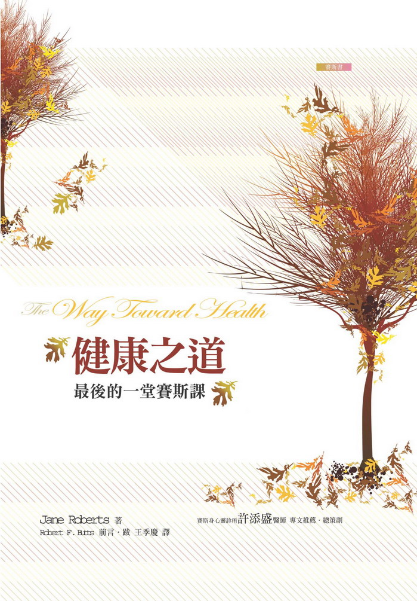

#### 版权信息

书名：健康之道——最后的一堂赛斯课

作者：［美］珍·罗伯兹（ Jane Roberts ）

译者：王季庆

请购买实体书籍·该电子版本仅供参考

## 推荐人的话：灵魂挑战的如实呈现

许添盛

《健康之道》是赛斯口授的最后一本“赛斯书”，其间贯串着鲁柏日益恶化的病情，终至结束了她最后一世的物质性轮回。

许多读者不解的是，赛斯有如此高的智慧、慈悲及神通，鲁柏又是一个——以佛教说法而言——开悟成道的人，为何鲁柏又会生病，且因病而死，难道这一切都禁不起考验，难道赛斯资料中看不中用吗？

有趣的是，我从来不会这样想，反之，鲁柏以她的勇气及坚毅，显现了赛斯资料的博大精深，既不哗众取宠，也不媚俗，而是如实呈现了自己的一生。就如鲁柏的先生——约瑟——提到的，很少人能真的了解到鲁柏如此深刻的灵魂挑战。

是的，我想我完全了解这句话。身为家医科（家医科：擅长处理民众常见的健康问题，及各式健康检查。）及精神科的专科医师，我想我对健康的了解已远超过一般人，但是，现代医学似乎一直停留在“物质的健康”，以为身体没病，或把身体的病医好了，就叫健康；甚至以为身体的健康才是根本，没有了身体的健康，哪来心理及心灵的健康？但这种观念根本是倒果为因，且不会有成功的一天。

物质并非宇宙的根本，相反的，物质的原子分子乃来自内在心灵能量的具体化。因此，物质是果，心灵才是因。同样的，身体的病痛也是如此，“医病”是永远医不好病的，徒然耗费金钱、时间及精力，只能控制症状，或暂时医好了，旋即复发。

身体病痛乃是“果”，真正的因是其背后痛苦扭曲的心理及心灵能量，如果大家不改变过去的思考模式，也就无法真正解决人类的病痛。

一味医病是没有用的，因为物质是果，身体是果，病痛也是果，一个完全的医生一定要学会医人、医心，真正了解所谓的“身心动力学”，了悟到所有肉体疾病背后扭曲的心灵能量为何？

在思想、情绪及生活层面重新恢复平衡，在果的层面的身体自然会回归健康之道。

现代的医学走向比较像“疾病之道”，我希望大家远离疾病之道，而真正回归内在身心灵平衡的“健康之道”。

推荐人简介：许添盛，曾任台北巿立仁爱医院家庭医学科专科医师、台北巿立疗养院成人精神科医师，现任台北县立医院身心科主任、中华新时代协会理事长兼心灵谘商师。曾为联合报心灵版、中国时报家庭版及大成报心灵推手版专栏作家。著有《绝处逢生》、《你可以不生病》、《许医师安心处方》、《用心医病》、《许医师谘商现场》、《绝处逢生之旅》、《许医师抗忧郁处方》、《在孩子心里飞翔》、《我不只是我：迈向内在的朝圣之旅》及《身心灵健康的 2 堂必修课》等书，并出版有《身心灵健康生活处方》讲座有声书及影音光碟。

## 译序：温柔的疼惜

王季庆

终于，校对完了赛斯——珍的最后一本书，心中真是百味杂陈，一言难尽啊！

也许与许多读者不尽相同，读赛斯对我而言，一向不仅止于感受到知性与理性上的震撼，却同时是一种深度的情感经验。而这本详细描述珍卧病在床，直到濒临死亡时，赛斯不气馁地，一再给她教导、鼓舞、爱与支持，展现出“生命”本身的睿智和慈悲，更令我每读之不能自已！

常常，我是衔着泪的，而，到后来，有时我会掩卷而泣。

但，也不能说我纯粹是在哀悼珍，没错，我为她心疼、不舍，也为她的英年早逝带给人类的损失而痛惜。但，内心深处，我感受最深的，是赛斯表现出的“一切万有”，我们内心的神、我们的存有，对活在世上的他的儿女，无穷无尽的关怀和挚爱！所以，同时我心中又有极大的喜悦和感动！

多年来，我与许多身心受创的朋友“心灵对谈”，不得不注意到，大多数人都有不尽幸福的童年。并非父母欠缺善意，却往往因自身并未受到足够的爱与肯定，又受到所有种种传下来的负面信念的荼毒，习焉而不察。无论是言教或身教的结果，都使子女也得不到喜悦生活所需的爱与肯定，造成或深或浅的“拖累症”（co-dependencd）及相关的“强迫”思想和行为。这些案例，好比镜子一般，也照见了疗愈者本身的痛处和不足。这在身心方面造成的病痛，是相当不容易治愈的。赛斯在本书第二章及第五章特别针对儿童天生的自发性、爱游戏、信任、乐观和蓬勃生气着墨不少，使我悟到，我们这些成人，唯有真正接受了赛斯给我们提示的真理，改变消极却自以为浪漫的人生观，人生才会豁然开朗。让我们一同利用本书二月一日赛斯教珍的“新方式”，重新活过来。

赛斯说，健康之道是自然的、最容易的做事方式。所有的自然都是在“未来是受到保证”的前提下合作的，自然的每一处都充满了许诺，不仅是存活的许诺，却是美丽与成就的许诺。也就是说，除了可以安全地存活，我们更有信心可以免除恐惧，可以创造喜悦，可以欣赏自然之美、人情之美、艺术之美、文化之美、真理之美……

赛斯书的深奥、浩瀚和难懂，是他的书迷都深深知道的。最后的《健康之道》却是最浅显易懂的一本。因为，他已不再多谈宇宙的真理真相，而聚焦在人活在世上应抱持的心态：信（心）、（希）望和爱，有点与《神奇之道》呼应，却更“个人”、更亲密、更充满了感情。

他将戕贼世人心理的、被许多人视为“真理”的错误负面信念，明明白白地讲出来，而那些谬误信念，正是造成这世界为“苦海”的信念！

他这样苦口婆心地向珍保证生命的安全，自发性的自然。许多根深蒂固、被我们死抓着不放的负面信念，好像已成了我们的精神性基因，为害之烈，令人发指！但，我们世人还正以为那才是人世间的真相！“悲天悯人”被奉为美德。但，悲的不该是天或自然的无情，而应是深深了悟，我们个别和集体地，由“信念”创造出那样的实相。“一切万有”将自己化身为无数的人灵，哪儿出了错，导致人自以为活在“五浊恶世”中而无法翻身？“悲天”是错误的，是“天”悲怜他儿女的迷失！而借赛斯——珍之口，令我们觉悟：受苦是不必要的！我们是生命的儿女，理应活在“信望爱”中，喜悦地游戏。

赛斯在三月十九日的课中说：每个个人，只是活着，就以任何别人都不能的方式与宇宙及宇宙的目的切合……以人类的说法，每个人都是被挚爱的个人，以无限的关怀和爱所形成，被赠与了与任何人都不同的天赋……内在自我从宇宙性的意识汲取即刻而持续的支持，而外在自我越将这事实谨记在心，它自己的稳定、安全与自尊感越强……对好的健康不利的一个态度就是：自我谴责，或不喜欢自己。

除非我们不看报、不看电视，否则，我们每天都被连绵不绝的悲剧弄得焦虑不已，难怪社会上忧郁症如此的普遍。但赛斯却说：世界所有的问题也都代表伟大的挑战……世界需要每只手和每只眼，并为爱和关怀的表达大声疾呼……贡献自己给这样一个理想，远比以悲哀的眼睛和悲悼的声音不断地哀悼全球问题值得赞许。

在第十一章里，赛斯并很实际地教给我们几个简单的练习来改变这一切。

我读此书时，不停地划线，不停地赞叹，希望将这些至理名言铭刻于心。但，不能再摘录了，否则要录下整本书！

我们何其幸运，有这么多的爱与智慧借赛斯——珍而传达下来，使我们有机会，可能在有生之年了悟到这一切！

不过，连珍都痛苦地死去，赛斯所能做的、一切疗愈者所能做的，都只是给予提醒、爱和支持。你要如何创造你的人生，还是由你的自由意志抉择的！

但，别忘了，赛斯说，只要你一息尚存，都为时不晚。当下就是威力之点，只要你能以正面信念取代负面信念，重新相信生命，重新燃起希望，信赖你天生即有的蓬勃生气、源源不绝的能量，便可以按照此书中教你的，重新来过，唤起你生命的喜悦！

珍最后这本美丽而深情的遗作，真像是所谓的“刺鸟”。据说，当刺鸟的心被荆棘刺透，临死时唱的那首歌，才是最美的歌！

以此书，献给我尝试温柔疼惜的自己，及温柔疼惜的你——每个人。

不！期待有一天，我能说“I do.”，而非“I'll try.”。

## 前言

《健康之道》不只是有关我太太，珍•罗勃兹，十三年前在纽约州艾尔默拉医院里住院——及死亡——的记事。我长久以来一直想看到它的出版，心中感觉且知道它还可提供多得多的别的东西。不仅是关于珍在出神状态或离体状态，为赛斯——一位称他自己为“能量人格元素”的“人”——发言的优秀能力，并且也关于在一个人生过程中能够且的确会升起的所有庞大的复杂挑战。

我学到，我们的生命并不只简单地由“生”到“死”，直接而顺遂的进行。反之，我看到每个人都旅行在一条最古怪的岔出或迂曲的道路上，那是以我们既有知——及我现在很确定——又不知的方式深具创意的一条路。

啊，那么，挑战就在——了解我们与生俱来的创造力。我们可以试着去锻炼生命，使它随俗或听话，但每个生命都有其自己的生命。多幸运哪！我太太的生命与作品显示，我们甚至在出生前便能创造挑战和目标，然后在物质生命中，当我们穿上肉体、衣衫及信念时，一头钻进去实践完成那些特质。然而，在我们创造出来的那些挑战里，我们能遭逢到什么了不起的、意料之外的盘旋哪！即便如此，我想我们最终，不管是在有意识或是无意识的层次——或两者皆有——都会了解到，一路上一边在学的同时，我们仍全然是我们自己。

在那医院里，珍某些方面是相当无助的。待了一年九个月之后，珍于一九八四年九月五日星期三凌晨两点八分逝世。自从一九八二年二月以来，她已经是第三次住院了。自她死后，许多人都写信来，既表示悼念，并且也问：“为什么？”她有赛斯，不是吗——她为赛斯说法二十一年之久；她同时也与他一起写了六本书（加上她“自己的”几本）。为什么赛斯没打开适当的神通之锁的神奇钥匙，而救珍脱离难局？当她去世时，才五十五岁。她很可能再活上，比如说，二十年，而甚至贡献更多给我们对赛斯及她自己的知识。如果要选择成名的话，她很可以变得名闻全球的。

珍、赛斯和我对这类问题所得到的答案就在这本书里。珍首先是一个人，其次才是非常有禀赋的通灵者。多年来赛斯的确帮助过她许多许多次。除此之外，珍和我学到，宇宙里还存在着大半未透露的知识及感受之庞大领域。若更能深入接上和汲取自那些神奇的迷宫，甚至会更好些，但我们已尽所能。我很确定，赛斯仍在帮助我太太。他们现在已合而为一了，并且广义地说，也遇到了他们在“过去”、“现在”与“未来”认识的许多人。由于某些梦，我相信甚至我自己存有（赛斯称之约瑟）的一部分也参与了进去。嗯，为什么不呢，既然赛斯描写实相说，每样事物都“同时”存在？我知道，那是得很费力才能理解，有时甚至自相矛盾的复杂观念和问题——即使在这世俗实相里也够我们忙一辈子了。

那么，我想，这本书显示出，健康之道可能并且真的有很大的变数。以某种顽固且深植于心灵的方式，我们每个人都得做出自己的选择，就如人类一向所为。珍的人生显然展示了此点，并且是以当我们四十二年前结婚之时，我俩在意识上都鲜少知觉的方式展示出来。

当珍住院二十一个月的期间，珍、赛斯和我对于她的身心状态都说过不少话，而我往往是在压力非常大的状况下尽我所能、以自创的速记法记录下来的。在所有那段时间里，只有一回，由于一场厉害的大风雪，我没有像每天例行的陪我太太六到八小时。她于四月里入院之后，有好几个礼拜我不知道珍会不会再做任何的“通灵”工作了，但三个月后，她令我惊讶地开始了一连串对话，类似她曾为心理学家及哲学家威廉•詹姆士及画家保罗•塞尚制作过的“世界观”资料。

她再一次的被我有关艺术及相关知识的问题激发了灵感。当她开始新方案时，她说：“至少我觉得我在做一些自己天生该做的事。”她在一九八三年九月讲完了它，然后，在接下来的四个月里，口授了一连串大半是短短的、个人性的赛斯课，共有七十一节。她在一九八四年一月二日结束了那个系列——第二天便开始《健康之道》。

在这整个期间，我们并未明确地告诉医院里任何人我们在做什么——医院职员接受我们一般性的解释，我们是作家，“只是在写作”。全都进行得很顺——纵使记录上显示着，我们常常被打断。不过，无可避免的，展示在此的《健康之道》，其中必有许多的节略——并非赛斯资料，而是节略了珍和我写的东西。我欠了安柏•亚伦出版社的老板珍妮•米尔很多情，她给我相当多的帮助。我们看得出来，如果每一节课的所有周边资料都包括进去的话，这本书会非常长。

（举例来说，我有不少我认为会增益赛斯资料之观念的个人经验和洞见。）但该省略什么？何时该停？这对我而言造成了一个难局。

当珍在一九六三年开始口授赛斯资料时，我对我们将会流传下来的记录非常的自觉——不是与赛斯，却是与我们私生活有关的部分。其一不可避免地会增益另一，增加了两者的奇妙复杂性。很久以前我便开始相信，没有一样事物是存在于孤立中的；节略掉某些记录显然会留下空隙。难说是个原创性的概念，不过我却看到，那是在我们日常生活的表面活动里常常被忽略的一个概念。如果我们对自身物质及非物质生活的其他层面赋予更多注意，不论它们是“何时”发生，都可能对我们大有助益。

但我们如何能够——任何人如何能够——带更多与生倶有的知识到意识上而加以利用？举例来说，怎么才能变得更深刻觉知我们的梦的事实及涵义，以及它们加诸我们生活的极重大影响？我们的梦往往是进入其他实相的门。然而我知道，我们正越来越深入心灵；珍与赛斯的共同作品，还有她的诗及其他作品，都提示出这一点。我们心灵的伟大禀赋全都在那儿，等着……

罗勃•兹于纽约州，艾尔默拉

一九九七年九月

## 第一部：进退两难

## 第一章：本书的目的，以及关于蓬勃生气和健康的一些重要评论

### 一九八四年 一月三日

星期二 下午四点五十分

（今晨十时，我由邮差那儿收到一个快递包裹——《个人与群体事件的本质》法文译稿。我们其他的书也正在翻译中。

（我离家去邮局，并且将珍的打字机拿去清洁。所以今天下午我晚了二十分钟才到达珍的三三〇号病房。今天比较暖和——华氏三十二度。

（我太太由水疗部回来晚了些——医疗人员非常忙碌。餐盘也送晚了，但珍午餐吃得很好。

（三点十五分。珍开始阅读昨天的课——她读得非常好，甚至比昨天还好。她在三点三十五分看完。“如果你的眼睛继续进步，”我说，“也许你总有一天会配戴度数较低的眼镜。”她显然对那想法感到惊讶，可是，有何不可呢？我的视力在几年前便曾改进过。

（三点四十分。我替珍剪了手指甲和脚指甲。这件工作比以前容易些——并且真的，当我在剪她右手指甲时，她叠起来的手指松开了不少。我告诉她这是另一个改进。

（四点一分。一位名叫蓓蒂的新护士来测珍所有的血压、体温等。当珍正享用一块糖和一支香烟时，我在处理读者来信。我以为她会放弃上课，时间已这么晚了，但最后当到了替她转成侧卧时，她决定口授短短的一节。）

现在：我再一次向你们道午安。

（“赛斯，午安。”）

我将讲短短的一段。

我要你们明白（停顿），关于（医药）保险的情况的新发展是为你们的好处而发生的。

（“哦，好吧。”）

补充一点∶当你能够的时候，轻柔的按摩鲁柏脚趾顶端、指甲边的地方，或许稍稍往下到第一关节处，会有助于增进身体的整个循环。之前，他还无法反应。这只需要花一点点时间。

一如以往，课的形式设定它自己加速的疗愈架构。

按照我讲述时的那些节奏，我也许会也许不会回来，但要知道我就在此，并且你可以接近我。

（“嗯，如果你想再多说一点的话，我们有时间。”

（停顿。）我只略做几个评论。如你所知，或曾怀疑过的，我的确在加入书的口授——按照现况以我们自己的歩调。应该相当容易认出那些部分——

（“是的。”）

——而鲁柏将很容易做到那点，如果任何时候你对知道一个部分何时开始、另一部分何时结束有困难的话。

（“没有问题。对于书名你有任何想法吗？或者你想要再考虑一下？”）

我稍晚会给你那资料，连带其他的导言。

（“好吧。”）

（“哦，是我。”珍说。

（四点五十六分。珍说当她说出由赛斯来的最后一句时，她马上想到本书的书名会是《健康之道》。她并不真的是由赛斯那儿拣到书名，它就这样来到她脑海中了。我告诉她，她的声明令我想起，先前，在我相当确定赛斯是在做书的口授之后，我也起过好几次同样的念头。

（在查对之后，我证实了我原先的猜测，她在《未知的实相》卷一，第一次替《健康之道》写了一篇大纲。那本书是在一九七七年出版的。见附录七。

（“本节的第一行是很有娱乐性的，”我说，并且念赛斯有关保险事宜的声明给她听。由于并没预期他今天会作评论，我为此曾觉得惊讶。

（“我一说我将上一节课，那想法马上进入了我的脑海，”珍说。“我知道它是来自赛斯。”在课开始之前，她没有时间跟我提及。

（一个注：在我收集的《时代》杂志里，我会有现成的细节——但今天发生了一件大事：透过杰西•杰克逊牧师拜访叙利亚总统阿萨德，美国飞行员被释放了。这是杰克逊这方的一个伟大的道德和政治成就，尤其是在雷根总统不要他赴叙利亚之后。

（更重要的是，至少在表面上，阿萨德那方想与西方世界达成一次对话的努力——我想是个相当未被预期的发展。当我与珍讨论今天的事件，并在电视上看到它们时，我想到，它们可能至少是，赛斯在一九八三年十二月二十八日的那节里，所谈到的来年那些非常有益的世界大事开始的一个讯号。珍不知道，而我也不立刻跳到任何结论去。不过，赛斯曾提到：“许多国家改变了他们的盟国。”叙利亚现在是与苏俄结盟。我告诉珍，跟随其发展会很有趣哦。）

### 一九八四年 一月四日

星期三 下午三点五十四分

（在昨天的课里，赛斯说：“关于保险的情况的新发展是为你们的好处而发生的。”就今晨我们的律师告诉我，他与医院、医生和蓝十字（BlueCross，译注：美国非常大的健保公司）谈判的结果而言，看来赛斯到现在为止都是对的。

（我们在谈天时，珍吃了一顿好午餐。当我在回信时，她开始读昨天的课，并且再次的表现良好，一如平常地以她的左手握住纸。她说，昨夜她有一段短短的忧郁，心中暗忖她是否还会走出医院、走上街，不过，她借由对自己说“撤掉”、并且记起赛斯的资料而将自己拉了出来。

（她也想到赛斯新书里的一章，名为“食物与你”——然后发现她自己忧虑会在书中说错什么而误导了人们——老习惯的更多信号。“但是，”她说，“我告诉自己要信任自己和赛斯，而我说，去它的。”

（“你一定要如此，”我说。“我们再也无法做别的了。将“信任”两字铭刻在心。”

（护士量了珍的体温：华氏九十八点八度。“我的天，”我开玩笑说，“那几乎是完美的嘛。”

（珍等人帮她测血压和体温等烦了，所以便开始上课。）

现在：我祝你们再有一个美好的下午。

活下去的意志可能被怀疑、恐惧与合理化所损及。

举例来说，有些人明明想要活下去，虽然同时他们又试图躲开生命。显而易见地，这导致他们的冲突。这种人会阻碍他们自己的动作和进步，他们变得过分关心自己的安全。如果我的任意一个读者有这种感觉，他们甚至可能对自己隐藏这些感受。他们将集中注意力在他们自己的国家或世界的其他部分、社会里的所有危险上，直到他们自己被吓到的、对安全的整体忧虑，仿佛成了对他们无法控制之状况的一个十分自然、合理的反应。

（停顿。）这实际上涉及了一种偏执狂，它可能变成一种如此强而有力的反应，以至于接掌了一个人的生活，并且渲染了所有的计划。如果这发生在我任何的读者身上，你可以在种种不同的局面中认出自己来。你可能是个“生存主义者”（survivalist），设立好仓库和给养以备核子灾难之用；你可能觉得，保护自己和家人免于灾难是十分正当的。不过，在许多这种例子里，人们对来自外界的危险事件如此担心，其实是对他们自己能量的本质担心，害怕它可能会毁掉他们。

（四点三分。）

换言之，他们不信任自己生命的能量。他们不信任自己身体的自然机能，也不接受这机能为一项生命的礼物。他们反倒在每一点质疑——甚至有时摒住呼吸，等待着某件事会出差错。

其他人也许真的阻碍了身体本该会动的那些部位，因此他们跛行，或收紧他们的肌肉，或以别的方式妨碍他们的身体，以致结果是，对动作需要有个谨慎、迟疑的接近方式。有些人可能甚至会给自己招来严重的意外，在其中他们牺牲了他们部分的身体以维持住一种——

（四点七分。护士进来量珍的血压。珍要一些冰的姜汁汽水。她说她做得很好——显而易见的——然后又说，当她为赛斯说一个句子时，她也感觉到其他要来的句子，或围绕着说出的句子的那些句子。“就像是，纵使我说的是最底下的句子，像一幢房子最底下的一块碑，我也知道在房子顶端的那些。”

（我念这小注给她听，她同意那是她刚才说的话的一个正确版本。“几乎像是即刻感受到一座新的高大结构物，只不过是由字组成。”

（在拿到了姜汁汽水后，我念她到此为止口授的课给她听，然后确定三三〇病房的门已尽可能关好。在四点十七分继续。）

——假的安全感。

这些相当自欺的感觉并非深深隐藏在潜意识里，像你们可能假设的那样。在大多数例子里，它们反倒包含了于某一个时间点、在相当表面的层次上做的、十分有意识的决定。

（在四点十九分停顿良久。）

它们并没被忘掉，但所涉及的人们只不过对那些决定，可以说，闭上了眼睛而假装它们并不存在，只不过是要使他们的生活显得平顺，来保全自己的面子——当他们非常明白那些决定其实的确是依据非常不稳的基础时。

我并不希望简化事情，但这种决定在儿童里是非常容易被发现的。一个小孩可能摔一跤而严重的擦破了膝盖——如此地严重以致结果他至少暂时的变跛了。这样一个小孩往往对此事的理由相当清楚明白：他可能公开承认，那个受伤的部分是他有意选择的，以便他可以错过学校里他害怕的一个测验，而那个孩子很可能这样想：为了产生他想要的结果，受伤只是个小小的代价而已。

同样状况下，一位成人可能变得受了伤，以避免在办公室里一件他害怕的事——但那成人很可能对这样一个反应感到羞耻，因此骗过自己，以便保全他的自尊心。不过，在这种例子里，成人们会觉得自己是那些他们少有或没有掌控力的事件的受害者。

（四点二十七分。）

如果同类的事件频繁发生，他们对世界及日常事件的恐惧会增长，一直到它变得颇不合理为止。不过，在大多数这种例子里，那些内在决定仍能很容易的被够到——但当人们下决心要“保全面子”时，他们将根本拒绝接受那些是他们自己的决定。人们决意（will）要活、要行动或不行动。到一个很大的程度，他们决定自己的人生事件——不论他们是否愿意对自己承认这个——而且他们决定要死。

（四点三十二分。）

评论。

当然，所有这些都适用于鲁柏的情况——的确，至少有一次他决意要自己无法动弹，愿意牺牲某种动作以便安全地利用别种的心理动作，因为他害怕他自动自发的天性，或他自发性的自己。

鲁柏怕它会按照它自己的理由去行动，那可能不是鲁柏自己的——或他以为如此。现在他开始了解，他的能量是他生命的礼物——要被表达，而非抑制——并且再次的了解，自发性知道它自己的秩序。

他刚刚告诉你，当他开始为我说话时，他感受到字句的一整个高大结构，而他毫不犹豫的让那结构成形（热切地）。就他行动和走路的能力而言也是一样的；他越信任他的能量，他的自发性便越形成其本身的美好秩序，结果就是行走的自发性身体艺术——而他的确相当有进展。那变化已在他头脑里开始了，而它们将在身体上表现出来。

在你们的语言里，决定（will）这个字指涉未来——如在“它将发生”这样一句话里，并且也指涉心智做决定的特质，这并非巧合。

我也许会也许不会回来，再次的，按照我说的那些节奏——但我在此，并且是可以接近的。

（“赛斯，谢谢你。”

（四点三十九分。“嗯，那是你近来最长的一节哦，”我说。珍同意。她啜饮姜汁汽水，并且在我念本节的其余部分给她听时，她抽了一根香烟。这节非常好。

（“当你在念的时候，我不想打断你，”珍说，“但我开始得到他对一大堆事情将要说的话——他将谈到癫痫，说它是你害怕自己的力量，而将之短路的一个结果。次人格也是一样，因此你可以将你的行为怪在别的东西上。”

（“我还得到，他将说，以一般的说法，我们无法进入我们在任一时刻得到的所有资讯，因为在意识上太难去加以整理、分类——但我们真的是对它有意识的，而为了实际的目的，只好假装我们并不知觉。他以前说过的——我们自己所谓无意识的部分，在其本身是十分有意识的。”

（七点十分。在与珍一起做了我们一向做的祈祷之后，我离开了珍，去艾尔默拉南区的 ACME 超巿买东西。在九点四十五分吃完晚餐。

（我想加注的是：今天的赛斯资料有一些令我回想起珍“有罪的自己”的资料。恐怕在本书是不可避免的，至少有些时候……）

### 一九八四年 一月五日

星期四 下午四点二十五分

（今晨我打好昨天的课的字，直到十点三十分之后，才有空去写《梦、进化与价值完成》。我也做了些安排，以便申报我们一九八三年的税。它进行得很顺，但我忘了时间——而当我下午到达三三〇号病房时，我的腿在抽筋。我告诉珍。

（天气暖和——超过了华氏三十六度。车道上的冰正在融化。昨晚和今晨我已放了岩盐在冰上（译注：有助于化冰）。

（珍说今天下午她等做水疗等了很久。她抽筋了多次。她怕她的导尿管昨天已够松了，那她今晚必须要更换。她在水疗室短短地见到她的医师。

（有位护士助手（nurse aides）趁空来访。她曾受过伤，当她跌倒而扭到或拉到腿里的钢钉时，她又复发了。现在医生预告她将有很长的一段复原期。当她跟我们聊天时，珍和我很快便注意到她医师给过她的负面暗示。她也告诉我们，另一位护士将因背部扭痛而至少请假一个礼拜，显然是她在试图抬起一位病人时受的伤。这使我们对于在医院里工作有所好奇——仿佛每个人迟早都会得病。

（珍午餐吃得很好，然后在三点五分开始阅读昨天的课。她做得相当不错，虽然没有昨天那么好，最后在三点三十四分看完那六页稿子。不过，她左手拿稿纸拿得没问题。她说她的视力变化相当大，而她必须用力才能阅读。当我给她点眼药时，看到她两眼通红。

（三点四十五分。我读了一批近来的课给珍听。她告诉我她昨晚的一个梦，栩栩如生，涉及她在走路，她在一条街的中央时，穿上新的衣服，离开医院，走过街进入一家“五分一角商店”，还有在她的头发里放进美丽的发饰。我说那是个非常好的梦，再次的为走路的动作建好舞台。她同意了，我回了一些信。

（四点至四点十一分。一位护士来测珍的生命迹象——体温九十八点五。当所有一切都弄好而安静下来——除了邻房病人卡莉娜在大声叫喊——珍说她想要上一节短课。）

现在：我祝你们另一个美好的下午。

（“赛斯，午安。”）

患癫痫的人往往害怕他们自己的能量。

他们不信任它，也不信任自己之自发部分。他们害怕不去理它的话，自己的能量可能向外攻击他人，所以他们利用能量的短路，产生暂时令自己无助的癫痫发作。

具有所谓次人格的那些人，也害怕自己的能量。他们将之分割，以至于它看来仿佛属于（停顿良久）不同的人格，所以被有效地分割了。基本来说，在这种例子里并不存在真的“失忆”，虽然看起来像是。所涉及的人一直都十分觉知他们的活动，但他们以一种不连续的方式行事——即是说，主人格似乎并不以连续的方式行事，却是破碎的，或再次的，仿佛是分割开的。这个心理上的手法，灵巧地阻止了所谓的主人格在任何一刻去利用它所有的能量。

（停顿良久）有关的这个人假装自己对另一人格的存在或活动没有记忆。不过，这些人格积蓄起他们的能量，因此一个人格往往展现出爆炸性的行为，或做出仿佛与主人格的愿望相反的某些决定。以这方式（停顿）可能展示不同种类的行为，而虽则看来仿佛是：许多决定是自己的一部分在自己的另一部分毫不知情的情况下做的，实情往往并非如此。事实上，主人格有能力表现许多种不同的可能行为，但整个人格却被阻止而不能以其完整的能量或力量来行事。反之，能量被转入其他的管道。

自己的所有部分的确都是有意识的，而基本上他们也觉知到彼此——虽然为了实用的目的，他们可能看起来是分开或孤立的。

（在四点三十七分停顿。）

评论。

念昨天课里专谈他的状况的那些部分给鲁柏听，念好几天——或至少当可能的时候。

我也许会也许不会回来，再次的，按照我说的那些节奏，但要知我在此，并且是可以接近的。

（“好的。谢谢你。”

（四点四十分。我告诉珍我以为她会讲长一些，但她说她常觉得，如果她真的讲长些，我就再也不会打好字了。“我注意到，在七点左右你会开始紧张，”她说。没错，到那时我会焦躁不安且开始疲倦，但我永远可以网开一面啊。“如果你必须打长一些的课，你便不会对《梦、进化与价值完成》进行任何事。”她补充道。也许是真的。

（我也想到要常常再念昨天的绝佳课文给她听，作为一种提醒。）

### 一九八四年 一月六日

星期五 下午四点二十二分

（再次的，今天很暖和——当我离家赴三三〇房时，大约三十八度。

（珍没有问题，虽然她说她在水疗之前后又等了很久。事情有些紊乱，或许是太忙碌了。珍因水疗的状况而心情不佳，等了半天、新的人员抬她起来而不知如何做，等等。我自己也见到两位新护士或护士助手。有一位在她自己的治疗后，也来探视珍一会儿——珍说，她看来不太好。我自己的理论是，在那儿工作的人，不久之后也会对工作生厌，然后为了得到有薪给的休息或休假而生病。

（不过，珍午餐吃得很好——虽然她有些痉挛。我告诉她，我的抓痒自昨天起已减轻相当多了。我在回答她有关医院的新闻时说：“只有一个答案。”她说：“我知道，那也是我试着想做到的。”我补充说，那是甩掉那地方所有基本负面性的唯一方法。有时我好奇，珍对那一点为什么没有更深刻的认识，而令她的身体自愈得更快些，以便我们可以出去。

（三点十六分。珍开始读昨天的课，做得相当的好——比昨天好。她在三点二十五分读完，当我在回信的时候。三点三十六分时，一位新护士进来量她的体温——华氏九十八度二。三点五十分，另一位护士量了她的血压。

（珍在一九八二年十一月十日上了一节课之后，到一九八三年十月九日，十一个月之后，才上了下一节。同时，她在一九八三年四月二十日入了院。现在，从四点开始，我念给她听——自从她在十月里恢复上课以来一些课的部分内容。在其中有许多有意思的观点，而我不想断掉那条线。珍的确说了她想要上一节课。我们对她身体近来的缺乏任何大的动作感到奇怪。）

现在：我再次祝你们午安。

（“赛斯，午安。”）

在我们自己的书里，“有罪的自己”的概念将不会占主要地位，但我们一定会深谈被形形色色宗教所抱持的许多对人不利的观念——一定会使许多人感觉自己的确有罪，而非被祝福的一些观点。

自己的确是被祝福的，而光是提醒人们那个事实，便常能去除负面的信念，尤其是，如果它们不是太根深蒂固的话。

至于讲到鲁柏的动作，身体是跟随着它自己的节奏的，它有时一方面涉及明显：被人注意到的运动和活动，同时另一方面，它可以说是在“内在运动”，为其他稍后的运动和动作预做所有的准备。举例来说，当鲁柏喂他自己时，纵使为时甚短，也像是很突然似的，但那外在的进步跟随着许多内在的操纵，是直到那时为止，并未以那特殊方式连结起来的。

（在四点二十七分停顿。）读读这一序列先前的某些课，也会提醒你俩，自从那些课开始（一九八三年十月九日）以来发生的进步，因而邀请来甚至更新的进步。

我也许会也许不会回来，再次的，按照我说的那些节奏，但要知我的确在此，并且是可以接近的。

（“好的。”

（四点二十九分。我读此节给珍听。我们认为，赛斯对有罪的自己的评论，是来自我今天早些时念我去年十月对赛斯的问题给珍听，关于在珍的挑战里，有罪的自己可能扮演的角色。

（四点四十五分。我想要运动珍的右腿，当她仍仰躺着的时候，如赛斯建议我每天该做的，但她决定等我替她翻了身再说。我也用“欧蕾”油按摩她的足趾，如赛斯提到过的。右腿动得很好。珍说，摸足趾令她的腿有感觉，一直上到大腿，如赛斯说的那样。

（我在结束了给珍的“去催眠”按摩之后，在五点十五分渐渐地飘入午睡时，记起昨晚的梦。睡醒之后，我形容给珍听，并且说我之前就想这样做了，以便如果赛斯想评论的话，即可评论。我做了彩色的梦，梦见珍重新弄断了她右腿同一处好几次。也涉及了保险的争吵。我闷闷的醒过来，最后必须从椅子上起来，服些小苏打，以安抚我的胃。在那之后我睡得很好。

（几分钟之后，珍说，那梦可能与护士助手自己受损的腿上的伤有关——我在近来的一节里，描写过在内部打了铁钉的那条腿。也可能涉及医生对她的负面暗示。

（然后，珍告诉我她昨晚也有一个负面的梦。她见过的一位妇人脸上生癌，在服用“干扰素”（Interferon）来治疗。那女人告诉珍，珍有与她同类的脸部皮肤——附带着所有其负面的暗示。

（听起来几乎像是，珍和我有着前后并列的忧虑性的梦。我们同意它们代表我们这边的恐惧——并非真实或预知性的。）

### 一九八四年 一月七日

星期六 下午四点十一分

（今天较冷，当我离家去三三〇病房时是二十八度。今晨我整理税和《梦、进化与价值完成》一个小时。没人打电话来。我曾想象珍在十一点左右，水疗之后回到病房，但当我到了那儿时，她说她直到近午才回来。在我抵达之前她刚被换上新的绷带，并且翻了身。不过她午餐吃得很好，并且像是没什么问题似的。

（两点四十五分。我开始处理信件，而珍开始读昨天的课。她迅速看过——这一阵以来最好的一次——而在两点五十五分结束。真的很棒。

（三点。丹娜进来倒空珍的尿袋，或如每个人称作的弗雷（Foley）。尚恩在三点二十分量了她的体温——九十八点五；三点四十五分，琳给珍点眼药。

（在所有这活动之间，当我们有安静的独处片刻时，我跟珍提及昨晚想到的一个问题；我说，希望赛斯可能谈谈它。问题是由昨天的课的笔记里，我的一句话撩起的，意思是说，有时我奇怪珍的身体——尤其是她的身体意识，为什么不干脆“接管到一个更深刻的程度，而明令她的身体甚至更迅速地治愈它自己，以便我们能够出院”。我注意到，当她昨天大声念出那句话时，珍有一个情绪化的反应，而令我深思起来。

（那问题包含了许多暗示。“或许这样一件事甚至会发生在像这样的地方，”我说。“如果它从未发生过，那就表示身体意识永远屈从于人格之其他更宰制性的部分，身体意识甚至可能看见它自己的死亡在接近中，却对之束手无策……”

（我也提醒珍，我们想要赛斯谈谈前晚我们负面性的梦，我在昨天的课里描写过的。）

现在：我再次祝你们午安。

（“赛斯，也祝你午安。”）

身体意识，在其本身，是充满了活力、生气及创造性的。

身体之每一个最微细的部分都有意识，努力向自己的发展目标奋进，并且与身体所有其他部分沟通。

身体意识的确是独立的。到一个很大的程度，其本身的防卫机制保护它不受心智之负面信念侵害——至少到一个很大的范围——如我先前提到过的，几乎所有的人都通过一个所谓的生病状态回到健康状态，而对于这改变毫不知觉。在那些例子里，身体意识运作得不被负面的预期或观念所阻碍。

不过，当那些负面的思量增加时，可以说，当它们变硬时，那么它们的确开始减低身体的天生能力：治愈自己，以及维护那该将它保持在一个绝佳力量和活力的状况之整体而无价的组织。

也有些时候，不管一个人的恐惧和疑惑，身体意识本身却升了起来，在一种突然的胜利里，丢开了一种病况。不过，纵使在那时，所涉及的个人也已开始质疑这种负面的信念。此人也许不知道如何将它们扔开——即使他想要那样做。就在那些例子里，身体意识升起而摆脱掉它的桎梏。

然而，在具有自由意志之下，人不可能给身体意识完全而清楚的主权，因为那会否定很大部分的抉择，并且切断学习的一些面向。不过，身体意识本身的主要方向与征兆永远是朝向健康、表达及完成的。

细胞们，甚至身体更小的面向都在相互作用、沟通及合作，并且分享彼此的知识，因此身体的一个粒子知道在所有其他部分发生的事。故此，那令人惊异的组织通常是以一种平顺、自然的方式在运作。在你们社会里被认作负面的许多身体事件——好比说，某些病毒——反之本该作为自我改正的设计，正如发烧实际上是增进健康而非阻碍健康的。

（四点二十六分。）

身体意识之主要特征就是其自发性。（停顿良久。）这允许它以一种不可置信的速度运作，那是心智最顶级的有意识部分所无法处理的。它的运作乃由于一种几乎是瞬间的意识，在其间，知道的东西被知道了，而在知者与所知者之间，可说是没有距离的。

“看见”这动作，以及所有身体的感官，都依赖这内在的自发性。

（四点二十九分。）

评论。

你俩“负面性的”梦，都表现了剩余下来的怀疑和恐惧，以及，会发生任何事件之最糟的而非最好的结果的旧观念。鲁柏眼睛的运作，以及他视力的持续改变，指示了另外一种的进步，发生在循环系统及身体的其他部分。眼睛，知道他现在想阅读的意图，就阅读。理性并不需要告诉他如何去做。

以同样的方式，简单而温和地，让他跟他的腿说话，告诉它们他想再走路的意向。正常行走所涉及的行动会开始回来。它们现在就开始在回来（正当我想问赛斯的时候）。有些日子，他的眼睛不如在别的日子里那么容易看书，而在这些日子，它们只不过反映了一种不平顺——当它们在准备自己更进一步的时候。这同样也发生于身体的其他部分。

（在四点三十五分停顿。）在这特定的时候，以一种几乎是抽离的方式去想象他自己在走路，的确是个好法子。显然不要太过认真——却是轻松地做。

现在我也许会、也许不会回来，再次的，按照我说的那些节奏——但我在此，并且是可以接近的。

（“是的，好的。”

（四点三十六分。“是我，”珍说。在我帮她侧转身之前，她吸了根烟。我像赛斯近来建议的，按摩她的足趾，结果很好，接着，替她转身之后，我温和地前后动她的右腿，如赛斯建议的。断腿的膝盖事实上动得相当自由，我说——比左膝要好太多了。珍同意了。事实上，当她躺着时，她的左脚阻碍了她的右脚和腿。但这会过去的。

（珍吃了顿好晚餐，我在与她一起读了祷文后，于七点十分离开。好睡，甜心。）

### 一九八四年 一月九日

星期一 下午四点十七分

（昨天，一月八日星期日，没有上课。不过有好几件事，我想要摘录于下。

（首先，是我前一晚的梦，我跟珍描述了它——万一珍要上课而赛斯想要评论的话。我做了个彩色的梦，珍和我搬回宾州塞尔市——我的故乡——到波特太太在南艾尔默路三一七号的老公寓。不过，那地方比较宽敞，并且也带着纽约州艾尔默拉、西华特街四五八号的成分。我在大房间里走来走去，跟珍说，“看吧，这个地方根本不差呀。地段不错，在这儿我们可以有发展。”我们是在城里、被保护着，而看出窗子，我看见比实际存在那儿的更宽敞的院子。我喜欢靠近市中心的地段，珍也一样。艾尔默拉离塞尔巿只有十八里。

（其次：在五点三十分，我去三三〇房外的厕所。当我在那儿时，我懒散、短暂地想到我们的友人茉德•卡德威尔（Maude Cardwell），而两万美金这个数目忽然跳入我脑海。事实上，我已几乎忘记上周我写了一封信给她。我并没再尝试收到任何东西。我告诉珍，“我不知道两万美金是否代表我们将得到的所有捐款——基金——不论是否来自一个人，都是个更大事情的开始。”（注三）但我要她知道我的印象，万一将来发生什么的话。她即将吃晚餐。

（其三：在六点十分，当我开始喂珍时，我明确地想到史蒂夫和崔西•布鲁门索；那念头并非特别强烈。此地我也没在想他们——事实上，我还忘了那天是星期日，他们通常来访的日子。我突然知道他们将打电话到医院来。几秒钟之后，我听见走廊里高跟鞋的脚步声，走过转角，向三三〇房走来。一位我们不认识的妇人敲着门，然后进来告诉我们说，史蒂夫在线上，并且当晚想来看珍。珍说好的——八点之后。我告诉珍，我甚至没时间在那妇人来到之前告诉她我的印象——她可能是位接电话的志工。换句话说，当那妇人向我们走来，我听到她时，我收到了关于那通电话的事。我猜测，很可能她脚步的声音和节奏触发了我对史蒂夫来电的有意识觉察。

（我问珍，卡德威尔经验是否可谓证明了布鲁门索事件，或其反面，她说是的，既然它们发生的时间如此接近。请注意，钱的事完全绕过了保险金的问题。我根本没想到保险金的问题。

（珍今天过得不错，虽然在试图阅读昨天的课时，遭到一些困难。她也在左肘上包了块纱布，她不知怎地撞到了它——或许在水疗室——因而现在很酸痛。

（一月九日，星期一，今天早上没有干扰。我理税理了一小时。其他时间则在搞《梦、进化与价值完成》。我拿了一位家住纽约州北部的读者送给我们、在瑞士制作的圣诞铃到三三〇房里；结果它奏出非常动听的“平安夜”。送这铃的妇人，想要珍写信给西拉库斯赛斯团体的创办人；那位女士因癌症而病危。昨晚我给她俩都写了信。

（珍吃了顿好午餐。我告诉她，今早我很生气，因为我觉得赛斯资料没有——且不会——在我们社会里得到它应得的发言机会。我问道，如果这资料是人类内在与生俱有的，为什么它如此被忽视。“我不只是指近来，”我说，“却是指上千年。”我感觉人类仿佛故意或病态地选择去忽视它，或许为了历史上无可数计的理由。然而，如果它能有助于解决我们族类一些最大的问题，为什么不去利用它？珍没显出多少反应，只说了：“他们将会利用它。”

（如果今天我不在最佳状况，珍也不在。她承认她忧郁。她试着读先前的课，而在中途稍微休息一下之后，真的读完了，但并不轻松。一如平常，当她结束时比她开始时要来得好。

（四点五分。在护士测量过她的生命迹象之后——体温九十七点四度——珍说要上一节课。男护士罗勃量了她的血压，而在他能进行之前，必须停下来，重新调整她到一个更舒服的位置。

（今天珍的赛斯声音要有力得多。）

现在：我再次祝你们一个好……

（“赛斯午安。”）

蓬勃生气（exuberance）（停顿）及一种活力感到某程度是永远在场的。

有些人——

（四点十八分。一位注册过的护士黛安娜来看看珍的头发，她以为珍的头发已经剪过了。珍忘了告诉我，但楼下的某人今晨想剪珍的头发，但因珍要去水疗，时间表有冲突而没法剪。珍取消了约定。我念她刚才说的给她听。）

——不管环境怎么样，永远都觉察他们自己的喜悦。纵使当他们人生中的事件似乎不顺利时，他们也觉得安全且受到保护。不论他们自己的怀疑和忧虑，这种人觉得自己被支持，并且觉得每件事终归会对他们有利。可是，许多其他的人都失去了这种安全感——

（四点二十四分。我们很喜欢的一位注册护士，潘妮，临时进来说再见。“我快疯了”，她说了两次，说的是她今天在外科三房紧张的一天。她是珍和我多年前的旧识——住塞尔市的路克和洛伊丝•赫特——的朋友。经由潘妮安排的一通电话，我在新年假期前后与路克谈了话，随后洛伊丝写了封信，给了我们有关他们家庭、波特太太等的最近消息。我曾闲闲地和珍臆测，我们与波特一家的重新认识——洛伊丝是波特太太的继女——是否与我梦到我们搬回到塞尔巿波特家的公寓有关。）

——与富足，而看来仿佛像是，生活在喜悦中只是年轻人的一种属性。

蓬勃生气和喜悦，基本上与时间及年龄都毫不相关。它们在八十岁可以表达得与在八岁时一样的活泼与美丽。可是，就整个一大部分的人口来说，仿佛喜悦和健康是儿时短暂表达过的、稍纵即逝的属性，然后就永远失去了。

（在走廊里十分吵闹。潘妮离开了三三〇房，忘了关门。）

不过，有无可数计的方式可以重获生活的喜悦，而在如此做时（停顿良久），身体的健康可以被那些发现他们经验中缺乏健康的人重新寻获。

（在四点二十九分停顿良久。）生活品质是极为重要的，而到一个很大程度是依赖一种健康感和自信感。虽然这些属性是在身体上表达，它们也存在于心智里，而有一些笨重的精神信念可能会严重阻碍精神和身体的健康。

我们不会集中精神在这上面，不过的确会讨论它们，以便每一个人都能了解不好的信念与不好的健康之间的关系，因为，经由了解这些关联，个人能重新体验可能具有了不起的、形形色色的精神变数。举例来说，面对负面信念，没有一个人是无助的。他可以学会再一次的做选择，因而选择正面的观念，以致它们变得和负面信念一度产生的同样自然。

对于精神和身体健康的一个最大损害就是，相信任何不利的情况都必然会变得更糟而非更好的不幸信念。（停顿。）那个观念主张，任何疾病都会更糟、任何战事都会导致毁灭，任何与所有已知的危险都会被碰上，以及，基本上人类存在的最终结果是灭种。所有那些信念都阻碍了精神和身体的健康，腐蚀了个人的喜悦和自然的安全感，而强迫那人感觉像个外在事件的不幸受害者，那些事件是不顾他自己的意志或意图，就这么发生的。

（四点三十九分。）

评论。

我刚才提到的想法，在你们的社会里全都很显著，它们不时的会回来晦暗你们的喜悦和期望。

今天鲁柏体验到一个够小却仍够有力的那些概念的重演。当它们发生时，将其辨认出来是非常重要的。就目前来说，光是那辨认便往往能澄清你的思路和头脑。

（停顿良久。）你昨晚也有你自己的经验：你对朋友来电的预知，以及对于那钱的非正统（停顿）知识——而那两件事发生，是由于你的确想要有对心智能力的另一小小保证，不管常常包围着你们的、对心智的公认观念是怎么样的。

这种经验再次的让你尝到，对你自己更大能力和自由的感觉。告诉鲁柏要再次提醒他自己，他有自由去正常的移动和走路。

（“我可以问一个问题吗？”）

你可以。

（“你是说，至少到某个程度他仍觉得他没有自由去动和走路。最近我自己也好几次这样想。”）

我说的是，到种种不同的程度，那些观念有时仍会回来，应该很明显的是，这发生得越来越少了。也提醒他要记得，他并没有任何特定的疾病。如果人标示出众多身体健康的层次，而非借由给予负面观念名字和标示而显其尊荣，社会会好得多。

现在，我也许会也许不会回来，再次的，按照我说的那些节奏，但要知我在此，并且是可以接近的。

我们很快即将结束第一章了。将个人资料由书的口授分开，应该是一件很简单的事。

（“是，没问题。”

（四点四十八分。“嗯，”珍叹了一口气说，“我很高兴我上了一节课。”

（“哦，”我开玩笑说，“至少今天你做了些有用的事。”她吸了一根香烟。晚餐盘来了。当我们之前在聊天时，我将她翻转到左侧，我说，我感觉她仍不觉得有全然的自由去走路，有些东西——一些信念，或一套信念——仍拉住了她，不让她前进。我已觉察到自己这份感受好一阵子了，而有时曾想到要提出来，我也不想要太过夸张。

（“嗯，不管它是什么，”珍带着一些绝望说，“我必须克服它……”

（当珍吃晚餐时，我告诉她在我心头已有一阵子的另一个问题，并且请赛斯来评论：我们的情况——我俩对它都有责任——是相当极端的一个。也就是说，似乎我们能以较不夸张的方式、较少具损害性的极端行为，达到同样的结果。我们为什么必须做得这么过火？我一直对此感到好奇。我承认，一个人总是可以说，借着不做得那么过火，无法达到同样的结果，但是，我告诉珍，如果一个人顺着那条线去推理，到其逻辑性的结论，结果是会死人的——那个状态会是任何形式的行为的最终极端。

（一直到我准备离开三三〇房的时候，我才发现没请赛斯评论我昨晚的梦——涉及我们回到赛尔的波特公寓房子。看来我们将有不少问题等着问“你知道是谁”。

（当我走出去开车时，天下着雪，不过，不像昨晚那么大，我开车回家时，相当的小心。

（当我在十点后写完此节时，珍在护士卡拉的帮助下打电话来。）

### 一九八四年 一月十日

星期二 四点三十分

（我在一九八五年五月二十三日打这节课的字。我的朋友黛比•哈利斯在替耶鲁大学图书馆做副本时，在第三十九号笔记本里发现了原稿。显然因为我那么忙，我将笔记放在一边等第二天再打字，然后就忘了。我对它仿佛有个朦胧的记忆。我想那是我第一回那样漏打一节课。

（多奇怪呀——我在这儿，从我的笔记打另一节课的字，当我以为我那部分的人生已过去了的时候——以为我再也没有另一节课好打字了。我希望还有更多的课可打字。珍已去世两百五十九天了。

（这资料是珍和我在昨天和今天看一个里欧那•宁莫主演名叫“追寻——”（Insearchof）的老节目重演之后来到的。我记不得那节目了。在我原始的笔记里，我加注道，今天“课的资料是十分出乎意料的”。

（这资料显然是珍从她三三〇房的病床上给的。）

现在：我再次祝你们午安。

（“赛斯午安。”）

几个评论。

在所有生命的类别里——由昆虫往上——有许多许多人还未发现的物种。

有各式各样人类还没遭遇或认出的病毒种类，还有仍不为人知的病毒与其他活的物种之间的联系。的确有很像你们人类的两种不同的直立行走的哺乳动物，但却大得多，并且有无限地更敏锐的感官。他们真是令人惊异的敏捷生物，只要任何你们人类出现在邻近地区——站在，比如说，至少几里之远处——光是借由气味他们便会觉知。蔬菜类是主要食物，虽然往往佐以昆虫，那是被视为一种珍馐的。

就彼而言，他们发明出许多精巧的昆虫陷阱，因而可以捕获上百的昆虫，既然昆虫是如此之小，所以需要许多昆虫。这些陷阱通常是筑在树上、在树干里，因着这样一种方式，以至于树胶本身被用来捕捉昆虫。陷阱看起来像是树本身的一部分，以便保护它们。

这些生物的确有记忆，但他们的记忆极迅速地运作——一种几乎瞬间的推论，当感官资料被证释时便一同到来；也就是说，几乎立刻或同时地收到和诠释。

（在四点四十分停顿。）一直到你们所认为早已过了生育的年龄之后，他们才会生育后代。不然的话，过程是一样的。除了一些区域性的变化之外，这些生物住在你们星球上的许多区域里，尽管他们总共的人口很小——也许一起算来有几千个。他们很少大批的聚居，却真的有家庭及部落似的组织，而在任何一区最多只有十二个成年人。当儿女增加时，团体便再次分裂，因为他们很明白，数目大的话，他们就容易被发现。

他们全都会用这种或那种的工具，并且的确与动物密切的和睦相处。举例来说，他们和动物之间并没有竞争，且基本上是没有攻击性的——虽然，如果他们被逼入死角，或他们的孩子受到攻击，他们可能具有极端危险性。

在冬季非常冷的气候里，他们变得十分迟钝，体温下降，正如冬眠动物的特性一样，只不过他们的体温对每日的变化比较敏感，因此，在某些冬日他们很能搜寻食物，同时另一方面也可能甚至一次冬眠几周之久。

（四点四十六分。）

他们对大自然及自然现象有深刻的了解。语言并没有多大发展，因为他们感官的平常配备是如此纯粹和敏捷，以至于其本身几乎变成一种语言，而并不需要任何的铺陈细节。那些感官拥有自己的变化，因此，没有任何像“现在”或“那时”的字眼，那些生物能十分正确地知道附近有多少活的生物，它们在那儿有多久了（停顿）——而他们对时间的体验是以这样一种方式追随着季节，以致他们对世界形成了一个无语的、相当正确的画面，包括航行的方向。

我提到这资料是由于你们今天看到的节目，也因为我知道你们的兴趣。

与 Prentice-Hall 出版公司的新关系应该运作得很好。现在你被认为相当值得尊敬（停顿），因为在那出版机构之内，你已历经了这么多的改变还存活着。

你有关回到塞尔的梦，以及较宽敞的环境，也表示，正如你现在改变过去以及未来，因此你已改变了过去：你以一种更扩展的方式去看它，以致它变得较不狭窄局促。然后，以某种说法，从那新的过去、新的现在和未来浮现出——一个令人着迷的现象。应该是非凡的现象。

现在，我也许会也许不会回来，按照你已开始熟悉的那些理由。但要知我在此，并且是可接近的。

（“赛斯，非常谢谢你。”

（四点五十五分。“我该告诉你，”当我替她点了根烟，珍说，“当那节目一演完，我立刻知道他将提到‘雪人’。但我以为可能只有几句话——我没预期他讲那么多。”我则没有任何预期。那电视节目在三点结束。珍也说她“看见”，或记得，那昆虫陷阱看来像什么样子，但她无法画出来。她说她并不想误导我，但昆虫被陷在那陷阱里的样子令她想起蜘蛛网。

（五点。“别担心——我并不会继续上课，但如赛斯说过的，你总是回去，由现在——你明白，你的焦点——改变过去。我知道他接下去要说什么……”我说欢迎她继续上课。

（我必须请珍重复她所说的话，因为隔壁房间的俄国病人，卡琳娜，在走廊里大声喊叫，一个下午都没停，相当令人分神。她还没停。在课结束后，拿餐盘来的女孩没有关门，而卡琳娜听来更大声了。

（在一九八四年一月十一日补充：我们想更多地由现在改变过去。今天珍和我对赛斯说的是什么有点意见不同（我认为）。她似乎认为，当她十来岁与达伦神父在那旅馆房间里时，他绕着床追她的实际插曲已被改变，而我却认为赛斯意指，原始事件仍维持不变，但她对发生了什么的心理理解已改变了很多。此处有个差别。就我所知，珍并没在她记忆里创造一个那事件不存在、甚至从未发生的实相。

（在一月十一日星期三的短课里，赛斯并未提到这点，而我也忘了去问他。）

### 一九八四年 一月十一日

星期三 下午四点二十三分

（我还没打昨天讲萨斯科奇人（Sasquatch）的课的字。我必须铲车道上的积雪——差不多四寸——因为雪下了快一整天，而我不想今天外头一团糟。昨晚珍托卡拉打电话给我，她说黛比•哈利斯也去看她了。黛比的确是个真朋友。

（昨天的课主要讲的是萨斯科奇人现象，我猜是被“追寻”那节目挑起的，而我很可能哪天早上抽些写《梦、进化与价值完成》的时间去做完它。现在那有点复杂，因为每天早晨我已由写《梦、进化与价值完成》的时间里抽时间去搞一九八三年的税了。但我们会做到的。

（今天早上（以及昨晚当我回家的时候）暖气炉发出如此大的噪音，以致我打了电话给修暖气管的工人来检查一下。我替他留下车房门不上锁，因而他能在下午我不在家的时候进房子来。奇迹啊奇迹——今晚当暖气开启时，炉子是如此的安静，令我不敢相信。它一向是有些噪音的，但近来变得糟得多。

（昨晚，我在邮件中发现卡洛•史戴那（Carol Steiner）论赛斯资料的博士论文，那是她在十一月答应给我的。我们知道，一年前她为她的哲学博士学位写这论文。这相当有趣，但如我告诉珍的，它令我忆起，从头开始来提出对赛斯资料的解释是多么重大的一件任务。以我们的观点，我想我们觉得没说出来的仿佛比说出来的还要多呢——但在这种例子里可能永远是这样的吧。卡洛想出版她的作品，跟我们要一份柏兹——罗伯兹（译注：即罗与珍的姓）的传记——我想我们也许会放弃的事。我将写信给我们的出版社——Prentice-Hall。

（珍吃了份好午餐。她试着重读一月九日的课，但有点困难。她的视力不断改变；有时可以看得很好。赛斯曾提及这眼肌的适应。珍大半的时候有问题，试图在别人测她生命迹象的空隙阅读，而最后她放弃了。我们忘了问卡拉，我太太的体温是多少。我努力试想回信，但做得并不好。在我们能做完任何事之前，时间仿佛就没有了。

（我的确提醒了珍，赛斯在昨天的课里没有回答我在她午餐时提到的问题——就症候的严重性等等而言，我们的行为为何如此的走极端？珍今天下午想上一节课。）

现在：我再次祝你们午安。

（赛斯午安。）

我有以下的评论。

你们的情况可被称为极端——但真正的极端要不幸得多了。举例来说，在世界许多其他部分，人们忍受极端的贫穷，阻碍所有各种成长——精神和身体上——并导致早死的那种贫穷，或是极端的疾病：在其中，儿童出生在没有生活所需的所有功能之下——所以也会早死。或是另一种极端，当整个家族遭逢那种模式的悲剧，因而全部的成员同时死亡。

当然，这种例子是有原因的。我只不过想要你们知道，许多非常严重的极端都存在着，相形之下，会使你们的生活看似非常好似的。既然你俩都有如此的心智活力，并在此生有个健康有活力的历史，那个历史便能为鲁柏利用，如果他，举例来说，忆起自己在画廊的台阶跑上跑下的时候，他的心和身两者必须认识那些动作的有效性，以便不会有相反的资料去阻挡住它。

在脑海里练习，看到他自己精力充沛地清扫四五八公寓（我们曾住的西华特街公寓）或在坡居（我们现在住的）的房间，也能被极为有力的利用。

现在，我也许会也许不会回来，再次的，按照那些我所说的节奏——但要知我在此，并且是可被接近的。

（好的。

（四点三十分。珍觉得好一些。我告诉她，赛斯并没有谈及我们关于他昨天上课资料的问题，有关从现在改变过去，他也没评论卡洛谈赛斯资料的博士论文。当然，我把它拿给珍看了，但她还没能读它。

（在一月九日的小注里，我说我仍然觉得有些东西将珍拉住，使她不觉得有自由去行走，虽然我们已有了这么大的进步。赛斯在昨天（十号）的课里没有提及此点，而现在我问珍她对那问题有没有任何洞见。我连自己对不对都没把握。

（当珍说她将问题想了一遍，而有些东西要告诉我时，我正在收拾我的东西准备离开。结果她说，由于她右腿断了而觉得无法自由走路。

（然后她透露，她越来越担心，为什么她的右腿看起来比左腿短这么多。纵使她真的伸直右腿，也仿佛不可能用它来走路似的。我们聊了一会儿。我恐怕这对话并没令她觉得舒服些。我已知道了一阵子，关于右腿为什么看来要短些，是存在着一个问题的。“但是，”我说，“我们不该那样想。我们应该有信心，身体知道它在做什么，并会以不论所需要的何种方式弄好那条腿。”当然，珍同意了，但我能看出她是相当难过的。

（我说她也许必须获得一个医学上的意见，但我觉得，如果他们明天要给那腿照 X 光，她会说不的。我非常想看到那腿开始放松，至少伸直到一个程度。我极为担心她将右腿如此缩进而抵住她的小腹所涉及的压力。如我说过的，我仍不真的明白身体为何必须如此做。纵使骨头由于长期的压力而变弱了，以她改进了的胃口和态度，到现在那个危险期至少该有所减轻了。没有更多骨头在裂了。

（珍，简言之，在你的复原里，右腿显然扮演了一个中心角色——不只是身体上的角色，也在关于整件事的信念之改变上事关重要。当我开车回家时，我想，真的很讽刺，如果断腿成为最后、最终的推动力，清掉我们的心灵其最后老旧、损害性的信念，以使新的合成终于能发生：身体能治愈它自己……

（今晚珍十点十分在卡拉的帮助下打了电话来，刚好在我快打好这节时。她说她仍然不觉得好了很多。我试着给她——和我自己打气。）

### 一九八四年 一月十二日

星期四 下午四点二分

（今天非常冷——中午只有十二度。我在银行停了一下，来为“蓝十字”及我们医院的老账单买一张支票和一张汇票。当我到三三〇房时，珍告诉我她的梦，那是昨晚我走后不久她梦到的。

（在梦中她在一个没有水的浴缸里，跟她看不见的妈妈说话。接下去有一个她完全无法忆起的“非常性感的”插曲。然后她站在一个房间里，将头发放下来。她认为这意味着，当她继续学习时，象征性地“放下她的头发来”。

（今天早上珍“忧郁又紧张”，但自己化解开来。她午餐吃得不错。我打好了昨天的课，而她试了几次去读它却没成功——甚至在我给她点了眼药之后，她今天就是做不到。最后我读那节给她听，在三点三十三分结束。

（后来，当我们在谈话时，珍同意照照镜子，我在三三〇房里准备了镜子已好几个月了。最初她很害怕，但结果不错——她好好地面对了自己，只喉头屏息了一会儿。我俩同意的重点是在，照镜子意味少了一项得处理的重要麻烦；她隐蔽自己的部分少了许多。

（我们抹上了口红，以她细致的皮肤和缺乏大多数同龄的人会有的皱纹，她看来非常好。她五十四岁。我告诉她，她看来出奇的好。她的头发看来也不错——卷曲而活泼。我说如果它染过，如她一向做的，看来会很好，跟她的老样子一样。我也建议她每天至少短短地照照镜子，很快地便完全没什么难了。她也许甚至会期待看见自己继续的进步呢。

（珍又试着读那节，但很快便放弃了。我说道，如果她今天上课，我希望会谈谈我昨晚离开之前我们谈到的事——她的右腿，及相关的挑战。我也想要赛斯评论我为昨天的课所写的最后一段。我认为我在那儿有个好点子，而珍也同意。她也要我带来一支眉笔，以便她可以和口红一齐用。

（最后，珍等人来测她的生命迹象等累了，而决定开始上课。

（卡琳娜在转角那边走廊里大声叫唤，而且自从我到了那儿就一直没停过。）

现在，我再次祝你们有个美好的下午。

（“赛斯，午安。”

（停顿良久。）一直保持好心情可能要舒服得多——但在鲁柏的情况，相当不常有的忧郁期的确是在疗愈性地运作，以便她能借由眼泪表达那些感受，因而免得身体借额外的症状去表达同样的感受。

（有人从门口问：“莎伦在这儿吗？”

（“没有。”我说。珍停留在出神状态。）

换言之，有相当的孤绝感受之一些残渍——这些借这种表达发泄了出来，故而解放了身体去做进一步的改进。他（如赛斯有时称呼珍的，因着她的男性存有的名字鲁柏），举例来说，以一定的速度进歩，而由于怀疑及恐惧，遭遇到一些阻碍。随后这些被释放而借由眼泪或一个被承认的忧郁期表达出来。那么，系统便再净化了，而清出更多进步的路来。

在过去，身体本身受到压抑（非常重要的一点），以“低档”运作，而现在显然不是如此了。当然，每一次忧郁的期间要更短些，系统更快地净化，而新的进歩也以一种更快的速度显示出来。

（在四点十分停顿良久。）现在，这至少是旧怀疑和恐惧的一种自然抛除，却是以这样的方式，以至于它们被认出来，然后放下了。

（停顿良久。）眼睛状况的变化显出在发生的那种循环：可以说，进步的上缘继续着，因此很明显，每一个新的进歩都比前一个要更好。但同时，视力有许多的变化、不平衡，而有时相当的模糊。那些改变的确仿佛很神秘。鲁柏并未一直在看他自己的眼睛——因而那神秘不知怎地被视为理所当然。首先，他对眼睛的运作非常不了解，也没花功夫或试想去弄明白这种进步该有的先后次序，或它们该如何发生。

不过，右腿却是明摆在他眼前的——非常容易看见，因此他常常将其位置与另一条腿比较，而不看好它。这必会导致他去考量那些仿佛挡着路的阻碍。身体能疗愈那条腿，就与它能疗愈眼睛一样容易，也与它能疗愈褥疮一样容易。

目前，最好别集中注意力在那腿上，以及，为了要使“行走”发生，它终究必得做些什么，对他会大有帮助；如果他偶尔想象，他的行走会发生得像他的念头来来去去那么轻易而自然，并且以他视力运作的同样神秘方式，当它突然较清晰了，而他阅读得快得多时——快速阅读很快的就会是他的正常状态了。

今天他照了镜子，的确是很大的进步——一个非常重要的议题，还有你建议他每天短短的这样做——且微笑（觉得有趣的），也是一样重要。

它显示出，鲁柏已准备好面对他自己，至少愿意仁慈的看自己。当然，口红是个绝佳的点子，还有眉笔，因此他开始像以前一样在乎他的脸。听来或许显得很怪，但脸上的表情正确地反映出内在的自我形象。即使当他并不想微笑时，一个笑容也会建立他的自我形象，并影响整个的身体状况。

鲁柏已经被治愈过与断腿一样复杂的状况。

我也许会也许不会回来，再次的，按照我说的那些节奏，但要知我就在此，并且是可以接近的。

（“赛斯，谢谢你。”

（“我能问个问题吗？”

可以。

（“你对我们昨天的讨论，关于由现在改变过去，有什么要说的吗？”我觉得赛斯一定会同意珍对他说的话的版本，而非我的版本。

（四点二十五分。）

那非常难解释，因为，实际上发生的事，有时与仿佛发生了的事是如此的直接相反。你不只就改变，或扩大你关于过去的想法或信念——你还替自己，有时也替别人改变了过去事件的本身。如果你记住，不管表面看来如何，所有的事件基本上都是主观的，或许对你有帮助。它们的“客观性”在某种焦点上发生，而当——

（四点二十七分。一位新护士进来给珍量体温——九十八度三。卡琳娜在整节课间都在大叫——叫得那么厉害，以致有时我几乎听不到赛斯在说什么了。

（一会儿后，尚恩•彼得逊进来打招呼。我做错了一件事：我问她，她先生好不好，因为昨天我便想到要问，却没问。尚恩开始没完没了的讲她丈夫近来的问题。昨天他俩在塞尔的医院待了一天。虽然她毫无恶意，但她说的话反映出珍和我已预期在医院这背景会有的、关于疾病的所有负面信念。在尚恩离开后，我念给珍听从四点二十五分起的资料。）

——焦点改变，事件也随之改变。

（四点四十四分。虽然珍说她还可得到更多资料，本节到此为止。到了替她翻身的时间。由于我很期待一些由现在改变过去的好资料，这情况多少会令我有挫折感，我不想那个问题被忘许。

（最后珍说，也许明天再多谈一下那个问题。卡琳娜今天下午真的很烦人，而她仍在叫唤，她的声音粗哑而减弱了很多。我告诉珍，我认为她听来像是正在重新活回她的儿时。职员们多次试图令她镇静下来，却没用。珍说他们的行为使她难过，因为提醒了她，住院的初期，当她自己有恐慌的感觉时，人们试著令她镇定的情形。现在，当珍告诉我她的感受之后，她对自己说“撤掉”。）

### 一九八四年 一月十三日

星期五 下午三点三十七分

（珍今天午餐后照了镜子——她一连两天这样做了。她估计，这是一年多以来这类事件的第一桩。它们也有其幽默的一面，因为今天她只略略看了一下自己的影像，后来告诉我说她的头发是白的。她头髪并不白。在我到三三〇房不久，递给她镜子之后，她明显地松了一口气说：“嗯，我放下那个了。”我也给了她口红，她没困难地涂上口红。

（今天二十二度，比较暖了些，上午我准备了保险和医院的费用。今天卡琳娜安静多了——到现在为止。我说，如果赛斯对她有些评论也不错。

（珍午餐吃得很好。一位护士助手带给我们一张正常菜单的副本，而非珍一直在用的软食物菜单，我们发现两者之间的差异其实也没那么大。

（两点三十五分。珍开始读昨天的课，显然比她昨天做得好。我在某些地方带了她一下。两点五十分，她读到第三页时，停下来吸烟。然后她告诉我她的梦。在第一部分里，她在一面镜子里看见自己试戴粉红色的珠子，看看它配不配她穿的衬衫——其颜色不清楚。在第二部分里，她仰躺在床上，此时她的右臀不知怎么动了，然后在她的视线里，两条腿变得一样长了。她不知道她做了什么。我说，听起来像是，梦境在给她有关疗愈和动作的资讯。腿的资料尤其重要。

（三点二十分。珍大声的念完了那一节，并且做得很好，尤其是快到结尾的地方。我回信，同时她在课开始前再吸了一支烟。她决定了不等人们来测她的生命迹象。当她问我能否分开她个人的东西和赛斯写书的资料，我说那很容易——我根本不担心。

（“你知道为什么吗？”我问她。“因为当你回家时，你将做所有关于书的工作，所以开始准备吧。我一直知道你将会写那本书。如果你想要的话，我可以写篇序，你也可以，或那个谁也可以——但你却是那个写书的人。”

（我小小的演说令她谈起了书及相关的事，而她很快便感觉赛斯在身边了。事实上，她先弄熄了她的香烟。）

现在我再次祝你们午安。

（“赛斯午安。”）

关于我们对时间的讨论。

宇宙的创造本质是如此的了不起，以致其真正的广袤超越了大多数人的理解。其意涵是惊人的——因此那事是几乎不可能去解释的。

过去，以及过去的每个片刻，从现在的运作点是经常被改变的。以你们的说法，现在变成过去，而那又从“最近的——现在”——你可以在那两个词之间加一短线，使其意义更清楚——的每个可思考到的点再被改变。然而在所有这庞大无朋、持续的创造过程中，永远有一种个人的持续感：你永不会真正的失落在一个片刻和下一个之间的距离里——

（三点四十三分。一位护士在她回家的路上突然出现来告诉我们，乔治亚•塞西刚刚入了院——“在走廊那端，三〇七室。”自从我太太在一九八三年四月住进医院以来，我们就认识了乔治亚，珍偏爱的护士。

（“每次我们谈到这个题目，就有某事发生，”我说。我读给珍听她至今所讲的，“清楚吗？”

（“是的，”她说。在三点四十六分继续。）

以多少相同的方式，在你周围的物体也持续不断的动。原子和分子们永远在动，而以一种说法，电子是那动作的指挥。

你自己的焦点是如此精确而细致地调准了，以至于，纵使物体一直在活动，它们看起来却是坚实的。

就是如此。且说，物体也是事件，而或许那是了解它们最容易的方式，它们非常仰赖你自己主观的焦点。让那焦点摇晃那么一瞬，整个纸牌屋便会塌了下来——可以这样说。

记住你们既是物体，也是事件，而作为肉身，你们的器官同时是由原子及分子组合成的，再次的，其动态是被电子所指挥的。

（在三点五十二分停顿良久。）电子们本身有它们自己的主观性生命。所以，它们也是主观的事件，所以，在你的身体及你周围的物体里的电子之间，永远有个相互关系。再次的，无论如何，主观的持续性本身永不摇摆，在于它永远是它感知的世界之一部分，因此，以那种说法，你和世界彼此创造。

当你由最近的——现在的每一点改变过去时，你也在最微观的层面上改变事件。所以，你的意图也有一个电子实相。几乎像是你的思想敲击某个巨大电脑的键盘，因为你的思想的确有个力量。新的一句：正如句子是由字组合的，可以说出来的句子数量却是无穷尽的——所以“时间”是由一个无尽种类的电子语言组合成的，它说出的不是字句，反倒能“说出”一百万个世界。

现在我也许会也许不会回来，按照我说话的那些节奏。但要知我在此，并且是可接近的。

（“我可以问一个问题吗？”）

你可以。

（“可不可以谈谈卡琳娜？”今天下午在上课期间，我听到那位俄国淑女发出几次声音。）

休息一下。

（四点。珍抽了一支烟。“他的意思是他会回来，”她说。“我认为讲时间的那段棒极了。当你在做的时候，有些什么东西存在着，那是当你事后读它、当你在它外面时你所没有的。而当你在做它时，你是在它内的。”

（“你的意思是你感觉到它，”我说，而她同意了。我常常想，我们目前的理论要解释在我们周遭的东西，或夜空里我们所看见的，是多么的不足啊。

（四点五分至四点十分。琳进来测珍所有的生命迹象。体温九十八度。我们谈到卡琳娜，在房间之间的浴室另一边的房间里。琳认为卡琳娜是迷惑不清的，虽然有些医生不这么想。我们猜测为什么卡琳娜除了俄语外从未学会任何其他的语言。琳说医院甚至有一张俄文的单子，但卡琳娜对它们的回应并不够——可能它们的发音太不正确了。

（在琳离开后，我告诉珍，如果她喜欢的话，可以继续讲谈时间的资料。在四点二十一分继续。）

日期只不过是应用在日子上的命名而已。

人类没用这种命名而过活的时期，比用它们的时期长得多了。动物们没有这种命名，仍然知道它们在星球本身上的位置，并且它们还觉察到地球和行星的潮汐和动态。

（停顿良久。）卡琳娜有那同类的取向。在她生命的这一点，她实际上已拒绝集中注意力在语言上。语言是会将她与世界的细节绑得更紧的东西。（停顿良久，许多停顿之一。）她的确“回到过去”，重新将它改造成她更喜欢的样子。她最近的——现在开始显现出恶化的征兆。她想要一个关闭点，从那儿再建造其他的实相，所以，并不是最近的——现在在恶化，不如说她正故意让她的注意力游荡，而容许最近的——现在的力量和活力削减。当然她将建造一个新的形象，从那儿运作。

现在我也许会也许不会回来，但再次的，要知我在此，并且是可接近的。（带着幽默。）

（“非常谢谢你。”

（四点三十二分。珍吸了一支烟。昨天是卡琳娜很不好的一天——事实上，就我们所知，最糟的一天。整个下午，她都稳定地大声喊出无法听懂的字句，直到最后，到晚餐时分她的声音开始低落嘶裂。这令人不止有轻微的不安。有时候我暗忖她是否在走下坡，因为在过去几周我不记得她曾如此稳定的大叫。我认为，她之将自己驱策到声音粗哑为止，是个与她可能很快便将离开世界之最近——或最后的对抗……）

### 一九八四年 一月十四日

星期六 下午四点三十一分

（今天天气暖和——三十三度——而冰和雪都在融化。今天早上我在准备我们一九八三年所得税的最后版本，并将于星期一早上将它们寄给我们的会计师。我将珍的眉笔带到三三〇房给她。

（三点十五分。珍在涂上口红后，照了镜子。她甚至露出微笑——“既然我该微笑”——而做得很好。我用眉笔替她眉毛描深一些，她看来很好。

（三点二十五分。我走到走廊另一端三〇七房去看乔治亚，但她睡着了。今午经过时，我瞄了她病房一下：她的床是空的，虽然有两个人坐在房里聊天。

（三点三十二分。珍抽完烟，而我整理信件。

（三点四十五分。珍开始读昨天的课而一开始做得非常好。她读得非常快。她被来测她生命迹象的人打断——体温九十七点三度。到三点五十七分。她回到课文上——但现在她的步调没有那么快而稳了。她说她的眼睛在变化。

（四点二分。珍停止阅读。她几乎看不清课文。过了一会儿，她继续时断时续地阅读。所有这些变化都是个绝佳的展示——关于赛斯所说她的眼睛在改变的方式——她的眼睛正上移到一个视力改进的新水平。

（四点七分。珍休息一下，吸了一根烟。她在四点十几分继续，而读完了该节，在结尾时读得比较好些。

（四点二十五分。现在她告诉我，令天稍早时她如何想象自己去安非•格兰（Enfield Glen）（注四）玩。她说她想象自己在公园及池塘周边散步和爬坡，做得很好——但随后，她变得忧郁起来，想着在她能做这些事之前，还必须经历的所有一切。“所以，要做所有那些玩意儿而不让自己滑落过边缘，真是难极了呢！”她说。我说滑落过边缘也没关系，如果你觉知正在发生什么，而采取步骤，不让自己被它带得失落在忧郁的情绪里。没有人是完美的，我们甚至也不需要完美。

（卡琳娜今天大半时间很安静，虽然有时候会出声。我认为，珍的“赛斯之声”比平常要更强大且正面，有时相当的加强语气。）

现在，我再次祝你们午安。

（“赛斯午安。”）

——我只现身短短一会儿，为的是加速那些对于疗愈能量的进行如此有益的“坐标”。

鲁柏的精神性练习做得非常好——不比寻常的好，除了几项例外，当他的确让自怜紧抓不放时。集中注意力在他真心喜欢的那些人生乐趣上，是极端重要的。吃好的食物，以及再度的体验阅读之乐、创意思维的喜悦、朋友之乐等等，因为那些利益随之将增加不止一百倍。

所有必要的进歩，的确都是发生在他的精神和身体经验内形形色色的活动层次上。像他一直那样遵循下去，将真的能自己站起来，带着一些信心走路。不过，他必须对这一点有信心——而，再次的，不去担心它如何会发生。

意识心能指挥身体的活动（停顿良久），但单单身体意识就能做出那些带来生命和动力的活动。

我也许会也许不会回来，按照我说话的那些节奏，但再次的，要知我在此，并且是可以接近的。

（“谢谢你。”

（四点三十七分。我告诉珍这小小一课非常的棒，它的确是的。我认为它包含了非常正面和充满希望的资料——不知为什么，它真的恰中目标。珍也很欢喜，而我在晚餐后又重读给她听。

（当我们在用餐时，电话响了。是约翰•本巴罗，我们坡居对面的邻居。他邀我与他的女儿莉莎共进一个晚餐。现在我在八点十五分打完这一节，准备过皮那可（丘顶）路去赴约了。珍，好好睡。我爱你。）

### 一九八四年 一月十五日

星期日 下午四点四十一分

（昨晚非常的寒冷，而当我今午离家去三三〇房时，仍然只有十八度。今早我完成了我们一九八三年所得税的最后申报。其余时间我用在做《梦、进化与价值完成》上。不过，当我刚回去做一个方案时，中断令我感觉自己离所想做的好遥远。

（珍说乔治亚•塞西今晨来看她，并且借走了另一包香烟。今晨一位名叫盖伊的护士洗了珍的头发；我告诉我太太她头发很好看。不过，珍照了镜子而并不同意，不过她倒是承认她的头发并不白，却是灰白色的。在涂上口红后，珍做了对着镜子微笑的动作。今早更早时，盖伊以眉笔加深了她的眉毛。

（午餐后，珍告诉我今天凌晨约三点半时，她被安装了一个新的静脉注射留置管，没有困难。但在本楼层的新护士在照顾她时好几次将它拉松后，她需要一个新的。今天上午没有水疗。

（昨晚，靠卡拉的帮助，珍两次试图打电话给我，但我直到大约午夜时才从约翰的家里回来。我们有顿美味的晚餐。我在三点左右心怀忧虑的醒来，而在回去床上之前起来了约一小时。“摆锤”（pendulum）告诉我，我在为耽搁了写《梦、进化与价值完成》而心烦。

（两点五十分。珍开始读昨天的课，做得相当好。她在一个良好的阅读后，三点五分读完。当我试图专注在邮件上时，她吸了一支烟，但我做得不好。我有点困。

（从四点到四点七分。人们来测她的生命迹象——体温九十九度，有点高，但珍觉得没问题。我正开始想她不会上课了，她却告诉我拿纸笔来。）

现在：我再次祝你们午安。

（“赛斯，也祝你午安。”）

我再一次的短暂显示自己，为的是启动那些在疗癒过程里如此重要的“坐标”。

叫鲁柏告诉他的手臂和腿，它们是完全可以伸直、伸展和弯曲，并用它们正常移动能力的，是个极佳的主意。那暗示是非常有价值的，而他用得很好。他的双手的确开始加速进步了——尤其是右手，因此手指开始伸直了。

眼睛动作的快速改变显示出，同样在身体所有其他部分发生的肌肉动作和反应的快速性。

他若能一次或两次回忆起丛林健身房（Jungle gym，在纽约州的韦斯特，我弟弟比尔和他的家人住在那儿），以及记起他第一次身体站不稳的时候；会是个好主意。如果他能，随之叫他想象自己不蹣跚，却继续运动。那样的话，他也在修复过去。不过，如果他难以做到这练习就算了，却继续给他“安全”的暗示。

我也许会也许不会回来，再次的，按照我说话的那些节奏——但要知我在此，并且是可以接近的。

（“好的。谢谢你。”

（四点四十七分。今天下午稍早，珍给我看她右手蜷曲的手指如何真的松弛了一些。我曾替她的两只手指关节抹上（Remedy Rescue Cream）。我也注意到有一阵子了，她左手的手腕和手背发生了改变。今晚当我在晚餐前替她翻身时，她的右臂手肘移动得相当自由而放松，右膝也变得越来越好了。所以这无价的改变继续在发生。

（与她一同念祈祷文之后，我于七点七分离开珍。在我出去的路上，我对三〇七房里的乔治亚挥手。她有访客，所以我没停留。

（我俩都立刻记起在韦伯斯特湖边公园里的丛林健身房，那么多年以前我们在那儿第一次注意到珍身体动作中的蹒跚。不过，今天，当赛斯提起它时，珍仿佛并不难过，所以也许现在我们能将那记忆好好地加以积极利用了。）

### 一九八四年 一月十六日

星期一 下午四点二十三分

（昨夜非常冷，今晨六点半时，仍然是零下五度。我今天中午离家去三三〇房时，气温才不过十度。我打好一封给律师的信，与我们的税有关，在中午寄出了。我后来告诉珍，我需要有关由茉德•卡德威尔接受赠款的资料。我猜想这种款项是要上税的，所以为合法避免因重税而损失太多款项，珍和我需要律师告诉我们该如何做。我说，可能我们永远看不到那笔钱，茉德•卡德威尔也许必须为我们付账之类。无论如何，我想捐款者可以申报减免额。

（珍吃了个好午餐。之后她描述了一连串昨晚我离开她后她有的“经验”。它们大约发生在八点十五分、职员进来替她翻身侧卧之前。很难描写她所告诉我的，并且会用掉很多字句和许多时间。她说：“我希望我自己能写出来。”我想，她在有些经验中是形形色色不同的意识转变状态，而在其他的经验中，则是处于做梦状态。

（一开始，珍发现自己是个小女孩，在她长大的撒拉托加温泉市圣克莱门天主教堂及学校对街游戏场的秋千上。“我向下看而看到我穿着黑鞋白袜，像小孩穿的那样，像我在有些老照片里的样子。”在这儿有一刻她认为自己只有四岁大。她说，她知道自己在游戏场时正在做那些事。

（然后她发现自己在一浴缸温水里，而她充满了性感的肉欲感受，尤其是在阴部。“我突然悟到我正在幻想那水等等，我事实上是在医院病床上。然后我想，无论如何，我在这儿可以有只小猫。我们有两个房间，而罗可以将小猫藏起来，并且也将猫的砂盆藏起来——我不知道他怎么做到的。”

（接着，珍说她正试着在我们艾默拉的坡居里找到一个收音机和录音机，因此，可以借给住在北边离我们车程一小时的苏•华京斯。当她在搜寻时，突然发现许多小洞，塞满了小小的珠宝和装饰品，她知道全是她的，且很高兴知道这一点。“然后，其余的时间我都在搞录音机。”她发现自己在某个像货车车厢的东西里，而它也是在一个播放录音带的机器的底盘内。在这底盘里，珍和苏上上下下并绕着美丽的、珠宝般的绿山丘走。“真迷人极了。”然后珍看到她自己巨大的面孔像东升旭日般地朝下看在眼里一切——珠宝的颜色、苏和她自己，以及载具。

（在那经验当中，珍并没真的看到赛斯——她只知道苏在那儿跟她说话。然后那段旅程“变得远较不清晰”，而她正在试着想出要借给苏什么。她记不起来。

（三点十分。我清洁了珍的眼镜。她涂上口红，然后看入我替她拿着的镜子。她甚至自己自动要这样做。她笑了——短短地。我笑出来，告诉她，她的行为令我想起今晨我们的猫，当天这么冷时：比利和咪子俩才刚由厨房的窗子走出到野餐桌上，便马上转身跳回屋子里来。我怀疑我太太是否认为这个比较很幽默。

（三点三十八分。珍试图读昨天的课，却有很多的困难。她在一阵阵视力清晰的瞬间阅读了一点点。“天啊，真可怕，”她说。“当我那样做时，我吓坏了。任何人都会吓坏的。”她将课搁在一边来吸一下烟。卡拉测了她的体温——九十八度一。黛安娜量了她的血压。

（四点。珍再度尝试读课文。没办法。“气死我了。哦——而且我忘了告诉你。今天早上他们验了血。不过，他们抽血只为了甲状腺，在早餐之后。而其他的测试，他们必须在你吃东西之前抽血，所以他们也许明天早上会回来。”至少这是几周来第一次验血。

（四点五分。最后，我读课文给珍听。她在开始讲今天的课之前吸了一支烟。）

现在：我又祝你们午安。

（“赛斯午安。”）

（一直都有许多停顿。）在昨夜的经验里，鲁柏展示了意识之机动性的一个绝佳例子。

疗愈也发生在意识不同的层面上。（停顿良久。）总的来说，鲁柏的经验触及了许多那些层面，在每个既定层面便利了疗愈的过程。“卡车车厢”的插曲代表他在肉身经验的一个层面上的生活，纵使当他也同时存在为由山顶窥视、观察其进程的那个巨大尺寸的自己时，那是对于在观察且导引肉身自己之存在的“无限的内我”之一个绝佳的描写——或画像。

（可以画成一幅伟大的画。

（四点二十八分。）

先前的插曲的性感面，的确代表提高了性能力及其愉悦的面向。在最早的插曲里，鲁柏体验到小孩身体的健康和喜悦，带着它天真的自发性。这容许他与童年的早期活力接触——并且是以感官的方式，而不只是，比如说，一个记忆而已。

生动至极的色彩也有助于提醒他眼睛感知亮彩的能力，因而启动了眼睛的神经及肌肉，提醒它们其自然的能力。

“卡车车厢”的元素，除了已给的解释之外，也代表了身体作为一个载具，轻易而敏捷地移动。整个插曲显示心智在任何既定时间，借由利用不只一个层面的意识，而导出新经验的方式。而鲁柏快乐地发现的小小珠宝装饰物，代表日常生活中微小却非常有价值的愉悦，那是他现在正重新找回的。

现在我也许会也许不会回来，再次的，按照我说话的那些节奏——但要知我在此，并且是可以接近的。

（“我可以问一个问题吗？”）

你可以。

（“珍发现自己在一个录音机里，并且与苏在一起，有什么关联？”苏写过两部的《与赛斯对话》。）

苏代表鲁柏的某个部分——写作的自己，表示鲁柏人格的“通灵”部分在帮忙写作的部分，并让他们分享通灵的知识及经验。

（“到此为止了吗？”我在一个很长的停顿之后问。

（“是的。”珍说。

（四点三十八分。我跟珍说，在那一点结束了此节令我颇为惊讶，因为我仍一直在等赛斯回答我有关珍在录音机里的问题。珍也很惊讶——因为她并没听到那部分的问题。我没有大声说话。也许赛斯下次可以谈到它。我告诉珍，录音机显然是一种通讯器材，所以关联可能就在那儿。

（若赛斯能评论珍经验里的小猫及其象征的话，也会很有意思。

（我在五点走出去，到停车场发动一下车子，天气那么冷。我回来；替珍翻身，并以欧蕾替她按摩之后，珍给我看，她的右手是如何仍在放松蜷曲的手指，像昨天已开始的那样，她的右手肘动得不错，到她能打开的程度都相当自由，并且还在增加中。我告诉她，她左手腕上的结节现在已缩小了不少，如现在它们已有一段时间逐渐在变小的样子。珍，好睡。）

### 一九八四年 一月十七日

星期二 下午四点二十五分

（今天暖了许多，正午时是三十度。今晨在写《梦、进化与价值完成》时没被干扰——好像满奇怪似的。当我抵达三三〇房时，珍已经翻身仰卧，没问题。她的水疗还不错。今早没人再来抽血。她蜷曲的右手指在持续的放松。

（今天我没看见乔治亚。当我到了三三〇房时，珍告诉我说，卡琳娜已被移到在章尔斯堡的一家安养院，在离艾尔默拉几里的一个小社区。我有些惊讶，并且为她难过，心想不知她的进展会如何，以及她会给那个新地方带来什么新问题。那么，数周以来，我们第一次没听见卡琳娜以俄语大叫，或以英语呼叫乔治亚。

（三点。珍开始读昨天的课。对她而言很难，但她坚持下去，终于在三点三十分读完。我在看邮件，读了几封很棒的信，并且回了两封。其中之一很有潜力——关于在纽约巿内的一群年轻女演员，她们想在一系列的广播节目中读赛斯书。我计划将她们的建议和信寄给我们在 Prentice-Hall 出版社的编辑，琳•仑斯登。

（四点。一个新女孩——也许是个流动人员——量了珍的体温——九十八点四度。

（珍说，虽然时间不早，但她想上一节课。她也说想要再读读近来的一些课：“因为我需要它们。”整个下午她重复说了好几次。）

现在：我再次祝你们午安。

（“赛斯，午安。”）

在鲁柏近来的经验里，他发现自己在一个录音机的底盘里——意味着他不是以几种不同速度放一卷录音带，反之，可以说是以不同的速度播放他自己的意识。

那么，他不只是在听录音下来的资料，他自己本身即录下来的资讯，并且也是“经验”在上面播放的一个录音机。

（四点二十八分。一位护士进来量珍的血压。她走的时候没关门，因此走廊上的噪音侵入进来。

（四点三十一分。）

意识之许多速度的比喻，事实上与意识游戏其上的实际神经顺序很切合。如你们所知，每样活的东西都有意识——甚至所谓的死东西也拥有其本身的那类自觉。

（停顿）以你们的说法，某种意识的节奏可能看来极其缓慢，因此在一个感知与下一个之间，或许一个世纪过去了。其他的类别可能看来令人惊异地快速——感知一个接一个，如此之快，以致它们真的会全然逃过你的感知；然而在内在天性之神妙奇迹里，所有这些节奏是彼此相连结的，而以一种说法——原谅我的双关语（觉好玩地）——它们每一个都彼此平衡。

在感知中造成不同的，并不是显现出来的实际节奏，却是某些其他节奏的缺席（热切地），感知是凌驾其上的。

现在我也许会也许不会回来，再次的，按照我刚才说的那些节奏。

（“你想不想回答我昨天课上的问题，关于在珍的经验中有小猫咪的理由？”）

小猫只不过代表了希望的实现，在于鲁柏的确计划当他回家时便立刻去弄一只小猫来。在那经验里，小猫是在医院的病房里，而仿佛有相邻的房间，好像在四五八号（我们住在西华特街公寓的地址）。这意味着鲁柏现在与过去的经验中正在建立相似性，因此，出现于梦的现在与过去的小猫，的确会出现在未来。

我也正加速那些涉及鲁柏疗愈的坐标，因此加速那些重要的疗愈过程。

（“谢谢你”。

（四点四十四分。珍做得很好，在晚餐后我重读这节课给她听。同时，看来赛斯已回答了所有与珍前天下午的经验相连的问题。那是说，在我没有进入更多细节之下——不然问题会是没完没了的。）

### 一九八四年 一月十八日

星期二 下午四点二十九分

（天气不坏——当我往三三〇房去时是二十五度——但预告下午会下雪。珍已仰卧着；她的左肩一直令她不舒服。很显然她很忧郁。我叫护士来帮我将她在床上拉高一些，使她比较舒服，而那仿佛有帮助，我自己的心情并不很好。

（然后珍告诉我，昨晚尚恩•彼得森失手打破了“欧蕾”瓶子。而将挤压管跟碎玻璃一齐丢了。挤压管很难找到。我问珍她为什么没马上叫尚恩留下挤压管，但当珍在大约十分钟后想起来时，已太迟了。尚恩已收拾残渣，将它全丢了。为了某种理由，这消息变成一个令我陷入自己的沮丧心情的一个触机，而那心情延续了大半个下午。也许我累了。

（我整理信件，但真的并不很想做那事。在三点十五分珍开始读昨天的课。她做得相当好——比昨天要好。卡拉和尚恩来测她的生命迹象而打断了她——体温九十九度——而在十分钟后结束了那节。

（三点五十分，“我需要读一读某些较早的课，”当我抵达时，珍说，所以，在三点五十分和一节可能的课，虽然时间已晚。）

现在：我再次祝你们午安——

（“赛斯午安。”）

——我再度现身，再次的，为的是加快那些加速疗愈过程的坐标。

你俩在处理不太好的心情上都做得相当好。现在别管它，但当你们一时（低落）时，那么，对鲁柏而言特别重要的是，照着镜子，涂上口红，而以不论什么方式微笑。有时，真的会看出一个幽默面，而自动地提升他的心情。

再次的，眼睛显示肌肉反应和神经活动的敏捷。记起神经的敏捷发生在身体的所有部分是很好的。就彼而言，做出更多健康的连接。鲁柏的身体的确常常觉得格外的暖，那热是身体活动被加速的结果。它真的产生热，那是许多——如果不是大半——疗愈经验的特征。

再次的，鲁柏紧记他的目的是极重要的，并且记住，不管心情如何，疗愈过程是持续的。他的右手也在持续的进步，而他在提醒自己“所有的肢体都可以安全地以正常方式伸直”——四肢伸展和弯曲，表达它们活动和行动的真正能力——这件事上做得很好。

现在，我也许会也许不会回来，再次的，按照那些我说话的节奏——但要知我在此，并且是可以接近的。

（“谢谢你。”）

我还有一点要说：佩姬•加拉格心电感应地收到你的心情，而感觉到要来探访的动力。

（四点三十分分。如我提过的，我自己曾对佩姬来访的时机感到好奇。直到赛斯提及它，我今天完全忘了叫珍照镜子。在约七点五分我离开前，我读本节给她听。雪仍在下着。我开上坡没问题，但有一点滑溜溜的。在打好字后，我可能至少去铲掉车道上部分的积雪。）

### 一九八四年 一月十九日

星期四 下午四点十三分

（当我去到三三〇房时，气温只有十八度。在昨天下午和晚上一场小暴风雪之后，昨夜很晚和今天一早我铲了车道上的雪。今早没电话，我忘了早些打电话给我们的律师，而当我真的想起来时，我说管它的，而继续《梦、进化与价值完成》的工作。在去医院的路上，我在邮局停了一下，寄给琳•仑斯登我们收到的一位读友来信的影本，他要送我们在一个字谜杂志里一年免费的广告。

（我从来都不真的知道拿这种提议怎么办，而近来回过几封这种信。然后今天我打开一个包裹，里面有一本与赛斯相似的通灵资料。我猜我该对出版社及灵媒说谢谢，它很棒。实际上，我认为这两个人将他们的资料——谈的是“一切万有”——弄得离开与其人类来源及其与人类人格之日常接触太远了，故此只制做出另一本灵异书而已。我想，你可以拿六本那种书，将其灵媒的名字换来换去，而从不知谁写了哪一本。我只能想，所涉及的灵媒必然是害怕情感以及所涉及的意涵。

（珍吃了一顿好午餐，然后她叫我拿镜子、口红及眉笔。当她照镜子时，短短地微笑了一下，露出了牙齿——比昨天好多了，昨天我们根本就没做。

（三点。珍开始读昨天的课，读得很不错。她在十分钟左右读完——相当好。我回信。

（三点三十三分。她开始读今天的第二课，一月十七日那天的，并且又做得很好。

（我想起，今天我打开的那种书令我不舒服的地方，是在其狭隘的观点。就像一本谈地质学或服装或任何不可数计的其他书那样。其背后没有一个质疑的心智在运作，没有新主意或理论——只有关于“一切万有”、爱、轮回等等熟悉观点的重炒。或许是够中肯的，却缺乏原创性的洞见和独特性，像赛斯资料那样。

（我告诉珍我前晚的梦，在其中她、我和李奥纳多•耀德——他是我们四五八号楼下的邻居——一同搬入四五八号的一间公寓里。在梦中房子比真实情形要来得大些，状况也较好。我告诉珍，我猜那个梦是由于我有一晚在新的杜泊超级市场遇见了李奥纳多，那时他开着玩笑并重复了好几次说，在他心脏手术之后，他感觉身体多好。珍说她认为那个梦意味着，我们三个全都开始一个更佳健康及对生命有个更好观感的旅程。

（三点四十二分。在尚恩量了珍的体温——九十七点二度——之后，她开始读她今天的第三课——一月十四日那天的——这一次甚至做得更好，又快又容易，我觉得。她被职员们来给她点眼药以及量血压打断，而在四点二分看完那节。她说那眼药“与我见过的任何一种一样好——有时候令人惊异的清晰起来”。这是在我已发现她真的读得非常好之后。

（四点五分。她吸了一支烟，告诉我她两只手都仍在进步与改变。“我希望它更快一点，但我知道它们是在变。”）

现在：我再次祝你们午安。

（“赛斯午安。”）

（带着幽默：〕口授。（停顿。）我的读者，如果你们任何人健康不佳，或一般而言，不快乐的话，没人叫你假装那些情况不存在。我希望让你们看到，甚至那些不幸的情况都是一个被误导的善良意向所创造出来的。不过，在这本书里，我们得一直提醒你们，勃勃生气与高昂的精神是你们传承之一个自然部分。

如果你们已失去了它们，我们也希望让你们重新捕获那些感受，并且赋予你们保持那些情绪新鲜而完整的其他方法。读者按照其自身的状况和意图，会以种种不同方式受益，但每位读者多少都会受惠！——会变得熟悉那些活力与健全的内在泉源，那在人类经验里是如此的重要。

（尾音轻快的提高：）第一章完。

（四点十九分。）

评论。

由于鲁柏现在有了较多的生命力，以致他有时候对他的进步显得不耐烦。

他觉得精神比较好，而当然想变得活跃得多。他的食物对他越来越有帮助。他消化食物比以前好太多了，而这的确容许疗愈过程加快。同时，当身体的所有部分，可以说，再开动的时候，常常有那不平衡。今天眼睛显示了我是什么意思，因为偶尔他短暂地比他至今所能的读得更加好，然后仿佛又回到先前的层次，然后在种种不同的阶段间前后摆荡。

我最近给的忠告尤其必须遵从——因而他集中在他拥有的喜悦上，心里记着他的目的，而信任他内在无限的智慧带来想要的结果。这释放了他的头脑而让他的进歩不断地继续。

我也许会也许不会回来，再次的，按照那些我所说的节奏——但要知道我在此，并且是可接近的。我恭喜你们“超灵七号的教育系列”出了新版。

（赛斯意指《穿梭幻相实相》（The Further Education of Oversoul SEVEN）的“口袋书”版本，它昨晚由出版社寄到了——九本。

（“我可以问一个问题吗？”）

你可以。

（“关于我梦到李奥纳多、珍和我搬回到四五八西华特街的梦，你有什么想法？”）

你们讨论过的是个不错的诠释，李奥纳多表达了他的良好健康，而你们以良好健康作为一位邻居。

（说得真好，赛斯，我心里想。“我还有一个问题。”）

说吧。

（赛斯一边说我一边试着跟上去。

（“我并没准备今天下午问这个问题——但近来我注意到，我不戴眼镜看近物时，眼力不如从前。我不认为是身体上的原因。我想近来是有些事情令我心烦，而以那种方式表现出来。并不严重，但有时够令我心烦。我没花很多时间试图去解读它——”）

请等我们一会儿……

它是你担心所希望的效果可能不会被带到眼前——那是，不会进入你的近距离视线——的版本。当你有那种感觉时，闭上眼睛，即使只一会儿，向自己再保证你能信任你的视像——心和身的——而的确你的目的会被带入清晰的焦点。

（“好的。”

（“是我。”当我记录时，珍说。

（“谢谢你，赛斯，”我在四点三十二分说。他的忠告与以往一样，总是那么棒。我觉得松了一口气；而将试试那个技巧。我计划将它分开的打好字，放在我写作室里看得见的地方。也许就在桌上。我告诉珍，我认为那问题是由今天上课的资料触发的，尤其是关于李奥纳多的。）

### 一九八四年 一月二十日

星期五 下午四点三十三分

（昨晚珍在卡拉帮助之下打电话给我。晚上很冷——当我早上六点半起床时，仍然在零下六度，而当我离家去三三〇房时，也只在冰点之上十二度。预告周末的天气还是酷寒。

（今晨，珍一如往常的去水疗，但对那个系统不大满意。当她在吃一顿好午餐时，我想到要告诉她修理打字机的人今晨打电话来，说修理费加一盒一打油墨带，一共九十元，但当我们谈别的事时，就忘了说。我也打了电话给我们的验光师，要他的秘书请他回电，以便我可问他一两个有关我替《梦、进化与价值完成》第九〇一节写的注的技术性问题。既然我得等他的回音——根本没有——我无法离开家去取珍的打字机。在我将自己也需要修理的打字机送修之前，我想试试珍的，以确知它没问题。

（三点。珍开始读昨天的课，比她昨天读得慢多了。她最后在三点二十五分读完了它。

（三点四十三分时，她开始读一九八三年十二月二十七日的那一节，比她先前做得好些。她被来测她的生命迹象的人们打断了——体温九十八点三度——中途休息了好几次之后，终于在四点二十分读完。

（珍再一次说到“观看我不耐烦的心情”。她真的希望进步发生得比它们所发生的快得多——真正的快速。我说我认为她的不耐也许是作为她疗愈速度的一个推动力。“至少它显示给你的身体你想要做一些事。”我说，“万一你既没不耐或者推动力呢？”

（当然，她同意了，而说她想要上一节短短的课。）

现在∶我再次祝你们午安——

（“赛斯午安。”）

——而我正再次现身以加快那些加速疗愈过程的状况。

你对于鲁柏不耐的想法是正确的：不过，他要利用它为一个工具，而不是让它利用他。即是说，那不耐意思的确是要作为一个推动力，作为更进一歩的活动和移动的一个刺激——因而他必须将那不耐想作是个朋友，而非敌人。

剩下的褥疮甚至会以更快的速度自己痊愈——既然他现在比之前消化蛋白质消化得好多了。他的精神练习涉及内心以新细胞“缝补”那疮（今天下午早一些，珍告诉了我那件事），运作得很好。不过，要他以一种游戏的态度去做。

我也许会也许不会回来，再次的，按照我所说的那些节奏，但要知道我在此，并且是可接近的。

（“谢谢你。”

（四点三十八分。珍说她的双手都仍在进步，当我将她翻转到左侧，而用欧蕾按摩它们时，我也觉得仿佛是如此。在我小睡一会之后，她一如平常吃得很好，而在七点五分与我一同读了祷文。珍，好睡。我爱你。）

### 一九八四年 一月二十一日

星期六 下午四点十一分

（昨夜酷寒——当我在六点三十分起床时，仍是零下五度。在早餐后我开车去办了几件事，准备好分期付款的支票去寄，等等。星期一我取回了珍的打字机。

（珍告诉我，今天早晨十点半，护士换了她的“静脉注射留置管”，在我到之前刚刚换完了她的绷带。她吃了个好午餐。当她在吃时，我描写我对“寻求火”（Quest for Fire）的反应和想法，那是两年前的一部名片，我昨晚吃晚餐时在“Showtime”电视台看到一部分。

（我说我极好奇赛斯会作何评论，因为那电影所演的与赛斯在《梦、进化与价值完成》里讲到早期人类的资料是如此的格格不入。我预期会有很大的不同，但看着电影里演的我们早期历史，令人觉得好像八万年前生命是不可思议的狰狞。如果那电影是正确的话，我不明白我们的祖先是如何幸存下来的。它必然是错的——因为它描写的只有野蛮，动物、猿猴、狗、人、食人族等等皆然。“在那种境况下，如果任何人活得超过了二十岁的话，”我告诉珍，“就会是个奇迹了。”没有慈悲，没有直觉：在电影里的角色很少显露出了解，除了嗜血的情绪、适者生存及自私之外。它显然对于人类幼儿如何被给予长时间的照顾，当他们只是在生长时，没提供任何洞见。

（在我去三三〇房的途中，乔治亚叫我进她房间，说她下周一或周二会有某种的背部手术。她也被搬到一楼——外科一号病房。我有个玩具独角兽，明天要送她，还有珍写的一篇诗。两者都是伶俐又有创意的。以下是珍的诗。

◇　◇　◇　◇

独角兽说，

“哦，求你带我

去看我的好友，

乔治亚•塞西。

哦，我将开心的蹦蹦跳跳

换取我朋友乔治亚•塞西的

一笑。

我神奇的力量将放她自由

我的好友

乔治亚•塞西。

◇　◇　◇　◇

（三点十八分。珍开始读昨天的课，但一开始很吃力。当我处理信件时她做得好一些了，然后当她读最后一页时便相当好了。“我的眼睛开始好些了，”她在三点三十二分说。

（三点二十九分。她开始读一九八三年十二月二十八日的课，再次的进行缓慢。她于三点四十分放弃，吸了一根烟。几分钟后卡拉进来量她的体温——九十八点五。“几乎完美，”我开玩笑说。

（三点五十五分。尚恩量了珍的血压和脉搏，然后我太太又回去读那课，做得比较好。珍在四点十分宣布她准备好上课。她已告诉过我，她想赛斯会评论那电影。）

现在我再次祝你们午安。

（“赛斯午安。”）

你所说的，在电影里描写的人、动物和自然的画面，只是在逻辑上可能显示实相的唯一可能的描画——当我们考量那前提所本的信念的时候。

那环境、人和动物会都被描写为凶猛的、彼此敌视的，每个都决定要牺牲别人而令自己存活。人类无法在那电影助长的状况下存在——就彼而言，也没有任何动物能够。不管任何相反的理论，世界、所有其物质面向及所有其生物，都依赖一个与生俱有的合作性。物种并不因抢夺一块既定的地域而彼此竞争，不论那多常显得是实情。（停顿良久。）就是如此。

科学提倡这个想法：敌意是大自然及其所有各部分的一个不变的属性，同时它视自然的合作特性为颇不寻常或少有——却显然是在常规之外的（讽刺地好笑）。

即使生物性在最微观的层面上，都有一个广大天生的合作活动之网路，而这统合了动物、矿物王国与地球存在的所有其他面向。每个有机体都有个目的，而它是要以这样一种方式实现其能力，以至于它有益于所有其他的有机体。

（四点二十三分。）

所以，每个有机体在其发展上都受到其他有机体的帮助，而其一的平顺运作对全体的健全性都有所贡献。人并没开始狩猎动物，直到某个动物群需要一个控制其自己数量的方法。如我先前说过的，人和动物彼此学习。他们是密切的盟友，而非敌人。

人类也几乎从一开始便畜养动物，因此人和动物两者都帮助了彼此——他们一同工作。行星生命的稳定性首先便依赖这基本的合作，在其中所有的物种都协力合作。

人的脑子一直是它现在这个大小——

（四点二十八分。一位护士进来给珍点眼药。之后我念珍在此节所讲的给她听。我提到，人和动物，即使大半仍在梦境时，必然已在合作了。在四点三十七分继续。）

——而动物以你们今日认识它们的样子存在。没有动物——或病毒——真的绝种了。所有都存在（停顿良久）于一个内在的网络里，并且被保持在一个整体地球知识的记忆里——一个生物性记忆，因而，每个最小的微生物，在其内都有形成每个其他微生物的铭刻其上的生物性讯息。其一的存在便以全体的存在为先决条件，而全体的存在是天生固有于其一的存在内的。

我也许会也许不会回来，再次的，按照我所说的那些节奏。

（“你对鲁柏的情况，想不想说什么？”）

鲁柏继续在进步，整体而言，他的力量与日俱增。某些情况正在身体内发生，很快的便会带来非常明显可见的、身体在活动和整体合作上实际的进步。

（四点四十三分。“是我，”珍在停了一下后说。她做得很好。我尤其高兴得到赛斯对珍自己状况的鼓励话语，因为她仍不耐烦地等着更多进步的发生。

（在卡拉的帮助下，珍在九点四十七分打电话给我——正当我快打好此节时。我告诉她气温已经降到零度以下了。珍，睡得暖和舒服。）

### 一九八四年 一月二十二日

星期日 下午四点七分

（我在六点三十分起床之前，气温是华氏零下五度，但当我十二点三十分离家去三三〇房时，已升到十五度了。去珍病房的途中，我在外科一号病房停了一下，给乔治亚我们昨天买给她的独角兽，以及珍写的诗，我已将它转写在我们买的卡片上了。乔治亚下周二要动手术。

（在乔治亚的房间里，我遇见一位以前照顾珍的护士。她做过同样的手术，一次脊髓 X 光像，就是乔治亚为了椎间盘凸出所要做的。当我在那儿时，她给了乔治亚许多负面暗示：“那种事你不会很快忘记的。”诸如此类。后来这位护士不约而至，来跟珍问好。“我真希望不在她照顾之列，”珍在她离开后说，“我想要离开这儿。”

（珍吃了份好午餐。我告诉她我昨晚非常生动且彩色缤纷的梦。她和我沿着色斯汉那河岸向塞尔走——徒步旅行。我们穿着色彩非常明亮的衣服。那天是美丽温和的一天。有朋友同行，而他们邀我们坐车去我们的目的地。我们拒绝了。珍尤其坚持要一同沿着河岸走，她的跨步完全正常而有力，显得健康极佳。

（我也告诉珍，除了那个梦之外，我也希望赛斯评论一下另一件事：今晨我醒来时，心里想着茉德•卡德威尔，包括我两周前写给她的信。我几乎已经忘了它。我想要赛斯评论茉德对那信的反应。我告诉珍，我要她知道我的问题，万一这周我们收到茉德的信。我心想，我今早如此明确的想到她，必然是有理由的。珍同意我们很快会收到讯息。

（两点三十八分。珍涂上口红，然后在镜子里照了照自己——短短的。

（三点。她开始读昨天的课，不太容易地——然后在三点二十分停止，抽了根烟。我处理信件。我也给自己暗示，照赛斯在一月十九日的课里大略给的建议——关于当我的眼睛看得不如我知道它们能看的那么清楚时，是有帮助的。今天上午我也用过两次这个暗示，结果不错。是担忧的问题。我需要用这个暗示好几天，以便给我有创意的自己时间去令它生效；对我而言，那是暗示通常会生效的方式。

（三点三十九分。当珍现在回头去读那节课时，她做得好多了。卡拉在三点四十五分量她的体温——九十八度一。

（珍说她今天想早点上课，以便我可以看“超级杯”（Super Bowl，译注：美式足球年度冠军大赛），那将在四点三十分开始，但我说那并没那么重要。无论如何，在球赛部分时间内，我会坐在我的椅子里打个瞌睡的。）

现在：我再次祝你们午安——

（“赛斯午安。”）

我再次现身以加快那些加速疗愈过程的状况。

再次的，极重要的是：鲁柏专注于他的目标上，而不去再努力用意识心试图解决环境和情况，那是在他自己潜意识心智内的无限智慧最擅长处理的。不必操心方式和方法。它们的确会几乎不费力地发生——但他必须放下担忧的重担。

（停顿良久。）

请等我们一会儿……

茉德对你们的信觉得又惊又喜。她没想到你们的境况——医药支出或其范围之大。她是个了不起的组织者，并且是在进行好几个计划。

再次的，重新看我们课里专谈鲁柏状况的那些部分，是个好主意。

我也许会也许不会回来，再次的，按照那些我所说的节奏——但要知道我在此，并且是可接近的。

（“你对我昨晚的梦有什么想法？”）

那梦强调了鲁柏达成正常动作的决定，以及他在梦中依靠他自己活动力的坚持。而非，比如说，靠一辆车或交通工具。它也代表了你们想一同旅行的共同决心，因此，甚至朋友也无法令你们断念，或改变你们的方式。

（“是我。就这样了。”

（“谢谢你。”

（四点十四分。我读这节给珍听。“那该让你觉得好过些了吧，尤其是有关梦的那部分。”我说。珍同意最近她一直在担心病好一点、出院，比我以为的还要忧虑得多。她甚至猜想：“他们是否有任何一种轮椅，我可坐着活动一下……”我说，直到她折起来的右腿开始放开更多，否则我怀疑她能够坐得进任何一种椅子。但重要的事是，那种欲望现在在场了，而一定会产生结果——好的结果。她现在表达出有关活动力的认真想望，那是多年来我不记得她说出过的。改变正在发生，而赛斯已给过许多点点滴滴的鼓励信息，说它们正在发生、并将有效果出现。

（为了正面加强伟大的改变日子正在来临的心态，我大声读从一月十三日直到今天、个人部分的课给珍听。它们给了她不少帮助，提醒她暂时遗忘了的一些重点。当课一节节地越积越多时，很容易让一个好概念溜走——但借由重读，永远能找回那点滴的信息。我们对那事比以前都做得更好。）

### 一九八四年 一月二十三日

星期一 下午四点二十四分

（我们亲爱的朋友，法兰克•朗威尔，多年来给我们很大帮助，他今天当我在午餐时来访；他卖出了他第一副助听器。我们祝他胜利。今天当我离家去三三〇房时，暖和多了——二十五度。我立刻替珍翻身仰卧。她说，昨夜我离开之后，两位护士来照料她，而当她们在这样做时，卸下了好些对许多事的负面暗示。珍什么也没说。史帝夫和崔西不久后来访，他们也对许多事有诸多负面的话好说——直到最后珍告诉史帝夫，别再倒垃圾在她身上。史帝夫也谈到，月亮的相位对他的行为举止有影响，珍说她不相信那些。史帝夫道了歉。

（我描述了昨晚我做的一个极佳的梦。再次的五色缤纷——你一直会回想的那种梦。珍和我搬回了四五八号西华特街，只不过现在那房子比它真正的样子大多了，里面有更多间的公寓——它们的状况都很好，有一个楼层交错的规划，有许多楼梯连接楼层。它们不像通常公寓那样彼此分隔开，因而如果为数不少的租户选择如此做的话，他们可以彼此自由地交谈。但当我想一个人画画时，我有个角落画室，可以躲在里面一个人作画——一间非常好的房间。珍非常活跃且健康，正常地四处走动。在梦中我投入绘画，却没写作。

（三点十六分。珍开始读昨天的课，做得还不错，比昨天好，我想。我处理信件。她开始难以阅读，但在三点三十分读完了，即将结束时读得好些了。

（三点五十五分。我开始问珍有关她在天主教小学的宗教训练的事。今天上午我开始写了个粗略的注，与《梦、进化与价值完成》第五章的一节里赛斯说的话有关。在其中他提到早期人类活了几个世纪——唯一一次他这样说。我计划查一查圣经里一些族长的年纪，而想要知道对于这种人和他们的年纪，珍被教了些什么。

（卡拉打断了我们的谈话，来查珍的生命迹象——体温九十八度四。在我们谈话期间，我注意到，我太太很快便开始对我的问题起了情绪上的反应，我以为我的问题是够无辜的——但很显然，我们对话的主题对珍而言，有一种情绪上的电荷。其中之一，我想，可能与她的症状有关，如果回溯过去的话。事实上，我很确定。不过，在她发现自己在做什么之后，似乎能坦然接受我的问题，甚至自愿给了许多我并没要问的咨询。

（四点二十分。珍叫我揉揉她左太阳穴的某一个点。最后，当我缩回手时，她突然大叫出来，而她的头迅速地向右下垂。十分突然地，发生了某种肌肉的松弛。她叫了好几声，而显得暂时呆住了。她叫我揉她右太阳穴的同一点，但在我们得到任何结果之前，一位护士进来说：“我四点钟的查房迟了一点。你需要任何东西吗？”

（“在那之后，我还发热了起来，”珍说，指的是她前额的反应，这令我想到她所感觉的暖意是身体疗愈的一个讯号，就像赛斯最近说过是与温度有关的。

（在我们谈过宗教性问题之后，我写了一个短注，摘录了珍的话——我可以用在《梦、进化与价值完成》的注上——并得到她的同意。）

现在：我再次祝你们午安。

（“赛斯午安。”）

在那些古老的日子里，男人和女人们真的活到会令你们惊异的年纪——许多活到好几百岁。

这的确是由于他们的知识及经验都是极端被需要的。他们备受尊敬，而他们将知识注入歌与故事里传诵下来。

不过，除此之外，他们的精力是以不同于你们的方式被利用的。他们在清醒与睡眠状态之间交替（停顿良久），而当他们在睡眠时，不会变老得那么快。他们的身体过程慢了下来。虽然这是真的，他们做梦的精神过程却并没减缓。在梦境有个大得多的沟通，因此，有些功课是在梦里教授的，同时其它的则在醒时状态进行。

当肉体的存在继续时，要传递的知识越来越多，因为他们不只传递私人知识，也传递属于团体或部落的整体知识。

（在四点三十三分停顿。）现在：你的梦代表你正浮出到里面较大的“信念房间”。那许多的人，和相连的房间，代表更广大信念的结构，那是全都相连通的，不过同时，你仍集中注意力在私密的创造性自己身上，而由那观点看世界——故此而有你在里面画画的私人角落，因为从那私人的创意角落，你看着那新信念的互动大结构。

现在我也许会也许不会回来，但要知我在此，并且是可接近的，而我已再次加快那些将导致鲁柏完全康复的疗愈过程。

（“当我揉他的左太阳穴时，他的反应是怎么回事？”）

那是个极佳的反应。他本能地知道自己要去触摸那个压力点。这些是身体里会加强能量的重要的点，但也能吸收压力。像你那样触摸它们的确会释放压力——而鲁柏的反应是觉得头晕。这种事件也释放身体的其它部分——可以说，当效果反射过来时。

（四点四十分，我谢谢赛斯他的现身。在我替珍翻到侧边之前，她喝了些姜汁汽水。之前我没在我的梦记录中提到，但我曾跟珍描述过，我如何问过四五八号西华特街的不论哪位房东，我们的租金会是多少。我问了好几次，但没得到回答。我预期会是个好价钱，而有点怕它会很高。赛斯没评论，而我也没问他。）

### 一九八四年 一月二十四日

星期二 下午四点二十七分

（当我将自己的打字机送到服务分站后，开往三三〇房时，天气出乎意料的暖——超过四十三度。当珍吃午餐时，我告诉珍我昨晚非常生动而彩色缤纷的梦。我觉得它是具有重要意义的。

（首先，我与她的父亲戴尔沿着在非常深的雪中登山路径走。周遭有许多其它人；它并非一种孤立形式的背景。我们走上走下又绕行。然后戴尔为了什么理由离开了我，而我独自试着继续——结果却动弹不得地依附在一个非常陡峭的山壁边，不然我便会向下溜进一个非常难爬出来的深谷。然后戴尔回来了；他穿着干净、摩登、裁缝手制的登山装，一件呢夹克和一顶呢帽，上面插着一支羽毛——比他在真实人生中穿得时髦多了。他年轻得多，而也比我向来看过的要更沉着冷静多了。

（然后，我是在一间山边的小屋里。有一些墙是全面玻璃墙。四周有许多人，坐在铺了白桌布的小圆桌旁用餐。布置得非常舒适，我和我们朋友法兰克的女儿琴•朗威尔一起。我们起身开始跳舞，彼此抱得很紧。我对琴感情很深，一种奇怪而令我惊奇的渴望，与对她的性吸引力的一种强烈觉察混在一起。我知道她对我亦有同感。我们聊着。当我们谈话时，我的眼睛距她的脸如此之近，以至于我能看到她眼下皮肤——非常细致平滑——的细小毛孔。那梦到此结束，或褪入其它层次去了。

（我整天记着这个梦，它对我的冲击是如此之大。我一直感觉到对琴的奇怪情爱，混杂着某种遗憾，在我们之间没有事能真正发生——由于年龄及其它因素。我告诉珍我也感觉琴不知怎地对人生不满意，或许是困惑，或许是受困于她的艺术倾向和她被教养去过较传统的生活之间——在医院工作，等等。我想我感受到，她对于搬去北卡洛林那州的城市——拉雷（Raleigh）？——不太确定，那是她与男友做的计划。昨天，法兰克告诉过我，现在要看到琴没那么容易了，以前只要跑到华府去，现在则要开上十五小时的车。

（三点。珍开始读昨天的课，却做不到。她在几分钟之后放弃了，同时我则在处理信件。她于三点二十分再试，做得好多了。我告诉她我试了赛斯在近来的一节里，关于加强我的近距离视力的建议，很有用。珍在三点三十五分读完该节。三点四十分，她开始读一九八三年十月九日的课，却读得没那么顺——见我为一九八四年一月六日的课开头注释里写的，医院与课按时间次序的记事。她又将课搁在一边，抽一根烟，然后在三点五十八分回去读。她终于放弃了，最后决定上一节短课——既然时间已晚。）

现在：我再次祝你们午安。

（“赛斯午安。”）

你的梦完全是由法兰克的来访（昨天中午）及谈到他女儿，琴，所触发的。

那导致你刚刚在正常意识之下，思考父亲与女儿的关系，然后想到珍的父亲，戴尔。他比你所曾认识的他显得更年轻且更有活力——的确，可以说完全改观。在你心里，他得到了救赎，而出现为他理想的自己。就那方面而言，他有助于引领你沿着安全的路径走出危险。

这也表示你在其它层次上的知识；鲁柏已经不再受到由于与他父亲的关系而来的任何负面信念的限制。

于是琴•朗威尔代表了法兰克对他女儿的感情，而以一种方式你感受它们像是你自己的一样——父爱、性和同情的一个混合。那些感情也代表了戴尔对他的女儿——珍——的爱。

那梦表示你知道鲁柏在与他父亲的关系里的负面意义已被澄清了。在另一方面，年轻的戴尔也是你自己内我的一个象征，扮作一位指导者和伴侣。

再次的，这一课启动了加快身体疗愈的那些坐标。要鲁柏再提醒自己，放下是安全的，并且要信任他自己自发的节奏、他自己的动作。

我也许会也许不会回来，再次的，按照那些我所说的节奏——但要知道我在此，并且是可接近的。

（四点三十八分。我读这节给珍听。“我不知道为什么，”她说，“但当你在读它时，我感觉到我的父亲在看顾着我……”我说那显然暗示在课文里，而当赛斯在讲话时，我心里也那样猜想。我提醒她，在十月的课里，我在我的注中写到过关于救赎的事。我也在《梦、进化与价值完成》里处理过其意涵。

（我们在课里没被打断。事实上，我们终于发现，整个下午都没人来查珍的生命迹象，或倒空她的尿袋。一位护士在四点四十七分出现，而测了生命迹象——体温九十八度三，血压非常好。

（当我们在谈话时，某事触动了珍少女时期的一个记忆，那时她徒步走到祖父在撒拉托加温泉市做事的修车厂去——“远在市区的另一头。”她想可能是在她读八年级时。珍记得俯视进一个水塘，而写了一首诗。她甚至还记得至少一点点：

◇　◇　◇　◇

我看入水塘

看到了什么

唯天上的星星

正回看着我……

◇　◇　◇　◇

（译注：令我联想起：“我见青山多妩媚，料青山见我亦如是。”）

（奇怪：下午稍晚，我终于对梦之未预期的价值做了一个重要的连接。我告诉珍，我突然了解，梦中我体验到，在有意识生活里，我从不知道、也没有通达管道的父亲感受——真正的感受。那么，随之在梦里实际上扩大了我在此生的经验，并且是以一种最有意义而强烈的方式。纵使我在九点半写这段东西时，我仍感受到那些感觉的冲击。

（我也顺便加一句，《梦、进化与价值完成》的第五章里，我谈到一九八〇年我有过的两次强烈“宇宙之光”的经验，法兰克曾牵涉到其中之一，在梦境中，赛斯曾解释说我如何接收到法兰克对年纪、性及价值等等的思虑。因此昨夜的梦也涉及了建立在我由法兰克那儿收到的信息元素。显然我们的心电沟通运作得非常好……）

### 一九八四年 一月二十五日

星期三 下午四点九分

（再次的，天气相当暖——到我离家去三三〇房时是四十度。珍仰卧着。在我到那儿之前，她刚换过绷带。职员们一直很忙，水疗室也很挤。

（当她吃饭时，我告诉她，今天上午我打了电话给我们的律师。“蓝十字”没有回音——但他说过，如果任何人捐钱给茉德•卡德威尔假设在为我们组织的基金，我们不必担心礼物税的事。在得缴税之前，必先达到美金一万元的起跑点。

（我也告诉珍，今天早上，我在为《梦、进化与价值完成》第五章的注作准备，而检查圣经的族谱时，我所度过的娱乐时光。赛斯的“长老们”会比圣经里的那些早很多——或是不是呢？因为按照圣经，亚当是第一个男人。就得看一个人是选择哪个方式去看事情了。

（珍吃了顿好午餐。电视开着，演着电影预告，而我问她，为什么我们的文学是由人生中的坏事组成的——谋杀、疯狂、偷窃、贿赂、强盗等等。我说，我们之渴求这种“娱乐”，必然反映出在体面的虚饰之下，我们基本的社会信念——对未知之有意识的、负面的恐惧，意味着，借由关闭对我们“真实自己”的有意识觉知，我们已在自己内创造了这样的一个分隔。现在我们已到达这样一点，在那儿主观生命大半是隐蔽的，却继续不断地努力显露出来，对抗所有的压力……

（三点。珍开始读昨天的课——比昨天做得好多了。她在三点三分结束——快速地——而说有部分时间她的视力非常的清晰。她抽了根烟，而我处理信件，同时等着看她想不想读更多东西。

（三点十八分。她开始读一月十三日的课，做得比较好——非常快。

（在某一点我将她的口红给了她，而在涂上之后，她照了镜子——再次的很短暂。但她做了。

（四点。卡拉和珊浓查了她的生命迹象——体温九十八度三。珍说她想上一课。我跟她提到我的想法：赛斯的长老们必然比圣经的长老们早多了，她同意。）

现在，我再次祝你们午安。

（“赛斯午安。”）

再次的，我加速那些在疗愈过程里如此重要的坐标。

鲁柏的眼睛和视力有进一步的长足进展，而那些进步明确地与头和手臂——包括手——部分更自由的动作相连。

为了不久的未来将会需要的动作，他做了许多准备，以有助于平衡和一般的运动力。

（停顿良久。）圣经是预言和故事的一个聚集，穿插着一些早得多的时代之不清晰的记忆。不过你们认识的——或被人认可的——圣经，并非第一部，却是，可以说，当人试着回顾而叙述他的过去及预言他的未来时，由好几部更早的圣经编纂而来。这种圣经存在着，并没写下来，却是如不久前提及的，经由“说法者”（the Speaker）口传下来。在很久之后，这信息才被写下，当然，到那时，许多事都被遗忘了。这还不包括窜改过或根本是错误的信息（停顿良久）——当各式各类的派系为他们各自的目的利用那资料时。

（在四点十六分停顿良久。）你提到你的梦之父爱感受。它们容许你在梦境扩大你的经验。这也展示给你，关于早期人类在梦境里扩展他自己的知识及经验的一个例子。以同样方式，如在《梦、进化与价值完成》里提到的，人也有他从未旅行过的实际地理位置的梦中影像。

现在，我也许会也许不会回来，再次的，按照那些我所说的节奏——但要知道我在此，并且是可接近的。

（“是的，谢谢你。”

（四点十九分。我俩都没特别想到，我梦中的父爱感受，代表早期人类在梦境里时，扩展了他自己知识的比喻——但赛斯一旦提及，我们马上看到了其关联。我读此节给珍听。

（当赛斯提及它时，我马上想到，有关“说法者”和口传传统的资料可回溯到珍在一九七〇至七一年写《灵魂永生》时。（见《灵魂永生》附录，一九七〇年十一月五日的第五五八片节。）

（珍说，当我读给她听时，她由赛斯处收到信息：在那些古老的日子里，人们经常坚持要回到他们被毁或受损的城市、乡镇和农村去，纵使这种事件不止一次地扫光了那些地方。就像是人们为了理智上讲不通的理由，在心灵或情感上被拉回到这种地方。举例来说，我们读到众所周知的，在以色列的“tells”。

（一个注：我仍感受到两夜之前，涉及了戴尔和琴•朗威尔的梦的效应。）

（注 1：Hydro 是医疗人员给医院水疗部门（hydro therapy department）的简称。每天早上，珍都被放在一个担架上，然后放低到一个缓缓涡旋的温水大浴缸里，那水按摩她的整个身体。那治疗非常的令人松弛，非常有益，尤其是对褥疮。

（注 2：远在赛斯于一九七〇年一月开始口授《灵魂永生》时，他告诉我们：“我写这本书是经由一位女性的赞助，我已变得十分喜欢她了。对别人来说，我之称她为“鲁柏”及“他”似乎很怪，但事实是，我在别的时间与地点就已认识有别的名字的她。她曾经做过男人也做过女人，而那个曾经活过这些分别的人生的整个本体（entire identity）“他”可以用“鲁柏”这个名字来称呼。”

（注 3：茉德从她在德州奥斯汀的家出版赛斯取向的简讯《改变实相》（Reality Change）。我们只借电话碰过头。茉德想请《改变实相》的读者帮助珍和我付保险未付给的非常巨额的医药费用。这对我太太和我是个非常令我们谦卑的建议——我们一向很自傲的自给自足。

（注 4：Enfield Glen 是罗勃崔曼州立公园之本地名称。它的位置邻近纽约州的伊色佳（Ithaca），离艾尔默拉和塞尔两地都约三十五里。柏兹家族曾在那儿渡过许多快乐的夏令营，珍是由纽约州北边撒拉托加温泉市来的。美丽的格兰是我们在一九五五年订婚后，我带她去的第一个地方。）

## 第二章：生物上的有效的念头、心态，和信念

### 一九八四年 一月二十六日

星期四 下午四点八分

（当我离家往三三〇房时，气温约三十三度。珍让她房间的窗完全敞开，那个地方仍很热。我开始一件又一件的脱衣服。我告诉她我昨晚的梦：我在我的写作室，而听见我们的验光师吉姆•贝克在我的画室里。他在讲话，偶尔以一种相当幽默的方式用一个咒诅字眼。我清晰的听见他的声音。我知道珍是在房中某处，她走路完全没问题，而吉姆是来看她而非我。我并不在意或嫉妒。

（当午餐送来之前我们在聊天时，珍掉了几滴泪。她想要起来，下床，开始走路——不必等待。我告诉她，当她说话时我得到的洞见。说是，身体以一种由其状况决定的速度、疗愈自己——如果不被障碍的话，实际上它可以非常快速地疗愈它自己。故此，在一个充满负面暗示的医院里，那些暗示可以心电感应地同时明显地减缓了疗愈。当我在响应珍说的一些话，而问她为什么疗愈耗时如此长久时，那很难说是原创性的洞见突然跳进我脑海。我希望赛斯会评论。

（在吃过一顿好午餐后，珍告诉我昨晚她自己的长而复杂的梦。她和隆纳•里根及他的一个女儿在一起。珍说服里根放弃他的核武政策，并放弃那魔鬼的——和邪恶的——念头。她在梦里对她的成功非常高兴。她也说，还有更多她无法忆起的。

（然后我们有个讨论，关于我在《自由询问》（Free Inquiry）最近一期里刚读到的一些文章，那个杂志的作者们对任何与灵异有关的事都表示深深的怀疑。

（三点三十分。丹娜量了珍的体温九十八度六，完美。珍刚开始读昨天的课。她在三点四十分继续，做得相当好。我处理信件。

（三点五十八分。我在珍的要求之下揉了她的右太阳穴，当我终于移开我的手指时，得到了一个好反应：“我感觉如此轻快——太棒了。我甚至能在我手肘的弯曲处感觉到它——那儿一定有条神经。”她说她要上一课。）

现在：我再次祝你们午安。

（“赛斯午安。”）

——而我们将开始第二章，标题是：“生物上有效的念头、心态，和信念。”

（停顿良久。）当你出生时，你对自己和生命拥有一堆态度。这些容许你以可能的最大推动力长大到童年。它们在你人生的每个时期也是重要的。你可以在你周遭看见（停顿良久）它在生命中的后果，虽然在动物或植物里，这些被体验为一种“感受”，而非，好比说，念头或态度。

若告诉你们说，为了要健康，你有了实质的太阳还不够，你还必须也有阳光的念头，这可能听起来非常的简化——但阳光念头对你的健康幸福，就如照耀在天空的太阳光线一样，在生物上是必要的。那么，即使作为婴儿，你都自然地有偏爱某些感受、念头和态度的倾向，它们意思是要保证你健康的存活到成年。实际上，这些是由与生俱有的心理信息组成的，它们就像借你的基因和染色体传递的信息。对你的生命一样的必要和重要。没错，如果要忠实地追随你的基因和染色体所携带的信息，这些天生的、内在的心理倾向（psychological predisposition）是极为重要的。

（四点十七分。）

很难将这种（停顿）生物与心理的资料转译成任何语言的字眼，纵使这些天生心理上的必要条件（prerequisite）形成它们自己的一种语言。这是种促进生长、蓬勃生气及成就，并刺激整个身体有机体的语言——发出健康和生长所需之适当反应的信号。

后来我们将讨论相反的感受、念头和情绪。我要以信念取代情绪——

（“好的。”）

——它们大大地减缩健康和活力之自然进程。不过，此处，我们主要将谈到那些鼓舞生命和活力的内在倾向。

（四点二十四分。）

现在：评论。

鲁柏一直感受到欲望之新而强烈的汹涌——对正常的健康、行动、能量和力量的欲望。那些感受本该作为推动力，引领他到一个适当的方向，因此那些欲望的确实现了。他必须如此了解它们。就它们自己而言，便能打开额外的能量、活力，并加速他的目的感。

再次的，叫他尽可能几乎满不在乎地想象自己在未来举止正常。且说，这会是一个新的未来，由更健康、聪明的信念和态度带来的结果。他必须了解，他害怕的“未来”不再存在——因为它是由鲁柏不再持有的信念组成的。

（在四点二十九分停顿良久，眼半闭着。我要说，以上这一段是极端重要的。）

本书的第一章可以被简单的称为：“本书的目的，以及关于蓬勃生气和健康的一些重要评论”

现在，我也许会也许不会回来，再次的，按照那些我所说的节奏——但要知道我在此，并且是可接近的。

我想要给你书的资料，而那是我为什么没评论你们的梦的原因——

（“嗯，如果你想的话，可以说些有关那些梦的事……珍的梦又如何呢？”）

请等我们一会儿……

在鲁柏的梦里，他正在完全重新教育他一度当作权威的自己那部分。他说服了那部分，关于善与恶、自我毁灭及天主教魔鬼之存在的老信念是无效的。在梦中，他战胜了那些信念。

你的梦代表鲁柏对他的眼睛及其视力较健康的态度。它代表他对自己的“灵视”日渐增长的信心，因而他回到自己自然的节奏和动作。

（“谢谢你。”

（四点三十七分。“嗯，我很高兴我问了有关那些梦的事，”我说。它们两者都非常好，而应该会加强珍的进步和心态。

（“我知道他要对这书做点什么，”珍说，“我有个感觉，这本书将叫做《健康之道》。”

（我告诉珍，赛斯给了第二章的开头，关于在出生时拥有对于自己及生命的一组心态，直接对冲已建立的学说，说新生儿像是一张白纸，将借教导和经验而印上东西，行为学者尤其会认为如此。她笑了。）

### 一九八四年 一月二十七日

星期五 下午四点八分

（今天甚至比之前还暖——当我将车倒出车库时，气温是不可置信的四十五度。信不信由你——当我放低车库门时，管控车门上下的弹簧机制坏了，以致我无法将它完全关上。所以，当我到了三三〇房，我做的第一件事就是，打电话给“高架门”，请他们——如果可能的话——今天下午叫个人检查一下车库门。我给了指示，并叫他们寄账单给我。我希望今天就来修，因为是星期五。

（珍吃了一顿非常好的午餐。当她吃饭时，我告诉她好几次，我有一种预期的感觉，仿佛有一些事想告诉她，但却想不起来。只不过我没忘记任何事。有时这感觉相当强。

（我们从两点半到三点看“追寻”，而那节目令我想起几个我在种种不同时候思考的问题。那节目讲的是广岛的原子弹轰炸，以及其后效，比如癌症。我的问题是与必然住在或组成辐射线的意识有关，为什么那种意识是如此的毒，以至于我们人类无法忍受它。然而，以普通的说法，我们曾创造了它。我告诉珍，像癌症这种病也一样。当我们无法忍受它的许多种形式时，我们为什么要创造它们？

（我继续告诉她我的想法，风湿症，举例来说，跨越过所有历史的空隙及文化，而其源头——我想——就在对个人为了种种的理由“怕动（fear of motion）”之反应。珍仿佛对这想法有点惊讶。我说我有好一阵子，意思是好几年来，都觉得这是真的。

（我又说，我希望赛斯在他的书里终有一天会谈到这种问题。

（三点。珍开始读昨天的课——无论如何，她都不是处于最好的状态，但在我些许的帮助下，她设法读完了。她在三点二十分结束，最后做得较好。我整理信件。

（珍告诉我说她有点惊讶，到现在茉德•卡德威尔还没回我两周前的信——但我说，我想事情其实是如我们所有人想要的那样进行。无论如何，我并没给茉德我们的电话号码——虽然我计划要给——而我们与她及其它提供帮助的人都保持了一个距离。如果我们那样做，也很难期待别人不那样对我们。

（到三点五十五分，卡拉已量过珍的体温——九十八度——而尚恩量了她的血压和脉搏。在这相当早的时候，琳进来给珍点眼药，之后，我太太说她准备好讲一课了。）

现在，我再次祝你们有个美好的下午。

（“赛斯，午安。”）

口授。这些与生俱来的倾向或心态能大略的转译如下：

一、我是个极好的生物，是我存在的宇宙里的一个有价值的部分。

二、我的存在蓬勃生气了生命的所有部分，正如我自己的存在也被其余的造物所蓬勃生气。

三、对我而言，生长、发展及利用我的能力，是好的、自然的且安全的，而在如此做时，我也蓬勃生气了生命所有其它的部分。其次：我永远被我是其一部分的宇宙所护持，而我如此存在——不论那存在是否以肉身表达出来。

其次，我天生就是个善良有价值的生物，而所有生命的元素和部分也都具有善的意图。

再其次，所有我的不完美，及所有其它生物的不完美，在我存在其中的宇宙之更大计划里，都得到了救赎。

那些态度都与生俱来地在身体最小的精微部分里——每个原子、细胞和器官的一部分，而它们用来激发所有会促进成长与完成的身体反应。婴儿并非生下来就害怕它们的环境，或其它生物的。反之，它们沉浸在幸福、生命力和生气蓬勃的感觉里。它们视为理所当然，需求将被满足，而宇宙是对它们很有好感的。它们觉得是其环境的一部分。

（在四点二十分停顿良久。）它们并没带着狂暴或愤怒的感觉出生，而基本上它们并不会体验怀疑或恐惧。诞生是以自我发现的说法来体验的，并包括“自性”（selfhood），由宇宙之秘密心脏温和地升起与绽放。

（在最后一段时，珍房间外电梯门边的火警警铃开始响起。那奇怪的铃声非常令人分心，而我以为它再也不会停了，然而珍留在出神状态，在几次停顿后继续口授。）

相反的，许多人相信，出生是一个创伤或甚至激怒的时刻——当婴儿离开母亲的子宫时。出生是生命最可贵的自然过程。即使在被认为不“正常”的诞生里，婴儿那方面仍有一种发现与喜悦的感受。

在本书里，稍后我们对于诞生过程还有更多要说的。目前，我只想指明，以最基本的说法，人类的诞生就与任何自然生物一样的井然有序与自发——而一个小孩打开其自性，就像一朵花打开其花瓣一样。

我们一直在讨论的与生俱来的倾向与态度，理想地说，应该一辈子与你同在，引导你去表现你的能力，而当你的知识经由经验而扩张时，找到其成就。理想地说，这同样的感受与信念也该帮助你，带着一种安全、支持与保证的感受死亡。虽然这些天生心理上的支持永远不会全然离开你，它们往往被人生后来遭遇的信念所减低，那些信念颠覆了个人的安全与幸福感。

（在四点三十三分停顿。）评论。

再次的，我加速那些有益疗愈过程的坐标。叫珍再读读昨天的课里与他相关的资料。

我也许会也许不会回来，再次的，按照我说的那些节奏。但要知我就在此，并且是可以接近的。

（“赛斯，谢谢你。”

（“我可以问个问题吗？”）

可以。

（“只是有关我们今天早些谈到的——在辐射里的意识，那对我们是如此的强而有力——或在癌症里——”）

所有那资料，及类似的，在本书中都将谈到。不过，记下这种问题，当它们自然发生时。

（“好的。谢谢你。”

（四点三十五分。珍喝了点姜汁汽水，吸了一根烟。“嗯，他将在这本书里谈到那些问题，”我告诉珍——“关于辐射、它涉及的意识，及像癌症这种事。它该是迷人、独特的东西。”并且，我想，我必须开始写一页问题，且最近的每节课都带着它，以便我不致让它们溜走。

（晚餐后，我读赛斯提到的、昨天上课的那些段落给珍听。它们是非常的好。

（我也想，相当显然的，由于我对于目前心理学的教条，说婴儿生来是没有任何原动力的评论，赛斯开始谈论那些属性。

（而今晚当我到家时，我的预期实现了：有一封茉德•卡德威尔的信。车库的门也修好了。）

### 一九八四年 一月二十八日

星期六 下午三点五十四分

（当我离家去三三〇房时，天气凉多了——只有二十九度。我带了茉德的信给珍看。她由水疗室回来得相当晚。“你不会想听所有那些的，”当我问她怎么回事时，她说。“谈到它令我听来像是一直在抱怨似的。结果没问题了。”

（珍午餐吃得不多——吉士堡烤得过头了，相当硬。我俩都没有梦要谈。我念给她听茉德的信，以及她在《改变实相》刊物里的文章，我说我们必须做出一个反应。我们也必须想出，如何处理我们收到的任何金钱，直到医院和保险的问题得到解决。我计划星期一上午打电话给我们的律师，问他的意见。我想我将为基金的支票在银行开个分开的户头。我也告诉珍，希望赛斯讲几句话，以便茉德能寄给捐款者。

（到三点四十分时，卡拉和迪妮丝测完了珍的生命迹象——体温九十七度六。珍说她比平常早得多准备好上课了。）

现在，我再次祝你们有个美好的下午。

（“赛斯，午安”）

口授。（停顿。）对你们许多人而言，所有有关蓬勃生气、健康和生命力的这些谈话，可能仿佛相当的不相干。（停顿良久。）反之，世界可能看来充满了不快乐与疾病。

我承认，事情显然仿佛是如此。我的读者，当我告诉你们，基本上，并没有像疾病这回事时，可能也令你们大吃一惊。反之，只有过程。你们所以为的疾病——

（三点五十六分。有人敲门。某人急冲进房，在桌上留下一迭白色床褥底垫，又急冲出去了。）

——反倒是完全正常的身体过程的一个夸张或过度延伸的结果。举例来说，你们并不被病毒攻击，因为各种各类的病毒正常地存在于身体内。那么，并没有杀人的病毒，只有越过了它们平常界线的病毒。稍后在这本书里，我们对这种议题还有更多要说的。——因为我希望显示给你们看，某些感受与信念的确会促进健康，同时，其它的则会促进完全正常的身体过程或病毒活动的一种不幸的延伸或夸张。

当然，这意味着，你并不会变成一种疾病的受害者，或传染上一种病毒，但为了一种或另一种理由，你自己的感受、思想和信念导致你去寻求生几回合的病。就是如此。

无疑的，这种概念对许多读者而言，听起来会像是医学上的邪说，但，你越快开始以这种新说法来看健康与“疾病”，你将变得越健康与快乐。（停顿良久。）

并非你是一样东西，而疾病是另一样东西，因为你的思想与情绪是导致一回合又一回合疾病的触机。一旦你明白了此点，你便能开始采取会促进蓬勃生气与生命力，而非恐惧、怀疑和“疾病”的步骤。

（四点七分。）

你将发现，所谓的疾病执行了某些服务。它们为你达成了你可能相信自己无法以其它方式达成的目的。此种疾病的理由，并没深深地埋藏在潜意识里，如你可能会以为的。它们与意识心近得多，而往往包括了你常年来做过的一连串仿佛无害的决定。当然，其它的疾病可能是被突然的决定所引起，那是对你生活中的一个特殊事件的反应。

（停顿良久。）人们被教以自己的身体是一种战场，而他们必须经常在战备状态，不然会被陌生的细菌、病毒或疾病攻击入侵，它可能毫无预警地出击。很快的，我们将开始讨论其它引起健康不良的负面信念。不过，目前我们将贯注在那些经常不断改善我们的幸福、力量和成就感，且与生俱有的正面态度、感受与信念上。

休息一下，我们将继续。

（四点十五分。珍说她想赛斯马上回答我对昨天的问题——并非有关辐射及那现象为何太强而令我们无法忍受的那个部分，却是，比如说，有关在癌症里的意识，它在大部分时间里也是我们不能忍受的。我看出她的意思了。

（在四点二十六分继续，带着一点玩笑的：）

现在：一封信。

我希望向你们致谢，因为你们对鲁柏和约瑟的帮助，而我回报以我能给你们的那些祝福。我们目前正在写一本名为《健康之道》的书，我希望那本书里的资料会以最个人的方式于你们有益，而容许你们体验到本是你们资产的蓬勃生气、喜悦、力量和良好健康。虽然，我们并没以肉身的方式相见，我却的确是觉知你们的存在环境与善良意图的。

代表我们三人，我再次给你们诚挚的感谢，及我们最衷心的敬礼。只简单地签，“赛斯。”

我也许会也许不会回来，再次的，按照我说的那些节奏，但要知我就在此，并且是可以接近的。

（“赛斯，谢谢你。”）

我希望你们赞同我的信。

（“是的。谢谢你，”我说，虽然我暗忖它是否太短了一点。）

它可以写上给“亲爱的朋友”。

（“好的。”

（四点三十一分。“哦，”珍叫道，“我们真的得到了书的名字！他今天没说有关我的任何事，但我们的确得到有关书的一些东西。”我立刻念赛斯的信给她听。

（然后我也记下珍自己给捐款者的信，显然是被赛斯的信所触发的。她口授这信，就与赛斯口授他的一样容易。几分钟以后：

（亲爱的朋友：

（谢谢你们在我们需要的时候伸出援手。

（我必须承认，我是既感动又不安，因为罗和我一直是自给自足的，直到今日。对我而言，付出总是比接受容易一些。现在我正在学习优雅而感恩地接受——一个我必须学习的教训。生病与否，我真的仍觉得充满了生命，而且我仍旧充满了活力——至少象征性地！

（感谢非常。

（爱，珍。）

### 一九八四年 一月二十九日

星期日 下午四点十八分

（昨晚我离开珍后，去艾克米（Acme）购物，约八点半到家，而在一小时后吃完晚餐。当珍十点在卡拉的帮助下打电话来时，我正在打字。

（今天早上，我给茉德写了一封短笺，答应她稍后我们自己及通过我们的律师会再多写些。明天上午我会跟他查询，关于税务及捐款的事，以及该为医院的钱开哪一种银行户头。

（珍告诉我，她必须在三点半插入一个新的导尿管。那个部分进行得还好，虽然当我抵达三三〇房时，她相当的不舒服——那是说，全身都不舒服。她吃了一顿好午餐，而我带回残渣给我们的猫，比利与咪子。珍悲叹她无法见到那些小动物。

（两点三十五分。她涂上口红，短短地照了一下镜子。自从赛斯建议她之后，我想她没错过一天。

（两点四十分。珍开始读昨天的课，但发现很难进行。她的膀胱有些痉挛，最后她将那节放在一边，抽了一根烟，同时我处理信件。她在两点五十六分回去看那节，读得好了一点，而在三点九分读完。

（三点二十分到三点五十五分。茉蒂倒空了珍的尿袋，桃乐丝量了她的血压和脉搏，而卡拉量了她的体温——九十八度二。我又写了些信，直到珍说她准备好上课了。今天医院很安静，而大多数时间我们都没受干扰。珍的赛斯之声比平时要有力一点。）

口授。（停顿良久。）生命的所有元素都是乐观的。

举例来说，胎儿是令人可惊的乐观，在它自己内带着一整个人类成人的缩小版本。它视为理所当然，条件会够有利，足以让正常生命的整个模式得以完成，不管有任何的阻碍或不利的条件。

这生长和繁荣的期望是住在每个原子、细胞和器官内的，而所有生命的部分都包含这乐观的期待，并且被赐予它们的能力将长到成熟的允诺。

（停顿良久。）儿童们自发的视为理所当然，他们的行动会导致最有利的环境，任何既定的情况都会有一个良好的最终结果。这种态度也弥漫在动物王国里。它们被铭记在昆虫、鱼和鸟的生命中，是提供生命其目的、方向及原动力的指挥。没有有机物自动地期待会找到饥饿、失望或有害的环境——然而，纵使遭遇到这种环境，它们也全然不会影响在生命中心壮丽的乐观。

（四点二十八分。）

即使当生物性的“失败”形成了，比如生出死婴，或畸形的婴儿，所涉及的内在意识并不会放弃，而纵使以死亡终结，意识也会在不同的条件下再试。这种例子里，死亡并不被那有机体经验为一次失败，或为一个生物上的错误。它只感觉这是一个经验、一个发现，它只达到这么远，再过不去了——但这事件完全不会阻碍所涉及内在意识的活力和力量。

（在四点三十二分停顿。）评论。

再次的，你们一定要重读有关鲁柏状况的那部分的课。提醒他接受不耐为一个朋友，意思是在引导他去实现他的欲望。

我也许会也许不会回来，再次的，按照我说的那些节奏。但要知我就在此，并且是可以接近的。

（“好的。”

（四点三十五分。珍的传述很好，我告诉她这节非常棒。她啜饮了姜汁汽水并抽了一根烟。“我在传述这资料时，的确是有感受的，”她说，“我在猜想我是否以最好的方式说出它——比如，关于胎儿不以他的死亡为一次失败，却是一个经验的资料。那对大多数人来说都会难以了解……”

（“一旦他们懂了就不会了，”我说。“他们必须学会以新的方式来想，但他们可以做到。那时，对他们而言，这新方式比用老方式来想合理多了。”

（我们读了祷词之后，在我预备七点离开的几分钟前，珍说她想谈谈。原来她觉得更不耐烦，而真的想能坐起来——比如说，在一张躺椅里，像疗养所的人们所提及的。只不过，她蜷曲的腿会阻止她采取任何姿势，除了她在床上的姿势以外。她说她甚至想到向她的医师求助——“只不过我尽可能的远离医师们。”她半笑着说。

（我说我一直在等她的腿开始动，以致她能动得更多，而离开床坐进一个椅子之类的东西里，但，既然那还没发生，我们也没什么可做的。在这之前我期待腿的动作，但我们必须筝持。

（直到我回到家，才想起我忘了读那一节给珍听。不过，她记得赛斯曾说，她要与不耐作朋友。但毫无疑问的，她的不耐烦在增长，而如果它继续下去的话，我确定它会在她的行为与态度里带来——甚至强制造成——改变。我知道它正在来临。我希望——我预期——当它们终于来到时，她身体已为在日常作息与动作里的改变做好了准备。）

### 一九八四年 一月三十日

星期一 下午四点三十五分

（今天上午，我打电话给我们的律师，而对几件事获得了必要的确认——对捐款的一万元免税限额，等等。他同意我为基金支票下另开一个分开的户头的想法。他也向我要我们（改变实相）的副本，以复制成档案，而我也加了莫德的信的副本。今天上午我进行《梦、进化与价值完成》这本书，并且也对我自己要寄出给我们钱的人的信，很快地打了一个初稿。

（当我离家去三三〇房时，气温约三十二度，虽然珍的房间变得很冷。没有暖气，而她说，有个职员已通知保养处了。她吃了一顿好午餐。预报会有的雪，在两点半开始下了；在我们南边，有一个比较大的暴风雪。我希望到晚餐时它没变得太大。

（三点。珍涂上口红，然后短短的照了照镜子。我处理信件。一位保养人员来了，但找不出暖气出了什么毛病。他去取工具了。当他在房中时，珍必须被遮盖起来，但今天有好一会儿我没听她对此抱怨。

（尚恩量了她的体温——九十八度三，和脉搏。

（三点五十五分。珍开始读昨天的课，做得差强人意。她在四点五分时被黛安娜打断，黛安娜量了她的血压——一〇二／六十四——“很不错。”她在五分钟后看完了，结尾时做得较好。

（四点十五分。琳给珍点了眼药。十分钟后珍开始上课。说在她开始之前，我们被飨以肝和洋葱相当强烈而美味的气味，从地下室里的厨房，经电梯通道，横过走廊，穿过我们的门而来。食物的气味常常以那方式飘到我们这儿来。）

现在，我再次祝你们有个美好的下午。

（“赛斯，午安。”）

一节课，不论多短，的确有助于加强治愈过程。

内在的进步在发生，那是尚未实际在身体动作上出现的，却的确很快的开始以较轻松的动作显示它们自己。再次的，鲁柏了解到，他的不耐现在是疗愈过程的一个精神和肉体上自然的面向，是很重要的。

他整个的改善情形使得他预期甚至更大的改变。当然，这混杂了强大的汹涌欲望，而那欲望的释放是极重要的——因为现在他真的想要正常的走路，并且愿意——不止愿意——放弃在过去挡住他道路的任何恐惧或怀疑。

那就是为什么我强调一个新的开始的原因，因为，他从此将从那观点结构他的生活。

我也许会也许不会回来，再次的，按照我说的那些节奏。但要知我就在此，并且是可以接近的。

（“赛斯，谢谢你。”

（四点四十一分。虽然这节很短，我却认为它是很重要的一节。它是一个新生活方式起始的信号——非常有趣。它也提醒了我，赛斯多年前讲的一些话——当珍热烈的想摆脱症状时，她会做到。我从未忘记那个概念。我想今天的课显示，珍是达到了那个热烈欲望的点，或是非常接近它了。

（我该补充，我们亲爱的朋友，比尔和佩姬•加拉格，昨晚相当晚时来看珍，并带了一瓶葡萄酒，他们三人接着喝完了它。珍是既惊讶又感动。

（我也该补充，苏，我们变熟起来的护士助手之一，给我们看她的两个年幼儿子的照片。为了许多理由，那些令人喜爱的孩子打动了我——部分因为赛斯的资料，而部分由于我认为在自己的年纪（六十五），我开始越来越欣赏为人父母的真正创造性行动。我发自衷心的告诉苏，她的孩子很棒。珍也有同感。改天，如果赛斯评论我自己对“为人父母”之进化中的看法，我会很乐意。

（这个下午，大约下了两三寸的雪；现在我可能得在车道上铲一会儿雪了。开回家没问题。）

### 一九八四年 一月三十一日

星期一 下午四点三十分

（昨晚珍没打电话来。她说黛比•哈利斯去看了她。昨晚在我打好昨天那节的字之后，我铲了很久车道上的雪，而很久以来第一次，我感觉老的恐慌又回来了。到我上床时它已消失，却教给我，有时候老的想法与信念之不易根绝。今天早上我铲了车道的其余部分，而感觉好多了——虽然一丝丝在喉咙里的同样感觉又回来了一下子。

（昨晚，我有一个相当栩栩如生的梦，在今天的课开始前，我描述给珍听。我梦见我在一个汽车经销商那儿，买了一部新的看来像跑车的红轿车。他为人并不亲切或讨人喜欢，比我年轻，他常常咒骂。我相信我责备他了一两次。在挑出我要的车之后，我离开去取钱。当我回来时，我看见一家五口——父母与三个孩子——坐在车里，正准备开走。那讨人厌的经销商告诉我，他将卖给那一家，而留了一部一模一样的绿车给我。

（我真的对他很生气，并以明白的话语指责他，我相信，我威胁他要告他——如果我得不到他答应给我的车的话。我得到了。我看见那有孩子的家庭站在一边，安静地等着，戴着帽子，穿着外套，等等。他们看来是和气的普通人。我进了我的红车。梦结束了。

（我没吃午餐，因为琳给一位护士安排了一个惊喜生日宴，而邀我分享食物。我在十二点四十分抵达三三〇房，却仍得等到一点半餐盘才来。那食物非常可口。珍和我分享。不过，草莓哥糕却是不可置信的甜又腻。

（当我走进三三〇房时，珍正低低地对她自己唱歌。她要我马上替她翻身，因为自她早些做完水疗回来后，从十点半就侧卧着了。她说她有一整批的老歌可唱给自己听——并非苏马利（注一），却是老的备用歌。我知道其中许多的曲调，却很少知道词和名字。她吃了一顿好午餐，我也一样。珍给我一袋没去壳的花生，让我带回家给松鼠。

（两点三十分。珍吸了一根烟。到三点时，她开始读昨天的课，停顿了几次，做得还好。我处理信件，同时她在三点十四分结束。我告诉她，昨天我从我们的出版社 Prentice-Hall 得到有六十四封信的一个盒子。

（三点五十五分。在吸了另一根烟之后，珍再读了一遍一月二十九日的课——这次比她今天早些做得好得多。她在四点十三分顺利结束。

（当我们谈天时，以及当我回家写这些注时，我突然开始了解昨晚的梦。那车代表我旅行过心灵，而那家庭代表一般的美国及其日常信念，那是我所排斥的。借由要求我想要的红车，我坚持走我自己的路，并以我自己的方式。那经销商可能是我，说出我自己对社会的怀疑和冲突。珍想我是对的。附带的说，在近来几个月里，我对诠释我的梦有好得多的结果。现在，我做直觉性的连接，那在以前的年岁里，对我仿佛是看不透的。

（珍的赛斯之声很好，就如昨天一样。不知是什么神秘的理由，三三〇房里的暖气又好了，因为珍说今天并没人来检查它，而昨天那人没能令它运作。窗子打开了足足一尺，但房里仍热。）

现在，我再次祝你们有个美好的下午。

（“赛斯，午安”）

短的口授。（停顿良久。）这乐观也反映在生命许多其它的领域里。

许多鸟类在它们奇妙的迁移里展示出一种令人惊讶的乐观，旅行千万里到遥远的海岸，事实上，几乎真的是靠信心飞翔，忽略所有的危险，不为怀疑所困。毫不迟疑，只是稳稳的飞翔。鸟族不问气候是否有利、风顺或逆。它们只飞向自己的目的地。即使有些鸟的确掉落或死亡，这完全不会阻碍或颠覆其它的鸟的信心。

君王蝶（Monarch butterflies）在它们了不起的迁徙里，常常飞向它们自己从未见过的地方——然而却会到达它们的目的地。

在所有这种例子里，都有一种天生的生物上的信心，那种勇气与活力，那种生物上的乐观。它在人类里也一样的作用，激发必要的身体上的反应。只有当那乐观被严重地干预时，肉体的机制才会出问题。不过，即使那时，所有的生物都是被那与生俱有的礼物所护持的，那内在的安全感，不仅推动生物朝向生命，也还安全地指挥它们历经肉体生命并通过死亡的门户。

（在四点四十分停顿。）评论。

你自己对你的梦的诠释做得非常好，谈到了它所有的重点和意义。它指出你不被你们社会里弥漫的那些传统信念缩减的决心。我也许会也许不会回来，再次的，按照我说的那些节奏。但要知我就在此，并且是可以接近的。

（“赛斯，谢谢你。”

（四点四十三分。我读此节给珍听。我说我忘了请赛斯评论这些日子我对亲职的感受，尤其是昨天，当我在看助手苏的小孩的照片时所感觉到的。

（然后，我告诉她有关昨晚我由《科学新闻》上剪下的文章，关于动物、鸟类及蜜蜂在它们的脑袋里带着它们地域地图的能力，非常有意思。

（我也记得不久前看过谈君王蝶迁徙的文章，但我怀疑我能否很容易的找出它。

（在祈祷时间，当我准备离开时，珍和我谈到有关她的腿、动作，等等。她于是说，她由赛斯收到一些东西——意思是，我们每天都应该尽可能的活得无忧无虑，而让未来顺其自然。在此，我可能没能完全或正确地引用她的话，因为我没写下她告诉我的话。她读过此节后，如果必要，可以加进资料，而我将它并入明天的课。我很好奇。）

### 一九八四年 二月一日

星期三 下午四点十分

（昨晚珍没打电话来。当我起身时，气温才四十二度。我做个淋浴，吃了早餐，喂了猫，将垃圾桶放到外面，以便我们的垃圾公司来收走，并给两只狗克拉西和“黑狗”——玛格莉特•本巴洛告诉我，它的名字叫味西——干的猫食。两只狗都属于我们的邻居。

（当我抵达三三〇房时，珍要我立刻帮她翻身，因为，她十一点由水疗回来就侧躺着了。我迟到了，因为我在邮局停了一会儿。

（她愁眉不展且害怕。她躺在那儿时，侧边疼痛，她怕是什么严重的事——但当我让她仰躺时，她开始觉得好些了，而认为那痛可能只是胀气。然而她的情绪延续到午餐后——顺带一句，她午餐吃得很少。当我问她是否在搞她的老把戏时，她说，“我知道我在做什么——但那并不表示我不能偶尔乱搞一下。”

（两点四十五分。她涂上口红，并很快地照了照镜子。之后，当她吸一根烟而我处理信时，她仍旧很安静。三点半时，她开始读昨天的课，以她的情绪而言算是做得不错了。她被卡拉量她的体温打断了——九十八度三。

（四点。在看完那节后，珍告诉我，她昨晚也很忧郁，而今天早上被她侧边的疼痛“真的吓着了，想象各式各样的事”。想到我昨天铲雪时，我自己的恐慌反应，我也无法多说什么，但我的确说，我们已倒溜回处理事情的老法子去了。

（现在，珍改正昨晚当我离去时，她由赛斯收到的话，我曾试图记起的：“健康之道是极为容易的。你可以为未来作计划，但不要为未来担忧。活在每一天。”我在这儿引用它，除了它是很好的忠告之外，也因为它触发了今天的课的开场白。）

现在，我再次祝你们有个美好的下午。

（“赛斯，午安”）

口授。（停顿良久。）健康之道是极为容易的。

它是自然的、最容易的做事方式，然而，这自然的精神行为，理性往往相当难以了解，因为理性倾向于喜欢与复杂玩耍及解决问题。所以，对理性而言，去想象“问题的答案就在问题本身内”，仿佛是很可笑的。

（停顿良久。）所有的自然都展示这几乎奇迹似的简单。植物、动物和所有生命的面向都视为理所当然，太阳会照耀而雨会下，以对所有生物最有帮助的方式。动物显然不担心明天的天气状况，（停顿良久。）既然它们不种种子或收集收成，也许真的不必知道明天的天气。为未来作计划是完全没问题的，然而每个个人应该一天一天的生活，不去担心那些计划的结果。

肉体只能在现在这一刻反应。担心未来的事件，或老是想着过去不利的情况，只会令身体的机制混淆，而颠覆它们在当下的精确活动。

（四点二十分。）

我并不是说，任何人该假装不利的情况有时不会存在，或不会在过去、现在或未来遭遇它们。不过，有利的事件比负面的事件以远为大的频率发生也是真的——不然的话，你们所知的世界根本不会存在。它早就消失在毁灭或灾难的苦痛挣扎中了。

以一种基本的方式，去沉思可悲的未来是与自然的目的相反的，因为，所有的自然都是在“未来是受到保证”的前提下合作的。自然的每一处都充满了许诺——不仅是存活的许诺，却是美丽与成就的许诺。再次的，那深刻的许诺感是天生就在身体的每一部分里的。它激发基因和染色体进行它们适当的活动，并且促进乐观、蓬勃生气和力量的感觉。

再次的，不久之后，我们将讨论会颠覆这种美好创造性的那些状况。

不过，在同时，尽可能充分而喜悦地过每一天。想象任何计划或提案可能最好的结果。最重要的是，不要贯注在过去或未来不利的事件上。

（四点二十九分。）

评论。

你自己的一丝恐慌，以及鲁柏的忧郁和恐惧，两者都是老习性的残余物，如你俩都明白的。

你们能，并且必须信任身体的活动。它自然地寻求满足、活力和可能的最完全的表达。

（一个极重要的观察。）

（停顿良久。）鲁柏有个含意极佳的梦，在其中，他看了一栋有可爱木刻和宽敞房间的美丽老房子，而决定搬进那房子里，虽然它是在一个先前几乎被废弃的区域里——指出他的确由他弃绝的信念升上到一个更大而宽敞的表达区域里了。

（“昨晚？”珍还没告诉我这个梦。

（注：正当珍做这梦时，我在《星报》上读到一篇文章，意思是，靠近艾尔墨拉市中心，包括我们曾住过的西华特街四五八号的公寓房子，已被纽约州指定为一个历史保护区了。我本想留下那文章，却搞忘了。我想那个区域是被华纳街、西升平特街和教堂街包围，再回向市中心。）

的确，我也许会也许不会回来，再次的，按照我说的那些节奏。但要知我就在此，并且是可以接近的。

（“赛斯，谢谢你。”

（四点三十五分。“你愿意说一点有关我近来关于亲职的感觉吗？”）

让我们休息下。

（“好的。”

（珍喝了姜汁汽水，吸了几口烟。“如果你没问，他也将对你的亲职问题说些什么的，”她说。我们谈到，好奇怪，还没人来量过她的血压和脉搏——如果没量，也没什么大不了的。在四点四十分继续。）

现在：如果你检查你对亲职的一般感受，你将明白，它们与你对你的绘画和我们的工作所怀抱的感受，有惊人的相似处。只不过焦点是不同的。你俩的确是一个惊人的工作主体的父母，且是所有不同年代无数人的心灵父母。不过，你们已搁置了一个传统家庭的想法，如那晚你的（车子）梦所象征的。你们实际上以一种家庭交换了另一种，不过，那也涉及了亲职——却是心灵而非物质的亲职。你们收到的信，往往像是孩子写给他们父母的信。

（“嗯，我猜就这样了。”珍在停了一下后说。

（“好的，谢谢你。”

（四点四十五分。我读此节给珍听。我告诉她，它是如此的精彩，我将做个副本，放在我的写作室里。我于六点五十五分再读一次给她听。自它结束后，我一直想着它。

（我告诉珍，我们必须遵行它——我们一定得丢掉一切而信任身体，别的都不再有意义了，这才是我们未来的钥匙。当然，她赞同了。她说，她明天就要开始第一天，而由那开始，信任身体，不留驻在过去，而让未来开放。我告诉她，它是容易的，而我们必须始终如一，永远不再忘记它。那么，偶尔失足一次没什么关系。但，我们的成功部分得靠永远将这简单的目标记在脑子里，放在眼前。

（今晚，在卡拉的帮助下，珍在九点四十五分打电话来，当我正在结束此节时。外面冷极了。）

### 一九八四年 二月二日

星期四 下午四点二分

（注：珍提醒我说，这是“第一天”。

（珍很好，再次的，从十一点就由水疗回来了。今晨我起身时，气温只有三十七度。但当我离家去三三〇房时，升到五十七度了。

（昨天收到我们的《心灵的本质》之雄鸡平装本。我带了一本来给珍看。她和我一样，都觉得它很可怕——廉价而又膻色腥（膻色腥：台湾用语，指色情，很黄很暴力，不堪入目）。我告诉她，我甚至没生气。就昨天有关活在当下的课而言，我想要赛斯谈谈，我们该有或可能有的反应为何。

（当我喂她吃一顿普通的午餐时，我说我还有两个问题要问赛斯。其一是我们每天见到的职员怎么看我们？另一是，赛斯对我昨晚的一个非常生动的长梦的评论。

（整个梦都是色彩灿烂的，在梦中我组合了许多的元素，我描写给珍的要比在这儿的详细多了。首先，我们搬回了西华特街四五八号——我好像每个礼拜都会那样做好几次——而看出我旧画室的窗子时，望见我父亲在车库前的车道上，像个理发师似的剪发。我邀他进来，接手我的画室，当作理发厅。他看来比他的年纪轻，他笑着那样做了。然后，我在为杰克•鲁本索做事，他是我在艺术卡片公司的老上司、那儿的艺术指导。我在一九七二年离开了那公司，专心帮珍做赛资料。在梦中，我以黑墨水书二尺大椭圆形的字，但因为我的手在枓，我担心是否做得好，然后，我发现可以从纸板或之类的切下字来，而以墨水染它。然后，杰克和我走在一个镇里的街上，要去看珍的母亲。途中，杰克离开了我，说我可以从那儿自己走。

（当我走近那房间，我知道玛丽躺在里面床上，被风湿弄残废了，我听到珍和她的妈妈在里面。她们同时又谈又笑又哭。我走进去，看见她俩衣衫整齐的在一个双人床上，手臂环抱着彼此，原谅了彼此。两人都比他们的实际年龄年轻，两人都有发亮的黑发。玛丽卧病在床，但珍却是完全健康的，而是来原谅她母亲，或与她和好的。场面相当感人。我告诉珍，整个梦令我印象深刻。

（我告诉珍，我不认为我解了多少那个梦，除了我似乎在重建过去，而在里面所有的人，除了她外，似乎都是在过去的权威人物。我也觉得，权威的概念也多少与我颤枓的右手有关，而既然今天没有讨论此梦的面向，我希望明天赛斯会评论它——如果他明天上课的话。我由老的摆锤课仿佛记得，我母亲与颤枓的手有关，虽然她不在今天的课里。史黛拉•柏兹死于一九七三年十一月，享年八十一岁。

（三点。珍开始读昨天的课，我觉得它是极佳的一节，但她根本读不下去。她在三点十二分放弃，吸了一支烟，同时我处理邮件。她于三点二十分再试一次，只比较好一点。当我在看信时，听见珍试着读它，我一直想着那节。最后，我在三点二十九分读余下的部分给她听。

（三点三十六分。珍妮弗倒了珍的尿袋。职员们非常忙碌。

（我提了三个问题给赛斯：一，医院的职员们如何看我们？二，我们该如何对雄鸡的封面反应？三，我的梦。

（“哦，他再也不会回答所有的三个问题。”珍说。她的赛斯之声再度变得很好。）

现在：我祝你有个美好的下午。

（“赛斯，午安。”

（赛斯一开口，琳就进来给珍点眼药。我跟她说，我自己一小时前就做好了。）

口授。在他自己的脑海里，鲁柏统称这些想法为“新方式（The New Way）”。

当然，这想法本身是相当古老的。它们被过去的许多文化和宗教、秘密团体及教派所表达，并继续到现在。不过，它们的力量、活力和价值，都已大大地被曲解、负面想法及一些全然的废话颠覆了。

换言之，这些对所有创造都如此自然的观念，并没被人类以任何类似它们的纯粹形式去实行。到那个程度，它们的确代表一个新方式。就世界文化的主流而言，它们直接与你们公认的知识及当代思想相反。至于在这些概念被实行的地方，它们又经常被狂热主义，迷信，和权宜之计所污染。

我想说的重点是，这“新方式”（停顿良久）是对自然本身与生俱来的健全性之理想的及最容易的补足。

（四点十二分。尚恩进来给珍测所有的生命迹象。体温九十八度六。珍在四点十七分吸了一支烟。当尚恩去取姜汁汽水时，我读她到此所说的给她听。她在四点二十一分回来。我猜这干扰缩短了口授。）

现在：评论。

目前，昨天的课每天该读二或三次。

你的梦的确是有关改变过去及过去信念的，所以，是有关插入一个新现在和一个新未来。头发往往是力量的一个象征，但在这例子里，它代表旧信念的力量，而你的父亲是剪掉那些的理发师——反之他在过去遵守许多相当负面的信念和观念。杰克也代表你自己一般有关工作的任何信念，它能带你这么远而已，不能再远了。你正确地诠释鲁柏和他母亲之间的事——附带一句，一个极佳的预兆。

（现在，赛斯传来一句我认为不正确的话：）

尽管你们对它的自然的反对，雄狮的封面以其自己的方式，做了最正面的表现……当然，它暗示了最不幸的膻色腥，然而，为了那个理由被它吸引的人，正是它应该吸引的人。在书的正文里的概念，将会相当地改变他们对灵异活动的一般负面、激烈的想法。

这并不表示，你不该写一封清楚的信，声明你自己对封面的反感——如果你如此选择的话。

要讨论职员们对你俩的意见，需要些时间，所以我建议，将它留给你们选择的另一个时间。

我也许会也许不会回来，再次的，按照我说的那些节奏。但要知我就在此，并且是可以接近的。

（“赛斯，谢谢你。”

（“我想再察看一下关于雄鸡资料的第一句——我弄错了，或有些地方出了错。”

（在赛斯的要求下，我重读了那句两遍。）

不，某处有个错误……尽管你显然的不满，雄狮封面以正面的方式有助我们的工作。

（再次的，在赛斯的要求下，我读回给赛斯他刚给的句子。）

你是清楚的。

（四点三十二分。我告诉珍，我不知要不要涉入对雄狮封面的争议里。我甚至不想花时间去想它，尤其就昨天的课来看。

（我逐字逐句转述涉及赛斯改正他给的句子的话，因为，就我所能记忆，那是第一次发生这样的事。珍，历年来一个相当不错的纪录。好睡，我爱你。）

### 一九八四年 二月三日

星期五 下午四点三分

（珍昨晚没打电话。当我离家去三三〇房时气温已到四十四度了。珍已经仰躺着了——当她们到十二点半还没来时，她就拒绝去水疗了。我告诉她，我带了《梦、进化与价值完成》的第九〇三节，以便问她几个问题。她说好的。

（珍吃了一般量的午餐。之后，她读九〇三节有问题，而我试着读部分的课给她听。不过，我不认为我们有关哺乳动物、动物和六道轮回的谈话进行得很好。珍说她对那些问题感到烦躁，而结果我也有同感。不过，我想出了处理那节的几个注的方法，而决定忘掉其它我开始与之奋斗的问题。我已经后悔我花在替《梦、进化与价值完成》写注的时间。

（珍说，我说的其实是退而求其次。我同意了，补充说如果我有朝一日要完成那书的话，这样做是没有帮助的。重要的是，我要把这工作做完，以便我可以去做别的事。我补充说，我在试着避免投射与《梦、进化与价值完成》的任何麻烦到未来，和前天的课一致，虽然我觉察到，我说的有些事，是与那节的元素矛盾的。不过，我将解决它们。我真的要尽快把那书弄好、而在可预见的未来，也不会再陷入同样的麻烦。

（三点十五分。珍开始读昨天的课。她做得不好。但当我写注时，她时停时续地进行。当她继续时她做得好些，而在三点四十二分结束。两分钟之后，卡拉量了她的体温，一百度二。她说“你真的在发烧。”珍看来很困惑，因为她觉得没事。黛安娜量了珍的血压和脉搏，“你真的有点烧，”她说。当她们离开后，珍说，“我才没发什么鬼烧。”

（珍要我注明，这是她建立在二月一日的课上，对生命的新态度之第二天。我的确认为那一节非常的好，而也做了副本在家里用。）

现在，我再次祝你们有个美好的下午。

（“赛斯，午安。”）

评论。

关于你的梦：那颤抖（shakiness）代表从你母亲来的价值和想法，主要是关于工作——你一向感觉是不稳定（shaky）的信念。在梦中，你设法绕行过它们的效果。在日常的醒时状态，那颤抖仍代表余留的不确定，而当任何强大的干扰发生时，它便更明显。

至于就所涉及的书的段落而言，真的非常难以简单语言来写复杂的事情。当然，这是我们尝试去做的事。我们试着用对一般读者都有一个整体意义的字眼，然后做任何必要的——

（四点八分。琳进来给珍点眼药，然后离开去取一些冰的姜汁汽水。我读给珍听，她到此所说的。）

——区别，以确定那段是正确的。

你对六道轮回的问题（在《梦、进化与价值完成》的第九〇三节里）是个极佳的问题，而的确使得事情清楚了。有时候，有想用比较明确的科学性名词的诱惑，但这会与你在字典里读到的种种定义和分类一样的令人混淆，所以，整体而言，我们试图达致一个“快乐的媒介（happy medium）”（带着更多的幽默）。（译注：medium 也是灵媒之意，此地是双关语的幽默。）

再次的，常常重读星期三的课——而指定“第一天”等等，等等，是个好主意，当你们每个人试着将这作为一个新的开始，而一次过一天，老实过活。

现在，我也许会也许不会回来，再次的，按照我说的那些节奏。但要知我就在此，并且是可以接近的。

（“赛斯，谢谢你。”

（四点十四分。那么，赛斯证明了我自己的摆锤资料反应，关于我母亲的信念，以及我对它们的反应，是与我颤枓的右手有关的。），

### 一九八四年 二月四日

星期六 下午四点二十六分

（珍昨晚在卡拉的帮助下打电话来。在那之前，我们的朋友黛比•哈利斯去看她，依莉莎白同时也在那儿。依莉莎白留下一些黄色报春花，很美，还有一张一位德国女士做的餐桌上的垫布，那是身为德国人的依莉莎白写信替我们要的。

（今天又暖了——我离家去三三〇房时，四十二度。当我到那儿时，珍刚换过纱布。她在十点半时下去水疗，而花了所有那些时间办完例行公事。我告诉她，如果她认为将等很久，可以拒绝去，但我猜我不会看到她那么做。

（今天是珍遵行二月一日上课新惯例的第三天。她说她不断抓到自己偏离轨道，然后试着提醒自己较健康的新目标——活在当下、正面思考，等等。

（她吃了一个普通的午餐。我描写我昨晚非常生动的梦。它是个极令人振奋的梦。我梦到，我正沿着通向塞尔、雀门河边的一条乡村路慢跑。那条路与我们习于行驶的老河路相似。我穿着短裤和一件运动衫，并有着白发。当我在跑时，我对自己身体表现的平顺、不费力，感到又惊又喜，尤其对我这样年纪的人而言。在阳光普照的夏日空气里跑步，我真的喜欢那动作的自由和力量。

（我知道我曾被囚禁，而现在我自由了。在我后面不远，开着一辆警车，里面坐着几个警察，查看着我。他们不时的更靠近些，但没有干扰我。而在河对岸的一处，我看见一大群男人，在河岸上嬉戏或工作——我想他们仍是被监禁的。当我跑过他们，朝相反的方向离去时，我跟他们挥手。

（我告诉珍，我想，在梦里的警察意指我已将我的老信念留在身后，而我现在摆脱了那些信念、自由地跑。同时，河对岸的那群人代表我已丢弃的老信念。我补充说，如果有时间，我现在想开始慢跑——既然我有跑步的能力和爱好。

（珍的情况不是很好。他们今早量了她的体温，而它是一〇一度。我问她，为什么它又起来了，但她并不知道。当她体温高时，她们每一班都要量。我按铃要些姜汁汽水和冰，因为一小时前答应拿来的小姐并未出现。

（两点四十分，当我读信时，珍读昨天的课，读得相当好。比她昨天好多了。

（两点五十五分。她开始读二月一日的重要课。再次的读得很好。在那之后，我们似乎让时间逃离了我们，看看电视等。我处理了一点信。我们看了苏•华京斯一封长信的一部分，但珍无法读它。我看得出来，她有点丧气，而我也不是在最好的状态。珍花了许多时间等人量她的生命迹象，然后，终于决定上一节课。）

现在：我再次祝你们有个美好的下午。

（“赛斯，午安。”）

评论。

你的梦的确是个极佳的“征兆”。

你正由负面信念的监狱逃了出来，而一旦你被释放了，你很喜欢自己身体新的轻松动作。

当然，浮力感是所有的儿童都体验过的愉快觉受。那个梦意思是要提醒你们那内在与外在的浮力和自由。

我也许会也许不会回来，再次的，按照我说的那些节奏。但要知我就在此，并且是可以接近的。

（“赛斯，谢谢你。”

（四点半。我没预期此节的迅速结束，因为我想珍还有一些颇为重要的主题可讨论，比如，体温增高的理由。不过，她没显出想要的迹象，所以我没强迫她去作。我在七点十分回家的路上，希望自己曾勉强她，而我发现在一个相当明显的苦恼时刻，我对她没多大的帮助。一度，当我在给她按摩时，她开始谈到她的高温，但我被她身体保持的紧张状态分心，而打断了她。也许明天我们能做得好一点。

（四点三十三分。一个女孩量了珍的体温，又是一百度。“喔，老天啊，”珍咕哝着说，但她没说别的，只说她不要抗生素。我很笃定，这温度一定和二月一日的课有关，虽然我说不出为什么。

（在回家的路上，我的确想到几个问题。珍的病征的转世背景是什么；以及，为什么在她的膝盖破裂之后这么久，她仍将右腿如此紧紧地蜷曲，抵着她的腹部？）

### 一九八四年 二月五日

星期日 下午四点六分

（这是珍的新活动的“第四天”。

（昨晚珍没打电话。今早，我花时间在打珍、赛斯和我要给茉德转给捐款者的信。我自己也写了封信给她。我没做有关《梦、进化与价值完成》的工作。

（今天大约三十四度。当我到了三三〇房时，珍告诉我，昨晚，尚恩•彼得逊因胸痛被送入加护病房，但，所有的检验都是阴性的。“护士们比病人还病得厉害些。”珍说今晨她听到一位护士说。

（珍没有去水疗——只让人给她洗了脸。昨天根本没人量她的血压。她有很多要告诉我的，而表现得比昨天好多了。我也觉得好多了。昨晚我离开后，她们量了她的体温，今天很早也量了，九十九度与九十七度八——两次都下来了。在我离开后，她“好好地说了自己一顿”，关于信任她的身体之类，而这有很大的帮助。

（珍的医生，杰夫•卡德，今早来看她。他对珍的进步非常高兴。“要他说非常好是不容易的，”珍说。“我一直得到有关你的好报告。”他告诉珍。他也问珍有关我们保险的麻烦事儿。她尽她可能的解释，以及关于医院的事。珍问他，为什么她的右腿比左腿短，而杰夫解释说，那伤已逾合，但骨头没对齐，所以会短。他说，要恢复那腿，需要动大手术，且不一定会好。当珍说她想坐起来之后，他说，一个小手术可以修好那腿，到她可以坐起来的程度。

（那么，我补充到昨天的课上，说今天要问赛斯的问题之一，是关于她的右腿及为什么她没伸直它，就很难说是个巧合了。杰夫的消息之负面部分是，至少要等到她的腿修好到某个程度，珍才能坐起来。我已预期这种诊断有一会儿了。“呸！”珍说，“如果我的身体能像以前那样恢复，那它也能修好这腿。”我相信。今晨，珍的确很能接受那医师的探访，而我为此祝贺她。无论如何，我想问赛斯关于这整件事，既然他说过好几次，珍将能正常并且带着一些信心的走路。

（珍说，杰夫对她的进步显然很惊讶，但同时他却判她得留在床上。我说，从他的位置他很难做别的什么。

（珍今天午餐吃得比较好。她显然因体温下降而松了一口气。在三点十五分她开始读昨天的课，读得很好，近日来最好的一次。她说她试着跟杰夫解释，她在水疗室里是如何的不舒服和不耐烦。但却毫无效果。她看得出杰夫对她在说什么毫无所知，所以最后她就放弃了。

（我给珍看，在赛斯自己的建议之下，我准备的问题单子，并告诉她，其中之一是关于保险的事。——比如说，我不想要求我们的律师采取行动而弄砸了它。六周前，赛斯说过，那议题会解决得令我满意，而我们的律师说不要烦恼，那是我们最后听到的话。我补充说，我不能想象医院没在这之前要求行动——然而他们并没有。赛斯曾说，这问题不必等很久就能澄清。

（三点四十分。在我的建议下，珍开始以我的笔写字。她将拍纸簿（拍纸簿：纸的一边用胶粘住，便于一页一页撕下来的本子。）放在右膝上——它被触到会疼——设法写些东西。她甚至将笔握在她的右手里。明天我将带写字夹板来。我很确定她在此会有进步。它可能令她够自由到可以写些诗，比如说，在晚上当她一个人的时候。

（我解释给珍听，我在心里跟我母亲说，“抱歉，妈，但我再没有时间去管你的不稳信念和想法了，”因为在最近的一节里，它自然地出自赛斯对我的右手发枓理由的评论。那暗示相当有效，我认为、它相当幽默，并富原创性，珍也这么想。它可能有一个累积性的效果，而我想要赛斯评论。

（琳在四点给珍点眼药。杰夫也告诉珍，她的眼睛看起来好些。珍想开始上课，她觉得这课可能比平常长一些，所以我告诉她，不要等人家来给她量生命迹象了。）

现在：我再次祝你们有个美好的下午。

（“赛斯，午安。”）

评论。

你们每个人都被一些极为不幸的信念所围绕着，它们至少部分是偏执狂的，但无论如何都是不幸的。它们是与才能、能力和天才有关的信念——

（四点十二分）

这些是和与一个民主政府相连的平等概念之误解相连的扭曲的分枝。这些同样的想法，也与心理学相关，与“基准”、普通人等等打交道。

人们试着尽可能地像他们的邻居，隐藏怪癖、失败，甚至那可能将他们与同伴分开的才能和能力。其结果是一连串如下的信念：

如果你在任何方面有很高的才能，则压低那才能，或在其表现或表达上，要极谦虚，因为，别人会嫉妒你，或害怕你，或试图将你拉下“到他们自己的层次”。

（在四点十六分停顿良久。）你的天赋越不寻常及有原创性，你就必须越保护自己，免于别人的不信任。这个方向的信念继续如下：如果你的才能是极端地独特或原创，可能完全地否认它还更安全些，采取某些残障或障碍，以减低别人的嫉妒或羡慕，不然他们可能捕获你。

且说你俩都被这种信念所充满——鲁柏是因为他的诗与写作，而你是因为你的画。你早先进人商业工作，在那儿，你对画画的喜爱可以托庇在一般人对钱的爱好之下。即是说，你显然是个画家以便赚钱度日。这只是美国男人传统角色的另一个版本。

鲁柏，作为一个年轻女人，觉得作家是在社会的——

（四点二十三分。卡拉量了珍的血压和脉搏。当我读给她听到此的课时，珍吸了一支烟。）

（四点二十九分。）

——外围。就是如此。他对于诗人的信念，被说诗人对生命的经验太敏感、太脆弱的概念所污染——说这敏感带来脆弱而非力量，而真正的艺术家或诗人为了那个理由都有个悲惨的结局。

到某个程度，你俩都持有的其它个人信念，带着平常的文化内涵，强调一种假的谦逊，而非对能力的正确、自然的骄傲。这种信念常常给了儿童，显现为这种形式，比如，“别做个自大的人”“别爱显摆”。再次的，随之以可怕的警告说，你们的同胞怀疑任何不一样的邻居，或展现任何优越能力的人。

这整个信念系统，当你是热衷于写作和绘画时，就够有害的了，因为这些是一般人了解的。可是，当鲁柏的通灵能力开始显示它们自己时，那些同样的信念使你俩甚至比以前更小心，且更担心别人的报复——就鲁柏而言，她更担心批评和责备。所有那些信念与许多性取向的不幸信念并存——好比说，那些规定男人和妻子，或男人和女人的传统角色的信念。鲁柏对以这样一种显著的方式表达灵异能力，有一些罪恶感，当仿佛关系中的男人该是最具才能，且显然在财务上是最成功的（热切的）。所以，有时候，你们的角色以那方式令你俩都不开心。

（四点四十分。）

有一阵子，鲁柏甚至害怕在欧思维格的心理学家说得对——他的灵异能力只是想要证明他自己比你行的企图（注 2）。这些都是你俩多年来与之搏斗的信念。你们也有许多极佳的信念伴随着，因此你们的确利用你们的能力，并表现你们的天性。你们享受彼此的关系、与朋友的关系，而你们也的确享受一些财务上的成功。

（停顿良久。）可是，那些老的负面信念，对鲁柏的影响比对你的影响要大些，因为他一度显然以为，如果他削减身体的活动，人们就不会为他惊人的灵异和精神活动而攻击他了。身体活动的抑制显然是渐渐发生的，直到他开始学到真相——人类本来就是要表现他们所有的能力，精神和肉体两者，而生命是个表现的大舞台。事实上，生命即表现。

在某一点，有那么一会儿，鲁柏既不写作，也不上课，此外身体上也几乎不能动弹。然后他开始学到他需要的教训——生命即表现，而且，精神上和身体上的活动——尽情利用他的灵异、创造、精神和肉体的能力——对他是安全的。

（四点四十八分。护士助手拿来晚餐盘而没关门，在走廊里有噪音，但珍继续：）

不过，这节将作为你俩的一个提醒，而将有助于扫掉任何老的、流连不去信念的剩余物。先前，鲁柏害怕信任他的身体，害怕让他的身体疗愈他，为的是怕被人攻击。你俩也相信，你们必须以全力去保护你们的特殊能力——但你们可以看见，以这样一种方式建构的矛盾之路。

我是觉知卡德的来访的，以及你们自己关于鲁柏走路的谈话，等等——而我是想回答你们的问题的，但，我想给你们前面的资料，作为一个必要的预备，我也觉知时间的限制。

（“嗯，那没有问题。”）

我可以说，我大体同意你们的决定，及鲁柏对卡德之探访的诠释。我刚给的一些资料将帮助鲁柏找到更大的释放。身体能疗愈它自己。你们只要容许它去这样做。我希望这节有助于吸干任何流连不去的怀疑或矛盾。

（“它非常好。”）

明天提醒我额外的问题，而我们将继续。我也许会也许不会回来，再次的，按照我说的那些节奏。但要知我就在此，并且是可以接近的。

（“赛斯，非常谢谢你。”

（四点五十七分。当珍吸一支烟时，我读此节给她听。“有很多可思考的——那是很有力量的一节，”她说。没错。当我读时，她交替地叹息、咕噜和伸吟。我想它会大有帮助。

（大约十点时，我正在打这节，珍在卡拉的帮助下打电话来。）

### 一九八四年 二月六日

星期一 下午四点三十三分

乔治亚——椎间盘突出，胃溃疡，外科手术

雪莉——堆间盘突出，外科手术

苏西——膝盖，外科手术

尚恩——胸痛

罗伯——冠状动脉小组

茱蒂——背部

容达——外科手术，未知

水疗部；

史帝夫——胃溃疡

黛比——脚后跟，外科手术

汤姆——腿

麦克——肩膀

（以上是自从珍去年四月二十日进入此医院以来我们知道有严重医药问题的医院职员的一个部分名单。这些是我们在自己的小圈子里，多少经常接触的人。将他们的数目按比例乘以医院当中一千人左右的雇员，而你们会有那种百分比的生病雇员？我想，很高的百分比。

（今天，当我抵达三三〇房时，珍在唱歌给她自己听。昨晚，当我在结束打字时，她打过电话。今天早上，我做《梦、进化与价值完成》的工作，并在我中午去医院的路上，寄了我们给茉德的信。今天气温刚在冰点以上。今早珍去了水疗部。她说，当她在那儿等待的时候，她也唱歌给自己听，而有个护理人员进来问她有什么问题。

（午餐后，在两点四十五分，珍涂上口红，照了照镜子。她说，她的右手拇指有了一些额外的活动自由。她今天的体温是九十八度三——又下来了。我忘了问她今晨的温度。

（三点三十六分。珍开始读昨天的课，而做得很好。我处理邮件。

（三点四十五分。黛安娜进来了。她指着珍说，“你是个名人。”黛安娜在一本谈雀门郡和艾尔莫拉历史的书中，发现有关珍的一篇文章，附带一张照片。我们已忘了这回事，但几年前，一位较年长的退休人士曾与珍接触有关这样的一个方案。我俩都记不起他的名字。我相信是个与《星报》有关的人。

（三点五十六分。珍再继绘读，读得很好，而在四点十分结束。我在处理信时，她吸了一支烟。当时间开始晚了，她建议上一节短课。）

现在，我再次祝你们有个美好的下午。

（“赛斯，午安。”）

评论。

还有一点我特别想提的，虽然，当然以前我们曾常常讨论它。就是自我认可（self-approval）。在昨天课里讨论过的许多矛盾和负面的信念，都导致强烈自我否定（self-disapproval）的感觉。那些信念是如此矛盾，以至于，要实践其中任何一个，你事实上仿佛否定了其它你也相信的东西。因此，不论你怎么做，你都会有强烈自我否定的感觉。

你已大半越过了那种反应——然而，偶尔它仍会回来，当你担心做得没比自己该做的好，或当你短暂地抓到自己以老的方式行事时。要有任何真正的幸福感，一种自我认可感是绝对必要的；无论何时，由于你不觉得自己做到最好的行为，而贬低或惩罚你自己，这绝不是一种美德。

不过，真的要留心那种反应，以便你能阻止它于萌芽时。

告诉鲁柏，疗愈或修好他右膝的能量，也能令它伸直。就彼而言，他一直在做的精神运动是极佳的。不要担心保险的事。它正在解决，并且是于你们有利的。

尽量游戏性的想象你的忧虑漂走了，或爆开了，或不论什么。再次的，这该游戏性地做。你可能令自己惊讶，发现自己像有个新玩具的孩子一样开心。

我也许会也许不会回来，再次的，按照我说的那些节奏。但要知我就在此，并且是可以接近的。

（“是我。”在停了一下后，珍说。

（“谢谢你。”

（四点四十五分。我忘了告诉珍我昨晚的一个梦。不怎么详细：我梦到我在探访一些朋友，我相信是一对夫妇，而他们家里有自己的几只猫。我们的比利也在那儿。到了我离开的时候，我开始到处找比利。每次我抱起一只猫，便发现它不是比利，每只猫的花色多少相似，但在颜色和花纹上有足够的不同，以致，当我或如果我找到比利时。我会知道。）

### 一九八四年 二月七日

星期二 下午四点四分

（昨晚，珍打电话来了。今天很冷——当我离家去三三〇房时，是二十二度。我在银行停了一下，买汇票去付账单。今天早晨没人来量珍的体温，因为它已退到正常的范围。午餐后，珍告诉我，史帝夫和崔西星期天晚上发了个电报给她，说为了种种理由，他们没法过来。珍忘了告诉我。

（一个注；这是珍改变她想法的新活动的“第六天”。

（三点二分。午餐后，珍开始读昨天的课，读得相当好。我回信。珍记起了在她的雀门郡历史里写了我们的事之退休记者的名字——“伯尔斯”。而这触动了我自己的记忆：汤姆•伯恩。

（三点十五分。珍读完了那课，做得相当好。在三点五十五分，一个学生量了她的血压，很好。珍早了一些说准备好上课。她决定不等人来量体温。

（房间里很暖和，而我关了暖气，并开了窗。有时交通的噪音会扰人——而那效果令我想起，当我们在西华特街四五八号上课时，这种喧嚷多常造成问题。）

现在，我再次祝你们有个美好的下午。

（“赛斯，午安。”）

书的口授。（停顿良久，然后十分缓慢地：）那么，所有的生物也都天生具有一种深刻的自我认可感。

每种生物生来都为自己骄傲，并且爱它自己。那同样的自我认可也以种种不同的方式，不但被如你们以为的生物，也被原子、分子及所有阶层的物质所经验。

鲁柏曾写过一首诗，关于在窗棂上的一个钉子。他赋予那钉子意识与自我觉察。且说，每个钉子的确以它自己的方式对刺激反应。它行动和反应。一根钉子不能选择跳下窗棂，在房里四处跳舞，但一根钉子的确对房间、对窗棂觉知，且觉知窗子两边的温度。组成钉子的原子和分子拥有它们自己活泼的意识。它们的动作是被电子所指挥的，因此，在它自己内，钉子事实上经验到不断的活动。的确是以了不起的对称与韵律在执行的一场舞蹈。那么，那钉子的确是充满了它自己的自我认可感的。

我提到这个，只是要强调，自我取乐和自我认可是自然特性的事实——实际上使得你们整个物质世界和经验世界成为可能的特性。

所以，当成人不慎颠覆了一个儿童的自我认可感时，是非常不幸的。举例来说，一个小男孩可能被逮到在说谎，因此，被一个大人以最愤怒的用语贴上骗子的标签。反之，可以做一个区分：那孩子犯了一个错——他说了谎——但他自己并非那错误或谎言。他能随之改变他的行为，同时仍保留他的自尊。

（在四点十六分停顿良久。）所有的生物基本上都有善的意图；即使当他们做出最可疑的行为时，这些往往是被一个误导的善良意图所引起的。事实上，许多罪犯都是被“正直”的扭曲版本所促使的。关于这点，我们后来在本书中还有可说的，但目前我想要强调与蓬勃生气、健康和幸福相关的自我认可之重要。

口授结束。我也许会也许不会回来，再次的，按照我说的那些节奏。但要知我就在此，并且是可以接近的。

但我的确加速了鲁柏疗愈过程的那些坐标。我也提醒你们，只要可能的时候，就读读前天的课。

（“是我。”珍停了一下说。

（“谢谢你。”

（四点二十一分。珍告诉我，昨天给她换绷带的玛莉珍西。谈到，其余的褥疮疗愈得多好。

（四点四十五分。桃乐丝量了珍的体温——九十九度三。在她离开后，珍说，“看吧，我不信任我的身体，反而由于我的温度又像那样高了起来而很生气。”

（她没再读前天的课。今晨，我在家读了。）

### 一九八四年 二月八日

星期三 下午四点二十四分

（今天早晨，我在做《梦、进化与价值完成》。天气很冷——当我于十二点半离家去三三〇房时，大约二十二度。电话铃响时，我刚替珍翻了身。是个叫丹尼•欧森的人，从密苏里州的一个小镇打来的。他在圣诞节寄来一些自制的水果及蔬菜罐头；去年，他也曾写过一串长信，著名“我”，意思是，我无法为所有那些东西回信谢他。他在前年圣诞也做过同样的事。

（在一封早先的信里，他曾寄来他自己的一些照片，而要求退回它们。我这样做了。在那之后，他不再将他的地址写在信上。同时，我将他的地址放在楼下的储藏室里，在许多其它的地址当中，而还没花时间去找，以便我能回信——又一个常常发生的信件麻烦事儿。

（今天，他告诉我，他从他通信的某个卡洛来纳人那儿，得知珍住院的事，所以，他打给我们区域的医院，直到他得知珍住的是哪一家。一个简单的程序，而我希望别人不要跟他学到。我不认为他会打回来，虽然有可能。结果我们有个相当辛辣的对话，在其中，我希望能疏离他到一个地步，以致他不再来打扰我太太或我。

（我可以感觉到，他的精力充沛，但就我看来，仿佛在许多方面自相矛盾，而我在好几点上反驳他。他似乎如此赞同赛斯资料，以致他说，他停止阅读其它的任何东西，然而，当我说他不该如此时，他说他广乏阅读其它的资料——之类的事。我可判定，他不了解，作为一个有创意的领导者，一个人不跟随别人，却是独立自主的。当我们在谈话时，至少我知道他对我的高估是破灭了。

（我结果又有那熟悉的感觉——即是，珍和我永远不可能过上别人可能对我们建立的幻想画面。当半小时的对话结束后，我告诉珍，我也很觉知我们自己行为里的矛盾：我们将我们的作品拿出去放在每个人都可以看到的舞台上，而希望他们会对它付出注意。然后，当他们那样做时，有时又令我们扫兴。

（我学到，人们的反应是太变化多端了，以致我们无法期待他们照我们要的样子行事。我们必然是害怕那一点。但，当丹尼大声说，“他妈的，罗，我要你对我像我对你一样敞开。”我不很高兴。他完全忘了，他不该投射他自己的感觉在某个可能十分不同的人身上。当我开车回家时，我不禁好奇，在人们遇到赛斯资料或我自己的想法之前，他们做过什么。他们那时在仿效谁——他们如何填满他们的生命，以哪个英雄和巾帼？有一件事是确定的：他们没有写书，或发展出他们自己的一个原创性哲学。他们相当满足于跳跃在别人的作品上，而对他们生气，因为他们——包括珍和我——不以我们该反应的方式反应。他们也忘了，或不了解，因为我们是这样的人，导致我们创做出这样的作品。如果我们是不一样的人，作品也会不同——或根本不会存在。

（我也想到，那电话可能强迫我改变我告诉通信者的话——但另一面，以我提供给茉德刊在《改变实相》里关于我们的消息，我对信件的反应又有什么意义？我们已没剩下多少秘密了。很显然，人们给我们钱的主意可能有一个消极面。但我无法说我不知道那点。

（当我在电话上时，一位护理人员带给我们一封苏•华京斯的信。当我打开它时，我发现一张海伦•格蓝杰•帕克签署的千元支票。我问珍，“波曼小姐给我们钱做什么？”我一时胡涂——因为我在塞尔高中的美术老师是海伦•波曼，直到她后来结婚，变成了海伦•波曼•帕克。我一直称她为波曼小姐。结果，写支票的海伦•帕克读了茉德在《改变实相》里的文章，而寄支票给苏，转寄给我们，以确保我们安全地收到它。那位海伦住在得克萨斯州的奥斯汀。今晚我也许会打电话给她，及苏。我告诉珍，我不知是否要重视这两位海伦•帕克的意义。两个人都涉及了钱，因为，我的海伦小姐借钱给我去读完纽约市的艺术学校。二次大战期间，在我服三年的兵役时，我还了她钱。

（昨晚，在约八点半时，珍说她有个非常生动的“相当真实的经验”，在其中，有几秒她发现自己在非常清澈而浅的水里跳跃，觉得真正的自由，并极为享受。她可以看见水底的小圆石子，等等。之后，她睡得很好。昨晚或今晨都没量体温。她在十点左右去水疗，而变成在十一点就回来了

（我该补充说，当我觉悟到，千元支票的意义是什么时，一开始，我有奇怪的罪恶感和叛逆感，觉得现在以一种奇怪的方式，我处于一个相当脆弱的地位，纵使那钱有助于医院的费用。我也相心，虽然海伦在她的信里说，那笔捐献没有附带条件，但，仍必然有某个形式的条件——有条件是很自然的。目前我想到的唯一解决之道是，送礼及它所意味的个人接触，构成了那条件。我现在认为会有以某种形式的形形色色条件，而我在做这观察时，并无愤世嫉俗之意。

（四点。一位新女士量了珍的血压，正常。

（四点五分。一个学生量了珍的体温——上升到一〇一度。

（珍在四点六分开始读昨天的课，做得马马虎虎。有时我帮她。我开始整理信。当珍终于读完时，她说想上一节短课。）

现在：我再次祝你们有个美好的下午。

（“赛斯，午安。”）

我说话是要保证鲁柏，他的体温是个疗愈的信号——当身体抛出它不需要的东西。

请钟爱地提醒他（珍打了喷嚏）信任他的身体及其过程。你俩可以对彼此大有帮助，当一个人或另一个人担心或不安的时候。信任身体自动地加速所有的疗愈过程，而这节课能让鲁柏安心。他只需要专心关注我的话。

我的确真的加快那些有助于疗愈过程的坐标。我也许会也许不会回来，再次的，按照我说的那些节奏。但要知我就在此，并且是可以接近的。

（“好的，谢谢你。”

（四点二十七分。上课后珍似乎觉得好些。

（当尚恩•彼德逊来访时，我刚准备要离开。她好多了，明天就回家。她似乎没有心脏的毛病，在家却必须二十四小时穿戴着一个马甲，以探测任何心脏的不正常——监测的工具，我相信，不知怎地记录心脏的电性活动。

（我去超级市场买菜，吃了一顿比平常晚的晚餐，而打了电话给奥斯汀的海伦•帕克。她在铃响第二声就接了，而我们谈得很愉快。她接到我的电话很惊讶，而我谢谢她的捐款。联机相当微弱，但够清晰。

（然后，我打给在敦提（英国苏格兰东部港口城市）的苏，谢谢她转来支票，我们至少谈了半个小时。所有这些活动的结果是，我去打字的时间晚了，现在当我打完此节时，已十一点二十分了。珍，好睡。）

### 一九八四年 二月九日

星期四 下午四点十六分

（昨晚，黛比•哈利斯探访珍。当黛比在那儿时，珍不大舒服。在她探访期间，一个护士助手量了珍的体温，在八点半时是正常的。我太太的体温在十一点又量了一遍，而它是一百度一。下一次，三点后是一百度二。但今早早餐后，珍的体温降到九十五度五。这是给了她一颗药去人工地降低她的温度。我不知道那药的名字。

（在夜里，珍至少吐了三次痰。她侧卧时这样做的，而当她按呼叫铃时，没人来帮忙。职员们必须在半夜换掉她所有的被褥。珍必须大声呼救。她说，她下面的假牙没装回来，因为它们都弄脏了。

（“赛斯是对的，”她告诉我，“身体是试着摆脱它不要的东西——痰。”

（她听起来比平常要弱。同时在半夜，她的脚开始变成斑驳的红色，和她以前脚很肿时的样子相似，只不过现在并没肿。红色的凝块看来像循环的改变。当我到三三〇房时，我马上注意到它们。珍说它们不痛，除了她右足跟后面，及右脚踝的内面，有些不舒服。

（今天早晨在水疗室，她的右脚心又以同样的方式刺痛。她整个晚上都在喝冰的姜汁汽水，而决定今天不再那样做，改喝冷开水。没人知道为什么那脚变得有斑点，虽然我想我们知道。珍说，若非别人告诉她，她不会知道它发生了。

（昨晚，她曾两次试图打电话给我，但，很显然，都是正当我在与海伦•帕克及苏•华京斯谈话的时候。当她在吃一顿清淡的午餐时，我告诉她，今天早上，我们律师的助手打了电话来，而我在来的路上暂停，去拿我们的课税表。不可置信的，尽管我们有医药支出，但今年要缴两万六千元的税。我告诉珍，我无法相信。现在我们是欠钱而非得到一份退税，我不急于付账。我曾希望至少是扯平的。

（三点。珍涂上我两天前买给她的口红，然后照了镜子。

（三点二十五分。她解释说，她的右脚令她不适。这时她记起今早在水疗室也有同样的感觉。我处理了一些信。信件再度威胁着要击败我了。

（三点半。珍开始读昨天的课——读得很好。她在三点四十五分一口气读完。她说，“巴布，我想我的眼睛比它们所有这些时候都好呢。”——那真的令我惊讶。因为，虽然她很不错，我却不知她进步的程度呢。太棒了！

（三点五十分。职员们开始进来查珍的生命迹象。我在一小时前给她点了眼药。珍的血压正常，体温是九十七度，脉搏很好。她让我知道她何时准备上课。这是她的新养生法的第八天。当她替赛斯说话时，声音没那么大，而在一开始，她一次说几个字，然后停顿相当一些时间。当课进行时，这效果大半消失了。）

现在，我再次祝你们有个美好的下午。

（“赛斯，午安。”）

那高温的确冲干净了整个循环系统。

它也帮助排出了多余的水分——黏液，等等。（停顿良久。）发烧在半夜发生，鲁柏的态度很好——尤其是，既然医院的助手本身是如此易于给予负面的暗示。

那高温也是，可以说，拨旺身体的炉火之结果——并，再次的，摆脱掉任何剩余的“毒素”。就是如此。

脚部的改变显示循环系统的变化——当那系统清除它自己时，一个不平稳的循环之流。今天眼睛的进步，部分是那些过程的结果，当鼻窦等等被冲干净时，松开了眼睛的肌肉，而也排除了那地带的一些多余液体。

当鲁柏开始了他的“第一天”时，便开始了出清身体的过程，但，随着极大频率的负面医院暗示，以及与发烧相连的一般错误信念，那有益的面向的确必须大半靠信心，如它们是的样子（较大声）。

所以，眼睛显示的进步，将被身体的其它部分展示。

我也许会也许不会回来，再次的，按照我说的那些节奏。但要知我就在此，并且是可以接近的。

（“谢谢你。”

（四点二十六分。我替珍倒了一些凉水。“哇，真好喝——刚够冷……”她整天都在啜吸液体。难怪她的身体需要它们，在发烧之后等等。在刚过去的几天里，她的鼻窦塞满了，害得她常常吸鼻子和换鼻涕。

（四点三十二分。珍早些就准备好翻身了——非常不寻常。她要她的右脚用欧蕾油按摩。到五点，我开始小睡——但十分钟后，杰夫•卡德进来了。杰夫要她明天验个血——“我不确定发烧的原因。我们将注意那脚。”我告诉他，今天自从我在那儿时，肿已经减轻了。杰夫不要珍变得脱水了。他似乎大致满意，虽然他说珍的尿液“太浓了”。我请他看看，我太太最近吃的新牌子液体维他命，是否可换回到她的老牌子，因为她极不喜欢那种新的。他说他会试试。

（珍没吃多少晚餐。她叫我带一点回家，因此没人知道她没吃多少，但我告诉她，没人检查餐盘；其一是，在上面没有名字。我的确带了些好东西回家给比利和咪子。这些天，咪子正经历她的一个亲昵的阶段。）

### 一九八四年 二月十日

星期五 下午四点十二分

（今天是珍新的养生法的第九天。

（昨晚，当我开上蔻门街到坡居时，我察觉到在汽车的底部有一种奇怪的震动、颤枓的噪音。到现在为止，在倒车档时较明显。我想可能是雪，而看不出有什么问题。

（在邮件中，我发现一封茉德的信——及总数大约一千一百元的支票，令我相当的惊讶。我打电话给名字在支票上的两个人——其中之一捐了一千元。他们接到我的电话都颇为惊讶，跟他们谈话并道谢，我觉得很好。

（今天早晨，早餐后，我将车子开到隆•阙佛的修车厂——但，到那时，当我发动车子所听到的噪音已消失了。隆和我找不出毛病。事实上，那车似乎比它一向跑得还更好。他告诉我，如果出了任何毛病，跟他联络。我希望这减少了一个麻烦。

（昨晚，珍的温度又高了起来；在十点半左右是一〇一度，而在三点时也差不多。早餐前抽了她的血——我们还没有结果。也收集了些尿液样本。当珍在吃一顿清淡的午餐时，琳进来又取了另一个尿液样本。它将被培养——为了什么，我们不知道。

（然后，当她仍在吃饭时，两位实验室的技师进来，取了珍更多的血——他们说，这将培养一周。他们说，是医生嘱咐要测试的——我们想他们是指杰夫•卡德。

（实际上，珍有时有点儿冷，而叫我转高暖气，它运作得很好。她的斑驳的脚看来好多了，我一到那儿就看见了。她说杰夫那天早上曾来过，看到她的脚好些了，“你的体温升高了，”他告诉她，“我们必须小心它。”

（珍说她“昨晚睡得好极了”。她并不担心她的温度，尤其是在昨天的课后。她对创造自己的实相有她自己的作法。她今早在一个还不错的时间去水疗，到十一点便回来了。今早，乔治亚•塞西短暂地来访，她看来不错。至少两个月没事做。一位护士进来告诉我，下周二中午，职员们将有情人节派对，叫我别在家吃午餐。

（三点九分。珍开始读昨天的课。她的困难重重——也许是温度的增加所引起的，它影响了鼻窦，又转而影响了眼睛？当我在整理信时，她读得这么糟，以致她在三点十三分就放弃了。当茱蒂拿姜汁汽水来时，珍决定放弃喝有气泡的饮料。昨天和今天，她喝进了多得多的水，职员说，因此她的尿看来好得多了。

（然后，打击来了。在三点二十分一位护士进来，在珍的右前臂上放进一个肝素锁。那锁是为了给药的，在血管里的一个牢固的开口：珍将被注射抗生素。我们才发现那事，两位护士助手的其中一位便回来抽了更多的血——珍咒骂道，“她们要她们能得到的一切。”那护士助手道了歉。“我会拒绝用抗生素，”珍说，“如果不会引起这么大的争论的话。”我不知如何回应。照赛斯来说，好像身体自然的防御系统再次地受到干扰——然而，我们起初又为什么来这儿呢？我不想去想它。“我信任我的身体，远胜于我信任那抗生素。”珍说。茱蒂进来告诉我们，杰夫并没开抗生素——是他的太太奥莉维亚——也是位医生——开的。

（三点三十六分。在护士插入肝素锁之后，珍又回去读课。当我们在等抗生素时，她读得好得多了。我觉得沮丧。她的头又闷塞住了。

（三点五十分。茉蒂进来取尿液的样本。珍在三点五十五分看完那节。她吸了一支烟。“那么，如果没人进来，我无论如何要开始上课了。我猜她们又要重头开始量我的体温和血压了。”）

现在——

（四点十二分。珍才说了赛斯的问候语，一个学生护士说进来量她的体温，一〇一度二。

（珍说，“狗屎。”陶乐丝进来量她的血压和脉搏。在她们于四点十八分离开后，珍说，“我们不如重新开始。”）

现在：我祝你们有个美好的下午。

（“赛斯，午安。”）

——而我说话只为使你俩安心。

你身体的确在清除它自己，烧旺它的炉子——一个对医疗机构而言相当陌生的概念。

当然，他们的答案是抗生素。只要鲁柏的心态很好，抗生素不会有害，而当情况清除掉时，会提供一个解释。当然，很不幸的，鲁柏是在那环境里，但这些肯定是身体自己的疗愈过程的征兆。重读第一天与第二天的段落会对你俩有帮助，以便你俩能提醒你们自己那些极重要的议题。

我已在调整了加快疗愈过程的那些坐标。记住，身体是个自然的自我疗愈者。

我也许会也许不会回来，再次的，按照我说的那些节奏。但要知我就在此，并且是可以接近的。

（“赛斯，谢谢你。”

（四点三十八分。到那时，珍已准备要我替她翻到侧面了。四点五十三分，我刚替她用欧蕾按摩完，正式护士琳达拿抗生素来了。她说，它是“一种广效的药”，可以杀死许多细菌。（Gentamicin 60mg in 50ml NS）她说，要花珍约半小时才能完全注入，而之后珍会被给以一个小剂量的肝素，它会保持锁开着，以便接受将来的药。珍每小时要注射一次。珍又咒骂了。琳达温和的说，“但你发烧了。”她同意说，有些人对那药敏感——“总是有副作用的。”

（五点五分。当我开始小睡时，晚餐的餐盘来了。我五点四十分起来时，珍已吸收了所有的抗生素。在我还站着时，琳进来了，她在我将珍转到仰卧之后，帮我将珍拉向床头。珍对药没有反应。

（珍在卡拉的帮助之下，大约于九点二十分打电话来。我离开后，她的体温又量了一次——一百度一，或之类的——她说比先前低了“一点点”。她听来不错。）

### 一九八四年 二月十一日

星期六 下午四点二十三分

（今天非常暖——四十五度——当我离家去三三〇房时。车子运作得很好。我到那儿时，珍心情不好——虽然她斑驳的脚看来好多了，今早她没去水疗——因她有烧，杰夫不要她去。昨晚她睡得不好，而职员们为了够常替她翻身而忙坏了。但她不知道，当她可能睡着的时候，她们是否给她注射了抗生素。

（昨晚，她估计，她的体温在八点时是一〇一度，十一时，是一〇一度。半夜三点时，也是是一〇一度。在早餐时，是九九度三。午餐后是一〇二度一，“不坏。”量体温的男护士助手说。

（午餐后，我好不容易才由珍得到以上的资料，因为她似乎好几次都在打瞌睡的边缘。她说，今早她对杰夫和茱蒂生气了，因为他们的负面信念。杰夫说，她脚上的污点可能是感染，茱蒂说，臀部上每个溃疡排的污水增加了。而珍终于叫他们闭嘴。杰夫说他很想知道珍的烧是从哪儿来的。

（两点四十五分。珍记起来告诉我说，昨晚两个学生曾看着护士助手检查她的导尿管和尿袋。这随之又令她想起，今晨杰夫也说过，她可能是从导尿管感染的，“因为人们总是如此。”她听过护士说同样的事情。

（三点十分。茱蒂说，珍在喝的蔓越莓混合果汁有助于保持她的尿液呈酸性而非碱性——为什么，我们不知道。

（三点三十七分。口红和镜子。

（三点四十五分。卡拉量了珍的体温，一〇二度四——至今最高的。珍又咒骂了。她担心杰夫的反应比温度还多。她喝了很多的果汁。

（三点五十分。当我在理信件时，珍开始读昨天的课。她做得非常糟。五分钟后，林妮进来，给她一些 Ascripton 或阿司匹林在冰淇淋里，为了那个烧。然后，她又给珍接了一袋新的抗生素（Gentamicin 40mg）。它平常该在半小时内吸收。珍回去读课——仍然不行。

（四点十五分。我读完昨天的课给珍听。）

现在，我再次祝你们有个美好的下午。

（“赛斯，午安。”）

——而我真的只能重讲昨天的课。

（停顿良久。）鲁柏没有危险。（停顿。）不过，我们可以用那情况作为一个教育工具，以便她真的超脱这些不幸的医学信念。

再说一次，对身体里的每个细胞、每个器官、每个部分而言，疗愈自己是完全自然的。以同样的说法，不信任身体，以怀疑的眼光看它，真的是“不自然的”。

无论如何——

（四点二十七分。林妮很快的跑进来。珍已吸入了所有的抗生素；几分钟前我还看见它在滴呢。林妮离开去拿肝素，以注入珍手腕上的肝素锁里。）

——无论如何，让珍的头脑尽量放松当然是很重要的。单那样就放松了身体所有的其它部分，而让疗愈过程运作得更容易和有效率。

我也许会也许不会回来，再次的，按照我说的那些节奏。但要知我就在此，并且是可以接近的。

（“赛斯，谢谢你。”

（四点三十三分。我读此节给珍听。她吸了一支烟。一直到我今晚在家时，我才发现，我给她按摩后，忘了运动她的右腿——当她侧卧时。我已做到来回动它到两百五十次，而它动得越来越好了。

（在我能读祷文给她听前，卡拉和一个学生及桃乐丝便进来替珍翻身，所以我在七点离开。

（在我出来，走过走廊时，我不得不注意到，所有的病房是何等的热闹，不和谐的声音，众多的访客，病人、护士和护士助手。我想，我就像是在城中心一条热闹的大街上。那走廊本身就是被所有的人接受的一个小区。）

### 一九八四年 二月十二日

星期日 下午四点二十八分

（昨晚，珍打电话来，她说她的体温掉到了九九度七——打破了一〇〇度的障碍。今天又很暖，当我离家去三三〇房时，是四十二度。珍的脚看来好多了，她没去水疗。她说，昨晚我离开后，她下决心去做赛斯所说的，不管怎么样。然后，黛比•哈利斯来访。之后，林妮说我太太的尿看来比它所曾是的好很多。珍喝水喝得相当的多。

（珍睡得非常好，而在五点半时，她的温度是九八度。

（她在早餐前又被抽了血——从她的左脚。在早餐后，抽了更多。她在十一点的温度是九七度八。我发现珍明天的菜单上，注明了每餐“计算卡洛里”。这表示我不能保留它，因为我必须估计她每样食物吃了多少，以便饮食部能算出涉及了多少卡洛里。珍午餐吃得不多。

（两点十五分。她试着读昨天的课，却根本不能。她将它放下，当茱蒂进来给她接上另一袋药时，有一些混淆，因为茱蒂告诉我们说，它是同样的药——Gentamicin——只不过是在 100CC 而非 500CC 的液体里。然而，当她离开后，我发现塑料袋上的名字不同：（Septra）Bactrim。

（两点四十五分。珍再试读那节，却不能。在三点十分时，我开始读给她听，当玛莉•珍进来查抗生素的流量时。结果发现，珍被给予第二种药，而没被告知。这是一种治膀胱炎的抗生素。玛莉•珍说，今晨杰夫一定是在珍的尿液报告上看到一些什么，而开了 Bactrim，那是相当强的药。珍很气。她跟玛莉•珍说，“为了要记录在案，我要做个正式的抗议，说我没被告知。”玛莉•珍说，她会转达给护士长——我猜它会死在那里。相较于 Gentamicin 用的半个小时，这第二种药花了两个钟头才流进珍的身体。

（三点二十分。我读昨天的课给珍听，而开始理邮件。

（三点三十分。卡拉量了珍的体温——它又升到一〇一度二。茱蒂来查流速，而说珍每六小时，或每天四次，要注入 Bactrim，连同每八小时的 Gentamicin，这使得珍每二十四个小时要注入七次药。珍让每个人都知道她失望透了。发生了什么？“知道就好了。”当她表示关心时，我说。而她说她已经做了所能做的一切了。我感觉到被困在一个医药专业造成的漩涡里，而正在越卷越深，无法脱身。我奇怪，除了经由发烧和发炎之外，身体为何无法疗愈它自己。“那么，就是这样子了。”我说，而回去理信，直到珍说她准备好上课了。）

现在，我再次祝你们有个美好的下午。

（“赛斯，午安。”）

在每个膀胱里，自然都有细菌——但当你收集它或孤立它时，医生们于是就称它发炎了。

我再重复，珍并没身在险境，但我也希望你们复习一些最近的课以为强化。我再次调节那些加速珍的疗愈力量的坐标，而你俩都休息在我的注意中。再次的，信任身体是极重要的，尤其是当医药专业对身体的自然过程怀疑时。

我也许会也许不会回来，再次的，按照我说的那些节奏。但要知我就在此，并且是可以接近的。

（“赛斯，谢谢你。”

（四点三十二分。我读这节给珍听。之后，我在四点四十分替她翻身到侧边，琳进来替珍扣上她下一剂 Gentamicin。

（替珍翻身及喂她等等之后，我在六点五十分正准备离去时，发现找不到我的眼镜。我已不太常戴它，但以为我下午至少戴了它们一次。不然，我就是将它留在家了——我以前从未做过的事。我终于在浴室找到它们。和珍读了祷文后，我于七点二十五分离开。天气仍是暖而舒服。在往坡居的上山路上，蔻门街有雾。

（离开之前，我揉了珍的右脚心，它痒了好一阵子。当我这样做时，她的左脚以同样的节拍在动——而她说她最近注意到在它内有较多的动感。但她现在已很久没有做任何显著的动作了。）

### 一九八四年 二月十三日

星期一

（珍的新养生术的第十二天。

（珍昨晚打电话来。

（今天我白跑了两次。我猜，因为是假日，银行关门了，所以我无法付钱给国税局。

（虽然三或四个月前，牙医便订了今天的约，他却不在那儿。留了个条子在他的办公桌上后，我于一点二十分离开。

（我到三三〇房到晚了。珍侧卧着。苏珊帮我拉她躺高些。她吃得比昨天好一点。我在菜单上做记号，以便计算卡洛里。

（杰夫来了，说所有检验的结果都显示一种血液感染。并说，他们有把握能够清除它。他们正在试两种药 Gentamicin 及 Bactrim——看看哪个最有用。虽然我看不出他们如何能得知。

（佩姬•加拉格在午餐时来访。午餐后，珍无法读昨天的课，我读给她听。

（口红和镜子。信件。丹尼•欧森的信。当作侮辱丢掉。

（四点——丹娜。血压和脉搏。

（四点二十五分——卡拉。体温九十八度七。药仍在滴。

（四点三十五分——我按铃叫护士助手。

（四点五十分到五点十五分——翻身，按摩

（五点十五到五点四十五——小睡。

（六点——晚餐。

（六点二十分——香烟。甜点。牙齿。

（七点五分——香烟。电视。

（七点十三分——祈祷。

（七点二十分——离开。

### 一九八四年 二月十四日

星期二 下午四点三十二分

（这是珍的新活动的第十三天。

（珍昨晚打电话来。当我离家去三三〇房时，又很暖和——超过五十度。雪和冰都没了。我在银行停留，买一张支票缴国税局，一张汇票付账。我告诉珍，今晨，我给两位捐款者写了信。我计划这周稍晚在银行开个账户，来存那些支票。

（我也告诉珍，在一堆曾暂时遗失的书迷的信中，我发现我牙医的秘书及护士芭比的一个字条，将我的预约由二月十三改到二十三。昨天，我原先预约的日子，我独自坐在诊所里，根本没人出现。我写给牙医一个字条，留在他桌上。

（我和牙医真的有点奇怪。我告诉珍，如果她昨天在三三〇房上了定期的课，以致我昨晚忙着打字的话，我不会发现芭比的字条，因为我不会在晚饭后有多余的时间去翻书迷们的信，清掉我每天带到医院的纸袋，等等。所以，为什么她昨天——我与牙医有约的日子——没上课？说真的，那是她数周来第一次错过赛斯课。

（今天我由医院打电话给芭比，查证新约定的日期。当然，这经验依循着我上次预约的经验——那是记录有案的——当我的一颗牙弄缺了个角，而在同一天到牙医诊所去看他能否修好它，却发现，说在同一天同一个时间，我有一个我忘记了的预约。当我走进去时，芭比还以为我是按时赴约呢。

（珍今早去了水疗。她的体温在正常范围内，而她的菜单不再有计算卡洛里的标示。今早她没看见杰夫。她仍在打两种抗生素，Gentamicin 及 Bactrim。她斑驳的脚甚至更进步了——我告诉她，进步得惊人。（她看不见它们。）

（珍午餐吃得不多。之后，我给她一张情人节卡，及一盒心形的糖果。今天我没吃午餐，因为一位护士曾说，职员们有个派对，叫我在三三〇房吃。不过，没人出现，所以我吃了餐盘上珍不吃的东西——加了芥末的半个烤牛肉三明治。很棒。

（既然她没有昨天的课可读，珍试着读二月一日的课——导致她第一、二、三天节目的那节。不过，她做不到，所以我读给她听：“健康是极为容易的。”绝佳的一节。然后，我读给她听二月五日的课——同样的好。它们对她有帮助。珍鲜少要求读过去的课——我想仍是自我保护的行为，而多年来都是如此。纵使赛斯最近再度建议她重读某些资料，她还是这样。对我而言，这情况一直是个清楚的展示：她自己的一个部分仍在对抗她的另一那分，而她害怕的自己仍在主宰，虽然在这些日子也许到一个较少的程度，因为我们有进步。

（珍的体温正常——九八度三。法兰克•朗威尔在三点四十五分来访。我试着写些信，但没多大进展。由于天气温暖，三三〇房的窗子开了一尺，暖气关了。再次的，当珍上课时，我变得觉知到市场街的噪音。）

现在：我再次祝你们有个美好的下午。

（“赛斯，午安。”）

鲁柏需要听见你读给他听的精确资料。

（停顿良久。）那概念是如此的有益，以至于，如果你们无法有个时间表去更常常地读那资料，真是太不幸了。

（“他很少叫我读给他听。”）

那只是因为，以你们现有的时间，每件事现在都以一种方式排定时间了。可是，那资料是“良药”，而的确可以救命（热切地）。真的很不幸，那些如此简单而有效地显现在自然里的信念，对通常公认的意识方向而言，却仿佛是如此的神秘。

当然，公认的方向的确有其角色——但再次的，就其本身，它必须保持孤立于身体意识之深刻的、创造性的疗愈作用之外。公认的意识方向真的是“担忧者”，因为它认识到，它只能走这么远，而通常没受足够的教育，以认知到它本身是被供养和被支持的——而现在我祝你们有个很好的下午，并且我的确会调整加快鲁柏疗愈过程的那些坐标。

（对我：）当然，你也在我的注意之内，而这些近来的课该也有助你调整你自己的身体，而复苏蓬勃生气和了解的感觉。

（“我可以问你一个问题吗？”）

可以。

（“当你说：‘调整那些会加快鲁柏疗愈过程的坐标’，是什么意思？”

（在四点四十四分缓慢地。）

请等我们一会儿……

当我“在场”，这也将鲁柏放在与他自己的关系的一种不同架构内，在其中，大多的负面性根本起不了作用。就像是，你设好一个小的疗愈站，或平台，而从那有利位置，身体于是能比平常远较有效地用其疗愈能力。

现在我也许会也许不会回来，再次的，按照我说的那些节奏，但要知我就在此，并且是可以接近的。

（“是我，”珍说。

（四点四十七分。珍只模糊的记得赛斯对我的问题的答案。我之前就想过要问它，并且该去问的。“我还想问另一个问题，但你太快地出来了，”我说。我读这课给她听。然后解释说，我下一个问题只是，当赛斯在场，纵使我不在，而赛斯没说话，她是否能将自己放在那个状态。“如果你一天能做一次，为什么不做两次——或更多？”我问。“假装我在浴室里，只是你看不到我，或我在走廊里。”我希望这可以帮助加速她的疗愈甚至更多。珍同意去试。

（“我无法相信我们不能每天抽十分钟去读一遍二月一日的课。”我说，“即使如果我们必须放弃看一些电视。尤其是当我们之前已看过那节目时。”我们几乎不能让一个“时间表”干扰这样重要的活动。而我再次感觉，在这种事里，要靠我来带头。

（珍说明天我可以问我的第二个问题。）

### 一九八四年 二月十五日

星期三 下午四点三十二分

（由于昨天倾盆大雨下个不停，昨晚地下室有点积水。我用拖把抹掉一些，那老拖把就四分五散了，所以我必须买一把新的。雨下了半夜，今晨又下了一些。当我离家去三三〇房时，又是很暖和——四十二度。

（珍在吃早餐时，又被抽了更多的血。她睡得很好，去过水疗了。她的体温正常，而只用一种抗生素 Bactrim 了。她吃了一顿还不错的午餐。莉塔带来一些杰夫要我太太服用的钾和维他命 C，显然是一个检验的结果。莉塔将它弄碎，而珍试用夏威夷混合果汁吞服，她不喜欢。

（在她午餐后，我读我昨天读的同样两节给她听——二月一日和五日的。我告诉她，我要问赛斯的问题是，为什么她发烧这件事发生在她开始实施新方案的第一天后？一定有很多的关联。

（珍试读昨天的课，但无法读得很好，因此她将它放在一边，吸了一支烟。她给我看，她的整个左臂和左手，尤其是手肘，如何动得好多了。最近，她提到好几次她的手的改变。然后，她给我看右手与前臂是如何动得更多。她说，她的两只脚也都会动，并且感觉自由多了。在她脚上的斑也进步了很多。看起来像是，她的身体普遍显示许多改变的迹象，仿佛身体在为改变做好准备似的。赛斯曾预告此事。珍已有好长一段时间根本没动多少了。我读昨天的课给她听。

（在我俩都没察觉之前，已四点二十分了。我试着理信件，却毫无进展。在四点半，我按铃叫一个护士助手，因为在珍床头边杆子上的药袋已空了。当我们在等时，珍决定先行上课。她说，“我会试着小声些。”窗子刚关上：当我试着读给她听时，我曾被交通声打扰。她的赛斯之声的确较安静。）

现在我祝你们有个美好的下午。

（“赛斯，午安。”）

思想有其风格，正如衣服有形形色色的风格。

公认的意识方向是某一种精神姿态，一种习俗。（停顿良久。）当你是个小孩时，你以较自由的方式思考，但，逐渐逐渐地，你被教育成以某种方式思考。你发现，当你以那特殊的方式思想和说话时，你的需要更快地被满足，而你更常获得认可。最后它仿佛是唯一——

（四点三十五分。莉塔进来做某事——我不记得是什么了，因为我没记下来。我念给珍听她刚说的。在四点三十九分继续。）

——自然的运作模式。你们整个文明是围绕着那种内在架构建立的。思考方式变得如此地自动，以致在精神上变得隐形了。不过，就有创意的人而言，总是有从显然看起来是陌生的思考方式来的侵入、暗示或线索，而有创意的人们用那些暗示和线索来建构一种艺术、一个乐曲，或不论什么。他们感觉到底下的一个汹涌的力量。

你和鲁柏有过很多次那种感觉——但我们所想做的是，从一种运作模式完全改变到另一种，而，好比说，去建构新的大块大块的内在意义，那将导致下一个纪元。

（在四点四十四分停顿良久。）那么，当然，你们所涉入的其实是一个全新的教育过程，因此你们至少能分辨一个风格的思考和另一个风格的思考，因而能较自由地做选择。

我的确想要给你这资料，而以一种说法——

（四点四十八分。卡拉带来晚餐盘，而我们告诉她有关药袋空了的事。在课的开始不久，我关掉了护士的呼叫灯，希望我们不会被打扰。）

——这将帮助你们了解，关于鲁柏想象的平台，以及为了一节没上课的课所需的内在程序。

现在我也许会也许不会回来，再次的，按照我说的那些节奏，但要知我就在此，并且是可以接近的。

（“赛斯，谢谢你。”

（四点五十分。珍说赛斯“可以一直说下去”。我遗憾失去了的机会。她说曾试着够到赛斯在上一节描写的平台，如我建议她去做的，但只有有限的成功。然而她达成了一些东西，所以是值得继续一阵子的，我说。

（我也提醒珍，关于我问，为什么所有的发烧等等事情，都是在珍实行她的第一天、第二天、第三天的方案之后，立刻开始的，赛斯没有回答。她说我们明天再试。我又再按呼叫铃——而林妮马上进来解开珍的钩子，在她的肝素锁里注入一剂肝素，使它保持开放，以便注射下一次皮下注射。

（当我准备离开时，珍的两臂及两手，以及她的脚，都有另一个活动增加的绝佳插曲。我鼓励她说，即使一个人时，她也要继续下去，而如果今晚她打电话来，便要给我一个进度报告。珍，我爱你。）

### 一九八四年 二月十六日

星期四 下午四点二十分

（珍昨晚没来电话，给我一个当我昨天离开时、她正在享受的新动作的进度报告。如她今天展示的，那些动作大半仍在。她昨晚睡得非常好。

（珍有一些其它极好的消息。上周检查她的水疗室治疗师，今天早上检查珍两条大腿上的溃疡时，真的是倒抽了一口气：“我不相信这事。”她告诉珍，溃疡至少缩小了一半——而她去拿了一支测量工具，像是千分尺，来查核那缩小度。然而另一位护士有一天还说排水更糟了呢——一个很令珍反感的说法，我也一样。

（珍的体温在正常范围。今晨没抽血。珍午餐吃得还好。

（三点半。在珍无法读昨天的资料后，我读给她听。我的喉咙沙哑。在我吃了半颗我在情人节买给珍的糖后，我开始咳嗽，不大能读。

（三点四十五分。杰夫进来了。他要珍继续注射 Bactrim 几天。珍曾有血液感染，现已清除了。杰夫要她注射钾和维他命 c，以保持血液呈酸性，因为这会抑制细菌的生长。

（三点五十五分。珍的体温是九八度九。我读二月一日、六日和七日的课给她听。她说她的眼睛真的令她心烦。它们非常的红。我建议，如果她要上课的话，说赶快上，别管她的血压还要不要量。再次的，窗子是开的，而窗帘拉上了，因为阳光非常亮。这是她的新活动的第十五天，而我已提醒了她我们要赛斯回答的问题：为什么这恐惧与感染的事在第一天后爆发？

（再次的，珍的赛斯之声较小声，她的传述有时相当慢。）

现在——我再次祝你们有个美好的下午。

（“赛斯，午安。”）

鲁柏以一种决心和信心开始这新计划。

那决心和信心也让他看到（停顿良久）他已离健康、正常的行为有多远了。先前，他曾害怕去觉知那距离。这的确仍激起更多的决心和信心，但，他那时面对了他先前没遭遇到的了悟，而他看见他有多久没享受到，任何像是正常活动度的东西了。

那些感受的确吓着了他，而导致好几回合的忧郁。不过，那些回合帮助他摆脱了深埋的感觉，而他的决心的确给身体的免疫系统一个更大的推动力。昨天和今天的进步，显示身体的能力，而展示它自己朝向更大的动作及弹性之意图。

（在四点二十七分停顿。）以同样方式，鲁柏从另一个角度去遭遇医院的环境，看见那环境是如何地与一个正常情况不同。那也吓坏了他。

不过，经由所有这些，身体在反应，而它的确在加快疗愈的过程。再次的，重读那些课，是个极佳的想法。

现在我也许会也许不会回来，再次的，按照我说的那些节奏。但要知我就在此，并且是可以接近的。

（“我能问你一个问题吗？”

（有个长久的停顿。珍在犹豫，而我觉得我令她卡在半出神半回来的状态了。她后来确认了此点——但她回到出神状态而回答了。）

你可以。

（我描写了我有一天的梦，那是我己告诉过珍的：我与珍及我们的邻居，乔•本巴洛，坐在我们的沙发上。乔与我们同住，我们三人一边吃晚餐一边看电视。乔的太太，玛格莉特，不在梦中。在做梦的时候，我奇怪了一下子，是否它，暗示什么事发生在他们身上了——那是说，乔或玛格莉特。）

当然，乔已自一个严重的心脏状况恢复了——而如果你不见怪的话，那是事情的重点。（译注：此地赛斯用双关语，无法译：心脏状况（heart condition），和事情的重点（heart of the matter），都与心有关。）在此，你看到珍，或鲁柏，像乔一样复原得很好。就像是，你将你们的邻居，乔，用作一个范例。乔也自医院的环境存活过来。）

（“谢谢你。”

（四点三十三分。“那么，那使得它成为一个相当好的小梦了。”我告诉珍，因为在那梦里，她也完全复原了。珍的确记得我本周早一些告诉过她这个梦。然后，她便咽的说，“在这么久的时间之后，直到有一天我才真的发觉——感觉——我已偏离正常的动态，或生活多远了。现在我如此渴望回去。我非得用它——生命——不可，而非让它用我……”

（于是，我提醒她说，按照我今天读给她听的二月一日的课而言，她什么都不需要用。她只需不去阻挡她身体疗愈自己的自然能力即可。我对她身体在这么多年之后，仍在试着扶正自己，感到惊讶。我想，我们能对自己多残忍啊！而这提醒了我的老问题，关于为什么身体意识本身有时不就干脆反叛，拒绝让错误的信念如此地打击。在对我的一个问题响应时，赛斯曾对此说过一点儿，但我们需要的多得多。他也从未谈到我的问题，关于不论什么转世影响在珍身上运作的可能性。

（我告诉珍，既然发烧这码子事已渐过去，我期持看到她的身体继续其进步，如它显然试着在做的。她新的动作是身体表达它自己不可置信的努力的一个好兆头。

（在我替她翻到侧边，然后小睡一会儿之前，我试着在先前的一节里，找到我与珍和乔的那个梦的描写，却找不到。运气不好。我终于必得相信，不管我的好意图，我真的忘了将它打字进去了。我也没将它写进笔记里，当近来珍没上课的那一天——十三日，我到家后才发现。

（晚餐后，我读此节给珍听。她于是承认，今天她变得害怕了，因为她有时会咳出痰来。而在课后，她甚至更害怕了。我被她的反应吓着了——在所有我们试着做的一切之后，她仍会对某个有益的东西——咳嗽——反应，当它是可怕的东西，这令我惊骇。其含意令我震惊，而我变得忧郁起来，我想，我看不出她会有康复的一天，看不出她有朝一日会打破对世界及她在其中的位置的恐惧反应之循环，她对被攻击和对生命本身的恐惧。我奇怪我们所有这些时间在试着做什么。

（“我可以说些什么吗？”我问。“我不了解你怎么能对像咳嗽这样一件有益的事如此害怕，却忍受这么多年的无法走路。这矛盾令我不解。我不在乎赛斯说的关于贫穷的极致，好比说，我认为你的行为是极致的。在我们社会的脉络内，它是极致的……”

（现在，说说我在小睡时的梦。当珍吃晚餐时，我告诉了她。我梦到我接到一位银行办事员的电话。那女孩告诉我，我为珍的医院基金所存的支票，并非如我俩都以为的是一千元——却反之是一百万元。

（这消息完全出乎我意料之外。“你确定吗？”我问。那办事员说是的，之前算错了那些。“保留那支票，”我对她说，“二十分钟内我就到。”

（我告诉珍，我并不期待任何人会给我们一百万，但我的确认为它是一个对我们未来的好兆头的梦……）

### 一九八四年 二月十七日

星期五 下午四点五分

（这是珍新活动的第十六天。

（她昨晚没电话。不过，今晨一位护士替她打来——似乎珍的打火机用完了，而要我带一些去三三〇房。我们短短地交谈。

（早餐后，我花了半小时回圣诞节的卡，而将必需采取某种像那样的系统，以便追上书迷的信。虽然我们非常高兴收到那些珍贵的信——如果人们不在意我们试想做的事，我们又会在哪里呢？——但回信仍然花掉做《梦、进化与价值完成》的时间。

（今晨珍去了水疗，做得不错。她的手臂和手仍在动弹。她也说，在她左脚的脚踝处，有一种新的动态，“像一个滚珠轴承，”虽然也许它看来不像一种不同的动。她仍在用 Bactrim，眼睛仍然相当红。她试图读昨天的课，却做不到。在两点四十五分我读给她听，当她吃完一顿好午餐之后。

（三点。在我读完了那节，尤其是最后的部分，及我关于我自己反应的笔记后，珍对那很不安，她告诉我，昨天我在那儿的最后一小时，她实际上非常忧郁。她也非常害怕，咳痰表示她要得肺炎了——她没告诉我这事。她由一个护士那天早上说的一些话收到了那个暗示。我说，别人说什么并不重要，而是她对它的反应才重要。我希望我们已过了那个阶段。我说在昨天的课里，我明白地表达我自己，以便她知道我的感觉。

（对我提到与她的症状相关的任何可能的转世关联，今天珍没有评论。而我说，肺炎的想法是另一个极端的例子。然而珍说，昨晚在我离开之后，她的忧郁几乎神奇地消散了，而她觉得很好，也睡得很好。我说，也许她已学会如何削短忧郁的时间了——我们终究学到了一些事的征兆。

（“我刚有个丑陋的想法，”我说。“这全神关注于避免负面暗示，令你甚至对它们更敏感。”珍说她有时也有同样的想法。

（今天，自从我到了三三〇房之后，珍咳得厉害，并拼命擤鼻涕。房里没暖气，不知何故它没由调节设备传过来。

（三点八分。在珍涂上口红并照了镜子之后，我读二月一日的课给珍听，她吸了一支烟。然后我读其它近来的好课给她听。其次，我描写我昨晚生动的梦：珍和我仍然开着我们老的黄色凯迪拉克敞篷车。她走路正常。当我们在一间当地的酒吧中时，两个青年偷了停在不远的那车，开去兜风。我走到外边去取车，要开车回家，而发现它不见了。我叫了警察。我也发现在酒吧里的一个青年，他知道偷了车的那两人，却不敢告诉我他们是谁。最后，警察找到了车，被丢在离此一段距离的地方，却没受损。我对整件事非常生气，发誓非找出是谁偷的不可。我告诉珍，那梦几乎像是在练习探索一个可能的实相似的。

（三点四十七分。体温九九度。珍说，自从它在近来开始下降以来，这是最高的一次。她变得有点儿冷。我建议，如果她要上课的话，就上课，然后我可以要职员叫一个维护人员来修暖气。珍有时仍咳嗽和擤鼻涕。我看了看信，却没完成任何事。）

现在：我再次祝你们有个美好的下午。

（“赛斯，午安。”）

我想要提醒珍在过去给过好几次的资料。

当一个写书或诗的点子出现时，他立刻“对它调整频率”。他从来没想到要去猜测，会涉及多少的元音或音节、字和句、段落或页数。他视为理所当然，他的意图将被执行——

（林妮拿来一袋新的 Bactrim。我们请她叫暖气的维修人员。我读给珍听她到此为止所说的。）

（四点十一分。）

那是自然的、创造性的运作方式，而它曾提供他许多很棒的书和诗。当他写作时，他不会以阻碍物的方式去想。万一有什么阻碍物时，他将之推开。

且说，他的健康可以同样的方式处理，而不必好奇必须启动多少神经或肌肉或阶段，不必担心将涉及多少时间。以一种说法，身体是一本活生生的书，在每个当下被制做出来。

再次的，它可能看来过于简单——但用血和血球、关节和韧带等等，而非音节、子音、字和句，借由应用同样的方法在身体上，将以健康和活力写成身体的健康。

我也许会也许不会回来，再次的，按照我说的那些节奏，但要知我就在此，并且是可以接近的。

（“我能问一个问题吗？”）

你可以。

（“你对我昨天下午的梦怎么想，关于我们收到一百万元的事？”）

你俩都诠释得正确。它只不过意味着，比你们想象的远较多的利益正加在你们的户头上——意味着丰饶，并且不只以金钱的说法而已。

（“是的。我昨晚的梦又如何——关于老凯迪拉克被偷的事？”）

休息一会儿，我们再继续。

（四点十八分。当珍吸一支烟时，我读我在每日笔记里写下的我的梦给她听，因为她记不清。）

（四点二十四分。）

现在：车子的梦代表当你们有那部车时，你们的信念。以一种说法，那些信念“带你们去兜风”——所以那爽快代表你们自己的一部分。在梦中，你相当的生气，只因为，以一种说法，那些信念的确将你生命的载具，自你的手中拿走，既然在过去你没认出那些信念是你自己的。在最后，那车或那载具被交还给你，而那梦显示，你现在了解那梦概述的过程了。

（“是我。”珍说。

（“谢谢你。”我对已离去的赛斯说。

（四点二十八分。我告诉珍，赛斯对车子的梦的分析非常棒。位于珍床头边杆上的 Bactrim 袋，仍滴落到塑料管里，再进入珍的右臂。我觉得冷，但她还不要盖任何东西。当我小睡时，她说有个维修人员来调整自动调温器，说它会给我们一些热度，但它一点用也没有。在晚餐后，我读此节给珍听时，问题仍未解决，我于七点十分离开时，也是一样。

（珍还不知道，但在今晚的邮件里，又有一封茉德的信，内含约六百元的支票，给珍的医院基金。我并没将这数目与我的梦等同。我认为，而赛斯也同意，那梦意味着远超过收到的钱的总数而已。它是个非常令人鼓舞的梦，而我很高兴我做了它。并不是说我们不欢迎那笔钱！好睡，珍，我爱你。）

### 一九八四年 二月十八日

星期六

（第十七天。

（昨晚珍打电话来——忘记告诉我黛比•哈利斯来访。

（天暖——五十度。

（今晨打完了《梦、进化与价值完成》的第五章。

（仍在注射 Bactrim。暖气好了，但关了。窗子大开。珍午餐吃得还好。脚仍更好些。口红和镜子。

（两点四十九分——珍要求看昨天的课，但没读它——我读了。她咳得厉害。

（三点十四分——读茉德的信给珍听。

（四点——Bactrim 仍在滴。

（四点十分——琳，体温九十八度

（四点四十五分——翻身。按摩。

（五点十分至五点五十分——小睡。珍不用 Bactrim 了。

（六点——晚餐。

（六点二十分——香烟，甜点。更多，咳嗽与擤鼻涕。我问她是否着凉了——但她没否认，反倒说不知道。

（六点四十五分——香烟，电视。

（七点——祈祷。

（七点五分——离开。到超市买菜。）

### 一九八四年 二月十九日

星期日 下午四点二十三分

（珍昨晚打电话来。她说，她打瞌睡打过大半的电视节目——她几乎从来不会做的事。当我去三三〇房时，天气又是很暖——四十四度。她关掉了房里的暖气。今天她的咳嗽较好了，她说她的“眼睛很难受”，虽然发红已消了大半。再次的，她的脚看来好多了。她仍在注射 Bactrim，而体温一直正常。

（我的怀疑是，她的受凉和其它的症状意指，自从她在二月二日发动了第一天的方案时，我们曾在她的心灵里设下了一些抗拒。今天是那方案的第十八天。我的感觉是，我们应该有一阵子将课的健康面向减到最小。

（珍吃了一个比昨天好的午餐。之后，她吸了一支烟，而我拿出信来回。珍涂上口红，照了照一镜子。

（当时间过去时，她咳嗽和擤鼻涕更多了。卡拉量了她的体温——九十八度八。五分钟后，潘妮给她钩上另一袋抗生素。我写信，直到珍上课。到那时，大半的药都吸收了，但我没叫任何人。珍咳得那么厉害，以致她说她希望能撑得过去。现在窗子已经关起来，而暖气开了。风变得很大，而我想可能意味着另一次的寒流。）

现在：我再次祝你们有个美好的下午。

（“赛斯，午安。”）

今天一定该复习第一天给的资料。

身体有许多方法加速它自己的抵抗（咳嗽）。所谓的普通感冒就是个好例子。在另一个时候我将对那种机制说得更多些。那么可以说，身体现在是全力往前冲。正在头、颈和肩膀上努力，以进一步强化手臂和指头——所以眼睛有暂时的症状。

事实上，我通报自己的到达，只是让你们知道，我的确是在场并且是可接近的，而我也在做那些加速疗愈过程的调整。鲁柏并没有瞎眼的危险，或任何其它的危险状况。祝你们一个早的晚安。

（四点二十八分。“我假定那意味着我要再读二月一日的课给你听。”我说。她同意。“我以为那一课正是从那时起所有不舒服的起因。”我补充说。我注意到，现在珍和赛斯两者都承认她的确伤了风，如我昨天问她的。

（“记得我几年前常说的吗？”我突然问道。“那时它出自私人的资料——当事情变得更坏时，意指他们在变得更好。”珍说她今天早上还想到它。我已好些时候都完全忘了那句话，意思是好几年了。

（当我读这节课给她听时，我再度被赛斯用瞎眼这个字吓到了，而珍承认，由于她眼睛的麻烦，她一直在担心自己会失明。我笑出来，是出于不相信，而非幽默，因为有一天珍还害怕她得了肺炎呢。我再一次怀疑，恐惧的循环何时才会结束。“饶了我吧！”我说，只是半开玩笑。今天当赛斯说，事情正全速进行时，我很惊讶。

（刚在晚餐前，我告诉珍我昨晚的梦，涉及了比尔•加拉格：他是个白发苍苍的舞台表演者，而我自一个舒适、照明很戏剧化的戏院包厢里的座位，居高临下地看着他。比尔在表演途中掉了一只鞋，出于挫败而停了下来，他的节奏打断了。他无助地站在舞台的灯光下，穿着色彩鲜艳的舞台装。像一个喜剧演员的样子。有人可能搀他离开了舞台。我相信，在这一幕以前，他曾有过相似的插曲，当一个意外止住了他的表演，而他结果变得挫败又困扰。但我记得不够清楚，无法描述。）

### 一九八四年 二月二十日

星期一 下午四点二十七分

（这是珍新活动的第十九天。

（她昨晚打电话来。我告诉她，我给两个捐款者打了电话，早餐后，我打电话给银行，看他今天开不开门，因为我想替珍的医院基金开一个户头，但银行因华盛顿诞辰纪念而关了。我回了半小时的圣诞卡，然后做《梦、进化与价值完成》

（今天比较凉，当我离家去三三〇房时，是三十九度。珍由水疗回来之后，杰夫来检查珍的褥疮。他停止给她抗生素，而要她吃更多的维他命 C，以使她的尿更酸一些。他建议珍也开始右侧躺。珍的脚又看来进步了。她的咳嗽和擤鼻涕多少消减了些，她的体温正常。

（她吃了一顿清淡的午餐。虽然她的眼睛看来较好，但偶尔无法看清电视上的面孔，而稍后根本无法读昨天的课。“那真的令我不安，”她说。“我以为当你好些时，它会显出来，”我说。“我也一样。”她回答。我俩对于自从第一天以来发生了什么事都仍觉困惑。我告诉她，我昨晚又有一个梦，有关我们搬回西华特街四五八号，但我想不起来了。这随之触动了她自己的记忆，昨晚，她也有好几个她回想不起来的梦。

（三点二十六分。我读昨天的课给珍听。她惊讶地告诉我说，我在其中的想法，说我们该忘掉一会儿对健康问题的贯注，正是她今晨有的念头。她对眼睛的事仍颇感不安，我也一样，虽然我不认为她的眼睛有任何问题。

（三点四十五分，卡拉量了珍的体温——九八度四。我读二月十七日的课给珍听，关于健康上的阻碍，相对于她写作上的极端自由。我开始理信。

（四点九分。珊侬拿一些在冰淇淋里的维他命 C 给珍。杰夫要她一天吃这四次。

（当珍上这课时，三三〇房的暖气是关着的，而窗子打开了。）

现在，我再次祝你们有个美好的下午。

（“赛斯，午安。”）

鲁柏太过于努力了（停顿），一段新决定被一段忧心的怀疑伴随，并非不寻常。

在这种情形，放松是适当的。情况是如我所说的。要他想象他自己读一课，或听你大声赞叹他读得多好。不然，要他尽可能忘掉他的视力，而它的确将纠正它自己。

在这个方向还有更多的资料，而我一定会让你得到它——虽然现在不是时候。在这同时，我的确加快那些有助于疗愈过程的坐标。

我也许会也许不会回来，再次的，按照我说的那些节奏。但要知我就在此，并且是可以接近的。

（“谢谢你。”

（四点三十二分。当珍吸一支烟时，我读这节给她听。赛斯至少证明了我的一些想法。我告诉珍，他答应给更多资料的允诺通常不会做到——在这一系列的课里，我是觉察到这种说法的。那补充资料从未传来。我说，要不是我必须保留一个单子，而不断烦她要那资料，不然她就得记着那些例子。而我无法想她会那样做，尤其是，她往往甚至根本没读我打好的课，只听我读给她听。所以，我已停止逼她要继续给答应过的资料。我知道它在那儿，而至少在某些例子里，如果我们能得到它，会非常有帮助。）

### 一九八四年 二月二十一日

星期二 下午四点四十分

（今天是珍的新活动的第二十天。

（她昨晚相当早打电话给我。我告诉她，我给她买了一种不同品牌的液体多种维他命。今晨，我再回圣诞信件，并为印刷厂做完了《梦、进化与价值完成》第五章的记号。

（我结束得早，以便我有额外的时间为珍的医院支出开户头——但你知道吗，电话铃在十一点五十五分响起。是医院里管社会服务的某人。她要知道最近的消息是什么，而我告诉她，我们在尽所能的做。我不全懂她说的，但是有关医院、床，及她一直在告诉人们的事。她说，她对她必须告诉人们的事“吓到了”。我告诉她，珍和我已被吓很久了，她了解。我解释我如何必须放弃担忧，以救我的神智，并完成一些工作。她真的有一些消息——保险公司在要求珍的照顾的更多记录。

（我的确在银行停留而为珍开了户头。

（珍今晨去了水疗。她的眼睛看来没那么红了，但她说它们令她非常不舒服。她试着忽略它。在一顿好午餐后，她无法读那课，所以我在三点十八分读给她听。我忘了在我的信封里插入新的来信，以便这个下午回信，不过我的确找到其它两封我忘掉的信。“如果我住得离医院没那么远（三里），我就回去拿一些信，”我烦恼的说。“我就知道你在那样想，”珍说。她的脚再次看来好多了，而她不再那么常咳嗽和拧鼻涕。

（我读课给她听，第一次在我读到赛斯资料时，她睡着了，因此，当她惊跳一下醒来，我再读给她听。我猜，在一阵子的感染之后，她需要那休息。

（三点四十八分。琳量了珍的血压。珊侬量了她的体温——九八度六——完美。然后黛安娜将珍每天要吃四次的额外维他命 C 拿进来。

（窗子关上了，但再次的，三三〇房里没有暖气，纵使借由换了调节温度器，它已被“固定了”。赛斯的开场白无疑是反应我自己在昨天课结束时说的话——当我说，他往往在资料上没如他答应的那样进行到底。）

现在我再次祝你们有个美好的下午。

（“赛斯，午安。”）

就我昨天提到的资料而言（关于珍的症状，尤其是她的眼睛）。

大多数这些资料的确在晚些的日子会给，虽然不一定总是在同样的标题或类别下，而常常织入了另一堆资料。

我特别要点明的是，很不幸的，身体的行动常被误读或误解。身体常清除或尝试其自己的过程——也许借由发个几天烧，然后，一旦不要的东西被烧光了，可以这样说，就借此降低温度。某个时候，它可能储积尿液以保留矿物质，而在另一个时候，仿佛排尿过量。不过，当身体基本上不被信任时，所有这些行为都被认为是危险而可疑的。鲁柏的“感冒”，讨厌的眼睛，全都与下巴、头、肩膀、手臂和手的不寻常肌肉活动有关联。以你们的说法，那状况会改正它们自己，而眼睛的肌肉如所需要的更有弹性与更可伸缩。

他的体温已恢复正常。他的脚回到正常的颜色，而他的尿清净了。

现在我也许会也许不会回来，再次的，按照我说的那些节奏，但要知我就在此，并且是可以接近的。

（“赛斯，谢谢你。”

（四点四十七分。当然，赛斯的资料是令人心安的，而我相信它。尽管那一切，我想，珍也相信它。“所以，如果你遵行他的东西，”晚餐后，当我在准备离去时说，“你就不会接受抗生素，而身体会照顾好它自己。”当然，那也表示，在中途珍也不会“太过努力了”。

（“但，当你在一个地方，如果你不同意你面对的那种治疗，无法走出去，你又怎么办呢？”我问。“那就是你卡住的时候……我们离任何医学专业对身体像赛斯一样想，甚至像我们一样想的日子还远着呢！”

（而不管赛斯所说的，我仍想有一些谈珍的极端行为的资料——她的害怕被嘲笑、罪恶感、被攻击等等全部。我猜我在想，即使有恐惧，纵使是强烈的，也是可以的，只要不跟着它到底，以致结果它们使人无助。以较广义的说法，我甚至了解，一个人为什么选择将某种行为做到极致。不过，短期来说，还是不容易理解。）

### 一九八四年 二月二十二日

星期三 下午四点十四分

（当我离家去三三〇房时，天气是四十五度，明亮又阳光普照。今晨珍去了水疗。她的脚继续进步。珍吃了一个不错的午餐。之后，她试了昨晚我回家路上替她买的那种品牌的液态维他命；她说，它们比医院的品牌味道好些——但我没在标签上看到维他命 C 或 E。我将请职员查核一下新的品牌。

（午餐后，珍表演给我看，她目前在她右臂里特别长的动作——肘部伸得比较直了。她说，在水疗部里，当她躺平，而有空间让手臂够到更低时，那情形就甚至更明显。我告诉她，我希望它是新的、疗愈和自由的早期征兆，即赛斯一直在说的，珍借由她最近的发烧、感冒等等，而正在开始达成的。

（三点二十分。她根本无法辨认昨天的课，所以我读给她听。她说：“我想要做写书的工作，但我却花了所有的时间，试图发现有关我健康的事。”我说我愿意暂时——如果必要的话，一长段时间——忘掉健康的事。就我所能看到的，它其实帮助并不那么大。如果我们根本不管那整件事，而不再集中焦点在其上，也许，任何她能达成的进步比较容易发生。

（三点四十三分。我读给珍听她十五天前给的、最后的书的口授，事实上，在二月七日。难以相信。在四点九分给了珍下一剂的维他命 C——杰夫为了某种理由改了时间。

（当接近上课的时间时，我们让窗子开着，窗帘拉起来，以挡住明亮的阳光。不过，我已重新打开了暖气——它现在又好了，多少有些神秘，我想，因为并没有人来看过它。珍已拿开了她的眼镜，说不戴它反而看得清楚些。她说，东西并不清晰，只是比较不模糊。我说，那可能也是一个进步的征兆。我不像以往戴眼镜戴得那么多。珍的赛斯之声比平常要安静些，而有一种轻微的嘶哑或刺耳的声音。）

现在我再次祝你们有个美好的下午。

（“赛斯，午安。”）

口授。（停顿良久。）在此书里，我们真的要我们的读者以一种不同的方式看身与心。不要将心（mind）想做是个纯粹的精神性存有（mental entity），而将身想做是个纯粹的物质性存有。反之，将心与身两者都想做是持续的、相互交织的过程，那同时是精神性与物质性的。事实上，你的思想就与你的身体一样，是相当物质性的，而你的身体，就如你的思想对你仿佛是的那样，相当的非物质性。你实际上是个活力充沛的力量，存在为你环境的一部分，然而同时又与你的环境分开。

很明显的，当你装修一个房间时，你以你的特色铭记它，但你也以同样的方式，印记（停顿良久）看来仿佛是空的空间——那是说，你将空的空间变成你身体活生生的物质，而根本从未认识到你在这样做。你的健康与日常的天气彼此互动。这发生在一个个人的和集体的基础上。我承认，这些资料某部分相当与你们平常的概念相左，但你身体的健康不只是密切地与世界的健康相关，却也与物质的气候相关。

（在四点二十五分停顿良久。）你不会“伤”一个旱灾。你也不会伤风。以一种说法，一个旱灾是部分地被经验它的那些人引起的——然而，一个旱灾并非一个疾病。它是一个过程的一部分。它是世界物质上的稳定性之更大过程的一个必要部分。虽然一个旱灾可能看来很不幸，以其自己的方式，它是为整个行星表面、湿度平衡的比例负责的。同样的，疾病以它们的方式也往往是更大过程的一部分，其更大目的是身体的整体平衡与（停顿良久）力量。

（在四点半停顿良久。）你无法直接看见风——你只能看见其效应。这同样适用于你的思想。它们和风一样拥有力量，但你只看到它们行动的效应。

现在我也许会也许不会回来，再次的，按照我说的那些节奏，但要知我就在此，并且是可以接近的。

（“赛斯，谢谢你。”

（四点三十二分。珍要一支香烟，纵然烟令她咳嗽。今天还没人来量她的生命迹象，虽然她的温度一直是正常的。珍说，“没想到他会谈到天气什么的。”我读此节给她听。

（正当我在九点三十一分打完此节时，珍打电话来。）

### 一九八四年 二月二十八日

星期二 下午四点十六分

口授；（时间，少于五分钟）

◇　◇　◇　◇

我的思想匆匆走过

时间的走廊，

飞翔过阳光充足的时光，

下沉到荫蔽的角落，

啜吸欲望之甜蜜的

蜂巢，溜过

金色锁眼

而自由飞过

永恒之草原。

我祝它们旅途平安

当它们旅行在

我之前，因为有朝一日

我将必相随。

◇　◇　◇　◇

（注：三月一日，下午三点五分。珍没戴她的眼镜，相当容易地读她的诗，及二月二十九的那首。又惊又喜。）

### 一九八四年 二月二十九日

星期三 下午四点

口授：（时间，大约五分钟）

◇　◇　◇　◇

我的思想飞回到昨日，

肥蜜蜂

寻找新鲜甘露

在隐密的贮藏处，

突袭欲望的小隔间

及从过去甜蜜的片刻

储存的美味蜜糖，

每次比以前

得到更好的滋养。

我多聪明

储藏了一部分过去

没享用直到

现在。

### 一九八四年 三月一日

星期四 下午三点二十八分

口授；（时间，三点二十八分至三点三十五分）

◇　◇　◇　◇

我的历史充满了

失落的与寻回的王国，

有神奇的镜子，开向

崭新的宇宙地图，

而在我脑海里（停顿）

闪闪发光的世界在展开

足以填满

一千本书。（停顿良久）

多重的异象引领我向前

到形成（停顿良久）事实

之新世界。

◇　◇　◇　◇

口授：（时间，四点四十五分至五点）

◇　◇　◇　◇

过去的片刻

突然在我眼前闪现

而我就在那儿，四脚着地

观察一只金甲虫

头朝着草，

其身体闪亮，椭圆而坚硬。

我将脸尽量

放低

而瞪着它移动（干扰）

像一个黑色闪亮活生生的石头。

其影子皱皱落

在草上，同时其

身体在明亮的阳光里闪烁。（干扰）

它发出一种沙沙声

仿佛它的身体需要油……

◇　◇　◇　◇

（到此为止，珍两次被职员们干扰，而为了不管什么原因，无法完成此诗。“我不喜欢这样丢下它们。”她说了好几次，然后终于加了她不太满意的两句：

◇　◇　◇　◇

……而它以细长如干草的腿

跳。

◇　◇　◇　◇

（注：三月二日——珍没戴眼镜，再读了她的两首诗——正如我昨天的笔记里讲的那样好。并不完美，但她真的做了……）

### 一九八四年 三月五日

星期一

◇　◇　◇　◇

我心之翼

飞入明日的天空

令大叫着

“来看可爱的蜻蜓”

的儿童着魔

◇　◇　◇　◇

（三点四十八分至三点四十九分）

◇　◇　◇　◇

有时我的思绪

滚下山

像小石子。

下面的村人喊，

“小心雪崩！”

◇　◇　◇　◇

（三点五十二分至三点五十三分）

◇　◇　◇　◇

有时我的思绪结积了力量

滚下我心智的

海滩。

游泳者大喊

“第九个浪来了。”

◇　◇　◇　◇

（三点五十四分至三点五十五分）

◇　◇　◇　◇

我的思绪需要

好而直的腿。

我打赌我的思绪能

叫我的腿跑上

跑下楼梯

或任何地方

以快得令我无法

破解的速度，

因为我的思绪要求

动。

◇　◇　◇　◇

（三点五十八分至四点）

◇　◇　◇　◇

我的梦一个接着一个

跌落，

融入彼此，

而下面其它的做梦者

逃往干地。

◇　◇　◇　◇

（四点二分至四点四分）

### 一九八四年 三月十日

星期六 下午三点三十八分

（在今天的课后——自二月二十二日后的第一次——我告诉珍，我在她恢复上课之后的计划是，只打课的资料，而非有关她的身体状况、体温之类的日常记录，除非有什么不寻常的事情要记。她同意了。我在我每日手写的笔记上，有那附带事件的纪录。为了一些目前尚未知的目的，有一天那份资料也许会被誊写利用。

（不过，我的确要记下，当我今天由急诊处经过走廊，到爬楼梯去三三〇房的途中，遇见杰夫•卡德医师。他问珍好不好，问有关她的工作、她的书，并对她从近来的感染及发烧的恢复，有正面的评论。“她非常有弹力，不是吗？”他说，而我可以看出，他对珍的表现非常的惊喜又高兴。“我太太是个意志极端坚强的人。”我说，而杰夫同意。他说他将去探望珍，但正借由她的纪录监看她。

（珍很高兴听到我对这会面的描述。“我打赌我可以利用那个，关于弹力的事。”她说，意思是，她会将之并入暗示、心态等等里。我俩都很高兴这事的发生。

（珍的赛斯之声比平常要大，而像是带着额外的能量似的。）

现在——我再次祝你们有个美好的下午。

（“赛斯，午安。”）

口授。无论如何，在你身体的运作里，和在世界的运作里，魔法（magic）是无所不在的。我对魔法的定义是这个：魔法是未受阻的自然，或，魔法是未受阻的生命。是真的，你的思想、情绪和信念形成你经验的实相——但也是真的，这有创意的建构，以一种说法，是魔术似地形成的。那是说，你身体的建构和一个世界的建构，是以秩序和自发性最伟大的结合制作的——一个仿佛隐藏而非明显的秩序和自发性（全都热切地）。

举例来说，你思考，而并不有意识地觉察你如何做，而你说长的句子，在句子的开头却并不有意识地觉察结论是什么。

这并不意味着，你必须永远停留在无知里，但它的确意味着，有一种不同类的知识，而你们所有的消息并不全来自推理。举例来说，你由一个胚胎长成一个成人，因此，很显然，你有个部分真的知道如何表演，像肉体的生长和照顾这样一个令人惊异的活动。可是，单单推理的心智无法靠自己生长甚至最小的细胞，或启动甚至一个分子的生命，然而，身体的生长和维护却是经常不停的。

促进你身体健康和活力的隐藏能力，同样也成就和维护通常的世界。所有这些都是游戏地完成的，却又以最伟大的秩序和设计之展示显露出来。

当你变得太严肃时，你过度劳累你的智力，并劳累你的身体，因为那时，你的整个生命仿佛都单单靠你心智的推理而已。当然，你的心智能力反而是被那自发性和秩序之内在混合物所支持和促进的，那混合物如此神奇地组合，以形成你的实相及世界的实相两者。

我祝你们有个美好的下午——-

（“谢谢你。”）

——而我的确激励所有令你们生活所有面向再生的那些坐标。

（“谢谢你，”我再说。

（四点二分。珍说她很高兴上了这课。

（我想在开场白中补充说，珍的弹力对杰夫及对珍和我一样，都证明是个学习的经验。）

### 一九八四年 三月十二日

星期一 下午三点八分至三点十二分

（口授。）

◇　◇　◇　◇

冬天的鸟唱

它们冬天的歌

当寒风吹拂

在冰冻的草坪上。

鸟将何去何从

当黄昏来临？

谁会喂

坐在树枝

柱子或篱居巴上的

冬天的乌？

我喂它们玉米和面包屑

而聆听它们冬天的歌

当雪花飞过

冰冻的草坪，

因为冬天的鸟问候

冬天的黄昏和晨曦。

◇　◇　◇　◇

（注：当珍在三月十三日读这首诗时，她唱出它来——相当好。说她原先想到它是一首歌，但之前没跟我提及。）

（注 1：珍和我俩都属于赛斯称为苏马利的意识家族。珍能以苏马利语——快速，仿佛无意义的字，她毫不迟疑的转译成美丽的英文散文和诗——写、说和唱。我能写苏马利，但珍必须为我翻译——而我永远对结果感到惊讶。我太太有一强而有力的歌声。见她在《意识的探险》里谈苏马利的资料。

（注 2：在一九六五年，回应我的信，一位较年长而非常受敬重的超心理学家——珍称他为殷博士——邀请珍和我参加他在纽约州立大学指导的催眠讨论会，医师、牙医及心理学家都去参加。珍和我就在那儿与年轻的心理学家有了我们最不幸的接触。见《灵魂永生》第六、七、八章。）

## 第三章：铤而走险的人、挑战死亡的人，及健康

### 一九八四年 三月十三日

星期二 下午四点十分

（珍的赛斯之声仍旧比平常要强大一些，更有力，并有着平常的停顿。）

现在——我再次祝你们有个美好的下午。

（“赛斯，午安。”）

口授。第三章——你已有标题了。

（珍昨天下午将它给了我：“铤而走险的人，挑战死亡的人，及健康。”）

你第一个想法，显然人们仿佛爱生命而怕死亡——他们追求乐事而避免痛苦。

然而，并非总是如此的。有一些人，他们必须感觉自己在死亡的边缘，才能完全地欣赏生命的质量。有一些人，他们不能欣赏或享受生命的满足或快乐，除非同时面对死亡的威胁或剧烈的疼痛。

还有一些人，他们坚定地相信，追求乐趣必然会导致痛苦，而也有其它的人，对他们而言，痛本身就是快乐。（停顿良久。）也还有一些人，当他们是在一种健康的状态时，其信念令他们觉得非常的不舒服——对这些个人而言，很糟的健康带来一种安全感。

有不可胜数的健康阶段，从高亢、纯粹、精力充沛的蓬勃生气（停顿良久）到越来越少的活力的减少及不适。在那句话里，删掉“越来越少的”。事实上，几乎有数不清的、与健康相关的阶段。你可以借由将这每个阶段加以编号及定义，而发明一个完全不同的看健康的方法。当然，反之，你们的社会已选择、识别及界定，所有那些对健康不利的阶段——可被认出的阶段，因为到某个程度健康缺席了。

所以，在本书中，我们将专心于促进健康的方法，而我们将有意地避免给不适（diseases）命名。就是如此。

（四点二十二分。）

在我们开始以前，应该注明，死亡本身是你们人类及所有其它物类的解脱——一个解脱者。它本身并不负面，反之却是一种不同的正面存在的开始。它修剪这星球，可以这样说，以便为所有的一切，都有一个时间和空间，也都有能量和食物。由于死亡，生命才是可能的，所以，这两个看似截然相反的特质，其实是同一个现象的不同版本。

如果死亡自你们的星球消失，即使只一小时，所有的生命很快就会受到威胁。而，如果所有可能的生命突然同时出现，那么，毫无疑问的，一切都会被全然消灭。那么，我们必须承认，死亡的确是生命的一部分——而更胜者，我们必须说，死亡是健康的。

你可以休息。

（四点二十八分至四点三十六分。）

现在：口授结束。

对你的梦的一个评论。如你所假设的，它是属于心电感应一类。在所有地球活生生的细胞之间，有一个细胞的沟通，就好像地球本身是一个巨大的身体一样。你自己的知识、欲望、目的及意图，将你调准到一些这种沟通，所以，你对乔•本巴洛（我们在顶峰路的邻居）的关心，将你调准到他当时的身体及情绪状态。

现在我祝你们有个最好的下午——而再次的，这些课本身的确会为健康和疗愈的促进，设定绝佳的坐标。

（“非常谢谢你。”

（四点四十分。“这让我想起了旧时光。”珍说，对课传过来的方式感到欣慰。

（三月六日那天，我在我每天在医院里做的笔记里写道：“今天下午，我描写给珍听我昨晚有关乔•本巴洛的梦。我梦到他心脏病病得很重——他只想仰躺在床上——我想是在一个拖车的环境。他的太太玛格莉特在那儿，还有我。我告诉珍，我不确定这是否意味着乔死了或没有。”

（然后，我或多或少地忘了这个梦。在十一点五十五分，当我在等律师的电话时，乔的儿子，约翰•本巴洛来电话。他要向我借车。由于没预料到的过热，他的车就冻结起来了；他必须在两点半到雀门郡机场，去接由中西部飞来的妹妹茱蒂，然后，在五点半再接玛格莉特和乔。我当然感到惊讶，因为他双亲该到五月才回来。

（约翰说，乔病得很重——全身都痛，在骨头里，但也在心脏一带。检查由心脏区域抽出来的液体，显示自由流动的癌细胞。一次电子扫描没透露它们由何处而来。乔曾躺在拖车的床上，而玛格莉特曾抗拒不肯送他去医院。他的糖尿病失了控。当我载约翰去医院时，他说，我做梦的时间，与玛格莉特曾描述的相符。我也许曾调准到心脏周围液体的检测，但我怀疑这是否可能被确认。没什么关系。在将我留在医院后，约翰拿了我的车，而在六点四十五分打电话来说，“任务完成，”现在所有的人都到家了。他在七点五分来接我。天气不好，而在他载我回家时，有一两次相当危险的状况。我告诉他，当我可以去探望他们时，叫玛格莉特打电话来。

（珍记得我的梦，而我们忆起，当时我说我们希望它不会实现。显然它实现了。在回家的路上，约翰说，一个稍后的报告显示，乔的确全身都有癌症。）

### 一九八四年 三月十五日

星期四 下午四点六分

（珍的赛斯之声比平常有力——的确，有时几乎很大声，带着平常的停顿。）

现在：我再次祝你们有个美好的下午。

（“赛斯，午安。”）

——而我们将继续口授。

一而再地挑战死亡的个人，事实上比大多数其它人还要怕死。高空秋千表演者、特技演员、赛车者，及许多其它团体，有一种生活形态，它包括了在一个经常的基础上，表演挑战死亡的特技。

举例来说，高空秋千表演者每天可能演出好几次。看来似乎这种个人以了不起的勇气表演，甚至带着一种大多数人不熟悉的鲁莽。不过，大多数这种表演者都是极度地规律化的。他们以谨慎算计的眼神工作，在每个细节——不论多微小——都极为重要的情况下工作。举例而言，不论某些高空秋千的表演可能多常被重复，永远有即刻的灾难的威胁——一次失足，一次最后的栽落。借由测试“命运”，挑战死亡者每次表演时都试着向自己证明，他们的确是安全的，能克服生命最可怕的情况。就是如此。

于是，在与永远在场的死亡威胁对照之下，生命有最甜蜜的浮力、最伟大的满足。许多这种人生活在平常生活的状况之下，根本不觉得安全。他们借由设定这样一个遭遇的条件，而再次的，控制那些条件到最小的细节，来保护他们自己。

（在四点十六分停顿良久。）只有当他们追逐一些挑战死亡的事业时，这种人才感到足够安全而得以在其它方面放松，而在他们挑战死亡的事业之外，过一个相当正常的生活。

我并无意于对这种活动做任何的道德判断。它们往往允许一种极深的蓬勃生气和活力感。不过，却也是真的，这种人可能多年来都享受极佳的健康，不去算也许各种各类的骨折及擦伤——只不过，如果他们试图放弃他们的活动时，就突然易于患上某些疾病。

当然，事情并不需要如此。自我了解和自知可能可以改善个人的生活，不论他们生活的活动或情况。是真的，这些个人的确替自己选择了一个小心计划与规律化的生活风格，在其中，他个人地及经常地遭遇死亡的威胁；每天都变成一个漫长的探索过程，在其中他有意地衡量死亡和生命。就是如此。

儿童可能患上许多童年的疾病，而的确仍是非常健康的孩子。成人可能滑雪摔断了骨头，或沉迷于一些其它的运动，却仍是非常的健康。（停顿良久。）人们因伤风感冒或其它社交疾病而“病倒”，那假设是由一个人传给另一个人的——然而，整体而言，这些可能是非常健康的个人。

身体有其自己的自我调节系统。这常常被称为免疫系统。

如果人们生病了，说免疫系统暂时失效，是颇为时髦的——然而，身体本身知道，某些“不适（diseases）”是相当健康的反应。身体不将疾病视为疾病，以通常了解的说法。它视所有的活动为经验，为生命的一个暂时情况（停顿），为一个平衡做法。但它拥有一种完整感和整体的健全性，因为它知道它继续存在，虽然在不同的情况下，而它了解这改变就如季节的改变一样自然与必要——如果每个个人要继续存在的话。同时，地球本身拥有物质生命存活的必要养分。

口授结束。

再次的，我的确加快那些有助于疗愈过程的坐标，而我祝你们有个美好的下午。

（“赛斯，午安。”

（四点四十二分。在我给珍翻身前，她吸了支烟，啜饮了一口水。

（当我回到家时，我打电话给玛格莉特•本巴洛。乔在医院里，五六〇房，在他的心脏里或周围区域有一个肉瘤。明天他要化疗，所以我看不到他，直到下一天。他在治疗之间可以回家。他的糖尿病还没控制住。

（在我的梦里，我写过他有一次心脏病发作，但这看来是没击中目标，虽然准确标示他出问题的区域。有时我甚至奇怪自己是否正确地记录那梦，因为在其中我没看见他心脏病发作，只看见他在揉胸口，玛格莉特在帮他，而我自己只是个目击者。玛格莉特认为这梦很了不起，而将查核时间上的细节。）

### 一九八四年 三月十六日

星期五 下午三点五十八分

我祝你们有个美好的下午。

（“赛斯，午安。”）

我们将继续口授。

在我们能真正地研究健康或疾病的本质前，我们首先必须了解人类意识及其与身体的关系。当然，你知道你有一个意识心（conseionus）。你也拥有往往被称为潜意识（subconscious）的东西，而这只是包括与你的意识心相连的感情、思绪或经验，但如果你必须一直觉察它们，就会被认为是多余的行李。不然的话，它们会争取你的注意力，干扰如此重要的现在决定。就是如此。

如果你试着将所有这些潜意识记忆一直保持在脑海中最重要的地方，那么，你真的会根本无法在当下片刻思考或行动。不过，你对你自己的潜意识心智，的确多少有某个通路。也许，想象一个意识的连续体要容易得多，因为，你也有一个身体意识，而那身体意识本身是由形成身体所有部分的每个分子之个别意识所组成的。

（在四点六分停顿良久。）有时候，说人们有意识心、潜意识心，及无意识心，是很时髦的——但，根本没有无意识心这种东西。身体意识是高度有意识的。只不过通常你没意识到它。

（停顿良久。）推理需要时间。它处理问题的解决——它形成一个假说，然后想法借尝试和错误来证明它。

（四点十分。卡拉，体温，九十八度五。我读给珍听到此为止的课。在四点十五分继续。）

当然，如果在动一块肌肉前，你必须用那种过程的话，你哪里也去不了。那么，你意识的其它部分处理一种自动的思索，而以就你们而言不花时间的一种知识来运作。

你可以说，你自己意识的种种不同部分以几种不同的速度运作。在意识的一个部分与另一个部分之间的转译，不断地进行，所以信息从一个“速度”转译到另一个。那么，也许你能开始了解，健康或疾病的整体画面，必须由比你先前假设的多得多的角度来考虑。你们许多人已充满一般关乎健康与疾病的成腐、扭曲的概念。举例来说，你们可能以为，身体被病毒入侵，或被一种特定的疾病攻击，于是，这些概念可能会令你质疑。你很可能奇怪，身体意识为什么不起而赶走任何威胁性的疾病：为什么身体会允许某些细胞发了疯，或生长得比自己还要大？至少，免疫系统的观念本身，就暗示了必须或肯定应该保卫自己去对抗的“疾病入侵者”之存在。

那是口授的结束。

我祝你们有个美好的下午——而再次的，我启动那些加速疗愈过程的坐标。

（“赛斯，午安。”

（四点二十七分。）

### 一九八四年 三月十八日

星期日 下午四点十九分

现在——我再次祝你们有个美好的下午。

（“赛斯，午安。”）

我们暂且继续口授——但我的确永远会记着你们个人关心的事。

口授：你通常将你的意识心想作是你的自我（ego）。在物质生命，它是朝向行动的。许多思想学派（停顿良久）都仿佛有个奇怪想法，认为自我是较自己（self）之其它部分低级的，或，它是自私的，而想象它一定是比内我（inner self），或灵魂的品质要低些。

首先，真的是不可能分开自己各部分的，而我们做这种区分，只是想解释人格（personality）之许多面向（facets）的一个努力而已。（停顿良久。）那么，一般了解的是，你的确有个自我，导向外在的活动，而以那种说法，你也有个内我。它也是有意识的，并且是所有自动的内在活动的指挥（加强语气地）。

大多数人不了解，他们的确有通路可以达到这内在的觉知。这内在自我或内在自己不该被认为比你的凡心（ordinary mind）优越。其实，它不该被认为是某个与你的凡心分开的东西。你的自我与你的平常意识将你所有的物质经验带入焦点，而使物质经验之出色的精确性成为可能。

物质生命真的只代表——

（四点半。体温：正常。在四点三十二分继续。）

——一种存在的状态。那么，你有其它种形式的存在。意识心是你更大的意识之光辉的一部分，但它是由组成所有意识的同样普遍能量与活力所组成的。不过，有与内在自我或内在自己沟通的方法，而我们很快即将讨论其中的一些。再次的，记住这内在自我或内在自己（停顿良久）用一个远比推理来得快速的过程，是很重要的。

所以，当作这种沟通时，它们常常包含了灵感、直觉、冲动，并且是与感觉打交道，远胜于与平常的逻辑思考打交道。

口授结束。

（四点三十八分。）

约瑟，你的梦，如你假设的，代表了一种心智状态及混乱状态。举例来说，它并非预知性的，但它的确告知你——用影像及感觉——有时被你的有意识思想以不同的方式画出的画面。举例而言，鲁柏也可能有同一类的梦。他的眼睛没再变坏。关于你们的基金，本周稍晚我会有更多可说的，我祝你们有个美好的下午——而再次的，我启动那些加速疗愈过程的坐标。

（“好吧。谢谢你。”

（四点四十三分。珍吸了一支烟。我准备午睡前，帮她翻身到侧面后，读此节给她听。

（今晨，杰夫•卡德曾来看过珍，在检查她的褥疮等等时，似乎颇为满意。他也同意，珍可以在晚上睡前，不再吃安眠药，只继续吃阿司匹林——一个明确的进步。不过，由于珍右腿骨折，他没给予珍将可坐起来的任何希望，而这使她沮丧。她说她已决定继续写书，而尽她所能的做好。我也多少觉得失望，而同意说，我们现在也没什么别的可做，既然似乎没有任何别的方法有用。今天，没戴眼镜，她的确读得好一点点，但结果我仍读上一节给她听。

（赛斯评论到基金的事，也许因为我拿玛丽•纽蔓的信去读给珍听。这位最体贴和慷慨的女士提供相当丰盛的金钱援助，如果我们需要的话。至今我已试着打了两次电话给她。珍建议我送她一本《超灵七号》。如果我无法很快找到她的话，我将再写信给她。透过彼此都认识的朋友，珍和我几年前见到了玛丽：在去纽约的一次业务旅行时，我们曾在她的公寓里住了几天。

（赛斯谈到的我的梦，发生在昨天早上，而它是如此栩栩如生，以致我醒来后还眼睁睁躺了一个小时。它留在我脑海里一整天。由于它是如此栩栩如生，可画成一系列了不起的画作。它显然表达了我对我们状况的恐惧，而在梦中我结果在旧的工厂厂房间迷了路，车子也不见了。我赤裸裸的，对一个女孩说，“我迷路了。”她可能是位护士，坐在一间洞穴状的、空洞洞的、锈红色的旧房间里。我甚至发现自己在探索艾尔默拉的垃圾场——只不过那景致看来像火山似的，有它自己的美，堆满了灰色的细灰，几乎像月球的表面。）

### 一九八四年 三月十九日

星期一 下午四点二十一分

（昨天，珍很沮丧，今天当我到三三〇房时，她又是那个样子。在午餐前她流了泪。昨晚她打过电话。我告诉她，今晨我会跟玛丽•纽曼谈谈，提高我们的保险范围，并打给我们的验光师，吉姆•贝克。珍希望他能给她新的眼镜，改善她的视力，而这会对她的心情有助。

（到上课时，她仍不开心，但她的赛斯之声却比平常要有力。）

现在我再次祝你们有个美好的下午。

（“赛斯，午安。”）

我们将继续口授，而以下的课鲁柏尤其该谨记在心（热切地）。

每一个人都是宇宙之一个重要（停顿良久）、有意识的部分。每个个人，只是活着，就以任何别人都不能的方式与宇宙及宇宙的目的切合。每个人的存在都将其自己的涟漪扩散过时间。宇宙在其自己的每一个可想象的点，都是有意识的。每个存在都是宇宙之一个个别化的片段；那么，以人类的说法，每个人都是被挚爱的个人，以无限的关怀和爱所形成，被赠与了与任何人都不同的天赋。

很显然，没有一个动物认为自己是个失败者。可是，人们却往往与他们自己仿佛的错误认同，忘记（停顿）他们在别的方向的能力，因此，他们看来似乎是宇宙里，或世界里的不适合的人。意识心的确可以有这种想法，因为它常试想靠它自己来解决所有的问题，直到它开始感觉害怕、负担过重，并且在它自己眼里成了一个失败者。

不过，内在自己却永远与其源头身份认同，自视为宇宙的一个被挚爱的、个别化的部分。它对是其传承的宇宙大爱是觉察的。

（在四点三十三分停顿。）它也觉察组成它存在的布料本身之无限力量与力气。借由使得外在自我觉察到这些事实，它也能开始感觉一种加快的支持与滋润感。那知识能让它放松、放下，因此它感觉其生命被支撑与安全，而知道自己的确是宇宙之一个被挚爱的孩子，同时既古老又年轻，有着一个远超过时间历史的身份。

那么，每一个人都记住这宇宙性的联盟，是极其重要的。这样的一个提醒，往往容许内在自我经由种种不同的层面，送出力量和爱的必要信息，显示为灵感、梦，或单纯的情感爆岭。内在自我（停顿良久）从宇宙性的意识汲取即刻而持续的支持，而外在自我越将这事实谨记在心，它自己的稳定、安全与自尊感越强。

（四点四十一分。）

对好的健康不利的一个态度就是：自我谴责，或不喜欢自己。很不幸地，这种态度有时会被父母、学校和宗教所促进。自我价值、自尊及满意自己能力的感觉，促进幸福、健康和蓬勃生气的感觉。

口授结束。

（四点四十五分。）

每天一次读这给鲁柏听，连着几天，而它也会对你有帮助。

（“是的。”）

这一节本身该清除掉鲁柏的一些困难而增加他的快乐。

（四点四十六分。到了替珍翻身的时间。晚餐后，我读此节给她听。九点二十分，当我正结束打此节时，珍在卡拉的帮助下打电话来。）

### 一九八四年 三月二十日

星期二 下午四点二十五分

（珍今天似乎觉得多少好些，而她描写她现在试图看世界的大体方式，尤其是她自己的情况。我告诉她，她的态度大有进步。她的眼睛看起来也较好。她试着读昨天的课，但只读到第一页的一半，所以我读全部给她听。它是非常棒的一节，而，就如赛斯建议的，我至少要读好几天给她听。

（再次的，今天她的赛斯之声比平常要大，带着停顿。）

我祝你们有个美好的下午。

（“赛斯，午安。”）

我们将继续口授。

宇宙积极地爱它自己及它所有的部分。世界爱它自己及它所有的部分。说能量是中立或冷淡的，是不对的。能量是积极的、正面的，并是被几乎可称为对自己及其特性的一个即刻的欢喜所推进的。

不管所有相反的观念，能量在其基础上，的确是爱（停顿）。它也是由高度充电的意识组成的，那是几乎以一种跳蛙的方式运作的，带着活力与生气之了不起的爆发。那伟大——那最伟大的创造力——那为所有物质生命之源的力量——并不是有一次在某个遥远的过去突然出现，点燃你们实相的诞生，赋予它一个能量，而那能量随之只能用完，或消散。反之，历久恒新的处女能量，可以这么说，不断地被创造出来，而出现在你们的宇宙系统内的每个可想象的点。

每朵在春天的新玫瑰，事实上都是一朵新玫瑰，由崭新而独特的能量组成，彻底的是它自己、无瑕的活在世界里。

（在四点三十六分停顿良久。）以最深的说法，虽然每个身体都有一个历史，在身体存在里的每个片刻也都是新的、无瑕而独特，新鲜地出现在世界里。虽然在世界里的确有痛苦，推进生命本身的却是奇迹似的快乐原理（principle of pleasure）。

口授结束。

当你读完这资料时你该发现，在这资料里，实际上有几个新的转折。现在，我祝你们有个美好的下午。

（“赛斯午安。”

（四点四十一分。珍说她不知道已这么晚了。

（在这资料里，的确有“新的转折”，其中有一些我真的无法诉诸语言——。但我注明，赛斯具创意的礼物还没穷尽呢。

（我也该注明，今天，经过一番挣扎，我将一个插着长长蜀葵和鸢尾花的大花瓶带进了三三〇房。这美不胜收的花，是一位荷兰读者用电报送给我们的一大把花的一部分。昨天下午当我在医院时，邻居约翰•本巴洛代我收下那包裹，而当他看到我开入车库时，就马上拿来给我。那包裹里有这么多的花，以致我最后将它们分插在我从家里找到的三个花瓶里。明天我要拿另一个去给珍——这次是郁金香。）

### 一九八四年 三月二十一日

星期三 下午四点十五分

（珍昨晚没打电话来。今天她感觉好一些。我告诉她，在来三三〇房的路上，我已将一千二百元存入她的医院支出账户。我们对读者们的捐助非常感激。她吃了一顿好午餐。之后，她以比多日来所能做到的好得多的方式，读了昨天以及前天的课。她戴了眼镜，而以一种强而有力的声音读着。）

现在——我再次祝你们有个美好的下午。

（“赛斯，午安。”）

那些视物质生活比一些更完美的灵性存在要卑下的人，对整体的物质存在是非常不公正的。物质生活处处都充满了为其源头的宇宙能量，因此，它几乎不可能比它自己的组合要低下。再次的，肉体的实相是存在的一个灿烂片段。它不能比存在来得低下。由于你们如此常常由一个极为狭隘的信念系统去看你们的世界，以致常误读俗世生活的含意。就是如此。

（停顿良久。）这种信念会限制你的理解，直到物质生活往往仿佛包含了在意识每个层面的一个狂乱挣扎。这种概念显然不会加强安全、健康，或幸福感，而它们扭曲了你们物质环境的本质。

那环境并非什么与你们自己分开的东西，由你们来控制。反之，你们和环境以常常逃过你注意的方式，支持、加强，及巩固彼此（停顿）。环境的所有部分都包含它们自己的那种意识。它们觉知自己在世界的身体里的角色，可以这样说，而它们不只觉知自己的状况，却也觉知它们和世界所有其它部分的关系。换言之，它们增益了世界的健康，而你们自己的活力——以及你们环境的活力——是处处都相连的。

口授结束。

（四点三十三分。）

我祝你们有个美好的下午，而再次的，我加快那些对健康和活力如此重要的坐标。

（四点三十四分。珍说，“我觉得那有点慢。”

（“是没错。”我说。赛斯曾停顿多次。既然他的步调这么慢，我对他如此快地结束此节有点惊讶。珍也一样。）

## 第四章：心碎的人、无心的人，及医学技术

### 一九八四年 三月二十三日

星期五 下午四点

（昨晚珍没打电话。她仍有点沮丧——说自从服用杰夫开的晚间药物之后，她睡得都没那么好。珍戴上眼镜，读了三月十九与二十一日的大部分课，读得还不错。

（在三点十分时，珍说她刚由赛斯处得到本书第四章的标题——很显然，她必须达到某个程度的幸福，才能得到他的资料。

（她的赛斯之声很好，但有多次停顿。）

现在——我再次祝你们有个美好的下午。

（“赛斯，午安。”）

我们将继续口授。

许多精神科医师及心理学家现在都觉悟到，他们无法充分帮助一个心理失常的病人，除非连他的家族关系一同考虑。

同样的概念其实也适用于肉体疾病。不过，这概念可以被带得更进一步，因此，一个健康不佳的人应该被医生连同他与家庭的关系一并去看，也连同他与环境的关系一并去看。当然，旧时的家庭医师了解病人对家庭成员与对环境的敏感，而他们常常感觉到一种活生生的同情与了解，那是现代医学往往仿佛忘记了的。

不过，我讲的是与环境的一个更深的关系，以及与健康和疾病有关的环境之象征及实际的面向。你对于自己的身体、心智、宇宙及你在其中的角色，你与家庭、朋友及环境关系的想法，全都与你的健康状态、你的幸福感，或你的不适感相连。就是如此。

在下一章里，让我们更明确地看看在你的心智、你的身体，和你的环境里的象征的重要性。

第四章：“心碎的人，无心的人，及医学技术。”

你可以休息一下。

（四点十二分。珍饮了一小口水。她说，赛斯的章名与她今天下午稍早从他那儿收到的一样。在四点二十分继续，带着许多的停顿。）

现在：现代医学大半视人类身体为一种机械模型，像汽车似的一种东西，不时需要进修车厂检修。就如一辆汽车是在一条装配线被组合起来的，因此，身体也只被视为在自然的“工厂”里组合起来的、非常有效率的一个机器。如果所有的零件都在其适当位置，而且运作得很顺畅，那么这机器应该像任何正常的汽车一样给你最佳的服务——或看来仿佛如此。

可是，所有的汽车零件都独独为其运作负责，只要它有个负责的驾驶。然而，在身体之种种不同的部分之间，却存在着隐密的关系——而各部分本身几乎无法被视为机械性的。它们每时每刻都在变。

心脏常被描写为一个能量提供站。（停顿良久。）就最近的医学技术发展而言，有各式各样的心脏手术可做，甚至可用心脏移植。在许多案例里，纵使当心脏经由医学科技的修理，同样的毛病也在后来的某天发生，或病人恢复了，却成了一个不同的、近乎致命或致命疾病的牺牲品。无论如何，事情并非永远如此，但当这样一个人真的完全复原，而维持着良好的健康，那是因为信念、态度与感受都有个较好的改变，换言之，因为病人自己重新获得活下去的意志，因为此人再度“有心了”。

口授结束。

（在四点三十六分继续，再次的有许多停顿。）

许多有心脏问题的人，觉得他们对生命已“死了心”。他们可能因许多理由的任一个而感觉心碎。他们可能觉得自己无心，或想象自己是如此的冷酷，以致他们真的借死心来惩罚自己。

对许多有这种困难的人，在环境里加入爱可能比任何心脏手术还有用得多。送给丧失亲人的人一只新宠物，比一位医生所救、免于心脏手术的人数要多些。换言之，在环境里的一个“爱的移植”，整体而言，可能比一次心脏移植手术，或一次心脏分流术，或不论什么要有效得多；在这种方式里，心被允许去疗愈它自己。

此节结束。我祝你们有个美好的下午，而再次的，我加快那些对健康和活力如此重要的坐标。

（“谢谢你。”

（四点四十三分。“我感觉他试想说出一些要点，”珍说，“而我希望我将它清楚地传过来了——你懂我的意思吗？我猜我说得正确。”在她迟疑地尝试——即使只是短暂地——自己说出赛斯所说的之后，她补充说。

（“我还收到，”她说，“他并不是说人们不会有时需要那些手术，但当他们需要的时候，他们需要那些其它的东西，以使手术有效。”

（当我们谈话时，珍令我明白，她明确地接收到，一只家庭宠物会对我们的邻居乔•本巴洛大有帮助——她要我一定要令玛格莉特•本巴洛铭记，事实是如此，她强烈地感受到这点，珍说，它并不只是个一般性的概念。）

### 一九八四年 三月二十五日

星期日 下午四点十三分

（珍昨晚没打电话。在昨天的信件里，我发现《珍的神》（The God of Jane）普及版的新封面设计——一个看来很美的作品，我们喜欢它。而我在一封信里发现另一张一千元的支票，捐给珍的医院支出基金。我臆测，是否任何这些事件——或它们全部——都与我昨天下午在三三〇房曾相当意识到的预期感有关联。

（我或可补充，昨天我打开一封来自 BBC——英国广播公司——的信，日期是在一月。我不知道它在家里已多久了。那制作人想知道关于做一个谈珍的系列作品的事。也许那是与我的预期感有关联的……

（再次的，珍的赛斯之声很好，带着通常的停顿。）

现在——我祝你们有个美好的下午。

（“赛斯，午安。”）

——而我们将恢复口授。

以后，我们将更透彻地讨论，有关自己，尤其是身体的扭曲概念，它阻挡了自然的蓬勃生气和良好健康。

等到后来再更深入这种信念的理由，让我讨论它们阻碍一般幸福的几个方式。现在，社会上很流行开始学某种锻炼、健身体操，或费力的运动，因此，仿佛一般大众必然对肉体非常关心。很不幸地，大部分民众对他们的身体都觉得不自在，而不信任身体的自发性、力量，或整体的可靠性。他们曾被教以：医学比任何私人对他们自己的身体及其方式和运作都知道得多。

人们被教以去信任 X 光显示在他们身体内发生了什么的一个画面，而警告他们别信任自己的感觉。就是如此。举例来说，某些公共服务的宣告，强调个人能被——比如说，高血压严重威胁的“事实”，纵使他感觉极为健康。

由于一个非常不幸的信念的混合，大众开始这强力的锻炼节目。既然他们觉得与自己的身体分离了，许多人怀疑内在发生了什么。某些宗教信仰暗示，身体是不纯洁的，并且是疾病与虚弱的继承者。往往，人们过分狂热的缎炼，以惩罚他们的身体，或强迫身体做最好的反应，因为他们不信任它不这样做。

（四点二十七分。）

在许多例子里，人们缎炼，因为他们害怕如果不做，会有什么后果。举例来说，他们可能跑步以避免心脏病，同时他们的恐惧能帮助促进其所害怕的最终结果。

身体的健康是内在幸福的表现。健康不好也是个表现，而它可以达到许多目的。（停顿。）不用说，某些人患了病，而非改变他们的活动与环境。当然，他们也可以患上病，以强迫他们自己去做这种改变。

口授结束。

### 一九八四年 三月二十七日

星期二 下午四点十二分

（珍昨晚打电话来。正当我离开时，玛格莉特去探视她。

（今晨十一点时，我们的律师打电话来告诉我，蓝十字已同意付我们的保险索赔。我几乎难以相信，而仅对那消息略为反应了一下。我的确问了他，他是否知道保险公司会付百分之八十或百分之百，而他并不知道。如果是前者，我们仍欠一大笔钱。

（“赛斯说对了。”当我一告诉珍这消息时，她就带着笑说。在下午期间，她说她从未担忧保险的问题。我想这好消息可能尚未穿透我的心灵，甚至当我在九点打这些字时也还没有。今晨在与我们的律师谈过之后，我便回去写《梦、进化与价值完成》，好像什么事都没发生一样。不过，几个月来，每天当我去看信箱时所感觉到的惧怕和预期，现在该开始消散了。

（我告诉珍，昨晚我又有一个长而折磨人的梦，在其中，为了不明的理由，我被不知名的男人们追逐过许多房间。我总是逃开，而躲在一个又一个的房间里，但这是个令人不安的梦，像我在大约一周前做的一个梦，当我在艾尔默拉边缘一连串被遗弃的工厂厂房间迷了路。我仍栩栩如生地回想起那一个。

（我认识到了第一个梦的意义——我自己对几件事的恐惧，不过我了解昨晚的梦的含义，远比我了解其前一个为多。

（珍的视力有进步，在手臂与其它地方的动作也一样。我读加州的女科学家们写的两封信给她听，我想会令她开心，因为两者都强调她的作品的价值。它们的确有帮助。珍自己也读了两节最近的课，而大部分都大步地读过去——比她一向以来都做得好得多。

（在我告诉她保险的事之后，珍告诉我她增加的动能，她补充说，她现在觉得每件事都将很好，而她会恢复。那将是一件多么难得的乐事啊！

（珍的赛斯之声很好，带着停顿。）

我祝你们有个美好的下午。

（“赛斯，午安。”）

我们将恢复口授。关于你们的保险，在等了这么久之后，恭喜！我了解对你们而言，那等待比对我而言似乎要长得多，但我并不担心。

（赛斯几乎是同时觉得有趣又谅解。课后，我告诉珍，赛斯说了比他了解到的还多——在预言的例子里，我们要是聪明的话，该提醒自己，他的时间感确实与我们的不同，在我们这方面可能比他那方面涉及了多得多的时间。这随之又提醒了我，我几个月前的梦，那时，我由医院的电梯塔看出一扇窗子，看见保险公司的支票躺在车子左前轮边的沥青地面上。我将那梦诠释为，一个有意义的解决仍离我们很远，却无论如何是在那儿的。没经查核我不记得那梦的日期。）

（停顿。）现在：口授。我并无意暗示，锻炼对良好的健康是有害的。不过，你运动的理由事实上比你真的做的运动重要多了，却一点不假。那理由能够促进你的健康或实际上阻碍它。

在本书里，至今我们才刚开始触及，涉及好的健康或其缺席的许多议题。在我们结束之前，我们希望给你们一个大得多的架构，在其中，去考虑你们自己的幸福及对任何个人都开放的许多选择。我们将讨论与一个长久而健康、相当快乐的人生相关联的面向，以及那些涉及早夭、重病和自杀的面向——尤其是涉及相当年轻的人的自杀。

稍早，我们谈到过，所有的大自然表现出的、朝向蓬勃生气及幸福的不可置信的冲动。就像是，大自然永远在试图超越它自己，并显然在增加其存在之质量。个别的人也卷入于一个永远不停的增加生命质量的过程里，那生命质量存在于个人经验的所有层面。实相是这样建构的，以便每个个人在寻求这种成就时，不会牺牲别人，却以会增加所有人生命质量的方式去做。

（在四点二十二分停顿良久。）每个人都冲动地试图成长到他所感觉到的潜能里——纵使当它们一时还不明显时。

以某种方式，借由一个存在于许多层面的即刻沟通，每个意识之片段都觉知另一个片段。你们的想法自由地流通，世界上的人的想法也自由地流通，是很重要的。同样重要的是，你们个别的身体有良好的流通。你们对自己健康的想法，甚至比你们采取的促进健康的步骤还重要。

你对外国、盟友及敌人的想法，也对你如何处理自己身体的防卫，扮演一个非常重要的角色。害怕他们国家会被敌人侵略的人们，也往往视病毒或疾病为敌人，永远快要威胁到他们个人的存活。当然，这种态度将不利于幸福、健康与蓬勃生气的感觉。虽然医学科技有许多严重的缺陷，但许多人也的确相信医学专业到这样一个地步，以致他们没有它也真的无法存活在良好的健康中。

在本书稍后，我们也将讨论一些方法，其中，你可以用对医学专业的信念去加强你整体的健康感，而非颠覆它。

口授结束。

（四点三十四分。）

整体而言，你俩都充分启动了架构二（注 1），因此它的效应足以有益地出现在你们生活的所有区域里——包括肉体的区域。

我祝你们有个美好的下午，而再次的，我加快那些对健康和活力如此重要的坐标。

（“好的，谢谢你。”

（四点三十六分。我读此节给珍听。那是第一次赛斯说我们对架构二做得不错，我很确定。而在所有的区域，还没有！珍，也许我们正学到了什么呢。我爱你，好睡。）

### 一九八四年 四月二日

星期一 下午三点五十八分

（这是珍在六天内的第一节——对她而言相当不寻常的事。

（我把时间利用得很好。我回了家中的每一封信。我付了账单，而有时真的觉得我能放松而深深吸一口气，当我想到我们的经济、工作、保险问题等等的改进了的状态。

（上星期四，三月二十九日，自从珍去年四月二十日入院后，我第一次没去医院看她。理由很简单：前一晚，一个晚来的、有非常深而沉重的湿雪的暴风雪，一直持续到第二天，劈裂了后院的中国榆树，而令最靠近车库的一枚倒下横过车道，因此我无法将车开出车库。树毁了。保险不会赔偿它们。在三月三十一日，法兰克•朗威尔带着他的电锯来，帮我弄干净车道，到我能将车弄出来的地步。前一天，约翰•本巴洛曾载我来回医院。

（经由茉德•卡德威尔在《改变实相》里的努力，珍现在有超过七千元的捐款。

（珍今天作得很好，读了最后一节，加上三月十九日的、赛斯要她不时重温的一节。

（她的赛斯之声相当好，虽然她有好几次的停顿。）

现在——我祝你们有个美好的下午。

（“赛斯，午安。”）

——而我们将恢复口授。

有许多大议题触及到涉及个人健康的境况，而这些与我们尚未讨论的问题有关。

它们稍后的确会在本书中被论及，但目前我们只以一般的方式谈论它们。它们与平常的医学思想离得较远，而在主流的医学圈里的确会被视为纯粹的骗术。

事实是，每个个人活过许多次，而内在自己对它自己心灵和肉体上的敏捷都相当觉知了。单单身体意识就觉知，其在任意一生的物质存在都得依靠其肉身的死亡——而那死亡将保证它还有另一次的存在。所以，“求生的动力”是导向死亡并超越它的一个动力，因为，所有的意识都明白，它存活过许多的形式与条件。

所以，轮回转世也是更大的架构的一部分，在其中，必须考虑任何个人的健康和幸福，转世的影响在所谓自出生就有的身体缺陷上最为明显，而在此书后面将予以讨论。

转世影响远不如许多相信这观念的人所想的那么死板。那是说，在任意一个例子里，转世影响常常留给个人许多选择的空间。举例而言，有些人说，前生的任何特定事件，都不可避免地导致今生的一个特定的相配效应，这是相当简化的说法。还有太多其它因素也适用于人类人格。没有人是“命中注定”健康不好的。没有人是在一生里为前生的“邪恶”活动而受罚的。

一个在一世里曾很残酷的人，可能在下一世里选择去体验一些环境，在其中，他了解残酷的意义，但这并不表示，这样一个人随之必须在整个一生里作一个受害者。

总是涉及了新的学习，故此，新的选择永远是开放的。事实上，一般而言，有这么多扭曲的概念与转世相连，以致我想，只单纯地集中在多重存在的概念上要好得多。就是如此。因为时间的真正性质，以及意识的相互关联性，一个未来的一生影响一个过去的一生，实际上，所有这些存在都同时发生。所有的系统都是开放的，尤其是心理上的系统。广义来说，你们是同时“在所有的层面”，以及在所有你们自己的存在上运作的，纵使有时候将存在想做是一连串的生命，一个接着一个，是有用的。

口授结束。

（四点二十二分。）

你们的确在一个架构二的层面有益地铭刻实相，并且是以在你们个别和共同经验之所有正常层面都变得明显的方式。

我真的启动加快疗愈过程，并加强幸福与蓬勃生气感的那些坐标。

（“谢谢你。”

（四点二十四分。我读此节给珍听。当我如此做时，她也有一些自己的想法——举例来说，一个人可能选择疾病，以便探索实相，而对病人身边的其它人发挥某些效果：我有过许多次的想法——我旧有的意识以尽可能多的方式认识自己的想法。

（她也想到，在我们的社会里，如果我们有任何毛病，我们是这样被教育，而习于谴责自己，以致对我们最初生病的理由盲目。另一个我曾思考过的概念。我怕我认为在意识上我们离将这种概念融入日常的社会还远得很呢。

（当我问她，她是否相信我们是在架构二内运作，她说她相信——保险的问题、捐款，以及我们目前的工作，全都显示，我们做得好得多——而我同意。

（在九点四十五分，我正要打好此节时，珍在卡拉的帮助下打电话来了。）

### 一九八四年 四月三日

星期二 下午四点三分

（今天暖和——五十度。

（珍大声读我为《梦、进化与价值完成》的九〇七节所写的头两个注，还有昨天的课，读得非常好。事实上，她读得比我曾听她读过的任何课都快。在珍努力的半途，佩姬•加拉格来看了她一会儿。）

现在——我们将恢复口授。

“适者生存”的观念曾在许多人类活动的领域有一个相当不利的影响——尤其是在医学的意识形态及工作上。

那整个概念是以最机械化的方式发展出来的，强调在生命的所有面向间的竞争，使一个生命形态与另一个对立，而用身体的力气和敏捷、迅速和效率，作为任何个人或物种存活的主要条件。

不过，在野外，许多动物保护并抚养受伤和残废的成员，且随年龄而来的智慧的确在动物王国里也被赏识，是相当真实的。可是，适者生存的观念已被夸大到远胜于那些合作的观念。

（在四点十二分停顿良久。）政治上和医学上，这种扭曲已导致不幸的情况：在二次世界大战里领养的“亚利安至上”之生物概念，对“完美身体”及其它扭曲的贯注。理想身体的概念常被一般大众奉为范例，而这常常宣布了一个格式化的“完美”体型，那实际上是少有人能配得上的。任何的变奏都不被接受，而任何的天生缺陷都被以最怀疑的眼光看待。那么，有些思想体系就说，只有基因优越者才可被容许繁殖，而有些科学家则相信，所有的缺陷都可以经由明智而审慎的基因计划来根绝。

由于这种长期持有的理论的结果，人们变得不信任他们自己的身体。残障者往往被给予讯息——甚至是被医学专业，使他们感觉像不适合的人，不值得存活。当人们变得生了病，他们常常以这样一种方式责怪自己，以致产生无谓的罪恶感。在过去，有些宗教团体也提倡过一些信念，说疾病是上帝的惩罚记号，或犯了违抗上帝之“善良”的罪，而得到的报复。

同样的信念往往散播到经济的领域，在其中（停顿良久），于神的眼中讨喜的人因此被赋予财富与兴旺，还有健康。神被视为站在那些最努力竞争的人那边，因此，贫穷或生病几乎被视为神的不悦的一个记号。所有这种观念都以某种方式出现在大多数思想与教育的官方层面。自然美的整个概念都被遗忘了——当我们继续讨论时会触及的一个主题。祝午安。

（热诚地：）口授结束。

（四点四十分。“赛斯，午安，谢谢你。”）

### 一九八四年 四月四日

星期三 下午四点十四分

（今天中午，法兰克•朗威尔短短地来访，而同意锯下后院受损的榆树，翻土，并种下野花。我告诉珍这个计划，而她大体上同意，虽然她哀悼丧失了那榆树。“或许你可以将锯下的树干留在原处，做鸟的喂食器。”她说。

（午餐后，珍读昨天的课，读得很好。三三〇房的暖气坏了，而大半个下午我们都在等修理的人。）

现在——我再次祝你们有个美好的下午。

（“赛斯，午安。”）

我们将恢复口授。

这一章包括不同想法的大杂烩——只是要暗示与健康幸福相连的种类繁多的议题。

（停顿良久。）再次的，你对你自己的想法，在一个健康的一生之更大脉络里，是很重要的。举例来说，你心脏的状况是被你自己对它的感觉影响的。如果你认为自己是冷酷的，或无心的，那些感觉将对那肉体的器官有一个重要的影响。如果你觉得心碎了，那你的肉体器官本身也多少反映出那个感觉。

显然，如我先前提及的，每个个人也有许多选择对他开放。举例来说，每个感觉心碎的人，并不都死于心脏病。健康的问题不能以一种孤立的方式考虑，却必须在给予健康本身一个价值和意义的更大脉络内来看。如先前提到过的，每个人也将试图实践他们自己独特的能力，并尽可能地充分“填满”人生经验。

如果一个人在那企图里，被强烈而持久地阻扰到一个地步的话，那么，这不满足和挫折将被转译为缺乏身体的蓬勃生气及活力。不过，不论情况如何，总有无尽的能量储藏在每个人的指挥之下，而我们也将讨论，我们可以学会汲取那源头而改善你自己健康情况的方法。

（在四点二十五分停顿。）你越快摆脱适者生存的僵化信念越好。强调身体的不纯洁或堕落的所有哲学，也该被视为对身体及心灵的健全性不利。这种信念以负面的暗示塞满了你的意识心，那些暗示只会吓到外在的自我，而阻碍本是你传承的伟大力量与活力，而无法给你可能的、最充分的力量与支持。

稍后我们的确将讨论形形色色、传统及非传统的疗愈方法。当然，光是医学科技，不管多么专业，都无法疗愈一颗破碎的心。这样的一个疗愈只能经由了解和爱的表达才能发生。换言之，经由情感的移植而非仅仅肉体的移植。在所有不适的发展和疗愈上，情感的因素都是极端重要的。

在本书里，我们不会强调特定的疾病，而提及症状只是要确认与此情况相关的病例。事实上，我们强调健康的症状以及促进它们的那些方法、信念及疗愈，那才是远较重要的。

此节结束。我祝你们有个美好的下午——而再次的，我启动那些加速疗愈过程的坐标。

（四点三十七分。“谢谢你。”）

### 一九八四年 四月六日

星期五 下午四点十三分

（珍昨晚打电话来。我今晨只做了一小时的《梦、进化与价值完成》，而再次的，告诉她我关心失去了写书的时间。她说昨晚我离开时她非常的沮丧，但一会儿之后就过去了，而她觉得很好。最近我也有几次忧郁期，但无论如何我试着继续前进。）

现在：我再次祝你们有个美好的下午。

（“赛斯，午安。”）

在你们的情况里，偶尔有忧郁期是很自然的。

（停顿良久。）不过，这些往往能作为跳板，导向更大的了解，而那感觉本身的确可助你摆脱借由这样一个媒介表达的恐惧与怀疑。我很确定我曾提及这点，但我要更新你们的记忆，一般而言，这适用于所有的个人。表达那些感受比压抑它们要好得多了。

同时，你俩应该——并真的——试着将你们的心转向其它的方向，因此那期间不致流连不去。一般而言，你们对这种情况处理得很好，而我对你们在架构二里的活动所说的仍然适用。

这也反映在你们对书及（你们的出版商）Prentice-Hall——与你们任何事业——的关怀上。那么，记住不管在任何既定时候的表象如何，那些议题以令你们满意的方式解决，是很重要的。你们的信有个效果——不管看来是否任何既定的问题被回答了。

我祝你们有个美好的下午——而再次的，我启动那些加速疗愈过程的坐标。

（四点二十分。“我感觉到它会是给我们的话，而非书的口授，”珍说。我读此节给她听。“那最后的部分该令你觉得好些，”她说，“有没有呢？”由于最近我对 Prentice-Hall——沟通相当生气与不舒服，我必须停下来想一想。“我很惊讶，”我说，意思是，赛斯有关我们在架构二做得很好，包括出版角度的评论。“我不认为我做得那么好。”我猜我仍不以为然，但我们且看吧。

（我告诉珍，昨晚我又有另一个长而复杂的、被追捕的梦，这次涉及了比我小十三个月的弟弟林顿。我记不起多少。它结果没问题，然而它反映了这些日子我常有的心态——我对很多事的恐惧。

（当赛斯说，我俩的忧郁是表达恐惧的方式时，我的确认为他提供了一个绝佳的洞见。当我并未特别在想这些期间时，我猜我至少理所当然地视那忧郁期反映了我这方的弱点，好比说——我该更明白或做得不好的时候。我敢说珍有同样的想法。现在我们能领会那忧郁期是有疗愈性的。

（今晚，在回家的路上，我去超市买东西，并吃了一顿晚餐。当我在打此节时，珍九点五十分于卡拉的帮助下打电话来。珍，我爱你。）

（注 1：在一九八一年出版的，珍——赛斯的《个人与群体事件的本质》里，我写到：“赛斯主张，架构二，或内在实相，包括了我们由之形成所有时间的创造源头，而借由适当地集中注意力，我们能由那广大的主观媒介汲取我们在架构一、物质实相里过一个建设性的、正面的生活所需的每样东西”。在《个人与群体事件的本质》里，赛斯关于架构一与架构二有许多可说的。举例来说：“那么，那些为每个个人特征的独特意向，首先存在架构二里——而出生时，那些意向立刻开始铭刻架构一的物质世界。”）

## 第五章：暗示与健康

### 一九八四年 四月八日

星期日 下午四点三十分

（今天中午，当我到了三三〇房时，珍正不开心。她的医生，杰夫•卡德来过。一开始，她不想告诉我他说了什么，要等到午餐后，但我劝服她说出一切。很显然，有位护士告诉杰夫，珍右膝上的伤口正在流水。他告诉珍，那儿可能有一个感染，在可能是个骨刺的地方——他不确定。杰夫补充说，一个小手术或许可以修好它，或也许什么都不必做。

（“喔，那并没那么糟，不是吗？”当我太太说完后，我问她。我认为，珍似乎还能容忍，并且恢复得不错。

（我带来了《梦、进化与价值完成》的第六章，我今早打好的，结果最后我将整个东西读给珍听，除了一两个注之外。再次回完了所欠的信，我有时间。她喜欢那整个东西。她也有我注意到过的，当我读几年未读的课时的同样感觉：它是崭新的，仿佛另一个人制做出那作品一样。我在一天的结束时告诉她，赛斯资料是她自己的直接认知的一个极佳例子：这个明显的描写是当我在写《梦、进化与价值完成》的第六章赛斯有关直接认知的资料之后，突然想到的。不过，是个非常好的想法，并且是我想替那章加上的一个注。

（当我为珍读完第六章时，时间已这么晚，珍今天不计划上课，直到我告诉她，我没关系。）

现在，我再次祝你们有个美好的下午。

（“赛斯，午安。”）

——而我们将继续口授，开始新的一章，标题是：“暗示与健康”。

（珍昨天就收到了这标题，并告诉了我。）

暗示（suggestion）往往是直接对一个特殊行为或假设的声明。到一个很大的程度，暗示是跟随理智的命令，而与有意识的思考过程结合为一体的。举例来说：“如果事情是如此这般，那么必然会如此。”并没有魔法与暗示相连——但这种暗示，当重复得够多，且被热切地相信时，的确会呈现出一种深切的习惯性。它们不再被检验，却被认为是刻板的真实。

（停顿良久。）它们随之被交给人格之较自动的层面，在那儿，它们激发了被如此强烈暗示的特定行为。许多这种暗示是“陈腐的老生常谈”。它们属于过去，而再次的，它们逃过了通常给予新想法的质疑与检验。就是如此。

所以，这些暗示可能令人惊讶地持续了很久，并且包含了在童年就接受了的信念。就是如此。而现在被不加分辨地接受，它们仍可能影响健康与幸福。这种暗示可以是有益与支持性的，或负面与不利的。以下是对许多人而言都相当熟悉的一些例子，它们包括了给予儿童的暗示：

“如果你不穿雨衣到雨里去，你会感冒。”

“如果你话太多或感情太外露，人们会不喜欢你。”

“如果你跑，你便会跌倒。”

当然，有许多的变奏，比如：“如果你在雨天外出，你会得肺炎，”或：“如果你说谎，你的舌头将变成石头。”

父母往往以最好的意图给予儿童这些及其它类似的暗示。当他们年幼的时候，子女将不予分辨地接受一些这种暗示，由于它们是来自一位受尊敬的成人，因此那暗示几乎被诠释为命令。

一个像：“如果你在午饭后太快去游泳，你会淹死。”这样的暗示，是极危险的，因为它预言，在做了第一个举动后，一个灾难性的行为几乎会自动地跟着发生。显然，吃了东西后马上下水的儿童并不会全都淹死。不过，这暗示本身可能导致各式各样的神经质症状——恐慌，或胃痉挛——那可能一直持续到成人时期。

如我们不久就将解释的，这种暗示是能被移除的。

（四点四十七分。）

还有其它涉及了认同的那种暗示。有人可能告诉一个小孩：“你就像你妈妈一样；她总是神经质并且情绪化。”或：“你很胖，因为你爸爸很胖。”

这些全是导向某些假设的声明。再次的，问题在于那些假设往往一直未被质疑。结果是，你有一些未被检查的结构性信念，它们随后被自动地执行了。

口授结束。

（四点五十分。）

告诉鲁柏不要担心。腿的问题将会解决，而且不需要动手术。

我祝你们有个美好的下午——而再次的，我启动那些加速疗愈过程的坐标。

（“谢谢你。”四点五十二分。）

### 一九八四年 四月九日

星期一 下午四点一分

（今天中午，当我到达三三〇房时，我发现在珍两膝盖间的泡沫胶缓冲棉上有相当多的排出液。而我替她翻身仰卧。

（在两点五十分时，珍喜欢的威尔逊医师进来检查珍的膝盖。他说，在破裂地方的一部分骨头变得发炎了，并且可能已很久了。他说，它可能会痊愈，就如有一回当那儿的溃疡好了时，它显然曾痊愈一样。他同意我们说，让那区域不被包住，且不上药膏是可以的，既然它每天在水疗部都被彻底地清洗。他并不主张任何像手术之类的事，而他的劝告与昨天的赛斯资料相符。他说，他会来察看珍的膝盖。

（珍说，我昨天的道别语，说她不该担心，腿自己会痊愈的话，令她开心了不少。我真的那样想，而现在再重说一次。

（在三点十五分时，她试着读昨天的课。不过，她读得不太好，最后我读给她听。）

现在——我再次祝你们有个美好的下午。

（“赛斯，午安。”）

——而我们将继续口授。

至今，我们给的暗示都是预言性的；它们事实上都预言，在一个既定的行为之后，随之会有的某种不幸事件。

也有特别与年龄有关的许多这种暗示。许多人强烈地相信，当老年渐至，他们会碰到一个稳定、灾难性的退化，在其中，感官与心智将会钝化，而受疾病侵袭的身体，将失去它所有的精力与灵活。许多年轻人相信这种废话，因此他们自己造成自己去遇见他们如此害怕的情况本身。

当你允许心智去那样做时，它会随年龄而越来越聪明。思考与灵感甚至会有个加速，很像在青春期时的经验，它突然给年老的个人带来一个新的了解，并且提供一个推动力，那应该帮助此人达到更大的理解——一个应该会消除所有对死亡恐惧的理解。

（四点八分。珊侬量了珍的血压。我读到此为止的课给珍听。在四点十三分珍继续她昨天告诉我赛斯今天计划要说的资料。）

思想与信念的确会带来肉体上的改变。它们甚至能——且往往真的——改变基因的讯息。

人们相信有一些疾病是遗传性的，被一个有缺点的基因传染从一个世代带到另一个世代。举例来说，很显然，许多有风湿病基因传承的人，自己并没患上那疾病，同时其它人却的确患上了。其区别就在信念。

未加批判就接受他们将遗传到这样一种病的暗示的人，随之真的仿佛遗传到它：他们经验到那症状。事实上，那信念本身可能会将一个健康的基因讯息变成一个不健康的讯息。理想地说，信念的改变会纠正这情况。

不过，人们不会不管愿不愿意地被一个或另一个负面暗示所动摇。每个人都有一整团的信念和暗示——而这些都相当一个萝卜一个坑地反映在肉体本身上。

（四点十九分。丹娜量了珍的体温。我读最后几行给珍听。）

所有实际的疗愈都在与插入正面的暗示及移除负面的暗示打交道。如我们先前说过的，每个最小的原子或细胞都包含其自己朝向生长和价值完成的推动力。换言之，它们名副其实地被埋置了正面的暗示，生物性地被滋养，因此，以某种说法，若说负面暗示是不自然的，带人偏离了生命的主要目标，到某个程度是真的。负面暗示可以被比喻为，在一个其它方面都清晰的节目里的静电噪音。

口授结束。

我祝你们有个美好的下午——而再次的，我启动那些加速疗愈过程的坐标。

（“谢谢你。”）

当然，我对你《梦、进化与价值完成》的工作以及你昨天读的注很满意。我将你真的了解我的感谢视为理所当然。

（“是的。谢谢你。”

（四点二十八分。我读此节给珍听。“当你读时，我再次得到明天会说什么，”她说，“关于当你开始试着改变信念时，所导致的混乱，因为它们全都搅在一起。但那也不对。”她补充说，意指还有多得多的东西可学呢。）

### 一九八四年 四月十日

星期二 下午三点五十五分

（今天较暖——当我开车去三三〇房时，超过了五十度。珍看来很好。从她的右膝没排出多少液体。今天乔治亚在照顾她；她今早洗了珍的头发。

（本楼的护士与护士助手们今天都在恶作剧，讲着直率的性笑话，并彼此戏弄。

（珍描写了她昨晚做的一个非常生动、甚至令人振奋的梦，在其中，她坐在地板上，玩着她自己搜集的小玩意儿，等等。我没记下细节。晚餐后，当黛比•哈利斯来访而吵醒了她后，她说她真的很喜欢那个梦。

（珍读昨天的课，却发现很难进行。不过，在试了几次后，最后做得不错，然后，反倒迅速地读过她——和我——都喜爱的，三月十九日的那节，做得非常好。）

现在，我再次祝你们有个美好的下午。

（“赛斯，午安。”）

我们将继续口授。

当然，忧虑、恐惧及怀疑都对健康不利。而这些往往是由社会公认的信念所引起的。那些信念绘出了一个悲惨的画面，在其中，任何既定的情况必然会恶化。任何可想象的疾病都将变坏，而任何可能的灾难都会被遭遇。

这种信念会打消好奇、喜悦或奇妙的感受。它们抑制游戏性的活动或自发的行为。它们导致一种实质的状况，其中，身体被放在一个消极的攻击性状态。在这种情况下，去寻找苹果里的虫儿，比如说，并且在每个新经验或遭遇里，预期痛苦或危险，仿佛才是合理的。

在成长与成就的发展中，游戏是非常重要——的确，不可或缺——的属性。儿童自然地游戏，动物们也是如此。就彼而言，昆虫、鸟、鱼以及所有种种的生命都游戏。纵使蚂蚁和蜜蜂也游戏。它们的社交不仅是在一个蜂窝或一个蚁冢理不断的工作而已。事实上，这个游戏活动是它们组织性行为的基础，而在担起自己的责任之前，它们“玩”成人的行为。

生物游戏，因为那活动是快乐的，并且自发的，并且有益的，因为它启动了有机体的所有部分——而再次的，在游戏里，小孩模仿成人的运作模式，而终于导致它们自己成熟的活动。

（五点九分。）

当人们变得生病、忧虑，或恐惧时，问题的第一个征兆是缺乏愉悦，游戏行为的逐渐停止，以及对个人问题的过分贯注。换言之，疾病的第一个信号往往是缺乏热情或蓬勃生气。

这个由愉悦的退隐开始减低了正常的活动、新的遇合，或探索，那些活动，在其本身，可能借由打开新的选择而有助于减轻问题。这样一个人看来变得灰心沮丧——面无笑容而闷闷不乐，导致别人会评论这样一个气馁的表情。像这样的评论：“你看来很累。”或：“怎么回事，你感觉不舒服吗？”及其它这样的评论，往往只加强了个人先前的颓丧感，直到最后，这种同样的交换导致一种情况，在其中这个人及其同伴开始以一种负面而非正面的方式交往。

我并无意于暗示，像“你病了吗？”或“你累了吗？”这样的问候，总是不利的。这种问题的确预言了其自己的答案。当一个人感觉健康良好、蓬勃生气且充满活力时，这种问题将被满不在乎地推到一边去——它们不会有任何的影响。但不断地问这种性质的问题，并不会对一个有困难的人有所帮助——而事实上，太常表达同情也能使一个人的心态变差，强调他的确必然病得很重，才会吸引这种同情的感觉。那么，在这种情况下，根本不说什么，要好得多。（停顿良久。）

我在说的，不是真心关怀的问候，而是相当自动、未经思索、负面的评论。就是如此。

另一方面，评论另一个人明显的热情、精力或好兴致，却是个极佳的作法。以这种方式，你奖励正面的行为，而可能真的开始了一连串的正面活动，而非继续负面的连锁反应。

此节结束。

鲁柏的梦非常棒，显示他现在正充分利用他的过去，重新发现游戏性的信念——那些小玩意儿——以及愉悦和活动的来源。再次的，我加速促进健康和幸福的那些坐标。

（“是我，”珍说。

（“谢谢你。”

（五点三十分。在四点十四分时，珍曾被送维他命 C 来的一位护士打断；然后我读给我太太听到此为止她所传述的课。现在，于今天的课之后，我读给她听《梦、进化与价值完成》的第一章，第一节。我想到要将整本书念给她听，因为当我那一天读第五章给她听时，她有极佳的反应。再次的，今天她对那第一节相当感动。“我想，你知道你那本书有多好是很重要的，”我说。我们难以置信，她是在大约四年半以前，一九七九年九月讲那第一节的。）

### 一九八四年 四月十二日

星期四 下午四点十三分

（珍昨晚打电话来。当我去三三〇房时，气温是六十度。离家时，我由信箱中拿到茉德•卡德威尔寄给我们大约三百六十元美金的捐款。今晨，我替出版公司作完了记号。

（我又开始有那种不胜其烦的感觉，尤其是今天从 Prentice-Hall 又来了一批信件之后。我的一些牙齿有时不大舒服，而今晚摆锤告诉我，那是因为我对珍的担忧。

（医院的职员们今天替一位换工作的护士助手办派对，我在便利、商店停下来为派对买洋芋片。卡拉替我留了一盘派对的食物，而我带回家当晚餐。很好吃。在我开始打此节前，已经九点十分了。

（今天下午在三三〇房相当的暖，而珍常常不舒服。）

现在——我再次祝你们有个美好的下午。

（“赛斯，午安”）

我们继续口授。

我并没有叫你们滔滔不绝稳定地说出一串正面的暗示，不管它们与当前的情况有没有任何关系。

我说的是，对任何情况，去看你最希望的解答，并且说出那态度，而非预期最坏的结果，或表达最悲惨的态度，是要好得多的。（停顿良久。）有一些对健康和快乐极为重要的议题，那是颇难描述的。它们是你本质上感觉到的，是自然本身的美感之一部分。举例来说，花朵的缤纷色彩，并非只为了人的享受，却因为色彩是花朵自己的美学系统的一部分。它们享受自己的灿烂，并尽情享受自己的无数色调。

（四点二十分。）

昆虫也欣赏花朵的缤纷色彩，并且也是为了美感的理由。我说的是，所以，甚至昆虫也有一种美感，而再次的，每个生物，及每个植物，或自然的存在体，都有自己那种价值完成，寻求自己天生能力最大可能的完成及扩展。

再说一次，这个价值完成感，不只利益了个人，也利益了其物种及所有其他的物种。那么，以一种说法，大自然的画面是由其自己有意识的重要、美感的部分所绘出的。大自然每一个部分，也都配备好去对变化的情况去反映，从而处理自己那种预知性行为，因此它能由今天长成到明天的状况里。

大自然永远在与可能性打交道，以人类的说法，这意味着每一个人都有很大库存的导向价值完成的路径，而那个个别的能力，理想地说，将形成它们自己表达的康庄大道。

个人在表达价值完成时，唯有遇到太多的岔路，或遭遇太多的阻挡，才会发生健康不佳，或只是不快乐的情况。

口授结束。

（四点三十分。）

再次的，我启动那些加快愈疗和幸福感的坐标。

（停顿良久，眼睛闭着。“嗯，我猜就这样了，”珍说。

（四点三十一分。“好吧。”在给珍喝了水，并替她点了一根烟后，我读此节给珍听。“你该注一下，”她说，“由于我们在医院里的情况，课都短的多。我们有这么多事要做，替我翻身，在一个恰当的时间喂我饭吃，以便你能在一个还不错的时辰回到家吃晚餐——”

（我说几乎每日例行的讲课可能补偿了其简短——但我们也让许多可用来上课的时间流失了。“好比说，现在”我说，“我们单独在一起而没人来打搅我们。你可以再进行久一点。”）

（四点三十九分。）

继续口授。

当人类有了外在化的自我，这导致自由意志及做出有意识抉择的问题。

人类个体是觉察到很大数目的可能活动的。每个个人真的都拥有远比在任何既定的一生里能适当表达的多得多的能力。这保证了一大堆的可能行为，个人能按照变化的境况而从中抽取。

每个人也能天生的感受到他最倾向的方向。灵感会推你向某些活动。每一个人会更容易且更愉快地向某个方向而非另一个方向移动和生长。

在这讨论里，我不是只以外在的成就或目标来说的，虽然这些是重要的。不过，许多人会发现他们在人际关系上有自然的技巧，在这方面，无法轻易评判已知的价值，好比说，像在一位画家或作家的作品里所能的那样。

没错，这种人的确表演了一种人际关系的艺术，做出，好比说，交响的、情感性的曲子，那的确熟练地弹奏感情，就像钢琴家弹奏琴键一样。借由看看你自己的生活、跟随你自己的冲动与倾向，你可以相当容易地发现自己的能力在哪个区域。你无法借由研究别人期待你什么，学到关于自己的事——却只能借由问自己，你期待自己什么，而替自己发现你的能力在哪个方向。

口授结束。

（“谢谢你。”

（四点五十六分。“哇，我流了好多汗，”珍说。窗子开得很大。我该补充说，上课前，在一番艰难之后，珍终于靠自己读完了三月十九日的课，而我自己必须读上一节给她听。

（在她的建议之下，我带她的旧金属框眼镜给她，但它们似乎并没造成多少区别。珍戴起来很好看。）

### 一九八四年 四月十七日

星期二 下午三点五十八分

（这是五天以来珍的第一节课——最近她最久的中断。

（近来，珍相当的忧郁，自忖她还会再回家吗。我说，在此时，我不知她怎会——或怎能——回家。已经将近一年——四月二十日。我们有一个不太令人鼓舞或有帮助的讨论，而谈到许多以前我们反复讨论过的话题。我重复我的老评论，说如果当她在制作《灵魂永生》时，就看出问题的信号的话，我会心甘情愿地放弃整个通灵的事。如果通灵工作是她问题的根源——我并不真的相信，而且仍不信。

（我认为，不论珍有什么对生命的恐惧，都是生命早期的制约，而它们成功地抵御了所有将它们挖出的尝试。我说“这种伤害身体的过程是无意义的”的话，是与主题不相干的，当一个人考虑到，它们多年来深深主宰了珍。我告诉她，我认为赛斯资料触及了那些恐惧，但并没抹掉它们的情感内容及力量。我再也不知道如何帮助她了。自去年起，在她于一九八三年十月开始了动作的一阵爆发之后，我自己已经没多少希望了。当我看到她在两个月之后放弃了那些动作时，我视之为，人格之根深蒂固部分的另一个抵抗信号。

（然后，随着发炎、抗生素、断的腿又裂开，之类的，对我而言，这些意味着她自己没多少希望了。但更重要的是，它们也反映她那方——即是，人格的某个部分——一个顽固的对改变的抵抗。我无法想象我太太的情形是别的样子。她的身体并没被允许去疗愈它自己，不然，它会去那样做。它无疑有那种潜能。当赛斯开始说，珍会还算舒服地行走时，一开始我相信他，但很快地开始不信了，因为我甚至看不到这样一个改变开始的征兆。反之，我看到发烧和发炎，而觉悟到，那些事件意味着，治愈和走路的时间并不是现在。

（我自己的态度也许太简单了些，但我不相信一个身体能被别人或课，或不论什么劝诱到良好的健康。我告诉珍，如果她有朝一日有进步的话，将是因为她的某个部分给予了许可。她含泪地说，她想要好起来，但我怕这对我而言没什么意义，因为她的状态断然地与此种抗议矛盾。我也说，在一个更大的、更包括一切的尺度上，我能了解一个人选择患病的一生，好比说，为了要以某种方式学习并探索意识。我认为，至今，这是她在生命中选择要做的。以平常的说法，她的行为是一个极端——我且补充说，当我问赛斯此事时，他以谈到——比如说，非洲的极端贫困来回复，但却对珍个人鲜少说什么。我将之视为另一个抗拒的信号。珍也从未回到那个主题去。我结论道，我的问题只是浪费时间，而不再那样做了。我不计划再继续了，因为结果我总是觉得，没有我的逼迫，珍——不论有没有赛斯在——永远也不会处理它们。而事实就是如此。在我们有的那四十册活页簿的私人课里，大半有关她症状的事，都是我逼她要答案的结果，而非其反面。

（珍今天的赛斯之声不大，而我必须与外面及走廊里的噪音竞争，才能听到。）

现在，我再次祝你们有个美好的下午。

（“赛斯，午安。”）

这不是书的口授。

（停顿良久。）我将试着澄清几个重要的议题。当然，鲁柏在一个层面上想要回家，而你也要他回家。在另一个层面上，他害怕回家，心想在目前的状况下，那几乎是不可能的。这对你也适用。

他由于目前的状况而怕回家——但那恐惧也拖延了目前的状况。关于鲁柏的回家，到某个程度，你俩根本害怕做任何的计划，因为在目前，它们似乎不切实际。你俩的确都以“看来仿佛真的太过真实的阻碍”去思考：维持良好健康的责任、财物的问题——而在鲁柏的部分，至少，他是以他不会恢复得够完全，却会再生病，而需要再度入院的恐惧来思考的。在这思想与恐惧的混乱中，鲁柏的复原，甚或在一个可以预见的时期内有相当的进步目标，就失去了。你们必须尽可能地除去那种恐惧与混乱。视那目标为显然是可能的。开始考虑计划——因为计划本身将帮助改进鲁柏的状况，而将开始减轻现在如此逼压你俩心头的阻碍。

这个下午，我也许会也许不会回来。无论如何，我在尽可能地给我能给的信息。

（“到此刻，就是那样了，”珍说。

（四点八分。我读此节给珍听。赛斯显然没回来。

（此节强调了上课前我在注里所写的大部分——说不论是否由于选择，恐惧在主宰，且已有许多年了。但是，最终，它必须被选择。当课在进行时，我发现自己在想，所需要的并非平息任何目前有关回家的恐惧，却是首先要为整个情况“负责”的一些更基本的恐惧。我想，然后目前的恐惧会融化掉。我甚至想，当赛斯几周前告诉珍，她破裂的右腿可能自己痊愈时，这当下便产生出更多的恐惧——说它做不到，等等。我也认为，当一个人亟欲得到保护或庇护不受世界之害时，他将不顾一切地去得到它。）

### 一九八四年 四月十八日

星期三 下午四点五十分

（珍昨晚没打电话。今晨，我将猫带到兽医那儿，其难度远不及我所害怕的。然而，昨晚我睡得不好，醒过来暗忖，我能否试图将它们放入猫笼里，带到贺尔斯的兽医那儿，那是非常接近艾尔默拉的一个小小区。虽然它们每个为了止痒都只吃了一颗药，对我而言，今晚它们仿佛已好些了。

（晚上十一点，当我刚要开始复印茉德•卡德威尔寄来的支票时，法兰克•朗威尔来访，而我们谈到，当树都没了时，如何整修后院。明天我该拿剪草机来执行那计划，因为草已转绿了，而很快就要变长了。我好像已好几天没写《梦、进化与价值完成》了。

（珍似乎多少有些压抑，虽然她吃得很好。我们讨论昨天的课。当我理信时，她试着读它，但结果我读大半的课给她听。我曾怕它太过严厉，但当我大声读时，我看出它真的表达了我的想法。珍似乎同意，基本上，一个深深的恐惧是在她问题后面的理论，而我们又再谈了一些昨天我们谈过的东西。她建议尝试用梦的暗示来得到关于她恐惧根源的线索，而我说那是一个好的进行方式。

（我们尝试的另一个方式是，放一位朋友几个月前寄给我们的录音带——他认为有通灵天赋的某人的一个解释。珍现在准备好听那录音带了，我也一样。昨晚我找不到那带子，但现在我找着了，正在开始打这节之前。所以，明天我会将录音带和录音机带到三三〇房去。

（今天下午时间过去了这么多，以至于我以为珍已放弃上课了，但在我们又谈了一会儿后，她终于说她要上一短节。当时间过去时，她越来越不开心，因为我们的对话越来越强调一个事实——虽然我们都没明白的强调那一点——至少在心里，我们的情况是相当的无望。她不知道她是否可以上课，或捞取到任何有帮助的东西。

（今天天气暖和，有时候有雨，而窗子是大开的。再次的，她的赛斯之声是安静的，而我必须与其它医院的声音竞争，很用心才能听见它。不过，这次，她的传述以一种奇怪的方式变化，仿佛轮流地骑着情感和决心的节奏。她有许多很长的停顿，而在为赛斯说话时，有时叹着气。我好几次以为，她可能在口授途中停止说话，但她一直继续。在几处，我感觉到她话中带泪，而很接近于哭了出来。）

现在——再次祝你们有个美好的下午。

（“赛斯，午安。”）

这一节显然是对今天下午令人烦恼的讨论之反应。

你俩都了悟到，鲁柏的身体是一直不断地在疗愈它自己——纵然不是以你俩都希望的彻底程度，是极为重要的。否则，就彼而言，他仿佛是个实际的失败者。（停顿良久。）他没像他希望的那样成功——但，甚至当恐惧带来并发症时，身体在许多方面都曾成功地反制住那些。

在一个层面上，鲁柏的确允许他自己参与了一个非常困难的健康情况。他尤其对他母亲的状况（玛丽是个久病卧床的风湿病人），以及有关的一般情况，问了自己许多问题，而他的确在一个层面上允许自己去合作，以提供一个特殊的推动力，那是他觉得要征服这种特殊状况会需要的。

这整个问题是个深刻而有创意的问题，带来他认为极端重要的洞见。他感觉自己能担此重任。另一方面，在一般较能了解的人类层面，他也变得极端地害怕。

（在五点停顿良久。）我必须休息一下。我不知道今天还会不会继续，因为这对鲁柏说是很难传述的一节，同时还得维持住必要的出神层面。

（五点一分。我可以看出这节对珍是很困难的，尤其是当她的声音颤枓，而好几次几乎停止传述时。她也这样说。“是啊，”我说，“但与你每天躺在医院床上的情形相比，上课又能有多困难呢？前者要糟多了。这节可能导致某些重要的东西。”

（我并不是因为时间正飞快地消逝，而我自己感觉精疲力竭才这样说，而是，这节似乎提供了一丝丝的希望。今天早些，珍曾说过好几回，到四月二十日，她将已住院一年了，而她看不出自己如何有出去的一天。

（我甚至还没机会跟她讨论，我个人的意见是，她应该继续此路线的课，不论它们可能有多困难，只为了打断令她久病和住院的锁链。那目标必定值得她继续上课。今天下午早一些时，我重复我自己无情的认定，由于对一个别人或对整个世界的恐惧，将自己放在珍的状况里，是站不住脚的，而我永远不能支持它。在课后，我问她，她自己是否做够了那事，而她说她准备好改变了。我们且瞧瞧看吧。至少我感觉到一点点希望。

（我想要注明，也很明显，我俩都觉察，在某些方面，珍的身体是在疗愈它自己。如果它没有，它会死去。重点是，我们要的疗愈，或其一个合理的摹本，必须来自一个更深的了解，以及与一开始带来那状况的那些有力的力量相遇。

（昨天我跟珍提及，我希望赛斯在他目前的书里，会深入于健康与疾病之间的真正关系。即是说，在我们的世界里，疾病达到了什么目的，既然它们是如此的普遍，并且一直是与我们在一起的？我觉得，那儿必然大有文章，它可能是相当新，或革命性的。显然，作为一种物类，在对付疾病上，我们做得并不好。我也问珍有关在野生动物里——甚至那些从未见过人类的——疾病的问题。如果我们借着思想和生活方式，创造我们的疾病，动物又如何呢？同样的结果必然出自相似的理由，那意指，我们和动物的关系甚至比我们怀疑的还要近。或动物的疾病有不同的理由——产生我们必须对付的同样结果的理由。我告诉珍，我的有些问题来自我带我们的猫去处理跳蚤和壁虱，而我今天重复这些问题。

（我相当的觉知，我自己在这方面的许多问题是借由珍的状况获得的洞见——正如赛斯所谈到在珍那方面的这种目标。但，我告诉她，也许有其它办法来得到同样的信息。意思是，珍已将她自己的情况带得够远，还超过了。）

### 一九八四年 四月十九日

星期四 下午四点三分

（珍昨晚没打电话来。今天早晨，我将割草机拿出来，送到城外两里在维尔斯堡路上的一家店里。当我回家时，我短短地造访了我们隔壁的邻居，本巴洛一家。他们正在帮乔起身，去医师诊所验血。他很衰弱，自己起不来。我相信他死期不远了。

（珍还好，虽然当我到三三〇房时三位护士正试着插入一个新的导尿管。珍有些痉挛。护士们有点困难，而我们午餐搞晚了。之后，我们放了去年九月一位朋友寄给我们的一卷通灵人的解释。那是一卷复制品，质量糟透了——糟到这种程度，我们无法全然了解。我奇怪一位科学家会寄出像这样的一个产品。

（从那录音带来的资料，有一部分很好，其它部分不好——如可预期的，有些对，有些错。他说珍可能会死，但显然她并没有。他提到贫血是正确的，就我们所知，关于肝和胰脏的问题则不正确。这类解释的问题是它们的概括化。一个人永远可以说及能量的阻塞，而且可能是正确的，但这并没什么意思。我们大多有某种能量的阻塞。同时，一个人不只必须穿透被解说的那人的现实，却也得穿透解说的灵媒的现实。那解说并没对珍问题背后的原因提供明确的洞见，虽然在这样短的时间里，这会是很难的。

（我认为，通灵者说得对，珍有创造一个壮观的成功而复原的创造性潜能。我们认为，那录音带包括了几项负面的暗示，虽然，一个人如何处理身体的问题而听来不负面，其本身有时就是个问题。不过，明确细节是极重要的，所以我们又再次的得靠自己了。我仍认为，珍在其自身内带有她自己的解答。她说，她“对那解读倾向于较不喜欢而非喜欢”。阿门。我也一样。但它是个珍贵的学习经验。我告诉珍，部分的价值在于，我们等到现在才播放它的事实——当珍已决定发现她自己的原因和结果。显然，我们之前不想用那带子。

（珍在三点四十分开始读昨天的课，而真的做得很好——速度上是至今最好的一次，并且是两只眼睛都睁开的，通常她必须闭上一只眼。她戴着她的眼镜。“也许你今天作得这么好，是因为昨天的课的一个结果，”我说。她认为是可能的。她同时也很热切渴望今天上一节，而开始得很早。）

我祝你们有个美好的下午。

（“赛斯，午安。”）

以下的资料是为了口授的，但我在此讲出，以便鲁柏将特别地铭记在心。当你发现自己在一个困难的状况里时，有某些简单的步骤可以去做，不论那状况是健康不良、牵扯到别人的紧张情况、财务上的困境，或不论什么。

这些步骤仿佛非常明显，而可能太容易——但当你内在的储备正释出及启动的同时，它们将带来一种即刻的轻松感及心情的平静。我曾提及这些步骤许多次，因为它们在澄清意识心，并给害怕的自我带来一些缓解上，是如此的重要。

一、立刻尽可能地活在当下。试着对当下的感官资料变得尽可能地觉察——所有的一切。举例而言，往往，当你在疼痛时，你只贯注在那个感受上，忽略了身体其它部分可能感觉到的轻松感，并且不觉察也在切身环境里的声音、景象及印象的混合物。这个步骤将立刻减轻问题本身的压力，无论它是什么，而给你一种精力恢复的感觉。

二、拒绝担忧。当然，这自动地符合第一步。告诉你自己，明天，或在一些其它的场合，你可以尽量担忧——但决定现在不要担忧。

三、当你的思想的确触及你在当下一刻的特定问题时，想象对那困局的可能最佳解决之道。别去臆测那理想的解答如何、为何或何时将到来，却在你的心眼里看到它已完成了。或，如果你对视像的观想并不特别在行，那么，试着得到，如果那问题得以用你完全满足的方式解决，你会感觉到的感恩与喜悦之情。

这些步骤将容你有呼吸的时间，而实际地帮助你将情况的压力减到最低——不论它是什么。然后，安静下来，你将可以考虑其它适当的步骤，它们可能更直接地满足你的特定解答。

我们休息一下，然后再继续。

（四点二十一分。“我猜他会回来，”珍说。在她传述中间，她曾被打断两次：一次测她的体温——九十八度七——而一次给她维他命 C。我读这节给她听。“我有个感觉，这就像急救护理，”她说。在四点二十七分继续。）

这不是书的口授。请等我们一会儿。

（停顿良久。）当你和鲁柏断然踏上对鲁柏的问题打破沙锅问到底的路时，鲁柏尤其要增加他对愉悦的体验，那是极为重要的，而且要专注其上，因此，那愉悦能抵消过程中可能浮出的其它任何情绪上令人苦恼的感觉。

再次的，我们不要完全专注在深刻感受到的恐惧上。虽然这些必须被发现，它们应该被找出愉悦的一个新决心来平衡之——愉悦将有助于平伏恐惧。

我们不会放弃书的口授，但目前的专注将大半放在改善鲁柏的状况上，借由释放他自己的能量、健康，与弹性。

我建议你们以鲁柏那方面的一种自由联想开始。心里怀着你们的决心，你们开始的几乎任何主题都将开始导向一个适当的方向。比如说，再次的，我们要的是，痛苦的思想或情绪不知怎地被我今天给的步骤所平衡，因此，它们提供一种支持性的架构。

（“你说的是在课本身之外。”）

没错。

对你们有益时，我随时会插嘴——有时我也会提供短而简洁有力的课（带着幽默），那有时可被用作自由联想的主题材料。当然，你们可以采用任何适当的主题开始自由联想——他的母亲，他的父亲，你们的关系，你们个别或共同的性感觉，他对他通灵资料、他的写作，或不论什么的想法——而我也会提供指导原则。

这努力本身也会启动他自己梦的机制，而你将发现，你俩对这任务都带来新的有创意的了解。

今天鲁柏（课）的阅读也显示了身体自己的弹性。

再次的，我启动对疗愈、蓬勃生气及幸福如此重要的那些坐标。

（“是我，”在停了很久之后，珍说。

（四点四十三分。我读这节给她听。不管为什么理由，放弃书的资料显然会是个错误。除了赛斯可能会给的任何更多的个人资料之外，书的资料将提供变化及一种成就感。赛斯建议的自由联想的方法，将是我们可以尝试的某个不同的东西。我将让一个处理资料的方式自行发展出来。

（珍早了点来电话——九点之前，当我正在准备好要打此节的时候。晚餐后，当我开始打这节之前，关于疾病角色的问题，我获得一个洞见，而我要记下来，以便将来可能的讨论。关于我今晨的探访乔•本巴洛：他有癌症。我发现自己将癌想做是在一具年老身体内的一个新的、爆炸性的赘生物（赘生物：机体或器官内、外面在病理过程中形成的各种突出物的总称）。那赘生物命定要带来不只是它寄主的死亡，也带来癌本身的死亡。所以，它以这样一个方式去做，到底在干什么？是否乔•本巴洛生下一个新的生命体，在他死时会被释放在别处继续其生长，正如我们相信乔在他死后会做的一样？）

## 第六章：健康与疾病的状态

### 一九八四年 四月二十日

星期五 下午四点十二分

（昨晚，在伊丽莎白的帮助下，珍打电话来。伊丽莎白，我们的德国朋友，留给我一个柠檬蛋糕，并带了一个复活节礼篮给珍。

（如昨天赛斯建议的，今天我们试做自由联想。它很有效，而且是当珍要我给她倒杯水，我将我的笔记本掉在床上时，自动自发地发生的。我很累，而多少有点恼火，而她立刻由我这儿接到了。它开始了珍一连串的联想。而她追着它们，同时说她有点不好意思提到它们。以下是当她在说时，我写的短注：

（当珍请我做什么事，我仿佛恼火，而将我的笔记本丢在床上时，她立刻感觉到一股强烈的恐惧，怕她令我恼火到超过我的忍耐度——她无法承受我对她生气。这立刻引她小时候的感觉，那时，避免别人的不赞同是极为重要的——尤其是她的母亲，玛丽。而甚至在大学里也是一样。珍怕如果她令玛丽生气，玛丽会生病而亡。玛丽习于告诉珍，母亲生病是珍的错，而珍的外婆，还有管家死了，也是她的错。“如果你不小心，”珍说，“你可能自己受伤或伤到别人。”

（珍也觉得，这些课可能要为更多的死亡，或伤害到人们负责。回溯到一开始，她一直非常怕为在路易斯安那、患多重硬化症的女人举行赛斯课。在同时，珍感觉有帮助她的责任。基本上，珍不想与病人有任何瓜葛——怕她在课里会伤害他们。

（珍不认为上课会伤到她，虽然她常觉得，她没为自己传过来足够的信息。我们谈到其它相似的情况与事情，而她有时凄然欲泣——所以那儿必然有情绪在。我并不真的认为我们说了任何崭新的东西，但去复习那一切也很好。我解释了我的看法，说她没必要跟自己讨价还价，像她以前告诉我她会的——我说在同时既健康又有才干、随你选择地用自己的能力，是完全没问题的。如果她不选择去与病人打交道，世界不会提出任何一种的批评。

（之后，她说了好几次她想上一课。我还以为她可能会放弃。她的赛斯之声比平常要大声些。）

我祝你们有个美好的下午。

（“赛斯，午安。”）

你们以一种好而惊人的方式开始了你们的自由联想，以致鲁柏变得有意识地觉察一些已多少变盲目的他自己的心态。不过，告诉他，他已进步得够多，以致不必担心任何的退转。我们已设立的架构将阻止它。

现在：口授。

在我们更明确地讨论与健康和“不适”有关的人类情况前——让我们考虑所谓的健康和疾病状态，如它们以整个行星的说法，以及如它们在所有物类中的运作而言。这将给我们一个远较广大的架构，在其中去了解每个个人符合整个画面的方式。

请等我们一会儿……

我们将开始下一章，叫做：“健康与疾病的状态”——整句话在引号里。我在这章的整个标题四周用上引号，以强调那标题是心怀你们对健康与疾病的概念而写的。不过，事实上，不管对自然事件的表象与误读，你们平时对疾病的概念本身，就是沙文主义式的（chauvinistic）（较大声），是以健康而非性的沙文主义而言的。

基本地说，只有生命形态存在。经由它们的合作，你们整个的世界维持住其实相、实体、生命，及外型。如果没有你们所认为的疾病，根本就不会有生命形态。你们的实相要求物质与非物质经验的一个稳定起伏。我的读者，你们许多人都了解，如果你不睡觉，你会死。在活着时，有意识地抽回精神生命，使得正常的有意识经验成为可能。不必说，没有死亡与疾病——因为两者携手而行——那么，正常的肉体存在就不会是可能的。

（四点三十分。）

虽然人那么怕疾病，人类却从未被它毁灭，而尽管疾病之仿佛不断的骚扰与威胁，生命却以一种整体的稳定性继续运作。一般而言，对所有的物种也是一样的。植物和昆虫符合这更大的画面，所有的鱼类和鸟类也一样。

我在别处说过，没有一种物种曾被灭绝——而以那种说法，没有疾病、病毒，或细菌，曾全然由地表上消灭。首先，病毒改变它们的形式，以你们的说法，有时以无害、有时以致命的形式出现。所谓健康和疾病的状态也不断地在变——而以那些更大的说法，疾病本身是一种健康，因为它使得生命和健康本身可能（全都相当热切）。

后来我们将讨论这对你们——个别的人——有何意义，但就目前我想强调一个事实：虽然将疾病想做是一个威胁、一个对手或一个敌人可能似乎是非常自然的，事实并非如此。

受苦（suffering）这个主题显然与手头上的主题有极重要的关联，但基本上来说，疾病和受苦并不必然相连。受苦与死亡也不必然是相连的。受苦的感受，以及疼痛，的确存在。有一些是相当自然的反应，而其它的则是对某些事件学来的反应。赤足在火床上行走极可能会引起你们、我的读者们感觉最尖锐的疼痛——同时，在一些原始社会里，某种情况下，同样的状况反而会产生狂喜或喜悦的结果。

那么，我们暂且要以“疾病”与受苦分开存在的样子，来讨论它。然后，我们将讨论痛与受苦，及其含义。不过，我真的要提到，疼痛及受苦也显然是重要而活生生的觉受——所以是身体可能的感觉和觉受经验的全部功能之一部分。因此，它们也是生命活力的一个记号，而在其本身，当它们扮做学习性的通讯时，往往会为回到健康负责。

（停顿良久。）所以，疼痛既是不舒服的，乃刺激个人去摆脱它，因而常常促进人恢复到健康的状态。

口授结束。

（四点四十八分。）

同时，提醒鲁柏，他的确是宇宙疼爱的女儿，而他的父母也是海洋与天空，就与是他的父母一样。就是如此。口授结束。不过，我也相当频繁地关照你们自己的情况，并将我的支持给予你们。

（四点五十分。“我很高兴我上了课，”珍说，“即使时间已晚，因为它有你要的资料。我做得不错。我能够使头脑够清楚以得到它。”她似乎感觉很好，而我告诉她，她做得很好。而本节深入了昨天在课结束时我记下的，有关在我们世界里健康和疾病的角色问题。我累了。

（在九点四分左右，我在打此节时，珍在卡拉的帮助下打电话来。她说，卡拉告诉她，一年前她在四月二十日那天入院时，卡拉在值班。我没记得这事，珍也没有。）

### 一九八四年 四月二十二日

星期日 下午三点三十五分

（今天，一九八四年四月二十一日，没上课，但我们做了一些自由联想，所以我在此将写一个摘要，而接着记一节课和更多的自由联想——无论何时当它们传过来时。

（由于昨天珍的资料，我有几个问题。我说，这些年来，她的病可能令我们损失了至少半打书，这个评论引发她的一个响应；事实上，今天她提起了它。现在，她说，她什么也没做，除了每天作一点之外。我认为，就她最自发的天性而言，她曾以一个最不幸的方式由我处捡到自律的概念。我们谈到，她的心灵为何曾这样做。她同意，在医院里，她是被保护不必去生活的。她也认为，她个人无法实践赛斯资料——她自己的“精神作品”，一个好的形容——的高质量。那么，她的症状有令她数年来离不开她书桌的用处，因为她害怕，如果不去管它的话，她会飞开到某处，而不会做任何事。

（她的症状——以及现在，医院——保护她不受批评，消除书的巡回演说，那整个事情。在一开始，她被苏马利吓到了，正如一九六三年课刚开始时一样，但同时她也非常的好奇和有劲。她也对课间的考验、犯错的可能以及降神会感到害怕，以为她会被称为一个歇斯底里的女人、一个爱出风头的人，等等。做对了不像做错了的份量大。很好。时不时地，今天的资料带来泪水。

（我讲到第一节为珍的症状的课——一九六五年十一月十五日，第二〇八节的私人部分——然而她说，对她而言，整件事真正开始于，在一九六六年六月我们去了一个关于《赛斯密件》派对的前一天。我们的朋友想要庆祝她第一本“通灵”书的出版，她的第一次提到赛斯，但她在派对上读诗，而不肯谈那有关第六感的书——太窘了。一个奇怪的、保护性的行为模式。

（在四点四十分，当我问她，很明显地她的症状正朝着极大的问题前进，她的心灵为何没挺身保护时，她快哭出来了。她说，她的心灵的确挺身来保护她——当然，不然她早已死了。她提到各个不同时期的进步——她写她未完成和未出版的自传，《由那沃土》；她出版了的小说，《超灵七号的教育》，等等。但，每次一本新书出来，她就变得更糟。凄然欲泣地，她说，当一本新书出来时，她并不需要变得更糟——还剩下什么呢？她同意我说，她现在有医院的终极保护了。“我最好由此获得些什么，”她说。“挖出那些感受并不好玩，所以，天啊，它们最好值回票价。”

（可是，第二天，一九八四年四月二十二日，显然上了一课。它发生在复活节，冷飕飕的、灰色的一天。珍读过了昨天的联想资料；她总算读完了，但却必须费一番力气。之后，我们谈论那资料，她，宣告要上一课。）

现在——我祝你们有个美好的下午。

（“赛斯，午安。”）

以下的资料是给鲁柏的，也可被用为联想的资料。

请等我们一会儿……

（停顿良久。）鲁柏觉得，他的写作，以及写作能力，是他存在的合法理由——亦即，写作的能力该补偿了所有其它的缺陷。他的母亲有助于令他觉得不讨人喜欢，但他的能力仿佛是他的可取之处——因而是要不顾一切地鼓励和保护的。

如果你写出一个鲁柏的好特质和极佳个人特性的单子，是有帮助的。

然后用这短短的一课作为自由联想的一个起点。

我也许会也许不会回来，再次的，按照我说的那些节奏。但要知我就在此，并且是可以接近的。

（“好的，”珍说。

（三点四十三分。我读此节给她听。

（之后，我们试了一些自由联想。珍开始谈到，她想要人们倾听她的诗的企图，以及她早期怕人们因为她的才气而认为她很古怪的恐惧。这导致她谈到有关我母亲对她的意见——虽然我试着让她知道，史黛拉的意见已改变了，而她在后来的岁月里真的喜欢珍了。珍同意。我说，批评过去是容易的，然而，一个人反而该只试着由它学习并了解它，而从那儿开始。今天我们仿佛来到了一个了解的道路尽头。

（珍年少时，甚至在大学里，会怕别人——怕她得不到他们的赞同。反之，我说，既然她的能力超越了他们的，别人该害怕他们得不到她的赞同。因此，她为什么该沉到公分母去？珍说她从没想到那个。我说，年轻人没有洞见去强调他们的能力，而不管别人的意见，真是太糟了——但我恐怕，这种想法通常是随着年纪而来的。

（即使在一九五七年夏天，宾州密尔佛作家会议的那些人，也告诉她，她该长大而不再渴望写作——说她该生个小孩。而珍觉得，她的身体可能会借怀孕而背叛她。她甚至以为我也那样觉得。没错，我并不急于作父母，但我并没想到背叛，或讨价还价。珍是怕怀了孕会毁了我的事业，因为我将必须全天候工作。我很确定，我可以有更好的反应。

（我想今天重要的事是，当我们谈话时，我们看见，在每个题目上，珍如何描写负面的信念和反应——一个非常好的要点。它是我们以前有过的一个想法——但看来仿佛是，我们所完成的每一件事，都是面对着或不顾负面思维、感受及信念的密集火力轰击而完成的。

（然而，她终于承认，她知道她成功地赢得了我母亲——却非我父亲。至于对她自己的母亲玛丽，我说，承认她在那儿没成功，或选择撤退，或承认失败，是完全没问题的。珍认为她母亲在她是个小孩时就恨她，而甚至仍如此。珍说，母亲的憎恨导致她的需要保护——我说，完全正常。珍说，当她的父亲喝醉了时，告诉珍说，玛丽是她的敌人。显然珍相信这话。

（我读四月十八日的课的一部分给珍听——在其中，赛斯说珍已变得极端地害怕。那是极佳的一课。“但事情就是这样了，”珍凄惨地说。“我怕我已沉得这样深，再也出不来了。”一个诚实的、迫切的恐惧公然现身了。我许多次有同样的恐惧。在我臆测她的心灵为何没在这之前于她的症状上踩刹车之后，珍说，“但我已决定，够了就是够了。”无论如何，今天表达了情绪，而这节是个成功。）

### 一九八四年 四月二十五日

星期三 下午三点十分

（没上课。以下是昨天，四月二十四日，我们讨论的自由联想的一个总结：

（今天早上，珍心情不好而且不舒服。“这是怎样的一种生活啊，”她说。她曾经想到死，但不想对我那样说。她在找某些更好的事的一个信号——可以振奋她的精神的一些改善。当我读三月十九的课给她听，以及我从前习于来结束《梦、进化与价值完成》的随笔的一首伟大的苏马利诗之后，她感觉好些。

（珍甚至想到，请黛比•哈利斯在晚上替另一本儿童书籍，或许也包括一本自传，记下口述。今天早上，护士和护士助手们说笑话、耍把戏，搞得不亦乐乎。这通常有助于令珍开心，虽然如果他们做事时心不在焉，比如说，当他们抬起她时，她会神经紧张。

（我们谈论到有关 Prentice-Hall 的不同意见。这些是可以预期的，但，就我们目前的情况而言，现在一切都似乎是鸡毛蒜皮的小事了。

（珍认为她的作品、她的诗，都很好。在赛斯写《灵魂永生》之前，珍很怕他不会写书。我不曾有这种顾虑。珍觉得我对她的小说《反叛者》的出版有些失望——是没错。我俩都对那不好看、廉价的小说合集的设计不高兴。

（我一直在试着谈事件——在课开始前与开始时——与珍的症状。“我甚至无法回家一小时，而不因之花费两百元，”珍说，并开始哭泣。“但我并没准备好安于我目前的处境。”但她说，她常常很小心她对我说什么，因此她在我到医院时，不致老是向我倒垃圾。但我说，如果不是我，她能跟谁讲呢？此外，显然我比她所认知的，更了解她的心情和感受。当她说“我发现我以前一向真的不喜欢女人”时，令我惊讶。还有更多的。）

我再次祝你们有个美好的下午。

（“赛斯，午安。”）

我们将继续口授。甚至在涉及一个所谓“寄生虫与宿主”关系的情况里，也有一个合作性过程。举例来说，跳蚤事实上有助于增进循环，并且不断在刷动物的毛。在微细的层面，它们也消耗一些身体的废物，以及甚至比它们还小的生物。它们也保持免疫系统活跃与有弹性。

许多疾病实际上是促进健康的过程。水痘、麻疹，及其它相似的童年疾病，以它们的方式“自然地接种了”身体，因此它能处理其它因素，那些是身体及身体环境的一部分。

可是，当文明化的儿童在医学上接种以抗拒这种疾病时，他们通常并不显示相同的症状，而到一个重要的程度，自然的保护过程受到了阻碍。那么，这种儿童可能不会生他们在医药上被保护去对抗的疾病——但他们的确可能因此在更晚的时候，变成其它本来不会发生的病的“猎物”。

我在此是就一般而言，因为要记住，你们个别的信念、思维和情绪引发你的实相，所以，没人是在他的时辰前死去的。个人选择死亡的时间。不过，说真的，许多癌症及像艾滋病这样情况的发生，是因为免疫系统曾被如此损害，以致身体自己的平衡过程没被允许去贯彻到底。

不过，再次的，在个人没设定他们自己的死期之前，没人会死于癌症或艾滋病，或任何其它的状况。

还有许多其它的条件要列入考虑，因为这种疾病显然有着强烈的社会关联。它们发生在社会性的族类里。这并不表示它们必然是会传染的，但它们的确与个人和他们的社会及自然架构之间的相互迁就，有个整体的关系。

（三点二十七分。）

举例而言，一个城市可能老鼠横行——但整个画面会包括全部人口的骚动不安，对社会状况的一个极度不满、灰心的感觉，而所有的那些状况在一起，会促成那问题。毒鼠药可能真的加上它自己的危险，杀死其它的小鸟或啮齿动物，而污染了动物的食物供应。在这样一个假想的画面里，昆虫也无从避免这种状况（停顿良久）。事实上，在那个环境里，所有的生命形式都会寻求一个平衡的回归，回到更有利的状况。

你也许会奇怪，为什么这么多生命形式会卷入可能看似自我毁灭、往往会导致死亡的行为里——但要记住，没有意识认为死亡是个结束或是个灾难，反之，却将它看作继续肉体与非肉体存在的一个方法。

今天下午，我也许会也许不会回来。但无论如何，我已启动那些如此鼓励自我疗愈、信心及幸福的坐标。

（“谢谢你。”

（三点三十五分。珍曾因护理照顾而被打断一次。“我不知道是什么时候，但稍早一些——相当的早——我感觉那会是今天的主题，”她说。“也是更针对你自己的问题。”然后她补充说，“我知道他在这一章里至少还会谈到另外两件事：在某些时代，人们大半死于三十几岁，在一段时期，比如说，而通常在另一段时期则活到非常老。还有，我们脱离了自己关于死亡的感觉，而在怕它。而他并不会叫人们不去接种，不然的话，他们结果会完全的困惑。”

（我认为这节非常的有趣。赛斯对跳蚤的评论令我好奇，关于要不要在屋子里用法兰克•朗威尔几天前给我的跳蚤炸弹。这假定会杀死房子里的每一只跳蚤。而兽医给了我去蚤粉，去用在猫身上。实际上这会不会剥夺了它们一个有价值的共生关系？我开始暗忖，既然现在屋里的地毯全都弄干净了，这个夏天，如何对跳蚤的情况妥协。

（我告诉珍，赛斯谈童年接种导致后来的疾病的资料，也许对统计学很有价值。显然有足够的纪录存在，以致这种关联可能找到——如果长期地、努力地去找的话。这样一个发现可能导致医学治疗的修正——虽然我不确定是什么或是如何。我告诉珍，这资料令我臆测关于乔•本巴洛的事：在他一生中，动过许多次手术，而常常满身都注射了药物。这种重复的用药是否可能与他现在得癌症有关？而甚至现在，乔也在接受强力的化学治疗。我相信他在掉头发。

（今天，珍说她曾与黛比•哈利斯谈过，而后者每周会来三晚，同时珍尝试一些自发的口授。他们同意了，完成的稿子每页五角。不过，珍不知道，和另一个人尝试一个像自传这样情绪化的主题，会怎么样。我说让它自行解决吧。

（我和珍俩都很感动，昨天我们由茉德•卡德威尔那儿收到总共不只九百元的支票。今天中午，在我去医院的路上，我将它们存在那特殊的账户里。

（今天早晨我没做《梦、进化与价值完成》。自我上次写那本书，已经超过一个星期了。）

### 一九八四年 四月二十七日

星期五 下午四点二十分

（今天明亮而温暖——当我离家去三三〇房时，几乎到了八十度。不过，珍的房间是舒适的凉爽。后来我开了风扇。她给我看，她右膝骨头破裂而曾发炎的地方上的大疤，今晨在水疗里部分剥落了。它现在是其先前尺寸的一半。在不见了的部分底下，我看见粉红色的新肉。在腿上排污水处仍有个大洞。不过，我俩对那进步都觉得很高兴。

（今天中午，在往三三〇房的途中，我停下来给医院，我前天从蓝十字保险收到的一万八千多元的支票。约两周前，我曾收到一张大约三千七百元的支票；两张在一起付清了医院给保险公司的账单。当我打开信而看到一万八千元的支票时，我怕我根本感觉不到任何反应。在那时，我奇怪我的缺乏感觉。我将我的无动于衷归之于所涉及的长久等待、我绝不烦恼的决心，和可能我甚至根本懒得去检查的其它因素。必然涉及了愤怒。当三千七百元的支票来到时，我也一无所感。我承认，此时的缺乏感觉引起了我一时的担忧。

（似乎是，那款项是付了百分之百的账单，而非百分之八十——但此地，我在等着瞧，悬在一种像不行动或不反应的茧里……

（当珍进入出神状态时，窗户大开着，而一缕新鲜的风充满了三三〇房。风扇仍开着。）

我祝你们有个美好的下午。

（“赛斯，午安。”）

鲁柏的膝盖之明显的进步，是身体自我疗愈过程的一个好例子。

它无法被意识心完成——虽然意识心的确能决意使那过程发生。（一个该记住的要点。）膝盖会继续进步，而手指（左手的）也一样。

现在请等我们一会儿……

口授。

我并不劝告我的读者们拒绝让他们的孩子接种，既然由于接种在你们社会里的重要性，你们现在必须考虑它。不过，科学本身到时候会发现许多这种程序的不幸副作用，而开始重新评估这整个题目。

是真的，有些土著——尤其是在过去——不会患上被西方医学视为自然的童年疾病。当然也是真的，某些原始社会曾因疾病而损失大量的人口。可是，有些这种例子，正是由于突然引进西方医药所引起的。

不过，我并没怪罪西方医药本身，却只是指出其许多不利的面向。医学也是在一种过渡状态，而它检查它的观念就与检查它的技巧是同样重要的——如果不是更重要的话。

用动物来做实验的概念，其缺点比好处要多得多；问题出在，一种意识明明在利用另一种，故此与自然之合作倾向对立。

在遥远的过去，某些古代文明的确以这样一种方式利用动物，但是在一个远较不同的架构内。医生或祭司谦逊地讲出他们的问题，且透过仪式化的舞蹈，然后请求动物的帮助——因此，以那种说法，动物没被牺牲，也没被占便宜。反之，它们在一个合作性的冒险事业里联合在一起，在其中，动物和人两者都了解，并没有意识真的会死，只不过改变其形式。

在各式各样的情况及遇合里，动物真的常常对人相当有帮助，但所有这些例子，都是合作性的冒险事业。

（四点三十六分）

当然，这导致我至少在此提及，为了人类的消耗，用在动物和家禽屠宰的残酷方法。那些生物被对待，仿佛它们并没拥有自己的感受和意识——而这样的态度显示对自然事件的一个最不幸的误读。一个直接的结果就是：经由这种程序所发展出的疾病，至少与会存在于有着不卫生状况的、一个非常原始社会里的一样多。就是如此。

不过，在那种环境，平衡会自己建立，因为在活生物之间的基本了解会被维持住。你无法将哲学与行动分离，而如果不是一方面有关于适者生存的扭曲哲学，还有上帝赐给人们动物、随他们想怎么做的自我本位假设，便不会犯下在屠宰场里的残酷。

口授结束。

（四点四十三分）

将我对鲁柏的膝盖所说的话谨记在心，因此他了悟到，事实上疗愈过程的确是一直在他之内运作的。那个了悟将足以帮助改变状况，以致你俩能比你们以为可能的还要快地一同回家。再次的，我启动那些提升力量和活力的坐标，而我祝你们有个美好的下午。

（四点四十五分。“赛斯午安。”）

### 一九八四年 四月三十日

星期一 下午四点十一分

（以下是我们在四月二十九日星期日下午讨论的自由联想资料的一个总结：

（当珍一年前入院时，她想到过死亡。她在打吗啡，并且有幻觉。法兰克•朗威尔的父亲才去世，而她怕她会走上一样的路。当她较年轻时，真的不喜欢女人。她曾经害怕她的身体，以及性。当被告以她有像男人一样的头脑时，她视之为一个恭维。也认为女人不喜欢她——怕她在追求她们的男人、以及各种各类的事。

（我们谈到她家的环境，以及，在一九六五年殷司式忒林医师（Dr. Instream）的催眠讨论会上的年轻心理学家如何重新唤起她的恐惧，和我自己的不安。珍忆起，曾被大学里的一位同学和我的母亲称为骗子。我们谈到宗教。所有这一切引起了一些情绪上的反应，却没眼泪。我一直试图回到珍得到她的症状之前，她变得有名之前，等等，发生了什么事。我告诉她，我记得赛斯说过一次，她的症状“是令人讶异地顽固。许多事都指出对自发性的一个极大的恐惧，在课已开始后一而再地被加强，还有那症状。

（当珍重述几年前在家、无法起床站起来时，她开始哭泣——终于到了无助的那一点。我对她生气而大叫，说如果她不起来，我会让她坐在那儿——故此表现了我自己深刻的恐惧：我们已在症状的过程中到达了悲伤和绝望的一点。她记得我有时会哭。我告诉她，有时当她不知道时我会哭。

（在四月三十日的下午，我们尝试了更多的自由联想：

（“多年前在一九六〇年间，”珍说，“我认为我爱你比你爱我要多得多，而你可以自处得非常的好。”我说那是她那部分的一个完全的误解，我从不曾有这种想法，也从不想做任何这样的事。它从未曾进入我的脑袋。我知道事情令我很烦——工作，作一名艺术家，或试图去做，等等——但却完全与她无关。我甚至不像她怕变得怀孕那样怕作父亲。虽然我并不想作父亲。

（我们谈了很多我们早年在一起的日子——工作及我们的艺术、名声、金钱，以及别人的意见。我说我们所谈的大部分，都会被认为是生命中的正常麻烦，但我们曾将负面的意义放在那些事情上，而忽略了正面的。在回顾时，我们说出的问题现在似乎是琐碎的。我补充说，每个人是如此的异于另一个人，以至于做批判是没用的，因此，每个人不如就做他们自己的事，而让琐屑之物落下吧。只要一个人不伤害另一个人，或偷盗，等等，谁能说是对是错？

（珍说，她认为，如果我必须在绘画和她之间选择，我会选绘画。非也，我说——我毕竟在一整段时间内，在商业艺术全职工作了四年，而其它几次做过半工。她同意她需要很多的肯定——在我们结婚时我还没完全了解的一件事。我补充说，我一直很以她作我的太太为傲，而认为我有了她是很幸运的。我从未质疑她的忠诚或爱，而我曾视以为当然她也有同样的感觉。我今天发现我有时可能会错——奇怪。

（反之，她甚至以为我有时对她的穿着方式不赞同，如果我记得没错的话，我几乎总是喜欢她穿着、做头发的方式，等等。我没做过这样的批判。她说她常常忧闷的沉思。

（在四点三分，她说她被我们的谈话弄得不开心。我叫她就赛斯关于她的症状之“令人惊讶的顽固”的评论上一节课。她决定要吸一支烟，而看看她能否进入出神状态。我一直认为，课本身是一种自我催眠。今天我们谈到自我催眠作为突破的一个方法。

（当珍替赛斯说话时，她的声音颇为安静，因为它仍因昨天的咽喉炎，或不论她有的什么，而有点粗哑。她认为失去音量是由于自由联想的资料。今天下午突然起了强风——有时非常的强，而有时我很难听见珍在其噪音之上。她的眼睛常常闭着，而她有许多个很久的停顿。今天有时明亮而阳光普照，有时则非常灰、时而乌云密布。）

我祝你们有个美好的下午。

（“赛斯，午安。”）

这不是书的口授。

最重要的，鲁柏必不可贯注于什么出了错上。以最深的说法，如果你们了解我的意思，没有事情是错的。反之，你们有一大团严重冲突的信念，以致没有朝向行动的清晰单纯的路。

（我了解赛斯的宣言，说以最深的说法，没有事情是错的。在过去这一年，当我试想了解在发生的事时，它是我常常用的一个观念。）

你想要清干净道路。自由联想是有价值的，因为它有助于指出那些冲突的感受和信念，将它们带入意识，并进入当下，在此它们真的能以至此已获得的知识去了解——却没被许可按照老的矛盾信念去实行。

情绪的表达本身，就是行动和动作的一个表达。要动，首先需要感受的表达，而任何感受的表达给更多的移动留了空间。就加速身体的动和疗愈而言，自我催眠的确可以是无价的。表达，而非压抑，是重要的。

鲁柏往往没与他自己的感受联系上，却会试图理性化掉许多感受。他需要了悟，表达自己是安全的——而那表达不会带来遗弃。

（四点二十四分。今天珍也说过，她曾觉得她必须小心自己如何对待我，因此我才不会生气并弃她而去。那些感受多年来渐渐消退，然而它们在症状的开始上，必然扮演了一个角色。）

写书反抗天主教会的人被逐出教会。鲁柏将那些恐惧转到整个社会去。纵使当只涉及了诗，在创意工作和教会之间也有冲突。他的确该给自己暗示说，必要的洞见会到来，而不论是有意识或无意识地，适当的连结会做好。但观念在于，表达自己是安全的，并且，他人生的真正目的，的确是表达组成他个人实相的那些特性。

（停顿非常久。）他也该了悟，愉悦的确是个美德。尽一切办法彼此表达你们的情感，当它们自然发生的时候。鲁柏在儿时没被教以爱他自己，而将他的才气视为他存在的正当理由——他觉得，那是个多少可疑的存在，既然他母亲常告诉他，他该为他自己的不良健康负责。

这些议题的确全都彼此切合，但它们能够被解读，带入当下，而得到调解。身体不止会欣然同意，而且不止能带来一个非凡的复原。

（听到了吗，珍？）

我的确真的替你俩启动加速洞见、智慧、内心平安和疗愈过程的那些坐标，再次提醒鲁柏，他膝盖，和他身体能力的稳定进步。

祝午安。

（“午安，谢谢你。”

（四点三十三分。当我替珍点一支烟时，她说，“我做得很不错，我并不知道我能不能做到。有好几次我差一点回过神来，但我做到了。”我注意到她指的那些场合。我读此节给她听。当她聆听我时，有一两个想法。其一：她将有关逐出教会的事转移到失去友谊——如果你悖逆了他们，没人会想与你有任何瓜葛。其二，她试图更像我——更酷些，不表达这么多的情绪，更能自制些。而那在她那方面是个错误，一个严重的错误，我说，生自她对保护和爱的愿望。

（“嗯，你可以看出它们是如何彼此相合在一起的，”我说，当我们在聊时，她开始感觉赛斯来了。由于时间不早，她不大情愿继续。我告诉她没有关系。）

（四点四十五分。）

换言之，鲁柏被赋予强大的创造力，他决意要表达它——但在同时，在他生命的早期，他便被给予这个概念：要表达他创造力天生具有的独特性本身，是极度危险的。这是主要议题的一部分。

他要了悟到，如果他在生命中有任何责任或目的，那就是要表达这些能力本身。（全都非常强调地），既然这些能力在他的组成中是如此地自然，它们也拥有其保护机制。他必须了解，他有自由表达他诗意的、通灵的本质，而追随它到它导向的不论什么地方——既然它的确是他进入存在的自然路径，以及他与宇宙和一切万有的最亲密的联系。

这节的确将议题相当好地绑在一起——而也可好好地用为自由联想。

此节结束。

（“谢谢你。”

（四点五十分。珍在她第二次传述中被打扰一次。“那非常好，”我告诉她。它本身包括了极佳的暗示。我已计划每天读一阵子给她听。它作为一个自我催眠的基础很好用，但我在此也计划帮助我的太太，而我们能看到，在每天下午我们能完成什么。

（我几乎没时间跟她讨论此节，但我认为它是一个最有价值的突破。它也令我看到，甚至珍的诗也是个嫌疑犯，在那儿，我曾有个印象，诗是她的创造力本质上自由的、未被恐惧和怀疑污染的一个面向问题。多年来，我一直以为，如果珍只写诗，如果她会有任何问题的话，也只有最小的问题。）

### 一九八四年 五月二日

星期三 下午四点二十九分

（“山岳深深沉入海底，而我仍是我，”当珍相当年轻时，她在一首诗里写道。

（“我变成神的一位祭司，以学会罪是什么，”她也写过。当她与她母亲住时，她见到的神父们不喜欢那些作品，因为她写了它们而申斥她。珍反叛了。她拒绝从教会取得一个特许状，以便她可以读某些作品。她又告诉我一次，当她还是个青少年时，一位神父在她后院所做的焚书行动。这是我们在五月一日讨论到的一些自由联想。

（珍将四月三十日的课记在心里，但还没试过任何的自我催眠。我俩必须有一人保证她每天读它或听到它。我曾有试着催眠她以正确开始的想法，但却重新考虑了一下。我决定，让她有时间思考那节，比较好一些，然后再导入催眠的事。我认为那节在其本身就是一种催眠，并且是极佳的一种。）

（今天当我到达三三〇房时，我发现珍的叫人灯今天早晨出了问题，而现在看到，它悬在其罩子外，折断了一半。人们时时在房中进出——一度有四位护士与护士助手在那儿，笑笑闹闹。午餐后，我试着读四月三十日的课给珍听，而仿佛我们每念几行就被打搅。更有甚者，今晨有位护士无意中将珍的药弄错了。

（珍终于变得相当生气和心烦，而突然谈起今天三三〇房的缺乏私密性，这全是我们今天，五月二日，自由联想的一部分。她激烈地表达她的感受，带着泪说，如果她想要私密性，住在医院里并非得到它的好方法。她补充说，她是一直要私密性的。“说起来很笨，因为我明明知道这样是得不到任何私密的，”她喊道——而我认为她正在清出一条路，如赛斯在上一节所建议的。

（珍重申她没有信任她的女性身体，而她想她现在正为她的不要小孩付出代价——终究，她曾被告以那是女人该做的事。她也认为教会对母职的教诲是含糊不清的。她在高中时读过莎士比亚的一首十四行诗，也给了她一个想法：她在此生的角色是生孩子，而忘掉别的一切。她不曾喜欢过那首诗，而希望它干枯而逝。她认为教会意指一个女人该是个修女或母亲。

（一个修理工终于来修叫人灯了，那意味着当他在房中时，珍必须被遮盖起来。这也令珍心烦。她已开始试着读一课，但做得不好，因此在四点二十五分我接着读完它。到那时，我们已有许多次中断了。“呃，”她说，“今天下午我非常的不爽，并且我不舒服，但也许如果我吸一支烟而安定下来，我能上一节短课。我感觉赛斯就在附近，而他有两个评论，所以我该得到它们。”

（没错，下午大半时间她都仰卧着。相当不舒服。昨天也一样。不过，我认为她的表达愤怒是非常有益的。她的赛斯之声仍不像平常那么清晰，她“日常的”声音也一样，但两种声音都比昨天的改善了许多。她今天的传述比较快，但她的声音仍旧不怎么大。到现在，外面的天色相当亮，所以我们将厚重的蓝色窗帘拉上了。而我们上完了整节，没有任何的干扰。）

我祝你们有个美好的下午。

（“赛斯，午安。”）

情绪的表达是非常好的，尤其是愤怒与挫折的释放。

这并不表示，你们该集中在那些情绪上，却是承认并表达它们。这允许新的感受取而代之——而再次的，加速了所有层面的移动。

最初，珍可能很难表达某些资料，但它是非常值得那努力及短暂的爆发的。不过，这种经验该随之以你们双方彼此的再保证，以及鲁柏那方的自我提醒，他的存在与经验的确是被安全与爱所护持的。

那么，自由联想的确是在以它该是的样子运作，而那表达将清干净精神与情绪之路，以便鲁柏自然的、天生的高亢精神能开始再露出它们的脸。那么，你俩都将那情况处理得很好。

我真的启动加速你们个人及共同了解的那些坐标，以及的确促进一股自然的蓬勃生气和愉悦重新涌出的自然疗愈过程。

（“好，”珍说，“是我。”

（“谢谢你。”

（四点三十五分。“我告诉你，我不知道我能否上课，”珍说。她的嗓音变得多少有点破，而且哑哑的。我读此节给她听。她在课开始前不久，真的不开心起来。我再请她安心，说让这节穿透进去。然后，我说，“你可以写你自己有关所有这一切的书，就像《珍的神》。”

（“如果我真的感觉心情高昂，我也不会知道要做什么。”

（“不过，你可以享受它们——在你质疑它们之后，”我开玩笑说。）

### 一九八四年 五月六日

星期日 下午四点二十三分

（珍昨晚打电话来。她说她的床垫感觉舒服些了。过去几天，珍的床垫有很多问题，当她仰卧时觉得很不舒服，而心情忧郁。

（昨天我去拿割草机，没写《梦、进化与价值完成》，今晨因为写信，也只工作了一个半小时。两天前，从 Prentice-Hall 转来四十九封信。

（今天早晨，威尔逊医师来看珍，而建议说，他想清掉珍右膝上方开口而流水的地方。那儿有一个大洞，虽然疗愈的迹象是很明显的。他也说，即使珍动个手术，他也不知道能不能矫正那腿。珍和他讨论一种椅子，珍可以坐在里面，而他提到像某种轮椅似躺椅的交通工具，那可能可以调整来给珍用。

（“我前两三天可怕的忧郁发作已过去了，”她说。“它就这样不见了。”我该发现是那些感受促成了她整个的不舒服，因为观察着她，我很确定，她大半的问题是由她自己的反应引起的。然而，今天当她仰躺着时，她也曾非常的不舒服。的确，当我试着令她坐好吃晚餐时，她以这样一个严重的角度跌落到床的一边，以致我必须请人帮忙来扶她再坐直起来。

（有时，我自己的恼怒明显地显示出来，因为仿佛不论我自己做什么，或任何别人做什么，我的太太都不会舒服——至少那时不会。她的右腿，以它现在折迭的样子，一直在朝左边推她，令她很不雅观地歪斜着。

（在她吃过饭而我正准备离开时，珍说，“我对令你的生活如此艰难真的非常有罪恶感，”并且说了更多那类的话。我想这是第一次——至少就我记忆所及——她以如此一个简单、直接的、方式作这样一个声明。我马上想它是个极佳的自由联想资料，我们该追下去。我回答说，我们最好忘掉它，而试着集中焦点在未来上——然而这种罪恶感可能在她的日常生活中扮演了一个具重要意义的角色，而我们该找出这是否如此。

（我自己的摆锤实验最近告诉我，由于我认为自己在过去该帮珍更多而有罪恶感。只今天早晨，我的摆锤（注一）才第一次说，我不再感觉有罪了。这于我是个成就，且是我该继续探索的一个。我已习于早上在早餐后，以及晚上上床前的最后一件事，是用摆锤。它看来运作得很好。我尚未与珍谈这资料。现在可能是时候了。

（当珍上课时，三三〇房的窗子大开着，而有时交通噪音颇令人烦躁。房内变得有点冷，珍叫我关掉风扇。）

我祝你们有个美好的下午。

（“赛斯，午安。”）

口授。记住，生命的每一段（segment）都是被价值完成激发的，所以，永远是以一个合作性的过程——改正：以一个考虑到其它每段生命的需要与欲望的过程，试图去用并发展它所有的能力和潜能，并以尽可能多的方式去表达自己。

某种病毒的存在本身，就提供了对抗许多其它疾病的安全性，不论那些病毒是否以活跃的方式存在。当然，很显然的，地球整体的实质稳定之所以可能，是由于永远在发生的风暴、“自然灾害”及其它仿佛的灾难。然而，这种事件促进地球伟大、蓬勃生气的食物补给，而对星球资源的重新分配也有用。就是如此。

以同样的方式，在整体的画面上，疾病也促进健康，以及生命之所有面向。价值完成在微生物和国家内运作，在个别的生物及整个物种内运作，而它联合了生命所有的显现，以至于，生物与它们环境的确是联合在一个整体的合作性冒险里——在其中，每一段在创造性、成长与表达上，几乎都在寻求去超越自己。在一个较小的、个别的架构里，每个男人和女人，都被这同样的价值完成所激发。就是如此。

你们很快将明白，常常由于恐惧、怀疑，或误解，有些疾病是如何被“设定来对抗价值完成”的损伤所引起——而其它疾病如何可能实际上导致被误读或误解的价值完成的例子。

我也想在此强调，生命的所有面向不只是体验觉受，却是情绪性的感受。所以，有一种天生的侠气（innate gallantry）在生命所有的段落中运作——值得你们尊敬和思量的一种侠气。那么，你该尊敬你身体的细胞、你心智的思维（停顿），并试图了解，甚至最小的生物都与你分享生命的胜利和脆弱之情感经验。

那么，我再次祝你们午安。

口授结束——而再次的，我启动如此加速你们广大的能量、力量和能力的那些坐标。

（“好。”四点四十五分。）

### 一九八四年 五月九日

星期三 下午四点二十九分

（以下是我们在一九八四年五月七日，星期一下午的自由联想资料：

（我描写给珍听，我最近用摆锤来研究，我对她发生症状和掉牙齿的罪恶感。我们在此进入相当的细节。那时，我们谈到我前下方的牙龈，而我一直有太多的牙齿问题。我相当详细的解释，由于珍有毛病，我生出的罪恶感。涉及了一些情绪。珍认为，我能令我的牙齿和牙龈重生。

（我们随之讨论，她对她早年宗教性的家庭环境，尤其是对在她生活中的神父们的反应。她同意说，就她钉牢在宗教上，比如说，以及后来在我身上而言，她自己的行为是强迫性的。这其中，有些可能是由于她缺乏一个正常的家庭环境，没有个父亲。我们说，然而我感觉，无论如何，在她的个性里，有很强的独立因子，会鼓励这种行为。当然，所有的极端都是不可接受的，像犯罪的一生一样。珍缺乏对神父们的一个对抗影响力。当达伦神父在她十来岁向她献殷勤时，她也觉得被“背叛”了。焚书的事也没帮助。宗教的概念真地抓住了她，而我认为我们仍只部分了解其原因。

（记住这一点是重要的：在我们谈过后，我突然发现我的牙龈停止烦扰我了。我告诉珍，我已忘了那情况。教训是很明显的，如我到了家后写的：与那些相关的人分享挑战大有帮助，而也许是不可或缺的。仿佛是，别人能帮助将一个情况的负面面向减到最小，同时强化正面的。我曾以这方式给珍帮助吗？或借加强共同的负面信念而阻碍了她？但这事件帮助我得到，可由简单的沟通得到的，有疗效好处的一手经验。它提醒了我治疗师的古典躺椅。我要与珍再多谈谈这个。）

（这是一九八四年五月八日星期二——珍五十五岁的生日——我们的自由联想的一个总结：

（珍尝试用我带在皮夹中的摆锤；这是在我们讨论近来我用摆锤的事之后。自从我的牙龈挑战过去数日达成了相当的缓解，珍就变得越来越感兴趣了。她也多少受到威胁，说我比她得到的效果要好——我却认为她自己的态度阻碍了她，并且不该做比较。今天我们用它也有困难，因为是她生日，发生了几个额外的干扰，当各个职员进来唱歌给我们听，等等。他们带来卡片及锡箔玩具。我给珍一张卡及糖果，并带进连翘花，令她感动泪下。那黄花灌木生长在坡居的前院里。

（由于职员的干扰，珍没做多久的摆锤。她说，她也觉得该掩饰她的用摆锤，“人们真的会认为我是疯子”。我说事实是，没人对躺在她肚子上的摆锤付出丝毫的注意，甚至也不了解她在做什么。我补充说，她必须对自己诚实，她的问题来自她没有如此，而如果她想要用摆锤，那么她该如此做。

（珍的确得到几个答案，并且用左手拿着摆锤，比她以为她可以的拿得好。首先，当她问她是否有一个用她能力的清晰之路时，她没收到答案。然后，“不”的答案来了。摆锤说它可帮忙珍打开通往动作的一条清晰之路。当在用摆锤时，她的确有重量或动的感觉，她说那是个好征兆。不过，她大半决定要说说话。

（有关她生日的思维立刻引她到母亲节和她自己的母亲，玛丽。珍讲了很久，有关围绕着玛丽和她自己杂乱无章的矛盾事件。她发现，她小时曾爱过她的母亲，并努力的想替她做事，甚至当玛丽驳回她的努力，比如说，在买一件颜色“错误”的睡袍时。

（然后我们谈到她的外公、外婆与珍和玛丽的关联；她外婆的死；我以前没听过的，对市府提出的诉讼；社会福利；珍的外公，约瑟•波尔多，及珍对他的感情，等等。她告诉我，如何由于她外公的死，玛丽赢得对市府的诉讼，而在雷克街和纳尔逊街角，竖立了一个交通灯。珍对那诉讼没回忆到任何细节：花的时间，涉及的金钱。她当时可能是五或六岁大。我说，再次的，珍看到了家族里的极端行为。仿佛没有任何中间立场。她谈到她外公在六十八岁时的死亡，当时她是二十岁。我听她说她从未读她任何的诗给他听过时，很感惊讶。）

（五月九日：珍读了前两天的自由联想资料，而真的做得很好。她相当快地读了一部分。当我们略微讨论时，她提醒我说，她有时仍有孤立感。我说它们也许是够正常的，每个人本质上都是孤立的，至少是独自的，既然没有别人能替他们过活。他们无法替他们生或替他们死。同时，我明白她的意思——她在世界上需要相当稳定的、甚至经常的强化。

（在电视节目“追寻”（In Search）上，我们看到一个关于克理夫•贝克司特和他有关植物对人类情绪的反应——或否，如偶尔的例子——的工作。我们认为非常有趣。

（在她用午餐并读自由联想的资料后，珍说，她并不知道她自己该怎么办。我开始回又堆积起来的书迷来信。在三点四十五分，珍说她感觉到一个“更大的你”——意指我——在她身边。她说，那很难描写，而回响我对它是我自己的存有或其一部分的问题。她从那存有感觉到一股极大的爱。她说，如果可能被描述的话，它可能是“环形的”，虽然就彼而言它是无形无相的。

（当我们谈论那“形相”，而我写这笔记时，它的余波仍流连不去。珍并没有意识地思索灵异的事。先前，我读我昨天买给她的生日卡上的句子给她听，而她与昨天我第一次读给她听时一样地喜欢它。这两次我们在读时都有激动的感觉。她不知道那是否可能触发了她的经验。但我俩由读那卡片而生的情感，本身就是宝贵的事件。

（当珍说她终于感觉赛斯在附近时，时间已晚了。在她开始后，我们有一个干扰：一个年轻女孩送来史帝夫和崔西•布鲁门索送的一束花。当我从女孩处接过花来，放在我椅旁的架子上时，珍安静的躺在出神状态中。）

我祝你们有个美好的下午。

（“赛斯，午安。”）

这不是书的口授。

（停顿）鲁柏今天下午的经验，是对你自己关于沟通及其重要性的注的一个反应。

（见此节的开始，我在五月七日自由联想结尾的注。）

在这例子里，那些笔记容许鲁柏看到联合你们，以及联合所有生命之更大、却甚至更亲密的一种沟通。

关于植物沟通的电视节目也有作为一个推动力的用处，以便鲁柏可以感受所有生命都偃卧其中的“内在世界”爱与合作之流。鲁柏谈到有时觉得孤立，而那经验也是要让他看到，孤立本身也是个幻觉。

（停顿良久。）这种沟通存在于每个层面，但为了他自己个人的理由，且由于你们的关系，鲁柏特别地对你自己更大的人格集中焦点：那些往往看似如此难以适当表达的爱、深刻的了解及尊敬的属性。

再次的，我加速启动疗愈、蓬勃生气及幸福的那些坐标——此触及“生命之灵”（the sprint of life）本身涌出的源头。

（“谢谢你。”

（四点三十五分。在我读给珍听此节后，她对她的经验说，“它并不特别的生动，但够明显到引起注意的地步——你懂我的意思吗？”我说在课中她已有效地回答了她自己有关那经验的问题。我建议说，或许当她一个人时，她可以再有那经验——比如说，在晚上。）

### 一九八四年 五月十二日

星期六 下午三点三十七分

（今天，当珍仰躺着时，她又非常的不舒服。现在，这模式已持续了好几天了。“现在，当褥疮在治愈中，你如何能比以前更不舒服呢？”我不久前问道。她不知道。我自己最后的结论是，涉及了更多的事——它与珍的心态和信念有关。

（至少，当我在三三〇房时，珍的胃口在走下坡，而她在自由联想和课上都松懈了。下午我想过，请求医务人员开给她一些 Darvocet，或一些像它的东西，但我没提，因为我觉得我太太会排斥这想法。然后，昨天，在我说一节课可能有帮助时，珍答应今天上一课。

（今天暖和——六十多度——有时下雨。窗户大开着，因此交通的噪音撞击我们。走廊那头某处，一个女人不时地叫唤着——持续几小时后，得花许多努力和精力的一个展示。一个护士称她为“屁股上的芒刺”。然后当她补充说那女人真的有痔疮时，大笑起来。但对我而言，她难以理解的叫唤指出不只是身体上的一个折磨。）

现在，我祝你们有个美好的下午。

（“赛斯，午安。”）

这不是书的口授。

鲁柏近来的不舒服，部分是由于害怕他的身体不能完全治愈它自己，纵使他真的发现了他的危境的理由。

当然，恐惧是一直在那儿的，而你们最近的努力只不过是将它们带到显著的地方，或用一束光照着它。这可以被抗衡，如果鲁柏强调，他的确是被安全地保护着的，而他的存在是被自动自发地托住的。那安全与再保证的想法对抗了恐惧，而再次打开了自由联想的通路。

这节该有助于将你来访时——正是当他想要表现得最好的时候——往往如此明显的不舒服减到最小。换言之，他太过努力了。他的每个活动真的能轻易地一个流到另一个里，而他该提醒自己，在他之内的内在智慧，的确靠自己永远在寻求他最大的利益，而它自己也永远在为他工作。

如果他想要的话，叫他想象这内在智慧为一个挚爱的父母。这也将钝化他对自己父母可能有的任何嗔恨的刀口。

我可能回来一会儿，但我现在真的启动增长自爱、蓬勃生气和幸福感的那些坐标。

（三点四十五分。我两次读此节给珍听。我处理信件，谢谢经由茉德•卡德威尔的努力，收到的六百五十元捐款。当然，我们注意到，赛斯说，珍的不舒服只部分由她无法治愈自己的恐惧而来。那么，别的理由又是什么呢？珍随后说，她认为赛斯真的会回来。在四点十六分继续。）

他不舒服的另一个理由与他的生日有关，再加上母亲节——也就是明天——的想法。

由于他和母亲之间的糟糕关系，母亲节的想法令他半憎恨又半悲伤（停顿良久），而他曾希望在生日前有进一步的进展。

显然他真的相信身体能开始觉得越来越好——而那是个可用的好暗示，因为它暗指持续地输入信息，而没涉及绝对。

（四点二十分。我读此节给她听。她又觉得赛斯来了。四点二十三分。）

他的身体并没有新的“错误”。这种恐惧显示，对身体的不信任到某程度仍在，因此他该恢复他关于阴性、他的肉身，及健康之间联系的记忆。

我真的想提到，我们的书的销售量的确在增加，并且会继续如此。

再次的，我祝你们有个美好的下午。

（“赛斯，午安。”

（四点二十六分。我读此节的后半部给珍听。“我有个感觉，在我们书的销售量的增加上，必然涉及了什么，当我读完后，珍说。信件又累积了不少，而现在我又落后了。

（在今天的课后，我觉得沮丧，因为对我而言，似乎在所有这些时间之后，珍仍未摆脱她的恐惧，尤其是对她自己身体及其过程的不信任。我视生日、母亲节的麻烦为：只是在症状理由的一个二十年循环之最近的新主意。问题不在与她这些日子为何如此不舒服，却是：为何身体、心灵选择了去忍受那些症状这么久。）

（注 1：在一九七四年，我在珍——赛斯的《个人实相的本质》里写道：“摆锤是个非常老的方法。我用它来取得——Ideomotor，有关刚刚在我们平常意识之外的知识的潜意识反应。我握着一个悬在线上的小重物，以便它可以自由的移动。借由在心里问问题，我按照那摆锤是往前后或左右摇摆而获得“是”或“否”的答案。）

## 第七章：与健康有关的童年状况，及给父母的建议

### 一九八四年 五月十三日

星期日 下午三点十分

（在卡拉的帮助下，珍昨晚打电话来。今天很暖和，当我开车到三三〇房时，大约六十三度，并且还下了雨，而后来在下午雨势很大。我在《梦、进化与价值完成》的工作上没有进度，并且明天可能也做不了多少。如果天气不错，我必须要剪草。我也想画些画，但在此时这似乎不可能。

（珍自己读了昨天的课，我也帮帮她；她对我自己写的注没说什么。她午餐和晚餐都吃得不好。而今天早晨她的确要求服用 Darvocet 来缓解她的不舒服。当我今天抵达三三〇房时，她已仰躺着了。乔治亚将她放在那儿的，并且今晨也替珍洗了头发，很好看。）

我祝你们有个美好的下午。

（“赛斯，午安。”）

口授。

我们将开始第七章，名字叫：“与健康有关的童年状况，及给父母的建议。”

（停顿良久。）对成人而言，健康和疾病的概念，与哲学的、宗教的及社会的信念是密切相连的。它们甚至更与科学观念以及科学一般对生命的看法纠缠在一起。不过，儿童是远较天真的，而虽然他们对父母的想法作反应，他们的心智仍是开放而充满了好奇的。他们也被赋予了一个几乎令人吃惊的弹性和活力。

他们拥有对身体及其所有部分一个与生俱来的爱。他们也感觉到一个热切的欲望，要去学有关自己的肉体觉受与能力，及所有能学到的一切。同时，年轻的儿童尤其仍保有一种与宇宙、与所有生命合一的感觉，纵使当他们开始在某个层面上，将自己与生命的整体分开，而去从事愉快的任务时。当他们视自己为与所有其它个体分离与分开之时，他们仍保持了一个内在的理解，和一度曾体验与整体生命合一的记忆。

（三点二十一分。）

在那个层面，甚至疾病也只被认作生命经验的一部分，不论它可能是多么的讨厌。甚至在一个幼小的年纪，儿童喜悦地在他们架构内探索所有可能觉受的一切可能性——疼痛与喜悦一样，挫折与满足一样，他们的知觉始终是被好奇、诧异，及喜悦所推进的。

由双亲与医师那儿，以及借那些人对他们自己的不舒服做了什么，他们得到对健康和疾病的第一个概念。甚至在他们能看见之前，儿童已经觉察，就健康和疾病而言，父母期待他们什么，因此，早期的行为模式形成了，他们随之在成人期对之反应。

你可以休息一下。我也许会也许不会回来，但我真的启动加速你自己疗愈过程及幸福的那些坐标。

（三点二十六分。我回了几封信，感谢捐款给珍的医院基金的人们。卡拉测了珍的体温——九十八度四。我读最后一句给我太太听。在三点四十四分继续。）

目前我们将谈到拥有一般良好健康的儿童，但他们也可能有一些平常的“儿童疾病”。后来我们将讨论有格外严重的健康状况的儿童。许多儿童经由他们父母善意的错误，获得不良的健康习惯。当父母实际上因孩子的病而奖赏他时，这尤其是真的。在这种例子里，生病的儿童远比平常受到纵容，给予特别的注意，给予像冰淇淋这样的美食，宽免一些平常的家务，并以其它方式鼓励他将疾病的发作认作是受到特别照顾与奖赏的时候。

我并不是指，不该和蔼对待生病的儿童，或给予一点特别的照顾——但该为了儿童的复原奖赏他，并且该努力保持小孩的日常生活尽量正常。儿童往往对他们一些病的原因相当明了，因为他们常常从父母处学到，生病可被用为达到一个想要结果的方法。

父母往往对自己隐藏这种行为。他们故意对自己生病的原因闭上眼睛，而这行为变得如此的习惯性，以至于他们不再意识到自己的意图。

可是，儿童可能对他们意愿自己生病相当的觉察，为了避免上学、考试，或他害怕要来的一个家庭事件。不过，他们很快学到，这种自觉是不可接受的，因此他们开始假装无知，反倒迅速地学会告诉自己，他们仿佛毫无理由的有了一种病菌或一种病毒，或伤了风。

父母经常促进这种行为。有些人只不过太忙，无法问儿童关于他自己的病的事。给一个孩子阿司匹林，然后在送他上床时附上姜汁汽水和一本着色簿，要简单得多了。

这种程序不幸地剥夺了一个孩子重要的自觉和了解。他们开始觉得是这个或那个不适的受害者。既然他们浑然不觉一开始是自己引起了这问题，于是并不明白自己拥有改正这情况的力量。如果同时他们又因此种行为受到奖赏，那么当然，压力便减少了，因此，一次生病或健康不良能变成获得照顾、受宠身分，及奖赏的方法。

觉察这些事实的父母，只借由问他们生病的理由，便可以在孩子幼小时帮助他们。一个母亲可以说：“你不必发烧才能不上学，或作为得到爱和照顾的方法，因为我不管怎样都是爱你的。而如果在学校有什么问题，我们可以想法子一同解决，所以你不必令自己生病。”再次的，这种行为的理由在儿童的心中往往相当的清楚。所以，如果当孩子小时，父母开始这种问话和再保证，那么小孩会学到，虽然生病可以用来获得一个想要的结果，但还有较好、较健康的方法能达成这个目的。

很不幸，有些父母以最不好的方式用到暗示的本质，以致一个孩子常常被告以他是体弱多病的，或过度敏感的，而不像其它小孩那样强健。如果那种行为继续下去，那么，孩子很快会将此种说法当真，而开始实行，直到它们真的在孩子的日常生活里变得太真实了。

口授结束。

此节结束。我祝你们有个美好的下午。

（“赛斯，午安。”

（四点十三分。为了不知什么理由我没读此节给珍听。她仍不舒服，所以我比平常早些帮她侧躺着。大约九点二十五分时，她在卡拉的帮助下打电话来，当我在打此节时，她说她觉得好些了。）

### 一九八四年 五月十四日

星期一 下午三点三十分

（今天冷得多，且有雨。当我到达三三〇房时，珍又仰躺着了。不过，由于湿度特高，风扇有时开着。现在珍的生日和母亲节——赛斯说促成她不适的因素——都过了，她仿佛好过了一点。）

现在——我祝你们有个美好的下午。

（“赛斯，午安。”）

我们将继续口授。

（非常久的停顿。）当然，良好的健康是与一个家庭关于身体的信念密切相连的。如果父母相信，身体不知怎地是精神的一个较差的工具，或如果他们只是视身体为不可靠的，或软弱和脆弱的，那么孩子将在幼小时开始认为，健康良好是稀有的，而学会将沮丧、缺乏精神，及身体的疼痛视为一个自然、正常的生命情况。

如果，在另一方面，父母视身体为一个健康、可靠的表达和感受工具，那么，他们的孩子将以同样的方式看自己的身体。双亲对彼此，及对他们的孩子，表现一种喜爱的感情是非常重要的，而因此不需要诉诸生病为得到关注，或考验父母的爱和奉献的一个方法。

儿童并没有自然的理由对身体的任何部分感觉羞耻。没有一个身体的部分该被以秘密的、悄悄的声调来谈论。可是，每个孩子都该被告以，他的身体是个珍贵的私人所有物，因此，很容易建立对身体私密性的一个令人满意的感觉，而没有任何羞耻或罪恶的暗示。

不用说，父母该同等喜爱他们的男孩和女孩的身体，因此，没有一个不如另一个的想法。每个孩子都该尽早被他们的父母教育，以使小孩一再被提醒身体自然的资源和疗愈能力。

（停顿良久。）真的相当担心他们孩子对疾病敏感的父母，常常过分热心，强调所有种类的运动及与运动相关的节目，但孩子们感受到了他们父母未言明的恐惧，而试图借由在运动项目里达成高目标或成绩来使父母放心。

没有一个区域的思维或信念没在某方面触及健康的主题。所以，在这整本书里，我们将谈论许多一开始仿佛与手边题目不相干的概念。

口授结束。

（三点五十一分。）

再次的，提醒鲁柏对他身体的想法，及其与他的性和健康的关系，是个好主意。这会帮助他发现他对身体不信任的原因，因此，他能开始对身体的可靠性、足智多谋，与有力的疗愈能力有一个新的感受。

今天下午，我也许会也许不会回来，但再次的，我真的加速你们自己的疗愈能力，并加快你们自己幸福和安全感的那些坐标。

（“谢谢你。”

（三点五十五分，我读此节给珍听。当她在传述时，被医院职员打断了两次。我该注明，在今天上课前，她读昨天的课读得非常好——快而容易。）

### 一九八四年 五月十五日

星期二 下午四点三十二分

（今天，珍仰躺着，舒服了一点儿，虽然并不太多。她午餐——或，就彼而言，晚餐，吃得很少。但，她读了两节，读得很好。我说，我正认真的考虑放弃回复大多数书迷的来信，它们近来增加了不少。我越来越不容易找出时间集中心力将《梦、进化与价值完成》完成了。

（珍右膝上的溃疡显示出明确的，痊愈迹象，而在内部愈合了——比她左手的骨节要好多了。

（虽然外面并没那么热，我们打开了风扇，而窗子也大开着。珍的赛斯之声比平常大得多。我可以补充说，整节课间，我都有“眼睛的事情”——那些明亮、锯齿状的模式移动过我的视野。我形容那效应，并附加了一幅素描，在一九七五年出版的、珍的《意识的探险》里。今天的插曲是很久以来的第一次，我相信是由压力引起的，但它没继续很久。我没花时间用摆锤去学到更多。）

现在——我祝你们有个美好的下午。

（“赛斯，午安。”）

这不是书的口授。

如果鲁柏和你讨论他对身体的不信任，会有相当的帮助——故此表达在你们关系的架构内的那些感受。

那些感受不该以不赞同来对待，当然，因为它的确是的，由于鲁柏不赞同这种感受，他常常隐藏它们。以这样一种方式表达，它们可能真的诱出鲁柏的眼泪——而或许也令你流泪。

实际上，鲁柏该同情地对待那些感受，解释给它们听，它们来自何方。这容许那情绪一些清晰的解决。他甚至可能视那些不信任的感觉为：他自己疼爱的、被吓怕的部分，然后，再次的，同情地对自己的那个部分说话——告诉它，它为什么不必再害怕，而在言词和情绪上强调，自己被吓怕的部分现在不再需要防御，却能允许它自己自由和自然的表达。这些建议，如果付诸实行的话，其价值会是相当可观的。告诉鲁柏，在我们的下一节，我将再开始书的口授。包括谈“越来越好的药”的资料。

那么，我祝你俩有个愉快的下午，而再次的我加速你们自己的疗愈能力，并加快你们自己的安康感及平和心境。我给你们的建议是相当强而有力的。

（“谢谢你。”

（四点四十分。“嗯，我很高兴我做了口授，”珍说。“在你读给我听时，我要抽一支烟。”课开始后，珍马上被一位拿维他命 C 的护士打断。记录那一课时，我十分讶异，珍自己的某个被吓怕的部分，能在她其余的精神和肉体的人格上施加这样大的力量。然后，我想，也许我根本不讶异——对追随形形色色心理训练的治疗师而言，这种事可能是司空见惯的。再次的，结果我很沮丧。

（珍感觉到了这个，因为她说我会不赞同。我说，否认她症状的存在是没用的。而她回答说，她已可感觉到与今天的赛斯课相连的情绪。我想我们明天可对那事做些什么，然后才发现，我们的验光师，吉姆•贝克，在两点后会到，送来一些时候以前，他替珍检查的两副眼镜。那是我们尝试自由联想的黄金时间，然而，珍必须有她的眼镜。

（上课后，正当我帮珍侧卧时，我们的邻居乔•本巴洛——他癌症很严重——打电话来，邀我与他和他的太太玛格莉特共享中国食物及“大黄”派（rhubarb pie）。我在七点三十分后才抵达他们的家，因为我在试着令珍舒服一些。食物非常可口——直到当我讲话时，两块鸡肉卡在我的喉咙里。乔躺在沙发上，看见我试图吞咽，而将玛格莉特从厨房叫出来。我还能呼吸，却有些费力，因为我喉咙的肌肉一直试着将肉咽下去。我知道这情况可能变得很严重，但我们都没慌张。玛格莉特曾是位学校护士，她用上汉默李奇法：用她强壮的手臂由我背后抱着我，用力挤。在第三次挤时，一、部分鸡肉由我的口中跳出。我可以哑声讲话，同时感觉第二部分向我的横膈膜慢慢下去。令本巴洛一家惊讶的是，我终于能吃完我的饭。那一瞬间，我已准备好让玛格莉特用所有必要的力气，甚至到压断一两根助骨的程度，如我读过可能发生的。而那晚躺在床上，我暗忖，万一我没活过来，珍会发生什么……）

### 一九八四年 五月十八日

星期五 下午三点四十八分

（昨晚当我到家时，我看见法兰克•朗威尔介绍我接触的、剪草坪的年轻人做好了他的工作；而那草坪看来棒极了。今天下午他还要回来扫落叶。

（当我到那儿时，珍仰躺着。她似乎觉得舒服一点了。吃过普通的午餐后，她戴着她新的近视眼镜，自己读了两节，读得飞快。我告诉她，我想现在她可以大声念，比我还快。

（从 Prentice-Hall 转来的信增加了相当的多，不论这是否与赛斯近来说书的销售量正在增加的声明一致。过去三天以来，涌来大批书迷的信。我已落后很多很多，觉得我再也无法回完信。事实上，今天是我在三三〇房没有至少回几封读者来信的第一天。它给我一种奇怪的自由感；下午似乎延长，或变长了。我相信我已到了弃绝书迷的信，或其大部分的信的地步。或许我会从写《梦、进化与价值完成》的时间里抽点时间来写一封最后的回信——包括赛斯的——寄给来信的人。我可以签名，如此而已。

（这资料是自由联想的东西，跟随着赛斯在五月十五日给珍的私人课里的建议。我们是要讨论她对她身体的不信任，及有关的题目。我们昨天曾试过，只不过吉姆•贝克带来她的新眼镜。以下显然是简化过并较短的，因为我无法记录我们期间所讲的每一个字。我们想接通在文字背后的情绪。

（这些大半都在种种不同的时候讲过。珍由谈她的母亲开始，她如何在珍青春期时告诉她，她身体里有她父亲（戴尔墨）的血，而他是有梅毒的。珍被她的第一次月事吓到了，而告诉一位修女所有的一切——而，或许，那修女也有她自己的烦扰；珍没说，或许不记得了。

（她也重述，她如何由于月事而不必上运动课，而玛丽如何说戴尔墨因为有梅毒而眼睛不好，无法阅读。珍记得所有那些感觉，却并不感觉它们，她说。她非常怕怀孕，而从不乱来。在我们结婚后，她害怕怀孕，认为它会毁了我们的事业。我提醒她说，当她真的怀孕时，我并没有太心烦，而是接受了它。她觉得，二十七年前，在科幻小说大会时，男人们没认真看待她，因为她是个女人。通灵的事也一样：一个歇斯底里的女人。她觉得男人比女人优越。

（她非常早就与写诗认同。“我相信我所写的东西，但人们说，我有一天会没了兴趣而去生小孩，我下了决心不要。”很难与大多数男友分享诗，她发现，装笨更聪明。玛丽一直鼓励她的诗，而两个女人有好几年分享了诗。珍习于写诗来赢回玛丽的欢心：“同时我又觉得这样做是出卖自己。我对那事记得很清楚。”我不记得珍以前告诉过我这点，虽然她可能有过。

（珍好几次很害怕她可能怀了我的孩子。然而，除了有一次在一个激情的片刻，她从未有要小孩的冲动。“但我明确感觉到你阴性的部分是你无法信赖的部分，”她说。当我们谈这些事时，她说她越来越烦躁和紧张，而要吸一根烟，因此我们离被埋葬的情感近了。我问她关于赛斯，一个透过女人说话的男人。她说，她怀疑，作为一个女人，如果她说话像个男人，便会有更多权威。在赛斯课开始时，她“感觉到一种口是心非”。我也不记得这个。她再次变得神经紧张，声音几乎带泪。她回想到，赛斯有一次说过，如果他以女人的身份传过来，珍是不会忍受的。所有这些男性的玩意儿都与她童年岁月里的神父有关。

（关于信封实验——赛斯必须几乎是无所不在的——因为她将教会的权威转移给赛斯。一个重点，并且我认为是个新的。再次的，珍是紧张而烦躁的，快哭出来了。但我说，教会不会赞同赛斯。进来了一个念头：她在开始一个假的教会——的确是个异端——还有个假神，赛斯。天主教忏悔救赎的想法在此混了进来。我补充说，既然她要用那能力，而非否定它们，如教会会要她做的，她选择继续她精神上的叛逆，因此必须透过症状付出身体上的救赎。她的诗的创意部分，一直试想超出教会要它走到的地方。我说，一个工整的圆，没有出路。珍说她可能要咬指甲了。她非常的不舒服，却没有眼泪。

（我们谈了很多有关于她生命中的神父们，以及她的作品与他们早先的教诲建立的冲突，还有他们个人的行为，好的和坏的。当珍的诗与教会有了矛盾时，或当拉金神父烧她的书时，她不记得她母亲有任何反应。我认为这很奇怪。

（三点三十五分。她再次的紧张与烦躁起来，而又抽了一支烟。她谈到上一节课，将它全部组合起来。她再描写川顿神父的所有那些探访。她谈到，当她才三或四岁大时，一位神父放她上床，如何带性欲地和她“玩”，而玛丽如何终于想通了。这就是当我们住在一起时，打电话给她的那一个，他老了，住在宾州南边的一家老人院里，我相信。她描写，当川顿神父对玛丽生气的时候，如何背对玛丽坐着，而拉金神父又如何对她献般勤。她在一个男性支配的世界长大。珍当她才十三岁，与拉金神父第一次见面时，他说：“你就是太冒失了。”一个好的问候语，而显然珍还记得的一个。当我们在聊时，她今天才发现，她：“你是个好孩子，直到你长到十八岁——然后你变成一只母狗。”在佛罗里达，珍好几次以为我将离开她。我并没有。

（当珍的母亲读纸牌或茶叶算命时，珍很害怕。她记得她母亲做出后来的预言——但我问，她做过多少并没成功的预言呢？可能以后上百吧！

（以上所有都是一九八四年五月十七日的自由联想资料。）

（以下是一九八四年五月十八日的课：）

现在，我祝你们有个美好的下午。

（“赛斯，午安。”）

这是书的口授。

我之前曾提到，游戏是成长与发展不可或缺的。儿童透过游戏和演出来学习。他们想象自己在所有各种的情况里。他们看见自己在危险的尴尬处境里，然后如魔法般想出自己的脱逃方式。他们尝试其它家人的角色，想象自己富有或贫穷、年老或年轻、男性或女性。

当他们看见自己在所有种种的情况中强有力地行动时，这容许儿童一种自由、独立，和有力量的感觉。不必说，实质的游戏自动有助于发展身体及其能力。

对一个孩子而言，游戏和工作往往是同一件事，而父母们能利用想象的游戏，作为加强健康和活力概念的一个方法。当一个孩子脾气不好或暴躁不安，或头痛，或有其它看来不严重的不舒服的时候，父母能利用这想法：让那孩子想象你在给他一颗“越来越好的药丸”。叫孩子张开嘴，而你放那颗想象的药丸在他的舌头上，或叫孩子想象拿起药丸，放在他嘴里。然后给孩子一杯水将药吞下，或叫孩子为自己取水。然后，叫孩子念三次，比如说，“我已吃了一颗越来越好的药，所以我自己很快就会觉得越来越好。”

这样一种游戏越早开始越好，而当孩子长大些时，你可以解释，一颗想象的药丸，往往与真的一样有用——如果不是更好的话。

这并不表示，我在叫家长以想象的药取代真的药，虽然，我重复，它可能完全一样有效喔。不过，在你们的社会里，几乎是不可能没有医药或医学而活下去的。

虽然我要强调那点，我也要提醒你们，天生地与理想地，身体是相当有办法疗愈它自己的，而显然能治好自己暂时的头痛。在你们目前的阶段，你们必须以一个全然不同的学习系统来取代，身体才能展示其真正的潜能与治愈能力。

（四点五分。）

在其它的儿童病例里，叫孩子玩一个治愈游戏，在其中，他好玩地想象他又再是完全健康地于户外游戏；或叫那小孩想象和一个朋友在谈话，描写那疾病为已过去了。甚至在老人院里，也可用游戏，因为它可以令自发的感觉复苏，给意识心一个休息而不再担忧。

许多古老的与所谓的原始人利用游戏——当然，还有戏剧——为了它们的治疗价值，而往往它们的效果有与医学相当的治疗性。如果你的孩子相信，一个特定的疾病是由一种病毒引起的，那么，建议一种游戏，在其中，那小孩想象病毒是个小虫，他可以胜利地以一个扫把赶走，或扫出门去。一旦一个孩子懂了这主意，他常常会编造他自己的游戏，那将证明是最有益的。

儿童们不被教以这种游戏，却往往被教去相信，任何的情况、疾病或危险都将变坏，最不喜欢而非最喜欢的解决之道将被找到。可是，借由这种精神性游戏，强调想要的答案，儿童可以在早年学会，以远较有益的方式利用他们的想象力和心智。

短短休息一会儿，我们还将继续。

（四点十六分。珍吸了一支烟。在四点二十三分继续。）

最糟糕的一个概念是，相信疾病是上帝送来的一个惩罚。不幸的是，这样的一个信念是许多宗教所倡导的。所以，想要做乖孩子的儿童，可能很不幸地努力去得到不良的健康，相信那是神的关注的一个征兆。被神惩罚往往被视为比被神忽略要好。持有这种观点的成人，往往让他们的小孩过着骚乱和沮丧的一生。

在所有种种的疾病里，只要可能的时候，且以不论什么方式，游戏都该被培养。许多独裁性的宗教根本尖锐地拒绝容许他们的信众沉迷于任何一种游戏，而不悦地视之为罪恶。纸牌游戏和家庭游戏——像“大富翁”，实际上是极佳的练习，而任何形式的游戏都鼓励自发性，并促进疗愈及平静。

口授结束。

（四点二十九分。）

在鲁柏这方的一些游戏行为，会有相当的益处——如果你俩可能一同沉迷于某种游戏，还会更好些，纵使只涉及了心智的游戏——没有特殊目的，除了好玩之外的游戏。

举例来说，某个版本涉及你俩和法文书。

再次的，我的确真的加快那些有助于疗愈过程的坐标，而我祝你们有个美好的下午。

（“赛斯，午安。”

（四点三十二分。外面起风了、变冷，而且乌云密布。“告诉你实话，我是这么地难受，我以为我无法上课，”珍说，在我帮她转身前，她吸了一支烟。我们想到包括法文书，甚或字谜等游戏。在三三〇房窗子旁，刚开始长叶子的林木里，我看到一只很小的黄鸟在树枝间掠过。我指给珍看，但她除了一抹颜色外，无法看到什么。我想，昨天下午，我也看到同一只鸟。

（所提到的书是珍在纽约州色拉托加温泉市，斯塞摩学院时代的法英文课本。几年前，珍开始复习她对法文的知识，而我曾请她教我一点法文。有趣，但我俩都没坚持我们的想法。）

## 第八章：儿童的游戏、转世，以及健康

### 一九八四年 五月二十二日

星期二 下午四点二十四分

（以下是一九八四年五月二十日在四点二十分给的，自由联想资料的一个简短的总结：

（珍讨论昨晚的一个正面的、精力旺盛的梦，在此没有纪录。珍说，昨晚的梦是她对她身体能力的庆祝——她坚持身体的绝佳运作。她认为她没用到身体的能力。“我请它原谅我没那么做。我给它动的自由——而现在我整个下午都难受极了。”

（她的不舒服状态可不可能是身体响应的一个征兆？她习于想：“如果我不停地用我的身体，我就不会做事——那样是歇斯底里的，因为现在我几乎不做任何事。”她不知道她的身体是否会完全恢复，然而，她真的相信，她可以伸直她的断腿。我反而建议，她了解她好的左腿目前是在一个可以伸直的地位。她没有想到那点。她现在真的认为身体上的恢复是安全的。

（珍感受到一些情绪——她拒绝去思考它——她在她人生这么晚的时候，才开始一些涉及她的存有的方案。这是我的问题引来的结果。她认为是可能的。

（惩罚。我们必须更多地探索那观念。珍用暗示——她请母亲原谅她，反之亦然，而她也原谅自己。我认为几乎必然涉及了惩罚。当我们谈到这时，珍变得相当紧张和烦躁，所以我知道那儿是有什么东西的。）

（今天下午，珍好几次告诉我说，她得到赛斯书下一章的题目。她也说她想要恢复再给预言。）

现在我祝你们有个美好的下午。

（“赛斯，午安。”）

我们将开始新的一章，标题是：“儿童的游戏，转世，以及健康。”

请等我们一会儿……

当儿童游戏时，游戏事件往往与在游戏架构外所体验的平常实质事件一样的真实，甚或更真实。儿童在玩牛仔与印地安人，或官兵与强盗，有时可能变得像：如果他们真的在日常生活里被陷入这样的一个冒险里一样，被那追逐或追捕吓到。

然后，儿童更生动地运用他们的想象力，甚至，在某些时候用上他们所有的感官，以跟随或加强想象力绘出的画面。的确，有许多种的实相、许多版本，而在人类学会集中焦点在一个特定的实相包裹上之前，还要许多时间呢。

在如此做的时候，他们随之以结构的方式运用他们的想象力，而有助于加强主要的实相架构。不过，有一段时候，年幼的儿童利用到一个了不起的想象自由，以至于，他们能以体验日常生活的同样专注、力量，及活力去体验“替代的”事件。事实上，一个有力的白日梦，可能显得远较围绕着它的其它日常事件要来得真实。当孩子在玩时，他有很强烈的喜悦、愤怒或危险感。孩子的身体往往反映出，如果所谓的“游戏”事件是真的时，会引起的那些情况和反射。

你们大半的经验都是直接发生的，在那儿，感官、想象力、动作和肉体的确实性相遇。可是，在梦中，你往往感觉好像你全然是在另一个地点，而你所有的感官仿佛都以那个地点为轴心而旋转。换言之，你的经验是与你平常的生活区域分开的。你可能梦到，你在走或跑或飞，然而，那些活动是与想象力、动作，及肉体的确实性相遇的地区离得够远，以至于，相对地说，你的身体保持安静，同时你似乎在别的什么地方自由的移动。

（四点四十分。）

以一种方式，转世可以用同类的比喻部分地解释。你同时有许多存在——但每一个都有其自己的生活区域，你的那部分集中焦点于其上。事实上，那个部分有其自己的名字及自性，而是其自己城堡的主人，可以这样说。

每个自己有其不可侵犯的点，在那儿，想象力、动作及肉体的确实性相交。不过，像孩子的游戏一样，事件发生在事件内，全都戏剧性地真实与生动，全都诱发特殊的反应和行动，而每一个都拥有自己私密的生活区域（热切地）。

口授结束。

（四点四十四分。）

我的确想开始这一章。再次的，我加快那些有助于自我疗愈能力、内心平和、启发和了解的坐标，而我祝你们有个美好的下午。

（“赛斯，午安。”

（四点四十五分。今天珍又是非常的不舒服，尤其是仰躺时。今天早晨她服用了 Darvocet，下午当我在那儿时又服用一次。）

### 一九八四年 五月二十三日

星期三 下午四点三十一分

（今天早晨，我做好了给珍在床上用的活动阅读架，而在下午将它拿到三三〇房。珍能以某种方式用它，但并不如我希望的那样好。不过，它有帮助。她有时仍很不舒服，而现在是每四小时服一次 Darvocet。）

现在我再次祝你们有个美好的下午。

（“赛斯，午安。”）

我们将继续口授。

在任何特定的一天，一个小孩都可能去骑旋转木马。同一个小男孩或小女孩也可能跨坐在一个玩具马上，而假装那马是旋转木马的一部分。同一个孩子可能在电视屏幕上看到一个旋转木马的影像，或被告以另一个孩子去游乐场玩，而接着骑过旋转木马的事。

那孩子将被骑旋转木马的直接体验完全吸引。他或她的确可能同样全神贯注——或者更甚地——想象他在骑弹簧木马。当然，当孩子看电视上旋转木马的影像时，会有一些涉入，同时，关于另一个孩子去游乐场玩的事，就不会令他感到同样多的兴趣。

以多少同样的方式，事件出现并反映在转世的存在上。所有的生生世世都发生于同时，就如假设的孩子之旋转木马的经验全都发生在同一天。

不过，以转世的说法，旋转木马事件可能在某些存在里直接地体验，或在另一生里，只变成像一个影像，或发生在涉及真的马，而非旋转木马的一个事件上。换言之，一生所经验的事件，都会以某种方式反映在其它另一生所经验的事件上。

（四点四十二分。）

我并不是说，在一生里的事件会引起另一生的事件，却是说，有一个整体的模式——一个可能事件的储存所——而在每一生中，每个个人选择适合他整体私人目的的那些。然而那些生生世世将是相连的。一个个人在一次生命中可能有一个严重的疾病。另一生中，那事件可能变成一个不舒服的梦魇。在另一生中，那个人可能有个好友患上同样的病。又在另一生中，那个人可能决定作个医生，给同样的病找到一个原因及一个疗法。

不过，并没人命中注定要为在另一生所犯下的任何罪而受苦。任何一生中，一个人自己存在的理由和目的，都可以在那生本身里直接找到。

（停顿良久。最后那句话回响了我给《梦、进化与价值完成》所写的一篇随笔。）

口授结束。

（四点四十八分。）

我祝你们有个最美好的下午。即使课很短，我也想继续口授。再次的，启动加快你们自己的疗愈潜能，并促进幸福和平安心境的那些坐标。

（四点四十九分。“嗯，我想就是这样了，”珍说。在我替她转到左侧前，她吸了一支烟。她不舒服。）

### 一九八四年 五月二十六日

星期六 下午四点三分

（昨天，我在邮件里收到，在纽泽西州、理堡的心理学京山姆•曼纳翰替《改变实相》的夏季版写的长篇文章副本。今天我将那篇文章带到三三〇房，以便珍可以读到。曼纳翰博士非常赞同地将赛斯资料与几个心理学派相比，而我告诉珍，我希望他的文章会显示给她看，她作品的普遍有效性会继续成长。她喜欢那篇文章，而同意她的作品影响力会继续成长。

（今天当我在回信时，她说，今天她延迟上课，因为她从我这儿收到我想要暂停一下、以赶完其它的事的讯息。没错。但我告诉她，如果想她上课，我今天是准备上一节的。）

我祝你们有个美好的下午。

（“赛斯，午安。”）

——而我将继续口授。

许多拥护转世的人，非常坚定地相信，在一世里的一种疾病，绝大多数在过去一生里有其根源，所以，要发现目前的疾病或难局的理由，转世的逆向催眠是必要的。

随着这种信仰，也可能有一种相当传统、刻板的因果报应版本。所以，你可能在此生为你前世所犯的错误受罚，或你可能真的在为几千年前所做的错事补偿。再次的，的确，一个人所有的转世存在是相连的——但，在一世里的事件，并不会引起下一世的事件。

我必须再一次的提醒你，所有的时间同时发生，所以，关于“现在的惩罚是过去行为的报复”的混淆信念，实际上会是没有意义的，既然在同时的时间里，所有的行为都会是同时发生的。

（停顿良久。）

不过，你可能对一种特定的疾病有整体的理由，那是和罪与罚毫不相关的，

但，反之，可能涉及一种非凡的好奇感，及想体验的欲望，那是多少有点非常规的——通常不会追求的——异国情调，或以某种说法，甚至是怪异的。

不论其本质，每一生都拥有其自己独特的有利位置，而有时候，一个人可能采取一个无名的病，或长期的病，只为给他自己大多数别人会避开的经验。一个个人可能寻求这样一个立足点，以便以一种不同的方式看宇宙，问一下，从任何其它位置提出，也许便无法回答的问题。

（四点十六分。）

举例来说，另一生也许是与极佳的健康及活力打交道，而如我提过的，在另一生可能献身于疗愈的艺术——但，整体而言，鲜少有人将健康问题本身作为经常的转世主题，虽然在一个人生为众多贫穷寒微的百姓之一的情形里，可能有这主题的强烈暗示。

如果你有健康上的问题，在你切身的经验里找其理由，而比起将它们派给遥远过去里的一个原因，要好得多。疾病的理由几乎永远在目前这生的经验里（停顿良久）——而纵使童年旧事原先可能启动了不健康的行为，容许旧的行为模式运作的，却是目前的信念。

请等我们一会儿，我们将继续。

（四点二十二分。珍饮了一口咖啡，吸了一支烟。在四点二十八分再开始。）

如果你关心任何——精神、情绪或身体上——既定问题的话，你该记住某些事实。我在别处已提及其大多数，但它们在这个脉络里尤其重要。

新的一段。你必须了解，你创造你的实相，由于你对它的信念。所以，试着了解，那疾病的特定困境，并非什么其它中介强加在你身上的一个事件。要了悟，到某个程度，你的困境或你的病是你所曾选择的，而这个选择是以点点滴滴的小而仿佛不重要的选择做成的。可是，每个选择都曾导向你目前的困境，不论其性质如何。

如果你了解到你的信念形成你的经验，那么，你的确有一个很好的机会改变你的信念，因而改变你的经验。

借由对自己非常的诚实，你可以发现你自己选择那困境或疾病的理由。既然当你做每个选择时，你的用意都非常好，你没理由感到罪恶——只不过，选择是建立在信念上，那是信念而非事实。

我们在下一节将继续口授。再次的，为你俩，我启动加快你们自己的灵感、启示及自我疗愈的那些坐标。

（“谢谢你。”

（四点四十四分。自上次休息后，三分钟内，珍已被打断了两次。“哇！我感觉那儿有这样一大块资料，”她说。“而他甚至还有更多呢，但时间已晚，晚餐盘将会送来了，而你必须替我翻身，等等……”我看得出她有能力继续。“我想他也会回答那位心理学家在他的信里写到的一些重点，”她说。我也有同感。

（她今天觉得好了些，那也许是较长的课的一个原因。自从今天早晨，她说没吃 Darvocet，那是个进步。杰夫•卡德开给她另一种维他命补给品——一种辛辣的无色液体，我闻起来像橙皮。这自几天前的血液测试后就开始了。珍极不喜欢那味道。）

### 一九八四年 五月二十八日

星期一 下午四点八分

现在我再次祝你们有个美好的下午。

（“赛斯，午安。”）

我们将继续口授。

如果你在任何一种严重的困难里，一开始去想象你的问题是你自己的信念所引起，可能仿佛是不可理解、不可相信，甚或丢人的。

事实上，其反面可能看似为真。举例来说，你可能丢掉了一连串的工作，而可能仿佛相当清楚，在任何那些境况里，都不是你的错。你可能有一种似乎不知哪儿来的严重的病，而你可能觉得，你自己的信念简直不可能与这样一个吓人的病的开端有任何关联。

你可能在一个或好几个非常令人不满意的关系里，它们没有一个像是被你引起的，同时，你反而觉得好像你是个不情愿的受害者或参与者。

你可能有个危险的药物或酒精问题，或你可能与有这问题的人结了婚。在两个例子里，那情况都是被你自己的信念引起的，纵使在一开始这也许显得非常不可能。为了这特定的目的，我们将讨论从童年就升起的疾病或情况，因此，我们不包括天生残障或非常早期的威胁生命的童年意外，或最不幸的儿时家庭状况。这些将分开来讨论。

（在四点十九分停顿良久。）在大多数例子里，甚至最严重的疾病或复杂的生活条件和关系，都是在面对多少显得是无法克服的困难时，被一个想要成长、发展或扩展的企图所引起的。

一个个人往往在为某个显得是阻塞住的目标努力，而因此，他用所有可用的精力和力气去绕过那妨碍。那妨碍通常是一个需要了解或移除，而非绕过的信念。

在这本书里，我们将涉及信念的本质，并涉及林林总总的方法，那会容许你选择那些导致一个更令人满意的生活信念。

虽然这本书名为《健康之道》，我们讲的不仅是身体的健康，却还有精神、心灵和情感的健康。举例来说，如果你的亲密关系是不健康的、不满意的、挫折的，或难以达成的，不管你的身体状况是如何的强健，你是不健康的。不论你的情况为何，自问，如果你不受它的束缚的话你会怎么做，是个好主意。一个酗酒者的太太，可能全心全意希望她丈夫停止喝酒——但如果她突然问自己，她会做什么，她可能——够令人惊讶的——感到一阵恐慌。在检查她自己的思绪及信念时，她很可能发现，她如此害怕达不到自己的目标。以致事实上她鼓励丈夫的酗酒，因此她不必面对自己的“失败”。

显然，这个假设的情况是我的意思的一个信手拈来的例子，而没谈到会围绕着那男人和那女人关系的数不清的其它信念及半信念。

口授结束。

（四点三十六分。）

不过，再次的，我真的加速你们自己疗愈能力、灵感及启示的那些座标。

我真的的确经常关照你俩，现在我祝你俩有个最美好的下午。

（“赛斯，谢谢你。”

（四点三十七分。“在那些我觉得不想上课的日子，你可以休息，”当我们谈天时，珍说，“但在我觉得想上课的日子里，我想该上——”

（“你觉得你该上课，或你想上课？”我问。

（“喔，两者都有，”她说。“两个是一起的。当我想做时我就想做，”她笑出来。当我读此节给她听时，她吸了一支烟。我认为这是很好的一节，而我确定，包含了适用于我们情况的很多东西。）

## 第九章：你、你、你、和你，活在自相矛盾中

### 一九八四年 五月二十九日

星期二 下午四点

我祝你们另一个美好的下午。

（“赛斯，午安。”）

下一章，标题是：“你、你、你、和你，活在自相矛盾中。”

（停顿良久。）每一个人都是如此的独特，以致我显然无法讨论形成人类经验的所有不可数计及复杂的信念——然而，在此，我希望，以某种方式，列出足够的“明确的概括”，以便你们读者，就你们自己的生命而言，都能发现许多适用之点。

事实上，你可能发现不只一个你，却有好几个你，可以这样说，每一个追求某种目的，而你可能进一步发现，有些这种目的彼此抵消，同时有些则彼此对立。当然，这种相反的目的能导致精神、身体和情绪上的困难。

许多人相信，让他们自己出头、表达他们自己的想法或能力，是危险的。在另一方面，这种个人可能非常积极的要在某种艺术、专业或其它活动领域有所建树。在这种例子里，有两个相反的目地在运作——表达自己的欲望，及害怕如此做的恐惧。

如果两个信念都同样的具主宰性与不可或缺，那么，情况就变得相当的严重了。在一方面，这种人可能试着在社会里、商业上、艺术或科学里“获得成功”，却发现他们自己每向前一步就后退两步。换言之，他们将遭遇自己造成的阻碍。如果这样一个人开始成功，那么，他们会被强而有力的提醒，对缺乏成功的同样主宰性的需要——因为，再次的，此人相信自我表现乃是必要而可欲的，同时又是极危险的，故此必须避免。

（四点十四分。）

结果，难局以许多方式呈现。此人可能在财务上成功，只不过做了一个严重或错误的商业判断，因而丧失了财务上的利益。另一个人可能借由身体本身来表达同样的难局，因此，身体的活动力虽然是如此可欲，却仍显得是非常危险的。

当然，对大多数个人而言，这种推理听来相当古怪，但我们讨论中的人，比如说患有风湿性关节炎，或一些其它损伤动能的病人，可以问他们自己这个问题：“如果我摆脱了这状况，我会做什么？”

就像先前提到酗酒者的妻子。这样一个人可能突然受到一种恐慌感的攻击，而非松了一口气，故此头一回体验到潜在问题下的、对动的恐惧。

然而，为何会怕动呢？因为如此多的人被教以：力量或能量是错的、破坏性的，或罪恶的，所以要被惩罚。

好玩的、喧闹的儿童往往被告以：不要做爱卖弄的人，或不要表现他们正常的蓬勃生气。宗教强调戒律、节制，及苦修的重要性。所有这些态度，还有其它要为许多心灵、身体、精神，及情绪问题负责的信念，都可能对人极端的不利。

很不幸的，也有一些特定的教诲是性取向的，因而在一个性别上而非另一个性别上显示其效应。男孩们仍被教以要“酷”、冷静、好斗，和肯定自己——相反于要温暖、合作、合群而不虚张声势。男孩们被教以：在任何方面依赖都是没男子气概的。一般而言，在青少年期，当被母亲亲吻时，他们变得尴尬——然而，既独立又依赖，既合作又竞争，是相当自然的。

这种年轻人怀着想要独立的欲望长大，然而在同时他们也经验到合作与依赖别人的自然驱力。许多人结果为任何他们认为依赖或没男子气概的行为惩罚自己。他们常常害怕表达爱，或优雅地接受情感上的滋养。

结果，有些这种人变得严重地被胃溃疡折磨，因此他们的胃在接受物质的滋养时，变得疼痛及溃疡了。

我也许会也许不会回来，但再次的，我的确真的加速导向身心平安的那些坐标。

（“谢谢你。”

（四点三十三分。珍一离开出神状态就说：没人为了任何事打扰我们。我告诉珍，像昨天的课一样，此节又是非常的好；显然它有许多地方适合我们的情况。当我们聊天时，我听见一位护士在门外推着药车。珍吃过她的阿司匹林和 Darvocet，在我替她翻身前，吸了一支烟。

（乔•本巴洛今天下午回到医院，替他第四回合的化疗做准备。我在七点离开珍后去看他。他看起来和讲起话来都好多了。乔对他得与癌症共处多久表示忧心。他也描写了过去三个月来他常有、却没告诉玛格莉特的一个梦。对我而言，它听来显然象征他对死亡的恐惧及他抗拒对死亡投降的战争。他同意我委婉提供的解释。无论如何，我根本没那么有把握我是对的。）

### 一九八四年 五月三十日

星期三 下午四点十五分

（在昨天的课的结尾，我写说，我在七点离开珍后，去看乔•本巴洛。当我在他的房间，五二二房时，玛格莉特下去和珍问好。乔预定周四早上回家。

（昨晚，珍仰躺着，极端地不舒服；她说，她左臀上的褥疮无止尽地令她难受。她吃了 Darvocet 和阿司匹林，但这些都没有帮助。今天当我抵达三三〇房时，她仰躺着，觉得好多了，虽然并不自在。我告诉她，午餐时，约翰•本巴洛打电话给我，说他的父亲暂时不会回家，医生在他的一叶肺里发现了一处感染。昨天没人知道此事。）

现在，我再次祝你们有个美好的下午——

（“赛斯，午安。”）

——我们继续口授。

（停顿良久。）对关于力量或能量的利用有强烈矛盾信念，并且有时拥有特别多要求被利用的精神及身体能量的人，也往往经验到癫痫症。

在许多这种病例里，所涉及的这人是智力极发达的人，拥有明显却鲜少被充分利用的天赋。这种人对个人的力量和能量是如此惧怕，以致令他们的神经系统短路，阻断去做任何有目的行动的能力，至少暂时如此。

由于他们了解到，他们的确天生拥有强大的天赋和能力，这些人往往为他们的疾病而非他们的能力寻求注意。由于他们的机智和面对苦恼的机敏应对，他们可能变成职业病人，他们的医生偏爱的人。可是，这些人也是活在相反的目的中。他们决意同时既表达自己，又不表达自己。像那么多其它人，他们相信，自我表达是危险、邪恶，且必然导向受苦的——不论是否是自己造成的。

这特定的一群人也常常被一种特别的愤怒占有：他们因不能炫耀自己的力气和力量——反之却“被迫”做出一种有时显得吓人及羞辱的行为，而对自己狂怒。

（在四点二十八分停顿良久。）罹患癫痫的人也常是完美主义者——如此努力要做得最好，以致他们结果有一种非常不平顺的、抽筋的身体行为。

在某些例子里，口吃是同类活动的一个非常温和的例子。在一方面，有些癫痫病人觉得高人一等，同时在另一方面，他们比正常人表现得笨拙得多。再次的，许多人也相信，那些具有特别才能或天赋的人，是不为人所喜，且被迫害的。

这带我们到不幸与浪漫相连的一大堆信念。

休息一下，我们很快会继续。

（四点三十四分。珍喝了一口咖啡，并吸了一支烟。“有时我觉得好像有一大块资料在那儿，然后其它的日子却什么都没有。”她说。在四点四十一分继续。）

这些信念围绕着艺术家、作家、诗人、音乐家、演员，及其它仿佛在艺术或其它形形色色的自我表达方式里，有非比寻常天赋的人。这些信念导致最悲惨的传奇，在其中，有天赋的人永远为宝贵的自我表达的礼物以某种方式付出代价——借由灾难、不幸，或死亡。

口授结束。

（四点四十四分。）

鲁柏的不幸夜晚是他自己对身体恐惧的结果——与他随之拾起乔自己可怕的恐惧的事实有关，而这些刺激了他自己的。

多少涉及了玛格莉特的探访，以及你去探访乔的病房。要珍去再多做一些有关他身体表现的自由联想，纵然令他不舒服，也是个好主意——而那些恐惧不该被不耐地对待。它们能够并且应该被规劝，纵使这意味着一而再地去看相反的信念。

在我们下一节里，我将试着给你们治疗这个方向的一些进一步的暗示，而我现在祝你俩有个美好的晚上，及一个舒适而愉悦的晚上。

（“谢谢你。”

（四点四十九分。昨晚当我去看他时，乔跟我谈到他的恐惧，但我没机会告诉珍此事，直到今天下午我在三三〇房看到珍之后。换言之，珍自己拾到了乔的恐惧，除非当我离开后，玛格丽特去看珍时可能谈起过。

（注：玛格莉特并没有——反之，她告诉珍，乔觉得好了这么多，以致家人计划星期三晚上接他回家，而非星期四早上）

### 一九八四年 五月三十一日

星期四 下午四点十五分

（在五月二十八日，水疗部的一位护士将一个空盘掉在珍的左脚背上，造成皮肉上的一个那种凹伤。珍说很痛。那一点仍会疼，但在疗愈中。今晨，乔治亚及另一位护士助手将珍的右腔骨撞上担架的金属架上，那是他们将珍放在上面抬去水疗部用的。珍痛得大叫，而乔治亚哭了。珍立刻开始告诉自己，一切都会没问题，而事实看来也如此。虽然在她的小腿和脚一带都一触就痛，却没有伤口或乌青。当我今午到达三三〇房时，没看到肿胀。

（因为我必须在一点四十五分离开去看牙医，珍比平常快地吃了午餐。我回来时告诉她，我会试着跟她一同做自由联想或上一课。她说她不知有没有力气作自由联想——“虽然我真的意图要试试，像赛斯说的。”昨晚她比较好，但仰躺着仍不舒服，服用了 Darvocet 和阿司匹林。

（我打电话到五二二房给玛格莉特，看看乔如何。当时乔正在做骨头扫描。玛格莉特说，他变得比进医院时衰弱多了，虽然显然预后是没问题的。）

我祝你们有个美好的下午。

（“赛斯，午安。”）

我们将继续口授。

这些观念有许多亲戚，因此，我们事实上有一整个家族的信念，它们全都以某种方式相关联。

最重要的，与有关创造力及表达相连的扭曲，是相信知识本身是危险的、邪恶的，并且必然会导向灾难的信念。此地，天真无邪被视为等同于无知。实际上，你在这种信念背后所有的是，对自由意志与做选择的一个恐惧。

你的知识越广阔，你对可能的行动，及随之变得可得的一大堆选择就越觉察。那么，也有人对知识有一种强烈的渴求，他们相信知识是好而有益的，同时在另一方面他们同样热烈地相信，知识是被禁止且危险的。

当然，所有这些例子都导向严重的左右为难，并且往往在同时将一个人拉向两个方向。它们也是许多心灵、情绪和身体问题的原因。

在此可能也该注明，当涉及了女性时，这对知识的怀疑就加深了，因为，传说相当错误地给予一个印象：如果知识为女性所拥有时，它便加倍地可怕。当我们讨论明确与性别相连的信念时，这该被牢记在心。

必然像是很显然，在所有这种信念背后，都有对自然、人，与生命本身的不信任。

（四点二十八分。）

不过，我们也必须记住，以一种方式，信念本身是工具，而在某些情况，仿佛相当负面的信念也能为更有益的信念扫除障碍。所以，讨论了这么多的负面信念，别去称任何信念本身为坏的或邪恶的，是个好主意。它们以自己的方式，并不比，好比说，病毒们在它们本身，更坏或邪恶。如果你以那方式看待它们，你将避免被仿佛只会导向毁灭的负面思维及信念之无止境的行列所压倒。反之，举例来说，将负面信念与横扫全国的暴风相比：它们有它们的目的——而总的来说，那些目的有促进与支持生命本身的倾向。

不过，在我们仍在这讨论当中时，提醒你自己，任何情况都可能被改变得更好。不断提醒你自己，对一个难题最有利的解答，至少与最不幸的“解答”一样的可能。也提醒你自己，不管你所有的担忧，生命本身的精神都是持续地在你的经验内，而形成你的肉身。

（停顿良久。）在这节里，再次的，我加速鼓励幸福及身心平安的那些坐标。叫鲁柏对最后几句特别注意。

（“赛斯午安。”

（四点三十八分。再次的，我们没被打扰。珍的传述很好。当我在替她翻身前读此节给她听时，她吸了一支烟。）

### 一九八四年 六月一日

星期五 下午四点十二分

现在我再次祝你们有个美好的下午。

（“赛斯，午安。”

——我们将继续口授。

（停顿良久。）大多数人的确过着不令人满意的生活，其中，许多个人在寻求那些由于全都在争取他们注意的大团矛盾信念而几乎无法达成的目标。他们自相矛盾。

这不仅导致私密的两难、疾病，及仿佛无希望的关系——却也导致全国性误解的纠葛，以及世界性的失序。不过，的确有办法突破这种冲突，而那些表达、和平与满足的更宽广大道是每个个人都可得的，不论整个画面看来仿佛多糟糕。

所以，是可能改善你们的健康，并加深你们所有经验的质量的。

就你们所了解的俗世生活而言，想象所有的疾病终究都会被征服，所有的关系都不可避免地被满足，或预见一个未来，在其中，世上所有的人都被以平等与尊敬相待，显然是太乐观了。在此书里，先前提到过的更大架构里，首先，疾病本身是生命之整体活动的一部分。所谓的生病状态，对肉体生命就与正常的健康一样必要，所以，我们说的不是在地球上的涅槃——但我们的确在说，本书的每个读者是可能加速他私人的感知，及延长并扩展平常的意识到一个程度，以至于和目前的经验对照，生活可以几乎被认为是“人间天堂”。

（在四点二十八分停顿良久。）这涉及了一种最深奥的再教育。到此为止所提到的矛盾信念是我先前所谓“意识的官方路线”的结果。显然，人们在那些矛盾信念开始之前很久，就经验到疾病——但再次的，那是由于疾病状态在个人和全世界的整体健康所扮演的角色。

那么，我们必须做的是，重新来过。的确相当可能这样做，因为你将与你切身熟悉的资料打交道：你自己的思维、情绪和信念。

当然，你必须由你现在的位置开始，但如果努力去贯彻我们将在此建议的那种新假设的话，没有人不能改善他的位置到一个相当的程度。到某程度这些概念已经在了，虽然它们在世界经验里尚不占主导地位。

休息一会儿，我们将再讲一点点。

（四点三十五分。在休息时，琳达拿来珍的阿司匹林和 Darvocet；我的太太仰躺时仍不舒服。在同时，外面有很大的铿锵声：三部救火车及其它的车子，全都鸣着警笛，在我们三楼窗外的角落转弯，显然开向急诊室的临时入口。一会儿之后，医院的播音系统传来一个“蓝医师”的紧急传唤。在四点四十四分继续。）

这替换的思考方式在生物上是恰当的，因为现在应该很明显，某些信念和概念有助于促进健康，而其它的则阻碍它。

这些概念是自然与生命本身所有部分之情感态度的转译。它们比任何的药还好，促进各种各类生命价值完成的表达，不论其形式。

口授结束。

（四点四十七分。）

一个注：这将是此书第一部——称为“进退两难”——的最后一章。当我们开始下一章时，它将是第二部——称为“重新来过”——的第一章。

我想提醒你俩，我所说的真的是可能的，比不可能可能多了。就是如此。

鲁伯可以从他现在的位置开始，因为每个人必须以手头的情况开始。威力之点就在当下。

现在我祝你们一个最美好的下午。

（“赛斯午安。谢谢你。”四点五十分。）

## 第二部：重新来过

## 第十章：一个新的开始，指示、建议，与决定——以及何时去忽略这些

### 一九八四年 六月三日

星期日 下午三点十一分

（今天中午，一位护士及一位护士助手在三三〇房的门口与我会面，告诉我她们花了半小时想令珍舒服。当我到达时，她仰躺着。她仍在服用阿司匹林和 Darvocet，而这两种药正开始影响她的听觉。我注意到，上一周她又听不清了——我必须说得更大声、转大电视的声音，等等。

（不过，珍吃得不错，而之后重读了前四节，当我在回一些信时。我告诉她今天早上法兰克•朗威尔来访。我们同意了 Crimson King 红枫在后院里的位置；明天下午法兰克将要种它，并带那年轻的家伙来剪草，那已差不多六寸长了。昨晚和今晨又下了雨。）

现在我再次祝你们有个美好的下午。

（“赛斯，午安。”）

首先，给鲁柏的一个便条：告诉他，不要拖延关于他对身体表现的恐惧的自由联想，却尽可能开放地与你讨论这点。

这的确也容许你给他一些安慰，而有助于减轻你没能帮得够的任何感觉。不过，那感觉该被抒发出来——然后不再贯注于其上。

我们现在要开始本书的第二部：“重新来过。”下一章将称为：“一个新的开始，指示、建议，与决定——以及何时去忽略这些。”

我们想要重新唤起的思维和信念，是那些在童年里具主宰性的，如在此书先前提到过的。他们是在每个生物与生俱来的心灵上、精神上、情绪上与生物上的信念。儿童们相信，不只会有个明天，还有许多个明天，但他们也相信，每个明天都会是有报酬的，且充满了发现。

他们觉得自己偃卧在一个整体的安全感里，即使面对着一个不舒服的环境或情况。他们觉得被吸引向其他人及其他的生物，而听其自然时，他们信任自己与别人的接触。他们有一种天生的自我满足与自我欣赏感，且本能地感觉，去探索和发展他们的能力，是自然且对他们好的。

休息一会儿。

（三点二十三分。因为我一直在咳嗽及吸鼻子，试图打喷嚏，珍叫停了。我告诉她，我觉得喉咙里有点东西。不过，我真的并不知道是什么令我发作的。）

他们期待关系是令人满意且持续的，而期待每个事件都有可能的最好结果。他们享受交流、追求知识，同时也充满了好奇。

所有那些态度都提供了促进他们身体生长与发展的力量与精神健康。对成人而言，那些概念不论听来怎样简单，它们在自己内仍携带着必要的力量和推动力，来充满生命之所有部分。后来，矛盾的信念往往扼杀了这种先前的态度，因此，当儿童们长大为成人时，他们几乎拥有一套相反的假设。这些假设视为理所当然，任何紧张的情况都会变坏，与人沟通是危险的，自我完成带来别人的嫉妒与报复，以及，作为个人，他们活在一个不安全的社会，那个社会是设在一个本身是野蛮、残酷，且不计代价地只顾它自己存活的一个自然世界里。

休息一下，我们将继续。

（三点三十三分。罗勃进来量珍的血压。天气冷而多云。在三点四十二分继续。）

你的身体实际上靠大量喜悦的期待而活。

胎儿是被对未来的生长与发展的期待所推进的。去预期最不幸的情况会恶化，而非改进，已经够糟了，但相信人类必然会毁灭它自己，或核子毁灭几乎是不可避免的，真的就是鲁莽了。

许多人不再相信死后的生命，而因此，很多人就被否定了一个心灵上或一个身体上的未来。

这剥夺了身体与心智为了享受任何追求或活动所需的热情和目的。这种信念使得任何人类努力都显得无用了。有远较健康和有益的对核能危险反应的方式，而我们在本书后面会讨论这些。

目前，我只想建议，所有这种信念都该尽快地被了解与讨论。我们希望显示，大多数自然促进健康的信念都可以适用于所有精神的、身体的，或情绪的疾病或困难。我想要保证你，不论你的境况、年纪，或性别，你真的都能重新开始，由你之内重新唤起那些先前更天真的期待、感受和信念。事实上，如果你能按照儿童的游戏来想象这努力，而非将它视为一个极度严肃的成人追求，要好得多。

换言之，甚至对最严重的问题，我们也将徐徐灌输一个多少游戏性的态度，因为游戏这概念本身，就鼓励想象和创造能力的利用。

这个重新来过——

（三点五十六分。林妮拿来珍最近在用的阿司匹林和 Darvocet 的混合针剂。它留下一个苦味。我读此节给她听，而再次的必须为她说得大声些，以便她听到我。在四点十分继续。）

再次的，由于时间的同时性，信念可于现在这一刻改变。

不必为了信念的“原始”原因，苦苦寻索进入此生或任何其它一生的过去里。现在，做某一种的改变将自动“全面的”，可以这样说，改变所有的信念。不过，你不去过分强调达到结果，却容许自己一些余地，是重要的。你习惯性地对你的信念反应，往往不假思索，并在一般对时间的概念，以及你对它的经验内——你必须给你自己“一些时间”去改变那个习惯性行为。

如果这样做的话，你将发现自己对想要的信念，与对不想要的信念一样轻松而自动地反应。不过，如果这样做的话，心里要记住儿童的游戏概念。这将容许你保持整件事悬在那里。

早在长大成人之前，儿童就会扮演成人，因此，当你仍在成长到那个更有利的画面时，你同时可以与更想要的信念游戏。

口授结束。

再次的，我加速导致身心平安、并促进疗愈过程的那些坐标，而我祝你俩一个最美好的黄昏。

（“赛斯午安。”四点十九分。）

### 一九八四年 六月四日

星期一 下午三点十九分

现在我再次祝你们有个美好的下午。

（“赛斯，午安”）

我们将继续口授。

我想深入讨论的问题之一就是，自发性与健康和疾病的关系。

你肉身存在的本身就是依赖许多自发性的过程的平顺运作。你的思想、呼吸及运动，全都被大半是无意识的活动——至少从你平常想作是意识心的观点来看——所指导。

你的身体经常不断地修补它们自己，而你的头脑会思想——全都没在你正常有意识的注意之下。这也适用于所有那些使得生命变得可能的内在过程上。你的思想是有意识的，但思考的过程本身则否。在儿童的行为里，以及在他们肢体自然的节奏性活动里，自发性尤其重要。情感也仿佛以一种自发性的方式来来去去。

的确没错，好像人格的某些自发性部分，远比我们如此有理由感到骄傲的有意识部分，还要来得有知识。

不过，许多人害怕自发性：它唤起放肆、过分，及危险的自由。即使不那么热烈地反对自发性的人，也往往觉得它不知怎地可疑、讨厌，也许导向令人蒙羞的行为。可是，自发性代表生命本身的精神，而它是活下去的意志，和激发行为、动作及发现的那些冲动的基础。

以最真实的说法，你的生命是那些自发性过程所提供给你的。如我们在过去的书里提过的，人类人格曾一度“较与自己合一”。他更平等地照顾到无意识与有意识的经验。人比较觉察他的梦和所谓的无意识活动。

只不过因为文明人多少过分强调运用一种知识来超越另一种，使得人们害怕自己无意识的、自发的部分。那恐惧本身就引起他们堵住更多的无意识知识。既然自发性的部分与身体活动是如此相关，他们在促进良好健康上非常重要，而当人们感觉与他们自发的自己分离时，到同样程度，他们也觉得与自己的身体分开了。

（三点四十三分。）

这种人变得害怕自由、抉择和改变本身。他们拼命想要控制他们自己及环境，对抗一大团似乎从内心来的、猖獗的、自发的原始冲动，及一个无心的、混乱的、古老的自然力量。在物质世界里，这种行为往往导致强迫性行动——样版式的精神和身体活动，及带着强烈压抑色彩的其它情况。在此，任何表达几乎都变成了禁忌。意识心必须尽可能控制所有的行为，因为这样的一个人感觉到，只有僵化的、逻辑的思维才够强，而足以抑制如此强烈的冲动力量。

（停顿良久。）这些态度可能反映在相当简单的强迫行为里：不论需不需要，无止境地清扫房间的女人；追随某种精确、固定生活路线的男人——只开某些路线去上班；比其它人洗手洗得多得多；不断给衬衫或背心扣扣子及解扣子。许多这种简单的行为显示一种极度需要对自己及环境获得控制，所导致的样版行为。

休息一下。

（三点五十二分。珍喝了咖啡，并吸了烟。天气变得多云了；我告诉她，我希望法兰克•朗威尔在我们家种红枫树，同时那从学校来的年轻家伙在剪草。于四点继续。）

任何过分的行为都可能进来，包括吸烟过度、饮食过度，以及饮酒过度。

有些人可能很难相信，自发性是该被信任的，因为他们可能只觉察破坏性或暴力的冲动感觉。自发地表达冲动的概念，在那种情况下，将是最令人恐怖的。

事实上，所涉及的人们在压抑的、并非暴力的冲动，却是自然的、爱意的冲动。他们害怕爱的表达或依赖的需要，只会给他们带来责备或惩罚。所以，他们藏起渴望，而破坏性的冲动事实上有助于保护他们，不去做他们不知怎地学会去害怕的爱的表达。

科学本身，虽然在一些区域那么的精确，却常常将本能的、冲动的——

（四点六分。林妮进来给珍药。她告诉我们，她将离开医院去 Painter Post，一个在艾尔默拉西边约十七里的小小区，作个护士长。我们祝她好运。我在四点十四分读最后一句给珍听。）

——混乱的、破坏性的活动视为同一种。

自然及人的内在本质两者都被视为包含着野蛮、破坏性的力量，文明和理性必须坚定地与之抗衡。科学本身往往展示强迫性的和仪式性的行为，竟至编排其自己的推理路径，以便它们含括安全领域，而固定地忽略那使得科学——或任何别的学科——成为可能的自发性伟大内在力量。如我先前说过的，自发性明白它自己的秩序。再没有比自发地生长其自己所有部分的肉体更高度有系统的了。

（全都热切地：）就如你的生命是由这些自发过程提供给你的，可以这样说，宇宙的生命也是以同样方式提供的。你看见物质的星辰，而你们的仪器探入遥远的太空——但，使得宇宙成为可能的“内在过程”，是那些推进你自己思维的同样过程。所以，相信自发性与纪律只是相反的东西是错误的。反之，真正的纪律是真正自发的结果。

（四点二十四分。）

生命中每个元素的价值完成都依赖那些自发的过程，而在它们的源头是基本的肯定性的爱，及对自己、宇宙，及生命情况的接受。

口授结束。

再次的，我启动加快你们内心平安和自我疗愈过程的那些坐标——记住，它们是自发的。

（“谢谢你。”

（四点二十六分。我告诉珍，她做得很好。她有一个略佳的一天，而吃得不错。当我开上坡居时，我屏住呼吸——然后看到草真的已割好了；它看来棒极了。当我开进后面的车道时，我看见法兰克已种好了红枫树。还不只此，他将他的耕作机拿回来了，而再次的挖好了后院，准备播种野花的种子。）

### 一九八四年 六月五日

星期二 下午三点五分

现在，我再次祝你们有个美好的下午。

（“赛斯，午安。”）

我们将继续口授。

（停顿良久。）自古以来，宗教就试图帮助人了解他自己主观的实相——但宗教有它自己的黑暗面，而为此理由，宗教不幸助长了对自发性的恐惧。

宗教没去促进人的内在价值的概念，反倒教人不信任内在自己及其外在显现。大多数教会宣扬一个强调有罪的自己的观念，而将人看成是被原罪污染了的一种生物，甚至在他出生之前。

这扭曲了的画面描述一种罪人的族类，天生被邪恶的、有时候是魔鬼的力量驱策。在这教义里，人需要为他的出生道歉，而生命的情况被视为神降在其犯错的生物上的处罚。很不幸地，这种观念也反映在心理学的领域里，尤其是在弗洛伊德派里——在那儿，比如说，“说溜嘴”可能出卖了自己隐藏的、穷凶极恶的真实欲望。

无意识被了解为久已被文明丢弃、不受欢迎的欲望之垃圾堆，同时再次的，大多数宗教理论都投射出，必须被好的工作、祈祷和救赎束缚住的隐敝的自己形象。

在这样一大团负面假定之中，一个好而无邪的内我概念，几乎像是可耻的。去鼓励那个自己的表达，显得是鲁莽的，因为仿佛太清楚了，如果意识的盖子被打开了，好比说，各种各样的内在恶魔及被激怒的冲动就会冲出来。

（在三点二十分停顿良久。）再次的，对内我怀有这种看法的人，往往将同样的概念投射在全部的自然上，以致自然世界显得同样的神秘、危险，并且有威胁性。

以政治的说法，这种人也寻找强烈的权威团体或政府，强调法律和秩序在公正或平等之上，而倾向于将社会上较穷、处于较不利地位的成员，视为充满冲动、危险，永远准备革命的。有这种信念的人相当常会过度训练他们的身体、任职警卫，或以某种方式设定自己去控制他们的同胞。

在此，我并不是说，所有的警卫、军队或不论什么的成员，都落入那个类别。不过，这种人将倾向于朝向一个极为有纪律的生活。他们许多的健康问题都将处理爆发（eruptions）——内部的溃疡、皮肤发疹，或非常明确的精神与情绪上的爆发，以及，由于平常遵守纪律的行为模式而更为显著的力量与脾气的大爆发。

休息一下。

（在三点五十分继续。）

在大半这种例子里，都缺乏一种情绪表达的正常范围。举例来说，这种人常常觉得极难表达爱、喜悦，或感激，而这缺乏表达被别人视为理所当然，他们看不清其实情，却反倒认为那人只不过是谨慎而已。

次要人格及精神分裂的插曲也多少具有这种特征——当矛盾信念阻积起来而被抑制，再次地出现为突然的爆发行为。而当人相信内我真的是一窝混乱的冲动时，那么，一个人就变得越来越不可能表达正常范围的活动了。那人随之觉得了无生气，且与工作及家庭脱了节。

可是，表达是生活的一个必要部分。每个人都感到那驱策力。当一套僵化的信念威胁会使行动显得无意义时，那么另一套被埋葬的、压抑的信念可能浮出台面，提供新的推动力，正当需要它的时候——但也形成一个带有那些与主要自己的特质几乎相反的特质的次要人格。

对所有这些议题，我们还有更多要说的——但现在我想讨论，与性别及健康有关的自发性，或缺乏自发性。

所有刚提过的负面信念，或多或少地都触及了性别。那些有着刚提过的信念的人，往往将性想做是兽性的、邪恶的，甚至是可耻的。

当关系到女性时，这些态度被强化了。当然，你们对性有一个很强的驱力，而如果你们同时相信它是可耻的，那么你便处于一个非常暧昧的处境了。还有这种信念及矛盾的妇女，往往结果做了子宫切除术，很巧地由持有同样信念的男性医师开的刀。

许多男人期待有儿子，却同时尊敬婚姻为可敬的家庭生活的一个必要部分，而同时觉得婚姻不知怎地贬低了人——尤其是男人——而性行为本身只在它带给他一个子嗣时才是正当的。

这样一个男人将寻花问柳，或与他认为低于他的女人有性行为。以一种奇怪的方式，他甚至会觉得和他自己的太太有性行为是错的，相信性行为对他俩都是如此贬抑的。在许多这种例子里，这些人会是伟大的运动员，追随传统的男性消遣，而也许对艺术或任何与女性沾上一丁点关系的兴趣表示蔑视。

口授结束。

（四点三十三分。）

再次的，我加快加强你们自己身心平安、而便利你们自己直觉能力利用的那些坐标。

我祝你们一个美好的黄昏。

（“谢谢你。”

（四点三十四分。珍相当慢的传述被职员们打断了三次。我告诉她，这节非常好，就与在最近系列里所有的课一样。她很高兴。

（今天很热——超过八十度——而头一次感觉像是夏天一样。珍今天觉得好些。她午餐和晚餐都吃得很好，而很容易地翻了身。她仍在用 Darvocet 和阿司匹林疗法，加上钙与其它额外的维他命——我们不知它们是什么。佩姬•加拉格在大约六点四十分来访，所以我准备好而离开了医院，没和珍读祈祷文。）

### 一九八四年 六月六日

星期三 下午四点九分

（我带给珍一个鸡肉三明治——一连串中的第三个，且是我由一家便利商店买的烤鸡做的最后一个。她再次地很享受它。她仍不舒服，但今天觉得好一点了。我告诉她，我得早些离开去看牙医。昨晚，我弄裂了一颗牙，我怕我失掉它了。

（我建议珍，她可在我离开前上一课。一开头她毫无感觉，而当我等待时，我处理了一些信。最后她说她觉得赛斯在附近了。她的传述有点慢，却稳定。）

现在我再次祝你们有个美好的下午。

（“赛斯，午安。”）

——我们将继续口授。

许多宗教及所谓密教知识的派别曾提倡，性与心灵的概念是彼此正相反的。

在运动竞技场的人们也往往鼓励这观念，即：性的表达不知怎地会使男人衰弱，并削弱他的体质。神职人员发誓以保证禁欲。再次地，事实上，性的表达在人类经验的整个范围是个重要的元素，鼓励身心的健康与活力。

有些人可能比其它人有较强或较弱的性驱力，然而那驱力是任何个人自然节奏的一个强大部分。阻积起来的话，这种性驱力仍是一直想得到表达的，而往往是有习惯性“性纪律”的人，会突然发作一阵阵性的杂交或暴力。

实际上，哲学性的强调身心纪律，与对有罪的自己信念的一个组合，往往带来最不幸的人类两难之局。这些概念通常与权力是可欲却危险的感觉并驾齐驱。于是，禁欲意味着储藏起一个人自己的力量。有这种信念的人往往有严重的便秘，并有尿潴留症状——举例来说，保留水、尿或不论什么。

（四点二十一分。）

他们也可能有肠胃的问题，许多是过度喜爱极端辛辣的食物。有些则有极大的胃口，纵使这些可能被一连串的节食所调节——它然后又被暴食破功了。

涉及了人性里这么多其它的元素，以致我并不真的想指出任何罪魁祸首，然而在鼓励那种行为上，男性隔离的社区显然恶名昭彰。当然，在这种机构或小区里的每一个人所受的影响并不相同——但，相对地说，你们的确有这类封闭的社会，而它们真的能变成狂热主义和僵化的行为样版的摇篮。再次的，在此你发现，强调的是纪律而非自由意志，以致选择的机会剧烈地减少了。

一个社会越开放，其人民便越健康。

此节结束。

（“谢谢你。”四点三十分。）

### 一九八四年 六月七日

星期四 下午三点二十一分

（今天很热——超过九十度——当我中午到达三三〇房时。珍今天好些，而三三〇房开着冷气和风扇，窗户也大开着，一点都不热。我带着短裤，便换穿了；我的凉鞋己在那儿。天气有一种奢侈、多汁的感觉，好像我们的地球终于由一个敌人转成一个滋养的、护持的父母。帮珍吃午餐后，我处理信件，直到她说她准备上课了。我告诉我太太，我的牙真的掉了。）

我再次祝你们有个美好的下午。

（“赛斯，午安。”）

我们将继续口授。

我所说的也适用于沿着女性路线隔离的组织，虽然是到一个较少的程度。

在两个例子里，两性都被否定了任何真正的沟通，而维持住一个极端人工的架构，在其中，两性实实在在地彼此变成了陌生人。这也鼓励了形形色色、歇斯底里的反应，以及比正常人们经验到的一个更大频率的“传染性疾病”。

这情况也以一些变化发生在宗教的狂热派里，不论严格的性隔离是否被强制执行。如果人际关系受到高度管制和监督，或家庭成员被鼓励侦察他们的亲友，那么你便有同类的对自然的表达及沟通的缩减。

在这种社会里的人们，往往受到营养不良、频繁挨揍、灌肠剂的过度使用，及常常过度施行体罚之苦。儿童被严格地管教，而欠缺正常的自发性成了常规而非例外。这种组织的成员往往得了他们身体无法运用营养的病。他们常趋附某种时尚食物，但由于真的害怕自发性到如此的程度，他们往往变得罹患了与身体的无意识过程相关的疾病。

（在三点三十四分停顿良久。）当然，你也能发现单个的家庭——或一整个国家——像狂热教派一样运作，交托给压抑及其结果的暴力。

那么，你拥有的概念，在身体处理其营养、运用其健康和活力时，扮演了一个大角色。如果你相信，身体不知怎地是邪恶的，你可能以几乎饿死来惩罚它，纵使你的饮食就平常标准来说可能被认为是正常的。因为，你的概念可能引起妨碍你身体接受养分的化学反应。如果你相信身体是邪恶的，最纯净的健康食品饮食将会或可能会对你根本没多少好处，同时，如果你有个健康的欲望并对你的肉体给予尊敬，那么吃电视餐，甚至快餐，也很可能保持你的健康和足够的营养。

如果我们在谈健康，必须要看的是你的信念。你们有最有效率且美丽的肉体器官、最高贵的关节和附件，最充满生气的肺及最精美的感官。要靠你形成一个配得上你的肉体形象的身体——因为你是被你的信念所滋养的，而那些信念能令你每日的食物增益你的活力，或增益你的忧心及压力。

休息一下。

（三点四十五分。林妮进来检查珍的生命迹象——它们全都正常——并给她 Darvocet。一位新的护士助手问明天的菜单，一如往常，我将它留在走廊里的药盘上了。在四点四十四分继续。）

不幸信念的重量也许最沉重地落在较老的人口上，因为信念已有一段较长的时间比较通行无阻了。

那些特定的信念实际上在青年身上生了根，所以，仿佛所有的生命之花都该在年轻的成人里完全盛开，然后从那显赫的位置越来越快地落入不利用和无秩序。

这些概念不只在较老的人口身上引起严重的困难，它们在许多直接或间接自杀的年轻人行为上，也扮演了不可或缺的角色。对这些年轻人而言，生命的巅峰在望，只维持一会儿，然后就被夺走了。过度的强调被放在年轻的美和年轻的建树上，以致显得是，生命其余的活动必然都相形失色。

借经验得到知识不被认为是个够实际的学习方法，以致随岁月而来的技巧与了解鲜少被纳入考虑。

再次的，到某个程度，宗教与科学——尤其是医学——仿佛全心在鼓励有关人性最负面的信念。人们视为理所当然，所有精神的、身体的、心灵的及情感的满足都随着年岁的增长变差。人们视为理所当然，记忆丧失、身体变弱、感官迟钝，而情感的生鲜度黯淡了。在四五十岁之后，甚至想象性活动都常被认为是可耻的了。

面对那样一种未来的投射，难怪许多青年情愿在看到退化的第一个暗示——第一条皱纹或第一丝灰发——之前，就死掉。这种自然信号必然多么显得像是灾祸的先驱啊！而在天平的另一端，较老的双亲被他们成年的儿女对待，好像他们正落入一个二度童年的怪诞版本里。许多人真的对较老的人说话较大声，无论他们有没有任何的听力问题。

你们整个贸易和广告、竞争和商业的世界，都增强这态度。这还不算娱乐工业的冲击，它反映对青春的同样荣耀化，及害怕变老的恐惧。

变老有非常明确、绝佳的边际效应，我们在本书也将讨论——但此处我想要向读者保证，基本而言，并没有单单被年老带来的疾病（热切地）。

身体往往因为用得越来越少而被用坏（译注：所谓“用进废退说”）——而那是由于对在生命晚年里的健康肉体之真正能力少有研究。那段岁月也包含某些节奏，在其中，正常的疗愈过程是非常加速的，而在身体内的生命力本身并不会用完或变少。在任何时候，其表达可能被阻碍，但每个个人独特的能量并不会单单因为年纪而枯竭。

关于较老的人及其生活方式，我们还将说更多，也会讨论几乎立刻会来驰援的许多信念和概念。自杀的主题也会在一个不同的脉络里讨论，而当我邀我的读者去重新来过时，我要你们了解，你们真的能从头来过，不论你的年龄或境况。

口授结束。

再次的我加速鼓励你们自己身心平安的那些坐标，并加快你们自己的疗愈能力。

（“谢谢你。”

（四点三十五分。时间渐晚，而我没读此节给珍听。）

## 第十一章：从最底处向上重新来过，求生的意志

### 一九八四年 六月八日

星期五 下午三点十四分

（再次的天气非常暖——至少九十度——但再次的三三〇房又很舒服。微风习习，在三楼上很明显。午餐后，珍和我一起读祈祷词。我看了一会儿信，直到她说她准备好上课了。她似乎比近来要感觉好一些。她的传述比较慢，却稳定。）

现在我再次祝你们有个美好的下午。

（“赛斯，午安。”）

——我们将继续口授。

重新来过——改变一个人的信念，是个大胆的努力。十分可能，在路上你会变得沮丧或幻灭。

在这种时候，给你自己一些放松的时间是个好主意。将你的注意力完全转到别的什么事，而心里说，“目前去他的。”整个概念涉及一个过程，在其中，你同时既试又不试，在其中，你不努力去达成结果，反而温和地开始容许自己去跟随主观感受的轮廓，去发现幼时那些心灵和生物上有效的信念，并带给它们至今你这一生所获得的最佳智慧。

所以，当你变得沮丧时，一个游戏性的转移该给你令你神清气爽的释放。一个逃避性的电影或小说，或买一些可能放松你的意识心的琐碎小玩意儿。我们实际上是抱着获得与我们的身体、我们的心智、我们的同胞，及环境和谐的一种新感受，而卷入了一个生活方式的改变，卷入了我们对自己及世界的看法的改变。

没错，再没有更令人兴奋的冒险，而它将带来比远征到任何陌生景色更多的惊奇及发现。你们的信念的确以其自己的方式是活生生的。现在，别将它们视为理所当然，反之你将开始注意它们的独特性及多样化。

（三点二十八分。）

不过，如果我们在谈的是重新来过，不妨从最低点开始而往上努力。这样，你可以看到最黑暗形式的信念，然后渐渐看着它们开始显现能量、活力和新鲜的推动力。

此章结束。

下一章的标题是“从最底处向上重新来过。求生的意志”。

在几乎所有健康不良、不幸的生活条件，或心、身压力的事情里，都存在着否认、恐惧，及压抑的强烈味道。

当涉及自杀时，这些便以它们最严重、最明显的方式被看到——尤其是在年轻人的自杀里。后来我们将讨论一些与自杀有关的转世影响的特例，但目前我们将关心年轻人日益增加的自杀数字。

在某个时候，大多数人会思考到他们自己死亡的可能性。那是对生活形势相当自然的反应。不过，对某些人，死的想法仿佛变成挥之不去的执念，以致它感觉上是逃避生活难题的一个方法。它甚至在某些人的脑海里形成了一种诱惑。

可是，在所有存在里的推动力是存在的欲望——朝向表达、发展和完成的推动力。考虑自杀的人，有些相信死后的生命，有些则否——而以最深的说法，所有的死亡多少都是自杀性的。如果想要幸存的话，肉体生命必须结束。不过，有某些促进自杀活动的条件，而许多宗教和社会——虽然不是全部——曾对终止一个人自己的生命，持有极大的争议。

个人与生俱来地想与他们的同胞合作。他们有一个帮助别人，及贡献给共同利益的需要。相反的，许多自杀的人都觉得他们不再被需要，或事实上他们存在的本身妨碍了别人的幸福。自杀的年轻成人不见得是来自社会最贫穷或最低的阶层。事实上，贫穷往往成为一个强烈的推动力，导致此人去为他的日常所需奋斗。

这样一个人的日子，可能如此被不要命的活动挤满，以致根本没时间去思量自杀的事，因为，为生命本身奋斗是如此的紧张。

再次的，价值完成、发展和目的的欲望是如此强烈，如果那些仿佛被否定了的话，生命变得——或仿佛变得——比较不珍贵了。在许多例子里，是中上层阶级或富裕人家的子女，碰上这种危及生命的两难之局。有些年轻人被他们的家庭供养得这么过度，以致仿佛再也无法达成比他们拥有的更多。

（在四点停顿良久。在其传述间，珍被打断过一次。）如果他们的父母过度宠爱他们，那么年轻人可能真的觉得自己好像附属于父母，或只是他们的所有物。在另一方面，有些中上阶级的家庭，强调竞争到如此一个地步，以致孩子们仿佛觉得，他们只是因为他们的成就而被看重，而非只由于做他们自己而被爱。

对大多数人而言，这些情况仿佛都不特别的激烈，而显然在世界上有远较糟的人类幻灭的例子。然而许多这种年轻人真的看不到自己作为成人的前途。

他们想象不出自己作为未来父母，或有某种事业的样子。就好像他们的整个生命加速到成人生活的边缘——然而往更远处他们便什么也看不见了。一路上，不论对父母是否明显，这种年轻人开始感觉生命是无意义的。这种人往往是极有天赋的，然而他们觉得好像那希望永远不会绽放。

在大多数例子里，这些年轻人事实上是相当隐秘的——虽然他们展示给父母和朋友的自己可能看起来是活泼而合群的。

你们休息一下，我们再继续。

（四点十一分。我读到此的课给珍听，但这并不容易：由于掉了牙，我很难清楚地发音。在四点三十四分继续。）

不过，这种人能帮助他们自己，而且能被别人帮助。

首先，让我说清楚，没有一个人是为了自杀而“被打入地狱”的。并没有特定的“惩罚”。

可能自杀的人，纵使很隐秘，通常会对一位朋友、亲人，或亲密的家人提及此事。这题目不该被忽略或谴责，却该诚实地检验。自杀冲动部分的神话的确是其隐密的面向——所以，那感受的表达本身就是有益的，并导致较好的沟通。

的确，自杀者部分的两难可能是被与别人缺乏沟通、对朋友或家人的动机的一个误解，及表达自己的需要和愿望的困难所引起的。

口授结束。

再次的，我加速启动你们身心平安的那些坐标，并且加速你们所有的身体过程。

（“赛斯，谢谢你。”四点四十二分。）

### 一九八四年 六月九日

星期六 下午三点三十八分

现在我再次祝你们有个美好的下午。

（“赛斯，午安。”）

——我们将继续口授。

（停顿良久。）如果你是个常常思量自杀的人，你的确该跟一个知己谈谈你的问题。

在你这方面，这沟通将有助于澄清事情到一个程度。这样一个人是在考虑一个不可逆转的步骤——显然不该轻率采取的一个。这种人往往是在一种非常沮丧的心态里，以致他们已不再思考继续活下去的理由，而只提醒自己死亡的可得。

其它人往往能做些仿佛无害的小评论，而突然打开心理失常者的心智，令他看到新的可能性。因为自己整个精神、身体、情绪，及心灵的部分永远被刺激去寻求更进一步的成长、发展与满足，那么心智十分可能把握甚至最微小的事件，那至少会暂时自发地免除此人的沮丧，甚或绝望。

如果你是在这样的一个状况，一定要提醒自己，任何问题的得以解决，是远较自然和可能的，而每个问题都有个解答。死亡并非解答。以一个非常基本的方式，它是个结束。

不论你可能觉得多沮丧，你的确仍想活下去，不然到现在你会已经死了——所以你有个寻求生命和活力的部分，而那个部分也该被表达。暂且延迟做任何决定是个好主意。无论如何，如果你真的选择自杀，你总是可以杀死你自己的。可是，如果你自杀了，你这生的选择就完了。

告诉你自己，直到你的生日，或假日后你才会做决定，或你将延后任何决定一个月甚或一星期——你觉得舒服的无论多少时间。

任何治疗师也能借着做这样的建议而坚持到底，同时，借着让那人选择这样一个决定延后的时段，而获得病人的合作。

（三点五十四分。）

告诉这样一个人，他不可以，或不该自杀是没用的——而的确，这样一个过程可能相当的危险，加强这人朝向一个死亡决定的倾向。应该强调做抉择的概念：求生或求死，的确是每个人的选择。

当他们在为自杀辩论时，有的人可能说，“我有死的权力。”而虽然这是真的，但你们行星上的每个人，都需要每个活着的人的每一点帮助和鼓励，也是真的。以某种说法，每个个人的能量的确使得世界继续运行，而自杀是拒绝一个基本的、合作性的冒险。

有着普通健康的人常常思考自杀，也真的就已在一个重要程度将自己关在世界之外了。甚至他们的肉体感官也仿佛模糊了，直到他们往往追求越来越大的刺激。在身心有病的期间，或不令人满意的生活条件里，这同样的态度也以较少的程度，在种种不同范围变得明显。可是，如果你是这样一个人，你也还有其它可以采取的步骤。将你自己投射进一个满意的未来。提醒你自己，如果你要它的话，未来的确是在那儿的，而你可以长成那未来，就与你从过去长成现在一样的容易。

许多沮丧的人，几乎全心全意贯注在世界的悲惨上——可能带来其结束的可能灾难。他们提醒自己，这星球是人口过剩的，而投射到将来人为或自然的最悲惨灾祸。

这种思维必然会引起沮丧。它们也绘出对实相的一个极偏颇的观点，遗漏掉有关人的英雄主义、他的同胞爱、他的好奇和同情，及自然世界本身伟大的救赎特质。因此，这种人必须改变其注意力的焦点。

生命其它创造性的、积极的、有成就的部分一直都在，而单单对它们的思考本身，就能振奋精神而远离紧张。

休息一下。

（四点十一分。珍吸了一支烟。今天很热而灿烂。一阵好风吹过三三〇房的窗外，使得山林木新的绿叶随之起舞。在四点二十三分继续。）

要点是，世界所有的问题也都代表伟大的挑战。尤其需要年轻人去努力促进和平及解除核武器，去担起解除食物管制、重新分配食物来源，和鼓励国家加入这样一个创造性冒险的任务。那些的确是有价值和激动人心的，与过去任何世代面对的理想一样的高贵。世界需要每只手和每只眼，并为爱和关怀的表达大声疾呼。贡献自己给这样一个理想，远比以悲哀的眼睛和悲怆的声音不断地哀悼全球问题值得赞许。

如果你是了无生气的，下决心踏出朝向行动的第一个小步，无论它们可能是多小。提醒你自己，生命就暗示着行动和动作，而即使最沮丧的思维活动，都在了不起的突发节奏里流动。

在这儿给的所有建议，于较轻的状况里也有帮助——在平常发作的忧虑、紧张或健康不良里。即使那些有非常严重疾病的人，也永远能希望有所改进，因此，即使一个人由于一个严重的健康难局而考虑自杀，这事也该被慎重的权衡。

仿佛最不可逆的身体状况，都甚至曾戏剧性地改善，因此，每个明天的确提供了那个可能性。不过，再次的，个人必须做他自己的抉择，而毋需面对担忧灵魂本身会不会因这样一个行为而被谴责的额外负担。

大自然并不诅咒人下地狱，而在所有存在全都偃卧其中伟大的爱的领域里，诅咒是无意义的。

再次的，我启动促进你们自己身心平安的那些坐标，并加快疗愈过程——而我祝你们有个美好的下午。

（“赛斯，午安。”

（四点四十分。我在替珍翻身前，读此节给她听。她在四点二十八分曾被拿药来的护士打断。）

### 一九八四年 六月十日

星期日 下午三点二分

（珍似乎好了一点——不是很多——而我回信，直到她说她准备上课了。她最近都开始得早了不少。）

现在，我再次祝你们有个美好的下午。

（“赛斯，午安。”）

——我们将继续口授。

除非涉及了肉体的疼痛，该避免用药——尤其是对那些在沮丧状态的人。

（停顿良久。）所谓的兴奋剂（uppers），很快就需要镇静剂（downers）来调节情绪，而心智结果达到一种混淆状态，常常在一种恍惚中。在老人院里，对那些被认为老耄之人，甚或精神错乱的人，这种用药也真的该被认为是危险的。在一些别的情形下，这药有时实际上被给予过动儿，在那儿，其效果可能非常的不可预料，而产生鼓励自杀倾向的情绪，即使在那些如此年轻的小孩里。

许多在社交场合嗑药的人，真的是在玩一种心理的俄式轮盘赌（译注：在左轮枪中放一颗子弹，每人轮流往自己额头开枪，六枪中会有一人中弹而死。）他们的感受可能是像这样：“如果我命不该绝，这些药不会伤害我，而如果我命该绝，我吃什么又有何区别？”不过，他们是对自己的生命冒了某种险——那些沉浸在此种活动里的人——而风险可能很高呢！

没错，有些知识的流派几乎将某些药品的利用荣耀化，当作是在鼓励意识的扩展和释放压抑。在有些古老的文化里，的确以这样的方式利用药物，但其用处是很被理解的——而更重要的是，其利用是在社交上被接受的。不过，那些社会是高度仪式化，而以其方式是十分样版的，就像你们的文化可能对你而言一样。

（在三点十四分非常长的停顿。）医生在开任何改变心智的药时，都该极端的小心，而显然不鼓励处于沮丧状态的病人去用它们。在药物影响下，选择变得有限了，而显然人们在药物影响下曾自杀过——否则他们可能不会。我并不是说，单单药物会导致自杀，但药物心理学已经包括一个会促进俄式罗盘赌的态度，那只会增加了问题。

人们也用药以便“放松”。仿佛像是，有些药让一个个人放下恐惧和压抑的阻挡物，而在情绪上超越日常生活的问题。不过，事实是，许多这种人反而用药物作为一种化学毯子，它有个掩盖而非抒解的倾向。

“放下”是信任你自己存在的自发性，信任你自己的能量、权力与力量，并对你自己生命的能量投降（abandon）。“投降”这字本身可能冲击一些读者为特别的强烈，但自然的每个元素都对那生命形式投降。你身体的每个原子也一样。那么，对你自己生命的力量投降，是依赖诞生出宇宙和你，在大自然内却超越大自然的伟大力量。

朝向精神、身体、情感与心灵健康的首要第一步，正是那种投降、那种接受与肯定。

（在三点二十六分停顿良久。）求生的意志也天生在自然的每个元素里，而如果你信任自己的自发性，那么“存在的意志”便经由你所有的活动而喜悦地释放与表达。它也十分真实地洗掉沮丧和自杀的倾向。

休息一下。

（三点二十八分至三点三十六分。）

那些感受的确鼓励意识的表达，并释放否则可能会埋在紧张和恐惧下的直觉性信息。这种了悟有它们自己生物上的效应，刺激身体所有的疗愈属性——也轻易地将心智推向“更高的”组织，在其中理解到，生命所有仿佛的不足都得到了弥补。

这向自己生命的权力及力量投降的感觉，并不会导致一个心智的隔离，反倒容许自己去感受它在一个宇宙的创造性戏剧里扮演的角色。这样一个了解往往无法诉诸言语。反之，它们是在“纯知”的爆发或突然的理解中被感知和经验的。

自然世界本身是去其它实相的门户。你并不需要试图遮掉物质世界，或你平常的意识，以便达到导致蓬勃生气的健康或经验的必要知识。事实上，自然世界本身就是其它实相的一部分，而所有实相的源头现在就在你的存在里，就如在任何其它的存在里一样。

你学会越充分地活着，仿佛隐藏的“宇宙的神秘”就开始出现得越多。

它们并不见得以很大的喧嚣或炫耀突显出自己，但，突然之间，最无害的、无邪的鸟鸣，或一片叶子的景象，可能都透露出最深奥的知识。那么，很讽刺的，许多企图发现大自然“隐藏的”神秘的人，忽略了自然本身，或视肉体为令人恶心的，或不知怎地是由较差的振动组成的。

可是，在自杀的例子里，我们看到最剧烈相反的两极。到一个很强的程度，这种人排斥他们自己的生命，而往往包括一般的生活条件。许多人抗议说，他们首先就不想被生下来，而他们那样感觉，因为已如此彻底的压抑了内心求生的意志。他们也常表达一个强烈的与他们父母、朋友、家人、一般同胞疏离的感觉。一路上，他们已忘记童年合作性、游戏性的冒险，而爱的表达本身变得极其困难。

不过，在此章里所有的建议都的确能帮助破解那些习惯性的思考模式，而当这样一个人在看一位治疗师的话，如果整个家庭都加入治疗，会是非常好的主意。

往往这在财物上是不可能的，但将这样一个人纳入某种团体的情况里，是个绝佳的程序。在全都思虑过自杀的几个人之间的沟通，也能建立一个极佳的支持情况，尤其是有一位治疗师设定了一些指导时。并非所有可能自杀的人都会去贯彻，而许多结果都过着长而有生产力的生活，所以，即使当负面的想法以其最严重的形式展现时，仍有改善与实现的希望。

在危害生命的病例里，那同样不幸的信念、感受与态度也以较少的程度，及以不同的混合呈现。不过，那些信念可能没那么容易观察到，而许多人可能根本否认它们的存在。最后，它们往往被一个创伤性的生活情况触发——一个配偶或父母的死亡、一个主要的失望，或任何令特定的涉入者震惊和心乱的经验。

在某些癌症、严重心脏问题，或其它实际上威胁生命本身的病例里，这些态度常常在场。

在这种例子里，对个人信念的了解，及产生更新的、生物上更重要的信念，显然会改善情况，并有助于缓解状况。

（四点十六分。结果这成了此节的结束，虽然我们过了一会儿才发现。当我们听见一位护士推着药车停在三三〇房门外时，珍停止说话。一会儿后，我们听见，她开始捣碎一包维他命 C 时的重击声。珍说，“我不知道你可以听见维他命 C 呢。”我在四点四十五分替她翻了身。）

### 一九八四年 六月十一日

星期一 下午四点八分

（我告诉珍，我在大约四点醒过来，担心我此周必须做的所有的事。我准备开始《梦、进化与价值完成》第七章的另一节，但了解到我必须让它去。我必须去银行取支票及汇票，以便支付税金及账单，接上花园的水管，并学会如何用我买来浇后院的花的新洒水器。然后，星期三早上，我约好了见我们的律师，关于税、珍的社会福利，等等。这个月稍晚，我该申请我自己的社会福利津贴。无疑的还有其它事得做。

（所以，今天早上我没空写《梦、进化与价值完成》，但希望明天有空。试图完成那本书令我觉得，好像我的脚陷在流沙中，一直到膝盖。我不断地失去我的投入感，以及如此不可或缺的每日的创造性努力，而我不断地寻找重新寻获它的方法，并且维持它在日常的基础上。珍建议我弄一个支票户头。那会有一点帮助，但我需要的远较多。我已尽可能地削减了，包括一大堆的商业信件，及我们可以涉入的方案。我不再回某些商业信件或读者的来信。

（在所有其它的事之上，我学会了一件事：我永远不会再创造像这样的一个情况了，在此，在一本书送给出版商之前，已过了好几年。某个地方，某件事必须让步。我想要回到每天至少画一点画的境地。这对我自己的幸福也许是必要的——甚至是不可或缺的，虽然我必须小心不要在这上面给我自己负面的暗示。

（今天又是极热。）

现在我再次祝你们有个美好的下午。

（“赛斯，午安。”）

我们将继续口授。

想要自杀的人的问题通常不是抑制的狂怒或愤怒的问题，它反倒是一个人觉得，在他私人生活中，没有进一步发展、表达，或成就的空间，或那些属性本身是没有意义的。

求生的意志已被先前提及的信念及态度颠覆了。

有着威胁生命的疾病的人也常觉得，在他们生命的某一点，进一步的成长、发展或扩展，如果不是不可能的话，也是极难达成的。往往有着那人不知如何处理的复杂家庭关系。对许多这样的人而言，危机点来临而被克服了。不知怎地这人学会绕过那不舒服的情境，或由于其它人的涉入，情况改变了——而转眼问，疾病本身消失了。

不过，在所有的例子里，价值完成、表达和创意的需要对生命是如此重要，以致当这些受到威胁时，生命本身至少暂时减弱了。与生俱来地，每个人的确了解，有死后的生命，而在某些例子里，这些人领悟到，的确是时候了，是搬到另一个实相层面，去经历死亡而再次开始另一个全新世界的时候了。

往往，生重病的人相当清楚地认出这种感受，但他们被教以不去谈它们。求死的欲望被某些宗教认作是懦弱、甚至邪恶的——然而在那愿望背后，存在着求生意志的所有活力，它也许已在寻找新的表达与意义的管道。

（四点二十分。）

也有那些罹患一种严重的病——好比说心脏问题——的人，经由一次心脏移植手术，或其它医学程序被治愈了，却只成为另一个仿佛无关的疾病——比如说癌症——的牺牲品。不过，如果亲友们了解，涉及的个人并没成为这疾病的“牺牲品”，而他并非普通所说的一个受害者的话，他们会松了一口气。

这并不是指，任何人有意识地决定去得这样那样的疾病，但它的确是指，有些人本能地了解，他们自己个人的发展和完成，现在的确要求另一个新的存在架构。

当人们知道他们将死，却因为害怕伤害所爱的人的感情，感觉无法跟他们沟通时，就产生了很多的寂寞感。然而，另一种个人将过着长久而有生产力的生活，即使当他们肉体的活动力或健康是最严重地受损时。他们将仍觉得，自己还有事要做，或是被需要的——但他们存在的主要推力仍是住在物质宇宙内的。

每个人的目的是如此的独特与个人性，以致试图在这种事上做任何判断，都是相当不适当的。也有整体的画面，因为每个家庭成员在每个其它成员的实相里，都扮演了某个角色。

举例来说，一个男人可能在他妻子死亡之后，很快地死去。不论其境况，没人该判断这种例子，因为不管这样一个男人可能死亡的方式，它都会是由于他的生命推力、意图和目的已不在物质实相里了。

口授结束。

再次的，我启动促进你们自己身心平安的那些坐标，并加快疗愈过程。

（“谢谢你。”四点三十三分。）

### 一九八四年 六月十二日

星期二 下午两点五十八分

现在，我再次祝你们有个美好的下午。

（“赛斯，午安。”）

——我们继续口授。

许多癌症病人都有着殉道者的特点，往往多年来忍受着令人不快的情况或状况。

他们觉得无力、无法改变，然而不愿留在同样的位置。最重要的要点，是唤起这样一个人对他自己的力量和权力的信念。在许多例子里，这些人象征性地耸耸肩，说：“该发生的就会发生”，但他们不会实际地对抗他们的情况。

不要过分开药给这些病人也是重要的，因为有些根绝癌症的药物副作用本身常是危险的。反之，有些人想象癌症是某种可恨的敌人、猛兽或仇人，然后借精神性的假战斗，在一段时间后驱逐了癌症，也时有所闻。虽然这技巧的确有其益处，它却也令自己的一部分与其它的为敌。比如说，想象癌细胞被某个想象的仙女棒中和了，要好得多。就是如此。

医生们可能建议一个病人放松，然后问他自己，哪种的内在幻想最有益于疗愈过程。即刻的影像可能立刻来到脑海，但如果没获得立即的成功，就叫病人再试，因为在几乎所有的例子里，都会看到一些内在的画面。

可是，在整个问题背后，是害怕利用一个人的全部力量或能量的恐惧。癌症病人最常感觉一个内在的不耐，当他们感受到自己对未来扩展与发展的需要，却觉得它被阻扰了。

如果将新的信念插入旧的信念，便的确能驱散阻碍那能量的恐惧——所以，再次的，我们回到那些自动促进健康和疗愈的情绪性态度和概念。每个人都是个好人、宇宙能量本身的一个个别化的部分。每个人本就该表达他自己的特性与能力。生命意指能量、力量，及表达。

（在三点十三分停顿良久。）那些信念，如果教得够早的话，会形成人所知的最有效的预防医学。

再次的，我们无法过度的一概而论，但许多人十分明白，他们不确定自己想活或想死。无论如何，癌细胞的过度蓬勃生气，代表表达与扩展的需要——唯一还开放的领域——或看来仿佛如此。

这样一个人也必须与社会不幸的、有关疾病的一般想法竞争，以致许多癌症病人结果变成孤立或孤独的。不过，就如在几乎所有的疾病例子里，如果可能有一种“思维移植”手术的话，那病会迅速地消失。

即使在最悲惨的例子里，有些人突然恋爱了，或他们居家环境里的某些东西改变了，而那人也仿佛一夜间就改变了——同时再次的，疾病消失了。

当然，痊愈可能涉及许多层面的帮助。我称正常的沟通世界为架构一，同时架构二代表那内在的世界，其中，所有的时间是同时性的，而正常时间里要花上几年时间的行动，在架构二里可能发生于一眨眼之间。

休息一下。

（三点二十二分至三点三十六分）

简短地说，架构一处理你们正常意识到的所有事件。

架构二涉及在你们有意识的注意底下，所有那些自发性的过程。当你很年轻时，你的信念是相当清晰的——即是说，你有意识和无意识的倾向及期待是和谐的。可是，当你较年长，而开始累积负面信念时，那时你有意识与无意识的信念可能相当的不同。

你可能有意识地想要表达某些能力，同时无意识地你害怕这样做。不过，无意识的信念并非真的无意识。你只不过不像你觉察正常有意识的信念那样地觉察它们。负面信念能阻塞在架构一和架构二之间的通路。对那些在任何一种困难中的人，去做以下的简单练习，是个极佳的主意。

尽量放松你自己。舒舒服服地坐在一张椅子里或躺在一张床上。在脑海里告诉你自己，你是个非常好的人，而你想改写自己的程序，摆脱任何与那特定声明矛盾的想法。

下一步，温和地再提醒你自己：“我是个非常好的人，”加上：“表达我自己的能力是好而安全的，因为在如此做时，我表达了宇宙本身的能量。”

相同意义的不同句子可能来到你自己的脑海。倘若如此，将它们取代我给的句子。有数不清的、可用的有利练习，但在此我只提及显得最有益的几个。

那么，另一个练习是，再次尽量放松你自己。如果你有某些疾病，想象它是点点灰尘。告诉你自己，你能看入你的身体。你可能看见街道或大路，而非肌肉与骨骼，但随顺着显现出的影像。举例来说，你可能看见沿街有着泥土或垃圾的街道。那么，在脑海里看见自己将残砾扫干净，叫卡车来载垃圾去一个垃圾堆，在那儿你可以看见它烧毁而消失在烟雾中。

（在三点四十九分停顿良久。）代替我刚概述的戏剧，反之，你可以看见入侵的军队，攻击自家的军队。在这样的一个例子里，看见侵略者被逐出。你看见的画面会跟随你自己独特的倾向和特性。

自己之无意识层面只有从你自己的观点看来才是无意识的。实际上，它们是相当有意识的，而因为它们的确在处理身体之自发性过程，它们对你自己的健康与幸福状态也是全然熟悉的。

你也能与那些部分沟通。再次的，尽量放松自己。舒服地坐在椅子里或躺在床上。可能椅子要更好，因为如果你是躺着的，可能很容易睡着。你能将自己的所有这些部分叫做助手、老师或最适合你的不论什么名字。

只去做一个直接的要求，要求一些画面或影像展现在你的内心里，它将代表你自己内在实相的那些部分。

所以不要惊讶，因为你可能看见一个人、一个动物、一只昆虫，或一个风景——却信任你收到的不论什么影像。如果它仿佛是一个人，或天使，或动物的影像，那么，叫它跟你说话，并告诉你如何最有效地摆脱你的疾病或问题。

反之，如果出现了一处风景，那么，要求一连串这样的影像，它再次地会不知怎地指向复原之路，或问题的解决之道。然后，贯彻你收到的不论什么答案。在所有这些例子里，你在打开架构二的门，清扫你的沟通管道。既然你的肉身本身是由驱策宇宙的那能量本身所组成的，那么，没有关于你的任何东西是那能量不觉察的。只要对你自己重复这些想法，就能有释放压力，及加速疗愈过程的结果。

这些练习可能为你自己的其它练习做出建议。如果是如此，贯彻它们——但，到某个程度，每个读者都该由其中的一些受益。

口授结束。

再次的，我启动促进你们自己身心平安的那些坐标，并加快疗愈过程。

（“谢谢你。”

（四点二十五分。当珍在上课时，她的速度随着过程稳定地增加。我告诉她，她做得很好。）

### 一九八四年 六月十三日

星期三 下午三点十三分

（今天是个非常热、非常忙的一天。今天早晨，在我于十点去见我们的律师之前，我做《梦、进化与价值完成》的工作半小时。当我离开房子时，在车道上遇见了法兰克•朗威尔，他在查核，我是否以他告诉我的方式给后院及新树浇水。

（法兰克马上就走了，但我去律师那儿仍迟到了。我们谈了许多事，而关于珍的社会福利、残障给付、收入，等等，他还要回复我。他也由宾州的哈利斯堡替我申请了一张出生证，而将查查社会福利，看当我仍在工作时，我可能得到哪些福利。

（回家路上，我在便利商店买了一只烤鸡，而给珍做了一个午餐的三明治。它很好，几乎仍是热的。她吃了一顿好午餐。我回了一些信，直到她告诉我她准备好上课了。）

现在我再次祝你们有个美好的下午。

（“赛斯，午安。”）

——我们继续口授。

再次的，该尽一切可能将幽默插入生活情况里。

举例来说，病人可以开始从杂志和报纸搜集笑话，或滑稽的卡通。在电视上看喜剧将有帮助。

爱的重新唤起很可能启动架构二到这样一个程度，以致疗愈能量变得不再阻塞，而也将它们的可能行动之线送到此人的生活情况里——即是说，一旦架构二的管道打开了，那么，新的可能性立刻在生命的所有领域打开。当然，其中许多都对健康和疗愈过程有一个直接的关系。

休息一下。

（三点四十二分。不远处有一声雷鸣。站起来伸懒腰，我看见我先前弄错了：那时，事实上天还没开始下雨。但现在下了，相当好。我们决定早些替珍翻身，以便我能在五点四十五分离开去看牙医前喂她。我为此已从午餐留了一盘食物，万一晚餐没及时出现的话。不过，晚餐的确来早了，说好像我们曾要求它似的，所以在我离开前，珍已吃了她大半的晚餐。）

### 一九八四年 六月十四日

星期四 下午三点二十分

（今天凉了不少。昨晚至少下了一些雨。珍今天似乎觉得好些。）

现在，我再次祝你们有个美好的下午。

（“赛斯，午安。”）

——我们继续口授。

在这些，及所有的情况里，该记住，身体永远试着疗愈它自己，而甚至最复杂的关系都试着解套。

（当赛斯说出此句时，我感到一阵很大的悲伤。）

就生命所有仿佛的不幸而言，发展、完成及成就，远远比死亡、疾病及灾难的比重要大。重新来过是可以做到的——任何人在任何情况皆可，而无论先前的情况如何，都能带来一些有利的效果。

以最基本的方式，在所有的疾病背后，都有表达的需要，而当人们觉得，他们的成长领域被削减时，那时他们便煽动行动，意思是要道路畅通无阻，可以这样说。

在健康问题显现之前，几乎永远有一个自尊或表达的丧失。这丧失可能发生在环境本身，在社会情况的改变里。例如，在所谓艾滋病的事情中，有一群的同性恋者，许多是第一次“出柜”，参与提倡他们理想的组织，而突然面对人口的许多其它部分的怀疑和不信任。

想表达他们自己，及其独特能力和特色的奋斗，驱策他们向前，然而却太常被围绕着它们的无知和误解所挫败。结果便有了某些像一种心理感染的东西。当所涉及的人挣扎着去与反对他们的偏见战斗时，他们开始感觉甚至更沮丧。许多人几乎恨他们自己。就所有他们仿佛的虚张声势而言，他们害怕自己的确是人类不自然的成员。

（三点三十五分。）

这些信念瓦解了免疫系统，而带来与此病如此相连的症状。到那程度，艾滋病是个社会现象，表达深深的不满足、怀疑，及一个被歧视的社会环节的愤怒。

无论肉体上发生了什么改变，都是因为求生的意志减弱了。艾滋病是一种生物上的抗议，好像象征性地说：“你们不如杀死我们吧。我们可能比现在你们对待我们的方式还要好些！”或好像它是一种自杀剧，其中的讯息是：“看看你们的行为将我们引领到什么结果！”

我并不是说，艾滋病受害者全都是自杀者——只不过，在许多例子里，求生的意志是如此的被削弱，而开始了如此强烈的意气消沉，在其中，这种人看不到他们自己未来进一步成长与发展的空间，最终同意了他们自己的死亡。

甚至医师和护士对于处理这种病人的态度，也只太清楚地显示，不单是他们对那疾病本身的恐惧，也显示了他们对同性恋的恐惧，同性恋被视为邪恶而被许多宗教禁止。在这种例子里，情绪以最高的速度运转，而艾滋病人常被人类社会排开。往往他们的朋友也舍弃了他们。然而，艾滋病可被那些并非同性恋者、却有相似问题的人获得。（停顿良久。）像一些现代的麻疯群落那样地隔离一些人，是大错特错的。

幸运的是，当社会的状况改变，当人对人的不人道甚至对最具偏见的人也变得清晰时，那病将自然消失。

休息一下。

（三点四十七分至四点）

同性恋者可由本书中的概念获益，尤其是，如果小团体集合起来，检查他们自己的信念，而加强他们求生的意志、求生的权力，及存在的基本完整性。

不过，任何愤怒或敌意也该表达，同时不被过度地贯注其上。

许多其它仿佛是由病毒或传染散播的疾病，以同样方式也是与社会问题有关的，而当那些状况被改正了时，疾病本身也大致消失了。该记住的是，任何医药程序、技巧，或用药的效果，大半取决于病人的信念与感受。

不幸的是，围绕健康与疾病的整个画面，大半是负面的，在其中，甚至所谓的预防医学也可能有严重的缺点，既然它常常不只是在问题浮现之前，却在万一问题可能会浮现时，便建议药品或医技去攻击一个问题。

许多公共健康的宣告例行地公布种种疾病的明确症状，几乎像是画出疾病的地图，以供医药消费者吞咽。除了传统医药，还有许多其它的技巧，像是针灸、敷手（the laying on of hands），或可能被认知为疗愈者（healer）的人的工作。

可是，身体自己的疗愈过程是永远活跃的——那就是我为什么如此强烈地劝告你们，去依赖它们，连同无论什么看似合适的医药帮助。但，个人，甚至作为一个病人，必须永远有个选择，并有权拒绝任何被建议的治疗。

（四点十四分。）

不过，主要议题永远是，个人的信念系统，及他放在身心上的价值感之不可或缺的重要性。

我们一直在处理相当猛烈的疾病，但在其它的领域，同样的观念也是真的。举例来说，有些人历经一连串令人极不满意的关系，同时，反之另一个人却可能体验一连串一再复发的疾病。尽管所有这些问题，在每个人的生命里，生命力都持续地运作，而能在任何时候带来最深奥的、有益的改变。要点是，尽量清除脑海中阻碍生命力美好、平顺运作的信念，而积极地鼓励那些促进健康和疗愈经验之所有面向的发展信念与态度。

（四点二十五分。）口授结束。

再次的，我启动促进你们自己身心平安的那些坐标，并加快疗愈过程——而我祝你们有个美好的下午。

（“赛斯，午安。”

（四点二十六分。没人出现来测珍的生命迹象——那意味着职员们进度落后了。事实上，当我在那儿的其余时间——直到七点十分——都没人出现来测生命迹象。为了改变一下，我们今天没一起祈祷。最近她想在午餐后祈祷。“当你准备离开时，我变得太忧郁，而不想在那时再做了。”

（卡拉——通常在晚上很晚时帮珍打电话给我的护士助手——去度假了。今天下午我们在猜测，她就该回来了。也许当珍能再打电话给我时，她会觉得好些。）

## 第十二章：与进一步的转世关系有关的死亡或疾病之早年例子

### 一九八四年 六月十五日

星期五 下午三点十二分

现在我再次祝你们有个美好的下午。

（“赛斯，午安。”）

——我们将继续口授。

在我们讨论其它形形色色以较平常的样子出现的健康和疾病之前，我想谈谈多少属于特殊状况的主题——在生命早期里，往往仿佛没有原因或意义的身心两难之局。

宇宙若非有意义，就是没有意义。既然宇宙的确是有意义的，那么，纵使是显得混乱、残酷或怪诞的情况，也必然有理由及原因。不过，即使在这种例子里，某个程度上，个人的确能重新来过——或至少那些与问题中人最接近的人能开始看见一个更大的存在架构，在其中，甚至最悲惨的实质情况都不知怎地得到救赎。

在许多例子里，这种子女的父母，比他们的孩子受的苦更多，因为好像这种家庭是不公平地背负了最不幸的灾难。

我们希望更进一步解释这更大的存在架构，因为，它的确也影响了所有面向的人类情况。

下一章：“与进一步的转世关系有关的死亡或疾病之早年例子。”

（三点二十三分。）

如我先前说过的，大多数身体上、精神上、心灵上，或情绪上问题的理由，都能在这一辈子找到，而由于同时性时间的本质，现在的新信念也能影响过去的那些。

以一个基本的方式，现在的信念是可能实际上修改仿佛是过去一生的信念。我必须再次解释，所有的生生世世都是在同时活过的——却是以不同种的焦点。可是，你对时间的传统概念，使得说一辈子是发生在另一辈子之前或之后，比较简单。

再次的，没有人因为在一次前世犯下的罪而被惩罚，而每一生中，你都是独特的。在你内的、给你每次生命的内在智慧，也给你每次生命的条件。显然对你或你们许多人而言，似乎大多数人都永远会选择生得健康和完整、在一个绝佳的环境里、有着富爱心及基因优势的双亲——换言之，健康、有钱又聪明的长大。

可是，生命太过深奥、种类繁多，而需要很深的情绪反应和行动，那是永不可能被任何一套环境充分满足的——无论它是多么的有利。

（三点三十四分。）

人类充满了一种好奇和神奇感，以及探索和发现的需要，因此，甚至好几世生为国王的男人，都会发现自己觉得无聊，而决定去寻找一个不同或相反的存在。

那么，有些辈子，你是生于幸运的环境，而在其它辈子，你可能发现一个贫穷和匮乏的环境。你也许一辈子里生在绝佳的健康中，有着很高的智慧及了不起的机智，然而在另一生里，你可能生来有病、残废或有心智缺陷。

看来也仿佛每个胎儿都必然自然地渴望生长，完整地由母亲的子宫出来，而发展到一个自然的童年和成年。可是，以那种说法，也正有同样多的胎儿想要作为胎儿的经验，而不进行到其它的阶段。他们没有要长大到完全的人类发展的意图。事实上，许多胎儿在决定再更进一步、而正常地由子宫出来之前，先探索了存在的那个要素无数次。

那些没有发展的胎儿，仍然对身体的整个经验有贡献，而他们觉得在自己的存在里是成功的。对这些议题的一个了解，有助于明了早年的死亡和疾病，及自发的流产问题。

休息一下。

（三点四十五分至三点五十二分）

这些全是生命的持续暗流的一部分，而同样的议题适用于其它许多其子女在非常早年就死亡了的物种。

这并不是一个不关心的宇宙或自然在运作，但，部分意识在不论什么层面选择某种经验，它滋养了生活环境，而带来也许永没在生命表面显出的满足。

不过，在人类的例子里，许多问题无疑会上升到前面来。我并不想一概而论，因为每个生活情境都太独特而无法如此。我的确要指出，并非所有的胎儿都必然意图发展成正常的婴儿，而如果医学透过其科技，结果变成在指挥一个正常的出生的话，那孩子的意识也许永远不会觉得与肉体经验正常地联盟。

那孩子可能从一种病到另一种病，或只展现一个古怪的对生命的厌恶——一种缺乏热诚，直到他终于在一个幼年死去。另一个人，在同样的境况下，可能改变心意而决定顺随正常生活的经验。

对有些人而言，听见动物的母亲拒绝哺育其子女，或有时甚至攻击它，仿佛很不自然——但在那些例子里，动物母亲是本能地觉察那情况，那样做是避免子女去受未来的痛苦。

我并不劝告你们去杀死畸形儿，但我的确要指出，即使是在最严重的例子里，这种情况是有意义的，而所涉及的意识然后选择另一种的经验。

也有全然健康、正常的儿童，事先决定他们只要活到成年的门槛，快乐并充溢着梦想和成就的希望，却不去经验任何幻灭、遗憾或悲伤。这种青年死于疾病或意外，却像一个过了精彩一天的小孩那样去赴死。在大多数例子里，他们选择迅速的死亡。

从某方面来看，这种小孩可能对那些最接近他们的人，试着描述他们的感受，为了缓和那惊吓。通常，这些人并非传统说法的自杀者——虽然他们也许是。

（四点十二分。）

或许，人类行为最大的变易，显示在精神状态，而因此，如果他们的任何孩子被证明是一般认为的精神障碍，父母易于感觉最心碎和沮丧。首先，这名词是被别人抛下的一个判断，而一个特定的人格可能在他自己对实相的感知里觉得十分安适，而只在被别人面对时，才变得觉察那不同。大多数这种人是相当平和而非暴力的，而他们的情感经验也许真的包括了正常人所不知的细微差别和深度。

许多人只不过是从一个不同的焦点感知实相，感觉一个问题而非思考一个问题。

（四点十七分。当我们听见我们认为是某个人在走廊里将医药车推向我们房间的时候，珍休息了一下。然后一切都变安静了。当我探看时，没看见任何的车，也没有任何护士或护士助手。就好像我们是单独在此楼上。

（无论如何，由于此节差不多已到了我今晚能打字的长度，而我也还得去购买食物，我建议珍结束它。）

我祝你们有个美好的下午——再次的，我启动促进你们自己身心平安的那些坐标，并加快疗愈过程。

（“谢谢你。”

（四点二十分。仍旧很安静。根本没人来测珍的生命迹象。珍说，他们昨天也没有。一个新的政策吗？一位护士曾带进来珍的 Darvocet 阿司匹林，就是那样了。）

### 一九八四年 六月十六日

星期六 下午三点二十三分

现在，我再次祝你们有个美好的下午。

（“赛斯，午安。”）

——我们将继续口授。现实里，在人类发展里常常发生的所有仿佛古怪的变异，对整个基因系统的弹性都是不可或缺的。

举例来说，试图“培育去掉”那些似乎不幸的、分歧的基因特性，并无益处。肉体系统会变得太僵化，失去其自然的力量，而终有一天带来人类存活的一条死路。

可是，几乎难能有这种可能性，既然以最先进的科技也几乎不可能执行这样一件任务——而说真的，想这样做的企图本身，很可能立刻触发整个基因系统那方的一个反应，因此，作为补偿，新的变异以甚至更大的频率出现。

有一些个人，为了他们自己的理由，的确事先——在一辈子或另一辈子中——选择接受这样一个变异的基因传承，往往为了从一个最独特的面向去体验生命，而有时则为了鼓励否则不会发生的其它能力的成长。

人类意识正常地体验全面广泛的节奏、形形色色的觉察状态，而其令人讶异的弹性部分是依赖其缺乏死板、自己自发的倾向，以及对好奇、神奇、发现和情感的接受能力。

（在三点三十五分停顿良久。）这事不常被注意到，但许多所谓精神障碍的人，拥有他们自己独特的学习能力——即它们往往以异于大多数其它人的方式，学到他们真正学到的东西。许多拥有其他人没发现的能力，那是最难解释的。他们在学习过程本身里，可能以与其他人不同的方式利用化学物。有些可能甚至对物理与心理的空间有较优秀的理解。他们情绪上的能力也是相当前卫的，而十分可能地，他们就数学和音乐而言是有天赋的，虽然这些天赋可能从未开花结果——既然没人预期它们。

许多残缺的人以他们的方式，就如天才一般，对人类的发展是不可或缺的，因为两者都维护了人类意识的弹性本质，并促进其对付事情的能力。

再次的，每个人都造成自己的实相，但每个家庭成员也分享了其它人的实相。所以，不比寻常的基因差异的例子，也往往有带出家人那方的了解、同情和同理心特质的用处——而那些特质对人类发展也是不可或缺的。由于任何这种状况的理由可能是如此的多种多样，那么，甚至在面对畸形时，生命也该被鼓励。如果所涉及的意识有其自己活下去的理由，那么它也会尽量善用即使最悲惨的状况。反之，如果这意识是违反自己的意图而被医学过程维持住生命，它会以某种方式终止自己的肉体生命。

（停顿良久。）看来仿佛婴儿是没有信念系统的，因此无法以任何方式主控自己的实相。不过，如先前提及的，身体细胞本身在那些朝向健康和发展的生物倾向上拥有一个相等物。纵使在那些肉体存活可能显得无意义的例子里，生物仍有可能去改变其路线到一个惊人的地步。

被贴了精神残缺甚至白痴标签的儿童，往往能生长和发展到远超过医药科学的假定——尤其是，如果挚爱双亲帮助他们，不断提供刺激和兴趣的话。

这并不是说，所有这种儿童都该被在家照顾，或，如果双亲受环境所迫，而将他们的子女放在一个机构里，就该觉得内疚。不过，在每个个别的案例里，父母的直觉常会指向最合适的方向。如果他们了解到，在这种情况背后的确有个理由，那么，单单是那个了悟，就能减轻父母的负担，而帮助他们决定在自己特定的例子里所要采取的路线。

（非常长的停顿，双眼闭着。）口授结束。

再次的，我启动促进你们自己身心平安的那些坐标，并加快疗愈过程——而我祝你们有个美好的下午。

（“赛斯，午安。”

（四点十六分。当我今天告辞时，珍问我，我认为此节如何。我说它们非常的好——真的。我告诉珍，它是我所预期的。她说，她和赛斯一直想试着以某种方式处理一些相当麻烦的东西，以便它不致太讨厌，而结果能有令人乐观的诠释。不过，在此我并没完全引述她的话。

（珍在传述时，被打断了两次。她说，职员们将不在定时测她的生命迹象，尤其是当他们忙碌时。）

### 一九八四年 六月十七日

星期日 下午两点四十一分

（当我开车去医院时，天气阴又冷。昨晚和今晨下了一些雨。对我而言，三三〇房是偏冷的，但珍觉得舒服。

（卡拉休假回来了，而我想今晚她可能帮珍打电话给我。今天下午当我在三三〇房里睡午觉时，玛格莉特•本巴洛打电话来，邀我今晚过街去吃晚饭。）

现在我再次祝你们有个美好的下午。

（“赛斯，午安。”）

——我们将继续口授。

每一生影响每个另一生，而人格的某个部分不仅保留过去世的记忆，也保留未来世的。

当开始研究转世时，人们偶尔会忆起前生经验的场合，但对时间的传统概念是如此之强，以致所谓未来的记忆被封锁了。

换言之，内我觉知你所有的存在。它明白你许许多多的辈子在哪儿及如何彼此相合。只不过由于你从生下来便如此的外向（oriented outward），以致那个内我有时对你所知的自己而言，可能仿佛是陌生或遥远且不相关的。你甚至不可能有意识地觉察那存在于一辈子里、所有无限小的细节；你的意识将会如此的满溢和杂乱不堪，以致你无法做选择或使用自由意志。

要在同时处理许多辈子的资讯，甚至会更困难。就你们而言，思考要花时间，而你们会如此地卷入思考本身里，以致行动会是不可能的。从你们的观点，所有你生生世世的内在知识，都与那些构成你存在基础的自动过程属于同一范畴。

那是说，基本上，你知道你其它的生生世世，就与你知道如何呼吸及消化食物一个样，涉及了一种不同的知道。

这并不是指，关于你自己转世存在的一切有意识的知识都永远是你得不到的——因为，经由种种不同的练习，你的确能学会回忆起一些那类资料。不过，它的确意味着，你与生俱来地觉察你所有的存在，而在一生里获得的知识，会自动地转到另一生去，不论那一生是现在、过去或未来。

（两点五十四分。）

所以，你可能尝试许多不同类的经验，有时赋予自己卓越的属性和力量，仰仗身体的力量在所有其它的考虑之上，然而，同时在另一生里，你利用且发展不寻常的精神能力，享受创造性思维的胜利，同时大半忽略身体的敏捷和力气。我并无意暗示，你必然在与相反的行为打交道，因为，当意识经由肉体感官表达自己，而企图探索情感、心灵、生物和精神上的存在时，那儿有无尽的变化——每个都是独特的。

我要强调，在每一生内，一旦那生的条件被固定之后，自由意志将充分运作。

休息一下，我们再继续。

（两点五十九分。当我回一些信时，珍吸了一支烟。下了小雨。在三点三十六分继续。）

那是说，如果你在贫困或沮丧的环境里，那么，自由意志不会改变出生时的条件。

经由你做的选择，它能帮助你在成年生活里变得富裕。了解到，甚至不幸的出生状况都不是由某些外界的代办处强加于你，却是在你自己实相的内在层面选择的，会有帮助，并显然多少令人感到安慰。

这同样也适用于几乎任何的情况。关于一般而言的受苦的本质，各宗教持有一些彼此全然相反的想法。有些相信，受苦是上帝送来的惩罚——因为过去或现在的罪，甚至疏失；同时，其它的宗教派别则坚持，受苦是上帝送来，作为他对所涉及的个人之特殊的爱：“上帝必然非常爱你，因为他给你这么多的苦楚。”（如珍曾被几个护士告知的。）

生病的人常常被人告以那个说法，及相似的说法。那个概念假定是：这样受苦对灵魂是好的，是为一个人的罪补赎的方法，而以某种方式，做了一个暗示：此生的苦楚，将在天堂加倍的偿还。

这种观念鼓励个人觉得像是受害者，对他们自己生命的状况根本没有主控权。

（这也唤起了我的反讽及气馁的感觉——因为，告诉珍这种事的护士们，假定是比她的健康要好的。其暗示是，上帝爱珍比爱他们更多，而会在天堂里透露此点。那么，这留给那些较健康的人哪种天堂可指望呢？想必是较差的一个，也许以未知的方式？这该令这种人踌躇……）

反之，人们该了解，受苦纵然不舒服，在你们整个存在的脉络当中，它的确不知怎地有一个意义——再次的，它并不是被什么不公平或不在乎的外在力量或自然施力推到你身上的。

到某个程度，那种了悟能帮助缓解受苦本身到某程度。我也没在倡导一种宿命论的态度，那多少在说：“我在一个我不了解的层面选择了如此这般的不幸状况，因而，整件事是我自己无法控制的。我对它无计可施。”

再次的，首先，几乎所有的情况，包括最极端的，都能被改善到某个程度，而如此做的企图本身，就会增加一个人对他自己环境的控制感。这并不指，那些不利的情况，以普通的说法，一夜之间就会改变（虽然理想来说，那也是可能的），但，对自己生活的掌控感会鼓励所有精神和身体的疗愈性能。

（三点五十二分。）

就在这样一点“重新来过”而言，主要是要记住，别太快地预期太多，

同时认识到，瞬间的治愈的确是可能的。

再次的，精神性游戏，插入幽默与消遣，是极端有价值的，以令你不致太过努力。有些人太努力去自发，同时，其它人则害怕自发性本身。对转世生命的知识是自发地持有的，而你能由那知识收到深奥的洞见。这发生在当你并没在寻找它，但却与整个观念够熟悉，因此你觉悟到这种知识是可得的时候。

我也许会也许不会回来。再次的，我启动促进你们自己身心平安的那些坐标，并加快疗愈过程。

（“赛斯，午安。”

（三点五十八分。珍今天晚上真的打了电话——在大约十点时，正当我坐下开始打这节时。我在本巴洛家待得比我预计的要久。晚餐极可口，之后，约翰和我在好几个题目上有个很有意思的谈话。他读过了珍最近的书，《超灵七号的教育》，而非常的喜欢它。）

### 一九八四年 六月十八日

星期一 下午四点二分

（昨晚及今晨，我们时有大雨。）

现在我再次祝你们有个美好的下午。

（“赛斯，午安。”）

——我们将继续口授。

不过。转世的遗产是很蓬勃生气的，而它在某种情况下可能有个肯定它自己的倾向。

我说的并非寻常的事件，却是相当非凡的事件，当以某种方式，转世的记忆似乎渗漏到现在的一生。再次的，这并非寻常的经验。它鲜少发生。在有些场合——有时是在健康不良或仿佛年老糊涂的期间——这种例子可能发生。他们比较倾向于发生在青春期，虽然我的确要强调我们在说的是特殊案例。

老年人常常开始以他们以前没用过的方式，练习自己的意识。也许占据他们思维的分心事比较少了。他们也许寂寞，然后，相当惊讶地发现自己在尝试演出种种不同的经验——就目前情况下，在物质世界仿佛最难达成的经验。

由于他们往往是害怕的，并且对未来不确定，他们比较倾向于将思绪抛回到幼年，去够到他们最早的记忆，而在脑海里试着从记忆中所爱的人的声音，获得安慰，却在脑海里看到一瞥他们没期待的影像，或听到其它并不是他们渴望的声音。

事实上，从许多其它世来的许多插曲的片段，可能涌入他们的意识，而当然，在大多数例子里，他们对这种经验是相当没准备的。另一方面，通常，这种插曲是极令人安慰的，因为，生命之前已被活过许多次的内在保证，正骑着它一起来到。

所涉及的个人随之可能会回到正常的意识，但如果当那事正发生时，他们说话或喃喃自语，任何观察者可能视为理所当然，认为这里涉及了精神错乱。在那些情况下，不该开药，除非病人变得非常的烦躁或混乱，而要求它们。不过，在大多数例子里，那些经验不会留下任何不利的副作用。

在健康不好的期间，或麻醉过度的状况，也可能发生同类的事，因为在有压力的期间——不寻常的压力——意识没有充足的敏捷可依靠。在青春期可能发生同样的事，而很容易被误以为是一个精神分裂的插曲。

这或许比其它提到的事更常发生，但，通常，这种事件不会重复。在它们打开那人的心智、令他对生命抱持比以前更大的视野后，它们只留做回忆。

口授结束。

再次的，我启动促进你们自己身心平安的那些坐标，并加快疗愈过程。

（“谢谢你。”四点三十二分。

（医院职员令珍中断此节两次。不过，她的生命迹象被测量了，体温高到一〇一度四——珍很生气。珊侬说，由于天气热而期湿，珍的体温才升高了。

（刚在我离开三三〇房之前，天开始下小雨，但当我开车回家时，它很快地变成倾盆大雨。偶尔雨下得这么密，我几乎看不到我往什么地方去。这令人既清凉又振奋。）

### 一九八四年 六月十九日

星期二 下午两点四十一分

（简直不能说医院是个安静的地方，当救火车和警车在我们窗下停下来，它们的警笛在尖叫和哀嚎，而人们又在三三〇房外，推着咯喳咯喳的药车，听着像是一大堆颠簸的锅子和盘子——所有这些，当珍准备好上课时。我禁不住好奇，任何需要一点儿安宁和安静的病人，会怎么办！）

现在，我再次祝你们有个美好的下午。

（“赛斯，午安。”）

——我们将继续口授。不过，到此为止，我们一直在处理矛盾的信念——而它们大部分都能单单在此生的脉络里着手解决。

这些信念可能有肉体或精神上的后果，虽然在大多数例子里，两者不会立刻发生。我们已处理了随之可能发生的许多肉体难局中的一些。在其它例子里，个人在精神或情绪的层面上面对那些困难。人格的一部分可能全心赞成个人权力的充分表达，而被激发去表达运用他的能量和力量。人格的另一部分可能害怕权力及其运用，正如另一部分在里面欢欣鼓舞一样。

通常来说，有时候，人格的一个部分不去发展肉体上的并发症，反倒真的以肯定、力量和能量去行动，同时，另一个同样合法的部分，却拒绝以不论任何方式去用能量或力量。两个想法是如此相反，且是如此的势均力敌，以致有意识的人格几乎无法忍受同时觉察两者——

（两点五十分。乔治亚、玛莉珍，和简进来戏耍，吃包着巧克力的苏打饼干，而对他们明天计划为我开的生日派对丢下模糊的提示。我假装无知——我以为。他们一边告诉我她们偏爱的蛋糕是什么，一边问我——而我说，有巧克力糖衣的巧克力蛋糕。

（在两点五十八分，我读此节的最后一行给珍听。）

在这种例子里，虽然人格的一部分在表达它自己，并指挥一般的意识能力，另一部分却呈现默认、潜在，及未表达的状态。这个人可能带着权力、能量和力量，在或长或短的期间，决断地做事。然后，有时出其不意地，人格害怕的、无生气的部分会取代意识的正常能力——显得沮丧、沉默寡言，而难以与人沟通。

人格的一部分将继续有意识的行为——去工作、购物，或不论什么，同时人格的其它部分则根本不记得做过那些事。

举一个假设的例子。称人格肯定的部分为诺玛 A，其消极的伙伴为诺玛 B。诺玛 A 出去跳舞，到酒吧去，然后将整个的程序交给诺玛 B，诺玛 B 发现自己在吵闹的环境里，被她不记得的人围绕，而完全不知道自己是如何到她现在的目的地。

她的记忆走向将回到她最后还在主控她的意识的时候，而她对诺玛 A 的存在，也许有，也许根本没有任何概念。诺玛 A 可能喜欢行动、运动、跳舞和身体的活动，同时诺玛 B 可能较喜欢阅读、散步，或画画。

这种人格甚至可能有不同类的朋友——诺玛 A 和 B，各自有她们自己的友伴。虽然这些人格可能看来如此的不同，可是，他们是彼此相连的，而偶尔可能设定他们自己相当怪异的那种沟通。也许给彼此写神秘的字条，将它们留在必然会被找到的地方——却用一个特别的密码、象征或药物，因为，太清楚的一个沟通会瓦解整个关系。

人们可能实际上继续这种存在好多年，直到一些事件显示某些东西不对头：举例来说，诺玛 A 的朋友可能遇见诺玛 B 的一个朋友，或，记忆里的空隙最终可能变得如此频繁，以致很显然的，有些事出了毛病。诺玛 A 和 B 代表精神分裂相当简单的例子。而我的确保持故事的简单，以维持议题的清晰。

诺玛 A 可能真的变成一个越来越肯定或好战的人格，甚至展示出暴力的倾向，同时另一方面，诺玛 B 可能变得甚至更胆小、沮丧，且孤独。

不过，在其它层面，每个人都很觉知另一个人的在场，而在那些层面，他们的确会对彼此的活动反应。当然，这意味着整个失忆的过程，无论看来是如何的完美，都是表面的。我用了关于权力的不同信念作为一个例子，但，可能涉及任何信念——如果一个人以几乎同等的重量持有它和它的反面。

（三点二十分。）

一个部分可能相信性是好的，同时另一部分却激烈地相信性是邪恶而堕落的。此地我们将用一个男人做个假设的例子。乔 A 可能是个绝佳的丈夫、负担生计的人和父亲、一个去教堂的人，他相信性的美与善。乔 B 可能最热切地持相反的观点——说性至少是邪恶的，或许由魔鬼派来，且有失一个好人的身份。

在最表层，乔 A 可能经常去教堂，对他的家人和蔼体贴，并且，比如说，每晚下班都回家吃饭。他可能在或长或短的期间，继续一个富有成效的、有成就的存在。

然后，也许无预警地，他可能突然拒绝与他的太太做爱，变得对孩子不友善，下班后，晚餐前，停下来喝几杯，甚或开始去找妓女，或开始一次外遇——往往与一个他认为低于他的女人。乔 A 发现酒瓶散布在他的衣柜四周时，可能大吃一惊，既然他根本极少喝酒。乔 A 可能突然在一个陌生的睡房“苏醒”，与一个他这辈子显然仿佛从没见过的妇人，在一种“瓜田李下”的情形。

另一方面，乔 B 可能发现自己在一场家庭野餐或其它的聚会中间——令他不耐和不高兴的事件——或更坏的，他甚至根本不记得他的家人。可是，这种难局变得越复杂，便越难将之保密，因为其复杂度本身倍增了它被发现的机率。当然，还有变数。

乔 B 正在喝酒的时候，可能突然被送回到他乔 A 的自己。沟通的种类可能非常的独特而令人困惑，其范围从数目密码到无意义的句子，或听见想象的声音，那有提醒自己的一部分的作用：在他的存在里，涉及了另一个仿佛陌生的人格。

休息一下。

（三点三十五分。三个职员测了珍的生命迹象。她的体温又升高了——九十九度四——没人知道为什么。在我们窗下，有许多的车声。在四点七分继续。）

在许多例子里，可能涉及非常强烈的被迫害感与妄想症，但这些将在下一章讨论。

在我们刚讨论的那种分裂行为里，催眠常被用为治疗法，常常其企图不仅是将人格的两个层面介绍给彼此，并且也要发现他们以这样一个方式分裂的原始时间。

虽然在一个出色的专业催眠师的手中，催眠也许有相当的价值，在这种情形下，作为一种疗法，它仍有严重的缺点。由于其本来的本质，催眠结果可能更进一步地分割这人格。

在这种治疗下，有时候好像发现了新的、较差的人格片段，但反之，这些人格非常可能是被治疗本身创造的。催眠师显然想治愈他的病人，而精神分裂的所有形式在知性上都是令人着迷的。所涉及的人格之片段被给予极大的注意，而他们可能攫住那注意力，寻求进一步令催眠师目眩神迷的方法，然而同时破坏复原。

在会谈中，跟不论哪个主要的人格说话是远较好的，向他说明他治疗师的关心和兴趣，同时让他知道，在其它层面，他是相当觉察自身其它片段的存在的。

有分裂问题的人们，往往喜欢文字游戏和字谜，因此，他们很可能用这些来困惑任何治疗师。这样一个人会考虑任何一种治疗这个事实本身，的确意味着他已准备好着手对付一个相当的挑战。那么，可以向人格的每个片段表达，他们每一个要变得觉察另一个是个相当大的挑战。你可将那情形与一个人和他的姊妹或兄弟分开好多年相比较——可是，解释说，那分离是心理上而非身体上的。

（在四点二十一分停顿良久。）以一种方式，所有这些活动，都是其它活动的变奏。如先前提及的，另一个人，不去形成这种片段自己，可能享受权力的运用，又如此怕它，以致他体验一次癫痫的插曲，而非一次精神分裂的插曲。

在我们回到对其他身体难局的讨论之前，我们将讨论一些更进一步不寻常的心理事件，以及它们与矛盾信念的关联。

口授结束。

再次的，我启动促进你们自己身心平安的那些坐标，并加快疗愈过程。

（“谢谢你。”

（四点二十六分。我想，这是珍住院以来最长的一课。“可能比你想要的更长。”她说，意思是，今晚我得花更多时间打字。它大约是在我能处理而不落后的限度。

（“我忘了告诉你，”她说，“我先前得到了下一章的标题：‘从神祇、英雄，及其它著名人物来的‘讯息’——或，更多矛盾的信念。’”）

## 第十三章：神祇、英雄，及其它著名人物来的“讯息”——或，更多矛盾的信念

### 一九八四年 六月二十日

星期三 下午三点五十分

（今天，我六十五岁了，但显然我不觉得。我猜它假定会作为一个人一生的里程碑——但我并无计划要退休、辞职，或放弃创作生活。我觉得我远胜过从前。

（医院人员的确给了我一个生日派对，而虽然我知道他们在忙什么，考虑到他们明显的善意和鼓励、卡片，及食物——比我们，至少珍和我，能吃的更多——它仍是个令人愉快的惊喜。护士长玛丽，做了有巧克力糖衣的巧克力蛋糕。我展示给他们看我花俏的内衣，当作一个笑话，而收到适当的啊和喔声。甚至在三三〇房外走廊的一些陌生人也看到它而笑了起来。我同时一口气吹熄了蛋糕上所有的蜡烛——也许有二十五根，我猜职员们没预期我能做到。

（到大约两点三十分时，我有明显的饱足感，而我们仍有食物剩下。一整天下来我都在小口地吃它，直到我觉得自己最好停止。许多人停下来祝我生日快乐。

（在我离开珍之前，玛格莉特•本巴洛打电话来邀我去晚餐，但到那时我已饱了。我在他们家停下来，拿我明晚的晚餐。乔的儿子说，乔因为化疗，头几乎秃了，而且非常虚弱。他们也给我一包书。约翰调给我一杯威士忌加苏打水，像我有天晚上在那儿喝的一样，而我几乎立刻开始感觉其效应。到那时我事实上已半醉，所以直到九点五十分我才开始打字。）

我祝你们有个美好的下午。

（“赛斯，午安。”）

——将继续口授。

在我们继续前，我想提醒读者，在我们讨论过的这些或任何其它的问题之中，可能有一段沮丧的期间，或，觉得一个人自己的问题根本没有解决之道。

这无论在何时发生，都该跟随我之前所给的步骤。简而言之，立刻拒绝去为未来或过去担忧，告诉自己，如果你想要，你可以在另一个时间去担心——但目前你不会去关心过去或未来。

提醒你自己，就你可能读过、听过或归纳过的一切，显然，并非所有不幸的情况都不可避免地采取最黑暗的调子，而的确其反面才是真的；因为，如果前者是真的，世界及所有的生命早已真的经由灾难和大祸而被毁灭了。

集中精神在当下一刻——但更重要的，集中于当下一刻最愉悦的面向。如果那一刻有令人分心的、令人不快的面向，那么，坚决地将那一刻不论什么令你愉快或舒服的影像带入脑海。这些可能是非常单纯的。举例来说，忆起紫罗兰的香气，或试着听见雪的清脆嘎吱声，或试着观想一个海洋或湖泊。所有这些过程将有安宁你的身心，及增进你自己储备的作用。

（四点。）

这是个可跟随的极佳政策，因为无论你在何处，你都可以开始。它至少将暂时助你缓解恐惧和怀疑，因此随之你后来能以更多的把握进行整个议题。

此节结束。休息一下。

（四点二分。我们听见在走廊里的药车。一位年轻的护士带来珍的 Darvocet 和阿司匹林。现在，在医院里一切都很安静而平静了。在四点十三分继续。）

我们将开始下一章。标题，如先前给的，是正确的。

关于实相本质的矛盾信念，几乎能带来任何形式的两难之局，因为个人永远试着令他的环境合理化，而至少试图看世界为一个一致性的整体。

一些试图将矛盾信念放在一起的最复杂方法，往往是精神或情绪性的方法。一个人越觉得世界不一致，他花在企图将世界恢复原状的努力便会越多。

有些人拥有彼此如此相反的信念，以致他们被迫做出最复杂的精神或情绪上的策略。他们的困难将仿佛如此巨大，以致，只有一些从外在来源来的干扰才足以给这人一个完整和健全的感觉。一个人可能变得如此害怕用他自己选择或行动的力量，以致创造出一个超人的建构——一个仿佛超凡入圣的人，他下令给这涉及的个人。

（在四点二十五分停顿。）再次的，让我们用一个假设性的例子——这次是个名叫唐纳的男人。

唐纳可能如此怕做决定、如此犹豫不决，以致他建构出一个想象的超人，他命令唐纳做这做那。举例来说，如果在工作上碰到一个决定，那么，那超人会命令唐纳实行某一个路线。唐纳已放弃了替他的行动接受责任。这想象的人可能说他是上帝，或从现在或过去来的一位著名英雄，或耶稣基督，或穆罕默德，而所涉及的人格将相当确定事实是如此。

举例来说，唐纳也许幻听到神或英雄的声音，那声音可能如此频繁，以致变得非常令人分心，或它可能只出现在压力过大的时候。

再次的，我们以一个相当简单的画面开始。我们的朋友也可能确信，他自己是邪恶的、没价值的，甚或堕落的、最卑劣的人。在这种情况下，一个人或许就建构一个人工的魔鬼或恶魔，他不断地惹恼此人，而甚至下达一个极具破坏性行为的命令。

这个人，像唐纳，也放弃了为自己的选择负责，而觉得不能叫他为任何可能做出的破坏性行为负责。

（在四点三十七分停顿良久。）所提及的两种人格的任一种，也可能开始觉得被某个外在的媒介迫害、追逐，或骚扰。当然，在所选择的媒介中间，有联邦调查局、中央情报局、苏联秘密警察、三 K 党，或不论为任何理由从事暴力行为的争议性团体。

有时这种插曲持续很长的一段时间，但它们也可能只出现几天之久，自发地澄清，而或许几年后又再出现。

口授结束。

再次地，我启动促进你们自己身心平安的那些坐标，并加快疗愈过程。

（“谢谢你。”

（四点四十一分。珍说，“我有个感觉，凡任何时候赛斯给像这样的练习时，都是在我及读者们正需要它们的时候。他提倡的东西，有些我做得非常好，而其它的我做得不好。”

（我心想，对极了。我常觉得，赛斯的资料与珍自己的状况平行，不管在那一刻它可能是什么。我认为，就此书而言，这尤其正确。其大部分可以是赛斯专为珍而说的资料。）

### 一九八四年 六月二十一日

星期四 下午四点三分

（今天早上，我才刚将昨天的信件分类好，今天另一批较少的，从 Prentice-Hall 出版社及独立寄送的信又到了。

（不过，看过这些信是有报酬的——因为在林林总总的信里，我发现加起来超过三百七十五美金的支票。我们既感激又感动。现在，当一批信来到，我必须立刻打开它们，看看是否寄了钱来。不然的话，在我去调查它们之前，信可能躺在那儿好一阵子。我以前习于不打开它们，直到我拿起它们回信时。一位加州居民打电话给在德州的茉德•卡德威尔，告诉她，他有我们的许可，销售珍在一九七五年结束的 ESP 班的录音带。我们未曾给任何人许可去那样做，因此，我需要调查那整件事。）

现在我再次祝你们有个美好的下午。

（“赛斯，午安。”）

——我们将继续口授。

有些人可能看来行为完全正常，除非在一个谈话过程中，谈起了某个主题，或，除非在环境里的一些刺激唤起了他们。

举例来说，个人也许正在够正常地侃侃而谈——当他听到远处警车的警笛声时。这人立刻跳起来，确信那是联邦调查局或其它机构追踪他的证据。

有警笛的车子可能消失，然而受惊的人的态度和行为很可能立刻令他们的同伴了悟到，有些事出了差错。这心理失常的人可能立刻开始一个冗长的激烈发言，描述之前的插曲，在其中，他由一城到另一城被追捕。可能有进一步的并发症，在其中，此人坚持他的电话被装了窃听器、信被打开，而私密性不断被侵害。

对此人的伴侣而言，这可能是任何事出了错的第一个信号。大半这种例子里，这冗长的激烈发言可能继续一会儿，同时，在远较不严重的插曲里，反之它可能立刻就跳到关于被如此追捕的无秩序、混乱的思绪。或反之，个人可能开始对一般警力的一个相当激昂的讨论。

实际上，在那些情况里的人常常如此害怕权力的运用，在经常监视下的想法，实际上给了他们一种被保护感。

休息一下。

（在四点二十五分继续。）

重点是，在这种情况里，这人将试着用来自外界的证据，以证明他的确是被追捕的。

以同样的方式，幻听上帝或一个恶魔声音的人，这样做的确为的是在他自己的头脑里维护精神正常的概念。只要他相信涉及了一位神明或恶魔，那么，这人可以认为整个事件极为非凡，绝对不同于普通的经验，却是有效的。

如果治疗师试图说服这样一个人，幻想的那个人并不存在，那么，这威胁到此人对个人精神正常的观念。

口授结束。

再次的，我启动促进你们自己身心平安的那些坐标，并加快疗愈过程。

（“谢谢你。”四点三十分。）

### 一九八四年 六月二十二日

星期五 下午三点七分

现在，我再次祝你们有个美好的下午。

（“赛斯，午安。”）

——我们将继续口授。

那么，极其重要的是，任何治疗师说服案主，虽然那超人是自我创造的，并且（或）那声音是幻觉——这并不意味案主是疯狂的。该做一个努力去帮助案主了解，思维和信念的错误是要为那情况负责的——而，移除那些错误的信念能缓解情况。治疗师该清楚表明，他了解，就一般的说法，案主并没在说谎，当他报告说听见魔鬼的声音时。

按照目前这特殊案例而言，治疗师该随之指出所涉及的思维和信念的错误，而试着解释其多少是习惯性的样子。

首先，观念必须被解开，然后习惯性的行为才会开始瓦解。治疗师也该向案主保证，在许多思想和对话的主题和题目上，案主运作得相当好。当然，这主题本身是如此的广泛，可以很容易的就它写一整本书呢，所以是不可能在此包括所有涉及的议题的。

有些错误关系到对实质事件的误解。这个人——确信他是被某些秘密组织追捕——再次的，可能听到在一辆非常真实的警车上的警笛。错误在于，假定那辆车是在追逐那人而非其它的什么人。治疗师能帮助案主学会去质疑他自己对这种事件的个人诠释。

所有这种案例，都有其自己奇特的并发症。在这种例子里的主要人格，通常指导活动的主要运作部分可能是男性，展现所有平常的男性特质。可是，次要人格可能仿佛是女性，甚至以一种似女人的声音说话。或可能是其反面。

也可能这个人穿着男性的衣着，然而次要人格却穿着女性的衣衫——反之亦然。

（三点二十五分。）

可是，我们主要所卷入的是仿佛失忆期间的特征，通常非自愿地发生，除了或许有点头痛外，往往没有任何的过渡。

在这个类别里，我并没指像鲁柏这样的人，他以一种轻易安详的感觉替另一个人格说话，而其结果的信息是极佳的知识——证明对个人及别人都有帮助的、不寻常的常识之明显产物。不过，在所有我们讨论过的那些例子背后，还是有价值完成的需要，那曾大半被矛盾甚或相反的信念堵住了。

（在三点三十一分非常久的停顿。）无论在一些读者看来仿佛多么不可置信，却是真的：甚至最具破坏性的事件，也是建立在对实相的误解、相反的信念，及没能力接受或表达爱上。事实上，那种狂怒，是一个完美主义者落入仿佛不只不完美、却是邪恶世界的控制里的记号。

休息一下。

（三点三十四分。珍的生命迹象测好了。我写了一两封信，直到她准备好继续了，然后我读最后一行给她听。在四点十分继续。）

这带我们到另一个最危险的信念——即，目的可以使手段正当化。

绝大多数的破坏性行为，都是与那信念一致地做出来的。它导致一个纪律的过度僵化，而逐渐削减人类表达的范围。事实上，你该可以看见，我们在讨论的问题，首先就以限制“可有的选择”开始，故此削减了表达的范围。个人会试着尽可能最好地表达自己，因此，每个个人随之开始一个全神贯注的努力，去寻找仍旧开放的那些表达途径。在这整本书里提及的所有建设性的信念，都该被用于这一章所有的例子里。个人必须觉得够安全及被保护，以追求自己的发展，并帮助其它人的完成。

口授结束。

再次的，我启动促进你们自己身心平安、并加快疗愈过程的那些坐标。

（“谢谢你。”四点十八分。）

### 一九八四年 六月二十三日

星期六 下午三点二十八分

（昨天，早餐后，珍被采了血做测验，但我们还没听到任何结果。今天中午，我在急诊室遇见杰夫•卡德——正当我想到他的时候。他说，他担心所收到的关于珍没有以前那么舒服的报告。我说：“这种期间似乎是循环不已的，我会看顾着珍，而如果我认为任何别的事出了错，我会呼叫什么人的。”珍同意循环性的描写。）

现在，我再次祝你们有个美好的下午。

（“赛斯，午安。”）

——我们将继续口授。

在精神分裂行为里，能发生的最稀少且特殊的发展就是，建构一个仿佛拥有了不起力量的超人——一个能说服别人他的神圣性的人。

历史上，大多数例子都涉及了男性，他宣称他有千里眼、预言，及全能的能力。那么，很显然，受影响的个人，当他给命令或指导时，被认为是在替上帝说话。我们在谈的是“造神”，或“造教”——随你喜欢哪一个。

在几乎所有这种例子里，纪律是经由引起恐惧而教给信徒的。非常松散地说，教义说，你必须爱上帝，不然他将毁灭你。这种教义最不可信的面向，看来仿佛应该使它们很容易被识破。可是，在许多例子里，传说或教义越荒谬，它们就变得越容易被接受。以某种奇怪的方式，就因为这种故事不是真的，信从者才相信它们是真的。几乎所有宗教的初始，都曾以某种方式涉及这些精神分裂的插曲。

如此涉及的个人，一开始就必然是极端的心理失常：完全准备为反对社会、国家，或宗教的议题作战，而因此，能成为以同样方式受影响、不可数计的其它人的焦点。

（在三点四十二分停顿良久。）阿道夫•希特勒勉强落入这一类。虽然他欠缺替一个超人说话的特征性记号，这是由于他经常视他自己为那超人。问题是，虽然这种宗教也能启发人们做出伟大的同情、英雄主义及了解的行为，它们的存在却依赖对实相本质极端错误的解释。

如果我们在此触及了主要的宗教，那么，有史以来直到今天，也还有数不清的较小的狂热教派和异端，都有那了不起的心理力量与能量的同样戳记，连带着一个与生俱来的自我毁灭与复仇的倾向。

到种种不同的程度，其它较不引人注意的个别案例，也能拥有同样的神奇和神秘感。

显然无须浪漫化精神分裂行为，因为其似浪漫的成分早已以一种不幸的样子连结在大众的脑海里，仿佛将疯子和天才放在某种无法定义的关系里。像这样的声明中，这种信念是很明显的：“疯狂是精神健全的另一端。”或：“所有的天才都触碰到疯狂。”

在这种概念底下，是对心智本身的恐惧，相信直到某一点其能力是好的并且可靠的——但如果它跑得太远，那么它就有麻烦了。

在那个意涵里，跑太远是什么意思？通常它是指，知识本身不知怎地是危险的。就是如此。

不过，在某些例子里，建构出来的超人能对国家、社会，或宗教的状况做出敏锐的评论。

可是，大多数这种人，开始预言世界的结束，选民——不论他们是谁——将被拯救出来。不只少数人曾给这个世界性的“查封”明确的日期——那些日期来了又去了。许多人仍继续追随那些似乎已证实自己错误的同样教义；那人想到一个更新的借口，或一个更新的日子，而事情又照旧进行。

不过，再次的，甚至在远较简单的案例里，建构出的人往往会做出——顺带地说，并没有成真的预言，而几乎永远在给命令和指令，那是毫不质疑地遵行的。

在精神分裂行为底下，还有许多其它很深的心理联系。但，既然这本书也致力于其他的主题，我们要继续谈，矛盾信念带来精神或身体上的困难的其他方式。

口授结束。

再次的，我祝你们有个美好的下午，启动促进你们自己身心平安、并加快疗愈过程的那些坐标。

（“谢谢你。”再次的，当珍在替赛斯说话时，职员打断她两次。四点二十分。）

## 第十四章：涅槃、对就是力量、基督士兵进行曲，以及人体作为一个值得拯救的行星

### 一九八四年 六月二十四日

星期日 下午三点二十三分

（昨晚晚餐时开始溃烂的一个口疮，当我试着入睡时，实在令我不舒服。我起来了三次，而今晨它似乎比之前更肿和疼得更厉害了。长话短说，昨晚我用摆锤占卜，而它坚持，由于我没回书迷的信，所以我因担忧而发展出那口疮。

（今天早上，我一下床，又用了摆锤，而收到了同样的答案。昨晚它似乎没什么用。可是，这次，几乎在我给完自己一些温和的正面、暗示之后，我突然马上开始觉得好些。我立刻知道我将能吃早餐——也许不那么舒服，但至少能吃。我感觉肿开始消退，好像一个气球被戳破了。

（当我刮胡子时，我觉得进步在继续——再次的，好像变魔术一样。我向我的潜意识道谢。当我今晨起身时，我觉得这么难受，以致我考虑寻求紧急的医学救助——对我而言非常少有的事。一整天，进步都在继续：晚餐比早餐及午餐都来得容易。而再次的，我加强了我对那简单的工具摆锤的信心——至少，为我自己。

（珍今天也过得好些。她的牙龈疼痛已两天，而那已好些了。）

现在我再次祝你们有个美好的下午。

（“赛斯，午安。”）

我们将继续口授，开始新的一章，称为：“涅槃，对即是力量（right is might），基督士兵进行曲，以及人体作为一个值得拯救的行星。”

很少人对我们在上一章里提及的密教情况，有很多个人性的关怀。不过，许多人都涉及了形形色色的宗教概念及哲学，其影响在个人经验里是相当不幸的。大多数个人偶尔有一阵子的健康不良，他们由之康复了——因此，总的来说，达成了一个相当舒服的中庸状态。

带着强烈宗教情操的人，往往被多过寻常的健康不良及个人困境所烦扰，这很不幸常常——却非永远——是真的。事实是，宗教曾是人所曾持有的一些最好想法的媒介物——但它也曾是顽固地坚持、曾折磨人类的最恼人观念。

你无法将哲学自生活分离，因为你的思维和意见给你的生命其意义与原动力。有些人相信，生命是无意义、没有目的的，而其无数的部分是光靠机率落到一起的。显然，在此我说的是科学的教义，但这种教义是远较宗教性而没那么科学的，因为它也期待只靠信心而没有证据地被相信。

（三点三十七分。）

这种概念必然也会渲染其追随者对其他主题的想法：性、经济，及显然对战争与和平的观念。

再次的，自然的每个部分都是被内在活力、能量及其内的生命力推进的。如果个人相信，他和他的工作是没有意义的，则身体无法健壮。这种哲学没在自然里或在宇宙里给人一个赌本。

无论如何，所有的生命仿佛都在航向灭绝。至少可以说，灵魂、死后的生命，甚或从一代到下一代生命的整个观念，大半都变得可疑。在这样的一个哲学世界里，人会仿佛根本没有力量。

（三点四十三分。唐娜进来查珍的体温：九十八度八。我没告诉珍，但，当赛斯说话时，我真的有两次短短地睡着了——我从没做过的事。经由今晨的用摆锤，我达到我所欢迎的免除紧张及忧虑的感觉，仍在继续。的确，今天早晨，我很难坚持写《梦、进化与价值完成》的工作，甚至当我开始同时以精力和放松重新振作的时候。

（我读最后一行给珍听。在四点十分继续。）

如先前提及的，那些观念可能与可能自杀者的发展有所关联，尤其是一个年轻的自杀者，因为它们似乎有效地阻挡了一个未来。

不过，这同样的概念是如此地没有前途，以致它们往往触发一个全然不同类的反应，在其中，一个最顽固地坚持那些信念的科学家，突然做了一个完全“重新取景”的动作。这能推他到一个颇为严重的精神分裂反应，在其中，科学家现在最狂热地保卫——只不过短时间之前，他最狂热排斥的同样概念。

以一些变异，同类的“突然皈依”可能发生在：当一个人曾贬低宗教的观念及信仰，突然做了一个不同类的重新取景动作，结果成了一个再生基督徒（twice-born Christian）。

两个机制都突然以一种特殊的方式使信念系统排好。将所有的怀疑推到一边，反之却接受一个对新信念系统的严格遵守，以及在那新目标底下，生命本身一个新的重组。

口授结束。再次的，我启动促进你们自己身心平安、并加快疗愈过程的那些坐标。

（“谢谢你。”

（四点二十分。“我注意到我还没吃任何的 Darvocet，”当珍离开出神状态时，她立刻说。通常在四点左右，有人会送它来。在几分钟内，真的有位护士带来了。

（今天中午我早了一点离开家，以便我有些额外时间去医院的五二二房，看看乔•本巴洛是否在那儿——但他不在。在离开珍后，我又去了一次，而这次找到他了。我们愉快地聊了大约半小时。乔躺在床上，整个时间双眼都闭着，虽然他警觉地跟随我们的谈话。明天他继续化疗。两天前玛格莉特告诉我，乔由于无法控制血糖，已回到医院去了。今晚，她告诉我，医生在以因素林控制血糖，以便乔可以接受化疗。

（当我开进家里的车道时，约翰•本巴洛从他的车库走出来，拿给我一大块柠檬派。在医院里，玛格莉特和我曾对她的柠檬派开玩笑。当我开车回家时，她打了电话给约翰。）

### 一九八四年 六月二十六日

星期二 下午三点三十一

在我再次祝你们有个美好的下午。

（“赛斯，午安。”）

——我们将继续口授。

“强权即公理”（might is right）这句话，也可以反过来写。（译注：此句英文成语，中文约定俗成的译法“强权即公理”，白话意思是：“有力量（权力，强权）就是对的”，此处赛斯将之反过来，说成是“对即是力量”。）

许多世纪以来，被视为理所当然，神是站在最强、最富的国家那一边。仿佛无疑的，如果一个国家是贫苦或被践踏的，是因为神令它如此。

这种想法实际上将人们绑在锁链中，促进了奴役及其它不人道的作为。同样的不幸也适用于东方的涅槃观念，以及基督教的天堂观念。两者都曾被那些有权势的人用来压制广大群众，去借由许诺在死后世界里的未来极乐，而合法化劣等的和不充分的生活条件。

在涅槃与天堂的概念之间，有许多的不同，但每一个都不只被用来把受苦合法化，却也教人们去寻求痛苦。其想法是，一个人越被迫害和中伤，在一个未来的存在里，就会得到越大的报偿。

在此书里，我想避免专注在密传的修持（esoteric practices）上，但它们的确有时会侵入手边的主题。

苦修、过分禁食、对身体的个人虐待，好比自我鞭打——所有那些修行都是在相信“受苦本身是某件要追求的事”的信念下实施的。在这样一种方式里，痛苦变成一个被追求的目标，而愉悦变得翻转成痛苦。

那么，十分平凡的人往往相信，受苦本身是朝向个人发展和心灵知识的一个方法。就健康而言，这种信念可能有最不幸的后果。它们往往要为在轻率的手术中，肉体器官不必要的牺牲负责。

有些人如果认为他们太快乐的话，就会变得焦虑和担忧——因为对他们而言，那意味着没为他们的罪付出足够的代价。他们也许被一些无可否认的危险威胁着，直到最后，他们再一次以某种方式找出自己的惩罚——同时一直在好奇，他们为什么如此常被健康不良或疾病围困。

这类症候群可能影响个人、家族，而到某种程度的整个国家。它们直接减轻人的健康、存活，及蓬勃生气。

对于核子毁灭，或其它此类灾难经常不断的恐惧，也能落在这个类别下。

休息一下。

（四点四分。珍听到走廊里的医药车，但几分钟过去，才有位护士带进 Darvocet。珍说她最好结束此节。

（四点二十二分。）

口授结束。

再次的，我启动促进你们自己身心平安、并加快疗愈过程的那些坐标。

（“谢谢你。”

（在课间，我告诉珍我希望今天下午法兰克已找了他年轻的朋友来剪草，如他今晨答应的，但毫无成果。当我开上我们的路时，我立刻看见草还没剪。那地方看来糟透了，虽然法兰克说，他在院子里种的一些野花，正开始从护根用的麦杆与草里冒出来了。

（珍在九点三十五分打电话来，正当我在打此节时。）

### 一九八四年 六月二十七日

星期三 下午三点二分

（珍的康复情况看来并不很好——我告诉她，她的身体正在搞些花样呢。今天她的脚令她相当不舒服。她的右肩有些肿，而我也认为她的脸颊看来浮肿。之前我曾看过这种信号，却不记得它们是什么意思，如果真有什么的话。今天她的体温是一〇〇度——又上来了。近来，她有过这样的摆荡，而午餐吃得不多，晚餐更少，说她必须非常从容地吃，以便不反胃。就我所知，没有护士曾对医生说任何事。

（今天相当凉，间或有云。我以为会下雨，那意味着法兰克又不会剪草了。而我对那件事又说对了。

（我不以为她会要上课，或觉得想上，但珍说她想。当她开始时，她的声音一开始相当微弱而遥远。停顿如常。）

我祝你们有个美好的下午。

（“赛斯，午安。”）

我们将继续口授。

很多的人变得如此确信上帝最终的报复与惩罚，以致他们开始为它做计划。

他们的人生变成是逃避痛苦、而非追求愉悦或满足的一个方式。这对个人而言是真的，但它也适用于所谓的存活团体，他们集中在美国的某个部分，搜集补给品以使他们继续存活过大屠杀，而防卫他们的家人避免那些可能偷他们粮食的人。

大多数这种人预期一段混乱的时期，在其中所有的法律都崩溃了。另一个版本强调经济的领域，预见使得一个人与另一个人较量的经济崩溃、无政府，及其它的状况。

当然，这些人们相信，任何既定情况都将变坏，而被带到其最悲惨的结果。那态度渲染了他们所有其它的信念与行动。有些用宗教的教义，而其它的则依赖科学的信条来证明其论据，但在任何例子里，他们都被示以一个欺骗与报复的世界。

在这种情况下，良好的精神或身体上的健康都几乎难以盛行。反之，在这国家以及国外，有些最有益的团体，他们真地积极却和平的聚集在一起，去为全世界的解除核武器努力，而着手对付像核子废料的问题。他们的努力也导入到其它地方，试着说服世界的所有地区去平等分享他们的财富与食物。

这些可能是“抱负极高”的目标，不过它们本质上是正面的对准完成与成就，以一种强调合作与了解的方式，将人们的能量集合在一起。

再次的，结果并不能使方法合理化——因此，再多的战争都永不会产生一个有意义的和平。

这种概念影响生命的每一个层面，从最微观的一直往上。并不是说，植物了解以通常说法的“你”的概念——但它们的确拣起你的意向，而在“世界的存活”的竞技场，它们也是生死攸关的。

我也无意浪漫化非人类的生命，或高估其资源，但大自然也有其自己的方式——而在那种方式里，它不断地朝向一般的生命存活努力。自然可能不会保你出来，但它永远在那儿，将它自己的活力及力量加入于这行星整体的好处与健康上。记得我先前说过的，有关疾病与非疾病状态的关联。交流在病毒和微生物之间闪现，而它们能在一瞬间改变。那么。再次的，最具乐观性质的念头，是生物上最恰当的那些。

休息一下。

（在三点五十二分继续。珍的声音多少强大了一些，她的步调快了一点儿。）

这是一个好地方去再次谈起一些极端的食物修习，像是过度禁食，及对所谓的自然饮食的执迷。

我说的并非对食物的纯粹之一个自然而健康的兴趣，却谈的是一个令人烦恼的过度关心。这常常过分到，仿佛没有一样食物是完全令人满足的，而那贯注变得集中在对食物的恐惧上，而非在其好处上。

许多这种态度背后的概念是，身体本身是无价值的，而让它挨饿不知怎地减低了肉欲的胃口。你通常以一阵混乱的不同种类的饮食法为结束。

有些几乎完全集中在蛋白质上，有些在碳水化合物上——尤其是米——但，无论如何，自然范围可得的大量食物和养分却被删掉了。

这使得身体在一个经常的骚乱状态。事实上，有些人是如此的确信，进食是不对的，以致他们节食直到变得饿极了，然后吃得过饱，而强迫自己吐出残余物。

其他人，在一个留意自己体重的好意企图下，完全跳过早餐——一个非常差劲的程序。吃适量的在所有食物范围里的食物，并且少吃多餐，要好得多。我了解到，你们的社会习俗也支配了你们的饮食习惯——但，一日吃四次轻食，整体上会对你非常好，而给身体一个更稳定、规律的滋养。

这些食物概念是重要的，因为它们是由父母传给孩子的，而父母往往用食物作为奖赏孩子好行为的一个方法，故此开始了孩子向过重的状况前进。

口授结束。

我祝你们有个美好的下午。

我已启动促进你们自己身心平安、并加快疗愈过程的那些坐标。

（“谢谢你。”在四点十分结束。）

### 一九八四年 七月四日

星期三 下午四点四分

（今天早晨，我从杰夫•卡德收到一个非常令人心烦的电话。他也很烦恼珍这些日子比她以前——好比说，两个月前——显然不舒服得多。他不希望珍受罪。这次，杰夫没建议用抗生素，却告诉我说，在珍的右膝与左手上的溃疡不会自行痊愈，而在她右肩顶上的新肿块，可能转成另一个这样的区域。（它并没有。）他相信，珍有一个流动的感染，而他希望它不进入珍的血液里去。我曾怀疑同样的事。杰夫说，珍的膝盖需要动一个手术来改正其状况。

（当然，在那通电话后，我有许多的问题。我替珍以及在我俩之间发生的事感到难过。我也对她选择的角色感到愤怒，纵使当我想我基本上了解它的时候。杰夫打电话来时，我在读珍的书《个人与群体事件的本质》，第一节的最后部分，一九七七年四月十八日的，连同我为《梦、进化与价值完成》写的一个注。那段是谈死亡与自杀——自然的死亡，不是别的——以及我们如何持续以医学干扰人们选择的死亡时间。很难说是个巧合，我悟到。

（在诠释那些段落时，我看出，若按珍自己的选择，她在两年前就会死了，但她的计划被我和医院人员干扰了。虽然，她在令自己保持活着这事上，显然扮演了一个不可少的角色，我相信，那举动是在她自己自然的、选择的死亡时间被推翻了之后。换言之，她改变了心意。不然的话，没有一事能令她活着，任何治疗都没用。

（我也因珍好一阵子都没让任何有关她的资料透过来而生气。我认为，这意味着，她有罪的自己，或不论什么，已再次地钳紧了。它不想要她复原。那么，最大的问题是，自己的那个部分为什么会要——且真的——继续它们可怕的破坏方式，甚至到了带来其自己的死亡的地步——因为，我想，如果让它的话，死亡会是最终结果，顺着它们选择的路径的最后一步。为我也曾想了好一阵子，珍在转世上仿佛有的两难之局里，可能有线索——赛斯从未深谈那点。这是不许可的。

（我将《个人与群体事件的本质》带到三三〇房。珍略好一些，然而仍不舒服。她可以吞下一些药而不吐出来，但对食物则非常小心。我忘了替她做一个我答应过的咸牛肉三明治，她一直指望用它当晚餐。乔治亚曾告诉她，杰夫打了电话给我，而她对那电话的版本的确是悲观的。珍明白杰夫的担心。

（杰夫建议我们暂且什么都别做，同时他监看珍的状况。她的体温有变化，但一般而言尚可。昨天下午它是一百度，但晚餐后降到九十八度七。今晨低了不少。我告诉她，她右肩的肿看来消减了不少。但她的脸颊是肿的，且多少有污斑，杰夫今晨注意到了。午后略晚，脸颊和肩膀看来都好多了，而珍也表现得好些。

（昨天我告诉珍，我知道她的身体在“搞些花样”。但，是什么呢？我说我希望不是她的另一次，一边进步，同时却在变坏的情形——在过去那些年里，我习于怒气冲冲地叫嚷的事。我们有个长谈。我说我要关于她想活或想死的资料——或她是否与《个人与群体事件的本质》里的信息一致，试着去执行她自己自然的死亡。我想知道，她有罪的自己如何想它在对珍的身体所做的事，它是否在意，甚至是否了解，其保护性的行为威胁到它自己的生存。或，珍的死亡是否是有罪自己的终极目的？我说这情况必然是常见的一个。我觉得我在这儿说中了什么，但不确定是什么——接近更基本的人类状况，却鲜少被了解的一些东西。

（我告诉珍，如果我们为她的状况在责怪她自己的那个部分，毕竟其实是最真实、最简单和最诚实的部分，而它们在带来珍自然死亡的角色，正在被我们意识心的管闲事和干扰推翻的话，会是个笑话。到底“真相”何在？我问。

（下午过去，珍没上课。当我们谈话时，她哭了几次——我想，大半是哀悼她可能再也回不了家、看见那房子和土地，等等。我自己也想哭，因为我觉得她是对的。她说，她心太乱而无法上课。我说，我要谈她的东西，而非写书。她说，她一直在上较长的课，以获得她可以用在自己身上的信息——她每一天都试着去利用它。对我而言是新闻。我说也许她努力过度了。到四点二十五分她仍没上课，而我不认为她会上了。

（我们也讨论了珍的恐惧：她在此生已做了所能做的一切，故此，已准备好鞠躬下台了。我告诉她，如果她想要离去，我无法、也不会试着拉住她，而我再也不会让她与维生仪器连接在一起。我也不会要别人对我那样做。而在我们谈话的所有时间，我没办法却只是错过、只是无法了解她为什么在做她在做的事。我也没忘记赛斯几个月前的声明，说基本上我俩都没做错什么。

（但，我们是如此的害怕和不愿意去面对或理解相反于我们被教导的有关死亡的概念，以致我们简直会对自己做任何事，以阻止大自然以其自己自然且具创意的方式运行。我们如何真的能抗拒自一生下来便灌输到我们里面的东西？

（在我们谈话的期间，我举出一长列——以我的观点——珍在“现在已完全掌控她的人格那部分”之永不满足的指示下，多年之间放弃了的事。现在大势已去，除了她的卧病在床，而她这些日子甚至无法平静地做那个。她甚至放弃了所有的阅读，即使有了我们如此热切地向吉姆•贝克要的新眼镜。我为她做的、阅读用的黑板架，闲置在三三〇房的衣柜里。珍只用过一次。她说，因为较长的课，她才没用它，或读任何的东西。

（午睡之后，我问她为何不多阅读，以保持与世界的联系，而从她那儿得到一个相当大的反应。她生起气来，大叫说，如果我要她去做，她会读更多。我笑出来——今天的第一次，我说——并且告诉她，只因为我要她多阅读，她才那样说——并非她建议自己那样做。后来，她的确建议我带一些读物去。我告诉她，《个人与群体事件的本质》仍是一本很棒的书。“那它为什么不是一个家喻户晓的字词？”我问。没答案。

（在她对阅读爆发的怒气之尾声，珍结果说了一些重要的话——她没阅读，是她做错什么事的另一个例子——“而那说是我们在谈的事，不是吗？所有那些我做错的事？”太对了。当我说我不会再就阅读的事烦她时，她说我说话像个殉难者。那么，一个人在这样一个情况下怎么能赢，当任一方都被否决时？

（做所有相关的事去展示自从六月二十八以来，发生过的复杂连串事件，是没有用的。珍仍病得厉害。今天，当她说她会试着上一节课时，我很惊讶。偶尔她的声音是那么的弱，我必须叫她重复字或句子。

（“我将跳过开头的话，”她说。）

再次的，主要议题涉及了，对身体的信任。

这情况本身是医院环境的一个不幸面向，但你跳到涉及了最坏情况的结论。以你们的说法，鲁柏的确受到一个流感似状况的折磨——但加在上面无法计量的恐惧，延长了情况。

此节结束。

（“谢谢你。四点七分。）

### 一九八四年 七月十七日

星期二 下午七点

口授：（时间，七点至七点十分。）

◇　◇　◇　◇

在我的屋外有些麻雀

和一只知更鸟

在我的门外，

还可能有只乌鸦

或一只兔子，

而知道它们在那儿

是美好的。

小树林仍在侧园，

而花栗鼠和松鼠

自在奔跑。

在黄昏知道它

全在那儿是美好的。

微风吹过

侧边的树而

泥土的芬芳

穿过

纱窗，在空气中

有许诺

它提醒我

我的少女时期

以及漂浮在

那儿的梦。

### 一九八四年 七月十八日

星期三 下午四点

口授：（时间，四点至四点十五分。七月十九日修改）

◇　◇　◇　◇

我期待着秋天，

它已不远了，

而我想活起来

充分在肉体里，如我所曾有地，

而让秋之疾速

带我所有的生命到智慧

知识和时间里

之新的上升。

我还不想死。

那与我所曾有的任何目的一样清楚。

我要透过我的肉体轻松地醒来与活着

带着一些侠气与爱。

在峭拔的山峦上有风——

不论究竟它们在哪里——

但知道宇宙唱歌

纵使在我没去过的地方

是美好的。

有上升绕行月亮的亢奋冒险，

及像野驴般跳跃

的阴影

在呼啸和蜷曲的世界里。

因为处处都有魔法，

而它以，舞过且溅到

我脑海的崎岖思维

的一个秘密生命

旋转过我的细胞，

而那儿有新早晨发生

在我身体所有的部分里。

让我活着同时好奇并流浪

经过我本性无数的小径。

### 一九八四年 七月二十二日

星期日 下午一点三十五分

口授：（时间，一点三十五分）

◇　◇　◇　◇

碗柜说，“能先生，我有许多

小蛋糕和小饼干。

我想与你分享

——只有你和我而已。

我们来一个小派对

而也许唱一些歌。”

熊说，“哎呀！

慢着，碗柜先生。

虽然我肯定你的目的

是好的，我打赌你有时

是个难驾驭的家伙，

对一个由如此可爱的木头

做成的生物而言。

我知道在这儿某处

你有个把戏，虽然我不

聪明，那么，你独自

吃你的小饼干吧，但上帝保佑你的

心，亲爱的心。”

◇　◇　◇　◇

口授：（时间，两点十五分）

◇　◇　◇　◇

我宁愿坐在外面

与一只猫

在太阳下，那儿所有的

秘密都是自由的，

而在小径上跳舞

嗅着甜蜜的毛茛花

而追逐

早生的萤火虫

而跳跃过细小的山径

那儿空气

明亮又自由——

然后拿出一副

望远镜，而

极目四望。

那么（举杯）祝

猫和花，

还有彩虹及紫丁香树。

那么祝你有个可爱的

早晨并对

山岚微笑

因为每一天

的确是你会有的

最美的一天。

◇　◇　◇　◇

口授：（时间，两点二十七分）

◇　◇　◇　◇

空气有它所曾去过的

每个地方的记忆，

因此北极

最冷的空气

记得棕榈树

和熏风，

而在缅因州的深林里

吹过的微风

记得好久好久以前

在南法

海岸边闪烁的

南夜。

### 一九八四年 七月二十五日

星期三 下午六点五十分

口授：（时间，六点五十分至七点）

◇　◇　◇　◇

蛙后

蛙后

调整她的后冠

而召唤王国里

最好的王子，

而当她等待时她按摩

她修剪美丽的足尖。

她说，“我派你去一个

最神秘的任务，

因为我要搜集

最可爱的夜晚和白昼

来装饰我们王国的墙壁。

我们将有世界所曾知道的

最壮观的艺廊，

我们可以在那儿冥想

发光的夜晚和白昼

而将它们留下给我们自己。”

王子眨眨眼说，

“亲爱的可爱王后，你一定不能那样做，

因为世界会哭到

睡着，而很快地死于心碎。

目前，自然的美属于我们所有的人。

没人能将它偷走，

因为它们自己存在

于心智的世界里

那儿再没有小偷能去。”

### 一九八四年 七月二十七日

星期五 下午两点十七分

口授：（时间，两点十七分至两点二十二分）

◇　◇　◇　◇

假设有个穿孔

在远处的空气里

一个没人知道的地方。

嗯，我打赌有个人会从另一边

补上它

以致它还再维持

一百年。

### 一九八四年 七月三十日

星期一 下午四点四分

（今天，午后，我给珍看她在医院口授的最后两篇诗——七月二十五和七月二十七日的。然后一会儿后，她叫我转低电视音量，拿出我的便条纸簿。她口授了另一首。

◇　◇　◇　◇

有一个讯息在

一个邮箱里

单单只为给我看。

它也许在某个

旧牧场前，

藏在俄亥俄州，

或也许在某个

海边的邮箱里。

它世代以来都在那儿，

只等着我。

不过，它可能远较接近地

等着我

在我的生命和讯息

唱着同样的生命歌的地方。

◇　◇　◇　◇

（当我问珍，她要不要我读回给她听的时候，她说她不要听。我告诉她我喜欢它，但在回想时，我看出其内容远比我最初了解的要透露出真情。我相信它确实在处理珍是否要活或要死的问题。

（在此，我将移到珍相当晚之后开始的课上面，而不进入更多的细节。我很惊讶她说要上课：“鲍伯，我不知道我是否能做，或能做多久，但我将试试……”（译注：鲍伯（Bob）和罗（Rob）都是罗勃（Robert）的昵称。）

（我该补充，在读她的诗和新的口授给她听之后，我又读了在六月二十四、二十六及二十七日《健康之道》的最后三节。珍没要求这个，但随我选些东西读。

（珍的赛斯之声普通大小，她的传述很好。我认为她将这一小节传达得非常好。）

无论如何，在每个人之内，不论他的年纪或情势，都有新的生命在生长和成熟。存活的概念远远延伸到此生经验之外，而每个人都有随时准备好的新肉体和心灵的存在，因为并没有像灭绝这种事。不管你以通常讲法是活或是死，你永远是有意识的、觉察的，且是你自己，而你永远是宇宙性冒险的一部分，不论你意识的状态，你永远涉足其中。

你是被支持的，从未被遗弃，且永远被一切万有伟大却亲密的在场挚爱地支持着，他的爱形成你的气息、你的生命、你的死亡，因为在其中，未知的神性是永远被祝福且永远被认识的。

他是已知及未知的，形成创造的所有阶段，而你是被抱在他里面的，受宠成为一切万有的神圣架构的一部分。

（在四点九分结束。

（“你知道吗，那可以是本书的结束。或我还会再说一点儿，”珍说。“不管发生什么，鲍伯，我希望所有的资料有一天会出版，如果可能的话。并不是要给你一个负担。也许，如果你做不到的话，可以找些帮助。”

（“是什么引起所有这一席话的？”我明知故问。

（“这整件事，”珍说。“我不知道我会活还是会死。”她相当实事求是地说。“我将会怎么样，就会怎么样。”

（“你是想活或想死，我知道你全都思考过了，”我说。“自从你在大约七月四日的时候停止进食。对我而言就很显然了。”

（整个下午，我时不时地想哭，当我变得越来越确定，珍真的在慎重思考整件事。她吸了一支烟，而我们一直谈到大约四点四十分。珍说，她珍惜我们结婚以来在一起的每一天。我也是——而在那三十年里，我不相信我们曾分离超过四或五天。我说，我也许无法靠我自己出版所有的资料。还有，我可能不会再结婚。珍说我可以和苏好起来——虽然我怀疑苏会想那样做。

（我说，我希望我们从未离开塞尔，而珍同意。也许事情会不同。她说，“不要解剖。”当我问她，她要土葬或火葬，她没对任一个模式表示强力的想法，最终却选择火葬——也许因为我说，如果在她下葬几年后，我想搬出城，我该怎么办。她没想到那个。她说，就她所知，她的外公、外婆及其它人都葬在撒拉托加，虽然我们对她母亲不确定。我们猜，她的父亲，戴尔，葬在佛罗里达的什么地方——我们不知哪里。

（在我替她翻身之后，当我试想告诉她我多爱她时，我忍不住哭了。珍也哭了。纵使在多年来累积的所有迹象之后，我仍无法相信这事在发生。今天的课的意义及冲击使得事情十分清楚。

（当我将她侧卧好之后，我找个舒服的姿势坐着，睡我习惯性的午觉，但没真的睡多少。我悲伤极了。珍说了她多么的爱自然，以及她多么想再看一次房子和猫们。我跟她讲四只鹿的事——三只公的一只母的——今天早晨我在后面看到的，一点一点地咬所谓的野花花园。现在有一些血红的罂粟花开了。

（珍几样东西都吃了一点儿，当作晚餐——与她最近几天做的差不多。这其实对她而言是个进步，因为自从大约七月四日起，除了少数例外，她没吃进任何固体食物——然后又只吃，可以说，一点渣子。当七月过去，看着她的行为，我可以看到她的确在饿死自己，而如果她继续下去就会死。她掉了许多磅；她的手臂看来像骨架——到一个较小的程度，她的腿也是。

（晚餐后，我发现了几样事。几天前，护士们曾告诉珍，不论何时，珍需要的话，她可以有吗啡；是用注射。她也说，昨天她恢复吃甲状腺的药物，她在七月四日停掉的——那上最后的一小课的日子。她也透露，她已三天没去水疗了，而必须认输而再去；她是试着避免更多的痛。

（我在六点五十五分读此节给她听。“做得好极了，”我说。

（“嗯，就这样了，”她说，“那就是结尾。”

（“这本书的，或赛斯资料的？”

（“我不知道。我们走着瞧吧。也许我会开始什么别的，而一口气做完，”她说。她几乎笑出来。“但现在我在试着活过每夜和每天。”

（我听说，她的夜晚尤其难过。“要是我能得到一点点内心的平静，会有多好啊！”她说。

（我问她，她想不想试试自由联想。我说，我认为她中断了它，是因为她怕它没有用——虽然我认为它显出了它是有用的征兆。我也认为，她停止自由联想，因为它与导致她身体动弹不得的那些深深抱持的信念抵触。我告诉她，在上个月，我放弃了希望，她必然也是如此，而她的状况正完美地反映出，我们每个人的那个损失。她似乎同意。

（我想补充，虽然，有生命就有希望，而如赛斯说过许多次的，一个不想死的人——如珍某一天说她并不想的——不会为任何理由而死。但我告诉珍，我不能叫她做某件她不想做的事。我补充说，在这种情况下我不会想活。

（那么事情就是这样了。卡拉在九点十五分替珍打电话来，当我在打这资料时。她告诉我说，珍爱我，而她“今晚比较舒服”。我请卡拉给珍我的爱。我的太太晚上比较好可能意味着什么，也可能不……今天下午我告诉她，我已准备好随时收到医院的电话，叫我赶快去，因为我太太变弱了，死期不远了。而珍微笑着说，有许多次她都好想叫人打电话叫我去看她，尤其在深夜。

（我爱你，珍，而不知该笑或该哭。我觉得是后者。我祝福你，无论你离开或留下。我猜，今天的课说明了一切，因为它说，为你——和为我——前景都看好，而如果是那样，我们有什么可担心的呢？

（我将以此句做结，虽然我极其诚恳地认为，那些被留在后面的人，比那些走了的人要难受得多了……）

### 一九八四年 七月三十一日

星期二 下午三点五十四分

（今天珍吃了个较好的午餐——那是说，不过让只鸟活着的，但比起七月的大部分，仍是个进步：一点汤、一点蛋黄、咖啡、一点蛋奶冻、巧克力牛奶，等等。

（午餐后，在她无法以两副眼镜的任何一副读昨天的课时，我读给她听。昨天她的眼睛也是这副德性。结果，在我们聊了一会儿后，我问珍她想不想试试自由联想，但没有得到任何明确的答复。

（她痛得这么厉害，以致我结果给了她至少十分钟我认为是好的暗示。可能进入了催眠。这一回似乎帮她放松了；她的手臂和手变得轻松和松散些。她仿佛较轻松地躺在床上，而整个下午提到那经验好几次。我将多试试这样的东西。她很爱我从家里带来的花。

（后来我告诉珍，有天法兰克•朗威尔说的一句话，当我解释给他听，珍这个月很难过之后。“嗯，”法兰克说，“当她不上课时，她总是那样。”我看得出来，这令珍思索起来。偶尔我俩都会这样想，但法兰克随兴的一句话，刚好击中目标。

（我问珍，她是否认为，上课有平衡那些有罪自己的、非常限制性的想法的作用——说当她放弃上课时，那另一个自己就有自由去使出力量和信念。她不知道，但我认为那是一个有效的想法。我补充说，这整件事令我好为难，并且一直是如此，因为我永远不确定是否要坚持叫她上课或算了。我对要求珍继续上赛斯课的事，一直很小心，害怕它们可能主宰了她的生活。如果结果“事实”刚好相反，岂不讽刺。至少现在，对我而言显得是，避免上课的损害有个非常负面的冲击。

（“拿出你的东西来。”在我将法兰克的话告诉珍、而我们讨论它一会儿之后，珍说。她在床上躺得高高的，头靠在枕头上。她的赛斯之声既费力又强大，我认为，虽然她在用字上没有问题。可是，她的声音不一样，而节奏明显地与平常不同；她每几个字就停顿一下。）

这些课，就像生命本身，是源自广大无垠、永无休止的存在之创造力的一个礼物。

它们单独地在它们里面携带着未知知识的璀璨，而它们升自鲁柏生命的深源，在它们自己内，包含他生长在其间的邻里和世界，他认识的人们的力量和活力，组成实相的足智多谋和能量。隐藏在课里的有，川顿神父、他（珍）的母亲、他的邻居和老师了不起的活力——但，在那之外，这些课连结并统合了如他曾经验的存在的历史，因此，在以我的声音说话，并替我说话（颤枓地），他表达了宇宙有福的活力和答谢，正如经由这些课，甜蜜的宇宙承认其自己的在场与存在。而你们两人一起也活在一个生命内，它表达出许多声音，而向外流溢其自己的慈悲、高兴与喜悦到全世界上，蓬勃生气它、更新春天，而永不真的结束。

那么，让我们继续。

（四点二分。“就这样，”珍说，“我不知道他说‘让我们继续’是什么意思，但那是我得到的最后一句。我不知道——我分不出它是个哈啰或是个再见……”

（我读此节给她听。“嗯，我会说，你要它是什么，就可以是什么。”

（她点头。“我觉得如此奇怪，我不知要做什么。”

（“那也许是个好兆头——一个改变的兆头。让我知道你想做什么。”

（珍说她觉得“害怕和恐慌”，而那，我知道，是个好征兆。我告诉她，我们触及了一些需要拉出到公开的东西。不过，在我能试任何像自由联想的事之前，珍说她还有更多可说的。）

（四点十分。）

到某个程度，那么，鲁柏在课里为所有的人说话，为满溢着思维和情感的联合心灵说话，它被风记录下来，给私密、亲密，却又世代相连的男人和女人的生命其声音——以便，倾听或阅读这些课的许多人，也听见他们自己的内在声音，而感觉他们自己的本性，以及宇宙本性之轮廓。

（“那就是了，”她在四点十四分说。我写注，而帮她点了烟，直到在四点半要准备翻身的时候。

（今天下午，我感觉到一丁点的希望，而当然，希望它继续。也许上课会帮助珍。我也提过许多次，我想带她回家。“但不是回到那儿的床，”我说，指的是我们拥有的医院用的床。“我完全不是那个意思。我是指，我想至少看到你多少走动一下。”）

### 一九八四年 八月一日

星期三 下午三点十三分

（随着我们昨天的谈话和行为，今天珍看来且表现得多少好一些。我带来二月五日和六日的课，而在午餐后读给她听。今晨我随意地选择了它们，但只拣了那些我要的，因为它们的意思是，珍没有病，如赛斯一直坚持的。换言之，我告诉珍，她并不需要招来任何有细菌或微生物附着的、身体上使人衰弱的疾病，而被贴上“无法治愈”的标签。

（这些课也强调，她害怕如果用她的才能，世人会攻击她。我也有这种恐惧，但到现在对我而言，它们已减轻多了，而我要她也到达那信念平台。我告诉她，我知道她可以，而她是否想活是极重要的。终究，在人生里，几乎没有比被她的症状攻击更糟的事，所以，还有什么可损失的呢？

（二月五日的课甚至强调，治愈她右腿的能量，也可令它伸直，今天我试着说得比较轻松些，但结果我怕在我急切想启动什么事的当儿，我做得过分了。我想珍被从这么多角度来的众多想法及建议轰击，可能会混乱。

（不过，她的确同意试着上一课，虽然我认为她并不觉得做得到。我曾提她这样做，为的是帮助她用自己的创造能力，既然它们如此地是她的一部分，然而在以前的时候，我想到叫她不要去用那些同样的能力，因为我觉得它们会令她的病更糟。我想现在我学到了——并且希望有助于教会珍——除了在每一个领域全力以赴之外，再没别的了——而那个决心和行动将战胜一切而放她自由——身体上、创意上及精神上。

（她向后躺在床上和枕头上，偶尔哭一些，常常以哽咽的声音说话，而再次以一种不同的节奏——像昨天一样，每几个字便被长长的停顿打断。）

我祝你们（半哭着）有个最温柔与和谐的下午。

（“赛斯，谢谢你。你也一样。”）

（为停顿良久。）就我所能得知，现在鲁柏并不会死。

他仍在积聚他得救的希望，而对一般的状况变得惊慌失措。他仍在朝复原努力，虽然恐惧和慌乱的确相当地减缓了那复原——而说到复原，我只是指，回到这最近令人烦恼的问题之前的情形。

（常常怪怪的传述，被情绪便咽，长长的停顿。）

甲状腺的药有帮助，而我相信食物的情况会慢慢地回到先前的时期。

让他休息一下，而或许我们能回来一下。

（三点二十一分。珍再次半哭着。她感到恐慌，那意味着我们很接近什么东西了。我问她那会是什么，但她没回答到够让我追问那题目。

（“我要花一分钟才能回去谈它。”

（“好的。”一个字一个字谨慎地：

（三点二十七分。）

课的本身该足以再保证，让他的一些恐慌消退，以便他能开始至少再感觉到有一些镇静回来了。现在你的支持的确是无价的。

（珍如此安静地躺着，双眼闭着，头在枕头上向她的左边偏着，嘴张着，以致我以为她睡着了。）

避免“错在哪里”的议题，极为重要。

（停顿良久。）反之，教他试着感受仍在他内心作用的正确。那么，那正确能有助于化解或绕航那些其它的要素。

我祝你们有个充满希望的美好下午。

（“谢谢你。”

（三点三十六分。珍叫我读此节给她听，并将我的看法告诉她。我说它的确非常的好——正是我所预期和希望的。它显出希望的一个再现，一切并没失去。珍对复原没那么多把握，但我说我认为在过去数日我看到那事的征兆，而现在觉得它会发生。她的胃口在慢慢的改善。她的手臂和手比较能轻松的休息，整体而言，她仿佛更放松了一点。我想试试更多的暗示，像我昨天做的。我告诉珍，我了解要她实现这些事会比较难，但我认为事件会证明它们。

（当我检查电视、准备好晚餐等等时，我将珍侧躺着。我在七点十五分离开。她的生命迹象还好——我相信是九十八度五。没做祷告。晚安，甜心。）

### 一九八四年 八月二日

星期四 下午三点二十一分

（昨晚，珍没打电话来。她说，昨晚，跟着那天所有的事件，在我于大约七点十五分离开她后，她“昏过去”了，而好好地睡了两个半钟头。不过，她后来并没那么舒服。今晨，她去水疗。痛。后来在三三〇房里，因为她无法用叫护士的按钮，她必须喊出来求援，而有个护士大声斥责她。然后乔治亚才来帮忙。

（我很失望，珍今天午餐吃得这么少。当我抵达三三〇房时，已开始觉得累了，所以决定不去催逼任何一点。我想，也许我们尤其需要时间，从过去数日的情绪里恢复过来。我也觉得，珍的命运是在她自己的手里，而任何别人做的任何事，并不会改变那个。我们每个人也都一样。那么，她的复原是要看她了，虽然我仍觉困惑，当她说她不想死时，为什么将她的情况弄到这样的极端。

（珍从三点到三点六分口授这首诗。）

◇　◇　◇　◇

每个女人、小孩和男人

都与我们一样的无名，

每个人却被秘密地命名

为自然王国的

皇亲贵戚。

风向我们敬礼

星星向我们致谢

作为永恒伪装的

家族的成员。

◇　◇　◇　◇

（应她的要求，我读这诗给她听。有时她不想听它们。她告诉我昨晚的一个栩栩如生的梦，而在此节末尾，我对那梦有个诠释。

（然后我读昨天的课的赛斯部分给她听，而没读我的注。珍说她今天整个来说觉得好一点，而我觉得她看来也如此。“我不知道我今天会不会上课，”她说，“但，将你的纸和笔放在手边。”而随后她立刻开始上课。她的话满载着情感，比昨天传述得平稳，然而，节奏仍不是轻松快速的。

（我对她终究上了课很感讶异，以为她今天可能想更放松些。）

我祝你们有个和谐希望的下午。

（“午安。”）

让鲁柏提醒他自己，他的诞生并不必为他母亲的伤残负责。经由生下来，他并没抢掉他母亲自己的生命。

（一瞬间，珍的赛斯之声就越来越凄然欲泣了。）

他没有理由（停顿良久）觉得有罪，或为他母亲的情况惩罚自己。经由他的诞生，他并没以任何方式谋杀她。所以，他并非谋杀犯或毁灭者，或可鄙的。那么，以任何方式，他并非他母亲的谋杀者，也不必为他父母婚姻的破裂负责。

他没有这种罪行可忏悔，或得去惩罚自己。所以，他不是地球的一个不自然的女儿。

休息一下。

（三点二十七分。当珍离开出神状态时，眼泪不断淌下她的脸颊，而当她越哭越厉害时，眼泪就更多了。到了休息时，她几乎是以沉重、阴森森的声音在传述她的字句。她啜泣，脸湿答答的，嘴扭曲变形。

（“那就是这一切到底是怎么回事吗？”我问，意指多年的症状。她没回答。我认为太好了，她表达了内心深处的感情，正如我对她自发性地——似乎——选择了此节的主题，感到惊讶一样……我说，这必然很好。

（“我总是试着买东西给她以为弥补，”珍喊道，她整个脸被含泪的情绪扭曲。“我不知道她是否恨我。我猜她恨我。”

（“嗯，”我说了好几次，“不论她现在在哪里，我肯定希望你母亲明白她对你做了什么。”我摸索字句以表达我的愤怒，因为看着我太太哭泣，显然唤起我内心的强烈感情。我觉得想对玛丽说一些带刺的话——尤其是当我记起两天前我看到的那些老照片。一个站在撒拉托加的中央路上雪中的三岁小孩，如何能为伤害任何东西——或任何人负责呢？

（我试着重新保证她好几次。“甜心，你从未伤害过任何人——”

（你不会想到——在像这样的一个时候，卡拉进来测珍的生命迹象。既然她在这儿，我请卡拉找一个人来清干净珍的耳朵，因为她近来听力又有问题了。

（卡拉还没离开一分钟，另一位护士就进来，说她等一会儿再弄珍的耳朵。我说好。

（到现在珍没在哭了，但她发红的双眼和脸必然透露出真情，虽然没人说任何话。“你从没伤害任何人，”我又说。“我不知道我试图说什么。”我保持缄默，而非像我想做的去咒骂玛丽。“在我说更多话之前，我最好闭嘴。”）

告诉鲁柏，他并不需为杀害他的外婆或管家负任何责任。

所以，就彼而言，并没有理由自我惩罚或补赎（哭泣着），或混乱。因此，他并没有以任何方式被诅咒——没被神或自然，所以他没理由诅咒自己。所以他是无辜的，并且很明显是如此。

（三点五十分。一位护士送来珍的维他命。然后另一位进来问好，并谈及我们得到的阵雨。“如果再有任何那些小孩进来，我要狂叫了，”当她们离开后，珍说。但她们全都是很棒且可依赖的人，看到她们是可喜的，并且她们显然喜欢我们。

（我读到此为止的课给珍听。在三点五十六分，珍说，“还有更多。”现在她的传述比较镇静，也比较平稳了。）

也没有理由去怪他的母亲，或对她持有任何的怨恨。因为玛丽对这种议题完全不了解。

（停顿良久，双眼闭着。）在解读人生时，常常发生误解这种态度及不幸的错误，就像是你插入了一个不属于那里的额外元音或音节，却改变了一整段的诠释。那么，让那个错误被抹去。

（在四点一分停顿良久。“我猜就是那样了……”

（在此节结束后不久，珍开始移动她的双臂，向上伸展而转动它们。她的脚和足趾也动了，而她的头动了一点儿。那动作令人忆起，以一个较小的规模，她在一九八三年十月开始做的，结果却放弃的那一些。

（“你在做什么？”我问，“卖弄吗？”

（珍没回答。紧闭着嘴，当她一而再地动她的身体时，她发出哼哼和哀哭的声音，以声音表达她在身体上做出的同样努力。这些动作也是对新的自由的一个明确反应，而我提醒她说，赛斯今年早些曾说过，一旦容许它的话，身体将立刻开始反应。我说，这显然是那些反应的一个征兆，也是我甚至未曾想到的事。这课及这动作显然真的表示新的东西。

（当我问她时，珍说今天的课及动作可以被解释为与她昨夜的梦有关。她梦到，一旦某样事情、事件，被启动了，它们不可避免地会继续其动态，直到它们实现——然后世界会结束。“嗯，”她说，“如果我发现那些事不是真的，那么世界就不会结束。”我说，那个梦似乎像个象征性的声明，那老的信念意指，她没有希望挣脱一个先前的结论。但，如果在珍和玛丽之间的那些事件，如今天的课里声明的，不必向前进到它们不可避免的结局，那么就有希望。

（这并不是指，我对玛丽没仍旧怀有怨恨。纵使如赛斯说的，玛丽没了解所涉及的议题，难道这说给她虐待别人的自由？我知道，这是个大题目，并且是卷入其中的所有的人选择的，但仍然……

（晚餐后，珍再度开始一连串手臂——尤其手——的动作。她身体的其它部分也在响应——就像是，一旦它了解它被放任自由了，它马上就试着尽量去动。非常令人振奋，珍，继续努力。伟大的事是可能发生的！

（卡拉在九点三十分替珍打电话来，告诉我珍又在做那些动作。那么，我的太太已然投入了。很好。）

### 一九八四年 八月三日

星期五 下午两点五十九分

（当我抵达三三〇房时，珍看来轻松得多。“不要碰我，”她说，她仰躺着看电视上的肥皂剧，“年轻和不安分的人”，如她每天午间做的。“我只想躺在这儿，让 Darvocet 生效……”

（她吃了一个相当小的午餐。在两点五十九分，当我们在谈天时，她开始讲到关于再次的觉得害怕和恐慌。很快地她半哭着、呻吟着，手臂和手从我支撑着它们的地方动起来。她的确说了她的恐慌感是与昨天关于她母亲玛丽的课，以及昨晚她的梦有关。我说很好，但她无法实际地确定她今天的恐慌之来源或主题。她继续半哭着。当我问她是否在想着玛丽时，她喊道，“读读——读读昨天的课。我不知道我在做什么。”

（我在两点四十八分读那节给她听。珍在呻吟和哭泣。她不要听我替那节写的注，或她昨天口授的诗。我认为她听听那个注是很重要的，但除了等之外，没有别的选择。

（在两点五十八分，含泪地呻吟地：“罗勃，我要上课试试。我会尽力去做……我不知道我可不可以……好吧，我要试。”然后，含泪地、带着许多停顿、大半时间闭着双眼：）

活着并不需要任何巨大的努力。

可以说，不管他自己如何，他不会死。他的活着是世界上最自然的事。所以，他并没被抛弃。神秘的、创造性的治愈能量的确保护着他。尽量忘掉膝盖，以及仿佛的障碍。

（非常久的停顿。）身体的动作已经开始肯定它自己。让他找到那动作。最要紧的，再保证他去感觉其在场。再次的，上课该自动地帮助他镇定心神，而让恐慌消散。

我们将回来。

（“现在这样说好，”珍说。

（三点三分。她仍含着泪，她的声音常常因情绪而哽咽。她服了 Darvocet 来帮她自己镇定下来。雨下得很大，正如昨天下午的阵雨。至今，读今天的课有帮助。昨晚卡拉曾说，当她打电话时，珍仍在做她昨天开始的动作。现在，珍告诉我，一位朋友早些曾来访。当动作开始时，珍曾请她离开，因为她还不想在别人面前做那些动作。

（“现在，”珍说，“我的恐惧似乎是，不管我自己如何，我将会死。”

（“那是没问题的，”我说。“它只是另一个恐惧。只要不去隐藏它。它会消失的。但它显示，事情到了一个什么地步——现在是从死亡撤退的时候了。”

（珍吸了一支烟。我告诉她，我读给她听昨天的注是很重要的，尤其是那些与她母亲有关的。她终于同意了。

（三点三十分。“再上一点课，”珍说。现在她的传述镇定得多了。）

进一步提醒鲁柏（停顿）他尽了他的力量去帮助你母亲，在他觉得你有时无法对你母亲表达的爱与沟通上（停顿良久）努力时。

提醒他，他对你们公寓邻居加拉翰小姐、对他的许多学生的友好行为，以及他给你的爱。也提醒他，对于他的母亲，他也没有恶意。真的要常常亲切地提醒他，他多年深爱着他母亲，而他自己的存在令他的外公体验到一种爱，那是他晚年的一道光。

这些元素在他的生命事件中，全都是活生生而非常强而有力的——因此，他与他母亲的关系，并没在任何方面（停顿）变成一个孤立的贯注，存在于生命的其它事件之外。提醒他，鲁柏爱自然，并且一向如此。自然爱鲁柏，并且一向如此。

读读我们最近的资料，也是个好主意，以珍的名字取代鲁柏。对他自己、宇宙、你，及他的朋友及读者，他是珍。

（“好了，”珍在三点四十分说。

（在三点四十五分，当电话铃响时，我们在谈话。是约翰•本巴洛。他的父亲，乔，在两点去世了。约翰刚离开家，正如在我母亲于一九七三年十一月去世之前，珍和我也刚离开赡养院。珍和约翰说了话，谢谢他照顾我。约翰告诉她，我是个“很棒的男人”。当她告诉我时，我半信半疑，感觉到一股情意。珍开始哼我俩都知道却无法安置的一首歌——也许是从一个意大利或西班牙歌剧来的一首咏叹调。她说，她认为它不知怎地与乔有关联。

（在一个晚的晚餐后，我去看本巴洛家人。玛格莉特与我拥抱。她几乎哭出来。我看得出他们全都哭过。然而他们的电视在放世运会，约翰拿给我一杯威士忌苏打。也有很多的笑声和玩笑。玛格莉特问我，我愿不愿意在乔的丧礼上担当一位荣誉扶柩者，我说当然。她说我不必做任何事。第一件闪过我脑海的事是，我没有西装可穿——只有我的灯芯绒裤子。我没提到这个。

（昨晚我没打字，只在今晨，带我们的猫，比利，绕屋做过它早上的短途旅游之后，打了这节。十点二十五分，电话铃响，是乔治亚。她让珍讲话。“没什么大事，”我太太说，“但我有个蹩脚的晚上。你愿不愿意早来一点，陪我吃午餐？”

（乔治亚说，她会替我叫一个冷火腿盘，而珍和我做了一些安排以便我中午到那儿——她说，不必更早。今晨珍不去水疗，而乔治亚要开始在床上给她沐浴。

（这是头一回我太太要求我在一个不同的时间去。我视之为一件好事，因为我曾叫她这样做，而它可能有作为一个极佳的治疗法并加强新信念的作用。）

### 一九八四年 八月四日

星期六 下午三点

（我在十二点五分抵达三三〇房，正当珍在服她的 Darvocet 的时候。她觉得不太舒服，但后来似乎改善了不少。当午餐盘、连同乔治亚替我叫的冷火腿盘送来时，我不饿。珍也吃得很少，除了几杯冰巧克力牛奶外。我猜，当我看到她再次地不想多吃时，我感到沮丧。

（在两点三十分，珍开始恐慌发作，正如她最近一直做的。哭泣和伸吟。她再次无法告诉我它们的来源，虽然我们相当肯定涉及了同样的事——大部分是她的母亲。我替她清洗了她的近距离眼镜，叫她戴上，她抗拒着。然后我叫她读我替她拿着的昨天的课文——如果我没坚持，她就不会做的事。她先读了赛斯资料，然后在我的坚持下读了注。

（“我猜，我让恐惧进入每件事里去了，”她含泪地说。

（我也是又难过又有点生气。“你的确是的，”我说。“你让它统治了你生命的每一点，几乎每个思维，而真的没多少剩下了，还有吗？”

（她的恐慌没像昨天持续得那么久，而我希望她持续地体验恐慌会导致其消散。在唏嘘之间，珍重复地说她要试着上一课。“我会尽力去做。”）

再开始，慢慢来。

叫鲁柏告诉自己，他能缓慢却确定地在他的思想、感受、信念里做小小的调整——纵使他在恐慌，也能感觉那些改变在他的心灵里移动。

提醒他，并非他所有的天性都真的对他有利，而创意的改变和感受的征兆开始浮现，像小小的幼芽。

再次的，他没被抛弃。他在任何方面对他母亲的问题都没有责任，而不论他的恐惧有多强烈，无论如何宇宙的能量都会举起他来。课程的确自动地加入其自己无穷的挚爱感，借由聚集疗愈的能力——它们有它们自己的慰藉效果。

有时，并非课的文字，却是课的声音本身，也借由直接影响身体本身而将镇定转移给他。

整个情况不只是暂时的，却已经自己转回头来，恢复身心到一个重要的程度。

（二点十四分。在珍要求之下，我读此节给她听。我难以感觉喜欢它。当课进行时，我再度感觉愤怒。我奇怪它会有什么好处。当然，可能是我自己今天的态度和心情——然而，这节可以是珍过去十年来所给的课的任何一节。而在所有那些其它的课里，她的情况都较好——而仍旧没任何事发生！

（我必然到达了那个点，在那儿，我不觉得她要任何东西，除了她获得的之外——因为，终究，我们每个人不是都创造了我们自己的实相吗？毫无疑问，我自己的挫败和憎恨可能为了我自己的安全而冒出头来。

（在课后，珍似乎觉得且说得好多了。当我在四点三十分替她翻身时，她经过另一段移动她的手臂和手的时间，而脚动得较少了。我禁不住告诉自己，我之前看过许多同样的事，却没有持久的结果。

（在九点五分，卡拉帮珍打电话给我，正当我结束此节时。她听起来相当好。我们彼此交换爱的话语。）

### 一九八四年 八月五日

星期日 下午四点九分

（当七点五十分接到医院的电话时，我正在吃早餐。在那个时间的电话吓了我一跳。护士说，珍不大好。她们无法让她舒服，她不吃早餐。而她要我去。珍要简立刻告诉她我是否去看她。我离开早餐、猫们、房子，关上灯，开车下去。我并没认为这是个生死交关的危机，却是我们近来的谈话、上的课、恐慌发作等等的结果。当我离开房子时，雨下得正大。

（珍真的不舒服，两个垫块一直垫到她的肩部，垫高并挤入以使她不能移动。我让两位护士扶住她，同时我弄掉那垫块前，她服了 Darvocet。事实上，我觉得她的烦躁是另一个好征兆。

（事实上，一会儿之后。我令我的太太恢复吃早餐了。我们置她于舒服得多的位置。她吃得相当好，喝了巧克力牛奶、咖啡，吃了一片果酱土司，咬了几口蛋和培根。我的在场无疑有助于她的恢复进食。

（当她进食的时候，恐慌还间歇地发作，而我们到某程度将它说开了。我叫她千万别埋葬感受，而我不认为她曾那样做。珍想起了好几个极佳的洞见。其一是，她可能曾将惩罚与身体的动作联想在一起——这想法源自她在天主教收容所的日子，在那儿，小孩子被罚下跪很长的时段，作为对形形色色“错事”的惩罚。当我们看电视上芝麻街节目的一个非常富创意的小喜剧时，这来到了珍的意识。我以前从未听过她做这样的连结。

（另一个洞见是，“身体有其自己的权力。”她曾多次这样说，我也一样，但显然之前它对珍没有那么多的意义。

（在早餐期间，当她一时又变得不安与恐慌时，我像另一天那样重做暗示、温和的催眠。再次的，结果非常好。当我说出每个字时，珍专注地瞪着我。

（我告诉她关于我在昨天的报上发现的乔•本巴洛的讣告，而今天在我离开三三〇房后，我会过访殡仪馆，看看乔和他的家人。还有，明天早上我会去丧礼。

（今天一位新护士过二十岁生日。职员们有个派对，及好多好吃的东西，因此，一位护士为珍和我组合了更多的食物。珍吃得满不错。不过，她也感受到恐慌的片刻，与她的母亲及家庭事件有关，而我们将它讲出来。

（我未曾了解到，她的外公，约瑟•伯多——珍称他为“小爸爸”——曾因肺结核住过两年院，当珍大约十岁的时候。当我们聊天时，我也明白了，当珍的外公想搬出中央路的房子时，他卖掉了所有的家具，并令所有的水电瓦斯等都关掉。玛丽随之成功地瓦解了他的计划，而不准他再踏进家门。对珍而言，这像是家里的第二次离婚。这伤害到那六岁的女孩。当她三岁时，父母就离异了。

（当珍告诉我，我以前没听到过的事时，她哭了。我说，如果她想要自由的话，她必须将过去放在它的位置。她想起好几个对我而言新的记忆——像是，在周末晚上，去撒拉托加温泉市下百老汇的青年中心跳舞和社交，等等。她举出许多她很喜欢做的事——跑步、溜冰、跳舞，以及，为了好玩的纯走路。纵使在那时，她就爱自然。

（我很高兴。鉴于她有过的、所有这些她早年喜欢的事，我建议她，在有压力的时候，试着聚焦在它们上面，而非我们平常谈到的那些负面的事。总的来说，我认为我们学到了很多，与我昨天的心情相比，我们终究是有希望的。

（当我问她是否想上课时，她惊讶地说，她没有什么想法，而几乎难说是准备好了或有心情。我说她并不必得如此。她显然开始焦躁起来，并仰躺得够久了。但，珍终究几乎立刻开始了一节。她慢慢地说，双眼时时闭着，她的声音仍然不稳，有时非常情绪化，甚至颤抖着。）

再次的，你的帮助是无价的，它也升自在你心灵里浮现的平安和力量的新感受。

现在，那些能量来支援鲁柏了。（停顿良久。）被抛弃的感觉被表达了。借由他将资料以不同的方式组合，重新安排经验，将思维由里到外翻转过来，这是个疗愈性的办法，会替疗愈、安适与安心开路。

（在四点二十分停顿非常的久。）在许多，即使更令人心烦的经验里，有一个能随机应变的力量。鲁柏现在又开始替表达清除道路了。重要的不只是课的字句（传述非常不稳定），因为在那些底下，疗愈能量正以其它方式被转译。

他该提醒自己，寻找一个新的放松之新征兆，不论它多小，因为那些征兆现在的确在显示它们自己。

我祝你们有个最富同情及支持的下午。

（“赛斯午安。非常谢谢你。”

（四点二十四分。“由于膀胱的痉挛，我必须停好几次，”珍说，那有助于说明她不稳的传述。她说，同时，她有一两次感觉到恐慌，而她脑袋中有个非常动听而易记的有名调子流过。“我不知道。”她说，“我想我从赛斯那儿得到：‘鲁柏在水疗里会没问题的。’因为那是我一直在害怕的一件事。”

（珍晚餐吃得不怎么多，那似乎没问题。我有点累了。我在七点十五分离开，开车到殡仪馆。我对我的蓝色牛仔裤及鞋子感觉扭捏。我那么早又匆忙地离开家，没有时间去计划更正式的衣服穿。我带着我平常在三三〇房小憩时穿的外套——它看来比较可以见人。

（但在殡仪馆我很快就发现，它根本没关系；人们什么都穿。我在那儿遇见约翰、玛格莉特，及其他人，而签了访客簿。乔躺在一具深红的棺材里。我告诉约翰，他真的看来很平静，与他生前的任何时候都不同。我的感觉就和注视我的父母亲在他们各自的棺材里一样。人们又笑又开玩笑。我告诉约翰，我会参加明天在殡仪馆的葬礼，并愿意担任扶柩者，只要时间安排得出来。他们都了解，因为他们知道我整天都在医院里。今天的事件之后，我不认为我该考虑迟去三三〇房。我告诉本巴洛家人，如果一早发生任何事我会打电话。约翰说，在事完之后，他们有足够的食物供我吃一星期。甚至在我们的实相里，生命仍在继续。

（当我在打这段时，我期待卡拉和珍的来电，但，我在九点五十五分结束此节时，没有电话来。珍，好睡。）

### 一九八四年 八月七日

星期二 下午四点五分

（以下是八月六日星期一活动的笔记：

（今天早晨，我在九点十五分穿载好要去乔•本巴洛的葬礼。我不想在房子里晃到九点四十五分——仪式是在十点——所以我告诉玛格莉特，我会先跑去医院看珍，然后走过去。珍好一些，很惊讶看到我，试着决定要不要去水疗（她没去）。

（我是六个扶柩者之一。我们在仪式后站在外面露台上，三人一行面对面，同时其它六人在我们之间抬着棺材，走下台阶到丧车去。

（我发现整个丧礼经验相当有趣，虽然我对正在进行的事很少了解。一位神父在殡仪馆短短地致词，也许是为了惊吓价值，他以借由告诉我们，我们每个人迟早都会经验乔•本巴洛经验过的同样的事来开始。那房间有着梁木天花板，令人印象深刻。我认为，在那放棺村的大房间内，“无时间”的特质、光线等等，本身就不只有一点象征性，与房间一样孤立于明显的日、夜，或季节的时间之外。

（我可以看出，丧礼过程的每个动作曾是如何小心地演化，以帮助丧亲的家人与死者分离。终究，那过程数百年来已被精炼了。

（负责的神父——有三位——说乔自己曾计划了丧礼的大部分，而乔曾问他：“为什么好人会死？”神父扩大那问题道：“为何任何人会死？”

（当我们进入教堂时，标题为“天主教的葬礼”的小册子被分给我们，而我保存了我的那本。在仪式期间，我试图将它塞在外套的口袋里之后，我终于相当公开地将它带出去。没有人盘问我，向我要回它。我要把它给珍看。

（那小册子解释了很多——我们在教堂坐席里经历许多的坐下、站起和跪下；本巴洛家的孙辈拿到祭台的礼物；我们聆听的圣歌；各位神父读的圣经选读；我们给首席神父诵读的适当经文的响应，他读自若望福音及其它的圣经经文。

（后来，当我们在三三〇房一同看完小册子时，珍说它全是弥撒仪式的一部分。只不过，她现在很惊讶看到它全是以英文刊印。在她的时代，它是以拉丁文印在一页上，英文翻译印在相反一页上。对她而言，新的方式仿佛非常奇怪。

（不过，仪式没有我以为的长，而刚在中午之前我们就在往墓园的路上，迂回过两边有树的安静侧街。天气变得闷热而明亮——事实上，对活着的人是个美丽的日子。虽然我同意神父，当他们每一个都说，乔现在是在一个甚至更好的地方了。

（也许有二十至二十五个人在墓旁，相较于在教堂里大得多的一群。神父们短短地致词。他们是全然诚恳的人，而我发现聆听他们是很吸引人的，当他们以如此绝对的诚恳和确信说着耶稣基督、死后生命等等时。我想，他们的承诺是终生的，因此必然与大多数其它人不同。我暗忖，他们多常对死者进行大致相同的程序，而猜测他们的诚恳和爱如何必然在这种常常重复的时候对他们很有用。因为，对被留在后边的那些人，他们每一次都必须听起来真诚、加入那些必要的个人风格，以及参考资料和小故事，以配合新亡者的个人历史。

（我没等到放下棺材。我不知道最亲近的家人有没有。约翰•本巴洛做了安排，要某人顺便送我回医院，我的车在医院。午餐后，珍和我读完丧礼的小册子。我觉得平静而累，拖延了这些笔记很长一段时候。

（在殡仪馆，一位朋友告诉我，他不知道珍和我在所有这阵子是如何忍受的。我说，你要不然就是能应付这场合，不然就不能。他同意，而提供我们任何他能给的帮助，我告诉他我非常感激。我的确是的。）

◇　◇　◇　◇

（一九八四年八月七日。中午派蒂打电话给我，说如果可以的话，珍要我早些到三三〇房。我吃完了一个三明治就去了。到那里时珍很不错，但她早上非常难过。她去了水疗，而弄得不太好：新的人——学生——帮她就位，而没做对。不过，珍说她有个比平常好得多的夜晚。

（在近来的日子里，我告诉她好几次，我认为一般而言，她的右膝排水排得少多了，而她身上几个其它的疤正显示好转的征兆。她左肩胛骨的肿块每天的尺寸变化得相当多。

（今天我相当安静，大半因为我觉得疲倦，而不知还能做什么来叫她吃东西或对身体的动作更开放。所以我什么都没说，觉得很挫折。珍午餐吃得很少，虽然她说早餐吃得较好。我决定，关于水疗或吃东西，我不要再说任何什么，既然它显得没有效果。

（我没期待她上课。当她上课的时候，她的声音相当的不稳；她停顿了许多次，偶尔以一种我难以了解的奇特发音说话。眼睛常常闭着。）

别视为理所当然，说水疗的状况有最坏的意涵。

膝盖的物质（排水）是从底下干上来（停顿良久），而那也是疗愈过程的一部分。动作在被重新分配，但再次的，对过程的信心是极为重要的。

我将试着回来（停顿良久），而鲁柏昨晚部分的夜晚有相当的进步——那是说，更平静。

（四点十一分。我读此节给珍听。在四点二十六分短短地继续：）

再次的，课本身将有助于促进身心放松和舒服的感觉。那么，我祝你们有个支持性的晚上。

（“谢谢你。”四点二十七分。珍晚餐吃得非常少——然后全吐了出来，因此结果从中午起便没有进食。我既挫败又泄气。她就是不肯吃。九点十五分，她在卡拉的帮助下打电话来，说了些有关在夜晚过去前她该吃些东西。我不知道她如何能做到那个。我没问。）

### 一九八四年 八月八日

星期三 下午两点十五分

（今天没上课，但我想要展示一些诗和笔记的混合物。

（珍午餐吃得很少。关于水疗或任何别的东西，我没怂恿她或问问题。她从两点十五分——两点二十八分口授了以下的诗。）

◇　◇　◇　◇

高高在秘密的山上

那儿自然的

宣言到来，

我感觉一个圆满而自由的新音调像

在某个古老甜蜜的食谱里的

一整个新世界。

那些素材是

闪闪发光且金黄且明亮

并充满了期待，

而那音调旋转

在自然的世界里蜷曲

带着一个敬礼，许诺

一本新书出现

在高高山上

那儿地球的

宣言做出。

而那儿有一阵风，

一个冲刺和一个力量和声音，

一个什么都不说的声音

却形成生命的新字母

它发光而嗡嗡而群集

而射进碎片，

光的七巧板，甜蜜的神秘之炸弹

像火焰的种子般射出，

以只有我知道的

一种狂暴和一种力量

和一个秘密。

◇　◇　◇　◇

（然后在两点三十三分至两点三十七分）

◇　◇　◇　◇

有许多星期一

塞在角落里

儿童们将它们丢在那儿

好久以前，所以我将它们搜集

起来，清洗干净

晾起来让它们干。

时间的风迅速地

吹干它们

因此它们在早晨的

新阳光下扑动，

一个宇宙性的洗衣房。

◇　◇　◇　◇

（今天当我到达三三〇房，我得知的第一件事是，杰夫•卡德已将珍 Darvocet 的剂量由每三小时增加到每两小时一次。珍终于告诉我，她早上非常难受，虽然在夜晚她大半都相当的好。

（她的话转向到，事实上，说她再度在思考死亡——也许在她的睡眠中——以得到一些心境之宁静，并且也给我一些宁静。有时那痛真的令她受不了。她谈到她如何的爱生命，以及她生病前，甚至之后的好一阵子，我们曾有的美妙时光。她也说，她很惊讶，她的生命结束于这样年轻的年纪。她告诉我，在她死后我会有一个很美好的生活，而我自己要很自由。

（她以她上次告诉我关于她死亡的相似的事时，所用的事实求是的声音说所有这些，那是在赛斯非常最近才说的，无论她怎么想或怎么说，她现在都不会死的话之前。我将之牢记在心。然而，她又这样，再次相当认真的处理死亡的可能性。

（她肩膀上的肿又起来了，但我注意到，她的膝盖根本没排水，而整个下午也都没有。珍说，她一直在想象自己在华特街的老公寓里（我们结果有了两户），以及如她以前那样在城里游逛——一切都像是她在做最后一次的大巡礼。当她说完所有这些之后，问我觉得如何。我说我没有任何话可说。我不再像以前那样说个不停，或生气，等等。我难能叫她做她不想做的什么事，但我也没说那个。如果她想死，就是那样了。我想，管它去死。我决定——再次的——不再担心她的死活，或她正在饿死她自己，或不论什么。

（当我在准备用欧雷油按摩她的腿，如我在替她翻身前总会作的，发生了一些有趣的事。当我压她左膝下的主要的筋和韧带时，我发现它像钢铁一样的紧绷和强壮——一如平常。但下一秒钟它突然非常有弹性地让步了。在我手底下它仿佛变成了橡皮。珍惊讶地叫出来。她的腿开始发枓，而脚也动了。当我按摩腿一会儿之后，她的头与肩膀也动了。惊喜：赛斯曾说，她的身体已开始将自己转回头了。

（我发现右腿上同样的相应状况。当我小心地按摩它时，它也开始动，包括脚、头和肩膀。当我再按腿时，珍又哭了，并且一直发出一连串低低伸吟的声音，眼睛闭着。我知道她既害怕我的触模，那很痛，又没预期到在腿里的反应或动作。

（我告诉她，我不想做过头了，所以我将她翻到侧面。在我小睡后，我将她翻回。当我用枕头撑起她的腿时，我发现她仍会动，因为筋仍是软的。同时珍感觉到痛——我说，够自然的——因为按照传统信念，没被用到的肌肉假定会痛。我也释放出几个带刺的评论，意思是，不论她的身体要什么，她都不会让它做它爱做的事。

（我说，她多年来都压制她的身体，而现在，当它动时，她就会痛而抱怨，纵使那动想必是她所要的。我发现我令她迷惑了，因为她无法分辨，在我说身体想要自由，及她想压制它的狰狞欲望之间的不同，我解释了，而她仿佛弄清楚了。不过她很痛，而我再按铃要 Darvocet，因为职员送迟了。

（珍对发现未预期的动作又惊又喜。我说我们明天再试试。事实上，晚餐后她开始甚至更痛了。除了在她的右大腿轻轻地按摩几下，我不知该怎么办。感觉它在我的手底下动，即使我也很惊讶——即是说，随着膝盖的破碎，被保持在那位置好几个月之后，它还能这样做。不过，她的小腹仍像石头一样硬。

（我额外停留了半小时，试着帮她镇静下来，而在那儿似乎终究有些进展。她问我，我是否感觉一些希望，而我说是的——来自一个先前说她强烈地思考死亡的人的一个奇怪问题！

（我知道，我自己关于她不让身体走它自己的、疗愈之路的说法，显然是对她先前有关死亡的话的反应。我不认为我说得过分——虽然，当然任何像那样的事都令珍烦恼，即使当它是真的时。然后，我假设，最重要的——我就我之所见表达自己的诠释——我结果认为我的话是说对了，因为后来她告诉我，我表达了一些直觉的真相。谁知道——也许终究有些可抢救的东西。

（当我在七点三十分准备离开三三〇房时，珍事实上笑了。“也许我终究会回家？”她问。“这就对啦，”我说。几天前我提到过那个想法。）

### 一九八四年 八月九日

星期四 下午三点五十八分

（昨晚，珍没有打电话来。我早到那儿几分钟；派蒂才刚替她翻身，而她痛得厉害。不过，她有个好的夜晚和早晨，还吃了一些早餐。当她要求我时，我几乎立刻按摩她左膝底下，而很高兴地看到她的腿、头跟肩膀里的动作立刻回来了。她说，整晚和早上，她都对自己保证，动是可以的，她信任她的身体，而有过一些动作。

（她的膝盖只有少量的排水。今晨她没去水疗：“你别开玩笑了。”

（在午餐时，我告诉她，如果还有点可能，我希望她今天上一节，当作鼓励她的新路线。在一个很少量的午餐、Darvocet 等等后，我读她昨天的课和诗给她听。她完全准备好上一课了，但我还没催她。我读八月七日的课给她听，在其中，赛斯说她身体的进步已经开始了。

（“我相信可以说它们已是了，”我告诉她。我说我希望它们继续，我要她在家和我一起。她的左手令她很不舒服，而我按摩它。她的手臂和手继续在动。

（三点十五分。珍又觉得恐慌了，我们谈了谈。她不确定其原因。我想涉及了她对动的恐惧，以及旧的家族的玩意儿，而她同意。她半哭着，她的手臂和手开始更多的动作。我揉了揉她的腿，得到更多的反应，却试着不做得过度。

（珍说她想试试上课。她的声音多少有点悲伤，且有许多停顿，但总的来说是可以的。眼睛常闭着。）

事件是如我们说明的——

（碧进来看我们好不好；她说，她今晚值班。我读那行给珍听。）

——从遥远的国家那些宣告来到。

（停顿良久。）鲁柏正喜悦地了解正常身体动作的奇迹。再次的，课本身的确实质地重新安排、重新组织，因此，身体和精神的内容都充满了抚慰的疗愈讯息和灵药。

鲁柏会活着回家，在一个好得多的身体情况下。

（停顿良久。）我也许会回来一会儿。

（“好的。谢谢你。”

（四点。珍说她仍感到一点恐慌，而在半哭着。琳来串门子，告诉我们她在四点三十分送 Darvocet 来——为了什么神秘的理由迟了半小时。

（我读此节给珍听。我称之为极佳的。我说，关键在提到她的了解身体的动作。我提到赛斯说的喜悦，而珍说她感觉到它，甚至当我帮她移动手臂，而她在叫时。我给她点眼药，而在她经历过种种额外的动作后，转大了电视的声音。我告诉她，我要她回家——家里所有的房间都在等她。

（当我给珍按摩、准备替她翻身侧睡时，珍的动作——尤其是腿的——相当令人吃惊。我惊讶地发现，当我按摩她膝底下的筋时，她的脚开始前后移动了一寸——她至少好几个月都做不到的事，而证明了左膝关节并没冻结。我恭喜她。在我替她翻身后，而翻身本身的确是非常的轻松——她完全没有叫，仿佛是在某种平静中。按摩她的手臂和手，以及她身体的其它部分也容易些了。我告诉她，她做得很好。

（事实上，我没要求她，而她继续她的动作。不过，晚餐没成功——在喝了半杯汤后，她开始吐，吐光了一切。这令我不安，珍并不以为意，而我抑制住我的失望。

（我陪着她直到七点三十分之后。“你最好离开这里，”珍说，意思是，我待得越久，她越会持续地动。我只关心她别做得过度，而之后肌肉酸痛。我常常告诉她，看到她动是多么棒，这动作表示，她的身体是极愿意合作的，如果允许它的话。我真的认为，要不是她如今已学会了，就是正在路上。重要的是令它继续，而不努力得过度，要让身体自己来。

（“如果你照今天的样子继续改善，”我说，“你会突飞猛进的。”她同意。而我说，为什么不呢。永远是可能的。如赛斯说过的，奇迹是未被阻碍的自然。珍，什么都有帮助，所以，让我们看看会发生什么。

（至少，目前，我什么都能接受。珍昨天说过，甚至只要有百分之三十的改善，她就很快乐了。也许她是在路上了。

（九点二十五分。在卡拉的帮助下，珍打电话来，我正在打这些话语。我再次告诉我太太，今天她做得很好。）

### 一九八四年 八月十一日

星期六 下午四点九分

（今天我将珍称为鸢尾花的她那幅画带去三三〇房。那是她最好的一幅画。她很高兴看到它。当我打开包装纸时，有两位护士在场。我告诉珍，明天我会换掉在布告栏上的我的油画画像。同时，我将数周来带到三三〇房的其它的画调换一番，并从墙上取下一些东西。看起来很美。

（当我抵达时，珍觉得烦躁不安，所以我赶快让她翻身仰躺。不过，她说大部分夜晚都过得相当好，早晨也好。没有水疗。她牢记着提醒自己对她身体的信任，那有所帮助。

（她吃了一个比平常好得多的午餐，包括一点点固体食物。午餐后，如我一直在做的，我按摩她的双腿，而再次地获得好的反应。手臂、手和头也动了。

（珍叫我读一些赛斯资料给她听，所以我选了最后的九节——以我们自从七月四日起长久的停工之后，在七月三十日新的决心与意图开始。它们全是短的课，但现在承载着我们未来，而至今都带来好结果。我们也谈到未来的计划。

（当珍说她想上一节课时，她在出神状态里的声音相当不稳，而我必须请她重复几个字。）

现在，鲁柏——珍——将能以好得多的情况回家，终于能（停顿良久）坐在一个轮椅似的椅子里。

右腿将变得可以动得多，因此他可能坐下。会有逐日的——

（四点十二分。很不幸地，一位护士送来珍的 Darvocet 而打断了我们。她只停留了几分钟，但还是太久了。）

我也许会也许不会回来——但他将再度坐在他的后阳台上。

（“就那样了，”珍终于说。

（四点十四分。珍服用了 Darvocet——她大约每两小时都要服。“有没有可能——恢复得够好，能再次坐在后阳台上？”她半哭着问。

（“有何不可呢？”我说。

（她继续发出哭声，她的脸扭曲着。“只是能回家和再坐在我的阳台上的可能性……以我的全心全灵，我如此想要相信它……”

（“好吧，”我说，“那就让我们去努力做到。”

（从她的右膝，我看不到任何的排水，而我相信她左肩的肿已消掉相当多了。整个下午，她有时会相当不舒服，但总的来说，我想她是好些了，那意味着，我们这些日子的方法有相当的帮助。）

### 一九八四年 八月十三日

星期一 下午三点四十五分

（珍昨晚没打电话。当我今天到三三〇房时，莉塔和派蒂又有困难令她仰躺得舒服。我摆平了她，而她好多了。不过，她午餐吃不多。

（珍说，她在夜间与今晨偶尔做了动作。我在三点十五分按摩她的腿，再次有好的结果。我看见脚和脚趾在反应，明天我要更集中在它们上面。

（在按摩了相当一段时间后，珍口授了这诗。她的脚仍在动。眼睛常闭着，声音安静，许多停顿。

◇　◇　◇　◇

在世界

遥远隐藏的巨石

远远的上方

那儿自然所有的

宣告上升

快递来一个甜蜜迅速的讯息

在其中亲爱的秘密

被展开来。

动作的种子，

甜蜜，发光而神秘

以一个突然而未知的音调

说和动

眼眶

其意义单单只有

我知道。

其源头是更高的

其讯息更清晰

虽然它说话不以字

不以字母

及音节。

◇　◇　◇　◇

（在四点二十六分，在我们谈过种种主题，像珍喜欢的政治之后，她叫我转低电视音量。“我可能说不超过一或两句。”）

我只不过想对鲁柏再保证我的在场，让他知道，我在此再度肯定我关于他坐在阳台上的那些声明。

（停顿良久。）再次地，也告诉他，不论课的文字，新的细微差别和动作是借课本身携带的。

我祝你们有个好的、再获保证的下午。

（“午安。”

（四点三十分。珍的口授如此的安静，以致我必须请她重复几个字。赛斯提及的，是上周六——八月十一日——的课，当他头一次提及，珍会能再次坐在她的后阳台上时。自从那时，他也提到过同样的事。

（是给珍翻身到她左侧半小时的时候，然后我要小睡。我先按摩她的腿和手臂，而再次地得到好的反应。她很好，而的确对我们正在创造的新希望反应。）

### 一九八四年 八月十六日

星期四 下午四点三十七分

（从三点四十七分到三点五十七分，珍对我口授此诗。

◇　◇　◇　◇

在人所曾见之

最高云层后方

有山峦与

隐藏的洞穴，所有

真实的宣告由之而来。

它们的句子是无声的

然而它们包含一个字

它释出并填写

神袛与人之间的

秘密合同，

在久远之前说出

没有一个字或一句耳语

且只单为我说

以一个神奇音调

与一个秘密的讯息

与一个甜蜜的反应

唯有我知悉。

◇　◇　◇　◇

（在四点三十七分，珍说：“你也许想写下这个。但我有了这想法，不吃也许是身体之疗愈性断食情况——身体自己对疗愈的自然版本。”

（“为了什么目的？”我问。

（“疗愈过程。”

（我并不真的了解她对我问题的答案，但我看她承受不了我的追问，所以我让它去了。她吃得仍不足以阻止体重的减轻。因此——如果坚持不吃，它将有极端严重的后果。她已然远远超过限度了。）

### 一九八四年 八月十七日

星期五 下午三点三十分

（今晨，乔治亚大约在十一点三十分打电话来。珍请我早些到三三〇房，因此我去了。我在写《梦、进化与价值完成》的第九章——刚开始。正当我打开车库的门时，我遇见一个女人，她正开进车道，她有个肿瘤而想见珍。她好几次写信给我们，而在不久之后我便停止回信了。

（我跟她谈了几分钟，说我没有选择，必须走了。我听见她车子的散热器在沸腾，虽然它并没漏。她跟着我的车下坡，而进入那儿的加油站，在那儿我跟她挥手道别。我说我也许收到了她最近的信，但已有一阵子不回信了。

（珍不像上次她一早叫我去三三〇房时那么糟糕。我在午餐前特别按摩了她的左腿；有帮助。

（午餐后，我下楼去交付一张昨天从我们的保险公司收到的支票。那相当小的额度，五千美金，是个谜。我不知道它是为什么的。会计部门也不知道。

（当我终于回到三三〇房时，我跟珍说，奇怪。也许整个保险的烂账将以更多的混乱重新打开。我该知道，过去几个月的安静是骗人的。我们的账单已再次累积到大约五万五千元了——而此时保险公司一直没寄给我任何支票。我以为医院可能每一季或什么的给他们账单，必然是个一厢情愿的想法。

（如果有任何可能的话，我将忘记所有这一切。

（再次的，珍午餐吃得很少，虽然乔治亚说，她早餐吃得还可以。本质上，她还在挨饿。当我下去付账时，珍和乔治亚谈天和吸烟。珍说，她晚些会上课，然后当我准备处理信件时，她改变了心意。她的声音颤枓得厉害，不大清楚，相当尖而没什么音调变化。眼睛时开时闭。）

我祝你们有个最富同情与治疗性的下午。

鲁柏对那恐慌感不需要害怕或羞愧。它们也该被表达，而再次的，它们随之为新的能量清出道路。你见到的额外动作，就像季节一样，自然的升起，而将带来一种越来越增加的轻松感。

现在，将会看得出沉着的征兆。再次的，你是最有价值的辅助。将课读回给他听。我们也许会或也许不会回来，但我的存在、注意力和能量是与他同在的。

（“行，”珍说。

（三点三十六分。那“羞愧”的话对我而言是新的。“那或许是我为何上这一课的理由，”珍说。她说她有时对恐慌感到羞愧，而同意我说的，如果那羞愧可能是用来压抑恐慌，它——恐慌——会更持久。

（我必须承认，当我太太说，她对恐慌感到羞愧时，我吃了一惊。我没想到她还剩下什么事可瞒着我的——但在反思时，我明白她的行径是十分典型的、十分秘密的。也许我早该猜到像这样的事正在进行——但另一方面，我又怎么会有责任呢，除了可能在一个不重要的方面？

（令我绝望的就是像这样的事件，因为再次的，我看见珍沿着同样的老路走，而好奇，从这所有的一切，到底学到了什么——如果真的学到了任何事的话。我奇怪，如果我太太是在死亡的门口，并且目前正饿死她自己，一个人怎么能说学到了很多呢？我们必须遇见和克服的每个桃战都是在一个较低的层面，而单单去突破它或克服它，只将一个人留在陷落本从那儿发生的上一个层面。从来没有冲上梯子几个阶梯的激涌，我们可以胜利地从那儿回望。

（当我按摩珍的左腿时，她发出如此多的噪音——伸吟——以致乔治亚进来了。我解释了其益处，并展示给她看我在做什么。乔治亚明白了。在课后，我按摩了珍所有的四肢——而再度达到一些极佳的结果。珍尤其在她的腿和脚里有更多的动作。而尽管有那些好结果，再次的，我暗讨：你得做什么，才能起码回到你最近跌落下去的栖息之处？）

### 一九八四年 八月二十三日

星期四 下午两点四十六分

（这是给八月二十二日的注：

（令人惊喜地，我们做了一件使我俩都觉得非常快乐的事。珍告诉我，今天早上照顾她的一位助手的事。她与丈夫及三个孩子分开居住，今天中午看到一台二手的洗衣机，而付不起一百三十元的价钱。“告诉她我们会付，”我说，或那个意思的话。也许我说，“我们能替她买。”那会省了她去自动洗衣店洗衣，虽然它并不提供那干衣的部分。珍立刻热心地同意了。仿佛得到了信号般地，助手进来倒空珍的尿袋，而我们对她解释我们的想法。可预期的，她首先拒绝了，但我们说服了她。

（“从来没有人为我做过像那样的事，”她说。我们不很详尽地解释，别人帮助过我们。我们决定，明天我给她现金，而非叫她或店家寄账单给我。她无法相信。她吻了我们两个人。我们请她不要告诉任何人，虽然我预期她会告诉乔治亚——她在医院最亲近的朋友。在她工作完离开时，又再谢谢我们。

（我很久都没看到珍对做任何事如此地热忱了。她真的充溢着愉悦，而我立刻知道我们做了正确的决定。我发现，这在我太太身上可能有非常疗愈性的效果。以这方式帮助别人对我们而言是个突破。我常常好奇，我——或任何别人——还能做什么去帮助珍，而此处，一个可能的答案一直就摆在我们眼前。）

◇　◇　◇　◇

（八月二十三日。今天早晨，在五点四十五分，电话铃声令我爬出了床。除了在医院的人之外，不可能有任何别的人，我奔出卧室时一边在想。是尚恩，夜班护士。我跟珍说话：“我并没濒死或什么的，但你现在能不能来？我好难受……

（我喂了猫，刮了胡子，而在七点前抵达三三〇房。珍很酸痛。我叫了两位夜班助手来帮我将垫块从她身子底下拿出来，而我们渐渐地令她舒服了些。她整个脸因为痛而紧张，看来不怎么标致。Darvocet 帮助她镇定下来。我看见在她左肩胛上肿胀的水泡大了许多——这引起她很大的不适。一开始，她不知要继续侧睡，或是仰躺，但事实上，移动位置有所帮助。护士长玛丽进来，而我说该刺破那水泡以排水而减轻压力。她同意：“他们会用一根针刺进去。”她在病例表上注明而离开了，非常和蔼——但一整天都没有任何行动。没有医生出现。

（在早餐时，珍说，如果有丝毫可能的话，今天稍晚她想上一节短课。在一天进行之间，她仿佛觉得舒服些了。我带了《梦、进化与价值完成》的第九章及笔记本到医院。当她叫我关上门，并拿出上课的笔记本时，我正在做书的工作。

（珍的声音时断时续，几乎是尖锐的，以一种不比寻常的单调声音说着。大半时间她的眼睛半闭着。）

一个最美好的下午。

（“赛斯午安。”）

不管其仿佛的单纯和傻气，赠送金钱以便帮助别人目前的需要，以其自己的方式，是个天才的手法。

由于鲁柏混合象征和实际的天性，以一种他好一阵子都没体验到方式，这举动给他一个绝佳的、明确的自我赞同感。非常有价值，这是他开始消耗固体食物的原因。

在赞同他，并在你非常早的探访上，你自己的举止也是无懈可击的。

我无法过度强调这些点。我也强烈地建议，像这样给予你和鲁柏知道有所需要的人小额的金钱，结果可以是朝向行动和动作的转折点。我建议这种活动立即开始。当然，那些书曾以更大的方式帮助人，但我们要这一种对明确自我赞同的快速预防接种——可以这样说。

身体正展现甚至更多的活动征兆，而所提及的这种举动将美妙地加强移动的新轻松。

你自己对金钱建议的默许也是极为有关的。

我也许会也许不会回来——但再次的，课本身将鼓励更多的镇静和信心。我的确可能回来，但我要你俩讨论这节。

（“谢谢你。”

（三点。当课进行时，珍的脚开始随着一致移动。我读此节给她听。由于法兰克•朗威尔来访，我们没法多讨论它。我告诉法兰克，他帮我们在后院种的红枫显然已死了，但他说它并不见得真的死了。

（我按摩珍的肢体和帮助它们动作，有好的结果。令我惊讶的，今午她尝了好几种不同的食物，那是在乔治亚的要求下，膳食部在她的餐盘上送给我的一些东西。过去几天，我在她的饮食上看到一些进步，但至今今天是最佳的。）

### 一九八四年 八月三十日

星期四 下午两点五十分

（昨天当我在十二点四十五分到三三〇房时，珍侧躺着。她看来很糟——由于吃得太少而憔悴——我想，她蜷曲的姿势像个老的胎儿。

（“我也许选择了死亡，”她无力地说。

（“你是有，”我坦白地说，“现在不会太久了，现在我看不到你改变自己的方式了。太晚了。”

（“我不想听，”她说。“将电视转大声。”她喜爱的肥皂剧正上演。

（那小小的交谈几乎综合了这些日子来我们的态度，以及珍变坏中的身体状况。昨天她吃了一些午餐，却没吃什么晚餐。今天她午餐吃得更少。我提醒她我在四点十五分必须去看牙医。这立刻压缩了她能在其中做任何事的时间的想法，虽然我并没感受到任何压力。她常常问我几点了。）

（在一个贫乏的午餐后，珍说，昨晚她灵光一现，像一个“耳炸声”，说她这次并不会死。它很短，却非常清晰。我知道她在午餐后有事告诉我，却没料到这个。我根本对这新闻毫无反应——而立刻忆起，当我们的律师告诉我，保险的事已完全解决了时，我的全然缺乏反应。显然，一次又一次的“服用”恐惧、担心及消极，以及珍每日更糟的情况，我完全麻木了，而无法反应。我并没相信或不相信。也许我是害怕去希望。

（无论如何，珍仿佛觉得好多了，所以当她甚至谈到今天下午上个课时，我也随声附和。我要她帮我填写菜单，因为我决定，将她从不碰的项目放上去是没有用的。

（然后她说，她的腿吵着要做活动的运动，所以我特别按摩她的左腿，她的腿和脚动得相当好。

（当她想要的时候，珍仍能加紧做事——所以我们早一点上课，因为我稍晚要离开。在所有这些时间之后，我必然是比我想象的还消极，因为，当她说她现在不会死时，我不相信她。因为看来她的生命显然已几乎结束。这些日子当她说她将死时，我同意她。

（她的赛斯之声根本很弱，而我很难明白一些半颤枓的话语。大半时间双眼半闭。）

我们省掉开场白。

鲁柏的感觉是对的：他还没准备死——他还不会死。在有某种感觉与知道那感觉是真的之间，有个区别——即是说，也许，你真的觉得甲即乙，但你的诠释可能完全错误。由于你觉得，比如说，甲与乙为一，这并不会使得它们如此。

当然，许多的困难是由环境引起的，而他越早能回家越好，无论这可能显得是多么大胆的假定。

他必须重获那回家的决心，而因此你也该尽你所能地同样去做；你觉得那件事是没希望的，并不表示那件事真的是没希望的——而这一点必须被尽可能清楚地了解。

将想象力移向那方向是极重要的。你俩的确是可能这样做的——那个创意的、想象的动作的重要移动。

再次的，单单课的本身的确有帮助，并且恢复一些宁静。

等一下。我希望随后会回来。

（两点五十九分。“哦，我的天，”珍说，用一个变成她喜爱的表达方式。“让我喘口气吧。我一说我想去做——上课——我说吓着了。它显示，你如何必须让那些感受出来。我希望我能大吼大叫，但我没办法……”我读此节给她听。“哦，我的手臂，”她说。我感觉它们一下，而珍正将它们保持得像弯曲的铁棍似的姿势。

（三点六分。“我猜我会再多做一点。哦，天哪，好难……”）

再次的，鲁柏表达那些恐慌的感觉，从而向外释放它们，是极重要的。那个释放也放松了肌肉，并重组结构，像是将晶体以一种新形式组合在一起。

再次的，这课本身将有助于放松……（注 1）

（三点八分。“哦，鲍伯，就这样了，”她说，半哭着。“我希望我能尖叫出来。”我不止一次叫她尽管那样做。

（我们聊了一会儿。珍仿佛对我何时会离开去看牙医比什么都在乎。她的世界已变得如此的受限制。

（当她终于问我，我对此节怎么想时，我很难表示任何的希望，相对于我现在久已觉察的那些负面感受。我说了像：“今天早晨，当我在做《梦、进化与价值完成》的第九章时，我必须重读一些追溯到一九八一年的课——它们是完美的。它们对什么出了错进入了精确的细节，而它们今天说像一副手套那样符合。只不过看看你现在的处境——糟多了。”这四年怎么了？

（当快到我要离开的时间时，我终于表达了一些怒气。我控诉珍没有关心我经历的情绪风暴。这发生在当我试着使她的手臂舒服、而发现她尽量令她自己保持僵硬时——毕竟，她是假设该知道而己学到了的。这使我沮丧。我觉得被这种行为打败了。

（“但我真的在意，”珍抗议说。“我非常在意。我甚至想到去死以让你自由。”

（“相信我，”我说，“我也那样想过。如果我说我没有，我就是在说谎……”

（我该补充说，我并不是指，我希望她死，以便我能自由。我要她活着——跟我一起在家、工作和唱歌。在牙医的椅子里我想到这个。当我在晚餐时回去，却忘了告诉她，明天我会。正当我在打这一节时，珍打电话来。）

（注 1：在珍去世四天之后，一九八四年九月九日的注——赛斯最后的话，一直到最后都想帮忙。）

## 跋

那么，拿去吧，这最后一本书。赛斯资料的结束——或是吗？现在，我做完《健康之道》的校对工作，而多少镇静一点之后，至少能稍稍地跟那个问题打交道了。当珍在医院的最后几天，她简直就停止了进食，而我知道她过渡到另一个实相的时候近了。

当她在一九八四年九月里的那个凌晨在睡眠中去世时，我在她身边。与平常一样，如在《健康之道》里的纪录显示的，赛斯做了他那部分，还更多。然而，当珍决定了要走时，他也默许了。他那部分没有抗议，例如，没有关于他的声音“被永远静默了”的反控。我也没有任何一种的反叛感觉——只有一种麻木的接受状态。

虽然我告诉自己，我知道珍还活着，我并不习惯面临肉体的死亡。当我太太侧躺在那儿，她美丽的眼睛仍张开着，它们是蓝色的，带着淡褐色的小斑点，而像一个孩子的眼睛那样清澈而平静，我用原子笔画了两幅我太太的像。我有个模糊的想法，我会用那素描作为我将替她画的画像的参考。我想，它们会是独特的。（我尚未画那些特定的肖像，但仍计划去那样做。）

珍在年轻时，曾是个虔诚的天主教徒。既然她是在一家天主教医院去世，我召请了一位神父到她的床边讲话。当他说：“挚爱慈悲的天主，我们交付我们的姊妹给你。你在此生非常爱她……”我试了，却哭不出来。神父答应给我一张他的悼词副本。

在接下来的日子里，我参加了珍早已决定下来的火葬，料理了许多法律事项，付了帐，与几位朋友简短地谈话。我们的墓地不在艾尔默拉。后来，当我能独处时，我的眼泪开始来了。我每天哭泣，哭了不只一年。然而在我太太死后第二天，我便回去工作，完成《梦、进化与价值完成》的卷二。

我还能做别的什么呢？

而正如珍仍存活着，她的作品也一样。虽然一个人能说，她在这个实相的生命已过去了，她的志业却并没有。许多人写过信说，每次他们读珍的书时，它们都是新的——他们不断地在它们里面发现新的资料。这也发生在我身上。它同时发生在珍 ESP 班的录音带上，当她替赛斯说话、当她自己与学生交流，或当她以出神语言——苏马利——说话及唱歌时。所有这些事都是多奇妙的存活征兆啊！

然而，甚至还有更多东西出自珍那了不起的大量作品。比如说，整洁打好字的、包含她的诗的十五本三孔纸夹；她的论文和日志；其它一大堆未出版的赛斯资料，我在序里提到过其中之一；一本我可能做成可出版模式的、未完成的自传；同样的，来自未完成的小说《超灵七号》第四集的一段，在其中，珍谈到七号的童年；一本她的画册，附带着评论；几本我仍认为值得出版的早期小说。无疑的，足以让我用余生去作，而或许在我加入我太太之后，让别人继续去作。

多年来，珍和我的工作导致我们收到成千上万的信件，不只由这国家，还有外国。我仍满怀感激地每天收到信，而仍在奋斗着以某方式回复每一封。珍和我常说，没有别人的反应，我们又会在哪里？除了在最开始可能逃过我们的书信外，我保存了所有的。

当珍在一九七〇年出版了《灵界的讯息》时，我们对她作品会有的冲击相当的没有准备。现在，一盒又一盒的信存在耶鲁图书馆，在那儿，它们的私密性受到了保护。现在我有许多其它的可送去。我爱我们所曾收到的每一封信，甚至那些不怎么友好的。以我的意见，与那些我们素未谋面的人们的友谊，是罕为人所知和体验的。往往那些朋友以我们无法相比的方式付出了他们自己。他们仍然如此。

所有赛斯课——定期的、私人的及给 ESP 班的——副本都在耶鲁，我们文件的收藏里。许多其它的资料也在那儿：我曾花了好几年收集它。所有这些差不多都是对外公开并且免费的，只有关于为私人用途可以拷贝多少的几个限制，有时候需要我的允许。

我很引以为傲，在这个实相、我们复杂而非常具创意的系统里，我帮助过珍和赛斯。我感谢他们——正如我感谢你们每一个人，亲爱的读者，为了你们过去、现在和未来的贡献。那么，我们每个人都是一切万有伟大神秘的一部分，我们一起探索它，却各自以我们自己的方式。

如赛斯在《健康之道》里，一九八四年七月三十一日的课里说的，“这些课，就像生命本身，是源自广大无垠、永无休止的存在之创造力的一个礼物。”

我想以这样一句话来结束这跋。

罗勃•柏兹

纽约州，艾尔默拉

一九九七年九月