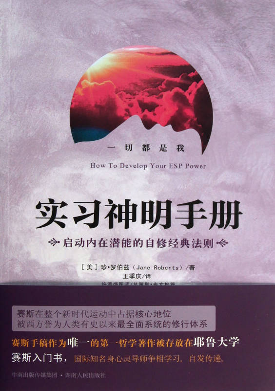

#### 版权信息

书名：实用神明手册

作者：［美］珍·罗伯兹（ Jane Roberts ）

译者：王季庆

请购买实体书籍·该电子版本仅供参考

## 推荐人的话

### 实习神明运动

许添盛医师

这是赛斯文化出版的第一本“广义赛斯书”。它并非由赛斯亲自口授，却是由赛斯书的传递者——鲁柏(根据赛斯的说法，鲁柏此生乃是她在物质实相的最后一世)所写。

这本《实习神明手册》，详细记录了赛斯出现的过程，内容相当丰富。由灵应盘入手，包括自动书写的练习、自助式的降神会、预知梦、千里眼的梦、心电感应、心理时间的练习、预知未来的能力、如何开启自己转世的记忆，以及在人类世界之外其他意识所居之所等等……

在此向各位特别说明，要介绍赛斯的出现，的确会有些令人不知如何启齿。毕竟所谓的“灵应盘”，在某些圈子看来，带着一些怪力乱神及迷信的味道，跟自己所研究二十余年赛斯书的浩瀚智慧，似乎有些不相称的地方。

一般而言，大家对灵应盘及降神会的印象并不佳(包括我个人在内)，要嘛过于轻佻，当它是场闹剧：要嘛过于扭曲夸大，扯上一些神神鬼鬼的事，比如请神(鬼)容易送神(鬼)难之类。但是，如果我们的心态是“大胆假设，小心求证”，不要让自己被太多先入为主、扭曲负面的心态所左右，那么会比较客观一些。

那么，所谓的灵应盘、降神会、自动书写，会不会只是方法或过程，向我们显示潜意识所具有的诸多功能之一？是否透过潜意识更多功能的认识，我们可以对历史宗教所提的，人类的“神性”或“佛性”，或我常说的具足“爱、智慧、内在感官及创造力”的无意识自己，有更多的了解？

大家要以全新的心态来看待这本书。人类二、三千年文明的历程，近几百年来不断的强化自我意识，以一个自外于心灵、万物、大自然的心态，过于发展物欲及强调物质面，使得人类文明的发展面临最大的瓶颈及困境，人们对于“我是谁”、生命的意义及存在的目的，则变得更困惑了。

我所推广的身心灵观念及赛斯思想，个人亲昵的称之为“实习神明运动”。

在成为正式医师前，我曾在台北荣民总医院担任过一年的实习医师，学习有关成为一名住院医师所必备的知识与技能，那是令我此生难忘、充实美好且具挑战性的一年。那么，在接触二十余年的赛斯思想后，我将人类重新定义为那“来到人间出差、旅游、学习、考察兼玩耍的实习神明”。

也许你我都已在地球生死轮回了数世、数十世乃至数百世了。根据赛斯资料，每两千年人类灵魂的大圆满已经开始了，人类的文明将由偏向自我意识、物质追求，转为潜意识、内我意识及心灵的追求。人类也将因这样的蜕变而开启另一个新的文明(即亚特兰提斯文明)——一个意识、潜意识、无意识开始融会的文明，一个物质与精神同步并重的文明，一个人类舆天地、大自然、地球和平共存，共创万物合谐昌盛的文明。

许多人害怕潜意识压抑的黑暗、扭曲的自我及情绪，也害怕潜意识之门所可能通往的光怪陆离、鬼怪所居之所；是的！你的确应该小心，却不是裹足不前。过度的自我夸大、自我膨胀，或自我封闭、自我否定都不是好现象。相反的，维持自己精神的安定性，辅以少量多餐、分段睡眠的生活作息，并以内我正信、透彻、究竟的智慧为指引，我想各位必不致迷失。

不管你知不知道、承不承认，本书所提及的内在感官能力，都是你天生固有的，也是未来所有人类必须逐步觉醒、开悟及开发出来的力量。那么，拿起这本《实习神明手册》吧！它将唤醒每个人身为那来到地球轮回太久、遗忘自己神性的“实习神明”记忆。

【推荐人简介】许添盛医师，赛斯身心灵诊所院长、赛斯文化发行人、财团法人新时代赛斯教育基金会董事长。钻研新时代思想逾二十年，尤偏爱赛斯；同时从事身心灵整体健康研究，对于癌症的治疗及预防复发有独到心得。成立“身心灵健康成长团体”、“美丽人生癌症病患成长圃体”、“赛斯学院”及“赛斯心法修炼班”，并定期受邀至全国各县市、香港、马来西亚、美加等地演讲。着有《绝处逄生》等十余种书籍及有声书。

## 前言

### 发现心灵能力的真相

你也许可以预知未来。你也许可以不用电话而跟远方的朋友交谈、对讯息采取行动，却根本不知道自己曾收到讯息。你也许在灾难发生之前便接到警告、改变了自己的计划，却从未有意识地觉察那警告本身。你也许会探访，以我们的话来说，已经不在人世的亲友。他们也许会来看你，而你也许根本没有觉察到他们的在场。

这些事你可能全都做过，或做过其中一件，却从来不晓得。

不可能？不可置信？才不咧！你的意识心只知道你准许它知道的事，其他事情全部都藏在你的潜意识里。往往，只是因为惧怕重要的资料，你才失去它。但是，没有任何“印象”会真的失去。我们从来不会真的忘记。我们往往按照来自潜意识的资讯行事，但有意识的自我却拒绝承认这个资讯的存在。

你自己的内在能力和潜能种类之多和力量之大，超过你的认知。这本书的目的是，让你能够在日常生活中认出并且利用它们。你现在就在用它们了，只不过是用一种经过压抑、效率不佳的方式。虽然如此，它们还是有用。

这本书是给所有对这些内在能力感到好奇的人，这样的人曾经听过或读到有关“超感官知觉” (Extrasensory Perception 缩写为 ESP)，或“特异功能”的事，很想知道自己的内在藏着什么没有被认出来的通讯方法。这本书不会给你任何新的玄秘力量，而是让你能发展和利用每个人内在潜伏的那些灵异能力。

我知道一个平凡人也可能发现这些隐藏的通讯管道，并且利用它们，因为我自己就是如此——是需要努力、时间和自律没错——但我之前并没有任何这种现象的经验或训练。这个计划现在已经是而且未来也会是我一生中最有价值的冒险。在横越大多数尚未探勘过的人类潜能地平线的旅途上，我的经验可以让你用来当作向导。

在我开始自己的实验之前，我对这些内在能力的实际应用知之甚少。从那时起，经过密集的实验和应用，我变得非常熟悉它们。就是透过本书为你列出的那些实验，我学会去认识并且利用自己的超感官能力。

我现在知道人类人格的力量当中有着预知未来的能力，因为我就做到了，虽然预知有限但却相当一致。我知道梦可能有着千里眼般的视野，因为我教会自己记住梦境，然后与日常生活发生的事情做比对。本书也为你列出了这些实验。我知道心电感应真的在运作，因为我现在对它很警觉。基于经验，所以我能够认出它来。我不再一笑置之，认为那是巧合。

由于我自己实验的结果，我有过许多形形色色的生动经验，在我们公认的知识体系这样有限的架构里，怎么解释它们都无法令人满意；后面的章节会讨论到这些经验。然而，在我决定亲自去调查超感官知觉的领域之前，我个人从未体验过任何一种心灵现象。我确信这些力量和能力潜伏在每一个人的内在，只不过以前我不予理会，就像你现在可能也不理会它们一样。

或许因为我是作家，所以我阅读的范围涵盖很多不同的领域。读到有关特异功能的东西，我的好奇随之升高。我丈夫罗勃·F·柏兹(Roberth F Butts)也有兴趣。

我们想自己来调查一下，但是谈特异功能这个主题的书，大部分讲的都是各类灵异学会多年前研究的老案例。别的书则是关心知名灵媒的种种成就。我们到哪里都找不到一本差强人意，告诉一个普通人特异功能大致是什么，或跟他解释这种能力要怎么开发的书。

有种种不同的秘密会社提供初学者这种资讯，但是只给会员，而且会费相当高昂。此外，我在形形色色的杂志广告当中发现，这些会社大半都带着神秘兮兮的弦外之音，而让我裹足不前。

我们有无穷尽的问题。特异功能是人类人格与生俱来的能力吗？心电感应怎样作用？有些梦真的像“千里眼”那样吗？什么是降神会，是纯迷信的鬼扯，还是可能有几分道理？我们读了谈“灵应盘”(Ouija board)实验的资料。这种“盘”到底长什么样子？怎么操作？“Ouija”的由来又是什么？这些问题促使我们两人继续探索下去。我先生建议我设计自己的实验，把结果记录下来——不论正面或负面——然后用那资料写一本书。我们两个人都没想到，他这个天真无邪的建议竟然真的改变了我们的人生。

不熟悉“灵应盘”这名称由来的读者，可能和我们以前一样也有兴趣知道，“灵应盘”原文当中“Oujia”这个字是马利兰州巴尔的摩(Baltimore Md)的威廉，傅德(William Fuld)七十五年前发明，当作一套桌上对谈用具的商标。就是基于这层意思，所以本书从头到尾都用“Oujia”“Oujia board”这个词(译注：中译则一律称之为“灵应盘”，类似我国的碟仙)。

我并没开始参加降神会或去找灵媒。因为首先，和你们大多数人一样，我一个灵媒都不认识。此外，也许不公道，但我对那些去看算命师或星象家之类的人也有偏见。一方面，我不想卷入可能的骗局，另一方面也不愿过分热中而被骗。我知道我可以信任自己，我想靠自己去发现自己的能力。这本书记录了我的调查结果，也列举了我试过的实验，这样一来你就可以自己去做调查。

其实，这是一本入门书，一种通灵现象(Psychic phenomena)的自修书。不要急，慢慢读。做完实验，你也许没办法不用电话就能和数里之外的朋友讲话、在灾难发生前收到预警、预知未来，或去探访用我们的话来说已经不在人世的亲友。这些事你也许一件都做不到，但是你会发现自己内在具有通灵的能力。不管用什么方式，这种能力多少会显现出来。

你的进展大致取决于你自己的态度，但是你再也不会是原来的你。任何新的经验多少都会改变人类的人格，因此这个经验将会扩大你意识的幅度，把那些能力和内在感知带到你的觉察范围内，虽然你以前可能忽略它们，但在你身为人类一份子所继承的能力当中，却是不可或缺的部分。

即使读这本书只为了好玩而不费心试做任何实验的人，也会学到很多。或许有生以来第一次，你会发觉自己的梦并非杂乱无章的产物，而是有凭有据的潜意识行为，包含了有关过去、现在与未来的资讯。你会知道你的直觉往往包含有价值的资料，你可以学会去利用而受益，也会知道只有你自己才能限制你利用特异功能的能力。

在此我不打算重述著名灵媒的历史或成就，也不会列出已有记载的通灵现象案例。首先，这种资讯在任何一个地方图书馆都找得到，此外，它虽然有趣，却不会帮助个人开发自己的能力。反之，我会谈我自己是怎么开始、怎么进展，也会描述实验过程，好让你自己去试一试。没有人可以替你做这些实验，现在就靠你自己啰。你自己决定要不要尝试，然后凭着诚实和常识，如实地评估实验的结果。

历来人们一直都仰赖着某一种特异功能。平凡的男女总是怀疑除了物质的次元以外，生命还有另一个次元。然而，由于现代科学的诞生，组织化了的人类变得只关心看得见、摸得到的实相。有一阵子，似乎整个宇宙都可以用这种方式解释。

如果有一个实相不能用肉体感官来观察的话，那么至少就文明人而言，它根本就不存在。然后，电来了。即使到今天，也没有人知道电是什么。我们知道它在某些状况下怎么运作，但是没有一个东西是我们看得见、摸得着，还可以握在手里，然后说：“啊，没错，那是电。”

后来科学家发现，所谓坚实的世界、客观的物质世界，按照那些词汇被赋予的意义而言，既不坚实也不真实。举例来说，一张桌子并不是它对肉体感官显现的那个样子。虽然为了方便，或许也为了不要发疯，我们假装桌子是坚实的，其实它一点都不坚实。桌子是松散地兜在一块儿的原子聚集物，而且还不是固定不动的原子，因为没有原子真的不动。我们熟悉的桌子实际上是个原子与分子的混合物，经常在改变，而且永远在动。如今科学家在他们自己的实验当中必须小心，不要被自己的肉体感官给骗了。一张桌子，换句话说就是，我们感觉和组织宇宙基本材料的方法所产生的结果。

我们经常使用电力。我们经常利用桌子放我们的杯盘，而杯盘本身也是原子和分子组成的网络。电当然很实用，桌子当然很实用。桌子并不是它看来的那个样子，一点都不会困扰我们，只要它能够承接我们那些一样“表里不一”的杯盘就行了。同样的，利用它们也不会让我们觉得自己迷信。

然而，关于基本实相的本质，我们身体的感官仍然欺骗了我们，这依然是事实，可是我们的内在具有潜在的能力，可以它实际的样子来感知这实相。超感官知觉是这种能力的一部分，能让我们穿透肉体感官设定的障碍而感知实相。

关于这些内在知觉并没有任何玄秘之处。如 ESP 这个词一般是用来指涉，我们经由肉体感官以外的途径得到的知觉。很多人下结论说，它们必然有个超自然的来源，但超自然这个词本身也令人质疑。在中世纪，电视就会被视为超自然。更合逻辑的是，假设人类人格本来就具有人类自己大多还不知道的力量。更合逻辑的是，假设这件显而易见的事：世间存在的知识，比人类已经纳入认知的知识体系领域内的知识还要多很多。

既然肉体感官会扭曲基本实相，那我们又为什么要单单用肉体感官的尺度去限制实相？就以任何一种情绪来说吧，显然情绪是真的，但它们并没有桌子所拥有的那种实相。你摸不到一种情绪。你也无法看见一种情绪。当我说忧伤很重、它让我们心头沉重的时候，任何读者都会明白我的意思，可是，并没有任何物质的磅秤能测量忧伤的斤两。它没有实质的重量，但却具有我们全都熟知的一种无可否认的心灵重量。然而，就和其他心理经验一样，虽然忧伤无法用物质工具去测量或检查，它却是现实世界的一部分。此外，还有很多其他的实相是肉体感官无法完全感知的。

我自己的实验结果让我至少接受，我们经历所谓死亡的改变之后，人类人格仍有存活的可能。除非我们承认，甚至在这一生里，人格某个程度是独立于具体物质之外的，否则我不知道如何解释自己的一些经验。假如事实果真如此，当那物质解体时，人格又为什么必须依赖具体物质呢？

在我看来，我们似乎必须认真思索人类人格死后犹存的可能性。现在我们是意识和具体物质的混合物，但在这个存在之前及之后，我们又是什么呢？合法的 ESP 调查在这方面可以做出重要的贡献，因为，除非我们对人类人格的力量知道得更多，否则我们无法冀望能够更了解它的未来或过去。我们曾向外看，探索物质宇宙，但却闭上了眼睛，不去瞧隐藏在人们自身心智内的潜能。

我自己在这方面的经验，剧烈地改变了我以前对于人格死后犹存的想法。我曾在出神状态(trance)说出不属于自己的话，在略超过一年的时间里，那些话增长成我称之为“赛斯资料”的两千页打字稿。尤其是在科学和超心理学领域，有些明确的进展是“赛斯资料”提供的。透过这份资料，赛斯坚称他是个不再聚焦于物质体系之内的“人格能量元素”(personality energy essence)；并坚持经由我的潜意识说话，却又独立于我的潜意识之外。

你现在正在读的这本书列出的实验，有些是赛斯的建议。“赛斯资料”讨论如具体物质的本质、神的观念、反物质、梦的宇宙、潜意识的层次、宇宙扩展理论，以及因果理论的局限等等主题。在这份资料里，找不到一丝矛盾。从一九六三年十二月开始每周同样的两晚，本书作者我就在轻度出神状态中替赛斯说话。当这本书到你们手上时，至少已经上过两百堂赛斯课了。

赛斯也预言，这份手稿的出版者就是在他说出预言时拥有这份手稿的出版社。

他还说，有位女性会影响此书的卖出，但他指的是否就是这本书，那就不清楚了。

我曾经跟出版社的总裁打过交道，但好些时间没听到他的消息。最后我写信去，要求退还稿件。我收到新编辑——一名女子的回信，要我把稿子多留在那儿一阵子。一个月之后它被接受了，就在赛斯说出预言的五个月之后。此书的卖出，至少有一部分是因为这名女子对于手稿和大纲的看法。然而，在赛斯提出预言时，我打交道的对象根本不是一名女性编辑，而且就我所知，当时她和那家出版社还没有任何瓜葛呢。

再次重申，过去我从来没有过任何一种通灵经验。我们的教育体系把超感官知觉排除在我们之外。我们被教导只信任那些看得见、嗅得到、感觉得到、尝得到或摸得到的事物。我们被养大的过程中对实相只有唯二个想法，而且这个想法还被预先形成的概念和理论干净俐落地框住。把我们的眼睛张开的时候到了，为自己去发现整个人类人格潜能的时候到了。

如果你以开放的心态应用这本书的原则，你很快会觉察过去没有触及到你的意识的其他实相。一方面，你需要一种理智的客观感，另一方面，你也需要一种自由又强大的直觉感。在此，你会找到一些把超感官知觉的实相带到你的人格环境之中的实验，让你发现自己的能力所在之处。

每个人都是不同的。拿音乐存在来说，我们虽不全是专业音乐家，但所有人某种程度都能感知并且享受音乐，而且我们也因为这种享受而变得更好。由于每个人在其他领域也有特殊的能力，所以在此，同样的原理也用得上。

试试这些实验，你就会发现自己个人的倾向。我先生和我是透过尝试错误的困难方式学到我们学到的东西，你们则可省掉很多这个过程所需的时间。经由读这本书，对于你在做什么、怎么做，以及如何评估自己的结果，你至少会有个清楚的概念。

在评估你的经验时，必须用到常识和批评性的判断，但在做这些实验本身时，则必须有某种程度的自发性。尽量摆脱任何先入为主的想法。以儿童探索任何新经验的相同新奇感，去调查内在实相。

举例来说，当我开始从事这个冒险时，我相当愿意把心电感应和千里眼当作是通灵能力的正当面向。但我觉得降神会或灵应盘的想法很可笑，是神经质或心理不健全的人的消遣。我把降神会和灵应盘也包含在我的调查内，只因为我决心不被我的个人成见左右。结果，我的想法有相当大的改变。赛斯课正是始于一个我并不热心尝试的简单的灵应盘实验。随后，在我自己家举行的降神会说服了我，这里涉及的不只是歇斯底里或迷信。

你从这本书得到什么，大部分要看你愿意投资多少精力、时间及兴趣。如果你想从这些实验取得可能最完全的利益，那么自律、常识、直觉性的洞见和坚持就得样样具备。不过，至少你会发现自己内在知觉的真相。

这进入 ESP 世界的旅程，实际上是进入个人人格的探索，进入你自己的旅程。所以，你不需要去找灵媒或算命师，就能发现像千里眼或心电感应这种现象的真相。事实上，很可能你自己来会好得多。大半的灵媒人品是可靠的，但只要看过一次假灵媒或自欺的神经病，你可能就会嫌恶地放弃整个寻求。

如果本书有些实验看似古怪或“新潮”，那就想一想根本不坚实的桌子；可能现在你在看书，手肘便枕在这样一张桌子上。想想我们经常在使用却不了解的电力；那么，你自己隐藏的能力就不会显得如此奇怪了。你能信任自己。往自己的内在看，看看能找到什么。

## 灵应盘的使用方法

当你跟着做本书列出的实验时，你将发现，超越个人潜意识还有一个实相，与你现在熟悉的实相一样生动与有效。“灵应盘”将容许你放松你有意识的心智，使你或许第一次觉察到来自这内在自己的讯息。

一九一三年的夏天，住在圣路易市的一位家庭主妇拿出一个“灵应盘”来玩，以娱宾客。指针开始拼出一位自称是佩巽思·沃尔斯(Patience Worth)讯息，据说她曾住在十七世纪的英国。二十五年期间，佩巽思口授了诗及小说，出版后得到好评。而那家庭主妇，珍珠，克伦太太(pearl curren)并没有受过多少教育，个性也完全不像佩巽思。

佩巽思用过往年代的语法来写作，并用真正的古代拼字法。在她的小说里，她随口说出一些日常的家用物，都是早已自我们的家中和记忆中消失的东西。那个案例被人仔细调查一番，却没有发现任何骗局的蛛丝马迹。只有对于佩巽思这号人物的来龙去脉人言人殊，而引起争议。

佩巽思是一名死去已久的女子鬼魂吗？是否由于她曾活在十七世纪，所以她拥有对十七世纪而言具有重要意义的知识？或是，克伦太太不自觉地在潜意识层面累积了这一切与过去有关而且数量惊人的资讯？果真如此，那知识的来源又是什么？

在“灵应盘”讯息当中，有很多细节只有学者才知道。如果克伦太太的潜意识心智不知为何居然捡到了这丰富的知识，那就证明潜意识能够支配意识心觉察不到的能力。甚至对佩巽思一案的这个解释，也留下了许多尚待解答的问题。传达给克伦太太的那类资讯并非普通一般可以获得的资讯。它是从哪儿来的？克伦太太的潜意识心智又如何将资料组织成小说和戏剧？

但在另一方面，如果佩巽思确实是曾在物质界运作的一个人格，那又会出现了一套全然不同的问题。

她是否透过克伦太太的潜意识心智来沟通？

操作“灵应盘”的是她还是克伦太太？

无论答案是哪一个，我们都得面对一个事实：人类人格比我们假设的更不受限于时间与空间。

我提到这个例子，是因为在佩巽思·沃尔斯人格的出现上，“灵应盘”扮演了如此重要的一个角色。人们对“灵应盘”有很多种看法，包括：解放潜意识的一种方法；生者与亡者的一种沟通方式；只有无聊和神经质的人才耽溺其中的一种可笑的社交游戏。可是，在佩巽思这个案例当中，“灵应盘”扮演的角色却有足够的煽动性，让我相信，在任何超感官知觉的调查中，它都该占有一席之地。

我先生和我先前都没见过“灵应盘”，但我们弄到了一个。这一章要谈的是我们用它所做的实验以及结果，还有完整的操作说明，以便你能自己发现使用“灵应盘”的正确方法。

“灵应盘”本身大约二十二吋长，十五吋宽。在上面，印有两行大而易读的大写英文字母。“是”这个字出现在左上角，而“否”这个字在右上角。字母下面则是数字，从 1 到 9，加上“0”。在盘的最下方，用稍微小一点的字体印着“再见”的字样。

“灵应盘”附有小指针，样子像个三条腿的迷你三角桌。操作时，参与者将手放在指针上，指针本身则放在盘上。为了让你自己熟悉这个步骤，把你的双手放在指针上，轻柔的让指针滑过盘板。运作适当的话，指针会像是自己在动，而你这方根本完全不用力。

在很多“嗜好用品店”都买得到“灵应盘”，也可以向麻省西冷市(Salem)的派克兄弟公司(Parker Brothers, Inc.)，邮购，这家公司目前是“灵应盘”的注册商标拥有者。“灵应盘”价钱不高，而且在一般的照料下可以保用很多年。

你也许立刻就操作成功。若非如此，也不必担心。我们头几次的尝试令人失望。指针不是文风不动，就是指出的字母拼不出有意义的字。我自己当时的态度很差。我认为“灵应盘”不值得我认真以待。理智上，我明白它在我的调查中应该占有一席之地。但是情绪上，我却觉得尴尬又不安。在你初次尝试操作“灵应盘”或做任何其他事时，显然不该抱持这样的态度。我们头几次的努力是如此笨拙，以致我对后来的成功更是暗暗称奇。

以下是你在自己最初的实验中可以遵循的一些步骤。把“灵应盘”放稳在你和你的伙伴之间，用盘取代桌子，这样它的一端就会摆在你膝上，另一端则在另一个参与者的膝上。双眼保持张开，没有必要闭上。把你的双手放在你置于盘上的指针上面，叫你的伙伴也这样做。

放松。当盘开始作用时，小指针会开始移动，指出将拼出讯息的字母。如果在头几次每段约二十分钟的时间里，“灵应盘”没有得到结果，别泄气。不过，大部分人第一次就会有结果。如果它没有立刻发生作用，可能是你的态度不正确。那么，带着轻松游戏般的心情再试试。记住，如果头几次失败后，我们就厌恶地放弃了，可能永远不会写出“赛斯资料”。

如果向“灵应盘”发问，一开始最好是一次一个人提问。如果指针不动，就再问一次。用简单的句子提问。你可以耳语、大声说，或只在脑海里形成字句。一次问一个问题。要确定你给“灵应盘”足够的间隔时间来回答。

力道非常轻地压着指针。如果你太用力，它便无法动弹。如果这样做你会觉得别扭，不妨一开始玩就发问。一个标准的开场问题是：有人在吗？然后，灵应盘给的答覆自然会影响你接下来想问的问题。

如果讯息声称来自另一个人格，那就提出可能给你最多数量资料的问题。如果那个人格宣称自己不是现在活着的人，就问它何时何地出生和死亡。稍后你可能会想核对一下你收到的细节。问那人格其他家庭成员的名字。他们是生是死？如果是生，住在哪里？如果是死，死于何时何地？如果一个问题没被答覆，或指针看似犹豫不决，就暂时放下该问题，待会儿再回头问。

有些人觉得问答的程序抑制了他们或灵应盘。如果你是这样，那就只要安静坐着，把手放在指针上。在很短的时间内，不用你提问，指针就会拼出自己的讯息。

后来你觉得比较自在时，可以混合各个步骤，结果极佳。操作“灵应盘”的每个人都必须完全诚实，一个伙伴的不信任会严重阻挠你可能达成的任何进展。

拿“灵应盘”来实验是个令人着迷的经验，或许也是开始进行任何超感官知觉实验最容易的一种方式。我建议你们用本书列出的实验顺序来尝试，因为前一个会为下一个做好准备。

通灵现象是业余玩家也能做出贡献的少数几个领域之一。所以，你在所有这些实验中要仔细做笔记，这点很重要。

操作“灵应盘”时，当指针在给讯息之间的空档，或是就这样停住不动时，你和你的伙伴可以写下所有的问题和答案。不过，为了要有效率，可能的话就由第三者写下问题和答案。第一时段便开始记录。包括日期、参与者的名字和时间。提出问题后，就把它们写下来，并预留可以插入答覆的空间。当你运用得较熟练时，事前拟好问题是个好办法。

当“灵应盘”运作顺利时，由于讯息会来得很快，所以你可能要发明某种个人速记法。通常答覆不会指出标点，所以你必须小心看好一个句子在哪里结束，另一个句子在哪里开始。字可能挤到一块儿，所以乍看之下，讯息仿佛毫无意义(译注：以上是由于用英文字母拼出而易产生混乱，若用中文碟仙则无此困扰)。因此，要小心检查所有的讯息。有些情形下，“灵应盘”会用它自己的速记法。4 (four)这个数字可能代替“for”，而 u 这个字母可能取代“you”(你)这个字。

刚开始，你可以问能够用“是”或“否”回答的问题，你可以问名字的简写而非全名，直到你有了信心。别太容易受骗而接受歪曲的讯息，也别过度伸展你的想像力，使无意义的句子变得有意义。盘板会拼出整个字，然后整个句子，而你也会“熟能生巧”。

一个看似不连贯的讯息，也许在某种外国语文当中是有意义的沟通，这也有可能但并不多见。通常，如果你看不出意义，这讯息就是没有意义。把它归档，然后别去管它，但不要丢掉。随后，不论是经由“灵应盘”或其他方法得到的讯息，我们将在另一章讨论你可以评估这种讯息的方法。

如果你的讯息有一些方面仿佛自相矛盾，尤其是在一开头时，也别担心。这些可能是被扭曲的有效资料，本书稍后会再多谈谈这一点。如果你还没接收到完整的句子，玩到了第三或第四时段的时候应该会得到了。玩了一个月的“灵应盘”之后，罗勃和我每时段都会收到大约十页打字纸的资料。

感觉指针在移动，而且知道你或你的伙伴都没有刻意动它，是相当震撼的经验。刚开始做我们自己的“灵应盘”实验当时，我们并不知道会发生什么事。我要简短描述一下我们刚玩几段“灵应盘”的情形，让你有个可以用来评估结果的依据。

我们开始收到讯息

头两次尝试失败之后，我们开始收到前后连贯的讯息，宣称是来自我的外祖父约瑟·亚道夫·柏多。一八四九年去世的外祖父是法国和印地安的混血儿，英语说得相当好，但有某些明确的怪癖。举例来说，他一直将 these、them、those 念成“dees”、“dem”、“dos”。“灵应盘”用他的拼音方式，整体上用字遣词符合他使用英文的特性。

我们也收到其他宣称是死后犹存者传来的讯息，我们两人都不认识他们。当出生与死亡日期出现在讯息当中时，我们的确会核对它们。一般而言，资料是前后一致的。他们给的生命史显然是可信的。直到此时，我们还是颇为讶异，却并不觉得有多了不起。原因之一是，当我们下回尝试“灵应盘”时，我们永远没办法请回同一个人。不过，我们仍有足够的兴趣继续下去。

这种情况发生两三次之后，我们又被“胡言乱语”包围了。在无意义的字眼中间冒出了一个清楚的词：“东向的路” (eastern roads)。其实这些字具有重要意义，虽然当时我们并不知道。不过，我们仍尽责地把它纳入我们的纪录当中。这是“做纪录”为何如此重要的原因之一。有时候一个看似无意义的词语后来可能变得有意义，这一个就是如此。

我们接下来一次的“灵应盘”实验，是如今仍然持续的一个独特经验的开始。

这讯息一开始显得没什么重要，是我将称为法兰克·韦德的一个人格传来的，但那不是“灵应盘”给我们的名字。法兰克告诉我们，他曾在纽约州的艾尔默拉市教了三十年英文，并且还补充与他的背景和家庭有关的其他资料。

隔天我问艾尔默拉当地的一位老妇人，她认不认识“灵应盘”给的那个名字的人。当时我没说明为什么这样问。她强调说她认识过这样一个人，还说他迁离了她自己熟悉的圈子，而在四〇年代早期去世了。法兰克曾说他死于一九四二年，当然那妇人不可能知道这个事实。

接下来几个时段，我们继续用同样方式和法兰克对谈。当时，为了几个理由，我们没有再进一步核对这早期资料。在日期上有一些明显的矛盾，这是其一。另外，就这个字的一般意义而言，我们很难想像那资料是合理的，尤其在一开头的时候。在这里，很显然时间的压力与我们的疏忽也有些关系(我俩都有工作)，再加上害怕核对公共纪录可能引起的尴尬。那时我们根本没想到，“灵应盘”时段会继续下去，或它们最终会发展成另外的东西。我们只是很高兴能够亲身经验以前只读过文字记载的现象罢了。

结果，我们和法兰克只短短的来往了三个时段。下一时段一开始出现的是法兰克，但他的人格被赛斯(Seth)的人格取而代之。赛斯课(Seth Session)已于焉开始。

马上可以看出来，讯息的范围和品质都突然增进了。我们发现自己在与一个具有更高超智力的人打交道，他有明显的幽默感，他永远展现突出的心理洞见和知识，显然远超过我们自己有意识的能力。

在这一个时段，“灵应盘”开始拼出一段又一段的话。有点让我自己不安的是，赛斯很早便坚称，轮回转世并不只是一个可能性，而是人类存在的一个事实。

他开始列出罗勃和我从前的转世，并给我们名字、日期、家庭关系和其他细节。有些资料经由催眠获得证实，其他细节则尚待查对。当搜集到足够的资料时，我们会依据现存纪录查对所有的细节，谈转世的章节将会谈到这件事。

罗勃和我都熟悉转世的理论，但由于我们认为无法克服的瑕疵，所以不考虑它有任何实际的用处。对我而言，转世带有玄秘的味道。赛斯以无懈可击的逻辑还击我的每一项抗议，而后又列出一些实验，用来证明理论的确成立。

是我在移动指针吗？或是罗勃？我们开始互相测试。我会没有预警地将手抬离指针，指针停住了。罗勃也这样做，指针也停住了。只有我们其中一人时，通常指针不会移动。我们两个似乎都是必要的，但我们都没有单独移动指针。

## 引言

我们第一次遇见法兰克·韦德是在一九六三年十二月二日。在我们更早的课里，我们从未能维持两个时段之间的连贯性。当赛斯课开始时，一节课立刻开始加强了早期的那些课。赛斯规定我们一周上两次课，并指出是那几天晚上的什么时间。每节课长达二到三小时不等，有时候还更长。从此以后，我们便遵循这时间表，至今仍在继续中。

在赛斯人格出现后不久，有句话引起了我们的注意。它出现的时间是赛斯在讨论罗勃先前的转世时，照赛斯说，罗勃在十七世纪的丹麦是个地主，在一个叫做崔也夫(Trev)但现已不存在的城市附近经营农场。“东向的路”被用来指明在丹麦的地点，而我们忆起在很早的一个时段中，同样的词曾经出现在一堆乱语中。

在本章最后，你会找到我们早期课的摘录。我们问的问题会帮助你形成你自己的问题。注意“灵应盘”早期只用一个字回应，到了第四课就有了较长的回应。很可能你们自己的经验也会出现这种进展。

但是，是什么促使“灵应盘”运作？在我回答之前，我们来好好审视一下人类人格的组成。因为就是这人格的一部分，让这类通讯得以发生。

自我(ego)就是日常生活当中你熟悉的那一部分自己，它是“有意识的我”(conscious i)，这有意识的我并非具体之物。它永远在变。现在的它和你孩童时的它是不一样的，而明日的它也和今日的它不同。

自我是你面对日常世界，处理实际问题的那个部分。它围绕着属于你人格一部分的某些能力和倾向而形成。自我利用并接受其中一些能力和倾向，进而变成有意识的我的一部分。你认为属于自己的这些喜好和憎恶、能力和特质有助于组成自我。

在日常生活中，自我是极其重要的。它让我们能专注在手边的实际事物上。可是，外在刺激不断进入我们的脑子里，有意识的自我无法单靠自己处理刺激的猛烈攻击。它得有意识地忽略掉许多刺激。我们在一刹间能够觉察的事就只这么多。甚至在意识上不知道我们是如何做到的情况下，我们做了很多事。自我甚至没有觉察到很多源自身体之内的刺激。

举例来说，我们走过房间，换座位，拿起一本书。当然，在从事这些活动时，我们一直在吸气和吐气。我们身体的细胞也在补充自己。然而，在意识上，我们并没有觉察到我们用意志促使自己呼吸。我们甚至没有觉察到我们从一张椅子挪到另一张必要有的肌肉动作。除此之外，我们对这些活动也没什么控制力。就好像有一个自己在替我们照料某些机能——攸关肉体存活的机能——如呼吸和消化似的，如果它们没有精确杰出地执行，我们就会死。

如果生命要务有这么多面是受潜意识力量的控制，像在这例子当中是被自律神经系统控制，那么，相信其他的机能和能力在一个潜意识层面上也受到控制，真有那么难吗？不见得吧！举例来说，我们往往暗中哼唱却不自觉。在睡梦中，我们很多人绕室而行，有时候甚至走出房子、走上街，同时意识心却很有福气地对我们的活动毫无知觉。事实上，如果太快唤醒梦游的人，可能会干扰他微妙的平衡。

因此，对潜意识行动的有意识干预，可能扰乱其平顺的结果。

假使我们必须用意志促成我们每一次的呼吸，有意识地监督日常运转必需的百万种小型的身体操纵，我们就没有时间做别的事了。就此而言，我们也没任何理由假定，我们能改进目前的潜意识表现。

除了其他功用外，“灵应盘”也是通达这种个人潜意识——也就是对你的肉体存活至关重要的内我(inner self)——并与之沟通的一个方法。个人潜意识对你的了解比你自己还要多。当有意识的我放松下来，潜意识便能经由肌肉的动作来表达它自己，譬如你一边讲电话一边在纸上涂鸦那样。你的涂鸦是这个内我的线索。当意识心被其他事物占据时，潜意识正控制着肌肉的牵动，导致你的手指去涂鸦。在意识上，这些涂鸦对你可能看似无意义，但对你的潜意识心很可能有明确的意义。既然你的肌肉动作有很多是永远受潜意识的控制，那么，我们自己的这个内在部分能够透过上述动作表达自己，便不足为奇了。

人们相信，移动那小指针的也是这些同样的潜意识肌肉动作。如果这就是全部，那“灵应盘”依然是有意识的我发现全我(whole self)的隐藏部位最有效的方式。但我认为潜意识的这个个人部分，只是一个更广大的潜意识区域的最表层而已。

“赛斯资料”主张，佛洛依德发现潜意识所代表的意义只是，对整个内我的第一个探索性质的认知。照赛斯的说法，佛洛依德和荣格只不过触及了可被称为“未被发现的人”或“全我”当中最显著的部分而已。

但潜意识包含的不止是必须受到个人和社会束缚的种种被压抑的原始驱力。它也是人类最细微直觉的源头，可能还是语言和文明本身的基础。很可能对各层面潜意识的研究，能够让我们在人过去的精神和心灵存在方面有所了解，就像对地球物质层面的研究，让考古学家找到过去文明曾经存在的证据。

当你跟着做本书列出的实验时，你会发现在个人潜意识之外还有一个实相，与你现在熟悉的任何实相一样生动而且确实存在。“灵应盘”让你能够放松意识心，这样或许有生以来第一次，你可以觉察到内在自我的讯息。你会发现潜意识的心智，你个人的潜意识领域，但你也会发现这潜意识是到另一个内在实相的门槛。

要记住，在你的“灵应盘”实验里，关键字眼是“放松”。一定要保存每一时段清楚、仔细的笔记。写下你问的问题以及收到的答覆。以下是我们自己早期课的摘录。

虽然我们已经有三次更早的经验，其中两次没有成功，有一次则带来声称是出自我外祖父和其他人格的一些段落，我们认为那些是预备动作，到了法兰克·韦德，我们才开始做正式的纪录。那么，下面这节摘录来自第一课，那时法兰克·韦德出场了。

为了你阅读的方便，问题用明体标示；“灵应盘”的回答则一律用楷体。回答如实照录没有任何删改，但为了避免给生者带来任何可能的困窘，姓名做了更改。

所有问题都由罗勃·柏兹提问。

摘自一九六三年十二月二日第一节课

问：有人在吗？

答：是的。

问：你能给我们你的名字缩写吗？

答：FW.

问：请拼出你的名字。

答：法兰克。

问：请拼出你的姓。

答：韦德。

问：你能告诉我们你哪年去世的吗？

答：一九四二。

问：你认识我们吗？

答：不认识。

问：你已婚吗？

答：是的。

问：你的太太现在活着或死了？

答：死了。

问：她叫什么名字？

答：鄂苏拉。

问：她姓什么？

答：阿特金。

问：她是哪国人？

答：义大利人。

问：你是哪国人？

答：英国人。

问：你从事什么职业？

答：教师。

问：你教什么？

答：英文。

问：在哪个市或镇？

答：艾尔默拉。

问：你教了多少年？

答：三十四年。

问：你生于哪年？

答：一八八五。

摘自第二节

以下内容摘自第二节。这时我们变得非常好奇，因为这是我们第一次有机会与透过“灵应盘”接触的人再叙。

问∶法兰克·韦德，你在那里吗？

答：是的。

问：你一生大半住在哪？

答：艾尔默拉。

问：你在哪里出生？在哪栋房子？

答：状态街(state street，译注：state 是州、国家。常作为街名，有点像我们的中央路或大街。如此译是因为下面的双关语。)

问：是在艾尔默拉吗？

答：不是。

问：哦，那么，是在哪一州(state)呢？

答：在悲伤的状态(in the state of sorrow)。

这个答案让我们深感兴趣。这是第一次，“灵应盘”似乎重新诠释了我们的问题，然后据以作答。或许这个回答促使罗勃问了下一个问题。无论如何，我们以前都认为“转世”再怎么样也不过是个不太可信的想法而已，所以接下来的讯息让我们相当吃惊∶问：你在地球上还活过别的一生吗？

答：是的。

问：多少次？

答：三次。

问：你第一次生活在地球上是什么时候？

答：第六世纪。

这一节继续进行下去，法兰克说他有一生是土耳其的一名士兵，并且坚称他在另一生当中，曾在丹麦的崔也夫城认识罗勃和我。在他提到的其他细节中，曾说我当时是个男人，而且是我现任丈夫的儿子。他给了日期和地点，但也言明崔也夫城已不复存在。

第三节很像这两节。不过，第四节却是个转捩点，显示了法兰克人格的撤退及赛斯的现身。赛斯课的一般语气和特质立即显而易见。在此开始的讨论会变成许多未来课的基础。

答覆从早先的一字或一句变成了整段整段的，全都由指针拼了出来。回答的聪慧使课程愈发有意思了。赛斯人格取而代之，立刻显出其个人性和明确性。这一节开始是法兰克，结束是赛斯。

摘自第四节：

问：法兰克·韦德，你在那里吗？

答：是的。

问：你带给我们一个讯息吗？

答：意识像一朵有许多花瓣的花。

问：是珍的潜意识在说话吗？

答：潜意识是一条走廊，你走进哪一道门又有什么区别？不过，我可以透过珍说话，如果我这样选择的话。她一度曾透过我说话。当然你不明白这个笑话。哈！

问：你何时透过珍说话？

答：一个世纪之前，降神会，她是个灵媒。因为你想要找我，我也传过来了。

问：法兰克·韦德，将来我们可不可以跟你询问任何特定的问题？

答：可以。我宁愿你不叫我法兰克·韦德。那个人很没情趣。

问：我们跟你说话需要用某种称谓。

答：随便你们爱怎么称呼我都可以。我称自己赛斯，它适合我的本我。这个人格显然最近似我的全我，或我试图成为的全我。约瑟(Joseph)或多或少是你的全我，是你过去和未来形形色色人格的总和形象……。你是约瑟，你在心里看到的那个约瑟、那个蓝图。

问：如果你叫我约瑟，你会叫珍什么呢？

答：鲁柏(Ruburt)。

问：请你稍加说明好吗？

答：说明什么？

问：那名字对我们而言有些怪。我不相信珍会喜欢它。

答：怪的配怪的。

摘录自第五节：

问：我们真的或多或少受制于潜意识吗？

答：是的。但那就像是说，全体是受制于其部分一样。人类只不过还没学会有效利用他的各个部分而已。一切的总和应该是卓越的意识。个别的意识是最重要的。它从不会消减，只会增进。它每一次扩展都会涵纳更多。

问：出于好奇，赛斯，在两节之间你都做什么？

答：你做什么呢？

问：对于鲁柏这个名字，你能给我们更多的资料吗？

答：很久以前，那一度是珍的名字，就像你的名字是约瑟一样。两者都代表了你们存有(entities)的高点、在精神性基因里的形象、给心灵(spirit)遵循的蓝图。约瑟和鲁柏代表了你们尘世人格的圆满范围，你们必须以它为目标来成长。但在另一方面来说，既然蓝图存在，那你们已经是约瑟和鲁柏了。每个人都有这样一张蓝图。个人试图依循他的蓝图，度过每一生。这并非强制的模式，而是存有自己的大纲。

问：这不是干扰了自由意志吗？

答：怎么会呢？你自己设计了蓝图，而你各个转世的自己并不知道蓝图的存在。他们有自由意志。你给了他们自由意志，那才是挑战所在。

## “灵应盘”作踏脚石

当你第一次到达个人潜意识的领域，你可能会骛讶，它既非必须加以压抑的充满危险冲动的地牢；也非自然的所有印象和能力的仓库。它是在所谓有意识的自己与我们所知甚少的自己之广大内在领域之间的门槛。

你能否想像自己对于诸如具体物质的本质、潜意识、神的观念、反物质或时间这种事，睿智而且毫不迟疑地大放厥辞，一次达数小时之久？你能否想像自己面对当场向你提出的这种问题，给予合乎逻辑，甚至雄辩滔滔的答覆？你能否想像这类情况的发生，即便你所说的字句其实不是你自己的，而且在意识上你也不知道接下来会说什么？你能否想像在一个正常的工作天之后，你从事这样一个演出，而且还持续这样做下去？

在我开始从事本书的实验之前，我会认为这种情况极不可能。然而，一年多来，我却在出神状态替赛斯口授了两千多页的这种资料，清晰简洁，没有矛盾，并且没有一般讲话都有的犹豫。很可能你们有的人会发现自己用你自己的方式做同样的事。如果你认真试过上一章所说的“灵应盘”实验，也许已经自己发现到“灵应盘”可以是通达其他什么的踏脚石。很可能你已经扩大了你自己的觉知范围。

增大的觉知名符其实真的会扩展“自身”(the self)。让我们想一想：“自身”的真正局限是什么？作为“自身”，你受到了限制吗？将你和所有非你的东西分开的界限是什么？皮肤会像是分隔我们肉身的我和其他具体物件的东西。但皮肤不仅分隔了我们和其余的宇宙，也连结了我们和其余的宇宙。

有很多东西透过我们的皮肤而来，没有它们我们无法存在。在宇宙中，我们所知的每件东西，基本上都是由同样的成分组成的。除了分子组织的不同外，我们和桌子或椅子、桃子或螃蟹，都是由同样的物质组成的。我们的皮肤与它外面仿佛虚空的空间不同之处，仅在于程度和密度而已。

透过活的皮肤，我们从空气与阳光当中接受赖以维生的养分。我们食用本为宇宙一部分的鱼、肉和植物，让它们成为我们自己的一部分。被我们的身体利用之后，它们重归尘土，以便再次被利用。那么，物质上，“自身”是由所有这些陌生的、不像自身的成分组成的。换言之，物质的自身基本上并不受皮肤限制。我们大可以说，自身藉着皮肤延伸到外在环境里去，以便吸收养分。

现在你可能坚持，自身，你的自身，在心理上是有限制的。你可能坚持自身一定受到某种方式的限制，即使你可能无法说定义那些限制。但现在，再仔细想想你的自身。你是你的念头、你的思维、计划和情绪。当然。但这些并不存在于一种心理真空当中。它们是自身的遗传和环境塑造而成，它们也是你接触的人加以修改而成的，而你也一样修改别人的思维和情绪。

为了方便起见，我们人类表现得好像物质的自身以皮肤为界。我们表演得好像我们的意识完全密闭在我们的脑袋里，而头壳就像把我们的身分(identity 即本体)

安全保护在内的骨头围篱。但事实并非如此。的确是有“身分”这样一种东西。但没有人真的发现过它到底是个什么东西。关于“身分”的真正本质，在本书稍后将会给出一些线索。

心电感应和我们对自身的看法

我们现在逐渐觉知心电感应(telepathy)的存在。如果我们能收到别人的思绪，并且将我们的思绪传给别人，那么对于自我限制的这个老想法，我们该怎么办？当 ESP 调查证明我们的观念陈旧过时，我们就得改变它们。心理上的自身(Psyahological self)能够到达的地方比我们曾有的想像远多了！

再次重申，我们现在所知的潜意识很可能只是全我(whole self)的一瞥而已。

越过潜意识可能有自身可以通达的处女地，也就是包含我们尽可能加以忽略的实相在内的区域。

可是，自我(ego)并不关心内在的实相。它处理的是日常的实际问题。它比较刻板，纵使它经常在变，但却不喜欢变。在人类早期的演化发展中，这是必要的。

如果穴居人要存活，他所有的注意力必须密切集中在物质环境上。一个白日梦，进入潜意识自己的片刻神游，可能要了他的命。自我随着应用发展并硬化成一层胄甲似的壳，现在它威胁要埋葬它本该保护的自身。

“灵应盘”经验有助于放松这紧密合身的自我，给内我呼吸的空间。慢慢地，和某种冬眠苏醒的小动物一样，内我也会开始苏醒。个人潜意识是第一个被容许有一些自由的部分。一个原因是，我们通常熟悉的内我就只有这一个部分。另一个原因是，它刚好就在自我之下，虽然这只是一种说法而已。对自身而言，字面上所说的方向，好比说“上”和“下”，并不存在。

“灵应盘”经验将有助于放松个人潜意识，而这种放松的习惯也会在其他方面有助于你。在过去你没有加以聆听的直觉和冲动将会显现出来。你会觉得你好像扩大了，或更新了。事实的确如此。一点一滴的，你将会觉察到你先前忽略的实相。

基于实际目的，你将会扩展对自身的限制，因为你将会用以前做不到的方式增益你自己的经验。

你会发现，潜意识不会和你自己个人埋藏的记忆一起结束。你不会碰到谷底、遇到死胡同、达到你自己或你的觉察力的最后极限。

只要你想前进，就不会有一个你一经过便无法再前进的点。你不会到达一个点而有“我的终点在这里。过了这一点，我的自身就停下来了。”

就像我们祖先相信天空有“顶”，但事实并非如此。同样的，人类人格或你自己的觉察力也没有界限、顶或底。我们的火箭探索外太空，我们也能旅行到内太空去。没有任何人能替我们做这件事。没有人能替你做这件事。那冒险是非常值回票价的！

第一次到达个人潜意识的领域，你可能会觉得惊讶，它既非充满危险冲动而必须加以压制的地牢，也非天生美善的乌托邦，而是储存自我在任何时候都不肯接受的所有印象和能力的仓库。它是在所谓“有意识的自己”与我们所知甚少的“自己的广大内在领域”之间的门槛。

探索这内在实相，你需要用你的常识、诚实理智和自律，也需要用你本性当中的直觉部分。你需要你所有的能力，以便评估自己的经验。

首先，我会解释我自己最初进入这些实相的发展，让你对“灵应盘”实验的直接结果可能对你展现的各种经验有一些概念。继续玩“灵应盘”。我们稍后的实验有很多完全不会用到“灵应盘”，但多加练习你就会放松，这样的放松对你们有帮助。

我自己的情形是，“灵应盘”引导我进行所谓的语音通讯。我完全没计划也没预料它会发生，甚至没有把这种现象列入我最初的实验里。我能告诉你的只是，如果发生语音通讯，如何认出它、如何利用它，以及如何测试结果的有效性。

对你们某些人而言，“灵应盘”实验可能出现的结果是，对自动书写而非语音通讯驾驭自如。这一章也包含自动书写的指导。但是，由于种种不同的原因，我自己的能力似乎不在那方面。

当你继续用“灵应盘”时，你们有些人可能发现自己开始预期它对你的问题会给什么答案。这在任一节都发生可能，不论是第一节或第二十节，发展完全取决于你自己的个性和能力。它也可能永远不会发生。如果发生的话，它也许是显示你在超感官知觉一个报酬最高的领域有天赋的第一个征兆。

从我们玩“灵应盘”的第三节开始，我就开始预期字、词，然后是整句话。我知道盘对罗勃的问题的全部或部分回答。我多少有点勉强地等着指针拼出它的答覆，但我并不相信自己内在的答案。当时，我怀疑我的个人潜意识撂下了我的意识，自个儿玩得不亦乐乎呢！

课继续进行下去，我变得愈来愈不安。我开始在指针完成一句话之前，就知道整段话要说什么。同时，我变得不耐“灵应盘”的缓慢过程。罗勃必须停一下，写下他要问的问题，然后把他的手和我的手一起放在指针上，等答案拼出来，之后再停下来写答案。这花了不少时间。

虽然指针拼出了我在心理层面接收到的讯息，但我一方面还是不信任内在讯息，另一方面又有不得不大声说出来的感觉。我没有听到声音，整个句子就这样仿佛从虚空中跳到我的脑海里，但那些话语却不是我自己的话语。我的勉强显而易见。最后罗勃问“灵应盘”：“赛斯，为什么珍对于我们和你的接触态度相当保留？我看得出她有时候不太热中。”

赛斯透过灵应盘答道：

“她在担心，因为在我的信息还未拼出前，她已收到。这也会让你留神的。”

在另一个场合，赛斯经由“灵应盘”说道：

“珍，你要把很多功劳归功于你的潜意识。何者有功，就应归功于何者。”

我觉得赛斯好像在轻推着我，要我大声说出答案。但我不肯跃下未知的深谷，宁愿紧紧依附“灵应盘”，像个顽抗的泳者死抓着河岸一样。

原因之一是我怕失败。赛斯那时候就已经在讨论一些我所知甚少的题目。我怕让自己出丑，开始讲一个很有分量的信息，却只突然中断，哼哼唧唧的难以为继。或者，万一信息漂走不见了怎么办？当时，我唯一的凭藉只有赛斯的一句话，说他不是我的个人潜意识而已。我怕被我所知甚少的心理力量席卷而去。我的自我和我坚持不让步。我一直收到内在的信息，但我拒绝放掉“灵应盘”不用。赛斯也没逼我，但内在的收讯固执地继续下去。情况维持在这个阶段一直到第八节。那么，我们僵持了五节。其实，这种顽抗是健康的自我的征兆。在这一切的努力当中，我们并未设法忽略自我。我们只不过在训练它变得更有弹性一些，这样一来它才能让内我拥有更多的自由。自我是人格的一个重要部分，对我们与物质实相的关系而言是必要的。透过我们的实验，我们会让它看到，在容许我们拥有这个自由时，自我不但没有损失，反而获益良多。这种认知实际上会促成自我的扩展，以及一般而言，自身的扩展。

因此，本书的实验都该佐以对其他人和关系的一个健康的外向态度。如果你已经是个退缩又内向的人，就该努力藉由外在活动与人建立关系。这会确保你的能力平衡成长，并让你意识心逐渐接受你的内在潜能。自我会厌恶你的内在探索到某个程度，但不要试图叱责自我的任何需求。我们要的是，自己所有的部分都能平衡接纳内在的能力。

到我们自己的第八节时，我或我的自我显然相信自己可以有更大的自由。在一节进行到一半时，我突然推开“灵应盘”，站起来开始口授。当时我的声音完全正常，不过此后声音就出现了明确的变化。但是，我说的话确实不是我自己要说的话。

从第九节到第十三节，我们只用“灵应盘”拼出最初的讯息，那是我暂时还无法在脑海里收到的。这几乎立刻让我们得以用较快的速度通讯。但每一次一开始，我还是对“放下”的想法感到一阵紧张。现在这种感觉几乎不会困扰我了。

我们几乎立即明白，在这段口授时我是处于一种轻度出神的状态。传递的方式可以称为自动说话或语音通讯，而我自己有意识的思绪，连同对我周遭环境的意识，全都向后缩。不过，这件事并没有任何强迫性，我在任何时候都可以回到正常意识。没有一丝一毫的“入侵”牵涉其中。

到第十四节时，我们甚至也不用盘来接收头一些信息了。由于赛斯的建议，我们每周两次在指定的夜晚上课。第一年，我在口授时不断地来回踱步，双眼大张，但对我周遭的实际环境并没有任何真正的意识。现在我则坐着说话，双眼闭上，对我的环境浑然不觉。罗勃对每一节作逐字的手写纪录，随后再打字誊清。我们在屋里永远有平常的灯光。每半小时我们休息一下。

我是个相当聪明的人，也颇为健谈，但怎么样也无法想像，我能对赛斯课涵盖的任何题目有意识地侃侃而谈几小时，没有停顿、回溯或混乱。资料不断地展开，一节建立于另一节上。举例来说，在我们的第一百零五节，赛斯提及他在第十二节说过的论点，并进一步评述它们。有好几次，我曾以低沉男性嗓音说话，很不像我自己的声音，而且音量惊人。有许多节有目击者。除了一般的资料外，赛斯课给了我们有关自己个人生活的可贵资料，并且提供日常生活中非常实用的心理洞见。

可是，过去我并没有理由去假设我有任何这类的能力。你可能也有这种还没开发的能力。如果那种经验真的发生的话，“灵应盘”会帮你做好准备。也可能你的才能是在自动书写而非语音通讯方面。换句话说，你或许能够自动写下讯息，就像我会自动说出来一样。这有一个确定的好处，那就是你的笔记多少已经写好了。但罗勃每周要花好几个小时打字誊清“赛斯资料”。

所以，在你的“灵应盘”时段里，手边准备一张特大号的纸或记事簿，和一支柔软的黑铅笔。如果你开始预期灵应盘的讯息要出现了，你就会知道。没有什么事比这种内在信息的接收更坚持不懈的了，我觉得好像我一定得说出那些字句才行。

反之，你可能会感觉好像你的手想要把字写下来。

如果是这样，那就把纸放在“灵应盘”上，或坐在“灵应盘”旁边，腿上或桌上放一本记事簿。手拿一支铅笔，把它放在纸的上端。写下你的名字，然后等着。

很快地铅笔会开始移动；你自己的潜意识肌肉运动将会引发这个行动本身。字的形状可能很差。如果是这样，不要让此事困扰你。这里也可以用速记，就像平常记录“灵应盘”的信息那样；例如，用“u”代表“you”。本书稍后会多谈一些这类的潜意识速记。

当你的手在写字时，你其实也可以做别的事，比如看电视或和你的伙伴说话。

别一直紧盯着纸，看那里写了什么，因为这可能会阻碍你的进展。自动书写并不像语音通讯那么少见，而且你们许多人很可能没有遇到太多困难就学会自动书写。

当然，你可以不用“灵应盘”而尝试自动书写。在这种情形下，就只在脑海里暗示你的潜意识，用你的右手写下它想要说的任何题目即可。你可能会觉得你的手指微微发麻；放轻松，用一些其他的活动转移你的意识心，比方说听听音乐。经过每次二十分钟的两、三个时段，你应该就知道，自动书写对你来说到底容不容易。

并非每个人都有这些特定方向的能力。获得必要的内在弹性需要一定的时间，但你们有些人可能不会耗费这些时间；其他人则对自己的能力居然轻易显现出来而感到惊讶。但每一个读这本书的人做的很多实验都会成功。

很多读者会透过“灵应盘”收到讯息。你如何确定它们有凭有据？你如何分办它们是从你自己个人潜意识，还是从属于一个更深实相的其他感知层面冒出来的？

任何经由“灵应盘”自动书写或语音通讯收到的这类资料，都应该加以仔细研究。一般而言，如果你的讯息宣称是来自著名的死者，你可以不当它们是有根据的资讯。它们极可能是你个人的潜意识捏造出来的创意产物。

如果你的资料宣称，你在某个前世是一位著名的历史人物，比如说乔治，华盛顿或圣女贞德，这可能是个人潜意识在这方面一厢情愿的想法。这并不表示你必须中止，也不一定要认为这些讯息没有价值。它们可能是让人高兴的幻想，也可能是你成人后第一次运用自己的创意想像力。这种资料可以告诉你自己潜意识的存在。

你也许可以把它当成创造性的事实，但不应该误认它是实际的事实。当然，可别因为你的“灵应盘”讯息宣称你一度是某个贵族家庭的成员，就期待亲友会给你什么特殊的待遇。

以上的警告听来可能很离谱，但如果你不曾留意过你的潜意识，如果你只熟悉你有意识的自己，那么，你第一次体验到内我可能会有恍如魔术之感。有些人会想把最具有异国情调的潜意识故事当作事实，所以小心检查你的资料是好事。来自个人潜意识的通讯可以是最有益的。自己的这个领域掌控的东西很多，其中包括内在的生物功能，而且它深切了解你的身体健康，以及可能隐而不显的能力和知识。不过，这本书主要关切的是，内我的更深层面。

评估你的讯息

在核对你的讯息时，问自己以下的问题，并且诚实回答：资料本身是否好像满足了任何压抑的需求？传述资料是否发泄了你通常抑制不予表达的个人成见？传述资料是否让你自觉优越？资料是否过度情绪化，尤其是在宗教或性的表达上？它是否展示出任何憎恨的证据？

如果对于这些问题的答案全都是“是”，那么很可能资料是来自你个人的潜意识。如果它展现成见，那么你可以相当确定，在平常的意识底下，这成见是你自己的。如果在任何一方面资料过度情绪化，那么这可能是你在日常生活中压抑情绪的一个征兆。在显示给你看“自己的能力和弱点何在”上面，资料可能非常有用。

如果资料具有娱乐、创意、虚构的性质，那么你也许有过去不曾加以利用的创意倾向。对你自己的这种认识，让你能够利用自己的才能。不过，如果资料展现出超卓的心理洞见、超越你自己的才智、千里眼、心电感应或其他 ESP 现象的明确元素，那么你无论如何都要特别小心地研究它。你可能拥有一种强大的心灵觉知。你也许构到了我们所知甚少的实相。不管你是经由“灵应盘”、自动书写或语音通讯接收到你自己的讯息，都别过分高估或低估它们。如果资料有凭有据，时间一久，它自己的品质和累积就会证明它本身是否真实。

“赛斯资料”被罗勃和我自己严格而客观地研究过。经由这种细察，它没有损失反有增益。基于几个原因，我们现在确信它并非来自我的潜意识——至少不是一般说的那种潜意识。它不是从我个人的潜意识冒出来的。我们在课中并未发现我在日常生活没被满足，却在课中得到满足的需要，这是一点。看起来连潜意识都对每周在特定时段上两次两小时以上的课生厌，这是另一点。潜意识通常不用这种条理分明、遵守纪律的方式运作，就算我们把制约纳入考虑也一样。要不是因为课间曾展现过的某些明确效应，从潜意识的角度解释“赛斯资料”或许会更具有说服力。在某些课里，曾有过心电感应和千里眼的证据。不寻常的实质效应也发生过，这在本书稍后的章节里会加以讨论。心理学家往往称赛斯这样的人格为次人格(Secondary personalities)；职业灵媒称它们为“监使”(contrils)。给予这种人格的名称并不会改变它们的本质，也不会增进我们对它们的了解。赛斯说他并不是一般所说的监使，也坚称自己并不是一个次人格。在我们的关系里并没有入侵的事。我并不觉得被别人控制住了，不管在什么时候，都一定要经过我的同意。有时候我的确觉得我本身不知怎地扩展了。我确信，研究并比较这种手稿，不只对心理学家和超心理学家，甚至对整个世界，可能都是无价的。智力是与概念打交道的，但我们却完全不确定概念是否源于智力。很有可能概念是直觉过程露出表面的部分。我们很多有价值的发明和观念都是“无中生有”，但是后来却加以实际应用。这类手稿可能会有相似的有效资讯——的大脑所不知的资讯，因为大脑的作用是处理实质的问题。的确没错，这种资料就算不是源自个人潜意识，也是穿过层层的个人潜意识而来，必然包含了个人的扭曲。智力也会犯它自己的错，但人不会因此轻视它，这是事实。心智并不是永远处于巅峰状态这件事，我们视之为理所当然，因此会自动留下余地。对于内在直觉的运作，也该给予同样的体谅。

再次重申，如果你发现自己在预期“灵应盘”的答案，那就慢慢来、不要急。

当你觉得信心转强的时候，就不要用“灵应盘”了。你可能发现自己有一阵子徘徊在“灵应盘”和自动书写或语音通讯之间。最初你可能跟我们一样，觉得光是“开步走”就很困难。在这种情形下，先用“灵应盘”来开始进行一节，然后再换成自动书写或语音通讯。

继续小心记录所有的经过。每周有一或二次明换成自动书写或语音通讯确的定时课，远比一周来个三、四节热情的课，然后下一周根本不上课好多了。如果你发现自己在使用“灵应盘”和自动书写或语音通讯之间摇摆不定，那你一定要在笔记里注明这件事。你应该要能够从笔记里清楚看出，资料的哪部分是从“灵应盘”收到，而哪部分不是。

放松，信任自己的能力，但不落于轻信。如果你收到矛盾或较差的资料，不要泄气，继续下去。保留这种讯息，可是别太当真，再试试看。

另一方面，如果你的通讯在内容或品质上显示出明确的卓越征兆，那就要小心地细审它们。如果给了预言，要尽可能核对它们。赛斯所有的预言都证实有凭有据。但是我们要是没有严密的保留纪录，然后再和随后的事件比对的话，便永远不会知道它们是否正确。

如果你在进行自动书写，但所写的不同于你平常的写作，或是字句以一种奇怪的方式安排在纸上，不要觉得惊讶。文章甚至可能倒着来，或从左往右排。字可能写得很拙劣，你无法期待潜意识像意识那样表达自己。即使是来自自身的更深领域，来自个人潜意识底下的那些资料，也必须经过个人的层面。

如果你发现自己在用语音通讯，而声音有所改变，不必觉得惊讶，虽然它们可能不像你自己的声音，但要确定你在笔记里清楚描述了那个声音，也要记下改变很显著的那段时间的长短。有时候，我用一个响亮、低沉而且比较男性化的声音。虽然第一次发生时，让人吓了一跳，但的确赋予赛斯人格一种不容置疑的生动。我自己的声带并没有受损。

结束本章之前，我要给你们一些来自第十二节的摘录。这是透过语音通讯接收到的，而且是早期用这种方式收到的资讯当中的一个例子。当我替赛斯说话时，我不断在房里踱来踱去。我的双眼是张开的，但我对环境的意识很有限，房间的照明如常。完全没有平常讲话的支吾迟疑。就涉及时间而言，这节课相当平常，从晚上九点一直进行到十一点十五分。为了阅读方便，这种资料都会用以下的方式呈现：

**就第五次元(fifth dimension)而言，我说过它是空间(space)。我会试着建构一个结构体的形象来帮助你了解，但我必须随即拆掉那个结构，因为它根本不存在。**

**那么，设想有个金属线网，一个由连锁的金属线无穷无尽地建构成的迷宫，因此当我们看穿它时，它就会像是没有开始也没有结束。**

**你们的层面(plane)可以比拟为在四根非常细长的金属线之间的一个小位置。**

**我们的层面可以比拟为另一边的一小块邻近金属线。我们不仅是在同样金属线的不同边，而且按照你们的观点，我们同时分居上方或下方。**

**如果你把金属线当作成形的立方体——这是说给你听的，罗勃，因为你对形象的喜爱——那么这些立方体也可以一个放在另一个里面，丝毫不会干扰任何一个立方体内的居民，而且这些立方体本身也是在别的立方体里面。我现在说的只是你的层面和我的层面占据的那一丁点小空间而已。**

**再一次只从你们的层面思索一下，细长的金属线围成你们的层面，而我的层面在另一面。这些也有无边无际的一致性和深度，但在平常的情沉下，对这一面而言，另一面是透明的。你看不透，但两个层面经常彼此、穿透。我希望你明白我在这里做了什么，我创始了动的概念，因为真正的透明并不是能看透，而是能穿透。这就是我所谓的第五次元。**

**现在，移开金属线和立方体的结构，一切行为却好像有金属线和立方体存在似的，但这些只是必要的架构，甚至对我的层面也是如此，好让我们的心智机能理解它们。我们建构形象以符合我们在任何特定时候恰巧有的感官；我们只是建构想像的线以便在上面行走。你们的房间墙壁构造是这么真实，冬天没有它们你们会冻死，但是没有房间，也没有墙。同样的，我们建构的金属线对我们来说是真的，虽然并没有线。全是一体，你们和房间里明显可见的墙是一体的。再一次，又是透明的概念。你们的墙对我来说真的是透明的，但是，亲爱的约瑟和鲁柏，我不一定会为你们表演穿墙术。**

**无论如何，墙是透明的。我们为了说明第五次元建构的金属线也一样是透明的。基于实际的目的，我们必须装作好像两者都存在。如果你们愿意，请再想想金属线迷宫，我要请你们想像它们占满存在的一切的东西，你们的层面和我的层面像两个小鸟巢，窝在某株庞然巨树的网络里……将来有一天，我会更深入探讨这一点。**

**想像一下，比方说这些线也会动，持续不停地颤抖着，因为它们不但携带着宇宙的材料，本身也是这材料的投射，而且你们会明白这有多难说明。我叫你们想像这个奇异的结构后，又坚持你们把它撕开，我也不怪你们觉得疲累。因为它们并不比百万只隐形蜜蜂的嗡嗡声来得更能被确实看到或摸到。**

## 自助式降神会

如果你有开放的心胸及健康的知性好奇心，并且相当不迷信的话，那么你将发现，一次你自己实验性的降神会可以是极有意思的。没有必要怕“鬼”或“幽灵”，或将这种降神会视为非自然的事。我们正企图以逻辑为基础研究长久以来隐藏于迷信之下的许多事。

开始写这本书的时候，我想要发现的是，有兴趣的初学者应用自己通灵能力的机率到底有多高。我确信每个个体的内在都潜藏着这些力量，它们代表属于人类整体的自然特性。我从未参加过降神会；罗勃也没有。我们在 ESP 领域所读的书促使我们下了一个结论：至少有一些降神会，可能是某些超感官知觉面向的正当展示。我们读到的其他降神会，则似乎是建立在诈欺或过度作用的想像力上。

我们决定自己试试降神会。结果，我们一时冲动，就尝试了第一次的自助式降神会，我会在本章报告经过，并附带你可以自己去尝试的一个实验。稍后，在赛斯课期间，可看到一些明确的实质效应。但这些将在本书后面的章节谈到。

我们举行首次的降神会那天晚上，一位朋友，威廉，卡麦隆，麦唐纳到我们的公寓来看我们。他看过我们最初的赛斯课誊本；到这时候，我们只上过十节课。我们三个人那晚决定试试降神会。

那是在圣诞假期一星期之后。在窗边仍摆着我的圣诞电烛，烛火是红色的电灯泡。我把它们打开，关掉客厅里其他的灯。外面，一盏街灯直接照进隔壁的厨房，所以我们把两个房间的窗帘都拉上。我们在一张比普通打字桌差不多大两倍的小桌旁坐下，互握着手。

房里有足够的光，所以我们看得很清楚。因为不大知道如何开始，罗勃便请赛斯给我们某种信号。在罗勃的指示下，我脱下婚戒，将它放在桌子中央。我们互握着手，与戒指保持相当远的距离。我们一直都看得见自己的手。

开始之前，我们关上绿色半截式窗帘，这样白色百叶窗和蜡烛就不会有反光。

然后我们聚精会神在戒指上。在很短的时间内它便开始发光并闪烁。我们弯身近看，效应是明确的——原因也一样。罗勃发现，只要前后移动他的手臂，他就可以让那道闪光出现和消失。虽然我们努力预先排除这种效应，那光却来自反光。我们放开手，把电烛放在窗帘和百叶窗的后面，让光扩散。然后我们又回到桌边。

这回，罗勃建议我把一只手放在桌子的中央，掌心向上。我照做。罗勃再次要求某种信号。在暗色桌布的衬托下，我的手清晰可见。我的另一只手紧握罗勃的手，放在桌上。

突然间我脱口而出：“看那只手。”我一部分的头脑奇怪我为何说了话；但另一部分却很有自信。我替賨斯又再说了一遍。

我们全都等着，这时我感觉我放在桌子中央的左手变冷了。这只手在我们眼前开始改变形状。它采取了一种明确的爪子般的形状，从拇指下面一直到手腕都粗了不少，而且看来仿佛变大了。透过我，赛斯问我们是否清楚看到这个转变。对我们三个人来说全都明显可见。

这只手是掌心朝上放在桌面。但突然间，这只手的指尖反面有了指甲，而手指

最初看起来好像是以一种手指不可能弯成那样的方式向后弯曲。但是我的手丝毫不觉得费力。我们弯身靠得更近以便看得更清楚，因而看见我自己的手上面其实有第二组手指。我这只手的其余部分则维持怪异的粗短形状，指尖在发光的同时，手看似在放大或肿胀，因此我们可以清晰看到发生了什么事。

然后额外的一组手指就消失了。有一刻它们更加清晰可见，所以我们全都看得很清楚。下一刻它们就不见了，现在整只手又肥又厚。我是个头娇小的女人，手也一样小，只不过手指相当长。但现在我的手指却又短又粗。透过我，赛斯说：“那手现在是法兰克·韦德的手。法兰克有肥肥的手……他是个胖子。”他〈或我)的声音里有着明显的幽默。在其他的早期课里，每当赛斯提到法兰克·韦德，就会展现出幽默的容忍，虽然根据他自己的证词，法兰克是赛斯自己人格的一部分。

在降神会当中我或多或少是用我平常的音调说话，只不过来。

然而赛斯还没完呢！当所有的手——除了我变形的左手之外——都再互握时，虽然我的手臂和手腕仍然留在原处，但那只左手却开始由桌面上升。比尔，麦唐纳迅速用他自己的手从升起的手和在桌面上的手之间扫过去，以确定这并非幻觉。我的手腕一直紧压着桌面。当时我们核对了这一点。上升时，那手还微微发着光，好让我们看得更清楚。然后它回到桌面。赛斯切断了联系，我们休息了一会儿。

我们全都累了，但也很兴奋。从七点开始，到现在已八点多了。我们决定回到桌旁。再一次，罗勃请赛斯给一个信号。我将左手放在桌子中央，右手放在罗勃手里，这次我的左手拇指几乎立刻变白，不只比我这只手的其余部分白，而且是会发光、比白垩更白的白。我们注视着它，白色由拇指散布到指下的小丘处，并爬上我前臂的一半，到我推上去的毛衣袖口处。手的下半部又再变厚，看起来像是手本身长出来的某种东西。到此为止，这是最惊人的效应。尤其是一分钟之前，我的掌心曾充满着阴影。现在阴影完全消失，而那手的掌心满是白光，并且越来越亮。并没有会导致这种效应的任何反光存在，但白色是如此之强，不可能弄错。

比尔，麦唐纳一生中曾见过几次幽灵。先前他叫我们问问赛斯，关于有天晚上出现在他床边、穿着斗蓬的一个巨大身影。我们还没问，赛斯当下就透过我自动说出，那是一个叫马克的存有的一部分，曾两度是男人，一度是女人。那幽灵是一个过去人格的片段体，之所以现身是要警告比尔小心高处。照赛斯所说，比尔的前生曾一度在夜里爬到树上以躲避动物。当时他正在狩猎。

到此赛斯突然停止，开始笑出来。“他逃脱了那只动物，却在树上睡着了，掉下来，头着地而一命呜呼。他该避免高处。他在四十六岁去世。”赛斯继续说比尔的平衡有问题。他相当恐怖的幽默很令人吃惊，尤其是紧跟在手的白垩色改变之后到来更叫人害怕。附带一提，在幽灵出现的那段时间，比尔正在油漆房子，还爬梯子。他的职业是美术老师。

赛斯再度中断了接触。我们筋疲力竭，但决定要看看赛斯能否在通往浴室的门口具体化某种全身的形象。我们将桌子摆在打开的门前，坐了下来。我立即感觉到赛斯，他有点不高兴，“这不是午餐会，”他透过我说(罗勃快吃完他在短短休息时间拣起的一块糖)：“也不是看马戏。”然后他说浴室窗子透进来太多光线了，建议我们关上门。

在门背后，面对客厅，有一面和身长相等的镜子。透过我，赛斯叫我们排好桌椅，以便在这镜子里清楚看到我们自己的影像。我们照做。然后他叫我们注意我在镜中的影像。罗勃坐在我的一侧，比尔坐在另一侧。

那天我整晚都穿着一件黑色毛衣，头发短而黑。黑发和黑毛衣框住了我的脸和颈子。我们一开始看镜子，我的影像与罗勃和比尔的影像一样清晰，不多也不少。

电烛仍开着。我们是在半明半暗中。但再一次，光线足以看见物体。我们在镜中的影像看来够平凡，我们的手放在桌上清晰可见。

除了我的影像之外，镜中每样东西都维持原样。我的影像并没有立刻改变，但头渐渐变窄了，颈子变肥短了，甚至发型也变了，更加紧贴着头颅。头现在看起来更像个男人而非女人的头。肩膀变得很明确地扭曲了，更尖也更驼。脸的轮廓继续变长。那影像低下它的头。这让我非常震惊。因为我自己是向上看、直视着镜子的。

在镜中影像的前方出现一套五官，仿佛在离开镜子向前移，悬在它前面。那脸孔亮了两次就消失了。同时间，罗勃看见镜中影像的头部四周有灵光(aure)。

赛斯自动说，灵光是灵体(astral body)的一部分，影像本身则是另一个存有的一部分。我累极了，整件事似乎耗尽了我的精力，我的头垂到桌上。我们首度尝试的降神会就此落幕。

降神会之后，我们对那晚的反应有些混杂。先前，实验之前，我们相当尴尬。然后是既专注又兴致盎然，但也很谨慎。在它结束后，我们怀疑某些暗示在镜中影像扮演了一个角色，可是，我们无法确定。手的插曲很迷人，而且我们很肯定那与暗示没什么关系。效应太明确了，而且我们在好几方面做了核对。手无疑改变了形状、大小和颜色。额外的手指出现，连带有与我自己的指甲反向的指甲。那手曾在桌面上升，但我的手腕却紧压在桌面上。比尔核对了这一点。充满手掌心并升上前臂的白光也是错不了的。

我们为手的种种显现所做的仔细审查，已经小心到不可能我们三个人好像都受暗示的影响却还能够继续进行下去的地步。我们非常清醒，也很好奇。我们并不接受我们看见的每件事。举例来说，我们很快就发现，戒指第一次闪烁是来自反光。

虽然我替赛斯说话，但我的双眼是大睁的。我们比较确定的实质效应显现在赛斯课里，但是不常有。我们对它们的感觉更确定，只因为它们是发生在灯火通明、而且我们并未试图促使它们发生的时候。但我们心里头没有任何疑问，这次的降神会里的确发生了明确的效应。

如果你有开放的心胸和健康的知性好奇心，而且相对而言不迷信的话，那么你会发现，实验性质地做 I 次你自己的降神会可能是很有意思的事。

如果你得到任何明确的具体效应，那么你会为自己发现，降神会并不见得仅仅是欺骗或轻信。保持客观的心态，核对看到的一切。另一方面，你也必须给直觉的自己一些自由，否则不会有可以核对的事。如果你绝对肯定没有事情会发生，很可能就没有事情发生。如果你好奇又开明，就不会受制于什么是可能、什么又是不可能的预设想法，而能够客观、清醒、理性地研究任何显相。

这些结果是我们第一次尝试得到的。我们之前并没有这种经验，对降神会的了解也没有比任何读这本书的人多。没有必要怕“鬼”或“幽灵”，或将这种降神会视为非自然的事。我们企图以逻辑为基础，研究长久以来隐藏在迷信之下的许多事。如果发生了显相，那么它只不过是指出，我们并不了解自然本身是什么，我们不了解人类的潜能。

好几世纪以来，我们已经知道心影响物，但不知道怎样影响。在本章末尾，我会摘录一些开始处理这种问题的赛斯资料。按照在资料当中提出的理论，每个人在潜意识的基础上形成物质实物，包括个人形象这样的物质实物。我们并非有意识地觉察自己的消化过程，同样的，我们也不是有意识地觉察自己不断将能量转变成物质的方式。如果这是事实，那么人类人格基本上就不受限于我们所知的物理定律。

如此一来，人格的幸存便不是什么非自然的事了。如果这样一个人格再度形成一个具体形象，而以幽灵的样子现身在我们面前，也就不是什么非自然的事了。

随后，我们将更彻底地讨论这种事，因为你自己对梦和心电感应的实验会让你看到，人格——你的人格——比你以为的还要独立于时空之外。不过该如何举行自助式降神会，本章有几个建议。我们自己后来的经验显示，根本不需要黑暗或接近黑暗的场所。如果你喜欢的话，第一次尝试的时候，不妨让房间有微弱的灯光。或许在一开始，半暗会让你有更大的内在自由。开亮灯，你也许会觉得尴尬或可笑。

不过，后来就用正常的灯光吧，这样你对结果会更加确定。为你第一次的尝试，如果你把房间灯光调暗，就一定要试试几种不同的安排，确定所有的反光来源都消灭才行。不慌不忙，慢慢地安排桌椅。摆放的方式应该以你们可以清楚看见为原则。用不透明的深色材料遮住桌子，抵销反光的可能性。务必确定随时可见在场的每个人的手；握手是个好办法。如果有人的手看不见，你永远都无法信任你们的结果。参与的人数不拘，但这些人应该要诚实正直才行。核对你所见的一切效应。

如果你喜欢的话，你们可以只是安静地坐着。或你可以问：“有人在吗？”如果你自己问问题会不自在的话，也可以指派别人，最好有个坐在桌边却不参加的人来做笔记。如果在半小时的一段时间内没事发生，就结束实验，下次再试。尤其在一开头，你也许需要做好几次这种尝试，才能够放松到获得任何结果。

如果团体中的某个人碰巧开始用语音通讯，或是说出不像他自己的话来，那就温和地问他，别吓着他。如果任何参与者太容易受到暗示而且似乎有些不安，那就结束实验。这种实验对一般人来说安全无虞。本着尝试和好奇去做，它们可以是很有益的事。有些人几乎在任何情况都会表现过度，不应该邀这种人参加你的实验。

对于你们可能达成的任何结果，他们可能太过兴奋而无法客观报告。他们本身的过度敏感也可能让你怀疑本来可能有凭有据的效应。

如果产生了语音的结果，就提出上一章建议的问题。我建议你别去碰触在做语音通讯的人，因为他可能处于轻度的出神状态。这是一种十分自然的心理状况，但一个碰触可能引起他的迷惑。他可能受惊或不安，因而失去联系。

以下摘录的赛斯资料很有意思。就我所知，这是对心与物互动方式的一种原创性解释。赛斯本身看来并没兴趣制造实质效应，他最重视的似乎是在解释一般的 ESP 现象——它是什么，它如何作用，实验室的什么实验能证明它的有效性。以下的摘录来自一节课，要了解赛斯资料讨论的主题，这是基本的一节课。

很显然，本书只能涵盖赛斯资料的一小部分。但赛斯谈到，每个人在潜意识上形成他自己的具体形象、他的环境和物质宇宙的细节。他解释了耐久性、宽度、高度、重量，以及在空间里的位置这些表象是如何达成共识并维持住的。在“灵性世界，物质有关系吗？”does matter matter? 译注：这句话玩的是英语的双关语)那一章里，我会简短讨论这些概念。

出自赛斯资料

**创造不断在继续，不一定都遵循着旧模式的路线。在你们自己的层面，有个潜意识的知识仓库。在那儿，所有的分子和原子都精确地知道，在演化上曾有过的尝试为何，结果又如何，而且永远为一度尝试失败的形式留意可能合适的环境。**

**所有的原子和分子都有个浓缩的意识，甚至更小的粒子也一样。基本上，构成所有物质的东西和细胞的原子、分子，不受你们的时间束缚。它们在你们的时间架构内活动，但它们内含的浓缩知识也夹带着自己奇异又独特的意识，不受制于物质定律。**

**化学本身根本不会产生意识或生命。你们的科学家将必须面对这个事实，也就是先有意识，然后才演化出它自己的形象。你想像肉体是由某种分离的意识构成的，控制着一个由全然无意识的部分组成的架构，是相当牵强的。体内的所有细胞都是个体，而且有个别的意识。这里有层级存在，但每个细胞都是有意识的细胞。在身体所有实质器官的细胞之间，以及所有器官本身之间，都存在着有意识的合作。**

**这里有个切题的例子。分子和原子以及更小的粒子全都含有个别的意识。现在，它们形成细胞，但细胞仍维持它的个体性，不会丧失任何能力，其实是有个原子和分子个别意识的集合，形成了个别的细胞意识……结果你有了真的是由数不清的个别细胞组成的器官。这种情形无限地衍生下去，连更低层的粒子也保有自己的个体性。肉体的这种合作的本性，不可能只是你们的化学物质和化学反应形成的结果。**

**意识就这样形成自己的具体化。肉体是比你们的假设还要神奇的一个现象，因为这种意识的组合仍持续进行中，而且在人脑里可见其结果。**

**当你们宇宙的物质来源终于被发现时，你们的科学家不会比现在好过。他们将面对他们逃开了这么久的问题：起源背后的起源。物质宇宙与其中的每样东西都是意识的结果。它并没有演化出意识。相反的，意识不只创造了物质宇宙，而且还在继续这样做。**

**利用我至少已部分解释过的机制，每个个人在潜意识的层面持续进行这种物质宇宙的不断创造，这种不断的创造的维持，并不是透过存在于两耳之间、前额之后某种局部的潜意识。个人潜意识是资源和能力的一个心灵汇集的结果。它是个完形(gestalt)，由构成肉体的每个原子和分子的那种合作、普遍化的意识加以维持和形塑而成。**

**每个个别原子都有某种程度的能力，把它那部分的能量建构成物质的构造。肉体的整个物质结构就是这种细胞(每个都含有自己的个别意识)合作的结果。肉体的模式使得每个细胞、原子和分子都能表现它们自己：以一种除此之外便无法分享的方式，它们分享了一个实质的庞大身体的结构能力所达到的视野。**

**形形色色的细胞维持了它们的个体性，同样的，形形色色的人格在保有其个体性和独特性的同时，也互相合作，形成存有的心灵结构，那在某个范围里也形成了它们：而我让你们带着这个小问题休息一下。要看蛋里面有什么，除了打破它之外，你们将会发现，还有更多方法……。**

## 预知梦

预知梦是在梦中收到关于未来的有效资讯。预知梦可以是千里眼式的，就像你预先看到一件未来的事件那样。梦也可以是千里眼式，但不是预知梦，就如同你在梦中看到一件事，其发生的空间与你的不同，却是与你对它的感知同时发生的事。

你做过预告未来的梦吗？你最先的回答也许是惊讶的“没有，当然没有”。你也许会补充说“至少，如果我真的做过这种梦，我也从没记住过”，以修正刚才的声明。但我的论点是，我们全都做过预告未来事件的梦，只是这些梦往往都被遗忘了。

因此，我们得不到有价值的知识。非常可能你在梦里收到对未来的一瞥，但你清醒的自己对此毫无觉察。不过，你不会永远都得不到这种知识。是有办法将它带入意识的，本章列出的实验会让你在这方面得到可观的结果。

预知梦就是在梦中收到有关未来的有效资讯。预知梦可以是千里眼式的梦，就像你预先看到一件未来的事件那样。梦也可以是千里眼式但不是预知梦，就如同你在梦中看到一件事，其发生的空间与你的不同，却是与你对它的感知同时发生的事。

一般而言，认定一个在科学上无懈可击的预知梦之前，有三个必要的因素：必须在发生之后，尽快把这个梦告知另一个人或几个人；必须有可靠的证据，证明做梦者的梦中所见后来真的发生在实际的世界里；必须弄清楚这个资讯不可能经由正常的感官知觉接收到。

如果这些条件听来令人泄气，让我赶快提醒你，尽管如此，还是有公认可信的心灵学会记录和搜集了成千上万个预知梦。不过，你自己信任的亲朋好友对预知梦的第一手描述，或许更能说服你这种梦是有凭有据的。

我建议你开始询问自己的熟人和亲友。你会发现大家都急于谈论预知梦，而且这个私人的调查会打开你的眼睛，让你看到这种梦并不像你最初以为的那么稀奇。

可是你必须了解，除非仔细地写下那些梦，否则无法赋予它们任何科学上的有效性。为了你自己好，把上述三个因素应用你听来的所有预知梦的例子上。

我先生和我很荣幸能与国际知名的雕刻家安德森先生(Ernfred Anderson)为友。安德森先生告诉我以下这个梦。一九一八年的一个周六晚上，他梦见他年轻的妹妹躺在一具棺材里。这个妹妹住在瑞典，而安德森住在纽约市。就他所知，他妹妹健康良好，当年二十二岁，有一个幼儿。第二天的星期日晚上，他把这个梦讲给在他家参加晚宴的十到十二个朋友听。星期一他收到一封电报，通知他在周六晚上，也就是他做梦的那一晚，他妹妹去世了。

几年后，安德森先生见到她过世妹妹的女儿。现在已经长大的她告诉他，他们家人常常谈到她母亲在临终时说的话，是对人在纽约的安德森说的。在这例子当中，安德森先生收到了明确的资讯——知道他妹妹死亡的事。在他收到通知死讯的电报之前，他已经把这个梦讲给宴会上的人听了。

这类的梦几乎永远会被记住。其中的情感内涵是如此鲜活并震人心弦，以致留下了强烈的印象，连意识心也会觉察收到的资料。

但比较不具重要性的曰常事件又如何昵？梦是否也瞥见霣相当中比较世俗的面向？基于我自己的经验，我的答案是“是的”。

不过，意识往往没有保留这些梦，因为预见的事件与实际事件本身一样单调乏味。但是，怎么能够认为任何对未来正当合理的一瞥单调乏味呢？

这种梦的发生频率可能比更惊人的那些梦来得高，但它们可能非常顺畅地融入我们习惯的活动模式之中，因此我们根本没有注意到它们，除非梦里预言的事确实在非常短的时间内发生了。举例来说，另外一位朋友桃乐西亚，皮瑞，马斯特梦到她丈夫预期的红利的精确数字。因为数字实在太大、太不寻常了，所以她把梦讲给丈夫听。两周之后，红利真的发下来时，数目和梦境一样。

我们的一个邻居，梦到她和她丈夫会去看一栋位于艾尔默拉的威斯特芒路的房子。他俩一直在找房子，所以她一点都不觉得奇怪，但是她确实对她丈夫提到那个梦。她把那个梦给忘了，直到周末一个房屋仲介打电话来，请她去看在威斯特芒路上的一栋房子时，她才又想起来。

这位邻居的先生接着告诉我一个一再重现的梦，这个梦的性质我毫无所悉。他梦到座位的安排，随后这些安排就完全一模一样地实现。举例来说，他梦到某些朋友来访，他们选择了明确的沙发和椅子的位置。后来那些朋友真的来了，他呆呆地看着他们选了他们在梦中选的位子。度假期间他也梦到这种安排。当亲友坐下进餐时，座位的安排跟他预见的一样。他很窘地告诉我这些梦，但遗憾的是，他并没有把这些经验告诉他太太，也没有留下纪录。

有天晚上，罗勃做了下面这个梦。他梦见自己开车载三名乘客从一座飘雪的小山下来。暴风雪肆虐着，路况很差。在梦里他对其他乘客评论情况的危险。前面一辆车转弯不成而撞山了。

罗勃写下他的梦，也告诉了我。我们笑了，说这几乎不可能是千里眼式的梦，因为当时是四月，天气一直很好。四天之后，在复活节那天，我们请罗勃的父母吃饭。下午时分，突然刮起了暴风雪。几小时内，处处都积了雪。我们决定开车送他俩回家，他们家在距离很远的一个城镇。把他们送到家之后，我们得回自己家。路况和梦境完全一样。在一处弯道转弯时，我们看见前面的车滑出了路面。罗勃还曾评论说，在这样一场暴风雪里开车是不智的。

桃乐西亚跟我们说了另一个梦。她看见自己在梦里读一张纸条，一张银行通知单，通知她透支了三元六角一分钱。到了早上，她想起了这个梦，便去看看自己的支票簿。上面显示还剩余四十四元。既然那天她有事去银行，便请行员查一下她的户头。行员查了，然后递给她一张纸条，上面说她的户头透支了三元六角一分。这个梦很可能源自个人潜意识，但不管它的来源是什么，都含有十分实际的资讯。

以下是我自己的梦，也很有趣。它与一位年老的邻居有关。她身穿黑套装，站在一家医院大厅的楼梯间。大厅左手边有个楼梯，右手边则是部分隔起来的礼品店，在那儿可以购买礼物，可能是送给病人的礼物。我的邻居在哭，双眼极为红肿。她只告诉我，她要离开了但不想走。早上我跟我先生讲这个梦，并把它写下来。那天稍晚，我碰到了我的这位朋友。她眼中含泪告诉我，她刚刚得知她必须去医院动眼科手术。

罗勃和我才刚从缅因州度假回来。我们并没有和我们的邻居通信，而且从我们在我做梦的前一天回来之后也没见过她。后来，她病得很重被送入医院，我去探望她。我从来没去过那家医院，但在大厅右手边，真的有一个和我梦中所见一模一样的礼品店。

再一次，因为其中的情感内涵，这个梦给了我一个强烈的印象，但感情成分较少的梦常常会忘掉。举例来说，当安德森先生把跟他死去的妹妹有关的梦告诉我的时候，他也顺便提到他前晚做的一个梦，在那个梦中，他和一位朋友讨论画家毕卡索。当时我在一家画廊工作，而安德森先生到我办公室来，最初是要讨论他朋友刚在那天早上给他的一幅哥雅(Goya)的版画。我打断安德森先生，问他拥有这幅哥雅版画的人和他梦到的男人是不是同一人。

他困惑地说是。他完全没想到这个关联。就在他梦到毕卡索和他朋友的第二天早上，他朋友给了他这张哥雅的版画。考虑到某种扭曲混淆了画家毕卡索和哥雅的名字，这个梦还是很有趣。

但是读者你又如何呢？常常在你醒来的那一刹那，仍隐约保有这种梦的印象，然后它便消失了。如果你预见的事在几天内发生，你可能记得那个梦。不然的话，它便被遗忘了。在大多数的情况下，你就是会忘记你大多数的梦。我为你设计的第一个实验就是要帮助你记得你的梦，并认清它们包含的任何资讯。邓尼(J.w.Dunne)在一九二七年用过这个实验，后来各种不同的调查者也用过。

有个熟人确信他从来不做梦。他从来不记得做过任何梦。这是意识心抑制潜意识力量的一个极端例子。这位熟人答应我做我将告诉你的实验。三周内，他排除了他抱持多年的一个错误观念。现在他记得他的梦了。这个经验对他很有益。做这实验之前，我很少想起做过的梦。下一章，我们要来看看我们可以怎样训练自己，才能更进一步保留这些睡眠活动。

   准备做实验了

现在来谈实验本身吧。每晚睡前，在枕头下面或床头几上放一本笔记簿和一枝铅笔。入睡前，坚定地告诉自己，醒来你会记得自己的梦，并立刻把它们写下来。这些指示应该在你放松下来、准备入睡的时候跟自己说几遍。一周内你就会发现自己想起了一大段一大段的梦。继续这个练习，你记得的梦境比例就会增加。把梦写下来的时候，你可能会发现自己想起来的细节比刚醒的时候还多。不过，如果几天没有结果，也不要灰心。这里牵涉到的是，一个新习惯的建立。这得花些时间和力气，但结果是值得的。有必要的话，闹钟不妨提前五分钟，以便你有足够的时间不慌不忙地记录梦。这里需要的自律比最初明显可见的还多。你必须严格遵守指令。早上，眼睛未睁开前先躺一会儿，梦会留在你的记忆里，立刻把它们写下来。别起床，别先喝杯咖啡再说。在写下你记得的第一个梦时，你可能会想起其他的梦。帮你的梦注明日期，这一点非常重要。写下在你脑海中的那些细节，但要确定你没有有意地加油添   完成实验

这只是一半的实验而已。利用这个程序，你就会想起自己的梦，但实验的后半部是让你能够根据现实比对梦的事件；也就是说，拿梦的事件与随后在物质实相里发生的事核对。实验的后半部将会让你有意识地了解自己在梦中感知未来事件的能力。

常常去看你记录梦的笔记本。比较那天的活动和前几天或前一周做的梦。虽然你写下了自己的梦，但你要是不重读以便刷新记忆，就会忘记。举例来说，在看我自己的笔记簿前，我很吃惊地发现，很多梦几乎是不熟悉的。纵使我曾记下它们，意识上却已遗忘。

仔细核对笔记。如果你梦到涉及一个朋友或亲人的事件，那就立刻写信给他们，或想办法核对一下。如果你不想提你的梦也可以。这种持续不断的核对是必要的，唯有用这种方式贯彻到底，才能获得最大的益处。以下是我自己的一个例子，本来我不想费事，但这种核对在这个例子当中却很重要。

我梦到我小叔的小姨子和我一起走在街上。她刚流产，而且几分钟之前才出院。我问她，她的丈夫在这种时候丢下她一个人是什么意思。梦到此结束。

首先，这个年轻女人不住在这个城里，我只在很多年前见过她两三次。我跟她交情不够，不能写信问她最近有没有流产。不过，我写下了梦并且记下日期。几个月后，我先生的弟弟来看我们；他的太太是那年轻女人的姊姊。我不经意地问他，他的小姨子好不好。他告诉我她很好，但是不久之前曾经流产。我喃喃地说很遗憾，并提到她先生一定很难受。然后我小叔告诉我，那女人的丈夫并没有在医院陪她。

如果我没写下那个梦和日期，也没花功夫比对梦事件与实际事件，那我就不会知道这个梦包含了有凭有据的资讯。附带一提，在这之前和之后，我从没梦过这个女人。流产的时间和我做梦的时间大致吻合。我小叔并不确定她到底在哪一天流产，但在那个月的那个时间倒是没错。

再次重申，你一定要记下每个梦的日期。当一个梦事件真的发生在日常世界的时候，你一定要在梦的纪录下面为这目的预留的空间里写下这个事实。日期和任何其他相关的资讯也要写下来。因为你想确切知道事件发生在涉及的梦之后而非之前，所以日期格外重要。

我们如何能接受某些梦是预知性的这个事实？我自己笔记簿的证据是我的证明。你自己记录的证据，将是你的证明。超心理学家知道预知梦是事实，然而在其他的科学圈子里，并不接受这件事。勤勉地研究自己的梦，并且有系统地比较梦事件和实际事件，科学家自己会找到证明。不过，他们在自己的实验室里找不到这种证明。能够研究和评估梦的实验室只有一个，那就是个别人类人格这间复杂至极的实验室。

预知性的梦使得“人格并不是一般以为的那样受制于时间、空间或物质”这个概念更具分量。你自己的梦笔记比任何东西都更能证实这一点，这让我们对时间的观念面临严重的质疑。如果未来是在过去之后，并且与过去分开存在着，那么不论在梦里或醒着的状态，我们都不可能感知未来事件啰？如果时间真的以这种方式存在，那么再也没有情感的冲力能突破过去与未来的障碍。我自己的经验让我相信，未来的一部分是可被感知的，而且大家对时间的普遍观念并不适当，甚且还会误导人。

自我对时间的感知可能只是一连串的片刻，但人类人格的一部分，却能够也真的是从一个不同的角度去感知事件。造成困难的并非时间本身，而是我们感知时间的能力有限。读者也许有兴趣读一读“赛斯资料”针对这个主题的说法。以下摘自赛斯第一次提到他所谓的“广阔的现在”(spacious present)的资料。如果时间是以赛斯主张的那种方式运转，那么在任何一种的千里眼经验中便再也没有超自然这回事了。显然，目前所有的理论都无法充分解释千里眼的现象。很可能我们对实相本身的整个想法都必须要扩展。

事实上，只有“广阔的现在”存在，它是太辽阔了，所以没办法用你们的措辞一次探索完它的全部。因此，你们武断地将它分成过去、现在和未来的大房间。现在你们就在广阔的现在里，昨天你们也在广阔的现在里，而在你们的明天，或无穷尽的明天里，你们还是不会穿越过它。

照你们的说法，你们发现“广阔的现在”各个面向和实相的速度，变成了你们的物质或伪装时间。在你们的层面上，一定要有物质的操纵。这也产生了现在、过去与未来的幻觉，而且对你们来说，现在本身是一闪即逝、几乎是由灰烬构成的幻象，超越了任何真正的“记忆”，只能让人怀旧地回忆。这也是你们的物质伪装系统造成的，在这个系统当中，物质的具体化出现、长大、成熟、消失(译注：如佛法说的“成、住、坏、空”)。

在“广阔的现在”，正如它确实存在的样子，所有曾经存在的东西仍然存在，所有在你们的明天将会存在的东西确实已然存在。除了用一种非常有限的方式，否则你们在自己的层面上无法体验这种实相，也无法自发地体验这种实相。但自发性却是“广阔的现在”具有的本质。

我曾说过，你们的房子墙壁并不真的以那样子存在，因此你们放在“广阔的现在”里的分隔也不存在。但是，你们的外在感官体验到你们房子的墙壁，而它们也具有为你抵御其他物质伪装具体化现象的作用，如遮风、避雨、防寒等等，所以，你们用一种不同的伪装模式建造的过去、现在和未来之墙，也保护你免受尚未准备好去处理的内在力量和实相所伤。

一般而言，当我们谈到伪装时，我们讲的是物质的伪装结构(实体物件)。不过，也有不是以实质结构，而是以概念形式存在的伪装模式。

在你们的层面上，过去、现在与未来的概念是必要的，但这并不表示时间是以你们认为的那种方式存在。你们执迷于开始和结束的理论，因为在你们的情况下，伪装的构造物仿佛有开始也有结束。

基于同样的理由，你们也执迷于因果概念。根据你们所抱持的连续性时间的幻觉，而有了因果理论：一个概念带来了另一个概念。以下是你们最基本的伪装结构概念：你们认为时间是一连串片刻的观念，以及，你们的因果概念。

就你们了解的字词而言，并没有所谓的因果。也没有一个跟着一个的一连串片刻。若是没有一连串一个跟着一个的片刻，你们就会看到因果概念变得没有意义。

在过去和未来都不存在的一个基本实相里，过去的一个行为不可能引起现在的一个行为，而且上述两个行为都不可能是未来行为的原因。

连续的片刻及其导致的因果概念，这两种扭曲的幻觉都是你的外在感官观察造成的结果，而且在你们的层面，它们既实际又实用。因此，它们具有某种真实性，即使只是对你而言是如此。

它们代表的是，一个针对你们的物质伪装宇宙本质或多或少真实的描述。但是，如果它们被理解为只限于你们自己的环境，那你们的科学家就不会企图拿它们当作测量其他实相的尺度了。

没有一连串的片刻也可以有秩序。信不信由你，没有你们的因果，也能有秩序。在自发性里，在“广阔的现在”的同时性存在里，可能有秩序也的确有秩序。

当然，你了解连续片刻的理论在你们的层面行得通，或目前为止行得通。但当人类变得更有野心时，这个概念对他来说就不再行得通了。它实际上会在理论上被舍弃，同时它在实际上仍会以其局限的方式被利用。举例来说，在你们的科学家发现一个片刻接着一个片刻的理论陈旧又过时很久之后，你们还是会继续使用钟表。

## 各种千里眼式的梦

在梦里，我们有时不只收到有关未来事件的资料，也在梦里想出这些事件可能的解决之道，在物质实相里跟这些事件打交道之前，先在梦里面对它们。

我自己的梦纪录让我确信，在梦里我们真的收到有关未来事件的资讯——我们无法以任何其他方式收到的资讯。这资讯可能来自个人潜意识、来自人类人格的更深领域。不论其来源，这资讯可能是有用的，有时候也能以十分实际的方式用到。

你自己的梦纪录，应该让你感知到你的人格预言未来事件的方式。很可能你一直都有千里眼式的梦，但是你并未有意识地觉察它们。除了最不寻常的梦之外，你们并没有记得梦的习惯。所以，当预知的事件发生在物质实相的时候，你没认出它们并不奇怪。

不过，在我们面前有很多问题。是否所有的梦某种程度都是千里眼式的梦？在不同的时段，你在梦里对未来的感知是否比较清晰？举例来说，有没有季节性的变化？你自己的潜意识会不会扭曲可能是有效的千里眼资讯？

   你的梦笔记簿

你将能够自己回答很多这些问题。我可以用一般的方式尝试替你回答其中一些，但人类人格的独特性意味着，你自己的梦会有专属于你的一个独特的整体扮相。仔细研究你自己的梦笔记，就会发现很多与你的这种梦架构有关的事情。

首先，在你做纪录时，要持续比对你的梦和现实。在这些纪录逐渐累积之际，你就会看到模式浮现出来。这些会让你发现你在梦里面用来处理象征的特有方法。

举例来说，你可能发现有一个月，你记录了三十个梦，其中三个仿佛是预知梦，但是下个月你只记了十个梦，而且没有一个看来是预知梦。也可能刚好相反。你慢慢可能发现，秋天你做千里眼式的梦的比率远高过于其他季节，或者你也可能没有感知到季节性的差异。

不过，你可能会发现自从开始训练自己记梦之后，一般而言，你记梦的能力已变得超过预期。你记起的梦越多，可以运用的资讯也越多。在你有一个似乎是预知梦的那些时候，当晚一些其他的梦是否也很可能是千里眼式的梦？你是否更容易收到与家人和朋友有关的预知资讯？或你是否看到你个人没有涉入的事件？没有人能替你回答这些问题，但重要的是你要去找出答案。只有仔细评估自己的梦纪录，才能泄露答案。

我自己评估的结果也许可作为你遵循的指南。我在一九六三年开始自己的梦纪录。一九六四年，我记起梦的总数是一百零四个，其中十三个或大约百分之十包含了预知的成分。在这些梦里所见的事情后来全部或部分发生。我没有其他任何方法能得知到这些事件。十三个梦——再一次，大约又是一百零四个梦的百分之十——涉及了某种心灵的教导。在其中我收到种种不同的课程。有五个跟灵疗有关。这些也许是因为我有意识地涉足一般的 ESP 领域而产生的结果，也也可能归因于，当自我无法做出有效的反对时，我自己和他人之间的明确通讯。读者可以自己决定。

请注意在一九六四年一整年，只记下一百零四个梦。当时，我很高兴记得这么多。和你们大多数人一样，之前我只记得偶然发生的壮丽梦境。但是，接下来的五个月内，从一九六五年一月到五月，我记录了一百七十四个梦——证明制约和练习的重要性。在一九六四年，每夜平均记一个梦。最多一晚记录四个梦。很显然，很多天晚上我一个梦也不记得。可是，从一九六五年一月到五月，在我记得梦的晚上，平均每晚有三个梦。在几个例子里，一晚记了八个梦，而在一个晚上的最高纪录是十三个梦。

从一九六五年一月到五月记下的一百七十四个梦里面，有三十个显然好像包含了有效的千里眼资讯。再次重申，我指出一个梦是预知性或千里眼式的梦，这时我指的是那个梦包含了事后核对全部或部分无误的事件∶给了我无法用任何其他方式收到的资讯。往往我觉得一个梦是预知性的梦，却没有有效的方法去核对梦事件是否真的在物质实相里发生了。在这种情况下，自然不会把这个梦列为预知梦。

我的纪录清楚显示，这种梦并非不寻常或惊人的那种梦。它们有很多是相当普通的梦，而且也许基于这个原因，它们往往完全被遗忘。以下的一些例子来自于我自己的笔记，这些例子会让你对于如何给自己的梦分级有概念。

   千里式的梦

以下这个例子，我认为是一个很好的千里眼式梦境。在一九六四年十月二十七日，我梦到摆在我们公寓地下室的老旧洗衣机有漏水的现象。这梦是这么的不具重要性，以致我几乎忽略掉它。虽然我在早餐时告诉了罗勃，也将它写在一张小纸条上，插放在了我的笔记簿里，但我忘了把它写在笔记簿里，直到第二天。首先，至少两年没人用过那台旧洗衣机，因为它用起来有问题。

十月二十八日，我做梦之后的第二天早上，连接洗衣机的水管破了。水急流过洗衣机，装满了旁边的盆子，涌到地板上。地下室积水四吋。是我自己发现积水的。核对之下，我发现有个房客决定用洗衣机。在她用完离开时，每样东西还都井井有条。我几年没用那台机器了，也没有理由想到任何人会去用。

以下的例子，我个人认为是另一个很好的千里眼式的梦。一月二十九日，我记得三个梦。其中之一太复杂而无法在此解释的梦，也好像是预知梦。第二个梦并非千里眼式的梦。这是第三个，笔记簿上写着：“我清洗水槽并照顾一个病人。一个医院似的梦。”

两晚之后，我们公寓的一位客人突然严重流起鼻血来，大量地流了半小时以上。他告诉我们，过去曾有一次他需要输血。我们打电话请教本地医院的急诊室。

由于他的病情，我们邀这位客人留下过夜。虽然我已把那个梦写在笔记本里了，但是直到我洗了几遍厨房的水槽之后，才想起了那个梦。我们洗了沾血的衣服，并且照顾那位病人。

下一个梦让我印象深刻，但基于几个理由，我将它列为低于刚才那个梦一级。

有个星期三早晨，罗勃起床时我醒了。然后我又入睡，做了下面这个梦。再次引述我的纪录：“我梦见一早在早餐前，比尔，麦唐纳不期来访。他在附近有事要办。

这件事不知为何与钱有关。七分钱？我不确定。我想比尔欠 J.F.这些钱。”

醒来后，我写下这个梦，也跟罗勃说了。我刚刚这样做，就听见敲门声。进来的是比尔，麦唐纳。他在附近有件事要办——他和一个医生有约，但我们并不知道这件事。我们还没吃早餐。虽然不是梦到的七分钱，但约会和钱有关。谈话间，比尔提到了 J.F.。

比尔常来我们家，所以我给这个梦的等级不像先前描述的梦那么高。提到的 J.F.也是我们都认识的熟人，比尔在我们的对话里讲到他一点都不奇怪。比尔说他还在医生诊所的时候，曾想到要来看看我们——这应该是我做梦的时候——因此在这例子里也可能是心电感应的作用。

不过，在刚才描述的梦里，相当容易认出预知的成分。它们多多少少以纯粹的形式出现，没有任何扭曲。

但有没有可能在一些梦里面，有效的千里眼资讯与其他来自个人潜意识的成分混在一起？我自己的纪录似乎显示，事情往往是如此。密切研究你自己的笔记簿，可能也会揭露这一点吧。

这一章得出的结论是以对六百个以上的梦——四百个我的梦和两百个罗勃的梦——所作的研究为根据。目前为止，这个研究涵盖了两年的时间。我们希望，随着研究的持续，我们的资讯会扩大。梦本身形成基本的资料。

唯有对梦的本质作有系统的调查，才会发现它们的主要成分和特性。我的梦纪录提供了一些发人深省的问题，而且我个人确信，合理的千里眼资讯往往和其他潜意识的资料交织在一起。我至今所做的努力让我相信，在梦里我们有时候不只收到有关未来事件的资料，也在梦里想出这些事件可能的解决之道，在物质实相里跟这些事件打交道之前，先在梦里面对它们。

换句话说，很可能这种梦让我们为后来发生的事件预先做好准备。由于梦资料的这种交织，如果没有仔细的纪录，在很多情况下，要将有效的千里眼资讯和整个梦的活动分开，几乎不可能。不过，因为有足够的相似性存在，所以检查可以让这种千里眼资讯变得清楚起来。我在此关心的并不是这些事件与梦中解决之道混在一起的那种梦。因此，我们可以在梦本身当中，努力发展出我们对未来事件的解决之道，在梦的状况里选择可能最好的解决之道。

只有在研究之后，千里眼式的梦才会自行显露出一些特征。我自己的经验让我相信，千里眼式的梦有成群出现的倾向。如果某天晚上有一个梦具有预知的成分，那么同一天晚上其他的梦也比较会是预知梦。我自己的笔记簿里的一些例子可以更清楚说明这些要点，也会让你对评估自己的梦纪录时要找些什么有个概念。

思考一下以下全都发生在四个晚上之内的几个梦。

甲梦 2/15/1965 我看见罗勃因某种病症发作而跌倒在地；他倒在厨房的水槽

乙梦 2/15/1965 我梦到我们有满屋子的客人。一位老友 S.C>也是客人之一。

丙梦 2/15/1965 在餐馆里的一张桌子变成了一张床。一群较老的人看着罗勃和我把床拉直、把床单铺平。

丁梦 2/16/1965 我梦见罗勃和我在找公寓。

戊梦 2/17/1965 我梦见我们的房东和他拥有的餐馆，与整合有关。

己梦 2/17/1965 我梦见罗勃和我必须搬出我们的公寓。

庚梦 2/19/1965 我梦见一位女编辑来讨论“赛斯资枓”。

现在，从这一群梦之后立刻发生的事件来看看丙、丁、戊、己这几个梦。我的房东也有一间餐馆，二月十八日，他来我们公寓告诉我，他正考虑卖掉公寓房子，或许也会卖掉餐馆。他约了一些可能的买主来看房子，将要去和他们碰面。他要求我让他们看看我们这整个公寓。我同意了，当他去和他们碰面时，我清掉我在那里写书用的大桌子，铺好床，也把我们的房间全部整理一番。他带了一群较老的人回来，这些人随即仔细看了一下公寓。

丙、丁、戊、己这一群梦，都包含了后来显现在实际情况中的成分。他们关系到我的房东、搬家的可能性、较老的人以及整理床和书桌。我发觉事件并非全然相同，不过，那些梦的确让我注意到我们的居住情况可能会改变。如果房东卖了公寓房子，我意识到我在担心房租会涨到超过我们能够负担的范围。在一个梦里，我看到罗勃和我在找新公寓。虽然我们并没有这么做，而且那个买卖也没做成，但我确信在那个梦里面，我是为预见的问题寻找可能的解决之道。

现在来看看甲梦与乙梦，两个都是在同一天晚上。在其中一个梦里，我看见罗勃因某种病症发作而跌倒在地板上。在另一梦里，则有满屋子的客人，包括 s.c.

在内。梦发生在二月十五日。三月二十四日，超过一个月之后，罗勃醒来，走进浴室，却突然晕倒在莲蓬头前面的地板上。在同一天，我们的客人比平常两周时间内的访客还多。当我试图照顾罗勃时——他感染了一种特别严重的病毒——客人仍陆续到达，s.c.也在客人之中，八年间我们只见过她两次。如果那个梦没写在我的笔记簿里——而且梦与实际事件的相似性没有因为事件都发生在同一天而更加强化。

   阻挡梦

在这里，我想补充说明一下阻挡令人烦扰的梦这件事。与罗勃生病有关的梦让我惊吓到，我发现自己居然在想：“我不会记得这一个梦，我不喜欢它的寓意。”后来，逮到自己这样想，我便强迫自己立刻把它写下来。不然的话，它会被忘掉——故意忘掉。

然而那个梦，和搬家的梦一样，帮我为后来发生的实质事件做好准备。搬家梦给我的是，我们的住居情况可能改变的一般资讯。如果我没有藉由找寻另一间公寓的梦来面对搬家的可能性，如果没有一个已经告诉我这件事的梦，那么对于被告知房东的计划，我的感觉会紧张很多。事先得知罗勃发病，也让我在心理上有所准备。

我们只剩下另外一个梦，一月二十日的梦，梦里一位女编辑来讨论“赛斯资料”。在做梦的时候，我没有和任何一名女编辑打交道。“赛斯资料”(译注：即《灵界的讯息》)搁在菲德利克，费尔公司(Frederick Fell Inc.)已五个多月了。罗勃写信要求返回资料。三月七日，我们收到一位当时接受出版社一个职位的女编辑来信。

她曾寄了一张卡片给我，但我一直没有收到。在信里，她谈到“赛斯资料”和这份手稿。不过，她并没有亲自来访。

在我记录梦的整个期间里，并没有其他的梦和女编辑、s.c.搬家或生病有关。本书之所以谈到这些梦，是因为在后来发生的事件当中有一些认得出来的成分包含在这些梦里面，但是它们欠缺先前提到的梦具备的那种清楚明确的精确度。同时，它们仿佛在暗示，在梦中我们不只遇见一些未来事件，还尝试在梦里解决未来的问题。

刚才所说的梦事件和实质事件之间的相似性，很容易可以推给机率。不过，这些梦并不是这种“群梦”的唯一例子。我的笔记簿还有很多其他的梦，而且那些梦似乎都把后来实际情况的不同面相呈现出来。预知的事件可能和其他我们在其中解决问题的梦混在一起。基于这个原因，很多千里眼式的梦在一开始看起来并非如此，但是研究它们可能会让我们能够区分梦的各种不同成分，厘清其中的关联。

要发现梦的特征本质，除了检查梦本身的内容之外，没有其他合适的方法。

检查你的梦纪录，你会发现你个人是用什么方法混合梦的各种不同成分。然后，当千里眼资料不是清澈透明的时候，经验会让你能够把它区分出来。如果矫枉过正，努力接受所有的梦都是预知梦，则只会混淆视听。你自己在评估时，诚实和常识都是必要的。

彻底检查混杂的梦，比研究比较清晰的千里眼式的梦，更能增进我们对人类人格和潜能的知识，因为这样做会深深涉及内我的运作，在感知预知资料的时候如此，在实际利用它的时候也是如此。如果我们在梦中预见事件——也诠释它们，并试图想出各种解决方法——那梦境要比我们以为的更加实际。

在梦中故意扭曲有效的预知性资讯，又是怎么回事？我们是否可能常常收到有关未来事件的知识，然后在梦中扭曲它们？

我认为这是非常可能的事，而且当它发生时，我们评估自己到底收到了多少资讯的难度会更高。在这些情况下，个人潜意识可能把预知的资讯全部用光，或转译成另一种梦戏剧。潜意识有很多理由去扭曲这种资料。事件的本质也许是令人不愉快的。如果是这样，资讯之所以清楚传来，有可能只是因为它需要我们这边采取一些明确而且无可避免的未来行动罢了。或者，也有可能一个预见的不愉快事件不需要我们这边采取行动，因此我们觉得可以安全地扭曲它。这事件可能代表长久以来的问题，或传来的资讯强度不足以逼你认可它。

以下的一些例子会让你明白我的意思。再一次，我们又有一连串的梦：全部三个梦都发生在一九六四年二月十八日晚上。

甲梦我进入两位杂志发行人的办公室。开门时，心里感到不安。我有一个很明确的感觉是，我没有卖出我的稿件。房门外面(outside)楼梯口的平台有点问题。

乙梦我接到一个奇怪的(stange)女人打来的一通电话，或是我打电话给她。

她不要人家打扰。惊讶之余，我告诉她，是我母亲给我她的电话，叫我

丙梦梦到一位老友，G 太太。

做这些梦的第二天，一家杂志社拒绝了我写的一篇故事〈圈外人〉(outsider)。记得我那个梦的纪录包括了“外面”(outside)这个字。至少，那个梦让我得知一篇故事被拒绝了。同一天我收到我母亲的一封信，她花了大半篇幅讨论一位我不认识的女人，一个陌生人(stanger)。她在信中为了她花了这么多篇幅谈这个女人而道歉。关于老友 G 太太，我母亲也给了我一些消息。

再一次，这种相似性可以轻易被归为机率而不予理会，尤其当中没有清楚提供预知性的成分。我的笔记簿显示很多这样的例子，因此我们似乎必须考虑到，很多预知性质不明显的梦，却可能包含有效的千里眼资讯，但人格为了自己的理由而扭曲了它。

我好些年没见到老友 G 太太，而且我们是在不友善的状况下分手的。当然，一篇故事被拒绝，绝非快乐的消息。也许无意识地，因为我母亲在她的信里对一个我不认识的女人花了那么多篇幅，我心存妒意。不过，整体来说，我这边并不需要针对实际事件采取任何立即的行动。很可能我只是扭曲了那个资料。不过，我对我母亲在信中提到 G 太太并不觉得惊讶，在那天的邮件中发现文章被拒的事我也不意外。

预知性的成分至少可能在三种梦里显示出来：当千里眼资讯既清楚、简明又不会错时；当它与涉及问题解决之道的梦戏剧相混时；以及其中的资讯被潜意识扭曲到一个相当可观的程度时。

研究你自己的梦纪录，会让你认出这种倾向。显然，你也必须核对每天的事件，并与梦事件做比较。抓住每个小小的巧合，帮它们贴上预知性的标签，是没有用的。另一方面，忽略后面两种梦似乎呈现出来的可能性，也没有意义。

那么，是否所有的梦都是千里眼式的梦？如果你梦到家族中有人死亡，是不是一定真的会有人死掉？

并非所有的梦都是千里眼式的梦，这似乎很明显。举例来说，一个有关死亡的梦，可能只是潜意识关心死亡是必然现象的一个表现。这样的梦可能代表压抑的愿望，希望涉及的那个人真的死掉——睡梦中的自己无害地释放出来的一个愿望。当这种梦发生时，不要紧张，它们也许只反映出你暂时的情绪低潮。

离开梦的主题之前，我们来快快想一下，有些梦包含心电感应通讯的可能性。

我自己的纪录只略微暗示梦和心电感应之间的关联。不过，有一次特别的情况引起我对这方面的兴趣。在一个梦中，我读到一篇有关《灵界的讯息》的评论。就在此时，罗勃叫醒了我。他愤怒地说：“你读到讲《灵界的讯息》的那篇文章吗？”“什么文章？”我说，立刻非常感兴趣。但他要不是在说梦话，就是只醒来了一下子。

当然，这并未证明任何事。不过从那之后，我听说过其他类似的经验，而我觉得整件事令人非常好奇。很有可能罗勃在说梦话，提到他梦到的一篇文章，然后激起我做了同类的梦。

也有可能我们在梦中收到暗示，随后在醒时的生活里对它做出反应。于是，醒时经验看起来就像千里眼式的经验，但实际上并不是。只有调查仔细这种梦资料，才能为我们在此提出的所有问题找到明确的答案。

为了你自己的实验，你要继续做梦的纪录，务必记下所有的梦和事件的日期。

经常比对每天发生的事和你做的梦。每个月都评估你的笔记簿内容，在评估中要留意以下几点：

一、记录了多少个梦。这会让你能够记下自己的进步。

二、有多少个好像是预知梦。这应该包括看来显然是千里眼式的梦；千里眼的成分与找出预见事件相关问题解决之道的企图混在一起的梦；以及包含了被潜意识扭曲的千里眼成分的梦。

三、你通常收到的预知资料的一般性质。举例来说，它是否有属于个人的倾向？或者，你是否预知你没参与的事件^政治事件、报纸头条新闻等等。

四、一连串的预知梦。也找找看季节性的差异。

五、任何可能在你的梦里或任何梦系列里，以种种不同方式出现的统一性的梦象征。以下“赛斯资料”摘录将会简短解释这些事。摘绿内容谈的是梦和千里眼，从几个观点来看都很有意思。

摘自第四十五节

如果因果是来，你们的宇宙里才可能有千里眼事件。

虽然觉察到千里眼是相当稀有的事，但它却真的存在；虽然在大多数例子里它都被稀释了，却是个自然的方法，向个别的人警告他们自己的肉体感官不会熟悉的事情。它是透过对事件的一个内在觉知而保护个人的一个自然方法。若无每个男人和女人经常不断的千里眼通，存在你们的层面就会涉及到很大的内在心理不安全感，而让人完全无法忍受。

个人永远会收到灾祸的预警，以便有机体能在事前做好准备。死亡的时间是知道的，但在意识上，这种知识没有给自我，原因显而易见。但透过内在感官，每个有机体对个人的灾难、死亡等等都具有潜意识的知识，人格事先自己决定什么是它认为的灾难。人类成员预先知道他们的战争。

在潜意识层面，心电感应不断地运作，是所有语言和通讯的基础，因此千里眼也持续运作，如此一来物质的有机体就能做好面对挑战的准备。我的鸽子们，就一节课来说，这样已经够多了……

摘自第九十二节

如果以完全属于另一个层面的资讯来诠释，从潜意识的一个层面来的梦，结果可能会相当混乱。很多人对某些潜意识的面向感觉比较容易，结果他们可能会觉察到源自潜意识某个特定区域的梦，而比较不会觉察到源自其他区域的梦。

在很多例子当中，我们大半会发现梦源自于个人潜意识的层面，最简单的是那些与日常有意识的生活密切相关的梦。虽然这样一个梦不像其他的梦那么复杂，但却是令人惊讶的构造……看起来可能所有的梦都是不相关的象征或事件的随意凑合，但是我们会看见任何的梦都具备的一个最重要的属性之一，其实是，辨识力。

因为，从看似无穷尽的种种可能性里，个别的做梦者其实是极为小心地进行分辨，只选择最合乎其目的的那些梦的物件。纵使是一个与琐碎的日常事件有关的简单的梦，实际上的内涵并不仅止于此。

事实上，人们透过如此精确的辨识力来选择梦的物件，因此深入检查之下，就会看到它们不只包含与日常有意识经验相关的资讯，还会看到每一个梦的物件同时适用于潜意识的很多层面。选择这些梦的物件的方法是这么的聪明、近乎狡猾，因此连最简单的梦的物件都可能和此生的例子有关；与个人(潜意识)惧怕的物件或例子有关；与前世渴望或害怕的物件或例子有关。这种梦的物件也可能是内我用来警告人格有关未来可能的灾难或失望的方法。

于是，一个梦的物件可能同时代表意识生活当中日常又熟悉的一个简单部分、表层潜意识当中一个强烈惧怕或渴望的部分、前世的一个事件或物件，或是一个惧怕或渴望的未来事件，视情况而定。

这里存在着一个等式。一个梦的物件同时在四或五层实相当中确实存在：物件比它本身多，而等同于已经存在或将会存在的实相；所以，藉由一个相当真实的心灵收缩和扩展，过去与未来同时存在梦的物件之内。

扩展就是梦。收缩就是梦的成分回归最初那一个物件，也就是说，等式源自于梦的物件。比如，所有的数字都源自于“一”这个数字。

首先，每个梦都以心灵能量为起点，做梦者不把这种能量转化成物质的东西，而是转化成每一 丁点的作用和真实性都一样的实相。他用令人惊异的辨识力，把概念塑造成梦的物体或事件，这样一来，那个物体或事件本身就有了存在，而且是存在各个不同的次元里。

看起来它“似乎”不是存在于种种不同的次元里，但实际上它的确是这样子存在。如果一个梦的物体或事件不但横跨你们所谓的时间，也横跨空间，而且如果像我所说的那样，梦的物件和梦的创造保有某种与梦分开的独立性，那么你就可以看出，虽然做梦者为了自己的目的创造了自己的梦，但他却在心灵扩展中把这些梦往外投射出去。

再一次，当梦戏剧演出时，扩展就发生了。对做梦者而言，收缩发生在他为了自己的目的结束事件或戏剧的时候，但能量并不能收回。

投射到任何一种构筑里的能量都无法收回，却必须遵循它此刻被塑造成的那个特定形式的法则。所以，当做梦者收回他的多重实相物件，替自己结束他构筑的梦时，他只是对自己结束了它。梦的实相仍在继续。我不在乎现在这个概念在你和鲁柏，或其他人眼中看起来是否不可能。事实就是这样。

在意识层面除外的其他层面上，你和每个人都知道，梦的世界的确是内我用最谨慎的态度以及只有直觉才有的精确建构而成，这也是事实。而且每个人都知道像这样一个精彩的创造物，接着就会超越它本源的“自身”而存在。

## 心电感应

假装你的心智像个海洋。你穿着一套潜水装备，缓慢地往下潜。首先你经过就在水面下的意识之流。然后你到达下一层，那里的思绪和影像你比较不熟悉，像具有异国风情的鱼迅速游过。别企图抓住这些字眼或影像，不然它们会溜走。只要观察它们就好。

不用写信或打电话就可以和远方的亲友联络？这听起来可能匪夷所思。然而，很可能在很多时候，我们全都能在潜意识层面这样做。事实上，这种心电感应的讯息可能可以这么轻易、平顺地接收到，以至于我们会自动根据这种讯息采取行动，但在意识上却根本没有注意。

俄国人曾在地球和太空船之间进行用心电感应通讯的实验。美国政府正在实验，把心电感应的命令传送给北极圈潜水艇上的志愿者。在未来的某一场战争里，心电感应很可能成为一种武器。

但在日常生活里的心电感应(思想转移)又怎么样呢？以下是一位邻居，三十来岁的男老师，告诉我的一些经验。就任何单一例子来说，都可能解释为巧合，然而，当我们考量成群发生的这种事情时，特定模式似乎就会出现，而比较不可能用巧合来解释。

一个周末早晨，这位邻居突然感觉到一股想去探望他姊姊的强烈冲动。他尤其觉得那天晚上非去她家吃晚餐不可，但是她住在四十哩之外，除非计划要停留较长的时间，否则他不习惯跑这么一趟。那天下午他终于决定开车去。一离开公寓，电话就响了，他回头去接。打电话给他的正是他姊姊。她叫他开车南下来吃晚餐，说她整个早上都在考虑要打给他，却又犹豫不决。她认为弟弟不会为了这么短时间的探望而长途跋涉。最后她决定打电话。在这个例子里，显然那个实际的电话是不必打的。我的邻居已经收到讯息，也采取了行动。

在另一个场合，这同一位绅士决定去看他哥哥，他哥哥也是住在一个差不多四十哩外的城镇。虽然他曾满怀期待要跑这一趟，却突然感觉到一股延迟一下的冲动，便在自己住的城里开车转转。返家时，电话正在响。那是他哥哥从本地机场打来的，他专程飞到艾尔墨拉来看我的这位邻居。两人不常见面。假如这老师开车去找他哥哥，他们就会完全错过。只有他那想要延缓一下的不合逻辑的冲动，使得他俩得以见面。

   我自己的一些经验

这些事件以及刚才提的那件事，代表了相当不重要的事件。我们常常不经意地当它们是巧合，而不进一步思考和考虑这些事。在这章后面，我们会谈到一些没那么容易淡忘的经验。

去年除夕，罗勃和我在一次宴会上遇见一对年轻夫妇，姑且称他们为甲夫妇。

第二天下午，我坐在客厅，那时有人敲门。我马上知道是甲先生在门口，他太太没跟他一起来。事实正是如此。同一年稍后的一天下午，罗勃回来午餐的时间晚了。

我突然冒出他已经辞掉工作的念头，但是他并没有特别的理由这么做，也没有说过要这样做。我有点担心，心想他如果离开商业画家的职位，我们可能得搬离此城，因为他在一座小城很难找到兼职维生的工作。然而，那个念头却很清楚：他辞职了，我们要搬离此城。

才收到这些念头，罗勃就回来了，我们的朋友甲先生跟他在一起。甲先生来看我们的目的就是要告诉我们，他刚刚辞职了。他和他太太将搬离此城。来看我们路上，他在公寓外面遇到罗勃。这里，显然我收到了甲先生的念头，但因为我在意识上担心罗勃的迟归，所以就把这个讯息归给了他。

以下是另一个例子。一位女友给我一件她不要的外套。后来她搬走了。过了一年，我从没穿过那件外套。去年冬季有一天我决定穿它去市中心。穿上外套，我心想：“如果我穿这件外套，可能就会碰到 A.R.，他会记得这件外套，也知道它是件旧衣服(那位女友给我外套那时候，A.R.在场)。我有点想把它脱掉，可是我从没在逛市中心时碰到过 A.R.，所以我认定，以为会碰到他的念头真是太白痴了。所以我穿了那件外套。事办完之后，我顺路去看另一个朋友，她在一家商店做事。就在我要推玻璃门进去时，便看见 A.R.在和我的朋友讲话。我常常去店里看我朋友，但 A.R.从未在场过。

以下是另一个简单的事件。再一次，这个经验也可能只涉及巧合而已。早上七点四十分，在洗盘子时，我突然决定要把我向邻居借的一个盘子还给他。那念头很强烈，因此我应该照做。我拿起那个盘子，朝着门口走去。然后，想起时间还很早，我便把盘子放下。就在这时候，响起了敲门声。这位邻居来访，想跟我借什么东西。在我们比邻而居的五年里，他从不曾这么早来敲门过。我给了他那个盘子。

有天晚上我到附近一家杂货店去，去之前我告诉罗勃马上就回来。回家途中，我想起有个朋友借走一本我的书，还没归还。我决定去看他读完了没。他是一位专业人士 ，办公室就在家里。书在他办公室里。因为他正在忙，我便和他太太喝了杯咖啡。我们谈了一小时。那是冬天，夜晚很暗。我不安地想，罗勃现在应该在担心我了，因为我通常都是从店里立刻返家。我的眼睛瞄了一下钟，那时是七点。我终于决定不再等下去。回到家时，罗勃没说话，递给我一张纸条。上面写着：“七点。强烈感觉到珍正在乙医师家里。”

虽说罗勃的确知道乙医生有一本我的书，但是过去我常常经过他家，却没顺道去找他拿书。在我们公寓和杂货店之间，还住着其他的朋友，我也可能顺道去看他们当中的任何一位。

大多数读者都可能记得自己的很多这类经验。在当时，这些事件给我们某种程度的印象，但我们觉得无法用这些根据证明任何事情。除了心电感应之外，还有很多其他的方法可以适当地解释它们。不过，心电感应是一个可能的解释，不应该只因为它不是唯一的解释，就忽视它。

不过，以下的事件多少更难被指为机率或巧合的结果。一天晚上我半睡半醒躺在床上，那时在脑袋里听见这些话：“是呀，但它实在贵死了！叫谁去付这笔钱呢？不是有基金会或什么的在承担这种事吗？”这声音马上让我觉得耳熟，是当时不在市内的一位朋友的声音，他听起来又惊又怒。我告诉罗勃我听见的内容，立即一字不易地写下来并注明日期和时间，那是在半夜一点过几分的时候。

第二天我试着弄清楚发生了什么事。那个人的父亲病了，也许 M 先生在担心他父亲可能必须接受的一个手术。三天后，我的朋友回来了。罗勃和我去看他，我探问他父亲的情形，这时他告诉我情况没有变。我问：“他不需要动手术或什么的，不是吗？”M 先生困惑地回答说不需要。我本来准备要忘掉这整件事了，幸亏我改变主意，把我听到的内容告诉 M 夫妇。

这回轮到我吃惊了。我发生这个经验的那天晚上，M 夫妇在一个度假区。半夜一点的打烊时间，他们离开一家酒馆，走向距离不远的汽车旅馆。旅馆经理和他们走在一起。在旅馆外面，他们发现地面散落一堆垃圾。蓄意破坏的人把放在草坪的昂贵桌椅，连同垃圾一起丢进游泳池里。那地方一片凌乱。在回应经理对破坏的谴责时，M 先生说：

“是呀，但(损害)实在是太贵了，叫谁去付这笔钱呢？不是有基金会或什么的在承担这种事吗？”

对于这一类的事件，巧合似乎是一种相当没有说服力的解释。透过某种方式，我显然与很多英哩之外的情况接上线，收到了 M 先生气愤的评论。附带一提，假如是在梦里收到这个资讯，我很可能会把自己的医院解释纳入梦本身，而使它扭曲到完全认不出来。因此，不论你何时写下这种经验，务必忠实记下你听见的那些话，不要加油添醋。

以下是另一个几乎不能只归诸机率或巧合的例子，发生的情形与 M 先生的例子一样。时间是深夜，我也是半睡半醒。突然间，我发现脑海里留着报纸上一篇文章的意象，我读过那篇文章，还拿另一张纸上面的资讯跟它上面的资讯做比较。那篇文章说一位朋友，X 先生，工作的地方打算给他一次升迁，还说那里会发生一次改组，另一个在那里工作的朋友，X 先生，也会卷入其中。我一发觉正在发生的事，报纸和另一张纸就消失了。我立刻记下这个资讯，并且告诉罗勃我看见的事清。

第二天 M 太太来访。我尽我所能，把我的经验告诉她，也给她看我做的纪录。

她惊讶地告诉我，她先生的公司正在考虑升他的职，但整件事是高度机密，只有那些直接相关的人才知道。即使大多数员工都不知道这个情况，但改组的确正在发生。她并不知道公司是否替 K 先生计划了任何的改变。

两周半之后，因为另一个人辞职，所以非常突然地，K 先生被调到另一个职位。不过，报上并没有出现什么文章，M 先生也没有接受给他的升迁。两个人都在同一家报社做事。我想，这就解释了我为什么会看到一篇报纸的文章。透过这个方法，我弄清楚了工作的地点。

   体验到一个声音

上面这个例子牵涉到的是景象而非声音：我看见而非听见资讯。下面这个经验则牵涉到我相信很多读者在自己生活中都熟悉的东西：一个声音。当你独处时，有多少次你确定有人在叫你名字？在大半的情况下，我们只是以为我们听见了什么，摇摇头就忘了这件事。实际上，我正在写这一章的时候，突然很确定有个女人在叫我的名字。那声音仿佛来自我的脑壳，而不是实质的外界。不过，我往窗外看，想知道有没有人在院子里。院子是空的。我独自在公寓里，大部分其他房客都外出工作。不管怎样，我们的公寓房子老旧又牢固，声音不会传远。

因为我训练自己记录这类的事情，不管它们看起来多么不重要，所以我在笔记簿里写下这个经验以及时间：早上九点十五分。然后，我就忘了它，心思回到我的写作上。二十分钟左右，我突然有打电话给我的朋友 S 太太的冲动。当然，我以为这是我自己的念头，虽然它可以说是无中生有。我们没有电话，我借用了一位邻居的电话。S 太太接的电话，她告诉我，刚才她和她先生正谈到我。她有些消息想跟我说，希望我有电话，这样她就可以找到我。

一直到我回到打字机旁，我才想起我听到的女人声音。S 太太告诉我，她和她先生的谈话是九点刚过，他下楼喝咖啡那时候开始的。我已经完全忘了之前有关声音的纪录。

在另一个场合，我坐着工作，突然觉得有个冲动，想要打电话给在报社的另一个朋友，佩姬，加拉格，或是去看她。一旦在家安定下来工作时，我很少出门。可是，想去看佩姬的冲动很强烈。看看钟，是早上九点三十分。因为我从八点就开始工作，所以我决定十点走路去看她。她看到我就告诉我，从九点半开始，她的心思全部聚集在我身上，我第一次感觉到想看她的冲动就在那时候。我们有一些事一起合作，她急着联络我。因为我没有电话，她也知道我正在写这本书，所以决定试试心电感应。再一次，我还以为想去看她是我自己的念头呢。

在赛斯课也发生过显然好像涉及心电感应的例子。比方说有天晚上，赛斯在一位目击者提问之前就回答了他的问题。我们错过了前一天晚上的定期课，当时只是个熟人的 Y 先生不约而至。当我们坐着与他聊天时，我觉得赛斯想要帮错过的那一节补课。

以前我们从来没有目击者。我心情紧张，不晓得会发生什么事。赛斯毫不在乎。不管有没有客人，他照样开始上课。我们早几分钟知道，所以先让我们的客人对赛斯课是什么东西有个简单的概念。罗勃拿纸笔给丫先生，让他写下想到的任何问题，但他根本没有机会用到那支笔。在我并不知道的情况下，赛斯按照 Y 先生想

到的所有问题的出现次序，回答了那些问题。我们并没有暗示客人，赛斯能够或愿意这么做。这个念头根本没有进入我们的脑海。当时对我们而言，赛斯课还是非常新鲜的东西。

我们的客人很有兴趣。后来他又来参加一节，问赛斯有关他的专业生涯的问题。赛斯用他惯有的活泼方式答覆。在独白的末尾，赛斯提到丫先生在电子方面还有尚未发挥的才能，建议他成为一个火腿族业余无线电技术员。这一节结束后，丫先生告诉我们，他家的地下室塞满了形形色色的电子仪器。他常常想要变成一位业余无线电技术员，但因为费用问题而没有那么做。丫先生住在我们没有去过的一个很远的城巿里，所以我们不可能看过他的家，他也没跟我们提到过他在电子方面的兴趣，而且他看起来也不像是有这种兴趣的人。

   心电感应和千里眼

“心电感应”这个词主要用来表达，没藉一般方法通讯的所谓的“思想转移”。“千里眼”一般用来表达有关未来事件的超感官知识。但在我的经验里，两者密切相关，所以很多时候难以区分，而特定的字词本身也不重要，它们基本上只是用来在一个 ESP 机能上做人工的区分而已。不过，既然一般都用这两个字词，那我们在这里也延用它们。

在千里眼和心电感应两者的例子里似乎涉及了特定的特征。在讨论你们可以自己试做的实验之前，我们先思考一些这种特征。一般而言，超感官知觉似乎发生在意识心被支开的时候。有意识的专注则具有抑制这种现象的倾向。

在很多例子里，心电感应似乎有一个情感的基础。我们看来好像是收到我们精神上与之接近的那些人的思想。我们可能无法用意志力送出或收到心电感应的通讯，但我相信，我们能够容许自己那样做。

重要的是，这些通讯必须透过心智的某些部分才能传送过来，你要熟悉那些部分。

   给你做的实验

这里有一个简单的实验。每天十分钟安静地坐着或躺着，倾听你自己有意识的思想。别去干扰或判断它们，只要客观地倾听就好。这是你的意识之流，几乎持续不断流过你心智的思想之流。有时候我们会觉察到它们，但通常只有在我们安静的时候才会觉察到。

当你学会区分这股意识之流时，不要理会它。然后你会发现就在它的下面有不连贯的思绪和意象。你可能听见似乎不具意义的话语，你可能看见画面迅速明灭。

假装你的心智像个海洋。你穿着一套潜水装备，缓慢地往下潜。首先你经过就在水面下的意识之流，然后你到达下一层，那里的思绪和影像你比较不熟悉，像具有异国风情的鱼迅速游过。别企图抓住这些字眼或影像，不然它们会溜走。只要观察它们就好。

你会需要你所有的感知力量。你可能听见声音，那些声音可能有片刻清楚到听得见，然后就消逝了。要有耐心，别用力看或听。安静地观察和倾听。

习惯了这个经验，你就会适应新的状况。你可能发现，有些影像比其他持久些。你可能更清晰地看见它们。先前混乱不清的字词现在可能明确起来。像我朋友的话一样，它们可能涉及时间上是现在、空间上却是距离遥远的情况。它们可能涉及未来或过去，除非倾听和观察，否则你永远也不会知道。

有些影像根本毫无意义。有时候，你什么也看不见、听不到。有些画面可能涉及你并不认识的人。它们可能是想像的结果，也可能关系到对真人的确实感知，但相对而言却不可能去核对。如果你听见你认得的声音或有意义的话，就把它们写下来。如果你看见熟人或朋友的影像，就描写一下你所看到的内容。之后，尝试向有关的人询问，了解你的体验有何意义。

有很多次我无法得知收到的资讯是否合理，直到我向涉及的人核对过后才确定。在你多多少少能加以证明之前，你不能理所当然以为那些影像或语句有凭有据。实验本身会让你到达一种介于睡与醒之间的悬浮状态，这和你晚上躺在床上通常会有的体验状态一样。这是最可能收到心电感应通讯的一种状态，我自己有一些通讯就是在其间发生的。

无论如何，并非所有的语言和影像都是心电感应式的。有一些可能只是潜意识的虚构之物；内在心智自动在玩游戏。练习无疑会帮助你发展出一些能力，区分来自种种不同来源的感知。我自己的经验让我在选择哪个影像重要、哪个不重要的时候，多少有些辨识力。客观而且有系统地核对这种资讯，仍然是唯二个确定有效性的明确方法。事实上，你对任何既定经验的直觉感受，可能比你有意识的评估更可靠。有好几次我不理会我在这种悬浮状态中，脑海里突然出现的字句，因为它们似乎不可能有意义，所以我就弃之不顾。后来，发生了支持它们的事件时，我一筹莫展，因为我没有把它们写下来。

在其他时候，我确定同类的资讯有凭有据，可是当我和涉及的人核对时，却并非如此。

我们接下来的实验涉及到另一本笔记簿。这本笔记簿对你而言，应该很快会像你的梦笔记簿那样，变得很有意思也很重要。不但如此，你还可能跟我之前一样会发现，你的梦和你将记录的事件之间存在的相似性。

先前在本章我们讨论过那些看似不重要的事件，由于它们与我们在事件发生前刚产生的内在思绪很像，所以常常吓我们一跳。几乎每个人在自己的生活中都曾经体验过这种情形。有多少次你想到某一个朋友，他或她就在同时或几秒钟之后打电话给你？有多少次你听到过有人在叫你，即使你是单独一人，而且附近也没有人在叫你？从现在开始：

*把这种例子全部写下来。

*写下每个纪录的日期。

*记下你脑中突然出现的任何强烈直觉或念头，如果它们好像和你当时正在做的事无关的话。

*不断核对，看看你的直觉和日常事件有没有任何关系。

*如果你听到有人叫你的名字，就把这件事写下来，然后接下来这一天要留意观察发生的事：可能有人想跟你联络。你可能收到一封信或一通电话，而厘清声音之所以出现的原因。

如果电话响起，而且你还没拿起话筒就已经知道是谁了，那就把这件事记下来。包括打电话来的人的名字和日期。

*这种事一周发生几次？

*你是不是一向都知道谁会打电话来？

*既然你真的写下这种例子了，那你有没有发现，有一半的时间你不像自己想的那样正确无误？

这些问题你自己就可答覆。

你的预知梦和心电感应短讯有没有关联？两者在某些时间的发生次数是不是都会比较多？心中记住这些问题，交叉核对两本笔记簿。这种问题的答案，可以让我们知道很多与人类人格和心智本质有关的事情。还有很多人类的工作尚未完成。

很难证明任何一个例子是有凭有据的心电感应通讯，而且这种事件每一个都必须单独研究。但是，如果你的笔记簿里累积这种性质的重要经验，如果它们经过忠实的记录和谨慎的核对，那么这一大批资料本身可能暗示，其中涉及的是心电感应而非巧合。

我有很多千里眼式的梦是透过心电感应短讯体现的。往往，我脑海里听见的声音加强了我在梦里收到的资讯。就时间而言，先发生梦或是心电感应短讯，似乎没什么差别。当两个例子发生，两者都与同一实质事件有关时，那么对我而言，这就增加了梦和心电感应短讯两者的有效性。

在你的一些预知梦，以及你在做别的事时忽然想到的字句或念头之间，你很可能会找到同样的连结。不过，只有持续仔细的记录，你才能发现这种相似性。正因为 ESP 具有自发的倾向，所以在记录它的时候，我们必须这么有纪律。对似乎发生在各种不同的超感官知觉之间的强化现象，本书稍后章节会再多谈一些。

   超感官知觉实验

我们的下一个实验使用正规的 ESP 纸牌来测试超感官知觉。这种纸牌可以向北卡罗莱纳州德翰市杜克大学的超心理学系(Parapsychology Department, Duke University, Durham N.C.)邮购，只要区区美金一元就附送说明。随牌附送二十五张纪录用纸，而且纸牌可以用来做好几种不同的测试。

你也可以制作自己的纸牌，但购买正规纸牌有很好的理由。一个是，纸牌的尺寸和厚度绝对统一；背面不透明而且一模一样，减少了收到潜意识暗示而影响得分的可能性。一叠纸牌是由五种符号——星形、波形、十字或加号、圆圈和正方形——！组成的二十五张牌。

拿到纸牌以后，你应该用硬纸板之类合适的材料做一个小屏风，遮住测试者，不让受测者看到牌。测试者发牌，受测者试着确定它们发出来的方式。所有的得分都写在纪录纸上。

发一整叠牌，猜中的机率是五。那么，光靠机率，受测者可以在二十五张牌当中猜中五张。比五还高的得分就可以当作是超过机率。不过，最起码要发十次牌，越多次越好。举例来说，在最初的三次，你可能得分很高，但你下次的得分可能低于机率，而让整体得分降低不少。

我建议你常常玩整叠牌。在你的纪录里写下每次受测时，你的情绪如何，受测什么样的不同状况影响它。你自己的结果可以回答你的很多问题。

当心情好的时候，你是不是猜牌猜得比较准？

当心情不好时候，又如何呢？

天气是不是好像会影响你的得分？

如果科学家能发现 ESP 在其中运作得最好的状况，那就可以设定对于将 ESP 置于某种可预知基础上的企图最有用处的实验。

在亲友身上试测一下纸牌。记下所有的得分，每一回玩牌不要玩太多次，这样你会累。永远要一字不改地遵从指令。举例来说，如果你在没用屏风时得到很高的分数，那你的得分应该不算数，因为你没有正确遵守测验的条件。

在我们自己用纸牌做的测试里，有一次的千里眼测验我得分很高，猜中了六十七张卡。在这一个测验当中，纸牌正面朝下放在桌上，受测者试着猜每叠牌的次序。没有人碰触纸牌本身。机率应该是五十分。不过，其他几回的分数相当可观地拉低了我的总分。罗勃有一回在二十五张牌当中猜对了十二张。在我们的调查中，我们并没有强调纸牌。

有些 ESP 领域的工作者在纸牌使用上有极佳的结果，其他人则否。重要的是维持高亢的士气，不因为重复而觉得无聊。带着好玩的心情尝试那些测验。超感官知觉有一种自发性，往往出现在我们最不抱期望的时候。用科学的态度来判断本书所有的实验结果，然而，首先你必须容许自己内在拥有自由，要“收到”不是来自肉体感官的知觉，一定要有内在自由。

   做你自己的实验

你可以自创很多实验。举例来说，试试看叫一个人待在另一个房间里，在纸上画一个简单的物件或符号。然后，试着画出一模一样的物件或符号。可以很多人一起参加这个简单的实验。永远要做纪录。用意指原始(original)的 I 或 0 ，或是用能任何会保持清晰纪录的名称，为原始的图画编号。

而且别忘了你的笔记簿。对于你不了解的每一件事，拒绝接受巧合为唯一的解释。在你的笔记簿里写下这种事件。举例来说，你的信是不是好像常常和别人的信在邮寄中途交错而过？如果你在周三写信给一位朋友，你是不是常常在他收到你的信之前的周四就收到了他的信？或者这是不是只是你的想像？保持纪录并为你自己找出答案。别把任何事情视为理所当然。

试着不用电话或比较平常的通讯方式联络一位远方的亲友。如果你跟着做这些实验，如果你花时间和力气检视内我，你可能会发现自己真的能做到。

以下摘录的赛斯资料，是赛斯概括地讨论心电感应，以及思想从发送者(甲)传递给收受者(乙)的方法。

摘自第一三六节

我曾经说过，没有复制品(duplicates)这回事。然而，你可能会说，有些思想不是复制品吗？变化可能真的很细微，但变化永远都在。甲有意无意地传递出去的一个思想，到了收受者乙那里的时候，已经不是完全一模一样的思想了。

原本由甲持有的思想仍然留在甲那里，但是一个似乎雷同的思想却传到了乙那里。甲并没失去任何东西。也就是说，在试图送出思想、试图复制思想的时候，甲仍然保有这个思想。那传给了收受者乙的又是什么？这一点相当重要，因为对于经常发生在心电感应通讯上的歧异，一个解释会很能说明原委。

不论发送者是不是有意传递这个明显的复制品，在传递的瞬间，发送者创造了应该会复制原始思想的电子脉冲喋喋轻语(patter)。但就我所知，在任何一种实相当中都不可能有这种一模一样的复制品。

附带的一点是：举例来说，同卵双胞胎也不是一模一样的。

一旦企图复制思想，我们就会发现那企图本身会绷紧和拉紧；那脉冲会有微细或较大程度的改变。我想讲的重点是，任何想要复制的企图其实是在强迫各个脉冲用一种不同的模式排列。当乙收到一个思想时，它已经是一个新的思想，虽然和原来的思想非常相像，但它并不是原来的思想。

主要的身分(identity)无法复制。精确的复制永远是知识不足造成的结果。在某些例子里，两个思想也许会显得完全一样，但不管能不能透过检查证明，这样精确的复制是不可能的事。现在，当收受者乙收到一个传递过来的思想时，他可能对类似原始思想的那一部分思想起反应并加以诠释。

另一方面，他可能对不相似的那一部分思想起反应并加以诠释。他可能对相似性或歧异性起反应并加以诠释。他的反应视几种情况而定，其中包括构成思想的电子脉冲的强度，以及他自己对特定范围的强度起反应的内在能力。

基于我先前解释过的种种理由，个体习惯设定他们能够处里的整体频率。

所以，在某种频率之内运作，个体会觉得比较自在。原始思想被当作喋喋轻语，用来创造也许是或也许不是针对任何收受者的一个新的电性实相。显然，复制的企图是存在的：要不是有这种想要复制的企图，任何个别身分之间的相似性就会少之又少。

乙收到的思想是什么性质，决定因素很多。我们只考量其中的几个，包括甲拥有的思想原本的强度；甲尽可能复制该思想的能力；甲创造的电子思想单位的相对稳定性；任何设定的收受者对于构成该思想的频率范围熟悉与否。

一般而言，收受者会了解和诠释他自己惯用的强度范围。有一些或一部分被传递的思想可能落入他的范围，有些则否。他可能收到那个思想当中与原始思想相似的部分，这样的话，就可以取得一些科学证明。不过，落入他熟悉的特定范围内也可能是相异之处，在这种情形下就不会有足够的证明。

我告诉过你们，情感也拥有一个电性的实相。由于情感的电予脉冲本身的奇特本质，在情感的脉动范围内形成与送出的思想往往会成功。它们有一个特别强大的电子质量。基于我们现在不会讨论的理由，它们通常也落入强大的强度内，在强烈情感推动力之下形成的思想更为生动，并具有更大的复制倾向，比较会被成功地诠释。

还有，因为情感存在于电性强度之内，所以每个个体都熟悉情感，也习惯对它们起反应。整个过程发生在瞬间。不过，现在这个思想只是原始思想的一个近似物，事实上有它自己的身分-那个思想又再度被收受者本人改变。他并不是真的诠释了思想本身，他诠释其意义而形成一个新的思想身分。

在我们上一节里，我告诉你们这个。行动，传递这个行动本身，就改变了思想本身的性质与电性实相。

再重复一次：我们虚构的发送者甲并没有传递一个特定的思想，甚至没有送出一个精确的复制品。收受者也并没收到同样情沉的思想，原来的思想保留在甲那里。甲产生一个尽可能几乎一模一样的思想，将它传给了乙。但乙无法接收现有状况的这个思想，因为收到一个思想的行动也改变了它。他尽可能构成一个几乎一模一样的思想并加以诠释。

行动永远无法与看似接受行动的东西分开考虑，因为行动变成结构的一部分。

行动始于内在，是所有实相天生具有的内在活力造成的结果。行动并非单独的一个东西，也不是一个身分。行动是一个存在的次元(a dimension of existence)。

## 进入心理时间的步骤

你有过很多次轻度的出神状态，但你自己可能一点都不晓得。当你排除一切，全神贯注在一个问题上，很可能你就是在一种轻度出神的状态。看电视时，你经常是在这种状态，全部的注意力都放在你正在看的节目上。

意识心关心的是，让你度过日常生活。出于必要，它与时间及空间打交道。但是，许多影响我们很深的经验并没有占据空间，也似乎和我们所知的时间无关。举例来说，一个感受甚深的心理经验不占空间，也不透过时间呈现。然而，有时这样一个经验，却比我们看得见和摸得到的其他实相还要生动。

我们的意识通常集中在一个方向。我们通常不看我们的内我，而是看外在环境。大部分时候，这是个有效的运作方法：我们必须与我们的物质世界连结，因为我们活在一个物质宇宙里。但我们日渐得知，物质宇宙本身与它向我们的感官显现的样子，基本上相当不一样。记得我们的桌子吧，它并非真正的固体，但这并不会改变组成它的原子和分子的基本性质。

举例来说，一个概念和一张桌子一样的真实和实际，但概念次元不同于一个实质物体的次元。我们可以说一个概念有深度和重量，但这跟我们说一条河流有深度，或一枚苹果有重量是两回事。概念也有很大程度与时间无关。它们当然和空间无关。我们的心智很擅长处理概念，但我们的感官却无法感知它们。虽然你闻不到、尝不到也摸不到一个概念，但我们却知道概念存在，而且正当合理。没有概念的话，实质的进步就不存在，因为必须先有所谓实质的进步这些概念才行。

概念来自内我——我们常常会忽略的那个部分的自己。由于我们把精力集中在实质物件以及它们的操纵上，所以常常忘了内我。这一章会提供实验给你尝试，这些实验会让你的觉察焦点从外在实相转向内在实相，因为跟概念和其他非实质的现象一样，超感官知觉的运作似乎也跟时间和空间无关。

如果我们的感官容许我们感知物质实相的话，那它们往往会强迫我们用一种非常扭曲的方式感知它。二度空间的人觉察不到三度空间的世界，同样的，我们也大半觉察不到没被我们自己的感知工具扭曲过的实相。

因为影响宇宙的扭曲也影响了测量仪器本身，所以我们很可能永远也无法透过物质仪器的使用，彻底理解物质宇宙。我们需要另一种参考架构，多多少少位于我们自己的物质系统之外的一个点。这样的一个点看起来应当是内我，以一个概念存在的那种方式——存在于物质内但很大程度与之无关——存在的那部分的自己。

如果这一切听起来匪夷所思，那就思索一下以下的话。即使我们现有的知识如此丰富，人类还是不知道心智(mind)是什么东西。实质的脑可以用仪器去刺探，可以被实际的刺激，是物质宇宙的一部分。有些科学家认为，并没有心智这么一回事，“心智”只是一个与大脑功能有关的名词。不过很有可能的是，心智只不过是我们没有出现在实际物质之中的那个部分。喜悦也不是以一个实质物体的形式存在，但却没有人怀疑它的存在。梦也不是物体，但却没有人会否定它的有效性。

心智看来像是内我不完全以物质形式显现的一部分。脑是心智的一部分，看起来不是体内一个物件的那个部分。那么，有别于物质的心智，就可以作为我们感知“不受感官造成的扭曲影响的实相”所需的一个参考点。

在我们的实验里，我们的焦点将往内聚集在内我上，因为在很多案例当中，超感官知觉很可能只是对这内在实相的浮光掠影。再说我们既然已经知道物质时间只是我们这边图个方便的人工产物，那超感官知觉会表现出好像我们所知的时间并不存在的样子，就不足为奇了。我们的时间观念也是扭曲的，是我们有限的知觉造成的结果。我们的时间观念可能更进一步地误导了我们对实相的观念。

有没有办法感知存在于物质变化不定的形式之下的实相？

我相信是有办法的。

我们一开始可以先改变我们觉察的焦点，而要做到这一点，方法很多。举例来说，在梦里，我们可以轻易改变意识的焦点，而且你也看过超感官知觉好像在我们睡着时就会出现。

不过，即使这里，也会有一些扭曲。肉体感官在感知实相时会有扭曲它们的倾向，个人潜意识也是如此。当你研究自己的梦笔记，而发现有效的千里眼资料与根本和预知资讯毫无关系的成分混在一起时，你就会明白这是怎么发生的。往内聚焦，我们就能摆脱感官的严格局限，透过经验，我们就能学会穿透个人潜意识，看到更远的其他实相。

我们不必睡着就能感知这些实相。采取一种与外在环境局部分离的简单出神状态，我们就可以做得一样好或更好。出神状态只不过是注意力更加集中的一种状态。它是无害的，可能还极为有益。它可以当作从平常的清醒状态，进入赛斯所谓的“心理时间(psychological time”的一个过渡状态。心理时间是当你的注意力自由地向内集中的一种状态，你在其间体验实际存在的时间。

在轻度出神状态中，内我拥有较大的自由。轻度出神者一直保有意识，但不理会外界的分心事物。这一章将告诉你如何引发这种轻度出神状态，如何使用它以及如何控制它，以丰富你的整个生活，开发你的内在能力。

   催眠

一九六五年七月，我们受邀参加纽约州奥司威格(Oswego)的州立大学与美国临床催眠协会 American Socicty of Clinical Hypnosis)合办的第三届催眠研讨会。研讨会的举办地点就在州立大学。会中论及的一个重点是，催眠其实是一种注意力更集中的状态，虽然人们误以为催眠类似睡眠，但两者其实并不相同。

藉催眠之助，个人就能够使用自我没有觉察到的天生能力和潜能。这种注意力更集中的状态让我们能照着想要的方向集中我们的觉察力，同时挡掉分心的事物。

此外，催眠也是研究和开发人类人格的绝佳工具。

我们自己针对催眠所做的实验使我们确信，催眠状态只是普通意识状态的一个变奏而已。既然个人在日常生活中常常在毫无觉察的情况下进入出神状态，那出神状态无疑是意识的一个正常面向。它可能有一个我们尚未发现的幸存潜能。

在睡眠中的意识层次也需要更多研究，因为我们自己的调查明白显示，人格在做梦状态会展现有目的的活动，而且个人会尝试解决问题以及从事通常被认为只属于醒时人格的其他活动。

催眠只不过是提高专注力量的一个方法。利用自我催眠，我们就可以说能够换档，改变我们觉察焦点。不过，在这本书里，我只建议自我催眠。在你对这主题大致上比较熟悉之前，我建议你不要催眠别人。

你有过很多次轻度的出神状态，但你自己可能一点都不晓得。当你排除一切，全神贯注在一个问题上，很可能你就是在一种轻度出神的状态。看电视时，你经常是在这种状态，全部的注意力都放在你正在看的节目上。

************

当你想要的时候，你可以进入这种状态并且善用它。要进入这种全神贯注的精神状态，有各种不同的方法。我会描述我发现最容易、最方便和有效的方法。不论何时，当你想要的时候，这种出神状态也能够让你放松你的肉体。

首先，坐在一张舒服的椅子上或躺在床上。闭上双眼，从你的脚开始，放松全部的肌肉。大声地或在心里默默地告诉自己，你将完全放松。在你脑海里倾听那些话。在引发松弛上，暗示是非常有效的。你会发现你真的在放下。渐次放松所有的肌肉，从小腿上去，大腿、小腹、臀部、后背，直到腰部，向上放松脊椎直到颈部。

想像松弛扩展到肩膀，往下到手臂、手肘、手掌、手指。然后想像松弛延伸到颈、肩，一直到喉部、下颚、脸部肌肉，往上到眉和头皮。继续下去，你会感觉到紧张和神经质离开了你的身体。

一开始，这过程可能要花上差不多二十分钟。你可能花更多或更少的时间，就看你集中注意力的能力而定。后来，你只要暗示自己做得到，就可以获得同样的结果。每当你用催眠术的时候，一定要告诉自己，在你选择的时刻或是数到三的时候，你就会立刻脱离催眠状态。

在任何情况下，出神一次持续太久的可能性很低，但你应该一直做好上述的预防准备。在此唯一真正的可能性是，你可能就这么睡着了。因此，告诉自己你不会睡着是个好策略。不过，你的肉体会非常放松，所以万一头几回你真的睡着，也别泄气，很快你便会学会维持适当状态的诀窍。在这个情况下，你的心智非常警觉，注意力也很集中。你的身体会放松，但你的心智不会受到身体的干扰。

你甚至可能怀疑自己是在轻度出神状态，因为有时候在你的觉察感受上很少有显而易见的差异。不过，在你和物质环境之间的有意识关系上，的确有一个微妙的改变。你的双眼闭着，你知道房间在那里，阵阵声音可能从街上传来。差别是，对于这种刺激，你不再感兴趣或关心。

   辨识出神状态

如果你想对自己证明你是在出神状态，你可以这样做。一开始，这对你的自信可能有利。这之后，只要透过自己意识的感觉，你就能够分辨。这里有一个你可以利用的测试。闭上你的双眼，并透过暗示带自己进入放松状态之后，告诉自己，你睁不开眼睛。坚定地告诉自己，你越努力想要睁开双眼，它们就会闭得越紧。

重复这个指令几次，然后试着睁开双眼。你会惊讶地发现，你做不到。用这个方式让你确信自己在出神状态之后，就要立刻清除暗示。暗示你自己如果你现在想要的话，便可以睁开双眼，但是不要睁开，因为这可能让你回到正常的意识。

不然，你也可以试试另一个测试。在你放松自己之后，告诉自己，力气和力量正流过你的右手臂。如果你是左撇子，就用左手臂作测试。举起手臂并坚定地重复这个暗示。告诉自己，你的手臂变僵硬了，硬得跟棍子一样。暗示说你根本无法弯曲它，你越努力要弯曲它，手臂就越发僵硬。然后试着弯折手臂，你会发现自己无法弯曲它，它真的像棍子一般硬，只能整只移动。然后立即取消暗示，告诉自己你的手臂现在放松、可以动，也可以弯曲。手臂随即回到正常状态。

我之所以纳入这些测试，唯一的目的是，如果你选择这样做的话，你可以向自己证明，你是在一种轻度出神状态。对我们的目的而言，它们并非必要。如果你真的用了其中一个测试时，一定要记得在完成测试后取消禁制性的暗示。

做完放松的技巧之后，你只要安静地坐着或躺着。除了告诉自己你充满了活力和健康之外，在此刻不要做任何进一步的暗示。从各个不同的观点看来，你达到的松弛状态都有益无害。轻度出神状态有效地消除了影响我们大多数人的神经质。当我去看牙医时，我非常有效地利用轻度出神来减轻不舒服的感觉。

不过，在本书里，我们关心的是与自我有关的出神状态。因为在这种精神状态中，我们能某种程度地撇开一向很关心物质环境的自我。我们能够专注在内我上，暂时忘却涉入日常事物的自己。

我会建议你一开始出神不要超过十五分钟。你可以暗示自己的潜意识会让你立刻脱离出神状态，那它就会照办。不然你也可以设定闹钟。十五分钟给你充分的时间适应意识的新状况。稍后，如果你想要，也可以给自己更多时间。

在出神状态，你的时间观念不同于平时。内我不受制于时钟时间，情形和你在做梦时一样。

举例来说，在白日梦里，你可能根本不觉得时钟时间的过去，却在“醒来”时发现已过了一个小时。当你在出神状态时，过去的时间可能比你以为的还要多。

不过，不用自我催眠，你也可以达到这种放松状态。只要安静地躺着或坐着，试一试谈心电感应那一章列出的实验。在实验中，你认出自己的意识之流，然后不要理会它。在心里探索你紧闭的眼睑后面的黑暗。经过练习，你就能够向内而非向外集中觉察力。

现在，在这种状态中，你可以预期的是什么？你要怎样才能真正学会认识并利用自己的内在能力？首先，你让自己与物质环境分离到某个程度。你会意识到它，知道它在那儿，但可以不理会它。你可能会体验到一种非常愉悦的超脱感。有一小段时间，声音可能显得比较大声，但接着你几乎不再注意到它们。

然后，只把觉察力集中在你的内我当中。和之前的实验一样，你可能会听见声音、话语，或是看见影像。这些可能源自于个人潜意识，也可能来自更深层的本我，亦即本我当中可以透过肉体感官以外的其他方式来感知实相的那些部分。在每一次实验之后，你必须立刻写下你看见或听见什么。往往，你可能突然认出思想上的事件，却发觉它们已经发生一段时间了，只不过你没有觉察到而已。事实上，你常常要学会自行赋予它们持久性。

我会在下文重述我们自己在这种解离状态方面的一些经验，包括具有重要意义和不具重要意义的事件。以下是一个相当简单却是有趣的经验，发生在我们开始实验大约五个月之后。

罗勃是个画家。他获颁本地一家画廊的肖像画奖项。那天晚上，我们预定去参加颁奖酒会。晚餐后，我让自己进入轻度出神状态。那时是六点钟，我想在七点钟开始打扮。这天很忙。我打了个盹，失去所有的时间概念，突然间醒来，双眼却仍闭着。我想：“不知现在是什么时间了？”立刻，在我闭着的眼脸后面，我清晰地看到罗勃画室里的钟。就算我的双眼睁开，从我的床上也看不到那个钟。在我休息的那个房间里，根本没有钟。我轻易地看到了时间：差十分七点。我几乎不假思索

地接受这件事，并指示我的潜意识让我再眯个十分钟。再次醒来时，我立刻叫唤罗勃，问他几点钟了。七点整。

以下的事更是让人惊愕。时间是早上，当时我在轻度出神状态。有个不寻常的感受引发了这个经验本身，我在下一章会讨论那个感觉。我感觉头的部位有一阵快速的内部震荡，就立刻发现自己站在我长大的房子前面。根本没有过渡的时间。

前一刻我还意识到自己身体底下的床，下一刻我却感觉到自己的脚踩在有雪的人行道上。那个经验是如此清晰鲜明，如此真实，因此我突然有一种迷失方向的感觉。我在做梦吗？这是个幻觉吗？我环顾四周，房子看起来都很平常，它们是我记得的房子。我知道那是四月。但雪是从哪儿来的？我又如何从艾尔墨拉到了萨拉托加温泉市(Saratoga Springs)？而且还是在冬天。树木光秃秃的，一片叶子都没有。

虽然我几年没回家了，但还是很熟悉这个社区。我站在一栋房子前面，但我的家人已经不住那儿了。然后有件古怪的事吸引了我的目光：上回我来萨拉托加时，老家对面的房子围有篱笆。现在篱笆不见了，而且也没有任何曾有篱笆在那儿的迹象。

篱笆到哪儿去了？我试图想出到底是怎么回事。我并不害怕，只是吃惊。正当此时，三个男孩从路那边过来，身后拖着一个雪橇。我马上认出其中一个男孩是老朋友 D.H.。就要出声喊他之际，我却困惑地停住：D.H.居然比我年轻了十岁。他应该成年了才对。没错。我再看一眼，那个男孩很明显是小时后的 D.H.。心中明白了这一点，我感觉自己开始离开现场。并不像是消失，而是像我在撤离。我并不知道自己是怎么做到的，但我设法让自己又回到了现场。这回我站在那儿，观察了一下子。

男孩们已经要消失了，走的是一条我熟知的捷径。我心想：“当然啰，D.H.的母亲就住在转角，只要我想，随时都可以去看她。”然后我想起，十年来我都没见过 D.H.的母亲了。同时，我起了另一个念头。这条街和过去一模一样！对面的篱笆还没树立起来呢！突然间，我又回到床上了。我感觉头下有枕头。张开眼睛，环顾我熟悉的卧房，街道和房子都不见了。

   年龄回溯

现在，年龄回溯或是一个人在心理上回到过去的事件，在催眠状态下绝非不寻常的现象。任何人只要有过一次这种经验，就会相信个人潜意识包含了我们全部经验既完整又详细的记忆，而且在某些状况下，还能让我们重新活过那些经验。这并不是回忆的过程，而是在心理架构内，实际重新经历事件本身。

刚才描述的经验可能是一个非常生动的回溯，回溯的是一件我在意识上已经遗忘的特殊事件。但是我一点都不怀疑，实际上我已经离开自己的卧房。我的感官不再感知到它。我无从证实自己的身体还在床上的同时，我却在空间上超过两百哩外、时间上大约十五年以前的某个地方。我也无法证明自己的身体不在床上。不管那些时间我的身体在哪里，我都知道自己的基本部分是在纽约州的萨拉托加温泉市。因为雪，所以我的脚是冷的。我是我自己，我自己的年龄，对于我发现自己所处的情境，我用我所有的官能去探索它的本质。

这有可能是年龄回溯，也可能是所谓“灵体投射”(astral projection)的一个经验。我自己并不认为这涉及到年龄回溯；也许是因为引发这个经验的特殊身体感觉通常与年龄回溯无关。而且这种身体感觉在我个人这边曾与其他这类经验有关。这方面需要更多调查才行。有太多问题没有人回答，也有太多问题连提都没有人提。

如果你有类似的经验，不管你看到谁，都要去跟他说话。试着建立联系。这是我涉及的第一个这类事件。直到后来，我才后悔没有呼叫 D.H.。没有什么拦着我去设法掬起一把雪，或走到对街去。然而，当时我并没有想到这些。

不必说也知道，那景象对我而言，就跟我窗外的熟悉景致一样真实。那经验就和当天任何其他比较平常的经验一样，都是我现实世界的一部分。它和那之后不久我用午餐这件事一样，都是一个事件。但是从物质的角度看来，这个事件是否也是真的？它也许是存在于一个不同的时空连续体(space-time continum)之中？这种问题十分合理。很有可能我们对实相的想法极度狭隘，甚至我们问的问题种类，也是取决于我们相信什么是可能与不可能。我们的问题限制了我们的调查，并且决定了它们的性质。

但是，刚才提到的经验，以及下面发生在罗勃身上的经验，都发生在我们实验的早期。我们两人都还有其他的经验。罗勃让自己进入一种轻度出神状态。他躺在床上，没有任何形式的过渡，他就发现自己站在纽约市第五十七街的一栋办公大楼里。他认出那是他以前曾经去办过事的大楼。此时他站在一个走廊里。

在他左边有个垂直设计的窄窗，窗框是铝或不锈钢。从这扇窗往外望，他看到一个发亮的铁护栏，下面大约十尺处有个石头的矮垣。一个女孩站在他与窗子之间。她正试着打开窗子，那个窗子的设计是向内拉开，分成上下两段。

女孩留着黑色长发，身材纤瘦，穿着一件黄色无袖的丝衬衫。事后罗勃想不起她的裙子是什么颜色，但在当时他清楚看到那条裙子。他正想帮她开窗，却突然回到床上。办公大楼和女孩都不见了。

和发生在我身上的那件事一样，这件事的真实性与同一天发生的任何其他事件不相上下。事实上，在某一方面，这种事的真实性更高，因为它们是如此不寻常。

如果这是一个梦，那它就是特别生动的一个。罗勃觉得他好像站在那栋存在于现在而非存在于过去的大楼里。女孩、大楼和所有的细节都很坚实稳固，或至少就物质的角度而言，它们看起来的确是坚实稳固。

就你们自己的实验而言，能核对多少事实尽可能核对多少事实。下一章我们将谈到一个和罗勃企图达成接触这件事一样的经验。如果你似乎是在一位友人的家里，那么你要是看见他的话，一定要试着跟他说话。之后，你再用一般的通讯方式跟你的朋友核对。遗憾的是，目前为止我们这类的经验还没有牵涉到朋友。

举例来说，我们对实相本质的认识不足，根本无法理所当然地以为，比方说这样一个朋友在这些情况下看不见或听不见你。我们并不知道，内我是不是某种肉眼可见的电性实相。如果你的朋友无法用眼睛看到你，或许在这样的情况下，另一用不同方式感知你的人会看得到你。

随着自己的实验逐渐进步之际，你可能会发现自己突然觉察到一个经验，但却发觉它已经进行了一段时间，只不过你没觉察到它而已。一开始，你的自我可能会紧闭，字句或影像因此消失。练习可让你增加这种例子的持久性。这里涉及了某种潜意识的机制。当你达到某种意识的层次时，那就像你的觉察力被释放，你的意识暂时松开它对物质实相的聚焦。

别变得这么沉缅于轻度出神状态的机制，以致忘了只当它是提高专注力的一个工具。

别一直好奇你到底出神得多“深”，或那个时段是否有收获。这只会让你无法达成目的。

并非所有的尝试都会涉及影像、字句或任何明确的经验。不过，你将学会如何和你的内我打交道，就这方面而言，所有的时段都有收获。

我们关心的是意识脱离物质环境，而且用的是因为这样而增强的专注力。然后我们想要把专注力转向内在。你是用自我催眠，或这里建议的其他方法达到这个状态，都没有关系。任何一个习惯把自己的精力集中在一个工作上，排除其他一切的人，都常常达到这状态。

做完每个实验，就要立刻写下发生的事。不论你看见或听见什么，都要忠实地记录下来。在那些你有生动经验的时刻，你会知道。其他的也许比较不那么生动，如果你没有把它们记在你的笔记里，你就会忘记。描写主观的心智状态并不容易，但你应该尽全力这么做。

这种轻度出神状态，或这种注意力更集中的情况，在做其他实验时也是有用的。有时候你在轻度出神状态下，告诉自己你可以在睁开眼睛的同时仍停留在轻度催眠状态下。这暗示是必要的，因为在这层面要是睁开眼睛，就会有脱离出神状态的倾向。接着，玩一遍你的 ESP 牌。你或许会发现，当你能用这种方式集中注意力的时候，你的得分比较高。你一定要在你的纪录单上注明，你是在出神状态下做的测验。

如果过去你试过自动书写却很少成功，那你在轻度出神状态时，就要暗示自己现在能够自动书写。准备一大张纸和一枝深色的软铅笔放在旁边，告诉自己你的潜意识会用你的手把任何它所选择的题目写下来。把你的名字写在纸的顶端。重读前面谈到自动书写那一章的内容，当你在一种注意力更集中的状态下，跟着那些指示做。

如果用自我催眠，我建议只用我在本书当中给过你的诱导法。注视水晶球、看摆锤之类的方式，可以在你还不明白发生什么事之前，就相当快速地诱发出神状态。因此，我非常不鼓励毫无规律地实验这类方法。

以下的赛斯课摘录，谈到我们这一章论及的主题。第一段摘自第十四节。不用说也知道本书只能提供一小部分的赛斯资料给你，但是所有提到的主题在赛斯资料

的正文里都有透彻而且完整的讨论。

在你们层面上的每样东西，都是独立存在于你们层面之外的某件东西的具体化。所以，在你们的感官之内，有其他向内感知的感官。你们平常的感官感知或创造一个外在世界，内在的感官感知并创造一个内在的世界。它们感知一个内在世界的局部。

几乎就像，你虽然能够感觉、触摸和感知外在的那么多东西，也能够感觉、触摸和感知内在的这么多东西，但还是有那么多东西存在于你必然一无所知的所有方向之中。一旦你存在于一个特定领域之内，你就必须调整频率与它一致，同时挡掉很多其他的感知。

那是一种心灵的焦点，沿着特定的方向集中觉察力。与你所在层面的环境有关的能力成长之时，你就有余力看看四周、运用内在感官，并且扩大你的活动范围。

这是再自然不过了。能不能在一个特定层面或领域存活，取决于你集中注意力对哪个层面。当生存多多少少获得满足时，你才能够把注意力转向别处。

摘自第二十五节

在西方世界里，很多调查正朝着 ESP 的方向进行。西方人坚持一个人造的双重性，其实不但使自己接触不到自己一半的能力和一半的知识，也使自己接触不到非常原始的社会，在那样的社会当中，他原本可以学到很多与他的能力有关的知识。

他的教育、他日常的存在模式、他的文化价值都倾向禁铜他，因此他只能透过自己的错误观念形成的模糊迷雾，看其他的社会。举例来说，如果他认为一个非洲原住民是一个迷信、相当低能，来自过去、几乎是史前的生物时，那么他对那个人的能力将一无所知。原住民那边不管有什么这类所谓的 ESP 证据，他都会嘲笑一番，认定那进一步证明了非洲人的心智和小孩一样不成熟。

事实仍旧是，心理学家或科学家无法因为西方人非常难以有效运用 ESP，便认定，就人类而言，ESP 不是低于正常就是超乎正常。其他民族有办法用相当有效的方式利用 ESP。

ESP 调查的问题在于，你们用错工具。你们再一次认为双重的本我是理所当然的现象。除非你了悟到本我只有一个，并没有一个本我负责做事和操纵，另一个本我负责呼吸和做梦这种事，不然你不会有任何进展。按照所谓科学的操作方法进行的调查，大半注定最好也只是慢动作的战术，最糟则是彻底失败。

这并不表示，找不到内在感官确实存在的证据、压倒性的证据。但这的确意味着，必须要容许自发性的存在。要找到内在感官收到的资料与外在感官感受到的资料之间有何关联，困难至极。

再一次，你找到的只是像“镜像”的东西，你必须加以解码。内在感官收到的资料对收受者有其可辨识的冲击，而这个冲击与外在感官引起的任何冲击一样强烈。

当你坚持要透过一般人接纳的感官收到的证据时，你几乎就自动关闭了内在的感知工具。这是不必要的。这个反应多半是人自己设定的。你必须接受内在资料的表面价值，但你却不愿意这么做。如果你一踏出这个自发的第一步，就真的会收到连意识心也不得不接受的证据。但你必须踏出这个“愿意”的第一步。

你要是容许自己用一种自发、不严苛的方式接受内在的资料，就会明白这个资料和任何的外在刺激一样正当、有效、多变，也一样有力。可是，你如果坚持把这个资料转化成外在感官可以先收到的管道，然后期待有强大而未被扭曲的资料进来，那是不可能的事。

内在感官收到的印象，再一次以一种你现在不了解的方式，确实具体呈现。这个资料对大脑也有实质的效应。以从外在的剌激接收到的印象影响大脑的同样方式，它们对大脑产生效应。和任何经验一样，它们也会改变人格。坚持要有外在感官资料的证据，和期待一个照相机会演奏音乐一样的无稽。

音乐存在，也能在留声机上播放；景象可被照相机拍摄下来。但你不会期待音乐来自一架照相机，你也不会期待一架留声机会拍照。然而，你却会预期外在感官去做一些它们没有能力做的事。你在预期它们像个可以收到音乐的照相机……同时你却拒绝使用有能力处理你希望捕获的资料的内在感官。

问题的形成是因为你不肯接受全我(while self)。再说一次：内在感官收到的资讯和你将会收到的任何其他资讯一样生动，甚至更加生动。整件事的讽刺之处在于，你其实不断收到这种内在资讯。你不断利用它，但在意识上你不会承认它的存在。

你不靠有意识的自我之助就能呼吸、做梦、执行其他数不清的活动，这个事实本身应该就能够说服最顽固的脑袋，他所涉及的比科学愿意承认的还要多。

你们目前对潜意识的概念，只不过是不甘愿、闪避、部分承认人不是只有“有意识的自我”而已、不只是他各个部分的总和而已，也不只是一个机制而已。

你们所谓的 ESP 的证据将会现身，但是正如你是经由耳朵收到声音的证据，而且一般而言不会期待透过耳朵去看，所以证据也必须经由正确管道现身。你们主要的问题之一是：只要不是以某一种方式经由外在感官感知的任何东西，你们就不肯接受那是证据。也就是说，除非能够证明一个经验是以“物质的伪装实相”方式存在，否则你们不会认为它有效。

可是，几乎每个人都熟悉别的东西，那就是心理经验，虽然它可能没有可供观察的物质效应，却能够大大地改变一个人格……

(接下来是实例。因为本章我已经用了这份资料的一些实例，所以不再摘录这一段。)

内在感官收到的资料和任何心理经验一样强烈，有时甚至更强烈。而且，我先前说过，你无法用手把一个心理经验抓住做检查，也无法在实验室捡查它。但最笨的笨蛋也不会因此否认心理经验。

超感官知觉(ESP)这个词本身就是你们人造二元论的结果，它主张任何没透过肉体感官感知的东西就是多余的、附加的……你不得不承认，外在感官是最有意思的那种捏造者。你发现肉体感官告诉你的每一件事，基本上都是假的，那时候你会怎么办？

另一方面，内在感官比较可靠，你的内在资料室比较可靠。不管椅子是否坚实，你的心理经验都是有效的(这和先前的评论有关)。比起来，内在资料和你否认的内我两者要恒久多了，而我在跟你们说话就是一个证据。

## 心理时间

我的耳朵好像是从外在环境接收到这些话。这一次它们似乎不是来自我的脑子，而仿佛是收音机突然被打开了一样，就在我身边，非常大声。我立刻睁开了眼晴。我是单独一人。想起了先前的静电噪音，我赶忙跑去检查收音机和电视。它们都是关着的。

人们对于任何层次的意识特性知之甚少。意识显然有程度的不同。有时候我们比其他时候更有意识，我们的觉察焦点似乎更为专注。在一种强烈的情绪刺激下，好比爱或恨，我们感觉比平常更有活力。偶尔，一种情绪是如此强烈，以致我们仿佛被席卷而去。有一刻，我们忘了自己。当这种情形发生而暂时忘却了自我中心的“我”的时候，体验到意识提升的又是我们的哪个部分？

在平常的意识状态下，我们没有觉察到自己或环境的所有面向。然而，我们通常对实质的刺激却相当注意。我们倾听别人说话，我们不用耳朵向内倾听，听自己的心跳。我们的感官使我们朝向物质世界；它们导向外面。我们的眼睛看的是物体或别人；就器官而言，它们不向内看。所以说，我们平常的意识状态具有“外向”的特性。我们如此着迷于物体和物质环境的那个部分就是“自我”，它思考、推理、向外看、诠释它所见。

那么，这就是我们意识的极限吗？不是。若是如此，我们在睡眠中会一直都是完全没有意识、没有梦，每个晚上都会是没有“本体”闪现的虚无状态。如果自我是我们唯一有意识的部分，那么当自我睡着了，每一次睡眠都是一次小型的死亡，完全没有梦的记忆。醒来时，我们完全无法证实，夜里我们本人曾经存在过。

我们平常的意识状态还有一个特点，那就是一种规律的时间感。但并非所有的意识状态都有这种特性。你可能可以记得无数的场合，却忘了时间——而且是在你完全清醒的时候。在某些例子里，你如此投入正在发生的事而忘了自己。这回你忘记的，又是自我，自我中心的“我”，如此关心时间的我。但是，你当然是有意识。

自我试图离开其他所有的实相，自个儿站着，但是在一种强烈情绪的影响下，我们忘了站开。我们忘了自我。

我们几乎变成我们感觉到的东西。我们直接体验实相，如此的直接，以至于这样的经验可能会让我们心神不宁。我们觉得失去控制，就像我们让步给愤怒的时候一样。然而，当我们让步给喜悦时，我们并不觉得失控，反而得到自由。在这两种情形下，当我们体验生动的情绪时，自我被暂时推到一边。奇怪的是，结果都是意识的提升。

你们那些喜欢跳舞的人会懂我的意思。当你放松自己，把自己交给音乐的时候，你发现比起克制自己的时候，舞跳得好多了。当你用这种方式跳舞时，你是在一种意识升高的状态。你的身体似乎是自己在跳舞。你全神贯注在跳舞上，不会去考虑时间，或觉察正在跳舞的自己。你可能也在一种出神状态——一段专注力升高的时间——而且是社会和你自己大致上都接受的一种出神状态。

当你跳舞时，你的意识状态与先前你准备晚上出去玩那时候的状态大不相同。

首先，当你跳舞时，你体验到一种自由的感受。但是，是摆脱了什么的自由？是不与你自己的感受分离的自由。因为自我总是会让你和你的感受分开到某种程度。不然的话，你会没有保护而受到愤怒和憎恨以及你自己对它们的反应伤害。但在保护你的时候，自我也让你没有机会充分体验喜悦或爱，因此设下了你并不需要的屏障。一个太过僵化的自我，会阻止你充分感受任何情绪，让人生真的变得非常乏味。

我们必须让自我学会能屈能伸，这样它不但能给我们必要的支持，也让我们自由。

因为自我在我们和我们的情绪之间设下屏障之际，也限制了我们在其他领域的意识。它拒绝接受不属于它自己对实相的概念的那些感知。

这有一部分要归因于我们的教育体系。我们教育孩子排除直觉，我们教他们，现实世界完全位于他们自身之外。我们不鼓励任何来自内在的感知，从物质的角度看来有立即时效者除外。结果，我们自己对现实的观念变得狭隘至极。我们把我们的自我训练得太好了。

我们可以补救这个情况。我们可以慢慢教育自我在维持控管功能的同时，也能接受内在经验。我们可以，满简单地，开始向内看。我们可以不时把注意力从物质实相转开，自由探索内在环境、内我。我们可以学会把觉察力集中在自己的内在，探索置身本我之中的全部潜能。

我们可以感知独立于我们自己的肉体感官赋予其表象之外的部分实相，而容许自己觉察到通常被自我挡住的超感官知觉。要做到这点，我们必须得到比我们先前容许自己拥有的更大自由。

这种极度的专注，可以称作一种深度的出神状态。不过，别让这个名词迷惑了你，我们只是在说意识可以转向的各种方向。如果你不想要的话，甚至不需要用自我催眠。我们关切的是向内的专注，我们只是想要换个花样，不去注意实质物体而已。用什么词，对基本的经验或是结果都不会有影响。

就这件事来说，把我们日常的意识状态当作是出神也是可以的。我们对物质实相太感兴趣，而排除了其他的一切。它抓住了我们所有的注意力，我们蓄意投注在日常生活世界的注意力，多过于我们放在想要把觉察力往内转向心理和精神现象上头的注意力。物质实相让我们目瞪口呆，因此我们片刻都不敢转开眼睛，深怕一回过神来，它就不在那儿了。

然而，那个物质宇宙本身就依赖着我们存在的内在状态。在我们的想法和直觉被变得实际以及被赋予客观的存在之前，它们必须先存在。你们当中那些既好冒险又讲理、既富直觉又爱逻辑、既好奇又谨慎的人，可以经由把觉察力从外在转向内在实相而学到很多。

到这时候，透过你自己的实验，你应该已经说服自己，超感官知觉大致上存在。如果你按照我的指示，应该已经在你自己的梦中认出它的一些例子。你的自我已经扩展到某程度了，它已经比较不僵化，比较有弹性。或许你现在已经准备好向前再进一步了。

在这里需要一个非常短的复习。让我再重申一次，我们的肉体感官的确会扭曲实相的本质，而真的把我们对它的知觉限制到某种可观的程度。如果有和感知者无关的“客观实相”，那我不相信它是物质的实相。

内我的知觉并不受感官的限制。它可以感知这个基本的实相，而超感官知觉可能只是它的浮光掠影而已。我们可以改变觉察的焦点，而使自己对感官无法触及的实相变得有意识。心电感应、千里眼和预知梦，可能只是天生潜藏在人类人格当中一个更大感知能力之种种面向而已。

   向内看

在这一章，我们将会思考可以把注意力转向内在，以便扩大意识范围的方法。

这些实验的必要条件是自律和常识，而不是专门化的训练或教育。它们的确要求客观、心理的平衡、直觉和惊奇之心(sense of wondser)，但是每一份有意义的努力都必须具备这些特质。内在实相的探索有一个最基本的要求是，内观自己的勇气，观照过去忽略的那些意识的面向。

首先，我们相信在特定条件下，超感官知觉会自行产生。这些条件我们并不全都知道，但的确知道其中一些。这些知觉的产生往往是在我们受到某些强大的情绪影响，或是在我们全然放松和接受的状态下，意识心被导向别处的时候。换句话说，当我们没有在注意自我时，ESP 往往会出现。当我们情绪亢奋时，自我放松到某种程度；当我们放松时，自我也放松了它的掌控，没在准备采取行动。

因为我们想要发展自己的能力，所以我们会设法故意引出这种自发的内在自由状态，以备不时之需。我们不但会藉由激起自己的情绪——虽然这是一个比较没有效的方法——也会藉由放松自我并把我们的注意力转向内在，设法做到这一点。

你们当中那些在使用自我催眠的人，可以照先前建议的那样引发一种轻度出神状态。然后，跟你自己保证，你可以加深出神，把全部的注意力放在内在实相上。

重复这个暗示几遍。要一直告诉自己，无论何时，只要你选择脱离出神状态时，在数到三或一定时间内，你就会脱离。再一次，这里唯一的可能性是你也许会脱离，然后自然睡着了。暗示你自己，现在你能够延伸你的意识并且扩大它，然后不再做进一步的暗示。

你们当中那些只运用简单的放松方法而不用自我催眠的人，应该像之前的练习那样，完全放松就好。放松又接纳，但同时你的意识焦点转向内在。精神上很警觉，但是平静。让你脑子一片空白。这当中的意思只是，自我没有用自己的念头把脑海填满。你自己的内在觉察力没有限度；基本上本我没有真正的限度，但是为了实际的理由，我们表现得好像有限度似的。试着感受你和你所知的宇宙之间的关系。在你尝试这个实验时，不要思考，只要感受你的体验就好了。

不论你用的是什么方法，你的内在专注力，应该胜过你在前面几章列出的实验当中获得的专注力。你可能几乎完全没有时间逝去的感觉，你觉察到的体验可能好像存在于它们自己的一个次元里。你可能感觉身体有一种轻飘飘的感觉，你可能非常清晰地看见一些影像，因而以为自己的眼睛是睁开的。头几次发生这种情形的时候，你和我一样可能会想要睁开眼睛。稍后当它们真的发生时，你会认为这种影像的栩栩如生是理所当然的。

通常，当你闭上眼睛时，眼脸后面是一片黑暗。可是，当你向内集中注意力时，平常的黑暗区域可能突然充满和日光一样亮或更亮的光。它可能持续一会儿，也可能只是闪烁不定。如果天色昏暗，你可能以为太阳刚刚又出来了，或是有人开了灯。有时候你可能体验到一种振动的感觉。

这种往内专注力升高的状况，赛斯称之为“心理时间”状态，在其中觉察力不受加诸于其上的身体限制束缚。

我们知道的时钟时间不再是一个实相。时钟时间是一个必须被自我操纵的实相。当我们置自我于不顾到了相当大的程度时，实际上的，自我就会变得不存在了。

我有一些身体觉受非常明确的状况，在这些情况下似乎是超感官知觉的信号。

罗勃并没体验到这些觉受，所以看来它们好像不是一般超感官知觉的必要条件。

这种感觉总是发生在我最生动的体验之前。头上被迅速拍一下的一种动感，启动了本书先前谈到的“旅行”事件。那个感受是明确的。有一回拍的是那么剧烈，我的头因而前后摆动不已，但是从来不会痛。我其实不相信有人打了我的头，我也没有肿块出现！也有与拍打连结在一起的声音。我可以拿来跟它比较的就只有，可能伴随有些严重的整脊动作而来的内在声响。

对我而言，一般在与声音有关的经验，像是涉及到语音的经验发生之前，似乎都有非常响亮的静电。以下例子是我对这样一个事件的纪录。因为很难改述，所以我完全按照那个经验发生之后立即写下的纪录引述如下∶

“我躺下来尝试‘心理时间’，突然间客厅传来了静电的声响，音量相当大，不会被弄错。其中也有一个好像人在说话的声音。我差点想起身去看看我是否让收音机开着，但我确定已经关了。然后，我想起上周也发生过类似的事。我听见静电杂音，然后是管弦乐。但当我察看时，我发现收音机并没有开。我们白天从来不开电视，但我仍然察看一下以便确定，而电视也是关着的。管弦乐继续播放，不像来自我的脑袋外面，但确实有。所以，今天当我听到静电杂音时，我没起来，反而继续做我‘心理时间’的实验。

我让自己进入轻度出神状态。然后，出于冲动，我在心里问：‘L.G.的脖子出了什么毛病？’(前一晚我们去看一个朋友，L.G.抱怨喉咙不舒服。)我立刻听到一个音量很大又不耐烦的声音说：‘你说“脖子”是什么意思？造成问题的是他的舌头！’

我的耳朵好像是从外在环境接收到这些话。这一次它们似乎不是来自我的脑子，而仿佛是收音机突然被打开了一样，就在我身边，非常大声。有隆隆的静电噪音和响亮的人声，人声是一个沉重而愤怒的男人声音。我跳了起来，和任何人在身边突然响起噪音时的反应一样。我立刻睁开眼睛，我是单独一人。想起了先前的静电噪音，我赶忙跑去检查收音机和电视。它们都是关着的。”

很可惜 L.G.不住在这个城里，我们再见到他已过了一个多月。他的喉咙不再难过了，他没去看医生，所以无法知道问题是不是舌头的状况引起的。静电杂音在事件发生之前先出现，并形成事件本身的背景，这种情形有过几次，这个经验是其中之一。有时候静电杂音变成动态，因为它好像源于我自己的内在。然后，以某种古怪的方式，它随之与实际的身体觉受混在一起。

主观上罗勃和我都很确定，在一些“心理时间”的实验当中，我们已经脱离肉体的形象。罗勃有一回感觉自己从胸部出体。除非做完更多实验，否则这种主观经验引起的问题会多过于解答。总体而言，相较于这种不寻常的事，也许自由与健康的感觉，加上时间感的丧失，更能够描绘“心理时间”的特性。

这些实验有一些让我们相信，灵体(astral body)的概念并不像它一开始看起来那么牵强。罗勃曾经在他明知自己的肉体双臂垂放在身旁时，主观地确信他的双臂交叉在胸前。他曾经从房间的角落，回头看着自己的肉体形象。至少有一回，在我觉得好像要离开我的肉体时，我抗拒而没那样做。

头被拍了一下的感觉警告我，某件不寻常的事就要发生了，而一个有趣的问题也随之出现。这些信号式的感受有没有可能是我自己的自我设定的预警装置，而不是这种经验引发的感受？

另外还有一个似乎属于“心理时间”意识的特性，我们称之为狂喜，但我们不喜欢这个词。那是一种明确的兴奋感受，相当的生动，有时候伴以一种失重感及意识的扩展。狂喜的程度不一，小自比平常的幸福感更强烈的广义的愉悦，大到明确的喜悦以及与实相合为一体的感觉。

很容易就会给这种经验贴上幻觉的标签，或说它们只不过是暗示或想像力太过活跃的结果。首先，我们对于幻觉或暗示知道的并不够多。它们只是字词而已，描写的是我们拒绝深入探究的经验。大家都知道，在某种条件下，暗示可以造成水泡出现在人类肌肤的效果。我自己曾在头痛开始让我心烦之后，透过暗示让头痛在几分钟内消失。虽然我无法在科学上证实下面的陈述，因为那个情况一点都不科学，但我确信，在一次严重的灼伤之后，我透过暗示阻止了水泡在我手上形成。如果暗示在人类的身体系统上产生这样的效果，那它的性质必然比一般假设的还要强大而且实质。

说幻觉不真实，也非常可笑。它们也许没有物质实相，但并不表示它们在同样

合理、同样“真实”的次元内没有实相。它们看起来可能像是物质实相的扭曲，但是感官已经严重扭曲了物质实相本身。在某些例子里，幻觉甚至可能比我们知道的更接近基本的实相。

在此，我们也可回想到，基督教哲学和东方思想长久以来坚持，有基本上独立于物质之外的本我或灵魂的存在。在这种情况下，宗教要是自己去做调查的话，对它来说似乎利多于弊。或许它能够证明，很多它从来不曾在任何逻辑基础上企图证明的概念其实是真的。

偶尔，嘲笑灵体、千里眼、心电感应或一般的超感官知觉的可能性，被认为是一种成熟的标记；虽然神经质的人有时的确会被这种兴趣吸引，但这种性质的广泛洞察也确实得具备自律、客观和坚持，神经质气质通常缺乏这些能力。同时，通灵现象的领域也绝对不是唯一一个会把不平衡的人吸引过来的领域，神经质的人会群集的领域很多，宗教、艺术、政治和心理学只是其中几个而已。

一般的通灵调查有时也会被贴上“迷信”的标签。我们应该记住，医药科学一直在发现更新的神奇药品，其中有很多都是建立在过去的“迷信”信念上。物理学也越来越接近有关物质实相靠不住的老概念。

没有根据的迷信的确存在。有些神经质的人会有轻信的倾向，但并非所有的迷信都是没根据的，也并非所有神经质的人都会轻信，或是被庸医的理论吸引过去。

这类的推论透过联想的逻辑，让我们卷入一种不幸的罪恶感里，使得很多合格的人无法在通灵现象的领域工作。

就这一点而言，很多作家和画家都神经质，但很少人会认真质疑文学或艺术的合理性。很多神经质的人曾在他们努力的领域里贡献很多知识给人类；但是和其他领域一样，我们在 ESP 的领域也必须保持开放的心胸，以它们可能真实有效，而不是其他比较情绪化的考量为根据，来评估理论和假说。

不过，有很多涉及通灵现象的问题必须答覆，也有很多尚待提出的问题。有一些经验可以核对，而且它们的有效性对每一个人来说也已得到证实，除了那些因为成见一直无法接受新观念的人以外。其他的经验则无法或似乎无法真正核对，但它们却发人深省到足以暗示，其中涉及的不只是潜意识编造的东西。

以下罗勃的经验就是这样一个事件，发生在一次“心理时间”实验当中，以下直接摘录他在笔记簿写下的报告∶

“突然间，我就在一辆停着的车子正上方，一辆老式、浑圆的灰色轿车。我低头看着这辆老车的车顶，和一个穿着白衬衫、袖子卷到肘部、瘦而结实的年轻人。

我看着他绕着车快走一圈。

‘喂’，我说，‘下面发生了什么事？’

他抬头看我，看起来好像有看到我，但似乎并不惊讶。他指着车，‘里面有个男人，’他说：‘他非常的不对劲。’

我跟他说话的男人有一头浓密的棕发，瘦长但有肌肉的体格，宽大的嘴和方形的下巴。现在他看起来非常担心的样子，当他跟我说话时，我仿佛看见他单独在一张银幕上，被银幕本身拦腰截断。银幕的其余部分空白，他的身影相形之下相当的小。每回他说话时，都好像是弯身从右下方进入银幕里去。

‘你看得到我吗？’我说。

‘哦，当然，我看得到你，’他说。

‘你叫什么名字？’

‘我的名字是乔治．马修，’他说。

‘这是什么地方？你住在哪里？’我问。

他给了一个清楚的答案，但我记不得那个城的名字，只记得那个州的名字是路易斯安那州。不知怎地，我认为我们是在那个州的东北角。东西开始变得模糊起来，好像我难以聚焦在那情况上一样。我几近绝望地说，‘我的名字是罗勃·柏兹，我住在艾尔墨拉，请你写信给我好吗？’我不记得我给过他街名地址。那人说他会试着跟我联络。”

在这个经验里，罗勃非常清楚意识到，设法和涉及的那个人建立联系很重要。

不过，乔治，马修从来没有跟我们连络过。当时罗勃并没有睡着，这是一个醒时事件。后来罗勃查了地图，希望路易斯安那州会有一个城市的名字勾起他的记忆。该州的东北角有好几个名字听来耳熟的城市，但没有一个确定。不论多努力尝试，他就是想不起那个城的名字。

这件事有可能是潜意识编造的，但我俩都不相信它是。也可能罗勃真的看到一个名叫乔治，马修的人——一个因为当时的状况，也不记得很多相关部分的乔治，马修。

直到可以证实有这样一个男人，一个同名的男人，一个可以提出证据证明那一天他就站在这样一部车旁边的男人存在，否则我们无法说这个经验一定是超感官知觉。可是同样的，也没有人能够证明在那特定的一天，在那特定的情况里，没有一个乔治，马修站在里面有个人病了的一辆老车旁边。所以，也无法证实这个经验不是一个涉及超感官知觉的合理经验。

在所有这类的例子里，只要可能，罗勃和我就会不断设法建立联系。问题是，你再怎么样准备都不可能准备好，因为这类经验并不是那么常发生，而且你永远不知道它们何时会发生。要毫无疑虑地证明这种经验的有效性，这样的资料很有用。

不算太多年以前，一个人要是说他在客厅里一张和一个盒子连接在一起的荧幕上看见另一个人，大家会以为他相当疯狂。大约一个世纪之前，他可能会被绑在柱子上烧死。然而，如今成千上万人在电视荧幕上看到整出戏。如果所有人都认为这样一件事根本不可能，那我们现在就不会有电视。在很多领域里，早期的尝试都被人嘲笑，但这些人的孙辈却享受那些努力的成果。

罗勃看见一个人在荧幕上，并和他说过话。在双向电视已经成为事实的世界里，真的能够认为这种接触的可能性那么稀奇古怪吗？只不过少了盒子而已。在超感官知觉领域的调查很可能不太成熟，却很可能获得知识，使人类未来能够加以利用和了解自己大部分一无所知的能力。在某个遥远的未来，我们或许能够利用这些潜能来利益众生。再想一想我们利用电波和光波这件事，对我们也会有帮助。我们发现电和光波非常实用，但是连科学家也不太清楚电波和光波到底是什么。

就你自己的实验而言，可能的话最好定期进行。时有时无、太过热心尝试都不会有好结果，而排定的实验所涉及的纪律可能也有益处。如果你用自我催眠，永远要暗示自己，只要你想要脱离，在数到三或在一个明确的时限内，你就会迅速跳脱出神状态。在任何状况下，我都不建议你用半小时以上的时间，去做这些涉及焦点改变的实验。

把笔记本放在手边。每次实验之后，立刻记录下来。比较你的笔记簿和梦笔记的内容，看看在你的梦和你的“心理时间”经验之间有没有关系。

不要预期了不起的结果。有时你可能得到这样的结果，但你“心理时间”的实验往往只会涉及一种幸福和健康的感觉。我自己有很多的实验什么事也没发生。每一节实验都会让你自己认识内在经验的能力增强，帮助你熟悉它这种“无时间”的特性。

以下是赛斯资料的摘录，讨论到一些和本章主题有关的题目。

摘录自第一百六十二节：

一个思想是个行动。一个梦就与一个行动里的一次呼吸同样是个行动。虽然我们以分离的说法来说，所有的实相却都是行动的一部分。当我们将行动分割以便认识它，我们却丝毫没有改变行动的实相，也没改变其本质。

行动有一种电性实相。你的外在感官并没有感知这种性质的电性实相，然而，你却是电性行动的一个完形(gestalt)。在你的染色体的物质体内，有电性的密码系统。这些系统并非染色体本身，染色体是内在电性资料的物质具体化。

行动(如果你比较喜欢用“生命力”这个词也行)-行动不断试图用无穷尽的型态来表现自己，因此，它以各种不同的形式现身。我称这些形式为“伪装”。在你们的系统内，伪装就是物质。行动不可能用任何媒介来完全表达它自己。

不管在什么情况下，没有一个系统是封闭的。行动在所有的系统和所有的实相

之内流动，所以，你的肉体感官只具备在物质伪装领域内感知实相的能力。

不过，这并不表示这是唯一的实相。它只不过是唯一一个你用肉体感官来感知的实相。为了要感知其他的实相，你必须从你的外在感官转换到内在感官，因为内在感官更清晰，而且有能力感知不受肉体感官造成的扭曲影响的行动和实相。

因为你以狭隘方式感知实相，所以这绝不可能影响到实相本身的基本性质。

自我试图离开行动，自个儿站着，试图把行动看成是自我的产物。然而，再一次，自我虽然又试图离开行动，自个儿站着，但却根本改变不了行动的本质。自我只不过限制了自己的感知。

本我没有任何限制，因为身为行动的一部分，所以本我没有界限，除了自我加诸其上的那些想像的界限以外。因此，我们找不到本我的限制，没有顶端也没有底部。本我并不是关在头壳里。你说你的思想是你自己的，可是你怎么保有它们？

你无法保有它们。在你不知不觉中，它们的确被传送了，而本我则扩大了。本我也不受实质的局限。这个想法是你们自己的感知习惯造成的结果，因为你认为“不是自己”的化学物、空气和养分不断进入本我；而你认为是你自己的东西则经由身体的毛孔离开。

本我也不受限于时间和空间，因为在梦中你具备有一个与时间空间毫不相干的真实性，而且这些梦的经验改变了你的人格，因为行动的本身就必然是永远在变的。你只熟悉本我的一小部分。你不只是你所知的你，你的旅程延伸更远……

自我无法让你的心跳动。那么，你为何觉得很难相信你不只是自我而已？因为在梦里你遇见你自己一些部分。你构筑实相，而且你在梦世界的经验，不管哪一方面都和你的醒时经验一样生动、有效、真实。

照你们的说法，甚至在你们的醒时状态，你也不是完全有意识。你隔绝刺激，以便专注在别的刺激上。这是一个简化的例子，描述你在做梦状态下，如何隔绝自我通常会接受的刺激，而开始意识到你在醒时状态下通常会常忽略的其他实相。

## 另一个探究未来的方法∶预言

当预见的事情发生了，这些元素就会像拼图般完美地衔接在一起。它们无法指涉那段时间发生的任何其他事件；丝毫不差地，它们似乎指着一个方向。

看来好像很坚实的桌子，实际上是我们自己感知的结果。对我们的眼睛而言，桌子看起来是坚实的，但这并不影响它是由原子和分子构成的基本事实。过去、现在和未来，也有可能只是我们感知行动的方式造成的结果。时间是一连串片刻的这种感知，并不影响时间的基本性质，就像我们对桌子的感知，也不会影响实际形成它的原子一样。

事实仍是，如果时间的存在并不分割为过去、现在、未来，那么我们永远也感知不到未来。但是，很多不同的通灵学会记载过很多预知的事件。我自己的纪录显示我查看过未来，如果你做了本书的实验，就会了解就算人们还不可能理解预知，但它却是个必须接受的事实。

基于这些考量，我们实际修正自己的时间概念是明智的。在本章中，我们关心的是，以某种方式控制预知的企图。首先，我们来思考一下因果理论。这个理论主张，每一个结果在时间上都有存在于它之前的一个原因。再一次，如果预知是真的，那就必须认真质疑因果理论了。

我们来看看一个想像的情境。玛丽在过街时，被约翰驾驶的车子撞到。再想像一下意外发生两天之前，弗瑞德以千里眼的方式看到此事。在我们所知的时间里，玛丽和约翰两人都必须来到特定的一点，这特定事件才能发生。玛丽过街的速度与约翰开车的速度必须如此完美地配合，意外才会发生。

这个情境引发了许多问题。

*如果玛丽不在那个特定时候跨越那条特定的街，或是，约翰走了另一条路线，是不是就能避免发生意外呢？

*或者，会不会是其他的原因，也许是心理上的原因引起一场非？剧呢？

*约翰是不是有比方说从潜意识升起的根深柢固、濒临爆发的攻击倾向，而在紧要关头导致一个判断的错误，造成一场意外？若是如此，玛丽不一定会卷入其中。

冷或玛丽是不是在潜意识上不知所措，厌倦了应付生活涉及的压力？

*她是不是在潜意识里想死？

*或如果她延期出游，她的情绪会不会改变，而在千钧一发之际避开意外？

*改天约翰会不会比较能够控制自己的攻击性，进而比较能够控制自己开的车？

换句话说，那意外是否有某程度是命定的，是既定原因的结果？或者，那意外是不是在两个人于时空中特定的一点相遇时发生的一个事件——确切原因的明显结果，但原因却只有在事件发生之后才看起来像是原因？

这些问题的答案，我们根本一无所知。不过，我觉得比较合乎逻辑的假设是，只有在事件之后，原因才看起来是原因，以及看起来是引发事故的特定事件随时都可能改变。现在，如果弗瑞德是在两天之前以千里眼的方式看到那个事故，那他只是刚好与时空中特定的一个点连上线而已。如果弗瑞德警告玛丽或约翰他预见的惨剧，那他就是在改变他们可以取得的资料。如果他们针对这个资讯采取行动，那么至少在理论上，他们是可能完全不让那个明显的原因发生，因而改变了明显的后身因果理论本身可能是我们将时间视为一连串片刻的结果。在赛斯资料里，强而有力地表达了这个概念，相关的内容摘录于本章的末尾。

   预感

我们认识的一个年轻人曾卷入一连串的怪异插曲里，那些插曲似乎暗示，在某些情形下，对一件事的预感可能让我们能够为预见的事件做准备，进而影响它的性质。

这位名叫莎拉的女孩，告诉我们以下的故事。她小时候跟着父母去参加一次拍卖会。当他们走近那群人时，莎拉注意到一个特别的人，一个陌生人，站在附近。

她抓紧母亲并且狂乱地在她耳边悄悄说：“那个男人要来抓我。”莎拉的母亲试着安慰孩子，但莎拉不断重复那些话，所以母亲威胁要打她屁股。在拍卖当中，每个人都聚精会神在拍卖人身上，那时男人抓住莎拉。她吓得要命，尖叫起来。她的父亲阻止了一个看来像是掳人的事件，但是那个男人逃走了。

几年后，莎拉已经是个年轻女子，她和她姊姊坐在一辆车里，等们在附近一家商店买东西的母亲。不远处，一个男人站在另一辆车旁边。莎拉突然跟姊姊说：

“那个男人会想办法进来这里。”她姊姊知道先前那个插曲以及其他我不在这儿讲的事情，便说：“不要说了。不要讲那件事，很可怕耶。”不过，姊妹俩还是锁上车门并关上窗子。她们才这样做，那个男人就走过来了，试图强行进入车中。也许因为姊妹俩收到预警，所以那个男人没有得逞。

后来又有一次，莎拉在超市排队结帐，一个排在她前面的男人引起她的注意。

突然间，她确定那个人将会骚扰她。在脑海里，她看到男人想用车碾她：在内在视象中，他人在一辆汽车里。这似乎太奇怪了，因此她跟自己说她的想像力太离谱了。不过她还是放慢动作，等那个男人付了帐离开超市。

透过大玻璃窗，她看着那个人上车，绕环行车道一圈，然后不见了。之后她才离开。当她走到停车场中央时，那辆车却绕过超市对面，直冲着她而来。车子接近时，她吓得无法动弹。那男人打开车门，对她伸出手并叫道：“进来。”她把他的手甩开，大声呼救，回头向超市奔去。这一次，那人又向她冲来。她闪开了。他大叫说，他一定会抓到她。她向警察报了案，但因太害怕而没记下那人的车牌号码。

可是几周后，莎拉在同一家超市看到同一个人。她跟她姊姊在一起。两个女孩走进停车场，找到那男人的车，记下车牌号码，报了警。警局纪录显示，那人是前科犯，因骚扰女人而惹上麻烦。不过，莎拉并没有坚持提出告诉，所以那个人没被拘禁。

从种种不同的观点看来，这些事件都具有重要的意义。首先，涉及的女孩是可靠的。她父母带她去一位心理分析师那儿做检查，她在精神和情绪上都没有毛病。

她的预知历史让她很难堪，而且事件本身以及她对它们的预知，也让她感到困惑。

现在，她有了美满的婚姻。她的预知能力仍在运作中。

在之前提到的第一个插曲里，还是小孩子的莎拉预见一个男人会抓她。虽然她告诉她的父母，但那个事件还是像她看到的那样发生了。可是，在第二个插曲里，预知使她锁上车门并关上窗子。她这边的这些行动，使得随即可能发生的事情有了某种程度限制或界限。在最后一个事件当中，她的预知可能也有警告的作用。预知无疑帮助她逃过了一个可能非常不幸的经验。在这案例里，她告诉警方车牌号码，这个事实有助于确认那件事在物质层面的真实性。

毫无疑问的，莎拉知道将发生的事。她怎会知道的？她是否心电感应到那人心里的念头？她是否以千里眼的方式看到一个未来事件而没有涉及任何心电感应？她陷入男人是攻击者的罗网有三次之多，那只是巧合吗？还是她的恐惧先存在？也许在潜意识的层面，她用心电感应的方式向外散发这个恐惧，可以说是传播出去，直到被为了自己的理由而想回应的男人接收到——那些男人随即在实质事件发生之前，就用心电感应的方式传播自己的答覆或意图。

这个可能性也许牵强。插曲本身几乎是让人无法置信，但它们却真的发生了。

如果目前的理论无法解释人类的经验，那目前的理论一定有不足之处，必须找到新的理论。

我们全都有过似乎预先警告我们未来有事发生的预感、灵感或直觉，尤其是它们牵涉到不愉快的事件时。科学大部分不太相信这种经验，然而，各个不同的通灵学会倒是比较感兴趣，而且这些学会的职员都是效率很高、训练有素的调查人员。

就科学证据而言，很难抓住这种预感。通常它们不会发生在科学的状态下，而是发生在我们情绪波动的时候。我们无法说：“在星期五晚上八点，我们将有个预感。”而邀约博学绅士来调查。预感不用这种方式运作。

我的论点是，有很多灵感或预感是超感官知觉的有效案例。为了我们自己的益，处，我们可以仔细记录任何预感或灵感，而且一定记下日期和时间。那么，当一件未来事件显示预感或灵感正确时，至少我们有证据证明，事先我们就知道了。我建议你们开始做这种笔记。不过，在任何科学家接受这种预感具有预知性质之前，还有进一步的必要条件；然后，证据摆在科学家面前之时，我们仍无法确定他是不是会认为证据无懈可击。

有没有任何方法可以让我们对未来事件的内在知识前后一致？我们能不能训练自己，把预感放在任何一种确定的基础上？或许，如果我们能这样做，我们会比较能证明我们的论点，不然，我们至少会接近得多。显然，在大多数例子当中，这种内在资讯是没有意识的，虽然一个预感一定升入了意识，否则我们永远觉察不到它。

通常，自我箝制得相当紧。现在，我仔细记录梦境将近两年了，我的梦让我确信我们确实感知到未来事件。不过，本我某个部分能够感知到实际存在的时间。我们查看未来，仿佛时间并非一连串片刻所组成。此处唯一可能的答案显然是：我们可以用这种方式感知时间，因为那是时间真正的本质。明显可见的连串片刻其实并不存在。

本章的实验会让你自己证实这一点——如果你的梦笔记尚未说服你的话。你感知的事件可能并不是一个整体，而且对于你在意识上关心的事情，你甚至可能没有预见到它们的那些部分；但是你会发现，对于明天将会发生的事，你自己今天有重要的线索。

不可能？一点也不。首先我会为你摘要描述一下实验，然后告诉你我们自己的实验结果。你会需要另一本笔记簿。每天一回，不论何时只要你方便，就独自坐下来，尝试为你自己预言未来的事件。

你的预言有一些根本不是预言，但有些是。如果可能的话，每天在同一时间试做这个实验。时间用不了五分钟。不过，涉及的潜意识制约很重要，而且你要是每天拨出同样的几分钟这么做，就会做得更好。

   开始你的实验

你只要写：星期一的预言，时间是早上八点(不管你留什么时间都行)。接着写数字一。现在，不管你的脑海浮现什么都把它写下来，不要有意识地设法想像你认为那天可能发生的事。你可以只写一个字、一句短语，或是一句话。别质疑你写的东西，也别详细说明任何预言，或改变它。继续写，直到那天你至少列出五个预言为止。

把整个实验当成一个游戏。即使你写的东西好像毫无意义，也随它们去，不要删掉它们。我们在和意识上不合逻辑的能力打交道，不过你会发现，你的很多预言自有它们的逻辑存在。

恐怕你已猜到，这只是我们实验的第一部分。经常将你写下的东西与每日事件核对。如果你一直认真地跟着这些实验，你已经依据平常生活的事件来核对你的梦和预感了。现在，用同样方式核对你的预言。把你所有的笔记簿拿来互相比对。举例来说，你是否预言一个事件或它的一部分，然后在一个梦里面看到同样事件的另一个片段？你按时写下并记下日期的一个心电感应闪现，是不是强化了一个预言？

做纪录或许和你对 ESP 调查的概念不太一样，但当它们是你自己的纪录时，在纪录里你会发现一种兴奋与挑战。透过这些笔记，你应该会发现自己的能力如何运作。你自己的纪录会说服你，超感官知觉并非玄秘的力量，而是你自己人格内潜藏的能力。

显然，我们一定要有适当的方法，才能判断我们的结果有效于否。有些预言会比其他的预言“好”。举例来说，如果你写下：不速之客会在星期一来到，然后星期一那些不速之客真的来了，如果星期一到星期五不请客是你的原则，那你的预言会更有凭有据。如果你预言说，访客是两个男人，结果来了两个男人，那么预言的真实性就更高了。但是，如果你写下约翰，伯朗这个名字，一个多年未见的老友，结果约翰，伯朗来到你家，那你可以满确定这个预言是有效的(当然，除非你收到约翰，伯朗的信，告诉你他计划来访)。

练习几乎立刻会让你明白，你最关心的是哪方面的实相。你们有些人可能写下与世界或国家有关的项目，其他人可能关心个人的预言。无论如何，严格的记录是必要的。你也可能发现，在星期一记录的一则预言，可能在星期三就被证实了，所以在这方面，要留给自己二到三天的余地。

   实验的结果

现在，这里是我自己的一些实验结果。从一九六四年十一月到一九六五年四月，我在六个月期间做了七百四十一个预言。通常我一天会写下五个，虽然不过有很多周末我疏忽了，根本一条也没写。在这七百四十一个预言当中，有三百二十个出现意味深长的结果。这三百二十个预言包括三个等级：我所谓的“直接命中”或“直接结果”，因为非常接近未来的实际事件，因此对我来说，除了预知以外，别的解释都不合理；虽然惊人却整体不像直接命中那样不言可喻的结果；以及，还是具有重要意义，但没那么确定的结果。

一般而言，我的预言关系到的是相当普通的事件，而不是惊人状况。以下是我称为直接命中的一个简单例子。三月四日，我的一个预言是：陌生人来访。那天晚上，几个朋友出乎意料来访，还带了一个完全陌生的人来。记录这个预言的时间是早上八点。基于几个理由，我认为这是个直接命中的预言。理由之一是，我们的生活宁静，只有一小圈朋友。每年我们最多在家招待陌生人一或二次。在我其他的预言里，总共只有两次这样的预言，而且在每个例子里，的确都有个陌生人来我家。

当我没有预言他们会来时，就没有陌生人来。

以下是我认为是好预言的另一个例子。这个事件也指出一个倾向：一天内有三个或更多个预言都适用于同一件事。一月二十七日那天，我的预言包括：泄露了一个秘密……一张刀子嘴……一次取笑。同一天傍晚，一位年老邻居的女管家来看我。她告诉我，她极担心我的朋友，并决定辞职。她说，我朋友讲话有“一张刀子嘴”，而且思想乖戾，因此喜欢用令人不安的方式取笑管家，所以这位妇人事实上非常不安。然后，我虽然很不想探人隐私，但她接着却又透露一个跟别人完全无关、只跟我最要好朋友有关的秘密。

预言的事件与实际的事件之间有任何一个这样的相似之处，都可能是机率或巧合造成的结果。但是，当七百四十一个预言当中，有三百二十个显示出不同程度的重要相似之处时，显然这好像不是一个充分的解释。

当某个预言看到任何未来事件的局部，预知梦或心电感应的闪现又予以加强时，机率或巧合似乎更不足以成为理由。

想一想以下的例子。之前我提过几个梦，在那些梦中，我接收到我们的房东考虑卖公寓的讯息。全部发生在几个晚上的这些梦包含以下的要素：老人、搬家、我们另找一间公寓的可能性。为了刷新你的记忆，请阅读第六章有关这些梦的纪录。

如果你记得，这些梦是发生在二月十五日、十六日和十七日。

在二月十八日，我的预言是：相当不寻常的事件……洗浴(bath)……斥责……泼溅……白天有客人。在十八日，梦中的千里眼要素被证实了。我的房东也让可能的买主看了我们的公寓，从我的观点看来是一个相当不寻常的事件，因为打从我们住进来的这五年，从来没发生过这种事。但是，房屋仲介对我点头后，第一句话是跟买主说：“你们得看看浴室(botghroom)，非常不寻常。莲蓬头有九个喷嘴，水真的泼溅出来。”后来，当我跟同时也是好朋友的房东说话时，我斥责他。我说这房子是个很好投资，考虑卖掉它太愚蠢了。在这个例子当中，对我别无他法得知的一个实际情况，我的梦和我的预言都呈现了各种不同的面向。

没错，预言的性质很琐碎，但这种事件具有重要意义，因为它们强烈显示以下的可能性：对于未来，我们知道的比我们平常以为的还多。有时候我们不但好像知道令人苦恼或惊骇的状况，还能够预见平凡无奇的事。如果那些预言不适用那些状况，那我为什么会在那一天而不是其他的日子写下它们？——一年之中当物质世界里的状况使得它们具有重要意义的那一天？

再者，因为梦和预言似乎都描述了一个实际事件的种种不同面向，所以看起来巧合是一个差劲的解释。如果这种事情出现了一两次，我们很难有理由推断出任何结论。但是以下还有一些其他的预言，以及它们显然描述的一些事件。

十一月十九的预言：日期的更改。在这一天，我先收到我公婆寄来的一封信，然后是他们打来的一通电话，他们两次更改先前订的约会。

十一月二十日的预言：意料之外的邀请。这一天，有个朋友顺道来访，邀请我们去吃晚餐。我们好几个月没见到她了。就在她敲门时，我正强烈地想念着她。

十二月十七日的预言：穿着圆点洋装的妇人；对反应的研究。这一天，我们认识的一对夫妇出乎意料来探访我们。妇人穿着一件圆点洋装。我们坐着聊天，那时街上一个孩子诡异的行为吸引了我们的注意力。我们在窗口站着看了二十分钟，才确定那孩子要不是弱智，就是需要帮助。最后，因为那孩子似乎古怪又无法自理，所以我们打电话叫警察。这显然会是一个针对反应的研究。

十一月十六日的预言：一个陌生人到家里来。这天晚上，我们出去跳舞。第二天我把这个预言标示为无意义。两天后，我们才发现那天晚上有位朋友带着一个我们不认识的人顺道来访。

十一月十日的预言：我们没有卷入的意外。那天晚上一个朋友告诉我们几周前他卷入的一场意外。他先前并没有对我们提及此事。

三月五日的预言：绿灯；太多人走了；几个事件：有人留下来。这一天我得知，在先前任职的一个地方发生了几个事件，因此除了一个人之外，全部的职员都要离职。有人告诉我，那里会需要帮手，我会被请回坐老位置。这里我们有“太多人走了”、“一个留下来”、“几个事件”。我相信绿灯指的是我被请回去。在象征上，他们给我绿灯。

以下我们有一个预言与心电感应的闪现如何互相强化的例子。

我在二月二十三日的预言如下：一份租约；一个新的地点；别处的某样东西；一个惊喜。心电感应的闪现先前已经提过。那一天罗勃回来吃午餐的时间晚了。突然我脑海里闪过一个念头：他已经辞职，我们会搬家。念头才闪过，罗勃便带着一位他在外面碰到的朋友回来。那朋友正要来告诉我们，他们接到公寓租期已满(租约)的通知，他巳经辞职，将搬到一个新的地点，而且正在找新的工作。这里，预言的要素我们都有，完全没有扭曲。从他的谈话中，我理所当然以为他和他太太马上要离开，然后我惊喜地得知，他们一个月后才会搬。在心电感应的通讯里，扭曲很明显。我之所以认为它适用于罗勃，或许是因为我担心他的迟归。

以下是另一个例子，其中预言和梦都提供与后来发生的一件事有关的种种资讯。

一月二十九日的预言是：我们不认识的一个男人将到这里来；一个讯息。一月三十日的预言是：一群人，四或五个；昂贵的价钱：一次长距离的搬运；某件很少做的事。一月二十九日晚间，我做了先前提过的那个梦，我梦见自己清洗水槽并照顾一个病人。那个梦也和医院有些关联。

一月三十日晚间，一个朋友的鼻子严重出血，这个梦得到证实。在一个梦中这个事件有关联。我洗了很多次水槽以清掉血迹，并照顾病人。我们打电话向医院求教，也打电话给那个年轻人的父母，请他们过来二个讯息)。那个人的父亲和兄弟(我们不认识他)很快赶过来，形成了一组四个人。那年轻人说：“我因为忘了医生跟我说的话，而付出多么昂贵的代价啊！”医生曾警告他，别用力擤鼻子，因为他过去有过问题。显然整个晚上相当的不寻常(某件很少做的事)，而长距离的搬运在象征上大可以说是那个长夜——他睡在我们的公寓里，而我不断查看他的状况。

十一月二十日我的一个预言如下：奇怪的含糊信件。在十一月二十三日晚上我梦到 B.K.。我隔天的预言包括——B.K.来信。十一月二十四日我收到并非亲近朋友的 B.K.寄来的一封奇怪的含糊信件。

以下的例子似乎暗示，对于后来发生的一件事，罗勃和我之间有相当完整的讯息。

我在二月三日的预言包括：一声哭喊；一个错误。我隔天的预言是：一通电话；人们；不寻常的事件：等着来到的某样东西。罗勃在二月三日的预言包括这一项：跌倒之后。隔天的预言他又重复这一项。

二月四日晚上，一位年长的住客在积雪的车道上摔了一跤，跌断了她的腿。她在黑暗中到垃圾桶去迷路了，她的女儿哭喊着打我们的门，我们帮妇人叫了救护车，焦急地等待它到来，因为她非常痛。从别的公寓和附近房子来的人群聚在现场附近，当然，我们是在妇人跌倒之后，而不是她实际跌倒的时候到达。这在事后变成一件相当重要的事，当我们因保险的目的而被讯问时。此处，我所有的预言和罗勃的一个预言给了我们一个清楚的画面，但直到事后，种种的情况才有了意义。

二月六日和七日的预言如下：转折；限时专送〈special delivery)；重组；七个或好几个；多过所需。这些似乎与两个个别的事件有关联。

三月七日的最后两个预言：比必须的还多；七个或好几个——似乎通过了测试。那晚，完全出乎意料，七位朋友一同不期而来。派对持续到午夜过后很久，而且相当吵闹。我们认为饮酒和嘈杂多过所需。

三月九日的其他预言：转折；限时专送；重组——似乎通过了测试。这一天发生了以下的事件。我曾要求出版社返回这份稿件，因为我已经有五个月没听到他们的消息。我在等这稿件返回来。反之，在三月九日，在一个完全的转折里，出版社在一封信里要求我把稿子留给他们，因为他们还在考虑它。虽然这不是一封限时专送的信，对我来说却是一封特别的信(special delivery)，因为这封信有其重要性。耽误的理由是重组。

现在你可能发现，你用一种潜意识上对你具有重要意义的速记，但是最初在意识层面你可能没认出其中的关联。唯有小心研究你自己的纪录，才能揭露这种象征。以下出自我个人纪录的一些例子。

十一月十日的预言包括：重要信件；五。这一天我收到从 A.K.寄来的一封重要的信。我不明白数字五意味着什么，打算当作无意义的预言而划掉，直到我想起五年前 A.K.和我曾经属于一个叫做“五”的团体。

在其他六个场合，当五被写在预言里的时候，我都收到 A.K.的信。A.K.帮一家我投稿小说的杂志做事，几乎每次收到他的信，我都会写下了五这个数字，毫无例外。他离开那个杂志之后，这个数字还是有用到，在这个情形下，涉及的是我在且相当吵闹。我们认为饮酒和嘈杂多过所需。

三月九日的其他预言：转折；限时专送；重组——似乎通过了测试。这一天发生了以下的事件。我曾要求出版社返回这份稿件，因为我已经有五个月没听到他们的消息。我在等这稿件返回来。反之，在三月九日，在一个完全的转折里，出版社在一封信里要求我把稿子留给他们，因为他们还在考虑它。虽然这不是一封限时专送的信，对我来说却是一封特别的信(special delivery)，因为这封信有其重要性。耽误的理由是重组。

现在你可能发现，你用一种潜意识上对你具有重要意义的速记，但是最初在意识层面你可能没认出其中的关联。唯有小心研究你自己的纪录，才能揭露这种象征。以下出自我个人纪录的一些例子。

十一月十日的预言包括：重要信件；五。这一天我收到从 A.K.寄来的一封重要的信。我不明白数字五意味着什么，打算当作无意义的预言而划掉，直到我想起五年前 A.K.和我曾经属于一个叫做“五”的团体。

在其他六个场合，当五被写在预言里的时候，我都收到 A.K.的信。A.K.帮离职后打交道的那个人的来信。

要在本书里从我的预言纪录抽取一个以上的样本给大家看，显然不可能。罗勃也做自己的预言实验，而且他的结果和我的结果一样意味深长。有些特性一般而言似乎都适用。事件往往被颇为拐弯抹角地暗示；但是，当预见的事情发生了，这些元素就会像拼图一样完美地衔接在一起。它们无法指涉那段时间发生的任何其他事件；丝毫不差地，它们似乎指着一个方向。这个倾向也出现在罗勃的预言里，而且在我俩之间的几个场合当中，我们的预言就已涵盖尚未发生的某个事件的主要面向。

一般而言，象征和迂回似乎适用于超感官知觉的经验，但收到的资料绝对不是模糊的。联系永远是切题的，但重要意义不一定明显可见，直到事情发生之后。联系并不一定是你在意识层面会做的那类联系。对意识心和潜意识心而言，重要的资料类型似乎不同。不过，预言及其结果说服了我，相信我们对未来事件确实有所知，而且这知识可以建立在某种一致的基础上。

我们也可以非常有效地利用这个知识。在很多例子里，我的预言让我事先做好准备，应付随后发生的事件。这让我具备在我看来好处很大的一个心理优势。有一天，我的预言包括一次旅行。在我看来没什么意义，因为那是一个工作日，我们从来不曾在非周末假日的时候出去旅行过，况且我们才刚渡假回来，完全不打算去别的地方。那天稍晚，一个住在城外的家族成员打了一通紧急电话给我们，我们必须出乎意料地旅行到他住的那个城市。因为我的预言，所以我花了一些时间思考旅行的可能性，也把我的工作安排了，这样一来，如果有必要的话，我可以离开。由于这个缘故，在一周中间的这个非习惯的旅行，并没有真的让我措手不及。

个人的习性可能也会显现在你的纪录里，我的情形就是如此。我经常高估好消息，而低估坏消息。在很多例子里，我们根本不想知道将会发生什么事。当罗勃因病毒而病倒时，我根本没办法叫自己写下预言。这是我这边一个可以理解但是既不幸又短视的反应。焦虑、有意识的担忧周期，看来也降低了我的平均命中率。可能一两周过去了，根本没有任何预言应验。然后也有非常活跃的时期，经常证实预言丝毫无误。

在你自己的实验里，务必立刻写下你脑海出现的东西。不要试图详细说明你写下的东西。这可能让有效的资料遭到有意识的扭曲。下一章，我会谈更多关于预言的事。以下是赛斯资料的一些摘录，谈的是与超感官知觉有关联的时间本质。

由于所有的事都息息相关，所以沿着我们才刚开始触及的很多方向，有很多解释的必要。在我们的片刻点(moment points)、广阔的现在，以及你们称为潜意识的全我的那部分之间，确实有我说过的一个关联。

此处，我们正在处理的主要是行动的本质，而且基本上，所有明显的分隔都是武断的，为了解释的缘故。片刻点本身是武断的、一个武断的分隔。对你们而言，片刻点实际上是由你们在你们目前架构内能够吸收的行动量所组成，因为片刻点的确是广阔的现在的一部分。

除了自我以外，潜意识以及事实上，本我的每一部分，都能吸收一个所谓较为宽广的行动领域。因此，对本我这些其他的部分，时间有一个本质，这个本质不同于对自我的那个本质。在它和实相的很多其他面向的关系中，它可以被定义。在它和行动与片刻点的关系中，自我的确是本我站在片刻点的顶峰，而且受限于片刻点的那一部分。在这脉络里，自我是本我完全被片刻点聚焦与禁锢的那一部分。

自我是本我体验时间持续的那一部分，对它来说，经验是一连串一个接着一个的刺激与反应。然而，可以说，这本身也是一个分隔，或一种价值完成，因为一个特定行动的同时性本质，给人的体验是一种慢动作，就像小孩必须先学会走路，才潜意识没有这样的限制。如果你认为自我位于片刻点的顶峰，并且禁锢在其自身的前后、因果经验界域里，那么你就能够想像潜意识更进一步向外延伸，抓住很多其他的片刻点。

那么应该很容易明白，自我的范围为何如此清晰灿烂。在它有限的范围内，有着强烈的刺激和反应。的确，自我是本我投入对一个特定的行动领域或次元的特定和强烈关注里的那一部分。

向外伸展的潜意识，也向内伸展。因为，虽然没有真正的过去或现在，那里确实有着无穷尽的内在与外在，而且再一次，也有着无穷尽的行动内的行动。这些行动永无止尽，因为它们是自行产生的。那么内我的其他部分在每个方向伸展的甚至更远，因此也包住很多片刻点。对内我的很多部分来说，你们所谓的一个片刻会呼应数量几近无限的片刻点，因为没有经验和行动，就算物质时间也没有意义。

你们的整个时间观念，是以你们自己感知行动的能力为中心建立起来的：这种感知行动的能力会增长，时间的次元也的确会增长。可以想见，你们时间的一个片刻，在全我的体验中确实也可能是几个世纪。

这应该会让你了解物质时间对潜意识来说为什么基本上毫无意义，以及内我一为什么拥有可以随意支配、关于前世与过去的努力知识。亲爱的朋友，对内我而言，这些前世并不是在过去，自我的生命对全我来说也不一定是在现在。

因为对全我来说，构成它的所有人格都同时存在。只有自我是从这一刻走到下一刻，就像一个人从这个水塘走到下一个水塘。溺毙在时间里的只有自我。所以，既然只有自我暂时禁锢在你们领域的焦点之中，那么如此缓慢地探索同时的行动，一点一滴感知它的也只有自我。现在当我说到无限的本我，你会明白我的意思，因为全我是不受束缚的。全我能够也的确同时感知无数的这种片刻点。 

## 更多有关预言的事

每天作预言实验，是训练你自己运用个人能力的一个绝佳的方法——况且也很好玩。与预言有关的时间因素，本身就是一个有趣的研究。

你也可能有时间跳跃(time leap)现象，出乎你的意料之外。

以下这个实验适合没有时间每天做实验的人。拿一张纸，在边缘写下一到二十的数字。你会看见一个月之内，你能做多少正确的预言。再次重申，要立刻写下出现在脑海里的东西。如果你很难起头，那就写些东西，任何东西都行，甚至看似毫无意义也没关系。尽可能不去注意你写了什么。如果你写了一个似乎是预告一件喜事的预言，不要兴奋起来。如果你写了一个似乎是预告坏消息的预言，也别丧气。

每个预言都可能受到潜意识某种程度的扭曲，所以当你写预言时，不必过于担心预言的意义。等着瞧。有效的预言将得到证实。

在尝试这个实验时，你可能发现，藉着也沉浸在一些别的活动中，来转移有意识的注意力，是有利的。喝一杯咖啡，如果你喜欢就看电视。在你预言的那个月内，别试着说出确定日期，当然，除非几个日期自发地出现在脑海。写下你的预言时，要忘掉你的批判能力。不要根据目前的知识做有意识的猜测。当你准备评估你的结果有效与否时，你会大量利用理性的批评与逻辑。

一开始，比较难断定一个特定预言的有效性。稍后，你自己的纪录会提供暗示给你处理这种资料的最佳方法，比方说，你一般处理资料的方式，以及你用来表达它的象征。

举例来说，当我开始做预言时，我经常用“出现者”(the turnups)指称特定的一对夫妇，显然这是因为他们会没有预先通知，而在任何时候出现(turn up)。过了好几个月，我才发觉在这个注记，出现者与那对夫妇之间的关联。不过，我也记录普通的物质事件，有一天我检查自己的笔记簿，才发现每当“出现者”这个词出现时，那对夫妇就会来探望我们。

下一次当我发现自己写下有这个词的预言时，我加上了这个注记：“我相信这可能是指某先生与某太太，他们总是没有事先通知就出现。”当他们不来时，我从未写过“出现者”。可惜那对夫妇搬走了，所以这件事仍然是个疑问。他们要是多留一两年，我就可以彻底调查这个关联。不过，我有理由相信这个关联是有效的。

唯有熟悉自己的纪录，你才能找到自己的“速记法”。

当某些预言既清晰又简单明了，预言的事件也刚好发生在特定的那天时，要确定有效性相对来说就容易了。不过，在一些案例当中，一些预言可能或多或少有效，但因为找不到涉及的人，你可能没办法核对。也可能在你把那个预言打了折扣之后，才发现它得到证实了。

如果你每天做预言，一定要记下做预言那天的时间。有一晚，我在六点三十五分列了一串预言。其中一条是，当晚 C.S.会在晚上八点三十分到十点之间来访。

他没来。不过，第二天早上，九点三十分，他真的来看我们。我笑着跟他说，时间是够正确，但他应该前一晚就来了。他随之问我何时写下那则预言，我跟他说了。

就在那时候他极想来探望我们，但别的事情转移了他的注意力。因为他有另一个约会，所以他看过时钟，核对过时间。

当你写下预言时，可能你对它们根本没有任何情绪上的感觉。我鲜少有意识地感觉到任何一个预言是正确的，而当我在意识上确定那一则是正确的时候，却往往不是那么一回事。一般而言，你无法凭感觉断定，但自发的预言或预感常常伴随着一种强烈的情感内涵和确定感。不过，大多数预言似乎都毫无意义，但随后却证实，它居然这么贴切地描述了一个物质事件，以至于我很讶异自己在写下它的时候，在意识上竟然没能看出它的有效性。

如果你认真尝试发展并利用自己的能力，你就不会夸大任何预言的意义，好让它符合任何事件。

不过，你会在你的预言当中搜寻一再出现的个人速记法或象征符号，因为这相当合理。在一些案例当中，这些象征一定要破解，而且除了你以外，没人能替你做。在我自己的例子，这种速记法并不常发生，但对这种潜意识语言的研究，可能会让我们看到，我们用什么方式抑制、扭曲或表达有效的千里眼资料。

在你习惯做预言实验之后，原先神经过敏的专注倾向便会消失。你将学会放下，而你的预言将会出现更一致的结果。就像千里眼式的梦与心电感应的闪现一样，你的预言也可能出现周期性的活跃与静止尖峰。虽然很遗憾，但我们似乎无法永远处于最佳状态，所以你要是先得到很好的结果，然后是很差的结果，不要灰心。

不论个人天赋能力如何，他们让预知资料现身的程度都会有所不同。举例来说，潜意识里，对于设法查看未来的这整个想法，你最初可能会觉得害怕。如果是这样，可能要等一阵子你才看得到有效的结果，你也可能根本不让自己在这类实验里得到任何成功。

我建议所有做得到的人，尝试每天做预言。保持纪录其实相当容易。写下预言每天最多只需五分钟。在很多例子当中，即使当一个预言是有效的时候，你可能也没有精确写下后来将会发生的事件。不过，如果到底还是成功的话，你会写下那事件的种种面向，以及将适用于那事件而非任何其他事件的面向。毫无疑问，给你的预言打分数需要时间与精力，但是很值得冒这个险。

假设你的潜意识握有你将收到一位熟人 Y 小姐的消息的预知知识，那你当天的实际预言可能不是一个简单明了的陈述，像是“Y 小姐今天将来此”。反之，你可

能用一个对你的潜意识心具有重要意义的速记称号，而不是 Y 小姐。举例来说，如果 Y 小姐脸颊上有颗难看的痣，你可想写下“痣小姐”，或“颊上的痣”，在这情形下，由于你不知道如何诠释自己的潜意识用语，所以你可能永远不会发觉那是一个有效的预言。

有一天，罗勃的预言只包含“口臭”这个字。他觉得莫名其妙。那天，他收到一封信，是他的医生，我们认识的人当中唯二个有严重口臭的人写来的。我们之间常常谈到那个人的状况。罗勃以前的预言从未包含口臭这个字，我们以前也从未收到那医生的信。

我们不能预期，更不能要求本我的直觉部分一定要用意识上合逻辑的心智所用的方式运作。另一方面，直觉本我以它自己的方式，以同样适当又干净俐落的方式使用象征。只不过它们可能不是我们意识上熟悉的那些象征。

每天做预言实验，是训练你自己运用个人能力的一个绝佳的方法——况且也很好玩。与预言有关的时间因素，本身就是一个有趣的研究。举例来说，星期一早上对星期二的未来事件所作的预言，可能在星期一下午应验。你也可能有时间跳跃(time leap)现象，出乎你的意料之外。这一切都是让你了解你如何运作的方法，即使有时它的确增加你给你的结果打分数的难度。

   时间上的跳跃

以下是一个引发时间跳跃这问题的例子。我对十一月二十四日所作的预言包括下面两项——A.F.将来访：一个令人惊奇的巧合。A.F.那天不但没来，而且我们一直到十二月十日才看到他。我很早就把这几条预言画分为无意义。

不过，当 A.F.在十二月十日来访时，我刚好提到一位朋友认识一名听到过赛斯课而且很感兴趣的僧侣。那僧侣住在附近的一间修道院。“你是说 X 神父吗？”A.F.惊讶地说，我答道：“对，我是。你怎么知道？”原来，A.F..曾因公务收到这一位僧侣的信。A.F.甚至不认识那个告诉我这名僧侣有兴趣的朋友，而且 A.F.与神父、我朋友或我自己都不住在同一个城市。

我认为这是个巧合。当你想到 A.F.的来访以及提到一个令人惊奇的巧合，这两者都被列为同一天的预言，而且在一个月后才写下注记时，这件事就更教人惊讶了。

不过，我并没有改变我的纪录，把这件事列为有效的预言，因为当中涉及了时间跳跃，但是我的确回头为这个状况加了一个注记。不过很有可能，千里眼如何运作的重要线索就隐藏在这种例子里，我建议你留神观察自己的纪录，像这种引人深思的事情才不会逃过你的注意。把这类情况收集在书面纪录里，我们可能会找到开启知识领域的模式。

如果你写下关于特定一个人的预言，而预言似乎没有应验，如果可能的话，要和涉及的这个人核对一下。有几次，我写了特定的人会在确定的一天来访，但他们没有来。至少两次结果是，在我作预言的当时，那些人一直在认真考虑这样一个拜访。情况刚好适合，所以他们记得正确的时间。其他的预言可能有效，但情况可能让我们无法询问那些人。无论如何，我们无法期待百分之百的正确。

当然，你不应该理所当然认为虽然没应验，但大多数预言是正确的。然而，你心里应该记住，虽然无法验证，但有一些预言可能有效。

赛斯资料包含一些预言，虽然我们没有试图迫使赛斯课定型，也没有尝试让赛斯作出预言。至今，赛斯尚未作出没有应验的预言。有些预言涉及三年左右的时间因素，当然，我们要等时间过了才会知道这些。不过，赛斯的时间概念显然和我们不同。当他说某件事即将发生时，我以为这意味着大约一星期内。但对赛斯而言，“即将”可能是六个月。

赛斯的某些预言涉及朋友或熟人生活中的事件，而除了其中几个预言之外，我们在此都不会讨论。不过，这几个预言会让读者对一般预言的本质有个概念。

一九六四年三月九日，罗勃问赛斯关于一位住院友人的病况。赛斯说四月十五日，对她而言是个具有重要意义的日子，却没加上其他细节。我们的第四十四节课正好是在四月十五日。罗勃问了下面的问题：“今晚你能告诉我们任何关于 Y 太太的事吗？”

以下是他给的答覆：

“就在今天，四月十五日，或今晚稍晚，其实就是你们的时间——半夜两点，她将经历一个严重的危机，脑组织将迅速恶化。到那时候，她正在或是将会历经最糟的难关。”

几天后，我打电话到医院，得知 Y 太太已经出院。我以为，虽然赛斯那样说，但这表示她的病情有改善。不过，四月二十二日，Y 太太的一些亲戚顺道来看我们。他们告诉我们，四月十五日那天，Y 太太把医院一整个楼层闹得天翻地覆，医院主管坚持要把她转到一家精神病院。她的病况恶化到这种程度，因此表现出以下的精神失调症状：喊叫、乱扔东西、尖叫、奔下医院走廊、向警察呼救。

在第六十八节课，我们的朋友比尔，麦唐纳来作客。比尔计划去普文斯顿度假，罗勃问赛斯能否预先告诉我们任何关于比尔假期的事。这是他给的答覆：

“当然，他会到海边去。结识一个大约五十岁的男人，有着刺刺的头发。我看见一艘划艇，上面有某种标志。”

在一九六四年七月二十四日的第七十五节课，当比尔实际上人在普文斯顿时，虽然我们并没有问赛斯，他却提供我们以下的消息。

“你们的朋友交了两个朋友，一位年长些，一位跟他差不多。当然，他离水很近。他去过一个有个大酒桶的酒吧。附近有两栋房子，在海滩对面有一个前厅。有一艘小船和一个码头。我也相信他和四个男人在一个群体里。也许和一串贝壳有些关系。”比尔和我们并没有互通讯息。八月二十九日，在回家途中，他顺便来看我们。对于确切的日期，他不确定，但大约在七月二十九日左右，他和两个假期中相识的朋友在一个派对里。一个是五十来岁的男人，剪了一头毛刷似的刺刺的头发，另一个则是比他小两岁的男人(比尔大约二十五岁)。另外还有两个男人也在派对上。

所以，他是和四个男人在一个群体里。派对本身在与另一栋渡假别墅相连的渡假别墅(两栋房子)里举行，在一个俯瞰海滩的前厅里。照比尔的说法，在普文斯顿要找到一个看得到水的前厅很不寻常，因为大多数别墅都杂乱地排列着，面向海滩的是后厅而非前厅。许多小船绑在外面的码头上。

派对一结束，比尔和他的朋友就去了一间因为装饰而与众不同的酒吧——一个巨大的酒桶，切开两半，分别嵌在墙壁里。别的酒吧都以小酒桶装饰，但这个大酒桶非常醒目。酒吧与渡假别墅差不多距离三条街(赛斯说它们在附近)。

除了在派对里用到贝壳烟灰缸，比尔不知道一串贝壳说的是什么。他不记得上面有个标志的小船。后来，赛斯说船是绿色的，而比尔的确记得一艘绑在别墅对面的绿船，因为他画了一张船的画。他也画了一幅整个地区的画，包括那些别墅。

赛斯也在一九六四年九月二十八日预言本书稿件的出售，指明了书名。在十一月四日，他说售出已有进展，未来还会售出短篇小说。

“它们还没实际发展，但它们一定会售出的架构已经奠定。有个女人可能凭藉影响力，和其中一本的售出有关联。”

一九六五年五月五日，签了本书的合约，有一部分是凭藉一位女编辑的影响力，但过去我是和费尔先生磋商，并不知道先前的编辑已经离开公司，由一位女性取代。五月二十五日，签约之后不久，我售出一篇短篇小说给一家全国发行的杂志。所以，在五月里，如赛斯预言，这本书售出了，一位女性涉及它的售出，也卖掉了一篇短篇。

这些都不是惊人的预言。赛斯的确精确地指出 Y 太太发生危机的日子，但关于书的预言则过了将近半年才应验。近来，赛斯提到一支特定的股票，预言它会开始稳定地下跌。自从预言之后，它已下跌五点。他也告诉我们，与我们参加一九六五年七月在纽约州奥斯维格州立大学的催眠讨论会有关的一些资讯。在那儿，事情的发展和他说的一样。

就你自己的实验而言，要注意下列几点：全都适用于一件事的那些预言；你可能一直用来命名某个人的那些潜意识的称号(比如“痣小姐”的例子)。这些是潜意识的速记符号。确定你每次都会把你作出预言那天的日期，以及你想要预测那天的日期记下来。在为你的结果打分数之前，给自己二或三天的余地。

偶尔有些预言可能不只适用一个，而是适用两个明确事件。我们自己的纪录似乎就指出了这个倾向。我将提出以下来自我们纪录的例子。

从两个观点看来，这些特定的预言很有趣。首先，它们呈现罗勃和我看似合作确定一个未来事件的状况；其次，它们说明适用于两个个别情况的单一预言。如果最后这一个可能性，证明是某个预知资料的一个有效特征的话，那么，有时候如此简单明了的潜意识速记，也是如此精确，因此同时适用于两个事件，却不适用于任何其他事件。

对于六月三十日，我的预言包括以下几项：几个问题，几次：再告诉我；旅行，长途；再来一次。

罗勃的预言包括∶调查员。

我们没看彼此的预言。在预计的那一天，一个保险调查员来敲我们的门。他问我一位已经搬走的邻居的事。起初他没告诉我，他问这些问题的原因，所以我拒绝回答。最后，他告诉我他的工作，我让他进来，要他再讲一遍他的问题。涉及的邻居已经搬去加州。此处所有的预言因素都出现在这个实际的事件里。调查员，罗勃的预言之一，再明确不过了。

同样的预言似乎也完全适用于同一天发生的另一个情况。我们跟房东说过，有几个朋友要租楼下的一间空公寓。他们还没付任何房租订金，而同时，一名想要那个公寓的妇人也打电话来。对于这种情况我们感觉自己有责任，所以我到街角一个电话亭打电话给我们的朋友。他们不在家，留了另一个可以联络的电话号码。有半小时的时间，我有几次问了几个问题，想要把事情讲清楚。我的确觉得自己像个调查员。预言中的三项：几个问题，几次；再告诉我；而且此处调查员似乎也适用。

我知道这些事件并不惊人，不过，我们关心的是，研究潜意识如何处理意识心不知道的资料，所以任何自行显现在预言里的特征，都该仔细检查。保险调查员的来访、忙乱的电话，这两者都有助于区分那特定的一天和其他的日子，而且两个情况似乎至少都有局部被预见到。

每天的预言将提供我们足够运用的资料。光是透过纪录比较不寻常的自发预知，真能收到的资料很少；随着每天纪录的累积，我们的资料会越来越多，届时可以加以检查，希望它会揭露预知资料的本质与特性。

千里眼的所有调查一定会涉及我们的时间观念，所以在此摘录这些赛斯资料。

其中，赛斯讨论与电子脉冲有关的时间，并提出一个简单的比喻。

摘录自第五十四节：

这个老比喻，恐怕相当陈腐，但仍是个好比喻。走过一座森林，你发现很多树。可以把时间当作是一整座森林。然而，你看见面前有棵树，就称它为未来。你以为之前树不在那儿，因为你还没到它面前。在你后面的树，你称为过去。可以说，你在沿着一条狭窄步道前进，但那儿有很多条步道。森林以一个整体的样貌存在。你可以向前也可以向后走，但是你现在才在学怎么走。

我们将进一步延伸这个比喻。我们将称呼这整座森林为广阔的现在。把树比作意识，全都同时存在：但是这座广阔的现在的森林，并不会占据你们认为的空间。在这森林内，没有你们说的过去、现在或未来，而是只有一个“当下”。在这“当下”里有无限的可能性，因此就价值完成——名副其实是无限价值的完成——的角度而言，耐久性得以维持。所以，森林不断扩展。它的扩展并不是就空间或时间的角度，而是就能力与价值完成的观点而言，那“完成”可能建构在各种不同的层面，有着各种不同的外观，你们目前的存在领域就是其中之一。

摘录自第一百二十五节：

你从时间的角度设想行动，因为在你们的物质世界里，一个特定的行动看起来是花时间，几乎像一张椅子似乎占用空间一样。当然，椅子并不占用空间，而是你们所谓空间的一部分。行动也不花时间，它是你们所谓的时间的一部分……很难跟你们解释这个，因为必须用新方式利用老观念。但……我们谈过思想和情绪、梦，以及上述这一切原本看似纯粹心理性，而且在你们的物质宇宙里不占用空间的经验之电性实相。

我也提到过，电场(electrical field)有自己种种的次元，你们并不熟悉这些次元。这系统之内所含的深度不是就空间的角度而言，而是就种种不同强度而言的深度和次元。这里也有一种与强度密切相关的持续，但是与时间的连续无关。

在这电性系统里，穿越时间的旅行只涉及一个穿越强度的旅行。在这系统里，就像在所有其他的系统里一样，有不断的运动，而这不断的运动使你们系统内的运动成为可能：时间的确是一种靠着强度，而不是靠着时刻增长的电性脉冲。

要说向后与向前是无意义的。有的只是各种不同强度的种种不同电性脉冲；既然强烈的强度是较弱强度造成的自然结果，称一个为现在、一个为过去，没有什么意义。然而，在你们的物质领域里，就物质时间而言，可以说，你骑在这些脉冲的波浪上。

当脉冲弱的时候，你称之为“过去”。当它强的时候，你称之为“现在”，至于对你而言，似乎还不如“现在”那么强的一个脉冲，你称之为“未来”。因为你自己做出这样的分割。以这种方式，你创造了一个用分割时间场域建构而成的系统之中与生俱来的架构以及所有的可能性、潜能和限制。

## 你以前活过吗

没人能告诉你，你以前是否活过。如果，今天活着的大多数人也曾活在过去，那么证据就是在每一个人的内在，在自我之下的那些人格的领域里。唯一的答案就在自我调查中。

我们以前是否可能活过？数百万人类相信我们一次又一次地出生，我们的人类潜能在短短一生中永远不能充分发展，而是经由连续转世而成长、成熟。暂且假定这是真的。我们下一个问题是：如果我们以前活过，那我们在意识上为什么记不得我们的前生？

首先，让我问你另一个问题。你知道这是事实：在你长大成人之前，你是个婴儿和小孩，但是，你在意识上记得多少自己的童年？非常少。现在这种记忆大部分都是潜意识的一部分。如果属于这一生的经验我们都记不得，那前生的记忆会被压抑，也就不足为奇了。

遗忘的童年事件可以经由催眠唤回。如果转世是事实而非虚构，我们应该也能经由催眠而唤回前生。即使在这种情形下，除非我们收到足够的牢靠资料，可与现存的历史纪录和公共文件比对，否则我们并不知道这样的回忆是否有凭有据。

就绝对的证据而言，想想要证明一个不是显而易见的简单事实会牵涉到的困难。假如你希望证明，五年级时坐在你后面的男孩，在一九三八年五月六日穿着一套褐色衣服。想像这个事实多年来记忆犹新，但别的记忆都从你的意识消失了。你可能知道那男孩的衣服毫无疑问是褐色的，但要证实它却极为困难。

首先，你的任何一个同学在任何一天穿什么颜色的衣服，不会有纪录。纵使你追踪到涉及的个人并询问他，你离证明也还远得很。再说，一个男人对自己穿了哪种衣服是不会有概念的。如果拍过一张黑白照片，男孩的衣服是什么颜色，这个问题依然无解。唯有一张彩色照片足以为凭，而且还得确实无疑地证明照片是在讨论中的那一天拍的。

如果转世是个事实，那么，搜集证据的问题将难如登天。即使如果我们理所当然认为，透过催眠和其他方法搜集的资料是正确的，我们还必须涉入透过纪录、私人信件、旧报纸，以及其他数不清的消息来源来核对它们的努力。举例来说，就算我们能毫无疑问地证实，约翰 X 不知为何对一位特定的主教于十七世纪的生活有详尽的了解，但这并不足以证明约翰 X 有一度是那位主教。他可能在潜意识用某种方式搜集到这种资料。他可能不知为何在和那名主教的灵魂沟通。就算这些解释与转世理论一样令人惊讶，但无论如何，如果对过去这种详细的了解被毫无疑问地证实，那到时候就一定要把它们考虑在内。

已经有纪录在案的例子，活着的人坚称他们有过其他人生的例子，展现对涉及之死者的深切了解，虽然他们是以陌生人的身分被引见，却在死者的在世亲友质问时，正确认出众亲友。

在二十世纪的印度，有两件这种事例。在一个接受转世的国家发现这些事，也许是个巧合。或者，可能这种事在印度不会被人嘲笑，所以比较会暴露出来。在这些特定的例子里，看似有凭有据的前世记忆并未埋葬在潜意识里，而是留在意识层面。

不过，就算转世是个事实，一般而言，自我也觉察不到它。

理论上，透过一种让有意识的自我能够放松到内在资料能自行显露的方法，任何前世的记忆都可以被带到表面。催眠应该证明是揭露这种资料最有效的方法。自动书写可能是另一种，简单的文字联想可能有用。纪录上也有例子是，在精神分析的过程中，揭露似乎源自前世的记忆。

没错，针对超感官知觉最科学的调查与转世无关。不过，在任何针对灵媒的研究里，常常暗示这个主题，所以与通灵现象的关系非常重要，因此是本书的一个合理的讨论领域。自动书写、自动说话与通灵监使常常宣称源自转世人格，但这并不一定是说，转世人格确实牵涉其中。但是，任何调查至少必须考虑这个可能性。

没人能告诉你，你以前是否活过。如果，今天活着的大多数人也曾活在过去，那么证据就是在每一个人的内在，在自我之下的那些人格的领域里。唯一的答案就在自我调查中。复杂的技术器材不会帮助我们探索人类人格的实相。无论什么可能的答案，都只能透过探索内我才找得到。

这一章包括一个实验操作指导，这个实验可让你达到你在自己身上寻找任何前生记忆的存在必备的自由。在此我纳入一次催眠笔录的节录，其中罗勃是实验对象而我自己是催眠师。这代表我们首次将一个人回溯到出生以前的尝试。经由诱发的放松，实验对象进入深沉的出神状态，然后得到以下的暗示：“虽然听来奇怪，但是当我数到八，你就会看到你是罗勃·柏兹之前一个时期的景象。”重复这句话几次，然后从一数到八。

问题

你看到什么？

你叫什么名字？

你几岁？

你在做什么？

谁的马？

你住在哪里？

哪个城市？

你住在一栋房子里吗？

你姓什么？

你有兄弟姊妹吗？

你的爸爸做什么？

你知道马里兰州那个城市的名字

或马里兰是那城市的名字？

回答

水塘。

乔西。

我五岁。

在一匹马旁边玩

某个男人的。

在一座城市。

是的……很陡。

威廉斯。

五个。

他打马蹄鐡。

不。

你住的城市叫什么名字？

“我一数到八，你将是十岁。”我将这个暗示说了几遍之后，再数数。

你的名字是什么？

乔或乔西？

你是男孩还是女孩？

你住在哪里？

在马棚里？

你有兄弟姊妹吗？

是谁的马棚？

告诉我马棚的事吧。

这是什么街？

乔。

乔。(不耐烦地回答。)

我是男孩子。(实验对象听起来觉得讨厌)

我在马棚里。

是的。马蹄铁……在马蹄鐡上槌打。

四个。(之前这问题的回答是五个。)

我爸爸的。(这里实验对象对我的缺乏了解再度显得很厌烦。)

在热马蹄鐡上火星四溅……大锤敲响着。火星和苍蝇。门开着。

马的气味，干草……

是哪种街道？ 哦，是条石子路。

城的名字是什么？马里兰。

街名是什么？ 史班瑟路。

你住在那儿吗？ 隔壁，楼上。

这次催眠原本是为减轻实验对象烦人的背痛而举行的。就这点而言很成功，不只减轻疼痛，还有助于实验对象了解导致这个情况的很多内在原因。我们并未打算尝试上面描写的那种回溯经验。不过，当我发现实验对象是在极佳的出神状态时，先与实验对象商量之后，我决定将把那一节转变成倒溯的管道。

这是我们的第一次经验，所以其中有几个瑕疵。第一，给实验对象回答问题的时间不够。比起我给他的描述机会，他的所见和所感更多。很多问题都该再进一步问下去，但这一节已经长达一个半小时，我不想再拖下去。

由于这个原因，很多明显的问题都被忽略，好比乔的出生年分，以及有马里兰这个城市的国家是哪一个，这类非常重要的问题。当时我理所当然认为马里兰是一个州，觉得实验对象混淆了。实际上，这样一个假设在这里是不恰当的。同时，可能向后数比向前数有利，因为向后数更有暗示回溯时间之意。

对实验对象而言，这个经验非常生动。感官资料既新鲜又直接。他说话的语气让人相信是一个孩子在讲话。他有几次对我相当不耐烦；我理所当然认为在他五岁给的名字，乔西，是个女孩的名字。后来，当实验对象用乔这个名字时，因为我问他是男孩或女孩，让他很不高兴。

这一节显示，实验对象的这些经验，与那些比较平常的年龄回溯一样生动。如果你记得，先前提过在平常的年龄回溯中，早年的实际事件又被经历一次，而非只是忆起。而在这一节里，罗勃感觉事情真的在发生。这一节录了音，不过，我们才刚买录音机，我对它的操作方式不太熟悉。实验对象的声音相当清晰，可惜户外的声音也相当清晰。

谈到你们自己的实验之前，先看看赛斯对罗勃的催眠有什么话要说，可能很有趣。这里我们发现，赛斯在罗勃曾经活过的乔，威廉斯的人生之中加入细节时，赛斯资料增益了经由催眠收到的资料。以下是赛斯课第五十九节的简短摘录。

当时，陡峭的阶梯通往你的房子。我相信，当你长大时，你妻子的名字是莱儿．伯朗迺尔。你的名字是威廉斯。你离开鲁柏一阵子之后，又在这个国家的波士顿遇见他。你家里的确有五个小孩，也就是说，你有两个兄弟和三个姊妹，一个姊姊在你长大前就死了。

马里兰并不在这个国家。你到了这里，到波士顿。马里兰是一个城市，不是你们国家的一个州……在波士顿可能找得到纪录。你母亲当时的名字是约瑟芬。那时你身材瘦长，有相当程度的自律，后来你有四个孩子和一个妻子，她变成体弱多病。你的职业是英国国教的牧师。

有个碑造教堂，在一个最初很可爱但后来恶化的邻里。对街的一座老宅变成了一个杂货店。后来，附近有家服装店，从三楼前面的窗口，你可以看见水流。你是在奇特的情况下被委任神职的，没有受过正统方式的教育。当你移民到波士顿时，你用了德雷克这名字。我不知道你的姓。移民时你还年轻，船迟了三天。

延迟期间，爆发了麻疹，一个船长庇护了你。你应该签约但你没有而被发现，可是你让他想起一个叫菲力普的侄子，所以他保护了你……你也有个私生子。

请了解，我们并没有说乔，威廉斯的存在确实有过。我们是说，罗勃可能经由催眠而真的触及到一个前世的记忆，在那一世他是乔，威廉斯。我们的确知道，这个经验和透过催眠产生、比较平常的年龄回溯经验一样生动，而心理学家相当愿意接受年龄回溯这种事。举例来说，他们自己的实验显示，当一个实验对象说他五岁，然后在心理测验上表现就像个五岁的孩子。我们在乔，威廉斯的存在上，累积更多的资讯之前，我们拥有的只是引人深思的资料而已。我们自己的时间也有限，转世只是我们有兴趣的主题之一。

   搜寻前世记忆

以下的实验将容许你探索自己平常不可触及的人格领域，找出任何可能存在的前世记忆，除非你透过阅读与研究，对催眠有了充分的背景知识，否则我不建议你催眠任何别人，或让你自己被催眠，这实验将会涉及自我催眠。

再次重申，如果催眠是个事实，那么催眠很可能会带领我们去发现一些这类的失落记忆，就像它能让我们发现遗忘的童年事件一样。不过，除非我们愿意靠信心接受这种资料，否则无法理所当然认为资料是有效的。我们必须尽力用现有的纪录和文件核对它。

为了核对这种资料的有效性，显然先要搜集资料——而且是从潜意识人格，因为在任何时刻，意识心都只觉察到过去经验的一小部分。要触及潜意识，催眠是我们所知最好的方法。

那么，实验一开始，跟随本书先前的指示，先让你自己进入一种轻度出神状态。但在开始之前，先写下自我引导之后要用的暗示。你将自己引入一种出神状态之后，接下来可由别人把这些暗示读给你听。如果你有录音机，而你也愿意的话，可以不用另一个人帮忙，只要预先录好暗示，再放给自己听就行了。为此，你可以跟随先前的指示，预录一段自我引导，然后把整个过程录下来。之后你就可以听见自己的声音以及你可能用的变音。就像你对任何声音一样，不管来源为何，你对录下的声音都会有反应。

在最初的几节当中，只处理这一生的年龄回溯。这会让你自己的信心建立起来，而且也是个很好的体验。你会对自己潜意识记忆的范围感到吃惊。这些记忆有很多可以找你的亲戚核对。

让你自己进入出神状态之后，可以请别人给你以下的暗示，也可以播放你预录在录音机里的暗示。“我将从十倒数到零。数完了时，你(我)将是十五岁。”重复这暗示几次。慢慢地倒数(或请别人倒数)。暗示你只会记得愉快的插曲。数完时，接着问以下的问题。再次重申，这些问题可以预录，也可以请别人提问。

你几岁？

你在哪里？

谁跟你在一起？

这是哪一年？

如果请别人提问，不但容易得多也更有弹性。预录的提问无法考虑到你的回答，问题应该自然而然随着回答而起。所以，如果你发现自己在一间教室里，年纪是十五岁，提问的人可以用这件事当跳板，问你老师叫什么名字，并要求你指认几个同学。

除非过程有录音，否则你需要有人帮你记录。最重要的是，别匆忙。在你进行下一个问题前，先确定你有充分的时间回答每个问题。

当你似乎讲完十五岁的插曲时，接着应该重复上述程序，暗示在倒数完后，你将是五岁。再次重申，暗示你只会记得愉快的插曲。然后完成整个过程，这次回溯到你一岁时。我建议，你用二到三次个别的催眠，进行到此为止的实验。

显然，问题应该依照你回溯的年龄而有所变化。我会摘录我们自己的一次年龄回溯实验，你很快可以看出哪种问题才合适。不要明确暗示你将想起以前可能有的出生或死亡经验，除非你是要进行长达数年的深入调查。

应该再提一次，在年龄回溯中，事件不是被忆起，而是实际上重新经历，连同在原始经验中出现的所有感官资料。

以下是一次年龄回溯的部分纪录，再次以罗勃为实验对象，我则是催眠师。你也可以用这个形式试做自己的实验。当然，你可以回溯到任何年龄。指定十五、五

和一岁，只是我这一边的建议而已。选择任何年龄都可以。

这里已经引发出神状态，也做完第一次的倒数。

问题

你几岁？

今天星期几？

你在哪里？

你看见什么？

还有什么？

你妈妈在哪里？

你有兄弟吗？

你快乐吗？

你几岁？

回答

三岁。

星期二。

我的房间里。

地板和窗子。

树、窗外的街道。

她一定是在楼下。

一个。(罗勃有两个弟弟，但当罗勃三岁

时，最小的弟弟还没出生。〉

我不知道。我一个人在家。

我两岁。

现在你将让这个场景渐渐消失。你将让这个场景渐渐消失。我将从十倒数到零。数完时，你将是两岁(重复几次暗示，并倒数)。

你在哪里？在草地上。

是夏天吗？对，天气很好。我爬到板凳下……有脚……黑裤子。他们坐在我上面。

谁？我不知道。我想我听见妈妈的声音。

在后院？对。

你叫你妈妈什么？ 妈——妈(拉长声音)。

你叫你爸爸什么？ 爹——地(同样拉长声音)。我想我看见了一只狗，棕色的。

我随即将这个场景从他的脑海移除，暗示当下一次倒数完毕时，他将是一岁。

然后倒数。

你几岁？我一岁。

你在哪里？浴室里。

你在做什么？在……水里。

在浴缸里吗？不是。有点像。有支柱的。

有人给你洗澡吗？

你看得见这房间吗？

你妈妈看起来是什么模样？

妈妈(这很像哭声，与两岁时说的“妈——妈”很不同)。

墙上有图画^纸。

棕发。小小的门牙(就实验对象记忆所及，他妈妈的头发是白的。不过，当他是婴儿时，她的头发还是棕色的)。

再一次，实验对象感觉没被给予充分的时间，描述他当时的所见所感。举例来说，他真的感觉到母亲的手臂抱着他。这种经验的直接显然和那种与意识上回忆的事件相连的二手感受大为不同。

不过，年龄回溯只是这个实验的一部分。当你练习过年龄回溯，而熟悉了涉及的感觉时，接着就继续试着揭开潜意识中一个可能前世的记忆。

在自我引导后，请另一个人给你一样的年龄回溯暗示。不过，这次是从现在回溯到一个非常年幼的时期，比如说，一岁或六个月。先有一段简短的问答时间，然后请另一个人给你以下的暗示：

“我将从十倒数到零。现在，虽然这可能显得很奇怪，但倒数完，你会看见你是(某某人)之前那个时代的景象。”重复暗示，倒数，然后继续。

这里是一些可以问的问题。

你看见什么？

你在哪儿？

你几岁？

你在哪个国家？

今年是何年？

你的名字是什么？

我故意把身分的问题列在最后。这让你在应付另一个身分之前先有个方向。如果你坚持自己是成年人，那就问以下的问题。

你结婚了吗？

你的配偶叫什么名字？

你属于任何组织吗？哪些组织？

你国家的总统、国王或统治者是谁？

你的职业是什么？

你的父母叫什么名字？

你父母来自哪个国家？

你每天看报吗？哪个报？

做这个实验你不能匆忙，要慢慢来，得到完整的答案。如果你坚持自己是个小孩，那么上述问题显然就不能问，应该改问适合年龄的问题。举例来说，一个孩子可能知道也可能不知道自己在哪种政府统治下生活。如果想得到进一步的资讯，可以给予暗示，以便透过平常的倒数程序，使人格的年纪增长到成年。

帮你做这个实验的人，必须是你能信任的人。如果关系良好，夫妻搭档应该很不错。在你的自我引导之外，永远要把这个暗示包含在内：不管你选择什么时候，

只要数到三或到一个特定时间，你会脱离出神状态。这会让你掌握主控权，一旦有任何不安的感觉，就可立即终止出神状态。不过，要永远确保你是回到现在的身分和年龄。照以下的方法来做。指示与你一起工作的人，只要你好像有点紧张，就要给你以下的暗示：

“现在我要从ー数到十。数完以后，你将回到目前的时间。你将是……(插入人名)，年纪……(插入目前年龄)。”应该重复暗示，再从一数到十。你不肯过渡到现在这个人格的可能性很低。这种情况太不可能了，所以我们不必担心。无论如何，这类的实验都必须包含上述暗示，才可以结束。数完之后，应该问你的名字与年龄，除非你能说出现在的正确年龄与身分，否则不应该结束实验。在一个普通的年龄回溯实验中，也应该遵守这个程序。在你的出神引导中，最好也把你在结束时将感觉神清气爽而且放松的暗示放进去。

不管什么时候都应该仔细做纪录。当这方面的资讯收集工作累积了资料时，根据公共纪录、旧的法院档案等等加以比对一事就很重要。这显然是一个困难又耗时的程序，但我们不能理所当然认为我们的资讯是正确的。如果名字、日期、地点与历史文件比对无误，那我们就更接近某种科学证明了。

在此必须重申，虽然透过催眠，我们可以得到似乎源于前世的资料，但是我们接着ー定要设法探究，这个资讯的确表里如ー昵？或者，它只是潜意识的戏剧演出而已？

心理学家本身对心智和催眠的了解不足以明确主张，这种明显的记忆是潜意识编造的产物，但是我认为你可能找不到任何一个说这种记忆来自前世的人。

现在，催眠是个试图发现这种资料的绝佳方法，但自动书写或自动说话也是另外的方法。在本书，我们之前谈过自动书写。为了这目的而运用它的时候，只要在一开始暗示你的潜意识将用你的手在这主题上表达自己即可。如果从本书一开始到现在，你在自动书写方面已经有些成绩，这方法可能会证明对你有效。利用先前说过的程序去做。

你们那些实验过自动说话的人，可能发现自己给了有关转世的资料，就像我一样。若是如此，就用这资料本身来比对你的资料。问几次同样的问题，或请另一个人问，看你是否得到同样的答案。列出一张问题清单，然后在你传述一节时，请别人大声读给你听。

任何经由“灵应盘”接收到的这种资料，也都应该加以研究。

本章主要关注的是，催眠以及它和发现任何可能的前世记忆之间的关系。但如果转世是生命的一个事实，我们长久以来否认的一个事实，那在我们正常生活的其他面向也可能找到它存在的线索。前世甚至会影响我们现在的建康。下一章，我们将讨论转世与梦、人格倾向，以及健康与疾病的模式。

以下的赛斯资料摘录，呈现转世可能在其中运作的一个逻辑架构。

摘录自第一百二十六节：

甚至一个梦的电性实相也被解码，因此不只大脑体验到它的效果，连人体最微小细胞可及之最远处也一样。久已遗忘的梦经验，永远以电性密码资料的形式包含在内。如果在人类经验的任何一个部分感觉到一个效果，那么你可以确信它也以所有其他可能的方式被感觉到，无论这样一个效果是否直接明显。

人类体验到任何一种效果，都是以本身形成一个电性模式的一系列电性信号和密码的形式存在。

它们存在细胞之中，或者我应该更适当地说，细胞围着它们成形。然后这些电性密码信号形成完整经验的电性对等物，像一个人感觉到的那样。这模式既独立于物质系统之外，同时又住在其中。自出生开始，每个人都从累积的、个别的、持续的电性信号，形成他自己的对等物。在肉体死亡时，他的人格便多多少少还以完整的形式存在，而且当然也逃过了人格若是物质系统不可或缺的一部分、他就会遭遇的那种结局。

电性模式就是人格，带着所有地球生活的经验，然后它能加入或参与内我。虽然自我原本经过内我改造，也是物质遗传与环境的产物，它不会死亡，但是，它的存在会从物质实相改成电性实相。它还是个体。它的个体性并未丧失，而是变成内我的一部分，它的经验则加入组成内我的很多人格的整体经验里。

摘录自第一百三十二节：

我提到过，电性宇宙是由“电”所组成，这个电和你们对它的看法非常不同。

你们在物质系统感知的电，只是像这些变化无穷的脉动的一个回响放射，或一种影子形象而已。很多你们熟悉但在你们物质系统里并未以有形物体形式出现的现象，

因为这些脉动而有了实相和现实性。

我们已经明白，所有的经验以电性密码的形式保留在细胞内，也明白细胞的要素以密码经验为中心形成。自我开始了，被内我发动进入存在，被遗传与环境大大地影响……这个自我继续存在，随着它的经验形成细胞内的密码资料，建立一个它自己的电性实相。

在任何一点，自我在电性实相内都是完整的，就像在物质系统里，它在心理上是完整的一样。当然，这包括保留它的梦，以及保留纯粹的物质资料。

电性系统拥有很多无法在物质系统内感知的实相次元。至今，你们的科学家只能藉由观察在他们的参考架构内感知到的电的投射，来研究电。当他们的物质仪器变得更成熟时，他们就能够多瞥见一点这个实相。但是，他们无法在他们已知的参考系统内解释它，所以会用很多奇怪又扭曲的理由解释已揭发的现象。

此时最困难的就是，暗示电的现实性有各种不同复杂度和次元，就像它存在的样子，想想你们每个人自己的思想，是由一个独特的脉冲强度构成，全然不与任何别的东西分享，并想想同样的话也可以套用在你这一生的每个梦上面；还有，这个经验全部收集在特定强度范围里，而且又是全然地独特和密码化；而所有的你的总和，存在于强度的一个微小范围或波段里。那么，你就会明白这有多难解释。

同样的，所有人类的构成也都是电性，而且其他一切，无论是否存在物质之内，除了少数例外，也都在物质领域内。你们的物质领域包含在它自己独特的强度范围内，一个微小电性脉冲波段，比起任何一个从整个已写出或将写出的乐曲里随意选出的音符小上百万倍。然而，如你所知，这并不是要给你一种徒劳无功的感觉，因为，独特性有随之而来的责任。

所有的动作都是精神上的动作，所有精神上的动作都有电性实相。内我藉由改变或穿越你们物质领域的强度而移动。每个新的心理经验都会打开一个新的脉动强度，在电性系统里赋予更大的现实性。穿越电性系统内的强度，会在物质系统内产生穿越时间的结果。

## 转世、家庭关系与人格

罗勃一直对研究老船有兴趣。这兴趣似乎并非建立在他的背景上。家族中没有别人对船舶有任何了解。他儿时也不是住在可能勾起这种兴趣的海滨或港口。可以解释成，这是他在意识上已经远忘的某事件造成的结果。也可解释为，一个前世的兴趣。

如果转世的确存在，那么，必然保留着某种连接一生又一生的知识和身分。不然，至少对我而言，整个理论便毫无意义。这种本我的延续不一定是有意识的，但在某一方面它又必须是我们个体性的一部分。

上一章末尾的摘录，应该让你对于可以达到这种持续身分的一个方式有些概念。在那里描述的概念中，认为经验、思想与行动拥有一个每一生累积的电性实相。这份资料是以密码方式存在，而且从电的角度来看，它也导致了每个人格的创造。当肉体死亡发生时，电性实相仍然保留着。

但心理上来说，也必须留一些余地。这可由赛斯所谓的“内我”来处理，内我是我们自我的一个有意识的内在对等物，在日常生活我们对它很熟悉。按照这个理论，潜意识是内在自我(inner ego)已和外在自我(outer ego)之间的一个缓冲地带。内在自我含有我们前生的记忆，扮演活动的总指挥。潜意识从内在自我过滤一些资讯给外在自我。从实际的角度看来，每个自我都是有意识的，但外在自我并没有觉察到内在自我。外在自我之所以不处理前世记檍，只是因为这个自我太关心物质实相里的曰常生活，没有余力处理额外的资讯。

外在自我甚至不关心此生先前的记忆。内在自我和外在自我的这个概念有点像心理学家抱持的次人格观念。要从日常生活找到一个简单易懂的比喻来解释它，也相当容易。就像你自己现在担任各种角色，父母、配偶、社区成员和社会个人，但仍然是同一个人一样，内在自我也以类似的方式担任各个转世角色，但仍然维持身分与方向。有时候，在负担生计者的角色当中，你可能会忘记自己的社会个人或配偶角色，然后，当你下班回家时才再重拾它。同样的，当你全神贯注在进行中的那个角色时，你大半会忘记其他的转世角色。实际上，这一切涉及的是焦点的改变。按照赛斯所说：意识就是本我观看的方向。

根据这个理论，阻挡内在自我与外在自我之间的通讯，力道可能强到足以压抑这种资讯，而要存活在一个现在似乎需要它所有资源和知识的宇宙里，我们的确可能真的必须如此。我们是可能在一连串的自我引导催眠盲点里，阻挡前世的记忆，就像在正常的生存中，我们只看见我们想看的，而封锁其他的刺激一样。

如果是这样，那么我们应该预期至少找到一些暗示前世存在的线索——我们或忽略或误解的线索。我们有任何这种线索吗？对于这些折磨人心千百年的问题，我们有几个可能答案，却似乎没有一个答案真的合适，转世理论能给什么合乎逻辑的答案吗？

有多少回你头一次遇见某个人，就立刻感觉喜欢或不喜欢他？心理学家用几种方式解释这种反应。其一，我们现在的反应是基于过去的经验，那经验有一部分建立在潜意识与不合逻辑的偏爱或偏见上。

举例来说，在你的童年，有一位你喜爱的叔父可能抽一个特定牌子的雪茄，于是你现在可能预设就倾向于喜欢抽那种牌子雪茄的男人，却一直都没有发觉这个关联。对于我们实际上形成好恶的方式，这是个简化的版本。不过，可以进一步阐释这件事，假设我们有时对各种不同的人有立即的好恶，是因为我们在某个前世曾认识他们，实际上也一样合乎逻辑。我们也可能因为在前生可能对一个人格做错什么事，而想“补偿”他，但是意识上我们并没有觉察到涉及的那一世或那件事。

当我们把人格倾向以及那些成为我们每一个人特质的兴趣和怪癖，与转世一同考虑时，那么转世也是一个有趣的理论。我们的一位朋友对俄国历史、音乐、地理和文学非 常着迷，他爱研究俄国生活的倾向并没有明显的理由。当然，可能是由于某些已经遗忘的童年事件。不过，也可能在某个前世我们的朋友住在俄国。

罗勃一直对研究老船有兴趣。他的藏书有很多是在婚前搜集的，有关十八世纪船舶的书籍充斥其间。再一次，这个兴趣似乎并非建立在他的背景上。家族中没有别人对船舶有任何了解，他儿时也不是住在可能勾起这种兴趣的海滨或港口。可以解释成，这是他在意识上已经遗忘的某事件造成的结果。也可解释为，一个前世的兴趣。举例来说，赛斯声称，在罗勃最近的前生里，他常常在英国和麻省的波士顿之间乘船旅行。

你自己也可能有类似的兴趣和偏爱，却无法解释或找出明显的理由。这些也许是一些线索，让你对于一个可能前世的兴趣或职业有一些概念。至少，你应该思索它们一下。

转世理论为天才与神童的存在提供了一个绝佳的解释。来自一世的才能与成就不会丧失。一个儿童在发展早期便展现非凡的天赋——正常儿童不会展现的天赋，这些天赋可能是前生得到的知识与能力造成的结果。这个概念里有着一个迷人的经济结构。举例来说，对绘画微小却持续的爱好，可能在下一世造成非常真实的艺术才能。没有一个能力会丧失，也没有一个行动是无意义的。

显然，在大多数情况下，我们在意识上不会有连续感和身分感，但这感觉却会以我们现在的人格继续存在其中的心灵架构的方式运作。大同小异的是，你曾经是的那个孩子，仍然活在你的成人本我中，但几乎是没有意识的。你曾经是的那个孩子现在并没有死，他已变成别的东西，变成成人人格。他并不是一个物件，而是个“变为”(becoming)。你无法在任何物质的地方找到你曾经是的那个孩子，然而，某种程度来说，你仍是你曾经是的那个孩子，即使你只隐约一瞥连结他和你的有意识记亿。同样的，你的前世人格可能没有全然死去，它可能像那个孩子一样存在于你的内在，没有实体但是活生生的，是容纳和形成你现在身分的心灵架构的一部分。

我们对太多事情知道得太少，因此不能说这种可能性很愚蠢或毫无意义。我们对存在于现在的人类人格所知不足，因此不能说它在过去是什么或不是什么。我们对时间本身的想法尚且在改变。有没有可能我们在梦中ー瞥我们前世认得的过往环境、街道和地方？

我们的确知道在梦中我们探访童年认识的地方。我们实际上走在曾是孩童的我们所知的街道，即使孩童和街道实质上可能都已不存在。当我们将这一点纳入考量时，梦也能让我们一瞥可能的前世经验，毕竟就不再显得是那么不可能了。

你是否常在梦中回到同一个你在醒时生活中并不熟悉的地点？这些场景可能一度是你日常生活的一部分，就像你现在居住的街道；至少可以想像，你现在称为家的房子，可能在某个未来人生的梦里，变成那些反覆出现、似乎非常奇怪又陌生的梦地点。

至少在心理上，梦中的本我似乎在游荡，相对而言不受限于它通常所在的物质环境。它体验到可能不再与任何物质实相有关的人物和地方。我们知道，象征在潜意识的语言里是一个强大的元素。这种象征对潜意识很重要，但对意识心却不一定重要。这样看它的话，很容易看出，一旦找到基本的象征，就能够解释很多看似无意义的梦了。不过，这些象征会因人而异。至少这种关键象征可能有一些和前世经验有关。

赛斯资料包含与梦、关键的梦象征，及一些和转世有关、发人深省的论述。在此，梦被视为含有关于过去、现在与未来的资讯，内在自我如此巧妙地选择关键象征，因此同样的象征对潜意识的所有层面都有意义。那么，一个象征可能指涉今生的事件和前生的事件，同时它对未来也具有意义。

   梦象征如何运作

这里有个例子，讲的是这类梦象征如何运作，才会让人在有需要时，能想起有关前生的资讯，而且在梦架构里与当下关心的事结合在一起。有天晚上，我做了两个短梦。首先，我自己是个很老的妇人。在这个梦里，我知道我有癌症，但我一直工作到我死的那天，好像一点都不在乎。第二个梦相当简单，我看见一艘有点漏水的老船。

按照赛斯的诠释，统合这两个梦的主要或关键象征是“浴缸”(tub)。表面上，这象征表达的是，我担忧自己变老、“变成一个老浴缸”。在这个层面，第二个梦表达同样的恐惧，我在潜意识里将生命比为一个老浴缸或漏水的船(像生命在漏失)。此处，这个象征也让我想起一位老友，他的姓其实就是“特布斯”(Tubbs)。

这是关键象征最简单的用法。按照赛斯所说，在更深的层面上，象征符号的含意远不止于此。老妇人其实是过去一次转世的我自己，那次我死于癌症。这里，浴缸又暗示一艘船，只不过这次讲的是移动，或在时间上返回一个前世。这里它的作用是提醒我，虽然自然会担忧，但死亡只是另一个开始；如果我以前曾经死过，我又活过来了。

在第二个梦里，浴缸的象征在这个潜意识层面上，代表的是罗勃在一个前世曾经横渡大西洋的一艘真实的船，而这让我更加安心。虽然船会漏水，冒险之旅还是成功了。这个象征也提供我朋友 M，特布斯现在的资讯给我。赛斯说，她卷入了牵涉水的一些麻烦。赛斯提到，她可能怀孕，羊水破了。无论如何，多少牵涉到水似乎是肯定的。经由信件，我们与 M，特布斯核对。她并没有怀孕，但在我做梦当时，飓风克里欧直接通过她住的那个靠海的佛罗里达城镇。由于到处都是水，一家人都十分忧心。

在此，“浴缸”这一个象征，对潜意识各个层面都具有重要意义，而且涉及过去、现在和未来的相关资讯。研究你自己的梦笔记，你就会发现梦里的关键象征。

在自我催眠中告诉自己，你将会想起这些象征的意义，作为解谜之钥。当你在做你“心理时间”的实验时，你也可以要求你的潜意识给你特定梦象征的资讯。

也检查一下你的梦笔记，找找看你在梦中是不是一直对同样的人说话——你在正常生活中不认识的人。如果我们以前活过，如果一部分的自己有前世记忆，就像它有儿时记忆一样，我们就很有可能梦到在其他经验中认识的人。如此一来就可能在我们的梦中找到转世过去的线索，可能帮助我们想起旧身分的线索。

指示你的潜意识给你这种梦经验的意义。再一次，你可以用自我催眠、心理时间实验这样做，或只在晚间入睡前给自己暗示。如果你曾经自动书写或自动说话成功，那就向你的消息来源询问讯息。赛斯资料声称，透过催眠、出神和解离状态有系统地研究人类人格，并坚决调查所有收到的资讯，就可取得转世的证据。这包括根据公共纪录和历史文献比对所有的资料。

只有经由自我探索才能取得上述资料。我们不能期望证明转世可能或不可能，除非我们能从内在人格获得资讯。而我们可以取得那个资讯。问题是：就实际面而言，资料有没有效？还是只是潜意识编造的结果？唯有检查明显的事实，我们才能找到答案。

整件事有相当实际的重要意义。如果我们活过其他的生生世世，那么我们可能拥有过去发展出来但为了种种理由没有用到的能力。如果转世是个事实，那么健康倾向也可能源自前世；神经质在前世经验中也有其根据；前世其他的个人关系可以用来解释现在的家庭关系。

每当有访客参加一节赛斯课的时候，赛斯总会简短陈述一段转世存在的历史。

这通常包括过去的家庭关系，而且在很多例子当中看到，目前家庭的成员在前世彼此是相识的。我们收到与自己家族有关的资讯，在心理上都是可靠的，而且就实际的角度来看也非常有帮助。

我们自己的经验导致我们认真思索转世的可能性。没错，科学上来说，我们的实验没有给我们决定性的证明，但结果却发人深省到足以让我们继续进行调查。我们也没有任何暗示转世不可能的有力证明。

反对这个概念的旧论点已经不适用。过去几世纪以来，很容易引述我们缺乏任何可能前世的有意识记忆而质疑这理论。现在既然我们对人类人格了解更多，这个论点就变得毫无意义。因为现在显而易见的是，很多儿时记忆储存在潜意识里。我们知道我们对过去事件有反应，即使是我们在意识上想不起来的那些事件。前世记忆没有理由不能以同样方式受到抑制。

新的科学发现暗示，实相比我们以为的奇怪得多。爱因斯坦本身对超感官知觉极有兴趣，显然反物质的发现，应该让我们对无形世界里可能有的其他发现有心理准备。

在一本专谈隐密现象之许多其他面向的书里，很难非常简短地解释转世可能是什么、它如何运作及可以进行什么调查来测试它的有效性。我们不能忽略可能性，不能把我们的问题或调查局限在已知、已被接受的努力范围内。新知识往往来自后门。

以下是赛斯资料的几则简短摘录，讨论与转世有关的实际问题、你在阅读这一章时脑海里可能浮现的问题。它们来自各个不同的赛斯课，包含性与转世、前世与家庭关系、责任，以及其他世的负债等等的讨论。

   谈转世和性

太多世身为男性，会使ー个人格有种女性式的乖戾，却没有通常与女性相连的内在理解和慈悲。同样的，一直是女性的人格会变得粗暴，却没有通常与男性相连的内在力量。基于这个缘故，大多数存有都以男性和女性两种身分交错投生。

   谈个人债务和转世

现在与你有关的人，在前世并不一定每一个也都和你有关。在你形形色色的存在中，你永远会遇见新的人和你认识的人。事实上，你有很多次在其他世帮助别的人格，而解决了与某个人格的问题。

这些事有类似法则的东西在控管。但记住我的话：有债必还。这些债其实是对特定人格的挑战。“债”这个字隐含罪疚之意，但这样的言外之意并非我的本意。

不过，“原罪”的感觉无疑有一部分是对这类负债的内在承认，但再一次，并没有通常所谓罪疚的意思。

总是有得要解决的形形色色的个人问题，但时间、地点与关系是有选择余地的。

转世是一个可能的理论或不可能的理论，还是科学尚未证实的一个生命事实，读者必须自行决定。有兴趣的读者当然应该阅读市面上找得到的、谈这个题目的好书。你们当中那些对自我调查有兴趣的人，至少已得到一些如何做这种实验的指点。

结束这一章之前，我收录一则赛斯课的摘录，其中讨论了与一个特定个人有关的转世。这一则摘录是赛斯利用转世资料解释现世人格的倾向和健康问题的一个绝佳范例。这一节课包含的洞见在心理学上是合理的。涉及的人有严重的口吃，赛斯讨论了这个问题。读这则摘录时，很容易看出任何疾病或残障如何起源于遥远的过去，它蛰伏在那里，直到被此生一个事件激发出来。这一节课提到那个男人，也就是那个访客，我们不太熟。上这一节课那时候，我们只见过他一次，大约七年前。

这是第一次不在我们家举行的课，除了亲近的朋友之外，我们鲜少帮人举行赛斯课。这是一个例外。

摘自第八十九节

这人在前世和你们任何一个人都没有关系，我也没在任何时代的英国见过他。

相反的，是在十六世纪的地中海一带，他目前的语言障碍就是源于这个时期。

始于那一生——一五〇七年——的这个障碍，代表一个他应该开口的时刻，因为有个人的生命危在旦夕，可是他却没有开口。他过去因为恐惧而没有开口，现在当他最希望说话时，却说不出话来。

这是可以补救的。背负一辈子的罪恶感，多少是可以理解的。从一五〇〇年代开始就一直在心理上承受罪恶感，的确是太过有良心了。他早就弥补了原来的罪过，沉且在当时的情境下，那样做是可以理解的。

有一支外国军队入侵。在这个人的连队中，有个人被认为不忠诚。现在在这节课的这个人，被认为是不忠诚的队员。他否认了。但当他们决定他明知无辜的另一个人是罪魁祸首时，为了救他自己的命，他让他们以为这个无辜的人有罪。

为此他一次又一次地补偿。没人叫他补偿。甚至在当时，他就很有良心，对自己的出卖行为感到苦恼，胜过于大多数人。在最近一次的前世中，他透过一只无用的右手臂来折磨自己，所以，他就没办法再指认，你明白吗？这一次，自我的缺陷比较轻，只是个麻烦而已。但这种麻烦变成了一种折磨。

课后，我们被告知，涉及者并不像大多数人那样惯用右手，而是双手并用。

这是不必要的。他已经用其他方式，透过建设性行动，做出了超额的补偿。如果他认真看待这个资讯，了解他已经为原来的出卖行为做过超额补偿，那他的症状就会减轻，终至消失。

而且他认识他曾经这样出卖的人。在这一世，他对那个人很好。在这一世，他为了他一度出卖的人放弃了很多东西。“业”(karma)并没有说要以眼还眼，在“业”当中也没有暗示任何惩罚。在物质领域里，业只是个人发展的结果，代表的是渐趋成熟的了悟，了悟到我们在心灵上和物质上都是“一切万有”的一部分。当我们伤了人，我们伤的不是别人，而是自己。我们不必永远带着这样的伤疤。有一天，甚至在潜意识上，我们也必须忘怀我们冒犯过人。

这里涉及的人格“能够”非常顺畅地表达自己。在十六世纪，他能言善道。正是因为这种无碍的口才，如此令人信服、如此甜言蜜语，他的长官才会相信他对那个无辜者的指控，所以他现在害怕用口才，因为他一度约束不住自己的口才。

目前的人格想要表达自己的愿望，受到潜意识的前世记忆当中，害怕不慎使用口才的后果妨碍，造成现在这样的困境。

一度被现在的人格出卖的那个人，现在是这个人的父亲。潜意识上，父亲明白。不然的话，他怎么会要求儿子做到没有一位父亲有权要求的事？我并没有暗示父亲有意识地蓄意苛刻或报复。现在的父亲爱现在的儿子，父亲并不想伤害儿子，而是想伤害他儿子曾经是的那个人。

所以，当父亲报复他以前的出卖者时，他伤害儿子却不知何故。他无法了解自己对儿子的残酷，或是他忍不住做出的行为。爱父亲的儿子也不明白父亲小小的残酷，和自己从中得到的满足感。他良心上欢迎那些小小的残酷，因为它们让他觉得自己在做补偿，但为什么补偿呢？

为一个已经完全补偿的罪过。父亲的每个小小的残忍行为更伤父亲，因为他被自己对待儿子的方式弄迷糊了，在意识上他的确对儿子很有父爱。

藉由忍受这些残酷，现在的人格得到两个结果。一，他做了不需要的补偿，但同时，他也藉由引起父亲数小时的懊悔而反击了。

对于源于前世的症状，为了给现在的人格一个多少合理的解释，人格往往在此生引发一个被人格的潜意识指为代罪羔羊的实际事件。

此处描写一个特殊情况。那个事件本来微不足道，只因为个人的内在压力而有了重要性。赛斯声称，那个人在意识上不会想起这个特定的事件，但他的潜意识把它当作是口吃的代罪羔羊，他这一世的口吃就始于这件事。

沟通是这个人格会极为成功的一个领域。这个在口语沟通上受到固定限制的人格，将在他的潜在沟通欲望能够找到宣泄出口的一个或数个领域里得到满足。

建议电子领域，这个人曾受过训练的一个领域。

这个人应该离开他父亲的家。在他觉得自己一度出卖过的人面前，他怎么能够表达自己呢？现在他除了一般的孝道之外，并不欠父亲什么。表面上取悦父亲，或试图从事他没兴趣的领域来讨父亲欢心，他个人是不会因此有发展或成功的，对父亲也不会有任何帮助。

只有儿子独立自主，而且父亲知道他能够独立自主时，确实存在于父子之间的爱才最能维持和滋长。父亲为自己无意识地要求的牺牲感到遗憾，儿子则为自己所做的牺牲感到遗憾。

鲁柏不相信一位暂住客人应该用我这种方式行事，但我并不是暂住的客人。我觉得探究个人背景是一个相当痛苦的、自己施加在自己身上的责任，我认为自己颇为高贵，而不宜采取一个心灵偷窥者的姿态。但是能够坦率探究自己内心的人太少了，如果这份资料有任何作用的话，它必须是知识取向的，而且知识必须应用在人类身上。

## 暗示人类人格死后犹存的事件

我站在离罗勃与比尔三尺的地方。他俩对我的脸都看得极清楚。突然，据他们说，一副全然不同的五官悬垂在我的脸前面。它们就朝前挂着，几乎透明，可以看见我自己的面貌在它们后面。那五官是男性的五官。

这章主要将处理一些个人事件，这些事件导致我们接受人类人格超越所谓的死亡而存活下来的可能性。这些事件并没有为这种存活提供任何决定性的证据，但的确暗示发人深省且需要调查的问题。接下来这一章，将以一般的方式彻底讨论这件事，并且建议一些读者可以自己做的实验。

我们要说的事件可分为两大类：涉及自动说话的那些事件，以及显现物质效应的那些事件。我把梅尔巴事件纳进来，只因为它本身虽然不是个重要的例子，却是个有趣的例子，讲的是一个坚持它一度与物质相连、但现在独立于物质之外的人格。

   梅尔巴，布朗生

这个事件是罗勃和我自己尝试一个实验的结果，和赛斯课无关。有天晚上，我们只单纯地坐在安静的起居室里等着，很快我便开始说话，虽然声音是我自己的，但措辞、节奏、速度和语调都和我的正常状态不同。声音相当微弱而莽撞，梅尔巴听起来像一个浅薄、相当无知，却怀着善意的女人。

实际上涉及了两节，中间大约隔了两周。第一节，除了这个人格自称是梅尔巴，布朗生，说她在一九四六年死于南达科塔州、享年四十六岁之外，没获得多少资讯。第二节就有意思多了，我在描述的正是这一节。

她拼出娘家的姓，西尔考克。以下是她的历史，从两节浓缩而成。她在一位姑母家与哥哥一起长大，十八岁结婚，在南达科塔州一个说得模模糊糊、听来像是 Decatur 的地方，一间成衣厂或纺织厂工作。

在 Decatur 这个字上头，我们有点麻烦。发音是，重音放在第一音节。

她说，她在工厂遇见她丈夫，他是个工头，一九六二年死于英国的马尔波罗，他去那边探亲。在他们婚后，他继续他的工作，但在郊外经营一座农场，他们就住在那里。据梅尔巴说，土地贫瘠不适合耕作，她的丈夫也不是个好农夫。

他们结婚二十八年，有一个女儿和一个儿子。儿子现住在加州洛杉矶。她似乎不知女儿在哪里，不过她提到儿子有两个女儿。梅尔巴在纺织厂只做了几个月。

她对自己的死亡描述得相当精彩，但叙述的语调相当平板、不表露感情。按照她说的故事，她死于一九四六年，在农舍的厨房里。她站在洗涤槽边洗碗，边看着“枯燥”的景色。外面停着一辆小货车。她感到胸部一阵剧痛，而死于心脏病。跌倒在地时，她打破了一个碟子。接下来，她只知道自己跑过田野求助。直到她回到房子，看见自己的身体躺在厨房里，才发觉自己已经死了。罗勃问她，她的家人当时在哪儿，她说：“我的丈夫和儿子在农场的某个地方。”罗勃随即问到女儿，她告知：“她不知跑到什么地方去了。”

梅尔巴死后七个月，丈夫再婚，而且梅尔巴说到这椿婚事时，非常恼怒。在丈夫死后，他的第二任妻子搬去加州与梅尔巴的儿子和家人同住。梅尔巴为此忿忿不平。

据梅尔巴说，她早年的背景并不愉快。梅尔巴的父母没结过婚，她是由姑母带大的，而姑母也抚养她哥哥。梅尔巴因为自己是私生女而觉得丢脸，她告诉罗勃：“有个好名声是很重要的。”在她看来，自己的父母一无是处，而不想谈他们。

她无法解释如何与我们搭上线，并补充说她“喜欢我们，因为我们不取笑她”。当被问到时，她说她丈夫试着种苜蓿、小麦、烟草和玉蜀黍。

在我们的道路地图上，不论在北达科塔还是南达科塔州，都没有叫做 Decatur‘的城镇。不过，听来有点像 Dako，名字可能有扭曲。除了一次以外，我们没有再尝试更多这种实验，因为我们光上赛斯课就已经太忙了。而且，这种课虽然很有趣，但它们基本上对我们的知识并没有增益的作用。

关于梅尔巴应该住过的城市，有很大的疑点，因此要核对她给我们的历史几乎不可能。当然，整件事也可能涉及我潜意识的编造。另一方面，这人格也可能真的是死后犹存的真实人格。

   崔诺神父

下一件事就比较复杂一点，需要简短解释一下背景。在我孩提时的家里面，崔诺神父有好几年是常客。有几段时期我们没见到他，因为他是传道会的会员，常常旅行。为了鼓励我维持写诗的爱好，崔诺神父习惯为我母亲和我朗诵一本旧诗集。切斯特顿(G.K. Chesterton)的〈Lepanto〉与格雷(Thomas Gray)的〈乡村墓园挽歌〉

(Elegy in a Country Churchyord)是他的最爱。他老是读这两首诗给我们听，很少加进其他的诗。朗诵时，他很戏剧化，用了很多手势，说话混合了爱尔兰土腔和相当做作的波士顿口音。

就在我描述的事情发生之前，我正在写一篇关于崔诺神父的人物素描。他过世已经将近十五年，而且在他死前五年左右我就很少看到他。让我气馁的是，我的记忆力不如我想的那么好。其实，我对他的记忆很少。他的特点和癖性已完全从我的意识消失了。

就在那时，我决定大声朗读这两首他非常喜欢的诗，希望在朗读时，我的记忆会刷新。我想，至少，他的一些手势会在我的脑海浮现。那是一个阳光灿烂的早晨，九点钟，窗户大开着。我在书桌上放了一杯刚冲好的咖啡，打开一本名诗选集，开始读诗。

让我惊异的是，我的声音真的是隆隆而出，非常深沉、宏亮而且男性化。这完全出乎我的意料之外。这声音绵延整整八页。以这个不寻常的声音朗读时，我快速来回行走。最后一首诗读完，这声音便消失了。

这声音是不是像我以为的那样深沉宏亮？我没办法知道。我独自在公寓里。因为整件事不是计划的，所以我没有录音。那是崔诺神父的声音吗？整件事只是我这方的幻觉吗？那声音只是听来宏亮、深沉和男性化吗？我决定看看同样的事会不会再发生，这一次是在录音机能给我一些证据的时候。

我拿起书，打开录音机，开始再读。说出头几个字的声音正常，然后，隆隆的声音突然又取而代之。第一次的演出又来了，但是程度稍为减低。我内在感受到那声音，好像它以一个稳定、令人振奋的能量环绕着我。

这只是崔诺神父事件的开始。下一次发生在几个月后的一个星期天晚上。我们正在放录音带给我们的朋友威廉，加拉格夫妇听。听完时，比尔，加拉格(译注：比尔为威廉之昵称)叫我读其中一首诗里的几行，想要有意识地让我的声音变深沉到同样程度。

我正好重感冒，喉咙非常干，因为我的感冒，我们错过了先前预定的一节赛斯课，而且我怀疑预订明晚举行的下一节课会不会上。不过，尽管感冒，我说我会试试。我们想知道，如果我真的努力的话，我的声音能够变得多深沉。我一拿起书，崔诺神父的声音便取而代之。我有一个迅速清晰的念头：不管发生什么，我的喉咙都吃不消。我根本看不出就算用平常的音量，我要怎样才能读完整首诗，我的感冒实在太重了。但声音绵延下去，效果甚至比录音带上的更惊人。

为了招待客人，房内的灯光正常，一点都不暗。我坐在摇椅上，双眼睁开，读诗。据罗勃和加拉格夫妇说，我的双眼比平常深暗且明亮。我常常用左手做手势。

主观上，那只手感觉比另一只手肥很多，但看来并无差别。不过，就特征而言，那不是我自己的手势。那是个温暖的夜晚，窗户全开，而一个深沉的声音隆隆而出，带着显然不是我自己的声带能够发出的音量。

声音有种奇特的节奏，像是吟咏。它也拥有绝佳演说者达成的那种相当震慑人心的特质，可让整个大礼堂都听得见他们的声音。附带一提，我并没有受过发声训练或演戏经验。诗一读完，声音也消失了。我们全都坐着讨论发生了什么事。对话转向了赛斯课。比尔，加拉格有胃溃疡，我们在想，赛斯对他的病情会说些什么。

在毫无准备的状况下，一节没有计划、最不寻常的赛斯课开始了。

这一次，赛斯的声音甚至比崔诺神父的声音更响亮。深沉的男性音调是错不了的。特大的音量维持两小时以上，步调非常快。赛斯说话速度如此之快，连罗勃记录都有困难。他好几次要求赛斯讲慢一点。

赛斯叫罗勃注意我的五官。可惜罗勃正尽可能快速写字，无法抬头看，仍然继续做笔记。我们没有把新的录音带放进录音机，也没有设定“播放”。比尔，加拉格正对着我坐；佩姬偏坐一边，只看得到我的侧面。比尔确定他看到我的面容有所改变；从佩姬的视角，她无法肯定有或没有；罗勃几乎没抬头。赛斯几分钟前相当随意地说出，“注意鲁柏的五官”。

身为赛斯，我指着比尔，告诉他，今晚剩下的时间，他的胃溃疡不会再困扰他。胃溃疡让他很难过，所以他喝牛奶。从赛斯告诉比尔胃溃疡不会再困扰他的时候，痛就止住了，而且很久都没复发，一直到他和佩姬回家后。

暗示可能是疼痛缓和的原因，但无论如何，比尔都欣然接受。加拉格夫妇俩都是明智的人。佩姬是本地报纸的记者，比尔则在该报的广告部门做事。尤其是佩姬，因为职业的关系，受过观察事实的训练，而比尔也绝非容易受骗的人。

这部分的课长达一个半小时，紧接在崔诺神父事件之后，加拉格夫妇离开了，我们一单独在家，课又马上继续。我两眼圆睁，面对罗勃坐着。我俩都坐在起居室的桌边。

以下是罗勃摘自赛斯课其余部分的笔记。此处涉及我没有觉察到的实质效果，因此罗勃的笔记比任何我能给的解释还有效。他描述了他在现场的观察：摘自罗勃·柏兹的笔记

“珍在摇椅上开始说话，但只说了几个字，就站起来到桌边坐在我身旁。她双眼圆睁，又黑又亮，直视着我。我有上课时前所未有的一种立刻涉入的感觉。她的眼睛直接凝视着我，让人失措。现在这个效果升高，因为我开始觉得我注意到她五官有了ー个变化。

为了试图客观，我可以说或许我觉察到的改变，有一部分是实质的改变，有一部分是我这边主观的感觉。珍的五官相当生动。之前我没有注意到任何变化，但比尔．加拉格注意到了，现在珍的五官失去了一些女性的特征，变得更有棱角而且拉长，好像一个男性的存在正故意让它自己被看见一样。

我相信，对我来说，她的面容显得老了一些。我觉得好像经由她的眼睛，我正被一个男性人格观察着。和一个不是珍的人格有关联的感觉相当强烈，实际上我更关心的是，试着决定我观察到的是什么改变，而不是怀疑是不是真的有改变。”

有些令人惊愕的声音效果将会出现。以下简短摘录那一节后来的几个部分，包括罗勃的笔记以及赛斯的几则评论。记住，赛斯叫我鲁柏，叫罗勃为约瑟。

我从不想消耗他太多的能量，而在这方面，你的确是个监督者，那样是对的。

无论如何，我觉得花这额外的时间跟你说话很合理，因为鲁柏的心灵能力和能量充分调准到我们能更以这种方式一起工作的机会不多。

你必须这么投入笔记工作，我觉得抱歉。总的来说，今晚的课对鲁柏非常有益，对你也一样。我必须顺着他的发展方向走。就他的能力而言，我无法逃避他，我也不会催促他，否则我们最终将会失败。

这里，我们涉入过种种不同的出神状态，但同时也急于继续我们自己的资料，以至于这两种冒险已经合而为一。

你的手写笔记写累了吗？

“‘没有，还好。’其实，我很累。这是那种继续下去比停一下再开始还容易的情况。我写字的手感觉一种钝钝的疲劳。赛斯珍坐得很近，凝视着我，微笑着，好像准备永远继续说下去似的。”

你们人类的局限让我胆怯，如果我笑了，那不是揶揄——

“行。”

而是感激你的坚忍。不过，我建议你休息一下。

“在整个传话期间，我还是觉察到珍五官的一个变化，我想可能有一部分是实质的变化，有一部分是主观的感觉。就好像我熟知的珍往旁边站开一步，而另一个人格走向前，带着几分轻微的肉体变化，以及大多了的心理变化……

……让我真正吃惊的是，珍的声音甚至变得更有力。这是建立在纯粹的力气和力量上的现象。当她发出这一阵巨大的声浪时，完全没有声嘶力竭的迹象。当她说话时，要是感觉天花板真的在我头上震动，我也根本不会惊讶。那效应实在令人震惊。对于我在倾听的声音强度有多大，我没办法量度，只能说它包住了我。”

罗勃的笔记到此为止。

整个插曲，包括崔诺神父的事件在内，总共持续了四小时。结束时，我自己的喉咙完全没有紧绷。事实上，它比今晚稍早还要舒服些。虽然过去偶尔有一些比较不戏剧性的声音展示曾经出现过，但是上课时发生如此惊人的声音变化，这还是第一次。不过，从这一次开始，声音效果比较常发生。

除了以上提到的明显五官变化之外，很少出现实际的肉体效果。不过，这样的事件当中有一次特别值得提及。在一节赛斯课里，有位朋友，威廉，卡麦隆，麦当诺非常确定自己看见一个幽灵(apparition)。稍后，比尔〈威廉的昵称)与罗勃观察到明确的物质效应，但当时屋子里灯火通明。情况如下。

看见幽灵的地方是起居室和浴室之间的门口。比尔是那么清楚地看见它，因此他画了两张素描，并在课进行时做了些修正。幽灵对比尔是时隐时现，达一小时之久。这时候，房内点着六十瓦的灯泡。我继续为赛斯说话，什么也没看见。罗勃坐在开着的门后，写着笔记。比尔看见幽灵的地点完全在罗勃的视线之外。门本身挡住了他的视线，所以他看不见开着的门口，而且他想逐字记录所说的话，所以也无法离开桌旁的位置。

当比尔开始画幽灵的素描时，身为赛斯，我在口头上做了修正。

在门口的幽灵确实是我，但是一定有些扭曲。你是透过内在感官感觉到我，而且这份资料随即必须被转换成外在感官能够感知的东西……我比这里被画出来的家伙讨喜多了(此处，作为赛斯，我在比尔肩后端详他的素描)。你可称为颧骨的旁边有某个阴影，你没有画出来。如果，你更仔细看着这个形象，我也许可以让它更清楚一点。

唇边有一抹沾沾自喜的微笑(比尔在素描上做了一个修正)。啊，非常好；你会发现这结构是我自己创造的。为了要在你们的层面现身，我的结构必须由原子和分子组成。运动和速度与你们那些平常的构造不同。在这个例子里，我透过鲁柏说话，同时我也在一个构造物里旁观，看他说话。往后有一天，我也许能在我自己的构造物当中说话。但这需要训练，而且我需要你们的合作。

没错，就某方面来说，我对你们而言并不漂亮，不过你们得承认我也不是那么丑。这个形象是我现在的样子的重建，描绘的是，与物质层面有任何密切连结时，我的这些能力展现的外貌。这并不一定表示，在所有领域里，我的形象都一样。

现在，在这一整段时间里，比尔一直看着幽灵。罗勃的视线被门挡着。我自己也什么都没看见。休息期间，我们讨论发生的事。我承认我很怀疑。我认为，比尔或许想像他看见了幽灵，或许那是个幻觉。当然，在这种情形下，我无法解释赛斯的评论。但是，既然我根本什么都没看见，所以也很难只听信别人的话说一个幽灵真的出现了。我没理由不信任比尔，而且怀疑他确信无疑的一个效应是否有凭有据，也让我有罪恶感。但在休息时，我开始大笑和戏谑。这时发生了我觉得最难解释的第二个效应。我们已打开另一盏灯，屋里很亮。“你是在这儿看见你那个在门口的男人吗？”我笑说。

我站在离罗勃与比尔三尺的地方。他俩对我的脸都看得极清楚。突然，据他们说，一副全然不同的五官悬垂在我的脸前面。它们就朝前挂着，几乎透明，可以看见我自己的面貌在它们后面。那五官是男性的五官。

我不晓得有事发生，直到他俩都不可置信地瞪着我看。罗勃叫我站着别动，我感觉微微的刺痛，但也只有如此而已。当罗勃和比尔交换意见时，他们的观察完全符合。然后罗勃叫我踏出门口。当我这样做时，效果立即消失了。

对我而言，毫无疑问物质的效应确实发生过。由于罗勃与比尔两个人都在明亮的光线里观察到五官，所以这似乎也指向幽灵是真的。比尔把他画的两张幽灵素描给我们，它们还留在我们的档案里。很难看出这些物质效应怎么可能来自潜意识。

如果它们发生在灯光微弱或是半明半暗之处，那么它们的有效性显然会备受质疑。

幽灵出现的时间长久而且房间灯光明亮，这些事实让整件插曲非常令人好奇。

幽灵和面貌的效应出现在赛斯讨论物质的本质那一节课里。据赛斯说，两种具体化都是指出他的论述有凭有据的证明。之前简短提过，他主要的论点是，物质是由每一个个体、人类或是其他生物，在物质系统或领域内，于潜意识层面上建构而成。就像我们不会觉察自己每一次的呼吸一样，我们也不会有意识地觉察自己正持续地建构物质。所以，在一个潜意识的基础上，我们会创造和维持我们自己的物质形象。为了说明物质的建构方式，赛斯用一个幽灵来示范说明。

附带一提，作为示范说明，幽灵效应和面貌效应合起来相当有效地与课间的主题资料结合。

这些状况，以及后来的章节将谈到的其他状况，导致我们假设人类人格拥有的能力，的确超过一般指派给它的那些能力。这些能力看来是人格与生俱来的，无论人格是否在物质的范围内运作。或许有比较正统的解释，可让我们卷入较少的难题和较不复杂的问题之中，但是这种因袭的解释，实际上可能会妨碍我们理解这种事件，因为它们阻挡我们向别处寻找答案。

罗勃和我都有过出体经验(out-of-bobdy experienes)，这也让我们相信人格基本上独立于物质形象之外。这些事件，有些之前在本书提到过，强迫我们扩大对实相的概念。如果人格在此生能与自己的形体分离，旅行到别的物质地点，那么，假设它在肉体死亡后，没有形象也能存在，就不会不合逻辑了。

这种幽灵是怎么产生的？人格怎么能够独立于物质之外，而且独立到什么程度？你自己现在的人格是独立于物质之外的东西吗？下一章我们将讨论这些问题，并寻找可能让我们一瞥物质宇宙背后基本实相的线索。那一章也会提到给读者的一些实验。此处是第三十三节赛斯课的一些摘录，作为本章的结尾，赛斯在其中描写他自己的实相与结构。

**说我是能量并非谎言。实际上，比起很多听起来更可信与复杂的称号，这一个称号真实多了。我是一个有着“元素——能量”形式的人格。这绝没暗示我是个“灵”(spirit)，某种虚构的“长腿爷爷”之类的。我是什么之所以很难解释，是因为你们自己的知识，还有我们现在的沟通方法，两者造成的限制……**

**无论如何，我的确有个结构，而且我可以改变或交换那个结构的成分，使它在极为不同的条件下运作。在这些课里，我使用我的基本能量成分的方式，有别于我在其他状沉下的使用方式。换句话说，我可以改变成分的排列，朝着一个特殊方向集中我的力量。**

**如果你想进入一个小空间，我想，你会四脚着地、拱起肩膀、头先脚后，爬进这个想像的洞。这会牵涉到肌肉的操纵，造成暂时的形状改变，在身体与空间的关系上，进行有点表面但是真实的一个调整，而且就身体低低向前推进洞而言，也会产生焦点或方向改变的一个后果。**

**在一个很不同的层面，就我而言，在我试图进入你们小小的入口时，这是所涉及的事。不过，在我这方面，必要的操纵相当于一种变形，而在这方面我拥有的自由多很多。这就好像你确实能够以更可见的方式，使你的身体小于你想进的洞。**

**你们的科学家知道，所有物质都是同样的元素组成的……透过我描述的方法，我可以改变我的形式。你们看过水变成蒸汽，这是个非常简单的比喻。我以能量的形式存在，我以电的形式存在，有时候也以化学的形式存在。我说过，我可以改变自己的成分排列。如果我被认为是灵，那么所有的能量一定都是灵。**

**我相信，你们对灵的概念是某种没有形式的东西，但我可以有形式。我显然有结构。在平常的情沉下，你们看不见我的结构，就这一点来说没错(这是在幽灵显现那一节之前)。你知道，内在感官提供直接的经验，外在感官提供的是经过转译的二手经验的伪装扭曲。**

**你们或你们的科学家只不过尚未觉察到很多管理像我的结构这种事情的法则，但是这些法则有一些已经被思想比较具有独创性的人瞥见。**

“在这国家里吗？”

**国外。你们国家里有少数几个人，在思考物质成分分解成基本能量形式所涉及的可能性时，在一个非常薄弱的理论基础上觉察到了，我相信，这个理论会随着一个未来的太空计划一起被考虑。**

**这个概念将有助于你们理解我说，我有结构但可以改变它，我的意思是什么。**

**我透过直接的操纵，引起这种分子模式的重新排列(realigmment)。这不可能会发生在你们的层面。甚至在遥远的未来，这种重新排列也会涉及昂贵、复杂而且几乎不可能的成就，因为你们会由外向内来处理这个问题。解答之道就是，从内在操纵结构，或是非常直接地操纵全我。**

**首先，“灵”、“灵媒”等等称号就很可笑。你只是利用自己的内在感官而已。这些感官并不是魔术，它们显然也没有一般所谓宗教的涵义，而且我不是鲁柏的某个堕落的次人格。我也不愿与某个坐在九重天上的长胡子、目光锐利的灵相比。**

**我曾以人类的身分活过，这就是事实。根据通常会给的暗示，这个聚会和其他聚会并非降神会。所谓的降神会，当它们是真实的时候，只不过是运用内在感官的练习而已。以这种事情为中心建立的狂热崇拜是荒唐可笑的，而且在某些例子里，是出发点很好但愚不可及的人格所做的不可原谅的愚蠢示范。**

**迷信滋长迷信。就珍或鲁柏的潜意识而言，我透过你俩的潜意识与你们接触；但是，是透过实际存在于层面或场域之间、与内在感官打交道的那个比较大的部分，那个部分属于心智而非大脑。我与涉及你们个人记忆或现在人格组成的那部分潜意识，毫无干系。**

**你问我，为什么要给你这份资料。我的答覆是，除了我对你俩的强烈挚爱之外，还因为你们没有和任何狂热派、宗教、特定学派结合。你们心胸开阏，也不是傻瓜；不准备把我假扮成大腹便便的丘比特、佛陀、神、圣人或魔鬼。这样的人很难找。**

## “灵魂世界”和人类人格的存活

我们说，梦存在“我们的脑袋里”，但梦显然不是以和我们脑袋里的物质组织、血管和骨头一样的方式存在。一位外科医生能以一把手术刀深入我们的脑组织，但是肉体的检查或手术都无法揭示梦、想法或心理经验。

有天晚上，一些朋友，J 夫妇来访。话题转到超感官知觉，J 先生告诉我们，他有时能看到人类的灵光(aura)——隐约的放散物，有人认为像一个光环似地围绕着人体。甚至我们一起坐着聊天，他也坚称他看得见他太太的灵光。我从未见过灵光，但愿意接受它们存在的可能性。

出于好奇，我决定尝试一个小实验。我告诉 J 先生，我会集中注意力在他太太的灵光上(虽然我看不见它)，试着让它在她头上升得更高。他同意告诉我，我是否成功。反之，我没告诉任何人就努力想让灵光更亮。过了大约一分钟，J 先生告诉我，灵光没上升，却变亮了。

我必须承认我有点吃惊。然后我们决定做另一个小实验，房间灯光相当明亮，点着一盏平常起居室用的灯。我们坐在一起，在灯旁边的同样角落里，握着手。我问：“有人在这儿吗？”J 太太几乎立刻叫出来：“有人抓住我的手。”同时，她的手脱离我的手，弹向空中。她的手肘紧压在咖啡桌上，手僵硬地往上举，手指微弯，好像和别的手指接触的样子。从她的手臂肌肉和手的僵硬与紧张状态来看，好像有个重量压在它们上面一样。J 太太在颤抖而且汗出如浆。不过，除了 J 太太的行为以外，我们全都没看见任何不寻常的东西。

她一直坚持有个看不见的人抓住她的手，并且压在她的手臂上。她显然受惊了。再一次，虽然屋子灯光明亮，我们还是什么都没看见。J 太太显然不是在演戏，眼泪开始滚落她的面颊。我不知道是否有个我们看不见的人格在场，或这年轻女人是否太容易接受暗示。

我以坚定的口吻说：“你将放开 J 太太的手，不干扰我们。”我重复说了好几次，明白 J 太太要是太容易接受暗示，那么这反暗示将会解除这个困难。另一方面，如果有个看不见的人格在场，那它已被要求离我们而去，而且我希望在这情况下，它会照做。

我才刚说完这些话，她的手就重重拍击桌面，造成吓到我们所有人的大响声。

我们都跳了起来，看看房间四周。我一直重复“你现在将离开我们，你将不再干扰这位年轻女士”，直到 J 太太安静下来。由于 J 太太的焦躁状态，我认为不应该继续。结果，根本没得到任何结论。当晚其余的时间 J 太太都觉得不舒服。如果有一位死后犹存的人格在场，那它显然是个活跃的人格。

这让我们得出几个大致上与这一类实验有关的要点。我建议，这种降神会不要在黑暗中进行。虽然我无法提供证据，但在我看来，似乎任何死后犹存的人格都不至于会被像亮光这类小事打扰。黑暗本身滋长怀疑，还会激发想像力。灵媒们长久以来都坚持黑暗，这个要求对通灵学会进行调查的妨碍，和任何其他东西一样。在你们自己的实验里，要保持房间灯光相当明亮，气氛还是能够宁静又亲密。如果上面提到的实验室在黑暗中进行，那位年轻女士的受惊程度恐怕要高得多。

在我们全部的实验当中，这是唯一一次有不愉快的情况。重要的是，参与这种事件的人应该运用常识并且保持稳定情绪。那些主持这类实验的人需要强烈的责任感，来维持适当的气氛、条件与态度。对于暗示本身或一般的人格而言，我们还没有足够的知识，不宜贸然行事。任何参与者有任何不舒服的迹象时，就该立刻终止实验。

   “暗示”的重要性

在上述程序中，暗示的确可能扮演重要的角色.，然而，必须控制暗示本身。可以用它，但并不鼓励让它失控。显然，如果根本就不接受可能有看不见的人格这件事，就没有理由做这种实验。所以，接受这可能性本身，甚至在实验开始前就设定一个暗示。所以，说暗示在这程序中没扮演角色是假的。在我们生活的每个面向里，无论是这些实验或任何其他领域，暗示都很重要。但如果你在寻求真实合理的结果，也不该让你的想像力跑得太远。

也有可能一个看不见的人格，以某种情绪性的方式，以我们不了解的方式运作。在进行这类实验时，你要负责维持平衡。就个人而言，我不建议你设法接触与你或你的朋友曾有密切关系的人格，除非你极度冷静。在这样一个例子里，情绪张力可能变得非常强大，可能很难保持实验本身或其结果的客观。

本章稍后会多谈一些这类的实验。不过，在开始讨论人类人格的存活之前，让我们思考一下自己在平常的存在里认识的人格；在试图讨论所谓灵魂世界之前，也让我们更仔细审视一下自己目前的主观经验。

我们平常的经验究竟有多少是物质的？我们的实相现在有多少是存在物质里，而有多少是存在于我们看不见又摸不着的实相里？

作为一个物种，我们是由有机组织构成的，但在很多方面，我们的实相似乎存在于某些并非血肉的媒介里。

我们一尝试检验一个想法，就立刻改变了它。原始的想法消失，被新的取而代之。我们只能经由我们自己内在的经验明白想法是什么。

我们也不会否认心理洞见或是情感或梦的有效性。这些都完全不是坚固的物体，但它们形成我们意识的一个重要部分。这种主观经验似乎和物质相连，但却好像并不是真的包含在其中。

我们说，梦存在“我们的脑袋里”，但梦显然不是以和我们脑袋里的物质组织、血管和骨头一样的方式存在我们的脑袋里。一位外科医生能以一把手术刀深入我们的脑组织，但是肉体的检查或手术都无法揭示梦、想法或心理经验。那么，当我们假设梦和思想都在我们的脑袋里，这到底是什么意思呢？

这个概念的基础是建立在以下的假设上：人类人格受限于物质，被肉体的本我绑住。所以，任何属于人格的东西，都必须存在物质有机体内。如果我们纯粹是物质的生物，那么还是得承认，我们包含了某些非物质的东西。不然，我们内在的这些想法和梦也必须是物质才对，但它们并不是。

科学家有个理论说，意识可能是身体运作的结果。即使这是整个的故事——但我不相信它是——那么，我们还是得承认，我们有一部分的实相并非物质，而是来自物质，而且无法被看见和触及。无论如何，因为这个态度，我们才会有实相只取决于肉体存在的想法。我们认为只有肉体感官能够判断的东西才有效。

物理学家已经发现，感官本身会扭曲实相，也发现我们只不过用原子和分子创造出模式，感觉这些是物体并予以命名，但这些发现似乎没有改变什么。大体上，我们仍然表现得好像物质实相是衡量经验的唯一标准。

我们几乎无法说某个深深影响我们的东西是不真实的。我们可以说一个经验存在于某个观点而非其他观点之中。举例来说，很多梦和任何醒时经验一样的生动和真实，而且对我们人格的影响一样大。梦可能没有物质实相，但显然有心理的实相。

我们来思考一下，形形色色的经验是如何的真实或不真实。就拿在梦里我们看到的地点来说，没错，梦地点并不是用物质的街道存在于城市空间那种方式存在我们的脑袋里。不过，当我们在梦的背景里时，地点看起来是直接的。在梦里，我们可能沿着一条就物质的角度而言并不存在的大道走。我们接收到如果醒着就会称之为五官感觉的资料。我们听、触、尝、嗅，并以我们要是醒着会称之为实质的方式运作。我们走路、说话、行动、工作、游戏，但实质的身体却在休息中。我可以在我选择的任何时候找到瓦特街：基于所有的实用目的，它是我住的艾尔默拉市的一个永久特征。但是，我却无法在任何我选择的时候回去一个梦中地点。那么，我们是否可以说梦中地点不同于物质地方，在于我们无法回去那里？不尽然，因为我们很多人在重复的梦里，的确探访了我们在别的梦里已经熟悉的同样的街道与房子。如果我们在醒时状态找不到梦中地点，那我们在做梦时也找不到物质地点。有充足的理由假设，只要在入睡之前暗示自己，我们就能回到各种不同的梦中地点。所以，梦世界也可能和物质世界一样，拥有一个有组织的结构，一个我们在睡觉的时候非常熟悉的结构。

乍看之下，这种事情似乎离所谓灵魂世界的讨论很远。不过，现在你或许能明白，我们不仅仅是物质构成的生物而已，我们个人的直接经验超越过我们知道的物质实相。我们是肉体物质与另一个我们只能透过主观经验接近的东西构成的混和物，这个造就现在的我们的东西，没有它，意识毫无意义。

意识正是我们自己不存在为物质宇宙里的ー个物体的那个部分，而且它是由我们以最私人的方式据以实现自己的那些思想、情感和梦所组成的。

你以灵、灵魂或心智称呼我们这部分的人格，都无关紧要。重点是，本我最不可或缺的面向并没有化为有形的物质。

不过，在物质之中真的可以发现这部分人类人格存在的线索。透过化学物与荷尔蒙的增减，可以干预我们的情绪。我们的人格能够被操纵到某种程度，甚至在肉体结构里一个微妙的改变，都会造成内我的一个改变。但我们的意识和身分所仰赖的重要经验本身，就一般的角度而言，并不是物质性的。

如果，我们自己的这个实相并不包含在物质内，而只是与之相连，那么，可以相当合理地说，我们运作和存在于物质次元和非物质次元两者当中。有些时候我们比其他时候与物质宇宙联合得更为紧密。举例来说，比起在醒时状态，我们在梦里不那么受到物质世界束缚。我们的感觉器官运转变慢，到了空转阶段。我们被维持在物质宇宙里，但我们限制自己在其内的运作。对我们来说，它变得不真实，就像在我们醒时，梦境变得不真实一样。

至少可以想像，梦中的我只是我们自己身分的另一个面向；尽管自我操纵物质宇宙，但仍以其本貌继续存在的一个我；在与物质的联合结束后，仍继续存在的一个我。

   人类人格

心理学家对次人格和多重人格的研究显示，一个本我很可能包含几个其他的人格，每一个都没有觉察到别的人格，每一个都在各种不同的状况下运作，而且全都表现出不同的能力和态度。做梦的自己和醒时的自己都是同一个人格的不同部分，每一个在不同的情况下运作。赛斯称它们为内在自我和外在自我，这个观念为我们的几个问题提供看来颇为合理的解释。内在自我在梦中运作，其意识或身分都不依赖物质。在肉体死亡时，这内我只单纯地继续跟之前一样行动——或许变成人格的一个主宰部分，但外在自我则以潜意识在此存在里运作的同样方式运作。

人类人格比我们想像的更复杂。从本书一开始，你自己的实验应该已经让你觉察到你以前可能不知道的能力和感知。透过你自己到目前为止的经验，现在你可能发现，有意识的自我只是在物质当中运作的那一部分全我。但包含潜意识、做梦的我的那一部分人格不会受此限制，而且似乎感知到外在自我不熟悉的实相，并在醒时的自己会犹豫的情况下运作。

问题不是∶有没有灵的世界？问题是∶甚至现在也局部独立于物质之外的这一部分人类人格的本质是什么？它的潜能、限制和特性是什么？或许最重要的是，当它与物质的联合结束时，这一部分的自己是否继续存在？

因为，如果我们现在甚至部分独立于物质系统之外，那假设全部或部分人格可能继续存在，就没有什么不合逻辑之处了。本我并不是坚实的物体，它永远在变。

死亡的经验，和任何经验一样，会改变它。我们无法预知任何事件对任何人格的影响，所以我们也无法预知死亡会用什么方式改变活生生的个别意识。

我们的确知道，意识不会再以物质为取向。此处应该谨记，每二十四小时期间，至少有三分之一是花在睡眠上，那时我们不是以自我导向、以物质实相为取向的方式运作，而是以潜意识的直觉方式，向内在的主观实相聚焦。透过有系统地检验人格在睡时和出神状态的行为，很可能会发现解释人格死后行为的线索。因为在睡时状态的这个我一定是我们会幸存的那部分——多少已经独立于物质之外的主观对我们自己的梦纪录超过两年半的研究生动地暗示，人格在睡眠中绝非毫无组织。内在的逻辑、直觉和梦的结构，显示出复杂性、变化多端和目的，并非我们以为和做梦的本我有关联的那种混乱状态。

如果人类人格在肉体死后能够幸存，那么它很可能会显示目前人格在做梦、出神和其他解离状况中展现的一些特性。在这种时候，有明确的意识，也有本我意识。偶尔，甚至还有自我觉察，但人格层次之间的界限，并不像它们在醒时状态那么明确。

显然，在梦的状态中，人类人格的想像和创造面向会得到更大的发挥。解决问题似乎跟随着直觉的表演方向，而非推理过程。举例来说，在梦中，我们藉由建构我们在其中演出种种解决之道的梦戏剧来解决问题。实际的梦和丢弃的解答往往被有意地忘掉，然而，有很多次我们醒来时问题已经解决。这种梦工作暗示，睡着的人格可能并未缺乏自己的方向、目的和秩序。死后的人格可能会展现同样的内在活我们很久以来就知道，心影响物，但我们并不知道怎么影响，以及影响到什么程度。甚至连“心”和“物”这些字本身也已经改变。

赛斯资料提出“物质是所有生物在潜意识基础上建构而成”的概念。(其他物种的个体被视为有一个广义的意识，而不是一个有组织的自我。它们的觉察状态可与我们的潜意识状态相比。)按照这个理论，自我并没有觉察到这种物质的持续创造，就像它也没有觉察到，在它自己形象的物质里，原子的不断出生与重生一样。这个观念已充分发展，但在此只能简短讨论它。这个理论包括，详细解释已经达到与物体在空间的定位有关的协议方式。

要是沿着物理领域现有发现的路线来思考，这个概念就一点都不牵强。如果这是物质的建构方法，那么在肉体死亡时，个体就只是停止它自己物质形象的这种潜意识建构而已。人格会继续存在。内我仍然是一个心理单位，但是自我可能不再是本我的一个主宰部分。

那么，在某种条件下，人格可能重新形成一个接近原来的物质本我的近似体，以鬼魂的形式出现在我们面前。可以想像人格对物质的支配不像以前那么有效率，而分子结构也可能有缺陷。在肉体死亡时，自我不会消失，而是被本我的其余部分吸收。在鬼魂的例子里，它暂时回到自己的老位置，担任心理活动的指挥者。再一次，物质控制力在这些条件下不会那样有效，但在某些情况下，物质控制力却足以让某种具体化明显到观察者的感官可以觉察到。

那么，理论上，这样的人格也可能透过另一个仍在你们系统里运作的人格的物质形象来表达自己，藉此让人知道它的存在。在这种情形下，两个人格会维持某种合作，一种心灵或心理的工作关系。那么，灵媒会是让这种合作得以存在的人。在这些情况下，不会形成独立的鬼魂，但是“自由的”人格会被允许使用灵媒的非自主肌肉器官当中的声带或其他部位。

就我所知，这个理论以及鬼魂的分类都是原创的概念，从我自己的想法和经验发展出来。不过，我很肯定任何灵魂世界、心智世界，或你喜欢什么就叫它什么的那个东西，对我们来说将不陌生。首先，它将已经存在于构成我们的物质之中，也许它就是赋予物质本身生命的那个虚幻的特质。无意识或潜意识对这个实相将已经有内在觉察。只有自我会觉得它很陌生。

再一次，现在检视我们的觉察，就会发现与这个实相本质有关的线索，因为它是内在导向而非外在导向。本书前面列出的“心理时间”实验，会让你脱离自我对物质环境的强烈聚焦到某种程度，如此一来就能体验到对内在实相的一些觉察。研究一下你列在笔记里的梦，你就会明了，在看似混乱的梦行动本质背后存在的人格有何内在秩序。这本书所有的实验都能够让你拥有更大的弹性。

随着你的进步，自我将逐渐觉察到它和全我其他部分的关系。因为我们的实验将自我纳入考量，所以它会比较愿意暂时让开，如此一来，觉察之焦点就能够转向它还不能够有效运作的其他实相领域。

   鬼魂的通讯

我们已经提过独立的鬼魂和不独立的鬼魂。在你们自己的实验里，必须考虑到一些重要因素。任何与鬼魂人格的可能通讯都有明确的困难，应该要对其中一些进行更彻底的讨论。

鬼魂通讯——宣称与死后犹存的人格建立的通讯——的有效性很难证明。首先，即使数据是真的，我们也常常理所当然认为这种人格的运作方式和我们一样，而我相信这是个错误。它们的心理结构在某方面可能已经改变，，比方说对一个非物质的存在，“自我”可能没那么必要。自我是极为特殊化、朝着物质取向配备而成的。

反之，这种人格最可能表现出我们在梦、出神和其他解离状态中变得熟悉的意识特性。与醒时状态相关的通讯相比，这种通讯更富联想性、直觉性与象征性。我们不太能够假设，死后犹存的人格拥有和我们一样的心理结构，所以我们不能期待通讯会跟着我们熟悉的方向走。这种期待是过分的要求，可能引导我们走到错误的方向。

鬼魂人格面对的通讯困难，远比我们这方为了感知通讯必需的努力大得多。这样的人格必须在它已经不再于其中运作的物质系统留下深刻的印象。对独立的鬼魂来说，一定要累积原子和分子才能形成相当一致的形象，一定要建构某个最低限度的肌肉系统等等。不过，在此应该记住，我们从婴儿到长大成人的过程中，虽然没有意识，但我们做的就是这些事。我们增加构成形象的物质，我们建造、维持并发展我们的身体。独立的鬼魂也会做同样的事，不过是从零开始。

附属的鬼魂不必面对这么多问题，它只要与一个活人有某种心理上的合作，就可操纵已经建构好的物质。不过，在这情形下，可能会有仍在物质系统内的个体潜意识领域所造成的一些扭曲。

在这方面，你们的“灵应盘”实验可能会提供绝佳的例子。如果你收到一个宣称来自这种人格的信息，那就尽量取得你能得到的资讯。切记，你的消息来源对我们这类的事实可能不在乎。举例来说，通讯者可能认为心理事件是相当合理的事实，但你可能完全不当它是事实。此外，时间是相对的，我们所知的时间在鬼魂的实相里可能毫无意义。

换言之，通讯人格可能会以我们在解离状态时体验时间的方式体验时间。这并不是我们熟悉的连续时间系统，所以我们在处理包含时间因素的资讯时，可能必须在这方面做一些调整。

无论透过“灵应盘”、自动书写、自动说话，或是透过别的程序，有一些标准可以让你用来衡量自己的讯息。本书前面已经提过这些标准，当你在评断这种通讯时，务必将它们纳入考量。有效的资讯也可能隐藏在主要源自潜意识的资料里，如果事实如此，那么持续做实验可能会让个人资料逐渐去除，有效资讯随之增长。

就附属鬼魂而言，人格最可能会经由实验者的潜意识进入，影响自动神经系统和非自主的肌肉系统。例如，在“灵应盘”的情况下，这会造成指针的移动。至少在理论上，一个独立的鬼魂有更大的自由，但更可能的是，在情感层面有甚至会影响独立鬼魂的重要心理连结。这连结可以在观察者和鬼魂之间运作。

死后犹存的人格也可以用自动书写进行通讯。在这情形下，鬼魂是附属的，就像玩“灵应盘”的时候一样。自动说话是我最熟悉的一种。至今，我在自动书写上没有成功过。我怀疑，我的自我在这方面设下了障碍，因为我的职业是作家。换句话说，自我要自己的作品功劳归它。在这方面，为赛斯说话就不会困扰我，但是，如我有以口述来写作的习惯，或许也会对自动说话树立障碍。

这种通讯引起的问题，和它们提供的解答一样多。在进一步对这方面进行调查之前，关于它们的来源，我们提不出决定性的证据。我们可以说，这些通讯不是有意识的通讯，其中最好的通讯似乎也不是来自潜意识，除非扩大潜意识这个词本身现有的涵盖面。我现在说的是最高品质的资料，而非显然是潜意识编造的通讯。这种现象确实好像指向死后犹存的人格的存在，也指出位于活物质架构内的一个内在实相——一个继续在它一度找到表现方式的肉体架构之外存在的实相。

如果你扩大自己的阅读范围，纳入论及 ESP，会有帮助。很多自发的鬼魂案例已有纪录，但本书谈到很多通灵现象的其他面向，因此无法讨论它们。不过，我建议你去公共图书馆找这类资料，本书末尾列了一份建议书目清单。

问问你自己认识的人有没有见过鬼，或是以为自己见过鬼。我认识的几个人告诉我这类的经验。我们不能理所当然认为所有的“见鬼”都是想像力过度作用或潜意识投射的结果。

如果整个或部分人格死后犹存的这个概念终于被接受——而我相信它会——那么，这样一个信念将被认为与对太空船与火箭的信念一样的现代。很多世纪以来，人们嘲笑去月球旅行的想法。今天，这种似乎不切实际的梦，却是影响我们日常生活、自然经济、教育和政治的实相。

现代知识正在开启新的努力领域，我们不能再把部分的人类经验藏在迷信与无知的黑暗橱柜里，假装它们不存在。我们必须实际地探究所有的存在面向，以心胸开放的臆测、想像和推理，探索新旧理论。

可以在本书之前提供的所有实验当中，搜寻内在实相的证据。你们当中那些心胸开放但不易受骗的人可能会发现，实验性质的降神会是一个最有趣的调查方法。

重读一下第三章谈这个主题的资料。有个比较简单的程序可用：你只要和朋友坐在一间安静的房间里，温和的灯光，不太暗也不太亮，最适合你的目的。如果你比较喜欢这样的话，可以坐在半暗中，但就我看来，这种程序应该在尽可能合理的气氛下进行。在灯光刺眼的房间里，你不太会有向内的感觉；不过，在适度的光线下，你应该会觉得相当舒服。如果有人需要黑暗才能做这种实验的话，那很可能是“灵”而不是他觉得黑暗会有帮助。

要放松、接纳而且安静。如果你要选择这样，也可以和其他的参与者围成一圈坐着，如果你喜欢的话，也可以握着手。对这类事情，我们所知不足，没办法说某些接触是否经由触摸而建立。不过，我们自己的经验似乎并没有指向这结论。然后，就等着。你可以低声问：“有人在吗？”

这种实验的参与者必须具备常识。过分活跃的想像力不会产生合理的结果，只会让一般已经围绕着降神会的迷信有增无减。另一方面，一种自发的感觉是绝对必要的，也要有一种节制的宽容。你自己的心理时间实验会让你体验到此处需要的焦点变化。

永远都要记住，在每一个过程中都一定要做笔记，尤其是当涉及了实验性质的降神会时。有录音机的人要想尽办法把你们的过程录下来。也要过滤你们的参与者，他们应该是绝对可靠的人，心胸开阔又平衡。当然，他们必须是你觉得容易相处的人。你可能会发现，一些参与者涉及的过程结果比另一些参与者涉及的过程结果更好。我们的经验确实好像指出，成败与涉及的人格很有关系。

就个人来说，我相信人类人格的确从我们称为死亡的这个变化存活下来。虽然我们目前对此没有科学上的证据，但没有理由假设永远都不会有。要记住，在过去，人们认为人格死后犹存的证据是不必要的。宗教坚称，这种信念就是一个信条。希望不久的将来，我们的科学界会承认，探究这种现象是正当合理的。当物理界的发现弥补了物质与非物质之间的鸿沟时，而当生物界的发现关闭了活的东西与无生命的物质之间的鸿沟时，，我们很可能瞎撞到本身将开启新可能性的进一步知识。

以下摘录自赛斯第二十三节，讨论的是内我，以及内我与物质宇宙和非物质实相的关系。

**个体的某个部分觉察到呼吸最微细的部分，个体的某个部分立即知道进入肺部最微细的氧粒子及其他成分。思考的大脑却不知道，你们最重要的“我”也不知道。**

**我亲爱的朋友，实际上，最重要的我的确知道。你不知道这最重要的“我”，而你的困难就在于此。认为人，或人的“我”是头脑的产物，是一小块孤立的潜意识，为了补足斤两而加了少许零星物品，是个时髦的想法。**

**所以，在这样一个不自然的分割下，人似乎都不认识自己了。他说，“我呼吸，但谁在呼吸，既然意识上我无法告诉自己要呼吸或不要呼吸？”他说，“我做梦，但谁在做梦？我无法叫自己做梦或不做梦。”他把自己切成两半，然后又奇怪他为何不完整。人只承认他看得见、闻得到、摸得到或听得见的那些东西；在这样做的时候，他只能欣赏半个自己，而在这里，我还夸大了。事实上，他只觉察到自己的三分之一，因为他自己的三分之二存在他不愿承认的领域里……**

**如果人不知道谁在他里面呼吸，如果他不知道谁在他里面做梦，那并不是因为有一个自己在物质宇宙里活动，另一个自己在做梦和呼吸，而是因为他把呼吸和做梦的那一部分自己埋起来了。如果这些机能似乎是这么的自动，以至于是由完全与他自己分开的某人执行的话，那么这是因为他自己做了分割……**

**你做梦的那一部分，和用任何其他方式运作的你一样，都是“我”。你做梦的那一部分，就是你呼吸的那一部分。你的这个部分对你来说，作为一个完整单位，显然与你打桥牌或玩拼字游戏的那个部分一样正当合理，而且更为必要。如果像呼吸这么重要的一件事，被交给一个附属、几乎完全分开、像个穷亲戚似的次等人格的去执行的话，不是太可笑了吗？**

**呼吸对意识心而言似乎是以自动的方式进行，同样的，将宇宙的活力转化成模式单位(pattern unit)的重要机能，也似乎是自动进行。但这种转换对你而言并不是那么明显：因此看起来，这个转换好像是某个比你那呼吸和做梦的自己更遥远、性质更不同的人在进行似的……**

**事实只不过是，你自己形成这些伪装模式(物质世界)。你用你呼吸的那一个部分形成表象世界。意识上，你不承认呼吸者是你自己的一部分，你也不承认伪装物质宇宙的创造者是你自己的一部分。**

**因为你知道自己是在没有意识到涉及的机制的情沉下呼吸，所以你虽然不愿意，却不得不承认在呼吸的是你自己。当你横越一个房间时，即便意识上你对命令肌肉去动这件事并不知情，但却不得不承认使自己这么做的是你。然而，纵使你承认这些事，却不是真的相信它们。在你安静、未设防的时候，你仍然说，“谁在做梦？”**

**既然人要认出运动他自己肌肉和进行他自己呼吸的那部分自己是这么的难，我想他无法了解这个全我也以几乎和他用呼出的气在窗玻璃上形成一个图案一样的方式，形成物质的伪装世界，也就不叫人惊讶了。**

**当我说你们其实是以你们在一片窗玻璃上用呼出的气形成一个图案的方式，利用内在活力自己创造出你们物质宇宙的伪装模式，我并不一定是说，你们是宇宙的创造者。我只是说，你们创造你们所知的物质世界，而亲爱的朋友，此中存在着一个巨大的故事。**

**我也不知道所有的答案。不过，有个事实就是，即使是人类，在行事粗心大意的状态下，也会发现是他自己创造出自己的物质宇宙，而肉体的机制拥有的功能和变化比他知道的还多。** 

## ESP 调查之一斑

身为人类，让我们在历史上第一次从迷信和无知里解脱出来，勉力了解我们自己不可捉摸的部分。未被发现之人将在充分了解自身潜能的状况下出现，利用那些潜能可能，我们可能会拥有真正的智慧。

超心理学是心理学的一个支派，与调查心电感应、千里眼之类的证据，以及在超感官知觉领域里的实验有关。超心理学派坚称，ESP 是个已经证实的事实。像美国的莱因(j.b. Rhine)，及荷兰的坦海夫(Willem Tenhaeff)等人，毕生努力在严格的实验室条件下研究 ESP。除了一些著名的例外，心理学家往往强调 ESP 在科学上未曾有过实例证明。你们那些读过杰克，哈里森，波拉克(jack Harrison pollack)的著作《千里眼克鲁泽》(Croiset the Clairvoyant)一书的人很难相信，超感官知觉的证据会被怀疑。

的确，克鲁泽曾经无数次地在科学情况下以实例证明心电感应和千里眼，而莱因的齐纳卡(Zener cards)实验也呈现了自己的证据。许多人格不容置疑的调查者记录了种种的出体经验。尽管我们会惊慌失措，但鬼魂真的出现。各个通灵学会的纪录里都有无数这类事件。

ESP 是一个已经证实的事实。我们知道它存在，属于我们以人类身分运作的架构的一部分。我们不知道它如何、为何、何时运作，但是我们对这些问题的确有部分答案。往往，测试一个人能力的企图本身，会使这些能力至少暂时无法运作。

在家里的熟悉条件下成功是一回事，在实验室造成的紧张状态下成功又是另一回事了。ESP 通常是自然而然发生的。在我们更了解它的特性之前，可能会在测试条件下继续遇到困难。幸亏一些通灵者拥有足够的天赋，能够实际运用自己的能力，也愿意让人检验他们的天赋。坦海夫教授与克鲁泽合作，增进了我们的 ESP 知识，以及它和心智联想过程的关系。

毫无疑问，ESP 能力与直觉和主观性本我的连结，强过于它们与自我性本我的逻辑部分的连结。有个学说提出说，这些能力在史前尚未文明化的人类身上明显很多，而且有随着进化的推进返化的倾向。不过，在我们全心投入物质主义和技术之际，也有可能完全忽略它们。

我们愈务实和“客观”，就愈少使用我们的 ESP 能力。当然，这会让我们陷入一个困境。以一个严格的务实态度调查 ESP 的人，往往对它抱有成见；那些不实际的人又被指控缺乏科学的客观性。理想的调查者会是一个既有直觉、又受过科学方法训练的人。

由于这些能力属于潜意识而非意识层面，所以它们显示了人格在主观状态展现的特性。其中常常涉及潜意识的象征。此处，再一次，波拉克的“克鲁泽”又提供了绝佳的例子，说明联想(一个想法导致下一个)的重要性，以及它如何运作以建立千里眼的影像。不过，有时候会发生扭曲。一定要调查潜意识的语言，我们必须学会某程度精确地解读它。

   灵媒

一般而言，灵媒这整件事是超心理学家和心理学家两者宁可忘掉的事——如果可能的话。不幸的是，他们做不到，因为灵媒们曾经接收到一些极佳的 ESP 证据。精神灵媒主要是处理精神效应而非物质效应的人，比方说，显示千里眼的知识，而非制造鬼魂或移动物质物体。

调查精神灵媒容易多了，因为一般而言，他们并不坚持黑暗或半暗为运作的条件。我们根本不知道，黑暗是否有利于鬼魂的正常出现，但黑暗显然有利于欺骗。

我个人认为，光线对参与的人类造成的干扰，远多过于它对可能出现的鬼魂造成的干扰。

过去，心理学家和超心理学家两者受到诡诈的灵媒蒙蔽，到如此的程度、以致他们现在的态度成了：在证明无辜之前都有罪。虽然这对科学家来说可能行得通，也可能确实会提升科学证据的品质，但是从其他观点看来，这种态度令人遗憾。那些有接收能力或怀疑自己可能有接收能力的人不愿意站出来，是可以理解的。在这种情况下，一次失败暗示的并非神经质造成的自然结果，而是欺骗的征兆。

大多数的灵媒确信，在通灵的出神状态中，自己被一个死后犹存的人格控制。

这人格被称为“监使”(control)。有时候，透过这种降神会，可以得到任何活人都不可能知道的讯息。我现在说的是从未发现过其中有诈欺的案例。由于调查者自然会热切地寻找其中是否有诈，比侦探搜查谋杀嫌疑犯还热中，所以这表示涉及的灵媒真的是和白雪一样纯洁。

不过，这样的本事不用人格幸存的理论也解释得通。在这类例子里的灵媒可能运用自己的千里眼能力，监使人格也可能只是被灵媒利用的一种潜意识工具，以便她或他可以运用与自我无关的能力。

这具有让灵媒不会过度焦虑，不会因为担心消息是否正确而分心的作用。失败将不是她的失败，而是监使人格的失败。当调查者像猎犬似地等着失误时，这可能是纡解心理压力最有用的潜意识机制。它也能让本我的直觉元素分开运作，不受自我与本我的逻辑支配。对有些人来说，这样的心理机制可能有其必要。

这些监使人格也可能正是他们自己说的那种人格。虽然幸存人格从来不曾在超心理学实验室里蹦出来过，但是很多登记在案的鬼魂事例让个人幸存的可能性高过于一般的假设。“出体”案例的进一步纪录也会有帮助，因为，如果可以毫无疑问地证明，活着的人格可以同时出现在两个地方，那么幸存论点将会更进一步。一些极佳的案例已有记载，而且不该被遗忘。

灵媒出神状态，不管它是别的什么，都与催眠出神状态类似，至少看起来是如此。不过，在我们自己的实验里，我并没有进入灵媒通常有的典型深度出神状态。

未来我会不会这样做，尚待观察。不管别的，出神状态本身无疑是引发内向专注力和阻挡外在分心刺激的一个必要方法。

***

现在我们自己在赛斯课里，开始做一个非常简单的测试程序，希望这样做可以让我们看见，赛斯对于千里眼资料会提出什么前后一贯的说法。第一次的时候，我相当紧张，也看出更深的出神状态在哪里能够容许更大的自由。在我的轻度出神状态中，我可以同时觉察到两条思路：一条是我的，一条是赛斯的，赛斯的优先。在我们的第一次测试中，不知不觉地我在两个来源之间转换。测试结果显示，赛斯的资讯是对的，而我的是错的。在上课时或上课之前，我并未刻意引发出神状态，而是让事件自然发生。由于较深的出神状态一般在上课时不会发生，所以我们就维持现状。不过，在单单一节课当中，测试经验教我学会辨识赛斯的通讯和任何可能进入的我自己的扭曲思想。这个经验是无价的。

无论它是否确实能让幸存人格说话，或者只是方便的心理手段，出神状态在这种情况下都非常有帮助。显然，心理学家、超心理学家以及真正的灵媒应该通力合作，用正当手段努力发掘其中涉及的真相。

未涉及灵媒的 ESP 调查，则容易评估多了。举例来说，克鲁泽不用任何一种的灵魂监使，并有清楚的科学证据证明他的能力。目前在美国以实例证明能力的彼得，赫科斯(PETER Hurkos)的情形也是如此。如果幸存人格的确存在，并与生者通讯，那么不管从心理学的角度来看，还是基于相当实际的理由，灵媒的监使都是正当合理的。不然的话，监使和灵媒出神状态本身可能在基本上都是非必要的，但在心理上却很重要。有些具备强大通灵能力的人可能不必求助于这种“人工的”人格，而其他人可能觉得它有助于维持整体的心理稳定性。

这些全都是我们没有答案的问题，也是我们大致上要了解 ESP 不可或缺的问题。超心理学家和心理学家面对这类问题的态度不尽相同。其他的科学社群目前还不认为超心理学领域值得尊重，不过这种态度正在改变中。心理学家在试图客观时矫枉过正，因此常常好像会拒绝接受非常合理的证据。虽然个别的心理学家可能思想比较开放，但不信任 ESP 的倾向似乎是心理学家普遍的特征。心理学本身必须非常努力证明它自己在科学上的可靠性，所以这可能是它在这方面态度僵硬的原因。

那些觉察到自身能力的人感受到这种情况，因为超心理学家与心理学家对这种人的态度，一部分源于两个团体之间的紧张。在这个领域里，第一个反应是“现在就证明它”。再一次，超心理学家想要证明他们的案例并没有错，要得到认同，这是唯一的方法。

在我看来，除了那些拒绝接受证据的人以外，对所有的人来说，ESP 都已经得到证实。现在需要的是，超心理学家、心理学家以及那些确实具有 ESP 能力的人互相合作和信任的气氛。

“好吧，证明给我看”的态度对这样的努力毫无助益。人的因素在这个领域里比在其他领域里更形重要。极佳的客观实例证明，极可能来自这些团体之间的友好关系。但是在不信任和猜疑的情况下，ESP 能力就算能够运作，也不会有效运作。

超心理学领域显然不能满足所有的人。可贺的是，这个领域调查的是过去组织化的知识追求者一直回避的问题。不过，希望这个领域未来在追求科学证据时，能够保有赋予它原动力的冒险精神和好奇心。

这个领域也避开转世的问题，这是可以理解的，因为那是个棘手的问题。然而，这个主题一再地冒出头来，已故的艾德加，凯西(Edgar Cayce)的工作就常有这种情形。凯西是一位疗愈者，不管病人是登门造访或用信件与他联系，都能够在出神状态下替病人开立正确的药方。虽然很难接受，但毫无疑问的是，他常常在医生失败之处获得成功。不过，在这种出神状态中，他也讨论转世，坚持它是人类的一个存在事实。他的健康判读(reading)已经证明有效，这是否暗示转世的判读也有效？

我们现在甚至愿意把人类人格的幸存，当作值得科学调查的一个主题——主要是因为其他论点无法完全解释的证据愈堆愈高，但转世仍在外缘，一个不断回来骚扰我们、不受欢迎的继子。不过，有些杰出人士，包括维吉尼亚大学的伊安，史蒂文森博士 ，透过自己的调查，开始对此有所贡献。

科学上还是几乎不可能证明，一个活着的人真的是一个曾活在——好比说，十七世纪的人，即使这个人能够展现超过正常能力但又不容置疑的个人知识，而且那知识本身确实无误也一样。举例来说，假设某甲提供了十八世纪住在一个特定城市里的乙主教的资讯——细节令学者吃惊的资讯。除了转世之外的其他解释，理论上也能说明这样的情况。

那资讯可能是经由我们不知道的方法，在潜意识层面搜集而来的。它可能是透过千里眼的方式(如克鲁泽曾经协助学者们检验老文稿)，或在一个像灵媒的关系里，透过与实际涉及的人格通讯接收到——即使这些解释似乎和转世一样复杂，也必须纳入考虑。来自印度的特定案例，除了转世是个事实外，似乎别无其他解释，但它们在美国大半被忽略了，也许因为上面提及的解释也可以解释它们。

鬼魂肯定属于超心理学的领域，而且这种例子每一个都被仔细研究过。有证据显示它们的确存在，并记录在通灵学会的档案里。不过，这并不一定证明我们所知的人格死后犹存。它证明的是，人格的某些东西仍然幸存，那也许是另一件事。这种鬼魂暗示人类人格死后犹存，而且这件事千真万确。我们可能会发现，忽视这种事例比较容易，但是这一点都不影响涉及的事实。无论这种鬼魂对我们目前的理论、观念或误解是否造成尴尬，它们都是真有其事。

招魂术(spiritualism)对促进 ESP 调查很有贡献，尤其在过去。信心与信念的气氛，可能帮助很多在这种圈子里的人发展自己的能力，不幸的是，在招魂术的圈子里，就像在其他圈子一样，也存在着诈欺。降神会本身倾向于吸引善意却自我欺骗的人，也同样会吸引那些更能分辨自己接受和不接受什么的认真的人。

美国这个国家，每个城镇都有灵媒。他们在招魂术的圈子里工作，也独立工作。很多是诚实又善意的人，但能力欠缺；有些可能真的有能力。非常需要的是，来自超心理学机构、受过完整的调查技术训练的代表，他们会把这些人找出来，鼓励他们研究、发展自己的才能，翦除骗子，并说服正当的灵媒接受能力调查。

显然，这样的任务需要经费，但却没着落。困难也很多，可能来自某些灵媒本身、来自招魂术的圈子，以及来自此时尚未准备好处理这种大规模调查的超心理学家。不过，只因为他们没被研究过，就理所当然认为这些自称灵媒的人全都是骗子或假仙，其实是大错特错。

我们希望像生物学家隔离病毒那样隔离 ESP，但这是不可能的事。我们想要的是可预测的实验，但人类人格却是不可预测的。当我们不依赖肉体感官来沟通时，当我们不利用逻辑思考过程时，当我们不以直接的物质实相为主要方向时，似乎是 ESP 运作最顺畅的时候。这些特性当然使得这种现象的调查很困难。不过，我的主张是，当人类人格是内在导向时，探索它在梦架构和解离状态之中的运作，就可以研究 ESP 的特性到某程度。

这作者的看法是，如果从我们所谓死亡的变化幸存下来的话，人类人格将会局部展现与活着的人格在脱离自我时一样的意识和行为。由于潜意识语言也是整个 ESP 架构的一部分，所以这样的调查也有助于我们诠释这种内在的象征作用。

人格在这些情况下运作的方式，应该透露不少我们接收和利用超感官知觉的方式。预知梦的仔细研究将会是无价之宝。比起更令人吃惊的预知梦，那些不明确但与其他潜意识资料混在一起的梦，可能透露给我们更多人格利用这种资讯的方法。

心理学家已经开始调查梦境，但就我所知，梦的分类并未考虑到预知。

本书的实验应该能让读者至少认识并利用自己的一些能力。尤其是预言实验，所有对 ESP 有兴趣的人都应该做。至少有点可能的是，这些实验有助于将预言放在某种一致的基础上。据我所知，这个实验是作者原创的。“心理时间”实验始于“赛斯资料”里的建议，但在过去其他人用过它的变化形态。

毫无疑问，有些梦具有预知性。虽然并不广泛，但过去也有别的调查者用过本书提供关于这种梦的实验，尤其是邓恩(J.W.Dunne)。全国都接受群众做的这些梦实验，不只对大众透过直接经验熟悉预知梦，也对强化这些梦的整体论据，非常有帮助。罗勃和我有理由猜测，如果在睡前暗示自己会做这种梦，你就会让自己做这种梦。我们才刚开始做我们自己的这一部分工作，所以还没有足够的数据让我们做出任何结论。

你们很多人可能发现自己拥有玩“灵应盘”、自动书写或自动说话的必备能力，但是最后一项稍微不寻常一点。不过，这些能力本身并非任何 ESP 的证据，而是联系潜意识的方法。偶尔，它们也可能是让你们能够认识并利用真实 ESP 能力的手段。对于你是否与自己的潜意识接上线，或是否真的和超越已知的个人本我界限的其他力量接上线，诚实评估你们用这些方法得到的资料，就会有个清楚的概念。

有充分的理由假定，催眠能使个人将注意力的焦点由物质环境转换到内在环境，进而让他能够利用自己的超感官知觉。不过，应该一提的是，在催眠状况下，透过暗示可以引发幻觉。可以说服一个被催眠的实验对象，相信一张桌子从地板跳到八英尺高，而且他会发誓是真的。显然，这并不表示桌子有移动过一吋。在这种案例里，实验对象的幻觉完全是催眠者引发的。在看见物体以一种离奇的方式在房内移动的灵媒降神会里，暗示可能扮演了某个角色。不过，这并不表示所有这类效应都是暗示引起的。你们对催眠有兴趣的人，应该阅读一些谈及现代科学催眠原则的好书。

自我催眠将容许读者熟悉出神状态，达致 ESP 能力常显现其中的意识解离状态，一般而言，出神状态并无不自然之处。笔者可以大胆地说，本书的每一位读者一生中都曾有许多次在毫不自觉的出神状态中。

不过，你们那些对自我催眠感到不自在的人，不需要使用它。我已经提供你们增进注意力和向内聚焦的代替方法了。我们做这些特定实验的目的，是想让人格暂时脱离自我的控制。我们怎么称呼已经达到的意识状态，或替使用的方法取什么名称，一点差别都没有。

催眠摒除实质的干扰，进而提升内在的专注。它不像睡眠状态，但睡眠和催眠的出神之间倒是真的可以做某种一般性的比较。不过，如果一位催眠师在引导中暗示催眠对象觉得想睡或是睡着，那么催眠对象就会两件事都做。另一方面，如果催眠师没做这种暗示，催眠对象不会比几分钟前更想睡，除非——而且这点很重要——催眠对象已经确信催眠出神状态与睡眠状态类似。

催眠可以用来引发类似睡眠的状况；这并不表示，催眠本身一定会引发类似睡眠的状况。举例来说，它可以非常有效地用来增强意识和直接注意力，让一个学生

能够为一次困难的考试作准备。它也可以当作建立人格自信的方法，让他相信他可以运用自己所有的能力。可以用我们在本书建议的方法来运用它——绕过自我的关注，好让 ESP 更容易展现的一个方法。

我才刚开始运用自己的能力。不要忘了，在开始做本书列举的实验之前，我并没有 ESP 的经验。我的丈夫参与的所有实验也都成功，他做的每日预言尤其有趣。我们才刚涉及一些其他的实验，因为我们在那上面花费的努力与时间还不够，所以不能在此细述。

举例来说，是否有星光体(astral body)？很多人认为，我们拥有一个无形的内在身体，由一些介于物质和非物质之间的东西组成。其他人则认为，这星光体是电磁性的。对我来说，这整个想法一开始听起来相当牵强。然而，我的一些实验似乎暗示，神游(astral travel)或用这个星光体旅行是真有其事。进一步的实验或许能够得出一些答案。

就赛斯课而言，它们仍在继续。当这本书到你手上的时候，上过的课已经超过两百次。听见赛斯出声的次数愈来愈多，光是音量就唤起了一个重要的问题。赛斯要不就是他说的那样子，拥有随他处置的能量，能把我自己的声带推到超过正常限度，要不就是潜意识具有远远超过一般证实的令人惊异的能力，能够操纵物质有机体。

   与赛斯在一起的经验

我曾以类似男性的深沉声音为赛斯说话，声音隆隆而出，长达四小时，一直合乎逻辑又简洁地讨论林林总总的复杂事物。有一次这种课是针对一位著名的心理学家，并在他的要求下录了音。由于这声音可达到的音量很大，所以我们鲜少在我们的公寓里上这种课，而是在乡间一位友人的家里。

赛斯说，他是一个已不在物质系统运作的能量人格精髓。简单一句话，我们根本不知道他是谁或是什么。一位心理学家曾经非正式地告知我们，赛斯并未展现次人格通常有的征象。课里显现的各种物质效应和几个千里眼的例子，在这方面并不能证实什么。

尽管我自己不喜欢实质效果，但在未来可能会证实这些是重要的。好比说，如果赛斯在我们起居室的明亮灯光下，清楚完整地现身——而且我看见他——那么，至少我非常愿意承认他的确是他说的那样子。在课里，罗勃好几次看见我的面容明确改变。在一个目击者看见鬼魂的同一天晚上，在极佳的光线里，他和那个目击者观察到我的脸孔前出现了怪异的显像。不过，我没看见鬼魂。由于别的显像并不常出现，而且又牵涉到我自己的人身，所以我本人没有看见过这些变化。

种种迹象并未指向，“暗示”得为这些效果负责，特别是因为它们是在明亮的光线里发生的。赛斯最近说可以拍摄五官的改变，我们心里记着这件事，打算设计一些未来的课。那声音不能说是幻觉，有录音可以为证。整件事不像是源自潜意识，除非我们愿意彻底重新评估我们对潜意识的定义，把远远超过现在归诸于它的力量和能力指派给它。

在我参与过最奇特的一场对话里，赛斯最近与先前提到的心理学家讨论这些事情。在那个心理学家的办公室里，赛斯、罗勃、心理学家和我自己进行了一次长谈，其间我是我自己，然后是赛斯，变化的速度之快让我们全都吃惊不已。

然而，不管赛斯是什么或不是什么，赛斯资料都以其具有高度智识的内容、逻辑、心理洞察力，心理理论和科学理论，不断激起我们的兴趣。

赛斯资料处理的是，对醒时、梦中和出神状态所见的人类人格的研究，除了别的之外，也讨论物质的本质、宇宙膨胀理论、反物质和时间的本质。在很多例子里，都建议做实验。在此，我们并不关心相当容易驳回、以伪科学或神秘语言讲的一串高度概括性的论述。当赛斯主张物质是在潜意识当中形成的时候，他随之继续解释这到底是如何做到的，然后又给予非常令人信服的示范，来证明其论点。他也声明，数学家从他们自己的基础做起，也能获得同样的结论。

因为我们有些最实际的理论是凭空得来的——来自潜意识或直觉——所以按照你的观点，不管它的来源或因为它的来源，应该要认真思考赛斯资料提出的概念。

赛斯资料提供我们接触过最合乎逻辑也最能够接受的理论，提出一个一致且原创，不论个人的宗教信仰为何都可以接受的宇宙模型；它提供一座沟通科学、心理学和超心理学的桥梁。它建议可以用来证实所提的假说是否真实的实验室实验，并且广泛探讨了一般超感官知觉的性质。

不幸的是，超心理学家被无数的手稿包围，有些本质上很可笑，有些在哲学上是“模糊”或含混的唯心论，有些简直就是可憎，这些手稿大多经由自动书写，有些经由自动说话产生。难怪超心理学家不愿意认真考虑这种手稿。不过，以那种方式得到的所有资料良莠不齐，所以仔细调查各种较好的手稿，可能最有用也最有成效。

在这个领域，坚持科学方法的不幸结果是，缺乏理智的理论来解释明确、可观察的事实。然而，之所以需要一个理论，不只是用来解释这些事实，也用来为进一步的调查和实验提供一个可能的架构。理论可说是科学方法的一部分——但这点太常被忽视。科学家不断测试理论，当新的发现显示它们不够充分时，便舍弃它们，形成新的理论以解释目前的事实。理论不一定是真理，而是符合手边事实的可行解释。从这个观点看来，赛斯资料的贡献卓著。

经由实验，本书的读者会发现自己拥有过去大半忽略的能力，也会发现超感官知觉既非不自然、神秘，也非超自然。人类人格拥有的实相和觉察力就是比我们以为的更大。如果在科学上证实鬼魂的存在——一些杰出的超心理学家坚持已经证实——那么，大家必须接受它们是完全“自然的”，存在于我们才刚开始探索的一个“大自然”(Nature)的架构里。

自从开始做本书列出的实验，我和我丈夫已经做过很多预知梦，全部都记录在案；我们有一些除非承认人类人格有某种程度独立于物质时空之外、无法解释的经验；而且我们羡慕现在开始这些探索的读者。我们惊奇地回顾自己刚进入这些实相的情景，也期望有更多的进展。

自从一位心理学家对我们提到调查赛斯的可能性，我们便开始自己做一连串非正式的实验，其中还故意测试赛斯的千里眼和心电感应能力。我先前提过这件事。

虽然我们才刚开始，但至今结果一直很好。在一节课里，赛斯正确地认出丢在我怀里密封信封里的内容物。这次，我完全不知道有任何计划中的测试。我闭着眼睛，屋内灯光明亮，我只摸了一下信封而已。研究隐藏的物体也在计划中。

实验结果大大提升了我在测试条件下的自信。我们这时无法知道，这些是赛斯或我自己的能力。无论如何，我们才刚开始，但是万一真发生这种正式调查的话，希望这个经验可以让我放松，镇静地处理它。

   未来的调查

罗勃和我自己已经开始进一步的实验，包括没有赛斯的心电感应和千里眼测试，我俩在不同时间担任实验对象。在一个平常的住家里设定科学程序，得花相当的时间和努力，但我们尽可能采取所有必要的预防措施，以防潜意识的“欺骗”。

必要时，我们会有合适的观察者。

赛斯资料本身提出可供未来调查之用的进一步想法，我们也开始着手了。赛斯主张，有适当的初步暗示时，个体可以使自己做千里眼式的梦。他也给了其他与梦治疗有关的有趣观念，我们打算透过赛斯建议的实验来调查它们。

在本书末尾，附了一份参考书目。这些书提供 ESP 领域的一个极佳的背景给你们，增加你们的知识和洞察力。你们应该自己去发现这个领域已经完成的工作到底是什么、已经得到的证据是什么、已经有的进展是什么、需要的进步是什么。这些能力属于你，所以，这些调查与你密切相关。

同时，开始你自己的调查。你有预知未来的能力吗？我的答案是肯定的。但别相信我的话，做你自己的实验，自己去发现。你是否和亲友用心电感应沟通？只有你自己的实验与你自己的纪录才能够充分地给你答案。挑战和回报都是你的。

内在空间将是我们下一个开拓领域。从来没有这么多的可能性，个别的人类人格从没有过这种机会，能够发展自己的能力并把知识贡献给他的族类。风险会有——就像任何努力一样，挫败也会有，但这计划非常值得你花费时间和精力。因为我们的本体只是局部包含在物质里。身为人类，让我们在历史上第一次从迷信和无知里解脱出来，勉力了解我们自己不可捉摸的部分。未被发现之人将在充分了解自身潜能的状况下出现，利用那些潜能，我们可能会拥有真正的智慧。

在我们最近一次赛斯课中，我们请赛斯说几句适当的话，作为本书的结语。我将它们放在这里。

摘自一九六五年，八月二十三日，第一百八十节

**除了它接受的限制之外，人类人格没有任何限制。如果它不接受限制，它的发展或成长就不会有限制。除了本我武断地创造并使之永存的界限之外，本我没有任何界限。除了唯物的自我拉下的无知面纱之外，没有人类感知无法看透的面纱。**

**那看起来是空的东西，好比你们的太空，只有对那些不去感知的人，对那些由于害怕感知自我无法理解之事而盲目的人，才是空的。不过，自我也能够拥有更多的知识、潜能和见地。它住在物质宇宙里，但它的确也能感知和欣赏别的实相。自我是人格的一部分，就其本身而言，它能够分享更坚固、更健康、更生动的实相。**

**人格能够同时存在而且真的生活在很多世界里。**

**爱追根究柢的直觉以及好探索的本我，就像夏季的风，能穿梭在大大小小的空间，能知道比针头更微小也比银河更辽阔的事实。以一种最实际的方式，人类人格的力量和能力可以被视为是无限的。**