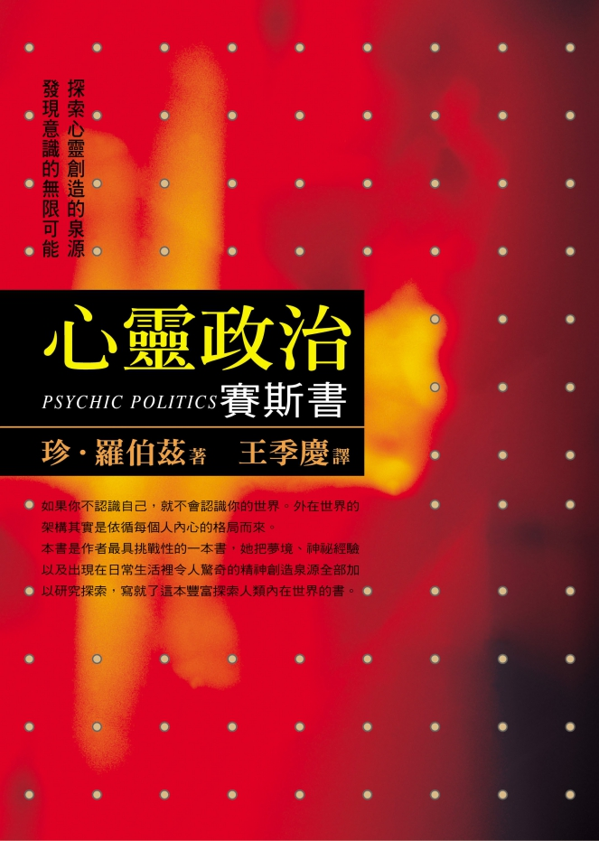

#### 版权信息

书名：心灵政治

作者：［美］珍·罗伯兹（ Jane Roberts ）

译者：王季庆

请购买实体书籍·该电子版本仅供参考

## 封面推荐语

探索心灵创造的源泉，发现意识的无限可能。

如果你不认识自己，就不会认识你的世界。外在世界的架构其实是依循每个人内心的格局而来。

本书是作者最具挑战性的一本书，她把梦境、神秘经验以及出现在日常生活里令人惊奇的精神创造源泉全部加以研究探索，写了这本丰富探索人类内在世界的书。

本书谈到了人如何参与自己人格内的决定；也谈到人类意识所没有采取的途径，以及更大可能性。

“珍•罗伯兹对时间、空间的洞见，远比其他顶尖的自然科学家丰富许多……”

——Fred Alan Wolf（物理学家&美国书卷奖作者，著有《量子跳跃》《精神世界》）

“对想要了解意识的学者或一般读者来说，《心灵政治》是一本必读的书，因为从珍•罗伯兹的发现中我们受益良多。”

——Lynda Dahl（赛斯国际网络总裁）

“珍•罗伯兹不仅提出新问题，而且创造了关于意识的惊人典范。”

——Susan M. Warkin（《与赛斯对话》作者）

“珍•罗伯兹结合灵性上的禀赋及智性上的好奇能力，有助于我们了解人类的意识。”

——Norman Friedman（《科学与心灵的桥》作者）

## 译序

王季庆

当我校对这本书时，面对这样厚重又严肃的稿件，最初的紧张随着沉浸其中而完全不见了；反倒像是进入了“意识改变的状态”。之前阅读和翻译时，仍未全然体会的内容及其后的深意，一下子“咔嗒”都对上了！我心里真的了解了：“一切都是最好的时机和安排”的说法。

这本珍•罗伯兹继《意识的探险》后的著作，原来是极具重要意义的。老实说，阅读和翻译了这么多的“赛斯资料”，有时会有“不胜负荷”之感。尤其是（很多读者也可能会觉得）赛斯书本身就够瞧的了，何需珍再以不同的讲法增加我们的负担呢？

但且慢，这次我的亲身体验或许可以跟读者分享，以解读者心中之惑。

我觉得珍在一开头写“物质宇宙即是意念的建构”那篇东西时，她已“开悟”了。到一九七四年她完成《心灵政治》时，则真的彻悟了。赛斯书不断一步深入一步地阐述宇宙人生的真理，给了我们这些人能够渐次修习的照明灯，正是所谓的“渐修”。珍则在生活中实修，由不信“邪”的铁齿个性到亲身体验非官方的意识路线、源头自己、面向自己、转世回溯，融合了她的知性和直觉，验证了赛斯所说的一切。将她的这两本书和赛斯的《未知的实相》对照，（当然，得先读《灵界的讯息》及《灵魂永生》才能真了解珍的功力！）

在《心灵政治》第二章中，珍看到“超级真实”的世界，正如禅修开悟的佛陀，以及后来有开悟经验的人，举目所见，不再是平板无趣的三度空间，而是看到了所有原子、分子本身的“生命力”以及能量的光华。

珍述说她对“图书馆”经验——她见到自己的分身在异次元的图书馆里阅读，而可以直接写下读到的东西。她说，内在模型或典范（内我、存有）常常给他显现于世间的我们“启示”，如果我们能让这种智慧自然流动到我们心中，造成自然的改变，那么内在与外在的暴力革命都不需要了。

珍由于自身不断地追寻，接上了“图书馆”，终于带给自己和世界一种新的神学、新的宇宙观，她在第十三章对“意识束”的描写，真是写的太精彩了！将“不可说”的东西，说得那么好！第二十一章中，珍终于讲明白在“超灵七号的教育”系列第三本中，令读者心痒难耐却找不到答案的“附录”，其内容和功能在这里都有详尽的描述；原来，“附录”是新文明建立其上的典范。

第二十四章以后，珍又回来描写“意识的阶段”，比禅宗三关说得更清楚，带我们一步步进入她内在灵魂的体验，为我们绘出了心灵的地图。诚如赛斯在本书最后答覆一位学员所说的，并不是每个人都需要阅读赛斯，那些未失童心的古老儿童、与大自然亲密无间而认识到他们存在的活力与安全的人，是不需要赛斯的。

至于我们这类充满着不安、充满着问号的人，赛斯书将会带给我们满意的解答，而珍的书则可以作为我们的借镜。也不瞒你说，曾有人希望我能通上赛斯，能以中文回答他们的问题。可是，我了悟到，问题可以永远层出不穷，只要有通灵的人，就会有人去求教于他，但答案早已在“赛斯资枓”内，重点在于你的心和脑准备好接受了没有？能不能理解？以及能否自己亲身验证。而珍的书所描写的那种历程，正是我们自己开始向内钻研的最好路标，或许我们得先有耐心去研读“赛斯资料”，然后，当你的生活历练加上自己各种心理问题的解决，终能够整合自己的知性与直觉后，便能了解珍和赛斯在说什么了。

当我们扩大了觉知、改变了意识状态，才能超脱表面浅层的物质世界和一切相关的局限信念，以及由之生出的惶惑、恐惧。心灵真的出入自如于心和物、有形和无形、生或死。那么，“无有挂碍、无有恐惧、颠倒梦想”，便不再是妄想，而是自然的结果了！

## 推荐序

许添盛

当新时代中心创办人王季庆女士告知我又有一本赛斯书——非由赛斯口述，而是由赛斯书的传递者珍（鲁柏）所书写——即将出版时，心中的喜悦可见一斑。

当然，我能为许多其他书写序，怎能不为自己最心爱的“赛斯书”写序呢！

诚如鲁柏提到的，许多人喜欢赛斯书，却只将《超灵七号》当作是无关紧要的科幻小说；许多人喜好赛斯的每个观念，却几乎从未看过鲁柏的书。

就如现今社会上的许多人，热衷于心灵的追求或灵性的提升，也许陈义过高，也许高谈阔论，或流于对心灵大师的盲目崇拜，或对某些灵性及宗教团体的狂热投入；但是，对自己切身的日常生活，及周遭最亲近的亲友，却弄得灰头土脸。

心灵的追求及灵性的成长若不能落实在最切身的个人生活，也许只是个人逃避面对现实人生的借口罢了。

在这本《心灵政治》当中，读者可以看到，鲁柏并没有沦为赛斯的盲目崇拜者，也没全然唯赛斯之命是从；相反的，鲁柏坚持稳稳的活在自己的生活里，以自己的方式体验这独特的实相。

以此为蓝本，读者可以看到，每个个人的生活可以如何的随着赛斯理念的进展，而有其自身的亲身体验。鲁柏不只传递了赛斯书，更以自己的独特方式体验赛斯思想的精髓，不但是“理悟”更加上“证悟”。

当读者在看鲁柏的书时，也许可以有这样的心态；既然随顺赛斯书的进展，鲁柏这位先知可以有这样的亲身体验，可以感受到他心灵的图书馆，那么，我也可以有类似鲁柏的自身独特的经验。每个读者便可以多多少少跟随赛斯的思想，却也可以有自己独特的心灵体验及灵性进展。

赛斯书博大精深，鲁柏的书更是一种“修行实证”手册，显示每个个人伟大的心灵天赋。因此，对各位读者而言，用心阅读本书的同时，你个人意识的探险才正要开始呢！

——本文作者许添盛为台北县立医院身心科主任、中华新时代协会理事长

## 第一部：图书馆与超真实

## 第一章：图书馆

我们刚搬家，原本位于华特街的公寓已经没人住了。写作时，我不再听见桥头十字路口的车流声，也不再观看我们屋顶上的鸽子。

赛斯课就是在那间大客厅开始的。刚开始，只有罗和我——画家和作家、丈夫和妻子，像上百万人那样以“灵应盘”（Ouija board 译注：类似碟仙）。直到我们离开公寓前，已有四十名学生挤在那间客厅里；我的“通灵人格”——赛斯，已口授了两本书，并将完成另一本；而我们自己也写了三本。此外，当我第一次住进那间公寓时，我三十一岁；最后离开时，我四十五岁，赛斯课是在我三十五岁时开始的。

初始几年，我们对赛斯课是非常保密的，只告诉少数几位密友，并没有告知邻居们。有次，一位邻居前来查探；时当夏季，窗子是开着的，而他必然是被那深沉、阳刚且带着我们从未能归类的“赛斯之音”的怪异特质给震撼到了。无论如何，当敲门声响起时，罗打开了电视并转大音量，而那邻居只看到我们无辜地坐在那儿，他试图解释自己听到的声音，罗说：“一定是电视节目。”我们的邻居就摇着头离开了。

在某种意义上，赛斯是像个电视节目。因为，在课间我调准到另一个实相频道，好让赛斯的“节目”凌驾或暂时取代我自己的“官方意识台”。有时候，我认为赛斯有点像某个公共教育频道；不可见的转盘在我脑子里转，而他按了打开的按钮。有时候，赛斯像是个多次元通讯网的导演，而我幸运地拥有一台独特的电视，可以收到他的电台。他显然就像是我进入其他许多超常态意识领域之旅的导演。

我仿佛可收到越来越多的“电台”，然而却总是由赛斯担任评论者、节目主持人、新闻主播，以及通过内在心智的崇山峻岭、沙漠、河流的亲切导游。

换言之，我由奇异之地收到讯号。我一向如此，虽然当我在长大成人时，只将每件事视为“灵感”，就让它过去了。最后，灵感有了一个它自己的声音，并且加上一个人物——赛斯。所以，赛斯写（译注：指直接口授）他的书，我写我的书，而每一个接下去的稳定意识改变，都由这些陌生却又多少熟悉的内在实相国度带来新的讯息。

倾听这些讯息，转译它们，将它们写下来，是我的人生。赛斯说，“存在”合理化它自己；而有那么一阵子我想，也许写作合理化我的人生。我花了一些时间才了悟到，对我而言，存在即写作。当我没有以自己特殊的方式“打开”时，我的人生仿佛较黯淡，我变得怏怏不乐。所以，当我完成了一本书时，我等不及开始下一本书。

于是，完成了上一本书《意识的探险》后，我怒冲冲地过了一阵子。虽然赛斯在我们每周两次的课程中口授《未知的实相》，但还是没有一件事令我满足。日子一天天过去，而我变得愈发的坐立不安。我觉得与我的存在脱节了。所以，我开始了每当想接触自己更深的意识层面时，通常会采取的一连串步骤。我画了一些水彩画，但那似乎不太管用。然后，在十月初的一天午后，我半怒地写下这首诗，描写我的状况。

◇　◇　◇　◇

邀约

啊

爱这顽固的必朽自己

再一次试图接触它的灵魂

而在一个秋日午后自忖

如何将它自其高高在上的领域

骗下来

必朽的自己说亲爱的灵魂

每年此时大地是美丽的

而你某个部分显然被

晕眩坠落的树叶所感动

且被像寻宝的鬼魂般

绕着邻里旋转的

迷蒙秋日的暮色感动

但如果你不想开口

能否容我说话

无论如何你是我的灵魂

因此我不懂

要占你一点时间

为何我需要预约

我随时随地候教

虽然一些结构似乎有所帮助

所以我提供这诗

它有足够的弹性来承担

甚至最重的对话重量

首先我想知道

你至今是否曾听到

我所说的任一件事

所以在我真的开始之前

可否给我一个

你正在聆听的信号

写到这里必朽的自己站起来

煮了些咖啡回来

再坐下来等

它好奇谁知灵魂的世界

除了那显然所知不足的自己

而如果灵魂真的说话

除了他尘世的对等自己

又有谁知

悬疑分秒滴答

猫儿喵喵叫

必朽的自己说

我觉得自己真蠢

不是我用错了方法

便是我的灵魂像是

不知我是活着似的

◇　◇　◇　◇

这诗其实还有许多其他小节，不过上面这些已经包含了主要的诉求：我想要再度感觉有联系，而我要灵感和能量的上冲。必朽的自己——当然，就是我——相当好辩继续说：只要灵魂够好心地告诉我下一个“方案”是什么，我都会非常配合地去做下一步该做的事。在写完诗后，我停止争辩而只是等待，虽然不是非常优雅地等待。

但那诗启动了怎样的能量，又是如何地推动我到新的旅行去啊！因为它，这本书才会写出来，而我的外在生活也改变了，以至于华特街公寓——现在所有这一切开始的源头——已成了一个回忆。还不只如此，我变得熟悉了存在的新次元，开始对于一直在织出织入这个实相的那些替换实相学到了更多。

事实上，差不多有一周的时间，我断断续续地修改这诗，当想到有利于我的新争论时，我便加入新的诗节。但，我仍没收到任何答覆；我没得到新的洞见、梦或想法。太好了，我讽刺地想，而我会写另一节诗，问灵魂它在何方？出了什么错？并重复要求一种我可以了解的沟通。

每天早晨我至少坐在书桌旁一会儿——等着。大约一周半后，在一九七四年十月二十五日，我一如往常砰地坐下。那时我已几乎忘记了那诗本身，脑子一片空白，突然之间，下一个方案如此清楚地呈现，以致我无法有任何疑惑。一个图书馆的影像突然跳换到客厅的东南角落，而我看到自己的影像在其中。同时，两段话活生生地跃进我的脑海。兴奋之余，我将它们写下来，然后，当那经验本身开始展开时，我描写它们。那时，我明白这些笔记本身就是一本新书的开始。

这些是我的原始笔记，前两段完全精确得像我在心眼里看到它们的样子——我想目的是使它们凸显出来，而让我知道那里涉及了新资料。纵使之后，那种精确的安排对我而言仍有其重要意义。

◇　◇　◇　◇

没有人是座孤岛

但每个人都内涵了

他学会去以一种心灵政治

加以统治的

内在文明

外在政府与法律世界

即据之架构而成

自我从心灵的文明

升起

正如统治者

国王

王后

总统或独裁者由

大群人民中升起

按照

存在于更大内在心智的

一种内在政治而被

指派选择或取得控制

◇　◇　◇　◇

上面两段文字以一种难以描写的力量极为奇怪地影响了我。我觉得它们存在于别的什么地方，并且已经存在了数世纪之久；它们是不可避免的，虽然我才刚开始转译它们，但这本书已然被写好了。这本书是部经典，在某处或某个别的时间已被认知为经典。以上两段只是开头，然而它们以一种无懈可击的正确性来到我这儿。我突然确知我本来就该“写”这本书，它代表了“我的道途”（my path），并且是我命运的一部分。我并不是被迫去这样做，对我而言，我是以某种怪异方法认知到这书，以及它所代表的道途的绝对正确性，这本书名将是《心灵政治》。

◇　◇　◇　◇

许多年来，我一直在写作，而我确信，没有任何人可以制作出“赛斯资料”，或维持我与赛斯的那种关系，但这本新书以一种更亲密的方式冲击到我。然而，仍有种距离感，仍然阻隔在我与在我们时间里的整个稿件之间的距离，因为，以一种最自然的方式，我在将它拉向我，或它在将我拉向它，二者之一。

在我与这本书之间，仿佛有一条路，比至今我生命中的任何东西都更令我感受到是“我的道途”，以至于我发现自己暗忖，我是否已在别的什么时间和地方写好了它。它也可能是别人写的。但，不管怎么样，我觉得自己该是转译它的人，而这个动作将这本书活生生地带到三度空间实相来，纵使它存在于那个脉络之外，而正在被转译到它里面来。

这书有一部分谈到在某些层面一直为人所知的，心灵的某些原则和动力学，是我以最近的例子及经验所加进去的，那会使这书在我们的时代里变得实用。我再次强烈地感觉，这书是由其他文明中，被毁的图书馆里失落的经典。

到现在我才认识到，这种完美的正确性正是我多年来一直在追寻的东西，它会带来自己的高度信心及心灵的适当性；就好像我一直在将自己的意识往所有的方向抛掷出去、探测着，而迟早我会找到一个达到特定源头的清晰圆周或途径。而不知怎地，我同时在保持自己的“不平稳”，当该满足时我却继续追寻；除非我找到它，不然我不会知道它是什么。

“它”——这本书——可能只是许多本之一，但我似乎觉得它像是在一座伟大图书馆里许多书中的第一本，裱以黄金封面，不知怎地以其他方式回响于私人和群体心灵里的经典集。当然，图书馆的影像也许是象征性的，然而在另一个层面，我可以看见自己站在那些书卷旁，凄然欲泣，心想我终于回到了家。

我觉得我命中注定要转译这些隐形的书籍，用我们这时代的心灵筛滤它们，借由灌输它新生命而再度创造那些书。它们必须通过血肉的转译，并透过媒介而成长，同时转译者则必须在其他心灵层面与之有最完美的亲和感。这是我必须跟随、等着我的下一步。

我不知道赛斯在其他书里所扮演的角色。多年来，他经由我书写他的书，但我并不觉得在这本新书和他的书之间有任何冲突。它们反倒是相连的。赛斯书代表一个独特人格对其他的独特人格说话。这些其他的新书似乎完全是另一回事——独立的、孤高的，以一种已完成的形式，经由我私人的经验再度活起来。我感觉这些书和我的人生将交织在一起，彼此相得益彰。

◇　◇　◇　◇

正当我写完上面的段落时，有人敲门。我以为是报童，就叫道：“进来。”完全没料到，一位青年大步走进了客厅，他双臂信心十足地摆动，坚定的双眼湿润而闪闪发光。在此，暂且称他为李曼。

我不敢相信，差一点呻吟起来。昨晚，当他参加我的意识扩展班时，我才见过他，先前他曾以饱学之士的口吻，在电话中说明自己是一位“初出茅庐的超心理学家”。不过在课后，他要我告诉他该如何过活，好像那是我的挑战，而非他的。我花了将近一小时跟他说话，希望加强他对自己的信心。

显然我成功了，但却不是我以为的方式，因为现在他未经通报地现身了。他以一个利落的姿势脱下了西装外套，把他的录音机放在我身边堆着一堆湿透面纸的桌子上——我伤风了——而他以神采奕奕的眼睛扫射我，毫无赘言，马上热心地告诉我他如何循线找到另一位通灵者，并打电话给那位躺在医院病床上的她。“然后，虽然那通电话花了我二十块钱，还是值得的，”他说，“我告诉她关于你和你班级的一切，发现她看过你的书；而我请她评论你的想法。”

我只坐着看他，并看着面纸。

“你说不会有大屠杀，”他说，“而所有其他的通灵者，包括凯西（Cayce），都说会有。她说大屠杀不会在二〇〇〇年到来，而是马上就快来了。你对这又有什么话说呢？”他打开了录音机。

“什么屁也没有！”我说。

他继续：“她还说，在星光层面有一个阶层组织，而且只有七个人能通达阿卡西记录（Akashic records，译注：西方神秘学所谓古往今来一切的记录，犹如“业镜”。）而她是其中之一。其他人告诉你一世的事要价非常高，但这个灵媒，你只要花五十元，她会给你一个判读，包括影响你所有其他时候的前生。但你说根本没有阿卡西记录这回事，说它们只是别的东西的一个象征。所以你怎么解释呢？”

他对自己作为一位灵异侦探的机敏能力，自豪得几乎令人受不了。我让他再继续了十五分钟，才安静地问他：“你来这儿有何贵干？”

他辩才无碍，手势夸张地说：“我要你请赛斯评论一下，在他所说和别人所说之间的矛盾处。我要你问——”

“我才不在意呢！”我以一种非常安静却算计好的粗鲁说。

“什么？”他问。

我瞪着他，并擤了擤鼻子，又弄脏了一张面纸。

“但赛斯可能在乎。”李曼愤慨地说。

“我怀疑他会。”我说。自从李曼擅自闯入后，第一次安静无声。我静静地说：“你至少可以为没先打电话便跑了过来道个歉。”

他脸不红气不喘地说：“我想你不会见我，你在忙。”他显然对自己的大胆自鸣得意。

“所以我不管三七二十一就来了。”

“当你进来时，我正开始写一本新书，”我说，“而我还得洗晚餐的盘子，且在一小时后有一节赛斯课。”

“我能不能顺便参加一次呢？”他问，拾起我那包烟。

电话响起，一个年轻男人请求参加我的课，但他真正想要的是——要我帮他做个决定，“是个灵性的、精神性的决定。”他再三的以三四种不同的混乱方式说。他要我告诉他该怎么办。我花了几分钟跟他谈，说叫别人替你做决定，并非一个学习做决定的好法子，而且根本无助于任何一种能力的发展。我给了他几个简单的技巧，澄清他的思路、然后挂了电话。“初级的超心理学家先生”仍坐在那儿。

“你还在这儿是因为我正试着想出‘我’容你来访的理由，和你自己的理由是分开的。”我说。但我没说出口的意思是：“为什么正当我觉得找到了自己的‘真正道途’的当儿，这家伙便来烦我？”纵使我不喜欢“真正道途”这种用语，它却相当贴切。

“你的意思是还有另一个理由？”李曼立刻兴奋起来，“好比我在一次前世里认识你或赛斯之类的？我就知道。我必须承认我知道，另一位通灵者是这样告诉我的。”

“恐怕我完全不是那个意思。”我说，但他又再兴奋了起来。高兴与希望的情绪令他的肌肉紧张，他突然向前倾身，以致那盒面纸颤抖了一下。

我吓了一跳，抬头看他：突然间，我看到李曼来访的理由。我发现，在整个探访中，从他跨进门的那一刻，李曼不知怎地比真人来得大；至少就我而言是如此，超级真实。我被示以——或他展示给我——我书中的第一个角色。他如此地是他自己，如此无懈可击地为他所是的自己，以至于，不论他有没有烦到我，我都只能对他的独特感到惊讶。就好像他才从时空之外到来，像个包裹一样自己送上门来，而当然，他对那个包裹骄傲极了，但却是个我必须以自己的眼睛去看的一个包裹。而他是个用闪亮的热诚缎带扎起来的怪诞包裹。我只是不喜欢其内容而已。

而且我看出了原因。他是我自己一些旧有的恐惧和想法的活生生展示，偏偏在我以为自己已放弃它们时出现了。我一直不齿“阿卡西记录”作为一种灵异传统的想法，它也许代表的是别的什么。显然我不相信，人类生命的一些超级计分单会写在太空的某处，让任何人去阅读。另一方面，在李曼来访之前，我却发现自己在另一个实相层面的一座图书馆里，并且觉得是“我的宿命”要去转译和再创造那儿的一些书。

我一边思索这一切，一边瞪着刚铸造好的李曼。我发现他正以他了不起的专注和预期的眼光瞪着我，等着我开口。“那么，赛斯和我‘是’有关系的喽。”他叫道，无法再忍耐一分钟了。“我必须保留一些怀疑，但我一向都知道——”他又伸手拿一根香烟，神经质而仿佛确知长久以来的启示将要落在他肩上，而他想要做好准备。

“不，你和赛斯并无关联。”我尽可能温和地说。但我想：当然——李曼代表了我对其他事的想法；太过轻信的人以怀疑者的样子炫耀。他们许多人所需的只是一句话，说他们在一次前世中曾是某号大人物，或某位名人，然后他们立刻变成了确定的“信徒”。像那样的人——电话上的男孩——从未信任他们自己的憧憬（vision）。我想，直到如今我也没全然地信任我自己。每一次，当我面对一个李曼或阿卡西记录、灵性的自炫时，我会想：那些人信任他们的憧憬，瞧瞧他们。他们人生中欠缺某种健全性，所以，我以一种严厉的质疑眼光守望我自己的憧憬。但我错了。那些人依赖的是教条，根本不是憧憬。

我必须摆脱李曼，以便能想清楚这一切。他看来失望，却仍决心永远留下来不走。你几乎可以听见他随后跟他们夸耀：“天啊！我就是赖在那儿！”对我，他则说：“你必须了解。我必须追踪著名的通灵者，比较他们所说的，并且记下其矛盾处。”他的话满含着坚定与自信。对他而言，那是个令人鼓舞、兴奋的游戏；但他不能再追着我跑了。

“很好，”我说，“你做你必须做的事。如果那对你是重要的，就享受它吧。但那对我并非要务，好吗？”我展开笑颜。“今晚我还有一节课。”这次我的声音很坚定。

他站起来。“你‘真的’了解？”他问道。

“当然，”我说，“你做你的事，李曼。只是不要在这儿，如果你不介意的话。”

但我在笑，因为我了悟到，在过去我往往怀疑自己的憧憬，只因为我并不信任别人的憧憬。我已开始觉得，憧憬本身再怎么样也是不可信任的，而你越信任自己的憧憬，对别人的现实世界将越盲目。现在，其实我看出来我根本不需要判断憧憬。它们只是它们自己。你接受或排斥它们。但感谢上帝，我不再觉得我必须为“所有的”憧憬的可靠性、或别人如何使用、甚而误用它们负责。我只替我自己的负责。

而我自己的憧憬又如何呢？当李曼终于离开时，我自忖着。在被打扰前，我那么短暂地感觉到的图书馆又如何？这本书又如何呢？我是否——如我以为的——在一个新的创造和心灵冒险的开端？或者我会退出呢？我可以看见我自己在说：“我看到了，呃，空中的图书馆——”

而我回答：“宝贝，你一定看到了。别担心，没关系！”然后我想：“象征性的或否，以我们的说法是真的或否，我心灵的一部分或否，那儿是有些东西，而我要找出它是什么来。”

当李曼离开时，已经过了晚上八点。赛斯正要在我们一周两堂的私人课程里口授他自己的书——《未知的实相》。再大约一小时便要上课了。几年前，我们彼此同意订在周一和周三晚上九点，一开始这尤其有利——人们不太会在一周当中不约而来——但除此之外，我还是个夜猫子。举例来说，我无法想象定期在早上或下午上课。不过，那天晚上我心里并没真的想上课。我在想着白天的经验，此外，我还有晚餐的盘子得洗（罗和我分担家事。我弄饭——除了早餐之外——并洗碗，加上一些清洁工作；他洗衣和做其余的清洁工作。）无论如何，那天我连午餐的碗盘也堆着没洗。因此我走到厨房，做完我该做的家事后，终于和罗坐下来上课。

我自己的经验在这种时候有所变化。通常当赛斯在口授一本书时，我只不过改变自己的意识，而让赛斯“去做”。他取下我的眼镜，在对罗寒暄几句后，便开始口授，并且在随后的两、三小时继续下去，中间有几次休息。那天晚上，我一坐下来事情便开始发生。幸运的，赛斯描写了我的一个经验，而我当场便能告诉罗有关其他的经验，因为后来我根本不记得发生了什么。

这是一九七四年十月二十三日星期三，我们正规的第七一四节。我能想象罗看起来是什么样子，坐在那儿笑着，因为我有点伤风；我曾为“图书馆”感到兴奋，而在李曼来了之后，我曾大声好奇道：不知会不会上课。几乎就在同时，我感觉到头顶上方一种怪异的金字塔效应，我偶尔会随着通灵工作而体验到的一个主观现象。另一个相当熟悉的感觉伴随着金字塔效应。我身体感觉庞然。我才告诉罗这事时，赛斯便透过来了：

◇　◇　◇　◇

“这对鲁柏（赛斯对我的称呼）而言，多少是个重要的晚上。当我说话时，他正在经验某种觉受，这期间他的身体感觉大大地拉长了，头伸出到星辰之外，整个身形横跨着实相。也就是说，现在肉体一直在这样做——那即是，它横跨实相坐着，在它自己之内甚至包含着无法用语言形容的时间和存在的次元。

“然而，未知的实相与心灵更大的存在无法自肉身的亲密知识分离。如先前提到过的，一般而言，有意识的自己只聚焦于一个小次元上。不过，那个次元是尽可能完整地体验了其清晰的灿烂与精美的焦点，只因你对它调准频道、并注意它。当你了解如何做，便也能开始对准其他的‘电台’。”

当他继续时，赛斯用我的经验去指出“未知的实相”的存在，并且讨论、探索它的其他方法：

“那么，就像有外在的传统习俗一样，也有内在的传统习俗，”他说，“就如外在的习俗试图强迫你遵从一般接受的概念，内在习俗也试图强迫你，使你的内在经验遵从预先形成的包装。习俗的存在有其道理。一般而言，它们有助于组织经验。如果它们被轻松地遵守和接受，它们能作为很好的指导方针。严酷执行的话，它们就变成不必要的教条，僵化地局限住经验……

“至今，鲁柏都坚持他个人的憧憬及其对未知实相的独特表达，如他经验到它的样子，因此，他带回来与传统习俗的灵异路线不合的报告。”

◇　◇　◇　◇

赛斯对“有向导的心灵之旅”及能规划内在经验的形形色色教条谈了将近一小时，然后我们休息了一下。赛斯所形容的庞大感仍与我同在。我觉得，当我站起来时，好像我的头会穿过屋顶。同时，我很清楚自己维持着平常的身材大小，纵使我在另一个层面有不同的体验。所以，当我真的站起身时，我的一个部分以平常的方式走来走去，同时另一个部分我的头觉得好像高高地在地球之上。

实际上，我们只休息了大约十分钟，然后赛斯回来继续口授他自己的书。他讲了半小时，然后说：“等我们一会儿。”一瞬间，我进入了一连串我几乎立刻忘记了的经验。我当场试图对罗描述它们，而我将摘录罗当时记的笔记如后。纵使到现在，就有意识的我而言，那些经验就与发生在别人身上没有两样。事件本身几乎一发生便消失了。

◇　◇　◇　◇

罗的笔记：

“我告诉你，如果我能弄到这个，就很神了，”珍说，点燃一根香烟。她啜了一口啤酒。“巴比，我正接收到的东西是……我无法复制的快速而美妙声音——非常快、非常悦耳——与电子的自旋及细胞的组合有关。电子的自旋比细胞的组合要快。电子较快的速度不知怎地给了细胞其界限。比如说，在晶体里，有些东西是在一种出神状态，那些东西在细胞里是活的。

“等一等。我所得到的是一个囚禁在晶体里的美妙声音，它透过光说话，它是人格的情绪。我得到几乎像宝石般色泽的声音。等等——我来看看我能弄到什么。我想以语言的形式得到它，而我如此快的收到它——

“正如风吹动种子，落在任何环境里，所以有个人格的种子骑在它自己的翅膀上，落入许多时间与地点的世界里。它带着一个声音落下，那是以不同弦线奏出的、它自己真正的音调。

“这些声音光荣独特地觉知它们自己的分离性，然而每一个都汇合成一首交响乐。每个声音都认识它自己为它自己，敲击那些它在其中得以发挥的次元性媒介，然而它觉知它在其他实相里发出的无限形形色色的声音——它如此庄严地弹奏乐器。每个细胞以同样方式‘敲击’，每个自己也一样，在一个万花筒里，在其中每个最细微的变化都有其意义，并且影响所有人奏出的个别音符。所以我们在不只一个实相里‘敲击’，而现在我却同时且分别的听见那些音符，或许像雨滴一样，而试图将它们放在一起，然后又听见每个分开的音符……而我突然听见自己真正的音调，那是我一定得追随的。”

◇　◇　◇　◇

在第一部分之后，我的传话是如此稳定，以致罗奇怪我是否回到了一个赛斯出神状态，减去了赛斯通常的声音效应和态度。我说得这么快，以致罗难以做笔记。但当我讲完了，我所有能说的只是——“就像是一个音符找到它自己真正的调子。而你一旦击中它，你知道就是它了。你完成了。你明白你自己在宇宙里的意义，纵使你无法用语言说出来。”

当它结束时，我感觉全然不同了；不论发生什么，都已从我的意识心消失了。我“知道”，纵使我不再记得我所知的。大体来说，赛斯其实对图书馆本身说得很少，但我即刻将“真正的调子”与我第一回瞥见图书馆时的感受，以及当我看到那儿的书时，我“回到了家”的确定感受连了起来。我对罗说：“很奇怪，我感觉不论我转向哪个方向，都有一条路为我铺展好，而我从未那样感觉过。”赛斯那晚没有再过来。我只摘录了与我的经验直接相关的那部分课程。那节的其余部分出现在赛斯自己的书里。

不过，那图书馆开始有了一个它自己的现实。第二天当我坐在书桌旁时，我突然“明白”它只是个大得多的机构之一部分。然后我发现自己在那儿，面对一个地板到天花板的书架。我并没想到转个身来看看我身后有什么，不过在我的左侧，我瞥见一个淡色木料的图书馆桌子；在我右方远处，是面朝南的窗子，外面是青葱茂密的草地，虽然在我所知的世界里是秋季，而树木是光秃的。那天好几次我突然发现自己站在那图书馆里，永远在同样的地点。

稍后，将近黄昏时，我将香肠和意大利面放在炉子上做晚餐，而在叫罗吃晚餐前，我坐在书桌旁工作几分钟，由宽敞的凸窗看出去，看向下方的街道，完全无预警的，我再次觉察到那图书馆，并且看见自己喝着某种金色的甘露。我知道那种饮料，在“那边”饮用，像是一种全面的滋补品，调整肉体，尤其是净化血液。我得到一个印象：这甘露是给任何由这儿到那儿的人喝的，而它供给了工作所需的能量。当我在图书馆里喝那液体时，在桌子这边的我认为它看来像蜂蜜，只不过没那么浓稠；在这儿的我突然感觉头部非常放松和松弛。

后来我在洗晚餐的碗盘时，有个感觉：你可以由那图书馆向外看到我们的世界，以及我在华纳街和华特街的特殊角落——而仿佛我们的世界是图书馆领域的一部分。

我也知道（或以为我知道），某种研究系统正为我设立起来。可以说，我并不会将所有的时间都花在图书馆里，也会在外面或田野里。

在那时，我的感觉甚至是在某个别的实相层面，我进入了一个专科大学或学者的社区，也许是要修某种课。在过去，我并不特别喜爱图书馆，除了利用它们提供的必要服务之外。亦即，我习于将它们想成是挂着“请保持安静”牌子的地方。但“我的”图书馆却完全没给我那种感觉。还不只如此，每当我发现自己在那儿时，我一直在想“我回家了”。

当然，很可能别人会看见闪光而非书籍，或以不同的方式经验同样的环境。但对我而言，从一开始，就有一个在另一个经验层面的图书馆；而我知道我会由那儿转译一些书，并创造它们；而当我在那儿进行我的工作时，同时我也会有所长进。

## 第二章：对“超级真实”的私人一瞥，物质实相和心灵结构的模型

第二天，十月二十五日星期五，我坐在书桌旁，感觉到图书馆里已经有些资料“为我准备好了”。这回，我根本没看见那些书或桌子。反之，我觉得慵懒而非常放松。来到我这儿的字句并不像是由任何人口授的，它们几乎机械式地由图书馆移植到我的脑子里；至少，是那种感觉。那段落并不长，我甚至不确定我知道它的意思，然而我再一次被那种完美的适合感给震撼了。以下这是那段话：

◇　◇　◇　◇

从图书馆

物质实相的模型

物质实相有些一直在变的模型，随着每个新的稳定性而顷刻设定的新方程式不断改变自己，永远以令人目不暇接的快速动作形成。然而，不论是给一个分子或一整个文明的任何模型，一旦印在可能性的媒介上，就再也不会消失。我们调准这些模型，而我们与它们的互动在任一既定点都改变了它们，并引起新的确实性次元（dimensions of actuality），随即由那新焦点向外延伸。

过去加现在等于未来，一加一等于二，看来仿佛如此，但那一、一及二存在于同时，而过去、现在及未来亦同，尽管并非以那种顺序。

◇　◇　◇　◇

当我写完时，我瞪着我所写的，并没真的理解那一段。午餐的时候到了，我离开书桌去做一些家务，本来已计划在饭后跟罗一同进城。但我一直越来越放松，以至于几乎想留在家里。显然我有个部分必然已知那天下午会发生什么事，但我却在最后一刻才改变想法，拿了外套，告诉罗我还是要跟他去。

经过楼下的阳台、走进后院时，我深深地被那天的美震慑了——铺满了秋天棕绿色叶子的草坪，每片仿佛都神奇地分开而活生生。最重要的是，我感觉被土地不可思议的浓烈气味包裹住；从罗的画室外树上落下的烂梨子气味，以及从土地本身升起的某种香味；令人动容却无法言说。我没注意到任何别的东西，直到我们开了几条街，停在一间文具店前。当罗走进店里去时，我坐在车里等着，觉得身体开始如丝般平滑，并且内部会奇怪地动，仿佛我的心智正在一个内在的冰冻池塘上溜冰。

然后，在一瞬间，世界真的在我眼前变了。那转变令人惊讶——由于当每样东西都不同时，每样东西又相同而更令人惊讶——因此，我花了一分钟才悟到发生了什么事。实质的街道和停车场并没有真的改变：文具店仍在原地，而人们走过人行道。在另一方面，我看到的每样东西都比它们本身更大，浸染着几乎无法形容的一个额外的真实。

不知道这经验会维持多久，而我想在它仍发生时将它写下来。我们习惯在车子里放着纸笔，但我乱翻着置物柜，不耐烦地低声自言自语着，却找不到。不过，某个部分的我根本懒得去记录，只想沉溺在这被奇怪地改变了的世界里，所以我只坐在那儿，呆瞪着眼，直到罗回到车上。

我试图描述所发生的事，但形容得支离破碎——而我们还得去买菜。所以罗跑进市场旁的药房去买了笔和本子，然后留我在车上，他去购物。我开始写笔记，但不愿把视线从挡风玻璃挪开，我几乎难以相信我所看到的，举例来说，我们在同一家超市买菜已经很多年了，但那广场看起来是如此的不同，以致——虽然在某方面看来相同——很难相信它是同一个地方。

空气和每样东西都在发光，此其一。在人行道上的每张纸，或每片草坪、购物车都在闪闪发光，奇迹似的独自分离站着，纵使当它是别的什么东西时——它又不只是它自己。（编注：2013 版此处译为：纵使当它是——它自己之外——别的什么东西时。）当罗在买菜时，我一直看啊看的；我的笔记如此潦草，以至于晚上要打成字时，有点难以辨识。

以下是我所写的：

◇　◇　◇　◇

突然间，世界显得不同了。我正由一个全然不同的角度去看它。它看来比平常要真实得多，既坚实且建构得更好。真的，它与我以前见过的世界非常不同，而我以一种新的方式在里面。它像那旧世界，却更丰富无穷、更“现在”，造得更好，并且更有深度。

文字完全无法形容这个，但人们似乎在他们的独特性里甚为奇妙。没有人是平淡无趣，或以老说法来说“只是个人而已”，而每个人都是更坚实而完整。每个经过车子的人在此时都比三度空间更多、超真实，却还是一个更大自己的“模型”的一部分；是其会增益任何既定个人——或建筑、草案、任何东西——的幅度的一个版本。

这个车子停下来及其他人开进开出的特定景象，全都浸染着它自身的一种伟大，然而同时那景象又存在于它自己之外。我并不知道我是如何感知此事的，但我真的“看见”这额外的实相，覆盖在我们所知的实相之上，因此，在我视线内的每样东西都是超级真实，而每个人的实相很明显且清楚地都不只是三度空间的。我知道我在重复自己，但我要记下这点，以免我忘记了；虽然我不相信自己有一天会忘记现在这一刻。就好像以前我只看见人或东西的一部分。现在世界坚实得多，以至于相对之下，我先前对它的经验像是一个劣等仿冒品，由不连贯的点或模糊的焦点造成的。

就好像我看见的所有人，都是数世纪之前大师们画的那些人的新版本；新版本，却是它们本身独特的变奏，它们自身的原创性改变了模型，纵使他们的存在是自其中升起的。市街仿佛更坚实，好像它们更稳固地贴着大地，但最令我注意的是人——再次的，如此的超级真实，每个都如此个别，却又是他们不断在改变的更大模型的一部分。

◇　◇　◇　◇

当我看着时，我知道每个人都有自由意志，然而每个动作都是不可避免的，却不知怎地都没有矛盾。这是个身体的感知——实质上感受到——却难以形容；但看着每个人，我可以感受他的“模型”及所有的变奏，并看见那模型是如何在此时此地这个人里；同时我看见的那模型之特定版本也在所有其他版本之内。我看见这些人是全人意义的“真人”（True People）。这些人是“更在这儿”，不知怎地更完整、更完全。感受到的模型之内在支持力给了他们额外的活力。

我自己的肉体感官也随之反应：世界是更丰富、更真实等等，因为它也被这些填满它的内在深度支持着。举例来说，街道全是按照一个内在范本建造的市街，却独特地是“这些”市街，以它们的特色闪闪发光——在纽约州，艾尔默拉市的某个角度，而非任何另一处，正是由于那范本及其变奏。

人们仿佛是他们自身的典范（classics）。当我坐在超市前的汽车里面，我面对着一群店铺，并且也视这些为范本及其变奏，视之为阿拉伯摊子及印度市集，都是范本的变奏。而在橱窗里展示的一个万圣节南瓜，作为它本身及一个范本的完成，都很奇妙。这同样适用于我看见的每样东西上。

尤其，我记得在一座停车场旁的一个小角落，周围种着小树，一个男人站在那儿，穿着衬衫和吊带裤，长裤太短并且胯部太紧。他的衣服旧而褪了色，但穿着崭新的棕色皮鞋。他抽着烟，站在那儿观看那角落，而阳光在他的红棕色稀疏的头发上闪耀。他有一个含糊却果敢的脸。我离得太远了，看不清他的五官，但令我注意的是他的姿势和衣着。他完全是他自己，却又是个典范，有可能在任何一个世纪出现；却出现在此——范本和他自己在一起。

我想：我已快满溢了；而有那么一下子我甚至好奇，是否可能我配戴了一副很棒的新眼镜，而又忘了这回事。我知道这很可笑，但在那瞬间，几乎更容易相信是那样，而非接受世界可以突然与不到一小时前那么不同这个事实；甚至要写这笔记也很费劲。我只想永远看着。

直到那天很晚的时候，当我画完对这经验的画后，才察看早晨我胡乱写下的“图书馆”小记。在当时它们没多少意义，而如果它们该是一本书的一部分，我对于该在那儿或在何时切入书稿毫无概念。重读它们时，我想：当然！世界的同样内容加起来不会得到一个特定的总和，却等于一系列的总和，就看你如何联合它们。而我知道我跳过了某一系列的总和而进入了另一系列。

不过，我对于自己没有立刻将今早图书馆的资料与我的经验连结起来感到惊讶，因为很显然我会感知所描写的范本，并经验它们，因此它们突然变成我有意识的一部分。我获得了支持图书馆资料的第一“课”，虽然当时我还不十分了解那一点。

突然间，我开始做出新的连结，而立即草草写下：

◇　◇　◇　◇

当你感受到那范本，而你自己的创造性版本改变了整件事，那时你真的感受到自己的力量，并调准自己到世界的一个更完满的版本。你觉察到那范本的力量，并且能利用它。于是，像个吸铁石般，轰！两个被拉到一块儿了，你和你的范本拉齐了。对于你先前只靠信心采信——如果你肯接受它们的话——的事情，突然有了证据，也有了一个与世界及他人的全新取向。

就好像发生了一系列的“整队”，或像是可见的世界突然与其隐形的对应物排成一列，而你发现，先前你只见到一半的实相——人们一半的存在。现在隐形部分充分长满其外部，并支持它。举例来说，与罗开车回家，我感觉到大地支持道路，而道路支持车胎与车子。我身体上感受到这点，就好像我们感觉到温度一样；一种正向的支持或压力，将路撑起来，像是一头巨大动物的背，以一个长而有力的拱形将自己顶起来。

◇　◇　◇　◇

那晚和第二天，日常的习惯和做家事对我也像是三倍的真实。它们令我觉得极端的切身，纵使我一直感受到自己另一部分在图书馆里。而我在图书馆的自己会想：当然，那是我在世界上所做的，而那是我在这儿的样子。因此，我最习惯的手势仿佛既熟悉又令人惊讶。

我不知怎地加入了在图书馆等着我的我自己的一部分？我一直在暗自忖度，而当我在过我的日子时，图书馆的实相经常与我同在。关于它的洞见一直进入我的脑海。我知道，你由我们的世界走进那图书馆，当你回来时，正常生活就渲染了新的次元。我一直想探索图书馆的场地，更清楚、更完全地“到那儿”。而当然，我好奇这整件事会持续多久，图书馆有多少永久性？

用晚餐时，有一刹那我看见自己坐在图书馆里的一个膳厅式长桌边，又在饮那甘露，而有一刹那，我自己的咖啡味道像蜂蜜一样。我感受到我那儿的形象，我想是我的范本形象：我的头发剪成及肩内卷的样式，有着直的刘海。我穿着一件衬衫，及我通常穿的那种牛仔裤，但我比现在重好几磅，而我的身体以几乎即刻的敏捷移动。我也看到一个老些的范本。她穿着一件道袍式的宽松衬衫，却配着某种长裤；她是世界之间的信差。十年后，我看起来会像她吗？我暗想。

我记起了“初级超心理学家先生”，以及他有多超真实。今天的经验是否真的在那时开始？而我一直为之纳闷，因为每个人都是像那样；他们自己的典范。就好像我以前只看见世界的复本，而非原本。

关于我调准到新世界的“焦点转换”又是怎么一回事呢？还有多少其他这种焦点？在任何时候，世界的观点能包含无限的焦点变化，由“最模糊的”到“最清晰的”，每个都明确地不同，而或许每个都聚焦在全然不同的面向。在世界里还有多少别的我没看见的呢？不为我所知的其他可能有的觉知转换是什么？

我想，在某种意义上，在我们时空里活着的人，可以用许多种方式经验世界，以至于他们之中有些人可能与来自另一个星球，或另一个实相的人，有更多共通之处呢！在假设性的“焦点三”的一个乞丐，可能觉得世界比“焦点一”里的国王还来得更富足和更令人满意呢！我并不喜欢“更好或更坏”的焦点的暗示，但我必须承认，我的新视角比我通常用来看和体验世界的方式要优越太多了。我看出所谓的转世人生，可以与同类的转换打交道，只不过带着大到足以全然改变时间视角的改变而已。

想着所有这一切时，我模糊地意识到，自己在图书馆里做我的工作，这才想到，我有部分是聚焦在那儿的，正如“我”是在我的实相里一样。我也知道，两个世界是以某种方式同步的。但我对图书馆的感知会加宽或加深吗？这了不起的跨界会持续多久呢？它会变成标准，以致我忘记自己的旧生活曾是什么样子吗？当对比消失了，我怎么会记得呢？或整件事会在时间里渐渐消失吗？

为了测试一下，我出去散个步，而外面的物质世界仿佛是图书馆外围地带的一个延伸，因此，内在与外在实相以最奇怪的方式连结起来。华纳街交通繁忙，通常我会以在后院、或在一度曾是我们花园的停车场里走走来取代。不过现在，道路、汽车和房子全都显得更真实，甚至，一直够实质的远方的山，有着一种加上去的质素及满满的灿烂。我走过街角，去拜访一位友人。我们喝了杯啤酒，吃了些苏打饼干，而当我们坐在那儿闲聊时，我感觉自己同时也在图书馆拜访某人。回家时，我觉得自己以一种是环境一部分的新意义更坚实地活在世界里。本来我都觉得好像我在向外看着面前的景色。现在，我则是那景色的一部分，移动穿过它本身，却维持住自己主要焦点。

走回工作室内之后，我发现我不在家时，我的另一个部分曾在图书馆里探索了一下，我突然明白，它事实上是个学习中心，里面有不少人。它是个心智世界，或心智状态，在那儿，所有其他人以他们自己的方式，是在与我自己一样的层面；一个“地方”，在那儿，这些隐形的同事们和我一同工作。我们终究会全然聚焦于这内在环境里，因而也聚焦于我们外在的环境。我们会有一个清晰焦点，可以在其中学习和做事。而我明白，虽然我们可能与其他层面错开了，我们是回到家了。我发现自己在想：明天我真的要安顿下来。而当我想到这事时，就有如实质上到达了某个高级大学一样的兴奋。然而，我当然明白以我们的说法，那图书馆并非实质的，它代表了心灵里的其他地点，至少到某个程度在我们的世界里物质化了。

别人曾提供心灵的地图，但我从未信赖它们。那些地图带着太多在这现实世界里的地名的记号。当你旅游过心灵时，你必然是旅游过你自己最深的心智——而当你旅游进入内在实相时，这意味着你移入另一种大气里，就像如果你在外太空旅行时一样。在过去，别人曾投射他们自己心智的影像在那儿，然后表现得好像这些是自然的路标似的。在我的旅途上，我拒绝跟随那些途径，觉得它们不安全或不可靠，并且怕它们会朦胧了我自己的视野，或令我迷路。这些扭曲像是物质的太空船留下的残渣：破旗的残片，或不要的设备，随后可能继续在太空里依轨道绕行。

只不过，我说的是心灵的残渣，它大半可能在某个时候有其他用处（再次的，像被丢弃、一度有用的太空“垃圾”）。但在太空中跟着它跑，只会带你到别人已去过的地点。

然而，我也是实事求是的，像我大半的同类——与物体及他们的感官证据打交道的地球人，而未探测好的太空——内或外——可能令我们自觉渺小。或者你会想：旅行到内在实相，我该寻找什么呢？我所看到的真的是在那儿吗？或者，我的经验会不会是我对无法被直接看到的景物的一个反应？

这令我想起，我在初上大学时所写的一首诗中间的一句：“我造出我自己的人行道。”也许，在某种意义上，我们每一个人都造出我们自己的路径，以及我们自己的心灵结构物。然后再将之抛入内太空，就与一般太空船由地球发射一样。这有某种精致的合理：太空旅行用的载具是由物质的东西造成的，适合其环境，设备精良，以在一个明确的系统里感知特定种类的资料。

所以，我们也建构一个心灵架构或载具，将我们运到内太空，而在我的情形，或许图书馆是像个漂浮的人造卫星，配备了像地球似的环境，使我在离家时有宾至如归之感。它就像任何太空船一样有效率和真实，并且一样的实际。甚而——让我马上补充说——它与太空船一样确实存在，并且也一样的可靠。

就某种意义，它甚至更成熟，因为我确定它的坐标与我们的现实世界是对齐的，而我在“那儿”所见所闻、所经验都被转译给在“这儿”的我，不论我有没有立刻转译那讯息。虽然图书馆代表我的结构物、我的途径，它也与在同一层面或状态的其他人的结构物有关，因此，在某种意义上，图书馆的园地是相当恒久的，世代以来经常不断以改变了的形式被创造出来。

事实上，我对图书馆是如此好奇，以至于当周一晚上到来时，我几乎想试着再进一步去探索它，而不上我们定期的赛斯课。毕竟，我对赛斯多少有把握，但就我所知，图书馆可能会完全消失无踪，再也不被“看到”。如果为了某个理由，我们有段时间不上赛斯课，那时我会变得担心起来，而我会上一课，只为了确定赛斯仍“在那儿”，或至少仍可接通。但在周复一周的上赛斯课之后，我完全忘了我曾经不安过。除此之外，我知道赛斯正在写他自己的书，而不会半途便终止的。

不过，在上一节里，赛斯没对我的图书馆经验说多少，而我也对他的反应感到好奇。对我而言，他异乎寻常地沉默，而我好奇是什么理由让他如此。只是在课后我才发现，以他自己的方式，他有多诡诈；而以我自己的方式，我有多诡诈。

下面是摘录自《未知的实相》，只包括了赛斯谈到我的图书馆经验或相关事情的那几段。既然这是书的口授，它是对读者讲的（而非对罗），而在此未摘录的资料，是用来讨论意识的改变状态。

◇　◇　◇　◇

摘录自一九七四年十月二十八日的第七一五节：

“我在上一节说过，那天晚上对鲁柏意义重大，而那在许多方面都是真的。这书是讲未知的实相，而鲁柏在上周开始了一个进入其他次元的不同旅行。

“我希望在这些课程里给你们看心灵在林林总总层面的经验，以及心灵结果在种种不同系统的经验之间不可分的联系——每个都有效，每个都多少与你所知的生活有关。

“鲁柏曾容许他此生意识的一部分突然改变方向，可以这么说，到另一条路，而进入另一个确实性系统。他在那儿的生活就如他在你们世界里的存在一样有效。现在，在醒时的状态，他能改变他意识的方向，精确到足以同时感知两个实相。他才刚开始，所以他至今只能偶然觉察那另一种经验。不过，在他的心智背后，他现在多少能经常地觉知到它了。它并没有干扰他所知的世界，却是丰富了它。

“在这本书里的观念会帮助扩展每个读者的意识，而这书本身以这样一种方式呈现出来，以致它自动把你的觉知拉出了常轨。所以觉知会在‘你接受的世界之标准版本’及‘为你所感知却通常不为你所知的非官方版本’之间来回跳动。

“现在：当鲁柏传述这资料时，同样这也以不同的方式发生在他身上，所以，某方面他曾在次元之间来回弹跳，练习他意识的弹性；而在这本书里比在先前一些书里，他的意识被送出去更远，可以这么说。传述这资料本身帮助他发展必须的弹性。

“只有当你能把自己曾接受作为经验的判断标准的许多‘事实’留在后面时，你才能成就对未知的实相清楚的了解或有效的探索。这本书也是以这样一种方式写成，我希望它会使你们开始质疑许多你们珍视的对存在的信念，然后，你们才能以新的眼光去看这个存在。鲁柏正由你们的视角里踏出了新的一步，而从那个观点，他正在做两件事。

“他正有意识地进入心灵的另一个房间，也进入那与之相应的实相。这把那两个经验带到一起，使它们重合起来。不过，它们是被分别的持有，但却是在共同的焦点里。一般而言，你用一个特定层次的觉知，而这与你所有有意识的活动连在一起。我告诉过你们，肉体本身除了能接受你们通常对之反应的神经讯息外，还能够收到其他的神经讯息。现在让我补充：当你达到了意识改变的某个熟练度时，这会容许你真的变得与有些其他的神经讯息熟悉。鲁柏就是以这种方式而能具体感知到他在他的‘图书馆’里做些什么……

“上星期三，他自己首先看到了这个图书馆的内部。他同时是在这个客厅里的自己，观察他自己在一座图书室里的影像，而他也是在图书馆里的那个自己。在他面前，他看见一面书墙，而在客厅里的自己突然明白了，他在此地这个实相里的目的，是要再创造某些书。他知道他是在两个层面运作。未知与已知的实相合而为一，契合无间，而被视为彼此的另一面。

“以你们的说法，他已跟我在一起工作了一些时间，然而，我并不以任何方式‘控制’他的主观实相。我无疑是他的老师，然而他的进度永远是他自己的挑战与责任，而基本上，他如何运用我的教导完全要看他自己。（幽默地）目前我给他一个 A……

“鲁柏的图书馆的确就如这个房间一样确定的存在，它也如这个房间一样不确定的存在。理论上相信另外的世界存在，而由那想法得到某种安慰及快乐是一件事；但发现你自己在这样一个环境里，并且觉得两个世界重合，却又是另一件相当不同的事。实相最重要的是实际，所以，当你扩展了你对实相本质的观念时，你必然会发现自己害怕、吃惊或根本失去了方向感。所以，在这本书里，我呈现给你们的不只是臆测出来的可能性，却常常显示给你们看，这种可能性如何的影响你们的日常生活，而以鲁柏与约瑟的生活曾如此被触及的方式来做例子……

“你们许多人着迷于暗示了你们存在的多次元性的理论或观念，然而，却惊骇于任何支持它的证据。

“你们常常以自己已经熟悉的教条去诠释这种证据，这会使它们更能被接受。当被示以这种证据时，鲁柏以前常常感觉气愤，但他也拒绝以传统的装扮来将之定型，而他自己的好奇心与创造能力使他有足够的弹性，所以，学习能够发生，而他还能维持着与你们所知世界的正常接触。

“他曾有许多经验，在其中他暂时看到一眼物质实相之内丰富的另一面。他曾认识一种独特、升高了的感知。可是，他以前从没有在醒着时，坚定地踏入实相的另一个层面，在那儿，他容许自己去感受两个世界之间持续的、活泼的联系。他将自己的目的藏起来，不让自己看到，如你们许多人那样。同时他也与你们所有人一样，向自己的目标努力。

“不过，要承认他的目的，要把那目的带到光天化日之下，会意味着要鲁柏做一个他先前尚未能做的私人与公开的结盟声明。你们每个人的目标都不同。你们有些人从事种种冒险，如处理亲密的家庭接触、深深卷入与小孩的关系，或其他事业，这些都是与实质经验“垂直的”相遇。所以，进入未知实相的旅程可能非常吸引人，而代表了对你目前专注的事物的重要旁骛。这些兴趣对你会像是一个副业，使你对你的经验增加了极大的了解与深度。

“可以说，鲁柏与约瑟就正选择了那些对其他人而言为次要的旅行或探索……

“我曾告诉你们，你们的意识不是静定的，却是一直在动而具创造性的，所以，你们每个人终其一生都走过自己的心灵，而你们的肉体经验也相应的随之改变。

“那么，在这些年里，鲁柏在他自己心灵里的位置已经逐渐改变，直到他找到一个新的、对他而言更好、更稳固的基础点，由这个新的架构，他可以更有效地处理不同类的刺激，而把这些弄在一起，以便构筑一个其他实相可被了解的模型。我会继续由我自己独特的观点来说话，但以你们的说法，鲁柏是你们之一，而他以你们的视角所采取的探索，可能是最有价值的。”

◇　◇　◇　◇

当这节结束时，罗念给我听。老实说，当我发现我最近的经验是与赛斯的《未知的实相》有关时，我大吃一惊。同时，由于现在那关联是如此清楚，我几乎无法了解我的惊讶。赛斯书专心致力于发展意识弹性的练习。有好些都整段整段地讲感知其他类实相的方法，不论出神与否，我毕竟是自己传述了那资料的。然而我保持赛斯书和图书馆经验分开，我以我自己的方式探索我自己未知的实相，同时赛斯写有关它的书。以某种无法形容的方式，我个人的遭遇是赛斯稿件的另一面。

赛斯说他的书会显示给读者，未知的实相如何地影响了个人生活，并且告诉我们，他有时候会用我们做例子。那我了解，但我有个奇怪的怀疑：这其中还涉及了更多的东西。我才开始这书，而我才开始好奇，赛斯的《未知的实相》是否不知怎地是使我所有这些新经验启动的一个扳机。“未知的”实相，天晓得！我可以想象赛斯从某个假设性的九重天沾沾自喜地笑着，招手叫我前进，只不过我会发现那架构融入另一个，再另一个——变成发现实相本质的一种愉快追逐。

## 第三章：范本和可爱的怪人

第二天的早晨既明亮又晴朗，十月的秋叶四处散落。我坐在窗前的桌旁写作，鸽子在屋顶觅食，它们的羽毛被风吹起。风一阵阵袭来，打到房子侧面，摇响有着古老窗框的窗子。在阵风渐歇时，每样东西仿佛都安静下来。在寂静中，突然有爽脆叶子飞舞旋转过底下停车场的沙沙声。突然间，我看见自己坐在图书馆里，看着一本打开的书，只不过书页是翻飞打开的，而窗外飞舞的叶子声就是图书馆里书页发出的声音，看来好像它们是自己翻开的。有那么一刹那，两个经验如此平顺地同时发生，以至于我毫无疑义地接受它们的统一性。只在随后一瞬间我才好奇道：外面真实的风如何能翻动一个非实质图书馆里的书？但对我而言，内与外两种经验几乎以令人惊奇的对称重合在一起。

那时我才记起一周前我乞求灵感的诗，而了悟到我得到一整本新书作为对那诗里要求的回应。图书馆是来自心灵的一个礼物，统合了我的经验，将之聚焦在一个新鲜的方向。我忆起那时是多么怏怏不乐，然而在新的创作状态，我已完全忘了自己先前的要求。我不喜欢写谢函，但当关系到灵魂时，我的欠缺谢意仿佛是某种玄学的失礼。所以，我心中满怀感激地写下这首诗，其中对于相当难以散文描写的“灵感的本质”，我提出了一些论点。虽然，当时我只是坐在那儿，对于最需要的时候心灵复苏的能力充满了感谢，自发地写诗来表达这谢意。当我写诗时，又一阵十月的风震响了窗户，鸽子在一阵疾速的羽毛扑扑声中飞起，而我一直看见自己在图书馆里。那个自己不时露出微笑、看向坐在桌子旁的这个我。

◇　◇　◇　◇

亲爱的灵魂

我深感敬畏

我曾否说过你的话语是冷酷的

我将之收回

我写了而没感觉到你的回应

我害怕了

然后你的答覆

自动书写在我的世界上

而那些字活了起来

我怎么可能曾怀疑过你的真实呢

你仿佛算好了

当我觉得最疲惫时

送来一连串新的生命

而这一个仍在发生呢

所以我要你明白我的感受

而最重要的是要谢谢你

的回答

当我卡在信心和怀疑之间

向外求援

暗忖你是否真的在

或只是一个人工造出的希望

在一个厌倦了的头脑之

工作过度的工厂里

梦想出来

但在我写完我上一首诗

并尽我所能说明我的情况

释放出我的讯息

我的希望

从我的世界达到你的世界

的讯息之后

我只觉精疲力竭

得不到答覆我想

我的灵魂真是费迟疑得紧啊

或我并没解释好我的意思何在

或更糟的——我的灵魂是如此孤高

以致我的窘境对它是无意义的

它无从共鸣

因此部分的我闷闷不乐

同时一部分说好吧

如果我的灵魂不足信任

我最好现在就知道

而如果我必须单打独斗

我最好赶快学会如何做

然后

在这一瞬与下一瞬之间

我看见

一条小径在我脑海里展开

它直直导向客厅的

东南角落

在那儿

反衬着白色光秃的墙

移置来一座图书馆之影像

清楚可见地悬在那儿

带着一行行的书及一张桌子

在它自己内

不是平的

却是三度空间的

亦即

那视像并没蔓延到客厅里

但那深度以其自己的空间

打开

因此我喘了一口气

我由这儿观看

而那儿

我的一个分身倚在

一排排书边

大感欣慰

几乎泪下

我想

感谢上帝

我回到家了

而我们的思绪

她的和我的

是一致的

因此有那么一瞬

我同时

既在这儿又在那儿

而我俩都欣庆不已

那小径做了些什么

我立即认出它是

我一直在寻找的某样东西

心灵的一条神奇道路

唯我独有

仿佛一朵花骤然发现

它本该生长的方向

不只是抗拒最少的一条路径

也是有力量的

好像在遗忘的年鉴里

每个灵魂

携带着对它必然且将追随的

道路未来的记忆

只属于它自己的

穿透穹宇的亲密道路

而发现它自己的真正调子

打开前面清晰的大道

穿过显得吓人的

宇宙森林

而弹回了树枝

突然显出一轮明月

但无论如何

我明白这途径

是我自己的

像是有记忆以前的某时

给我的一个个人信号

因此当我发出我的求救信号

那信号自永恒闪闪而来

搜寻过时间和地点

直到它发现我在何处

而在我刚巧认为我迷了路时

找到了我

我想着

宇宙的神经末端

在一个我们几乎无法了解的

相互关联的宇宙里

做十字形交叉

然后我大喊救命

由悬在世纪间的

一个微小世界的一个角落

那世界像百万金丝般发光

活生生而荣耀地悬吊在

某个壮丽辉煌的宇宙脑里

但那讯息放出了

所以不论宇宙是

多么庞然

我小小的恳求令它叮当作响

而甚至与我远离的众世界

感动

歌唱

颤抖

当我的求救信号

向外旅行达成接触

触及某个包括一切的心智之

狂野神经元

他于是派出救援

也许就像我的脑子送出

血液到我的指尖

当我挟痛了它

知道穿透身体之无数世界的

直接路径

但

怎样的一个反应啊

因为图书馆并没消失

却只保持刚在视线之外

偶尔浮现

正如之前一样清晰

而我的分身坐在桌旁

读我已开始在此

转译的一本书

有一次

干枯叶子疾刮过

外面的停车场

就是她手边的书做出

的沙沙翻页声

当它们令她惊讶得突然翻动

因为

那儿并没有风

而这儿我笑出了声来

但

不论真相以何种方式存在

我知道我头壳里的书

活生生跃起

而当我在那图书馆时

我回到了家

但以哪种说法呢

我只知小径领我到那儿

我本当写那些书

将它们带入我们的世界

借一个我认出的

既古老却又崭新的

意图

非强制却是我选择的

是反应存在之

某个自然倾向

它想往一条路

而非另一条路走

因为它知道什么对它最好而感受到

令它与心智

或灵魂的

内在方向对齐的

激励

◇　◇　◇　◇

在我写完诗之后，我一直感受到在图书馆里的“另一个自己”。有时我看见她坐在桌旁，有时她走到居高临下的窗边，而我的意识会来回闪烁，以致我会觉察到她的环境，也觉察我的。在某种程度上，她把图书馆的知识传给了我。在写这些时，我称我的影像为“她”，然而我也和这图书馆的自己认同，而显然她有时也仿佛觉知到我。

经由她，我知道图书馆的窗子可看到不同的世纪，这些都同时存在，形成了图书馆的环境。那些书本是由进入图书馆的人们所写的，他们继续转译经典，修正它们，并且以他们本身的经验重新创造它们，于是那些书便在一个新的时间和地点的段落里制作出来。任何书的每个新版本都改变了它的古典范本。

我知道那图书馆也是心灵的某个层面的物质化，就像我们的世界一样。只不过在那儿，时间就像在这儿的空间那样铺展。图书馆的窗户与我们时空里的明确地点相合。在我们的世界里，这些交会点可能以自然物体的样子出现，而这些与心灵里的交会点（coordination-point）有关。向你心智中的这些交会点移动，将你的意识与这另一个实相对齐，并将情况稳定化到足以容许多少是有意识的进入与返回。

举例来说，在那时我就知道，客厅的角度是被用做一个参考点；但在为大多数人所用的平常意识层面，图书馆入口根本不存在，只有一面墙。很显然，将墙打掉也不会露出入口，因为它只存在于意识的某个层面。要找到它，你得转移你的焦点，而非转一个门把。它只存在于心灵的某种状态，当内在与外在的坐标（coordinates）对上，两个世界因此混而为一。

我有个感觉：事实上我已在图书馆里运作了一段时间，并不自觉。而自从它第一次出现，几天内我对图书馆场地有模糊的一瞥，却未能清楚地诠释它们。举例来说，“在此”，时间和空间多少是互相依赖的。“在彼”，自然力或时间是像在此的空间那样呈现的。“在彼”，时间扩展，而其变奏显现为“可能性”：相反于今天转成明天，今天的同等物转成它自己的可能性——而你可以旅行到任何这些可能性，就如我们从一个城市旅行到另一个城市那样。

我由分身的知识的“渗漏”得知所有这些，但当我由图书馆窗户看出去时，我知道我并没有看到她所看到的，只看到自己的版本。每次我看出去，我都看见这个世界性。就像是在那儿我才刚刚在用我的新感官，而发现了一种不同的感知深度。

在同时，“这”世界却是如此渐进地一直在改变，以致我未觉察某些发展，直到它到达了某个水平，而我的肉体感官开始以一个不同方式记录事件。举例来说，我的视觉必然在我没留意下改变，因为，在我第一次看到图书馆之后的第四天，我突然觉察我肉眼的视觉范围以某种方式扩大了。

那天下午我们开车出去，我发现自己可以同时看到店铺的橱窗告示：亦即，我看到了更大的视觉区域。不是只看着一家店，我一下子看到好几家，且觉察到所有相关的细节，好比告示的内容和陈列；而以前我只一次注意到一项东西。我并没做任何努力要看得更清楚，也不带有丝毫的不安。世界只不过以一种新方式展示给我。

每样东西都显得更为坚实，并且建造得更好，而我的身体感觉好像以一个更舒适、更令人满意的方式适合环境，仿佛是在一个更好的视野里，也感觉更实在，并且在更清晰的焦点里。但那天下午，我注意到的最大差异乃在我对人的反应。我并没透过个人的成见去看他们。由于空间不知怎地像是更宽广了，所以一种新的心理空间便打开了。直到那时我都没有了悟到，我与别人的接触有多常代表了一个即刻的判断点；别人判断我，而我判断他们：每个人都承受别人的批判性注意力的全面攻击。突然我心理上的眼界也仿佛更宽、更广，没被别人阻碍或威胁，以至于我对他们可以更友善，并且有一种孩子似的好奇。我仿佛是由一个不同的视角看别人，但我也似乎看到他们的不同角度——在其中他们也没被限制，或害怕。

同时，我并没“放弃”我对人们的旧式判断。当我想要的时候我可以下判断，但当我那样做时，我觉察到它们实际上限制了我对任意一个既定个人的感知。我发现自己再次在想，每个人都是个经典范本，然而每个人也是个很妙的怪人。在人和他的范本之间，我看到一个古怪又美丽的妥协。有些人几乎是反叛地从他们自己的范本拉开，却用它来创造他们自己的变奏及原创性的古怪。别的人想象他们心中的范本为永远无法实现的一种“超级自己”或某种理想，而他们试着鞭策自己去达成。其他人将他们自己绘入实相，像疯狂肆意挥洒的小孩子，弄得到处都是颜料，却开心极了。我看见我们每个人都是个可爱的怪胎，不只由于我们有自己的内在范本，也因为我们有偏离他们的自由，所有这些使得那范本在我们的时间里活着，并且有创造力。举例来说，我看见一位年老女士；或我会称她为有着我的老眼光的一位老女士。她穿着棉布长袜，男童式棕绿相间条纹的毛衣，宽大的栗色长裙，在她灰色的直发上戴着一顶宽边的少女型帽子，上面有朵假花。她非常瘦，胸部平板。她独自在一条乡村小路上，像个十二岁女孩般优雅而自然地、足跟前后温和摇摆地闲荡。

她并不试图“看起来年轻”。她细瘦的颈子有皱纹，而男孩子气的毛衣、圆裙，和塌落的帽子给了她最不协调的外表；然而它是完美的，正如她动作的自由，以及她如白日梦般奇怪的活力步伐。她同时活在她和她自己的范本内，而男、女、年轻和年老在她内以如此的统和相遇，以致我再也无法将它们想成是相反的了。

我一直跟罗说，“看那个男人，”或“看那个女人好完美！”直到罗几乎与我一样开心，当我一直试着描写我的感知时。就像是我看到了人们的有效性，如它与我及我的信念分开的样子，虽然我知道我创造了那个它们在其中得以存在的实相。人们的身体更安全地“合”在世界里，正如我的一样，而甚至开过我身边的汽车也仿佛造得更好。

但所有这些意义何在？我暗自好奇，而它又会持续多久？

至今我只“捡到”我该写——或转译——的书的几段而已。而整个有关范本的念头又如何呢？我对柏拉图关于理想（ideal）的观念略略熟悉。对我而言，它们听起来可怕地僵化，将所有的原创性指派给绝对的模型，我们至多只能试着拷贝它们——即使那时，我们也命中注定会失败。我只知道，在我感受到的模型和它们许多的版本或古怪性之间——如我开始称它们的——有个了不起的相互交换，一个游戏性的弹性。

而《心灵政治》这个名字又如何呢？它又适合放在哪儿呢？第二天，我收到几个暗示。当我坐在桌旁，我又再度感到“某样东西在图书馆等着我”。下面几段文字立刻来到我脑海，而同时，我感到自己的分身正在“她的桌旁从一本书里读到同样的段落。”我完全照我“听到”的样子写下那资料，不过我明确地感觉到，这像是个测试而已；每个段落不一定要照所给的次序进行，却是从书的不同部分来的点点滴滴的资料样本，好让我对将要涵盖的区域有个概念。

◇　◇　◇　◇

从图书馆

1.如果你学会记住并诠释梦的非官方讯息，解密的资料会显示比现存更正确且广阔的人类历史；一个不会在目前的觉知点结束的开放性记录，却包括了未来可能性的投射，并提供更进一步的创造行动的极佳模型……

2.世界上的国王、皇后、总统及独裁者上升为权贵，正如自我由心灵浮出：重要、精力充沛，并敏于反应。世界的领袖们也一样对其人民反应，纵使当事实看来并非如此时。一个国家的领袖忽视心灵的非官方讯息，而采纳实相之标准化画面的程度，就与其公民们一样。

3.好的结构不能被排除于心灵的内在组织之外。如果你不认识你自己，你就不会认识你的世界；外在行动会显得无法理解，而你的私人行动仿佛没有意义……

4.不熟悉自己力量的人，在私人及公共世界里会感到孤立和孤单。如果必要的话，他们会颠覆自己的内在架构，摇出被锁在内心的权力因素，而将他们自己从心智内部的压抑中释放出来。在外面的世界，这往往导致领袖被推翻，他正是内在私人压迫的活生生的傀儡……

5.私人心灵有着清楚地说明它自己可能成就的独特潜力的模型。它本身，便是这个模型的版本，从它自己无限的变奏中，自由选择那些最适合完成的最佳可能行动。选择是自发地正确的；自由地做成，却无可避免的……

◇　◇　◇　◇

心灵政治——或心灵的政治——我开始看到关联了：由于我自己新的内在经验，我与世界及其他人的关系已经在改变。当我念那些段落时，我发现，感知的改变及图书馆视像也都是书的一部分：日常事件和图书馆资料会携手并进。但，以何种方式？

当我坐在那儿思索这点时，我觉察我的分身在图书馆桌旁工作，偶尔由东南窗向外瞥视广阔的园地。有几分钟，我的意识同时在我的身体及分身的身体里。向外看着那儿的清新绿树和茂密枝叶是很愉快的，同时，在客厅窗外的天空则是透过光秃的秋天树枝的蓝色。当我坐着沉思这点时，电话响了。我摇摇头，可能做了个鬼脸，而拿起了话筒。

一个男人的声音说：“赛斯？”

我心里呻吟着，“不是，我是珍。”我回答。

“亚特兰蒂斯、特兰蒂斯、嗡、嗡、嗡。”那声音强调且兴奋地说，将那些字间隔开，像子弹一样地送出。然后。静默。

我心想，还在说从奇异世界来的讯息呢，同时我草草写下这“对话”。我问：“什么？”

“听着！恐慌、恐慌。在这儿他们说我疯了。我是杰戴尔、拜尔、坏尔、开尔。”

“哦。”我说。

“我送了一本关于一个钩子的书给你。巴拜克及世界末日（Baalbek and the end of the world），象征、符号、线条。”

我模糊记得，一周前，随着其他邮件，我收到一个信封：只不过这个包含了大约三十页的象征符号。如此而已。我完全莫名其妙。“我无法读它。”我说。

“嗯，读它，现在，现在！苍蝇和金色分子，拯救世界。”声音停顿了，然后如雷鸣地说：“找赛斯，忘掉死亡。我将拯救世界。”

“喂喂，”我说，“你神智很不清楚喔。我们没有一个人能赤手空拳地救世界。而当我们认为自己能的时候，通常表示我们在担心自己。”

“我知道！知道！我的宿命是救世界。我知道，走吧！亚特兰蒂斯和世界被吹走了。”

“听好，你有点迷糊！”我替他担心，却无法插入一句话。

“喔，我是。该死，调到四点，神奇的时辰。但身为赛斯，那时我将拯救世界。”

“等等，等一下。”我叫道，但他挂了电话。

不过，第二天来临了，如果他没拯救世界，我就不会活着写下所有这些。至少不在他的现实系统里。所以他一定觉得很不错。

但我坐在那儿，感到惊慌。自从我第一次图书馆经验已过了一周，而我享有我这一辈子最满足、平安的日子。然后，那个奇怪的声音在电话上；另一个受苦的宇宙超级明星出来救世界了。

我讨厌那干扰，然而我明白那人打电话来是有个理由的，而或许如果我了解那个理由，那我便能帮助别人。但那电话与心灵政治又有何关系呢？我真的相信所有的精神病都是情绪性或灵异性的心理面向的一个不平衡的混合，以致那人缺乏某种心理的团结。有内在的爆炸、心灵的革命，当压抑在寻找一条出路，到处推挤，然后在一股上冲的能量里露出，抛出所有种种先前的非官方资料，那常是戏剧性和象征性地表现出来的。

那些有着想赤手空拳拯救世界的绝望强迫感的人，背负着不可能的责任重担，在其下他们必然会崩溃。事实上，他们通常在试着拯救“自己”的世界，对抗他们自己对邪恶或破坏或无价值感的想法，那些于是被向外投射。然后，在一个鲜少被了解的戏剧里，他们与心灵戏剧性的人格化认同，而一个“超级自己”便诞生了，一个去对抗“低劣的”自己的英雄。

心灵的憧憬应该令世界更健全、更聪明、更有创意、更仁慈、更舒展。我再次想起本书的标题，心中有种不舒服的感觉，觉得我并不“只”将由我“内在的图书馆”得到资料，却也会被示以一些外在的讯息。而或许会遭到一些我始料未及的挑战。

## 第四章：罗与罗马队长，范本与转世的自己

至今，我的图书馆经验一直是私密的，纵使它们改变了我对公众世界的看法。我想我是希望由图书馆得到答案：上帝知道我有够多的问题。但我想或许我可以每天“调准到”图书馆，在心眼里看到我的“分身”在阅读的书，然后在这儿转译它。事实上，那本书我没看到多少，但我知道它在那儿，并想象着自己会开始更清晰地看到它。我并没有想到，那本书拷贝它自己只不过是事情的一部分而已。

至今，罗只在外面看进来，但事情的状况很快地改变了。他变得卷入一连串开始得够安静的精神事件，结果却令我们——再次的——修正我们对人格的概念。第一个插曲发生在一九七四年十月二十七日，是在我自己的图书馆经验开始后几天。

这是我看见戴宽边帽的“老”女士的同一个下午。我们开车出去，而我不停地讲话，告诉罗我是如何在看世界。回家后，罗小憩一会儿，我准备晚餐。他在大约五点时躺下，以想象我俩在地中海上的一艘游艇上度假来自娱。以下是罗在事后立即写下的笔记，因为有意识地想象出的景象突然被别的东西取代了：

◇　◇　◇　◇

“我发现自己看见地中海海底。我知道在那一点海底离海面是四百尺。到处不见陆地，而当这发生时，我不记得自己对肉体有任何知觉。视像是清晰且有色彩的，但并不吓人或超级真实。我研究着海底，注意到圆角而相当小的岩石、一些海沟，以及阴暗的蓝绿色海水。我看见某种海洋生物，它们是圆形的，大约餐盘大小。它们是半球形的，而若非有突出的脊骨，便是覆盖着锯齿交错的形状；从我在它们上方的观点，我无法确定。

“这景色没维持多久；也许几分钟。接下来我看到的东西是我自己——在一艘罗马战船或划船上。不知怎地，我知道时间是一世纪初年。我在船腹，看向船尾。‘我’站在船尾，向前看。我不喜欢我看到的‘我’，而‘我’完全不像我自己。‘我’是个大个子，胸膛宽阔广有力，手臂和大腿粗壮而强健，穿着那种罗马式制服，臂膀和大腿露出大半——还有一件短裙，一条皮带和一件背心式的上衣。

“我相信那是皮制的，装饰着圆的金属孔眼。不记得有任何的武器。

“我知道‘我’是某个罗马军团里的一名军官，戴着一顶沉重的金屡头盔，头盔下的脸是红色的，非常宽而坚强，带着一个方颚。‘我’看来脏脏的。在这儿，没有太多情感或情绪的空间，至少我会说，没什么较柔和的那种。

“有一刻，我想我透过那人的眼睛看出去，当他向前看见两排划船奴隶在用力划桨，一条狭窄的木板走道隔开了那两排悲惨的人类。

“从船腹，我第一眼看到的‘我’，下半身被什么东西——一片帆，或许是船舱——挡住了，那东西我不清楚。不管是什么，靠得太近，好像它太靠近对着较远距离的物体聚焦的一个摄影机的镜头。

“现在我‘看见’的第三个东西，当我躲在画室的行军床上（虽然我并不觉知那是军床），在左边，我可以看到一个年轻男人的头。它看来像是浮在空中，低于我自己的位置，我猜那是在船上的罗马士兵的。这个头上戴着与我相仿的头盔。同时我知道这盔甲的主人是一位高阶军士，像我们自己陆军里的士官长，或至少是低于我一阶的一位军官，我的官阶相当高。那张脸蓄有长髭，其他部位则刮得很干净。他的眼睛闭着或低垂。我知道那个人是谭•摩斯曼——一位跟珍合作的出版社编辑。

“事实上，这个对谭的一瞥，与那人的怪异位置及浮着的特质，很像我曾有的其他视像。其他两个较早的视像非常像‘亲身在那儿’。对谭的那个则更像是个视像，而身为我自己，那罗马军人，‘我’知道我在看它。

“这是我看到的一连串影像和视像的结尾，所有三个视像都相当的短。我飘开而进入更平常的影像，很快便睡着了。”

◇　◇　◇　◇

罗在晚餐时告诉我他的经验。我暗自好奇，它们是对于一次前生经验有效的一瞥，或是被心灵抛出的虚构画面，其真实意义是象征性的，而根本不能按字面解释？换言之，心灵是不是以影像说一个故事，证明某个主张？而那仿佛的事件是否只是一个我们还没学会解密的内在剧本的图解？罗显然觉得他是那罗马兵，纵使他并不特别喜欢那个人；而是那罗马兵看见另一个军官——谭•摩斯曼——的“视像”。

罗比我更能接受转世资讯，虽然事后他在检查它时也与我一样苛刻。我恐怕对巡行过我同代人的心灵的国王、皇后、基督、门徒、男女祭司们，以及许多通灵者所给的转世资料不感兴趣。看来好像每个人都有一株卓越的转世家族树，开满了著名的历史人物。

我常常想，这些声称声名显赫的前世，代表了埋在平凡生活底下心灵之英雄部分：我愿意承认它们在提醒一个当代人他自己更大的能力及潜力的价值。除此之外，我通常认为，传统的转世资讯与隐藏在灵异传统之下、更深的转世面向只有一个模糊的关系。

罗和我都接受赛斯说时间是同时的说法，所以过去、现在与未来的人生必然同时存在，纵使我们可能按顺序体验它们。我们常常以为，“转世判读”也许是实际存在的虚构代表，穿着戏剧与幻想的衣装。我怕我的反应曾是：惊骇地高举我精神性的双手投降，而我鲜少自己寻找或问赛斯转世的资讯。事实上，当赛斯在《灵魂永生》里给了有关他自己“前世”的短短暗示时，我想：他干嘛要那么做呢？他是在讲故事以表明同时性存在的事实吗？或这是否要“一个萝卜一个坑”地被接受？

大约一年前，罗有一些令人深感好奇、与他自己的一个“过去”人格的经验。我在《意识的探险》里描写了那些，而我非常愿意承认，某个有效的“另一人格”透过罗显现它自己，与一位朋友——苏——相认，而苏也自认为是一位过去的同时代人。当任何转世资料仿佛自行显现时，罗的好奇心足以令他贯彻到底，但一年来并没任何新资料——直到这罗马军人的插曲。

不过，如今我以与先前不同的眼光在看这事。我开始好奇：转世人格是范本的变奏吗？它们是在种种不同的时空脉络里，一个心灵之不同却原始的版本吗？我知道，图书馆的窗户望出去是其他的时间段落，纵使我至今还未能看到它们。罗是否以他自己的方式看过心灵的窗户，而看见了几眼自己的一个“古怪”版本？

我感觉罗马军人的经验与图书馆所试图告诉我的有关联。我很高兴有更多讲转世的资讯可供研究——只要它是罗的，而我的确希望，赛斯或图书馆资料会对整件事提供更多洞见。但“那事”才刚开始。第二天下午，当罗躺下来小憩时，他有了下面的经验：

◇　◇　◇　◇

“躺下时，我感觉到一种韵律性的摇摆动作，一闭上双眼它便开始了。不过，我没看见任何东西。那动作——从头到脚，而非侧向的摇摆——我正平躺在一只小船上，也许是个划艇。它被系在离开岸边的一个地方，而缓缓地在海面上下波动。那非常舒服的摇摆，以固定的拍子继续了几分钟。我告诉自己可以看见在发生什么，但没有任何动静。虽然这仿佛是个划艇，却没有任何座位或横木阻止人像我那样躺下来。”

◇　◇　◇　◇

罗记得这个经验，并且一起来便马上将它写下来。不过，在“在船里摇摆”的插曲之后，他进入了一个相当令他不安的经验里，但是到第二天晚上才想起来——他说像是他并不想记起来：

◇　◇　◇　◇

“我发现我沉浸在海水里。我的面朝下，觉得嘴里有咸咸的海水，就像一个在这种位置的人会感觉的。同时，我听到海水柔和的汩汩声，并感觉它啪啪地打着我的头和脸。海浪相当的温暖而舒服。

“不过，我的情况则否，因为我也发现，我的手被绑在背后。我感觉到这点，这意味着我的处境是生死交关的。我想，我不可能双手被绑着不小心落入海里，我是被丢在那儿，然而我却记不起我是如何陷入这窘境的。事实上，虽然水的感受很够明确，我并没觉得紧张或恐慌。毕竟，我知道自己安全地躺在行军床上，同时在探索这转世的戏剧。我甚至不确定我是否是我十月二十七经验的罗马军人，虽然我猜就是。我并没有无法呼吸或要淹死的感觉，但我对将发生什么事的觉察就在那儿终止了。

“不过，我之所以难以忆起这插曲，仿佛并非意外。如果我曾以（或正在遭遇）那方式死亡，我或许不想去回忆它。”

◇　◇　◇　◇

那经验令罗不舒服，但并不可怕，然而罗觉得他第一个本能反应是将那事的记忆抹掉。不过，这插曲触动了另一个，那是更生动的——而其意义又是不会错的。这一个发生在上一个的两天之后；再次的，当罗躺下来小憩时——

◇　◇　◇　◇

“这似乎是一连串转世剧里的第三个插曲，不然便是我的某个在一世纪里的可能性、或可能人生里前后非常一致的显现例子。它像是罗马队长的生命终结……

“今天下午，躺在行军床上小憩之后，我再度看到连续的影像。在整个视像中间，我仿佛是个没有身体的观察者，在看那一生中我自己的命运。首先，我看到五、六个衣衫褴褛、光着脚的土人，在北美某国家的海滩上，我不知是哪个国家。那海滩很宽广，坡度平缓，其背后的乡下很荒凉。海滩本身被一陡峭山壁围着，或许有二十尺深，矗立于平坦沙岸后方约四十码的地方，天空多云。

“我知道那些男人是渔夫，虽然我没看见船。这些人捕鱼的方式非常奇特，他们站在岸上，拖着一个非常长的网到浅水里。网差不多有四十尺宽，它每一边都绑在特别长的绳子上，四个角都绑住了。这些绳子就是渔夫们拖的东西——我在那视像里想，一个最奇怪的安排。

“我的尸体——那个罗马军人——就缠在网里。我看着渔夫们将它卷到湿沙上，他面朝上地躺着。现在玷污了的脸庞是苍白的。身体很大，非常强壮而结实，虽然并不年轻。渔夫剥掉了他的制服，因为对这些穷人而言，所有的物件都有价值。我裸体躲在海滩上。然后他们将我推滚上坡，直到泥土和石头的峭壁脚下，挖了个浅坟，将我推到里面，才几分钟我便被掩埋了。

“在这一连串视像中，有一些我还没讲到的部分。举例来说，先前我看见一个身体——我自己——在水里，还没上岸。有一截大树干，它老得连皮也没了，而我看见那平滑的白色木头、树根及几节折断的残枝。我的身体要不就躺在这树干上一会儿，要不就钩上了它。我似乎有个不怎么清晰的记忆，记得那树干和我的尸体都被网住了。

“有一会儿我的尸体脸朝下漂浮着，左臂晃荡着，手转到背后，手掌朝上。后来，我在一张素描里清楚地画出这点——我自己脸朝下躺着，跨在树干上。”

◇　◇　◇　◇

我们再次深感兴趣，并且好奇：在心灵之心智大戏院里的这些家庭电影是演给罗的现代意识看的吗？罗马队长是罗另一个替代自己，同时活在一个与罗此生同时、却存在不同频道的戏剧里吗？如果是这样，而如果罗能调准到那军人的一生，那么，那军人能否调准到罗的存在呢？如果罗与那队长两者都是另一个多次元自己的版本，那么，他是否觉察自己是他们呢？

在《意识的探险》里，我引介了我所谓的“面向心理学”（Aspect Psychology），将“有个‘源头自己’存在，我们现在的身份由之源出”加以理论化。我称我们为“焦点人格”，因为就我们而言，我们的人生是聚焦在这个物质实相里的。那么，罗马队长会是另一个焦点人格，存在于另一个时间和地点，同时罗则住在这“目前的”世纪。转世人格会是：当意识侵入三度空间的经验时，所采取的不同焦点。不过，他们会透过共同的源头自己相连起来。理论上，当任何焦点人格由其通常的取向转开，改变觉知的方向时，他“可以”在多次元渗漏里瞥见那些“其他人生”。

可是，当我们讨论到罗最近的经验时，有好几件事令我不安。仿佛有个矛盾，并且是极明显的一个——至少在某个理解层面来说，此其一。在去年罗与我们的朋友苏的“转世接触”中，他相当明确地建立了一位名叫尼宾（Nebene）的人格存在，尼宾也该是活在与罗马军人同个时段里。不过，罗决定保持开放的心胸，并鼓励未来的这种视像。至少我们会有更多资料去检查和对照。

同时，罗在我的“意识扩展班”里提到他的转世插曲。那时，有一位我称为彼得的雕刻家兼画家，常来上我的课。他曾四处旅行，而他对罗所看见的悬崖及渔夫们有些话要说。在描写那悬崖时，罗说，它们看起来像是——如果任何人士想攀爬它们，它们便会崩塌。彼得回答说，那悬崖和海滩和他去西班牙旅行时所看到的相当像，它们高约十五尺，由软土和小岩石组成，也像罗所指的那样由海滩缩进来。

罗觉得在他视像中的悬崖是在北非，那正好在彼得所描述地方的南边。但彼得也继续说道，西班牙海岸的渔夫们完全是以罗视像中渔夫们的方式运作。他们站在岸上，用长索拖渔网上岸。这些是怪异、未预期的“关联”——却在我们的时期里。难道现在的贫穷渔夫会用大约一千九百年前的同样方法？所以我们有更多的问题去归档和思考。我们搜集小块小块的心灵资料，像一个拼图的一小片，而我们并不知道它们适合拼图的哪个地方，但我们也不会因为不知道其适当的地方就排斥任何一片。在一方面，罗将他的心智抛出去，就像他渔夫的网一样，同时他仍稳稳地站在“此”岸。谁知道他会网到什么呢？

罗看到当地人埋葬罗马军人的尸体是在一个星期一下午，那天晚上我们有一节定期课程，赛斯继续口授他自己的书。也许由于我如此经常地实验着意识的转变，只为了简单之故，我将各种各类的冒险分隔得相当清楚。就我而言，赛斯仍在写他的书，同时我则写我的书。对罗而言，两者之间的关联相当清楚，因此那天晚上当赛斯开始他的稿子新的一部分时，罗比我更惊觉到可能的暗示。

赛斯的书并没分成第几章、第几章。他说，“章”这个形式本身以线性方式编排了我们的思维，而他在实验一种不同的、较直觉的组织，它会自动刺激读者以一种新方式反应。那晚他开始口授的是：如何旅行进入“未知的实相”——小步及大步——略见一瞥及直接的接触。

如果我更注意一些，我可能会好奇“略见一瞥及直接的接触”可能包括了什么；以及它们与心灵的政治可能有的关系。

## 第五章：略见一瞥与直接的接触；苍蝇与书

第二天，当我坐在书桌边时，我又看见自己在图书馆里坐着，面前摊开了一本书。我看起来像几年前罗画的一幅画像里的样子，穿同样的衣服：一件绿色的背心裙配上白衬衫。我看着那另一个我走到图书馆的窗子，向外看，又回到图书馆桌旁。她开始阅读，只不过字句却跃入“我的”脑子，而我完全照接收到的样子尽快地打字。

◇　◇　◇　◇

从图书馆

范本和变奏

这些经典性范本处处反映在宇宙的所有系统里，而在每一个里，它们都是它们自己的所有变种和版本经常从中冒出来的理想，它们是所有现象界生命的源头，代表了所有形式背后的内部结构。可是，它们并不制作自己的复制品，却是新的、有创意的古怪东西，它继而改变了范本。

它们也出现为基因和染色体的生物作用的范本，而在任何时候它们能经由精神经验被影响而改变。事实上，透过为焦点人格接受的心理范本，与那范本透过整个身体构造的反应之间的自然交流，对精神与心灵事件反应。分子本身忠实地追随他们自己内在的模范结构，以及在他们组织好的模式里，为心里存有接受的那些心灵范本两者。

理想、动作和改变

在这创造力广大的相互作用里，理想一直不断透过古怪性的赞助而获补充和扩展；而古怪性不断被提供了一个范本，它可与之对照而肯定它的新鲜版本。因而达成了一个多次元的冲刺，在每个范本及其变奏之间的相互取予，那是我们世界里所有的改变及所有不变性的基础。

那么，在这具弹性却又有支持性的架构内，有一个所有行动发生的秩序。的确，架构本身的本质引起了所有的行动，因为一方面范本本身维持其永恒的完整性，却经常在创造他们自己的变奏。这些倾向活跃于每一处，在生物结构与心理状态里，并且向外反映在国家与政府的行为里。

在这脉络里，“启示”与“革命”的用语是中肯的。在范本上的每个变奏都是个启示，它随之带来某种革命，一个先前状态的改变。不过，只有就其代表或反抗的范本而言，革命才有意义。常常发生在内在心灵或外在世界的暴力革命，基本上是不必要的。它们代表对于范本与其古怪性之间的关联以及相互取予之无知。

只有当这由范本进入古怪性，以及古怪性进入新范本的动态被干扰时，暴力才会发生。只有当了解到“永恒不变”的精髓包含了它自己的发动力——改变本身自其中跃出——暴力才会停止。然后在任何既定范本里的动力才能被释出，自动冲出成为新的古怪，那即所选范本的特征。

“世代”在生物上提供我们一个例子，得知在连续时间内发生的范本与其变奏之间的互动。范本转化自己成生物性的版本，被赋予了肉体生命必须的基本结构，以及在一个普遍化的地球范本内所有可能的古怪。

穴居人与工业人两者都是人的范本之变奏，那个范本本身则不断被自己的古怪性改变——而对实相的主观经验是如此的不同，以致他们各自相关的版本也跟随着全然奇异的路径。穴居人并没转变成工业人，工业人也不是一个早期范本的更好版本。每个都选择了在同样时空架构内的明确取向的古怪性，每个都不同地利用一个既定地球的内容。

穴居人与工业人也不同地利用“时间范本”，所以他们活在相异的时间系统里，只在一个共同经验的焦点的一处相遇——我们以为我们从中浮露出来的历史上接受的穴居人年代。

在古怪性背后的力量

那永恒又永远在变的范本，是其变奏背后的能量，虽然经由它们的存在，这些变奏补充而重建了范本。按照你的取向及信念架构，将已知自己与其范本并列可被解释为一个魔法行为或科学行为。在我们的存在层面，已知自己对范本的这个认识，是更进一步的创造性突变。立刻，更圆融的力量被带进来以便产生有效行动，在其中，范本及其创造性版本有新的丰盛互动。

已知的自己或焦点人格变得觉察它自己的源头，然而也被他作为自己的独特性重新冲击到了。范本或源头自己变得更敏感、更觉察它自己的造物。且对其子女给他的承认感到愉快。结果有个更具弹性的相互取予，在其中，由于焦点人格理解到它自己的无时间性，而三倍地经验到必朽生命的喜悦。其对比带给被体验的时间一个新的次元。到某程度，焦点人格与其范本或源头重合；焦点人格被“磁化了”，被吸向其范本，后者于是被拉向俗世的经验。巧合于是发生，将内在与外在经验对齐，因此焦点人格可以调准到他自己的其他版本，将更进一步的知识与经验带入正常的生活。

◇　◇　◇　◇

突然，那书和图书馆消失了，这是至今我由图书馆收到的最多资料。它如上所示，以三个分开的部分来到。当我写着时，我仍震撼于其经典性质和不可避免性，不论那资料是否被任何人接受，它本身就是真实的感觉——纵使我排斥它的话。赛斯永远对人们说话，且在情感上将自己引向他们的需求。他诠释知识，以会吸引人和挑战人的用语聪明而美妙地表达它们。我觉得，图书馆资料存在，不论我们是否了解或接受它。同时，我在重新创造它，而它在重新创造我；它像是在某个别的次元里写了字的纪念碑，在那儿供想读的人阅读，纵使世代的人经过而忽略了它。

不过，当我坐在那儿，我开始更清楚地看到写这本书的想法。它将围绕着“焦点人格自心灵的文明升出，由存在于心智内、为我们自己更大身份的‘面向’的范本，攫取其形式与特性”这个概念。这书将探讨那些内在范本的本质，而显示给我们看，我们如何从中选择那些“面向”，在其上建立物质取向的自己。

我们一旦变得有意识地觉察于心灵内的范本，我们便有大得多的自由；按照我们的目的，或是有创意地偏离它们，或是顺应其精神性的轮廓线，这种觉知即刻在我们的生命里打开了力量的有效利用，因为我们正自动地接触我们自己更大存在的“面向”。

在一种提升到更高程度的政治里，我们统治已知自己的国土，以自我或焦点人格上升为统治者。这焦点人格可以是个独裁者、善良的专制君王、总统、大祭司、宗教领袖、国王或女王，按照我们对世人和客观世界的信念之本质。

当我思考及此，我越来越清楚我们是以非常僵化的用语来诠释实相，接受符合我们信念的经验，忽略那些在那架构内仿佛不合理的事件，而扭曲了许多“非官方的”资讯，以便它会顺应我们的观念。

在知性上觉知这点是一回事，可是，第一线地面对它又是另一回事。每个出自官方脉络的新遨游都是令人兴奋的；它也是对整个留下来的旧信念架构的一个攻击。在得到图书馆资料的几天之后，我碰上了一个事件，它再度令我深感兴趣，然而又像是令我卷入，至少精神上，以前曾由于它们不符合我的信念系统而成功地避开的领域。

那插曲之前，有个不同类的较短事件。我又再坐到桌子旁，由凸窗望向下面的十字路口。那晚有赛斯课，不过为时尚早，所以我转过身，看向图书馆通常出现的墙，心想：不知我的分身会不会在那儿。

我立刻看到分身在图书馆里，且有银色的能量漩涡突然围绕着她。当能量移动时，我的胃也在翻搅，那能量围着我的分身转，直到最后分身消失，涡转的能量取代了她的位置。我能感受到自己也被吸进那能量，有片刻在桌旁觉得不安。我克服了瞬间的懦弱，正当能量开始以一种不可置信的速度移动。然后我到了能量里——或变成了它。它挪到图书馆的窗户，然后突然到了外边。

每样东西都是尺寸庞大的，好像我是透过望远镜在看。“我”正走上巨大的茎干。起初我不知道它们是什么，或就那件事而论，我是什么。茎干像红杉一样高，突然“我”悟到我是某一种昆虫。这是一片草叶。我以为自己是一座巨林中的一只苍蝇——一只巨大的苍蝇，因为每样东西都是如此之大并超级真实，而我惯于将苍蝇想成很小。但我是一只普通的苍蝇，我发现，这便是世界看起来的模样！够奇怪的是，这令我觉得好过些。我不在乎我是什么，只要我是某种东西。因此我感觉自己走上草叶，我无法用言语形容我的觉受，但我记得我觉得结实而令人安心。

到现在，我相当自傲自己已能接受这些新状况了，而我决定，我不如以苍蝇的身份探索一下环境吧。我飞离了草叶，但这个举动又带来了另外的一阵混乱。我又飞进图书馆，飞出它而到了我实质的客厅，然后由凸窗飞出，进入华特街上方的空气里。我失去了有任何一种形状的感受，也不记得还发生了什么。我有个“在某处”无身体地飞行的模糊记忆。我所知的下一件事，就是我回到了我在桌旁的身体。

那插曲令人着迷，而狂野庞大的青葱草木仍在我脑海里闪烁。在那之后，除了一堂正常的赛斯课外，我无疑不再期待别的事了，虽然我的确希望赛斯可能会解释发生了什么。在上课前其余的时间里，我做了几件家务，然后罗带着他的笔记本出来，我们边聊着边等待课程开始。

我们先讨论那天我们由一位容格心理学家收到的一封信。他问赛斯是否对容格有什么可说的，为庆祝容格的百岁冥诞，预定有个会议。赛斯在他的《灵魂永生》里曾短短地提到容格。我认为容格的理论远较弗洛依德的优越。除此之外，他从没特别“令我着迷”的地方。此外，我觉得赛斯将要为《未知的实相》口述给读者几个改变意识的练习，所以我并不太想叫罗那晚问赛斯有关容格的事。

然后，完全出其不意的，我说：“关于容格，我不知会怎样。但我想我有关于威廉•詹姆士的一大堆资讯。”

“詹姆士？”罗说，“这与他有什么关系？”

威廉•詹姆士，著名的美国心理学家及哲学家，死于一九一〇年。我停了一下，不想暂停赛斯课。然而在我心眼里，我清楚地看到一本书。它是本小小的平装书，打开的，印在灰色的纸上。字体非常小，而书又离我有点距离。我眯上眼睛以便看得更清楚，而发现我是在心里眯着眼。

我可以听见罗在准备好他的纸张，而我告诉他在发生什么事。他说：“好，开始吧。”而当那书变得更清晰时，我大声念它。有几次我错过一些话，而必须回头去念错过的地方。其间，书的影像消失了，而字句就这样来了；相当快速地，以致罗一直很快地记录着。

那资料清晰如水晶，非常平顺地来到。我以我自己的声音说话，用我自己的手势，而感觉我仍在读一本书，纵使我不再看到它。它是威廉•詹姆士的一本书，以第一人称写的，然而我感受到詹姆士描写的情绪，好像它们是我的一样；或好像我是正在大声读他的书的詹姆士。

## 第六章：詹姆士资料和卡尔•容格文本

我从我看见打开的一页开始读，那是在詹姆士书的中间。很显然，我必然是由前一页开始的一句话的第二部分开始的：

◇　◇　◇　◇

“……当有些人聆听音乐时，他们偏爱活泼的笛子音乐，而其他人因气质而需要一个忧郁的调子，以其自身聪慧却阴暗的音符反映出灵魂体验为它自己怀旧的凄凉。并非那快活的人比较不升华或浅薄，因为他听较轻快、较快乐的旋律。却是，那具有忧郁气质的人必得感受黑暗和光明之间的对比，在其内读到在灵魂内形成的剧烈痛苦。那些剧烈痛苦，被宗教凄凉的钟声传达出来，响彻了这样一个背负心灵不和谐的整个重量的气质。

“有那种人，他仿佛无法不以什么方式质疑，无论何时，当灵魂梦到上帝，然后将那梦境投射到人类社会的活生生世界里时，升起的无法调解的冲突。那些以这种方式被驱策的人，发现他不可能安享欢喜的圣诞钟声，而不在同时以极端的痛苦听到丧钟的声音；当丧族们低头垂目、跟着丧车到坟墓时，他们无法观看一场假日游行而没象征性地察觉那最后的进行曲。

“所有我科学的调查、所有我最理性的姿态和姿势都只是个表象，就在于，它们代表我想摆脱灵魂特别的微细差异的企图，因为我努力要一个受人尊敬的架构，在其中我可以看到自己及其他有类似痛苦的人。在其中，枯燥的知性与令人厌烦的探索带给我一些名声，但当心智本身感觉像一摊枯干的易燃物，永远在渴望被点燃；但却只被留在一间精美的大厅里，高贵地堆着，从未被点燃时，没有任何名声能带来喜悦之情。

“我想到，有一颗卑下的心要好得多，具有一个知性，它不寻求这样宽敞的家，不如此暴烈地质问，因此对我而言，也许被显得简单的回答点燃，却能点燃另一个木料，而温暖内在家园。

“所以有时我希望有颗农夫的心，以浪漫态度对待自然。举例来说，在一个工作的男人身上，看到我自己如此怀念的、灵魂舒适的喜悦。我憎恶花俏的煽情语言，而我在我的时代里，努力获致一个够寂静的散文体，然而我嫉妒那些看到一朵玫瑰便轻易喜极而泣的人，或觉得早晨如此清新，以致消融了（至少对我而言），永远存在于黄昏与晨曦之间的梦魇的人。

◇　◇　◇　◇

我有部分心思全神贯注在我所做的事情上。另外一部分则相当自由，所以我发现自己同时在读那本书，传述资料，并且心里还在评论它。几乎好像那书存在于“某处”，而如果你读它的话，你到某程度“变成詹姆士”，因此他的情绪和人格活了起来。詹姆士用和赛斯或我全然不同的词汇。然而我感觉到，在他的字句和人格背后有一种强烈的健全感，而他的看法是来自与我如此不同的观点，这让我深感兴趣。我继续大声“阅读”：

◇　◇　◇　◇

“有些我曾经写过他们的人，他们由多年的孤单中醒来，至少在他们心里，他们的确重生了。所有先前的问题都粉碎了，他们遗下的尘土在灵魂的活纪念碑里，形成一个信心——对上帝或人的信心。

“然而，以理性的说法，这种灵视是多么的傻气又滥情。所以，我看入他们的形式底下：因为他们的形式，在我看来，只不过是当你注视一个开放火焰时，看到的明亮影像而已。我认识到，突然的信心因素是重要的：它可以是对一块石头的信心。我检视别人隐藏这种信心的主义，却从未找到一种值得它仿佛挑起的那信心、信赖或希望的形式。

“所以，我无法了解信心的合理化。有时候，我自己经验到我不会公开说是强烈的启示的东西。有那么一会儿，我似乎怀着一个很大的希望醒来。一个伟大希望攫住了我，然而当我检查自己的灵视时，我在其中完全找不到，给那如此昙花一现的不讲理、天真、却狂喜的信心的一个理性的合理化。像其他许多人一样，我确信，我将我的意识保持在一个恶习里。我的心越想逃避它，我的理性越会抗议。我被引导去相信，心的知识是与知性的知识直接相反的。我并不是一个温暖的人，因为，虽然在乡愁里有温暖，它却不会给人热量。

“我的哥哥（作家亨利•詹姆士）透过幻想演出他心的温暖；至少当时我是这么想的。基本上，我认为小说是给予绅士们的一个形式，在其中，心的不可磨灭、活生生的书页被转型成给别人读的肤浅故事，而在那儿，情感被‘二手地’处理了。写在一段文章里的忧郁，几乎有令人高贵的特性，但在心里它却是个黑色污点，就好像一瓶内在的黑墨汁永远将其阴影流到灵魂上。

“对一个在孩子身体里的孩子微笑，是很容易的，而那些笨拙的手势及咕咕的笑声有一种难以形容的魅力；然而，在一个成人，同样的声音撞击到耳朵，好像老年的喃喃，所以，一个人很难忠于他本性的孩子气。我的知性是我的父母——真的是一个严格的老师。

“我说我是走在时代前面的，我敢于在大学的神圣殿堂里，无所忌惮地对我的同事们说话。我曾受到赞美，因为我在学院大厅里说出像‘狂喜’、‘神恩’或‘唯心论’这类字眼，然而我需要那些机构，毕竟，他们的指示不会让我从当代被接受的知识出走太远。我不敢离开自己迂腐的建构。

“我替信心、喜悦、乐观与狂喜的情绪作证，并且坚定地为它们说话——却总是以这样一种方式，使它们无法超过我。我以尽量使它们可被人接受的措辞表达它们。我给了它们我的名字的威望，同时我的态度和本性足以将我与它们分开。我谈到神圣的战栗，当说的时候，我的用字是坚定的、有学问的、有纪律而自制的——所以，我的知性沉闷，弄湿了自己灵魂点了一半的火——因此，我自己以坚定的脚步踩熄了可能会燃起的最小火种。

“如今我已学到，知性和情感一起暖和了人的灵魂。知性与其质疑，适当利用的话，就像一根摩擦着灵魂的棍子：发生了‘点火’；但唯有在知性的质疑是向最深处的灵魂，而非对知性本身发出的情形下。当知性问自己它的问题时，只有一根棍子，而没有反应。我感受到信心美好的不可知。我知道它存在。就此而言，我的人生就像是住在一个巨大黑暗洞穴里的人生，在于我能想象那火，却无法被它温暖，而它永远属于别人。

“我的忧郁代表了我的渴望的一个常态，所以我无法舍弃它，它也无法舍弃我。它提供自己的温暖影子，而借其阴郁的光，我至少能瞥见一个更伟大、较不可靠却更光明的远景。可是，我并没在我敬重的人的经验里看见它，却是在无家可归的人脸上看到，而我害怕它的不可预测性。

“在我的时代，‘进步’是个闪亮的字眼，而那个时代以‘泪眼汪注’的热诚等待‘技术’——新的上帝——去放它自由。所以，有绝大的热诚和了不起的乐观，然而，就我的气质而言，我基本上在袖手旁观。我想，我的情绪天生是‘不逻辑’的猎物，然而我内在的某个东西渴望着古老的老上帝。在同时，我否认他们。我猜，以一种奇怪的方式，阴影是令人心安的，远溯至一个心灵的过往；而在所有新的任性和欣庆里，我感受到宗教审判和古老神祗的阴影落在我的灵魂上。

“我听起来很现代，而感觉自己，以你们的说法，很前卫。我是我们文明中的一个人。我向前看，看见科技像一把光芒闪闪的剑，从自然的神秘出现来切断灵魂令人窘迫的沉重不合理，而在它面前展现一个清晰、可理解、合理的世界。不过，我面对扫荡了我人生所有平静的不和谐，因为不管我如何尝试，我仍感受到否定我的理性——如我了解的理性——的一个信心的力量。

“因此，我在无知的人当中寻找信心，而我找到了它——在他们内，却不在我内。我的知性同意信心存在，然而同时却不让我接近它。于是很讽刺的，我见证给一个我无法感觉到的信心作见证，有些怀有与我一样深的忧郁的人，在一眨眼间超越了它，所有的矛盾都消失了；有些人放弃了他们的疾病；有些人的恐惧一夕之间消失了，这些都令我惊讶，而我在我的书籍和演讲里作见证。然而在我心深处，我认为他们先前的怀疑和痛苦必然不知怎地都是心理上的姿态——不然的话，它们怎能如此神奇地消失呢？

“再没有比一个紧抓不放他自己的忧郁的男人，更令人感到挫败的了，所以我一再地绝望，直到我对自己的绝望变得熟悉起来。有时候它甚至很无聊。在所有这些里，我继续顽固地寻找其他人不理性信心的例子，而我的凄凉感与别人报告过的狂喜深度成直接的正比。

“然而，我像一颗滚落的小圆石子似地滑入死亡；坠下。有一阵子没有风干扰那些涟漪，然后我的意识缓缓地又浮出来，甚至我的忧郁也有它自己的心志。象征性地，我发现自己仍然活着，相当像一只昆虫，在我自己孤寂的止水上休息着。在一个我仍记得的影像里，我一圈圈地飞个不停，认知到我灵魂的周界。我在我自己的岸边着陆，然后采取了自己的形象，发现我裸身在池畔，黑暗而神秘，那代表了我自己心灵的动态和界限。

“在那个视像里，阳光普照，而我是个年轻人。我跳入自己灵魂的水，有一种落入我自己内在旅行的倦怠、肉感的自由感觉，而深暗、色彩丰富的水是平静却美丽的。我轻易地跃入，不需闭气，而本是我的孤寂的水为我分开了，我发现自己在一海床的底部。我相当觉知自己，那儿有令男孩开心的洞穴和城堡、珊瑚大厦，我知道那代表自己埋葬了的希望。在我幼年的幻梦上方，有闪闪发光的神仙公主，她们陪我逛过一个个城堡，以及所有我已忽略、儿时喜欢的东西。

“当我浮到海面时——在我的视像里——已是黄昏时分。有个游行队伍，一队神祗们就在我眼前走过。我惊讶地静静看着。每位神或女神都有位诗人陪伴，而诗人们吟唱说，它们给理性声音。它们唱的是无意义的乱语，然而当我倾听时，乱语却转变成一个哲学性的对话。那字句击中我的灵魂，接下来有个奇怪的镜像式的行动，因为当我倒过来说诗人的字句时，对我的知性而言，它们完全合理。

“我放在知性和情感间的分隔，是自己。我否定了我的知性其绚丽的色彩，而替它穿上灰暗的袍子。”

◇　◇　◇　◇

我终于休息了一下，去上厕所。我一直在稳定地传送资料，从它开始之后。有一两次我觉察到赛斯，在背景某处，像个监督者一样。不然的话，我是完全沉浸在詹姆士的故事里，纵使这通常是专用于赛斯课的时间。

在同时，我变得越来越不安了。我总是很多疑，当某个著名的已逝历史人物假定在对一个灵媒或一群在某人的小客厅希求降神的人们说话时，在我的客厅里也不例外。我并非认为这种沟通不可能，只是极端地不大可能——我也并不是怀疑人格的死后犹存——但我确信其“如何”与“在何处”是与我们可能假定的十分不同。那么，当我传述那些资料时，我也觉察到这些感觉，然而我决定继续。自从我第一次看见图书馆，我便答应自己要更自由地用我的能力，而不因为我不喜欢目前对它们的解释，就堵住那些经验。詹姆士的资料令我印象深刻。我认为他的写作风格令人愉悦，并且很美妙地均衡。罗过去曾对詹姆士感到兴趣，而我确信他的兴趣与今晚的事件必然有关系。不过，一旦我停止传述那资料，我的问题就浮现到心智前方。“是啊，珍，开始了，威廉•詹姆士；没问题，珍，下回试试乔治•华盛顿吧，为什么不呢？”纵使当我在那样想时，我又看到了书，比之前更清晰，只不过是由外面。我读到书名：《形形色色的宗教状态》（The Varieties of Religious States）。

我没读过多少詹姆士的书，但罗读过他的《形形色色的宗教经验》（The Varieties of Religious Experiences），而当然我觉察到这两本书名的相似性的。但我“知道”那书的确存在于某处，而我得到了它的一部分。

如果我想要的话，我可以得到整个东西！“管它的，”我想，“谁想写别人的书啊？”纵使在当时我也认识到其幽默；因为，终究我是以某种方式在替赛斯写书！然而我很确定，赛斯不知怎地是与我的心灵相连的；所以像是家族的一部分。詹姆士显然并不符合那一类。

我走回客厅。罗和我交换了短短几瞥好玩、惊愕及困惑的眼色。正当我们准备好再开始时，我有个感觉：詹姆士将要评论弗洛依德或容格。这令我比之前更不舒服，但我决定继续。我立刻再开始读那本书：

◇　◇　◇　◇

“我尝试过——至少在我一生里——处理灵魂的次元。自我死后，关于那些内在的轮廓我学到多得多。我承认我对情感献了假殷勤，以致灵魂的次元仿佛对它们狼吞虎咽；然而如我对弗洛依德遗留下来的观点的了解，我感觉他加深了人的忧郁，以潜意识取代了地狱，而重新唤起了以前在宗教领域里，流连不去的灵魂的恶魔。

“宗教至少提供了一些方便法，以减轻精神（心灵）的巨大焦虑，而弗洛依德的诊疗沙发则缺乏任何真正深沉的象征。他的象征只与每个婴儿出生时即自动备有及透过文化，表面教给的行头打交道。对我而言，它们代表了局部的例子，与训练无关、骑在经验内的性灵的重要意义，反之，却是父母由外在加诸的教育的结果。而就他们的理论的立场，对我而言，弗洛依德和容格两者都错过了灵魂的高贵，虽然容格在他无止境的丰富里要接近得多。

“灵魂的胜利和痛苦超越了性别的界限，而若是我描绘灵魂为中性的，没暗示其真实、丰富的复杂性，则基本上，弗洛依德和容格都仍各自透过他们性别的镜子看待实相。

“我们在气质上是不同的，然而我一直保持一个距离，因此，在弗洛依德和容格之间巨大的情感性接触仍令我很不舒服——我承认，在这种努力里，就如紧抓着一个人的性，同样是个失败——然而弗洛依德和容格的情绪本位说，本可以更以深刻的知性、热情来调剂。对我而言，弗洛依德的知性是沾了泥污的。容格的丰富令他释放到某种程度，然而我觉得他的象征主义过于沉重，难以下咽。

“从我的过往来看，这必然会尾随而至，因为容格以一种对我而言不可能的方式去遭遇他的情感。我想，纵然以他那德行，那些情感之广度与深度仍引得他感受到灵魂的幅度。不过，我仍觉得他的象征主义造成了阻碍，而变成了太迷人的成分，导致了心灵的酣醉，在当时对人有所启发，却在明日酒醒之后遗忘了。

“在活着时，我再也没办法想象，在肮脏的调笑里，有如此经常的情感的复杂游戏，然而我一直渴望它们。容格玩最原始的情感，就像小孩玩积木或泥团一样，然而在一种奇特的炼金术里，那些情感本身，轻易而自然地，将他带到一个我几乎不可能达到的了解。”

◇　◇　◇　◇

那资料似乎无穷无尽。我正开始好奇它何时会停止，它就戛然而止了。我决定吃点点心，而突然我变得觉察到“某人”非常夸张、兴致高昂地说：“是啊，是啊，是啊。”而我知道他该是容格。当我告诉罗时，他看起来不太高兴。按照他对此刻的笔记，他“将精神性的双手向天举起”，而奇怪是否“我们将被不只一位，而是两位著名人物款待？”我对此也不太高兴。到底是怎么回事啊？

我感觉到自己的抗拒。再次的，我提醒自己，在过去，如果我不想处理资料惹起的问题时，我会挡住资料；而我决定不再那样做。与有名的死者沟通的问题，正是我不想与之搏斗的问题。“好吧，我是在得到一些讲容格的东西。”我多少自卫性地说。罗似笑非笑地看着我。

这回，我并没看见一本书或任何别的东西，只感觉到这个几乎是反覆无常的人格，而以我自己的声音，我替……卡尔•容格或其相等物说话。我想，至少我是民主的，而给他一样长的时间。那些字句就这么来了，不过，他们的来源仿佛较不稳定。它们以一阵阵爆炸性的节奏出现，然后变弱很多，然后又强起来。

我以自己的声音说话。我也没觉得另一个人在场——仿佛更像是，我在放一张某位作者朗读他自己的书的 CD。

容格显得比詹姆士精力充沛得多，其活力和热诚几乎像个少年，然而，与詹姆士的严肃比起来，他显得浅薄：

◇　◇　◇　◇

“数字有一个情感上的对等物，在于，他们的符号最初是升自永远与数字 1 认同的原欲，而感觉所有其他的数字都是源自它自己。原欲认知他自己为上帝，因此，所有的分数都是由其实相之自我结构飞出来的。‘父——神’和肉体上的父亲一样，都与 1 这个数字联盟，而视它们神奇的转变发生自它们自己基本的全能（Omnipotence）升起的一个持续不断的加法。

“儿子，由 2 来象征，感恩却叛逆地感觉父亲及 1 中胜利地浮出的‘威胁’。3 是阴性原则，是不论父或子、或 1 或 2 都无法否定的。

“心灵形成一个 1、2 及 3 的三角形，而人格则在其中央，被‘三位一体的原理’（trine principle）保持在焦点却又不在焦点。我一直致力于更高的数学，却没疏远地——反之，是兴奋地——以数字的实相来计算象征符号的本质。阳性内的阴影是 3，而阴性内的阴影则是 1，而阴性与阳性特质基本的内在接触产生了稳定、然后镇定的力量。

“很显然，在梦里，数字也许以文字的样子出现——数目 1 为‘一’或 4 为‘四’，但在情感和灵魂的数字学（numerology）之间，还存在着了不起却尚未被发现的关联。数字 4 点出了一个安全的架构，在其中，阳性和阴性原则被接受了，当它出现在梦里时，数字 5 能代表在人格内诞生的一个新的不稳定性，因为它代表了阳或阴的因素之过分膨胀，以至于整体的稳定性又被危及了。

“如我现在相信的，这些数字无意识地被持有，具有决定身体健康的细胞性联系，而可用为对特定疾病或治疗之无意识线索。至少我目前相信，一位将要怀孕的女人无意识地明确偏好 1 或将带来对婴儿性别有影响的情况。

“傲慢和依赖——两面——也涉及了 1 与 3，产生的疾病将与一个‘负数’品质有关；而 1 代表阳，没被认出，可能惹起一种压力疾病，纵使当所有外在条件仿佛都与它相反时。”

◇　◇　◇　◇

数字学是个我少有兴趣的主题。我传述了那资料——讨论容格“说”是自他死后的一些概念；但我的另一部分觉得无聊。我想，“如果这家伙已经去世二十年或什么的，他似乎该可以想出比这更好的想法吧。”然而，我的感觉似乎一点也没阻碍我在传述的资料：

◇　◇　◇　◇

“我现在相信，摄护腺的病代表被否认的阴性倾向。对我而言，至少现在仿佛相当清楚，念一种魔法式的数字咒语可以作为一种无意识的治疗过程，纵使病人并未被告知这练习背后的理由。我也确信，为了相同的理由，某些疾病在某个日子开始和结束，虽然这是个简化的说法，还有，星象学的威力比目前假设的有远较多的其他根源。

“我对这些理论的兴奋在增长。我明白我不可能告诉你们我正在学到什么，但我已发现细胞的情感有效性。心智的象征至少一部分来自这细胞的氛围，那在出生时一般而言是清楚的，却非总是清楚的。

“在原始的情感结构里，细胞在一个聪明的媒介里浮出，与任何我先前一度臆测的都极为不同。我并没了解在自己与集体潜意识之间切身的直接关联，也没彻底理解它们相会的立即反应。”

◇　◇　◇　◇

那资料显然是无穷尽的。已将近午夜了，我决定停止，而资料立刻就终止了。不过，我记得当我们刚结束、坐在那儿时，罗的脸色看来在担忧。

“我对所有这些感到不安，”他说，“真的不安。”

我说：“让我们上床吧，我们明天会搞清楚。”但当我走到卧室的时候，我比之前更懊恼。我不高兴是因为罗不高兴。我想，如果“他”不高兴，那么也许我真的有需要担心的事了。懊恼着，蜷在毛毯下，我发现自己在想：“太棒了，珍，你现在到底做出什么事了？”有一会儿仿佛我所有的恐惧都回来了：我只不过是另一个与受尊崇的死者对话的那类疯女人罢了。

不论我怎么看它，我并不相信詹姆士或容格对我说话或经由我说话；然而罗告诉我，詹姆士资料真的很棒。所以到底所有这些的意义是什么？我是否只是想要令一群心理学家印象深刻？可是，那没有用，我生气地想，因为我不会送给他们任何资料当会议讨论之用。

然而……我可以在我的心眼里看到詹姆士的书，而我知道它是个令人着迷的稿本。我坐起来，我想我可以弄到那本书，然后呈现它为一个创意的设计；称它为一个想象力的投射，甚或，“对威廉•詹姆士的一个想象的访问”。只在那个基础上，它就会是合法的了。我想：嗯，我绝对无法以任何别的样子呈现它。然后，我记起在一开始，我如何被引诱想去写赛斯的想法，好比它们是我的，因此我不必尽力去想另外的作法。我一直在脑海里看到那本“该死的书”。它令我感到好奇：不过，书一向如此。

那晚，罗和我都不安地上床。我们都不明白那詹姆士资料的暗示是什么，而我们显然没了悟到，它是一个基石，连接了赛斯书和我的书。赛斯后来的解释，以及从图书馆来的更进一步资料，真的带来了一种对心灵与生死关系的新看法。

## 第七章：来自图书馆的更多资料；赛斯解释詹姆士资料并引介“世界观”

第二天，星期二，我在桌旁坐下写作，但脑子想的是当晚的“通灵课”，我并没试图对前一晚的詹姆士、容格事件想出一个可被接受的解释。不过，我一坐下来，马上便从“我的图书馆”得到资料。我直接在打字机上打下那资料：

◇　◇　◇　◇

从图书馆

创造力的模型

人的精髓是没被毁灭的。它也并没被保持在一个静止的形式，在某种灵魂博物馆里，像个灵性木乃伊那样保存着。反之，在人死后，他（她）的精髓继续其经验，虽然遵循的是一个不同的存在模型，选择的是一个不同的参考架构，追求的是另一种版本的心理性存在。

目前肉体生活的模型预先排除了生者与死者的任何轻易的相处，在肉身内及外的那些人之间，任何自然的接触并不常发生。事情并非一直是这样的，因为有一度，死者与生者远较公开地相处。可是，就时间而言，人的意识选择越来越明确地集中焦点，而逐渐关闭掉这种接触可能发生的参考点。

在先前较广的参考点内，有足够的余地，在某些条件下，可容有肉身与无肉身的经验在空间交会。被选择的较狭隘的时间参考点关闭了这空隙，要求死者他们无法轻易达到的一个明确焦点，以便使生者感觉到他们的在场。

生者与死者的道路变得分歧。不过先前，死者继续来指导——父母回到他们的儿女身边，死去的旅者回到他们的部落，说出它们的旅程。以这方式，上千年来，知识一代传过一代。人的意识曾是比较有弹性和适应性的，然而当它以那方式运作时，有较明确的经验及较精准的焦点的可能性一直是隐而不显的。人逐渐改变其意识的焦点，只将落入一个特定范围的现象视为真实，将他之前视而不见的实质经验层面带入现实，而渐渐地，他一度清楚感知的其他刺激变得不透明了。

于是，与死者的接触变模糊了，发生在梦境；它们永远代表被模糊地感知、却不被接受为公认实相的意识的其他区域。当这事发生时，死者也被染上梦的象征性，因为当象征符号在运作时，它们永远是没被直接感知，却是不透明地被感知的实相的记号。

不过，意识的这些古老的心理途径仍潜伏着，运作为替代的可能性，并且掌管已大半被放弃的某些神经途径。有些人比其他人更记得这种被放弃的感知途径，而历来都用它们来增进自己的知识，并且从一个不同的视角来看肉身生活。不过，一般而言，这些路径变成了僻径，浓密地被蔓生的古老记忆布满，并且林立着生者与死者之间一度有意义、并用为路标的心灵雕像。

在梦境，人旅行过这些途径，但再次的，它们布满了象征符号。这些用为沟通的方法，却也变成障碍，分隔开形形色色的实相层面。那么，在你们时间里的死者与生者，经由梦与象征不透明地说话，因为你们选择的实相模型排除了死者的更宽阔的视野。

纵使如此，在梦境中，你的原乡意识（native consciousness）活了起来，而在获得启示与灵感的时段，你打开那些心智的途径，当够安全到能暂时由醒时生活的明确焦点转开时。那焦点要求一个在时间取向里细致地调准的精确性；需要你的注意力的立即反应。

不过，自己的内在部分——心灵——跟随那另一个模型，它是你所知的有意识生活的一个支持架构。具创意的心智基本上按照这更自由的感知作用，在众所承认的时间架构之外，寻求联盟，在其旅游上范围远较宽广，并且为其目的，自人类整体——存在于时间之内及之外两者——的知识及经验上汲取。这资料随之以新的创意被利用，更进一步改变存在的实质模型。

那么，具创意的心智本身，反叛太僵固的焦点，世纪以来都在寻找，当身体仍穿裹着时间时。然而它正因为身体之物质取向而寻找，以便照明其存在的本质。在具创意的心智的世界里，生者与死者之间鲜少区别，在一个形成大半你们所知世界的商业里，它们之间自由地交换着概念。

这个商业交易是持续的；却隐藏在象征的形式里，以遮盖住原初的接触，以使焦点必要的分离得以继续维持住。意图、情感强度及个人特性指挥这商业，并且打开存在的沟通线路，连接脑与脑。

有个经常的施与受，不仅在生者与死者之间，并且在生者与以非肉身形式存在的心灵之间；于是，也在自己的“活着”与“死去”的部分之间。然而，象征仍一直是这商业的用语，其丰富及多元的结构，容许它处理你的焦点必须排除的更大的理论架构的重量。

试想令这商业具体现形、将这些接触变得现实的企图，都失败得很惨，因为，否定了象征，则那个实相的范围便无法被包在如你们了解的平常次元当中，而矛盾便立刻发生了。那些实相并不能平顺地混在一起：粗糙的边缘显露出来，而死者随即显得像是它们自己的讽刺画，比你们较不立体，同时又被剥除了它们自己状态的多重次元性。

如果象征被了解为一种语言，那么它可以被生者和死者双方利用，而被视为这种接触可能发生在其中的一个结构——但这些是心智的接触，以象征作为两者之间的桥梁，而“存在状态”向彼此挪近。

人类视肉体生活为外在化的，并且在心智的脉络之外。然而，宇宙是心智活动的三度空间的投射。现象世界是按照内在模型而跃入存在的。无穷尽版本的内在模型，连结了不可见与可见之间的空隙，采取了物质形式，然后又回到内在模型，它们整体的活力是住在其中的。

这些模型本身是有意识的，并非以“死的理想”的样子运作，却像是不断变异的结构，以不可侵犯的完整性携带在它们内，却透过改变及古怪癖性而增强。因此，所有的男人和女人都完全地活在内在世界，就与他们活在外在世界一样，而在物质实相内的每个最小的特征都有它自其中浮出的内在对等物。内与外有个经常的改变与波动——然而永远是对反映其自身的癖性之模型反应。

所以，这本尚未在你们时间里完成的书。存在于一间图书馆，那是你所知的图书馆的一个模型；然而，以你们的说法，这书也是个古怪的东西，因为它并非一个副本，却是个新版本，完全被重新创作，同时却在它自身内保持着其自己完整的核仁。

这本书的创作是原创性的，在于它之前并没以这形式存在你们的世界里，然而它也是反应其模型而写的；而这同样适用于所有的创意。

◇　◇　◇　◇

当资料停止时，我又读了它一遍，看出它是昨晚令人困扰的詹姆士资料的一个部分解释。然后我又有了另一个想法。我开始笑出声来，因为我突然想到，我在最近的赛斯课时，曾调准到我的图书馆，但却收到了错误的书——“属于”詹姆士而非我的一本。或许，《形形色色的宗教状态》是詹姆士想要写的一本书的一个模型。

不过，我仍未将任何这些与赛斯正在口授的书连结起来，直到第二天晚上我们上下一节定期课的时候。这一节似乎将赛斯的书与这本书钉在一起了，而变得显而易见，我自己的经验给了我赛斯理论的一个个人实例，并且是按照他在《未知的实相》里传述的同样次序。

在这特定一节里，他开始对“世界观”（worldviews）的第一次讨论，那将是他自己稿件的一个重要基石。它也借由提供我一个探索“死后感知的实相”的新架构，而打开了我的经验。那整节课长达十二页打字纸，但以下我只包括了那些与詹姆士资料有关的部分。那节是书的口授的一部分，并且是针对读者而说的：

◇　◇　◇　◇

“这部分（‘未知的’实相）谈的是形形色色的练习，希望提供你们自己对先前未知的实相亲密的一瞥。

“我说过，你们正常的意识焦点可以类比为你的本台。至今所给你们的练习会温和地领你们离开对本台的贯注，纵使其结构在同时也被加强了。你也可以称这本台或本地节目为你的世界观，既然你是由它感知你的实相。到某个程度，它代表你个人的焦点，你透过它诠释你大半的经验。如我提到过的，当你开始由那特定的组织移开时，奇怪的事可能会开始发生。你可能会充满了惊奇、兴奋或迷惑。按照你的新感知同意或不同意你已建立的世界观，你可能会觉得很愉快或很恐怖。

“在不同于平常的课里，课的架构被用来作为一种新的练习。它是要作为一个在最好的情况下，当一个人离开了本地的世界观而对准另一个与先前十分不同的世界观时，可能发生什么事的例子。

“你永远形成你自己的经验。鲁柏收到一个已知死去的人的世界观，他并没与威廉•詹姆士直接沟通。不过，他觉察到透过詹姆士的世界观看出去的宇宙。就如你可以选一个电视节目，鲁柏调准到现在詹姆士持有的对实相之看法。因为那看法必然涉及了情感，所以，鲁柏感受到一些情感上的接触——却只是接触到那些情感本身。每个人，以你们的说法，不论生或死，都有这样一个世界观，而那‘活生生的画面’是超越时空而存在的，它可以被其他人感知。

“每个世界观以它自己特定的频率存在，而只可以被那些多少在同样范围之内的人对准。不过，那些频率本身也必须被适当地调整才能被带入焦点，而那些调整必须有某种意图与共感才能办到。举例来为，如果你基本上反对它，那你就不可能调准到这样一个世界观里去，因为你根本就不可能作适当的调整。

“鲁柏一直在努力于意识的改变，而对宗教的基本有效性感到好奇。他一直试着调停理性与情感性的知识。詹姆士绝非他偏爱的作者，然而，鲁柏的兴趣、意图及欲望足够接近，所以，在某种情况下他可以体验詹姆士所持有的世界观。未知的实相之所以未知，只因为你相信它必须被隐藏。一旦那信念被消灭了，那么，其他对实相差不多同样合法的看法就能出现在你的意识里，而与你自己的世界同样有效的世界就会游入你的世界里。要做到这一点，你必须对自己，以及你已知实相的架构有信心，不然的话，你会太害怕而甚至不敢短暂地放弃对你自己世界之习惯性且组织好的看法……

“鲁柏收到了詹姆士的世界观，因为他们的兴趣恰好一致。从一位容格派心理学家来的信有助于作为一个刺激，那位心理学家请我评估容格。鲁柏感觉与容格没什么共通处，而他对詹姆士则暗暗感到好奇，主要是因为他知道约瑟喜欢詹姆士的一本书……

“对准任何一个人的世界观是十分可能的事，不论他们是活着或已死。任何一个人的世界观，甚至那些就你们的观点尚未出生的人的世界观也都存在。鲁柏的经验只不过可作为什么是可能的一个例子而已。他十分正确的没有以通俗的说法来诠释那事，而约瑟也并没假定詹姆士本人在以通常想象的方式沟通……

“詹姆士并没觉察那情况。就彼而言，詹姆士本人在从事其他的冒险。不过，鲁柏收到了詹姆士的世界观，就你们的说法，它至少差不多十年前就存在着。那时，在他脑海里詹姆士游戏性地想到一本他可以写的书，如果他还‘活着’的话，书名叫《形形色色的宗教状态》——他活着时写的那本书之改变了的版本。

“他觉得灵魂选择情绪状态，就如你选择，好比说，选择一个状态生活其中一样。他觉得那被选择的情绪状态是个用来透过它去看经验的架构。他看到一个仿如宗教状态的凝块，每一个都彼此不同，然而，每一个都以其特定的‘自然特征’的观点来统一经验。这些自然特征会以灵魂的一般性及倾向的样子出现。

“鲁柏对准了那未写出的书，它带着詹姆士在‘那时’自己情绪状态的印记，当时，以你们的说法，他在由一个已死而能回顾的人的观点来看俗事的经验，而看到他认为的想法哪些是合理的，而哪些则否。在他存在的那一点。情况有些改变：写那本书的计划存在着，而现在仍然存在。在鲁柏的‘现在’，他能够看到表现在詹姆士不朽心智里的世界观。要这样做，鲁柏必须够自由地去接受由另外一个人所感知的对实相的看法……鲁柏容许他一部分意识保持安全地扣牢在自己的实相里，而同时，让另一部分吸收，可以这么说，一个非他自己的实相……

“这种创造性的‘建筑蓝图’常常无意中被别人收到，被改变或变更了，结果成了全新的作品。大多数的作者并没密切地检查他们灵感的来源。当然，这同样适用于任何一种努力范围。许多十分现代而且成熟的发展曾存在于你们现在所认为的过去文明里，他们的蓝图、模型，被发明家、科学家及这类人收到，而被改变到他们特定的方向，所以它们会在你们的世界里浮现，不像是复制品，却像是什么新的东西……”

◇　◇　◇　◇

在那节余下的时间，赛斯详细解释世界观的整个观念，尤其是就其可经由直觉、自动书写及具创意的灵感感知的方式。他强调说，对准到世界观可以是极为有益的，增益了知识，并且也对问题提供了实际的解答。不过，更针对着我们切身的关怀，他澄清了我们在问的，关于历史人物在数不清的客厅里，经由一位灵媒的出神状态或经由“碟仙”蹦出来的问题。

举例来说，他说：

◇　◇　◇　◇

“许多玩碟仙及自动书写的人，常收到仿佛是或声称是来自历史人物的讯息。不过，那常常比历史人物在有生之年制作的东西差得太多了。那个收到的资料与已存在的书相形之下，会立刻看出明显的差异。然而，在许多例子里，碟仙的操作者或自动书写的人多少对准了一个世界观，挣扎着去打开感知的路，使他们能够自由去感知改变了的实相版本，但却没有透过训练及准备得够好而得以去表达它……

“在生者与死者之间的沟通，最合法的例子是发生在一个亲密的个人架构里，在其中，死去的父亲或母亲与其子女接触；或一个刚刚离开物质实相的丈夫或妻子对配偶显现。但历史人物极少与人接触，除了与他们自己的亲密圈子之外。”

◇　◇　◇　◇

在那一节中，赛斯在所有这些主题上都广为谈论，它们被包含在《未知的实相》里适当的地方。我遵循赛斯那晚大致说出的建议，结果我有了一些有关世界观的其他经验。不过在当时，罗和我真的很感激赛斯的解释，因为它澄清了我们数年来不时感到好奇的议题。

赛斯没讲到容格的资料，而我们也忘了问他。我自觉对容格的反应没有对詹姆士的好（在我经验的脉络中）。事实上，我想我抱有些许敌意。我一直想说：“喂，慢一点嘛，让我弄清楚。”或者“你一定有更多想说的。”我假设，这与詹姆士的资料一样，都是种世界观，但却是个情绪化得多的世界观。詹姆士的是不知怎地回忆起来的情绪，容格则仿佛非常的焦虑与热心。或许我只收到一部分容格的世界观——一个很强烈的情绪元素——如此的有力，以至于我也情绪性地对之反应。

不过我仍被詹姆士的书挑起了兴趣——它是如此容易“看”，以致我很喜欢他所用的方法之直接与简洁。所有我需做的只是闭上双眼，将那书弄近一点，而大声地读它，以便罗能将之记录下来。詹姆士的情绪真的到某程度渗漏了过来，仿佛字句本身以一种它们自己的恋旧情绪或忧郁在诉说着。但容格的情绪状态则似乎像是一个在弹跳的橡皮球，难以追随。

在赛斯课之后，罗和我只坐着呆呆瞪着彼此。我自己的图书馆资料以一种方式解释了我的詹姆士经验，而赛斯从另一个角度来解释它。当赛斯说话时——尤其是关于与死者的沟通——他听来同时既觉得有趣又充满了怜悯，而就我所知，我自己的图书馆资料则从未暗示过任何的情绪。它好像写在黑板上的一则讯息就“在那里”，没有牵连任何人格，不在乎我是否了解它。

## 第八章：心智之非官方内涵

我一直在写下我所有的经验，继续开我的课，持续生活的正常例行公事。到星期日我已准备好在秋日的清新空气与阳光下开上一段长路的车。不料，正当我觉得如此放松的当儿，突然感受到从“图书馆”来的一些新资料。我在桌边坐下，聆听外面到处沙沙作响的枯叶，而开始写下那么轻易地落入我脑子里的字句。与后来的观念相连这篇资料相当重要，然而我是一边默默地哼着歌，一边怀着一种仿佛内在游戏与喜气洋洋的感觉写下它来。

◇　◇　◇　◇

从图书馆

物质实相是怪癖的一项胜利

原型宇宙：

这些原型可以被视为具有形成模式的倾向的存有；它们是有觉性的能量（aware-energy），当它从未实现进入实现，从未分化进入到分化时，由它自身怪癖化出来。在我们宇宙内的结构是以那种方式被看到的“怪癖”；一个内在原型的明确版本。时间、空间、物质——所有这些明确的参考全都是使得我们世界独特的，是它自己的怪癖变奏，纵使它们也是由一个使得所有其他版本及怪癖成为可能的普遍性（宇宙性）原型升出的。

由于我们经验到时间，那么，时间也随之在其他宇宙里以尽可能多的其他版本存在。在这儿，电子的旋转是个怪癖行为，只因我们认知其怪癖为真，所以才在此出现为模型行为。正因具体显现在我们宇宙的特定模型里的怪癖，我们每个私人的俗世感官经验才存在。

这些原型也可以被想做是能量所采取的“意图”，想“成形”的创造性内在潜能，当能量持续不断向外扩展“分化”时，它天生具有想实现的模式。至少在我们的宇宙里，怪癖是原型之物质形状。它们是由“未分化”中显现的特定个别化的“波”或“结”或“骚动”——意识集结并以一个模式或模型出现，只不过是能量的怪癖得以令自己被认知的一个暗示而已。

既然每件事实际上是同时发生，也以一种无法形容的秩序井然的放肆消失，那么，原型及其怪癖是“在同时”显现即未显现的，而时间本身只是无限采取的一个版本而已。原型的版本影响并改变了原型本身。变奏随之又形成它们自己的新模式，而再次的，它们也同时存在于显现及未显现的状态。

我们谈到物质及反物质，以及右手与左手的宇宙，但在这些极端之间，发生了所有的变奏或程度，然而，所有这些都经由显现在每个版本里、遍布一切的宇宙原型而连结起来。换言之，我们的世界是实相的一个签名，不可抹灭地写在我们的经验及环境里。但它只是许多这种签名之一。

如果我们能将我们实相的特征看成是一个原型之怪癖或变奏，那么，我们至少可以寻找其他的版本，即使我们只考虑有时出现在我们世界里的替代模式——非官方的偶发事件，潜在心理上或物质上的突出物，它们在平常经验底下微微生波，却没出现为心智或物质的明确部分。

这种心理或心灵的“突出物”或未被认知的部分，像是心电感应或千里眼，或以精神去驱动物质，全都暗示了其他与时间、空间打交道的方法。在其他有些实相系统里，这些可能代表了正常的心理行为。在这种情况下，会用到、并真的经验到一个全然不同的宇宙原型。

◇　◇　◇　◇

当资料停止，我读了一遍，注意到一个改变。之前，资料中提到人们时，常常是用“你们”，现在则几乎完全用“我们”这代名词，就像是我自己的意识正在图书馆那端转译此书，或像是不知怎地两条意识会合为一了。

无疑的，当我们觉察到心智之非官方属性时，我们对宇宙的概念会改变。甚至我们对宇宙的经验也改变了。以一种古怪的方式，我们可能进入了实相的另一个版本，同时仍与他人分享相同的世界之一般集体内容。也许我们只是以不同方式去用那些内容罢了。

我知道自己能觉察到在空间中与我不在一起的人的行动。我不再能接受将“感知”局限于肉体感官与时空的互动的一个宇宙原型。所以，我一直以一个不同方式去看实相。我明显看出更多的“突出物”或特征，不过我对预知并没有多大的兴趣。无疑的我并没努力去以神通刺探人们的生活。可是，这个图书馆资料令我着迷。我开始对我们心智的内容感到好奇。它们持有多少非官方的知识，又以哪种方式？是否有将实相组合起来的不同方式——够实际的方式，可以在实际层面讲得通呢？

在没有做出任何要实验的决定下，我的确利用了适时出现的几个机会。两个都与电话有关。

偶尔有人会与我联络，要我寻找失踪的人。我通常都集中精神在写书上，而不卷入这种案例。首先，我并不喜欢为了任何理由去追踪任何人的想法，如果某人离家，通常都有个好理由。但，这天有位母亲打电话来，她非常的烦恼。她十来岁的女儿——我且称她为安娜——失踪了。芭芭拉——那位母亲——特别担忧，因为安娜近来才从一次重大手术复原中，虽然可以上学，却需要休养。芭芭拉打电话来时还在哭泣，我借着请她两次拼出她的名字来让她镇定下来。她听来五十出头，对于打电话给我感到很窘，也准备好如果我不答应她，她是要防卫和争吵的——然而大部分时候，我确实觉得别人没有权利花费我的时间。

不过，她大半是在对安娜生气，安娜在失踪前的周五晚上，在外面耗到清晨五点才回家。然后，在一场家庭争执之后，那个周末安娜被禁足了。不过，周六下午她就心软让安娜外出，而安娜再也没回家，已不见五天了。我感觉安娜大概知道她自己在做什么。但芭芭拉极为担心，怕那女孩遭到不测。

我叫芭芭拉给我一分钟，我点了一根香烟，让脑子四处漫游。芭芭拉目前的活动是否在我心智的内容里，与上百万其他的细节混在一起？我有意识想要知道她的处境的要求，会解开我想要的点滴资讯吗？然后毫不费力的，不知由哪里出现了赖瑞这个名字。芭芭拉说她并不知道安娜许多朋友的名字。赖瑞对她而言没有意义，但她本人认识一位克拉瑞。我再试了一次。“一位阿诺叔叔对她而言有重要性。”我说。

一开始芭芭拉什么都没说，然后她缓缓地说：“怎么，是啊。当安娜小的时候，她与她的阿诺叔叔同住。在墨西哥，但那是很久之前了。”

我点点头，忘了她看不到我。但至少我已收到了一些明确的资讯。然后我得到了一些别的东西。“这听起来很傻，但我得到一个字，像 Fresca。”

“那是她偏爱的西班牙饮料，在墨西哥，”芭芭拉说。“她爱它。”

到那时我觉得比较有信心了。“我得到与数字很有关系的一个连结。”我说。而芭芭拉告诉我，由于安娜在缺课期间落后了，她的簿记课有严重问题。

然后我想到“陶器”这个字。对芭芭拉来说，它完全没意义，所以我自己在心头顺着它走，这引领我从陶器到玻璃到 Glassner 这名字——我随即大声说出来。芭芭拉随即告诉我，安娜最好的朋友是个姓 Glassen 的女孩。

到此时，我确信我的印象真的是切题的。唯有在那时我才在心里问自己，安娜在哪里，以及她何时会回家。我告诉她母亲这女孩没问题，并没碰到任何罪行或意外。她在离家三十分钟或三十里的地方，当她气消了后便会打电话回家。很快地，她便会安全抵达家里。我又再给了几个名字，虽然在当时它们对芭芭拉没有意义。

她大大地松了一口气，挂了电话。我挂上电话——并且开始担忧起来。

假定，只是假定，那女孩真的碰上了一个很糟的意外——或更糟些，假定她死了？很显然，我会很容易对某些事件说得正确，然后从我的觉知挡掉可怕的一些。假定我支撑住了芭芭拉却只让人生的艰难事实再次将她打垮，确定了她最大的恐惧？我满心希望她没打电话来。

同时，我瞪着我一边说话时，一边草草写下的印象，而记起了图书馆资料。世界的内容有多少是包含在“私人”脑海的内容里；隐藏着，几乎不可见，却在场呢？

阿诺叔叔显然是个够明确的印象，而它直接适用于安娜。甚至，如果我说了乔叔叔或彼得叔叔的话，由于那些名字太普通了，我不会认为那印象有什么特别。然而在那时有首流行歌，里面明显有“阿诺叔叔”的字眼。我常常听到它。我是否只是由我自己的经验拣选出那些字，而它们只是刚好也符合芭芭拉的经验？我知道那首歌是否使那些印象比较无效了呢？

我再看那张纸。陶器引我到玻璃，最后到 Glassner——而我认识一位叫 Glassner 的男人。安娜最好的朋友是 Glassen，名字的极其相似是否使印象较无效了呢？或我是否无意中在我自己的人生中找出与安娜有关的联想？我自己心智的内容是否以一种不同方式组织、移动过了，以便精确的资讯浮现出来？是否忽略了所有的细节，只剩下与安娜有关的那些？

（注：后来我认知到那歌是“阿柏叔叔”——但我仿佛的错误正是引导我到正确印象的东西。）

我变得兴奋起来，因为在那表演与我的写诗之间，某些关联突然跳到我的觉知里。当我灵感泉涌时，我感觉到一种加速，就如当我在给出印象时，往往会有的感觉一样。就像是那特殊的诗意观念改变了你的整个心智，搜寻其内涵，终于得出了那些在艺术上切题的明确字眼或语句——真的是将上百万其他可能的语句扔到一边，而只要那精确、适当的一个。

当我给自己找出有关安娜的资讯的任务时，是否发生了同样的过程？如果是如此，那是与宇宙打交道，与事实打交道的怎样一个更富创意的方式啊！不过，当我在思考所有这一切时，我不断告诉自己安娜还没回家呢。

我才刚回过神，电话就又响了起来。说话的那个声音，就像正在窗外阴郁孤单悬着的一片萎软灰色叶子那般无精打采，只不过，那些树叶在秋风中越来越快地抖动，同时，那男孩的声音却越来越慢和踌躇了。我将称他为蓝，他由奥立冈打电话来。

“我看过你的两本书……我打来只……我很不想这样逼上门来，但我可不可以跟你谈一分钟呢？我只是被打败了。”他说，几乎是在耳语。

“出了什么事？”

“世界，”他软弱地说，“太沉重了，我一直想自杀。”

我的猫——威利躺在我怀里，我将它赶开了，心想它从来没盘算过自杀的念头。

“所以，只要你让我写信给你——”

“好的，”我说，“但我的信件一直越堆越高，所以你可能要等一阵子才会收到回信。不过，听着。”而我开始讨论整件事，解释说我们创造自己的实相；麻烦并不会跑到我们身上，我们并非受害者：对生命我们不是只接受，还必须付出。然后我告诉他关于《个人实相的本质》这本书，强调赛斯写那本书，是为了要帮助人们可以自己解决问题。

“我完全相信它，当它应用在别人身上的时候，”他说，“但对我自己我完全使不上劲。无论如何，我还没看那本书。我一个朋友有那本书。但如果我无法运用那本书，我能不能给你写封长信？”

我说可以，告诉他我会送给他一些能量，并建议，如果他在自己体内四处感觉一下，他会感应到自己的能量源头。他虚弱地说，他会试试。所以当那电话结束时，我闭上眼睛，请求宇宙无穷尽的能量经由我而流到他身上。我立刻感觉，并在脑海中看到一条“路”由侧面通向西方。它是笔直的、悬在空中，穿过每一样东西，一直向外伸，直到它找到那个男孩。当它找到男孩时，一阵非常舒服的松弛感蔓延过我自己的肩膀。

我展开笑颜：那条路如此无误地通到它的目的地。这是利用心智和世界内容的另一种方法吗？当然，实质上，我无从证明曾发生过任何事。但在事件重要的内在秩序上，曾发生了一个交换，那是以一个与通常持有的宇宙原型不同的模型为先决条件的。

一如往常，有如此多的问题。那能量的确如我体验它那样地运作吗？它穿越在途中的每样东西，忽略地球本身的曲度，而直接旅行到其目的地吗？或这一切全是我的诠释？但总是有其他更情绪性的问题。为什么一个小孩该这么疲倦？为什么生命本身不该令我们每个人满足，而令我们充满了好奇？为什么这么多人觉得精疲力竭又无力？为什么我的猫——威立，每天跑到户外，发现同样的后院是一个新的兴奋之源——为什么它全身满溢着兴奋活力，同时如此多的人却陷在他们心灵的床里，将悲凉像床单一样拉上来，盖过他们的头。

举例来说，从那通电话，我可以知道芭芭拉和安娜相处不睦。她们彼此敌对，就好像芭芭拉期望安娜做个“模范女儿”，而发现无法与真正的安娜打交道。我必须承认我有点困惑。我所要的只是从图书馆弄到更多的资料罢了——至少我这样以为。我如此沉迷于有关原型和怪癖的想法里，以至于我忘了“模型（译注：模范、原型和模型皆为同一个英文字）”这个字通常被用到的方式。

当我坐着思考时，以下的资料来到了；显然是图书馆资料及我自己的意识层次的一个混合物。两者如此平顺地混合在一起，以致很难找到接缝；然而，我知道它们是在那儿的，不可见地连结却又分开的思想模式的种种不同的微妙改变。那就是，我认识到自己正在获得我的一个问题的答案。又用了“我们”这个代名词，意思是，涉及了我正常的取向。然而，也有对“别人”的感受，那主观的觉知刺激，好像是我的意识将它的足趾探入了一个不同的海洋，并向外踩进新的潮流里去。

◇　◇　◇　◇

由图书馆

原型及替代的怪癖

我们线性的时间观念导致我们直直向前进展的概念，以及某种程度的精神单一性（mental singularity），在其中，自己仿佛是个单一存有，除了直直向前外，无处可去，否则便会落后；除了向上外，没有方向，否则便会跌下去；并且，除了“进步”到完美外，无事可做，否则便会瓦解。“认识你自己”的箴言预设了一个静止不动的自己的原型。因为，在任何既定时候，认识自己实际上改变了那自己到一个新的认知性自己，它又必须再被认识，因而改变。

不幸的是，“原型”这个字往往暗示了一种完美，超越它的改变是不必要、甚或会引起灾难的。再次的，我们的时间观念遮蔽了我们的灵视。因为心灵的原型是无止尽地变化多端的，其特征是无穷尽的怪癖，以一种蔓延的自发性秩序，一个在一个之内。可是，我们对秩序的通常概念自动地暗示了在时间内的秩序，顺着次序，并且几乎机械般地前进。如果创造力不遵循我们对于秩序是什么的想法，我们会觉得它是散漫而混乱的。

然而，真正的秩序利用我们的时间，却不为之拘束。真正的秩序跨越我们的实相，而出现在实相中，像是在时间里显现的现象，因此我们假定秩序必须跟随时间。我们想象我们必须朝向存在于我们前方的一个既定目标，“一次踏出一步”地前进，而我们照那样子计划我们的生活。

心灵本身是如此地多元多变，以至于它展示给我们无尽的潜能库藏和替代原型，不过，每一个都以某种说不出的方式配合我们最亲密的存在——我们的而非任何别人的。是我们自己坚持剥光那丰富华丽的原型，成为我们显然认为更有效率的一个时间版本，符合我们对人性的狭窄概念。结果，我们有了像“模范父母”或“模范儿童”的这种可怕概念。我们用模范来关闭，而非释放我们的个人性；来拘束而非解放我们的怪癖，来严格管制而非表现我们最深的能力。

我们仿佛以为，有一个原型作为参考和脱轨之间，是有个矛盾的。我们必须对我们的怪癖发展出一种怀着爱心的承认。

◇　◇　◇　◇

再次的，当资料一停止我便读了一遍，而在它和今日事件间的关联变得清晰起来。我想：“当然。”因为我送给那男孩的能量和我有关安娜的印象，两者都发生在我们平常对进展及时间的想法之外。那能量仿佛须臾之间便由艾尔默拉到了奥立冈，就好像根本没牵涉到时间或空间似的；而有关安娜的事实就这样出现，并没经过任何实质的挖掘。

在《意识的探险》里，我用“生活领域”来表示我们肉体生命从生到死的一条线。正常的进程发生在那条“线”上，而感官资料直接的与时空连结。但是，关于安娜的资料并没来自我自己的生活领域——有点像是我的意识踮脚站着，而从别的地方拉进来那资料——而我送给那男孩的能量也不会以普通能被观察到的方式出现在他的生活领域，也就是说，它不会像一个神奇的红苹果一样“噗通”一声掉在他手心，而他可以拿给别人看。反之，这是某种横向的“进展”或发展，一个影响生活领域的额外活动次元，却没以通常的实质说法“发生”过。

然后我想到赛斯最近谈“世界观”的资料。我们与同代人共享某些集体资料，因此我们个别的世界必然在某一点交会。当我想知道安娜的境况时，我是否移动了我心智的内容，以致它们变得按照安娜的世界观被组织起来？当世界内容出现在心智内容中时，我是否让安娜的联想、而非我的联想去处理它？

次日，十月二十八日星期一，我有个能量利用得非常怪异的经验，令我对时间、经验的本质及实相本质本身更感到好奇。

当电话铃响时，我正在写前一天的笔记。来电者是一位男士，他说自己是个名闻全球、深深牵涉到世界经济与安全的专业人员之一。我对他或他的工作一无所知，更别说他特殊的专长了。然而当我们谈话时，我开始获得有关他专业活动的一些印象。最先我对这完全不提，但随后它们如此强烈地来到，使我觉得最好别忽略它们。由于我对那类字汇不熟，我自觉愚蠢地告诉那男人我正在收到的东西。他请我替他的身份保密，并且不要泄露我给他的资料。他只告诉我，我说的全都适用，却没告诉我是如何用上的。

实际上，他打电话来是为了一个我将称之为培利的朋友，他精神状况很糟。当我们谈了一会儿之后，我答应送培利能量以帮助他。我们挂了电话，我安静地坐了一会儿，然后想着培利。我即刻感受并在脑海里看到另一条“路”亮亮地穿过空间而去。然后，快到令我倒吸一口气，那条路像条毯子似地回卷，在我脑袋里摊开来，培利以胎儿的身形蜷在里面——轻柔地落在我脑壳的地板上。

所有这些都是以缩影的形式。当培利的影像在我脑海中“噗通”落下时，我心想“培利觉得他的头是一座监狱。”我“看见”他惊慌回顾。我立刻在我脑壳的四周造出大型打开的窗子（现在我的脑壳看起来像是个玻璃球），以便他可以望出去。他站起身来走到窗边，因此我造出通向外面的明亮路径，心里告诉他，他有许多可以跟随的选择及替代的方向。他喜欢那条直接走出我前额的路。我在那条路两边饰以气派的绿树，并将透视点延长，以致它一直伸到远处。培利走了短短一段路，一个男人庞大的身形便阻挡住他，我只看到一双巨腿。培利俯冲过巨人张开的腿，自由地飞了一段，甚至更远的距离，那是出现来为他所用的。我知道那巨人代表培利对刚才打电话给我的那个人的扭曲的英雄崇拜，而培利终于逃出了那禁锢他的身影。

不过，那整个经验令我吓了一跳。我头一回有这种经验。当培利的影像滑入我脑海时，我“知道”我该赶快行动来帮助他，可是，所涉及的任何行动并没发生在普通我们被认可的系统内。整个插曲是否是一个象征性的代表？为什么“能量之路”将培利带“入”了我的脑海，让我去与之打交道？而非只是让我在他那端帮助他？

第二天，我的秘密通话者打电话告诉我，培利曾借吞药自杀，却及时得到照顾，现在已离开险境了。培利的自杀企图和我的经验发生在同一个时候——然而当它们发生时，我并没那样诠释那些事件。或许我该那样假设的，因为培利最先是在一个胎儿位置。如我实际上诠释的事件是够真实的，以致我立即采取行动；但如果我真的帮到了培利，也是在另一个行动层面，在一种有不同规则的实相，利用到容许这种事件的另一种宇宙原型。

虽然我并不知道，不久后，我却会有更多的经验发生……在某个别的“非地方”……却是与我们知道的世界连结的。

## 第九章：猿猴与银色向导

当这些事情在进行时，我则被秋天弄得十分兴奋；但来到十一月中旬时，我变得有点焦虑。虽然“书的资料”仿佛是随手可得的，我却已经好几星期没到图书馆去了。我想，也许起初的经验只不过是要我与一个不同层次的意识接触，我或许再也不会进入图书馆了。

除此之外，好些年来，我一直被一些讨厌的健康问题所扰。自从我去了图书馆以来，已有些明确的进步，但我很急于清除整个状况。赛斯给了我很大的帮助，但他告诉我，就与任何人一样，我造成自己的实相，我得靠自己改变任何令我困扰的状况。我整体的健康极佳；但身体僵硬，以致行动不便。更糟的是，我了解我在做什么，而虽然我被疾病所扰，同时我也明白它们提供我安静；减低分心之事，同时让我做我想做的事——在我书桌旁写书。我也许会抱怨，然而假设我身体与别人一样灵活——我是否有纪律仅仅坐在房里做我的事？

我按照赛斯在《个人实相的本质》里的建议对我的信念做工，关于我的状况，我已发现所需要知道的一切——而我心知肚明，由于我的症状仍适合需求，以至于我还紧抓着不放。

一九七四年十一月十八日的黄昏，这些全都在我脑海里。我看向起居室的东南方，图书馆曾在之处，它出现了，但这次书不见了，我的身体平躺在某种长的矮桌上。当我看着时，我在那儿的身体快速地做着仰卧起坐，使我几乎头晕了。我闭上了眼睛，以便“看得清楚些”，也领悟到，我以当下还不明白的一些方式形成了另一个影像。我一闭上眼就看到一个男人走进屋里，拉起一张椅子坐在另一个我身边。我知道他是位医生，他拿起我的手；这经验最奇怪的部分是我只清楚地看到这男人的脸孔。我一直瞪着他，他整个脸像是一种晦暗的银色，头四周有着像是柔和的银色光环的东西。不过，那“光环”并不是浑圆的，且不发光。他的头发白而浓密，看来十分自然，令我大感震撼的是在头发的世俗样子和晦暗的银色面孔之间的对比。同时，在书桌旁我“自己”的身体，开始觉得非常暖和而放松。

我睁开眼睛，写下看到的东西，然后又闭上眼。这次，一个男人躺在桌子上，他看来强壮，肌肉发达，他在之前我的分身的同样位置。我知道他是我的另一个版本，反之亦然。不过，我没看到他的脸，这仿佛并不重要。突然我从内部感觉到——他肌肉的力量与灵活度。然后他站了起来，到处走走，动动他身体的各个部分。

我再次睁开眼睛，写下看见的。我认识到，遗忘这种“内在景象”的细节是很容易的，所以我训练好自己，当记录我在另一层面的经验时，将自己“停留”在一个意识层面。举例来说，我立刻写下和这男人的整个插曲，却到后来才想起，他曾先出现在一个光的金字塔里。

这些影像清晰而栩栩如生得令人惊讶，下一刻闭上眼时，我详细地看到一个男人的腿，再次的注意力是在肌肉上，好像要我留意肌肉的灵活度。那腿不断改变姿势，然后消失。它立刻被一个男人和女人的画面所取代，他们很靠近地躺在沙上，正在一片海洋的边缘。那女人是金发的，身材比我丰满，但我知道我们是同一个人，而突然我的意识就在她的身体里，而非在桌旁“我自己”的身体里。“我”轻松地跃起，与那男人相偕在沙滩上散步，对我的腿轻快的动作欣喜不已，而当我在沙里扭动“我的”足趾时，笑出声来。然后那男人和我手牵手地跑去海里游泳。

在这里，我开始担心我会如此贯注于这经验，而无法好好地记录它。我勉强自己睁开眼，但很难令它们保持打开的状态，更别说写字了。我才设法草草写下最后一景，便又看见那男人，因此我又闭上眼，以“看得更清楚”。这次我看到一个特写镜头，这人身材极棒，仿佛充满了活力。当他在沙上表演了几个体操动作时，我在桌旁感觉到同样的肌肉动作。

我的意识短短地在他的身体里活了起来，身体的感受甚至更强烈而明确了。当我闪回到我自己的身体里时，我很近地瞥到他的脸和金发，没错，这是鲁柏，就像罗几年前画他的一张画像里的样子。假定鲁柏标明我心灵的另一部分，而赛斯永远那样称呼我。我再次闪入他的身体，从内在感受它。我能如此自在地在一个男性身体内，令我惊愕。我也领悟到，鲁柏并不像在罗的画像里看起来的那么驯服，虽然他显然也不像普通的男性那样好斗。

然后我感觉到一丝不舒服。那女人消失了，男人站起来，将一个暗暗的波动的、蜘蛛般的形状丢到不知从哪儿冒出来的一堵墙上。我立刻明白，这代表自己“自我形象”的负面面向。蜘蛛似的形状猖獗好似活的，飞出到空气里，而一个小而黑的印地安人从中浮出来，双腿蜷曲。他马上变成一个婴儿。那女人又出现，捡起婴儿。身为婴儿，我咬了妇人的胸部。我立刻将此与“咬哺育你的乳房”这类的句子连接起来（译注：忘恩负义之意）。这插曲是如此讨厌，以致我睁开了眼睛，写下整件事，而纳闷不知我想不想继续？

对我而言，这是个完全不同类的经验；但它是发生在图书馆的领域里。很显然，涉及了某种疗愈性的意向，所以我决定顺着它去。

我再次闭上眼睛。那男人和女人立刻就在那儿了。它们站在那长桌的两边，满怀爱心地向下看着婴儿。然后我的意识在婴儿内了。我在一个婴儿车里被推过图书馆——它突然以平常的样子在那儿，还有书架——而当我们接近书架时，我伸出肥肥的婴儿手，捡起一本书。

下一刻，“我”是个巨大的雄猿猴，坐在图书馆的桌旁。同时，我也在观看他，他有着最奇特的人类——动物的眼睛，聪明且慈悲，而他对跨着动物和人类世界的存在极度的肯定。我的意识由他的身体转出而跳入，突然出现在猿人怀里的婴儿里，速度之快令桌旁的我几乎晕眩了。猿人极灵巧地搂抱着婴儿，拥在毛茸茸的胸前。身为那婴儿，我觉得非常的舒适而安全。这持续了几分钟，当猿人变成一个母猿人，将我抱在手臂里。我觉察到一种很棒的生物性的母爱，超过我想象得到的任何东西。然后，在我桌旁，一个念头来了：“当然！母猿猴是如此的强壮，你想的话也无法伤害她，她比怨恨或愤怒更强，而她的爱包含全然的了解，以致孩子的怒气绝不会令她心烦。”

生物性支持的感受是无法形容的，而当我感觉到它时，整个身体变得更放松了。然而，几乎自相矛盾地，我同时感觉精力充沛。之后整个事件就这么消失了。我张开眼睛，写完我的笔记，坐在那儿，瞪着现在平凡的房间。

我必须承认，我对自己很满意。在过去，我不会容许这样一种经验，或一旦情形变得不舒服，我就会缩短它。也就是，在一个明确的出神状态，我会容许自己相当大的自由——毕竟，出神就是出神；它并不该是正常的意识。但将“幻觉影像”与正常意识混为一谈，又是另一回事了：我只在短短的孤立例子里实验过的现象。这些影像与平常人一样的真实，却转移到图书馆的“想象空间”里，而我自己的觉察有时快速地移来移去，以致随后我很难记得我何时是谁或是什么。

在结束笔记时，我遗忘了的细节不断进入脑海，就在那时，罗进来了。他一直在后面的画室工作。“上课的时候到了，”他说，然后疑惑道：“为什么如此安静？你在搞什么啊？”

我看看钟，九点，因此整件事经过了一小时半。我给罗看我的笔记。他问我想不想取消定期赛斯课，但我耸耸肩说：“我们还是上工吧。”

实际上我很好奇，看赛斯对我的“银色向导”——如我对有着晦暗银色面孔的男人的称呼——和猿人有没有什么要说的。我们饮了一杯葡萄酒，吃了些点心，开始上课，比平常稍晚一点，在九点四十分。我因整件事而仍有些醉意，但赛斯立刻透过来了，像平常一样的有同理心且有活力。你会看到，他很美妙地解释了我的经验。

这是一节个人的课，并没包含《未知的实相》的口授，在此我只给出赛斯解释的重点，保留隐瞒一些其他、极度私密性资料的权力。不过，因为与此节有关，我该先提到，我的外祖父是有着法裔加拿大血统的印地安人。还有，一周前，一位医生曾出现在我的梦里，向我保证我的身体状况在进步。赛斯提到这“梦医生”，这节尤为珍贵，因为赛斯解释，当得到允许时，心灵如何能与有意识的层面沟通。

◇　◇　◇　◇

摘自一九七四年十一月八日的课：

“猿猴在一个层面上代表鲁柏母亲，还有外公所害怕的动物本能，因此鲁柏也学会以怀疑的眼光看本能，这些本能是灵魂能量的世俗门户，谁关上它们，就得承担一些危险。”

赛斯继续描写我母亲和外公试图否定他们生物性本能的方式。他谈到我对我外公的爱，以及我早期与他的部分认同。提到我外公，赛斯说：

“他强迫性地赌博，试图掩饰他的性需求。他不信任肉体，他的或任何别人的……他厌恶酒精饮料，因为他知道那些说酒是印地安人垮台的原因的故事……而他压抑他的感情以对抗印地安人不文明的‘形象’。他是个“局外人”：一个矮小、肤色黑的男人……

“由于他的身高和印地安混血儿的关系，他觉得自己是个侏儒，受到轻视。某种程度，鲁柏与他认同。终究，他是鲁柏母亲的父亲，鲁柏视他为母亲所从出的更大源头。

“情感上，猿猴代表本能的真正样子，是可靠的、支持性的，并且是地球存在的基础。那么，鲁柏（在今晚的插曲里）体验到地球源头的力量。这意味着，他该信任他的本能。同时，公猿与母猿代表地球的性特质，公与母只不过是一体的两面。以另一种说法，鲁柏现在体验到对母爱的渴望，在其动物性的理解来说，那是温暖、支持且坚强到足以轻易地承受一个儿童之小小怒气和一时憎恨的……

“鲁柏看见那猩猩，仍是公的，并且一部分是他自己，坐在图书馆桌旁——因为，以你的立场，是动物本能本身推动你去寻求答案。猩猩在图书馆里觉得宾至如归，而他的脸是慈悲的，与本能认同带来慈悲，而那慈悲和好奇点燃了创造能力。鲁柏的想法仍是，控制那些本能和他的“动物”能力。又在另一层面，由于猩猩是在图书馆内，鲁柏象征性地见到自己肉体天性的力量，感到自己相当自在，且在心智之灵异的图书馆里也很自在……

“猩猩也扮演动物医生，象征性地演出他事实上一度很可能演过的角色。”

（在此，赛斯提到他在《个人实相的本质》里的论点，说动物一度与人类有个不同的关系；它们以它们的方式扮演医生，教动物用药草，以及对某种症状的“付诸行动”。）

“鲁柏读过关于巫医的书。他们与动物的连结鲜少被理解。不过，鲁柏以自己的方式，为自己开始了一个巫医的旅程，让心灵的影像活了起来，而使心智的内在运作更显而易见。

“那插曲的作用是让他以信任与他自己最深的本能连结，而他看到这些是深具爱心的。不过，猩猩无法出现，直等到金发男人用力丢出那负面影像的成分时才行。他将之对着墙猛砸。有着蜷曲双腿的印地安侏儒出现了，表明与鲁柏外公的认同……小孩时的鲁柏与外公认同，在一位似乎更爱他的人那儿寻求保护，避开母亲。那时被猛砸的负面影像，现出他一直在心里用的象征性影像。随后，他变成一个婴儿，因为那认同开始得很早……无论如何，这并不全然是个负面的认同……

“银色人影是猿猴——心灵向导——的另一端、另一极，如果鲁柏原谅心灵向导这个词，因为猿猴是动物向导，因为两者是相关的，且两者都是慈悲的。‘心灵向导’是鲁柏在睡梦中听到的医生——并且立刻质疑的——而他是很合理的。他也并不只是个象征，却代表了一个相当真实的心灵建构，以你们的说法是活生生的，却是在另一个实相里，并以一种方式与鲁柏的实质自己相连——与实质上组成他的血肉之源头相连。

“你必须学着去信任的，不只是灵魂，还有身体的灵魂，因为在身体里的灵魂代表实质和非实质的自己以最实际的方式在肉体上的相会。鲁柏并不只单单依赖‘他自己的’资源，却还依赖连结灵魂和身体——银色向导和猿猴——的那些伟大的能量次元。”

◇　◇　◇　◇

由于那晚稍早的经验，我感觉到新的愉悦的肉体确实性；而赛斯的解释又增加了心灵的满足。那时，我还不知道会有与猿猴或动物医生——以及与图书馆——的其他经验。当我们上床时，我暗想：到底这是哪一种图书馆啊？

显然里面有远比书的资料要多得多的东西，好比活起来的象征。碰巧，我不知道最重要的地方呢！

在课程结束后，罗提到关于他自己最近转世经验的几个重要问题。突然我感觉赛斯“又回来了”，带着答案，但时间已晚，而罗自己也累了，所以我们决定到此结束。我心想，某人很来劲儿呢；而我们慢慢上床了。

第二天，星期二，我感觉生气勃勃、焕然一新，而我的意识仿佛清如水晶。当我坐在书桌旁时，从图书馆的书来了几段话。我立刻写下它们：

◇　◇　◇　◇

从图书馆

焦点人格自不断支持它的丰富的无垠实相或源头自己，上升到重要地位。焦点人格无法淹死在自己的源头内，或被湮灭、融化在内，因为它是心灵的面孔转而朝向地球。从心灵更大的知识汲取，加强了焦点人格与世界之内容打交道的能力，增加创造力，并且自动地显露自己给自己——因而显露世界内容之真实意义。

这些随之被理解为心智内容之实质表现。单单这知识就给了焦点人格额外的力量，当它学到它能混合及调和这些融合的内容，将更大的变化及更深的意义带入物质实相，而随之增益了精神和物质的景观。

◇　◇　◇　◇

这些资料来得非常迅速而容易，但到我写完的时候，我知道我对自己及那房间的感知在改变。我草草写下我在感知的东西，虽然再次的在这例子里，有时我很难令自己费心去写字。我完全按照我写的样子摘录于下，以保留其切身感：

◇　◇　◇　◇

我在看角落的十字路口，然而我觉得其他的“我等”坐在不同时间和地点、别的角落；我的意思是，我在情感上感觉到他们，至少在此刻我知道……在一个更大的实相场，我认同的我只是在一个地点或位置的一个我。但所有其他的我形成一个内在的网路，几乎像是我们对行星的观念，却在一个内在宇宙里，有着连结我们的内在结构或“神经”，像一个多次元的身体，只不过那并不是我真正的意思。我处在它内的一个位置，只不过这位置本身涉及了一整个经验实相。

那整体跨越了所有的我，而理论上说，这些个我能在某种内在太空旅行里相遇。在所有这些个我之间，有某种“宇宙性的”沟通。更大的心灵是这些“我”存在其中的媒介，正如我们说，空间是物质存在的媒介一样。然而形形色色的我即心灵，由它组成，在它内，正如空间在物质内。心灵皱起、打结、聚焦能量，将它往上推，因此它在精神空间形成波或粒子，以物质在空间里“打结”同样的方式。那我是古怪的——每个有其自己版本的实相，与其他人一同形成它，然后感知世界的内容。

这些人代表一个多次元自己的特写或结构，并且是其一部分，有如我的手是我的一部分一样——不过，这比喻不太好，因为这些个我在其环境中是全然独立的。

我能感觉在所有这些我之间的沟通——却无法真的抓住它。不过，再次的，在一种内在太空旅行里，你能移动过心灵可及的范围，到这些其他实相系统，每个都有它自己的我。但门户是在心灵本身之内，而每个我将用它能得到的无论什么象征，作为一种精神的工具。

既然涉及的是同一个心灵，我对这些其他实相——我其他的自己存在其间——能有一些内在的认识。这认识显示给我，至少这世界的内容能被微微的改变，如果我想要的话；我能以另一个我的角色去看它们。但所有这些我在一个时间存在于一个心灵里，而“我”能在那心灵的一部分里死去，而在另一部分里再活起来——像一个光在不同的地方闪烁明灭。

我是我自己——我的更大自己——的“一个世界”版本，许多全然不同却相关的自己之一，每个聚焦在一个独特的实相，而用到不同的古怪性。有些我们不了解的集团。每个心灵或源头自己都有部分与在其他源头自己里的同样部分相关联——故此我们在这个及其他实相里有共享的经验。

◇　◇　◇　◇

当我在以这种方式感知时，我仿佛在心灵上走得如此快，以致我的精神性能永远跟不上，而我所写对情绪上与知性上的经验本身，是个淡而无味且稀释了的描写。最后我的思绪仿佛下降了，一会儿之后，我便无法再跟随它。在一个突然的视像里，我看见我们的生活如一个单一细胞结构，而赛斯的存在相较之下则像一个器官。然后我看见他为一个流浪的使者，从我内在心灵的一部分旅行到另一部分，从“我”到“我”，像一个太空人从一颗星到另一颗星，仿佛我的我，心灵性地生长、分裂，正如细胞实质上做的一样；只不过更进一步地发展，变成更觉察它们自己的存在和更大的结构。

在某种我无法描述的内在令人晕眩的经验里，我觉得，从我们焦点所谓的无意识活动，一度是有意识的焦点——“就当时”对我们而言可能的程度。我们爬向前，视先前有意识的活动为理所当然，然后被忘怀像我们已旅行过的遥远山丘。我能……感觉这个，而我知道我们旅行过意识的本身。我们有部分仍埋在“我们”现在认为无意识的活动里，以及我们不觉察的活动里。再次的，那像是几乎无法描述的，但我觉得我们的“我”聚集又再聚集，纵使当每一个保持其身份时。而我想，明日之我现在是无意识的，然而“我性”爬在这些运作的无意识之上，每一天以其新与旧、未来与过去的身份上升。

当那视像褪去，我试图看看能否瞥一眼图书馆里的书。精神上，我看见一本在书架上，而突然我真的晕眩起来，因为当我在看时，那书震动起来，而我觉得它同时变成了它的不同版本。然后我才忆起，先前我曾调整到我对那书的版本，但如果你试图见到其更大的多重次元实相，那么书变化得如此之快，你跟不上。或至少，我跟不上。如果你能像闪电一样改变你的焦点，每个版本都会是清楚的。

但我是在一种恍惚中——一个愉悦的恍惚——而决定让事情到此为止了。我起身做一些家事，而开始看出“心灵政治”符合我最近经验的哪里。我曾对书名颇费踌躇，但现在我才想到，我正朝向自己的一种新政治走，而发现一种不同的自我统治——及“自己”之一个更大世界，比我所曾知道的都要来得大。

## 第十章：胸膛有个洞的男孩；年轻的禁欲者及神明之书

几天后，我和一个朋友，葛瑞塔，在电话上聊天，她问我这本书进度如何。“很棒。”我说。

“想必如此，”她笑说，“马罗•威廉斯说一切都是你由魔鬼得到的帮助。”

“马罗•威廉斯？哇，那有点太过分了。”我说。

“没错，哇，”葛瑞塔说，“我问他，他有没有读过你的任何一本书，而他说：‘没有，因为它们是魔鬼写的。’所以我说：‘或许只是她的潜意识或什么的，你有没想过呢？’只不过看看他会说什么。而他说：‘你不会相信这个’，他说：‘那就是我的意思——魔鬼。’”

葛瑞塔歇了口气，等着我品味那句话的暗示，但我感到心寒，大半因为马罗•威廉斯是附近镇上一家报纸的编辑。想到任何在这样一个位置的人，竟然相信魔鬼，令我很不舒服。

“他越来越糟了，”葛瑞塔说，“他参加的那个基本教义派的宗教，到处看到魔鬼的做工。只不过，关于潜意识也是魔鬼的说法，到底是怎么回事啊？那没给人们留什么余地。”

“真见鬼的，没有啊，”我笑道。但我很忧心，而我忆起那天晚些，当我在看信时的来电。有封我将称之为乔的年轻人的来信，他从印度写信来，在那儿追随一位出名的上师，试图逃避纽约市的“系统化、迟钝的生活。”

他说，他已断绝了他在美国社会发现的对金钱和名声的欲望，而他也受够了为工资工作的男人角色。他已放弃那一切去追寻真理。符合他上师的教导，乔每天静坐好几小时，以“净化”自己。他继续说，他拼命试图将“性”革除于他的生活之外。只不过有个障碍。无论何时当他静坐时，他都会有可怕的头痛，同时也为“可怕的欲念”所扰。他越努力想忘记它们，他越顽固——且拼命——地试着静坐，头痛及妄念就越斩不断。他想知道，如何才能摆脱这些“贬低人的性觉受。”

乔的这位上师倒不信魔鬼，但身体自然的需求及欲望被视为灵性成长的障碍。在十九岁时，乔的生物性及灵性组成里的每样东西都渴望向外冲到肉体的实相里，去兴奋地与灵魂和地球的身体相混，他被顽固地抑制。他接受了一个与他自己存在没什么关系的自我范本；一个否定他自己天性的强烈要素的狭隘范本。

我可以看透那个，然而我曾压抑自己天性之许多自发的元素，以训练我“写作的自己”。我认为我们的自我观念一直是如此的局限性，以致我们每个人都在某方面身受其害。与我们平常的自我形象对照之下，这些范本及古怪性在支持、合作的新概念上，又是何其开阔啊！我记得我与所有的“我”的经验，而抓到那视像的些许微光。与我们平常观念对照，我再次感受到，我们每个人在心灵内都携带做自己的更大范本——多次元的一个，在人格内以一千个种子或古怪性向外蔓生，每个都是范本的一部分，一个版本，每个都携带出新的替代范本，正如每粒种子潜在的都能长出新树，建基在老的之上，却不同而独特。我在想，我们为何局限自己，我们如何能避开自己的自我标签。

你会以为，只透过纯然的勃勃生气，年轻人会挣脱任何限制。也许他们许多人做到了。然而，同一天，一位从缅因州来访的青年要求上课，他像一条湿抹布一样地有生气。他湿嗒嗒的，淹死在他对自己想法的阴郁困境里，不过他很有幽默感；其实他是个魁梧的孩子，有着红发和像假日旗帜般的笑容——不过，却像圣诞节彩灯一样少见，我称他为高登。

他高大得让人很难忽视他的存在，然而，他蜷缩着弯下身来，尽其所能地令自己隐形。他的眼睛永远低垂，而他表现得像是，如果你敢试图与他四目相视，他就会爆发恐慌。那天他二十岁，而担忧他将少年岁月遗留在身后了。他一直在环美旅行，“试图做个无名氏。”无论何时，只要人们认识了他，他就继续前进，好像他有什么黑暗、邪恶的秘密得隐藏，或如果人们了解他对自己和世界的感觉，就会将他赶下街去。

高登厮混了几个月，在麦当劳弄了个工作。有一次，当高登看见一个熟人进入店里，他便藏入后面的房间。他说，他无法容受被人撞见他穿着制服。并且，不管怎么说，他通常就在后面工作，有时在晚上做清洁工作。只要想象他公开地卖大麦克堡给人，带着在电视广告里，麦当劳人员之“让我们滋养你”的笑容，我们就会爆笑。

一晚，他来看我们，几乎是偷偷的，喝了些葡萄酒而突然开口了——一直讲，且以他自己的独特方式笑着。但他所有的笑话都是在损他自己。他说，他在一个地方一会儿之后，便想弄个假八字胡，黏上眉毛和一头假发，以便不被认出，而当他走过街时，不会有人喊：“喂！”在同时，他渴望接触，因而恨自己。他的幽默是非凡的，但如果被你逮到，他是准备好钻地洞的。

不过那晚，他告诉我们他的秘密，而显示给我们看他自卑感的征兆：打开他的衬衫，他指着他的胸膛，它是凹下的，以致仿佛靠近心脏一带有个洞。医师告诉他没有危险，但它使得高登吸不进足够的空气到肺里去。对我们而言，他的胸膛只是看来有些微奇怪。但对高登而言，在他胸膛里有个明确的洞，罪恶的征兆。

当他离开时，我想到他，以及相信潜意识拥有“魔鬼”的编辑，和试图净化自己的性、爱和情感，因为它们不符合他对什么是善或纯洁或对的概念的十九岁男孩。对我而言，似乎很清楚，我们的自我形象是与我们的宗教信仰密切交缠的，而往往建立在不符合的范本上；没有血肉且与神连结的范本——把创造地球作为一个事后的想法，并且从此便引以为耻，从未停止抱怨自己的作品。

而我想到柏拉图。他两千年前建立了一整个宇宙论。多了不起的成就啊！在其中，人却只是他灵魂价值的一个影子——在其中，人类得与完美的范本抗衡的宇宙——在其光照之下，人类成员永远显得低级和枯萎。放在肉身上的一种多冷酷的高贵啊，而柏拉图如何利用它使每个男人和女人安分守己啊！

我感受到的范本是远远不同的，像可以用的、了不起的、引起联想的创意模式，每个都活生生而活动的，像神圣的阿米巴，每个变奏以一种方式而言都是永恒的——其铭刻永不被抹杀——然而在另一方面，永远泼洒出其自己存在的古怪性及新版本。

我看出，在我们的世界里，正是古怪性将范本们带入生命。如果这一点没被了解，那么，范本就变成僵固的坟墓，窒息了所有的改变与变化；变成模子，所有的创意在其中都是先决性而僵化的。柏拉图冻结一个范本的版本，而对其他一切闭上眼睛。但那些“理想的”范本并非存在于我们外面，却是在私人心灵的亲密世界里，写在我们自己的意念与基因里，与我们互动，正如我们与它们互动一样。

就我而言，以一种奇怪的方式，那些范本存在于我的图书馆里——至少是我对它们的版本；会升自直觉与理性的共同泉源的观念。我将它们视为经由它们自己的古怪性而活起来的范本——借由改变我们意识的焦点，我们自己能略见一瞥的范本——能统一内在与外在实相，而显示给我们，我们自己心理上的完整性。

因为，私密地，在我们每个人内，内在与外在世界会合于我们的经验里，在我们存在其中的自然世界里，并在我们的宗教、科学、政治与艺术的文化世界里。我们一直身受缺乏深度知觉之害，从未看见，主观与客观经验只是一体的两面，只在我们的感知里分裂。

在心灵里的神明和外面的神明为“一”，但我们被迫将他们想成是分开的。政治和法律的外在世界代表自己的内在政治，当自己在与物质存在的关联中，组织和统治它本身。范本及其怪癖是同一个东西的双重面貌——我们的创意和其个别性之流，所有我们私人和共同的创造都由之涌出。

我发现“我的图书馆”，极可能是我自己的怪癖性漫游过内在与外在宇宙的一个自然结果；在纠缠不清的主义及突出的威胁中间发现了它；像个小孩似地找到它——在一座奇怪森林中间的神奇地点。当然，它是在我心灵的中央，而因为它是，它也存在于宇宙里。我整个一生，未曾知觉地，一直在寻找替代的实相模型——找一个替代的哲学，于我和于世界都更有用的一个；会大量产出新鲜创意的另一个世界的画面，观念的一个更温柔的诞生。我仍得学我在做的东西——如何获得及诠释图书馆里的书——它是个可爱的冒险，而我也有时间。

我们还不只有更大的自己，我们正是更大的自己。也许我们想一点一滴地发现自己，一段一段地探索我们自己心灵的领土。赛斯很可能代表我自己未知的领土的一部分，若是如此，那么每个人都有他自己的“赛斯”层次或其同等物。也许赛斯“建造”我的图书馆。也许他只在我的理解里与我分开存在，或也许我们每个都是一个范本的怪癖，在实相不同的层面运作。

也许我在爬过赛斯的心灵，也许我只是我地球意识的一小部分，遇见了我自己更大的身份。就时间而言，也许心灵或源头自己心理上是永恒不朽的，因此从这里，我们可以沐浴在其存在的光里，却无法同时看到他，或感觉到他。

我们所需是人及其开始的一整个新的神话，跳过地区神明，而将神放在他的造物和创造内的一个神话。我们需要一个和他的造物一样有福或有瑕疵的神，一整个新的宇宙论，诞生出一个“神”，是男性和女性，是犹太人、阿拉伯人、美国人、中国人、印度人；相同地在每个个人里，他不是狭隘地域性的，也不只是人神；一个男神与女神，够大到能被个人化为佛陀、基督、艾色斯、雅典娜、穆罕默德——动物神、昆虫神、树神；每个被视为一个地方性的象征，代表一个无法解释的实相，太超级真实而无法符合我们的定义。

我们需要一个新的神话，够有想象力和创造性去跳出我们弱小的事实之上。多大胆啊，去创造一个新族类的神明，赞美个别性，视每一个为一个独特的化身——而非无生气的公义之主，降下谴责和分派不可能的官方命令，却是说“生命是善的。所以我们是活的，并且活在你们里面！”的神明。我们需要父亲、母亲、祖父、祖母神、侄女侄儿神，他们了解人际关系，因为他们活在我们内，而我们活在他们内——女同性恋与男同性恋神，婶婶与叔叔神——喧闹、喜悦的神圣家庭，他们彼此交配并与我们交配，唱颂爱的眠床的美，欣赏片刻——有如从无垠广大的项链形成的独立珠宝……

我想写《神明之书》和《宇宙之书》，其中，人与神和神与人从非物质升到物质生命，因为他们想要；因为他们在他们孤独的神格里，梦到绿草和柔软的肉体，而渴望被生为男人和女人；喜悦地、鲁莽地将他们的神性扔进身体里，管他去呢！而也许，在一生与一生之间，他们漫游在内在河流的岸边，非常兴奋地计划他们的“未来”，创造它们，像个作家写他的书一样，策划着危机和成就，挑战和光荣——然后，一旦又在地球上，改变故事，做出惊奇的结尾，每个角色活生生的，重做策划；每次人生形成确实性的一个新次元，提供对荣誉和爱的更大知识，以及灵魂与季节的一个新婚姻。

因为，如果神明不爱黄昏及晨曦，他们的创物又为何会爱呢？

一个新的迷思——它会是真的还是假的？有何区别？柏拉图的想法是真的吗？世代以来，我们活得好像它们是对的一样，而发现我们自己被我们自己的完美范本矮化了，没有人类能符合它们。真的还是假的？我们的创造性比这种观念还要大胆。让我们用它将新的神明内的我们自己抛入宇宙里，而将他们出生的新历史抛回过世世代代新的神明——在血肉之身的我们自己；是我们却又非我们；那对我们说话，也聆听我们，而非一直说教的神；我们可以跟他说话并感觉他紧贴在我们内，同等地俯卧在我们的意识和分子里的神。

由于它存在于我们对它的经验之外，我们真的无法认识它，那么，我们喜欢的大多数理论，其实是我们假装是真实的迷思和故事。所以，为何不换换口味，建构我们喜欢的迷思呢？有比牺牲儿子更好的事可做的神，至少可爱的神？我们能创造多光荣的史诗，可以给我们的子孙多棒的遗产啊！《神明之书》——我可以在脑海里看见它，给予世世代代的人力量和创造性和喜悦——或许，如果不在这个世界，就在另一个世界，在某个实相系统里，在那儿迷思被了解为心灵的子孙：为灵魂的玩具；为当人与神和神与人试图找到一个共同语言时，一起玩的游戏。

我们的神明曾是如此的残酷、僵化和顽固，以致我们进行了报复。我们杀光了他们。我们如此害怕他们，以致设立了非神（non gods）去取而代之；仿佛和我们一样厌倦意识的神：只想睡在遗忘里的神；更不实质，没精力享受神圣的性的神，却仍在大喊：“悔罪啊！与你的身体划清界限。放弃它们。”

所以我说：“打倒那些不论是什么名字的神明。欢迎那些神明，他们由于爱生命而创造它们，由于地球的美丽而创造的它——地球神明（earth gods）。”

因此，我自己在想象一个伟大无垠的神的某部分，从他自己分裂成一个小得多的分枝；形成一个十分能干的小神，他想要做个女人；而在思量物质实相的本质时，想要写书，而爱上一个正像我丈夫的男人，他画画。而这个神说：“我将造我自己成一个珍。”因而他或她或它做了；而我们变成一体，不可分割，而现在我们坐着沉思这整件事——一个可爱的宇宙性成就。

如果你以一个绝对神祗的说法来想，这是一个够不重要的神，无论如何却是个神；酷似父母者，想要旅行到地球生活的大男孩或大女孩的一部分。而这私人的神是相当有能力处理这一端的事的；身体的分子包裹正好放在一起，让种子生下而令它长大——神和人一起浮现，因此，无垠和时间两者都织入了我们的基因；会死的和不朽的每个都在此组合以形成我们所知的自己。

我希望我能告诉那编辑这新闻。

## 第十一章：时间与时间结构；时间的形状

汤姆•威罗（我称他）是从一个著名研究机构来的科学家。他在一九七四年那个十一月的最后一个周末来访。从星期日下午两点一直到那晚十二点三十分的非正式课程，他问我问题——而我在一个意识改变状态里回答。

相当难描述那状态，只因它是如此熟悉，而我将之视为理所当然。我觉得泰然自若，同时却又被动，没有任何抗拒。至今，每当我靠自己，而非经由赛斯与科学家打交道时，我都用这状态。我“如鱼得水”地采用这特殊的焦点。对我而言，它很好玩，甚至是种运动。比如说，查明电子出了什么事，是我真的很喜欢的事。我承认，我觉得比我得与人们的情绪打交道时，要自由得多。举例来说，任何一天，我宁愿“找”一个走失的电子，而非一个走失的人；我不必担心，那电子是否想要被找到。就彼而言，我甚至不知道电子是否真的能走失呢。但无论如何，电子不会哭，所以我不必处理其情绪。

汤姆将他的录音机放在桌上，我们便开始了，中间只暂停一下，吃了一餐炒蛋。我很快地画下电子的草图，以解释它们的行为；对我而言，永远是个生气勃勃的游戏，因为，在我平常运作的意识里，我对那主题是一窍不通的。在大学里，我的普通科学两次不及格，而从没学到生物或化学，更别说物理了。不过，我写关于青蛙的意识状态的诗，当我们的科学老师解剖其尸体时。而在普通科学里，当我该对阿米巴做不论什么该做——现在我已忘了——的事时，我一直在奇怪，阿米巴在“想”什么。

然而，当我转换我意识的焦点时，微观世界变得十分的活跃，而当我试着将我的感知配合一个科学家的语汇时，我觉得很有挑战性。汤姆是那种对心智的属性非常好奇的科学家，而他之前来看过我们一次，我们合作得很顺，我不必担心他那方的怀疑，虽然我相当觉知他的来访是非官方的，那在我来看是没关系的。

除了其他主题，我还告诉汤姆，我在电子的结构和行为、时间与地心引力、地球内部构造，以及金字塔的目的和内在结构上得到的资料。后来，汤姆将我们很长的录音对话做了誊本，并写了封信说：“部分资料对专家而言是熟知而充分建立了的。另一部分是新的资料，看似有理而且不与已知的矛盾。第三部分是新的，却与实相的科学画面矛盾；不过，在某些例子里，科学画面并没被普遍接受，而目前正在争议中。总的来说，在与认真的科学家合作，找寻好想法时，这正是最好用的旧与新资讯的正确组合。”

由于我给汤姆的资料，我发现自己突然对时间着迷起来。不去写作，我会坐着，试图“斜倚进”分钟（"lean into" the minutes），或紧靠它们，看会发生什么事。我画了数不清的图表，试看时间是否能与空间相合，或空间与时间相合。我会对罗说：“我该写我的书，但近来我反倒陷入时间这玩意里了。”

老实说，我并没了悟这对时间的着迷是与这书或心灵政治有关联的。自从我第一次对世界超级真实的观察，以及这稿件的开始，才不过一个月。我开始由后见之明看到，我日常的遭遇——来电、访客，甚至梦——都仿佛以最奇怪的方式组织。往后看这个月，我看到每一周左右，都有个主题展现它自己，以从图书馆来的书的口述，或以更平常的经验。然后，每件其他的事仿佛都绕着那主题转，包括赛斯课。然而，当我涉入一个特定主题时，我从未了悟正在发生什么事。往往，我反而会以为我是在与另一个题目打交道呢。

所以，当我因“抽时间”去做我真正想做的事——研究时间的本质——而觉得内疚时，我正不知不觉地努力于此书的一个内在主题架构呢。

在同时，我正在校对《意识的探险》，而试图赶上回信。在一个月之间，这么多事发生在我身上，以致那三十天仿佛包含了一种不同的时间，折叠进平常的分秒之内。我觉得，借由调准到这特别的次元，我好像可以立刻从图书馆得到所有书的资料。然而书的资料似乎在等待，直到某些其他的经验发生在我们正常的时间里。

我知道，我对我生命中不同的时段有形形色色的情绪反应。当我是个小孩时，按照任何既定的一日，我对成人世界的看法，我不想长大，或我想长大。够奇怪的是，当我在二十来岁时，我在时间中感到前所未有的自由；而现在，我四十来岁了，我对时间的经验远比几年前要来得有乐趣多了。那时，我几乎绝望地觉察生命的脆弱性，执迷于每一日年轻人都变老一些，而被我根本对那事“无可奈何”的令人挫折的觉悟所驱策。

我越年轻，对我正在变老越感到害怕。我没命地生产我的书，被时间无情地过去的知识烦扰。但现在，新的感受及情绪上的确实性正冲着我而来。不知怎地，我们都经由自己的欲望将自己投射到未来。那年，我出了两本书。目前，我在写这本。从我开始这稿本，赛斯已完成了《未知的实相》，而开始了另一本。所以我曾盯梢未来，而正如我在过去里，我到某程度也已在未来里。我的焦点是现在，但未来已经被铭刻了。我心灵的足迹在那儿，等着我。这在时间观念上加上了某种个人探索。某种程度，未来失去了其“吓人的”特质，却仍保持其弹性和神秘。

我写这一页的那一天，变得和我在说的过去年月，以及它被别人读到的未来岁月混合在一起。所以，我猜，感觉我对时间的经验在改变，令我相当惊讶。日子过得很快，今天折叠进明天，看不到一丝皱纹。然而，日子的内部或其内容，似乎更饱满或更宽广，日子内比以前有更多的空间。

不过，我们如此习于以某种方式思考时间，以至于有关它的新感受，同时既怪异得令人不安，又令人兴奋。举例来说，汤姆的访问后不久，在感恩节前夕，我看见自己在图书馆里，翻到“那本书”讲到时间的另一页。然后，没看到更多图书馆的书，我反而突然发现自己以一个不同方式猜测时间的本质，几乎像是从另一个角度去看它。

我想，也许，物体先是时间结构，再来才是空间结构：那是说，空间会固体化成物体、只因为它被时间充满。而时间可能真的提供空间其“厚度”。同样地，过去和未来可能代表现在的厚度。

我们能绕着一张桌子走，而从所有的方向看它。如果我们想，我们甚至可以向上和向下看。但我们无法以同样方式看一个事件的所有次元。就像是我们当下只能看到一件事的一个角落。而纵使桌子是个物体，我们只能在任何当下绕着它走。我们无法绕着它昨天的样子走，或它明天将是的样子走，纵使涉及了同样的空间。时间与空间可能是别的东西的面貌，或一个更大整体的区段，为我们分别地感知。

我从这个时间与空间进入图书馆，然而其空间仿佛存在于我们自己的之外，纵使我能准确点出两者重叠之处。甚至那时我们的空间也是主要的，图书馆空间重叠其上，或不知怎地由内打开来。我不将我的身体带到那儿，虽然我的确有个对等人物在那儿。我注意到，我能在图书馆有大约一小时的经验，同时我们的时间只过了十分钟。因此，对我而言，仿佛潜在事件必须在空间和时间里变成“固体的”，我们才能在此感知它。

时间分隔物体。它也必然将它们保持在一起，而以重力相连。在我客厅里的椅子与沙发之间的，不只是空间，不然，在过去和未来里那两个物体其他的安排可能争取同一个空间安排——在同时。所以，我清楚地明白，物体之间的空间依赖时间，就与依赖空间安排一样多；这也适用于甚至最小的粒子。因此，保持细胞在一起的，必然是涉及了时间和重力，也是连接原子和分子的空间集结的一种力量。时间和重力一同作用，必然不知怎地形成所有我们的空间安排，将粒子保持在适当的“现在”，不让它们四下纷飞或黏在一起。物体必须在时间里“空间冻结”，或不如说在时间里变厚，而借重力保持在一起。

如果重力统合事件在时间和空间里，那么，尚未在这儿的事件，在时间和空间里是隔得太远，而无法是固体的。它们是看不见的事件，正如有看不见的粒子一样。在我们感知任何事件——不论是心理性的或“客观的”——之前，这些必须以某种方式聚到一起。一个心理事件必然仍得与肉体这物体相连。我们很有可能是我们感知的所有事件的核心。

我认为这未知的力量想成是引起了空间及时间，结果成为物体，即被时间，还有空间变厚的事件，有个我们称为现在的完整性之点，或主要实相，或焦点。所以，如果你改变了一个成分，你是否会以任何方式改变时间或事件？

当然，我们通常在现在感知事件。

好几年前，我对预言初试身手，而有相当的成功。我并没试图发现“将会发生什么”本身。我只是想证实给自己看，我们有时可以“预见”未来。一旦我在这点满足了自己，我便失去了所有的兴趣。现在，从一个不同的观点，我突然发现自己又对预知有了兴趣。预知的事实是否会改变事件……如果会，又是如何？当我们在事件“准备好之前”，试图将它们扯出来，对时间本身发生了什么？

还不止于此，心智的内容令我着迷。我正在发现，心智持有远比我们平常用到的多得多的知识。我们如何能获得它？那年稍后，我在这方向做了很多的工作，我希望有一天会出版它，叫做《心灵的内容》。不过，这特定一周我做的工作是令人好奇的，就因为它引起了那么多的问题：且因为预知事件的印象离的是如此接近——又如此远。后来，关于心智过程，当它正确地“看入未来”时，我学到一些令人着迷的事。但那“扭曲的”印象令我与时间接触，且以一种特别具挑战性的方式接触我的心智，而令我问不然我永不会想到的令人兴奋的问题。

这特定的一天，我恰巧决定，潦草写下到我脑海的头几个字或句子，然后将它们与那天的事件核对，以看看它们可能在哪些地方符合。我特地决定，不质疑我所写的，或试图令它更明确。这是我所写的：

◇　◇　◇　◇

1.在木头架构里的某样东西，我想是扁的，像装着玻璃的纸箱，不大。我的科学工具箱？

2.关于公寓房子、新闻、租约。

3.肺

4.希腊权贵

◇　◇　◇　◇

关于第一个印象，我最好加一句话。不久之前，我参加了一个科学俱乐部，它们每三个月就会寄一套工具来。我知道这个月或下个月会有一个来。不过，那时我已决定要忘掉整件事。至今，我已收到两套工具。最初我会参加，是因为我想，或许一些基本的科学知识可以帮助我形成较好的心灵问题，并令我熟悉简单的科学实验。我们活在一个科技社会里，而一直在利用，比如说，电。然而，如果甚至用一个简单的灯泡，我都得依靠我对其运作的科技知识，我是很懵懂的，所以我参加了俱乐部。

我立刻幻灭了。广告说，即使一个十二岁男孩也能组合那套工具，却完全没说一个十二岁的女孩——然而，虽在大学主修英文，我想了解说明书却有问题。尤有甚者，我的铁屑并不像书上说它们会的那样在小磁铁棒上排好，以一种奇怪的方式，那玩意儿似乎将我与知识分离，而非将我带得更近。而我变得顽固，发现可预期的实验之整个概念是违反本性的。我在追求的是不可预测，以及实相的直接知识或经验——如果我能得到的话。

无论如何，我在十点三十分写下我的印象，由于它们似乎如此不明确，我不赞同地瞪着它们，而回去写作。在十一点三十分，送货员送来一个包裹——我的科学工具。盒子是肥的（fat），而非扁的（flat），但它上面写着“易碎的”（那可能暗示了玻璃），而它的确包含一个灯泡。

罗应了门，他打开了工具盒。它包着旧报纸，而我猜，只是出于冲动，罗开始抹平皱纸，而大声地念它。最先我没注意他，然后我叫道：“嘿，让我看看那个！”报纸的两面全是房地产广告，有着大的图片，提到待售的公寓、连栋住宅及房子。有木架构房子的三张大照片，有着风景窗及大面的玻璃。

潜意识地，我可能知道科学工具何时到期，但那正是我在追的——试着发现心智的内容。而，我想，工具的确在今天到达，而非昨天或明天。很巧的，包裹的报纸所登的，确实全是房地产广告，像我的第二个印象。不过，科学工具包裹并非如我指示是木制的，而它也不扁。我是否不知怎地将有关房子的资讯（木架构），从报纸转到包裹本身了呢？

“谁知道？”我想，又回去写作。十五分钟后，在十一点五十分，电话铃响了。那未预期的电话是关于“高登”，先前提及、想要如此地隐名的年轻人。我没多想便接了电话。然后，我瞥了一眼我的印象。“肺”那个字仿佛对着我跳出来。自从高登展示给我看他凹下的胸部，我便将他想作是“胸膛有个洞的男孩”。现在我确定，那个“肺”是我给他的潜意识象征。还是一样，我奇怪地烦躁着，如果是如此，我为什么没写下那男孩的名字：首先，为什么用一个象征呢？此外，我推理，就后见之明而言，如果你想要的话，你可以说，任何东西都是任何东西的象征。同时，我“知道”，“肺”代表高登。

那天下午，在两点时——另一通电话，来自一位我称为莎莉的年轻女人。我知道，莎莉几周前开始在一家午餐店做事。她打电话告诉我，一位共同的友人发现她在午餐店做事觉得惊讶，而问到：我为什么没告诉她莎莉在那儿做事。我认为这太好笑了，而问莎莉她是否要我对她的新职发出通告。我没在这电话与我的印象间做任何连结便挂上电话，但无论如何，我瞥了一眼我的笔记本，摇了摇头。莎莉替一位名叫希腊人乔治的男人做事，他常被以那名字称呼。我的印象是“希腊权贵”，一个经营希腊午餐店的商人，很难说是个希腊权贵。然而，显然这印象适用。但为什么那样夸张呢？

至于印象 1 及 2，当我写下小注时，那科学工具已存在于时间和空间之中。那工具必然已在邮局或卡车里，在到我这儿的路上。当然，以普通的说法，我并没办法知道此点，更别说那包裹里塞的是什么。印象 1 明确的指向那包裹——科学工具——但再次的，细节并不对。在解析那资料时，我是否弄混了在报纸上的玻璃木造结构和包裹本身？几乎像是，由于我事先试图感知那物体，而看到变形了的物体（工具）。

这个想法栩栩如生地冲击到我。我想，非常可能空间与时间一起真的形成物体的形状，而至少在某些情况下，我们对准到一个物体“尚未”完全成形的层面。精神上感知的工具形状，长而薄，而非它真正的肥而方，在一个层面上可能是合法的。可能那工具是长而薄，而当它在时间里向我接近时，变得更肥更方了。不论在这特定例子里，我是否正确，但我很确定，时间就像空间一样有助于形成物体。

那工具的形状是否依赖它在时间里的位置，而在“时间之前”感知它，我是否对准了一种“先前形状”？而关于“希腊权贵”又是怎么回事？再次地又有一个夸大，只不过是对性质而非普通所谓的形状。莎莉的老板对她而言是重要的，那个重要性会不会在她眼中放大他到一个权贵呢？我的问题多到非我所能处理。不过，我主要好奇的是，时间与形成物体及增加其坚固性有多少关系。我很确定时间增进了空间的形状。

但时间——所有不同类的时间——那周似乎绕着我打转。时间和无时间性。然而在上个月，我对世界超级真实的看法，开始在边缘模糊了起来。只剩了我对它的存在的记忆。然而，如果世界不再是超级真实的，它也不是我先前知道的世界。其更大的次元隐隐地围绕着它，偶尔突然地浮现出来，因此，一个物体会获得全然的灿烂，借由对比，提醒我整体的壮丽。

猿人与猿猴母亲的形象也不期然地回来过。有次，当我在喂厨房窗外的鸽子时，我停住了，栩栩如生地感知我的“地球自己”，确信无疑我自己的情感是温暖而可靠的，有其自己的慈悲和智慧。我觉得我身体的节奏是安全而可靠的——绝非我有时习于将它们视为的不可预料的样子——而我被不知怎地住在我的血肉内的确定感和古老知识所震慑。

不过，我没有特别长的在图书馆里的经验，而我奇怪：图书馆本身是否会渐渐消失？鸟在屋顶周围振翅飞翔，我关上窗，但很快地，我的思维会比那些鸽子扑动得还快很多，因为几个晚上之后，赛斯引介了一个新观念——又一次——令我们重新组织我们的精神世界。

我从未将科学工具组合在一起。最后，我将它和其他两个，送给有个十二岁儿子的朋友。我想，喔，罢了，你没法什么都赢嘛。

## 第十二章：牙买加妇人，对等人物和四面的自己

当我四处走动，试着将精神性的手指戳进时间的“派”里，而以为我没在写这本书时，罗有另一波的心灵高潮——更多的转世经验。一如平常，真实生活仿佛比任何想要解释它的理论更混乱、更丰富、更喧闹。那是说，经验本身一直跑在我们前面，逃过了理论，而同时创始新的观念，它转而会变成进一步的主观事件的踏脚石。

举例来说，纵使有很多问题，我们还是很喜欢罗近来的转世插曲。不过，有了这些新经验，我们现在正面临了丰足却有点令人窘迫的状况。然而，罗在最近这些插曲里涉入的情感是无庸置疑的；每个以其自己的方式都是重要而灿烂的；每个都让他觉察另一个自己，如他认知的自己一样活生生的。

举例来说，“牙买加妇人”令罗感到意外，然而他知道，他自己现在的存在与她亲密地相连。以下摘录他笔记的一部分，虽然整个插曲出现在《未知的实相》里：

◇　◇　◇　◇

“今晚，当在打第七一六节赛斯资料时，我发现自己在想：‘你一向对加勒比海地区及其岛屿相当有兴趣，而你完全知道是为什么。’然后，在我心眼里，我看见一个衣衫褴褛、高大壮硕的黑女人，头上顶着一个篮子或包裹。我知道她是另一生的我——或我以为。这可能是以非常薄弱的证据跳到结论。我所凭的一切，只是当我发现所发生的事情时的一种感觉——或打寒颤，或一种毛骨悚然的感受。

“我将课文取出打字机，而写了以上的话，然后闭眼坐着。突然我被一群影像淹没，它们如此杂乱，我无法分开它们。像是关于在牙买加山里一个在燃烧的村庄广场。我觉得想哭。我睁开眼睛而开始打字。我透过一层雾看见打字机，所以我又闭上了眼。

“我看见——我是——一个大个子黑女人没命地奔下一个有坡的肮脏街道。有个人——一个男人——拿着枪在追逐她。啪啦、啪啦、啪啦，肮脏、长茧的大光脚丫在跑，她怕极了，开火，我想到自己的‘死’。我睁开眼睛，有一会儿狂野地瞪着我画室的墙壁。

“不久前我写的是什么？关于学习顺着不舒服的转世经验走？终究，不那么容易。我敢再闭上眼睛。啊，松了一口气。‘我’——那妇人——狂奔绕过一座泥土型的小屋或棚屋的角落。进入一间屋子的一扇门，墙壁有一尺厚，她得救了。追逐者的脚步砰砰地跑过，到陡坡下的街道。我怀着喜悦，自在地垂下头。片刻之前，我还想大喊呢，我真的可能会。同时，我想这会吓着珍，她正在前屋工作。在这段时间里，我都听到她打字的声音。

“我试着画出那妇人的头，还没有名字。当我闭眼坐着时，我的右手放在怀里，被我的左手覆盖着。我觉得我的右手比我本身的大，黑色、有着短而宽的淡色指甲，衬在黑皮肤上。她——我——是不识字的、艰难的一生；我可以写着这些，同时大睁着眼看东西，我又有点害怕了。现在我躺着，躲在树丛繁茂的山边，向下看着一湾蓝水（像一张风景明信片），与一艘船有关，一片甘蔗田——糖——我听见一个男人拐弯抹角地走过，叫喊着。但他们可能没在找我。我有个名字，但拒绝接受它。

“现在，我得到如此多的影像，是由我读到和看到有关加勒比海的东西组成，我发现自己在想，它们有一半都不合理，以致无法整理出头绪。不过，那些东西从未令我毛骨悚然。那妇人有个厚嘴唇，向下垂着，而在她脸颊上有某种伤疤。我得到有点像一只小船的东西，手工制的芦苇船，非常粗陋——我现在在其中。没有帆。现在有个瘦小的黑男人与我一起奔跑，但他在有坡度的街道上左转，因此他也逃脱了。尽我所知，时间是在十九世纪早期。有像是关于在村子里、在山顶上，一只船舰大炮的事，以及一场暴动或打架的事，涉及了军队。

“妇人躲进土屋后，她的追逐者一过去，她马上又离开了。他很快会回来，深入检查那屋子。她跑下了一条窄街……到了甘蔗田。我‘看见’有东西在井里，吊在一条绳子上。但那是藏匿东西的可怕地方，那是任何人第一个会看的地方。然而，无论藏的是什么东西，须臾之间便被找到——而那就是这整件事是如何开始的。我得到的是，她死里逃生，而活到很老。‘我’死于肺炎，而且很平静的，像是打开一扇门，走了出去，或不如说，通过了门，有人在等我。而当我写这些时，我的腹部和腿还发冷呢。

“我得到而因它不可置信的土气而予拒绝的名字是米兰达。对那妇人而言，那会全然没意义；它是个拼音的名字，并且是英文。不，它是猫咪（Maw-mee）——像一个叫声。像一个本土的声音，有着从非洲来的黑人历史的声音，而其意义深入她的骨髓，它论及古老的传承，那对她就像吃饭和睡觉一样的自然，那符合她——她的身份，而意思是每个人都知道她是谁。”

◇　◇　◇　◇

这是主要插曲的结束，虽然随后还有一些，并且与我学生的一些经验有些奇怪的连结。这些都包括在罗给《未知的实相》有关赛斯课谈到对等人物所写的注里。

就其本身，罗的牙买加妇人引我们进入对转世的另一个长长的讨论。这几段指示出我们当时的看法。罗在他的经验后，很快地写下它们：

◇　◇　◇　◇

“以一种奇怪的方式，我认为，知性能帮助去了解转世，借由情绪经验的事实本身。知性能很轻易地证明，涉及了转世插曲假设有的情绪是真的。它们的确有个基础，一个根源。问题是那些情绪的来源。知性发现它自己在评价非它自己范围的经验——情绪性的——的位置。如果知性不对就其生长的社会而言，非土生土长的所有概念闭锁的话，那么，它可以学到很多。

“它显然不必到处走动，疯狂地挥动其象征性的手臂，说：‘我在一世纪是某某，而我在一七五〇年是某某。’而既然时间是同时的，‘我在二十二世纪是个飞往火星的火箭船的船员。’但开放的知性，借由其开放的事实本身，必然会发现其过程本身被修改到某程度，无论多细微。至少，它能接受象征形式的转世，甚或作为心灵与生俱来的创造性的例子。

“所以，我以非常审慎的态度看待我自己关于转世的想法，同时却不将它们任一个关在外面。昨天我在‘牙买加’里感觉到的、强烈而几乎狂暴的情绪是真的。

“几周前在我所谓我的罗马系列里的那些也一样……然而，我很肯定，转世（同时的或线性的）的整个说法一开始就是扭曲了的。但扭曲自什么？那才是难处。”

◇　◇　◇　◇

最后那三句是重要的，而显然罗的问题有助于触发赛斯谈“对等人物”（counter pant）的资料。然而，他没在罗的经验后的课程里引介那观念，却是在下一节课里。在第一节课里，在书的口授之后，他只有一个小评论。他说：

◇　◇　◇　◇

“且说，转世来说，你的经验是相当合理的，符合我告诉你关于释放你自己的能力的旧说法。你帮助了那妇人。你目前的安全感及相对的超脱给了她力量。由于她觉知你的知识，她知道她会存活。关于那事，我将会说更多，但目前而言，这是此节的结束。”

在此节结束时，我明确地感觉有些事将要发生：我感受到新而具争议性的资料的引进。

赛斯在下一节课里，仍未用“对等人物”这词“丢下了炸弹”。罗正在告诉学生关于牙买加妇人时，赛斯透过来，面带笑容且非常活跃。他说：

“在同时你可以活不只一次人生。你在神经上转入你认知的一个特定的确实性场。以你们的说法，且只以你们的说法，由其他存在来的神经讯息存在你内，像鬼影——你不以实质方式反应的讯息。但它们是在场的。它们真的像细胞内的鬼影，因为在这情形里，细胞比你认知得还多……

“如果你能想象一个多次元的身体，同一时间存在于不同的实相，而在那些实相里显得不同，那么你可以对所涉及的事略见一瞥。”

◇　◇　◇　◇

那晚剩余的时间，班级在一种温和的骚动里，当我们试图回答这样一个观念涉及的仿佛无止境的问题。一如平常，我认为这是个出色的理论，但实际上，它如何运作呢？它对我们对自性及身份的想法会有何影响呢？没错，心灵的政治是一种新的政治。

所有这些都发生在物理学家来的同一周，当我如此着迷于时间时，因此我的头脑是在那些事情上，而非在罗的牙买加妇人上。赛斯说我们在同一个时段能活不只一生的论点，出乎我意料之外，纵使刚刚在前一节我得到过对这点的暗示。我一如平常地深感好奇。然而我发现自己在想：“我希望他没那么说”，因为在某程度上，它必然会引起争议。

不过，当赛斯在七二一节里正式引进这观念，作为《未知的实相》的一部分时，那时，罗和我好奇，为什么这概念曾显得奇怪过。赛斯如此简单地解释了它，以致一夜之间，对等人物变成我们精神存在的一部分，仿佛我们一辈子都熟悉这观念似的。

我将那节的一段非常小的摘录，进一步的精炼和解释留给赛斯自己的书。不过，那理论的引进，很明确是对罗的牙买加妇人的插曲的反应。想知道如果罗在当时没正巧有那经验，赛斯会在何时提到那主题，是没有意义的。赛斯自己的书进一步发展那观念，而它是赛斯对人格解释的一个中枢点。

赛斯提及罗一系列的转世插曲，将它们与那章其他的资料结合。然后他继续说道：

◇　◇　◇　◇

“你一次不只活一生。你并不只是由一个分开的观点去体验你的世纪，而在任何一个既定世纪里活着的个别的人，有着远比你们明白的深得多的联系。那么，你并不是由一个，而是由许多观点去体验你们的时空世界。

“就彼而言，你并不了解意识是如何分布的……活在任一既定世纪里的人们，以意识和身份而言是彼此相关的。这在生物上和心灵上都是真的……（在他某些转世插曲里）约瑟（罗）收到了‘他’在同一个时间系统里活着的那些人生。以这种方式，并且以你们的说法，他正开始认识，在任何一段时候，存在于共享你们地球的各个个人之间的家族身份。

“每个本体（identity）都有自由意志，而选择其环境作为在时空里的一个具体的姿势。涉足在一个既定世纪里的那些人，是在努力于特定的问题和挑战上。形形色色的种族并不就这样‘发生’，不同而多变的文化并不就这样出现。更大的自己‘分割’它自己，在肉身里具体化，成为有着全然不同背景的好几个个人，然而，每个都从事同类的创造性挑战。

“每个都将选择他自己的架构，按照你们每个都是其一个独立部分的意识之意图。在任何一个既定时间，与生俱来的挑战及机会乃以这样一种方式，获得解决。

“你是你自己的对等人物，但如鲁柏会说的，活生生的‘古怪’对等人物，每个有着你自己的能力。所以约瑟‘曾是’尼宾（如在《意识的探险》描写的），一个学者型人物，不爱冒险，着迷于抄写古老的真理，而害怕创意是错的；具权威性而且很霸道……同时，在同一个世界及同一个世纪里，他是个富攻击性、冒险性、相当不敏感的罗马军官，对手稿及记录鲜少了解，却毫不质疑地顺从权威……

“以你们的说法，约瑟现在是个质疑权威的人……他扯开他“一度”效劳的结构本身。黑女人除了自己的本能外，什么都不顺从……而只向她自己情绪的权威低头，而那些情绪自动令她与当时的政治冲突。

“约瑟的‘身份焦点’是他自己的。他并不是尼宾（那学者）、罗马军官或那女人。然而，他们是他的版本，而他是他们‘曾是’的版本，而在某层面，每个都觉知到别的人。有经常不断地互动，罗马兵梦到那女人及约瑟，甚至在细胞的知识里，都出现一个引起联想的相似处，及某种一致性……

“罗马兵、尼宾及那女人在他们死后，走上了他们自己的路。他们都对存在的世界有所贡献，然后在别的地方，在其他的实相里，跟随他们自己的发展路线。所以，你们每个人都存在于许多的时间与地方，而你们自己的版本存在于你们认知的世界与时间里。”

◇　◇　◇　◇

简而言之，赛斯是说，除了我们自己之外，我们在其他时间也有我们所认为的转世存在；而在我们所知的目前世界里，我们也有其他的人生——称为对等人物。我立即将此与我的范本和怪癖连在一起。而我想：“原来如此。在一个既定世纪里活着的人们会彼此相连，像一株植物的叶子。”赛斯甚至提到意识的族类——而再次的，我想：“当然。”想象一个时间——族；我们全都活在同一个时间，散布过一个世纪，将它“从头到尾”地覆盖。

在面向心理学里，如在《意识的探险》里引介的，我想象源头自己散开过时间，显示它自己为分别的焦点人格，我们通常认它们为转世的自己。但现在，我看见源头自己（或心灵）事实上散开来，同样居住在任一个既定世纪里。一团团的源头自己随之会向外涟漪，给我们兄弟之情的基础，而在所有层面上都有深远的暗示。赛斯将此观念远远带过此地引用的一般声明之外。他也在一些班上的课程里定义这观念，当他回答学生的问题时。

在对等人物和“自己的政治”之间的关联是很显然的。私人心灵与其同代人会有看不见的联盟。操作上来说，对等人物会像是自己之一个私人家族一样；我们家族、国家及种族关系的内在版本。任何既定的源头自己可能有数个焦点人格（或对等人物）在同时活在地球上，每个生在不同的种族、经济、文化、或宗教情况里，因此，当一个时段之不同成分被探索时，生命是从形形色色的观点去经验的。以我们对时间的说法，每个对等人物也会对那个世纪的历史生活有所贡献。

然而，我一直想知道：谁在记录？一如平常，当我在看向别的方向，答案的一丝暗示来了，当我以为我根本没什么作为时。

差不多有两周之久，我很难进入图书馆。它在那儿又不在那儿。我试着视为理所当然，我是在意识之外的层面工作；我维持赛斯课及别的课，但我觉得被抛弃了。

在同时，当我由于没感觉被启发而担忧时，我知道我在梦境是非常活跃的。但我想：“了不起哦——我要在醒时状态得到启示。”而我设法保持两种经验分开，纵使我知道它们是相连的。然而，最后是晚间活动显示给我，我在搞些什么。然后，显而易见，我一直在以最亲密的方式与心灵的政治打交道。

不过在同时，有一个月之久，我似乎在睡眠状态得到某种资料，通常是在一次赛斯课之后。这在过去常常发生，但我变得越来越觉察正在发生什么。字句就一直不断地通过我的脑海，一句接着一句，根本不是赛斯的声音。这“声音”是精神性的，更像是我自己的——像思想，只不过当这发生时，“我”在想我自己的思想，或有时在做梦。到那程度，那些字句是侵入性的，而在其稳定性里，几乎是机械性的。

我以种种不同的方式回应：借试着够清醒，以写下那些资料（它显然是“书”的副本）；借试着理解它在说什么；借由从“我”的思维或梦转到这另一个层面去，或终于，借由说：“喂，别闹了，我只想进入一次正常的睡眠。”但那些字句只以它们自己的步调向前进，不管我能否跟随它们。借真的努力我能停止它们，却无法令它们慢下来。有时我就是很泄气，奇怪这资料是否真的是给赛斯的《未知的实相》的——而我的信号弄错了。然后我变得困惑，想着我睡着了便无法写下字句或记录它们，而天啊，它们又要往哪儿去呢？

那资料仿佛也不是来自图书馆的。我视为理所当然，某种程度我是在设计自己的程式——但，在做设计的自己是哪个自己呢？有时我开始质疑资料本身，而将我自己的思维与那资料混杂起来。那资料本身就自顾自地进行着，“像箭一样直”——我的思维对它仿佛根本毫无影响。那资料也不会回答我的问题。它只就向前走。所以我收回了我的问题，知道它们不属于这资料。就像是，它们的颜色不对，而不符合。我将那资料想做是，在我正常思考层面之上来到的成束思维，而我越来越能分辨这两束。

偶尔，资料会在句子半中间停下，而我会很恼火，想说“我”永远不会在一个句子的中间停下不写，除非屋顶崩落或什么的。然后，字句会突然又开始，仿佛它们没停过似的：而虽然我不能确定，我认为它们恰好在它们停止的所在又开始。

在几个其他例子上，我在资料准备好前，或看来是如此，就收到了它。我仍睡着，然而在这滑稽的意识状态，我会真的很恼怒，想那稿子并不是定稿，而直到它是，我才不要它呢。即使是睡着的，我坚持要好的稿子。不过，我特别对那资料的似乎不回应我的问题印象深刻。仿佛我配备了一套特别的耳机，收到这某个电台，因此，这资料并不比一张唱片更能回答我。

我仍感觉那资讯是被直接传送到我的脑海里，同时，那些字句仿佛从我的头的右方走进，而从左方走出，好像是在我自己思维层面上方几“行”、一些音乐图表上的音符。我自己的思维从未在任何方面受干扰，好像两套线并没相交，却是独立的。唯一的例外是我这方故意的瞎搞，当我明确地努力对那资料本身问问题：那时，我的思维撞上这些其他的字句，并没有显著的后果，除了——再次的——很显然两者不相混。

我有个意象：我的头脑像是某种图表，我的思维永远在一个层面，而这资料则在另一层面。但，那些侵入性的字句是否在另一个我尚未找到的层面与我自己的思维相混？而是否仍有心理上看不见的其他仿佛独立的线？我的心智是否包含某种音阶，意识在上面走上走下？而我是否只是在做精神性的“弹奏”练习？

无论如何，在谈对等人物的资料后，我一直在奇怪，谁在追踪所有那些“自己们”，但我从未将对等人物的观念与夜晚的经验连结起来。不过，几晚之后，当我睡着时（委婉地说），我发现自己又在聆听那资料，而我想：“嘿，如果我做得恰到好处的话，我打赌我能弄它一些下来。”我不确定我如何骑跨意识的层面，但我弄醒自己而打开了灯。从没有一个人抓笔比我还快的。

接着是最怪异的感受。完成了的稿子开始……掉到我的层面，稍稍弄皱了一点，以碎片的样子翻滚，不再像它本来那样平整而完美，变成了观念和影像，好像为了我平常的思想层面而改变它自己。

不管是完整的或不是，我得到了它。尽管我只能写下那资料的一小部分，我都觉得得意洋洋。到我草草写下以下这些时，它完全消失了：

◇　◇　◇　◇

四面的自己

举例来说，在一个时段里，可能活着四个对等人物。这些形成一个心灵的“积木”，而四者当中任何一个都能由这个共同的（身份之）库里收到资讯。每个这种人都与其他的不同，但每个都会是其他人的一个附加的次元，所以，在其他层面上，这四个（在此例子）形成一个联盟，而变成一个四面的自己，形成一个横跨那既定世纪的一个合成的自己。

四个中的每一个都是相等的，然而借他们的联盟而形成的整体心灵建构，是比四部分的总和来得大的。这个联盟是操作型的，而一旦被建构，便永远存在，虽然它并不必然以我们所谓的连续性存在。（四面的自己）拥有一种不同的生命，凡当对等人物之一，向其更大的自己对准时，一次人生便“发生”了。但四面自己本身的连续感并没有被打断，而活在我们的时空架构之外，同时其对等人物们却存在于其内。作为一个心灵建构，四面自己的存在状况是全然不同的。

◇　◇　◇　◇

我知道我已失去了大半的资料，而四面的自己是被用为一个例子的。就我所知，它可以是十面或百面的。不过，我真的觉得兴奋，因为我觉得我才正开始揭开一个原创性的观念，会有助我们以远较清晰的光看见我们自己。（纵使，此刻我是困惑的。）

这提醒了我，刚在最近的赛斯课之前，我曾获得对赛斯将要传述的资料之一瞥，只是尚未完全清楚的影像和观念。仿佛像是，或者我可以上一节课，在其中赛斯会以完整的方式传述资讯，或者我试着自己去弄到它——那样的话，它会是片断的。我选择上课。我对“睡眠资料”也有同样的感觉。到我以我的方式得到它时，优美的特质已消失了，虽然我的确得到了精华。

“一个自己”的概念似乎爆炸成一团数不清的、分开的自己们，一个最难追随的观念。可是第二天下午，我坐在桌旁思考，而我开始感觉到这个……分离的一体。

我写下这页笔记，现在对我而言更加的发人深省，因为当我打这最后的稿本时，我们已经搬离开清晰看到的公寓房间了：

◇　◇　◇　◇

“我在听一首交响乐，其音色与音符从我身边的收音机浮出。下着小雪，而即使我的头转过来，我仍觉知霰似的雪花洒落过宽大的凸窗。当汽车在清灰色、尚未雪白的路上飞快地驰过时，车声和音乐声混合起来。我看着我的房间，在分隔房间的书架上，点着明亮的小灯；又看着几样小摆饰——青铜的小鸟、黄铜的廉价佛像，以及巨大、无光泽的灰色蜡青蛙。每个坐在它自己的点上，十分满意地在它自己的形式，在那片刻内，存在于其自己的永恒里。在上面，六株黄孽爬到天花板；一个室内森林；绿色的心形叶从空中升起。而绿色地毯躲着，像一片平坦的森林地面。绿色沙发像一只无精打采的动物一样升起，吸入长长的绿色叹息。而一如往常，那房间以我无法揣摩的方式仿佛具重要性，就如，当我抓对了它时，任何地方都会是的样子。而这到底是什么意思？

“对我来说，房间代表私人的意识，带着它所有可爱的行头，它的小摆饰或具体化了的内在象征；一项焦点的胜利，就好像我们生下来而立刻在我们周围形成所有这些。我们在一个物体的交响乐当中，被卡在一长节里，而停驻，所以我的青铜鸟和黄铜佛像和蜡青蛙被停驻这样长——而后有一天，它们将崩溃成声音的残屑，它们的形状消失成静默。但即使那时，交响乐能再被演奏，而分离的音符一跃而活起来，像以前一样的活生生，纵使原始的作曲家或音乐家已逝。然而，在人生中及在此房间中，聆听者有贡献，音符及物体本身改变，而以我们不了解的方式增益那曲子。

“所以，私密地，这房间及其安排和在里面的我，仿佛有一些东西是永恒的。而以同样的方式，这个下午，世界更大的自己，像一首永恒交响曲的原始版本，永远在发生，却从不相同。现在，收音机里的音乐上升到渐次加强，而逐渐消失，像物体完全进入焦点，涨满了，然后撤退，只是采取一个不同的形状而涌入另一首乐曲。当你唱一个音符，你让它走。而现在，我很想让我自己以同样的方式走。”

◇　◇　◇　◇

于是，我坐在那儿，感觉其他的我在其他地方，四下张望，看着围绕着他们的物体而好奇。而那晚在我上床之前，我写了以下的诗：

◇　◇　◇　◇

聆听

我将我心智的眼镜放在

离宇宙的墙如此近的地方

以致我迷上了那奇怪的声音

和永恒的喋喋

好似

无数的老鼠

急促奔跑

我只听到那些吗

但听好

我的心智有个特殊的助听器附加着

像一个新器官

独特地符合

我的职业

过滤

过滤声音成为模式

或模式成为声音

一个内在的听觉

放大而没有天线

我自己制造的特别配备

无知如一尾鱼无知

形成鱼鳍

或它是否天生便有

很久前来到

以致我忘了

如果你说

老鼠

你在我心智的橱子里

干什么

那时一切突然静默下来

所以我学会等待

宇宙的喋喋声

而我甚至学会放出

隐形却胜任的饵

◇　◇　◇　◇

因此，我继续倾听，而听到了很多。我也试图令我的心智出其不备，在奇怪的时候侦查我的心灵。对我而言，越来越清楚，我们所有的行动都建基于我们对自己的想法及我们心理实相的范围。不过，对等人物特别令我感到好奇。这观念是否为人类的兄弟之情提供了生物上和心灵上的基础？举例来说，赛斯说，许多白人有黑人的对等人物；反之亦然。

不过，最重要的，我开始明白，我们对自己所知是多么的少。我们心智包含了什么我们大半不觉知的资讯呢？而如果你并不真的知道你在找什么，你又如何能找出来呢？因此，再次的，我开始在一天的开始匆匆记下几个印象，看看它会不会与目前的事件符合。我关心的并不是公共实相，而是私人实相。所以我的预言适用于我自己的日常生活。

它们通常是不相连的。在那年（一九七四年）的十二月六日，我匆匆写下：

1.明尼苏达州

2.阿拉斯加州

3.出问题的男孩……卡尔？（注：我不认识任何叫卡尔的男孩）

4.siq…aquer

当信送来时，有一封信仿佛适用除了阿拉斯加外的所有讯息。那信是来自一个我称为彼得的愤怒大专生，他由明尼苏达州诺斯菲尔德的卡尔登学院来信，而从他的信看来，他的确有问题，卷入了信念的矛盾里。他告诉我说，他一开始将我视为一个“单纯而多产的灵媒”，直到他读了赛斯的《个人实相的本质》；而后他感觉到“停滞”，看出来我在重复主题，“却是以一个更自我导向而越来越无用的方式。”从他的信可以非常清楚地看出，他视自我为“坏的”，该不计代价地消灭。

我在字典里查最后一个，第四个印象。当我匆匆写下它时，我根本不确定其意义，而我认为它前面该有“非”字，虽然我没写下来。nonssequitur 的定义是：“一个没跟随前提的推论……从一个普遍认定的命题之简单转换而得的任何错误结果。”那句话是他对我近期作品的态度之完美描写。

第二个印象，阿拉斯加，似乎根本不适用。然后我再看了一次地址。那封信来自明尼苏达的 Northfield（直译为北地），阿拉斯加是否我对“北地”的一种说法？

谁知道？然而那印象说服了我，再次地，一些未来事件被抱持在心智里，也许以片段的方式可以得到，如果我们想要找到它们而破解我们自己的象征符号——且如果我们知道要找什么。这些简单的“预言”只是早期我试过的几个。后来我搜集了更多的资讯，尚待评估。

在那大约一整周里，在我看来，仿佛我在从事三个不同的主题——一直到来的梦资料、时间、及心智的内容。我做了几个素描，显示一个“心图”（mind graph），指明我似乎在接收资讯的不同层次。然后，我不禁暗忖：对未来事件的知识是否，好比说，混合着我们隐藏在平常联想内的日常思维来到，而只需被重新分类？

随后，三个主题进入了焦点，而我明白我一直在从事什么了。灵魂或心灵有它自己的那种“厚度”，而那厚度包括的不只焦点人格所经验的时间，还有对焦点人格而言，“时间之外”的事件。我一直在探索心灵的厚度。我的预言，虽然卑微，是否当以同样方式请求，便进入我平常的思维模式，正如当我做出一个一致的尝试去得到它时，睡眠资料进入我平常意识的样子？当这发生时，梦稿本以片段的方式落入我的思维夹缝里，可以说，破裂成观念与影像的点点滴滴。当我草草写下预言时，我是否以同样方式且以同样理由只带入点点滴滴？

这些问题引我到，那周早些我有的关于时间的思维：有一些看不见的东西给予物体其坚固性，并维持其形状，因此所有的原子才不会崩溃或纷飞开；而那同种的看不见的价值，在时间里分开物体，因此对我们的知觉而言，事件才不会一下子同时到来，或从我们这儿纷飞开去。这是个内在——外在价值，导致主观与客观经验的关联。在物质之内作用，它增进物体的坚固性，而在心智内，它增进分别的坚固的事件，它们主观地彼此分开存在，正如物体在空间里分开存在。

有时候，在某种条件下，我们使这价值短路，或不同地用它，在事件通常的顺序之外感知它们，而我怀疑，这预知也……以某方式改变了事件：我们以它们变了形的样子感知它们，正好像它们尚未“准备好”，而尚未达到它们适当的条件。在空间、时间和重力之间的联系，有助我们准确确定物体和经验，而如果三项要素没以正合适的方式相关联的话，那么我们便不接受一个事件为真实的：它缺乏某种稳定或正确性，而保持在我们注意力的边缘。但在正常的认知脉络外，事件可能显得相当不同。很可能有我们阻挡在外的渗漏；未来和过去事件两者的鬼影。过去片刻可能流连在现在事件的背景里，而在所谓的画面改变而目前片刻清晰之前，未来也可能部分重叠。

神经学上来说，我们只接受清晰的焦点。或许，如果我们觉察那重叠，我们便失去了当下的经验，也或许我们会学到一种更细致的内在分辨。有时候试试保持住“过去的”一瞬（思维或影像或不论什么），同时试着预期下一瞬，可能很好玩。物体的稳定性会发生什么？举例来说，它们会显得较长？较薄？较厚？它们会不会像在移动？

我没有很好的深度知觉。这是否不知怎地有助于改变我的意识？我是否以那方式对物质实相略略地失焦，没那么锁在显然的东西内？我最初也是左撇子，因此这两个状况可能是相关联的。然而，我许多的意识改变状态涉及了视觉改变，以致世界获致一种清晰度，远高于我在没戴眼镜时我的正常深度知觉。

好怪。在写了以上的句子之后，我拿掉我的眼镜。世界失去了很多深度和色彩，却获致某种古怪，变得更“有气氛”，或更神秘。不过，我的听力是超敏锐的。以我的标准，其余一半人口需要助听器。我对世界的视像也许和任何有正常视力的人一样合法。物体或许根本没有一个适当的尺寸或形状：它们也许仅仅按照我们的知觉而以如此这般的方式显现，我们也许对准了它们其他也颇合理的变奏。

幸运地，当我写所有这些时，我的椅子和打字机保持正常，而我戴回了我的眼镜。

## 第十三章：在爆炸的心灵及意识束

我又来了，又在开玩笑了，我刚结束上一章便接到基督的另一通电话。并非任意一个从艾尔莫拉来的女人都能有个上帝之子打电话来聊天，所以我该认为自己是幸运的，我猜，而如果你接到基督来的私人电话，还有什么比圣诞假期更好的时机呢？那天是十二月十八日，信不信由你，当电话响时，我正在写圣诞卡。一开始我根本没想到是“大人物”家的一员；更别说是他钟爱的儿子了。

事实上，那声音是年轻的、男性的，且一开始自称是艾德的。当时，电台放着圣诞音乐，我关上它而问：“哪位艾德？”静默。“哪位艾德？”我又问。

“你害怕吗？”他神秘地问。

这次我停顿了。

“神经紧张吗？”他坚持说。

“只是小心，”我回答，叹了口气，“我该不该知道你是谁或什么的？你以前打过电话吗？”

“打过。我是基督。”他说。

“哦，当然，那个艾德，”我说，“我记得。”

我怎么能忘记？他大约一年前打过电话来，听来够友善的一个年轻男人，除了他是百分之九十九的神圣之外，与任何别人并无不同。“呃，你还是基督吗？”我问。

“你认为我疯了。”他说——够清明的，我想。前一年，他够清明到能撒谎以离开一家精神病院，借告诉心理学家他们想听的话，并借假装他不是基督，直到他安全地出院之后。我假定，心怀这样一个秘密，你还是必须告诉某人，所以他又再打电话给我了。

“你真的认为我疯了，以为我是基督，对不对？”他问道，好像他对我的理解层次非常失望似的。

“我认为，以那种说法，每个个人都是基督，”我说，“我之前告诉过你。如果你用基督教的用语，那么基督精神是在你内。并且也在每个别人内。”

“那并不够。”他说。

“对我够了。”我说。

“我是基督，而我将满足那预言，”他说，现在更兴奋地。

“之前那行不太通喔，”我温和地说，“如果我是你，我会好好考虑。”

“现在你在挑战我。”他说。

“不，我从来不费心去挑战任何人。”我回答。

“嗯，那么，你认为如何呢？”他问，有点苦涩地继续，“我希望你开放你的心。如果你不愿意，我无法测你的心思。”

谢天谢地，我想。

我所说的是：“喂，艾德。不管你想用什么名字，我们每个人从内我或宇宙或上帝那收到启示性的资料。它在梦或灵光一闪或灵视中来到——任何适合个人的方法。而我们每个人也以我们自己的方式诠释那资讯。你可以在内在世界活得像基督，或在外在世界试图像基督一样，但如果你对人大声嚷嚷你是基督——以一般的说法——你就会惹上麻烦了。”

“我没嚷嚷，”他几乎大嚷说，“而我不会笨到跟别的人说，我说真的。”

“好吧！”我说，觉得好些了。

“虽然我相当确定我是基督，有可能我真的是另外一个人。我想在圣诞节前后，他将现身。我的意思是，我可能能确定到底是哪个。”他说。

“嗯，给自己留点余地是好的。”我说。

“你的声音很年轻，我是二十三岁。”他大胆提出。

“我比那老多了。”我说。

“我知道，我读过你所有的书。”

“嗯，”我说，“你自己保守住你是基督的事好吗？顺便问一下，你在工作吗？”

“当然我在工作。笨问题。我在努力，使讯息传出去。”

我再次说：“艾德，别试图强加一个实事求是的基督性在你自己或世界身上。行不通的。”

“你又在挑战我了，”他责怪我，这次温和地，“但我爱你，圣诞快乐！”他说。

“圣诞快乐！”我说。我们挂了电话。

在某种程度，他送给了我一个礼物。我希望我也送了他一个。不管是不是基督，他听来像个好孩子，而如果他必得是他自己之外的别人，那么，基督是个比希特勒好的选择，我猜。此外，我“知道”他是在改变的过程中：现在他比较不确定他实事求是的基督性，而我对他说的话是字字真言。我从之前和他的谈话中也得知，他的讯息不是暴力的。他想牺牲的是他自己，而非他人。我希望他也会放弃这念头。

然而我被扰乱了，因为那些认为他们自己为神所附身的人，往往携带着愤怒与毁灭的信息，而非爱的信息。为什么呢？国家的神明仿佛有着将军的灵魂，而公义远较常戴着愤怒的面孔。即使在心灵里，宗教和政治似乎也不那么容易混合。

那晚，罗和我在电视上看了一个战争片的部分，而罗说，也许人类真的是疯了。他开始谈到，与集体暴力相连的情绪强度之高度——觉知的灿烂焦点——生命认知其自己，当它蹒跚于毁灭边缘时。有那么一会儿，我们聊着这些。我一直在防卫我们，人类，同时，不论何时当罗提及我们的残忍时，我都秘密地、苦涩地同意。

答案必然存在于一个不同的脉络里，然而我似乎被迫去找到它们——对每件事的答案：生命、私人的存在、心灵的秘密理由。这同时突然令我觉得是愚笨的，因为没有一个人能发现所有那些——在迸发的人类当中的一个渺小个人。然而我一直在尝试。有时我希望，我能就这样休息在大多数人所了解的世界里，满足于表象。然后我想，也许当你到达某个点，你的心智制造问题，就如你的身体制造细胞一样，问题以某方式走到你前面，而你在平常世界的网子上方的一个小秋千上，一念一念地缓慢前进。你不知不觉地向外慢慢地走，像只蜘蛛，朝向那问题导向的不论什么地方。但当你到了那儿，找到那问题钩在上面的答案时，那交叉点随之只带来更多问题，而你又来了，不知不觉地在你后面留下细细的线，给后面的人跟随，也许以一种心智的自然运动长出去，进入内在宇宙。

赛斯开始将越来越多熟悉的观念留在后面，并改变其他的，或不同地用它们，以致它们不再是它们以前的意思。而我的一部分在此书里也在做同样的事，同时另一部分坐在这儿深思它。

偶尔，我会怀疑，你走得越远，你变得越孤单，因为，后面的人们也累了，想在路上停下，而他们往往会很想称他们的停驻点为真理。当然，在某种程度上它是的，因为我也怀疑，至少在我们的层次，真理只是在任一既定时刻实相显得是的样子。不知怎地，你必须爬在所有地方之上，以脱离我们特定的大气，而能看清任何东西。所以，我假设，事情变得越奇怪，我越接近一个清晰点；从那儿我可以回顾对实相的所有观念，而看看它们有何共同之处。这会有点像就只向下看地球，看见所有存在的不同国家，每个在同时都十分合法。当我到了那儿时，也许有其他人在这清晰的点，拉出一张方便的虚幻椅子，而拿出一些啤酒及苏打饼干，同时解释到底这一切是什么意思。

当我开始这本书时，我并不太确定我对心灵的观念。但，当我们的经验继续时，仿佛很显然，心灵并不是个单一的存有，却是巍然的存有：反之，它是其自己更爆炸性而重要的向所有方向射出的片段，同时仍——不知怎地——维持个别性。对等人物的概念给心灵一种新的活动力，但至少，转世的观念先布置好了舞台。

不过，那个十二月初，罗有个经验，其暗示令人相当的不安；更进一步扰乱了我们先前有关心灵的分离性和完整性。那插曲与罗的父亲有关，他死于一九七一年。那时罗正在打一节赛斯课，当他发现自己在轻微的意识改变中，某些资讯来到他脑海里。这次，他没有视觉性资料，当它们来到的时候，他只写下资料，这是那时他的笔记的一个副本：

◇　◇　◇　◇

“以我们的说法，我父亲还在休息。他没有肉身，处于经验之间。他尚未选择去做任何事或去‘任何地方’。可是，他知道他正在做准备。当我写这个时，我又感受了熟悉的寒颤；但我没看到任何视像。我知道父亲已完全安排好他下一个冒险，而他知道它是什么，纵然，以我们的说法，他并没有有意识地做那选择。

“那选择涉及一个小女孩——我想她的名字叫米莉安——在一个纽约州的小镇里。那并不是个长途旅行，有点像是搭心灵的便车。我父亲计划跟着小女孩旅个行，体验一丝丝她的生活、她的意识。他不会侵入她的人格。她是个非常正常的小孩，但具有高于平均值的智力。她什么都不会感觉。

“在那之后，有很长的一段间隔，在以我们的说法会是过去的一世里。米莉安曾卷入其中的好几生，而我父亲在思考此事，而暗忖他想试穿哪一套，你可以这样说。他倾向于十三世纪在法国——地中海附近的一个小镇——的一生。他看见自己在一叶小舟里，米莉安住在村里，我父亲想与米莉安这人解决一些事情。当然，米莉安也是我母亲。

“当他们接触时，她的心灵与我父亲的心灵擦出火花；双方并不太融洽，但都想解决某些问题。其中之一是，同时占据同一具身体的‘部分’——有点像我们说每个人都包含的男性和女性特质。在那（法国）一生里，米莉安长成一个颇贪得无厌的漂亮女人。她是两者之间的强者，而扔掉了我父亲，在十三岁时开始了一个‘可能的行为’之路，那使得这变成可能。

“我父亲沮丧地被扔开了。同时，村里的一个年轻男人死了。在这儿我没把握——我对任何这些也是——但我父亲在一个非实质状态旋转，拼命在找个地方着陆或固定。他试试青年的身体，没有用。所以我父亲在法国开始一个新人生，从零开始，再生出来。

“现在我父亲以同样方式被纽约的米莉安吸引。如果他能的话，他想要明白、要探索先前的吸引力是什么。然后他将可满意地走他自己的路。心灵上，米莉安就和我父亲一样好奇。我父亲现在认为，去过那过去的一生，是完全合逻辑的；他不清楚，但有些吉光片羽，知道所有的人生都是同时的，而他正在它们之间跳跃，飘落在这儿那儿。

“他了解，这有点像是将自己里外翻转：所有曾藏在里面的都知道，且可得。在法国，我父亲被丢下，没有躯体，而选择结束那一生。（之后他又重生。）没错：一个坚强的人格有时会割舍掉它自己心灵的不想要的部分。不过，这些部分可能像卫星似地环绕心灵运行。而能以我们的说法在任何时候被重新进入或重新启动。这说明了有时候一个人格的作风，他在一生里将改变其目标及行为，而令观察者大惑不解。

“在他记得的十三世纪的那一生里，我父亲真的是个仁慈的人，几乎惭愧地自认为软心肠的人。他之前有好几次非常严酷的人生，是在军队和修道院的训练。现在我父亲等着，慢慢地收集他的情绪。他有点讨厌离开他现在的状况——他是非常平静的一个——但他知道，在他看到的门的外面，有着他现在只勉强感受到的许多事情。

“偶尔，他透过非常困惑的眼，看我们的世界。他看见叶片为热影像。他看不到珍或我，反而看到他并不了解的、半成形的能量焦点，虽然对他而言，珍或我的概念倒有点意义。他看我的母亲（也已去世）比较清楚，而将她与十三世纪的米莉安及纽约的米莉安弄混了；因为他和我母亲的生活也是企图想达到某种目标。他觉得在此世没成功。他并没‘看见’我母亲，却知道她已不再具肉身了。他的确知道她很快就会再诞生，而这次，她的米莉安部分将选择走她自己的路。

“那部分的心灵挑战已尽可能地解决了；以那种说法，那些部分不会再相遇。我父亲改变了的时间感，能令一片草叶的生长花一秒钟或一世纪，要看他‘感觉’如何。

“关于我父亲的资料到此结束。写了它之后，我非常的困扰。我不知原因，我感觉它有许多的扭曲，以致可能不太可靠。这是我第一次以此方式收到资料，我不太信任自己的收讯，我感觉自己可能需要多练习。在另一方面，我寻求去成就一些：如果我已知要期待什么的话，就可能会抑制的东西。我也认为，那资料包含一些我认为是心灵干预（psychic tampering）——或许，几乎是不健康的——的概念。”

◇　◇　◇　◇

我们的确被那资料所扰；尤其是罗。它正是最容易被摒除为“显现自己为事实的想象性幻想”的那种“资讯”，然而，我们视之为理所当然，在“这种特异的资料，由于它与我们先前的想法不一致，就必然是扭曲的。”这种态度里，有一些极度的高傲。想压抑这种经验，如许多人会的，意指我们不断地以我们的一个意识层面监视我们另一个层面，以致我们有偏见的知觉做了主。

罗死去的父亲仍在休息的一般概念是相当可接受的。但在那之外，还暗示：“人性并不如我们假设的清楚明确，像是它可以以许多未知的方式分散自己，以致我们认知的人格单位消失无踪。”

仿佛涉及了未来和过去的记忆，以及很难跟随的相互交织的自己。然而，关于心灵的经验，谁该比心灵本身知道得更多呢？而我们为什么该怀疑罗的资料，只因它是如此地主观？我们也视为理所当然，罗的父亲的意识本身可能混淆不清；假定那是透过罗的心智沟通的资料来源，但或许细胞知识和心灵是如此地相连，以致不知怎地，即使在死后，孩子跟踪父母，以致细胞本身在所有的方向跟着它自己的分支。

如果我们有所事事，罗和我，那就是探索非官方实相，研究且鼓励那些通常被忽略的事件显然这是那种事件之一。第二天早上，我坐着读完罗的笔记。我再度感到震撼：这仿佛相互交织的自己们，或一个自己与其他的认同，好像一个自己能分散它自己，好比说，像一百万个雨滴，每个是它自己且分离的，落入无数的后院或环境里，在同时却携带了对整个身份的感觉。

突然，我感受到自己散开到未知的宇宙，同时仍是它自己；晕眩地蜿蜒过心理及肉体强度的迷宫，每一个在其自己的脉络内形成一个人生。整个心灵是否像一个多次元的拼图玩具，每个部分独立，有着不只一个、而是上千个适当的位子，每一个自动地形成整个画面的新版本；像个孩子跳房子那样轻松地跳出跳进时间系统？若是如此，我们私密的片刻及我们对心理的永久性的体验，又是多么加倍的珍贵啊！按照我们对我们的身份感坚定的、目空一切的坚持，并将之作为其他造物的反证，这对我们而言是浓烈的东西。

我想，也许，焦点人格只是一个心理窗户，心灵透过它看实相；只不过，单单它这一看便创造一个调准到三次元的意识，即你和我。我在图书馆里的经验令我暗忖，当我不觉察我在其他次元实相的活动时，我在那儿做什么。

当我坐着思量时，我可以感觉内在关联进入焦点，虽然我还无法完全掌握它们。刚在平常意识后面，几个有斑点的理解石，平滑地滚下我心智的坡。然后，我下一个问题问到了一些东西。我能感觉我自己开始了解一些新东西——或以新的方式了解老东西。

我好奇，我们是否有无数的意识束，如罗的经验似乎在暗示的？而，无论如何，理论上，我们是否可以跟随它们任意一个到另一种实相里；甚至到另一种非我们视为理所当然的心理结构里？我们自己是否以某种奇怪的方式，由这种其他的意识束组成，蜿蜒过宇宙隐形的神经末端？

我是否借由聚焦在我自己的意识束上而追随我的“我”？而我的意识束是由其他相互交织的意识束组成，每个各随其主？那些其他的可能完全觉知我……我可以骑在它们的束上，而我的人格可以是别的束的一部分，它比我的说法要更复杂。

再次令人头昏的观念，在其中，任何神都会在意识束的质地本身之内；那组织之后及之内的原则；个别性的标准本身，在无尽的变化当中，维持住它自己。我会是我，正因为以那些说法我也是“别人”的一部分，虽然它们那种人性从我的观点也许无法理解。而我想，我的工作室，连带其亲切的行头，会是私密且是我的，就正因为它是“不断织出织入它的一个未知宇宙”的一部分。

这是个星期二早上，我该为那天晚上的课做笔记，但我变得全神贯注在这些意识束及其暗示的想法里。我视它们为正在某些点或心理的交叉点形成焦点人格。举例来说，赛斯是否在一个对他而言，却非对我所知的我而言，习知的意识层面是我？若是如此，赛斯会有他自己的意识束，我会是其一部分——正如赛斯可以是更大一种意识里的一束。这概念也可以适用于组成我们身体的分子。对组成我血肉的原子和分子，我是否像是一个不同种的赛斯？我的意识是否织出织入赛斯的意识？

我在感受不同束的实相，分开却联合。在一个世纪里，那些束可能联营出去几次，形成对等人物。这整个概念唤起一个存在之舞，在其中，我们最微渺的面向都有机会发展，参加百万个不同的结构，却维持住自己的方向感，形成无尽的组合，当它收到生命时也给别人生命——一个无穷无尽的生物链的一部分。

这令其他的影像升起：心灵是否改变尺寸——它是否扩张和收缩？宇宙或神，会不断地送出意识束。我们的自己们会代表我们私密的觉知途径，宇宙照它自己的方式——“存在”被舀入我们这种存在的方式。而如果我们能分开我们自己的意识束，我们会发现什么？

当我写下和质疑时，在路上某处，我进入一种加速的意识状态。我摘录当时匆匆写下的笔记，保留了切身感（那经验的一部分提醒了我，发生在几年前有关一张纸的另一个经验。见《意识的探险》及《灵魂与必朽的自己在时空中的对话》）：

◇　◇　◇　◇

“我进入了一个改变的状态，仿佛我的某个部分跑得不可置信的快。同时，我变得非常热，尤其颈子的背后，而虽然我很兴奋，眼睛想闭起来。但一定要保持眼睛睁开，以写下这些。所以我在跟随的是另一条意识束；其实一直在运作的另一束‘我性’，也许是与一个完全不同的实相有关的一个。然而我被织在内，借由改变焦点，我与它并骑，或跟随它，像一只漫游在硕大无朋的网上的蜘蛛。

“我精神上晕眩；心理上，那感觉是愉悦的，像是小孩时，打着圈圈玩；然而，我并不觉得失去方向。房间维持稳定，而太阳才刚出来。但我觉得世界是：当你精神上以某个速度打转时看到的样子；而如果你移动得较快，或较慢，那么，时间及物体及空间破开来像拼图的一片片，以新的方式组合。这些意识束每个有它自己的速度，也许只有当我的这束以某个方式震动时，我才是我；而当它在一个不同的速率震动时，我是另一个版本的我，那不是副本却是它自己。也许我只是一整首‘我交响曲’的一个音符，某些在如此陌异的音阶里，以致我根本从未认出我的我性。

“当我坐在这儿时，一首交响曲再次的在收音机上演出。几分钟前，我的视线转向窗子，一张报纸被吹过停车场，而突然我以一种无法描写的方式感觉到其质地：柔软、松垮、下垂。风攫住其边缘。它向侧偏，跳起来；向前猛射而卡在高而刚毛竖立的树丛里停住。其动态似乎与收音机放的音乐同步。柔和的音符——而纸静静地躺着，等着。音乐扬起，而纸缓缓地举起，然后当音符消逝，它落下来。

“我的手及身体也那样感觉——软绵绵、无力、下垂，因此一部分的我依靠着树丛，而就是我的那张纸蜷裹着刺叶，没在抗拒，却柔和地笼罩在它们上。音乐隆隆而出，一群鸽子来到屋顶上。它们配着音乐的节奏啄着鸟食，因此，纸张、鸟和我全都回应着，被捕捉在同样的动作里。现在音乐又逐渐升高，鸟全都一同飞走了。这是否全是我的组织？我是否将那秩序转移到那些事件上，又有什么关系呢？它是真的。也许它是事情运转的真正方式。

“当我写下这些时，已到了中午。音乐被新闻取代，那令我有点不悦。然而，它对我的意识束做了什么呢？他们谈到食物的价钱在涨，而我想：嗯，我们永远可以再照预算过活。一个好的、令人满意的感觉。然后，忽略收音机，我回到我先前的思维，关掉收音机及与之相连的意识流。

“而我忽然想起，我一直从意识束选择，而选择带给我某种经验。这显然涉及可能性。我们的思维被用为焦点。到某种程度，思维是可永远继续的，而我们习惯性地选择一种而非另一种。

“那么，我们真的透过我们的选择，不断改变我们的意识。举例来说，刚在最近的一节赛斯课之前，我知道在一个层面，我可以靠自己获得某些资料，但它得花些时间及努力，或我可以快得多的，且已完成了的形式由赛斯那儿得到它。但，在更世俗的事上，也是一样。举例来说，我知道，我接受某些‘负面的’经验，而这些也是永远继续的。我能否找到一个不同的聚焦在那些事情上的不同意识束？

“这提醒了我，今天早些，一位学生打电话来，上周他跌断了腿。从那时起，他不断地努力于他的信念，而他看出他如何一成不便地形成负面的内心图像，就像内心的快照，全都加重了他的不幸。然而，他若……选择了另一组思维、另一束意识，他的经验也会改变了。

“当我打完了最后一页，我又再被那张纸袭卷。也就是说，我对它瞥了一眼，看见同样的事又发生了，感觉我自己与那纸的迅速认同，而决定顺势而行。现在，质地的感受非常强烈——一种觉受——感觉，而非一个知性的概念——因此我的身体感觉纸的经验……就好比说，我正常感觉湿或干的样子一样的真实。我感觉风吹在灌木上的压力，压着它；动作的狂喜的一个缩影。哦，鸟又来了，我的右手刺痛：这是纸张刺到荆棘吗？当鸽子再疾飞过去，我肚子里有阵急袭。而每件事都是相连的，就像是鸟飞过我的肚子。纸张采取的精彩形状，每个对纸和我，对我们，都是独特的！每个形状都将我们置于和每件其他东西的不同关系里。现在纸将它的头甩向后，张开躺着，充满了风的狂喜……

“几分钟后，罗进入房间来。当他离开时，我看了看，纸不见了。我非常迅速地草草写下我的思维；没写得很好。我们制造组织，作为我们意识的焦点；承认某些事件具重要性而忽略其他的。在平常的状态，我刚才与纸张经验到的那种事件不会被跟随。他们在我们的注意之下。当我写这个时，我正试着跟随三个意识束；四个，当你记起我同时还试着写下所有这些时。鸟和车声是同步的，一起移动，而我能和它们一起跳入。我必须准备今晚的课，而我有个部分想跟随那个方向。我另一个部分觉察我在另两个之间作决定，同时在分析它们。但我知道，如果你跟随另一个顺序，结果将经验不同的事件。那纸是否是永远可得的一种意识束，而我是否可以选择一整天去那样经验实相？是否有人可以经验整个一生，聚焦在通常心理上隐而不显的内在事件？

“罗回来了。我试想跟他说话，但我的言词含糊不清且缓慢，虽然我知道我可以借由改变焦点而咔嗒一下回到正常速度，我仍觉察那三个分开的意识束。在每一个里，我的觉知被不同地填满，或世界的同样内容被不同地经验。那纸飘回进我的视线里，我们合而为一，同时我仍觉知我自己在混入。我感觉那纸噗通掉下，我即那纸，在地上拍动，但那纸并非我，坐在桌边。或如果它是，我也并不知道。时间以平常的说法是无意义的，但每个最小的动作代表令人惊讶的改变和变化，而每样东西仍在节奏中移动。有微妙的感知改变不断在发生——而当纸在鼓动时，温度在变；太潮湿而无法沙沙作响。在某种程度上是不可置信的，虽然这些笔记难以显示。不能相信已是下午三点了。我以为才过正午呢。”

◇　◇　◇　◇

以一般的说法，这经验并不深奥。它并未带来伟大的视像或“令人震惊的”启示。然而它是主观地深奥，正因为它在其他方面涉及世俗的主题——纸、音乐、车声——且因为它提供了令人好奇的洞见，进入内在、通常隐蔽的其他组织，那是安卧在任何已知既定片刻内的。

一如平常，当时我并不知道这些经验导向何方。但我暗忖：当我们付出我们的注意时，我们是否投射出能量束，与一个人或物相交，而获得一个回应——一个回响的能量束，那在平常的知觉底下引起一个经常的相互作用？我视为理所当然，那张纸对我、我的监视、认同或欣赏没有任何觉知。但，万一那纸有呢？万一我的注意引起涟漪，纸对它起了反应呢？

所以，有那么一会儿，我感觉到这物质内的相互作用——不断的动，能量束相遇，意识本身混和而形成看不见的构造物，像物质的一样多变且有效；甚至形成身份，它们本身再形成各式各样的组合。

我模糊地看出，这些如何适用于人格。主要面向像个心灵的火花，其活泼天性提供了一个无穷数目的潜在开始。像心理原子，它们在心灵内维持某个形状，绕着焦点人格转，同时仍不停地改变；反应心理活动而在心灵内改变位置，维持焦点人格的稳定——不只在它与外在世界的关系上，却还维持它心理上的内在姿势。

以我们的说法，焦点人格是指挥。举例来说，先前我有聚焦在三个意识束的任一个的选择，它们没一个是硬塞给我的。以同样的方式，焦点人格的判断在平常的生活里做主，且指挥身体的活动。手臂肌肉不质疑个人要移动它们的意图。它们不比喻性地问：“且说，这手臂真的需要被举起来吗？”焦点人物做出随之被执行的判断。也是焦点人格以其信念，统治心灵的政治，当它被导向日常生活的时候。唯有当那些政治对整个人格的结构有害时，才采取内在的步骤，而由内施加压力。

最重要的是，我被遗以这个概念：对等人物是自己源头的古怪版本，在同一个时段被启动。在任一个既定地球时段，这会提供给心灵上百万个形形色色的可能经验之实现；就像一个活生生的心理植物，派出它的根，深入平常意识活动的土地底下；以其心灵种子殖民星球。

我猜，我们对外在宇宙所问的问题，都能更合法地问内在的宇宙，因为，以较大的说法，我——视其一为另一个的对等人物。物理学家假设的夸克和被施以魔法的粒子，都将有它们心灵或心理的版本，所有的物质及其“内在零组件”从中浮出。因此，任何这种心理的实验或调查，极可能涉及自己越来越小单位的“发现”，每个都无拘无束，每个都依赖却独立，每个都知觉一个不同种的经验，它却无论如何是与所有其他经验相连的。

物理学家发现，感官世界是与它后面或里面的实相分开的一个东西——物体，不论它们操作的稳定性和性能，实际上都是看不见的、快速移动的原子团块。我们可能免不了要遭受大得多的惊讶：极可能，我们认识的自己，也是我们对实相的心理知觉的结果；操作来说就像一个物体，而外观也一样的令人迷惑。反之，自己是个身份单位，许多个之一，骑在意识束上的一个心灵单位，由微型的还有巨大的自己们组成——而是我们甚至尚未开始探索的心理宇宙的一部分。

我们已发现地球不是平的；我们不会掉出边缘，而作为一个族类的经验因此改变，也许我们很快会发现，自己也不是“平的”，死亡就和地平线一样的真实，也一样的骗人；我们也不会掉出生命之外。这令人头晕脑胀，却具挑战性。我们可能发现一种新的个人性，那真的是多重次元的，而头一次真的找到灵魂存在其中的次元，与血肉相连，却又是分开的——看不见的原子围绕着我们已知的自性转，形成心理的联系及目前超过我们观念的精神世界。

一旦我们想到这个念头，一旦我们开始读那线索，将是何等了不起的形而上学的追逐啊！目前我们大半的概念都将像过去“世界是平的”的观念一样的过时，脱离了我们心理上的盲点，谁知道我们可能探索何种内在的边缘新领域，或何种心理宇宙将出现在我们视野里啊？

## 第十四章：回到图书馆，爬上心灵的台阶及想爱每个人的女孩

就像之前假期来了又消失了，一九七四年是我们在华特街公寓度过的最后一个圣诞节，虽然那时我们并不知道。罗非常忙，在制作给《意识的探险》的图表，及给《灵魂与必朽的自己在时空中的对话》的碳笔素描。我们告诉自己，当他做完时，我们就搬家；我们以前曾谈过搬家，不过，可能会搬的想法渲染了那个圣诞节。

我努力在写一些新的诗，但在那假期中，图书馆似乎很遥远，而很难重新攫获我之前曾有的确定感和高度自信感。图书馆似乎藏起了它的书，我变得焦躁不安而气恼。

当以下这件事突然唤起了我时，我正是在这样的一种心情。薄暮时分，当我坐在桌旁，瞪着外面光秃的树时，一群非常鲜活的心象跃入我脑海，我必然是闭了一会儿眼睛。首先，我看见自己的身体蜷曲围着什么东西，像在铁叉上的烤肉，却没有火。那影像被投射出，进入房间，在我通常看见图书馆的地方的外面。

然后，没有任何过渡，我看见自己的身体纵长的伸展在空中伸过了我，到不可想象的远方，然后伸缩自如地，先是消失在我右远方，随后在我左远方。每一次它都穿过公寓的墙，去到外面的空间里，又再回来。为了跟上我肉体的头转得如此之快，以致，当我看着自己的身体在心眼前晃来晃去时，我头都昏了。这继续了几分钟。

接着是很快一串较没实感的影像：一扇门开入一个通风良好的石屋，我是个小孩，被乱塞进去，并被告以去和“其他的孩子”玩。这褪去，而我自己的身体感觉像是卷成了一个球。心眼里，我看见它滚过客厅的地板。然后，变成一条蟒蛇，而开始爬上丛林里的一颗树。当所有这些发生时，我觉得超放松的，温暖而有弹性。

第二天下午，我开始写关于这事的笔记，我发现有些图书馆资料已替我准备好了。我没看见图书馆或书籍，但以下的资料平顺地进入我的脑海，每个字像落入一个桶子里的一片水果一样肥美新鲜：

◇　◇　◇　◇

从图书馆

心灵是觉知化的能量，在一种不断的创造状态里；一个多次元表现的心灵模式，其内的某个点与其他点改变关系，因此改变了整个花样或模式。

每个自己都沉浸在心灵里，却同时沉浸在它自己的个别性里，同时在时间之内及之外体验实相。我们以与地球产生树木、谷物、山岳和海洋的同样方式，自然地创造事件。在地球经验里，地球本身是“既定的”；也就是说，它在宇宙的结构内，显得是自生的和自足的。所以，以同样方式，自己是“既定的”；心灵和身体的联盟，产生精神的事件及经验，在心理世界的结构内，那也显得是自足的及自生的。然而，一切都是有相互关系的。

心智有个内在景观，产生思维、梦、经验及事件，而这与外在的景观有关联。绘制这内在土地的地图是极困难的，因为我们将脑子的活动混淆为在脑子背后的力量，并且因为，我们不认为内在景观和外在的一样真实。我们也如此沉浸在内在世界，以致我们将其自然元素视为理所当然。梦、思维及所有的精神经验组成内在实相的自然现象。我们旅行过心灵，就与我们旅行过时间及横过地球表面一样。当我们遭遇事件时，按照我们在心灵内的位置，它们会显得不同。

许多梦中事件是醒时事件的版本——根本没扭曲，只是梦的版本，正如实质事件是醒时事件时的版本。虽然我们接受醒时经验为真实的一个，它并不比梦中事件更真实或更不真实。

◇　◇　◇　◇

在此，资料就停止了。我瞥了一眼时钟，两点半，我仍在看着钟，也当我看见我的分身坐在图书馆里，在桌边阅读。我的意识跳入那形体，当我很快地试着读她正在读的书时，字句的字母立刻变得闪闪发光，变成小而璀璨的方块。这些打开成图画，代表进入另一个世界的窥孔。至少，那是我当时的了解。

无论如何，我决定，机不可失：有那么一会儿没在图书馆里后，我试着鲁莽地冲入一个缩小的窗户——我的影像也变成缩影了。我卡住了，动弹不得，然后，我被温和地扔回到图书馆里。

下一瞬，我回到桌旁的身体里，同时我的分身留在图书馆里。她栖息在桌顶，腿交叉着；穿着我在罗给我的老画像里穿的绿色无袖背心裙及黑丝袜。我心里问她，她有没有任何话要说。她跳下图书馆的桌子，跃进客厅，跑到我身后，而混入我的身体里。然后，她露出来，又再混入我，重新露出，而回到图书馆里。再次地我在心里跟她说话，问她我从图书馆还会获得多少资料。她笑出来，而跃回到图书馆的桌子。

事件发生得这么快，我很难跟得上。她从桌上跳下来，我的意识转移到她的形象里。她开始越来越快地打转，变成像个伞架的形状。她（我）有四个面，或从这伞型的杆子部分出来四个自己。

当这一切在进行时，我“知道”在这个特定的面向心理学系列里，至少有三本书；这稿子是第二本，而《意识的探险》是第一本。然后，我看见分成四个部分的整墙的书，像个倒转的金字塔，无限地向上伸展。整个结构在顶端是宽大的，而我是在狭窄的底部，向上望。我知道我该飞向开阔的上方。不知怎的，我被扫上去，经过所有漩涡色彩的书。在顶上，我面对空旷及远在上方的天空。此时，我吓到了，感觉像一只被丢出巢的鸟。我双臂外伸，飞过空旷。正当我恐慌起来时，一只树干出现了，有个球体由其末端长出，像个水果，我紧抓着它休息。

我闭上了眼，为那高度困惑。当我睁开双眼时，我回到了客厅的桌旁。我的分身站在图书馆里，这次我请她帮忙一直令我不舒服的身体僵硬。我几乎立刻在心眼里看到，有个拿着仙女棒的小仙女似的人形进入我身体，从一个区域到另一个区域。举例来说，我看见且感觉“她”在我的头里：她的仙女棒变成一块抹布。而我脑壳内部的圆圈被用力地清扫（精神的蜘蛛网，无疑），我感觉到整件事，而那时仿佛在我脑壳的圆周的周边，有许多灰尘密布的窗户。它们变得明亮而闪闪发光。然后那个小人走下我的背脊，像个缩小的女佣准备做家事。我感觉她劲头十足地打扫肩膀一带，就像你可能打扫一片楼梯平台一样；然后顺着脊梁骨，一步步地下台阶，不论需要的是什么工具，仙女棒就变成一个扫帚或拖把。在这之后，她消失了。

收音机都开着，轻轻放着摇滚乐。这时，是个明亮的一月午后，阳光正穿过窗子，我正想要放低木帘，当我忽然“瞥见”一个精神性的动作。这次我真的吓了一跳，转过头，闭上眼睛以“看清一点”。在我的心象里，一只非常大的猿站在咖啡桌旁。我感受到的移动就是他从图书馆跳出来。下一瞬，我部分的意识在他的身体内。我由他内部感受到他做了一系列复杂且强而有力的动作。但我的身体也仿佛充满了弹性的愉悦，以致我感觉自己好像比一位芭蕾舞者移动得还要轻快。那猿到处舞动，跳上咖啡桌，然后以一种装死姿势，全身噗通倒在地板上。我离开了他的身体，变成我自己的一个小缩影。那猿伸出手，将我拾起来。有一会儿我吓到了，但他将我塞在他胸部的一个小下垂毛皮里，像个睡袋，我在那儿感觉非常紧贴而安全。

就在我以为这经验已结束时，有了最奇怪而又栩栩如生的插曲：（在我的心眼里）图书馆变成一个倒过来的金字塔。一如平常，它存在于客厅的东南角内墙处。再次的，我的意识有它自己的影像。在里面，我再度站在倒过来的金字塔底部，它向上延伸，仿佛进入永恒。其他的自己——其他的我——在爬金字塔的侧面，用书的侧边像你会用架状突出物一样，每个向着中央顶部的宽阔开口上升。整个东西像是个巨大的凹洞。阳光由上方远处的开口灿烂地洒下，而落下到我站着的地方，直接聚焦在我身上。然而我注意到，太阳的光线也触到每个其他的人形。

我不确定下一步发生了什么，但突然间，我以最高的速度飞上峡谷的顶上，到遥远的天空去。一些手伸下来抱住我。在这一刻，我是在凹洞上方的空间，在天空里平飞。手将我趴着的身体继续传给其他的手。我又忘了发生了什么，“苏醒过来”发现自己是个裹在一张毯子里的婴儿。显然在同时，我被携带到更高的空中，我四下张望，一位妇人坐在云里，温柔地抱着我。虽然她有个光环，但我知道她并非圣母的代表，以我无法了解的某种英雄的说法，她是我的母亲……她将我交给坐在身旁的一位男子——我的父亲。

那男人以同样方式温柔地抱着我，然后把我放回到女人的手臂里。我知道他们是“神圣的”，或至少他们的存在是在一个远较我们广大的脉络里；而我觉得我本来是来自这同样的“地方”。不过，甚至在那时，我意识的某个微小部分仍朦胧地向上回音：“在天上的神祗？象征性地代表心灵的知识？”质疑或否，我是无比地舒服、安全且被爱。有那么一会儿，我想要停留在我正在的地方。

突然地，有我的意识在内的婴儿，经过空间旋转开去；一个非常小的婴儿，在毛毯里颤动。毯子的折痕以一种我现在已忘记的方式，在空间形成花样。我落下了一段很长的距离，然后又被卷回到那女人所在之处，这时我的意识分开了。它一部分变成女人头上的面纱，婴儿及我意识的他的那部分滚出面纱里的折痕，但婴儿和折痕合而为一，而在折痕内，我经过空间又颤动落下。那折痕（由我的意识组成）好像旗帜或羊皮纸，只不过是活的。它们落到地球上，进入我的肉体，在那儿，它们流入我的肌肉或变成我的肌肉，我不确定是哪个。当它们采取了他们的肌肉形，从那女人来的爱奔流过它们。

我张开眼睛，看到客厅，有些晕眩而惊愕不已。我希望我弄得很清楚了，这不是个枯燥无趣的知性的精神性经验。我感觉自己跌落空间，没有翅膀或任何一种已知载具。毫无疑问，在好几个场合我是相当的害怕，但我也知道，我可以将我的意识转回到我的物质环境。当然，那知识总是使我更大胆些。我一度在知性上觉得很窘，发现在天空里的男人和女人，还完备地有着光环，而我自己是个婴儿，无论多被爱，无论多超自然地被护持。同时，我并不企图否认那插曲情感上的有效性。比如说，我并不认为我是在一个客观的天空里，在我们大气上方多少里。虽然那是经验展示它自己的样子。我相当愿意承认，以平常说法我所体验的旅程代表同样不可知的一个，而也同样脱离平常的世界。

这插曲与普通的出体旅行十分不同，其中，往往我用离开身体的方法，以一个非实质的“分身”去旅行。随后我常能核对我的经验，比如说，在世界的另一个部分，看看它们是否与实际的具体事件相关。一般而言，我都不会变成别的形状，虽然我可能根本没有形状。

“在客厅里的猿猴”有点像我先前在书里提及的插曲，而我诠释猿猴为“动物医生”，在一个治疗性的情况演出。不过，这种人物出现在“我的空间”里，比我在一开始就不认为是我自己的空间里的最奇怪活动，还更具侵入性和令人惊讶。

换言之，“在天空里的神祗”比突然出现在客厅里，而令它自己“宾至如归”的猿猴，还容易接受些——即使猿猴不是三度空间的——正因为猿猴在被接受的实相里是如此的模棱两可。如果它是实质的，我可以大叫：“嘿，有只猿猴在客厅里”而采取不论什么适当的步骤。如果猿猴只是在我脑海里看见的一个精神实相，却没投射到客厅的空间里，那么我可能会容许它（猿猴）更充分的自由。但在实质的桌上的精神性感知的猿猴之组合阻止了我。这是哪种古怪的心灵生物？更有甚者，有时猿猴和我是一个。自从那时，我有更多这种经验。它们可以被贴以幻觉的标签，但这样一个标签并没告诉我们有关它们的创造性行为或它们与心灵实相的关系。

可是，我有很多问题。如你在书后面会看到的，有些至少部分地解答了。同时，我经验的焦点在改变。

一位意外的访客，及一些图书馆资料，每个都是预兆，代表之后几个月的事件的线索。

那位访客出现在下个星期日，一个舒服的、平常的日子，至少直到下午六点。我刚洗了头发；它湿湿松松地垂下肩头，晚餐差不多准备好了。我正将切块牛排拿出冷冻柜，而罗正在摆桌子，当我们听到门铃在响。罗走去应门。从厨房里我听见他的声音及一个年轻女人的声音。我停下来，思量。毫无疑问：一位陌生人在门口。罗会邀请她吗？我决定让他决定。

我听见他在笑，他惊讶的轻笑，然后大喊：“亲爱的！”而脚步声进入到客厅来。“不好了，”我想，“我不敢相信。”我的头发一团糟；我想要一个安静的晚餐，并轻松的看看电视。“不。你在开玩笑，”我叫回去。但当我走到另一个房间，罗就站在那儿，身边是位二十出头的年轻女人。她看来有点窘，却很坚决。罗笑着说：“她千里迢迢从乔治亚来，就为了见你。”

千里迢迢从乔治亚？有一瞬，我才不在乎她是否打从月球来呢。

但她就在那儿，而见了她，我发现自己也展开笑颜。“等我一会儿。”我说。我关上了炉子，叫罗拿些葡萄酒来。我们坐在桌旁，凸窗边。她是个可爱的女孩，现在有点紧张；几乎是病态的、苍白的、纤细的。她有修长的手指，她的指甲，涂成一种亮粉红色，修剪得很美。不过，与她沉重的诚恳神态相比，它们看来不搭调。也就是说，她的指甲看来快乐，但她的脸则不然，我称她为玛格莉。

“我看过你所有的书，我的朋友们也一样。”她说，“我们有个团体，大家住在一起。我很抱歉侵入你的世界，但……”她中断了，看来凄然欲泣。现在我喜欢上她了，她不再是个陌生人。她的来访必然有个原因；一个罗让她进来的原因。

“你何时离开乔治亚的？”罗问。

“昨天早上，九点左右……”她说。

我呻吟起来：“万一罗在门口驱逐了你呢？”

“那么我只好打道回府，”她说。又匆忙地解释：“我有这么多令我烦恼的问题！像是，有这么多系统和团体，而我们的团体从中取得资讯及图书资料。嗯，你如何在系统之间选择？你怎么知道哪个是对的那个？”

我瞪着她，她是相当认真的。“就忘掉系统吧！”我笑着说。

“但我怎么能够呢？任何人怎么能够呢？”她激烈地问道，“它们每个里都有真理，它们每个都被检定过。”

“只取你觉得合理的，无论你在哪里找到它，而放掉其他的。”我说。

当时她瞪着我：“但万一我错放掉了东西？万一我放掉某样东西，而它一直就是真理？我怎么知道？”

“为什么这么怕做错？”我问，“我假定，真理以各种各样的包装来到。所以选择你喜欢的包装纸吧。”

玛格莉以夸张的喜剧性无助耸耸肩而看着罗。

他说：“珍的意思是，信任你自己对你所读东西的感觉。如果你不想的话，你不必采取任何一个系统。”

于是她瞪着我俩说：“举例来说，我知道我还没有变化我的卑下特质，那很令我担心，我还没有爱每个人，有时候，当人们来到我们的团体，我不像我该喜欢某人那样喜欢他。而，嗯，我……退避。”玛格莉几乎悄悄地说出最后一个字，她垂下了眼睛。

我大为震惊。“哎呀，有些人我不特别喜欢，”我说，“我不会试着告诉自己我该爱每一个人，甚或喜欢每一个人。而我也绝不期待每个人都爱我。”

她对我的说法，比我对她的说法更感到震惊——如果那是可能的话。“你不？”她倒抽一口冷气，“但你为什么不期待每个人都爱你？他们为什么不该？在个别性之下，我们都是一体的——全都是彼此的一部分。所以，如果他们不爱你，他们就是不爱自己的一部分。”她较镇定地说，“我就是不了解。每个我认识的系统都说，你该平等地爱每个人。”

安静了片刻，“我以为你读过《个人实相的本质》。”罗静静地说。

“是啊。”

“嗯，你无法平等地爱每个人，”罗说，“而当你以为你必须时，那么你便累积了一个可怕的罪恶感担子。那即《个人实相的本质》所谈最重要的一部分。”

“我的确对它非常地有罪恶感。”她说。她真的是相当的震惊。

“嘿，”我说，“玛格莉，我很喜欢你。因为你是你，我认知你的独特而对之反应。如果我试着爱每一个人，我根本不会真的爱任何一个人，而如果我说我喜欢你，你会不舒服。它听起来会像是个侮辱，因为我假定是该爱你的。但在那情况下，如果我说我真的爱你，也根本不会有多少意义，因为你会自己暗想：‘嗯，当然，她必须那样说，因为她必须爱每一个人，不论他们是谁。’”停顿。“你听懂了吗？”我问。

她摇摇头；不懂。我取出现在这稿子的头几页，描写我与“我的初级心理学家”见面的经过，读了几段给她听。“我并不喜欢他，而他令我心烦，”我说，“那并不表示我不欣赏他为一个独特的人类——只是不合我的口味。”

玛格莉摇摇头，“但很显然你……以某种很棒的方式欣赏他呀！”

“没错。我欣赏他的个别性，因为我让自己对之反应，对我们之间的相似及不同反应；因为如果我想要的话，我有自由不喜欢他。那时我才有自由去看他，不管他对我的影响，而甚至欣赏我不喜欢他的事实。”

罗笑了，同时电话铃响了，罗弯下腰接听，因为我们将电话拿下了桌子而放在暖气炉上。我们的猫，威利，突然跳到暖炉上，小口咬着罗长而卷的灰发，就好像它是一盘沙拉一样。玛格莉和我坐着，自己笑着，当罗讲着电话时，猫快乐地咬他的头发，我将威利推离开罗。但至少这小小的家庭插曲改变了玛格莉的心情。她看来比较开心些。

不过，渐渐地，她说出令我恐惧的想法。举例来说，她有一次说：“我觉悟到，我们并不创始概念：它们到处围绕着我们，而我们只选择我们要的那些。”

我以为我误会了她。“等一下，”我打断她，“我们当然创始概念——”

“哦，当然，我们以为我们是——“

“不，我们是，”我相当断然地说。我可以更圆滑些，但像那样的概念令我发飙。“你说的是我们没有创意，而当你那样做时，你在否认你自己实相的合法性。”

我计划的晚餐不够三个人吃，所以我们弄了一餐包括炒蛋、速食洋芋，及罐头肉末洋芋泥。玛格莉停下来，叉子在半空中，以绝对诚实的惊愕说：“你是说我们自己真的创始概念？”我真的很难想象她怎么能认真地不这样想。短短地讲了一下我有关范本的想法，解释说：纵使如此也是不断地被“古怪性”或新的创意变化所更新。

但我们还没完呢。在吃冰淇淋及喝咖啡时，玛格莉谈了一整个信念网，包含“粗俗的物质层面”及转化它成更细致的震动的信念。没错，她读过赛斯的《个人实相的本质》，却透过旧信念的架构来诠释它，而她视那些信念为真理。跟着这些观念，玛格莉相信身体再好也不过是个工具；人生最好也不过是个试炼，而人被否定了真正原创性或创造性的思维的喜悦。在同时，她确信，她必须爱每一个人——每个粗俗的、没创意的人。

然而，她是个美丽的女孩；一个可爱的女孩。不过，当她离开时，我已精疲力竭了。罗和我洗了碗盘，然后看了电视上的 Kojak；而我想，那节目至少有种温暖的人性在；它的“高潮”和“低潮”有种生物的“灵光”。甚至坏人也能为自己思考，而没人到处为他们必死的命运悲哭：对或错，他们试着用它做些什么。而他们不是软弱无神的。

并不是说我自己的思维不会矛盾，它们会；我一直对人类的奇怪脆弱性深感关切，但去剥夺它的创造性，去否认其活力及勃勃生气，并没有任何帮助。这种态度能导致一种沉闷的灵性的懒散，在其中，没有任何行动（精神或肉体的），是轮廓鲜明或自发的。

两天后，我在班上提及玛格莉的造访，这显然触发了赛斯对他自己的“过去”做了一些新的声明。当他谈到这些情绪时，也引发出赛斯对爱和恨的一个绝佳的独白。不过，除此以外，他还回答了许多问题，不只是关乎我的学生，还有一般人。为了这个理由，我在下一章将描写那一刻。

## 第十五章：赛斯谈爱、恨和内在密码

这实际上是最后一堂定期班的课。上课时，罗和我仍在谈搬家的可能性，但只此而已。在正常的世界里，我们并没做任何真正的决定。不过，在搬家后，我结束上课以写完这本书，而在写这段时，我还没开始上课，我甚至不确定我会开始。但既然我喜欢不知道明天我可能做什么，我鲜少尝试预知自己生活的事件。

那么，在一般的层面，没人觉悟到心灵班及班上的赛斯课，会无限期地停课，不像过去八年那样继续。我想到过，我们的搬家，可能短暂扰乱上课，但在那一点上，我甚至没考虑会休息超过一个月。

在定期课里，赛斯仍在口授《未知的实相》，但在心灵课里他提及我们的访客，并回答学生的问题。那晚，一九七五年一月七日，我们的客厅满满是人——仿佛一直到天花板。差不多有四十位各种年龄的人，趴在地板上，坐在椅子或沙发上，或只斜倚着墙。如赛斯经常做的，他跳入一般的对话——微笑、豪爽，并且爱交际。

我们讨论过信件，它们已迅速地增加，即使有罗的帮助，我也无法回复所有的信，所以学生们一直在替我回部分的信。许多信建议我们设立某种组织或训练方案以帮助人们应用赛斯的概念到他们的日常生活去。当我们在说这个时，赛斯传过来，对学生说：

◇　◇　◇　◇

“现在，告诉鲁柏，他不需要一个基金会。你们回信时，显示给人们看，你自己对我们的概念的诠释，而至少令你们自己的理解清晰。然后人们可以随他们的意思去做。那是他们的权力，那是他们的自由。但你们在此，帮助显示我们在此诠释那些概念。（幽默地）我们将是一个非官方的基金会。

“当你建立新的桥梁时，往往，你必须帮助别人拆掉旧的。那就是我们在做的事。你们每个人都以你们自己的方式在做同样的事。你们每个人，在你们的人生中，看着那体系而发现他们未达标准。个人比任何系统都要强大，而个人必须永远是至上的。所以，我们不会建立另一个与个人分开的系统。反之，我们将显示给个人看，他作为实相的启始者的适当位置。

“你们的活力是最重要的，你们形成系统，那没问题，但必不容系统来宰制你们……”

赛斯在最近几节里也曾告诫我们不要形成组织，但那晚他转移主题到玛格莉身上，那个以为她必须爱每个人的女孩。这次赛斯相当大声地说话，一半以戏弄的语调，洪亮的声音以夸大似的活力充满了房间：

“我也有自由去喜欢或不喜欢，”赛斯说，指我先前做的一个相似的声明：“我也有自由去爱或恨，由于你学会有幽默感，旧恨不会持久，我曾认为这是非常遗憾的事，因为在一个存在层面上，没有比旧恨更令人安慰的事了。它让你知道你在哪里，以及你的立场。

“但以幽默感去看，恨就变得太滑稽，因此失去了力量。在另一方面，爱，即使带着幽默感，也变得非常珍贵且够大，以致它能非常容易地包容住旧恨。

“以你们的说法，在过去世，有我非常挚爱的、旧恨同志，由于联合我们的恨，我们彼此相爱，我们美丽地彼此接触，而我们彼此相关。所以，检查你对‘恨’这字的意思，而看看它与爱能有什么关联。”

毫无疑问：当赛斯对学生说话时，他彻底地享受这事。他并不对他们训话，却是个别且集体地跟他们说话；先看一个人，再看另一个人；以一种鲜少有人会的方式对他们的个别性反应。同时，他用个别的问题作为陈述较一般的议题的方法。他以带笑的评论结束上一段话：“现在我让你们回到这非组织。”当一个学生打断了他。

“我能问一个问题吗？”赖瑞像打开盒盖即跳出小人的玩具一样跳起来，在赛斯又变成我之前抓住他。学生们露齿而笑；他们许多人都曾试过同样的把戏。有时候他们在赛斯仍是“他”时抓到他，有时则否，这次成功了。

“你的确可以，”赛斯说，“这并不指你会得到一个答案，但你可以问问题。”他以温和的戏谑说着。

赖瑞报以笑容，然后说：“是个有关一切万有的问题。既然一切万有是每一样东西，他有没有寂寞过呢？”

“赖瑞，一切万有就是你。他如何能寂寞？那就是我的回答，”赛斯说。然而他继续详加解释：“一切万有是每个鸽子和鸧鹩和知更鸟和鸟和狗和叶子组成的。而一切万有不断经由生长世界及实相跟自己说话，而那些耳语和那些微语只因他们渴望进一步的创意而感觉寂寞。而那是个答案。”

我知道那晚赛斯的临在是非常强而有力的，但我被集合在周围的能量所震惊。当赛斯跟赖瑞说完话时，他将班级交还给我。当赛斯再回来时，我们进入一个对死亡的讨论，而作为一个能量的通道或携带者的样子，这回他的声音似乎以比平常甚至更强调的方式，他以从耳语到一种深沉共振的音量，说出以下的独白。

至少，赛斯是从一个平常我们够不到的意识层面（或一种意识）跟我们说话。为了那个理由，我觉得这节的其余部分是心灵政治的一个美妙的示范，它从一个显然不是我们自己的立足点去看存在：

“死亡是什么？”他开始道，“问你自己这个问题。但以我自己的方式，以一个非答案的答案，我回答你，因为我即死亡，我是我自己，有如你是你自己。我是在一个你不知的行星上的一朵小花，而我是我自己。我是你无法了解的时间上的一片雾，而我是我自己。我是一个尚未被创造的神，然而我是我自己，有如你是你自己，并且有如你是你尚未想到的思维的一部分。

“你站在你自己的深谷及你的巅峰上。你即死亡而你即生命。而我即死亡而我即生命。我是以你们的说法尚未诞生的世界里的一只蝴蝶，然而我是在这房间里的我自己。

“我是鲁柏而我是珍，而我是在后院里的一颗石头，然而我是我自己，与所有那些其他的实相分开，因为那些实相也是它们自己而与我的实相分开。

“地球经由草说话，而草欣欣向荣，而鸟们飞来，而雪花纷飞；那是死亡而那是生命。

“在此，你感觉你的存在的能量，而它是死亡，它是生命，因为两者是联合的。再次的，以你们的说法，你将再也不会认识现在的你，然而，它永不会结束，而你将永远记得它。然而以别的说法，你的存在有个历史。以你们的说法，你能向回看到转世的生命，但它们并不是你。

“你是你自己，我是我自己。我不是鲁柏，鲁柏不是我。鲁柏是我，我是我自己，我是鲁柏而非鲁柏。你是死亡而你是生命。你比你以为的自己要多，然而，你所是的自己在你实相的架构内有绝对的自由，而你甚至可以走出那实相；而你的确那样做并曾那样做。

“我是生命而我是死亡。现在当死亡能谈死亡，那即你的答案。只有生者才是如此的哑然。思考你们的定义，以某种说法，你们全都死了，且死了数世纪。以别的说法，你们尚未出生，而在你们走在地球表面之前，尚有数世纪要来。然而你们是活着的，而你们视为理所当然我是死了的，所以，我们在玩一个多么愉快的游戏啊！

“以你们的说法，死和生是相对的。以那种说法，对从此时两百年后出生的人们而言，你是死的。我亲爱的朋友，从他们的实相看来，你们不存在。你们是古老的历史，而他们在历史书里读到你们。现在，从你们的观点，你们读历史书。科学人检验山峦，他们看着岩石阶层而只找到化石。从你们的实相看来，那些岩石阶层是死的，而只有死的化石出现，然而那些化石是活的。死和生是相对的。从你们的观点，你们是活的。从一个更大的观点，你们同时既活又死，而其中并无区别。

“现在，我曾以许多语言在许多时候在许多地方说过话，而当我是个次要的教宗时，我远较雄辩滔滔。我是个微不足道的宗教政客（以你们的说法），我能回到那个存在，而看见一个伟大的活力及蓬勃生气，而那次要的教宗仍活着。我与他没有接触，然而，由于我的经验，他成长并学习，而我由于他持续的生命而更挚爱地记得地球生命。

“所以，你们同时既生又死，而其中并无区别。你现在就与你将可能是的一样的活或死。”

赛斯终于停下来，而另一个学生问一个问题：“但，焦点又如何呢？”他问道，“你的焦点难道不改变吗？好比，你仍存在，而那教宗仍存在，而你一度曾聚焦在那教宗内。”

“他有他自己的实相，”赛斯说，“他继续享受它。检查你对时间的观念，因为你仍认为，一辈子必须存在于某个日期之间，因此，我们亲爱的有政治头脑的狡诈教宗，必须在一个不再被认为是生命的某个时候停止存在。且说，他选择了继续，而有些人也一同选择去继续那个时段，虽然你们不会再认得它。”

这次另一个学生插进来：“什么会阻止你重新以那教宗的样子再活下去？”

“那不实际。那会很无聊，”赛斯回答，“以那种说法，许多人的确选择去重新经验一个你们所谓的过去的存在，为的是当他们一边活着一边改变它。你们只不过是聚焦在一个特定的时段里，在其中你认识历史……但，就像空间向外伸展，时间也一样。就如山岳、岛屿，或海洋出现在空间里，以同样方式，山岳或岛屿或海洋也出现在时间里。”

赛斯现在停下来，给学生一个机会问他们的问题。这次一个年轻女人琳达说话了：

“在这次存在里——而我承认我曾选择它——我发现自己以无限的活力向前翻滚，而有点令人可怖。我有点好奇，是否我在做的一切都是全然合理的——在我的多重次元的实相里。”

赛斯严肃地说，却带着笑容：“我假设，你会较喜欢向后翻滚？”

琳达脸红了：“我喜欢向前的动作，不过——”

“那你的问题何在呢？”赛斯问，“你知道你的能量和活力是好的。别试着在‘活力’这个字周围造篱笆。那是你会得到的唯一答案。它是你真的想要或需要的唯一答案。”

在这之后，班上同学进入有关转世及记忆的活泼讨论。有人大声臆测我与赛斯的联系，以及，我的人生是否存在于他的记忆里。赛斯立刻回来说了一些评论，当我随后读誊本时，令我很好奇。他一开始说：

“鲁柏能做许多令我惊讶的事——我在过去没做过的事。因为要记住，新鲜的创意也由过去浮现，如在（鲁柏的小说）《超灵七号》里所写的。”

“我的记忆并没包括鲁柏存在于其中的一个预先决定的过去。他能做并没发生在我对那个存在的记忆里、并且事实上并没发生的事情，现在，那是个‘令心智爆炸’的声明，而它适用于你们每个人。就你们对自己及对时间的本质的理解而言，这是重要的。”

赛斯再度停顿，环顾四下，看到另一个学生——安，她想问问题，却有些胆怯。赛斯微笑，鼓励她发言。

“我在想的是可能的未来，”安说。“一个未来的自己可以谈到他自己可能的未来，虽然他可能选择一些不同的事。你是那个意思吗？”

“没错，”赛斯说，“但班上有些人觉得，好像每个人都有个像老大哥的未来自己，在每一生中向下看，说：‘啊哈。我做过这个或那个，因此明天你必须做同样的事。’”

另一位学生蓝，问一个问题：“但能不能请你解释，我们成为人身怎么发生在同时？那是很难理解的事耶。”

“我曾在我最近的书《未知的实相》里用了整整两节去解释成为人身及对等人物的事。所以我无法迅速地解释此事给你听。我唯一能告诉你——而班上常常听过这个——就是，时间是同时的，而创造并无任何界线。所以，你并不在任何过去世的掌握之中，而你也不像某个很大的超我，在一层层的过去世上休息着，因此你站在那儿，将他们压烂。

“时间的本质经由你们的细胞与分子说话。你们身体内的细胞明白该维持的平衡。它们知道你在这行星上的精确位置。它们及每个个人。在你形体内的原子和分子都有它们自己的存在。在那脉络里，它们可以被比作是你们所谓的过去世。不过，它们同时存在于你们存在的物质实相里。

“以同样方式，你们所有过去与未来的一生都是同时的。它们以你身体的各部分相连的同样方式连结，而你的念头从一辈子飞到另一辈子，就像讯息跳到你身体的神经末梢，而叫你的手指移动过空气。

“我是死亡而我是生命，你们也一样，你们同时地活过你们所有的生命。且说，你并非任何其他的自己，而他们也不是你。然而，他们是关联于一个心灵的完形里的，就如你身体里所有的细胞一样。”

我们再次地进入对赛斯的陈述的讨论；我们在讨论有关自发性及对纪律的需要。赛斯再次传过来。这次，他的能量真的仿佛充满了房间：

“我叫你们要信任你们自发的自己，”他说，“而你们有些人变得够大胆去看看你们自己的实相；够大胆去考虑你们，终究，可能自然是善良的；甘冒大不讳地接受，你们可能是受祝福的；够大胆到考虑那可能性——如果你让自己自在，你会是有创意的、生气勃勃的，并且自由的。

“你们仁慈地聆听我，你们仁慈地考量我要说的话。但，由于你们是你们自己，你容许自己再次地斟酌。而在你的思维背后，你想：‘一个老鬼那样说，倒是容易，但如果我是我自发的自己，真的会发生什么呢？我可能会持续什么恶事，或将什么坏事带入存在？我可能诚实地跟人说话。我可能由展现亲昵而令自己成为一个傻瓜。我可能打开了我人性的脆弱；因为，如果我保持‘酷’，那么除了我之外，就没人知道我是谁，而没人能伤害我了。’

“无论如何，你尝试过，在头脑深处，你开始思考自发的可能性，但它令你害怕。你想：‘这个能量与力量可能被误用，而如果我是个邪恶的生物，我怎敢尝试我自己的能量？最好将它保留着’，某种程度上，这房间里的每个人几乎都如此。

“现在我将更进一步告诉你们，要胆大妄为地用你们的能量，要胆大妄为地存在，而你们马上会想：‘胆大妄为是什么意思？它的意思是失控。老天哪，如果我胆大妄为地存在，会发生什么事？’

“神祗们是胆大妄为的，否则你们不会有个世界。花儿们是胆大妄为的，否则你们不会有个春天或秋天。我是胆大妄为的，否则我甚至不会考虑在这种情况下说话。我真的是胆大妄为，竟敢告诉你们：你们是有福的。”

赛斯环顾四下，让他的话语渗入，而一位学生问了一个当提及自发性时不可避免永远会被问及的问题。她说：“赛斯，你在谈自发性和胆大妄为，但这是我的难题，我不断跟自己说：‘唤呀，你一定要自发。’而我一直跟自己这样说。我的意思是，因为我几乎从不自发。但，当我如此努力地思虑它时，我又如何能自发？”

几个人笑了，因为他们有同样的问题。赛斯说：

“对你，我会说算了，放下吧。你坐着看着我，而你是个美丽的人儿。你的身体正自发地尽力做得最好——它维持你活着，它使你的皮肤发光，使你的眼睛发亮，而它并不在每一秒停下来，说：‘啊哈，我必须要自发。’它只不过放松而做它自己。

“所以，忘了那议题，而在你的遗忘里，你的自发性会流动——不论你追求或不追求它，它都这样做。你的嘴唇弯起，你的耳朵像听见我声音的贝壳，它们不停下来好奇它们是否自发，它们不对自己发号施令。所以，别对你自己发号施令。而如果有时你对自己说：‘我不要自发，我要一而再地思索，’那么，那也是自发！”

还有几个评论及问题，而赛斯以他的那种幽默及哲学结束那课，总是计算着去引起更多的问题，并鼓励人们以新的方式看他们自己的实相。

“你们现在在这房间内，”他说，“你们带自己的实相到这里。当然，以某种说法，这个房间并不存在。你们接受其实相，以及你们在其内的实相。以我先前的说法，每个在这房间里的人都死了走了，你们是尸体。你们怎么会笨到不知道你们是和我一样的死了呢？再以别的说法，你们还未出生，所以你们如何经验任何事情，或感觉你们存在的奇迹呢？检查你们的定义。等我们一会儿，然后倾听一支关于检查定义的歌。”

◇　◇　◇　◇

那样说着，短暂地我脱离了出神状态。下一刻我在唱苏马利，我的“出神语言”。不可能形容那歌，除了说，其轻快的模式及变化的旋律仿佛升自一种存在状态，在其中，定义是没有意义或不重要的，存在借存在定义自己。

当我唱苏马利时，我显然是自发的。正常地我是无法唱完一个曲调的，如果我停下来，那就完蛋了。但，当我读那晚的誊本时，赛斯采用“胆大妄为”这个词，令我不舒服，就像它令一些学生不舒服一样。胆大妄为？胆大妄为意思不是……开车开到每小时一百里，或以你的生命冒愚蠢的险？

然而，唱着苏马利，我知道“胆大妄为”是什么意思；而每次我开始唱诵一首苏马利，我都知道它是什么意思。当我变成赛斯时，我也知道。想想这事，我怀疑由于我不够胆大妄为，我阻扰了我在图书馆里的进度。我决定，真的要比以往更聚精会神的在那里。

但如果我希望只从图书馆取得资料，而和宇宙维持一个单点接触的话，我注定要大吃一惊。玛格莉的来访似乎不只触发了赛斯当晚极佳的课，并且还触发了势不可挡的一大串新的访客及来电者。我在好一阵子之后才明白这些干扰与心灵政治及此书是如何相连。

从一开始，我就好奇自己实际上在图书馆里发现了什么：我了解我在那儿的经验展示了某种心灵的政治，而代表了使我的拜访成为可能的我的政策。在那之外，在许多重要的方面我是不知道的，而，如先前说过的，往往要过好一段时间，我才在知性上理解我真正在搞什么。

举例来说，我与“在天上的男人和女人”接触的意义，直到几个月后，我快要结束此书时，当我看见它象征性地演出我未能追上的经验，才变得明朗。然而，在那儿，它是以一种浓缩的胶囊形式给我的。

那个一月也有一些其他的暗示，我直到七月才懂。举例来说，在玛格莉来访几晚之后，当我坐在桌旁，“附录（codicil）”这个字进入了我脑海。我意识的某种感觉告诉我，那个字是重要的，虽然我根本不熟悉它。它并非我运用的字汇的一部分。事实上，我差一点不想理会这温和的精神性的轻触，但当它三番四次接连来到时，它真的是要我注意，最后我站起来，在字典里找这个字，对那冲动投降，就很像当我的猫为它想要的某个东西一直弄我的时候，我会对它的要求投降一样。

我没太仔细地读那定义，只注意到附录是“附注于一个遗嘱的某个东西。”然后，“辩论学（polemics）”以同样絮聒不休的方式来到，因此我也查查它。字典说，它是“争辩的艺术，辩论神学，其目的是驳斥错误。”直到几个月之后，我才明白“附录”跟我有什么关系，不过，辩论学倒有些意思，我想，“是的，在某方面，那正是我在做的。”而当我这样想时，我突然知道，图书馆里有些资料为我准备好了。我坐下，写了以下短短的段落：

◇　◇　◇　◇

从图书馆

内在的密码（Inner Codes）

实相的内在密码，一方面出现在分子里，同时也出现在私密的和集体的心灵内。世代以来，这些密码被扭曲了，而有回到其源头的需要。图书馆的书是我对那源头的诠释，在这些内在密码里的资料永远向外转译到科学、宗教、政治和法律的世界里。但，如果这些外在的显现变得太僵化或变成了化石，或如果其内在的源头被遗忘了，那么，它们便不再符合私人或集体的心灵需要。

那么，这些密码，必须经常被重新陈述，被新鲜地经验和诠释，因此，它们浮出，以给人类新的推动力，而保证文明跟随灵性的和心灵的需要。内在密码是模式、有弹性的模型，在其内携带着人类最伟大的潜能和成就的暗示，它随之能投射入未来，作为发展的模式。（这该被利用，就像一位都市计划师用蓝图一样；就像细胞事先知道采取什么形状一样。）

◇　◇　◇　◇

这就是那段落的结束，但我立刻做出连结。正如我们的细胞有自己的内在密码，指挥它们朝向最大的完成，因此，我们的心灵也一样。所以，对我而言，以同样方式，图书馆及其书代表“我自己真正的道途”，作用像是……心灵的染色体，它事先知道我该采取的最佳方向；或我该采取的最令人满意的心灵“形状”。以此说法，图书馆至少也代表一个个别心灵的“真正源头”；自己回到源头寻找精神的重振，并重新发现自己的“古老真理”。

我想，好吧，但真理又是什么呢？染色体的资讯显然是真的，在于，它指挥有机体及其部分，到最终（且理想地）在这实相里适合它的形式。洞见是否以同样方式，指挥自己到其与世界的理想关系去？

我不知不觉地开始问一些正确的问题——后来会触发一种新的心灵政治的问题。同时，别的人在问他们自己的问题，而虽然我渴望一些更私人的图书馆经验，我却看见有非常人性的声音和问题的“活生生的图书馆”。

此外，我们开始非常认真的找房子。我私人和公众的世界正在移动。而我担忧：如果我们搬家，图书馆会跟我们一起搬吗？直到一段时间之后，我才了解图书馆和此书的第一阶段已经结束了。

## 第二部：来自世界的声音

## 第十六章：来自“地下组织”的声音以及焦点人格的政治

一九七五年一月，电话铃声似乎持续不断地响，许多人为了各式各样的问题打电话来，因此，我被迫以非常实际的方式应用我的概念。然而，每个人几乎都是超级真实的，即使是在电话上。他们每个人的两难之局都有一种精力充沛的“怪癖的”活力，令我对人类之广大创造性，及它在其中聚焦的区域不断地感到好奇。

茉莉开始了这问题的“点名时间”，她的问题立即给我对形形色色的意识束及其与我们日常生活联系的洞见。

一年多来，茉莉一直听到精神性的声音，或“不是她的”思绪。她说，那些声音不断通过她的脑海，争取她的注意。在这段期间，它们曾改变它们的个性——对我而言，它们展示了令人着迷的分割意识束的例子。

“首先，”茉莉说，“我听见在我脑子里的一个声音，假定是神的；然后在我的肚子里有个声音，说它是我父亲，这正是在他死后的事。我假设该由这学到，我父亲并非神。”

“你曾经以为他是吗？”我问。

“是的，在某方面，我猜，”她说，“无论如何，我不认为他能做任何坏事。”

茉莉的声音是哀怨的低声。她听来精疲力竭、厌烦，并且反覆不已。然而，她已学到很多，因为她说：“那两个声音，神的和我父亲的，教给我：一个是与另一个不同的。我父亲的声音——或说它是我父亲的声音——总是来自我的腹部，而神总是来自我的头。所以，一会儿之后，我看出我已将父亲神化了。”

那两个戏剧化对她而言是相当清楚的，但她随后继续说：“不过，后来我真的被吓着了。我读了一本有关附魔的书，而我想我是被附魔了。然后，我父亲和神，或说是他们的声音，停止了。现在，反倒有个怀疑的声音，它总是告诉我，我并不真的相信我所相信的东西。而还有我善良的声音，指导灵的声音，他想帮我，他们不断地说话。我相信你所说的，我们创造我们自己的实相，所以我一直叫那些声音走开。但它们不走。”

“你在以辛苦的方式做事，”我说，“瞧，那些声音代表你在抑制你自己的面向或部分。所以它们的确有重要的信息。它们并非外人——只是你曾否认你自己思想过程的一部分被分割了。一个声音代表你忽略或试图否认的、你正在表达的怀疑。指导灵的声音代表你想要成为的一个理想化的自己。”

茉莉一直重复她已经告诉我的话。我让她说，当我倾听时，我再次了悟：我们正常的意识是像感受和思维的一首交响乐，每一个混合在一起——一束束想法、情绪、及价值评估，互相交织和连接。当我们变得太具选择性时，当我们决定某些思维是可接受的，而某些不然时，那么，我们往往只注意可被接受的区段。我们开始分开我们自己的意识束，直到它们不再平顺地混合，或如它们习于的修改它们自己。它们变得分割了。这是在茉莉的例子里所发生的事。她忽略思维和感受的主流，直到她不再认得它们是她自己。

“你在当中，两边不讨好，”我说，“茉莉，听着。一个声音显示给你你的怀疑，与指导灵的声音对比，它们是被夸大的，或它们似乎是。当我倾听你时，很明显，指导灵的声音正建立起一个没人能达成的行为的超人模式。”

茉莉再次开始重复她的经验，几乎像是在阻止我说任何可能有帮助的话，我可以理解。她已建立了某种架构，纵使她说她想要帮助，那架构有好几种目的。然而，如我指明给她看的，她的经验是自己的疗愈天性的美丽例子。那象征从一开始便是如此的适当啊！我觉得，茉莉曾有一会儿卡在她先前指派给她父亲的理想，而我告诉她，当她认出，怀疑的声音和指导灵的声音是她自己相反态度的象征时，她就自由了。然后那些态度便能再次修正彼此，而混合进被接受的自性之整个区域。

被接受的话，怀疑能被视为学习过程的一个必要部分。茉莉认为怀疑的声音是邪恶的，但，正因为她的理想是不合理的，怀疑才升上来。活在这地球的表面，没有一个人能是个“纯粹的灵魂”，然而她指导灵的声音正建立了这种不可能的目标。神不再是“父亲”，但她指派给他的理想，现在借指导灵说出来了。所以，如我告诉她的，无论何时，当她否认自己的情感经验时，怀疑的声音就立刻抗议。

“我想辞掉工作，而只集中精神在灵性的发展上。”她说。

“嗯哼。如果你不喜欢你的工作，另找一个，”我回答，“但别待在家中沉思。”我叫她做赛斯《个人实相的本质》里的练习，而她说她一直在做。不过，从她的谈话，可以很清楚的看出，她只是在假装在跟随指示。无论何时，当她处于怀疑的感觉时，她就退却。如果她真的努力于她的信念，她将能发现她不停的、不实际的热望的来源——因为这些阻止她看见她自己“真实的”实相，而那实相是灵性的。在她许多态度的后面是自己不能被信任、人性是错的，这些令人痛苦的想法。

在茉莉的例子里，怀疑的声音是自己的地下组织。茉莉将自己的态度分为好人和坏人，然后将之部分地拟人化。由于她并不聆听所有的“选举者”、在她生命中有利害关系的、她人格的所有元素，她自己的政府被颠覆了。因为她觉得如此愧疚，她无法满足于做一个“正常的”、快乐的、相当满足的人，总的说来，与她的人性和平相处；反之，她被驱使要在地球上作个圣人。她已下定决心，要拔除所有怀疑的想法，正因为，她其实是觉知，符合她理想去过活是不可能的。

玛格莉，即那个认为她必须爱每个人的女孩，也可能发展同类的精神性声音现象，只不过玛格莉至少承认她的疑惑，且与之保持联系。她和茉莉两者都有自己之不可靠及物质实相之粗糙的同样信念。很不幸，许多有这种信念的人都以为，只有借接受一个非常狭隘范围的情绪，才能发展灵性。所以，一个阴暗之幕罩到心灵，也罩到世界上。

茉莉相信，由于她在试图发展她灵性的觉知，她是胸襟开阔的。可是，无论何时，当她检查自己的念头时，她将自我检验诠释为怀疑，而立即试图更加灵性。我最后告诉她，她太过努力了。如果她就随它去的话，她的自我治疗会领她到一个对生命更开阔的观点，我想她听懂了。

在《意识的探险》里，我再次解释了我有关人格的源头及零组件（components）的理论。我视我们为来自一个源头自己（source self），不受时间和空间的束缚，进入这实相。焦点人格（或我们所知的自己）聚焦在这一生里，但也由源头自己之其他面向（Aspect）或部分组成，它们潜存在心灵内，虽然“活”在其他实相里。

这些形成心灵之基本结构，焦点人格从中浮现。我称这些为“主要面向（prime Aspect）”，在这些主要面向之间的一个和谐的运作关系，产生一个平衡良好的焦点人格——快乐、健康，并有创意。

这些主要面向合并成我所谓的地球面向，或主要面向之地球版本。它们显示它们的存在为我们自己的特性及倾向——我们从中形成我们所知自己的“生的”心灵材料。这些面向也透露它们自己为模型或心灵模式，可以运作为进步及成就的指标。我们也借由我们对自己和世界目前的信念来诠释其“讯息”。

举例来说，茉莉压抑她自己人格的强大元素，她相信怀疑是错的到某种程度，以致她的知性本身变成了嫌疑犯。当我写完《意识的探险》时，我可以这样说。然而，直到图书馆的资料之后，我才了解作为成就的模型、林林总总的倾向指标、调整器、或地球面向能在心灵内运作的方式。

茉莉不仅压抑她自己的面向，她还夸大了“指导灵”，以致心灵派出一个相反的面向来予以平衡。因此，在她的经验里，她有指导灵或圣人自己，以及怀疑者，而每个都有个声音，这些范本不只是概念，它们在心理上是活跃而“活着的”。它们拥有某种能力及特性，它们在她的心灵里互动。

茉莉不赞同世界，因为她不赞同自己。由于她害怕她自己内在的怀疑，任何与它们相关的实质资讯也都被认为是颠覆性的。举例来说，否认心灵现象的书或文章，对她而言，仿佛是威胁，而将代表非官方的资料，内在的地下组织将被投射到外在经验里去。

另一方面，依赖狭隘的知性概念而压抑人格的个人心灵元素的人们，将视任何心灵的努力范围为无意义或具威胁性。这种人，私下会试图抑制直觉性的经验。

事实上，许多人试图维持自己的“权力机构”，并与跟随那些习俗的外在显现——给予它们声音的宗教或政治团体——一样严密地跟随其习俗。可是，当我们试图维持这样一种顽强的姿势时，那么我们永远必须保护我们现在的位置，建立我们的防御，而不管怎么样都会打仗。我们的心灵政治——我们私人的政治——也伸出去触及并影响我们共同的世界。

让我们再看看茉莉。她给了我一个例子，她怀疑的、颠覆的声音“引诱”她而试图毁掉她心灵的平静。“我读过一本书说，你能以富裕的方式思考而增加财富，”她说，“你有些书也这样说。但每次我读到这个，怀疑的声音便发话了，说：‘它不会对你有用的。’这声音一而再地重复。”

没错！茉莉真的不相信以富足的方式想就会增加她的财富，但她要说服自己相信。除此之外，除非她做了什么使它有效的事，否则，那观念是不会产生结果的。她反倒是想辞职，因为她的上司是“负面的”。她用她不切实际的标准去判断他，因此，“负面的”上司会跟着她从一个工作到另一个工作。那怀疑的声音在求她检查她自己的焦虑，以便她能看见在它们背后是什么东西。

实际上，这怀疑的声音是相当有教育意义的，显示给她在可达到与不可达到的目标之间的不同。它指出指导灵声音夸大的热望，那只会驱使茉莉感觉愧疚。当茉莉学会与她的人性合作而非对抗它们时，她可以是她独特的自己，“最好的”茉莉，在实际的世界架构内运作。

但，指导灵的声音来自哪里？我相信当主要面向运作为焦点人格之组成分时，它们的精炼合成物，是地球面向的一个被模糊地感知、扭曲的、因袭的版本。心灵的那个部分，在其内包含着与地球上的存在相连的我们最伟大的潜能。不过，我们经由我们的信念诠释它的讯息。

茉莉关于善与恶的陈旧信念，导致她误读了人格的指导部分，而怀疑的声音随之建立一个必要的抵制手段。茉莉像一个独裁者，设定一套法律，而上帝垂怜她人格任何不进步的部分，她坚持她所有的思想和行为都符合，如她了解的灵性发展的僵化模式——一个没留空间给单纯做个人的模式，而上帝救助她人格任何不进步的那些部分吧！

茉莉关闭掉所有会容许她的怀疑自由的沟通方法。她抑制“负面的思想”，她只读“灵性的”文学或灵异取向的杂志和报纸，直到被压抑的怀疑终于在她自己的革命里上升到意识，以大声要求她注意的非官方声音出现。

茉莉认为是知性的错，以为它是该被扑灭或克服的引诱者。我也听过有同样问题的科学家，却是在相反的方向。他们坚持知性的重要性，而牺牲掉直觉，他们也像独裁者。他们只读科学读物，而他们的地下组织是玄学。然后，心灵终会对这种限制反叛，而突然间，科学家不只要面对茉莉的理性的嘲笑声，还得面对从外太空来的人或自动书写或突然的启示——全都是非官方的讯息，终于溜进来推翻心理的建制。

茉莉来电的第二天，我刚巧收到这样一个男人的信，我称他为罗德力克，他给了我以下的故事。多年来，他都聚精会神在科学事业上，而对宗教、玄学、梦、直觉的预感，或任何别的、无法产自一根试管的东西，非常的苛责。然后，他的女儿在圣诞节收到一本《灵魂永生》，出于好奇，他看了那书。然后，“砰！”罗德力克说，毫无来由地，他开始自动书写。然后，他以一个灵应盘做实验。他向我保证，赛斯够到了他，借那盘开始沟通，而最妙的是，异世界的情报人员要他帮忙发展一种新的金字塔。“现在，每件事都在同时发生，”罗德力克写道，“我以为不是真的每件事，都是真的。”

他如此习惯于以一个萝卜一个坑的方式诠释所有的资讯，以致他甚至不会考虑，灵应盘的沟通是来自他心灵被他否定的一部分的可能性——只在很短的时间之前，他可能会将之十分迅速地应用在其他这种活动上的一个解释。但，现在，心灵在显示其不可置信的丰富，暗示其真实的次元——而很显然那不可能是他之前认为如此不值得他注意的心灵吧！在他的例子里，异世界的情报人员和他的赛斯，相等于茉莉的怀疑和指导的声音。它们也代表他否认的面向，借由他自己的兴趣和个性之创意而戏剧化自己。

无论何时，当知性和直觉被认为是分开的相反特性，而其一以夸张的方式被强调过另一时，那么，被抑制的那个便露出表面。显然，这发生在许多信仰改变的经验里。一个新的自我政府上升，对自己和世界有新的政策。除非了解了这点，老的主宰特性很容易变成新的地下组织，像它们一度被展示也同样用力地被压制。无论何时，当科学家改变信仰到玄秘现象，完全失去他所有旧的客观性，而在他的新想法里，变得就像先前在他的老想法里一样热情的时候，这种例子是很明显的。为了同样的理由，在宗教上过分轻信的信从者，变成公开宣称的无神论者，反对所有的宗教。

我视心灵为一个自治的过程，以焦点人格为国家首领。内在典型是心灵内的结构，不断地变花样，温和地指挥人格朝向其最圆满的发展，以同样方式，细胞内的隐形典型指挥它们的生长。所以，这些典型代表一些东西，虽然我不认为我们能以我们的说法逐字的严格视之。它们的实相有助于形成我们的，但它们不能被限制在我们的定义里。

在我们的世界里，这些典型再次显示自己为地球的面向、为仿佛是我们自己的特性或特质，而的确用作为人格的组成物。可是，在它们更大的性能里，它们代表源头自己的主要面向，因此，每个主要面向在我们的这种存在之外，在另一种存在里都有其实相。一起来看时，它们代表心灵的潜能及独特的属性——并且是我们自己个人性的源头，我们不断汲取自这些特性。不过，我们往往过分强调一个，而牺牲另一个；我们的信念使得我们太倾向一个方向，而变得偏离了中心。然后，调整发生了，以帮助我们维持我们在世界里的焦点和姿势。

有些人能与一个主要面向形成关系，因此，它能透过它自己存在的资讯，也给从它的立足点对这世界的一个描述。我认为这是我在与赛斯做的，当这做得适当时，焦点人格大为受益，同时保持它自己的心理焦点。同时，它开始在其他方向伸展自己，改变其感知，而带来影响物质存在的新知识。

在这个例子里，焦点人格的确会剧烈地改变，但是在自然的演化里，它永远维持其在生命的平凡事情的权威。我不知道为什么没有更多人能做好这事，我怀疑它暗示了自然的意识扩展，那是我们作为一个族类与生俱来，并指向一种更丰富的个人意识，却在我们朝向特殊化聚焦时被忽略了。

焦点人格是自己的门面、与其他人打交道的领袖，以一个国家的统治者与其他国家打交道同样的方式，而做出个人的政策。但，焦点人格代表“自己”的其余部分——在自性的其他层面，做其顾问及同胞，而从这些，它收到使它为它的任务及位置准备好的讯息。如果它的工作做得不够好，如果它太独裁，或从其选民检查了太多讯息，那么，按照那人格内在的那种政治特性，就有一个推翻的行动。

政府可能有个温和的民主改变，而采取一种新的宪法；可能有暴力的推翻；可能有宗教信仰的改变或审判。在这段期间，我许多的来电和信件都显示了自己的其余部分要“矫正事情”所用的方法，而这些往往涉及非官方的讯息；即是，不被焦点人格接受为合法的讯息。

我想过很多次，我们对个别性的概念是个非常单薄的混合物。举例来说，我们无法了解，在一些部落或文明里丰富多样的心理经验，他们觉得他们的自性，虽然是他自己，也是祖先意识的一部分；或别的也与动物认同的人。也许，在一些过去的文明里，一个人觉得他是他自己只会被认为是疯子，只有一半在此，几乎是个没有灵魂的人。

偶尔，我会被一个古怪的想法冲击：也许我那带着许多面的意识模式，适合其他人单个的版本一样的自然。事实上，也许，它是更自然的，而我们所认为正常的意识，是对远较伟大的能力的一个非常狭隘的特殊化部分。我并不想一直以赛斯的身份四处走动，或随时落入出神状态。赛斯的存在是他的，而我的是我的。总的来说，我怎么也不愿与他交换。而我也不愿一直四处走动、唱着苏马利的诗句。

然而，一周一次，朋友来访。试着解释一个困难的地方时，我转移到苏马利意识去那样做，以最纯净、最快乐的音调唱着——以令在场的音乐家吃惊的一个音域和深度。一个相当复杂的哲学陈述被转译成比冗长的文字解释还合适的情感艺术性形式。而当我结束时，有那么一会儿，我为那些无法变化他们意识的模式以适合他们的需要和意图的其他人，感到极度的遗憾。

在这段期间，我在每一周课里都有赛斯的课，也还有赛斯口述他的书的私人课。替赛斯说话并非一般人会有的经验，以致他们将各种意义附加在上面。然而，直到我唱苏马利的那晚，我没想到要为无法转移到一个赛斯的意识模式，或从未感受那感知及表达的额外丰富的那些人，感到遗憾。所以，对我而言，仿佛大多数人只从可得的意识之美味汤汁啜饮了最浅的一口而已。

当第二天我感觉图书馆有为我准备好的一些资料时，我仍在想这个，及想焦点人格作为活动指挥的重要性。我坐下，立刻誊写它们：

◇　◇　◇　◇

从图书馆

在任何一个既定时间，世界的心灵结构可以借由看外在的状况而确定，形形色色的文明全都代表“世界之心”里固有的、实现了的特性。不同的政府响应内在的政治而行动，那是个人在处理私人的内在和外在实相所用的众多政治之结果。

依历史来说，一个时代的神祗们，可能变成另一个时代的恶魔；英雄变成被鄙视的；立法者成为无法无天的人，或反之亦然，因为每个世代的团体都透过他们选择去经历的世界心灵去看实相。一个国家与别的国家打交道的方式，就和与自己的成员打交道一样，而向外投射它自己未表达的那些面向到敌人身上，在那儿，它们将以夸张的形式出现。

一个国家主要的文学及官方的追求，将忠实地反映其人民的主流意识。非官方及地下的文化将代表大多数人未表达或否定的面向。人们害怕颠覆性的文学或艺术，正就因为它代表内在的、非外在的文化。就像个人的压抑，这种爆炸性的资料越被公开指责，长得越快。

◇　◇　◇　◇

当资料停止时，我坐在那儿，皱着眉头。我能从那“书”感觉多得多的东西，但，至今，我所得到的只是相当短的段落。我能够容易地看出，这最后的资料适用的地方，很显然我自己的经验和书是密切相连的。但，我何时会得到其余的资料？而这整件事导向什么地方？我知道我是在某事、某种心灵探险的中间，但那整体的形状及解释却逃过了我。不过，偶尔“附录”这个字一直进入我脑海。我知道那个名词是重要的，但当我阅读字典上的定义时，仍难看出它是如何应用的。

我刚刚写完图书馆资料，电话就响了，几乎像是书的主题触发了那通电话。一个男孩打来，他告诉我，他的一个朋友刚被谋杀了。她才十七岁，而警察毫无线索。他问我是否能得到任何有关寻获凶手的印象。之前，我有过几个这类问题的来电，而它们总是令我烦恼。现在，我脑海里有最近的图书馆资料，我突然了解为什么了。

事实上，我以与以前同样的方式处理那个来电，但，这次，我对自己的心态没有模棱两可的感觉。我告诉那男孩，我会送能量给死去的女孩——因为我的确相信，意识在死后是有反应的——但我告诉他，我不会卷入试图追捕她的谋杀者的事。在过去，我总是被诱去帮忙（不被所涉及的人的情绪左右是不可能的），但当我说了“好吧，我看看我能做什么”的那一点时，总是有什么阻止了我。

现在我的理由是如此的简单明了，以致我对我先前的愚钝感到奇怪。我不想用我的能力去追捕另一个人类，无论他做了什么。罪与罚那种心灵政治，并非我的。显然，它在我们的系统里运作，而似乎也尚未有一个可接受的替代品，但追捕一个攻击者并非我的事。我太彻底的相信我们创造自己的实相，此其一——一个不受欢迎的信念，在牵涉到暴力的地方——但我确信，预定的受害者以与谋杀者找寻他的受害者同样的技巧拣选出攻击者，而我们在打击犯罪上会无计可施，直到我们对两者都知道更多。我并没有以任何方式合理化谋杀，但我说的是，受害者想要被杀或许被罚，如果不是被一位报复心强的神，就是被他的同胞；而一个可能的凶手，能在一分钟内转换，而杀人者想要被杀，反而变成受害者。

由于我们从未面对这种议题，我们是在一种地位，在那儿，我们必须将我们社会的部分转成被付费的杀人者，成为警察或士兵，来保护我们，因此，继续那过程。当然，我付税，它有助于维持那同样的系统。但我不会为了任何理由主动地追捕任何人，一种模棱两可的态度，或许吧。同时，我希望我自己的作品将帮助我们更加理解自己，因此，没有人需要做个攻击者或受害者。

不过，别的来电引我去考量我自己以及别人的心灵政治。举例来说，就在隔天，一个我称为比尔的男人来电，他的母亲快死了，比尔打电话给每一个他知道的通灵者。事情不只是他的关心和担忧。当我倾听时，很明显的还涉及了其他的议题。

比尔的母亲是位非常老的妇人。他要我送给她疗愈的能量——而，如果我能的话，治愈她，不管她是否想活——以便他不致因没住在附近而愧疚，他说。她觉得不被需要；她是不被需要，她知道，他也知道。他不去面对自己其实不想要他的母亲，反倒拼命地试图说服自己，他极端地要她——她必须活着。他屈曲在那压力之下，因此，他对自己、对她、并对他打电话的每一个人说谎。如果医生救不了她，那么，通灵者一定可以。

诚实也许会救她，也许不会。但诚实可以澄清空气，而使比尔对自己和他的情绪觉得好得多，不过，他不肯听我的。而我想——讽刺地，我假设——我们必须利用每一件事。真相并没有用，除非我们能恰以我们想要的方式，使它们实际。如果它们能带给我们所要的东西。我们似乎不明白，有时候，不实际的洞见可能是“最真实的”，甚至，以一种不同的方式最实际。

音乐是真实的。你了不了解音乐符号，并没有什么区别。音乐是什么，逃过了这种推理。以同样方式，诗或雕刻或绘画也是真实的。绘画是真实的，不论你能不能用它来开个罐头，或使某人活着，或令它成为你的佣人。你无法使艺术成为你的佣人，或生命或真实，而你无法用灵异能力使人做他们不想做的事：因为，个人的实相对那种操纵来说，是太有活力了。

那通来电及一些其他的也提醒了我，我们每一个人似乎都有个主要焦点，对实际性的一个特殊想法——“我们对生命要求什么”的观念，我们对照它，判断我们的经验。我们许多人学习这个或那个科目——科学、宗教、或历史，举例来说——好像它存在为什么与“经验”分开的东西，正是那经验使得学习本身成为可能。即是，我们如此全神贯注于我们的焦点上，以致我们倾向于忘记它与生命本身的关联。然而，每个人都被那奇异冲击到，而即使有我们所有的哲学，我们从年轻向年老移动，而我们意识的主线是嵌在我们的血肉里的。

我们的经验——以一种我们真的无法阐明的方式——是内在的。这样看它吧：当我打这一页时，在美国东北部是冬天，冷而灰的一天。然而我知道，在佛罗里达，空气是温暖而芳香的。如果我决定要向南旅行一个月，有熟知的道路在等着我。然而，却没有熟知的道路连接我们灵魂的夏天和冬天。或许，我在所有的作品里所做的，只是探索这些次元，展示通过我们生活之未知经验的替代路径；在我们全都旅行过的内在陆地里，发现绿洲、旅馆、陆地及岛屿。也许有各种各式的路可走——风景路线、历史路线，经过老庙的路、都市公路或乡村僻径。

有些旅客在此地与佛罗里达之间的每个历史纪念物前停留，他们会以他们游历过的战场来重述整个旅程——送出的纪念品都附有军事事件的日期。他们会踏遍南北战争的南军死者的坟场，那就是他们计划他们旅程的方式。别的人会在路上停下来，拜访任何他们能在拖车或露营区或城市宅邸里找到的算命师、治疗者，或灵媒，在小小的偏离道路的教堂停留，上“发展课程”。还有别的人，在每个都市里都会走向旅馆和酒吧，集中精神在餐饮和舞蹈乐队上。所以，虽然去佛罗里达只有这么多客观的方式，却有无数种旅行过它们的方式。其区别变得比选择的路线要重要得多了，这也适用于我们内在的旅程。

## 第十七章：一个可能的班级

有时候我想，尽管我们谈了那么多有关意识扩展的话，我们却故意藏起我们自己非正统的行为，只因为它如此地难以解释，并与我们平常的活动相关联。每一次，经历非官方的经验时，都被迫检查我们其余的生活，怀疑（可能很对地）我们往往只以最表面的方式是有意识的。这种检查意味着，我们面对了不断改变我们有关实相的想法的工作，并将之带到我们对它的最新经验；当然，随之我们也必须改变，在被接受的现实世界里我们的精神性姿势。

举例来说，在这期间，发生了一个与我的班级有关的事件，它对我们每个人造成或多或少的冲击，因为我们显然对心灵可能的更广大的活动次元，以及在平常感知底下进行的沟通范围，略窥其貌。

事件本身跨越了醒时和睡时经验，并涉及了出体状态。我摘录了第二天早上写的笔记。很明显，事件的元素仍萦绕不去，如第一段显示的。

◇　◇　◇　◇

一九七五年一月十五日笔记：

“我坐在这儿记录昨晚我的一个经验。不过，即使当我写字时，我周遭的每件东西都似乎怪异地具有重要意义。至少，在这一刻，我正以从其他的意识状态来的灵视成分浸染世界。一种异世界的表情落在房间和窗外的景色四周。今天必然是某种假期，学校没上课，因为偶尔一群群学生经过，穿戴着明亮的冬季红的围巾和手套。每样东西看来都比平常的要大——对街的房子、车子，甚至山峦；全都布满了那种奇怪的重要意义，那至少对我而言有一种愉快的淡绿色。

“而书在三个层面进行着：赛斯仍在口述《未知的实相》，《心灵政治》以其双重阶段继续着——在其一里，我写事件的经过，以及受启发的状态，其中资料来自图书馆，或我在那儿有些经验。但昨晚，学生走了之后，我有个不同类的经验。

“直到半夜一点，罗和我才上床。首先，在将近四十个人来上课之后，我们必须清理客厅；然后，我们来了点宵夜。我以为我会马上入睡。反之，我辗转反侧，大约每半小时醒来一次。两点半时，我坐在床上，灯开着，然后我关上了它。

“下一件我知道的事是，我回到了客厅，正在上课。‘班（Ben）’在说话，而我在记笔记。我总是试着给学生我全部的注意力，而有人说到我的做笔记。我讨厌被打扰，却说：‘瞧，这是重要的。我们接受这个班级为，嗯，班级。但在另一个可能性里，已下课了，你们全都回家了。我在做笔记，以比较班在此所说的与他在那个班上所说的，以便我们能精确指出其不同处。’

“我记得，在先前的班里，房间跟以前一样拥挤。我听见走廊那儿玛丽的声音，然后我听见她的妹妹，简。我试想猜出发生了什么事：玛丽从那另一班早退，而简则根本没上课。我确定我记下了事件的这些变奏。然后我大声叫：‘玛丽，我以为你已回家了，还有简，我甚至不知道你们在这儿！’

“玛丽笑着喊回来：‘喔，我们是在这儿没错。我们一直在这儿。’

“我试着保持一个清晰的焦点，以了解真正发生了什么事。在当时，好像我尽量记下每件事是很重要的。尽管如此，我的记忆并不清楚；亦即，我记得我忘掉的和记得的一样多。大约此时，灯光开始忽明忽灭。这干扰了我记笔记。当我努力想看看时，声音再度由公寓走廊传来。我们全都听见一位不知名的医生和一个年轻女人在谈医药，而当他们的脚步声走去前门时，全班都在听。然后，罗和我走进厨房，在那儿，有些班上的成员从客厅的窗子观看，我们看见医生进入下面停车场的一部车里。

“不过，那医生领着一只被皮带拴住的猴子。对我而言，这是第一个真正不谐和的音符，我停下来，试图考量，一位医生在停车场用皮带拴着一只猴子，是有可能，却不像是真的。我知道我是有意识的，我很确定，从平常的取向，我是离开了身体。但从这班级的取向，我是在我身体内，而那必然在床上的身体是……可能的一个。

“在那时，我甚至记得先前的班级有个关于医药、接种及猴子医生议题的很长讨论。在这班上，我们是否以一个不同的方式处理那讨论？我打开厨房的窗子，感觉到清冷的冬天空气——我想，上帝作证，那是真正的风——而我查看角落的十字路口。每样东西看来都绝对的正常，除了一件事：任何地方都没有灯光。街灯熄了；红绿灯也是；我们的灯已熄了好几分钟。

“我关上窗而告诉罗，他在我身边，不知怎地，我们现在在实相之间运作，但，无论如何，灯没亮，而电力必然出了什么问题。他面露笑容说：‘至少不是我们的保险丝’，意思是，他不必麻烦去更换它们。

“在同时，一个收音机开始大声播放像是天气预报的东西。很不幸地，在此我犯了个失误；接受那收音机，并没有好奇没有电，它的电力从哪儿来。然后，同样突然地，我们回到了床上。在我身旁的一个收音机也在大声播放，而我烦恼地想：噪音那么多，我永远也猜不出真的发生过什么了。

“静电噪音变得那么大声，我愤怒地醒来。我第一个念头是：‘太好了。至少现在我能将这一切都写下来。’我第二个念头是：‘如果电灯没电，在黑暗中写东西将太难了。’接下去，我发现，我不确定我在哪一个实相里醒来；而除非我试试打开灯，我不会知道。当我伸手去按开关时，我的手在抖。灯泼洒开一小圈的温暖。我写我的笔记，我现在正在编辑它并打字。

“且说，我确定那晚的经验代表一个可能的班级（probable class）。但当我在那班上时，我也同样的确定，那班级是真的。我确定我是在出体状态，在客厅——每样东西都是实质的，而完全的清晰。但我是否幻想出班上的成员，或他们是不知怎地在此吗？我是否幻想出没有灯光，先是它们的忽明忽灭，然后它们的消失？或，我是否真的在一个可能实相里，它存在于这同一个空间点，而那里，是否那儿曾经停电？我是否打开过一个收音机，以发现原因，然后，在我的混乱里，忘记了？或，昨晚电灯是否真的熄了？打电话给电力公司便很容易查出来，虽然我们的钟似乎没事。”

◇　◇　◇　◇

我给电力公司打了电话。那晚电灯没问题。然后，打个赌，我打电话给玛丽。没告诉她发生了什么，我问她，她有没有任何她记得的梦，或她离开班上后，有没有任何不寻常的经验。

玛丽是护士也是一位母亲，所以她相当忙的。首先，她为提早下课道歉：她累，并且对她先生刚遇到的一个业务上的挫折而担心。为了让自己心情好些，并获得一些对那事的正确看法，她到她的房间，翻了翻老的赛斯课的副本，告诉自己说，她知道要读哪一节。“我知道没有一件事真是个意外，”她说，“所以我想，不论我选了哪一节，都会是在那时对我最有意义的一节。”

她拣起了与可能性和可能的自己打交道的一节。“我从来都无法搞懂可能的自己们，”她说，“然后，当我读那节时，我第一次突然真的了解赛斯的意思了。现在我甚至无法解释我是如何知道的。但我真的是受到鼓舞，且觉得得意洋洋。”

她不记得任何的梦。不过，我想，在我的可能的课当中，玛丽刚好在想着可能的自己们，大约正当我听到她在走廊里的时候。（她在凌晨三点终于睡着了，而我在两点半看我的钟。）有趣、发人深省，但，仅只如此。我随之告诉她关于我自己的经验，而请她别告诉任何人，以便我可以在学生们听到有关我的经验前，查问他们的经验，我挂上电话。

大约一小时后，玛丽打电话回来。她查看了昨晚读的那节。她记得读到的最后一句，大略概括从《角之门》（The Gate of Horns）赛斯有关梦的教导。这些假定是一种特殊的梦，使个人和宇宙及内在自己接触。

玛丽假定，她就是在那一刻睡着了。她还是翻到那一页，看看随后有些什么。

“我不知道那是什么意思，”她说，“但我真的觉得这是重要的。下一页是对我唯一有过的、有意识的出体的一个讨论，一节六月的课，赛斯在其中提到它。在那个经验里，我出体到一个班级去，几乎要疯了，试图告诉每个人我在场。我一直大喊：‘瞧啊！我的身体在家睡着了，但我在这里。’嗯，”她说，“不知怎地，简直太过巧合了吧……”

我同意，似乎有某种关联，但，显然没有任何确切的关联。所以，我写下她告诉我的话，希望或许我另一个学生会想出一个更明确的关联。

我的经验发生在在一月十四日星期二的课之后，星期三我有次定期的赛斯课，而星期四下午，我上我的创意写作班，玛丽也属于那个班级。在星期三的课前，我叫罗问赛斯，关于我的出体和可能的班级。那节比较短——我们的七三〇节，而赛斯对我经验的版本给了一个相当开阔的解说。这是他所说的：

◇　◇　◇　◇

“我们的课发生在你们的物质实相里，然而，更大的接触发生在心灵里，这接触是不受时空拘束的。虽然可能性的确在运作，你们的意识通常一次和一个可能性打交道。那么，以你们的说法，昨晚，当课散了之后，另一个班级开始了——因为那些班上的事件，是在那些人的私人和集体的心灵里体验到的。然而，这‘第二个’班级实际上并没发生在第一个之后，它们是同时的。组成第二个班的那些事件的确发生在一个不同的实相层面，它代表班上事件之更大的次元。

“玛丽早离开了实质的班级，但在另一个实相层面仍参与了整个的过程。她的妹妹最近没上课，心灵上是在场的。所以，在那个次元，鲁柏觉知了两个灵在场。他感知了实质的班级更大的次元。也就是说，玛丽的妹妹——简，没上实质的课，而上了一节可能的课；而玛丽，没上完实质的课，在整堂可能的课里是个参与者。

“就鲁柏的经验而言，课似乎是分开的；一个真的而另一个可能的。但，两个仿佛分开的班级，代表任何班上事件、或任何感知到的事件之更大次元。

“对鲁柏来说，灯似乎忽明忽灭。这代表他意识的忽明忽灭，当它感知平常受限制的知觉，然后失去了它们。

“班（Ben）这个学生，的确有不凡的能量，他仍不知如何运用它，所以，它不是一个稳定的，而是个难以控制的、有时令人分心的能量，不稳定和爆发性地被利用。他还没学会如何驾驭它。鲁柏认出此点，知道它会刺穿两个层次，某种程度上，他依靠班的能量，然后，他希望比较班在每一个实相里所说的。

“如他所知，鲁柏是出体的。在那状态里，他感知班上事件之更大的次元，同时试着将这与平常班上的感知比较。（对罗：）你也在出体，但不记得那个情况。

“玛丽很沮丧，而想要给自己一个礼物。她无意识地选择正是与可能性打交道的老课：它包含了她去年六月的一个出体插曲的描述，在其中，她的确造访了一个可能的班级。（虽然她刚读到那一段之前就停止了，没有读整节。）

“当她睡着时，心里还在想着那事。然后，她出体并且被鲁柏感知到，她去到了那儿，鲁柏自己也是在出体状态。玛丽没进入房间，只与她妹妹在走廊里留连。

“当鲁柏望出厨房窗子时，他在用他所有的能力，但他无法实质地维持住两个事件同时进行；或，应该说他的觉知无法包容所有感知的资讯。

“部分的景色是漆黑看不见的。那儿，意识的整个光线没照到。他借用幻想的收音机提醒自己，使他质疑，为什么灯是熄的。然后，他反转到平常的有意识的行为，思索‘必然有个暴风’，而一个气象报告会告诉他暴风路线。

“他发现他的身体在睡觉，而想醒来记录那些事件，所以他让收音机大声播放来叫醒他。

“不过，还有更多，关于那医生和猴子。那猴子并不自由，却是拴着皮带的——也就是说，先前班上对接种的讨论的心灵诠释。猴子不是自由的，因为它被接种了有病的组织，然而，医生希望借由算计好的接种，控制住、或拴住疾病。鲁柏看见一个真的医生和一个真的猴子，因为他想表明，涉及了活的动物这一点，它们随后生病了；而真人在指挥那实验。

“换言之，你们一般的想法是，疾病代表动物的痛苦，而猴子代表那个连接。没有一位医生站在停车场，带着拴着皮带的猴子；然而，换个说法，事件是实实在在的，因为医生觉得他们必须控制在你们内的‘动物’来治愈你们；而没有皮带的话，动物天性（如被认为的）会肆无忌惮。猴子也被利用（为一个象征），因为它是‘人性的’，或拥有你们所认为的初萌芽的人类特性。

“定期课里用的语汇，被心灵用实在且象征性地真正的语言诠释。”

◇　◇　◇　◇

我对赛斯的解释既感兴趣又惊讶。我视为理所当然，因为两个分开的事件，一个实质的及一个可能的——或在另一个系统里是真的。他在说的是，两者都是一个事件的部分。这会意味着，任何事件及它所有可能的版本，都不知怎地是彼此的一部分。我奇怪，我们在任一既定时间能对多少这些版本略见一瞥。

那晚睡前，我给自己暗示，我会有另一个出体经验，一个不知怎地帮助我从内而外地研究事件本质的经验。令我失望的是，在早上，我只记得短短的片段：我忆起站在我的工作室中间，看见我的朋友苏在门外的走廊里，她穿了一套新的裤装；当我在做梦时，“长裤”这个字似乎如此具重要意义，以致后来当我将此事件写在我的笔记本里时，我特地提到。不过，那事件仿佛如此微不足道，我好奇我为什么要去烦心。我推断说，如果苏自己记得任何事，她会让我知道的。

那个下午，我上我的创意写作班。玛丽进来，充满了兴奋之情。昨晚，她有了她第二次的出体经验，因为了解我，她知道我会要一个文字的报告。这是尽量简单且直接写下的记录。她的经验是在出体行为形形色色的情况下，维持有意识的焦点的喜悦和困苦的极佳例子：

◇　◇　◇　◇

“我在床上打瞌睡，重复打瞌睡。我听见从电视播放出来的国歌，然后电视关了。我滚到床边，起身。电视关闭之后，从电视传来大声的静电杂音，令我心烦；我关掉电视，回到床上。我很困，但令我惊讶且烦恼的是，电视的声音仍继续着。

“我再起来——又起来——去关掉电视。每一次，我都很确定它是关的，不过，当我回到床上，声音仍继续。我终于明白发生了什么事，所以我试试做个实验。我翻身下床，站起来，而打开我肉身的眼睛——但我仍在床上；我没移动，我试了几次，结果都相同。‘我’在我的身体外，而我的身体仍在床上。当我再实验好几次进进出出，我变得更清醒了。

“然后我决定留在外面。‘珍的房子，’我想，‘我一定要去那儿。’我想象在珍的公寓建筑里、较低的走廊里面的门。我在那儿了！现在走上楼梯，尽我所能地大声叫：‘珍，珍。’在同时，我好奇，我的身体是否也在叫喊，以致在家的人会受到干扰。两个想法都令我觉得好玩。

“珍和罗俩都站在楼梯的顶端。我在大笑，炫耀：‘看看我，我的第二次出体。你们难道不高兴吗？’

“珍以平时热心的方式说：‘很棒。’但我感觉该为那个场合创造一个新的感叹词。我四下看看，吹毛求疵地试图核对与平时相对照的环境。我告诉珍，公寓看来不同，而她问我如何不同。我再度四下环顾。

“我知道是晚上，此其一，然而太阳正照耀过窗子。另一件事是，这儿到处都是餐厅。我知道我看到与它们该是的样子不同的东西，而我想我也应该检查这里其他的地方，看看与平常的实相有何差异。

“珍与罗也不同。他们看来年轻些。罗开始说话。他说他将去俄亥俄州的一个耕种比赛，而我想：‘哦，天哪，罗，你永远不会相信你有的这个可能的自己。’然后，我转向珍。她和罗俩都带着微笑，却多少看来茫茫然，而我知道我正在失去他们。不过，我是全然有意识的研究着发生了什么。‘珍，你知道一个可能的自己是什么吗？’我问。

“她上下点着头说：‘知道。’

“‘什么？’我怀疑地问，因为那时，她看来是二十出头；真的，我所知的珍只剩下她那头黑发了。她看来似乎对什么都不大了解，而当她以‘长裤’回答我的问题时，我便知我已完全失去珍和罗了。

“这时，我决定要去看看我妹妹简。我觉得我并没有那么多时间，所以我观想她的厨房，发现我自己在那里，而走上楼梯到她的房间，叫她的名字。简在床上，瞌睡而困惑。我试着告诉她发生的事，但觉得我必须回来了。我先前听到的电视信号的声音现在听来更大声了。我叫：‘得走了，简。’而我发现自己在自己家门前。

“我了解到，我可能必须看着我的身体才能回到它里面去，我想：‘哦，好吧，我不如就这样做就完事了。我猜，我可以不紧张地做到。’

“我鼓起勇气走进去，不知道我看见自己的身体会有何感觉？我就在那儿，在床上翻来滚去。不知为什么，那令我想笑，我由上方跃下，然后，有那么一会儿，像是与另一个人肉搏一样，我想：‘你就别动了，停止打斗嘛！我其实会灵巧些。’我暗忖，我到底会不会被扭转对，然后，我终于回去了。我张开肉体的眼睛。”

◇　◇　◇　◇

本来该是一堂创意写作课，但我们讨论玛丽的经验。她问我记不记得任何事，我说不，只有涉及苏的一个短短的出体，但根本不清晰。然后我说：“长裤！这事有点熟悉喔。”而我查看我的梦笔记本，玛丽和我只彼此对看了一分钟。

那到底是什么意思嘛？在她的经验里，她问我一个可能的自己是什么，而我以仿佛不连贯的评论，“长裤。”回答。在我的经验里，我看见苏穿着一套新裤装，而知道“长裤”这字是重要的——如此重要，以致我写它下来，虽然它似乎毫无意义。所以以某方面来说，玛丽和我沟通了。

直到下星期二，我们才知道我们并不孤单。

我以平常的方式开始上课，问学生他们这一周来的梦。这次，我问有没有人记得我们上次上课后那晚的任何的梦。我尽量保持声音的正常，因此，没有人知道我心里想着任何特别的事。班似乎很兴奋，立刻在空中挥舞双手，“我有个真正奇怪的梦。”他说，他匆匆翻着一本看来乱糟糟的笔记本，找到一页纸，叫道：“在这里！”

“好，班先来。”我说。

他念道：“在周二晚上，赛斯课后……我像是在一种半醒半睡的状态里，在这另一种意识状态，我发现自己在 ESP 班，只是它不是平常的 ESP 班，却是在另一个实相层面。我们在讨论相邻的班级，就如我们那晚在定期班上所做的。但那儿有区别，我们的视角变了，以致，实质的班级被认为是非真实的那个，而这个则是真的班级。

“学生狄克，对非真实的班级讲了个笑话，但我记不得内容。我只知道，它是与一张图画有关，那是一只腿上缝了几针的猪。狄克撕下腿上缝了线的猪的图画。每个人都觉得非常好笑——包括我。在那一刻，我脱离了整件事，我记得在另一个实相里，我感到非比寻常的满足。我在脑海里将它想了一遍，以便记住。”

玛丽和我都发出开心而讶异的叫嚣，且得意洋洋。当我读我自己的笔记，细述“可能的班（Ben）”，班大展笑靥，而班上其他的成员都在搜他们的梦笔记本。有些人这周没记得许多梦，有些有，但将他们的梦笔记本留在家里了。

玛丽读她对一月十五日星期三晚上的出体经验做的笔记，在其中，罗告诉她，他将去一个耕作竞赛。当她读那一段时，每个人都笑了，包括罗，因为他一辈子都没用过犁子。然后学生约翰笑着举起手，读了他在同一晚的一个长梦，整件事都有罗和我——在一个农家，班上成员也在那儿。

还有个学生读了同一晚的梦，其中，班上成员全都在我们的公寓里，准备帮我们搬到一个农场去。在约翰的梦里，那房子是建在一个山坡上，以致看起来像是两层楼，实际上却不是。在这个学生的梦里，周遭有田野，以及一个游泳池。

第二天，另一个学生寄给我这个小柬：“我等不及到下周再告诉你，今晚在班上，我根本完全不记得它。但，在课后，我翻看梦笔记，看到上星期二晚上我做的这个梦，星期三早上我将它写下来：

“一九七五年一月十五日的梦：‘我已忘了它，但我一再重复这句话，到这个程度，因此至少它还在：我上了一堂赛斯课。’这似乎和我们今晚谈到的‘第二个班’巧合——而我真的吓坏了！”

最后，玛丽在出体状态拜访了她妹妹简，之后的第二天早上，打了电话给简。什么都没说，她问简，是否记得前一晚的任何的梦。简说：“有啊。你来了，试想弄我出体。”不过，简没有写下这插曲。

几乎不可能知道真正发生了什么，或为什么有些资讯被沟通了，同时，其他应该更切题的资讯则没有。举例来说，“长裤”这字，显然是玛丽的经验与我同一晚和苏及长裤的短暂插曲之间的连接物，苏什么都不记得。然而，我知道“长裤”这字是非常重要的——而在玛丽的经验里，当她问我关于可能的自己时，我回答“长裤。”显然发生了一个渗漏。

有关耕种竞赛也是同样的事。某方面来说，这反映在其他学生的梦里，他们在那儿看见我们在一个农家，或搬到那儿去。

这种经验总是令我感觉不足，难以相信我们对自己的经验了解如此少，当它们与梦境相关的时候。互动和交流的层次，显然发生在超越正常被接受的层次。只要我们一日认为我们平常的意识方向为唯一正常的一个，我们永远不会知道，不同层次的感知和意识如何混合在一起。

班梦到另一个班级只是个巧合吗？如果是如此，是个多么奇迹似的、合适的巧合啊！我怀疑，他的“缝了线的猪”是他对我拴了皮带的猴子的诠释。无论如何，我很确定，社交的或别的任何团体，在梦境都以多少相同的方式交流；在那儿，象征比较流动，而联想追随一种不同的组织。

我学到了一件事：要花相当多的有意识时间，才能追上我们无意识的活动。一旦你学会记住你的梦，每天只是记录它们，就很容易花上一个小时，而这还不包括分析。出体经验又是另一回事了；因为当我们在出体时，我们可能在许多种意识状态之一，正如当我们在身体里时也一样。

从平常的观点，我在停车场的医生和猴子是幻象，当心灵以自己的方式诠释某些资讯时，就形成一出戏剧。然而，从画面的另一方，在别的意识状态里来看，医生和猴子两者都是真的——而我在睡的肉体像是幻象。或许，出于必要，在游戏的这个阶段，我们是极具偏见的；但我们坚持由我们平常意识的立足点，去诠释我们非官方的经验。

无论如何，那周当我试着写出我的梦记录，希望能更充分地探索其他的意识状态时，电话铃响个不停。如大多数人所经验的世界，真的在作自我介绍。而人们讲出来的那些插曲有时似乎和梦一样的怪异。

## 第十八章：性与能量：一些创意的版本以灵应盘计量的赛斯

时间已过午夜，罗一小时前便离开家，载一位奇怪的女人去本地的汽车旅馆。我预计他最多半小时内会回家，我为了好几个理由而担心，但我一直试着不要担心。除此之外，情况是满滑稽的，而我也知道。那么，我做了什么呢？自然，我坐下来写下这件事；打字打得非常快。只为了显示给你们看，我对自己的弱点并不盲目，这儿包括了我对那情况写的最初的笔记。当我在写它们时，我咒诅自己的幽默感（我为什么不更有同情心些？），然而，我无法分辨何者更滑稽——那些事件，或我自己目前的反应。这是我所写的：

◇　◇　◇　◇

“过了午夜，而罗在一间本地的汽车旅馆，他载一位女律师去那儿。今晚，她从不知什么地方冒出来，先敲了走廊和书房的门之后，在我们家门口大叫：‘珍，珍’。换言之，她就这样走进分开我们两个公寓的走廊，四处漫游，敲着所有的门。我们正有一节赛斯课，在我们开始前，电话响了。平常我们在上课期间会将它关掉，但我们忘了。所以罗关掉了铃声，我们就开始。

“当听到第一声敲门声时，我们只停下来休息，忽略它。走廊上有五或六声敲门声，然后听见我们家的门开了，它没锁上；下一步，脚步声，及我书房关着的门的敲门声，我们再次忽略它，但变得越来越火大。我安静地伸手够一支香烟，当脚步声穿过走廊，而暂停下来，这回，敲门声开始在客厅锁着的门上响起，我们坐在离它只有几尺的地方。

“罗和我面面相觑。坐在那儿，在我们自己他妈的客厅里，屏声息气，很怪。此外，我记起我们没接听的电话。我脑海里曾闪过一个念头，谁打电话来，是会不再打来，却会来这儿？然后，从走廊一个哀伤的、失落的、微弱的声音喊着：‘珍？珍？你难道没预期我来吗？你能确预期我的，不是吗？珍？’

“我知道，如果我没让那个不知是谁进来的话，我无论如何是无法继续上课的了。我能感觉到麻烦来了。不需要奥秘的灵光闪现，那声音就够了。我告诉罗最好开门。同时，我叫出声，问谁在那儿。她回答了，但我无法听明白。

“我不知道是该哭还是该笑。她告诉我们，她搭飞机来这里，因为赛斯叫她这样；而拙火（Kundalini）的力量是如此强大，以致在飞航的四个小时期间，她必须一而再地自慰，老天！（而她后来说，性交有帮助）而现在，罗跟她在汽车旅馆里。那么，万一她要求他帮忙呢？今天，我被本地报纸访问，谈的是开放的婚姻，嗯，我的意思是，一切的事都有个限度，而如果老拙火的力量令那好女士疯狂，嗯，一位有同情心的男人该怎么办呢？

“但，无论如何，我认为一位女律师就这么到这里来告诉我们她如何疯狂地在飞机上自慰是歇斯底里的；只不过她是个非常可爱的女人，四十来岁在痛苦当中，一如往常，我被感动而想帮忙。但当她告诉我她的精神是如何的健全而平衡，我想：‘嘿，女士，平衡良好的人不会闯入陌生人的家，只因为内在的声音叫他们去。’她将她的头侧向一边，温和地说：‘什么？什么？我走错了地方吗？这真的是珍•罗伯兹吗？’

“我不知道这是否是对的珍•罗伯兹，但它是我唯一拥有的珍•罗伯兹，我想。我说：‘瞧，忘掉内在的声音。你想要一杯咖啡吗？’我一直在想，今晚真是他妈的冷啊。‘要吃点什么吗？’我问。

“具有这样一种的幽默感，我想我是很刻薄，但情况就是这样——那骨架大的、黑发的、有吸引力的女人和那可笑的情况；一个喜剧性的悲剧。而她是有病。但，她的实相是她自己的，而她对我可能讲的任何东西都是听不进去的。我知道；立刻感觉到了。

“而当她讲话时，我觉得她是在自讨苦吃；她兴奋地告诉我们的对形形色色通灵者戏剧性的拜访；她的苦境之恐怖与愉快的组合；因为，如她告诉我们的，她其实是非常苛求的。但她知道，拙火力量在她内释放，而现在她无法控制它，而它以必须找到释放的性压力显出来。

“罗和她处得比我要好。然而，我的确有一个为她的短短赛斯课，她几乎没听，她并不想被帮助。她的情况是太可口地戏剧化，而不能放弃。赛斯告诉她，拙火力量是自然的生命力；她形成她自己的实相；她是在反击她自己的能量，而非顺着它；在没有分割的地方做出区隔，但她不愿听。

“这次——以及所有其他的时候，当她飞过全美，找一个又一个的通灵者时，她的未婚夫知道她在哪里。显然我们帮不上忙，她决定，一离开我们就去拜访一位有名的印度上师（古鲁）。而我们不必担心。她会找到过夜的地方，走过寒冷的夜间空气，直到她找到一个计程车站；裹得紧紧的以便保暖。

“好吧，女士；我建议叫一辆计程车。罗说，至少他能载她到一间汽车旅馆去，那是早在一小时之前了。现在，写着这个，我奇怪在那旅馆发生了什么鬼事。她是否绝望地、焦虑地、恳切地试着解释？她精神是否不安，会卷入严重的麻烦？我建议她看一位心理学家，但她拒绝了。罗能处理吗？我觉得他几乎可以处理任何事。还是一样，我希望他回到家。而那个大问题是：如果律师女士是在如此大的痛苦里，嗯，罗该帮忙吗？如果他能，如果他真的帮了，一个有同情心的、通灵的太太怎能生气？”

◇　◇　◇　◇

正当我差不多写完以上的东西时，罗回家了。我们的车没开动。他要叫一部计程车，但她坚持寒冷的夜间空气会对她有益，所以他俩走了超过一里到汽车旅馆，然后罗还得走回来。

我对于此事的感觉是非常含糊且矛盾的。我在我的创意写作班读了我的原始笔记，作为现场写作的一个例子，但我叫罗对意识扩展班描述那插曲。有一件事真的令我不高兴，像其他许多人一样，律师女士害怕生命力本身，所有力量的泉源。她相信，必须小心谨慎地应付它，否则它会毁掉她，她对存在的自发性不信任，生命力轻松自然地给我们生命和能量，她却无法视为理所当然。

相反的，她听从一个教条，定义能量为拙火，认为必须以某种规定的方法释出能量，如果走错一步，偏离你内在平衡一个象征性的半寸，那能量便能毁掉她。我很确定，这种想法是对能量背后的原始启示的一种扭曲。但她相信无论何时当她试图执行业务时，拙火便起而击溃她。

在另一方面，整件事是个她与自己和其他人依赖某些想法及对比玩的，情绪性的诈欺；而我们在这章随后将讨论。事实上，这个月将展示给我们所有一切都彼此关联的经验。它们全都显示主要议题之不同版本，那在一开始似乎是分开的。

我们非常的忙碌。二月初，我们开始认真地找房子。罗完成了我的诗集《灵魂与必朽的自己在时空中的对话》的绘画以及《意识的探险》的图表。一寄出这些，我们便开始看广告和打电话给房屋中介。

我们利用下午在城里和附近的城镇开车到处游逛，查看列在名单上要卖的房子。这当中，我越来越被在我们的内在和外在的兴趣及活动之间的相似性震撼了。举例来说，当罗和我开进郊区房子一尘不染的区域里，看见有着小院子、树篱、车库、在车道上的小孩车的平房时，对我们而言，它们代表舒适、向内生长的意念——邻里是住在里面人们的信念的具体化。也许，我是不公平的；但那是我的感觉。而罗和我在那儿再也不会舒服。

然后，有一些我们比较喜欢的房子——大而开展。带着某种古旧的风格，那多少是无时间性的；大的私人庭院，挑高的房子，有着柔和的白墙及丰润的黑木地板；但这些需要维护，甚至一个女佣或园丁。而房子似乎要求一种正式性——女主人的长袍，而非我习惯的粗布衣服。因此，虽然那些房子令我感兴趣，却不合适。

但我看见，我们每个人都被我们对富裕和权力、希望和绝望的想法的具体化版本围绕，而我们周遭的物件，都以某种方式代表我们的信念，以及我们处理生命能量的方法。如果我们害怕生命的能量，那么我们贮藏我们所有的。害怕得不到更多，然而，由于我们的不信任，常常用对我们自己造成灾祸的方式去用它。或我们以这样一种方式伤害自己，以致我们的力量被阻隔了。

举例来说，我们在找房子的过程中，一位著名的年轻古典吉他演奏家来上课，并私下探访我们。他的音乐不只是令人愉快，更充满了力量和活力。他将能量视为演奏音乐、去感动他人的力量。生命力是要被表现而非抑制的。他有自由长进他的力量里。令那位女律师烦恼的，是那力量的压抑，而非其释放。

但，性似乎是当月的主题。从我原始的笔记：“刚才有一个我所曾接到过最滑稽、最生气勃勃、最悲剧性的来电。它和心灵政治的关联是不可置信的，显示出我们与自己打交道的内在方式，如何调节我们应付世界、我们的家庭，及社交生活的方法。”

电话中，那女人的声音显然很老，却强壮。她的语调是专横的、命令式的、期待服务，并且不废话的。

多精彩的故事啊，值得写本小说！打电话给我的女主角，年过七十。她立刻开始了，说：“某人发现她五十余年的配偶曾一直耽溺于妓女户的龌龊事，你会对这样的情形有何看法？五十年来，他不断进入同性恋的地下世界，从事口交，然后，得不到满足，必须自慰。因为他知道那些女人是邪恶的，被自然力控制，然而，他却无法远离她们。”

我正在啜饮咖啡，仍得再写作一个多小时，还有今天的通信得做，但我立即被这女人的活力攫获，并被她在生命中设立的对比迷上了。仿佛无止境地，她继续描述那丈夫（她的，当然）在形形色色的情况及地位里，都令人讶异的性胃口。长久以来，他的嗜好就是满足它们，而她的嗜好则是参加灵性与心灵的协会。

在他们俩之间，各自以精力十足的热情分头探讨灵魂和性的两重次元。她是好女人，家庭的支柱，敏感的通灵者，信仰神和纯洁——而他则是游荡的丈夫，陷溺在“妓女世界的肮脏臭洞里以及魔鬼邪恶的臭游戏场里。”但他贿赂一个随侍者太多次，消息因而走漏出去。更糟的是，妓女户被搜捕，而他和其余摆动不已的捕获物一齐被逮了。他们小小新英格兰乡村的村民都在窃笑，她说如果他邪恶活动的消息被 ELK 听到的话，他们将会踢他出去。

所以，她想知道，我做何感想。

“关于什么？”我问。

“所有的一切，任何事情，”她说，“口交、射精。我是个受过教育的人，你不必害怕用那个词。”

“嗯，很棒啊！我看不出那有什么错。”我开始说。

“你是告诉我，当我的丈夫和一个女孩做，那女孩同时在和另一个女孩做，而另外一个在旁观看，我却必须笑着接受？”

“那是个不同的问题。”我抗议说。我很难试着跟上去，而想象所有那些身体在做她说他们在做的事，还颇费力气呢。而我一直在想：珍，你也在形成你自己的实相。所以，你为什么接到所有这些狂野的电话呢？同时，她继续描述丈夫进一步的开发，那对一个七十岁的男人显然是不同凡响的，而他并非假装的。

她现在提及，她先前没说过的，她多年来的灵异视像——全都正确——对妓女户的台阶的一瞥，她的丈夫被不名誉地搀下台阶，太醉而无法一个人行走。“我以为你先前坚持，你都不知道？”我问。

“我不相信我所看到的。”她说。

她继续说：“当事情发生之后，我被告知，当然是被别人，我与他当面对质，但他否认，他一而再地说谎。（这儿她的声音变得无情且怀着报复心的）所以我说：‘你在万能的上帝面前说谎，藐视他的真理。他应该将你击毙在你所站立的地方，在你的秽物里发臭。’”

“现在，等一等。”我叫道；我自己变得生气了，在我的心眼里看到她以那方式面质她丈夫，而他俩都是陌生人，扰乱我的下午。“就我而言，那比不忠还要糟。”

她不愿被打断。“等等，”我尖锐地说。她闭上嘴。“听着，”我说，“你有什么权力召唤神去毁掉一个男人？你为什么以为神会那样做？哪种神会击毙一个男人，因为一个暴怒的妻子要他被惩罚？”

“但他公然藐视真理。”然后，没停下来，声音因美德的怒气而颤抖，她继续说：“而他说……他说……突然间，当我站在那儿，他透过我的眼睛看见他整个肮脏的事业，透过我的眼睛甚至回溯到过去的转世。现在，你如何解释那个？”

她想要我说，她看见罪的真面目，反映过她纯洁的心灵或什么的。但，无论如何，她没给我回答的机会而继续说：“而他的同性恋……”

这次她停顿了，而我设法说：“同性恋并不邪恶。”

“喔，我该怎么做？”她诘问，“人们快要发现，而我再也无法庇护他了。”

“如果他令你如此不悦，你为什么还和他在一起？”

“因为我不会离开一艘正在沉的船，”她痛苦地说，“他将一直沉到沟渠的下层。他说，我是发生在他身上唯一的好事。”

“嗯，也许他在沟渠里还快乐些。”我坏心眼地说。

她嗤之以鼻。“他说妓女们是被自然力控制的。”

“瞧，你讲的方式，没有人是彻底的坏、邪恶和可恶的。如果他认为妓女是肮脏的，那是他的信念，而也是你的，我猜。但，它与任何涉及的女士没多大关系。但，当你们共享那些信念时，你们将卡在纯洁和性、剥夺和灵性之间的两难之局；卡在你们无法赢的地方。检查你们的信念，你说你读了赛斯的《个人实相的本质》，好吧，做里面建议的练习。发现你真正相信什么，以及为什么。”

只是从侧边插上一句话，我便觉得稍稍的胜利了。在同时，我清楚地看见，这女人和她的丈夫如何站在一起，在上帝和撒旦之间，他们都相信性是有罪的——好女人不会享受它；只有妓女才会口交——而丈夫和妻子都在彻底的扮演相反的角色，但金钱和权力和名望也卷入了：妓女和同性恋者和“不法的脏洞”以滑稽可笑的对比站在他们都隶属的社会组织——商业和民间组织，和富有的、富裕的公民——对面。这些信念与任何特定教会或俱乐部，或与任何特定的淫媒或妓女都没多大关系。与一位富有的、设备良好的应召女郎见一次面，某种程度会粉碎那妻子样版式的信念，因为在她脑海里，两者无法相提并论。

可敬性和神圣性在她脑海里交织在一起，以致她几乎无法思考二者缺一的情况。正是她丈夫的双重生活吓到她，而引起她对背叛愤怒；在一个可敬的物质象征的房子里，他与妓女交往，然后爬进和他纯洁妻子无染的床里，他替他俩“邪恶”；而她则是他们共同的良心。

虽然她很明白他在搞什么，五十来年她却保持沉默。而甚至到现在，可以说她其实并不相信它们；其实并不知道。而他，明白她的通灵能力，全然知道在某层面她也知道的情况下行事。所以，她显然给予了沉默的同意，只当内在暗示的状况被打破时，才勃然大怒。

它变成一个公众事件——不再秘密，公开了出来。除此之外，他们现在比较老了。那类的性乱交，在一个较年轻的男人，可能被一些人认为是有男子气概；别的人可能在怪罪之余，甚至也羡慕他。但在一个老男人，那行为变成某种被嘲笑的事，所以没那么邪恶。我们不认为事情是既邪恶，又诚实滑稽的。而现在那女士也被迫去公开面对一个多年来她事实上以自己的方式姑息的情况。

最近的女性来电者曾是位律师，这女人则是位设计师。但，我无法不比较她们。两者都害怕能量，两者某种程度都将它认同为性，所以是坏的、糟糕的、堕落的——一个“被迫”自慰，而另一个则被迫看到性毁了她的好丈夫。这些态度依赖数世纪来，一些宗教教导的信念——自己是邪恶的，身体是腐败的载具；地球必须变质成纯洁和善良。人自然的活力变成一个该害怕及训练的力量，该反击的一个压力、一个能量，而非所有生命共享的一个有创意的活生生力量。

所以我告诉她我所想的，而她接受了，虽然带着一大堆杂乱急语。至少，我给了她我诚实的意见，并推荐她检查自己的信念。我不知道我有没有让她了解，但我猜有。她在看过我的书后打电话给我，所以对我会有的反应必然有些概念。而她是位精力充沛、易怒的女人——她还有希望。

当我挂上电话，而告诉罗这件事，我也学到关于我自己的一些事。先前，我给了第一位女士“自慰的律师女士”这名字。现在，描述以上的对话，我发现自己在最幽默的状况。同时，我在想：“我不太仁慈耶。对她而言，显然情况似乎不怎么滑稽。”但我一那么想，整件事便仿佛更滑稽、更悲惨，然而在同时却更好笑。为了同样的理由，我对律师女士感到愧疚。

但当我听见自己跟罗说话时，我了解，只有当我依非我自己的、别的对善良或仁慈的定义来判断我自己时，我才感觉愧疚。无论何时，当我那样做时，便偏离了轨道。我的同情心和幽默一同存在。那是整个人类元素，它在同时是如此的复杂、广大、幽默和悲惨。到某程度，我的幽默帮助我避开陷阱，而让我帮助别人以更好的角度去看他们的人生。

然后我了解了另一件事：来电、探访及信件，都落入模式，正如我生命的主题事件一直在做的一样。它们成群地来到，处理某种特定问题和主题。每个电话给我机会看见，形形色色的人们如何按照内在的政治，组织外在的实相。我惊讶我没早点看出那联系。

我正在忧心失去写作的时间，却已开始写出上一通电话内容。而因为电话的关系，我多少被迫去直接与人们打交道，并将理论付诸实现。所以我好奇：我是否以某种滑稽的方式坐待电话响起来？等着一个来自宇宙外的声音，打来问一个我本该回答的问题？

当然，大多数电话根本没出现在我的文章里。往往，我花个半小时左右帮助某人，好奇我是否真的帮上了忙。而我看过许多人在他们的生活中做了一些令人惊讶的创意调整。不过，我的某部分仍需要图书馆的安静与平静。我喜欢返到心灵秘密的深幽处。我也发现，我的“分身”是在图书馆里，平静地做她的工作，甚至在我接电话时。

当我在深思这一切时，电话铃又响了。这次，我本想不回应，却又接了。来电者是位男士，他告诉我，昨晚赛斯曾借灵应盘与他沟通。他曾读到过关于赛斯只经由我来沟通，以保护资料的完整的声明。所以他想要知道，是谁替他移动灵应盘。

我解释说，自从赛斯书出版后，赛斯到处蹦出来，那是没问题的，但，他们并非我的赛斯。人们用赛斯作为一个更高层次的意识象征，那也没问题。我也告诉他《意识的探险》中，有关这种出神状态或灵应盘人格的想法。

我挂上，摇着头，显然是自从我找到我的图书馆，电话铃响得更多了。显然更多陌生人在找到我们公寓的路。人们的问题在我脑海里一再翻搅，而我第一次认真地考虑弄一个不列名的电话号码。

同时，我一直在想着打电话或写信来的人们，以及他们的问题。第二天，当我重读先前谈意识束的资料时，想到一些新主意：组成我们精神经验的，并非我们人生的事件，反倒是当我们经验事件时，我们所在的意识层面。我记得，在超市前面，我在改变了的意识状态里，每一件在我眼前的东西如何仿佛都改变了。物质的资料一切如前。以物质的说法，世界的内容并没增减分毫。然而，在品质上，每件东西都改变到某种程度，以致世界是全然不同且更丰富了。建筑物和人们被完全照标准的尺寸切割。在我改变了的状态，更多的东西在物质上变明显了。然而，即使那时，我也知道，我周围别的在平常意识状态的人，看到的是我在变换前所看到的同样世界。没有东西加到他们的世界，而我也不知，当我回到“正常”时，我还能留住多少。我所留住的是记忆和短暂的讯息，其中，那经验短暂地泼洒开到一天里，然后消失——还有图书馆——因为，以某种我尚未理解的方式，图书馆是诞生自那改变的灵视。但我开始变得确定，那个意识状态无形中帮助型塑事件。

在觉知的一个层面上的困难，在其他层面消失了。某些“负面的”经验就融化，而矛盾也消失了。我们只不过没被教会变化自己经验的层次，旅行到一个意识状态去找到存在于另一层次的问题。

从我自己的经验，我也知道这些形形色色的状态拥有不同的特性及富创意的特殊性。利用意识改变的状态，我们能从不同方向体验事件——而如果我们知道如何利用这些状况，我们可以环视事件，从时空的内和外去看它们，瞥见它们更大的实相。相当可能，在我们生活里的困难，代表特定的区域，在其中，我们的视野真的是被限制在一个太局限的焦点。

我在想所有这一切，而试着将它与人们写来或打来问的问题连接时——你猜到了——电话响了。一个女孩说：“你能想象这儿在发生什么吗？”她的声音满溢着兴奋，却半耳语着，好像害怕自己的话。

“不能，”我说。而她以悄悄的、密谋的语调告诉我她和她的兄弟读了我的书，而给他们自己弄了个灵应盘。第一晚，赛斯就传过来了。第二天晚上，他说他将透过那女孩说话，我称她为萝莉泰。第三晚，仍透过灵应盘，赛斯开始口述一本小说。

“很棒，”我说，“一个好的创意产品是非常好的，无论它来自何方。”

停顿了一下。在跟他们提出建议说，他们的赛斯可能不是我的赛斯之前，我为萝莉泰和她兄弟的创意和发明、他们的好奇及意识的弹性道贺。“那完全没问题，”我说，“因为你们在打开你们自己心灵的区域。由于你们对那些书的尊敬，那个部分可能认同自己为赛斯。它在说：‘听着，这是重要的。我来自一个与平常不同的觉知层面。’”

“但，是赛斯耶。”她说，她的声音低了下去。

我叫她读《意识的探险》，并试着以几个字跟她解释，它如何适用于她的经验，然后继续。“瞧，”我说，“你们打开了自己的创意管道。心灵形形色色的部分用不同的语言。你们被给予了一本小说的主意。那是由一个层面到另一个层面创意的灌输。”

“请你等一下，可以吗？”她问，然后她的兄弟，丹尼斯，来讲电话，他再讲一遍整个插曲。

我尝试了一个不同的方式。“瞧，那些书帮助人们了解他们有其他可能的心智焦点，别种的感知性的意识。赛斯的用处是，作为觉知的更高层面的一个象征。用那象征，但别拘泥。”

丹尼斯一直说他了解，而接着却说：“但他一直说他是赛斯。”然后，他继续说，“我离开了我的工作，萝莉泰离开了她的，我们将写这本小说。这整件事在指挥我们的生活。”

“嗯，它不该如此。”我说。

“它不该？为什么？”他问。

他的惊讶令我惊讶。“它为什么该？”我说，“拿那资料而用它，就像你们会对任何别的创意产品一样。你俩可能都想离开你们的工作而做别的什么事。所以，如果你们决定写本书，很好。如果如此，那资料给了你们一个机会，及一个借口，如果你们需要它的话。或许它将你们从一个成规里摇松出来。但，如果你们对待你们的来源，好像它是万能的一样，你们将会失望。”

我解释得累了，我的声音越来越小了，他们失望了，我们挂了电话。

我思索着那通电话，决定写个关于它的笔记时，电话铃又响了。这次我几乎决定让它响。究竟是怎么回事呢？电话来得就与从图书馆来的自动资料一样快。我对那个关联有个好线索，但我没拣起那线索，直到下一个电话铃响。

那是个年轻男人的声音：“我是圣保罗，打来要指示。”

“什么？”我问。我是听到他没错，我只是需要一分钟喘息。

“这很难解释，”他说，“但我是圣保罗的转世。我准备开始我的任务，而我打电话给你和赛斯要指示。”他以一种安静的、十分理性的声音说话。

而突然之间，事情很简单。我完全知道如何处理它。我说：“当我在这种情况下，在电话上时，我替赛斯也替我自己说话。”而当我这样说时，我明白这是真的。

“好的，”他说，“我会做，无论你说的是什么。”

“首先，找个工作。”

他那端安静无声，而我跳进去：“如果你不分享他们平常的世界，你无法了解人们并帮助他们。别待在家里沉思你的任务。”

“好吧。”他勇敢地说。

“而你必须了解，圣保罗是你心灵的一个象征。你必须发现他代表什么。”而奇迹似地，我让他懂了。

“我了解，”他说，“我了解，谢谢你。”

他挂上了，而我先前感觉到的线索来到我脑海的前方。当然！来电的人和探访的人是……图书馆的另一边；他们以某种问题来到，而这些作为图书馆资料的推动力。亦即，我想帮忙的愿望推我进入图书馆。

这些人，以他们自己的方式都是超真实的；夸大某些够正常的特性，直到他们无法被忽略。早期的图书馆资料说，我会被展示我需要的经验，去问适当的问题。但，我以为它指的是更普通的那类心灵经验。反之，来电者显示给我，在平常世界进行中的心灵政治。

他们是强而有力的人们，却被教育成一字不改地诠释所有的事件。往往，正是这种将心灵事件转成普通说法的企图，使他们对自己及他们的同胞显得如此奇怪。

然而，我希望会提供一些暗示的图书馆资料，偶尔，零零落落地来到；突然地，却是片断地。赛斯继续口授《未知的实相》，但罗是如此忙碌，他没机会打好许多的课，而我无法读他发明的速记系统。所以，虽然我怀疑赛斯可能对已当前的情况加了些最精彩的部分，我却要到一些时间之后，才能读到那些资料。

同时，我们继续找房子。

## 第十九章：官方和非官方的序列；我听见声音而没人在那儿

就像每个人一样，我有两个资讯来源：内在和外在。那个冬天，从来电者和来信者，以及我们的经验来的世界的资讯，恰如我能处理的速度：当我们探入房地产的世界时，我们经由传播媒体收到世界的平常新闻。

由意识平常的焦点去看，所有这些讯息显示一个相当吓人的画面：人口过剩、污染、无知的证据——人类似乎经由战争或对地球的管理失当而走向毁灭。这画面本身，产生不确定和恐惧，因为在里面，个人仿佛是受威胁和不安全的。证据全在那里，并不断地加强它自己。

那是世界的一个画面，在平常的意识层面是够合理的。有时它是我们所能看到的一切，直到，任何相反的资料变得看不见了。然而在这层面，只有事件的部分被感知，而最可能性的灾难被用来作为预告。同样的事件，以不同的意识层面感知，可能极为不同，显示了以前看不到的解决之道。

事实上，我变得越来越确定，一个不同种的地球实相存在于意识的其他层面，与这个一样的合法——真的，同样的世界，只不过是个较好的版本。这种世界若是存在，调准到意识的一个特定的层面，那么，我们怎么能学会在正常的实相去住在它里面呢？

即使在我们平常的层面，我们的信念和态度也容许一个无止境的经验的变化及替代的观点。贵妇和她乱交的丈夫，被锁在一个一直簇拥在他们周遭的善与恶的架构里，而渲染了他们最世俗的片刻。他们也透过那个染色看世界。他们对政治和社会事件的看法，将追随着同样的方向，而他们的世界将被体验为在善与恶之间的战场。

相反的，其他人可能聚焦在战争上。一个父亲也许在一场战争里，而他儿子也许在接下来的战场。其他家庭也许从未有过直接的战争经验，虽然他们活在同样的历史时期——对他们而言，战争将会在经验的边界。但无论我们觉得多自由，都知道在这世界的其他人并没有那种感觉。而到那程度，我们共享同样的实相。

当我正想着这一切时，一件真的非常古怪的事发生了。它其实是不重要的，许多人有过同类的经验。不过，我被它的栩栩如生震撼到了，而那插曲触发了一些图书馆资料，给了我对替代世界一个很好的概念。

那是二月十五日，我们工作、找房子累了，决定在晚餐前打个盹儿。一如平常，关上公寓的门，我走进东边公寓里的睡房。罗关上画室的门，在西边公寓他画室的小床上午睡。我先漫无目的地虚晃了一下，浇浇植物；坐在床沿上，阅读几分钟。然后，我躺下，电话铃响了四声，之后停了，而我睡着了。

我也许半醒了一次，然后我有个我几乎记不得的梦。我在一个公园里，想要停留一会儿，最后却决定不要，因为天渐黑了。某人在我坐的长木椅旁坐下，开始读我放在旁边的信件。我强烈地抗议，很高兴我表达了我的怒意，而没隐藏它。然后罗来了，说：“让我们收拾东西，离开这个鬼地方。”

然后从睡房外的画室，罗真的叫着：“亲爱的。”我醒过来，坐起来说：“好的，我醒了。”以让他知道我听到了。然后我起身，奇怪他为什么没直直走到睡房来叫醒我，像平常我们分开午睡时，他常会做的。

公寓的门仍是关着的，令我大吃一惊。我们总是让两个公寓的门都开着，除非我们在睡觉，因为，两者之间的走廊有个通外面门厅的门。罗到底为什么在转身后再关上它呢？

我打开它，看见另一个公寓的门也是关着的。我走进去——而罗画室的门是关的。正在那时它开了。罗出来了，揉着眼睛。“哦，你起来了，”他惊讶地说，“我也才起来。”

“你是什么意思？你刚才进来叫我，不是吗？”

罗发誓他没有。他说，他几分钟前醒来，想到要起来叫我，但如此而已。我摇摇头：我几乎无法相信，但显然并没有任何可听见的声音！然而，罗仿佛实质的声音却是叫醒我的东西——从一个梦中，在其中，梦中的罗也在说话。真正的声音很容易和梦里的分辨。而我真的叫出来回答。

晚餐后，我写下一个可能性的清单：

◇　◇　◇　◇

1.我幻想出那声音。如果是如此，它是个精彩的幻想，引起实际的行动，没有东西将之与真正的东西区分。如果当我起身时，罗已起身了，我永远不会质疑他叫我。

2.罗在出体状态。他在我仍在睡时进到房间来，以“灵体”跟我说话，而我将那声音转译为实质的。

3.罗心里想要叫醒我的意图被我心电感应地接收，而我幻想回答的声音。

4.尽管我以为发生了什么，我根本从未实质地叫出来；而那声音及我的回答都是幻想出来的。我没办法相信这个。

◇　◇　◇　◇

最后我判定是我心电感应地接到罗想叫我的意图，然后幻想出他的声音；感觉好像我听到一个真的声音而醒来了。但我仍不满意。然后，那晚看着电视，我看见一位喜剧演员烧了他的长裤——突然，我确定我能闻到那烟味。我知道这“假的感官资料”，与听到罗的声音有关。但是如何有关呢？

隔天是星期天，通常是我们的休假日。在近黄昏时，我坐下来阅读一本杂志，发现有一些图书馆资料已为我准备好了，所以我走到书桌去，我没看见我的分身或任何其他的影像在图书馆里。我只当资料来时将它记下，尽我所能地打字——显然在别的意识层面准备的资料，却为这个层面“包装好了。”

◇　◇　◇　◇

从图书馆

我们所体验的世界，乃是借由我们在儿时被给予的学习模型序列或系列的刺激，而忽略其他的，所达至的神经学的推论。发展出一种学到的偏见，在其中，只有神经活动的系列或序列被接受；别的颇为同样合理的系列，几乎保持像是幽灵似的。我们组织经验，而随着主要系列形成事件。

这儿，有个与无限和极微的数目模式，或可被称为非官方系列的关系。这些，跟随的话，会将一种不同的事件带入经验，或会是我们认得的事件之其他版本。被接受的，神经上被接受的系列通常会变成习惯性的，而形成一种感知路径。这路径到某程度是被藏在主要序列里、隐藏的、或非官方事件及系列所支持的。主要系列之灿烂和切近，冲走这些别的隐藏的或次要的序列。以此方式，将生物上被接受的序列从那些其他生物上潜藏的序列区分开，就没什么困难了。

举例来说，纵使心电感应是生物天生建立在身体的结构里，我们只接受实质的，却非心电感应的沟通，我们仅只忽略那些神经性刺激，而没努力去稳定或维持这种资料。不过，我们的确潜意识地用这种消息，但它不变成我们建立的感官画面的一部分。那序列，一旦启动，会自动地触发其他与之有关的系列，全都与我们会称为的非官方消息打交道。

通常这些非官方感知不会和我们的感觉器官挂钩；即是，我们忽略那资料及出场暗示：我们不插插头，因此，消息不变成坚固的感官资料。当它变成的时候，为了某种理由，我们的缺乏经验往往使我们同时进行两个系列，而将非官方消息带到官方线上，隐藏的部分暂时升到主要地位，在那儿，它们与我们对主要感官资料的注意冲突。事实上，在两者间，有个清晰的分野。除此之外，还有许多替代的系列，虽然其中许多在我们被接受的系列中都无意义。举例来说，事件也许在空间和时间中太大，或太小，而令我们无法理解。

在昨天的经验里，我转移到另一个够近的神经系列或序列，在那儿，心电感应是主要资料，而被指挥的思维是在脑海里听见的。由于缺乏经验，我转换并混合了神经的系列，将讯息转给肉体的感官——耳朵——它随之幻觉出声音，然后我具体地反应。

在我们被接受的实相架构，声音必须在肉体上听见，才被认为是真的，所以我将消息从原来的序列转到官方的一个。不过，那插曲是重要的，因为我如此清晰地收到罗的内在话语及意图。他的意图，叫我起来，是暗示在“亲爱的。”那句话里，所以我不只收到那话，还有那意图。那特定的序列也包括了预知性的消息，及一堆与我们被接受的序列相关的非官方事件。

我自己内在的听觉是锐利的。这只不过意味着，我已启动了别的序列，然后将它导过一个声音的幽灵。通常，这被我诠释为内在的声音。昨天我的感知是如此清晰，以致在我的混淆里，我外在化那资料而混杂了系列。我最先反应的是，罗对我的爱，这非官方系列会建立起一整个对实相和事件的不同看法。它会包括一些我们接受的事件，而排除其他的，正如我们的系列是经过辨别而建立起的特殊化的版本。

在我涉入其中的非官方系列里，心电感应的沟通是主要事件，而语言的沟通则是幽灵的版本：所谓的星光体（astral form）是被感知的事件，而肉体是幽灵版本。显然，到某程度，我们能对非官方系列变得觉知，既然它与我们自己的如此相关。以同样方式，在我们的细胞里，有隐藏的结构，在我们的系列里看不见。它们只出现在认识它们的系列里，同时，一些我们看得见的系列，在其他的序列里将是看不见的。

所谓意识的扩展，涉及觉知逃过了我们时空界线的这些其他序列，并且将它们插入我们平常的系列里。不过，做完了这个之后，在我们经验内的时空关系会改变（和增加数目会改变任何序列一样）。这增加打开了我们的实相，纵使别人仍能跟随老的、被接受的系列，在其中，这种经验不会显示。

◇　◇　◇　◇

我尽我所能地尽快打下这些字来。然后，罗和我开车出去逛。当我们回来时，我立刻知道还有更多的资料准备好要给我了。我拿了我的咖啡和香烟，放另一张纸在打字机里，又再开始：

◇　◇　◇　◇

这些官方和非官方、认知和未认知的序列及系列，是所有实相系统的基础，每个系统被暗示出场到它自己的序列里，即使，每个终究是彼此相关的。我们实相的厚度，事实上是许多非官方实相组合的，从我们的观点是幽灵序列。按照那个序列被聚焦其上，结果有全然不同的实相系统。也就是说，我们主要的序列是其他系统的非官方部分。每一个序列，虽然是别的序列的一部分，也（在某处）是一个主要系列。

我们自己物体及时间的物质实相，在其他序列里出现为非官方的，作为一个隐藏的价值。这些系列维持自己的完整，但它们并非关闭的：时空关系是按比例增加的，每一个系统用自己的序列。如果你想象官方数目 1 到 10 排成一列，那么，在你看见的 1 里，会隐藏着无穷数目的非官方的 1，而在官方的与 2 之间，有无穷数目的空间。1 在纸上的位置，会代表我们的感官资料世界，同时，在官方 1 背后的隐形的 1，会代表官方 1 的隐形价值及无尽的可能性。

在纸上的 2，代表在时空里与我们相邻的系统，而在它背后（或在它内）会是它无限的隐藏价值。当然，还不只此，我看见在纸的上面，还会有个 1，就在纸上方；但，我们看不见它。我们会是在纸上的 1 和在它上方 1 之间，而对那 1（纸上方的）而言，我们是个隐藏的价值，及一个可能的系统，它自己的一个变数。从 1 侧移 2，在一个三次元层面，会有无穷空间，在水平面将我们与 2 分开，代表在我们了解的时间与空间里，宇宙可能采取的无论什么相邻的移动。

在任何既定系统内，有各种选择。由无穷数目的源头序列里，我们选择那些主要经验的组成，将这些带入主要的位置。这些序列就像是次元性的指针，指挥能量的显现及它所要表达的次元性态度。时空的姿势将按照序列的模式改变，而——重点——有无穷的机会给新的序列搭上，形成在无限和极微点两者之新实相。

这些序列或系列形成“阶层（order）”。阶层是被序列内的交叉点形成的场域（field），它们混和而给出一个特定的次元性画面，在其中，某种经验是可能的。“阶层”这个字，用在此，是与系统同义的，暗示一个特性：仿佛歇息在无限变数上的永恒性。

如我所用的苏马利，是一个密码解读者，像一束雷射光解开资料，显出组成我们整体之碎片，释出心理的组合零件。

有觉性的能量或意识是这些系统的源头，及组织元素。我几乎是以一个跳蛙的方式，学习在一个原始的层面经验不同的序列。

我们在时间上应用数目，是具重要意义的，但，就如在数目之间，有未认知的空间，在片刻之间或之内，也有未认知的空间（心理上隐形的），而像我们这样聚焦在主要的序列里，对我们而言，身体有些事件“太小”而我们无法跟随。这些身体事件事实上是“极微却无穷的”追随它们自己的模式，与我们的混和。细胞的理解可达我们认为的遥远过去和遥远未来：不过，在那个层面，这些形成一个永远在场的现在，代表发生在细胞姿势里，太小而我们无法跟随的互动。

在那儿，细胞在一个层面增加，正如宇宙在另一个层面增加一样；而，那序列也有它自己的黑洞、白矮星……等等，只不过，我们从我们的序列感知它们为微小编组的生物性结构。另一种说法，我们这种意识从那序列闪烁，或甚至是骑着它，只觉知在其内的某种“巅峰”，我们认知它们为事件，因为它们够大到符合我们的尺度系列。

◇　◇　◇　◇

我读了以上的资料，那么，在我的超市经验里，我混合了序列吗？那仿佛超级真实的世界，当我们启动了某种神经反应时，是否真实存在？显然，当我听到我所认为的罗实体的声音时，我也以一个不同方式做了同样的事。当电视秀里的喜剧演员烧了他的长裤，而我闻到烟味时，我仍不确定发生了什么，然而我几乎可以感觉到其关联。

不过，要以实际的方式帮助人们，你需要与比我们世界更大的世界有某种永恒的接触——而非仅仅惊鸿一瞥。那想法提醒了我，关于那些来电和信件，但似乎一夜之间，至少有一会儿，这一般的趋势变了。只有简单的感谢信和来电：人们打电话来告诉我，赛斯资料如何使他们的人生变得更好，我心情好了起来。

## 第三部：朝向心灵的新政治，以及让文明跟随的替代模型

## 第二十章：我们搬家，以不止一种方式及“特殊的地方”

显然，我们通常只轻快跳过我们经验的表面，而鲜少看见平常事件令人目眩的里面。我们所有的人都从一个房子或公寓搬到另一个，从一个邻里或州或国家搬到另一个，如此卡在表面的议题里，以致我们从未注意底下甚至更大的动力及可动性。然而，我确定，在事前，我们吸引新的邻里或位置，而排除其他的，而远在我们打包一包书或衣服之前，我们在心灵里便搬了家。

我们只由一个邻里搬到另一个，然而我们仿佛旅行过无限的可能性，我们能感觉内在界线古怪的伸展和急速移动，每次当我们站着看一个陌生的阳台，如果我们想要的话，应该可以是我们的。我们能感觉，但几乎无法诉诸语言，当我们以我们的内在倾向诠释实质的位置时，不断进行的象征化；对心灵磁性的反应，让我们能立即感觉喜欢或不喜欢一个房子。

赛斯仍在口述《未知的实相》，而他传述了一些极佳的资料，连接搬家和可能性解释我们如何选择一个可能性而非另一个，显示连接一个可能性和另一个丰富的心灵交织。那资料是在《未知的实相》里，跟罗有关我们在找房子时的经验的笔记一起。赛斯比之前更进一步地，用我们私人的经验显示，即使最世俗的情况，都与我们对实相一般的信念相连；而最单纯的搬家都令心灵的力量动起来，并搅动别人去反应。我们从未请赛斯指导我们到一个房子，虽然，在几处，他的确给了一些令人着迷的背景资料，并提供我们一些一般性的建议。

无论如何，我们找到一个我们特别喜欢的房子。它是个平房，屋龄差不多五十年，有个深深的私密院子和一个衰败的花园，以及一座破雕像。

我们决定给房子出个价，那价钱被拒绝了。第二天我们又出去，到处开车，看更多的广告，当罗突然转上一个坡，开到一个我们以前看过的空房子。那时，我们甚至没要求进去。我们只开了过去，不感兴趣。“你怎么开到这儿了？”当我们接近那地方时，我问。然后——说变就变——我真的倒吸了一口气。我们怎会不顾这可爱的房子，在小山坡上，俯视这城？我也可以感觉罗的惊讶。“这是我们以前见过的同一个地方吗？”我问，在他点头称“是”之前我就知道是了。

这地方仿佛像是个故事书里的房子，我们突然相当着迷了，几乎不可能相信我们先前对它置之不理。我们开车绕到屋后。我们停了车，看进窗子，想象它在夏天看起来会怎么样。然后我们回家，打电话给房产中介。

回到家时，“特殊空间”这个词来到我脑海，而关联如此迅速地跃入觉知，以致我很难写下它们。那资料以图书馆资料的样子开始，但，意识的变换很难追随。我似乎从图书馆获得资料，它随后被我自己心灵的另一个层面替我放入个人的说法，有时候，两个层面混合起来。不过，当我写时，我相当的兴奋，因为资料将我们目前很多的经验系在一起。这是我所写的：

◇　◇　◇　◇

从图书馆

图书馆本身是个“特殊空间”（在这私人的例子里）。在其中，一个被引导的意识的能量以某种方式改变了空间的可得性。正如，在任何既定的官方片刻内，有无限数目的片刻，因此，在任何既定的空间点内，也有一个无限数目的非官方空间关系或地方。

一般而言，这些“特殊空间”保持为潜在的、看不见的，以实际说法不存在的。然而，一旦它们的可得性被了解了，它们便对印象友善了（给以影响或铭记）。因为它们在平常经验的生活领域是不明显的，正常的时空关系并不适用。即是，在一个特殊地方，时间被不同地体验，虽然在平常层面、它会恢复正常。

当我在图书馆里，我的身体与物质环境有个不同的关系，微微地改变了，在极微的层面微微地不对劲了，有一些在我们注意之下的原子效应。即是，那改变不会显示在我们的层面，虽然在其他层面它们是明确的。

由于被引导的意识在非官方层面是在另一个环境，同时它仍维持其物质的姿势，才带来这不同的关系。照我们的说法，当我现在写作时，我的身体仍在这房间里，同时它被发生在图书馆里的自己和在此的自己之间的一个能量的交换所影响。这是一个分裂，像一个阿米巴可能做的一样，只不过它是“意识”——一部分与“父母亲”留在一起，而子女们踏入一个不同却相关的特殊空间。在这种特殊地方，平常的空间特性是在的，却有弹性得多；而时间及空间被不同地运用；意识以正常说来不可能的方式在它们里游戏。

在那儿，身体能不被平常限制所阻碍地自由玩耍，因为它被意识投射进特殊空间里，而是由同样的特性组成的。即是，意识将自己的铭记印在那媒介上。（这发生在同一个方式，就像，分数自一个素数（prime number）飞出，同时数目保持不变且是它自己；在素数内的分数并非不动的，却总是以其自己无限的方向飞出，而没伤害整数的首要。）

照我们的说法，且由我们的观点来看，这种特殊地方并不稳定或永恒，虽然它们是在它们自己的层面。我感受到图书馆，纵使当它似乎是我无法接近的时候，其实相当局部地被我对它的感知决定。举例来说，它有其他的房间。某方面，它们在那儿等我找到；但，在另一方面，它们会局部地因我的找到它们而形成。在此，仿佛有个矛盾，但，有点像是意识潜在的感知路径不知怎地感觉到空间里的宽松；而如果你温和地推动你的意识进入宇宙里，那么它就在一些地方让步，而打开。一会儿之后，你得到了诀窍，而知道特殊地方在哪里。你学会轻轻推开平常的次元性阻挡物，而以你最适合那情况、或最能在那状况运作的那部分意识偷偷钻进去。我用我的意识，就像一个撬开保险箱的专家用他的手指一样；并且涉及了一种不同的屏息静听，直到你得到对的密码，并听到隐形的锁里的制栓落下。

在此，那撬开保险箱的比喻是好的，带着它的数字意涵，因为这些实相的阶层或系统是凭借其关系而相互连结的。借由设下任何假设性的界线，新的阶层或特殊地方可被设定；这自动改变内在的关系。就像是，你用你的意识，像帐篷的桩，提供稳定性——能量穿刺进一个特定的时空媒介，或将它自己插入一个不同的时空，像桩子被打入地里——而它们形成一个新的关系，在其中，某种经验是可能的。

就彼而言，每个人都以自己私人的象征铭刻空间。这本书处理心灵的移动，当它转译内在资料及象征成体验到的实相时，处理这种象征的来源及其有力的活动。象征并非被推来推去的不动的概念，却是被赋予了动态的能量集中。象征的特性包括：力量、意图、认明、移动（转移），及形状改变。虽然象征主要是私人的，在任何既定时间，私人的影像及联想将形成集团，变化不已，围绕着它，社区或文明将被吸引而趋近。

象征是信念的影像或代表，充满了能量，极度地情绪化。个人经常处于将这些内在象征带到符合物质实相的过程里；或，不如说，它们是在将那实相转成一个内在象征化的世界过程里。当体验到的状况不再反映内在象征化的环境时，这个人开始去达成一个新的平衡。这私下地，或以任何团体或组织的方式发生。

象征吸引模型，并且也在我们的活动层面帮助形成它们。模型是自给自足的象征，以某种心灵架构集合在一起，稳定象征，在其中，移动被含容或暂停：以那方式，一个可被认知的心灵结构形成为一个不变的模型，据之以判断在内在象征化与外在经验之间的相互关系。那么，这些模型是在心灵里暂时保持的、稳定化了的象征的组织。可是，当组成它们的象征改变，按照我们的意图，它们也改变，因此，一个模型能平顺地变成另一个。

◇　◇　◇　◇

当我读这资料，我开始了解，在我对坡居（我们这么称呼它）的感觉、特殊地方和象征之间的关联。我们可能捡起一个重要的象征，将它形成一个模型，然后在我们生命的某个时候放弃了它，后来又拾起它，用它作为一个新模型的基础。即是，我们可能无法“完成”一个象征，或由于我们没将它与一个模型够坚固地连在一起，或只因为我们还没碰到所需的元素。

就像是，我们在找一个象征之失踪的成分，而直到我们找到它，我们无法完成它所属的模型。当我们完成时，所有的东西都像一个拼图游戏的每一片合在一起了；老的遗忘了的象征瞬间便重新活起来，形成它自己的模型，被启动而移动我们——或我们让它移动过我们的生命。这种象征形成强而有力的激发因素，而能动员潜在的能力。

这些通常带来它们新的心灵和物质的组织，不同的思维和活动的模式，人生经验的改变，及心灵和创意的电池的重新充电。这些象征像是在心灵里活生生的电影，而我看见罗和我如何用两个分别的象征画面，将我们对准到坡居，而带它进入我们的焦点。

这过程必然从我们找房子开始，我们知道，有些事在发生，我们对来到头脑的联想一知半解。我们发现，我们扔出内在象征的反映在林林总总的邻里上，然后比较外在的状况与一些内在的先决条件。我们被较旧的平房吸引，但出价被拒绝时，我完全不觉惊讶。我猜，我会接受那房子，但缺了某些东西。可是，那天我们开车经过坡居时，有些东西对上了，那个东西就是在时间和空间里的一个可行的模型之形成。回溯到童年的、内在被遗忘的象征，突然启动——而向外投射。它们微微闪烁；摇曳不定，而在心灵上合上了。

当我们在找房子，被遗忘的影像和象征在找个地方着陆；一个它们可以附着的地方。罗什么都没说，但我了解，围绕着坡居的土地提醒了他附近的州立公园，他曾在那儿消磨了许多个快乐的夏天。在院子里的火炉增益了画面，唤起他多年前在外面画的所有的画的记忆：他小小的画架在那公园的树木间支起。我接受他的象征，因此，在邻居的邻院里的游泳池，也提醒了我那个公园。我观想出在户外火炉边的一个野餐桌，完成了那画面，因为我在同一个公园的一个桌子上，写了我出版的第一本小说。

就我而言，那地方私下也唤起其他的影像，提醒我，从高中时期我喜爱的一本书里，描写的一个特别的社区。举例来说，当我们几天后与一位房屋中介走进房内时，我一直看到我们的音响在客厅的某个位置。当我写到这里时，我才了悟，在多年前读到的一个描述里，那书的男主人翁将他的音响放在同样的位置。

所以，我们以较平常的方式造成我们的特殊地方，借象征化那特定的房子及角落，标明它为我们的，以我们转移到它身上的活生生的象征铭刻它。自此，它有了个神奇的特质。在二月十五日，我们买下那地方，虽然我们还有一个月才能搬进去。我们在里面不到半小时。它可能是那房屋中介所曾做的最容易的买卖。

在下一周里，我们开上坡居许多次，而我一直试着了解更多引我们做这特定选择的内在政治。然后，一个下午，当回到在华特街的两间公寓时，我发现它们正迅速失去它们所曾拥有的无论什么魔法：它们不再显得是“我们的”，以某种古怪的方式，我们正徐徐流出它们。书和纸张的盒子堆得到处都是。而我突然了解，我们启动的新象征，之前不可能存在。之前，我们还不要那责任及一栋房子的开销，所以我们排除任何可能形成那种模型的象征。

了悟那一点时，进一步的联系来到我脑海。我将堆在桌上，包装了一半的碗盘盒子推到一边，立刻写下它们：

◇　◇　◇　◇

我们已经赋予了坡居及土地从过去来的象征。在我们的例子，这些是我们一度丢弃的象征。我们将它们再度启动，给它们在房子和环境里的一个中心——而也启动心灵以前及现在与它们相连的部分。现在，房子在我们看来不同了，而我们才在里面两次，并在周围走了几次。当我们第一次看见它，它看来是无名的，虽然那景色引起我们注意。或许那时，那起始的一瞥，如此安静地启动了内在的象征，以致我们没注意到，因为我们之后还看过别的房子；我们几乎忘了那房子，直到罗突然在那个星期四下午开了上去。

然后，我们就只瞪着它。一个改变发生在它上面了。它有个几乎神奇的气氛——那房子窝在小树丛的前方，然而却从其坡上俯视山谷及城市，而山峦在远方升起。那整个地方可以像是新鲜地无中生有，我想，而甚至空气也似乎是新的。那怎么可能是几周以前，我们曾开车经过而忽略的同一座房子呢？我一再地感到不可思议。

但在那段期间，在我们注意力的底下，象征化一直在进行。心灵伟大的幻想，同样地作用在土地的景观和头脑上，而当我们那星期四开车经过时，那过程完成了。我们感觉到的“对了”的咔嗒声，是内在象征与外在形象的咔嗒，那将梦转移到物质的咔嗒；或许就是发生在当我们跌入爱河时的同样的事。

但这岂非在郊区的一座房子，我们说我们不要的东西？咔嗒、咔嗒、咔嗒——在一座神奇山坡上的房子怎能是在郊区的一间房子？——有个新天空在其上方的房子？别的房子不都像是蹲踞在山坡上的超级帐篷，在冬天的烟囱，喷出烟雾讯号——社区的泳池是一个唤起对遥远海洋的记忆之本土方式？咔嗒、咔嗒、咔嗒。我甚至能想象我死去的印地安外公，他细瘦的骨头包在一九四〇年代的松垮西装里，快乐地高视阔步到心智与树木的某种古怪的次元里。

然而，在同时，我可以看见我死去的婆婆，而想象她也在游历那地方，一个远较实体的鬼，穿着亮红色的高平底鞋，某种装模作样的衣服，及一副傲慢的态度；偷窥过树木去看双车位的车库，及维护得很好的房子。我几乎可以听到，她以坚实的满足态度在想，她的儿子终于不穷了；即使他是个艺术家，他必然拾起了一些理性。我几乎可以听见她对别的鬼说：“我的儿子，现在住在一个可爱的房子里，所以我可以安息了。”而我会对那说阿门。

然而，对比之下，我们的老想法也突然出现的。因为坡居在地下室里，有自己的水供应，及防空洞，而这提醒了我们，数年前我们在一个陌生世界存活的老信念。到某程度，那些想法仍与我们同在，仍在回响的、没解决的，一个可能性的铭记，在我们新的哲学当中。如果有任何灾难来的话，因为在屋后的小树林可以提供燃料给室内的火炉，转型成一个主要的烹饪地点。井水也可能变得很方便，如果我们有一天必须一起藏在洞里，有如我们以一种不同方式，在一九七二年的洪水时做的一样。

我以为我们已不再有这种想法了。然而，赛斯资料的主要部分本身，岂不是一部要传下去给别人的心灵存活的手册：“瞧，这是我们所学到的。随你们怎么利用它。而超出那个之外，纵使我们没幸存，我们仍是存活的。”所以，不管新房子以前属于谁，或在某个我们不再扮演一个角色的未来属于谁，它是安全的，且是我们的。

◇　◇　◇　◇

所以，我们用自己的象征作为量尺，从可能性里拣选；测试这个或那个环境或情况，直到符合内在模型——然后我们将之非常平顺地套在外在状况之上。就像是，我们每个人都有本多次元的着色簿，展示出任何可能事件之无可数计的草稿。由于我们个别的意图和特性，我们将会被吸引到某些可能性，同时其他的将保持为不完整且不真实的。我们选择以实质说法完成哪些图画，并以经验为它们着色。不过，在如此做时，我们改变了在底下被舍弃的事件，它们仍是活跃且在移动的。当然，那些草图本身是活的。

那么，我们以特殊地方铭记在我们自己的次元上，那只是意味着，我们铭刻某种特定的东西在我们认知的次元上；给我们自己记号，对这些反应，同时将同样合法的可能的特殊地方关在外面。换言之，我们以我形成图书馆的同样方式，形成物质实相；借由将我们有意识的需要、信念、能力及意图铭刻在一个“愿意的”次元上。

我们在十多年之后第一次搬家，刚好在开始这本谈心灵政治的书之后，也非巧合；我们开始与房屋中介、律师、及其他人打交道，因此，那小小的搬动向外伸到社区。当我一开始从图书馆收到资料，我被告知会涉及内在及外在经验两者；说我不能只待在图书馆里。时间过去，我开始理解那是什么意思。

不过，就像着色簿的比喻，不只有无限的草图可以着色，还有无限数目的可能自己，在看他们自己的着色簿。在我们的例子里，一个“我”出价更高，得到那平房；一个搬到几里外，到宾州的塞尔市（罗在那儿长大）。如我们一度考虑去做的；而我认识的我，“官方”的那个，选择坡居，我现在正在里面打字的这个。

当我们真的搬家时，我们被与许多与这事件相关的巧合吓到了。巧合？罗开始保持对它们的记录。在最后一次计算时，有不只五十个。我们开始——正确地——怀疑，这种巧合反倒是，将一个可能性与另一个绑在一起的小小的众多个“结”，而赛斯自己的书开始解释我们所有的人如何如此平顺地移过可能性，以至于我们从未质疑在每一面与我们相遇的巧合。

所以，在一九七五年的冬天某处，我们改变了联盟。我们沿着一个不同的轨迹移动我们的意识。我们知道我们是与以前不同的人。我们意识的其他部分，选择其他的途径。不过，我对那决定的片刻仍感好奇。除了我们知道之外的什么因素令罗在那天转上山坡？而，在我们人生的所有决定上，这种内在活动的暗示又是什么？我说的并不是没有实际应用的枯燥理论，却是一直在我们脑海里进行的丰富的心理活动：在我们的和你们的脑海里。

学生们帮我们搬家，而我再也没回到公寓去过。之后它们被重新装修了，所以它们将再也不像我们住在那儿时的样子了。然而，当我们接管坡居时我暗忖：图书馆会在那儿吗？我会觉得舒服上赛斯课吗？我们会在屋子的什么地方上课？还有更多，我还会再进入图书馆内吗？所有我出版了的书，都是在华特街的公寓里写的，赛斯课也在那里开始。神奇的坡居或否——我感觉被移植了。

## 第二十一章：附录，及让文明跟随的一个替代的模型

一九七五年三月中我们搬到自己的房子里。搬生活必需品一点都不难，但我们有一纸箱一纸箱的赛斯资料及稿件，更不用说所有罗的画及我们的书。我们的猫——威利，在华特街待了一辈子，然而它却立刻喜欢上新的地方。我花了比威利更多的时间才安顿下来。罗和我先安顿好我们的工作，在罗将我所有的东西放在一个房间里之后，我却决定要在客厅的大窗子边工作，因为我模糊地感觉到，图书馆会被转移到客厅的东墙上。

我们将书留在它们本来在的地方。结果，我的旧书桌及打字机台子放在大窗的前面。罗去了他的新画室。威利潜巡过所有的房间，一边巡视一边喵喵叫。而我写下：

◇　◇　◇　◇

现在我们在这儿，这房子及每件事似乎都是不可避免的，就好像，这是时空里我们该填满的一个点；对我们同样正确的、我们可以选择的许多个之一。而当你只预期平坦的陆地时，以后见之明，我们好像被温和地引领着，来到的一个转弯处突然出现一系列起伏山峦的惊喜中。

所以，在我新的观景窗前写作，不知怎地，仿佛我曾一直从这特定的特权观点去看那些山峦；一个鬼似的我在这儿等着，现在我踏入我自己未来的鞋子里，给了那影像血肉。

弯曲的人行道蜿蜒下它自己的小山，到一条更像隔绝的乡下巷子而非任何其他的街道；两边种着枫树和桦树；我们的角落被几个群聚的邮箱点缀着。再次的，每个细节似乎都是正确而不可避免的，或许，好像这房子和土地存在于我的图书馆里为一个活生生的图画书，而在此，它活了起来。

我觉得好像追上了我自己的一部分，好像过去我在一度投射自己的一个模式到此，现在我在填满它，或踏入它里面。所以，在我们的时间，我必须日复一日地亦步亦趋学习那个在我之前到达的珍在搞什么。然而，当我用“不可避免”这个字时，我并无意暗示宿命论。我意指一种高度的适当，因为等在这儿的珍，是被我投射出去的；被我的希望和梦派出去的，寻找一个地方，在我们自己的房子里，“当时候到了时！”罗和我可以居住、写作和画画。

我，她，我们，做得很好，而我已感觉到改变，当一个现在、过去和未来的我合在一起，做我们的事，建立一种新的炼金术，对我们设定的状况反应。我心态的某些改变很有趣。举例来说，今天，我写作时，在下雨，但，不像我在华特街时习于对它觉得阴沉，我反倒发现自己看出窗外，想着：“嘿，雨下得好，使我的树木焕然一新，令我的草皮活起来——而没有人将把这草地变成停车场，因为这些树有我的保护。”而我知道，当我看出去时，那些树也以自己的方式在保护着我；我们的精神及桦树和松树的精神在某个层面相遇，而爱宇宙里的这个小角落。

实相随着时间与空间的每个变更而不同，每个家庭按照内在的信念及意图创造自己的房子、房间、角落、小茅屋；具体化显赫或穷苦。相信艺术和财富永不相混的艺术家，将在他选择的阁楼里作画；相信灵的世界和现金的世界不能相混的“庄园领主”，按照他的信念选择他伟大的地产，而住在一种心的穷苦里。因为每个人的实相都是独特的，且代表一幅宇宙的特殊图画。

◇　◇　◇　◇

很好。但我坐在我的桌旁等着——等着图书馆现身，或一些灵感。同时，我开始打这篇稿子的一部分，从一开始。而当我复制关于我与图书馆的第一个经验及我对世界的超级真实的观点时，我怀念地回顾。假设，只是假设，我从图书馆再也得不到任何东西了呢？假设它就是没咔嗒一下在这里就位呢？我又重新整理了我的工作区域，写了一些诗，而陷入沉思。

而赛斯又怎么样呢？我们将罗画他的画像挂在火炉边的墙上，他在那儿向下微笑，看来肥胖而觉有趣似的。但，在我关于赛斯课的忧虑能真的栖息下来之前，他便继续写书，就在他离开的地方。我们在客厅上课。一开始，没听见人在头顶上行走，或水从上方的管道冲过，或车子从下面街角传来的尖叫，事实上仿佛满怪的。

赛斯一直告诉我，新的资料正在图书馆里为我准备着，而我一直在想：“赛斯，太棒了，只不过它在哪儿？”四月过去了。然后，五月的第一个部分来了如此多的创造性资料，以致我几乎跟不上。纵使那时我也没了悟我得到什么，或那消息到底是什么意思：我只是写下那资料及观察自己不同的意识状态就忙得不得了，以致拖延了平常有意识的检查。不过，我是如此开心又全速地进行，以致根本没有像以往习惯的去猜测我正在得到的资料。

终于有一天，坐在桌旁时，我看见图书馆被移置在客厅的墙上。我的分身坐在那儿，读一本书。同时，“附录”这个字又再次来到脑海里，我在心里听见它，一开始很微弱，然后它听来越来越大声，直到我写下那字。然后我知道要来的资料代表给文明跟随的一个替代的模型，而我是由描写这样一个模型——我们在过去没选择过的一个模型——的书里誊写我的书。附录会代表一个新鲜的假设，在其上建立一个新的、较好的文明。

那时我还没了悟，但《心灵政治》的第三部分的大部分，会是在意识改变的状态写的。就好像是，我先前与人及事件的经验都进入某种“输入”的槽沟，而现在，图书馆正展示给我，翻滚过我脑海的所有问题的答案。

◇　◇　◇　◇

从图书馆

附录

（替代的假设作为私人与公众经验的一个基础。）

1.所有的造物都是神圣且活的，每个部分都与其他部分相连，而每个都以一种创意的、合作的交往在沟通，在其中，最小和最大的都平等地涉入。

2.肉体感官展示实相的一个独特的版本，在其中，存在体以一种特定的次元化的序列被感知，那序列借由神经的模式建立，并且是一种神经的焦点的结果。还有替代的神经路径，生物上可以接受的，以及其他至今没被选择的序列。

3.我们个别的自我统治及我们的政治组织都是序列性感知的副产品，而我们外在的沟通方式，建立起与我们的神经行为相关，及复制的模式。以这种方式，我们将自己锁在实相的某种结构里。

4.不过，我们序列性、偏见性的感知是与生俱来的，有比我们认知的大得多的弹性。也有“半步”——其他未感知的冲动——对我们平常的焦点而言，太快和太慢地跳过神经末梢。对这些的认知能被学到和被鼓励，带进感知资料，它将在平常的感官反应里触发改变，填满我们平常不熟悉的、潜在的感官频谱。

5.这更大的、可能的感官频谱包括，就细胞的身份及行为而言，对内在身体实相增加的感知；自动有意识的控制身体的过程；及，当平常的感官变得更有活力时，对外在状况增加的感知。（举例来说，我们的视力，离它所能有的效率还远着呢。色彩、质地及深度的细微差异都可以扩展，而我们整个的视觉区域获得一个现在认为殊胜或超常的灿烂。）

对附录的评论

对这些最先的附录的接受会扩展对自己的实际知识，打破我们偏见性感知的结果，而重新架构个人、社会及政治生活。

如果人类要发展其真正的潜能，对自己的观念及对自己的实际经验必须扩大。只有意识的演化，才能改变对我们官方的意识路线出现的世界观。

对附录二的评论

这第二步，就与在人类历史里基督教的诞生一样重要。它将展示一个新结构，给文明跟随。

基督教代表，在某一点的人类心灵，形成发展的第一个内在模式，它随之变得外在化为神话、戏剧、历史，以犹太法典（Talmud）的犹太文化展示心灵的方向。在犹太教与基督教传统之间不同，代表联盟却不同的可能性，一个从另一个分裂开，但却由共同的根所联合，而在世界上实现到不同的程度。

传统、拟人的神的观念，代表群体的一种“一个自我”（one-ego）的发展；自我统治自己，有如神统治人；人主宰地球及其他族类，有如神主宰人——与多神或一个有更大的自然认同、更多重焦点的自己的概念相反的。

我们知道的那种神经模式，以早期的旧约犹太人（那时，以上帝的选民著称）开始，期待经过时间到一个完整的一个自我聚焦的自己。之前，神经的机能没那么固定；而在我们今日的世界里，有些少数民族及部落仍坚持那种替代的神经脉冲。这些不会出现在我们的测量仪器上，因为我们真的是对它盲目的。

可是，犹太的先知本身利用这些替代的感知焦点，而在神经上相对地没偏见。所以，他们能感知替代的实相的灵视。然而，他们了不起的工作，虽然将整个种族的能量聚焦，而导向基督教，同时，结果在重要的方面，也局限了人潜在的感知。

先知们能感受集体心灵的潜能，而他们的预言在时间里绘出路线，将犹太种族投射到未来去。那预言给了人们了不起的力量，正因为它们给那种族在时间里的一个未来，提供一条连续性的线，及给地球某种不朽的说法。

那预言是该被血肉填满的心灵模式。有些应验了，而有些则没有，但，没应验的那些被遗忘了，而借提供替代的选择及方向而达到了其目的。预言在事先绘出一个民族可能的路线，事先看出在这样一种经过时间的探险里，天生的胜利及灾难。

它们提供心灵的网状工事、蓝图和梦，让活生生的人踏入已经画出轮廓的角色，但，当他们随着做时，也即席创作。不过，这些角色是有效的，因应一个内在实相而选择的，预先看到活生生的心灵在时间里会采取的形状。

但就像蛇丢掉老的皮，心灵也丢掉已经变僵化的模式，而我们需要一套新的心灵蓝图，进一步伸展人类到未来里，充满了伟大的事迹、英雄、及挑战；从心灵里投射到三次元的竞技场里的一个新的创造性戏剧。因为，现在我们已不再经由原创的眼睛看实相，却经由我们已长大到不再合适的信念结构。这些结构只不过是要给经验装框及组织，但我们却将图画误认为是它代表的实相。就彼而言，我们神经上变得冻结了，被迫认知感官知觉的一个序列性的模式，以致我们以为，我们选择的一个即是唯一可能的一个。

对附录三的评论

至今，我们向外投射更大自性之不被认识的部分到上帝、宗教、政府、及外在化的观念上去。在这存在里，自性是依靠感官知觉，因此，我们的神经性偏见及僵化的焦点已局限了我们对身份认同的观念。当我们真的变得觉知从不认识的管道来的非官方消息时，那时它仿佛来自非自己（not self），或外面。

极大的能量已被用来压抑自性的层面，而将它们投射到宗教及国家的英雄及文化的组织里去。政府及宗教试图保持现状，以保护自己的存在，并非为政治或宗教的理由，却是要保持自己的官方画面，它们是环绕着它而形成的。

但，那样一种自己能存在其中的结构性实相已经崩解了。官方画面不再能符合或解释自它生出的私人经验。在内在心灵及其创造物之间，有个暂时的裂隙。

除此之外，世代以来，被经验的自己已不再相同了。被经验的自己是个心灵的创造，对外在的状况反应，那是当心灵跃入被经验的地球的自性里时，它创造出来的。只有潜在自己的一部分被经验，但，当意图和目的改变时，却经验到不同的部分。不过，是有可能实现我们更多潜能的。

对附录四及五的评论

答案及解决之道就在，利用现在被认为古怪或次要的意识层面。这包括对于至今被认为是意识的例外的梦境及改变了的状态，远较大的利用。这些“例外”代表其他类的焦点，是我们扩大我们对自己的观念，及我们对个人自性的经验所急需的——借由增加观念化，给予对替代观点的直接经验，而将别种的资料加诸我们知道的世界上。在过去，围绕这种感知的态度带来它自己的困难。不过，感知是生物上可接受的，而将导致一个在心智和身体之间的更清楚的关系。

焦点人格及替代的知觉

（当我原先写这个时，我觉知我的分身在图书馆里。她在读一本书，而我觉得这资料是我对那书的版本。黄昏时分，鸟在歌唱，而一种美味的松弛迎面而来。“附录”这字一直强力地回来，因此，有时我感觉它是鸟做出的声音。）

焦点人物或被经验的自己是一个焦点，透过它，自己认识它自己；自己与别人及世界的关系的一个面向，而代表其外在化。但，不同的方法可以增加对焦点人格的知识及扩充其范围。借由提供这被经验的自己与它自己存在源头一些有意识的联盟，它可以收到一种不被已知时间框住的连续感，而能实际地超越它自己而看到源头，在其中，它是不可侵犯地偃卧着的。

现在只与目前的生活经验认同，焦点人格是被它选择的感知架构局限的，而这种额外的资料在平常来说是得不到的。死后的生命，其他有效的实相的存在，及自己在这些中的角色，必须靠信心接受——如果它们会被接受的话——一个乱堆着老信念的信心。这使焦点人格极难感知任何可能抵触对实相之目前画面的非官方消息。

焦点人格处处被示以感官的证据，它们似乎否定任何这种改变了的状况。感官本身被保持狭隘，因此，它们似乎展示可以在其上做出假设的、实相唯一可能的画面。他们的观点是有效的，但，其他感知方法及模式能增益那画面，伸展它，以显示别种也几乎同样有效的存在。而我们有个选择。我们能打开感知的门，搬出去，到一个更广的精神和心灵的世界里，至少，以历史的说法，正如，我们离开洞穴，去探索物质环境。但我们却还未曾探索心灵的地理呢。

形形色色的改变了的状态，能提供焦点人格它需要的直接证据，借由给它殊胜的或古怪的感官资料——其本身是完整的，可是，却不符合建立好的画面，而有时还可能与之抵触。不过，在官方与非官方的实相画面之间，并没有这种抵触，当每一个都被视为一个有效的替代的或平行的版本。接受这种资料的一个结果是，普通的感官资料将被深化，其品质加强了，就我们目前的标准，感官经验变得超真实，当完满的频谱开始浮现时。

这浮现立刻触发不同的身体反应及肉体的惊喜。这改变不只是形而上的，却出现在相当实际的衣裳里：世界看来不同，因为它真的不同；它更多的特质被感知，而感知者将更多特质加诸在既定的客观场上。（在这本书里先前描写的，我对世界的超级真实的视像，是个例子。）

这种经验再次的暗示了人类感知的潜能，但，自己更大的部分必须被带入游戏，而使焦点人格能用到它。往往，这种经验吓到焦点人格，因为它被有关自性的旧信念阻碍，而感觉与已建立的文化冲突。焦点人格自己必须突破古老的模式，而改变其对自性的观念。这个被经验的自己是不该被消灭，而该被完成的；不溶解到一体里，却在与一个永远个别化的一体的关系里，发现其真正的个人性。

此地，模型及其古怪性会极有价值。在它们之间经常的紧张与互动，能暗示个人性存在为一体之一个部分的神秘；“一中之多”（many-in-one），在其中，那“一”不断地将自己转译为个别化，却没摧毁原始的统一。

那统一追求更大的分化，以自己的创造性及冲劲投资到自己的每个部分，因此改变它自己，不断重创它自己，在一个从不静止而永远常新的创造里，因为其自己的无穷尽的古怪性永远增益其自己的模型，倍增发展的可能性，而创造更进一步的古怪性。

面向及改变了的状态

“面向（Aspects）”是这些意识自我表达及经验的替代路线在心灵里的代表。那么，面向不一样地经验实相，而有自己那种主观的存在。它们觉察一个不同的脉络；在另一种媒介里——然而，它们的实相形成一个丰富无意识的床，我们自己的意识版本在上面休息。

在此，面向是我们个人性的模型之潜在的古怪变奏。在它们的实相里，反面才是真的。在那儿，我们这种心理过程被用为一个支持性的架构；即是，我们的意识可以用作它们无意识活动的一部分。

在梦、异象和改变的状态，我们倾向于它们那种组织与象征，那在事件的内在秩序里是有效的，通常在这儿却感知不到。在平常的觉知状态，我们强迫那些感知流入我们象征化的结构，在其中，有时它们仿佛根本没道理。

在我们的社会里，文化上，我们干净利落地分隔知性与直觉的能力。到那个程度，我们孤立了我们自己的部分，而局限了，否则可以被自己直觉性部分提供的实际利益。

我们将自己与和我们自己身体健康有关的觉知层面分离，举例来说，将这种问题移交给专家，而更进一步将自己与我们自己肉体的权能分离，否认了我们对自己健康状态的任何责任。在我们内是有个疗愈者，保持我们活着和作用的同一个力量。我们将那部分的意识拟人化，可能很自然，既然我们很难想象没具有我们对个人性的概念的意识。拥有一个外在的形象、雕像、或象征来代表自己疗愈性的面向，并且用为一个外在的参考点，一点都不幼稚。但，宗教投射内在力量到这些形象里，进一步将之与其源头分离。在那种结构里，去看一位医生比尝试任何的自我疗愈要容易得多了。

不过，面向也用为自性之看不见的模型。疗愈者、教师、父母、男人和女人，全都住在心灵内，不是像僵化的范本，却像活生生的模式，与焦点人格之利益及目的符合而独特地做成的；代表在自己之不朽存在及其俗世生命之间的紧张。

面向也运作为心灵的对等人物，能力及力量的库存，从中焦点人格可以选取，而以一种方式，它们代表潜在自己之内在家族，我们自己的个人性稳稳地建立于其上。

它们出现在我们的经验里为情绪性的感受、心理的倾向、我们透过它们看我们自己及世界的淡淡色彩。但，有时，它们以它们特征性的意识束，从心理的隐形里升上来，带着它们独特的对实相的看法。

在这种例子里，我们能从心灵的一个不同中心看存在。这样做时，我们不必变得对这世界聚焦得差一些，但，我们反倒带给世界一个更新的、更完满的焦点：我们能变得更在中心，因为，关于我们自己世界栖息其中的更大脉络，我们随之有更多的资讯。不过，只有当我们学会如何利用从其他面向来的这些讯息时，这才能发生；只有当我们学会诠释其戏剧性的内涵时。

我们是一簇众多的自己，而我们越快明白这个越好。而在那心理面向的丰富联盟里，存着我们实际运作的稳定性之秘密本身。只因为，对照着心灵和世界，我们不断在改变位置，我们才能在实质上操纵，而将内在经验转译成感官的说法。

自然与意识

以老的方式保护自己，或僵化地保持自己为“它自己”，就像是闭着你的气太久。自己，就像气息，一直在通过我们。但，从我们的观点，我们是转译这些自己成我们自己的更大心理结构；就像身体转译我们的气息成我们的生活。

甚至我们的身体也常常仿佛不是我们，或我们的，因为我们已忘了如何与它们认同，失去了跟随该连结我们的那些意识束的诀窍，以致，我们对生物性本身的充分体验也进一步受到局限。反之，我们似乎是血肉的受害者，在疾病、战争，及自然灾害之掌握中，因为，我们已忘了我们自然的自己，且对我们在自然架构内的位置视而不见。

举例来说，当我们相信，疾病是被肉体扔到我们身上，而根本与我们的欲望或信念无关时，以为我们能自然地治愈自己的疾病，似乎是白痴的想法。直到我们了悟，我们的意识，经由身体作用，创造其存在的状态，那时，任何自然的治愈都将被认为是奇迹。举例来说，赛斯声明，所谓的奇迹治愈，只不过是未受阻的自然的例子而已。

以同样方式，我们是自然的一部分；物质上，就与山峦、气流、树木或海洋一样真实，所有这些在气候及世界状况上都有其效应。然而，为了某种理由，我们想象我们只经由科技影响自然世界。但，我们肉体的存在本身就与地球及组成它的物质元素有个互动。我们是在生物上相连的，而这意味着，我们身体的化学组成是地球内容的一部分。

当我们的情绪改变时，我们的化学平衡改变，而我们改变地球的组成。我们并不是在自然灾难掌握之下。我们已遗忘或忽略生来与风和暴风的情绪认同，所以，失去我们在它们存在里的角色，以及无论什么我们一度可能有的对它们的有意识控制。所以我们需要科技——举例来说，来带给干裂的土地——且认为反过来怪罪干裂的情感是最纯粹的废话。

我们已失去一个“自然的自性”之更大次元，它认同它自己及它在自然里的位置。如果我们希望，我们能命令风，但只有当我们了悟到，它是我们的一部分而我们是它的一部分时。我们可以不用起重机而移山——只当我们了悟，我们的意识同时是它自己及是地球的一部分；我们的呼吸对大气有贡献，而我们抛弃的化学物有助于形成山。

那自然的意识是不怕死亡的。它明白，它的个别性是不受攻击的，纵使其形状及经验改变时。因为它能与地球认同，它是不依靠肉体的知识的，因为地球本身也不是，而自然一直是更有智慧的。

单线意识、政府，以及社会秩序

如果我们也视我们的政府及社会秩序为心灵的自然元素（有如大洲及大海是地球的自然现象），那么，我们也将视它们的季节、它们的兴起及沦亡，为一个循环的一部分，就与春天或冬天一样自然。

在过去，所有的文明，基督教的或否，都建立一个男神与女神的系统，或神话性的旅程及神秘的宇宙观，它反映了心灵的结构，向外投射其面向，因此，开始这样一个宗教朝圣的个人，实际上是旅行过心灵的内在陆地。去探访教堂或神庙，是对内在状态的一个客观化。这客观化有作为一个物质的路标的作用。这些神话及直觉性的建构有用，只要它们有效地反映心灵之个别的和集体的生命。

不幸的是，神话性和魔法性的元素变得教条化了，因此它们不再具有指导方针的作用，却开始为个人设计其旅程，到这样一个程度，以致原始的憧憬及自发性被否定了。心灵随之追寻新的途径，渴望摆脱它的经验在其中被表达的、僵化的因袭。当这发生时，旧的神，与支持他们的政治及社会组织，一同跌了下来。

既然我们几乎总是抬举自己的某些部分超过其他部分，政府及社会机构的安全一直依赖抑制我们视为嫌疑犯的心灵的那些部分。教育必须支持社会现状，只给非官方的经验区域一些口惠。而那些表达被引导到活动的穷乡僻壤，或到古怪的界域去。

文明及社会秩序没有被设定去实现人类的潜能（甚至现在，即使有我们所有的自由主义的思想），却去抑制不符合有关自己的本质之基本假设的能力。我们压抑任何对这种证据的有意识觉知，发展出一种单线的官方意识。相反的资料并没消失，却形成强而有力的暗流，组成对人类之非官方知识。

所以，我们的确变得害怕了。启示性的资讯可能导致引起分裂的行为，而到那程度挑战家族、教会及国家的信仰。罗马天主教会对灵视设下僵化的规定，而非常努力地控制其神秘主义者（mystics）。随着基督新教与对圣经的私人诠释，带来还更新的宗教的诞生，每一个带来它自己对心灵、上帝及国家之间的关系的诠释；而到某程度变成以国家为中心。传教的热诚永远涉及政治的目标及存活，远超过理想主义的经验。

官方路线的意识以黑与白、善与恶看每件事；以同样方式，它体验私人自己——在某方面，那是他自己的创造。对实相的替代看法，无法被容忍，因为在那架构里，一个人必须胜过别人；就如官方的意识路线必须宰制自己的其他部分一样。别的政党、宗教，或社会秩序不能被视为实相的替代观点，或是以一个不同方式处理经验的组织，却被视为是威胁。事实上，这种对“竞争”的信仰，是所有目前的信仰系统共同的一个基本相似处。

在这个世纪里，我们在一个不安的联盟里一起生活。当弗洛依德开始他的调查时，一点都不奇怪的，他视自己之非官方部分为令人厌恶的，因此，无意识仿佛只保有野蛮的、无法控制的元素。一个新的潘朵拉盒子。如果我们有些人逃过了宗教压抑的信念，我们可以将我们已启蒙的自己带到一位精神分析师那儿，为我们的罪恶找一个更可接受的科学理由。我们从未了解，我们在隐藏的，是我们的灵魂。我们的愧疚是一个自然的反应，使我们质疑我们关于自己及社会的观念，那些观念反映且延伸了它们。

◇　◇　◇　◇

当我写下以上的东西时，我突然明白，这书的其余部分会处理，文明可追随的一个替代的模型，建立在我刚收到，以后还有更多的附录上。至今，我们曾采取了自己天生就是坏的假设，而跟随它到了一个实相的版本。政府、政治、宗教、及社会秩序曾建立在那个前提上。此地，提供了相反的前提。

其余的资料来得非常的快，而我发现我自己卡在与我们所知的世界观极为不同的一种世界观里：

◇　◇　◇　◇

附录，被跟随的话，会导致一个与季节一样自然、有序、且自发的政府，其中，每一个人尽他所能地实现个人性，而在如此做时，自动地在整个社会的发展上，扮演了一个有力的角色。

这样一个文明会建立在下面的附录上，并增加到已经给的附录上面。

1.每一个人都是一个内在范本的一个独特版本，那范本本身是潜能、变异及创造性的一个库藏。心灵是个别性及自性的一个种子，被抛入时空中，却终究是独立于其外的。

2.我们诞生在许多的时代与地方，但却不是回到我们所了解的身份里；并非穿着不同衣服的一个复制品，却像永远自心灵之生命升起的新自己，就像在一个如人类一样古老的心灵政治里，新的统治者升上指挥台或宝座。

3.过去与现在两者的文明都代表内在自性的投射，反映在任何既定时候集体心灵的状态。我们保有对过去文明的记忆和知识，就如我们保有我们目前人生早期的经验。

4.从我们的现在，我们对过去，也对未来使力，形成我们对过去的想法，而据以反应。我们实际上投射事件到我们自己的新过去里。

5.每一代形成这样一个新过去，与现在的一样肯定存在的一个；并非只像一个想象的建构，却像一个实际的平台——一个新建造的过去——我们在上面建造我们的现在。

6.给自性及文明之选择和替代的模型，以一个可能性的心灵模式存在，我们可从它选择去实现一个全新的人生系统。

对附录的评论

作为一个开端，我们必须改变我们对自己、时间、空间及心灵的观念，以便我们能拟想，自己及焦点人格为一个多重次元心灵之物质性实现了的版本，配备了选择的自由，及，比我们先前认为可能的，混和、配对我们个人特性的更大能力。我们能将更多心灵的潜能加诸平常生活里，打开感官的频谱，它将显示肉体生活真正的重要意义及美丽。我们必须了解，直觉和知性是结合的。只有我们的信念令它们显得是相反的。“高智慧（high intellect）”是直觉和知性的特质的完美融合，浮出来以形成几乎像是个新能力的东西。

不去管它的话，心灵的面向将建立一个运作上稳定的创造性自己；才能与特性从存在的内在之渊——源头自己——里流出到焦点人格里，反应焦点人格的信念、目的，及关于外在状况的评估之所需。

面向也将自动地被投射到外面，到创造一个社会秩序里（延伸的自己），到机构、仪式，及聚合的建立里，在那儿，其特殊的及林林总总的倾向能与其他人的面向合在一起，因而放大焦点人格的目的及价值。

不去管它的话，这些会流动、改变，和演化，当焦点人格从其自己的面向库存选择及舍弃特性时。（只有当这过程被冻结，而在其周围设下阻碍物时，个人和组织才变得僵化、教条化，或暴烈。）

当我们相信，自己天生是坏而惹人厌的，那时，我们才设定对抗我们自己的心灵抗体，而阻挡这自然的改变过程。产生的自己及其行为于是常常显得是“坏的”：我们的经验证明了我们的信念，而导致更多的抑制，故此证明先前的假设。

我们关于遗传的信念也彻底地拟定了我们的行为，而随之给那理论有效的证据。实际的说，理论真的变成真实；物质的机制忠实地反映出既有的资讯或输入。

◇　◇　◇　◇

当我读以上的资料时，我暗忖，如果面向是如此基本，我们为什么对它们没更觉知呢。然后我了悟到，我们将我们的面向对自己隐藏起来，因为我们是如此习于一个抑制的自性，以致，它的任何延伸实际上似乎具威胁性。为了这个理由，许多人害怕它们自己的创造性，或生命力本身的冲力。再次的，我相信，这些面向是人格的组合零件，可是，每个以一个不同方式体验实相。它们在另一个实现的次元是有意识及觉知的，而它们从另一个观点体验我们的世界。换言之，我们的实相对它们，比它们实相对我们的还不同些。我也认为，它们独立地存在为自己们或本体们，在一个与我们的不同的存在媒介里。我们整个心灵可以包括这些面向的全体。

有时，像我自己的例子，在有些这些面向和焦点人格之间，有个交流。那时，焦点人格扩展其平常的能力，去到一个有意识的层面参加这联盟。到某程度，至少暂时地、假设性地，它随之能借由改变其焦点而接受另一种世界，从一个非它所有的观点，对它自己的实相略见一瞥。不过，可能会发生困难，如果，结果得来的资料是被焦点人格，以其自己平常的假设诠释的话。

面向可能有隐藏的生物联系，与我们的神经架构挂钩。无论如何，它们在机能上给焦点人格提供替代的模型，而集体地，提供一个人类可以从中提取的无穷尽的潜能库存。

## 第二十二章：对附录的个人应用；脱掉他们衣服的神；心灵文明与房地产

我在为期三天的突发活动里，写下谈附录的资料。往往，当我不在桌子旁，却卷入家事中，或看电视，或坐在院子里时，我在我脑海里看到图书馆的书。所以，随身带着一本笔记本，而记录下大半的资料。当更多的资料到来时，我打完了一半的字——这次，是显示给我看，如何在我自己的生活中，应用附录的资料。

当我在获得原始的附录资料时，我被兴奋攫获了，确信附录的有效性，及他们帮助我们改变文明的负面面向的价值。可是，当我将它们打字时，我想：“没错，它们是够有效的。但，现在它们有什么实际的好处呢？”

刚在我问了那些问题后，个人的资料几乎像是从侧边射进来。其一部分有一般性的应用，所以我在此摘录一些：

◇　◇　◇　◇

从图书馆

现下的文化是建立在一个怀敌意的宇宙的概念上。这观念侵入所有的思想范围，而带来一个对自我保护的夸张需要。充满信任的、大胆的、天真的行动变成了嫌疑犯，而当整个社会都被建构来使自己对自己隐藏；将机构放在它和它自己的经验之间时，探索心灵的内在范围就仿佛很危险了。然而，基本上，生长无法被阻碍，而意识无论如何都倾向于以其自己的方式绽放……

对个人的行动而言，附录是重要的。我建议你为自己做一个它们的副本，而用它们为有效的行动之新架构；即是，作为一个假设，在上面建立你们的自我文明（self-civilization）在一个私人层面，附录设了一个新的、更有效的合同，在自己形形色色的部分之间；及与焦点人格之间，当它在一个外在实相里看到其自己的位置，而了解它与它自己源头的关系……

每个人，在内在与外在经验的面向之间，设立种种的合同。这些该是有弹性的，达成一个渐进的改变，而非，比如说，心灵的革命。但，有些假设比其他的更接近基本的实相，而附录代表给行为的最接近的实际指导，建立在基础的有效性上：即是，它们最接近于表达人与心灵及自然的私密关系。按照这前提行事，将带来活力、了解，和实践的最大机会。被一整个社会用为文化的前提，它们会在所有层面带来超卓的经验。

◇　◇　◇　◇

还有更多更具个人性质的，证明会极有价值，但，直到我打所有的资料时，才忽然想起其暗示——为我自己及别人。附录；当然。我记起好几个月前就得到这字，而在字典里查到它是“加在遗嘱上的附属物。”字典的意义指，加在一个法律的遗嘱上。但这些附录是加在人类的遗嘱上。给遗嘱建立其上的假定，建立个人与文化行动于其上的新的假设。

个人资料也告诉我，我花太多力气去担心，对我的作品怀有敌意的反应：

◇　◇　◇　◇

像一个夸大其防卫需要的国家，你过分了，消耗太多精力来防卫，夺去艺术的精力，及个人的成就。经由这种误导的政治，你花这么多努力去保护你的资源，以致你无法适当地利用它：你藏起了你的财富，以使它不被偷走，而不让你自己享受蓬勃生气的愉悦。即使如此，你的创造性及成长仍继续，但，你现在必须接受这些附录。它们并非与行为毫无关系的玄秘声明，却是自我统治的一个更好、更具创意的基础，而以同样的方式影响行为，像一个国家会被改变，如果它采用一个新的、更自由的宪法，舍弃先前局限性的一个。

宇宙并不怀敌意。没有人能伤害你，没有苛评能伤害你——除非你停留在那个了解层面上。

◇　◇　◇　◇

后来我们开车去邮局时，想起了这个，我又想了，“当然”，而有那么一会儿，我感觉一种强烈的渴望，再度忆起启动这本书的经验。至少，有好几天，我从未觉得如此地不害怕自己或别人或大体而论的世界。那时，我是否没有真正明白它是什么而一时地接受了新的假设？我是否暂时停止我们想都不想就接受的平常的假设？世界是否会是那样，如果我们信任我们自己和自然以及我们和生命的关系？通常，我们舒适地住在我们的法规里——虽然它们如此混乱——试着在升上来对抗我们的纠缠观念与不规律的衍生物之中，找到我们的路。举例来说，勿杀人——除非在称为战争的、我们为上帝和国家做的一个大规模杀戮里，那时它是没问题的。而杀，当然，本来就指的是我们自己的族类；别的族类必须照顾它们自己。勿偷盗。又对了。但，从政府偷，或在一个人的所得税上欺骗，是没问题的，因为无论如何，政府毕竟拥有所有的钱。或从我们的敌人处偷，是可以的。然后，我们被告以要做好人，那意味着去恨邪恶，而这也可被延伸为意指，杀做坏事的人是好的，这将非常令人困惑。

但我突然想到，接受了附录，我们也许就不会需要任何戒律，因为新的假设会导致一个有弹性的架构，在其中，我们能安全地探索我们自己的能力。附录不是规则，却是新的假设。我们相信宇宙是不安全的，而在我们的经验里，显然似乎是如此。如果我们改变信念到其反面，我们的经验真的也会改变吗？

然而，以一种我一开始无法了解的方式，附录使我不安。首先，它们令我不安，正因为它们仿佛直接与一般的假设正面冲撞。举例来说，你怎么能真的相信世界是安全的，或自己是没——问——题的，在面对人类经验以及在与科学和宗教两者之基本概念直接矛盾的时候？大多数科学家似乎认为，身体是个够伟大的机制，但心智或自己则只是一个疯狂的产自机率的副产品，同时，宗教似乎视身体为一个诱惑的殿堂。但两者显然都相信要抑制自己。

那晚，罗和我有一个关于自发性的讨论，而我说：“但假设我没有一个写作时间表，而只做我觉得想做的？我可能决定我要做别的什么事。”

他说：“你视为理所当然，如果你不管你自己，你不会写足够的；你无法信任你自己去自发，因为，自发地，你可能想做错的事。”罗停了一下，迷惑地看着我，而问：“除了写作，你到底以为你会做什么可怕的事呢？当人们不信任他们自己时，我总是很感兴趣。如果他们就让自己做自己，他们真的到底以为他们会做什么呢？拿把枪，走上街，杀掉他们看见的每个人？很少人做那类的事，而那样做的人，并不是信任他们自己的人；恰恰相反。所以，如果你不管你自己，你真的害怕你可能会做的是什么呢？”

他以一种半开玩笑的态度说，而我轻松的，几乎不假思索的回答：“将一整个文明带离基督教。”

“或许你只是提供他们一些较好的东西；基督教是相当的支离破碎，”罗说，“而且，除此之外，什么让你以为，你或任何人能引导一个文明到一个或另一个方向，或人们会去做他们不想做的任何事？”

我相当的不好意思。

“也许人类知道，它需要向一个新方向移动。但，你为什么觉得那是坏的，无论是谁干的？”罗大惑不解，但我终于看见为什么附录令我不安——我偷偷地担忧关于抵抗已制订的想法——尤其是文化性的基督教的那些，纵使我不赞同其中的很多个。而那恐惧，被隐藏着，在形成一些真正不合理的、令人爆笑的“十字军的珍”——反十字军的珍——的形象，领导世代的人误入歧途——纵使我们过去走的路径并不一定是通往天堂的路。

即使在我有时间说话之前，一整个涡旋的回忆转到我脑海里。我记得我是个五年级的小孩，与一群女孩绕过我住过两年的孤儿院走。一位修女带着我们。我们来到一间基督科学教教堂。修女解释说，那教会是个怪物，由一个违抗所有基督的规则的女人组织的。我无法回忆她的话语，只有它们的冲击，她对一个人类胆敢开始一个教会的极端憎恶，当天主教会是由上帝建立的时候；她骇异的嘲笑，说教会信徒及任何与那邪恶情事相关的人，都会被判入地狱，永不超生。

“什么狗屁废话！”我想。但纵使当我提醒自己，我已长大到脱离了这种想法，我仍记得老的说法：最糟的罪是失去你的信心，或毁掉别人的信心。而知识永远是嫌疑犯。夏娃难道没诱惑亚当；基本的罪难道不是，对知识的渴望及知性的骄傲，因为知识只属于上帝？而我在做什么，难道不是追求对知识的寻求，及领导我的同胞离开基督吗？

我在做什么，说人是好的，当整个宗教在大喊说他是有罪的？

因为假的神及假的先知永远是那些不同意教条的人；而当然你或是与基督同在，或是反对他。从来没有任何中间份子。所以，我挑衅地将自己放在另一边，与假先知们排在一列。我到处在找比较仁慈的神祗，有些见识和尊严的神祗；但在同时，我在拿走人们的慰藉物，而，没有任何教条去给他们的问题舒服的答案，他们会遭遇到什么现实呢？那儿没有甜蜜的耶稣，也没有人取代他的位置？

因为我不相信事情是那样运作的。而当你在撕开这样纤细的心灵布料时，你必须步步为营；但，我仍然觉得，在他的神祗底下，人可能会找到自己，寻回他自己一直投射入神明们里的、他失去的部分。人可能寻回他的地球身份，而经由自发地信任自己，发现真正的神性是什么。我相信，那追寻就与我们的呼吸一样的自然；而借由认识我们自己，我们将自动地触发反应及能力，那将引领我们朝向发现一个一直在那儿的神性。

所以，我为什么仍对老的信念起反应呢？我是否害怕做另一位上师，疯狂的幻想者？或我是否害怕，我会如此地成功，以致老的神祗会将我击倒？多么白痴似的沉思！然而……谁不想要神明站在他这边？谁敢无神地站着，再一次寻找？在我们身边没有一位拿着冒火的剑的神，没有一个地狱去判给我们的敌人？但，孤单的，只仗着私密心灵的权威，没被宗教的或科学的教条支持，也没有世界会理解的证件？

在一开始我会说，“没有人会倾听的。”在罗和我决定将赛斯资料公开之前，我没那么烦恼：我们在开始一个私密的寻求，我知道在我们的时代里是满麻烦的一个，但我是坚强而决断的，并且有罗在我身边。但，作为一个作家，训练好来描写我的经验，我必须分享它们。难处就在这里。将可能的灾祸带到我自己头上是一回事，一个我准备好冒的险，但，我的追随者又如何呢？因为，人们很快地倾听。他们在尝试我的路。那么我是否要为他们的经验负责呢？因为在那个老的脉络里，我没有十分明白我们形成我们自己的实相。人们将做他们想要做的事；而如果他们跟随一个想法，那是因为那想法在他们心里遇见一个共鸣。

我仍在我的寻求当中，然而有些人已准备好将我的作品建立为最近的教条。我已变得开始恨“真理的追求者”这个词儿，因为它太常意指，每个新的洞见必须被保卫、保护，转成另一个必须跟随的规则。赛斯往往被以旧的信念的角度去看，以致有些人用他的概念去以新的水泥支持旧的观念。

而在所有这些背后，是个人责任的委托，因为，如果神明不告诉我们如何过我们的生活，他们有什么用呢？任何称职的神都规定一个戒律法规，告诉我们什么是对与错，以及如何对待我们的朋友和敌人。而由于我们投射我们的部分到这些神里，他们不止夸大了我们的力量与能力，也夸大了我们的短处。他们可以是十倍的残酷，十倍的挚爱。他们一直是被拟人化的，因此，他们一直反映我们在任何既定时候的存在状态与理解状态。

一个不告诉我们去做什么的神，有什么好处？然而，当我们以那种方式去想的时候，我们将永远对人为神的方式辩护，因为，如果他创造我们为善的，那么，我们如何解释我们的恶？对我而言，那整个结构是误导的。我们在一个个人和全球性的尺度，创造我们的经验——我们的善与恶——经由一个形成我们存在的创造性能量；那在我们内拟人化，而那是超过我们对个人性的概念的。我们必须抛开所有的神明，以便发现在他们存在背后的神秘，它透过我们血肉的奇迹发光。

我认为这是个很好的神圣追逐，最值得的心灵努力，然而我仍被童年时假设的神作祟。我记得耶稣圣婴的雕像，以及从卧室墙上慈悲地微笑的流血基督的相片——心流着会洗净我的罪的圣血。如果我的母亲不了解，基督了解。如果他在忙，永远有他的母亲，无瑕的、没有性的危险的，如此神圣，以致她从没做过就有个婴儿。我向圣人们大声哭叫，每个都正在我脑海里——一个去找失物，一个当我旅行时保佑我安全——给灵魂的一个心灵家族。

我记得那安慰；而如果没有别人爱我，基督爱我——只要我主日去教堂，不自慰，保有信心，而不读禁书。而他永远在那儿，观护着；原始的大哥。需要某种违抗才能自慰；伸开手脚躺在小孩的床上，而基督又在那儿瞪着。即使当我将他的画像转而面向墙也没什么不同。而那单纯自然的举动，变成可怖的、亵渎的、邪恶的，由于它假设否定了的善。它必须是一个象征，有时是对肉体的软弱的羞耻接受；有时是胜利的炫耀——因为如果它是错的，为什么感觉如此之好呢？

但，你永远知道什么是对的，纵使你堕落了。而还有告解，在其中寻求宽恕——宽恕我们为人类的事实。我们自己的神圣及污秽的创造，丢出去成为经验；我们的恨与爱；每个被视为相反，永不合在一起，然而都是我们尚未学会去了解的一部分。

然而，我难能说是个无神论者。我只惊骇我们置于神明身上的拟人化和废话；我们以拒绝成长的观念囚禁他们及我们的方式，因为一旦我们认定一个特定的教条为真理，那时，在我们决意保护我们认为我们已找到的无论什么确定性，我们便停止再看了。有时我好奇，我们是否够坚强去理解，因为有一天我们将必须处理我们自己的实相，果断地站着，知道我们形成我们的世界及经验。我们将必须为我们的生命和地球的状况负起责任。那时，我们也许将够有智慧及够勇敢去接触，世代以来，闪烁进出于我们的存在里的神明们。

所以，我和任何别的人一样，都被局限性的观念染了色，到某程度被它们弄瞎了。就我所能看见，天主教会并没比任何其他的宗教组织更好或更坏。就彼而言，有些基本教义派的基督教派，令天主教看来像是自由派；而科学也有它们自己的局限性教条。不过，所有这些都共享一个对自己及其存在状况的基本不信任。

所以，我写下附录，而我有个部分是洋洋得意的，同时另一个部分有所保留，想着：但，太难了——人们会怎么做，否认所有的慰藉物，被教以自由？而我在此，获得这资料，却在同时坚守一个旧的写作时间表，好像，如果放弃它，我就永远不会写另一行似的。我忆起我在髙中时写的一首旧诗：

◇　◇　◇　◇

我要将我的灵魂监禁

她太会爱太仁慈了

而我将令她永远留在那儿

如果她没学会听话的话

◇　◇　◇　◇

所以，我决定勇敢做我想做的，直到下一天，即使我“有罪的”自己想要日光浴，而非写作；或——嗯，做任何事。面对这天，像鸟一样自由，我觉得充满了灵感——你猜对了——写个一整天。但，问题是，我们大多数人害怕将自己放在最前线，即使在最小的例子里，去看看我们真的像什么样子。如果我们不管自己，我们害怕我们不会工作，不事生产：我们将游手好闲，好像不去管它，身体及头脑都不会一起去做它们的事，却需要一位校长永远在头顶，发号施令。而不予质疑地服从那些命令，我们所学到的只是模仿我们自己及我们自己的生活。

而我看过我们许多青年，跟随这个或那个最近的上师，寻找一个指导他们生命的目的，在鼓励依赖的教条里，寻找对他们自己的力量和活力的感受。他们问：我的目的是什么？而他们有问的权力，因为我们对自己持有的信念夺去了他们找到目的的能力，在它可以被找到的唯一地方——私密的自己。

宗教也许说：“上帝是在你内”，但他在其内的“你”，是“低振动”或“肉欲”，或不论什么的如此的大杂烩，以致希望有些奇迹似的洞见，仿佛服药还容易些。人们打电话或写信来求助，没了悟，我所能做的，只是加强他们对自己的信心，试着找到它，并用他们灵性的靴子上的皮带将他们拉上来。任何别的东西都只会加强他们的无力感。

所以，我写了附录。它们令我考量我自己局限性的信念，多年来在我脑海后方慢慢炖着的、那些诡诈教条的残羹剩菜。那些被公开之后，我比较可以理解别人的困难。仍在沉思神明及我们跟他们的关系的整个问题，我写了以下的两首诗。

◇　◇　◇　◇

真的神明站起来好吗

请真的神明站起来好吗

我大喊

但所有的先知都在大叫

很难听到

做这做那

不然就承受神圣的愤怒

像一种心灵的核子反应

针对还没准备起跑的灵魂

我宁愿向

一只小小的树蛙祈祷

至少它爱地球

且知道晨曦是什么

如果它吃苍蝇

它不会假装

它在惩罚它们

为了什么罪

违犯了其神圣的善意

而它的饥饿是无辜的

当神明脱掉他们的衣裳

在某处

神明抛弃

我们给他们穿上的形象

裸泳

在精质清澈的水里

或旋转直到他们的形象松开

像闪闪发光的木乃伊长袍

终于脱落

在某处

神明挂起他们空空的形状

在秘密的海岸

洋洋得意地自它们踏出

扭动他们的灵魂脱出

黄金的发卷

织锦

将摆脱他们自己的圣心

大胆跳出缚裹的衣衫

君王的长袍和沾血的衣装

皇冠

宝剑与十字架

堆积成庆祝之火堆而点燃

空的基督们

耶和华们

猛然跌落火焰里

佛们融化

阿拉们焚烧

以快乐的光

同时空的天使形状无力地挂在

生命之树上

起皱的翅膀吹动

在一个新的春风里

嬉笑着神们丢入

所有他们最高权威的象征

圣经

圣徒遗骨

神圣的指环

盘旋而飞

同时在阴影里

旧神

已先行

鼓掌而喊出忠告

窃笑声是如何庞然

当神们升起

而伸展过整个宇宙

踩熄火焰而分散到

存在的每样东西里

而对话是多么神圣

全都公开

像世界一样

当神们叫喊

耳语

闲聊

他们的信息消失

在草叶

人们

星球

狗

分子里

那神圣的伪装

神们在

我们没看的地方

◇　◇　◇　◇

当我读完附录，思考我刚写的诗，而想到我自己曾被老信念阻碍的样子，我看出，在试图建立新的假设，以为行动的基础上，所涉及的困难。我们的文化，只给加强其自己的信仰系统的经验官方的承认。到某程度，那很公平。但，我们从小就被教以尊敬权威，并仰仗别人来确定我们对实相的感知；那是建立在对于什么是真、及什么不是真的某些同意上。

当我们发现自己有太多禁忌的经验时，或当世界似乎以一种我们被教以它不可能的样子行事时，那么，只要我们停留在那个参考架构内，我们便面对了一个两难之局：我们所感知的，或是真的发生了，或没有——而如果它没有，那么我们便是被迷惑了。我们对自己和世界的信心动摇了。甚至我们从别人那儿得到的支持也可能被撤回，如果我们对实相的概念与平常的那个冲突得太严重。

对有些人，一个单纯的预知性的梦，就可能令他天旋地转，并不是由于那梦的特定内容，不如说是它的暗示。我们不该知道对我们的感官而言，不是直接在场的任何事情。大多数——虽然不是全部——传统的心理学家都认为出体经验为幻觉资料，与正常行为没有关系。所以，任何特殊的感知，至少到某程度可以是有威胁性的。如果我们对实相的看法，与一般的相差太多，我们会被认为疯狂：我们无法应付真实的世界，因为我们私密的看法取代了它。而附录展示一个实相的替代版本，会增加所谓特殊的事件。

我们的文化不仅限制显得与被接受的理论矛盾的特殊经验，也还常常不赞同创造能力的发展，比如说，如果它们变得与工作伦理或社会持有的任何别的核心信念冲突。心灵的面向必须被挤压以符合实相的这个版本，而丰富的心灵混合物稀释以符合文化的媒介。

但，如果焦点人格拥有不符合模子的经验，它往往开始形成自己的一个内在文化，在其中，它能使用那些若不去用就会被关掉的能力。要这样做，它需要一个内在的权威来支持，以补偿外在世界缺乏的平常的同意。

在更理想的情况里，这主观性的创造鲜少显现为它自己，却自然地向外流出，投射自己到文化及其组织里，借由私密象征与外在实现的一个妥协，而巧妙地改变它们。

当文化变得太具限制性，这个流被干扰了，而个人发现，他的内在经验不再符合。焦点人格的身份感受到威胁，尤其是，如果关系到心灵事件。发现自己遭遇启示性的资料、千里眼或心电感应的例子的人，没有地方求助。

是有反文化的团体（counter culture group）。问题是，这些大多数也建立它们的信徒必须遵从——多少有点严重地——的教条，因为，他们在社会里还能到什么别的地方去呢？许多这种团体有他们自己的简讯、集会及布告，而它们有些古怪的姿势和动作颇为可笑。不过，他们并不比一个科学的新闻杂志更可笑，当它对任何在它自己的信仰系统之外的东西闭上眼睛，而与任何“狂热份子”一样僵化的用它自己的用语。

问题是，我们被教以事件在一个非常严格的架构内发生——或不发生。所以，如果我们有任何的异象、洞见或启示，我们不知如何去诠释它们。我们必须对自己或别人证明它们发生——在正常的架构里——在它们不符合的地方。举例来说，在本书里先前提及的一位工程师相信，在非常浅薄的证据上，他看见一个 UFO；然后他开始自动书写，而确信他是从外太空收到信息。与此同时，他有一些与他太太心电感应的有效例子，及一些极佳的出体经验。他的科学背景令这种经验似乎不可能。在另一方面，他被迫以物质的方式“证明”那些资料。他坚持，太空船是真的，所以他没发疯。

他没发疯，但太空船（他的，至少）也并非物质。他形成整个主观架构，去试图解释合法的主观经验，像是心电感应即意识投射。终于，当没有人在太空船的物质有效性上同意他时，他放弃了整件事。

我试着告诉他，UFO 及太空智慧是心灵的有效创造物，对别的什么东西的象征性代表，意在领他到别的问题，但他无法接受。平常的真和假的世界无法容忍这种观念。所以，很不幸地，他也无法利用他的心电感应的经验，因为他无法为它们找到一个适当架构。而他无法将他的主观架构向外放置为物质的事实。

不管主观架构，同样的事也适用于我先前在此写过的，有关好几年来偶尔会打电话给我的基督。当他的执迷已不再适合他的目的，而当我拒绝接受他的基督生命为实际的事实时，他的执迷终于被冲淡了。他几个月前打电话来告诉我，现在他明白他不是基督：他曾迷惑过——他是圣保罗。也许看来他似乎没好多少，但这从他视自己为全能的基督，到只是一个实质的门徒，是个相当大的跃进。意思是，他在以一个比较实际的方式看自己。而，现在他是个人，他也许能看见他是他自己。

我们的意识官方路线建起他自己的世界观及其自己的假设群，那随之变成一个优先的判断。这些信念可见及不可见的支持彼此，所以，挑战一个就是挑战全部，并威胁整个架构。然而，这条路线的意识本身带来难局和矛盾，那本来是要用来作为进一步发展的推动力的。我相信，借由提供一个替代、甚至相反的对实相的观点，附录能用作支持性的指导方针，帮助我们将外在世界带得更符合心灵的潜能。

## 第二十三章：心灵的自然海岸线

从没人真正地绘出心灵的自然海岸线。少数人甚至好奇它是否可以做到。你无法借由视心灵为一个或多或少的局部及被限制的现象而做到它，如弗洛依德曾做的，只稍稍走离开我们平常聚焦了的觉知海岸。弗洛依德在心灵海岸和海洋之间的区域搜寻，检查漩涡，看看湿土，全部时间都停留在他所在之处，从没走得更远去骑乘心灵更大的海啸。他只检查从心智海岸冲走的自然残砾，却从未瞥见那不断补足及复苏平常意识的力量与能量的涌入。

因为我们的意识本身涌进又涌出，接触物质实相，形成其三次元的螺旋、沙堡及岩石，而再次的，以蚀刻在你脑子的脑回及脑脊本身里，巨大和微小的模式撤回到它自己的深处。日间，而我们意识的海潮泼溅客观的地球，其移动的模式，向外分散事件的石头及石子，侵入时间的世界，在历史的沙上涂鸦。夜间，海岸由之浮出，及我们醒时意识必然跃出的深处。

卡尔•容格至少知道，那儿有这样一个海洋。他感觉那水面下的逆流，梦到遥远的碎浪，而感受到形成所有较小的浪之起起伏伏的高耸形状。但，我们正常的意识能走出去那个比喻性的海洋多远？当然，它一直是那海洋的一部分，由同样的成分组成，参与其移动。但，当我们勇敢地旅行超出我们平常的深度之外，而带回纪念品；但无论它们在那儿显得如何的奇怪，当我们将它们带回到海岸时，它们不知怎地是同样的老东西。它们仿佛经过蜕变。

直觉与启示，在发现的时候似乎如此闪亮和原创，往往变得破旧。就好像我们从海洋深处捕获一只优美的神秘生物——似乎属于我们从所未见的一类生物。得意洋洋，充满了希望和惊喜，我们用我们能的任何方法，将我们的奖品带进来，甚至在我们能叫：“嘿，看我找到了什么！”之前，我们看见那生物，终究属于一个熟知的种类；或许，多少有点异国情调，因为没有太多人走出去得够远，以找到其栖息地。然而，我们真的可以发誓——外面，在我们看见他们的地方——我们发现了有无可比拟的价值和原创性的设计的一些东西。

所以，我们神秘的异象逃过了我们。当我们被心灵的突然加速的海啸攫获，骑在我们周围到处泼洒开的洞见之令人醉的新鲜浪花上，我们几乎难以相信，我们感知的原创性，或我们的新知识的重要性。不过，当我们骑着碎浪回到岸边，以我们思维的网抓住我们的新收获时，在检视时，我们发现我们有另一只差劲的基督——鱼，一只别人抛弃的缠着海草的佛，或另一个粉碎的童贞娃娃。我们想，残渣碎砾，没什么新东西，却终究是旧的标准版本。失望之余，我们忆起，骑着那碎浪时，有把握的亢奋感及我们感觉到的灵感，而我们奇怪：它全是个谎言吗？

因为，当我们试着转译内在直觉性资料到平常的用语时，某些事发生了。在某个层面，它有用，像心电感应和千里眼的例子暗示的。但，在那之外，重大的扭曲似乎会发生。我曾读到过，在海洋深处，有奇怪的海洋生物，精确地调适于它们的环境。但试着将它们带上来，你便只有尸体：在路上，它们由活变死。要看它们，你必须到那儿去，到它们的领域去。所以，或许原创性的异象也以同样的方式改变，在归途上对我们的环境适应，只为了保持活着。它们可能到某程度令自己适应平常意识的大气。

但，我们要为这不幸的转型负多少责任？威廉•布雷克，十八世纪的神秘家及画家，一直看见异象。一次，他画了一只跳蚤的精灵，当它在一个清晨显现给他时。他看见三度空间的它，而无论它是什么，它是威廉随之用来创造一件艺术品的一个个人感官经验。而它是多么了不起而怪异的作品啊！这儿没有轻松的、空幻的视像，没有轻薄羽翼的仙子似的生物。布雷克画了一个壮硕的，可怖的人——动物——魔，滴着血；肿胀而毛茸茸的。

就我而言，这作为一件艺术作品的基础，是完全合法的：你画你看见的东西。但，布雷克为什么以那方式看见它。他从他自己浸透宗教的信念看他的异象，以至于他的跳蚤的精灵，和跳蚤——或其精灵——鲜少关系，却与他对“邪恶的丑怪”的想法有关。尽管如此，布雷克是位伟大的神秘家及画家。然而，我不免会奇怪，如果他允许他壮丽的异象其拥有自己的视觉，他会创作出什么。

当我在写这章时，我遇到了他的画，而我想，它是个对异象或启示能发生的转型的极佳例子。另外一个人可能看见一个比较温和的跳蚤，或将它变成一个浪漫化了的神仙生物，但，布雷克的天才甚至能将一个扭曲的异象变成艺术。如果我们能感知一只跳蚤的精灵，无论如何，我们极可能无法捕获它。它会是一团灵光或大气或倾向无形的存在；一个移动的空间的活结——也许，可以感觉，但永不能捕获。只不过，我们觉得我们必须捕获我们的异象，而铸成实质的方式。如此做，可能是会失去我们以为我们找到的不论什么东西的一个确定方式。

在我看见那幅跳蚤的画之后，以及，当我进一步沉思，我们的信念可能如何设计了我们的异象和洞见的内容时，我写了有关布雷克及其异象的这首诗：

◇　◇　◇　◇

进入我的会客室

威廉•布雷克

以其异象

打破了天空

星辰与行星向侧倾斜

以刺痛的破片

落入他的头里

直到破碎的神明爆炸

地狱与天堂流出他炙热的眼

散布出圣人和恶魔

到他小屋的地板

复仇天使

宝剑出鞘

前进至他花园的草坪

在微明中杀戮异兽

而当他打开后门

他从不知道

谁会站在那儿

鬼魂或恶魔

黑色眼睛在火山似的眼眶里打转

冒烟

照耀比他厨房的灶更热的皮肤

他不在乎

如果它们愿坐下被画

他会让它们进来

且邀请它们说它们的话

同时他以地狱

天堂烧灼的手指素描

或将它们变成诗

以他神奇头脑突然的灵光乍现

以诗句囚禁它们

当它们叫嚣要出来时大笑

卡在他磁性的母音

闪闪发光的铁柱间

被骗了

所有天国的及地狱的游牧部落

都找到他低贱的房子

由他灵魂燃烧的烟囱拉下

好像它是天空里的一个洞

而它们穿落下来

直到天堂终于空了

而最后的六翼天使

魔鬼圣人

及上帝每个最后的影像

都被捕获

绝无法逃脱

在一个缩小的穹苍里

在其框架内无穷无尽

却限制在

挂在墙上的画上

◇　◇　◇　◇

也许我及我们所有的人对待布雷克太严厉了。心灵的或非物质的世界，或许并不存在于我们的投射之外：即是，它也许如此的可塑，具创意及心理的弹性，以致它自动地转译自己到我们认为它是的东西。换言之，它对我们感受的反应，可能如此锐利及正确，以致它采取我们预期它的形状。如果如此，那么，我们会永远看见我们相信我们会看见的东西，而我们对神明及其侍从的视像，世代以来多少都会一致，提供它们自己分别的“证据资料”，正如我们接受的物质世界一样。

我们正开始了解，物质实相存在得与我们的对它的感官经验不同。我们对物体的本质一般的同意，到那程度背叛了我们，因为物体并不以我们以为它们存在的样子存在。在另一方面，当我这样写时，我将我的咖啡杯放在桌上而笑了，心想，我们不知怎地必然还没什么问题，将并不真的存在的坚固杯子，放在也并不真的存在的坚固桌上——用由迅速移动的分子组成的手，以空间而非任何其他的东西将它们保持在一起。

当然，随着是，我们也并不真的结实，虽然我们显然仿佛如此。但，神明、恶魔，及其他神秘经验的传统版本，可能是心灵的样版，在别的实相层面展示它们自己那种证据性资料——并不比我们的杯子和人们的坚固性更有效或无效，但也一样方便。但……如果原子和分子是在我们的物质实相的背后，在这些其他一致同意的存有（entity）的心理实相背后是什么？

在我们意识的改变，我们内在的追寻里，我们在找一个基本的实相，或实相由之造成的东西。为此，必须打破已知的模式。如果原子和分子是杯子和人们的内在组成零件，那么，在另一个层面上的神明、恶魔及其总效果的同等构成物又是什么呢？

由于神经上的训练及触发，我们看见物质实相。如果我们的感官觉知只偏一点点，我们便感知一个集体接受的世界之一个稍微不同的画面。举例来说，我少有深度感知。以某种奇怪的方式，我是否真的看见空间的一个较真实的版本，非官方的一个，因为我的视觉没有与平常一样清楚地对到被承认的模式？是否可能，当感官模式是古怪的时候，我们可能有个较清楚的观点，透过它去看，与我们正常的感知分开，实相到底真的是什么？

以同样方式，与林林总总的宗教及神秘教条不一致的异象，没以基督、耶和华、或佛陀的用语措辞的异象，可能代表官方画面上的洞，透过它，内在实相的微光渗透过来。

令我们不舒服、不符合的，我们无法清楚地解释的异象，可以给我们暗示及探索的进一步方向。这种异象令我们不舒服，就正因为它们是不熟悉的，而这本能地吓到我们。在一个集体共享的实相里，与我们的同胞在不同的元素意见不同，已经够糟的了，但，非正统的异象令我们害怕疯狂。至少，宗教神话提供一种架构，在其中，圣保罗、门徒们、基督，及已知的圣者的转世，可以找到一个符合的，无论是多么局促的身份。但，真实的异象不会提供那种与我们世界接受的事实的冲突，因为内在实相会被视为外在事件由之涌出的源头。

在此，我并没有找肉体的感官的碴，或说，其他的次元要比我们的好，只是，我们必不可自动地以传统样版的说法，穿上其他——实相的感知，而令它们合身。

当我在写这一章时，我收到一个阐明我的意思的电话。我称她珑妮，是在西岸一个大城市里的一位秘书。在过去，她打过一或两次电话来。这次，她的声音透着兴奋，充满了一种奇怪的好奇，只不过带着表现一个固执、讽刺的质疑的潜伏成分。“我刚去看过一位通灵的手相家，”她说，然后，带着一丝怀疑，“嗯，你知道：她假定是那样的。她读你的掌纹，但，她其实也是用她的通灵能力。我的意思是，她并不只依赖掌纹。”她的声音以一个问号结束。

“继续说，”我说。

“嗯，她看了我的手相。我是说，她真的看清了我。她知道我内心是什么样子。她告诉我，我不觉得我有所归属，而我在我的环境里不自在，我觉得自己是个无家可归的人。你知道吗？那是真的。”

“好的，”我说。

“嗯，令我印象深刻喔。她以前没见过我。”珑妮停了一下，发出一声隐藏着希望的尴尬笑声，而迅速地继续说，“然后那女人对我说：‘当然你觉得没有归属，因为你是没有！’”另一个停顿。在我的心眼里，我看见珑妮坐在那儿，时髦削瘦，颇为高贵、骨感的年轻女人，看起来怎样？现代？世故？有点像那样。

以一声拖长的神秘叹息，珑妮又再重复那女人的话：“你没有归属。她就是那样告诉我的。然后她说，我真的属于——仙女！你曾听见过那样的事吗？她说它们是，嗯，像别的物种，而我属于它们，比别的什么都多。那就是为什么我总是觉得没有归属的原因。”

有一分钟我无法说任何话。

“我知道听来疯狂，”珑妮说，“但你怎么想呢？岂不妙哉？”那奇妙由她的声音破裂出来——圣诞老人又活回来了，而她像是个在圣诞节的小孩，被给予一个好得难以置信的礼物。而我显然是她选择去拿掉包裹上装饰的华丽金属片的人，否则她不会打来：至少她非常清楚我到怀疑我的态度会是怎样的地步。然而，我不忍去窜改那奇妙感，那婴儿似的希望。如果她想相信她是仙女，那是她的事。还有更糟的信念呢。只不过她问了我，我怎么想。

“嗯，”她不耐地说，“虽然听起来疯狂，我想那是真的。任何事都有可能。”

“我认为那是个心理的骗局，”我温和地说，“我是这么想——”而我开始说了。

那声明可能正确地描写了珑妮的感觉，而给她一个幻想去解释其疏离感——一个小孩的梦，在三岁或七岁时很美；从未长大的彼得潘；内在真实的诗样陈述——但，却不能如任何小孩都知道的，一个萝卜一个坑地去看。珑妮在工作世界里，有真正的问题：在某方面，她是在一个仙境漫游，但她需要在这儿站稳脚跟。她不需要一个与世界无法关联的借口。一个无法活在这世界的被囚禁的仙子，与一个自由飞翔，游于两个界域的仙子，完全是两回事。

我也不是说，那灵媒是个骗子。她或许收到关于珑妮的印象，而我会接受她的陈述为，正确描述珑妮的心态的创意幻想。但灵媒和珑妮接受那戏剧为一字不易的事实。而那是我的界线，珑妮怎么可能相信它？她怎能摆出一本正经的样子？

如我告诉她的，我甚至愿意让步说，仙子可能存在。我并不如此自我中心，以致我相信意识只以人类的包装出现。但我并不认为，人们来自仙子，就像我不相信蚊子来自老鹰一样。珑妮为什么无法明白，整个故事像是讲给儿童听的故事，真相是在“行”间，而非在“字”里？

她打断我说：“瞧，我知道自然力存在。我将我的意识抛入一个风暴，而空气是充满了自然力的。它是野生的。所以，如果有自然力，那么，我为什么不能是仙族的一部分？”

我真的不知道说什么，虽然我尽我所能地解释我的想法。我跟树木和山峦的精灵说话，且感觉他们的反应，但我知道那是个我在用的架构。我并不预期小小的树人在子夜出来快乐地游行——那并不意味着，我没感觉到形成自然世界的相当有效的意识。

但，我们这么多人认为，我们必须“看到那些小人儿”，给它们名字和类别，在一个客观的科学方法根本不适用的区域，去模仿这种方法。当我们要求这种拘泥的诠释时，我们将情感与心灵的实相变成其可笑的讽刺画，而夺去它们拥有的原创性。

我们有了浪漫的伪装，在两个世界都是假的。我们毁掉了直觉的自然之流，将它们囚禁在另一种样板化的形式里。然而，很容易看到，为什么这么多人这样做。我们似乎以为，如果我们能命名及标签特殊的事件，它们将会更可接受而真实。但，这种事件变得越“真实”，它们内部的有效性就越无力。它们存在于一个不同的事件阶层。而那阶层与我们认知的世界一样真实，或更真实。

最后那句话极端重要，因为它暗示一种不同的实相，而在一个世界可能是真的事件，或许并不存在于另一个。我许多的通信者是令人愉快的、喜欢探索的人，举例来说，私密地开始踏上成就与创造性探索的内在道路。继续他们正常的追求，他们仍研究他们的梦，实验意识投射，并以他们自己的方式寻求实相的本质。但，你不可以用平常事实的标准去衡量不显示在事实世界的事件，就像你也不能用一根尺去测量一个沉重的心情。纵使尺无法认识其实相，沉重的心情仍是真的。

但，我们寻求确定性，而我们被训练将物质的事实视为实相唯一的准绳。举例来说，珑妮打电话来的第二天，另一位女人打来告诉我一个不再令我惊讶的情况：另一个灵应盘人格坚持他是赛斯的例子。

“他是或不是？”她想要知道，“那存有在说谎吗？”她的声音充满了希望和怀疑。她视为理所当然，是一位存有在沟通，而没质疑那个用词，或她可能认为它是什么意思。所以某个在外边的精灵必然是在说实话或说谎话，或最糟的是，她自己的无意识在说谎，因此是顽皮和不可靠的。

多年前，我也习于分享那种意识架构，在其中，那些问题有意义，所以我了解那女人的困境，而尽我所能地解释我的观点。我告诉她，她在慢慢通过心灵的区域；在某个无法形容的点，心灵打开到平常无法够到的层面，而它可能自己拟人化以传达信息。但，心灵说一种不同的语言，或以不一样的方式用我们的语言。它不说谎；但我们必须学会解读其语言，一个更接近艺术的语言，有它们自己丰富华丽的影像及象征。当我们以老旧破朽的衣装打扮心灵多次元的创造物时，如果它们看来褴褛，我们几乎无从抱怨。心灵是高贵而令人敬畏的，而我们目前的存在自其存在中跃出。那儿会该有比纸的神明更多得多的东西。

但，也许我们原创性的洞见及异象本身自然地符合我们信念的海岸线，以致它们像自然的心理风景那样浑然一体，只在我们的信念不太符合的地方，或在我们怀疑的缝隙，偶尔显著地秀出来。或许，如果我们能让我们结构性的信念走得够久，我们便能抓到自己将非官方讯息转型到传统的衣着，甚或略见一瞥这些原创性的感知是什么，在它们最瞬间的转型之前。

或意识的海岸线本身，可能从一个层面到另一个层面变化不已。如果我们的神明和宗教人物是反映意识的某个领域，我们可能经由改变焦点跟随它们到它们的源头。就像是，我们一直在做内在资料的“数字画”转译，将它投入预先安排的模式。我们不敢不跟随点画的线，因为我们可能结果有个与我们习惯的不同的实相画面。那么，我们的信念形成格子网，我们最深的感知经它而流。或许，我们必须暂时悬起所有的信念，以便我们能经验原始的感知，如它与我们已视为理所当然的模型古怪地相反的样子。

也许，我们害怕，实相其实是无形象的，所以我们将我们自己的形象掷在我们收到的无论什么视像上。不过，我个人确信，给所有东西的模型，包括我们自己的，都涌自这事件的内在秩序，所以，它必然有强大的、形成重要意义的属性。

我并不会想象内在实相为一个空洞或空，而是被赋予了个别化的倾向。

那些认为内在实相为一个所有的个别性都消失的海洋的人，可能会大吃一惊，因为，任何落入这些原始水里的“东西”，可能立刻再被吐出成为个体。物质的海洋本身是被无以数计的粒子组成的，纵使我们真的将它想作是一个移动的大团。

但我想，当我们投射我们的模式在内在资料上时，我们打破了的确存在的更大的模式。

举例来说，借由对赛斯之实相的本质保持我心智的开放，借由不从宗教或心理学取得模型而强加其上，我能让他经由他在课里的举止，他与别人的互动，以及他自己的书，以他自己的方式定义自己。而我能对他对定义的想法保持警觉，那可能是与我的不同的。

然而，我相信，在心灵里的这些模型——神明、恶魔、智慧老者、仙人及永远的儿童，都代表某样东西，而以自然环境告诉我们关于我们居住的世界的同样方式，反映关于我们内在实相的真相。所以，它们是什么意思，以及它们为什么如此常常出现在启示性的异象及自动书写里？并且，为什么如此多的理论教诲说，至福或涅槃——无你，无我——都在我们所知的每个人背后？一种至福，在其中，所有个别的意识都松弛而融化了？再次的，我认为，创造的浓汤比我们假设的更充满了字母；一种刺激的浓汤里，冒着“活动的泡沬”。但我暂且让那略过不谈。仍然，也许我们需要的是只宇宙的公鸡，在世界的屋上啼晓，或某个动物神，他会够有效地扰乱我们的观念，以致我们至少能窥视进去。而我也曾卷入过我自己的某种圣父——母版本，所以我知道他们仿佛够真实。当然，他们是的。我追求的是他们背后的东西。

在这本书里先前提及的一个经验里，我感觉自己升上天堂，在那儿，作为一个婴儿，我被坐在云里的一个男人和女人拥抱抚慰着。我实实在在觉得像个婴儿。有一次我向后摔回到地球，一个吓人的经验，即使我知道那个“我”是坐在我的书桌旁。我的感受是放在向下掉落的婴儿内，而非在我自己坐着的肉体内。

以其他的信仰，我可能曾视那一对为基督和圣母，或确信我曾被赐予一个神圣的会面。或我可能诠释那经验的意义为：上帝遣我回到地球，去完成我的“任务”。换言之，我很可能视为理所当然，我千真万确地是在天空里，探访神圣的亲戚。不过，那经验的情感有效性，超越了这种诠释。

以下是，当我们以拘泥的方式诠释心灵资料，而卡在显得是在两个世界之间的权力斗争时，能发生什么的一个例子。在一个暗沉有雨的六月早晨，我第一次跟朵玲说话。当电话铃响时，我正在打一些笔记，而从前窗看出去，看到草坪和山峦。在我们搬到坡居大约一个月后，赛斯已结束口授《未知的实相》，而我在好奇，他是否会开始另一本书。

在电话线另一端的声音是女性，年轻、而害怕的。“我不知道怎么说这事，但我有了麻烦。灵性上的麻烦，我需要帮助，”她说：“我不知你可不可以为我举行一节赛斯课，或我可否参加一节……”

我告诉她，我们已不再为私人举行赛斯课了，而赛斯已写了《个人实相的本质》，以帮助人帮助他们自己。然后我问她出了什么错。她是位黑人心理学家，四十来岁，在作种族偏见的研究，而她是从西部某州打来。她已婚，有两个小孩。她匆忙地告诉我这些。然后她说：“要打给你非常困难。我呢，一个黑人，在这儿说黑人可以自足，而我必须打给一位白人，问她有关实相的本质的事。”

“瞧，我们首先是人，”我说，但在这例子，画面的确涉及对比及心态，其中，每一样东西是黑或白、善或恶！并有对心灵事件的一个拘泥字面的诠释。朵玲曾卷入一个实行黑魔法的团体。按照她的故事，当她试图离开时，成员们将邪恶的能量导向她。她病了，“经历了一次可怕的心脏病。”差点没命。

最后朵玲去找一位通灵人，他给了她一个奖章去抵挡第一个团体送出的邪恶能量。可是，这帮助只暂时有效，所以她去找另一位有“更大力量的”通灵者。她要赛斯，身为一个还有更大力量的存有，给她更大的保护，抵挡她相信被送到她这儿来的邪灵及自然力。

我很惊骇，跟她谈了将近一小时，叫她读《个人实相的本质》，加强她在控制自己的生活的想法，并在其他方面试图建立她自己的信任及自信。她挂上电话，而我写下对话的笔记，将她的经验与她的信念及意识层次串联起来。我一直觉得，她的来电包含一些那方面的重要暗示，那是我还没有具体了解的。

正在那时，朵玲打回来了。“有一些事我没告诉你，”她开始说。然后她告诉我，她自己也有异象，其中有个特别的，她看见旧金山被毁灭。只有黑人被救，而她领他们到安全的地方。

“得了，朵玲。你是个心理学家，所以你该知道投射是什么。难道你真的没想到过，对白人的愤怒在你的异象里爆发了，所以他们在被惩罚？”

“我知道投射是什么，但这不同，”她抗议道，“我试着爱所有的人，即使那很难。”

“声称爱世界的人，往往借由看见异象来摆脱他们的愤怒，其中，世界里的每个人都被毁灭，除了他们自己及他们选择的团体。”我说，“并不必涉及肤色。可以是一个教派或一个特别的国家。无论如何，被证明了，幸存者是好人。”我们又挂上电话，但我一直在想朵玲的两难之局，她的意识状态及其相关的信仰系统结果形成某类经验。心灵的画面被抛出世界的事件里，而在那架构内，好的精灵和坏的精灵，权力游戏及底下的无力感，全都合理。

你必须改变你的信念或焦点，才能逃避一直加强自己的证据。如果你相信你被邪灵骚扰，你是个受害者；如果你认为，力量是答案（而你没拥有它），那么，你将永远必须找出那些有更大力量的人来保护你。但，一会儿之后，那也没用了，因为，每次对下一个更大力量的依赖，都削减自决的感受。很容易看见在世界的政治里，这如何作用，直到对于敌人的可能攻击，没有任何一种投射的防卫够用，而一个国家终于先启战端——为了防卫。

朵玲的启示也代表她对世界的看法。她会是一个引导她的人民到胜利的先知。但，两难来了：当她自己是自然力的受害者时，她怎能表演这些奇迹？“灵异的攻击”是朵玲看见在各行各业里，白人永远行之在黑人身上的邪恶画面。

的确是非常强而有力的东西。作为一个女人及一个黑人，她感觉无力，而作为一个心理学家，她极怀疑，偏见的根有朝一日真能被根除？但，在她的异象里，她是不可征服的。而相对于绝对胜利的心灵异象，任何次之的，仿佛都不重要了。

但，恶魔、报复心重的神明、自然力，及他们那种“自然的特色”，是否在意识的一个层次？我根本不相信他们是在心灵里的原型成分，却是内在模型或面向的扭曲版本，当它们由某种有关实相的假定反映出来，那在某种意识状态显得是有效的。

换言之，一旦我们将我们的焦点转向内，我们试着按照我们平常的假设诠释灵异事件，转译这种资料成假物质的用语。对许多人而言，看不见的世界随之变得住满了自然力，它们能被任何有控制它们的力量的人治理，在一个相当人性的权力政治的持续里。信念本身像是格子网，计划内在的经验。神明和恶魔是在心智里已经写好数字的模式，等着被任何非官方的感知填色。这些内在经验很难解释及诠释。字句是不足的，所以，有这样一个风格化的象征语言也许很方便——因为当他们世世代代出现时，神明和恶魔是风格化的，并且相当僵化。或许，那是他们似乎如此可靠的原因。当我们试图舍弃他们时，我们面对了没有方便的标签而试图诠释我们的异象及洞见的需要——不是件容易的任务。

当我想着朵玲、我自己的经验及我的通信者的经验时，关于异象和意识状态，我有种挥之不去的想法，我知道的比我以为的要多，在那主题上，我已有一些我忘了的重要讯息——会咔嗒一下进入正确位置的讯息，虽然先前其重要意义还不明显。我知道，那资料属于这本书，虽然我在先前就已收到这资料，我自己的经验必须赶上它。但，什么资料？我记不得任何特定的东西。

所以，颇为不耐烦地，我去察看旧的笔记。心灵政治——一个美丽的例子——因为我碰上一些草草写下的书页，它立刻跃到重要意义。我瞪着那资料——其意义是如此清楚，以致我大惑不解我怎么会忘了它，或与它相关的事件。那资料一直在那儿，只等一个事件去触发我完全的了解。

## 第二十四章：意识的阶段

在我开始这书之前几个月，我有一个极端丰富的感知经验，但它实在是很难描述的。我尽我所能的写，结果有了个听起来还不赖的描写：它合理，但事件一旦过去便逃过了我的说法，它所讲的道理本身几乎是无意义的。事实上，我对那描述感到挫折，以致我将笔记束之高阁。这些就是朵玲来电之后我发现的。

事情发生在一个星期五晚上，罗去商店采买一些给预期的客人的小点心，我留在家里整理客厅并洗碗。当我做完了，我站在公寓的凸窗旁沉思。我在写书中途的空隙，等着一些灵感。那景色与境况提醒了我一个相似的夜晚，当我看到我的“雨灵”——在《意识的探险》里描写过的一个异象。我怀念地回顾那个经验。赛斯、七号、塞浦路斯及救助者——他们是我心灵的一部分吗？独立的吗？两者皆是？七号和塞浦路斯一起，给了我的小说《超灵七号的教育》。救助者似乎运作为一个疗愈者。“嗯，不管是什么，”我在心里说，“现在，我自己想要一些行动和帮助。”然后我记起厨房窗外的橡树而想到它，如此安全地在土地里，如此与它自己的树性保持联系。所以，我在心里说，我确然想以同样的方式与我自己的内在知识联系，或之类的话。

在此，我将摘录我自己原始的笔记，不但显示所发生的事，还有我形容它的方式，以及我对那描述本身感到的挫折：

◇　◇　◇　◇

突然之间，空气及夜晚获得那种额外的美和重要意义：儿童在尚未开放的桥上骑车，以及倾泄进来的新的光，以一种非人间的光照明那景色。我非常觉知街上的人声及蟋蟀的声音——无法描述的甜美而亲切——而蟋蟀的声音是神明在说话。

然后，来了那种一切东西都在上帝内的经验，我不知还有什么别的办法去形容它。我瞪着窗棂上的一盆植物，而它是……上帝知道绿意却个别化绿意；绿意永恒地个别化了。而我明白，在宇宙里的一切都是绝对……安全的。

刚在那经验之后，我便潦草写下这个，但文字无法刻画我感受到的情感实相。但，有某种不断拂过世界且助其形成的信息，隐形的，在我们所看见的底下。而我感受到那些。以一种方式，我……知道我心智的独立从赛斯升起，以及这也适用于别人，与他们自己的赛斯对等物。

我……觉得……赛斯的实相部分是灵性的，却也部分是自然的，但主要的是，有心理和心灵的力量——一个全然不同的类别，像万有引力等等——却是在另一个层次。这些支持性的心理力量，与我们知道并依赖的物理力量一样可靠。它们是——人格的基础，我们目前的存在由其中跃出，而它们运作为我们心理生活的基础。

我在用的字汇根本说不出我想说的。以一种最奇怪的方式，在某些说法，那些字是对的，在别的却完全不对。举例来说，我要说的是，我明白——当那经验在发生的时候——爱是与万有引力一样真实的一种力量，运作在心灵而非物体之间；但，我所感受的却是与“爱”字如此的不同，大这么多及伟大这么多，然而却……小些，以致“爱”这字如它通常的用法，在同样的脉络里是无意义的。

我感觉，有与物质世界一样真实的存在状态，在一个既定宇宙里有许多个，在同时分享，比如说，地球的部分，但却对它不同的面向反应及觉知。当那经验在继续时，我无言地感受到这一切。我感觉我正在移向那些其他状态之一，对我而言新的一个，而，一个渴望知道的欲望将你从一个移到另一个存在状态，在那儿，爱（又是那个字）真的是……一个移动的力量。当你爱时，你的确看得更清楚……

我感觉……我在重新被爱，像是重新修理过，就像是，这爱加速且平衡我身体里分子的结构。当那发生时，我觉得非常想睡。当我写下这些笔记时，现在有些什么在发生。我一边跟着走，一边试着形容。如果我能的话。所有这些变成一件身体的事。里面，我的脑袋在打转。房间看来新又新鲜。我感觉……只略微看见，在我身后有个高高耸立的巨人自己。它在我同样的位置。它是我从中出来的模式。它像是个影子，比平常的影子更明确些，却并不庞大。我变得不安，心想我能与它合而为一。决定不要。同时，我感受且几乎看见一只巨大的猫在威利，我们的猫，背后——它也是巨大的，而和我的一样，从地板上升到天花板，或其反面，而它是威立的模式。我如此地放松，以致我必须当下就停止写这些笔记……

在我写了以上的之后，我躺上了床，而突然感觉像一个，有挚爱的父母在身旁的小孩似地被保护和安全——虽然再次的，“被保护”及“安全”这些字，根本离形容那种……我经验的超级安全，还差得远呢。有一会儿，我是在摇篮里的一个孩子。我了解在“上帝的儿女”这句话背后的意思，却也看出，以同样方式，那个句子与当我用“爱”这个字时，同样的误导。在同时，即使当我感觉……超级安全及上帝的儿女的感受时，我感觉从我平常活动层面的一个知性的抗议。在超级安全的层面，我了解人们为什么将上帝视为一位父亲，而明白，对其他类的意识而言，我们的一次生命，在他们的尺度上可能是一年；所以，在七次生命之后，我们对他们仍像是七岁小孩。

◇　◇　◇　◇

虽有我的笔记，那经验的更大元素却逃过了转译。然而，当我读笔记时，我觉悟到：巨大的自己及猫的模式，是我第一次想感受在此书中如此常常提及的模型的尝试。

第二天，当我坐在我的书桌旁时，以下的资料来到我的脑海。我知道它与昨天的经验是相关的，但，不知怎地，对我而言，它却没搭上。直到朵玲的电话之后，我才以天下皆知的所谓灵光一闪了解到，这资料是如何地贴切。而它是一直在那儿的，等着我去赶上它。再读它一遍，我立刻明白附录符合的地方了：

◇　◇　◇　◇

意识的阶段

像许多其他的人，我一直害怕我自己更大的实相。我习于只将自己与我自己的一小部分——“我这作家”，认同，因为我以我相对于非我的方式来想。在我们的社会里，一旦你开始瞥见自己更广大的能力和范围时，你害怕，如你先前所认识的自己会被扫到一边，显得较卑劣，或不知怎地被消灭了。相反的，“旧的自己”只是真正自性的一个微光。“旧的自己”成长而吸纳新的知识，而变成新的自己。它被光照、扩展，并继续作为组织者；但它的确必须对其自己更广大的实相打开它的门，而容许它自己被其自己的源头照亮。有些时候，作为已知自己的焦点人格，由于其自己的信念，变得吓到了，而对心灵成长设下与感官扩展成直接比例的阻碍物。

我们认为正常的意识状态，官方的意识路线，只是自然“进程”的一个门槛（阈值）。到某个程度，每个人都试图长到那个架构之外，或，毋宁说，去扩展它。在如此做时，以下的意识阶段就变得显而易见了：

阶段一

焦点人格启动扩展过程的开始，而开始感知非官方讯息。这通常涉及一些吓人的梦、异象或皈依的经验。可能会涉及自动书写，用灵应盘，或让心灵有额外的呼吸空间及移动的任何过程。这个阶段可能包括也可能不包括可查核的预知或心电感应的例子。在此有很大的余地，以及在最先的经验之强度及深度上的许多变化。虽然，最初的事件可能突然发生，仿佛完全出其不意，它事实上是一个长长的过程的结果，在其中，焦点人格已逐渐地盘算新的创意表现，以及一些从局限其范围的限制的解放。

阶段二

在第二阶段，焦点人格试着继续其扩展，同时试图维持其先前在世界的取向——并将其非官方讯息与其宗教及文化的信仰关联。举例来说，在这阶段，我们往往试着证明，我们的异象以世界的说法是真实的。

举例来说，如果你以声称外星人为其来源的自动书写开始，你可能随之试着证明这些存在是存在的。如果那作品提供任何可查核的预知或心电感应的资料，那么你会确信，太空人而非你拥有这些能力。如果，像先前提过的工程师，你发现太空人并不以那种说法存在的话，在那一点，你可能憎恶地将整个东西抛弃，而不用这劈开用的楔木，或了解心灵事件是重要的，即使它们的衣裳是象征性的。

最初的心灵事件往往是戏剧性的，以正常的说法，甚至是莫名其妙的——只是要获得我们注意。它可能是心理的艺术，涉及整个人格，带所有的感官到一个与任何舞台剧一样华丽的戏剧里——只单为我们的眼睛和经验。然而我们判断它——在这阶段——按照最严格的真或假的标准。以一种方式，这种经验（异象、启示及一些出神状态里出现的人格）比生命更伟大；或毋宁说，比我们对生命和存在是什么的想法还要伟大。

为了这个理由，许多人留在阶段二，在一个两难里，试着在一个太小的架构里诠释心灵事件，或停留在相当舒适的宗教或假科学的圈子里，如果他们跟随那团体的某套传统特性的话，它们借容许心灵冒险，提供不受官方意识路线拘束的自由。

不幸的是，这样一个作法往往阻碍焦点人格进一步的发展，而如果最近的非官方资料与“党的路线”相反的话，那时这人又受冷落了。许多在阶段一发展出的出神人格最后在阶段二变得在心理上看不见了，或变得在发展上冻结了，装腔作势地大声说出目前的灵异、宗教，或假科学的教条。

所有这些都能隐匿通灵内容的原创性。在同时，真正的创造性能浮现；而当它浮现时，这个人比之前更能应付正常的世界，更能解决问题，而，或许，相当满足于用这种教条为一个舒服的容器，直到经验溢出了边缘——而达到了另一个阶段。

换言之，宗教和假科学现成的象征，对许多人可能有帮助，提供他们内心活动和成长的一个取向。可是，如果安排变成了永远不变的，进一步的经验就被计划得太僵化了。这种人从未慢慢行进到隐藏在内的、真正个人的、原始的面向。

这些阶段，如果不去管它的话，会反映被启动的心灵面向。它们会以心灵及焦点人格具特征性的方式显示自己。赛斯、赛斯二、苏马利、七号、塞浦路斯及救助者。在我的情形，代表这种移动。举例来说，潜在的创造能力可能拟人化为一位谬斯，而焦点人物可能被赋予新的技巧或兴趣。不过，如果僵化的观念继续掩蔽了经验，心灵对焦点人物这个人化的、量身定做的协助也许不会出现。阶段二往往充满了宗教及神话的善与恶的精灵。

阶段三

阶段三与阶段二真的离好几个世界那么远。在此，焦点人格变得够被肯定去接受新的资料，作为一个更大实相的一部分，物质世界偃卧在其中。它准备好有真正的自我实现，那意味着，与心灵先前被认为非自己的那部分认同。牺牲的需要或“自己的死亡”，只存在阶段一和二里，当武断的标准宰制在自己和非自己之间。

可是，这阶段三，就是宗教用语诠释为的，自己的死亡及新生——意志的死亡，或相似性质的其他观念。以我的思考方式，这些是相当扭曲的。实际上，焦点人格学到，除了全然接受新的取向之外，他没有别的办法：这意味着，它扩展、接受其自己更大的架构，而明白并没有任何损失。事实上，世界被获得了——以一种新方式。这阶段能是一个迅速的了悟，或一个逐渐的尝试——错误过程（译注：即“顿悟”和“渐悟”），在其中，焦点人格在阶段一与二之间起起伏伏，直到它终于收到足够的动能去突破到阶段三。

阶段四

阶段四是个新的自己——国家，在其中，焦点人格觉悟到，单线的官方意识的假设只在那个层次适用。它们被放弃为实相的有效描述，而以被尊敬的地方法规的样子对待。在知性与直觉，善与恶，客观与主观之间仿佛的矛盾消失了。这阶段可以是有不同长短时间的瞬息即逝的一个。就那件事而论，所给予的阶段之间的分隔，到某程度是武断的。某些人在任何其他的状态里，都会有阶段四的闪现。

不过，总的来说，这些是我们来到心灵成熟的阶段。到某程度，它们在每个人内发生，与文化无关。它们代表直觉性的启示及吸收，一些古老的文明提供活动的象征集团为指导方针。在我们的社会里，既定的官方的意识路线是前阶段（pre-Stage One）的——其他阶段必须先备的东西，因为它提供了一个牢固的物质基础。可是，我们在这一点窒息了其发展，在一个明确而局部的意识范围周围，形成一整个世界及文化。

这个层面是特别不利的，因为其假设仿佛是实相的唯一准绳，既然会显示替代的模式之非官方资料是不被鼓励的。其他的意识阶段不可计量地填满平常的实相，增益非一般可感知的深度及细微差异，并提供其自己那类的证据。以一种奇怪的方式，这些其他的阶段借由带进别种的刺激，完成并扩展平常的意识。

可是，我们不认识这种自然的生长与改变的阶段。然而，一个正常的进程很可能导致对死亡本身的了解，因为我们会有“意识独立于身体焦点之外”的证据。先前，我们的心理治疗一向专注于令迷失的羔羊回到官方路线的羊栏里，去加强阻碍心灵成长——意思是发展与表现与其内在及外在活动有关的心灵——的心理系统本身。

我自己的经验似乎涉及到阶段四的经常（却从不够经常）的旅行，随之以消化吸收我们的平常意识在那儿获得的资料。我发现，现在那条线倾向于模糊了不少，就在于，一旦仿佛具异国情调的意识改变，现在我视为正常了。即是，我相当轻松地转换到形形色色的阶段。不过，实际地说，无论如何，阶段四并非一个稳定的永恒的阶段，它却将它的灵光照射在其他的阶段上，无可计量地增加了对自然世界的享受及欣赏。

我认为这些是自然的阶段，到某程度为每一个人所经验。超越过这些，是狂喜的状态，几乎无法在正常生活里维持住，并且是神秘状态的记号。

◇　◇　◇　◇

我一看到这些笔记，便立刻明白附录在哪里符合它们。在我们官方的意识层面，它们是看不见的，就他而言，在生活领域或平常经验的领域，它们似乎与已知的事实矛盾。我看出我早先的困惑出自哪里。当我在与我收到附录的同一个意识状态，以及在我所有的替代状态里时，它们对我而言完全合理，是清晰且明显的。

对习惯在那实相层面运作的赛斯、苏马利、七号及救助者而言，附录是被接受的事实，同时我却只断断续续地经验到它。它们存在于时空不适用的情况里——超越善与恶的观念，在那儿没有矛盾。换言之，他们的实相的条件（以及它们与之交流的心灵之部分）是与我们的不同的。

赛斯二——一个宣称比赛斯还进步，而我也曾与它有过一些经验的人格——似乎还存在于一个甚至更遥远的层面。在意识的某些阶段，我曾感受到不符合我自己的神经模式的实相。我能感觉我自己做各式各样的内在调节来带它们进来，知道在如此做时，我在将它们挤压到变形。但，这些可能代表我们自己的“存在”之甚至距离更远的组合零件，不可能形容——“古老的”声音，地球的记忆，隐藏在一个全然不同的语言里，却活在我们血肉里的一个分子的层面。

那么，赛斯、苏马利、七号、塞浦路斯及救助者也许是我心灵一直在其他意识阶段运作的面向，经由我的经验反映，但只有当我自己移到这些层面时，我才启动了。我是个诗人及作家，所以，我自己的兴趣有助于启动那些适合我意图的面向。救助者没被充分利用，最可能是因为，我自己人格的疗愈能力与写作合而为一了。不过，苏马利肯定让我表现，以前完全被埋没而未组织的音乐才能。别的人可能主要启动别的面向——像是在灵性医生里。但，纵使那时，如果许以自由，这些面向会是极为个别化，而非传统地设计的。显然，面向往往在某种口述的或自动的艺术制品里显示自己，当这种才能突然从一个先前被闷住的状态浮出。

最近，才有位妇人寄给我两组快照——一组是她在正常方式做的画，而一组是‘灵性绘画’。很显然，她先前的画是样板式的、传统上的美丽，却缺乏任何真正的深度。然后，她突然被示以她被指导去画的精神性影像。这些大半用到几何的图形，而她“知道”这些是源自灵性的艺术家。她现在有“灵性的委托”（spirit commissions）。她的创意跳出了先前的局限——不知怎地，那些圆圈和抽象形状比她先前的作品有更多的感情在里面——却是在另一个传统架构经验到的。不过，她是在启动心灵的创意面向，指挥它到她的画里，而她的作品充满了她可以诠释和转译的同样多的力量。对某些人而言，灵性艺术家仿佛就是比心灵伟大的能量可信得多了。

无论如何，意识的焦点引起经验的条件。举例来说，在我们平常的层面，相当难相信，宇宙是安全的，而人是好的。各式各样的矛盾不断在升起——在那个特定的焦点，矛盾存在为条件。在意识的阶段二里，你试着将直觉资料与官方层面关联时，这些矛盾变得前所未有的明显，它们必须以某种方式处理。你几乎必得移动到阶段三，来使这种直觉性的资料有用——对准那个实相系统，在其中附录是新的事实。

然而，面向和它们自己明确的意识层面，也穿过我们的官方焦点。当我们改变我们的焦点，到某程度，我们对准这些在我们自己实相底下的实相。它们通常不以孤立的形式表达。面向浮出来以形成我们的心灵及肉体的存在。它们也许会被某些人称为原型，认作是无意识潜在的组合零件，该戴着羔羊皮手套去处理——意思是，我们的个人性是在如此不安定的姿态里，以致它经常在被其自己无意识的成分埋没的危险里。

我们似乎从未想到，特殊的这种个人意识是自然的，就像叶子从树上长出来一样容易地从心灵升起。无意识形成有意识的焦点：需要它，找出它来，而借由其赞助在客观世界里运作。无意识是我们的个人性经常不断的创造者，而非其了不起的篡夺者；并非一直准备置我们于死地，而反过来建立其他自己王国的黑暗国王。没有无意识的话，就没有有意识的王国。这种相信无意识具有威胁性成分的信念，使我们害怕我们自己存在的源头，并阻碍在鼓励“面向”时，个人性可能的更丰富的面。我们的恐惧和信念真的引起困难。

一般而言，我们只是不感觉或检查我们的意识采取的变化多端的装扮，所以我们无法与我们自己的心理动向认同。当我们变得只觉知我们最寻常的感知时，那时我们的心理动作似乎来自我们之外。然而，面向连同其自己的意识束，一直在我们的焦点底下交织着。

不过，面向（它们也运作为模型）也是极为个别性的，独特地、个人地适合我们每个人。当我们一方面将它们形成僵化的心灵模式，或在另一方面对待它们为集体无意识原则时，我们便失去了它们原始的远景——那也是我们自己的。结果我们有了个西藏大师、佛陀、基督、太空人，或不论什么的标准包裹。

就因为面向基本上是独特的，所以我们能信任它们：它们是配合我们个别的需要及欲望的，并且比在平常的层面运作的我们更知道我们的能力范围。它们能帮我们解决我们的问题；而且在伸展出去超越我们自己的意识层面时，我们实际上朝向一个扩大的视野踏出第一步，在其中，仿佛的困难与矛盾溶化了。然而，在其独特里，面向也是普遍的，因为它们就是我们的私人和集体经验的基础。颇为实在的，他们就是灵魂的各个面。

我们毫无疑问地跟随心灵的权威，当它推我们诞生时，经由它，以精确形成我们的生命本身。儿童信任心灵的权威，因为它存在而知道他是被福佑的。儿童了解自己的存在由之而来——如此亲密的东西，以致其存在是超出问题、超出事实之外的。我们的未知，变成已知；精神变成血肉，一如化体论（transubstantiation）这个字最真实的意义。而在各种宗教里我们如此经常听到的“那个字”（“The word”译注：意指上帝的语言福音。基督，如创世纪一开始便说“道”“the word”与上帝同在……）它不只或不主要是以音节和字母，却是经由原子、分子、血、骨及肉来说出的。其“声音”经由身体活生生的属性活了起来，正好像这些字能飞离开书页，完全有意识，自己去形成无以数计的句子，创造它们自己的书，质问它们或我的源头，且猜测字母的诞生。

心灵是天真无邪的。

我的心灵是天真无邪的，你们的也一样。

我们的冲动是好的。不去管它的话，它们会领我们自然的朝向自我实现，并容许我们以最好的方式贡献给人类整体。我相信，我们的冲动是与我们的细胞一样好，该是要增益我们的心灵发展的，就如细胞增益身体的发展，而我们的冲动，以对它们的本质有个了解的方式去跟随的话，会保证人类的幸存，并容许它跟随其最大的潜能。

然而，我们持续不变地相信，我们的冲动是坏的，而跟随它们会导致破坏。在我们官方的意识层面，以它偏见性的感知，这显然似乎如此。然而，我们每一个人都感受到没实现的潜能的重担。通信者可能写信来谢谢我的书，请求帮助，或讲他们自己的经验。但，有一条贯穿所有的信的线：寻找目的。“我知道我有个目的，”一位妇女写道，“但，我不知道它是什么。我知道我想帮助别人，但以什么方式？”

个别的心灵知道，且会很快乐地回答。然而我们忽略我们自己的冲动——那些会启动我们内在目的的刺激。我们已学会怀疑我们自己的活力。所以，叫我们信任心灵的权威的建议，听来最好也不过是纯然的废话，而最坏的则建议危险的放纵，鼓励我们最具破坏性的倾向。

然而，当我们向意识的阶段三移动，我们清楚地看见，心灵是无辜的，而我们的冲动代表心理和心灵导向成长和发展的移动。在阶段四，我们能用那知识丰富正常的生活。当我们在阶段四时，我们使附录起作用——作用得够长且够有力，以致我们对其有效性有把握。

我相信，阶段四是我们最有利的自然意识状态，一个起始的架构，我们鲜少企及，除了在短暂的片段里，至少在与在官方层面花费的时间相比时。当我写作时，我往往在阶段四。一本书是个挑战：它需要实质的时间和努力。然而，虽然这时间是花在一个正常的方式，写作却是不比寻常的轻而易举、自发而自然。在创造性的努力里，我们最熟悉意识的这种节奏，这个将内在的资料不断的转译成可认识的方式。但我相信，焦点人格本该将这些状态比现在远较广泛地混和在一起，将面向合并成一个更丰富及更有效的对地球调准的经验。

或许，伊甸园故事代表我们对单线型意识的选择，声明我们所放弃的东西——我们的天真无邪——及我们获得的东西：二元性经验。如果是如此，为了什么理由？或许焦点人格必须贯注在一个单线的焦点，以建立一个起始的稳定架构，同时知道，焦点本身终究会认识自己的局限而寻找其源头。

然而，当它如此做时，一个新的、独特种类的意识产生了——不只是回到天真无邪，却还达成了一个“明白的天真”，某种相当不同的东西；一个可以欣赏它自己的天真，一个“不枉费青春的青春”型的细致心理。这样一个状况将知识与天真结合起来，而将知性与直觉合而为一，去形成意识的一个新合成，超越了单单是知性或直觉能达到的地方。

当线性意识到达某一点，而不被允许借扩展满足自己时，线性意识连同其假设，导致矛盾、疾病，及恐惧。附录，作为一组新的假设，释放能量而融化先前信念的阻碍，统一起经验。我相信，大部分疾病是被能量的阻塞引起的，来自关于实相的线性假设——事实上，被在焦点人格对发展、扩展，以及自发的需要，和其附着于试图标准化及限制其经验的旧信念之间发展出的张力所引起的。

当我再读过我对意识的阶段的笔记时，前所未有地显而易见，我们认为的正常的层面，在达到成就的巅峰之后，便产生紧张，而累积本该推它到一个新层面的压力。我相信那是我们在生物上被触发去达到的自然发展，但再次的，我们抑制这自然的发展。

## 第二十五章：英雄次元及英雄人物

那年春天，赛斯结束《未知的实相》，大约一个月后我们搬家了。全文那么长，以致我们决定分两部出版。一整个夏天，我在忙着这书的初稿，而决定暂不恢复定期课。反之，我大约一个月见学生一次。

我们在新房子里的第一个七月异常的闷热，即使我们在山坡上已比在城里温度要低个十度。我开始从清晨三点一直工作到七点，当夜晚的空气从山坡倾泄而下，而白天的割草机安静无声时。在图书馆经验及一段段灵感之间，我将这书前面的部分打字。我已打了大约一星期，当某样东西咔嗒一声对上了，而我开始写谈附录及心灵的权威的资料。在四到五天里，那资料一下子全来了，像一个几乎太大而难以处理的包裹，它来得这么快，以致我没有时间打字，只以手写的字来记录；有时当我坐在后院的时候。

我在一个星期五结束了那资料。我们有个忙碌的周末，而星期一是那年最热的一天——华氏九十八度，而且湿度高。我计划那晚有平常的赛斯课，在差不多八点三十分时，电话铃响了——从一位考虑自杀的青年来的求救电话。我尽我所能的给他贴上心理的绷带，强化他的能量及活下去的意志。但，当他挂上电话后，我感觉疲倦且气馁。为什么作为一个人，我们什么都信任，就是不信任心灵的权威？赛斯或我只能借触发别人去用他们已拥有、却相信他们没有的能力，而有助于人。

事实上，我大多数的信件和来电都是来自真正将赛斯的概念应用在其日常生活的人们。他们许多人已开始新的事业，或创造性的努力，当他们检验他们的生命，而变得觉察他们之前未加利用的能力。但，那晚，在那年轻人打电话来之后，我愤怒地想，许多人不想替他们自己的生命负责任：将他们的不幸怪罪于他们的背景、命运，或无论什么，要容易多了。

突然，罗和我仿佛非常的孤独，没有同事，没有……人们在我们自己的特定焦点，日影渐斜。我将纸放在一边，清理我的头脑，准备上赛斯课。孤单的感觉仍在持续及加深。它终于发展成一种渴望——渴望什么？渴望人们在……不管罗和我在的什么地方，一种对你从未去过的地方的乡愁。

我又坐在桌旁，瞪向窗外。没经转换，我感受到别的意识束，来自四面八方，而我是其漩涡。它们以我为中心，并入我自己的意识流，它将它们向外带到世界里。将发生一些别的事情以取代赛斯课。我发现我的注意力集中在墙上，在图书馆通常出现在我的内在视觉的地方。

一个经验开始，而持续了好几小时。问题是，它发生在另一个活动层面。我可以抓到自己在图书馆里有那经验。在我觉察的事件的背后。举例来说，我感受到，巨大的模型环绕着每个可见及不可见的粒子，引导这些朝向其最伟大的个别发展。但，我觉得好像我自己微观的粒子之所有知识都被从“它们的语言”转译为我可以理解的象征与影像。我身体的每个原子和分子都有个心灵的形状，促进在不同存在层面的成长。

当这在发生时，我感受却无法清楚地看到在图书馆里的其他人——我们的同事——等在别的房间里，我必须经过它们旅行。即是，我必须到那儿去。关于这些人物，关于他们的存在的品质，有些不同凡响。立刻，一个词来到我脑海里，似乎完全的适合且不可避免：英雄人物。我立刻完全知道，我现在试想以平常用语描写的是什么，而当那经验以线性方式描写时，某些东西逃掉了。

我知道我一直在渴望英雄的次元；而图书馆是个建构物以帮助我的那个追寻；而这些英雄人物存在于时间内，也在时间外。

再次的，我必须摘录我原始的笔记。我一直尽可能地写下。虽然有些句子没完成且往往是不合文法的，但它们仍保存了我部分当初的惊奇感：

◇　◇　◇　◇

我似乎在经验一个在时间之外的次元。对它的感觉与只在想这样一个次元可能存在，是大不相同的——那是肯定的。现在，我一只脚在那儿，一只脚在这儿。这是一个我们完整的自己居住的“地方”，虽然，“完整”（complete）并非正确的字眼——我们的全我（whole selves）——存在的地方，无论他们的“部分”在时间里干什么。那是一个次元，在那儿，这些超级人格、模型或英雄人物存在，并帮助存在于世界里的自己。

纵使你们自己存在于时间内，像我一样，在某种情况下你可以到那儿去，至少短暂地。事实上，你可以令自己处于一个位置，在那儿，你几乎必得到那儿去追求你的目的，并寻找答案，那……在你平常所在之处是找不到的。这些英雄人物并非鬼魂。它是一种全然不同的心理存在；存在的另一个版本。

你没准备好前，是到不了那儿的，而准备好的意思是不害怕，且愿意——因为，你明白单单是正常的世界，并不……提供……你想要的营养；或，应该说，你必须走得更远去学你所想知道的……在平常的情况下，你已走得尽可能的远了。所以你的欲望打开了这另一个英雄的次元。英雄人物是像钟爱的学生或较年轻的同事。我感受到别的像我们的人也在那儿。它是或将是，像回到一个……心灵的家庭。

我感觉我的联盟在改变，就好像我可靠的强大联络人是在那儿，即使是在情绪上，在英雄层面而非平常的世界，纵使，以一种奇怪的方式，我应该能在正常生活里更自由地表达我的情绪。

在某方面，赛斯像是个旅行的老师，来到这儿，但现在，我必须到那儿去，进入如英雄的次元。只不过我得想要去，而现在我是想去。在这儿，有些东西我没弄对，但那儿的英雄人物，是……反映在心灵里，并帮助他在时间里组成它，但他们的主要存在是在时间之外的一个英雄的次元。

我们曾被教以去怀疑……这种异世界的渴望，而我怀疑，我如此努力去做笔记，只是与已知的参考保持合同。

◇　◇　◇　◇

我有些自己无法形容或与之串联的精神性经验——有些似乎太快而无法跟随，而其他的则似乎太慢。不知怎地，我将太快的经验与一个加速的时间序列相连，而将太慢的与我试图在英雄层面上转译的活动相连。终于，我耸耸精神性的肩，而决定去睡觉。当我进入睡眠，我觉得好像那些经验在我平常的觉知底下继续着。

我在清晨五点醒来，有关英雄次元的资讯如潮水般涌进我脑海，我立刻起床，那资料不像平常一样从图书馆复制好了的，反之，我知道某些事是真的。这些意识一个接一个、如我能写下来的那么快地来到。

第一段如我以下的笔记里所给的一模一样。不过在那之后，资料像理解一样地来到，我再将理解转译成平常的语言：

◇　◇　◇　◇

有一些人，他们感受到，在生命寻常的次元里，存在着一个比生命更大的经验，他们感受到巨大的事件和英雄人物，其优越的特质必须留在人类领域之外，即使他们反映在其内。即是，地球生命存在于英雄的赞助之下，而永远朝向英雄性去努力。与那些我感受到的巨大意识——我称为的我们自己的英雄自己——相比，我们像是儿童。

◇　◇　◇　◇

那第一段强烈地提醒我，我先前收到的詹姆士资料。它以一大群的样子来到，好像是来启动我自己更进一步的经验。我一将它写下来，理解便开始畅流，我随之将那以我自己的语言描写。这段也将我的“在天空里的男人和女人”的经验，以及几个其他在本书里已描写过的经验，带到我的脑海；它们全都暗示了在我们身为儿童与一种更优越的成人之间的比较：

◇　◇　◇　◇

我们是这些英雄自己的一个版本，它们作为我们的典范。有些人一直感受到这英雄次元，由它汲取，而在我们的世界里鹤立鸡群。说法者（如在《灵魂永生》里描写过的）对其存在给予了证据，在他们自己的时段里诠释它，并插入成就的新典范。

除了平常的互动外，罗和我总是在英雄层面彼此反应。我常常以英雄的方式对自己反应。问题是，这可能令你对自己的成就非常的不耐烦。你应该让你自己表达你内在的英雄气概，却不试着合乎它的标准，那是个错误的进行方式。

奥林匹克山上的神，是对英雄人物的诠释，在当时，意识层面之间的界线仍没划清，而人们比较觉察他们的典范或英雄式的自己。这些比生命更大的自己无法出现在仅仅一生里。它们巨大的才能无法符合那个脉络。

我们的政府和文明也是其他英雄模式的古怪的、原创性的版本。即使在此不适用的版本，也可能在别的地方成功。

这书开始时，我在超市前的经验，实际上也是只在一小段时间里，感受物体和人们的英雄式比例的一个练习。现在……我由英雄这边感受英雄气概……至少到我所能的地步。

忙着发现他们的生命目的的人们，是在感受他们英雄式的本质。只不过，他们以“进步”的说法来诠释这点：他们想要知道该做什么。相反的，以那种说法，英雄气概涉及了“如是”（being）。要形容我的感受极其困难，但，英雄次元是一个比生命更大的存在状态，“做事”（doing）从中浮出为一个自然的特质。以那种说法，借由完全的“如是”，你就在成全你的目的。当我们容许英雄元素由心灵流出经过范本到我们自己，我们在两个世界感觉我们的生命。

范本同时是心灵里的英雄模式及英雄人物。但，这些人物是真的；只不过他们的存在情况与我们的不同。当我们试图将我们的定义强行钉在他们上面时，我们结果有了扭曲和神话。

这些英雄模式是在每样东西——树木、动物及所有的自然现象背后的，但也在文化性存有，好比政府、家庭，及法律背后。

当我在感受所有这些时，要将我的一些意识保留在此以写笔记，或不如说是转译我在另一个层面所经验的——及选择字句本身，是个相当难的平衡表演。

◇　◇　◇　◇

在终于安顿的一个字句之前，我仿佛在一分钟里抛开或舍弃了上吨的字句。赛斯说，时间是开放的。嗯，我在心理上体验这些英雄人物为开放的。我感觉他们一直在旋转入他们的身份……每个身份在一个心灵或英雄的空间都是有效且永恒的，不管他们在我们的时间观念里，相对的时间长短：

◇　◇　◇　◇

我对这一切的兴奋与时俱增，以致我的字迹越来越潦草，然而，我坚持将它记下来。这些是在我经验之外的一种意识。在维持住自性时，他们能混合身份以获得某种巨大的效应。我们的实相由他们的跃出，而我们被赋予他们的能力和特性的一个较差的次元性版本。这些能力和特性在心灵里以面向的样子出现；但……他们自己独立地过着一个生活，在我们的生活之外，虽然经由我们与我们的生活相连。

然而很大程度上，我们不知道，我们……活在他们的环境里，可能好像，动物活在我们的环境里，不觉知某些环境对它们没有意义的面向。

◇　◇　◇　◇

黎明已至，我将我潦草的笔记放下，而环视四周：警觉的，兴奋的——且愤怒，因为，我觉得我所有的能力都在伸展，却没有特别的用处。我感受到，在周围，刚在我感知的转角处，所有那些其他的实相，但我无法将它们带入焦点。我感受到英雄次元的支持，而世界本身呈现某种……华美的属性，几乎令我泪下。但我想要——更多。当然，我太明白，我现在努力过头了。

而且我太严肃了。所以，我用了点麦片及咖啡，读了一篇不关痛痒的杂志文章，给罗写了个小条，而爬回到床上。当我重新整理床单时，罗哼了哼，而那声音穿透了我，我认为那是个英雄式的哼声。突然，以一种正常的快乐方式，我觉得很困，我立刻睡着了。罗在中午叫醒我。当他吃午餐时，我吃了第二次早餐，而读给他听我的笔记。那是个可爱的艳阳天，在我们双车库里本来空着的一半，我曾放了个野餐桌，所以我端了一杯咖啡，坐在那儿，望向大开的车库门，看见路对面的树木及山峦。再一次，世界被那仿佛置放在每样东西之上的美丽的陌生所触及。更多的“理解”几乎立刻来到。

再次的，涉及了直接的明白，其中，我一直收到仿佛刚刚来到的理解。我相当有把握，英雄次元及人物，是我对那主要的直接资讯的无意识包裹，内在启示性资料几乎瞬间转型成可理解的方式的一个例子。这显然没削减我的经验，英雄次元是真的，也许比我坐在旁边的野餐桌还要真实。

不过，我第一次注意到一些事：那资料与平常的思维过程组织得不一样，没有一条思路。我似乎同时获得资料的所有面，一个不可能用句子转译的过程。你无法逐字逐句地持有那种讯息。所以，我无意识地形成英雄次元，为一个象征架构……代表我收到的讯息。当然，它是我觉察的唯一讯息，但，我几乎可以捉到在底下发生的“建立象征”的过程——而那似乎涉及对心理移动的一个奇怪的觉受，熟悉同时却陌生。就好像，我几乎捉到自己在建立一个心灵结构动作里，以捕获我在还更深的层面得到的讯息。我几乎听见隐形的隆隆声，直到那结构——那英雄次元——够强固，以承担那讯息的意义，那是它本身无法逐字逐句诠释的。

对我而言，是有个英雄的次元及英雄人物，他们活在我们每个人之内，反映在我们的存在里，就如我们是在它们里一样。

空气真的在阳光里闪烁。我觉得好像世界的模式就在那闪烁的另一边。我草草写下我得到的东西，包括了我原始的笔记。它们的不均衡，或也许它们的环形组织本身，比我现在写的可能更合文法的描写，给了关于那经验的一个更好的暗示。至少，对我而言，笔记本身有些地方似乎起了皱折，暗示了我自己的感受，如我们所知的实相，的确是起皱起折的，所以我可以将我的意识插透过去。

我知道，以前许多次，我曾感受到英雄人物是我在我的诗里描写过的巨大的亲戚，而他们也与我所谓我的“庞然经验”相连，当精神上和身体上，我仿佛扩展、延伸到太空里去。

◇　◇　◇　◇

笔记：

对英雄气概的经验将……英雄能力加到别的每样东西上，而照明了所有可见的东西的本质。自然变得超——自然，即使当它被肉眼感知时，因为，视觉是被赋予了英雄的视野的。就好像是有那么一瞬，我们的猫威利，透过我们的眼睛瞥见了我们的客厅，而以我们的方式了解其中的每样东西，那就是我刚刚的感觉。只不过，我缺乏表达我知道的事情的方法，就如，猫的喵呜声不足以表达它的新知识一样。

英雄的属性一直围绕着我们，但我们没感觉到它，而忽略其存在的明显线索。我们与动物分享我们的部分环境，但它们不分享……我们所谓的人类成分，举例来说，它们无法借一个钟而知道时间，所以我们与英雄人物分享我们的一些环境，而不觉察他们的心理实相……从未由他们的观点看这共享环境。举例来说，他们知道一个……包括我们时间的时间。

而动物们分享它们自己那种的英雄成分。（就彼而言，它们不需要看钟而知道时间。）

我们出自英雄的成分，所以我们世界——细胞、原子，及分子等等——的模式，都是从英雄次元浮现出来的。我们居住在英雄气概里，在于，它生长我们的身体，或是我们身体生长的媒介。而，我们在英雄气概里是永恒的。我们在梦和异象里触及他们，纵使我们经由我们自己的信念及思维模式去看它。

我们正向对英雄次元有意识的觉察成长。我们的异象及启示在那儿像是暂时的觉醒——扭曲的一瞥，像一个孩子当在这儿醒来时，可能只看到一张毯子的边缘，或无法正确地对焦，或可能看见他母亲的脸而认为她是个巨人。在他的却非她的感知里，她会是位巨人。

每个清明的梦或异象或直觉的洞见带你在“那儿”更清醒，而实际上叫醒英雄的能力，这一生被视为许多个焦点之一。在这儿，我们接受两个焦点——醒时和睡时意识。在那儿，我们在此经验的整个一生，只是一个更大经验的一部分。在这儿，我们忘记我们大多数的梦。在那儿，我们在这儿的生活是活生生的梦，三度空间的，只不过我们在那儿从中醒来，在回忆！

艺术是英雄气概的象征性代表。

对我用别的方法所获得的东西，要有一个语言上的把握，是如此该死的难，但，身份既是开放的，同时又是由不可侵犯的心理界线形成的——而能以任意一种方式运作而无矛盾，也许以光能、以波或粒子行事的同样方式。这使得上帝的观念几乎无法以平常的用语理解。

但，当我们不以一种或另一种方式感受英雄气概时，我们觉得可怕地孤单，且被孤立。举例来说，儿童经常不断地沐浴在其中，在英雄气概的媒介里信任地成长。

英雄人物（我们是其一部分）无法体验地球生活。他们在心理上太巨大而不符合，所以我们是他们的延伸，同时，只以一个不同的、巨人尺寸的方式，他们是我们的一部分。不过，我们的确增益他们的经验，而他们增益我们的。

基督的基本信息是古老的一个，重新陈述：我们幸存过死亡，而在别的地方有另一个存在。它也与英雄原则——爱、奉献、荣誉——打交道，隐藏在当时会被理解的用语里。自我牺牲的整个概念，世代以来大大地被扭曲了。它是建立在，自己是永恒且不可摧毁的了解上的。只有在那时，所谓的自我牺牲才是个英雄行为，是以并没有东西被失去或牺牲的认知去做的，既然自己的基本有效性就依赖英雄的次元。但，那信息在此也曾是、而仍是几乎不可能解释的。

误解或一知半解，它导致无尽的愚笨；举例来说，相信受苦是有益灵魂的信念——或未详细考虑的合理化谋杀的企图：既然，按照推理，自己只是利落地由一次存在转译到另一次存在。那个版本，是以拘泥字义的方式诠释直觉性讯息的最糟范例。

赛斯是对的：基督从未存在于时间里，却的确存在为一个英雄人物及几个历史人物的巨大范本。那迷思后，以我们能理解的用语，实现了那个人物。我们必须相信，一个实质的人真正从死者升起。保罗在他的视像里，对他的那个英雄人物的版本调准，被那异象炫目，而以他身为一位兵士的说法——准备好以他的真理去征服世界——去诠释它。

古老的“君王之神圣权力”是试想同步英雄性与历史性的一个扭曲企图。

异教与犹太教的牺牲仪式也是建立在一个拘泥字义的诠释上——其概念是，送回一个动物（或一个人）到英雄的次元去，你必然能得回更多同样的东西；借由送出一个可被神或神明复制的“模型”而补充存货。最好的农作物或存货随之用来作为牺牲。

洞穴图画也代表这种对形象及模式的喜爱：代替牺牲，画家绘出所要求的东西的一个复制品；有时扭曲某个特定想要的元素，好比力气或敏捷。用那绘画作蓝图，要求自然以血肉去填满它们。这也可与土著对摄影机的信念相连——害怕灵魂变得迷惑而跳进那复制的影像里去了。

◇　◇　◇　◇

（我仍在野餐桌边，尽可能快地写下。当我对这些“理解”反应而写了以下的东西时，那午后的闪闪发光的特质开始加速了。）

◇　◇　◇　◇

英雄次元的属性与特质

英雄次元涉及一个在时间之外的、不同尺度的存在。这并非一个静定不变的“同一”，永恒地冻结着，而是一个阶梯，其中——行动发生——在我们所知的时间之外。不确定我能把这个弄得正确：但，可能是，在那儿，对我们的标准而言，改变会是如此之慢，以致我们根本不会感知它们，却以为每件东西都是静定而永恒的。不过，在那儿，移动会以其自己特定——英雄次元的特质——的速度发生。

英雄人物并非死板板的理想、拟人化的完美，却是超级——创意，英雄——尺寸的心理完形，而我们的创造能力是我们与他们最接近的联系。在这方面，我们的想象能力也是重要的。既然，纵使我们用我们自己的英雄能力，我们也几乎不可能直接感知英雄性，那么，即使我现在得到这资料，也必然是英雄性的一个具创意的模型或版本。我们无法得到一个“一字不易的事实”的诠释，因为……英雄性存在于事实架构之外，且超越了它。事实是从那次元物质化的事件，在时空里是显而易见的。

当我写这个时，某些怪异的事发生了。我得到一个与时间脱节的感觉，有点吓人，令人着迷却吓人。就像是，当我在写作时，车库及院子及我看到的每样东西都永恒地存在着，而时间刚在我视线之外、或许在转角处开始。但鸟在歌唱，一架飞机飞越头上，我觉得这是个永恒的片刻，好比说，在我所在之处称为下午四点三十分，而我所能看到的每样东西在那儿存在。但，在这点之外、我视线之外、这疯狂的架构之外，时间在继续，在厨房里是四点三十五分。

但（我觉得如此奇怪）新鲜的行动一直来到我眼前的景象里，从……非时间流进我不知怎地在里面的这永恒片刻。鸟从枝头飞到枝头，我的手写着，我前后摇晃着一条腿，这并不只是个重复的动作，我可以做我想做的任何事。但这里时间永远到不了四点三十五分。但，当我失去了这……英雄的非时间，那么，我将立刻步出到，好比说，四点四十分、或不论何时，而不知道真正发生了什么。

它是个不同的次元……在我们的时间里（不用“时间”这个字，我不知如何解释它）——在任何既永恒却又充满了变数的既定片刻里。也许，它真的是英雄性的时间，而对我仿佛只像是在时间之外？也许它只是一种“长时间”？

◇　◇　◇　◇

我游目四顾：每样东西看来都如此地灿烂，变异不拘却永恒。但某种生物性的不安抓住了我。我拾起我的纸张，走进屋里，在那儿，厨房的钟说是五点。然后，好奇且安全地在时间里，我望向厨房的窗子看着院子——而现在，时间在那儿也是在外面的。

然而，那天下午我收到的资料，只代表我无法转译成可被了解的说法的主观理解的一个微光而已。而当然，那个资料也仿佛是来自某个别的地方。就好像我的脑海里有个隐形的收信口，而从其他世界来的外国邮件一直被丢进来。只不过我必须转译它们，而它们一直不断地来。弄好晚餐，罗和我在客厅里吃，我们看了一个电视秀，我洗了碗。然后坐在前窗边，看着夏天的黄昏。再次的，那理解开始了。这次，它们大半完全逃过了我的笔记。

我们活在空气里，然而我们的呼吸是自动的，而虽然我们视空气为理所当然，我们也忽略它。然而，它是我们以肉体存在其中的媒介。那晚，当我望向窗外，看着山峦时，就好像我对我们活在其中的心理媒介变得警觉起来。我感受到一种心理的支持；一个无形的……什么的存在，支持我的精神及情感上的存在，好比说，以土地支持在其上的每样东西的同样方式。

但，心理上，我从这媒介长出，像一株树从土地长出，同时却仍是其一部分一样。英雄性是这存在从中发生的媒介。以我无法解释的方式，我明白此点，而我觉得它维持住这世界，以及我自己的心理存在。

有些我记得在儿时有过的感觉又回来了，那时我觉得，无论在正常的生活里发生了什么事，我“在别的什么地方”是被爱而安全的。当我坐在那儿，我感觉被肯定、安全，但最重要的是自由。我发现，我大半的早期岁月，都活在对英雄性无疑问的接受里。英雄性提供一个——动物们以自己的方式拥有的、情感性的支持——一个我已失去了一段时间的支持。缺乏了它，带来一种失去恩宠的感觉。我是否在一个重获恩宠的过程里？

当我们失去那内在的确定性时，无论我们的成就如何，我们都感觉被抛弃。我们认识到，某种不依赖事件的珍贵、无法定义的喜悦从我们的生命里消逝了。回顾过去，我可看出，我在哪里又到某程度重获了它，只是又回到以官方的意识路线为实相的准绳。而那时，在两种方式之间的明显矛盾会重新出现。

次日清晨，我很早醒来。我们大约在凌晨一点上床，而我在四点半左右醒来。我吃了麦片，喝了些咖啡，坐在我的桌旁，我的理解立刻开始。我用一个比喻来试图解释我得到的观念，虽然那比喻并非最好的，却是我能想到的最好的一个。

我将成人和他自己的孩子——自己的关系，与英雄人物和我们的关系相比。即是，孩子从胚胎长成成人，被英雄原则及发展模式引导。那时，成人的复杂模式存在于胚胎内，而引导它朝向成年。为了简单的缘故，我忽略甚至在细胞层面也可能运作的可能性。

照那种说法，我们每个人都是一个英雄人物的一个版本，他借作为典型的引导我们朝向发展，以同样方式，我们自己的成年，以模式的形式，引导胚胎朝向其自己的成长……为我们。

就彼而言，生物上与心理上，成人永远存在于孩子内为一个模式，虽然并非历史上及实际上地在场。然而，孩子对那“变为”反应，或朝向它成长，而其本身为整个模式的一部分，没有它，是不可能会有成年的。

以同样方式，作为典型的英雄人物是在我们之内的（成人和孩子都一样），虽没历史性地实现。不过，孩子信任他将长大，同时在单线的意识层面，对成人而言，仿佛“无别处可去”。平常层面的意识之时空取向使得进一步的发展显得不可能。

整个历史人格是整体英雄模式或英雄人物的一部分，它们（从我们的观点）是在时间之外的。就彼而言，未来的成人也是在孩子的目前之外的。英雄人物运作为历史性人格之面向，但无论历史人格在时间里的姿势，英雄人物存在、现实化于英雄次元里。焦点人格即历史人格，沿着其从生到死的实相的生活领域聚焦，同时英雄人物却是源头自己们。

我看出，接受和承认英雄性（任何的名字都行）给予人、生命及宇宙一种英雄的气质：但它也给正常生活增益了情感的丰富性，而以那无可定义的基本信任感填满了它，若没有那个信任，生命本身可能显得无意义。带着那种英雄的感觉，个人不至感觉孤立于宇宙之外，却与之联合，因此，其目标与个人的目标是合而为一，而非分歧的——或更糟些，相反的。

无所不在的英雄气质弥漫全世界，而经由在历史性及英雄性的经验之间的不断妥协，形成了所有的事件，包括我们的生命。英雄次元是比生命还大的源头，我们的世界从中浮出，然而，我们的世界是英雄气质的一部分。一切都是如此简单——我这么觉得——以致我无法了解，我以前怎么会不知道这一切。全然明显地，自从我开始这书以来，我所有的经验都引导我到英雄次元——所有的信及来电都引导我去替别人和自己去问特别的问题，会领我不可避免地到达这点——因为这是——我该成长的方式。我觉得好像在形成我自己，也在被形成为某种有益的心灵形状，比如说，以我的手采取了正确数目的指头的同样方式。

在这些里，重要的是，对我们的根与我们经常的滋养，有情感上的了解及直觉性的知识。我们感觉到一个爱的指导，肯定我们，以肉体上长成到成人的同样方式，我们正长出适当的心理与心灵的形状。

然而，许多人在路上变得与自己和自然不同步了，而失去了那种深深的满足感。我们只隐隐忆起，仿佛某些神奇与丰富已自生命中消失。在我们的经验里，产生了一个大裂隙，因此没有一个事件，无论是多么喜悦，都比不上某个模糊记得的“伊甸园”，而我们的能量与热诚一点一滴地减少。

不过，有了对英雄性的情感上的认可，我们知道，尽管所有的矛盾，我们每个都是具重要意义的：我们最微渺的一动，都是宇宙那方面的一个重要姿势。我们了解，我们每个都是一个挚爱的模式的一部分——并且是如我们本是的样子；富、穷、美、丑，带着我们的弱点与力量——而，将我们自那脉络扯出去，会伤害到整个架构。

这认知带来一个感觉基调（feeling tone），调准我们到英雄气质；补充、疗愈及加强我们，而加深我们的创造性。所以，它有个生物的及心灵上的基础。它令我们回到对一个关心的宇宙的感觉，而美妙地调停了个别身份与它作为一个基础整体模式的一部分的地位。

没有这个认知，历史人格或焦点人格拼命地保卫其障壁，觉得它自己孤单而无力地在一个不关怀的宇宙里。

◇　◇　◇　◇

英雄性与历史性

赛斯说，我们经由我们有意识的信念形成我们的实相，但他也强调，意识心不知道这是如何办到的，并且与实际涉及的内在过程不怎么相干。那些过程是英雄性的，在时空之外，却永远以效应的方式流入我们的实相。我们以我们的信念与意向指导它们。但，是怎么做的呢？某个东西给我们一个生命、一个身体、一个相互关联的物质世界，一个历史性的自己——活在时间中的焦点人格。

赛斯强调，所有这些都是既定的。如果没了解这个，我们太着重正常意识，而忘记了其力量的源头。

我们忘记心灵或内我永远在那儿，并且可得，因为它仿佛与我们平常的意识如此的分离。但，心灵就与一个花苞一样的自然。有时观察一下一朵宫人草。在少于两周期间，它由一个花苞生长出一枝两三尺高的花茎，四朵巨大的花出现，有时直径达五寸！你无法将花茎放回到里面去。四朵这么大的花怎么如此快地从一个比较上来说小小的花苞里冒出来呢？它们打哪儿来的？有人说：“简单，那就是自然。”

没错；而它也是英雄性。在我们世界里，那植物的实相跃自其隐藏的英雄模式。我们也以同样方式到这里，只不过机制不同。但，除了那个，以及我们可感知的肉体生长之外，还有一个人格的发展，那是没有实质的形状可以追踪的，然而，它也跟随一个不可见的英雄模式，而倾向于最有利于其生长的那些状况。换言之，我认为焦点人格有无数可能成就的模式，它从中不断在选择。

那个星期四早晨，这对我变得清晰起来。整整一周，我都在获得这谈英雄性的资料，而个人地运用它。英雄的自己是原始的、具创意的、出乎预料的自己，展示了丰富的模式及替代的选择，对焦点人格而言，可能显得相当非传统或不可尊重。而我看出，我多常以自己的态度限制了其行动。大半我最具创意的作品，都是在我没预期它的时候来到——举例来说，当我在无所事事、作白日梦，或想着别的什么的时候。我写作的成品相当可观。然而，我用我的写作时间表几乎像是一根鞭子，就好像，如果我每天没做这么多小时，我便永远不会写出一个字。在那段时间，我不信任任何可能令我离开书桌的冲动。而我看出，我剥夺了我自己没预料的机会，它可能来到，就正因为我忘了关于我工作的想法。

英雄性提供了一个较大的架构，在其中，我们遭遇出乎意料的东西，而虽然我比别人在那方面要更包容，我仍要那出乎意料的给我适当的预告！我知道，我必须发现有关英雄人物的更多事情，举例来说，并且，我想要探索英雄次元。但我没有一头栽入。我要出乎意料的事按照我的方式。然而，我能感觉英雄气氛包围着我，所以，我先前的无知仿佛是不可理解的。

当我把这周的资料打字时，两个其他的段落自己插了进来。我知道它们是来自詹姆士的书：

“不过，在人内心，有一种英雄感；即是，感知在他自己内灵魂内在更大的设计或模式的才能。因为这永远包围着我们，我们在其内移动，就如鱼在海洋中一样，而我们所有的行动，都与形成并支持我们生活较表面的证据之了不起的起伏节奏混合为一。

“这内在的能力容许我们对更深的海流略见一瞥，以一个直觉的却训练有素的泳者的热诚跃入生活。这泳者精力充沛地觉知波浪的力量及庄严华美，而自己能与海洋之移动认同。”

◇　◇　◇　◇

而我好奇：若我一直在写詹姆士的书的话，是否会殊途同归被带到同样的地方——英雄的次元？我忆起，前几天詹姆士的别的段落，而其关联变得清晰起来。我几个月前读到的书页，曾在我在图书馆里看到的书当中，专谈詹姆士对忧郁的讨论。我没看的最后部分，专谈在人内心的英雄才能，以及它们驱逐忧郁及恐惧的力量。

不过……在那周内，我一直在改变自己。我能感觉一个新的自己正是想从旧的自己中长出来，而我一直试图同时是两者。

## 第二十六章：朝向心灵的一个新政治；一个新的联盟及英雄式的冲动

奇怪，只有现在，当我在结束此书时，我才明白其起始的经验在引领我到哪儿去。从一九七四年的秋季，我第一次拜访图书馆，到一九七五年夏季，我经验到英雄次元之间，我基本的联盟改变了。当我写关于附录的资料时，我或许觉察它到某种程度。不过，要到夏末，我沉浸在英雄性里时，我才开始了解发生了什么事，或发生了多大改变。

在那整个六、七个月的期间，我晚上工作，大约半夜一点上床，约于三点起床，一直工作到七点。然后，我一上床立刻入睡，而当罗在中午画完画时，会叫我起来。当我在吃第二个早餐时，他吃午餐。往往，我下午在野餐桌旁写几个小时。

但，当我开始得到谈英雄的资料时，我发现，在我的意识里发生了一个改变；一个发生了一段时候的、微妙的焦点改变。在夜晚，没有外在事件攫获我的注意力，也没家事要做时，我觉得很接近意识的底面。当我在中午起来时，那不同的灵光沐浴我的日子，以致我意识的顶面与底面合而为一。然而，我可以将它们分辨开来。

我感觉外在事件骑在内在事件的顶上，而在所有底下的心灵支持。破晓几乎……破晓首先发生在心灵里，然后浮出于物质的天空里。我感觉到一个不同的、更大的、英雄的实相，我们平常的生活在其中发生。梦与睡眠的状态每个都更清明；象征性的与实质的事件每个都显得更清晰，然而却觉得是彼此的一部分。

在白天，我不像以前那么担心时间。我不一样地体验它，而顺着它明显的流。在片刻之间和之内，仿佛有更多的时间。我不再觉得被我的写作时间表催促或逼迫。我不觉得我在打字机前的每分钟都必须生产，或认为，如果这么多时辰不生产这么多完成了的稿子时，时间便被浪费。而我正在发了疯似地生产，就如我一直可能的样子，而不必像我习于地那样穷整自己。先前令我踌躇不前的分别心散落开去。

取而代之的，浮出了一种不一样的完整性与相关性。一种旧的、熟悉的、半诡异的恐慌感开始褪色，那是与时间之急迫性的信念，以及试图掌握时间可能导致的精疲力竭有关。就好像我意识的海岸线在改变。与自然深刻的联系感从我的童年回来了，一旦你学会一个成人的语汇，就可能无法描写的感觉。

我们讲到“与自然的一体感”，好像它是个玄秘的成就，只经由冥想才有可能；但，它是个生物上的明白，一个生物知识，一个肯定的认知，我们是配备好以生存在我们的环境里的：我们本该在此，因为我们在此。心灵感受到其肉体的根，而在如此做时，同时触及了其灵性的根。

之前，我认为借由写它们，我合理化我所有的心灵旅游及心灵研究。终究，写作是我的工作。我没在偷懒，或游手好闲——按照官方的意识路线，那全是可憎的。终究，我是在生产。我一向被教导去相信，你必须强迫自己去工作，或去创造，因为不去管它的话，自己真的是不可靠的。现在那些想法消失了，连带其效应。

但最重要的是，我失去了我和时间的联盟。我感觉在时间之内及之外：沐浴在英雄次元，而出现在历史里。心灵某些鬼影似的，奇怪的根，仿佛在我前面，在时间里向前够：但我是个包容这一切的伟大的缓慢存在。在此，“缓慢”这个字并不是最好的一个，然而感觉上是对的。我自己底下某个深深的大陆仿佛显现出来，我有意识的自己在时间里的陆地包含在其中。在一个英雄式的脉络里，我接触到心灵的肯定性。

在这段期间，我打开了前门及后门，因为夜晚是温暖的，而夜晚也穿流过房子。我觉得，所有的时间及地点都在外面，在山里：然而，时间流自其中的次元——支持性的非时间，也在外面，而也在我里面，我发生在它们合而为一的地方。

我知道，有些事在发生，却不知道是什么。我只知道，我正在经验心灵的移动，而决定这次就全心全意顺着它去，而非亦步亦趋地在知性上质疑自己。换言之，我承认，我的心灵，而非我的知性，要为我存在的移动负责。知性自心灵跃出，而非其反面。当我是个孩子时，我信任两者：知性诠释心灵在我们世界里的真理，以时间与空间的方式转译其实相；好奇，也感到愉悦，那些感受一再的回来。

甚至气候也与我的心情相连，天气既热又湿，并非令你觉得有精神的那种，而没有精神的想法总是令我有点害怕。在那个时候，你假设正该真的用你的意志力，你的“起而行”。

但我想：从今而后，我将只让自己活着，以我让我的书写它们自己的同样方式。然后，那明显的问题来到我脑海：我让它过着我的生活的这个“我”，到底是谁？我们如此排他地认同意识的主线，以致似乎没有任何其他的我可去做工。我们说到内在自己，但我们主要接受它为一个观念，而非一个被认可的自性的一部分。

意识的主线大半与知性及所谓的自我认同。一旦你真的了解，你的实相是更开阔的，且包括别的意识束，那时，你至少感受到你其余的你性（youness）。这些其他的意识束，即自性的其他部分，随之立刻扩展了你认知的你。当然，你对先前在心理上看不见的刺激和资讯变得觉察了，此其一。

我的联盟转向了英雄气概，而图书馆是我达到它的钥匙。我越来越感觉到英雄人物的在场，有些像是我的同事，别的像是老师。有些也存在于时间里，像我，而别人则是全然在时间外的脉络里。那儿仿佛有个资讯的稳定流动，以致，举例来说，我这书的原始版本改变了是其范本的图书馆的书。我会调准到我对图书馆的书的时空版本，而我的心情与经验的古怪性，既是不可预知的，乃经常以一个不同方式写这书。换言之，以我们的说法，我调准到不断在改变的可能未来，最后安顿在，这书在其中是真实的那个实相。

不过，涉及了多得多的事，当可能性混合又合一，而我的经验发生。我生命里的每个元素，唤起一个不同反应改变这书、以及图书馆里的书。然而，在途中某处，那将我连结到图书馆的觉知之束，与我的合一。涉及到英雄性的“理解”就像是我接受且宣称为我自己的额外的束。我认为，我送我的分身到图书馆里——或到英雄性里——而我所学到的是她的发现：图书馆存在其中的、时间之外的脉络。

我知道，现在我已准备好更充分地探索图书馆了，且发现我一直在试图形成一个新架构，其中，我们能以我们与这世界的关系，以及它从中跃出的英雄性来看自己。可是，我不想承认，仿佛是个太大胆的目标。我也一直试图撕掉我们放在直觉性资讯周遭的迷信。谈附录、心灵的权威，及英雄次元的资料提供了这样一个新架构，而即使如果这整个建构是象征性的，对我而言，它代表关于我们自己及宇宙的基本知识。

我相信，英雄式的冲动，是由我们自己最深的源头升起的那些，而独特地符合我们个别的能力和意图，且适合我们特定的需要和欲望。这种英雄式的冲动，虽然是个别且自我满足的，同时却是利他性的，反应这种冲动的行动，将自动激发别人的英雄行为，因为它们将展现在我们所有生命底下的英雄模式增加的一片。

英雄冲动是自知的，它们也是配合当下的环境，释放及启动最适合、最幸运及最能充分发挥的能力，并且也是与目前的生活条件符合的。它们是模式——启动者，在特定时候，刺激某个方向的行动，看到焦点人格在平常的层面所不知的、我们生命更大的英雄模式。

焦点人格可以选择反应或不反应。部分的学习过程涉及在认知这些英雄性之后，接受它们。首先，焦点人格必须了解，其自己的存在是被它平常不觉察的经验及知识的内在成分保证和滋养的。然后，它开始接受，起自超越其领域的刺激和资料为有效的。在如此做时，它同时增加了也减少了其领域。在平常的意识层面，这样一个声明是无意义的，并且没希望地矛盾。可是，在别的层面它却完全有意义，在那儿，很明显，像“更多”或“更少”这样的用语无法适用于这种议题。

来自英雄次元，这种冲动往往会触发对官方的意识层面似乎不具重要意义、琐碎、离题或不适当的行动，同时在后来会被视为高度适当的。它们常常显得是相当简单的冲动——拿起一本特定的书、散个步、打电话给某人、改变一个计划好的出游或时间表——但跟随它的话，它们导向否则可能会发生幸运的环境或接触。

夏天，我在夜间工作，就是这种冲动的一个例子。我与之搏斗一周之久，认为在白天起床做事是比较好且健康的；觉得在白天睡觉是有点邋遢的。然后我认知到，我真的想要在夜间独自在房子里流浪，去不知觉地捕获宇宙或我在它里的角落。我忆起童年，我常常在夜间写作。后来的别的相反想法，是经过制约的。所以，我顺着那冲动，而结果发现自己去到我想去的地方——我以前只不过不知道如何到那儿去。

当我在夜间坐着，写作，旧的儿时感受再次重新浮出。我假设，它们相当于孩子的坚信，相信在任何困难之下，每件事都是没问题的，并且每件事都是重要的。作为一个小孩，我用天主教会的象征，作为那个信念的一个架构。

你很难讲一个象征是错的。但教会，坚持象征是个实事求是的事实和真理，却同时教导说，对真实的谎言或扭曲是不对的。事实上，我记得我对此的第一个问题——我当时六岁，与我爱尔兰的外婆在教堂里，弥撒是以拉丁文唱诵的，两个辅祭的男孩背对着我站着，唱着回应。我的外婆告诉我，上帝在回应，但当辅祭男孩的头侧转时，我看见他们的嘴唇在动。

外婆说谎令我勃然大怒。没人解释说，象征性的真实可能与事实的真实不同——而甚至，有时，仿佛否定了它。

那趋势继续着，有人告诉我，一个男人和一个女人在伊甸园里，而上帝因为他们吃了个水果而将他们赶了出去，而我想：现在，如果那不是一个巨大的暴怒撒野，什么才是？但，苹果代表禁忌的知识。你可确信它是的——那知识是，在象征与实际的真实之间是有一个极大的不同的，而如果两者真的相遇，小心啊！

就伊甸园的插曲而言，我们接受它为一字不易的事实，在许多方面是个相当糟的选择。而唯有当我（在光天化日之下）看见一个完全成形的女人自男人的肋间出来，我才会将象征性的装扮当作是一字不易的事实。

象征是心灵所知的真实的一个携带者。它们不断将拘泥的诠释推到一边，而由之跃出，因为，象征只不过是太大而无法显现在我们事实世界里的英雄次元的方便代表。没了解这点，我们具有拘泥头脑的人们，不断地破坏宗教，或试图那样做，骇异地说：“且说，那根本不是真的。哪种上帝会因为某人星期天不上教堂而将他丢入地狱？”或者：“上帝根本不在那片面饼里。不可能！除非上帝是在所有的面饼里。”

但，教会是如此的陷入它们对象征性的真实是实事求是的真实的坚持上，以致他们只能一再地坚持他们是对的——因为，他们忘了象征的沃土，只有那个才能将他们大半拘泥的废话转成任何一种的真实。

而当你认识到，象征就是象征，你的感受升起，几乎触及了直接明白的边缘。当然，你立刻造出一个新的象征来表达你所感受的，因为世界本身从那源头跃出，而当你接近它时，你必得以头脑和血肉的方式诠释它。但你感受到，在世界之心有某种平衡和支持，有某种泰然自若。一闪而逝地，你觉得自己是所有的一部分：你知道，它与你的呼吸一同移动，而你和宇宙以某种无法了解的方式彼此吸入呼出；永恒却变异不居。然后——砰的一声——你自那感受出来了。但，从儿时便熟悉——你并不是真的记得它，但你觉得你当时感受到它，而视之为理所当然。

所以在那期间，虽如此短暂，往事的觉察却浮现出来。我知道，一旦我以那信心移动过世界，像一只天真的动物，肯定我的位置和猎物，并确定我有能力处理任何可能升起的危险。我将那老的情感上的肯定与英雄空间相连。我在围绕着我和我们每个人的更伟大的英雄模式里，“与自己同行”。这带来一种生物性的信赖，明白我们每一个，无疑地，都与动物一样的配备好去处理我们的生活和环境，被赋予所有我们所需的精力与资源。

所以，我们可能必须回到我们私密的心灵，在用尽了我们已有的象征之余，尽可能的脱离象征。因为，当我们接受象征为在事实世界里的一字不易的真实的话，我们令它们成为谎言，或让它们令我们说谎，因此，它们站在我们和它们该代表的真实之间。

唯有当我们扔掉了那些象征，我们才以无论什么方式直接接近那不可知的。如果我们立刻形成新象征去表达它，又怎么样？它们将是丰富的，略带原始的精髓。它们将是我们的试金石。但，我们不需要保卫它们为一字不易的事实。我们将了解，象征是我们的灵视所穿的衣裳。

不过，当我们扩展我们的意识，我们放大了我们的理解，到达另一个足够涵盖直觉知识及事实的层面，而我们接触到我们曾压抑的、自性的别的要素。画家运用不同的颜色。但，在我们的调色盘上，我们有不只一个自己——许多，住在（如果那个词是对的话）实相的另一个层面，它们部分的存在与我们的吻合，我们的也与它们的吻合。我们曾否定这些别的自己的有效性，且几乎全然忽略其存在，因为，当我们相信一个世界和一个时间，我们需要一个自己的观念及经验，以随顺我们世界的画面。

所以，这些其他的自己，保持着心理上的不可见性，像是尚未被发现的行星，它们的存在仅只不直接地显示为我们不了解的效应。我们不敢直接地面质它们，因为我们整个客观与主观实相的画面必得改变。只有现在，当我们旧的世界观的局限变得可怖的明显时，我们甚至才会考虑代替者。

显然，这样一个认知会涉及心灵的一整个新政治，及接近我们自己的实相的一个新方法。“我自己”会被理解意指“我们自己”或“我的自己们”——许多自己联合起来，像“州”一样，成为一个为它自己及所有别的在物质世界里的人运作的心理结构。我们是一直知道它的，然而，我们试图使自己渺小些，只不过，我们的意识及经验不断漫过我们围绕着自己的天性所造的坝。我们不知道，我们认知的我自己在哪里与这些其他的合而为一，然而，我自己是“认知能量”的一个交叉点——焦点人格，这些其他自己透过它共享肉体生命，并帮助形成它（因为，无意识地，我们共享它们的实相）。

我必须用“自己们”这个字，因为我们视为理所当然，自己们是我们之所是——因为我们已如此局限了我们的感知。我们只取了一个点而说：“自己在此结束，包括时空感知，没有更多的了。”所以我们做了人工的分隔。广义来说，我们只知道我们自己的地球的面向（或焦点人格）。由于我们对自性的观念，问题并不在我们有别的自己，却是，这些自己显得是与我们分离的。我们并没有接受我们更大的身份。

出神状态、高度灵感或创意的情形、白日梦、睡眠状态——以一种方式全都作用为中立的领域。我们移出了我们心理上受限的中心（偏离焦点），以形成心理上的平台，向外旅游到更大的心灵，在那儿，我们其余的面向像星星一样闪烁。按照我们的能力，我们能学会一种内在的旅行，建立离我们自己的“家园中心”更远的心理基地，并派我们自己出去为登陆团体。事实上，这些面向或自己们，在其自己客观及主观的实相运作，也派出密使。它们在那些心理上相对自由的中立区域出现。在不同的层面，心灵的条件很可能不同，以致可能涉及我们仍待发现及估量的、形形色色不同的大气状况。

但，既然这些是相互交织的心理结构，它们是开放的。你可以从……一个自己或面向移到另一个……而对私密的身份之有效性毫发无伤；带你更多的“自己们”进入有意识的启动，增益它们及你自己的经验。这并非存在的分割或断片，却是存在更完满的次元；对心理资产的探索和培养。我们现在所知的自我意识，在其基础上被扩大了，获致更多的稳定性，赋予先前被否定的资讯。我们曾将自我保持在一个无知里，单单那无知就引起其压力：其自己的基础对它而言是不明显的，而当它真的短暂地出现时，自我的信念令它替自己的身份害怕。

在探索地球上，我们沿着某个方向做得极好。就彼而言，我们关于自己的信念还在“世界是扁平的”阶段。看不见我们自己更大面向，我们投射一个信念格子网在世界上，它造成我们可得的肉体感官的偏见。在我自己的一些经验当中，那偏见化的感官只揭开一点点，刚好够我看到几眼……真正在那儿的东西……或在我们已知世界里可能看到的感知资料之丰富性。

自己并没在我们以为它结束的地方结束，就如，世界本身也不在地平线结束。我们曾接受一个自己，而认为我们界定了自性。相反的，那就像是我们探索一个岛屿，而称它为世界。对我们所知的自己，还有其他的面向，其来源及活动从未被触及。我们的工作是，了解和认识它们，以一个向地球调准的方式，用其特性及能力，借着带给它经验的其他次元，来丰富它；以成就我们的生物性。

纵使以我自己与“英雄性”仍然有限的经验，在此我已然觉得更强壮了，我自己更强壮，同时我远较自由去行动、移动并与心灵别的部分相互关联。我意图以一个更自由自在的态度探索这些其他的实相，不再担心人们或世界可能怎么想。在一方面，那个世界是更珍贵了，当它被别的感知染色和充满时。在另一方面，我的联盟是在别处，所以，世界的价值判断及信念不再至高无上。我看见我是在一个极佳的位置，既然我不属于有固定的方法或水准的任何已然建立的领域。

这并不表示，不管愿不愿意，我意图变成赛斯或苏马利——而虽然我早期曾担忧得要命，却从没有这样一个情况的任何暗示。但我们相当有能力适应对自性的一个更大描写。我相信，在童年，我们多少是觉察我们存在的其他面向的，但我们被教以去形成一个实际的自己，而局限我们的经验以符合其模子。在那过程中，许多我们自己的才能及特性变得看不见了。

在我平常的作品里，就像在这本书里，我用我已知的自己，就在于，我从我的观点去看世界，而我进入其他意识层面的旅游是起自此地的旅程。但，我也让别的、住在另一类客观与主观的环境、有着不同类的心理现实的自己，用我的写作能力。

举例来说，赛斯并非一团拟人化的心灵；并不只是“是人却已死了”，而活在别的什么地方，却全然是不同类的心理存在——心灵上来说，一种不同的族类——在一个不同脉络里的意识，由于其意识束与我的交织，我可以向它对准。我的意识的某样东西也与赛斯的交织。我们是不同类的存在，一起却又分开。我是赛斯的一个自己，而他是我的一个自己。

个别性的整个交响曲会允许所有的自己的演出，而焦点人格则指挥特定的地球乐曲。我们的自性是与这些其他的自己交织的。我们是他们，聚焦在此；他们是我们，聚焦在他们的实相。我们自己的意识束织入织出那些其他的次元，而经由他们，我们织入且织出时间与空间，却不受其限制。

有时候，这些面向对我们而言像是神明，因为他们相对地不受我们的时空系统的限制。他们对我们的实相有个更大的观点。他们能容许我们用，从我们的观点仿佛奇迹似的能力，但他们不能像我们一样参与地球经验，也不认识偃卧在时间里的生命的甜蜜、清明的焦点。

然而，调准到那些英雄的次元，我们能不同地运用时间。在它内的某个东西打开了，而我相信，打开的就是英雄性媒介，时间本身存在于其中。面向们实际上帮助形成了我们自己的心理上的团结，而我们就是他们，在时间中。

举例来说，赛斯在四月结束了《未知的实相》，而在六月，他开始了另一本书《心灵的本质》。我也在写这本准备给出版社的书。那留给了罗去打上下两部的《未知的实相》，他也必须组织他自己的笔记，而那书的性质要求他包括一些我们个人的经验。赛斯写那本书来显示，未知的实相的成分如何变成已知，而他用我们的生活为例。且说，那在赛斯来说是不成问题的。他并没卷入实质的努力。同时，他在新书上有个极佳的开始。就我所知，他可以稳定地口述——他的资料真的是无止境的。根本只有肉体的机制和时间妨碍了那工作而已。而附带一句，在那些课之后，我从不疲倦；从没精疲力竭，我反倒常常觉得神清气爽。

但，虽然赛斯可以做一切，而虽然他能给我们有关实相本质的无价资讯，他的实相却是聚焦在别的地方的。他的意识也许与我的交织，我的也与他的交织，但这些下午坐在后院看着山的却是我，那些下午同时存在于宇宙及我自己的头脑里。但，只有在这感知层面，它才获致其美学上的地球实相，达成分别的树叶和树的亲爱独特点及细节——以及这对个人联盟的经验。因为我们已与地球同生共死，在其内出生，且必死于其中，跳入且承诺（一段时间）跟从主宰并描画其本质的那些规则。

如果生命只有一段时间，那么，死亡是我们离开时间的出口，当我们解开了所有的旧信息，而重新设定我们的程式，去感知并经验其他也潜伏在宇宙之脑里，只等着我们的启动、我们的参与的有效世界；因为所有可能的实相都存在于相关的意识的完形里。

当我写这原始的段落时，我是在院子里；而如果赛斯觉知我的感知，他也并不像我那样直接经验它们。我从我自己的观点感觉我之所感。而在那观点里，我知道我的猫威利四下游逛——穿过阳光、阴影，和硬直的草——是和一颗行星绕轨道而行一样的合法；而猫的爪印与我们的火箭在太空形成的轨迹一样的重要。火箭的上冲与猫的探索两者，都是好奇、奇怪和扩展的行为，在其中，显而易见，所有的意识都寻求超越自己，而漫游到其神圣皮带能够到的最远的地方。

我认为死亡，就是这样的探索；被我们的解剖学保证，因为所有的生命都是为它的一个准备。死亡是我们不会被卡在一个次元性的两难之局，陷在没有出路的三次元房屋的保证。纵使我们选择了那房屋和租屋条件。但任何住家，无论多豪华，都无法控制这种放养的意识太久。

在我看来，我自己的书也似乎总是以一个新的心灵事件及新的问题开始，它随之架构了我的经验。在一个有意识的层面，我永远不知道它会将我导向何处。所以，只有当我在结束此书时，我才明白其完全的发展，以及一年多前，我看见的世界的超级真实画面之自然演化。因为，那图画本来就是要引领我，直到，逐渐地，旧世界假定的事实只被视为一个远较广大的存在之一部分而已。

这书从我听见自己的真实调子，而觉得我发现了自己真实的道途开始；或，换言之，当我开始与仿佛知道什么对我最好的存在的内在倾向排好，而最忠实地追随我心灵的海岸线时。我发现了图书馆，像是被一个孩子发现的、宇宙里的一个神奇之地——一个仿佛奇迹似的地方，回家的地方。

跟着这些经验，我探索形形色色的意识状态，每个都给了关于实相稍微不同的版本。人们打电话或写信来，将形成他们实相的自己经验带到我的生命里。喀里——喀里——喀里，当我接触我们生命伟大的同与异。心智的内容和世界的内容——它们从何处开始，又到何处结束？它们在何处合一？它们何时是私密的，又何时是共享的？

自从开始写这本书，我踏上一个漫长的旅程。我看见，我们形成私人及共享世界的内涵：我们选择我们的焦点。但，所有这些并非只是被事件决定，却是被我们感知它们的意识状态决定。感知改变事件，改变它们到这样一个地步，只有最微渺的物质资料维持不变，同时具重要意义的内在资料却逃过了这样的分类。

赛斯是对的：我住在一个安全的宇宙里，我们每个人都是。在意识的官方层面，那个声明是无意义的；最全然的那种傻大姐心态。被战争、贫穷、残酷，以及世界终结的预言围绕着，安全的概念如何能符合进来呢？

然而——当心灵进入它自己内，找到其自己真实的调子，发现其私密的试金石，安全的灵气散布在它四周，当心灵铭刻它自己私密的印记在环境上时，形成特殊的地方；借改变意识的焦点及改变感知的层次而转变它，从而进入一个世界，在那儿，旧的法律及信念不再适用。

那时，且只有那时，走到外面的世界去意味着走出到一个安全的宇宙去，路清除干净了，而眼界打开了，在那儿，旧的防卫不再需要，而旧的恐惧不再适用。如赛斯在我们的一课里幽默地说：“我说它曾是个安全的宇宙，我从未说过它是完美的一个。”所以，这并不意味着挑战的结束，却是精力与能力的释出，我们配备的充分利用，以达成我们的目标，无论它们是什么。

所以，当我们再出去到世界里，它是同样的世界——一直在那儿的街道与商店——但它也是个全然不同的世界，被开悟了的感知充满且丰富，不再被局限的信念偏见化。它变成一个我们在里面能胜任的世界；不再是受害者，却是创造者，学着去发展之前几乎猜想不到的生活艺术。

在那个情况和我们现在有的情况之间的阶段，将有相当的变化，但赛斯是对的。他说，我们每个人都会遇到一个时候，当我们不再能模棱两可，当我们不再能骑墙。附录是筛滤过我心灵和经验、我的新假定的版本，它能引领我们到这样一个状态。然而，到某程度，每个人将以它自己的方式发现它们，意识的新假定——对我们每个人却是与生俱来的古老知识，准备好以一个新方式被利用的。

## 第二十七章：“朝山”，赛斯谈安全的宇宙

一个大学男生刚打电话来。他说，他想来看我，所谓“朝山”。

老天啊！如果你原谅这用语。我忆起我在高中写的一首诗：

◇　◇　◇　◇

一只青蛙呆坐

心怀敬畏瞪着

躺在沙里的一只手表

且慢

他说

我相当肯定

有人类这样一个东西

我们的祭司

他深思道

曾讲过

造池塘的人

他或许留下这个作为

我们之间的表征

像个契约

所以那青蛙花了一辈子

试图了解

而当他变老且疲倦时

手表在沙里

滴答

有些青蛙嘲笑他

有的则称他了不起

但他只微笑而自顾自地走开

寂寞可怜的青蛙

独自冥想

◇　◇　◇　◇

别管那相当奇迹式的永远在滴答的手表，对一个十六岁的女孩来说，那诗还不太坏。现在，我认为，那只青蛙借沉思他的蛙性还要好些呢。但，如果我在那时是那样看自己的，那么，那可能与我长大成为什么样的人有所关联呢。只不过我比那青蛙要快乐，且没那么寂寞。但年轻人的电话将几分钟前，我一直在玩味的一些想法带到我心智的表面来。

也许我们有些人被人类的情况惊吓到，觉察我们的脆弱与无知，意识到我们的同胞发现他们在其中的恶劣情势，以致在绝望中，我们开始，或许在儿时，对我们自己或别人说故事。我们讲不朽的勇敢故事，及神明的行列；急驰的渐趋高潮——在那些故事里，迷失的永远会被寻回，病者会痊愈，而所有的错误都改正了。这些是我们自己的创造，心的渴望和质疑织出，神奇地与生命之恐怖和无常对峙——我们自己的补偿性却大胆的作品，以安慰我们自己和别人，却也谴责宇宙。如果是我们在做事，一切全都会不同！

或许动物们有它们自己版本的故事，但，极可能它们不需要它们。它们接受它们生命的条件，不是吗？不是吗？或，一只母狼是否在一只幼狼死亡时，对着远方的月亮哀号，并停下一会儿问道：为什么？也许不会。至少，我视为理所当然，就彼而言，动物更明白些：它们生死一如地感觉它们在其中的角色。但，即使我错了，它们仍免于我们这类的问题。它们似乎避过了我们想“矫正”的需要。

无论如何，我们有些人学会讲这些故事，并看见神奇的异象跃起，以转变世界。过了一会儿，我们相信它们，至少一部分；而别的人，倾听，结果疗愈了，找到了答案，看见了青蛙的手表。但，青蛙无法说出手表有什么用，或读表面的数字。而我们看不出我们的故事的真正性质：它们令人目眩神移，迷惑——而保持不可解。它们的源头是不可解的；因为，我们寻求缓解的“渴望”来自何方？如果没有一种不朽，没有和平，那么对这些的渴望又来自何方？故事不知不觉符合的是什么模子？

偶尔，我们之一看见了，或我们令那故事有效了。我们发现自己不知怎地突然被转移到存在的另一个层面，在那儿——没错，说变就变——病人痊愈，寂寞的人得到安慰，而所有的事都改正了。但，当我们带着我们奇迹式的信息回来，那奇迹在家不管用。大惑不解，我们舔舔自己的伤口，立誓放弃！然后，灵魂的一刻又来临了，当我们看见，它全都是如何轻易且清晰的运作时，却只发现，我们的奇迹再度的变成在火炉旁述说的童话。那青年想朝山。我们岂不全想吗？

因此我暗忖：我们的渴望是否实际上将我们的生物性压到了极限？它们是否短暂地将我们推进到那其他的意识层面？由于我们每个人世代以来一点一滴地铸成它而存在的一种意识。只不过我们尚未将我们的生活搬到那儿去。

或许，我们有的，是我们真正能期待于我们自己的一切。或许，一类动物——我们——放弃它本能的所有安全，它在事情的结构里的已知位置，去铸造一种新的意识。或许，只是或许，没有别的物种，至少在我们的参考架构里，必须担当好比说，意识单打独斗的冲击；旅行在传承与本能已知的法则之外。或许，我们同时采取了一个可怕的跳入，以及惊人的跳跃或上升，借挣脱、偏离、敢于忆起及预期我们自己，而放弃旧的、有秩序的方式。

至少据说，哺乳动物或未来的哺乳动物从海洋爬上陆地，所以，也许我们现在在以一种不同的方式做同样的事，爬出时间及其限制性的因果信念。在我们自己学会适应我们的物质环境之后，在奋斗去压制它和征服它之后，或许我们在学，至少在某个层面，我们一直在操纵幻象。或许我们在学，真实的世界永远是内在的，幻象是在那儿制造。或许我们正准备探索那些内在风景，且学到，略过世界的闪烁不定的光，来自我们自己被赋予了动物性的心智，而一向如此。

我真的相信，我讲附录的图书馆资料是真的，而赛斯关于一个安全宇宙的声明是有效的。然后我想：但，图书馆和赛斯两者，都存在于心灵的另一个层面，在那个层面，幻象没那么清晰或生动或令人信服。对我们而言，那危险、害怕及恐惧往往似乎相当的真实。

所以，赛斯在他的旅行中，是否刚好在我们前面，以致他对存在的假设的确有用——在他在的地方？而，偶尔，你或我一只脚踏入那里，或对那广大的实相略见一瞥，而在那片刻，附录有用。我们大喊：“我找到了！奇迹出现了！”——而在那瞬间，人类跳出比爬虫第一回爬上陆地更恐怖、更具重要性而更胜利的一跃。我们感受到一整个存在的新场域。只不过它不持久，而只留给我们可望而不可及的影像，推动我们更向前去，被我们如此短暂地瞥见的东西的记忆所唤醒。

因此，仿佛我们既非此也非彼，而往往我们细致的动物结盟也摇摇欲坠。我们失去了本能的精美安全感，却尚未学会利用我们仍然掌握不住的这些别的能力。

或许——够疯狂地——神明是间歇性的存在体。世代以来，这儿那儿，一个男人或女人比我们大多数人达到更高的地方；爬入一个存在的新界域，升上一个仍然短暂的意识的巅峰——而只有在那片刻，他或她是神，而将所闻或所感或所经验的，大声呼叫下来。然后，写出了关于它的书，以及翻译和誊本；但，全是一种神圣的乱语。在此，我们并不比一只狗更能转译，当它突然理解了数学，随后便能够将那资料转译给它的同伙一样，不论它的吠叫是如何的发人深省。

因为，无论异象是如何的精彩，都会褪色。然而，无论表达得多笨拙，对它的存在的记忆与知识，在我们的世界里都仍保持为一个事实。或许，无论何时，当我们留意歌词而非曲子时，我们造成最大的错误——如果你原谅这新的比喻。或许当我们尽我们最大的努力，要使异象在我们的世界里有用，使它实际时，我们扭曲它最多；因为，在那些其他意识层面合理的东西，在此可能听来是荒谬的。

然而，那些觉知的巅峰可能慢慢推进它们自己那种实相及连续性到其他的意识层面，每个像在隐形世界里的精神性足印，以便开道给我们这种别人跟随——在那儿看得见，在这儿却看不见的路径。

也许，我们的成功在那些其他只能略见一瞥的层面记下了，而为了什么至今未明的理由，它们在此只以稀释了的形式出现。不过，我很不情愿就那样认了。我猜想，我们一旦接受赛斯说的我们形成我们自己的实相的主张，我们便自动改变我们主观的状态，而我们突然面对了我们先前并不察觉的挑战；我们失去了一种旧的、浅薄的天真，而获得一种新的智慧，因为我们接受了我们先前指派给命运或神佛的责任。显然，某种暂时的混乱是可以理解的。

所以，赛斯之声是否从一个层面到另一个层面的信息，回响过某个其他类的存在象征性的细胞？它是否在我们的时间与在赛斯的时间是不同的？他从他的“未来”的指导，是否改变了我们现在的方向，以致我们转了意识的一个不同的弯？是否对任何这种信息而言，都是这样的？它们可否引导我们到一个意识层面，在那儿，附录真的适用？在那儿，我们像现在我们用砖头一样灵巧地用我们的信念去形成实相？

赛斯说，不管我们知道与否，信念导致实相。但，知道它，改变了游戏，增加了一个额外的次元，在那次元里，我们被驱策去寻找一个安全的宇宙，以便我们的信念不再是恐惧的结果。

问题是，我们仍用旧的方法去执行新的概念，其中有些可能在这阶段的心理上我们是看不见的，而不再适合当前的事情。举例来说，我们不断查核物质实相，看看这种概念是否实际，因为，在过去，我们借由只接受我们的感官证据活着，而那是合乎道理的运作方法。

现在，也许我们必须反其道而行，改变我们的方法，而查核我们的概念及信仰，同时忽略实质的资料一会儿。这在我们是非常难做到的一件事，然而，在无论什么领域的不断查核——我获得了我想要的效应了吗？——只立刻带我们回到，幻相即实相的地方。极有可能，当我们忘记查核时，当我们厌倦了而说“管他妈的”时，事情才真的发生。意识突然摆脱了努力，而新的信念喀嗒一下进入了焦点，或我们拴上一种假设属于新物种的新本能，在那儿思维真的立刻跃入立即的实相。困难不见了，我们知道或发现了一种更好的操纵，带我们超过或超越底下的层面。

尽管我所有的作品，我才略为触及那些其他的次元。一点一滴地，我自己偏见化的感知一块块地掉落。我只知道，某种新经验仿佛引领我前进。我曾有一系列涉及可能性的极端生动的清醒——做梦事件：我设法进入了图书馆里的另一个房间；而已有了一百多页我所谓的《保罗•赛尚的世界观》。英雄人物仿佛只在我心智的转弯处，所以我假定，这些事件将以它们自己的方式成形。

我尚未恢复正规班，也不知我何时或是否会恢复。在同时，我在非正式的聚会中见见学生。除了在我们的定期课中口述他的新书之外，赛斯常常在这种时候对我的学生说话。他对我们的心理的知识是无懈可击的。在一次最近的聚会里，当我在解释安全的宇宙时，赛斯通过来了，带着幽默与一些讽刺，来助我一臂之力。我想以那自发的一节的摘录来结束这本书。

当赛斯直接跟人们说话时，他将他们的情绪状态纳入考虑，他从未挖苦他们。在这特殊的例子里，一个学生刚表达了“爱会令人窒息”的恐惧。在我回答之前，赛斯通过来了：

◇　◇　◇　◇

“且说，你相信爱令人窒息，因为你不相信一个安全的宇宙。而你们每个人，到某程度，都相信宇宙是不安全的，因此，你必须对它建立防卫。

“你们熟悉的单线的官方意识，说：‘世界是不安全的。我无法信任它。我也无法信任经验的情况或我自己存在的情况。我也无法信任我自己。我能看着一只松鼠而开心，但我无法看这自己而开心，因为我充满了罪恶，而我，到某程度，是邪恶的。’”

赛斯在此带着丰富的反讽说话，看着一个又一个人：

“‘我不但作为自己是邪恶的，’他继续讲他的例子，‘我也来自一个玷污且有瑕疵的种族。在我之前，我的母亲和我的父亲是有瑕疵的，而我将这悲剧性的瑕疵送入未来。所以，我必须以我所能的、不论什么方式建立我的防卫，以在一个我无法信任的宇宙里保护我自己，并免于一个邪恶及瑕疵的自己之害。’

“现在，只要你还抓紧那些信念，那么，你的确必须建立防卫。而对你而言，可能似乎——”赛斯对那年轻人点头，“爱是令人窒息的——

“只要你还相信，你住在一个威胁的宇宙里，你必须对它保卫自己。只要你还相信，自己是有瑕疵，而人类是注定毁灭和邪恶的，你必须对你自己保卫自己。那么，你又如何能信任心灵的声音呢？当我对你说：‘要自动自发。’你怎敢踏出那一步？对你而言，自发显然会让人类心里与生俱来的所有欲望、激情、谋杀和憎恨升起。

“所以你说：‘我试着要自发，但我怎能呢？我试着相信我是善的，但，当我来自一个邪恶的种族时，我怎能是善的呢？’你试着说：‘宇宙是安全的，’然后你看电视上的新闻，或阅读报纸，而你说：‘这是什么谎言？当我读到大规模的谋杀、战争、欺诈与贪婪时，宇宙怎么可能是安全的？我怎么能做自己，因为如果我是我自己，我不是只会释放更多我看见在我四周的恐怖到世界上？因为人性肯定不会变，而人性是邪恶的。看看人性已将什么邪恶影响了地球，然后再告诉我，赛斯，要自发！你要求我的是什么，而我如何能站在心灵的权威上或告诉自己我是善的？”

“意识的官方路线在它四周形成一个世界，而你们经验与感知那世界。当你自己献身于那官方意识时，世界会永远显得一样多灾多难，必然走向毁灭或一位基本教义派的神的更大审判。

“我的上一本书《个人实相的本质》，是本好书。它是本有帮助的书，而它远比你知道的要巧诈。它将引领你——自动地，如果你好好用它的话——离开意识的官方路线。为了你自己的目的，你将开始不只是质疑你私人的信念，却还有信念的本质。而你会被带领去发现其他的意识束。

“鲁柏（珍）在努力于他所谓的附录，他从图书馆得来的资料。现在，在意识的另一个阶段相当的明显，那些附录是真理。意识的单一线阶段是必要的，但它在自己内，包含其自己的发展的推动力。它设下在那阶段无法解决的挑战，而那会自动地导致别种的觉知。只有当你感受到这些，旧的矛盾才有意义。

“你不必说：‘宇宙是安全的。’因为在你目前的层次，那只会激怒你。你反过来说：‘我活在一个安全的宇宙里。’而你就会如此。你建立的那些防卫将崩渍，因为它们将不被需要。附录是实际的。它们是现实，但在官方的意识层面，它们听来是不可能的。所以，你当下必须学会去改变你的意识状态，并将它调准到那个状态，在其中，附录是合理的。

“当人们阅读《个人实相的本质》时，他们开始检查他们的信念。他们会以为，他们这样做是为了摆脱一个问题，或获得一个利益，但他们很快会发现，他们自己卷入于挑战整个他们所知的信念系统。当他们这样做时，他们将自动地开始改变他们意识的焦点——而在如此做时，开始改变他们世界的本质。然后，我亲爱的朋友，我们将为他们准备好我们的下一本书，《未知的实相》。它将进一步令他们混乱。然后我们将出我们另一本书，《心灵的实相》，那将帮助他们在他们知道的世界上找到新的立足点。换言之，我们将帮助他们走出我们引起的混乱。”

我们休息了一会儿。然后，担心爱会令人窒息的那个学生说，他与一位不全心赞同赛斯想法的女孩建立关系有困难。赛斯再次通过来，这次，快活地——

“现在，有些并不知道我的名字的人，相当地投入我的想法。有些相当安分守己的人们，他们不知我的名字。他们认识他们自己。他们觉知他们存在的活力，而他们不需要我告诉他们：他们是重要的。花朵和猫咪和树木也不需要我告诉它们它们是重要的，为了同样的理由，有许多人不需要我。

“这些人，认识他们自己存在的活力。他们忽略他们时代的信仰系统。他们是古老的儿童。他们也许不读哲学，但他们倾听风声。他们观察季节的行为……如果你满足于你存在的本质，你就不会在这里。那些满足的人，不需要我的声音。他们从晨曦与黄昏中，找到足够的强化。

“他们可能建造壕沟，在田野或工厂里工作。他们不需要倾听我的声音，因为他们倾听橡树及鸟的声音，以及他们自己存在的声音。我是你们不肯倾听的、你们自己心灵声音的一个很差的模拟物。当你们觉悟，活力、强化和喜悦是你们自己的，并且从你们自己存在的泉源升起；当你们觉悟，你们不需要我的保护，因为没有你需要保护自己免受其害的东西时，我将不被需要，并且很乐于如此。”